# 电脑爱好者2005合订本（下）附录分册

电脑学习的百科全书

# 自由就是唯一规则


## Bound Edition 2005(下半月)


# 电脑爱好者

## 订本·附录分册


垂直鼠标 DLM-368BT

垂直鼠标依照人体工程学原理设计，更人性化的概念意识，令手臂彻底放松，移动范围宽阔

传统鼠标不符合人体工程学原理，使其设计存在缺陷，长久使用会令手臂经络受阻，引起酸痛，移动范围受限

图片仅供参考，产品以实物为准

深圳市多彩实业有限公司 www.deluxworld.com

电脑爱好者杂志社

## 内容提要

2005《电脑爱好者合订本》（下半年）附录分册与正文分册相配套，作为合订本正文分册的补充和完善。2005年下半年的《电脑爱好者合订本》附录分册由四大部分组成。第一部分为《电脑高手·Office电脑办公族》的实用技巧精选，将2005年《电脑高手·Office电脑办公族》所出版12期杂志的精彩办公技巧收罗到这里，实在类似一本浓缩的《电脑高手》合订本。第二部分为“聚焦2005”，将2005年重要的技术变化和应用革新，进行了深入浅出的介绍和描述，通过这一部分文章，读者可以大致了解2005年电脑的发展和进步。第三部分为“应用天地”，编辑精选了诸多热门应用，希望能带领读者在电脑技术方面走在时代的前列。第四部分为“特别教程”，以丰富的篇幅，深入讲解前沿技术和大家最热衷的电脑应用。

2005年《电脑爱好者合订本》（下半年）附录分册，以丰富的信息量、紧贴技术和应用发展、注重实际操作讲解，给读者展现2005年的电脑最新应用技术和发展，适合广大电脑爱好者及相关人士参考与收藏。

## 《电脑爱好者合订本》2005年(下)·附录分册

- 社长：孙晓旭
- 总编辑：高翔
- 常务副社长：赵健
- 编辑策划：封立鹏(主编) 董宏(副主编) 王寒晖 马涛
- 编辑出版：北京《电脑爱好者》杂志社
- 制作：弓古 小玩子
- 责任编辑：董宏

- 发行：北京《电脑爱好者》杂志社推广发行中心 (100089)
- 发行电话：(010) 88400365  88400368
- 技术支持：(010) 88400570-8028/8049
- 网址：http://www.cfan.com.cn
- 经销：各地报刊亭及新华书店

- 开本：787 × 1092  1/16
- 印张：20.5
- 字数：800千字
- 刊号：ISSN 1005-0043/CN11-3248/TP
- 国内邮发代号：82-528

本书如有印刷质量问题（错页、掉页、残页等），我们将负责调换。

联系电话： (010) 88400365  E-mail:cxxing@cfan.com.cn

图文版权所有，未经同意不得转载、翻印

全套合订本(正文分册、附录分册、配套硬件手册、配套2CD)定价：38元

## 目录 CONTENTS

## PART1
电脑高手·电脑办公族
2005电脑办公应用精粹

## 完全应用

- 10 我的数字 我的成绩——让数字说话的10个Office锦囊
- 11 放假之后 你要从容还是忙碌——8大远程公务处理技巧让你节日更从容
- 12 充电！充电！充电！——运筹成功人生 惟我充电不停
- 13 Office里变魔术
- 15 给老板一份漂亮的文档
- 15 收起那些烦人的公式
- 15 提高PPT的含金量
- 15 好事成双 页码入对
- 15 卡纸卡不住工作
- 16 文档图文紧随 拒绝错位
- 16 数据看花眼 实在很危险
- 16 一份像样的复印件
- 16 别让领导们红了眼
- 16 数据准确别出丑
- 16 给照片盖个章
- 17 “监视”好海量数据
- 17 纵横页面轻松设置
- 17 动态演示效果增色PPT
- 17 预热预不热的打印机
- 17 工作成绩姓甚名谁？
- 18 Word轻松制作大字号条幅
- 18 照片加工“秘书”代劳
- 18 PPT文字去繁就简
- 18 姓名录入 一笔搞定
- 18 天下无毒
- 19 打印文稿“祛斑”
- 19 符号特殊录入不特殊
- 19 照片资料不乱套
- 19 重要资料 信手拈来
- 19 让来访者找得着北
- 19 尊重客户重视意见
- 20 用好MP3 记录无遗憾
- 20 按需索取数据统计
- 20 不让陌生人打印
- 20 报表有分工协作不乱套
- 20 PPT插图别出新“裁”
- 20 快速录入常用内容
- 21 给员工做个爬行榜
- 21 把握好PPT文件的配音原则
- 21 给DV录像插入解说词
- 21 为文档加两道门槛
- 21 管好公用打印机
- 21 节约有方双面打印
- 22 幻灯片像网页一样华丽
- 22 黑白颠倒有何不可
- 22 页眉页脚自作主张
- 22 透视表 看穿数据
- 22 立体扫描
- 22 小手册是这样炼成的
- 23 还你一段干净的声音
- 23 霓虹闪烁PPT
- 23 扫描表格填不了？
- 23 揪出潜伏的重复数据
- 23 PPT开始广播啦！
- 23 锁定电脑U盘变钥匙

## 最快效率

- 24 行政人员1秒钟群发会议短信提醒
- 24 人力资源1秒钟查询法规条文
- 24 随手“扔”出高效率
- 24 5秒钟让日期可以自动更新
- 24 5秒钟给所有序号都加上彩色
- 24 销售人员3秒钟找到重要客户邮件
- 25 一键保存多个文档
- 25 5秒钟解决文本框尺寸与内容的矛盾
- 25 打开输入效率之源
- 25 2秒钟让Outlook的日历同时显示两个时区时间
- 25 10秒钟工作代替10小时重复劳动
- 26 2秒钟让选定工作表重新排序打印
- 26 行政文秘3秒钟操作让与会者不再迟到
- 26 飞出邮山信海
- 26 快速找到常用文件
- 26 10秒钟设置MSN邮件提醒
- 27 1秒钟快速查找想用的文件
- 27 井井有条的信息管理
- 27 财务人员1秒钟让重要邮件自动提醒你
- 27 人力资源2秒钟让招聘信息自动归类
- 27 5秒钟一张纸打印多个幻灯片内容
- 28 你也能与客户之间“零距离”
- 28 5秒钟将Word表格数据转移到Excel
- 28 3秒钟快速提取Word文档中的图片
- 28 10秒钟创建自动演示文稿
- 29 用我的文档抓住你的眼球
- 29 提升效率 即时通信“准”守则
- 29 5秒钟快速复制网页上的纯文字内容
- 30 轻而易举的信息分享
- 30 销售人员2秒钟随时随地统计产品信息
- 30 5秒钟将公式转换为数值
- 30 3秒钟实现边打电话边办公
- 30 财务人员1秒钟为重要文档和报表加密
- 30 10秒钟屏蔽所有网页无聊插件
- 31 行政文秘1秒钟出差人员也可方便参加会议
- 31 揪出坏毛病 邮件“发”出高效率
- 31 5秒钟快速处理“英文引号”问题
- 31 2秒钟鼠标操作代替键盘数次敲击
- 31 1秒钟结束桌面上所有的工作
- 32 远离错误数据的日子
- 32 2秒钟让老版本Office也读“新版”文档
- 32 2秒钟在客户电脑中展示“漂亮”文档
- 32 销售人员 没有移动设备也随身携带“联系人”
- 32 1秒钟实现快速混合输入中英文
- 32 2秒钟搞定简单的中英文互译
- 33 行政文秘 让SharePoint显示更详细的联系人资料
- 33 1秒钟打开多个Excel工作簿
- 33 自由办公 别让同事忘了你
- 33 企业主管 快速理清纷乱的联系人信息
- 33 2秒钟解决无合适纸张打印表格问题
- 33 2秒钟不让单元格填充色打印出来
- 34 当“无纸办公”遇到拦路虎
- 34 联系人 一个都不能少
- 34 5秒钟解决所有“公司名称”问题
- 34 3秒钟打开文件就用自己喜欢的输入法
- 35 2秒钟实现另类方法制作图片
- 35 批量办公 高出十倍效率
- 35 不再繁忙 我也拥有Tea Time
- 35 2秒钟让工作进度更清晰
- 36 行政文秘 让客户更容易记住的邮件签名
- 36 天下无人我不识
- 36 销售人员 自动给客户发电子名片
- 36 1秒钟看数字便知晓时间
- 36 5秒钟让我们再忙也不忘关机
- 36 1秒钟为产品图片设置编号
- 36 财务人员 快速挂钩联系人与财务数据
- 37 5秒钟图表样式一劳永逸
- 37 DC办公室的瑞士军刀
- 37 1秒钟 不打开文档也知内容
- 37 1秒钟 常用语一键输入
- 37 3秒钟 打印文件清清楚楚
- 37 2秒钟 公司跨国跟不跨
- 38 行政人员 快速给相关部门下发通知
- 38 PPT要精益求精
- 38 3秒钟我来帮你写论文
- 38 3秒钟任意客户一看便知
- 38 2秒钟再忙我也能回信
- 38 3秒钟只要我想要的报表
- 38 5秒钟身份证号码信手拈来
- 39 找啊找啊找朋友
- 39 工作成绩一目了然
- 39 文秘 及时掌握老板未来的活动安排
- 39 3秒钟让新到的邮件不再沉默
- 39 2秒钟共享好内容
- 39 2秒钟图文混排文档变苗条
- 40 安坐办公室 信息上门来
- 40 真正高效的八小时
- 40 2秒钟让领导别出丑
- 40 2秒钟保护好自己的文档
- 41 3秒实现邮件文档即来即印
- 41 行政人员 让别人审查修改文件
- 41 共同做好每件事
- 41 行距调整 表格空间充分用
- 41 1秒钟保护重要文档
- 41 销售人员 随时查看库存更新
- 41 1秒钟让文档减肥
- 41 Excel语音朗读 校对数据更轻松
- 42 想得到找得到
- 42 传真文件点滴不漏
- 42 3秒钟农历随心查
- 42 名字对齐工工整整排好队
- 42 销售人员快速找到客户信息
- 43 团队协同一点就通
- 43 PPT自带绘图笔 幻灯片上随心写
- 43 个性命令快捷选项自定义
- 43 巧用高级查找文档格式一次换
- 43 绘图工具树状结构几步搞定
- 43 财务人员合并汇总相同的报表
- 43 鼠标轻轻便签摇身变邮件
- 44 销售人员出差在外也能看到自己的日程安排
- 44 会议安排自动化
- 44 大家来找茬
- 44 Excel警告实时跟踪不出错
- 44 行政人员查看小组日程
- 44 秘书帮助老板回复邮件
- 44 Word符号插入 轻松输入生僻字
- 45 文档被修改自动发通知
- 45 签入备注 避免文档协作冲突
- 45 重复少下班早
- 45 利用软件Lotus邮件Outlook也能收
- 45 定位设置文档存哪我来定
- 45 分节符上阵不同页眉同出现
- 45 小数点对齐表格数据排好队
- 45 桌面抽屉取用便捷又清新
- 46 方寸之间便利无处不在
- 46 文档协作：如制造飞船般精密
- 46 版本记录 完整保留修改版本
- 46 PPT对象快速选择多又准
- 46 编码更改速解邮件长正文接收障碍
- 46 巧做设置让PPT文档自动运行
- 46 定时发送人不在场邮件照发
- 47 巧解“员工通讯录”的困惑
- 47 你也能从容地面对“招聘”
- 47 差旅报销更轻松
- 48 不再麻烦 报销也走“高速路”
- 48 危机公关中的媒体策略
- 49 文档保护三重门
- 49 “板”本升级
- 49 销售人员 限制合同中的金额
- 49 人事专员 在劳动合同中规范填写
- 49 删除修改痕迹清爽文档见客户
- 50 拿什么拯救你 我的Word文档
- 50 来，大家“片”一下
- 50 简单操作Excel复杂编号轻松填

## 最佳员工

- 51 业绩评比自动出
- 51 宣传文档精彩起来
- 51 快速制作宣传小手册
- 52 最具亲和力的电子邀请函
- 52 头痛的工资表
- 52 为什么受伤的总是你？
- 53 销售经理自备“小秘”
- 53 客户资料永保最新
- 54 最佳会议记录

## PART2
聚焦2005

- 62 跨越十年的等待——64位系统完全手册
- 62 桌面平台的呼声：64位计算时代
- 62 AMD抢占先进：X86-64人心所向
- 64 K8处理器命名细节：解开心中的疑团
- 65 Intel理智妥协：EM64T疑云重重
- 65 IA-64的精髓：Intel留有后手
- 67 顺应潮流：64位芯片组
- 69 应用为本：64位操作系统与应用软件
- 70 提速2005 —— PC硬件新技术
- 70 第一篇 核心技术篇
- 74 第二篇 多媒体与外设技术篇
- 79 第三篇 数据存储与网络技术篇
- 81 2005年笔记本电脑终极PK
- 81 2005年下半年笔记本市场的趋势
- 81 笔记本CPU的终极PK
- 82 笔记本价格PK
- 85 轻薄笔记本
- 86 宽屏笔记本
- 88 2005年重要系统与工具补丁一览
- 97 2005装机必备软件
- 97 硬盘分区和格式化
- 98 操作系统
- 100 备份与恢复工具
- 101 杀毒反黑软件
- 102 系统软件
- 103 办公软件
- 104 图形图像
- 105 网络工具
- 107 下一代操作系统——体验Windows Vista
- 107 Windows Vista的起源
- 108 Windows Vista版本介绍
- 109 Windows Vista对硬件的要求
- 110 Windows Vista兼容性问题浅谈
- 111 Windows Vista安装文件体积为何庞大
- 111 Windows Vista Beta 1的体验
- 114 Macromedia Studio 8组件全接触
- 114 Dreamweaver 8新功能预览
- 116 Flash 8新功能预览
- 117 Fireworks 8新功能预览
- 118 FlashPaper 2
- 119 Contribute
- 121 2005之搜遍天下
- 121 什么是网络搜索引擎
- 121 搜索引擎分类
- 121 各类搜索引擎推荐
- 127 搜索引擎使用技巧
- 127 教你使用“特异功能”搜索
- 129 把Google整合到IE里面
- 129 使用超视觉搜索引擎
- 130 BT种子自己找
- 131 搜索MP3和歌词
- 132 2005热门冲浪技术大盘点
- 132 阅读新方式：走进RSS时代
- 133 搜索新天地：各类搜索引擎
- 134 即时交流新突破：QQ2005、MSN
- 135 网页浏览器新动向
- 136 P2P技术新应用
- 137 网络安全新动向
- 140 掌上明珠——2005的PDA与智能手机
- 140 更加耀眼的掌上明珠——PDA发展趋势展望
- 142 口袋秘书——Palm PDA
- 143 彩屏应用第一波——智能手机
- 144 PDA应用要点
- 145 PDA功能升级
- 146 解决PDA与智能手机的上网难题
- 147 在PDA与智能手机上看电影
- 147 PDA与智能手机常用软件大观
- 150 记录永恒的瞬间——2005年数码影像技术和发展
- 150 照片打印机：全方位进军数码输出市场
- 152 四大主流数码冲印设备
- 152 数码打印 Vs 数码彩扩
- 154 另类解决方案：PhotoCD电子相册

## PART3
应用天地

- 158 玩电脑也要自动化
- 158 系统篇
- 160 网络篇
- 160 常用软件篇
- 162 应用软件瘦身完全攻略
- 162 安装文件巧“瘦身”
- 164 软件安装后的“瘦身”
- 165 另类刻录的精彩
- 165 刻录既有音乐又有数据的光盘
- 165 活用光盘刻录Autorun
- 166 自己设计光盘贴纸
- 167 让你的MP3光盘自动播放
- 168 把Flash动画变成VCD
- 169 刻录Windows XP恢复盘
- 170 刻录全自动系统恢复盘
- 170 轻松隐藏刻录光盘数据
- 171 刻录加密的光盘
- 171 轻信谣言，你失去的不单是管理员密码
- 171 谣言止于智者
- 172 实践出真知
- 174 Windows XP官方外挂工具大补遗
- 174 PowerToys
- 175 Virtual CD-ROM Control Panel
- 175 IcalClkSetup
- 176 学校应用软件精品推介
- 176 教务教学部
- 179 数学教研室
- 180 物理教研室
- 182 化学教研室
- 183 班主任工作
- 184 打造硬盘工具“百宝箱”
- 184 Ghost也能整理磁盘
- 184 自己修复硬盘坏道
- 185 让硬盘数据起死回生
- 186 让你的硬盘保持高速
- 187 给硬盘来个大扫除
- 188 轻松使用虚拟光驱
- 189 BIOS完全个性改造
- 189 BIOS修改的基础——BIOS刷新
- 190 BIOS大变身——BIOS修改
- 193 治愈受伤的BIOS——BIOS的修复
- 194 关于1MB的BIOS插座使用2MB的BIOS芯片的问题
- 194 让BIOS更安全——打造双BIOS系统
- 196 将BIOS开机画面改成全屏幕华丽图片
- 197 超神奇的能源之星变动画
- 198 DV编辑短平快
- 198 入门之选——Windows Movie Maker
- 198 一步到位的快感——Sonic Vegas 5.0
- 200 谁说一定要非线编——NeroVision Express
- 201 新视频制作全攻略
- 201 第一篇 移动视频文件的制作
- 206 第二篇 HD高清视频的制作
- 210 高品质数字音乐面面观
- 210 高品质数字音乐的方方面面
- 211 获取高质量的音频源
- 212 桌面平台高品质数字音乐制作
- 212 便携平台高品质数字音乐制作
- 213 从网络上获取高品质数字音乐
- 214 菜鸟也能做动画
- 214 自己制作GIF动画
- 215 制作3D动态贺卡
- 215 把你的屏幕操作录下来
- 216 轻松制作变脸动画
- 217 动手作360度全景动画
- 218 个性鼠标效果Flash造
- 218 准备工作
- 218 插入背景图片
- 218 鼠标的制作
- 220 实现部分
- 220 文件发布
- 221 圣诞卡片特别制作之Flash动漫版
- 221 卡片的内容
- 223 卡片的封面
- 224 合成
- 225 卡拉OK录制，唱出你自己的歌
- 225 基础知识
- 225 制作歌曲
- 227 其他技术
- 228 问题选答
- 230 非IE浏览的疯狂
- 230 用“遨游”畅游网际
- 231 腾讯TT的精彩
- 232 IE终结者Firefox（火狐）
- 233 用浏览器看网络电视
- 234 用浏览器来玩P2P
- 235 用RSS看网站
- 236 在浏览器里面玩QQ
- 237 网络限制与反限制
- 237 典型登录方式分析
- 237 阻断网络连接的方法
- 239 突破网络限制
- 241 现代北斗星——GPS应用全面指南
- 241 GPS发展历史及基本原理概述
- 241 手持GPS接收器选购与应用
- 243 掌上电脑GPS应用详解
- 245 笔记本电脑GPS应用详解
- 247 GPS在行业中的应用简介
- 248 GPS应用常见问题解答
- 250 精心呵护延年益寿——笔记本升级与维护应用指南
- 250 核心地带：升级本本CPU
- 251 存储设备扩容：硬盘、内存与光驱升级
- 252 P4-M也“迅驰”：升级笔记本网络功能
- 253 延长续航时间：本本电池应用方案
- 255 关心“面子”问题：LCD的维护
- 256 写在最后：全方位维护
- 257 性能飞跃轻而易举散热与超频
- 257 一个好汉三个帮——超频设备的选购
- 260 我们讲究技巧：超频不可蛮干## PART4 特别教程
261 寻找CPU散热与静音的平衡点
262 超频新捷径：移动处理器
263 64位闪龙2500+超频实战
263 64位赛扬D超频实战
266 性价比发源地——二级市场与网络淘宝全攻略
266 国内二手市场简介
266 网络拍卖模式
267 BBS论坛模式
267 二手交易中值得关注的几点问题
267 二级市场巡礼：CPU
269 二级市场巡礼：显示器
271 二级市场巡礼：主板
273 二级市场巡礼：硬盘
275 二级市场巡礼：声卡
277 二级市场巡礼：打破迷信的神话
280 即时通信双雄会QQ、MSN应用技巧比拼
280 共通技巧大比对
284 各有千秋之QQ篇
288 各有千秋之MSN篇
291 搭建免费的网络实验室
291 VMware篇
295 Boson NetSim篇
301 Flash网站开发新秀——Flex Builder 1.5入门教程
301 Flex介绍
302 搭建Flex运行环境
303 Flex Builder介绍
304 快速建立第一个Flex应用程序
305 容器（Containers）
308 控件（Controls）
310 多媒体
310 图表（Chart）
312 教你用DW8编写网站系统
312 用DW8编写留言本系统
315 用DW8编写图书查询系统
316 用DW8编写网站调查系统
317 用DW8编写图片管理系统
319 用DW8编写文章管理系统
322 《街头篮球》网游上手指南
322 入门篇
323 进阶篇
324 结束语
325 方正熊猫防病毒产品概述

## 此时不搏何时搏？
## 新东方考研助您最后一搏！
新东方在线 (www.koolearn.com) 推出考研培训课程已近三载，陪伴并帮助无数莘莘学子度过了艰苦的学习历程。如今，在人生拼搏的紧要关头，新东方在线考研频道将继续努力不懈，助您实现人生卓越的理想，您的成功就是我们的追求！

- 全新制作的精品课程，全心打造的成功通路！
- 高含金量的点睛课程，为您揭示成功的奥秘！
- 雄厚的师资力量，精英的教学团队，给您专业的辅导和有力的保障！

## 课程介绍
## 听课账号
6871798238904253
## 考研英语
精英的教学团队，标准的学院派作风，扼要清晰的授课风格。专家们严谨细致地剖析各种复习的误区，紧紧地把握考试的脉搏。科学的课程设置，大幅度提高学习效率和学员的潜能。

新东方考研英语培训班追求质量和卓越，为您传授考研的点点滴滴。润物细无声中，您已具备考研成功的实力。

## 考研政治
新东方在线的考研政治培训团队集全国考研政治培训领域的精英教师于一体，备受广大考研学子的欢迎和信赖。经典的任氏教学法简明实用，效果卓著；不同名师的教学风格迥异又各具特色，任您选择。专家们凭借其多年积累的丰富经验和独到的研究成果对考试进行权威讲授，提供强大的心理后盾和成功保障。考研政治高分，志在必得。

## 考研数学
新东方在线的考研数学教师来自北京大学以及其他著名高校，水平出类拔萃，教学经验丰富。自创出“三位一体”的教学法：“概念+口诀+激情”，没有题海战术，而是以历年真题的讲解为主，注重从“基本概念”到“口诀”的思维过程，由浅入深引导学生思考解题技巧，有效地解决了概念和技巧相脱节的问题。还摒弃了以往考研数学沉闷的教学过程，使学习数学成为一种快乐。

新东方在线随书附送价值50元的听课账号，持该听课账号可8.5折购买新东方在线课程，欢迎您试听和购买！

## 明星教师榜：
- 任汝芬
- 包仁
- 刘畅
- 唐静
- 汪城义
- 尤承业 等

购买我们的产品，您将得到免费电子版教材下载以及免费24小时内在线答疑等超值服务！

## PART 1
## 基础篇 · 电脑办公族
## 2005电脑办公应用精粹
## 我的数字 我的成就
让数字说话的10个Office锦囊

### 压缩图片占用的空间
Office文档体积庞大的一个主要原因就是加入文档中的图片都是以非压缩方式保存的。所以只要对这些文档处理一下，可以很显著的减小文件体积。

1. 打开要压缩的Office文档，然后选择菜单“视图→工具栏→图片”，把图片工具栏显示出来。
2. 点击“图片”工具栏上的“压缩图片”按钮。
3. 然后在“压缩图片”对话框中选择分辨率为“Web/屏幕”，最后点击“确定”按钮。Office应用程序会询问是否要压缩，选择确定即可。

对于图片较多的Office文档，这样处理后，文件大小可以减少20%-50%，例如，PPT是压缩前的文档，大小是162KB，处理后文件大小为20.5KB，减少了80%。

### 将多个Office文档压缩打包
上面的压缩方法只能减小图片较多的文档，而对于Excel电子表格等数据为主的文档，就没有效果了。不过我们可以利用Windows XP的压缩文件夹功能把多个Office文档压缩打包，并且以后在使用时和使用普通文件完全没有区别。

1. 选中要打包的所有文件，然后点击鼠标右键选择菜单“发送到→压缩(zipped)文件夹”，Windows会创建一个新文件夹（不过图标上有拉链）。
2. 打开这个文件夹，会发现刚刚选中的文件全部都复制到这里面来了。而且可以正常的双击打开。
3. 在文件上点击鼠标右键选择菜单“属性”，可以看到文件的原始大小和压缩后的大小。
4. 不过打包后的文件如果直接打开修改，保存的时候必须存储另一个文件中去，因为Windows XP的压缩文件夹不支持直接修改。不过我们只要把修改后的文件直接拖放到压缩文件夹上就可以更新被打包的文件了。

### 从网页查询数据
利用Excel的Web查询功能，任何人都可以轻松地从众多不同的网站获得他们需要的资料。

1. 启动Excel，选择菜单“数据→导入外部数据→新建Web查询”，然后在“新建Web查询”对话框中输入要获取信息的网址。
2. 在浏览窗口中仔细检查要导入的数据，然后点击数据左上角的黄色箭头。选中的数据的箭头会变成绿色。
3. 确定选择无误后，点击“导入”按钮，Excel会询问放置导入数据的位置。
4. 选好位置确定后，稍等几秒就可以看到导入的数据了。

### 自动更新导入的数据
虽然这样导入比起自己手工粘贴方便多了，但是Excel的“Web数据导入”功能还可以自动更新数据。所以只要在工作簿中导入一次需要的数据，Excel就可以帮助我们自动更新这些数据。

1. 选择菜单“视图→工具栏→外部数据”，显示外部数据工具栏，然后点击导入数据所在区域，再点击外部数据工具栏上的“数据区域属性”按钮。
2. 如图1所示，经过设置，只要用Excel打开工作簿，Excel就会自动更新数据，并每5分钟再更新一次。每天要收集数据时只要打开这些工作簿，然后等上几秒钟就可以看到最新数据了。

### 调整现有的Web查询
有时候会发现Excel无法更新数据或者获取的数据不是想要的，这种情况通常是因为获取数据的网站修改了数据显示位置等。这时我们就要修改一下现有的Web查询。

1. 点击导入数据所在区域后再点击外部数据工具栏上的“编辑查询”按钮。
2. 在“编辑Web查询”对话框中重新选择要导入的数据区域，点击“导入”按钮重新导入数据。
3. 如果需要，还可以点击“编辑Web查询”对话框右上角的“选项”按钮，对数据查询做一些设置。例如选择“完全HTML格式”可以使导入后的数据保持网页上的显示效果，有时候会非常方便。

经过一段时间的积累，还可以建立几个Excel工作簿用于查询各种各样的Web数据，例如财经数据、商品报价等。每次要收集什么资料打开这些Excel工作簿就行了。

### 透过数据看背后
数据透视表是一个非常强大的工具，把成堆的数据利用它排一排，马上你就能看清数据背后有什么样的故事。

1. 选择菜单“数据→数据透视表和数据透视图”，启动“数据透视表”向导，然后选择“外部数据源”。
2. 然后点击“获取数据”按钮，从列表中选择“MS Access Database”，并在接着显示的文件浏览对话框中选中要保存有数据的Access数据库文件。
3. 接着再选择数据表，并点击“>”按钮将数据列添加到查询结果中。
4. 一直点击“下一步”按钮，直到向导的最后一步。在这里，可以点击“保存查询”将查询设置保存起来，以后就不用重复选择数据库和数据表的操作了。
5. 数据查询向导结束后，返回Excel数据透视表向导，点击“下一步”进入向导的最后一步。点击“布局”按钮，设置数据透视表的结构；如图2所示，在这个画面中，左边显示的表格分为三个区域：
“行”区域中的字段将作为表格的行标志，例如将“货主城市”字段添加到“行”区域，那么表格左侧的行标志就是所有城市的名称。如果有多个“行”区域字段，那么会进行分类汇总；
“列”区域中的字段会作为列标志，多个列标志也会进行分类汇总。
确定行列字段后，我们把需要汇总的数据字段拖放到“数据”区域。根据字段的类型，Excel会自动确定汇总方式。例如“总价”字段的汇总方式就是求和，而“国家”字段的汇总方式就是计数。
6. 完成向导后，数据表中就会按照我设置的布局对数据进行分类汇总显示。

经过几个步骤，一个数据透视表就做好了，我可以很容易地查看每一天的订单情况。

### 整理数据透视表
刚刚做好的数据透视表查看还是不太方便，如果改成按照月份进行统计的话肯定更容易查看。

1. 在“订购日期”列字段上点击鼠标右键，选择菜单“组及显示明细数据→组合”选项。
2. 可以设置要显示的起止日期，然后再选择步长为“月”即可。
3. 以后要制作季度报表，把分组步长改为“季度”就行了。
4. 如果放置更多字段到“列”区域，那么数据透视表还可以进行更进一步的分类汇总。

经过一番处理，数据表看上去不但一目了然，而且还可以随时改变数据表的布局。制作不同的报表再也不是什么麻烦的事情了。

### 财务决策交给数字来做
“规划求解”虽然是Microsoft Excel提供的工具，但并不在菜单中显示，它存在于“加载宏”中。所以需要执行菜单栏中的“工具→加载宏”命令，在弹出的“加载宏”对话框中选择“规划求解”复选框，单击“确定”按钮。这样就可以在Microsoft Excel中的“工具”菜单中看到“规划求解”命令了。

1. 执行Microsoft Excel “工具”菜单栏中的“规划求解”命令。
2. 在“设置目标单元格”对话框中键入总收益所在单元格引用“$F$8”做为目标单元格。为使目标单元格中的数据（即总收益）保持最大，单击“最大值”单选框。
3. 在“可变单元格”编辑框中输入每个可变单元格的引用或名称，并用“逗号”分隔不相邻单元格的引用。“可变单元格”必须直接或间接与目标单元格相联系。在本例的第一种方案中为了达到增加“售后服务费”并保持“总收益”不变的目标，要改变“日常损耗”值，所以把“日常损耗”和“售后服务”均作为“可变单元格”，在该编辑框中输入“$C$5:$E$5,$C$7:$E$7”。
4. 添加约束条件。单击“规划求解参数”对话框中的“添加”按钮打开“添加约束”对话框，如图3所示。
在“单元格引用位置”编辑框中输入单元格引用，或单击编辑框右侧按钮，直接在工作表中单击要设置约束条件的单元格；在中间的下拉列表的右箭头中选择运算符；在“约束值”编辑框中键入数值或对单元格的引用。
第一种方案要求：对“日常损耗”的限制条件是每月的日常损耗额不少于该月产品成本的0.5%，每季度总损耗额不超过该季度产品总成本的0.8%。对“售后服务”的限制条件是将每月售后服务费用增加到4000元。
所以约束条件为：
$C$5 >= $C$4*0.5%
$D$5 >= $D$4*0.5%
$E$5 >= $E$4*0.5%
$F$5 <= $F$4*0.8%
$C$7 = 4000
$D$7 = 4000
$E$7 = 4000
5. 到此，规划求解参数已设置完成。单击“求解”按钮使Excel按设定置开始进行求解过程。求解完成后将打开“规划求解结果”的对话框。
6. 单击“保存方案”按钮，为该方案命名为“方案1”，单击“确定”按钮返回到“规划求解结果”对话框中。
7. 除了将求解的结果保存为方案外，还可以在当前工作簿中生成显示求解结果的报告。在报告中列出用户设置的目标单元格和可变单元格以及它们的初始值、最终结果、约束条件的信息。

使用同样的方法，为第二种方案进行预算，即“提高售后服务、降低广告费用”。进行规划求解时，在“设置目标单元格”对话框中键入总收益所在单元格引用“$F$8”。为使目标单元格中的数据（即总收益）保持最大，单击“最大值”选项。在“可变单元格”编辑框中输入“$C$6:$E$7”。
因为对“广告费”的限制条件是每月的广告费用不少于2000元，每季度广告费用不超过8000元。对“售后服务”的限制条件是将每月售后服务费用增加到4000元。因此输入如下的约束条件：
$C$6:$E$6 >= 2000
$C$7:$E$7 = 4000
$F$6 <= 8000
同理，如果对“提高售后服务、同时降低日常耗损和广告费用”的第三种方案进行预算时，需要在“可变单元格”编辑框中输入“$C$5:$E$7”。并添加如下的约束条件：
$C$5 >= $C$4*0.5%
$D$5 >= $D$4*0.5%
$E$5 >= $E$4*0.5%
$F$5 <= $F$4*0.8%
$C$6 >= 2000
$C$7 <= 8000
$C$7:$E$7 = 4000
至此，对三种方案的规划求解已得出结论，从每个方案的运算结果报告中可以得出每种方案的具体预算值。

### 美化数据表
在体现业绩的时候就这样把数据拿出来当然不行，看上去也太简陋了，需要稍稍美化一下。

1. 选中整个表格，再选择菜单“格式→自动套用格式”，从格式列表中选中需要的格式。点击“确定”按钮后，整个表格就自动设置好格式了；
2. 接着我们还要设置一下字段的格式，例如显示金额的字段都设置为显示两位小数。最终表格就像下面这样。

现在再把报表呈报给老板，即使他还是记不住详细内容，但至少会看一下并记下一些重要的数据。

### 将数据转化为图形
当然了，数据透视表虽然已经很容易阅读了，不过如果是在会议上做演示，还是会有问题。因为很多时候与会者都不会仔细观看投影屏幕上的数字，所以还是用更直观的图形来表示这些数据吧。

1. 选中建立好的数据表，然后选择菜单“插入→图表”。Excel会根据数据表的数据自动生成一个新图表；
2. 默认的图标看上去不够直观，我需要修改一下。直接从图表工具栏的图标类型下拉列表中选中“三维柱形图”；
3. 改变类型，图表立刻就更新成新外观了。

对这个图表再进行一些修改，用来演示效果就很理想了。与会者一眼就能看出数据的整体情况。

## 放假之后 你要从容还是忙碌
8大远程办公处理技巧让你节日更从容

### 任务自动 工作主动
### 项目经理选择了从容
对于项目经理而言，放假在家的时候，如果要给公司安排任务，就不能像往常一样坐在会议室里面将任务分配给每个人，并时时检查任务进度了。如果你是项目经理，你会怎么做？拿起手机，拨通员工的号码，然后告诉他今天有什么事情要做吗？还是选择更从容的方式，比如使用Outlook为我们准备的一个简单实用的任务分配和跟踪功能。

- Step1: 创建任务
  在Outlook中，选择菜单上的“文件→新建→任务”新建一个任务，并填写任务内容。
- Step2: 分配任务
  选择菜单上的“动作→分配任务”将任务分配给适当的人，并单击“发送”按钮将任务发送给相应的人。
- Step3: 接受任务
  任务执行人可以选择接受或者拒绝该任务，如果接受则任务就启动了，Outlook会自动发送邮件到任务制定者那里，告诉他任务已经被接受。
- Step4: 被接受的任务
  接受任务之后，你就可以随时打开Outlook中的任务来查看和跟踪该任务的完成情况了。

### 让公文川流不息
### 项目策划者选择了从容
对于项目策划者而言，自己就是项目经理的头脑，放假可以不作具体工作，但是仍然不能停止思考，也许一顿亲友聚餐之间就萌发了新的项目创意。接下来便是把想法变成文字策划，然后交给经理们逐一审阅，即便是放假之后也没问题。选择从容，就改成发送电子文档，利用好Office的文档传送功能，实现自动化的文档流转。

- Step1: 打开要流转的文档，选择“文件→发送→传送收件人”菜单。
- Step2: Office会询问是否允许访问Outlook地址簿。通过验证后，可以在“传送名单”对话框中点击“地址”按钮选择收件人名单。然后选中“结束后返回”选项，确保文档流转完毕后返回到发件人信箱。
- Step3: 收件人收到邮件后，打开邮件所带附件，即可查看文档内容并做批注。
- Step4: 如果确定已经审阅完成，选择“文件→发送→下一传送收件人”菜单，将文档传送给传送列表中的下一个收件人。如果最后一个人收件人进行此操作，则会把文档返回到最初的发件人那里。
- Step5: 最后，最初的发件人就可以看到所有传阅者对文档做的批注了。是不是很方便呢？
  如果不喜欢传阅过程中收件人看到其他收件人对文档做的批注，只要在“传送名单”对话框中选择“同时传送给所有收件人”选项。

### 看清思维的足迹
### 经理助理选择了从容
作为部门经理的助理，自己的事情并不比经理少，除了思考以外，部门经理所写的每一篇策划文案都由助理来整理，每一个备忘录和白皮书都由助理来记录，每一个合同草案都由助理来管理……同一份文档在不同阶段修改过后内容上总是有些出入，特别是要经多人讨论和修改的文档，并不能确定某一个版本一定是最重的，所以往往需要保存各个版本，看清思维的足迹，这使得经理助理在放假之后仍然时时刻刻都得做好工作的准备。
但是，这并不意味着繁忙，作为助理，同样可以选择从容。

### 自动化保管文件的不同版本
- Step1: 文稿工作告一段落，进一步编辑之前，可以手动启用版本功能，保存一个版本，见图1。
- Step2: 查看、打印以前的版本时，Word窗口自动分成两个。上面是最新的版本，下面是选定的旧版本，可以通过标题栏上的文字分辨。
- Step3: 如果您感觉手工保存文件的版本比较麻烦，还可以用自动保存文件版本功能。只要打开“版本”对话框之后选中“关闭时自动保存版本”复选框即可。这样Word在每次关闭文档时都会自动保存一个版本。在“版本”对话框里面，我们可以选择、打开旧版本的文档。但如果要修改旧版本文档，就必须将它打开，并另存为一个文件。在这里还可以查看各版本的信息，适当地删除一些不需要的旧版本。

### 时刻服务在顾客身边
### 客户服务主管选择了从容
对于用户而言，节假日最怕的就是断了客服，一旦有什么问题，得不到回复那将是多么的孤立无援。换到客服部门的角度来讲，节假日恰好也是机会，在这样的时候仍然能够快速准确为顾客提供服务和帮助的话，无疑雪中送炭。但是问题也有，最基本的就是客服信箱的邮件回复工作，在节假日，没有哪位员工可以保证24小时都守在电脑旁边回复客户邮件，只能是大家共同值守。如何选择从容？客服主管有他自己的邮件的分发和管理。

- Step1: 只要我们在Outlook 2003的菜单中点击“工具→电子邮件账户”，然后根据提示，选择“查看或更改现有电子邮件账户”。
- Step2: 选择我们要与其他人共享的邮箱，然后单击“更改”。在弹出的窗口中选择“其他设置”，然后选择“高级”，这里就可以看见“在服务器上保留邮件的副本”这个选项了。选中它就可以了。

（廖宇雷）

## 充电！充电！充电！
### 运筹成功人生 惟我充电不停

有一天，老板给我一大盒子各种电池，告诉我这里面有的是一次性电池，有的是可充电电池，让我把它们挑出来！
“挑出来了，怎么处理？”
“把可以充电的留下。”
“剩下的呢？”
“扔掉吧！”
于是，我开始再次学习，我开始再次充电！

## 有条不紊 时间安排科学得体

安排复习日程最简单的办法，就是仿照学校课程表的方式，以周为时间区间，指定每周的学习计划，反复轮回。在很多具备日程安排的个人信息管理软件里面，都有类似的功能。最常用的Outlook自然不在话下。
不论是Palm还是PPC，主流的PDA产品大都能与Outlook同步数据，可以随身携带，查询、修改日程和计划非常方便。
直接在PC端软件上定制日程计划比较方便。都计划好之后，再同步到PDA上即可。PPC与Outlook结合得很好，而Palm与PalmDesktop是最佳搭档。
当然，带个有日历、日程表的笔记本（不是笔记本电脑）也能很方便地查询日程。不过，PDA可以看电子书、电子表格，还可以播放教学录音录像，也就可以随时随地学习了。车上、船上、冗长无聊的会议上，都可以让自己抓紧时间学习。
如果你的大多数学习都是要利用一台电脑进行，那么完全可以用《电脑高手·Office》推荐过的桌面日程管理软件WallCal，把日程摆上桌面，查看管理都非常方便（请参看本刊2004年第12期‘最佳员工’栏目《日程摆上桌面 工作一目了然》一文）。

## 充分全面 考试资源各取所需

Google一下你的考试科目
如果你对考试需要准备哪些方面的东西，心里一点底都没有，不用着急，Google会告诉你答案。网络上一定有与你志同道合的人，也会有一些你的前辈。他们撰写的考试能够告诉你参加该考试需要准备的复习纲领、数目、参考资料，甚至直接免费提供相关文案的下载。在网络上先‘打捞’一把，比你闷头苦读要受用得多。
搜索DOC、PPT文件
网络中的一些复习材料很多都是以DOC或PPT文件存在的，我们可以利用Google的搜索语法来找到它们。例如在搜索框中输入‘filetype:doc + 人力资源’，便可以搜索到很多与关键字‘人力资源’相关的DOC文件。
网上免费图书馆
使用Google还可以让我们找到很多网上的免费图书馆，这里一定会有你需要的资料。在搜索框中输入：‘“index of/” + 空格 + inurl:lib’即可。
搜索相关考试站点信息
一些与考试信息相关的网站域名都会以edu.cn结尾，如果你只想将你所要查找的内容定位在这些网站上，输入‘TOPE + 考试时间 + site:edu.cn’即可。
中国考试在线：www.kao100.com
中国考试网：www.sinoexam.cn
考试资源网：www.examres.com
满分BT下载：www.manfen.net
将网上的资料Down回家
在网上搜了一大堆资料，正觉得高兴的时候却发现网页中的内容根本无法复制下载到本地。这时我们可以找一些专门的工具软件来解决这个问题。

### Step1：在电脑的硬盘里开辟一个‘考试专区’
在硬盘的非系统分区新建一个文件夹，将所有的考试复习资料都存放在这里，以免需用的时候找得满天飞，也可以避免系统崩溃时你的欲哭无泪，这是你惟一需要关注的‘根据地’。

**TIPS**：来源于网上的资料，可能是各种各样的，所以我们需要准备相关的阅读工具，建议准备好：MS Office、Adobe Reader、FeedDemon、Deamon Tool、WinRAR。

### Step2：为所有资料建立一个索引
不管你的资料是来自Internet，还是传统的书籍，或者从别人那里打印下来的，如何在最快的时间里找到它们，这需要你动一翻脑筋。比较好的方法是将这些资料的标题、番要整理成一个doc文档，并将它打印出来放在你最近的位置。这样一来便于你控制复习进度，做到心中有数。

### Step3：使用一款优秀的资料整理软件
单单把资料放到一个文件夹并不能在管理它们的时候提升多大的效率。我们想要的效果是：在需要某部分资料时能及时地调用它们，而且要能调用与之相关的资料。由此看来，一款能够有效整合这些资料的软件是必需的，除非你对所有资料烂熟于心，不过这似乎不太可能。推荐使用Mybase，它操作简单、功能强大，可以将毫不相干的复习材料（比如一个是Word文档，一个是PDF文档）有机地整合在一起。该软件你可以到http://www2.wjsoft.com/下载。

### Step4：快速上手Mybase
首先需要选择‘File → New’菜单为你的复习资料新建一个Mybase数据库，这就相当于一本捆绑所有资料的书。接下来你就可以往里面添加任何资料文件了，对于非文本格式的文件，不能直接在Mybase主窗口中预览显示，可以通过右键菜单中的"Add Attachments"来将该文件添加为附件。对于不同分类的资料，可以使用插入"Item Link"的方法将它们连接起来。

### Mybase 的文件输出

自己的学习资料，一般来说不太喜欢别人去动它，选择“File→Database Password”可以为数据库创建一个密码。Mybase的nyf格式的数据库是专用的，也就是说只有Mybase才能打开这种格式，不过你可以通过“Tools→Create Exe Databases”来创建exe格式的数据库，方便分享和查看。平时在复习的时候，只需要用Mybase Viewer打开数据库即可，不必再开启Mybase了。

### 简单需求下的邮件处理

在Foxmail中同样可以对邮件账号进行设置。单击‘账号→属性’，然后在‘接收邮件’这一项中找到‘在邮件服务器上保留备份’打上勾就可以了。
如此设置之后，当你收取邮件时，邮件软件就会自动将你已经收到自己电脑里面的邮件与服务器上的对比，收取没有看过的新邮件，并不删除服务器上的邮件副本。大家各收各的，共享邮件互不干扰，真正实现共享客户咨询、反馈邮件，共同进行客户跟踪工作的目标。
不少信箱都具有转发邮件的功能，收到一封新邮件的时候，可以自动复制一份，转发到你指定的邮箱去。这就相当于客户给你和你的同事各发了一封邮件。用这种方法在少数几个人之间共享邮件也不错。因为信箱允许自动转发的邮件地址的数量通常都很有限。
不管怎么说，使用邮件软件始终可能无意中删除邮件。而直接通过浏览网页的Web方式使用信箱，则不存在这个问题。而且可以避免同一部门不同成员因为沟通不及时，而造成一些重复工作（例如多次回复同一封客户咨询邮件）。尤其适合网速比较理想，邮件处理工作相对简单的需要。
最好的情况莫过于大家都是用的Outlook。这样就只要把个人文件夹那个数据文件共享出来，就可以大家轮班处理其中的邮件了。方法其实很简单，就是在控制面板的‘邮件’里面，查到存储个人文件夹中邮件的数据文件所在位置。然后把这个.PST文件复制到共享文件夹。最后大家都把各自电脑上的旧数据文件删除，设置Outlook个人文件夹的属性，指定其数据文件为共享的这个数据文件即可。
如果公司是用的ExchangeServer提供的邮件服务，在Outlook里面就可以指定共享某一个文件夹里面的邮件。

## 及时有效 相互交流步步为营

现在，各种IM软件已经成了大家日常工作中必不可少的工具了。如果复习的过程中有什么疑难问题，一时身边没有可以为你解答的人，我们不妨发挥IM软件的强大功能，与其他“试友”共同讨论。

### Step1: 用MSN手写聊天

升级你的MSN到7.0了吗？如果没有就赶快访问china.msn.com下载一个最新版装上吧。新版MSN最棒的功能就是可以手写输入，哪怕你没有手写板。讨论中要发送什么图形，只要切换到手写面板，然后用你的鼠标就可以开始进行手写了，见图1。

### Step2: 用QQ图文传情

MSN这个功能真是好用，QQ也不甘落后。屏幕抓图功能比起MSN的手写功能来说各有千秋。在交流讨论中，我们也可以让它大显神通。

> TIPS:QQ屏幕抓图也是交流的好帮手，不过要想达到MSN那种随手画的效果，还得借助一下画笔程序

## 人在千里外 话在耳边听

人力资源主管选择了从容
任何公司都避免不了要统一发放重要的通知或文件，但是部门众多，加之放假期间大家都在异地，这样一来，只有依靠邮件通知最为可行。但是如何有效地管理联系人名单？对于人力资源部而言成为了一个重要的问题，因为好的管理方法绝对可以将邮件发送效率提高一个档次。
想要选择从容？那就要在最短的时间找到邮件的发送目标，不管这个目标是个体还是群体。
更实用的联系人信息
Outlook中为我们提供了联系人添加、管理功能，不过这些默认的联系人窗体可能不满足我们的要求。还好，Outlook为我们提供了‘所见即所得’的联系人窗体个性化设置功能，这可以帮助我们设计最符合本公司需要的联系人信息项目。
在Outlook 2003中通过选择‘工具→窗体→设计窗体’可以对联系人窗体进行可视化编辑。要删除某些多余的联系人信息项目，只需选中后按下Del键即可，要添加则需要在‘字段选择器’面板中新建相应的项目。所有的编辑操作都支持拖放。
窗体设计完毕后要方便调用它来为我们的高效编辑联系人信息服务，就需要将编辑好的窗体设置为默认窗体。我们打开‘联系人’的属性设置窗口，在‘投递到此文件夹，使用’下拉栏中选择刚刚设计的窗体名即可。如此设置之后，我们就可以按下Ctrl+N热键新建联系人，而其信息编辑窗体就是以我们刚设计好的窗体来定义了。

### Outlook灵活通知

#### Step1：为不同部门建立不同的通讯群组
公司中的通知、文件投递可能会针对不同的部门有所不同，所以最佳的方案就是为不同的部门建立各自的通讯群组。比如新建‘销售部’和‘广告部’两个通讯群组，当有会议通知要发布给‘销售部’时，可以直接群发到该部门中所有员工的邮箱里。这里有一个比较灵活的选择是，尽管某些员工可能隶属于‘市场部’，但由于我们发往‘销售部’的通知、文件等都需要他过目，那么我们可以将他添加进来。也就是说，对同一员工，可以让其出现在多个通讯群组中。
在Outlook 2003中选择‘文件→新建→通讯组列表’可以建立一个新的通讯群组，并将‘联系人列表’中的联系人添加进来。如果我们发往该通讯群组的邮件需要别的不相干的人接收，比如公司的高层领导，那么我们可以用‘添加新成员’功能来将其添加进来。

#### Step2：针对通讯群组群发邮件和会议通知
对于公文、文件档案、协同工作所需的材料等，我们可以通过邮件的形式统一投递到相关部门的员工邮箱中，而对于会议通知则可以使用专门的‘新会议要求’功能来投递。
对向某个通讯组（部门）群发邮件，我们只需在该通讯群组的名称上单击右键，选择‘致联系人的新邮件’菜单，但如果该邮件的发送目标临时有一些变动，我们可以在‘收件人’按钮处打开，在这里做一些临时调整。

> > （风子、陈佼、廖宇雷、李玮）

## 正确选择 热门考试不能错过

### 注册会计师考试

近几年来，注册会计师考试已经开始被越来越多的人所看好。注册会计师全国统一考试是中华人民共和国国家级执业资格考试，其组织领导机构为财政部组织成立的注册会计师考试委员会。全国考委会下设办公室为具体办事机构，全国考办设在中国注册会计师协会。

2005年度注册会计师全国统一考试的报名时间将从4月初开始。考试时间为9月16日至18日。考试科目为“会计、审计、财务成本管理、经济法、税法”。所涉及到的考试内容将在全国考试委员会发布的2005年度《考试大纲》中确定。

- ①中国考试在线注册会计师频道: www.kao100.com/CPA/Default.aspx
注册会计师考试辅导、经验交流、各种书籍、辅导资料订阅等。
- ②中国注册会计师协会: www.cicpa.org.cn
注册会计师行业动态、考试信息、行业监管、法律法规、考分查询等。

### 人力资源职业资格考试

随着企业竞争升级为人才的竞争，人力资源部门的重要性日益凸显，作为目前职场上的明星职业，想做HR的人越来越多，HR职业资格认证也被业内人士认为是“发展势头最好的证书之一”。人力资源管理师是从事人力资源规划、员工招聘选拔、绩效考核、薪酬福利管理、激励、培训与开发、劳动关系协调等方面的专业人才。所以对于企业来说，好的管理人员也就是“效益”的代名词。

2005年的人力资源职业资格考试的时间初步定于本年度5月初~6月之间进行。其中“助理人力资源管理师”参加考试人员资质条件必须满足“本科学历，从事本职业工作1年以上；大专学历，从事本职业工作3年以上；高中、中专学历，从事本职业工作7年以上”其中条件之一。“人力资源管理师”必须满足“硕士学位，从事本职业工作3年以上；本科学历，从事本职业工作6年以上；大专学历，从事本职业工作8年以上；高中、中专学历，从事本职业工作10年以上”其中条件之一。

- ① www.chrp.cn
人力资源职业资格考试资料汇集、试题选编、案例点评等。
- ② www.hrclub.com.cn
人力资源学院、资格认证、博客、经验交流等。

### 公务员考试

随着职场竞争的白热化，很多人都改变了以往的思路，开始走向“公务员考试”这条路，但是由于公务员的特殊职业与社会地位，所以其考试以及面试的难度也在逐年增加。

2005年的公务员考试根据各地时间不同，已经相继在本年度1月份完成最后的面试工作。2006年的公务员考试具体时间表暂时还没有出台，不过应与往年没有过多的差别。

- ① 中国公务员考试指导网: www.gongwuyuan.info
提供各种公务员考试资源，包括复习资料、面试技巧、题型分析等内容。
- ② 中国公务员考试资讯网: www.offcn.com
- ③ 新浪教育频道: edu.sina.com.cn/focus/official.html

### LCCIEB文秘职业资格考试

LCCIEB的商务资格证书已在世界上大约90个国家被公认为是国际职业技能水平的鉴定标准，一直被认为是求职通行证。所有的LCCIEB考试都是对外开放的，在任何一个依照规定建立了注册中心的国家，任何国籍、任何资历的考生都能参加考试。LCCIEB不仅提供EFB（商务英语）等职业英语考试，同时在不同职业领域提供市场营销、会计、文秘等职业资格考试，而且每门考试都分为三个等级。你可以逐级参加考试，也可以根据自己的情况选择。考试通过后获得的证书由LCCIEB伦敦总部发出，它没有有效期限制。参加考试的机会比较多，每年的2、4、9月份都可以报名。

- ① LCCIEB中国站: www.lcciebchina.com
提供考试、培训信息，资料支持，相关新闻等。
- ② 搜狐LCCIEB站: app2.learning.sohu.com/education/html/exam-119.html
考试规则、要求，考试中心列表等。

### TOPE职业英语考试

考验英语能力的考试项目非常多，比如CET-6、TOEFL等等，但专门针对职场英语考察的考试主要是TOPE（Test of Professional English）。TOPE在中国还是一项新兴的认证考试，直到2003年才进入中国。TOPE的权威性比较高，它的证书查询需直接到全国高等学校信息咨询与就业指导中心，和负责高校学生学历查询的是同一家机构。

TOPE包括听、说、读、写四个部分的内容，对考生的英语语言的实际应用能力要求非常高，不过对参考者没有要求。要参加TOPE，必须首先到http://tope.51test.com报名，报名时间自行决定，考试时间大概在每年的5~6月份。需要提醒大家的是，TOPE的有效期限为两年。

- ① TOPE网上报名站: tope.51test.com
提供TOPE网上报名、确认等服务。
- ② 搜狐TOPE站: app2.learning.sohu.com/education/html/exam-52.html
提供职业英语考试资讯、背景资料介绍等。

（风子、初春、廖宇雷、陈佼）

## 有声有色 视频让我更有主见

只闻其声，未谋其面。电话会议自然有它的不便之处，很多时候，声音不能像视觉一样，直接引起人们的注意。当然，也就无法完美地向领导或下属表达自己的“心意”。所以，有声有色地激情演绎你所拥有的想法，也会令讨论更出成果。

“视频会议”是现在比较流行的一个词语，对于一些人员流动性不大、外地设有很多子公司的企业来说，老板们更喜欢用“能看得到的内容”来了解员工的现状，吸收他们的“养分”。但作为普通的办公人员，我们就不能像老板们一样，稳坐泰山，坐观“凡尘”了。整天忙里忙外，也许一不小心，就错过了和老板“见面”的时间。不过，如果你拥有Pocket PC，只要安装相关的软件，并通过Wi-Fi连接到互联网上，就可以移动地参加视频会议了。

## 七嘴八舌 只为一语中的

如果你无法“现在进行时”地使用多方通话、甚至使用视频，其实网络的讨论也可谓是一种不错的选择。三言两语、七嘴八舌，虽然论正式、论效果，都不如上面的介绍两种方法，不过，我们也可以乱中求稳、一语中的。

互动，也是一个比较时髦的词儿，现在有很多的互动方式，互动游戏、互动表演……其实我们的讨论也完全可以互动起来。我们可以充分地利用手中的Tablet PC、笔记本和IM聊天软件，使用远程协助方式，来进行讨论，切磋。

## 来去有道 你好我也好

会开完了，一些工作的总结和报告需要提交到总部或与其他同事进行沟通。用E-mail？太老土，又没有时效性。而且很多企业、免费的邮箱都不支持超过30MB的附件。小文件还好说，如果遇到大个头的，那就……其实，完全不必发愁，平时的聊天工具就可以帮助你！
不管是MSN还是QQ，现在都支持“文件传送”功能，只要相互的网络都比较顺畅，那么我们完全可以抛弃E-mail或其他通讯方式，来直接点对点地进行文件交换；如果你平时不是聊天一族，从来也不接触任何IM软件，那么我们还可以采用其他方法来实现我们的目的：比如说，网络U盘。你可以像使用U盘一样将文件储存在它的上面，而且，只要你能上网，就可以随时随地地更新和下载你已经保存的内容。

### Magic B 千里传音

麻烦：共享、共享，我要共享！

魔术回放：一个可爱的小孩要找爸爸，David自告奋勇来帮忙。经过一番观众参与的前奏后，David和那个男孩站在了一个平台上，布帘刚拉上没几秒钟，灯光一闪，布帘拉开，里面空空如也！这时屏幕中播放着在西班牙直播的工作人员将白布举起再放下，David和男孩就出现在镜头中！David把男孩送到了西班牙，找到了他的爸爸！

照猫画虎：即使远隔千里万里，神通广大的David也能将你送到亲人的身边！如此说来，小小的笔记自然更不在话下，将你的笔记和他人共享——小意思！

### 记个笔记随处“扔”

OneNote收集到的资料要和其他应用程序共享非常简单。方法就是选中要共享的内容，然后通过剪贴板粘贴到其他应用程序。由于OneNote复制的是HTML格式的内容，如果其他应用程序也支持HTML，那么就可以保持格式不变。如果要将OneNote的内容发送到Word文档，那么可以通过OneNote自带的功能实现，可以最大程度保持格式信息和图片等内容不丢失。

- 1. 将分区文件另存为Word文档
- 2. 选中要发送到Word的内容，再选择“文件→发送”菜单即可

### 来吧！我的“隐私”不怕“偷窥”

如果在共享笔记的同时还需要别人能够修改笔记的一部分，那么可以利用SharePoint站点来达到目的。对于没有SharePoint的用户，也可以手动创建共享会话。
创建共享会话，并和他人合作修改笔记，输入主持共享会话计算机的IP地址和共享会话密码即可参与共享会话，见图1。还可以发送电子邮件给其他用户邀请他们参与共享会话。在“共享会话”任务窗格中可以看到参与共享会话的所有用户。

### 让文档小一点,再小一点

Office文档在编辑过程中会记录下不少“垃圾”信息，通过去掉这些垃圾信息，可以有效减小文档的体积，便于发布。

- 1. 设置一下保存选项，然后将文档另存为一个新文件就可以去除文档中保存的垃圾信息
- 2. 压缩文档中的所有图片也是减小文档体积的有效方法

### 秘密文档你别看

加密文档可以保证文档即使遗失也不会被人看到其中的内容。为文档设置密码并选择较高的加密模式，见图2。

### “正解” 我只要它

为文档加上数字签名，可以避免文档在发布过程中被修改。数字签名需要你获得数字证书，目前要么是从商业数字证书机构获得证书，要么是自己生成一个证书。从商业机构获得的证书可以在其他计算机上被验证，因此具有最好的安全性。自己生成的证书则有可能被伪造。不过只要利用一个小窍门，就能有效避免证书被伪造的问题。
运行Office安装目录中的SELFCERT.EXE，生成新证书，然后在Office应用程序中为文档添加数字签名

TIPS：为了避免他人用SELFCERT.EXE生成一个同样名称的伪造证书,你还需要记录下证书的序列号。

### 打包全自动

对于PowerPoint文档，打包成自动运行CD以后，可以非常方便地用于演示。CD上会保存PowerPoint文档、需要的字体文件以及PowerPoint查看器程序，并根据用户的设置进行自动播放。

### Magic D 众里寻她

麻烦：文件太多，让我头大！

魔术回放：这次表演的主角是一只蝎子，观众检验了蝎子的真伪，一位小姐熟练专业地洗牌后，随机抽出了一张——草花J，让观众都看清楚，但David并没有看到，然后放回牌堆，David将牌捻成一圈，用夹子夹住后，让蝎子挑，蝎子把最上一张夹起——就是草花J！

照猫画虎：真不知道David是怎么做到能把蝎子调教得如此聪明，但快速地找到我们想要找到的——你应该会比蝎子更聪明一些吧！

### 凌乱桌面 Google 不怕

Google桌面搜索工具不但能够搜索保存在计算机中的文件，还能够同时搜索上网历史记录、电子邮件、聊天记录等等。甚至在用Google搜索引擎搜索网上资料时，也能够把相关的桌面搜索结果显示出来。如果你还嫌不够，那么可以访问http://desktop.google.com/plugins.html，为你的Google桌面搜索添加新的搜索功能。

下载地址：http://desktop.google.com/

Google新推出的桌面搜索工具可以帮助你轻松搜索出保存在计算机中的文件，方便的搜索工具栏，随时随地都可以搜索。

### 任务栏的秘密

你在工作时总是需要打开一些经常使用的文档吗？如果答案是“Yes”，那么这个效率魔术就一定不能错过。
首先在“我的文档”或者“桌面”上创建一个空文件夹，命名为“快捷文档”；然后打开保存常用文档的文件夹，选中文档，用鼠标右键拖放到“快捷文档”文件夹中；最后在菜单上选择“创建快捷方式”项目。
最后在任务栏空白位置点击鼠标右键，选择“工具栏→新建工具栏”菜单，并选中刚刚建立的“快捷文档”文件夹。然后调整一下工具栏的位置即可。以后要打开常用文档，直接从工具栏菜单中选择就行了，非常方便。而且可以将“快捷文档”文件夹改名为更短的名字，例如“FD”，就更节省任务栏空间了。

### Magic E 形体切割

麻烦：大文件，真的好烦！

魔术回放：David把一个美女头牢牢固定到左侧台子上的一个盒子里。然后把盒子门儿关上，取出拿到右侧的台面上再打开，嘿嘿，那个美女的脑袋居然在里面动来动去！不仅如此，左边的美女身体也能跟着动！

照猫画虎：肢解！——当然不是真的！但这招让人膛目结舌的“肢解术”可非常有效哦，用好了，能让“每一部分”都行动自如！

### 大纲“切碎”大文档

使用大纲模式是处理大型文档的最佳技巧之一。要使用大纲模式，只需要给每个章节的标题设置“标题1”到“标题9”的各种样式，就自动创建了一个大纲模式文档。如果你觉得默认的“标题”样式不符合要求，只需要通过“样式和格式”任务窗格修改一下即可。

- 1. 用大纲模式创建的文档不但能够自动整理好文档结构，还可以随时插入、更新目录和索引等信息，大大提高了工作效率。
- 2. 将大型文档分割成多个子文档，既可以提高Office软件的性能，也可以方便多人合作编写文档的不同部分。

### 起个“绰号”记住你

如果经常引用文档的某个区域，那么可以为该区域设定一个容易记忆的名字，以后直接选择就可以快速选中该区域。
选中区域，在左上角的名称框中输入一个易记的名字，以后直接从名字框列表里面选择名字就可以自动选中需要的区域。

### 组合搭配 干活不累

很多时候，我们需要在Word文档中插入一些表格，这时许多用户都是采用Word的表格工具来绘制需要的表格。其实完全可以直接在Word中插入Excel表格。以此类推，我们也可以在PowerPoint简报中插入Excel的表格和报表；在Excel中插入Word文档和PowerPoint简报等等。

（廖宇雷、初春、杨洁）

## PART 1 电脑办公应用精粹

## 给老板一份漂亮的文档

每到年终，大家都要用Word撰写各种各样的总结、规划什么的，然后将电子稿依次报送给部门经理和总经理们过目。面对这种超长文档，对于部门经理来说，反正他们都要从头看到尾，并没有什么不合适之处。但是，对于总经理来说，常常只需要看看标题、浏览浏览关键段落就OK了。每每看着总经理眼睛盯着屏幕，不停地来回拉动着滚动条，费力地浏览着文章，你心里是不是有点不太好意思的感觉？

因此，提交给总经理的文档，能够有一个清晰的结构是最为重要的。

要添加目录，必须要让Word知道哪些字符要作为目录列出来，这就要给这些字符赋予特殊的“身份”，好让Word认识它们。要赋予某些字符特殊的“身份”，最简单的方法就是应用样式。有了这些特殊“身份”，提取目录就简单多了。

- 1. 设置一种“样式”（标题2、标题3……）。

TIPS: Word2002及后续版本中，在按住Ctrl键的同时，分别选择作为小标题的字符，可以选中多个分散在文章中的小标题，一次性设置其“样式”。

2. 将光标定在文章大标题下面，执行“插入→引用→索引和目录”命令，然后按提示操作，即可将上述设置了样式的小标题自动提取出来，放在文档开头，制作成具有超级链接功能的目录。

3. 在按住Ctrl键的同时，点击相应的目录字符，即可快速切换到相应的段落，浏览其中的详细内容。

4. 展开“Web”工具栏，点击工具栏上的“返回”按钮，即可快速返回目录处。

（晓风）

## 收起那些烦人的公式

时下流行“木桶理论”：一个由许多块长短不同的木板箍成的木桶，决定其容水量大小的并非是其中最长的那块木板或全部木板长度的平均值，而是取决于其中最短的那块木板。要想提高木桶整体容量，不是增加最长的那块木板的长度，而是要下功夫补齐最短的那块木板的长度。这个“木桶理论”告诉我们，在很多时候，出色的工作会因为一些细节不够完善反被葬送。就像要提交的Excel表格，每一个计算结果的单元格都是默认显示计算公式的，一来在细节上感觉不够美观；二来容易因为误操作而删改掉公式内容。所以把那些烦人的公式隐藏起来是提高工作完美程度的快捷方法。作为新人，一定要掌握好。

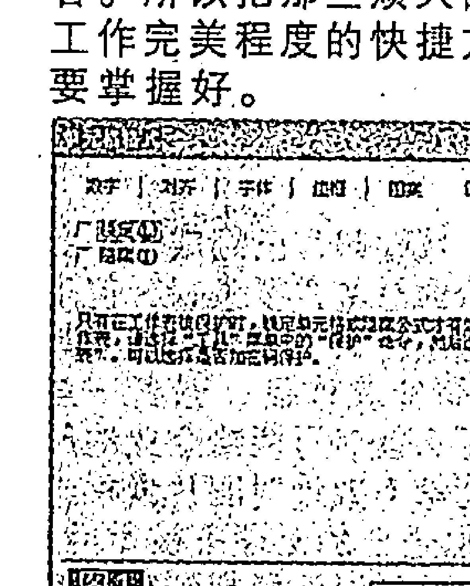

1. 由于Excel单元格的默认属性处于“锁定”状态，因此先要清除整个工作表单元格的“锁定”属性，如图1所示。

2. 利用“定位条件”功能，一次性选中表格中所有的公式单元格，如图2所示。

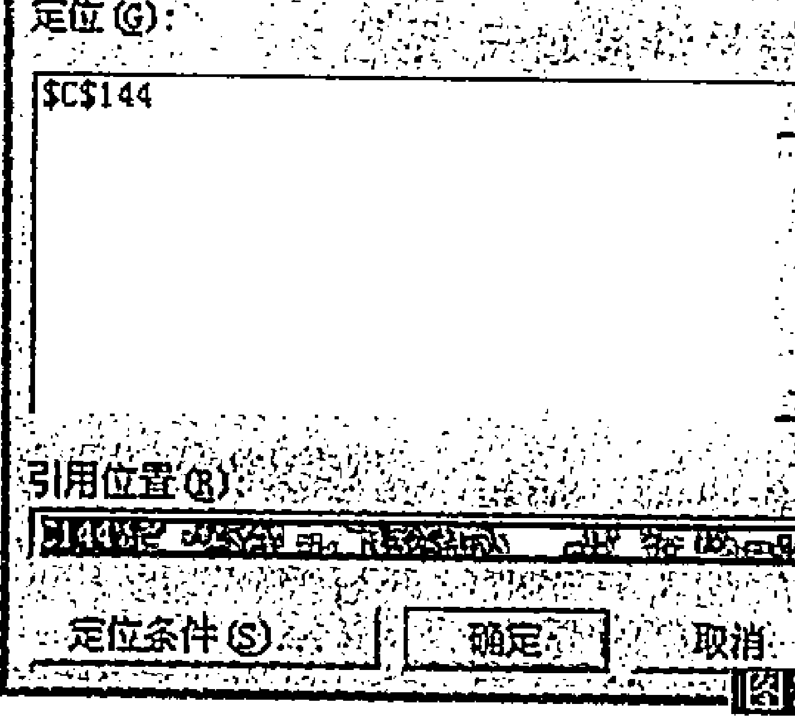

3. 为上述选中的单元格添加上“锁定”和“隐藏”属性。

4. 最后加密保护一下工作表，让“锁定”和“隐藏”属性发挥作用，如图3所示。

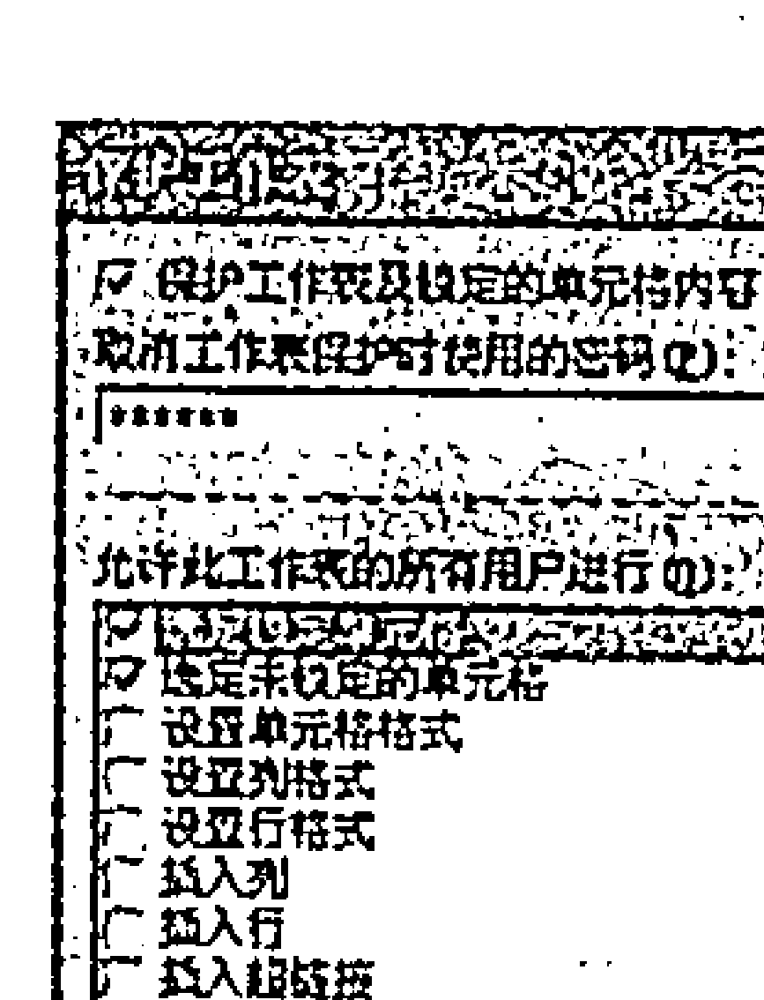

5. 编辑栏中看不见公式了；双击包含公式的单元格，会提示你不能对其进行编辑。

（晓风）

## 卡纸卡不住工作

打印机、复印机、传真机这些都是再常见不过的办公设备，他们在给我们的工作带来便捷的同时，偶尔也会给我们找些小麻烦。比如经常卡纸，同时也卡住了我们工作，这时候肯定很窝火吧！我们应该尽可能学会自己处理这些问题，一来是在工作上能够减少很多不必要的干扰因素，二来还可以展开不错的“卡纸外交”哦！所谓“卡纸外交”，就是当办公设备出现问题时，别的同事搞不定了，我们赶紧上去帮一把，虽是举手之劳，往往能让同事感觉雪中送炭。这一招对于初来乍到的新人来说更是重要，通过帮同事处理一些小故障，迅速增加亲和力，更快融入新团队。

### 切莫超载

无论是打印机的输入纸匣还是输出纸匣，其容量都是有限的，虽然现在商用打印机的纸匣一般是大容量纸匣，但是如果超出其标准容量，就可能导致不进纸或者卡纸。要了解自己的打印机纸匣的容量，一般是通过查看附带的说明书，比如小蔡办公室的这台HP 1125C打印机，上方纸匣最多只可放10张纸，放多了难免出问题。

### 加纸各就各位

打印各种文档的要求不同，使用的纸张规格自然也不同，比如常见的：B5、B4、A4、A3等，在加纸时，要根据纸张的不同类型放置在纸匣的准确位置上，如果位置不正确，就可能出现纸张走偏、卡纸等问题。在纸匣的进纸口，一般都标有相应的标示符号，大家可一定要注意了！另外要使用纸张长宽度调整器，将纸张定位好。

### 厚此薄彼

想打印张名片？可是HP 1125C打印机前面的两个进纸匣都无法正常使用名片纸，因为名片纸太厚，一开始打印就会在纸匣中卡住，怎么办呢？其实很多打印机的后方都还有一个后纸匣，可以用来直接输送较厚的纸张。

### 软硬结合

不仅仅从打印机本身能够找到使用纸匣的妙处，从打印机的“属性”设置同样可以灵活设置使用纸匣，在“控制面板”中的“打印机和传真”窗口中，打开HP DeskJet 1125C的属性设置，就可以设置如何使用纸匣了！

（王洁）

## 提高PPT的含金量

高效地利用时间是信息化时代对我们每一位员工提出的一个基本要求，工作人员对时间进行高效管理主要是掌握节约时间的规律和要求，要想有效地利用好有限的时间，必须做的第一项工作就是要探索时间障碍，并积极地去消除它。就像做一段PPT文件，太过花哨的过渡效果在无形中浪费了参观者的时间。如何能够在同样的时间内展示更多的内容给参观者，这才是PPT设计的难点所在。

1. 把图片插入到幻灯片中，并调整好大小和位置。

2. 用文本框把字符输入到同一张幻灯片中，并调整好位置。

3. 把图片和文本框组合成一个整体。在按住Shift键的同时，分别点击图形和文本框，可以同时选中多个对象，如图1所示。

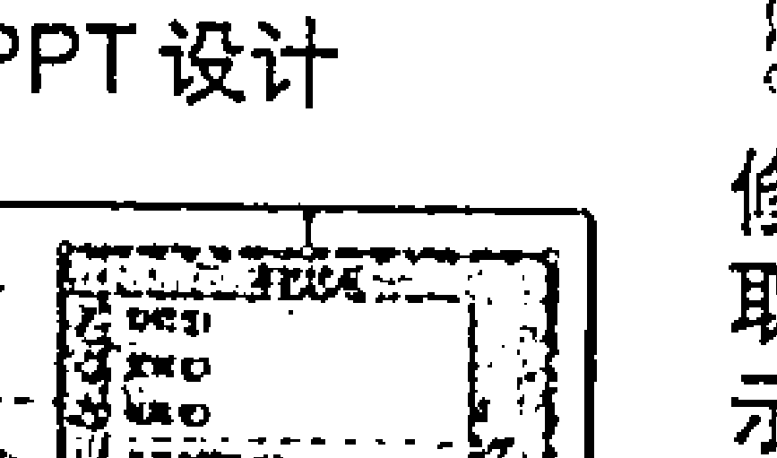

4. 再设置一个动画就可以了。如果此时需要修改介绍的文字，只要点击一下文本框，即可修改，完全不需要取消组合，如图2所示。

选中组合对象，右击鼠标，在随后弹出的快捷菜单中，选择“组合→取消组合”命令，即可将组合的对象重新分开。

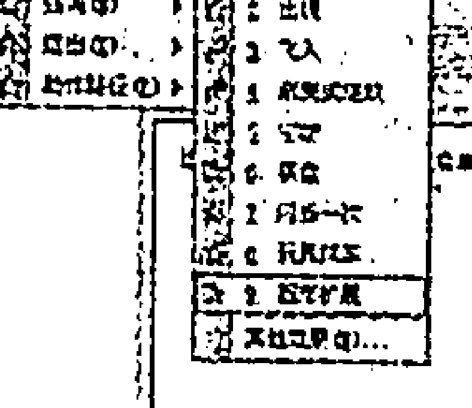

（晓风）

## 好事成双 页码入对

在撰写重要的长文档、尤其是向客户展示产品或服务的策划书、说明等文档时，千万不要只注重篇幅和内容而忽略了文档的编排。如果编排杂乱无章、让客户无从下手，再精彩的文档也不会让对方满意。在编排上替阅读者着想，这既是对客户的重视，也是对自己劳动果实的尊重。

- 1. 将光标定位在附文开头，选择“插入→分隔符”，在弹出的“分隔符”对话框中选择分节符类型为“下一页”，单击“确定”。用同样的方法在附文末尾插入分节符。

TIPS: 由于插入了两个分节符，文档变成了26页，而附文部分也移到了第12页到第18页。

2. 将光标定位在附文前的任意处（黑色字部分）；选择“插入→页码”，单击“格式”按钮、设定起始页码，然后依次点“确定”退出。

3. 在附文第1页（即全文第12页）双击页码，切换为页眉和页脚形式，在弹出的“页眉和页脚”工具栏中取消“链接到前一个”，关闭工具栏。在附文后的第1页（即全文第19页）重复操作。

4. 在附文第1页双击并选中页码，选择“插入→书签”，在弹出的对话框中输入书签名称，比如叫“TOTAL”，单击“添加”按钮关闭对话框。

5. 将光标定位在页脚另一侧，选择“插入→域”，点击“域代码”并在文本框中输入“=TOTAL-11”，点击“确定”。

TIPS: 输入“=TOTAL-11”是因为附文的第1页前共有11页正文。完成后页脚中有两个页码，较大的是全文页码，较小的是附文页码。最后，只需按照要求对页脚的形式稍做修改即可。

（Camper）

爱好者2005合订本附录分册 15 PART1

## 别让领导们红了眼

现在数码相机已经成为很多办公室必备的办公设备了。同事聚会、商务会谈、领导视察，这些都是需要用数码相机来发挥作用的关键时刻。可是有没有遇到过这样的情景，领导来公司视察，赶紧用数码相机拍下照片留念，领导走后导出照片一看，领导们的眼睛红得像兔子，难道把领导们叫回来重新摆Pose再拍一次？显然不行，可是总不能让领导们的照片就这样“红”着吧！其实要有一定的Photoshop功底的话，处理这些问题原本也不是什么难事，可是Photoshop这软件也复杂得够呛，能有更简单的办法就不要在学习Photoshop的使用上浪费时间啦！

- 1. 启动Ulead Photo Express，单击Ulead Photo Express工具栏上的“获取照片”按钮，从DC或者硬盘中，打开需要修改的数码照片。
- 2. 单击工具栏上的“编辑”按钮，从弹出菜单中选择“调整”选项，然后选择“清除红眼效应”命令。
- 3. 在弹出的编辑窗口中，单击工具栏上的放大按钮，将照片尽量放大，然后从右侧的“Brush size”下面选择一种与照片中眼睛“红眼”区域基本同样大小的画笔；
   拖动“Similarity”下面标尺上的滑块，选择一种最初眼睛的颜色，同样道理，拖动“Strength”下面的滑块，选择画笔强度。
- 4. 设置好画笔后，拖动鼠标在照片中的红眼区域单击，需要注意的是，尽量不要点击到皮肤上面，如果修饰后的结果不够满意，可以调整画笔的尺寸重新修改。修改完毕后，单击“Close”按钮，即可重现人物眼睛的风采！

> **TIPS:**大多数的数码相机都有防“红眼”功能，在正式闪光前先预闪一下，让视网膜先适应就可以避免“红眼”。惠普有一款Photosmart r707数码相机更能将已经拍成“红眼”的照片直接在相机上去除红眼。

(王洁)

## 数据准确别出丑

“对不起，这里的数据不是最新的，做PPT文档的时候拿到的数据跟现在的数据有些出入！”
在大会上，因PPT中的数据不准确而出丑并不稀奇。其实有时候一个错误本身不大，也不会带来多么严重的后果，但是出丑却不小。所以采取一些最“保险”的方法更能让“这个同志有点粗枝大叶”的评价离我们远点，不是吗？

- 1. 先在Excel中，利用“图表向导”功能，将图表制作好。
- 2. 选中制作好的图表，执行一下“复制”操作。
- 3. 切换到PPT中，定位到相应的幻灯片，将其“选择性粘贴”到其中，见图1。
- 4. 调整好大小，并定位在幻灯片合适的位置上。
- 5. 这样链接的图表，当我们在Excel中修改了数据源的数据后，再次打开PPT文档，更新一下链接，PPT中的图表即刻被更新，见图2。

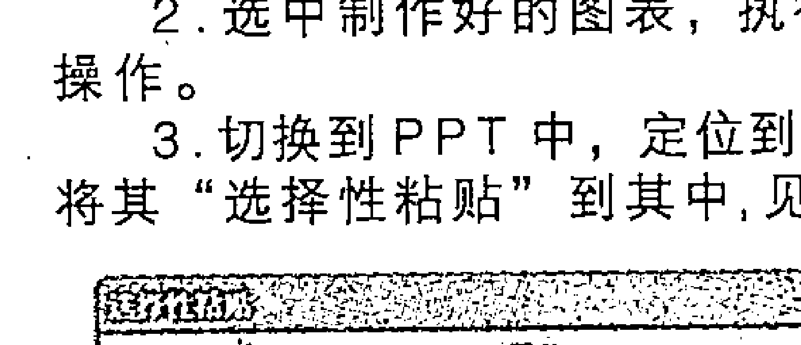

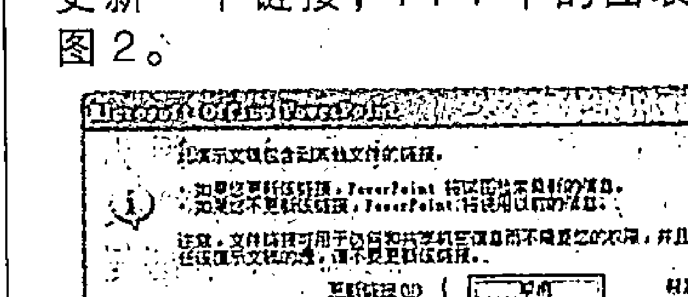

(晓风)

## 文档图文紧随 拒绝错位

上个世纪八十年代中期，我还在上中学的时候，就听说过这样一件事：一家企业在签一份出口合同时，搞错了一个字，结果赔了80万美元！由此可见，合同、投标书等这些重要文档，保证图、文的准确性是多么的重要。其实仔细分析这一类文档，它们的最大特点就是图文结合比较紧密，修改过程中很容易出错，所以给它们作好关联，能大大降低出错的几率。

- 1. 为第1幅图片添加上编号，见图1。
- 2. 为后续图片加上自动编号。
- 3. 将文档中的图片编号与上述添加的图片编号链接起来，见图2。
- 4. 以后当我们添加或者删除图片及说明文字后，先分别选中后续图片的自动编号字符，按下F9功能键；然后再选中全文，按一下F9功能键更新一下，即可自动调整相应的编号了。

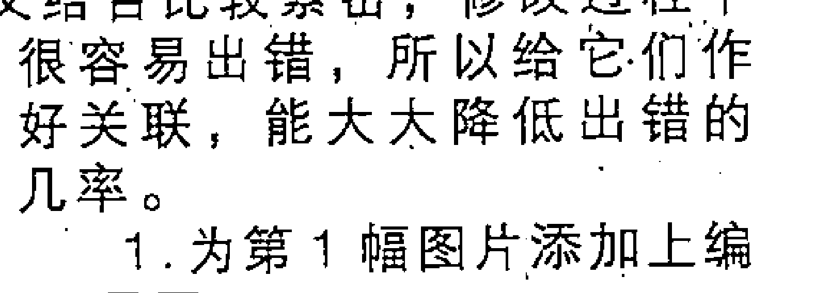

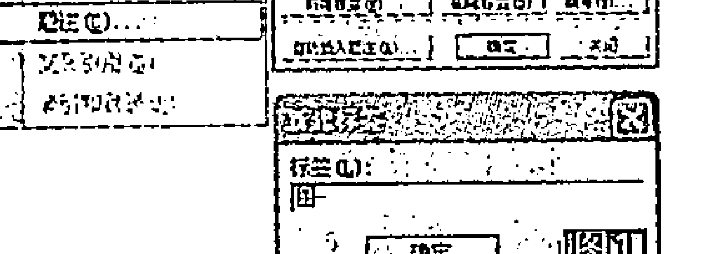

> **TIPS:**此时，如果在按住Ctrl键的同时，点击文档中的图片编号字符，即可直接切换到相应图片下方的说明文字处。

(晓风)

## 数据看花眼 实在很危险

对于在一线工作的人员来说，你所提供相关数据的准确与否，可能会直接影响到整个公司的决策。因此，提供准确、真实的相关数据，是每一位员工的责任，这一点对新员工来说，尤其重要。那么如何在这方面做得更为出色？首先肯定是要有认真负责的态度，以及细致的耐心，还有就是一套行之有效的操作方法。

- 1. 让工作表的偶数行填充上“天蓝”的底色，而奇数行保持原有底色。
- 2. 让工作表的奇数列填充上“天蓝”的底色，而偶数列填充上“桔黄”的底色。

> **TIPS:**图1中的公式为：=MOD(ROW(),2)=0。图2中的公式分别为：=MOD(COLUMN(),2)=0、=MOD(COLUMN(),2)=1。

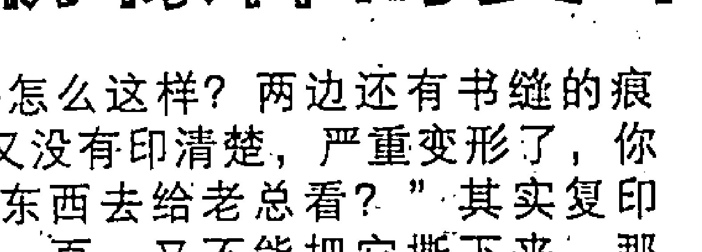


(晓风)

## 一份像样的复印件

“这复印件怎么这样？两边还有书缝的痕迹，中间部分又没有印清楚，严重变形了，你让我拿这样的东西去给老总看？”其实复印一本书中的某一页，又不能把它撕下来，那么复印的效果必然会大打折扣，但是连复印一份资料都不能像模像样，老板怎么会有信心？在很多细节上，如果大家都在犯一些错误，那可不代表我们同样可以犯。

- 1. 肯定还是得把要复印的那一页尽量摊开，让内容都展示出来。
- 2. 找几张白纸放到复印机的透光板上，用来遮盖不必要复印的内容。
- 3. 把要复印的内容压倒白纸上，然后把白纸往书的边缘挪动，遮盖住书中间的折缝和边缘的痕迹。
- 4. 不要再用复印机盖板来压住书，用手按住；开始复印。

> **TIPS:**由于复印机工作时透光板下面的光线会很强，所以在不盖盖板的情况下复印文件一定要注意安全，最好暂时闭上眼睛，或者扭头不看，也要提醒一下周围的人以及注意过往的同事。

## 给照片盖个章

伴随着DC的普及，数码照片已经成为企业公关以及宣传活动中不可或缺的重要素材，但是往往将照片放在公司的网站上时，很有可能被他人挪用；甚至修改后冒充其作品，遇到一些喜欢搞恶作剧的家伙，那么就有可能给企业的形象带来负面影响。如果能够有效地对图片素材进行保护，那么不光是我们企业的资源不被滥用，权益不被侵害，在不少时候甚至还能起到宣传的作用，所以我们务必要给照片盖个章！

- 1. 启动Photowatermark，打开需要添加水印的图片，需要将某幅图片作为水印时，比如公司Logo，单击工作区上方的“图片”按钮。
- 2. 在弹出的对话框中选择作为水印的图片。
- 3. 这时候，就会自动将刚才选择的图片作为水印，添加到图片中，然后适当地调整位置、大小即可。
- 4. Photowatermark还提供了许多种现成的水印特效供选择。

> **TIPS:**这次我们所谈到的是给图片添加明确的水印标记，如果说有人想把我们放置在网上的照片用于印刷或者出版的话，显然不再容易，可以防君子。其实还有一些情况可以在不明示的情况下偷偷加上一些版权标示，用来防小人，如果大家有兴趣，可别错过了下一期的“搞定数码”哟！

(王洁)

## 纵横页面轻松设置

作为新员工，更需要具备一副灵活机智的头脑，随时提出机动的解决方案，让你能够使用灵活的工作流程，在尽可能降低工作成本的前提下，高效地完成自己所承担的各项工作任务。

### 方法一——分节符法
- 1. 将光标定在表格上一页尾部，插入一个分节符。
- 2. 再将光标定在表格下一页首部，再插入一个分节符。

TIPS: 此时，通常情况下，插入的分节符是看不见的。如果点击一下工具栏上的“显示/隐藏编辑标记”按钮，分节符就出现了。

- 3. 将表格节的页面设置为横向，再打印就行了，见图。
- 4. 将光标定在表格页首部，将页面设置为横向。
- 5. 再将光标定在表格下一页首部，将页面设回为纵向。

### 方法二——两次设置法。

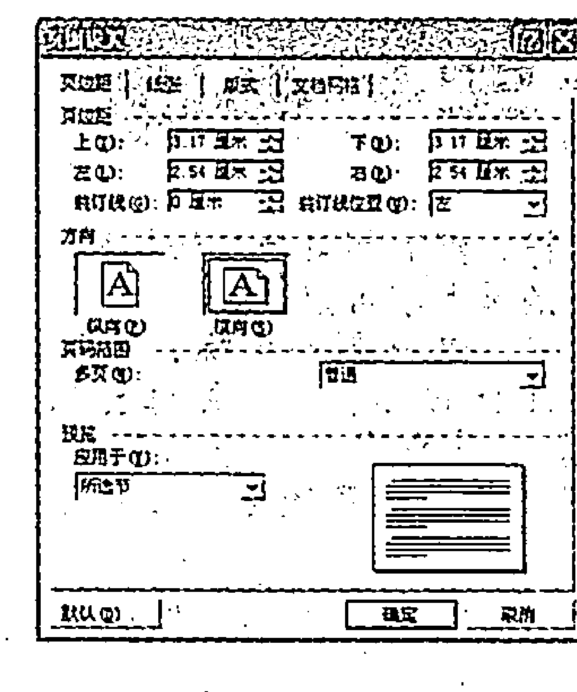

## “监视”海量数据

如果要做好自己的工作，就必须对自己工作所涉及到的所有环节，进行全方位的了解，亲身实践，掌握第一手资料，做到心中有数。然而所谓第一手资料往往意味着海量的数据，怎么在这些数据中顺利地进行比较呢？

- 1. 切换到相应的工作表窗口中，把不同工作表中需要随时查看的单元格一一添加到“监视窗口”中，见图1。
- 2. 需要查看时，调出“监视窗口”，所要查看的数据就一目了然了，见图2。
- 3. 只要把相应的工作簿文档打开，这个监视功能支持跨工作簿查看。

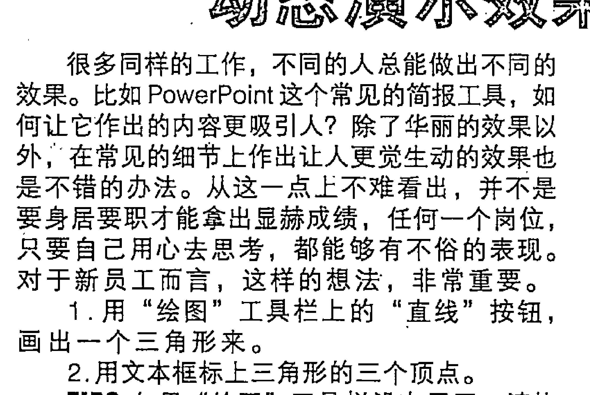

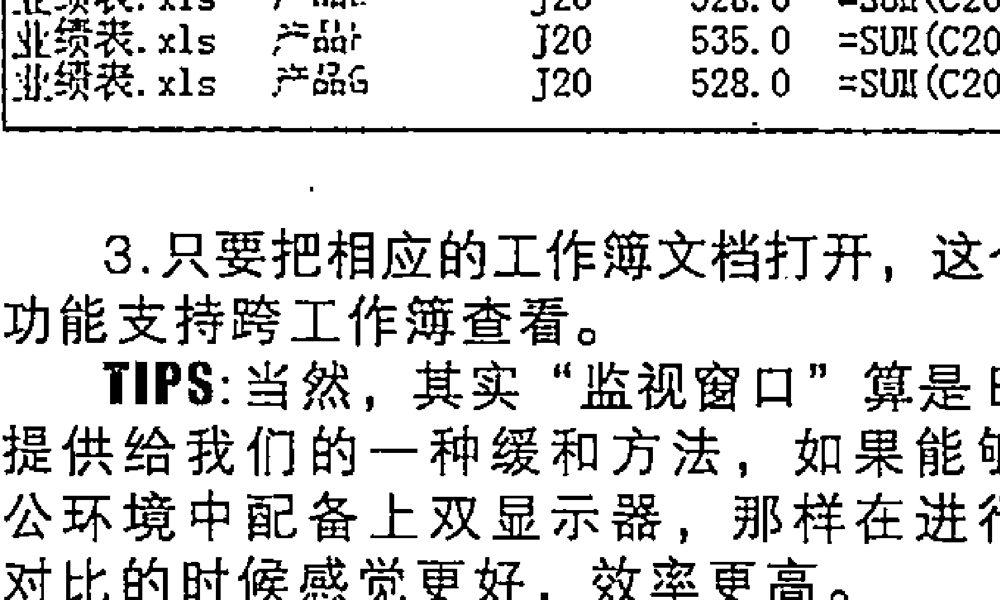

| 工作簿 | 工作表 | 名称 | 单元格 | 值 | 公式 |
|---|---|---|---|---|---|
| 业绩表.xls | 产品A | J20 | 478.0 | =SUM(C20:I20) |
| 业绩表.xls | 产品B | J20 | 507.0 | =SUM(C20:I20) |
| 业绩表.xls | 产品C | J20 | 489.0 | =SUM(C20:I20) |
| 业绩表.xls | 产品D | J20 | 560.0 | =SUM(C20:I20) |
| 业绩表.xls | 产品E | J20 | 528.0 | =SUM(C20:I20) |
| 业绩表.xls | 产品F | J20 | 535.0 | =SUM(C20:I20) |
| 业绩表.xls | 产品G | J20 | 528.0 | =SUM(C20:I20) |

> TIPS: 当然，其实“监视窗口”算是Excel提供给我们的一种缓和方法，如果能够在办公环境中配备上双显示器，那样在进行数据对比的时候感觉更好，效率更高。

## 动态演示效果增色PPT

很多同样的工作，不同的人总能做出不同的效果。比如PowerPoint这个常见的简报工具，如何让它作出的内容更吸引人？除了华丽的效果以外，在常见的细节上作出让人更觉生动的效果也是不错的办法。从这一点上不难看出，并不是要身居要职才能拿出显赫成绩，任何一个岗位，只要自己用心去思考，都能够有不俗的表现。对于新员工而言，这样的想法，非常重要。

- 1. 用“绘图”工具栏上的“直线”按钮，画出一个三角形来。
- 2. 用文本框标上三角形的三个顶点。

TIPS: 如果“绘图”工具栏没有展开，请执行“视图→工具栏→绘图”命令，将其展开。

- 3. 给直线设置上“擦除”效果的动画，并设置好擦除方向，用来替代动态描绘效果，见图1。


> TIPS: 如果“擦除”效果不在下拉列表项中，请在“自定义动画”任务窗格中执行“添加动画→进入→其他效果”命令，来进行设置。

- 4. 给顶点文本框设置“出现”动画，并设置在直线动画之后播放，达到连续出现的效果，见图2。


## 预热预不热的打印机

“小余，你是怎么搞的？打印一份会议资料需要用半个小时吗？”
“对不起啊，主管，这打印机有些问题，老是停留在预热状态，没法正常打印。”
“那你的意思是要我把这台打印机开除了，是吗？”
事实证明，如果由你和一台打印机来共同完成一项工作的时候，不管是你出错还是打印机出错，被炒鱿鱼的都只会是你。所以别让这些机器的问题影响到我们的工作是最重要的。

- 1. 关闭打印机，取出纸盒和硒鼓，重新安装，确定安装正确。开机后发现还是不能正常预热。
- 2. 由于在打印机搬到阳台之前一直是比较正常工作的，所以将打印机再搬回办公室内测试，发现在一段时间过后可以预热，但是不稳定，在Ready状态和预热状态间反复切换。
- 3. 将打印机再次关闭，取出硒鼓，用皮老虎仔细对打印机内部除尘。没有专用设备的话，可以用家里的电吹风代替，但是一定要注意使用低温档，并且千万不能靠太近持续吹，否则可能会因为温度过高而烫坏打印机内部的部分塑料器件。
- 4. 经过除尘，问题解决，打印机可以正常预热。
- 5. 总结问题，可能是打印机摆放到阳台上过后，由于冬季温度偏低，加上灰尘较多，影响了打印预热的一些部件，一直达不到稳定的预热要求所致。

> TIPS: 这样的问题大多是因为打印机中的定影器组件灰尘过多导致的，对于了解打印机的人来说可以取出定影器组件，去掉两侧的塑料盖，打开前面的挡板，直接清理热敏电容和电阻上的灰尘与纸屑即可。而不了解激光打印机的人应该请厂家或者专业的维修人员来处理。

## 工作成绩 姓甚名谁?

伴随着DC的普及，数码照片已经成为企业公关以及宣传活动中不可或缺的重要素材，而自己拍摄的一些重要照片被别人挪作他用也是再常见不过的。可是如果有些照片特别有价值甚至在某些程度上代表着自己的工作业绩，那么这样的照片我们在保存时应该多加小心。简单地在上面打上文字标识只能算是防君子防不了小人，偷偷为它加上一些特殊的标签更能起到“防盗”效果。

- 1. 在Photoshop中打开需要添加Digimarc数字水印的图片，执行“滤镜→Digimarc→嵌入水印”命令。
- 2. 在弹出的对话框中输入图像信息、图像属性、目标输出以及水印耐久性等，其中的水印耐久性为1～4，数值越大则水印越容易检测到，从而难以清除。如果需要申请ID以及PIN，可以直接单击其中的“个人注册”按钮。
- 3. 设置完毕后，选中“确认”复选框，然后单击“好”按钮，即可为照片添加Digimarc数字水印了。需要读取Digimarc数字水印时，通过“滤镜→Digimarc→读取水印”命令即可。

## Word 轻松制作大字号条幅

虚心请教，随时拜同事为师；乐于助人，时刻帮同事解难；勤奋实干，苦活累活抢在前……对于这样的新员工，领导喜欢，同事称赞。

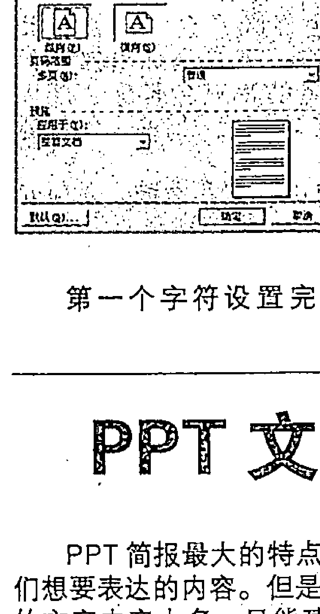

- 1. 根据会标纸张的大小，在页面设置中设置好纸张大小和页边距，见图。
2. 输入会标第一个字符，并设置好字体（如“黑体”）、字号（如“800”）、字符缩放比例（如“80%”）和字符颜色（如“红色”）等。第一个字符设置完成后，再输入会标的其他字符，然后用彩色打印机打印出来，再固定到红条幅上就可以了。
    TIPS：由于“字号”选择列表中最大为“72”号，需要设置的字号超过此字号时，请在字号框中直接输入相应的数值，然后回车确认就可以了（Word 支持的最大字号为 1638 磅）。
3. 选中所有会标字符，通过“字体”对话框，将其设置为“空心”。然后打印，用白色不干胶贴纸剪出来，再粘贴固定到红条幅上就可以了。
    TIPS：粘贴固定好了后，将剪字时留下的连接点断开，使会标更美观规范。

（晓风）

## 天下无毒

病毒其实并不可怕。可怕的是你选错杀毒软件和杀毒方法。及时将杀毒软件更新到最新的病毒库；下载、安装系统漏洞补丁，让你的电脑更安全一些。
小蔡发现同事的电脑里面已经安装了杀毒软件，但是还是感染了病毒，启动杀毒软件才发现，原来问题不少。

## 很重要 绝对不能不知道

其实使用杀毒软件有三个很重要的小常识，小蔡的朋友正是忽略了这些小常识才让电脑中了病毒。第一个常识是一台电脑上不要安装两种杀毒软件，由于杀毒软件为了和病毒对抗，它们在系统中的权利都是比较“霸道”的，所以一个系统中如果装了两个或者更多的杀毒软件，它们肯定会产生冲突，打起来。第二个常识是一定要及时升级杀毒软件的病毒库，杀毒软件不是一朝装好，终生享福。每天都会有新病毒出现，只有及时升级杀毒软件，才能保证能够对付最新的病毒。第三个常识就是，国外的大牌杀毒软件在处理一些国内的新病毒、木马程序的时候，不一定比国内的杀毒软件好，所以一味迷信“洋和尚”可不一定能杀好病毒。

## 升级是个麻烦事

经过小蔡的一番折腾，帮同事把原来的杀毒软件都卸载了，装上了最新的光华反病毒软件，并且升级好病毒库，开始在系统中查杀病毒。同事疑惑地问小蔡为什么要安装这个杀毒软件？因为这个软件与其他的杀毒软件有些不同，在更新病毒库的时候可以实现自动更新，当检测到网络通畅，就开始自动下载，所以像公司这样 24 小时都联网的电脑，随时都可以保证杀毒软件能够清除最新的病毒。当然，如果发现软件没能自动更新病毒库，我们也还是可以像其他的杀毒软件那样手动更新的。

## 网上的危险谁知道？

为了让同事的电脑更安全，使用起来更顺手，小蔡还通过光华杀毒软件对系统作了一定程度的保护设定，主要是针对网上常见的种种“麻烦”。比如前段时间很疯狂的“性感烤鸡”病毒，就是通过 MSN 即时通讯软件来传播的，所以要对这种聊天类别的工具做好保护，在光华杀毒软件的“扫描→设置”对话框中可以找到设置。除此之外，上网还经常遇到各种网站和网络软件设置的一些插件，这些东西往往会很烦人。借助杀毒软件“工具→插件”菜单中的选项，可以帮助建立一个更清洁的上网环境。比如其中的“绿色上网”选项，搜集了数百种常见的网站或软件插件，供我们自行调配。
总的说来，保护电脑数据安全，既要有好的软件也还是要有好的方法，缺一不可，所以请大家每一期都要关注我们这一个小小的“安全地带”板块。

NinJai

## PPT 文字去繁就简

PPT 简报最大的特点是用直观的方式表达我们想要表达的内容。但是很多时候会因为要展示的文字内容太多，只能建立很多页面逐一展示，让简报文件变得罗嗦拖沓，自然也就让简报效果大打折扣。拖沓的简报难免让我们给老板留下个拖沓的印象。

- 1. 先执行“视图”工具栏“控件工具箱”命令，展开“控件工具箱”工具栏，并利用其中的“文本”按钮在幻灯片上拖拉出一个大小合适的文本框。
2. 选中文本框，单击工具栏上的“属性”按钮，打开“文本框”属性对话框，设置相应的属性：
    Scrollbars — 1-fmScrollbarsHorizontal — 添加水平滚动条；
    EnterKeyBehavior — True — 允许在编辑文本框时使用“Enter”键；
    MultiLine — True — 字符在文本框中自动换行；
    Font — 按右侧的展开按钮 — 设置字符格式。
3. 右击文本框，在随后弹出的快捷菜单中，选择“文字框对象→编辑”命令，进入文本框编辑状态，把文本字符输入或粘贴到文本框中。
4. 在播放的时候，拉动滚动条可以轻松浏览介绍内容。
    TIPS：一般情况下，一个PPT演示页面上的文字量多少合适呢？主要是根据会场的大小来判断，如果是小规模的会议室简报可以采用20号甚至再小一点的的字号。但是在较大的会场上，为了保证后方的观众也能看清楚，最少也要用30号以上的字号，并且要排列清晰，行距适中才能达到较好的效果。

（晓风）

## 照片加工 “秘书” 代劳

在使用 DC 过程中，由于各方面的原因，所拍摄出来的数码照片，并不能够很好地满足使用要求，比如图片大小、色调、位置不合适等，特别是如果在同一次活动中拍摄了大量犯了类似毛病的照片，可就需要逐一修改了。但显然，把时间和精力都投入到一些重复劳动中是新员工最容易陷入的误区，一天的忙活往往没有任何实质的工作成绩出来，所以最好能找个可以代劳的“秘书”。对于大量采用相似方法处理的图片，通过 Photoshop 的动作以及批处理工具就可以轻松完成。

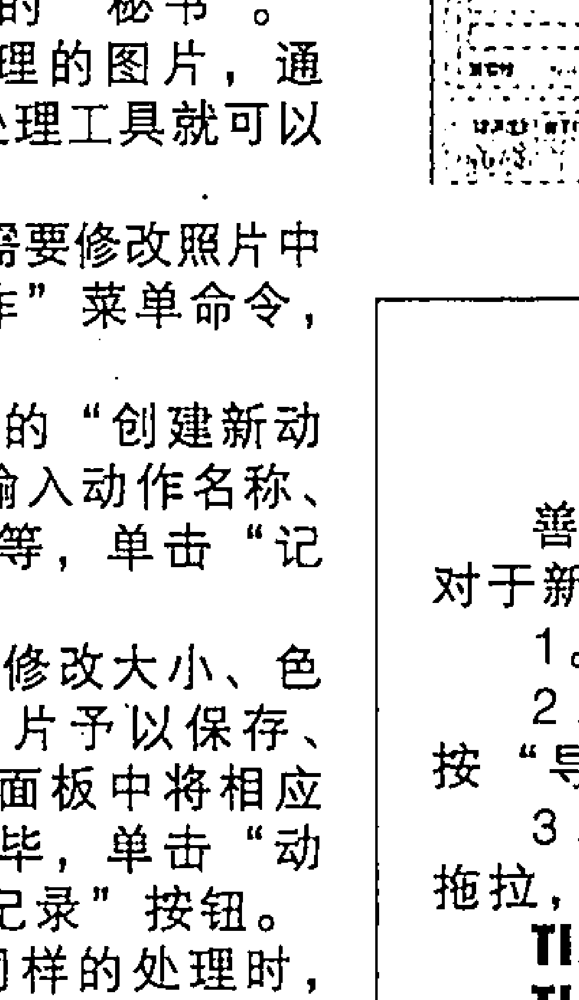

- 1. 启动 Photoshop，打开需要修改照片中的某张照片，执行“窗口→动作”菜单命令，打开“动作”面板。
2. 单击“动作”面板底部的“创建新动作”按钮，在弹出的对话框中输入动作名称、快捷功能键以及动作标示颜色等，单击“记录”按钮。
3. 对已经打开的照片进行修改大小、色调等操作，然后将修改后的照片予以保存、关闭，这时会自动在“动作”面板中将相应的操作逐一记录下来，修改完毕，单击“动作”面板底部的“停止播放/记录”按钮。
4. 需要对其他照片进行同样的处理时，执行“文件→自动→批处理”菜单命令，在弹出的“批处理”窗口中，从“动作”列表框中选择刚才创建的新动作；“源”选择“文件夹”；单击“选取”按钮选择存储待处理照片的文件夹；选中“覆盖动作打开命令”复选框；从“目的”列表框中选择“文件夹”选项，最后单击“好”按钮。
当你再打开那些照片时，就会发现它们就会按照自己的要求变得一模一样了！见图。

（王富兰）

## 姓名录入 一笔搞定

善于对现行工作程序进行分析、研究，改进工作流程或工作方法，是减少多余劳动的好办法。对于新员工而言，制定合理的工序结构，确定标准的工作方法，绝对能够有效提高工作效率。

- 1. 先将公司员工的姓名输入到工作表某列或某行的连续单元格区域中。
2. 选中输入了员工姓名的区域，执行“工具→选项”命令，在“自定义序列”标签下，按“导入”按钮将其导入为内部序列。
3. 在某个单元格中，输入员工姓名序列中某个姓名，然后选中该单元格，用“填充柄”拖拉，即可快速输入后续员工姓名。
    TIPS：输入的起始员工姓名可以是员工姓名序列中的任意一个姓名。
    TIPS：当有员工离职，或者新员工加入的时候，只需要删除老的名字或者添加新的名字，然后重新执行“工具→选项”命令，在“自定义序列”标签下进行“导入”即可。

（晓风）

### 符号特殊录入不特殊

别看数据录入这一简单的活，由于在现代企业中，人员流动非常频繁，新岗位必然会遇到许多特殊的录入任务和要求，如何让自己在最短的时间内迅速进入状态，是对每一位新员工的一种考验。

- 1. 对于钢筋符号—Φ、角度符号—α等字符型符号，可以采取“插入符号”的方法直接输入：将光标定在需要输入符号处，执行“插入→符号”命令，打开“符号”对话框，将“字体”设置为“普通文本”或“拉丁文本”，然后将“子集”设置为“基本希腊字母”，在下面选中相应的特殊符号，点击“插入”、“取消”按钮即可。

TIPS:打开任意一款中文输入法，右击状态栏右侧的键盘按钮，在随后弹出的快捷菜单中，选择“希腊字母”选项，展开“希腊字母”软键盘，点击相应的字母，即可快速输入上述特殊符号，见图。

- 2. 有时，小余需要输入的一些特殊符号，在系统中找不到，只能通过“绘图”工具栏自己绘制出来，对于这样的特殊符号，小余通常将绘制好的图形添加到“自动图文集”中：选中绘制好的图形，执行“插入→自动图文集→新建”命令，打开“创建‘自动图文集’”对话框，输入一个名称（如“小马凳”），确定返回。

- 3. 以后需要输入这个特殊符号时，只要执行一下“插入→自动图文集→正文→小马凳”命令就可以了。

> (陈秀峰)


### 照片资料不乱套

不管是纸质的文稿还是电脑中的文档资料，都需要有好的方法合理管理。在数码相机普及的今天，数码照片的价值更大，它记录的往往是一些不可能再重复的场面，一旦管理不好，往往会造成巨大损失。

- 1. 首先在本地硬盘中建立一个保存照片的文件夹，比如文件夹名称为“photo”，然后进入系统的“控制面板”打开“扫描仪和照相机”组件；

- 2. 在出现的对话框中选中自己的相机设备，单击右键，选择右键菜单上的“属性”选项；

- 3. 在弹出的对话框中单击“事件”选项卡，在页面中的“选择一个事件”选项中选择“已连接照相机”；在“操作”区域中点选“将所有照片存入这个文件夹中”，将文件夹路径指向“photo”；勾选“用今天的日期创建子文件夹”选项，最后单击“确定”按钮结束设定。

- 4. 以后当拍摄好图片后，只要数码相机连接到电脑，就会自动将相机中的产品相片复制到本地硬盘中。

- 5. 并能在“photo”中自动创建一个以当天日期为名的文件夹，最后将产品照片自动保存到该文件夹中。

> (王富兰)

### 重要资料信手拈来

数据的处理与分析通常涉及到描述和推断，作为一名新员工，当你面对一大堆散乱的原始数据时，需要做什么？肯定是要先把数据资料分类、概括，灵活地根据需要，在一大堆数据中组织出有用的内容。特别是在老板需要什么东西的时候，千万别把一大堆表格直接交给他，他可没有足够的耐心在一大堆表格中找到想要的。

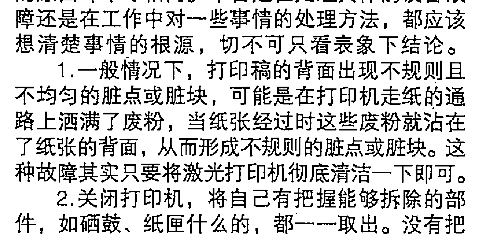

- 1. 将“客户名称”和“联系电话”这两列数据复制到Sheet2工作表中，见图。

- 2. 在Sheet2工作表中，选中数据区域任意一个单元格，执行“数据→筛选→高级筛选”命令，打开“高级筛选”对话框，设置好相关的数据区域，并选中“选择不重复的记录”（这是关键一点），按下“确定”按钮即可。

- 3. 对数据进行必要的整理、排版等，一份规范的客户资料就呈现在我们面前了。

> (晓风)

### 打印文稿“祛斑”

有些问题的表象看上去相似，但实际上导致的原因却不尽相同。不管是在处理具体的设备故障还是在工作中对一些事情的处理方法，都应该想清楚事情的根源，切不可只看表象下结论。

- 1. 一般情况下，打印稿的背面出现不规则且不均匀的脏点或脏块，可能是在打印机走纸的通道上洒满了废粉，当纸张经过时这些废粉就沾在了纸张的背面，从而形成不规则的脏点或脏块。这种故障其实只要将激光打印机彻底清洁一下即可。

- 2. 关闭打印机，将自己有把握能够拆除的部件，如硒鼓、纸匣什么的，都一一取出。没有把握的就不要去拆卸了，免得造成更大的故障。用棉花沾些酒精将各转辊、通道擦拭干净。注意，不要去擦拭打印机硒鼓。稍等片刻，晾干后把硒鼓等部件装回打印机进行测试，这一部分的问题解决了。

- 3. 纸张正面出现的脏点或脏块，这种故障大多属于“漏粉”的现象，粉盒的废粉收集仓中的某些栅格里废粉已收集满了，再收集的废粉无法进入废粉收集仓，因此泄漏，形成了脏点。首先将粉盒取出，小心拔出金属结合销（有些粉盒是塑料插销）。

- 4. 用螺丝刀卸下感光鼓，而后将废粉仓中的碳粉倒出（也可以卸下清洁刮板后再倒出废粉），再小心地重新安装上去，进行测试，问题顺利解决。

TIPS:打印机的故障向来不少，有时候一些小问题可以自己动手解决。但是如果涉及到稍稍复杂的问题，建议还是在专家的指导下进行处理，特别是不要进行强行拆卸，以免引起更复杂的故障。

> (Dualface)

### 让来访者找得着北

工作中，一些细节往往影响着工作的效果。一个传统的纯文字指示牌，其效果无论如何都算不上生动，让它们生动起来其实并不难，意义却不简单。通过对日常工作的细致思考，做出好的成绩，这是新员工体现自己头脑的绝佳方法。

- 1. 启动Word 2003，设置好页面，然后在文档输入区输入“编辑部由此向前”、“邮购部前方左拐”、“总编室在此”等指示字符，并设置好字体、字号、字符颜色等。

TIPS:此处设置的参数仅供参考，在应用中请根据实际情况自行选择设置。

- 2. 执行“插入→符号”命令，打开“符号”对话框，将字体分别设置为“Wingdings、Wingdings2、Wingdings3”等，找到相应的符号，点击“插入”按钮，将其插入到需要的位置，设置好字体、字号、颜色等。

TIPS:在文档中输入英文字母，然后将字体分别设置为“Webdings、Wingdings”等，也可以得到一些特殊符号效果。

- 3. 调整好指示牌的间距，打开打印机（当然要彩色的哟_），装上自贴纸，执行“打印”操作，裁剪、张贴，OK！

TIPS:“Wingdings”系列是系统提供的一些符号字体，如果经常用到，可以把它们挨个输入，然后打印出对应的列表来，以后使用时便于查找。

> (晓风)

### 尊重客户重视意见

任何方案都不可能绝对完美，当方案演示时有人提出意见建议，不光要听，还要记录。“好记性不如烂笔头”，在如今的信息时代更加有用。不光如此，对于意见和建议的认真记录，也会给提意见人留下一个很受重视的感觉，作为新员工的我们，应该把握这样的细节。

- 1. 在播放过程中，右击鼠标，在随后弹出的快捷菜单中，选择“屏幕→演讲者备注”选项。

- 2. 打开“演讲者备注”对话框，将客户意见输入其中，关闭对话框，继续播放。

- 3. 播放结束后，执行“文件→打印”命令，打开“打印”对话框。

- 4. 选中“打印范围”下面的“幻灯片”，然后在其后面的方框中输入保存有客户意见的幻灯片编号（此处假定为第2、6、9、16、21张），再设置“打印内容”为“备注页”，按下“确定”按钮，将其打印出来。

TIPS:如果在“打印”对话框，将最下端的“颜色”选项设置为“灰度”后再打印，可以节省彩色墨粉。

> (晓风)

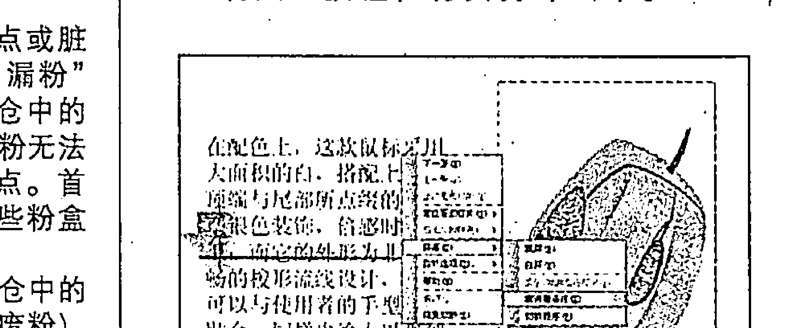

## 不让陌生人打印

办公费用居高不下几乎是所有主管们都头痛的问题，不起眼的琐碎消耗到最后汇成一张让老板头痛的账单，作为新员工，也许还不能帮老板开源，但是争取节流却不是难事。

- 1. 打开“控制面板”中的“打印机和传真”组件，在开启的对话框中，用鼠标右键单击其中的共享打印机图标，选择右键快捷菜单中的“属性”选项。
2. 在打开的共享打印机“属性”对话框中，单击“安全”选项卡，在其选项设置页面中，选择“组或用户名称”区域里的“everyone”账号，单击“删除”按钮将其删除。
3. 也可不删除“everyone”账号。只要选中“everyone”账号后，将“everyone的权限”区域中的“打印”选项选择为“拒绝”即可，这样非授权用户便无法使用共享打印机。
4. 单击“添加”按钮，在打开的“选择用户或组”对话框中，单击“高级”按钮。在展开的窗口中点击“立即查找”按钮，便可出现所有存在的用户或用户组。
5. 从中选择可以使用共享打印机的合法账号，连续单击两次“确定”按钮，将其导入到共享打印机的“安全”设置页面中。在“组或用户名称”区域里选中导入的用户账号，将对应的打印权限选择为“允许”即可，最后再单击“确定”按钮结束。

(Dualface)

## 报表有分工 协作不乱套

时下，比较流行“拓展训练”，其中有一项重要训练项目—团队建设。通过特定的项目，锻炼员工在困难和压力下解决问题的能力。其实“拓展训练”最核心的任务就是培养队员们的分工协作意识与能力。在工作中也是一样，就连简单的Excel表格处理，也可以充分利用团队效率，只有团队合理分工、协调一致，工作才能更高效。

- 1. 打开相应的工作簿文档，执行“工具→保护→允许用户编辑区域”命令，打开“允许用户编辑区域”对话框，点击其中的“新建”按钮，打开“新区域”对话框，输入标题（如“营销部”等）、引用单元格（如“=A:D”和区域密码，然后按下“确定”按钮，再确认输入一次密码，确定返回“允许用户编辑区域”对话框。
2. 全部设置完成后，单击其中的“保护工作表”按钮，打开“保护工作表”对话框，设置好密码，按下“确定”按钮，确认输入一次密码，确定退出。
3. 执行“工具→共享工作簿”命令，打开“共享工作簿”对话框，选中“允许多用户……”选项，确定返回。然后将上述工作簿文档保存在公司局域网某个共享文件夹中，供各部门随时调用填写。
4. 以后，当某个部门需要输入数据时，必须提供正确的密码才可以填充，否则，就无法进入填充状态。

(陈秀峰)

## PPT插图 别出新‘裁’

一个优秀的新型员工要求具有变革和创新、可塑性强、兴趣广、学习能力强等特质，尤其是“变革和创新”特质，对企业的发展尤为重要。做演示文稿也一样，没有变革和创新能力的人，只会照本宣科，因循守旧。敢于创新和变革的人会从细节上下功夫。

- 1. 点击“绘图”工具栏上的“自选图形”按钮，在随后弹出的快捷菜单中，依次选择“线条→任意多边形”选项，然后根据界面的需要在幻灯片中画出一个封闭的图形来。
TIPS: 直接选择系统内置的“自选图形”，然后进行后续操作，也可以将图片裁剪成不同形状。
2. 选中上述图形，执行“格式→自选图形”命令，打开“设置自选图形格式”对话框，在“填充→颜色”右侧的下拉列表中，选择“填充效果”选项，打开“填充效果”对话框，切换到“图片”标签下，点击“选择图片”按钮，选中需要裁剪的图片，确定返回到“设置自选图形格式”对话框，再确定退出即可。
TIPS: 如果对绘制的图形形状不满意，可以右击图形，在随后弹出的快捷菜单中，选择“编辑顶点”选项，对图形进行编辑。

(陈秀峰)

## 用好MP3 记录无遗憾

古人云：“工欲善其事，必先利其器。”看起来很简单的事，如果没有做好充分的准备，后悔可就也不及了。

- 1. 屏蔽杂音 提高录音质量
由于现场背景声音比较嘈杂，为了清晰地记录演讲者的声音，可以随手找一本杂志，做成屏蔽收集状，将录音笔放在其中，同时将麦克风对准演讲者，见图。
2. “增大” 存储容量
如果是到外地学习往往需要精打细算，合理地使用存储空间。这样，才能保证整个学习过程都能有完整的录音。通常，MP3有多种不同的录音模式及声音压缩模式，在报告等现场比较安静的环境里，选用“标准模式”（SP）既保证了录音效果，又能节约存储空间；相反，在嘈杂的环境中，应该选择“超优质模式”（SHQ）。
3. 循环播放重点收听
为了便于后期内容的整理，根据演讲的内容来进行分段录音，避免长时间录音是基础。如果忘记了分段录音，可使用分段重复收听的功能。还可以用调整播放速度的办法来快速跳过无用信息去收听后续内容。


4. 不同的MP3录音功能有很大的区别，新员工在使用前切勿掉以轻心，细细阅读使用说明，多向老员工讨教是致胜的法宝。

(王小斌)

## 按需索要数据统计

很多公司，在新员工加入时，通常安排公司中某些领域的专家或者熟练员工来教育和引导这些新员工，让他们尽快适应新的工作环境、工作方法和工作要求，快速进入角色。新员工除了虚心请教外，也要积极学习发挥没有定势思维的优势，寻找解决问题的新途径。

| 姓名 | 性别 | 民族 | 籍贯 | 出生时间 | 学历 | 职称 |
|------|------|------|------|----------|------|------|
| T1 | 男 | 汉 | 河南永城 | 1953年5月6日 | 大学 | 高工 |
| T2 | 男 | 汉 | 安徽当涂 | 1946年3月4日 | 大专 | 工程师 |
| T3 | 女 | 汉 | 安徽和县 | 1954年5月8日 | 大学 | 高工 |
| T4 | 女 | 汉 | 安徽当涂 | 1963年12月2日 | 大专 | 工程师 |
| T5 | 男 | 汉 | 皖安庆 | 1963年11月1日 | 大专 | 工程师 |
| T6 | 女 | 汉 | 安徽铜陵 | 1965年4月5日 | 大学 | 工程师 |
| T7 | 女 | 汉 | 安徽和县 | 1956年10月12日 | 大专 | 助工 |
| T8 | 女 | 汉 | 浙江建德 | 1958年4月5日 | 大专 | 工程师 |
| T9 | 男 | 汉 | 安徽蚌埠 | 1965年12月1日 | 大专 | 工程师 |
| T10 | 男 | 汉 | 安徽当涂 | 1964年10月2日 | 大专 | 工程师 |
| T11 | 男 | 汉 | 河南永城 | 1953年5月6日 | 大学 | 高工 |

1. 根据图所示的数据表，我们要求统计出“性别”为“男”、“学历”为“大学”、“职称”为“高工”职工的工资总额，见图。

- 2. 选中数据表中任意一个单元格，执行“工具→向导条件→求和”命令，启动“条件求和”向导。
TIPS: 默认情况下，“条件求和”向导功能没有添加，需要通过“工具→加载宏”命令，将其加载后才能使用。
3. 输入“数据区域”（$A$1:$I$101），单击“下一步”按钮。
4. 将“条件列”分别设置为“性别、学历、职称”，将“运算符”都设置为“=”，将“比较值”分别设置为“男、大学、高工”，并且每设置完一个条件后，单击一下“添加条件”按钮，条件全部设置完成后，单击“下一步”按钮。
5. 直接单击“下一步”按钮，然后输入一个保存统计结果的单元格地址（如“$H$102”），再按下完成按钮，统计工作完成。

不过每次重复这个步骤也是够口罗嗦的。所以我把包含结算结果的页面设置好格式，保存为模板。以后要统计时，从这个模板创建新工作簿，再把原始数据复制过来，统计结果就全部出来了，而且格式都不用改，直接打印就行。

- 6. 为了避免公式被无意中修改，我还利用Excel的工作簿保护功能，为公式加了把锁。
首先把所有允许修改的地方选中，然后选择菜单“工具→格式→单元格”，再切换到“保护”选项卡，确保没有选中“锁定”选项。
7. 接下来就是选择菜单“工具→保护→保护工作表”，再确定就行了。
以后从这个模板创建的工作簿只能够修改指定的区域，从而避免了无意破坏整个工作簿结构的问题。

(陈秀峰)

## 快速录入常用内容

每一位员工进入新单位或者调换一个新岗位，就必须及时获取自己所在公司和岗位的工作守则，并力求在较短时间内熟悉它，然后按守则的要求规范地开展工作。

- 1. 启动Word，将需要建立自动图文集的字符输入到一个文档中。
2. 选中上述字符，执行“插入→自动图文集→新建”命令，打开“创建‘自动图文集’”对话框，输入一个标识符（如“gsdz”）确定返回。
3. 以后需要输入上述字符时，将光标定位在输入处，执行“插入→自动图文集→正文→gsdz”命令就可以了。
TIPS: ①仿照此操作，也可以将图形（片）等符号添加到“自动图文集”中。②选中对象，按下“Alt+F3”组合键，即可快速打开“创建‘自动图文集’”对话框。

(陈秀峰)## 电脑办公应用精粹

## 把握好PPT文件的配音原则

对企业来讲，新员工未来选择如何在企业中表现、决定自己是否在企业长期发展，很大程度上取决于在最初进入企业的一段时间内的经历和感受，在此期间新员工感受到的企业价值理念、管理方式将会直接影响新员工在工作中的态度、绩效和行为，员工通过逐渐熟悉、适应组织环境和文化，明确自身角色定位，规划职业生涯发展，不断发挥自己的才能，从而推动企业的发展。

要插入背景音乐，操作起来非常简单，但什么时候该插入背景音乐以及使用什么样的音乐就很有讲究了。

首先要明确一点，演示文稿不是电影，而是用来帮助演讲人吸引观众、强化内容的一种手段。因此绝对不能给演示文稿通篇都配上音乐，否则只会影响观众听清演说人的表述内容。其次，配上的背景音乐应该和演示文稿的内容匹配，不然只会给人不伦不类的感觉。

- 主题切换
一个主题或者章节结束后，为了让演讲人和观众能够放松一下，可以配上轻柔、舒缓的背景音乐。并利用一个文稿页面来回顾一下刚刚讲过的重点内容，进一步加深观众的印象。
- 提示重点内容
在播放到重点内容时插入数秒钟比较激昂的音乐，除了可以吸引注意力外，也可以提醒观众这是重点内容。
- 场景描绘
就拿刚刚提到的新楼盘介绍来说。当讲述公共绿地的时候，就可以配上鸟叫、风声等音乐，一定可以给人一种身临其境的感觉。当然了，如果鸟叫声太频繁或者太吵，就会适得其反了。

只要发挥想象力，我们的文稿一定可以做到非常出色，给观众留下深刻的印象。至于具体操作就非常简单了。

选择菜单“插入→影片和声音→文件中的声音”，将指定的声音文件插入到演示文稿中即可。

- （1）选中插入的声音图标，执行“幻灯片放映→自定义动画”命令，展开“自定义动画”任务窗格。
TIPS:将声音文件与演示文稿文件保存在同一文件夹中，方便演示文稿的移动播放。
- （2）在“自定义动画”任务窗格，双击声音动画方案，打开“播放声音”对话框，切换到“效果”标签。

## 管好公用打印机

职场中，事无大小都要有章可循。比如老板让你统计一些日常的办公室物品消耗，如果手工统计，难免让同事觉得你有“监工”的嫌疑。所以这些费力不讨好的事情最好交给电脑来完成，既能解决问题，又可以减少不必要的矛盾或者尴尬。

- 访问 http://www.coffice.com.cn 下载 Print Inspector 软件并安装好，然后将所有要监视的打印机都添加到监视列表中。
- 添加完毕监视打印机以后，只要打印机进行打印，监视器就可以记录下来。通过 Print Inspector 的主窗口可以看到有哪些用户打印了文档，以及文档标题、页数等信息。
- 选择菜单“File→Export”，然后就可以将统计信息导出为各种格式的文档，而选择菜单“File→Preview Report”则可以预览统计报告并打印。
- 打印机出现故障的时候，要让打印任务能够完成，只需要排出故障后，再从 Print Inspector 的“Queue”窗口中选中指定打印任务，并选择菜单“Document→Restart”即可。同样，还可以完成取消、暂停打印等任务。

(Dualface)

## 给DV录像插入解说词

没声音，再好的戏也出不来。声音不清晰，和没有一样。用你那并不充满磁性的声音，一样可以创造精彩的演出。

- 选择记录模式时，要选择正常的SP模式，而不可选择LP模式。LP模式虽然能够延长一半的拍摄时间，但是无法进行后期编辑，如配音等，而且LP模式下拍摄的DV带的兼容性也比较差。
- 选择音频模式时，要选择12bit而不能是16bit模式。12bit模式将拍摄时的原始声音记录在立体声道1（ST1）上，后期配音的声音记录在ST2上。
- 配音时，可以利用DV机本身的麦克风，也可以借助其他的视听设备，效果会更好。
- 配音不会将原来的声音覆盖，放音时可通过菜单功能设置来调节两个声道之间的平衡及大小。让你的旁白解说和现场的热烈气氛，在你的掌握中随时转变。

(周文)

## 节约有方 双面打印

工作不在多而在于细。能够从细小的琐事中体现出主人翁的思想和意识，节约公司的每一分钱，才是一个受老板赏识的好员工。

- 在Word中打开文档，点击“文件→打印”菜单命令，弹出“打印”对话框。将“手动双面打印”复选框打上小勾。单击左下角“选项”按钮。
TIPS:也可在“页面设置”对话框中的“纸张”标签下，单击“打印选项”按钮。
- 将“双面打印选项”下的“纸张正面”复选框打上小勾，确定后开始打印。
TIPS:也可以将“纸张背面”复选框打上小勾，但两者只能选择其中一个。
- 出现这个提示时，说明奇数页（正面）已打印完毕，取出打印过的纸张，顺序不变，翻放在进纸器中，再单击“确定”按钮。
TIPS:打印机进纸器设计不同，打印完成的文稿顺序也不一样。如果你最后得到的是倒序的文稿，请将图中“打印选项”中的“逆页序打印”勾选。

(0216)

## 为文档加两道门槛

初来乍到，新员工对工作的生疏是可以理解的，但是认真负责的工作态度不可或缺，如果不能给领导留下可靠的印象，日后很难被委以重任，尤其是在处理一些敏感的文档时，绝不能有半点差错。否则，后果可能很严重。

- 编辑好文档后，选取“视图→工具栏→窗体”，在弹出的“窗体”任务栏上选取“保护窗体”。
TIPS:这只是雕虫小技，只要再点取“保护窗体”就可以解除对鼠标和键盘的屏蔽。
- 这时，当前Word文档中的内容已经不能选取，鼠标和键盘都无法进行修改和复制操作，即使另存文档也是一样。
TIPS:如果允许对方进行批注，则选择编辑方式为“批注”。
- 选取“工具→保护文档”，在“保护文档”对话框中的“仅允许在文档中进行此类编辑”前打钩，并选择编辑方式为“未作任何修改”。
- 点击“是，启动强制保护”，在弹出的“启动强制保护”对话框中设置文档保护密码并单击“确定”。
- 这样，除了选取“工具→取消保护文档”并输入正确的密码之外，任何人都没有办法复制或者修改文档了。

(米米)

## 给员工做个爬行榜

绩效考核是企业规范化的新标志之一，不同的部门，考核的标准和公式也不相同，但最终都要量化每个人的工作成果，从而达到激励员工的目的。

- 根据图中所示的销售员绩效考核表，我们要求算出每位销售员的总分，并且进行排名，将前三名和后三名用特殊格式标注出来，见图。
- 在“绩效总评”列的F2单元格输入“=SUM(C2: E2)”，然后按下回车键，第一位员工的总分就会计算出来了。
- 在“名次”列的G2单元格输入“=RANK(F2, $F$2:$F$14)”，然后按下回车键，第一位员工的名次也就出来了。怎么，觉得名次不对？不要紧，往后看。
TIPS:上面的公式中“$F$2”和“$F$14”分别是“绩效总评”列中的第一个和最后一个数据的位置，实际工作中可以根据表格中的情况填写。
- 选中F2和G2单元格，然后拖动填充柄向下至最后一行，这样，所有人的绩效总评和名次就在瞬间完成了。如果总分相同，名次也相同；员工数量越多，这种方法就越能体现出它的优势。
- 选中“名次”列，选择“格式→条件格式”，在弹出的“条件格式”对话框中选择“单元格数值介于1与3”，点击“格式”设置前三名的单元格格式。点击“添加”，用同样的方法设置后三名的单元格格式，就大功告成了。

(李岩)

| 序号 | 姓名 | 技术支持 | 网络工程 | 硬件销售 | 绩效总评 | 名次 |
|---|---|---|---|---|---|---|
| 1 | SA01 | 陈明 | 80 | 75 | 74 | |
| 2 | SA02 | 刘波 | 75 | 87 | 92 | |
| 3 | SA03 | 王强 | 75 | 76 | 85 | |
| 4 | SA04 | 李莉 | 95 | 85 | 92 | |
| 5 | SA05 | 杨颖 | 86 | 82 | 76 | |
| 6 | SA06 | 张伟 | 95 | 72 | 69 | |
| 7 | SA07 | 赵思思 | 70 | 91 | 65 | |
| 8 | SA08 | 刘强 | 73 | 93 | 80 | |
| 9 | SA09 | 孙燕 | 75 | 90 | 70 | |
| 10 | SA10 | 周涛 | 71 | 86 | 74 | |
| 11 | SA11 | 吴杰 | 92 | 70 | 73 | |
| 12 | SA12 | 郑雯 | 80 | 70 | 80 | |
| 13 | SA13 | 李岩 | 75 | 90 | 73 | |
| 14 | SA14 | 王芳 | 80 | 78 | 80 | |

## 幻灯片像网页一样华丽

产品演示是企业向客户展示自我的重要途径，成果演示是员工向老板汇报工作的最佳方法，如果新员工能让客户、让老板对演示文稿留下深刻的印象，无疑会对工作有很大的帮助。无论什么样的演示，图片和图表都是最好的表达方式，它们可以让我们的演示文稿直观而又专业。

建立一张新幻灯片后，选择“插入→对象”，在弹出的“插入对象”窗口中的“对象类型”栏中选择新建“Microsoft PowerPoint 演示文稿”，单击“确定”。此时就会在当前幻灯片中插入一个“PowerPoint演示文稿”的编辑区域。

在此编辑区域中我们就可以对插入的演示文稿对象进行编辑了，编辑方法与PowerPoint演示文稿的编辑方法一样。在插入的演示文稿对象中只建一张幻灯片，插入所需的图片或图表，并将图片大小设置为整个幻灯片大小，退出编辑后，就可发现图片以缩小方式显示了。

最后，我们只需对剩余的图片进行插入。为了提高效率，可将这个插入的演示文稿对象进行复制，并按照上面的方法对图片进行替换即可。演示时，单击小图片，会自动全屏幕显示大图；而单击大图片，就会自动退出，回到主幻灯片中。

TIPS:如果觉得编辑窗口太小，可以将插入的演示文稿对象以单独的窗口打开，方法是：右键单击插入的演示文稿对象，选择“演示文稿对象”下的“打开”命令。

## 黑白颠倒 有何不可

碰到特殊要求，就要特殊对待。新员工如果掌握解决特殊问题的办法，做别人所不能，即便是很简单小动作，也能让公司对你刮目相看，从而得到老板的赏识。

在Word中打开文档，点击“文件→打印”菜单命令，在弹出的“打印”对话框中点击“属性”。

在弹出的打印机高级属性对话框中，找到打印机驱动程序扩展设置的按钮。

在弹出的扩展设置对话框中，选择“将TrueType字体作为位图打印”，并将“图形方式”由“标准”改为“光栅”。

TIPS:打印大幅的黑底白字对打印介质的消耗比较大，会使纸和滚轴的黏度都比较大，打印几页后就可能卡纸。解决方法是打印过一张后，先空走两张纸，将滚轴上的油墨带出来再继续打印。

## 页眉页脚 自作主张

找到解决问题的新方法并成功实施，有助于新员工树立应对困难的信心，对企业产生认同感；如果新员工能够给企业带来新的理念，让企业产生变化甚至与众不同，那么他的价值也就不只是一名普通员工而是一个非常具有升职潜力的培养对象了。在日常的文档处理时，尽量让文档一目了然并不是一件困难的事，关键是要精益求精。

启动Word，打开相应的文档，将光标定位于不同内容之间，如“北京分公司”内容的尾部和“上海分公司”内容的尾部，选择“插入→分隔符...”。

在弹出的“分隔符”对话框中，选择“分节符类型”为“下一页”，单击确定。

TIPS:插入的分节符通常是被隐藏起来的，点一下常用工具栏上的“显示/隐藏编辑标记”按钮，即可将其显示出来。

将光标定位于第一项内容的页面上，执行“视图→页眉和页脚”命令，进入“页眉和页脚”编辑状态，并输入第一项内容的页眉及页脚，同时设置字体、对齐方式等。

将光标移动到第二项、第三项……页眉或页脚处，单击一下“页眉和页脚”工具栏上的“链接到前一个”按钮，取消默认链接方式，然后修改相应页眉、页脚的内容。

全部设置完成后，关闭“页眉和页脚”工具栏，退出编辑状态。这样，报告就会依据北京、上海、广州三个分公司的内容配合不同的页眉、页脚，让阅读者一目了然。

## 透视表看穿数据

很多企业在考察新员工时，并不仅仅从业绩或努力程度出发，还要看新员工是否勤于思考、善于找到方法。同样完成一项工作，方法比工作的过程更为重要，因为好的方法可以指导将来或者其他同事的工作，提高团队整体效率。

用Excel打开数据文件，选择“数据→数据透视表和数据透视图”，弹出向导对话框。

指定数据来源为“Microsoft Office Excel 数据列表或数据库”，报表类型为“数据透视表”，单击“下一步”。接下来指定数据源的区域，即可以在数据源中选取一部分进行展示，这里选取全部的数据，单击“下一步”。然后，选择透视表显示位置为“新建工作表”，并完成向导。

为透视表指定显示布局，按住鼠标左键，将字段“城市”拖至工作表中的行字段处，“产品型号”拖至列字段处，“销售额”拖至数据项处，见图。

TIPS:可以根据实际的统计需求设置行字段和列字段，但是最终要统计的数值字段一定是拖至数据项处。

右键单击列字段“城市”，选择“组及显示明细数据→显示明细数据”，选取待显示明细数据所在的字段为“月份”，一张完整的数据汇总表就完成了。

TIPS:当原表中的数据发生改变时，我们不必重新制作数据透视表。只需打开数据透视表，选择“数据→刷新数据”即可。数据透视表功能适用于分析处理大量复杂的数据，数据的来源还可以是文本甚至数据库。

## 立体扫描

工作中遇到难题并不可怕，可怕的是面对难题时的手足无措。冷静的思考、跳跃性的思维，可以让你“泰山崩于前面不改色”，很多时候，解决问题的方法不止一种。

平板扫描仪通常仅用于扫描平面图形，其实大多数使用CCD传感器的扫描仪均能扫描3D物体，并且具有30mm左右的景深。

将所需要扫描的物件置于扫描平台上，盖上一张白纸。盖白纸的目的是使扫描光源照亮被扫描物体的侧面，这是实施“3D扫描”的关键。

按照需要选择扫描分辨率，如果想得到黑白图片，则选择150dpi、256级灰度方式扫描灰度图片，对于一般大小的物体，用这种方式扫描的图片完全能满足印刷的要求。

处理扫描后的图片，主要是去掉扫描图片背景中的散射条纹。用Windows自带的画图程序中的圈选工具、橡皮工具去掉扫描图片背景中的散射条纹即完成制作。

TIPS:扫描仪的光电器件是条状的，它识别图形的过程是运动的，光电器件从图形的一端运动到另一端，完成扫描，而数码相机的光电器件是矩阵状，它工作的过程是瞬间的。一般扫描仪的CCD传感器能清晰扫描的景深只有30mm左右，所以虽然扫描仪也可以“拍摄”小型物体，在成像的精度和立体感上却无法与数码相机媲美。但是在昏暗的环境下拍摄光滑物体时，数码相机的闪光灯反而会影响拍摄效果，这时不妨试试“3D扫描仪”吧。

## 小手册是这样炼成的

在制作产品宣传手册时，既要考虑到版面的美观、实用，也不能随意浪费纸张耗材。双面打印是二者兼顾的好方法，但是实际排版过程中，我们时常会有更好的创意，想让它从打印机中输出，还需要多动动脑筋。

登录 http://nj.onlinedown.net/soft/2143.htm，下载FinePrint 5.43汉化版并安装，安装过程中按提示将FinePrint设为默认打印机。

打开需要缩打的文档，选择“文件→打印”，在弹出的打印对话框中，确认所选择的打印机为“FinePrint”，然后单击“确定”，启动FinePrint程序。

在“预览”选项卡下的“布局”中选择想在每一页上打印的版数，在“方向”中选择版面排列方式。然后在底侧选项“双面”前打勾。

TIPS:如果需要为装订线预留空间，可以在“装订线保留空间”选项前打勾，所有的设置都会即时反映在预览图中。

在“信纸”选项卡下，可以选择预设的信纸，也可以自行设置当前的页眉、页脚及水印。

最后，在“设置”选项卡下，根据实际需要设置装订线的位置及保留宽度，然后点击“打印”或“打印并关闭”。

TIPS:程序默认关闭时保存设置，如果你需要经常使用这一设置，可以点击“创建新的FinePrint打印机”，这样下次打印其他文档时会出现新的虚拟打印机供选择。FinePrint还可以将预备打印的任意文件连同页面及打印方式一起另存为专用的.fpx格式，再次打印时可以直接从开始菜单中打开此格式文件。需要说明，FinePrint介于应用程序和打印驱动程序之间，因此你不必担心打印机不支持它的功能，只要是能够打印的文件，都可以使用FinePrint。

## PART 1 电脑办公应用精粹

## 还你一段干净的声音

新员工常常会参加公司组织的各类培训或讲座，想要当时就把重要的信息全部记录下来，几乎是不可能。如果是一场精彩纷呈的演讲，怎能不好好珍惜。用随身携带的MP3把它录下来，日后再回顾、整理是个好办法，可是现场录音的效果该如何修正？

- 请先登陆 http://nj.onlinedown.net/soft/5236.htm，下载 GoldWave 5.10 汉化版，这是一个绿色软件，下载后解压缩即可。如果你还是 Win98 或 WinMe 用户，请先安装 DirectX 8.1 或更高版本，否则软件无法运行。
- 运行 GoldWave.exe。第一次运行时，会出现提示说你不是正确用户，只需要点击“选项”中的各个选项，全部运行并确定即可。
- 点击工具栏上的“打开”按钮，选择需要编辑的录音文件，GoldWave 几乎支持所有的音频文件格式。
- 选择“菜单→效果→滤波器→降噪”，在弹出的对话框中将“比例”调整为 10% 左右，单击“确定”。
- 经过降噪处理的 MP3 都会在音量上有一定损耗，可以选择“菜单→效果→音量→更改”来提高音量，通常最长的波形不超过编辑框即可。音量如果提高过大会产生噪音。

TIPS：绝大部分 MP3 都可以降噪 10%，降噪可以驱除背景声音中的部分杂音。降噪比例也可以在不失真的前提下适当大一些。

TIPS：经过如上步骤的操作，再来听听你的录音，是不是清晰了很多？如果还觉得不够完美，可以选择“菜单→效果→均衡器”，在弹出的“均衡器”对话框中将 6000HZ 和 15KHZ（人声的频率）部分升高一些，其余部分降低一些。

(f!sH)

## 扫描表格填不了？

扫描仪是最常见的办公设备之一，扫描是把纸张文档转化为电子文档最常用的方法。但是通过扫描仪转化的电子文档通常只能保存为图片格式，想编辑电子文档，还需要使用 OCR 文字识别软件将其变成文本文件。如果只需编辑一个表格，我们有更简单的办法。

- 登陆 http://nj.onlinedown.net/soft/142.htm，下载并安装 Form Pilot Home 2.05 共享版。
- 运行 Form Pilot，选择“File → Open...”选取扫描表格。当然也可以选择任何需要编辑的图片文件。
- 选择工具栏上的“Text”按钮，把光标移动到你想输入文本的任何位置，单击即可出现一个小文本框，然后就可以输入你想插入的文字，并设置相应字体。输入完成后用鼠标调整文本的位置。
- 除了文本以外，Form Pilot 中还可以通过常用工具栏输入检查标记或各种图形，可以选择“Edit → Insert Picture...”插入另一张图片。
- 完成编辑后，选择“Image → Resize”调整图表大小，然后选择“File → send → Email... (Fax...)”或者“File → Print...”就可以直接将图表通过 Email、传真发送或者打印出来。

TIPS：如果扫描仪连接在本地计算机上，还可以选择“File → TWAIN Select Source...”直接与扫描仪相连，获取扫描图片。

TIPS：Form Pilot 还可以通过选择“Image → Convert document to image”，将文件恢复为图片文件，然后选择“Image → Save Image As...”保存为你所需要的格式。共享版的 Form Pilot 会在页面中自动填加水印标志，但不会影响正常使用。

(Numb)

## 揪出潜伏的重复数据

很多新员工刚进公司的时候都急于表现自己，希望公司能感觉到自己的勤奋，于是常常加班到很晚。其实频繁加班反倒会让人觉得效率不高，只要出色地完成工作就能得到老板和同事的赏识，大部分公司更看重的是新员工的智慧和方法。

- 选中单元格 A2，然后单击“格式”菜单上的“条件格式”，打开“条件格式”对话框。单击文本“单元格数值”旁边的箭头，选择“公式”，见图。
- 在右侧的公式框中输入“=COUNTIF($A$2:$A2,A2)>1”，然后单击“格式”按钮。
- 在弹出的“单元格格式”对话框中，单击“图案”选项卡，然后单击一种鲜艳的色样，如红色或黄色。然后连续单击“确定”以返回主界面。
- 让光标仍在 A2 中，单击“编辑”菜单上的“复制”，选择整列，然后单击“编辑”菜单上的“选择性粘贴”。在“选择性粘贴”对话框中，单击“格式”，然后单击“确定”。

TIPS：此公式的含义是彻底查看列 A 的整个区域，计算此区域有多少单元格的值与单元格 A2 相同，然后进行对比以确定该计数是否大于 1。

TIPS：这样就可以看到某些单元格带有彩色填充格式了，这表明有重复的数据。这个例子中被突出显示的只是重复数据中的后一个，如果希望把重复的两个数据都突出显示出来，则将第 2 步中的公式改为“=COUNTIF(A:A,A2)>1”。

(晓峰)

## 霓虹闪烁 PPT

成功的企业一定与众不同，优秀的新员工应该帮助企业变得与众不同。在各式各样的企业展、产品展中，创意层出不穷，给人耳目一新的感觉。在惊叹那些知名企业的“新花样”时，你也可以做点什么。

- 启动 PowerPoint，打开相应的演示文稿。用文本框将标题输入到第一张幻灯片中。
- 设置好字体、字号、字符颜色等要素，然后根据标题字符数目（此处为 4 个），将标题复制 4 份，并依次调整好字符颜色。
- 选中第一个标题文本框，右击鼠标，在弹出的快捷菜单中，选择“自定义动画”选项，展开“自定义动画”任务窗格。单击“添加效果”按钮，在展开的快捷菜单中，分别选择“进入”、“出现”选项，并用同样的方式为其他三个标题文本框设置“出现”动画。
- 在“自定义动画”任务窗格中，将第二个标题文本框的动画“开始”选项设置为“之后”，然后双击动画选项，打开“出现”对话框，切换到“计时”标签下，设置“延迟”为 1 秒，确定返回。仿照上面的操作，完成第三、第四个标题文本框的动画属性的设置。然后将第一个标题文本框的动画“开始”选项设置为“之前”。
- 将四个标题文本框依次叠合在一起，按下 F5 功能键，看看像霓虹灯一样的字体效果吧。

TIPS：选中文本框，在按住 Ctrl 键的同时，按动键盘上的“上、下、左、右”方向键，可以微量移动文本框，达到精确定位的目的。

(陈秀峰)

## PPT 开始广播啦！

很多年轻人崇尚英雄主义，迫切希望在工作中找到锋芒毕露的感觉，但对于新员工，公司在意的不仅是个人素质，还注重你与同事间沟通与合作的能力，因为团队的力量永远是大于个人的。所以当你开辟出一种利于团队协作的新方法，公司对你将会更加刮目相看。

- 登录 http://www.microsoft.com/downloads/，搜索名为“Presentation Broadcast”的 PowerPoint 2003 插件并且下载安装。用户使用这个插件可以生成 PowerPoint 的广播功能，轻松实现演示文稿中音频和视频与幻灯片的同步。
- 打开要广播的演示文稿，在“幻灯片放映”菜单上，指向“联机广播”，再单击“开始实况广播”。
- 在弹出的“演示文稿实况广播”对话框中点击“广播”并更改相关信息。
- 单击“设置”，在“演示者”选项卡下选择相关设置，并在“将广播文件保存于”中键入保存位置，单击“确定”保存广播设置。
- 准备开始广播时，单击“开始”。如果有必要，请在开始之前执行测试以确认视频和音频设备已连接好并正常运行。再次单击“开始”以开始实况广播，这时大家就能在看演示的同时欣赏你的音容笑貌了。

TIPS：广播文件应该被保存在局域网或互联网的文件服务器上。如果希望邀请用户接收广播，请单击“邀请观众”，默认邮件程序将被启动，并出现有关演示文稿信息的电子邮件。

(甲人)

## 锁定电脑 U盘变钥匙

公司里的很多部门如人力资源、采购等，在日常工作中都可能牵涉到保密文件，所以企业在招聘新员工的时候都会对他们的职业道德和责任感加以考察。但光有道德和责任感还不够，新员工要养成细心的好习惯，让资料安全万无一失。

- 登录 http://download.enet.com.cn/html/060442000080212.html，下载 Log Monitor 并安装。它可以监视指定的文件或文件夹，当监视的文件有了变化，则执行指定的操作。
- 把 U 盘插到电脑上，并且在 U 盘里新建一个任意类型和名称的监视文件，例如“key.txt”。然后打开 Log Monitor 程序，选择工具栏上的“Monitoring → Add File...”，弹出“Add File”对话框，单击“File to Monitor”后面的文件夹小图标，定位到 U 盘里的监视文件，并设置“Interval(sec)”检查时间。
- 在“Conditions”选项卡下将“Do Action”选择为“If the file has been changed”。
- 切换到“Actions”选项卡，双击菜单中的“Execute Program”选项，弹出“Actions Configure”对话框。
- 在“Execute Program”选项前打勾，单击“Command”中后面的文件夹图标，添加“C:\WINDOWS（或WINNT）\system32\rundll32.exe”，然后在“Parameters”中输入“user32.dll,LockWorkStation”，其他参数保持默认，单击“OK”按钮并保存设置。

TIPS：现在当我们离开时只要拔下 U 盘，间隔我们设定的时间，程序就会自动检测，一旦发现监控的文件没有了，也就是发生了变化，那么系统就将立即被锁定。只有当 U 盘始终插在电脑上，系统才会正常工作。不过最好备份一下监视文件，防止“钥匙”损坏带来的麻烦。

(HeatoN)## 随手“扔”出高效率

在生活中随手乱扔东西不是个好习惯，砸到花花草草是不对的，而且在自己办公桌上乱扔，结果往往是找不到东西。不过用电脑的话，却不一定要拘泥于菜单、选项和各种工具栏按钮。时不时地那么随手“扔”一下，或许你就能发现其中众多的简便快捷之处呢！

## 张梅：客户咨询

主要工作：在线解答问题，回复客户咨询邮件

“我的工作主要是在网上跟客户沟通，解决他们的问题，也经常把问题反馈给相关部门的负责人。说到“扔”的技巧，不说不觉得，你这么一提啊，倒还真有几个。”

### 扔文件给QQ、MSN联系人

以前给好友传文件要先点这里，后点那里，一层层打开文件夹找文件……其实最简单的办法就是直接将文件图标往聊天对话框中一扔就行了。

### 扔文件到QQ网络硬盘

有个补丁程序，三天两头要传给不同的客户。还是用鼠标把它“抓”起来，直接扔进QQ的网络硬盘算了。QQ上的客户要，就让他直接去网络硬盘的共享文件夹里面取。

### 将文件扔进邮件做附件

大家以前一直批评Outlook Express和Foxmail不支持同时添加多个附件，其实根本不需要那么麻烦。将那些要发送的文件同时选定，用鼠标将它们一起扔到新邮件的窗口里面。软件会自动将它们作为附件添加到邮件里面。

## 李文：秘书

主要工作：文档起草、修订、管理和翻译

“做了将近两年的秘书，每天都做些重复性很高的电脑操作。现在是越来越‘懒’了，时不时琢磨怎么才能提高效率。所以特别留意一些小技巧，自然包括那些小‘扔’技了！”

### 将文档扔到桌面

可别小看这个动作，不同的扔法可是有讲究的。如果你在扔文件的同时按住SHIFT键，就把文档移动到桌面了，相当于“剪切”功能；如果扔的时候按住的是ALT键，则可以在桌面创建一个文件的快捷方式；什么都不按就是普通的文件拷贝。

### 扔程序进开始菜单

有时桌面的图标太多，想整理一下，将平时不用的图标清理掉。可如果直接将它们删除，需要的时候又怕找不到。后来发现，可以把这些图标往“开始”菜单里面扔。需要的时候，又可以从开始菜单里面把它们扔回桌面。哈哈，真是方便！

### Word与Power Point内容互扔

纯粹工作关系，我需要经常将Word文本中的内容编辑为Power Point文本，而有时又要将其他公司Power Point里面的文本复制到Word里面用，或者打印成文本供老板审阅。这时候，直接“扔”是最方便的一种方法。

## 赵天赐：自由职业者

主要工作：包装设计、印刷品代理

“老实说，我的工作比较专业，很少在意这些小问题。不过还是有点小‘扔’技的。全都是因为一个字一懒。哈哈哈！”

### 把图片扔进Photoshop里打开

通常的做法是直接把图片文件的图标扔进Photoshop的程序窗口里面打开。如果Photoshop还没有启动的话，可以直接将文件扔到Photoshop快捷方式图标上，启动程序并自动打开图片。其实这一招对各种编辑器程序都有效。

### 扔文件进回收站

这个算不算是一种“扔”技啊，反正这是我用得最多的了！

很简单，不是吗？其实都是一些大家平时可能已经用到或者还没有用到的小技巧。大家从此开始“扔”，肯定能发现更多更方便的用电脑的方法、技巧。毕竟，电脑是为人服务的，可不能搞颠倒了，事事要我们去迁就它！

对了，有了什么好的技巧可别忘了投稿到《电脑高手·Office》，来个张榜公布，告知天下，大家共享才行啊！

(jsxjb)

## 5秒钟让日期可以自动更新

实现时间：5秒
实现目的：使Word文档自动根据最后一次修改时间更新插入的日期

在大多数文档的末尾都要求写上日期，使用Word可以轻松插入各种格式的日期，做好样式，存为模板，以后就非常好用了。然而，每次使用的时候都要手动将其更新为当前的日期。这样每次都需要手工修改，感觉有些繁琐。其实Word可以自动更新文档中插入的日期。

最快方法：需要插入日期时，点击“插入→日期和时间”，在弹出的“日期和时间”对话框中设定好需要插入的日期格式，再选中“自动更新”复选框，并单击“确定”按钮。当系统的日期改变时，插入的该日期和时间会跟着改变，以后就不用再一一手动修改。

(汉唐)

## 5秒钟给所有序号都加上彩色

实现时间：5秒
实现目的：快速让文档内的条目更加清晰明了

我们办公时经常会遇到包含很多条目的文档。条目化的内容加上序号，确实显得非常有条理。但如果处理文字量较大，往往也是难以分辨的。这时候，把数字序号改为一个醒目的颜色不失为一个让条目清晰醒目的办法。但是要一条一条地改来改去，显然极不方便。用Word提供的替换功能，可以很快实现这个效果。

最快方法：在要处理的文档里，按“Ctrl+H”打开替换功能，然后点击“高级”按钮，勾选“使用通配符”。在弹出窗口的“查找内容”中输入“[0-9]”。然后将光标移动到“替换为”文本框中，选择对话框下方的“格式”，打开“字体”，将“字体色彩”选择为我们想要的一种颜色就行了。赶紧试试这种方法吧，使用这种高级替换功能，还可以替换成其他各种格式哦。

(杨井前 沉吟)

## 行政人员1秒钟群发会议短信提醒

实现时间：1秒
实现目的：及时快速地将会议提醒利用短信发送给与会者

如果用Outlook发送了会议邀请，并且添加了提醒，是不是所有与会者都不会忘记参加会议呢？有经验的人都知道，收到邀请的人如果没开机，或者开机却没启动Outlook，就不能看到提醒。所以行政人员或文秘经常不得不在会议快开始前，打电话或发短信提醒与会者。这样不仅耽误时间，还浪费电话费。

最快方法：Outlook短信提醒功能解决了这个问题。如果在创建会议时设定提醒短信，只要会议邀请者的Outlook处于打开状态，一旦显示Outlook提醒窗口，就会立即把提醒内容以短信形式发送到与会者的手机上，这样就不用担心对方没有打开电脑或Outlook了（除非他连手机也不带）。

## 销售人员3秒钟找到重要客户邮件

实现时间：3秒
实现目的：以最快的方式定位重要客户的往来信件

如果要查找来自某个重要公司客户的所有邮件，会比较困难，因为该公司的很多人给你发过邮件。很多邮件的地址又如此的类似。这时你可能一脸茫然，不知道如何是好。难道非得要在眼花缭乱的众多邮件中一个一个反复“打开”、“查看”？

最快方法：利用这些邮件的共性可以提高查找的准确率：一般公司的邮件末尾都会有签名，其中包含公司名称。这就可以作为Outlook搜索文件夹的条件。单击“工具栏”中的“查找”按钮，在所显示的“查找”栏输入公司名称，在“搜索范围”中选择“所有邮件文件夹”，单击“立即查找”，即可找到相关邮件。如果要把查找条件保存为搜索文件夹，可以单击“立即查找”右侧的“选项”按钮，选择“将搜索另存为搜索文件夹”。这样，以后就能利用搜索文件夹找到该公司的邮件了。

## 人力资源1秒钟查询法规条文

实现时间：1秒
实现目的：为新员工解问答疑，法规快速查询

如果你是在公司的人力资源部门工作，可能会每天都在接触新员工以及员工相关的利益分配等问题，但是，如果你面对新员工的提问一时无法作答时，手边又没有相关的法规书籍，这时岂不是很尴尬？

最快方法：比如我们要查找《劳动法》的有关条款，手边又没有现成的法规书籍，可以用信息检索到国家信息中心的法规数据库中快速查找。在信息检索任务窗格中输入“劳动法”，并选择搜索位置为“国家信息中心→国家法规数据库”，即可找到相关法规。

## 打开输入效率之源

键盘输入，还是电脑上当前效率最高的文字输入手段。文字工作比较多的人，提高输入效率，就是全面提高工作效率的基础。
俗话说：“工欲善其事，必先利其器！”提高输入效率，并不只是手指运动快慢的问题。你可以从以下几个方面着手。

### 精选输入法

输入法程序很多，不过，与其一一浏览那些不知所云的功能列表，倒不如随大流。大家都用的东西，质量也都八九不离十吧。
TIPS:五笔字型输入更快吗?
长期使用电脑的人现在已经有了一个共识：根据输入工作的性质不同，五笔和拼音可以各显神通。
专注于文字录入的工作，用五笔字型效率更高。例如打字员，只需把稿件上的字尽快拆分成五笔字根，快速输入。这种工作无须理解词句，只是对字。所以用五笔输入效率更高。
专注于文档撰写的工作，用拼音输入效率更高。例如起草、编辑文档，通常需要连续输入想到的一个词、一句话。这时候先把句子拆成字，再把字拆成根，再输入就麻烦了。直接根据读音连续输入，非常快捷。
所以大家完全可以根据自己工作需要而决定是否学习五笔输入法。但总的说来，还是以我为主，自己怎么方便就怎么办为好。

### 高效录入易学易用 万能五笔

用万能五笔，遇到无法用五笔输入的词，还可以用拼音、英语、笔画输入。所以非常适合五笔初学者。

### 同级之选：极点五笔

选词造句的好帮手 紫光拼音
用紫光拼音输入常用词、短语、地名、人名以及数字非常快。它会很快“记住”你输入的新词，下次输入就很方便了。

### 同级之选：拼音加加

整句输入一气呵成 微软拼音
用微软拼音输入一篇公文，你可以不管不顾，一口气敲完整个句子的所有拼音，一句话下来，错误率很低。另外，微软拼音是Windows系统自带的，不用安装。

### 同级之选：智能狂拼

一句话：用紫光拼音、拼音加加输入法输入短语、词语非常方便。所以非常适合撰写日常用的、非正式的文档（特别是经常需要修改的文档）；微软拼音、智能狂拼则适合高速录入、输入正式文件。
现在看看你正在使用的输入法，是不是最能适应你日常工作需要的呢?
TIPS:本文提到的几种输入法软件都可以在本刊网站：www.cmaster.com.cn下载。

### 物为我用 以人为本

除了挑选合用的输入法之外，我们还可以充分利用输入法的附加功能来提高输入的效率。

### 弥补方言缺陷 模糊音

普通话说不标准，拼音自然就用不顺。不过，用模糊音就可以解决问题。在紫光拼音里面，用鼠标右键单击状态条，选择“属性设置”、选择“模糊音设置”就可以了。在模糊音设置窗口中选中 zh,z; ch,c; sh,s 这组模糊音之后，无论输入“zong”或“zhong”都可以得到“中、总”。

### 奇怪符号难不倒 软键盘

有的时候，我们会遇到一些特殊的符号。键盘上找遍了都没影儿。这时我们就可以打开软键盘，点击相应的按钮来输入。紫光拼音输入法里面，只要点击输入法上的相应按钮，选择相应的软键盘就行了。

### 常用词我自己定 自定义词组

自己的姓名、公司名、专业用词、常用符号……这些东西，输入法通常都不会给你准备。需要输入时很麻烦。自己定义词组功能就是这个问题的解决方案。
紫光拼音定义新词可按以下方法进行：用鼠标右键点击输入法状态栏，选择“设置属性”，然后在“特殊字词和短语”里面按格式输入短语和它对应的快捷输入代码。以后只要直接敲这个快捷输入代码，就可以输入自己定义的常用词、字、符号或者短语了。
微软拼音也可以自定义词组。点开输入法状态栏上的菜单，选择“自造词工具”，然后按程序提示进行就行了。

### 教电脑学新词 导入词条

一条条输入自定义词组？谁有那份闲心？其实我们可以使用“从文本导入词库”的功能进行快捷操作。以紫光拼音为例，使用“属性设置与管理中心”程序的词库管理功能，使用“从定义文本中导入新词”功能，打开相应文本文件进行词库的导入即可。
用微软拼音的自造词工具也可以点击相应的工具按钮，轻松导入词条。
TIPS:使用导入词条功能，让输入法学会一些新词、专业词，可以让输入法更好用。常用词库，可以从这里下载：http://www.88data.com/ZYRJ.asp

### 保住我的效率源 备份/恢复词库

如前所述，输入法多少都会根据用户的使用情况记录下一些常用词。所以输入法都是越用越顺手。但是……你如果重装系统，或者换了台电脑，就无法继续享受这个便利了，因为长期使用积累起来的词库已经没有了。不过，现在输入法大多可以备份/恢复词库。
紫光拼音输入法有专门的词库备份/恢复工具，用起来很方便。微软拼音的自造词工具也可以导出词条，用于备份。
（梦想）

## 电脑办公应用精粹

## 10秒钟工作代替10小时重复劳动

实现时间：10秒
实现目的：解决QQ、MSN无法稳定传送大文件的问题

QQ、MSN现在是大家必备的交流工具。有时候，大家会选择用它们快速传送100MB以下的文件。可一旦遇上网络状况较差的时段，恐怕10MB的一个文件一整天都传不完。因为总是传到半截，就因为网络故障而中断。

### 最快方法:

QQ：接收方启动断点续传功能。如果中途断掉，重新开始传送同一个文件，就可以从断掉的位置开始继续传输，不用从头来过。
MSN：装个WinRAR。然后用它把要发送的大文件压缩成几个小文件。用鼠标右键点击大文件，选择菜单中的“添加到压缩文件…”。然后在压缩选项窗口中选择分割后的文件大小（建议用1m，即1MB），选择压缩方式为“最好”，选定“创建自解压格式压缩文件”。这样压缩后，得到的就是几个1MB的文件。对方将这几个文件接收，存储到同一位置，然后直接运行那个.exe文件，指定解压后文件存放的位置就可以得到完整的文件了。
（雷文）

## 5秒钟解决文本框尺寸与内容的矛盾

实现时间：5秒
实现目的：解决文档内容调整后文本框内文字太多或太少的问题

用Word编写图文并茂的文档时，为了版式的美观，经常会使用不少文本框。但是由于页面的布局和内容的调整，本来已经设置好的文本框可能因为尺寸、位置改变而出现大段空白或者文字“溢出”的现象。无奈之下，只有从前后的文本框内将文本剪切过来，或将多余的文本剪切过去。如果再次调整版式，又不得不再来一遍。真是大伤脑筋！其实，只要使用Word中的“文本框链接功能”就能轻松解决。

### 最快方法:

首先在文档中根据页面和内容需要画几个文本框。用鼠标右击第一个文本框的边框，选择弹出菜单中的“创建文本框链接”。此时鼠标指针变为茶杯状，在第二个文本框内单击，就链接了这两个文本框的内容。如法炮制，最后将一大段文本复制到第一个文本框内，你就会看到多余的内容将被自动放置到第二、第三个文本框中。调整，甚至删除任意文本框内的内容，其他文本框内的文本会自动填补过来。
（汉唐）

## 一键保存多个文档

实现时间：2秒
实现目的：同时保存（关闭）多个Word文档

在Word中，有时打开了多个文档进行编辑。编辑完成后，需要保存和关闭。就要反复按“常用”工具栏上的“保存”按钮和“窗口”右上角的“关闭”按钮，将它们一一保存和关闭。其实，大可不必这样逐一操作。

### 最快方法:

先按住Shift键，再点开“文件”菜单，我们发现原来的“保存”和“关闭”命令，此时变成了“全部保存”和“全部关闭”，依次选择一下这两个选项，就可以一次性将文档全部保存和关闭了。

注意：如果想退出Word程序，可以在上述执行了“全部保存”操作后，直接选择“退出”即可。
（晓风）

## 2秒钟让Outlook的日历同时显示两个时区时间

实现时间：2秒        实现目的：解决涉外工作任务需要协调时区时间的问题

如果你在跨国公司工作，可能需要随时查看总部的当地时间，这样才能更方便地与公司总部联系。计算时差还是有点麻烦的。其实在我们最常用的Outlook中，日历就可以实现同时显示两个时区，再也不用为计算两个时区的时差而烦恼了。

### 最快方法:

选择“工具→选项”，然后单击“日历选项”，打开右下角的“时区”按钮。首先填入“当前时区”的标签，如“我的公司”，调整这个时区的设置。再勾选“显示附加时区”，并输入标签和时区的设置。确定后，在Outlook的“日历”视图中将显示两个时区。但这样看着有点烦。我们平时可以取消“显示附加时区”。如果出差到国外总部，只需单击“时区”对话框中的“交换时区”按钮，系统的时间就会自动调整了。
（杨井前 沉吟）

## 飞出如山信海

曾经听过一个笑话，说张三早上到办公室就开始处理邮件，邮件处理完了，就到下班回家的时候了。

笑话虽然夸张，但是转念一想，每天的各种电子邮件到底耗费了我们多少时间呢？很多人的收件箱里邮件非常多—有人竟然有7000封之多—这么多邮件是怎么累积起来的？

你肯定有过这样的经历: 看过一封电子邮件，想：“嗯，不知道该如何下手，还是待会儿再说吧。”然后你立即关掉了这封邮件。久而久之，收件箱里很快就会堆满几百封邮件。

如果确实如此，那你可能已经被淹没在邮山信海里面了。信箱里面总是有几百封未读邮件，重要的邮件没有及时看，重要的事情没有及时办，这些事情会反复发生，一再出现。这时，你可能需要一套科学处理邮件的方法，以保证你能更好地控制邮箱，并随时掌握重要活动和时间。

“4D决策法”是个很有价值的邮件处理方法，能帮助你快速地决定如何处理收件箱中的每封邮件。应用步骤如下：

有多少次你反复地打开、查看和关闭同一个邮件？有些邮件得到了太多的关注，但对它却没有任何行动。比较好的做法是在采取行动前每封邮件只处理一次，这意味着你必须决定如何处理它。这时候你可以应用“4D决策法”，你有四种选择：

- 1. Delete it 删除
- 2. Do it 执行
- 3. Delegate it 转发
- 4. Defer it 推迟

### 当场删除 Delete it

据最新统计，现在上网人收到的邮件，50%都可以直接删除。这可是非常多的无用信息。但删除邮件时你可能会犹豫，担心以后还会用到。这时你可以想想：你保留的信息，你真正能用到的有多少？

下面这些问题也许能帮助你决定保留哪些内容，删除哪些内容。

- 1. 邮件是否和你现在的工作有关系？如果没有，大可删掉。和你的工作重心没有关系的邮件，留着有什么用呢？
- 2. 邮件中的信息是否在别处（例如，在内部或外部网站或其他网络资源）也能找到？如果是，当然要删除了。
- 3. 邮件是否包含你在半年内可能会用到的信息。如果不是，删除。
- 4. 邮件是否包含必须保留的信息（例如和公司有关的法律或人力资源信息）？如果不是，删除。

### 立即执行 Do it

如果有一封邮件你不应该删除，那你可能要问自己：“应该采取什么行动呢？我能在2分钟内处理掉它吗？”如果可以，那就马上动手吧。调查结果显示，30%的邮件都是可以在2分钟内处理完的。

你一定会为你在2分钟内所完成的事而震惊的。2分钟内你可以把邮件归档，可以回复邮件，还可以打个电话。

### 马上转发 Delegate it

如果有一封邮件你不应该删除它，也不能在2分钟内执行完其中的任务。那么你可以问问自己：“能分派给其他人吗？”调查数据显示，10%的邮件可以转发给其他人，把任务分派给他们。但人们常常忘记这个处理方法，失去分派工作的良机。

如果能分派给他人，要立即动手。看看能否在2分钟内转发邮件。如果花费的时间比较长，也没关系。关键是明确自己能否把邮件交给他人处理，确保自己能更有效地利用时间。

转发给他人之后，就可以删除原始邮件或将它归档保存了。

### 推迟办理 Defer it

如果以上方法都不合适，那么这封邮件就只有你自己才能处理了，而且花的时间也不止2分钟。但是，你不应该立即处理这封需要较长时间才能处理的邮件。因为现在是你的邮件处理专用时间，所以这封邮件要延后再处理。调查数据显示，10%的邮件可以延后处理。

如果你使用 Outlook 2003，可以把邮件设置为任务，延迟采取行动。命名任务的时候注明需要采取什么行动，这样你就不用再次打开邮件了。任务列表清楚明了，还可以设置优先级，安排采取行动的时间。

- 1. 在收件箱中，按住鼠标右键，将邮件拖到左边导航栏的“任务”上。
- 2. 放开鼠标右键，在快捷方式菜单上单击“作为带附件的任务移至此处”。
- 3. 在任务窗口的“主题”框中输入任务的描述，然后单击“保存并关闭”。

如果不需要把邮件附件加入到任务里面，则直接用鼠标左键把邮件拖到“任务”里面就行了。

如果你预先知道需要过几天才能答复某一封邮件，而且需要花半个小时准备回信，你可以把此邮件直接设置为 Outlook 约会。

- 1. 在收件箱中右击要移动的邮件，将它拖到导航栏的“日历”中。
- 2. 释放鼠标右键，在快捷方式菜单上单击“作为带附件的约会移至此处”。

如此，每天上班，打开 Outlook，删除可删除的邮件，依次处理能在2分钟内搞定的邮件，能转给他人处理的转给他人。最后，留下需要你自己处理且耗时2分钟以上的邮件。每天使用4D决策法，你可以更轻松地处理大量邮件。调查数据显示，人们平均每小时可以处理60封邮件。如果你每天收到30～60封邮件，你需要的只是不受干扰的1小时而已。

(FAYE)

## 2秒钟让选定工作表重新排序打印

实现时间：2秒
实现目的：快速把任意若干个工作表合并打印成一套表格

我们给整个 Excel 工作簿中的每一个工作表都设置了页码，如果我们只需要将其中某几个工作表（这些工作表数量和位置可能都是不固定的）打印出来，在这种情况下，要想让它们重新编排页码，打印成一套表格，就有点麻烦了。

最快方法：在按住 Ctrl 键的同时，分别点击需要打印的多个工作表名称（Sheet1、sheet2……），然后执行打印操作即可。
注意：可以按 Shift 键选择一批工作表。
（晓风）

## 快速找到常用文件

实现时间：5秒
实现目的：把常用文件夹加入“打开（另存为）”对话框

我们在 Word 中通过“打开（另存为）”对话框打开或者保存文件时，可以看见对话框的左边有一些“我的文档、我的电脑、网上邻居”等文件夹快捷方式。如果我们将自己的常用文件夹添加到这个地方，那么以后操作起来就不用一层层翻文件夹了。

最快方法：单击工具栏上的“打开”按钮打开“打开”对话框，定位到相应的文件夹中，然后点击工具栏上的“工具”按钮，在随后弹出的快捷菜单中，选择“添加至我的位置”即可。
注意：只要在 Word 中进行了上述设置，相应的文件夹即可添加到 Excel、PowerPoint 等 Office 组件程序的“打开（另存为）”对话框中。
（晓风）

## 行政文秘3秒钟操作让与会者不再迟到

实现时间：3秒
实现目的：让与会者及时了解会议地点，以免迟到
安排会议时，有些会议在公司内的会议室进行，有些可能在外面进行。在外面开会，应该早一点通知与会人员做好准备，以免迟到，但是并不是所有人都在原地不动地听你宣读会议通知，这时如何才能准确有效地将会议计划通知给每个人？

最快方法：在日历中用某种颜色显示在公司外进行的会议，就能方便地进行提示。在 Outlook 2003 的日历中单击右键，选择“自动设置格式”命令，单击“添加”，再单击“条件”，即可设置条件。例如，在“高级”选项卡下可以设置条件为“地点不包含会议室”。设置好后，只要会议所填写的“地点”不是“XX会议室”这样的信息，就会按指定颜色显示。

## 10秒钟设置MSN邮件提醒

实现时间：10秒
实现目的：用 MSN 做短信提醒功能，新邮到达早知道
重要的客户邮件一封不能漏收，能及时了解新邮件的到达也显得更为重要了，如果你正巧在出差，而只能在一些公共的场所上网，不便使用 Outlook 或者时 Foxmail 等软件来收取邮件，如何才能快速的得知新邮件的到达情况呢？

最快方法：一般的上网场所都会有 MSN Messenger 或者 QQ，我们也可以使用 MSN Messenger 来及时的获得新邮件提醒：下载 MSN Plus，安装后，启动 MSN Messenger，打开“Plus->个人偏好设置”，在“POP3 邮件”处填入你所使用的邮件的 POP3 服务器地址，然后设定一个“检查周期”，最后选择“启用 POP3 邮件检查”即可。当有新邮件到达的时候，MSN Messenger 会自动弹出窗口进行提示。MSN Plus 下载地址：http://www.cmaster.com.cn/temp/MSNPlus.exe
（ctianc）# 井井有条的信息管理

曾见到一个朋友的MSN名字后附了这样一首词，抄录如下：
新鸟夜啼
无言独上办公楼，月如钩。寂寞梧桐深院锁清秋。
剪不断，理还乱，是电邮，别是一番滋味在心头。

探问之下才知道，这位老兄晚上经常加班，有堆积如山处理不完的邮件，即便是干得累死累活，还是会因为没有及时完成工作而遭到上司的责问。此情此景下，难怪要“别是一番滋味在心头”。

正巧过了几天去朋友的公司，亲眼目睹了他的繁忙工作景象：收件箱里堆满了未读邮件，日历中排满了各种日程安排和会议。更惨的是，他的邮箱太大，快2GB了，查找和收发邮件的速度越来越慢。

为了解救朋友于水深火热之中，我赶紧教了他3招必杀秘技：为重要邮件添加标志、突出显示重要会议、邮箱减肥术。

三日之后，再次看到朋友登录MSN时，名字变为“而今何事最相宜？宜醉、宜游、宜睡”。果然是士别三日当刮目相看。

## 为重要邮件添加标志

如果每天收到大量的邮件，回复邮件和处理邮件中的事务会占去你大部分的时间。事情总有轻重缓急，邮件处理也不例外。

一个好的工作习惯是快速浏览每封邮件，根据邮件内容的紧迫情况随手添加标志，然后再根据自己的时间安排分别对添加了标志的重要邮件进行处理。

有些邮件可能会要求在指定时间之前回复或完成某项事务，可以添加提醒让自己不会遗忘。

在 Outlook 2003 的搜索文件夹中，通过“标有后续标志的邮件”，可以快速处理所有被添加标志的重要邮件，减少了四处找邮件的时间。

用这种方法管理邮件信息，使以前杂乱无章的方法变得有序而从容不迫。

## 突出显示重要会议

公司的会议总是非常多，多到令人发疯的地步。有时候，同一时间竟然会有几个会议需要参加。可惜没人有孙悟空的分身术，只好参加一个会议，放弃其他的会议。即便这样，遇到像肥皂剧那样冗长无味的会议，就会如坐针毡。到底哪个会议最重要？当然是老板召集的会议啦！不过，要从众多的日程安排中一眼看出哪个是老板召集的会议，也得有火眼金睛才行。

Outlook 2003 就有这样的火眼金睛，可以根据会议邀请人是谁，用不同的颜色突出显示日程安排。如下图所示，现在一眼就能看出来，在有冲突的2个日程安排中，显示为红色的是老板召集的会议。

在Outlook 2003的日历中单击右键，选择“自动设置格式”命令，并设置条件为“组织者”是某某，就可以实现上述功能。

用这种方法管理会议信息，就再也不会遗漏重要的会议了。

## 邮箱减肥术

很少有人会注意自己的邮箱容量，直到发现查找和处理邮件的速度越来越慢，才会想到也许是邮件太多了，于是开始删除旧的邮件，美其名曰“邮箱减肥”。没想到有一天忽然需要查找以前的邮件，那些邮件早已是“黄鹤一去不复返”，只有干着急的份儿了。

Outlook 2003的个人文件夹文件用于存储邮件、日历、联系人等信息。真正的“邮箱减肥术”应该是这样的：创建多个人文件夹文件，存储不同时间或内容的邮件；根据需要，打开或关闭不同的个人文件夹文件。这才能使个人文件夹文件的大小比较合适，而且不必删除以前的邮件。

以下三件事可以帮你快速设置个人文件夹文件：
- 添加新的个人文件夹文件：一般可以按年或季度创建不同的个人文件夹文件，分别存储不同年或季度的邮件、日历和联系人等信息。从菜单选择“工具→电子邮件帐户”，再选择“查看或更改现有电子邮件帐户”，在接下来出现的界面中单击“新建 Outlook 数据文件”，即可创建新的个人文件夹文件。可以用年份或季度命名个人文件夹文件，以便与其他个人文件夹文件区分。在“将电子邮件投递到下列位置”中，选择所创建的个人文件夹文件，下次启动 Outlook 时，新邮件就会投递到这里。
- 关闭或打开个人文件夹文件：Outlook 允许同时使用多个人文件夹文件，例如，可以同时使用2004年和2005年的个人文件夹文件。暂时不用的个人文件夹文件可以被关闭，也可以在需要时再打开。在个人文件夹文件名（如“2004年”）上单击右键，选择“关闭”命令，即可关闭个人文件夹文件。需要打开被关闭的个人文件夹文件时，只需从“文件”菜单选择“打开→Outlook 数据文件”即可。
- 将以前的联系人复制到新的个人文件夹文件中：新建的个人文件夹文件中的联系人信息是空的，所以需要把以前的联系人复制到新的个人文件夹文件中。在联系人导航窗格中，选中以前的联系人（如“2004年中的联系人”），单击右键，选择“复制联系人”命令，即可在新的个人文件夹文件中添加联系人。

用这种方法管理邮件、日历和联系人等信息的存储位置，才能达到分类清晰、易于查找的目的，并永远保持邮箱的“苗条”身材。
（王宁）

## 1秒钟快速查找想用的文件

实现时间：1秒
实现目的：只要找到目录中的相关条目，便可立即打开具体的文档内容

为方便文档查找，统计人员通常会将文件分类并存放在不同的目录中，同时会把目录及文件名做成 Word 档案目录便于查询。但是由于 Word 本身的统计功能有限，所以若文件很多，此方法并不是最佳之选。那么如何才能使档案目录既有强大的统计功能，又具备方便的查找功能呢？

最快方法：我们可以先根据不同文件进行分类，因为 Excel 具有强大的统计功能，所以将这些目录输入到 Excel 文档中。而后在具体的文件条目上单击鼠标右键，选择右键菜单上的“超链接”选项，在打开的窗口中单击左侧列表中的“原有文件或网页”选项，而后选择与条目相对应的具体文件。单击“屏幕提示”按钮，在出现的文本框中可输入说明该条目的文字内容，最后单击“确定”按钮完成设置。这样当鼠标移至条目上时，便会出现所输入的提示内容。而单击该条目，则会立即出现文件的具体内容。
（ GAOGAO ）

## 人力资源2秒钟让招聘信息自动归类

实现时间：2秒
实现目的：快速分类邮件，让整理求职招聘信息不再麻烦

招聘新员工时，如果有大量应聘邮件递交到邮箱中，会掺杂在其他有用的邮件里，不便于分拣。经常会和一些其它的邮件混淆在一起，这样一来，不仅耽误了简历阅读的时间，而且还容易错过一些难得的应聘信息，有没有更高效快捷的方法来让所有求职信件自动分类？

最快方法：可以创建一个新的名为“招聘”的个人文件夹，专门用于存放简历，并用 Outlook 2003 的“规则和通知”创建自动分拣规则，使凡是在主题或正文中含有“招聘”、“应聘”或“求职”字样的邮件自动投递到“招聘”个人文件夹文件中。创建好“招聘”个人文件夹文件后，在“工具”菜单下可选择“规则和通知”命令，按照向导，即可创建出自动投递规则。

## 财务人员1秒钟让重要邮件自动提醒你

实现时间：1秒
实现目的：让你在繁乱中不错过重要邮件的接收

财务部门的工作总是非常繁忙，要填写各式各样的报表、报税、发工资……为了不忙中出错，遗漏重要事情，所以要经常查看自己的信箱是否有新的邮件到达，特别是一些重要的邮件，如果错过了处理的有效时间，那耽误的事可就大了，有没有什么办法让重要的邮件到达的时候可以自动进行提醒呢？

最快方法：可以在重要邮件上添加标志，并设置提醒。例如，总经理办公室发来邮件，要求财务部经理在1月17日下午前必须提交本年度的财务预算报告。为了提醒自己，可在邮件右侧的标志位置单击右键，选择“添加提醒”命令，设置标志颜色和到期时间。当提醒时间到达时，Outlook 会自动显示提醒对话框。如果没有将标志清除，在超过提醒时间后，会将邮件标题的颜色变为红色，提示你可能没有完成任务。

## 5秒钟一张纸打印多个幻灯片内容

实现时间：5秒
实现目的：将多个幻灯片的内容打印在一张纸上

在参加会议的时候，经常会使用PPT制作一些用于演示的“幻灯片”，而为了让与会者能更清楚地了解当前所讲述的内容部分，就需要将我们需要将演示的内容打印在纸张上，让与会者了解当前所演示的内容顺序，但是每一张幻灯片都打印一份，既浪费纸张，又不方便。怎么办？

最快方法：可以将所有的或部分的幻灯片打印在同一张纸上，这样可以很直观地了解到幻灯片的演示顺序，点击“打印”，在弹出的“打印窗口”中选择“打印范围”为“全部”，并设置当前的“打印内容”为“讲义”，最后在“每页幻灯片”处选择每页纸要打印的幻灯片数量即可。

## PART 1 电脑办公应用精粹

## 你也能与客户之间“零距离”

身为北京一家科技公司的商务部经理，多年的经验已经让张晓慧练就了一身漂亮的“客户擒拿术”。生意场上虽几多春风得意，但历来管理混乱的客户资源却使她大伤脑筋。客户信息更新不及时，导致打错电话，认错厂商，这样的事情几乎每天都在发生。其实，在实际的商业互动中，客户信息的重要性不言而喻。缺乏有效良好的沟通，丧失可靠、长久的客户支持，将直接影响自身的业绩和公司的未来，这并非耸人听闻。“问题的关键是你如何用有别传统的方式去拉近与客户的关系？” 张晓慧的不解其实带有很强的普遍性。对此，难道我们真的无计可施？其实不然，有些事情往往身边的工具就可以帮助你完成，而你却没有发现。Outlook 2003就是其中一个！

### Focus question

张爽口中的“王经理”，与林欢所认识的“王经理”是同一个人吗？日常的商务往来中，遭遇相似或完全相同的客户名称的事时有发生，如果此时他们的信息不能被有效的统一管理，情形将变得十分微妙。或许事情最终只是一则“张冠李戴”的玩笑，或许也会成为失去一位客户的前兆。

TIPS:可以使用Outlook 2003中的“联系人”模块来与所有人员有效地共享客户的联络信息。操作方法十分简单。首先进入Outlook 2003的导航面板，选择“联系人”，并点击“打开共享的联系人”，进入到“共享我的联系人名单”(注意，必须使用Exchange Server电子邮件账户)，设置一个周期的共享数据归总，然后Outlook会在我们调用数据的过程中，只提交相同名字或者电子邮件名称。

### 分类你的联系人名单

赵航的客户越来越多，但是令他头疼的是众多的客户资料没有很好的分类，什么类型的客户一时很难分清，更别说要照顾到个别的重点客户了。其实光有好的数据还远远不够，在商务联络中，千万要注意对它们进行合理的分类。你可以尝试将名单按不同的领域进行分类，例如分为“潜在用户”、“普通用户”或者“关键用户”。分类首先带来的好处就是可以高效地进行查询，以及将客户来信归类或设置其他重要的商务提醒等。在归类商务联络数据时，Outlook 2003提供了很多的归类组织方式，这样可以有效地避免公司其他人员在查阅你所搜集数据信息时，无法了解到你的客户来源问题。

TIPS:Outlook可以很容易地为所有的联系名单增加一个分类。在“菜单”中选择“编辑→类别”。并在接下来弹出的“类别”窗口中点击“主类别列表”，输入你想要增设的“新类别”名称，单击“添加”即可。同样，也可以直接在“类别”窗口，“项目属于这些类别”下方的文本框中输入新的类别名称，直接选择“添加到列表中”。

### 全面“吃透”客户信息

怎样去“讨好”客户？只是整天坐在办公桌旁抱着电话使劲地磨？现在很多公关公司都有这样的通病。面对众多的客户信息，有时偷点懒再所难免，现在很多公司的作法是：除了简单的记录下接触过的客户的电话号码以外，其他重要信息一律不提。其实，如果你能对某个公司的创办纪念日了如指掌，那么就有可能给你以及你的公司带来各种各样的机会。因为你可以在这之前与其进行联系，并送上对“贵公司”的周年祝福。从而，在不知不觉中拉近了你与客户之间的关系，也有可能因此在销售上助你一臂之力。

TIPS:你可以在一些重要的客户资料中补充一些相关的详细信息，例如：公司成立日、公司重要庆典等。操作方法很简单：选择“新建→约会”，输入具体的内容即可。同时你也可以选择类别，将此计划进行分类记录，方便日后查询。

### Perfect the work

### 后续沟通渠道

有人曾经认为，客户有一次很好的合作就已经足够了，没有必要总是进行沟通。如果你也是这样想，那就大错特错了。从长远的规划来看，与每一名新客户保持健康持久的关系显得十分重要，如果你可以在初次接触后就做好了以后各种各样维持关系的准备，那么胜券往往就在不经意的沟通之中产生。“其实要做好后续的客户沟通并不需要繁琐的步骤”，某外企经理王远见这样说到。“我们可以创建一种基于网络的电子商务联络方式，其中可以包括电话、远程会议或其他他通讯服务等，而且我们最终要实现的就是这些服务可以时刻通过因特网进行使用。” 看到这里，你一定会认为王远见的设想很不错。但是如果你要是这样想的话，那你就大错特错了。现代的人们对网络的依赖性已经让很多公司感到力不从心，因为当网络代替了传统且有效的客户沟通方式时，危机自然也就来临。

3秒钟快速提取Word文档中的图片

实现时间：3秒

实现目的：用最简单的方法保存Word文档中的图片

有时候客户发过来的Word的文档，有很多产品的图片是直接插入内容中的，而没有单独将所有的图片打包发送过来。如果想要提取这些图片，一个一个地单击“复制、粘贴”将图片导出非常麻烦，如果想一次性地将所有地图片快速地提取出来有没有更直接更简便地方法？

最快方法：想要快速地提取Word文档中的图片，一种方法是首先选择文档中的图片，然后单击“复制”，再新建一个BMP文件，在菜单中选择“粘贴”即可。但是当文档中有大量地图片需要保存地时候，这样地方法就显得很麻烦了。这时，我们可以直接将文档选择“文件→另存为”，将文档保存为“*.htm”或“*.html”格式，文档在保存的同时在同一位置会创建一个文件夹，打开该文件夹，你会发现，原本Word中所有的图片都被单独保存在这里了。

(ctianc)

10秒钟创建自动演示文稿

实现时间：10秒

实现目的：无人工操作，让幻灯片自动重复演示

在一些展览会场或者会议中的某个摊位或者展台上，有时需要放置一些PPT作为演示内容，但是不可能专门分派一个人员在那时操作幻灯片的演示，而且这样的做法也是很不现实的；更不可能让参观者自行操作演示。这时就需要让幻灯片更智能一些，可以自动循环演示，如何做到？

最快方法：想要让幻灯片能进行自动演示，首先需要为该演示文档设置“排练计时”。在“幻灯片放映”菜单中选择“排练计时”，然后手工将所有幻灯片“预演”一遍。在手工播放结束后，系统会弹出一个询问是否保存计时结果的对话框。单击“是”即可。然后再次选择“幻灯片放映→设置放映方式”，在“放映类型”中选择“在展台浏览（全屏幕）”并单击“确定”完成设置。最后在要进行使用的时候，直接按动F5键，PPT即可立即执行全屏幕循环播放。

5秒钟将Word表格数据转移到Excel

实现时间：5秒

实现目的：将原有的Word表格数据全部导入到Excel，避免重复劳动

在编辑文档的时候，有时为了方便，我们会经常将很多表格数据直接插入到Word当中，但是大量的表格数据留存在Word文档中，日后的操作和整理都会变得十分麻烦，这时，我们有可能会想到将原有的Word中的所有表格数据全部转移到Excel中。为了避免重复劳动，有没有很方便得办法一次性做到？

最快方法：想要实现Word内部全部表格数据一次性导入Excel，可以参照如下步骤：首先在Word文档中选择“文件→另存为”，在文件类型中选择“*.htm”。接下来，打开Excel，选择“数据→导入外部数据→导入数据”，在“选择数据源”对话框中选择我们刚刚保存的HTM文件，单击“打开”。在“新建Web查询”窗口中点击你要导入的表格数据前面的黄色“箭头”标记，最后选择“导入”，并选择“数据的放置位置”即可。

## 提升效率 即时通信“准”守则

当人们开始接触即时通讯软件（QQ、MSN、UC、网易泡泡等），并将其应用到工作中去的时候，你就会在一些公司里经常看到类似的情景：在一个没有墙壁间隔、也没有高高的工位隔断的办公室里，一群离得很近的员工们正专注地在电脑屏幕上安静地打着字。也许这句话读起来感到很生硬；为什么要用“安静”这个词？因为理由很简单，在这么多人一起工作的房间里，很少有人说话。其实这就是现在很多公司的“企业文化”：所有人的工作全部在MSN或QQ等即时通讯软件中进行，而基本上省略了传统的语言沟通。

在很多公司里，无论业务的大小，越来越多的人们正在把即时通讯软件（IM）当作一种交流工具来使用。对于许多人来说，它已经成为在电子邮件或其他紧急情况出现的时候用于替代“传统”通讯的一种联络方式。

但当你把IM软件应用到日常工作的同 时，你是否在时刻遵循着即时通信的一些“准”守则。想要在轻松中提升效率，也许它们是非常必要的。

### 商务交流E-mail更放心

即时通讯比较适用于传递一些关于项目状况、会议日程或个人行踪等方面的快速信息。一些关于公司机密的文字最好不要使用IM进行沟通，因为很多木马病毒都会在后台跟踪一些IM的交谈内容，如果你的电脑不幸中招，那么有可能给你以及你的公司带来不可估量的损失。

那么这些非常重要的商业数据或机密，该如何传递信息呢？建议你还是用最安全的方法—Email，在Email中不仅仅可以发送文本信息，还可以发送多媒体信息，并且可以有效地保证信息传输过程中的相对安全。

### 清点联系人名单很重要

联系人名单，也称为“好友列表”，它包括了所有可以接收到你所发出的信息的人员名单。名单中会有很多的人，由于这些人都是用虚拟的昵称，你可能一时无法与实际的人物相对应，有时也或许会有很多陌生的网友加入到你的好友列表当中。这样一来，也许在无意的聊天中，误认了对象，泄露了自己的隐私或是商业机密。

把日常你有业务往来的客户和你的家人及朋友区别开来。这样能够尽量避免让一个陌生的联系人加入到你与合作者或客户的相关交谈中。并且一定要注意发信息的时候要确认你发出内容的目标对象，千万别在合作伙伴群里发送个人的隐私信息或在朋友群里发送公司的相关信息。

## 电脑办公应用精粹

### 保护好我们说过的秘密

如果你经常使用IM软件与同事或你的老板进行交流，你是否对重要的谈话进行即时记录，以便留有备份，避免遗忘？现在很多IM软件的服务器允许你把全部的信息存档，但是由于一些IM软件并不能真正的保证信息存档服务器的安全性，所以，最好不要图方便，将你的信息上传到软件本身提供的存档服务器上。

把全部的谈话内容拷贝到记事本或Word文档中，单独保存成文件，我们可以将这些重要的聊天记录放在U盘中，或存到邮箱中，这样一来从安全方面来讲，也就更有保障了。

### 规范昵称 方便工作

要使用让人容易理解的用户名或状态。如果在公司工作的时候，团队要求统一使用IM软件，那么你就要在“昵称”（IM用户名）以及在线状态上就要仔细研磨了：不要轻易使用一些含义模糊的“昵称”或让人无法理解的自动回复或离线留言，以显示自己的所谓“个性”。

IM用户名，就像电子邮件的用户名一样，没有任何的实际意义，在你的公司内应该是一致的（至少要让公司里的人都知道此用户名是谁），并且出于礼貌，用户每天应当及时更新他们的状态。这样，你的联系人能知道你是否有时间来进行交谈或是不在线。

> （范德生）

## 用我的文档抓住你的眼睛

朱萍是某航空公司的文员，多年的工作经验让她能够滚瓜烂熟地操作各种Office软件，不管是微软的MSOffice，还是金山的WPS Office。尽管对Office的使用非常熟悉，但朱萍在工作上依然有一大烦心事—撰写的文档要么有些凌乱，要么干瘪瘪的，没什么生机。

“一份让人印象深刻的文档一般是简洁而清晰的。”撰写过《Microsoft Office Document Designer》的作者Stephanie Krieger这样评价一篇曾经令他难忘的一份简报文档。其实文档人人都会作，但是并不是人人都可以作出令人过目不忘的文档，因为很多时候，文档更多地是要突出自己的个性，即时它在人们眼前一闪而过，也能有它独特的表现。

### Focus question

让你的素材组织得更清晰 要让你创建的文档最恰如其分地表达你的意思，你首先就得让文档的布局更清晰，这让它的阅读者不至于看得一头雾水。下面写着同样内容的两份文档，你会更喜欢哪一份呢？答案不言自明。

首先来讲，建议你用表格来控制整个文件的版式，它非常简单易用，但功能非常强大，因为你可以在表格中插入任何元素，包括文本、图片或者其他表格。实际上，表格是Word文档中最具“魅力”、最具灵活性、最不可或缺的元素。其次，为了让文档内容更简洁，不要忘了注脚和附录的作用。前者可以为相关的内容提供简短的注释，后者则配 合分隔符来达到完美的注释效果。

此外，很多朋友没有体会到“样式和格式”功能的好处，其实通过它我们可以更高效地控制字体风格，因为我们真正常用的风格也就是那么几种，而“样式和格式”为我们提供了自定义功能，这可以让你事半功 倍。

#### TIPS:使用“样式和格式”功能

在Word 2003中，选择“格式→样式和格式”菜单可以将其任务窗格调用出来，单击“新样式”建立几个你最常用的样式可以提高编辑效率。

### 抓住阅读者的注意力

朱萍对文档“显得有些干瘪”的抱怨非常普遍，这是由于他们创建的文档大都死气沉沉。尽管多数Office文案要的都是理性和简洁，但这依然不妨碍我们将它弄的更出彩，毕竟这些文件都是用来被人阅读的，谁看久了千篇一律的东西都会厌倦。不信？再看一张对比图你就明白了。

我们可以通过颜色、着重符号、字体大小等等方案来提醒阅读者，哪里需要注意，哪里是重点。必要的时候还可以考虑使用Excel、PowerPoint来绘制表格、幻灯片，并将绘制的元素插入到你的文档中去。对于字符颜色的管理，大家在选中字符并做颜色自定义的时候可以将其RGB值记下来，这对你统筹安排整个文档的颜色基调非常有好处。不过需要注意的是，千万别让文档变成五花十 色的“调色板”。

当然，做这些工作之前，如果你能阅读一遍整个文件，把握一下哪些才是需要你突出的内容，效果会好不少。

#### TIPS:快速修改颜色方案

在Word 2003的颜色控制按钮中选择一种自定义的颜色后，“样式和格式”任务窗格中会出现以其RGB值命名的新格式，我们只需对该值稍做修改即可应用到别的颜色配置中。

### Perfect the work

#### 保持你对文档的“控制权”

除了拥有清晰的结构而且做到主次分明外，一份完美的文档还应该能让阅读者保持对它的高度“控制权”。我们这里说的“控制权”，意思是当我们可能对文档的内容进行调整时，它不会瞬间变得糟糕透顶，让人无法阅读。比如当我们修改或者移动某幅图片旁边的文字，该图片的位置也会相应产生变化，我们必须考虑到这样的情况；再比如某个表格在修改之后可能会脱离整个页面等等。

在编辑文档的过程中，随时在打印预览、普通、页面状态等不同环境中预览它的效果，这样可以让你有的放矢。对于插入的图片，使用“嵌入式”插入方法能让它和文字结合的更紧密。至于对特殊元素的引入，则建议你采用“选择性粘贴”的方法，这样可以在复制过程中保持原来的格式和元素。

#### TIPS:查看所编辑内容的格式

在Word 2003的任务窗格中切换到“显示格式”窗口中，可以看到正在编辑内容的格式，单击其中蓝色带下划线的链接可以快速修改其特性。

> （陈俊）

## 5秒钟快速复制网页上的纯文字内容

实现时间：5秒
实现目的：复制网页内容时，过滤掉Html广告部分

在日常工作 中，进行资料收集的时候，会经常在网页中找到一些可用的内容。在使用Word复制其内容的时候，由于网页中有很多广 告，一些Html广告代码也被一同复制到Word文档中去了。这时，我们需要的只是文字内容，而这些Html广告代码，使收集到的资料阅读起来很不方便，可不可以直接将这些内容排除，直接复制网页中的纯文字内容？

最快方法：在进行网页内容的复制时，选 择复制内容以后，在Word中进行粘贴的时候选择“编辑→选择性粘贴”，然后在弹出的对话框中选择“无格式文本”，点击“确定”粘贴内容即可。

> （ctianc）## 轻而易举的信息分享

作为 IT 技术部门的工作人员，有三种最高兴的事：用新的技术解决了公司的问题，最有成就感；遇到乐于学习和接受新技术的员工，最感欣慰；老板对你的工作赞不绝口，最受鼓舞。

当然，也会有三种最郁闷的事：不断学习新的技术，活到老，学到老，最辛苦；遇到冥顽不化、死活不肯接受新生事物的员工，最感悲哀；由于积极在公司内推广新技术，导致员工不适应，饱受老板责骂，最觉得委屈。

高兴的事暂且不说它，就说这郁闷的事吧。曾经有用户升级到 Office 2003，在 Outlook 2003 中查看邮件时，非要把新的右侧阅读版式改回原来的底端阅读版式，原因是以前一直是用这种版式，习惯了就不愿意改。无论你怎样解释新版式的好处（比原来的版式增大了约40%面积，无须打开邮件就能看到几乎全部内容，看邮件的效率大大提高），人家就是愿意在老版式下，滚来滚去地拖滚动条，或者双击打开邮件。

人往往有一种惰性，习惯的事情就不愿意改变，也不愿意花更多时间学习。这时候就需要IT技术人员有较强的说服演示技巧，让别人充分看到和理解采用新技术的优点，这样才愿意尝试和使用。另外，也对软件厂商提出了更高的要求，设计出易于被人接受、用很短时间就能学会的软件，才能让新技术更便于推广。

要解决类似的问题，我们不妨尝试一下微软公司推出的几种基于 SharePoint 门户站点的 Office 信息共享新功能。它们不仅易学易用，而且极大地提高了信息共享的便捷性，使信息共享从一个复杂的过程变得异常简单。以往的共享文件夹、路径、把文档制作成网页等等一系列困扰普通用户的信息共享问题，现在全部迎刃而解。几乎所有尝试过的用户都有这种感触：只要会用 Windows 和 Office 的常用功能，就能轻而易举地实现信息分享。

### 集中管理文档和共享

现在的企业办公文档越来越多，许多文档需要共享给部门或公司内的其他人使用。员工需要学会创建共享文件夹、设置权限等方法，因此有一定的困难。很多员工习惯将自己电脑上的文件夹共享给别人使用，这样自己管理起来比较方便，可是，如果这个员工的电脑关机了，别人就无法访问共享文件夹。遇到出差在外的情况，同样难以访问公司内部某台电脑上的共享文件夹。

利用 Microsoft SharePoint Portal Server 2003 建立企业内部的门户站点，就可以很容易地实现共享和权限管理，即使出差在外，也可以登录内部站点，获取所需文档。

### 轻松将 Excel 数据发布到网站

几年前曾有一个文秘专门跑来学网页设计课程，我问她这和她的工作有什么关系。她说公司IT部门要求员工提交通知、报表等文档的网页格式，以便在网站上公布，因此想学学如何用 FrontPage 做网页。可是她平时用的最多的是 Word 和 Excel，哪里懂得网页和 html 是咋回事？我告诉了她一句话，就打消了她学习网页制作的念头：用“另存为网页”命令，就能直接将 Word、Excel 或 PowerPoint 文档保存成网页。为此，负责培训招生的同事还埋怨我，别人都是把上门的客户往里请，爱学什么学什么，我却一句话把客户打发走了。说句心里话，我是不愿意让别人走弯路。

要是现在还有人问我类似的问题，我会建议他把信息发布到 SharePoint 网站上，不过不是用“另存为网页”的方法，而是更干脆一点，直接发布。你不用再担心不懂“html”是什么，也无须IT部门的任何帮助，网站的修改权限可以下放到部门甚至每个人。

利用 Excel 2003 新的“列表”功能，就可以把数据直接发布到网站。其他人登录网站，就能看到所发布的信息。

### 更加便捷地召开会议

一般人习惯的开会地点都是在会议室，如果有重要的与会者出差在外，会议就得延期。现在可以有更新颖的开会方式，既不是电话会议、视频会议，也不是 MSN 聊天会议，而是在 SharePoint 会议工作区开会。

你可以在 Outlook 2003 中发起会议邀请，并直接创建 SharePoint 会议工作区。

收到 Email 邀请的人可通过 Email 中的链接访问位于 SharePoint 站点上的会议工作区，无论在什么时间、什么地点，都可以添加会议目标、议程、决议等信息。不用再担心自己无法出席会议，随时能够在会议工作区获得会议的最新信息。

以上三种方法都是依赖 SharePoint 门户站点实现的，SharePoint 和 Office 软件的关系极其紧密，成为企业内部利用 Office 共享信息、协同工作的重要后台支持。

### 财务人员 1 秒钟为重要文档和报表加密

实现时间：1秒
实现目的：将重要的财务文档和报表加密，以防机密泄漏

财务人员管理着很多财务报表和文档，这些文件中，有很多都属于公司内部的绝密文件，如果保管不善，导致资料泄漏，损失将不可估量。如何有效地做好保密工作呢？

最快方法：财务部门共享的重要文档和报表都要有一定的保密要求，如果只允许本部门的人使用，可以为 SharePoint 共享文档设置访问权限。在图中显示界面的左下角单击“修改设置和栏”，再单击“更改此文当库的权限”，即可添加或修改用户的访问权限。

### 销售人员 2 秒钟随时随地统计产品信息

实现时间：2秒
实现目的：不必守候在电脑前，在任何地方都可自如查看产品信息

作为销售人员，每天的工作都十分忙碌，跑客户，会厂商，众多繁琐的事情都要连续完成。与此同时，对于公司本身的产品信息还要时刻关注、统计。两种工作看似矛盾：我们既不可能整天坐在计算机前统计产品信息，又不可能放弃与客户的交流和业务沟通。如何才能将这些工作协调起来呢？

最快方法：销售人员利用发布到 SharePoint 站点上的数据列表，就能随时随地查看产品信息，并进行简单的筛选、排序和汇总，甚至进行图表分析，这样就不用整天守在计算机旁了。在每列的标题处单击，即可实现排序和筛选。单击列表上方工具栏中的“汇总”按钮，可在表格末尾得到汇总结果。单击每个汇总结果左侧的箭头，还能设置汇总方式为平均值、计数或求和等。单击列表上方工具栏中的“任务窗格”按钮，可在右侧显示任务窗格，建立与 Office 的链接，将数据导出到 Excel 或 Access，还能用 Excel 绘图。

### 5秒钟将公式转换为数值

实现时间：5秒
实现目的：断开公式和数据源的链接

在制作 Excel 表格的过程中，使用公式链接其它工作表（甚至工作簿）数据，这样可以节省很多麻烦的步骤和时间。但是当我们需要将这样的表格数据发送给客户的时候，而不希望将“源数据”表发送给对方时，怎么样才可以又快又准地将单独的表格数据发送出去呢？

最快方法：选中包含公式的单元格，执行“复制”操作，然后接着选中保存数值的单元格（可以是原来的单元格），执行“编辑→选择性粘贴”命令，打开“选择性粘贴”对话框，选中“数值”选项，按下“确定”按钮，OK。

### 3秒钟实现边打电话边办公

实现时间：3秒
实现目的：使快捷键能单手操作

正在工作的时候，总是有客户打来的电话，这时候如果把手头的活放开的话，任务恐怕就要完不成了，难道工作的时候，特别是在编辑文件的时候不能做到单手操作，解放一只手来打电话么？

最快方法：想要单手进行 Word 的一些快捷操作，在系统“控制面板”，双击“辅助功能选项”，单击对话框上的“键盘”选项卡。在设置界面的“粘滞键”区域中，勾选“使用粘滞键”选项，单击“确定”按钮，便会在系统托盘区出现“粘滞键”图标。此时分别用单手单击各个快捷键的按键，同样会完成快捷键的功能。

我们还可以单击“粘滞键”区域中的“设置”按钮，勾选“粘滞键的快捷键是：将 Shift 键按五次”下的“使用快捷键”复选框，当在键盘上按下五次 Shift 键时，便开启了粘滞键功能。

### 10秒钟屏蔽所有网页无聊插件

实现时间：10秒
实现目的：让无聊的网页插件不再影响你的网页浏览

网页浏览通常会被要求安装这样那样的插件，非常烦人，而且有时候 IE 浏览器上还会莫名其妙地多出很多东西，影响使用，如何清除就成了一个非常头疼的问题，有没有非常方便的方法来解决这个问题？

最快方法：屏蔽无聊插件的安装提示，修改注册表是一个最直接的办法，但是对于一般办公人员来说，这样的方法既复杂又耽误时间。我们不妨下载一个“网页插件屏蔽”工具，直接将所有无用无聊的插件直接屏蔽掉。“Anti ActiveX”下载地址：http://www.cmaster.com.cn/temp/AntiActiveX_3721.rar。在软件的主界面中选择你要屏蔽的插件名称，并选择“开始免疫”即可。

### 揪出小毛病 邮件‘发’出效率

网络经济时代，来来往往的电子邮件像日常谈话一样频繁。办公的时候更离不开电子邮件的帮助。也许你每天都在发送E-mail，也每天都在接收E-mail，但是你真正了解如何使用电子邮件才是正确的吗？千万不要以为这是一个很无稽的话题，我们不妨往下看。

其实和谈话一样，电子邮件也有它自己需要遵循的规则和礼节。而且，在使用电子邮件的交流中，除了要求使用书面语言外，还有其他一些需要考虑的事情。对一些细节的注意可以使你的邮件更令人满意，并能使你的客户感到更高兴。当你真正理解如何才是使用电子邮件的正确方法的时候，当你去正视它们的时候，你会发现你与客户的沟通变得更愉快了！

### 发送电子邮件也有“规”可循

俗话说“礼多人不怪”。电子邮件也是与人在交流，它有自己特殊的基本礼仪。

首先你得给邮件使用一个明确的主题，以概括本邮件中你想要表达的内容，这不是小节，而是礼节问题，毕竟大家都很忙，恰当的邮件标题能够帮助对方决定是否马上阅读它；其次，尽量保持邮件简短，如果看起来文字太多，或许你该考虑使用电话来交流；此外，还有些细节问题需要照顾周到：比如如果邮件带有附件，最好在正文中告知对方，以免对方漏收或者有附件可能是病毒的顾虑。再如如果撰写英文邮件，不要全部使用大写字母，这样会让对方抓狂……

### 广告邮件一定要“署名”

商业上常常会有向大量客户发送广告邮件的情况。如果邮件包含的信息对接收者毫无益处，那该邮件对他来说可以称为“垃圾邮件”，反之亦反。鉴于这种情况，很多公司都采用匿名发送的方法来推销他们的产品。但你所认为的“匿名”真的就是“神不知，鬼不觉”吗？答案当然是否定的，因为邮件的头部信息可能出卖你。

以Foxmail为例，打开收到的任何一封邮件，按下Ctrl+I，你就可以看到该封邮件的头部信息了。其中包含了一个名为“X -Originating-IP”的地址，它就是发件人所使用的邮件服务商的IP地址。尽管这个IP不是真正发件人的IP，但邮件服务商能够识别它。

所以如果你正在试图通过这样的方法来宣传你的产品，请不要忽略了“头部信息”的存在，“匿名”功能可能比你想象的要弱很多。

即使你想通过邮件营销，你也可以在邮件内容上花些心思，让它的阅读者不至于产生厌恶感。

### 邮箱也要“公私分明”

很多朋友在使用电子邮件上存在“功能不分、公私不分”的情况，这会为你自己带来不少困扰。为不同的使用目的分配不同的电子邮箱能够让你更好地管理它们。比如某公司的业务员，他可以对自己的邮箱做如下分配：一个用来做私人交流，一个用来联系业务和客户来往，一个用来跟公司内部员工联络，一个用来接收其他邮件。

如果你所在的公司拥有自己的企业邮箱，那一切很简单，你想拥有多少个邮箱地址就能有多少。如果没有，那选择Hotmail、Yahoo!等知名企业的邮件服务是个不错的决定，而且那将让你的邮件到达更顺畅，因为它不容易被识别为垃圾邮件。

### 让你的 Gmail 地址一变多

Gmail 因为其容量和功能都让人满意而比较适合商务使用。登录 Gmail 后，我们可以利用其提供的 Labels 功能，衍生出更多形如 yourcompay+sales@gmail.com 的邮件地址，并为不同的地址分配不同的用途。再配合其 filter 功能，可以实现收到邮件的自动分拣功能。

### 用自己的“域名”建立邮箱

使用你自己的邮件域名，能够使你的公司看起来比较规范而且够大。反之，如果在你的业务往来中，你使用的是一个网络上的随便申请的账号或者是一些免费邮箱供应商的名称，这将会使你看起来不够专业。毕竟比起像 sales@someISP.com 之类的邮箱，sales@yourcompany.com 的邮箱地址更能让你的客户留下深刻印象。

国内提供企业邮箱服务的网络机构很多，比如万网（http://www.net.cn），一年仅仅花费数千甚至数百人民币，你就可以拥有自己公司的邮件域名。

邮件前缀的命名最好按照公司职能划分，而非该邮箱管理者的名字，这样便于你的客户记忆，也符合通行标准。

### 重要邮件切勿“马虎”出错

你是否常常收到忘记附上附件的邮件？也许你会觉得这个问题有些好笑，但实际上此类错误常常出现。如果一次两次还不是什么大问题，倘若总是犯这样的错误，人们（或许是重要的任务）可能认为你失去了理智，他们甚至会因此失去对你的信任。

除此之外，拼写错误邮件地址、将邮件转发给不相干的人、忘记接收你管理的某些不常用的邮箱中的邮件、邮件中的拼写错误等等都是看起来似乎微不足道，但实际却值得注意的问题。

当你发送一封邮件的时候，这封邮件可能为你赢得一个客户，也可能会让你失去一个客户，而原因很可能在你对待邮件的态度上。

对于重要的邮件，可以让你的同事帮忙校订一下，确认无误以后再进行发送，这样可以保证所发出的邮件不会出现任何错误。

(Joychan)

### 5秒钟快速处理“英文引号”问题

实现时间：5秒
实现目的：将英文半角的直引号转换为中文双引号

在翻译一些国外资料的时候，为了节省时间，只要把文字翻译正确就可以了，很少有人注重标点的重要性。但是，有时候需要将文档打印成文，或者开会的时候作为上交的方案或资料，就要正规一些，将标点也同时中文化，其他的标点都还可以，如果一篇文章有很多英文引号，要一个一个改回中文引号十分麻烦，有更简便的方法么？

最快方法：你可以先将文件内容复制到Word中，然后单击主菜单中的“工具→自动更正选项”，在打开的对话框中单击“自动套用格式”选项卡，在出现的页面中勾选“直引号替换为弯引号”选项，单击“确定”按钮。然后再依次打开主菜单“格式→自动套用格式”选项，在出现的窗口中单击“确定”按钮即可将直引号更改为中文的双引号。

(高伟)

### 1秒钟结束桌面上所有的工作

实现时间：1秒
实现目的：快速关闭所有打开的Word文档

由于日常工作的需要，要经常打开多个Word文档进行编辑汇总，当使用完毕后还需要一个一个的关闭，实在是麻烦，能不能有一个比较方便的方法可以一次性将打开的所有文档都关闭呢？

最快方法：按住“Shift”键的同时单击任意一个Word文档的“文件”菜单，这时可以看到“关闭”命令变成了“全部关闭”，单击该命令即可。

(刘巍)

### 行政文秘 1秒钟出差人员也可方便参加会议

实现时间：1秒
实现目的：使出差人员可以方便参加会议文件审阅及问题讨论

公司有一个很重要的会议需要全体员工都参加，但是有一部分人正在外面出差，即使参加网络会议也不能及时对会议中讨论的文档进行查看和修改。现在会议安排的时间很紧，怎么办？

最快方法：在安排完会议工作区会议后，有可能在会议中需要再添加其他与会者参与到会议中，可以使用创建“SharePoint会议工作区”功能，在界面中的左下方单击“管理与会者”，添加其他人。会议中还能用到各种文档，为了方便与会者随时查看和修改这些文档，可以在图中的文档库中单击“添加新文档”，将会议所需文档上传到会议工作区。

除了能够让出差在外的人参加会议，还可以在会议室中开会时使用会议工作区，这样会议记录者可以随时在会议工作区中记录会议的相关信息，其他人能够随时进行查看和补充。会议结束后，立即得到会议纪要。

### 2秒钟鼠标操作代替键盘数次敲击

实现时间：2秒
实现目的：快速转换数字大小写

在整理一些文档报表的过程中，有些内容，特别是数字都需要是中文大写字符，例如“壹、贰、叁等”，这些数字，在使用输入法进行输入的时候非常麻烦，有没有能快速录入的方法？

最快方法：在 Word 中，直接输入阿拉伯数字（如 57689），选中执行“插入→数字”命令，打开“数字”对话框，选中“数字类型”下面的“壹、贰……”（或“一、二……”）选项，“确定”返回，则相应的阿拉伯数字就转换成大写数字。

(刘巍)

### 远离错误数据的日子

“一天到晚也不知道你在想什么，财务工作做到你这样，算是做到了……”，主管和老板的训斥声已经让奕杰感到习以为常了。奕杰的工作虽然平日都认认真真，但是每到主管最终审核数据的时候总是会出现这样那样的错误。“我每一次都认真检查过了，怎么会这样？”奕杰抱怨道。

你会快速而准确地校对数据么？不要以为这样的问题很无稽。掌握适当而有效的方法完全可以提高你的工作效率。

### 双“人”协作 快速校对

财务数据可能会很复杂。及时有效地组织、分析和检查数据不仅对组织内部，而且对组织外部的客户和投资人也会有深远的影响。然而处理数据的工作不一定非要很复杂。我们可以使用Excel提供的语音功能帮助我们一起工作。

选中要进行校对的单元格区域，依次单击“工具”→“语音”→“显示‘文本到语音’工具栏”，该工具栏就会出现在Excel编辑区中，单击其中的第一个按钮，Excel即可开始朗读。

很多人为了追求快速校对，一般是左手拿纸稿，右手修改，按一下ESC键可暂停朗读，以便于修改。单击第三、四个按钮，可设置按行进行校对或按列进行校对。

### 错误检查 Excel代劳

经过一遍校对后的数据，相比原始数据有了一定的准确性和真实性，但是对于一些细节的审核，人工仍然有一定的缺点，如无法判断正确公式形式、错误的数据计算等。对于一些重要的数据，当使用人工无法判断是否正确的时候，可以使用Excel代劳完成。

Excel中的“错误检查”工具对工作表所做的检查，其实就是拼写和语法检查程序对字处理文件的内容进行检查。“错误检查”工具使用某些规则来检查公式中的问题。这些规则不能保证你的工作表没有问题，但它们能够查出许多常见错误。

选择要检查错误的工作表。按F9键重新计算。在“工具”菜单上，单击“错误检查”。出现错误时Excel会打开“错误检查”对话框。如果以前忽略了错误，又希望重新检查它们，则依次单击“选项”、“重新设置忽略错误”、“确定”和“继续”。

### 精确数据 高效无误

俗话说：“磨刀不误砍柴工。”很多人认为要做到高效准确的校对是一件很烦琐的事情，但是如果你所面对的数据关系到公司的生存和发展，也许多花一点时间在数据的检查和校对上，会使你的公司得到更多的收益。但是反之亦反，我们能否真正地做到既高效又精准呢？答案是肯定的。

上图是一张工资表示意图。当然，一般的工资表列数都比较多，可将用于校对的列安排到后面去，要用时才让其显示出来。我们可以按照如下方法操作：

1.  单击“视图”→“工具栏”→“窗体”，将窗体工具栏显示出来，在U1单元格插入一个“组合框”。
2.  在V4：V6单元格中输入“基本工资”、“奖金”、“扣除”等内容，这里的内容一定要与工资表表头即B3：D3中的内容保持一致。
3.  右击组合框，选择“设置控制格式”→“控制”选项卡，在“数据源区域”后的文本框中输入V4：V6，在“单元格链接”后输入U1。今后，我们只要单击组合框就能很方便地选择到“基本工资”、“奖金”、“扣除”，同时，U1单元格中会自动填入1、2、3等数字。
4.  在U3单元格中输入函数IF（T4=CHOOSE($U$1,B4,C4,D3),1,0），再用Excel的自动填充功能将其复制到U3下面的单元格中。

单击组合框，选择要对哪一项进行校对，比如“基本工资”，接着，在T4：T8单元格中将每人的基本工资重输一遍，如果B4中的数据与T4中的数据相等，U4中会自动填入1以示正确，如不等，则自动填入0以示错误。

### 2秒钟让老版本 Office也读“新版”文档

实现时间：2秒
很多时候，当使用Office 2003制作的Word文档拿到客户或老板的电脑上时，对方的电脑中却还在使用很古老的Office 97或2000，辛苦编辑的内容，对方电脑却提示无法打开。这时候怎么办？

最快方法：以Word 2003为例，可先用Word 2003打开文档，然后依次打开主菜单“文件→另存为”选项，在出现的“另存为”窗口中，展开“保存类型”旁的下拉列表，选择其中的“Word 97—2003&6.0/95—RTF(*.doc)”，最后单击“保存”按钮保存该文档，这样保存过的文档便可被其他各个版本的Word打开了。

（夏芳）

### 2秒钟在客户电脑中展示“漂亮”文档

实现时间：2秒
实现实现：让Word文档显示本机未安装字体

为了取悦客户，很多时候作为公关人员会将一些文档设计得十分漂亮，使用了各种字体以及图案。但拿到客户的电脑中打开的时候，却发现对方的操作系统中没有安装相应的字体，很多地方都没有按照自己的设计进行显示，这时候怎么办？

最快方法：出现这种情况时，即使别的电脑中没有安装相应的字体文件，其实也可以让文件中的字体显示出来，下面以Word 2003为例。

依次打开Word菜单“工具→选项”，单击“选项”窗口中的“保存”选项卡，勾选“嵌入TrueType字体”以及“只嵌入所用字符”选项，然后单击“确定”按钮即可。

（夏芳）

### 销售人员没有移动设备也随身携带“联系人”

如果你没有PDA也没有智能手机，难道出差的时候真的需要准备一本厚厚的纸制电话簿？有没有更方便又实用的方法解决类似的问题呢？

最快方法：如果你经常使用MSN与客户进行沟通，那么可以将Outlook联系人备份到MSN网站上：首先，需要先将联系人导出为CSV文件格式。从Outlook菜单选择“文件→导入和导出”命令，按向导依次选择“导出到一个文件”→“以逗号为分隔符(Windows)”→“联系人”，最后指定文件名，就能得到扩展名为CSV的联系人文件。需要的时候可以用自己的用户名登录MSN网站，在网站的“联系人”中，单击“工具”下的“导入联系人”，即可按提示导入CSV文件中的联系人。

（王宁）

### 1秒钟实现快速混合输入中英文

实现时间：1秒
实现实现：自动切换输入法，提高工作效率

在编辑Word文档时，经常要混合输入中英文，通常采用人工切换语言和键盘这种方式会影响办公效率。那么有没有方法可以让输入法自动切换呢？

最快方法：以Word 2003为例，我们可以在Word界面中，依次打开菜单“工具—选项”，在出现的“选项”窗口中单击“编辑”选项卡，勾选页面中的“‘自动键盘’切换”选项，最后单击“确定”按钮即可，这样Word 2003便会根据光标插入点的语言自动切换输入法了。

（GAOGAO）

### 2秒钟搞定简单的中英文互译

实现时间：2秒
实现实现：可及时进行中英文互译，解决语言不通的尴尬

英语再好，也会出现不熟悉某些英文单词的情况，这时候如果身边没有人帮忙，手边又没有其他查询方法的话，真的就束手无策了么，有没有避免发生这样的尴尬事情的方法呢？

最快方法：其实在Word 2003中可以非常简单地解决这个问题。按下鼠标左键并框选该英文单词，然后单击鼠标右键，选择右键菜单上的“翻译”选项，即可在Word的右侧列表中出现该英文单词所对应的中文词汇。按照该方式同样可以将中文词汇翻译为英文单词。

（高伟）

## PART 1 电脑办公应用精粹

### 自由办公别让同事忘了你

陈重在广州一家软件开发公司做销售工作，他的多数时间都是在出差的旅途中度过的，你很少能在办公室看到他的身影。像陈重这样常年累月在外出差的职场人士，整个中国有将近200万。然而，当你离开你的工作团队的时候，你能做些什么呢？

多年的摸爬滚打让他积累了很多“自由办公”的经验，陈重在谈起切身感受的时候一语中的：“如果你常常不能跟同事一起工作，千万别让大家将你遗忘。”机动工作的危险之处就在于和同事失去联系，并且不能即时分享重要的信息资源。

当你在自己家里、住宿的酒店、机场的GPRS体验区，甚至麦当劳餐厅，你都可以打开你的笔记本电脑，配合E-mail、Skype、MSN Messenger等联络工具，与远在天边的公司同事、合作者来一番即时对话。对于移动办公族来讲，有一句话永远都不过时：沟通创造价值！

### 及时收取 E-mail 很重要

当你有任何客户资料、文案宗卷需要反馈给你的工作伙伴，而你又无须对方即时给出回复时，E-mail无疑是最佳选择。随时随地，只要你能够连接到Internet，即便是网络条件再简陋，基于Web的E-mail都可以忠实地为你服务。“当我打开 Outlook 并发出我的销售客户信息的时候，我知道，我的同事正在网络的另一端等待着。”陈重对E-mail这种看似“原始”的交流方式情有独钟。

当然，E-mail也有它的弱点，比如不便于集体讨论、无法提供语音交流、对方无法及时做出回应等等。

### 让自己知道对方是否收到 E-mail

对于商务用途的重要邮件，对方是否已经接收并阅读和E-mail的顺利到达同样重要。Outlook中为我们提供了“邮件跟踪”功能，我们可以在“电子邮件选项”的“跟踪选项”中设置相关的功能。Foxmail中也提供了同样的功能，Foxmail称之为“阅读收条”，你可以在其“系统设置”中开启该功能。

### 即时通信也办公

即时通信本是网虫们打发时间的玩具，不过如今它在商务应用中也越来越彰显其重要性。君不见去年底，MSN Messenger和QQ相继出现大规模无法登录故障时，众多职场人士大呼“损失惨重”的情况。“到2005年，即时信息将超过电子邮件方式而成为第一位的在线通信工具。”Gartner技术顾问的预测也证实了这一点。

即时通信软件的优势在于它的使用灵活性和功能多样性，你既可以与工作伙伴进行实时的交谈、分享文件资源，又可以利用它提供的文档演示、白板、远程协助等功能进行更便捷的互动。

### 利用 Tencent Messenger 演示文档

对同一文案、信息资源，使用Tencent Messenger的文档演示功能，可以帮助你和同事共同讨论，支持DOC、XLS、PPT、PDF、RTF等主流档案格式。

### 在线会议 共同讨论

前面介绍的两种方式主要用于一对一的交流，这在商务应用的集体讨论中显得有些捉襟见肘。比如对某个重要的项目、或者你偶然迸发出的一个idea，你需要向公司同一部门的所有同事介绍，并且大家对其可行性进行讨论，并最终给出决定。由于其中牵涉到文档演示、多人交流，甚至协同完成同一份文案。如此复杂的沟通，如果靠E-mail或者即时通信软件，会显得非常狼狈，而且效果不尽如人意。

其实不管是利用Windows自带的Netmeeting，还是微软公司的“会议工作区站点”（Meeting Workspace Sites），都可以达到较好的效果，而且它还有一个优点——由于所有会议发言都自动纪录，不用再额外整理会议相关信息。

当然，会议平台的构建有一定技术要求，这需要向公司IT部门的技术人员求助。

### 搭建会议工作区站点

当你从Outlook 2003发送你的会议通知时，会议工作区将被自动地创建。会议工作区方式要求你的公司使用微软公司的Windows 2003 Server和Windows Sharepoint Server 2003平台。

### 电话会议 直接沟通

电话会议是一项众所周知的技术，它从技术上比较容易实现，而且它不依赖于计算机和Internet。陈重所在的销售部门还常常使用该方案来完成招聘的面试工作。“跟其他方式不同，你不用费力地输入文字，而且易于交流，并能够在声音的传递中感知对方的态度和意见。”一位广告公司的经理如是评价电话会议的优点。

有利必有弊。电话会议进行过程中，你不能与合伙人或者同事分享文档资料，而且会议纪录的归档也是个难题。

### 电话会议的会议纪录

尽管电话会议存在会议纪录保存难的问题，不过我们可以借助电话录音功能、录音笔等将会议的关键点采集起来，同时我们也可以借助Total Recorder（http://www.highcriteria.com/）等录音软件让会议纪录保存得更便捷、完整。

（JoyChan）

### 2秒钟解决无合适纸张打印表格问题

实现时间：2秒
实现目的：快速让工作表适应纸张大小。
花了好长时间整理出一份数据报表，刚要进行打印的时候，却发现原来要用的规格的纸张用完了，去买？来不及了，客户马上就到，重新调整页面？太麻烦！怎么办呢？

最快方法：这时候我们使用缩放打印功能，就完全可以解决问题：执行“文件→页面设置”命令，打开“页面设置”对话框，在“页面”标签下，选中“缩放”下面的“调整为 X 页宽 X 页高”选项，并根据数据的多少，根据现有纸张的大小在后面输入相应的数值，确定返回，再打印就行了。

（晓峰）

### 2秒钟不让单元格填充色打印出来

实现时间：2秒
实现目的：不清除填充而直接打印
在制作一些报表的过程当中，为了区分不同的数据，我们通常给单元格填充上不同的底色。但是这只是为了方便我们的工作，在打印的时候，一些先前设置的填充颜色不可能连同数据一起打印出来，怎么办？

最快方法：简单设置一下即可：执行“文件→页面设置”命令，打开“页面设置”对话框，切换到“工作表”标签中，选中“单色打印”选项，确定返回，再打印就行了。

（陈秀峰）

### 1秒钟打开多个 Excel 工作簿

实现时间：1秒
实现目的：方便同时编辑多个Excel工作簿
我们在用Excel编辑工作簿时，有时需要同时在几个工作簿中建立相应的关联公式，这就需要打开多个工作簿文档。如果一个一个打开，既麻烦，又容易搞错。其实，我们可以将它们一齐打开。

最快方法：先将相应的工作簿文档一一打开，然后选择“文件→保存工作区”，命名、保存。以后需要同时打开这些工作簿文档时，只要打开这个工作区文件（xlw格式），即可将上述多个工作簿同时打开。
注意：将工作区文档与原来的N个工作簿文档保存在同一个文件夹中，整体移动会非常方便。

（晓风）

### 行政文秘 让 SharePoint 显示更详细的联系人资料

在公司内部SharePoint门户网站上我们可以创建、修改联系人。但是在联系人的资料当中只列出了姓氏、名字、公司、商务电话、住宅电话和电子邮件地址等联系人信息，有些时候，这些已有的联络方式并不能满足我们的需要，可以让联系人的资料更丰富一些么？

最快方法：在SharePoint中单击“修改设置和栏”，再选择“视图”中的“所有联系人”，即可设置所需显示的列。例如，可以增加“移动电话”列等。而且，公司内的其他员工如果在网站上设置了“链接到Outlook”功能，即可直接在Outlook联系人中获得网站中的联系人更新。

（王宁）

### 企业主管 快速理清纷乱的联系人信息

企业主管或经理级的人物，是最有可能配备高级的智能手机或Pocket PC的。如果外出接触新的客户，可以在手机中记录客户的联系方式，但是回到公司以后又将信息录入到Outlook中，很是麻烦，有没有更节省时间的方法？

最快方法：我们可以使用微软的ActiveSync同步软件，如果手机中有新增或修改过的联系人，而Outlook中也有新增或修改过的联系人，在进行同步时，ActiveSync会自动对比手机和Outlook中的联系人信息，并提示用户如何处理信息，选择“将移动设备上的项目与此计算机上的项目合并”，即可合并手机和Outlook联系人中的信息，手机中的变动信息会加入Outlook联系人，Outlook中变动的信息也会加入到手机中。

（王宁）

### 联系人一个都不能少

一直以为，有了手机，走到哪里都可以随时随地和别人联系，要么怎么叫“全球通”呢。没想到有一次遇到了麻烦，出差的时候无法和别人联系了。自己不小心删掉了手机中存储的所有通讯录。除了自己家的电话，别的电话我从来不去用心记，当然就没办法和别人联系了。自此以后，我就特别注意通讯录的备份。

现在用于沟通的设备和手段太多了：手机、电话、电子邮件、MSN Messenger。不管哪种设备，不管哪种方法，缺少了联系人的信息，都无法进行沟通。同时，还带来另一个问题：每种设备都需要录入一次联系人信息，太麻烦。

如果能让各种通讯工具和设备之间能共享联系人信息就好了。

#### Outlook 与手机通讯录保持同步

Outlook 联系人和手机中都可以记录姓名、电话、手机、E-mail 等信息，如果要分别在 Outlook 和手机通讯录中输入一次联系人信息，显然很麻烦。

基于 Windows Mobile 的智能手机或 Pocket PC 可以直接与电脑中的 Outlook 联系人同步，这样只需在手机通讯录或 Outlook 联系人中输入一次信息，就能够保持手机上的通讯录与 Outlook 联系人一致。例如，外出时记录在手机上的新的号码，可以回来后通过同步添加到 Outlook 联系人中。或者，在 Outlook 中新添加的联系人电话和邮件地址，也可以通过同步添加到手机通讯录中。实现相互同步的功能。而且在进行同步时，不仅可以同步联系人信息，还能同步日历、收件箱、文件等信息。

一般这样的手机或 Pocket PC 可以用多种方式连接到电脑：红外、蓝牙、网线或 USB。另外，还需要安装微软提供的 ActiveSync 软件，用于管理通讯设备与电脑之间的信息传递。

#### 与 MSN 集成的沟通方式

MSN 是众多用户喜爱的即时沟通方式。在 Outlook 2003 中，可以在联系人中记录 MSN 账户，实现与 MSN 即时消息的整合。

在创建 Outlook 联系人时，在“IM 地址”中输入联系人的 MSN 账户，即可在 Outlook 的任何地方使用联系人姓名或邮件地址时，快速发送即时消息。

例如，在收件箱中查看邮件时，将鼠标指针移动到发件人姓名的左侧，即可出现即时通讯的 MSN 头像图标，并显示联机状态。单击头像图标，会显示菜单命令，单击“发送即时消息”，即可立即向对方发送信息。此外，还可以通过快速单击 MSN 头像图标实现安排 Outlook 会议、拨打电话等功能。

#### Outlook 与网站联系人保持同步

很多企业都会专门制作企业内部的员工通讯录，打印下发给每个员工，或者通过 Email 发送给每个员工。如果遇到联系方式变更，就会非常麻烦。怎样才能让员工快速得到企业内部通讯录，并且即时得到更新呢？

比较好的一种方法是：利用 SharePoint Portal Server 或 Windows SharePoint Service 建立企业门户网站，其中具有联系人管理功能。每个员工可以在 Outlook 2003 中获得门户网站上的联系人信息。

在网站上创建联系人列表后，单击“链接到 Outlook”，就可以将网站联系人加入到 Outlook 联系人中。Outlook 中会多出一个联系人项（如上图中的“ZZW 集团 - 联系人”）。

用这种方法，不仅非常便于维护和更新联系人信息，而且在能上网的地方，可以随时通过 IE 浏览器登录公司门户网站，查询到最新的联系人信息。

从经验上看，联系人信息的管理应该以 Outlook 为核心，并将它与手机、网站、MSN 等集成在一起，互为备份，并保持惟一性。这样可以避免信息丢失，及时更新信息，大大减少重复创建联系人的工作。

(王宁)

### 当“无纸办公”遇到拦路虎

#### 办公文件巧转换

文件多而烦，办公中经常会遇到一些所谓的“束手无策”，“打不开文件”的事情也时有发生。其实，只要利用好一些文件转换的方法和阅读工具，打开你想要的文件轻松阅读不成问题。

身在职场中，与各种各样的文案打交道是不可避免的：同事发来的会议通知、上司发来的项目策划、客户发来的“白皮书”……DOC、PDF、PPT、MDB、PST……弄得人眼花缭乱。如果此时你在公司还好，一旦出差在外呢？可能一个简单的 DOC 文件也会把你搞得焦头烂额……

#### 一、工具转换法

如果在接收文件后，身边的计算机中没有相关的软件来打开，最好选择将文件格式转化一下，而完成转化工作的软件一般个头都比较小，这总比去翻箱倒柜地找 Office 安装盘或者下载一个好几十 MB 的 Adobe Reader 要快一些。如果你出差在外，工作环境比较差，“甚至在网吧”，那用文件格式转换工具就成了你的惟一选择了。目前常用的文档格式之间，如 DOC、TXT、PPT、PDF、WPS 等，都有互相转换的工具，如果你不知道，那就以“DOC 转 PDF”为关键字在 Google 中搜索一下就 OK 了。

TIPS: 对于大多数文件格式转换软件，在转换过程中可能出现某些文件元素无法完美转换的问题，如果你对此要求很高，该方法不适用。对于用 Microsoft Office 访问 WPS Office 文件，可以到金山公司的网站 (http://www.kingsoft.com/download/33/119.shtml) 去下载相关转换软件。

#### 二、空手入白刃

对于国内用户而言，公司中传递的文档以 Microsoft Office 和 WPS Office 文件居多，不过这两种系列的 Office 软件的版本众多，而不同版本之间一般都只能向下兼容。比如我们的计算机中只安装了 WPS 2000，而对方却发来一个 WPS Office 文件，这时候就没折了。我们可以考虑叫对方使用 Office 软件自带的“导出 (另存为)”功能，将文件转换以与低版本兼容。

TIPS: 如果遇到对方发送的是 *.wps 格式或者高版本的 Word 保存的 *.doc 格式文件，推荐大家让对方保存为 *.rtf 格式。Word 和 WPS 系列都带有 *.rtf 格式导出功能，而该格式保存的文件不会丢失页眉、页脚、格式、图片等元素。

#### 三、另辟蹊径看文件

如果你的计算机里既没有相关的软件来打开文件，又找不到合适的工具来转换格式，就可以试试另外一些比较“另类”的方法了。比如使用远程控制软件连接到同事或者网友的计算机，利用对方的相关软件来查看或编辑；比如将文件发给你的朋友，让对方用相关软件打开后截成图片再回传给你……

TIPS: 如果你接收到的是 DOC、XLS 等 Office 文件，可以试试这个办法：很多朋友的计算机里安装了 QQ（同时需要对方已安装相关的 Office 软件），这时候我们可以将文件发送给网友，然后切换到 TM (Tencent Messenger) 模式，对方只需要在与你的聊天窗口中选择“动作→远程演示文档”菜单即可为你打开这些文件，你只需一一浏览即可。

#### 四、在线阅读也高效

如果你的计算机里既没有相关软件，也找不到工具来转换文件格式，甚至连 QQ、Tencent Messenger 都没有，那就试试最后一招吧。这里所说的“在线阅读法”是利用目前很多论坛、Blog 支持在线直接读取 DOC、XLS 等常用的 Office 文件功能，我们只需要将收到的文件上传到贴子中，再浏览该帖子即可直接看到其内容。当然一般都会提示安装一个 ActiveX 控件。

TIPS: 红月亮工作室也提供了一个 DOC、XLS 文件的在线阅读、编辑工具，其中甚至可以插入 Flash 等元素，地址为：http://www.redmoon.net.cn/index.jsp。

(JoyChan)

### 3 秒钟打开文件就用自己喜欢的输入法

实现时间：3 秒

实现目的：将某一输入法设置成系统默认

提高工作效率，首先就要简化办公的程序，特别对经常要进行一些文字操作的人员来说就更加能体会到这一点。经常处理一些文档，在不同的输入法中切换就够让人们手忙脚乱的了。要是能打开文件就默认使用自己经常使用的输入法就好了，如何实现？

最快方法：想把自己经常使用的输入法设置成默认，很容易：依次点击“开始菜单→控制面板→区域和语言选项”（也可在桌面“语言栏”上右键选择“设置”），在弹出“区域和语言选项”对话框中，选择“语言”页→“详细信息”，在“文字服务和输入语言→默认输入语言”中选择需要设定的输入法，最后点击“确定”即可。

(ctianc)

### 5 秒钟解决所有“公司名称”问题

实现时间：5 秒

实现目的：利用 Word 的“宏”功能进行文字批量更改

遇到客户变更部门名称是一件很令人头疼的问题，原本已经制作好的给对方的几十个文档，所有页面的页眉都是“xxx 公司管理部”，现在却要改成“xxx 有限公司大客户部”，手工操作太繁琐，无疑也增加了工作量，有没有快速操作的方法？

最快方法：遇到这样的情况，我们可以利用 Word 的“宏”功能来完成操作。首先在 Word 中打开其中的一个文件，执行“工具→宏→录制”，然后进行文字的修改操作。完成后，结束录制。这样，一个“宏”就完成了。打开另一个文件（先前的文件不要关），再运行这个“宏”，它就可以自动帮你修改了。

(ctianc)

### 不再繁忙 我也拥有Tea Time

现代都市紧张而繁忙的生活节奏，已经让人们身心疲惫。让工作变得简单、让自己能够充分享受假日是很多人的愿望，不过，如果一味地按照传统的工作方法去完成所有的事情，那可能我们只能上100天班才能真正意义地去休息一天。如何掌握高效的工作方法，让自己也能抽出更多的闲余时间去享受遗忘已久的Tea Time？你，想知道么？

### 学会选择时间

时间对于每个人来说都是宝贵的，每天每个人都有自己的高峰期，如果你在自己的高峰期去工作，这样一来你就可以达到事半功倍的效果了。比如每个人都有自己的生物钟：很多人喜欢熬夜来完成白天未完成的工作；有人喜欢白天将所有的事情都完成，晚上好大睡一场。其实不管我们如何去支配时间，如果可以将所有的时间有效地管理起来，找到那些浪费你宝贵时间的“漏洞”，我们就可以将时间更好地利用，而不至于荒废。

立即行动 创建一个时间图表可以帮助你更了解你的时间应用情况！我们可以利用Outlook的日历功能安排我们的日常工作，比如说，我要在今天上午8：00到8：15之间召集部门经理开个会议，那么就可以在Outlook中建立一个新的约会来随时提醒自己！

### 学会忽视时间

我们在工作中经常去考虑做一件事情需要多少时间，这样的效率并不高。 其实可以改变一下传统的思路，使用另外的一个方法一把你的注意力放在工作的尝试上。如果只是根据时间来想工作该如何完成，我们并不能真正意义上去完成工作。完成工作的诀窍在于不必太在乎用多少时间完成这项工作，而是在于可以用什么方法完成这个工作。

立即行动 这时使用Excel软件来拟定计划是一个不错的选择。利用Excel的表格特点，将一件复杂的工作条条细分并且一条条落实以后，这样你就不会为了完成工作的时间长短而感到苦恼了。

### 让自动化办公减轻你的负担

现如今传真、邮件、短消息都可以群发！我们可以用一个自动化电子邮件系统，用于对朋友的生日祝贺或者告诉购买产品的顾客；我公司又推出了一个新产品。让这个消息可以及时地发给所有的客户。另外，也可以通过网络来处理客户服务，如此一来，可以帮助你不至于因为接不到电话而漏过客户的要求，帮助你更好抓住商机。

立即行动 “由你”商务助理是一款可以通过短信实现个人资料管理（PIM）、短信群发、珍藏短信管理等功能的个人信息管理工具。我们只要用心收集客户的一些手机号码，将其输入到自己的通讯录中。然后进行分组管理，比如大客户一组、客户一组。这样一来公司有什么最新的营销措施和广告就可以利用它分组发给每个客户了。

### 管理者：禁忌“工作狂人”

很多人都认为，疯狂地工作自然会有很“丰厚”的回报，其实不然，据相关的医疗机构得到的调查：每个星期工作60小时以上将严重损害你的健康！一些研究结果也发现：工作狂患各种疾病（包括慢性支气管炎和胃溃疡）的可能性更大，生活与婚姻质量一般比较低，离婚的可能性会更大。特别作为企业的管理人员。

立即行动 在公司里推行一种游戏氛围是一种不错的选择。比如下班一起游戏等，如此一来大大提高了公司的凝聚力。D-Player是一款可以根据音乐节奏实时伴舞的3D音乐软件，支持MP3音乐文件的播放。它不仅可以作为一个纯娱乐软件来欣赏，而且完全可以作为一个专业的街舞学习软件，也不愧是一个很酷的休闲方式。对于活跃工作氛围，也是个不错的选择！
（叶祝英）

### 2秒钟实现另类方法制作图片

实现时间：2秒
实现目的：快速将“幻灯片”转换成图片
展会马上就要开始了，可是其中的一个产品的海报却被印制错了，这时候如果去重新制作，肯定来不及了。制作个简单的内容应下急？可是没有人会Photoshop，如何是好？

最快方法：Photoshop不是人人都会，可是PowerPoint想必你一定很熟悉，遇到这样的情况，我们不如使用PowerPoint来制作一个简单的“海报”，然后将它保存成图片，再进行打印：首先通过滚动条在编辑窗口中显示要转换的幻灯片，然后点击“视图”菜单下的“备注页”，在备注页视图中选中该幻灯片的缩略图，在快捷菜单中选择“复制”，然后打开图形编辑软件粘贴即可。
（ctianc）

### 2秒钟让工作进度更清晰

实现时间：2秒
实现目的：让“记事本”自动记录编辑时间
在使用“记事本”程序进行文字编辑的时候，经常会遇到再次工作的时候忘记编辑进度的情况，而且，由于“记事本”程序本身没有Word那么多的编辑功能，例如“书签、插入日期”等，所以有的时候会给我们带来很多不便。有没有办法让它也能智能一些呢？例如记录我们的编辑进度？

最快方法：我们可以在编辑文章的时候，在文字的第一行加上“.LOG”，注意：不要把双引号也输入进去，而且要用大写字母。这样，下次再打开这个文件时，记事本会自动将光标停在文章的最后面，并自动加上当前的时间日期。
（ctianc）

### 批量办公 高出十倍效率

用工具、想方法、绞尽脑汁。一只手，一张嘴，一口气也只能完成一个任务，你是否想过使用“批处理”，将更多的事情一下完成呢，不借助任何特别工具，方法就在身边。
在日常的工作中，我们每天都在重复做着1+1=1的事情：一个想法和一份气力，有的时候只能让我们顺利地去完成一个任务。但是这样传统地处理问题和工作，有时会很难迎合身边高效率快节奏的工作需求。有没有想过将你的工作效率提升到1+1=10，甚至是更多呢？其实轻松提高办公效率的方法常常就隐藏在我们的身边，如果你想很快地完成一个需要重复动作的任务，我们不妨让“批处理”来助自己一臂之力。

### 文件夹管理、分类批量化

很多时候要给下属的各部门各科室发放报表，这时就需要建立相应的部门文件夹，一个个部门文件夹的新建十分繁琐，其实，我们不妨利用Excel批处理建立文件夹。
在Excel中建立部门名册和批处理工作表，可以在部门名册工作表A、B两列中分别输入编号、部门名。在批处理工作表A1单元格中输入“md”，A2单元格输入“=部门名册!A1&&部门名册!B1”，拖动自动填充句柄到没有部门名单为止。
在新建的Excel工作簿中，选择批处理工作表，单击“另存为”，在对话框的“保存类型”中选择“文本文件（制表符分隔）”，文件名任取。单击“确定”后，会出现警告窗口，按“确定”直到生成TXT文件。
将生成的TXT文件后缀改成BAT，运行它即可建立相应的文件夹。

### Word文档转换也批量

很多时候，下级部门的多种资料需要上传到总部，但是为了提高工作效率，上级要求这些材料统一使用纯文本格式，面对着几百个Word文档，一个一个转换成TXT文件那得花多少工夫啊，不过这并不能难倒我们，Word的“转换向导”就可以帮助我们实现。
依次单击“文件→新建→本机上的模板→其他文档”标签，双击执行“转换向导”选项，在弹出的“转换向导”对话框中单击“下一步”按钮。选择Word文档转换成其他文件格式，在下拉式菜单中选择“纯文本”文件，单击“下一步”。
在弹出的新对话框中，分别单击每个“浏览”按钮选择源文件夹（存放Word文件）和目标文件夹（存放纯文本文件），然后单击“下一步”即可。
TIPS：为了操作上的方便，建议事先将Word文件放进一个专门的文件夹，转换后的纯文本文件放进另一个文件夹。
接下来我们需要选择待转换的文件，在“可用文件”框中列出了该文件夹中的所有Word文件，将需要转换的所有Word文档全部选中并双击，被添加到“转换文件”框，单击“完成”钮开始转换文件。
另外，利用“转换向导”还可实现HTML文件、RTF文件等多种文件格式与Word文件之间的转换，其用法相同。

### 便捷地批量压缩图片

在给客户发送产品图片的时候，高质量的图片往往也有着很大的体积，如果使用E-mail发送，现如今的很多邮箱都不支持超过30MB的附件；如果只是单纯地保存文件，也会占用大量的磁盘空间，虽然现在有很多支持图片压缩的软件，但是操作繁琐的步骤让我们也望而生畏。不过，你可知道，我们其实可以这样：
打开Word，将要压缩的图片插入到Word中，然后执行“文件”→“保存”，在“保存类型”中选“网页（*.htm; *.html）”，单击“保存”按钮。
TIPS：更快捷的作法是全部选中要压缩的图片，直接拖拽到Word文档中。
进入保存该文件的文件夹，比如“我的文档”里的“Doc1.files”（刚刚保存的文件名），里面有image001.jpg、image002.jpg等多个图片，image001.jpg和image002.jpg为内容相同的两张图片，image001.jpg是原图片，image002.jpg为压缩后的图片（image003.jpg和image004.jpg也为内容相同的图片，依此类推），比较这两张图片我们可以发现压缩后的图片体积大大小于原图片。这样处理以后的图片上传或发送邮件都很容易。而且经实际使用还发现，插入多个图片进行批量压缩都比用Photoshop和ACDSee等软件压缩快多了。
（石山）我有好几个名片册，里面装满了各式各样的名片。每次要找某个人，都要来回翻才能找到。后来我把这些名片上的内容输入到Outlook联系人中，再找起来就方便多了。

现在我经常用邮件和别人沟通，也通过邮件结识了更多新朋友和客户。每次收到新的朋友发来的邮件，我都会及时把他们的联系方式记录到联系人中。邮件地址是最容易加入联系人的，只需在收到的邮件地址上单击右键，选择“添加到Outlook联系人”就行了。但是，电话、手机、公司名称等信息就不得不根据邮件落款中的内容，逐一复制到联系人中。这样非常麻烦。

### 设计自己的签名

如果每次发邮件，都要在邮件末尾输入自己的姓名、公司、职务、电话、手机等联系方式，很麻烦。其实，Outlook可以自动在邮件末尾添加这些信息，前提是必须预先设计好自己的签名，其中包含所有的联系信息。你甚至可以把签名中的格式设计得很漂亮。

在Outlook 2003中，从菜单选择“工具→选项→邮件格式”，单击“签名”按钮，即可设计签名。创建好签名之后，还要选择“新邮件使用该签名”和“答复及转发时使用该签名”，这样，写邮件时，就会自动在邮件中添加签名中的内容。

### 交换电子名片

把纸质名片上的内容输入到联系人中也是令人头痛的事，如果对方能发来电子名片，自动加入到联系人中，就省去了不少时间。一般很少有人会给你发电子名片，不过你可以先给别人发哟，至少能让别人节省点时间。等到大家都知道这样的好东西了，很快你自己也会受益。要制作自己的电子名片，先要在联系人中创建一个新联系人，联系人的信息就是自己的姓名、工作单位、E-mail、电话、手机等。

Outlook中的联系人是可以保存为vCard文件的，选中联系人中自己的姓名，再从菜单选择“文件→另存为”命令，在“保存类型”中选择“VCARD文件(*.vcf)”，就能以文件方式保存电子名片。

在写完邮件后，就可以添加自己的电子名片了，有两种做法：在邮件编辑窗口中选择“插入→项目”命令，再选择“联系人”中自己的姓名，即可将电子名片加入附件。这种电子名片是Outlook联系人格式，对方必须用Outlook才能打开。另一种做法是，在邮件编辑窗口中选择“插入→文件”命令，再将事先保存好的vCard文件作为附件插入邮件。

### 完善名片内容

在管理联系人时，有时会觉得Outlook提供的字段不够用。比如，希望能有一个字段记录联系人是否对公司产品感兴趣，这时就可以添加自己的字段，并且能根据此字段快速筛选联系人。

我们习惯的Outlook联系人视图通常都是地址卡视图，用每行一个联系人的列表方式排列联系人，也是一种好办法。在Outlook左侧窗口中，可以选择视图方式，其中“按类别”、“按单位”、“按位置”等视图都是列表方式。采用列表方式时，联系人窗口的顶端会显示字段标题。

增加新的字段标题，可以在联系人窗口的字段标题区域单击右键，选择“字段选择器”命令，并选择类型为“文件夹中用户定义的字段”。单击“新建”按钮，填写相应内容。在“字段选择器”窗口中，用鼠标拖动此字段至联系人字段标题区，即可加入并使用新字段。不妨在新字段对应的列中单击鼠标试试，会得到很好的效果。如果在字段标题“是否对产品感兴趣”上单击鼠标，就能快速找到对产品感兴趣或不感兴趣的联系人了。

（王宁）

### 1秒钟看数字便知晓时间

实现时间：1秒

实现目的：使用Outlook自然语言支持快速输入时间

如果你经常使用Outlook的约会、任务和会议要求等功能，就难免会经常使用到各种时间状语，比如现在、今天、明天、大后天等。天天如此，回回如此，可能会让你感到厌烦，为什么总是在不断地做着重复劳动？有没有快速的方便简洁地输入这些词语呢？

最快方法：Outlook还有一种高级用法：只要输入表示日期的词语就可以获得对应的日期。这些表示日期/时间的词语主要有：1为表示日期的常见词，如：现在等，中英文均可；2为数字：代表当月的日期，注意不要超过31，数字或中英文大小写均可；3为节假日：如国庆节、元旦、建军节、圣诞节等；4为星期：如星期五、礼拜一等；5为表示日期的复杂短语，如今天+20天、7.1+10day、2 days later等。

（ctianc）

### 5秒钟让我们再忙也不忘关机

实现时间：5秒

实现目的：利用“计划任务”设置自动关机

日常工作繁忙，很多时候由于临时外出处理一些业务，一直忙到很晚，结果回到家里才想起公司的电脑还没有关闭，长期下来，不仅会浪费公司里的资源，而且还使电脑减少了寿命，有什么办法可以让它到了一定的时间自动关闭么？

最快方法：我们可以利用计划任务帮我们自动关闭计算机。首先在桌面上单击右键，选择“创建快捷方式”，输入“shutdown.exe -s -f -t 10 -c “主人不在，即将关机””（不包括最外层引号）。在接下来的命名对话框中将此快捷方式命名为“ShutdownComputer”。依次单击“开始→所有程序→附件→系统工具→任务计划”，打开“任务计划”窗口，拖动桌面上的快捷方式到“任务计划”窗口，右击该任务选择“属性”命令，选择“计划”标签设置执行时间即可。

（刘巍）

### 行政文秘 让客户更容易记住的邮件签名

实现目的：设计出漂亮的签名给客户留下深刻印象

很多人设计的签名只是对文字做简单修饰，在邮件中加入这样的签名岂不是很没面子？

最快方法：签名要想做的漂亮，就得用高级编辑工具。在新建或编辑签名时，单击【高级编辑】按钮，就会启动FrontPage或Word进行编辑。不会用FrontPage也不用急，它的一些简单用法与Word基本相同。要设计复杂一点的格式，并进行对齐，可以用表格来帮助排版。这样设计出来的签名，就更加漂亮了。

### 1秒钟为产品图片设置编号

实现时间：1秒

实现目的：快速、批量的为图片进行编号

很多客户会定期给你发来一些他们的产品图片，一般都是使用数码相机拍摄的，文件名很多都没有修改，久而久之，很多产品图片混淆在一起，为图片的查找带来不便，但是要是为每一个图片都重新整理名字，无疑是一个不小的工作量，有没有更简单的办法？

最快方法：当遇到这样的情况，可以使用一些专门管理图片或批量为图片更名的软件，比如“图像文件批量改名”等软件按照相关的提示进行操作。下载地址：http://www.cmaster.com.cn/down/0503/rename.rar。如果你使用的是Windows XP操作系统，我们只要选中要进行文件名整理的所有文件，在右键菜单中选择“重命名”即可将所有文件按照“XXX（1）”的形式批量命名。

ctianc

### 销售人员 自动给客户发电子名片

实现目的：每次给客户发邮件时，自动添加电子名片

如果用插入vCard电子名片的方法加入名片，每次操作也有点麻烦。有没有更快一点的方法呢？最好每次能自动加入电子名片。

最快方法：在编辑签名时，可以利用“电子名片选项”，单击【联系人的新电子名片】，再选择联系人中自己的姓名，就能把联系人变为电子名片。每次写邮件时，会自动将电子名片附加到附件中，发送给客户。

### 财务人员 快速挂钩联系人与财务数据

实现目的：快速记录与某联系人相关的财务数据

财务人员习惯将财务数据记录在Excel表格或财务软件中，如果要给相关人发邮件（例如催缴欠款通知），就需要在不同软件中来回切换，以便找到正确的联系人和他所对应的财务数据。能不能在Outlook联系人中记录一些财务数据呢？这样就避免了来回切换软件的麻烦。

最快方法：财务数据当然能和联系人结合在一起，只需添加一个字段就可以了。按照前面介绍的添加字段标题的方法，添加一个新字段，例如，“欠款”字段，其中记录财务数据。这样，就能根据联系人中所填的财务数据进行排序，快速找到符合条件的人，及时给他们发送邮件通知。

相信很多人的办公室里都有DC，不过平时都只是用它来拍些产品和聚会的照片，好像利用率并不高。其实换个角度去思考，或许你会发现完全不同的另一片天地。

### DC 办公室的瑞士军刀

#### 购物前的好“参谋”

行政部的小李子负责公司办公用品的采购。经常用的纸笔倒好办，老板让买点新东西回家给办公室美化美化，小李子就犯傻了：前思后想将花儿呀、画儿包括卡通垃圾桶等东西买回来后，却受到老板和同事们普遍的抱怨：所购之物与公司的整体风格和Office环境不太相符!其实，用好手中的DC就没事了。

立即行动 拿出DC给要购买的商品留个“影”，就可以轻松解决上述问题了。比如要购买办公室窗帘，但同事对窗帘款式、颜色有诸多要求，这时只要到商家处把各种样式的成品窗帘拍下照，然后回到办公室用Photoshop将“窗帘”合成到窗口照片上，拿给头儿和同事们看看，满意了再买就OK了。或者，先把办公室的环境拍下来，拿到超市去给营业员看看，他们一定会帮你推荐几个最合适的产品。另外，对一些自己不熟悉或不太容易描述清楚的商品（如一些专业电器件），用DC找个实物拍下来直接给商家看，相信也可以少费很多口舌，避免许多麻烦。

TIPS:利用DC给实物拍照还可以用来管理保存物品，平时大家爱把东西存放在抽屉、储物柜、保险柜里，时间一长，存放的东西多了，要快速、准确找到所需的物品，往往要“翻箱倒柜”地查找。如果每次增加东西时，都用DC拍张储物柜的照片，下次要查找时，只要“按图索骥”即可。

#### 让你的口齿更伶俐

客户部小刘在向客户或朋友介绍产品及相关知识的时候，老是觉得“语言贫乏”，解释了半天，对方还是“一头雾水”。立即行动 把DC拿出来，将语言不容易描述清楚的环节拍下来，相信用图片“说话”更容易让对方明白。如要向客户介绍某型号产品操作注意事项，把操作容易出错的环节拍摄下来（可用DC的连拍或摄像功能），客户一看照片就明白了。

#### 退货没商量

小李子为公司考察了很长时间，最终花了一大笔钱为公司买回几台DLP背投。可好景不长，其中有一台用了两个多月后，发现产品有些问题，联系产品售后服务处，让将产品送回去检查，再确定是否符合退、换货的规定。盲目地将“庞然大物”搬回去，是不是觉得太麻烦？还是让DC来帮忙吧。

立即行动 拿出DC对着商品缺陷部位来几张“特写”照片。然后把这些照片用邮件或传真给商家查看，一般就可以解决问题了，比如微波炉旋转按钮损坏，拍出这样的图，商家看完照片后立马就会同意调换一台新的。

TIPS:如果缺陷部位比较细微，可以用DC的微距功能进行拍摄。一定要能够清晰地反应商品的问题才能高效解决遇到的麻烦。

#### 让扫描仪下岗

前几天BOSS突然要办公室小张收集某杂志上竞争对手的材料，并转成电子稿。老天!重新录入不现实，用扫描仪吧，好像也不快(何况公司还没有，需要去外借)。手头不是有DC吗？干嘛不请它出场？

立即行动 把杂志材料准备好后，先用一张黑纸放置在所需资料下面（用于防止后面书页的文字透光），设置DC为“微距”模式，关闭闪光灯，增加感光度的值（平时用ISO 100，此时可以试试ISO 400或ISO 800，还可以试拍几张效果图，根据现场光线强度选择最佳值）。拍摄好照片后导入电脑，接着用OCR软件识别即可快速输入数据。

#### 更真实的简历

求职找工作的时候，都少不了要制作一份漂亮的简历，可不管怎样，简历都会给人很生硬的感觉，无法了解到“鲜活”的你。想过将带着职业“烙印”或强烈生活气息的个人照片放在简历中吗？这样的“简历”一定可以让对方了解更真实的你，具有更强的说服力。

立即行动 带上你的DC，请朋友一起出去玩一玩，拍上一打照片，从中挑选一张最生活的稍稍用PS处理一下，用Word制作好简历后，把照片插入简历即可。

> (俞木发)

### 1秒钟 不打开文档也知内容

实现时间：1秒
实现目的：将鼠标指向Office文档即可“显示”文档的大概内容

电脑里保存的文档多了以后，会给我们的查找带来许多的困难，有时候为了找一篇文档，不得不用Word打开一篇篇地查看，能不能鼠标指向该文件就看到文章的内容简介呢。

最快方法：在资源管理器打开存放Office文档的目录，选中需要查看的Office文档，右键单击选择“属性”，打开属性窗口后单击“摘要”，在下方的“备注”窗口输入文档的主要内容，如目录、主要内容等，单击“确定”。

> (平淡)

### 5秒钟 图表样式一劳永逸

实现时间：5秒
实现目的：不修改参数插入固定格式图表

Excel报表可以直观形象地用图表的形式表示出来，可是如果你每次插入的图表形式没变，却需要每次都重复修改一遍其中的参数和格式，时间长了谁都会觉得烦。能不能将自定义的图表模式保存下来，需要时直接调用？

最快方法：将工作表编辑成一个图表并设置成自己需要的样式。然后在图表上单击鼠标右键，选择“图表类型”，在出现的“表格类型”窗口中选择“自定义类型”标签下的“自定义”，再用鼠标单击一下“添加”按钮，输入标题后，图表的固定格式被保存起来了。下次再插入同类型的图表时，在“图表向导”之“图表类型”中单击“自定义类型”标签就可以找到相应的类型。

> (飒飒)

## 电脑办公应用精粹

#### 1秒钟 常用语 一键输入

实现时间：1秒
实现目的：利用Word的“自动图文集”功能实现单位地址等信息的一键输入

公司经常用Word编辑文档，在每篇文档的最后需要输入公司的通讯地址等信息，公司的地址很长，每次都要逐字输入真是太麻烦了。有没有一劳永逸的方法呢？

最快方法：运行Word，输入并选中公司的通讯地址（可以含公司Logo等图片），按下“Alt+F3”组合键，弹出“创建自动图文集”对话框，将“自动图文集”词条命名为“通讯地址”，单击“确定”返回。单击“工具→自定义→选项→键盘”，打开“自定义键盘”对话框，依次选择“类别→自动图文集→通讯地址”，将光标定位到“请按新快捷键”一项的文本框中，按下键盘上的一个按键（如F12），单击“指定”，将F12指定为快捷键。这样，以后输入时只要轻轻按下F12键，公司的通讯地址就会自动输入到Word文档中。

> (张德辉 竹一枝)

#### 3秒钟 打印文件 清清楚楚

实现时间：3秒
实现目的：利用单色打印隐去颜色和底纹

为了使数据显示更醒目，更方便数据分类，Excel报表会被填充上各种颜色。在电脑屏幕上看起来是方便多了，用打印机进行黑白打印的时候，这些颜色就会使得打印出来的数字模糊不清。在针式打印机上，问题会更明显。

最快方法：打印前，先单击菜单文件“文件→页面设置”，在打开的对话框中，单击“工作表”选项卡，选中“打印”下方的“单色打印”复选项。

> (宋志明)

#### 2秒钟 公司跨国 眼不跨

实现时间：2秒
实现目的：让Outlook的日历同时显示两个时区时间

如果你在跨国公司工作，那么很可能会遇到很多“皱眉”的问题：向公司汇报工作、打电话同公司总部领导沟通……这些琐事可能都需要参照当地的时间来执行，我们总不能在“深夜”里将你的老总从被窝里叫醒，跟他谈心吧！这时候你可能需要随时知晓总部的当地时间。

最快方法：让Outlook帮助我们：在Outlook“工具”菜单上单击“选项”→“日历选项”。打开“时区”窗口。“当前时区”区域中的所有选项不变，我们选中“显示附加时区”。在“标签”框中输入说明，在“时区”的下拉菜单中选择你要设置的时区，点击“确定”添加时区。

> (ctianc)

兵法曰：知彼知己，方能百战百胜。做演示文档也一样，想做好一个演示文稿，首先得深入了解 PowerPoint 的功能。

### PPT要精益求精

公司里经常需要制作一些演示文档。小吴就常为做 PPT 犯愁：同样的内容，为什么别人花同样的甚至更少的时间，做出的 PPT 就更有诱惑力？其实不难，难的是你没有去发现：PowerPoint 中还有这么多好东西。

#### 加航标也是硬道理

可以想像一下在一本没有目录的书中寻找某一个段落内容的痛苦。一个好的导航结构可以帮你快速地达到需要的位置。导航结构大体上由演示文档的信息层次结构来确定。因此，最好是先将你的信息合理地组织好，然后再尝试对其外观进行布局。在PowerPoint中制作导航是通过超链接和动作按钮来实现的，可以根据需要选用不同的方式，然后找到最适合它的位置放下就行了。

#### 用图像和图表为文档增色

图像和图表可以直观地把意思表达出来。例如我们制作业绩报告，可使用文字来把各个部门的业绩一一叙述出来，但主管人员很难搞明白那个部门更优秀。如果用一幅统计图表代替文字，就更直观了。

TIPS: 多用系统自带的表格、图表和自选图形，可以减少PPT文件的大小。

#### 舒心色彩不难配

红色代表热烈，蓝色代表宁静，绿色显得有生机……不同的配色方案适用于不同的主题，例如制作年度业绩报告时，需要用比较热烈的配色方案来激励大家的士气，而涉及公司的工作纪律或其他注意事项时就需要用严肃或柔和的配色方案。

TIPS: 选好了配色方案后，如果直接打印出来，你可能又会摇头了。好的显示效果并不等于一个好的打印效果。使用配色方案任务窗格可以迅速将整个文档的色彩搭配来一个整体的改变。

#### 百变设计随心换

幻灯片是向客户展示相关信息的工具，但不要以为弄好了文字就够了。同样的文字，增加一点小小的设计可能就会大不一样。自己不会设计不要勉强，否则只能是浪费时间。别忘记 PowerPoint 自身就有丰富的设计模板，只要你选中一个，单击一下鼠标就可以搞定。不满意随时可以更换另外一种设计模板。

#### 速度和效果要兼得

要想加快制作速度，增强演示效果，一定要使用一些技巧，否则，只能是事倍功半。比如：当需要将多个模板对齐时，不要忘记“格式”菜单下有“对齐方式”这个子菜单，允许你选择多种对齐或分散对齐的方式。如果必须要手动去微调，一定要打开“网格和参考线”，方法是：单击“视图”菜单，选择“网格和参考线”，在弹出的“网格和参考线”对话框中，将“屏幕上显示网格”和“屏幕上显示绘图参考线”复选框打上勾。另外，将公司的logo放在母版中，巧妙运用母版也是节约设计时间的好主意。还需要提醒一下的是：经常制作流程图的朋友，要记住尽可能多地使用“复制”“粘贴”功能，千万不要一个模块一个模块地单独亲手去设计，这样做出来的效果既难看又费时。

TIPS: 如果只在某一张幻灯片不想出现母版中的背景图，在该幻灯片中单击“格式”菜单下的“背景”选项，在弹出的菜单中勾选“忽略母版的背景图形”即可。

(沉吟 扬帆)

### 3秒钟 我来帮你写论文

实现时间：3秒
实现目的：快速让文档加载稿纸的格式

办公论文常常需要使用稿纸的形式，但Word没有提供这个功能。当然不可能手工去画稿纸的格线了，怎么办？

最快方法：首先到 http://download.microsoft.com/download/e/a/a/eaac6631-73c2-44d7-a4a9-33591fc13ca6/GenkoSetup_CHS.msi 下载稿纸格式加载项程序。安装后，在“格式”菜单下单击增加的“稿纸设置”选项即可随意改变稿纸格线的颜色，设置纸张的方向、大小以及稿纸的页眉页脚。对使用稿纸加载项创建的稿纸格式文档，只要在“稿纸设置”中取消“启用稿纸格线”就可以方便地将稿纸格线移除。

(杨井前)

### 3秒钟 只要我想要的报表

实现时间：3秒
实现目的：利用页面设置只打印报表中所需的内容

企业财务部门的报表通常都是采用Excel来制作，时间一长，Excel报表会变得很长，全部打印输出会浪费大量的纸张和墨水，输出时间也很长更没必要。如果只想将每天需要输出的部分打印（含标题栏）出来，就非常的简捷和划算了。

最快方法：首先需要进行标题行的设置。在Excel的“文件”菜单中选择“页面设置”，

单击“工作表”选项卡，其中“打印标题”中包括“顶端标题行”和“左端标题行”两项，用鼠标单击顶端标题行右端带有红色小箭头的图标，此时Excel会弹出一个横栏，用鼠标选定标题所在的区域就行了（被选定的区域会被虚线圈定），左端标题行的设置也是同样的方法。最后单击“打印区域”右边的小箭头图标，选取需要打印的部分表格，单击“打印”就可以进行表单输出了。需要提醒的是：第一次设置了标题栏后，下次再打印时只需要设置打印区域就OK了。

(飒飒)

### 5秒钟身份证号码信手拈来

实现时间：5秒
实现目的：减轻负担，在Excel中批量输入身份证号码

常常要在单位的职工情况表中输入身份证号码，一般而言他们的身份证号码中前几位都是一样的，如430303195603151540、1021303197712111510、102103198004151551……如果每个号码依次输入费时费力，且容易出错。有没有省力的办法呢？

最快方法：在Excel中，先将不重复的部分依次输入到表格区域外的某列中，如从1列的12单元格开始输入5603151540、771211151、8004151551……然后单击第一个身份证号码单元格，在Excel的公式编辑栏中输入“=43030319&12”（双引号不要输入），回车。再向下拖放填充柄至最后一个身份证号码单元格。接着选中身份证号码所在列，“复制”，再用“编辑”菜单下的选择性粘贴命令，选择对话框中的“数值”单选按钮，“确定”。然后把不需要的12列单元格的数据清掉即可。

(ctianc)

### 行政人员 快速给相关部门下发通知

实现目的：发送邮件时快速选择收件人

行政部要给相关的部门员工下发一个E-mail通知，如果按部门创建了通讯组列表，就可以快速在发送邮件时输入收件人。

最快方法：在收件人一栏输入部门名称，不需要输入完整的名称，只要输入部门名称开始的几个字，例如：市场;财务;企业，注意用英文分号分隔，Outlook 2003会自动识别出完整的收件人名称为：市场部;财务部;企业培训部。

### 3秒钟 任意客户一看便知

实现时间：3秒
实现目的：将纷乱的联系人进行分类管理

如果你习惯日常用Outlook记录客户信息，那么这是一个聪明的做法。但是随着联系人的数量的增多，亲朋好友、同事、客户的信息混杂在一起，每次邮件都要用很长时间才能从联系人列表中找到需要的人，如何是好？

最快方法：我们可以对联系人进行分类管理，这样就方便多了。首先在Outlook左侧的导航窗格中选择“联系人”，单击工具栏中“新建”按钮右侧的下拉箭头，选择“文件夹”。在“新建文件夹→名称”中输入联系人的类别，例如“同事”，单击确定。最后，用同样的方法建立其他类别的联系人文件夹，建好后，导航窗格中除默认的“联系人”外，又多出几个新建的分类。现在，可以把原来“联系人”中的内容按类别拖动到这些文件夹里。

(ctianc)

### 2秒钟 再忙我也能回信

实现时间：2秒
实现目的：让Outlook定时发送邮件

有的公司要求员工每天都要定时发一份工作进度回公司，每天都要一步步地发，挺烦的。而且，我们不可能每天都能在特定的时候有时间专门来发送邮件，能否准时按照老板的要求就是一个需要解决的困难了，可以不可以先把信写好，让它自动定时发送呢？

最快方法：我们可以使用Outlook的定时发送功能来帮助我们，首先，在Outlook中选择“新建”，建立一个新的邮件，在接下来的邮件编辑窗口选择“选项”，在“邮件选项”窗口中的“传递不早于”后设定你想发送的时间，接下来，我们将需要发送的邮件内容或附件全部编辑完成，等待时间一到，Outlook就会自动将邮件发送出去。

(ctianc)## 电脑办公应用精粹

### 找啊找啊找朋友

没朋友的人是不幸的。如果有一大堆朋友，着急的时候却怎么也找不到他的联系方式，也是一件非常懊恼的事情。我的一个朋友在我再三鼓动之下，开始用Outlook管理联系人了。很快，他的联系人记录就飞速膨胀起来。有一次看到他在找一个朋友的联系方式，找了半天也没找到，我就告诉他，其实有很多查找联系人的技巧。他马上告诉我，有个好办法他一直在用，就是利用联系人右侧的字母索引。比如，朋友姓冯，就单击F，马上跳到汉语拼音F开头的联系人处。不过，他不能用字母索引找到使用英文名的朋友。对Outlook中文版用户而言，字母是以汉语拼音为索引的，而对于Outlook英文版的用户而言，字母则是以英文为索引的。只需要在联系人视图右下角单击，并选择另一种语言，例如西语，即可同时显示两种索引。这样就既可以用拼音做索引，也能够用英文字母做索引了。

### 查看与联系人的活动往来

如果与某个联系人之间有过大量的联系，例如E-mail、会议邀请等，怎样才能快速找到以前的某次联系内容呢？按后面介绍的方法快速找到该联系人，然后双击联系人，即可显示联系人地址卡，单击“活动”选项卡，即可列出与此联系人之间进行过的所有沟通记录。双击某项活动的主题，即可显示具体内容。

### 快速查找联系人

查找联系人的方法多种多样，灵活运用这些方法，就大大减轻了肉眼查找的疲劳。Outlook 2003的工具栏中，提供了“查找联系人”输入框（下图中箭头所指位置），直接输入联系人姓名，按回车键即可得到查询结果，以地址卡方式显示。用这种方法查找联系人，可以按姓名、单位或E-mail地址进行查找。另一种方法也很有效，在Outlook 2003的联系人视图中，单击工具栏中的“查找”按钮，输入要查找的联系人信息，可以是姓名、单位、E-mail、地址等信息中的任何字符，满足条件的查找结果将在联系人窗口中显示，其他不满足条件的联系人将被隐藏起来。再次单击“查找”按钮即可关闭查找视图，显示所有的联系人。

### 联系人分组

在发送邮件时，输入或选择联系人的邮件地址也是一件麻烦事，尤其是经常给特定的一组人发送邮件时。例如，每次给公司销售部的全体职员发邮件，都要输入多个邮件地址，或者从联系人列表中挑选联系人，很耽误时间。创建一个通讯组列表，就能将一组联系人放在一起，实现联系人分组。在发邮件时，只需输入或选择这个组，效率会大大提高。从工具栏选择“新建”→“通讯组列表”命令，即可创建通讯组，从现有联系人中挑选出属于该组的联系人，并为通讯组起一个名字，例如部门的名称。通讯组创建好，就会显示在联系人视图中。可以像普通联系人一样使用通讯组。（王宁）

### 工作成绩一目了然

每个员工都在自己的岗位上做出了自己的贡献，有默默奉献的，也有显而易见的。其实，不管员工性格如何，工作内容怎样，都应该给出正确合理的评价，这样才能最大限度地调动员工的积极性。

### 数据获取走捷径

制作考核表，当然需要员工的基本数据（姓名、性别、参加工作时间等），你可以慢慢地录入，但录入完成后你就会变成一台数据录入机！其实这些基本数据，在公司Access数据库的“员工资料.mdb”文件中早已有之，何不将其直接导入Excel中呢？立即行动：打开Excel，执行“数据→导入外部数据→新建数据库查询”命令，如图1。在“选择数据源”窗口中选择“MS Access Database”，单击“确定”后，选择“员工资料.mdb”，然后在“查询向导”窗口选择所需的字段、条件和排序的字段，如图2。最后按提示一步一步，即可快速将相关资料导入到表格的相应区域中。对导入的数据，稍做整理，保存为“员工考核.xls”。好了，点几下鼠标，已经代替了手工重复录入近一天的工作量，还保证了数据的准确性和一致性，是不是想偷着乐？

> TIPS：如果数据来源于多个数据库，只需重复上述操作，并将相关数据导入到同一表格的不同列即可。

### 突出员工要突出

公司规定，对于每个季度销售数量同比增长超过10%的员工，要给予另外的奖励，老总要随时查看，哪些员工达到了奖励的标准，要求在表格中将其突出显示出来。立即行动：选中整个工作表中“增长率”所在的列数据区域，执行“格式→条件格式”命令，如图3。在弹出的条件格式对话框中，条件设置为“单元格数值”“大于或等于”“10%”。单击“格式”按钮，在弹出的“单元格格式”对话框中，单击“颜色”旁的下拉箭头，将颜色设置为“红色”。当增长率超过规定的数值时，系统自动将相应的数据行填充上特殊的颜色，突出显示出来，优秀员工一目了然，如图4。

> TIPS：突出员工的成绩并不只是给老总看，对员工本人和其他员工也是一个极大的促进和鼓励。

### 别给老板无关信息

老总公务太繁忙，电子稿往往只能扫一眼，最终还得看打印稿。再说了，符合奖励条件的员工数据打印出来，还得老板签字认可才能将“精神奖励”变成“物质奖励”嘛。立即行动：执行“数据→筛选→自动筛选”命令，进入“自动筛选”状态，按“增长率”右侧的下拉按钮，在随后弹出的下拉列表中，选择“自定义”选项，打开“自定义自动筛选方式”对话框，设置好“大于或等于”“10%”筛选条件，确定返回，就可以将符合要求的资料集合到一起，直接打印就成了，如图5。

### 打印效果不出彩就砸锅

加上了突出标记和颜色的表格，如果直接打印呈给老板看，这顿批是躲不掉的了：怎么屏幕上看得好好的，你一打印出来就乱七八糟？！唉，都是黑白打印惹的祸。立即行动：把符合要求的数据筛选出来，执行“文件→页面设置”命令，调出“页面设置”对话框，切换到“工作表”标签下，选中“单色打印”选项，确定返回，打印出来的效果就干干净净了。（陈秀峰）

### 文秘 及时掌握老板未来的活动安排

作为老板的秘书，应该养成随时用Outlook的日历记录老板日程安排的习惯。通常使用日历安排约会，都是安排自己的事务，如果帮老板进行安排，可以在创建约会时，在窗口左下角的联系人中输入或选择老板的姓名，这样日程安排就与老板挂钩了。

### 最快方法

当需要查看老板未来的日程安排时，可以在联系人中双击老板的姓名，并选择“活动”选项卡，在“显示”列表中选择“即将开始的任务/约会”，即可看到老板未来的日程安排。

### 2秒钟让新到的邮件不再沉没

使用Outlook时，默认收到新邮件是有提示的，如果不小心关掉了这个提示，怎样找回它呢？

### 最快方法

打开“工具→选项”，依次单击“首选参数→电子邮件选项→高级电子邮件选项”，勾选“显示新邮件桌面通知”复选项即可。（扬帆）

### 2秒钟共享好内容

实现时间：2秒

实现目的：直接发送网页邮件

最快方法：点击IE地址栏上的“邮件”按钮，选择“发送网页（P）…”菜单，IE会自动调用默认的邮件程序（可以在IE的选项设置中设置），并且自动弹出新邮件窗口，此时，该网页已变为新邮件的正文。只要填入收件人地址，就可以把该网页内容发出。（LFX）

### 2秒钟图文混排文档变苗条

实现时间：2秒

实现目的：利用Office图片压缩功能给文档减肥

无论是项目计划书，还是广告策划，为了增加可视性和可读性，增加竞标成功率，文秘人员在利用Office Word制作过程中，常常会插入许多与内容相关的图片，这样大大增加了Word文档的体积，给后期的传输、使用带来了不少的麻烦。

最快方法：遇到这样的情况，打开需要瘦身的Word文档，点击菜单栏上的“视图→工具栏→图片”，将“图片”选项打上一个对勾。这时在文档的下部会出现图片工具栏，点击其中的“压缩图片”按钮，弹出“压缩图片”对话框。在这里你可以选择是对“选中的图片”进行压缩，还是对“文档中的所有图片”进行压缩，还可以选择文件的使用场合是“Web”、“屏幕显示”还是“打印”，另外还可以“删除图下的裁剪区域”，这样文档就可以大大缩小体积了。（乔珊）

### 真正高效的八小时

时间：一天只有24个小时，无论如何不会有变化
精力：依人状态而定，调整好坏导致起伏巨大
所以，管理时间不如管好精力！
下班后，Jimmy觉得身体非常疲劳。躺在床上，还习惯性的要打开智能手机和客户用MSN进行必要的沟通。自认为时间利用得已经很合理和高效了，为什么还会有这么多做不完的工作呢。
职场白领大都有Jimmy一样的困惑。一天只有24个小时，但是我们所能调动的精力却不是这样。做好精力管理，而非时间，才是高效、健康与快乐的基础。

#### 高效八小时的能量补充

好：Linda是一位爱美的白领女士，为了控制体重，保持良好体形，她为自己制作了一套科学的食谱。既为自己提供了科学的营养，也保证了旺盛的精力。

不好：为了缓解一天的压力，罗杰会在下班后喝点马提尼酒。为了能睡得着，每周至少要吃一两次安定。晚餐非常丰盛，上床前还要吃一份含糖的点心。

《Office》支招：饮食是精力管理的一个重要组成部分。早餐必不可少，最好选择一小碗燕麦粥、一根半熟的香蕉、一杯原味酸奶或新鲜果汁等；中午宜选择鱼肉、鸡肉、牛肉、鸡蛋或豆腐。但不要吃太多主食，否则你会一下午打不起精神；下午茶可以抵抗疲倦感；土豆、大米等主食应该是健康晚餐的基础。

#### 高效八小时的充沛活力

好：白领Doun在学校酷爱打篮球，上班后报名参加了一个健身俱乐部。每天上班前和下班后都到运动馆依照健身教练排的课程进行训练。不仅没有同事们都存在的酸累的感觉，精力还异常充沛。

不好：罗杰参加工作十年后，突然发现已加入胖子和高血压患者的行列。细一想，每天只顾了工作，疲倦的身体最不想做的事就是慢跑或者任何的健身活动。

《Office》支招：运动可以抵消吃得过多所带来的影响，还可以缓解消极的情绪，让耗氧过多的大脑得到休息。有空去音像店挑一张健身操VCD，或者在电脑上安装一个有运动音乐的屏幕保护程序，定时起身跟着节奏扭一扭。或者在办公室准备几件小巧方便的健身器材如跳绳、魔力塑身圈、健身球等，随时拿出来活动一下。

#### 高效八小时的精力保障

好：职业人张进工作五年了。从学校毕业时养成的良好生活习惯（早睡早起，中午还会在公司里靠背椅上小睡一会）一直坚持到现在。每天都看他精神状态特佳，效率也特高！

不好：苗一波，是学校有名的网络游戏超级玩家。上班后独自租了一套两居室。仗着自己年轻，经常熬夜也无所谓，经常玩网游到深夜。现在明显记忆力下降，工作起来无精打采，不在状态。

《Office》支招：睡眠是人生活的一个重要环节，首先要保证良好的睡眠习惯，比如坚持午睡或不定时的小睡等。不过要注意控制小憩的时间，一般以不超过20分钟为宜。午睡时尽量不要趴在桌子上，买一个充气靠垫，休息、保健两不误。

#### 找个秘书管理精力

我们经常用Outlook来提醒自己不要延误工作，其实，还可以用它来管理好自己的精力。

加入精力管理事件：在Outlook的日历窗口上单击鼠标右键，然后选择“新定期事件”，将每天的精力管理项目加入日程表中。

持之以恒：健身任务是需要长期坚持、循环进行的，在建立事件的时候，除了要设置内容、是否提醒等外，还要指定事件的重复周期。

因人而异：每个人的工作时间都不一样，可以根据自己的习惯和工作生活规律，将精力管理内容加入其中。

(Dream)

### 2秒钟让领导别出丑

实现时间：2秒

实现目的：解决生僻字不认识的烦恼

中国字的学问博大精深，我们就是学一辈子也会有不认识的汉字。作为文秘人员在给领导写材料的时候，要尽量避免使用一些生僻字，不然你可能会在无意之间给领导出一个难题。但是，在行文中，我们有时又不得不使用一些生僻字，如单位新员工的名字。这时最好给其加上一个拼音。查字典吗？不用。

最快方法：在Word文档中用五笔输入法依次输入这几个读不出来的汉字，全选后点击菜单栏中的“格式→中文版式→拼音指南”选项，这时会弹出“拼音指南”窗口，这些读不出来的汉字的拼音已整齐地列出来了。现在，选中相应的拼音，插入到文档中疑难字的后面，领导一定会夸你想得周到。

(乔珊)

### 2秒钟保护好自己的文档

实现时间：2秒

实现目的：利用Office 2003的内置加密功能保护文档

如果你拥有公司内部的某些敏感文件，只想给员工查看，不希望被他们非法拷贝或修改。怎么办？

最快方法：选择“工具→保护文档”，在打开的窗口中选中所有项，并选择“编辑限制”下的“填写窗体”，然后单击“是，启动强制保护”按钮，并在打开的窗口中输入相应密码。让别人无法使用某些菜单和工具。此时，Word文件只能够被查看。即使你把该文件另存也无济于事。

如果还想复制、使用该文档中的内容，只要选择“工具→取消文档保护”，在打开的窗口中输入先前设置的密码，单击“确定”按钮即可。

(办公狂人)

### 安然办公室信息上门来

八小时工作都很忙，时不时还要安排加一两次班。充电、充电……上哪去获取新的知识和信息？其实，不要花时间去找信息，让信息上门来找你吧。

#### 看新闻别忘新闻组

关注新闻大事，从新闻中获取灵感是大家经常上网看新闻的原因之一，新闻组就是讨论某一热门话题的聚集地。不过，互联网上有成千上万个新闻组，每个新闻组都有一个特殊主题，找到自己感兴趣的主题，预订一下，就可以在第一时间里得到自己感兴趣的消息。

立即行动：启动OE，选择“工具→账户”命令，单击窗口中的“新闻”标签切换到新闻组服务器设置页面，按下“添加→新闻”。按向导一步步设置昵称，邮箱等。然后设置新闻组服务器，在“新闻（NNTP）服务器”下方的对话框中填写已知的新闻服务器名称。

接下来，OE会侦测到添加的新闻组，并弹出一个窗口询问是否从添加的服务器下载新闻组，确认后即可在“新闻组预订”窗口订阅你感兴趣的新闻组了。

一些人气较旺的新闻组服务器地址：

- 微软：news://msnews.microsoft.com
- 新帆：news://news.newsfan.net
- 万千：news://webking.online.jn.sd.cn
- CNCOOL：news://news.cncnool.net
- 希网新闻网组：news://news.cn99.com
- 宁波新闻网组：news://news.cnool.net
- 奔腾新闻网组：news://news.bentium.com
- Google新闻网组：news://groups.google.com
- Newsone新闻网组：news://newsonenet
- Realplayer新闻网组：news://www.usenet-replayer.com

#### 整合的才是高效的

工作中需要的信息往往来自于许多方面。任何一个网站提供的信息都是有限的，这时，RSS（Really Simple Syndication）这个用来和其他站点之间共享内容的简易方式（也叫聚合内容）就可以帮上大忙了。

立即行动：从http://ticker.sina.com.cn/ticker/sinaddt.exe下载并安装“新浪点点通”。单击选择IE工具栏中的“滚动新闻设置”，在打开窗口中将不喜欢的频道去掉，然后单击“添加频道”按钮。

#### 学技术要订电子期刊

想利用工作间隙学点技术知识？邮件列表（newsletter）是一个非常有效的手段。这样一旦该网站有什么消息，就会发送到你的邮箱中，你只要每天记得收信就可以了。

立即行动：以《电脑爱好者》为例，登录http://www.cfan.com.cn/，在其中输入你的订阅信箱，单击“订阅”按钮，看到“成功订阅”的消息后。到邮箱里收信，确认一下就可以了。

#### 时刻盯住热点信息

如果你想时刻关注某几个网站的特定区域（比如：股票信息等），是不是每天要不辞辛苦的折腾IE浏览器来一一打开它们？其实不用，用Excel就可以轻松搞定。

立即行动：打开Excel 2003，新建一个文件，然后选择“数据→导入外部数据→新建Web查询”，在“地址”栏中输入要打开的网站，如http://news.sina.com.cn/。从中选择自己感兴趣的信息（被选中的部分会有相应显示），完成后单击“导入”按钮，在“导入数据”对话框选定数据的放置位置。

选中相应数据区域，再选择“数据→导入外部数据→数据区域属性”，打开“外部数据区域属性”窗口。选中“允许后台刷新”和“打开工作簿时，自动刷新”复选框，在“刷新频率”复选框设置相应的时间间隔。

按上面的方法，将所有感兴趣的网站上的相关信息一导入，保存好此文件。并把它拖放到“开始→程序→启动”组中。以后，开机就自动打开该表格，从网上将你关注的话题提取出来，只要工作簿不关闭，每隔一定时间就会自动从网站更新数据，是不是很方便？

(李斌)

### 共同做好每件事

写一份求职简历，其中少不了的一项内容就是“具有团队合作精神”。什么是团队合作？简单地说，就是多个人共同完成一项任务时，个体不仅能在集体中充分发挥自己的能力，还能密切配合其他人，激发出集体更大的潜能，达到“1+1>2”的效果。

团队的成员之间可以密切配合，但具体工作时，如果用到 Office 软件，就不一定能发挥 Office 的协作功能了。比如说，小组中每个人需要制作文档的一部分内容，最终合并为一个文档。常见的做法是：每人写完后，复制粘贴到一个文档中。同样，如果涉及到多个人共同填写数据（比如不同地区的销售数据），也会采用复制粘贴的办法进行合并。这种方法在进行合并时，都降低了团队的工作效率。

Office 软件作为一个工具，同样能帮助团队成员实现无间协作，提升整个团队甚至企业的工作效率，其中的使用诀窍并不复杂。

### 方案群策群力

比较常见的共同制作 Word 文档的情形是这样的：负责人将一个文档以附件形式 E-mail 给小组成员，要求每个人填写相关部分，最后再以 E-mail 形式返回给负责人，统一合并为一个文档。

在合并文档时，应该首先打开分发给他人的原始文档，再从菜单选择“工具→比较并合并文档”命令，选择其他人发来的附件文件，作为要合并的文档。

文档逐个合并到一个文档中后，不同人填写的内容会以修订形式出现在文档中。可以利用“审阅”工具栏接受或拒绝修订。

### 数据各“输”己见

如果工作组中的成员每人都要处理多个项目，并需要知道相互的工作状态，可以使用共享工作簿的方式，让每个成员能在同一个 Excel 文件中输入和更新每个项目的信息。

可以将 Excel 文件存放在局域网中某台电脑的文件夹里，并共享该文件夹。选择菜单中的“工具→共享工作簿”命令，设置“允许多用户同时编辑，同时允许工作簿合并”。这样，多个人就能同时打开这个 Excel 文件进行编辑了。

如果编辑过程中，出现多人修改同一个单元格中的数据的情形，会在保存时，出现“解决冲突”对话框。如果要查看以前的所有冲突解决情况，可以从菜单选择“工具→修订→突出显示修订”命令，设置“时间”为“全部”，并选中“在新工作表上显示修订”。这样，就会出现一个“历史记录”工作表，其中记录了各次冲突的解决情况和数据的变化。

### 审批有条不紊

文档传阅审批最常用于会议纪要、通知等需要多人传递审阅的文件。通常都是由专人将打印出的文档送到各个部门，由相关人员审阅或添加修改意见，再依次送到其他部门，让不同的人审阅，费时费力。

其实，在 Word 中可以直接将待审批的文档以 E-mail 形式发送给各相关人员。

从 Word 菜单中选择“文件→发送→传送收件人”命令，会提示有程序试图访问 Outlook，这是 Word 在调用 Outlook 联系人信息。选择“允许访问”即可。

此时会显示“传送名单”对话框，单击“地址”按钮，选择联系人作为收件人。

在收件人列表中，会列出邮件的传递顺序。此邮件会依次传送给每个收件人，而不是同时发给每个收件人。

当第一个收件人收到邮件后，打开附件进行修改，关闭附件时会提示附有传送名单，此时可以选择传送给下一个收件人。依此类推，每个人修改后，传递给下一个人，最后邮件将返回到初始发件人的邮箱，其中的附件包含了每个人的修改。

这种审批方式借助了邮件的顺序传递功能，减少了大量的跑腿工作，适合对电子文档的审批。

（王宁）

### 3秒实现邮件文档即来即印

实现时间：3秒
实现目的：利用 Outlook 的“规则向导”功能进行自动打印
同事通过邮件发来一篇文档或者同客户签订的合同要打印。能不能在邮件到达后，无需任何操作，打印机就直接自动的打印发来的文档呢？
最快方法：打开 Outlook，执行“工具→规则向导”，在“规则向导”对话框中单击“新建”按钮，选中“由空白规则开始→邮件到达时检查”后，单击“下一步”，选中“作动作标记”，单击带下划线的“动作”二字，在弹出对话框中输入“请打印”，确定后单击“下一步”，在“如何处理该邮件”中选“打印”，单击“完成”。
（李明斌）

### 行距调整 表格空间充分用

我们在工作中常常会用到 Word 表格，制作和打印时，往往因为一两个字或一行（列）的增加使得表格无法按要求完成，特别是当有字号和其他格式限制的时候，为了找出一点空间，左调右调还迟迟出不来效果，只能干着急。
最快方法：如果页面已满，向上或向左拖动表格右下角的斜双向箭头，就能挤出一行（列）的位置。但这种方法受文档网络的限制，在网格固定的情况下，可能无法再挤压出空间。别急，在“页面设置”对话框中，找到“文档网络”标签，选用“无网络”，再调整行间距（点击“格式→段落”，选择“行距→多倍行距”，在“设置值”中输入参数，如0.8等，或者选“行距→固定值”，输入相应磅值），就能从表格中“榨”出空间来，效果明显。

### 行政人员 让别人审查修改文件

实现目的：发送邮件附件供他人审阅修订
每次记录了会议纪要后，要将文档提交上级主管查看。如果直接以邮件附件形式提交，修改后的内容在返回的附件中看不出来。
最快方法：在 Word 菜单中选择“文件→发送→邮件收件人（审阅）”命令，即可让附件文档自动处于修订保护状态。对方收到邮件后，对附件内容的修改不会破坏原有内容，而是以修订方式追加到文档中，这样返回后，将可以清晰地看到别人修改的地方，并接受或拒绝修订。

### 1秒钟保护重要文档

实现时间：1秒
实现目的：复制时遇到同名文件不覆盖原文档
作为公司文秘人员，定期将“我的文档”中正在处理使用的文档进行备份是一个良好的习惯。但是在复制过程中，如果“我的文档”中的文件与目录文件夹中有许多同名文件，就会弹出一个提示框，询问你是否覆盖。通常情况下，为了避免误操作覆盖重要文档，我们都是希望全部不覆盖。守在电脑旁一个文件一个文件地点击“否”按钮，显得太繁琐，有没有快速操作的方法？
最快方法：可以利用“Shift”功能键来完成操作。在按住“Shift”键的同时点击“否”按钮，系统遇到复制同名文件时，就会自动回答“否”，而不再逐一询问。
（乔珊）

### 销售人员 随时查看库存更新

实现目的：在 Excel 表中及时看到数据变化
销售人员每天都要随时查看产品库存状况，如果采用 Excel 共享工作簿，每次都要重新打开工作簿才能看到其他人对库存的修改，比较麻烦。
最快方法：可以从菜单选择“工具→共享工作簿”命令，并选择“高级”选项卡，设置“自动更新间隔”为“5分钟”，这样每隔5分钟，就能自动保存自己的修改，并将别人填写的修改内容显示出来。

### 1秒钟让文档减肥

实现时间：1秒
实现目的：利用 Office 的另存为功能缩小文档体积
如果使用 U 盘来传递公司的竞标或者内部文件，那你一定希望文件能够小一些，这样可以让 U 盘装下更多的文件，不至于让客户失望。但是一般情况下，Word 文件越修改越大，哪怕有些内容被删除后也是这样。
最快方法：打开需要瘦身的 Word 文档，选择“文件→另存为”，然后将文件另存为别的文件名。再比较一下，就可以看到另存后的文件比原来的文件小了许多。如果你不希望文件越存越大，可以选择“工具→选项”，然后单击“保存”标签，再取消“允许快速保存”复选项即可。
（办公狂人）

### Excel 语音朗读 校对数据更轻松

用 Excel 统计数据，数据核对是必不可少的一项内容。如果用眼睛慢慢核对，工作量太大又容易出错。大量的数据怎样才能不出错地轻松校对呢？
最快方法：可以利用 Excel 自带的“文本到语音”功能，让软件开口说话，通过自动发声来报数据。由于它在安装 Excel 的时候不是默认的，所以在第一次使用时会提示插入 Office 安装。安装完成后，点击“工具→语音→显示文本到语音工具栏”，打开“文本到语音”工具栏，先在数据文件中用鼠标选择要朗读的第一个数据，接着根据数据的排列情况来选择是“按行”还是“按列”来进行朗读，然后点击工具栏最左面的“朗读单元格”按钮就可以。打开控制面板中的“语音”项，可以对声音种类、朗读速度等进行设置。

## 想得到 找得到

小齐在办公室号称“电脑高手”，常以出奇制胜之技巧迅速搞定问题。这不，热心的他在一周之内就给邻座的小胡出了三招。

### 硬盘搜索 本地资源神速查

周一中午快下班时，小胡碰到一件麻烦事：老板着急地让他把前年的一个文件找出来，里面有客户的重要信息。哎呀，文件名记不清了，用Windows自带的搜索，小黄标在那儿嗅个不停，却迟迟没有搜到目标。老板脸上的天气开始变化，仿佛在说：“再等，花儿都谢了！”硬盘上有一大堆的客户资料、数据表格、邮件等，急用时，从成千上万个文件里慢慢地大海捞针，在老板面前丢脸是小，误了公司大事就……

出招：小齐说：“其实，这样的工作只需3分钟。百度硬盘搜索可以帮你快速找到硬盘上的电子邮件、Office文档、MP3、图片、软件、网页历史、MSN聊天记录等信息。”到网上下载百度硬盘搜索后，双击“安装文件”，根据提示完成安装，然后该软件便自动运行并对本地硬盘中的文件进行索引。一两个小时左右，索引便可完成（文件的索引是随时随地的，如果在“百度硬盘搜索”托盘区菜单中选择“暂停索引”，图标会变成灰色；如果要恢复索引，选择“继续索引”就可以了）。双击桌面上或右下角的百度硬盘搜索图标，在搜索框内输入需要查询的内容，敲回车键，就可以搜索本机中最符合查询需求的文件了，搜索方式与在百度线上搜索一样简单！小胡刚键入“吴老板”三个字，那个文件就找到了，用了不到0.1秒。

使用托盘区中“使用密码”选项创建密码，当需要进行硬盘搜索时，系统会提示用户输入密码增加系统的安全性。

### Word网址簿 灵活方便好管理

周三，小胡又开始噼里啪啦地敲键盘。“又忙什么呢？”“昨天在家上网，发现了一堆好网站，现在正看着本子里的手写记录往电脑里打，真费劲。”

出招：“看我的！”小齐又忍不住帮忙了，“采用Word文字处理软件就可以轻松地制作一个适合自己需要的、十分快捷的搜索工具。”

首先，启动Word建立一个空文档，切换到中文输入法，建立Word文档。依次键入自己熟悉或经常使用的网址，每输入完一条网址，都记住在该句末尾键入一次空格键或者回车键，让系统自动激活相应的文档超级链接。只要鼠标移动到这些语句上面，指针便就变成手形图标，轻点左键，电脑就能自动链接到相应的网站网页上。

在上网过程中只要遇到了自己认为好看的或是还要经常访问的网站，都可以利用Word编辑功能及时添加到该网址文档之中，以便日后能继续访问。

如果自己收集的网址过多，不便于查找时，可在“查找”和“替换”方框中填上要查找的网站名，再单击“查找下一处”，Word就会在该文档中搜索并在相应的网站名上停留，同时将该网站名涂黑。

使用文档上网要比IE浏览器自带的收藏夹方便得多，而且其网站网址数目不受容量限制，还可以任意删减调整，不会出现收藏网站过多导致IE速度缓慢的现象。必要时可输入到打印机打印成册，便于日后查看。

### 本地搜索 陌生地点路路通

下周一小胡要到北京出差，怎样把行程安排得详尽一些呢？小胡开始翻地图了。密密麻麻的小字让他看了眼花。因为不了解当地情况，上网搜信息也挺麻烦的，没有得到满意内容。

出招：“看我的！”小齐笑着向小胡介绍了新浪本地搜索。它提供北京、上海、广州3个城市的搜索（其他城市的服务正在陆续开通中），集搜索、黄页查询、地图定位等多项技术和功能于一身，只需把自己感兴趣的词告诉搜索引擎，就能轻松查找当地的商业信息和服务。

进入 http://local.sina.com.cn/ ，首页比较简洁，前面是“位置搜索框”，后面是“主题搜索框”，符合中国人“在某某地点附近找什么”的思维习惯。小胡参加会议的地点在王府井，他输入“王府井”、“旅馆”，很快就查到了详细的相关信息。又比如公交查询功能，不用填写具体公交车站名称，用所在的写字楼或小区名称作为公交查询起点或终点，系统就会自动匹配公交站点。

其实，在百度、Google等搜索引擎搜“电子地图”，都可以得到很多不错的各地电子地图，相比纸质地图，已经相当直观方便了。

“真有你的！有了这些东西的帮助，以后做事就不容易糊涂了。”“电脑挺有意思吧，多琢磨琢磨，你若发现什么技巧，还可以给杂志社投稿呢。”

（果果）

### 3秒钟农历随心查

实现时间：3秒
实现目的：查询任意日期的农历

如果你的Boss是中国人，说不定他冷不丁地会问你今天农历是几号？怎么办呢？赶紧停下手中正在处理的文档，到处翻找日历进行查找。如果Boss问你的是今年的还好办，手头有日历，可要问你将来的或是已经过去数年的农历怎么办？

最快方法：其实，你完全不需要停下手中的工作，只需在Word中输入Boss要查的日期，如2005-6-16，回车，刚才输入的日期就会出现一个智能标记（红色的波浪线）。现在将鼠标移到该日期上方出现的智能标记上，点一下，在弹出的快捷菜单中选择“改为农历显示”或“插入相应的农历”。OK，再看看农历是不是出来了？

（乔珊）

### 名字对齐工工整整排好队

在工作中，我们免不了和很多名字打交道。往Excel表格中输入或导入长短不等的名字时，常常会错落不均，一一整理起来很麻烦。

最快方法：在两个字的人名中间按空格键是一个办法，但更好的办法是：将名单输完后，选中该列，点击“格式→单元格→对齐”，在“水平对齐”中选择“分散对齐”，最后将列宽调整到最合适的宽度，整齐美观的名单就做好了。

### 销售人员快速找到客户信息

实现目的：快速查找到客户的联系方式
用Outlook 2003的联系人记录了大量的客户联系方式，如果忘记了某个客户的姓名，但知道客户的公司名称，可以迅速找到这个客户。

最快方法：在工具栏的“查找联系人”输入框中输入客户的公司名称并按“Enter”键，即可列出所有满足条件的联系人。

### 传真文件 点滴不漏

我的日常任务就是处理公司的传真件。每天公司和供应商、客户之间的传真件来来往往，不但数量繁多，而且很多都是商业机密，所以如何确保重要传真准确投递和接收就很重要了。

#### 1.大量传真轻松发

公司每周会给客户发送新价格表，而且根据客户的不同类别，价格表也是不同的。以前我都是手工发送，不但费时费力，而且精神高度紧张，避免发送错误的价格表。后来配合Office的传真向导，以前几个小时才能完成的工作，现在几分钟就可以搞定。

操作：启动Word，打开要发送的文档，然后选择菜单“文件->发送->使用传真调制解调器的收件人”。Word会启动传真向导，选择“Microsoft Fax服务”作为发送设备（注意，该服务由安装了Windows Server 2003的服务提供），并在收件人页面中填入所有收件人的号码和名称。最后完成向导后，向导会自动开始发送传真。

#### 2.传真自动转为电子邮件

收到的传真如何归档也是一件麻烦事，好在Windows Server 2003的传真服务已经考虑到了。通过简单的设置就可以将所有收到的传真转发一份到指定的信箱中。这样我收到打印好的传真时，信箱中也自动保存好一个副本了。配合Outlook的邮件规则功能，供应商和用户发来的传真自动就完成了分类归档操作。

操作：启动Windows Server 2003的传真服务管理器后，选中左侧的“Fax”项目，并打开属性对话框。切换到“收件人”选项卡，选中“允许SMTP Email收件人投递”选项。最后设置好收件信箱、服务器等信息就可以了。

在Outlook中，创建一个新规则，并将发送传真的电话号码作为关键词来检索邮件。这样就可以将来自特定号码的所有传真归档到指定目录了。

#### 3.给传真加上签名

有些传真必须加上签名才能发送，但每次都去找老总签字不但麻烦，而且耽误老总的时间。所以给老总申请后，直接将老总的签名扫描进电脑，做成了图片文件，以后直接粘贴到文档中就行了。

操作：首先扫描签名，然后用Photoshop打开签名图片，将空白部分全部去掉，最后保存为.gif格式（不能用jpeg格式，因为这种格式不支持透明）的图片。

然后在Office里面，将这个图片添加到剪贴画库，以后要用直接拖放到文档中就行了。

#### 4.海外传真廉价收发

随着海外业务的拓展，传统的传真方式不但效率低下，而且费用昂贵。所以公司开始订购专业传真服务商提供的Internet传真服务。这类服务的主要特点就是可以通过Internet网络完成传真的收发，所以成本可以降低很多。

操作：首先当然就是找一家合适的传真服务提供商了，Microsoft已经为我们推荐了几个。我们选中了Venali公司（http://www.venali.com/office_marketplace/zh_CN/default.htm），因为他们提供的客户端软件可以和Office 2003完美地结合在一起。

申请传真号并安装好客户端软件以后，我就可以像发送电子邮件一样发送传真了。而接收就更方便了，所有的传真都会自动发送到指定的电子信箱中。采用这种方式以后，我们的海外传真成本是直线下降，让BOSS非常满意。

（廖宇雷）

## 团队协同 一点就通

《孙子兵法》曰：“凡战者，以正合，以奇胜。故善出奇者，无穷如天地，不竭如江海……”在网络技术迅速发展的今天，“单兵作战”的工作方式已经行不通了。立足互联网这个巨大的宝库，巧用“奇兵”，避开信息孤岛，提高协同工作效率，乃为上策。

### 讨论阶段 请使用 IM 工具

-   1. 在网络协同工作中，开始的讨论阶段交流最重要，而交流必须建立在流畅的基础上。如果使用电子邮件，到达对方的时间需要一定的延迟，要是出现邮件丢失的现象，就更会耽误工作。应该使用哪种沟通方法呢？

> > TIPS:这一阶段使用即时通讯工具或者电话、视频会议，能保证交流的足够顺畅。

常用的即时通讯工具（IM），主要有腾讯QQ、微软MSN、网易泡泡等，都提供了“群组”功能，可以方便地进行群组聊天、文件传输、文件共享等，还支持语音通话、视频对话等服务，非常顺畅快捷。

-   2. 在项目进行时，公共文档是被共享使用的，除了使用邮件发送给关键人员外，也应该把公共文档放到一个大家都能使用的空间。空间从哪儿来呢？

> > TIPS:如果没有局域网，申请一个公共邮箱，把需要共享的通知和文档放在里面，是一个不错的选择。当然，还有更好的方法，这里为大家推荐 QQ 群的一个功能—群共享硬盘（网络硬盘）。

登录 QQ，进入群，点击上方的“共享”，再点击上传或下载图标，在弹出的对话框选择相应的文档，确认后，便可实现上传或下载。如有必要，最好约定一个规则，某些文档只允许一个人修改和上传，进行版本控制，以避免混乱。

### 群体沟通 邮件工具显身手

-   1. 有人问：“公司出于某些原因，不允许员工在上班时间使用 QQ 等 IM 工具，怎么办？”

> > TIPS:这时 Google '免费网上小组' — Google 邮件组（Gmail）就可以出来帮忙了。它将电子邮件和团队协作整合起来，能高效地实现团队无障碍沟通。

使用前，先到 http://www.e2uhosting.com 注册账号，然后登录 http://gmail.google.com ，进入这个 1G 超大邮箱，就可以像论坛一样方便地使用了。你可以发表新帖，也可以回复别人的帖子，所有信息都用电子邮件自动传递，并且相关邮件会按照“谈话”的方式自动分类保存，条理清晰，查找方便，令你更有主动权。

-   2. 邮件不断地发过来，收件人如果不在电脑前，有什么办法能在第一时间方便地得到接收通知呢？

> > TIPS:'闪邮'提供了很好的解决方案。它是由发件人触发的一种邮件增值服务，通过对发送邮件、短信通知、阅读邮件、阅读反馈的有机结合，为协同工作建立了一个实时通畅的送达和反馈渠道。

下载安装好 '闪邮' 客户端程序后，无需对邮箱、手机做任何设置，使用 Outlook、Outlook Express 和 Foxmail 等主流邮件客户端发送邮件时，便可通过邮件短信方式第一时间通知收件人。收件人收到 '闪邮' 通知后，可选择上网收取邮件，也可用手机以短信的方式获得邮件正文并阅读。通过“短信直发”还可以直接向联系人发送短信（免费赠送 100 条）。

如果人在电脑前，利用 Outlook、Outlook Express、Foxmail 的“自动收邮件功能”，也可以方便地收邮件。此外，一些小软件也非常有效。比如 POP Peeper，能够显示在 Windows 操作系统的任务栏上，当你在诸如 POP3、Hotmail、MSN、Yahoo、Mail.com 等邮件管理软件的账号上有新邮件时，它会提出警示。使用它可以读取或者删除电子邮件，还可以用密码保护自己的账号或者保护 POP Peeper 的访问。

### 任务确定 信息备案有讲究

经过讨论，大家的意见最终会走向一致，这时候项目负责人应该将讨论结果、工作目标以及分工要求分别以邮件方式发送给参与讨论者和工作实施者作为备案。怎样保证信息送达的万无一失呢？

> > TIPS:应该使用两种以上的方式来完成重要信息的通知过程，并且设定已读回执。

> (Shower)

## PPT 自带绘图笔 幻灯片上随心写

公关部的小林在公司开会或与客户沟通时，都少不了用 PPT 作演示，在幻灯片的放映过程中，他总想在一些词句下面划线或现场做些标记。要是像在纸上一样，能有支笔随心地写写画画就好了。

最快方法：Microsoft PowerPoint 里有一个虚拟注释画笔，它支持演示的同时在幻灯片上书写。以 2003 版本为例，先在幻灯片放映视图中打开演示文稿，在窗口中点击右键，指向 '指针选项'，选择绘图笔的类型，就可以了。画笔用完后，按 ESC 键便退出使用，最后可以选择是否保留墨迹注释。

## 个性命令 快捷选项自定义

文档保存或打印之前，我们最常进行的操作就是 '页面设置'，但是这个选项既不在右键菜单也不在快捷工具栏中。能否 DIY 一下，让使用更方便呢？

最快方法：选择菜单中的 '工具→自定义→命令'，在 '类别' 中选中 '文件'，然后从右侧的 '命令' 中将 '页面设置' 找出并拖放到工具栏中，就方便地完成了快捷按钮的设置。Word、Excel、PowerPoint 和 Outlook 等都提供了创建自定义快捷键的选项，你有兴趣的话不妨一试。

## 巧用高级查找 文档格式一次换

行政助理小王把文档全部做好了，但老板觉得每个小标题的字体不好看，让她全部换一遍。没办法，改吧。一页一页地检查修改，不光麻烦，还很容易漏掉内容。怎样减少重复劳动呢？

> > 最快方法：选择菜单 '编辑→替换'，然后点击 '高级' 按钮。接着鼠标点击一下 '查找内容' 文本框，并通过下面的 '格式' 按钮选择要搜索的格式（小王选了 '字体' 这项）。接下来点击 '替换为' 文本框，按同样的方法选择要使用的新格式。最后点击 '全部替换' 按钮，就可以一次性搞定需要替换的格式了。

### 绘图工具 树状结构几步搞定

老板让人力资源部的大力做一份公司的人员组织结构图。用什么软件画呢？大力琢磨半天，犯愁了。

> > 最快方法：在 Word 或 Power Point 2003 的 '绘图' 工具栏上，单击 '插入组织结构图或其他图示' 快捷按钮，在 '图示库' 中选择左上角的那种类型，单击 '确定'，便出现一个层次结构图，往方框中输入相关的内容就可以了。如果要在某一个结构下增加分支，先选中该结构方框，然后在 '组织结构图' 工具栏上单击 '插入形状'（或选中方框后右击），选择 '同事'、'下属' 还是 '助手'。Word 会根据组织结构图的大小自动调整整体大小。如果要删除文本框，选中，按 Delete 键即可删除。工具栏的 '自动套用格式' 提供了 16 种效果，一定可以满足你的要求。完工后，我们可以在 Word 中如同图片一样对它进行操作。

### 财务人员 合并汇总相同的报表

实现目的：将格式相同，数据不同的多张报表合并成一个汇总报表

如果有多个来自不同部门或分支机构填写的 Excel 报表，格式完全一样，只是报表数据不同，进行汇总时会花很多时间。

> > 最快方法：可以将报表的数据区域选中，进行复制，再用 Excel 的 '选择性粘贴' 功能，粘贴到汇总表的对应位置。在 '选择性粘贴' 对话框中，选中 '加'，即可自动将复制的内容与汇总表中已有的数据加在一起，并将结果显示在汇总表中。重复使用此功能，即可快速将不同来源的报表中的数据 '加' 到汇总表。

### 鼠标轻轻点 便签摇身变邮件

销售部的小陈经常用 Outlook 的便签功能来保存一些临时性的东西，偶尔需要把便签的内容作为邮件发送给客户。每次都需要把内容复制出来再粘贴到邮件中吗？

> > 最快方法：用鼠标左键点击便签的图标，然后选择 '转发' 菜单，就建立了一个新邮件，并将便签作为附件。输入邮件地址和标题等内容，就可以发送了，是不是很快？

## 会议安排自动化

有一天，老板对秘书小张说：“明天安排一个部门经理会议，我也要参加。”小张把会议安排在上午9点，然后跑去报告给老板。老板很生气：“明天上午我要约见一个重要客户，你怎么会不记得了？”小张这才想起老板下午才有空，于是想把会议安排在下午2点。可是，通知其他部门经理时，不是这个有会，就是那个在外面。费尽周折，总算将会议定在下午3点。安排会议这点小事，居然花了半天的时间。

本以为万事大吉，没想到，在确认会议室时又遇到了麻烦：下午3点，所有会议室都被占用了。小张赶紧重新调整会议时间，终于顺利地将会议安排在第一会议室，下午4点半开始。于是又重新发E-mail通知各个部门经理。

第二天开会，老板又怒了，因为财务部经理没有来参加。财务部经理说：“我接到了会议更改时间的通知，可是税务局突然要上门进行检查，所以我给小张发了邮件，建议更改会议时间。”当老板的目光转移到小张脸上时，她的脸都吓绿了……

这种失败的会议安排在企业屡见不鲜。有经验的会议组织者会更加仔细地协调每个人和会议室的时间安排，但花费的时间往往太多。

于是，会议安排自动化，在企业中成为迫切的需求。

### 预定会议室

不要小看了预定会议室这个简单工作，如果所有人的开会时间都确定了，却没有会议室可用，就没有地方顺利开会了，总不能让领导们在楼道里席地而坐吧？

会议室作为公共资源，可以像人一样进行管理。让公司的IT部门创建出会议室账户，例如“第一会议室”，并用这个账户登录，配置它的Outlook。在“工具→选项→日历选项”中，单击“资源调度”按钮，并进行相关设置，即可让这个账户自动处理预定会议室的请求。

当采用Outlook发送会议邀请时，将“第一会议室”作为“资源”添加到邀请对象中。如果预定时间没有被其他人占用，则能成功预定并得到提示。同样，如果预定时间被他人占用了，也会收到警告，并预定失败。“第一会议室”的日历也可以共享出来，供大家随时查看。

### 掌握老板的日程安排

作为一个优秀的秘书，随时掌握老板的日程安排至关重要。在Outlook 2003中，用共享日历的功能，就能方便地查看到老板的日程安排。

老板需要首先将自己的日历共享给你，做一个简单设置：在Outlook日历中单击“共享我的日历”，并设置允许你访问。在你自己的Outlook日历中，单击“打开共享的日历”，即可查看老板的日历。

### 响应会议邀请

要保证会议如期召开，必须及时获悉参会人员的反馈信息（比如，有的人可能在预计时间无法参加会议，有的人可能愿意在其他时间参加会议），以便进行时间、地点的调整。

收到会议邀请E-mail的人，可以直接在E-mail中单击“接受”、“暂定”、“谢绝”或“建议新时间”，反馈信息会自动发送给会议组织者。

会议组织者可以在日历中打开会议日程安排，并单击“跟踪”，查看所有参会人员的反馈情况，并及时进行调整。一旦会议安排发生了变化，就会给所有人发送更新信息。

会议安排自动化提高了多人事务安排的效率。要实现这样的功能，需要在客户端采用Outlook 2003，并在企业中部署Exchange Server 2003。

(王宁)

## Excel警告 实时跟踪不出错

我们用Excel做统计的时候，经常需要在单元格中只输入整数而不能输入小数，或者只输入日期型的数据。工作量一大，就容易出错。是否能设定一些限制，提示错误输入呢？

最快方法：Excel 2003的自动判断、即时分析并弹出警告功能来帮忙。先选择某些需要控制的单元格，然后点击“数据→有效性”，选择“设置”选项卡，接着在“允许”框中选择特定的数据类型，加上一些特定的要求（如整数必须是介于某两数之间等等）。此外还可以选择“出错警告”选项卡，设置输入类型出错后以什么方式出现警告提示信息（默认为打开警告窗口）。这样当输入错误的信息类型或者不符合某些要求时，Excel就会自动发出警告提示了。

## 大家来找差

“大公司就是不同啊，整理文档这种小事都要专人负责。待遇好，工作又轻松，真是幸福死我了！”文文毕业后应聘到一家进出口公司工作，工作内容就是负责管理项目组的各种资料文档。

但开始工作以后，文文最初的想法已经荡然无存了。这项工作不但琐碎，而且需要极大的细心和耐心，不然一个数据的错误就可能为公司带来很大的损失。随着项目的进行，手里的文档也越来越多，如何从这些大家都有可能修改过的文档中找出正确的版本可不是一件容易的事情。记得以前玩“找不同”的游戏，文文觉得很有趣，但现在比较文档中的差异，她常常看得头晕脑涨，目光呆滞……好在经过一段时间的摸索，她终于找到了更有效率的方法。

### 比较 Word 文档和 PPT 文稿

-   1.启动 Word，打开要比较的文档，然后选择菜单“工具→比较并合并文档”，接着打开文档的相似版本。
-   2.Word 会对两个文档进行比较。如果找到了不同，就会使用审阅工具将两个文档的不同之处显示出来。如果要查看修改列表，选中审阅工具栏上的“显示→审阅窗格”菜单就可以了。
-   3.比较过程中，可以利用审阅工具的“接受所选修订”和“拒绝所选修订”功能来决定每一处修改以哪一个版本为准。最后，将文档另存一份即可得到检查过的最后版本了。
-   4.比较 PowerPoint 的操作和 Word 完全相同，但 PowerPoint 还额外提供了“修订”窗格，让我们可以对两个演示文稿的不同之处了然于胸。

“啊，这样真是比自己去看省事多了，而且不会遗漏任何一个不同之处”，文文感叹到。

### 比较 Excel 工作簿

-   1.启动 Excel，打开要比较的两个工作簿，然后选择菜单“窗口→并排比较”。Excel 就会将两个工作簿并排显示。而且当滚动其中一个文档时，另一个也会同步滚动。
-   2.利用软件进行比较
“不会吧，怎么 Excel 就没有比较合并功能呢？我可不想变眼镜美女啊！”
Excel 的并排比较功能对于包含大量数据的工作簿来说并不是一个好工具，所以我通常使用一个名为“Excel Compare”（下载地址：http://office.com.cn）的软件来比较 Excel 工作簿。
启动 Excel Compare 后，选定两个要比较的工作簿，然后点击“Compare”按钮。Excel Compare 就会启动 Excel 打开要比较的工作簿，然后经过比较后，结果显示在另一个工作簿中。

“哈哈，终于成功地把大部分工作转嫁给电脑了，我又解放喽！”

(廖宇雷)

## 行政人员 查看小组日程

实现目的：小组人数较多时，快速找到所有人的有空时间

共享日历虽然很方便，但比较适合同时查看几个人的日程。如果小组成员比较多，要找到大家都有空的时间就不太方便。

在Outlook 2003工具栏中单击“小组日程”按钮，可选择或新建一个小组，查看小组成员的空余时间。单击“安排会议”按钮，即可为小组成员安排会议。

## 销售人员 出差在外也能看到自己的日程安排

实现目的：出差时可以访问公司日历和邮件

销售人员出差在外，需要查看自己的邮箱和日历，以便及时掌握信息，不错过任何重要的任务安排。

可以在IE浏览器的地址栏输入公司提供的Exchange服务器访问地址，直接打开存储在Exchange服务器中的信息，既可以看到自己的邮件，也能看到日历等信息，与使用Outlook 2003接收信息几乎一样。这种通过IE浏览器登录Exchange邮箱的方法称作OWA(Outlook Web Access)。

## 秘书 帮助老板回复邮件

实现目的：由秘书代表老板回复邮件，处理Outlook中的各项事务

老板工作太繁忙，所有邮件一律由秘书来回复，甚至日程安排、联系人的管理，也都全权交给秘书来处理，老板只需下达指令就行了。

要实现这样的功能，需要在老板的Outlook 2003中进行配置。从菜单选择“工具→选项→代理”，即可指定代理人为秘书，并分配相应编辑权限。当然，这种方法同样需要Exchange服务器的支持，如果没有Exchange服务器，则“选项”对话框中不会出现“代理”选项卡。秘书只需在自己的Outlook中，选择菜单中的“文件→打开→其他用户的文件夹”，并选中老板的账户，就可以帮老板处理事务了。

## Word符号插入 轻松输入生僻字

我们在处理文件时，比如一些客户的姓名、产品专用术语等，免不了遇到一些比较生僻的字。自己不会“五笔”，找了几个拼音输入法，这个字始终“千呼万唤不出来”，如何是好呢？

最快方法：利用Word的插入符号功能就能顺利解决。比如我们要输入“赩”。由于这个字偏旁是“赤”，于是先输入“赤”字，然后选中这个字，点击“插入”菜单中的“符号”选项，这时由“赤”组成的字就全部出现了，很快就找到了“赩”字。最后点击“插入”按钮，将其插入文中，就OK了。

## PART 1

## 电脑办公应用精粹

### 重复少 下班早

寻寻觅觅，冷冷清清，办公室中惟我加班；怎奈何？大量重复劳动耗时间；我心头，怎一个“烦”字了得？

### 键鼠齐动员 文章任我选

人物：小刘
职位：人力资源管理
问题：打印一个公司人员的通讯录，可是又不想把员工编号、工资待遇等信息打印出来，问题是……看下面的图就明白了。如何只选定姓名和电话栏？直接拖动选取看来办不到，如果逐行选定复制，就太麻烦了。
立刻解决：特别推荐鼠标和键盘的黄金组合，按住 Alt，并竖直拖动选定，5 秒钟搞定，加上打印，不超过 1 分钟。

-   TIPS: 充分利用键盘和鼠标的组合将大幅度提升效率，如按住 Ctrl 键用鼠标拖动选定的文字就可以实现文本的复制。

### 使用通配符 替换也出奇

人物：小王
职位：文秘
问题：几天下来终于整理完一篇很长的文件，老板也比较满意，不过今天又提出文中出现的日期不够明显，最好全部改为粗体，并增加一个括号。要知道全文一共几十个部分，日期频繁出现，一个个修改下来受累不说，出了错还要挨批。
立即解决：使用 Office 通配符，快速实现格式和文字的修改。进入“编辑→替换”，在对话框中点“高级”，选中使用通配符复选框，因为日期的格式都是“yyyy-mm-dd”，所以在查找内容中输入：“*_*_*”，替换为中输入：“（*_*_*）”，然后在替换面板中选择“格式→字体→加粗”，点“全部替换”，10 秒，系统显示共完成 35 处替换，OK，搞定了。

-   TIPS: 充分利用通配符进行查找替换可以给日常的工作带来意想不到的惊喜。比如输入“<(第)*(章)>”，就表示查找所有以“第”开头并且以“章”结尾的任意文字，至于替换成什么就看你的实际需要了。

### 自己定界面 使用更方便

人物：老李
职位：广告文案
问题：老李擅长写文案，平时基本上用不到那些花里胡哨的排版功能，Word 自带了一大堆的按钮，却没有自己真正经常用到的字数统计、上标、翻译等功能，每次都到菜单去找实在让人烦。
立即解决：针对老李的情况，看来得彻底给 Office 变个脸了。进入“视图→工具栏”取消所有的选定，这下界面是干净了，不过老李要的功能还没有。接着进入“工具栏→自定义→新建”，输入面板名称，然后在自定义对话框中点命令标签，我们可以看到里面列出了 Word 菜单中的所有命令，用鼠标把需要的命令拖动到空面板中，OK 了。定制过程长了点，用了约 3 分钟，不过老李以后可省事了，看着简洁的界面，心情舒畅，灵感也汩汩而来。

-   TIPS: 面板 DIY 要根据自己的需要来定，可别贪心把所用的功能按钮全“搬”出来，这样反而增加了寻找按钮的时间，降低了效率。

### 文档被修改 自动发通知

文档协作的负责人如果想知道存放在 SharePoint 文档工作区中的文档是否已被修改，无需登录到网站上一次次查看，只要在文档工作区中，单击文档右侧的下拉箭头，选择“通知我”命令，以后只要文档一旦被修改，就能立即发送电子邮件通知自己。此外，还可以设置通知频率，每日或每周发送摘要信息。

### 签入备注 避免文档协作冲突

文档协作时，多人同时修改文档很可能导致编辑冲突。为了避免这一情况，可以在文档工作区中打开文档之前，单击文档右侧的下拉箭头，选择“签出”命令。打开文档修改后，先保存文档，然后在 Word 的任务窗格中单击“签入”，并添加签入备注，这样其他人打开文档就能看到修改的内容了，并且允许进行编辑工作。

### 灵活用模板 公文更规范

人物：小赵
职位：部门主管
问题：公司领导刚开完会，要求公司文件的统一化和规范化，提出了一大堆的要求，并明确提出要写出文稿的具体完成时间。可本部门的文件处理量大，要是每篇都进行这样的格式设定，岂不是要耽误正常的工作？
立即解决：通过制作带有域功能和宏功能的高级模板来解决。新建一个文件，设定好页面纸张大小、边距、页眉页脚、公司名称等信息。然后开始制作主体部分。依次选择“插入→域”，在对话框的“类别”中选“文档自动化”，域名选择“MacroButton”，显示文字填写“请在这里输入标题”，然后点确定，再按照这样的方法制作好正文和其他的内容。最后来作报告的提交日期，点“插入→域”，在对话框的类别中选“日期和时间”，选择一个日期格式，确定，这个日期和时间将根据以后书写文件的时间自动更新。
模板做完了，选“另存为”，类型选择“文档模板”，输入文件名就可以保存了。给部门其他成员分发这个模板或进行共享，整个部门的公文全部规范化！

-   TIPS: 点击此模板的提示文字时，系统会自动将文字选中，你要做的就只剩下直接修改部分内容了。即使是新来的员工，不必了解公司规定也可以轻松做出符合格式要求的文件。

此外，Word 自带了大量的模板。选择“文件→新建”，点击屏幕右侧“根据模板新建”下的“通用模板”，便有各种办公模板可选择。如果选择此项下方的“Microsoft.com 上的模板”，便可以在 Office Online 上看到更丰富的分类的模板。在 Office 组件中，Excel、PPT、Access 等成员都具有模板功能。

（任远）

### 利用软件 Lotus 邮件 Outlook 也能收

在有些公司里，使用的是 Lotus 系统，也许你习惯用了 Outlook 来接收 E-mail，习惯了把所有的 E-mail 都保存在 pst 文件中，如果用 Lotus Notes 收发邮件，适应了很长时间，还是不太习惯。是否有工具能实现用 Outlook 来代替 Notes，收取 Domino 服务器上的邮件呢？

-   最快方法：使用 Outlook Connector for IBM Lotus Domino (Notes 连接器)，可以很方便地用 Outlook 来收取 Domino 上的 E-mail，包括日历，待办事项等等。首先必须保证你的系统安装了 IBM Lotus Notes 版本 5.x 或 6.x。新建邮件账户时，要选择最下面的第三方邮件服务器，不能选择上面的 Lotus Notes Mail。设置完毕，重新启动 Outlook，Outlook 便会自动搜索到 Lotus Notes 的 C:\Documents and Settings\xxxx\Local Settings\Application Data\Lotus\Notes\Data 目录，找到服务器和 id 等信息，自动添加到相应的地方。和 Outlook 本身的数据库文件 pst 不同的是，Outlook 会要求你创建一个后缀为 nst 的文档，与 Notes 的 nsf 相适应。OK，现在这个两用信箱就属于你了。

### 定位设置 文档存哪我来定

文秘 Alice 在使用 Word 进行文档处理时，每次点“打开”或“保存”，都会自动把对话框定位到“我的文档”。“老板的专用文档在 D 盘，我每次都要再选一遍，真麻烦。”

-   最快方法：首先，点击菜单栏中的“工具→选项”，在弹出的“选项”对话框中，点“文件位置”选项卡。这时候你就会发现默认的位置为“F:\Documents and Settings\Administrator\My Documents”，即“我的文档”。点击右下角“修改”按钮，在弹出的“修改位置”对话框中，通过“查找范围”设置栏选择你的常用文件夹，如：“D:\朱经理的专用文件”，确定。最后回到“选项”对话框中，点击右下角的“确定”按钮使设置生效即可。看，现在“打开”和“保存”文档的默认位置已经变成了指定的个人文件夹了。对于多人共用一机的用户，此法也非常实用。

### 分节符上阵 不同页眉同出现

阿峰要打印一份 Word 资料，页眉要分别打上北京分公司、上海分公司等，他摸索了半天，没找到办法，赶紧到论坛上发帖子求助，很快，就有热心的电脑高手支招了。

-   最快方法：在“插入”菜单上单击“分隔符”，然后在“分节符类型”下，单击“下一页”。然后再单击需要修改页眉或者页脚的那一页，在“视图”菜单上，点“页眉和页脚”。接着单击页眉的任意位置，点“页眉和页脚”工具栏上的“链接到前一个”按钮 (在 Word 2002 中，再单击“页眉和页脚”工具栏上的“与上一节相同”按钮 )。好了，现在可以对需要修改的这一页重新设置页眉了。对页脚的修改也一样。

### 小数点对齐 表格数据排好队

在 Word 表格的数据家族中，小数几乎占了半壁江山。它们长短不一，看起来比较凌乱，也不太便于比较，有什么办法能让它们化乱为净，排列整齐呢？

-   最快方法：让小数点对齐。先选中需要按小数点对齐的这一列，然后执行“格式→制表位”命令，在弹出的制表位对话框的“制表位位置”中键入所需要的度量值，在“对齐方式”中选择“小数点对齐”，“前导符”中选择“无”，单击“确定”按钮，数字就自动按小数点对齐好了。

### 桌面抽屉 取用便捷又清新

研发部的小姚喜欢把很多图标和文件夹放到电脑桌面上，时间长了铺得满满一片，而且每个文件夹下包含什么目录都有可能记不清了。能像办公桌一样给它安个抽屉，便于物品存放和取用吗？

-   最快方法：以 XP 系统为例。首先在桌面上单击鼠标右键，从弹出菜单里把“排列图标→显示桌面图标”项前面的“√”去掉。桌面上的图标就顷刻间不见了。接下来用右键单击任务栏，在菜单中将“工具栏→桌面”项选中，这时在任务栏里就会出现一个名为“桌面”的项，抽屉做好了！用左键点击它，就能看到桌面上的图标。如果在任务栏的右键菜单中把“锁定任务栏”前面的“√”去掉，就能把“抽屉”拖动到屏幕的任意一个边上。

### 方寸之间 便利无处不在

下班，关空调，关门，一切安静下来。灯忘关了……
咦？什么响动？
（声音渐大）“别挤我，热着呢！以为你是老大？”“我当然是啦！主人那么多文件，全靠我出马，才变得条理有序。”
“你吹牛！主人的笔呀、胶条呀、夹子呀，都靠我来收拾，要不桌面都乱成一锅粥了。”原来是文件夹和笔筒在争吵。
“肃静！”办公桌发话了，“在这藏龙卧虎的办公桌上，谁是老大还不一定呢！大家一个出场，来好好比试比比。”

### 有文件必有其夹

“我先来。”文件夹是个急性子：“我们家族成员最多，档案、文件、报告、资料，无论高矮胖瘦都能合‘夹’。对了，名片、票据等小东西的整理也有专‘夹’服务。我们的‘挂快劳’文件夹还能挂在抽屉的沿上，酷吧？”

### 分类整理大块头

“别以为你们‘夹丁兴旺’就骄傲”，箱子们忍不住了，“我们文件柜、收纳箱、整理箱个头大，装得多，能把大量凌乱的东西归类，比如抽屉分格箱，就把抽屉开辟出几个领域，取用很方便。这年头，大块头有大智慧，最吃香，看看姚明就知道了！”

### 小巧便签真方便

“小的才是精华。”记事便签说，“主人有事儿就往我身上写，随写随贴，事件安排一目了然。”“要是重要但不紧急的事，就先夹我身上，省时省地。”便签夹补充到。“你夹便签，我放名片，看我，还有字母索引，取用快捷又方便。”名片座也不甘示弱。这时信锥凑过来：“别看我个子小，轻轻一启，信件袋就乖乖地把嘴张开，又快又完整。”

### 全能笔秀一秀

“我们笔家族的能手多了！让我们的全能冠军‘三合一’笔出来亮亮相吧，她集手机来电、墨迹隐形、验钞于一身，够神奇吧！再看这支，能套在手指上，当需要敲击电脑键盘或是接听电话时，可以将笔翻转到手指外侧，需要记录时又能马上握住笔头书写，不但使用方便，还能提高工作效率！”

### 刀光剑影快又准

“我们才是最强大的。”裁纸刀挥着大刀说，“我身上有各种纸张规格，一刀下去，一批纸张就迅速裁好，可比拿手工刀慢慢裁省事多了。”“你光会裁，我还能把厚叠纸张轻松打孔再订起来呢，否则小订书机根本搞不定。”我碎纸机一开，该处理的文件全都变成了雪花，用手撕多费劲！”

“我！”“当然是我！”……
“Stop！完全没有秩序了。”办公桌赶紧发话：“天气热，大家降降火，兄弟姐妹之间伤了和气可不好。互相之间争功有什么意义呢？立足本职岗位，齐心协力为主人服务，防止老板‘以桌取人’才是正道。最后，我宣布：大家都是各类办公用品中的佼佼者，集体获得‘高效金奖’！有争议的话，三天之内通过http://www.bbs.coffice.cn向读者提出异议，广大的读者是我们的终审团。”
“yeah！”
“好了，下一个环节：睡觉！”
（果果）

### 文档协作：如制造飞船般精密

两年前，“神舟五号”载人飞船发射成功，国人振奋。今年10月，“神舟六号”将满载更高的科技与中华民族的志气冲向神奇的太空。进入倒计时，无数专家在自己的负责领域奋战，各项工作紧密配合，有条不紊地向前展开。
在企业中，许多大型工作同样需要多人分工合作，协同完成。比如制作文档，通常采用的方法是负责人将初始文档以附件形式通过E-mail发送给多人，要求他们制作文档中的某一部分，每个人制作完毕后，再用附件形式通过E-mail返回文档。虽然不是造“神六”，但这一过程仍然不简单，会出现不少麻烦：

-   1.下载速度变慢
如果附件比较大，在传输过程中，会长时间占用有限的网络带宽。比如一个2M的附件发送给10个人，当10个人进行附件下载时，就会使网络有20M的下载负担。附件成了“负担”，交通严重拥堵，本来几秒可以下完的东西，突然间变成蜗牛，效率大打折扣。
2.版本多而混乱
几乎每个参与协作的人都会遇到这样的问题：本地文件夹、收件箱、已发送邮件，以及企业的邮件服务器等位置，都会有文档的副本，占用大量磁盘存储空间不说，还容易造成版本混乱。随着时间的推移，自己修改过文档的保存位置都容易混淆。
3. 文档合并困难
负责人在收到每个人返回的文档后，需要将这些文档合并为1个文档，合并工作量太大，而且“零件”不断更新，可谓“合之不尽并之不绝”。
所以，用E-mail发送返回进行文档分工的做法占用空间大，影响速度，是一种菜鸟级的“加负”行为。那么，怎样实现从“加负”到“减负”呢？

利用SharePoint Portal Server 2003 (或Windows SharePoint Service )，只需轻松三步，就能在企业内部网站创建共享工作区，协作处理文档了，好处可不少：

-   1. 无需传递大量附件，只需将文档协作的链接地址发送给每个人。
2. 不会占用大量存储空间，文档仅有一个副本放在共享工作区中。
3. 文档合并非常简单，打开本地文档时即可更新，获得共享工作区中的修改内容。

这样一种新的基于SharePoint共享工作区的文档协作方式，对客户端的要求也不高，只要有IE浏览器，就能方便地访问到共享工作区。
如果你的企业已经部署了SharePoint，那么只需简单的几步，就可以开始文档协作：

-   - 创建共享工作区
- 邀请同事修改文档
- 更新本地文档
（王宁）

### PPT对象 快速选择多又准

市场推广部的小刘应客户要求，要用PPT制作一个新的公司和产品介绍。他查看了以前的版本和几个部门提供的PPT资料，发现要从中提取有用素材，一页页打开才能“搬”走，尤其是选择叠放在一起的若干对象时，特别麻烦。有没有“眉毛胡子一把抓”的方法，快速准确地选择多个对象呢？

最快方法：点击“绘图”工具栏右侧的三角箭头，依次指向“添加或删除按钮→绘图”，然后选择“选中多个对象”，将它添加到“绘图”工具栏中，点击它，会弹出“选择多个对象”对话框。在其中的对象列表中选中相应的那些对象就可以了。（这个按钮的添加也可以这样做：点击菜单命令“工具→自定义”，在打开的对话框中点击“命令”选项卡，然后在“类别”中选择“绘图”，在“命令”栏中选择“选中多个对象”，再将它拖至工具栏的任意位置。）

### 编码更改 速解邮件长正文接收障碍

人力资源部的小张最近在为一件事儿犯愁：使用Outlook 2003接收邮件时，只要邮件正文里面的内容稍微长一些，就只能看到部分内容。应聘者投的简历看不全，这可够误事的。莫非要重装一遍？

最快方法：这是邮件编码的问题。应该查看一下编码的相关设置。在Outlook 2003中，依次选择“选项→邮件格式→国际选项→编码选项”，然后将默认的GB2312改成GB18030，就OK了，小设置解决了大问题。

### 巧做设置 让PPT文档自动运行

用PPT做演示，一般需要插盘、选择、运行几个步骤，如果路径比较复杂，花费时间长，公司的形象就有打折扣的危险了。能否让U盘一插入电脑，PPT就自动播放呢？

最快方法：比较简单的方法是在保存PPT文件的时候选择“另存为→保存类型→PowerPoint放映”，然后确定，点击文件就能直接播放。在记事本中写入：[autorun]，icon=*.ico，open=*.ppt，然后另存为autorun.inf就能够“即插即放”了。如果播放的电脑没装PPT，就只好乖乖发布打包啦！

### 版本记录 完整保留修改版本

通常情况下，文档每次被修改，保存后就无法获得修改前的内容了。在SharePoint文档工作区进行协作，可以设置版本记录，保留每次修改的版本。

在文档工作区中，单击文档右侧的下拉箭头，选择“版本记录”命令，即可显示当前保存的每个版本。若要进行版本记录设置，可在版本记录窗口中单击“修改版本控制设置”，指定“每次编辑此网站中的文件时是否创建副本”。这样，每一次版本的变化就完整地保留了下来。

### 定时发送 人不在场邮件照发

我们有时会碰到这样的情况：有封重要的邮件明天要发，而第二条要出门，又不能今天发。能否第二天自动发送呢？

最快方法：用网易邮箱等Web mail可以方便地实现定时发送。点击“发信”，进入发邮件页面，在屏幕下方填入年、月、日、时、分，单击“定时发信”，邮件就能在指定的时间自动发送了。如果用Outlook等非Web mail发送邮件，比较通用的方法是先把邮件放入发件箱（注意不要打草稿标记，否则不会发出去），然后把邮件程序设置成启动时自动收发待处理信件（如果有命令行参数达到同样功能的话，可以省掉这一步）。现在关掉邮件程序，再设个计划任务，到需要的时间启动邮件程序就行了。注意这一过程应该始终保持开机状态。

### 你也能从容地面对“招聘”

#### 用Excel协助招聘管理

新年刚过，各家企事业新一轮的员工招聘又开始了。对于接收到大量应聘人员简历的企业来说，如何及时有效地整理这些数据是一个非常头痛的问题，而对这些资料进行追踪与生成报告更会占用相当长的时间。“哎，谁让咱干的是招聘的事呢！”建议大家不妨使用Excel来进行招聘管理，保管让你可以快速、有效地开发、管理和追踪招聘人员的信息。

例子中，基本语句为“H3="",IF(F3="",IF(D3<="","是","否"),"否")”，H3代表拟聘职位，F3和D3分别代表该职位要求的学历和年龄。如图中所示，该If语句能自动判断三种职位，每种职位又有两种要求的情况。如果我们还有别的需求，可以通过调整这个语句中的对应部分来实现目的。

TIPS: 需要注意的是：在Excel中，IF语句最多可以嵌套7层。

#### 繁琐的事情“简单”办

“怎么又有这么多简历啊！”对于参与招聘的人员来说每次都会发出同样的感慨！可说归说，事情还是得干。如何及时有效地处理好接受到的各种简历资料并进行初步筛选，是人力资源专员首先要做的一项工作，工作量也是最大的。

这一步相对简单，在将各份简历进行编号后，将应聘人员的姓名、年龄，拟报职位等各种基本数据录入Excel文本，关键是要注重准确性，要知道这一处错误可能会让你的企业丢掉一名优秀人才，也有可能改变某个人的一生。

#### 要定你 有道理

当然并不是所有投递了简历的应聘者都具有参加下一步面试的资格，所以我们可以通过一组IF条件函数，将录入的简历数据根据公司各招聘职位人数与其他各项要求，分不同岗位将面试人员自动筛选出来，这样就可以大大节省工作量了。

-   1. 选取第二行的各单元格，在“工具”菜单中打开自动筛选功能，这样做主要是方便用户按不同的条件对应聘者的资料进行排序和选择。
2. 根据不同职位的应聘条件，使用IF语句来自动判断该应聘人员是否有面试资格。在例子中，基本语句为“H3="",IF(F3="",IF(D3<="","是","否"),"否")”，H3代表拟聘职位，F3和D3分别代表该职位要求的学历和年龄。如图中所示，该If语句能自动判断三种职位，每种职位又有两种要求的情况。如果我们还有别的需求，可以通过调整这个语句中的对应部分来实现目的。

### 嗨！把你的“电话”留下

通过电脑自动筛选出的面试人员，当然也还要结合具体的简历材料和应聘者的工作精力来进行二次选择，这样既可以提高招聘人员质量，同时也能加快面试速度。不过现在有一个问题，所有符合面试人员的资料都在基本数据表格中，数据又多也不好查看，还是生成一张面试人员联系表才好，打电话联系也方便啊！

-   1. 首先，联系表中的编号是必须要自己输入的，有个技巧，我们可以先将基础数据表中的“面试”选项进行升序排列，这样面试人员可以分类集合在一起，然后将它们的编号一次性粘贴到联系表中的“编号”列中。
2. 除了编号列之外的其他单元格都需要设置一个函数，其中“×”处需要填入各列在基本数据表中对应列的列号，譬如“姓名”列，“×”处填“2”，而“应聘职位”列“×”处则填“8”。“A3”为录入编号的单元格地址，“Sheet1!A3:I10”为基础数据表中所有数据区域。

开始联系吧，剩下的工作也够各位忙的了。我们利用了上述的办法来进行人员的招聘管理，在一定程度上可以节省很多的时间和精力，当然更重要的是要能灵活应用，掌握方法才行。

( Js-xjb )

### 差旅报销更轻松

差旅报销模板可以为财务报销工作节省大量的时间，只要输入出差的所有费用，表格就会根据每一项自动核算出各种开销的总计金额，并自动完成表格填充工作。

模板一：单一出差地点的报销填单，直接输入出差所使用的交通费以及差旅费、伙食补助费即可计算出各项费用总计，见图1。

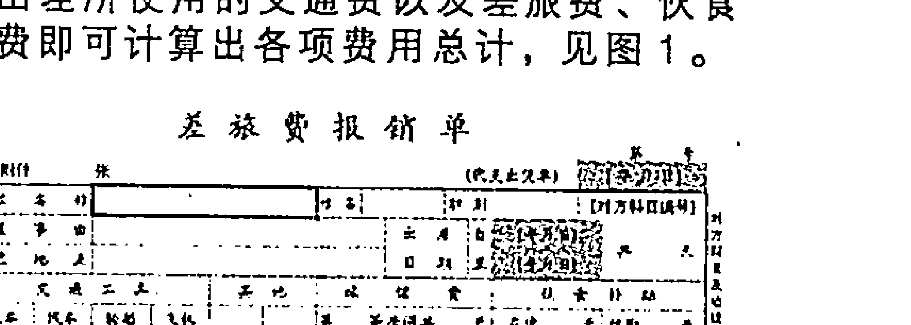

模板二：如果出差的地方不止一个，那么该模板应该对报销有所帮助，可以分别在“出发、到达”项中填入不同的地点名称，以及各项费用，表格即可以自动计算出所有费用总计，而且如果有出差费用预支，表格还可以自动平衡金额的核算，见图2。

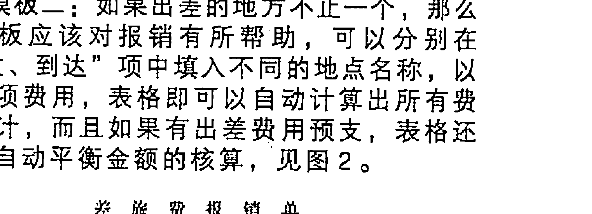

模板三：该模板适合有报销额度限制的公司的差旅费报销，在填写完所有支出金额之后，财务还可以根据实际情况在“核准金额”中填入报销的实际金额进行实报实销，见图3。

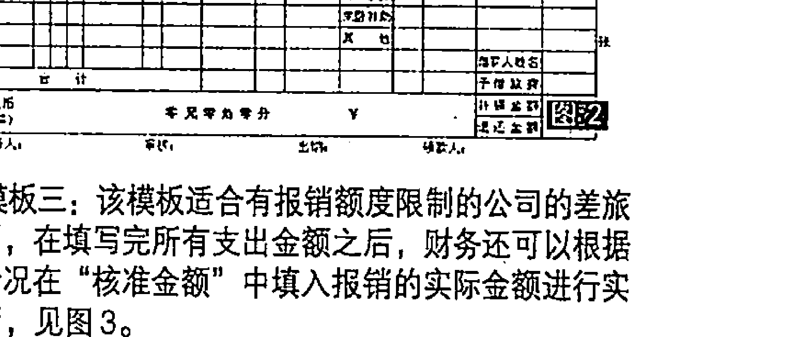

### 了解“员工通讯录”的困惑

#### 巧解“员工通讯录”的困惑

公司经常要制作一些公司员工通讯录，做文秘工作的栾丽平日喜欢用Word来制作打印这些东西，但有时由于人员流动，经常要更新这些信息，麻烦也就接踵而来。

这一次，栾丽依然像平时一样，准备制作一张新的通讯录，分发给各个部门。可是当所内容都处理完的时候，程序却提示“超出打印范围”，无法打印。这下可急坏了她，想来想去也搞不懂到底为什么，最后栾丽在束手无策之际想到了以前她经常去的论坛，试着发了一张帖子后，没想到得到了很多回应，其实原来遇到这种问题的不止栾丽一个。有人让她使用打印选项里的“缩放”功能试试：

-   选择Word中的“文件→打印”，在页面中选择“按纸张大小缩放→你所使用的纸张类型”即可，不过最终的文字内容显示比例要比先前所编辑的小一些，见图。

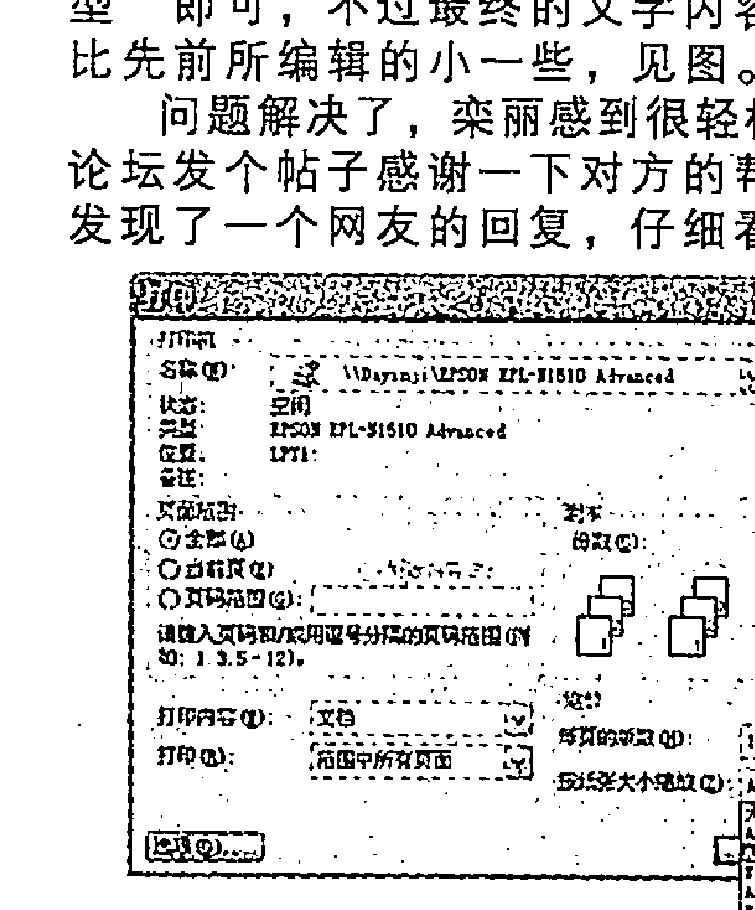

得这个方法更加简单，而且还方便了以后的工作：

将所有的表格内容全部选中，并执行“复制”，打开Excel，将刚刚复制的内容粘贴到Excel中。

接下来先根据自己的情况来调整好刚刚复制的内容，包括页面的设置以及行列纵横比等。

为了方便日后的后续工作，可以为整个表格添加一些函数，让表格随时可以及时得到更新，而且不用每次都重新制作或进行麻烦地修改操作。

为每个部门的列增加自动统计函数：如“=COUNTIF(C5:D49,“*”)”（不包括最外层引号），这样，如果日后该部门有人员变动以后，只要在表格列中输入或删除相关的名单，该函数就可以自动统计所有发生变化的数值，并自动进行更新。

另外，也可以为人数总计设置自动更新函数：如“=“总计：”&COUNTIF(A5:P49,“*”)&“人””（不包括最外层引号），道理相同。

而且使用Excel将所有内容打印到一张A4大小的纸张上设置也很容易，在“文件→页面设置→页面→调整为”中设置为“1页宽，1页高”，并将纸张大小选择为“A4 210*297 mm”即可。

栾丽看到这，大受启发，立即按照方法将先前的表格转移到了Excel里，不仅解决了打印的问题，而且还让栾丽感到轻松了许多，再也不用反反复复地重新制作表格了。“不错，今天真是获益匪浅！”

( Office 杂志 初春)

模板四：该模板中所涉及的项目相对较为齐全，表格简单清晰，使用也比较快捷，适合普通公司或事业单位的差旅报销使用，见图4。

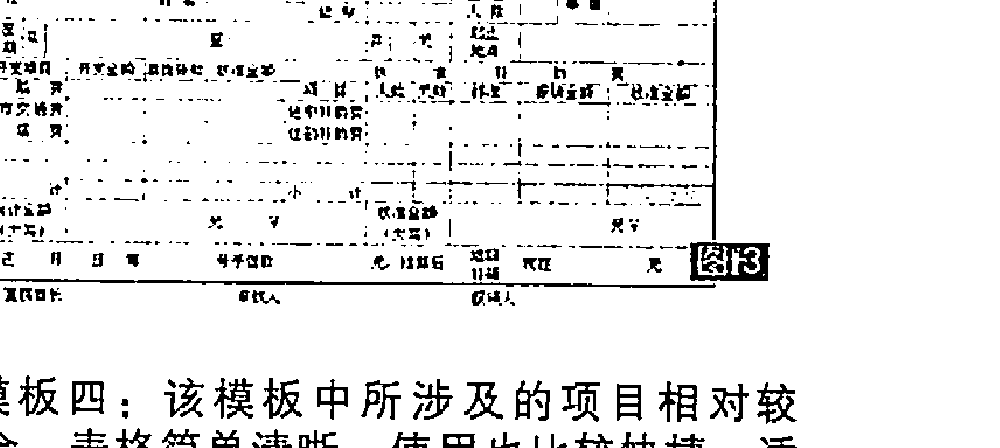

图4。

模板五：如果公司的规模相对较小、也没有过多的审批程序，这款模板一定适合你，它项目清晰、简单易懂。同时也可方便地对报销额度进行设置，见图5。

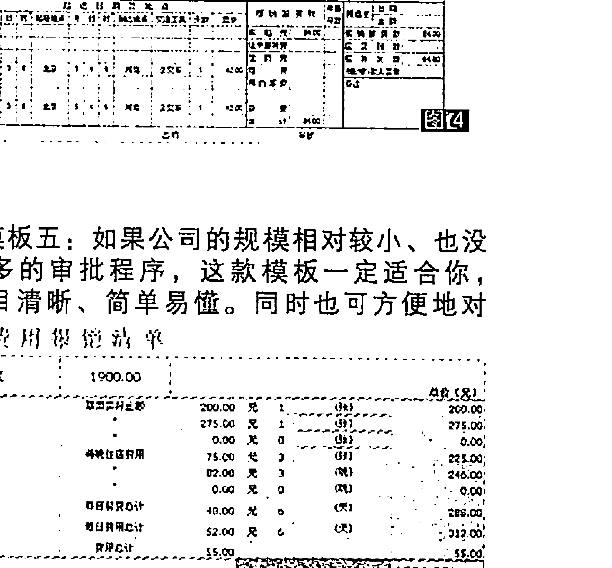

( 初春 )## 不再麻烦 报销也走“高速路”

公司出差人员一回到公司，往往第一件要做的事情就是去找财务报销。对于我们这些财务人员来说，也经常会因为报销的人太多、数据过于繁琐而头痛。但是作为一个出色的财务人员，就是要将复杂的事情简单化，将杂乱的数据规范化。这样，我们做起来就会更加轻松和便捷。其实，只要充分利用Excel的数据有效性功能，就完全可以简化财务工作的繁琐，让报销数据统计和处理变得更加方便，更加轻松。

### 稍息、立正、齐步走

报销登记表中要输入报销人员所属的部门，以便年终核算各部门的费用。为了让输入的部门名称统一规范，确保后续数据的统计准确。我们利用“数据有效性”功能，做成下拉列表的形式，让使用者直接通过点击鼠标选择填写，轻松实现“规范统一的部门名称”一步到位。

选中需要填写部门名称的单元格区域，执行“数据→有效性”命令，打开“数据有效性”对话框，按“允许”右侧的下拉按钮，选中“序列”选项，然后将公司的部门名称（总裁室、人事部、运输一部……）依次输入到“来源”下面的方框中，确定返回即可。

- 在输入“序列”时，各元素间用英文状态下的逗号隔开。

### 让我轻轻地告诉你

报销登记表通常由当班的财务人员负责填写，为了让其他人员了解设计者的意图，快速使用数据有效性，我们可以设置一些极具人性化的提示语言，引导使用者快速填写数据。

在“数据有效性”对话框中，切换到“输入信息”标签下，在相应的方框中输入标题和提示信息内容，确定返回，见图。

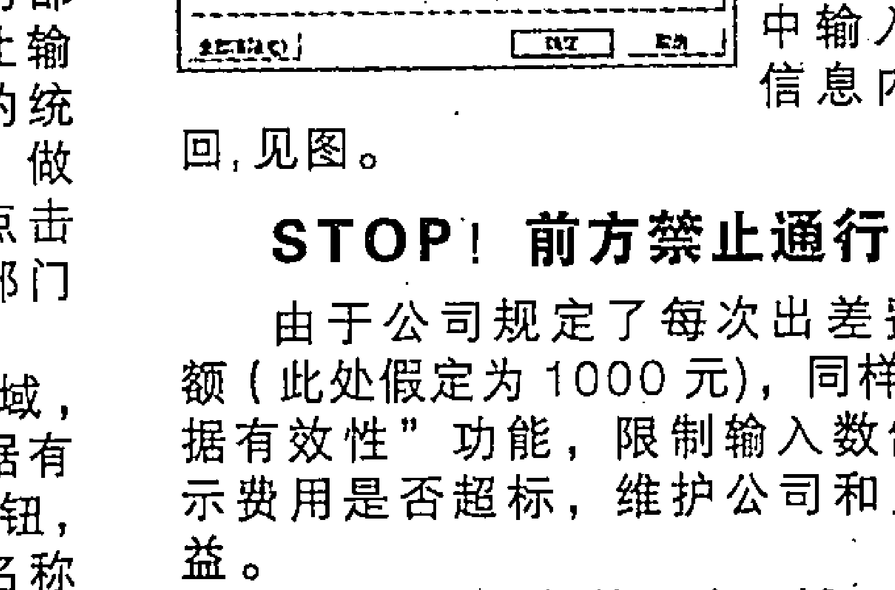

### STOP！前方禁止通行

由于公司规定了每次出差费用的最高限额（此处假定为1000元），同样可以利用“数据有效性”功能，限制输入数值的范围，提示费用是否超标，维护公司和员工的合法利益。

选中填写金额的所在区域，再次打开“数据有效性”对话框，按“允许”右侧的下拉按钮，选中“小数”选项，设置输入的“最小值”为“0”，“最大值”为“1000”，并仿照上面的操作设置“输入信息”和“出错提示”，确定退出。

### 一个家 一个孩儿

通过上面的操作，我们不难发现，“数据有效性”不仅仅用于制作下拉列表、控制具体数据的输入等，稍微变通设置一下，可以控制输入数据的位数及唯一性，这对于输入类似身份证号码这样的数据特别实用。

选中填写身份证号码的区域，再次打开“数据有效性”对话框，按“允许”右侧的下拉按钮，选中“公式”选项，然后在下面的方框中输入公式 =AND(COUNTIF(C:C,C3)=1, OR(LEN(C3)=15,LEN(C3)=18))，确定退出即可。

- 上述公式的含义是：输入的数据要同时满足（AND）在C列中只有一条（COUNTIF(C:C,C3)=1）并且数据字符位数为15（LEN(C3)=15）或（OR）18（LEN(C3)=18）

（明月清风）

### 危机公关中的媒体策略

### 谁让我们忘了“苏丹红”

### 一个真实的案例

2004年1月14日临近春节，势能咨询代理企业ACA北美电器陆续接到包括《南方周末》、《财经时报》、《北京青年报》等几家媒体的电话采访请求，采访的内容从ACA的品牌到经营策略一直延伸到其母公司德豪润达的并购策略上，这一不寻常的现象，引起了企业的疑问，并及时与势能咨询进行了沟通。我们判断到这背后将会存在某种不平静的“危机”，开始针对关于ACA北美电器和德豪润达的所有新闻报道进行监测。

### 新闻定制功能

新闻定制功能RSS是一种新的信息聚合工具，它可以将你需要的信息及时发送给你。网络猪就是其中一款不错的软件（下载地址：http://pig.zhongsou.com），需要通过其定制新闻时，操作如下：

- 启动网络猪，单击左侧工具栏中的“定制专题”按钮。执行“我的专题列表→新建→新建专题向导”命令操作。在新建专题向导中输入新闻专题的名称以及关键词等。
- 你就可以以最快速度得到自己需要的信息了，单击右下角的“更多网页”或者“更多新闻”按钮，可以获得更加广泛的相关信息内容。

### 剪报功能

搜索到的重要信息，可以通过剪报的形式发送给公司分析人员以及相关领导，对一般企业信息应用来说，通过Word就可以快捷地完成这些操作。

- 在网络猪或者其他搜索引擎中，将需要的信息内容复制到Word，并在“粘贴选项”中将“保留源格式”选项选中。
- 在Word中进行必要的编辑后，就可以得到一份美观的新闻剪报了，由于在复制时保存了与源网页的链接，因此可以通过单击相应的链接文字，来打开相应的网页。在保存时，选择“单个文件网页”较好。

一个工作日，我们查明了背后原因：幕后有人假以ACA北美电器员工身份向媒体曝出了的“揭发材料”，“揭发材料”涉及ACA北美电器的合法品牌、产品质量、德豪润达的资本结构等各个方面。“揭发材料”震惊了ACA北美电器和德豪润达的高层，同时，公司总部关于各类试探性采访的电话源源不断。这让所有人高度警戒，神经极度绷紧。因为大家都知道，一旦媒体形成舆论质疑和失控，这对一个上市公司而言，无疑是毁灭性的打击！

面对各种电话试探，公司迫切要求全体员工形成“统一口径”。利用企业信息共享平台，就可以迅速有效地实现这个目的。

### 信息共享平台

在企业中实现信息共享可以通过多种途径，在Office Word 2003中集成了共享工作区工具，这样用户就可以通过共享工作区来协同处理各种信息了，但是前提是公司必须搭建Windows SharePoint Services网站，这可以咨询公司的网络管理员。

- 将制作的新闻剪报保存在共享工作区时，执行“工具→共享工作区”命令。
- 在弹出的“共享工作区”任务窗格中输入服务器地址，单击“创建”即可。

危机公关中的透明原则，使我们和两家公司针对“揭发材料”所提及的问题进行了深入沟通，并迅速形成了危机预案。预案一方面针对这一阶段采访的媒体进行追踪；一方面采取正面声音引导舆论。媒体研究中心的优势此时凸现出来，全国性和区域性舆论导向最强的50家平面和网络媒体即刻显现出来，相关的财经版面、财经频道、记者、主编等沟通架构迅速建立起来。

### 建立媒体数据库

与此同时，《南方周末》的记者在电话访问德豪润达高层后，已经来到了北京。1月16日、17日，势能咨询分别与已经采访过德豪润达的《南方周末》、《北京青年报》等多家媒体记者进行了沟通，并提交了相关企业合法资料，同时对记者提出的疑问和其他索取的资料做出了提交时间的承诺！终于，我们通过有效的沟通取得了媒体的理解，引导媒体对背后真相产生了兴趣，也从而赢得了宝贵的处理和应对时间。而最有价值的是，通过沟通得知：这些媒体已经通过各方面的采访，成稿已经整理完毕！事后我们不禁惊出一身冷汗，如果没有这场高效率的沟通，或许危机已经爆发！

### 迅速分类媒体数据库

我们可以按“有利影响”、“负面影响”与“无报道”的分类方式将数据库进行迅速分类。

- 在表中加入一列有关影响的信息，如表中的affect列。
- 定光标在数据表中，点击数据菜单中的数据透视表与数据透视图命令，弹出数据透视表与数据透视图向导的对话框。点击下一步，由于光标定位在数据区，所以Excel自动选择整个数据区。
- 点击下一步，默认选项，点击完成按钮，Excel自动新建一张名为Sheet1的工作表。拖动右侧数据透视表字段列表中的affect到页字段的提示框中，同样将Media字段拖动到行字段的提示框中。点击下方数据透视表工具栏中的数据透视表按钮，在展开的菜单中选择分页显示，弹出如下图所示对话框。
- 确定后，Excel就会自动创建按affect分页的三张工作表：负面影响、无报道与有利影响，从而实现按不同影响效果分类快速抽查的目的。同时，三张工作表中的内容，会随着原数据表Data中的变化而变化。

1月19日，一场由20多家权威媒体组成的记者队伍如约来到珠海德豪润达总部。一场与时间赛跑的公关竞技拉开序幕！

1月20日正面报道开始陆续出现在各个权威媒体的财经版面，与此同时，关于德豪润达企业和人物包装以及新品上市的公关展开，以人物包装的细节、个性、人格为切入点很快吸引了相关媒体的浓厚兴趣，其后多媒体的报道均以几个版面为刻画笔墨，对整个危机做了一个非常完美的收尾工作。

此次危机处理的背后，显示出一个专业公关公司的深厚基本功，从业人员如果没有对传媒环境的深入了解、缺乏系统的对传媒版面的研究积累，以及监测手段等工具的运用，危机公关所倡导的“沉稳”、“冷静”、“高效”、“准确”等原则都会成为纸上谈兵。

（王兰富 杜金芳）

### 文档保护三重门

小李最近遇到一些麻烦，公司要求机密文档必须添加密码，可是有人告诉他，密码加了也白加，可以找到破解软件查出密码。而在另一种场合下，经常需要不同的人填写同一个文档的不同部分，添加密码反而成了最大的麻烦，因为这些人总是记不住密码，不断打电话询问密码是什么，有时其他人在场，还不好张口就把密码念出来。如此看来，对文档采用保密措施，还真是有一定的难度。不过，这里介绍的一些方法，可以给小李带来一些启示，为文档保密和安全提供参考经验。

- 密码保护
- 不同的人编辑不同的位置
- 按规范填空

### 密码保护

给文档加密码，是最常用的文档保护方法。这种方法知者甚多，但是能真正用好的人却不多。最常见的做法是：从菜单选择“工具→选项→安全性”，并输入密码。一般人设置的密码，总是图方便好记，用一些很简单的数字或字母组合。比如，用自己的生日19801124，还有的人用自己的姓名全拼wangning，这样的密码破解起来易如反掌，有时连破解软件都不需要，猜都猜出来了。第二次世界大战期间，各国对电文密码破解和加密均高度重视，日军首脑山本五十六就是因为盟军破获了有关他的行程的电文，半途被袭击而死。有空的话，不妨看一看美国作家丹·布朗写的高科技惊悚小说《数字城堡》，里面介绍了大量的密码学知识，这可是今年的畅销书哦。言归正传，增加别有企图的人的破解难度，让其知难而退，反破解可以从两方面着手：

- 在添加密码时，单击密码输入框右侧的“高级”按钮，这里提供了多种加密方式，能够提高一定的破解难度。
- 利用数字、大小写字母、特殊字符混合编制6位以上的无规律密码，例如：Ar9x&6@K。很多密码破解软件都是利用穷举法，用数字、字母等进行组合，试图猜出密码。计算机的运行速度很快，一个5位的数字密码，也许只需10几秒钟就能猜出来。但是，如果要破解上述数字、大小写字母、特殊字符混合编制的6位以上密码，用一般的PC电脑，没有几天甚至几个星期、几个月的时间，根本无法猜出来。

### 不同的人编辑不同的位置

用密码给文档加密，带来的一个管理上的麻烦是：如果有多个人需要编辑修改同一个文档，就不得不把密码告诉这些人，他们还很爱忘记密码，而且会把别人修改的内容不小心破坏掉。这就带来了安全与协作的矛盾。这时可以利用Word 2003中的文档保护功能，在保证安全性的同时，限制不同的人编辑不同的位置，从而实现分段保护。从菜单选择“工具→保护文档”命令，设置“编辑限制”为“未作任何更改（只读）”，这表示，任何人都具有只读权限，不能修改文档内容。如果要给某些人分配编辑权限，可以单独指定。单击“更多用户”，输入用户名，用分号分隔不同的用户，就会在保护文档任务窗格中列出这些用户名。在文档中选择某个区域，再选择用户名，就可以限制此区域只能被指定用户编辑。设置完毕，单击“是，启动强制保护”，并输入保护密码，即可实现分段保护功能。不过，有一点需要知道，这种保护方式是基于用户身份验证机制的，用户名应该是网络中的域用户名，而不是本机用户名。这样做的好处是：用户在登录到电脑和网络时，已经输入过用户名和密码，在打开受保护的Word文档时就不需要再输入密码，可以自动验证身份。强制保护的密码是用于解除文档保护的，并不会限制打开权限。

### 按规范填空

有些文档，只需要填写文档的人在某些位置填空。通常的做法是把文档打印出来，用手写方式在纸上填写。比如填写合同，之所以不敢把原文档给别人直接填写，是担心别人篡改文档中的其他部分。用Word窗体功能就可以限制填写文档的人，只能在需要填空的位置填写内容，而不能破坏文档的其他位置。从菜单选择“视图→工具栏→窗体”，即可显示“窗体”工具栏。窗体工具栏的前3个按钮，分别可用来设计文字型、复选框型和下拉型窗体域。用它们可以创建出各种常见的填空方式，例如：姓名、性别、工作种类等等。利用窗体设计完毕，需要在“窗体”工具栏单击“锁定”图标，使文档处于保护状态。如果要添加保护密码，可以用前面介绍的“保护文档”功能，在“编辑限制”中选择“填写窗体”，并启动强制保护。填写文档时，按TAB键可以在各个填空位置跳转。

（王宁）

### “板”本升级

工作10余年，感触良多。细想起来，对我日常工作帮助最大的，竟然是一些平常没有过多注意的东西。

### 黑板与白板的质朴

参加工作之初，我到的第一家企业是一家国有大型企业。大型国企的特点大家都知道，但我在感觉最深的还是大部分办公室里面摆放的一块黑板。黑板上面写着生产计划安排、考勤情况以及对某人的奖励和惩罚。黑板虽然简陋一些，但确实能帮助工作人员有效地管理时间与进度。用了几年黑板，粉笔灰吸了不少，我总担心自己以后会得肺病。好在有此担心的不是我一个人，之后，白板逐步替换落后的黑板，粉笔也变成了白板笔。要在白板上管理时间和进度非常简单，只需要画上一个表格，然后根据进度涂黑相应的格子即可。是不是和现在常用的项目管理软件Project看上去很类似？不仅如此，在白板上一样可以完成任务指派、进度追踪等任务，而且由于所有重要信息都在白板上，一目了然，便于涂改，沟通起来也很方便。当然了，白板也不是万能的，光是如何充分利用有限的空间就很要费一番脑筋。但不管怎样，白板绝对是进行项目和时间管理的有效工具之一。

### 手写板的自由

我在那家国企工作的最后两年，电脑开始普及，每个办公桌上一台电脑。刚来的大学生键盘敲得噼噼啪啪，而对于我这样不太熟悉标准拼音的人，输入一些生僻字几乎是一种折磨。后来我发现了手写板。正好单位给我配了一个，可以全屏幕重叠书写，识别速度在每秒12字以上，不但可以手写，还可以直接听写到Word、Excel、Outlook、Lotus、IE等应用软件中，方便极了。我最喜欢用手写板配合OneNote做日常的资料收集和整理工作。利用手写板代替鼠标，我不但可以对OneNote中的资料进行快速分类整理，还能随时加上手写批注。那天我们开讨论会，手写板成了我们讨论的画图纸和快速记录板，会后还能直接把记录打印出来。对了，据说手写板和Tablet PC有相似之处，有机会要好好体验一下。用最自然的方式就可以完成工作，何乐而不为？

### 电子白板的智慧

离开国企后，我进入了一家跨国公司。公司不但在管理上领先，办公设备上也积极采用最新技术来提高生产率。现在我参加会议、演示、讨论和培训等，常使用电子白板系统。上周参加完一个培训，我对电子白板的“先进”有了更深的感触。以前的培训几乎都是利用传统投影仪，然后老师通过演示PPT来讲解。现在使用电子白板，老师在演示PPT期间，可以通过主控台，随时切换视频、音频来源，随时切换出运行演示程序，也可以通过电子笔随时在屏幕上操作计算机并书写批注，最后批注可以直接嵌入到Office文档中。整个培训过程都被保存了下来，最后通过网络就可以下载到整个课程的资料，非常方便。不只我一人，大家都不由得感叹这块有“思想”和记忆的电子白板的神奇。也许，今后我还会遇到更多更新更好的板。科技让我们的工作质量和效率提升到一个个新的高度，可喜；而作为个人，似乎也该从自己的“软件”上多下功夫，达到硬件与软件的完美统一。

（dualface）

### 销售人员 限制合同中的金额

**实现目的：将电子文档的合同发给客户，只允许填写指定位置**
销售人员如果需要将电子文档合同发给客户，可以利用窗体功能实施对文档的保护。例如，合同中涉及支付费用时，不得超过万元，则可以加入一个文字型窗体域，并在窗体域上双击，设置相应属性为：类型：数字；最大长度：4，数字格式：￥#,##0.00;(￥#,##0.00)。这样，所填数额只能是数字类型，并且数字长度不超过4位，起到限制作用。

### 人事专员 在劳动合同中规范填写

**实现目的：电子文档的劳动合同，允许员工填写时从下拉列表中选择内容，从而规范填写**
劳动合同如果要以电子文档方式下发，同样需要窗体保护。很多员工在填写合同时，不知该如何填写，或者胡乱填写，导致多次返工。利用窗体保护，不仅可以防止乱填，还能为填写提供必要的帮助。例如，如果要填写工作岗位，可以添加一个下拉型窗体域，并在窗体域上双击，设置相应属性。在“下拉项”中填写岗位名称，并单击“添加”按钮，加入到下拉列表中。单击“添加帮助文字”按钮，可以输入帮助提示文字。这些文字在光标定位到窗体域中时，会出现在底部状态栏中，为用户提供参考。

### 删除修改痕迹 清爽文档见客户

小李从同事的电子邮件中收到一个文档，修改后用新名称保存后送到客户手中。然后他接到电话：“文档难以阅读，到处都是下划线和批注框，三个带删除线的不同目标到底哪个？……”最快方法：这是修订和批注在作怪。你只需接受或拒绝更改，删除批注即可。选择“视图→工具栏→审阅→显示”，然后确保下列每个项目旁边都出现对勾：批注、墨迹注释（仅Word 2003有）、插入和删除、正在格式化、审阅者（指向“审阅者”，然后确保选中了“所有审阅者”）。在“审阅”工具栏上，单击“后一处修订或批注”，从一处修订或批注前进到下一处，对每处修订或批注单击“接受修订”或“拒绝修订/删除批注”。如果要接受（拒绝）所有更改，则单击“接受修订（拒绝修订/删除批注）”旁边的箭头，然后单击“接受（拒绝）对文档所做的所有修订”。如果要除去所有批注，单击“拒绝修订/删除批注”旁边的箭头，然后单击“删除文档中的所有批注”，就把“拖泥带水”的东西都删尽了。

### 恋，大家“片”一下

Barry最近的心情不错，一年当中最难熬的炎夏已经过去，公司的业务也越来越多。这不，公司准备在十月底召开一个新产品发布会，需要给所有的客户发送邮件邀请函。以往的时候与客户的联系，Barry通常用纸质名片或者在给客户的邮件后面添加一些自己或者销售人员的联系信息。正好公司刚迁了新址，需要通知客户，这下，他可有得忙了……

阿伟（看了一眼）：兄弟，你落伍啦！电子名片听说过没有？

Barry（摇头）：挺新鲜！你说来听听！

### 电子名片进邮件 联系客户更方便

阿伟：电子名片其实就是一种vcard文件格式，在其中可以添加联系人的相关信息。

Barry：它和我常用的名片相比，有什么区别吗？

阿伟：最大的不同就是它信息容量大，可以方便地在Outlook、Outlook Express、Foxmail等邮件程序中。你看……

- 使用电子名片时，先将Outlook中的联系人资料转换为vcard文件，打开Outlook中的联系人，执行“文件→导出到vcard文件”命令。
- 将电子名片添加到电子签名中；执行“工具→选项→邮件格式→签名→新建→编辑签名”命令，在弹出的编辑签名窗口中选择一个创建的电子名片。
- 最后在“邮件格式”选项卡中从“新邮件使用该签名”列表框中选择需要的电子名片，就OK了。

### 地图名片 公司地点一目了然

阿伟：公司刚刚搬了新家，位置不太好找，我该怎样表述，才能让客户准确了解公司的办公地址呢？

Barry：不用表述，让图片说话！现在网络上有很多网站提供地图名片服务，也就是在电子名片上添加具有公司位置信息的电子地图，用户通过地图名片就能对咱们公司的具体位置了如指掌了。

阿伟：收费吗？

Barry：有些网站也提供免费试用，比如mapbar。

- 首先要进行注册，登陆到“个人名片”页面：http://my.mapbar.com/mapcard，单击“新增名片”链接，在弹出的个人信息填写页面输入公司名称、简介以及添加个人照片，然后单击“下一步”按钮，选择地图名片所用的模板。
- 在地图标注点设置页面上，选择自己所在的城市，然后在电子地图上标记公司的具体位置。使用时，可以任意缩放，灵活查看公司所在的具体位置。
- 设置完毕后，Barry兴奋地看到了自己的地图名片，同时获得地图名片的链接地址。他将这个地址发送给客户，用户查看公司位置等信息时，只要打开这个地址就可以看到相应的地图名片了。

如果自制地图名片，也非常简单。先将本市的地图扫描到电脑中，在其中标注公司的准确位置。然后将图片文件添加到电子名片中，执行“插入→文件”命令即可。

### 巧用TM 电子名片快捷发送

Barry：我常和一些客户使用QQ的TM进行业务交往，直接通过TM给各公司发送邀请函，好像不错。听说这里有个名片功能……

阿伟：对，这是腾讯TM2005Betal内置的一种个人信息载体，可以让自己的名片在网上方便地安了一个家，很好地解决网上个人名片与联系人资料收录问题。

- 使用TM的电子名片，先要编辑自己的名片，在TM中执行“文件→个人设置→个人名片”命令，即可看到已经编辑好的电子名片。
- 如果需要进一步修改或者创建新的，单击“点击这里进行修改”链接，即可弹出“名片编辑器”对话框，对个人信息进行修改。
- 需要给客户发送电子名片时，只要在对话窗口中，执行“动作→发送名片”命令即可，注意，对方也必须使用TM，而不是QQ。

三天后：

Barry：现在我与客户联系起来好像顺手多了。网络给生活带来的变化真是无所不在呀！

阿伟：新东西不断涌现，我们要学会随时发现。赶紧让同事们也体验一下这几种电子名片带来的便捷吧！

（王兰富）

### 拿什么拯救你 我的Word文档

天气转凉，容易感冒，而文档仿佛也知冷知热，不时地闹些小毛病，有时还病得不轻……

新成立的文档修复站近日收治了不少患者，凭借着相扣的精湛医术，及时为他们解除了病痛，让他们早日健康地投入到工作中。以下是本刊记者对主治医生的采访。

### 拯救Word文档第一招：固魏救赵

记者：一些患者向我反映，他们莫名其妙地生病，不知是什么原因。

医生：很多时候，文档无法打开或者打开后不正常，并不是自身的问题，而是由于工作环境差异造成的，包括Office版本、操作系统版本、默认模板等。极端情况下，系统中安装的个别软件也可能影响Office的正常工作。实践中，我通常按照下面的步骤进行治疗：

- 用不同版本的Office打开文档
  对于日常工作就是处理大量文档的工作人员来说，同时安装两套Office是很有必要的。只要安装时记得先装老版本再装新版本就可以了。有时候在Office 2003里面不能打开或者打开出错的文档，用Office XP打开就是正常的。
  先把文档全部内容复制到剪贴板，通过“文件→新建”创建一个空白文档，并将内容粘贴到上面，最后保存新文档即可。
  记者：如果保存的新文档在其他版本Office中打开还是有问题呢？
  医生：那说明文档内容出现了错误。这种情况靠手工检查是不现实的，必须采用第二种治疗方法。
- 将文档保存为低版本的格式
  用正确版本的Office打开文档，然后选择菜单“文件→另存为”，为文档输入一个新名字，并选择类型为“Word 97-2003 & 6.0/95 - RTF (*.doc)”，这样保存的文档就会自动转换为老版本，转换过程过滤掉了文档中的绝大部分隐藏信息，而这正是最容易引起问题的部分。此时段落格式、表格可能会发生变化，智能标记则会彻底消失。不过相对于无法正常打开来说，这些损失都是可以接受的。另外找到Word文档的默认模板Normal.dot，启动默认设置也可能奏效，因为这是一个常见病灶。

### 拯救文档第二招：丢车保帅

记者：以上方法还是比较有效的，但我们看到，还是有一些患重病的文档无法打开。

医生：如果这些文档的内容确实非常重要，可以通过下面的方法。即便不能100%恢复，也可以挽回一部分损失。

- 有时文档无法打开只是因为最后一个段落中的隐藏标记损坏了，可以创建一个空白文档，然后选择菜单“插入→文件”并打开有问题的文档。如果顺利，Word会忽略问题文档的隐藏标记，并将内容插入到空白文档中。
- 让Word强制修复损坏的文档
  让Word强制修复损坏的文档。选择菜单“文件→打开”，选中要修复的文档，并单击“打开”按钮旁边的小箭头，选择菜单“打开并修复”。Word就会在打开过程中尝试修复文档包含的错误。从我的实际经验看，大部分出错文档都可以完整恢复，偶尔会丢失一些表格或图片。
- 尽可能恢复文本内容
  如果Word的修复功能无效，那么说明文档损坏已经病入膏肓了。不过不要灰心，选择菜单“文件→打开”，并选择文件类型为“从任意文件中恢复文本”，然后打开需要修复的文档。通常恢复后的文本内容最后都会出现一些乱码，可以删除后将文档保存为新文件，其缺点是会丢失所有格式和非文本内容，但对于重要文档来说恢复一点总比什么都没有强。

### 拯救Word文档第三招：暗渡陈仓

记者：到了晚期的重病号，病情危重，以上方法均不奏效，是否还有挽救的办法？

医生：这时要挽救文档内容已经很难了，但我们会采用效力最强的治疗方案，竭尽全力进行抢救。

- 用写字板打开文档
  由于写字板功能很少，因此打开文档时也不会做太多检查和处理。对于一些错误反倒不会造成问题。如果用写字板打开文档后能够看到内容，那么赶快复制出来保存。
- 用OpenOffice或者WPS打开Word文档
  OpenOffice和WPS都是非常优秀的办公软件，而且也能够打开Word文档，利用它们的Word文档读取功能，有时会有意想不到的收获。
- 用专门的Word文档修复软件进行修复
  这类软件很多，例如OfficeFIX（http://www.cimaware.com/main/products/officefix.php），Recovery for Word（http://www.officerecovery.com/word/）等等都不错。通常对于英文内容能够很好地恢复，而中文内容恢复的成功率就相对低一些，不过有一线希望就不能放弃。
  记者：医术先进，文档有幸啊！祝你们中心的文档早日康复。
  医生：我们会尽力的，谢谢！
  （廖宇留）

### 简单操作Excel 复杂编号轻松填

在工作中，我们经常会遇到输入一些复杂编号的情况（比如输入员工的工号和身份证号等）。这些编号，往往前面的几位数字是固定的，而后几位数字则是按照正常的排序进行编号。如果我们手工输入这些复杂编号，麻烦又容易出错，是否有办法变得简单些？

最快方法：在Excel中，如果要将WK200304001这样的编号输入到B2:B300单元格区域中，前面的WK200304是固定的，后面有数据则是正常编号。那么，我们应该先选中B2:B300单元格区域，然后，点击菜单命令“格式→单元格”，打开“单元格格式”对话框，点击“数字”选项卡。在左侧的“分类”列表中选择“自定义”，然后在右侧“类型”下面的输入框中输入“WK2003040#”（引号不必输入），确定即可。如此设置以后，输入编号时，只需要在B2至B4单元格中分别输入1、2、3，那么就可以得到合乎要求的WK200304001样的编号了。选中这三个单元格，将鼠标定位于填充句柄，向下拖动至B300就可以完成自动填充。

### 业绩评比自动出Excel辅助核算绩效

Office系列软件里面，我最喜欢用Excel。可每次我说起来，总有人以为是非常高深的编程。其实都是些固定的算式架子，搞清楚它的作用，把自己需要计算的数据套进去，就可以很轻松地得到需要的结果了。依我看，上过初中能解方程的人都能轻松学用。当然，对于上班办公一族，Excel的价值是最大的。因为它可以让你一劳永逸，把你从长期、繁琐的海量计算工作中解脱出来。

#### 四表合一看得清晰

为便于直观比较，我在同一个工作表中采用复式表格法。三个子表依次为每日实时统计表、各班收费时间统计表、各班手工票金额统计表。

- TIPS:把几个表格合并并一个Excel工作表里，做公式计算时，直接点选单元格非常方便。但也显得混乱，不便查阅。要适当应用。

#### 快速计算工作时间

现在只要把几个收费班所上的几个班次数分别输入，即可自动得到最后时间统计。各班收费时间统计表中使用了组合函数公式。如“每班次时”(H7)一行所示，三个不同时间段的工作班次，其工作时间并不是24/3=8小时，而分别是5、7、12小时。以一班为例，早、中、晚班各8次，他们的总工作时间I8=SUM(H4*5+H5*7+H6*12)。其他三个班的收费时间，只需把公式中的字母H分别代换成I、J、K即可分别求出。

觉得改字母麻烦？那还有更简便的方法。可以把公式写成I8=SUM(MMULT($I7:$K7,I4:I6))。然后用鼠标拖拽，或者复制/粘贴，把I8里的公式复制到J8、K8、L8等单元格即可。效果是完全一样的。

- TIPS:用MMULT这个函数时，只需要指定I7:K7和I4:I6这两个需要一一对应相乘的单元格区间。$这个符号是表示I7和K7这两个数据（也就是每班次时间）固定不变。所以复制公式时，就只会自动改变I4:I6这部分的字母，自动适应位置变化，刚好就准确算出对应的收费班的工作时间。

#### 自动统计手工票金额

手工票的金额都是要手工统计出来记录的。所以，统计这个金额，只要设置D14=SUM(D17:D28)，一个简单的求和，就得出一班手工票金额。同理，轻松解决其他几个班的手工票金额自动统计问题。

- TIPS:SUM是最常用的求和函数。就是把指定表格区间的数据加起来，然后把结果返回到公式，或者填充到所在单元格。

#### 今日优胜班自动评选

在D12至G12的4个单元格里分别输入公式“=B8/B11”、“C8/C11”、“D8/D11”、“E8/E11”，当基本数据输入后，就可快速求得各个收费班的每小时平均收费率了。D10这里的今日“第一名”是怎么算出来的？也是一个很简单的公式“D10=MAX(D12:G12)”。

- TIPS:不难看出，MAX是一个取最大值的函数。它可以在指定的单元格区间中比较各单元格的数值大小，自动返回最大值。

如果不用这个，恐怕每天都得花费一两个小时按计算器，画草稿纸，反复核算。而现在只要把记录的原始数据输入就可以马上得到结果了。现在看看，这个复合表格看似复杂，其实只不过是几个简单公式和函数的运用！

（夏冰）

### 宣传文档精起来利用电子文档优势提升宣传效果

根据个人经验，在国内，Word文档比PDF更容易让大家接受。于是简单研究了一下Word，发现它不仅便于排版，而且可以融合多种内容（PPT演示文档、Excel表格、视频、音频文件……），我于是想：如果能把指导使用产品的录像、录音资料、技术参数图表等资料都融入介绍产品的Word文档里面，岂不是可以让产品介绍图文声影并茂，让公关、销售的同事跟客户谈起来更方便，让客户对我们的产品有更深入的了解，更好的印象？不过说起来容易，做起来难。下面这两个小麻烦，也许你也会遇到。

#### 融入PPT生动演示产品

公司有一些产品功能演示PPT，是请专业人士制作的，效果非常精彩。我于是想把它融入到我做的产品介绍文档里面。但一试，才发现每次都会自动链接到第一张幻灯片开始播放。如果要插入多个产品的演示，就只好把PPT文件拆分开来，在多处插入多个文件。我当然不甘于做这种体力活儿。于是到外“寻师访友”。最后是网络部惟一的女性孙莹给我提供了一个解决方案。

现在我可以在Word文档中链接到PPT演示文稿的任意一页。假设要介绍的产品——T3，在“产品简介.ppt”文件中第3页，要在文档中融入它的演示，就可以如下操作：首先用鼠标选定要链接的文字，然后点击鼠标右键，在弹出的菜单中选择“超链接”。在弹出的“插入超链接”对话框中选择要链接的文件“产品简介.ppt”，然后在文件后面手工输入“#3”。如法炮制，可以在介绍每一款产品时，添加链接到介绍这款产品的PPT演示页面，非常简单。

#### 链接Excel数据证明实力

融入产品的技术参数图表，可以让客户对我们产品的技术实力有深入全面的认识。

不过，具体操作时又遇到了问题。孙莹也没有办法，我几乎就要放弃了。但是，就为了做这个产品介绍，而把技术参数、市场状况等Excel表格拆分成几个文件，这不仅是当前的麻烦，日后每次要更新数据，就要来一次重复劳动。工作时间还有富余，我还是争取把事情做到位，免得日后返工。后来是自己做另外一项工作时，无意中找到了答案。还是以T3这个产品为例，要在Word文档里面插入链接，介绍它的技术参数。首先打开要包含公司全系列产品所有技术参数的XLS文件，然后选定T3的技术参数表格，然后查看编辑栏最左边的“名称”框里的名称（例如T3的技术参数表格第一行就是：A54）。

记下这个代号，打开Word文档，选择要链接的文字，通过右键菜单设置这段文字的超链接。在弹出的“插入超链接”对话框中，选择要链接的文件“产品技术参数.xls”，输入刚才查到的单元格名字。

- TIPS:如果要把文件发给别人或者传送到其他电脑上使用，则最好把Word文档及其融入、链接的各种文件都保存到一个文件夹中。然后把所有超链接前的路径部分都删除。例如前文所述的“F:\演示\产品技术参数.XLS#A54”改为“产品技术参数.XLS#A54”。这样不容易发生链接错误而打不开文件。以后，在Word文档里面点击这个文字链接，就会直接打开产品技术参数表格文档，并自动转到T3技术参数表格的开始部分。

（沉吟 FAVE）

### 快速制作宣传小手册

我在公关公司工作，经常要承办各种会议，组织各种活动。宣传资料是必不可少的东西。其中，公开发放、免费赠阅的资料，因为发放量很大，所以在保证效果的前提下尽量压缩成本是非常必要的。

#### 双面打印省一半

有同事提议，把资料打印成双面，就可以省下一半纸张。实施起来还比较容易。用Word自带的双面打印功能就行了，见图1。

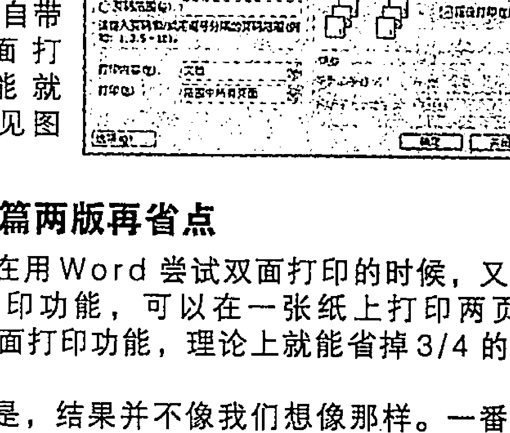

#### 一篇两版再省点

就在用Word尝试双面打印的时候，又发现了缩印功能，可以在一张纸上打印两页。配合双面打印功能，理论上就能省掉3/4的纸张。

但是，结果并不像我们想像那样。一番周折，打印出来的东西折成小手册的话，页码顺序就混乱了。即使不折成小手册，也只能横着看，——极其不顺手。难怪Word打印设置里面，双面打印和缩印功能不能同时使用，见图2。

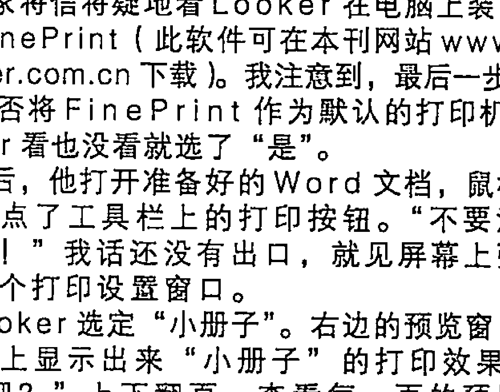

这时候，公司办公室的Looker来送信，看着我们就笑了：“装个FinePrint不就行了？”

#### 轻松搞定小手册

大家将信将疑地看Looker在电脑上装了一个FinePrint（此软件可在本刊网站 www.cmaster.com.cn 下载）。我注意到，最后一步，询问是否将FinePrint作为默认的打印机，Looker看也没看就选了“是”。然后，他打开准备好的Word文档，鼠标一甩就点了工具栏上的打印按钮。“不要浪费纸啊！”我话还没有出口，就见屏幕上弹出了一个打印设置窗口。Looker选定“小册子”。右边的预览窗口里面马上显示出“小册子”的打印效果。“没错吧？”上下翻页，查看每一页的预览图。我盘算了一下，确实是正确的。这样打印的话，可能正好可以一摞一折就成小手册。

最后点击“打印并关闭”，程序弹出提示窗口，说要进行一次打印机测试，按照测试向导程序的提示打印两页，测试一次，就可以保证打印计划适应打印机的打印顺序、打印方向等特征。接下来，开始正式打印。片刻，打印机就吱吱嘎嘎地吐出了那十几页宣传资料。按程序提示将其翻面再放进打印机，打印背面。一会儿，打印完毕，拿过来一折，两颗订书钉一上，当真就变成了一个完美的小手册。“不要改设置，就这样打就行了。”Looker放下鼠标，拿起文件袋子，大摇大摆地向门口走去。没想到他还真是个Office电脑高手啊！

（汉唐）

### 最具亲和力的电子邀请函

首先当然要有会员的数据。我没有专门去准备Excel或者其他表格、数据库文件，直接用Outlook的联系人就行了。只不过，既然要让称谓随性别变化，就要把“中文称谓”这一项填写完备。

- TIPS:如果有很多客户都有良好关系，可以考虑用昵称代替姓名。对于已经多次合作的伙伴，“小张”比“张小姐”更具亲和力，这是很显然的。当然，不能乱用。

准备好数据之后，当然就是打开Outlook编写邮件。尝试了一下，决定给男性客户和女性客户分别编写一份邮件，插入不同的宣传效果图，再配上准确对应的称谓。时间充裕的话，还可以为女性客户和男性客户分别准备有针对性的宣传语和邮件内容。这样一来，亲和力会非常强，远非普通邀请函可比。可惜我时间比较紧张，所以，只能在插图方面有所不同。不过效果已经不错了。

- TIPS:如果“工具”菜单里没有“邮件合并”。则需要在Outlook的“工具→选项→邮件”里面设置邮件格式为HTML，并且选中“使用Microsoft Office Word 2003编辑电子邮件”。

先设计好了发给女性客户的邮件内容，然后点击“工具→信函与邮件”打开邮件合并向导。

邮件合并的方法非常简单，步骤我就不一一说了。我遇到的关键问题是怎么保证这封专门发给女性客户的邮件不会发给了男性客户？因为我们准备的客户数据——Outlook联系人里面，并没有按照性别分类。

我的办法是在邮件合并操作中，选择收件人的时候筛选一次数据。我的Outlook联系人中可以以称谓不同来判断客户性别。但是，在邮件合并的数据表里面，并没有“称谓”这一列。用查找功能找“女士”才发现称谓已经跟姓名一起合并为“显示名称”了。于是就用“‘显示名称’包含‘女士’”筛选得到女性联系人。把这封专门为女性联系人编写的邀请函发给她们就没有问题了。

- TIPS:从Outlook联系人中选择收件人时，可以选择某一个文件夹的内容。这个也可以用来帮助我们确定正确的收件人。例如，我们可以在Outlook联系人里面新建一个文件夹，专门放外商联系人。发邀请函的时候专门撰写一份英文邀请函，进行邮件合并，选择收件人的时候，选择Outlook联系人里面的这个“外商”文件夹就行了。

利用邮件合并可以根据收件人的不同，修改、发送出不同的电子邮件，也可以用于传统的邀请函、信封打印，操作方法和步骤请见本刊2004年第8期114页《最具亲和力的邀请函》一文。

（雷文）

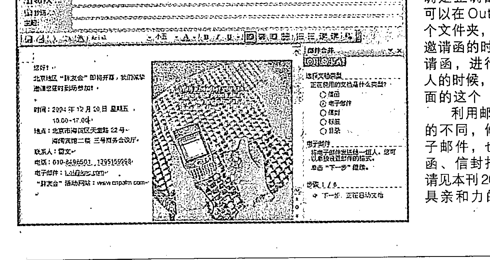

### 为什么受伤的总是你？

这天，出乎意料，诗琪来找我：“听说你是计算机专业毕业的，那快帮我解决这个问题吧。”我还没来得及说话，她就一把拉我到了她的电脑面前，“我昨天刚杀过毒，现在又变得傻腾腾的了。现在收发客户的邮件慢得要死，完成不了任务，那可就真的完了。”

我检查了一下，发现可能真的中毒了。正好她装了Norton杀毒软件，赶紧启动，在线升级到最新的版本后，把电脑全面查杀一遍。果然发现了好几条“虫”。

“刚才我也这样杀的，怎么没有杀到？”
“没升级吧？”
“那我每天都要升级，多麻烦啊！”
“哦。那倒不必。”我边演示边说，“其实很多杀毒软件都有定时自动升级的功能，Norton的‘LiveUpdate’里面也有这样的设置，将它打开后，只要平时连着Internet，它就能自动升级。这样方便多了。”

可诗琪似乎还是不感激：“其实我也杀过一些的。但是没有用，过两天又有了。这都好多次了，三天两头中毒，有什么办法啊？”

我愣了一下，无意之中瞥了一眼任务栏。

哈哈，我一下就明白了：“你看，杀毒软件那个图标现在有一个大大的红叉，表示实时监控没有打开，所以没法预防病毒啦。”

“可岳劲松说开了这个电脑就要变慢。”

“你是想让病毒把你的数据全清洗了好，还是电脑慢点、安全点好？装个杀毒软件，不开实时监控，就像银行安装了摄像头却没有打开一样，没有用啊。”我用右键点击了一下Norton的小图标，把实时监控启用。然后打开“选项”，点击“Norton AntiVirus”，设置成以后自动打开监控。

“OK，这样就安全多了！”

点评:每天都有新的病毒被好事者制作出来，定期升级，提高防杀病毒的能力，就好像不断研制、使用新疫苗防范流感、肝炎一样必要而且重要。但是，并不是每一个防病毒软件都像Norton这样想得周到，安装好之后就自动启动了自动升级功能。

电脑技术发展了，电脑病毒传播方式也越来越多。插上优盘就感染病毒，浏览网页就感染病毒。这早已经不是新鲜事了。

正是因此，防病毒软件早就开发了实时监控功能。只要启用了该功能，通过邮件、优盘、QQ、网页等各种渠道来犯的病毒、黑客程序都会被清除，防患于未然。这也是“防毒软件”的真正意义所在。

（杨井前）

### 头痛的工资表

以前单位的会计制作工资表都是全手工完成，速度慢不说，而且还容易出错。我有一次跟财务科长开玩笑，说科室里面买那台电脑完全就是个摆设，每天都开着放那个养热带鱼的屏幕保护，没准很多人都以为那是用显示器改造的一个鱼缸呢！

没想到，财务科长就因为我这句话发了火儿，下决心要让财务科真正实现电算化。计划往上一报，任务自然就落到了我这个公司里面顶尖的“电脑高手”身上……

我最初想，用Excel表格来制作工资表并不复杂，很多电脑杂志、报纸都有类似的文章。可实际操作起来却遇到了意料之外的问题，搞得调整工资表花的时间比录入的时间都长。幸好及时搞定，挽回了点面子。

所以，朋友，如果你以为财会工作电算化就是用Excel列公式代替财务们手中的计算器，那就大错特错了！看看我被所得税折腾的血泪经历吧！

### 所得税居然是负数

大家都知道我们国家的个人所得税采用的是分段记税法——计税工资小于等于800元时，不纳税；工资大于800元但小于等于1300元时，税率为5%；工资大于1300元时，税率为10%。

| 计税工资范围（元） | 税率 |
| :--- | :--- |
| ≤ 800 | 0% |
| 801 - 1300 | 5% |
| > 1300 | 10% |

知道了这个规矩，用Excel根据工资算所得税，应该不难吧？我使用这样一个公式：“=IF(G3>1300,(G3-1300)*0.1+500*0.05,(G3-800)*0.05)”。

结果打印出来的第一张工资单就被那个小财务周余晖拿去到处宣传：“看啊！电脑算出来的，唐姐的所得税为负！这该怎么扣？改发奖金给她吧！”

工资表上，所有计税工资低于800元的人，所得税都是负数，需要一个个手工清零。

红着脸仔细检查，才发觉利用单层IF函数，只能获得表达式值或真或假两种状态中的一种，无法处理两种以上的状态。所以，当记税工资小于等于800元时，就无法得出税额为零。

解决这个问题，我想了个办法，是利用IF嵌套函数。也就是将一个IF函数作为另外一个IF函数的参数来使用，实现对多种状态的处理。

想通了，做起来就快了。正确的公式为：“=IF(G3>1300,(G3-1300)*0.1+500*0.05,IF(G3>800,(G3-800)*0.05,0))”。

- TIPS:这里的“IF(G3>800,(G3-800)*0.05,0)”就是作为子级函数成为了第一个IF函数的参数，整个函数能同时对三种状态进行处理。IF嵌套函数应用十分广泛，在Excel中函数嵌套最多可含7层。

### 总金额为何有误差

搞定了负数所得税的问题，科长正好把周余晖从走廊上揪了回来。我原以为这下问题解决了，却不料用计算器一核对，合计金额总是对不上。误差少则几分钱，多则几角。例如：表中“秦红斌”的工资，“G5-H5”应该为889.75，可实际数值却是889.74，反复检查，公式没有错！我也没有算错！难道电脑算错了？百思不得其解。

反反复复地查，在财务科坐了半小时，我才找到了原因一个人所得税单元格小数位数的取舍不标准。

我把个人所得税那一列的单元格都定义成两位小数的数值格式，但这只是改变了显示效果。那一列的所有单元格中公式计算返回的数值有很多还是三位小数。核算实际发放金额的公式取这些单元格的数据时，也是取的公式计算返回的实际数值。于是，拿计算器依照表格里面显示出来的数据计算，结果就和Excel公式自动算出来的数据有误差。

找到原因了，就可以找解决方案了。我必须使用舍入函数ROUND()，将所得税单元格中公式计算返回的数值由形式上的两位小数变为实际的两位小数。

```
公式改为：“=IF(G5>1300,ROUND((G5-1300)*0.1+500*0.05,2),IF(G5>800,ROUND((G5-800)*0.05,2),0))”即可解决问题。
```

函数ROUND()用来强制性从某一个小数开始对目标数值进行四舍五入。

从财务科走出来，已经快下班了。我擦擦汗，禁不住叹气——原以为自己的电脑技术真的够高水平，现在才知道，要解决实际工作中这些“应用题”，还要继续修炼才行。

（Js-xjb）

### 销售经理自备‘小秘’

各行各业的朋友，恐怕都对工作复杂，业务繁忙深有体会吧。做销售的更甚。一个销售经理不仅要做好每一件事情，而且要同时面对若干任务。如何在保证质量的前提下又兼顾高效率呢？自己动手，主动管理是个好办法。

所谓管理，也不是什么高深的东西，有一定工作经验的朋友都会发现：这份工作也是有章可循的。其实只要将业务工作分成各个环环节，然后针对每个环节提出相应的工作计划，再依此一步步执行，那么工作进行起来就会顺利得多。

另外，在工作中资料的积累也是很重要的。例如，要想产品销得出去，就要牢记客户。针对客户有计划地一些回访什么的。

实际工作中，我就着重在这两方面下功夫。电脑、手机是我不可缺少的好工具。

#### 信息井井有条

依据细分工作环节的思想，我将销售工作方面的信息细分为对本公司的销售产品和政策的熟悉度、客户数量、重点大客户管理、客户联系方式管理、客户沟通计划、销售业绩统计等方面。就拿销售产品的熟悉度来说吧，我会定期与生产部门进行沟通，了解一下最新的产品特性，这样在向客户介绍产品的时候才能说到点子上。又如客户联系方式管理，我也是在Excel里面建立一张工作表，内有客户姓名、联系电话等内容，找起来也是挺方便的。

所以，很多新人都以为我有一个超级笔记本、一个超级名片夹。其实，我的所有家当就是一个Excel文件。一个Excel文件就是一个工作簿，其中可以分成若干个工作表。我建了不少工作表，对各种不同信息进行分类管理。每个工作表都加上一个便于明确其内容的名字。方法也很简单，就是相应的工作表说明栏上单击右键，然后在弹出的菜单上选择“重命名”就可以了。

在工作表中，再细分条目，比如客户通讯录中有姓名、公司、联系电话、QQ等。这样统计自己的客户数量也很方便。只要看一下Excel上记录的总数就可以了。

#### 工作按部就班

搞销售工作与搞技术不同，搞销售的自主性很强，没有人来催你，但是你每做出一份成绩就会带给自己一份收获。做销售的都有年度任务目标，我也就把全年的任务划分到每个月，然后每个月再做销售计划，将销售任务分摊到每个客户头上。以此作为具体工作的指导，本着重点客户重点对待的原则，确定具体工作内容和执行的时间。搞定一个客户，完成一项销售计划之后，我就马上将其放到销售成绩统计这一栏中。随时随地都能了解到当前的销售任务完成情况。有了这些准确信息，今天要做什么，明天必须做什么都能心里有数了。

针对比较大的客户、项目，我还会在Excel中编制行动计划，然后步步为营地攻克难关。以前曾经有电脑专业的同事建议我用Project做计划。但实际操作发现，Project过于专业，更适合高层管理项目，特别是有多人协作的项目。而个人的工作计划，其实一个表格就能解决，明确行动的内容和行动的时间、结果就基本够了。

#### 自备“贴身秘书”

Excel确实是一个做计划的好工具，但是它毕竟只是一个电子表格。大多数时候，我们都事务繁忙，不可能经常打开电脑来看这个表格，所以很容易忘记重要的任务。例如有些客户，错过了合适的时间，就不方便再去拜访了。可惜小小一个销售经理，没法指望公司给你配小秘……

这方面的问题，我现在是用Outlook解决的。Outlook的日历表是管理行程的好工具，可以将日程安排到每日的每小时，更重要的是可以按日程计划提前提醒你。所以我在Excel中搞好计划之后，就要把其中的重要工作任务一一放到Outlook的日历中。然后把Outlook加入启动文件夹，每次开机，自动运行，到了时间就会自动弹出日程计划的提醒。

#### 收集“碎金时间”

工作时间长了，大家自然就会对“时间就是金钱”这句话有更深的理解。但是很多零散的“碎片时间”实在不大好利用。例如出去拜访客户的路上，少则10分钟，多则1～2小时。累的话打个盹无妨，不累的话，似乎也只能望着车窗外发呆。

现在，我通常用这些时间来调整一些计划，思考一些问题。我用的是摩托罗拉388手机，其中的日程表可以和电脑中的日程表进行同步。我只要将自己的手机通过连接线与电脑相连，然后启动手机附送的软件TrueSync Desktop，很快Outlook中的日程就被同步到手机上了。带着手机，随时随地都可以查看日程、任务、记事。当然，也可以根据需要随时调整计划。

不过，说实在的，我倒是还觉得有点不方便。因为前面说过了，我在电脑上是用Excel表格管理信息、掌握计划的。摩托罗拉388这个手机可没法看Excel文件。而随着业务量的增加，我越来越多的时间是在办公室外工作了。所以我琢磨着年终奖金发了之后，去买个更好的智能手机。例如多普达696，这种手机自带微软的Word、Excel等软件，与电脑同步，处理Excel表格就是小菜一碟。有了它，我就等于配了一台不到200克的笔记本电脑了。

（张进华）

### 客户资料永保最新

科技的发展确实给我们的工作、生活带来了很多变化。以前都是带着厚厚的笔记本在外面跑业务，后来可以带着笔记本电脑跑，最近我是直接跨时代进步，配置了一台PPC。

工作越来越方便，却也有一些小问题随之而来。现在家里、办公室各有一台电脑，在家里处理一些公务是常有的事情。购买PDA之后，本想“三机同步更新”，却常常担心在两台电脑上修改客户资料、日程、记事、待办事项等时通过PDA同步而新旧版本混淆，造成日程混乱，客户资料张冠李戴的问题。

仔细研究一下发现，其实这个问题不难解决。

安装好PPC同步软件，开始第一次同步之前，程序就会询问要跟当前连接的这台电脑同步哪些内容，见图1。


下一步选择“与两台计算机同步”。因为办公室才是主要的工作场合，所以我在办公室电脑上设置为标准合作关系，家中电脑上设置为来宾合作关系。如此一设置，自然就稳妥了许多。不用担心家里电脑上的邮件、日程数据在同步的时候跟PPC上面的数据冲突、混淆了。

但是各项信息的细节内容，哪些同步哪些不同步，似乎也不能这样草率设置完事。所以第三步还可以详细选择。选择某个项目，如收藏夹，之后点击设置按钮就可以进行详细设置，见图2。


有的朋友可能要说：“我的同步软件已经安装好了，是不是非要重新安装才能解决问题？”其实大可不必。

如果已经安装了同步软件，双击任务栏上的图标就能打开它，点击“选项”按钮，选择需要同步的项目，就可以详细设置。

解决了这个问题，心中就踏实了。第二天午餐时间跟买了一个Palm的同事谈起，没想到他一脸得意，随即回到办公室，给我演示了Palm系统的PDA解决数据同步混淆问题的办法。

Palm自带的数据同步软件HotSync，指定各项数据的同步方式及其简单。只需要在任务栏图标上面点鼠标右键，然后选择“自定义”，就可以逐一设置了。

- TIPS:设置好同步方式之后，可以选定“Set as default”，以后就自动按照这次的设置同步了。

更厉害的是，这位同事不用Outlook，是跟Lotus Organizer同步数据。原因很简单，因为他以前在外企工作，一直用的是Lotus办公软件，所以到我们公司之后，也就一直用Lotus Organizer来收集整理自己的客户资料。可我……买了PPC之后，就痛苦地转向Outlook了。想想当年一一拷贝、粘贴联系人资料的悲惨日子……不过……“唉，我就没有办法，PPC只能跟Outlook同步。”

“谁说的？”没想到这个兄弟一点不给我留面子，“PPC也能跟Lotus同步啊！”

“其实很简单啊，装一个Intellisync Desktop就能搞定了。”说着，他把自己电脑上面的程序运行起来。

“你看，先把PDA自带的软件装好，系统就可以识别PDA了。然后再安装启动Intellisync Desktop，简单设置一下你要同步的数据项目和对象。这不，选择Lotus Organizer 6.0，然后选定‘Apply to all applications’就行了。”

- TIPS:Intellisync Desktop可以支持Palm、PPC与Lotus Organizer、Lotus Notes、Outlook、Outlook Express等多种软件同步数据。该软件可以在本刊网站：www.cmaster.com.cn 下载。

（jsxjb）# 交给你我的时间
用Outlook跟踪他人日程

如果你经常处于繁忙的工作状态，而又无暇顾及自己的日常工作，建议你不妨使用Outlook中的代理访问功能（需Outlook Exchange Server支持），让他人来管理你“日历”中的所有功能，安排你的日程。借助于代理访问，其他人可以为你接收、接受甚至发送各种日程要求，一旦各项细节最终确定，该日程将显示在你的日历中，就像你自己完成这一切一样，让你的“日历”能够永远保持最新状态，再忙也不容易出错啦！

-   TIPS:若要同时添加多个代理，按住Ctrl并单击“姓名”列表中的姓名，接下来选择的权限将应用于所有代理,见图1。

当你成为了别人的代理人之后，就必须能够查看他的“日历”才行，这似乎很显然，要管理别人日程安排！要做到这一点，首先要将该日历添加到你的“其他日历”列表中，为此，要在“日历”导航窗格中单击“打开共享的日历”。你既可以在自己的Outlook窗口中查看代理人的日历，也可以在一个新窗口中查看。

当你已经将某人选定为自己的代理，可得在第一时间通知他才行！在完成代理访问设定后，Outlook 将提议向代理发送一封包含这些权限消息的邮件。

## 坦白面对偷窥

我是在公司财务处工作的，平时我们编辑文档、报表，最担心的就是被别人偷看到里面的内容，泄露企业机密。曾经尝试一些加密软件，可结果是不但麻烦，而且容易忘记密码。当发现文档被偷窥，已经是亡羊补牢，为时已晚了。

后来，在自学 Office 知识的时候，发现可以用“宏”来辅助实现文档内容保密。只需在 Word 中录制两个宏，就可以一劳永逸地便捷隐藏文档内容了。

-   第一步：在 Word 中打开要隐藏内容的文档，点击“工具→宏→录制新宏”，给宏起个名，比如“Yincang”，然后点击键盘按钮，把光标插入“请按新快捷键”文本框，按下你设定的快捷键，比如 Ctrl+Alt+Y。然后点击“指定→关闭”。 
第二步：现在开始录制宏。按 Ctrl+A 全选文档内容，然后点击“格式→字体”勾选“字体”标签页内的“隐藏文字”项，点击“确定”退出。按 Ctrl+S 保存文档，关闭整个 Word 窗口，这时会提示你是否保留所录制的宏。选择“是”即可完成“隐藏宏”的录制。

-   现在试试，按下你设定的快捷键，就可以隐藏文档内容了。接下来要让我们可以随时显示文档内容。 
第一步：再次打开 Word，点击“工具→宏→录制新宏”，给宏起个名，比如“Xianshi”，然后点击键盘按钮，把光标插入“请按新快捷键”文本框，按下你设定的快捷键，比如 Ctrl+Alt+X。然后点击“指定→关闭”。 
第二步：全选文档内容，然后点击“格式→字体”去掉“字体”标签页内“隐藏文字”项的勾选，点击“确定”退出，并按“结束”录制”按钮完成“显示宏”的录制工作。

-   TIPS:这段代码可以到本刊网站www.cmaster.com.cn 下载。

这样编辑后的文档，按下Ctrl+Alt+Y即可隐藏当前文档内容。保存后退出Word，不明就里的人如果偷看你的文档，打开来发现的只是一片空白。

如果你不希望直接运行宏之后退出Word，而只是关闭这个文档窗口，那么请在录制“隐藏宏”的时候做相应更改，或者直接把代码中Application.Quit一行删去。

如果你还是觉得麻烦，还可以做到“一键隐藏”。就是在录制宏的时候，起完名字后不点击键盘按钮而是点击工具栏按钮。简单设置就能够做到把宏作为一个按钮放在工具栏上。不过，这样虽然操作更简单，但如果别人用你的电脑来偷看文件，也很容易发现秘密，就好比锁了门没拔钥匙就走了，小偷还是会进来。故此我们并不推荐这样偷懒的做法。

（猪贝贝）

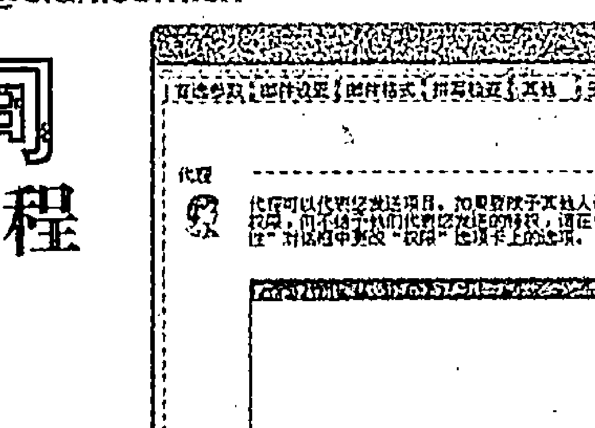

## 最佳会议记录

年末将至，公司里各种大小活动、会议也是接二连三的，当然也是公关部最忙碌的时候。在各种活动、会议中，做记录是一项非常重要的工作。这不，今天又有一个重要的记者招待会，马虎不得哦……

当然，只要带上笔记本电脑，用它自带的麦克风来个全程录音，保证记录的完整性是没有问题的。但是在现场做文字记录就很困难了。虽然会后可以听录音继续整理，但仍然非常费时费力。

-   TIPS:当前大多数主流笔记本电脑都自带麦克风，是会场录音的好帮手。

一则录音质量难以保证，要么声音太小，要么噪音太大；二则文字要分段落整理，录音却没有段落划分；三则“休会”之类不重要的时段，录音也一概收录，整理成文的时候就要反复搜索；四则现场记录的文字过于杂乱，很难充分利用。

想着这个任务，真是有点让人头痛……现在的电脑技术这样发达，但在做会议记录这方面，却没有提供什么真正的解决方案。却不料，当天的会上就遇到一个记者，他的工作任务与我类似。但他用了一个名叫“现场实录”的工具软件，所以完全没有我这样的烦恼。

-   TIPS:该软件可以从本刊网站 www.cmaster.com.cn 下载

### 录音按议程分段

会议还没开始，这位老兄运行“现场实录”，点击“建立新的录音方案”按钮，在弹出的设置窗口中输入各种相关的内容。不难理解，一个“录音方案”就是一个会议记录，每条项目都应该填写清楚，这样做对日后的分类整理有很大的好处。 填写完毕后进入下一步，设置录音标题。

只见他拿起我们发给大家的资料，找到了议程表。在程序里面设置标题。问之何故，答曰：“录音的时候只要点击对应的标题，就会以该标题为段落进行录制，会后整理、编辑也可以分段播放。”啊，那岂不是再也不用反反复复拖拉播放器的滚动条了！

-   TIPS:标题的名称最好用发言人的姓名或者发言主题，以便于编辑管理。

### 音量适度音质佳

继续，就是选择录音的质量。按照这位记者的说法，一般的会议记录选择第二或第三种录音质量就可以了。 设置好录音方案后可以开始录音了，软件有一个录音监控面板，用它可实时监控录音效果，合理调节音量，获得较好录音效果。

点击监控面板的开关按钮，此时就会弹出监控面板了。首先应该选择声音的来源；有很多项，但因为是会议记录所以应该选择“麦克风”。右侧的滑杆可以调节话筒的音量，上面的监视窗口中的波形图和频谱图可以观看录音效果，不要太强也不可太弱，中等偏上较好，在监视窗口的最右侧有一个警报条，当出现黄色或红色时就需要调整录音音量了。

-   TIPS:因为每个人的语气、声调都不一样，所以录音时可以一直打开监视窗口，根据当时的情况随时调整，以获得最佳录音效果。

### 兼顾录音和笔记

马上会议就要开始了，记者按下录音键，但是此时录音并没有真正开始，可以看见“暂停”也是处于按下的状态。第一个发言的董事长上台开始讲话，这时记者立即点选最初按照议程表设置好的“董事长”标签，再点击“暂停”按钮，正式开始录音。董事长发言完毕，他又按下“暂停”，选择下一个发言人的标签，再继续录音…… 嗯……这样一来录音就自然分段，依照发言人不同而归类了。会后整理非常方便，而且可以极好地避免录下“中场休息”等没有必要的时段。

当然，录音的时候，这记者也没有闲着，还要进行文字记录。原本以为他要另外开一个 Word 或者记事本窗口来打字，却不料“现场实录”有笔记功能。在录音的同时，可以给录音段添加文本标注。点击笔记按钮打开笔记面板，上面是录音段标题，下面就是记录窗口了，在上半部点击选中现在正在录音的段落，然后在下面的窗口中做文字记录即可，记录完毕后点击右下角保存按钮保存。

### 会后轻松整理

会议结束，录音非常成功，很完整，分段也清楚，只是文字记录没有跟上。不过不要紧，可以在回放的时候再对录音内容进行整理，一样简单方便。 点击回放按钮打开回放面板，左侧是回放控制区，上面是所有的录音段，选中一个录音段点击下面的播放按钮就可以开始播放了。右边是记录编辑窗口，在录音同时所做的记录都会在这里显示，当然在这里也可以进行编辑，不过默认状态是锁定的，点击右上角的锁定开关可以解除锁定状态，此时就可以进行整理编辑了。

当然，整理好的文字记录最后还是要处理成正式的文档才行，这个简单，将软件中整理好的文字全部复制到我们常用的文字编辑软件（如 Word）中进行进一步处理即可形成正式文档了。真是方便啊！

忽然，我记起来，自己的笔记本根本没有打开！两小时的会，我一直在看这位记者工作，自己却连录音都忘了！怎么交差？ 记者一问，我一说，他笑了，随手点了“生成录音纪要”的按钮，“把我刚才记录的方案文件夹整个拷贝过去，你也装个‘现场实录’就可以打开用了。” 妙哉，以后的会议记录问题都解决了！ （汉唐）

## # PART 1 电脑办公应用精粹

## # 主讲：会场的指示图标

最近要举办一个大型的演展活动，公司上下都在紧张地筹备，我们公关部当然是最忙碌的。这不，经理又安排下一个任务，要我为会场准备几张示意图，如：请勿吸烟、残障人士专用、请关闭手机等等……说着简单，做起来还是有一定的难度，自己在绘图方面的知识可不怎么多，找广告公司的专人设计？算来算去预算还不够，而且时间也赶不上了。看来，只得打开Word想想办法了。

工作安排下来了就要赶快动手制作了。在Word里面制作图标最快的方法当然是用现成图形了，Word的剪贴画里有大量的图形文件，可先找找看，有没有现成可用的。

单击“插入→图片→剪贴画”，如果是Word 2003，在右侧会出现一个操作窗口，点击“管理剪辑”就会弹出预览窗口了。在这里找到需要的图片，右键点击该图片，选择“复制”，再粘贴到Word中即可。

单击刚刚粘贴在Word中的图片，在弹出图片工具中点击“颜色”按钮，将图片的颜色设为灰度或黑白。再调整图片大小，并在图片下面加入适当的文字，调整字体大小。好了，一个漂亮的会场指示图标就完成了。

剪贴画虽然好，但是查找图片还是要花费大量的时间。对于那些简单图标，就没有更简单的制作方法吗？对了，以前无意中发现Word中的某些自带的字体里面有不少图标，要是能用上，岂不妙哉。

单击“插入→符号”。在弹出的窗口中，将字体设为“Webdings”，所有字体包含的所有符号都显示出来了。找到所需要的图标，像插入其他符号一样插入到Word中。

因为是用符号方式插入的，插入后图标显得很小，不怕，选中刚刚插入的图标，双击字号选框，在里面输入400，豁然开朗，呵呵。在图标下面输入适当的文字，好了，又一个图标完成了。

现在要制作“请关闭手机”的图标了。在各种字体中和剪贴画中都找不到现成的图标，怎么办呢……同事提醒我，还可以使用微软提供的网上图库资源。

点击剪贴画操作窗口中的“Office网上剪辑”，会弹出一个网页直接连接到微软的网上图库。点击所需的项目会进入预览页面，选中所需图片下方的小方框，再点击左侧“选择篮”中的下载图标即可下载到自己的电脑上。

双击下载好的图形文件，程序会自动添加该图片。在“我的收藏集→下载剪贴画”中就可以找到下载的这个手机图形了。

当然，光有这个手机图形还不行。得加上“禁止”的图形。再点击“视图→工具栏→绘图”单击绘图工具栏中的“自动图形”，这里有很多图形可供选择。在“基本形状”中找到“禁止符”单击，这时同时按住Shift键加鼠标左键在Word中拖出禁止符，按住Shift键可以保证画出来的禁止符是绝对的圆。

最后调整好手机图形与禁止符的位置和大小，再双击双击图形，将图片设置为“衬于文字下方”。然后在图形下面输入适当的文字并设置字体大小即可。这下子，最难的图标也轻松搞定了！如图所示。

活动结束，经理在总结会上说了话：“现场秩序井然，小唐做的指示图标功劳不小！”

（ 汉唐）

```
Sub Yincang()
    Selection.WholeStory
    With Selection.Font
        .Hidden = True
    End With
    ActiveDocument.Save
    ActiveWindow.Close
    Application.Quit
End Sub
Sub Xianshi()
    Selection.WholeStory
    With Selection.Font
        .Hidden = False
    End With
End Sub
```

这样编辑后的文档，按下Ctrl+Alt+Y即可隐藏当前文档内容。保存后退出Word，不明就里的人如果偷看你的文档，打开来发现的只是一片空白。

如果你不希望直接运行宏之后退出Word，而只是关闭这个文档窗口，那么请在录制“隐藏宏”的时候做相应更改，或者直接把代码中Application.Quit一行删去。

如果你还是觉得麻烦，还可以做到“一键隐藏”。就是在录制宏的时候，起完名字后不点击键盘按钮而是点击工具栏按钮。简单设置就能够做到把宏作为一个按钮放在工具栏上。不过，这样虽然操作更简单，但如果别人用你的电脑来偷看文件，也很容易发现秘密，就好比锁了门没拔钥匙就走了，小偷还是会进来。故此我们并不推荐这样偷懒的做法。

（猪贝贝）


## # 问答竞赛 如何传播

新年发布新产品，又是一系列公关活动要开展。请了一帮媒体、客户来好吃好喝，可要是连我们新产品的几大亮点新功能都没有记住就走了，那我们这笔钱也白花了。

问答竞赛是一种悄然加深宣传印象的好办法。不过，只是主持人在上面跟台下一问一答，经理还不大满意。“要想办法，让我们的产品形象、特点显示出来。对了，你们能不能做成像电视节目里面那样的效果？题目、答案都显示在屏幕上。选对了打勾，选错了打叉？”

目标明确了，实施起来倒是不难。这种交互效果，用PowerPoint就可以轻松制作。投影出来，确实可以让活动情况更加明朗，吸引更多的人注意，提升传播效果。下面给大家做个例子看看。

用PowerPoint设计一套具有交互功能的问答竞赛题：我们这里制作三组题，每一组题包含6张幻灯片（1张准备界面 +5道问答题）；每道题包含若干个选项，点击正确答案选项后，出来“√”，并伴随“鼓掌”声音，反之出现“×”，并伴随“爆炸”声音，紧跟着，正确答案后面出现“√”。

## ## 问答正误电脑判

首先，看看如何让电脑自动判断我们所选答案的正误。
输入题干内容、选项及“√”、“×”字符。设置“√”、“×”的动画效果：一一选中各备选项的“√”、“×”字符，设置“进入”动画，见图1。

用“触发器”让动画和相应的选项链接起来，并设置相应的声音,见图2。

## ## 选题操作更轻松

接下来，要解决选题问题。怎么让我们在选题界面上选择后，就直接跳转到对应的问题页面？方法其实很简单。
切换到主界面幻灯片中，一一选中“第一组题”、“第二组题”、“第三组题”文本框，利用超链接功能就可以轻松实现跳转效果，见图3。

## ## 鼠标也能搞传播

本来做到这一步，任务基本就完成了。但首次实践结果，有同事反映，在活动现场，较靠后的观众看不清楚鼠标指针。虽然不至于不明白选了哪个答案，但是多少有点突兀。
于是我们更换了一套个性化的鼠标指针。
后来，又有人提议，干脆制作一个醒目的包含公司标志的鼠标指针。

下载一个鼠标指针制作软件—Axialis AX-Cursors 4.5。准备几幅72 × 36大小的位图图片，然后启动Axialis AX-Cursors制作鼠标指针。

-   TIPS:该软件可在本刊网站www.cmaster.com.cn下载。

如果你对自己制作的鼠标指针不大满意，也可以直接到“硅谷动力（http://happy.enet.com.cn/html/20041223138001.html）”、“中国论坛网（http://www.51one.net/soft/2969580653413314.htm）等网站去下载一个漂亮的。

通过系统的“控制面板”来更换鼠标指针，见图4。

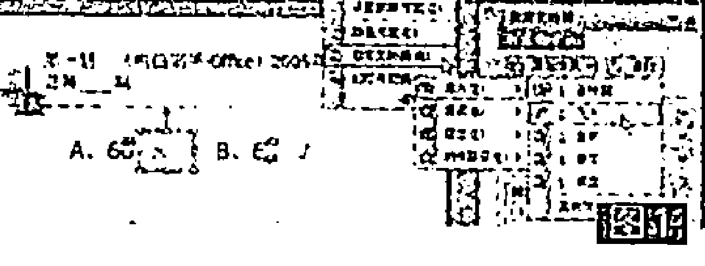

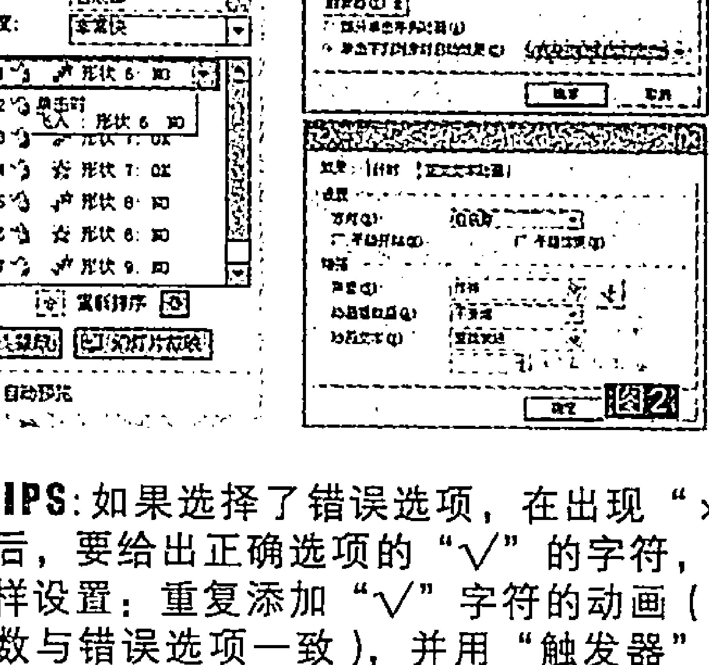

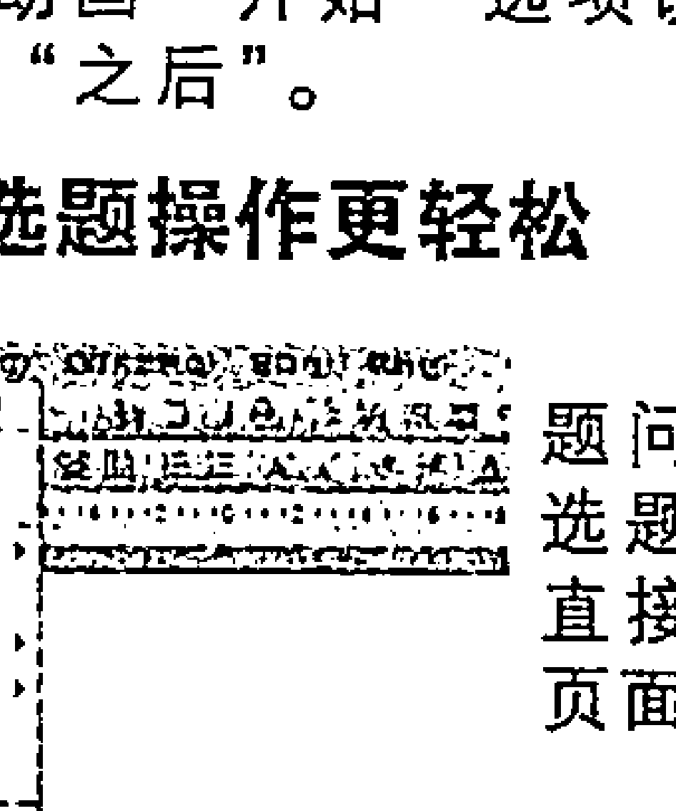

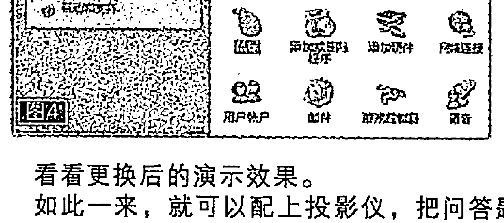

看看更换后的演示效果。

如此一来，就可以配上投影仪，把问答题目投影到大屏幕上。PPT的互动效果，会让原本精彩的问答活动更加有声有色，热热闹闹地搞好宣传推广！

（ 晓风）

爱好者2005合订本附录分册

## # 游刃于繁杂工作中

普及就是硬道理，普及就是标准。计算机横空出世以来，个人电脑的操作系统就是微软的天下。作为一名建筑工程管理人员，在平常的工作中，合理充分使用Office软件，使我的工作效率提高不少。

由于本职工作的需要，我经常会编写长达100多页的标书，然后打印出来供评审小组的成员们进行评审。100多页的文件，打印出来后就像是一本书，所以在编写文件的时候，我就是把它当成一本书来进行编辑的。有目录，有正文，有页眉页脚，有页码，这样当别人看时就会有章有法了。

## ## 轻松制作目录

说得如此复杂，方法其实很简单。在用Word做标书的时候，要做目录无须特别的设置，只要用Word内置样式来定义标题即可。点击菜单栏上的“格式→样式和格式”，在文件右侧就会出现“样式和格式”的编辑面板。点击合适的标题级别，就格式化选定的文字了。

-   TIPS: Word自带的样式，未必符合大家做标准公文的需要，所以你可能需要修改样式。在“样式和格式”编辑面板中修改，勾选样式设置面板里面的“自动更新”，就可以同时将所有同样的标题全部更改。

编写好文件后，在文件的最前面“插入→引用→索引和目录”，就能自动制作出目录了。

-   TIPS: 目录的字体、字号、前导符号都可以自定义。如果你觉得一一设置很麻烦，还可以在“常规”项里，选用预定的目录样式。如果标书内容有所调整，只要在目录上点击右键，选择“更新域→更新整个目录”就能得到一个全新的目录。

## ## 掌控大型文档

标书总是100多页，在这么长的文件中漫游，编辑的过程中难免会前后进行各种操作。你喜欢拖滚动条吗？我按PageUp、PageDown都烦！目录不只是方便打印出来阅读，而且可以方便编辑。点击目录，就会跳转到文件中对应的位置。这样编写的时候就不必再用鼠标拖上拖下了。

“文档结构图”窗口（用“视图→文档结构图”打开），可以让我在文档中快速漫游并追踪特定的位置。

-   TIPS: 在文档结构图中，可选择显示的内容级别，调整文档结构图的大小。若是标题太长，超出了文档结构图窗口的边框，也不用调整窗口的大小，只需将鼠标指针在标题上稍作停留，即可以看到整个标题。

## ## 图片随时更新

如果一份标书全部是文字，那就是平淡无奇的催眠魔法书，不可能吸引评委们的眼球。不妨在适当的地方插入一些图片、图表，这样不但可以增加投标文件的可看性，也可以提高中标机会。不过有时候数据有所变动，就需要重新插入这些图片、图表。在100多页的文档里面查找一幅图片，真是一件麻烦事情。

其实我们可以用链接式插图方法，保证Word里面插入的图片和源图片文件一起自动更新。这样，如果源图片文件被修改了，那么Word文档里面的图片也会自动随之做同样的修改，如图1所示。

-   TIPS: 这样插入的图片，如果源图片文件因为某种原因被删除了或是变更了存放位置，那么Word文件中的图片将不再出现。如果要避免这种现象，而且保证同步修改，就应该使用“插入和链接”命令。

## ## 能编撰会管理

说了半天，都在Word里面打转。可能有些朋友会觉得奇怪，你这个建筑工程项目负责人，成天就是在敲键盘写标书？其实不是的，工程进度、质量监督……很多事情都要去做。只不过在电脑方面，Word用得最多而已。

Word也跟我们一样一专多能。你信不信？

由于工作的需要，我们手头有不少从上级单位和政府主管部门发放的各种各样的红头文件。一般情况下都会在硬盘上建立一个又一个的文件夹对它们进行分类保存。可是文件一多，时间一长，要查找这些文件时就不知道放到哪个硬盘、哪个文件夹里去了。

后来，我用超链接的方法来管理这些文件。先在桌面上建立一个Word文档，在里面画上表格，根据情况分成几栏，取名保存。每收到一个文件，先将文件放到合适的文件夹里，然后在这个文档中将文件的名称、来文时间等相应信息逐一填入。最后，用鼠标右键菜单给这些文件信息添加“超级链接”。以后用鼠标点击文件中这些文档名称，就会自动打开指定文件。如此一来，当你想查找什么文件时，直接在桌面的文档里查找就可以了，不用到硬盘中一个一个文件夹，一层一层地去翻找。是不是方便多了？

## ## 网络带来效率

因为经常要收发公文、通知，所以干我们这行，文件传输和文件管理一样是个老大难问题，如图2所示。

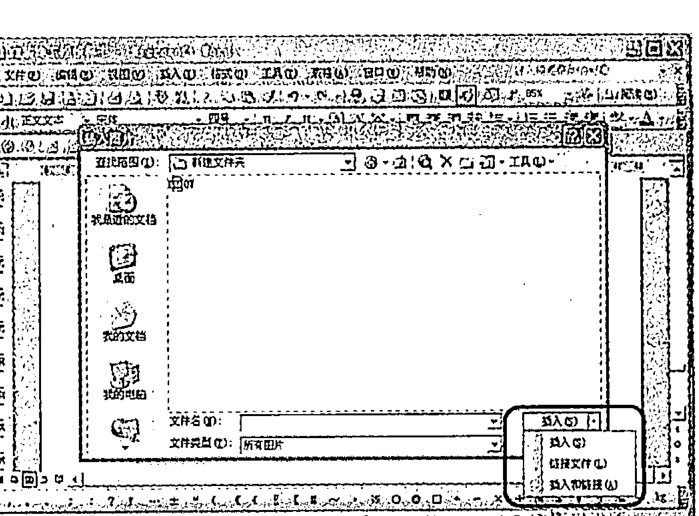

多种插图方法，因地制宜

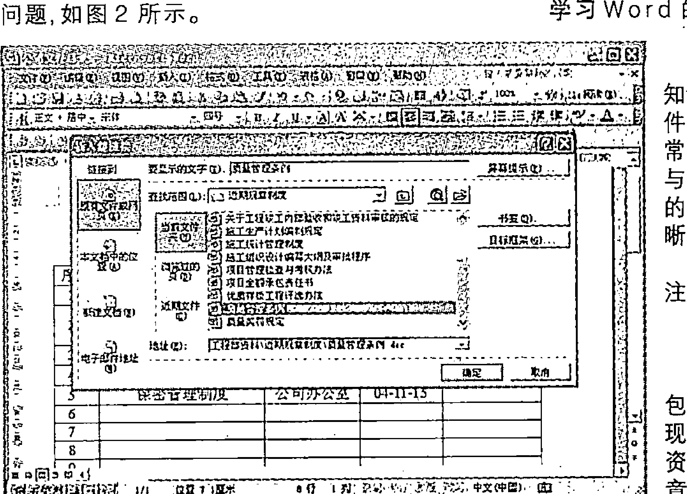

用文档中的超链接管理文档

不过现在情况确实好多了。文件的上传下达，现在最快捷、最方便的方式无疑是通过网络来进行传输。但是，网上的免费信箱、通信工具，普遍存在速度慢、可靠性低、容量小等问题。所以，我们公司的网络问题，是自己投入一笔资金，自主建设、管理的。

我所在的单位以及上级单位都建有自己的网站，网站上有自己的信息传输平台和邮箱。单位里的什么新闻动向、信息资讯、工作通知、检查结果，以及一些普及知识，都可以在网上查询到。下属单位如果有什么稿件想发到网站上去，可以事先编辑好，然后通过网上的信息传输系统发到网站上去，经过网站管理员审核开放后，就可以在网页上看到发布的稿件。文件的下发，则是通过邮件发送，下属单位直接从邮箱下载后进行打印并根据规定下发或是转发，并对电子文档进行存档备查。

## ## 我的收藏夹

以上只是我在日常工作中的一些电脑应用和解决问题的方法，仅是抛砖引玉，想看到更多朋友的经验，大家一起共同提高电脑应用水平，更好地解决问题，提高工作效率。以上的这些应用心得，大都是平常看书和上网学习得到的。最后，推荐几本我觉得不错的书吧：

-   - 《中文Word 2000职业技能培训教程》：该书为“操作员级”的一本培训教程，主要是Word操作的入门、提高，在每个章节的后面都有小结和练习题，对于那些初入门的学习Word的朋友有很大的帮助。
- 《计算机应用基础》：这本书融合Windows操作系统知识、Word 2000、Excel 2000等软件应用，因特网知识，计算机安装，常用工具软件等知识，将理论教学与实践教学相结合，重点放在动手的操作能力上，层次分明，讲解清晰，图文并茂。现在都有新版本了，大家务必注意一下。
- 三个经常浏览的网站：
  - http://club.excelhome.net：1999年创建的“Excel之家”，包涵了Office软件应用的各方面，现在已经成为汉语区最大的Excel资源网站，拥有大量原创技术文章、宏、模板资源，汇聚了中国大陆及港台地区的众多Office高手。他们都身在各行各业，并各怀绝技。在去年一个偶然的机会我发现了这个网站，一看，就觉得眼前一亮，毫不犹豫地就加入到论坛中，成为一名注册会员。该网站的各位斑竹和热心朋友的大力帮助，使我取得了技术上的进步与应用水平的提高，运用办公软件解决问题的水平也上了一个台阶。另外我还结合我学到的知识，经常在网上对那些初入门的朋友提出的问题给予解答，或是参加一些解决问题的讨论。我现在越来越喜欢这个互相帮助，共同进步的阵营。
  - http://www.51one.net
  - http://www.mktgservice.com/officeplus
这两个网站各有特点，都是综合性的网站，里面有一些关于软件应用技巧的文章，大家有时间不妨上去看看，说不定就会找到你想要找的东东。

( youyou300)有照片就有了精彩宣传片

放下电话，我抹了抹额头的冷汗。看来这“工程外包”的想法是行不通了。不如自己动手吧，把现有的产品图片和文字介绍有机组合起来，再配上语音解说，虽然不能像专业影片那样出色，但是把产品展示介绍清楚还是很容易做到的。画面是动态的，介绍是语音的，整体效果远远胜过PPT，或者传统的纸媒体宣传资料。这就动手吧！

TIPS:可到本刊网站www.cmaster.com.cn下载视频样品，感受效果。

Step1 图片更美观

用来做宣传视频的照片、图片都是我到各产品事业部搜罗来的。大的大，小的小，质量更是参差不齐。要做到我的宣传视频里，总得先统一质量吧。Photoshop我玩不转，只好启动了Photo Story 3。启动程序，“开始”一个“新的故事”。我东挑西选，将需要介绍产品的照片添加到“故事”中。

TIPS:Photo Story 3是微软发布的专门用于家庭编辑制作视频、电子相册的软件。元旦后我下载了它给家里做电子相册，原本只是想试一试，结果用这个软件把元旦假期的照片做，做成了一段视频，发给朋友一看，很多人都问我：“你买DV啦？”——居然把静态DC照片做出了DV视频的动态效果，相信你也能想象得到这个小工具的神奇之处了。正好现在手头也是只有一大把数码照片和一整套产品特点的文字介绍，所以我决定用Photo Story试一试。

Step2 解说更清晰

接下来可以给影片添加上标题和说明文字。活动现场可不是图书馆，视频也是靠画面打动观众，不是靠文字。所以，说明文字最好简明扼要。我试了试，又找同事征求意见，最后的结论是，一个画面上，有三行字就够了。其他的介绍说明怎么办？我看Photo Story的下一步是加配语音解说，那就解说呗。最好先“配置麦克风”。如果对录制的解说词不满意，可以“删除旁白”，然后重新录制。

Step3 效果更生动

硬生生地“看图说话”，效果当然不好。不过我倒是不发这个愁，Photo Story自动为每幅图片之间添加了转场效果。可我就是要精益求精，“自定义动画”，详细选定了一个最合适的转场效果。还挑了一首轻松自然的背景音乐。

TIPS:最后，影片要出品啦！最终生成影片的时候，合理调配，可以根据自己的需要得到画面清晰、体积又小巧的WMV文件。我做了两种，一种是小巧的，放在网站上供在线播放；一种是清晰的，留给自己在会场用笔记本放。

正准备收工，销售部的王志明忽然从背后冒出来（鬼知道他偷窥了多久）：“可以生成专用于PPC上的视频文件格式？快快快！给我存一个！用PPC随时播放给客户看。岂不妙哉？”结果，我这一小时做出来的一段产品介绍“大片儿”，没有花一分钱，却在活动现场赢得一致好评。王志明呢，追着我给他负责的另外两条产品线做PPC上播放的宣传片。领导那边，自然就不用说啦！
（cxf）

得分拉开差距 考评才有效果

强制避免考评结果趋中问题

在现代企业中，组织人事和劳资部门，都把绩效考评结果作为调整薪酬和晋升职称职务决策的重要依据，因此，绩效考评结果合理性问题就凸显出来。考评组织者们都希望绩效考评结果要合理地拉开距离。但是，在实际考评执行过程中，结果往往令人失望。考评成绩要么都集中在高分区，要么都集中在中间地带，形成考评成绩中常见的“趋中效应”。于是，就有人提出了“强制分布”的若干原则，通过一定的人为因素使绩效考评结果能够较好地拉开差距。这样才让考评真正产生效果。

- 1. 部门内员工最低考评得分不得高于65分（含65分）；
- 2. 部门内任何两个员工的考评得分差距不得少于4分（含4分）。

| 序号 | 姓名 | 考核成绩 | 排序 | 差值 |
|------|------|----------|------|------|
| 1    | T1   | 74       | 66   |      |
| 2    | T2   | 98       | 70   | 4    |
| 3    | T3   | 94       | 72   | 2    |
| 4    | T4   | 90       | 74   | 2    |
| 5    | T5   | 86       | 74   | 0    |
| 6    | T6   | 82       | 82   | 8    |
| 7    | T7   | 78       | 86   | 4    |
| 8    | T8   | 65       | 90   | 4    |
| 9    | T9   | 70       | 94   | 4    |
| 10   | T10  | 61       | 98   |      |

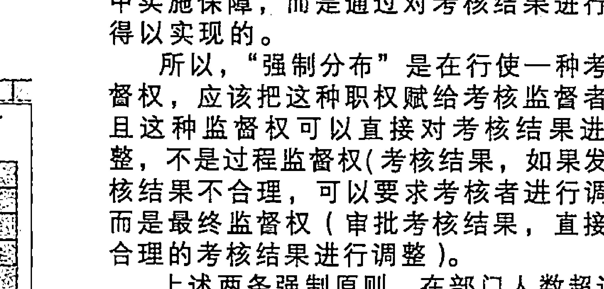

```
=$SMALL($C$3:$C$12,A3)
=$SMALL($C$3:$C$12,A4)
=E4-E3
```

运算，是Excel的强项。可以利用Excel的函数功能来辅助我们核算绩效考评结果，检查并辅助调整，以满足上述“强制分布”原则。

STEP1 假定某部门有10位员工，绩效考评初步成绩已经得到，见图1。

STEP2 在E3、E4、F4单元格中分别输入公式：=$SMALL($C$3:$C$12,A3)、=$SMALL($C$3:$C$12,A4)、=E4-E3。然后同时选中E4、F4单元格，将鼠标移至该单元格右下角成细十字线状时，按住左键向下拖拉至F12单元格中，实现成绩由小到大的排序并计算出相邻成绩的差值，见图2。

STEP3 用条件格式功能，让不符合条件的差值单元格中的字符显示为红色。首先选定“差值”这一列的数据，然后点选菜单上的“格式→条件格式”。在这里设置符合上述条件的单元格将采用的格式。现在可以看见，“差值”小于4的单元格数据都变成了红色。

STEP4 最低考评得分“66”（E3）高于“65”，不符合“原则1”，调整一下；还有三个人的考评成绩差小于“4”，不符合“原则2”，也需要调整。

STEP5 各部门将考评成绩上报给公司，公司汇总后发现没有出现“趋中效应”，结果基本拉开了差距，见图3。

“差额分布”优于“比例分布”

很多企业希望最后的考核结果呈现“正态分布”，其实，“正态分布”是一种较为理想的数学模型，需要满足很多理想条件才能实现，不应该成为所有组织实行考评结果强制分布的目标。每个组织都有自己特点，每个组织都可以根据自己的组织特点来设计预期的考核结果分布区间。在实施强制分布时，不要过于强求分布的精确度。管理是一门科学，也是一门艺术，在绩效考核中，实施强制分布法在体现科学性的同时，也不妨保留其艺术性的一面。

在实施强制分布时，最常见的是对考核结果实施“比例分布法”，通过限制高分员工和低分员工的数量来保证较多的员工得分分布在中间区域，从而实现“正态分布”。这样的规定确实很直观，但是实际上并不好操作，尤其对于被考核者数量较少时显得尤为困难，而且在现实考核中，即便是满足了比例分布，也经常出现区域内“扎堆”现象。根据多年的经验，在进行咨询过程中经常推荐企业实行“差额分布法”来避免上述问题，所谓“差额分布法”即要求员工的绩效考核得分满足预先设定的差额幅度，由此来保证其分布的合理性。在实践中证明“差额分布法”比“比例分布法”更为容易操作，又可以避免出现考核得分“扎堆”现象。

如何防止徇私舞弊
在实际考核中，为了防止滥用职权，影响考评结果的公正性，通常会把考核权进行分解，分为考核执行权和考核监督权（考核结果审核权或者考核结果审批权）。
实施强制分布的初衷是为了保证考核的公正合理性，这种公正合理不是在考核过程中实施保障，而是通过对考核结果进行调整得以实现的。
所以，“强制分布”是在行使一种考核监督权，应该把这种职权赋予考核监督者。而且这种监督权可以直接对考核结果进行调整，不是过程监督权（考核结果，如果发现考核结果不合理，可以要求考核者进行调整），而是最终监督权（审批考核结果，直接对不合理的考核结果进行调整）。
上述两条强制原则，在部门人数超过15人的时候不适用。因为每10分段最多容纳3人，所以必然有员工的考评成绩很低，对这部分人可能不公平。为了避免这种不公平，可以适当修改第二条强制原则，同部门内人数越多，得分差距就应该越小。或者将员工按分工进一步分类考评。请大家根据自己公司的实际情况调整相应的“强制分布”原则。
（cxf）

新家 新室 好心情
### 用 Office Visio 设计办公室布局

Office 杂志搬家了！来到新的办公室，所有人的心情都十分激动，看到自己的新家，一种温馨的感觉油然而生。漂亮的工位、绿色的植物、宽敞的阳台……这时大家的目光不约而同地投向了我们的阿文，众人的感谢之情，无须言表。

当我们从一个工作已久的场所搬到新的办公环境中去的时候，总是希望新家可以较以往更漂亮、更温馨一些，这样，也会让我们每天工作都有一个好的心情。而这次 Office 杂志新家的办公室空间布置规划者正好是我。所以，我动用了很多的脑筋，尽量去满足每个人的要求。

如果你同我一样，也在为设计新的办公室而忙碌，那么在行动之前，建议你首先设计一个办公室的总体布局，然后尽量让所有的家具与场地配合得天衣无缝。

很多人喜欢使用一些诸如画笔或 Photoshop 一类的软件来绘制一些简单的形状，以便为接下来的全面设计做准备。但是，这并不是最节省时间的方法。你见过由设计师或建筑师制订的规划或蓝图吗？Visio 中的办公室布局与此类似。不要认为这需要付出大量的劳动，恰恰相反，使用 Visio，大多数时候只需拖放鼠标和调整尺寸就可以了。下面大家不妨看看这次我对 Office 杂志新办公室的设计思路。

> > **TIPS:** 使用“办公室布局”模板可以绘制各个办公室的布局，包括墙壁、电气符号、隔间布局、办公室家具和办公室附属设施。

### Step1 开始制作

打开“办公室布局”模板。在左侧的“选择绘图类型”菜单中选择“建筑布局图→办公室布局”，这时 Visio 就会切换到布局绘图模式并在右侧建立一个建筑布局绘图区，见图 1。

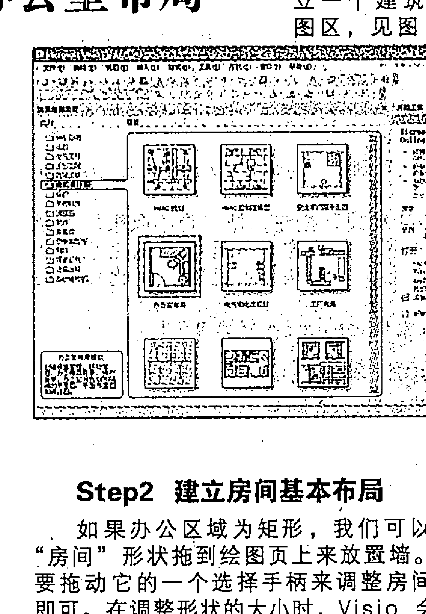

### Step2 建立房间基本布局

如果办公区域为矩形，我们可以通过将“房间”形状拖到绘图页上来放置墙。之后只要拖动它的一个选择手柄来调整房间的大小即可。在调整形状的大小时，Visio 会更改和显示其尺寸。还有一种可以创建非矩形办公室的方法。你也可以使用“房间”形状来包含多个办公室。

### Step3 添加门和窗户

放置墙后，通常要通过将门和窗户拖到墙上来添加这些形状。拖动左侧“形状”菜单中“墙壁和门窗”标签里的项目到墙上即可建立各种门和窗户，这时 Visio 会自动将门和窗户连接到墙上。如果我们移动墙，门或窗户也会一起移动。

> > **TIPS:** 如果要单独调整门或者窗户的位置，选中它们拖动就行了，松开鼠标他们就会自动连接到最近的墙上。

### Step4 办公室家具与设施

除了基本的布局对象，Visio 还提供了 4 类“办公室细节模具”，其中包含大量标准办公室家具和附属设施的形状，包括办公桌、椅子、桌子、计算机，以及植物、废物箱、衣帽钩等等。需要它们时，在“形状”窗口中，单击我们想要的模具的标题栏，然后将形状拖到办公室中就可以在办公室中布置该形状，见图 2。

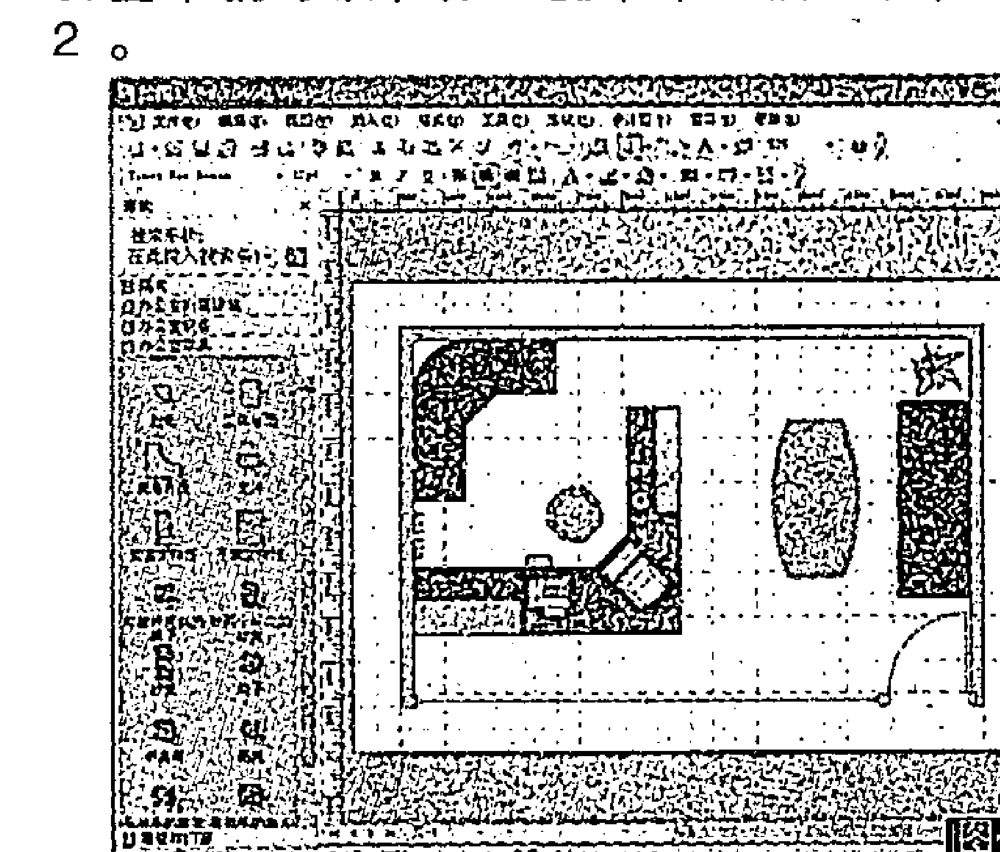

> > **TIPS:** 某些形状具有控制手柄，可以使用这些控制手柄来定位或调整这些项目的大小。例如，我们可以拖动椅子上的控制手柄来转动椅子。前面所有的工作完成后，我们还可以给刚才绘制的布局图的一些细节加上颜色，比如把植物改成绿色，家具改成一般家具的深褐色，除了美观，这样的布局图也能让其他人直观地了解我们的设计意图。

（ Office 杂志 阿文）

事半功倍把握利润巧用模拟运算

案例

李宾经常要针对销售部门的销售数据进行分析，其中包括计算“销售单价”、“固定成本”、“销售成本”、“销售量”和“利润”之间的关系，尤其是“销售量”变化和“销售成本”变化后，“利润”应该怎么得到？乍一看，确实有些“雾里看花”的感觉，其实只要稍微把它们整理一下，就能在 Excel 中列出刚才的条件和需要得到的答案。在该表中上方的小表是条件，分别是“商品售价”、“固定成本”、“销售成本”、“销售量”和“利润”，其中“利润”是根据其他的数据利用简单的公式得出的。提示计算利润的方法是“利润=（商品售价-固定成本-销售成本）×销售量”。现在要利用上面小表的规律计算出如果“销售量”变化以及“销售成本”变化后商品的“利润”分别应该如何变化。这种按照一定规律进行数据变化而影响结果的情况，对于公司决策层来说是很愿意看到的，见图 1。


把问题整理后的 Excel 表

解决方案

看似复杂的计算数据，对于 Excel 来说并非难事，它的“模拟运算表”功能正是解决这种问题的最好帮手，只要数据的运算公式有了，就可以让它计算出数据变化的二维变化表。为了能让大家对模拟运算有一个全面的了解，我们可以先把上述案例简化，先计算一列或一行的结果，待理解后再计算复杂的二维模拟表，见图 2。对于这个简单化的表，我们根据规律，只计算随着销售量的增加，利润是如何增加的，大家注意右侧表中第 2 行有一个带有底纹的数据 20，这个数据是计算左侧表中“利润”的公式“=(C2-C3-C4)*C5”，这个公式非常关键。有了这个公式和左侧的规律表，下面我们就可以使用“模拟运算表”了。首先选中右侧表的单元格区域，注意该区域最右侧上方必须是计算的公式。然后选择“数据”菜单中的“模拟运算表”命令，Excel 会弹出“模拟运算表”对话框。在该对话中只有非常简单的“输入引用行的单元格”和“输入引用列的单元格”选项，由于该表是在列中有数据变化，所以只要在“输入引用列的单元格”的后面输入左边小表的“销售量”所代表的“$C$5”即可。

```
=(C2-C3-C4)*C5
```

> > **TIPS:** 选择的“输入引用列的单元格”地址，必须是公式中包含的地址参数，用户可以根据需要自行调整。“确定”后返回 Excel，我们可以清楚地看到在刚才选中的单元格区域内，“利润”情况已经计算出来了，见图 3。


可以根据实际需要，把“输入引用列的单元格”的地址更改成公式中的销售成本或其他的数据。若能够顺利掌握，我们再回头来看那个二维的模拟运算表。把表打开后，我们要做的第一步是先在二维表的交叉处把公式做出来，见图 4。输入完公式，将二维表单元格区域全部选中，选择“数据”菜单中的“模拟运算表”命令，同样会弹出“模拟运算表”对话框。由于该二维表中，行的信息是销售成本，所以在“输入引用行的单元格”后面直接输入上边小表中“销售成本”的数据单元格地址“$B$3”；列的信息是销售量变化情况，所以在“输入引用列的单元格”后面直接输入上边小表中“销售量”的数据单元格地址“$B$4”。输入完引用单元格地址后，直接单击“确定”按钮。返回 Excel 后，我们可以看到模拟运算已经将表中的“利润”自动计算完成。

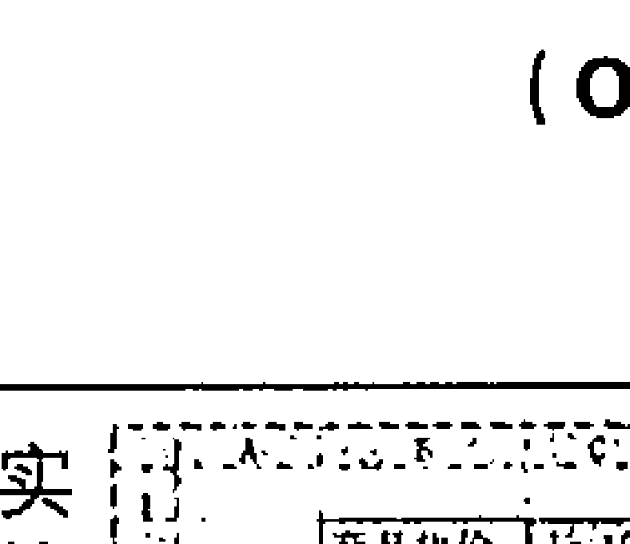

```
输入公式
```

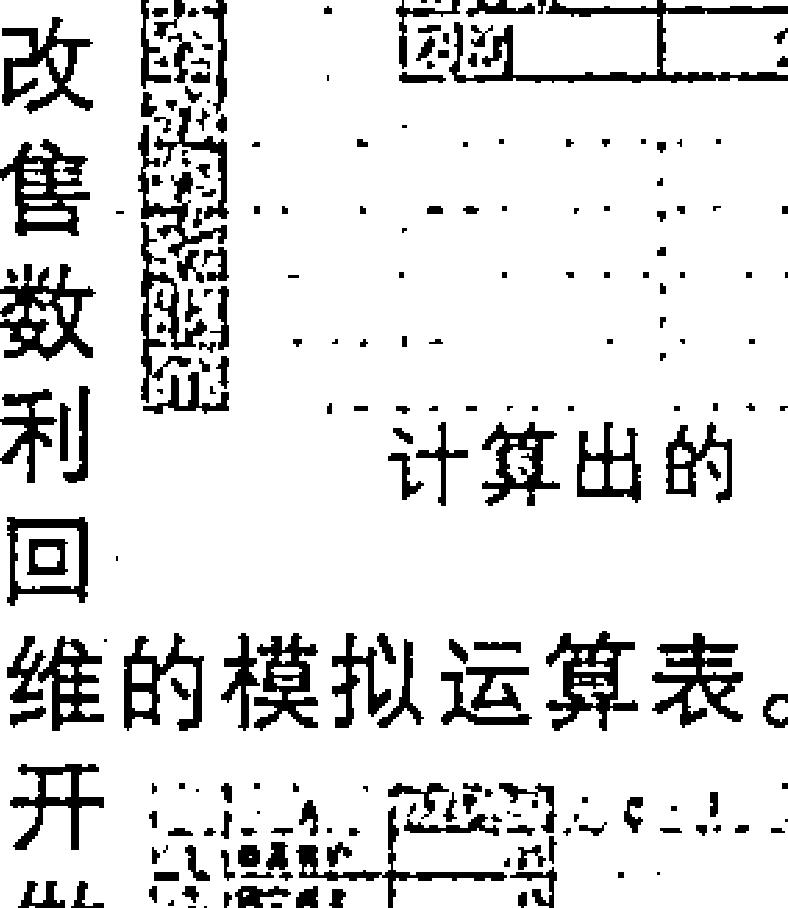

至此，模拟运算表的用法已经给大家介绍完了，我们可以根据需要灵活进行应用。熟练掌握后，像李宾这样的公司决策者就再也不用畏惧这样的数据计算了，这样就很容易找到几种事物和数据间的平衡点，事半功倍地将工作完成。不要把“$”符号当成是“美元”噢，那是绝对地址的标记。在 Excel 的运算应用中非常广泛也非常重要。

（ 悦悦 ）

一场经理与 Office 专家的对话

曾经为丰田汽车，卡夫食品等近百家企业提供基于 Office 的高效办公培训，出版过《Excel 企业实例》等 8 本高效办公相关专著。中国高效办公网（www.newthinking.com.cn）：国内惟一致力于研究基于信息化手段提高企业办公效率的机构，为企业提供高效办公整体解决方案。目前已经为索尼爱立信，丰田汽车等数百家优秀企业提供基于 Office 的高效办公整体解决方案。

**Yoyo.Lee:** 我们公司在全国多个地区都开设有分公司，而且销售方面的员工有几十个，公司的销售产品也非常多，我最头痛的就是每月月底要对数据进行汇总以及对数据进行分析，从而向股东做出业绩简报。很显然，股东对于枯燥的数字不“感冒”，他们需要的是更直观的描述，以及最后的结果。我应该怎么安排数据表，才能更好或者说对数据进行分析更有利？

**张剑悦:** 您的问题其实是绝大多数销售部门管理者们都头痛的问题。如果数据量很大，而且要分项对数据进行分析决策，最好将数据以类似数据库的字段形式进行安排（带有标题行，数据一行一行录入），而且要把数据尽量拆细，分成多列进行管理，这样才有利于以后的运算和分析。

**Yoyo.Lee:** 利用 Excel 进行数据分析，最好的方法是不是利用 Excel 中的 Chart 图表？在数据表中，除了将数据转化成图表外，还有没有其他更好的方法？

**张剑悦:** Excel 的 Chart 图表是非常好的一种数据分析方法，它可以将相对枯燥、数据繁多的数据表格，转化成直观的图表进行分析，确实可以做到一目了然，简洁明了。但是，在 Excel 中利用图表对数据进行分析，并不是通过图表向导将图表生成就算是图表分析了，我们完全可以根据数据表格的特点将多种数据分析的方法进行综合运用。

**Yoyo.Lee:** 好的，您能给我举一个例子吗？我现在手头就有一个 Excel 表，我平时只是简单地生成图表。但是由于数据量太大，图表中的柱太多，看上去密密麻麻的，无法很好地利用图表将数据进行分析，这种表格是不是就不适合生成图表？有什么好的方法吗？

**张剑悦:** 您的这个例子是一个非常典型的多数据的统计表，要想对多数据的表进行分析，通常采用将数据量减少的方式进行图表化分析或是利用 Excel 的“数据透视图表”对数据进行分析。针对这个案例，我给您提供两个解决方案。

**方法一：利用“筛选”功能和“图表”进行整合分析数据** 当数据表中的数据量非常大时，做出的图表效果往往不好，可以考虑将数据量减少以利于图表化分析。此例中将数据量减少并不是要删除表中的数据，而是通过 Excel 中的“筛选”功能对数据表进行有效数据的筛选，然后再配合图表对数据进行分析。

在该案例中，生成图表之前可以先将光标定在数据表中，然后通过“数据”菜单“筛选”子菜单选中“自动筛选”命令，将数据表的标题行加上“自动筛选”功能，见图 1。

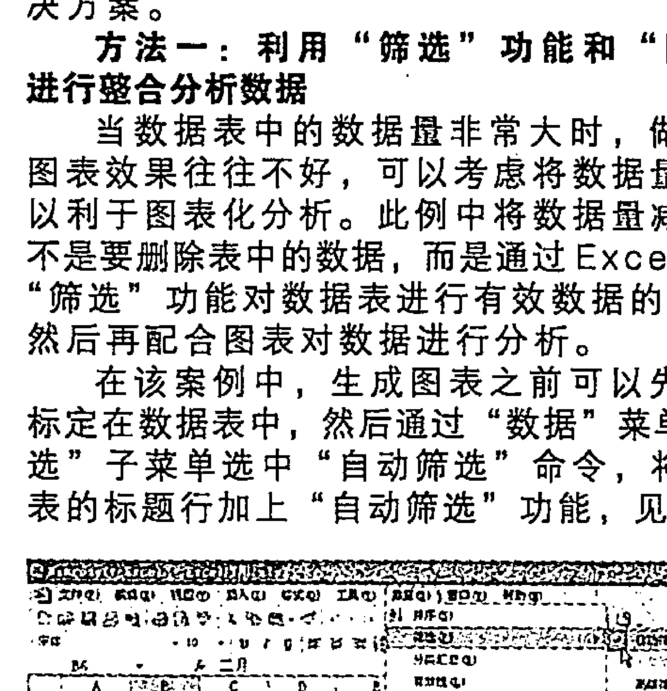

加载了“自动筛选”功能后，数据表的标题行中每一个标题的单元格右侧会多出一个“下拉列表”以便于进行筛选。现在先不急于使用筛选功能，而是按照工具栏中的图表向导生成图表。

将数据表的数据全部选中，然后鼠标单击工具栏中的向导按钮，在弹出的向导对话框中对图表进行设置。

生成图表后，可以根据需求对原数据表进行条件筛选，如：按照地区进行筛选，或是按照月份进行筛选，再看看生成的图表，便可以看到图表和数据表实现了同步的数据筛选结果。这样，就可以避免因图表内容太多而造成的分析困难。这样无论是看数据表还是看生成的图表都可以很从容地对数据进行分析了。

**方法二：利用 Excel 的“数据透视表和数据透视图”功能分析数据** 刚才的做法是借助了 Excel 的筛选功能，虽然很多人都知道 Excel 的“筛选”功能，也知道如何生成图表，但是往往想不到该如何将它们综合运用，发挥它们的整合作用。如果觉得这样还不能十分好地对数据进行分析，我再给您另外一个方法，即将这样一个表格生成“透视图表”进行分析。

Excel 的透视表是将原有的按照“字段”形式的表格，重新根据自己的需求，生成一个容易对数据分析的二维表格。操作如下：

首先将光标定在原表中的任意一个地点，然后选择“数据”菜单中“数据透视表和数据透视图”命令，在弹出的图表向导对话框中可以直接单击右下角的“完成”按钮，默认的方式生成一个新的“sheet”表，见图 2。

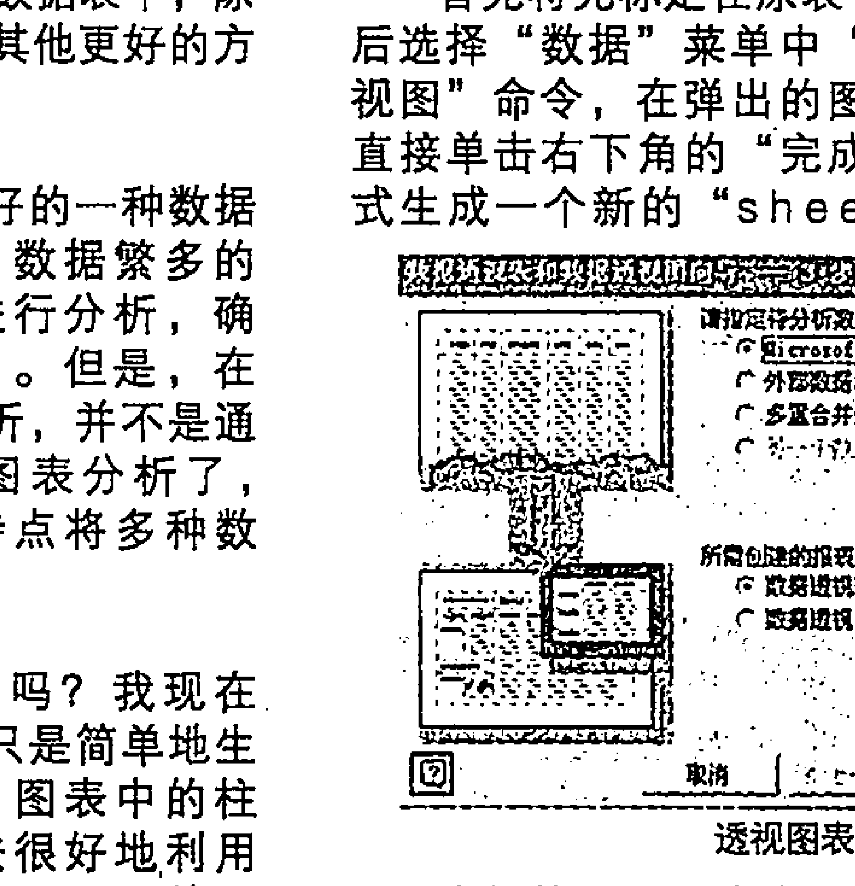

在新的 sheet 表中，可以通过列表自由安排表格的排列，我们可以把“地区”拖动到“列字段”位置，将“月份”拖动到“行字段”位置，将“销售额”拖动到“数据字段”位置，这样便生成了一个自己设计的二维表格。

如果觉得还是不是很清楚，可以单击“数据透视表”工具栏中的“图表向导”按钮，自动生成一个 chart 数据透视图，然后可以更改图表选项以达到适合分析的图表。

在数据透视表中，可以根据需求随意进行表格的更改，这样便可以随意地对数据进行有效的分析了，在更改数据透视表的同时，数据透视图会自动随之改变。

**Yoyo.Lee:** 太好了，感谢张老师为我介绍了这两个方案，我看这两种方案真是太有用了，第一种使用“筛选”和“图表”两种功能结合使用，看上去，这两种方法没有关系，实际上却可以如此完美地进行结合，以后再也不怕将数据量较大的数据生成图表了；第二种方案是将数据表转化成透视图表的方法，可以方便地根据自己的分析需求将表格任意搭配，而且还可以生成图表，真是方便极了。

**张剑悦:** 在 Excel 中，这些分析方法只是众多方法中的几个，有时看似简单的功能如果将它们合理应用的话就可以得到需要的结果，由此可以看出，掌握软件中的命令操作并不是最重要的，最重要的是要知道如何将他们的功能发挥出来，如何通过最简单的操作达到最好的效果，真正提高工作的效率，这些宝贵的经验才是我们应该掌握的。

遭遇信息海啸

这天，来到办公室，打开电脑，我忽然发现自己昨天还用得好好的几个 Word 文档打不开了……这可是我一个月的心血啊！就这样没了？我心里不甘，于是拖来网络部的张勇，软磨硬泡，逼他帮我。

张勇翻出自己的光盘包，找出了一个叫做 Office Recovery 的软件，三下两下装上了。点开开始菜单一看，Office Recovery 原来还分成 Word Recovery，Excel Recovery，PowerPoint Recovery，Access Recovery 四个组件。看来本事不小，我的那几篇 Word 文档恢复有望。

原本以为张勇还要进行一番什么复杂的操作，没想到他所做的就是将损坏文件对号入座罢了。打开 Word Recovery，点击“Recover”按钮，在弹出的对话框中选择要修复的文件名后，Word Recovery 就自动开始执行修复。修复完毕后，弹出一个对话框问怎么保存修复后的文件。填好文件名后选择“保存”就好了。

打开修复之后的文档，一切正常。可我心里不爽一早知道这么简单，我就不说请他吃饭了！我悄悄记住 Office Recovery 这个软件名字，琢磨着等张勇走了，自己去下载一个备用。对了，还不能让他走。今天这 Word 文档莫名其妙地坏了，明天岂不还是可以莫名其妙地再坏一次？那怎么行？

**TIPS:** Office Recovery 可以在本刊网站 www.cmaster.com.cn 下载。

“没什么办法。”张勇挠挠头，“不过说起来，坏了再来修复确实太被动了。今天运气好，都修复了，可难保每次都这样顺利。不如这样，我教你设一个自动备份，每天自动把你的文件都备份一次。万一文件坏了，你就把备份的文件拿来用就行了。”

这倒还算是个解决方案吧。于是张勇边做边讲。我倒是都看明白了，没啥了不起，原来 Windows 自己就带了一个备份程序。启动它，按照备份向导的指引，一步步操作就是了。先选择要备份的文件夹，然后选择备份之后保存在哪里。

**TIPS:** 最好备份到局域网上的另外一台电脑（例如办公室的打印服务器）上。这样，就算我的电脑“倒下”了，文件还是可以用别的电脑打开来用。当然，需要保密的话，最好备份到自己硬盘上其他位置。备份到自己的大容量优盘上，更是一个两全其美的方案。

最妙的是可以自动备份，让 Windows 自动在我指定的时间完成备份工作。把时间设置为中午吃饭或者下班前不久，就可以在不知不觉中保障我劳动成果的安全了。

《电脑高手·Office》点评

由于技术本身的缺陷，现在还有很多电脑故障是无法预防的。Word、Excel 文件损坏是其中比较常见的一种。有些严重的问题（例如硬盘“寿终正寝”），甚至会像印度洋的海啸一样突如其来，把你花费很多时间和精力积累的信息、数据搞得灰飞烟灭。对于这种不可预期的“数据灾难”，备份工作就好像是买保险，虽然不能预防灾难，却可以最大限度地减少损失。

Windows 自带的备份程序非常简单，主要好处在于是系统自带的，所以使用起来非常方便。而如果需要更细致的备份工作，就需要借助 SecondCopy、SmartSync Pro 之类的专业软件。

**TIPS:** 这两个软件都可以在本刊网站 www.cmaster.com.cn 下载。

另外，有些程序也自带了备份和恢复的功能。例如 Office XP/2003 里面的 Word，就具备自动备份/恢复功能。万一你在编写文档的时候遇上停电之类的意外事故，重新开启软件的时候，就可以看到自动恢复的文档。所以，要想保障自己的劳动成果，定期备份，使用具备自动备份、恢复功能的程序，是最有效的方案。

(jsxjb)## 数码天下频道介绍

搜狐“数码天下”频道 (http://digi.sohu.com) 是目前国内最优秀的IT产品导购服务和资讯网站，是搜狐网于2004年5月份推出的。数码天下频道拥有手机、数码、笔记本、硬件、台式机、软件下载、导购、评测、狐狐教程、Flash等十余子频道一百余个子栏目。同时拥有信息最丰富、更新最及时的IT产品库、图片库、行情库和渠道库，并将于今年全力打造以产品库为核心的创新性论坛——数码公社 (http://zone.it.sohu.com)。

搜狐“数码天下”频道，是厂商的优秀展示平台：超过40000种IT产品的详细信息，提供超过40000种IT产品的10地区（北京、广州、西安、成都、武汉、南京、深圳、沈阳、上海、郑州等地）报价，为渠道商提供最优秀展示平台。

搜狐“数码天下”频道，是厂商的最优信息发布管道：每日全国各地（手机、硬件、笔记本电脑、数码相机、MP3、DIY）行情导购信息汇集，为渠道商提供最优信息发布通道。

搜狐“数码天下”频道，是IT产品采购者和使用者的互动沟通平台：每日700万访问量，每日网友发回帖量超过5000条，专家坐堂解答疑难，上百万搜狐注册用户每天对各种产品进行评价和交流。

搜狐“数码天下”频道，是网友的导购专家：集纳全国80%的IT导购行情类网站内容，通过原创+转载的方式为网友提供国内最翔实、最迅速、最全面的行情、导购、渠道信息。

搜狐“数码天下”频道，网友的资讯收藏夹：拥有集合产品介绍、价格、相关文章、多关键字查询、可自动跟踪用户喜好的第二代IT产品搜索系统；提供在线攒机、IT产品比较、软件下载等实用功能。为网友提供最易用最人性化的专业服务。

搜狐“数码天下”频道的口号——渠道天下，导购天堂！

## PART 北京2005

## 64位系统完全手册

文⊙方成亮

为了占据新的制高点，并从根本上超越对手，AMD与Intel两位略显疲态的巨人都不约而同地将战火延续到64位处理器市场。在Intel发布基于EM64T架构的Pentium4处理器之后，属于PC用户的64位时代已经来临。

提高指令效果从而带来更好的性能。

对于广大桌面用户而言，64位计算也有重大的实际意义。在未来一段时间内，基于64代码的应用软件将大量涌现，而且在64位Windows XP/2003的支持下，常规的应用软件也能获得更加出色的性能。尽管目前内存技术、磁盘子系统的表现仍然严重制约着PC向更高方向的发展，但是不可否认的是，CPU的性能上升还是有足够的空间，用户对它也有更高的期待。目前已经有一些多媒体视频编码软件为64位进行了优化，实践证明确实对性能的提高有不少帮助。如果这些软件能为64位进一步优化的话，性能应该还能提升。我们也要看到，已经出现了一些为64位优化的游戏，比如《FarCry》、《Shadow Ops: Red Mercury》等。以《Shadow Ops: Red Mercury》为例，它的默认安装为32位版本，如果是在64位系统下安装此游戏，只要打上光盘中的相应补丁，就可以实现为64位优化的运行效果了。开发公司称，这款游戏能从64位处理器上得到很多好处。当游戏运行在64位系统上时，会开启最佳画质模式，而如果运行在32位系统上，则通过取消或降低一些画面细节来为处理器减负。

与此同时，64位计算大业也需要芯片组、操作系统以及应用软件的全面支持，在配套产业的支持下，如今64位应用的大环境已经初步形成。

### 桌面平台的呼声：64位计算时代

从目前的情况来看，64位处理器的主要用户应该是对32位处理器能力局限很敏感的专业用户。由于传统的32位处理器只有4GB的内存寻址能力，因此系统装载的内存无论如何也无法超出4GB的极限，这就给大型数据库、电脑辅助设计等应用带来很大的不便。譬如我们的政府需要建立一个全民身体素质档案。如果我们仅仅是一个弹丸小国，那么使用32位处理器就足够了。但是全国13亿人口，每人按照20项身体指标来计算的话，那么这一数据库将是非常庞大的，此时再多的内存也不会被浪费，而32位处理器将内存限制在4GB以内真是入不敷出。对类似设计汽车、卫星和其他复杂产品的电脑辅助设计软件而言，强大的计算和内存寻址能力也是极为重要的。目前内存已经便宜到极点，4GB以上的内存根本没有什么了不起，仅仅因为处理器的缺陷而导致整体应用效果的下降，这将是很多专业用户不愿意看到的。

### AMD抢占先进：X86-64人心所向

早在八年前就有分析家指出，x86体系已经走到了其性能极限。然而事实正相反，Intel再次把脱胎于x86 ISA结构的P6 CPU推上了令人震惊的性能巅峰，而AMD也将K7架构发挥得淋漓尽致。不过尽管如此，Intel和AMD还是清醒地意识到，传统的32位x86终有一天会寿终正寝，因此他们都希望尽快转向新的架构以争取主动。但问题是，到底x86应不应该立即完全被淘汰，是否还有改进的余地？在这点上AMD与Intel走了两条截然相反的道路。

而在64位处理器中，内存寻址能力得到了史无前例的扩大。AMD与Intel的64位解决方案都能提供至少4.5TB的内存寻址范围，保守地估计，这将足够应付今后五年的需求。

#### 1. AMD K8的兼容性

64位相对于32位而言，这个位数指的是CPU GPRs（General-Purpose Registers，通用寄存器）数据宽度为64位，64位指令集就是运行64位数据的指令，处理器一次可以运行64位数据。可以由图1看出，64位处理器的指令宽度并没有改变，只是增大了通用寄存器和数据通道的宽度，但是这样依旧可以提高指令效果从而带来更好的性能。

以往普通的顺序总是产品介绍到最后才提到兼容性，不过这次K8有所例外，因为对于CPU而言兼容性实在太重要了。试想，成千上万的软件已经被开发，难道仅仅因为CPU的更新换代而必须面临重写吗？一旦软件不能很好地支持新架构的CPU，那么这款产品还有在市场的立足之地吗？也正是基于这些问题的考虑，AMD仍然对x86体系依依不舍。但是我们并不能认为AMD是裹足不前，事实上AMD作了它自认的周全考虑，CPU向64位发展是必然的趋势，但是传统的x86架构并没有错，只要对它进行升级，那么既保证兼容性又大幅提高性能是完全可能的，这就是AMD提倡的x86-64架构体系。

值得一提的是，AMD 的 CPU 开发小组分成两队，其中设计 K6-2 的为一部分，而设计 K7 的为另一部分。当初 K6-2 的巨大成功或许大家还记忆犹新，而今设计 K8 的正是当初 K6-2 的奠基者。K8 相对原先 K7 的改变是巨大的，为此 AMD 的开发小组付出了巨大的努力。相对 K6 到 K6-2 改进而言，K8 完全采用了全新的设计思想，因此无论从哪个方面来看都是一款全新的产品，而不仅仅是简单的改进。

由于 K8 保留了 x86，因此兼容性应该说是完美无缺的，因为核心对 32 位和 64 位应用程序有很好支持，所以从用户的观点来看，AMD 的方案中从 32 位到 64 位的移植是无缝进行的。不用说是现在的 32 位程序，即使是早先的 16 位程序也可以在 K8 上稳定高效地运行。

#### 2. x86-64位所带来的好处

首先大家要明确的是，64 位指的不仅仅是 64 位程序代码，还包括内存寻址范围。其实 Intel 早期的 80386 处理器就开始支持 32 位代码，而直到 Pentium Pro，32 位寻址才被正式支持，可见 CPU 的内存寻址范围是多么重要！

传统的 32 位寻址方式最多只能对 4GB 的内存进行操作，在一些大型数据库、互联网 ERP 和新型 LOB（Line of Business）应用程序中，内存是越多越好，不然也不会出现“分布式”计算机这种不伦不类的东西了。为了改善这种情况，全新的 x86-64 位设计提供了近 4.5TB 的寻址能力，如此大量的内存足够满足当前和将来的软件应用需求。此外，内存技术突飞猛进，成本不断下降，拥有 4GB 以上的内存并不是什么稀奇的事情了。

x86-64 位架构对 CPU 浮点性能的贡献也是巨大的。在传统 x86 处理器中，80 位的寄存器组成了一个严重妨碍性能发挥的“堆栈”。举例来说，凡打算为一个算术表达式赋值的代码序列，需要通过额外的指令才能和运算对象“正面接触”，罪魁祸首正是以堆栈为基础的计算模型！通过数据流分析，若判定一些值以后还要在程序中用到，那么 x86 堆栈模型也需要额外的指令来保存这些中间值。而在 AMD 的 x86-64 架构中，这个问题得到了完全解决。整个编程模型更改为“浮点寄存器档案”，也就是说一条浮点指令需要从两个寄存器中取得它的运算对象，然后将结果回写至第三个寄存器（图2）。有人将 AMD 的这项技术归功于新的指令集，但试想如果没有 64 位模式，那么这些岂非空中楼阁？

#### 3. 三种内部工作模式

前面我们已经提到过了 x86-64 为兼容以往 32 位与 16 位指令所做出的努力，当然有得必有失，K8 处理器不得不为不同的程序代码类型设计不同的工作模式，它们分别是传统模式、兼容模式和 64 位模式。兼容模式允许系统与现有的 16 位和 32 位的应用程序兼容，在 64 位操作系统下这些应用程序可直接编译。它和 64 位模式相同之处在于都是操作系统为适应个别代码区段的需要而建立起来的，与 64 位模式不同之处在于它采用的是 16 位或 32 位的保护模式。从应用程序的角度来看，兼容模式沿用了旧的 x86 保护模式。从操作系统的角度来看，内存寻址、中断和逆项操作以及系统数据结构均采用了 64 位的长模式。

另外很值得一提的是传统模式（LEGACY MODE），相对兼容模式而言，它对 32 位程序的执行效果要更好，因为在这种模式下，CPU 根本不考虑任何 64 位指令，这样可以节约很多资源。此外这种模式也支持存储器分段、32 位通用寄存器和指令指针寄存器分段等。

#### 4. 更多的寄存器：单指令多数据流技术

记得 Intel 第一次向大家展示 MMX 技术时，整个业界都为之震动，配备 MMX SIMD 指令集之后，P166 的多媒体性能竟然比普通 P200 还要高出 30%，这其中关键的原因就是单指令多数据流技术能够在一个 CPU 时钟周期内执行多个浮点操作。

随后，Intel 与 AMD 都在各自的 CPU 当中加入相关的 SIMD 指令集，AMD 称之为 3D Now！；Intel 称之为 SSE 及 SSE2，虽然它们两者之间互不兼容，但是，在许多方面都是相类似的。早在 X86-32 架构时代，AMD 就已经开始采用 3D Now！技术，为了全面提高 64 位处理器的性能，AMD 将会在新的 K8 核心当中加入第三代的 3D Now！指令。强化后的 3D Now！指令集在原来的基础上增加 22 条新的 SSE2 和缓存控制指令，外加 5 条新的 DSP 指令。同时，全新的 3D Now！技术将增强处理器在图像编码/解码和其他整合多媒体方面的功能，例如，在低价 PC 中应用广泛的软猫、ADSL 支持以及 MP3 音乐的 Codec、Dolby AC-3 等。客观地看，AMD 的 3D Now！指令集比 Intel 的更加简洁，只是由于市场推广问题而使得其应用不如 Intel 的 SSE2 那么多。不过随着 AMD 的实力蒸蒸日上，3DNow！也越来越受业界重视，这一情况肯定会有大改观。毫无疑问，K8 整合 Intel 的 SSE2 后将如虎添翼。

当然，在这令人激动的指令集背后，大家也不要忘记 K8 处理器在寄存器数量上的进步，目前它的常规寄存器数量达到 16 个，此外，K8 还加进了 8 个 128 位的 SSE3 寄存器，为单指令多数据处理计算提供了更多的空间，而这正是多媒体、图形和游戏软件所需要的（图3）。

#### 5. K8核心=武器: HyperTransport

AMD K8系列处理器将通过HyperTransport技术来整合内存控制器，此时CPU将直接和系统主内存相连接。整合内存控制器的好处在于CPU可以直接和内存交换数据，而不需要通过系统总线传给芯片组，然后再传输给内存，这就大大缩短了数据交换时间，提高了性能。AMD将HyperTransport技术纳入PC后可谓意义重大。其实HyperTransport在某种程度上有点类似于Intel的中心控制体系，或者说它的灵感来自于这项体系。我们知道，传统的北桥设计包括了内存、AGP/PCI Express和PCI控制器，南桥芯片和北桥芯片之间通过133MB/s的PCI总线连接，这很大程度上制约了各种并行运行的设备。

为此，Intel提出了MCH和ICH芯片概念，这两者之间的连接速度增长了几倍，提供了更高的带宽。然而，HyperTransport技术比Intel的这项技术所支持的带宽更高，达到令人惊讶的6.4GB/s，此外它还支持PCI Express等带宽消耗大户。另外不要忘记，K8处理器还支持SMP双核心，届时每个核心芯片能否全速运行不产生“撞车”将对最终性能起决定性作用，此时6.4GB/s的带宽无疑是强有力的保证。

### K8 处理器命名细节：解开心中的疑团

从K7时代开始，AMD与Intel分道扬镳，其接口与Intel芯片组不再兼容，而速龙、毒龙、闪龙分别奠定了K7时代的辉煌。时过境迁，AMD于今年6月底正式停产所有的K7处理器，Socket A时代就此终结。然而与以往相比，如今AMD的K8产品线不仅接口复杂，而且版本众多，很多消费者都感到十分困惑。闪龙、炫龙、双核皓龙、双核速龙X2，这些究竟代表什么？兼容哪些主板？实际性能表现如何？

#### 1. 低端市场新霸主：闪龙处理器

在高端产品方面，AMD的技术实力一直并不逊色于Intel，但是由于品牌价值以及经营策略的关系，低端市场对于AMD有着更为重要的意义。在K7与K8的过渡时期，AMD理智地推出固守Socket A平台的闪龙（Sempron）系列作为低端市场的主打，而如今闪龙已经过渡到K8时代，在Socket 754平台上落地生根（图4）。

尽管Socket 754接口的老闪龙处理器被屏蔽了64位功能，而且无法支持双通道内存，但是由于内存控制器集成在CPU内部，工作时钟与CPU同步，可以直接读写内存中的数据，从而将内存延时降至最低，因此达到更短的潜伏时间，所有的读写请求都缩短了反应时间，对提高整体性能有莫大的帮助。或许是AMD故意为之，也可能是二级缓存容量减小后更加轻便，面向低端市场的Sempron一直有着很不错的超频性能，而最新发布的Palermo核心表现更为出色。Palermo核心采用90纳米制作工艺，超频潜力十分惊人。不过更为令人料想不到的是，AMD近期又发布了Socket 754接口的64位闪龙处理器，能够支持64位计算功能，整体表现与Socket 754 Athlon 64十分接近。

#### AMD 新 Sempron 处理器基本情况一览

| 型号 | 实际频率 | 核心电压 | L2缓存 | 最高承受温度 | 最大功耗 |
| :--- | :--- | :--- | :--- | :--- | :--- |
| 2600+ | 1.6GHz | 1.400V | 128KB | 69°C | 62W |
| 2800+ | 1.6GHz | 1.400V | 256KB | 69°C | 62W |
| 3000+ | 1.8GHz | 1.400V | 128KB | 69°C | 62W |
| 3100+ | 1.8GHz | 1.400V | 256KB | 69°C | 62W |
| 64bit 2500+ | 1.4GHz | 1.400V | 256KB | 69°C | 62W |
| 64bit 2600+ | 1.6GHz | 1.400V | 128KB | 69°C | 62W |
| 64bit 2800+ | 1.6GHz | 1.400V | 256KB | 69°C | 62W |
| 64bit 3000+ | 1.8GHz | 1.400V | 128KB | 69°C | 62W |

#### 2. K8中流砥柱：Athlon 64处理器

Athlon 64分为Socket 754与Socket 939接口，两者之间最大的区别在于内存控制器。Socket 939 Athlon 64能够支持双通道DDR400，但是面向普及化市场的Socket 754 Athlon 64只能支持单通道DDR400。平心而论，Socket 754 Athlon 64的定位十分尴尬，其性价比不如闪龙系列，特别是在Socket 939闪龙也能支持64位计算之后，导致其市场空间逐步萎缩。如今Socket 939 Athlon 64已经成为中高端DIY用户的新欢，而且核心版本发展得非常快。

尽管Socket 939 Athlon 64推出的时间并不长，但是AMD已经发布了四款核心，可见通过改良技术实现更高的主频已经是AMD的当务之急，毕竟流水线效率更高的Athlon 64同样渴望高主频对于整体性能的帮助。第一代ClawHammer核心仅仅采用0.13微米工艺，但是依然可以实现很高的频率，甚至当前Athlon 64 FX55和Athlon 64 4000+仍然采用这一核心。不过千万不要因此而认为低频的ClawHammer核心也有很好的超频性能，抱着这样的想法多半会让人失望。Winchester核心是目前主流市场最为普及的，它采用90纳米制作工艺，但是并没有带来很好的超频性能，总体表现与ClawHammer核心相差不大。

真正值得大家选择的应当是Venice与San Diego核心，也就是俗称的E3和E4。在2004年末，AMD和IBM曾共同宣布已经成功开发了一项名为Dual Stress Liner（DSL）的新生产技术，该技术耗电和现有同级别晶体管相同，但可使运行速度最大提升达24%。而在这两款新核心中，DSL技术的确带来改观，使得超频性能至少比前两款核心出色不少。除此以外，E3和E4核心还支持SSE3多媒体指令集并且改进了内存控制器的兼容性，应该是超频用户的首选。

刚面市不久的E6核心Athlon64 3000+处理器也很值得我们关注。E6核心的Athlon 64 3000+外观上和E3核心的Athlon 64 3000+一模一样，同样使用了金属顶盖，既保护了脆弱的核心，同时也增强了散热性能。识别E6## PART 2 64位系统完全手册

核心的方法就是：在编号第一排以“BW”结尾的就是E6核心的Athlon 64产品（图5）。

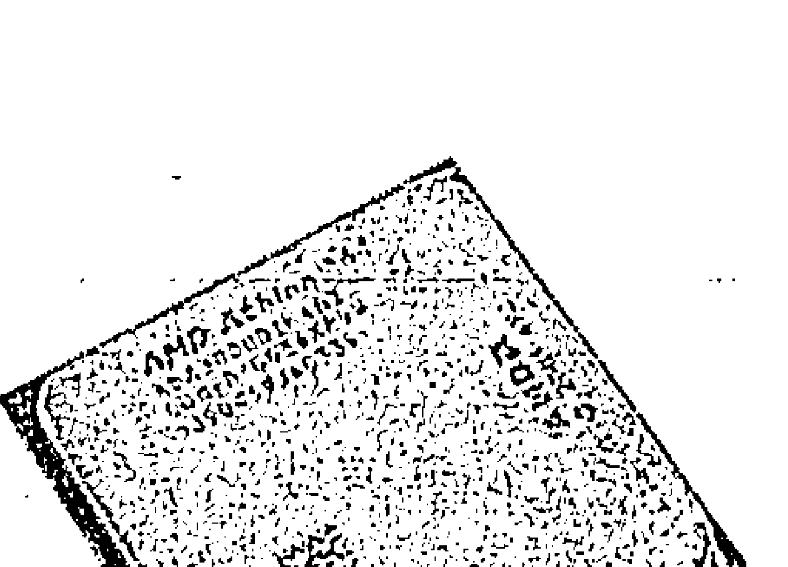

缓存容量来弥补主频上的损失（512KB或是1MB二级缓存，图7）。

尽管AMD没能像Intel那样在移动平台完全采用全新的结构来区别台式机处理器，但是平心而论，炫龙的功耗与发热量控制还是十分理想，性能也颇为强劲。惟一让人感到困惑的是，炫龙暂时还没有超低电压版的低主频产品，这意味着在超轻薄笔记本市场可能会影响销路。

#### 3. AMD成双成对：双核皓龙与双核速龙X2

最近逐渐热起来的“双核”概念，主要是指基于x86开放架构的双核技术。在这方面，起领导地位的厂商主要有AMD和Intel两家。其中，两家的思路又有不同。AMD从一开始设计时就考虑到了对多核心的支持。所有组件都直接连接到CPU，消除系统架构方面的挑战和瓶颈。两个处理器核心直接连接到同一个内核上，核心之间以芯片速度通信，进一步降低了处理器之间的延迟。而Intel采用多个核心共享前端总线的方式，理论上可能造成工作效率下降（图6）。

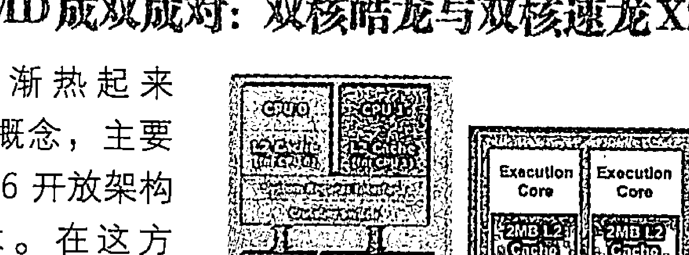

### Intel理智妥协：EM64T疑云重重

现在的情况与当初486时代十分相似，经过一段时间的发展，AMD已经逐渐赶上Intel，甚至在技术上有超越之势。为此，Intel当然希望与AMD分道扬镳，其第一款64位处理器Itanium与AMD的K8采用完全不同的架构，甚至Intel一度认为没有必要在桌面平台发展64位计算。然而Athlon 64以及Opteron的快速发展以及业界的积极配合，让Intel感受到一种恐慌，在台式机处理器上借

简单而言，大家可以将双核皓龙与双核速龙X2理解为在一个皓龙（Opteron）或是速龙（Athlon 64）处理器中集成两个内核。事实上，AMD一直将SMP并行运算作为K8处理器的一项重要功能，早先皓龙就被普遍运用于双CPU环境中。有所不同的是，此时将不再是单纯的两块CPU，而是将两个内核直接集成到一个CPU中。双核皓龙采用Socket 940接口，而双核速龙X2采用Socket 939接口，两者之间的区别主要体现在二级缓存、ECC内存支持以及HyperTransport连接通道方面。此外，一般Socket 940主板支持双CPU，也就是说可以让两个双核皓龙并行工作，实际等于是四核心。

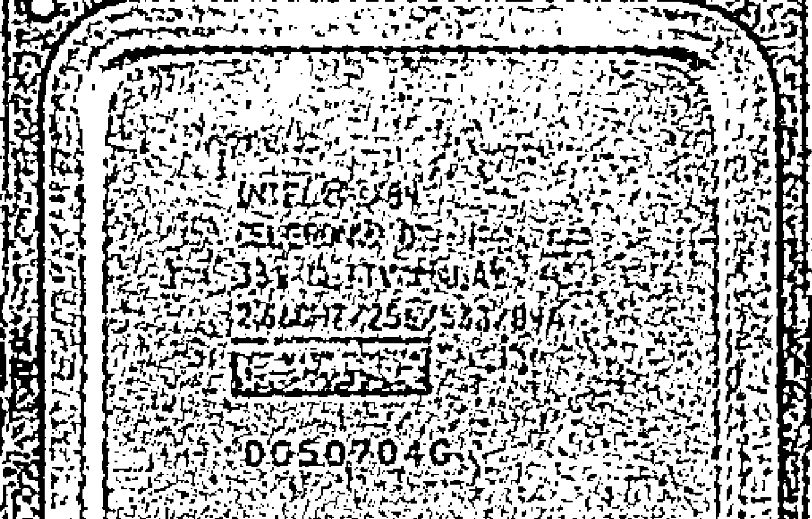


用IA-64架构又无法实现出色的32位性能，矛盾中的Intel最终还是选择了妥协，EM64T架构成为未来Intel处理器的发展趋势（图8）。

#### 4. 移动的翅膀：炫龙移动处理器

炫龙实际上就是Athlon 64-M移动版，这也是AMD针对移动市场推出的K8处理器，首次将64位计算引入到笔记本电脑领域同时，除了选择更好的晶圆并且加入PowerNow！电源管理技术，炫龙与Socket 754接口的Athlon 64没有很大的区别，只不过为了适应笔记本需要而通过降低电压的方法来控制主频以及所带来的发热量，并且扩大二级

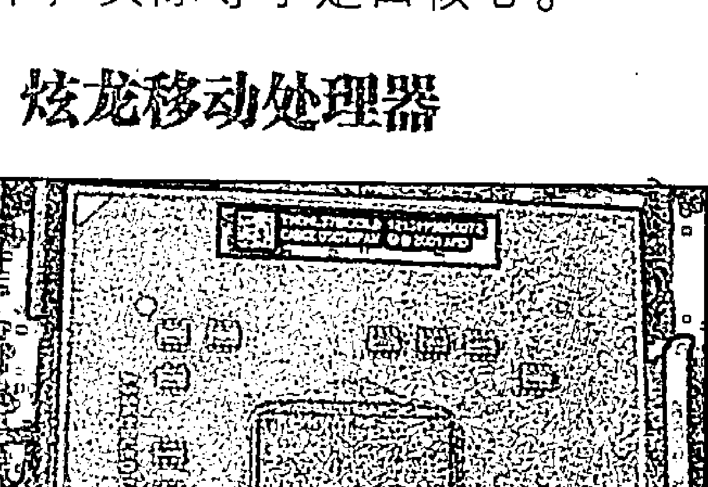

EM64T可以看作是IA-32与X86-64的结合体。原本IA-64架构在执行32位运算时使用转换器，此时效率之低下让调控能力极强的Intel也不敢将其推向市场。而现在的EM64T架构与AMD的X86-64十分类似，它完全保留了IA-32以充分兼容当前的32位应用程序，同时未来的64位程序也能得到这款架构的支持。尽管Intel公司没有大肆宣扬，但EM64T与X86-64完全兼容，软件开发商只要为X86-64优化就等同于为EM64T进行优化（图9）。为此，一度有传言认为EM64T仅仅是通过X86-64授权而已，但是无论是Intel还是AMD都对这种说法三缄其口。不管过程多么曲折，最终的结果还是相当完满。64位计算成为两大巨人的共识，未来的64位操作系统与应用软件也已经箭在弦上，蓄势待发。

### IA-64的精髓：Intel留有后手

尽管业界对AMD的x86-64 K8处理器相当看好，但是龙头老大Intel的产品应该更有竞争力，毕竟Intel酝酿的是一场更大的革命，它很可能会改变整个PC领域的架构。64 位的 Itanium 处理器已经活跃在服务器市场了，而 Intel 也逐步渗透到工作站市场，并为它起了一个非常好听的名字——安腾。

##### 1. IA-64的精髓：EPIC指令

对更快处理器的追求归根到底只有一个简单的规则：在一个时钟周期内处理更多的事情。传统的复杂指令系统计算（CISC）结构和用于服务器的精简指令系统计算（RISC）结构都在当前需求不断增加的情况下显出疲态。

以目前大家正在使用的 CISC 指令为例，尽管它能够有效地缩短新指令的微代码设计时间，并且提供非常好的兼容性，但是不同的指令长度相差很大，需要不同的时钟周期来完成，因此执行较慢的指令将会影响整台机器的执行效率。而效率比 CISC 指令高 3 倍左右的 RISC 指令虽然使用指令乱序执行和分支预测技术，但是其分支预测的效果还是不能让我们完全满意，并且对以往程序的兼容性也不甚理想。

用于安腾处理器的 EPIC 结构则结合了两种方法的长处，它的含义是 Explicitly Parallel Instruction Computing，即显性并行指令计算。EPIC 结构使用了超长的指令并将其分割成更小的指令，然后在芯片上进行并行处理。EPIC 设计理念的中心思想是：让智能化的软件指挥愚蠢的硬件，复杂性交给软件处理，硬件只需按序高速并行处理指令和数据。并行性的表达由每条指令开始，并行性的抽取、调度由编译器实现，从源头起开发指令集的并行 ILP。无论何时、无论何处只要可能就利用并行能力，因此效率更加高。

##### 2. 缓存机制：效仿K6-3？

Itanium2 引入了三级缓存的概念，不过这对于大家来说并不陌生，因为几年前 AMD 的 K6-3 也曾使用过类似的技术。但是需要区别的是，Itanium2 的三级缓存与 K6-3 的三级缓存有着很大的区别，最明显的地方就是 Itanium2 将 L3 Cache 整合到 CPU 核心内部，以 CPU 主频全速运行，而 K6-3 的 L3 Cache 是安装在主板上的，因此无论是效率还是成本都要差很多。此外，Itanium2 的三级缓存容量大得惊人，分为 2MB 和 4MB 两个版本。

不过相对庞大的 L3 Cache 体系而言，Itanium2 的 L1 Cache 和 L2 Cache 要小得多了，其中一级缓存为 32KB 而二级缓存只有 96KB。其实大家对此应该冷静看待，因为说穿了 Itanium2 三层式缓存仅仅是依照访问顺序来命名的。相对于以往的 P4，Itanium2 中三级缓存的地位和效率与 P4 的二级缓存基本一致，而 Intel 将 Itanium2 的一级缓存分为两部分之后其空间利用率会更高，冲突概率也相应降低，这可是缓存设计最终的目标。因此我们完全可以这样认为，Itanium2 是在大幅增加 L2 Cache 容量的同时，改进 L1 Cache 的效率。

##### 3. IA32：真的是救命稻草吗？

使用了全新的 IA64 架构之后，Itanium 系列将不再支持 x86，这也意味着传统的 32 位程序将不能很好地在 Itanium 系列处理器上运行。为此，Intel 提出了 IA32 处理模块，但是客观而言这只是一种弥补方法而已。

当 Itanium 系列处理器执行 32 位代码时，其内部的 IA32 处理模块将采用软件模拟的方式直接执行 IA32 二进制代码，并对其进行动态程序优化，实现无缝链接。事实上，Intel 的这一做法的确 100% 地保证了兼容性，但是此时性能就得不到保证了。各项测试表明，Itanium 处理器在 32 位程序下的表现甚至不如 Pentium4，这是令人难以想象的！尽管 Intel 也对安腾在 32 位下的性能作出了不少改进措施，但是目前看来似乎收效甚微。在这点上，安腾似乎输给了 K8 处理器。

##### 4. 分支预测执行

对于那些经常对高速缓存进行操作的应用程序，提高缓存命中率是很重要的一个问题。目前我们使用的 K7 或者 NetBurst 架构 P4 CPU 在这方面已经做得相当不错，大约有 80% 以上的命中率。但是不要忘记，目前主流 CPU 的总缓存不足 2MB，因此这也并没有什么了不起。对于 Itanium 处理器巨大的缓存体系而言，要做到同样的命中率是相当困难的。

为此，Itanium 的 IA-64 架构使用了“判定”和“预测”技术。这两项技术去掉代码中的分支，进一步改善并行度和数据推测，这使得预测指令将在第一时间知道到底需要哪些数据，并尽量减少处理器的等待时间和内存延迟时间。此外，安腾处理器还含有大量的寄存器——128 个整型和 128 个浮点型，这大大减少了 CPU 访问内存的次数，从而为提高缓存命中率提供时间上的基本条件。

##### 5. 桌面版IA-64何时出现？

一项喜欢遮遮掩掩的 Intel 这次依然没有改掉老习惯，对何时推出用于个人桌面市场的 64 位处理器这一问题一直采取回避的态度。事实上，Intel 目前完全有能力迅速推出这一系列产品，只是在他们看来现在时机还未完全成熟。

按理说来，Intel 在 64 位 CPU 开发上应该比 AMD 准备得更加充分，但是为何到目前为止还没能让焦急等待的我们一睹桌面版 Itanium 的芳容呢？应当看到，AMD 以往在服务器 CPU 领域几乎毫无建树，而这回来势汹汹的 Opteron 傲龙即使不能在性能上打败 Itanium，那么在价格上前者将具有一定的优势。很明显，目前 AMD 的底细还没有完全透明，Intel 采取静观其变的策略也是明智的。不过这些都仅仅是出于市场策略的考虑，难道 Itanium 就一点也没有技术上的难言之隐吗？当然不是！目前 Itanium 最大的心病就是 32 位性能不佳，这将成为 AMD 的突破口。或许在服务器市场上，只要 64 位操作系统一统天下，那么 32 位性能的瑕疵也可以让大多数人接受，而用在个人桌面市场的 CPU 则不全然如此。

其实目前 Itanium 的处境很像当初的 Pentium Pro，当时 Pentium Pro 尽管 32 位性能出众，但在 Windows 3.X 下的 16 位性能却备受业界置疑。大家一定想到经典的 PentiumII 了吧，这款产品一下子跳过了 Pentium Pro，以更加出色的性能直接将Intel的最新技术引入个人桌面市场。当然，下一代Itanium直接成为Intel在桌面市场的救星是不可能的，毕竟它是一款完完全全的服务器CPU，而且EM64T架构的出现已经基本宣告Intel在近几年内不会让IA-64下嫁到桌面市场。不过可以肯定的是，一旦AMD的K8顺利推出并以绝对优势打败Pentium4的下一代产品，而且在64位竞争中占据优势，那么已经忍气吞声使用EM64T的Intel将会采取更为激烈的行动，届时才是IA-64真正发挥的时候。

### 顺应潮流：64位芯片组

与CPU、内存等技术相比，芯片组总是被人忽视的。在CPU主板光芒的炫耀下，芯片组默默无闻地奉献着。然而应该看到的是，芯片组对整体性能的发挥以及敏感的兼容性问题起着重要的作用，有时其重要性甚至超过了CPU。更为重要的是，芯片组在某种程度上决定了CPU的命运，甚至可以左右业界规范的发展趋势。如今的64位处理器显然离不开芯片组的鼎力支持，了解这些芯片组将对于大家组建64位平台带来很大的帮助。

#### 1. 64位CeleronD芯片组: PT880 Pro异军突起

面对个人电脑64位应用的大势所趋，Intel终于低下高贵的头颅，让面向主流市场的Celeron D装载EM64T架构后实现64位计算功能。然而顽固的Intel总是不肯照顾老用户，Socket 478接口的Celeron D已经全部停产，只有LGA775接口的新Celeron D (又称为Celeron D J) 才可能具备64位功能。毫无疑问，64位Celeron D已经是近期市场的热门产品，而如何选配一款合适的芯片组就成为广大消费者最关心的问题。

##### (1) Intel芯片组遭遇尴尬：利益分配导致断层

在常规思路下，很多用户都会想到Intel原装芯片组，但是如今Intel芯片组显然与CPU搭配之间出现了断层。I865PE和I848P作为上一代主力已经禁锢于Socket 478平台而且几乎停产，此时即便有少数主板厂商强行改用LGA775接口，其出货量也非常小，价格更是会明显高于普通产品。而I915系列一直没能大幅度降价，市场供货量也明显不足。

反观另外一大芯片组供应商，VIA不仅在AMD的K8平台春风得意，Intel芯片组平台也取得相当不俗的战绩。PT800和PT880本来就不逊于I865PE与I848P系列，而今改进后的PT880 Pro更是表现出强大的性价比优势：价格低于I915PL，性能却高于I915P! 随着各大主板厂商全面采用PT880 Pro芯片组，这已经成为近期搭配64位Celeron D的最佳选择之一（图10）。

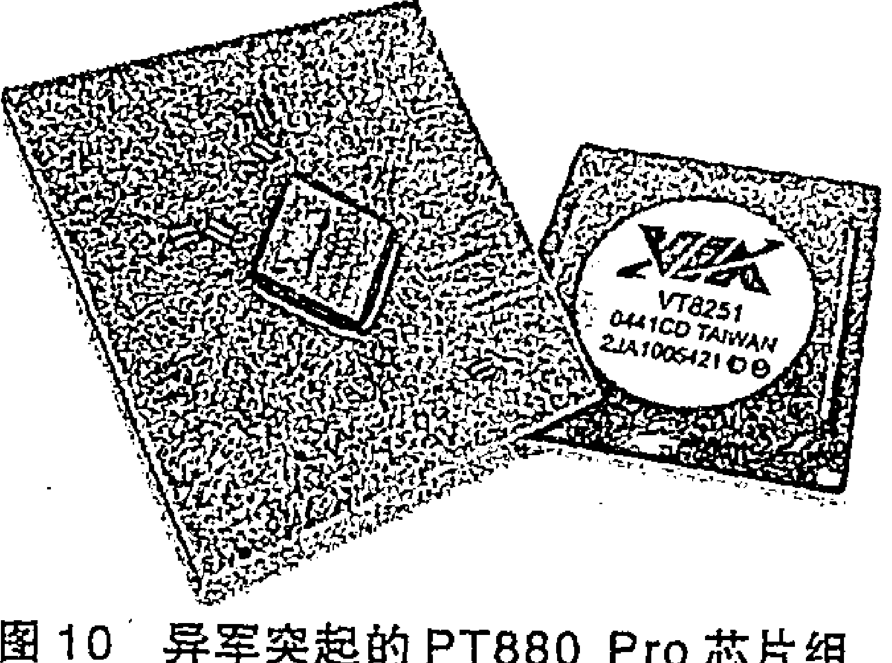

PT880 Pro最大的优势便是同时支持PCI Express显卡以及AGP显卡，此时AGP显卡并非像I915系列主板那样“名不副实”，而是完完全全运作在AGP 8X总线下，绝对不会工作在PCI模式下而影响性能。更为重要的是，在CPU和内存支持方面，PT880 Pro也都全面超越了I915P。PT880 Pro直接正式支持1066MHz前端总线，因为无论是超频还是今后的升级空间都令人十分放心。而为了照顾内存升级，PT880 Pro又可以同时兼容DDR与DDR2内存。

与此同时，SiS也有着非常抢眼的表现。SiS 656FX和SiS 649都在性价比方面全面超越了I915系列。更令人感到惊讶的是，Intel已向外确认2005年第四季度起，部分低端芯片组将会停产，同时，Intel已正式向SiS采购低端芯片组，因此我们在未来将可能看到Intel Desktop Board出现SiS的芯片组，现在已确定的型号有SiS 661FX。Intel方面在向OEM客户传递第四季度起缺货消息的同时，还建议使用SiS的芯片组代替（图11）。

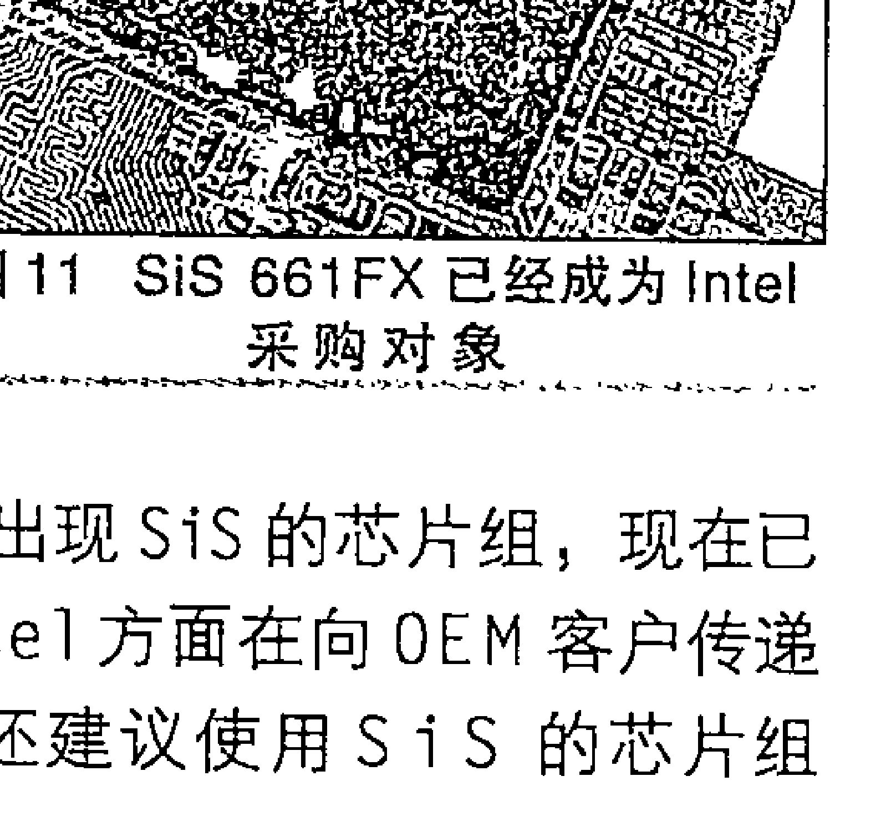

由于Intel在低端芯片组市场的收益不佳，所以Intel为了稳固利益，减少不必要的开支，有意在日后只推出高端的芯片组，而较为低端的芯片组将会交由其他厂商争夺，现时已知会在10月停产的型号更包括了I915和I865系列等主流产品，相信台系芯片组厂商必定尽力争取市场。毫无疑问，无论是VIA还是nVIDIA，Intel都对其整体实力感到恐惧，而一直与Intel合作关系良好的SiS显然因此得到意外的收获。而且SiS芯片组本身也有着不俗的性能，近阶段的SiS 656FX和SiS 649都有着出色表现。

##### (2) VIA与SiS同发力：芯片组规格全面升级

原本业界对DDR2内存的前景十分看好，然而I915P等芯片组并未能将第一炮打响。撇开高昂的价格不谈，其难以明显体现的微弱性能优势才是真正为人诟病的主要因素。DDR2-533标准仅仅比DDR400高出一点点内存带宽，再算上高延时所带来的性能损失，此时几乎没有值得DDR2内存所能骄傲的资本，在付出更高的代价之后，用户依然无法得到相应的性能回报。针对这一情况，VIA PT880 Pro和SiS 656FX与SiS 649芯片组率先实现了技术突破，最高支持DDR2-667标准。其中VIA PT880 Pro和SiS 656FX支持双通道DDR2技术，此时内存带宽将明显高于双通道DDR400，而且允许DDR2内存工作在更高的延时参数下，内存系统的性能表现比起I915P芯片组有了明显的提升。

对于芯片组而言，前端总线技术也同样重要，因为更高的前端总线允许CPU提升外频，此时整体性能的发挥将更为流畅。Pentium4处理器采用的Quad Pump技术可以达到四倍于处理器外频的前端总线，尽管目前

#### 2. K8芯片组人丁兴旺：四大厂商竞争激烈

在K8处理器刚刚推出时，配套的K8主板价格不菲。然而在经过两年多的发展之后，我们发现K8主板已经变得平易近人。即便没有Intel参与竞争，VIA、nVIDIA以及SiS之间的较量也都如火如荼，ALI也逐渐参与市场竞争，甚至ULI也东山再起。

##### （1）内存控制器之谜：Socket 754并非鸡肋

在传统的芯片组架构中，内存控制单元都是整合在北桥芯片中的，因此在传输数据时不得不经过一定的等待周期。在这种情况下，北桥芯片的内存控制器效率将很大程度上决定系统的整体性能，能否充分利用内存带宽、能否尽可能地降低延时、能否提高内存总线与CPU缓存之间的数据带宽就成了很关键的问题。关于这点，大家对比一下从I845D到I848P这几款单通道DDR芯片组之间的性能差距，就会立即有了一个感性认识。同样使用DDR266内存，同样使用ICH4或者ICH5南桥芯片，仅仅因为内存控制器的改进，I848P的性能着实比I845D提高了30%左右。但是，在AMD倡导的K8时代，情况就大不相同了。为了进一步地提高性能，K8将内存控制器装载到CPU的内部，这样其速度将发生翻天覆地的变化。整合内存控制器的好处在于CPU可以直接和内存交换数据，而不需要通过系统总线传给芯片组，然后再传输给内存，这就大大缩短了数据交换时间从而提高性能。

当然，我们这里并非完全排除北桥芯片对于整体性能的影响，只是说其重要性已经不如以往了。出于这方面的考虑，在评价K8芯片组时应该更加看重南桥芯片的功能，以及各种辅助芯片的作用。此外，K8处理器采用HyperTransport替代传统意义上的前端总线概念，或者说芯片组直接决定能否支持高于800MHz前端总线。为此，选择主板时应该特别注意能否顺利支持更高的前端总线，这很可能对未来的升级空间以超频表现起到决定性作用。

原本业界对于Socket 754的前景并未一致看好，毕竟双通道DDR时代已经让人对极高的内存带宽成为一种习惯性需求。一直有这样一种呼声：Socket 754仅仅是过渡性产品，未来真正的主流将是Socket 939平台。但是客观分析，从CPU本身的制造成本来看，Socket 939并不会比Socket 940低多少，真正得益的是主板生产商，因为Socket 939不强制要求六层PCB。作为AMD赖以生存的性价比原则，Socket 939并不是救世主，成本优势明显的Socket 754产品才是最终的开路先锋。更为重要的是，尽管Socket 754平台仅仅使用单通道DDR400，但是由于内存控制器整合到CPU内部，因此其整体表现依旧十分理想，在当前平台中处于领先地位。对于用户而言，现在过早地担心Socket 754平台会遭到淘汰还为时过早。即便AMD在今后有这样的打算，届时还有Socket 754版本的Sempron主持低端市场，而如今64bit闪龙大规模铺货更是表明了Socket 754的美好前景（图12）。

##### （2）两强相争打成平手：nVIDIA Vs VIA

面对全新的Socket 754市场，nVIDIA和VIA都显得格外重视。第一代nForce3 150只能实现600MHz HyperTransport总线频率，而且无法锁定AGP/PCI频率，这对超频用户而言是很大的损失。但是如今nVIDIA已经迅速调整了产品线，全面升级为nForce3 250系列，整体表现十分抢眼。目前nForce3主板已经出现了499元的低价位，这无疑对低端市场的冲击力非常大。

面对nForce3 250系列的出色表现，VIA和SiS自然不会坐以待毙。原先K8T800芯片组和nForce3 150存在一样的弱点，即因为无法锁定AGP/PCI频率而实现超频十分困难。近期推出的新版K8T800则改进了这一缺陷（图13），如今的整体发展态势应当让用户感到欣慰，昂达、斯巴达克、翔升都推出了500元以下的新版K8T800主板，而且通过精心设计打造成超频专用产品。此外，升技、磐正以及硕泰克等以超频见长的品牌以及其他一线品牌也纷纷推出低价位新版K8T800超频主板。

SiS尽管在DIY市场的份额相对较少，但是实力也不容小觑。SiS 755FX作为SiS 755的改进版已经表现得十分全面，甚至可以兼容Socket 939 Athlon 64，但是困扰SiS的问题一直没有解决：采用SiS芯片组的主板厂商还是太少，而且超频性能也始终没有很大的突破。

值得关注的是，近期nForce4-4X芯片组和SiS 765芯片组的主板开始降价到800元以内，这意味着PCI Express即将普及，而且未来还有一定的价格空间（图14）。目前主流中低价K8主板市场的格局已经基本形成：三线品牌的K8T800和nForce 150主攻超低端市场## 应用为本：64位操作系统与应用软件

64位计算平民化的时代即将来临。和以前8位向16位跃进、16位向32位跃进耗费十几年的情况不同，64位CPU推出没几年，就出现了64位的Windows XP和64位的Windows Server 2003。微软称，64位的Longhorn也将于2006年发布。除此之外，与个人桌面系统同步的还有服务器系统，如Windows NT/Server 2000/Server 2003等，就在微软发布64位Windows XP的同时，也发布了64位Windows Server 2003。至今，还可从微软网站注册并下载64位的有120天限制的Windows Server 2003。

随着多媒体功能的渗入和硬件价格的日趋平民化，越来越多的人加入到PC应用的行列，造就了一大批进行家庭多媒体创作等应用的非专业人士，很多人不再满足于用电脑打字、作表格、上网聊天等简单应用。随着人们对电脑要求越来越高，32位系统已力不从心，于是64位CPU和64位操作系统先后出炉。在操作系统方面，经过充分的准备（包括前段时间微软推出的免费下载试用），微软终于在今年4月25日推出了具有重要意义的64位Windows XP和64位Windows Server 2003。

按微软官方的说法，Windows XP Professional x64 Edition的设计初衷是满足机械设计和分析、三维动画、视频编辑和创作以及科学计算和高性能计算应用程序等领域中需要大量内存和浮点性能的客户的需求——这些应用都需要高性能和大内存的支持。64位与32位Windows XP相比的一大特色就是能提供大内存的支持。当前，32位Windows能支持最多4GB的系统内存，每个处理器可最多使用2GB专用内存。而Windows XP Professional x64 Edition当前支持多达128GB内存，随着硬件功能的增强和内存大小的增加，有可能支持多达16TB的虚拟内存。

再从个人桌面用户的角度来看，内存容量的限制只是体现64位计算技术优势的一个方面，大量数据处理才是64位计算真正发挥功效的地方。PC已经不仅是用户计算的工具，它更是多媒体中心，很多这方面应用是32位计算根本无法满足的。如在家用领域，32位无法实现高保真的声像，甚至无法完成20分钟视频的播放和编辑；在建筑、游戏设计领域，32位计算无法完成大量的数据计算和处理；在互联网上，32位计算无法实现大量的各种类型的数据搜索——这些应用都需要64位计算来实现。

64位Windows XP提供了一个多功能平台，该平台在Windows 64 (WOW64) x86仿真层上使Windows将新的64位应用程序和当前的32位应用程序集成在一起。WOW64子系统将32位应用程序与64位应用程序隔离，以防止发生文件和注册表冲突，支持控制台应用程序和图形用户界面应用程序，还支持服务应用程序。该系统为诸如剪切、粘贴以及COM之类的场景提供跨32位应用程序和64位应用程序间边界的互操作性。但是，32位进程无法加载64位动态链接库(DLL)，而64位进程也无法加载32位DLL。这一设计思路最直观的表现就是在系统分区目录下，除配备了过去的Program Files目录外，还有一个在32位Windows XP没有的目录：Program Files (x86)。不管是64位Windows XP自带的程序还是用户自行安装的程序，首先都需要通过系统的检验，只要是32位的，都安装到Program Files (x86)目录；只要是64位，都安装到Program Files目录。通过这种措施，原32位程序一般都能在64位平台上运行。

## 打印巧设置 Word大图“挤”进来

要打印，但超出A4纸张的大小，缩小字体后一些插入的箭头没有跟着变小，整个格式就乱套了。如果选择性粘贴，结构图贴不全，会缺少一些内容。怎样设置才能把内容完好地打印在一张A4纸上？最快方法：进入系统的“开始→设置→打印机和传真”，选定当前打印机，在打印机窗口的“文件”菜单中选择“服务器属性”，在“格式”标签下的“格式描述”选项组中选中“创建新格式”复选框，再在“格式描述”文本框中输入一个自定义的名称，将纸张大小设置得比B5略大一些，保存格式，确定。回到Word文档的“打印”对话框中，在“按纸型缩放”中就可以看到自定义的该文件了，选择，确定即可。

此外，用微软的绘图软件Visio，画好后可以直接把图复制粘贴到Word里，任意缩放非常方便，不妨一试。

## 前瞻2005 —— PC硬件新技术

文/方成亮

尽管很不情愿承认但是却必须认识到，在经过21世纪初的疯狂之后，IT业界无可避免地走进冬季。然而就在人气萧条之时，业界巨腕们并不放弃，众多新技术的出现令2005年PC市场变得前所未有地精彩纷呈。了解这些新技术自然让人喜上眉梢并满怀期待，同时也对今后技术的发展趋势以及升级策略有所指导作用。

## 第一篇 核心技术篇

## CPU技术——延续两强争霸格局

CPU 发展到今天，已经不仅仅是追求更快的速度，而是更好的稳定性、更强的多任务处理能力、更低的功耗以及更加完善的安全性等全面发展之道。Cyrix与全美达退出之后，CPU竞争格局由三足鼎立转变为“两强争霸”。然而这并没有阻碍技术前进的步伐，无论是Intel还是AMD，近期都在加快技术研发进度，CPU也即将进入发展快车道。

### 1. 双核心技术：性能提升的捷径

一直以来，PC 性能表现总是差强人意，迅驰笔记本的出现终于为业界指明了方向：CPU 必须摆脱主频的束缚，从另一个角度来提高性能。在尝试核心架构改进、缓存容量提升之后，双核心的处理器终于浮出水面。双处理器将不再是服务器的专利，台式机甚至笔记本也能轻松拥有强大的双动力。

- (1) 轻松处理多任务

主频的提升受到制作工艺的制约，处理器制造商开始寻求新的解决途径，频率至上的思路已经被抛开。毫无疑问，双内核是一个大胆的创举，而且短时间内就能取得明显的效果。暂且不去评论略显失败的 Hyper-Threading（超线程）技术，改用真正的双内核之后，处理器将肯定有着脱胎换骨的表现。与以往的双处理器相比，双内核不仅能够更好地利用缓存，互相之间的连接带宽也更为出色，从而表现出更为出色的性能。对于 PC 用户而言，多任务处理一直是困扰的难题，因为单处理器的多任务以分割时间段的方式来实现，此时的性能损失相当巨大。而在双内核处理器的支持下，真正的多任务得以应用，而且越来越多的应用程序甚至会为之优化，进而奠定扎实的应用基础。从技术角度来看，双内核的处理器确实令人期待。Intel 将会在2006年推广 Montecito 双核心作为台式机平台的主力产品，而移动品牌也会由双 Yonah 核心来取代现有的 Dothan。（图1）。

- (2) 解决功耗难题

将更多新功能融入至双核心，自然需要消耗更大的电力。如今300W的PC电源在面对高主频处理器时都显得力不从心，一旦运用双核心，其压力可想而知。更为重要的是，未来双核心还将集成到笔记本用的移动处理器中，这更是对功耗控制提出很高的要求。英特尔正努力逆转这种局势，开发各种耗电状态管理技术以及新型电池技术，借此延长笔记本电脑的电池续航力，同时维持产品外形轻薄短小的特性。未来集成双核心的 Yonah 移动处理器将会具备新型电源管理技术，如果工作量不是很密集，那么处理器可以暂时关闭其中一个内核，从而节省几乎一半的电能。除此以外，降频节能技术也得到进一步应用，而且降频过程将更为智能化，不再简单地以是否连接交流电作为降频标准，而是可以根据CPU的工作负荷量来决定。然而必须要明白的是，节能技术仅仅是一种辅助，真正的命脉是掌握更为先进的制作工艺，或者通过架构改进来实现更低的功耗。根据英特尔的官方资料，双核心处理器在初期将采用90纳米制程技术量产，2006年再推出采用65纳米制程的更新版本。在肯定双核心移动处理器的性能同时，我们也更为期待散热与节能技术能够同步发展，从而避免类似Pentium4-M的高性能、高热量、大功耗产品。

- (3) AMD不甘示弱

按照Intel的计划，2006年将会有 40% 的台式机配置双核心处理器，而作为 Intel 最大的竞争对手，AMD 自然不会错过双核心时代。事实上，AMD在这一领域的研发要早于 Intel，Opteron 处理器已经完全具备双核心，只是没有在桌面平台推广而已。从目前的发展趋势来看，AMD肯定会对 Intel 紧追不舍。未来双核心的 Opteron 芯片将有三种版本，代号分别为 Egypt、Italy 和 Denmark，双核心台式机处理器将是 Toledo 内核（图 2）。

Toledo 处理器的两个内核分别具有 1MB 二级缓存，采用 90 纳米工艺制造，内建 2.05 亿个晶体管。为了进一步改善性能，Toledo 所集成的两个内核共享 HyperTransport 连接以及双通道 128-bit DDR 内存控制器。更为重要的是，Toledo 可以运行于现有的 Socket939 架构上，并保持与目前单内核 Athlon 64 相同的功率 110W。用户只需要升级 BIOS 就可以使用该款处理器，这才是真正令广大用户欢呼雀跃的事情。与 Intel 相比，AMD 显然更加“照顾”老用户，这样才深得人心。

### 2. 奠定改革基石：65纳米制作工艺

制作工艺对于 CPU 微处理器的重要性不言而喻，无论是提高主频，还是集成更多的缓存，又或是改进新的核心，这些都需要更为强大的制作工艺作为支撑。一代又一代的微处理器发展史几乎可以看作是制作工艺的发展史。进入 90 纳米时代之后，一度停止了发展的脚步，而如今 65 纳米制作工艺终于浮出水面。

- （1）何谓65纳米制作工艺

我们通常所说的 CPU 纳米制作工艺并非是加工生产线，实际上指的是一种工艺尺寸，代表在一块硅晶圆片上所集成数以万计的晶体管之间的连线宽度。按技术述语来说，也就是指芯片上最基本功能单元门电路和门电路间连线的宽度。以 90 纳米制造工艺为例，此时门电路间的连线宽度为 90 纳米。我们知道，1微米相当于1/60头发丝大小，经过计算我们可以算出，0.065微米（65纳米）相当于1/920头发丝大小。可别小看这1/920头发丝大小，这微小的连线宽度决定了 CPU 的实际性能，CPU 生产厂商为此不遗余力地减小晶体管间的连线宽度，以提高在单位面积上所集成的晶体管数量。采用 65 纳米制造工艺之后，与 90 纳米工艺相比，绝对不是简单地令连线宽度减少了 35 纳米，而是芯片制造工艺上的一个质的飞跃。

如今最新的 65 纳米制作工艺可以在不增加芯片体积的前提下，在相同体积内集成多将近一倍的晶体管，使芯片的功能得到扩展。目前 Pentium4（Prescott 核心）处理器其内部的晶体管信位宽度为 50 纳米，而使用 65 纳米技术后，处理器内部的晶体管信位宽度将缩减至 44 纳米。毫无疑问，信位宽度越小，晶体管的极限工作能力就越大，这也意味着更加出色的性能。对于 NetBurst 架构的 Intel 处理器而言，更高的主频有着很大的意义，而且新的制作工艺令集成更多缓存变得轻而易举。表 1 是历代微处理器与制作工艺发展之间的关系：

| 微处理器 | 制作工艺 | 工作主频中位数 | 二级缓存 |
|----------|----------|----------------|----------|
| 40486 | 0.5微米 | 50MHz | 无 |
| Pentium | 0.35微米 | 133MHz | 无(主板外置) |
| PentiumII | 0.25微米 | 333MHz | 512KB (芯片外置) |
| PentiumIII | 0.18微米 | 750MHz | 256KB |
| Pentium4 (Northwood) | 0.13微米 | 2.6GHz | 512KB |
| Pentium4 (Prescott) | 90纳米 | 3.0GHz | 1~2MB |
| Pentium4 (Yonah) | 65纳米 | 预测 4.8GHz | 2~4MB |

- （2）第二代单轴应变硅隧道

此次 Intel 在启用 65 纳米制作工艺时，还引入了极为重要的改进型 SOI 变形硅技术，也就是第二代单轴应变硅隧道，这对于更好地改善核心电气性能有着极大的帮助。CPU 所集成的晶体管是一个小开关，决定了电流的通与断，而在现实世界中，我们无法完全地控制电流，必须借助一些附加技术。SOI（Silicon-on-insulator，绝缘体硅片）就是为了防止泄漏电流和停止电流活动而设计的，变形硅则刚好相反，是为了驱动电流流动而设计的。事实上，SOI 与变形硅技术总是需要同时使用。

第二代单轴应变硅隧道将待变形硅片放在一种特殊的硅锗底基上，这种硅锗底基的原子间距离比待变形硅片原子间距离大，受底基原子作用，硅片中的原子也将向外运动，彼此间拉开距离，从而减少对电流的阻力。SOI 变形硅有效地扩展了晶体管通道区域，把硅直接放到层的顶部，可以预留更多的空间，更好地扩展到底层上，使上面的硅原子直接和低层相匹配，延伸硅元素到合适的通道中。硅原子有更多的空间后，电阻减少了，增加了电流通过的数量。最终结果是使电流流动强度提高了 20%～30%，或者使当前的电流更加顺畅，从而提高了晶体管的运行速度，提高了芯片的工作频率。

### 3. 人性化设计之路：防病毒与省电功能

对于 PC 用户而言，安全性问题始终是一个无可回避的话题。尽管病毒防火墙软件可以在一定程度上起到缓和作用，但是效果并不是彻底的，而且占用大量的系统资源，使用也极其不便。从硬件角度开发反病毒程序，然后通过软件加以支持，这已经成为业界的共识。

- （1）防毒新思维：DEP 数据执行保护技术

在全新的 XP Service Pack2 中，微软带来了具有里程碑意义的 Data Execution Prevention 数据执行保护技术（简称 DEP）。事实上，DEP 技术并非由微软开发，而是内嵌于 CPU 中，只是这项功能的执行必须得到操作系统的支持，就好比 AMD 的 64 位计算功能必须在 64 位操作系统下才能发挥作用一样（图 3）。在最近几年中，病毒与蠕虫之所以会如此猖獗，一方面是拜系统本身的漏洞所赐，另一方面则是杀毒软件本身技术的滞后性。目前摆在业界面前的不仅仅是更新病毒库代码，这种被动的方式不可能取得最终的胜利。痛定思痛，从源头上阻截病毒与蠕虫才是关键，而这一艰巨的任务自然得交给智能化程度最高的中央处理器。

众所周知，病毒也是一种程序，只不过是特殊的程序，因此在执行过程中也离不开内存。DEP 技术与防火墙或者防病毒程序根本的区别在于从内存地址上加以阻截，而不是防止危险程序或者危害代码的运行。从目前的病毒发展趋势来看，攻击常用的内存地址是一条必由之路，而这恰恰是反病毒技术的突破点。支持DEP技术的CPU将某些常用内存位置标记为“不可执行”，若任何一个程序尝试从不可执行的位置运行代码，同样支持DEP技术的操作系统将会自动关闭该程序，如此便彻底扼杀了所有危险程序与代码，而不是疲于应付地更新病毒库。在具体的实现过程中，AMD、Intel、全美达、威盛等CPU厂商所采用的DEP技术各不相同，但是作为核心技术的“Non-executable”标记却是相同的。AMD Athlon 64、Athlon 64 FX、Athlon 64移动版本、Sempron移动版本等64位芯片都具有该功能，而Intel也在赛扬D J和64位Pentium4 600系列中融入这项功能。通过CPU内部的“Non-executable”单元，内存中没有明确包含可执行代码的数据都标记为不可执行。无论什么程序，只要非法跨越，那么立即遭到毁灭性的打击——瞬间中断该程序的进程。

根据DEP的工作原理，很多人都对其兼容性表示担忧，为此Service Pack2也做好了充分的准备。少数应用程序可能与DEP不兼容，比如执行动态代码生成的应用程序，以及不使用“执行”权限明确标记生成代码的应用程序，但是这类程序的数量本身就很少，而且微软预留了内存分配函数作为内存保护参数指定。或许我们暂时还难以断定DEP技术的出现将会终结大量病毒与蠕虫，但是可以肯定的一点是，未来各大CPU厂商都会支持这一技术，从而与操作系统形成软硬件配合，彻底围剿病毒。纵然不能做到百分之百根除，至少也对于提高安全性有着莫大的帮助，而且这丝毫不会占用宝贵的系统资源，也不会带来严重的兼容性问题。

- （2）省电功能：降温同样重要

巨大的功耗让用户感到恐慌，随之而来的高发热量也是一大威胁。尽管新的制作工艺已经在很大程度上进行改善，但是不断增长的晶体管集成度还是无情地提高功耗与发热量，因此必须寻找新的解决方案。Intel与AMD分别推出了EIST技术和OPM技术，这标志着节能功能将全面进驻桌面处理器，而不仅仅是移动处理器的专利。

EIST率先应用于Pentium4 660，而且取得相当明显的效果。据Intel工程人员表示，由于处理器即便在运行大型3D游戏时也不是经常处于全负荷运作，因此采用EIST技术的Pentium4 660处理器的频率也随着系统的需要而上升下降，这样就减少了很多不必要的热量。虽然Pentium4 660处理器标称功率依旧比较大，比先前的Pentium4 560的更高，但采用EIST技术后，系统整体温度大大改善，发热量也明显低于不具备该技术的Pentium4 560。到2006年时，Intel将把这项技术作为桌面处理器的标配功能。新版本的AMD Opteron 系列处理器将搭载PowerNow! 以及 Optimized Power Management 节能技术。Toledo双核心桌面处理器也将具备这项技术，从而解决高功耗与高发热量的难题。

## 移动处理器技术——Intel一览众山小

未来移动处理器将会随着笔记本市场份额的扩大而显得越来越重要。而在这一竞争领域中，Intel所处于的主动地位是任何其他厂商所无法撼动的。Intel先后推出Dothan核心的迅驰以及Celeron M，将整个迅驰处理器计划彻底铺展开来。

### 1. 迅驰系列高歌猛进

第一代Banias核心的迅驰之所以没能实现2MB二级缓存，与Intel当时无法掌握90纳米制作工艺有着直接联系，而面对如今水到渠成的局面，出现“进化”后的Dothan自然并不出乎意料。值得关注的是，Dothan是Intel第一款采用应变硅（Strained Silicon）制造工艺的移动处理器。在应变硅中，由于原子在晶格中的间距更大，因此当电子通过晶格时受到的阻抗会更低，这使得晶体管处理速度提高了35%，同时降低的发热量也意味着Dothan在频率上的发展不可限量。

不仅仅是高端的产品，Intel的Celeron M在价格上也极具杀伤力。Celeron M具备1MB二级缓存，其中超低电压版Celeron M 800MHz工作电压仅为1.004V，最低运作功率只有令人咋舌的7W。Celeron M的出现无疑顺应了低价位笔记本时代，而且其本身的性价比也十分突出。

### 2. AMD炫龙 (Turion 64) 打破垄断

虽然从K6、K7时代开始，AMD就推出针对移动市场的处理器，但是由于K6时代的性能不济，K7时代发热量较大，始终没有能够在移动市场上打开局面。K8时代来临后，AMD在发布Athlon 64桌面版的同时，发布了移动版Athlon 64。移动版Athlon 64依然面临着功耗较高的问题，所以一直以来主要应用在注重性能的移动工作站或台式机替代移动平台上。

随着Athlon 64在桌面市场渐有起色，AMD也有更多的精力放在移动市场上，毕竟移动市场近几年成长迅速，而且相对来说利润更为丰厚，无论哪家厂商都希望能分得一羹。AMD选择大举进军移动市场的时机也颇为合适，一方面K8架构的产品进入一个成熟的阶段，已经被多数用户和市场接受；另一方面AMD生产工艺开始过渡到90纳米，这样可以进一步降低处理器发热和功耗，为推出低功耗移动处理器做下良好的铺垫。

AMD已经为Turion 64的推出做足了充分的准备。此次AMD一口气发布了7款两个系列的Turion 64处理器，而且AMD并非一款产品孤军作战，VIA、SiS以及ATi都发布了相应的支持芯片组，可以说在平台搭配方面AMD完全不用担心。与Intel不同的是，AMD并没有类似迅驰的芯片组以及无线模块捆绑策略，而是全部放开，笔记本厂商可以根据需要自由选择芯片组以及无线模块。相对来说提供的灵活度更大，事实上这样的做法显得AMD更加开放（图4）。

## 3. VIA C7-M继承全美达遗志

全美达的退出一度让人感到非常沮丧，而VIA的适时复苏又让人看到希望。经历Joshua以及Samuel 1/2几代内核之后，Cyrix3处理器还是表现差强人意，最终VIA选择了退出桌面处理器市场，利用自身的低功耗优势主打嵌入式平台以及移动处理器才是发展正途。经过短暂的沉浮之后，VIA终于推出了C7-M处理器，有望接替全美达推出移动处理器市场之后留下的空白，甚至威胁到Intel与AMD的市场份额。

C7-M并非在传统桌面处理器上进行改进，而是直接设计为移动处理器，此时Twin PLL Clocks技术充分融入其内核，能够让处理器迅速地从超低功耗状态转换到全速运行模式。如果使用频率监控软件进行检测，会发现C7-M在运行相同程序的情况下，其频率起伏远远高于其他处理器。更为重要的是，C7-M可以根据应用程序的运行状态，停止向处理器内部未使用的部分供给时钟信号以降低功耗，在执行单元任务不繁重的时候，关闭某些单元或者降低整体的时钟频率，可以节省大量电能。

通过CoolStream架构体系，C7-M移动处理器的平均功耗将小于1W，最低待机功耗甚至只有0.1W，这是此前以功耗著称的全美达处理器所无法做到的。即便是全速运行状态，C7-M移动处理器的功耗也分别是20W（2.0GHz）和12W（1.6GHz），远远低于Intel与AMD的移动处理器。更为重要的是，VIA在C7-M上采用了PowerSaver和TwinTurbo技术，此时将动态调整处理器频率和电压，而且变换速度快到让用户完全感觉不到。与Intel的Enhanced SpeedStep以及AMD的PowerNow!技术相比，PowerSaver技术显然在频率调整幅度与响应时间方面更胜一筹。

作为一款移动处理器，VIA C7-M所具备的不仅仅是低功耗，出色的性能与高度的安全性表现同样令人对其刮目相看。由于完全沿用了X86架构，因此C7-M决不会像当年的全美达处理器那样表现出“低功耗低性能”的尴尬，而且先进的缓存架构与SSE3多媒体指令集让CPU的整数性能与浮点性能同样出色。尽管对比当前的迅驰II以及炫龙处理器时C7-M还难以在性能方面超越对手，但是移动处理器更加看重综合表现，因此C7-M今后的市场潜力将十分看好。

C7-M移动处理器最大的安全特色功能便是整合了先进的PadLock加密引擎，这使得机密的资料无论是储存在电脑里，或者是通过局域网络和广域网络传输时，都能拥有值得信赖的安全保护。同时，PadLock也将使得许多专业的资料保全应用系统更加强大，包括更理想的高负载资讯加密系统；以及更安全的线上交易机制等。PadLock的原理为：其核心为一组高阶的随机数值产生器（Random Number Generator），利用芯片上无规律的电子杂讯，计算出对应资料本身的随机数值作为加密编码之用；而产品研发人员则可由新的X86指令，直接从硬件取得这些随机数值，无须通过软件的驱动程序。这种纯硬件的设计比过去软硬件组合的资料加密架构更有效率、更可靠。另外，PadLock也支持多种运行模式，提供由每秒钟750K位至6百万位不等的各种效能。以AES加密算法为例，此时最快可以达到25Gb/s的速度，因此用户丝毫不会因为重视安全性而令产品性能得到损失。

## 芯片组技术—精彩不容错过

任何一款CPU都离不开芯片组的支持，这点已经得到了业界的公允。对于初出茅庐的Athlon 64以及Prescott处理器而言，芯片组的重要性更是不言而喻。令人感到高兴的是，SiS、nVIDIA、VIA以及ATI都对两大处理器鼎力支持。

## 1. Intel再度疯狂：I9XX系列空前绝后

Socket 478平台芯片组在引入双通道DDR400之后已经走到发展终点，Intel在今年推出的I9XX系列芯片组成为下一代LGA775平台当仁不让的接班人。尽管LGA775平台没能在2004年年底之前彻底普及，但是Intel的强行政策总是能够凭借其强大的市场调控能力而最终实现。支持DDR2内存以及PCI Express功能成为Prescott芯片组的重要特征。

如果说I925X用于取代I875，那么如今I865PE的替代者就应该是I915P。更为令人惊讶的是，最近Intel还是宣布逐步放弃中低端芯片组市场，今后将会主攻I945和I955系列，将支持双核心Pentium4处理器作为重点（图5）。然而平心而论，Intel的这一市场策略必将引起中低端芯片组市场的一场轩然大波，今后的发展趋势将会是SiS与VIA的价格战愈演愈烈。

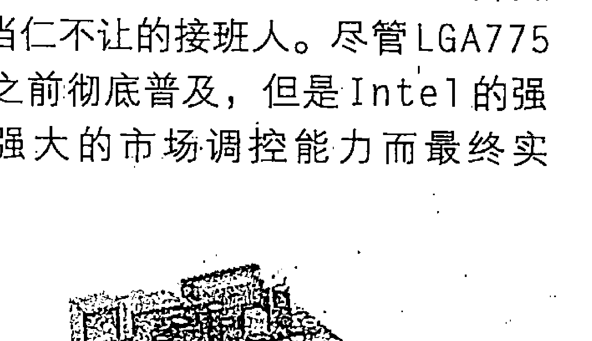

## 2. K8芯片组整装待发：nVIDIA成为领头羊

第一代K8芯片组已经是过眼烟云，以nForce4为首的新一代芯片组才是Athlon 64的最佳归宿。nForce4具备PCI Express总线支持，而且可以配合其独特的SLI技术，让两块PCI Express显卡同时对一个场景进行分工渲染，从而达到提升速度之目的。在磁盘功能上，nForce4也较nForce3 250有很大的增强，这完全得益于强大的南桥芯片。MCP4南桥支持AHCI 1.0修订版SATA II规范，并且还引入了混合RAID模式，支持SATA与IDE硬盘混用RAID，将磁盘阵列的便捷性提升到全新的高度。

最为令人感到兴奋的是，nForce4已经推出面向Socket 754平台的nForce4-4X，而且最高端的nForce4 SLI也开始在价格上越来越平易近人，而且还有性能出色的C51整合芯片组。毫无疑问，nVIDIA并非是想象中的“芯片组独裁者”，其市场价格策略依然是性价比路线，让广大DIY用户受益匪浅。

## 3. VIA绝地反击：多款芯片组全面出击

K8T890系列是VIA新一代K8芯片组，包括了标准版K8T890、支持DualGFX双PCI Express绘图接口的K8T890 Pro及内建DirectX 9显示核心的K8M890，它们都是支持AMD Sempron、Athlon64、Athlon64 FX及Opteron处理器，并真正拥有双工16Bit的1Ghz HyperTransport，令处理器与北桥芯片的传输率达8GB/s。与上代K8T800系列的最大分别，就只是K8T890系列省去了AGP接口而加入了PCI Express的支持，提供PCI Express x16接口及PCI Express x1接口，其余规格大致相同。除了VIA，SiS与ATI也牢牢抓住K8芯片组市场，推出同样支持PCI Express的SiS 756与ATI RX480，令整个K8芯片组市场空前热闹（图6）。

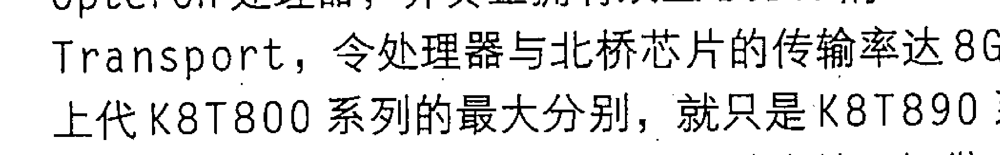

面向Intel Prescott平台的PT880 Pro和PT894系列也是主打产品。PT880 Pro最大的优势便是同时支持PCI Express显卡以及AGP显卡，此时AGP显卡并非像I915系列主板那样“名不副实”，而是完完全全运作在AGP 8X总线下，绝对不会工作在PCI模式下而影响性能。更为重要的是，在CPU和内存支持方面，PT880 Pro也都全面超越了I915P。PT880 Pro直接正式支持1066MHz前端总线和DDR2-667，因此无论是超频还是今后的升级空间都令人十分放心。而为了照顾内存升级，PT880 Pro又可以同时兼容DDR与DDR2内存。更为重要的是，PT880 Pro将会延续威盛芯片组高性价比的特色，大量采用这款芯片组的主板价格在600元以下，配合64位Celeron D能够达到很高的性价比。

除了对于DDR2-667的支持，实现1066MHz前端总线是PT894芯片组的一大亮点。Pentium4处理器采用的Quad Pump技术可以达到四倍于处理器外频的前端总线，尽管目前800MHz前端总线依然是主流，但是Intel已经在超高端市场发布了前端总线达到1066MHz的处理器，今后普及到中低端市场也仅仅是时间问题。PT894芯片组的“未雨绸缪”显然对用户很有吸引力，再不用因为Intel处理器的“朝三暮四”而“疲于奔命”，让一款主板可以服役更长的时间，同时带来更好的性能表现。

无论是nVIDIA还是ATI以及其他图形芯片厂商都已经明确表态支持PCI Express，未来的显卡接口将属于PCI Express，这一点已经成为业界共识，而PT894系列芯片组能够全力支持PCI Express接口，自然表明它将是一款面向未来的全新芯片组。从性能表现来看，PCI Express接口对于显卡的作用毋庸置疑，已经不仅仅是类似AGP 8X的摆设，因为双工模式的效果十分明显，而且结合低端显卡的显存共享技术将会带来更多的好处。除此以外，南北桥芯片一起提供的4个PCI Express通道能用于PCI Express x1接口，为即将到来的PCI Express时代做好了充分的准备。

## 第二篇 多媒体与外设技术篇

## GPU技术——竞争局面复杂化

显卡技术的发展总是需要一对实力相当的竞争对手。当nVIDIA取代3DFX的霸主地位之后，前两代GeForce系列所倡导的T&L技术让我们空欢喜一场，随后DirectX时代的Shader技术也未及时得到普及应用。好在ATI很快走出独立显卡发售的模式，专注于GPU之后给nVIDIA带来巨大的压力，终于呈现出近期的快速发展势头。

## 1. GeForce6技术精髓: nVIDIA力推Shader Model 3.0

速度上的过分追求已经使玩家对3D游戏失去了兴趣，因此画质越来越得到业界的重视。继Pixel Shader与Vertex Shader出现之后，整个游戏市场发生了翻天覆地的变化，如今DirectX 9已经成为一种潮流。从目前的3D游戏发展趋势来看，Pixel Shader与Vertex Shader正体现出越来越大的作用，以《寂静岭III》以及《波斯王子时之砂》为代表的部分游戏甚至指定要求显卡具备Pixel Shader单元才能运行。然而不得不承认，无论是GeForce FX5950U还是Radeon 9800XT，其Shader单元的性能还在初级阶段，在一定程度上限制了应用与最终效果。

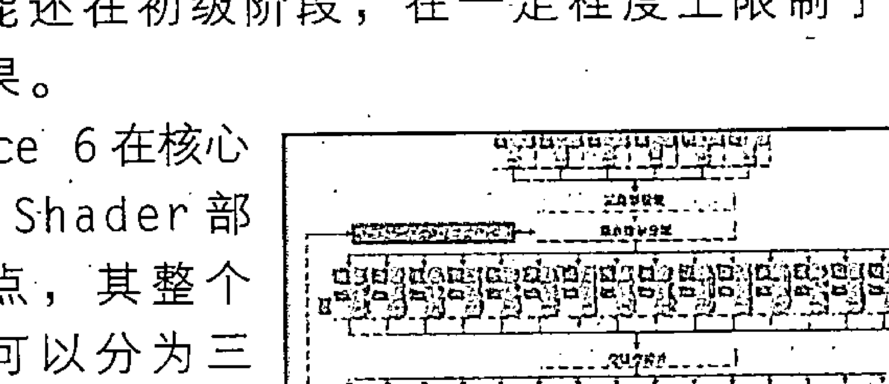

不仅仅是Shader体系架构的提升，nVIDIA还升级了Pixel Shader的版本，从2.0跃迁到3.0。客观来说，在目前的游戏引擎中，Pixel Shader 3.0与Pixel Shader 2.0几乎画质相同，3.0版本只是起到提升性能的目的。事实上Pixel Shader 3.0对于游戏编程人员的意义更大，它支持无限代码长度的程序处理，提供新的分支指令，能够轻松调用子程序，让编程更为轻松，效率提升显著，这对程序员来讲是一大喜事。

为了提高阴影计算性能，GeForce 6系列采用UltraShadow II技术。UltraShadow技术最早出现在NV35显示核心中，其允许更快的阴影计算（主要是剔除不要计算的阴影，从而提升处理速度）。II是原先技术的更新，nVIDIA宣称可以提供比原来快4倍的性能。UltraShadow II并不需要游戏支持就可以实现，但如果针对UltraShadow II优化的话，可以效率更高。

## 2. 继承3DFX遗志：SLI技术傲视群雄

Voodoo1的巨大成功使3DFX的势力迅速壮大，彻底将S3以及Trident等昔日霸主赶下王座。而令众多玩家翘首企盼的Voodoo2延续了3DFX的辉煌，众多3DFX的死敌更是难以望其项背。Voodoo2的杀手锏自然是至今还为老玩家津津乐道的SLI工作模式。这种被称之为SLI的技术允许在一台电脑中同时使用两块Voodoo2，它们之间通过一条传输电缆相连，两块卡分别处理屏幕上的奇偶线级信号，令速度直接增加一倍。之后，业界曾经出现采用AGP接口并直接集成两个Voodoo2芯片的超级显卡，尽管其本质与双PCI一样，但是却告诉我们这样一个事实：双芯片既可以集成于单显卡，也能通过双显卡方式工作。

进入AGP时代之后，由于总线地位的独立性，不可能出现双AGP显卡的SLI模式，此时双芯片集成于单显卡是惟一的途径。为此，3DFX的Voodoo5、ATI的Rage Fury Maxx以及XGI的Volari Duo V8都曾作出伟大的尝试。然而从实际效果来看，“哗众取宠”几乎成为大多数用户对其的评价。双芯片技术并非一无是处，至少相对单芯片的巨大性能提升是不可抹杀的。然而问题的关键在于成本控制与产品定位。双芯片技术势必成本高昂，而且AGP时代的集成模式断绝了单芯片显卡用户今后的升级空间。更为重要的是，无论是哪一款用于双芯片核心，它们都不是当时业界的顶级产品，这与七年前Voodoo2的背景相差太远。指望双芯片技术来达到竞争对手的同等水平，这本身就是一个笑话，因为产品间的竞争不仅仅是性能，控制成本同样不可忽视。双芯片技术的最终目的是“更上一层楼”，而绝非“弥补差距”。当年的VSA100远不及Geforce2 GTS，Rage核心也无法与同时代的TNT2 Ultra相提并论，Volari Duo V8更是在nVIDIA和ATI的双重夹逼下苦苦挣扎。毫无疑问，只有nVIDIA这样的业界霸主才有资格推出双芯片技术。

nVIDIA SLI技术采用一种“高速数字连接机制”来实现双卡互联，两块显卡的相互通讯则基于图形核心内建的专利通讯协议。与3DFX的隔行分别渲染方式不同，nVIDIA的SLI技术将画面分为上、下两个部分进行处理。一张显卡负责上半部的区域，另一张显卡则负责下半部的区域。当其中一块画面区域的图形较另一块区域复杂时，资料量平衡软件将用来确保工作量被平均分配到这两张卡上。值得注意的是，画面区域的划分并不是按照固定的一半一半方式，反而非常灵活。使用动态的负载平衡技术，可以保证两块显卡都处于最高工作状态。例如在大家非常熟悉的第一人称或赛车游戏中，画面下半部分通常更加复杂，需要处理的数据量也更多，而上半部分则多为静态画面。此时两块显卡的负责的上下两部分画面区域可能为7：3或8：2的比例，而不是简单的五五开，这样能够保证性能的充分发挥。以往Voodoo2 SLI需要使用一条数据线来连接，那么nVIDIA的SLI技术又如何连接两块NV45呢？事实上nVIDIA的SLI可扩展性主要由NV45核心内建的MIO单元来实现（图8）。同时在MIO单元的旁边，还集成如TMDS（Transmission-Minimized Differential Signaling，传输最小差动讯号）发送器以及数模转换器（RAMDAC）等负责视频输出的单元。从概念上说，NV45对可扩展性的支持并不仅限于2颗图形核心，多颗图形核心也有可能实现对可扩展性的支持。而SLI技术所做的第一个改变（或许是惟一改变）就是将NV45的对可扩展性的支持限制在两颗图形核心。

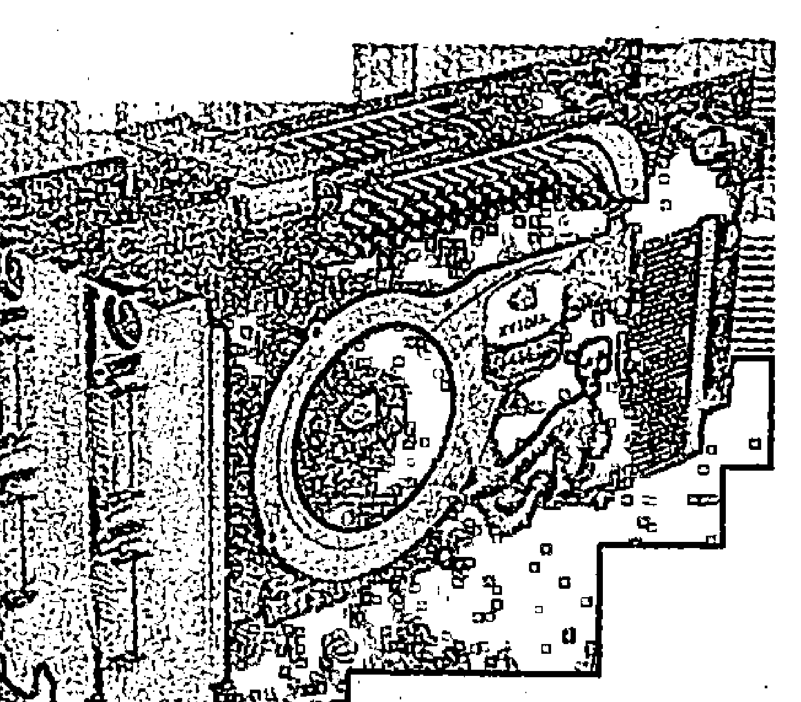

在SLI技术下，两块图形卡采用类似于主/从模式的工作方式，其中主卡负责视频输出，而从卡则负责处理供主卡输出的数据，且从卡本身不需要和任何显示设备相连接。与Voodoo 2的模拟SLI连接不同，nVIDIA SLI采用的是数字传输方式，通过一个迷你的U型PCB电路板连接器可以防止因为信号干扰所导致的画面不同步问题。不过更加令人吃惊的是，如今nVIDIA已经彻底放开了SLI技术的限制，不仅仅是GF 6600GT/6800/7800系列，甚至标准版GF 6600和6600LE也能实现SLI技术。目前GF 6600和6600LE的价格已经非常平易近人，再加上nForce4 SLI芯片组不断降价，打造廉价高性能的SLI平台已经不是遥不可及的事情。

## 3. 光影效果技术突破：High-Precision Dynamic-Range

电脑上能够显示的颜色目前是红、绿、蓝、Alpha等4个通道，每个通道8bit，也就是每个通道上2^8=256种颜色，存储一种颜色就需要4个8bit的空间，是32bit的空间。可是实际处理图片的精度依然不能满足要求，随着进一步图形处理运算，颜色部分就会产生变化，那么这么就很难保证以后依然是标准的1/256了，积累下去必然会有非标准的颜色存在，再经过多次运算以后自然就成了色彩细节丢失问题，譬如无法再现真实自然的光照情况。

HDR文件是一种特殊图形文件格式，它的每一个像素除了普通的RGB信息，还有该点的实际亮度信息。普通的图形文件每个像素只有0～255的灰度范围，这实际上是不够的。想象一下太阳的发光强度和一个纯黑的物体之间的灰度范围或者说亮度范围的差别，远远超过了256个级别。Dynamic Range（动态范围）是指一个场景的最亮和最暗部分之间的相对比值。一张HDR图片，它记录了远远超出256个级别的实际场景的亮度值，超出的部分在屏幕上是显示不出来的。可以这样想象：在Photoshop里打开一张从室内往窗外拍的图片，窗外的部分处在强烈的阳光下，曝光过度，呈现的是一片白色，没有多少细节。你将毫无办法，调暗只会把它变成灰色而已，并不会呈现更多的细节。但如果同一场景是由HDR记录的话，你减低曝光度，原来纯白的部分将会呈现更多的细节。

nVIDIA在GeForce 6（不包括NV44系列）和7800系列显卡中加入了High-Precision Dynamic-Range（HDR）技术，这与上述的HDR文件有着异曲同工之妙。HDR特效是与Vertex Shader和Parallax Mapping等技术并列的图像渲染特效。想要实现HDR特效，首先，游戏开发者要在游戏开发过程中利用开发工具（游戏引擎）将实际场景用HDR记录下来，当然技术出色的开发小组会直接用小开发工具（比如3D MAX的某些特效插件）创造HDRI图像；其次，显卡必须支持显示HDR特效。

尽管从原理上阐述HDR特效非常简单，但是实际工作难度并不低，因为显卡核心必须在运算过程中采用精确度更高的高精度浮点值来存储颜色。传统的用来存储颜色的32位寄存器显然已经不够用了，nVIDIA的GeForce 6系列图形芯片会自动采用更大的非标准寄存器来存储颜色数据，只是在最后显示的步骤再转换成标准的颜色数据。而GeForce 7800则直接达到128bit，最后才转换成标准的32bit色彩。

更为复杂的是，为了实现这种渲染方式，GPU必须具备浮点精度的着色、混合、滤波以及贴图功能。此外为了保证速度，GPU还不得不把这些色彩数据以原有精度（或近似原有精度）存储起来。因为只有这样，浮点数据的对数特性能够被保存起来，如果中间处理的结果仍以每像素256bit存储，那么GPU所具备的一切浮点颜色处理都等于是白费。为了实现这样的效果，GeForce 6和7800系列GPU原生操作模式下提出了新的概念，包括浮点着色、浮点混合和浮点滤波等技术，并且无需像素着色器程序编码或者解码。

## 显示器技术——LCD大放异彩

在激烈的市场竞争中，厂商对于各项新技术的研发丝毫不敢怠慢，只不过部分宣传内容起到误导作用。但是平心而论，其中部分技术还是有确实的效果，令LCD显示器的整体表现大幅度攀升。

## 1. 不老的传说：急速响应时间

随着液晶技术的发展，液晶性能和制造工艺已经有了质的飞跃，而响应时间也不断创新低：25ms成为市场主流没多久，16ms便迅速地成为业内标准，而12ms问世后，消费者又迅速的把关注的目光聚焦到8ms的极速液晶上。而响应速度的不断提升，也使LCD显示器逐渐消除“残影”现象，最终解决了长久以来的“痼疾”。客观而言，目前提高响应时间时综合应用了三个方法，不过提高工艺以减小液晶单元盒的间隙距离成为最主要的方向。

另外值得注意的是，近期灰度响应时间的概念逐渐兴起，这令很多准备购买LCD显示器的消费者十分关注。通常来讲，液晶面板黑白间的响应时间最快，而其他灰度之间也是构成绝大多数不同色彩变化的响应时间，要比黑白间的响应时间慢一些。在传统响应时间计算方式下，液晶显示器虽然可拥有16ms、12ms或更快的响应时间，然而其灰度响应速度却可能超过40ms甚至60ms。这样看来，传统的on/off黑白转换时间用来表示LCD响应时间，以偏概全，无法精确地表示LCD面板的整体响应时间。

灰度响应时间的概念表示液晶显示器从某一个灰度到另一个灰度之间变化所需要的时间，即液晶单元从一个角度转到另一个角度所需要的反应时间，可以全面体现LCD各种彩色变化（即灰度变化）的真实速度。在日常应用中，无论看电影、玩游戏或浏览网页，多数屏幕内容不会只是黑白间的转换，而是五颜六色的多彩画面，或深浅不同的层次变化，显然，灰度响应时间的提升对于消费者有着更大的实际意义。但是我们需要指出的是，灰度响应时间与普通响应时间绝不是简单的1：3.5比例关系，片面地使用这种方法来宣传并不合适。

如今灰度响应时间的确更加客观地反映了整体响应速度，这一点已经毋庸置疑。但是灰度响应速度的标称本身并没有权威认证机构，厂商简单地采用对比关系来折算并不合理。从市场情况来看，大多数普通12ms响应时间的LCD并不比灰度16ms响应时间的LCD慢多少。当前主推灰度响应时间概念的厂商主要有明基和优派，为了全面提升液晶分子的灰度响应时间，他们都联合IC芯片厂商合作开发了新技术。通过外部IC驱动芯片和电路适当调整液晶分子驱动电压，实现对不同灰度响应时间、不同像素的响应时间的精确控制。可以说，由于在技术上的改进，灰度液晶显示器对响应时间控制得更加到位，绝大多数灰度之间切换的时间都可以保证在6毫秒左右，并且相当稳定。反之，普通的液晶显示器对灰度切换的把握性就比较差了，并且很不稳定，最快的时候可以达到5毫秒以内，但慢的时候却又高达80毫秒。

在IC芯片技术出现之前，液晶面板是一台LCD的响应时间的惟一的决定因素，一块液晶面板从出厂起，其响应时间就已经决定了，显示器厂商无法影响其响应时间这一技术指标。而在采用了IC芯片技术之后，能够大幅提升液晶面板的灰度响应时间，更重要的是实现了对不同灰度下的响应时间的精确控制，从而获得了满意的效果。大家可以放心的是，这些IC芯片技术并不# 2. 亮度的追求：飞利浦显亮技术

上世纪90年代中期，飞利浦开始研发旨在提升显示图像效果的“显亮技术”。从1995年起，飞利浦历时5年于2000年成功研发出“显亮1代”技术。它给全球显示器行业指明出了一个光明的技术发展方向。这一专用IC和专用软件结合的高新技术，实现了图片、视频影像等增强显示功能。

在此后的三年时间内，飞利浦又相继开发出“显亮II代”和“显亮III代”技术。不断升级的显亮技术推动了显示器应用的革命——拥有3级亮度、4级锐度，共12级明锐度供使用者在不同场景选择；可同时“点亮”16个图片、视频影像和游戏窗口；在互联网浏览器中自动增强所有图片的显示效果。飞利浦显亮技术给用户带来了赏心悦目的视觉享受。

之前3代“显亮”均作用于CRT显示器，随着LCD的逐渐普及以及显亮技术的日臻成熟，在2003年5月飞利浦又强势推出了全新的“数字显亮”技术，这是第一款作用于LCD的显亮技术，其意义之深远，超越了前几代显亮技术。数字显亮专门为LCD所开发，使用专利DSP数字芯片能自动对信号进行辨别及处理，从亮度、锐度、对比度和色彩增强强度四个方面对显示图像进行调节（通过对每个像素的显示变化进行调节），从而全面提高液晶显示器屏幕画面的显示效果。

以飞利浦170X5为例：借助飞利浦独一无二的显亮芯之“智亮技术”（Smart Bright），170X5除在亮度、锐度和色彩等显示性能方面有了质的飞跃外，在操作应用上更带给用户者诸多惊喜。依托智亮技术，170X5拥有全新用户界面；可提供多达6种常用应用程序的预设显示模式选择（照片、电视、视频、sRGB、游戏、国际网络）；可提供多种人性化设置选择及更智能化的自动显亮功能；可优化亮度、锐度、对比度、色彩鲜艳度、JPG降噪、皮肤色调控制等显示要素（图10）。

# 3. 色彩的奥秘：8bit面板才是关键

随着液晶显示器的应用领域不断延伸，人们对画质的要求也越来越高。对于字符、图表和照片而言在视认性的基础上要求更加精细、精准，而动态影像则有“一般娱乐性节目”和“电影观赏性节目”两种情况：前者比较重视白色鲜艳显示性，后者要求黑色的收敛性等，可见随着整体环境的变化，显示器必须具备完全的对策与性能。这是外部原因对显示器的画质所提出的要求。

从色彩的角度来说，无论是CRT还是LCD都有真彩显示这样一个概念，其含义是指在R、G、B（红绿蓝）三个色彩通道都具有在物理上显示256级灰度的能力。所有的CRT显示器都具备真彩显示能力，而液晶显示器方面则不尽然。能具备在物理上显示真彩显示的液晶面板，我们就称其为真彩面板——也就是它具备在物理上可显示16777216种颜色的能力。

对液晶面板的色彩显示能力，我们通常用在每一种色彩通道上，液晶面板能显示灰度的位数来加以描述。如果在每个色彩通道上能显示256（2的8次方=256）级灰度，我们就称其为8bit面板，这也就是真彩面板；如果每个通道上只能显示64（2的6次方=64）级灰度，那么我们就称其为6bit面板，这也就是伪真彩面板。现在主流桌面LCD产品，选用6bit和8bit两类面板的都有，在中低端产品中采用6bit面板的产品较多。

尽管6bit面板无法和8bit面板相比，但一下子全部转为8bit面板从经济学的角度来看也不合适。面对用户不断提高的要求，各大LCD生产厂对于6bit的面板就推出了自己独家的色彩增强技术。这一类LCD色彩增强技术，主要目的是缩小6bit面板和8bit面板的差距，延长6bit面板的应用寿命。

从实现技术上来看，其主要是利用了PD（Pixel Dithering，像素抖动）算法或者FRC（Frame Rate Control，帧速率控制）技术。至于目前很多厂商推崇的IC芯片技术，尽管也能对色彩起到一定作用，但是这并非决定性因素，消费者不可在盲目崇拜下本末倒置。

# 4. 另类技术研发：涂层技术与节能技术

LCD显示器的发展重点可不仅仅是液晶面板与IC芯片技术。作为老牌显示器厂商，美格独家研发了黑晶α涂层（AREC2技术，Anti-reflection enhancing color and contrast已注册专利），其原理是通过涂层对光线的过滤作用，滤去光线中的杂波，达到增加透光率、对比度和色彩浓度的效果。而通过特殊涂层与镜面的有效结合，可以有效减少反射，防辐射，从而提高LCD的显示效果。

针对涂层技术的应用，一些专家和业内人士指出，从光学原理上说，某些特殊的涂层无疑是可以改善和提高光线的穿透率和纯度的，由此会带来一些技术指标如对比度、色彩表现上的提升。然而，特殊涂层技术之所以很少应用在LCD上，最根本的原因还是由于在液晶面板表面贴膜的工艺难度极大。而且类似涂层的技术因为需要在完全无尘、无静电、无抖动的严格环境里制作，丝毫的微粒和静电或抖动都会使得涂层掺入杂质或夹杂气泡等。

目前，美格黑晶α层涂层已经发展到了第2代技术，在亮度、对比度、可视角度功能上有了进一步的提升，同时还加入了其他如健康等功用。美格近期上市的T系列专业级LCD产品，将黑晶α层涂层与镜面技术完美结合，充分体现出美格与众不同的技术优势。

然而应当客观认识到，尽管α层涂层技术的确有所作用而且也值得肯定其技术价值，但是其地位不可能凌驾于面板之上，只能作为选购产品时的一个参考因素。

与上述那么多关注显示效果的技术不同，飞利浦近期提出针对LCD显示器的节能技术，被称为Smart Power的智能技术让用户拥有超低功耗的显示器。飞利浦在节能设计方面一直优于行业平均水平，智能技术显示器更节能，比市场同类机型节能20%以上。飞利浦全方位的主板设计，节省每点每滴的功耗，功耗的降低既可减少本身的散热又可延长显示器的使用寿命，堪称业内显示器节能的绝对经典之作。

事实上，在倡导节能与环保的大趋势下，越来越多的厂商在显示器生产中采用无铅工艺并且从各个细节来节省能耗。

# 办公与时尚——打印扫描技术蓬勃发展

从1997年第一次提出数码打印输出概念起，短短八年时间内，照片打印技术的发展速度有目共睹。用户渴求更细腻的画质、更准确而艳丽的色彩、更快的速度以及更好的易用性，这无疑成为技术发展的推动力。如今数码照片打印技术已经完全成熟，近期推出的多项新技术也帮助用户将数码打印作为影像生活中的一种享受。

### 1. 比分辨率更重要：墨滴控制技术

照片级打印机在性能指标上的提升是必然的，不仅分辨率至少需要达到1200dpi，甚至还必须具备多色打印技术，同时今年开始流行的分离墨盒也为用户节省了不少耗材成本。

当然，决定最终打印效果的绝不仅仅是分辨率，更不是几年前十分流行的色彩优化技术，反倒是墨滴控制技术更加重要。今年几大主流厂商都已经在中端产品实现2pl升墨滴控制，此时彻底解决了扩散问题，从而直接消除照片颗粒感。

尽管分辨率的作用却是不可小觑，但是将此作为判断打印效果的惟一指标也是不可取的。从某种程度而言，打印机的墨滴控制技术更为重要。

从源头上控制墨滴的大小，这自然是较为理想的解决方案之一。为了能栩栩如生地再现原有图像，墨滴必须极小，且分布极其精确。但是随着墨滴尺寸的缩小，图像质量也会因墨滴大小不均匀以及在打印介质上定位不准确而受到一定影响。

经过对人眼光学特性的仔细研究，通过缩小墨滴尺寸并降低着色浓度，即可大大减小颗粒感。在通常的着色浓度下，当喷墨量低于1微微升时，人眼看不见墨点。着色浓度越低，越不容易发现形成的墨点，也就降低了颗粒感，使人眼看上去的墨点比它们的实际尺寸还要小。

为此，各大打印机厂商纷纷开发了超精微墨滴技术，令喷墨打印效果突飞猛进。到目前为止，几乎所有产品都已经达到了5微微升墨滴控制技术，基本上能够满足我们的打印需求；而如果能够做到3微微升以下，那么输出精度将会令人十分满意。

从整体效果来看，如果打印机能够配合4800dpi×2400dpi并且做到3微微升以下的墨滴控制，那么此时照片打印效果完全不输于数码彩扩技术（图11）。

### 2. 速度与成本突破：惠普SPT全维打印引擎

SPT全维打印引擎是惠普用了5年时间，花费14亿美元进行的战略投资。全新的SPT全维打印引擎通过3种技术来实现其高质、快速、高性价比的特点：首先，增加打印头的宽度。打印头越宽，打印头在纸张上移动的次数就越少，相应地就提高了打印速度。其次，增加打印头上喷嘴的数目，以获得更高的打印质量和完成更大型的打印工作。再次，增加每个打印头单位时间内喷出的墨水量，最新的技术能确保每个打印头每秒喷射出36000滴墨水，提供更为丰富的色域。

正因为如此，全新SPT全维打印引擎可以满足打印市场的各种需求，从有大批量打印需求的家庭用户到中小型企业乃至商业市场，如网上冲印和零售照片市场。

SPT技术通过光刻工艺而非后期制作中的焊接方法将打印头组件制作成一个整体，这种加工方式使得墨盒、喷嘴和加热元件的位置可以精确调整，以提高墨水滴到纸张上的精确度，从而提高总体打印质量。这种独特的设计还可以提高喷嘴的放置密度，在一个打印头上可装设3900个或更多的喷嘴，使打印头的每次移动都可以覆盖更大的范围。更多的喷嘴和滴墨位置精确度的提高造就了速度更快的高质量打印。

此外，新打印系统还可确保决不会出现在打印到一半时墨水用完的现象，从而为用户节省了再次打印所需要耗费的时间、墨水和纸张。

除这种新的SPT打印头外，惠普还开发了一种新的方法来输送墨水。采用SPT全维打印引擎的产品使用“活性气体管理”的管道系统，此时一个封闭的再循环系统允许在打印机运行期间吸入到墨水中的任何空气被排出，而同时墨水被返回到相应的墨盒里。

使用“活性气体管理”之后，墨水可以从打印机里面的无海绵独立墨盒里被抽到打印头滑动部分上的小型墨水库里。如果在打印头充电之后，不被要求用于打印，墨水能够被返回到墨盒里。该系统提供一个通风管，以便在墨水返回到墨盒之前存储墨水。通风管可以接纳通过抽出处理产生的任何墨水泡沫，允许冷凝成液体墨水，并将它返回到墨盒里。

不仅仅是打印效果提升，在耗材方面惠普用其SPT墨盒给了墨盒兼容市场真正的一击。在希望克隆惠普墨盒多年之后，第三方供应商希望在这一领域里挣钱的可能变得更加困难。过去，这些供应商已成功地销售了兼容第三方EPSON和佳能的墨盒，但现在它们必须与10美元的惠普墨盒竞争，要达到更富有挑战的价位点，而同时又要保持一些利润。

此外，因为SPT机器里的管道系统比较复杂，所以兼容墨盒的设计难度更多。按理说兼容墨盒暂时的断层对于用户而言并非是什么好消息，但是惠普能够推出低价位原装耗材还是令人吃了一颗定心丸，毕竟高品质保障的原装耗材价格略高于兼容耗材完全能够令人接受。

### 3. 活的色彩：多色打印技术

分辨率和墨滴控制技术只能决定数码照片输出的清晰度，而真正高要求的照片打印还需要展现出完美的色彩表现。不可否认，采用多色打印依旧是最佳解决方案，这比任何图象优化技术都有效得多。

对于要求较高的照片输出而言，6色打印应该时最基本的需求，少数产品能够做到7色，甚至8色和9色打印。多色打印所带来的好处毋庸置疑。六色打印加入淡品红和淡青色之后对于色彩表现的改善显而易见，而如今的七色与八色打印更是达到出神入化的境地。

在数码照片中，人像和风景是比重非常大的两类主题，在加入橙色墨水之后，无论是人物的肤色还是夕阳美景，丰富自然的色彩能够被体现得更加真实丰满。而绿色又是自然界中不可缺少的颜色，人的视觉对绿色的表现非常敏感，如今八色打印技术中添加绿色墨盒，细腻的绿色色调使得风景照片更加亮丽逼真，重现身临其境的感觉。

普通低价位照片打印机往往是四色打印，此时多少令色彩表现力捉襟见肘。从理性角度来看，选择六色打印很有必要，这几乎是最佳的平衡点，产品的整体性价比较高。当然，如果购买七色甚至八色打印机，那么色彩表现力还会有进一步的提升，甚至表现好于数码彩扩。

# ## 第二篇 数据存储与网络技术篇

### 渐进中的突破——硬盘存储技术

作为PC中最主要的外存储设备，我们对硬盘的速度、容量和稳定性有很高的要求，而厂商技术的发展也无非是围绕着这三点进行的。PC系统真正的瓶颈在于硬盘，而硬盘似乎一直没能让大家满意。运行大多数程序时，硬盘灯总是频频亮起。即使Athlon 64和2GB双通道内存在运行PhotoShop等大型软件时，硬盘灯还是不能休眠。

### 1. 有容乃大：单碟容量实现突破

在即将过去的一年中，GMR（Gain Magneto Resistive，巨磁阻）磁头技术得到了很好的发展与改进。GMR磁头技术是由IBM开发，它是利用特殊材料的电阻值随磁场变化的原理来读取盘片上的数据。由于GMR磁头使用了磁阻效应更好的材料和多层薄膜结构，因此相同的磁场变化能引起更大的电阻值变化，从而可以实现更高的存储密度。

已经退出桌面硬盘市场的IBM刚推出这项技术时，GMR磁头能够达到的盘片密度仅为8Gbit每平方英寸，而如今希捷将GMR磁头升级到每平方英寸100Gbit，这就为提升单碟容量提供了先决条件。现在各大厂商都在原有的GMR基础上不断改进，推出第七代甚至第八代GMR磁头。

磁头技术革新的直接好处就是硬盘单碟容量可以做得更大，而单碟容量增加后，同样的容量将能够使用更少的盘片数，这将大大降低硬盘的生产成本与生产复杂度。在希捷Barracuda 7200.8上市之后，133GB的单碟容量硬盘已经进入主流市场。

由于硬盘都是由一个或几个盘片组成的，所以单碟容量就是指包括正反两面在内的每个盘片的总容量。单碟容量的提高意味着生产厂商研发技术的提高，这所带来的好处不仅是使硬盘容量得以增加，而且还会带来硬盘性能的相应提升。

因为单碟容量的提高就是盘片磁道密度（每英寸的磁道数）的提高，磁道密度的提高不但意味着提高了盘片的磁道数量，而且在磁道上的扇区数量也得到了提高，所以盘片转动一周，就会有更多的扇区经过磁头而被读出来，这也是相同转速的硬盘单碟容量越大内部数据传输率就越快的一个重要原因。此外单碟容量的提高使线性密度（每英寸磁道上的位数）也得以提高，有利于硬盘寻道时间的缩短。

### 2. 转速与缓存：桌面硬盘迈向SCSI级别

既然硬盘的速度如此重要，为什么我们不通过更简单的方法来使硬盘的速度更快呢？然而事情不总是那么简单的。一般来说，提高硬盘速度最有效的方法是增加转速，目前最快的主流SCSI硬盘已有15000RPM的转速，但是这样一来，成本是相当高的，而且对硬盘的寿命也有不小的影响，高转速必定带来高热量。

综合看来，我们一般认为普通IDE硬盘很难发展到10000RPM以上。目前5400RPM硬盘应该说已经基本退出了主流市场，7200RPM几乎是唯一的选择。当然，假如对于性能的要求特别高，10000RPM的桌面级硬盘也是可以考虑的，只是目前只有西部数据推出的猛禽系列支持如此高的转速（图12）。

其次是增加缓存，但是增加缓存也不是多多益善。以目前的技术，在普通IDE硬盘上加上8MB以上的缓存也不是什么难事，况且也不会过多地提高成本。问题的关键在于，增加过多的缓存到底能不能有效地提高硬盘速度。

从概念上说，硬盘缓存也是一种Cache，根据我们前面介绍的原理，它是在让硬盘磁头在重复读取数据时才派上用场的。缓存过大反而会影响命中率，当我们把硬盘的2MB缓存增加到8MB时，性能有不小的提升，而再增加缓存就没有十分显著的效果了。

迈拓的旗舰级桌面硬盘采用16MB缓存，但是从实际效果来看，似乎这并没有为它带来傲视群雄的性能，对于性能的提升幅度远不像很多人想象中那般明显。事实上，缓存的大小也是根据硬盘的速度设定的。一般的5400RPM的硬盘如果只有2MB缓存的话，那也不会对其造成太大的影响，而对于一个7200RPM的硬盘，2MB就是最低限度了。当初Seagate的酷鱼一代就是一款只带有512KB缓存的7200RPM硬盘，结果饱受批评。至于高速SCSI硬盘（10000RPM以上），4MB则是最低限度。

### 3. 外部接口技术：NCQ带来意外惊喜

在硬盘技术的发展历史中，外部接口也一直很为人关注。的确，外部接口的不断改进能给硬盘带来一定的好处。但是不要忘记，所谓的接口带宽只是硬盘的外部传输率，当硬盘的内部传输率远小于外部传输率时，它们几乎是没有意义的。

真正决定磁盘速度的关键是内部传输率，只要外部传输高于内部传输率大约30%就绰绰有余。当前硬盘大约60MB/s~70MB/s的实际内部传输率就好比一个杯子。当水龙头的流量明显超过杯子的承受能力时，再次加大流量几乎毫无意义，只能是徒劳的浪费。

因此，我们会发现同样是8MB缓存的硬盘，SATA版本比起IDE版本的性能提升幅度微乎其微，甚至带来的性能优势仅仅是因为串行传输，而并非带宽增长。同样，目前的SATA2硬盘将带宽提高一倍之后，也没有表现出很明显的优势，反倒是SATA2标准中的NCQ技术起到意外的效果。

NCQ的全称为Native Command Queuing，是2.0版本SATA规范支持的一种新功能。NCQ技术并没有提高硬盘的转速也没有加大缓存容量，更不是提高接口带宽，而是从数据存储方式着手改进，从而带来更高的工作效率。

从根本上来看，NCQ技术优化硬盘内部工作负荷执行顺序，通过对内部队列中的命令进行重新排序实现智能数据管理，改善硬盘因机械部件而受到的各种性能制约，以发挥硬盘最高的效率，使延迟进一步降低。

熟悉硬盘存储结构的读者都知道，硬盘磁片上划分为磁道与扇区来管理。然而磁头在读写数据时采用圆周转动的方式，长期以来都存在效率低下的问题，缺乏效果明显的性能优化技术。

支持NCQ技术的硬盘对接收到的指令按照访问地址的距离进行了重排列，这样对硬盘机械动作的执行过程实施智能化的内部管理，大大的提高整个工作流程的效率：即取出队列中的命令，然后重新排序，以便有效地获取和发送主机请求的数据。在硬盘执行某一命令的同时，队列中可以加入新的命令并排在等待执行的作业中。显然，指令排列后减少了磁头臂来回移动的时间，使数据读取更有效。

并且有效的排序算法除了考虑目标数据的线性位置，也会考虑其角度位置，并且还要对线性位置和角度位置进行优化，以使总的服务时间最小。

不过使用NCQ技术不仅仅需要硬盘支持，磁盘控制器也必须鼎力相助。目前Intel ICH6/7南桥、VIA VT8251南桥、nVIDIA nForce4等最新芯片组都提供对NCQ技术的支持，而迈拓和希捷这两大硬盘厂商也在NCQ技术研发方面走在前列，酷鱼7200.8以及金钻十代都具备了NCQ技术，令我们对未来磁盘性能颇为期待。

如果一款SATA2硬盘没有配备NCQ技术，那么其实际表现与SATA没有什么区别。只有在NCQ技术的帮助下，SATA2硬盘才能真正展现出性能优势。

# 内存技术——平淡无奇的一年

内存储器在PC设备中占有重要的席位，也正是内存储技术的发展才得以让如今的计算机呈现出一番勃勃生机的景象。毫不夸张地说，未来PC发展的重点不是CPU而是内存。半导体技术的突破已经为CPU发展铺平的道理，随着主频的不断提高，整个系统将对内存性能提出更高的要求。

纵观PC技术的发展，每次内存技术的提升都对整体性能产生重大的影响。然而令人略感意外的是，今年内存技术的发展十分平稳，SDRAM彻底退出历史舞台，RDRAM也失去了Intel的“垂青”，此时DDR内存的惟一发展动向便是更高的频率。为此，我们看到DDR500甚至DDR600内存不断推出，毕竟制作工艺的提高为极限频率提升带来很大的便利。

另一方面，DDR2也在今年崭露了普及的萌芽，但是羽翼未丰。DDR2相对于DDR技术提高在于可以读写分离。在传统的DDR中，爆发式读取过程是并行进行的，而且数据控制接脚为单项，导致上行与下行的带宽降低。但是DDR2可以采用双向数据控制接脚，从而实现更高的等效频率带宽。尽管DDR2可能在生产技术上存在一定的困难，不过其更出色的等效频率与低功耗表现将令业界十分期待，而且新一代芯片组全面支持DDR2内存，因此其前景十分看好。

# DVD时代：光存储技术

DVD-ROM与CD-RW的技术很难再取得重大突破，因为对应的速度已经达到传动马达以及激光头的物理极限。在缺少新鲜技术支持的情况下，价格成为厂商吸引消费者的惟一手段。美达、台电、明基等厂商不遗余力地展开价格攻势，而先锋、LG等一线品牌也加入了价格竞争，令消费者体验到不少高性价比的产品。

相对而言，2005年最让人关注的还是DVD刻录机。在DVD+R/RW与DVD-R/RW阵营势均力敌之时，市场呼声得到厂商充分响应，DVD-Dual双制式成为潮流所趋，如明基推出的16X双层DVD-Dual D9刻录机。而DVD-RAM基本宣告退出民用市场。

在2004年末之时，DVD-Dual已经在600元以下，而如今大量16X DVD-Dual也维持在500元左右。但是值得关注的是，目前支持16X刻录的DVD刻录盘还寥寥无几，价格也远未到普及应用的程度。可以肯定的是，DVD刻录机发展到16X之后也将进入技术停滞期，届时产品依靠降价来寻求普及空间将会成为令广大消费者最喜欢看到的局面。

# 2005年笔记本电脑终极PK
文/马振贵

如果问我国今年的PC市场什么最热，相信许多朋友会说是笔记本电脑。事实上，今年的笔记本电脑确实表现抢眼，尤其是价格的不断下滑，使这个市场的热度越来越张扬。如果说以前还仅仅是国产的一些非主流的笔记本厂商在暗中搅动市场的话，那如今国际PC巨头们也介入其中推波助澜，使整个市场表现出来的活跃和张力越来越明显。当初万元曾经是一个门槛，如今，五六千的产品已经是相当有分量了。那么2005年的笔记本电脑市场还能给我们演绎什么精彩呢？

## 2005年下半年笔记本市场的趋势

中国台湾仁宝公司表示，笔记本电脑产业2005年下半年将会逐渐升温。仁宝认为，今年笔记本电脑市场景气很好，台式机替代型笔记本的趋势将会继续延续，预估全球总出货量可由去年的4600万台，增长至今年的5700万到5800万台间，增加幅度约达24%。笔记本产业从2004年第四季开始就受到英特尔芯片缺货影响，缺货的危机目前似乎还没有能够完全解除。但是，缺货的危机将有可能在下半年得到解决，而被英特尔芯片缺货所压抑的市场需求将会在下半年大举爆发，以仁宝来说，预估第三季的出货量至少比第二季成长5%至10%，第四季则是惊爆点，将可能超过原先所制定的全年950万台目标，而05年上半年出货量约430万台至440万台之间。

由于笔记本代工商相继赴大陆设厂后，在产能压力下势必要争取订单，因此业界绝对避免不了竞争，但现阶段的状况已经好了很多。例如仁宝，第二季毛利率就会比第一季要好，未来也不会掉落到5%之下。国内一线的笔记本代工商如广达、仁宝、英业达和纬创等，只要英特尔新平台的芯片供应上来，笔记本产业爆发力将相当可观。事实上，迅驰II的全面铺货已经大张旗鼓地展开了。

以前提起笔记本产品降价，五六百元的降幅已经算大降了，而且还主要集中在万元以上的中高档机型。而从2005年暑期开始这个观念被彻底地改变了。先是联想旭日150C从6999元暴降到5999元，低价机降幅竟然达到1000元，而紧接着TCL丽屏笔记本K10更是从6999元直接降到4999元，2000元的降幅以前只有在2万元的IBM T系列等高端机上才能看到。在这些降价先锋的带领下，绝大部分品牌的产品都参与了这次空前的大降价，也直接导致主流笔记本的价格从万元跌到了七八千元左右。而造成这种现象的原因则是因为市场竞争的日趋激烈和笔记本产品同质化严重，在这种情况下，也只有大降价才能真正吸引消费者的眼球。但降价却会导致利润下降、产品做工用料变差等问题的出现。而且在6999这个价位上还可以大降，但到了3999元、4999元呢？一味地降价毕竟不是办法。

记得迅驰II刚上市的时候，IBM、三星、惠普、索尼等厂商的新品价格都在万元以上，有些甚至接近两万元。

## 笔记本CPU的终极PK

说到笔记本CPU，我们自然想到的是英特尔和AMD这对冤家对头。在2005年，AMD64位和迅驰II代之间的争夺已经有一段时间了。今年暑假前夕，64位技术攻城略地，各大厂商都已推出64位产品。可以说，64位平台的到来，无疑成为今夏PC市场的最亮点。众所周知，在狂砸了数亿美元进行市场推广后，英特尔的迅驰平台在两年内迅速成为笔记本市场的绝对主流，同时也成了“超长待机”和“无线上网”的代名词。今年1月19日，被称为“第二代迅驰”的Sonoma平台也闪亮登场，将笔记本市场引入了一个新领域。与原计划相比，Sonoma其实是姗姗来迟的。紧跟英特尔脚步的三星、戴尔、惠普、索尼等国际大厂商已经大张旗鼓，不仅在第一时间推出了自己的新品，而且还加大市场推广力度，全力推广Sonoma新品。争相领跑的大戏又一次拉开了帷幕。

每次新旧平台交替之时，厂商的反应速度总是参差不齐的。这里，除了新平台的技术、价格因素之外，起到决定性影响的其实还是厂商的自身能力、策略的限制以及库存压力。事实上，在各家厂商为了清库存而出现衔接延迟皆属正常现象。但不管怎么说，Sonoma的新平台必然是大势所趋。有权威资料显示，目前Sonoma笔记本电脑比既有机种价差仅仅1成，因此预计市场全转换成新平台将为时不久，今年下半年，笔记本市场就会成为Sonoma的天下。在这样的情况下，市场的时间差之争就变得相当微妙。当然，这里也是对比英特尔迅驰一代和二代之间本身，由于AMD的搅局，市场也必然会分流一部分，事实也确实如此，在今年下半年这种分流究竟能产生多大的能量也主要是看AMD的推广力度了。

## 笔记本价格PK

### 1. 超低价领域

神舟电脑聘请“超女”做形象代言人，旨在能够笼络住更多的中低端用户，毕竟在这个层面的用户多数是学生，不过，在超低价领域，其实神舟早已经不是最低的代名词了，新蓝的2999笔记本以及即将面世的100美元的笔记本都在扛着最低价的标牌。其实，当联想推1999元的PC时，我们已经感觉价格相当诱惑了。随后市场又传出将有100美元的笔记本电脑，面向对象是中国、印度和巴西这样的发展中国家的贫困青少年。当然这是老外的设想，还没有具体实施。不过在国内市场却已经推出了2999元的笔记本了。

尤其是随着AMD Turion的加入，让整个市场更有看头。笔记本进入新老迅驰更迭的关键阶段，时过境迁，价格战再无用武之地，取而代之的是层出不穷的sonoma、Turion64新品集体秀。sonoma平台从1月19日发布以来，一开始步步为营，小心翼翼地从17寸宽屏的娱乐机型切入。英特尔这样做的目的，除了给各个笔记本厂家提供一个充裕的清货时间，避免造成市场上sonoma和carmel的自相残杀，还有一个更重要的原因就是这样做可以避免sonoma全线进入市场，造成的市场真空被AMD利用。sonoma取代carmel，更多的是英特尔的战略，是理所当然的技术升级。不过，即使如此，AMD也还是有空可钻，当AMD的Turion逐渐在市场冒头的时候，也可以看出AMD的崛起已经是不可忽略不计的了。

当低价笔记本泛滥的时候，其实我们更应该审慎一些。低价笔记本是不是值得购买？在此，笔者的观点是慎买超低价笔记本。或许，一般低端配置的CPU一时看不出差别，较低容量的硬盘也可以容忍，但128M的内存至少XP是跑不了了，而SIS芯片组对笔记本移动性能的影响是很大的，至于CD-ROM则意味着你无法看DVD大片，如果你想升级这些配件，那它的价格也是不菲的。

2005年6月，AMD公司对外透露了一份有关自己移动处理器发展的规划蓝图，从规划中可以看出明年AMD将会推出支持DDR2内存总线结构的双核心Turion移动处理器新品，而到2007年则将推出支持DDR3内存总线结构的新核心处理器产品。从蓝图上不难看出，AMD今年的重点将会放在推广Newark的Mobile Athlon64处理器、代号Lancaster的Turion64处理器(实际上就是低电压版的Athlon64移动版)，以及代号Georgetown的闪龙移动版处理器身上，其中Newark选用90纳米工艺生产，支持SSE3规范，Socket754针脚，能耗大约为62瓦左右；而Lancaster同样也是90纳米工艺生产，支持SSE3规范，同样也是Socket754针脚，能耗在25~35瓦左右，目前型号包括ML-37/ML-34/ML-32/ML-30/MT-34/MT-32/MT-30这么七款产品。到今年下半年AMD还将推出Turion 64的两款高端产品MT-40和MT-42，同时AMD还将以新一代Albany代号的移动闪龙处理器取代原先的Georgetown产品，并且还将推出一款代号为Roma的低压版闪龙移动版处理器新品。

当然如果这些你都可以容忍，那么你还要考虑笔记本的最大构件液晶显示屏。液晶显示屏分为三个等级，前两等级差价可达30美元，第一等级与第三等级差价可达50美元。如果在品质上进行操作，可以节约将近80美元的成本。这也是业内认为会出现3999(甚至包括4999)笔记本的原因之一。屏幕等级的差别意味着坏点多少，意味着色彩是否失真，意味着亮度是否会早早下降等等。因此你在选择的时候可要睁开火眼金睛，毕竟一批货里也有一些不错的产品的。如果你不幸摊上了一个不好的显示屏，那可就有的受了。

AMD将于2006年发布适用于笔记本电脑的双核心CPU。除了采用双核心，支持DDR2、"Pacifica"虚拟技术、"Presidio"安全性技术以外，还明确了处理器的热设计功率（TDP）有35W和62W等细节。在目前的市场上有25W和35W的Turion 64以及62W的Athlon 64产品，可以看出双核心笔记本处理器将会针对高端市场推出。就像以往我们所说的，和单核心Turion 64一样，双核心版本的出现可以让用户有选择的余地，而不是只有英特尔一家的产品可以选。从这个意思来讲，AMD的Taylor是英特尔的Napa时代非常值得期待的一款产品。

联想集团副总裁张晖当着媒体的面连续猛摔了两台笔记本电脑，以表明联想笔记本电脑成为全球首款成功挑战MTBF(平均无故障时间)测试的产品，并历史性地突破3万小时的极限测试。这样的技术和性能在低端笔记本中是想都不敢去想的。很多人经常喜欢用性价比来衡量同样配置的笔记本，在配置一样的情况下觉得价格越便宜越好。其实不然，因为很多东西不是配置单所能反映的，可靠性、舒适度、配件质量、售后开支等因素，在配置上是看不出来的，只有用起来才能体会到。所以，建议多看看专业论坛上关于候选机型的使用感受，不要过于计较几百块钱的差异。

可以预见的是，今年下半年，AMD和英特尔之间的角逐还会继续，虽然在短期内AMD还处于劣势，但不可否认的是，正因为有AMD的存在，也才能是我们感到笔记本市场变化的日新月异，毕竟有人追赶，使英特尔不敢有丝毫的懈怠和掉以轻心。

有的低价笔记本在接口方面也是大打折扣，而一些接口的缺失，在你使用的时候会感到非常不方便。某些厂商为了节约成本，在接口上大幅缩水，有的甚至将低端产品的MODEM给省了，很多厂商宣传自己的产品接口"丰富"，说有四五个USB接口，其实这只能叫"多"，不能叫"丰富"。低价笔记本往往在配置上捉襟见肘，难免今后要做扩展，所以需要一定的接口类型，而这些往往容易被厂商省掉的。笔者的建议是，如果你对价格非常敏感，那你可以考虑在低价笔记本中精挑细选，找一个有保障的品牌。而如果你对价格并不十分敏感，还是尽量不要选择超低价位的产品。毕竟，一分价钱一分货。

## PART 2 笔记本电脑终极PK

### 2. 厂商之间的PK

2005年，身陷无休止价格战的海外军团纷纷将生产重心放在成本、资源和市场均占优的中国内地，这里成为“各怀心事”的国际厂商们的共同选择。先有东芝宣布将杭州建成其全球笔记本生产中心，接着戴尔迫不及待在厦门建第2座PC工厂。相比之下虽然晚了些，但三星电子的决策更加坚决。5月初，这家韩国公司对外宣布，将把韩国水原的PC生产设备全部迁至苏州工厂，并将其作为惟一的笔记本生产基地。伴随着3月底中国台湾主要笔记本厂商全线转战内地，亚欧美企业75%以上的代工业务也将完全在内地生产，竞争加剧引发了新一轮的资源配置，终将导致国内厂商成本优势逐渐弱化。

选择将全部笔记本生产线移至中国，这实际上是三星电子为增强自身竞争力不得不走的一棋。在笔记本的发展轨迹上，韩国与中国台湾的企业比较相似，双方企业的市场交锋也显得格外激烈，然而，韩国企业在中国台湾企业的竞争中并不占优，其生产成本较中国台湾企业高出不少。不仅如此，聪明的中国台湾企业早早将制造基地全部迁往内地。据估算，内地每生产一台笔记本电脑的成本要比中国台湾低25美元（合200元人民币），那么，迁到内地后的中国台湾企业与韩国相比，成本差距更是可想而知。

同时，随着中国台湾代工企业大举设厂内地后，欧美企业将75%以上的代工订单交给了中国台湾企业。从2002年开始，戴尔甩开三星电子，大大增加了给中国台湾企业的代工订单。不得已，三星电子宣布今年下半年结束与戴尔、Gateway的代工业务，转而全力推广自有品牌。在全球的IT及消费电子市场格局中，索尼和三星电子已经成为最重要的竞争对手，三星改变其生产布局的行为理应对索尼产生重要影响。而索尼此前在制定“植根中国”战略时，则早已将成本控制提上日程，不仅委托中国台湾华硕等厂商代工，而且还设在上海、无锡等地设立研发基地或工厂，大力降低人力成本和研发成本。

与索尼有着相似策略的是戴尔。在今年3月，该公司CEO迈克尔·戴尔访华，不仅宣布在厦门修建第2座PC工厂的计划，还将在上海设立设计中心，用于产品的设计和研发。但是戴尔控制成本的本领不止于此——戴尔还将中国作为它全球采购的重要基地。在控制生产成本、研发成本基础上还降低了生产材料成本。笔记本微利时代已经来临，各大厂商为控制成本竞相展现十八般武艺，各大代工企业也为了获得一线企业的代工订单而不惜杀价抢单。

当然，我们也看到我们自己的笔记本企业的成长。在笔记本的研发和设计方面，其实联想中国和联想国际各有所长。联想笔记本设计强项在于消费化应用、软件、易用性设计等方面，而IBM笔记本的强项在于可靠性设计、安全设计、紧凑性设计等方面，联想的并购带来了互相取长补短、学习融合的机遇。联想已经在充分借助联想国际在笔记本设计、生产制造方面的资源以及双方采购协同的优势发展自己，如日本大和实验室也就是著名的Thinkpad设计中心年内将同时为联想中国设计笔记本，双方将共享ODM(Original Design Manufacture)厂商的设计团队，由深圳IIPC工厂生产的联想笔记本也有望在年内推出，联想的笔记本业务将更具竞争优势。

### 3. 笔记本电脑价格纵向PK

#### (1) 2999元笔记本

**新蓝Dfree2999**

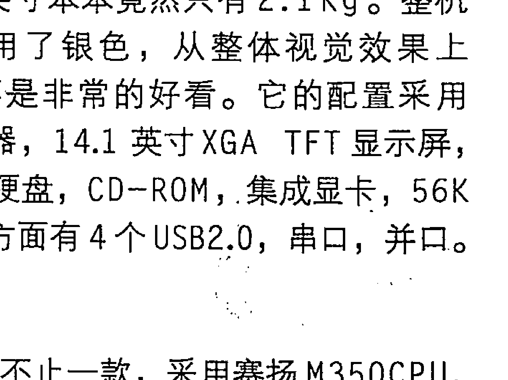

2005年的前三个季度，笔记本市场可真是精彩纷呈。价格底线一直拉低到3999元、3880元，让广大的消费者惊喜不已。当3999元的神舟承龙S261C、新蓝Dfree2220A出现在我们视野时，大家都认为这或许就是2005年本本价格的“铁底”了。不过，正当人们以为不会再降价的时候，8月末笔记本价格的新低被刷新为2999元。代表人物是新蓝Dfree2999和新华海Q兔。

最先发布的2999元本本——新蓝Dfree2999配置如下：

| 配件 | 规格 |
| :--- | :--- |
| 处理器 | VIA C3-M 1.2G |
| 主板 | VIA |
| 内存 | 128MB DDR |
| 硬盘 | 30GB |
| 光驱 | 24X CD-ROM |
| 显卡 | 集成 |
| 屏幕 | 14.1英寸XGA TFT |
| 调制解调器 | 56K Modem |
| 网卡 | 100M |
| 接口 | 并口、串口、4个USB2.0 |
| 重量 | 含电池2.1kg |

**新华海Q兔**

熟悉新华海本本的朋友也许不多，它是南京的地产品牌。“北有中关村、南有珠江路”，作为南派IT界的代表，新华海也一直拥有自有品牌的本本（由台湾厂家代工）。现在它推出售价2999元的Q兔，旨在与新蓝Dfree2999争宠。从外观来看，和新蓝公布的2999元笔记本的图片也十分相似。全黑色的外观；比较厚但是不重，全内置含电池的14英寸本本竟然只有2.1kg。整机只有触摸板下方的按键用了银色，从整体视觉效果上看还是比较紧凑，当然不是非常的好看。它的配置采用了VIA C3-M 1.2G处理器，14.1英寸XGA TFT显示屏，128MB DDR内存，30GB硬盘，CD-ROM，集成显卡，56K MODEM，100M网卡。接口方面有4个USB2.0，串口，并口。

#### (2) 3999元笔记本

3999元笔记本现在已不止一款，采用赛扬M350 CPU、SIS芯片组、128MB内存、30GB硬盘、CD-ROM、14英寸显示器，工程塑料外壳等，这类配置几乎是目前笔记本电脑品牌中可想象的最低配置。对于上述配置，消费者要想好，你买回去要做什么用。

**神舟天运 M120C**

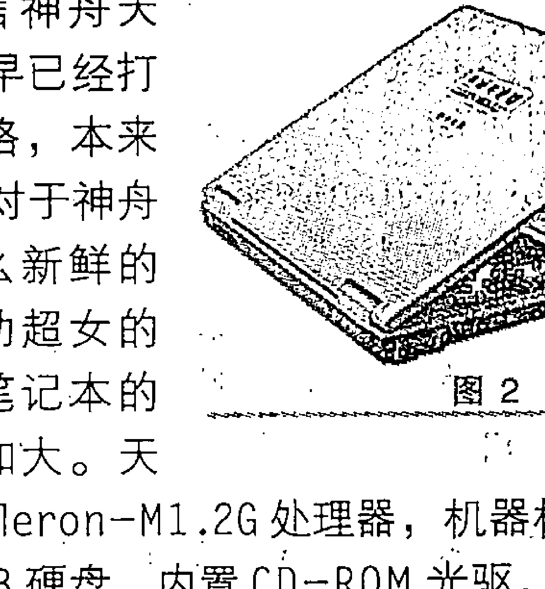

由李宇春代言的神舟天运M120C笔记本早已经打出3999元的价格，本来3999元的笔记本对于神舟来说已经不是什么新鲜的事情，但由于借助“超女”的影响力，使这款笔记本的影响力也进一步加大。天运M120C采用Celeron-M 1.2G处理器，机器标配内存达到了256MB，30GB硬盘，内置CD-ROM光驱，14.1英寸液晶显示屏，整机的重量达到了2.3公斤。从外观上来看M120C还是非常漂亮的，银白色的，外形轻巧，和普通低价本本既厚又笨的外观形成鲜明的对比。

#### (3) 4999元笔记本

这个价位的本本一般采用赛扬M350、360、370 CPU、Intel 852/855芯片组、128MB或256MB内存、30GB或40GB硬盘、CD-ROM或DVD-ROM、14英寸(或15英寸)显示屏；4999元的配置比3999元丰富许多。如果从配置上看，随着迅驰架构的转型，这些配置还可接受。特别是其中的高端配置，和以前6000元至7000元的笔记本已没什么差别。无论是用来办公或是娱乐，基本要求是可以实现的。另外，一些国际品牌也推出了这个档次的产品。在服务上也比较有保证。甚至有业内人说，从当前笔记本这个行业的发展状况来看，4999元是个合理的低价位。因为其降价的空间来自于两个方面：一个是产量，一是技术。技术方面，随着液晶、硬盘等硬件制造技术的突破，笔记本总体的成本已有大幅度的下降。但当本本走向大众化之后，产品品质也会略作调整。一是取决于测试标准，另一是取决于零件品质。不同的品质的零件价格相差在几十美元之多。而不同的检测标准，也会降低次品率和管理成本。比如开关机测试，有的产品只要连续开关机250次不死机就算合格了，而有的却是500或者是1000次，这之间存在着费用差别。所以购买低价的本本，要做好接受低品质的心理准备。一方面是基本可以满足功能的4999元，另一方面是可能面临的低品质，所以我们说出不出手4999元是个难题。

**戴尔2200**

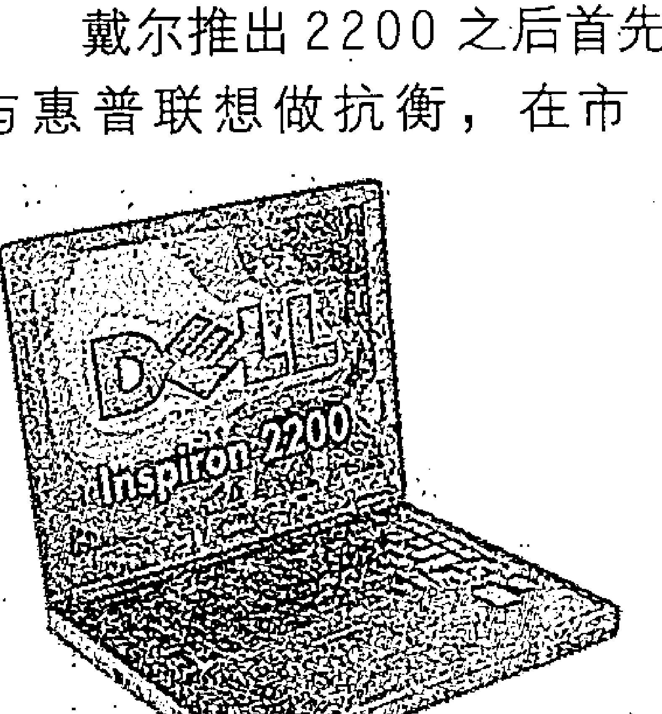

戴尔推出2200之后首先以5999元的价格在市场上与惠普联想做抗衡，在市场掀起了一阵5999元笔记本热浪之后，随后猛然一下把价格降到4999元，这个举动让所有笔记本厂商震惊。这个举动确实疯狂，不但把之前相同档次的惠普、联想、华硕等品牌淹没下去，就连国产品牌退守的4999元笔记本领域也已被其攻陷，可以说在众多品牌中这款2200成为大家一致的公敌。既然是众多笔记本品牌的敌人，那么这款本本对于消费者来说肯定是一款值得选择的本本。这款机器采用Intel Celeron-M Dothan核心技术，主频为1.4GHz，256MB内存，40GB硬盘，并且配备了COMBO光驱，14.1英寸液晶显示屏，值得一提的是这款机器使用了Intel 910GML芯片组，不要说在4999元笔记本里就是在5999元这个价位里也是不多见的。但是从外观上来看2200显得笨重了许多。

#### (4) 5999元笔记本

应该说戴尔是最早推出5999元笔记本的国际品牌，也是掀起这次降价热浪的始作俑者。但是随着联想、华硕的加入，5999元笔记本的争夺开始日益激烈起来，三足鼎立，更是掀起了新一轮的5999元价格热潮，但是随着惠普Ze2202AP的出现，这个局面再次发生了质的改变，这也标志着世界顶级的笔记本制造商也加入到5999元笔记本的行列。市场上再次出现5999元笔记本热潮，人们关注的热点并不是5999元价格，而是国际品牌的加入。以前低价的5999元笔记本就存在，只是一直没有被消费者和媒体所关注，如今，当更多的国际品牌出现低价位笔记本时，消费者也好，还是媒体也好，才真正的关注到了5999元，这个价格；应该说如今5999元笔记本的出现应该和很多大厂的销售策略有直接关系，如此一来，5999元价格，才能成为焦点。不少消费者在购买5999元笔记本的时候，都是冲着品牌来的，而且大多数消费者的观点基本上都是一致，都认为一线品牌在品质上和售后服务上都可以保证，今后的使用中也比较放心。虽然国内的4999元甚至更低的价格已经出现，但是因为国际顶级笔记本制造商加入到5999元市场中，受到消费者的广泛关注，同时消费者的选择也更倾向于国际品牌。对于普通消费者而言，如果不玩大型游戏的话，目前的主流配置是完全能够满足要求的，当然特殊行业除外。5999元笔记本市场可以说是百家争鸣，无论是PM还是独立显卡以及宽屏，在这个价格你都可以选择到不错的产品。

**惠普Ze2202AP**

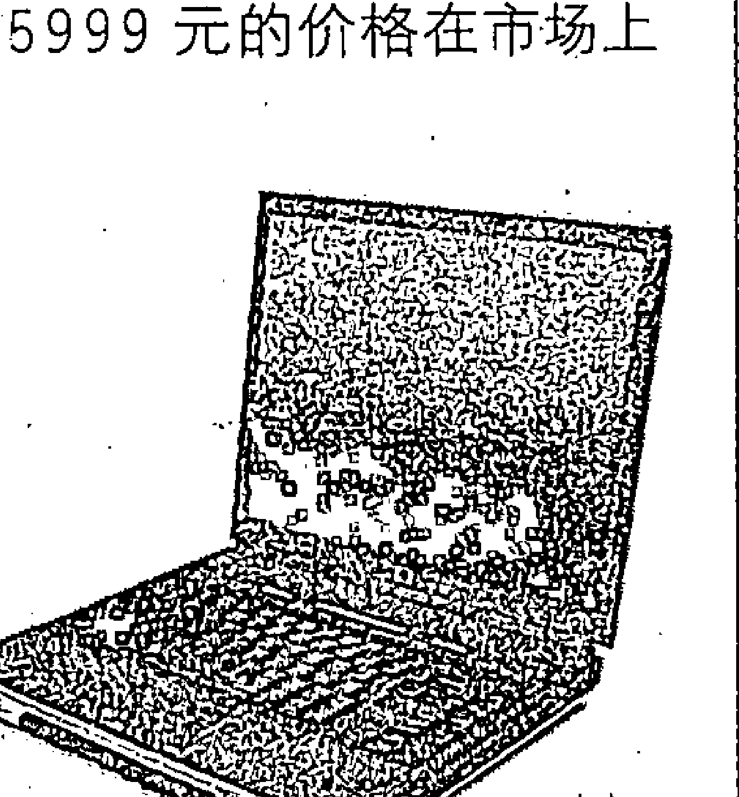

之前看这款机器简直是一款迈向极端的产品，作为国际一线品牌，把价格做的如此之低实在难得，这无疑是给中国的笔记本市场投放一颗重磅炸弹。因为很多国产本本都是以低价来冲击市场的，Ze2202AP的出现打破了低价国产本本一统天下的格局，并且在售后服务方面国际厂商占有绝对的优势。不过现在这款机器在价格上已经没有之前那么具有强烈的吸引力，但还是一款不错的本本。这款机器采用AMD 64位处理器，主频为2800+（1.6），机器标配256MB内存，40GB硬盘，配备COMBO光驱，对于5999元的价位来说实属不易，15.1英寸显示屏。

寸液晶显示屏。整机的重量为3.0，除此之外，这款机器的接口十分齐全，机身上带有六合一读卡器，USB、IEEE 1394、调制解调器、网卡一应齐全。鼠标触摸屏和机身为一体式，给人一种浑为一体的感觉。

## (5) 7千元以上名牌本本

对这个价位笔者不想多说什么，看看几款产品就知道定位在这个价格线上的产品的发展走势究竟如何了。

### DELL Inspiron 700M（图5）

戴尔 Inspiron 700M（M520908）采用英特尔赛扬M360处理器，1.4GHz主频，1MB二级缓存，400MHz前端系统总线。英特尔 855GME 芯片组，集成极速引擎二代显卡，64 MB动态共享显存，12.1英寸宽屏液晶显示屏，1280x800的分辨率。512MB DDR333内存，最大升级到2GB，60GB 5400转硬盘，内置DVD+/-RW光驱，内建802.11b/g无线网卡，集成56K调制解调器，AC97声卡和10/100M自适应网卡。接口方面，2个USB2.0接口，4合1读卡器插槽，数码接口IEEE 1394，接电视的S-Video，接显示器的VGA接口，PCMCIA接口等。4芯锂离子电池，使用时间2.5小时左右，带电池重1.86公斤。

### 宏基 Aspire3602NWXM（图6）

宏基 Aspire3602NWXM采用英特尔赛扬 M 处理器 360，频率1.4GHz，1MB二级缓存，400MHz前端总线。英特尔 915GM 芯片组，GMA900显示芯片，支持DX9，性能大大强于855GME的显示核心。256MB DDR2内存（可搭建双通道），60GB硬盘，DVD-Dual刻录光驱，14.1寸WXGA高亮镜面液晶屏。这款笔记本装备Linux操作系统，标配4000毫安锂离子电池。在接口方面，其拥有着较为全面的接口，包括有3个USB 2.0接口、1个RJ-45以太网络接口、1个RJ-11调制解调器接口、1个外接显示(VGA)端口、1个麦克风/音频输入端、1个耳机/喇叭/音频输出端子和1个PC卡插槽(1个Type II)，充分满足大家的日常连接需求。

### HP Compaq nc4200（图7）

HP Compaq nc4200(EF945PA)采用英特尔奔腾 M 处理器740（1.7GHz、2MB二级高速缓存、533MHz FSB），915GM芯片组，集成GMA900显示核心，最大共享128MB系统内存。256MB DDR2 533MHz内存，40GB 5400转硬盘，12.1寸XGA液晶屏。网络方面，Nc4200集成10/100/1000网卡，802.11a/b/g无线网卡，集成蓝牙。输入方面为指点杆加触摸板。接口方面具有PCMCIA、SD插槽、VGA接口、S端子、扩展坞接口、红外线端口、3个USB2.0等等。预装 Windows XP Home 操作系统，4.8毫安6节锂离子电池，4小时使用时间。重量至多1.81千克，提供一年有限保修。

### IBM 首款平板电脑 X41（图8）

作为ThinkPad系列的首款平板电脑，该机还是延续了以往IBM ThinkPad的风格，黑色钛合金外壳，庄重的商务风格，另外，受日本Toshiba等大厂的旋转屏幕笔记本热销的影响，X41 Table的12.1英寸XGA分辨率液晶屏幕被设计成为可以自由翻转，翻转后的屏幕将键盘覆盖，从而笔记本电脑也就变成了Table PC。另外，X41的屏幕中含有一个转换器，当进入平板电脑模式后，用户可以使用数字感应笔作为输入设备。X41Table仅重1.6kg，厚度为2.8cm，另外除了轻巧，该机另一大特色便是超长的电池使用时间，据联想宣称，该机最长可以提供6～7小时的电池续航时间。

X41预装最新的Windows XP Tablet PC Edition 2005操作系统。在配置方面，X41 Table同样不输于主流笔记本电脑，该机采用了低电压版Intel Pentium M LV 758 (1.5GHz)或超低电压版Intel Pentium M ULV 753 (1.2GHz)处理器，20G～60G的硬盘，256M或者512M的DDR2内存，外置Combo光驱（需要配合底座使用），915GM芯片组（集成Graphics Media Accelerator 900显卡）等。外部端口方面，拥有千兆网卡，Intel 802.11a/b/g或ThinkPad 11a/b/g无线网卡，蓝牙适配器，3个USB2.0接口，PCMCIA插槽等，另外，高配机还拥有指纹识别器。机身尺寸为：274mm x 242mm x 29mm～32mm。电池最高使用时间为6.3小时（使用长效电池为8.5小时）。

## 轻薄笔记本

2005年，轻薄型笔记本市场急剧升温，越来越多的供应商纷纷推出各个系列的轻薄型笔记本。所谓轻薄机型，在以前通常指屏幕尺寸在12英寸和12英寸以下的笔记本电脑。不过，随着宽屏的出现，13.3英寸和14英寸的宽屏幕笔记本其屏幕高度与传统的12英寸笔记本相差无几；重量也多在2公斤以内，它们也是轻薄型笔记本市场的新生力量。

三星、索尼和松下等AV与IT整合性的厂商均积极推出外观设计时尚、娱乐特征更加明显的消费型笔记本电脑产品。因为消费型笔记本电脑面向的主力群体主要是家庭用户，其“好玩、好用、好看”的定位，在一定程度上迎合了大部分年轻消费者对外形多样化的需求。目前在这一市场上表现比较突出的品牌包括索尼、华硕、富士通和东芝等，如索尼X505最薄之处仅有9.7mm，整机重量为825g；另外如索尼的T系列、富士通P5020、P7010系列，东芝R150、M300等系列笔记本产品均在此方面有不俗表现，备受消费笔记本电脑市场推崇。与日韩厂商不同，惠普的轻薄型笔记本完全定位在商用领域，专门针对商旅人士设计。惠普的商务系列产品都采用了通用扩展坞设计，客户通过这种解决方案不仅可以进行外接设备线缆的管理，其高度的兼容性还可节省企业的IT投资总体拥有成本，方便企业用户的使用。

### 1.IBM X40（图9）

X40延续了IBM的经典黑色外观，也许大多数MM都不会喜欢沉闷的黑色，但这就是IBM一成不变的风格。而喜欢IBM，就必然要喜欢它的黑色。ThinkPad X40是IBM X系列历史上最轻量、最薄型的B5型笔记本电脑，采用了12英寸LCD屏幕，最薄处20.6mm，配备了大容量电池时X40的旅行重量也只有1.82公斤。X40的接口非常丰富，但没有内置光驱。可选UltraBase X4底座，这样底座放置在X40的下面，可外挂光驱也可以作为端口复制器。ThinkPad X40采用了超低电压版的Pentium-M 1100(MHz)处理器，256MB PC2700内存以及30GB的硬盘，足够平时的需求。机器内部采用了集成图形显示核心的Intel 855GME芯片组，使屏幕在显示方面非常令人满意。为了体现其完美，IBM设计了适合X40的扩充坞-X4，在X4除了设计有丰富的端口外，还内置有光驱和扩充第二块硬盘的功能。在X4上具有的端口有：PS/2、USB2.0、MODEM、LAN、并口、串口、外接显示输出等。

### 2.SONY VGN-X505AP

SONY VGN-X505AP本身的性能或许不够优异，但是它代表着笔记本在一段时间内能达到最轻薄的历史。VGN-X505AP采用了Intel Pentium M(Banias) 1.1G的处理器，512MB的内存，20GB的硬盘，采用Intel 855GM芯片组。作为一款超小型迷你笔记本，由于它实在是太“薄”了，以至于实在没有足够的空间散热，所以，VGN-X505AP的发热量是比较大的。X505的液晶屏很小，但画面生动，分辨率很高。管状的电池放置在机器合页之间，设计比较巧妙，为了节省空间，索尼的工程师把AC适配器接口和电源开关都安置在了机身合页的两端。在正常的使用情况下，开启电力节省功能，X505的电池可以坚持3个小时左右，这对如此超薄的迷你笔记本电脑来说，已经相当不错了。

可以发现，在目前各厂商推出的2.0kg以下的轻薄型笔记本中，多数产品内置Combo光驱，有的还配备了高性能独立显卡，甚至内置摄像头，突出其多功能特点。当然，在面向商用的机型中，供应商需要在安全性和系统稳定性方面多下工夫，来提升笔记本的附加价值。事实上，随着笔记本产品的普及，商用轻薄型笔记本的具体应用也正在向更多层次发展。一方面，新的用户不断增加，而另一方面，老客户已经开始采购第2台、第3台笔记本电脑。

## 宽屏笔记本

无论是LCD还是CRT，宽屏幕显示器因为适合人类的视觉感受，所以正在逐渐成为未来显示器的发展方向。随着迅驰II代的出现，宽屏笔记本在很短的一段时间内迅速成为市场的主流，15英寸，宽屏已然成为主流配置，甚至于17英寸也渐渐崭露头角，大有取代15寸成为市场流行的趋势！确实，17英寸笔记本有着15寸笔记本无法替代的优势，在屏幕拓宽的基础上，普遍性能远远高于15寸笔记本！而且最为重要的是，17英寸的液晶屏幕在制作成本上低于15英寸的成本！现有的主流液晶屏幕生产技术“五代线”在17英寸屏幕的制作成本上比15英寸明显要低，而且17英寸屏幕成本现今呈下滑趋势，尚有降价的空间，而15英寸面板因上游材料价格已跌无可跌，没有再谈价格的空间。再加上“六代线”的生产工艺不成熟成本普遍偏高，所以17寸笔记本在不久的将来成为市场的主流已经是不争的事实。

生物学家发现，人类双眼的最佳视角是16：9，十分接近0.618：0.382的黄金分割，而宽屏笔记本无论是16：10还是15：9都比较接近这个比例，因此与4：3的普屏相比，宽屏笔记本可以给人视觉上造成更强烈的冲击。二是宽屏笔记本在屏幕上可以显示更多的内容，例如同时查看多个窗口，另外欣赏DVD时可以尽可能少地看到上下两条黑边，因此宽屏笔记本同时适用于商务和娱乐。三则传统LCD灯管是竖直放置的，一般位于屏幕两端，灯管较短，照射距离较长，而宽屏LCD灯管是水平放置的，灯管长照射距离短，因此可以提供较普屏更好的亮度和对比度。目前全球笔记本用户对宽屏的需求超过了30%。即便是笔记本行业老大——坚持标准屏幕比例的IBM也推出了15.4英寸宽屏的ThinkPad R和G系列。像Acer AS1692和Acer TM3002由于采用了丽镜屏技术宽屏，比一般屏幕多出20%的可视区，可以让图片和影像的显示效果变得更加鲜艳和锐利。

## PART 2 笔记本电脑终极PK

### 1. 索尼 VGN-A49CP（图10）

索尼 VGN-A49CP 无论是在价格上还是性能上都是无与伦比的，高超的性能配上超高的价格，在现今笔记本降价平民化的狂潮下屹立不倒，颇有些贵族的味道。17寸的WUXGA宽屏，采用双灯管贵丽屏，高达1920X1200dpi的分辨率，堪称宽屏中的王者，在显示上胜人一筹。处理器是采用了英特尔迅驰移动计算技术的英特尔奔腾M处理器770（2.13GHz），主板芯片组是Intel 915PM+ICH6-M，内存是1G DDRII，最大可以扩展至2G，配合显存容量达到256M的独立ATI MOBILITY RADEONX600显卡，非凡的配置让你体验非凡的影音娱乐效果。硬盘是100GB的5400转高速硬盘，声卡是支持D3D音效的AC97兼容音效芯片。它还有内置的DVD±RW ROM，56K V.92 MODEM，内置10-100-1000M网卡，802.11b/g无线网卡。

### 2. 苹果 M9689CHA（图11）

苹果电脑一向是以离尘脱俗的形态独立与世外，实在是贵族中的贵族。银色全铝合金外壳简洁明了搭配经典的大苹果LOGO让你爱不释手；尽显贵族风采。采用了超高解析度的TFT XGA主动矩阵式17英寸液晶显示屏，POWER G4专为APPLE量身定做的急速处理器，高达1.67GHz，512MB DDR内存可扩到2GB。它还具有高速全新的基于802.11g协议的AirPort Extreme技术，速度可以达到54Mbps，这是世界上最快的无线网络连接技术。内置的千兆以太网络和传输速度为56Kbps的V.92调制解调器，保证了在提供接口的地方上网的稳定性。超高速FireWire800接口，让传输速度飞起来。吸入式SuperDrive（DVD-R/CD-RW)光驱，3.1kg的重量，4.5小时的使用时间，充分保证了M9689CHA的方便性和移动性。

综上所述，当前的发展趋势已经十分明显，就是笔记本电脑会逐渐成为个人计算领域的主流，但它不会完全取代台式机。台式机逐渐会在家用或者个人计算领域应用中所占的比例越来越小，而向专业化大型化的方向发展；笔记本则更趋向于个人，朝个性化方向发展，或者说笔记本将逐渐成为终端使用设备，目的是提高使用者的效率，同时减少不必要的周边资源浪费（使用面积及电费）。目前台式机市场的低迷，到了如今只能依靠液晶显示技术来体现个性化的地步，这不能不看作是向未来笔记本电脑主宰市场漂移的重要表征。笔记本电脑主张健康新观念，它与生俱来的液晶屏，令它天生就是绿色产品。今年下半年，笔记本市场必然会掀起新一轮的价格狂潮，而最终的表现是笔记本的市场占有率逐步提高。不信，我们可以拭目以待。

## 没有什么不能打

北宋的毕昇发明了活字印刷，告别雕版时代，一个一个活字让人类文明向前推进了一大步。时间的长河滚滚向前，当打印机成为我们工作生活中不可缺少的一部分时，人类又进入了一个全新的时代。然而……
“打印嘛，很简单的事情，点一下打印按钮不就OK了？”
“现在可不是活字印刷时代，需要打印的形式多，碰到的问题也多。”办公室里，Raify向小杨发出了SOS信号。

### 找根跳竿 网页直接跃纸上

Raify：我打印的这个网页比较宽，打印出来漂亮的网页被截掉了右边一大截，文字的段落也不完整了，看着真难受。
小杨：嗯，我看看。利用Epson特别提供的网页打印软件Web-To-Page，打印出的网页完整又美观。
顺利安装完毕以后，IE工具栏上会自动显示Web-To-Page的“打印预览”按钮。选中要打印的网页，轻轻一点，预览效果，调整设置，OK！

### 切分蛋糕 大图打印不求人

Raify：明天有公司派团来参观，还要打印一张指路的大图，但一时找不到足够大的纸，只有A4的。怎么把大图片打印到几张纸上，然后拼起来呢？
小杨：这个……我帮你上网查一查，搜索一遍，解法自见。
让PrintGhost来帮忙。安装好后打开控制面板中的“打印机和传真机”文件夹，在打印机图标上右击，选择菜单“属性”，切换到“PrintGhost”选项卡，选中“Enable print job preview”。以后要打印文档，PrintGhost就会显示一个预览窗口。如果要使用拼页打印，选中“Poster Printing”选项，再确定拼页方式即可。

### 定立规则 Outlook邮件自动打

Raify还有一个问题，我每天都收到大量邮件，并且要按照公司规定打印出来存档。但每次都要把这些邮件一个个地打开来打印，真麻烦。
小杨：启动Outlook，选择菜单“工具→规则和通知”，点击“新建规则”按钮，接下来一步步设置就可以了。完成后，只要是满足条件的邮件，就会自动打印。
Raify（惊喜地）：邮件居然自己会动，厉害！

### 趣味小知识：打印机打出细胞来

在科学技术突飞猛进的今天，什么事情都有可能发生。科学家们只要把所需骨骼的尺寸输入电脑，轻轻按下按钮，一个完全符合要求的肌体组织或骨骼就会从“打印机”里钻出来。这是英国曼彻斯特大学的生命科学家，目前新开发出的一种让人惊叹的“打印机”。他们首先创造出一种三维“组织支架”结构，决定了组织生长的形状。这种材料每层只有10微米厚，1000层叠加在一起也不过1厘米厚。通过不断打印、反复叠加，直到建立起所需结构。这项新技术将给骨骼和人体组织损伤患者带去福音，让骨骼嫁接变得得心应手。不愧为超级的“特殊打印”！

> （廖宇雷）

## 2005年重大安全补丁发布

2005年 IT 行业中，软件层出不穷，软件更新补丁也是不断地涌现出来，无论是软件方面、游戏方面还是硬件方面都有很多与之对应的软件补丁如同秋风扫下的落叶一样出现在人们的面前，随着各大生产厂商的新产品的推出，针对新产品的问题补丁也是不断地更新，以求能及时将漏洞弥补过来。因为漏洞的弥补速度是用户最关心的。它也直接影响到生产商在用户群中的信誉，进而影响到其产品的销售。下面我们来为大家介绍一下近一阶段各厂商发布的最新的补丁信息。

### 2004年10月份

- Microsoft Excel 中的漏洞可能允许执行代码
  建议升级指数：★★★
  补丁下载地址： http://www.microsoft.com/china/technet/security/bulletin/MS04-033.mspx
  这是一个远程执行代码漏洞。如果用户使用管理权限登录，成功利用此漏洞的攻击者可以完全控制受影响的系统，包括安装程序，查看、更改或删除数据，或者创建拥有完全权限的新账户。那些账户被配置为拥有较少系统权限的用户比具有管理权限的用户受到的威胁要小。

- 用于 Exchange 2003 的安全更新
  建议升级指数：★★★
  补丁下载地址： http://www.microsoft.com/downloads/details.aspx?displaylang=zh-cn&FamilyID=313BEC77-0845-46D4-BB43-06C792ADB2EA
  该问题使某一用户能够随意进入其他用户的邮箱。要防止出现此类问题，只需在 Microsoft Exchange 2003 前端服务器上安装此更新即可。但是，Microsoft 建议你在企业内部所有 Microsoft Exchange 2003 服务器上安装此更新。如果你在所有服务器上安装了此更新，万一他们被指定用作前端服务器，便可以受到保护。

- Windows 2000 安全更新程序
  建议升级指数：★★★
  补丁下载地址： http://www.microsoft.com/downloads/details.aspx?displaylang=zh-cn&FamilyID=54A86560-4A0C-4E2F-A137-D8EE905A674A
  现已确认有一个安全问题，攻击者可能会利用此问题危及 Windows、Exchange 2000 Server 或 Exchange Server 2003 系统的安全并获取对该系统的控制权。通过安装 Microsoft 提供的本更新程序，可以帮助你保护计算机。安装本更新程序之后，可能必须重新启动计算机。

- RPC 运行时库中的漏洞可能允许信息泄露和拒绝服务
  建议升级指数：★★★
  补丁下载地址： http://www.microsoft.com/china/technet/security/bulletin/MS04-029.mspx
  这是一个信息泄露和拒绝服务漏洞。成功利用此漏洞的攻击者可能读取部分活动内存或者导致受影响的系统停止响应。远程过程调用(RPC)是 Windows 操作系统使用的一种协议。RPC 提供进程间的通信机制，通过这一机制，在一个系统中运行的程序可以顺畅地访问另一个系统中的服务。该协议本身是从开放式软件基础(OSF)RPC 协议衍生出来的，只是增加了一些特定于 Microsoft 的扩展。

- WebDAV XML Message Handler 中的公告标题漏洞
  建议升级指数：★★★
  补丁下载地址： http://www.microsoft.com/china/technet/security/bulletin/MS04-030.mspx
  这是一个拒绝服务漏洞。成功利用此漏洞的攻击者可能导致 WebDAV 占用受感染服务器上的所有可用内存和 CPU 时间。这种情况将导致拒绝服务。必须重新启动 IIS 服务以恢复功能。

- NetDDE 中的漏洞可能允许执行远程代码
  建议升级指数：★★★
  补丁下载地址： http://www.microsoft.com/china/technet/security/bulletin/MS04-031.mspx
  此更新可消除一个秘密报告的新发现漏洞。网络动态数据交换 (NetDDE) 服务中存在远程代码执行漏洞，原因在于存在未经检查的缓冲区。成功利用此漏洞的攻击者可以完全控制受影响的系统，其中包括：安装程序，查看、更改或删除数据，或者创建拥有完全权限的新账户等。然而，NetDDE 服务在默认情况下不启动，攻击者要尝试以远程方式利用该漏洞，必须手工或通过需要 NetDDE 的应用程序来启动。

- Microsoft Windows 的安全更新
  建议升级指数：★★★
  补丁下载地址： http://www.microsoft.com/china/technet/security/bulletin/MS04-032.mspx
  该更新可消除一些秘密报告的新发现的漏洞。如果攻击者成功地利用了这些漏洞中最严重的漏洞，就能完全控制受影响的系统，包括：安装程序，查看、更改或删除数据，或者创建拥有完全权限的新账户。

- 压缩文件夹中的漏洞允许执行代码
  建议升级指数：★★★
  补丁下载地址： http://www.microsoft.com/china/technet/security/bulletin/MS04-034.mspx
  此更新可消除一个秘密报告的新发现漏洞。Windows 处理压缩文件夹的方式存在远程代码执行漏洞。如果用户使用管理权限登录，成功利用此漏洞的攻击者可以完全控制受影响的系统，包括安装程序，查看、更改或删除数据，或者创建拥有完全权限的新账户。那些账户被配置为拥有较少系统权限的用户比具有管理权限的用户受到的威胁要小。不过，要利用此漏洞，需要进行用户交互。

### 9. SMTP 中的安全漏洞可能允许执行远程代码

建议升级指数： ★★
补丁下载地址： http://www.microsoft.com/china/technet/security/bulletin/MS04-035.mspx
在本公告发布之后，Microsoft 发现本公告所解决的漏洞的变种还会影响 Exchange 2000 Server。Microsoft 已于 2005 年 2 月 8 日更新本公告，并提供有关 Exchange 2000 Server 的附加信息，而且还指导用户下载适用于受影响的平台的安全更新。此更新可解决一个新发现的漏洞。 简单邮件传输协议 (SMTP) 组件中存在远程代码执行漏洞，该组件是受影响软件的一部分。成功利用此漏洞的攻击者可以完全控制受影响的系统，包括：安装程序，查看、更改或删除数据，或者创建拥有完全权限的新账户等。

### 10. NNTP 中的漏洞可能允许执行代码

建议升级指数： ★★
补丁下载地址： http://www.microsoft.com/china/technet/security/bulletin/MS04-036.mspx
此更新可消除一个秘密报告的新发现漏洞。受影响操作系统的网络新闻传输协议 (NNTP) 组件中存在远程执行代码漏洞。此漏洞可能会潜在地影响不使用 NNTP 的系统。 因为“受影响的软件”部分中列出的一些程序在安装前需要启用 NNTP 组件。成功利用此漏洞的攻击者可以完全控制受影响的系统，其中包括：安装程序，查看、更改或删除数据，或者创建拥有完全权限的新账户等。

### 11. Windows Shell 中的漏洞可能允许执行远程代码

建议升级指数： ★★★
补丁下载地址： http://www.microsoft.com/china/technet/security/bulletin/MS04-037.mspx
此更新解决了几个新发现的已公开漏洞。如果用户使用管理权限登录，成功利用其中最严重的漏洞的攻击者可以完全控制受影响的系统，包括安装程序，查看、更改或删除数据，或者创建拥有完全权限的新账户。 那些账户被配置为拥有较少系统权限的用户比具有管理权限的用户受到的威胁要小。不过，要利用这些漏洞，需要进行用户交互。

### 12. Internet Explorer 的累积性安全更新

建议升级指数： ★★★
补丁下载地址： http://www.microsoft.com/china/technet/security/bulletin/MS04-038.mspx
此更新可消除多个公开报告和秘密报告的新发现的漏洞。如果用户使用管理权限登录，成功利用其中最严重的漏洞的攻击者可以完全控制受影响的系统，包括安装程序，查看、更改或删除数据，或者创建拥有完全权限的新账户。 那些账户被配置为拥有较少系统权限的用户比具有管理权限的用户受到的威胁要小。

## 2004 年 11 月份

### 1. ISA Server 2000 和 Proxy Server 2.0 中的安全漏洞

建议升级指数： ★★
补丁下载地址： http://www.microsoft.com/china/technet/security/bulletin/MS04-039.mspx
微软提出此更新可消除一个秘密报告的新发现漏洞。本公告的“漏洞详细资料”部分中对此漏洞进行了说明。此漏洞使攻击者可以进行受信任 Internet 内容欺骗。这是欺骗漏洞。此漏洞使攻击者可以进行受信任Internet 内容欺骗。用户可能在实际上正在访问恶意 Internet 内容（例如恶意网站）时，以为自己正在访问受信任的 Internet 内容。但是，攻击者首先必须劝诱用户访问攻击者的站点，以试图利用此漏洞。

### 2. 简体中文版Windows2000补丁集 041127

建议升级指数： ★★★
补丁下载地址： http://www.skycn.com/soft/20161.html
本补丁集集合了 2004 年 11 月 27 日前Windows2000 简体中文版 SP4 后的所有 WIN 补丁（包括冲击波和震荡波的补丁），补丁来源于华南农业大学Windows 升级系统，此补丁集在Windows2000 简体中文版补丁大全自动安装 040924 的基础上删掉一些装了 SP4 后不用装的补丁，增加了两个 2004 年 9 月 24 日后的两个补丁：883935 和 887811，已经安装了 Windows2000 简体中文版补丁大全自动安装 040924 的朋友追加 883935 和 887811 两个补丁就行了。经测试，用批处理自动打补丁有的电脑不能一次装完，所以建议还是手动打上补丁（一个一个安装就可以了，装完所有补丁后再重启电脑）。相对于Windows 升级系统升级的好处在于可以在不接通网络的状态下安装，避免刚装完的系统感染病毒。（刚装完没打补丁的系统极容易感染病毒）。

### 3. VIA 威盛 Hyperion 4-IN-1 综合驱动包

建议升级指数： ★★★
补丁下载地址： http://www.51patch.com/Software/Catalog14/213.html
VIA 威盛 Hyperion 4-IN-1 最新驱动 4.55 版 For Win98SE/ME/2000/XP/2003（2004 年 11 月 26 日发布）VIA 威盛今天给我们带来了新版本的 Hyperion 4-IN-1 驱动，主要针对以下几个问题作了修正：1)如果系统为 WinXP SP2，则 AGP 驱动将不会更新，这符合 Microsoft 对于 AGP 驱动的推荐。2)在Windows NT4.0下的IDE Miniport驱动升级到了 v3.24 版本。3)VIA Machine INF 驱动升级到了 2.30，增加了对未来 PT894，P4M800 芯片组和 VT8251 南桥的支持。这款驱动支持所有的 32 位操作系统，不过 VIA 威盛特别推荐在使用 KT4系列和 P4X4系列芯片组的 WinME、Win2000 以及 WinXP 系统上安装，例如：K7芯片组：KT400、KT400A、KT600、KT880、KM400、KN400。K8芯片组：K8T800、K8T800Pro、K8M800、K8T890、K8T890Pro。P4芯片组：P4X400、P4X400A、PT800、PT880、PM800、PM880、PT894。使用 VIA 威盛芯片组主板的朋友，如果你在使用过程中遇到一些兼容性问题，推荐你尝试更新此驱动来解决问题。

## 2004 年 12 月份

### 1. Internet Explorer 的累积性安全更新

建议升级指数： ★★★
补丁下载地址： http://www.microsoft.com/china/technet/security/bulletin/MS04-040.mspx
Internet Explorer 中存在一个远程执行代码漏洞，可能允许在受影响的系统上远程执行代码。攻击者可以通过建立恶意网页来利用此漏洞，如果用户访问了恶意网站，可能允许远程执行代码。成功利用此漏洞的攻击者可以完全控制受影响的系统。这是一个远程执行代码漏洞。如果用户使用管理权限登录，成功利用此漏洞的攻击者可以完全控制受影响的系统，包括安装程序，查看、更改或删除数据，或者创建拥有完全权限的新账户。那些账户被配置为拥有较少系统权限的用户比具有管理权限的用户受到的威胁要小。

### 2. WordPad 中的漏洞可能允许执行代码

## 2005年1月份

### 1. HTML帮助中的漏洞可能允许执行代码

建议升级指数：★★★

补丁下载地址：http://www.microsoft.com/china/technet/security/bulletin/MS05-001.mspx

http://support.microsoft.com/kb/890175

微软提出的这个更新主要是针对HTML中的帮助里的一些漏洞可能会对用户产生使用上的问题。此安全更新会禁止在HTML内容中创建HTML帮助Active X控件实例（在“本地计算机”区域以外才能实现）。此更改可能会阻止某些基于Web的应用程序正常运行。为了解决这一问题，用户或管理员可以根据需要逐个站点地启用这种能力。另外，他们也可以按区域来启用这种能力。

### 2. 光标和图标格式处理中的漏洞可能允许远程执行代码

建议升级指数：★★★

补丁下载地址：http://www.microsoft.com/china/technet/security/bulletin/MS05-002.mspx

处理光标、动画光标和图标格式的方式中存在远程执行代码漏洞。攻击者可以通过构建恶意光标、图标来利用此漏洞，如果用户访问了恶意网站或查看了恶意的电子邮件，此漏洞就可能允许远程执行代码。这是一个远程执行代码漏洞。成功利用此漏洞的攻击者可以完全控制受影响的系统。攻击者可随后安装程序，查看、更改或删除数据，或者创建拥有完全权限的新账户。账户配置系统权限较少的用户比具有管理权限的用户受到的威胁要小。

### 3. 索引服务中的漏洞可能允许远程执行代码

建议升级指数：★★

补丁下载地址：http://www.microsoft.com/china/technet/security/bulletin/MS05-003.mspx

索引服务由于其处理查询验证的方式而存在一个远程执行代码漏洞。攻击者可以通过建立恶意查询来利用此漏洞，而此查询可能会允许在受影响的系统上远程执行代码。成功利用此漏洞的攻击者可以完全控制受影响的系统。攻击者可随后安装程序，查看、更改或删除数据，或者创建拥有完全权限的新账户。尽管可以远程执行代码，但是攻击很可能还会导致拒绝服务的情况。另外，还有一些非常重要的缓解因素有助于减小此漏洞的严重等级。

## 2005年2月份

### 1. PNG处理中的漏洞可能允许远程执行代码

建议升级指数：★★★

补丁下载地址：http://www.microsoft.com/china/technet/security/bulletin/MS05-009.mspx

Windows Media Player中存在一个远程代码执行漏洞，因为它无法正确处理过宽或过高值的PNG文件。攻击者可以通过构建恶意的PNG来试图利用此漏洞，如果用户访问了恶意网站或点击了恶意电子邮件中的链接，此漏洞就可能允许远程执行代码。成功利用此漏洞的攻击者可以完全控制受影响的系统。Windows Messenger中存在一个远程执行代码漏洞，因为它无法正确处理损坏的或格式错误的PNG。成功利用此漏洞的攻击者可以完全控制受影响的系统。

### 2. Office中的漏洞可能允许远程代码执行

建议升级指数：★★★

补丁下载地址：http://www.microsoft.com/china/technet/security/bulletin/MS04-041.mspx

Microsoft Word for Windows 6.0 Converter中存在远程执行代码漏洞。如果用户使用管理权限登录，成功利用此漏洞的攻击者便可完全控制受影响的系统。不过，要利用此漏洞，需要进行用户交互。Word for Windows 6.0 Converter可以帮助用户把Word 6.0格式的文档转换成WordPad文件格式。所有受影响的操作系统都包括Word for Windows 6.0 Converter。

### 3. DHCP中的漏洞可能允许远程执行代码和拒绝服务攻击

建议升级指数：★★★

补丁下载地址：http://www.microsoft.com/china/technet/security/bulletin/MS04-042.mspx

拒绝服务漏洞的存在，让攻击者可由此向DHCP服务器发送特制的DHCP消息。攻击者可以导致DHCP Server服务停止响应。在最常见的攻击情形下，会出现拒绝服务漏洞。成功利用该漏洞的攻击者可能使DHCP Server服务出现故障。重新启动DHCP Server服务可使该服务正确运行。不过，DHCP Server服务对于其他拒绝服务的攻击仍有漏洞。

### 4. 超级终端中的漏洞可能允许执行代码

建议升级指数：★★★

补丁下载地址：http://www.microsoft.com/china/technet/security/bulletin/MS04-043.mspx

由于缓冲超载，超级终端中存在远程代码。攻击者可以通过建立恶意的超级终端会话文件来利用此漏洞，此会话文件可能潜在地允许远程执行代码。然后攻击者可能会诱使用户打开此文件。如果超级终端已被设为默认的远程登录客户端，此漏洞可能试图被恶意的远程登录URL利用。成功利用此漏洞的攻击者可以完全控制受影响的系统。不过，没有用户交互就无法利用此漏洞。

### 5. Windows内核和LSASS中的漏洞

建议升级指数：★★★

补丁下载地址：http://www.microsoft.com/china/technet/security/bulletin/MS04-044.mspx

在Windows内核启动应用程序的方式中存在一个权限提升漏洞。已登录的用户可通过利用此漏洞完全控制系统。这是特权提升漏洞。成功利用此漏洞的攻击者可以完全控制受影响的系统，包括：安装程序，查看、更改或删除数据，或者创建拥有完全权限的新账户等。要利用此漏洞，攻击者必须能够本地登录到系统并运行程序。在LSASS验证识别标记的方式中存在一个特权提升漏洞。已登录的用户可通过利用此漏洞完全控制系统。

### 6. WINS中的漏洞可能允许远程执行代码

建议升级指数：★★★

补丁下载地址：http://www.microsoft.com/china/technet/security/bulletin/MS04-045.mspx

WINS由于其处理名称验证的方式而存在一个远程执行代码漏洞。攻击者可以通过建立恶意网络数据包来利用此漏洞，其中此数据包可能潜在地允许在受影响的系统上远程执行代码。成功利用此漏洞的攻击者可以完全控制受影响的系统。但是，在Windows Server 2003上，任何利用此漏洞的企图都可能会导致拒绝服务。必须重新启动，以便此服务恢复功能。

## PART 2 重要系统与工具补丁

Microsoft Office XP 中存在一个漏洞，可能允许在受影响的系统上执行远程代码。成功利用此漏洞的攻击者可以完全控制受影响的系统。攻击者只有诱使用户打开放置在 Internet Explorer 中的恶意文件才能利用这些漏洞——攻击者无法迫使用户打开恶意文件。成功利用此漏洞的攻击者只能获得与用户相同的权限。其账户被配置为拥有较少系统权限的用户比具有管理权限的用户受到的威胁要小。将 Microsoft ISA 2004 作为其公司 web 代理运行的客户受此漏洞威胁较小，因为当代客户端发出请求时，ISA 2004 会拒绝有问题的 URL。

### 3. Windows SharePoint Services 和 SharePoint Team Services 中的漏洞

建议升级指数：★★★
补丁下载地址：http://www.microsoft.com/china/technet/security/bulletin/MS05-006.mspx
这是一个跨站点脚本和欺骗漏洞。跨站点脚本漏洞可能允许攻击者诱使用户运行恶意脚本。如果运行此恶意脚本，该脚本将在用户的安全上下文中执行。要试图利用此漏洞，需要进行用户交互。此漏洞可能允许攻击者访问受影响系统上只有个别用户才能访问的某些数据。攻击者也可能会利用此漏洞来更改 Web 浏览器缓存和中间代理服务器缓存，并将欺骗内容放在这些缓存中。

### 4. ASP.NET 路径验证漏洞

建议升级指数：★★★
补丁下载地址：http://www.microsoft.com/china/technet/security/bulletin/MS05-004.mspx
ASP.NET 中存在规范漏洞，攻击者可利用此漏洞绕过 ASP.NET 网站的安全检查并且进行未经授权的访问。成功利用此漏洞的攻击者可以执行多种操作，这取决于网站的具体内容。这是一个信息泄露漏洞。在某些情况下，可能导致特权提升。成功利用此漏洞的攻击者可以绕过 ASP.NET 网站的安全检查并且进行未经授权的访问。成功利用此漏洞的攻击者可以执行多种操作，这取决于网站的具体内容。

### 5. Windows 中的漏洞可能导致信息泄露

建议升级指数：★★★
补丁下载地址：http://www.microsoft.com/china/technet/security/bulletin/MS05-007.mspx
这是一个信息泄露漏洞。成功利用此漏洞的攻击者可以远程读取与共享资源具有开放连接的用户的用户名。请注意，虽然攻击者无法利用此漏洞来执行代码或提升他们的用户权限，但此漏洞用于生成有用信息，这些信息可用于试图进一步危及受影响系统的安全。

### 6. Windows Shell 中的漏洞可能允许远程执行代码

建议升级指数：★★★
补丁下载地址：http://www.microsoft.com/china/technet/security/bulletin/MS05-008.mspx
Windows 存在一个权限提升漏洞，原因在于其处理拖放事件的方式。攻击者可以通过构建恶意的网页来利用该漏洞。如果用户访问恶意网站或查看恶意电子邮件，此恶意网页可能会使攻击者可以在用户系统上保存文件。成功利用此漏洞的攻击者可以完全控制受影响的系统。不过，要利用此漏洞，需要进行用户交互。

### 7. 许可证记录服务中的漏洞可能允许执行代码

建议升级指数：★★★
补丁下载地址：http://www.microsoft.com/china/technet/security/bulletin/MS05-010.mspx
许可证记录服务中存在远程执行代码漏洞，成功利用此漏洞的攻击者可以完全控制受影响的系统。在 Windows Server 2003 上，最可能的攻击情形是拒绝服务。成功利用此漏洞的攻击者可使许可证记录服务在 Windows Server 2003 上发生故障。通过重新启动许可证记录服务，可使服务正常工作。但是，许可证记录服务仍然容易受到其他拒绝服务攻击的威胁。在 Windows 2000 Server Service Pack 4 和 Windows Server 2003 上，只有经过身份验证的用户或程序可以建立与许可证记录服务的连接。

### 8. 服务器消息块中的漏洞可能允许远程执行代码

建议升级指数：★★★
补丁下载地址：http://www.microsoft.com/china/technet/security/bulletin/MS05-011.mspx
服务器消息块 (SMB) 中存在远程执行代码漏洞，成功利用此漏洞的攻击者可以完全控制受影响的系统。这是一个远程执行代码漏洞。成功利用此漏洞的攻击者可以远程完全控制受影响的系统。攻击者可随后安装程序，查看、更改或删除数据，或者创建拥有完全用户权限的新账户。

### 9. OLE 和 COM 中的漏洞可能允许远程执行代码

建议升级指数：★★
补丁下载地址：http://www.microsoft.com/china/technet/security/bulletin/MS05-012.mspx
受影响的操作系统和程序处理 COM 结构化存储文件时访问共享内存的方式中存在权限提升漏洞。已登录的用户可通过利用此漏洞完全控制系统。OLE 由于其处理输入验证的方式而存在一个远程执行代码漏洞。攻击者可以通过建立恶意文档来利用此漏洞，其中此文档可能潜在地允许远程执行代码。成功利用此漏洞的攻击者可以完全控制受影响的系统。不过，要在 Windows 2000、Windows XP 和 Windows Server 2003 上利用此漏洞，需要进行用户交互。

### 10. DHTML 编辑组件 ActiveX 控件中的安全漏洞可能允许执行代码

建议升级指数：★★★
补丁下载地址：http://www.microsoft.com/china/technet/security/bulletin/MS05-013.mspx
Microsoft Dynamic HTML (DHTML) 编辑组件 ActiveX 控件中存在跨域漏洞，因而可能导致信息泄露或在受影响的系统上远程执行代码。攻击者可以通过建立恶意网页来利用此漏洞，如果用户访问该页面，即有可能允许远程执行代码。成功利用此漏洞的攻击者可以完全控制受影响的系统。

### 11. Internet Explorer 的累积性安全更新

建议升级指数：★★★
补丁下载地址：http://www.microsoft.com/china/technet/security/bulletin/MS05-014.mspx
Internet Explorer 中存在一个权限提升漏洞，原因在于其处理拖放事件的方式。攻击者可以通过构建恶意的网页来利用该漏洞。如果用户访问恶意网站或查看恶意电子邮件，此恶意网页可能会使攻击者可以在用户系统上保存文件。Internet Explorer 由于其处理某些编码 URL 的方式而存在一个远程执行代码漏洞。攻击者可以通过构建恶意的网页来利用该漏洞。成功利用此漏洞的攻击者可以完全控制受影响的系统。

攻击者可以通过构建恶意的 URL 来利用该漏洞。如果用户访问了恶意网站或查看了恶意的电子邮件，此恶意 URL 就可能允许远程执行代码。URL 可能被制作成类似于其他网站的链接，以诱使用户点击它。Internet Explorer 由于其处理某些 DHTML 方法的方式而存在一个远程执行代码漏洞。攻击者可以通过构建恶意的网页来利用该漏洞。如果用户访问了恶意网站或查看了恶意的电子邮件，此恶意网页就可能允许远程执行代码。Internet Explorer 中存在跨域漏洞，可能导致信息泄露或在受影响的系统上远程执行代码。攻击者可以通过构建恶意的网页来利用该漏洞。如果用户查看了恶意网页，恶意网页可能允许远程执行代码。成功利用此漏洞的攻击者可以完全控制受影响的系统。不过，要利用此漏洞，需要进行大量用户交互。

### 12. 超级链接对象库中的漏洞可能允许远程执行代码

建议升级指数：★☆☆

补丁下载地址：http://www.microsoft.com/china/technet/security/bulletin/MS05-015.mspx

超级链接对象库中存在远程执行代码漏洞。存在此问题是因为处理超级链接时存在未经检查的缓冲区。攻击者可以通过构建恶意超级链接来利用此漏洞。如果用户单击网站或电子邮件中的恶意链接，可能会导致允许远程执行代码。成功利用此漏洞的攻击者可以完全控制受影响的系统。要利用此漏洞，需要进行用户交互。

## 2005年3月份

### Windows Server 2003 Service Pack 英文版 SP1

建议升级指数：★☆☆

补丁下载地址：http://download.pchome.net/system/patch/18377.html

Windows Server 2003 SP1 提供了增强的安全性、提高的可靠性和简化的管理，以帮助各个行业的企业用户。Windows 2003 SP1 累积补丁整合包，推荐新装系统安装。

## 2005年4月份

### 1. Exchange Server 中的漏洞可能允许远程执行代码

建议升级指数：★☆☆

补丁下载地址：http://www.microsoft.com/china/technet/security/bulletin/MS05-021.mspx

此更新用于消除 Microsoft Exchange Server 中一个秘密报告的新发现漏洞，该漏洞使攻击者能够在系统上执行任意代码。Microsoft Exchange Server 中存在远程代码执行漏洞，该漏洞使攻击者能够连接至 Exchange 服务器的 SMTP 端口并发出特制的命令，该命令可能导致拒绝服务或使攻击者可以在 SMTP 服务的安全上下文中肆意运行恶意程序。

### 2. MSN Messenger 中的漏洞可能会导致远程代码执行

建议升级指数：★☆☆

补丁下载地址：http://www.microsoft.com/china/technet/security/bulletin/MS05-022.mspx

MSN Messenger 中存在远程执行代码漏洞，成功利用此漏洞的攻击者可以完全控制受影响的系统。默认情况下，MSN Messenger 不允许匿名用户向你发送信息。攻击者首先必须诱使你将其添加到你的联系人列表中。

### 3. Microsoft Word 中的漏洞可能导致远程执行代码

建议升级指数：★☆☆

补丁下载地址：http://www.microsoft.com/china/technet/security/bulletin/MS05-023.mspx

Microsoft Word 中存在一个漏洞，允许攻击者在用户系统上运行任意代码。如果用户使用管理权限登录，则成功利用此漏洞的攻击者便可完全控制受影响的系统，包括安装程序，查看、更改或删除数据，或创建具有完整权限的新账户。那些账户被配置为拥有较少系统权限的用户比具有管理权限的用户受到的威胁要小。

### 4. Windows Shell 中的漏洞可能允许远程执行代码

建议升级指数：★☆☆

补丁下载地址：http://www.microsoft.com/china/technet/security/bulletin/MS05-016.mspx

Windows Shell 由于其进行应用程序关联的方式而存在一个远程执行代码漏洞。如果用户使用管理权限登录，成功利用此漏洞的攻击者便可完全控制受影响的系统。不过，要利用此漏洞，需要进行用户交互。

### 5. 消息队列服务中的漏洞可能允许执行代码

建议升级指数：★☆☆

补丁下载地址：http://www.microsoft.com/china/technet/security/bulletin/MS05-017.mspx

消息队列服务中存在远程执行代码漏洞，该漏洞允许成功利用此漏洞的攻击者完全控制受影响的系统。此更新可消除一个秘密报告的新发现漏洞。“消息队列服务”组件中存在远程执行代码漏洞。默认情况下，任何受影响的操作系统版本上不安装“消息队列服务”组件。只有手动安装“消息队列服务”组件的客户才容易受此问题的影响。

### 6. Windows 内核的漏洞可能允许特权提升和拒绝服务

建议升级指数：★☆☆

补丁下载地址：http://www.microsoft.com/china/technet/security/bulletin/MS05-018.mspx

在 Windows 处理某些字体的方式中存在权限提升漏洞。已登录的用户可通过利用此漏洞完全控制系统。受影响的操作系统版本处理某些访问请求的方式中存在特权提升漏洞。已登录的用户可通过利用此漏洞完全控制系统。存在拒绝服务漏洞，该漏洞允许攻击者可在本地向受影响的操作系统版本发送特制的请求。利用此漏洞的攻击者可能会导致受影响系统停止响应和自动重新启动。受影响的操作系统版本处理某些访问请求的方式中存在特权提升漏洞。已登录的用户可通过利用此漏洞完全控制系统。

### 7. TCP/IP 中的漏洞可能允许远程执行代码和拒绝服务攻击

存在远程执行代码漏洞，该漏洞可能允许攻击者向受影响的系统发送特制的 IP 消息。成功利用此漏洞的攻击者可能导致受影响系统远程执行代码。但是，利用此漏洞的尝试最有可能导致拒绝服务。拒绝服务漏洞的存在，让攻击者可由此向受影响系统发送特制的网际消息控制协议（ICMP）消息。成功利用此漏洞的攻击者可能会导致受影响系统重置现有的 TCP 连接。存在“拒绝服务”漏洞，该漏洞可能允许攻击者向受影响的系统发送特制的 Internet 控制消息协议（ICMP）消息，这可能导致网络性能降低并可能使受影响的系统停止响应请求。拒绝服务漏洞的存在，让攻击者可由此向受影响系统发送特制的 TCP 消息。成功利用此漏洞的攻击者可能会导致受影响系统重置现有的 TCP 连接。

### 8. Internet Explorer 的累积性安全更新

建议升级指数：★★★

补丁下载地址：http://www.microsoft.com/china/technet/security/bulletin/MS05-020.mspx

Internet Explorer 由于其处理某些 DHTML 对象的方式而存在一个远程执行代码漏洞。攻击者可以通过构建恶意的网页来利用该漏洞。如果某个用户访问了恶意网站，此恶意网页就可能允许远程执行代码。成功利用此漏洞的攻击者可以完全控制受影响的系统。Internet Explorer 由于其处理某些 URL 的方式而存在一个远程执行代码漏洞。攻击者可以通过构建恶意的网页来利用该漏洞。如果某个用户访问了恶意网站，此恶意网页就可能允许远程执行代码。成功利用此漏洞的攻击者可以完全控制受影响的系统。Internet Explorer 由于其处理分级审查文件的方法而存在一个远程执行代码漏洞。攻击者可以通过构造特制的分级审查文件来利用此漏洞。如果用户访问了恶意网站或查看了恶意的电子邮件，并接受安装此恶意分级审查文件，则该文件可能允许远程执行代码。成功利用此漏洞的攻击者可以完全控制受影响的系统。不过，要利用此漏洞，需要进行大量用户交互。

## 2005年5月份

### 1. Web 视图中的漏洞可能允许远程执行代码

建议升级指数：★★★★

补丁下载地址：http://www.microsoft.com/china/technet/security/bulletin/MS05-024.mspx

Windows 资源管理器内的 Web 视图处理预览字段中的某些 HTML 字符的方式存在一个远程执行代码漏洞。攻击者可能会通过诱骗用户预览恶意文件，从而执行代码。不过，要利用此漏洞，需要进行用户交互。

### 2. DirectX Video Acceleration 加速补丁

建议升级指数：★★★★

补丁下载地址： http://download.pchome.net/system/patch/20119.html

微软发布的 DirectX Video Acceleration 加速补丁后，WMP10 可以支持硬件加速。安装此驱动前请向显卡商确认你的显卡支持 DXVA 加速，使用硬件加速的视频文件必须为标准 WMV-HD (Windows Media Video High Definition)格式（720p 或者 1080p，帧速不大于 30 帧每秒。）

## 2005年6月份

### 1. Internet Explorer 的累积性安全更新

建议升级指数：★★★★

补丁下载地址：http://www.microsoft.com/china/technet/security/bulletin/MS05-025.mspx

Internet Explorer 由于其处理 PNG 图像的方式而存在一个远程执行代码漏洞。攻击者可以通过构建恶意的 PNG 图像来利用此漏洞，如果用户访问了恶意网站或查看了恶意的电子邮件，此漏洞就可能允许远程执行代码。成功利用此漏洞的攻击者可以完全控制受影响的系统。Internet Explorer 由于其处理某些显示 XML 内容的请求的方式而存在一个信息泄露漏洞。攻击者可能通过构建恶意的网页来利用此漏洞，如果用户访问了恶意网站或查看了恶意电子邮件，此漏洞就可能导致信息泄露。成功利用此漏洞的攻击者可以读取另一个 Internet Explorer 域中的 XML 数据。不过，要利用此漏洞，需要进行用户交互。

### 2. HTML 帮助中的漏洞可能允许远程执行代码

建议升级指数：★★★

补丁下载地址：http://www.microsoft.com/china/technet/security/bulletin/MS05-026.mspx

HTML 帮助中存在远程执行代码漏洞，该漏洞允许成功利用此漏洞的攻击者完全控制受影响的系统。此更新可消除一个秘密报告的新发现漏洞。HTML 帮助中存在一个漏洞，可能允许在受影响的系统上执行远程代码。这是一个远程执行代码漏洞。如果用户使用管理权限登录，成功利用此漏洞的攻击者便可完全控制受影响的系统。

### 3. 服务器消息块中的漏洞可能允许远程执行代码

建议升级指数：★★★

补丁下载地址：http://www.microsoft.com/china/technet/security/bulletin/MS05-027.mspx

服务器消息块(SMB)中存在远程执行代码漏洞，成功利用此漏洞的攻击者可以完全控制受影响的系统。此更新可消除一个秘密报告的新发现漏洞。服务器消息块(SMB)中存在远程执行代码漏洞，成功利用此漏洞的攻击者可以完全控制受影响的系统。然后，攻击者可能安装程序，查看、更改或删除数据，或者创建具有完全用户权限的新账户。

### 4. Web 客户端服务中的漏洞可能允许远程执行代码

建议升级指数：★★★

补丁下载地址：http://www.microsoft.com/china/technet/security/bulletin/MS05-028.mspx

Windows 处理 Web 客户端请求的方式中存在一个远程执行代码漏洞，该 Web 客户端请求允许成功利用此漏洞的攻击者完全控制受影响的系统。若要尝试利用此漏洞，攻击者必须拥有有效的登录凭据。匿名用户无法利用此漏洞。攻击者还可以使用此漏洞执行本地特权提升攻击。

### 5. Outlook Web Access for Exchange Server 5.5 中的漏洞

建议升级指数：★★★

补丁下载地址：http://www.microsoft.com/china/technet/security/bulletin/MS05-029.mspx

这是一个跨站点脚本执行漏洞。跨站点脚本漏洞可能允许攻击者诱使用户运行恶意脚本。如果运行此恶意脚本，该脚本将在用户的安全上下文中执行。要试图利用此漏洞，需要进行用户交互。此漏洞可能允许攻击者访问 Outlook Web Access 服务器上只有个别用户才能访问的某些数据。

### 6. Outlook Express中的漏洞可能允许远程执行代码

建议升级指数：★★★

补丁下载地址：http://www.microsoft.com/china/technet/security/bulletin/MS05-030.mspx

Outlook Express用作新闻组阅读程序时存在一个远程执行代码漏洞。攻击者可以通过构建恶意的新闻组服务器来利用此漏洞。当用户在服务器上查询新闻时，此漏洞可能允许执行远程代码。成功利用此漏洞的攻击者可以完全控制受影响的系统。不过，要利用此漏洞，需要进行用户交互。

### 7. Step-by-Step Interactive Training中的漏洞可能允许远程执行代码

建议升级指数：★★★

补丁下载地址：http://www.microsoft.com/china/technet/security/bulletin/MS05-031.mspx

由于Step-by-Step Interactive Training处理书签链接文件的方式，Step-by-Step Interactive Training中存在远程执行代码漏洞。攻击者可能通过创建恶意书签链接文件利用此漏洞，如果用户访问恶意网站或打开电子邮件中提供的恶意附件，可能允许远程执行代码。成功利用此漏洞的攻击者可以完全控制受影响的系统。不过，要利用此漏洞，需要进行用户交互。

### 8. Microsoft代理程序中的漏洞可能允许欺骗

建议升级指数：★★★

补丁下载地址：http://www.microsoft.com/china/technet/security/bulletin/MS05-032.mspx

这是存在于受影响的产品中并且使攻击者可以进行受信任Internet内容欺骗的欺骗漏洞。用户可能相信他们正在访问受信任的Internet内容。但是，他们正在访问的却是恶意Internet内容（例如恶意网站）。攻击者首先必须劝诱用户访问攻击者的站点，以试图利用此漏洞。

### 9. Telnet客户端中的漏洞可能导致信息泄露

建议升级指数：★★★

补丁下载地址：http://www.microsoft.com/china/technet/security/bulletin/MS05-033.mspx

此更新可消除一个秘密报告的发现漏洞。成功利用此信息泄露漏洞的攻击者可能远程读取打开指向恶意telnet服务器的连接的用户的会话变量。成功利用此信息泄露漏洞的攻击者可能远程读取打开指向恶意telnet服务器的连接的用户的会话变量。

### 10. ISA Server 2000的累积性安全更新

建议升级指数：★★★

补丁下载地址：http://www.microsoft.com/china/technet/security/bulletin/MS05-034.mspx

ISA Server 2000由于处理格式不正确的HTTP请求的方式而存在一个漏洞。攻击者可以通过构建恶意的HTTP请求来利用该漏洞。该漏洞可能允许攻击者损害受影响的ISA Server的缓存。因此，攻击者可能绕过内容限制并访问他们通常没有权限访问的内容，或者导致用户定向到意外内容。而且，攻击者可能将此漏洞与一个独立的跨站脚本执行漏洞结合使用，从而获取登录凭据之类的敏感信息。ISA Server 2000中存在一个特权提升漏洞。成功利用此漏洞的攻击者可以通过利用NetBIOS（所有）预定义数据包筛选器来创建与ISA Server的NetBIOS连接。攻击者限于那些使用在受影响的ISA Server上运行的NetBIOS协议的服务。

### 11. Adobe Reader安全补丁

建议升级指数：★★★

补丁下载地址： http://tech.sina.com.cn/s/s/2005-06-16/100363753.shtml
http://www.adobe.com/support/downloads/

根据Adobe官方安全忠告显示，弱点出现在有关Adobe Reader的控制方面。如果一个XML脚本命令内嵌到JavaScript中，很可能就发现存在的本地文件，这些所搜集到的文件很可能被恶意攻击者利用。不过声明指出，只有在攻击者知道完整的文件名以及路径的前提下才可能发现这些本地文件。

## 2005年7月份

### 1. Microsoft Word中的漏洞可能允许远程执行代码

建议升级指数：★★★

补丁下载地址：http://www.microsoft.com/china/technet/security/bulletin/MS05-035.mspx

Word中存在远程执行代码漏洞，成功利用此漏洞的攻击者可以完全控制受影响的系统。如果用户使用管理用户权限登录，成功利用此漏洞的攻击者便可完全控制受影响的系统。攻击者可随后安装程序，查看、更改或删除数据，或者创建拥有完全用户权限的新账户。那些账户被配置为拥有较少系统用户权限的用户比具有管理用户权限的用户受到的影响要小。

### 2. Microsoft颜色管理模块中的漏洞可能允许远程执行代码

建议升级指数：★★★

补丁下载地址：http://www.microsoft.com/china/technet/security/bulletin/MS05-036.mspx

Microsoft颜色管理模块中存在远程执行代码漏洞，原因在于其处理ICC配置文件格式标记验证的方式。攻击者可以通过建立恶意的图像文件来利用此漏洞，如果用户访问了恶意网站或查看了恶意的电子邮件，此恶意的图像文件就可能允许远程执行代码。成功利用此漏洞的攻击者可以完全控制受影响的系统。

### 3. JView事件探查器中的漏洞可能允许远程执行代码

建议升级指数：★★★

补丁下载地址：http://www.microsoft.com/china/technet/security/bulletin/MS05-037.mspx

JView事件探查器中存在一个远程代码执行漏洞。攻击者可以通过建立恶意网页来利用此漏洞，如果用户访问了恶意网站，可能允许远程执行代码。成功利用此漏洞的攻击者可以完全控制受影响的系统。此更新可解决一个新发现的公开漏洞。当COM对象、JView事件探查器(Javaprxy.dll)在Internet Explorer中实例化时，会包含远程执行代码漏洞，能够使攻击者完全控制受影响的系统。由于JView事件探查器COM对象不适合通过Internet Explorer访问，此更新会为JView事件探查器(Javaprxy.dll) COM对象设置kill bit。

## 2005年8月份

### 1. Internet Explorer的累积性安全更新

建议升级指数：★★★

补丁下载地址：http://www.microsoft.com/china/technet/security/bulletin/MS05-038.mspx

Internet Explorer由于其处理JPEG图像的方式而存在一个远程执行代码漏洞。攻击者可以通过构建恶意的JPEG图像来利用此漏洞，如果用户访问了恶意网站或查看了恶意的电子邮件，此漏洞就可能允许远程执行代码。成功利用此漏洞的攻击者可以完全控制受影响的系统。不过，要利用此漏洞，需要进行用户交互。

## PART 2 重要系统与工具补丁

远程执行代码漏洞。攻击者可以通过构建恶意的 JPEG 图像来利用此漏洞，如果用户访问了恶意网站或查看了恶意的电子邮件，此漏洞就可能允许远程执行代码。Internet Explorer 中存在跨域漏洞，可能导致信息泄露或在受影响的系统上远程执行代码。攻击者可以通过构建恶意的网页来利用该漏洞。如果用户查看了恶意网页，恶意网页可能潜在地允许远程执行代码。不过，要利用此漏洞，需要进行大量用户交互和社会工程。Internet Explorer 实例化并不适合在 Internet Explorer 中使用的 COM 对象的方式中存在远程执行代码漏洞。攻击者可以通过建立恶意网页来利用此漏洞，如果用户访问了恶意网站，可能允许远程执行代码。成功利用此漏洞的攻击者可以完全控制受影响的系统。

### 2. 即插即用中的漏洞可能允许远程执行代码和特权提升

建议升级指数：★★★
补丁下载地址：http://www.microsoft.com/china/technet/security/bulletin/MS05-039.mspx
这是一个远程执行代码和本地特权提升漏洞。在 Windows 2000 上，匿名攻击者可能试图远程利用此漏洞。在 Windows XP Service Pack 1 上，只有经身份验证的用户可试图远程利用此漏洞。在 Windows XP Service Pack 2 和 Windows Server 2003 上，只有管理员才能远程访问受影响的组件。因此，在 Windows XP Service Pack 2 和 Windows Server 2003 上，严格来说这是一个本地特权提升漏洞。在 Windows XP Service Pack 2 和 WindowsServer 2003 上，匿名用户不能试图远程利用此漏洞。

### 3. Telephony 服务中的漏洞可能允许远程执行代码

建议升级指数：★★★
补丁下载地址：http://www.microsoft.com/china/technet/security/bulletin/MS05-040.mspx
此更新可消除一个秘密报告的新发现漏洞。电话应用程序编程接口 (TAPI) 服务中存在的漏洞可能允许远程执行代码。电话应用程序编程接口中存在的远程执行代码漏洞可能允许成功利用此漏洞的攻击者完全控制受影响的系统。

### 4. 远程桌面协议中的漏洞可能允许拒绝服务

建议升级指数：★★★
补丁下载地址：http://www.microsoft.com/china/technet/security/bulletin/MS05-041.mspx
此更新可消除一个秘密报告的新发现漏洞。远程桌面协议 (RDP) 中存在漏洞，攻击者可以利用此漏洞导致系统停止响应。存在拒绝服务漏洞，攻击者可以利用此漏洞向受影响的系统发送特制的远程数据协议 (RDP) 消息。攻击者可以导致此系统停止响应。

### 5. Kerberos 中的漏洞可能允许拒绝服务、信息泄露和欺骗

建议升级指数：★★★
补丁下载地址：http://www.microsoft.com/china/technet/security/bulletin/MS05-042.mspx
存在的拒绝服务漏洞可能允许攻击者将特制消息发送至 Windows 域控制器，从而导致负责对 Active Directory 域中的用户进行身份验证的服务停止响应。这是一个信息泄露和欺骗漏洞。此漏洞可能允许攻击者篡改从域控制器发出的某些信息，并可能访问敏感的客户端网络通信。用户可能认为他们正在访问受信任的服务器，但实际上正在访问恶意服务器。但是，攻击者必须先将其自身注入在客户端和域控制器之间的身份验证会话的中间。

### 6. Print Spooler 服务中的漏洞可能允许远程执行代码

建议升级指数：★★★
补丁下载地址：http://www.microsoft.com/china/technet/security/bulletin/MS05-043.mspx
此更新可消除一个秘密报告的新发现漏洞。可能允许远程执行代码的 Print Spooler 服务存在一个漏洞。打印后台处理程序服务中存在远程执行代码漏洞，成功利用此漏洞的攻击者可以完全控制受影响的系统。

### 7. WPS Office 企业版（升级版）Patch2

建议升级指数：★★★
补丁下载地址：http://www.8ding.com/down/688.html
WPS Office 企业版（升级版）Patch2, WPS Office Patch2 主要修正：1) 修改了一些 BUG。2) 演示部分增加了 5 个模板。3) 增加了转换器的功能，使得 Word 97、Word 2000 能够读取 WPS Office、WPS 97、WPS 2000、DOS 版的 WPS 格式的文件。

### 2005年9月份

### 1. 金山毒霸 6 安全组合装升级包

建议升级指数：★★★
补丁下载地址：http://www.8ding.com/down/562.html
金山毒霸 6 是金山公司继金山毒霸 V 之后推出的新一代反病毒产品，秉承了金山毒霸“以客户为中心，全面面向互联网”的一贯风格，在软件的易用性方面进行了精心的改进，进一步加强了对病毒、木马程序的防杀能力，以及对网络攻击的防护功能。本升级包适用于试用版\OEM 版\光盘升级版\下载版升级版。

### 2. Office 2003 Service Pack 2 简体中文版

建议升级指数：★★★
补丁下载地址：http://download.pchome.net/system/patch/4519.html
Microsoft Office 2003 Service Pack 2 在安全性方面有了显著增强，并在稳定性和性能方面进行了改进。SP2 中包含的某些修复程序此前已作为单独的更新发布。此 Service Pack 将它们合并到一个更新中。
此 Service Pack 包含的内容即使计算机中已经安装了公开发布的更新，SP2 也还是会安装。
SP2 还根据用户的建议对稳定性进行了改进，这些用户建议来自 Office 2003 的 Microsoft Online Crash Analysis（联机崩溃分析）和 Microsoft 产品支持反馈。

### 3. Windows 2000 中文版 SP4 更新汇总 KB891861(0913)

建议升级指数：★★★
补丁下载地址：http://download.pchome.net/system/patch/14716.html
此更新程序由以前发布的用于 Windows 2000 的建议更新程序、关键更新程序和安全更新程序组成，这些更新程序汇总成一个便于你使用的程序包。安装此更新程序的效果与分别安装各个更新程序的效果相同。安装本更新程序之后，可能必须重新启动计算机。
支持的操作系统：Windows 2000 Service Pack 4

### 4. Malicious Software Removal Tool V1.8 简体中文版

建议升级指数：★★★ 补丁下载地址: http://www.microsoft.com/downloads/details.aspx FamilyId=AD724AE0-E72D-4F54-9AB3-75B8EB148356&displaylang=zh-cn

Microsoft Windows Malicious Software Removal Tool 检查 Windows XP、Windows 2000 和 Windows Server 2003 计算机是否受到了各种特定的和流行的恶意软件的感染（包括 Blaster、Sasser 和 Mydoom），并帮助删除感染。完成检测和删除过程后，该工具将显示一个报告，其中描述了执行结果，包括检测到的和删除的恶意软件（如果有）。另外，该工具会在 %WINDIR%\debug 文件夹中创建一个名为 mrt.log 的日志文件。

以上我们将 2004 年后 3 个月，2005 年前 9 个月软件、游戏、硬件驱动所发布的补丁进行了简单的介绍，下面我们来简单地总结一下，如表。

## 2004年软件、游戏、硬件驱动补丁一览表

| 发布时间 | 补丁名称 | 补丁简介 |
| :--- | :--- | :--- |
| 2004年<br>10月份 | Excel补丁 | Microsoft Excel 中的漏洞的补丁 |
| | Windows补丁 | Microsoft 发布关于 Exchange 2003 安全更新的补丁 |
| | Windows补丁 | Windows 2000 安全更新程序补丁 |
| | Windows补丁 | Microsoft 发布关于 RPC 运行时库中的漏洞的补丁 |
| | Windows补丁 | WebDAV XML Message Handler 中的公告标题漏洞 |
| | Windows补丁 | NetDDE 中的漏洞的补丁 |
| | Windows补丁 | Microsoft Windows 的安全更新补丁 |
| | Windows补丁 | Microsoft 发布关于压缩文件夹中的漏洞的补丁 |
| | Windows补丁 | Microsoft 发布关于 SMTP 中的安全漏洞的补丁 |
| | Windows补丁 | Microsoft 发布关于 NNTP 中的漏洞的补丁 |
| | Windows补丁 | Microsoft 发布关于 Windows Shell 中的漏洞的补丁 |
| | IE 补丁 | Internet Explorer 的累积性安全更新的补丁 |
| 2004年<br>11月份 | Windows补丁 | ISA Server 2000 和 Proxy Server 2.0 中的安全漏洞 |
| | Windows补丁 | 简体中文版 Windows 2000 补丁集 |
| | 主板补丁 | 磐英8EPAi Hyperion - IN-1 综合驱动包 |
| 2004年<br>12月份 | Windows补丁 | Internet Explorer 的累积性安全更新补丁 |
| | Word 补丁 | Microsoft 发布关于 WordPad 中的漏洞的补丁 |
| | Windows补丁 | Microsoft 发布关于 DHCP 中的漏洞的补丁 |
| | Windows补丁 | Microsoft 发布关于超级终端中的漏洞的补丁 |
| | Windows补丁 | Windows 内核和 LSASS 中的漏洞的补丁 |
| | Windows补丁 | Microsoft 发布关于 WINS 中的漏洞的补丁 |

| 发布时间 | 补丁名称 | 补丁简介 |
| :--- | :--- | :--- |
| 1月份 | IE 补丁 | Microsoft 发布关于 HTML 的补丁 |
| | Windows补丁 | Microsoft 发布关于光标和图标格式处理的补丁 |
| | Windows补丁 | Microsoft 发布关于索引服务的补丁 |
| | 游戏补丁 | 《轩辕剑外传苍之涛》V1.04 升级补丁 |
| | 硬件补丁 | Albatron青云主板最新BIOS |
| 2月份 | Windows补丁 | Microsoft 发布关于 PNG 处理中的漏洞的补丁 |
| | Office 补丁 | Microsoft 发布关于 Office 中的漏洞的补丁 |
| | 系统脚本补丁 | Microsoft 发布关于脚本漏洞的补丁 |
| | ASP补丁 | Microsoft 发布关于 ASP 漏洞的补丁 |
| | 信息漏洞补丁 | Microsoft 发布关于信息漏洞补丁 |
| | Windows补丁 | Microsoft 发布关于 Windows Shell 中漏洞的补丁 |
| | Windows补丁 | Microsoft 发布关于许可证记录服务的补丁 |
| | Windows补丁 | Microsoft 发布关于服务器消息块的补丁 |
| | Windows补丁 | Microsoft 发布关于 OLE 和 COM 中漏洞的补丁 |
| | ActiveX 补丁 | DHTML 编辑组件 ActiveX 控件补丁 |
| | IE 补丁 | Microsoft 发布关于 IE 的安全补丁 |
| 3月份 | Windows补丁 | Microsoft 发布关于超级链接对象库补丁 |
| | 软件汉化补丁 | SmartFTP V1.1.985.2 汉化补丁 |
| | Windows补丁 | Windows Server 2003 Service Pack 英文版 SP1 |
| | 抓图软件补丁 | SnagIt V7.2.2 汉化补丁 |
| | 游戏补丁 | 《仙剑奇侠传 2》v1.05 升级补丁 |
| | 游戏补丁 | 《生化危机 2》V1.04 升级补丁 |

| 发布时间 | 补丁名称 | 补丁简介 |
| :--- | :--- | :--- |
| 4月份 | Windows补丁 | Microsoft 发布关于 Exchange Server 中漏洞的补丁 |
| | MSN 补丁 | Microsoft 发布关于 MSN Messenger 中漏洞的补丁 |
| | WORD 补丁 | Microsoft 发布关于 Microsoft Word 中漏洞的补丁 |
| | Windows补丁 | Microsoft 发布关于 Windows Shell 中漏洞的补丁 |
| | Windows补丁 | 关于消息队列服务中的漏洞的补丁 |
| | Windows补丁 | 关于 Windows 内核的漏洞的补丁 |
| | Windows补丁 | 关于 TCP/IP 中的漏洞的补丁 |
| | IE 补丁 | Internet Explorer 的累积性安全更新补丁 |
| 5月份 | Windows补丁 | Microsoft 发布关于 Web 视图中的漏洞的补丁 |
| | 硬件加速补丁 | DirectX Video Acceleration 加速补丁 |
| | 游戏补丁 | 《三角洲特种部队极限版》1.6.5.0升级补丁 |
| | 游戏补丁 | 《魔兽世界》公测 1.4.3(4413)补丁 |
| 6月份 | IE 补丁 | Internet Explorer 的累积性安全更新 |
| | Windows补丁 | Microsoft 发布关于 HTML 帮助中的漏洞的补丁 |
| | Windows补丁 | Microsoft 发布关于服务器消息块中的漏洞的补丁 |
| | Windows补丁 | Microsoft 发布关于 Web 客户端服务中漏洞的补丁 |
| | OutLook 补丁 | Outlook 5.5 中的漏洞的补丁 |
| | OutLook 补丁 | Outlook Express 中的漏洞的补丁 |
| | Windows补丁 | Step-by-Step Interactive Training 中的漏洞的补丁 |
| | Windows补丁 | Microsoft 代理程序中的漏洞的补丁 |
| | Windows补丁 | Telnet 客户端中的漏洞的补丁 |
| | Windows补丁 | ISA Server 2000 的累积性安全更新的补丁 |
| | Adobe 补丁 | Adobe Reader 安全补丁 |
| 7月份 | Word 补丁 | Microsoft Word 中的漏洞的补丁 |
| | Windows补丁 | Microsoft 颜色管理模块中的漏洞的补丁 |
| | Windows补丁 | JView 事件探查器中的漏洞的补丁 |
| | 杀毒补丁 | 瑞星杀毒软件测试版 |
| | 游戏补丁 | 《模拟人生 2》v1.0.0.999 升级补丁 |
| | 游戏补丁 | 《帝国时代 2：国王时代》v2.0a 升级补丁 |
| 8月份 | IE 补丁 | Internet Explorer 的累积性安全更新补丁 |
| | Windows补丁 | Microsoft 发布关于即插即用中的漏洞的补丁 |
| | Windows补丁 | Microsoft 发布关于 Telephony 服务中漏洞的补丁 |
| | Windows补丁 | Microsoft 发布关于远程桌面协议中的漏洞的补丁 |
| | Windows补丁 | Microsoft 发布关于 Kerberos 中的漏洞 |
| | Windows补丁 | Microsoft 发布关于 Print Spooler服务中漏洞的补丁 |
| | 病毒补丁 | 瑞星 "Zotob 蠕虫(Worm.Zotob)" 病毒 |
| | 病毒补丁 | 金山毒霸 2003 升级包补丁 |
| | 病毒补丁 | 金山毒霸 2002 升级包补丁 |
| | WPS 补丁 | WPS Office 企业版（升级版）Patch2 补丁 |
| 9月份 | 病毒补丁 | 金山毒霸 6 安全组合装升级包补丁 |
| | 病毒补丁 | 金山毒霸 02.06 病毒升级包补丁 |
| | Office 补丁 | Office 2003 Service Pack 2 补丁 |
| | Windows补丁 | Windows 2000 中文版 SP4 更新汇总 |
| | Microsoft 补丁 | Malicious Software Removal Tool V1.8 |
| | 游戏补丁 | 《冰封王座》1.20 升级补丁 |
| | 游戏补丁 | 《暗黑破坏神 2 毁灭之王》v1.11b 升级补丁 |

重装系统，几乎是每个电脑爱好者都遭遇过的痛苦经历。但是，这种磨难也可以说是菜鸟与老鸟之间的一道分水岭。要知道，能够独立地把一台“空白”电脑武装到牙齿并不是那么容易，这中间需要进行许多步骤。为了让大家少走“冤枉”路，我们特地搜集了下面这些装机必备的经典软件，给大家集中报报。

注：对于文中提到的每一类软件，一般我们都会尽可能多提供几款，大家根据擅长以及偏好选择其一即可，特别是系统性的软件如杀毒软件等，同时使用多款反倒会引起不必要的麻烦。

## 硬盘分区和格式化

### 1. Windows XP 图形界面下的分区与格式化

#### (1) 用Windows XP 安装盘分区和格式化硬盘

用Windows XP安装光盘在交互式的图形界面下进行分区与格式化非常简单。首先在光驱里插入一张Windows XP安装光盘，并且在BIOS中设置为优先从CDROM启动，启动电脑以后，系统会自动进入Windows XP安装界面选项，完全按照安装顺序一路下去，即可进入分区界面。创建新分区时，将光标移动到“未划分分区”，按下“C”键，选择“创建一个新的分区”并输入新分区空间大小，按回车键确认操作即可。也可以删除原来的分区：移动到想要删除的分区，按下“D”键，再按“L”键，分区就被删除了。完成分区后，按上下键选中需要格式化的分区，回车后出现一个新界面，可以对所选分区进行格式化。如果选择格式化，安装程序会在这个动作结束后自动开始复制文件，继续安装操作系统。其他的分区只有等Windows XP安装好之后才能格式化了。

+   功能：★★★☆☆ 兼容性：★★★★★ 稳定性：★★★☆★ 资源消耗：N/A 易用性：★★★★★

#### (2) Windows XP 磁盘管理工具调整分区

进入Windows XP以后，我们还可以用Windows XP自带的磁盘管理软件来调整管理分区。打开“控制面板→性能选项→管理工具→计算机管理”，进入“计算机管理”窗口，单击左侧窗口中“存储”下的“磁盘管理”选项，如图1所示，可以看到当前计算机中的所有磁盘分区的详细信息。要对某个分区进行操作，只要在该盘符上单击鼠标右键，选择相应的功能即可。创建分区时用鼠标右键单击“可用空间”图标，选择“新建逻辑驱动器”，根据“新建磁盘分区向导”的指引，可以轻松创建新的分区。接着系统会提示用户格式化，为加快速度最好选中“执行快速格式化”选项前的复选框。

选项，如图1所示，可以看到当前计算机中的所有磁盘分区的详细信息。要对某个分区进行操作，只要在该盘符上单击鼠标右键，选择相应的功能即可。创建分区时用鼠标右键单击“可用空间”图标，选择“新建逻辑驱动器”，根据“新建磁盘分区向导”的指引，可以轻松创建新的分区。接着系统会提示用户格式化，为加快速度最好选中“执行快速格式化”选项前的复选框。

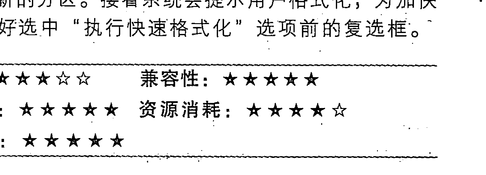

### 2. 命令提示符下的分区工具Diskpart

虽然Windows XP在图形界面下可以操控分区工作，但不少朋友仍然喜欢字符界面下强大的Fdisk，好在微软提供了比Fdisk更强大的分区和格式化软件Diskpart。启动Diskpart有多种办法，一是开启故障恢复控制台；二是从Windows内置的命令行进入；三是用Windows XP带命令行的安全模式。总的来说就是进入到命令提示符下后，输入“Diskpart”回车。在故障恢复控制台时的Diskpart权限最高，可以进行的操作也最多。接下来先输入“list disk”并回车显示出已安装的硬盘，只有一个硬盘显示为disk 0；如果安装了两个硬盘，第二硬盘将显示为disk 1。再输入“select disk 0”并回车选择第一个硬盘，然后输入“list partition”显示分区。我们以删除分区为例，选中要删除的分区，命令是“select partition x”，其中x代表分区的序号，在选中某个分区后输入“list partition”命令，会看到选中的分区前被标注有“*”号（任何具有焦点属性的硬盘或分区前都有一个“*”号），再输入“delete partition”并回车即可删除该分区。其他的操作也非常简单，如果有不明白的地方可以

+   功能：★★★☆☆ 兼容性：★★★★★ 稳定性：★★★★★ 资源消耗：★★★★★ 易用性：★★★★★

在Diskpart环境下，使用Help命令来查看帮助，完成创建、删除、扩容等等操作。总之，通常的步骤都是先选中分区，再进行操作。退出Diskpart环境只要输入“exit”并回车即可。

## 3. 三个分区管理工具

除了操作系统自带的分区软件外，还有不少分区管理工具，我们这里推荐三款供大家选择。郑重提醒大家，由于分区操作影响巨大，对这些软件操作稍有不慎，就有可能对硬盘数据造成重大损失，因此在分区之前请对硬盘中的重要数据做好备份。除非必须或基于学习等原因，一般不推荐经常对分区进行变更操作。

### （1）Disk Genius（重点推荐）

Disk Genius是一款国人编写的分区管理软件。它不仅提供了基本的硬盘分区功能，如建立、激活、删除、隐藏分区等等，还具有强大的分区维护、分区表备份和恢复、分区参数修改、硬盘主引导记录修复、重建分区表等功能。此外，它还具有分区格式化、分区无损调整、硬盘表面扫描、扇区拷贝、彻底清除扇区数据等实用功能。Disk Genius异常小巧，便于携带，最新版已经完全支持137GB以上的大硬盘。

| 功能 | ★★★★★ | 兼容性 | ★★★★★ |
| :--- | :--- | :--- | :--- |
| 稳定性 | ★★★★☆ | 资源消耗 | ★★★★☆ |
| 易用性 | ★★★★☆ |  |  |

### （2）Norton Partition Magic（重点推荐）

如果想在不损坏硬盘数据的情况下改变分区容量或者转换分区格式，人们通常先想到的就是Norton Partition Magic。它的前身是由PowerQuest公司开发的“分区魔法师”，后被Norton公司收购，可以说是目前硬盘分区管理工具中最好的软件之一。其最大特点是允许在不损失硬盘中原有数据的前提下，对硬盘进行重新设置分区、复制、移动、格式转换和更改硬盘分区大小、隐藏硬盘分区以及多操作系统启动设置等操作。

| 功能 | ★★★★★ | 兼容性 | ★★★★☆ |
| :--- | :--- | :--- | :--- |
| 稳定性 | ★★★★☆ | 资源消耗 | ★★★☆☆ |
| 易用性 | ★★★☆☆ |  |  |

### （3）Paragon Partition Manager

除了上述两个软件以外，Paragon Partition Manager也应用广泛。它可以进行磁盘碎片整理、优化硬盘分区；在没有数据丢失的情况下，调整分区大小，移动、隐藏、合并、转换分区格式；用Boot Manager管理运行于计算机中的多个操作系统等等功能。自从1997年问世以来，Paragon Partition Manager逐渐发展为硬盘分区管理方面一款非常全面而强大的工具。最新版本为2005年推出的7.0版。

| 功能 | ★★★★★ | 兼容性 | ★★★★★ |
| :--- | :--- | :--- | :--- |
| 稳定性 | ★★★★☆ | 资源消耗 | ★★★★☆ |
| 易用性 | ★★★☆☆ |  |  |

## 操作系统

在完成分区与格式化操作后，接下来就是安装操作系统。在2005年，应用最为广泛的操作系统仍然是Windows XP，不过Windows XP x64、Windows Vista Beta 1的出现多少也带来了一些新意。

### 1. 安装Windows XP

安装Windows XP时，我们可以在BIOS中将启动顺序设置为CDROM优先，并用Windows XP安装光盘启动，重启后就会开始安装。整个过程基本上是自动进行的，需要人工干预的地方不多，只要按照提示进行设置即可。第一次运行Windows XP时，会要求你设置Internet和用户，并进行软件激活。Windows XP至少需要设置一个用户账户，在“谁会使用这台计算机”步骤中输入用户名称就行了。至于其他步骤都不是必须的，可在启动之后再做，单击右下角的“下一步”跳过去。当一切完成后，就可以看到Windows XP桌面了。Windows XP x64和Windows Vista Beta 1的安装过程跟Windows XP非常类似，只是在对硬件的要求上有一些差异。Windows XP Professional x64 Edition要求CPU必须是64位的，硬盘最少有1.5GB的可用磁盘空间。而Windows Vista Beta1要求也比较苛刻，必须是现在主流的CPU、一块较好的显卡以及512MB以上内存，并且它只能被安装在NTFS格式分区下，分区剩余空间必须大于6.3G。

### 2. 驱动与系统补丁

驱动安装正确与否决定着电脑里的设备能不能够正常运转。一般而言，安装顺序是首先安装芯片组驱动；其次是系统增强组件；再接下来是显示卡（Video）、声卡、NIC网卡、Modem调制解调器、DVD和CDROM的虚拟刻录驱动等等。

#### （1）硬件检测工具：SiSoft Sandra 2005和Lavalys Everest

如果我们无法获知系统中硬件的厂商与型号，安装驱动时就会碰到麻烦。这里有两款系统检测工具推荐一下。SiSoft Sandra 2005可以查到电脑处理器、主板芯片组、显示卡和所有的PCI组件的具体型号。此外，它还提供了一系列性能测试功能。

Lavalys Everest 的前身是 Aida32，它在功能完整性方面完全可以与 SiSoft Sandra 2005 相抗衡。它能够识别最新的硬件设备，并能给出详细的系统设备信息一览表，其中包括了操作系统、PC硬件以及外设等几乎所有设备。

## PART 2 2005装机必备软件

#### (2) 驱动精灵 2005

驱动精灵2005（如图2）可以把你所有的驱动管理起来，实现诸如备份还原驱动、更新或删除驱动等特殊功能。它可以快速检测电脑中的硬件设备，将全部或任意部分硬件的驱动程序提取备份出来，并将其做成ZIP压缩文件或自解压文件。

#### (3) 用MBSA找漏洞

虽然 Windows 操作系统在发布前做过充分的测试，但仍然会有不少漏洞与 Bug，所以随时安装补丁是非常必要的。比较简单的办法是运行“Windows Update”命令或使用后台自动更新功能，系统会自动链接到微软的更新站点 http://windowsupdate.microsoft.com，并完成更新工作。当然，这要求使用的操作系统是正版才可以。

如果这样你还不放心，可以试试微软基准安全分析器（Microsoft Baseline Security Analyzer），它可以检查出系统是否已安装了最新的安全补丁。运行 MBSA，然后选择扫描，结束后 MBSA 将显示一个对话框，列出各测试项目在本系统内的状态，对未能通过的测试，还会给出解决办法。

### 3. 多操作系统引导工具

引导多操作系统的原理较为复杂，在这里就不详细叙述了。不过一般而言，多操作系统共存于一台电脑内必定会使用到系统引导程序，下面我们简单说说。

#### (1) OS Loader

这是 Windows XP 自带的引导软件，它不会单独占用一个主区，而且启动时不需要重写 MBR，因此较为安全。当然它有个比较大的毛病：新安装了除微软以外的其他系统，一般都不能检测到，而且也不会自动增加相应的选项，需要自己手动添加。

#### (2) System Commander

System Commander 可将硬盘的主引导区记录(MBR-Master Boot Record) 换成自己的程序，用户可以在一台电脑上安装最多超过 100 个操作系统，而且它支持的分区文件格式也非常多，主流的分区格式几乎全部可以识别。对于使用多个硬盘的用户，System Commander 可以方便地找出所有硬盘中的操作系统，甚至在用户替换硬盘后可以自动更新操作系统列表。

#### (3) GRUB

GRUB (GRand Unified Bootloader) 是一个将引导装载程序安装到主引导记录的程序。它允许位于主引导记录区中特定的指令装载一个 GRUB 菜单或是 GRUB 的命令环境，这使得用户能够开始操作系统的选择。GRUB 是 Linux 系统通常自带的启动装载软件。

### 4. 虚拟机 VMWare Workstation 5.5（重点推荐）

VMWare 是一个“虚拟 PC”软件，它让我们可以在一台电脑上同时运行两个或更多 Windows、DOS、Linux 系统。多启动系统虽然在一台电脑里安装了多个操作系统，但同一时刻只能运行一个系统，在系统切换时需要重新启动。与多重启动系统相比，VMware采用了完全不同的概念。注意，使用VMware非常消耗资源。

最早的Windows版VMware Workstation 4.5应用很广泛，接着出现的5.0版本，增加了多映像、团队、克隆等诸多功能。VMware Workstation 5.5版本是2005年10月刚出炉的，它可以无缝运行Microsoft VPC & Virtual Server! 5.5之前的版本只能转换格式；5.5版全面支持64位系统，而且可以设定分配一个或两个CPU给虚拟机使用，功能异常强大，是高级玩家不可或缺的强大工具之一。

| 功能 | ★★★★★ | 兼容性 | ★★★★☆ |
| :--- | :--- | :--- | :--- |
| 稳定性 | ★★★★☆ | 资源消耗 | ★★☆☆☆ |
| 易用性 | ★★★☆☆ |  |  |

### 5. 其他工具

#### (1) 超强的启动光盘制作工具Barts PE Builder（重点推荐）

使用Barts PE Builder可以创建一个完全图形界面的系统维护启动光盘，该光盘可以支持网络和远程管理功能，支持FAT/NTFS/CDFS等各种常见文件系统，而且还可以在启动光盘里面集成常用的系统维护工具。要制作启动光盘需要用到Windows XP或Windows Server 2003的安装光盘。
运行Barts PE Builder，设置Windows XP安装文件路径和是否支持网络功能，再下来是添加“Plug-ins”，我们可以把Ghost、Irfanview、WinRAR、Total Commander等集成进去。然后输入ISO文件路径，Barts PE Builder会自动从系统光盘和当前系统中提取文件来制作启动光盘。最后，用刻录软件把该ISO文件刻录到光盘，超强的启动光盘就制作成功了。

| 功能 | ★★★★★ | 兼容性 | ★★★★☆ |
| :--- | :--- | :--- | :--- |
| 稳定性 | ★★★★☆ | 资源消耗 | N/A |
| 易用性 | ★★★☆☆ |  |  |

#### (2) 破解WindowsXP系统管理员密码的ERD Commander 2005（重点推荐）

提到ERD Commander 2002、ERD Commander 2003，想必很多人都不陌生，其特有的针对Windows系统灾难恢复、密码修改功能深得WinPE爱好者的好评。2005年，Winternals公司再接再厉推出了Winternals.Administrators.Pak.v5.0，利用它我们就可以制作功能更加强大的ERD Commander 2005光盘系统了。

相比之前的版本，ERD Commander 2005更加强调为系统故障、灾难恢复等提供一系列安全有效的解决方案。ERD Commander 2005组件由三大部分组成。管理工具：可以实现硬盘管理、日志查询、注册表编辑、服务及驱动管理、系统信息和自动启动程序管理。网络工具：文件共享、网络驱动器映射和TCP/IP设置、一个集成的Mozilla Firefox浏览器；系统工具：灾难数据恢复、文件恢复、卸载不该装的系统补丁、修改Windows 2000/XP/2003系统下任意账户的密码等等。

| 功能 | ★★★★★ | 兼容性 | ★★★★☆ |
| :--- | :--- | :--- | :--- |
| 稳定性 | ★★★★☆ | 资源消耗 | N/A |
| 易用性 | ★★★☆☆ |  |  |

## 备份与恢复工具

备份是平时容易被大家所忽视的工作，只有在系统出了问题时，它的重要性才能体现出来。系统有没有备份，完全是两种不同的结局，如果你的数据很重要，千万不要疏忽一时，后悔一世。

### 1. 备份工具Ghost 8.0和9.0（重点推荐）

尽管已经问世相当长时间，Ghost 8.0仍然是备份/恢复软件中的杰出代表。利用它可以将某一分区上的内容备份到一个映像文件中，以后系统损坏时只要几分钟就能从映像文件中快速恢复。很多高手都喜欢Ghost8 的直截了当和简洁高效，而Ghost 9.0提供了许多新功能，如完全的Windows操作环境、计划增量备份方式等等。但是，由于Ghost 9采用了基于Power Quest的算法，它的性能有所下降，而且恢复系统盘必须依赖Ghost 9 光盘，这使得它至今也不如Ghost 8普及。对于普通用户，Ghost 9 更容易操作一些。

| 功能 | ★★★★★ | 兼容性 | ★★★★★ |
| :--- | :--- | :--- | :--- |
| 稳定性 | ★★★★☆ | 资源消耗 | ★★★☆☆ |
| 易用性 | ★★★★☆ |  |  |

### 2. 数据恢复工具

#### (1) FinalData（重点推荐）

FinalData具有强大的数据恢复功能，当文件被误删除（并从回收站中清除）、FAT表或者磁盘根区被病毒侵蚀造成文件信息全部丢失、物理故障造成FAT表或者磁盘根区不可读，以及磁盘格式化造成全部文件信息丢失之后，FinalData都能够通过直接扫描目标磁盘，抽取并恢复出文件信息。用户可以根据这些信息，方便地查找和恢复自己需要的文件。甚至在数据文件已经被部分覆盖以后，专业版FinalData也可以将剩余部分文件恢复出来。

| 功能 | ★★★★★ | 兼容性 | ★★★★☆ |
| :--- | :--- | :--- | :--- |
| 稳定性 | ★★★★☆ | 资源消耗 | ★★★☆☆ |
| 易用性 | ★★★☆☆ |  |  |

EasyRecovery 也是一款威力强大的硬盘数据恢复工具，能够帮你恢复丢失的数据以及重建文件系统。打开 EasyRecovery 主界面（如图3）后，我们可以看到它主要包括了磁盘检查、数据恢复、文件修复、Email 修复等四大功能。磁盘检测可以对硬盘进行全面的检查，以确保它没有潜在的使用危险；而其他三项功能都是针对数据恢复与还原方面的。在众多数据恢复类软件中，EasyRecovery 的功能全面，成功率较高，扫描速度也较快。

| 功能 | ★★★★☆ |
| :--- | :--- |
| 兼容性 | ★★★★☆ |
| 稳定性 | ★★★★☆ |
| 资源消耗 | ★★★★☆ |
| 易用性 | ★★★★☆ |

## 杀毒反黑软件

杀毒与反黑软件是系统的安全防线，没有它们你的电脑会变得非常脆弱而且容易“生病”，重装系统的噩梦也会时刻围绕着你。为了让电脑活得更“健康”，还是先装好杀毒与反黑软件吧。

### 1. 杀毒软件

#### (1) Norton AntiVirus 2006（重点推荐）

Norton AntiVirus 2006 已经不仅仅是一个简单的杀毒软件了，它集成了 Norton 安全中心，包含了各种和系统安全有关功能的软件套装，包括基础安全、Web 浏览、数据备份、Email 和 Messaging 等等内容。网络方面的安全应对，是 Norton AntiVirus 2006 的主要改进方向。它集成了和 Norton Internet Security 类似的防火墙操作，查杀各种恶意程序、间谍程序；同时加强对 IE 的保护，禁止随意修改首页等等。唯一的缺点是 Norton AntiVirus 2006 非常消耗资源，如果你的电脑配置不是很高，推荐使用上一版本的 NAV。

| 功能 | ★★★★☆ |
| :--- | :--- |
| 兼容性 | ★★★★☆ |
| 稳定性 | ★★★★☆ |
| 资源消耗 | ★★★☆☆ |
| 易用性 | ★★★★☆ |

#### (2) 卡巴斯基 KIS 2006

Kaspersky Internet Security（简称为 KIS）2006 是 Kaspersky 公司的杀毒软件、网络防火墙、防间谍软件等一系列软件的组合。和 Norton Antivirus 2006 相比，它占用的资源少一些。如图 4 所示，KIS 2006 提供了文件查毒、邮件查毒、网页查毒、病毒预防、防间谍软件、防黑客、防垃圾邮件以及父母控制共 7 个主要功能。

| 功能 | ★★★★☆ |
| :--- | :--- |
| 兼容性 | ★★★☆☆ |
| 稳定性 | ★★★★☆ |
| 资源消耗 | ★★★★☆ |
| 易用性 | ★★★★☆ |

#### (3) 金山毒霸 2005

金山毒霸 2005 在病毒库升级和防毒上进步明显。先启动的防毒系统，可保障在 Windows 未完全启动时系统就开始受到保护，早于一切开机自动运行的病毒程序，使用户避免“带毒杀毒”的危险。金山毒霸 2005 采用全新的网络程序校验策略。除了传统反黑、拦截木马等功能外，同时对普通应用程序进行跟踪监控。一旦应用程序的大小、内容等属性发生异常变化，系统将特别提醒用户注意，有效防止木马、间谍软件“冒名顶替”盗取用户数据。

| 功能 | ★★★★☆ |
| :--- | :--- |
| 兼容性 | ★★★★☆ |
| 稳定性 | ★★★★☆ |
| 资源消耗 | ★★★☆☆ |
| 易用性 | ★★★★☆ |

#### (4) 瑞星杀毒 2005

瑞星杀毒软件 2005 除了传统的特征值扫描技术，又增加了行为模式分析（BMAT）和脚本判定(SVM)两项查杀病毒技术。检测内容经过三重检测和分析，既能通过特征值查出已知病毒，又可以通过程序分析出未知的病毒，监控更为完善。瑞星在杀毒方面还是比较让人放心，但是网络监控功能相对较为薄弱。

| 功能 | ★★★★☆ |
| :--- | :--- |
| 兼容性 | ★★★★☆ |
| 稳定性 | ★★★★☆ |
| 资源消耗 | ★★★☆☆ |
| 易用性 | ★★★★☆ |

### 2. 防火墙与反间谍软件

#### (1) ZoneAlarm

ZoneAlarm Security Suite 6.0 运用了三级防御防火墙机制，分别为：网络防火墙、程序防火墙和操作系统防火墙。操作系统防火墙：监控你的操作系统中可疑程序的运行，比如程序的安装和注册表的操作，保护浏览器的设置以防止黑客的修改；防御木马：在你的计算机## 系统软件

系统软件是对操作系统的扩展与优化，总之使用它们可以让你的工作效率大大提高。

### 1. 系统优化

#### (1) 超级兔子

新版本的超级兔子在界面（如图5）上有了较大变化，分为优化、设置、上网保护、修复去除木马、安全设置、系统检测、备份、桌面搜索等几大板块。其中有用的功能很多，比如卸载流氓软件、拒绝广告骚扰、修复 IE、清理系统“垃圾”、系统启动提速、隐藏分区等等都非常实用。

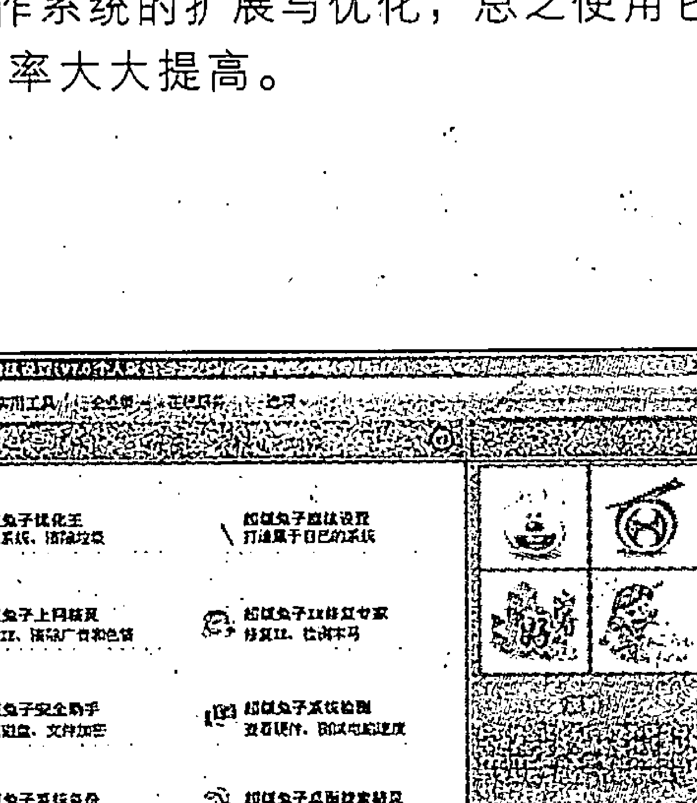

| 项目 | 评分 |
| :--- | :--- |
| 功能 | ★★★★☆ |
| 兼容性 | ★★★★☆ |
| 稳定性 | ★★★★☆ |
| 资源消耗 | ★★★★☆ |
| 易用性 | ★★★★☆ |

#### (2) Windows 优化大师

Windows 优化大师主要用于对 Windows 操作系统进行优化，以期望电脑发挥出最大效力。由于修改简单，功能全面深受爱好者的好评。用它可以查看系统信息，进行性能测试；对“磁盘缓存”、“桌面菜单”、“文件系统”、“网络系统”、“开机速度”、“系统安全”等进行全面优化；还可以设置个性化的系统，如输入法顺序、文件夹图标、快捷方式设置、右键菜单设置等等；此外还可以用它来维护系统，删除垃圾软件。

| 项目 | 评分 |
| :--- | :--- |
| 功能 | ★★★★☆ |
| 兼容性 | ★★★★☆ |
| 稳定性 | ★★★★☆ |
| 资源消耗 | ★★★★☆ |
| 易用性 | ★★★★☆ |

### (2) Sygate Personal Firewall

这是一个简单易用的个人防火墙，适合网络中的单机用户用来防止非法入侵系统者。作为一个基于主机的解决方案，该软件提供了多层保护的防火墙安全环境，可以有效地防止入侵者和黑客的侵袭。与真正的防火墙不同的是，Sygate Personal Firewall 能够从系统内部进行保护，并且可以在后台不间断地运行。另外，该软件还提供有安全访问和访问监视功能，并可向你提供所有用户的活动报告，当检测到入侵和不当的使用后，能够立即发出警报。

| 项目 | 评分 |
| :--- | :--- |
| 功能 | ★★★★☆ |
| 兼容性 | ★★★★☆ |
| 稳定性 | ★★★★☆ |
| 资源消耗 | ★★★★☆ |
| 易用性 | ★★★☆☆ |

### (3) Ad-aware

Ad-aware是一个很小的免费系统安全工具，它可以扫描到计算机中由网站发送进来的广告跟踪文件和相关文件，并且能够安全地将它们删除。它能够搜索并删除的广告服务程序包括：Web3000、Gator、Cydoor、Radiate/Aureate、Flyswat、Conducent/TimeSink和CometCursor。该软件的扫描速度相当快，能够生成详细报告，并且能迅速把它们删除。

| 项目 | 评分 |
| :--- | :--- |
| 功能 | ★★★★☆ |
| 兼容性 | ★★★★☆ |
| 稳定性 | ★★★★☆ |
| 资源消耗 | ★★★★☆ |
| 易用性 | ★★★☆☆ |

### (4) Spybot-Search&Destroy

Spybot-Search&Destroy（简称SpybotSD）是一个专门用来清理系统中间谍软件和广告软件的工具，它能够检测一万多种 Spyware，并对其中的一千多种进行免疫处理，可以在 Server 级别的操作系统上使用，是对杀毒软件的一个强有力补充。此款软件的主要功能：检查与清除、恢复和免疫。

| 项目 | 评分 |
| :--- | :--- |
| 功能 | ★★★★☆ |
| 兼容性 | ★★★★☆ |
| 稳定性 | ★★★★☆ |
| 资源消耗 | ★★★★☆ |
| 易用性 | ★★★☆☆ |

### (5) GIANT AntiSpyware

GIANT AntiSpyware 是微软出品的软件，它可以查出你电脑上的间谍程序。除了能发现和消除已存于电脑中的间谍软件以外，当发现有间谍软件被安装时，GIANT AntiSpyware 也能够及时提醒你，阻止间谍软件的安装。软件功能主要包括扫描间谍软件、即时保护和高级工具三大部分。

| 项目 | 评分 |
| :--- | :--- |
| 功能 | ★★★★☆ |
| 兼容性 | ★★★★☆ |
| 稳定性 | ★★★★☆ |
| 资源消耗 | ★★★★☆ |
| 易用性 | ★★★☆☆ |

## PART 2 2005 装机必备软件

### 2. 文件管理 Total Commander（重点推荐）

Total Commander 是目前功能最强大的文件管理软件，它提供了两个管理窗口来方便用户操作，这种设计避免了 Windows 资源管理器目录树在文件操作上的一系列弊端。它不仅具备 Windows 资源管理器的全部功能，而且还吸收了不少其他工具软件的特色功能。虽然入门阶段有点不习惯，但很快你会发觉它的好处是资源管理器所不能比拟的，远比资源管理器要方便。它还内置了压缩功能，可以批量修改文件名，实现 FTP 功能，还能用插件来实现许多资源管理器所没有的功能。

| 项目 | 评分 |
| :--- | :--- |
| 功能 | ★★★★☆ |
| 兼容性 | ★★★★☆ |
| 稳定性 | ★★★★☆ |
| 资源消耗 | ★★★★☆ |
| 易用性 | ★★★★☆ |

### 3. 桌面搜索

#### （1）微软桌面搜索

微软的桌面搜索工具名为 "MSN Search Toolbar"，安装完成后需要建立索引才可以使用。它搜索的速度非常快，而且能够对多达 200 种以上的常见文件类型建立索引。如果想要支持更多类型，需要下载并安装相应的插件。在工具条上可以选择要搜索的文件类型，输入关键词后，可以随时单击各类按钮进行搜索。选择搜索类型也可以提高搜索的准确度和速度。

在工具栏上的桌面搜索输入框中输入一个 “=” 号，就可以将它变成 DOS 的命令行了。对于喜爱 DOS 的老用户来说，这可是一个非常有趣的功能。如输入 “=C:”，即显示出 C 盘根目录的文件。它还可以建立应用程序的快捷方式，在搜索输入框中输入 “@ 记事本,=notepad.exe”，一个名为记事本的快捷方式就会出现在弹出对话框中。如果在弹出框中单击 “记事本”，则会启动 “记事本” 程序。

| 项目 | 评分 |
| :--- | :--- |
| 功能 | ★★★★☆ |
| 兼容性 | ★★★★☆ |
| 稳定性 | ★★★★☆ |
| 资源消耗 | ★★★★☆ |
| 易用性 | ★★★★☆ |

#### （2）Google 桌面搜索（重点推荐）

Google 推出了 “Google 桌面搜索程序”（Google Desktop Search），可以让用户搜索电脑上的电子邮件、微软 Office 文件、AOL 聊天记录以及网页浏览历史信息。我们可以到 http://desktop.google.com 官方网站免费下载该软件。

Google Desktop Search 不但搜索迅速，而且还可以对搜索结果进行分类统计，允许你按照日期或者文件的类型进行排序整理。它的界面风格与 Google 在线搜索网站完全一致。Google 声称，无论任何东西，只要在电脑屏幕上看到过一次，就可以非常快速地找到它。当然这样的描述有点夸张了，不过确实非常好用。

| 项目 | 评分 |
| :--- | :--- |
| 功能 | ★★★★☆ |
| 兼容性 | ★★★★☆ |
| 稳定性 | ★★★★☆ |
| 资源消耗 | ★★★☆☆ |
| 易用性 | ★★★★☆ |

#### （3）百度硬盘搜索

新版本的百度硬盘搜索有了 “高级搜索”、“邮件高级搜索” 等新功能。高级搜索可以对搜索结果进行排序，设置搜索的文件类型、关键词的位置等，为用户提供了丰富的选择。“邮件高级搜索” 功能与前面所述的高级搜索功能类似，只不过其搜索结果将局限于搜索电子邮件这一功能。除了相同的设置选项 “搜索结果”、“搜索结果排序方式”、“时间”、“关键词位置”、“搜索结果显示条数” 外，“发件人”、“收件人” 两个选项为 “邮件高级搜索” 所特有。此外，在搜索方面增加了多种搜索语法，让搜索更准确，更容易进行。

| 项目 | 评分 |
| :--- | :--- |
| 功能 | ★★★★☆ |
| 兼容性 | ★★★★☆ |
| 稳定性 | ★★★★☆ |
| 资源消耗 | ★★★☆☆ |
| 易用性 | ★★★★☆ |

### 4. 压缩与解压 WinRAR（重点推荐）

说起 WinRAR，大家都很熟悉，它已经成为我们系统中必备的软件。WinRAR 新推出了 3.5 版，增加了很多功能：支持鼠标拖放及外壳扩展；完美支持 ZIP 档案，内置程序可以解开 CAB、ARJ、LZH、TAR、GZ、ACE、UUE、BZ2、JAR、ISO 等多种类型的压缩文件；具有估计压缩功能，可以在压缩文件之前得到用 ZIP 和 RAR 两种压缩工具各三种压缩方式下的大概压缩率。WinRAR 新版更加强了在信息安全和数据流方面的功能。

| 项目 | 评分 |
| :--- | :--- |
| 功能 | ★★★★★ |
| 兼容性 | ★★★★★ |
| 稳定性 | ★★★★☆ |
| 资源消耗 | ★★★☆☆ |
| 易用性 | ★★★★☆ |

## 办公软件

2005 年办公软件的变化很小，不过三季度出炉的 WPS Office 2005 还是给人眼前一亮的感觉，经常使用办公软件的朋友不妨一试。

### 1. Microsoft Office 2003（重点推荐）

微软 Office 2003 已经是 Office 家族的第 5 个版本了。从 Office 发展历程来看，每个新版本都有改进之处，比如 Office 97 增加了各个组件协同工作的能力和文档格式转换功能；Office 2000 可以支持多种语言、自定义工具栏、多段复制记忆，此外还集成了 IE 5.0 和 Outlook，并且它的各个组件已经与 Internet 有机地融合在一起；Office XP 则提供了直接导入网页数据、语音输入和校对、协作处理文档等功能，让办公软件达到了一个全新的境界。而 Office 2003 不仅增加了一些常用功能，更将重心放在扩展网络支持方面，同时将最新的 XML 技术和 CRM/ERP 概念整合到产品中，使得多人大规模协作的可能性大大增加。

| 项目 | 评分 |
| :--- | :--- |
| 功能 | ★★★★★ |
| 兼容性 | ★★★★☆ |
| 稳定性 | ★★★★☆ |
| 资源消耗 | ★★★☆☆ |
| 易用性 | ★★★★☆ |

### 2. WPS Office 2005

WPS Office 2005(如图6)是中国人自己的Office软件，它包含了WPS文字、WPS表格、WPS演示三大功能软件，与MS Word、MS Excel、MS PowerPoint一一对应，可以无障碍兼容doc.xls.ppt等文件格式。它的操作界面与Office非常类似，虽然有抄袭的嫌疑，但的确减少了用户熟悉的时间。WPS Office 2005体积小巧，仅有20MB的文件压缩包。在专业版中还可以将文档直接输出到PDF文件。中文特色突出，文本框间文字绕排、稿纸格式、斜线表格、文字工具、中文项目符号、电子表格支持中文纸张规格等都是独有的特色。

| 项目 | 评分 |
| :--- | :--- |
| 功能 | ★★★★★ |
| 兼容性 | ★★★★★ |
| 稳定性 | ★★★☆☆ |
| 资源消耗 | ★★★★★ |
| 易用性 | ★★★★☆ |

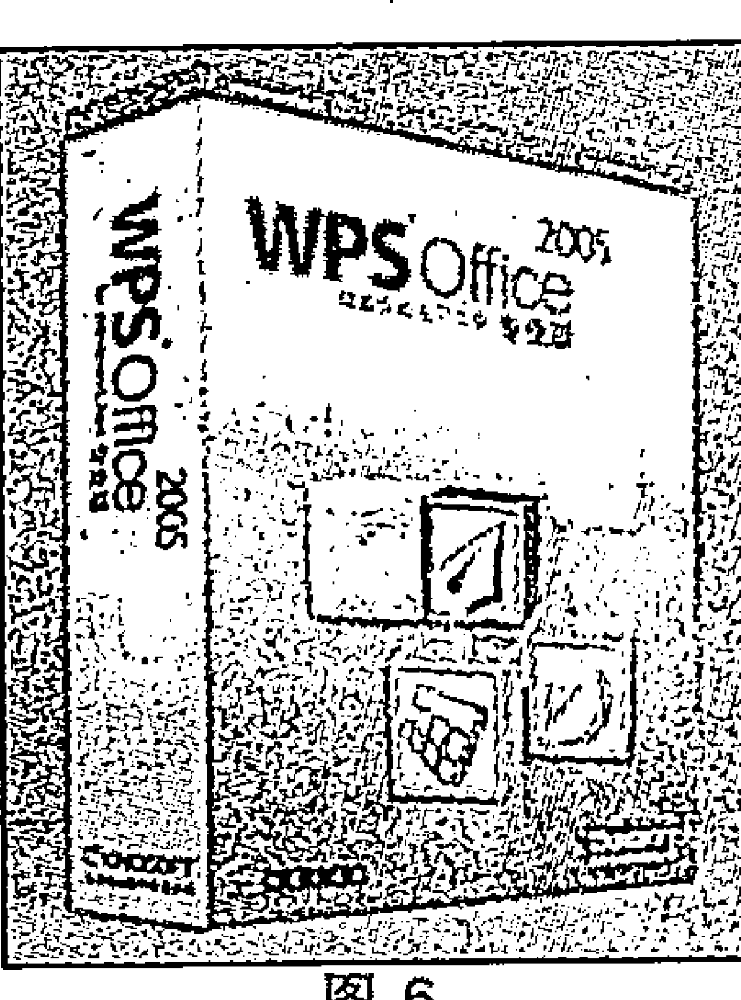

## 图形图像

图形图像这类多媒体功能，历来是电脑应用的重头戏。如果电脑没有绚丽的图像、动听的声音，相信一定会让应用逊色很多。

### 1. 播放器

#### (1) Windows Media Player 10 (重点推荐)

Windows Media Player (WMP) 10增强了对DVD、MP3的支持，提供将音乐光盘转录为MP3的功能并能刻录多种类型的光盘；涉足电视播放领域，并有MP3随身听以及便携设备的歌曲同步功能；强化对播放的控制，从更人性化的个人媒体库、影音字幕显示到全新的可视化效果和均衡器调节等等，都经过了精心设计；另外更搭上付费音乐下载的快车，整合了一个在线音乐商店。

| 项目 | 评分 |
| :--- | :--- |
| 功能 | ★★★★☆ |
| 兼容性 | ★★★★★ |
| 稳定性 | ★★★★☆ |
| 资源消耗 | ★★★☆☆ |
| 易用性 | ★★★★★ |

#### (2) RealOne Player

#### (3) 豪杰超级解霸V9

豪杰超级解霸是深受广大电脑爱好者喜爱的媒体播放器之一。它拥有许多优点，如支持播放的文件格式多，效果好，且资源占用小等等。新版V9有一个DAC工具大家比较陌生，它是豪杰公司推出的具有自主知识产权的音频新标准；能够从多种音频和视频格式中转化或是提取，大家在列表中可以看到CD、MP3、MP3Pro、WMA、MIDI、RA等常见音频格式都可以转换成DAC格式。此外，豪杰超级解霸还将“BT下载”和豪杰网络电话也集成了进来。

| 项目 | 评分 |
| :--- | :--- |
| 功能 | ★★★★★ |
| 兼容性 | ★★★☆☆ |
| 稳定性 | ★★★☆☆ |
| 资源消耗 | ★★★☆☆ |
| 易用性 | ★★★★★ |

#### (4) 暴风影音（重点推荐）

随着新媒体格式的不断涌现，需要我们安装的解码组件也越来越多，这对很多人，尤其是对初学者来说简直就是一个噩梦。为此，网络上出现了众多的解码软件包，这类软件包把众多Windows所没有的解码组件集成在一个安装文件中，大大方便了用户的使用。暴风影音就是其中的佼佼者。

| 项目 | 评分 |
| :--- | :--- |
| 功能 | ★★★★★ |
| 兼容性 | ★★★★☆ |
| 稳定性 | ★★★☆☆ |
| 资源消耗 | ★★★☆☆ |
| 易用性 | ★★★★★ |

### 2. 图片浏览与抓图

#### (1) IrfanView

IrfanView支持的图像、音频、视频格式众多，并可幻灯显示、批量转换格式、批量重命名、JPG无损旋转，支持拖放操作；亦具有调整图像大小、调整颜色深度、添加覆盖文字、特效（内置）处理等图像编辑功能，新版本已能支持使用Adobe Photoshop滤镜；还可以制作HTML格式的缩略图目录、创建自播放幻灯显示（EXE或SCR），是图像爱好者必备的袖珍精品。

| 项目 | 评分 |
| :--- | :--- |
| 功能 | ★★★★★ |
| 兼容性 | ★★★★★ |
| 稳定性 | ★★★★★ |
| 资源消耗 | ★★★★☆ |
| 易用性 | ★★★★★ |

#### (2) AcdSee (重点推荐)

ACDSee 是目前最流行的数字图像处理软件, 它被广泛应用于图片的获取、管理、浏览、优化等方面。使用 ACDSee, 你可以从数码相机和扫描仪高效获取图片, 并进行便捷的查找、组织和预览。作为最重量级看图软件, 它收罗了超过 50 种常用多媒体格式, 能快速、高质量显示图片, 并配以内置的音频播放器。AcdSee 还能处理如 MPEG 之类常用的视频文件。此外 ACDSee 的图片编辑工具, 可以轻松处理数码影像, 拥有去除红眼、剪切图像、锐化、浮雕特效、曝光调整、旋转、镜像等等功能, 并且能进行批量处理!

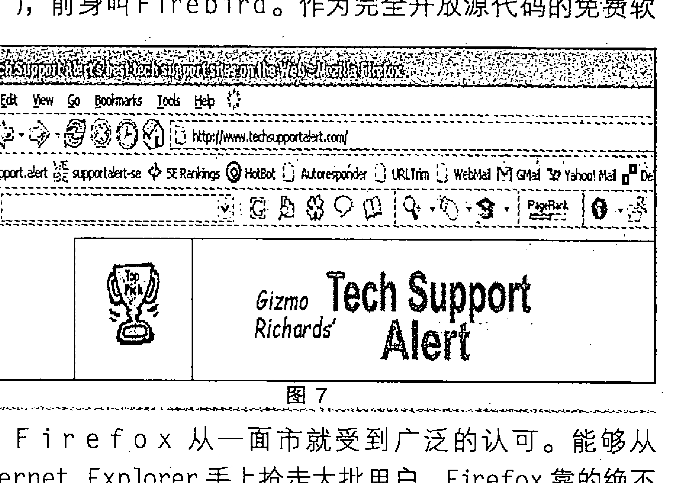

| 项目 | 评分 |
| :--- | :--- |
| 功能 | ★★★★★ |
| 兼容性 | ★★★★☆ |
| 稳定性 | ★★★★☆ |
| 资源消耗 | ★★★★☆ |
| 易用性 | ★★★★☆ |

#### (3) SnagIt (重点推荐)

SnagIt 是一个强大的屏幕捕捉程序, 不仅能捕捉 Windows 下的屏幕, 也能捕捉 DOS 下的。SnagIt 可以实现图像、文字、视频捕获, 能够抓超过一个屏幕的内容, 存盘支持的图形格式也很多。SnagIt 对系统要求并不高, 使用也很简单, 堪称抓图软件的典范。

| 项目 | 评分 |
| :--- | :--- |
| 功能 | ★★★★★ |
| 兼容性 | ★★★★☆ |
| 稳定性 | ★★★★☆ |
| 资源消耗 | ★★★★☆ |
| 易用性 | ★★★★☆ |

#### (4) HyperSnap-DX

HyperSnap-DX 是一个屏幕抓图工具, 它不仅能捕获 Windows 下的普通程序界面, 还能抓取 DirectX 和 3Dfx Glide 游戏、视频或 DVD 屏幕图。该软件能以 20 多种图形格式保存并阅读图片。其他功能还包括: 在所抓的图像中显示鼠标轨迹, 收集工具, 有调色板功能并能设置分辨率, 还能选择从 TWAIN 装置中 ( 扫描仪和数码相机 ) 抓图。

| 项目 | 评分 |
| :--- | :--- |
| 功能 | ★★★★★ |
| 兼容性 | ★★★★☆ |
| 稳定性 | ★★★★☆ |
| 资源消耗 | ★★★★☆ |
| 易用性 | ★★★★☆ |

## 1. 浏览器

#### (1) Firefox (重点推荐)

Firefox 是一款从 Mozilla 中独立出来的浏览器 (如图7), 前身叫 Firebird。作为完全开放源代码的免费软件, Firefox 从一面市就受到广泛的认可。能够从 Internet Explorer 手上抢走大批用户, Firefox 靠的绝不仅仅是免费, 而是其个性十足的插件、无限的扩展空间和快速、安全的访问特性。

| 项目 | 评分 |
| :--- | :--- |
| 功能 | ★★★★★ |
| 兼容性 | ★★★★★ |
| 稳定性 | ★★★★★ |
| 资源消耗 | ★★★★☆ |
| 易用性 | ★★★★★ |

#### (2) Maxthon (重点推荐)

Maxthon 原名 MYIE2, 是定位于 IE 内核的扩展性多功能浏览器, 在其测试阶段, 就受到很多人的爱戴。其正式版改名为 “Maxthon”, 也就是中文的 “遨游”。我们可以在其官方网站 www.maxthon.com 免费下载最新版本。Maxthon 比较难上手, 它的帮助文件不太完善, 但是在使用习惯后, 会感觉离不开它。作为多页面的浏览器, Maxthon 会在一个窗口里打开所有页面, 不但工整, 浏览起来也很方便。鼠标手势功能也非常便捷, 用习惯了真的会上瘾。

| 项目 | 评分 |
| :--- | :--- |
| 功能 | ★★★★★ |
| 兼容性 | ★★★★★ |
| 稳定性 | ★★★★☆ |
| 资源消耗 | ★★★★☆ |
| 易用性 | ★★★★☆ |

#### (3) “看天下” RSS 浏览器

“看天下网络资讯浏览器” v3.0 是一款专业软件, 它集信息聚合和内容管理于一身。这款软件增加和完善了文章管理、程序灵活配置、OPML 导入和导出、动态 OPML 管理、RSS 文章过滤、RSS 文章搜索、重要文章标记、Windows 98 操作系统支持、程序自动远程升级等众多精彩功能, 并设计了更加友好的用户界面和操作菜单, 还预装了更多的中文精品内容。

| 项目 | 评分 |
| :--- | :--- |
| 功能 | ★★★★☆ |
| 兼容性 | ★★★★☆ |
| 稳定性 | ★★★★☆ |
| 资源消耗 | ★★★★☆ |
| 易用性 | ★★★★☆ |

#### (4) “周博通” RSS 浏览器

“周博通”是目前最流行的免费RSS阅读器之一，界面友好，分类清晰，操作简单。“周博通”内置了数百个RSS新闻源，不用打开网页就可在第一时间阅读自己喜欢的新闻，它支持RSS 0.92、RSS 1.0、RSS 2.0及ATOM，可以导入“看天下”、“新浪点点通”、FeedDemon的RSS频道列表。

| 项目 | 评分 |
| :--- | :--- |
| 功能 | ★★★★☆ |
| 兼容性 | ★★★★☆ |
| 稳定性 | ★★★★☆ |
| 资源消耗 | ★★★★☆ |
| 易用性 | ★★★★☆ |

## 网络工具

随着宽带走进千家万户, 网络成了热点中的热点。特别是因为浏览器、IM 软件以及 P2P 下载的不断发展, 使得网络工具完全可以用 “一日千里” 来形容。

### 2. IM 聊天软件

#### (1) MSN Messenger (重点推荐)

MSN Messenger 是微软推出的即时消息软件，界面简洁，易于使用，利用一个已有的Email地址，即可注册获得免费的MSN Messenger的登录账号。通过添加联系人，您就可以与朋友进行交谈了。现在有很多开发人员为MSN Messenger开发插件，使得MSN Messenger的功能扩展非常迅速。

| 项目 | 评分 |
| :--- | :--- |
| 功能 | ★★★★★ |
| 兼容性 | ★★★★★ |
| 稳定性 | ★★★★★ |
| 资源消耗 | ★★★★☆ |
| 易用性 | ★★★★★ |

#### (2) QQ (重点推荐)

QQ是由腾讯公司开发的、基于Internet的即时寻呼软件。我们可以使用QQ和好友用户进行交流，信息即时发送即时回复。此外，QQ还具有聊天室、传输文件、语音邮件、手机短讯服务等功能，可与传统的无线寻呼网、GSM移动电话的短消息系统互联。最新的腾讯QQ 2005正式版增加了超级视频、安全中心、Qzone、通讯录、QQ宠物、QQ直播、QQ音乐、地理位置、天气显示等诸多功能。

| 项目 | 评分 |
| :--- | :--- |
| 功能 | ★★★★★ |
| 兼容性 | ★★★★★ |
| 稳定性 | ★★★★★ |
| 资源消耗 | ★★★★☆ |
| 易用性 | ★★★★★ |

### 3. 下载

#### (1) 迅雷 (重点推荐)

迅雷是一款基于P2SP技术的下载软件，采用全新的多资源超线程技术。新版的迅雷针对宽带用户做了特别的优化，能够充分利用宽带上⽹的特点，带给用户高速下载的全新体验。下载中迅雷不仅快且稳；对于用户比较关注的配置、代理服务器、文件类别管理、批量下载等方面也进行了扩充和完善，可以满足中、高级下载用户的大部分专业需求。

| 项目 | 评分 |
| :--- | :--- |
| 功能 | ★★★★★ |
| 兼容性 | ★★★★☆ |
| 稳定性 | ★★★★☆ |
| 资源消耗 | ★★★★☆ |
| 易用性 | ★★★★★ |

#### (2) 网络下载机

“网络下载机”(NetLines)集媒体流下载与地址嗅探功能于一身，它支持多线程下载FTP、HTTP、MMS、RTSP的档案和媒体流，具有断点续传功能。网络下载机集成了下载嗅探器的功能，可以通过所有网络设备检测出其他应用。与目前其他的下载工具相比，具有一些独有的特点。

| 项目 | 评分 |
| :--- | :--- |
| 功能 | ★★★★★ |
| 兼容性 | ★★★★☆ |
| 稳定性 | ★★★★☆ |
| 资源消耗 | ★★★★☆ |
| 易用性 | ★★★★★ |

#### (3) 影音传送带

“影音传送带”(Net Transport)是一款能实现MMS(多线程)、RTSP(PNA)、HTTP和FTP的下载利器，目前使用者较多。它内建了文件管理器，帮助用户更好地分类和组织下载文件；站点探索器可浏览FTP站点的目录结构；在多代理类型的任务中，用户可以自由地为每个线程设置一个代理，彻底打破某些站点只允许一个IP一个连接的限制。

| 项目 | 评分 |
| :--- | :--- |
| 功能 | ★★★★★ |
| 兼容性 | ★★★★☆ |
| 稳定性 | ★★★★☆ |
| 资源消耗 | ★★★★☆ |
| 易用性 | ★★★★★ |

#### (4) BitComet (重点推荐)

BitComet 是一种基于BitTorrent协议的P2P文件分享免费软件（俗称BT下载客户端），新版本已经支持预览下载内容功能，此外还支持DHT网络，无需Tracker服务器都可下载。如图8所示，BitComet支持多任务下载、文件有选择的下载；BitTorrent使用磁盘缓存，减小对硬盘的损伤；BitTorrent只需一个监听端口，方便手工防火墙和NAT/Router配置；在WindowsXP下BitTorrent能自动配置支持Upnp的NAT和XP防火墙等多项实用功能。我们可以去www.bitcomet.com免费下载使用。

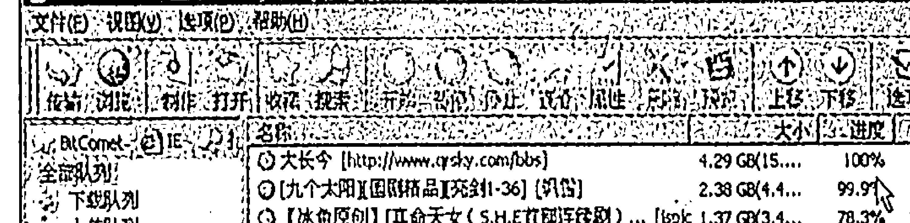

| 项目 | 评分 |
| :--- | :--- |
| 功能 | ★★★★★ |
| 兼容性 | ★★★★☆ |
| 稳定性 | ★★★★☆ |
| 资源消耗 | ★★★★☆ |
| 易用性 | ★★★★★ |The request was rejected because it was considered high risk那么最好挑选带PCI-E/AGP插槽的产品，这样做同样是为了以后的升级。可能对于笔记本用户来说就很苦恼了，具有最高显示性能的笔记本往往失去了其本身的功能——轻便；同时建议尽量选择 nVIDIA 和 ATI 的芯片组产品。

### (4) 硬盘

硬盘的提升无疑是两方面，一是容量，二是速度。因为 Windows Vista 对数码照片处理做出很大改变，所以为了存储大量的高质相片文件，用户一定要确保硬盘容量越大越好。而为了使硬盘性能显著提高，笔者估计只有 SATA 硬盘能担当此任，这也是用户们关注的重点，因为它至少拥有 8MB 缓存，还要支持 NCQ 技术。

### (5) 总结

虽然目前没有必要配备高端的配置，但当 Windows Vista 正式发售时肯定要升级你的计算机了，所以实用的考虑是现在选择中档的计算机配置，预留一定的升级空间以备不时之需，所幸的是当距离 Windows Vista 正式推出前还有至少一年的时间，高档配置的价格有望有很大程度的降低。但这一切都是根据目前的资料所做出的推测，随着 Windows Vista 逐渐完善，相信还会有很大变化，所以上述并不一直适用，这点还请读者注意。

## 2. 硬件要求问题选答

### (1) 配置问题

-   我电脑配置如下：CPU: AMD Athlon 1700+、内存: 1GB DDR 400、显卡: ATI Radeon 9800。但运行 Windows Vista 测试版后有些迟滞，请问这是为什么？
-   主要还是因为CPU达不到要求所致。Windows Vista主要是面向64位的处理器，您的处理器是32位的，如果换上Athlon 64、Turion 64等产品，相信运行就会流畅起来。

### (2) 升级问题

-   我的电脑是最近才买的，我主要用来上网聊天、下载，玩一些小游戏。我想问当 Windows Vista 发售时，我的电脑还用升级吗？
-   您的电脑应该是2005年买的吧，配置应该还是不错的。尤其您所利用的方向对电脑的配置要求本身就不是很高，所以您的电脑应该不用升级了。这是因为Windows Vista的重点是网络和多媒体领域，所以相应的这方面的配置要求高。

### (3) 升级问题Ⅱ

-   我的电脑配置比较低，Windows XP 运行起来比较费劲，我想现在升级，但有人说没有必要，我现在很犹豫。
-   我建议是再等等。现在升级后肯定能流畅地运行Windows XP，但如果想流畅地运行Windows Vista话很可能一年后还要升级，因为目前中档配置可以接受，但不能保证流畅地运行Windows Vista，高档的配置可以保证但价格还是高高在上；目前肯定比一年后贵很多。所以，从经济角度考虑还是再等一年为好。另外，如果您的电脑升级空间很小或没有什么升级的必要的话，还有一个解决办法，一年后将目前的电脑卖掉，重新买一台新电脑，而2006年底的主流配置肯定能充分支持Windows Vista的流畅运行。

### (4) 内存问题

-   为什么64位处理器的需要内存比32位处理器增加一倍？
-   64位处理器需要处理的数据块是32位处理器的两倍，如果容量不增加，那么就会造成性能的降低。所以64位处理器中的2G相当于32位处理器中的1G。

### (5) GPU问题

-   听说Windows Vista对GPU要求很高，我有些不懂，您能谈谈这方面的知识吗？
-   Windows Vista运行速度比Windows XP高出许多的原因就是GPU为CPU分担了更多更全面显示工作，而GPU需要高速双通道与显存传输数据。所以，GPU的显存空间越多越好，128MB显存不错，256MB更好。

## Windows Vista 兼容性问题浅谈

### 1. 兼容问题初现

这次微软发布的Windows Vista Beta1测试版在展示其最新的功能、强大的控件的同时也暴露出了不少问题，这其中主要是与各软件的兼容性问题。而其中对P2P——点对点软件的支持尤其差劲，不是GUI兼容问题严重，就是出现网络问题，几乎没有一款能在Windows Vista Beta1中运行。

### 2. 兼容与安全的抉择

当以上问题出现后，微软马上做出了反应。按照惯例，他们表示测试版本毕竟不是正式版本，其中出现的问题微软肯定会做出相应的解决，同时一些不尽如人意的功能会在正式版本中消失。另外，微软公司的Windows产品经理Greg Sullivan说：安全是第一要素，因为这是客户的要求，所以我们先要保证操作系统的安全性、可部署性以及补丁管理功能。言外之意，为了安全性，微软不得不在兼容性方面做出一些妥协。这就如同推翻了多米诺骨牌一样，必将殃及各种“网络化软件”。因为它们都需要依靠操作系统才能运行，而同时带来的安全问题却不可避免地影响到系统的稳定性和安全性。这样一来，一些安全性差，或者有技术漏洞的IM软件、各种共享、应用和网页浏览软件在Windows XP中将成为绝唱。微软对他们很可能会拒绝安装。但是，即使做出如此“牺牲”，微软在系统安全性方面也不是铁板一块，至少目前在测试版本中还不是。微软在Windows Vista新增了用户账户保护机制，即UAP——User Account Protect。用户在启动该功能后，Windows Vista可以运行在一个减少了许多特权的安全级别上。这样可以避免用户在最高安全级别下运行系统时出现严重问题所产生的严重隐患。但安装杀毒软件并启动UAP功能后，每次启动系统、运行杀毒软件的时候都要输入管理员账户的密码。如此一来，受限账户也必须知道管理员的密码才可以登录系统，而区分受限账户和管理员账户又变得毫无意义了。很明显，微软犯了一个逻辑错误。

尽管微软明确表示将坚持安全要比应用软件的兼容性更重要的既定策略。我们也不希望是挖疮补肉般的舍弃一部分保全另一部分。个人认为，一切向安全性看无可厚非，但事情做得极端必然会带来很多问题，凭着微软的强大实力，在兼容与安全中间寻求一个平衡难道不可以吗？

### 3. 最后

其实无论Windows Vista最后如何，相信大多数用户也是嘴里骂着，机子上用着。而微软也许正是看透了这一点来推广自己的产品，提高门槛，排挤那些与自己的发展战略相背的产品。一边对一些软件大幅度棒杀，一边却提高对硬件的支持，都是提高入门标准，而对软、硬件厂商的影响确实不同的，真是几家欢笑几多愁啊。商业竞争就是如此的残酷。而我们也被捆绑在微软这列高速行驶的列车上了。

## Windows Vista安装文件体积为何庞大

相信刚拿到Windows Vista Beta1的安装文件的用户都会惊诧其庞大的体积。这是一个体积为2.41GB的ISO文件，可以想象Windows Vista正式发售的载体只能选择DVD光盘了。但为了体验Windows Vista，我们也只能按微软的规则操作了。

其实，体积庞大的具体原因是Vista的安装文件中驱动程序占了很大的比重，它们的作用是支持硬件设备。而这些驱动程序都被保存在一个名为“Drivers”的文件夹里，而它自己的体积很“吓人”，足足有1.26GB！追溯Windows XP的安装文件，其中有一个drivers.cab文件，体积70MB左右就可以支持大量硬件设备，现在这个驱动程序的出现不知道会是怎样一种情况。看来微软是下定决心在硬件支持上大干一场了。

但是，这些驱动程序在支持大量硬件设备的同时还有一个明显的缺陷，这个问题就是让这些设备运行起来后，设备的运行效率和一些本身特有的特殊属性并不是系统自带驱动所关注的对象了。我们大家都知道，硬件并不是简简单单安装完就万事大吉，而是还要安装驱动程序的，而一般的厂家每隔一定时期就要推出最新的驱动程序。新的驱动程序不但解决了现有的缺陷还能将硬件的整体效率提高很多。所以，我们一般都有下载最新硬件设备驱动程序的习惯，而这要依赖于厂商的及时推陈出新。所以，现在不但我们用户期盼Windows Vista，众多硬件厂商早就望眼欲穿、摩拳擦掌了。

细心的用户会发现，Windows Vista的评测仅仅进行两天，ATI和NVIDIA就公布了为本公司的显卡打开Aero界面的试行版的驱动程序。从它们积极的态度就可以感觉到激烈的竞争，毕竟，Windows Vista的发布会给众多硬件厂商带来无限的机遇。而Vista巨大的硬件支持驱动程序就需要厂商们八仙过海各自拿出自己绝活来抢占那诱人的利润空间了。所以，Windows操作系统安装文件越来越大只会给微软和硬件厂商带来双赢的效果，而同时我们会享受到更好的服务，但代价是我们花费不少银两。

## Windows Vista Beta 1的体验

### 1. 安装介绍

Windows Vista Beta 1很慷慨地为我们提供了三种安装方法。它们分别是：在现在所用的操作系统上安装；用安装光盘安装；从Longhorn Build 5099版本及其以上版本升级。非常遗憾的是这次测试版并不支持从Windows XP升级安装和从DOS下安装。这同以前的测试版是一样的。

需要说的是，笔者一开始直接进行解压缩安装，但遇到了错误。只好把安装文件拷贝到硬盘上进行安装，这次没有出现错误。DVD光驱开始读取安装光盘信息或者激活安装目录下的Setup.exe文件后，屏幕就会出现窗口，点击Install now进行安装。

安装开始后，输入产品密匙，接受许可协议，然后选择安装方式。但测试版中只能选定“自定义”安装模式。

接下来就要设置电脑名称和安装分区了。需要注意的是：Vista只能安装到NTFS格式分区中，同时要有至少6GB的剩余空间。否则，安装就会出现错误。

最后，Windows Vista进行安装文件的拷贝和系统设置，这需要大约一小时的时间，这个过程中电脑需要两次重启。

### 2. 第一次启动

安装完成后，第一次启动后会发现Windows Vista采用了新型启动管理器。如果选定第二个选项就会出现以前版本的引导菜单，可以选择您想进入的操作系统，最后一项则可以进入故障恢复控制台。

接着进入系统登录程序（图5）。登录成功后，可以在这个步骤进行程序的设置，之后才正式进入Windows Vista的系统桌面。

### 3. 进入桌面

桌面是我们了解操作系统最直接的第一扇窗户，而 Windows Vista 在这方面没有让我们失望。通常 Windows Vista 会自动开启特效显示功能。图6是开启特效的截图。从图中可以看到任务栏、开始菜单等用黑色作为主色调，而桌面的图标都是大图标。感觉给人一种耳目一新的轻快。

### 4. 界面外观

Windows Vista 的界面外观也发生了很大的变化，图7是非活动窗口产生变化的提示画面。

Windows Vista 会自动开启 Clear type 显示效果，使得字体显示更加平滑，更耐看一些。图8就是 Clear type 没开启和开启后的对比。

在 Windows Vista Beta 1 中只保留了 Aero 和经典这两种视觉模式。Windows Vista Beta 1 还有很多细节上的改变，例如对话框中的按钮新添加了动态显示效果，就不一一显示了。

### 5. 开始菜单介绍

Windows Vista 在开始菜单与 Windows XP 最大的改变就是“所有程序”的显示方法上。当用户点击“所有程序”后，系统会在左栏“常用程序”的位置上显示程序列表，而不是在右侧展开，如图9。但如果文件名的名字过长可能会给用户带来不便。

在 Windows Vista 的开始菜单中还有一个方便用户的设计，这就是底部左侧的搜索框。当用户输入关键字后，符合条件的相应的程序就会出现。这个设计可以说是非常的人性化。

Windows Vista 还对关机和注销的操作方式上做出了改变。用户要点击一个小箭头来选择操作方式，这个小箭头就在注销和关机旁边。而再次打开开始菜单时，系统会把你上次的选择自动设置为默认的选项。

### 6. 控制面板与系统设置

虽然 Windows Vista Beta 1 重新设计了控制面板（图10），但原来的经典样式还是保留了下来。

"添加\删除程序" 变成以文件夹方式展示。在里面用户可以查看安装完的程序、系统更新等（图11）。

Windows Vista 新设置了“家长控制”的功能。它的作用就是限制家中的小孩无限制地上网、玩游戏（图12）。

另外，Windows Vista Beta 1 中还出现了一个用于解决系统问题的程序。但是目前的功能是只能浏览以前的错误，这个新增加的功能在这个版本中没有完全开放。

### 7. 全新的地址栏

地址栏在 Vista 里以全新的面貌出现，用户可以很快地切换到自己要去的文件夹，而不像从前那样机械地点击“向上”、“后退”等按钮。当然，如果用户对一个地址很熟悉，也可以在地址栏的空白处通过手工输入想要去的地址（图13）。

### 8. 语音操作与搜索技术

在 Windows Vista Beta 1 中，只要在“附件→辅助”工具中启动 Speech Recognition 来设定相关配置就可以通过语音来执行系统的操作。

微软在这款 Vista 测试版中除保留原有的普通搜索功能外还采用了一种新的搜索功能。它支持用户给出更多细节的条件（图14）。

### 9. Internet Explorer

在 Windows Vista Beta 1 携带了 IE 7.0 的 Beta 1 版本。这个版本针对以前的IE增加了RSS支持和标签浏览功能等（图15）。IE7.0还提供了仿插件功能，类似FireFox的安全模式。这样就大大减少了用户因为第三方加载项而不能正常浏览网页的现象。这个功能在“附件→系统”工具里。

### 10. Windows Media Player

虽然微软曾经公开表示Windows Vista将会携带Windows Media Player的最新版本，但在这款测试版中只是界面做出了改变，而功能方面还和Windows XP上的一模一样。

### 11. 备份工具和用户账户防护（UAP）

同Windows XP相比，SafeDocs作为Vista中的备份工具。它在Windows Vista Beta 1中的版本有自动、手动、选择等备份方式，但这些功能在测试版中还没有被开放。

UAP，即User Account Protection是一个新功能。虽然它可以最大限度保护系统不被侵扰，但因为它的矫枉过正也带来了相应的不便。每次重新登录，用户都需要输入管理员权限的账户的密码。并且，经常会出现对话框来打断你的操作。看来正式版要不做出改变，Windows Vista将会让众多用户怨声载道。

### 12. 中文支持与输入法

Vista安装完毕后，需要去区域和语言选项里把区域设置定位到中文才可以使用中文语言。但是系统对中文效果的处理很难让人满意——字体让人看着不舒服。Windows Vista Beta 1提供了众多输入法，其中微软拼音的版本是"7BETA"，微软拼音的风格有传统、体验风格和新增加的ABC风格。

### 13. 性能与总结

笔者的电脑是最近刚配置的，所以Windows Vista的运行还比较满意，估计配置低的机子肯定会出现迟钝的现象。而兼容性问题已在前面的章节谈到过，笔者的一些防火墙、杀毒软件等均不能在Vista中正常运行。有一个问题需要注意，笔者的Windows Vista安装已经过了几个小时了，但还是没有发现激活程序的位置，系统也没有任何激活的信息给出。通常微软在用户使用一段时间后才给出提示激活Windows产品的信息，所以笔者的Windows Vista是没有被激活的或者经过破解的。可能是这次测试版的发布非常匆忙所致吧，因为从安装到试用过程中很多位置的标记都是Windows Code Name Longhorn。但是，总体上感觉这款操作系统比以前的产品更加人性化，操作更加方便。

经过以上的叙述，读者应该对Windows Vista Beta 1有一个初步的认识。虽然这款测试版有这样那样的问题，但它只是个投石问路的小卒而已，微软肯定会吸收这次测试的数据继续完善Windows Vista，也说不好在这次测试中表现出色的功能会在正式版中消失。所以，我们一起慢慢等待Windows Vista的正式发行吧！

## PART 2 下一代操作系统

### (5) 电骡eMule

电骡软件很多，推荐使用VeryCD版的eMule。运行eMule后，它会自动连接服务器，也可以自己双击连接。在连接成功之后，单击论坛上发布的资源链接，它就会自动添加到eMule的下载任务当中。注意，下载文件的同时你也在提供别人下载，只要你不删除下载目录或者共享目录，就会一直作为种子存在。

| 项目 | 评分 |
| :--- | :--- |
| 功能 | ★★★★☆ |
| 兼容性 | ★★★★☆ |
| 稳定性 | ★★★★☆ |
| 资源消耗 | ★★★☆☆ |
| 易用性 | ★★★★☆ |

可脱机撰写邮件、以通讯簿存储和检索电子邮件地址、使用数字标识对邮件进行数字签名和加密、在邮件中添加个人签名或信纸以及预订和阅读新闻组等多种功能。

| 项目 | 评分 |
| :--- | :--- |
| 功能 | ★★★★☆ |
| 兼容性 | ★★★★☆ |
| 稳定性 | ★★★★☆ |
| 资源消耗 | ★★★☆☆ |
| 易用性 | ★★★★☆ |

### 4. 电邮

#### (1) Outlook Express

Microsoft Outlook Express 是当前常用的一个电子邮件收发软件，它包括Internet邮件客户程序、新闻阅读程序和Windows通讯簿。Outlook Express不仅方便易用、界面友好，而且具有可管理多个邮件和新闻账号、

#### (2) Foxmail（重点推荐）

Foxmail是国内著名的电子邮件客户端软件，支持全部的Internet电子邮件功能，有中文版和英文版。中文版在国内拥有众多用户，而英文版的用户遍布全球二十多个国家。Foxmail是真正的多用户、多账户、多POP3支持；邮箱为目录树结构，可以无限建立子邮件夹和子邮箱，反垃圾邮件功能也非常实用。

| 项目 | 评分 |
| :--- | :--- |
| 功能 | ★★★★☆ |
| 兼容性 | ★★★★☆ |
| 稳定性 | ★★★★☆ |
| 资源消耗 | ★★★☆☆ |
| 易用性 | ★★★★☆ |

## Macromedia Studio 8组件全接触

文/我爱加菲

> “网页制作三剑客”的威名想必世人皆知，Macromedia公司更是将“三剑客”打包成Studio套装，成为其名副其实的拳头产品。美国西部时间2005年8月8日上午8时，Macromedia Studio 8如期发布，并于九月中旬上市，提供的语言有德语、日语、西班牙语、意大利语、韩语、繁体中文和简体中文。Studio 8中包括的组件有：Dreamweaver 8、Flash 8、Fireworks 8、FlashPaper 2和Contribute 3。

Macromedia Studio 8各组件相关特性简介见下表：

| 组件 | 特性简介 |
| --- | --- |
| Studio 8 | 提供了许多重大性能改进，允许设计者、开发者建设、发布更富于表达力和竞争力的网络产品，该产品也缩短了制作时间。 |
| Dreamweaver 8 | 主要改进包括CSS扩展支持、拖放式XML整合、工作流过程增强，提供对Flash Video等新特性内建支持等。 |
| Flash 8 | Flash的视频功能是Flash 8的主要亮点。除了新的视频和动画特性，Flash 8还提供了新的绘图效果和更好的脚本支持，同时也集成了流行的视频编辑和编码工具。Flash 8甚至还提供软件，允许用户测试移动手机中的Flash内容。当然，随同发布的还有Flash 8 Player，它被认为是Macromedia技术上的一次重大更新。 |
| Fireworks 8 | 在许多方面做了一些令人感兴趣的改变和功能的增强，包括新增图像编辑面板、对基于CSS的弹出式菜单的支持、增加了导入文件格式、优化批量输出流程、增强矢量图兼容性、移动设备界面组件、多种混合模式，并增强了与Studio 8套装其他组件的合作功能等。 |
| FlashPaper 2 | 可以方便地将任何一种可打印的文件转换成FlashPaper（SWF）或PDF格式，便于在网络上传播。 |
| Contribute 3 | 网页制作并不是一件任何人都能够做的事情，它通常会耗费你相当的时间，同时还需要你掌握一定的HTML基础知识。Contribute 3能帮助用户在一个已有的网站或者内部网上创建、编辑和发布网页，即使你对HTML和FTP了解得并不是很多。 |

我们下面就依次带大家来详细领略一番Studio 8的新鲜魅力。

## Dreamweaver 8新功能预览

作为刚刚发布的Macromedia Studio 8套件的一个组成部分，Dreamweaver 8增加了许多激动人心的新功能。作为业界领先的网页制作软件，Dreamweaver 8这次除了增加了许多精巧的改进、工作流程更加先进之外，在新功能中还加入了经过重新设计的CSS工具、速度更快的后台FTP，以及用于将XML文件转换为完美文档的工具。

下载试用版本须到Macromedia的英文官方网站（www.macromedia.com），中文网站（www.macromedia.com/cn）并不提供下载服务。第一次登录下载页面进行下载时，网页要求你进行注册（Sign in），填写好你的邮箱地址，设置密码注册后，即可进行Studio各个组件的下载。注意下拉列表中第一项为简体中文版的下载项。

### 1. 改进的工作流程

Dreamweaver 8引入了许多精巧的改进，可以帮助网页设计师更加有效地工作。文档窗口的标签式界面将所有打开的文档放置在一个面板中，就像我们经常使用的标签浏览器Maxthon，切换文档时只需要单击一次鼠标左键就可以了，这样我们就不再需要为查找打开的窗口而费时耗力。

此外，用户现在可以将面板的排列保存为“Workspace layout”（工作区布局）。通过这种方式，用户可以将面板组合保存下来，以适应不同的工作流程。例如，用户可以创建一个用于网页设计时使用的工作区布局，再创建一个用于设计CSS成分比较多的网页的工作布局，在设计这两种不同的网页时，可以在这两种布局之间来回切换。

有几个新功能对于设计者来说是非常有吸引力的：放大工具可以帮助更容易地对齐图像、选择较小的对象以及查看较小的文本；通过在页面上拖放引导线可以更精确地定位对象的位置；让Dreamweaver显示引导线来表现出不同分辨率下的可视区域。

对Flash视频的支持使得用户可以使用类VCR控制的方式直接在网页中嵌入视频。这种视频的创建与编码需要另外的程序，比如Flash MX 2004。

### 2. 扩展的CSS支持

在Dreamweaver MX 2004中，CSS功能已经非常强大。在此基础上，Dreamweaver 8在CSS方面提供了更强的支持。Dreamweaver 8增强了复杂样式表信息的显示，减少了必须跳转到网页浏览器来检查代码设计的次数。有几个可视化设置提供了非常有帮助的查看方式，从而解决了查看复杂CSS布局这一难题。用户可以轮廓化CSS block-elements，或者使用不同的背景颜色高亮显示它们，这样能够快速识别其位置及大小。Dreamweaver 8同时提供了有益的提示来直观显示一个元素中Padding和Margins的效果。新的媒体格式支持可使用用户添加指向特定设备的样式，例如，可以添加只用于网页打印的样式表，也可以添加只用于在计算机屏幕上显示的样式表。CSS面板现在完全重新设计为一个统一的面板，将Dreamweaver MX 2004的众多CSS面板集中到了一个位置。

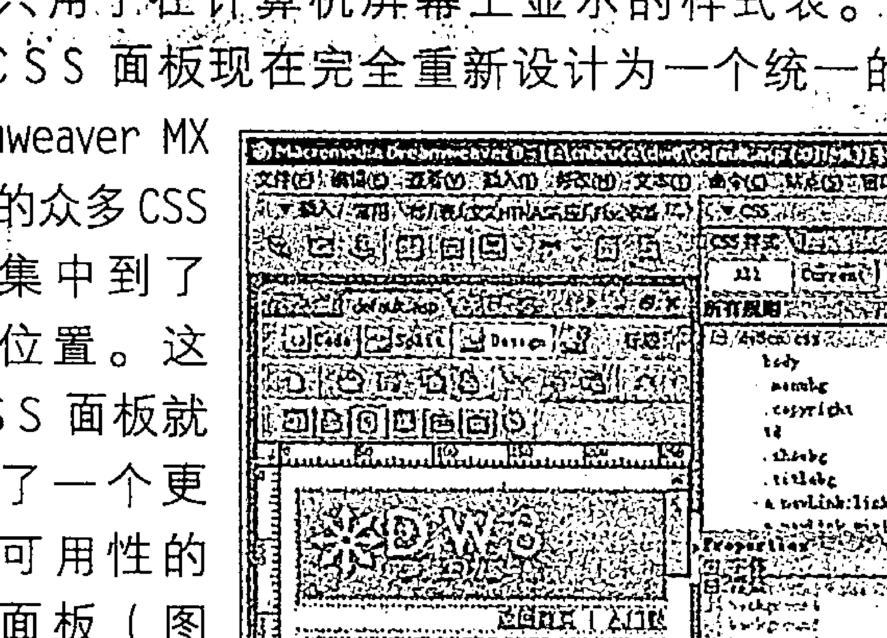

这样CSS面板就变成了一个更富有可用性的控制面板（图1），使用CSS面板可以快速确认样式、编辑样式、查看应用于页面元素的样式（就像查看段落、图像和链接一样）。

Dreamweaver 8在CSS面板中加入了一个摘要视图，用于快速确认应用于当前选定元素的CSS属性。一个简单的列表可供方便地查看哪种样式中的哪种属性被应用到当前选中的元素。控制多种CSS样式来格式化一个网页是复杂和易混淆的，所以这一新功能必将成为网页设计师不可缺少的工具，从而使设计师们从基于CSS的复杂设计中解脱出来。

### 3. 快速的文件传输

在以往向Web服务器传输文件时，许多网页设计师不得不无聊地坐着，等待漫长的传输过程。新版本终于引入了后台FTP功能。Dreamweaver的以前版本在通过因特网传输文件时，会让用户没办法利用Dreamweaver做其他工作。现在我们可以继续在一个站点中工作了，可以编辑和添加新页面、创建新的样式等。

另外，Dreamweaver 8提供了一种功能强大的文件同步功能，使用这一功能用户可以确保网站内容总是最新的。

### 4. 对XML/XSLT的远景支持

Dreamweaver 8继承了Macromedia一贯的传统，继续提供用户界面友好的、可视化的工具来处理复杂的技术。新的XML/XSLT创作功能简化了用于Web浏览的XML文件的格式化过程。用户可以创建XSLT文件，并完全使用CSS格式，将其转换成难于理解的XML文件，放入引人注目的网页中。

Dreamweaver 8提供了两种方法来解决这一问题：客户端方法让用户可以快速格式化一个XML文件，以用于在像Safari、Firefox、IE 6（Windows）这样的浏览器（或任何其他可以读取与显示XML和XSLT文件的浏览器）中浏览。如果希望获得更多的受众，可以使用Dreamweaver 8的动态页面工具，利用PHP、ASP或其他Dreamweaver能理解的服务器端语言的强大功能，将XML文件转换为任何Web浏览器都支持的HTML文件。

现在很多上网用户使用RSS来获取最新的信息，RSS feed其实就是简单的XML，使用Dreamweaver 8可以将喜欢的站点最新信息制作成RSS feed放入到你的主页中。

### 5. 代码折叠

在Dreamweaver 8中，Macromedia开发者们充分考虑了这部分用户的建议，提供了令人迷恋的Dreamweaver 8新的编码工具栏。利用此功能，可以折叠及扩展代码片断，无须再使用滚动条即可以查看文档的各个部分。

如果你的主要工作是写HTML代码，你就知道这些代码一行一行的，足可以翻几页，这样太烦人了。更糟糕的是，如果你想看另一段代码，你得用滚动条翻来翻去，终于找到了这段代码，然后你又得用滚动条翻回去！除非你在开始找的时候，定义一个特殊的标记。

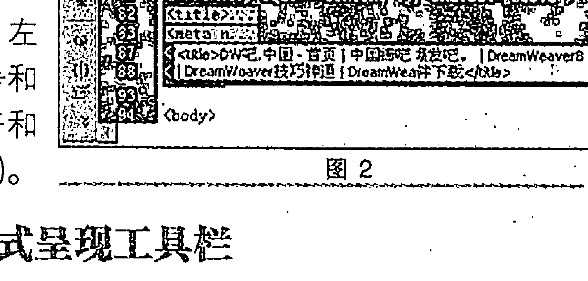

Dreamweaver 8则解决了这一点，相关的代码段，可以通过编辑器左边的“+”号和“-”号展开和关闭（图2）。

### 6. 样式呈现工具栏

样式呈现工具栏允许你轻易地为不同的媒体类型，例如屏幕、手持设备和打印输出进行设计。其他的支持媒体类型有投影设备、TTY（Television Type Devices）、及TV媒体类型等。Dreamweaver 8也提供了通过开关CSS显示按钮来打开或关闭所有样式呈现的能力。

### 7. 缩放及参考线工具

在Dreamweaver 8中，用新的缩放及参考线工具，可以对页面布局实现更好的控制。放大设计内容，可以对复杂布局进行调整，也可以查看图形。利用参考线可以精确地定位内容在页面上的位置。使最终设计好的Web页面符合最初的设计页面构思图。

### 8. 新编码工具栏

在Dreamweaver 8中，新编码工具栏将各种常用的编辑操作，附置在编辑区域一侧的竖栏内。工具栏内除现有的功能外，还支持新功能，如：添加注释、取消注释、折叠标签、折叠选择等。点击“代码”按钮，即可在左侧显示编码工具栏（图3）。

### 9. 辅助功能

Dreamweaver 8 是第一个既支持 CSS 又支持辅助功能的 Web 页面开发工具，并带有一个经过更新的包含 WCAG 优先级 1.2 的检查样点的评估工具。点击“站点”→“报告”，在弹出对话框中选择“辅助功能”，并点击“报告设置”。可以看到 W3C/WCAG P.1 accessibility 的规则。

### 10. 视频集成

利用 Dreamweaver 8，只需要点击四五下鼠标，即可以将 Flash 视频添加到站点上。用 Dreamweaver 打开任何一个 FLV 文件，利用弹出的一个简单但功能强大的对话框，选择播放控件，并将它放在页面上，即可以完成这项任务。

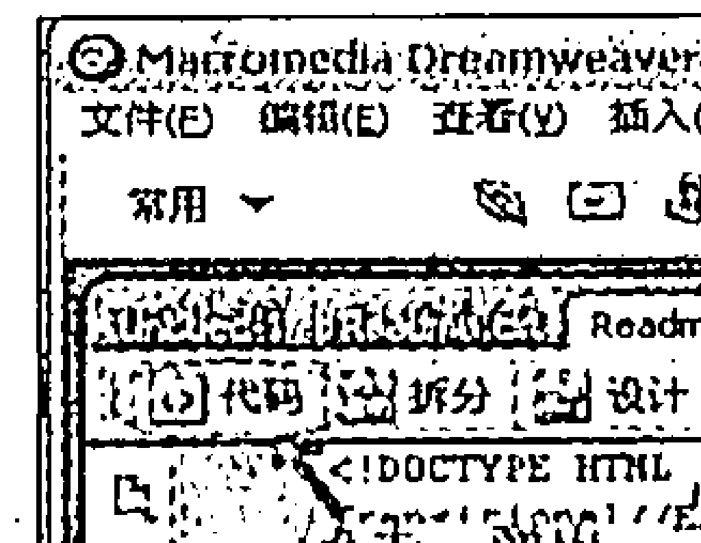

### Dreamweaver 8新功能一览

1. 可视化操作XML数据
2. 统一CSS面板
3. CSS可视化布局
4. 样式渲染工具条
5. 增强XML编辑与验证
6. 增强基于CSS的设计的渲染
7. 增强整合的Accessibility参考
8. 更多预建的Accessibility设计与模板
9. 增强动态跨浏览器验证
10. 增强手机内容创作能力
11. 放大功能
12. 引导线
13. 编码工具条
14. 代码折叠
15. 文件比较功能
16. 编码功能改进
17. 支持 WebDAV
18. 插入 Flash 视频

## Flash 8新功能预览

图形与网页设计者使用 Flash 创建网页、网页动画已经有许多年的历史，这些生动的内容为用户提供了更丰富的网络浏览体验。然而即使在今天宽带如此普及的情况下，一些体积较大的文件经常会需要较长的下载时间，这是现在的 Internet 用户所不愿忍受的。于是 Macromedia 在新版本的 Flash 8 中引入了几种高级技术，使得即便是内容较多的动画在最终完成时也只生成较小的文件。下面介绍一下新版的 Flash 8 中几个重要的新功能。

### 1. 滤镜实时渲染技术

实时渲染是 Flash 8 中一种非常棒的技术，Macromedia 减轻了 Flash Player 8 的渲染工作，Flash Player 8 现在可以在用户与 Flash 文件交互时实时渲染滤镜。

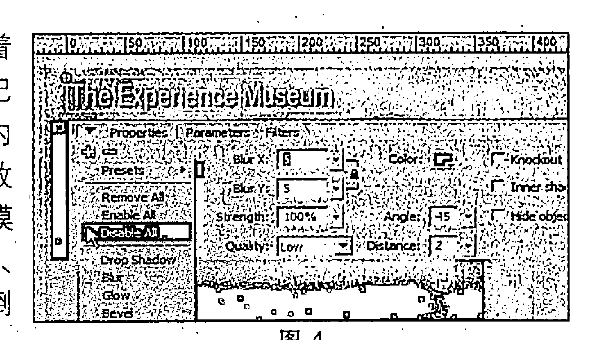

这意味着 Macromedia 已经能够合并内建的滤镜效果，像阴影、模糊、内外发光、倒角、渐变倒角、颜色调整，以获得更丰富的用户体验。这些滤镜或可视效果能够被应用到影片剪辑（MovieClips）和文本域，当在网页中运行时，通过播放器渲染并显现出来（图4）。

### 2. 运行时位图缓冲

Macromedia 通过另外的方式将 Flash 和 Flash Player 捆绑在一起以提高性能。另一种新功能叫做位图缓冲，允许设计者将任何影片剪辑符号指定为一个位图，在使用 Flash Player 运行时获得缓冲，以提高影片播放速度。

影片剪辑符号可以使用属性检查器或 ActionScript 指定为位图，这些指令在运行时传给播放器，节省了通常情况下处理器用来计算矢量图形的时间。

即便对象作为位图被缓冲，对象的矢量数据仍然被保留了下来，允许设计者在任何时候将其转换回矢量对象。

### 3. FlashType 字体渲染引擎

Flash 8 同时允许用户使用 FlashType 字体渲染引擎对字体作更多的控制。FlashType 允许设计者对字体拥有与 Flash 项目中其他元素同样多的控制。

Flash 包含字体渲染的预置，为动画文本提供等同于静态文本的高质量优化。新的渲染引擎使得文本即使使用较小的字体看上去也会更加清晰，这一功能是 Flash 的一大重要改进。

### 4. 自定义淡入淡出功能

动画设计者将会享受新的自定义淡入淡出功能所带来的乐趣，这一功能允许设计者直观地控制所有的动作补间属性。新增的曲线图功能提供对位置、旋转、大小、颜色及滤镜的独立控制，使用它能够精确控制动画对象的速率。使用 Flash 中新增的缓动控制，可以精确控制在时间轴中应用的补间如何影响被补间的对象在舞台上的外观。使用这种新的控制，可以让对象在一个补间内，在舞台前后移动，或者创建其他的复杂补间效果。

### 5. 全新的视频编码技术

Macromedia 在以前版本的 Flash 中，就已经试图通过引入 Flash 视频来扩展交互式 Web 体验。Flash 8 继续这一目标，采用了一种新的视频编码，并扩展了面向 Web 的视频解码选项。

除了在 Flash Player 中加入新的视频解码器之外，Macromedia 同时在 Flash Professional 中加入了一个独立的视频解码器。设计者现在可以选择使用 Sorenson Spark 编码，或新的 On2 VP6 编码。新的 On2 VP6 编码的目标是在提供一种丰富的交互式体验，同时使文件大小保持最小，与 Apple 支持的视频编码 H-264 类似。

新的视频工具也为开发者提供了优化视频内容质量和文件大小的高级选项。

在 Flash 8 中的视频现在允许将提示点嵌入自定义 metadata（元数据），使用嵌入的提示点，图形或动画的事件能够在播放期间动态触发。

使用新的 On2 VP6 编码，开发者能够解码视频中的一个 8 位 Alpha 通道，这个 Alpha 通道可实时合成到任何其他 Flash 内容之上。覆盖的视频以透明或半透明 Alpha 通道的方式合成。

现在在一个对话框中有一个集中的视频工作流程，这个对话框提供所有配置 Flash 视频所能够用到的选项，不管它是 Flash Communication Server 流视频，还是通过 HTTP 或其他方式下载的外部 FLV 文件（图 5）。

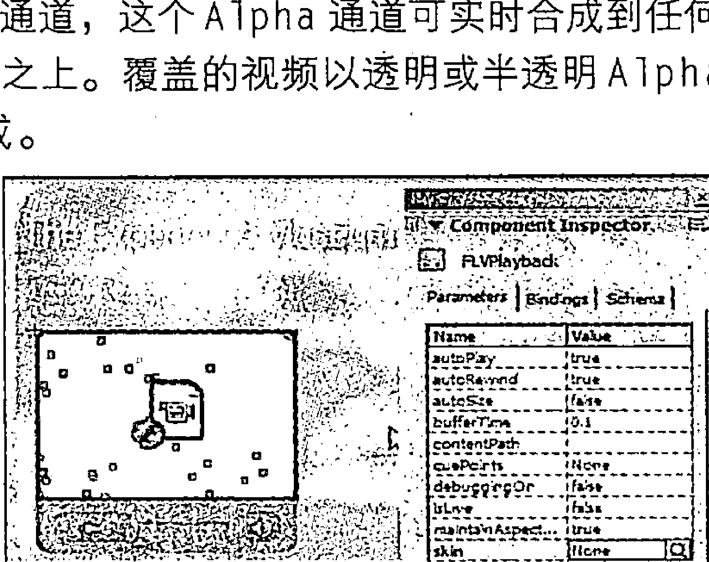

### 6. 鲜为人知的新特性

#### (1) 脚本助手——标准模式 2.0
重写了原有 Flash MX 版时的标准模式，现在为标准模式 2.0，并增加一些功能。Flash MX 2004 时是没有标准模式，现在 Flash 8 里又增添了标准模式，主要针对原手动输入代码的开发人员或设计师。

#### (2) UNDO/REDO 操作设置
在 Flash MX 2004 版，我们在撤销操作时，会一步一步的将所有的撤销，包括书写的代码和对象，许多人都在抱怨这功能，现在改为可供选择的两种方式，一种是文档级别，比如只撤销代码，还有一种是对象级别，可以只撤销场景中的对象操作。

#### (3) 增强的 Text 工具
增强了 text 工具，现在你可从左边也可以从右边来回地调整文本框的大小了。

#### (4) 增强的 Library 库
首先要说的就是现在的库，当重新启动程序时，可以停在你之前所放的位置上了，并且可保存你对库面板的设置，如果你打开多个源文件，可以通过下拉菜单在一个库面上进行切换，同时你可以锁定某一个库。

#### (5) Tabbed 面板
现在 Flash 8 的面板可以让你自由将它们成组放在一个面板上，可以使用 Tab 键来切换，可以把你喜欢的常用的工具放在一个面板上，你还可以为它们重新命名。

#### (6) Stage 粘贴板扩展
在一些大的项目中经常需要用到超过 stage 的大图，从而难以看出场景中的物件与 stage 边的距离，现在你可以很容易的看出它们间距离，只将拖动对象靠近 stage 边，它就会自动的去适应位置。

#### (7) Bitmap catching
我们可以通过界面的开关来切换是否使用 bitmap catching。使用 bitmap catching 可以让 Flash 播放器在每一帧的内部移动像素，而不是一次一次的重复计算图形。

#### (8) SWF 元数据
现在 Flash 作者可以为你的影片加标题和描述，可以让搜索引擎搜索到你的 Flash 内容。

#### (9) 改进放射渐变
现在的放射渐变提供严格的控制点来调节放射的方向大小。

#### (10) 对象绘制模式
Macromedia 提供了新的对象模式，类似于 Adobe Illustrator 和 Freehand 的对象绘制模式，你可以在工具栏上进行切换，来做你想要的。

#### (11) 混合模式
Flash 8 可以支持运行时的混合模式，实现了全新的图形功能。

## Fireworks 8 新功能预览

早在 7 年前 Fireworks 问世之初，Fireworks 就致力于成为杰出的 Web 图像编辑与处理软件，到现在 Fireworks 已经赢得了为数众多的用户群。Macromedia Studio 8 的发布引起了人们对 Dreamweaver 8 和 Flash 8 的广泛关注，其实 Fireworks 也在许多方面做了一些令人感兴趣的改变和功能的增强，下面让我们关注一下 Fireworks 8 新增的重要功能。

### 1. 创建 CSS 弹出菜单
越来越多的网站使用 CSS 来创建，开发者们使用不同的工具来创建 CSS 驱动的导航菜单。尽管许多工具，包括手写 CSS 代码，已经能够满足设计者的基本需要，但 Fireworks 现在可以使用户创建菜单，并导出为 CSS，这无疑成为设计者的又一利器。

要在Fireworks中创建CSS弹出菜单，用户可以选择图像中的一个热区或切片，然后打开弹出菜单编辑器，弹出的菜单编辑器会以向导的形式出现，用户只需要按提示一步步操作，就可以很容易地创建出专业的CSS弹出菜单。

创建CSS弹出菜单非常容易，只需要键入菜单名称、添加URL及选择目标行为。在Content(内容)选项卡中，用户可以选择父菜单和其下的子菜单。如果要添加菜单项或删除菜单项，只需要单击加号或减号，操作起来非常简便。

外观(Appearance)选项卡提供了设置字体、菜单的翻转状态等外观选项，用户也可以选择菜单方向是水平的还是竖直的。高级(Advanced)选项卡中可以设置菜单项的高度和宽度，以及空隙大小和边框宽度。

最后一个选项卡是用于设置菜单及子菜单位置的。Fireworks允许用户指定菜单及子菜单的X坐标和Y坐标（图6）。

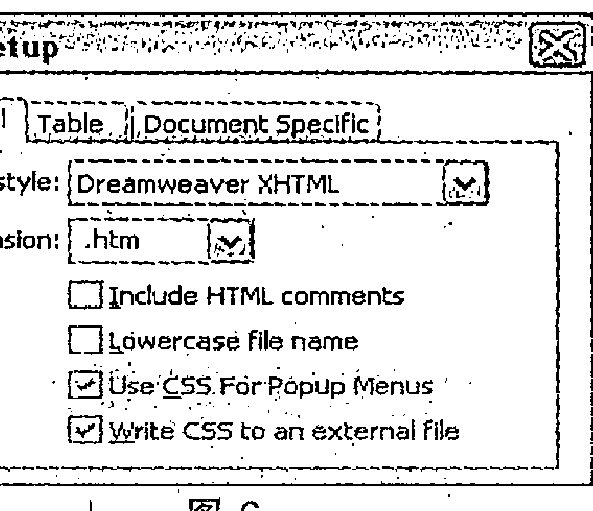

### 2. 优化了批处理功能

Fireworks 8改进了批处理功能，自动转换成批图像比以往更加容易。改进文件重命名，在批处理中缩放文件时检查文件大小，新增状态栏和日志文件等，这些只是工作流程优化的一部分。

### 3. 特殊字符

利用新的特殊字符面板、商标或版权符号等特殊字符，可以被直接插入到文本框中。

### 4. 为路径与文本对象添加阴影

要摆脱长方形文本框对文本的束缚，可以划出一个路径来添加文本，文本随路径的形状排列并且可以随意编辑（图7）。

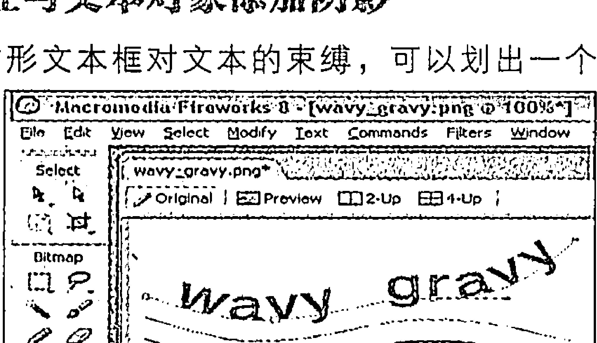

### 5. 新增切片选项

新增的自动形状属性面板，可以用于修改各种形状属性，诸如星形自动形状、箭头自动形状、智能多边形自动形状等，实现了对自动形状的全面控制。当选中的对象是多边形路径时，Fireworks 8新增的切片选项允许用户插入多边形切片。

### 6. 识别ActionScript颜色值

在Fireworks和Flash之间移动对象时，填充、笔触、滤镜及混合模式等矢量属性都可以保存下来。现在从Flash中将颜色值拷贝到Fireworks的颜色值区域，Fireworks能够识别出ActionScript颜色值。

### 7. 移动设备界面组件

提供了可仿真移动设备实体模型的移动设备界面组件（图8）。


### 8. 其他新特性

- 支持更多文件格式：比如QuickTime图像、MacPaint、SGI、及JPEG 2000
- 自动使用键入的文本命名图层
- 使用新的特殊字符面板直接在文本块中插入特殊字符
- 新增图像编辑面板
- 将选中对象转换为可编辑矢量路径（并且可以反转此操作）
- 在字体菜单顶部显示最近使用的字体
- 透视阴影与立体阴影效果
- 25种新的混合模式
- Auto Shape属性面板

## FlashPaper 2

Macromedia Studio 8家族成员中包括了一个叫做FlashPaper 2的小软件，使用它可以将任何可打印的文档转换为SWF或PDF文档，应用起来非常方便。FlashPaper以前是捆绑在Contribute中的，现在则集成到整个的Studio 8中。以前在单独发行的Contribute 3中也捆绑了新版本的FlashPaper 2，同时Macromedia也发布了可以独立运行的FlashPaper 2。下面我们通过实例图解的方式与大家一起来全面学习FlashPaper 2的详细原理和使用方法。

### 1. FlashPaper 2的工作原理

首先我们来了解一下FlashPaper 2的工作原理。FlashPaper 2安装完后，实际上在操作系统中自动安装了一个虚拟打印机，叫做“Macromedia FlashPaper”；我们使用控制面板打开“打印机和传真”窗口，就可以看到，如图9所示。

这个虚拟打印机并不会真的将文档打印到纸介质上，而是将可打印的文档输出为SWF或PDF文档。这里所说的可打印文档种类很多，比如常见的Office文档、网页文件、文本文件等。

所以，简单说来，FlashPaper 2的工作原理就是用FlashPaper虚拟打印机将可打印文档转换为SWF或PDF文档。

## PART 2 Macromedia Studio 8 组件全接触

### 2. 了解 FlashPaper 文档

FlashPaper允许我们将任何类型的可打印文档转换为SWF或PDF文档，可以通过各种平台来查看生成的FlashPaper文档，包括文档的格式、文档中的图像、字体、特殊符号、源文档的颜色，而不必理会这个文档原来是由哪个平台、哪个应用程序创建的。例如，我们可以在Windows XP中创建一个Excel电子表格，然后使用FlashPaper将其转换为SWF文件，再将这个SWF文件传给一个Macintosh用户。

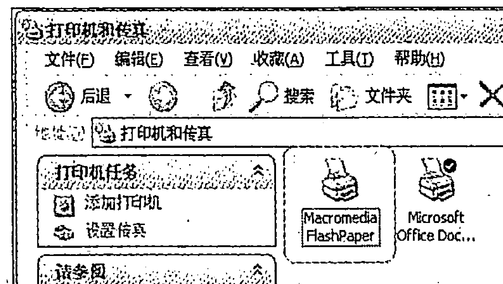

FlashPaper所生成的SWF文件与Macromedia Flash所生成的SWF文件格式是相同的。FlashPaper SWF文件通常比其他格式的文档要小得多，我们可以使用任何支持Flash的浏览器查看它们，或者可以直接使用Macromedia的Flash Player来查看。还可以将FlashPaper SWF文件嵌入到一个网页中，这样就能够使得许多用户通过网络查看原来不容易查看的一些文件类型，如Microsoft Project、Microsoft Visio、QuarkXPress、AutoCAD文件。当用户打开这样的网页时，FlashPaper SWF文件能够立即打开，用户不必离开网页就能查看文档内容。

FlashPaper文档（包括SWF和PDF格式）也能够作为一个单独的文件查看，任何人只要在计算机中安装了FlashPlayer就能够查看FlashPaper SWF文件，而只要在计算机中安装了Adobe Acrobat Reader，就能够查看PDF文件。而这两种小程序现在具有极高的普及程度，用户可以很容易地在网上下载到它们。

下面我们详细介绍FlashPaper 2的功能和使用。

### 3. FlashPaper 2 功能概览

我们使用FlashPaper应用程序来创建FlashPaper文档，使用Flash Player或某种浏览器来查看FlashPaper文档。

#### (1) FlashPaper 2 应用程序功能

- 拖放式创建FlashPaper SWF/PDF文档：用户只需要将一个可打印文档直接拖放到FlashPaper应用程序窗口，就能够将它转换为FlashPaper文档。
- E-mail PDF：可以使用FlashPaper将可打印文档转换为PDF格式，然后自动运行邮件程序将它发送到其他人邮箱。
- 微软Office附加项功能：FlashPaper安装后，在微软Office软件中添加了菜单项和工具栏按钮，使用户能够直接在Microsoft Word、PowerPoint、Excel中生成FlashPaper文档。
- PDF安全设置：当使用FlashPaper创建了一个PDF文件后，可以设置一个打开该文件的密码，也可以防止其他查看该文档的用户拷贝与编辑文档中的文本、改变文档中的图像及打印该文档，为PDF安全选项设置对话框（图10）。
- 通过右键菜单创建FlashPaper文档：用户可以右键单击任何一个可打印文档，然后从菜单中选择相关命令来创建FlashPaper文档。

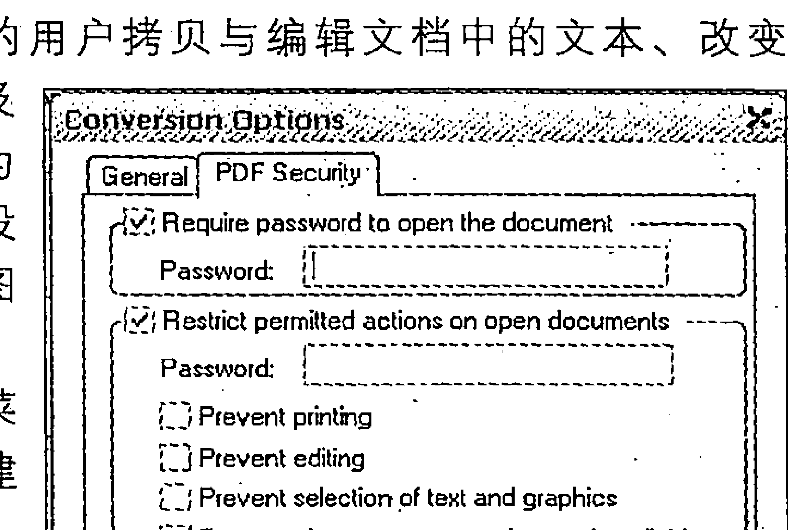

#### (2) FlashPaper 文档查看器的主要功能

界面易用性：FlashPaper文档查看器中的工具栏按钮、各种控制项及滚动条具有非常好的易用性，用户可以很容易地查看文档。

自动超链接：FlashPaper文档自动保留Microsoft Word、PowerPoint及Excel文档中创建的超级链接。

文档大纲：只需在转换之前选中“File”→“Options”中General标签项内的“Include Outline”选项，FlashPaper文档能够保留Microsoft Word和PowerPoint文档中的结构与导航元素。

可改变大小：FlashPaper文档能够按比例改变大小，这跟FlashPaper或浏览器窗口的大小没有关系。用户可以通过拖动窗口或使用工具栏中的改变大小滑块来很容易地改变文档显示大小。

搜索功能：可以使用搜索功能在FlashPaper文档中查找某些字词，搜索到结果会高亮显示。

文本选取功能：用户可以在FlashPaper文档中选择文本，并将其拷贝到剪贴板，然后粘贴到其他文档中。

## Contribute 3

作为即将上市的Macromedia Studio 8家庭成员之一，Contribute 3似乎不为国内用户所熟悉。其实Contribute于2002年12月就已经正式推出，当时正值Dreamweaver MX风行网页制作领域，作为一个全新的网站维护软件，Contribute以其简便易用、上手迅速、使用高效而很快赢得了一部分用户的青睐。Contribute所面向的用户群是非专业人士，所以与Dreamweaver并不冲突，它属于低端产品，用户可以像使用字处理软件那样编辑与更新网页，并不需要具备专业的网页设计制作知识。

### 1. 了解 Contribute 3 的工作原理

在使用之前，有必要对Contribute的工作原理及用途作一个透彻的了解，看看它是否适合自己使用。

Contribute工作于现有的网站，这个现有的网站可以位于本地的Intranet，也可以是已经发布到Internet上的站点，了解这一点非常重要。虽然也可以从零开始一步步地创建网页，但这并非Contribute的主要用途。

用户使用 Contribute 的工作流程是这样的：用户使用 Contribute 连接到需要更新的网站，然后浏览并编辑要更新的网页，最后将修改之后的网页再发布到网站上。Contribute 的主要使用者可以分成以下两类。

### Contribute 用户

Contribute 的主要使用者，或者说，Contribute 就是为这些用户设计的，他们负责网站的日常维护，使内容保持最新。Contribute 用户包括市场人员、管理人员、教育工作者、学生、小型企业主、行政助理、项目负责人等等，他们并不需要具备 HTML 语言的知识，也不需要懂得网页设计，因为 Contribute 的用户界面简洁直观。用起来就像字处理软件一样容易上手，用户可以像使用 Word 或 Excel 一样添加或更新文本、图像、表格、超级链接。

### Contribute 管理员

Contribute 管理员负责设置 Contribute 用户，并帮助他们使用 Contribute 维护站点，同时也负责设置文件夹和用户权限，决定谁能够编辑网站内容以及能够编辑什么内容。在 Contribute 中，每个站点只能设置一个 Contribute 管理员，不过如果 Contribute 管理员与其他人共享网站的密码，则不止一个人能够管理站点。

### 2. 用 Contribute 连接到网站

使用 Contribute 可以方便快捷地连接到用户要维护的站点，Contribute 管理员负责通过两种方式之一，事先为 Contribute 用户设置好网站的连接。

方式一是向用户发送一个电子邮件，这个邮件中包含一个 Web 站点的 Connection Key（链接钥匙）。链接钥匙中包含了用户连接到网站所需要的所有信息。

其次是向用户提供必要的网络连接信息，用户可以通过连接向导输入这些信息，从而完成连接，比如用户可以通过管理员提供的 FTP 站点名称、用户名、密码连接到站点，然后更新与发布网页。

下面我们主要以 FTP 方式为例看一下用户如何通过第二种方式连接到网站。

启动 Contribute 3 后，如果出现开始页面（在地址栏中可以看到 startpage 字样），则在其中单击 “Create a connection”，这样就会启动连接向导。如果没有出现开始页面，可以选择菜单命令 “Edit” → “My Connections”，打开 “My Connections” 对话框，并单击 “Create” 按钮，也会启动连接向导（图 11）。

弹出连接向导对话框后，单击 “Next”（下一步）按钮，进入下一页，Contribute 会要求输入站点的 HTTP 地址，这个地址就是要维护的网站地址。如果单击右侧的 “Browse” 按钮，可以在一个新窗口中浏览该网站。

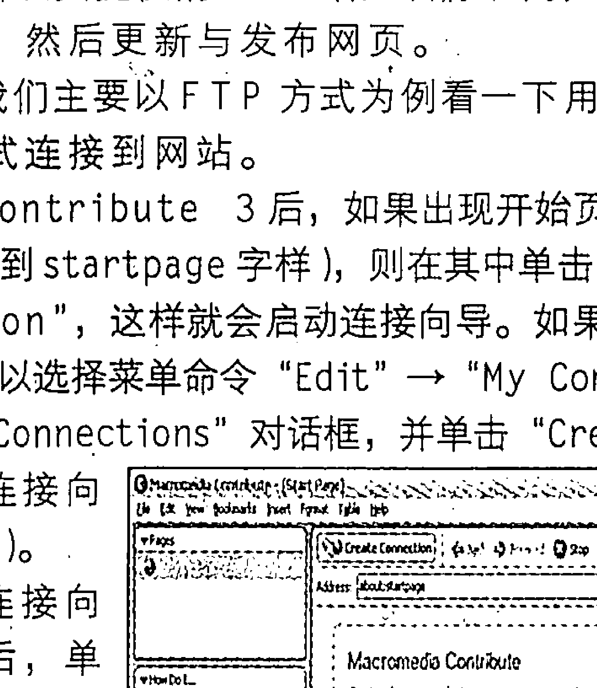

填写完成后，单击 “Next” 按钮，进入下一页，从连接方式下拉列表中选择 FTP，并输入 FTP 站点的名称、登录用户名、密码等信息。输入完毕，单击 “Next” 进行连接。连接后，就可以在网站中浏览到要编辑的网页，并单击工具栏上的 “Edit” 按钮进行编辑。编辑完毕，单击工具栏上的 “Publish”（发布）按钮将更改后的网页发布到网站上去。如果你没有一个网站进行练习，可以使用微软的 IIS 在自己的计算机上创建一个网站。

### 3. Contribute 编辑、更新网页

不管采用什么方式连接到网站后，都可以打开该网站的首页，然后在浏览模式下，像平常上网浏览其他网页一样找到要修改的网页，就可以对它进行编辑。我们打开了一个本地站点的首页，从页面上方的工具栏可以看出现在处于浏览模式。

如果我们要编辑这个网页，可以单击工具栏上的 “Edit” 按钮，进入编辑模式。可以观察到，工具栏上的按钮变了，网页也呈现为可编辑状态。

在编辑状态下，主要对文本、表格、图像和超级链接进行编辑操作。

#### (1) 编辑文本

比如要改变标题名称，可以选中 “欢迎使用”，然后输入其他名称，也可以在选中文本后，使用工具栏上的相关按钮改变文本的字体、样式、对齐方式等，就像使用 Word 编辑文本一样简单，在这里就不再赘述了。

#### (2) 表格操作

Contribute 中的表格操作包括插入 / 删除表格、插入行 / 列、删除行 / 列、合并与拆分单元格、格式化表格、表格排序等。可以通过工具栏上的三个按钮完成插入表格、插入行和插入列的操作。也可以使用表格菜单完成有关表格的所有操作，具体操作大家可以试一下，与 Word 中的表格操作类似。

#### (3) 图像操作

默认情况下，Contribute 用户并不能对图像做过多的修改，所有工具栏会与编辑文本时的相同。但如果 Contribute 管理员给予 Contribute 用户在网页中编辑图像的权限，则在工具栏上就会出现相应的图像编辑按钮。至于如何设置用户的权限，本文不再赘述。

#### (4) 超级链接

可以为选中的文本、图像等添加超级链接，方法是单击工具栏上的 “Link” 按钮。单击该按钮会弹出一下拉菜单，从菜单中可以选择相关的操作。

除了以上内容之外，还可以在网页中插入其他对象，如 Flash 动画、视频、Google 搜索区域等，方法是使用 “Insert” 菜单中的相关命令。

网页编辑完毕以后，Contribute 用户只需要单击工具栏上的 “Publish” 按钮就可以将网页的最新改动更新到网站上了。

在互联网发展初期，网站相对较少，信息查找比较容易。随着互联网的技术不断的成熟，网络上资源越来越丰富，娱乐、交易、交流、工作、学习都与网络建立了密切的关系。在如此浩瀚的网海中普通网络用户想找到所需的资料简直如同大海捞针，这时为满足大众信息检索需求的专业搜索网站便应运而生了。使用搜索引擎工具搜索自己想要的素材成了网民的最佳选择。那么我们如何高效的使用搜索引擎搜索自己需要的资源呢？如何选择一款优秀的网络搜索功能呢？今天我们就一起走进网络搜索的世界。

## 什么是网络搜索引擎

搜索引擎（Search Engines）是一个对互联网上的信息资源进行搜集整理，然后供你查询的系统，它包括信息搜集、信息整理和用户查询三部分。搜索引擎是一个为你提供信息“检索”服务的网站，它使用某些程序把因特网上的所有信息归类以帮助人们在茫茫网海中搜寻到所需要的信息。

搜索引擎之所以有如此庞大的数据信息，是因为该网站提供了强大的数据收集功能，搜索引擎网站的搜集功能分为“定期”和“提交网站”两种形式。定期搜索，即每隔一段时间搜索引擎主动派出“蜘蛛”程序，对一定IP地址范围内的互联网站进行检索，一旦发现新的网站，它会自动提取网站的信息和网址加入自己的数据库。此外，有些商业网站，为宣传自己的网站内容，经常到一些知名的搜索引擎网站提交自己的网站信息，这样搜索引擎网站会在一定时间内定向向你的网站派出“蜘蛛”程序，扫描你的网站并将有关信息存入数据库，以备用户查询。

## 搜索引擎分类

### 1. 按工作方式分

#### (1) 全文搜索引擎

全文搜索引擎是名副其实的搜索引擎，具代表性的有Google、百度等。它们都是通过从互联网上提取的各个网站的信息（以网页文字为主）而建立的数据库中，检索与用户查询条件匹配的相关记录，然后按一定的排列顺序将结果返回给用户，因此他们是真正的搜索引擎。

#### (2) 目录索引

目录索引是按目录分类的网站链接列表。用户完全可以不用进行关键词查询，仅靠分类目录也可找到需要的信息。目录索引中最具代表性是Yahoo雅虎，搜狐、新浪、网易等搜索功能也是目录索引的方式。

#### (3) 元搜索引擎

元搜索引擎在接受用户查询请求时，同时在其他多个引擎上进行搜索，并将结果返回给用户。中文元搜索引擎中具代表性的是搜星搜索引擎。

### 2. 按功能分

#### (1) 综合类搜索

综合搜索网站可以对各种资源进行搜索，其中包括网页、新闻、娱乐、论坛、图片等几十种搜索功能，只要你需要的信息，在这里都可以找到，真可谓是无所不能呀。

#### (2) FTP搜索

FTP搜索引擎是专门为搜索FTP服务器上的各种资源设计的搜索引擎，该搜索功能收集了匿名FTP服务器提供的目录列表以及向用户提供文件信息的查询服务。

#### (3) 论坛搜索

大多数网民在遇到问题时就向论坛发贴求助，这样一来，论坛搜索引擎的数据库里也就有了成千上万的“问题”和“回答”，而论坛搜索引擎就是专职查找论坛内容的一种专业搜索引擎了。

#### (4) BT搜索

专为喜欢下载BT文件用户提供的搜索引擎，能快速找到我们需要的BT下载文件。

## 各类搜索引擎推荐

### 1. 综合搜索网站推荐

#### (1) 百度搜索 http://www.baidu.com

了解百度：百度是世界上规模最大的中文搜索引擎## 百度特色功能——地图搜索

引擎，致力于向人们提供最便捷的信息获取方式。百度提供了“新闻”、“网页”、“贴吧”、“MP3”、“图片”、“网站”、“影视”、“地图”等近20多个搜索项目，是目前最全的综合性搜索引擎。百度拥有全球最大的中文网页库，每天处理来自一百多个国家的超过一亿人次的搜索请求。简单强大的搜索功能深受网民的信赖，在信息过剩的时代，百度凭借“简单，可依赖”的搜索体验使“百度一下”成为搜索的代名词。

- ①鼠标点击，快速定位

使用百度地图搜索时，首先键入http://map.baidu.com进入到地图搜索网页，映入我们眼帘的是一张中国地形图，上面标有各地城市的名称（如图1）。在浏览地图时，左上方提供了四个方向的按钮，点击即可拖曳地图向相应的方向移动；下面一根长长的尺子是用来进行缩放的，向下则缩小地图，向上则放大地图，地图左下方显示的是当前地图的比例尺，双击即可返回中心。浏览某个城市地图时，在地图上单击某个城市的黄色方块即可进入到该城市地图界面。我们可以使用左上方提供了四个方向的按钮，来查看该城市的地理情况。

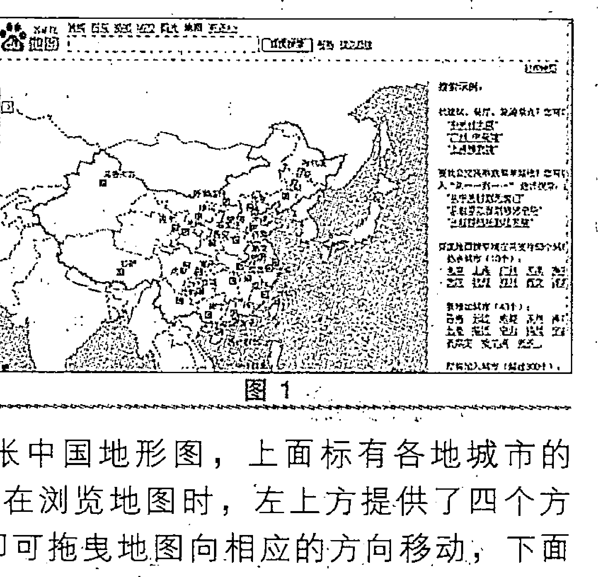

提示：百度地图搜索功能非常强大，现在已经开通的有北京、上海、广州、天津、重庆、杭州、南京、沈阳、武汉、西安等53个城市。

- ②测量实际距离

百度地图还提供了一个实际距离测量功能，这样给我们对地理位置的了解更有帮助。测量某两段位置的实际距离时，用鼠标单击方向按钮中间的尺子按钮，随后鼠标旁边出现一个红色信息条。随后用鼠标单击开始点这时鼠标指针会拖出一条红色线条（如图2），将鼠标移到结束位置后双击鼠标即可弹出一个对话框，显示出当前两地的实际距离。


- ③短语输入位置更准确

在上面的介绍中我们使用鼠标可以快速地查找某个城市的地图，如果我们要想查找某个城市的景点时要用鼠标就有些麻烦了。比如在北京的地形图上查找“颐和园”，用鼠标点击即费力又麻烦。这时我们可以直接在搜索框中键入关键字进行搜索。如在搜索文本框中键入“颐和园”后，百度搜索可以很快地在地图上搜索到颐和园的位置。如果搜索到信息后，百度会在地图上用字母显示出来，随后在界面的右侧列出该字母显示的具体位置。单击相应的具体位置，便进入该位置的地图进行查看，同时在目标处会同时显示一个不断闪烁的圆点，单击后即可显示相应的信息（如图3）。

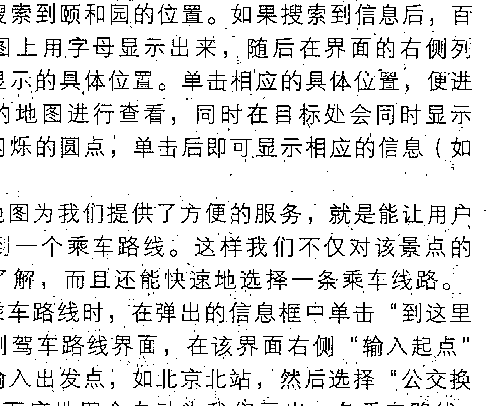

百度地图为我们提供了方便的服务，就是能让用户快捷地找到一个乘车路线。这样我们不仅对该景点的位置进行了了解，而且还能快速地选择一条乘车线路。搜索乘车路线时，在弹出的信息框中单击“到这里去”进入到驾车路线界面，在该界面右侧“输入起点”文本框中输入出发点，如北京北站，然后选择“公交换乘”，随后百度地图会自动为我们画出一条乘车路线。并在该路线两头标有“起”和“终”字样。这样我们可以非常直观的了解乘车的路线。此外地图的右侧还统计出详细的乘车路线图和乘坐的几路公交车情况，以及换车的位置等详细信息。这下无论是从哪个出口出来，都不用担心东西南北摸不着头脑了。

小提示：如果你要驾车旅行，我们可以单击“驾车路线”，这样百度地图给我们一个合理的驾车路线，并且提供给我们驾车路线的实际距离。现在很多搜索引擎，如Google、中搜、爱问等都提供了地图搜索功能，操作过程都很相似。

## 百度特色辅助工具

百度除了具有以上搜索功能外还提供了优秀的辅助工具。

- ①百度硬盘搜索：http://disk.baidu.com/

百度硬盘搜索可以帮你快速找到硬盘上的电子邮件、Office文档、MP3、图片、软件、网页历史、MSN聊天记录等信息。

- ②百度超级搜霸：http://bar.baidu.com/sobar/promotion.html

这是一个IE插件，安装后在IE界面生成一个工具栏，安装该工具栏后，无需登录网站即可启动百度引擎进行搜索。此外，程序还提供了一个拦截弹出广告窗口的功能，这样为我们提供了一个干净上网空间。

此外：百度的硬盘搜索功能，让百度更显强大（下文对百度硬盘搜索进行详细介绍）。

## （2）Google http://www.google.com

Google 是世界上最强大、拥有用户最多的搜索引擎，该引擎查询简洁方便，仅需输入查询内容并敲一下回车键，或单击“Google 搜索”按钮即可得到相关资料。Google 查询严谨细致，能帮助您找到最重要、最相关的内容。例如，当 Google 对网页进行分析时，它也会考虑与该网页链接的其他网页上的相关内容。Google 还会先列出那些搜索关键词相距较近的网页。

Google 提供了智能型汉字简繁自动转换系统，这个系统不是简单的字符变换，而是简体和繁体文本之间的“翻译”转换。例如简体的“计算机”会对应于繁体的“电脑”。当我们搜索所有中文网页时，Google 会对搜索项进行简繁转换后，同时检索简体和繁体网页，并将搜索结果的标题和摘要转换成和搜索项的同一文本，便于用户阅读。

Google 特色功能——桌面搜索：个人电脑的硬盘越来越大，从数十 MB 发展到了数百 GB，查找一个文件也从凭脑子就记得清楚，到现在用 Windows 的系统搜索都无法寻觅。现在个人电脑则中充斥着各种文档、数据、音视频文件，单薄的 Windows 系统搜索早已力不从心。在此背景下 Google 推出了“Google 桌面搜索”软件，并发布了“Google 桌面搜索中文版”。这个中文版并不是简单的界面中文化，而是完善了对中文关键字搜索的支持，并针对中国国情添加了 QQ 聊天记录搜索等本地化功能。它的确是工作、学习的利器。

Google 辅助工具：Picasa 照片管理软件、翻译、工具栏等多个工具，给我们查找需要的资料带来了方便。

## （3）一搜 http://www.yisou.com/

一搜网是雅虎推出的优秀的搜索引擎网站，该网站秉承雅虎公司在全球一贯的“追求更好的用户体验”精神，力求专业、简洁，并致力于做中国最好的搜索门户，为中国用户提供更好的搜索体验。一搜网采用雅虎公司基于全球领先的 YST（Yahoo Search Technology）技术，在中国推出的搜索门户。这是第一家互联网国际巨头正式进军中国搜索市场，也是雅虎公司在全球第一次推出独立的品牌。一搜具有简洁专业、海量、客观精准、国际化、稳定高速等特点，是值得依赖的专业搜索门户。

一搜特色——一搜音乐盒：一搜网最近提供了一个一搜音乐盒功能，当我们在一搜找到自己喜欢的歌曲试听链接后，可将链接地址保存到音乐盒中。还可制作自己的音乐主题，并邀请好友来分享我们的音乐盒中音乐。

- ①为音乐盒添加音乐

当我们想将音乐盒中添加自己喜欢的歌曲时，首先进入到一搜 MP3 搜索界面（http://mp3.yisou.com/）在此输入我们搜索的歌曲名称，如“童话”，随后单击“歌曲搜索”按钮，随后得到多个该歌曲列表。在该列表中单击“加入音乐盒”。进入到音乐盒后弹出一个 ID 和密码登录界面，在此输入已经注册的雅虎用户名和密码，随后单击登录按钮进入到“添加链接”界面，在该界面中歌名、歌手、专辑、网址等项进行自动添加；随后我们还要对“类别”和“说明”项进行设置，完成后单击“加入音乐盒”按钮，即可将该歌曲添加到我们的音乐盒中，随后在弹出的添加成功界面中单击“查看音乐盒”按钮，即可进入音乐盒来查看该音乐盒中的歌曲。

- ②创建音乐主题

为音乐盒创建主题时，在我们的音乐盒界面单击右上角的“创建新主题”按钮，弹出一个创建新主题界面，在此输入“主题名称”、“图片链接”等项后单击“创建主题”按钮，便可以创建一个新的音乐主题。

- ③音乐盒里的“试试手气”

这是一搜 MP3 搜索引擎的特色功能呦！如果您音乐盒中的歌曲试听链接不足 12 个，那么点击音乐盒页面上的“试试手气”按钮，一搜可以自动为您搜索几首大家正在热搜的歌曲，直接将试听链接放入您的音乐盒，至于是什么歌，自然是要试试手气才知道了！

## （4）中国搜索 http://www.zhongsou.com/

了解中搜：中国搜索（中搜）采用第三代智能搜索引擎技术，中文网页超过 2 亿，是目前全球最大、最好的中文搜索引擎。采用领先的基于内容的自动分类、自动聚类、区域搜索、智能拼音纠错等技术。除了能快速搜索到需要素材外，还提供了一个寻址功能，这样当我们输入网站名称后，可以搜索帮我们找到该网页地址。

中搜特色——个性化搜索：中搜提供了一个个性化搜索功能（http://ips.zhongsou.com/），是通过建立用户兴趣模型，对搜索结果进行个性化处理的一种搜索方式，是对中搜现有资源的合理利用，属于新一代的智能搜索引擎。它能根据用户的喜好，返回与用户最相关的搜索结果。比如：输入“猎豹”，对汽车感兴趣的用户，将会搜索关于猎豹汽车的信息；而对生物感兴趣的用户，将会搜到猎豹这一生物的相关信息。

使用个性搜索时，首先，单击“添加我的兴趣类别”，进入到添加兴趣类别界面（如图4），在“大分类”中选择你的兴趣，随后在右侧的“二级分类”中勾选你的兴趣，随后单击“保存设置”按钮返回。当然你可以对你已选的兴趣类别进行删除等操作。

在个性搜索界面中输入关键字进行搜索。最后打开搜索结果页顶部如果出现个性化等级选择条（颜色带），你就可以通过点击颜色带，来选定个性化等级，它将调整个性化结果的排序。个性化结果用红色方块来标记，带个性化结果的页数最多为 2 页。

中搜辅助工具：网络猪——划词搜索引擎 http://pig.zhongsou.com/

添加我的兴趣类别界面，包含“我的兴趣类别：大分类：二级分类：”等选项，如图4所示。当我们在查看网页、Word文档、邮件时，遇到不明白的内容用鼠标选中它，这时会弹出一个工具栏（如图5），单击其中的“搜”，这时程序会自动启动IE直接搜索出答案。这就是迷你版网络猪——划词搜索引擎，让你的鼠标成为搜索引擎。

## (5) 搜狗 http://www.sogou.com/

搜狗引擎是搜狐推出一个综合搜索引擎，提供了快捷方便的搜索功能，其风格和百度相似。搜索速度快、内容全。搜狗提供还提供了一个人物快速检索功能，能快速查询到需要找到的人物，搜狗网页搜索和人物搜索有着紧密的联系。Sogou将自动识别您输入的查询词是否是人名，并且会在网页的右侧显示相关人物的资料。点击进入后，您可以看到众多人物搜索结果。

搜狗特色——集成字典查询：当我们在看网页时碰到不会读的字或不认识的字时不用再去找在线字典了。这时我们可以把这个字复制到搜狗的搜索框中。这时在搜狗上搜索单字的时界面第一行会给出该字的提示（如图6）。

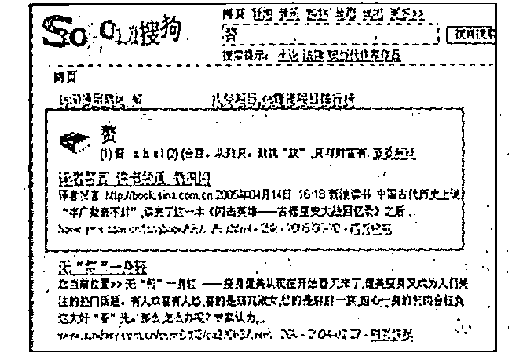

随后单击右侧的“查看解释”，随后出现一个小窗口，显示该字的具体解释。

搜狗辅助工具：搜狗直通车 http://tb.sogou.com/

这也是一个IE插件，也百度搜霸界面非常相似。搜狗直通车是一款让搜索更加方便的搜索栏，安装该工具栏后，不仅能快速搜索需要的材料，而且能提升下载速度，可断点续传。

## (6) 爱问 http://www.iask.com/

爱问是新浪推出的功能优秀的综合搜索网站，除网页外，您还可以选择新闻、音乐、图片、视频、知识和本地搜索进行查询。爱问最为优秀的功能是提供了提问功能，通过这个功能增加我们搜索的趣味性，并且我们可以将自己的问题发布爱问网和网友进行交流。

爱问特色——问题解答：爱问提供了一个优秀的提问功能，通过这个功能我们可以将自己需要解决的问题发布到爱问网站中，随后通过回答问题的难度来悬赏积分。

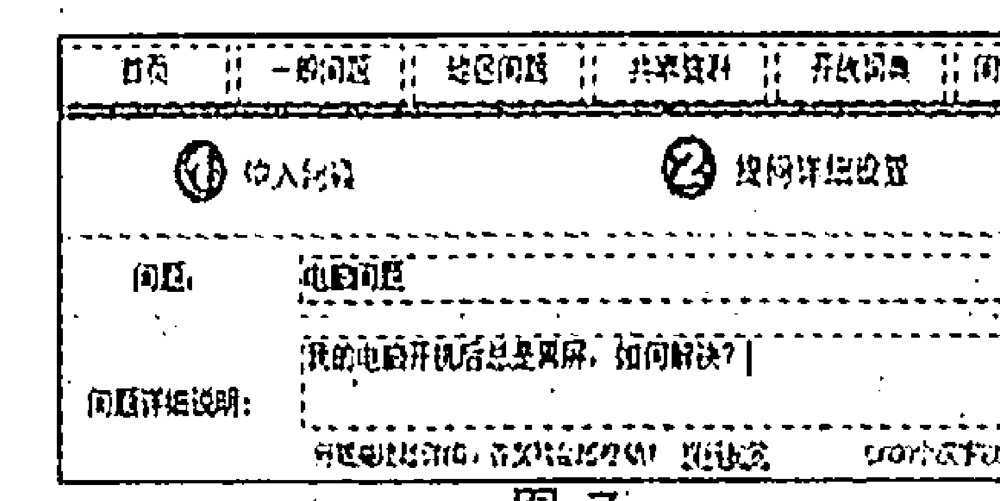

首先我们先到爱问网上提交问题，提交时在“爱问”搜索框中输入需要提交的问题，随后单击“提问”按钮进入到“问题详细设置界面”，在“问题详细说明”中输入问题的详细内容并选择好问题的类别（如图7）。

提示：提问时应尽可能将问题放在适当的分类目录下。给我们解答问题的专家和网友，可能只会在他们关注的那些分类目录中浏览问题。如果你的问题放错了地方，别人就可能看不到你的问题。

随后在“悬赏”项中输入一个积分，这样回答问题的人会根据情况赚取我们的积分，因此提问时，你付出的悬赏积分越高，就越有人来积极回答你的问题。当然你平时应尽可能地回答别人的问题来攒足够的积分。输入会员号和密码，随后单击“提交”按钮即可。这样浏览问题页面时，网友可以直接选择回答或修改回答操作。

## (7) QQ搜索 http://so.qq.com/

QQ搜索是腾讯公司推出的一个综合搜索网站，该网站为用户提供了多种搜索项目，这样我们能快速地搜索相应的信息资料。QQ搜索功能与TT浏览器紧密结合，支持拖曳功能，当我们使用TT浏览器浏览网页时，用鼠标拖曳搜索的内容就可以快速查找的相应的信息，非常方便。

QQ搜索辅助工具：地址栏搜索：支持聊天/拖拽搜索和地址栏搜索，可以将我们需要搜索的内容从TT浏览器、IE浏览器和聊天创建中拖曳到相应的地址栏中（聊天窗口直接拖曳到搜索栏）进行搜索。

## (8) 综合搜索网站测试

通过上面的介绍我们对综合搜索网有了进一步的了解，其实综合搜索引擎最主要的功能就是搜索能力的强弱，哪个搜索网站搜索的速度快，搜索到的信息准确，这个网站就容易被用户所接受。那么以上提供了几款综合搜索引擎，搜索功能如何呢？下面我们以“陶喆”为关键字进行搜索，各个网站评测结果如表1。

| 搜索引擎 | 搜索结果 | 搜索用时（秒） |
| :--- | :--- | :--- |
| 百度 | 1,680,000 | 0.001 |
| 一搜 | 1,860,000 | 0.01 |
| 搜狗 | 675,809 | 0.009 |
| QQ搜索 | 95900 | 0.382182 |

通过上面的搜索我们发现百度和爱问搜索的速度最快，在测试中搜索速度可以达到0.001秒，从搜索结果看来中爱问不仅速度快而且搜索的信息最多。从整体上看爱问在基本搜索过程中占优势，而QQ搜索从搜索结果和所用时间上都远远被甩其他搜索引擎后面。

## 2. FTP搜索

### （1）天网搜索 http://e.pku.edu.cn

天网搜索引擎是由北大计算机系网络与分布式系统研究室研制开发的，它是中国教育和科研计算机网示范工程应用系统课题之一。是全国最大的FTP资源搜索网站，天网搜索引擎提供一种检索Web资源（主要是中国教育和科研计算机网上的Web资源）及FTP的手段。用户只需输入要检索的一个或多个关键词，系统就会把这些关键词相匹配的网站或新闻组中的文章查找出来。

### （2）歪酷搜索 http://www.ycul.org/

歪酷搜索是由2001级计算机科学与工程系Jamguo独立开发制作的FTP搜索引擎。该搜索引擎拥有FTP文件搜索，BBS精华区搜索，WhereIs（IP地理位置查询），电台黄页，Halflife服务器列表，天气预报服务，搜索1000万文件，160万精华帖，78万MP3，2千字幕。在短短的一年里，歪酷搜索迅速成为校园中使用率最高的网站之一。同时，歪酷也成为了知名度和美誉度最高的网络品牌。

### （3）FTP搜索引擎测试

FTP搜索最主要的功能就是选择各大FTP网站中的资源，只有哪个搜索引擎搜集的FTP服务器的资源多，搜索的结果就多，下面我们以搜索Flash MX安装程序为例，来了解一下这两款优秀的FTP搜索引擎的评测结果（如表2）。

| 搜索引擎 | 搜索文件数 | 搜索用时间（秒） |
| :--- | :--- | :--- |
| 天网搜索 | 510 | 0.009 |
| 歪酷搜索 | 163 | 0.001 |

通过搜索我们发现天网搜索的文件数码远远比歪酷多，当然用时上比后者多些。不过天网搜索的文件类型多样化，这样不便于我们寻找自己需要的文件。而歪酷就有一个过滤功能，这样歪酷可以将我们不需要的文件从结果中过滤出去，给我们寻找文件带来方便。

## 3. 论坛搜索

### （1）专业才能职业 http://www.teein.com

这是一个功能强大的搜索引擎，他独特之处就是支持BBS论坛搜索，这样能快速地在各大论坛中帮助我们找到我们相要的问题或答案。在首页上的搜索框中输入需要查找的字词，在键盘上敲一下或者用鼠标左键点击搜索框旁边的搜索论坛按钮，就会返回您想要的搜索结果。首页点击搜索框旁边的搜索论坛按钮后的高级搜索，点选进入高级搜索页面，可以根据需要进行组合搜索。关键字搜索包括自动匹配、精确匹配、不包含三项功能，限定作者、最后回复时间、发表时间、浏览人数、最后回复时间，文章发表时间长短及限定某一分类进行组合搜索。

### （2）七搜八搜 http://www.qisobaso.com

这是一个非常智能的搜索引擎，开创了特色搜索，我们可以通过这个网站快速找到最大的中文网络论坛搜索引擎，中文博客搜索引擎。由千万网友辛勤耕耘的各个中文论坛和博客中，有广大网友的智慧结晶。在这里搜索一下，或许能给我们带来意想不到的收获。

在这里搜索一下，或许能给我们带来意想不到的收获。

### （3）ChinaBBS http://search.chinabbs.com/

ChinaBBS是国内最大最全的中文论坛和博客的精选网站。每天该网站会要关注近十万中文论坛和博客的最新动态，我们可以在这里轻松的找到自己喜欢的帖子，内容之多，速度之快，足会让你感动的！

### （4）论坛搜索引擎测试

从论坛寻找自己需要的资源犹如大海捞针，这时我们可以使用论坛搜索引擎，有了这些工具我们就可以轻松的找到自己需要的资料了。下面我们以搜索“超女”关键字为例，来了解一下三款搜索引擎的评测结果（如表3）。

| 搜索引擎 | 搜索结果 | 高级搜索 | 功能 |
| :--- | :--- | :--- | :--- |
| 专业才能职业 | ★★★ | √ | ★★★★★ |
| 七搜八搜 | ★★★★ | √ | ★★★★ |
| ChinaBBS | ★★★★★ | 无 | ★★★ |

从测试可以看出，专业才能的高级设置最丰富，功能也相对最为强大。用户不仅可以使用它提供的高级搜索功能进行准确的搜索，并且还提供了搜索结果相关论坛的链接，但该引擎用时多，搜索的文件数目少。而ChinaBBS虽然不支持高级搜索功能但是它可以安装内容和作者进行分类搜索，搜索的结果比专业才能多出几倍。七搜八搜从搜索结果上看较为适中，当时它收录的论坛最多，并且该引擎提供了一个避免重复浏览，给我们搜索节省了时间。

## 4. BT搜索

### （1）飞客BT搜索引擎 http://bt.fkee.com/

“飞客BT搜索引擎”正是为了解决这种情况而开发的BT搜索引擎，“飞客BT搜索引擎”会自动爬行收录BT资源、提供torrent种子的总索引服务。同时，“飞客BT搜索引擎”将促进BT资源的交流，更多人连接到同一个torrent文件，从而提供更快的下载。“飞客BT搜索引擎”将有利于同时更多人下载，发挥BT的特性，促进BT的应用与发展。

### （2）BT特工 http://bt.igdbol.com/

BT特工是互联网上最大、搜索最快的BT种子搜索工具，该网站收集了众多BT种子数据，并且随时更新，能快速定位正确链接torrent文件。

### （3）哎哟搜索 http://www.IOOU.com

BT搜索网除了提供大量的BT资源外，还提供了一个健康搜索的宗旨，哎哟搜索主张“健康网络，从搜索引擎做起！”，提倡“公平、进步、正气”的健康搜索概念，为中国不断增多的广大网民，特别是少年儿童优化网络环境，提供了一方洁净的搜索信息港湾。

### （4）BT搜索引擎测试最后我们对几款BT搜索引擎进行测试，下面我们就以寻找“七剑”的种子为例，来对三款搜索引擎进行评测。

| 搜索引擎 | 搜索文件 | 时间(秒) | 功能 |
| :--- | :--- | :--- | :--- |
| 飞客BT | 203 | 无显示 | ★★★ |
| BT特工 | 2,917 | 0.04 | ★★★★★ |
| 哎哟 | 238 | 0.022 | ★★★★ |

从评测可以看出，操作上几乎相似，但从搜索结果上我们可以看出明显差异，BT特工搜索到2,917个结果，而飞客BT和哎哟仅搜索到200多个结果，从数据上看BT特工表现最佳。此外，飞客BT搜索后只给出了搜索项目，搜索时间并没有显示。

## 5. 游戏搜索 http://www.souyo.com/

搜游网是国内最优的游戏搜索网站，这个网站给喜欢游戏的网友提供了方便，在此我们不仅能快速地找到相应游戏的首页、图片、游戏下载，还能轻松搜索到众多游戏的秘笈，给我们操控游戏带来方便。

## 6. 朋友搜索 http://www.LOOK4U.com/gb/

不要以为这是什么“交友”网站，事实上这是一个好友搜索引擎，它就是全球华人寻人引擎LOOK4U（http://www.LOOK4U.com/gb/）。LOOK4U——look for you是第一个专为全球华人量身订做的交互寻人网站，拥有数量庞大的华人资料及E-mail账号。当我们急切想和朋友联系，但是又苦于没有好友联系方法（比如E-mail账号）的时候，我们就可以使用LOOK4U来帮忙了。LOOK4U和目前网上著名的Four11.com、Whowhere.com等英文寻人引擎的功能都是一样的，但是后两者并不支持中文。如果你和港台、国外的朋友联系较多，那么用这个好友搜索引擎就再好不过了，而且随着时间推移，LOOK4U里面中国内地的用户资料越来越多，寻人也越来越方便。

### (1) 我要找人

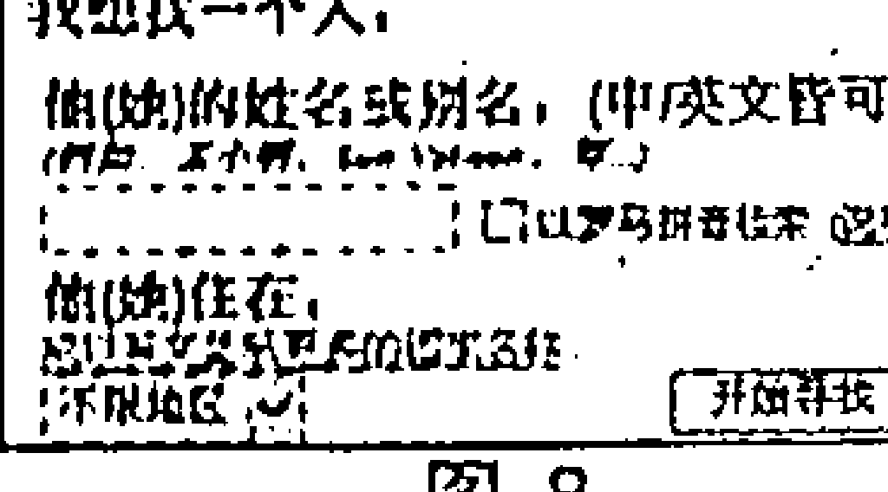

找好友的联系方式是LOOK4U最重要的功能，首先我们登录到LOOK4U的主页上面，使用的时候非常简单，在搜索名称栏里面（如图8）输入好友的姓名，然后在下面的“他（她）住在：”的下拉菜单之中选择相应的地区，比如中国内地、台湾、中国香港等等，如果你不确定你的好友目前住在哪里，那么你可以选择“不限地区”搜索。输入完成之后点击“开始寻找”，很快你就会看到搜索出来的一系列结果了。在搜索结果之中，首先是出现了你要搜索的人名，比如“成龙”。这里要注意的是，LOOK4U的搜索是模糊搜索，也就是说你搜索“成龙”的话有可能把“望子成龙”也搜索出来了。在人名之后跟着的就是英文名字，接着就是E-mail地址和目前的居住地。相信根据中文名和英文常用名，你能够在众多的同名同姓人之中找到自己的朋友。当你要和自己的朋友联系，只要直接点击后面的E-mail地址，即可发送一封E-mail去和他沟通了。

有时候你会发现好朋友的E-mail写着“不公开”，没关系，点击这个链接之后就会弹出一个“请代转信息”的新窗口（如图9），然后我们输入自己的名字，自己的E-mail账号，信件主题以及内容之后点击“发送”，LOOK4U就会替你把信息转发到朋友的信箱里面，让他来和你联系了。

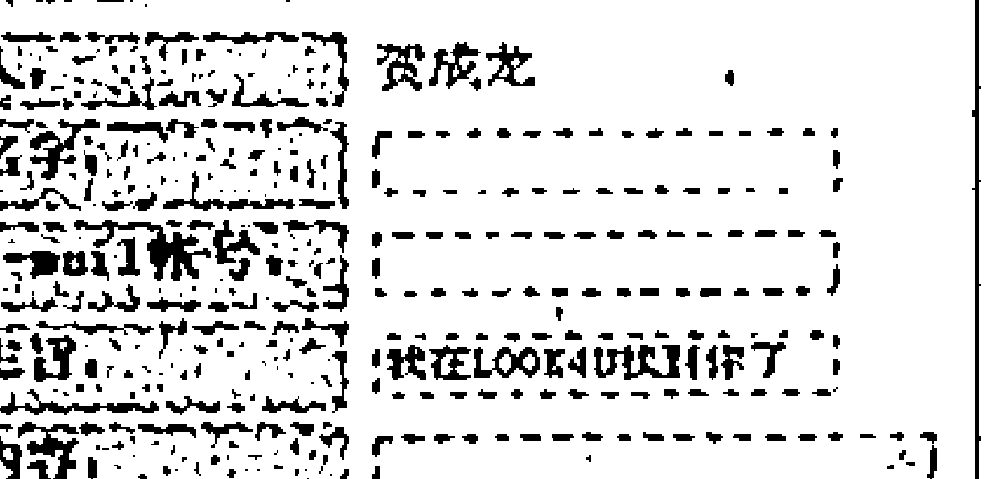

### (2) 我要加入

由于现在LOOK4U越来越热，也许会有朋友要和你联系，但是通过LOOK4U不方便直接找到你，这时我们可以直接把自己的个人资料添加到LOOK4U的数据库里面，你的朋友要找你就很容易。首先登录到LOOK4U页面，点击上面的“我要加入”按钮，第一步要做的就是加入自己常用的E-mail，然后决定一个16位数以内的密码；接下来要做的就是输入自己的真实姓名、英文名字、绰号或小名、居住地区、性别等等；最后点击“确定”即可。以后朋友通过LOOK4U进行搜索，就能够通过你的名字搜索到你的一切公开的个人资料，要找你联系也就易如反掌了。

### (3) 把LOOK4U请到你的网站里

LOOK4U是如此实用，相信很多人现在还不知道，你可以把LOOK4U的搜索功能整合到自己的网站页面之中，这样你的网站也会变成了一个好友搜索引擎，能够搜索到LOOK4U里面所有的好友资料了，方法就是把以下一段代码拷贝到页面的源代码里面：

```
<FORM METHOD="POST" ACTION="http://www.LOOK4U.com/gb/search.asp">
<b>他的名字：（中/英文皆可）</b><br>
<INPUT TYPE=TEXT SIZE=24 NAME="cname"><br>
<b>住在哪里：</b><br>
<SELECT NAME="location" size=1>
<option value="">所有地区
<option value="au">澳大利亚
<option value="ca">加拿大
<option value="cn">中国内地
<option value="hk">香港
<option value="mo">澳门
<option value="my">马来西亚
<option value="ph">菲律宾
<option value="sg">新加坡
<option value="tw">台湾
<option value="us">美国
</SELECT><br>
<INPUT TYPE=SUBMIT VALUE="开始寻找">
</FORM>
```

这样就能够把LOOK4U请到你的网站里面了。

## 搜索引擎使用技巧

真正意义上的搜索引擎指的是网页全文搜索引擎。网页全文搜索引擎具有信息量大、准确性高、功能强、搜寻资料的速度也快等优势，使用全文搜索引擎非常方便，在一般情况下，打开搜索引擎的网页，如http://www.baidu.com，随后在搜索文本框中键入需要搜索的关键词，然后点击“搜索”就行了。当你输入某个关键词搜索的时候，所有含有这个关键词的网页就被找出来，并按一定顺序排列，这是搜索引擎最基本的使用方法。使用这种方法操作简单，当时搜索的结果多，涉及的面广，给用户查找自己需要的结果带来一定的麻烦。

但是为了我们都需要的结果进行准确的搜索，我们还要掌握搜索引擎的使用技巧，这样才能更加精确、快速的搜索到我们需要的结果。

下面我们就一起来看一下，除了一般的搜索功能外，我们再来了解一下搜索引擎的高级功能。

### 1.使用多关键词搜索

当我们搜索信息时，为了搜索的准确，我们可以使用多个关键词进行搜索。这样即能准确地找出想要的结果，也能滤掉一些不必要的垃圾信息。

当我们使用多个关键词进行搜索时，分为连续关键词和间隔关键词，例如我们在搜索“课堂教学活动中的预设和生成”时，当我们输入“教学活动”关键词会搜索到很多教学活动的相关信息，那么如果我们键入课堂教学活动，这样搜索出的结果就只有和课堂有关的教学活动了。如果我们输入的两个关键词不是连续时，这时我们可以键入“预设 生成”，“预设”和“生成”中间应该有一个空格，这样就可以搜索到包含有预设和生成两个关键词的信息。

> 提示：在关键词的前面使用加号（半角），也可以搜索到包含多个关键词的信息。

### 2.使用双引号搜索

给要查询的关键词加上双引号（半角），可以固定搜索关键词，这样可以使查询结果精确匹配，不会演变扩展。例如在搜索引擎的文本框中输入“外设”关键词，它就会搜索到所有含有“电传”这个关键词的网址，而不会搜索“外部设备”之类网页。

### 3.使用减号，筛选必要信息

“-”的作用是为了去除无关的搜索结果，提高搜索结果相关性。有的时候，你在搜索结果中见到一些想要的结果，但也发现很多不相关的搜索结果，这时你可以找出那些不相关结果的特征关键词，把它减掉。

在关键词的前面使用减号，也就意味着在查询结果中不能出现该关键词，例如，在搜索引擎中输入“电脑-系统”，它就表示最后的查询结果中一定不包含“系统”信息。

### 4.使用通配符(*和?)

通配符包括星号（*）和问号（?），前者表示匹配的数量不受限制，后者匹配的字符数要受到限制，主要用在英文搜索引擎中。例如输入“computer*”，就可以找到“computer、computers、computerised、computerized”等单词，而输入“comp?ter”，则只能找到“computer、compater、competer”等单词。

### 5.使用布尔检索

所谓布尔检索，是指通过标准的布尔逻辑关系来表达关键词与关键词之间逻辑关系的一种查询方法，这种查询方法允许我们输入多个关键词，各个关键词之间的关系可以用逻辑关系词来表示。

and，称为逻辑“与”，用and进行连接，表示它所连接的两个词必须同时出现在查询结果中，例如，输入“computer and book”，它要求查询结果中必须同时包含computer和book。

or，称为逻辑“或”，它表示所连接的两个关键词中任意一个出现在查询结果中就可以，例如，输入“computer or book”，就要求查询结果中可以只有computer，或只有book，或同时包含computer和book。

not，称为逻辑“非”，它表示所连接的两个关键词中应从第一个关键词概念中排除第二个关键词，例如输入“automobile not car”，就要求查询的结果中包含automobile（汽车），但同时不能包含car（小汽车）。

near，它表示两个关键词之间的词距不能超过 n 个单词。

在实际的使用过程中，你可以将各种逻辑关系综合运用，灵活搭配，以便进行更加复杂的查询。

## 教你使用“特异功能”搜索

不少朋友都懂得如何使用搜索引擎来查找自己想要的资料，最常用的搜索引擎莫过于Google了。但是如果你以为Google只能简单地搜索你要找的东西那就错了，Google作为当今世上最强的搜索引擎之一，它里面还有很多你意想不到的功能哦！

### 1.搜索引擎当计算器

在日常生活中，我们有许多时候需要运用计算器，虽然说Windows里面有计算器，但是功能相对单一，而且Windows的计算器里面无法进行一些高级的组合运算，也无法进行单位换算。有的时候我们正在上网，突然需要计算的时候，也不方便离开座位去找一个计算器来吧？这个时候我们可以将Google请出来，帮我们轻松进行运算。因为Google本身就是一台包含了高级运算以及高级单位换算的计算机。比如现在我们要计算23乘以49等于多少，我们可以直接在Google的搜索输入栏里面输入“23*49”，开始搜索之后，我们就会看到Google已经给出答案了。Google不但支持英文换算符，连中文也支持，就好像你输入“23×49”，结果是一样的，你甚至可以直接输入“23乘以49”，Google同样可以运算！对于一些复杂的运算，你可以将你想先计算的部分加上括号，比如，(1+2)*3将使加法先算，乘法后算。下面就是Google里面有关运算一些基本符号

| 符号 | 功能 | 示例 |
| :--- | :--- | :--- |
| + | 加 | 3+44 |
| - | 减 | 13-5 |
| * | 乘 | 7*8 |
| / | 除以 | 12/3 |
| ^ | 的…次方 | 8^2 |
| % | 模 (除之后的余数) | 8%7 |
| sqrt | 平方根 | sqrt(9) |
| sin, cos, etc. | 三角函数 (括号中的数字单位为弧度) | sin(pi/3) |
| ln | 以 e 为底的对数 | ln(17) |
| log | 以10为底的对数 | log(1,000) |

想不到Google里面连高等数学的基本运算符号都包括了，相信不少学生朋友一定很高兴。除了计算功能之外，Google还具有非常强大的单位换算功能，比如说你想知道一加仑等于多少升，你可以直接去搜索“1加仑等于多少升”，马上就会得到结果了，或者可以输入“8市两=？磅”这样的方式去进行单位换算。如果想知道美国人关于姚明的高度是怎么换算的，我们可以输入“226厘米等于多少英尺”，你就会看到姚明的实际高度大概是7尺4寸或者7尺5寸(英尺、英寸)了。Google的计算器能识别很多计量单位以及各种物理、数学常数，我们可以在计算表达式中直接使用这些常数，通常这些单位和常数都有简称和英文原称，其强大之处就在于无论你用哪种方式输入它都可以识别。比如物理单位焦耳，它的简称焦，以及英文简称J都能被Google识别出来，或者光速的英文代号“c”等等也可以被正确识别。最后有个地方需要注意，那就是如果你的表达式没有意义的话，Google并不会帮你运算，假如你问“226厘米等于多少公斤”、“1除以0等于多少”，Google是不会理睬的。

### 2.搜索缩略词

有时候我们会碰到一些莫名其妙的缩略词，比如说汽车类型中的MPV，SUV，经常听别人说的MVP等等，我们都是莫名其妙。现在用Google就能够帮助我们了解这些缩略词的全称或者原本的意思。搜索的时候我们用这样的格式：“缩略词 英文缩写”。比如说我们要搜索MVP究竟是什么意思，我们就可以在搜索栏里面输入“MVP 英文缩写”，或者你可以很灵活的使用“什么是MVP”之类的进行搜索，很快你就会看到Google给出的答案了（如图10），你一定会感叹Google真是一本百科全书。

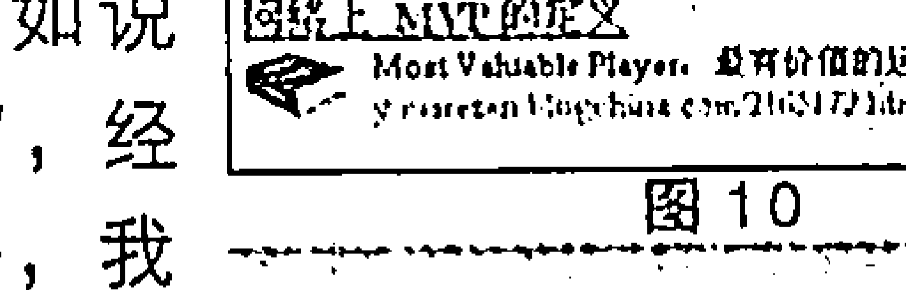

### 3.大小写的“OR”搜索

有一个语法在很多搜索引擎里面都有，那就是“OR”，表示逻辑上“或”的意思，通常用来表明多个不同关键字之间的关系。但是Google的“OR”和别的不一样，比如说你的时候输入“足球 or 中国”，别的搜索引擎搜索出来的不是只有“足球”就是只有“中国”二字，而Google里面偏偏就是反过来，它会列出所有同时带有“足球”和“中国”的网站。但是如果你把“or”变成大写“OR”，这时意思就完全反过来，变成和别的搜索引擎一样，所列出的网站都是只要求包含其中一个关键字就可以了。

### 4.选择服务器进行搜索

众所周知所有的大型网站都是有很多服务器的，Google也不例外，虽然对外只有一个网址，但事实上它有数千台服务器，而且网址也有不同。一般来说我们输入http://www.google.com进入它的首页，其实我们可以输入http://www3.google.com进入，看上去两个网址所显示出来的信息是一样的，事实上www3的服务器里面的中文信息要更新更齐全。那是因为Google众多服务器支持的语种不同，信息的更新、同步时间也不一样，因此不同的服务器之间具有时间差，我们平时可以多尝试几次，相信就可以找到信息更新速度最快的Google服务器了。

### 5.新闻组和目录检索

这两种搜索功能其实在国外非常流行，而国内由于种种原因，新闻组方面的应用一直不是很普及。新闻组的信息量要比我们平时泡的“论坛”、“BBS”大得多，如果我们想要搜索指定的新闻组，只要点击Google搜索页面上的“论坛”标签，然后输入你想要的新闻组内容进行搜索就可以了。另外所谓的“目录检索”事实上就是一些“专题网站”，专门针对一个事物进行讨论和报道。我们可以打开Google的分类目录（http://directory.Google.com/Top/World/Chinese_Simplified/）进行浏览，在里面的分类目录都是经过专人审核、挑选的，严格按照网页的性质进行分类，因此在这里找资料往往比漫无目的地去搜索要准确和快速得多。

### 6.翻译功能

Google里面有将中、英文相互翻译的功能，其实这项服务是由DrEye译典通提供的，它的查询格式为：“fy 中(英) 文单词”。比如你在搜索框里面输入“fy Internet”，很快你就能够看到Internet的中文意思了。同理，你输入“fy 苹果”，也能够得到苹果的英文单词哦。Google的这项服务词汇量非常大，相信有一部分朋友以后都不需要安装专门的词典软件了。

### 7.搜索特定文件

有时候我们需要在网上搜索一些特定的文件，比如说MP3和Flash文件，我们就可以用Google中的“特定文件搜索”功能。比如说我们想要找一段和生日有关的Flash动画，完全可以通过Google搜索出来。搜索的格式就是“filetype：扩展名”，比如“生日 filetype:swf”，swf 就是Flash文件的扩展名了，我们一下子就能够找到很多和“生日”有关的Flash文件。

### 8.天气查询

Google 能够查询全球各大城市以及周边的天气状况，其查询格式为：“tq+ 城市名称”，例如输入“tq 广州”，点击“搜索”按钮之后我们会看到一个“广州天气预报”的连接，只要我们点击这个链接即可看到今后3天之内广州地区的天气状况了。

### 9.查询邮编或长途区号

虽说现在大家都用E-mail了，但是很多情况下我们还是需要到邮局去寄信或者汇款的，相信不少朋友都记得邮局里面那本厚厚的全国邮政编码查询以及长途区号表，可以说看到就头疼了，既然如此，我们不妨在去邮局之前现在Google上面搜索一下。查询邮政编码的格式为“yb 城市名称”，查询长途区号的格式是“qh 城市名称”，有时候我们还可以利用“yb 邮政编码”或者“qh 长途区号”来查询到相应的城市或者地区的名称。

### 10.股票和手机号码地区查询

现在Google 和新浪财经频道合作，让网友可以在搜索引擎上通过搜索股票代码而看到国内股市上的股票信息，格式为“gp 股票名称或代码”，比如输入“gp 宝钢股份”或者“gp 600019”，我们就能够连接到新浪财经频道去看这个股票的详细信息了。此外我们还可以在输入栏里面直接输入一段手机号码，然后在搜索结果之中点击“归属地查询”，这样就能够查询到手机号码是属于哪个省份，哪个地区的了。

### 11.网站内部搜索

现在的网站规模是一个比一个大，结构层层深入，要在一个大型网站里面找到特定的东西真是越来越难了，最突出表现在几大门户网站，如果要你在新浪或者网易里面搜索一个“雷锋”出来，相信你除了借助门户网站自己提供的搜索功能就没有什么办法了。不过那些门户网站内部搜索引擎的功能相对简单，万一你搜索的关键词很常见，恐怕出来的结果就会很多了。这时我们可以请出 Google 来帮忙，使用它的“指定网域搜索”功能，也就是说你在输入了一连串关键词之后，可以在后面添加一条命令，让Google 到你指定的网站去搜索相应的关键词，而不会到别的地方去搜索，使用的格式如下：
"备忘"+"办公"+"软件" site:www.newhua.com
记住关键词和“site”之间要空格，输入这条命令之后按回车或者点击搜索按钮，Google 就会自动到华军软件园上面去搜索和你输入的关键词相符合的软件了，以后就不用在华军软件园里面乱摸。
同理，我们输入：
"歌星"+"刘德华" site:www.sina.com.cn
输入完毕之后进行搜索，Google 同样也会到新浪里面去搜索关于歌星刘德华的相关文章了。

## 把Google整合到IE里面

在网上有不少技巧文章都介绍如何把IE的默认搜索引擎修改成为Google，那些技巧通常都要自己打开“注册表编辑器”，然后一个一个修改主键、修改键值，这样做起来太麻烦了，而且你在别的机器上同样也要重复一遍。其实有一个很简单的方法，让我们可以在几秒钟的时间里面把Google 整合到IE 里面。方法就是先打开一个IE 新窗口，然后输入网址“http://www.google.com/google.reg”并按回车，这时IE 就会弹出一个提示信息，让你确定是下载还是运行这个文件，我们选择“下载”。下载完成之后打开这个文件，系统会提示你是否将注册表里面的信息导入注册表，选择“是”再点击“确定”。一切完成之后关闭IE 再打开，点击“搜索”按钮看看，你就会发现IE 的默认搜索引擎已经变成Google的了。有时候输入上面的网址不会弹出下载文件提示，而是直接打开Google.reg 文件，这时我们可以关闭IE窗口之后再重新打开这个网址，通常就没问题了。如果你想恢复IE 原来默认的搜索引擎，只需在IE 址栏输入：“http://www.google.com/default.reg”，下载Default.reg，然后将其导入注册表即可。

## 使用超视觉搜索引擎

平时我们用惯了文字单纯排列形式的搜索引擎，可以说看得太多了，而采用图形方式，而且充满“科幻”感觉相信大多数人都没有见过，它就是myGrokker搜索引擎。myGrokker 既是一款搜索软件（http://www.groxis.com/download/grokinst.exe ），又是一个提供在线服务的搜索引擎网站（http://www.grokker.com/）。下面我们就从它的网站入手，介绍一下如何使用这个超视觉搜索引擎。

### 1.弄懂“超视觉”

打开 http://www.grokker.com/ 之后，我们会发现这是一个英文网站，不过不用担心，myGrokker 完全支持中文信息的搜索。我们可以在搜索栏里面输入“新浪”，然后点击“Grok”图标，很快我们就看到一个“莫名其妙”的搜索结果了。这个看上去就好像一个老式电话转盘的东西实际上就是一个“信息分类”框，这就是Grokker和其他搜索引擎的不同之处，它会将搜索到的结果自动归类，并以图形、图层的形式显示。我们所看到的一个大圆圈就是我们输入新浪之后所找到的信息的总集合，而大圆圈里面每一个小圆圈都是一堆信息的分类，小圆圈里面还有更小的圆圈，一层套一层。比如新浪的大圆圈里面包括了九个小圆圈，从大到小代表了这些信息集合里面的信息量大小。

### 2.浏览“超视觉”搜索引擎

如果我们觉得圆形的外观不直观，可以点击最下方的“Show Tools”，然后将右下角的“Layer Out”模式从圆形改成正方形。当我们要浏览相应信息的时候，可以点击进一个大圆圈或者方框里面。最后点击了最后一层的圆圈或者方框之后，我们就会看到搜索引擎右侧的页面出现了一条带描述的网站连接，这就是你所点击的那个方框的链接了，此时我们可以直接点击这段链接来打开相应页面观看。而当我们把鼠标停留在一个圆圈或者方框上方一会，搜索引擎就会自动弹出一段简介，非常直观。

### 3. 切换搜索引擎

myGrokker的界面虽然做得非常好，分类功能也很不错，但是在信息量方面就远不如Yahoo和Google这些大型的搜索引擎了，如果我们是下载myGrokker搜索软件的话，则可以将搜索引擎和Google结合，在搜索栏旁边的下拉菜单里面选择“Google”，这样信息量就大增了（如图11）。

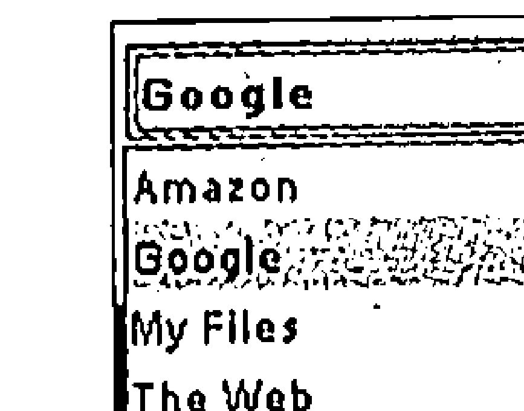

### 4. 自创分类

如果你觉得myGrokker给你的分类不合实际情况，你也可以自己创建一个搜索分类。方法就是在当前图形的空白区域点击鼠标右键，然后选择“Create”，或者在空白区域双击鼠标左键，接着将搜索出来的，需要重新归类的信息用鼠标拖动过去就可以了。

### 5. 页面内搜索

有时候如果搜索出来的信息太多，我们一时之间无法找到自己真正想要的资料，就可以在搜索页面下方的“Find Within The Map”，只要在下面输入关键词，搜索引擎立刻就会帮你定位到当前搜索出来的结果页面之中包含有关键词的那个图形上面。

myGrokker可以说是一种全新的搜索概念，开始使用起来的时候非常不习惯，毕竟我们已经习惯了Google，Yahoo，Baidu这些搜索引擎的样式，不过相信当myGrokker的信息量和软件易用性有了相应的提高之后，这种超视觉引擎一定会流行起来。

## BT种子自己找

BT是目前网络上最流行的下载方式，无论老手还是新手，都对BT情有独钟，但是BT的资源可不是那么容易就找到的，通常大家都会在一些著名的BT资源站点出没。虽然集中有集中的好处，但是也限制了BT资源的丰富性，很多时候这些大型资源站点里面并没有我们需要的BT资源，这个时候我们就可以用BT搜索引擎来帮我们了！BT搜索引擎是最近才兴起的，它不但具有类似Google的强大搜索功能，而且可以直接对BT种子进行搜索，让你直接下载。

在众多BT搜索引擎里面，BT特工（http://bt.igdbol.com/）和哎哟搜索（http://www.ioou.com/）是比较热门的两个。首先我们先打开BT特工的页面，感觉是特别清爽，除了简单图标和搜索输入栏之外几乎什么也没有，不过页面简单并不意味着功能也简单，我们可以在输入栏里面输入“神话”之后按回车，很快我们就会看到很多的搜索结果了！（如图12）

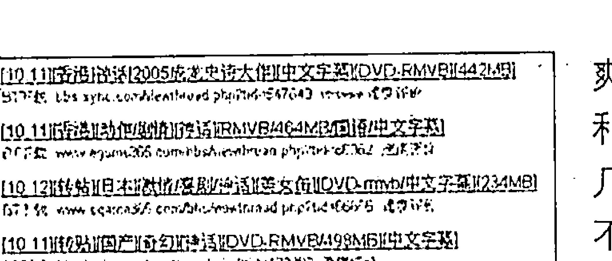

我们可以看到搜索出来的结果开头通常都标注了日期，然后就是文件名和文件的大小，比如“[10.11][香港]神话[2005 成龙史诗大作][中文字幕][DVD-RMVB][442MB]”，这是为什么呢？原来这就是BT特工的特点，它会自动跑到网上各大热门论坛去进行搜索，同时将相关的，带有BT种子的帖子搜索出来。要知道在论坛里面都有大同小异的行规，那就是发布BT资源的时候必须附上日期、资源名称以及资源的容量。BT特工将这些帖子都搜索出来之后，就会将这些帖子的名称以及帖子的连接显示出来，我们可以直接点击帖子的名称或者连接，这样我们就可以直接登录到这些论坛上面，找到可供下载的种子之后就开始下载了！在BT特工里面也是支持条件搜索和一些高级搜索的，你可以输入：

射雕英雄传 +86版

这样搜索出来的就是香港TVB的版本而不是中央电视台拍摄的那部电视连续剧了，这里要提醒大家的是BT特工这类搜索引擎不支持Google那样的英文半角双引号哦！因此搜索的时候要注意了。

BT特工可以搜索出数量庞大的BT资源，而且速度真的很快，不过它有一个缺点，那就是不能直接显示BT种子的链接，只是显示出了包含了BT种子的网页而已，这就需要我们还要点击到页面之内进去找。虽说通常直接就找到了，但是这中间多了一个步骤的话就显得非常不方便，这时候我们可以使用更直接和专业的BT种子搜索引擎：哎哟搜索（http://www.ioou.com/）。虽然哎哟搜索的搜索速度以及资源量比不上BT特工，但是哎哟搜索能够直接搜索到.torrent种子文件，也就是说你不需要到网页或者论坛里面寻找，只要点击一下搜索结果，BT软件就可以直接跳出来开始下载了。

在搜索的时候，首先我们打开哎哟搜索的页面，然后在搜索输入栏里面输入我们想要找的资源名称，比如“神话”，耐心等待一会就会看到搜索的结果了。现在我们直接点击搜索出来的链接，系统就会弹出一个窗口，询问我们将下载回来的种子文件保存到哪里。如果你已经安装了比如“比特精灵”这一类BT下载软件的话，它们就会自动跑出来帮你进行下载了！

不同的BT搜索引擎有各自的特点，BT特工的特点就是你可以在搜索引擎里面直接查到该资源的下载速度，也可以亲自参与评价，而哎哟搜索的特点就是有下载资源的“新鲜度”显示，因为BT是越多人下载速度越快的，因此新鲜度高的资源，自然也就意味着多人去下载了，这样才可以保证你的下载速度哦！

## 搜索 MP3 和歌词

很多人都喜欢听 MP3 音乐，有时候通过搜索引擎搜索音乐资源虽然可行，比如说 Google，但是由于它不是专业的音乐搜索引擎，通常你将资源搜索出来之后还要经过层层点击之后才会找到，而且还不一定可以成功下载！这时候我们需要的就是一个专业的音乐搜索引擎，那就是 www.sogua.com 了。进入 www.sogua.com 之后，比如说现在我们要下载刘若英在“天下无贼”里面演唱的主题曲“知道不知道”。

### 1. 基本搜索

首先我们在搜索输入栏上面确保我们搜索的类型是“音乐”，接着在搜索输入栏里面输入“知道不知道”，直接按回车，或者是点击“搜索”按钮，就可以看到一大堆的搜索结果出来了，不过里面有很多歌曲并不是刘若英唱的，而且也不一定是我们想要的 MP3 格式，这时候我们就要进行第二步搜索。

### 2. 过滤搜索的文件类型

在搜索结果页的上方，我们可以看到一个搜索输入栏，而就在搜索输入栏的下面有一连串的文件格式让你选择，比如说你想下载 MP3 的音乐，那么就将 MP3 前面的方框选择上，如果你想下载 MP3 或者 WMA 的，那么就可以把这两种文件格式前面的方框都选择上，选择完毕之后继续点击“搜索”，你就会发现返回的结果只剩下 MP3（或者 WMA）的了，这时我们继续进行第三步的搜索。

### 3. 过滤歌曲名称

由于搜索引擎的技术问题，很多出来的结果都不是我们想要的，比如什么“不要说你不知道 古巨基”这些只包含一个“知道”的词在内的歌曲都被搜索出来了。为了能够过滤掉这些错误的结果，我们可以将歌手名字加入到搜索条件里面，这时我们要在输入栏里面输入：知道不知道 + 刘若英

这样返回的结果就基本正确，只剩下刘若英演唱的歌曲了。

### 4. 开始下载

终于到了最后一步了，首先我们要看看搜索结果里面提供每个文件的体积、格式，下载方式以及一个百分比数字，那个百分比数字是什么呢？那是下载成功率。成功率越高就代表资源越容易下载了。此外对于文件的体积我们要特别注意，一般来说一首 MP3 的大小也就 4 MB ~ 10 MB 之间，如果你的文件体积特别大就有可能是假的，如果文件体积特别小，比如才 0.8 MB，那么要不这个文件不是真正的 MP3 格式，要不就是音质特别差。最后我们选择连通率在 40% 以上，体积 4 MB ~ 5 MB 左右的文件就是最保险的了。

选择了你要下载的链接之后就用鼠标去点击，此时又会弹出一个新窗口，这里你可以直接看到这个音乐文件的路径，此时只要你点击这个连接，IE 就会开始帮你下载这个文件了。但是有时候 IE 并不会立刻下载，反倒是 Media Player 弹出来要播放这个文件怎么办？很简单，只要在文件下载链接上面点击鼠标右键，然后在弹出菜单里面选择“目标另存为”，然后 IE 就会弹出一个窗口来询问你将文件保存到哪里，选好地方之后点击确定就开始下载了。有时候因为连通率的问题，IE 无法下载的话，你就会看到错误提示，这时我们就只有选择别的下载链接了。

除了下载音乐之外，sogua 还可以帮我们搜索歌词，方便那些喜欢唱歌的朋友，这下你不但可以下载到音乐，更加可以一边听着音乐，一边跟着唱了！相信很多朋友都留意到了在 MP3 搜索结果的后面有一个小小的绿色书本状的图标，这个小图标就是帮你搜索和歌曲名一致的歌词的。不过如果搜索不到也不用担心，我们可以回到 sogua 的主页，在输入栏的上方将搜索类型改为“歌词”，接着再输入：知道不知道 + 刘若英

你就会看到一堆歌词已经被搜索出来了。点击“显示”歌词的按钮，我们就会看到相应的歌词了。

## Word Redaction 文档加密出奇制胜

对通篇文档进行加密，仅仅对文档的部分敏感内容进行加密。这可难办了，一般的加密工具只适合通篇“封闭”，根本无计可施。

最快方法：微软最新出品的一款 Word 专用插件工具——Word Redaction，可以随意把隐私部分“涂黑”。首先，关闭 Word 安装程序，装好后，软件主窗口便多出一个 Redaction 工具栏。好了，开始加密。选择文档中需要加密的敏感信息，点击 Redaction 工具栏中的“Mark”按钮对其进行标记，被标记的部分显示为灰色的底纹。用户可随时使用“Remove Mark”移除所有文档中的标记；也可以使用“Show/Hide Mark”按钮来显示/隐藏标记。下一步，点击工具栏中的“Redact Document”按钮，确定加密文档标记为“只读”还是“编辑”属性，Word 就生成了一个以“文档 X”命名的新加密文档。据悉，该软件在不久前与“李开复”的官司中已经小试身手，微软向法院递交的 Word 文档证据中，除了“MSN”、“Longhorn”、“Google”之外，其他都被进行了“涂黑”处理。既可以让对方了解文档的大意，又避免了泄露相关机密。

## 2005热门网络技术大点兵

文口彭文波

在悄悄逝去的2005年中，在网络应用软件升级的进行曲中，不少实用而新颖的技术也给看似平淡的网络注入了新的活力。博客正成为和新闻、邮件、论坛等并列的主流互联网业务，Google、百度等搜索引擎推出了具有海量特征的“聚合新闻”服务。与此同时，搜索技术、浏览器技术、即时通讯技术以及网络安全技术也给人耳目一新的感觉。2005年，正带给我们无数的惊喜。

## 阅读新方式：走进 RSS 时代

RSS 伴随着浏览器、搜索技术悄悄地走进了我们的网络生活。RSS的英文全称是 Really Simple Syndication，意思是“真正简单的整合”。作为一种先进的阅读方式，RSS的出现解决了IE的“窗口堆积”和标签式浏览器的“标签拥挤”问题。通过RSS阅读器软件，新闻网站上最新文章的标题和摘要会显示出来，这一功能被称为 RSS Feed。RSS Feed实质是一个XML格式的文件，用户通过订阅各种各样的RSS Feed，了解相关标题和摘要后，就可以点击相关链接进行详细阅读。

为了下载和阅读 RSS“推”来的内容，用户需要一个叫“RSS阅读器”（也叫“新闻阅读器”或“新闻聚合器”）的本地软件。它可以帮助用户完成诸如配置、更新、管理等操作。在阅读器的界面上，用户可以很方便快捷地浏览他所订阅的所有信息源的最新内容。这些内容可以按用户定义以时间、出处或关键字排序。另外，很多新生的互联网浏览器也将 RSS“推”技术嵌入了其源代码中。现在，网络上的英文RSS阅读器很多，比较知名的有“看天下”RSS阅读器，网站地址为 http://www.kantianxia.com。阅读器窗口分为3个主要部分，分别是左侧的RSS站点管理器、内容管理器、右上的文章标题列表、右下的内容阅读区。RSS阅读的优势还体现在目标信息源的地址只需在配置中输入一次即可，而毋须像访问网页一样每次必须输入。软件界面如图1所示。

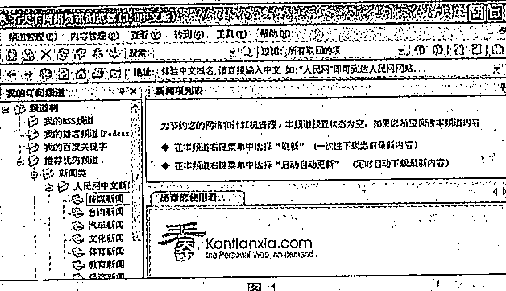

下面，我们来看看这些软件的常用操作方法。

第一步，查找RSS地址。通过频道管理，可以将网络上各个站点提供的RSS服务添加到浏览器。一般来说，支持RSS的网站都会有一些橘黄色标有“XML”或“RSS”的方块，点击方块即可打开它们对应的RSS地址。比如，在新华网RSS服务页面为 http://www.xinhuanet.com/rss.htm，打开即可看到很多RSS Feed。

第二步，添加RSS频道。比如，在“看天下新闻资讯阅读器”中，单击“频道管理”菜单下的“新建”选项，打开“频道”项，或者直接按快捷键F8，启动添加频道向导。选择“从一个指定的频道URL中获取频道源”。在向导中，输入定制的RSS网络URL地址。该步骤还有用户验证、频道资源验证等。其中启动自动发现引擎的含义是：如果输入一个普通的html网页地址，程序会启动RSS自动搜索引擎，将该网页上包含的所有RSS Feed取出。这样，浏览器对RSS站点内容自动更新并下载到本地，供用户在任意时刻查看浏览这些内容。

第三步，内容管理。如果长时间使用RSS阅读器后，就会把信息下载到本地硬盘上，所以对这些信息进行管理显得尤为重要。如果想查看以前的某类资讯，就要用到搜索功能。许多RSS阅读器都提供了类似的搜索功能。新闻链接的管理也是十分重要的问题，在重装系统或与他人共享RSS新闻链接时，最好把收集的所有新闻链接导出来做备份，然后再对其进行导入操作。

此外，还有一些其他的RSS浏览器，简单介绍如下：

周博通。周博通是目前最为流行免费的RSS阅读器之一，软件下载地址为：http://home.hnwh.com/。其界面友好，“分类清晰、操作简单”，软件提供了强大的新闻链接管理功能，同时内置大量的实用RSS新闻链接，方便阅读。同时软件占用资源小，运行稳定，兼容性强，可以方便地导入与导出新闻链接进行共享。

FeedDemon。FeedDemon是国外最流行的RSS阅读器之一，软件下载地址为：http://www.skycn.com/soft/13724.html。对于初次使用RSS的新手来说，这是一款不错的入门级RSS阅读器，该软件有多个版本。由于是国外软件，所以Feed Demon内置的RSS新闻链接作用不大，同时其分类方式也不习惯使用，但资源占用量很小。

新浪点点通阅读器。这是为新浪网“点点通”量身打造的一款RSS阅读器，通过它可以获取、阅读、管理XML信息，它虽然个头小巧但功能强大，由于是新浪官方开发的一款软件，所以其中内置了新浪所有的RSS频道。

## PART 2 热门冲浪技术大盘点

这是所有桌面搜索软件的特点。进行搜索设置是很重要的一个环节。网页中一切可让搜索引擎抓取的文本中都尽量带有关键词。软件的搜索范围是可以选择的。在属性设置页中，它提供了电子邮件、Word和Excel文档、PDF文档、AOL聊天记录、网页历史浏览记录等8种类型供用户勾选。如图2所示。

## 搜索新天地：各类搜索引擎

随着网络的普及，搜索引擎的商业价值开始得到人们的广泛认可，现在，各种各样的桌面搜索工具成为一道新的风景线。2005年以来，搜索软件层出不穷，以搜索技术为中心，出现了很多各具特色的功能软件和最新技术。

第二步，搜索多种类型的软件。Google Desktop Search可以保存文档的多个版本。从用户安装搜索工具的那一刻起，软件对某一个文档的多次修改都会被记录下来。其中，一个比较有特色的一个功能是Word文档搜索。我们还注意到，软件可以展示缓存中网页的快照。

### 1. 桌面搜索工具

桌面搜索工具是通过预先建立索引表，再加载桌面搜索工具后，用户就可以使用浏览器来搜索本地计算机中的内容了。从这个定义中，用户可以轻松了解到桌面搜索的三个典型步骤。在数据储存量越来越大的今天，桌面搜索工具带给我们的好处是：任何人都可以在极短的时间内，从自己的电脑数据中找到所需要的东西；甚至还可以对本地邮件系统、即时通讯等组件中的内容进行检索。对于桌面搜索工具的发展，我们可以从这些软件建立索引的速度、硬盘开销、安全隐私保护、搜索的范围和精确度、汉字支持的程度等方面进行一些技术上的分析。

总的来说，Google Desktop Search的搜索功能强大，搜索速度也非常快，这源自其建立索引的速度。不过，我们也注意到，Google Desktop Search不能手动增加搜索目的，而且它的安全漏洞也一直受到质疑，使用的过程中，我们一定要做好相关安全设置，特别是本地文件的安全防护。

#### （1）Google Desktop Search

Google Desktop Search是Google推出的一款免费的本地搜索软件。依托Google强大的搜索技术，Google Desktop Search不但可以闪电般的速度找出硬盘上的文件，而且能够搜索出所有包含关键字的Outlook邮件、历史浏览网页、Word文档、文本文件。速度快、中英文资料查找比较方便是它的典型特点。软件下载地址为：http://google.tohot.com/desktop/download，此外，我们也可以到天空软件下载，地址为：http://www3.skycn.com/soft/21438.html。

#### （2）百度硬盘搜索

百度硬盘搜索是一款搜索硬盘资料的软件，从界面和功能来看，百度硬盘搜索的全中文界面简单实用，软件的搜索速度和准确度也令人满意，并且对中英文的支持都很优秀。最明显的特点是全面支持中文分词，能够快速、准确地帮助用户从个人电脑中查找到想要的信息，相对其他国外软件具有很大的优势。另外一个特点是，该软件提供密码保护，可以妥善维护用户隐私。软件在安全方面的表现比较出色，可以有效保护用户的私人信息。不过，其索引速度还有待提高，对文件格式的支持都还有待增加。

第一步，建立索引。软件安装后，点击软件图标，在搜索界面的下方，可以看到几排黄色的字体：“一次性索引编制，正在进行”。这说明，当软件刚安装完成时，必须建立文件索引才能发挥出桌面搜索软件的惊人的搜索速度。打开任务管理器，我们可以发现几个以“Google”开头的进程，为了提高索引效率，该进程会随搜索程序启动，在进行索引建立过程中占据大量的CPU使用率。不过，刚安装后还不能立刻进行搜索，

#### （3）Yahoo! Desktop Search

Yahoo! Desktop Search可以搜索电脑内的任何文件，支持E-mail、Word、Excel、PowerPoint、PDF、Music、Internet Explorer、Text、Images等200多种格式。软件下载地址为：http://desktop.yahoo.com/ 或者http://www.skycn.com/soft/21665.html。

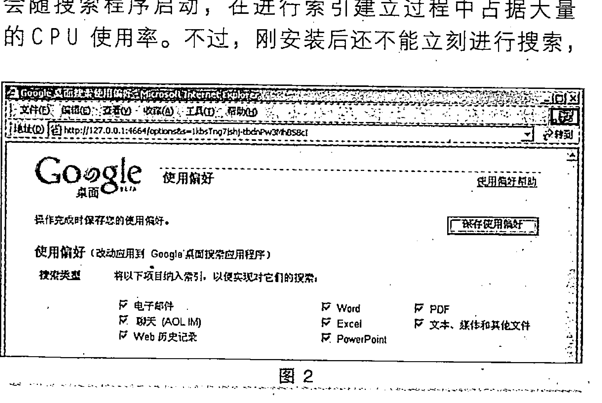

总的来说，Yahoo! Desktop Search拥有丰富实用的界面设计，具有可定制界面的查看方式；软件搜索结果可以保存；针对一些特定的搜索信息也可以很方便地查找到，而且运行比较稳定，对于英文比较熟练的用户来说是一款不错的选择。但是 Yahoo! Desktop Search 对中文支持不是很理想，如果IE不是默认浏览器的话，无法正常进行搜索。

除了上述搜索工具以外，还有不少优秀的桌面搜索工具，如微软桌面搜索工具、中搜网络猪、88data本地搜索、Ava Find等，设计思路也有很多创新的地方，这表明搜索技术也正在逐步走向成熟。

### 2. 电子“地球仪”：Google Earth

如果把搜索技术应用到我们的日常网络生活，会是什么效果呢？最近，Google涉足网络旅游领域，发发布了Google Earth这款新服务软件。借助Google Earth，用户可以在一幅3D地图上放大目的地或获得驾车指南，可以在3D地图上搜索特定区域，放大缩小虚拟图片，然后形成行车指南。就像我们使用地球仪的时候，如果要找某个地方，我们会转动地球仪直到我们找到要找的地方。软件下载地址为：http://www.skycn.com/soft/23250.html。

第一步，定点查看。在Google Earth软件中最上面的一排是常用的菜单，Places选项中存有系统自带的几个位置。当然，软件最基本的功能就是对某个地方实现定点的查看。将地球定位到北半球的亚洲，用鼠标将地球拉近，Beijing的红色字样清晰可见，这样我们就知道北京的方位了。除了北京，附近其他的大城市也有注明，如Tianjin（天津）、Shenyang（沈阳）等。也可以直接搜索“beijing”，单击“Search”按钮，就可以看到北京的相关地理位置了。从图片效果来看，不论从大小、比例和周围的3D细节，其仿真效果非常出色。双击需要了解的地方，就可以了解详细的信息了。如图3所示。

第二步：查看交通。Google Earth的图像均由卫星拍照传来，它可以将城市里的每一个街道、楼房都能描绘出来，包括路线。所以只要能识别周围比较特别的建筑物，那就可以很轻松地找到。如果要查找某个主要路线，将左下角的roads等选项勾上后，在图上就可以很清楚地标明相关位置。在旅游途中饿了或者口渴时，只需要把对应的Dining（饭馆）和Coffee House（咖啡馆）勾上就可以了。由此，可以看到网络技术带给我们的未来生活方式。该数据库含有美国宇航局提供的大量地形数据，未来还将覆盖更多的地形，涉及田园、荒地等，这些将使用户能够更深入地得到相关地理信息，掌握第一手资料。

## 即时交流新突破：QQ2005、MSN

在广大用户的热切企盼下，QQ2005 Beta3全新面世，这个版本加入了不少人性化的即时通信技术，并融入了腾讯公司一些新的理念：一切以用户价值为依归，以用户体验为中心，提供最尊重用户的贴心服务。与此同时，微软的MSN Messenger也发布了最新的版本，相对其他版本而言，软件在布局上作了较大的调整，整个登录界面的选项也多了很多。综合这两个典型的软件，我们来看看2005年新即时通信技术给我们带来了哪些好处。

### 1. QQ2005 Beta3

总的来说，QQ2005软件越来越注重人性化的设计。

- （1）更加简化的面板和便捷的管理
现在，很多软件产品体积越来越大，用户苦不堪言。出于对用户需求的重视，QQ2005 Beta3达到全面瘦身，大幅度减小了自身体积，以更轻盈的体态提供更丰富的服务。优化的界面管理器可以让用户方便地自定义设置面板、QQ音乐和QQ搜索插件。另外，主面板的音乐、搜索插件、通讯录、最近联系人等Folder也可以便捷地隐藏，使主面板更加清爽简洁，并增加了综合服务面板，使用户更方便地管理和使用各项精彩服务。

- （2）地理位置共享
选用“共享地理位置和天气预报”功能，用户可以与好友共享彼此的地理位置和天气信息。无论天南地北、春夏秋冬，朋友冷暖先知。出于保护隐私的需要，用户也可以轻松地选择是否公开自己的地理信息。

- （3）更大更清晰的超级视频
视频具有实时标识的网络状态，更易用的视频设置和拍照功能，并为网络和机器配置较差的用户提供了视频普通模式，达到了图像流畅度和清晰度的最佳平衡。无需更换特殊的摄像头配置，清晰流畅的超级视频会为您带来更超级的享受。

- （4）QQ直播
通过对等网技术，QQ2005 Beta3具备了很高的视频播放质量。可以确保在大量用户同时观看节目的情况下，节目依然流畅清晰。当前QQ直播提供的视频服务，主要集中在体育节目直播、娱乐节目转播、嘉宾访谈、明星采访等。另外，QQ2005 Beta3支持音乐状态的实时展示，实时展现音乐心情。

- （5）全新的小秘书界面和功能
QQ2005 Beta3优化了小秘书功能，用户可以轻松查看订阅、留言，还可以方便地查看近期天气预报。忙碌时，可以设置成小秘书代答的免打扰状态。既不会被消息骚扰也不会丢失重要的消息，待到闲时再在小秘书留言中查看，非常便捷实用。

- （6）网络安全进一步加强
QQ总是伴随着很多安全问题，比如QQ密码被盗、被恶意链接骚扰、感染QQ尾巴病毒，让用户头疼不已。为了解决这些问题，QQ2005 Beta3新增了键盘加密保护、链接安全防护、文件传输安全保护三大全新安全体验，结合QQ安全中心站点，可以给用户提供一种全新的安全保护模式。

另外，QQ2005 Beta3简化了添加好友的流程，可以轻轻松松加入好友。软件还增加了好友个性签名Tips，可以很容易地看到好友的完整签名。同时，软件针对校园网的具体情况进行了优化设计，使校园网内的QQ用户享受更加顺畅的沟通。

### 2. MSN Messenger

通过短信建立IM软件和移动终端间的通讯，是众多手机终端的用户一种乐于接受的沟通方式。2005年，我们看到了MSN Messenger 7.5这个版本。登录后，会发现在用户列表的顶端增加了一个添加联系人的按钮。点击此按钮后惊喜地发现，可以通过手机号码来添加联系人了。不难看出，用MSN Messenger 7.5所能提供的交流体验，已经越来越注重用户需求的多样性。

聊天窗口也有了一些变化，主要体现在对更多动态元素的支持。更多的动态元素，让用户之间的交流过程不会过于死板枯燥。用户之间分享这些动态元素的行为也增加了MSN Messenger 7.5所承担的交流功能以外的娱乐性。如图4所示。

除了7.0版本当中已经出现的动态头像，MSN Messenger 7.5版本的聊天窗口开始加入对动态聊天背景的支持。如果系统中安装了MSN Search Toolbar，可以通过聊天窗口中的“Search”按钮搜索输入框中的当前内容，并把搜索结果在聊天窗口中反馈出来。另一个直观的变化是新加入的大头像，登录的窗口也增加了几个预设的选项，方便用户以后的登录操作。

通过上述聊天软件的综合分析，我们可以感觉到即时通讯软件的一些更加体贴人、关心人的变化，充分体现了以人为本的设计思想。同时，我们也注意到，在软件原有功能继续加强的同时，动态娱乐的元素不断增加，用户之间的交流也不用仅仅局限于平淡的文字界面，表情、头像、场景的丰富对交流体验起到了一定的改善，时尚前卫的用户也许会对这些娱乐功能感到欣喜。

## 网页浏览器新动向

浏览器之争已经进入了“战国时代”；在Windows操作系统下，IE就像强大的秦国，但Firefox、opera、Netscape等非IE内核浏览器的力量决不能小视，它们都在逐渐蚕食IE的市场。

### 1. IE7 Beta1

微软的新产品的测试总是引来大众关注的目光，在遮遮掩掩中，我们看到了IE 7.0的第一个版本。安装后，视觉上最大的变化是在IE 7 Beta1中，标签位于地址栏的下方，通过标签的右键菜单可以完成标签的新建。在标签栏的空白处，双击即可新建标签，单击所有标签右侧的一个小空白标签也可以新建标签。界面如图5所示。

在微软固执与不固执的态度中，IE7或许代表了一个浏览器的技术方向。下面，我们来看看IE 7使用了哪些最新的网络技术。

- （1）标签浏览功能
在其他主流浏览器中，这项功能其实早已具备，为了迎合大众口味，微软也拉下面子，提供了此功能。但是，IE 7 Beta1细节上的设计还有待提高，比如，目前无法实现在标签之间切换、双击关闭当前标签、标签移动等操作。

- （2）安全功能进一步增强
特别是针对比较热门的钓鱼式攻击提供了防范措施。由于IE7本身默认没有开启反钓鱼功能，可以单击“Tools（工具）”菜单下的“Phishing Filter（过滤钓鱼式攻击）”，在弹出的下拉菜单中，选择“Turn On（或Off）Automatic Checking（开启或关闭自动检查）”，就可以开启这个功能了。如果要进行设置，可以单击“Phishing Filter Settings（钓鱼式攻击过滤设置）”。开启了反钓鱼功能后，在浏览网页时，在IE状态栏上将会有一个蓝色的小盾牌样式的图标，如果是恶意的钓鱼网站，IE将会给出警告。另外，还可以通过“Report The Website（报告这个站点）”选项来举报钓鱼网站。采用这种群策群力对抗系统威胁的方式，就可以使遭受攻击的可能性大大降低。

- （3）RSS聚合
技术融合的趋势也反映在浏览器上，自然，微软在这方面的技术实力不容置疑，因为RSS遵守的是XML页面标准。在IE 7中阅读RSS信息与浏览Web页面的体验并无两样。在浏览Web页面时，如果发现页面上的RSS Feed地址，工具栏按钮即会呈红色显示，提示用户发现地址。直接点击按钮，便会在当前标签中打开XML页面，就像打开平常的HTML页面一样，无需解决调整用户阅读习惯的问题。

- （4）更贴心的下载文件管理器
使用过IE下载文件的朋友都知道，其下载管理功能单一，且只能单线下载。微软终于在新IE中对下载管理进行大刀阔斧的改进，新的下载文件管理器功能很强大，可以设置该下载任务的下载级别：高速、后台运行、暂时挂起，在下载完成时还可以马上进行刻录。

- （5）插件管理
使用IE浏览一些网站时，可能会安装一些插件，比如Shockwave player和QuickTime，新增的插件管理器就是针对这些插件而设计的，有了它，你就可以方便地管理已经安装的插件。

### 2. Firefox 1.07

现在，Firefox炒得越来越火热，许多人都预测Firefox已经开始慢慢瓜分IE的市场，并且将最终代替IE，成为世界上使用者最多的浏览器。当然，名气不是吹出来的，Firefox是Mozilla开发组的新作，是一个十分干净、完整的浏览器。
可以看到，Firefox界面十分清爽，在对RSS功能的支持上，Firefox也可以很方便地把网络上的RSS源加为书签，收藏以后，每次启动Firefox时都会自动载入RSS源的最近更新，把鼠标放上去就可以显示最近文章的标题；自己可以先选择文章标题查看。在安全方面，Firefox提供了两种打开模式，其中一种就是安全模式；软件支持对插件进行数字签名；具有阻挡弹出式窗口的特点，在阻止一个弹出式窗口后，它会在小型状态条中提供反馈信息，同时它能迅速解除对一个弹出式窗口的阻挡。另外，根据Mozilla Firefox设计路线图，新版本的Firefox 2.0还将对下载管理系统进行大幅度改进，主要更新包括下载队列（设定每个站点／所有站点最大下载连接）以及断点续传功能。

### 3. 其他浏览器

现在，浏览器市场各路诸侯纷纷出马，用户也有了很大的选择余地。下面来看看其他几款最新的浏览器。
首先是Netscape 8。曾经辉煌，曾经暗淡，然而，随着Netscape 8 beta的发布，王者回来了。软件安装完成后，首先映入眼帘是其整洁而时髦的用户界面。它除了带给用户每一个浏览器所必要的元素外，还提供了许多额外的设置选项，从页面历史到搜索历史，都支持个性化设置，特别是隐私设置，如在退出浏览器前可以删除所有浏览记录。Netscape 8出色之处还有通行证管理系统、反间谍软件、反钓鱼攻击功能等。此外，它可以同时运行在Gecko引擎和IE引擎上，当用户即将登录一个Netscape 8认为是“高危”（high-risk）或潜在危险的网站时，它会选择使用Gecko引擎；相反，如果登录的网站经核实是安全的，Netscape 8才使用IE引擎。
其次是来自挪威的Opera，这是一款老牌浏览器，一向以打开页面速度快而见长。新版的Opera 8则提供了一个干净、简洁的默认浏览界面，在安装后只显示很少的工具条和菜单选项。Opera还提供另一种浏览方式即“用户模式”，这里不会显示所有的广告，仅保留文字和必要的图片信息。另外，Opera浏览器8.02中一个重要的更新是Opera正式支持BT下载功能，在下载最初连接上种子用户的速度比较快，下载速度上升也快。

值得一提的是，Opera是一个真正的跨平台浏览器，从Windows到Mac，再到Linux、FreeBSD及Solaris操作系统，无不有对应的版本。它甚至可以作为手机的WAP浏览器。对于追求浏览速度、系统资源占用小、跨平台的用户，Opera是不错的选择。

通过上面的分析，可以看到，浏览器正朝着更加方便、快捷的方向大步前进。出色的个性化设置功能和较小的资源占用，以及更加可靠的安全性，都将扩大浏览器的市场潜力。

## P2P技术新应用

近年来，P2P技术迅猛发展，成为各大研究机构和企业研究的计算机技术亮点。在P2P中，没有服务器和客户机之分，每一个客户机就是服务器，都是网络中对等的成员，用户可以直接连接到其他的计算机交换文件。当P2P技术和浏览器、电视技术结合后，我们将享受到质量更高的网络生活。

### 1. P2P浏览器

现在，出现了这种类型的网页浏览器，它不仅可以像任何一款普通浏览器那样浏览网页，而且还可以快速建立个人主页、快速搜索与共享自己喜欢的流行音乐和采用“点对点”方式跟指定的网友进行即时文本聊天，可谓“一举四得”！“百兆P2P浏览器”正是一款这样的浏览器软件。它的界面带有银白色的光泽，十分养眼，浏览的操作与普通的多窗口浏览器无甚差别。用户在第一次使用软件时，需要注册一个新用户。如果要创建个人主页，还要抢注一个好域名。

- （1）浏览网页
该软件占用系统资源非常少，可以支持多页面浏览和切换。对于各种网页的弹出广告及弹出窗口，软件采用了多重过滤的机制。另外，用户也可以打开软件的“百兆浏览器选项”并切换到“过滤器”选项卡，通过关键词设定来屏蔽各种弹出的无用网页页面。如图6所示。

- （2）共享美妙音乐
百兆P2P娱乐目的是音乐的共享。“百兆”把音乐功能做到极致。它的MP3文件搜索与下载速度非常快，并且下载前可以先在线试听，同时设有多个在线电台。

- （3）进行即时聊天。
用户通过在软件的工具栏中“好友聊天”按钮，将软件界面切换到聊天页面，然后便可以享受到查找联系人、文本即时聊天、向好友发送聊天表情和即时发送文件等功能了。此外，如果注册了个人主页域名，还可以借助主页制作向导及模板快速制作页面并发布出去。

类似的P2P网页浏览软件还有“马克思IE”，它以MyIE为基础，无论是操作界面很让人亲切，同时它可以搜索各种文件类型，搜到的不重复的文件量也要大于“百兆”，一定不会出现你知道某首歌却搜索不到的现象。另外，英国人制作的P2P浏览器Deepnet Explorer也很不错，它具有良好的安全性，同时还内建了 RSS/ATOM 新闻阅读功能，既喜欢P2P又爱浏览新闻的朋友不容错过，如果你是一个外文歌曲的爱好者，或是想搜索一些只有国外才有的文件等，那一定要配上Deepnet Explorer了。

### 2. 网络电视技术

2005年以来，网络电视一直是爱好网络电视的用户所讨论的热门话题。的确，在只有电脑没有电视的情况下，不少网络电视就给球迷、影迷朋友们提供了很多热门的电视频道，并且提供了相对比较稳定的播放质量。比如，沸点网络电视就是一款免费、高速的网络电视软件，在带宽不足的情况下，沸点网络电视的小码率能够带来播放流畅的优点。从网络技术的角度看，沸点网络电视采用了和BT相类似的网络技术，所以也继承了BT技术所具有的使用用户越多，下载速度越快的特性。凭借着这一点，沸点网络电视就能够实现网上大规模的视频直播，能够有效地解决当前网络视频点播服务的带宽和负载有限的问题。

沸点网络电视没有主界面，运行的时候都只在系统托盘上出现程序图标。在图标上单击鼠标右键，会弹出功能选择菜单。沸点网络电视提供了多个电视频道，在频道列表上只提供了频道的名称，直接在功能菜单中就可以切换电视频道。下面我们来看看沸点网络电视提供的电视节目列表。如图7所示。

沸点网络电视切换电视频道比较方便一些，它所提供的电视节目码率一般为350Kbps。从连接速度上面来说，在30秒左右即可完成数据缓冲开始播放，可以达到比较高的画面质量。选择一个心仪的电视频道，比如“CCTV-5”，单击激活的“开始播放”按钮，经过数据缓冲后就可以开始播放了。

类似的软件还有PPLive（软件下载：http://www2.pplive.com/download.shtml），coolstreaming（下载地址：http://www.skycn.com/soft/21842.html），ppStream（下载地址：http://www.ppstream.com/download/）等。它们都是基于BT原理的在线网络电视软件，有效解决了网络视频点播服务的带宽和负载有限问题，达到了“看的人越多、速度越快、质量越高”的新境界。让人高兴的是，目前，全球各种与P2P有关的研究项目层出不穷，应用热潮也是一浪高过一浪。随着对P2P研究的进一步深入和关注P2P企业的逐渐增多，P2P必将进入一个飞速发展的新时期。

## 网络安全新动向

在享受冲浪快感的同时，最大的问题可能就是来自网络的威胁了。说到安全，2005年应该说还是有不少亮点的。从网络骗子、旁注攻击到相关法规的出台，从网络间谍的横行到浏览器的安全，话题还真不少。

### 1. 虚拟主机安全新隐患

2005年以来，很多用户都见识了旁注入侵的威力。顾名思义，旁注就是“从旁注入”，它的主要方法是利用同一主机上的不同网站漏洞得到webshell，然后利用主机上的程序或者是服务所暴露的用户所在的物理路径进行入侵，可以说“一损俱损，一荣俱荣”！因此，对于一个有着多个网站的虚拟主机来说，旁注的杀伤力是很大的。而且，在旁注的过程中，可以融合很多的攻击手法，例如权限的提升、木马的植入等。下面，我们结合最新的旁注工具“旁注入侵专用程序”进行讲解。就像打仗之前要侦察敌情一样，要针对某一个网站入侵，就必须要了解这个网站虚拟空间的总体结构。

第一步：旁注检测。在“旁注检测”选项卡中，单击“网站批量检测”按钮，将会载入所有检测到的网站地址。如果要测试目前比较热门的上传漏洞等缺陷，可以选择一些可能存在的地址，如upfile.asp、saveup.asp等重要安全缺陷文件。在软件的右边，我们选择“上传”、“数据库”、“后台”三个项目之一，然后进行检测。下面，我们以默认的“上传”为例，单击“开始检测”按钮，就可以得到如图8所示的结果。

第二步，批量分析注入点。写程序的过程中，有些程序员没有把upload.asp等文件进行验证，所以就让攻击者有了可乘之机。

## 2. 反网络“间谍”技术

2005年，反网络间谍软件的呼声越来越高。间谍软件可以采用各种途径进入用户的计算机，而且通常是在用户毫不知情的情况下完成的。在打开一个页面、安装一个软件、接收一封邮件的时候，它就已经潜入电脑了。

针对间谍软件的威胁，微软发布了 AntiSpyware 试用版，该软件能够检测和清除计算机系统中的间谍软件或其他具有潜在危害的软件。那么， Microsoft AntiSpyware 在功能上有什么过人之处呢？首先，它可以减少非法弹出广告窗口、计算机运行速度减慢、对 Internet 选项设置的随意改动，以及窃取私人信息的事件；在扫描和清除间谍软件速度上，它的表现十分抢眼。其次，它提供的实时保护功能可以让 Internet 浏览更安全，因为它能阻挡超过50种间谍软件“入侵”PC。最后，它还提供了很多高级工具，附加的几个功能组件则正是我们需要但又无处可寻的，而且非常容易上手。软件界面如图9所示。

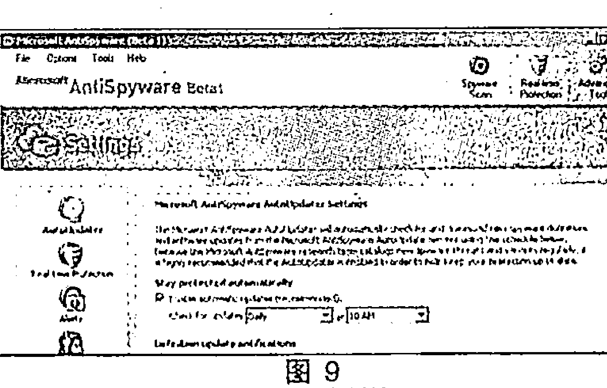

Microsoft AntiSpyware 提供了强大的手动和定时扫描功能，这也是 AntiSpyware 最主要的功能，其使用非常简单，用户简单设置并扫描一次系统后，将不会看到任何间谍软件。扫描完毕会得到一个扫描报告 (Scan Results)，从这里可以看到：间谍软件的数量 (Spyware threats detected)、内存进程扫描数量 (Memory processes scanned)、扫描文件数 (Files scanned)、受感染的文件数量 (Spyware files infected)、被扫描的注册表键数 (Registry keys scanned) 等等。此外，Microsoft AntiSpyware 还为用户提供了一整套实时监控保护 (Real-time Protection)，能及时有效地监控网络、系统和应用程序，任何未知的程序或者服务试图在机器上运行时，它都可以报警提示用户。

当然，类似的软件还有很多，对于一般用户来说，要避免间谍软件的侵入，一方面要做到不收阅陌生人的邮件，不去不健康的站点浏览，不到不正规的站点下载软件，安装软件前要仔细阅读软件的隐私保护规定；另一方面，还要善于利用最新版本的反间谍软件进行查找、清除。这样，我们就能在“香花”与“毒草”之间清楚地进行辨别了。

## 3. 走向规范的网络：数字证书和电子签名技术

在人与人不见面的计算机互联网上进行交易和作业时，怎么才能保证交易的公正性和安全性，保证交易方身份的真实性？2005年4月1日起，《中华人民共和国电子签名法》正式施行，它首次赋予电子签名与文本签名具有同等法律效力，并明确电子认证服务市场准入制度。根据《电子签名法》，电子签名人是指持有电子签名制作数据并以本人身份或者以其所代表的人的名义实施电子签名的人。从广义上讲，电子签名不仅包括我们通常意义上讲的“密钥加密”，还包括计算机口令、生物笔迹辨别、指纹识别，以及新近出现的眼虹膜透视辨别法、面纹识别等。

国际比较成熟的安全解决方案，那就是建立安全证书体系结构。比如在计算机上安装新软件时，系统文件和设备驱动程序文件有时会被未经签名的或不兼容的版本覆盖，导致系统不稳定。现在，随Windows XP一起提供的系统文件和设备驱动程序文件都有Microsoft电子签名，这表明这些文件都是原始的未更改过的系统文件。下面是一个简单的测试过程。

第一步，申请个人证书。个人测试数字证书的申请地址为 https://testca.netca.net/apply_indi/indi_root.asp，出现安全警告时，选择“是”并安装证书链，然后根据提示申请并安装数字证书。申请和安装成功后，我们可以通过这个步骤来查看数字证书。打开 Internet Explorer，在 IE 的菜单上，单击 “工具” 菜单中的 “Internet 选项”；选取 “内容” 选项，点击 “证书” 来查看信任的当前证书的列表；点击 “个人” 选项卡可以查看申请的个人数字证书。

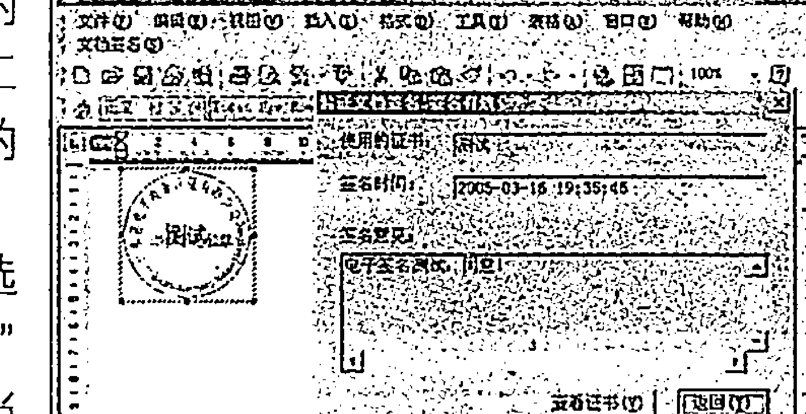

第二步，利用文档电子签名软件实现电子签名。软件下载地址为 http://www.cnca.net/cs/download/Esign.exe。安装文件后，打开一个新建的 Word 文档，或者直接打开一个已有的 Word 文档。打开 Word 的主菜单，选择 “文档签名” 项中的 “签名设置” 子菜单，进入待设置的使用证书选择窗口。在该窗口中列出了所有有效个人证书，这些证书均可以在文档签名时被选用，但首先必须在本功能中设置好签名使用的图片。双击证书列表中的证书，可以查看证书的属性信息和验证信息。或者点击 “证书信息” 按钮，同样可以查看证书信息。

第三步，设置模板图片。选择了待设置的证书后，点击 “设置” 按钮，进入图片设置窗口。用户可以点击 “选择模板图片” 按钮来选用其他的签名图片。

第四步，选择 “文档签名” 主菜单项中的 “文档签名” 子菜单，进入签名时准备使用的证书的选择窗口。窗口中列出了可以用于签名的数字证书，选择了待使用的签名证书以后，用户可以在意见栏中签署批示意见。调整到合适的效果以后，点击 “签名” 按钮可以完成签名操作，在当前打开的 Word 文档中签下大名。如图10所示。

随着电子商务交易的蓬勃兴起，这些技术将逐渐的普及到我们的日常生活中去。而电子签名法的出台，则可以较大程度解决 “电子商务的瓶颈” 问题，增强网上交易的安全性、有效性，将对我国电子商务、电子政务的发展起到极其重要的促进作用。

## 4. 网络欺骗和钓鱼式攻击技术

2005年以来，通过网站欺骗用户以获得机密信息的事件越来越多，在国内比较严重的中国银行、中国工商银行事件已经让不少用户开始感觉到网络中存在的安全隐患。这里说的钓鱼隐含了这个新的意义。目前甚至出现了 “Phishing” 这个单词!

2005年4月7日，国际反钓鱼组织公布了一个典型的案例，我们来分析一下其中的 “布局” 情况。首先，攻击者给 Comcast 公司用户发了一个欺骗的邮件，声称：按照年度计划，用户的数据库信息需要进行例行更新，并给出了一个 “To update your account address” 连接地址。由于这封 Email 来自 “SebastianMareygrossness@comcast-support.biz”，因此，一般人不会怀疑。不过，细心的用户会发现，表面地址是 http://comcast-database.biz/，实际地址却是 http://66.113.136.225。很明显，这个攻击者对 Comcast 这个公司的用户信息很感兴趣，如果能够得到这些机密信息，他就可以达到其不可告人的目的!

现在，不知情的用户输入了自己的 “User Name” 和 “Password”，然后，通过表单机制，提交到了下一步。表面上看，这其中没有任何的欺骗之处，对一般用户来说，现在出现的界面可能还只是一个例行公事，只是要用户输入姓名、城市、电话等一般信息。填写完毕，攻击者的庐山真面目就露出来了。他现在要用户填写的是信用卡信息和 Pin 密码。实际上，在整个布局中，这也是钓鱼式攻击者最用心营造的地方。一旦获得用户的账户信息，攻击者就会找个理由来欺骗用户说 “谢谢！您的信息更新成功！”，让用户感觉很 “心满意足”，好像很配合他们的工作，终于完成了任务。这就是他们所玩的一个把戏。

这是比较常见的一种欺骗方式，有些攻击者甚至编造公司信息和认证标志，其隐蔽性更强。一般来说，默认情况下我们所使用的 HTTP 协议是没有任何加密措施的，如站点 http://comcast-database.biz/。不过，现在所有的消息全部都是以明文形式在网络上传送的，恶意的攻击者可以通过安装监听程序来获得我们和服务器之间的通讯内容。因此，很多安全服务器证书的网站都采用了 SSL 保护，其网页地址都具有 “https” 前缀，而非标准的 “http” 前缀。下面，让我们来看看这个攻击者仿冒的花旗银行的页面吧。在 IE 地址栏上，有一个 https 地址。这个页面被打开后，自动装载了一个 Java 程序，并用一个包含合法 URL 的窗口覆盖地址栏的内容，查看页面的属性后，真实的地址实际上是一个 http 地址，而与 https 根本就没有关系。页面中间的 User ID 和 Password 则等着用户来 “上钩”。再看地址栏右下角，根本没有锁的标志。

有时候，攻击者为了能方便地在 https 和 http 之间转化进行转换，对相关代码适当处理即可。如在做电子商务站点的时候，让一个 ASP 页面以 https 开始，可在该 ASP 页面顶部添加一个简单的转换代码即可。从上面的分析来看，网络攻击手段越来越高明，这就需要我们在实际应用中多多防范，练就一双识别骗局的慧眼。

## 5. 防垃圾邮件新技术

现在，垃圾邮件十分猖狂，制造者利用 SMTP 邮件传输协议允许伪造发信人特征信息的漏洞，大肆制造网上垃圾。2005年6月底，美国微软公司和 Pobox.com 公司联合向 IETF (Internet Engineering Task Force，互联网工程任务组) 提出一个关于反垃圾邮件技术 Sender ID 的标准提案，并成为 IETF 草案。所谓 SenderID 技术，是指 SMTP 通信过程中对邮件来源进行检查的一种技术，主要归类于连接控制型技术的 DNS 信息检查类。SenderID 技术抓住了垃圾邮件发送的一个重要特征，那就是垃圾邮件总是想方设法地掩盖其发送来源，通过这一点可以避免被阻挡、追踪和逃避法律责任。因此，广泛实施的 SenderID 技术可以对垃圾邮件的生存造成致命的打击。

## 掌上明珠——2005的PDA与智能手机
文■方成亮

由于采用了全新硬件架构与软件平台，PDA 与我们所熟悉的台式机或者笔记本存在较大的差异。无论是在升级、设备扩充、日常使用、软件应用等多方面，不少 PDA 新手都感觉难以入门。而智能手机与 PDA 之间又有着千丝万缕的联系，甚至两者之间的功能也逐步融合。为了帮助广大读者更好地了解日新月异发展的 PDA 和智能手机，这里对目前的产品和市场状况做一介绍。

### 更加耀眼的掌上明珠——PDA发展趋势展望

计算机和网络技术的飞速发展将电子化、信息化推向了社会生活的各个角落，各种轻便小巧的手持式 IT 产品不断涌现。然而传统的笔记本由于其较大的体积根本无法满足我们的需求，更多的时候，我们需要的是一款集移动办公、视听娱乐、网络资讯、时尚潮流于一体的多功能设备。毫无疑问，PDA 以各方面均衡的优势赢得了大多数用户的芳心。客观而言，目前 PDA 仍然处于初级阶段，因此各方面难以做到十全十美。

### 1. 摆脱低性能的关键：处理器

毫无疑问，由于 PDA 所使用的处理器主频很低，而且不具备缓存，在架构上也与传统桌面处理器有所区别，因此其性能一直不能让我们感到十分满意。为此，PDA 软件开发者不得不缩手缩脚，直接造成软件功能的匮乏。Motorola 的龙珠处理器已经略显落伍了，至少它并不适合如今强调多媒体功能的时代。PDA 的产品划分已经日趋明显，只有能够做到移动办公、视听娱乐、网络资讯等多方面应用的产品才能迎合消费级市场，而以往的记事本、名片夹之类的 PDA 则更多地与手机整合。

作为如今 PPC 平台的主流处理器，Intel StrongARM 正逐渐显出疲态。尽管比起龙珠处理器的 66MHz 主频要高很多，但是 StrongARM 也只不过达到 206MHz，而且执行效率上不见得有多大的优势，功耗问题更是相当棘手。为此，Intel 也着手改革，目前已经推出了全新的 Xscale 处理器，并且大规模运用到现实产品中。

事实上，StrongARM 并非由 Intel 开发，而是 Intel 从 ARM 公司得来的授权。不过， Intel 的 Xscale 针对 StrongARM 的缺点进行的改进设计，尽管其雏形还是

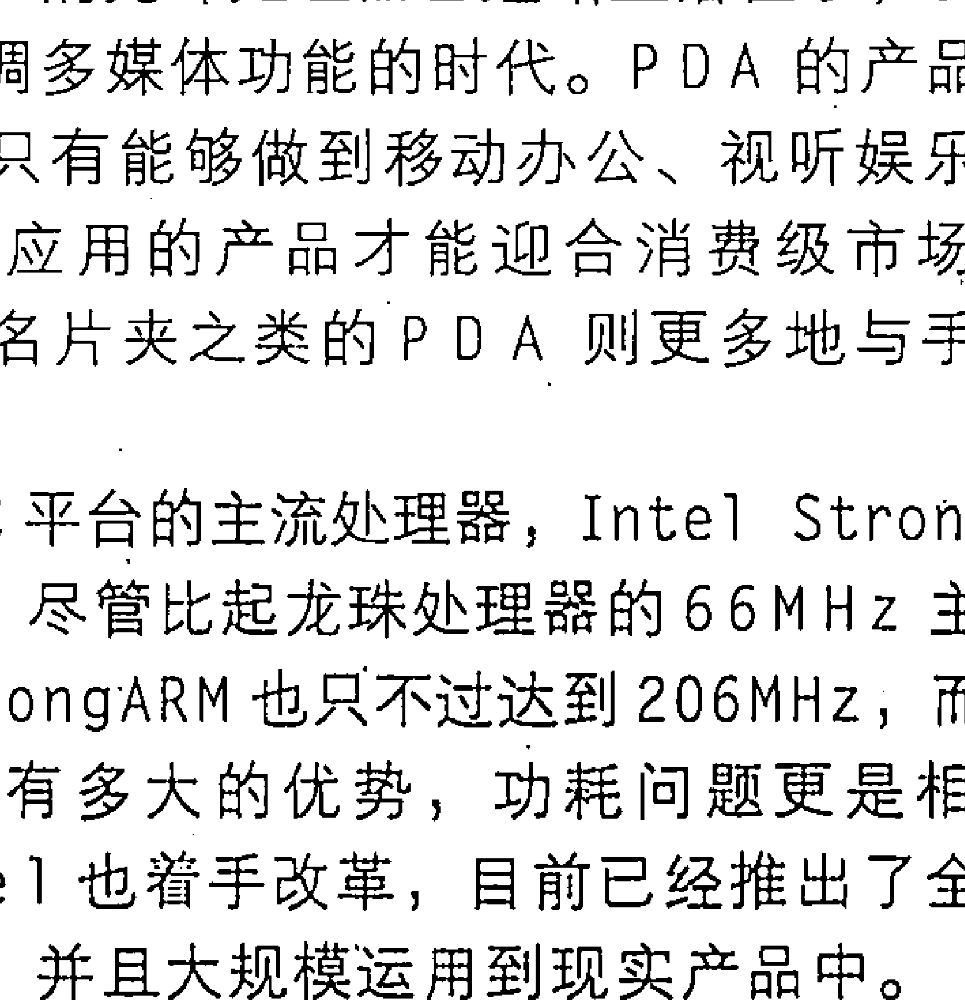

没有改变，但是各方面的表现已经有了不小的飞跃。Xscale 分为 PXA210、PXA250/255 和 PXA270（图1）。PXA210 主频为 200MHz，主要面向超低端市场，而 PXA250 的主频达到 300/400MHz，PXA270 更是频率高达 624MHz。由于采用了最新的 0.13 微米工艺，因此 Xscale 的功耗控制得十分出色。在改进了 DMA 控制器与图形音频单元之后，采用 Xscale 的 PDA 在图形处理、音频流输出等方面都全面提升。

在 Xscale 之后，Intel 即将普及集成 Wireless MMX、Wireless SpeedStep 和 QuickCapture 这三项技术的 Bulverde 处理器。由于 PDA 的多媒体性能一直明显不足，这不仅仅是因为缺少处理器缓存机制，更因为缺乏多媒体指令集。Wireless MMX 将为 PDA 带来一场革命，使其与 3D 应用靠得更近。至于 Wireless SpeedStep 技术，这将是 Intel 的节能法宝。在功耗方面，Intel 的 PDA 处理器一直表现不佳，远远不如 Palm 上的龙珠处理器，而 Wireless MMX 技术的出现至少将能改善这一局面。QuickCapture 技术或许并不受人重视，这是 Intel 为了配合 SmartPhone 而推出的高清晰度视频处理技术。从技术指标来看，Bulverde 令人振奋。如果真能如愿普及，那么 Intel 将很可能在今后称霸 PDA 嵌入平台（图2）。

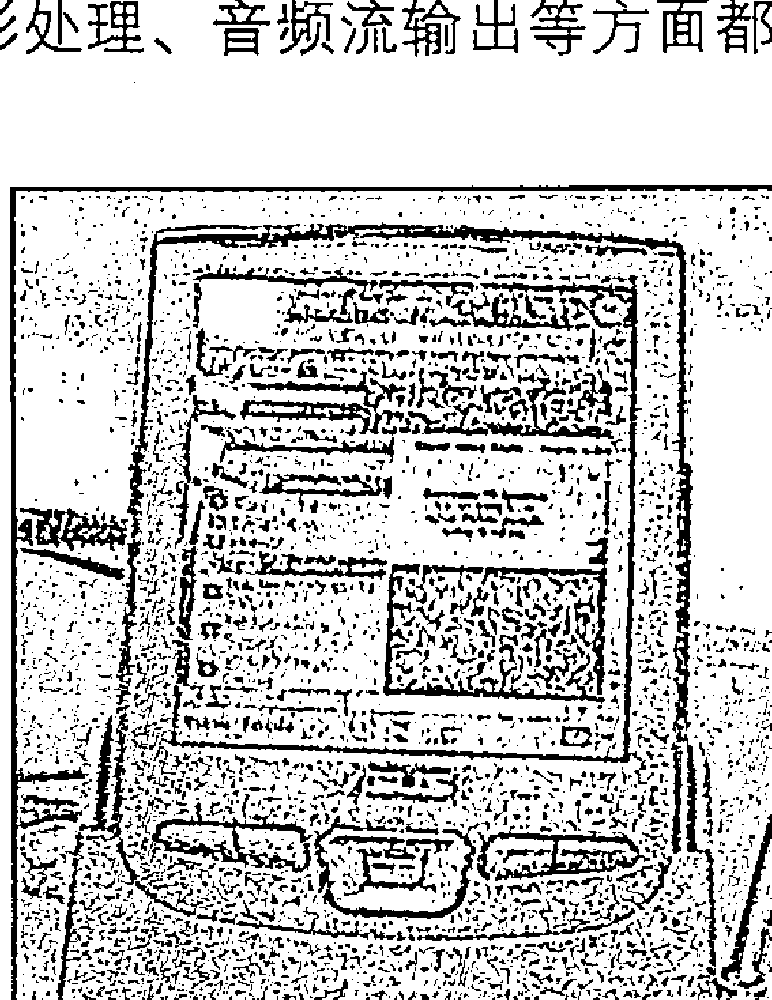

当然，目前暂时的失败，Motorola 并未一蹶不振，而是 DragonBall MX 系列继续对抗 Intel。虽说 DragonBall MX 主频达到 200MHz，但是其成本控制不利，并没有太多的厂商愿意采用，前景较为黯淡。Intel 在 PDA 处理器的竞争者并不仅仅是 Motorola，老对手 AMD 依旧阴魂不散。通过巨资收购 Alchemy 公司之后，AMD 推出了 Alchemy Au1000（图3）。这款处理器以 MIPS 为核心，频率在 500MHz 时耗电量仅有 0.5W，单凭这点就已足够让厂商对此心动了。此外，这款低功耗 CPU 还支持很多外围设备，如以太网、

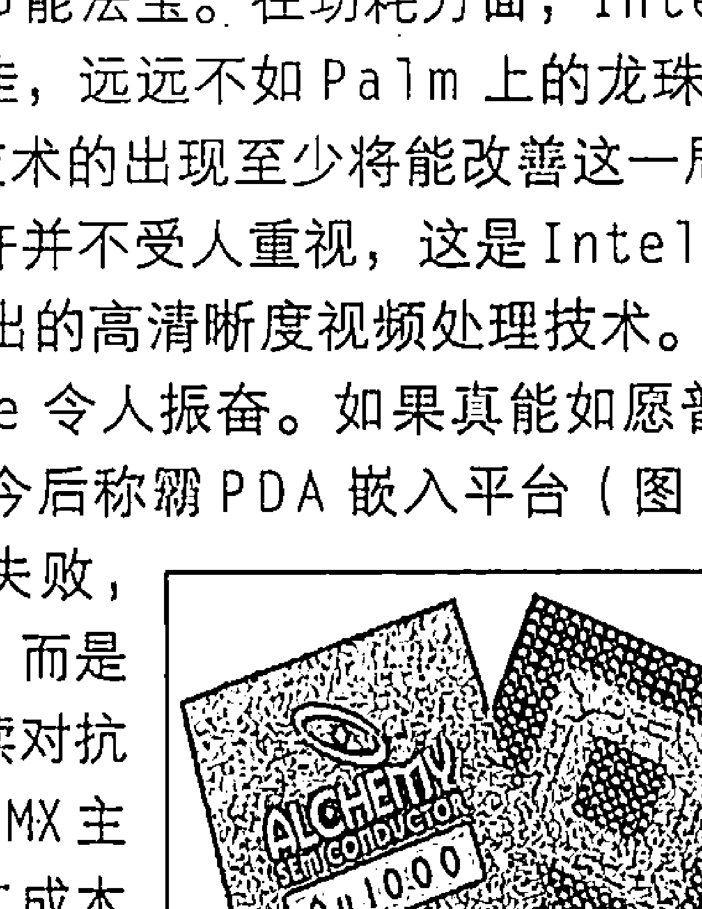

USB、SRAM/SDRAM 控制器等。到目前为止，欧美不少 PDA 厂商已经推出了基于 Alchemy Au1000 的产品，而 Compaq、DELL、Toshiba 等也纷纷表示出浓厚的兴趣。

此外，德州仪器 TI 的 TMS320VC5470 也是一款以 ARM 为核心的产品，对低端市场冲击不小。看来 Intel 还难以在未来的 PDA 处理器市场独霸一方，这也是一个好兆头，因为唯有激烈的竞争才能促进技术革新，使产品价格更加合理。

### 2. 三分天下：操作系统之争

操作系统是 PDA 产品的核心部分，PDA 产品的操作系统领域正处于战国混战的局面，现在市场上能见到的大致上有 Windows CE (PocketPC)、Palm OS、Penbex OS、EPOC 和嵌入式 Linux 五大类别。从目前状况看，Palm OS、Windows CE 和 Linux 将成为 PDA 市场操作系统选择的主流标准。

客观而言，凭借出色的多媒体能力与简易的操作模式，Windows CE 还是有很大的优势。随着 Windows CE 无可争议地占据主流地位，越来越多的软件开发商选择这一平台，这也使得 Windows CE 的实用价值大大提升。不过，目前的 Windows CE 还远非完美。由于 PPC2002 仅针对 Intel StrongARM 处理器优化，因此 Xscale 的性能还未完全发挥。据悉下一代 PPC 将是.net 产品，可以令 Xscale 性能提升 30 % 以上，而且针对多款 CPU 充分优化。同时 PPC.net 还将集成语音识别等多项实用的技术。

相对而言，如今 Palm OS 的情况并不乐观。多媒体能力的不足已经逼迫 Palm 公司下定决心抛弃龙珠改投 Xscale，但推出 Palm OS5 也使 Palm OS 伤筋动骨。由于在架构上与以往的 Palm OS 有所不同，因此大量的 Palm 软件不得不为 Palm OS5 重写，而且 Palm 新推出的编程接口还需要一段适应期。很明显，如今的 Palm OS5 已经越来越向 Windows CE 靠拢了，这也意味着 Palm OS 逐渐失去特有的个性。当然，凭借 SONY、ACER 等的鼎力支持，Palm OS5 在近几年还是有对抗 Windows CE 的实力（图 4）。

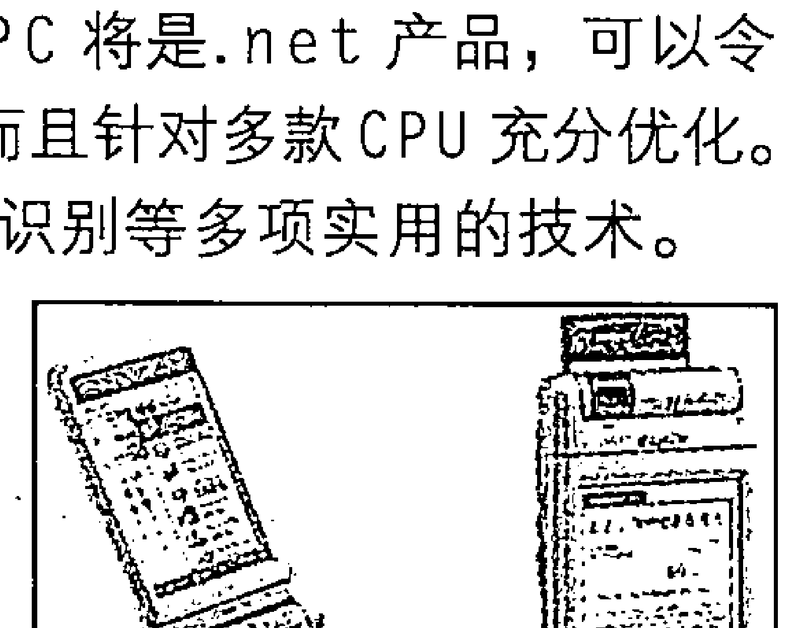

完全开发源代码的免费 Linux 正逐渐登陆 PDA 操作系统市场。不得不承认的是，目前基于 Linux 的 PDA 软件还很少，因此多数用户并不会选择该操作系统，除非是开发人员。但是对于厂商而言 Linux 有着不小的吸引力，毕竟这可以大大节省成本。

### 3. 存储技术：新款PDA大胆革新

PDA 采用了 ROM 与 RAM 的组合，因此大大提高了运行速度，也带来更为出色的低功耗表现。由于操作系统存放在非易失性的 ROM 存储器中，因此无需电力维护，而 RAM 用于软件安装以及系统调用。显然，PDA 的这种存储架构需要更大的容量以满足不断增长的需求。目前少数高端产品已经集成 64MB ROM，可以应对未来的大型操作系统。不过随着 ROM 技术的飞跃，未来集成 128MB 以上 ROM 根本不是什么难事，而且 ROM 芯片的成本也随着技术成熟而不断下降。至于 RAM，PDA 用户对其容量需求更是明显。由于 RAM 的速度大大快于闪存介质以及磁盘技术，因此容量扩大后将使得 PDA 的使用更为方便。目前大多数 PDA 只集成 64 ~ 128MB RAM，而这显然不够。凭借目前的内存晶元生产工艺，单芯片实现 256MB 也不成问题，而且成本只会更低。256MB RAM 的产品现在也已经初露端倪，用不了多久，直接集成 256MB RAM 的 PDA 就会大量上市

至于闪存技术，如今更是一片欣欣向荣的景像。新一代的 Memory Stick 与 SD 都在功耗与速度方面突飞猛进，成为扩展 PDA 的得力助手。而廉价的 CF 更是让我们看到容量上的进步。GB 数量级的 CF 卡已经屡见不鲜，原本价格高高在上的 SD 存储卡也在今年突然间变得平易近人，容量价格比几乎与 CF 卡持平。更为令人期待的是，夏普公司日前宣布，将于今年年底在日本市场推出一款将 4 GB 容量微型硬盘列为标准配备的 PDA（图 5）。这款型号为 Zaurus SL-C3000 的产品内建 1 英寸微型硬盘，重量及体积尺寸并没有明显增加，存储容量却是大幅度扩展。

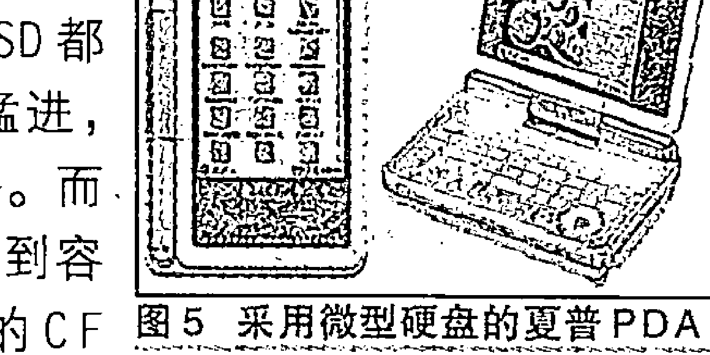

### 4. 绚丽多彩：触摸屏技术的改进

如今 PDA 已经完全步入了彩色显示阶段，64K 真彩色与 240 × 320 像素已经让不少用户欢呼雀跃。然而应当看到的是，PDA 所采用的 LCD 在画质上还是与笔记本的 LCD 相差甚远，功耗考虑与灯管位置的限制让 PDA 的 LCD 在对比度、亮度等方面远非完美。

由于 PDA 的触摸屏大多采用 STN 或者 TFT 技术，这也是导致对比度、亮度不足的原因之一。事实上，PDA 比笔记本更需要在户外使用，而在强烈阳光的照射下，多数 STN 屏幕会变得模糊不清，TFT 的情况也好不了多少。尽管如今绝大多数高端 PDA 使用 TFT 技术，而且经过改进之后户外表现有所提高，但是距离理想中的表现还是有很大的差距。在 PDA 研发领域一直处于领先地位的索尼率先迈出了第一步，近期发布的新款 PEG-VZ90 采用了 OLED 有机发光二极管来作为显示幕（图 6）。

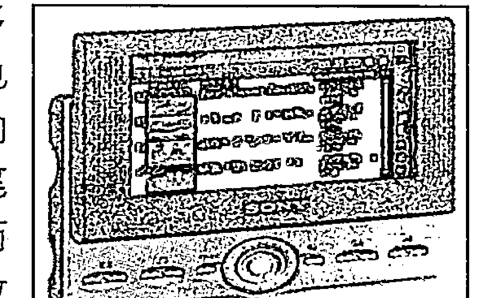

有机发光二极管并不是什么新鲜产品，但是将其应用到显示技术的确是一种创新。作为移动产品，显示屏的亮度和对比度极为重要。OLED 在这方面有着非常强劲的表现，它甚至比玻璃还要透亮，比玻璃还要薄，对比度更是完全能够满足我们的需求。OLED 通电后自发亮，自然显示效果比液晶显示器更清晰、柔和，甚至在日光照射下画面仍然清晰，而 TFT 液晶显示器本身并不发光，必须加装背光模组。省去了背光模组装置之后，OLED在功耗和外形厚度方面也有着极为出色的表现。在目前电池技术没有突飞猛进的时代，移动产品的功耗真是太重要了。OLED简直是为移动产品而生，其超低的电力消耗可以让大多数PDA维持12小时的全速工作。

PDA之所以在强烈阳光下难以看清与触摸屏表面的镀膜也有关。为了达到防爆、防尘、增强感应的效果，触摸屏表面都有一层很薄的镀膜。对于采用五线电阻或者四线电阻的触摸屏而言，其镀膜的透光率相对较差，只有75%左右，而且反光度较高。其实，高档触摸屏都采用表面声波技术，它可以令镀膜的透光率达到92%，而且减少反射。目前采用表面声波技术的PDA还不多，只有几款高端产品才做到。而随着这项技术的成熟，PDA的户外显示问题将有所缓解。

## 5. 沟通无极限：网络技术

不可否认的是，PDA的性能还是难以企及台式机，因此与强大的台式机互联是相当重要的。原先PDA所大规模采用的红外线技术并不能令人满意，而且红外线适配器根本没有在PC中得到普及，速度与便捷性也差强人意。毫无疑问，蓝牙与WIFI无线技术是最值得期待的解决方案。目前直接整合蓝牙模块的PDA已经很多，通过与台式机组建简单的对等网，用户可以轻松解决数据共享与Internet接入问题。更为出色的解决方案应当是WIFI无线网络，这令PDA不仅在室内得到畅通无阻的网络接入，甚至在户外也能连接Internet（图7）。

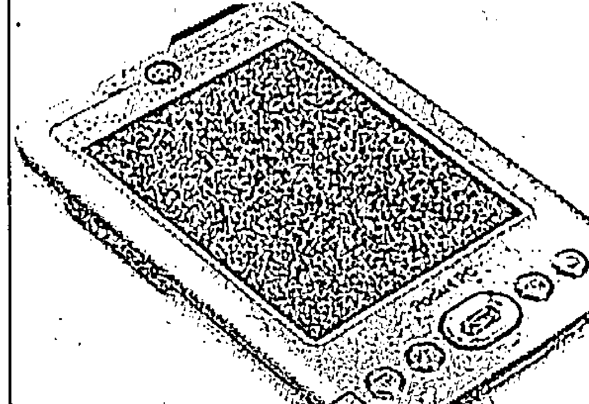

尽管如今直接整合WIFI无线网络芯片的PDA还不多见，仅仅局限于几个型号，但是对于大多数拥有CF以及SD插槽的产品而言，使用WIFI无线网卡扩充也是轻而易举的事情。CFII、SDIO规范已经允许开发小体积小功耗的无线网卡（图8），出色的芯片技术更是可以将无线网络功能整合进处理器或者芯片组，因此未来PDA的网络功能将逐步增强，也不再是孤立的设备。即便是在户外，GPRS、CDMA 1X等广域网技术也是不错的解决方案，而且目前已经投入市场，适用于PDA的GPRS适配器随处可见。

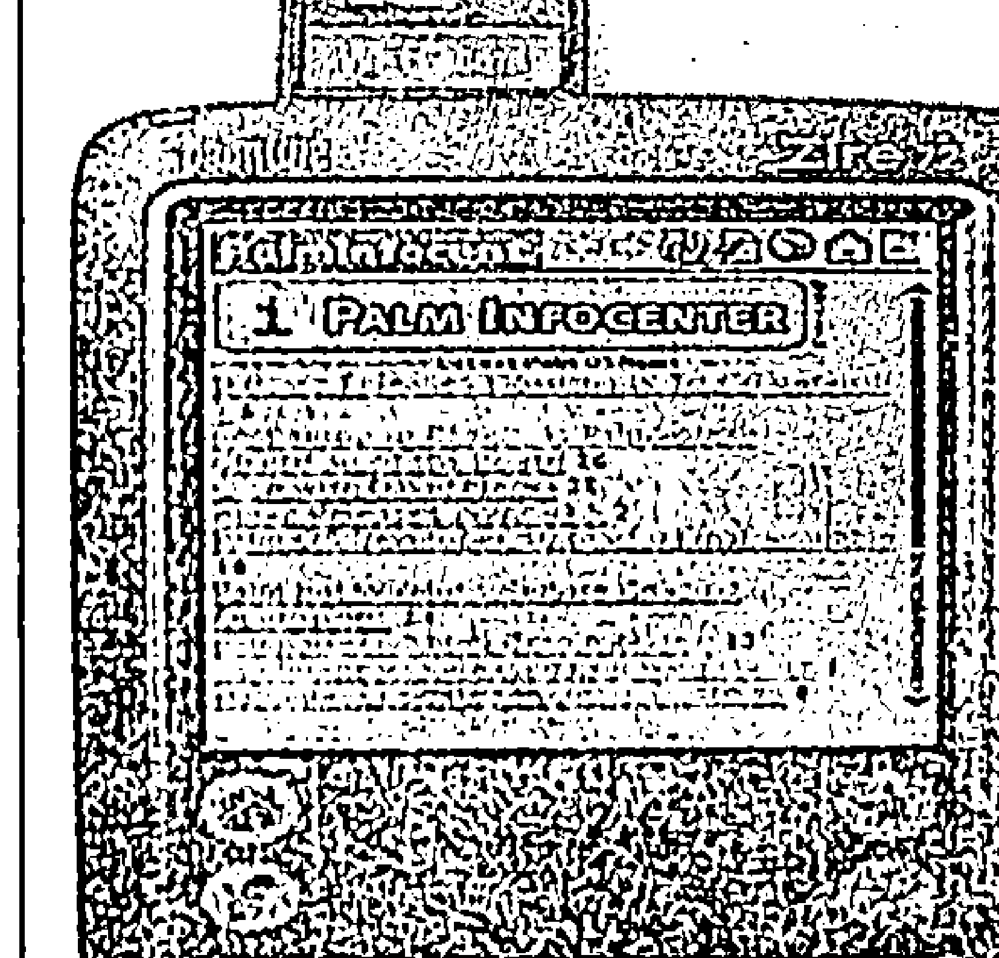

## 口袋秘书——Palm PDA

或许光辉耀眼的笔记本令所有人都羡慕不已，但是从实用角度而言，笔记本不可与掌上电脑同日而语，从某种角度而言，笔记本将用于取代台式机，成为小型化PC的典范；而掌上电脑才是真正的移动办公设备。由于Palm的结构比笔记本精简得多，因此无论是耗电量还是便携性都令人刮目相看。从过去几年的发展过程来看，Palm掌上电脑在欧美市场的普及度也是十分惊人的，更加实用的定位使之比Pocket PC机种有着更好的亲和力。

### 1. 对比Pocket PC：Palm毫不示弱

如同处理器领域Intel与AMD之争一样，PDA市场也并非风平浪静，而且两股不同势力之间的冲突更大。Pocket PC与Palm是基于两种截然不同理念的产品。功耗与便携性一直是Palm引以为豪之处，而庞大的Pocket PC就相形见绌。由于处理器的频率较高，因此Pocket PC巨大的功耗几乎是无可避免的。毫不夸张地说，目前任何一款Palm都拥有相当长的电池运行时间，便携性也相当不错。但是，最新的Palm 5.X开始向Intel处理器以及多媒体靠拢之后，两者在这方面的差距可能会越来越小。也正是基于这一因素，不少对电池能力有着特殊要求的用户仍然将Palm 4.X作为自己的首选。

虽然装配PPC系统的PDA处理器速度较高，但是Pocket PC操作系统本身就十分庞大，需要占用大量的系统资源。更为重要的，基于PPC的应用程序动辄几百KB，甚至多达几兆，而Palm本身机小巧玲珑，其应用程序往往只有几十KB。同样是存储一笔资料，当Palm已经找到的同时，可能那时的PPC还在转呀转的。需要注意的是，Palm OS到目前为止都是单任务的，也就是说要进入某个程序必须退出原来的程序，这种简单的结构保证了系统的高效和稳定。正常情况下Palm可以稳定工作很长时间而不需要重启。如果PDA用户喜欢尝试各种各样的软件，那么Palm平台上丰富的选择会让人欣喜不已。

### 2. Palm产品选购要点

### (1) 操作系统

Palm PDA的操作系统与硬件有着更为密切的相关性，也就是说并不是任何一款Palm机型都能安装任何一款Palm OS，这点与PC有着很大的区别。从实用性角度来看，当前用户至少也应该选择4.X以上的版本的产品，因为绝大多数新Palm软件已经抛弃了Palm 3.X平台。相对而言，5.X版本的Palm产品引入了Intel处理器或是其他公司的高频处理器，整体硬件结构与4.X产品有着很大的区别，更加注重了多媒体表现。

当然，Palm的操作系统也可以由用户自己来安装，但是这还是与台式机安装操作系统有着很大的区别。Palm的操作系统是安装在ROM上的，因此其空间大小是否足够直接决定能够自行升级操作系统。此外，PDA的CPU也必须满足最新操作系统的需求，而且操作系统必须支持该设备。客观来看，想要实现跨版本升级操作系统几乎是不可能的，一般只能在同一代产品中升级，譬如从4.0版本升级到4.1等。

### (2) 电池能力

尽管PDA的机型很大程度上决定了电池能力，但是同一类型中的产品之间还是有十分明显的差距。以Palm PDA为例，优秀的产品可以在一般情况下使用30小时甚至更多，而少数低端产品可能只有12小时~15小时的电池工作时间。由于PDA将很多数据存放于易失性的RAM中，因此给RAM提供电力就十分关键了。然而遗憾的是，目前少数产品仅仅采用主机电池给RAM供电，一旦待机时间超过1个星期，数据很容易丢失。相对而言，部分中高端Palm机的做法值得称道，在待机时它采用额外的电池供电。此外，采用灰阶屏幕和低频处理器的低端机型往往具备更长的电池工作时间。

### (3) 硬件配置

Palm的硬件包括显示屏、处理器、内存、图形芯片、音频单元等。现在的PDA外壳越来越时尚，而且尺寸越来越小。显示屏则基本上都是标准的240 x 320像素彩色显示，并且具有背光支持，不仅在黑暗的环境下使用起来非常方便，在不同视角看上去也都很清楚。
然而大家或许容易忽视的是，PDA的显示屏还是大有学问。无论是彩色还是灰阶的屏幕，对比度与亮度都是十分关键的。不少PDA由于对比度以及亮度不足，在户外环境下很难看清楚，十分不便。此外，同样是彩色屏幕，大家也要注意是16K还是64K，更多的颜色数意味着更加细腻的表现能力。一般Palm机型的LCD为3.5英寸，只有少数产品会采用3.8英寸大屏幕。
决定一款PDA性能的主要因素是处理器和内存。Palm 4.X的产品应该要求2MB ROM，而RAM容量为4MB~16MB不等。更大的RAM自然好处多多，尽管Palm程序大多小巧，但是4MB未免捉襟见肘，8MB应该算是最低限度。用于Palm 4.X PDA的处理器主要是龙珠33MHz与66MHz，后者的性能明显强于前者，而它们价格上的差距并不大，另外有极少数超低端产品使用16MHz处理器。对于Palm 5.X产品而言，其各项指标已经趋近于PPC，16MB RAM/ROM以及200MHz Intel Xscale处理器是最常见也是最合理的配置了。

### (4) 特色功能

无线网络一直是PDA的热点，内置蓝牙适配器或者WIFI（IEEE802.11b）已经十分常见，不过这类产品大多价格不菲。如果用户需要使用PDA进行无线上网的话，这一功能还是十分必要的。在多媒体功能方面，摄像头十分具有创意，它可以帮助用户随时捕获信息并通过无线网络传输。此外，部分PDA还抹上了随身听的色彩，SONY的多款Palm 5.0机型竟然支持MD的ATRAC3音频。

## 彩屏应用第一波——智能手机

很多人将彩屏作为手机发展中更新换代的标志，然而平心而论，除了华而不实的彩信功能，第一代普通彩屏手机的确没有带给我们多少实质性的应用。真正引发一场革命的应当是智能手机，将通讯功能与PDA功能融合，智能手机已经成为一种潮流与趋势。为了帮助大家快速了解智能手机，我们选择了多普达575、摩托罗拉MPX220、索爱W800c和诺基亚3230这四款中等价位产品，与纯粹的高端产品相比，或许更加贴合普通读者。

### 1. 智能平台

不可否认的是，如今PDA正在与手机逐渐融合，这也是未来的发展趋势。多普达575和摩托罗拉MPX220使用微软的SmartPhone 2003SE操作系统，诺基亚3230采用Symbian 7.0操作系统（图9），而索爱W800c则是索爱独立开发的封闭式操作系统。
毫无疑问，Symbian操作系统在智能移动终端上的垄断地位依旧无法改变，这得益于它拥有丰富的应用程序以及通信能力，而且具备强大的对象导向系统、企业标准通信传输协议以及完美的Sun Java语言。事实上Symbian的前身就是EPOC，而作为其竞争对手的SmartPhone（Windows Mobile）也完全建立在PPC的基础上。Symbian分为两个主要的智能平台，一个是适于单手操作的S60，另一个是双手操作的S80，而诺基亚的3230显然是属于S60。在诺基亚3230上，用户可以安装各种应用软件，包括游戏模拟器以及已经成为经典的《金属咆哮》等游戏。尽管目前SmartPhome应用程序在数量上还不如Symbian，但是由于CPU和内存系统更为强大，因此我们可以看到很多大型程序，而且越来越多的程序员因为微软所提供的完整开发包而投入这款操作系统。综合来看，索爱W800c显然是最为薄弱的，其操作系统甚至有些无法称之为智能化，仅仅依靠Java扩展让用户感到非常不爽，好在其Java运行速度还算比较出色。

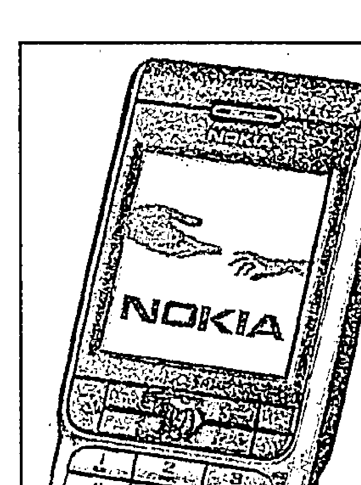

### 2. CPU性能

对于智能手机而言，CPU的性能非常重要，否则很多大型程序都无法保证流畅运行，播放视频等多媒体娱乐功能也会受到影响。多普达575和摩托罗拉MPX220两款采用微软SmartPhone 2003SE操作系统的智能手机，因此CPU的配置相对来说比较强大，这也是由操作系统配置所决定的。尽管SmartPhone 2003SE最低要求133MHz主频的ARM架构处理器便可以流畅运行，但是无论是多普达575还是摩托罗拉MPX220，出于追求多媒体表现的考虑，都不约而同地使用德州仪器OMAP系列200MHz级别主频处理器。略微区别的是，MPX220所使用的OMAP 1611主频为204MHz，而且特别针对Java优化，而多普达575使用的CPU是OMAP 730，主频正好200MHz。更高的主频对于整机性能的帮助十分明显，无论是运行大型Java程序还是转为SP操作系统开发的软件，用户都会感到流畅度有明显提高。在运行一些Java测试软件时，摩托罗拉MPX220的成绩会高出多普达575很多，但是两者的实际运行差别却很小，用户很难感觉到速度差异。

索爱W800c和以往的索爱手机一样，CPU类型并不公开，但是从推断来看，其主频大约在100MHz左右，而且并非是主流的ARM架构，使用了兼容索爱手机专用操作系统的指令方式。由于以Java程序作为扩展方式，因此索爱W800c所经受的考验并不严峻，不过从整体表现来看，这款强调音乐功能的手机因为CPU方面的薄弱而限制了诸如视频应用等功能。以前对于采用Symbian操作系统的智能手机，很多用户总是认为其CPU性能很弱，就好像掌上电脑中的Palm一样，然而诺基亚3230可谓让人改变这种看法。作为诺基亚3系列，以往似乎定位相对低端，但是3230却非常特殊，这款手机使用122MHz主频的ARM架构处理器，整体表现还算不错。

### 3. 存储系统

与传统手机相比，智能手机最大的特点不仅仅是操作系统，有了扩展存储接口也是很重要的一点。无论是视频音频娱乐还是其他大型软件，没有大容量的闪存卡扩充都是不敢想象的。除此以外，越来越复杂的操作系统需要占据更多的存储空间，也需要更多的内存支持。

在详细对比这四款产品之前，大家有必要了解一下智能手机中的RAM与ROM区别。智能手机的结构甚至已经类似PC，有其独立的CPU、芯片组、内存以及外存储器。但是和所有的移动设备一样，智能手机不可能配置硬盘，因此操作系统就安装在ROM中（也称为FlashROM），一些随操作系统附送的软件也可能安装在ROM中。ROM存储器的最大特点是不需要电力就能保存数据不丢失，而RAM则需要电力支持，真正作为智能手机的内存来使用。至于数码存储卡扩展接口，其作用实际上与内存的FlashROM相同，只不过容量要大得多，而且速度稍微慢一些。

多普达575和摩托罗拉MPX220都是64 + 32MB的结构，但是多普达575为32MB RAM + 64MB ROM，摩托罗拉MPX220为64MB RAM + 32MB ROM。对于不使用数码闪存卡扩充的用户而言，多普达的这种设计显然更为方便，这样能够安装更多的应用程序。但是摩托罗拉MPX220的这种设计也有好处，更多的内存有助于提高速度，只不过目前大部分SP程序并不需要如此大量的内存。至于外接存储卡接口，这两款手机都使用Mini-SD，目前这类存储卡的性价比还算比较理想。

以前很多用户总是在抱怨索爱手机的内存实在太小了，而如今W800c可谓来了一个180度大转弯。W800c的内存为38MB，其中可以使用34MB，而RAM内存数量并未公开，毕竟索爱智能手机的操作系统是完全封闭的状态。除此以外，大家还可以使用Memory Stick Due存储卡进行扩充。诺基亚3230的内存配置相对小一些，大约只有8MB可用空间，这是由Symbian操作系统程序的特点所决定的，好在用户可以使用RS-MMC存储卡扩充。

### PDA应用要点

### 1. PDA启动

PDA具备了一台电脑主机的基本结构，因此它也拥有电源开关、屏幕开关、硬启动和软启动按钮。由于PDA将很多资料保存在RAM中，因此它时时刻刻需要电力。一般情况下，我们总是将电源开关始终处于打开状态，此时将只对RAM供电，对电能的消耗并不是很大。而当我们真正需要使用的时候，屏幕开关是必须打开的。事实上，屏幕开关也具有系统激活功能。一旦打开它，我们的PDA就可以从待机状态回复到工作状态。

至于软启动(Reset)按钮，它主要用于对付死机现象。因为种种原因，我们的PDA可能处于死循环，此时必须采用软启动才能恢复。软启动并不会造成ROM以及RAM资料丢失，只不过未保存的应用程序可能会丢失信息，这与台式机中的Reset按钮是基本类似的。为了防止用户误碰Reset按钮，它往往被设计在比较隐蔽的地方，而且需要细小的物体才能伸进去触及，这一步可以由我们的输入笔代劳。相对而言，我们对于硬启动要更加慎重一些。使用硬启动之后，保存在PDA RAM中的信息都被无条件清空，只保留ROM中的操作系统。如果没有特殊的需要，一般情况下不要经常使用该按钮。

在第一次使用PDA之前，我们必须对输入笔进行调整，不然PDA屏幕可能会无法正确感应，造成操作失误。跟随着调整向导，我们可以十分方便地做好这一步。需要明确的是，在PDA操作系统中，点击就相当于鼠标左键，而长时间点击不放相当于鼠标右键。

### 2. 与台式机同步

由于软件架构上的巨大区别，PDA上的应用程序与传统台式机差异较大。而且，即便是相同的Word文档，在PDA上的格式与台式机上的格式还是略有不同。显然，凭借PDA现今的硬件水准，它还无法做到完全独立工作，因此借助台式机的帮助是十分必要的，这也就是我们为何要进行同步的原因。

事实上，做到PDA与台式机同步并不困难，我们需要的仅仅是同步软件以及传输线。以WinCE阵营为例，微软推出的ActiveSync几乎是唯一的选择，我们也推荐大家使用最新的3.8中文版。首先请在不连接PDA的数据线的情况下直接安装ActiveSync 3.8，随后我们可以看到桌面右下角的小图标。对于大多数采用USB接口的PDA，我们可以直接将数据线连上台式机背后的USB端口，此时系统会自动识别，并且ActiveSync 3.8也会自动激活，成为绿色图标。之所以要求大家先安装ActiveSync 3.8后连接数据线是因为ActiveSync 3.8包含了PDA的驱动，只有在安装后才能让Windows识别出PDA。当然，如果我们采用串口或者红外线端口进行连接，那么必须在ActiveSync 3.8中手工启动，同时不要忘记打开台式机或者笔记本的红外线端口。

同步完成之后，我们可以在ActiveSync 3.8对IE收藏夹、Outlook文档等进行同步。如果有其他同步需求的话，也可以在此一一设定。不过，如果仅仅是简单地拷贝一些文件至PDA，那么我们完全可以利用资源管理器，这样操作起来更为方便。在Windows 资源管理器中，我们可以看到“移动设备”，这就是我们的PDA啦。通过复制粘贴或者简单的拖曳，我们就能完成数据交换。智能化的ActiveSync 3.8会在复制文件时为我们自动转换格式，这点无需担心。

一般而言，PDA会推出一些官方的操作系统升级安装包，譬如Compaq iPAQ3630，由于刚刚上市时仅仅采用PPC2000，因此Compaq后来开始提供PPC2002升级。DELL经典的X5也可以从PPC2002升级到PPC2003，类似的例子还有很多。我们这里以iPAQ3630升级为例进行介绍。从Compaq官方网站下载升级包之后，我们可以在保证USB数据线正确连接的前提下直接执行，然后根具提示一步步进行，整个过程非常轻松，无非是一路Next，只要保证在刷新过程中不死机即可，因此强烈建议大家在刷新时关闭所有的应用程序。

至于采用Palm OS的PDA，我们所选择的自然是大名鼎鼎的Palm Desktop。与WinCE平台的ActiveSync 3.8相比，Palm Desktop的功能要强大得多，它可以将Palm的许多功能扩展到计算机上。一旦采用USB数据线连接Palm与台式机之后，Palm Desktop会自动识别，做出同步处理之后，在Palm上或Palm Desktop上所做的修改会同时分别出现在Palm和台式机上。Palm Desktop最大的特色是可以让用户在台式机上使用Palm应用程序，而且将日程表、通讯录、任务列表和便笺等应用程序同步。

至于通过专用的ROM更新界面进行升级，这可能会牵涉到一些版权问题，但是用户互相之间的非商业交流还是允许的。以Compaq iPAQ3630为例，我们也可以采用这种方法来升级。当我们在网上下载都升级ROM之后，首先在关闭ActiveSync的情况下按住POWER和ACTION键不放，同时按下软启动（Reset），此时专门用于ROM刷新的“鹦鹉”界面就会出现。随后执行HOST11.EXE，ROM刷新就会开始执行。当然，不同的PDA有不同的刷新界面呼叫方法，如联想的XP系列采用Home+Rest键唤出Bootloader程序，因此大家还是要查阅产品的说明书。

### 3. 软件安装与卸载

毫无疑问，操作系统所提供的几个简单的应用程序是无法满足我们需求的，而大量的第三方应用程序才是最重要的。这些第三方应用程序被安装在RAM内存中，需要注意的是，一旦使用硬启动之后，这些第三方应用程序都将会被自动删除。

Palm与PocketPC应用程序的安装方法略有区别，我们将分别说明。Palm应用程序通过Palm Desktop来安装，使用时先将所要安装的应用程序拷贝到Palm Desktop目录下的“Add-on”子目录中。运行Palm Desktop之后，单击安装按钮，打开Palm安装工具对话框，我们可以从中选择需要安装的内容，然后就是大家所熟悉的一路Next。相对而言，PocketPC应用程序的安装更为简单一些。在保证同步连接的前提下，我们可以在台式机硬盘上的任一目录直接执行安装程序，此时该程序会自动安装到PDA中，而不是本地台式机。

相对而言，Palm OS的升级要困难得多，大多数采用Palm OS4.1的产品想升级到Palm OS5.0几乎是不可能的，因为新版本的Palm OS不再支持龙珠处理器。此外，近几年Palm的硬件架构变化较大，这也给操作系统升级到来不便。

在某些情况下，如RAM空间不够或者系统某个应用程序已不再需要时，我们可以删除安装在RAM中的应用程序。但是删除的应用程序只能是你添加在RAM的应用程序，那些存放在ROM中的应用程序是不能被删除的。在Palm OS以及PocketPC中，删除程序的方法与桌面Windows基本上一样，通过ActiveSync或者Palm Desktop来实现。

### 2. 扩展PDA功能

处于便携性以及成本方面的考虑，不少PDA在功能上都有所欠缺，只有通过设备扩充之后才能满足我们的需求。在设备扩充中，闪存卡自然是首当其冲的，毕竟仅仅凭借有限的RAM空间肯定不够。

## PDA 功能升级

如今PDA的发展速度十分迅猛，而且在价格战的趋势下，很多产品也不断简化功能，让用户自行后期扩充。为此，很多用户在使用过程中都会碰到升级、扩展等问题。

目前用于PDA的闪存规范主要是CF、SONY记忆棒和SD/MMC。相对而言，CF与SD/MMC的成本较低，而且目前CF和SD/MMC闪存卡的价格十分诱人，1GB的也才600元左右。其实，我们无需对PDA支持的CF最大容量担心，因为CF的控制器集成于闪存卡本身，而不是CF读写器，这点与SmartMedia有显著区别。然而遗憾的是，价格便宜的CF也有致命的缺点，那就是过大的功耗。在CF卡的消耗下，PDA主机电池工作时间会大大缩短，而且加载CF读写器会造成PDA体积增大，影响便携性。为此，如今更多的产品直接集成SD接口。SD不仅在速度上胜过CF，功耗更是令人十分满意，或许其唯一的不足便是高昂的价格。至于SONY记忆棒，它似乎仅仅局限于SONY生产的PDA，应用范围

### 1. 升级操作系统的方法

PDA的应用程序安装于ROM中，一般不可以修改。然而由于种种原因，我们的PDA有时需要更换语言版本或者升级版本，此外就需要通过刷新ROM来实现。一般而言，更新ROM的方法有两者，其一所使用官方的升级包，另一种便是通过专用的ROM更新界面进行升级。

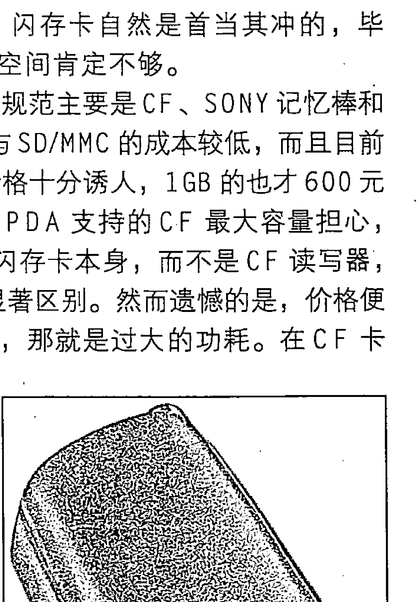相对狭窄。
在如今的PDA中，背夹概念正逐渐形成。通过各种背夹，我的PDA可以十分方便地扩展PCMCIA插槽、CF插槽、GPRS网卡、蓝牙网卡等（图10）。当我们不需要这些设备时就可以将背夹卸下，这样也提高了便携性。对于一款PDA而言，能够使用PCMCIA背夹无疑是幸福的，因为几乎任何产品都会有采用PCMCIA接口的型号，而且价格也会比采用特殊接口的产品便宜不少。相对而言，CF与SD的应用面要狭窄一些，特别是后者。尽管东芝已经推出了SDIO标准，可以使用SD接口的网卡等设备，但是SD产品还是奇货可居，价格更是高得惊人。此外，并非所有的SD接口都能支持SDIO，允许用户采用SD网卡，这是大家在扩充设备时需要注意的。

相对而言，不少用户更加关注PDA的电池问题，毕竟如今的电池技术令人不敢恭维，而且随着时间的推移，即便是锂离子电池也会缩短使用时间。为此，采用各种带有外接电池的背夹是不错的选择，其容量在900mAh ~ 1600mAh之间，可以有效延长PDA的使用时间。此外，对于那些需要使用CF卡或者无线网卡的用户，我们也强烈建议大家多花几百元买一款同时带有电池的背夹，毕竟CF卡以及无线网卡都是电老虎。

除了功能扩充，PDA的输入设备也得关注。部分用户几乎一直在用PDA输入文字，此时仅仅采用手写笔确实太累了，可以考虑一下转为PDA推出的折叠式键盘。Pockettop、Stowaway、BENQ、罗技等多推出了不少型号的PDA键盘，我们的选择余地还是很大的。

## 3. 升级PDA硬件

RAM空间不足或许是令不少PDA用户感到最为难的事情了，尽管闪存卡可以替代，但是巨大的耗电量以及速度都是不如RAM。为了让自己的PDA能够安装更多的应用程序并且提高运行速度，想必很多用户都希望增加RAM容量。
客观而言，增加PDA的RAM容量并非不可能，毕竟大多数PDA所采用的RAM也无非是SDRAM芯片。通过自行焊接内存芯片，我们完全可以实现添加内存。不过，要做到这一步必须要有多年的焊接经验者方可动手，一小粒溅出的焊锡足以让整台机器报废。至于内存芯片，建议大家使用笔记本内存的芯片，这样可以保证较小的功耗，不至于严重影响PDA的电池能力。同样的道理，ROM容量也是可以升级的。但是要提醒大家的是，升级操作尽可能交给商家，除非你是“八级电工”，毕竟整个过程还是有相当的危险性。

麻雀虽小，五脏六腑俱全，PDA完全具备台式机的基本结构，因此其处理器也是可以超频的。适当提高PDA处理器的主频之后，其性能也会较为明显地提升，而且只要掌握好分寸，并不会对硬件造成伤害。从理论上说，任何PDA都是可以超频的，不过问题的关键在于我们能否找到这些超频软件。以Palm为例，Afterburner与Fast CPU是两款超频利器，它们专门针对龙珠处理器，而且使用十分方便（图11）。以Fast CPU为例，执行该程序之后选定超频后的主频，然后点击“ACCEPT”确认，这样Palm中所有的应用程序就会工作在你所指定的频率下了。更为令人惊讶的是，Fast CPU的考虑十分周到，它允许用户专门针对某一个应用程序进行超频，这样可以节省功耗。相对而言，Afterburner的功能逊色一些，不过也能达到超频目的。

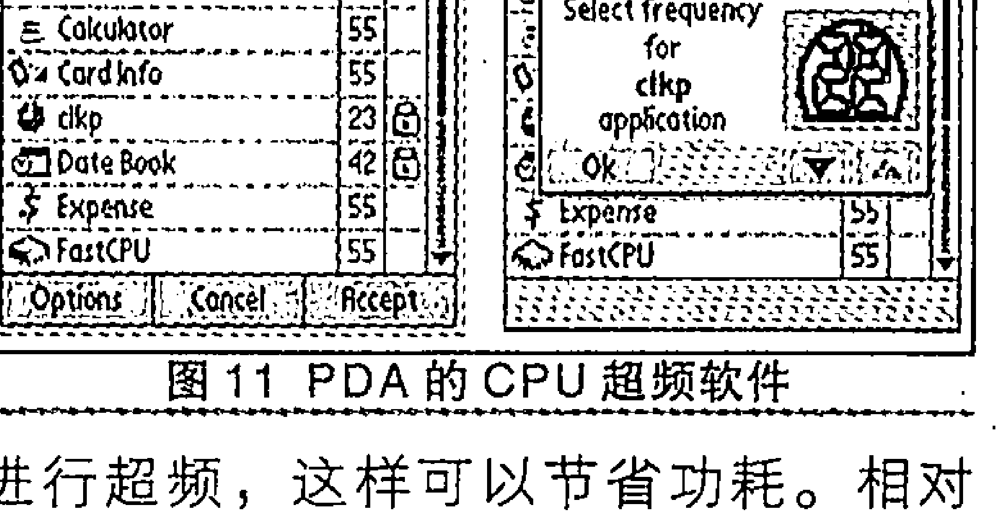

## 解决PDA与智能手机的上网难题

使用PDA以及智能手机上网可谓别有一番乐趣，尽管屏幕尺寸较小，但是TFT液晶屏还是非常养眼。如果为PDA配备普通56K Modem，那么通过拨号上网并不是什么难事，基本方法与台式机完全一致。但是这种上网方式并不轻松，而且也不适应如今的宽带时代，无论是成本还是速度都难以令人满意，为此我们将推荐更加出色的Internet连接方案。

### 1. 通过USB接口共享上网

这一方法几乎不需要额外花费任何投资，而且速度也有保障，唯一的不足便是需要数据线连接台式机。事实上，使用USB接口共享上网就是将台式机视为Proxy服务器，甚至我们不需要进行任何设置，因为智能化的ActiveSync已经帮我们搞定了一切。

### 2. 使用蓝牙对等网

尽管采用USB数据线的Internet共享成本很低，但是这样毕竟使用起来还是有束缚感。如果你的PDA已经具备了蓝牙网卡的话，我们还可以采用更加先进的无线上网。而此时所要添加的仅仅是用于台式机的蓝牙适配器，其价格并不高。首先打开PDA的设置，然后进行连接单元中的网卡属性。为了通过对等网蓝牙连接，我们必须为当前网卡制定IP地址，一般设定为192.168.0.2，此外子网掩码设定为255.255.255.0，而默认网关保持空白。至于PDA上网卡对应的DNS域名解析，请大家千万不要设置，不然会导致对等网失效。随后，我们可以将台式机的蓝牙适配器IP地址设定为192.168.0.3，即保证两者在同一网段。
PPC操作系统上IE默认的连接方式是使用Modem，因此我们还得对连接设备进行更改。这一步不难做到，直接进入连接设置然后将Modem选择为Bluetooth即可。最后我们不能忘记在IE中设置代理服务器，其地址就是台式机上蓝牙网卡的IP地址，而端口一般设定为80。

### 3. IEEE802.11b无线上网

目前整合蓝牙网卡的PDA并不多，不过我们还是可以用扩展卡来解决问题。事实上，无线网络技术中，IEEE802.11b也相当不错，速度以及有效传输范围都胜过蓝牙。当我们添加一块CF接口的IEEE802.11b网卡之后，就可以在IEEE802.11b无线路由器的帮助下上网了。令人高兴的是，由于IEEE802.11采用自动配置，因此我们根本不需要进行任何设定，对于不在乎成本的用户而言，这无疑是最佳的解决方案。

### 4. GPRS无线上网

运用GPRS无线互联，可以随时与任何人进行沟通，及时获取信息，延伸我们的“手”和“眼”。在GPRS手机的帮助下，我们的PDA也可以做到无线上网。利用GPRS手机上网时，我们主要通过红外线与PDA进行传输。

在PDA中配置红外线十分简单，使用大家较为熟悉的拨号向导即可。首先建立一个Internet普通连接，这一步最重要的是在选择设备时选择“红外线Modem”，这一点在后来是否能够实现顺利上网是关键的一步。

下一步就要输入上网的拨号号码，对于国内的GPRS业务来说，拨“*99#”就可以实现上网，至于区号就不用填了。在接下来弹出的Timeout设定以及额外拨号对话框也可以完全忽视，不用填任何东西，最后给这个拨号取个名字，一个连接就建好了。当然，在使用时我们必须保证手机开通了GPRS服务，而且同时打开手机的红外线端口，并且注意摆放角度。

为了不干扰手机，大家也可以采用PDA专用的GPRS无线网卡。在正确安装GPRS无线网卡的驱动之后，我们就可以在系统属性中看见相关的设备，只有在保证这一点的前提下才能进行下一步的设置。连接GPRS需要厂商特别提供的应用程序，因为PDA操作系统并未集成。打开GPRS连接向导之后，我们可以输入具体的用户名、密码、DNS等信息，这些内容都要参考当地的移动通讯公司。由于大多数GPRS无线网卡都有十分出色的连接向导，因此设置时还是较为方便直观的。

## 在PDA与智能手机上看电影

小巧玲珑的PDA比笔记本更加适合随身携带，而使用PDA观看电影无疑是很多用户的梦想。从硬件配置来看，如今使用400MHz Xscale处理器和PPC操作系统的PDA也的确具备相应的软硬件素质，然而很多用户还是因为PPC操作系统与Windows区别很大而难以熟悉。事实上，在PPC上看电影并不难，大家可以跟着我们一起操作。

### 1. 将DVD转制成WMV

DVD片源总是较为丰富，而我们的PPC操作系统已经内置了Windows Media Player播放器，此时将DVD转制为WMV视频格式将是很好的解决方案。推荐大家使用DVD To Pocket PC，

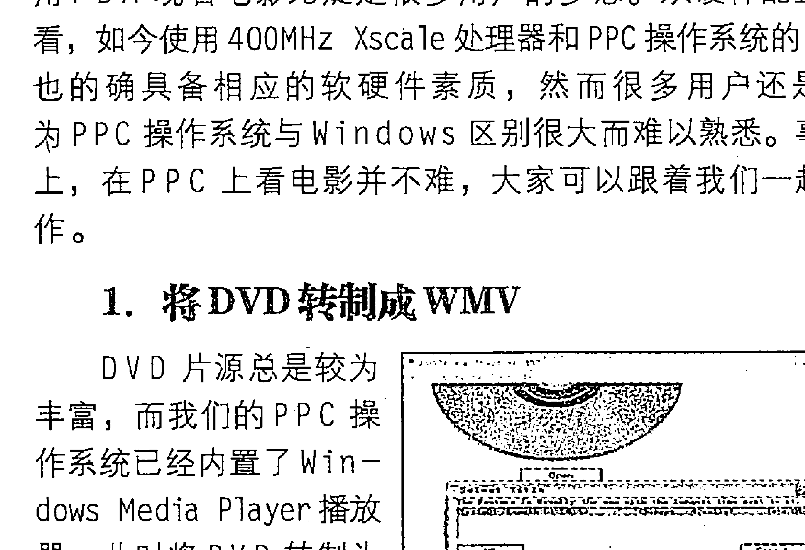

可以到http://www.ttdown.com/SoftView/SoftView_18841.html下载。

DVD To Pocket PC内置了WMEncode 9.0，支持多种字幕和音频，而且只需要两个步骤即可完成整个转制过程（图12）。

安装好DVD To Pocket PC之后，通过Open菜单打开DVD-Video光盘中的VTS_01_0.IFO文件，然后选择DVD的Title。

随后选择Input Setting菜单，这里可以对DVD字幕、编码开始位置等参数进行设定，大家根据自己的要求进行选择即可。

当回到DVD To Pocket PC的主界面之后，选择好闪存卡的容量，然后按下“Action”按钮，此时DVD To Pocket PC就会自动根据指定大小进行视频转换，并生成相应的WMV文件。

接下来的步骤就更简单了，将WMV文件复制到闪存卡，然后插入PDA，启动Windows Media Player播放器。由于PPC平台的Windows Media Player播放器兼容性很好，不存在编码器版本的问题，因此总体效果令人十分满意，特别是部分使用真彩液晶屏的高端产品，此时的画质非常理想。

### 2. 在PPC上收看RM

RM视频的压缩率非常高，因此也很适合对文件体积敏感的PDA。事实上，Real已经为PPC平台推出了专用的RealOne For PPC，可以播放RM视频。但是非常棘手的问题是，此时的RM编码速率不可以超过100Kbps。太高的编码速率对于屏幕很小的PDA没有意义，同时也令PDA现有的硬件资源无法顺利解码。

对于已经超过100Kbps限制的RM文件，大家需要使用WMEncode对其进行转换。但是默认状态下的WMEncode9并不支持RM，因此大家还需要安装“暴风影音”这个插件（http://ringz.doggiehome.com/download.htm），这样无论是WMEncode还是WMPlayer都可以兼容RM格式。

随后打开WMEncode，通过向导功能选择文件转换功能。在随后的向导操作中，一定要将“如何分发内容”选择为“PocketPC”，并且后续的参数不要进行修改，这样就能得到完美的兼容PPC平台的视频文件。最后你就可以如法炮制，将生成后的WMV视频文件放在闪存卡上，通过PDA专用版的Windows Media Player观看。

## PDA与智能手机常用软件大观

PDA最大的魅力在于其丰富的应用软件，以往Palm在这方面具有十分明显的优势。不过，随着PocketPC阵营的壮大，如今运行于PocketPC平台的软件也十分多。客观而言，用户的选择范围还是十分宽广的。我们将针对Palm以及PocketPC分别推荐各类软件中的经典，不求面面俱到，只希望给新手们一些指引。事实上，PDA软件的使用还是十分简单，我们也没有必要一一说明，作为一个PDA老手，熟悉各种软件的作用才是最为关键的。在使用多款软件的过程中逐渐掌握PDA的精髓，这也是很多PDA高手走过的经历。

### 1. 中文汉化

并非所有的PDA都采用简体中文操作系统，因此寻找一个合适的中文平台十分重要。特别是Palm OS，如今直接采用中文Palm OS的产品屈指可数，而PocketPC也会因为ROM空间不足而不能安装中文版操作系统。

Palm推荐：CJKOS+蒙恬
CJKOS中文系统是杜室工作室开发的产品，它将英文Palm OS提升为支持中、日、韩文的多国语言系统，并且让用户可以输入汉字。CJKOS的稳定性十分出色，占用的空间也不大。至于中文手写输入，Palm为数不多可以依仗的就是蒙恬了，当然汉王笔也是可以考虑的。

PocketPC推荐：CE STAR
Win 3.X时代的中文之星想必大家都不会陌生，而如今的CE STAR却在PocketPC上重塑辉煌。CE STAR的体积并不大，但是提供的功能却不少。除了中文显示支持，它还可以汉化界面并且提供中文手写功能。

### 2. 文字处理软件

Palm推荐：SmartDoc+ QuickSheet
在Palm OS上使用Word以及Excel并不是什么难事，通过SmartDoc与QuickSheet，Palm OS也能完美地查看并且编辑Office文档。

PocketPC推荐：操作系统自带
PocketPC操作系统自带了Pocket Word以及Pocket Excel，而且功能十分强大，因此我们无需为此担心了，毕竟这也同样出自微软之手，兼容性自然不在话下。

### 3. 电子书浏览

Palm推荐：Book Wormie+ 优硕电子书阅读
Book Wormie最大的优点便是对双字节中文具有良好的兼容性，而且支持彩色现实。此外，它还具有字形设定、自动卷动、书签等功能，非常实用。此外，优硕电子书阅读也是一个很好的补充，它提供对PDF、HTML、XML格式的支持，而且包括即将成为国际标准的U.S. Open-eBook。

PocketPC推荐：CEBook
CEBook可以说是PPC平台上的王牌阅读软件，除了具有全球首创中文直式浏览阅读模式外，经由卓越的最佳化核心程序技术，提供极佳的执行效率。CEBook的一大特色，是可直接读取ZIP压缩与Pocket Word及Note档案，不需事前解压与转换档案。此外，CEBook支持图文并茂的文档并且允许超链接。

### 4. 看图软件

Palm推荐：HandStory
HandStory最大的特色是配套齐全，方便易用。实际上，HandStory不只是个看图程序那么简单，更是一个电子书阅读器。至于兼容性，HandStory也令人十分满意，主流图像格式都能支持。

PocketPC推荐：iHavePhotos
尽管PPC已经内置了看图程序，但是功能相对简单。不过iHavePhotos就丰富多了，它不仅支持多图片缩略浏览，还能对图片加密，这对于保护用户的隐私有一定的帮助。当然，iHavePhotos的最大特色还在于同台式机之间的协同工作，通过台式机的iHavePhotos程序，PPC可以红外线直接访问台式机中的图片。

### 5. 抓图软件

Palm推荐：ScreenShot Hack
ScreenShot Hack是在Palm OS中一款不可多得的彩色抓图软件，而且支持任何Palm机型。在多媒体功能方面，Palm一直不如PPC，因此也缺乏优秀的抓图软件。不过ScreenShot Hack支持高解析度及高彩色模式，可以表现出不亚于PPC的水准。

PocketPC推荐：CECapture
CECapture是一款完全免费的抓图软件，它采用热键操作模式。虽说CECapture的功能相对简单，只能进行全屏抓图，而且支持的格式只有BMP以及JPG，但是基本上还是能够满足我们的需求；毕竟PPC的视野本来就不大。此外，CECapture体积很小，兼容性也不错，不会出现热键失效的情况。

### 6. 字典软件

Palm推荐：English Pro Dictionary+金山词霸
Palm平台上的中英字典并不多，不过出色的英英字典倒是不少。English Pro Dictionary包含90000单词、2500词组，其容量完全能够满足非英语国家的用户。此外，这款字典使用不同的压缩运算法则，压缩比达到50%，因此比较节省空间。事实上，英英字典也有其优势，特别是对于大学生而言，毕竟英英解释比较地道。当然，需要中英字典的用户可以选择金山词霸For Palm版本。

PocketPC推荐：金山词霸
与Palm平台相比，PPC的字典软件就更少了，而金山词霸是其中的佼佼者。由于PPC本身具备较大的RAM空间，因此我们可以安装很多专业词库，这也在客观上保证金山词霸For PPC在内容上更加完整。

### 7. Launcher程序

由于PDA的视野很小，因此各个程序之间不能像Windows桌面那样平铺。毫无疑问，此时使用优秀的Launcher程序来管理是十分必要的。尽管Palm OS以及PPC都内置了该功能，但是基本上无法满足我们的需求。

Palm推荐：Launcher III
Launcher III的界面十分整洁，这也是一款Launcher程序必备的素质。Launcher III允许用户采取拖放图标的方式，来传送文件、删除文件和找回应用程序信息。显然，在Launcher III的帮助下，Palm OS的重要性也降低了，不过Launcher III也仅仅是一个外壳。

PocketPC推荐：StarTap
StarTap具备桌面管理、菜单重排、壁纸更换等多种功能。此外，StarTap还提供程序之间的切换执行，点选Star图标之后，就会列出PPC执行的程序列表，此时再次点选其中的程序，便可马上切换至该程序了，十分方便。

### 8. 信息理财管理软件

Palm推荐: Mobile Money

Mobile Money是一款十分出色的个人理财软件，在各方面的设计都十分贴心。配合银行账户管理以及日常支出功能，Mobile Money可以帮助你把一切安排得井井有条。此外，Mobile Money所有输入数字的地方都可以随时呼叫计算器进行计算，支持多账号、多币种、定时事件（比如每月固定的发薪事件和扣除贷款的事件）等等。

PocketPC推荐: Cash Organizer 2002

Cash Organizer 2002是一个典型的理财管理的软件，特别是适合个人用户。Cash Organizer 2002可以记录你每日的现金流水账，而且它包含计算器的功能，自动填入过去有记录的商品价钱和自动完成加总的计算，减少在转换屏幕之间的时间。它的贴心功能是预算你未来的财务状况和规划你一周重复使用的费用如交通费。当时间一到，它自动提醒用户，交互式的系统可以帮你分析财务状况或未来目标。

### 9. 媒体播放软件

Palm推荐: gMovie Player+PalMooVId

不得不承认的是，Palm在多媒体方面的表现远远不如PPC，硬件基础的缺乏也导致软件无法跟上。以目前流行的WMV、RM、DivX等多种格式为例，在Palm OS 4.X以下很难找到满意的软件。或许Palm OS5.0已经改变了颓势，但是毕竟如今大多数Palm还是基于OS 4.X。gMovie Player是款专为Palm装置设计，能够播放gMovie格式之影片、动画以及静态图片的免费播放程序。不过gMovie格式需要在台式机上通过对MPEG、AVI等格式进行转换。当然，PalMooVId可以直接播放标准AVI，而且支持高彩（64k色）。

PocketPC推荐: Windows Media Player+RealOne For PPC+BetaPlayer

这三者的组合可谓是PPC上的经典，它们帮助PPC做到可媲美于台式机的媒体格式兼容性。从界面以及功能来看，三款软件都表现地十分不错，几乎已经让人无可挑剔，或许唯一使我们为难的便是其较大的体积。

最后给大家列出一些常用PDA软件下载地址。

- 掌上先锋 http://www.pdasky.com/
- CoolCE: http://www.coolce.com/
- 硅谷动力: http://download.enet.com.cn/index.shtml
- Echoice: http://www.echoice.com.cn/
- PCHOME: http://club.pchome.net

## 别错过送礼的好时节

年关将至，我们这些搞销售的可忙坏了。先是四处奔波，找各家客户结账。12月开始，又四处奔波，请客送礼。圣诞、元旦、春节，这一连串的节日，我们就像磕头虫一样，疯狂拜访客户，挨家挨户磕头送礼。这时候还时不时有电话来找我：“老谢啊，最近有空吗？我们一起吃个饭……”

谁有这闲工夫啊！挂上电话，我忽然发现：大家都在疯狂请吃饭，送大礼。我送出去的礼物，那些客户记得吗？

### 电脑自动提醒

居然平常用的Outlook自带生日提醒功能！把客户联系人的生日、重要纪念日直接输入到联系人的详细信息里面。程序就会自动加入年度事件，提前在“Outlook今日”中显示，以示提醒。PPC上的Outlook也有类似功能。

自动提醒的提前时间、提醒方式等设置，以添加联系人生日时的Outlook默认设置为准。

### 掌中随身提醒

办公室有同事还用的是Palm系统的手机。吴伟也找到了解决方案：可以安装HappyDays这个小程序。启动它，就可以自动把联系人当中的生日信息提取出来，加入待办事项，或者设置为约会事件，这样就可以得到自动提醒了。

注意：联系人信息里面的生日必须按照“日/月/年”的格式记录，否则就无法正确识别。要是一不小心把生日的日期和月份搞混了，送错了礼物，岂不是要闹出笑话？这个小程序还提供了农历/公历换算的小工具，非常实用。

没有PDA的同志们开始长吁短叹了。其实大可不必，因为现在的手机也大多提供了日程管理和定时约会提醒功能。把手机说明书找出来好好研究一下就能自己搞定了。

### 送礼有人代理

生日和节日不同，送礼自然也不同。生日，送上一张工整的贺卡，就能产生很好的效果。不过，到商场、超市里面去挑贺卡挺麻烦，所以我们就在网上挑，在线支付，然后由网站代我们寄。

http://kaxiu.bny.com.cn/channel/100014/default.shtml

同时送上鲜花也是不错的选择。而且也可以坐在办公室通过网络搞定。

http://www.eastflower.net/

有一位成功企业家说过，在中国做生意，离不开人情关系。所以千万不要小看这一张贺卡，一束鲜花，没准就能换来一张百万元的订单。不信？你试试看！

（老马）## 技术回顾——2005年数码影像技术和发展

作为一个涉及亿万消费者、市场潜力无穷大的行业，影像服务已经成为人们生活的一部分，全国每年影像消费高达数十亿元。数码照片的出现就像是一根导火索，它将带领整个行业产生翻天覆地的变化。为此，打印机厂商不遗余力地开发适合照片打印的产品，而传统彩扩巨头也绞尽脑汁去抢占市场份额。数码输出技术正以令人难以想象的速度发展，以喷墨打印为雏形的照片打印机以及从传统银盐彩扩演变而来的数码彩扩成为两大主流解决方案。

## 照片打印机：全方位进军数码输出市场

### 1. 精细度的飞跃

数码相机的普及直接引发市场对照片级打印机的需求。然而，实现照片级打印并不是一件简单的事情。在经过很长一段时间的过渡之后，如今主流喷打技术终于趋于成熟，可以做到了超越传统银盐彩扩的水准。在感叹输出水准飞速发展之时，我们也不能忘记喷墨打印机底层技术的重大改进。

#### (1) 气泡喷墨打印技术

气泡喷墨打印机的工作原理与火山喷发的道理有些相似。在火山喷发前，高温会产生并积累地表下的压力，当压力超过一定数值后，岩浆会带着泥土和岩石喷发出来。而气泡喷墨打印机的压力积累和墨滴喷射过程都是由打印头以微米级精度控制的。当数以千计的加热器生成足够的压力之后，标准大小的墨滴以极快的速度从喷嘴中喷射出来，准确无误地打印在纸张或其他介质上。

更为重要的是，以佳能为代表的打印机厂商还改进了气泡喷墨打印技术的工作流程，喷嘴和加热器的工作步骤简化为加热→气泡生成和膨胀→喷射→消失，与传统技术相比省略了加热过程，并且将气泡生成过程与膨胀合而为一。如此一来，新款照片级喷墨打印机所带来的精度大幅度提高，从而彻底表现出令人满意的数码照片输出效果。

#### (2) 压电式喷墨技术

在压电式喷墨技术中，墨水是由一个和热感应式喷墨技术类似的喷嘴所喷出，但是墨滴的形成方式是借助缩小墨水喷出的区域来形成。而喷出区域的缩小，是借助施加电压到喷出区内一个或多个压电板来控制的。由于墨水在高温下易发生化学变化，性质不稳定，所以打出的色彩真实性就会受到一定程度的影响。另一方面，由于墨水是通过气泡喷出的，墨水微粒的方向性与体积大小不好掌握，打印线条边缘容易参差不齐，在一定程度上影响了打印质量。然而改进后的微压电打印头技术是利用晶体加压时放电的特性，在常温状态下稳定地将墨水喷出。微压电打印头技术有着对墨滴控制能力强的特点，容易实现1440dpi以上的高精度打印质量，且做压电喷墨时无需加热，墨水就不会因受热而发生化学变化，故大大降低了对墨水的要求。

在墨滴控制方面，微压电方式还有一些先天的特殊优势。我们知道，由于墨滴极小，墨水喷嘴是非常细的，比头发丝还要细得多。在如此细微的局部内，喷嘴处墨水液面的表面张力便显得非常可观，一般墨滴形状不规则、墨滴喷溅等问题很大程度上都是这个液面张力在作怪。而微压电方式由于是靠压电芯片控制，可先将墨滴向后拉，再向外推射出去，就像离弦的箭一样，射出的墨点非常浑圆。依靠推和拉两个方向的动作，微压电喷嘴可以实现独特的液面控制技术，最大限度地减小了液面张力对墨滴形状的影响，不会形成喷溅，同时还使得墨滴喷射方向稳定，墨点的着纸位置也更精确。

#### (3) 墨滴控制技术

打印效果的好坏与细腻度休戚相关，而大多数用户认为决定细腻度的技术指标便是喷墨打印机的分辨率。诚然，分辨率的作用确实不可小觑，但是从某种程度而言，打印机的墨滴控制技术更为重要。分辨率仅仅是理论上的精度，牵涉到实际打印效果时，更精细的墨滴才是关键。为了能如实地再现原有图像，墨滴必须极小，且分布极其精确。但是随着墨滴尺寸的缩小，图像质量也会因墨滴大小不均匀以及在打印介质上定位不准确而受到一定影响。为此，佳能开发了超精微墨滴技术，令气泡喷墨打印效果突飞猛进，此后EPSON、HP以及Lexmark等厂商也迅速跟进。

经过对人眼光学特性的仔细研究，打印机厂商发现可以通过缩小墨滴尺寸，降低着色浓度，即可大大减小颗粒感。在通常的着色浓度下，当喷墨量低于1微微升时，人眼看不见墨点。着色浓度越低，越不容易发现形成的墨点，也就降低了颗粒感，使人眼看上去的墨点比它们的实际尺寸还要小。如今2微微升超精墨滴技术已经广为应用。超精微的墨滴技术对打印质量尤其是照片打印质量的提升也是极为明显的，精确、超精微的打印墨点分布有效地减少了画面的颗粒感，使色彩明暗过渡均匀，即使是细节也能得到最佳的再现，而且无论在普通纸张还是特殊纸张都能实现超照片等级的独特打印效果。

### 2. 突破速度的极限

速度问题一直困扰着打印应用，业界期待技术上的突破。尽管与数码彩扩方式相比，以打印机为基础的数码打印方式已经具有时间控制方面的优势，但是更多的用户还是对打印机的速度提出更高的要求。客观而言，如今主流喷墨打印机已经完全解决了文本打印时的速度问题，惟一需要改进的便是数码照片输出的速度。

从整个工作流程来看，打印机的打印头无疑是至关重要的，甚至可以说是直接决定打印速度的关键。为了在速度上取得突破，各大厂商通过对其打印头的改进设计而力争保持技术领先地位。以最新款的佳能Pixma系列照片打印机为例，打印头上的喷嘴数目达到3072个，六种独立颜色各具备512个喷嘴。毫无疑问，如此多的喷嘴数目对于提高打印速度的确大有裨益（图1）。

另一方面，打印机的机械控制装置也十分关键，各大厂商都在不遗余力地改进技术。佳能通过高效率的步进马达、小车马达、进纸马达和清洁（维护）马达组成完善的工作系统，每个马达各司其职，避免了以往马达需频繁进行功能切换的麻烦，节省了切换时间，从而提高了打印速度。另外，利盟使用了Accu-Feed无忧精确进纸系统，通过一组连续的齿轮和一套变速系统来发挥功能，不仅保证供纸的稳定性，更提高了打印速度。

### 3. 色彩的奥秘

喷墨打印市场竞争激烈，厂商无不持续提升打印技术。如今爱普生、佳能、惠普都已经使用了七色打印技术，将影像输出科技带入七色打印时代。对于照片打印机而言，色彩表现的重要性毋庸置疑。为了达到更好的色彩过渡，采用多个颜色的墨盒是必然的。伴随着墨盒颜色数的提升，其整体色彩表现将会上一个台阶。

从三色打印到四色打印，乃至现今的六色以及最尖端的七色打印，每一步发展都凝聚了极大的科研投入并获得立竿见影的效果。七色打印技术除了包含六色打印中的黑色、青色、照片青色、黄色、品红、照片品红六种墨水外，又加入橙色，能够将明暗度及中间色调完美地表现出来，扩展了打印机红色部分的色彩空间，使图像的色彩再现有如胶片一样丰富艳丽，达到真实照片重现的效果，而且深浅不同的墨水可以使得灰度打印效果更加出色。除了多色打印，色彩优化技术也开始得到广泛应用。如Epson的PhotoEnhance、HP的富丽图等，这些都能在一定程度上改善色彩表现。

### 4. 即拍即打呼声渐高

作为外设产品，打印机的人性化设计更为重要，用户将直接从中获取更多的方便，甚至将打印作为一种乐趣。对于部分用户而言，电脑似乎永远是神秘莫测、琢磨不透的，因此让打印机脱离电脑，使之向信息家电靠拢成为厂商新的发展方向。如今不少专供数码照片打印的喷打确实受到了市场的欢迎，通过整合的闪存读卡器，打印机可以直接读取数码相机所拍摄的照片，然后通过内置的滤镜实现简单而卓有成效的后期加工处理，一气呵成地输出精美照片。对于商业用户以及预算充裕的数码影像玩家而言，这类产品自然是相当不错的选择。

然而集成闪存读卡器、液晶操作屏令打印机的成本陡然提升，这是很多用户万万不能接受的。为了解决这一问题，打印机厂商推出了数码相机直接打印协议。但是正如所有的产品技术一样，兼容性始终是摆在第一位的。无论是佳能的“Bubble Jet Direct”标准还是爱普生的“PhotoPC DIRECT”技术都遇到了很大的阻力，因为其打印机无法保证兼容所有的数码相机，此时“即拍即打”成了一句空话，即便在数码相机市场具有很高产品占有率的佳能也不例外。

近年内兴起PictBridge技术可谓扭转了局面。从技术角度而言，这或许并没有太多的创新之处，但是由于得到了惠普、索尼、爱普生、奥林巴斯等八大厂商的鼎力支持，因此彻底解决了与数码相机之间的兼容性问题。更为令人欣喜的是，PictBridge技术巧妙地利用了数码相机中的LCD显示屏，并通过其特定标准，直接使用线缆进行数据传输；不需要为了兼容不同规格的闪存卡而配置多款读卡器。毫无疑问，在这一使用环境下，用户所得到的便捷性丝毫不亚于高价位的照片打印机，毕竟此时同样能够通过数码相机中的LCD显示屏控制各个打印参数，而且利用线缆进行数据传输也更为方便，避免频繁地插拔闪存卡。

目前能够支持PictBridge技术的打印机以及数码相机已经有不少，我们使用了佳能EOS10D数码相机和i990照片级喷打。首先通过EOS10D的菜单将Communication输出方式设置为“PTP”。随后在关机断电状态下连接USB线缆，将数码相机与打印机直接相连（图2）。接着按下“Play”键，若数码相机的LCD左上角出现表示激活PictBridge模式的图标，则表明PictBridge模式已经被激活，此时可以通过数码相机的LCD操控打印机。通过上下键选择需要打印的照片，然后调用各级菜单进行分辨率、纸张、无边距模式等打印参数设置，具体方法与图像处理软件类似，只不过此时使用数码相机的按键。

## 四大主流数码冲印设备

### 1. 柯达LEDII 20P (图3)

从命名上我们也可以看出，柯达的这款冲印设备采用了发光二极管曝光技术。尽管这项技术的成像质量比较一般，清晰度有所不足，但是在8英寸以下的小面幅输出时根本感觉不到明显的缺陷（传统35mm照片相当于5英寸），对于那些以冲印小面幅照片为主的用户而言是很好的选择。值得一提的是，柯达LEDII 20P是一款专业用于数码冲印的设备，它并不存在胶片输入部分。对于一款彩扩设备而言，做到术业有专攻是十分重要的，这样可以保证数码冲印的效果不受其他因素的影响。柯达LEDII 20P的输出速度很快，每小时能输出200张8'×10英寸照片，因此国内大多数采用这款设备的柯达连锁店都能实现隔天取照。由于柯达LEDII 20P的最大输出尺寸达到了20×32英寸，因此它在婚纱照片、广告设计等领域有不错的前景。作为业界知名的彩扩技术先驱者，柯达的发展十分全面，LEDII 20P的应用层面很广，具有很大的潜力。

### 2. 富士Froniter 3XX

富士一直是柯达强有力的竞争对手，面对偌大的数码冲印市场，采用激光彩扩技术的Froniter 3XX系列在市场上具有相当不错的口碑。Froniter 3XX分为输入设备与输出设备，输出设备就是激光彩扩机，而输入设备则是由高精度扫描仪与专用图像处理设备构成。富士Froniter 3XX系列对用户的照片来源具有很强的适应能力。无论是闪存卡、软盘、MO、ZIP、CD-ROM还是传统的135、120、ASP胶片，它都能在扫描仪的帮助下轻松地将照片扫描进专用的图像处理设备。由于Froniter 3XX的输出部分采用了激光技术，因此照片清晰、逼真，完全能够令那些对品质挑剔的用户满意。此外，Froniter 3XX的速度也很快，主流型号的Froniter 370每小时可以输出1450张6英寸的照片。唯一遗憾的是，目前这项技术的成本稍高。

### 3. Konica QD-21 (图4)

Konica在欧美市场具有相当的知名度，只不过由于进入中国市场较晚而失去了与柯达、富士竞争的机会。不过，Konica的实力还是有目共睹的。在激光彩扩技术与发光二极管曝光技术大为流行的趋势下，Konica反其道而行，推出成本低廉的荧光管彩扩设备，起到了很好的市场效果。在国内，不少中小型数码冲印店就采用Konica QD-21。Konica QD-21的速度可以傲视群雄，每小时可以输出800张6英寸的照片，因此“World's fastest film processor”一直是Konica的宣传标语。当然，仅有速度还是远远不够的，品质的追求同样不能放松。尽管Konica QD-21采用了技术指标较低的荧光管，但是在一般应用场合下，普通用户对其品质也能完全满意，而且它对照片纸的要求不高，因此成本上的优势是难以动摇的。

### 4. 宝丽丽彩激光数码扩印

来自意大利的宝丽公司也是彩扩领域的强者，由于宝丽丽彩激光彩扩设备主要用于专业级的图片社，因此普通消费者难以接触到。从工作原理来看，宝丽丽彩激光彩扩设备与富士Froniter 3XX十分相似，但是从技术指标来看，宝丽显然要更加专业化。由于宝丽丽彩激光彩扩设备采用了独特的内鼓式激光扫描工艺，因此输出面幅达到20英寸，远远超出富士Froniter 3XX系列。宝丽的曝光原理是采用了红、绿、蓝三色激光，通过自动聚焦光导纤维合成白光进行曝光，故无需担心三色重叠或激光束扩大，从理论上保证了色彩的完美再现。独创的气压悬浮技术配合每分钟30000转直线马达，保证了高速曝光时的高精度，即使小于1英寸的图像也能清晰再现。也许宝丽丽彩激光彩扩设备太过专业化了，它在图片社频频亮相，但是民用数码彩扩市场却鲜见其身影。随着民用市场的技术竞争逐渐激烈化，相信这款高档设备早晚会下嫁民用市场。

## 数码打印 Vs 数码彩扩

数码产品在过去几年中取得了令人欣喜的进步，市场普及度迅速提高。作为数码产品之首的数码相机更是得到了市场的广泛认可，这一昔日高贵的设备如今也在普通用户手中频频出现。然而，很多数码相机用户都有这样感受：尽管数码照片不使用胶卷，拍摄十分自由，但是放在电脑上看毕竟与传统的纸媒体照片有所不同。对于一些自己的得意之作，相信绝大多数人都想通过数码打印来永久地保留，以便随时随地欣赏。如今主流照片打印技术终于趋于成熟，完全做到了超越传统银盐照片的水准。此外，数码冲印也逐渐走近我们，传统彩扩店都将数码彩扩作为新的服务。一时间，原本若即若离的数码照片输出变得现实而可行，如何选择合理的输出方式也成为最为令人关注的话题。

### 1. 大批量数码冲印：品质区别很重要

当我们需要大批量输出数码照片时，数码冲印几乎是惟一的选择，毕竟照片打印机的速度以及成本让很多用户无法接受。从技术上来看，数码冲印与传统冲印截然不同。传统冲印利用光学透镜，通过投影原理将胶片上的影像投射在相纸上，从而实现曝光。而数码冲印是直接通过数码照片获取色彩信息，然后在相纸上曝光。不过这并不是说数码冲印就能在效果上出类拔萃，具体还需要高质量的冲印设备以及照片纸来实现。同样，数码打印也并不能一概而论地去评判其效果，不同数码打印机的效果存在明显差异，甚至更换一台照片打印机就能让人看出显而易见的区别。

然而不可否认的是，数码冲印作为服务性行业，其整体质量还是高于数码打印，特别是在纸张质量以及照片裁剪方面。如果要实现匹敌普通数码冲印的效果，那么用户至少需要使用千元以上的中高端照片打印机。更为诱人的是，很多商家为吸引客户甚至提供免费的数码照片后期处理。不过还要特别提醒大家，目前有不少小规模的私人数码冲印馆仅仅采用传统冲印设备改造成数码冲印，此时效果令人无法满意。如果再将成本控制应用到至关重要的纸张，那么效果就更大打折扣。

不同数码冲印店价格差异很大，造成这一现象的原因固然有市场不够成熟的一方面，但是商家采用的设备不同也是不可忽视的因素。目前数码冲印系统可以分为两大类：光发射式和光阀门式。相对而言，光发射式成本更低，在民用市场有着较为广阔的前景。从当前的技术发展趋势来看，同属于光发射式的发光二极管曝光技术与激光彩扩技术前途无量。当然，光阀门式也并非没有市场。微光阀技术具有分辨率高、对比度出色等优点，但是微光阀的曝光控制具有一定难度，因此成本还是较高。

在民用市场中，发光二极管曝光技术与激光彩扩技术已经算得上的高端设备。激光彩扩的优势在于高清晰度以及出色的色彩表现，而发光二极管曝光技术虽然清晰度略逊一筹，但是其色彩表现力与成本都更具优势。除了以上两大技术，传统的荧光管彩扩设备经过改装之后也可以实现数码照片输出，这也是很多传统彩扩店得以在短时间内迅速推出数码彩扩业务的原因，但是整体输出效果较为一般。对于消费者而言，建议更多选择柯达或者富士的连锁店，网上一些知名的在线冲印站点也可以考虑。对于中小图片社或是冲印馆，即便价格再便宜，也建议先小批量尝试以检验其整体服务质量。

### 2. 追求便捷性与色彩：个性化数码打印

便捷性一直是很多用户十分关心的问题。原本数码打印最大的不便在于边距打印，如果不能做到100%填充，那么用户必须进行照片裁剪，这一步骤相当麻烦，大多数用户更缺乏相应的裁剪工具。令人略感欣慰的是，部分新型喷墨打印机具备了无边距打印功能，但是此时会严重影响打印速度并消耗大量耗材。而在使用方便程度方面，如今数码打印已经达到令人惊叹的地步。一款千元级的照片打印机完全能够在半分钟内输出A6幅面的数码照片，而且用户能够做到即拍即打，甚至无需通过PC，直接将数码相机或者存储卡连接照片打印机输出。对于那些经常需要小批量打印的用户而言，选择数码打印无疑免去了频繁等待以及来回取照片的麻烦，可谓省时又省力。

对于专业级用户而言，照片色彩还原的准确性是很有讲究的，而在这一方面，部分高档喷墨打印机要胜过数码冲印。造成这一现象的根本原因并非两者的工作原理或者技术差距，而且规范的制定。目前能够实现即拍即打的照片打印机都能自动识别存储卡中的白平衡信息，通过色彩匹配技术就可以绕过转换部分，直接还原数码照片色彩信息。如此一来，只要数码相机的白平衡功能出色，那么照片的色彩还原将会十分准确。以爱普生、佳能、惠普为首的厂商已经采用了六色甚至七色和八色打印技术，整体色彩表现力优于数码彩扩。很多用户都有这样的直观感受：数码彩扩的细腻度令人十分满意，但是色彩表现力总是稍欠火候，而高端喷墨打印机已经能够很好地兼顾这两点。

### 3. 超低成本数码输出：数码相框新概念

无论是数码打印还是数码冲印，不可避免的纸张总是令成本难以降到最低程度。很多时候，我们需要的仅仅是脱离电脑浏览照片，此时新一代的数码相框自然颇具诱惑力。从组成结构上来看，数码相框是个相当简单的设备：和普通相框近似的塑料或木质边框，5英寸左右的彩色TFT液晶屏，加上存储卡插槽和电源部分。而它的使用也相当便捷，插入存储卡就可以取得大量的数码图像。

如今数码相框的成本随着液晶面板价格大幅度下调而越来越低，并且大多数存储都内置控制器，因此无需担心闪存卡容量的兼容性问题。对于用户而言，使用数码相框浏览照片同样能够做到赏心悦目，而且只要数码照片达到640×480，即能展现出完美效果，对于成像清晰度的要求更低。惟一遗憾的是，数码相框还是需要依赖存储卡，不过这一局面有望随着存储卡价格不断下调以及微型硬盘的出现而顺利解决。单从成本分析来看，数码相框无疑是最廉价的数码照片输出方案，只是不知道大家能否接受这一新鲜事物？

### 4. 做个精明用户：成本对比核算

在品质都能基本达到要求之时，价格就成了很多用户最为关心的问题。不同的输出幅面会对最终的成本分析产生影响，因此我们需要分门别类地来计算。数码打印的成本分为墨盒和纸张，计算时按照HP 7155打印机的照片墨盒和彩色墨盒官方数据，照片打印机纸也选择HP专用A4相片纸，不同尺寸进行裁剪。而传统银盐彩扩成本分为胶片与冲印费。

|  | 5寸照片 | 6寸照片 | 7寸照片 | 8寸照片 | 10寸照片 | 12寸照片 |
| --- | --- | --- | --- | --- | --- | --- |
| 数码打印 | 1.8元 | 2元 | 3.5元 | 4.8元 | 5.8元 | 7.5元 |
| 柯达数码冲印连锁店 | 1元 | 1.2元 | 3元 | 5元 | 9元 | 15元 |
| 网上数码冲印 | 0.6元 | 0.8元 | 1.6元 | 4元 | 9元 | 9元 |
| 传统银盐彩扩 | 11元 | 13元 | 33元 | 45元 | 155元 | 185元 |

可以看出，如今传统银盐彩扩已经几乎没有成本优势，数码打印与数码彩扩正逐渐取代这种传统影像消费模式。在小幅面输出时，由于数码冲印能够得到最大批量的客源，因此整体成本较低，而数码打印明显偏高。但是当我们选择大幅面输出的时候，数码打印的成本优势马上得到显现，因为此时仅仅是用墨量上升，而数码冲印则完全背离价格与输出比。

## 5. 连续供墨技术：数码打印成本骤降

成本分析并不能简单看待，因此我们在计算数码打印时还忽略了耗材价格问题。上述计算完全参照厂商原装耗材，此时自然价格不菲。而目前很多用户都已经在使用连续供墨系统，此时可以使用廉价的瓶装墨水，打印成本大幅度降低，甚至小幅面输出都已经低于数码冲印。更为重要的是，这类连续供墨系统也能达到很不错的打印质量，而且只要使用得当的话并不会造成打印机损坏。

除了连续供墨系统，各种填充墨水的使用也十分广泛。以往填充墨水仅仅局限于黑色文本打印，而现在针对照片打印机的填充墨水已经十分普及。在选购打印机时，我们也建议用户更多考虑产品是否能够改造填充墨水或者使用填充墨水，这对于照片打印量较大的用户而言十分重要，可以直接将打印成本降低60%以上。

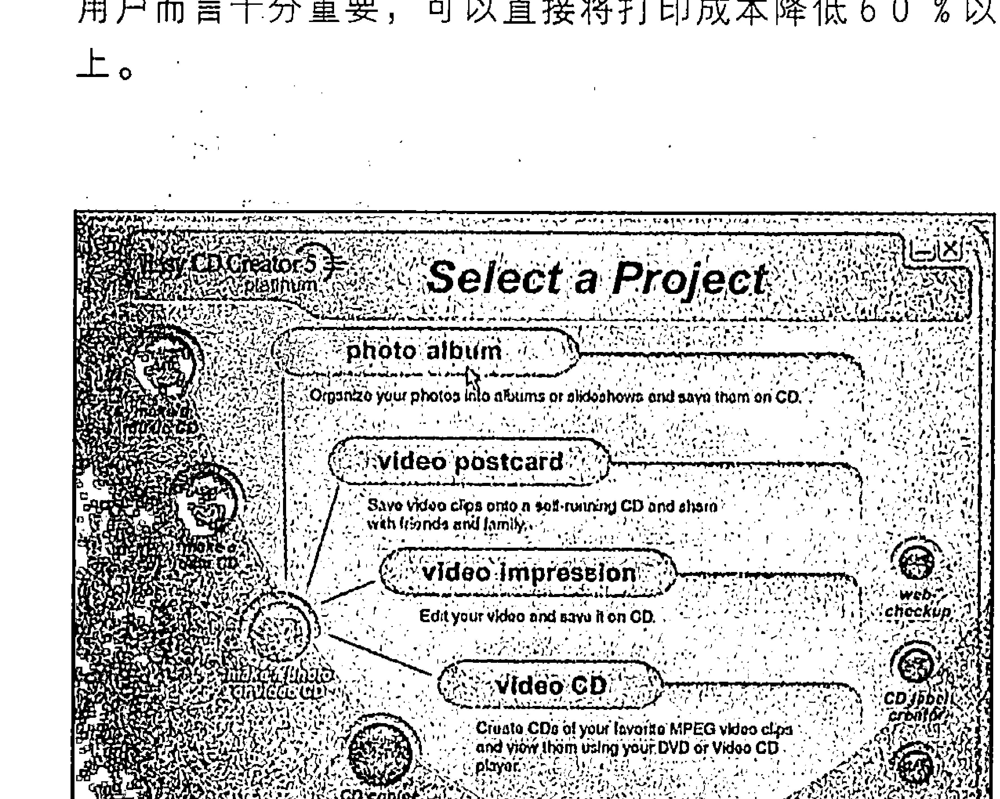

## 另类解决方案：PhotoCD 电子相册

后期的冲印成本依然困扰着我们，特别是需要大批量数码照片输出时。其实，对于那些不是很重要的照片，我们完全可以利用刻录机来制作PhotoCD光碟，这样可以随时欣赏，甚至兼容VCD/DVD播放机，同样非常方便。可以制作PhotoCD电子相册的软件有不少，这里我们以EasyCD Creator这款知名的刻录软件为例进行介绍。

打开EasyCD Creator的向导，选择制作“Photo Album”就可以进入PhotoRelay（图5）。PhotoRelay的界面十分直观，选择“Add”就可以轻松地添加所有照片。此外，PhotoRelay还对多款数码相机进行了优化，可以通过Acquire命令连接数码相机，直接下载照片。

当我们将照片导入PhotoRelay之后，可以为每张照片分别添加注释说明。此外，通过上方的“Sort”按钮，我们可以方便地为所有照片排序。令人感到十分高兴的是，PhotoRelay能够为我们的PhotoCD添加背景音乐，而且还支持MP3格式。如此一来，我们的PhotoCD将不再是单调的，更加富有情趣。最后，当我们选择“Copy to CD”之后，PhotoRelay就会自动调用EasyCD Creator的刻录程序。在整个刻录过程中，我们根本无需干预，因为EasyCD Creator与PhotoRelay是无缝链接的，制作出的光盘效果十分出色，也可以兼容部分新型号的VCD以及DVD播放机。

为了让PhotoCD更加生动活泼，选择一些美观的异型刻录盘制作PhotoCD不失为一种很好的创意。由于光盘的存储密度很大，因此即便是小小的体积也能容纳下大量信息。此外，这种异型光盘并不会严重影响兼容性，在电脑光驱、VCD、DVD机上均可播放，非常方便。然而要提醒大家的是，部分老式光驱可能由于托盘不能正确固定而造成无法读取，因此在使用前建议大家先观察一下你所使用光驱的托盘。一般而言，24X以上的CDROM以及所有的DVDROM、CDRW或者Combo都没有问题，出现这一尴尬的主要集中在低速CDROM。

目前每张异型光盘大约2元～3元，这主要由盘片的染料种类、美工设计水准等决定。事实上，异型光盘的成本并不高，但是极低的产量使这一奇货可居的产品被人为地抬高价格。异型光盘的数据只能放在连续圆轨迹上，有些“奇形怪状”的光盘根本就不平衡，它们只能用来做个装饰品。因此如果你购买了一张三叶草一样的光盘，那么只有从中心开始的不间断的圆轨道上才能存贮数据，边上的那些叶子尽管也有涂层，但却没有任何用处。异型光盘的刻录方法与普通CD/R完全一样，以Nero、EasyCD为代表的任何刻录软件都能胜任。惟一值得引起我们注意的地方便是放入名片刻录盘时一定要小心翼翼，由于这类刻录盘并不是圆型的，所以把它放在某些刻录机的托架上的时候会很难放稳。

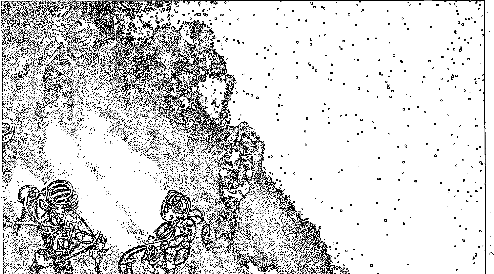

www.intozgc.com
纵横IT业 网聚中关村


intozgc
超越中关村


## 全方位出击 斩断网络黑手

公元二零零四年，病毒、黑客、垃圾邮件、恶意程序和不良内容在网络上泛滥。信息安全呼唤整体解决方案提供商，信息安全航母横空出世。方正信息安全技术有限公司以先进的信息安全理念为指导，领先的技术为后盾，携带防火墙、防病毒、硬件安全网关（反病毒、反垃圾邮件、内容过滤三合一）、IDS、VPN、IPS和网络管理等一流武器，扬帆起航。

方正安全是北大方正集团下属专注于信息安全领域整体解决方案的专业厂商，拥有两个子公司、信息安全与网络管理研发中心，在全国设有30个销售和服务平台，遍布全国各省、市、自治区等。现有员工一百多人，其中大学以上学历的人员占98%，拥有硕士学位人员占30%。
方正安全将秉承“一起创造，一起分享”的发展理念，充分运用方正的品牌、技术、渠道优势，整合国内外资源，不断为用户提供最优秀的信息安全和网络管理的解决方案与应用服务。

| 产品类别 |
| --- |
| 防火墙 |
| 防病毒 |
| 硬件安全网关 |
| 入侵检测 |
| 网络管理 |

国际国内著名IT安全机构的多项国际权威认证

## PART 2

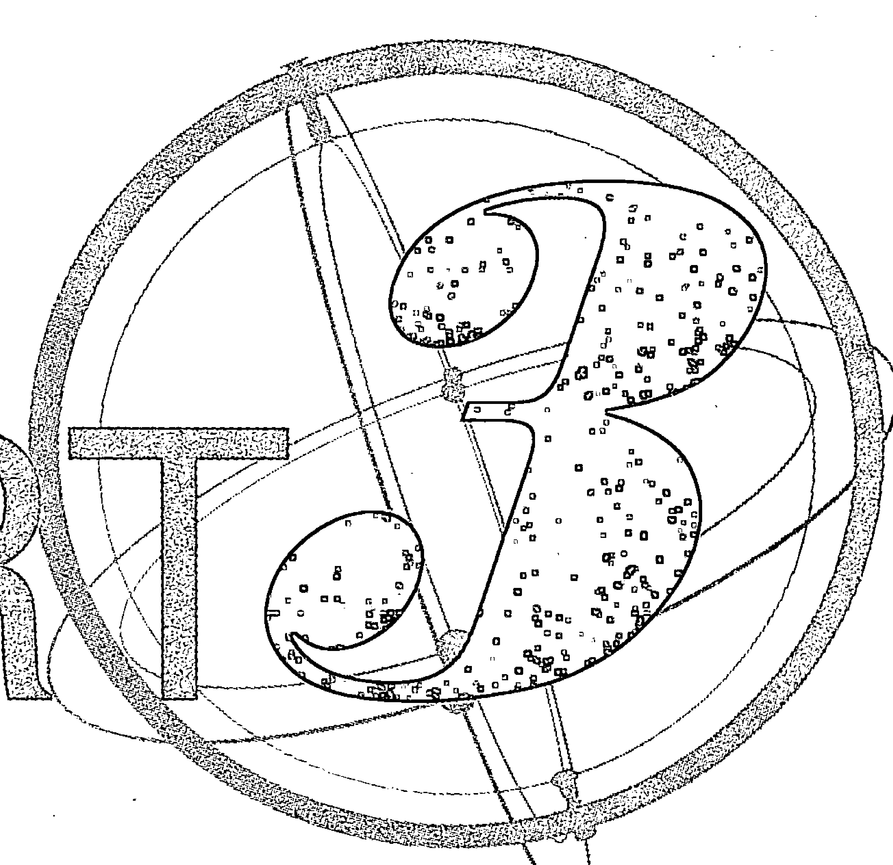

## 应用天地

电脑除了能让我们的生活更加丰富多彩以外，更重要的一点就是可以成倍地提高工作效率。但是，有些时候繁琐的操作过程实在令人头痛，特别是那些重复而又不可避免的步骤，比如开关机、上网、备份等等。其实，只要稍动脑筋，就可让电脑更智能，工作更轻松，玩得也更happy！

## 系统篇

### 一、自动开机

按下电脑的电源开关也许就意味着一天工作的开始，天长日久都有些麻木了。如果在我们走入办公室时，电脑已经“待命”该多好？其实实现这个愿望也不难，只要使用“自动开机”功能就可以了。看到这四个字很多人立即会想到BIOS的设置，其实直接利用软件也可以完成所有的操作，而且更加简便。

Auto Power-on&Shut-down是一款能让电脑根据事先设置的时间开关机，并且能自动运行预设程序的软件。最值得一提的就是它能直接修改BIOS中关于定时开机条目的功能，能使那些菜鸟朋友们也不再头痛！

从http://yncnc.onlinedown.net/soft/35020.htm下载该软件进行安装。启动软件，在默认标签页“Power-on”的Power-on date中设置自动开机的日期，这里提供了每天和按星期数的选择，可以适应上班族和SOHO一族的实际需要。比如对于上班族，可以选择除周六、周日以外（以红色标出）的时间开机；接着在Power-on time中设定自动开机的具体时间，可以精确到秒，比如我们这里设为“8：30：00”。最后在Specified Date Power-on States中对某些比较特殊的日期进行特别的指定，比如五一、十一长假或加班、出差期间。首先点击“Add”按钮，在弹出的“Specified Date States”对话框中设置指定的日期，然后在“Power-on States”中选择指定日期是否自动开机，如果想禁止自动开机可以选择“Disabled”。为了方便以后的维护，可以在“Remark”中写上备注，比如“元旦”（图1）。

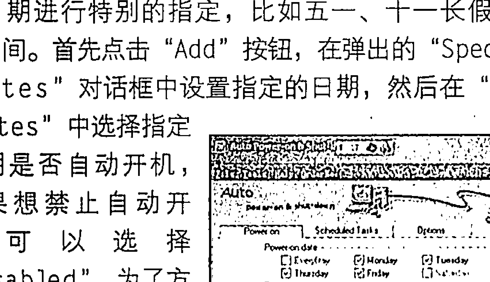

最初使用该软件的时候，到了预定时间总是不放心地去瞧瞧“开了没？”，其实只要给它设置好开机自动发出声音就可以了，这样不仅可以通过声音来判断是否开机，同时也可以使用该功能按时唤醒床上的“懒虫”而实现闹钟的功能！在软件主界面中切换到“Scheduled Tasks”标签，点击“New”按钮添加新任务，在弹出的“Edit Scheduled tasks”对话框中选择执行的日期，可以选择“Every Day”，因为该任务只有在开机后才自动运行，因此不用去考虑其他问题；然后在“Starting Time”中设置执行任务的时间，这里要注意的是该时间应比自动开机时间晚几分钟，避免开机时间长而无法执行定时播放任务的情况发生，比如这里可以设为8：35：00。最后在“What to do”中勾选“play music”，并通过后面的“浏览”按钮选择一首合适的音乐，另外为了防止忘记该天内重要的活动，可以勾选“show message”，然后在下面的文本框中输入提醒的文字作为备忘录，当然也可以是其他的信息，这样就可以实现自动播放音乐的同时弹出对话框显示相应的文字了（图2）。

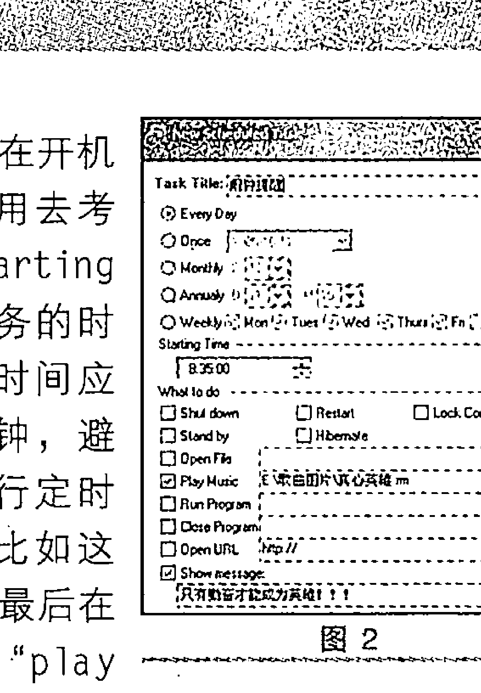

最后切换到“Option”标签页中，勾选“Run at windows startup”和“Minimize to system tray while running”，这样即可实现该软件在开机时自动运行并且最小化到系统托盘中。另外还需要注意一个问题，如果使用Windows 2000 / XP / 2003的操作系统，最好在“Auto Logon”中勾选“Enabled”，然后填上你登录系统所需的用户名和密码，这样才能确保可以自动地登录系统并运行程序。

现在点击“OK”按钮即可确认并完成所有的设置，此时该软件会弹出对话框询问是自动修改主板BIOS中的自动开机选项还是进行手动设置。由于现在绝大多数主板都支持自动开机功能，因此我们只要使用默认的“Set up automatically”选项即可。点击“Next”，软件会再次要求确认自动开机的时间，如果不想修改了，点击“Finish”即可。最后按照软件提示重新启动计算机，该软件会自动修改BIOS中的相关选项并在重新启动后生效。

提示：该软件还支持自动关机、自动锁定、自动重启、自动打开网页、自动运行 / 关闭应用程序等功能，用户可以根据自己的实际情况进行设置。

### 二、自动登录

入密码才能登录，而Windows 2003在默认情况下只有一个用户也需要手动登录。怎样才能实现自动登录呢？其实很简单：
在“开始/运行”中，输入“control userpasswords2”（注意空格，不含双引号），回车后即可打开“用户账户”窗口。在“本地用户”列表中，找到并选中将要自动登录的账户，然后取消“要使用本机，用户必须输入用户名和密码”的选择，点击“确定”后在弹出的窗口中输入两次该账户的登录密码即可。当然，如果使用的是空密码，可以直接点击“确定”即可。

### 三、自动清除页面文件

页面文件俗称虚拟内存文件，其实就是系统将硬盘中的某一部分空间当作内存来使用，具体表现为Pagefile.sys文件。它与物理内存最大的区别在于当断电时其中的内容并不会丢失，因此在非法关机后就会留下“垃圾”文件，从而造成磁盘碎片，影响虚拟内存的使用效率。另外众所周知，系统的磁盘碎片整理程序不会去整理该区域，所以为了“整理”该区域的碎片可以采用删除的方法：在“开始”中输入“gpedit.msc”打开组策略编辑器，定位到“计算机配置\Windows 设置\安全设置\本地策略\安全选项”，在右侧窗口中找到并双击“关机：清除虚拟内存页面文件”，选择“已启用”后确定即可（图3）。
设置成功后，当关闭计算机时系统会自动将该页面文件删除，当下次开机后系统还会自动创建该文件。
另外，由于Windows XP Home Edition中没有组策略编辑器，要想使用这个功能就需要修改注册表来完成：打开注册表编辑器，定位到“HKEY_LOCAL_MACHINE\SYSTEM\CurrentControlSet\Control\Session Manager\Memory Management”，然后在右边的列表中双击“ClearPageFileAtShutdown”，在弹出的“编辑DWORD”值对话框中将“数值数据”改为1，最后重新启动计算机使修改生效。

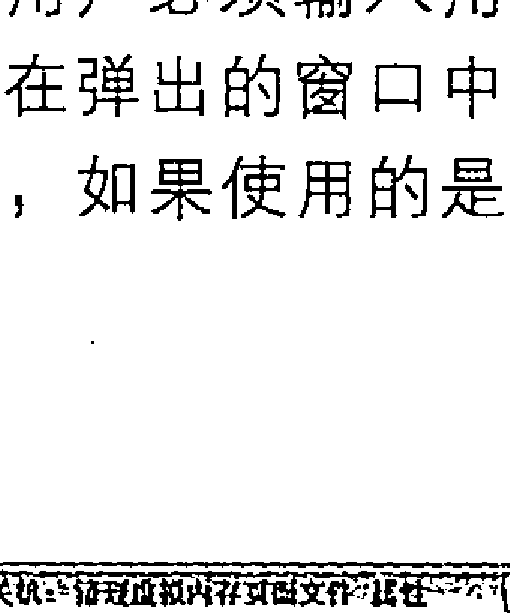

### 四、随开机自动运行

对于在工作中离不开电脑的朋友来讲，如果在开机时能自动运行自己常用的应用软件该多好？比如上网一族希望启动IE浏览器或QQ，文字工作者希望启动word，财务人员希望启动Excel……其实实现这个愿望很简单。

- 加入“启动”菜单

可以说，这个方法是最简单的了，比如默认下QQ就会在安装过程中将自己的快捷方式加入到该菜单下。因此，我们也可以将自己需要启动的程序的快捷方式拖到“开始→程序→启动”中来实现。有些刚刚接触电脑的朋友掌握不好拖动的“火候”，其实只要将该快捷方式添加到“C:\Documents and Settings\用户名\「开始」菜单\程序\启动”文件夹下即可实现同样的效果。

- 编辑注册表启动项

尽管利用“启动”菜单来启动程序很简单，但有时候会被某些好事者给删除掉，这时就可以考虑采用修改注册表中的相关功能键值来实现。比如想通过注册表的形式来自动启动QQ，就可以打开注册表编辑器，定位到HKEY_LOCAL_MACHINE\SOFTWARE\Microsoft\Windows\CurrentVersion\Run，在右侧窗口中单击右键新建字符串值，重命名为“QQ”，双击之后在“数值数据”中修改为QQ所在的安装路径，比如“E:\program files\qq\qq.exe”（注意：由于存在大于8位的文件名，因此包括英文双引号）。

### 五、用好启动/关机脚本

众所周知，在Windows 9X时代存在一个自动批处理文件“c:\autoexec.dat”，可以将要启动的程序编写命令行加入其中。到了Windows 2000 / XP时代已经不提供该批处理程序，而增加了启动/关机脚本支持，可以说这个功能比autoexec.dat有过之而无不及！下面就分别结合实例来看看具体使用方法。

#### 实例一、开机：删除特殊共享

在Windows 2000 / XP中，由于计算机管理、用户登录等方面的需要，系统会建立许多特殊的共享，如C$、D$、ADMIN$、IPC$、NETLOGON等，但这些共享并不是所有的计算机都必须的。可以使用“计算机管理”或net share命令等禁止这些共享，但在计算机重新启动后会重新出现。要想将这些共享彻底删除，可以使用启动脚本。

```
net share C$ /delete
net share D$ /delete
net share IPC$ /delete
net share NETLOGON /delete
```

在“开始/运行”中输入“gpedit.msc”打开组策略编辑器，依次展开到“计算机配置→Windows设置→脚本（启动/关机）”，双击右侧窗口中的“启动”，点击“添加”后选择“浏览”，找到刚才保存的delshare.dat文件，双击该文件并点击“确定”后回到“启动属性”对话框（如图4），点击“确定”后关闭对话框，关闭组策略编辑器并重新启动计算机后生效。这样，以后每次开机后就可以自动删除这些特殊共享了。

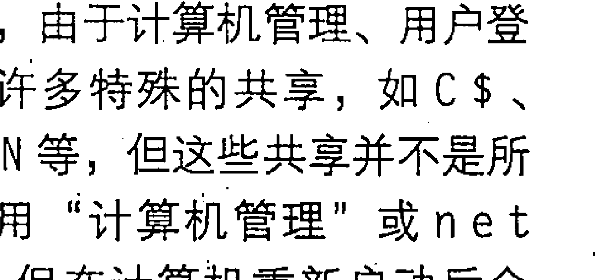

#### 实例二、关机：清除IE临时文件

浏览网页以后，系统中总会遗留很多的垃圾需要清理，其中包括IE临时文件、历史记录以及Cookies等等，如果每次都使用手工方法清除则比较麻烦，其实我们只要利用关机脚本就可以实现自动清理。打开记事本程序，输入DEL /Q /S "C:\Documents and Settings\用户名\Local Settings\Temporary Internet Files"其中参数/Q表示使用安静模式，即删除全局通配符时不要求确认；参数/S表示从所有子目录删除文件另存为clear.dat文件，然后采用上面介绍的方法，在组策略编辑器中双击“关机”项，导入该文件并重新启动计算机。同理，大家也可以在该批处理文件中添加其他想要删除的文件的相应命令行。

## 网络篇

### 一、自动拨号

现在很多用户都使用ADSL方式上网，不过在上网之前还需要进行拨号，可以采用在“启动”中创建自动拨号快捷方式的方法来实现。在桌面上单击右键新建一个快捷方式，在“请键入项目的位置”空白框中输入“C:\WINDOWS\system32\rasphone.exe -d "你的宽带连接名称"”（不含外侧双引号），点击“下一步”后完成。接着在“开始 / 设置 / 网络连接”中，将你建立的宽带连接的“属性”设置为如图5所示状态。现在即可实现开机自动拨号了。


### 二、批量打开网络应用程序

经常上网的朋友，每次都是打开防火墙，拨号，打开浏览器，打开QQ……现在我们用批处理来试试。打开记事本，输入下列代码，最后保存为DAT文件即可。

```
@echo off
start E:\progra~1\SkyNet\FireWall\PFW.exe
start E:\progra~1\qq\qq.exe
start E:\progra~1\maxthon\maxthon.exe
```

提示：由于批处理中对文件名或路径有要求，必须符合8.3命名规则，因此“E:\Program Files”写为“E:\progra~1”。

### 三、自动下网并关闭网络应用程序

下网的时候挨个关闭已经打开的程序是不是比较麻烦？现在我们也通过批处理来完成吧。

```
@echo off
start C:\WINDOWS\system32\rasphone.exe -h "ADSL"
start taskkill /f /t /im pfw.exe
start taskkill /f /t /im qq.exe
start taskkill /f /t /im maxthon.exe
```

提示：taskkill命令是 Windows XP 中强制关闭程序的命令，可以在命令提示符中查看其具体使用参数。另外，当该程序执行完毕以后，你也许会发现状态栏中仍然还存在其图标，此时用鼠标指针轻轻划过这些图标就可清除掉了。

## 常用软件篇

### 一、网际快车也要“自动挡”

网际快车可是一款经久不衰的经典软件，即使在当前的宽带时期也同样风靡，不过要是掌握一些关于它的“自动”小技巧，就会更加体会到“狂飙”的快感！

- 多代理突破单线程限制

很多下载网站为了限制流量，一般都对同一个IP同一个时间内的登录次数进行了限制，宽带用户只能眼巴巴看着富余的带宽了。其实只要有了代理服务器地址，就可帮助网际快车实现多线程。打开“网际快车”，单击菜单栏的“工具→选项”命令，在“选项”设置对话窗口中，切换到“代理服务器”，然后单击“添加”按钮，打开“代理服务器设置”对话窗口，填写好识别名称后选择代理服务器的“类型”（一般选择http <connect>）（如图6），输入代理服务器的地址和端口号，完成以后单击“确定”按钮返回到“代理服务器”选项卡，在新建所在行的“Http缺省”一栏中的小方格打上钩，选中“所有任务均使用代理服务器”选项，最后单击“确定”退出即可。

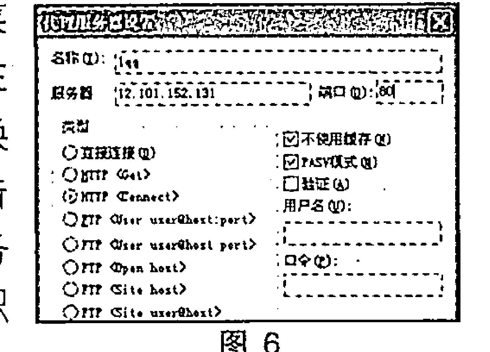

提示：如果想临时取消使用代理，可以在“添加新的下载任务→高级→代理服务器”中进行设置。

- 自定义镜像站点

大家都知道，网际快车提供了自动镜像选择功能。当下截软件时，网际快车会首先在所点击的下载地址中获得下载信息（比如文件名称、大小等等），然后连接所设置的镜像搜索引擎来查找该软件其他的镜像地址，最后自动选择最快的地址进行下载。但是，软件中内置的镜像搜索网址大多数都是国外的，速度实在不敢恭维，因此需要找个国内的搜索地址来代替，这里推荐“北大天网”。进入http://bingle.pku.edu.cn，在搜索栏中输入“winrar.exe”（不含引号），回车，稍候在新窗口中就可看到搜索到的结果，然后将IE地址栏中的网址复制到记事本程序中，得到地址：http://file.tianwang.com/cgi-bin/search?word=winrar&FType=255。然后将“winrar.exe”替换为“{filename}”，最终得到地址：http://ants.keepso.com/cgi-bin/bfile?word={filename}&FileType=255。打开网际快车，进入“工具→选项→镜像”，选中## PART 3 玩电脑也要“自动化”

“打开镜像功能”、“自动通过 Ftp Search 查找镜像站点”和“自动选择最佳的站点下载”，然后将修改后的地址粘贴到“服务器”后面的地址栏中即可。现在下载试试看吧，效果如图 7 所示。

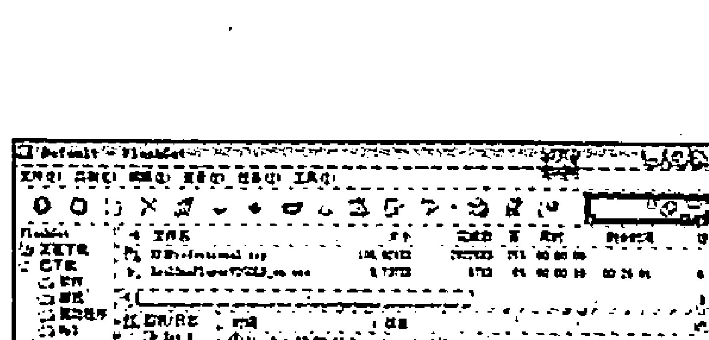

### 二、Outlook Express（简称 OE）也玩自动分拣信件

现实中，当邮递员将信件收集以后会首先放到自动分拣机中，自动分拣机会根据不同的邮政编码而按照省/市进行分拣，这样就大大减少了工作人员的劳动。其实，在我们常用的收发邮件工具 OE 里同样也存在这个功能，利用该功能，不仅可以阻止垃圾邮件，而且还可以将来自不同发件人的信件进行归类，从而避免遗漏重要的邮件。

比如笔者订阅了微软的网络广播课程，日积月累就在“收件箱”中积攒下一大堆，下面就跟我来看看如何进行分拣。

- 1. 点击“工具→邮件规则→邮件”，在“邮件规则”标签中点击“新建”按钮打开“编辑邮件规则”窗口。
- 2. 在“选择规则条件”项中勾选“若‘发件人’行中包含用户”；在“选择规则操作”中勾选“移动到指定的文件夹”；在“规则描述”项中点击带有下划线的值，比如“包含用户”，在弹出的“选择用户”窗口中输入发送课程的邮箱，这里输入“@newsletters.microsoft.com”（不含引号），点击“添加”，确定退出（图 8）。
- 3. 点击“指定的”文件夹，在“移动”窗口中选择想要存放的文件夹，比如我新建一个文件夹，重命名为“微软”，确定后创建完毕。
- 4. 当以后收到该地址发出的邮件时，即使改变了发件人姓名，只要还是这个邮件服务器，就会自动将其移动到“微软”文件夹了。但已经收到的该怎么处理呢？其实只要点击“工具→邮件规则→邮件”，选中刚刚创建的邮件规则，最后点击两次“立即应用”即可。


> 提示：不同的用户可以根据这个思路进行个性化的设置，在“选择规则条件”中提供了很多的规则，可以适应不同的需要。

### 三、用 WinRAR 备份指定文件

数据备份是很多用户都接触到的一种操作，但备份的内容一般都是固定的，比如日报表、仓库报表等等，怎样才能将这些资料快速地进行备份呢？虽然可以采用系统自带的“计划任务”来完成，但是如果用 WinRAR 来备份就更加方便、安全！

- 1. 在“资源管理器”中找到要备份的文件或文件夹（比如“E:\报表”），选中并右击，选择“添加到压缩文件”，打开“压缩包名称和参数”窗口，勾选“创建自解压格式文件”。
- 2. 单击“高级”标签，勾选“后台压缩”后点击“自解压选项”，在“常规”的“解压路径”中输入其他计算机该类文件的存放路径，比如“f:\ccb”；在“文本和图标”标签中设置解压窗口的标题，比如“报表备份”，并给其设置个性的图标，确定后保存退出。

> 提示：如果是重要文件，完全可以设置密码。

- 3. 回到“压缩文件名和参数”窗口，单击“文件”标签，在“要添加（或排除）的文件”中，可以通过“追加”按钮来添加其他文件或排除文件夹中某些文件。然后，勾选最下方的“压缩文件用 Email 发送到”，并在下面填上接收的信箱地址，比如 QQ 信箱（QQ 号码@qq.com）。如果不想在本地保留该压缩文件，可以勾选“并接着删除”（图 9）。

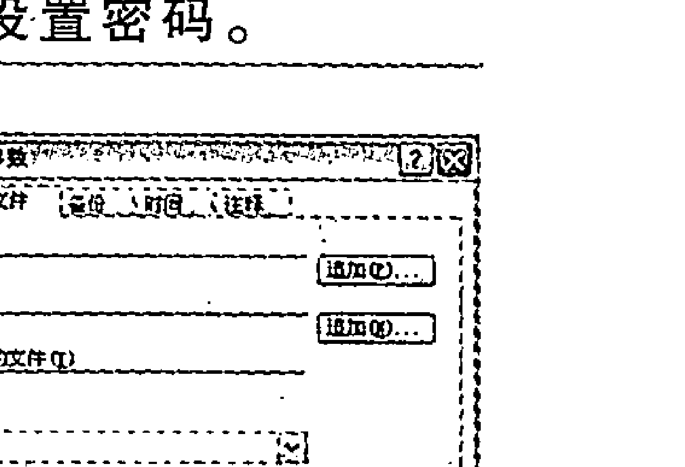

> 提示：如果需要使用此 Email 功能，必须在 OE 中创建可以使用的邮箱。这里建议大家将 163 的信箱设为默认信箱，因为其他信箱对具有可执行文件的附件有过滤功能。

- 4. 切换到“备份”标签页，勾选“按掩码产生压缩文件名”，将其中的日期格式修改为“mmdd”，这样就可一目了然地知道是哪天备份的了。
- 5. 回到“常规”标签页，单击“配置”，在下拉菜单中选择“保存当前配置为新配置”，在“配置名称”中输入备份方案名，如“报表”，同时选中“保存档案文件名”和“保存选定文件名”及“在桌面创建快捷方式”。单击“确定”按钮返回“保存档案文件名和参数”窗口，单击“取消”退出配置窗口。
- 6. 将桌面的快捷方式拖入“快速启动栏”，同时还可以给其设置快捷键，需要的时候只要轻轻一点就可自动备份了。备份完毕后自动调用 OE 中的 POP 服务进行发送，同时会给你提醒，避免了某些病毒邮件借用你的名义进行传播的尴尬（图 10）。
- 7. 当接收到该邮件，只要双击并运行“附件”中的压缩文件，利用“浏览”功能找到目标文件夹后“确定”即可。如果目标文件夹中有同名的文件，它会自动提醒是否进行备份，而且还有解压缩密码的保护，因此安全性能很高。

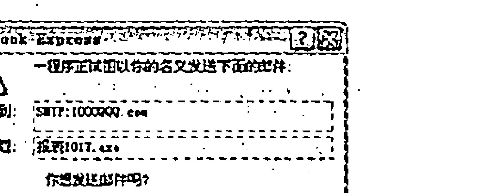

## 应用软件瘦身完全攻略

文：彭文波

随着软件功能的不断增多，软件的安装时间也越来越长。不过，这其中的功能都是必须安装的吗？软件安装完毕，电脑上可能会产生一些不必要的垃圾文件，这也会占用很大的空间。因此，用户有必要了解一些软件的“瘦身”技巧。通过这些技巧，保留软件大多数功能和去掉极少用的功能模块，同时，在安装后清除不必要的垃圾文件，从而达到“瘦身”的目的。

### 安装文件巧“瘦身”

一般来说，软件安装时都会有自定义安装方法，它可以去除不必要的组件和特殊功能，大大节省硬盘空间。比如有的用户英文不好，那么在装英文软件时就可以不安装它的帮助文件。选择软件时，应该尽量选择那些短小精悍的软件或者“瘦身”版本，比如，同样是一个安装文件，看图软件ACDSee的最新版本ACDSee V8.0与ACDSee 2.4相比，大小就有天壤之别。

### 1. 安装程序的“瘦身”基础和方法

首先，我们来看看安装程序的类型。根据软件设计的不同，功能模块划分比较清晰的安装软件比较容易“瘦身”，如果软件的文件相关性很强，互相依赖，那么就无法“瘦身”。目前，安装程序有以下四大类型。

msi、msp等安装包。这是微软极力推广的安装包，它是由Installer程序制作并基于数据库的概念来设计的，具有自动修复、按需安装等优点，现已成为安装程序的标准。除此之外，老牌的InstallShield和Wise等制作软件也可以生成msi格式的安装包。对于需要精简的用户来说，修改msi文件时，可以使用Windows XP的sdk中的msi编辑修改工具；也可以用WinINSTALL LE 2003解压缩这种格式，软件下载地址为：http://www.ondemandsoftware.com/FREELE2003。

微软IExpress、WinZIP、WinRAR等制作的自解压程序。IExpress是Windows 2000/XP系统自带的一个小巧的制作安装软件，大小只有112KB，存放在“Windows\System32”目录中。由于是微软自带程序，所以IExpress制作的安装软件具有更好的兼容性。另外，还有WinZIP、WinRAR等制作的自解压程序，后缀一般是exe。要“瘦身”这类文件，可以使用WinZIP 或者WinRAR来解码。

InstallShield制作的基于InstallShield自身安装引擎的安装包，后缀一般是cab、hdr。在Windows Installer以前，多数安装程序都是InstallShield制作的。使用Winpack v3.0可以解码InstallShield引擎的安装包。这个软件的下载地址为：http://secrecy.ayinfo.ha.cn/soft/95.htm。

Wise制作的基于Wise自身安装引擎的安装包。这种安装包使用比较广泛。使用E_WISE（下载地址ftp://ftp.externet.hu/pub/mirror/sac/pack/e_wise.zip）或者使用Wise Unpacker GUI（下载地址http://secrecy.ayinfo.ha.cn/soft/95.htm）可以解码wise软件包。

SetupFactory制作的安装包。后缀一般是exe，可以使用Setup Factory unpacker（ripped from project SynCE - synce.sf.net）来解码，软件下载地址为http://www.indigorose.com/sf/index.php。

通过上面的介绍，我们对安装文件的“瘦身”有了一个大致的了解。下面，我们通过实例进一步了解“瘦身”的具体方法。

### 2. 安装文件“瘦身”典型实例分析

在很多安装文件中，比如拼音加加的3.11版，捆绑了名字为F10的互联网搜索工具，并且是强制安装，那么，如何才能删除这个讨厌的F10呢？下面将就如何删除F10搜索工具来简单说明软件“瘦身”的方法：

- 第一步：下载拼音加加3.11版并分析安装文件。软件下载地址为http://nj.onlinedown.net/soft/28666.htm。下载后，可以得到8.68MB的JJSetup3.11.zip文件，解压缩到JJSetup目录，文件包括InstMsiA.exe、InstMsiW.exe、JJPack.msi、JJSetup.exe、JJSetup.ini。其中，InstMsiA.Exe和InstMsiW.Exe是用于在没有Windows Installer 2.0的机器上安装该服务的，目前大多数机器都已经有了这个服务，完全可以不考虑这两个文件。JJSetup.ini是文本文件，JJSetup.exe仅仅才110KB，而JJPack.msi有5.47MB，这是一个基于Windows Installer的安装程序包。因此，现在“瘦身”的主要对象应该是JJPack.msi这个文件。
- 第二步：准备“瘦身”工具。主要使用Orca和msidb工具来修改msi文件，msi文件编辑器Orca工具在微软提供的Windows XP的sdk中，在sdk安装目录下寻找Orca.msi并安装Orca.msi就可以了。msidb在Windows XP的sdk的安装后的bin目录，文件名字为msidb.exe。sdk下载地址：http://www.microsoft.com/downloads/details.aspx?FamilyId=A55B6B43-E24F-4EA3-A93E-40C0EC4F68E5&displaylang=en。选择下方的“PSDK-x86.exe”文件进行下载。
- 第三步：运行Orca.exe，选择“File”菜单下的“Open”命令，打开JJPack.msi文件，执行“Tools”菜单中的“Options”命令，切换到Database选项卡，选中“Generate a unique Package Code each time a database is saved”，然后执行“File”菜单的“Save as”命令，把JJPack.msi文件另存为JJThin.msi文件，以后我们将要对这个JJThin.msi文件进行“瘦身”，而不影响原来的JJPack.msi文件。如图1所示。
- 第四步：查找F10.exe搜索工具的相关标识。在Orca的左侧栏选择“File”，然后按Ctrl+F快捷键查找F10.exe，记住Orca右边栏目中的File的值是_B7B624BDC2BD497F826470059753178F的字符串，而Component的值是C_B7B624BDC2BD497F826470059753178F的字符串。如图2所示。

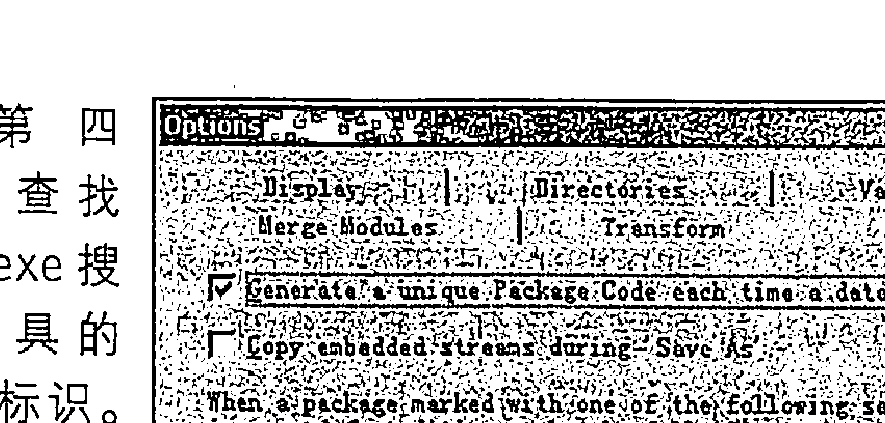

- 第五步：禁止msi文件安装F10.exe。在Orca的左侧栏选择FeatureComponents，按Ctrl+F快捷键查找刚才记录下来的Component的值“C_B7B624BDC2BD497F826470059753178F”，选中Orca右侧栏中刚刚找到的数据，点右键，执行Drop Row命令，然后执行“File”菜单的“Save”命令，保存刚才做的修改。如图3所示。

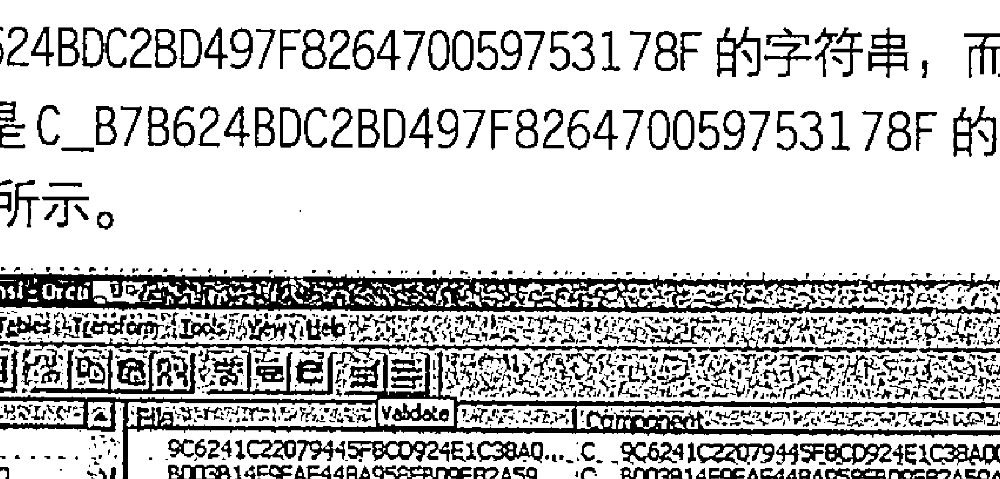

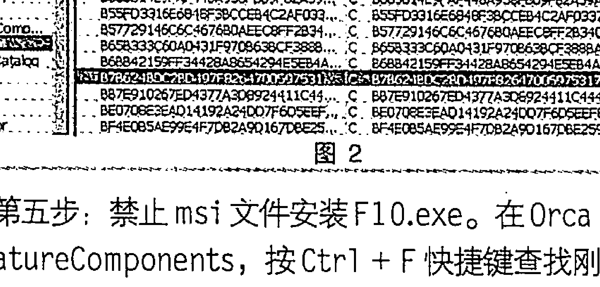

- 第六步：获取安装文件并删除F10.exe文件。在Orca的左侧栏选择Media，记录右边的Cabinet的值“#_ED8F65B50BD54F4B6AEE1178B56AD1D3”，关闭Orca。
- 第七步：把msidb.exe复制到JJSetup目录，然后在JJSetup目录建立一个批处理文件“1.cmd”，内容如下：

```
msidb.exe -x _ED8F65B50BD54F4B6AEE1178B56AD1D3 -d JJPack.mdi
md files
expand _ED8F65B50BD54F4B6AEE1178B56AD1D3 -F:* files
move /y files\_B7B624BDC2BD497F826470059753178F .\
```

第1行的命令表示从JJPack.mdi中提取出_ED8F65B50BD54F4B6AEE1178B56AD1D3这个cab文件。其中“_ED8F65B50BD54F4B6AEE1178B56AD1D3”是前面记录下来的Media表中的Cabinet的值，不包括前面的#，JJPack.mdi是未修改过的拼音加加的msi安装包。 第2行表示建立一个子目录叫做files。

第3行命令表示把拼音加加的“_ED8F65B50BD54F4B6AEE1178B56AD1D3”压缩包中的文件解压缩到files子目录中。 第4行命令表示把files目录中的“_B7B624BDC2BD497F826470059753178F”文件移动到JJSetup目录下面，其中“_B7B624BDC2BD497F826470059753178F”是在第5步中寻找F10.exe时记录下的F10.exe的名字。很明显这个“_B7B624BDC2BD497F826470059753178F”就是F10.exe文件。过程如图4所示。

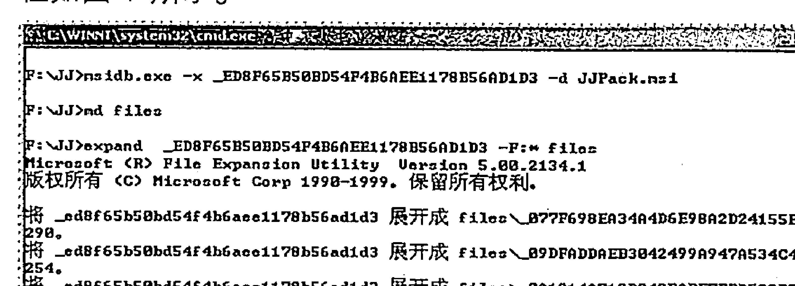

- 第八步：把剩下的拼音加加的安装文件重新打包到msi文件中。打包安装文件可以使用软件出品的CabArc工具（下载地址：http://fbilo.myrice.com/zip/CabArc.Exe），把cabarc.exe解压缩到JJSetup目录，然后在这个目录新建一个批处理文件“2.cmd”，输入命令：

```
del _ED8F65B50BD54F4B6AEE1178B56AD1D3
cabarc.exe -m LZX:21 -rN _ED8F65B50BD54F4B6AEE1178B56AD1D3 "files\*"
msidb.exe -a _ED8F65B50BD54F4B6AEE1178B56AD1D3 -d JJThin.msi
```

第1行命令表示删除从JJPack.msi中提取出_ED8F65B50BD54F4B6AEE1178B56AD1D3这个cab文件。 第2行表示把目录files中的所有文件压缩到_ED8F65B50BD54F4B6AEE1178B56AD1D3这个文件中。 第3行的命令表示把_ED8F65B50BD54F4B6AEE1178B56AD1D3这个cab文件加入到JJThin.msi文件中。 整个过程如图5所示。

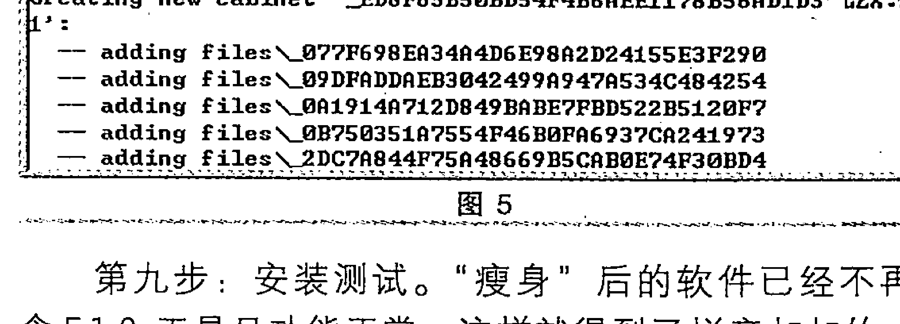

- 第九步：安装测试。“瘦身”后的软件已经不再包含F10工具且功能正常。这样就得到了拼音加加的“瘦身”版JJThin.msi，大小为5.25MB。

### 3. 安装文件的“瘦身”思路

和减肥一样，软件的“瘦身”就是去掉不需要的功能模块，删除相对应的文件，这里面关键是找出软件中各不同模块所对应的文件。通过上面的实例，我们来看看安装程序的“瘦身”思路，以达到“举一反三”的效

### 软件安装后的“瘦身”

不少软件增加了一些华而不实的功能，除了占用大量磁盘空间以外，还使得程序启动、处理任务的速度变慢。

### 1. 删除不必要的文件

- 第1招：安装后使用。现在，软件安装过程中，总有些广告来骚扰用户的电脑。比较常见的有3721、中文网址、**搜索、**插件等，搞得用户头疼不已。怎么办？相信大家对QQ的安装应该是很熟悉了。软件安装后，除了会在任务栏、启动栏加入自己的图标外，还会把TT浏览器替代IE。其实，我们可以在安装之后，拷贝一份程序改名使用，原来的程序则卸载不要了。针对3721、CNNIC、联众捆绑的网络实名等广告软件，我们还可以通过专门的广告清除软件把这些垃圾程序卸载，在备份后继续使用干净的程序。
- 第2招：删除不必要的HELP帮助文件。HELP文件是软件帮助文件，以前只有几兆大小，随着一些大型应用软件越来越复杂，帮助文件也越来越大，甚至达到上百兆。不过，很多帮助文件都是英文的，对于一般的国内用户来说，加上翻译软件都看不懂这些帮助，所以还是删掉算了。另外，Windows安装光盘中的超值工具包也可列入考虑的减肥范围，一般Windows用户都不用到其中的VALAUE、TOOLS工具包里的东西，把这些目录从硬盘上删除后，可以节省不少空间。
- 第3招：删除不必要的临时文件。临时文件包括IE的临时缓冲区、制作和打印图形的临时文件（Photoshop的临时文件很大，往往在数百兆以上；用高分辨率打印，临时文件也很大），这些临时文件本来是在退出软件时会被自动删除的，但如果是遇到Windows非法操作或是死机，就会停留在硬盘上，而且路径还可能是隐藏的。除了用磁盘扫描程序和磁盘清理程序来扫垃圾外，还可能要在纯DOS下进入到Windows目录下面，手工删除TEMP目录和IE Temporary中的隐藏子目录，因为有的文件在Windows界面里会受到读写限制保护，不能删除。
- 第4招：删除不必要的AVI动画演示文件。很多游戏软件习惯加入一大堆演示动画来炫耀一下画面效果，还为公司的LOGO做一下广告。这些文件很多都是AVI格式，小的是数十兆，大的会达到三百兆！它们通常会放在游戏安装目录下面的AVI或是MEDIA子目录下面，你可以删除它们以节省大量的空间。
- 第5招：删除不必要的日志和动态数据文件。随着使用时间的增加，很多软件的体积也越来越臃肿。如杀毒软件、防火墙、ACDSee等可能产生的记录文件等。安装目录下面有个imagedb.dtf文件体积很大。其实这个文件并不太重要，主要是保存查看过图片的资料罢了。精简的方法是：删除它，然后让它再自动建立。

### 2. 软件卸载的技巧

软件的安装非常简单，但卸载就没有那么容易了，如果卸载的方法不对，不但软件删除不干净，而且久而久之还会影响到系统的运行速度。

- 第6招：软件自己卸载。软件安装完成后，在其安装目录中除了程序运行的一些必需文件外，你往往会发现还有一个名为“Uninstall+软件名”的文件，如果这里没有，直接到软件安装目录，可以看到一个“Uninstall”文件，双击这个文件，根据提示就可以完成删除工作。实在删除不了的时候，可以将安装文件再次执行一次，软件会出现一个“修改、修复或移除程序”的界面，选择“移除”或者“卸载”就可以自动卸载了。
- 第7招：使用“控制面板”卸载。现在还有很多软件没带Uninstall程序，我们就要考虑“添加/删除程序”来完成软件的删除了。打开“控制面板”中的“添加/删除程序”，在“添加/删除程序”窗口列表中就出现了电脑安装的所有程序，选择需要删除的软件，然后点“添加/删除程序”就可以删除这个软件了。有时，删除软件后，“添加/删除程序”中依然存在相关项目，而且反复删除也不行。这种情况下，可以打开注册表，找到“[HKEY_LOCAL_MACHINE\SOFTWARE\Microsoft\Windows\CurrentVersion\Uninstall]”，其下所有的项都是“添加/删除程序”中的项，删除它们后，相应的“添加/删除程序”中的遗留项也将消失。
- 第8招：使用辅助工具。为了将软件彻底删除干净，我们可以借助专业的删除软件。在软件安装过程中，删除软件的“监视功能”可以把软件安装时写入的所有文件记录下来，到卸载时，就可以按照记录信息把文件彻底删除干净了。这里推荐“完美卸载V2005”，软件的下载地址为http://nj.onlinedown.net/soft/6048.htm。“完美卸载V2005”除提供了常规卸载和智能卸载之外，还提供了一个安装监视器，监视软件的安装过程。此外，软件还可以彻底干净地卸载各类顽固软件，并提供了68种最常用软件的清理插件，内置90多种垃圾文件类型，清理功能非常强悍。

## 另类刻录的精彩

文/水月子

现在CD刻录机，甚至是DVD刻录机对大多数人而言都不是什么新鲜事物了。毕竟现在全功能的DVD刻录机也就400元左右，加上Windows XP本身就具有刻录功能，经典的刻录软件（比如Nero等）的使用也非常方便，因此自己刻录数据光盘来备份的人是越来越多。但在刻录的技术和技巧方面，相信有不少“偏方”是鲜为人知的。下面我们就一起来看看这几个另类的刻录技巧吧！

## 刻录既有音乐又有数据的光盘

不少朋友知道如何通过Nero刻录一张数据光盘备份，或者是把MP3、WMA文件直接刻录成为音乐CD，但是你试过刻录一张既有CD音乐又有数据资料的光盘吗？其实这种情况我们经常会碰到的。比如说你很喜欢一个歌星（比如张国荣），你收集了大量关于张国荣的文本、图片、视频等等资料，要刻录成一张CD保存。一般来说这些资料在一张CD里面是完全可以放得下的，那么空出来的空间就白白浪费了？当然不是，我们可以把张国荣的几首经典歌曲刻录到这张光盘上面，这样你的这张“张国荣纪念CD”就更加具有收藏价值了。要刻录音乐和数据并存的光盘，我们需要刻录一张“混合模式”的光盘。

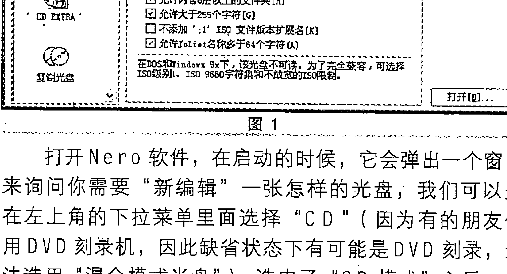

打开Nero软件，在启动的时候，它会弹出一个窗口来询问你需要“新编辑”一张怎样的光盘，我们可以先在左上角的下拉菜单里面选择“CD”（因为有的朋友使用DVD刻录机，因此缺省状态下有可能是DVD刻录，无法选用“混合模式光盘”）。选中了“CD模式”之后，接着我们拖动滑动条往下，直到“混合模式光盘”的图标出现，点击它之后右边的窗口此刻就被激活了（图1）。和刻录其他模式的光盘一样，混合模式里面我们可以设置光盘的标签、文件系统和日期等等，和别的模式不同的地方就在于混合模式光盘既有文件系统设置，又有CD音乐的设置，我们可以决定CD-ROM的读取速度以及消除歌曲后面的空白段。设置好标签之类的东西之后，点击“新建”就进入了Nero的主界面了（图2）。细心的朋友可能会发现，左边的光盘内容框里面居然有两个标签，一个是“数据光盘”，一个是“音乐光盘”，没错，这就是混合模式的特色。

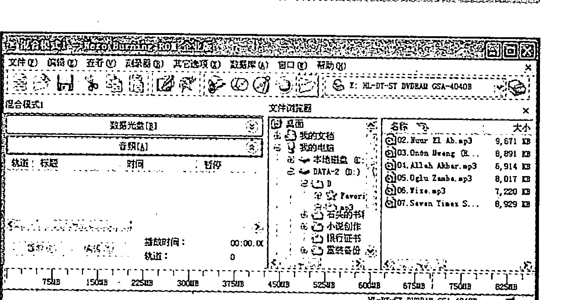

别之处了。我们可以和刻录别的光盘一样，把一些文件资料拖动到“数据光盘”标签里面，而将MP3、WMA音乐拖动到“音乐光盘”里面。至于光盘容量的大小，我们可以根据界面下方提示的蓝色容量条来判断，只要控制在红色的警戒线以内就可以了。当一切就绪之后，我们点击“刻录”按钮，很快一张既有音乐又有数据的光盘就诞生了！

## 活用光盘刻录Autorun

很多朋友以为Autorun无非就是将光盘放到光驱里面之后让它自动运行，其实Autorun的用处远远不止如此，只要活学活用Autorun，相信一定能够给你的光盘刻录带来无穷乐趣。

### 1. 什么是Autorun

要学Autorun，自然要弄清楚Autorun是什么。Autorun实际上就是Autorun.inf文件，严格地说它是一个必须存放在驱动器根目录下的有一定格式的文本文件。Autorun.inf由一个或多个“节”组成，每个“节”必须以节名作为开始的一行，节名必须用中括号“[ ]”括起来，节名之下则为本节中的命令。Autorun.inf一共支持三个节，它们分别为[autorun]、[autorun.alpha]、[Deviceinstall]，而其中的[autorun]是必须存在的。

### 2. 光盘自动运行

实现光盘自动运行是Autorun.inf最主要和重要的功能，它的名字也是由此而来的。也许有的新手不知道，为什么有些光盘放到光驱里面之后，系统就会自动运行安装程序了，其实就是这个Autorun.inf在“作怪”。首先我们要记住Autorun在刻录之后是存放在光盘根目录下的。

### 3. 自定义光盘图标

我们将光盘放到光驱里面之后，通常光驱的图标都是变成一个光盘状，或者根本就不会有什么改变。但是有的光盘放到光驱里面之后，光驱的图标整个都发生了改变，这是怎么做的呢？这就是 Autorun.inf 好玩的地方了，这里调用的是它的 icon 语句，也就是在 [autorun] 字节里面加入“icon=xxxxx”，xxxxx 和上面自动运行的命令格式是一样的，只不过这里的 xxxxx 指定的都是图标文件格式，一般情况下就是 ico 和 bmp 格式文件，也可以是包含图标资源的 exe 和 dll 文件。有时候 exe 和 dll 文件里面包含了多个图标文件，这时我们就必须手动指定希望使用哪一个图标作为光盘的图标了。要注意的是图标索引号是从 0 开始编号的，例如“icon=icon.dll,1”就表示将使用 icon.dll 文件中的第二个图标，其余的以此类推。Autorun.inf 不仅仅可以在光盘上面使用，我们也能够在硬盘根目录下面编写 Autorun.inf，然后用来定义硬盘的图标样式。

### 4. 自定义卷标

光盘的卷标一般都在刻录之前就应该设置好了，不过如果我们是批量刻录，一次要刻录好多张光盘的话，那么每张光盘都要定义一次是比较麻烦的。这时候我们可以利用 Autorun.inf 里面的 Label 命令来达到这个目的。Label 命令的格式是“Label=xxxxx”，它的语法和前面介绍的 Open、Icon 都是一样的，同样添加在 [Autorun] 字节下面。

### 5. 自定义右键菜单

一般来说，我们在光盘/光驱图标上面点击鼠标右键，所出现的鼠标右键菜单都是固定的，但是有时候我们会在某些光盘的鼠标右键菜单上面看到“自动播放”，这是为什么呢？其实就是利用 Autorun.inf 中的 Open 命令来实现的，系统在光盘的根目录下面找到这个文件，分析到里面有“Open=xxxx”的信息，于是就加上“自动播放”的菜单了。而我们则可以利用这个特点添加我们自己定义的一些菜单命令。添加自定义菜单命令的格式是“Shell <菜单命令名> Command=<要执行的文件>”，例如我们编写了一个 Autorun.inf 文件，文件的内容如下：

```
[autorun]
shell 打开MP3播放器 command=d:\tools\winamp.exe
```

这样当我们把 Autorun.inf 文件刻录到光盘根目录下面，以后只要把光盘放到光驱里，然后在光驱图标上面点击鼠标右键，即可看到弹出菜单里面有一个“打开MP3播放器”的选项，点击之后即可打开 Winamp 了。

### 6. 改变光驱打开的缺省操作

在一般情况下，我们双击带有 Autorun.inf 文件的光盘，它的缺省操作就是“自动播放”，也就是说根据你的“Open=xxxx”语句来执行命令。但是有时候我们只是希望“Open=xxxx”只是在光盘插入之后才执行，而双击光盘则要执行另外一种程序（或者不执行程序）的话，我们同样可以借助 shell 命令来帮忙。我们可以在 [autorun] 字节下面加入以下的命令：

```
shell 安装 command=setup.exe
shell readme= 安装软件
shell= 安装
```

这句语句的意思必须从下向上看起。最后一句“Shell= 安装”事实上是 Autorun.inf 被执行的时候所调用的第一句，因为设置了该句，因此双击时将查找对应“Shell 安装 command”后面指定的命令来作为默认操作，因此默认的操作将变成执行光盘根目录下的 setup.exe 文件。

## 自己设计光盘贴纸

平时我们刻录光盘的时候，大多数人都忽略了一个地方，那就是光盘正面的“封面”，通常我们只是用油性笔在那里写上“工具”、“电影”之类的标签以便记忆。其实对于一些有纪念意义，或者说要送给别人的光盘，为什么我们不设计得精致美观一些呢？只要你有打印机，就能够做出漂亮的光盘贴纸了，将充满个性的图形贴纸贴到光盘封面上，肯定比单调地写上几个字要好看得多！

### 1. 纸材和软件的准备

首先要有一台打印机。然后我们到电脑市场上面的耗材商店里面去找“电脑打印光盘标签纸”，这种材料很便宜，100张的光盘标签价格也就10元左右，而且全国各地都有。在软件方面，我们只需要 Nero。把 Nero 安装到你的系统之后，我们可以通过“开始”→“所有程序”→“Nero”里面找到一个叫做“Nero Cover Designer”的软件，它是用来设计和打印光盘封面、光盘和封面贴纸的工具。

### 2. 光盘贴纸的设计

现在我们打开 Nero Cover Designer，就会进入 Nero 的光盘封面与光盘盒封面设计打印程序的主界面，并且进入了主界面之后，我们立刻就会看到“新建文档”的窗口弹出来。首先我们要确定刻录光盘的模式，比如说一般的12cm的数据盘，那么在这里我们可以先在左边选择“标准”光盘，然后在右边选择“数据”标签中的“Date_Classic.nct”，接着点击“确定”按钮，我们就进入光盘贴纸编辑窗口了。

我们先不要急着去设计光盘贴纸，而是根据我们买回来的光盘标签纸的规格选定纸材，比如说你买回来的光盘标签纸规格是“A-one 29123”，点击“文件”→“纸材”，就会看到纸材的选择窗口了，我们要在左边的方框里面找到“A-one 29123”，在右边会实时显示纸材的特征预览。建议你去买纸材之前先到这里看看都有些什么型号的纸材，以免买到了Nero不支持的纸材，如果Nero的确无法支持你的纸材，那么只有当作“普通纸”来打印了。

接下来我们选中了“用户定义的纸材”，然后点击“添加纸材”按钮，此时在用户定义的纸材中会添加一项“纸材1”，如果你之前添加过的话，这里也许就会变成“纸材2”、“纸材3”，如此类推即可。选中这个“纸材1”，我们就可以在纸材框架中改变纸材名称以及设置标签纸宽度、高度等数值。单击“添加项目”→“标签”，我们就会看到在左边列表上面的“纸材1”前方出现了加号，点击加号就可以展开下一层的目录，看到展开的项目中已经添加了“标签”选项。接下来我们点击“标签”，输入光盘外径与内径的数值，在“位置(X/Y)”设定打印的左边距与上边距，一般来说光盘的大小都是按照默认数值的，我们不需要进行更改，最后点击“确定”即可。接着我们在软件主界面下方的标签中选中“磁盘1”，就会看到一个光盘形状的设计区域。这时我们可以在工具栏的纸材选择列表框中选择刚才我们已经设置好了的纸材。如果我们要绘制图案或者输入文字，可以利用软件主界面左侧的工具箱来完成。此外我们也可以用鼠标右键点击设计区域，然后在弹出菜单中选择“背景属性”，在这里可以导入一些已经做好的图片文件做成背景了。Nero Cover Designer在图像的编辑功能方面并不是很强，特别是如果你导入做背景的图片本身不是圆形的，那么Nero Cover Designer就会自动帮你把图片弄成圆形，有时候如果你的图片分辨率不够，就会显得很难看，因此我们在导入背景之前，最好先在Photoshop里面将图像编辑好了。其实只要我们和Photoshop灵活配合，再加上数码相机的应用，相信把你的照片做成光盘封面贴纸，贴到自己刻录的光盘上面也不是什么难事。但是一定要记得光盘贴纸中间是有一个洞的，千万不要把你的脸放在那里就行了。

### 3. 打印光盘贴纸

万事俱备之后，现在我们要执行最后一步，把制作好的光盘封面贴纸打印出来。点击“文件”→“打印”之后，我们需要在弹出的“打印”对话框里面进行设置。如果你只想打印光盘标签，就应该在“元素”选项卡中取消“磁盘1”以外其他项目前面的对钩，不然的话Nero Cover Designer会把光盘盒封面、封底一起打印出来，浪费了你的纸材。一切确认没有出错之后，点击“确定”，很快一张精美的光盘标签就诞生了。

其实除了设计光盘封面之外，Nero Cover Designer还能够设计、打印光盘盒的封面，和光盘贴纸不同，光盘盒的封面、封底这些东西用普通的纸材就可以了，既然有这么好的一个软件，我们为何不自己制作一个精美绝伦的个人光盘呢？

## 让你的MP3光盘自动播放

现在大家电脑里面的MP3越来越多了，不少人就把MP3都集合到一个目录里面，然后刻录成一个MP3光盘专辑以便以后播放。在播放的时候，我们只要把光盘放到光驱里面，然后打开播放器，打开光盘上面的MP3歌曲即可进行播放了。不过大家想过没有，我们能不能够活用光盘的Autorun.inf文件，让我们的MP3光盘放到光驱里面之后，播放器可以自动运行，而且根据事前编排好的列表进行播放呢？这是绝对没问题的，下面我们就来一步一步尝试吧！

### 1. MP3歌曲准备

不少朋友在刻录MP3的时候都只是一股脑儿地把MP3丢到光盘上面，刻录出来就完事了。其实这样会给以后找MP3歌曲带来不少麻烦，因此在刻录MP3之前，我们不妨将MP3歌曲进行分类。分类的方式有很多种，比如说按歌手名字分类，按歌曲的日期分类，按语种分类。在这里我推荐大家先用歌曲种类分类，比如说POP（流行音乐）、Rock（摇滚音乐）、Classic（古典音乐）、Newage（新世纪音乐）和OST（影视原声）等等，然后在里面再进行歌手之类的细分。毕竟一张光盘里面可以存放几百首的MP3音乐，绝对有必要好好整理一下，同时也为我们下一步的工作打下坚实的基础。

### 2. 播放器准备

现在我们要准备一个MP3播放器。除了Winamp之外，现在网上最流行的播放器恐怕是Foobar了，它界面简单，体积小，最重要的是绿色安装，你可以把它的目录随便到处拷贝，绝对不影响使用，因此我们的“随碟附送”播放器最好就是选择Foobar了。我们首先把Foobar拷贝到已经分类好的MP3目录里面去，应该是和最上一层的目录放在一起。接着我们打开Foobar的主界面。此时应该是空白一片的，我们可以点击菜单“播放列表”→“创建新列表”，或者直接按“Ctrl + N”，这样你就会看到Foobar的主界面中间多了一个“默认列表”和“新列表”的标签了。现在我们点击鼠标切换到“新列表”标签，然后在“新列表”标签上面点击鼠标右键，在弹出菜单之中选择“重命名这个列表”，然后输入一个新名称，比如说“古典音乐”。接着我们继续添加新列表，分别把“摇滚音乐”、“流行音乐”、“张国荣”等等列表添加好。相信大家都明白我的意思了吧？

接着我们切换到任意一个列表标签，比如“古典音乐”，然后选择Foobar菜单之中的“播放列表”→“添加目录”，然后在弹出窗口里面选择存放相应音乐类型的目录，然后点击“确定”按钮即可，你会发现之前自己复制到“古典音乐”里面的所有歌曲都存放到这个列表之中了。同样，我们把其他类型的音乐也按照它们各自的列表分类排放好。最后我们切换到“默认”列表标签里面，再次点击“播放列表”→“添加目录”，不过这一次我们把整个存放所有MP3的目录都添加进去，这个列表里面自然也就保存了所有的MP3歌曲。

为了能够让Foobar一运行即开始播放歌曲，我们可以先播放一首歌曲的前面几秒，然后把Foobar关闭，注意应该不停止播放而去直接关闭软件哦！因为Foobar会记录上一次关闭时的播放状态，然后在下次打开的时候继续播放，我们把它关闭掉，事实上就是让Foobar处于一种“一开即播”的等待状态中。

### 3. Autorun.inf 文件设置

现在我们开始编辑Autorun.inf文件，在很多光盘的根目录下我们都会看到Autorun.inf文件，它是实现光盘自动运行的必备条件之一，如果我们不太懂得编辑这个文件，那么可以把它从其他光盘的根目录下面拷贝下来，然后用记事本打开进行编辑。要光盘在自动运行的时候打开Foobar，就必须在文件里面包含下面的几行：

```
[autorun]
open = foobar\foobar.exe
icon = foobar\foobar.exe,0
```

在这三行信息之中，其中第一行[autorun]是固定不变的，而Open则是表示自动运行的文件所在位置，相当于光盘根目录，这里所显示的就是foobar.exe存在于光盘根目录下面一个叫做Foobar的目录里面，而icon就是指定光盘的图标，由于Foobar的图标存放在exe文件里面，是第一个图标文件，因此我们就调用了序号为0的图标，也就是第一个图标了，这些在前面分析Autorun.inf的文章里面已经介绍过。大家记住在刻录之前一定要搞清楚Autorun.inf文件里面所指定的可执行文件和图标文件路径有没有出差错，因为一旦刻录出来就无法更改了。如果我们没有事先写好的Autorun.inf文件可以借鉴，那么我们可以使用记事本工具来自己编写一个，只是在保存时需将“保存类型”设置为“所有文件”，然后再去保存为Autorun.inf，不然我们就会得到一个“Autorun.inf.txt”的文件了。

### 4. 刻录光盘

终于到了最后一步了，现在我们启动Nero，然后选择刻录数据光盘，记住不要选成CD光盘哦！首先我们把编写好的Autorun.inf文件添加到目标光盘的根目录下，然后将包括MP3目录和Foobar目录在内的所有资料都拖动到光盘根目录下面，确认无误之后，点击“刻录”即可。最后提醒大家注意的是，Foobar的播放列表里面的路径以及播放器所处位置最好在设置歌曲列表之前已经放好，以后就不要轻易移动了，不然就会提示找不到播放文件了。

刻录完成之后，把光盘放到光驱之中，Foobar立刻就会跳出来，按照你的指示自动播放歌曲了！

## 把 Flash 动画变成 VCD

Flash可以说是目前网上最流行的动画格式，它的形式活泼，音频、视频、互动性皆备，因此受到了无数朋友的喜爱。不过Flash只能在电脑上面播放实在是有点浪费。我们经常都会在电视上面看到Flash的播放，电视台是怎么做到的呢？不要以为这需要很专业的设备，其实只要我们拥有一部刻录机，再加上一个小软件，就可以轻松地把Flash动画变成AVI文件，然后刻录到光盘上面变成VCD了。

### 1. 把 Flash 转换成 AVI

要刻录VCD，我们手头上必须有符合VCD格式要求的AVI视频文件，而由于Flash文件是SWF格式的，不能直接刻录成为VCD，因此我们需要一个软件来帮我们完成转换的工作，这个软件就是SWF2Video了。我们可以在各大软件下载站点找到SWF2Video的下载，它的安装很简单，这里不多说。打开SWF2Video之后，我们可以点击“文件”→“打开”，用它来预览一下我们准备刻录成为VCD的Flash文件。如果你有一大堆的Flash文件等着刻录，那么最好你能够一个一个地看一遍，确认下Flash里面有没有“互动”的功能。

所谓“互动”，就是指你可以控制Flash动画的播放，比如点击“开始”播放，点击“重播”重新播放之类的，这些虽然只是小按钮，但是却会给我们的转换过程带来很大麻烦，因此需要特别注意。

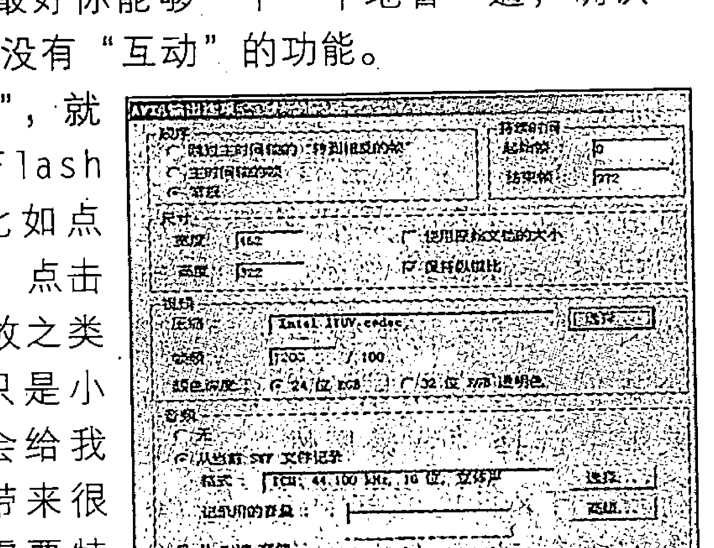

预览过Flash觉得没有问题之后，我们就可以开始转换了。之前我们已经通过点击“文件”→“打开”命令打开了一个Flash文件，此时我们选择“文件”→“创建AVI”命令，在选择了即将生成的影片的保存路径和文件名之后，我们就会看到弹出的“AVI输出选项”对话框（图3）。这个对话框提供Flash文件转换时的参数设置，首先我们看看“顺序”框里面的三个选项。如果我们即将要转换的SWF动画里面没有交互操作，那么我们可以直接选择“常规”选项。但是如果动画里面有交互性的操作，那么我们就要选择“主时间轴的帧”选项，这个选项的作用就是忽略SWF文件中的交互功能，直接跳转到主时间轴上，对上面的片段依次进行转换。如果你只是想转换某一段时间里面的一些片段，那么你可以在右边输入起始帧和结束帧，当然这需要你准确判断是哪个帧才行。在默认情况下是转换所有帧的。转换了之后如果你想更改视频的尺寸，你可以在下面的“尺寸”框进行设置。

## PART 3 另类刻录的精彩

里面重新输入宽度和高度，系统会自动帮你保持固定的纵横比，以防图像变形。

“视频”框里面的“压缩”选项对我们来说是非常重要的，它决定了系统用什么压缩算法去转换文件，对视频文件的质量起着决定性的作用。一般来说，我们只需要点击“选择”按钮，然后打开“视频压缩”，在里面选择“压缩程序”为“Cinepak Codec by Radius”即可。至于压缩的质量自然拖动到最大，而“颜色深度”可以是“32位RGB透明色”，这样在转换成为影片之后，Flash图像的精美度就不至于一下子变差了。

在“音频”框之中我们可以选择转换之后的声音质量，一般来说Flash文件的声音精度都不是很高，一般来说我们选择“从当前SWF文件记录”选项即可，它自动根据当前Flash里面的音质进行调整。而音量我们可以调整到中间。如果你的Flash是无声的，你也可以点击“从Wave文件”后面的浏览按钮，添加一段WAV文件作为影片的背景。

在最后就是文件的分割和创建之后的一些播放选项，我们不需要进行设置。一切都完成之后，现在我们点击“确定”按钮即可开始进行转换了。转换的过程会有进度条显示，十分直观。

### 2. 刻录VCD

转换成功之后我们就得到了一个AVI文件，现在可以用Windows Media player播放，看看这个文件的质量如何，确认没问题之后就可以打开Nero，进行VCD的刻录了。

打开Nero之后，我们选择“CD”模式下面的“视频光盘”，然后设置好标签、日期等选项之后点击“新建”。然后我们在Nero主界面右侧的“文件浏览器”中把生成的AVI文件拖放到左边的“视频/图片”窗口中，Nero会对AVI进行分析，我们可以一次拖放多个AVI文件到这个窗口之中。等到Nero分析完毕之后，点击“刻录”，Nero就会先把AVI编译成为VCD格式，接着就刻录出VCD光盘来了。

## 刻录Windows XP恢复盘

市面上经常能够看到一些盗版的“系统克隆”盘，用这些盘来安装系统非常快速，直接用Ghost把光盘镜像恢复到硬盘上面就可以了。其实我们自己也能够制作这样的光盘。不过在实际的应用中很多朋友会发现这种系统克隆的方法只适合Windows 98/2000系统，而当我们把克隆好的Windows XP系统恢复到硬盘上面的时候，却发现系统无法正常启动了。

这是因为Windows XP里面拥有最新的防盗版技术。当我们安装了一个系统之后，它会自动为计算机生成一个唯一的机器安全识别码，如果我们使用克隆的方法直接把Windows XP克隆到其他计算机上，由于对方机器的识别码和你的电脑不一样，所以恢复了之后就不能正常启动了。不过我们可以用一个工具帮我们解决这个问题；让克隆出来的Windows XP可以恢复到任意一台电脑上面，这个小工具就是Windows XP安装光盘中附带的叫做Sysprep.exe的系统准备工具。

### 1. 系统重新封装

Sysprep是微软为企业管理员、OEM厂商以及其他需要在多台计算机上安装Windows XP的客户设计的一个实用工具，利用它可以在单台计算机上完成初始安装后，运行Sysprep以准备对样品计算机进行克隆。

首先我们可以在Windows XP安装光盘里的SUPPORT\TOOLS目录里面找到一个名为DEPLOY.CAB的文件，如果找不到这个文件，我们也可以在http://soft.netnest.com.cn/down/15/200406/deploy.cab下载这个文件。找到或者下载完之后，我们将其拷贝到系统根目录下，然后用WinRAR解压，直接运行其中的sysprep.exe文件。这时程序会弹出一个警告窗口，单击“确定”按钮打开系统准备工具2.0的主界面（图4）。在这里我们可以看到三个按钮，分别是“重新封装”、“审核”和“工厂”，其中“审核”按钮需要点击了“工厂”按钮之后方能使用。我们在下面选中“不重置激活的宽限期”、“使用最小化安装”之后，下面的“检测非即插即用硬件”就被激活了，我们也将它选上。在这个窗口最下方的“关机”中提供了我们在重新封装之后是关机，还是重新启动计算机等选项，一般来说我们可以选择“关机”，做好所有设置之后点击“重新封装”按钮，程序就会弹出提示信息，只要点击“确定”按钮即可，封装完毕后计算机就会自动关闭了。

### 2. 制作硬盘克隆

封装完毕后，计算机自动关闭。现在我们重新打开计算机，进入DOS状态之后启动Ghost，然后将Windows XP分区克隆成一个映像文件，就是选择菜单“Local”→“Partition”→“To Image”，接着我们就会看到弹出的选择硬盘进行压缩的对话框了。这里我们首先选择好克隆哪个硬盘，然后选择Windows XP安装的分区，接下来就是设置映像文件保存的位置和文件名。在开始克隆之前Ghost会提示你采用什么压缩方式，为了节省空间，建议大家选择“High”模式，也就是用最大压缩模式，这样我们压缩出来的光盘镜像空间占用会少很多，只是压缩的速度比较慢。

### 3. 刻录恢复光盘

光盘镜像制作完成之后，我们就可以打开Nero，然后刻录全自动系统恢复盘。

在上面一节里，我们制作了一张可以恢复到任何电脑之中的Windows XP恢复光盘，不过这个系统恢复了之后在第一次启动的时候需要进行安装过程的最后设置，包括了安装必要的硬件、计算机名称、密码、用户协议以及序列号等信息，然后才可以正常使用系统，事实上还需要一段时间才能够使用，而且必须经过人工操作。那如果我们的恢复光盘只是在本机上使用，能不能忽略掉一切不必要的过程，让恢复光盘完全自动运行，一开机即可帮助我们完全恢复整个系统呢？答案是肯定的，我们平时看到的品牌机通常都带有这样的光盘，只要放进去光驱，然后用光盘启动，很快系统就会全部恢复了，而我们现在也可以自己制作这样的全自动恢复光盘。

### 1. 重新封装

要制作全自动恢复盘，那就必须重新进行封装，我们同样把DEPLOY.CAB里面的所有文件解压出来，这次我们运行的是里面的Setupmgr.exe，运行之后就会看到“安装管理器”了。单击“下一步”之后选择“创建新文件”，在选择安装类型时选择“Sysprep安装”，接下来系统就会要求我们选择安装的操作系统，在这里选择与自己安装的操作系统版本一致的即可。选好操作系统之后单击“下一步”，再选择“是，完全自动安装”项，然后单击“下一步”进入真正的安装管理器界面，根据向导的提示完成名称单位、显示设置、时区、产品密钥等选项的设置（图5），每设置完一项只需要单击“下一步”即可进入下一项设置。一直到完成最后一项设置，单击“完成”按钮的时候，向导会提示我们设置应答文件保存位置，默认是保存在c:\sysprep，并且文件名为sysprep.inf，我们选择默认设置即可。接下来我们可以按照上一节所说的方法对Windows XP进行重新封装了，经过如此封装之后，Windows XP在恢复的时候就不会再询问我们一些信息，而是完全安装好了。

### 2. 制作自动恢复安装程序

系统封装好了，Ghost镜像也压缩好了，现在还有一个问题，那就是如何让光盘自己启动，然后自动将压缩好的光盘镜像恢复到指定的硬盘分区上面去，实现真正的全自动呢？当然，我们可以自己制作启动光盘，然后编辑批处理文件来完成这一切工作，不过这样做起来非常繁琐，而且难度颇大，因此我们可以借助一个小工具来实现这样的功能，它就是“一步到位GHOST全自动备份还原光盘”了。

我们可以到www.skycn.com去下载这个软件，下载完成之后运行exe文件，就会把一个叫做ghost.iso的文件解压到硬盘上面。接下来我们首先要把之前压缩好的Windows XP镜像文件（xxx.gho）的名字改成“system.gho”，因为“一步到位”里面要求必须使用这个镜像文件名。接着我们安装一个支持ISO文件编辑的软件，比如UltraISO，它能够解开ISO文件进行编辑，而且不会破坏ISO镜像里面的光盘启动文件。安装好了UltraISO之后，使用就非常简单了，我们打开菜单“操作”→“添加文件”，把之前改了名字的Windows XP镜像“system.gho”文件添加到ISO镜像文件中，然后用同样的方法把Ghost软件里面所有相关文件都添加到ISO镜像文件里面，最后单击工具栏上面“保存”按钮保存修改后退出即可。现在我们立刻运行Nero，打开菜单“刻录器”→“刻录映像文件”，然后选择Ghost.iso文件进行刻录就可以了。

刻录完成之后，我们可以用这张光盘来启动系统，可以看到系统启动之后出现一个菜单（图6），我们可以选择从光盘恢复到C盘或者D盘，之后的事情就交给系统自己去完成吧，很快你的Windows XP系统就会恢复过来了。

## 轻松隐藏刻录光盘数据

有时候由于种种原因，我们不喜欢电脑里面的某些数据被别人看见，于是从简单的文件属性更改，一直到使用专业的加密软件等等方法层出不穷。不过要加密硬盘上面的数据要比加密光盘上面的数据简单得多，因为硬盘上面的文件属性随时可以更改，也可以安装新的加密软件，但是光盘却无法安装新软件。那我们应该怎么办呢？我们可以使用一个“小错误”来巧妙地实现光盘数据简单加密。

相信很多朋友在以前刻录光盘的时候都碰到过这种情况，就是使用不同的刻录软件往同一张CDR光盘上面刻录数据，或者同一个软件多次刻录一张CDR的时候，由于操作不当，以前的数据看不见了。为了加密保护我们的数据，现在就要重现这个“小错误”。

首先我们准备一些不想被别人轻易看到的资料，然后用Nero里面的“CD-ROM ISO”模式刻录好，记住不要“结束”光盘，也就是说让光盘可以接着刻录别的东西。接下来我们还是使用这张CDR，接着继续打开Nero，开启“CD-ROM ISO”的模式，准备刻录一些新的数据，这时我们会发现，原本光盘第一次刻录的时候，默认选择的是“第一次刻录多重区段光盘”的选项，而第二次刻录的时候则是默认选择“继续刻录多重区段光盘”了。这时候我们玩一个小把戏，把选项改成“第一次刻录多重区段光盘”，也就是说把光盘当成新的来刻录。刻录过程依旧很成功，但是刻录完成之后我们就会发现，光盘上面显示的是第二次刻录的数据，而第一次刻录的东西已经不知道去哪里了。

接下来我们就要把“丢失”了的数据找回来，方法很简单：在“我的电脑”里面用鼠标右键点击光盘所在的光驱，然后在弹出菜单之中选择“属性”，然后打开里面的“Volumes”选项卡，我们就会发现这张光盘居然有好几个“Volumes”，如果你每次刻录都会设置一个光盘标签的话，你就会发现自己之前的标签赫然都在里面！接下来我们只要选择其中一个标签，比如说第一次刻录的时候你选择的标签，然后点击“确定”退出。现在打开资源管理器看看，我们就会发现光盘的内容又神奇地变回第一次我们刻录的内容了。

用同样的方法，我们可以首先把一些重要的资料分多次刻录到一张光盘里面，最后我们再刻录一些“表面”上的无关紧要的资料，这样就算别人打开了我们的光盘，一时之间也不会知道光盘里面实际上是“另有乾坤”。而且你的光盘就算拿到别的计算机上面去，也只是会显示最后一次刻录的数据。

## 刻录加密的光盘

在上面我们介绍了一种巧妙的“加密”方法，这种方法虽然方便，但是并不保险，毕竟你只是耍了一个“障眼法”，对一些别有用心的人来说是无法防住的，这时候我们就要采用一些光盘加密软件来帮忙了。正如之前所说，光盘刻录了之后就很难再去加密了，因此我们要在光盘刻录的时候就进行加密。CryptCD就是一个很好的光盘刻录加密软件了。凡是用CryptCD加密的光盘，在把光盘放入电脑里面之后，会弹出一个窗口让你输入密码，只有输入正确的密码才能访问光盘里面的内容。

我们可以通过http://www.timesavesoftware.com/cryptcd3.exe来下载CryptCD的3.3版本，安装好软件之后运行，我们就可以看到CryptCD。CryptCD的使用很简单，我们把需要进行刻录的文件或者文件夹直接拖拽到下面的“New CD/DVD”窗口之中，我们点击“Create CD”按钮，软件就会弹出设置密码的对话框，输入完密码之前确认一次，然后点击“Apply”按钮即可开始打包映像了。映像打包好了之后，我们可以用任何刻录软件来刻录光盘映像，和别的刻录过程并没有什么不同。

光盘刻录好了之后，每当我们点击光驱图标打开光盘的时候，它都会弹出密码框让你输入，没有正确的密码是无法看到的。用CryptCD刻录光盘，和一些需要用注册码打开的“加密”光盘不一样，后者只要输入一次注册码就以后都不需要了，加密作用有限，而且CryptCD和光盘启动文件并不冲突，可以放在同一张光盘里面。此外用CryptCD还可以定制加密查看器的背景、文字等等，虽然这都是些“花俏”的功能，不过有时候也的确能帮我们起到掩人耳目的误导效果。

除了加密光盘之外，即使我们没有刻录机，也可以使用CryptCD来对文件夹进行加密，然后把生成的加密包放到硬盘、优盘、ZIP磁盘甚至软盘里面，一样能够起到加密的作用。

## PART 3 轻信谣言，失去的不单是密码

## 轻信谣言，你失去的不单是管理员密码

> 关于Windows的安全性问题，相信大家常常在各种媒体中看到这样的标题：Windows XP爆新漏洞！应该说，Windows XP是一个稳定性和安全性都不错的操作系统，但它仍然存在着不少安全隐患，也因此衍生出各种利用漏洞的秘诀了。

### 谣言止于智者

在Windows的各种漏洞中，最为大家所熟知的便是其系统登录方面的漏洞，也就是通常所说的“免密码进入Windows XP”，或者“轻松恢复Windows XP的管理员密码”等等。大家可以用Google搜索一下相关的内容，就能看出这些所谓的技巧和秘诀是如何为人所津津乐道。但是，它们真的行得通吗？

### 1. SAM的故事

**方法：** 当你不小心忘记了Windows XP管理员密码后，使用任何方法（如果是双系统，那么在另一个操作系统下对Windows XP所在分区进行操作；如果不是双系统，那么就在纯DOS模式下进行操作；NTFS分区的朋友需要Winternals的NTFS for DOS工具），把“C:\WINDOWS\system32\config”目录下一个名为SAM的文件删除。重新启动系统后，Administrator的登录密码就会显示为空。

**理论：** 我们先来看看这个故事的主角——SAM，它的全名为 Security Account Manager，即安全账户管理器。该管理器通过安全标识（SID）来标记用户账号，而不是通过直接确认用户名和密码的形式，Windows 系统的 SID 信息就保存在 “C:\WINDOWS\system32\config” 下的 SAM 文件里。当我们登录系统时，系统会自动验证 SAM 数据库信息，当用户名和密码与 SAM 文件中的加密数据吻合时，系统就会顺利登录；反之，则无法登录。删除该文件，则意味着 SAM 数据库会被清空，管理员的登录密码也随之清空，自然就可以逃过 Windows XP 的登录密码验证机制。

**验证：** 为了验证该方法的可行性，我做了一次试验。我 C 盘安装的是 Windows XP Professional SP2，D 盘则安装了 Windows 2003 SP1，并在 Windows 2003 环境下把 “C:\WINDOWS\system32\config” 里的 SAM 文件剪切到 D 盘中。重启电脑，一路下去都非常顺利，但在快出现欢迎界面时，系统弹出了一个错误提示框，指出安全账户管理器初始化失败并提示重新启动电脑至安全模式中。事实上，Windows XP 无论是正常模式还是安全模式都需要加载 SAM 文件，否则就会报错并且不允许进入操作系统。所以，如果删除了 SAM 文件，那么对不起，如图 1 所示，你连安全模式也是进不去的。接下来如果不能恢复 SAM 文件，那就只能重装系统了。

那为什么还有如此多的文章在大谈特谈此法呢？事实上，此种方法只适用于未安装 Service Pack 的 Windows 2000，对 Windows 2000 SP1 或以上版本是无效的，就更别说 Windows XP 了。在这里，我很负责地提醒大家一句：如果仍想尝试此法，请务必备份 “C:\WINDOWS\system32\config” 里的 SAM 文件！

## 2. 神秘的屏保

说谎的最高层次，就是睁眼说瞎话。

**方法：** 使用如前文所述方法，把 “C:\WINDOWS\system32” 下的屏幕保护程序 logon.scr 改名（例如 logon.scr.bak），然后把同一文件夹里的 cmd.exe 改名为 logon.scr。重启电脑至登录界面后等待5分钟，本来应该出现的屏幕保护会变成命令提示符，而且具有 localsystem 权限。在命令提示符后键入 “net user administrator”，回车后就会清空管理员账号的密码。重启电脑，把上述两个文件恢复各自的文件名，再次重启电脑便可以用空密码登录 Windows XP 了。

> 小知识: localsystem 权限就是 Windows 操作系统本身的执行权限，基本上没有任何限制，在任何程序都可以运行。

**理论：** 这个方法就是让 Windows XP 启动后打开命令行提示符，然后通过 net user 命令来清空或更改管理员账号的密码。

**验证：** 用 Windows 98 启动盘引导至纯 DOS 模式下，把 “C:\WINDOWS\system32” 下的 logon.scr 文件拷贝到 D 盘（命令：copy logon.scr d:\），然后删除该文件（命令：del logon.scr）。接下来把 “C:\WINDOWS\system32” 下的 cmd.exe 文件改名为 logon.scr（命令：ren cmd.exe logon.scr）。重启电脑至登录界面后，静待5分钟不见任何动静。事实上，必须到第15分钟才开始运行屏幕保护程序。一如预料中的情况，命令行窗口打开了，键入 net user administrator 并回车，猜猜着发生了什么情况？如图2所示，“System error 5 has occurred. Access is denied.”，意思是“发生第5类系统错误，访问被拒绝”。很明显，我们并没有获得 localsystem 权限，那么清空或更改管理员账户密码便是一句笑话了。

大家现在明白了吧，上述两个“秘诀”虽然不能说子虚乌有，但却只能应用在没打补丁的 Windows 2000 当中。事实证明，微软早已修补了这一漏洞。如此一来，那些再以 Windows XP 为应用背景的文章就显得不负责任了。

## 实践出真知

那么，是不是就完全没办法恢复管理员账号密码呢？也不尽然，下面我们再来看看有什么解决方法。

### 1. SAM 的故事续集

实践证明，单纯删除 “C:\WINDOWS\system32\config” 下的 SAM 文件是不可行的，但替换却是另一回事了。首先，我们来了解一下位于 “C:\WINDOWS” 下的 repair 文件夹的作用。当我们最初装好系统时，记录最初状态的登录配置文件就存放在 repair 文件夹中，而这些文件并不记录日后发生的变化。

在安装 Windows XP 的过程中，当进行到“计算机名和系统管理员密码”这一步时，如果当时没有设置系统管理员密码，我们只需要把 “C:\WINDOWS\repair” 下的 SYSTEM、SOFTWARE、SAM、SECURITY 和 DEFAULT 五个文件拷贝到 “C:\WINDOWS\system32\config” 下，覆盖原文件即可。操作步骤很简单，我们以 DOS 为例，在纯 DOS 模式下执行下面的命令：

```
copy c:\windows\repair\system c:\windows\system32\config\system
copy c:\windows\repair\software c:\windows\system32\config\software
copy c:\windows\repair\sam c:\windows\system32\config\sam
copy c:\windows\repair\security c:\windows\system32\config\security
copy c:\windows\repair\default c:\windows\system32\config\default
```

当系统提示是否覆盖原文件时，按 “Y” 键并回车。即可。重启电脑后，系统显示“正在应用计算机设置”。经过一段时间的等待，终于来到登录界面，这时我们就可以用空密码登录Windows XP啦。成功登录系统之后，在“控制面板－用户账户”中重新设置用户名和密码即可。

需要注意的是，重新登录系统的同时，如图3，在“C:\Documents and Settings”文件夹下会自动形成一个名为“Administrator.计算机名”的文件夹，这是为了与Administrator区别开来。我们只需要重启电脑，用更改密码之后的管理员账号登录，然后删除Administrator文件夹，并将“Administrator.计算机名”重命名为Administrator即可。

当然，这个方法也并不是没有缺点。首先，必须在安装系统时设定管理员密码为空，否则免谈。还有，之前的大部分系统的优化设置将消失，例如对系统属性的高级设置、虚拟内存的设置以及服务启动的设置等等。而且，控制面板里的添加删除程序里将会丢失部分程序显示（这取决于所安装软件的类型和多少）。不过，好在大部分程序仍能正常运行，只有一小部分的软件需要重新安装，主要是一些以服务模式加载的程序，例如Kaspersky等。

小提示：对于那些常常忘记管理员密码的人，可以在未发生惨剧前先清空administrator的密码，然后在密码丢失后通过上面的方法恢复。由于是最近所做的备份，那么还原时电脑上所装的软件和设置等都会是备份时的样子，这样就可以把损失降到最低了。

## 2. L0phtCrack暴力破解

如果在安装Windows XP时已经设置了管理员密码，那么上述的方法将不适用于你。这种情况下，我们可以使用著名的美国计算机安全公司@Stake出品的Windows/Unix密码查找软件L0phtCrack 5.04，对拷贝出来的SAM文件进行暴力破解。

下载并安装L0phtCrack 5.04，安装过程非常简单，一路“Next”即可完成安装。运行L0phtCrack，在弹出窗口中点击“Register”按钮，然后在注册窗口中的Unlock Code输入栏中键入注册码，按“OK”确认退出。之后程序会提示注册成功，进入主界面并自动运行向导，按“取消”关闭该窗口。

点击主界面左上角的“File－New Session”新建一个任务。然后，点击工具栏上带绿色箭头的Import图标，在弹出的窗口中选择“From SAM file”，并在右边的Filename输入框中键入SAM文件的保存路径，按“OK”确认退出。LC5会自动分析此文件，并显示出文件中的用户名。如图4所示，点击工具栏上的右箭头Begin Audit图标即可开始破解密码，主界面的右侧栏将显示破解进度。

如果密码不复杂的话，在很短的时间内就会得到结果。使用L0phtCrack的好处是不破坏原系统的账户信息，这对于使用EFS加密数据的朋友非常重要。

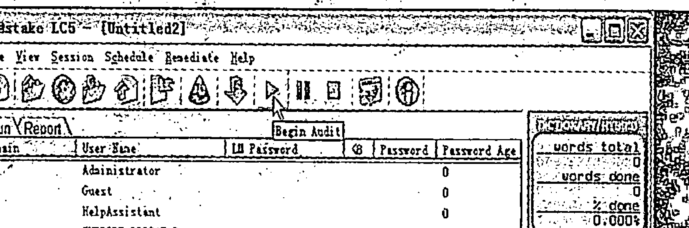

小知识：在Windows 2000/XP中，每一个用户都有一个SID（Security Identifier，安全标识）以区分各自的身份，每个人的SID都不相同且有唯一性。在第一次用Windows 2000/XP自带的EFS加密数据时，操作系统就会根据加密者的SID生成该用户的密钥，并且会把公钥和密钥分开保存起来，供用户加密和解密数据。如果在重装系统之前没有对当前的密钥进行备份，那么即使在同一台电脑上安装同一个操作系统并使用相同的账户名，也不能打开此前EFS加密过的文件或文件夹。

## 3. ERD Commander极速改码

除了用L0phtCrack暴力破解以外，我们还可以用Winternals Administrators' Pak工具中最强大的组件——ERD Commander来修改密码。最新版本的ERD Commander 2005可以在不知道原来密码的情况下，把Windows NT/2000/XP/2003系统中任何一个用户的密码修改掉！

首先，下载并刻录ERD Commander 2005的自启动光盘，然后以该光盘作为启动盘重启电脑。在进入ERD Commander 2005的桌面前，首先选择工作模式，点选“Run ERD Commander”按“OK”按钮。然后，在欢迎窗口中选中需要修改账户密码的操作系统，按“OK”键即可进入ERD Commander 2005桌面。

选择“Start－System Tools－Locksmith”，在弹出的窗口中点击“Next”按钮。然后在Account中选择Administrator，并在New Password和Confirm Password的输入框中键入新密码，按“Next”及“Finish”按钮结束操作。最后选择“Start－Log Off”重启电脑。这一次，我们将以正常模式进入Windows XP，来到登录界面时，输入刚才设置的密码即可进入操作系统。

和L0phtCrack相比，虽然ERD Commander能更快速地修改管理员密码但它只能修改而不能找回管理员身份的账户密码。如果这些账户用EFS加密数据的话，那么修改密码将意味着SID的变更，密匙也就失效了！

笔者再次提醒各位管理员：请谨记自己的管理员密码，做个称职的管理员！当不幸的事情发生后，先冷静头脑，然后根据不同情况采取相应的补救措施。切勿轻信谣言。否则，你失去的不单是管理员密码，而是一个操作系统，甚至一份工作。

## # Windows XP威力外挂大补丁

> 以前，我们担心下载的软件带有病毒或木马程序，现在，我们又怕这些软件嵌套了间谍程序。这仿佛是一种循环：付费软件→下载破解版→感染病毒、木马或间谍软件→付出高昂代价。商业软件当然有其优势——功能强、效率高，但我们是否真的需要这么多第三方软件呢？这个问题很难说得清楚，但至少你可以尝试使用一些免费、而且绝对不会任何恶意程序的工具软件，例如微软的PowerToys，这个小小的工具集应该能给你带来些许惊喜。

### ## PowerToys


基于Windows XP的PowerToys大致分为两版：早期的1.1版及后来的2.0版。就笔者的使用经验来说，两个版本的PowerToys并没有实质的区别，不过1.1版有简体中文汉化版，而2.0却只有英文版。所以，除非是最新的PowerToys，否则我们还是推荐大家使用1.1汉化版。

- 软件: PowerToys for Windows XP
- 版本: 1.1 汉化版
- 大小: 559.4KB
- 性质: 共享软件
- 下载地址: www.onlinedown.com

PowerToys的安装非常简单，一路点击“下一步”按钮直到结束即可，使用时，只需在“开始→所有程序→PowerToys for Windows XP”中选择相应组件就可以了。

### ## 1. 切换窗口前先看缩略图——TaskSwitch

“Alt + Tab”组合键切换应用程序窗口，相信没有哪个Windows用户没用过吧。当你运行的应用程序较少时，“Alt + Tab”组合键真的比较好用。但如果你同时打开几个Word文档，又或者你打开了10个IE浏览器窗口，那么问题来了，用“Alt + Tab”组合键切换时，你看到一堆相同的程序图标而不知道该选哪个。PowerToys的TaskSwitch可以看作是“Alt + Tab”的强化版，当你按下“Alt + Tab”组合键时，你不仅看到对应可供切换的程序图标，同时还能对每个选中窗口进行预览。有了TaskSwitch，你不会再为找出不哪个Word文档窗口而烦恼了吧（图1）。


### ## 2. 用计算器计算函数——Power Calculator

每一个版本的Windows都会内建“计算器”，它除了一般的运算之外，还可以切换成“科学型”。不过若是要计算各种函数公式的时候呢？“计算器”就真的完全发挥不了功用。如果你也有这种需要，那你一定要试试PowerToys中的加强型“科学计算器”喔！PowerToy Calc的“函数”菜单里默认提供了基本运算符、三角函数及圆周函数3类函数，选择函数后直接输入自变量的值，就可得出函数值了。PowerToy Calc还支持自定义函数，在“图表”栏中点击“添加”，在弹出的输入框中键入你需要的函数式，点击“确定”按钮。然后你就会在右边的窗口里看到对应的图形。如果你还想看该函数式的详细资料及图形，点击“新窗口”按钮，就能够看到数值范围及图形了（图2）。

### ## 3. 两步完成ISO镜像刻录——ISO Burn

如果你只是刻录ISO镜像，那么你大可不必劳动Nero它老人家，来试试微软的刻录工具吧。点击“开始→所有程序→PowerToys for Windows XP→ISO刻录工具”，在弹出的刻录向导中点击“下一步”，然后再指定刻录机盘符和ISO镜像文件所在位置，按“下一步”按钮。刻录完成后，点击“完成”按钮结束，就这么简单。

### ## 4. 简单制作HTML幻灯片——HTML Gen

用PowerPoint制作幻灯片？太专业了，试试PowerToy的HTML幻灯片制作向导吧。点击“开始→所有程序→PowerToys for Windows XP→幻灯片制作工具”，在弹出的向导窗口中添加目标图片，点击“下一步”按钮。然后填入该幻灯片的相关信息和进行一些必要的设置（图3），按“下一步”按钮开始制作，点击“完成”结束。双击生成的HTML文件，点击“这里”开始播放幻灯片。此外，由此生成的HTML文件可直接用于Web站点发布，让全世界的朋友分享你的收藏。

## # PART 官方外挂工具大补遗

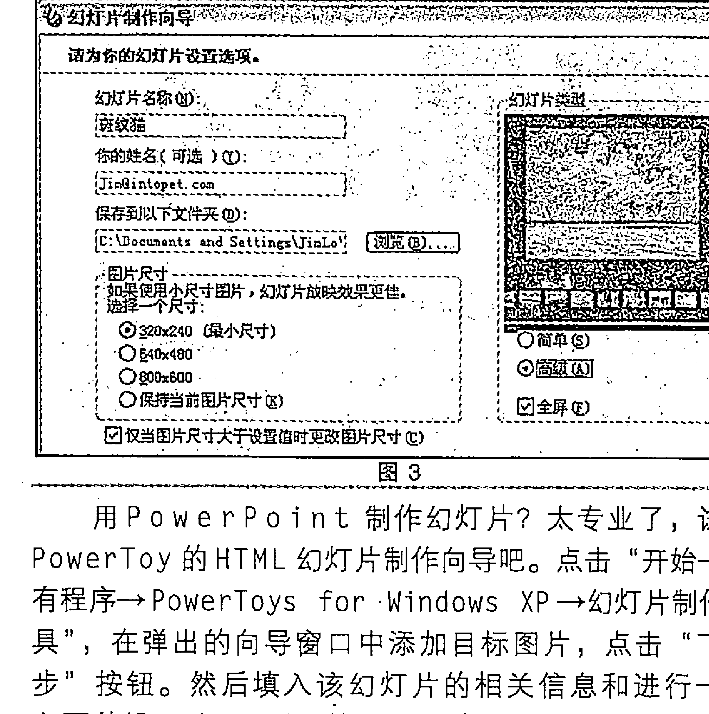

- 软件: Virtual CD-ROM Control Panel
- 版本: v2.0.1.1
- 大小: 31.6KB
- 性质: 共享软件

谈到虚拟光驱，Daemon Tools和Alcohol 120%绝对是老大了，但Windows XP内建的光驱你又玩过没？现在，你只需下载并安装Virtual CD-ROM Control Panel就可以啦。
下载并解开压缩包，把“VcdRom.sys”文件拷贝到“C:\Windows\system32\drivers”目录下，然后运行“VcdControlTool.exe”文件。在弹出的虚拟光驱控制面板里，点击“Driver Control”按钮，然后点击“Install Driver”按钮，在弹出的窗口中指定“C:\Windows\system32\drivers\VcdRom.sys”，点击“打开”按钮。这时，虚拟光驱的驱动已经安装好了，点击“Start”按钮启动虚拟光驱，点击“OK”按钮确定退出。
回到主界面上，点击“Add Drive”按钮添加虚拟光驱，需要注意的是，虚拟光驱的盘符不要和当前物理驱动器或原有的虚拟光驱（如Daemon Tools）的盘符相重合。点击“Mount”按钮，在弹出的窗口中指定你的镜像文件，按“OK”即可。点击“Remount”按钮对镜像文件进行重新加载，点击“Eject”按钮卸载镜像文件（图4）。

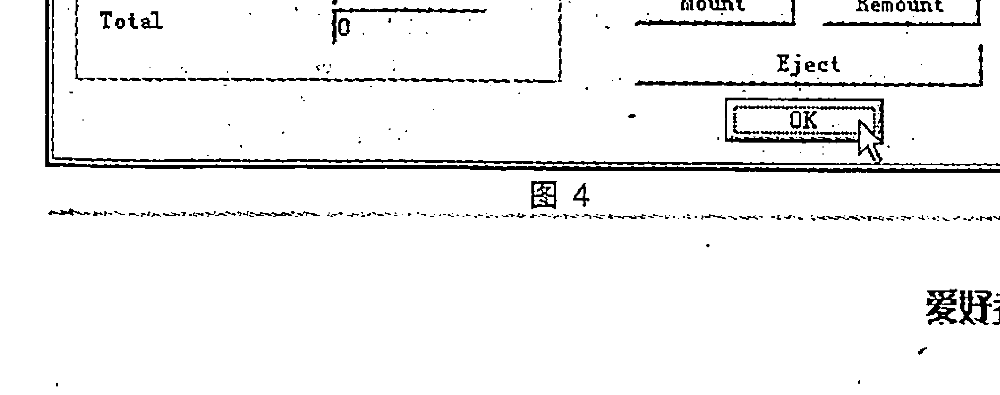

## IcalClkSetup

- 软件: Microsoft Chinese Date & Time
- 版本: 1.0.0129.01
- 大小: 565.5KB
- 性质: 共享软件

对于中国人来说，农历历法的计算还是相当有用的，Windows自带的日期和时间显示没有提供这方面的支持。想知道今年中秋是哪一天吗？你不需要再跑去翻日历，或者上网Google了，安装Microsoft Chinese Date & Time，上下140年的农历历法就一目了然啦。
下载并运行安装程序，安装过程很简单，一路点击“下一步”按钮直到结束即可，然后按照程序提示重启电脑。进入系统后，点击“开始→所有程序→Microsoft Chinese Date & Time”，主界面左边为日期栏，当中除了公历历法外，还显示出对应的农历历法，其中24节气用绿色标示，例如小暑、白露和秋分等，而春节、元宵节、中秋节和端午节等则以红色标出（图5）。

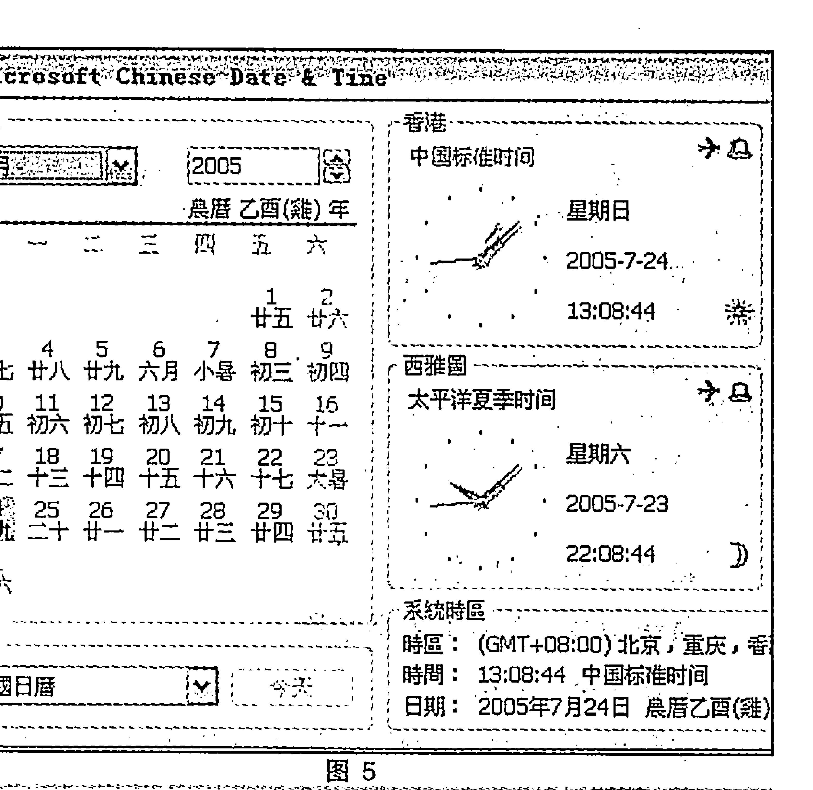

右边的时间栏中显示了程序预设的2个城市时间，当然你也可以随意更换你关心的地区时间显示。例如我公司和韩国有业务来往，那么点击任意一个城市方框的飞机图标，在弹出的窗口中键入城市名并选择对应的时区，如果当地实行夏令时制，选中“日光节约时间”复选框即可，按“确定”保存退出。

## # 学校应用软件推介

文图谢勇

随着电脑的应用与普及，不少行业都从繁重的体力劳动中解脱了出来，大大提高了工作效率。作为知识传播的机构——学校，也沐浴着时代的春风，开始了全面电子化办公的革命，提高了办学质量，更多更快地培养出祖国的人才。
想当年笔者还在小学时，老师们含辛茹苦地备课，一遍一遍誊抄书写着教案；在蜡纸版上一丝不苟地刻画，以便印刷出来的试卷准确、整洁；而到了判卷时又是一页一页修改着错漏之处，自己不断重复着那已烂熟于胸的正确答案。而如今，电脑也已走上三尺讲台，我们可用电脑备课，不满意的文字可以整段地删除、修改；所有的测试用卷都是电子稿件送油印室；发到学生手中的全是工整的铅字，绝无浓郁的油墨气息；答题卡的使用大大缓解了判卷的强度，讲评试卷时精力更为充沛。教学的效率不知提高了多少倍，全拜电脑所赐。

人对速度的追求是无止境的，为了使学校的办事效率更高，不断有人编制新的应用软件。它们在学校各个部门的应用，简化了繁复的工作、增强了教学效果、激发了学习兴趣、缓解了教师压力——诸多好处不一而足。笔者分门别类地推介这类软件的应用，希望能对教师朋友们有所帮助。

### ## 教务教学部

教务教学部的任务很繁杂，对教师、学生、课程要进行全面的管理。特别是在全校课程表的编排、学生学籍管理、考试成绩分析、教学设备管理等方面，是令教务人员最为头疼的工作。利用下面介绍的软件，可以起到事半功倍的效果。

### ### 1. 排课王

- 软件名称：排课王
- 最新版本：2.0（中小学版）
- 软件大小：9.45MB
- 软件性质：共享软件（未注册有时间、次数限制）
- 下载地址：http://www.ww51.com/index/Soft_Down.asp?UrlID=1&SoftID=58

#### #### (1) 特点概述

《排课王 2.0（中小学版）》采用先进的算法，有效解决了学校复杂的排课问题。该软件操作方便、界面直观，易用性、实用性和适用性都很强；能解决各种复杂的排课情况；可以任意排数量不限的班级、课程和老师；独具强大的引入、查询、手工预排等功能；可以按班级、教师、教研室进行分组，满足多方各取所需的要求；临时调课方便、快捷。

下载得到压缩包文件，运行其中的 Setup.exe 文件完成安装操作。安装好软件后，我们来具体看看其如何操作。

#### #### (2) 新建课表

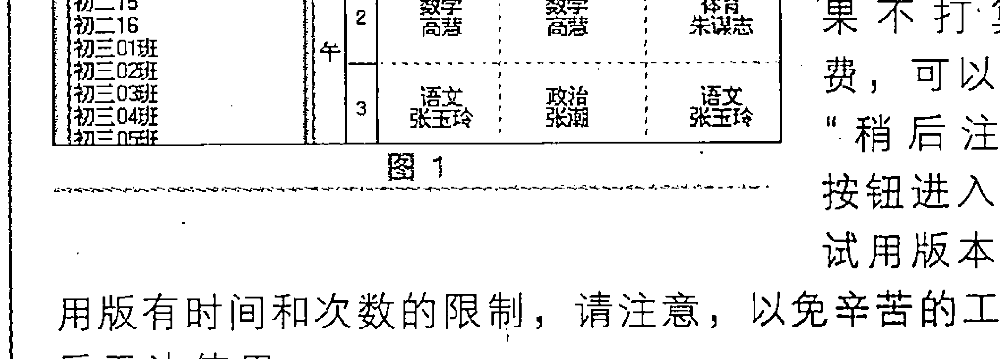

图1

未注册用户运行程序时，会弹出请求注册对话框（如图1），如果不打算付费，可以点击“稍后注册”按钮进入程序试用版本。试用版有时间和次数的限制，请注意，以免辛苦的工作日后无法使用。

选择“文件”菜单下的“新建”项，或单击工具条中的新建按钮，进入“创建新的课表”窗口。按要求录入课程表名称，如“2005~2006学年度第二学期课程表”，选择每天上午、下午、晚上各排几节课，若晚上不排，可录入0。勾选一周内每天的上课时段，在这里，可以自定义一周上六天还是五天，这样，就完成了对本课表的基本参数的设定。之后点击“确定”即生成新的课表框架。

> 小技巧：只要尚未进行自动排课（或者自动排了课，又进行了清除排课结果），你都可以随时更改这些选项。

#### #### (3) 手工预排课

手工预排，是一项特殊功能的排课，它既可以实现快速安排某些特殊课程，如班会、自习课、活动课等；也可以直接对某些特殊教师的课进行指定性安排，如校长的课希望按其要求进行指定性排入等。操作时，拖选多个班，选定课程，选定教师，便可以在指定的位置上排课。

若尚未注册，但又想使用本系统丰富、漂亮的报表系统，不妨使用手工预排功能，把课表登记进去，就可以输出各种各样的报表（单元课表和总课表、总课简表），还可以利用它强大的查询功能。

#### （4）录入基本信息

特殊课程时间安排好，一般性的课程编排还用手工就太繁琐了。程序可以根据要求自动生成课表。

首先需要进行字典维护工作。字典维护包括对：班别、教师、课程、专用教室的维护（增加、修改、删除操作）。请根据本校的具体情况来修改既有字典的内容。点击“字典维护”按钮，在“字典维护”窗口中选择修改班组、班别、教师等相关项目，右击欲修改项，选择“修改”命令，即可完成字典维护。

小技巧：录入字典时，经常会遇到重新录入刚才录入的文字，虽然可以利用Copy和Paste进行操作，但太麻烦，这时你可以直接输入两点“..”或“。。”，系统会自动调出刚录入的文字。

维护了字典之后，回到此窗口，回到“课程条件”窗口，在这里进行排课条件的设定。右击鼠标选择“增加新条件”命令，在弹出对话框内可以选择好上课班级、所上课程、授课教师、每周节次、限定时段等参数。当添加好所有班级、教师的上述条件后，关闭此对话框，并在“课程条件”窗口内，点击自动排课按钮，系统即开始按条件排课。如果一切顺利，课表就会排好了。

如果设置条件太多，无法排出满意的课表，那么可以启动手工排课功能进行调整；课程都排好后，可以按照班级、教师、教室的类别进行打印输出，传达到相关人员手中。本软件对排课的关联工作都有支持，是教务人员的得力助手。

### 2. 学籍管理

大量的学生档案的整理管理工作，是困扰教务人员的又一难题。越是规模大的学校，由于学生数量多，工作量就越大。

- 软件名称：学校学籍管理解决系统
- 最新版本：2.0
- 软件大小：11.3MB
- 软件性质：共享软件（未注册无法升级）
- 下载地址：http://download.myrice.com/downloadrate.php?dl=0&artid=30083&downloadurl=disk1/0510/qrxjglxt2.0_myrice.exe

### （1）特点概述

这套学籍管理系统吸取众多软件的优点，适合小学、初中、高中、中专等学校使用。软件摈弃了一些不常用的功能，做到了功能强大但不复杂，界面漂亮而不花哨，使用简单，窗口操作一目了然。

它具备的功能有：

- 适合在网络环境下使用。只需要将工作目录共享，即可实现联网录入，联网管理。
- 支持用户定义和权限定义，可有效防止数据被删除或泄露。
- 提供强大的编辑功能，Excel类似的编辑、复制、剪切、粘贴、填充、替换、查找等功能均俱全。
- 对学校版提供了多个实用的报表。报表控件全新修改。
- 报表的任一字段均可以自定义修改，自定义导出等。
- 支持页面的自定义（纸宽、纸高，边距，打印方向）。
- 表格支持：隐藏列、行，调整行高、列宽，设置单元格的格式。
- 表格隐藏即不打印，当前表格内容均可导出为其他格式数据。

### （2）操作简介

安装运行下载到的qrxjglxt.exe文件，如果是第二次安装，安装程序会提醒“xjglxt.mdb已经存在，请问是否覆盖？”。如果程序的工作目录设置为安装目录，覆盖此文件会造成学籍数据丢失。因此，请先备份这个文件。请及时登录官方网站http://www.qrsoftware.net了解更新信息，及时通过在线升级软件（仅对注册用户有效）。

运行程序时，会弹出一个对话框，要求输入软件工作目录，默认为安装文件夹。勾选左下角的“下次不再显示”，点击“确定”后，要求输入账号密码。初始密码无，直接点击“确定”进入程序。

各项功能操作比较简单，在此就对怎样使用Excel录入数据作一详细的介绍。请选择“学生学籍情况→录入修改学籍→文件”→用EXCEL模版录入。起个文件名后，会调用系统中已安装的Excel程序，往模板中输入数据（图2）。

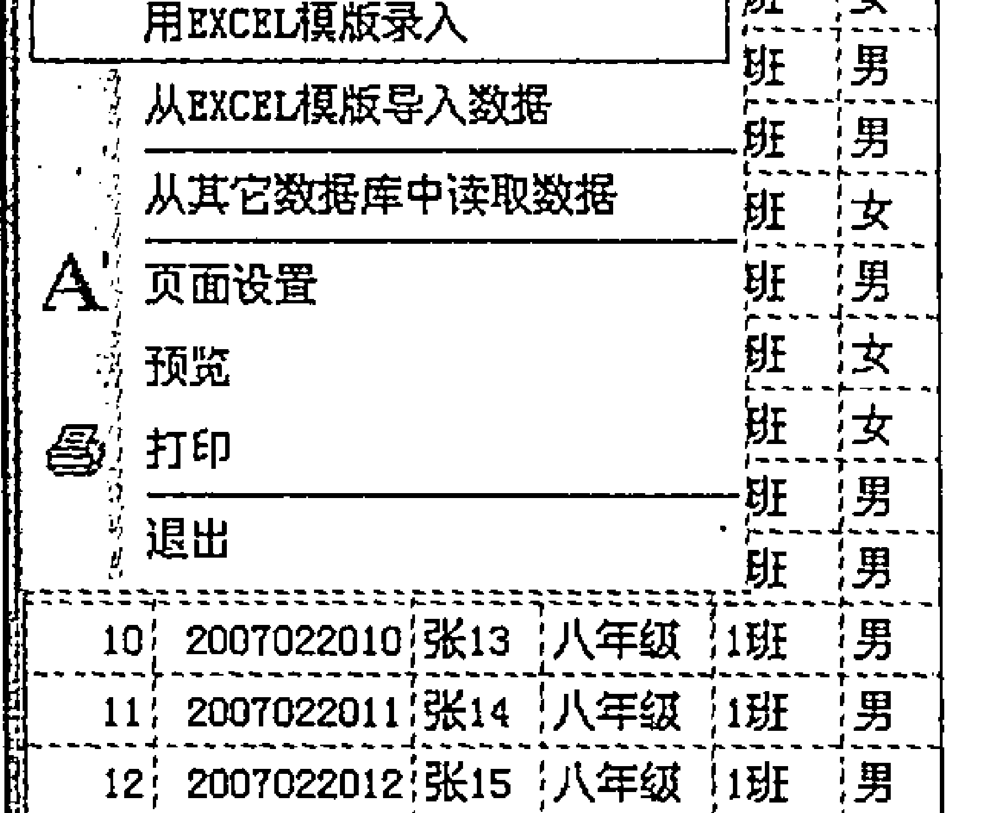

用此模板文件录入后，保存退出Excel，在学籍管理程序中选择“从EXCEL模版中导入数据”。如果模板文件中录入了多个年级的数据，请选择“全校”，点击“否”。然后保存当前数据即可。

#### （3）提示

学校代码：学校代码一定为一个数字，正确格式如“120”，第一个可以为“0”。

年级代码：请在年级设置中认真设置年级和毕业年度。年级的毕业年度会被作为年级代码。如九年级毕业年度为2006年，则该年级的年级代码为“2006”。

学籍号格式：年级代码 + 学校代码 + 编号（三位）组成。如：学校代码为“120”，年级代码为“2004”，编号为“001”则这个同学的学籍号为：2004120001。

## 3. 成绩分析

每个学期都要进行期中、期末两次重要的考试，每次考试都要对学生的各科成绩进行汇总分析，以便发现教学环节中的问题，以利于及时纠正、解决，提高教学质量。但对于教务人员来说，学生深感头痛的考试，也给他们带来了繁重的工作负担。他们需要准确输入分数，对各科成绩相关数据进行统计计算，分析成绩的内涵和统计学上的意义，工作量大时间紧，令教务老师们头痛不已。

- 软件名称：具才单班各科成绩统计分析系统
- 最新版本：8.9
- 软件大小：578KB
- 软件性质：共享软件（未注册有科目数限制）
- 下载地址：http://soft.studa.com/Download.asp?ID=11065&sID=0

### （1）特点概述

说是软件，其实就是一个Excel的模板文件。通过编制好的宏，可以快速得出想要的结果，比同类程序的操作要简便得多。是教学管理部门值得推荐的成绩统计软件。该软件可以一次性进行多门课程的成绩统计分析，但如果不注册使用，只能最多支持5科。

### （2）操作简介

安装好程序后，先不要运行，请先进入Excel中，设置宏的安全级为“中”，否则将无法使用。方法是：在Excel中工具→宏→安全性，在“安全性”标签下选择“中。你可以选择是否运行不安全的宏”，点击“确定”退出。这时再运行分析系统。

本系统使用非常方便，一般在主界面上有用法提示，你只要使用过Excel就行，按钮操作极为简单。需要提醒你的是，如果要输入大量的数据（名单、成绩等），你可先在一个空白的Excel工作簿上录入，使有关项目及其排列次序和软件中的一致，尽量不要设置各种格式，完成后将其复制，再到软件的相应位置进行选择性粘贴，只粘贴数值，这样你的基本数据就更加可靠。

另外，成绩统计软件中均对零分不予计算，如需计算在内，你可将零分替换成0.01，这样既不影响统计成绩，也达到了特殊要求。

## 4. 设备监管

学校的图书馆、实验室都是需要进行系统管理、控制的部门，任何物品的购入、借出、损坏、丢失等等都需要及时详细地记录在案。

- 软件名称：逍遥图书管理系统
- 最新版本：1.84
- 软件大小：2.65MB
- 软件性质：共享软件（200本书限制）
- 下载地址：http://www.itshoping.com/xiazai/xybook1.84.exe

### （1）特点概述

《逍遥图书管理系统》是一款多功能的图书管理类工具软件，可以快速、准确、详细地查询书籍和读者。

本系统适用于单位图书馆、校园图书馆，是图书管理员的最佳助手。方便借书、还书、查找、打印、导出、统计、报表等操作。可以自定义图书类别、读者类别，方便添加图书、管理图书、添加读者、管理读者。提供完善的借书和还书操作，拥有完全独立的数据库系统，使数据安全得到了保障。

### （2）操作简介

运行软件时，需要输入用户名和密码，可都输入“88”，即可进入系统。

程序界面非常友好，根据图标文字的提示，可以迅速上手。点击工具栏上的图标按钮，弹出对应的对话框，按要求在相应文本框内输入需要的文字，即可完成数据的录入。该数据库的维护与管理，能够随时完成，方便快捷。由于过于简单，就不再多赘述了。

## 5. 实验室信息管理

- 软件名称：实验室信息管理系统
- 最新版本：1.0
- 软件性质：共享软件
- 下载地址：

### （1）特点概述

《实验室管理系统》可为实验室的管理提供快捷方便的服务，集数据查询、统计为一体。它包括了实验项目、仪器设备、易耗品目录、易耗品出入库记录、仪器借用、人员情况、仪器标定等，并且都有查询功能；报表打印功能等。

软件开发商可以根据你的需求进行产品升级和二次开发。可登录网站www.soft-ujn.com查看。

### （2）操作简介

安装好程序后运行。学校里主要用到设备仪器管理功能。在左侧类似“资源管理器”的栏内，点选“仪器设备”，然后在弹出的“仪器设备”对话框中依次按要求输入各种项目（图3）。

其他需要录入的数据都按此方法操作即可。

长期使用该系统，各种信息的数据逐渐完善。

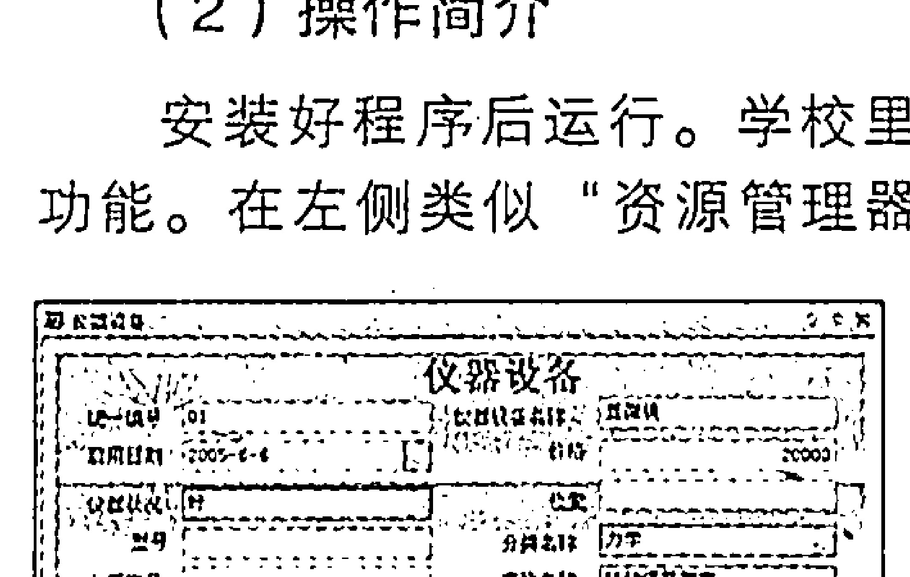

## 数学教研室

数学是基础学科，很多自然科学的课程都要用到数学的方法。故此，数学中经常使用的公式、函数、图形等，在其他学科中也较多出现。而这些内容的编辑与绘制，如果不借助软件，就很难在教案编写、试卷排版中有较好的效果。下面介绍的软件都是这方面的佼佼者。

### 1. MathType

软件名称：MathType
最新版本：5.2c
软件大小：4.3MB
软件性质：共享软件
下载地址：http://conut.skycn.com/softdownload.php?id=16216&url=http://xjvnet.driversky.com/down/ha_mathtype52a_zbf.exe

#### (1)特点概述

MathType 5.2是一个强大的数学公式编辑器，与常见的文字处理软件和演示程序配合使用，能够在各种文档中加入复杂的数学公式和符号。MathType 5.2与常见文字处理工具紧密结合，支持OLE（对象的链接与嵌入），可以在任何支持OLE的文字处理系统中调用，帮助用户快速建立专业化的数学技术文档。实现所见即所得的工作模式，它可以将编辑好的公式保存成多种图片格式或透明图片模式，可以很方便地添加或移除符号、表达式等模板，也可以很方便地修改模板。

- 支持直角坐标和极坐标的绘制；
- 支持4种不同类型的函数；
- 支持在一定范围内求最大（小）值和数值跟踪；
- 支持自建函数库文件；
- 支持全屏显示。

#### (2)操作简介

安装软件之后运行，看到主界面如图4所示。

上面的一栏列出了所有在数学公式中可能用到的样式，我们选择进行编辑的样式用鼠标点击，会列出更为详细的子样式，选中我们想要的，即可在下一栏中显示出来。

当我们编辑好完整的公式，就可以进行保存。点击“File→Save”，弹出保存文件对话框，选择一种保存格式，默认为WMF格式文件。以后在文档编辑器中（比如Word），就可以用“插入→图片→插入图片”的方法调用此公式。

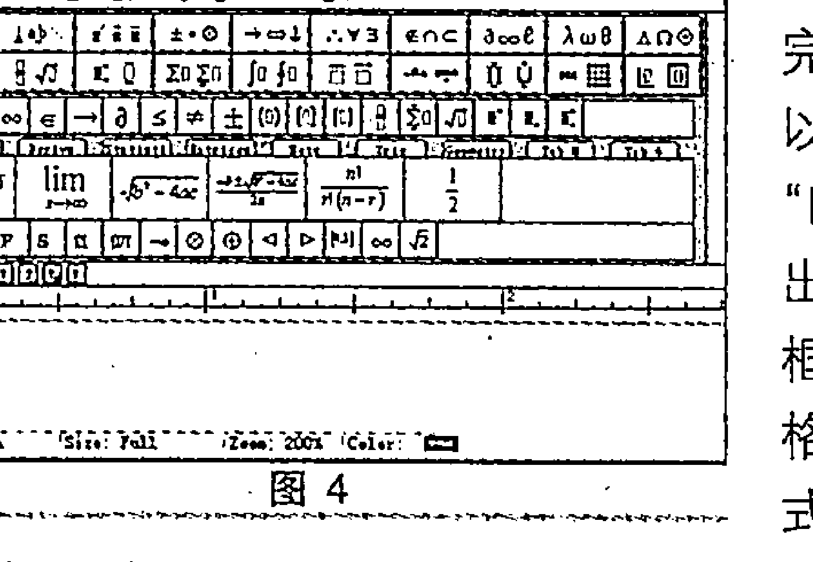

### 2. DrawTools

软件名称：DrawTools
最新版本：2.5.11
软件大小：4.16MB
软件性质：免费软件
下载地址：http://www.softsea.net/download.php?id=100817

#### (1)特点概述

- 支持直角坐标和极坐标的绘制；
- 支持4种不同类型的函数；
- 支持在一定范围内求最大（小）值和数值跟踪；
- 支持自建函数库文件；
- 支持全屏显示。

#### (2)操作简介

安装运行DrawTools，点击“新建”图标，弹出“新建”对话框，在“文件名”文本框内输入函数图形文件名称，切换三个标签“坐标设置”、“函数设置”、“显示设置”，进行相应的参数调整。

之后，会显示出设置好的坐标系。在“函数式”文本框内，可以输入想要绘制图形的函数，形如“y=x+3”。回车后，即可得到对应的函数图形。也可以右击坐标系，选择“添加函数”，这里可以进行更多种函数的编辑。

所有的函数都可以在一个坐标系中显示，有利于我们做不同函数的图形比较。如果有的函数图形不想要了，可以右击鼠标选择“删除”，挑选不要的函数式即可。

点击“动画”按钮，将启动动画模式，这时再输入函数式，图形将以动画的形式演示。该功能在课堂上使用，一定会吸引学生的注意，并激发学习兴趣。

注意，保存图形时可以选择“文件”菜单中的“导出图像”，格式选择BMP，这样方便在Word中调用。

### 3. 几何画板

软件名称：几何画板
最新版本：4.01
软件大小：1.2MB
软件性质：共享软件
下载地址：http://xmmaths.zjjy.com/rjb/chs.rar

### (1) 特点概述

《几何画板（The Geometer's Sketchpad）》是由Scott and Nick Jackiw共同开发编写的一款多媒体教学软件。它是一个通用的数学、物理教学环境，提供丰富而方便的创造功能，使用户可以随心所欲地编写出自己需要的教学课件。软件提供充分的手段帮助用户实现其教学思想，只需要熟悉软件的简单使用技巧即可自行设计和编写应用范例，范例所体现的并不是编者的计算机软件技术水平，而是教学思想和教学水平。可以说《几何画板》是最出色的教学软件之一。

### (2) 操作简介

大家对《几何画板》已经耳熟能详了，想必基本操作也早已掌握。这里仅简单介绍4.0版在函数图像方面的几点应用实例，热心电脑辅助教学的老师参考。

- 直接给出函数表达式就可以画出函数的图像
- 计算一个函数的导函数
- 根据表格数据描点

单击“图表”菜单的“绘制新函数”选项，弹出计算器。利用计算器上给出的键盘或者计算机键盘键入函数表达式（其中“f(x)=”是自动加上了），单击“确定”按钮，即刻出现该函数的图像。

选择函数表达式，单击“图表”菜单的“导数”，立即出现该函数的导函数，在图像上取一点M，分别度量其横坐标xM、纵坐标yM，计算yM + f?(xM)(x - xM)，就可以画出函数图像上该点处的切线。拖动该点，切线位置也随着变动。

利用“变换”菜单“迭代”功能，可以列出函数f(x)=2^x在x取-2到2.5之间每间隔0.5时的自变量的值与函数值，同时画出这些数据描出的点。不论给出通项公式还是递推公式，都可以画出数列的图像（图5）。


### 4. 神笔立几画板

软件名称：神笔立几画板
最新版本：1.0
软件大小：2.55MB
软件性质：共享软件（不能保存）
下载地址：http://vnet.onlinedown.net:82/down/lihb.rar

### (1) 特点概述

《神笔立几画板 1.0》是用于立体几何图形制作的应用软件。它界面友好、操作方便、图形美观、文件小巧、功能强大，是数学教师教授立体几何的工具平台，是高中学生学习立体几何的良师益友。

学习立体几何必须培养学生“空间想象能力”，即要求学生看到三维立体的实物能绘出平面投影图、看到平面图能准确地想象出立体的空间关系。这是学习立体几何的基本功，对不少初学者是一个难关。有了“立几画板”，画图准确迅速，并可动态地演示几何问题，可帮助初学者较快地培养空间想象能力，可以用它去发现、探索、总结几何规律，既充分发挥了教师的主导作用，又使学生成为学习的主体。

### (2) 操作简介

运行程序后，点击“创建→组件”，在此可以选择多种多样的立体图形元素。在右侧栏会显示选好的组件。用鼠标拖动，可以360度旋转图形，达到最理想的位置效果。

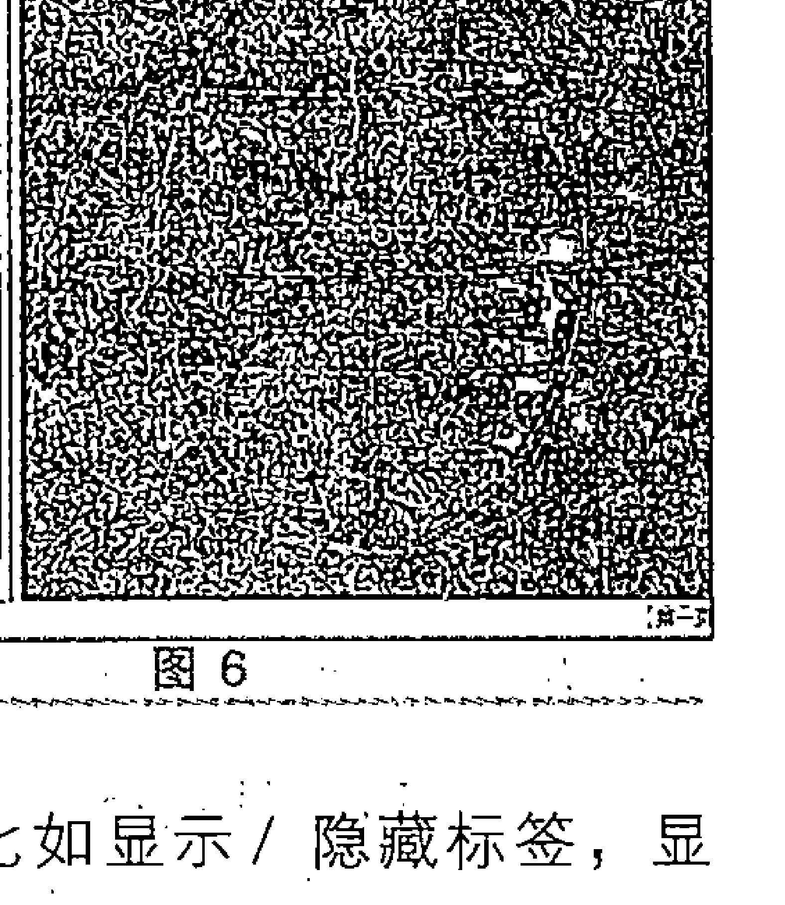

在“视图”菜单内，可以选择各种效果显示，比如显示/隐藏标签，显示/隐藏网格，显示/隐藏面（图6）。

如图所示，在界面左侧栏下方，点选“设置”标签，可以在这里进行多种特效设置。

还能够通过公式来计算此几何图形中的一些相关值。对于教学来说，相当方便，可以即时性地改变大小来观察到变化的情况。

## 物理教研室

物理学是公认在理科中最难的学科。它有很多抽象的概念需要学生去理解、掌握。力学、电磁学、光学，很多物理题目需要配合图形才能较为形象地表现出来。老师在讲解题目和命题试卷中，都得绘制诸如受力分析图、电磁方向图、光的折反射等图示。下面就介绍两款较好的物理绘图软件给大家。

### 1. 中学物理作图工具

软件名称：中学物理作图工具
最新版本：1.60
软件大小：1.47MB
软件性质：共享软件（不注册有部分功能限制）
下载地址：http://www.5694.com/rj/wlzt.rar

### (1) 特点概述

《中学物理作图工具》是中学物理教师作图的好帮手。

- 优化系统资源利用，对系统资源的占用减少了一半；
- 增加图片背景底纹功能，方便图形对齐；
- 增加链子、曲率半径改变的曲线、幂函数、指数函数作图功能；
- 数字输入框内不可输入字母；
- 加快移动图片的速度，再也没有停顿的感觉了；
- 增加上下左右键移动选取图形功能，方便鼠标操作不习惯的用户。

### 2. 物理绘图板

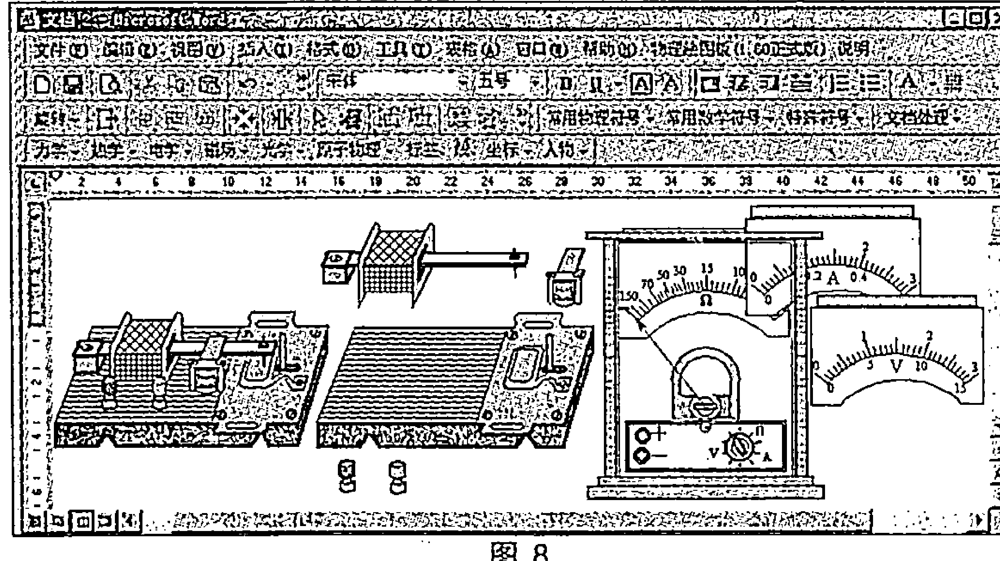

软件名称：物理绘图板
最新版本：2.50
软件大小：5.6MB
软件性质：共享软件（不注册有部分功能限制）
下载地址：http://nc.onlinedown.net/down/wlhtb.rar

### (1) 特点概述

《物理绘图板》是一个 Word 宏文件，可以运行在装有 Word 2000/XP 的系统环境中。别看只是个宏文件，其功能却相当强大，包含众多的物理图形，可以将物理学中任何需要用到的图形都清晰地展示出来（图8）。

### (2) 操作简介

如此强大的功能，操作却相当简便。运行下载到的压缩包内“物理绘图板 V_25J.exe”文件，一直按“确定”或“完成”按钮即可完成安装。双击桌面上已建立的《物理绘图板》快捷启动方式，启动 Word，修改 Word 宏安全性设置。位置在“工具→宏→安全性”。设置宏安全级为“中”或“低”即可，关闭 Word。重新启动《物理绘图板》，在出现宏对话框时，点击“启用宏”后就可以进行文字或图形编辑了。

本软件采用两种方式制图。

- 垒积木式作图：先按次序选定并调用所需各基本图元。再调整各图元的左右及前后位置、各图元的大小，形成一个类似搭积木式的图形。最后选定所有各图元并组合成一个图形整体。
- 调用成品图：对一些构图复杂、独立性强、使用较多的图形（如电压表、电流表、滑动变阻器等实物图形）只需找到其按钮并轻轻一点，所选图形立即绘出。不仅如此，作者对所有的成品图形都做了专门处理，使用者可根据自己的具体情况，把它们分解后进行适当拆分、移位、调整，以适应不同方面的需要。

这些特征是《绘图板》有别于其他绘图软件的最独到、最实用之处。

### 3. 仿真物理实验室

软件名称：仿真物理实验室
最新版本：3.5
软件大小：10MB
软件性质：共享软件
下载地址：http://conut.skycn.com/softdownload.php?id=1598&url=http://xjvnet.driver sky.com/down/wl_demo.zip

### (1) 特点概述

物理学是一门实验性很强的学科，实验几乎贯穿了物理学习的整个过程。《仿真物理实验室》适用于中学的物理课堂，是物理教师的得力助手。在教师讲解了物理定律之后，演示一个相关的实验，既加深了学生对定律的理解，又可以增加物理课堂的趣味性。对于正在学习物理的学生来说，《仿真物理实验室》是一个理想的学习工具。亲自动手的体验，让学生对物理现象的印象更加深刻；对物理定律的理解不再枯燥；对物理学的兴趣油然而生。

### (2) 操作简介

运行来看看效果。你是否觉得运行太快了？我们可以用提高计算精度的方法让速度慢下来，打开“实验设置”窗体，将“实验最少扫描时间”调整为“0.0001”便可以了。满意的话就把它保存起来吧。

下面来用一下“实验数据曲线”这个功能。先来调整一下上面的实验，调整“悬挂细绳1”的参数，将固定端参数设为（0,0），调整“运动对象1”参数，初位移设为（-0.1,-0.3）。点击“运行”菜单下的“实验数据曲线”菜单，或按工具栏上的“实验数据曲线”按钮，系统便会打开“实验数据曲线”窗体。点击“对象设置”按钮，选中“运动对象1”；然后来设置面板上的参数，把“终止时刻”设为“20”，将“纵坐标起点值”设为“-0.1”，将“纵坐标比例”设为“0.04”。点击此窗体上的“开始”按钮，曲线便会在单摆摆动时被画出。上面参数的具体设置和实验直接有关，大家可以好好研究一下，以便在其他的实验中应用这个强大的功能。绘制出的图像如图9所示。

## 化学教研室

化学是研究物质如何发生相互转化的科学，是微观的世界，无法被人直接观察到。当科学家发现物质是由分子或原子构成时，就以分子式来表示物质发生化学反应的过程。所有物质都有了自己新的名字，于是有人称化学是又一门外语。而化学分子式及方程式的录入，则成为困扰化学教师的难题。

### 1. 化学输入法

- 软件名称：化学输入法
- 最新版本：1.5
- 软件大小：376KB
- 软件性质：共享软件
- 下载地址：http://www.c3h3.com/rjxz/ShowSoftDown.asp?UrllD=1&SoftID=3432

### (1) 特点概述

- 易学易用。编码规定与输入的化学内容结合紧密，对编码具有很强的提示作用，使用者记忆负担不大。
- 重码率很低。在中学化学领域中出现的上千种化学分子式、离子式及化学方程式中，仅有三个分子式“用拼音转换为中文名称”时出现重码。
- 输入速度提高明显。输入简单分子式时，速度提高接近一倍；对复杂分子式、离子式、电子式及化学方程式，输入速度提高更多，有时能超过十倍。
- 可扩展性强。使用者可根据自己的使用情况或者输入习惯，批量编辑属于自己的化学输入法，让输入法更个性化。

### (2) 操作简介

在安装《化学输入法》至WinXP系统时，请选择合适的安装目录安装，否则无法使用。具体安装目录为“C:\Documents and Settings\<用户名>\Application Data\Microsoft\Templates\”。编码中所用字符是26个半角小写字母、0~9等10个半角阿拉伯数字，两个半角字符“<”和“>”符号。格式为：“<+编码+>”，例如要输入Na2SO4，只需输入“<na2so4>”即可，免除了应用下标的麻烦。

针对方程式，该软件提供了强大的编码功能，能够让你在最短的时间内输入很复杂的化学方程式。好好看看软件附加的“说明”文档，定会轻松上手的。

### 2. 仿真化学实验室

- 软件名称：仿真化学实验室
- 最新版本：3.0
- 软件大小：6.86MB
- 软件性质：共享软件
- 下载地址：http://sccrc.onlinedown.net:82/down/hx_demo.zip

### (1) 特点概述

《仿真化学实验室》为你在计算机中提供了一个虚拟的化学实验室。试管、烧杯、酒精灯、铁架台、烧瓶、锥形瓶、集气瓶、漏斗、导管等这些真实实验室中的器具，在《仿真实验室》中也应有尽有。用户可以自由地搭建实验仪器、添加药品，并让它们进行反应。用户可以完全自由地搭建各种实验设施。

### (2) 操作简介

用《仿真化学实验室》制作课件的一般方法是这样的：首先搭建实验仪器，把我们需要用到的实验仪器都放置在实验区中；然后给容器中添加化学药品；运行一遍实验后，再编辑容器的属性，调整容器中进行的反应方程式就可以了。

为了增加对《仿真化学实验室》的了解，让你更加熟悉它的操作，下面我们以Cu(OH)₂沉淀和Fe(OH)₃沉淀的实验为例给你讲解软件的操作。

在这个实验中我们在两个烧杯中分别装入CuSO₄溶液和FeCl₃溶液，在细口瓶中装入NaOH溶液。运行实验后，我们利用胶头滴管把NaOH溶液分别滴加在这两个烧杯中，就会看到有不同颜色的沉淀生成。

首先从器件箱中创建出两个中烧杯、一个细口瓶和一个胶头滴管。往一个烧杯中添加100ml、0.1mol/L的CuSO₄溶液（图10）。

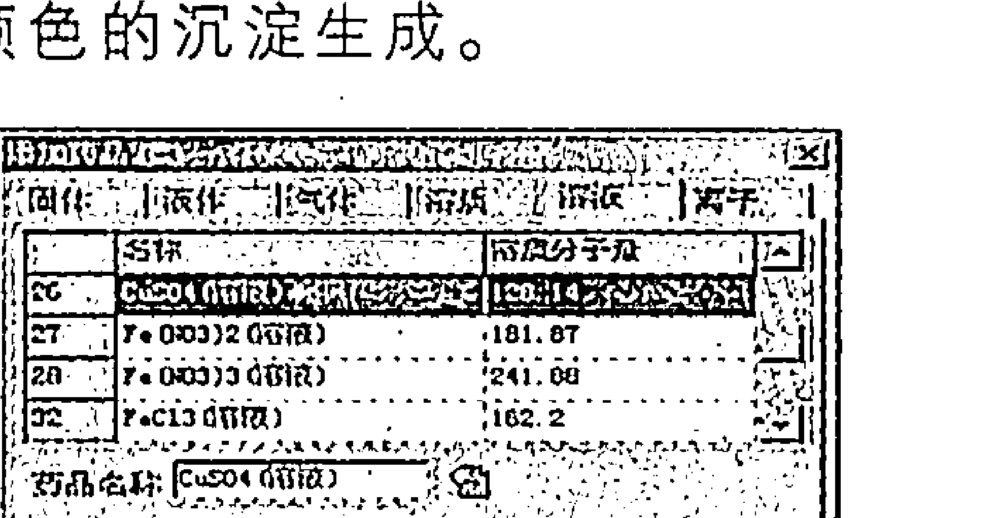用同样的方法往另一个烧杯中添加100mL, 0.1mol/L的FeCl3溶液；在细口瓶中添加50mL, 0.1mol/L NaOH溶液。接下来就可以用鼠标点击运行按钮，运行实验了。运行后，用胶头滴管可以吸取溶液，只要把滴管的管口放在容器的液面下，然后点击滴管旁边的“吸取”按钮就可以了。同样的，点击“点滴”按钮就可以把滴管中的溶液滴入到其他容器中。在这个实验中，我们用滴管吸取细口瓶中的NaOH溶液，然后把它分别点滴到CuSO4溶液和FeCl3溶液中。实验效果很明显，你在讲课时再也不用担心学生由于贪玩而出现危险事故了。

## 班主任工作

班主任的工作千头万绪，除了自身不可怠慢的教学工作以外，对学生的教育工作更是重中之重。教书育人还是以育人为主嘛。而最令班主任老师心烦的，就是每到期末给全班所有学生写评语了。写评语的要求可多了，须尊重学生的人格，以鼓励的话语为主；善于发现学生的个性，不得写得千篇一律；要能打动学生，文字须生动活泼，对于不少老师来说，越到期末就越忙，班主任工作就更是搞得焦头烂额。别急，下面介绍的软件帮你解决这些难题。

## 学生评语编辑系统

-   软件名称：学生评语编辑系统
最新版本：6.3
软件大小：3.08MB
软件性质：共享软件（未注册评语条数仅400例）
下载地址：http://www.zhenzhi.net/pingyu.exe

### (1) 特点概述

本软件分别从印象、上课、作业、学习、班务、交际、特长、问题、希望等方面提供了1200多句评语和380个学生评语（未注册版只有400条例句和60个学生评语），只需轻松点击鼠标，就能完成评语起稿工作。

### (2) 操作简介

安装后启动程序，弹出如图11所示界面。在文件名处，输入要录入的班级名称，如果班级名已经存在，单击文件录入框，选取班级。单击按钮“录入评语1”和“评语录入2”，选取学生评语。

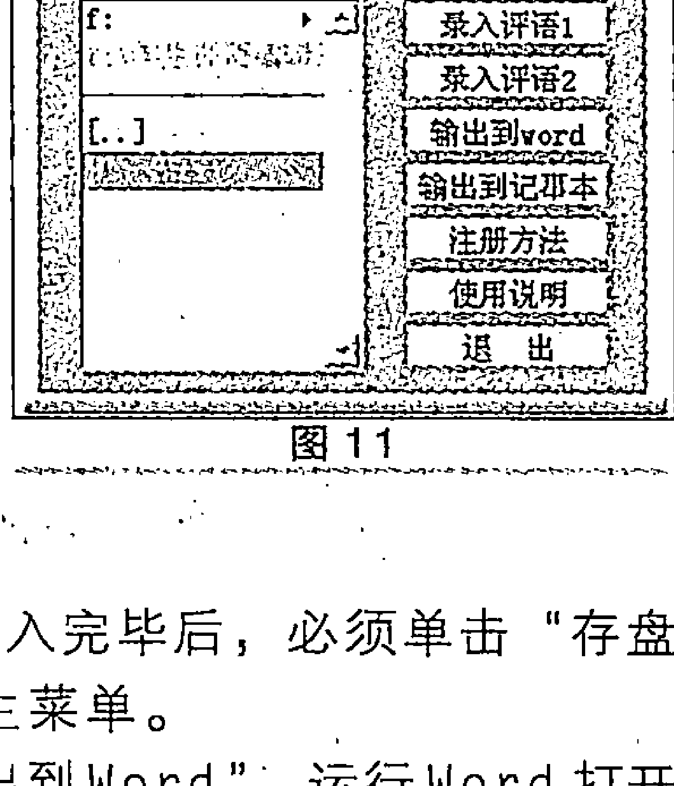

“录入评语1”是以例句录入方式，一句一句地录入。“评语录入2”是以整个学生评语录入，单击关键词，即可录入整个学生评语。录入完毕后，必须单击“存盘返回”进行保存，并返回主菜单。选取文件名，单击“输出到Word”，运行Word打开录入评语。或单击“输出到记事本”，然后再在“记事本”里复制到其他文字处理软件，继续进行处理。

### (3) 注意事项

录入完毕，单击“存盘返回”时，会覆盖原来的文件。建议把全班学生评语录入完后，再输出到Word排版编辑，并另存为一个新文件。在单击“输出到word”后，不要继续单击此按钮，建议输出到Word后，关闭本软件。单击学号姓名列表，浏览修改学生评语时，要保存修改结果，必须单击“保存”。单击学号姓名列表，显示其他学生评语，不会保存修改结果。删除某个学生评语后，会显示学号是0，评语和姓名都是空白的。建议马上修改学号，录入删除了的学生评语。如果有两个学生的评语是相同的，可以先录入第一个学生评语后，单击学号姓名列表显示评语，修改学号和姓名，单击“保存”，就能复制第一个学生评语作为第二个学生的评语。

## 5秒钟解决文本框尺寸与内容的矛盾

实现时间：5秒
实现目的：解决文档内容调整后文本框内文字太多或太少的问题

用Word编写图文并茂的文档时，为了版式的美观，经常会使用不少文本框。但是由于页面的布局和内容的调整，本来已经设置好的文本框可能因为尺寸、位置改变而出现大段空白或者文字“溢出”的现象。无奈之下，只有从前后的文本框内将文本剪切过来，或将多余的文本剪切过去。如果再次调整版式，又不得不重新来一遍。真是大伤脑筋！其实，只要使用Word中的“文本框链接功能”就能轻松解决。最快方法：首先在文档中根据页面和内容需要画几个文本框。用鼠标右击第一个文本框的边框，选择弹出菜单中的“创建文本框链接”。此时鼠标指针变为茶杯状，在第二个文本框内单击，就链接了这两个文本框的内容。如法炮制，最后将一大段文本复制到第一个文本框内，你就会看到多余的内容将被自动放置到第二个、第三个文本框中。调整，甚至删除任意文本框内的内容，其他文本框内的文本会自动填补过来。

## 打造硬盘工具

文 水月子

硬盘是整个电脑系统里面最重要的存储设备，Windows系统和应用软件什么的都要安装在硬盘里面才能够快速运行。许多朋友在日常使用硬盘的过程之中不注意维护，以致过了一段时间之后，他们的系统变得越来越慢，而且越来越不稳定，更有甚者硬盘上面开始出现坏道了。这时候他们会开始抱怨把这部电脑卖给他们的人，说这是质量不过关的产品。其实电脑是需要精心维护的，只要维护得当，我们的电脑就能够一直都保持良好状态，好像昨天刚买的那样哦！下面就向大家介绍一系列的硬盘工具，帮助我们用好磁盘系统！

### Ghost 也能整理磁盘

硬盘在使用之中出现“磁盘碎片”是不可避免的，因此我们必须隔一段时间就对硬盘进行一下碎片整理。众所周知，Windows里面的磁盘整理程序速度是很慢的，如果恰好碰上你有好长时间没有整理磁盘的话，那么整理1～2个小时也没什么稀奇。其实我们可以用一个巧妙的方法来“瞬间”整理好所有磁盘碎片，那就是Ghost硬盘克隆了。

为什么一个磁盘备份的软件能够整理碎片呢？原来Ghost里面有一个将整个硬盘都打包成为一个文件的功能，它不管你的硬盘里面有多少碎片，只管把你的数据收集并且压缩起来，以压缩包存在的文件自然就没有任何磁盘碎片了。而当我们重新把文件解压到硬盘上面的时候，数据文件都会按部就班排列好，原来的磁盘碎片就在无形之中消失了。这种方法看起来好像很麻烦，而且相当于“重装”了系统，实际上它比漫长的磁盘整理更加快！

在Ghost之前，我们首先整理一下系统，比如清理一下回收站，或者删除一些无用的文件，以免占用不必要的空间和时间。接着我们打开磁盘整理程序，分析一下我们的硬盘，如果红色的部分比较多，也就是代表你的硬盘有很多碎片，整理起来速度会很慢。现在我们关机，用DOS启动，然后在DOS下面启动Ghost，在主界面之中选择Local→Partition→To Image，接着选择好要备份的分区进行镜像。由于我们追求的是高速度，因此不需要选择数据压缩，大家都选择最快的模式即可。

接下来我们再用Ghost将刚才备份好的磁盘镜像恢复到硬盘里面，方法就是选择Local→Partition→From Image，然后选择相应的备份文件就可以了。在之前压缩的时候大家记住要把压缩文件放到别的分区哦。

### 自己修复硬盘坏道

在上面我也向大家介绍过，如果我们在平时的使用过程之中对硬盘维护不注意，那么在多次重装系统、长时间反复读取数据、磁盘碎片过多的情况下，硬盘就有可能出现坏道，无法正常读取。不过这时坏道大多数都是指逻辑坏道，也就是“死数据”，而并非你的硬盘真正坏了。如果你的硬盘上面已经出现坏道了，那么我们就必须想方设法去修复它。“效率源大容量硬盘检测修复程式”就是这样的一个软件了，我们可以到http://mail.100ku.com/soft/xlysoft0603.iso去下载它的光盘版，另外“效率源”还有软盘版，不过无论软盘还是光盘，我们都需要用它们来启动。

在用光盘或者软盘启动了“效率源”之后，我们首先会看到一份免责声明，按下“Y”键继续之后就会很快进入软件主界面了（图1）。效率源所有的功能都集中在主界面左边的菜单里面，在这里可以看到“效率源”一共有四大功能，分别是“硬盘全面检测”、“硬盘高级检测”、“硬盘坏道列表”和“坏道智能修复”。

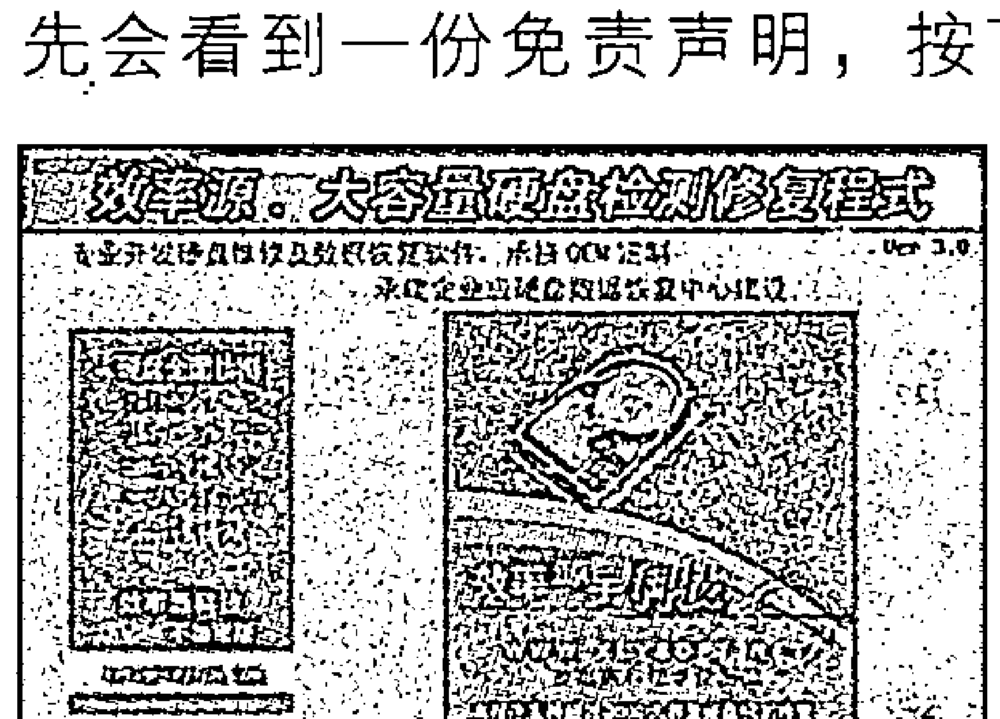

#### 1. 硬盘全面检测

硬盘全面检测是指对整块硬盘进行全方面的检测，其实在这里我们只要选择它并回车即可打开检测窗口，选择了要修复的硬盘之后，效率源就会自动对这个硬盘进行检测了，在主界面的下方会实时显示检测进度，而窗口右侧则会显示检查到的坏磁道信息。我们此时就要耐心等待“效率源”帮硬盘检查身体。在检测过程中我们可以按F7键暂停，或者按ESC键退出检查。

#### 2. 硬盘高级检测

硬盘高级检测就是彻底、深入地分析和检验你的硬盘上面的每一个扇区、每一个磁道。一般来说如果你的硬盘不是很老旧、经常出问题的话，是不需要进行高级检查的，对付一般的逻辑坏道，使用上面的“全面检测”就足够了。“高级检测”所花费的时间起码是全面检测的三倍以上哦！不过“效率源”为了节省时间，可以让你选择检查硬盘的某个部分。譬如说你的硬盘容量是40GB，C盘是10GB，坏道出现在C盘上面，而别的盘没有，那么也就是说你的坏道只是出现在硬盘的前25%的区域里面。这次我们可以点击“硬盘高级检测”，键盘的光标就会自动定位在“起始位置”输入框中，输入起始扇区，然后按Tab键跳到“结束位置”输入框，输入结束扇区。

#### 3. 硬盘坏道列表

事实上硬盘坏道列表并不是什么功能，只是在硬盘经过了检测之后，把检测过程之中发现的坏道标识在这里。如果我们在这里发现了坏道，那么可不能马虎，得赶紧对其进行修复，因为硬盘是一个非常娇气的东西，坏道如果不及时修复可是会蔓延的，到时坏道多起来要修复就比较困难了。

#### 4. 坏道智能修复

“效率源”提供的坏道修复功能有手动修复和自动修复两种，选择何种修复方式主要在于硬盘坏道的分布情况。如果你的坏道分区在硬盘各个地方，那么最好选择“自动修复”，“效率源”会对整块硬盘进行修复处理，自然速度也会很慢。如果你的坏道都是集中到某一个区域，那么你就可以选择手动修复。这里我就介绍一下如何进行手动修复。首先我们点击“坏道智能修复”，进入之后程序会要求我们选择“修复功能”，我们选择“手动修复”之后就会进入修复设置窗口，之前我们在看坏道列表的时候应该对坏道的分布情况、大概处于哪个扇区之间有所了解了，然后我们就在“开始扇区”中输入坏道的起始处，然后按下回车键在“结束扇区”后输入结束位置。设置好修复扇区后按下回车键，即可设置“最多尝试次数”，即出现坏道时如果一次修复未成功，那么最多要尝试几次修复操作，做好这些设置后再按下“Y”键即可进行修复了。

“效率源”能够最大限度上帮我们修复有坏道的硬盘，绝对是一个有用的工具，当然如果我们在平时的使用过程之中多多注意维护，让“效率源”派不上用场那就更好了！

### 让硬盘数据起死回生

对电脑用户来说，在硬盘方面最担心有两种情况，除了硬盘出现坏道导致资料不能读取之外，还有一种就是不小心把数据删除掉了。这两种情况都会让我们辛苦的工作成果付之东流。上面我们介绍了如何通过“效率源”来修复我们的硬盘，而现在就介绍一个简单、方便而且还是全中文的硬盘数据恢复软件给大家，它就是EasyRecovery。

EasyRecovery是一款功能强大的数据恢复工具，通过它你能够恢复几乎所有丢失的数据以及重建文件系统。比如说从被病毒破坏或是已经格式化的硬盘中恢复数据、从被破坏的硬盘中恢复丢失的引导记录、BIOS参数数据块、分区表、FAT表、引导区等等。不过EasyRecovery也不是万能的，虽说你删除了文件，然后把回收站清空了之后，EasyRecovery还可以帮你恢复数据，但如果在你清空了回收站之后，在硬盘上同样的地方又写入了数据的话，就算是神仙也救不了你的数据了。因此当我们发现数据丢失了之后，就要立刻使用EasyRecovery来进行数据恢复，时间越长，数据被成功恢复的可能性就越小了。只要你没有往被删除数据的硬盘上面写入新数据，那么就算整块硬盘被格式化了，EasyRecovery还是能够帮你“救活”的。下面我们到www.skycn.com去下载并且安装一个EasyRecovery，开始我们的数据恢复之旅吧。

启动了EasyRecovery之后，我们就可以看到它的主界面了。要进行数据修复，我们就可以点击上面的“数据恢复”按钮，看到一系列的恢复选项（图2）。

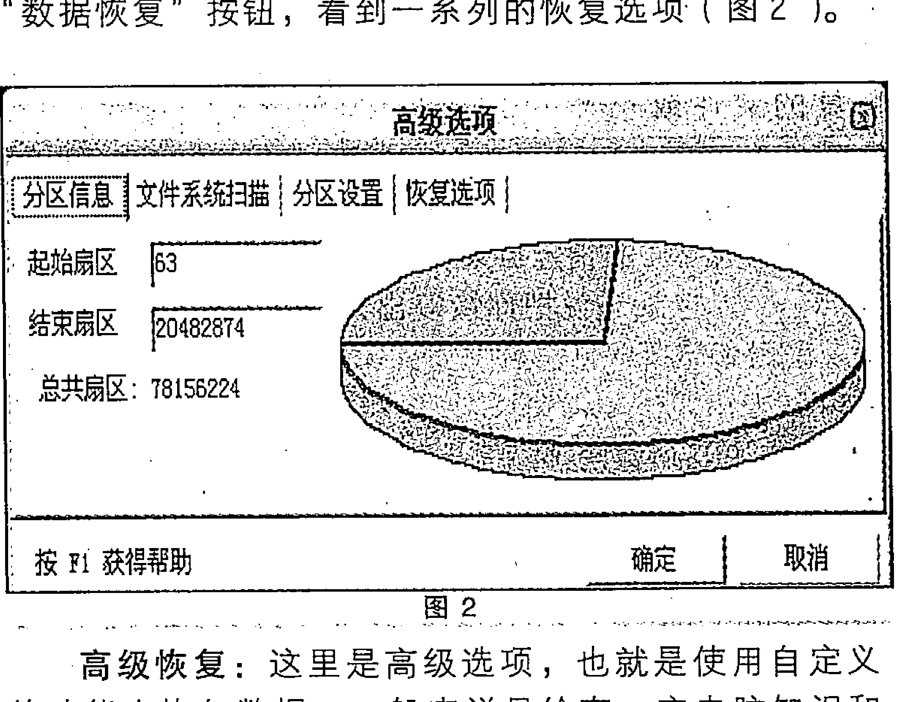

高级恢复：这里是高级选项，也就是使用自定义的功能去恢复数据，一般来说是给有一定电脑知识和基础的用户选择的。

删除恢复：当你不小心删除硬盘上面的文件，而且清空了回收站的话，你就可以点击这里来找回你需要的数据了。

格式化恢复：如果你不小心误格式化了硬盘，就可以用这个选项来恢复所有的数据，当然前提是格式化之后的硬盘不能写入新的数据。

原始恢复：原始恢复一般用来修复分区表严重损坏的硬盘，它会读取磁盘里面的所有扇区，然后一个一个文件去恢复，属于“破釜沉舟”的恢复方法。

继续恢复：有时候恢复到一定程度你终止了恢复过程，使用这个选项就能够让你继续之前的恢复进度。

紧急引导盘：就是创建一个避免系统崩溃的系统引导盘了。

在日常的应用之中，删除恢复、格式化恢复以及高级恢复是我们最常用的，下面我就来详细介绍一下。

#### 1. 删除恢复

点击“删除恢复”工具，接着我们就可以选择相应的硬盘，软件会对硬盘进行快速扫描，找出存在于硬盘上，但是已经被删除的文件，包括那些被“清空”了的文件。有时候快速扫描会漏掉一些文件，我们可以把“完整扫描”前面的方框选上，这样扫描速度虽然慢了很多，但绝大部分的数据都会被找回来。而“文件过滤器”的作用就是让你指定要找回来的文件名或者扩展名。在过滤器下面还有一个下拉菜单，除了“所有文件”类型之外，我们还可以选择扫描“Office文档”、“图像文档”和“开发文档”等等。设置好了之后选择相应的硬盘，然后点击“下一步”扫描就开始了。

扫描完成之后，会有一个窗口弹出，里面就是在本次扫描之中找到的全部文件了（图3），我们可以在左边展开目录树寻找相应的文件，然后在右边的文件具体列表之中选中它们前面的方框，可以多选。

选择好了想要恢复的文件或者整个目录之后，接下来我们点击“下一步”。在新窗口里面 EasyRecovery 会让我们设置：是让这个文件恢复到指定磁盘上面的指定目录，还是说恢复到一个 FTP 服务器上面，也就是说把你恢复出来的文件传到网上。一般来说我们选择“恢复到本地驱动器”之后选择一个路径就可以了。如果你选择“恢复到一个 FTP 服务器”，那么你还是点击后面的“FTP 选项”，设置 FTP 服务器的 IP 地址、用户账号和密码、端口之类。如果你一次恢复多个文件，你也可以把下面的“创建 ZIP”选上，然后设置一下 ZIP 文件的大小限制（0 为不限制），EasyRecovery 就会把恢复之后的文件打包放到指定位置里面。最后再点击“下一步”，文件就恢复完成了，最后还会列出一个恢复报告。

#### 2. 格式化恢复

格式化恢复就是指恢复被你格式化过的硬盘，点击“格式化恢复”之后会进入设置界面，首先我们选择恢复哪一个硬盘或者分区，然后在“以前的文件系统”下拉菜单里面选择正确的文件系统，记住这是指你的硬盘被格式化之前的文件系统，而不是当前的哦。选择好了之后，系统就会开始扫描了，格式化恢复所用的时间要比删除恢复更长，一般 10GB 的硬盘空间要接近 30 分钟。在扫描完成之后，EasyRecovery 同样会有一个文件列表，里面都是一些被格式化之前的数据，我们和“删除恢复”里面一样选择好了之后，恢复即可。

#### 3. 高级恢复

高级恢复就是不分删除、格式化还是原始恢复，只要是硬盘上面丢失的数据，它都要找出来。点击“高级恢复”，然后选定相应的硬盘分区之后，EasyRecovery 会有具体的图标（图4）让你看个明白。在进行硬盘扫描之前，我们可以点击“高级选项”进行设置（图5）。在高级选项里面，我们可以对扫描的硬盘扇区的起始和结束进行设置，对不同的文件系统（NTFS、FAT32、FAT16）进行高级扫描和简单扫描，简单扫描只是扫描一下而已，而高级扫描则会试图重建损坏了的分区表。在“分区设置”里面，我们可以考虑是否用 MFT 扫描来帮助我们恢复被格式化的硬盘分区数据，一般来说选择默认的“使用 MFT”即可，而最后的“恢复选项”，就是让我们设置去掉一些扫描期间找到的、无效的、不需要恢复的文件。我们可以根据日期、属性等来判断。

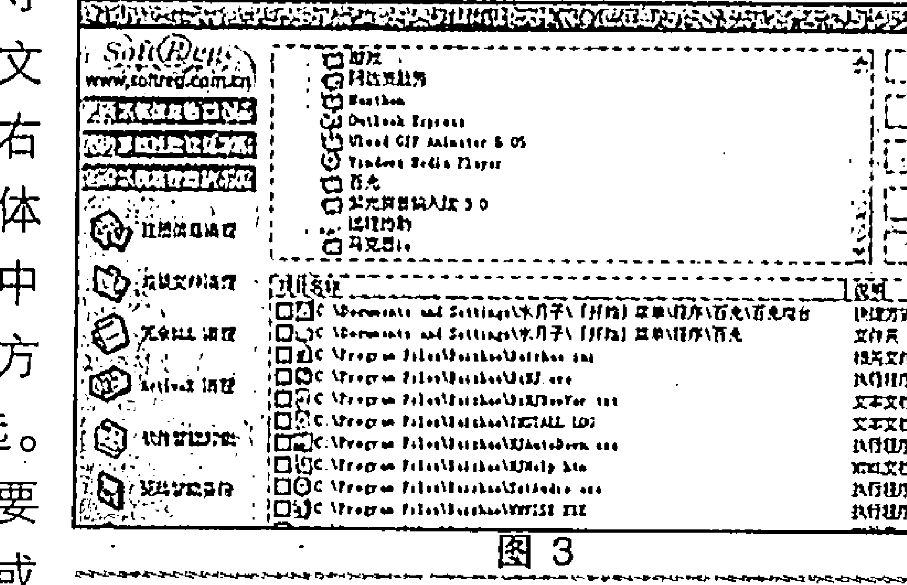

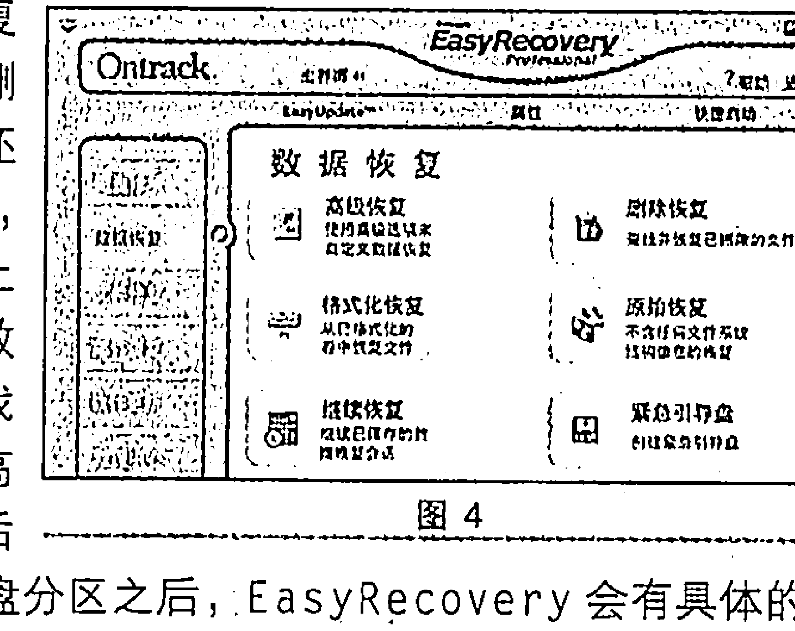

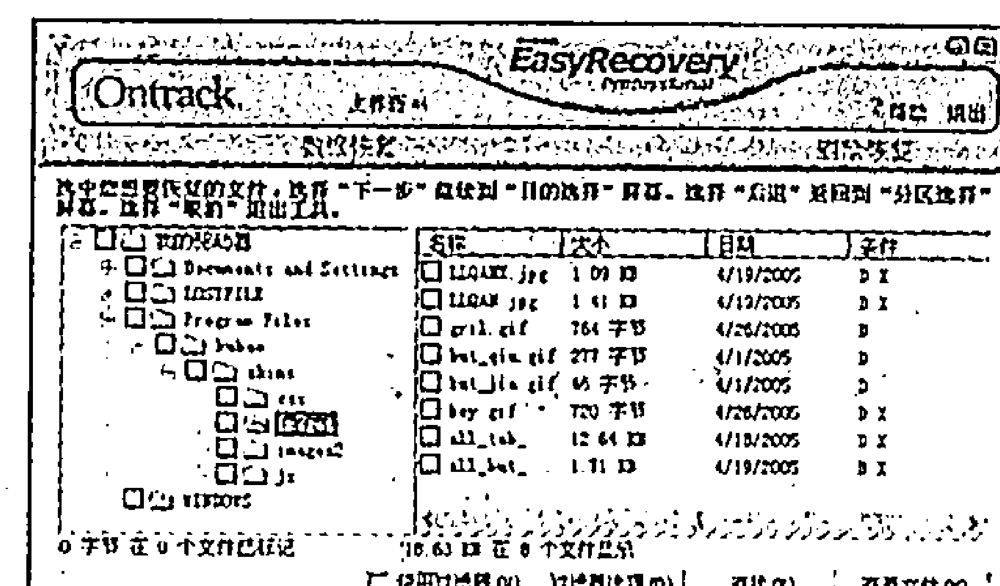

设置完毕之后，我们可以点击“重新扫描系统”，开始在硬盘之中寻找丢失的数据了。高级恢复的扫描速度非常慢，就算你选择了“简单扫描”，恐怕没有 40 分钟也是无法完全扫描一个硬盘的。扫描完成之后，EasyRecovery 会给出同样的一个文件列表，我们可以选定一个文件来进行恢复。这里我们可以看到在每个文件后面都有一种叫做“条件”的属性。条件为“G”的时候就代表你这个文件恢复的可能性很大，如果是 D 或者 X 的话就可能没有那么顺利了。

接下来的恢复工作都是和上面大同小异的，这里也就不再多说。最后要提醒大家的是，EasyRecovery 一定要尽早使用，不要等你的硬盘又重新装满了数据之后，你才想起它来哦，那时候恐怕都已经无法挽回了。

### 让你的硬盘保持高速

硬盘的速度从根本上来说是越用越慢，因为机械部件是会老化的，不过那也应该到 1～2 年之后了。但是现在很多人买了新硬盘之后才用 1～2 个月就觉得硬盘慢了，反映就在于进入 Windows 的时候硬盘狂读，好久也停不下来，此外打开一些大型程序的时候也是十分缓慢。在这里我暂时不打算介绍如何清理你的操作系统来加快速度，而是从加快硬盘的读取速度方面着手，告诉大家如何让硬盘保持高速运行。

#### 1. 灵活运用虚拟内存

大家都知道虚拟内存是 Windows 系统里面很重要的一样东西，在我们打开一些大型程序的时候，虚拟内存就会负担起一部分的存储功能了，而虚拟内存之所以被称作“虚拟”，是因为它不是真正的内存，而是在硬盘上面划出来一块被当作内存使用。事实上虚拟内存就是在硬盘上面的一个叫做 Swap 的交换文件，当我们的物理内存不够用的时候这个交换文件就会被当作“虚拟内存”来使用了。在缺省情况下，我们的 Windows 会自己控制虚拟内存的大小，也就是说根据内存使用量的大小来改变 Swap 文件的大小，这就会对 Swap 文件进行重复读写，在一定程度上影响了硬盘读取的速度。这种情况在你反复打开大型程序的时候尤为明显。要改变这种情况，我们可以不让Windows管理虚拟内存的大小，而是自己去设定一个固定大小的虚拟内存。方法就是在“我的电脑”上面点击鼠标右键，然后选择“属性”→“高级”→“性能”→“高级”→“虚拟内存更改”，这是Windows XP的设置方法，如果你的系统是Windows 9x，那么就是“我的电脑”→“属性”→“性能”→“虚拟内存”。这里我们取消掉“系统管理的大小”，改而选择“自定义大小”。选择了之后我们需要选择一个初始大小和最大值。一般虚拟内存的最大值是根据你的系统内存来设置的，如果你的内存是256MB，那么虚拟内存应该在512MB，如果你的内存有512MB，那么虚拟内存可以考虑设置到784MB～1024MB之间。设置完成之后点击“确定”，然后重新启动系统即可。

#### 2. 修改系统设置

使用“开始”→“运行”命令，在里面输入sysedit之后按回车键，打开系统文件编辑器，然后在里面选择system.ini文件进行修改，首先找到[386Enh]标题，然后我们在这个标题区的底部加上一条命令行：ConservativeSwapfileUsage=1。这条命令的作用就是让Windows系统在所有可用的物理内存都用完了之后才开始使用虚拟内存，这样就可以最大限度地使用我们的物理内存，而不需要频繁读取虚拟内存了。

如果你的系统是Windows 9x，那么在这里要特别注意的标题区就是[vcache]，通常这个区域是空着的。但是如果在这个区域加上一两个命令行，你就可以改变Windows将内存分配成硬盘缓存的方式。一般说来Windows总是在内存中创建一个比实际需要大得多的缓存区，白白浪费了宝贵的内存。我们可以添加命令行：MinFileCache=4096设置最小缓存区为4MB，命令行MaxFileCache=8096设置最大缓存区为8MB。一般来说超过10MB的缓存区都是没有必要的了。除了在这里设置之外，我们还可以通过优化大师等软件来调整硬盘缓存，打开优化大师的“系统性能优化”→“磁盘缓存优化”，我们就可以通过拉动一个滑动条来调整硬盘输入/输出缓存的大小了。

#### 3. 碎片整理

碎片整理是硬盘使用之中最关键的一环，减少碎片不但能够降低数据出错的可能性，而且因为碎片少了，数据排列更加紧密，因此硬盘的读取效率和速度也会大大提高。现在大多数人觉得硬盘读取速度很慢，其实是因为硬盘上面的碎片太多了。要执行碎片整理，首先打开“我的电脑”，然后在任意一个硬盘图标上面点击鼠标右键，选择“属性”→“工具”选项卡→“开始整理”，你就会看到碎片整理的主界面了。我们首先要选择要进行碎片整理的硬盘，然后点击“碎片整理”即可。如果我们只是想看看硬盘上面有多少碎片，可以点击“分析”。一般来说磁盘上面红色的部分就是你的磁盘碎片了。碎片越多，你的硬盘就越慢，因此我们还是要多多整理硬盘才好。

### 给硬盘来个大扫除

在日复一日的使用过程之中，我们肯定有很多垃圾文件“堆积”在硬盘之中，最常见的就是因为浏览网页而留下来的临时文件了。虽然这些网页临时文件可以用IE去清除，但是还有要安装程序而临时创建的临时文件、卸载软件之后留下来的DLL文件垃圾等等，IE就无法清除它们了。如此一来，我们硬盘里面的这些小东西越积越多，严重影响读取速度，以及造成大量的硬盘文件碎片。因此每隔一段时间，我们就要进行一次硬盘大扫除哦！

#### 1. 自己清理临时文件

在Windows 9x系统里面，临时文件一般放在C:\Windows\Temp目录里面，平时安装软件的时候临时文件都往这里放，有时候有些软件没有正常退出之后就被关闭了，它们产生的临时文件也会呆在这里，而在Windows 2000/XP里面，临时文件一般都存放在C:\Documents and Settings\（用户账号）\Local Settings\Temp里面，我们要清除这些文件的话只要直接删除里面的所有东西就可以了，不过在删除之前最好把当前运行的所有程序都关闭。这些文件的扩展名一般是tmp、001、bak之类的文件，作用是存储程序运行过程中需要使用到的数据，或者是保证在卸载这些软件时候能够将Windows中更改的文件复原，因此只要我们关闭了程序，删除这些文件并不会影响它们以后的使用。不过这样删除有时候还是不能彻底清扫干净，这时候我们可以在任意的硬盘图标上面点击鼠标右键，然后选择“属性”→“常规”选项卡→“磁盘清理”，Windows会自动帮我们搜索磁盘里面的临时文件，然后列出一个表，我们可以看到有什么临时文件在里面，还有临时文件所占的硬盘空间，只要把临时文件列表前面的方框选上，然后点击“确定”，就会彻底把这些文件给删除了。

#### 2. 关闭系统还原

系统还原功能是非常有用的，但是我们平时绝大部分时间都是用不上的。但是从我们安装系统开始，系统还原就在后台默默地运行着，同时留下一大堆的数据在硬盘之中。对于我们家庭用的电脑而言，系统还原还不如重装系统来得更实际，因此我们可以把系统还原程序关闭。方法就是在“我的电脑”图标上面点击鼠标右键，然后在弹出菜单之中选择“属性”→“系统还原”，在弹出窗口之中选择“在所有驱动器上关闭系统还原”，这样系统还原就不会占据硬盘空间了。

## 3. 清除Internet临时文件

上网浏览的过程中，我们在打开不同的站点时就会在硬盘中残留和站点相关的临时文件，日积月累这些文件就会占据大量的硬盘空间，如果想找回这部分被占用的空间，就需要把无用的Internet残留文件清理出硬盘。打开IE的菜单“工具”→“Internet选项”，我们就可以在“常规”选项卡之中看到Internet临时文件的清除和设置项了。首先我们点击“删除Cookies”，然后再点击“删除文件”，这样就可以把你的Internet临时文件清理得干干净净了。

## 4. 卸载无用的组件和软件

经常卸载不用的系统组件和软件是硬盘维护的必修课。我们可以打开Windows的“控制面板”→“添加/删除程序”，然后在系统提示的列表之中选择相应的应用软件和系统组件进行删除。但是有时候我们卸载软件失败之后，在“添加/删除程序”的窗口之中却看不到这个软件了，有时候就是干脆一开始就看不见这个软件，但是这个软件分明还在我们的硬盘之中。这时候，我们可以借助“Windows优化大师”里面的“智能卸载”功能。

首先我们打开优化大师的主界面，然后选择“系统清理维护”→“软件智能卸载”，你就会看到一个列表，里面包括了所有在Windows里面存在的程序。找到我们想要卸载的程序，然后把它选上，再点击“分析”按钮进行分析。优化大师会根据这个软件的安装路径、程序调用等等去分析所有只和这个软件有关的文件，分析完成之后还会给出这个软件所占用的硬盘空间，我们这时只要点击“卸载”按钮即可完全卸载这个软件了。有时候如果你在优化大师给出的列表里面也找不到相应的软件，那么你可以点击“其他”按钮，直接手动到硬盘上面去找，然后进行分析、卸载。

## 5. 删除帮助文件

帮助文件在大多数情况下对我们来说都是没有用的，但是这些帮助文件所占用的空间都是很大的，因此当我们安装了系统之后，就可以把这些没有帮助的“帮助”文件统统删除了。但是帮助文件散落在硬盘的每个角落，我们怎么把它们都找出来一并删除呢？方法很简单，我们可以使用Windows的搜索功能。譬如在Windows XP里面，我们可以点击“开始”菜单→“搜索”，然后弹出搜索文件窗口。我们在这个窗口之中首先点击“所有文件和文件夹”，然后看到另外一个窗口。帮助文件的扩展名都是“.hlp”，因此在第一个“全部或部分文件名”输入框里面我们可以输入“*.hlp”，然后在“在这里寻找”的下拉菜单里面选择相应的硬盘，也可以选择“我的电脑”，然后点击“搜索”，很快系统之中所有的hlp帮助文件都列出来了。我们此时可以直接在搜索结果窗口里面全选所有文件，然后把它们都删除掉。

在做完所有的文件清理之后，我们不要忘记了清空一下回收站，然后用“碎片整理”工具整理一下硬盘。

## 轻松使用虚拟光驱

在这里推荐一个既小巧又好用的虚拟光驱软件给大家，它就是Daemon-Tools了。

Daemon-Tools虽然只有几百K的大小，但却是目前使用人数最多的虚拟光驱软件，我们在各大软件下载站都可以下载到。下载回来之后我们安装好Daemon-Tools，由于系统里面会添加虚拟光驱“硬件”，因此需要重新启动一次。接着我们就会在系统托盘之中看到Daemon-Tools的正方形红色图标了。Daemon-Tools全部的功能都可以通过这个图标实现！在这个图标上面点击鼠标右键，我们就可以看到弹出菜单了。

## 1. 虚拟CD-ROM/DVD-ROM

在这个菜单里面缺省的时候有三个选项，分别是“驱动器 0：...”、“卸载全部驱动器”和“设置驱动器数量”。我们可以在“设置驱动器数量”选项里面设置多个虚拟光驱，不过一般情况下选择一个就足够了，设置完驱动器的数量后，在“我的电脑”里面就可以看到新的光驱图标了，系统不会发现这个光驱是“虚拟”的。接下来我们可以往虚拟光驱里面添加镜像文件了。点击一下“驱动器0”或者“驱动器1”、“驱动器X”的图标，在下一级的菜单之中选择“安装映像文件”就会弹出一个窗口，让我们选择光盘镜像。Daemon-Tools支持几乎所有的光盘映像格式！等映像文件安装好了之后，你就可以通过资源管理器看到这个“光驱”里面的内容了；而且光驱里面的Autorun也会自动打开！或者你可以在Daemon-Tools的图标上面点击鼠标左键（注意是左键），然后在弹出的小菜单里面点击“驱动器0”的图标，同样也会弹出窗口来让你安装映像文件。如果我们要卸载已经加载的映像文件，只要选择“卸载全部驱动器”就可以了。

## 2. 模拟项目

由于现在的不少光盘都使用了各种各样的加密保护程序，因此Daemon-Tools提供了一系列的“破解”让我们选择，我们在右键菜单的“模拟项目”里面可以看到多种不同的保护模式，我们可以选择“打开”或者“关闭”全部选项，也可以单独打开一个选项。这样以后就算碰到了有相应加密措施的光盘，Daemon-Tools也照用不误。

## 3. 选项

在第三个右键菜单“选项”里面一共有四个选项，分别是模拟音频、锁定DLL、自动安装、自动开始，一般我们选择“自动安装”和“自动开始”即可。有时候如果我们要模拟音频CD，也可以把“模拟音频”选上，这样才可以正常播放。

## BIOS完全个性改造

BIOS是只读存储器基本输入输出系统，曾经被视为新手的“禁区”，但是由于几年来DIY玩家们的不懈努力，很多关于BIOS技术的文章在大大小小的网站上出现。关于BIOS的设置、备份、刷新、升级等内容的文章在网上几乎随处可见。再加上BIOS刷新的方法也从原来的只能DOS命令行的方式刷新，到后来的可以在Windows系统里使用图形界面的软件刷新，再到现在各大主板公司提供网上更新软件，使得BIOS的刷新越来越人性化，简单化，甚至傻瓜化。BIOS已经不再那么深奥，那么高不可及了。然而却仍然披着一层薄薄的面纱，给人以犹抱琵琶半遮面的感觉。可能是因为BIOS处于操作系统之下，紧紧贴着硬件的缘故，所以很多人还对BIOS心存一丝畏惧，不敢对BIOS做出更大胆的尝试。下面就来和大家探讨一下BIOS修改的一些相关技术。

## BIOS修改的基础——BIOS刷新

要想修改BIOS，首先要学会刷新BIOS。这是因为BIOS是固化在ROM芯片上的，不能直接修改。只能通过将修改好的BIOS文件刷新到ROM芯片的方法来实现BIOS的修改。

刷新BIOS的方法有很多，使用专用的BIOS刷新软件是最常用的方法。BIOS刷新工具又分为DOS环境和Windows环境两种，不同厂家生产的BIOS芯片又需要使用不同的升级软件。

> **提示：DOS 环境下的BIOS刷新工具**
>
> 目前市场上主要有Award BIOS、AMI BIOS、Phoenix BIOS三种类型的主板BIOS，而Award Software公司开发的Award BIOS是主板BIOS中应用最广泛的一种。不同的BIOS厂家生产的BIOS刷新工具是不一样的，Award BIOS需要使用AWDFLASH刷新BIOS，AMI BIOS需要使用AMIFLASH，Phoenix BIOS则需要使用PHLASH。在升级BIOS时，一定要选择对应的BIOS升级程序。以下为三种BIOS在DOS环境下刷新工具的下载地址：
>
> *   AWDFLASH（http://www.mydrivers.com/dir38/d15282.htm）
> *   AMIFLASH（http://www.mydrivers.com/dir88/d35247.htm）
> *   PHLASH（http://www.mydrivers.com/dir42/d16935.htm）

### 1. DOS 环境下的刷新BIOS

这是刷新BIOS最基本的方法。在这里我以AWDFLASH为例，为大家简单介绍一下。

- **第一步：准备工作。**把刷新用的BIOS文件和刷新工具AWDFLASH放入同一文件夹，存在硬盘中，制作Windows 98启动软盘（也可以通过一些启动光盘引导到DOS状态）。
- **第二步：关闭BIOS的写保护状态。**进入BIOS设置界面，修改写保护状态。不同品牌的主板，选项略有不同，可以先查看一下主板说明书。
- **第三步：在 DOS 环境下打开AWDFLASH。**使用Windows 98启动软盘启动计算机，进入DOS模式。进入存放BIOS文件和刷新工具的文件夹，输入awflash.exe进入刷新软件界面（图1）。
- **第四步：在 “File Name to Program” 后面输入刷新用的BIOS文件名（图1）。**
- **第五步：备份BIOS文件。**这时软件提示 “Do you want to save BIOS (Y/N)”，询问是否备份原有BIOS文件，确认输入备份文件名以后，开始备份。
- **第六步：确认刷新操作。**备份完成后，刷新程序会再次提示你 “Are you sure to program(Y/N)”，询问是否确认刷新，按 “Y” 键确认后，程序进行BIOS刷新。
- **第七步：刷新完成后，软件出现两个提示信息：**按F1进行重新启动和按F10退出返回DOS，可以根据自己的情况操作。

这样BIOS的刷新就完成了。

### 2. Windows 环境下的刷新BIOS

Windows 环境下的刷新工具有两种：一种是芯片生产厂家提供的通用刷新工具，还有一种是主板生产厂商提供的专用刷新工具，一些专用刷新工具带有在线刷新功能。可以在线直接从主板官方网站直接下载刷新主板BIOS。

> **小提示：Windows 环境下的BIOS刷新工具**
>
> WinFlash是一款用于Windows环境下刷新Award BIOS的通用刷新工具。WinFlash的功能与DOS下的刷新工具AWDFLASH程序功能基本相同。使用WinFlash刷新BIOS不再需要记忆命令行和参数，比使用AWDFLASH更为方便。

Windows环境下刷新Award BIOS的刷新工具

*   Award BIOS http://www.mydrivers.com/dir107/d42924.htm
*   AMI BIOS http://www.mydrivers.com/dir106/d42418.htm
*   技嘉 http://www.gigabyte.com.cn/MotherBoard/FileList/NewTech/tech_a_bios.htm
*   华硕 http://www.asus.com.cn/support/download/item.aspx?ModelName=Tools
*   微星 http://cweb.msi.com.tw/html/support/liveupdate/main.htm

Windows 环境下的 BIOS 刷新工具使用非常简单，十分适合初学者使用。以 WINFLASH 为例，为大家介绍一下。

第一步：在 Windows 中打开 WINFLASH，点击 "File→Update BIOS"（见图2），从硬盘中找到用来更新的 BIOS 文件。

第二步：确认了 BIOS 文件以后，WINFLASH 程序询问你是否刷新 BIOS，点击 "Update" 开始刷新。

第三步：BIOS 刷新结束后，选择 "Yes"，重新启动计算机，计算机自检的时候就可以看到一些变化了。

## BIOS大变身——BIOS修改

有了 BIOS 刷新的基础，我们就可以修改自己的主板 BIOS 了，一般使用 CBROM 等一些工具软件，通过对 BIOS 文件中包含的模块进行操作来完成修改。BIOS 的修改主要包括：增加 BIOS 空间、增强 BIOS 的功能和为 BIOS 添加新功能等。

> **小提示：BIOS 修改工具 CBROM 的参数及使用方法**
>
> CBROM (下载地址 http://www.mydown.com/driver/198/198550.html) 是由 AWARD 公司出品的一款著名的 BIOS 修改工具软件，其主要的作用是用来编辑、修改、增加、移除 BIOS 文件中的内容。在这里为大家简单介绍一下 CBROM 的命令格式、参数及使用方法。
>
> ```
> CBROM 的命令格式为：
> CBROM Inputfile [/D|VGA|PCI|EPA|LOGO...] [Romfile|Release|Extract]
> ```
>
> - **Inputfile：**需要修改或者查看的主板 BIOS 文件名。
> - **/D：**显示 BIOS 文件中全部模块的详细资料。
> - **/NCR|AHA|BLG：**修改 BIOS 文件中 NCR/AHA78xx/ Buslogic 的 SCSI 控制器功能模块。
> - **/VGA|LOGO|PCI|ISA：**修改 BIOS 文件中关于显卡/开机 LOGO 画面/PCI 设备/ISA 设备的模块文件。
> - **/OTHER：**在系统 BIOS 文件中修改第三方 OEM 功能模块。
> - **/EPA：**修改“能源之星”图案的模块内容。
> - **Romfile：**需要进行操作的模块文件名。
> - **Release：**删除 BIOS 文件中模块文件。
> - **Extract：**提取 BIOS 文件中模块文件。
>
> 例如：cbrom 618afa06.bin /d
> cbrom 1008.bin /isa stde.dat

### 1. 增加 BIOS 空间

在修改 BIOS 的时候，经常要在 BIOS 中增加一些东西，比如开机画面等新的功能模块。如果 BIOS 没有足够的空间，只能删掉一些没有用的模块，使剩余空间增加。但是这种方法往往不能满足我们的需要，因为 BIOS 的模块基本上都是有用的，可以删除的似乎只有 LOGO 模块。但是如果加入 BIOS 的新模块较多，仅仅删除 LOGO 根本不能解决问题。那么我们就需要增加 BIOS 文件的整体空间。

在这里为大家介绍一种增加 BIOS 空间的方法。思路很简单，首先就是生成一个临时的空白文件，然后把这个空白文件插入到原有的 BIOS 的剩余空间中，这样就可以增加 BIOS 的空间了。

第一步：准备工作。下载并安装 UltraEdit-32，将需要修改的 BIOS 文件和 BIOS 修改工具 CBROM 放在同一文件夹下。根据主板型号和个人情况准备相应 BIOS 刷新工具。

第二步：检查 BIOS 的剩余空间。在 DOS 环境下进入存放 BIOS 文件和修改工具的文件夹。输入 CBROM 001.bin /d（这里的 001.bin 是需要修改的 BIOS 文件），查看剩余空间大小。这里可以看到 BIOS 的剩余空间为 33.56KB（见图3）。

第三步：生成空白文件。在 Windows 环境下使用 UltraEdit-32，打开“001.bin”，可以在软件界面的右下角看到文件大小，这里是 262144B（见图4）。进入“编辑 / 十六进制编辑 / 十六进制插入 / 删除”菜单。先选择删除，字节数输入“262144”。然后再进入“十六进制插入 / 删除”菜单，选择插入，字节数同样输入“262144”。这时文件内容显示全都变成了 20。我们再进入“搜索 / 替换”菜单（见图5），“查找”输入“20”，“替换为”输入“FF”，进行全部替换。最后保存退出。现在可以看到在文件夹中多了一个文件 001.bin.bak，这个文件其实就是刚才操作之前的 BIOS 文件的备份，而现在的 001.bin 已经是一个空白文件了。

第四步：将空白文件插入 BIOS 中。我们用 UltraEdit-32 打开 001.bin.bak。进入“搜索 / 查找”菜单，输入“FF FF FF FF”，我们可以找到一段连续的 FF（图6），这就是 BIOS 文件的剩余空间了，我们选择文件特殊功能，插入文件，在对话框中选择刚刚改好的空白文件“001.bin”，保存并退出，这时可以发现 001.bin.bak 的大小已经变为了512KB了。现在把001.bin.bak 的文件名改为“002.bin”。

第五步：查看新的BIOS文件的剩余空间大小。再次进入DOS环境中存放BIOS文件的目录，输入CBROM 002.bin /d 查看BIOS的剩余空间。可以发现现在的剩余空间已经变为了289.56KB了。

第六步：把修改后的BIOS文件刷新到主板上。使用准备好的刷新工具，根据文章上面提供的方法，将BIOS文件刷新到主板上。

这就是增加BIOS文件空间的方法。扩大了BIOS文件空间，我们可以开始进一步修改BIOS了。

### 2. 增强BIOS功能

修改BIOS、增强BIOS功能是为了解决老主板和新硬件的兼容问题。一些老主板不能支持新型号的CPU或者大硬盘，可能是因为主板虽然满足了新硬件的运行环境，但是BIOS却没有开放这些功能，那么可以利用修改BIOS的方法来解决这一问题。当然不是所有的硬件兼容问题都能用修改BIOS的方法来解决，如果主板不能满足新硬件所需要的物理条件，那么就不能通过这个方法来解决硬件兼容问题。

这里使用BIOS Patcher来实现BIOS功能的增强。为大家举两个实例。

#### （1）解决CPU的兼容问题

华硕主板 P2B(版本1.10)上CⅡ CPU最高只能支持到CⅡ 533或566，可是在华硕的厂家资料介绍中，也指出P2B的1.12版本和BIOS 1.13.004以上才能支持CⅡ 800。现在就使用BIOS Patcher软件进行修改。步骤如下：

第一步：准备工作。备份华硕主板BIOS，文件名为“bios.bin”。把备份好的BIOS文件与BIOS Patcher软件放在同一文件夹下。并准备相应的刷新工具，可以是AWDFLASH、WINFLASH或者是华硕主板专用刷新工具。

第二步：使用BIOS Patcher软件修正主板BIOS。在DOS环境下进入存放BIOS Patcher软件的目录，输入命令：BP bios.bin。程序会自动修改BIOS，并添加相应的模块到BIOS中（见图7）。可以发现，BIOS中的频率问题被修正了，增加了对105MHz~133MHz外频的支持。

第三步：使用准备好的刷新软件把修改后的BIOS文件刷新到主板中。现在这块主板就解决了与CPU的兼容问题，可以支持105MHz~133MHz外频的CPU了。

#### （2）解决主板不能支持大硬盘的问题

同维主板MVP3，不能支持60GB的硬盘，而且同维的官方网站，也没有新版本的BIOS刷新程序，我们只好用BIOS Patcher软件修改它的BIOS来解决这个问题。具体步骤如下：

第一步：准备工作。备份主板BIOS文件，文件名为bios.bin。把备份好的BIOS文件与BIOS Patcher软件放在同一文件夹下。并准备相应的刷新工具，可以是AWDFLASH或者WINFLASH。

第二步：使用BIOS Patcher软件修正主板BIOS。在DOS环境下进入存放BIOS Patcher软件的目录，输入命令：BP bios.bin。程序会自动修改BIOS，并添加相应的模块到BIOS中。类似上面的例子，我们可以发现BIOS Patcher软件修正了BIOS中的两个支持65GB硬盘的错误和一个在UDMA33模式下支持大硬盘的错误。

第三步：使用准备好的刷新软件，把修改的BIOS文件写入到主板中。重新开机，60GB的硬盘就可以正确识别并使用了。

#### （3）BIOS Patcher其他功能

除了上述两个功能外，BIOS Patcher还有很多“独门暗器”，这些都通过添加运行参数来实现。在DOS提示符后输入“bp /?”，即可获得BIOS Patcher所有运行参数及其功能解释。其中：

- /c - 手动添加CPU微代码（将显示所有的CPU类型）
- /d - 不删除临时文件
- /e - 显示附加信息（就像使用cbrom /d那样，不进行BIOS修正）
- /h - 显示帮助内容
- /g - 跳过删除BIOS的CGA80选项的操作（modul.tmp文件有所增大）
- /k - 为VIA C3处理器设置倍频（例如“/k 3.5”等于3.5倍频，“/k12”等于12倍频）
- /m - 手动选择要修正的种类（默认的是侦测和修复所有错误）
- /o - 把临时文件original.tmp改为另一个文件（不可用，该功能还在开发）
- /p - 尝试为VIA 693A/694X/694T主板增加内存频率=外频+PCI频率的选项
- /s - 移除“备份”（虚拟的双BIOS功能）
- /v - 为VIA的Pentium1/2/3提供RAM-tweak功能
- /u - 超级压缩，把2M/4M BIOS压缩为1M BIOS（不可用，该功能还在开发中）
- /x - 显示AMD Athlon XP处理器的实际频率

有兴趣的朋友不妨试玩这些参数，看看有没有意外的收获喔！还是那句老话：刷新BIOS有风险，切勿掉以轻心！

### 3. 为BIOS增加新功能

一些特殊的品牌主板，具有一些特色功能，比如开机即可刷新BIOS功能、BIOS分区功能、BIOS“恢复精灵”功能等，其实，普通主板同样可以获得这些功能。下面就举三个增加新功能的例子。

#### （1）为主板BIOS添加“恢复精灵”功能恢复精灵是捷波主板特有的功能。它的原理是划分出硬盘空间的1/2048作为保护区，把数据备份到这块保护区上，使用保护区上备份可以还原误删除的数据及格式化的数据，而且备份以及恢复数据时，所需要的时间很少，并且不需要重新启动，就可以直接进入操作系统。不过Windows NT/2000/XP下需要安装一款补丁，大家可以在驱动之家的网站上下载（http://www.mydrivers.com/dir30/d12017.htm）。正常情况下，可以使用恢复精灵的只有捷波射日系列主板。但是，我们可以利用CBROM从捷波的BIOS中把恢复精灵的模块单独提取出来，再把它写入自己的主板BIOS，这样就可以为我们的主板添加恢复精灵。具体步骤如下：

- 第一步：准备工作。下载带恢复精灵功能的捷波主板BIOS（http://www.jetway.com.cn/download/bios.asp），BIOS修改工具CBROM（http://www.mydown.com/driver/198/198550.html）和相应的BIOS刷新工具。使用刷新工具将准备要修改的主板BIOS文件备份出来，并复制两份。将准备的这些程序和文件存放在同一个文件夹下。
- 第二步：查找并提取恢复精灵模块。进入DOS环境下，打开存放BIOS的目录。输入cbrom 618afa06.bin /d(618afa06.bin 为捷波主板BIOS的文件名)，其中ISA ROM [1] stde.dat为恢复精灵的源程序（见图8）。把stde.dat从BIOS中提取出来，输入cbrom 618afa06.bin /isa extract，然后CBROM会提示输入保存用文件名，输入stde.dat，到此已经成功提取了恢复精灵。
- 第三步：查看主板BIOS中是否有足够的空间。输入命令cbrom 1008.bin /d(1008.bin 为你的主板的BIOS名)，查看BIOS信息，发现BIOS只有8.93KB的剩余空间，而恢复精灵需要36.7KB的空间（见图9），这就需要释放或者增加BIOS空间才能使用恢复精灵。
- 第四步：释放BIOS空间或增加BIOS空间。在大多数BIOS中可以删除LOGO1 ROM模块来释放空间，输入cbrom 1008.bin /logo1 release，删除LOGO1 ROM模块，然后再用CBROM查看，现在已经有了42.5KB的剩余空间。如果主板的BIOS中有40KB以上剩余空间就不用进行这一步。当然，这里也可以使用上面提到的方法来增加BIOS的空间。
- 第五步：把恢复精灵写入BIOS文件。输入命令cbrom 1008.bin /isa stde.dat，将恢复精灵模块写入BIOS文件，然后再用CBROM查看BIOS文件的信息。确定恢复精灵是否成功写入。
- 第六步：使用准备好的BIOS刷新工具把修改后的BIOS文件1008.bin刷新到主板BIOS中。
- 第七步：重新启动计算机，屏幕上会出现“Press Ctrl+R to enter Recovery Genius”的字样，这时恢复精灵就安装成功了。现在只要按Ctrl+R就可以进入恢复精灵的界面了。

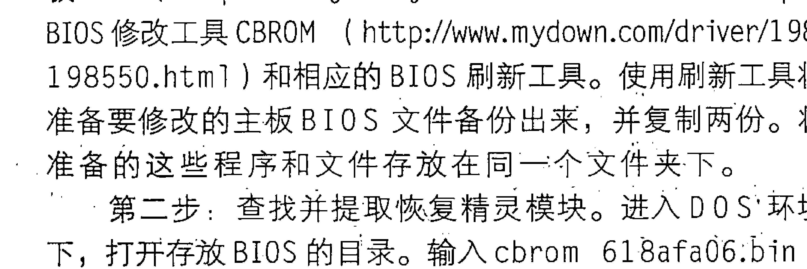

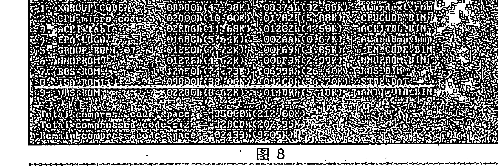

## （2）为BIOS添加BIOS自动刷新功能

在DOS下手动刷新BIOS，虽然不是很困难，但是也有些麻烦。因此，一些品牌主板的BIOS中就集成了BIOS刷新功能。比如捷波主板，启动计算机时，只要按组合键ALT+F2即可直接对主板BIOS进行刷新。我们也可以通过修改BIOS的方法，把BIOS刷新工具添加到BIOS中，来实现BIOS刷新功能。以添加AWDFLASH到主板BIOS为例，为大家说明具体步骤：

- 第一步：准备工作。准备BIOS修改工具和BIOS刷新工具AWDFLASH。用AWDFLASH将自己的主板BIOS文件备份出来，并复制两份。将准备的这些程序和文件存放在同一个文件夹下。
- 第二步：查看主板BIOS中是否有足够的空间，如果不够，需要释放部分模块或增加BIOS空间。
- 第三步：把BIOS刷新工具AWDFLASH写入BIOS文件。输入命令CBROM 3vca.bin /AWDFLASH AWDFLASH.EXE命令将AWDFLASH.EXE写入到BIOS.BIN文件中。
- 第四步：再次使用CBROM查看BIOS中是否多了一个Flash ROM的项目。
- 第五步：如果一切正常，使用BIOS刷新工具AWDFLASH将BIOS文件刷入主板即可。
- 第六步：重新启动计算机，在可看到“Press DEL to enter SETUP,ALT+F2 to enter AWDFLASH”的提示出现在开机自检画面最下方，此时，只要在软驱中插入一张存放有BIOS文件的软盘，然后直接按下组合键ALT+F2即可完成BIOS的刷新了。

## （3）为BIOS添加硬盘分区功能

一般我们使用Fdisk等硬盘分区工具来给硬盘分区，但是这些分区工具大多是在DOS下使用，一般都要用到启动盘，然而软盘可能会出现坏道、消磁等情况。那么是否可以为BIOS添加一个给硬盘分区的功能呢？其实，只要将Bios Fdisk这个工具添加到BIOS中，就可以实现这个功能，要注意的是，这个工具只适用于Award BIOS的主板。具体修改步骤如下：

- 第一步：准备工作。下载Bios Fdisk工具（http://dl.pconline.com.cn/html/1/3/dlid=8833&dltypeid=1&pn=0&.html），解压后有bfdisk.rom、bfdisk.com两个文件，只需要将bfdisk.rom这个文件写入主板BIOS即可。用AWDFLASH刷新工具将主板BIOS文件备份出来，并复制两份。将其中一份BIOS文件、BFDISK.ROM文件、CBROM和BIOS刷新工具放在同一目录下。
- 第二步：查看主板BIOS中是否有足够的空间，如果不够，需要释放部分模块或者增加BIOS空间。
- 第三步：将BFDISK.ROM写入主板BIOS。DOS环境下输入CBROM BIOS.bin /ISA BFDISK.ROM (bios.bin是要修改的BIOS文件)。
- 第四步：查看BFDISK.ROM文件是否已经添加到主板BIOS中。
- 第五步：使用BIOS刷新工具将修改后的BIOS文件刷新到主板中即可。
- 第六步：重新启动计算机以后，在出现LOGO开机画面时按Ctrl+F就可以进入到Bios Fdisk的分区界面。根据所给出提示进行操作就可以实现硬盘分区了。

## PART 3 BIOS完全个性改造

### 治愈受伤的BIOS——BIOS的修复

BIOS的修改和刷新是有一定风险性的，因此我们一定要了解一些修复BIOS的知识。BIOS在刷新和修改的时候可能会遇到断电问题，刷新过程强行停止，或者由于BIOS文件与主板不匹配等原因造成刷新失败，这时就需要对BIOS进行修复。

### 1. 使用可引导软盘修复BIOS

如果计算机的BIOS在刷新过程中出错，刷新失败，启动计算机时显示器什么也不显示，但是软驱灯还亮，能够听到软驱中有读操作的声音，那么说明BIOS中的根区Boot Block还没有损坏。我们可以利用BIOS的根区执行可引导软盘，进入DOS环境修复BIOS。
根区是BIOS里面的一部分，一般情况下，BIOS刷新程序是不会刷新根区的。计算机开机后，会最先执行存放在根区中的程序，如果此时BIOS正常，计算机就可以正常引导。如果BIOS受到破坏时，可以尝试启用根区程序修复BIOS，需要注意的是，这时BIOS只支持软驱启动和ISA显卡显示。

使用可引导软盘修复BIOS的具体步骤如下：
- 第一步：制作Windows 98启动软盘。先制作一张包含“Io.sys、Msdos.sys、Command.com”三个文件的Windows 98启动盘。
- 第二步：然后把BIOS刷新程序awdflash.exe和BIOS文件拷贝到启动盘里。
- 第三步：制作Autoexec.bat文件。打开记事本，输入 awdflash xxx.bin /py/sn/sb/cd/cp/r 保存为Autoexec.bat。

### 小提示：AWDFLASH的各种参数使用说明

上面我们介绍了AWDFLASH的使用方法，其实AWDFLASH还可以通过命令行来使用。下面就为大家介绍一下AWDFLASH命令行使用时的参数。

- /? ：显示帮助信息
- /py ：自动完成BIOS的刷新任务
- /sy：备份BIOS芯片中BIOS文件到磁盘
- /sb ：强行跳过BootBlock模块刷新BIOS
- /cp：刷新后清除即插即用数据(ESCD)
- /cd：刷新后清除DMI数据
- /sd：把DMI数据保存到一个文件
- /r：刷新后自动重新启动计算机
- /pn：不运行升级程序
- /sn：不备份BIOS文件
- /cks：刷新时显示备份文件的数据
- /tiny：占用少量内存刷新
- /e：刷新结束后回到DOS状态
- /f：刷新时使用原来的BIOS数据
- /ld：刷新后清除CMOS数据，不重新引导系统
- /cksxxxx：将新老两个BIOS进行比较校验

第四步：把做好的启动盘插入到软驱，启动电脑，计算机会自动读软驱，执行Autoexec.bat文件。软驱停止读盘后，系统会自动重新启动计算机。这时BIOS的修复工作也就完成了。

### 2. 使用热插拔的方法修复BIOS

引导软盘并不能解决所有的BIOS修复的问题，因为很多情况下BIOS中的根区Boot Block数据已经受损。不能再执行引导软盘中的文件。这种情况一般多用热插拔的方法来修复BIOS。
热插拔的工作原理是：在正常启动计算机后，BIOS的工作已完成，如果此时把BIOS芯片从主板上拔下来，是不会影响计算机系统的正常工作的。这时在计算机正常运行的情况下插上损坏的BIOS芯片，执行相应的BIOS刷新程序可以修复BIOS芯片下的BIOS文件。

具体方法如下：
- 第一步：准备工作。首先要找一台与刷坏的BIOS芯片相同的计算机。把刷新工具和BIOS文件下载到这台机器的同一个文件夹下。
- 第二步：热插拔。启动这台BIOS正常的计算机到DOS状态。开机状态下，取出正常的BIOS芯片，插上刷坏的BIOS芯片。
- 第三步：用刷新工具将正确的BIOS文件刷新到BIOS中。

在使用热插拔的方法修复BIOS时，经常会有人问是不是一定要使用相同型号的主板。在这里可以为大家解释一下，使用相同的主板和相同的BIOS芯片进行热插拔当然最好。但是我们经常是没有这样的条件的，经过很多DIY玩家的实验，现在已经有了一个结论，不同的主板，不同类型的BIOS芯片，甚至是不同大小的芯片，只要封装方式相同，基本上就可以尝试使用热插拔的方法来进行修复，只要在热插拔以后，使用BIOS刷新工具将BIOS文件强行刷入BIOS芯片就可以。当然，这种方法不是每次都能成功。

### 3. 使用显卡刷新BIOS

由于BIOS封装方式的差异，以及热插拔技术带电工作的不安全性，有时不能使用热插拔的方法来修复主板BIOS，这种情况下就需要采用一些非正常的方法来修复主板BIOS。

### 小提示：BIOS芯片常见的封装方式

目前市场上BIOS芯片最常见到的封装方式主要有DIP（双列直插式封装）和PLCC（模塑有引线芯片载体封装）。其实不管BIOS芯片使用这两种封装方式的哪一种，在性能上都是相同的，只是体积和成本有些差异而已。

- DIP（Dual.In — line Package）双列直插式封装

用DIP封装的芯片的外形特点是：芯片两侧分别有一排引脚，引脚总数一般少于100，这种芯片需要插入在DIP结构的芯片插座上。而且也可以在有相同焊孔数和几何排列的电路板上直接进行焊接。DIP封装方式适合在PCB（印刷电路板）上穿孔焊接，对PCB布线、操作方便，但是存在面积与封装面积比较大的缺点。DIP封装的BIOS芯片采用的是28或32脚DIP封装方式。

- PLCC（Plastic Leaded Chip Carrier）塑料有引线芯片载体封装

PLCC32封装方式，外形呈正方形，四周都有管脚，管脚数为32，体积大小比DIP封装芯片要小得多。PLCC封装在PCB上，使用SMT表面安装技术安装布线，具有体积小、可靠性比较高的优点。

这时候首先想到的就是显卡了。其实原理很简单，就是把主板的BIOS芯片插在显卡上，使用显卡的BIOS刷新工具把主板BIOS文件刷到BIOS芯片上。当然这种方法也存在一些问题，比如刷好的BIOS可以启动计算机，但进不了系统。不过，这已经难不住我们了，我们可以使用引导软盘再修复一次就可以了。下面就为大家举个使用显卡修复主板BIOS例子。

BIOS刷新失败的主板是浩鑫A161，BIOS采用DIP封装。修复用的显卡是TNT2 PRO，BIOS芯片同样使用DIP封装。用来修复的计算机的主板是捷波 K8N8P-C，支持AGP和PCI-E两种接口标准的显卡，其中PCI-E设置为优先启动。具体的步骤如下：

- 第一步：准备工作。下载显卡刷新工具NVFlash(http://www.mydrivers.com/dir26/d10712.htm)和主板BIOS文件，并把主板BIOS文件的后缀名.bin修改为.rom。再准备一张修复BIOS用的可引导软盘。
- 第二步：把刷坏的主板BIOS芯片取下，插在TNT2 PRO显卡上，并把显卡插在好主板的AGP接口上。
- 第三步：打开计算机，使用显卡刷新工具刷新TNT2 PRO显卡上的主板BIOS芯片。
- 第四步：将修复的BIOS芯片插回主板，使用可引导软盘再次修复BIOS。

小提示：使用网卡修复主板BIOS

网卡同样也可以用来修复。不过使用网卡修复主板BIOS的方法相对复杂一些，需要对硬件加以改造。因为网卡使用的是28针脚的BOOTROM插座，而主板BIOS芯片却是32针，这就需要重新焊接一个集成电路插座。然后修复方法和使用显卡修复类似，用网卡的BIOS刷新工具将BIOS文件刷新到芯片中。不过一定要注意，这种方法有一定的局限性。网卡必须使用RTL8139芯片，而且只支持1MB及1MB以下的BIOS刷新，2MB及2MB以上的BIOS芯片。

## 关于1MB的BIOS插座使用2MB的BIOS芯片的问题

有时候我们会遇到这样的问题，需要把2MB的BIOS芯片插在1MB的BIOS插座上使用。这时就要先了解一下1MB的BIOS芯片和2MB的BIOS芯片有什么区别。其实最主要区别就是30管脚的定义。1MB的芯片30管脚为NC是无定义的。而2MB的BIOS芯片30管脚A17是有定义的，A17是低电平时，芯片使用00000 - 1FFFF之间低端1MB空间，A17是高电平时，芯片使用的是20000 - 3FFFF之间的高端1MB空间。

在1MB的BIOS主板电路上，对于无定义30管脚NC的电压处理有两种方案，一种是将30管脚接地，这种主板就不能使用2MB的BIOS芯片，另一种是接+5V的高电位，这时2MB的BIOS芯片插在1MB的BIOS插座上，就自动屏蔽了2MB空间中的低端1MB空间。所以，将1MB的BIOS代码直接写到2MB的芯片，然后插到使用1MB BIOS的主板上，是不能使用的。因为直接写入1M的BIOS代码时，默认为使用低端1MB空间，而插在1MB BIOS主板上时，读取的是空白的高端空间。那么我们只要把BIOS文件强行刷入2MB BIOS芯片上的高端空间就可以在1MB BIOS主板上使用了。方法如下：

- 第一步：热插拔。启动一个使用1MB BIOS主板的计算机，进入纯DOS模式，然后拔下1MB的BIOS芯片，换上2MB的芯片。
- 第二步：强行刷新。启动刷新程序，进入程序界面，软件可以识别BIOS芯片的类型及2M的容量。选择正确的芯片厂家，使用型号与插入的BIOS芯片相同，但容量为1MB BIOS文件（见图10）。

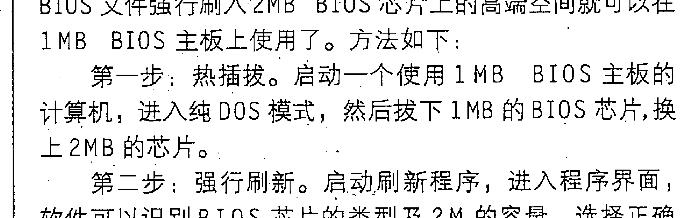

这样刷新完成以后，2MB容量的BIOS就可以插在1MB的BIOS主板上使用了。

这时可能有人会提出这样的问题，2MB的BIOS主板能否插上4MB的BIOS芯片呢？在这里笔者不做肯定的回答，因为上面已经说过了由于支持不同容量BIOS芯片的主板为BIOS芯片引脚提供的电压不同，而且支持相同容量BIOS芯片的主板为BIOS芯片引脚提供电压的方式也不完全相同。所以能给出的结论是4MB的BIOS芯片不一定能在2MB BIOS的主板上使用。

## 让BIOS更安全——打造双BIOS系统

如果BIOS刷新失败，或者因CIH病毒等破坏而造成主板BIOS数据丢失或损坏，就会造成不能启动计算机的情况。如果在设计两块BIOS芯片主板上，那么一块BIOS的数据遭到破坏时，就自动启用另一块BIOS，这样就不会造成任何损失了，这就是双BIOS技术的根本出发点。
为了防止BIOS损坏给用户造成的损失，主板生产厂家相继推出了使用不同双BIOS技术的BIOS芯片的主板，如技嘉科技的Dual BIOS TM技术，当一块BIOS芯片受到损坏，可以用另一块BIOS中的内容来恢复；微星公司则提出“Safe BIOS”的概念，强调不一定要配备两块BIOS芯片，它是在主板上配备容量为普通主板的两倍大的4MB BIOS芯片，将这个BIOS像硬盘一样划分为两个分区，如果BIOS开机使用的分区受损，则由另一分区的BIOS数据启动，并自动修复受损的BIOS分区；博登公司则推出了便携式BIOS的方法——AIR BUS，就是把备用的BIOS芯片内建在一张小卡上，如果主板上的BIOS遭破坏，可以把备用的BIOS小卡插入主板上专用的插槽，使用备用BIOS启动，并对主板上的BIOS进行自动修复。
另外还有被称为第二代双BIOS技术的承启科技的Twin BIOS智能型双BIOS技术，就是在主板上设计两块独立设置，互不影响的BIOS芯片，从而扩大了双BIOS系统的应用范围。

小提示：第二代双BIOS系统
第一代双BIOS技术的目的都只有一个——就是避免计算机BIOS遭到损害而瘫痪。但是这种常规的双BIOS技术有一个缺憾：不能根据情况自由切换BIOS。
Twin BIOS技术的重大突破就是两块BIOS芯片可以独立设置，互不影响。这样可以通过在两块BIOS上设置不同的参数来满足不同的配置要求，例如在同一台电脑上安装两种语言的操作系统，如中文和英文Windows共存，或是中文、日文、韩文等共存。
Twin BIOS技术还提供了多种更新BIOS内容的方式，可以用两块BIOS中的一块刷新另一块；还可以使用主板的驱动光盘上提供的刷新程序，把外部的备份文件写到主板上的两个BIOS；BIOS中还内建了刷新工具，可以开机按“ALT+F2”组合键，就可以直接更新BIOS内容了，极为快捷安全。
承启Twin BIOS技术的两个BIOS芯片是安装在主板上的插座里，如果出现了物理损坏可以购买同型号的BIOS芯片插回去。
总之；承启Twin BIOS技术作为第二代双BIOS技术的代表，不但囊括了第一代双BIOS的所有功能，为BIOS提供了有效的安全防护功能，更首创了针对不同要求独立设置BIOS的功能，使双BIOS技术具备了很高的灵活性。

### 1. DIY双BIOS的原理

一般来说，相同型号芯片的引脚数、电压、容量是相同的，所以相同型号不同封装形式的BIOS芯片(DIP、PLCC、TSOP等)，各个管脚是兼容的。图11是两种封装形式的SST29EE020引脚示意图。可以看到，芯片引脚的排列是逆时针方向，通常会有一个圆形或三角形的标记在第一引脚上，只要确定了第一引脚，就可以按顺序确定其他的31支引脚。这些引脚的用途有以下几种：D0~D7供数据线使用、A0~A17供地址线使用、CE、OE、WE供控制线使用、VDD/VCC为电源、VSS/GND接地。

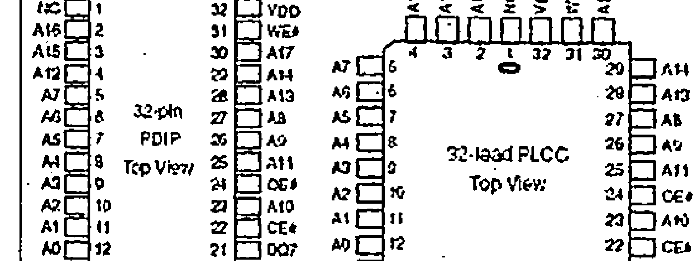

双BIOS主板中，CE引脚是最为关键的。因为CE称作片选信号端，CE为高电平时，不能对芯片进行任何操作，芯片处于“备用方式”状态，CE为低电平时，才可以对芯片进行读取、编程等工作，双BIOS系统主板就是利用与非门逻辑电路来进行高低电平的转换从而控制BIOS切换的。在DIY双BIOS系统时，我们可以用普通电路开关来实现：普通主板上只有一块BIOS，CE引脚总是接地，处于被选中状态，如果把两片同型号的芯片CE以外引脚进行并联，再利用一个单刀双掷开关，在两芯片的第22引脚之间进行切换，就可以达到DIY双BIOS系统的目的了（见图12）。

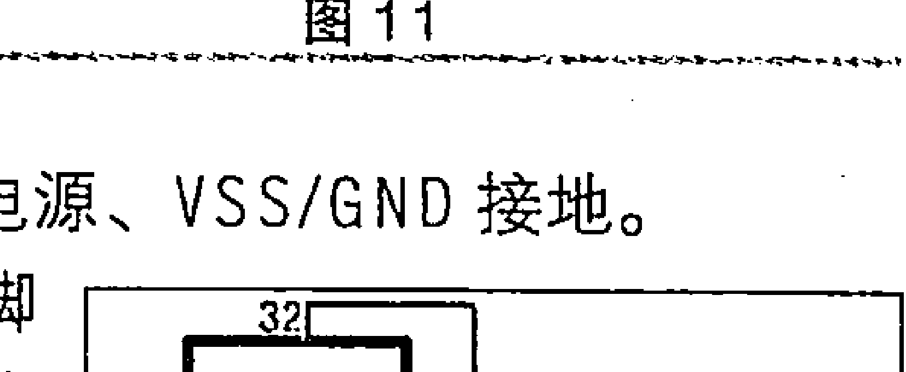

### 2. DIY双BIOS实例

现在，我们就用DIP32封装的SST29EE020芯片作为主BIOS，PLCC32封装的W29C020芯片作为备用BIOS来DIY双BIOS系统。
- 第一步：准备工作。准备一些必要的配件：一块DIP32封装的SST29EE020芯片、一块PLCC32封装的W29C020芯片、一个单刀双掷开关、两个10K欧姆电阻、一些废电源线、一个PLCC32转换座。PLCC32转换座和CPU的转接卡有些类似，PLCC封装的BIOS芯片可以接在上面，然后插到DIP封装的管座上。另外，需要使用的工具有：尖嘴电烙铁、焊锡若干和吸锡器（见图13）。

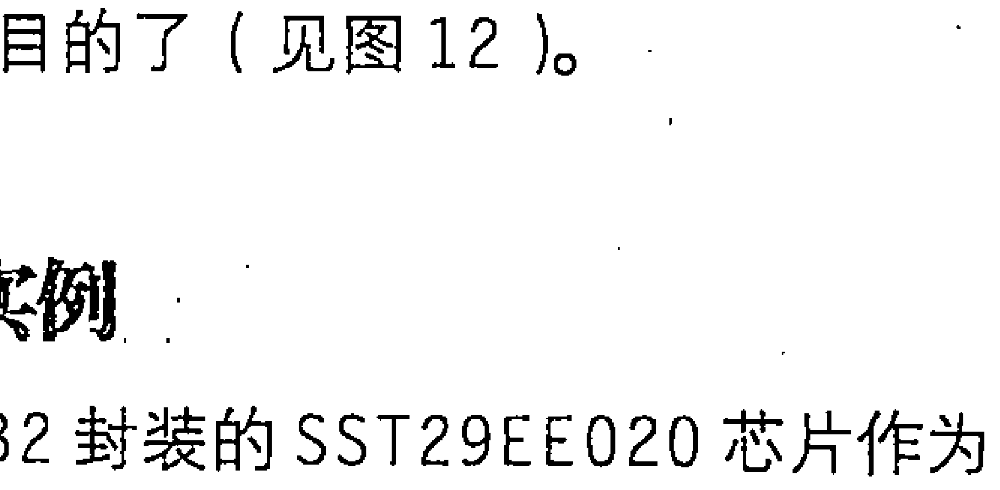

小提示：自制烙铁头
由于DIY对焊接技术的要求比较高，所以我们可以自制一个便于使用的烙铁头，先剪一段双绞线的铜芯，把这段铜芯在烙铁头上绑几圈，再伸出0.5cm左右，这样焊接时就更容易控制焊点了。
- 第二步：并联芯片。把SST29EE020芯片和转换座的第22插脚都向外侧挑开，然后把SST29EE020芯片的其余31支引脚和转换座PCB板上插脚的焊接点一一对应地焊接，现在两块芯片并联就实现了。
- 第三步：焊接电阻。把一个电阻焊在SST29EE020芯## 第四步：焊接单刀双掷开关

将三种颜色的废电源线做成三芯线，然后将三芯线其中一端焊接到单刀双掷开关的三个接点上，这里我们把白色线焊在中间，另外两色线焊在开关两边。白线的另一端稍后需要接在主板BIOS管座的22引脚位置上，另外两色线分别焊在两个电阻和22引脚的接点上（见图14、15）。

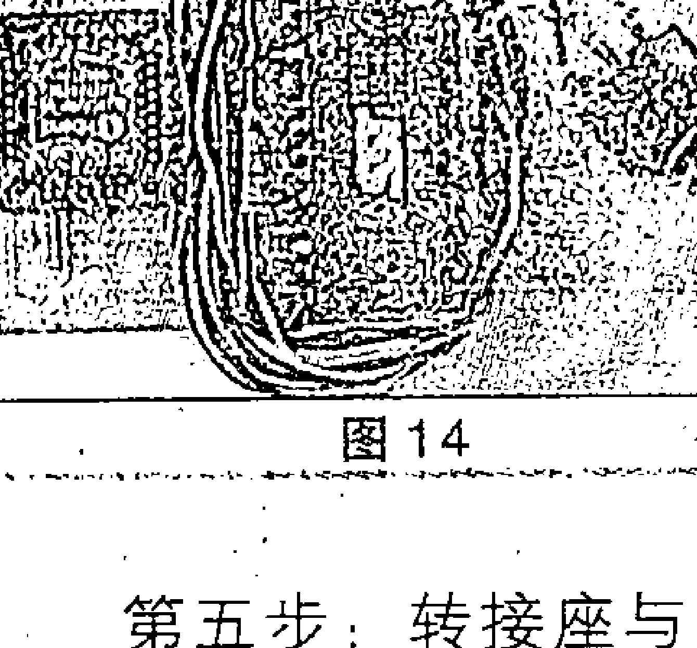

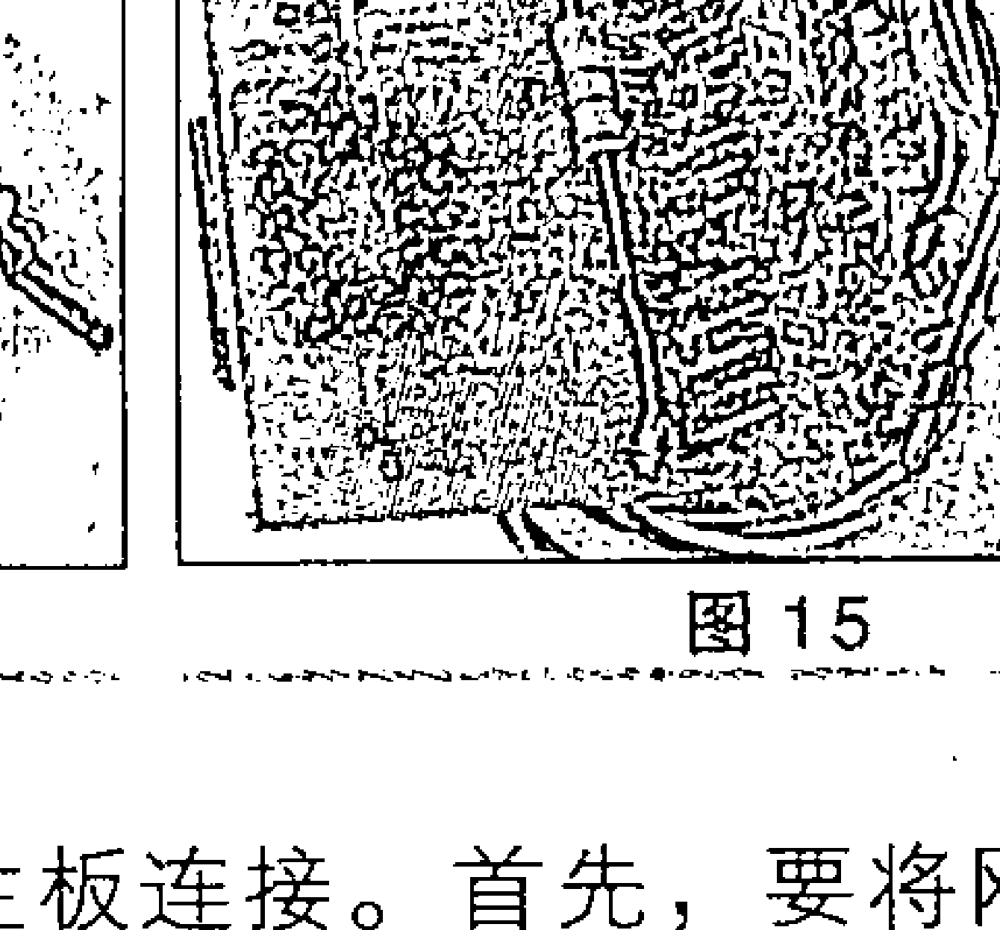

## 第五步：转接座与主板连接

首先，要将刚才焊接在开关中间的白线的另一端焊接到主板BIOS管座的22管脚上，然后，按正确位置将转接座插到主板的BIOS管座上。

## 第六步：将开关安装在机箱外

为了不开机箱就可以进行BIOS切换，所以要把开关装在机箱外挡板的适当位置。

大功告成！现在，就可以体验一下这个双BIOS系统为我们带来的方便了。通过拨动开关，可以选择一个BIOS启动计算机，进入DOS环境后备份BIOS文件；再把开关拨到另一边，就可以把备份的BIOS文件刷到另一块BIOS芯片上。因为有了两片BIOS芯片，我们在修改和刷新BIOS的时候就不必担心出现误操作了。不过因为其中一块BIOS焊死在组件的PCB板上的，一旦它意外损坏就失去了双BIOS的意义了，而另一片BIOS芯片则是可以替换的，因此对BIOS的操作尽量在可替换的BIOS芯片上进行。

## 将BIOS开机画面改成全屏幕华丽图片

修改开机画面向来是老鸟向小鸟“展示实力”的项目之一，但是其繁琐的制作过程和纯DOS环境下的操作，让普通用户望而却步。磐正（EPoX）的Magic Screen改变了这一现状，易于操作的Windows图形界面让磐正主板的用户随心所欲地个性化开机画面。难道我们这些非磐正主板的用户就注定面对枯燥的自检画面吗？今天我们就来破解磐正的魔术。

与大多数修改主板BIOS的工具一样，Magic Screen也有一定的局限性。Magic Screen只支持Award BIOS，而且只能支持Award（Phoenix）6.0或以上版本的BIOS文件，而较早的Award 4.5x版本以及AMI BIOS用户将无法使用此程序。如果不清楚自己主板的BIOS类型和版本，那么可以用eSupport BIOS Agent检测一下。下载并解压eSupport BIOS Agent v3.45汉化版，然后运行BIOSAG.exe文件，在弹出的程序界面中点击“获取BIOS信息”按钮，你可在“BIOS类型”右边获取相关的信息（见图16）。确认主板是否符合要求。

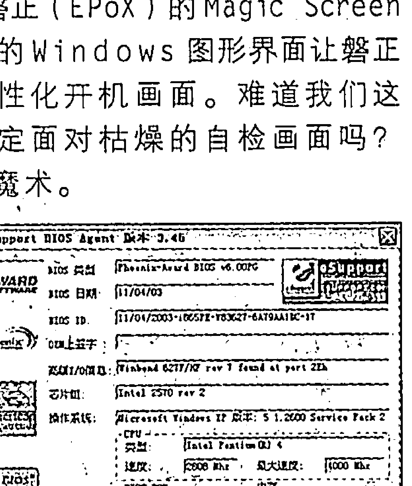

### 1. 破解程序运行限制

下载并解压Magic Screen v2.9版，运行setup.exe文件，安装过程并无特别，一路“Next”直到结束即可。然后，运行“C:\Program Files\EPoX\Magic Screen”目录下的MagicScreen.exe。如果主板不是磐正的，那么运行MagicScreen时会弹出一个主板类型错误提示，按“OK”退出。来到C盘根目录下，你会发现一个名为“EPOXMBID”的TXT文件。其实，Magic Screen运行时会先检测主板的ID并保存在EPOXMBID.txt文件中，然后再读取该文件，如果检测为磐正的主板，即运行程序，否则提示错误。

打开EPOXMBID.txt文件，文件中的内容即为主板的ID，我们只要将ID后三位改成磐正标识“PAB”（注意一定要大写PAB），然后保存退出，并且将文件属性改为“只读”即可。运行Magic Screen时，程序将无法修改EPOXMBID.txt的内容，那么它就顺理成章地认为你的主板是磐正产品，程序得以继续运行。

### 2. 准备全屏开机图片

接着，我们来准备全屏开机图片。安装完Magic Screen后，在默认目录“C:\Program Files\EPoX\Magic Screen\sample”中已经包含了12张256色的官方开机图片（见图17）。当然，也可以使用Windows自带的画图程序或其他图形编辑软件制作640*480的个性化开机图片，保存时设置图片格式为16色或256色BMP文件，并保存在上述文件夹中即可。

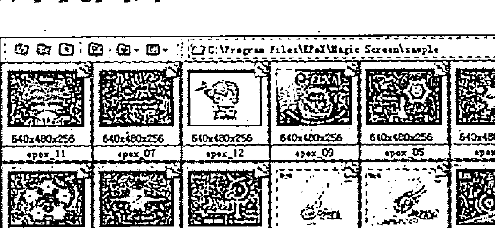

### 3. 轻松修改并刷新BIOS

运行Magic Screen进入主界面，第一屏为欢迎信息，按上方的箭头按钮继续下一步。这时，程序会调用Winflash备份当前使用的BIOS文件，默认保存目录为“C:\Program Files\EPoX\Magic Screen”，文件名为Backup.bin。备份完后，Magic Screen会列出sample目录中所有符合要求的图片（也可以按下主界面左上方的文件夹图标来指定图片存放目录），并根据BIOS文件剩余空间和图片文件经LHA压缩后的大小，自动判断图片能否加入到BIOS文件中（图18）。绿色的勾号表示可以加入，红色的叉号则意味着该图片已经超出了容量限制，如果想继续使用该图片，那么你需要降低该图片的色深（256色降为16色）或在纯DOS模式下用CBROM删减BIOS文件中无用的项目以释放空间。

双击选中的图片，如果确认使用此图作为开机画面，那么按上方的箭头按钮，Magic Screen 便再次调用 Winflash 程序刷新BIOS了。完成后，程序会提示成功刷新BIOS的信息，重新启动计算机即可。

如果哪天你又怀念起那经典的自检画面时，运行 Magic Screen，按下主界面右下方的蓝色 "D" 按钮，按照程序提示即可删除BIOS文件中的图片模块。删除品牌机的开机画面特别好用喔！

如果重新开机后仍旧没有显示全屏图片，那么请按 "DEL" 键进入CMOS设置，在 "BIOS Features Setup" 中找到 "Full Screen Logo" 之类的选项（不同的主板有不同的表述形式，请参阅各自的主板说明书）并设置为 "Enable"，保存退出即可。

## 超神奇的能源之星变动画

相信不少朋友懂得制作EPA图标以替换主板BIOS中呆板的“能源之星”的方法，但是，由于修改软件和图标格式的限制，制作出来的EPA图标全是静态的，这里我们找来了EPAFlash，可以制作动态的EPA图标，唯一可惜的是，该程序只支持Award BIOS，使用AMI BIOS的朋友只好再委屈一次了。

究竟如何个“闪”法呢？先来看看EPAFlash的本领。该软件可以制作动态EPA图标，同时也具备BMPtoEPA软件将BMP格式的图标转化为EPA格式，以及为EPA格式图标填色的这两大功能。通过EPAFlash制作的动态EPA图标，其动画效果其实是前景颜色与背景颜色交替显示，从而得到动态的感觉。明白了吗？一起来闪亮我们的主板吧！

### 1. 安装EPAFlash

下载并解压缩安装程序包，里面包含awdflash.exe、CBROM.exe、COMDLG32.OCX以及epaflash2.5.exe四个文件。运行epaflash2.5.exe，一路“Next”即可完成安装程序。然后，把COMDLG32.OCX文件拷贝到“C:\Windows\system32”目录中（Windows 98的用户还需安装Visual Basic 6.0 Runtime）。

### 2. 准备BMP图片

使用Windows自带的画图程序或其他图形编辑软件制作一张136×126的图片，保存时设置图片格式为黑白单色BMP文件。由于保存成单色的BMP文件会丢失一些颜色信息，所以程序会提醒你是否继续，选择“是”即可。

### 3. 制作EPA文件

运行EPAFlash，按“打开BMP文件”按钮，选择刚才制作的黑白单色BMP文件，在主界面的左下角便会出现打开的BMP文件了（见图19）。然后按“BMP转为EPA”按钮，主界面的左上角便会出现转换出的EPA文件。

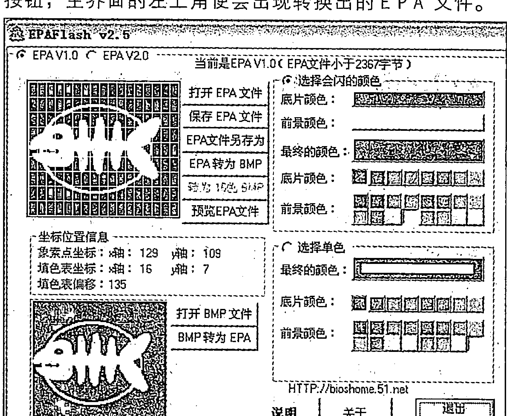

主界面右边给出两种填色方案，其中“会闪的颜色”就是我们需要的效果，而“单色”则是静态颜色。选中“选择会闪的颜色”前方的复选框，在“底片颜色”中选择目标色彩，然后把鼠标移往左边的窗口并按着鼠标左键进行涂色；同理，在“前景颜色”中选择目标色彩并为图案添加不同的颜色。当涂色工作完成后，你便会明白何谓“会闪的颜色”了！

点击“保存EPA文件”按钮，指定文件名（例如flash.epa）和储存路径，至此便完成了动态EPA文件的制作。

### 4. 修改及刷新BIOS

要替换BIOS文件中的EPA图标，必须有主板的BIOS文件。如前文所述，首先在纯DOS模式下用awdflash.exe把当前使用的BIOS文件备份下来，例如bios.bin。然后，在DOS提示符后键入“cbrom bios.bin /epa flash.epa”，回车便把刚做好的EPA图标替换掉BIOS文件里“能源之星”了。最后，把修改好的BIOS文件写入BIOS芯片中，这里就不再赘述了。

以上就为大家介绍了一些和BIOS修改的相关知识，其中还包括了一些常规的和另类BIOS修复和改造的方法，希望大家能够从中得到一些启发。发扬DIY精神，将BIOS的DIY进行到底，我们相信通过广大DIY玩家的努力，终会有一天，BIOS这块曾经的“禁地”，会变成一座连接DIY玩家和计算机软硬件的“桥梁”！DIY玩家可以通过BIOS让自己的计算机变得越来越个性化！

## 入门之选——Windows Movie Maker

### 1. Windows Movie Maker 2.1 的特点

在很多人看来，视频编辑算得上是一项麻烦事，复杂的菜单、繁琐的操作，让人望而却步。其实，在初涉视频编辑领域时，我们可以先试试微软的Windows Movie Maker。

Windows Movie Maker是微软集成在Win XP/ME系统中的视频编辑模块，目前最新版本为2.0。Windows Movie Maker属于绝对的“快餐型”视频编辑工具，拥有最基本功能，集成多种视频特效。上手容易，操作简便，即使是新手，也可以很方便地完成从视频采集到节目输出的一系列工作。

不过，Windows Movie Maker的缺点和优点一样明显，那就是功能过于淡薄：只支持一条视频轨道进行编辑。虽然它看上去似乎什么功能都提供了，但从数量和可扩展程度上来说，都不能和专业的视频处理软件相提并论。比如Windows Movie Maker提供的多种特效，你只能直接拿来使用，却不能通过设置参数控制具体效果。

总体而言，Windows Movie Maker是一个为新手准备的视频编辑工具，当你成功迈过入门的门槛后，它就可以功成身退了。

### 2. 使用 Movie Maker 2.1 采集 DV 视频

- 第一步：将DV摄像机连接到电脑上的1394接口，打开摄像机，并将开关拨到VCR（播放）挡。
- 第二步：运行Movie Maker 2.1，点击工作界面左上方的“捕获视频”节点，展开菜单项，然后点击“从视频设备捕获”。Movie Maker 2.1会弹出向导页面，帮助用户完成捕获过程。
- 第三步：在向导界面的“视频捕获设备”面板中选择捕获设备为DV摄像机，点击下一步。然后在“捕获的视频文件”菜单设置文件名和输出目录，点击“下一步”，在“捕获设置”菜单设置捕获质量为“在我的计算机上播放的最佳质量”，再次点击“下一步”，最后在“捕获视频”窗口点击“开始捕获”即可开始视频捕获。

### 3. 使用 Movie Maker 2.1 添加旁白

- 第一步：运行Movie Maker 2.1，点击“导入视频”按钮导入刚刚采集的素材。
- 第二步：将素材拖放到视频轨道上，然后在编辑区域点击“显示时间线”按钮，将编辑模式切换为“时间线模式”。
- 第三步：点击编辑区域工具栏上的“麦克风”标志，打开“旁白录制”窗口，单击“开始旁白”按钮，此时影片会自动从头播放，你就可以为相关画面录制解说词了。
- 第四步：解说完成后，点“停止旁白”按钮，会弹出一个对话框提示用户保存录音文件，Movie Maker 2.1会在保存完毕后将这段旁白导入“音频/音乐”轨道。
- 第五步：素材编辑完毕后，点击菜单栏上“文件－保存电影文件”选项。Movie Maker会弹出一个保存电影向导，选择第一项“我的电脑”即可将素材保存到本地硬盘上。

除了添加旁白外，用户还可以使用Movie Maker添加视频过渡等特效。不过，Movie Maker 2.1只提供了简单的编辑功能，因此可以完成的视频效果也非常有限。如果想追求更炫的视频特效，还是要使用专业的视频编辑工具。

### 4. 使用 Movie Maker 2.1 将视频刻录到 CD

- 第一步：在“电影任务”窗口，点击展开“完成电影”节点，单击该节点下“Save 保存到CD”。
- 第二步：在“为保存的电影输入一个文件名”菜单中，分别填写影片名称和CD名称，然后点击“下一步”。
- 第三步：在“电影设置”窗口选择“最适合可写入的CD”选项。如果想使用不同的电影设置，单击“显示更多选项”，然后从清单中选择其他电影设置。设置完成后点击“下一步”即可开始刻录。

## 一步到位的快感——Sonic Vegas 5.0

### 1. Sonic Vegas 5.0 的特点

由Sonic Foundry（目前已归SONY所有）公司推出的Vegas，可以说得上是兼顾了各个层次用户的视频编辑工具，品质相当优秀。

从市场定位来说，Vegas倾向于有一定技术基础的用户，并在此基础上提供了更加专业的功能和特效。应当说，Vegas是和Adobe的Premiere， After Effect同一级别，不过显然Vegas在软件的亲和力和易用程度上下了更大的功夫，因此它上手要容易得多。

在音视频编辑方面，Vegas完全可以媲美Premiere等老牌视频编辑工具。它支持无限制的音轨与视轨，可不限次数redo/undo，并可以即时播放编辑及特效结果，这些特性都极大地方便了用户使用。音频方面更是继承了Sonic Foundry的技术优势，配合Sonic Foundry推出的DX音频插件，可以达到一些大型多轨混音软件的效果。

另外，和同类别软件相比，Vegas具有体积小巧、系统要求较低、运行速度较快、工作效率高等优点。它的界面非常亲切朴实，功能分布也和Windows等应用软件类似，用户可以迅速上手。

更值得一提的是，从4.0版本开始，Vegas就开始搭配DVD Architect。DVD Architect是一个专业的DVD制作工具，使用Vegas+ DVD Architect组合，用户可以轻易地完成由DV—DVD一次性转换，制作出具备专业水平的DVD作品。

### 2. 使用Sonic Vegas 5.0一次性编辑、刻录光盘

往常我们要把DV中的视频刻录成光盘，需要先使用非线编软件采集编辑，输出为文件，然后再使用如NERO之类的刻录工具进行刻录。不过应用软件的开发始终是以人为本，方便易用才是王道。下面我们就来看看使用Sonic Vegas 5.0一次性完成DV视频的采集、编辑、刻录VCD的全套工作。

- 第一步：将DV摄像机连接到电脑的1394接口，并把开关拨到“播放(VCR)”档。
- 第二步：运行Sonic Vegas 5.0，点击菜单栏上“File – Capture Video”项，运行视频采集模块。
接下来点击视频采集界面菜单栏上的“options – Preferences”项，进入采集设置面板，首先在“Disk Management”面板下设置采集文件的路径，然后在“Capture（采集）”面板中，勾选“Stop Capture on drop frames（掉帧停止采集）”。
设置完成后，利用视频采集界面上的控制按钮将磁带定位到需要采集的起点位置，点击“Capture Video(采集视频)”按钮即可开始采集视频素材。
- 第三步：Vegas 5.0是一个非常强大的视频编辑软件，因此用户几乎可以用它制作任何效果。在本文中，我们通过一个添加同步字幕的例子来进行讲解。
运行Vegas 5.0，点击菜单栏上的“File – Import Media”选项，导入刚刚采集的视频素材。Vegas会自动将素材导入并放置于时间线窗口的视频轨道上。
在时间线窗口单击鼠标右键，点击“Insert Video Track”新建一条视频轨道用于存放字幕。注意，这条字幕轨道一定要在视频轨道上方。

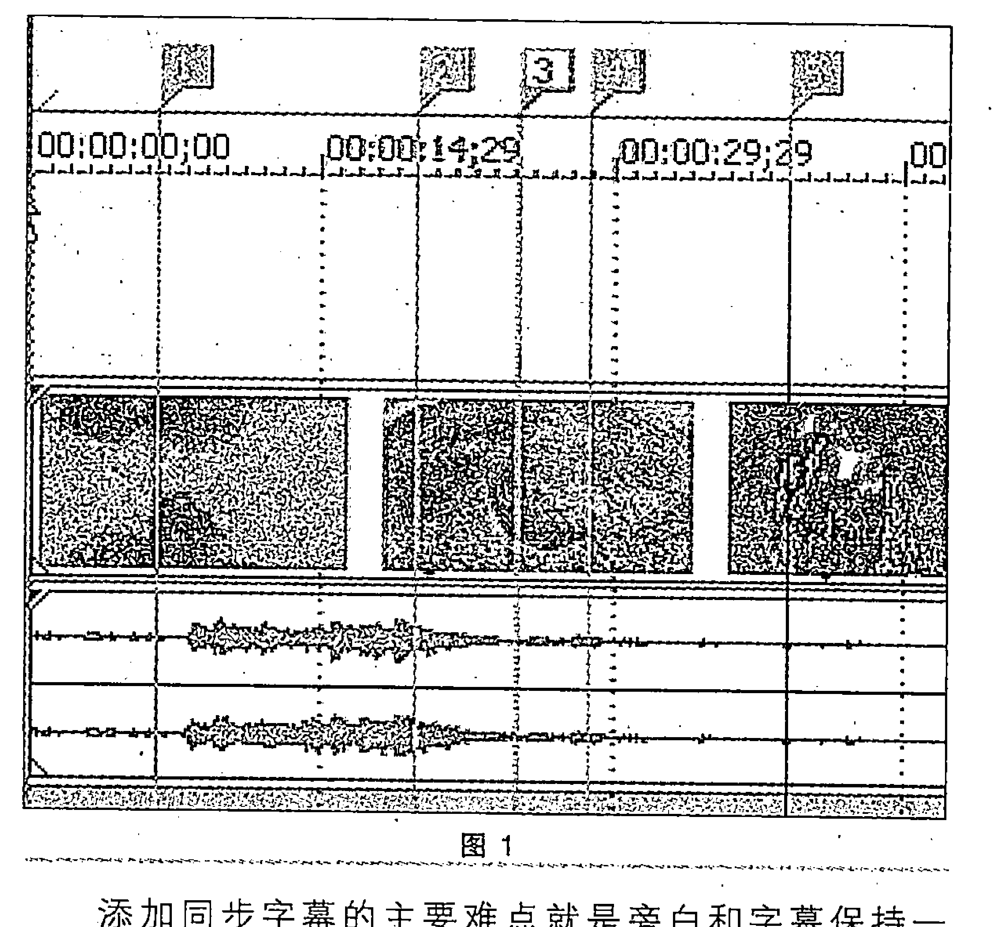

添加同步字幕的主要难点就是旁白和字幕保持一致，Vegas解决这个问题的方法非常简单：点击“播放”按钮，预览时间线上的素材，注意聆听素材的旁白，当听到需要添加字幕的地方时按下M键，这时时间线上会出现如图1所示带序号的标记。

接下来选中字幕轨道，在刚刚所做的标记处单击鼠标右键，点击“Insert Text Media”打开字幕编辑界面。在文本框中输入字幕内容，并调整字体和大小，切换到“Placement”，在这里你可以拖动鼠标调整字幕的位置。再点击“Properties”选项，切换到属性设置窗口，在“Text Color”处设置字幕颜色，同时确保“Background Color”为透明。

重复上述步骤，直到为所有旁白添加完字幕为止。

- 第四步：点击菜单栏上的“Tools – Burn CD”选项，打开VCD刻录菜单，将“File”选项设定为文件保存的路径，“Format（格式）”选项设定编码为MPEG-1，“Template（模板）”选项设定VCD制式为“VCD PAL”。
- 第五步：选择刻录模式为“Test first, then burn（先测试，然后刻录）”，最后点击“OK”按钮即可开始刻录VCD。

### 3. 使用DVD Architect刻录DVD

虽然使用Sonic Vegas可以将正在编辑的素材直接刻录为VCD，但如果用户想将视频素材刻录为DVD保存的话，上述办法就不适用了，因此下面还要为大家介绍刻录DVD的过程。

- 第一步：视频编辑完成后，点击菜单栏上的“Render As（渲染为）”将文件输出为AVI或者MPEG2格式文件。
- 第二步：运行DVD Architect，在“Explorer”窗口选取需要刻录的素材，双击文件名将它们添加到当前刻录项目中。DVD Architect会将它们置于“刻录项目”窗口，并将它们的缩略图置于菜单预览窗口中。
- 第三步：点击预览窗口上的DVD菜单，在菜单标题## 谁说一定要非线性编辑——NeroVision Express

### 1. 关于 NeroVision Express

说起 NeroVision Express，有必要先提到 Nero 这款光盘刻录领域的元老级工具。多年以来，Nero 依靠其功能强大、对刻录设备的广泛支持得到了用户的支持。但随着越来越多的刻录工具出现，特别是很多视频编辑工具也集成了 CD/DVD 的刻录模块，NERO 的传统优势不复存在，于是，针对家庭 DV 用户的 NeroVision Express 应运而生。

NeroVision Express 和 Ahead 以前的软件产品不太一样，它在保持了光盘刻录的基本功能以外，还集成了视频采集/编辑模块，非常适合 DV 爱好者使用。

### 2. 安装 NeroVision Express

- 第一步：访问 http://www.skycn.com/soft/10698.html，下载 NeroVision Express V3.1.0.16 的安装包并安装。需要注意的是：NeroVision Express 并不是免费软件，如想使用全部功能，必须获得正式序列号。
- 第二步：安装完毕后，访问 http://www.skycn.com/soft/13182.html，下载 NeroVision Express 的官方中文包，安装完成后就可以在 NeroVision Express 中设置工作语言为简体中文了。

### 3. 使用 NeroVision Express 采集 DV 视频

- 第一步：将 DV 连接到计算机，运行 NeroVision Express 程序，弹出一个向导窗口，直接点击“制作 DVD”按钮进入目录窗口。
- 第二步：在目录窗口中，点击“捕获视频...”按钮打开如图 2 所示视频捕获窗口。

通常 NeroVision Express 提供的默认配置已经足够，用户直接点击控制栏上的红色按钮即可开始捕获。但如果连接有多个视频捕获设备，那么就需要在“捕获设备”选项中选取正确的 DV 设备。

默认情况下，NeroVision Express 以刻录的介质为模板捕获视频：当用户在向导界面选择刻录 DVD 视盘时，捕获程序就会以 MPEG2 格式、720 × 576 分辨率、AC3 音效的格式捕获视频。另外，用户还可以在“选择捕获模板”下拉菜单选择其他模板，或者点击“配置”按钮进行手动设置。

### 4. 使用 NeroVision Express 编辑 DV 视频

- 第一步：视频捕获完毕后，目录窗口的项目列表会出现刚刚采集的视频素材，在该素材上单击右键，选择“编辑”进入素材编辑界面。
- 第二步：在素材编辑界面，我们可以对素材进行一定的修整。方法是点击工具栏上“剪刀”标志的按钮进入剪切模式，在滚动条中选择要剪切出的范围，再次单击“剪切”按钮确认操作。
- 第三步：修整完成后，我们可以为素材添加一点特效。点击右侧工具面板上的“显示转场”标签，在需要的特效上单击右键，然后点击“添加到项目”。
- 第四步：完成素材剪辑后，点击“下一步”按钮返回目录窗口。

### 5. 将 DV 视频刻录为 DVD

- 第一步：在目录窗口点击“下一步”，进入 DVD 菜单编辑界面，在这里可以为自己刻录的 DVD 设计一个菜单。点击“编辑菜单”按钮进入菜单编辑界面，使用右边控制栏提供的编辑功能定制 DVD 菜单。大家还可以点击“背景”按钮，再选择“浏览画面”中自己喜欢的图片作为 DVD 菜单的背景。
- 第二步：菜单制作完毕后，点击“下一步”，进入预览界面，该界面提供了模拟电视遥控器播放的环境，用户可以测试菜单的有效性。
- 第三步：测试完成后点击“下一步”进入“刻录”设置面板，设置刻录相关属性，如“刻录设备”等选项。
- 第四步：最后点击“写”按钮即可开始 DVD 刻录。

部分单击右键，选择“Edit Text”，然后输入 DVD 标题，并在下方控制栏设定字体、大小和颜色等属性。

在右侧的菜单属性窗口，点击“background media”处的按钮，为菜单选择一张背景图片。如果缺少这方面的素材，用户也可以点击“Backgrounds”标签，从 DVD Architect 提供的背景图片中选择一张。

- 第四步：点击“Buttons”标签，从 DVD Architect 内置的按钮库中选择一个按钮，拖放到 DVD 菜单上。然后在属性窗口的“Action”属性中，设定“Command”为“Stop”，在点击这个按钮后，DVD 就会中止播放。添加这个按钮，是为了让大家了解 DVD 菜单如何设置交互动作。
- 第五步：基本的设置完成后，点击“Make DVD”按钮，在弹出的制作 DVD 菜单中点击“Prepare DVD and Burn”按钮，DVD Architect 会对当前刻录项目进行检测，同时显示一个消息列表。如果项目中出现错误，就会在消息列表中显示出来。
- 第六步：如果没有什么错误，DVD Architect 将允许用户点击下一步进入“Prepare folder”窗口；在这里用户可以设置 DVD 的临时交换空间。
- 第七步：点击下一步进入“Make DVD”窗口，分别选择刻录设备、刻录速度、并在“Volume name”处为 DVD 命名后，就可以点击“Burn DVD”按钮开始刻录了。

注意：以上介绍的只是 DVD Architect 的一个简单范例，实际上它的功能并不仅仅如此，我们可以使用 DVD Architect 制作出很复杂的 DVD，如拥有多个菜单、交互功能更加复杂的 DVD 视盘。具体方法限于篇幅不做详解，有兴趣的朋友可以自行尝试。

## 新视频制作全攻略

我们在杂志或者是互联网上，已经看到过很多关于视频制作的文章。相信很多朋友对于这些问题已经不再陌生，但多媒体技术是不断发展向前的，裹足不前可不是 CFANS 的风格，因此本文的目的就是为广大读者介绍如今最新的媒体格式和它们的制作方法。

### 第一篇 移动视频文件的制作

目前几乎所有的移动视频设备都支持 MPEG-4 视频的播放，但由于播放 MPEG-4 对硬件要求较高，所以最适合的设备还要属 MP4 播放器和 PPC(微软的 Pocket PC)；它们凭借着较大的真彩显示屏和强悍的硬件支持，能够将 MPEG-4 优良的视频质量发挥得淋漓尽致。

### 一、流行的移动设备视频格式

在介绍移动视频之前，我们有必要先来明确一下本文中移动视频的定义。一般在大家的印象中，移动视频似乎主要指基于 3 G 网络的移动流媒体，其终端主要为具备视频功能的手机。但事实上并非如此。因此本文中的移动视频不仅仅指移动流媒体，而是试图从尽可能广的范围为读者介绍目前流行的移动视频设备所使用的视频格式。

由于移动视频是一个崭新的领域，很多厂商都在按照自己的理解开发视频编码和生产移动视频设备，这就造成了目前移动媒体格式种类繁多、规范不一的现状。因此在介绍如何制作之前，有必要将目前流行的移动视频格式的种类和特点罗列一下。

### 1. MPEG-1格式

相信 MPEG-1 是大家接触最多的视频格式了，它是由全球著名的动态图像专家组（Moving Pictures Experts Group）在 1992 年制订的视频图像的压缩编码标准，也是该系列编码的头一个。MPEG-1 主要用于为 CD 光盘介质传播的视频和音频媒体内容的压缩。

目前看来，MPEG-1 无论是在视频质量还是压缩比率上，都已经无法同新推出的编码抗衡，属于即将淡出市场的“昨日之星”。不过 MPEG-1 虽是廉颇老矣，但凭借着广泛的硬件支持和较小的系统资源消耗还是在移动视频格式领域保有一席之地的。

### 2. MPEG-4格式

提起 MPEG-4，读者朋友一定非常熟悉，它是目前应用最广泛的视频格式之一了。从概念上来讲：MPEG-4 是个编码标准，它是由动态图像专家组在 1998 年制订的全新视频图像的压缩编码标准。

从编码上讲，目前符合 MPEG-4 标准的编码格式主要有 DivX（含 DivX 3.11、DivX 4.x 和 DivX 5.x）和 XVID 两类。

MPEG-4 格式的主要特点就是极高的压缩比（最高可以达到 200：1），而同时视频质量也比过去有了质的提高，在提供接近 DVD 视频品质的情况下，最终生成的视频文件大小不过是采用 MPEG-2 编码的几分之一。由于这些突出的优点， MPEG-4 得到了广泛的应用，厂商纷纷推出兼容 MPEG-4 格式的视频设备。

### 3. Real Media格式

这是传统视频媒体领域的巨头－ RealNetworks 的专属流媒体格式。比起 MPEG-4 编码，Real Media 的压缩比更高，生成的视频文件更小。当然，这是以视频质量的损失作为代价的。因此在视频质量上，Real Media 不足以和 MPEG-4 对抗，但 Real Media 自从诞生起，就主要定位在网络播放上，其编码格式和压缩算法也更适合在网络上进行传播。这使得 Real Media 可以在各种带宽条件下提供不同质量的动态多媒体内容。所以，Real Media 格式还是很适合在移动视频设备上播放的，尤其是进行在线播放。

目前兼容 Real Media 格式的移动视频设备主要有 PDA（PPC、Palm）和各类智能手机等等。

### 4. Windows Media格式

意识到流媒体市场的广阔前景以后，微软也很快推出了自己的流媒体格式－－Windows Media。它是在其早期编码－－ ASF(高级流格式)编码的基础上改良而来的。目前采用的文件扩展名主要有 wmv(视频)和 wma（音频）。严格来说 Windows Media 也是一种基于 MPEG-4 的编码技术，只是微软将其改进使它更适合网络播放而已。

由于 Windows Media 和 Real Media 的市场定位都差不多。因此它们采用的技术和实际表现都是很相似的。如果一定要分出个高下的话，那就是 Real Media 目前在视频质量方面暂时领先，而 Windows Media 则在成本、扩展性和开放性等方面占据绝对优势。

目前支持 Windows Media 格式的移动视频设备主要有 PPC、PMC 等等，其中由 WINTEL 联盟推出的移动视频设备 PMC（Portable Media Center），更是将 Windows Media 设为专用媒体格式。

### 5. 3GP格式

刚刚介绍的几种视频格式都是“临时客串”的移动媒体格式，属于“半路出家”的类型。而笔者现在要介绍的 3GP 则不同，它是为了配合 3G 网络的高传输速度而专门开发的多媒体格式。需要指出的是 3GP 只是为了适合移动网络而在现有视频编码上扩展出来的一个标准，因为实际使用过程中用户可以自定义使用MPEG-4或者H263编码进行视频压缩。

由于3GP的定位就是3G网络传输，因此目前兼容该格式的主要设备也就是各种类型的智能手机。尽管3GP在视频质量上不能和刚刚介绍的几种格式相提并论，但至少在智能手机平台的兼容性上，3GP是做得最好的。

### 6. 其他移动多媒体格式

其他的移动多媒体格式主要包括PDB、DMV和MPX等等。其中PDB是过去Palm的专用媒体格式。不过近年来基于Palm平台的PDA产品明显有敌不过PPC的趋势，因此Palm也只好“与时俱进”，开始兼容目前市场流行的多媒体格式。因此PDB格式可能会逐渐消失。

至于DMV和MPX，则是采用了一种所谓的“抽帧技术”的专用视频格式，以15帧的速率播放视频。由于去掉了30%~50%的帧数，DMV和MPX格式的尺寸比正常情况下要小得多。不过笔者认为所谓的“抽帧技术”归根结底也不过是个投机取巧的办法，完全没有什么“技术含量”。因为即使是我们日常制作视频文件，也可以自行定义帧数来减小文件体积，而这么做的后果就是造成画面闪烁。虽然这一点由于移动视频设备显示屏普遍较小而并不明显，但比起目前先进的编码方式来说，这种做法显然不是方向。

目前DMV和MPX主要存在于一些低端的移动视频设备，如一些具备视频功能的MP3播放器产品中。

以上所介绍的视频格式的特点、兼容的硬件设备，可以参考表1。

| 视频格式 | 特点 | 兼容的硬件产品 |
|----------|------|----------------|
| MPEG-1 | 兼容性好，压缩比和视频质量较差 | MP4, PPC, 各类智能手机 |
| MPEG-4 | 压缩比和视频质量极佳，但对硬件要求较高 | MP4, PPC, PALM, 各类智能手机 |
| Real Media | 压缩比高，视频质量稍差，更适合网络传输 | PPC, PALM, 各类智能手机 |
| Windows Media | 同Real Media | PPC, 基于微软操作系统的智能手机 |
| 3GP | 专用于3G网络传输 | 各类智能手机 |
| PDB | Palm专用格式 | 基于Palm操作系统的PDA产品 |
| DMV和MPX | 体积小，但画面质量差 | 少数低端移动视频产品 |

### 二、移动视频文件的制作

### 1. 准备工作

想要对各种视频文件进行转换，首要条件就是需要系统中具备这些视频格式的编码/解码器。因此在正式开始转换之前，可以先下载一个暴风影音播放器安装到操作系统中。由于暴风影音具备一个非常齐全的视频编码包，因此在安装它以后，也就可以支持我们下面介绍到的各种视频格式了。

下载地址： http ://www.skycn.com/soft/98.html

### 2. MPEG-4格式移动视频文件的制作

目前我们可以用于输出MPEG-4格式视频的编码主要有DivX和XviD两种。但前者目前已经商业化；使用最新版本的DivX都要进行注册，这对很多朋友来说都不方便。因此，除非特意说明，本文中相关MPEG-4制作的部分将全部采用XviD编码。

- (1) 用XMPEG将DVD转换为MPEG-4:

第一步：访问 http://www.skycn.com/soft/1956.html, 下载XMPEG V5.2 Beta 2。

这是一个绿色软件，只需要解开压缩就可以使用。

第二步：双击 Xmpeg.exe 运行XMPEG，初次运行时，XMPEG会对系统进行检测；这个过程还是要花上一点时间的，用户需耐心等待。

在XMPEG的工作界面上单击右键，选择“Open DVD Root”选项，XMPEG会自动检测DVD中的索引文件并载入DVD内容。然后再次在XMPEG的工作界面上单击右键，选择“Set Plug-in option”，在VIDEO面板设置压缩编码为X-VID，然后点击“Configure 1 ST pass…”。

第三步：一般来说，在XviD的设置面板中，需要用户自行设置的选项主要有以下几个：

- Encoding type (编码模式)

  XviD提供两种编码模式：一种是“Single pass”，另一种是“Twopass”。“Single pass”模式编码简单，速度也很快“Twopass”则是指视频压制需要经过两次编码，头一次编码器会用最高质量编码采集可供第二次运算参考的画面信息，而第二次编码器则会根据第一次压缩获得的信息和用户指定的文件大小自动分配比特率，使需要高流量的运动画面分配到更多空间和更高的比特率来保证画面质量。不过对于小尺寸的移动视频来说，“Twopass”可能显示不出太大的优势，而二次编码却要比“Single pass”多花费超出一倍的时间，所以一般都不予采用。

- Target quantizer (目标质量) 和Target bitrate (目标比特率)

  XviD有两种方式控制视频转换的质量，其中Target quantizer方式提供了从1~31共31级质量级别，每个质量级别都对应一定的编码率和设置。用户可以直接拖动滑块到需要的质量等级。质量级别越高，视频质量也就越好，相应的文件体积也越大。而Target bitrate则是以具体的编码速率的形式控制视频质量，比特率越大质量也就越好。

  由于我们是为便携设备制作MPEG-4文件，因此无论是Target quantizer还是Target bitrate都不能设置过高。一般来讲，如果设置Target quantizer，最好不要超过10，而Target bitrate则无需超过450KBPS。

- CALC (计算容量)

  如果对手动设置心中没底的话，那么XviD自带的计算功能就该派上用场了。点击“CALC”按钮进入计算面板，在“Target size”选项处输入你想要生成视频文件的大小，单位是KB，然后选择你要加入的字幕、音频属性等附加参数。设置完成后，点击“确定”退出即可。

- (2) 使用 DVDX 将 DVD 转换为 MPEG-4

X M P E G 的转换效果虽然不错，但却不能很好地解决保存字幕的问题。因此这里笔者再介绍一款 DVD 转换工具——D V D X，它可以很好地解决字幕的问题。

第一步：访问 http://www.skycn.com.cn/soft/7442.html, 下载并安装 DVDX 2.3。

第二步：在硬盘上创建一个文件夹，将 D V D 视盘中的所有文件复制到该文件夹中。接下来运行 D V D X，点击“Open DVD Root”按钮，然后选中刚刚创建的文件夹，D V D X 会自动导入索引文件并弹出“Input Settings”设置窗口。该界面上的参数多半都是由程序自动检测的，一般不用用户自行修改。但由于很多 D V D 都有一条以上的字幕，因此还是需要用户在 Subtitle 选项选定符合自己语言种类的字幕。

第三步：点击“Output setting”按钮，打开输出格式设置面板。首先在“Export settings”处设定输出视频的尺寸和长宽比。然后将面板左上角的视频压缩编码设定为“AVI (DivX, YUV,…)”，接下来点击“Audio Lame”按钮，在音频属性面板中将音频属性分别设置为“128Kb/s”、“Q3 High”和“Stereos”。最后仍然设定视频编码为“X v i D”，并按照刚刚介绍过的方法设置压缩参数，最后点击“Apply”按钮应用设置。如图1 所示。

第四步：全部设置完成后，点击控制栏最右侧的红色按钮进行编码。

- (3) 使用视频转换大师将 VCD 转换为 MPEG-4

第一步：访问 http://www.skycn.com/soft/15448.html, 下载视频转换大师(WinMPG Video Convert) V5.8。之所以选择这款软件，一是由于它使用起来的确很方便，二则因为它是完全免费的。

第二步：运行 WinMPG Video Convert，首先弹出的是一个类似播放器的界面。点击上面的“All to AVI”按钮，在 WinMPG Video Convert 弹出的文件窗口选择 VCD 光盘中的 D A T 视频文件，然后点击“转换”。

第三步：在“AVI 选项”窗口选择编 / 解码器为“XviD MPEG-4 Codec”，并设置视频大小和“帧速率”。接下来设定音频类型为“MP3 Lame”、128kbps、44KHz、立体声。如图2 所示。

第四步：点击“确定”按钮确认设置，WinMPG Video Convert 就会开始编码。可以看到，WinMPG Video Convert 的操作还是非常简单的，唯一的不足就是不能对视频的编码率等属性进行设置。笔者使用 WinMPG Video Convert 编码了一个 D A T 文件，40MB 的视频文件编码后的大小为 23MB，还是稍微大了些。

注意：默认情况下，WinMPG 将输出目录设定为源文件所在目录，虽然这样做很方便，但却造成了一种尴尬：很多情况下我们都是直接转换 V C D 光驱中的碟片。因此这种情况下文件肯定不能输出，就会造成错误。解决办法就是将输出路径设定为本地硬盘。

- (4) 将 RM/RMVB 转换 MPEG-4

R M V B 也是一种极易在网络上获取的媒体文件，但由于 R M V B 是 RealNetworks 的专用格式，以前支持直接转换 M P E G - 4 的软件还是比较少。但现在这个问题已经得到了很好的解决，本节要介绍的就是一款能够非常方便地将 R M 和 R M V B 转换为 A V I 的软件——超级转换秀。

第一步：访问 http ://www.skycn.com/soft/17654.html, 下载“超级转换秀”的最新版本 V13.6 Build 860 并安装。

第二步：运行“超级转换秀”，点击“视频转换通”切换到视频转换界面，然后点击“添加待转换视频”将你需要转换的 R M V B 文件添加到转换列表中，此时“超级转换秀”会自动弹出一个设置面板。如图3 所示。

第三步：由于超级转换秀默认的输出格式即为 A V I (MPEG-4)格式，所以实际操作中用户只需理会设置面板上“导出 A V I/MPEG-4 格式参数设置”一栏处的选项：首先在“转换后参数”处设定目标文件的尺寸和帧数，然后在“开启压缩器”下拉列表中选定“要压缩 A V I 视频 / 音频”，接下来分别设定“视频压缩器”为“XviD MPEG-4 Codec”、“音频压缩器为”“MPEG Layer-3”。

第四步：点击“确认”按钮应用设置，“超级转换秀”会弹出一个“截取分割视频”窗口，如果您是要转换整个视频的话，可以不用理会这个设置窗口，直接点击“确定”按钮。全部设置完成后，点击“开始转换”按钮即可。

> 注意：“超级转换秀”功能虽然强大，但却不是完全免费的，共享版有很多功能上的限制。如果想使用“超级转换秀”的全部功能，还需获取其注册版才行。

- (5) WMV 转换 MPEG-4

其实使用“超级转换秀”已经可以将 W M V 很好地转换为 M P E G - 4，但是对于广大 C F A N S 来说，多掌握一款工具软件总是好事，这里笔者就为大家介绍一款 W M V 格式视频的专用转换工具——Ultra WMV Converter。

第一步：访问 http ://www.skycn.com/soft/21569.html, 下载 Ultra WMV Converter 的最新版本 V1.9.6 并安装。

第二步：运行 Ultra WMV Converter，点击工作界面上的“Convert”按钮，Ultra WMV Converter 随后会运行一个向导程序来帮助用户完成转换工作。用户可在“Add a task of converting”界面添加需要转换的 WMV 文件，然后点击“Next”。

第三步：设置“Output Format”为“To AVI”、“Video Compressor”为“XviD MPEG-4 Codec”、“Audio Compressor”为“MPEG Layer-3”。然后在“Width/Height”处设置视频尺寸，最后在“Output file”设定输出目录和文件名。设置完成后点击“Done”按钮确认设置，如图4所示。

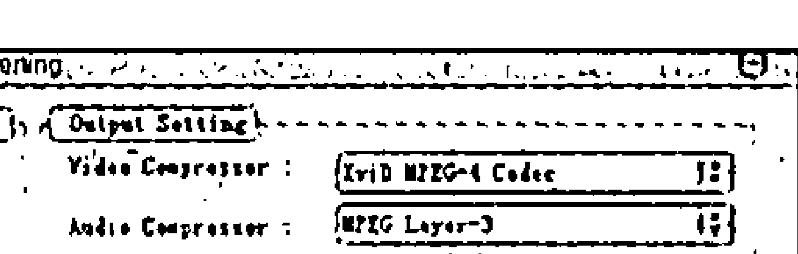

第四步：在 Ultra WMV Converter 点击工具栏上的“Execute”按钮，开始转换视频。

### （6）MOV Converter 转换 MPEG-4

第一步：访问 http://www.skycn.com/soft/24286.html，下载 MOV Converter 的测试版并安装。

第二步：运行 MOV Converter，点击“ADD”按钮添加 MOV 文件。然后确认“Output Format”为“AVI/DivX”、“Video Code”为“XviD MPEG-4 Codec”、“Audio Code”为“MPEG Layer-3”。接下来在“Width/Height”下拉列表中设定输出文件的尺寸，“Framerate”（帧速率）处设置为“Original（和源文件一致）”。

第三步：设置完成后，点击“Convert”按钮开始转换。

## 3. WMV 格式移动视频的制作

### （1）使用“超级转换秀”将 DVD 转换为 WMV

刚刚笔者已经介绍了用“超级转换秀”将 RMVB 转换为 AVI 的方法，但实际上“超级转换秀”的功能还不只如此，现在我们就来看看用“超级转换秀”直接转换 DVD 为 WMV 的方法。

第一步：运行“超级转换秀”，点击“视频转换通”切换到视频转换界面，然后点击“添加待转换视频”将需要转换的 WMV 文件添加到转换列表中。

第二步：在“超级转换秀”的设置界面设置转换后的格式为 WMV。然后在“导出 WMV 格式参数设置”下拉列表中选择配置文件为“Windows Media Video 8 for color Pocket PC”。

第三步：如果对“超级转换秀”提供的配置文件不满意，用户也可以自行定义配置文件。方法是点击“创建新配置文件”按钮进入 WMV 配置文件窗口，首先为配置文件命名，接下来视频流属性栏设定视频编码器为“Windows Media Video 9”、编码率为 250000BPS、质量为 100、宽和高按比例设定成自己设备支持的尺寸。最后设置音频编码器为“Windows Media Audio 9.1”，音频格式为“64kbps,44khz,stereo CBR”后点击“确认并创建”按钮即可。这样回到视频设置窗口后，你就可以在“自定义 WMV 质量”处选择刚刚定义的配置文件了。

第四步：全部设置完成后，点击“确认”按钮回到主界面，然后点击“开始转换”按钮即可。

### （2）使用 DVD To Pocket PC 将 DVD 转换为 WMV

“超级转换秀”虽然功能强大，但需要花钱注册才能获得全部功能，而且对初学者来说使用稍嫌复杂。因此笔者在这里再为大家介绍一款专门转换 PPC 视频的工具——DVD To Pocket PC。

第一步：访问 http://download.enet.com.cn/html/201772004021901.html，下载 DVD To Pocket PC 并安装。安装过程中会提示用户是否安装 Windows Media Encoder，如果机器上已经安装了该软件，可以点击“否”略过。

第二步：插入 DVD 视盘，运行 DVD To Pocket PC，点击“Open”按钮打开 DVD 索引文件，然后在“Select Movie”列表中选择对应的视频片段。

第三步：选择“Option→Setting”命令进入设置面板，该设置面板主要用于设定临时文件的目录和视频的解析度。DVD To Pocket PC 只提供了 QVGA（320 × 240）和 VGA（640 × 480）两种选项，后者对于多数 PPC 来说，可能显得太大，因此实际使用中我们还是以 320 × 240 为主。

第四步：设定完毕，点击“Action”按钮开始转换。

### （3）将 RMVB 转换为 WMV

RMVB 和 WMV 作为流媒体领域的死对头，按说它们之间的互相转换应该是很困难的，但实际上却并非如此，我们只需要使用暴风影音和 Windows Media Encoder 就可以解决这个问题。

第一步：安装暴风影音，它的作用是通过一个第三方的 RM/RMVB 编/解码器来使得 Windows Media Encoder 能够识别 Real Media 格式。

第二步：下载 Windows Media Encoder 9.0 中文版并安装。运行后点击“源”选项卡，设定来源类型为“文件”，然后点击“浏览”按钮来选择要转换的 RMVB 文件。

第三步：点击“输出”选项卡，切换到输出面板，勾选“编码为文件”选项，并点击“浏览”按钮设定输出文件夹和文件名。

第四步：点击“压缩”选项卡，进入压缩设置面板，点击“编辑”按钮打开用户自定义界面，在“音频”和“视频”选项中分别设定编码模式为“CBR”，编码为“Windows Media Audio/Video 9”。接着切换到另一设置面板，在这里设置音频属性、视频大小、帧速率、视频比特率等参数，设置完成后点击“确定”退出。

第五步：点击工具栏上的“开始编码”按钮，开始转换 WMV。

## 4. Real Media 格式视频的制作

Real Media 被采用 Symbian 和 Linux 操作系统的智能手机广泛支持，这节主要就是介绍 Real Media 格式的移动视频制作。

第一步：访问 http://www.skycn.com/soft/13237.html，下载 Batch Real Producer V1.5.3.1 简体中文版。

第二步：在 Batch Real Producer 的工作界面点击“添加文件”按钮，选择需要转换的源文件。Batch Real Producer 支持相当多的视频格式，一般来说，只要用户操作系统中能够被 Windows Media Player 识别并播放的格式，都可以导入转换。

第三步：将压缩设置设定为选择“采用固定编码”，编码率设定为 100kbps~250kbps（具体设置视机型而定），视频编码为“Real Video 8”，音频质量则不要超过 96kbps。然后勾选“画面大小变为”选项，将输出文件尺寸设定为你的设备支持的解析度。

第四步：点击“输出路径”按钮，为输出的视频文件选择一个输出目录并命名。最后点击“开始压缩”按钮即可。

注意：虽然 Real Media 提供了动态编码方式（VBR），RMVB 格式的视频质量也更好，但在目前大多数便携设备能够支持的解析度下，RMVB 在视频质量上的优势很微弱，而且不少设备也不支持它的播放，这就是我们选择了“采用固定编码”的原因。基于同样的原因，在转换文件时候，笔者建议用户还是可以使用较老版本的编码。

## 5. 使用 Xenon 2.0 Pro 制作 3GP 视频

Xenon 可说是目前最好用的 3GP 制作工具，几乎支持当前所有流行的视频格式，下面就来介绍它的使用方法。

第一步：访问 http://www.vidiator.com/xenon2.php，下载 Xenon 2.0 Pro 的测试版并安装。

第二步：运行 Xenon，直接点击主界面上的“Select Source File(s)”按钮，选择需要转换的视频文件。

第三步：点击“Encoder”按钮，在弹出的下拉菜单中选择编码类型，目前 Xenon 2.0 Pro 有 5 种编码器可供选择，分别是 3GPP Encoder、3GPP2 Encoder、KWISF Encoder、MobileMP4 Encoder 和 RealMedia Encoder，在这里我们选择了“3GPP Encoder”，如图5所示。

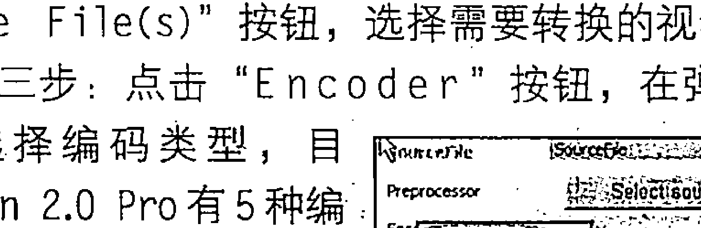

第四步：双击“3GPP Encoder”，打开编码设置面板，用户可以在这个面板里设置视频的尺寸、帧速率，比特率和编码模式等等。用户可以依照自己使用的手机类型设置。需要说明的是 Xenon 2.0 Pro 提供了 H263 和 MPEG-4 两种编码方式来生成 3GP 文件，它们在编码效果上差别不大，但有的手机不支持 MPEG-4 编码，因此笔者建议采用 H263 编码。

第五步：点击 Profile Setting 面板上的“保存”按钮，将这次的设置参数保存为“PROFILE”，下次即可以直接调用该文件，省去再次设置的麻烦。

最后，点击“OutputFile”按钮，设定输出文件的路径和文件名。接着点击“Submit Job”按钮开始转换即可。

## 6. 制作 PDB 格式视频文件

PDB 是早期 Palm 产品的专用视频格式，因此用户可以选择的转换工具不多，这里介绍的就是 PDB 专用工具——Kinoma Producer 3.0。

第一步：访问 http://download.enet.com.cn/html/191672003070901.html，下载 Kinoma Producer，它的运行需要 QuickTime 的支持，因此需要先安装最新版本的 QuickTime 播放器。

第二步：点击“Add File”加入需要转换的视频文件，然后在 Brand、Model、Setting 三个下拉选项中选择自己使用的 Palm 的厂商和型号，以及 Kinoma Producer 针对该型号 PDA 的预制编码方案。选择完毕后，Kinoma Producer 将会按照你选择的设备型号和预制方案自行设定编码参数。而用户这时只需要在“Export Location”选择输出目录后点击“Convert Files”按钮开始转换即可。

第三步：Kinoma Producer 虽然提供了很多预设编码，不过显然不能覆盖所有的硬件设备，因此如果您使用的 PDA 没有出现在 Kinoma Producer 的设备清单中，就需要自行设置参数。方法是直接点击“Audio & Video”选项卡，切换到视频参数设置界面。由于该面板提供的参数比较多，初次使用 Kinoma Producer 的朋友可能会感到无所适从，因此笔者将这些参数的详细作用说明如下。

File Format（文件格式）：Kinoma Producer 目前支持 Kinoma Movie（*.pdb）、MPEG-4（*.mp4）和 QuickTime Movie（*.mov）三种视频文件格式的输出，用户可根据自己的实际需要选择输出类型。

Video Format（视频格式）：Kinoma Producer 3.0 提供 4 种视频格式，分别是 MPEG-4、H263、Cinepak Mobile 和 16 Grays。

其中 Cinepak Mobile（移动全景模式）是一种使用最多的编码模式，但在较新的设备上已经不推荐使用。而 MPEG-4 不仅适合所有文件格式的输出，并且视频质量好，但生成文件大，对硬件要求也高，并且需要高版本的播放器才可以播放。H263 视频质量不如 MPEG-4，而且视频大小被限制在 352 × 288 以下，但输出文件尺寸却更小。16 Grays 则适用于使用 16 级灰度液晶屏的设备，它只用于 PDB 文件格式的输出。

Frame Per Second（每秒帧速率）：每秒钟播放画面的帧数。

Bit Rate（视频比特率）：Bit Rate 是决定最终生成视频的质量和大小的决定因素，高比特率可以获得较高的视频质量，而生成的文件尺寸也相应增加。需要注意的是：不是所有的 Palm 都能够支持高比特率视频的播放，因此一定要根据自己设备的硬件情况设置。

Audio Format（音频格式）：Kinoma Producer 有以下几种音频编码方式。

*   AAC：即高级音频压缩，这种格式压缩比高，音效好，但是在播放时需要新版本的 Kinoma Player EX 3.0 支持。
*   ADPCM：自适应差分脉冲编码调制，基本原理是利用对过去的几个抽样值来预测当前输入的样值，并使预测电路具有自适应的预测功能与实际检测值进行比较，随时对测得的差值自动进行量化级差的处理，使之始终保持与信号同步变化。同 AAC 格式相比，ADPCM 只能提供较好质量的音频压缩。但另一方面，它的适应性非常好，几乎所有的 Palm 都支持它。
*   CLIE AUDIO：针对 SONY CLIE 系列的专用格式，音效非常好。
*   Uncompressed（未压缩）：声音信号不经过压缩处理，好处是兼容性好，降低了音频解码的资源消耗，缺点则是增大了输出文件的大小。

Audio Channels（声道）：这里可以选择输出音频为立体声还是单声道。

Sample rate（设备采样率）：模拟音频转成数字音频的过程就称作采样，即通过波形采样的方法记录 1 秒钟长度的声音需要多少个数据。44KHz 采样率的声音就是要花费 44000 个数据来描述 1 秒钟的声音波形。原则上采样率越高，声音的质量越好。但操作时还要根据源和设备的实际情况选择适宜的采样率，况且高采样率必然要加大系统的开销。

Bit rate（音频比特率）：同视频比特率。

Audio Boost（音量）：这个选项可以在音频源的基础上进行声音的再处理，以达到提高或者降低声音的效果。由于 PDA 产品内置的扬声器多半效果都很差，因此这个功能还是很有用的。

第四步：按照自己使用 PDA 产品的实际情况设置参数，然后点击“Save As Preset”，将这次的设置参数保存为用户自定义预制方案，下次可以直接调用。接下来在“Layout”面板设置与播放界面有关的参数，如画面大小、背景大小以及颜色等等。最后点击“Convert File”按钮进行转换。

## 第二篇 HD 高清视频的制作

## 7. 制作 DMV 视频

### 一、HD高清视频的来龙去脉

第一步：访问 http://www.digilife.com.cn/new/download.asp，下载并安装 DMV Tools 2，注意：该工具是 DEC 中恒在其 MP3 产品中随机附带的，但用户也可以利用它为别的 MP3 设备制作 DMV 格式视频。

### 1. HD高清视频的特点

说起 HD 高清视频必然要提到 HDTV（高分辨率电视），它是用于未来数字电视媒体领域的一个新的多媒体标准，大致具备以下几个特点。

第二步：运行 DWM Tools，点击“添加”按钮将要转换的文件添加到转换列表。

### （1）纯数字化

第三步：点击“设置”按钮，DWM Tools 会弹出设置界面，首先在“输出”面板中进行输出参数设置，这些参数如下。
输出目录：输出 DMV 文件保存的位置。
分割文件大小：DMV Tools 2.0 支持输出文件分段保存，方法是输入目标文件的尺寸，DMV Tools 2.0 将自动按照这个尺寸将视频输出到 N 个文件中。
输出音频：可用于设置输出视频的声道，当我们要转换的文件是双语影片时，就可以通过设置只输出左声道或者是右声道来达到只保留一种声音的目的。

和传统的模拟技术不同，HDTV 一开始就定位于数字电视平台，因此 HDTV 的制作、播出、传输和存储等全过程都使用数字技术。全数字化避免了模拟方式在信号上的损失，因此在提高音视频品质方面带来的好处是不言而喻的。

### （2）极高的音视频质量

HDTV 规定了视频必须至少具备 720 线非交错式（720p，即常说的逐行）或 1080 线交错式隔行（1080i，即常说的隔行）扫描，而普通 DVD 标准才不过 480 线，这意味这 HDTV 最高可以达到 1920 × 1080 像素的分辨率。对比 DVD 视频 720 × 576 的分辨率，可以想象 HDTV 惊人的清晰度。
音频上，HDTV 支持大家已经相当熟悉的 AC-3 音效，可以提供真正的环绕立体声效果。

第四步：切换到“位率”面板，设定输出文件的编码率和尺寸，点击“确定”按钮应用设置。最后点击控制栏上的“制作”按钮即可开始转换。

### （3）真正的宽银幕

标准的 HDTV 采用 16:9 的长宽比，这和电影宽银幕的长宽比是一致的，据称这样的比例更加符合人的视觉习惯。但 HDTV 也可以兼容过去 4:3 的长宽比。

表2
| 转换过程 | 用到的工具 | 下载地址 |
|---|---|---|
| DVD转换为MPEG-4 | Xmpeg | http://www.skycn.com/soft/1956.html |
| DVD转换为MPEG-4 | DVDX | http://www2.skycn.com.cn/soft/7442.html |
| VCD转换为MPEG-4 | 视频转换大师 | http://www.skycn.com/soft/15448.html |
| RM/RMVB转换MPEG-4 | 超级转换秀 | http://www.skycn.com/soft/17654.html |
| WMV转换MPEG-4 | Ultra WMV Converter | http://www.skycn.com/soft/21569.html |
| MOV转换MPEG-4 | MOV Converter | http://www.skycn.com/soft/24286.html |
| RMVB转换为WMV | Windows Media Encoder 9.0 | http://www.microsoft.com/downloads/ |
| DVD转换为WMV | DVD To Pocket PC | http://download.enet.com.cn/html/20172004021901.html |
| 制作Real Media格式视频 | Batch Real Producer | http://www.skycn.com/soft/13237.html |
| 制作3GP视频 | Xenon2.0 Pro | http://www.vidiator.com/xenon2.php |
| 制作PDB格式视频文件 | Kinoma Producer | http://download.enet.com.cn/html/191672003070901.html |
| 制作DMV视频 | DMV Tools 2 | http://www.digilife.com.cn/new/download.asp |

## 综上所述，我们可以给HD高清视频下一个简单的定义

一般来讲，无论采用何种编码进行压缩，只要水平清晰度达到720线以上的视频文件，都可以称为HD高清水平。它们常见的解析度为1920×1080（16:9）、1280×720（16:9）、1440×1080（4:3）几种。比特率一般都在5Mbps以上，音频以5声道立体声为主。

## 2. 播放HD高清晰视频的电脑配置

### (1) 硬件配置

很多朋友认为如今硬件的发展如此迅速，看个视频节目早已是小菜一碟了，但到了HD高清视频时代，这个观点也需要“与时俱进”了。因为播放HDTV需要的硬件配置非常之高，下面我们就来看看播放标准的HD高清视频到底需要什么样的硬件配置。

-   * CPU
无论采用何种压缩算法进行编码，HDTV文件都具有很高的压缩率，在播放时需要非常高的CPU运算能力来进行实时解码，因此播放HD高清视频最低要求也需要1.4GHz的CPU方可流畅观看。如果是播放采用微软WMV-HD格式编码的视频文件，CPU要达2 GHz级别。

-   * 内存
HDTV解码过程中要占用大量缓存，因此256MB的内存播放起HD高清视频是很吃力的，推荐512MB及以上。

-   * 显卡
HD高清视频对显存的要求不比3D游戏差，一般来说64MB的显卡是很难胜任HDTV视频播放的。因此具备128MB显存的显卡几乎是必备的。如果是那些支持MPEG2 TS硬解码的显卡产品则效果更佳。

-   * 显示器
越大越好。其实目前主流的显示设备，几乎没有什么产品可以满足播放HD视频的要求。不过即使这样，PC显示器也提供了大多数电视无法达到的分辨率，因此对这一点不必过于强求。

### (2) 播放HD高清视频需要的软件配置

-   * 操作系统
由于Windows XP很好地兼顾了系统的稳定性和性能。在多媒体方面的表现也比较突出，因此播放HD高清视频最好使用Windows XP。

-   * 播放软件
对于采用MPEG-2格式编码的视频文件，我们并不能简单地用WinDVD之类的播放软件来播放它们，因为它们采用的是MPEG2-TS格式，和DVD采用的MPEG-2编码有所不同。以往我们观看HDTV视频，需要分别下载安装MPEG2-TS格式分离器和解码器，比较麻烦，因此笔者在这里为大家介绍使用K-Lite Codec Pack + 暴风影音播放HDTV的方法。
第一步：访问http://www.skycn.com/soft/11343.html，下载K-Lite Codec Pack Full V2.54，它包含了目前绝大多数的音视频的编码/解码器，其中也包含HDTV的分离器和解码器。
第二步：安装K-Lite Codec Pack，默认情况下K-Lite Codec Pack会让用户自己选择需要安装的视频编码，但如果您对各种编码不是很了解的话，可以选择安装全部编码。
第三步：访问http://www.skycn.com/soft/98.html，下载暴风影音V5.07正式版。安装以后就可以使用其内置的Media Player Classic打开扩展名为*.ts的HD高清视频文件了。
对于采用MPEG-4编码的视频文件来说，播放要简单得多：由于暴风影音本身就包含MPEG-4的解码器，因此只要安装过暴风影音后就可以正常播放MPEG-4压缩的高清视频。
对于WMV-HD格式编码的视频文件，笔者建议最好还是可以使用Windows Media Player作为播放工具，一来自家的东西兼容性必然不错，二来一旦有什么编码更新，Windows Media Player将会自动联机下载，使用起来也方便了不少。

### (3) 系统优化

除非你的机器配置非常好，否则播放HD高清视频之前，必要的优化工作还是要做的，它们主要包括：升级DirectX到最新的9.0，保证显卡的驱动为最新的稳定版本；播放HDTV前关闭所有没有用的后台程序或进程，尽量增加系统的空闲资源；开始播放后可以打开任务管理器，将播放器的进程级别设置为最高，这样系统可以分配更多的资源给播放器。

## 3. 获取HD高清视频素材

就目前来讲，数字电视还没有取代PAL和NTSC电视标准，而数字电视的普及更不知是什么时候的事情，因此用电脑观看HD高清视频成了很多朋友的最佳选择。但实际上，用户能够找到的节目源实在有限。对于那些有心制作HD的人来说，符合标准的节目源就更难寻觅。所以这一节的主要任务就是为大家介绍一些HD视频的获取渠道。

### (1) 通过高清数码摄像机获取

随着技术的进步，民用DV产品的清晰度也在不断增高，目前已经有不少产品支持720线或者1080线的水平解析度。毫无疑问，用这些DV拍摄下来的视频，是可以作为HD高清视频素材的，而这些摄像机也有了一个新的称谓——HDV。
目前符合HD标准的DV产品主要有JVC GY-HD100U、SONY HDR-HC1、松下AG-HVX200等等。不过它们的价格都在2万~5万，进一步的推广还有很长的路要走。

### (2) 通过EVD获取

除了HDV之外，EVD(Enhanced Versatile Disk)作为DVD的升级产品，也是一个不错的视频来源，它最高能提供超过DVD五倍的解析度，完全符合HDTV的标准。
不过另一方面，虽然EVD能够支持很高的清晰度，但目前来讲，EVD是否可以普及还是一个未知数，因此市面上难得见到EVD设备和碟片。

### (3) 网络获取

前两种方式对于一般的视频爱好者来说，显得多少有些遥远。因此对于大多数朋友来说，从网络上获取HD高清视频素材就是个最实际的办法，因为现在不少网站都提供了高清视频的交流和下载，只要勤于搜索，应该还是有所斩获的。

## 二、制作HD高清视频

## 1. 制作AVI格式的HD高清视频

-   第一步：下载AVI制作/编辑工具——VirtualDub 1.53，该软件无需安装，直接将压缩包解压即可使用。
第二步：运行VirtualDub，使用“File→Open Video File.”命令选择需要转换的视频文件。
第三步：点击“Video→Compression”，打开视频压缩编码列表，选中“XVID MPEG-4 Codec”，然后点击“Configure”按钮打开XviD编码的设置菜单。将“Target bitrate”滑块拖动至10000kbps，编码类型设定为“Two pass”（会消耗大量时间，用户可视情况决定是否使用）。
第四步：打开“Audio”菜单，将音频处理模式设定为“Full processing mode”。然后点击“Compression”选项，在音频压缩列表中选择音频压缩模式。
设置完成后，点击“File→Save as AVI”选项即可将视频源保存为MPEG-4的视频格式。

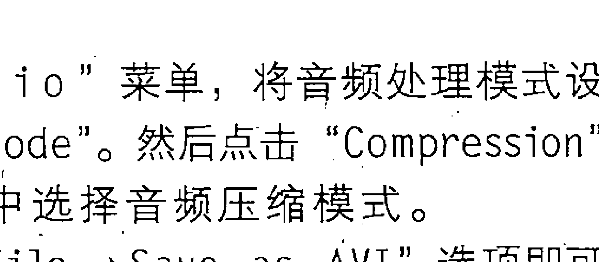

## 2. 制作WMV-HD格式的HD高清视频

-   第一步：下载微软专用的视频转换软件Windows Media Encoder 9.0并且安装它。
第二步：运行Windows Media Encoder 9.0，该软件启动时会出现一个“新建会话”向导，我们暂时用不上它，点击“取消”按钮关闭该向导。
进入Windows Media Encoder工作界面，点击属性按钮，在“源”面板设定“源来自”为“文件”，然后点击“浏览”按钮添加需要转换的素材文件。如图6所示。
第三步：点击“输出”标签，切换到视频输出面板，勾选“编码到文件”选项，然后设定输出文件的路径和文件名。
第四步：点击“压缩”标签，切换到编码设置面板，在“目标”下拉选项选择“文件下载（计算机播放）”，“视频”设定为“高清晰度质量视频(5 Mbps. VBR)”，音频则设定为“高清晰度质量音频(VBR)”。然后点击“开始编码”按钮即可。

第五步：按照Windows Media Encoder 9.0内置的配置选项，最多也就能输出1280×720尺寸的视频，这也就刚刚够上个高清晰的边。因此，我们需要自力更生，向1080线冲击。
在编码设置面板，点击“编辑”按钮，打开“自定义编码设置”对话框。首先选择音频编码为“比特率VBR”、“Windows Media Audio 9.1 Professional”，视频编码为“比特率VBR”、“Windows MediaVideo 9”。

点击右侧标签，切换到视频设置面板，首先选择音频格式为“384kbps，96kHz，5.1 channel 24bit VBR”（这已经是Windows Media Encoder能够提供的最豪华阵容了）。然后在“视频大小”中设定视频尺寸为“1920×1080”，“视频比特率”设定为“8000 Kbps”，如图7所示。

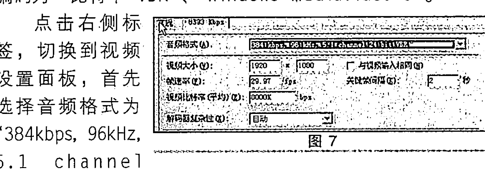

-   第六步：重新点击“常规”标签回到编码设置面板，点击“导出”按钮将目前的设置参数保存为Windows编码器配置文件，这样下次编码时就可以直接点击“导入”按钮来调用，省去了反复设置的麻烦。
全部设置完成后，点击“确定”按钮应用设置参数，然后点击“开始编码”按钮。

## 3. 制作RMVB格式高清视频

微软在流媒体行业的主要对头就是RealNetworks，虽然目前Real Media没有像微软那样大张旗鼓地推广HD高清视频，但RMVB出色的视频质量还是不能不提的。

-   第一步：访问http://www1.skycn.com/soft/1825.html，下载Real Media的专用制作工具——RealProducer V10.0.0.545 Plus并且安装（注意：安装过程需要序列号）。
第二步：运行RealProducer，点击“Browse”按钮选择源素材。
第三步：点击“Audiences”按钮，勾选“Resize Video to”选项，然后取消“Maintain aspect ratio（维持长纵横比）”，最后设定视频尺寸为1920×1080。
第四步：双击“Templates(模板)”列表中任何一个选项，打开“自定义编码”对话框。在“Templates name”处为新模板起一个名称。然后在“Variable bit rate”选项处将“Target average bit rate”设定为8000kbps，“Target Frame rate”则和源素材保持一致，接下来将音频设置为“268 kbps 5.1 Multichannel - RealAudio 10”。

设置完成后，点击“Apply”应用设置，这时RealProducer会生成一个新的模板文件，只要在模板列表中选中该模板即可应用刚才的设置。如图8所示。

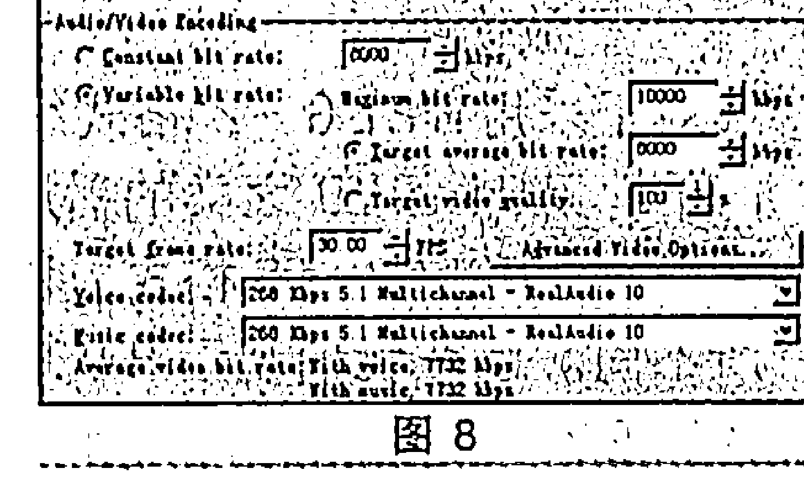

-   第五步：在默认情况下，RealProducer会将编码后的文件和源文件保存在同一个文件夹里，如果需要保存到其他位置，可以在主界面上的“Destination”窗口双击文件名，然后在弹出的“保存”对话框中选择新的保存路径。
全部设置完成后，点击“Encode”按钮开始编码。

注意：上面介绍制作HD高清视频的方法，无一例外地都采用了1920 × 1080的解析度。但那只是为了体现最高的质量。而实际操作中我们不一定能获取符合这个清晰度的素材，或者素材并非是16：9的长宽比。这种情况下如果强行将视频尺寸设置为1920 × 1080，很可能造成画面比例失调。因此在实际制作中，还是要根据素材的实际尺寸进行等比例缩放，或者保持原尺寸不变。

## 4. MKV格式高清视频的制作

上面介绍几种格式的高清视频的制作，但有的情况下，我们对制作好的HD高清视频并不满意：由于源的限制，它的音效不是很好；或许我们想为它添加多条字幕，但文件已经压缩完成，再处理又要花费大量的时间，非常麻烦。难道就没有更好的解决办法了吗？不用着急！目前网络上已经出现了一种视频格式，允许用户像“搭积木”一样地随意“装配”各种媒体文件，这种视频格式就是MKV。MKV是Matroska开发的一种媒体文件，严格来说它不能算是一种压缩格式，而是一种封装方式：简单来说，MKV可以将不同编码的视频和音频部分组合起来，发挥各自的长处，然后以一种多媒体介质的形式出现。它可以很灵活地支持多音轨和字幕，甚至可以像DVD那样定义段落，极大地扩展了原有编码的功能。下面我们就来介绍如何制作MKV格式的高清视频。

-   第一步：由于MKV仅仅是对现有媒体文件进行封装，因此需要我们已经制作好高清视频文件（它可以是RMVB，也可以是AVI），同时准备好新的音轨和字幕文件。
第二步：访问 http://www.ogg.cn/software/view-software-91.html，下载MKV格式的官方工具包Matroska toolkit，它包含了mkvtoolnix的运行环境、编/解码包和一个图形界面的制作工具。该工具为绿色软件，直接解压即可使用。需要注意的是：针对不同的操作系统，Matroska toolkit提供了Windows 98/Me和Windows 2000/XP两个版本，用户在使用时需按照自己的操作系统选择对应的版本。
第三步：双击mmg.exe，运行MKV的制作工具。点击“ADD”按钮将要合并的视频、音频、字幕文件一一添加到文件列表中。
第四步：选中音轨或者字幕，然后在“Track Option”选项中选择对应的音轨和字幕轨道。在“Global”面板设置输出路径。最后点击“Start Mixing”即可开始封装文件。由于无须对内容进行压缩，因此MKV的制作过程是很快的，大多数情况下，它只比复制同样大小的文件需要的时间长一点。

## 三、互联网上的HD高清视频资源

-   1. 微软高清视频频道
网址：http://www.microsoft.com/windows/windowsmedia/content_provider/film/ContentShowcase.aspx
介绍：这是微软为了推广WMV-HD而开设的站点频道，内容以介绍WMV-HD的技术特点为主，同时提供不少样片，大家可以随意下载这些视频片段，感受一下高清视频带来的视觉震撼。

2. VERYCD
网址：http://www.verycd.com
介绍：VERYCD在国内的知名度不用多说，它凭借EMULE作为主要交流手段，聚集了大批的“骡友”，属于超人气网站。提供的下载资源可以说是包罗万象。HD高清视频当然也在其中。从资源的丰富程度和获取的方便程度来说，VERYCD都是视频爱好者的首选站点。

3. HDTV中国
网址：http://bt.hd-tv.cn/
介绍：BTCHINA的联盟站点之一，以BT作为重要共享手段，它虽然没有VERYCD的资源丰富，但HDTV中国提供的视频节目很多都是真正意义上的HDTV节目。更新速度也比较快。当然，由于这些视频节目小的也有4、5GB，大的超过30GB，因此下载该网站的节目的时候，需先保证有足够的硬盘空间。

4. 思路HDTV
网址：http://bt2.btchina.net/silu/
介绍：和HDTV中国很类似的一个网站，同样以BT作为主要交流手段，资源质量比较高。

## PPT迅速瘦身携带传送更轻松

PPT的作用大，但常常因为图片多等原因个头也很大。动辄几十兆字节的体形自然行动不便，不但占用磁盘空间，不便于储存携带，而且作为邮件发送时，速度慢，还面临文件太大而被退回的风险。如果动用WinZip、WinRar来压缩，基本上压缩不了多少。有没有减肥的特效药？最快方法：利用NXPowerLite 1.54这个专业的PPT文档压缩工具，能够快速明显地为PPT减肥。

直接运行无需安装，内置高品质、标准、高压缩率三种压缩方式。只需将PowerPoint文件拖放到NXPowerLite图标上，选择压缩等级，然后点击“优化”按钮即可完成文件的优化过程。此外，它支持自定义压缩，可以让你在报告的品质和压缩比上寻求最佳的平衡点。压缩完成后，NXPowerLite能够将PowerPoint报告轻松压缩90%以上，在不明显降低质量的同时，极大方便了文件的处理、发布和使用。

## 高品质数字音乐的方方面面

## 1. 常见的高品质数字音乐格式及特点

本文着重介绍的是高品质数字音乐，因此自然要以无损压缩的音频格式为主，那么以这个标准来衡量，目前网络上流行的高品质数字音乐主要有以下几种:

### (1) WAV

这个无须多说，它是未经压缩的音频格式，音质自然也不会有什么损失。因此，WAV文件虽然有着体积过大的缺点，但凭借其完美的音质和极其良好的软硬件兼容性，仍然受到一些完美主义者的青睐。此外在我们制作高品质数字音乐的过程中，也离不开WAV文件作为中间载体。这也是本文将它列在首位的重要原因。

### (2) APE格式

APE是Monkey's Audio提供的一种无损压缩格式。从很多方面来讲，它都能算是目前最优秀的高品质数字音乐格式之一。它采用的无损压缩编码能提供WAV文件的音质，而体积却又比WAV小得多，同时又有较为广泛的软件支持。因此，APE已经成为目前最流行的高品质数字音乐格式。

### (3) FLAC

FLAC是Free Lossless Audio Codec的缩写，从这个名字我们就能看出它的两个主要特点：无损压缩和编码开放。虽然FLAC在音质和压缩比上比起APE没有什么优势，目前在互联网上的应用也远不如APE广泛，但源码开放的特性使它得以兼容几乎所有的操作系统平台，而且得到了很多硬件的支持，这是FLAC的一个突出优点。

### (4) WMA格式

看到小标题，很多朋友可能就忍不住会问，WMA不是一种极高压缩比的流媒体格式吗？怎么可能会是无损压缩？

先别急，这里提到的WMA，是WMALossless，它是微软自Windows Media 9后推出的全新的无损音频压缩格式。它同样使用了WMA作为扩展名，但却采用了无损压缩方法，可以提供完美的音质。联想一下微软的WMV-HD，再看看WMALossless，不能不说微软的野心实在不小。

### (5) AppleLossless

AppleLossless是APPLE推出的无损音频压缩格式，它和WMALossless有很多相似之处，都属于某个公司专用的音频格式，也都使用专用的播放器进行制作。由于幕后公司的强大实力，这两种格式还是占据数字音频市场的一席之地的。

### (6) MusePack (MPC)

MPC是由德国人Andree Buschmann开发的一种完全免费的高品质音频格式。严格地说它不能算是一种无损压缩格式。但是它的音质的确很出色，尤其是中高比特率下，MPC的表现非常的出众，因此也应该破格算它一个。

综上所述，各种高品质数字音频格式的主要特点，可以参见下表所示。

| 音频格式 | 扩展名 | 优点 | 缺点 |
| :--- | :--- | :--- | :--- |
| WAV | *.wav | 完全的无损格式，音频质量无可置疑 | 体积过于庞大 |
| APE | *.ape | 无损压缩，音频质量好，压缩率较高，应用范围广，资源获取容易 | 不能跨平台，缺乏硬件支持 |
| FLAC | *.flac | 无损压缩，音频质量好，压缩率较高，跨平台 | 目前应用范围较为有限 |
| WMALossless | *.wma | 无损压缩，音质好，有大厂商支持，有一定的软件和硬件支持 | 厂商专用格式，推广范围有限 |
| AppleLossless |  | 同 WMALossless | 同 WMALossless |
| MPC | *.mpc | 压缩比高，音质较好 | 音质不如采用无损压缩格式的音频，且应用范围较为有限 |

## 2. 影响音频质量的主要因素

采用无损压缩编码的确可以大幅度地提高音频质量，但并不是说只要用了无损压缩格式就万事大吉了，因为影响音频质量的因素还有很多，主要是以下 2 种。

### (1) 音频源的质量

由于我们追求的是高品质数字音乐，那么制作它的音频源也必然需要是高品质的。对于音频来说，它取决于采样频率、数字量的位数（简称量化位数）以及声道数。前两者当然是越高越好。至于声道，在满足了立体声的前提下，具体的情况还要视硬件情况而定。

以上所说的反映在实际应用中，就是对音频源的选择问题。一般来说，制作高品质音频文件，首选的音频源主要有原版音乐CD、DVD、未经压缩的WAV文件以及其他无损压缩格式的音频文件。

### (2) 软硬件环境的影响

用EAC转换过CD的朋友都知道，EAC之所以成为转换音轨的首选工具，一个重要的原因就是它可以很好地解决CD-ROM不能顺畅读取CD的问题。这就引出第二个影响音频质量的因素：软硬件环境。

硬件方面，光驱的老化导致不能顺畅读取CD，往往会导致生成的WAV文件出现杂音、爆音现象。对于喜欢翻唱的朋友，录音用的麦克风、录音的环境甚至机器配置都可能影响录音效果。对于这些因素，我们的对策自然是尽可能地采用较好的硬件产品。

而在软件方面，不同工具转换的效果往往也可能有## PART 3 高品质数字音乐面面观

所不同。建议大家还是使用口碑较好的工具进行音频转换。此外，由于目前音频视频格式非常多，导致不少人机器上都一股脑地装了N个版本的编码、解码器。这就不可避免会产生一些冲突，导致一些奇怪的问题产生。对于这种情况，建议大家可以安装两个操作系统，用那个比较“干净”的系统进行音频转换工作。

### 3. 高品质数字音频的播放

在过去，欣赏高品质数字音频还是要费一番工夫的，因为不少格式都需要专用播放器，或者在现有播放器的基础上安装插件才可以正常播放。不过，现在这个问题基本上已经不存在，因为目前网络上已经出现了不少“通吃”型的媒体播放器，比如著名的暴风影音。安装完后不仅本身基本上可以支持我们刚刚介绍的音频格式，连Windows Media Player也都可以支持这些格式了。因此，对于大多数朋友来说，使用暴风影音的确是个省心的选择。

### 获取高质量的音频源

目前很多工具已经支持将CD或者DVD中的音轨直接转换为APE等无损压缩音频格式。但一来这样的直接转换不一定能够保证最佳的质量，二来也不是所有的格式都可以这么一步到位。因此这一节的主要内容就是介绍将各种音频源转换为WAV格式。

### 1. 将CD转换为WAV

目前转换CD音轨的首选工具依然是EAC，我们可以通过以下几个步骤来熟悉它的操作。

- 第一步：访问http://www.skycn.com/soft/7885.html，下载EAC并解压缩后即可运行。首次运行时EAC会弹出一个设置向导，用户可根据向导一步步对软件运行时的主要参数进行配置。

- 第二步：将音乐CD插入CDROM，运行EAC，它的工作界面如图1所示。理论上这时我们只要按下F5就可以开始转换了，但我们选择EAC就是为了最大限度地保证转换的质量，因此还需要进行一些必要的设置。

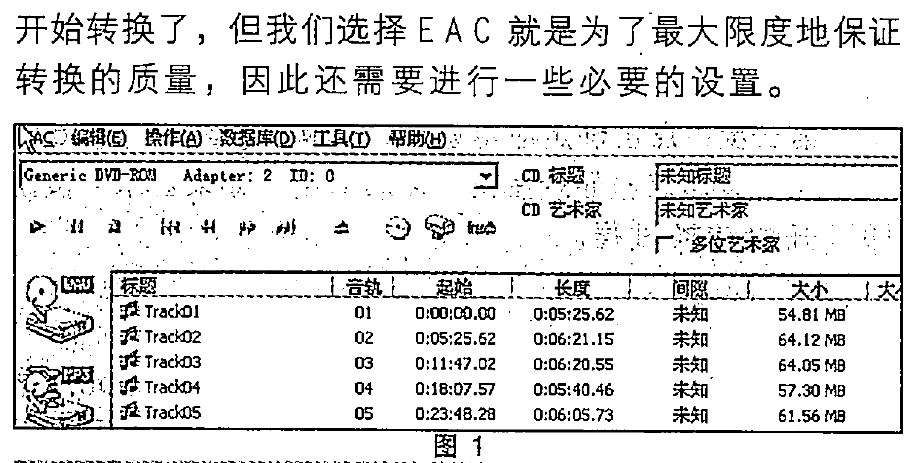

- 第三步：点击菜单栏上的“EAC - EAC选项”，打开设置窗口，在抓取一栏设置纠错品质为“高”。然后切换到常规一栏，勾选“使用备用CD播放方法”。接下来切换到“文件名”一栏，勾选“使用多艺术家命名方案”，然后按照下方的提示编辑文件名格式。

- 第四步：点击菜单栏上的“EAC - 驱动器选项”，插入一张划痕较为严重的Audio CD，分别进行读取特性和检测C2特性检测。检测完毕后EAC会自动进行对应的配置。

现在插入一张完好的Audio CD，切换到“驱动器”栏，单击“现在自动检测读取指令”按钮，EAC会自动测定你的驱动器适合哪种读取指令。检测完毕后勾选“抓取之前先转动驱动器”这项，这样在读取CD的时候会更稳定些。

切换到“偏移/速度”栏，勾选“使用读取采样偏移校正”，然后“点击测试采样偏移校正按钮”进行测试，建议可以多测试几次，以得到最准确的参数。当然，采样偏移也可以手动进行设置，用户可以访问诸如http://www.accuraterip.com/driveoffsets.htm这样的网页，上面列出了常见驱动器的偏移参数，如果能在上面找到自己的设备，就可以按照网页上给出的数据进行设置。

- 第五步：返回EAC的主界面，在右上方的文本框输入专辑名称等信息。然后点击左侧第一个带有WAV标志的按钮即可开始转换。

### 2. 从DVD中抓取音轨

除了音乐CD以外，DVD唱片或者视盘也是个不错的音频来源。下面我们就来介绍如何从DVD中抓取音轨。

- 第一步：从DVD中抓取音轨，需要用到Al DVD Audio Ripper，我们可以通过访问http://www.skycn.com/soft/19207.html来下载它的安装包并安装。

- 第二步：插入一张DVD光盘，运行http://www.skycn.com/soft/19207.html，点击菜单栏上的“File/Open DVD Root”，载入全部DVD文件。

- 第三步：选择需要转换的DVD音轨，点击菜单栏“Setting / Audio Setting”，打开音频设置窗口，在这里用户可以指定输出的文件格式和质量。设置完成后，点击“Apply”按钮应用。如图2所示。

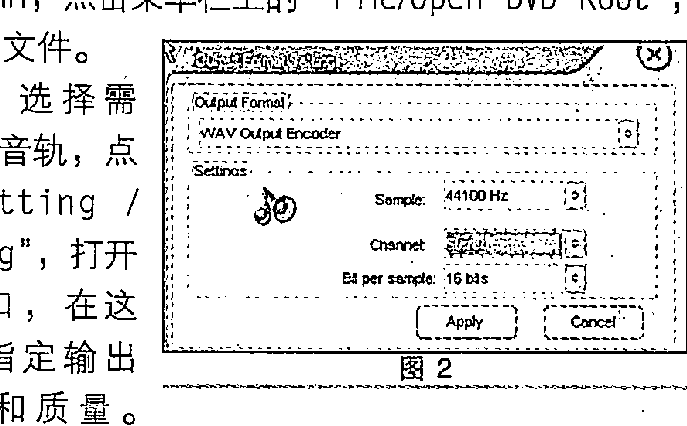

- 第四步：在Al DVD Audio Ripper的主界面，设置专辑名称、艺术家等附加信息。输出文件的路径后，点击界面右边的“Convert”按钮即可开始转换。

### 3. 将无损压缩音频格式转换为WAV

从网络上我们很容易获取各种格式的无损压缩音频文件，有时我们需要将它们转换为统一的格式，这就需要先将它们转换为WAV格式。

- 第一步：访问http://www.skycn.com/soft/1813.html，下载Easy CD-DA Extractor V8.2.3 Build 1，这是一个非常实用的音频转换工具，支持目前绝大多数音频格式的相互转换。

- 第二步：运行Easy CD-DA Extractor，在工作界面上方的文件浏览器中选择需要转换的文件，然后直接将它们拖放到转换列表。

- 第三步：在工作界面下方的“Output”面板，设定

### 桌面平台高品质数字音乐制作

### 1. 制作APE格式音频文件

- 第一步：访问http://www.skycn.com/soft/5262.html, 下载APE专用制作工具 Monkey Audio。目前的最新版本为3.99。

- 第二步：运行 Monkey Audio，工作栏上第一个按钮是用来选择工作模式的，由于我们是要压缩APE格式，因此可以保持为“Compress”不动而直接点击工具栏上的“Add File”，选取我们刚刚抓取的WAV文件。如果有多个文件，则可以点击“Add Folder”按钮添加整个文件夹下的内容。

- 第三步：单击菜单栏上第二个按钮，它的作用是选择压缩模式，有Fast、Normal、High、Extra High和Insane几项，默认值为Normal，其中Fast模式是最快的压缩模式，而Extra High则是压缩比最高，用户可按照自己的实际需要进行选择。这里需要注意的是：由于APE是无损压缩格式，因此无论用户选择了哪种压缩模式，都不会影响生成文件的音质，所不同的仅仅是文件的尺寸和压缩时间的区别而已。

- 第四步：设置完成后，点击“Compress”按钮开始转换。

### 2. 使用FLAC工具包制作FLAC格式音频

- 第一步：访问http://flac.sourceforge.net/download.html, 下载FLAC工具包并安装。它包含有全套的FLAC格式制作工具，并带有FLAC的一个外壳工具和各种Flac播放器插件。

- 第二步：运行FLAC的外壳工具 FLAC Frontend。弹出如图3所示的工作界面，点击“Add Files”按钮添加WAV文件。

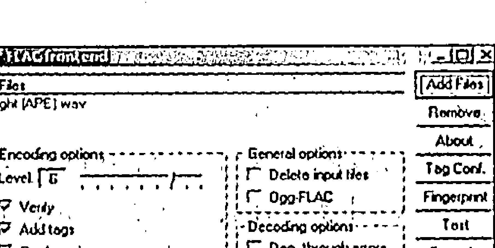

- 第三步：FLAC的设置比较简单，一般情况下，只要在FLAC Frontend工作界面使用鼠标拖动“Level”处的滑块设定压缩等级，其他使用默认设置已经足够，设置完成后要直接点击“Encoder”按钮即可开始转换。

### 3. 使用Easy CD-DA Extractor制作FLAC格式音频

FLAC的官方工具包使用起来虽然不难，但却有一个大BUG——FLAC Frontend 对中文的支持不好。因此如果需要转换大量中文名称的WAV文件，选择FLAC Frontend 显然是不行的。

遇到这种情况，可以使用我们刚刚介绍的Easy CD-DA Extractor，它可以广泛地支持目前流行的无损压缩格式文件的相互转换，使用起来也极其简单。

- 第一步：运行Easy CD-DA Extractor，将需要转换的WAV文件拖入转换列表。

- 第二步：设置输出格式为FLAC，并在下面的下拉选项设定压缩等级。

- 第三步：设置输出路径，然后点击“Convert Files”按钮进行转换。

### 便携平台高品质数字音乐制作

刚刚介绍了APE和FLAC格式音频文件的制作，这些格式虽然在音质上无可挑剔，但是APE格式缺乏硬件支持，完全不适合便携设备的播放。即使是FLAC格式，目前也只有少数硬件支持。因此，想在MP3播放器等便携设备上享受高品质的数字音乐，还必须考虑到硬件的支持情况。

### 1. 制作WMALossless文件

由于微软推出了WMALossless格式，因此购买了MP3播放器的朋友可以马上制作一个WMALossless格式的音频，并保存到你的便携设备上试听，如果可以播放，那么恭喜你，因为以后你就可以在便携音频设备上享受到真正的高品质音频了。以下是WMALossless的制作步骤。

- 第一步：确保操作系统中安装的Windows Media Player版本为9.0或更高。这是因为WMALossless需要新版本播放器和编码器的支持。

- 第二步：将音乐CD插入光驱，运行Windows Media Player。点击菜单栏上的“工具/选项”，打开设置界面并切换到翻录音乐面板，在格式下拉选项选择“Windows Media 音频无损”。然后拖动滑动条设置质量等级，基本上来说，当质量为最低时，比特率为470kBps,压缩比为3:1,而质量为最高时，比特率为940kBps，此时压缩比在1.5:1左右。具体采用什么设置，可根据自己便携播放器的存储容量而定。

- 第三步：点击确定应用设置，在Windows Media Player界面点击翻录按钮。然后点击“翻录音乐”按钮即可开始转换过程。

### 2. 制作AppleLossless

提到便携式音频设备怎么能忘记了APPLE的ipod, 这款苹果专用的音乐播放器支持自己独特的无损压缩音频格式，这就是AppleLossless。

- 第一步：访问http://www.skycn.com/soft/16468.html, 下载苹果专用的音乐媒体播放器iTunes，它同时也可以用于AppleLossless的转换。

- 第二步：运行iTunes, 点击菜单上的“编辑→偏好设置”，打开设置界面，点击“高级”面板的“导入”选项卡，并将该选项卡下的“导入使用”下拉选项设置为“Apple LossLess编码器”。

- 第三步：现在插入音频CD，iTunes会自动检测音轨并将它们列于播放列表中。接下来在想要转换的曲目上单击右键，然后点击“转换所选内容到Apple LossLess”即可开始转换。iTunes也可以将WAV文件转换为Apple LossLess格式，只要将WAV拖到播放列表，然后进行同样的操作即可。

特别链接：Lame、CBR和VBR

MP3的出现虽然很好地解决了WAV文件体积过大的问题，但是它的音质还是经不起考验的。而LAME就是为了最大限度改善MP3格式音频的音质而诞生的。LAME编码出来的MP3音色纯厚、空间宽广、低音清晰、细节表现良好，它独创的心理音响模型技术保证了CD音频还原的真实性，音质几乎可以媲美CD音频，却依然保持了MP3文件体积小的优点。

### 3. 制作高品质的MP3文件

当然，不是什么便携音频设备都能支持WMALossless和AppleLossless的回放。不过即使这样，你也不用郁闷，因为我们完全可以使用LAME来继续挖掘MP3的潜力。

CBR（Constant Bitrate），常数比特率，指文件从头到尾都是一种位速率。相对于VBR和ABR来讲，它压缩出来的文件体积很大，而且音质相对于VBR和ABR不会有明显的提高。

VBR（Variable Bitrate），动态比特率，就是压缩软件在压缩时根据音频数据的实际情况即时确定使用什么比特率。它可以在保证质量为前提的情况下进一步地降低文件的大小，是目前较为先进的编码模式。

### （1）使用CBR方式制作高品质MP3

- 第一步：访问http://download.enet.com.cn/html/050412002011701.html，下载LAME最常用的外壳程序—RazorLame。它的安装非常简单，只要解开压缩包即可使用。

- 第二步：点击RazorLame.exe，运行RazorLame。点击“Add”按钮添加WAV文件到转换列表。

### 从网络上获取高品质数字音乐

虽然我们已经学会了如何制作高品质数字音乐，但如果每部音乐专辑都需要自己制作的话，相信没有谁有这么多的时间和精力。因此在这里将为大家介绍一些提供高品质音乐交流的网站，方便大家通过互联网来获取它们。

- 第三步：点击菜单栏上的“Edit/LAME Options”选项，进入LAME设置界面。首先在拖动“General”面板上的“Bitrate”滑块设置压缩比率，RazorLame提供了从8-320Kbps，一共18个级别。作为高品质音频来说，应该至少选择192Kbps的压缩比率，接下来在“MODE”选项选择声道为“Joint Stereo”（联合立体声）。最后在“Output directory”选项处设定输出路径。如图4所示。

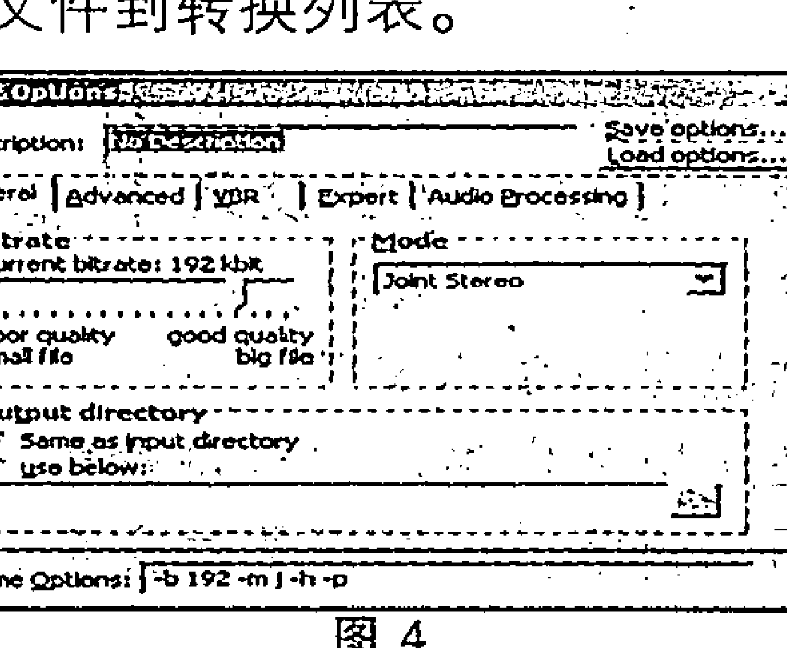

### 1. VERYCD

网站地址：http://www.verycd.com

简介：著名的VERYCD采用Emule（电骡）作为共享方式，其音乐频道提供大量的无损压缩格式的音频专辑下载，此外用户还可以通过Emule的搜索功能自行搜索高品质音频，其内容绝对可称得上是“海量”的丰富。

- 第四步：切换到“Advanced”面板，将“Optimization”选项设置为“Quality”（质量），这样可以达到最好音质。然后勾选“Include CR-C Checksums”（包含CR-C校验码）来确保转换过程中不会出现错误。

### 2. 伊美姬网

网站地址：http://www.imagegarden.net/bt

简介：伊美姬网本以提供大量的精美图片闻名，但同时也提供高品质音频的交流与下载，它的音乐殿堂频道以BT作为共享方式，提供了大量的APE格式的音乐专辑，其中不少还是市面上很难寻觅的珍品。除此之外，网站还提供非常详细的音乐制作教程，是一个音乐发烧友的好去处。

- 第五步：点击“OK”按钮应用设置。

### （2）使用VBR方式制作高品质MP3

### 3. HDCD论坛

网站地址：http://btl.btchina.net/hdcd/

简介：同样是以BT方式交流高品质数字音乐的网站，格式以APE为主。内容非常丰富，更新也很快。

LAME作为目前最好的MP3编码引擎，如果只有刚刚介绍的那两把刷子还是很不够格的。实际上我们制作MP3的时候，还可以选择VBR编码。方法是在LAME的设置界面切换到VBR面板，然后勾选“Enable Variable Bitrate(VBR)”选项即可。注意此时在“General”面板做的编码率设置将不再起作用。

## PPT切换“空屏”排除无关干扰项

常用PPT做演示时，听众常常会问一些问题，可能与正在放的这张幻灯片无关，而演示者需要把精力集中在问题上，或者在听众短暂休息时，一个页面停留在那里，让人感觉不太舒服。怎样快速地让屏幕显示空屏呢？

最快方法：在播放幻灯片视图中，按下“B”键就可以切换到“黑屏”，按“W”键则切换到白屏。之后按任意键又恢复到幻灯片放映视图。如果想得到更多快捷键信息，播放时按下F1键看看吧。

## 自己制作GIF动画

### 1. GIF动画原理

为什么画面会动呢？其实画面本身没有动，只是一幅动画是由很多幅不同的画面所构成，然后借助于人的眼睛里“视觉暂留”特性来达到“动”画的效果。一般来说不同的画面之间切换的时间少于0.1秒，我们的眼睛看起来就会觉得这些画面是连续的了。在众多制作GIF动画的软件之中，友立公司的GIF Animator可以说是最著名的一款，毕竟友立公司就是以制作“傻瓜化”软件驰名的。虽然现在GIF Animator已经有了6.0以上版本，不过我用来制作简单的GIF动画，用5.05版本已经足够了，在这个版本中，文字编辑、选色等都有不错的表现。

### 2. 动画制作步骤

- 第一步：启动向导

首先到网上去下载GIF Animator的5.05版本，安装完成之后第一次启动就会看到GIF Animator的“启动向导”了（见图1），这个向导能够帮助我们一步一步完成动画创作，因此绝对适合菜鸟来使用，不过这里打算从最基本的制作文字移动效果的动画开始，介绍制作GIF动画的原理，因此我们不需要使用“向导”，而是点击“空白”动画。

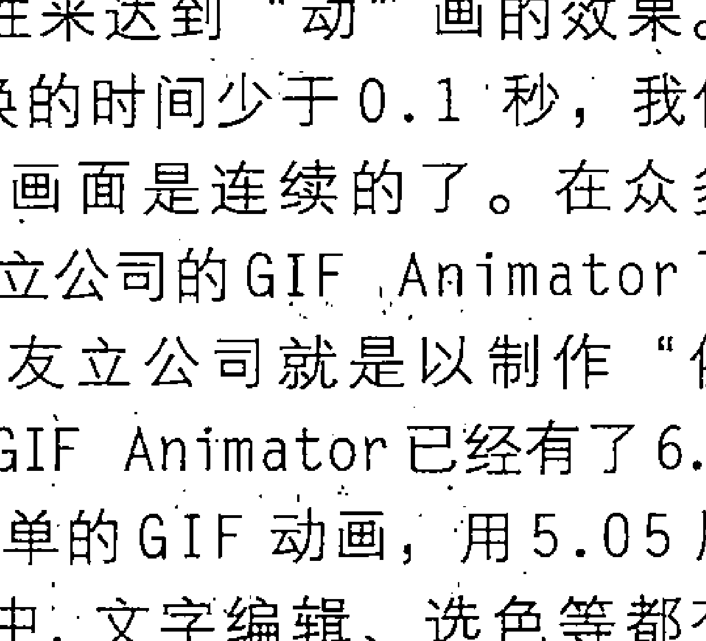

- 第二步：更改背景、前景颜色

一幅动画首先必须有背景和前景颜色，和Photoshop一样，GIF Animator也有背景色、前景色的选择，只要我们把鼠标移动到窗口左侧的前景、背景选取区上，光标将自动变成吸管状，点击鼠标之后就会出现配色器，在这里我们就可以设定背景和前景颜色了。

- 第三步：输入动画文字

由于要制作移动文字效果，先输入文字。用鼠标点击左侧工具栏上面的“T”（文本工具），然后在编辑区域里面点击一下，你就会看到弹出来的文本条目框（见图2），我们可以在这里设置字体、字号、颜色，当然还可以输入文字了。

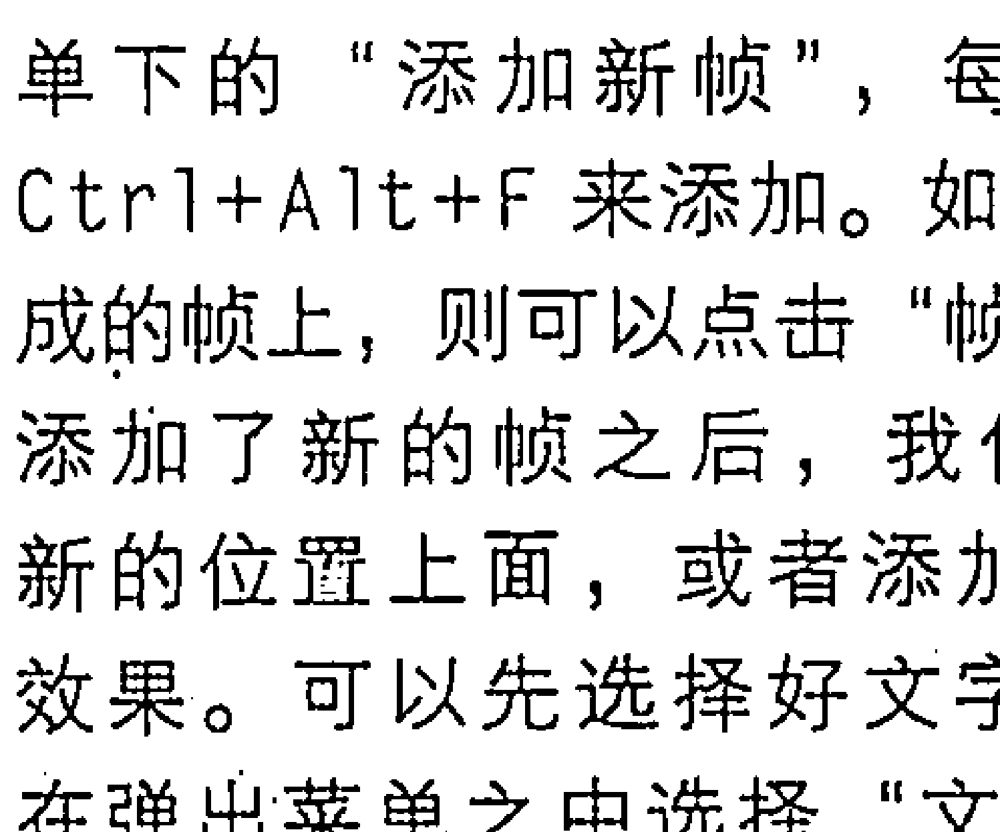

在这里我们输入“神舟六号”之后点击“确定”回到动画编辑区。如果还要对文字进行编辑，只要选择“文本工具”，然后在文字上面点击一下即可，如果我们要调整文字的位置，则一定要先在左侧工具条上点击箭头状的选取工具，然后再拖动文字到合适的位置。同时在窗口的右侧可以看到“图层”的显示。

- 第四步：添加新帧

只是一个单纯的文字也就相当于一幅画，并不能够动起来，需要再添加新的帧。点击“帧”菜单下的“添加新帧”，每一次可增添1帧，也可以按Ctrl+Alt+F来添加。如果要将前1帧的内容复制到新生成的帧上，则可以点击“帧” - “相同帧”，或者按Ctrl+F。

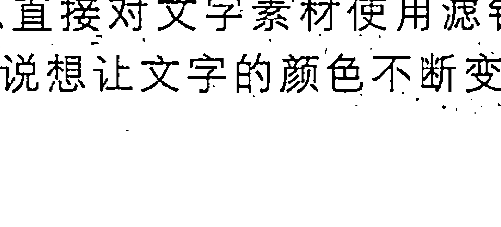

添加了新的帧之后，我们可以把这个文字移动到一个新的位置上面，或者添加一些别的效果，譬如“霓虹”效果。可以先选择好文字，然后在上面点击鼠标右键，在弹出菜单之中选择“文本” - “霓虹”，接着就会看到弹出来的霓虹设置对话框（见图3），在里面设置好方向、宽度、颜色即可。

- 第五步：用滤镜制作特殊动画效果

如果一帧一帧地拖动然后生成动画效果，这样的效率未免太低了，我们可以直接对文字素材使用滤镜来创建特殊动画效果。譬如说想让文字的颜色不断变换，## PART 3 菜鸟也能做动画

可以打开菜单“视频/FX” - “Camera Lens” - “Color Replace”，我们就会看到一个弹出窗口，在这个窗口里面设置当前滤镜使用多少帧，确定之后会出现一个详细的对话框，可以在播放进度条上单击加号按钮以增加变化锚点，每个锚点上可以设置不同的颜色，添加的锚点越多文字色彩的变化就越丰富。设置完成之后点击“确定”，然后点击窗口最下方的播放按钮，便可以见到文字的色彩变化效果了。

### 第六步：调整帧

有时候不同的帧各自的属性也不同，最明显莫过于帧的时间了。可以在帧列表上面的某一个帧上点击鼠标右键，在弹出菜单之中选择“画面帧属性”，就可以在弹出窗口（见图4）里面更改帧的延迟时间（单位是1/100秒）和移动方式了。

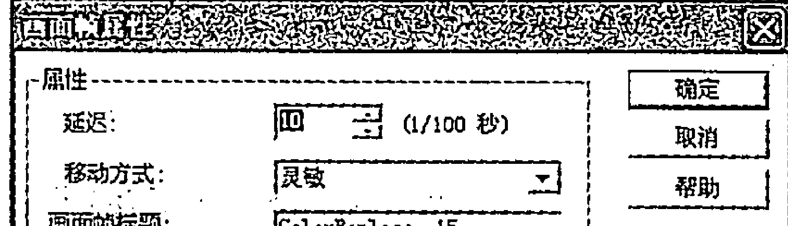

### 第七步：输出

现在动画制作已经完成了，我们可以把它输出成一个动态GIF。在输出之前，需要打开菜单“文件 / 优化向导”，通过优化来减少文件的体积，以便于在网络上快速传播。值得一提的是，GIF Animator 不但能够输出GIF动画，还能够把你的GIF动画输出成为Flash文件和可执行的EXE文件，别人就不需要用别的软件来浏览你的图片了。这时，我们可以点击“文件” - “另存为”，在弹出的窗口里面选择输出不同的动画文件格式即可。如果要生成exe文件，则要选择“文件”菜单下的“导出” - “导出为动画包”，生成的exe文件可以直接运行，不需要任何第三方软件支持哦！

### 制作3D动态贺卡

逢年过节，我们总会给亲朋好友送去贺卡，现在到了网络时代，贺卡自然而然也变成了电子贺卡了，你有没有想过自己制作一张带有3D立体效果，而且还是动态的贺卡给你的亲友呢？现在，我们不需要自己制作各种不同的3D模型，只要拥有3DGreetings，就能够非常方便快速地制作出效果惊人的3D动态效果来。

3DGreetings是一个专门用来制作动态3D贺卡的工具，可以用它制作出一个个极具个性的3D动画贺卡来，它里面有许多具有情节的贺卡类型供你选择。可以在里面任意添加贺词、添加图像和音效。最吸引人的地方就是它的贺卡生成之后都是exe文件，也就是可自行执行并且播放的贺卡，不需要任何软件支持！你完全可以把它当作邮件的附件发送出去，接收者无须安装任何软件，只要双击附件中的贺卡程序即可打开贺卡欣赏（当然前提是告诉对方这是贺卡而不是邮件病毒）。

首先，我们在http://dlb.pchome.net/design/image/3DGreetings12.exe下载3DGreetings的1.2版本，安装和使用整个过程虽然是全英文的，但其实是非常简单的。

软件启动的时候就会自动进入贺卡的制作界面，首先它会弹出一个窗口询问你需要制作什么类型的贺卡，一共有三种，分别是My Photo Card（我的相片卡）、Other Occasions（其他类别）和Thank you（致谢卡）。可以登录到http://www.3dgreeting.com下载安装自己喜欢的其他的类型。接下来我们就制作一张个人相片卡（My photo cards），选择之后点击“Next”按钮就进入了选择贺卡的模板界面。目前这里只有三种模板可供选择，其中photo cube就是指相片魔方了，点击这个模板之后，按“Finish”按钮就进入编辑主界面了（见图5）。在这个界面的左边是3D动态贺卡的预览效果，而下方则是两个控制按钮，我们可以执行“停止”和“播放”操作。

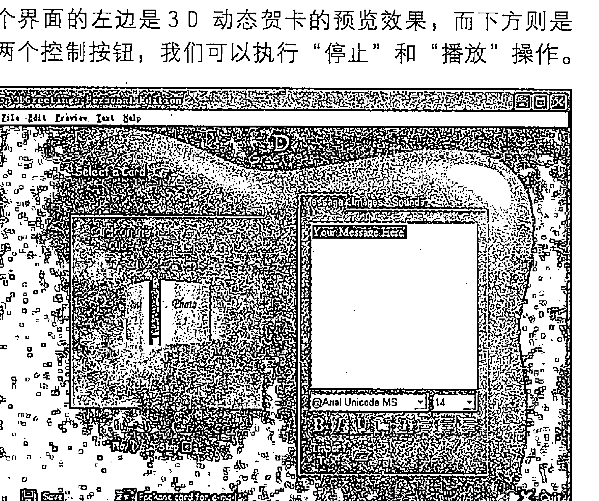

在主界面的右边是动画编辑区，里面一共有三个选项，缺省状态下显示的“Message”是一个文本编辑器，里面可以输入的祝福信息，而在“Images”选项里面，可以输入需要的图片，譬如说相片。只要点击“Import Image”按钮即可导入自己的图片了。这里要说一下的就是图片的顺序，这个“相片魔方”一共有4个面，加上背景就是五个面，可以给每个面都加上一幅图片。最后一个选项Sound就是让你选择贺卡所使用的声音了，除了可以使用系统默认的声音之外，也可以导入WAV格式的音频文件，虽说系统里面有多达上百种音乐可供使用，但是如果自己能够录制一段祝福语就最好不过了。

完成了所有的设置之后，我们就要保存我们的贺卡了，点击软件左下角的“Packed Card for Email”按钮，我们就会看到一个弹出窗口，这就是导出向导了，点击“Next”之后它会询问我们将贺卡保存在哪里，在对话框的下面有一个“Frame Style”，这里可以选择一个边框的样式。选择和设置完毕之后点击“保存”，我们就得到贺卡文件了，赶快给你的亲人送去吧。

### 把你的屏幕操作录下来

有时候一些电脑高手在网上被一些菜鸟缠着问问题，一个简单的问题通常都要一步一步地去解释，譬如说“把鼠标移动到屏幕右下方的系统托盘栏，在喇叭图标上面点击右键，你会看到一个菜单出来”这样。如果用嘴巴交流还好些，要是光靠打字来解释的话，加上碰到一个“迟钝”的大脑，恐怕就要费不少工夫了。这时恐怕很多人都会想，如果我们能够有一部录像机在身后，记录下我在屏幕上面操作的所有步骤该多好！现在不用想了，有一个叫做 Camtasia 的软件能够帮我们立刻实现这个梦想哦！

Camtasia 是专门捕捉屏幕音影的工具软件，它能在任何颜色模式下轻松地记录屏幕动作，包括影像、音效、鼠标移动的轨迹以及解说声音等，此外，它还具有即时播放和编辑压缩的功能，你可以利用它对视频片断进行剪接、添加转场效果。经过 Camtasia 制作的“屏幕录像”还能够输出成为 AVI、动画 GIF 格式，甚至连 RM、WMV、MOV 格式也没问题，因此，用来做教学演示是最好不过的了。

首先，我们到 http://xjvnet.driversky.com/down/camtasia.exe 下载一个 Camtasia，安装完成之后，就会发现 Camtasia 实际上由三个不同的部分组成，分别是 Camtasia recorder（屏幕录像机）、Camtasia producer（项目编辑器）和 Camtasia player（播放器）。接下来启动 Camtasia recorder，立刻就制作属于自己的屏幕录像。启动 Camtasia recorder 之后，会看到一个小巧的主界面（见图6），点击“Capture”菜单，会看到四个抓图的选项，分别是 Screen、Windows、Region 和 Fixed Region，一般来说，可以选择第一个，它会把整个屏幕里面的活动实况都抓取下来。选择好之后，就可以设置录像的效果了。打开“Effects”菜单之后会出现音频、鼠标轨迹效果属性的设置选项。

- 第一步：音频效果

首先，设置音频效果。在“audio”菜单里面有三个选项，分别是“Record Audio”、“Cursor Sounds”和“Keyboard Sounds”。第一个选项就是指你在一边演示操作的过程之中，一边录制同步的声音。如果要把点击鼠标的声音录制下来可以选择“Cursor Sounds”，至于“Keyboard Sounds”就是录制键盘敲击的声音。如果选择的是录制讲解的声音，那么在开始录制之前一定要先把麦克风设置好了。

- 第二步：鼠标效果

设置好声音选项之后就轮到设置鼠标效果。这里面一共有五个选项，分别是“Hide Cursor（隐藏鼠标）”、“Show Cursor（显示鼠标）”、“Highlight Clicks（点击鼠标时高亮显示）”、“Highlight Cursor（高亮显示鼠标轨迹）”和“Highlight Cursor&&Clicks（高亮显示鼠标轨迹和点击点）”，大家可以根据实际需要去选择。

- 第三步：录制录像

各项设置都完成了之后，现在我们点击红色的圆点即可开始录制了，如果中途要停止的话你可以按F9键。录制完成之后，你可以直接到软件主界面上点击“停止键”，此时 Camtasia 会询问你保存文件的路径以及文件格式，一般来说我们保存成为 AVI 即可。保存完文件后，系统会自动弹出默认的 Camtasia Player 播放器播放你捕获的屏幕录像，你也可以把这些 AVI 发给有需要的朋友，指导他们该如何使用电脑了。

### 轻松制作变脸动画

相信不少朋友都在电影里面看过人的相貌在瞬间动态改变的特级效果，譬如《终结者》和《黑客帝国》，不要以为这是拥有专业技术和设备的人员才能够制作出来的，其实只要你拥有“阿达变脸秀”，你就可以很轻松地制作出流畅、平滑的变脸特级动画效果来了。

阿达变脸秀是一款国产共享软件，没有功能上的限制，但没有注册时生成的作品上会显示未注册的文字信息。我们可以到 http://xjvnet.driversky.com/down/em.exe 去下载回来，安装过程完全是中文的，非常简单。现在我们启动“阿达变脸秀”，可以看到在主界面（图7）上面预留了两个图片的空位给我们。在这里我们要准备两张图片，然后点击“阿达变脸秀”界面上的“图片一”、“图片二”进行导入，目前阿达变脸秀只支持 BMP、JPG 和 GIF 三种格式的图片。或者我们可以按快捷键导入图片，按F7键导入的是变形前的图像，按F8导入的是变形后的图像。你导入的两幅图片的尺寸最好相同，因为软件会将第二幅图片缩放得与第一幅图片相同尺寸，如果大小不一样就会产生变形。而且尺寸也不宜过大，否则不利用编辑，系统默认尺寸是240×240。最重要的是两幅图片中的颜色、背景、人物形象大小、位置、脸形朝向应尽量一致，这样生成的效果才会更好。

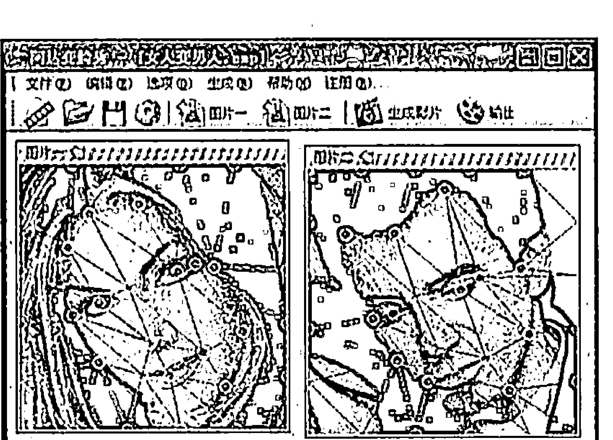

在导入了图片之后，会看到在图片当中有很多小圆圈，这是要设置的关键，起着定位的作用。只要在图片一中对人物的脸部进行定位，那么在图片二中进行相对应的变化。在编辑的时候，我们可以点击一幅图片上的圆圈，另一幅图上与之相对应的圆圈就会变成蓝色。然后分别拖动两幅图片上的关键点到合适的位置，例如使两幅人物的眼睛、鼻子、嘴等五官处于相对应的关键点上，此外我们也可以通过增加关键点的数量使细节变化更加清晰，按F6键打开工程设置（见图8），拖动滑块调整行数、列数、圆圈大小增加关键点个数即可，在这里还可以增大图片尺寸，如325×288。注意这里一定要定位准确，定位越准做出的动画效果也就越逼真。

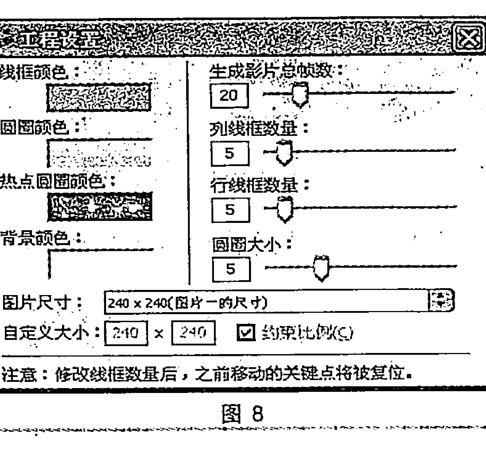

一切都调整完成之后，可以点击工具栏上面的“生成影片”按钮，接着就会弹出一个预览窗口，在这里我们可以点击“播放”预览一下，如果效果不理想可以返回重新设置关键点。输出前还可以拖动上面的滑块调整生成作品的播放速度，范围为每秒1帧～30帧，每秒显示的帧数越多播放速度越快，此外，还可以通过拖动滑块调整JPEG图片的品质，数值越大图片压缩比越小。在“播放模式”的下拉菜单之中一共有四种顺序，默认是“顺序播放”，可以选择“顺序”、“逆序”、“先顺序再逆序”、“先逆序再顺序”等四种模式。至于软件输出的格式主要就是BMP、JPG图片序列，还有GIF动画、Flash影片、网页文件、屏幕保护程序等。BMP/JPG图片序列就是一次输出几十幅图片，没有什么实用性，而AVI作为最常见的视频格式，用来播放动画是比较合适的，如果选择的是AVI输出，那么还可以选择用什么方式压缩以及决定压缩比。GIF动画虽然也不错，不过最多支持256色，不足以完美表达动画的色彩。对于大多数用户而言，生成FLASH动画和网页文件是最理想的。所谓的网页文件，其实就是内嵌了Flash动画的HTML文件，可以用浏览器来播放。最后就是屏幕保护程序，生成之后，我们可以直接运行安装到系统之后，使用起来相当具有趣味性哦！

此外，在动画设置完毕之后，并不需要急着输出，我们可以另外保存为工程文件，以后导入再进行修改。

### 动手作360度全景动画

你知道什么是全景图吗？现在网络上面流行着一种新颖的网络动画，那就是全景图了。以前的全景图都是将360度的画面全部展现在一幅画卷上面，而现在的网络全景图则是动态的，可以用鼠标点击图片，然后移动鼠标即可从不同的方向去欣赏一张360度全景的图片，绝对有身临其境的感受哦！

要制作360度全景动画，需要Cool 360这个软件的支持，我们可以从http://ftp15.enet.com.cn:88/pub/photo/photooil/c360try.exe下载回来安装。Cool 360是大名鼎鼎的友立公司推出的专门制作360全景动画的软件，友立公司所推出的软件历来都以易于上手而著称，因此虽然Cool 360是英文软件，也不需要很担心。

在使用Cool 360制作全景图之前，我们还必须准备全景图的素材。制作360度的全景图，最佳的方法就是用一个数码相机，连接在三角架上面，然后绕着360度的方向进行拍照，然后将不同的、可以连接起来的照片选出来，准备用在Cool 360之中。

Cool 360将图片合成全景图一共需要三个步骤。

- 第一步：新建项目

首先启动Cool 360，然后点击主界面之中的“New Project”（见图9），在弹出的窗口里面，要将项目类型选择为“Full 360 panorama”，然后设置一个工程名字（Project name），点击下面的“Browse”之后，选择一系列照片的目录。选择完之后点击“下一步”。

- 第二步：组合全景图

这时会看到一个弹出窗口，这里面列出了当前目录里面所有的图片，建议大家在拍照之后用一定的序号将相片排列好。接下来，用鼠标选择上所有的图片文件，然后点击“Add all”，我们就会看到所有的图片都被调出来并且都按照顺序排列好了，点击“下一步”之后会出现一个窗口，这里列出了很多相机的型号可供选择，如果我们的相机型号不在其中，可以直接选择默认的“Generic Camera”，然后点击“完成”，我们就进入最后一步的全景图调整。

- 第三步：全景图调整（图9）

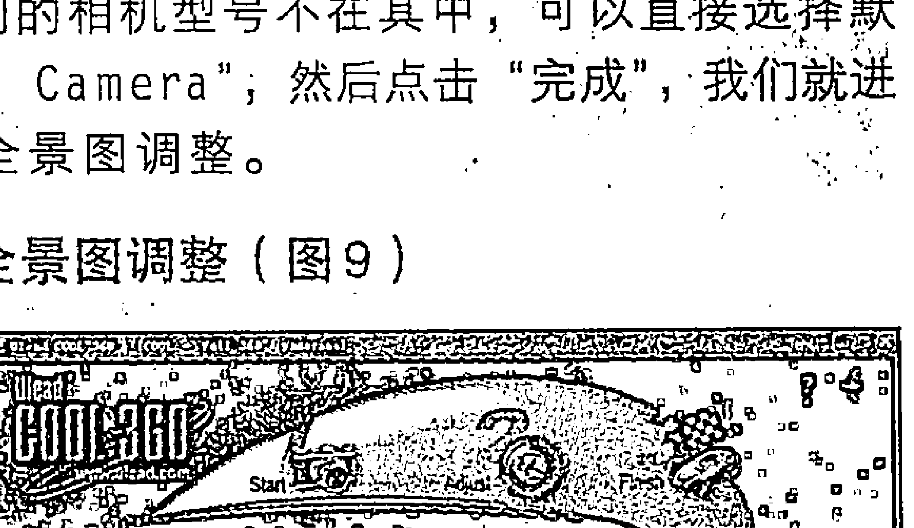

来到这一步之后，可以通过点击其中某一张图片来在选项面板中调节参数。我们可以调整每一幅图像的旋转角度（Rotate）、透视效果（Perspective）、色调（Hue）、饱和度（Saturation）、亮度（Brightness）和对比度（Contrast）等，此外，还可通过鼠标拖拽来调整各幅图像间的重叠程度，主要是让一些细节显得更真实，如球场的中线、中圈、看台的门等不能错位，相邻图片的草皮颜色要尽量接近等，Cool 360在智能合并方面做得非常好，因此，我们基本上不需要怎么样进行调整了。

- 第四步：输出全景图

确定图像都设置好了之后，可以点击主界面右上方的“Finish”按钮进行导出了。Cool 360制作出来的文件格式包括了JPG、BMP、IVR、TIF、PNG等，其中IVR是全景图文件格式，可以用软件本身附带的浏览器直接观看。

## 个性十足的Flash鼠标

文/图 王蓉静

你是否会为了使自己的电脑看上去非常个性化而去进行一些系统的设置？比如说把鼠标设置成篮球的模样。而如果我们想要把自己的Flash也做得非常个性化也不是一件难事，那么我就从鼠标这一点说起吧。
我们要完成的任务，是在Flash文件中制作一个具有个性化的鼠标。换句话说，主要就是介绍如何把这样一个鼠标制作出来。

那么我们要做一个什么样的鼠标呢？大概是这样的：一只蝴蝶翩翩飞舞，在它的周围围绕旋转着三个小球。效果如图1所示。


整个制作过程不是很复杂，那么现在跟我来按照步骤做做试试吧。不过在制作之前先让我们来熟悉一下我们所使用的制作软件。

首先是软件的界面。启动软件进入软件界面。如图2所示。

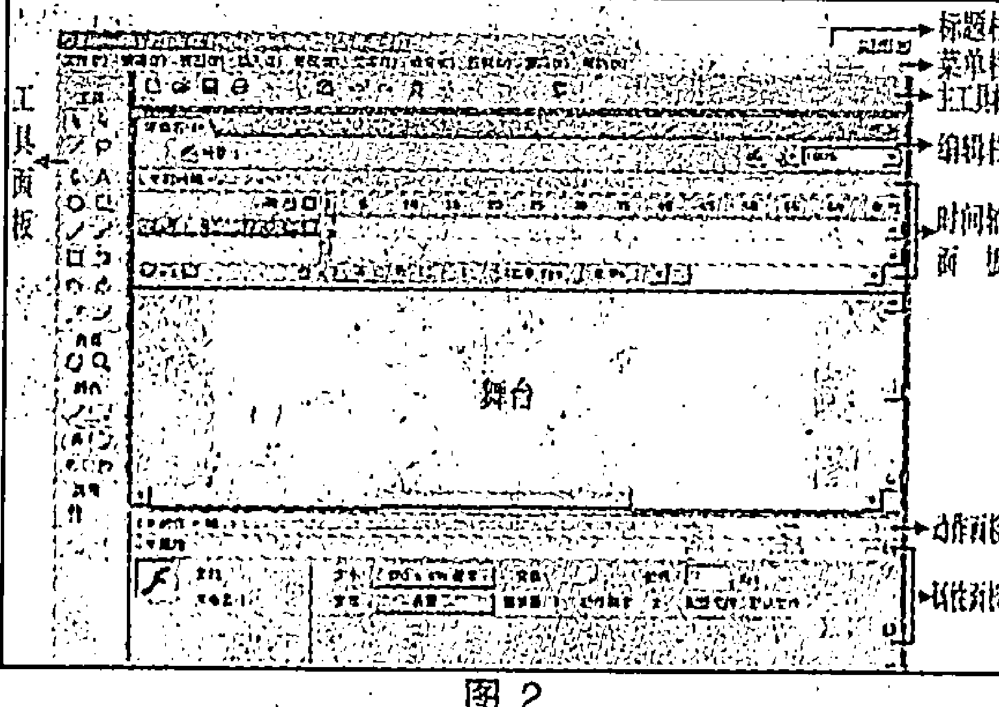

我们将会用到的工具主要有铅笔工具、任意变形工具、颜料桶工具、椭圆工具等，它们的具体使用方法将会在下面的制作过程中进行介绍。

好了，我们现在就开始进行鼠标的制作。

### 准备工作

点击图标新建文件，然后设置一下文件的属性。文件属性的设置方法如下：
在屏幕的最下面找到属性面板，然后找到“大小”项，点击后面的按钮，然后在弹出的“文档属性”对话框中进行设置。只设置一下“尺寸”为556×400像素就可以了。或者你也可以先导人一张图片，然后点击“匹配”中的“内容”按钮，那么文件的“尺寸”就会自动变为导入的图片的尺寸大小了。如图3所示。

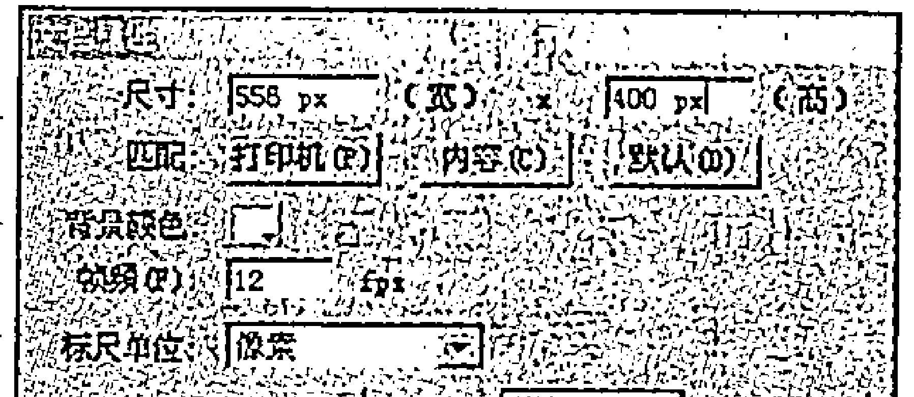

最后保存文件。可以在制作的过程当中随时保存一下文件。

### 插入背景图片

选择“文件→导入→导入到舞台”或者“Ctrl+R”快捷键，将一张事先准备好的图片导入到舞台中。双击时间轴面板中的这一图层，将其重新命名为“bg”。按下图标锁定这一层，这样图片就不会被误操作了。

然后用对齐面板将导入的图片按照左边和上边对齐，如图4所示。打开对齐面板的方法是：“窗口→设计面板→对齐”或者“Ctrl+K”快捷键。


导入图片后的时间轴面板如图5所示。

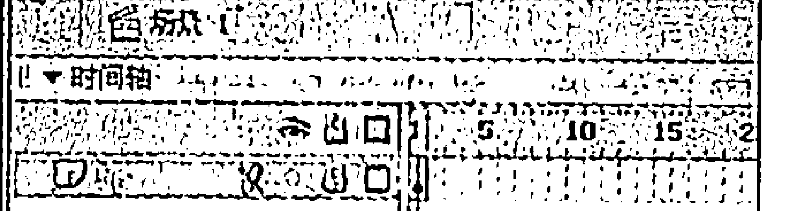

### 鼠标的制作

- 飞舞的蝴蝶

选择“插入→新建元件”或者“Ctrl+F8”快捷键，创建一个图形类的新元件。我们把元件的名称改为“butterfly”，如图6所示。点击“确定”后就进入了“butterfly”元件的编辑界面。接下来我们就要在这个元件中制作一只蝴蝶。


导人一张蝴蝶的图片。然后用工具面板中的铅笔工具，沿着蝴蝶的边描出一个轮廓。在这里你需要注意的是，铅笔工具的选项中要选择“平滑”这一项。如图7所示。

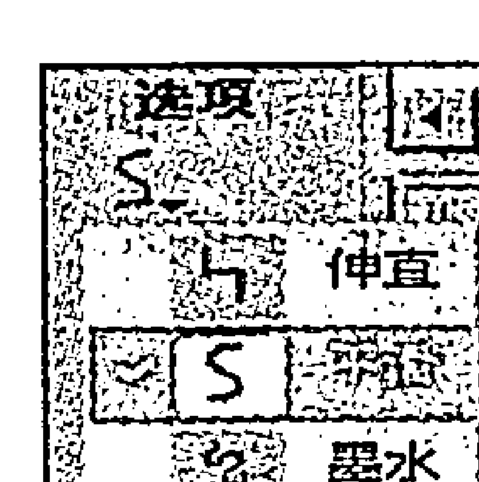

描完边的蝴蝶如图8右边所示，这时可以把左边的蝴蝶原形删掉了。

这样的蝴蝶看上去很难看吧，那我们就要把它修改一下。选择部分选取工具，来进行修改就可以了。如图9所示，点中蝴蝶轮廓的时候，轮廓上会出现许多用来进行修改的小方块，拖动小方块来改变它的形状。

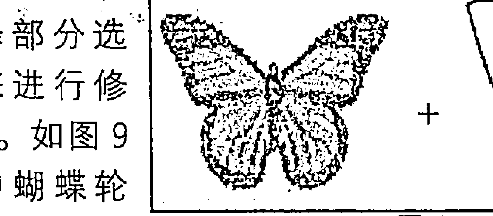

如果两边怎么修改也不能达到理想的对称效果的话，可以选中不想要的蝴蝶的左边或右边的一半，去掉，然后再选中另一半，再进行下面的一系列操作：

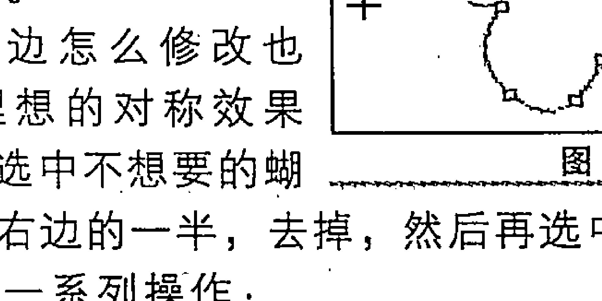

（1）复制，点击鼠标右键选择复制或者点击主工具栏中的粘贴图标，或者使用快捷键 Ctrl+C。
（2）粘贴，在这里有一点需要注意的是，粘贴的时候要按住 Shift 键。也就是说要用快捷键组合 Shift+Ctrl+V；这样所粘贴的内容的位置才不会改变。
（3）翻转，选择修改菜单→变形→水平翻转。
（4）移动，使用方向键“→”向右移动就可以了。

这样就可以拼成一个两边对称的蝴蝶轮廓了。当然也可以再做些修饰，完成后的图如图10。

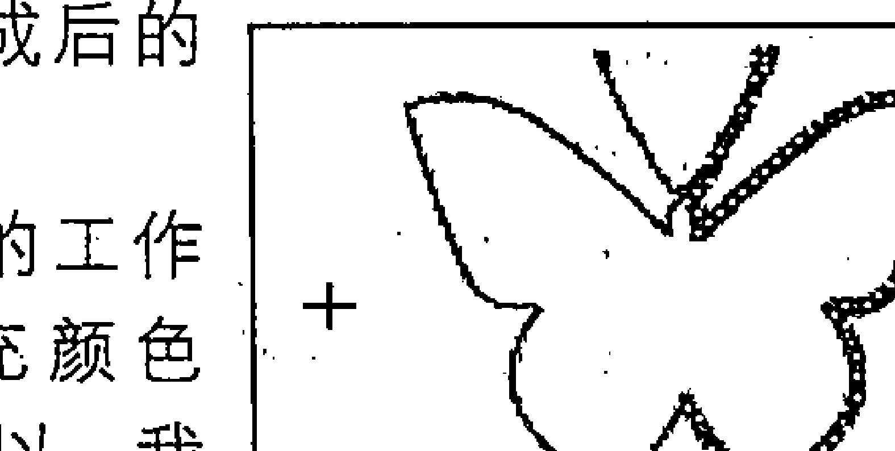

轮廓做好后，下面的工作就是要给这只蝴蝶填充颜色了。想要什么颜色的都可以。我们这次要做的蝴蝶是在月色下飞舞，所以就将它填充为深灰色的。选择颜料桶工具，在蝴蝶中间的空白处一点，蝴蝶就变成了深灰色的。如图11所示，最后选中整个蝴蝶，使用快捷键“Ctrl+G”将其组合在一起。


使蝴蝶飞起来。新建一个名为“butterfly_m”的影片剪辑元件。用“Ctrl+L”打开库，从库中将刚才我们制作的蝴蝶拖拽到当前图层的第一帧。然后在第二帧处按 F6 新建关键帧，用任意变形工具改变蝴蝶的形状，如图12所示。

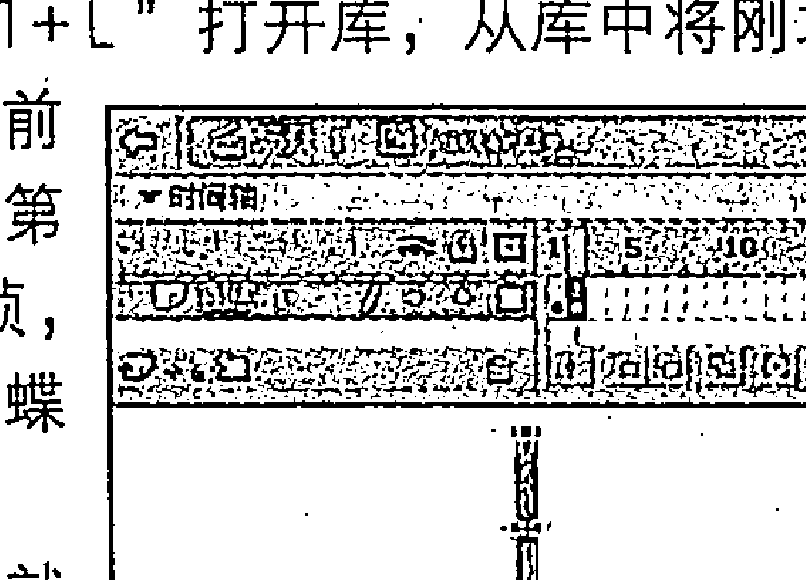

到这里，蝴蝶部分就制作完成了。接下来就继续介绍环绕着蝴蝶的三个小球的制作过程。

- 环绕着蝴蝶的球

画球。插入新元件，命名为“ball”，类型为图形。进入元件编辑，使用椭圆工具，绘制一个没有边框、填充色为白色的小圆球，大小不限，但是要保证是正圆。为了看起来方便，可以先把背景色改为深颜色的。如图13所示。

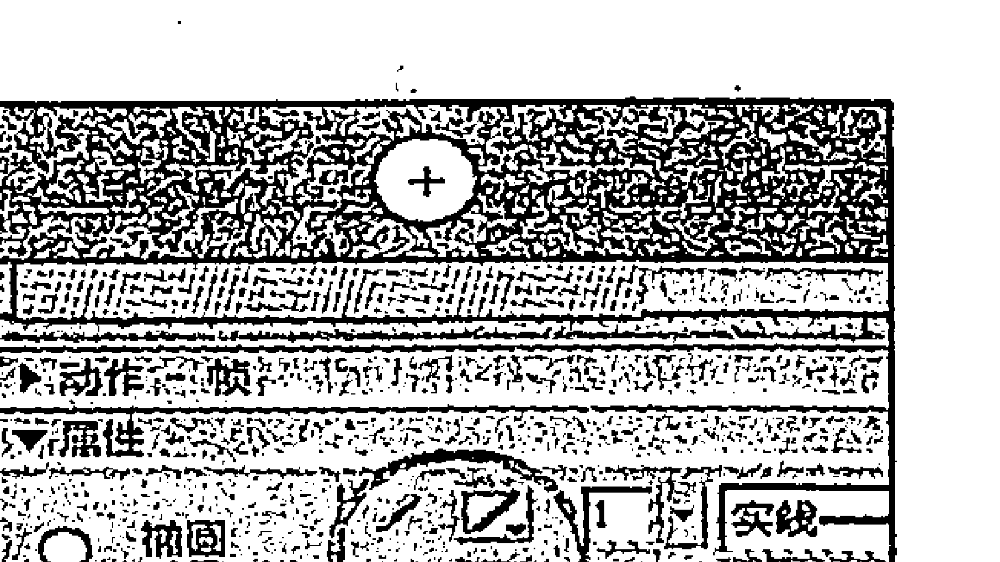

制作旋转的球。一共有三个小球，它们的速度不同，方向也不太一样。根据速度的不同，我们把这三个影片剪辑元件分别命名为“ball_slow”、“ball_middle”和“ball_fast”。“ball_slow”和“ball_fast”按顺时针旋转，“ball_middle”按逆时针旋转。它们的制作方法大致上差不多，都比较简单。那么下面我就以“ball_slow”为例来详细介绍一下制作方法，其余两个做一下简单说明。

影片剪辑元件“ball_slow”的制作。插入新元件，命名为“ball_slow”，类型为影片剪辑。如图14所示。

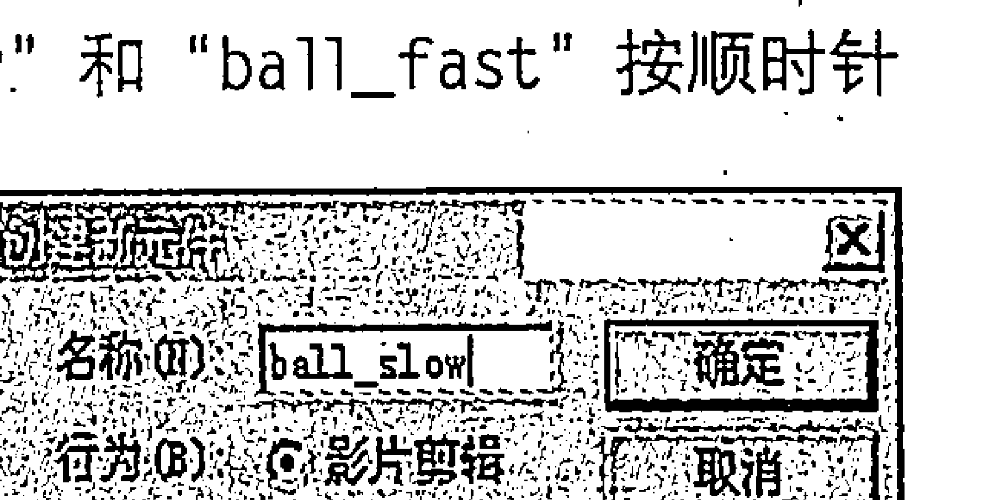

进入元件的编辑界面。把我们做好的“ball”图形元件从库中拖拽到舞台，然后从属性面板中修改它的大小为宽5.5、高5.5。如图15所示。

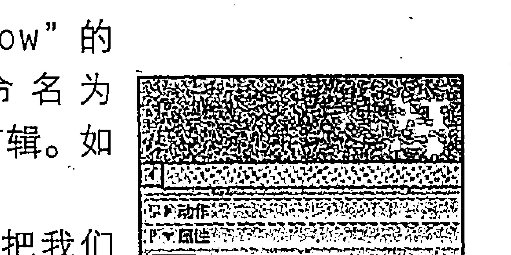

双击图层1，将它的名字改为“ball_s”。点击时间轴面板中图层下面的添加引导层按钮，为当前图层添加引导层，此时的时间轴面板如图16所示。

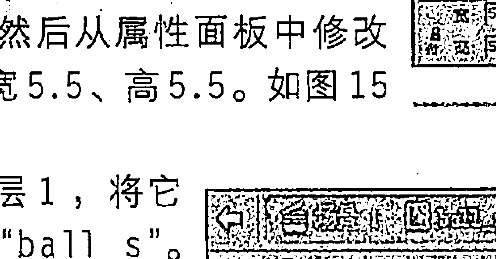

在引导层的第一帧画一个正圆形，边线为白色，没有填充色，宽和高都为60。这个圆形就是我们要用到的引导线。如图17所示。

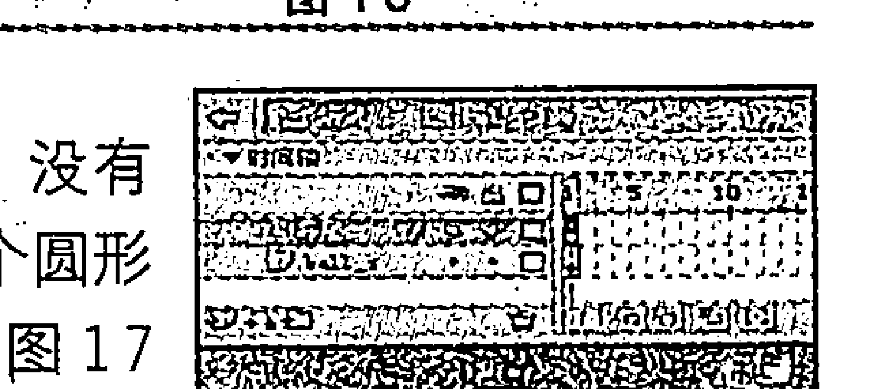

我们要做的是一个小球围绕引导线旋转的动画效果。将小球放到引导线上，在引导层的第28帧处按F5添加帧。然后在“ball_s”图层的第7、14、21、28帧分别按 F6 添加关键帧。然后在每个关键帧上改变小球在引导线上的位置，按顺时针旋转，在这可以使用对齐面板进行辅助。第1、7、14、21、28帧上小球的位置分别如图18所示。

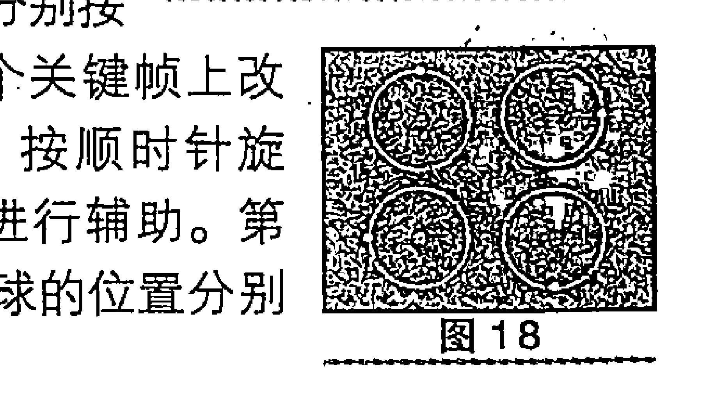分别在第1、7、14、21、28帧中间的空白处点击鼠标右键，选择“创建补间动画”。最后完成以后的时间轴面板如图19所示：

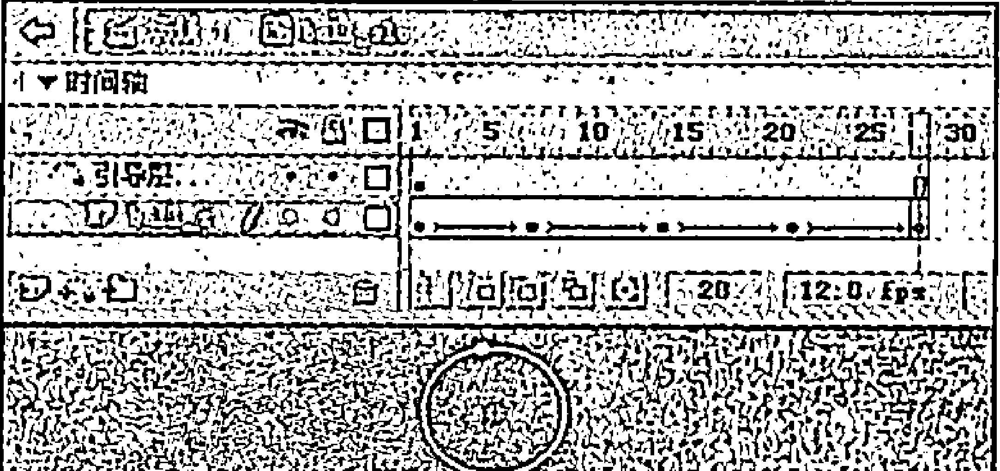

影片剪辑元件“ball_middle”的制作。设置球的宽为6.8、高为6.8，引导线的宽和高都为80。将当前图层改名为“ball_m”，在第5、10、15、20帧分别按F6添加关键帧。添加引导层，画引导线，并在这层的第20帧处按F5添加帧。然后在“ball_m”图层的每个关键帧上改变小球在引导线上的位置，按逆时针旋转。

然后在各帧的空白处选择“创建补间动画”。最后完成以后的时间轴面板如图20所示。

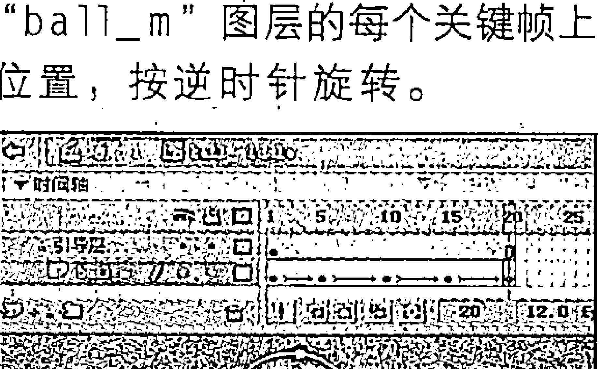

影片剪辑元件“ball_fast”的制作。设置球的宽为8.1、高为8.1，引导线的宽和高都为100。将当前图层改名为“ball_f”，在第3、6、9、12帧分别按F6添加关键帧。添加引导层，画引导线，并在这层的第12帧处按F5添加帧。然后在“ball_f”图层的每个关键帧上改变小球在引导线上的位置，位置和影片剪辑元件“ball_slow”中的相同，按顺时针旋转。接下来在各帧的空白处选择“创建补间动画”。最后完成以后的时间轴面板如图21所示。

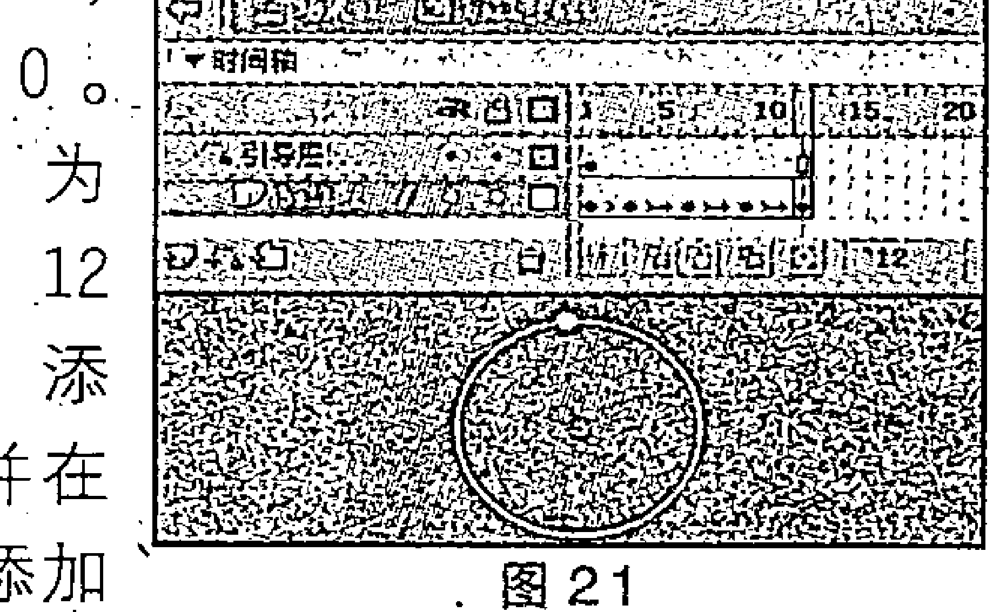

我们接下来的工作就是要把上面做好的蝴蝶和三个小球组合到一起，做成小球围绕蝴蝶旋转的动画效果。

## 3. 球围绕蝴蝶旋转

新建影片剪辑元件“ball_round”。进入元件编辑界面后，将当前图层改名为“butterfly”，然后再添加三个图层，分别命名为“slow”、“middle”和“fast”。将我们之前做好的“butterfly_m”、“ball_slow”、“ball_middle”和“ball_fast”这四个影片剪辑元件分别放入相应的图层中。

调整各个元件的大小和位置。下面有一些参考数据（见表），你可以照着来做一下，看看会有什么效果。

| 元件名称 | 宽 | 高 | X | Y |
|---|---|---|---|---|
| Butterfly_m | 36 | 30.5 | -18 | -15 |
| ball_slow | 2.6 | 2.6 | 1.8 | -31 |
| ball_middle | 3.5 | 3.5 | 15.5 | -20 |
| ball_fast | 4.0 | 4.0 | -19 | 124 |

时间轴面板及各元件的位置排列情况如图22所示。

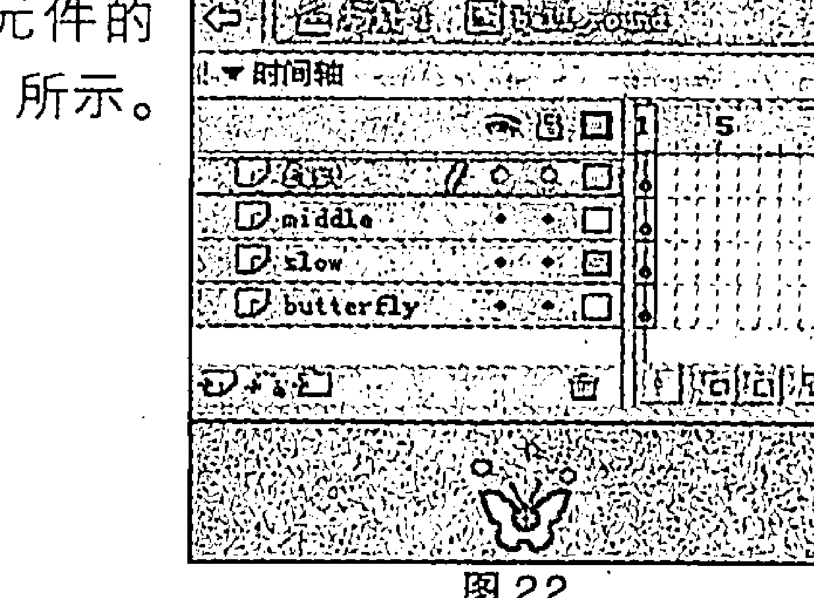

## 实现部分

回到场景1。新建图层“butterfly”，从库中把刚才我们完成的“ball_round”影片剪辑元件拖拽到舞台上，可适当调整一下它的大小。

选中“ball_round”，在它的属性面板中修改它的实例名称为“ball_r”，如图23所示。

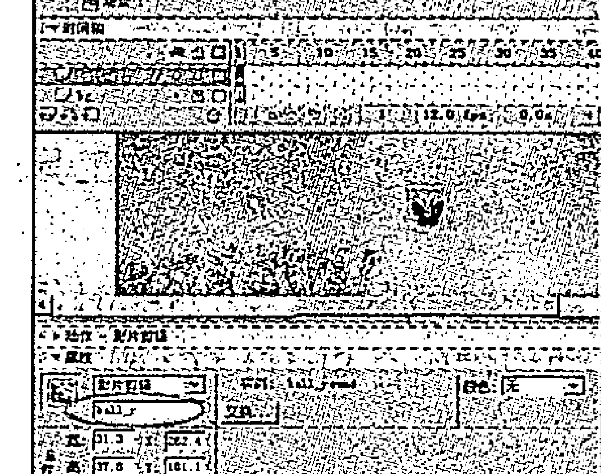

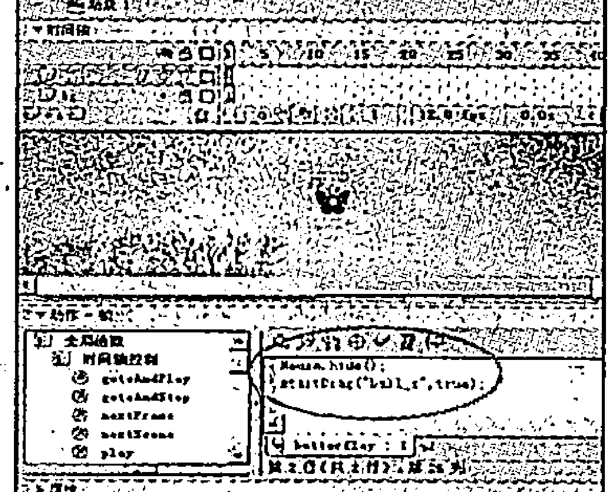

我们把“ball_r”当作鼠标。在“butterfly”这个图层的第一帧处加入动作代码。代码很简单：

```
Mouse.hide();
startDrag("ball_r",true);
```

如果动作面板没有打开的话，可以使用快捷键F9将它打开。添加代码后这一帧的上半部分会出现一个“a”的标志，这表示在这一帧已经添加了代码。完成后如图24所示。

## 文件发布

所有部分都制作好了以后，我们就可以进行Flash文件的发布了。在发布之前先让我们来进行一下发布设置。选择“文件”菜单中的发布设置，或者点击属性面板中的“发布：”后面的设置按钮，然后在弹出的“发布设置”对话框中进行设置，如图25所示。

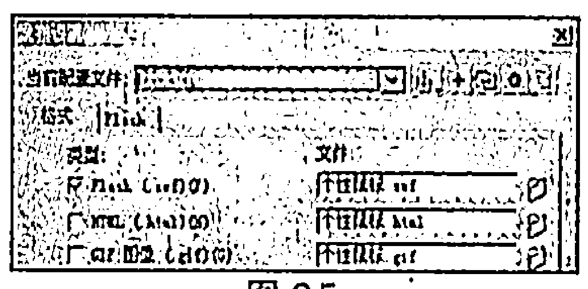

我们还可以设置一下密码（图26），这样别人就无法在Flash MX 2004的制作软件中打开它了。

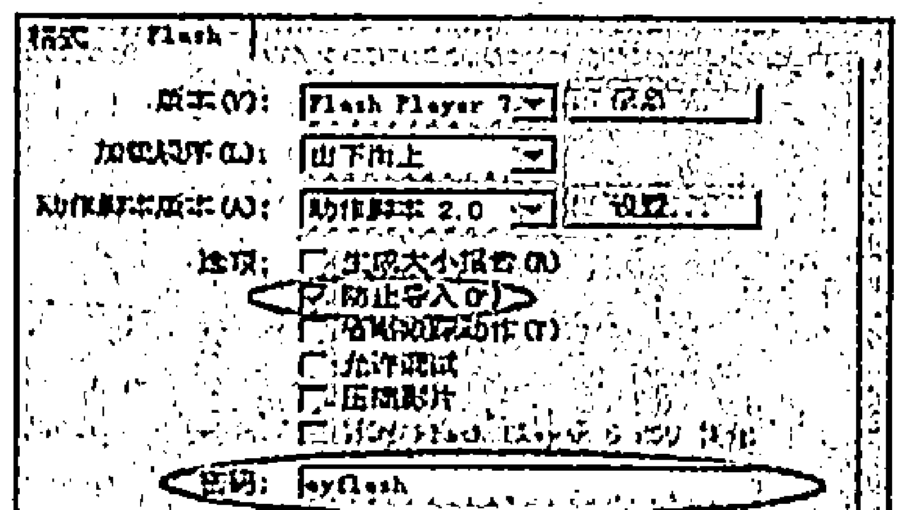

设置完毕后，直接点击“发布”按钮就OK了。好了，让我们来看看我们的作品吧！

## 圣诞卡片特别制作之Flash动漫版

文/王蓉静

大家好！圣诞节快到了，你想不想送一份特别的礼物给你的亲朋好友啊？尤其是你那些远在他方的亲人和朋友，送上一封美观实用的电子圣诞卡片来传达你对他们的思念和祝福，既经济又有利于环保，是一件一举两得的事吧！

网络上有很多电子贺卡，种类样式令人眼花缭乱，但是大多数是要付费才能使用的，也有的是有时限的，如果过了期限收卡人没接收的话就再也看不到那张贺卡了。所以，如果你想避免这些麻烦，而且你对电子贺卡的制作方法很有兴趣，想亲自制作一张送出去的话，那么就来看看下面的文章吧，我会帮你完成这样一件特别的圣诞礼物。

我们要做的这张圣诞卡片分封面和内容两个部分。最终效果如图1和图2所示。

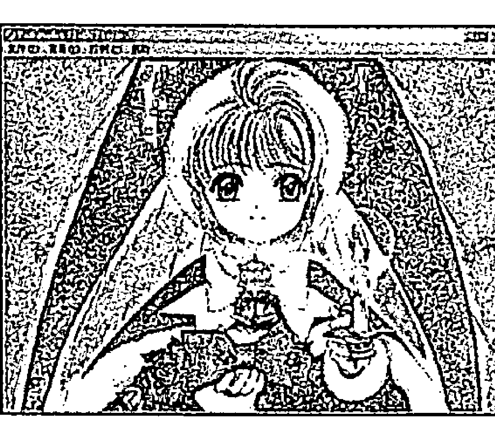

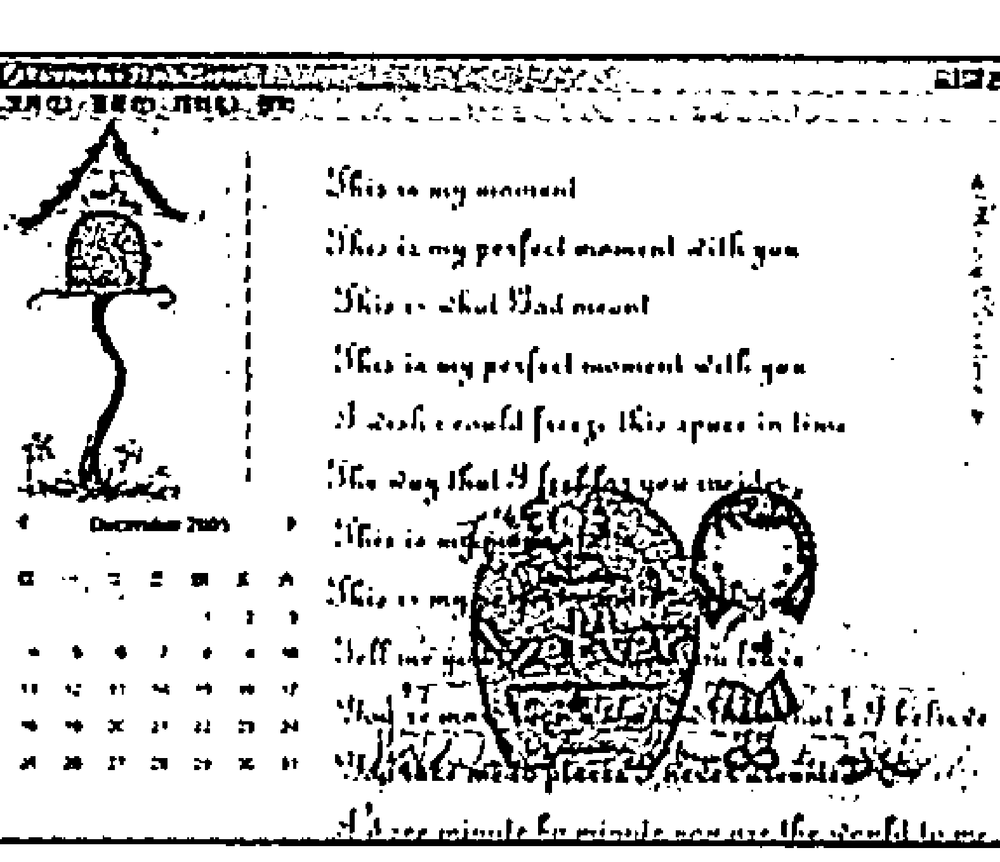

整理好的界面如图3所示。我们设置文件的大小为660 px × 465 px，如图5所示。然后保存一下文件，取名为“圣诞卡片”。当然你也可以取任何你喜欢的名字，而且要记住随时保存文件哦。

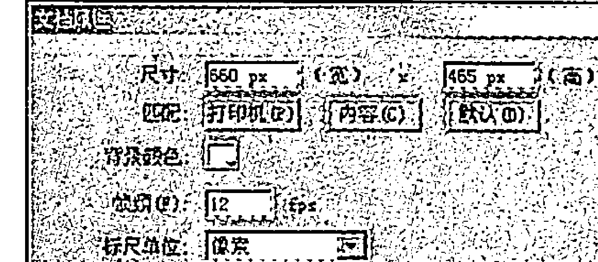

我们要开始制作了，我要先告诉你卡片内容部分的制作方法。为什么不先做卡片的封面呢？当然也是可以的啦，但是内容部分比较重要吧，而且这也是个顺序问题，也和个人的习惯有关。总之，我们就从卡片的内容开始吧！

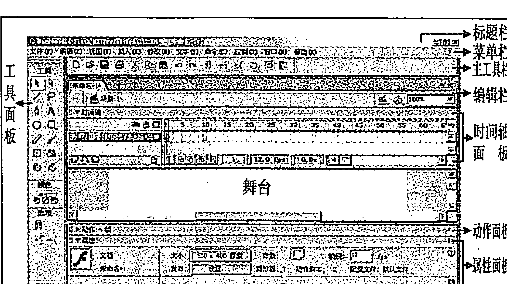

## 卡片的内容

### 1. Content元件

新建一个影片剪辑元件“content”，如图6所示。它就像一个大容器，或者说是像一个框架，用来盛放卡片的所有内容。但是为了便于制作，这个元件建好后，我们先不用它。点击“场景1”，回到场景1。

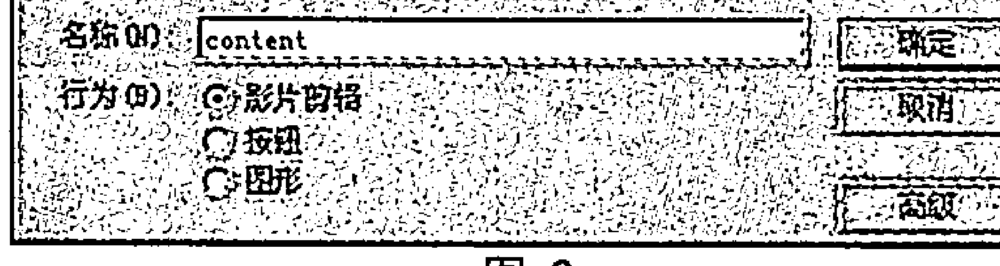

### 2. 加入图片

在时间轴中图层1的第一帧，选择菜单“文件”→“导入”→“导入到舞台”或者Ctrl+R快捷键来加入图片，加入图片后的效果如图7所示。这里添加了两张图片，左上角和右下角各一张。适当调整一下它们的位置，使它达到你觉得满意的效果就好。

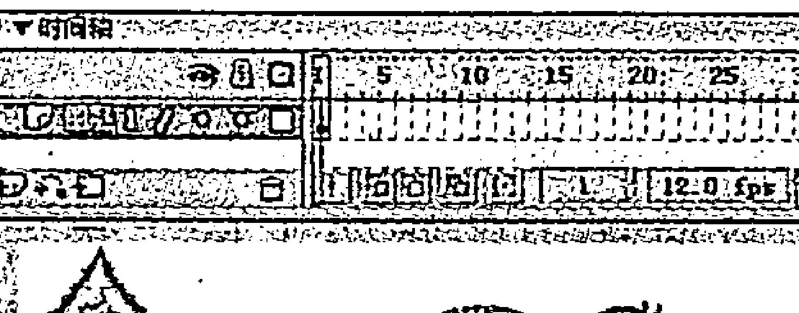

我们使用的软件是Macromedia Flash MX 2004中文版。首先我们先来认识一下它的用户界面。如图3所示。我们会用到组件、组件检查器和行为这三个面板，但是现在的界面看起来很乱，所以我们要先把它们关掉，等到用的时候再打开就可以了。关掉面板的方法如图4所示。


### 3. 加入日历

加入一个日历，可以使这张卡片变得更加的实用哦。我们要使用到组件面板，在使用之前，先把这个面板打开。选择菜单“窗口”→“开发面板”→“组件”或者用Ctrl+F7快捷键来打开组件面板。组件面板中的组件共分三大部分，它们分别是“Data Components”、“Media Components”和“UI Components”。日历是在UI Components里面，我们选中“DateChooser”（图8）。然后在时间轴的图层1上点击“新建图层”图标新建图层2，在第一帧处把日历组件拖动到舞台上（图8）。

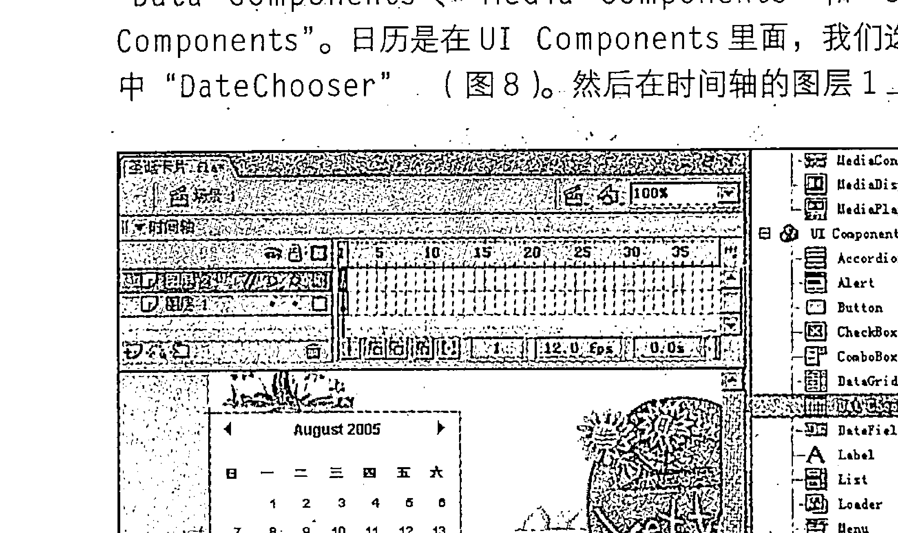

日历中的星期是用英文来表示的，为了适合中国人的习惯，我们可以在属性面板中将它改成中文显示。其中dayNames项中的内容就是星期的表示方法，我们把它改成中文的就可以了。点击一下dayNames这一行，会弹出一个对话框，然后把英文改成中文，如图9所示。

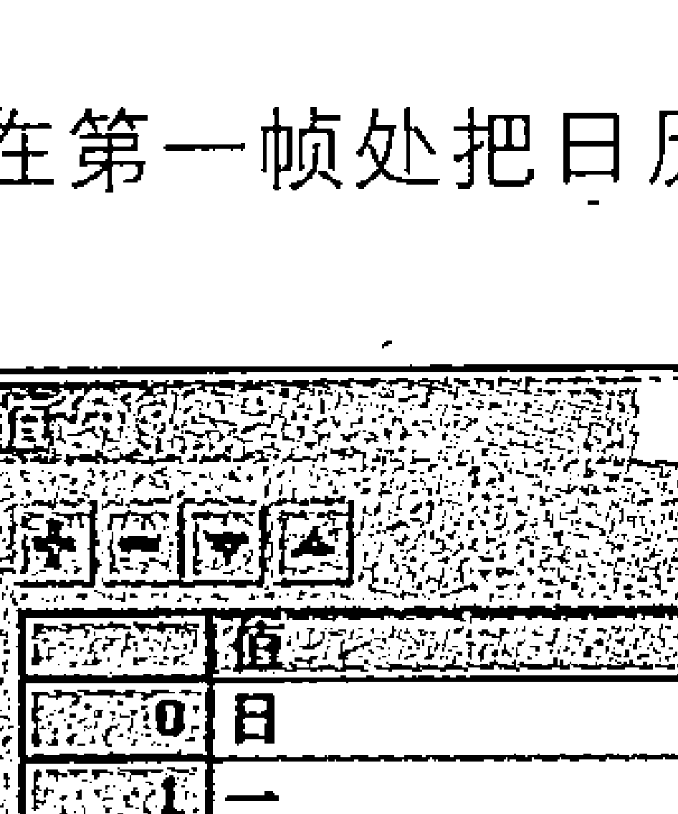

加入的日历的边是灰色的，这样看起来不太好看，影响了贺卡的整体效果，所以要为它再加一个白色（要与背景色相同的颜色）的边，这样就可以把原来灰色的边给覆盖隐藏起来了。在图层2上新建图层3，选择工具面板中的矩形工具，然后在图层3的第一帧画一个能覆盖日历的边的矩形。如图10所示。矩形画好后可以按Ctrl+G快捷键将这个矩形组合为一个图形。到这里，日历部分就完成了。

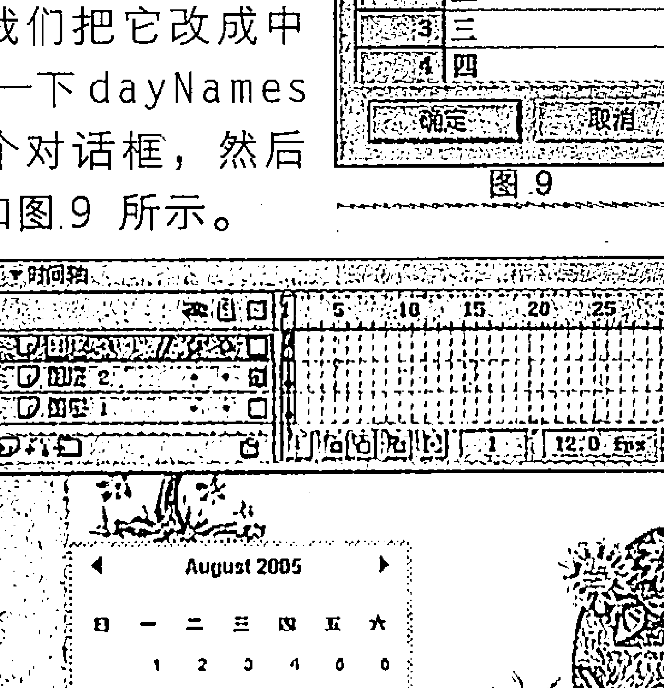

### 4. 加入音乐

先把需要的面板打开。选择菜单“窗口”→“开发面板”→“组件检查器”或者用Alt+F7快捷键来打开组件检查器面板，选择菜单“窗口”→“开发面板”→“行为”或者用Shift+F3快捷键来打开行为面板。新建图层4，在第一帧处我们要添加音乐。在组件面板中的Media Components里面，我们选中“MediaController”，把它拖动到舞台上，如图11所示。


我们改变一下它的属性。把controllerPolicy改为“off”，这样当播放音乐的时候是不能进行人为控制的。然后再把horizontal改为“false”，将播放器竖着放。为了后面的操作，把实例名称改为“mu00”。属性改好后再调整一下播放器的位置和大小就可以了，如图12所示。

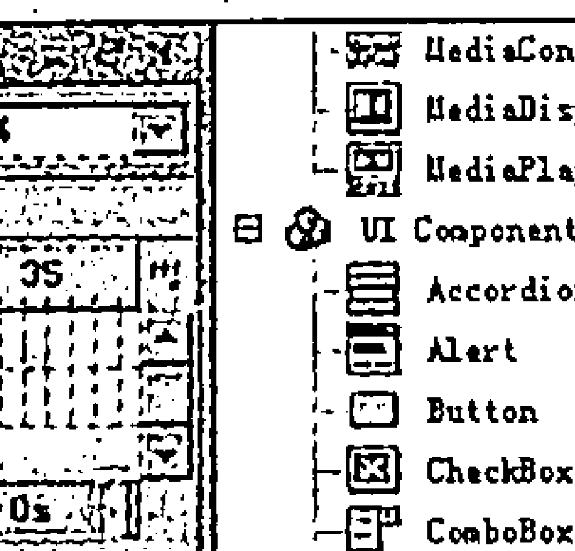

光有个播放器还是放不了音乐的；因为它只是一个控制装置，所以还要加上一个音乐组件才可以的。选择“MediaController”下面的那个组件“MediaDisplay”，把它拖动到舞台上，然后调整一下它的位置和大小。这个组件是隐藏的，不会显示出来。如图13所示。

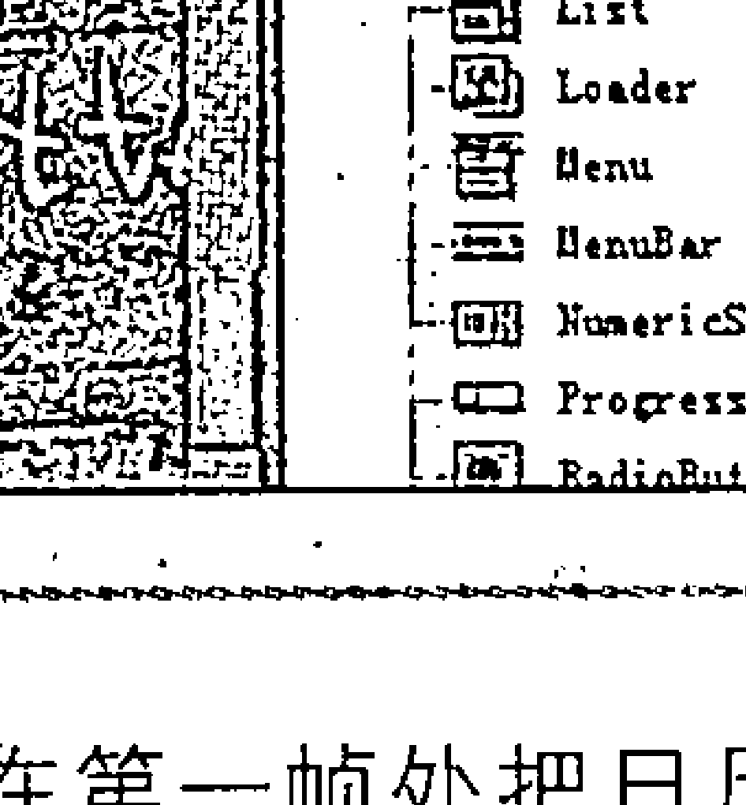

它的属性在组件检查器面板中进行设置。按照图14进行设置，有一点要注意，那就是把需要加入的音乐文件与我们要发布的Flash放到同一个文件夹中，而且音乐必须是MP3格式的。


这是关键的一步，我们要把音乐与播放器联系起来，这就要用到行为面板了。点击行为面板中的“+”图标添加行为，如图15所示，选择菜单“媒体”→“关联控制器”。这时会弹出一个窗口，然后我们选择“mu00”就可以了。这样我们的音乐就添加好了。我们可以把组件、组件检查器、行为这三个面板关掉了。

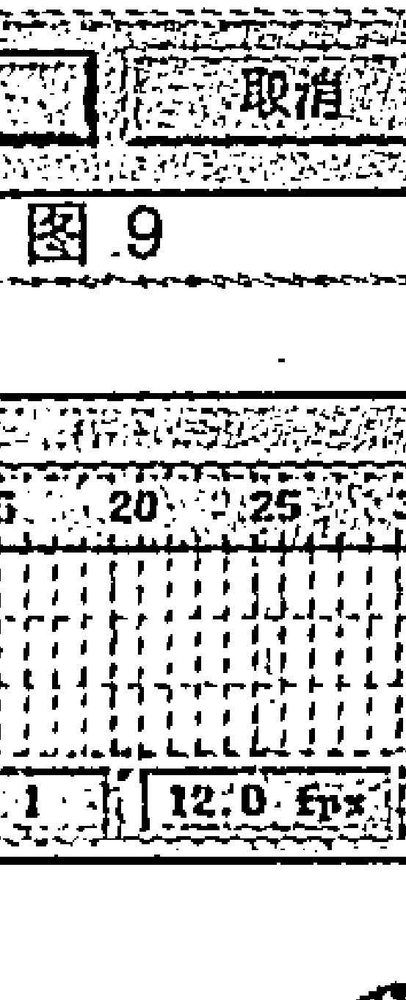

## PART 3 圣诞卡片特别制作之动漫版

可移动的祝词。到了最重要的部分了，你想对你的亲朋好友说的祝词就在这里了哦。他们可以通过上下箭头来浏览你的祝词。

新建一个名为“words”的图形元件，进入元件的编辑状态后，用工具面板中的文字工具把你的祝词写下来。如图16所示。

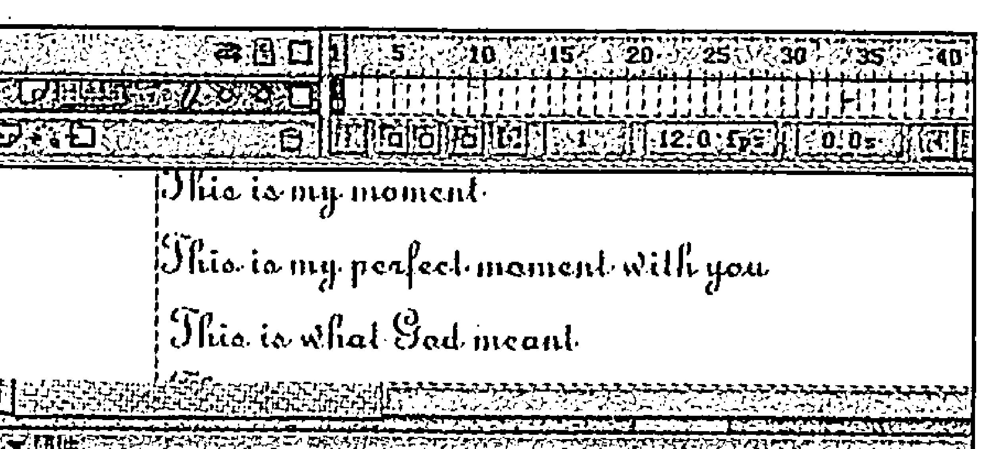

新建名为“words_move”的影片剪辑元件，进入编辑状态，使用Ctrl+L快捷键打开库，从库中把刚才写好的“words”拖动到舞台中，能够看到整篇文字的开始部分。在第2帧处按F6添加关键帧。在第30帧按F6添加关键帧，然后把“words”向上移，移到差不多到整篇文字的中间部分，再在第60帧处按F6添加关键帧，再把“words”向上移动到结尾处。接下来在第2帧与第30帧的空白处和第30帧与第60帧的空白处分别按右键创建补间动画。这样实现的是祝词的移动效果。如图17所示。

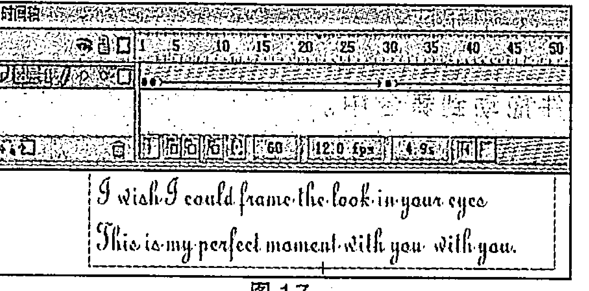

为了能够控制它的移动，还要添加一些东西的。把第2、30、60帧的帧标签分别改为“begin”、“middle”和“stop”。然后在第1帧处添加命令：

```
gotoAndStop("begin");
```

在第61帧处按F6添加关键帧，再添加命令：

```
gotoAndStop("stop");
```

如图18所示。

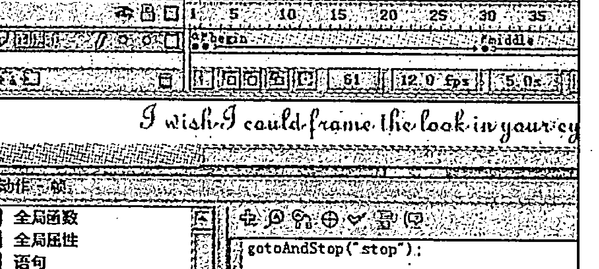

新建两个图形元件“arrow”和“arrow_2”，分别画一个小箭头，但是它们的大小相同颜色不同。

新建一个按钮元件，名为“bt_words”。在指针经过处添加关键帧。然后从库中把“arrow”元件拖动到弹起那一帧，把“arrow_2”元件拖动到指针经过那一帧。如图19所示。这个按钮就做好了。

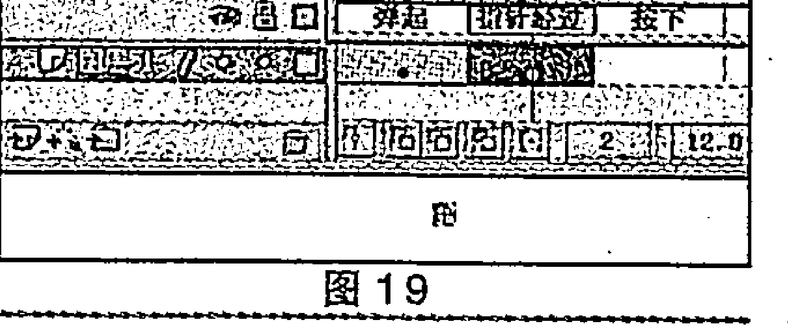

再新建一个名为“words_show”的影片剪辑元件。我们把“words_move”元件拖动到图层1的第1帧，把实例名称改为“words”，并在第2帧处按F5插入帧。新建图层2，把“bt_words”拖动到图层2的第1帧两次，这样就有两个按钮了，改变一下它们的方向和位置，如图20所示。

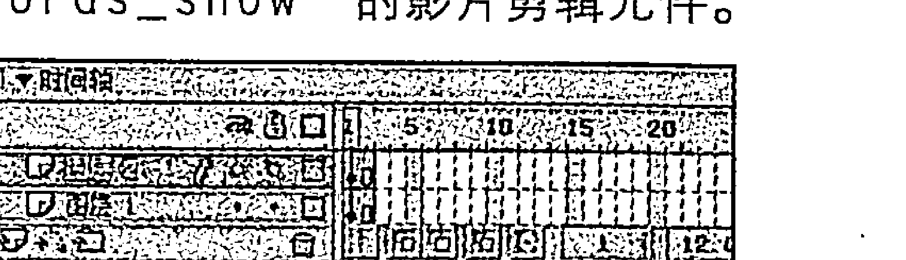

把图层2的第2帧按F6改为关键帧，再在第1帧为两个按钮元件，也就是两个小箭头添加命令。先选中向上的那个小箭头，添加下面的命令：

```
on(rollOver){
    tellTarget("words"){
        prevFrame();
    }
    play();
}
```

再选中向下的小箭头，添加下面的命令：

```
on(rollOver){
    tellTarget("words"){
        nextFrame();
    }
    play();
}
```

我们还可以再做点修饰啊，新建图层3，写点文字也可以的。好了，我们这部分的内容就做好了。

### 5. 组合

我们把刚才做好的“words_show”影片剪辑元件放到场景1中的第5层。这样还没有完全做完，还记得我们刚开始建好的“content”影片剪辑元件吗，我们现在就要用到它了。我们要把场景1中的内容搬个家，搬到“content”里面去。只要把各帧逐一剪切过去了就可以了，剪切帧的方法是：选中那一帧，点击鼠标右键，选择剪切帧。搬好家以后就是图21的样子。贺卡的内容部分就全部完成了。

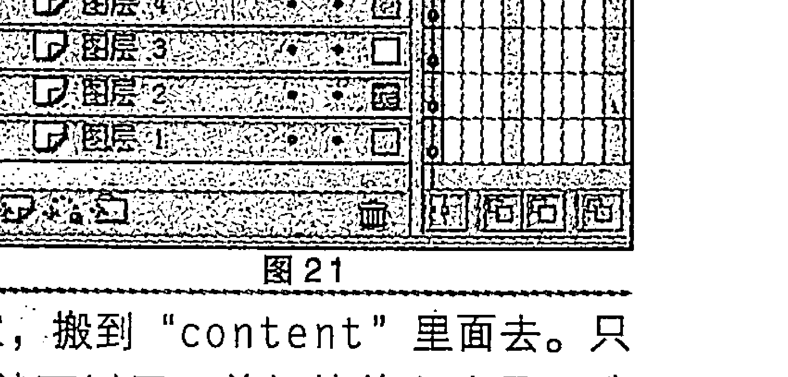

## 卡片的封面

回到场景1，这时的5个图层都是空的了，点击“删除图层”图标去掉两个图层，因为我们只用三个图层就够了。接下来我们就要做圣诞卡片的封面了。

### 1. 卡片的打开效果

我们在看贺卡的时候都是要先打开封面再看内容的吧，所以，就做出卡片由下向上打开的效果。

在图层1的第1帧加入背景图。这个和前面的方法是一样的，如果你忘记了的话，可以复习一下前面的内容嘛。

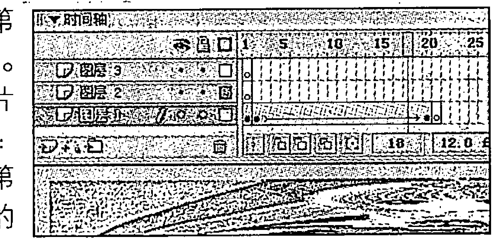

在第2帧和第20帧添加关键帧。在第20帧把图片属性中的“高”改为1.0，并在第2帧和第20帧处的空白处创建补间动画。然后在第21帧处按F7添加空白关键帧。这样就可以出现我们要的效果了。如图22所示。

### 2. 打开卡片的按钮

我们要在封面上添加一个按钮，这个按钮的作用就是打开卡片的内容部分。制作一个简单的按钮就可以了。

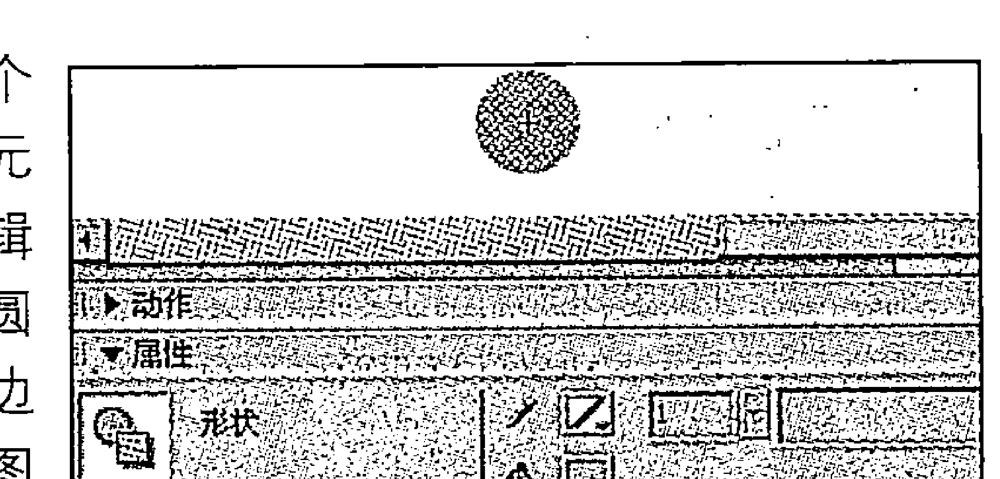

新建一个名为“circle_r”的影片剪辑元件，制作一个按钮的动态效果来。这部分的制作方法就不详细介绍了，由你来自由发挥。这里是通过改变“circle”元件的大小、Alpha的属性来实现一些动态效果的，如图24所示。

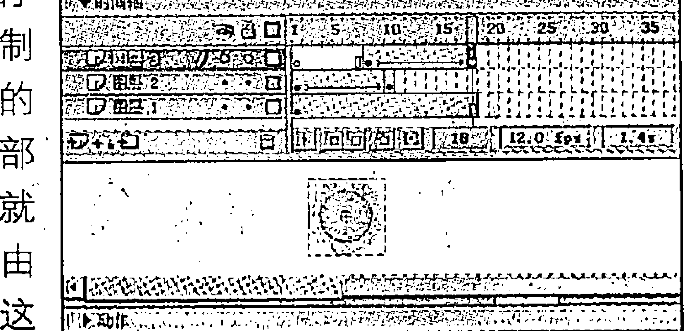

建一个按钮元件“bt_open”，把“circle_r”元件直接拖动到弹起那一帧就可以了，再用文字工具写点文字，这个按钮就完成了！如图25所示。

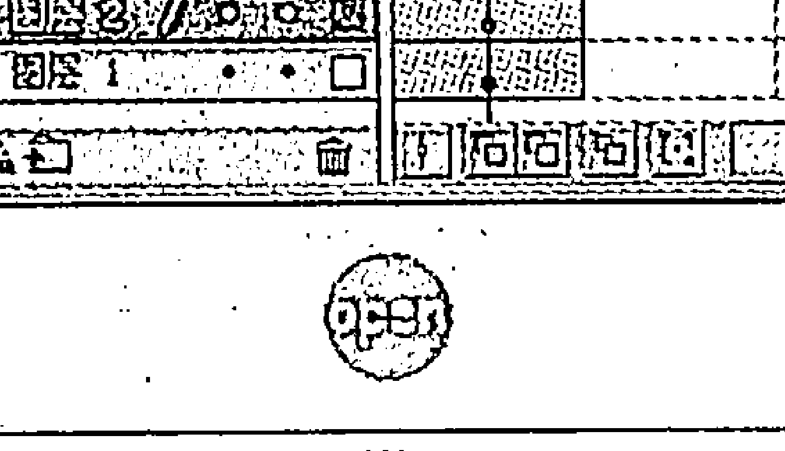

回到场景1，将按钮元件“bt_open”放到图层2的第1帧。

## 合成

这一步是要将卡片的封面与内容结合到一起。在场景1中完成。

在图层3的第21帧处，把“content”影片剪辑元件拖动到舞台中。

为图层1的第1帧和第21帧添加命令：

```
stop();
```

为图层2中的“bt_open”按钮元件添加命令：

```
on(release){
    gotoAndPlay(2);
}
```

效果如图26所示。

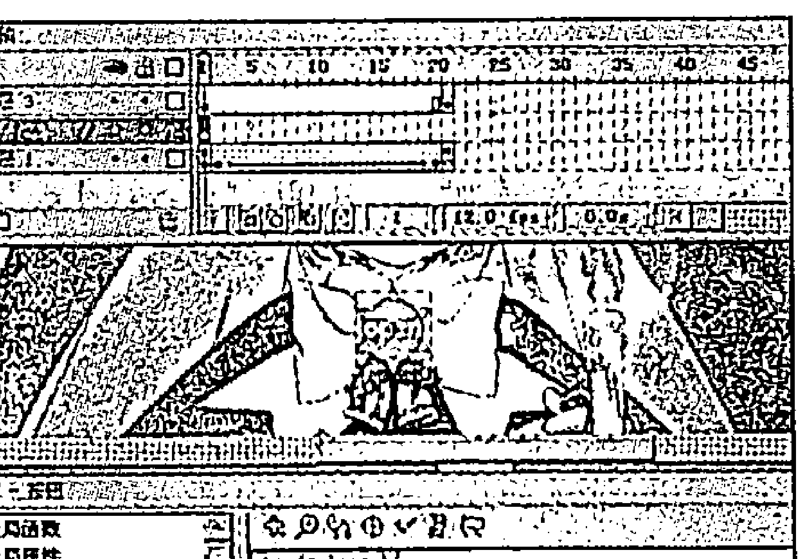

好了，我们已经大功告成了！你现在可以发布一下看看你的成果了。希望你们能够喜欢这张电子圣诞卡片！

## 删除修改痕迹清爽文档见客户

小李从同事的电子邮件中收到一个文档，修改后用新名称保存后送到客户手中。然后他接到电话：“文档难以阅读，到处都是下划线和批注框，三个带删除线的不同目标到底是哪个？……”

最快方法：这是修订和批注在作怪。你只需接受或拒绝更改，删除批注即可。选择“视图→工具栏→审阅→显示”，然后确保下列每个项目旁边都出现对勾：批注、墨迹注释（仅Word 2003有）、插入和删除、“正在格式化、审阅者（指向“审阅者”，然后确保选中了“所有审阅者”）。在“审阅”工具栏上，单击“后一处修订或批注”，从一处修订或批注前进到下一处，对每处修订或批注单击“接受修订”或“拒绝修订/删除批注”。如接受（拒绝）所有更改，则单击“接受修订（拒绝修订/删除批注）”旁边的箭头，然后单击“接受（拒绝）对文档所做的所有修订”。如果要除去所有批注，单击“拒绝修订/删除批注”旁边的箭头，然后单击“删除文档中的所有批注”，就把“拖泥带水”的东西都删尽了。

卡拉OK录制，唱出你自己的歌

去年还在网络中流传的《老鼠爱大米》，现已唱红大江南北，英文版、摇滚版、爵士版……原创歌手杨臣刚也一夜成名，各大唱片公司相继找他签约。但是，有实力进行原创的毕竟是少数人，所以我们还是来尝试一下翻唱吧。下面，笔者将全面介绍 CoolEdit Pro 这款音乐编辑软件。

基础知识

## 1. CoolEdit Pro 介绍

CoolEdit Pro 是 Syntrillium 公司发布的音乐编辑软件，功能非常强大。运用它和一台装有声卡的计算机，就可以与一台多轨数码录音机、一台音乐编辑机和一台专业合成器构成的组合相媲美。

CoolEdit Pro 能记录多种音源，并对它进行各种处理、添加一些特殊的音乐效果，从而制作 WAV 或 MP3 等各种格式的文件。用户如果需要，可以将这些音乐文件刻录到 CD 上，甚至是更高品质的 DVD 载体上，还可以传送到互联网上或通过 email 发送给亲朋好友。

在兼容性方面，CoolEdit Pro 也很出色。它可以与当前流行的专业作曲软件很好地融合。前提是用户的 Cakewalk Pro Audio 是 5.0b 以上版本才可以。如果版本符合这个条件，Cakewalk Pro Audio 的工具菜单中就会出现 “CoolEdit Pro” 的选项，启动它就可以进行编辑工作。

在实用性方面，CoolEdit Pro 设置了一些“傻瓜”功能，方便非专业人士和初学者使用。譬如，初学者在进行音效处理时，可以选择预置 Presets 模式，通过这个模式所得到的音效不比专业人士手动调配的效果差。另外，CoolEdit Pro 的编辑功能与 Office Word 编辑操作方法极其相似，如剪切、粘贴、撤销功能等等，这对菜鸟级用户非常体贴。

最后不可不提的是，CoolEdit Pro 可以自动保存意外中断的工作。我们常常会碰到突然停电或死机的情况，这时文件没能保存往往让人痛心不已。使用 CoolEdit Pro 就避免了这种担心，再一次进入界面后，它可以自动调整到上一次工作的状态。这对用户来说，是一个非常有实用价值的技术。

## 2. 软件安装

运行 cooledit2setup.exe 文件，安装 Cool Edit Pro v2.0。建议安装到默认路径。

安装完成后运行 cep_v2.1 setup.exe，这是 Cool Edit Pro 的 v2.1 版升级补丁。

运行 Cool2chinese 对 cooledit 进行汉化，注意要安装到上面程序的路径下。

最后是三个效果插件的安装：BBE Sonic Maximizer、ultrafunk2、wave3.0，安装到默认路径即可。

## 3. 操作界面

CoolEdit Pro 启动后的操作界面如图1。好似它们什么都可以完成，而且从不出错。对分区进行操作一定要慎重。

CoolEdit Pro 操作界面非常友好，用过 Office 系列办公软件的用户都很容易上手，两者操作方法十分相似。

制作歌曲

下面将为大家提供一个简单的歌曲创作流程，这些都是最基本的操作方法。

## 1. 录制声音

启动 CoolEdit Pro，这时它会自动生成一个新工程。如图2所示，“圆圈1”代表多轨与单轨切换的按钮；“圆圈2”代表用户在进行录音过程中要使用的“R”键，它表明此轨已经在录音范围之中；“圆圈3”所标注的按键，在被点击后就可以开始录制声音了。

需要注意的是，在进行录音前要调整“声音与音频属性”。在这步操作中，用户需要在录音项打钩；而在 MIC 一栏，如果只是录制自己的声音就不用进行其他选择。

回到主界面，激活“R”键，同时点击录音键而不要出声，录下一段不是很长的空白噪音文件。完成后，双击进入单轨模式下选择“效果－噪音消除－降噪器”，进行噪音采样，然后选择“关闭”。完成以上内容后，回到多轨模式下删除此轨。

在第一轨处单击右键，插入音乐伴奏音频文件，它支持 mp3、wav 等其他常见音频格式。把第二轨的“R”键点亮，再点击下面的录音键（红色）就可以跟唱了。完成录制后，播放刚才录下的声音一般都很难听，这是因为没有添加任何音效的缘故。

## 2. 降噪处理

降噪是必要步骤之一，因为声音录制过程中会不可避免地出现噪音。产生噪音的原因有很多，其中设备和环境是主要因素。环境没什么好说的，选择一个清净的时间段就可以了，而设备在我们力所能及的范围内是可以改善的，在进行降噪处理之前先简单谈谈这个方面。

- 声卡：有些人认为声卡的好坏对音质有一定影响，其实使用创新的 SB Live! 系列声卡就足够了。
- 话筒：不推荐使用电脑话筒、耳麦。高级别的专业设备价格都很昂贵，我们使用家庭唱卡拉 OK 的 5cm 大口径话筒就已经可以了。接口大小不同的问题可以通过转接头解决，一般在市场上花几元即可买到。
- 耳机：歌手录音时都戴着耳机，可以避免伴奏的声音与歌手的声音混合。如果歌手唱歌的同时，喇叭里也放伴奏音乐，这样就会把两种声音都录进去了——而这就是噪音的来源！另外，降噪不可避免地要损害原声，通过后期降噪也不可能消除伴奏音，所以耳机是必不可少的设备。

下面，我们进行降噪操作过程。

首先进入人声轨的单轨状态。这时在前面有一段较小的波形，通常情况下这是一些电流声或麦克风的噪音等等。接下来我们需要对噪音进行采样，点击软件菜单中“效果”下“噪音消除”中的“降噪器”选项，在弹出的菜单中点击“噪音采样”按键就可以开始操作了。完成噪音的采样后关闭降噪器。

但级别调高的同时也会加深对原音的削弱，所以，达到适中的效果即可，通常在 55% 左右就可以了。当然，如果录音设备和环境所产生的噪音高，还是要把级别设置高一些，这要根据自身所处环境而定。

为避免降噪过高或不足，我们可以通过预览功能边听边降，这样能达到更好的效果。当参数都调整完毕后，先预览降噪的效果，再点击确定，就完成了最简单的降噪处理。注意：噪音的采样很重要，如果出现错误就无法进行降噪处理了。

## 3. 高音激励处理

高音激励就是对音源进行限幅的处理，这样做使音源饱和并且增大响度。通俗点说就是唱高音时出现问题，用高音激励就可以使音源又响又亮。

点击软件菜单中“效果”菜单，选择“DirectX”项，再选择“BBE Sonic Maximizer”激活 BBE 高音激励器。添加预置下拉菜单中的各种效果后（也可以手动调节三个旋转按钮），激活激励器右下方的“预览”按键进行重复试听，一直调节到满意的效果再确定对原声进行高音激励。

### 激励处理注意事项

- 处理人声乐音时，以 2500Hz 作为频谱分布的中点。这样产生的效果舒适自然，也能明显地增加音源突出感。
- 处理人声鼻音时，以 500Hz 作为频谱分布的中点。这样可以有效地增大人声的劲度感。
- 如果对人声 800Hz 附近进行激励，可以增加音源的喧嚣感；这种方法适用于摇滚乐。
- 人声 3500-6800Hz 范围内的频谱最好不要使用激励处理，因为这样会产生杂乱无章的噪音。
- 处理人声的齿音时，频谱应在 7200Hz 以上，这样可以使齿音更加清晰。
- 处理歌唱发音时要保守一点。因为在实际调音过程中，经激励处理的音感效果，在长时间的听音过程中会逐渐弱化。建议调节激励效果的时间不要过长，最好在 10 分钟以内。

## 4. 压限处理

压限 (compressor) 是非常重要的一步，它可以使声音变得更有磁性、更有力量、更柔和一些。有些歌手的声音并不是很出色，但经过压限处理，修正了原声后再听上去就很美妙了。具体操作如下：

点击软件菜单中“效果”菜单，选择“DirectX - Waves”，再选择“C”就可以打开 WaveC4 压限效果器进行压限处理了。用户通过选择“预置”下拉菜单中的各种效果，再激活下方的“预览”进行多次试听，来寻找满意的效果，最后激活“确定”按键对原声进行压限处理。

如图4所示，WaveC4 压限效果器操作界面中，纵向代表音量值，正常范围是紫红色区域，也就是正负 6dB 的范围，超过这个范围就要进行处理；而横向分出的 4 个区域代表分段压缩。WaveC4 把动态的均衡和压限很好地结合在一起了，这样就省去了不少麻烦，不用再为均衡调来调去了。

### 男女歌手压限参数

| 歌手类型 | 参数名称 | 数值 |
| :--- | :--- | :--- |
| 男歌手 | 作用阈值 | 23 |
| 男歌手 | 比率值 | 2.0 |
| 男歌手 | 强度值 | 30 |
| 男歌手 | 起始缓冲值 | 0.1 |
| 男歌手 | 结束缓冲值 | 70 |
| 女歌手 | 作用阈值 | 26 |
| 女歌手 | 比率值 | 2.0 |
| 女歌手 | 强度值 | 20 |
| 女歌手 | 起始缓冲值 | 3.0 |
| 女歌手 | 结束缓冲值 | 300 |

建议男歌手做两次压限，这样可以使得声音更加厚而有力。

## 5. 混响处理

混响处理可以使声音显得圆润、厚重，而不是听起来那么干涩。需要说明的是：Reverb 这个混响插件可以说是业界最好的，因为世界很多知名品牌的硬件混响器内置的软件就是它，只不过是把它芯片化了而已。所以，从理论上说我们也可以通过 Reverb 制作出专业的效果来。

点击“效果”菜单，选择“DirectX - Ultrafunk fx”中的“Reverb R3”，打开混响效果器进行混响处理。添加“预置”下拉菜单中各种效果后（也可手动添加），选择“预览”功能进行多次试听，在效果满意后确定对原声进行混响处理。

## 6. 混缩合成

选择“编辑”菜单，再选定“混缩到文件中的全部波形”就进行混缩合成操作了。操作完成后，把混缩合成后的文件保存为 mp3pro 格式。

其他技术

## 1. 利用 CoolEdit 从 VCD 上提取伴奏

用户使用 Cool Edit Pro 时，伴音都是插入 mp3 的音乐格式，现在笔者简单介绍一下使用 VCD 上的歌曲做伴音的方法。

进入多轨界面中，选择“插入”后再选定视频文件。这时候会弹出寻找视频文件的窗口，默认的是找 *.avi 文件，需要改成找所有文件。视频文件插入后，会出现图5所示画面。其中，音轨一代表图像文件，音轨二代表声音文件，选择键盘空格键就会播放。如果见不到画面，可点击菜单栏查看，再点击视频窗即可。

最后，选择只有伴音的那个声道，点击右键进行复制。用鼠标选取左右声道所有音频，也可以双击进行全选，把这些音频粘贴。接着，用户会看到左右声道音频块高低大小相同，切换到多轨界面后就会听到声音很平衡。

录制好歌曲后，退出保存时要选择“否定”，因为伴音文件已更改过了。否则会出现 VCD 文件都保存成只有伴音而没有歌声了。

## 2. 利用 CoolEdit 给歌曲升降调

这个过程比较简单，启动 cooledit 后，进行如下操作即可。

选择“效果”菜单下“变速/变调”后，再选择“变速器”。

选择如下几项：高精度、变调（保持速度），选择适当的默认值。

在“变换”下拉菜单中选定升降调，注意：b 代表降调，# 代表升调。

激活“预览”监听，效果满意后点击“确定”即大功告成。

## 3. 利用 CoolEdit 消除歌曲中的原唱

进行消音前，先把用来消声的歌曲源文件准备好，推荐使用音质好的 CD，消音后衰减也不是很大，MP3 是第二选择。

启动 CoolEdit 后打开源歌曲文件，点击“效果”菜单，选择波形振幅，再选择“声道重混缩”。在弹出窗口中把混缩后左右声道的参数调整为 -100 至 100。参数调到 -100 时，虽然能把原唱消除得干净一点，但也会极大地削弱伴奏音乐，推荐边听边调。

如果发现歌曲中的低频部分削弱太大，同时伴奏音乐也不是立体声，可进行如下操作：打开源歌曲文件，点击“效果”菜单下“滤波器”，再选择“图形均衡仪”中的“30波段均衡仪”，把处于中间位置的十个波段调整到最低点，因为人声最集中的部分就是这一段。其他部分不做改动，这时的声音就会比第一次消音后丰满许多。效果满意后另存起来备用。

最后，还要将两个文件合并。点击按钮切换到多轨编辑状态，把刚才做好的两个文件分别插入到第一轨和第二轨中，试听满意后将两个混缩，再输出保存就完成了。

## 4. 单声道转换立体声

单声道因为没有声相和方位感，所以表现为左右音箱发出的声音完全相同，听者很容易产生单调、没有空间立体的感觉。这种模式通常都是 VCD 的伴奏，而 DVD 的伴奏就大不一样了，它能实现立体声伴奏的效果。下面介绍一下单声道转换立体声的操作方法。

如果采用 goldwave 录制的 VCD 单声道伴奏，建议保存 128Kb，44100Hz 的立体声 MP3 格式。

伴奏文件已经是单声道格式的情况，建议启动 CoolEdit 后，进入单轨模式，按 F11 调换成 16 位的立体。

进入单轨模式后，激活 “DirectX 效果器” 下面的 “Ultrafunk Fx - Phase R3 声相效果器”。

如图6，选择 “预置” 里的 “sontius fx”，并进入其子菜单下点击 “mono to stereo”。

戴上耳机慢慢试听。第一个拉杆是声相状态，通常 90 度左右的设置较为合理；第二个拉杆是声场宽度，虽然默认值是 100，但设置为 130 左右比较合适；第三个拉杆是输出电平，可以当成处理后的音量大小。全都设置好后，单击 “预览”，再单击左上角的 “直通” 选项切换没经过处理和处理后的效果，最后选择 “确定” 结束。

## 5. 调整音准

录制歌曲的时候，通常不可能一次就通过，肯定会出现声音不准、停顿等问题，如果重新唱则不能保证每次都可以把握得很好，插入补偿又会觉得不那么自然。这个问题可以通过调整音准来解决。

轨模式中选定走音的那句（一句话里面只有一个字音发音不准也要选择整句），同时为了更加自然，还要把入声和声尾空白之间的波形选定。

点击 “效果” 菜单，选择 “变速/变调” 中的 “变调器”。

选定如图7所示中的两个白点，把其改变值修订为 0，如此可以使得所选择波形两头音高不会改变。

整个蓝色线条区域可以当成所选择的波形长度，在走音位置上单击蓝色线条后加上一个控制点，通过上下拖动就可以调整声音的高低了。

另外，选中的波形上很可能有一些小变化，如图8所示，变调器下部会有数值清楚地将变化标示了出来。要想人声不偏离伴奏节奏，需要把这些变化的数值记住，在后面最近的空白区删除或添加这个时间差值。

删除差值时间，可以在距离最近的空白区域任意选择一段空白波形，再删除右下角如图9所示 “长度” 上的差值。

添加差值时间时单击要添加的空白地方，选择左边资源管理器的 “效果” 标签，选择 “生成 – 静音”，把差值输入即可。

## 6. 自制伴奏带

当我们遇到喜欢的歌曲，而又身边没有卡拉OK伴奏带时一定很烦恼。现在，我们可以通过 CoolEdit Pro 2.0 自制伴奏带。步骤如下：

安装豪杰超级音乐工作室。它的作用是抓取音轨，对音频文件进行多种格式的转换，在这里需要 wav 格式的文件。启动软件并且运行数字 CD 抓轨后，菜单上方会出现光驱中的曲目，从中选择要转换的曲目。

把转换好的文件调入 CoolEdit Pro 2.0 中，点击菜单 “转换” 选项，选择 “扩展” 里 “频道混合器” 选项，这时会弹出对话框，在其中选定原厂预设参数中的 “VocalCut”。关闭对话框后试听一下效果，会听到人声几乎消除，而乐器的声音也听不到了。接下来，可以去原曲中调取这部分内容，这时候可别忘了保存。

再打开源文件，点击 “选择” 菜单；选择 “过滤器”；选择 “图形均衡器”（这是一个 CoolEdit Pro 2.0 的插件）。把视窗切换为 30 段均衡视窗，可以获得更精确的调节频段。

进行增益范围的调整，人声的频率范围可以通过界面中正负 45dB，中间的 10 个增益来控制。先把人声覆盖的频段衰减至最小，一边听一边调试，调至听不到人声就可以了。

进入 CoolEdit Pro 2.0 多轨编辑界面，把时间指针调整到开始位置，这样可以保证多轨音频对齐。在第一轨处点击右键插入目录中视频的波形文件，把上一步中已经消除人声的音频文件插入第一轨，再去第二轨处插入均衡处理后的音频文件。全部完成后，播放试听一下，感觉不好的话，可以分别调大这两轨的音量试试。达到满意的效果后，去 “编辑” 菜单中选择 “混合到空音轨项中” 的 “全部保存”，将两轨合并输出为另一个文件。混音后再将它存盘就可以使用了。

通过这样方法，不可能把人声完全消除，而且人声完全消除也会使得音乐失真。但是在演唱时，声音会完全覆盖没消干净的原声，这点不用担心。

问题选答

## 1. 安装问题

问：我运行 CoolEdit Pro 时遇到提示：“系统配置不正确，无法运行，请重新安装”，请问这是怎么回事？

答：把安装、汉化这两个程序按步骤完成后，再运行软件就不会出现提示了。

## 2. 找不到效果插件

问：我已经安装了效果插件，但是却无法找到，请教办法。

答：安装完成后需要去编辑菜单中 “效果” 选项里刷新一下，效果插件才能显示出来。

## 3. 喷麦的问题

问：我唱的歌总有“扑扑”的声音，不知如何解决？

答：这是喷麦问题。可以把麦克风的音量关小，唱歌时放脸的侧面，不要让口中的气流直接对着麦头；或者用纱巾等丝绸物蒙在麦头上，也可对气流产生减缓作用；采用后期处理也可以，用 EQ 衰减 100Hz 以下的声音就可以解决。

## 4. 怎样消除嘶声

问：我用耳麦录制的高音部分总有“嘶嘶”声，是不是电流干扰的声音？怎样解决？

答：嘶声包括电流嘶声和人声嘶声。如果是电流嘶声，可用降噪器采样试试去掉。不要使用 CoolEdit Pro 中的嘶声消除器，效果不好还很消耗资源；如果是人声嘶声，可以通过 wave 包中的 DeEsser 来解决。

## 5. 录音问题

问：我的麦克风录制的声音很小，但并没有坏，不知道该如何是好？

答：先查看一下麦克风的各种接触开关是否良好，再到“音量控制器”里分别在录音与播放中选定麦克风，注意不要静音。

## 6. 录音不同步的问题

问：使用 CoolEdit Pro 时，我的干声总是比伴奏慢，请问该如何解决啊？

答：有很多因素都会引发这个问题，以下是提供的所有情况，请您看看是不是以下的原因。硬件配置问题：内存可能不够，128MB 的内存是不够的；声卡的问题，如是这类情况，升级一下即可解决。软件兼容问题：如果系统是 Windows 2000，就会产生与 CoolEdit Pro 兼容问题，建议换装 Windows 98 或者 Windows XP；系统资源枯竭也会产生不同步问题，可以尝试删除 temp 文件夹中的所有文件，同时增加虚拟内存。操作问题：在右键单击音轨时不要对轨进行移动，否则会产生上面的错误，可在编辑菜单中查看音轨是否移动了；若查不出原因，则进入 CoolEdit Pro 多轨模式，点击“选项-设置-多轨”，最后选定“录音同步时校正”；打开很多窗口也会造成不同步，例如浏览网页和看歌词。

## 7. 伴奏插入问题

问：有些伴奏在插入时不能进行插入操作，要指定采样格式才可以，该怎么样解决？

答：如果是汉化的问题，拷贝英文版的 Resample.xfm 文件就可以了。也可以使用“插入视频中的波形”或者先把工具软件的格式改变为 WAV 再导入试试。

## 8. 保存的问题

问：我录制了一首时间为两分钟的歌曲，但它的体积却有 20M，如何把它的体积缩小？

答：这是因为你在混缩后，把文件保存为 wav 格式了。去“文件”菜单中的“另存为”，把文件保存为“.mp3”格式就可以了。

## 9. 保存歌曲的时间短问题

问：我的歌曲保存为 MP3 格式为什么只能保存一分钟，请问有什么办法解决吗？

答：这是因为 CoolEdit Pro 没有注册的缘故。去下载包 cooledit.zip 中激活 cep2reg.exe，再去 cooledit2key.txt 寻找注册码即可。

“极”本升级

工作 10 余年，感触良多。细想起来，对我日常工作帮助最大的，竟然是一些平常没有过多注意的东西。

黑板与白板的质朴

参加工作之初，我到的第一家企业是一家国有大型企业。大型国企的特点大家都知道，但我感觉最深的还是大部分办公室里面摆放的一块黑板。黑板上面写着生产计划安排、考勤情况以及对某人的奖励和惩罚。黑板虽然简陋一些，但确实能帮助工作人员有效地管理时间与进度。

用了几年黑板，粉笔灰吸了不少，我总担心自己以后会得肺病。好在有此担心的不是我一个人，之后，白板逐步替换落后的黑板，粉笔也变成了白板笔。

要在白板上管理时间和进度非常简单，只需要画上一个表格然后根据进度涂黑相应的格子即可。是不是和现在常用的项目管理软件 Project 看上去很类似？不仅如此，在白板上一样可以完成任务指派、进度追踪等任务，而且由于所有重要信息都在白板上，一目了然，便于涂改，沟通起来也很方便。当然了，白板也不是万能的，光是如何充分利用有限的空间就很要费一番脑筋。但不管怎样，白板绝对是进行项目和时间管理的有效工具之一。

手写板的自由

我在那家国企工作的最后两年，电脑开始普及，每个办公桌上一台电脑。刚来的大学生键盘敲得噼噼啪啪，而对于我这样不太熟悉标准拼音的人，输入一些生僻字几乎是一种折磨。后来我发现了手写板。

正好单位给我配了一个，可以全屏幕重叠书写，识别速度在每秒 12 字以上，不但可以手写，还可以直接听写到 Word、Excel、Outlook、Lotus、IE 等应用软件中，方便极了。

我最喜欢用手写板配合 OneNote 做日常的资料收集和整理工作。利用手写板代替鼠标，我不但可以对 OneNote 中的资料进行快速分类整理，还能随时加上手写批注。那天我们开讨论会，手写板成了我们讨论的画图纸和快速记录板，会后还能直接把记录打印出来。

对了，据说手写板和 Tablet PC 有相似之处，有机会要好好体验一下。用最自然的方式就可以完成工作，何乐而不为？

电子白板的智慧

离开国企后，我进入了一家跨国公司。公司不但在管理上领先，办公设备上也积极采用最新技术来提高生产率。现在我参加会议、演示、讨论和培训等，常使用电子白板系统。上周参加完一个培训，我对电子白板的“先进”有了更深的感触。

以前的培训几乎都是利用传统投影仪，然后老师通过演示 PPT 来讲解。现在使用电子白板，老师在演示 PPT 期间，可以通过主控台，随时切换视频、音频来源，随时切换运行演示程序，也可以通过电子笔随时在屏幕上操作计算机并书写批注，最后批注可以直接嵌入到 Office 文档中。整个培训过程都被保存了下来，最后通过网络就可以下载到整个课程的资料，非常方便。

不只我一人，大家都不由得感叹这块有“思想”和记忆的电子白板的神奇！

也许，今后我还会遇到更多更新更好的板。科技让我们的工作质量和效率提升到一个全新的高度，可喜；而作为个人，似乎也该从自己的“软件”上多下功夫，达到硬件与软件的完美统一。

## 用“遨游”畅游网际

文/水月子

说到浏览器，相信很多朋友都知道和用过大名鼎鼎的MyIE，而从MyIE的最新版本MyIE2开始，它正式命名为“遨游”(Maxthon)，从此这个完全由国人开发的多功能浏览器有了一个响亮的名字。遨游(Maxthon)的功能可以说非常多，非常强大，除了最基本的多窗口浏览之外，还有许许多多的功能是我们在IE里面无法做到的！下面我们就一起来看看遨游的特色功能吧。

### 1. 自己制作浏览器插件

支持浏览器插件是Maxthon的一大特色，毕竟“浏览器的功能有限，但是为网络服务的需求却是无限的”，因此我们可以通过不断地开发插件来增强浏览器功能，打造一个“万能”的浏览器，单是这一点已经是IE所望尘莫及的了。

Maxthon支持的插件一共有两种，一种是扩展插件栏插件，就是放置在浏览器工具栏上面的插件了，这种插件都是需要通过编制程序来实现某些功能的，因此制作起来有一定难度。而另外一种插件就是侧边栏插件，一般是通过网页链接来实现某些功能，难度不大，因此可行性较高，我们一般制作的都是侧边栏插件。下面就以制作侧边栏里面的MSN插件（可以通过浏览器来登录MSN）为例，介绍一下浏览器插件的制作。

Maxthon的侧边栏插件是由网页文件和配置设置文件组成的。其中网页文件就是在插件栏中显示的内容，配置设置文件负责调整各项设置。首先我们制作一个网页HTM文件，样式随便，自己觉得好看就行。要提醒大家的是，由于侧边栏的宽度有限，而且是在浏览器窗口的左边显示，因此我们制作网页的时候要注意网页的宽度和高度，所有内容都要靠左边对齐。

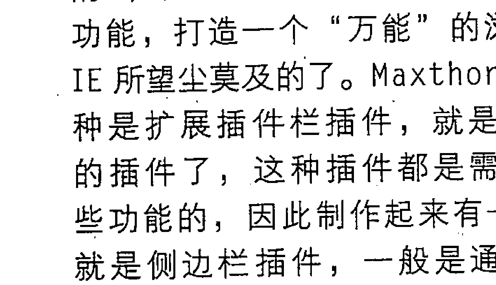

要在网页上使用MSN，必须使用网上提供的、现成的MSN在线使用程序，而目前网上主要就是微软的http://webmessenger.msn.com/default.aspx，它可以让你在网页上面使用MSN（图1）。我们只要编辑好HTM文件，在HTM文件里面加上一行字“点击启动MSN在线程序”，然后链接到这个地址即可。接下来我们编辑一个名叫plugin.ini的文件，然后按照下面提示的内容输入。在输入的时候我们要注意格式，每行一条设置，一条设置一行放不下的话可以自动换行，但是中间不能加回车，括号里面内容是我提供给大家的注释，到时不需要输入。

```
[General]
Name=xxxxx （xxx就是你的这个插件的名字，任意取即可）
Author=xxx （xxx是作者名称，随意输入）
Version=1.0 （所谓1.0就是版本名称，这个也是随意的）
ModuleType=SCRIPT （模板类型，直接输入）
FileName=msn.htm （这里就是你所制作的HTM文件的文件名和路径）
Comments=xxxx （这里是插件的描述，随意输入）
Type=M2Plugin_Sidebar （插件类型，M2Plugin_Sidebar的意思是侧边栏插件）
HotIcon=hot.ico （热点图标，当你把鼠标指针放在插件图标上时会显示的样式，可以自己找不同的ico文件）
Icon=msn.ico （这是侧边栏显示的图标，同样可以找ico文件来代替）
```

HTM文件和Plugin.ini文件都制作好之后，我们的这个插件就算是制作完成了，现在我们可以自己安装到Maxthon里面，或者是打包起来发给别人，让别人也试用一下你所设计的插件哦。

### 2. 自己安装插件

当我们自己制作了一个插件之后，或者在网上下载了别人制作的插件后，首先我们到Maxthon安装目录下面去，里面有一个plugin子目录，不过我们不要把插件直接解压到这里，而是在这个plugin中建立一个文件夹，文件夹名称除了中文名称之外可以任意取。然后将插件放到这个目录里面，文件包括了网页文件、plugin.ini设置文件以及你的图标ico文件等等。一切完成之后，现在我们打开Maxthon，它就会弹出提示说找到插件，询问你是否安装。只要将插件前面的方框选上，然后点击“确定”，这个插件就被安装到Maxthon的相应位置之中去了。

### 3. 用放大镜看网页

我们在浏览网页的时候会碰到一些过小的文字，这时候我们可以将浏览器上面的字体变大来方便观看，但是这样一来一些页面的整体效果就被破坏了，而且这种方法对一些图片上面的小文字是无法放大的，这时候我们可以使用Maxthon的“放大镜”功能来查看。

首先我们打开一个网页，然后在Maxthon主菜单上面选择“查看”→“网页缩放”，下面有一系列的缩小放大比例让我们选择，我们可以选择其中的150%或200%，然后你就会看到整个网页，包括图片在内被整体放大了。你也可使用快捷键“Ctrl + '+'”或“Ctrl + '-'”以20%的比例逐级对网页进行放大或缩小，如果要将网页恢复正常显示，只需按下“Ctrl + *”即可。就算你是深度近视，恐怕也不再需要眼镜了。

### 4. 瞬间更换核心

Maxthon浏览器其实只是一个外壳浏览器，也就是说在IE的内核技术上面嵌套一个外壳，从而实现很多IE所无法做到的功能，实际上内在还是IE，因此在兼容性方面非常出色。不过问题也随之而来，大家都知道IE的安全性欠佳，许多病毒和黑客都将IE列为主要攻击目标，这样也让Maxthon容易受到波及。为了避免这种情况，我们可以替换Maxthon的浏览核心。方法就是打开Maxthon主菜单上面的“文件”→“设置”→“使用Gecko核心”。这样我们的浏览器核心就由IE变成了Gecko，病毒也就没那么容易入侵进来了。

### 5. 把Maxthon变成真正的默认浏览器

虽然Maxthon可以把自己变成默认的Windows浏览器，但是在一些即时通讯软件里面，譬如MSN Messenger，我们在MSN Messenger中打开网友发送过来的网址时，系统依旧用IE来打开，为了能够让Maxthon变成真正的默认浏览器，我们需要修改注册表达到这样的效果。

首先我们用记事本编辑包含以下内容的文件，然后保存成为“.reg”文件。

```
Windows Registry Editor Version 5.00
[HKEY_CLASSES_ROOT\.html]
"PerceivedType"="test"
@="GBHTML"
"Content Type"="text/html"
[HKEY_CLASSES_ROOT\.htm]
"PerceivedType"="test"
@="GBHTML"
"Content Type"="text/html"

[HKEY_CLASSES_ROOT\GBHTML\DefaultIcon]
@="C:\Program Files\Maxthon\Maxthon.exe,0" （这里设置Maxthon的安装目录）
[HKEY_CLASSES_ROOT\GBHTML\Shell]
@=""
[HKEY_CLASSES_ROOT\GBHTML\Shell\open]
[HKEY_CLASSES_ROOT\GBHTML\Shell\open\command]
@=""d:\Program Files\Maxthon\Maxthon.exe" %1"
```

记住每一行都必须空开一行。保存成为“.reg”文件之后双击它，系统会提示你是否将注册信息导入注册表，选择“是”之后重新启动系统，我们就会发现在MSN里面打开链接的时候调用的都是Maxthon了。

### 6. 用Maxthon批量下载

通常我们需要批量下载的时候都是使用FlashGet里面的“添加成批任务”功能，不过这需要我们编写带有通配符的表达式，以达到批量下载的目的。但如果链接地址是无规律的，我们的表达式也就没有用武之地了。这时候我们可以使用Maxthon来巧妙地达到批量下载的功能。

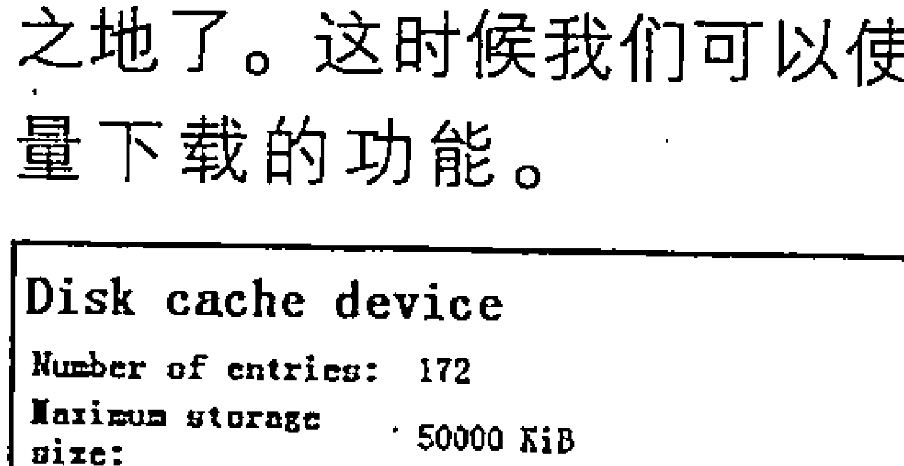

首先在Maxthon中打开有下载链接的页面，选择菜单“查看”→“页面链接列表”，我们就会看到一个弹出窗口，里面包含了所有当前页面里面的链接（图2）。接着我们点击“设置下载工具”按钮，在下拉菜单之中选择“FlashGet”，当然你的系统必须已经安装FlashGet了。现在我们点击“保存”返回到上一级页面，可以看到在每一个链接地址的后面都有一个复选框，想要下载哪个链接，选中其后的复选框即可。但如果该页面的链接太多，查找起来不方便，我们就可以在上面的“链接文本包含”或“链接网址包含”中输入指定的内容，再点击其后的“过滤”按钮，Maxthon就可以快速筛选出所有包含指定内容的下载链接。确认所有内容都筛选好了之后，我们最后点击“下载”按钮，即可自动调出FlashGet，并出现“添加新的下载任务”窗口来依次添加刚才选中的下载链接了。

### 7. 快速保存文字与图像

在IE里面保存图像必须通过“目标另存为”，至于文字的话就只能复制/粘贴了，但是在Maxthon我们就可以快速地把图像和文字保存起来。首先我们打开菜单“选项”→“Maxthon选项”，然后在弹出窗口的左边选择“保存”，在“保存路径”中设置好文件夹，以便在里面查找保存下来的内容。设置好了之后，现在我们打开网页，首先用鼠标选中要保存的图像和文件，两者可以同时被选中，然后在用鼠标拖动文字和图像的同时按住Ctrl键，那么选择的文字或图像即可自动保存到您刚刚定义好的文件夹中。而且如果你的图像上面有链接，那么Maxthon同样会把你的图像链接也保存下来哦。

## 腾讯TT的精彩

说到即时通讯软件，腾讯QQ肯定是国内当之无的老大了，而随之而来的腾讯TT浏览器也成为了许多使用QQ聊天的用户的首选。毕竟TT是可以跟随QQ一起安装到系统里面的，它和Maxthon一样属于外壳浏览器，同样调用了IE内核，但是功能就要比IE强很多了。如果你已经在用TT，或者还没有用过（可以到http://tt.qq.com/ 去下载），不妨来看看下面这些精彩的 TT 应用技巧吧！

### 1. 巧用鼠标手势

在 IE 里面，我们要向前、向后翻页；或者刷新、关闭窗口都要用鼠标点击相应的按钮，但是在腾讯 TT 里面，我们可以用鼠标手势来实现这些功能，而不需要点击相应按钮！在缺省状态下，腾讯 TT 的鼠标手势功能是没有打开的，我们要点击“工具”→“TT 选项”，然后在“浏览设置”选项之中选中“使用鼠标手势功能”前面的方框，然后点击“应用”即可。

所谓的鼠标手势就是用按住鼠标右键不放在网页的空白处做某种轨迹运动， 以此来执行后退、前进、刷新、关闭窗口等操作，非常方便快捷。目前 TT 能够通过鼠标手势导航的功能包括向前翻页、后退、刷新和关闭。

- 向前翻页：按住鼠标右键，向右移动，松开鼠标右键。
- 后退：按住鼠标右键，向左移动，松开鼠标右键。
- 刷新：按住鼠标右键，向上移动然后向下移动，松开右键。
- 关闭：按住鼠标右键，向右移动然后向左移动再向右移，松开右键。

### 2. 活用“最近浏览”功能

在 IE 浏览器里面，我们关闭了一个窗口之后，在忘记了网址而且没有收藏起来的前提下，如果再想打开就只能找历史记录了，查找起来非常不方便。而腾讯 TT 则提供了一个非常实用的“最近浏览”功能，这里可以显示你最近浏览过的页面。当你在浏览页面的时候，因为不小心关闭了某页面而想重新打开的时候，我们可以展开位于浏览器工具栏中央的这个列表，然后在里面选择相应的网页，比如“新浪”，在打开这个页面的同时，“新浪”的名字就会在这个列表里面消失了。如果你只是错误关闭了一个窗口，那么你根本不需要在列表之中选择，直接点击“最近浏览”按钮就可以立刻恢复你刚才关闭的窗口了。有时候我们不想让别人看见我们曾经浏览过什么网页，这时候我们可以选择“最近浏览”下拉菜单之中的“删除所有关闭列表”，这样就能够清空当前列表中的所有地址。

在 TT 的“最近浏览”中最多可以保存 15 条地址信息，最多可以显示 10 条地址信息。当关闭的页面超过 15 个后，“最近浏览”中只保存最近关闭的 15 个地址，并且在列表中只显示最近 10 条地址，从列表中选中 1 个网页打开后（即从列表中清空该条地址）再重新打开列表，你就会发现事先保存的一条地址信息已经被补充进来了。

### 3. 智能过滤

在 IE 和其他浏览器里面都有过滤弹出窗口的功能，同样 TT 也不例外，根据笔者亲身感受以及一些网友的意见，TT 的过滤弹出窗口功能还是相当不错的，有些浏览器不能防住的弹出窗口都能够被 TT 拦截下来。首先我们来打开 TT 的窗口拦截功能。打开菜单“工具”→“TT 选项”，然后在弹出窗口之中选中“智能屏蔽设置”（图 3），我们可以选中“过滤自动弹出式窗口”，然后上下拖动滑杆来设置过滤的级别。级别越高，弹出式窗口就越难作恶。有时候为了防止“伤害无辜”，我们可以点击“允许列表”，将一些“例外”的网址输入到里面去，这样 TT 就会对这些窗口另眼相看了。

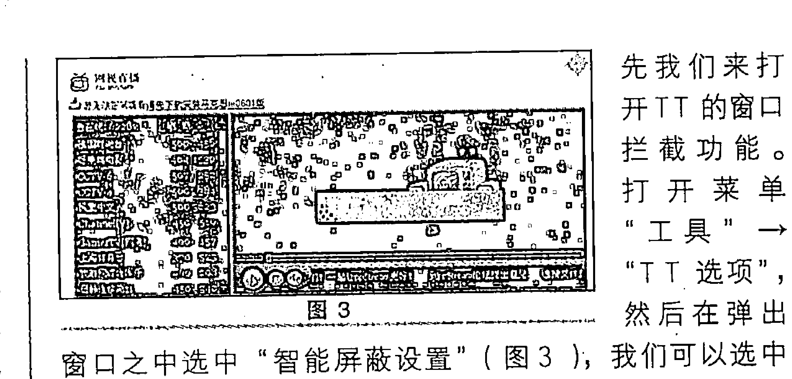

除此以外 TT 还有“监视 Active 插件”的功能，比如一些软件的安装提示等等，我们都可以点击“阻止列表”来把这些讨厌的程序添加到里面，以后上网浏览的时候就再也不会看到这些讨厌的安装插件出来骚扰我们了。

除了以上两个功能之外，腾讯 TT 里面还有丰富的禁止功能，都包括在下面的“其他选项”里面，你可以把包括网页里面的浮动元素、Flash、脚本在内的一切你觉得妨碍浏览网页的东西都禁止掉，还你一个清静的浏览器。不过在设置之前最好仔细想清楚，因为某些网站可能因为你禁止了一些东西而无法正常显示哦。

## IE终结者 Firefox（火狐）

如果说上面的 Maxthon 和腾讯 TT 都只是“披着狼皮的羊”，实际上内核和 IE 一样的话，那么 Firefox 就完完全全是一个拥有自己内核的独立浏览器了。它的前身就是当年赫赫有名的 Mozilla。在 Firefox 上面我们再也找不到在 Mozilla 里面常见的兼容性、功能性方面的问题，而且 Firefox 在功能方面比 IE 强大很多，甚至堪比以功能繁多著名的 Maxthon。如果你还没有用过 Firefox，那么你可以到 http://ftp.pconline.com.cn/pub/download/200509/firefox-1.6a1.zh-CN.win32_PConline.exe 去下载一个最新的版本，如果你已经安装了 Firefox，就让我们一起来看看，除了正常的浏览网页之外，Firefox 还有什么特殊能耐吧。

### 1. 使用标签式浏览

在缺省的情况下，Firefox 和 IE 一样同时只能浏览一个页面，但是我们可以通过设置来让 Firefox 支持标签式多窗口浏览。打开菜单“工具”→“选项”，然后选中“标签式浏览”标签。在这里我们首先选中“打开请求新建窗口的链接是...”前面的方框，然后选择“新建标签页”，接着将第一个选项选择成为“新建窗口”，接着点击“确定”即可。这样以后 Firefox 也可以用类似 Maxthon 的多窗口浏览方式来浏览网页了。

### 2. 加速浏览器的启动

在 Firefox 里面，我们可以加快浏览器的启动速度，

### 3. 对缓存了如指掌

在IE里面，我们顶多知道IE占用了多少硬盘空间来存放临时文件（缓存），但是这些缓存里面都包含了什么就不知道了。在Firefox的“工具”→“选项”→“隐私”→“缓存”里面，我们同样可以设置缓存容量的大小。而且它比IE更加智能的就是我们还能够查看缓存里面都有些什么东西。方法就是在地址栏中输入“about:cache”，在出现的页面之中你能够看到内存缓冲设置与磁盘高速缓存设置（图4），接着点击“List Cache Entries”链接，我们就可以看到缓冲区中的数据文件列表，我们可以仔细浏览每一个缓存文件的内容、下载时间以及当时执行的HTTP命令，可以说相当个性化。

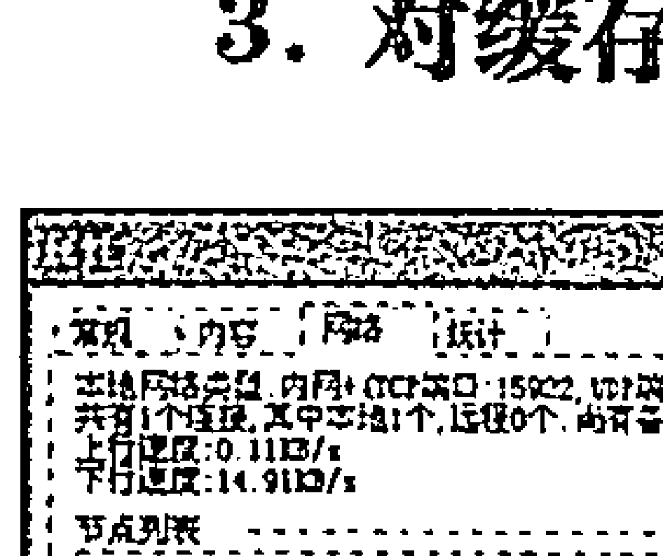

### 4. 完全自定义书签

书签在IE里面称为收藏夹，在IE中我们只能做简单地增加、删除、复制、粘贴的功能，而在Firefox里面我们还能够对书签进行自定义排序。事实上Firefox的书签是一个文件，地址就在你的C:\Documents and Settings\用户名\Application Data\Mozilla\Firefox\Profiles\用户名.default\里面，文件名是bookmarks.html。要管理我们的书签，可以打开菜单“书签”→“管理书签”，然后在弹出的“书签管理器”窗口之中将那些你最喜欢的书签移动到“书签工具栏文件夹”中，再点击该窗口的菜单栏“查看”，我们就可以根据名称、地址、关键字、描述、添加时间等条件进行自行排序。我们也可以在右边的书签列表之中用鼠标拖动的方法来手动给书签排序。添加到“书签工具栏文件夹”之中的书签，会在Firefox的“书签工具栏”之中直接体现，使用的时候只要轻轻一点就可以打开了，非常方便。

### 5. 备份配置文件

在浏览器的日常使用之中，我们肯定有一大堆的设置保存了下来，其中包括程序设置、书签、扩展功能、插件、密码等等。在IE时代，我们可以自己保存收藏夹，但是密码还有程序设置就无法保存了。而Firefox可以把这一切都打包起来，然后在新系统之中进行恢复。首先我们创建一个Firefox程序的快捷方式，再用鼠标右键点击这个图标，然后在弹出菜单中选择“属性”，接着转到弹出窗口的“快捷方式”标签页之中，在“目标”选项里面添加参数“-p”。确认操作后，打开这个快捷方式启动Firefox，你就会看到“Firefox-选择用户配置文件”的对话框了。这时我们点击“创建配置文件”按钮，然后就可以根据向导的提示非常简单地把配置文件都保存下来了。

### 6. 设置默认下载文件夹

IE的下载功能众所周知是很简单的，每次用IE下载我们都必须要给下载文件指定一个路径，而在Firefox之中，我们可以预先指定一个默认的存放下载文件的目录，以后我们点击下载了之后，所有文件都会自动被放到里面。而在默认的情况下，Firefox会把下载后的文件保存在桌面上，这肯定是不合适的。我们可以打开菜单“工具”→“选项”，然后选中“下载”图标，在右边窗口之中的“下载文件夹”中选择“将所有文件保存至此文件夹”，然后点击下拉列表中的“其他”，即可打开“浏览文件夹”窗口进行指定文件夹的选择，一般来说我们可以保存在C:\download下面。

### 7. 指定任意主页数目

在所有使用IE内核的浏览器里面，都只能指定一个主页，但是Firefox就能够同时设置多个主页。首先我们打开一系列的网页标签，然后打开菜单“工具”→“选项”→“常规”选项里面，如果当前你打开了多个窗口，那么我们就会看到在主页设置框里面的“使用当前的多个页面”按钮，而且当前打开的页面地址会出现在文本框中，点击这个按钮之后你就同时拥有多个主页了。此外你也可以添加书签里面的网页为主页，方法就是点击“使用书签”按钮，在弹出的窗口之中选中一个书签组之后再点击“确定”。设置了多个主页之后，我们每次点击“打开主页”按钮，或者启动浏览器的时候，都会直接打开这一系列的主页“组”了。

### 8. 备份和导入收藏夹

在IE里面我们可以通过保存“收藏夹”目录而达到备份收藏夹的目的，在Firefox里面，我们可以在“书签管理器”中点击“文件”→“导出书签”，将我们平时收藏的网址保存到指定的Html文件中。如果我们要把书签重新导入，只需要在书签管理器中点击“文件”→“导入书签”，然后选择“从文件”，最后选择之前保存下来的Html文件即可把书签重新导入了。另外我们还可以在导入书签的时候选择“微软Internet Explorer”，这样可以把微软的收藏夹里面的东西都拿来用哦！

## 用浏览器看网络电视

随着宽带网络的普及，现在网上到处都流行着网络电视、电台之类的在线流媒体。一般情况下，我们看这些网络电视，听网络电台的时候需要用一些专门的媒体播放器，譬如暴风影音、Windows Media Player、Realone等。但是现在出现了这么一款浏览器，可以让我们直接在浏览器里面就可以看网络电视了，不但不

```
about:config
```

```
about:cache
```

```
-p
```耽误上网浏览网页，在收看的速度方面更有很好的表现，这款浏览器就是：马克思IE了。

马克思IE是一款集合了很多功能的浏览器软件，通过它可以浏览网页、P2P下载、BT下载、阅读RSS等等，而最新版本的马克思IE更加是内嵌了网络电视播放器PPStream，可以用它来看网络电视哦！下面我们就先在马克思IE的官方网站下载最新版本的马克思IE (http://cn.mxie.com)，马克思IE有两个版本，一个是绿色版，一个是exe安装版，两者之间的区别就在于绿色版是一个压缩包，下载后解压缩直接可以运行，更方便一些，大家可以根据自己的喜好选择。

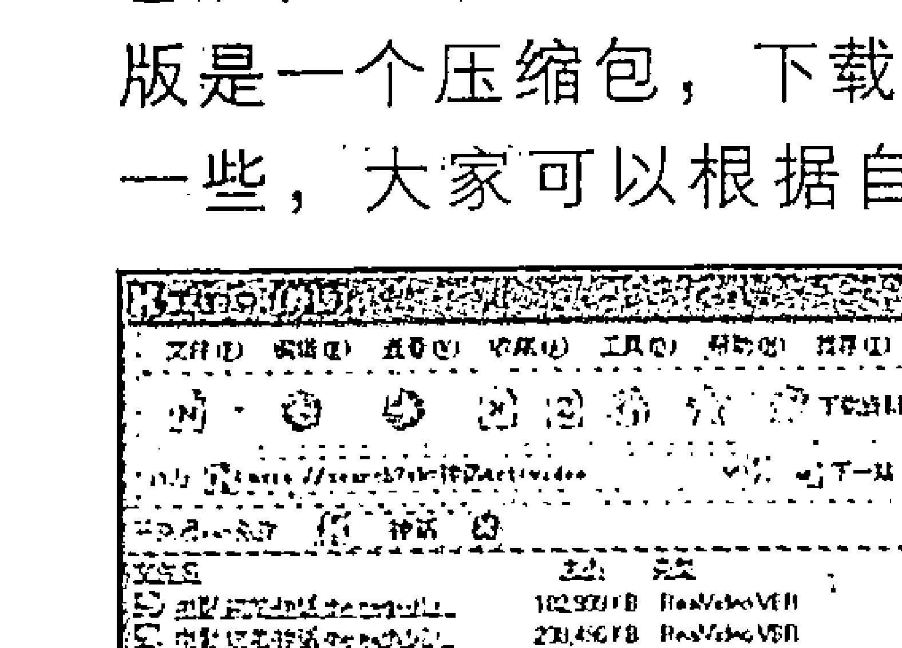

打开马克思IE之后，点击工具栏上面的“网视直播”按钮，很快我们就可以在浏览器中间看到网络电视播放器的界面了，有时它会提醒你更新电视软件的版本，我们直接确认就可以了。在“网视直播”（图5）里面的左边是电视台节目列表，而右边是播放窗口。可以看到这里面的电视节目数量很多，包括了知名的凤凰卫视、东风台、Channel V、卫视电影台等等。我们可以通过拖动黑色的滚动条来看看所有的电视台列表。

在列表最上方还可以查看当前在线的用户人数。在繁忙的时段，比如晚上7～12点钟，马克思IE上面都有至少六万人在线，因此有时候打开的速度就会比较慢，大家要多尝试几次才行。

我们要收看电视节目的时候，只要用鼠标点击任意一个节目名称，播放器就会自动开始连接服务器，刚开始连接一个电视台需要网络缓冲一段时间，这个过程花费的时间比较长，连接成功后还可能出现断断续续的情况，但随着播放时间的增加播放速度会越来越稳定，一切顺利的话就可以在线播放了。由于PPStream看网络电视的原理和BT差不多，因此看电视的人数越多，就会让电视看得更加流畅哦。有时候播放器没有连接或连接不成功，可能是系统中没有安装Windows Media Player 9播放器。

在电视播放的过程之中，我们可以在播放界面上面执行“播放”、“暂停”、“停止”、“音量”等等操作。此外我们在播放窗口上面点击鼠标右键，还可以通过弹出菜单来调节播放器窗口的大小，譬如“自动适应大小”、“窗口中在最顶端”、“全屏幕”，此外选择“在默认的播放器中播放”命令还可以打开系统默认的播放器程序，如Windows Media Player来播放节目。

在前面我介绍过PPStream的原理和BT相似，事实上就相当于BT下载/播放网络电视而已，因此观看电视的人数多少直接关系到网络电视的播放速度。我们在连接到一个网络电视节目上面去之后，可以在播放窗口上面点击鼠标右键，然后选择“属性”，在弹出窗口之中我们选择“网络”标签，即可看到当前的网络电视台的连接人数，以及观众的IP地址、各自的连接时间等。

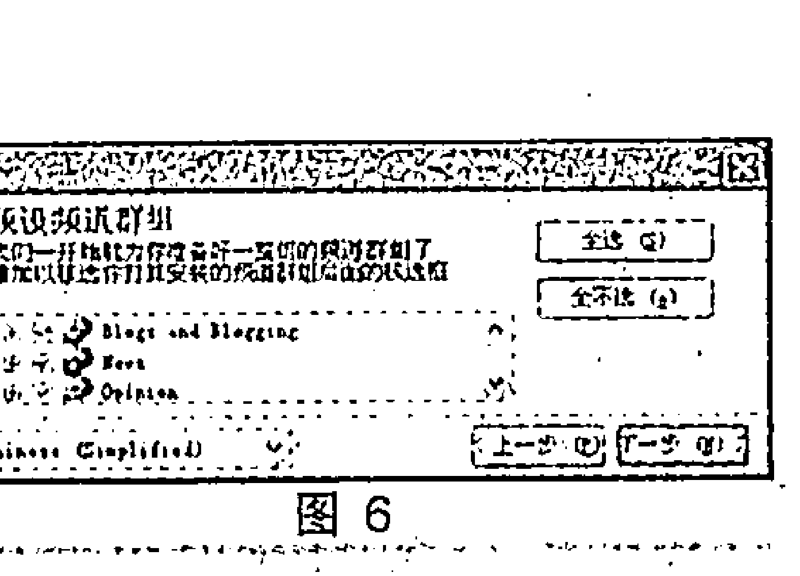

等，可以让你直观地知道当前节目是否具备流畅播放的条件（图6）。此外在“统计”标签里面我们也可以看到当前我们看网络电视的平均速度以及流量。只要灵活运用属性里面的信息，找一个流畅播放的网络电视台并不是什么难事。

最后我们可以看到在播放器控制按钮的上方有三个灯，绿色的灯表示运行正常。第一个灯是显示用户自己的网络连接状况，第二个灯是显示网络速度以及连接状况，如果网络中断这里会显示红灯。最后一个灯是显示播放器对用户自己网络状态的评价情况，我们只要把光标移到这三个灯上面就可以看到弹出的详细信息了。在马克思IE里面看电视，可以看到很多电视机都接收不到的电视节目，绝对值得大家去试试哦！

## 用浏览器来玩P2P

上面我们介绍过马克思IE除了网络电视之外，还整合了P2P技术，用户可以通过马克思IE的P2P功能搜索电影、MP3等等一切感兴趣的东西，一切都是免费的！除此之外，我们还能够通过马克思IE来进行BT下载，这一切都不需要用别的软件哦。

### 1. 搜索和下载P2P资源

马克思IE整合了P2P技术的意思就是浏览器本身就是一个P2P软件，你可以通过它连接到其他的马克思IE浏览器，同时也连接到共享了资源的电脑上，快速地下载你想要的资源。首先我们打开马克思IE的主界面，可以看到在工具栏的右方有一个“搜索”栏，前面是一个下拉菜单，后面是一个搜索输入栏和“GO”的图标。首先我们在前面的下拉菜单里面选择我们想要的资源类型，比如说音乐、影像、文档、图片、软件、压缩文件等等，也可以是搜索全部类型。在下拉菜单的最下方，我们会看到有百度、Google和3721的选项，如果我们选择了它们，就相当于到它们的搜索引擎之中去搜索资源了。

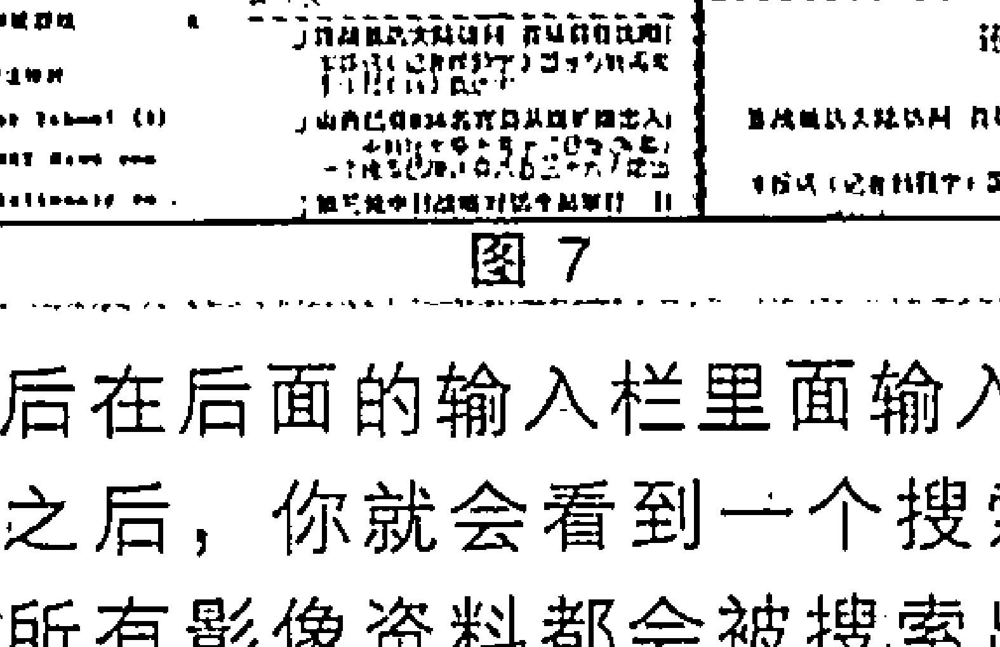

最近最热门的莫过于电影《神话》了，首先我们在前面的资源类型下拉菜单里面选择“影像”，然后在后面的输入栏里面输入“神话”，点击“GO”按钮之后，你就会看到一个搜索窗口，很快有关“神话”的所有影像资料都会被搜索出来了（图7）。除了显示“文件名”之外，我们还能够看到文件大小、类型、速度以及来源数。来源数在P2P下载软件里面是一个很重要的数字，这代表有多少人共同拥有了这个文件，拥有的人数越多，代表你下载的速度也越高哦。假设现在我们已经找到了一个来源数很多，而且文件大小合适的片源，可以开始下载了，我们就点击片源上面的链接，马克思IE 就会自动打开“传输中心”来开始下载，中途不需要别的步骤，你只需要等着你的电影下载完成即可。

值得一提的是，马克思IE 还支持一种新颖的“右键搜索”方式，当我们用马克思IE 浏览网站的时候，如果网页内容中有你感兴趣的关键字，这时只要选中我们想要的关键字，然后点击鼠标右键，在弹出菜单中选择“mxie 档案搜索”，这样就可以立刻进行P2P 的文件搜索了。

这时候读者可能会问，下载回来的电影是放在哪里呢？其实在安装马克思IE 的时候它会询问你将下载的软件放在哪里，缺省状态下面是C:\download，如果你想换到别的路径，可以在马克思IE 的主界面上面打开主菜单“工具”→“mxie 选项”，在弹出的窗口的左边选择“传输”选项卡，就可以设置下载路径以及下载中途的文件暂存路径了。

### 2. 共享P2P资源

正所谓人人为我，我为人人，P2P 共享的精神就在于获取的同时有奉献，因此我们在下载P2P 资源的时候，也应该把自己硬盘之中的资源大方地拿出来。我们在马克思IE 的主界面上面打开主菜单“工具”→“mxie 选项”，在弹出窗口的左边选择“P2P 外挂程式”→“共享”，这里面已经把缺省的下载文件夹共享出来了，我们可以点击“增加”，然后选择某个目录，点击“确定”就可以了。以后别人就能够通过之前你所使用的P2P 搜索发现你硬盘上面的资源，并且进行下载。

有时候为了控制P2P 的带宽，不至于让P2P 上传过度占用带宽，我们可以在“P2P 外挂程式”选项卡之中设置传输个数，也就是说最大支持多少个“上传/下载”任务同时进行，此外我们也可以设置一下网络带宽，让我们在共享P2P 的时候不影响其他的网络应用。

### 3. BT下载

马克思IE 本身的P2P 功能虽然不错，但是在速度上还是远远不能够和目前网络上最热门的BT 下载相提并论，因此在新版本的马克思IE 里面，自然就出现了BT 下载功能了。我们打开马克思IE 的主界面之后，点击工具栏上面的“免费影音”，很快就进入到了马克思IE 的资源下载页面了，这里提供了不少的BT 下载资源，只要我们直接点击这些链接，即可启动马克思IE 内置的BT 下载功能进行下载了。同时我们在网上找到了一些BT 资源，也可以利用马克思IE 来打开，同样不需要任何BT 客户端。在实际测试之中，马克思IE 的下载速度还是相当不错的，尤其是在内部网里面。

## 用RSS看网站

RSS 这个新鲜字眼似乎是一夜之间冒出来了，从2004 年下半年到现在无数大小的网站争相支持RSS，到现在几乎所有的门户网站，专业网站都支持RSS 阅读了。那RSS 究竟是何方神圣，为什么有如此的魔力呢？

原来RSS 就是一种XML 格式的文件，以往我们去浏览一些门户网站，总会看到眼花缭乱的广告和分类，而在RSS 阅读模式下面，我们只会看到这个网站最新更新的文章，点击进入即可进行浏览了，也就是说不但省时间，还省了我们用来下载广告的带宽。虽然开始有一些浏览器软件支持RSS 阅读，但是要看RSS 新闻，我们还是用正宗的RSS 阅读器好，它就是FeedDemon 了。

FeedDemon 是一款专门的RSS 阅读器，只要你去的站点支持RSS，就可以利用它来浏览网站上提供的最新资讯了。FeedDemon 支持包括中文在内的20 多种语言，使用起来也相当简单，我们可以到各大软件下载站点去下载。下载安装完成之后，我们运行FeedDemon，程序会提示我们选择语言种类，我们在下拉菜单之中选择“Chinese Simplified”(简体中文)，接着点击“下一步”你会看到一系列的软件介绍。其中有一个“预设频道群组”的步骤，在这里面已经帮我们设置了各大网站的RSS 阅读路径了，只要我们点击“全选”即可（图8），最后我们就会看到FeedDemon 的主界面了。

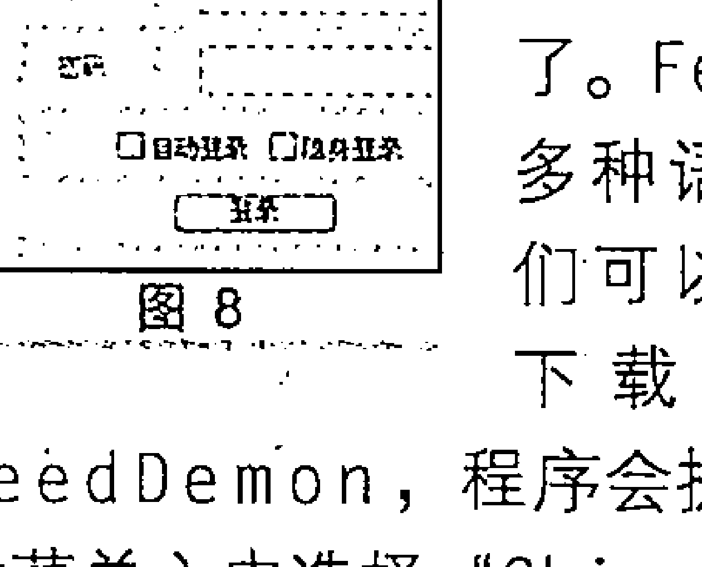

### 1. 添加RSS频道

接下来我们就要开始用FeedDemon 来浏览新闻组了。虽然FeedDemon 里面缺省添加了不少新闻组，但是那些都是英文资讯，并不适合国内的用户，因此我们需要自己手动添加RSS 频道。首先我们必须知道一个RSS 地址，比如网易新闻中心的“头条新闻”RSS 地址就是http://news.163.com/special/r/00011K6L/rss_newstop.xml。我们把地址复制下来之后，切换到FeedDemon 的界面，在左侧的频道群组上面点击鼠标右键，然后在弹出菜单之中依次选择“新增”→“新增频道”，或者直接按Ctrl + N，弹出一个窗口，询问你如何添加频道，一般来说如果我们要添加链接，就选择第一项“我将会输入这个消息来源的网址”，然后点击“下一步”，把网址粘贴到“消息来源”里面，并且把“自动发掘并验证消息来源”前面的方框选上，接着点击“下一步”给这个频道命名即可。回到FeedDemon 主界面，展开左上方的“频道群组”，点击刚才添加的频道名字，如果连接是正确有效的话，很快我们就可以看到最新的新闻动态了。在FeedDemon 里面我们可以看到今天的新闻，以及今天之内我们还没有阅读过的新闻，点击进去之后就可以观看了（图9）。除了添加频道链接之外，FeedDemon 还具有多种加入频道的方法，我们可以直接利用OPML 档案进行导入，或者使用菜单上的“新增频道”进行添加。

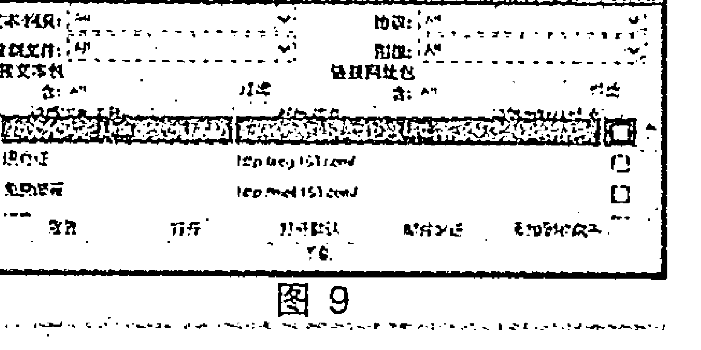

### 2. 搜索RSS新闻

一旦我们在FeedDemon 添加了RSS 地址以后，FeedDemon 就会自动更新这个地址，并且会立刻在软件里显示。

### 3. 使用剪报室

FeedDemon 里面还提供了一个“剪报室”的功能，在我们看到感兴趣的新闻时，只要在新闻频道上面按右键，点击复制到剪报室，然后选择相应的剪报群组就可以了。它的作用就像我们看传统的报纸时，用剪刀和胶水将新闻收集到一个本子上一样，以后就算该新闻被挤走，我们还可能利用这个剪报室重新浏览到该新闻。在缺省状态下FeedDemon已经有了一个剪报室“My Stuff”，我们可以点击鼠标右键，然后选择“新建”→“剪报室”来新建多个不同的剪报室群组。

### 4. 活用“监视”功能

有时候我们需要在多如牛毛的新闻资料里面找寻相应的新闻资料，一个一个来寻找显然是不现实的，此时我们可以使用FeedDemon的监视功能。在“监视”群组里面点击鼠标右键，选择“新建”→“监视”，然后在弹出窗口里面输入一个“监视”的名字，以及你需要进行监视的新闻关键字，还可以选择如何去匹配关键字，配置完成之后点击“OK”，FeedDemon就会询问你是否在当前所有分组里面进行搜索，点击“是”，很快FeedDemon就能够把所有找到的资料列到你的面前了。监视的功能一旦启动，它就会在后台默默工作，一找到符合条件的新闻立刻就会通知我们，作用就好像一个小秘书一样。

### 5. 滚动更新消息

不同的新闻网站更新的速度各有不同，有些网站的更新速度就特别快，比如新浪新闻，碰上了一些大事件，好像最近的神舟六号飞船发射，其更新速度更加是以分钟来计算。如果我们要及时了解最新的消息，那么可以对不同的新闻频道设置不同的更新时间。首先我们选择一个新闻频道，然后在上面点击鼠标右键，选择“属性”，然后在弹出的窗口里面切换到“更新”标签，这里可以设置自动更新的时间频率，缺省状态是3个小时，我们可以设置的最快速度是1分钟更新一次。此外在这里我们还会看到一个“自动净化”的选项，它的功能就是设定在新闻频道中保留的项目个数，默认的是200条。如果你觉得有必要保留的话，可以在这里将保留的新闻项目加多点，或者使用监视功能和剪报室保存旧资料。

### 6. 清理精灵清理“垃圾”

在用FeedDemon一段时间之后，可能我们的新闻频道里面会积压了一大堆无用的新闻资料，这时我们可以利用FeedDemon里的清理精灵进行自动清理。方法就是打开菜单“工具”→“清理精灵”，它是以向导形式运行的，能够帮我们清理目前关注的频道组或者所有的频道组所接收到的资料，甚至连监视组和剪报室都可以清理。

## 在浏览器里面玩QQ

前面我介绍过了Maxthon这个功能强大的浏览器，大家也了解了如何制作Maxthon的插件，而这段时间网上出现了一款新颖的Maxthon插件，可以让我们在浏览器里面玩QQ！我们首先到 http://dlc.pconline.com.cn/filedown.jsp?id=64340&dltypeid=1 去下载这个QQ插件回来。下载回来的文件是一个压缩文档，我们解压了之后得到一个QQMAX目录，我们直接把这个目录复制到Maxthon安装目录的“Plugin”文件夹下即可，然后启动Maxthon浏览器之后就会弹出发现插件的对话框了。选中“QQMAX”之后点击“确定”按钮即可进入浏览器主界面。

现在我们按“Ctrl+E”打开侧边栏，然后在里面点击“QQMAX”的图标，我们就会看到一个QQ的登录界面了（图10），在这里面输入QQ号码和密码之后，点击“登录”按钮即可登录到QQ上面了。登录成功之后，它会自动对在线好友和离线好友进行分组。想要给某个好友发信息，只要点击这个好友的头像，软件就会自动打开一个聊天窗口，然后我们就可以像用QQ一样跟好友进行聊天了，发送消息也可以使用Ctrl+Enter快捷键，如果想关闭这个聊天窗口，只要点击聊天窗口好友名字后面的红色叉按钮就可以了。此外我们也可以同时和多位好友聊天，软件会自动排列多个聊天窗口，想发送消息给谁，只要单击那位好友的名字就可以展开和他的聊天窗口，别的窗口会自动折叠起来了，只要你不关闭浏览器，你的QQ可是一直在线的。

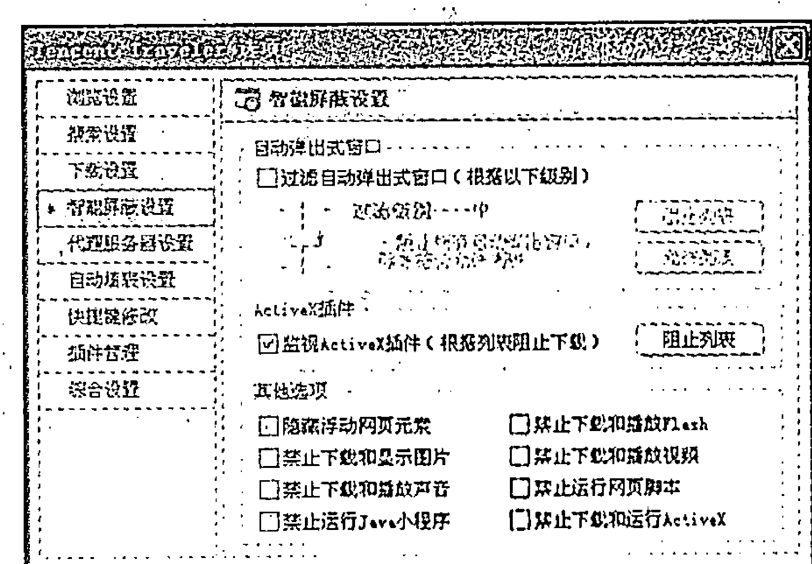

在QQMAX中同样有上下线、来消息提示功能，当某位好友上线或离线或有人发消息过来时，在QQMAX窗口的最下方就会给出实时提示，而且在QQMAX中我们还可以查看好友资料。用鼠标左键点击选中某个好友之后，再点击“查看资料”按钮，即可在弹出的窗口中查看到好友的各种资料了，点击“刷新”按钮还可以更新好友的个人资料信息。最后要退出QQ登录状态的时候，我们只要单击工具栏上右下角的“下线”按钮（带有粗“→”符号）即可。

## 网络限制与反限制

文/风之扬

为了提高工作效率，许多网络管理员想尽办法对用户实行网络限制，不让用户登录QQ和MSN Messenger，不让用户玩网络游戏；同时，不甘寂寞的用户也想尽办法突破网络限制。两相较量，到底鹿死谁手？下面，我们从禁用和反禁用的角度分析网络应用中的一些典型问题，并给出相应的解决措施。

### 典型登录方式分析

#### 1. MSN Messenger 登录实例

一般来说，用户电脑上的MSN Messenger程序统称为MSN Messenger客户端，它通过Internet连接到一个MSN Messenger服务器。也就是说，客户端通过服务器与其他客户端交换信息。在大多数时间里，用户的客户端与服务器会话，然后由服务器来处理这些会话信息并通知其他人。我们使用Sniffer NT来截获MSN Messenger登录时的数据，如图1所示。

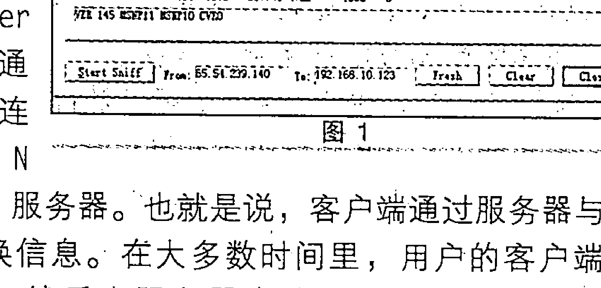

从截获的登录数据中，我们可以看到，在“数据”一栏中，有很多类似CVR、VER、USR等开头的数据，登录连接时还用到了TCP/1863和TCP/443这两个端口，它们记录了MSN Messenger登录的整个过程。如图2所示，可以知道有一个MSN Messenger用户在线。

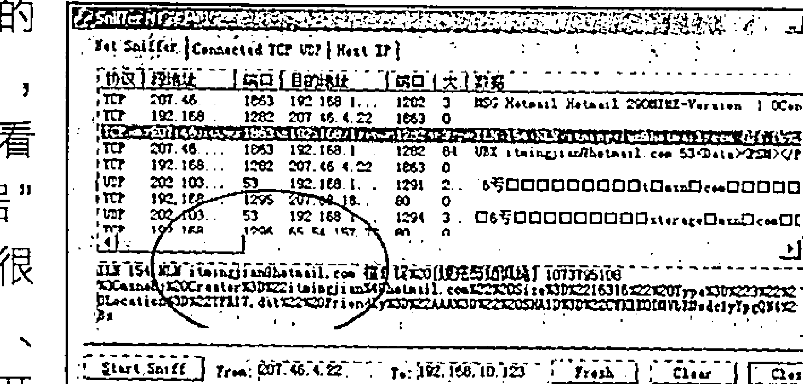

我们可以看到，登录连接时还用到了TCP/1863和TCP/443这两个端口，它们记录了MSN Messenger登录的整个过程。如图2所示，可以知道有一个MSN Messenger用户在线。

#### 2. QQ 登录实例

假设网络出现故障，使用QQ进行登录时，系统会出现登录失败的提示。

- 【QQ 版本】Build 13.81.8228
- 【QQ 号码】527454452
- 【操作系统】Microsoft Windows 2000 Service Pack 4 [Build 5.0.2195]
- 【网络设置】局域网内使用透明代理
- 【登录过程】

```
开始登录……时间[2005-08-22 00:45:13]
初始化登录服务器列表，上次的登录方式为【UDP登录方式】
尝试UDP方式登录,先创建UDP网络组件
创建UDP网络组件成功,本地IP【192.168.10.123】端口【4000】,直接登录上一次登录过的服务器
确定登录UDP服务器IP【219.133.48.75】端口【8000】
向登录服务器发送登录第一步骤数据
登录第一步骤超时
尝试UDP方式登录,先创建UDP网络组件
创建UDP网络组件成功,本地IP【192.168.10.123】端口【4001】,直接登录上一次登录过的服务器
确定登录UDP服务器IP【sz2.tencent.com】端口【8000】
向登录服务器发送登录第一步骤数据
登录第一步骤超时
UDP登录服务器全部尝试失败,尝试下一种登录方式
尝试TCP方式登录,准备连接TCP服务器IP【TCPconn4.tencent.com】,端口【80】先进行域名解析
TCP登录服务器【TCPconn4.tencent.com】域名解析不成功,无法连接该服务器
尝试TCP方式登录,准备连接TCP服务器IP【TCPconn4.tencent.com】,端口【443】,先进行域名解析
TCP登录服务器全部尝试失败
最终登录失败,时间:2005-08-22 00:46:28
```

从上面的记录可以看出：QQ不仅仅通过UDP方式登录服务器，还能够以TCP方式登录。登录过程中，QQ首先向本地端口4000发送DNS请求，解析sz.tencent.com~sz7.tencent.com等7台服务器的IP，然后用UDP 8000目的端口登录。如果UDP方式无法登录，则采用HTTP 80端口登录。如果是VIP会员，则解析TCPconn.tencent.com~TCPconn4.tencent.com服务器的IP，利用TCP 443端口登录。

另外，客户端协议并不是唯一的登录方式。当MSN Messenger客户端不能以MSN Messenger协议进行登录时，它会尝试用HTTP协议方式、HTTP代理、SOCKS代理等方式进行登录。

### 阻断网络连接的方法

#### 1. 使用本地安全策略封锁网络端口

众所周知，Windows系统存在很多安全方面的问题，通过打补丁的方法可以减少大部分的漏洞，但是并不能杜绝一些小漏洞，而这些小漏洞往往也是攻击或入侵的重要途径。网上有很多扫描器是通过TCP的139和445端口来获取计算机相关信息的，网络管理员如何对这些来自端口的攻击进行防范呢？

在Windows 2000/XP中，打开“控制面板”下的“管理工具”，就可以看到“本地安全策略”，双击此图标，进入“本地安全设置”主界面，这是一个集中管理控制台，通过菜单栏上的命令设置各种安全策略，进行导出列表及导入策略等操作。它主要包括账户策略、本地策略、公钥策略和IP安全策略四大类，选中左边的选项后，双击右边的策略即可进行设置。

设置筛选器列表。进入“本地安全策略”界面，右键单击“IP安全策略”，点击“管理IP筛选器表和筛选器操作”，可以看到如图3所示的界面。

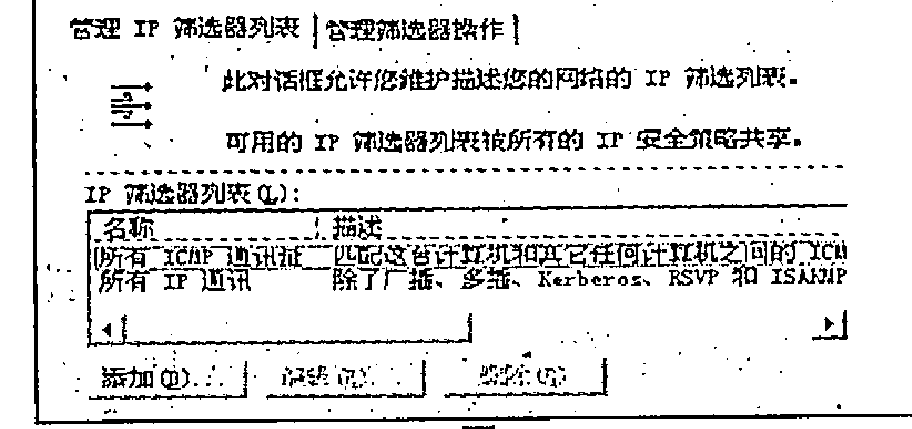

添加IP筛选器。在“管理IP筛选器列表”选项卡上点击“添加”按钮，弹出“IP筛选器列表”对话框，分别填入名称和描述，如“禁用139连接”。

进行“筛选器向导”设置。点击右边的“添加”按钮，弹出“筛选器向导”对话框，点击“下一步”，设置源地址和目标地址。进入“指定IP源地址”窗口后，在“源地址”中选择“任何IP地址”，点击“下一步”，在“IP通信目标”的“目标地址”中选择“我的IP地址”，点击“下一步”继续进行设置。在“IP协议类型”的“选择协议类型”下，选择“TCP”，点击“下一步”，进入“IP协议端口”对话框，因为大多数IP网络协议都建立在常用的IP端口上，所以，我们现在可以对这些端口进行设置。在“筛选器向导”的“设置IP协议端口”里第一栏为“从任意端口”，第二栏为“到此端口”并填上“139”，点击“下一步”。如图4所示。

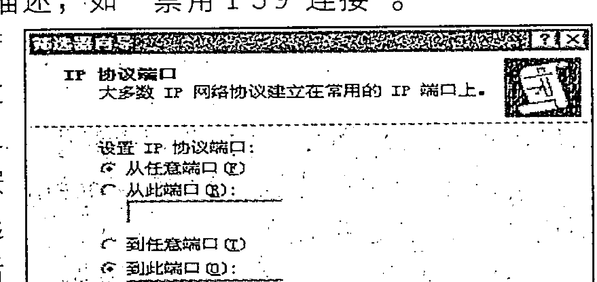

进行上述设置后，点击“完成”，关闭“IP筛选器列表”窗口，回到“管理IP筛选器表和筛选器操作”窗口。我们看到，IP筛选器列表下多了一个策略。

进行筛选器操作。点击“管理筛选器操作”选项卡，点击“添加”按钮，同样会出现一个“筛选器操作”向导窗口，点击“下一步”，在名称里填上“禁用139连接”，然后点击“下一步”，并选择“阻止”。

点击“完成”和“关闭”，现在，禁止139连接的策略完全制定好了。禁用445端口的“筛选器列表”和“筛选器操作”的添加方法与上面所讲完全一致，不过，在添加139和445的筛选器操作时，不能用同一个“阻止”筛选器操作，这样制定出的规则将无法使用。通过设置类似的网络安全策略，系统就安全多了，甚至可以防范一些恶意的网络病毒，从而达到了有效防止非法网络入侵的目的。

## 2. 阻断QQ的连接

局域网中禁止QQ的问题比较繁琐，传统的解决方法是通过对QQ的端口和服务器地址进行封堵。在阻断8000端口的连接后，发现QQ还会通过UDP的8001和TCP的8000、8001端口进行连接。鉴于这些端口目前只有QQ使用，所以可以基于端口来做阻断规则。在用防火墙阻断以上端口的数据包后，发现QQ还会通过TCP的80和443端口进行连接。如果针对这两个端口做阻断规则，会影响用户的正常上网，所以只能对服务器的IP地址来做规则。在针对IP做阻断规则后，QQ已基本无法登录。仔细检查后可以发现，QQ安装目录下的Config.db文件记录了QQ服务器的地址。因此，在用防火墙阻止用户使用QQ上网时，除了阻止TCP和UDP的8000、8001端口外，还需阻断与QQ服务器的连接。

实际应用中，由于新版QQ可以采用TCP的80端口和加密代理、HTTP代理等方式进行登录，所以采用传统的方式对局域网内的QQ进行封堵的方法很难达到良好效果。虽然以上方法可以起到阻断QQ连接的作用，但如果腾讯公司增加新的QQ服务器，QQ也还是可以登录的。另外，用第三方的代理软件如NEC E-BORDER等支持Anonymous的SOCKS5代理还是可能绕过去。

## 3. 阻断MSN Messenger的连接

“正本清源”，阻断MSN Messenger连接最简单、最高效的方法就是直接禁止对Messenger.hotmail.com等服务器的访问，当然还可以禁止对*.msgr.hotmail.com域名集的访问。但不建议禁止对*.Passport.com的访问，因为登录Hotmail邮箱等其他的Passport验证服务还需要使用它。另外，MSN Messenger的连接除使用常规的1863端口外，还会使用7001和80端口，因为这两个端口涉及其他网络服务的应用，所以也只能采用阻断QQ连接的方法，通过阻断与MSN Messenger服务器的连接，来达到阻止MSN Messenger登录的要求。要禁用MSN Messenger，可以采用下面的方法：

+   首先是尽量采取“允许需要的，拒绝所有（其他）的”的原则创建防火墙规则；
+   拒绝对IP 207.46.104.20的访问；
+   拒绝对TCP 1863的访问；
+   对HTTP进行应用层检查，阻止包含Gateway.messenger.hotmail.com的连接；
+   拒绝对常用代理端口的访问，比如TCP 8080/1080/3128；
+   关注常见的HTTP隧道登录，枪打出头鸟，随时拒绝这类服务的登录服务器。

同样，如果微软添加新的MSN Messenger服务器或者用户使用代理，还是可以登录MSN Messenger。

## PART 3 网络限制与反限制

### 4. 阻断联众及其他游戏服务器的连接

阻断联众的连接相对比较容易，在客户端连接服务器时，首先会与服务器的2000端口建立连接（61.55.138.219:2000）。在建立连接后，会用到服务器的1007、2001、2002、3015端口。在试验中，只阻断了2000端口的数据包，客户端就已经无法连接服务器了。此外，还有不少其他的游戏服务器，只要定义一个URL规则，过滤地址为“*kele8*”即可。

## 突破网络限制

在内部网中，如果用户不能使用即时通讯工具、不能玩某些在线游戏、不能上一些网站等等，他们就会通过各种方法来突破限制。

### 1. 突破限制的一般方法

+   现象1：用户不能使用QQ等工具进行聊天；不能访问某些网站；不能玩某些网络游戏（如联众）。

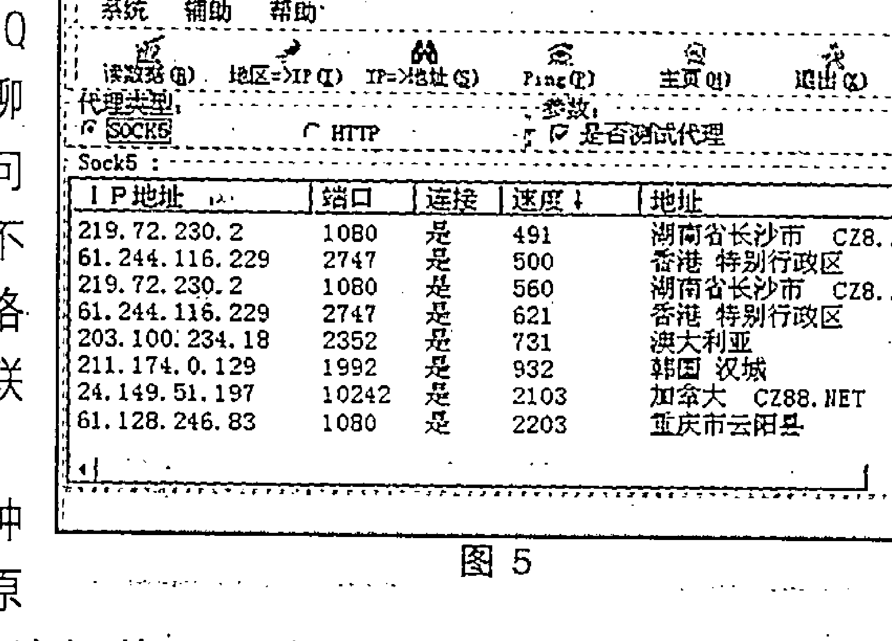

出现这种现象的主要原因是限制了欲访问的IP地址。对于这类限制很容易突破，可以使用普通的HTTP代理或者SOCKS代理。在网上找HTTP代理还是很容易的，“QQ代理公布器2005”是一款不错的突破软件，软件下载地址为http://www.cz88.net/fox。它的使用方法很简单，只需点击“读数据”这个按钮就可以找到很多的代理。此软件是从网站上的数据库随机读取QQ代理（SOCKS代理）的数据，这样可以避免太多人同时使用同一代理。然后“QQ代理公布器2005”会测试端口能否连接和连接速度，连接速度越快越好，这样才能保证QQ的正常使用。如果顺利登录上去，就说明这个代理是成功的。同时，真实的IP地址被隐藏起来，所显示的仅仅是这个代理罢了！软件界面如图5所示。

+   现象2：限制了某些协议，如不能使用FTP。出于安全考虑网管通常都会封杀80以外的服务端口，这样只能用WWW，无法用ICQ、QQ和FTP。

针对这种情况，可以使用SOCKS代理，配合SocksCap32软件后，一般的程序都可以突破限制。软件下载地址为http://www.socks.nec.com。SocksCap32软件是由美国NEC USA.Inc.公司出品的代理服务器第三方支持软件，它拥有功能强大的SOCKS调度，通过它几乎可以让所有基于TCP/IP协议的软件（如ICQ、QQ、MSN Messenger、MUD、FTP、IE、NEWS等）都能通过SOCKS代理服务器连接到外部网络，甚至代理猎手还可以通过它去搜索代理服务器。

如果连SOCKS代理也限制了，可以考虑使用Socks2http这个软件，软件下载地址为http://www.totalrc.net/s2h/index.jsp。Socks2http是一个代理服务器协议转换软件，它能将基于SOCKS协议的请求转换为HTTP协议的请求，并通过指定的HTTP代理服务器处理这些请求。

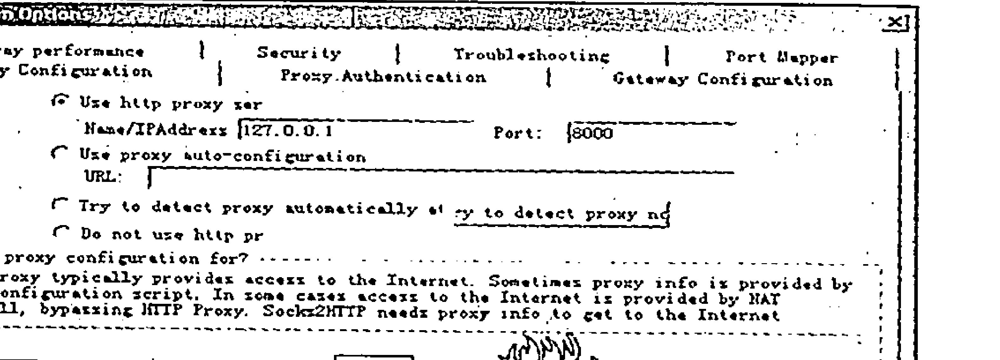

1.  下载并运行Socks2http软件，首次安装的时候出现提示配置。指定一个HTTP代理的具体参数，如在Name/IPAddress栏填入HTTP Proxy的域名或IP地址。本例中填入的通过代理猎手代理调度服务器为127.0.0.1:8088，如图6所示。如果要更改配置，则在工具栏中右键单击socks2http的图标，选择Configuration命令，其他操作与以上相同。

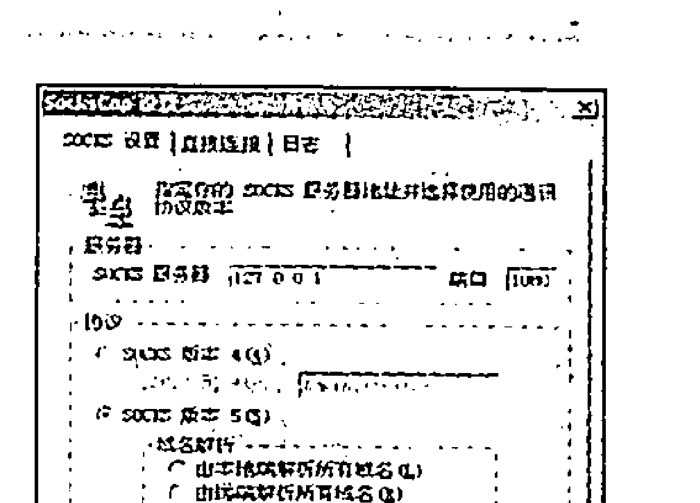

2.  运行Socks2http，配置通过本机127.0.0.1端口1080的SOCKS5代理连接网络。要检测你的SOCKS2http是否成功配置，可以尝试用代理猎手校验127.0.0.1服务器的端口1080，选SOCKS5类，如果可以登录得上，则表示HTTP Proxy已成功地转换为了SOCKS Proxy。现在我们就可以使用它了。

3.  配合SocksCap32软件，能使只提供HTTP代理服务的局域网使用非HTTP协议的软件，如FTP客户端软件、e-Mail客户端软件、Telnet客户端软件以及聊天软件等等。选择“文件”菜单下的“设定”，在SOCKS服务器中填入127.0.0.1，Port中填入1080，在协议中选择SOCKS版本5，域名解析中选择“先尝试由本地端再由远端解析”，然后“确定”。如图7所示。

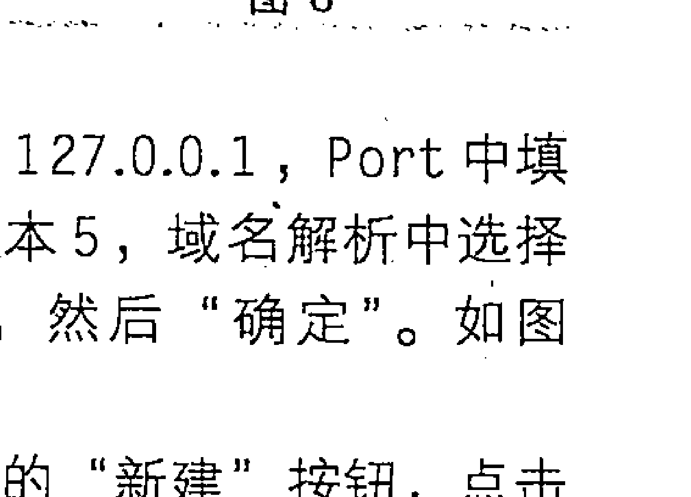

4.  点击SocksCap32面板中的“新建”按钮，点击“浏览”，选择需要经过SocksCap32代理的应用软件和工作目录路径。或者将要运行的软件拖入窗口中的空白处，在弹出的窗口中选择“新建应用程序标识项”，设置完毕后点击“确定”。如图8所示。

5.  现在只需双击SocksCap32控制台界面里的图标就可以通过HTTP代理上QQ了。注意：在SocksCap32中运行QQ、ICQ等软件不需再对代理做特别配置，在使用过程中，不可以关闭SocksCap32，否则已运行的程序就不能继续正常运行。对于有些游戏，可以考虑Permeo Security Driver这个软件。多试几次，总可以找到突破的出口。

现象3：基于包过滤的限制，或者禁止了一些关键字。这类限制功能比较强大，一般是通过代理服务器或者硬件防火墙做的过滤。比如：通过ISA Server 2005 禁止 MSN Messenger，做了包过滤。这类限制比较难突破，普通的代理是无法突破限制的。这类限制因为做了包过滤，能过滤出关键字来，所以要使用加密代理，也就是说中间走的 HTTP 或者 SOCKS 代理的数据流经过加密，比如跳板、SSSO、FLAT 等，只要代理加密了就可以突破了，用这些软件再配合 SocksCap32，MSN Messenger 就可以使用了。

现象4：基于端口的限制，限制了某些端口，最极端的情况是只有 80 端口可以访问，只能看网页；发送信件、FTP 等服务都限制了。

这种限制可以通过以下办法突破。第一种方法是找普通 HTTP 80 端口的代理，配合 Socks2http，把 HTTP 代理转换成 SOCKS 代理，然后再配合 SocksCap32，就很容易突破了，这类突破办法中间走的代理未加密。

实在没有办法的情况下，只能和网络管理员搞好关系了。一切都能搞定。前提是不要给网络管理员带来麻烦，不要影响局域网的正常运转。这有点社会工程学的味道了，关键在于怎么利用这些人际资源。

### 2. 利用“通通通”突破限制

在企业网或校园网上，如果用户需要透过防火墙或通过代理服务器访问 Internet，可能需要使用 SOCKS 代理。注意，浏览网页时常用的代理服务器通常是专门的 HTTP 代理，它和 SOCKS 是不同的。因此，能浏览网页不等于一定可以通过 SOCKS 访问 Internet。在实际应用中 SOCKS 代理可以用作为：电子邮件、新闻组软件、网络传呼 ICQ、网络聊天 MIRC 和各种游戏应用软件当中。如果客户端使用外网的代理，只有封住一些常用的代理端口，比如 TCP1080/1813/3128 等，但对于这些端口之外的就不好办了，在这里也只有再一次提醒大家使用“允许需要的，拒绝所有的”的原则创建防火墙规则。

“通通通”软件是一款提供 SOCKS 服务的代理软件，其最新版本是“通通通2006”，下载地址为 http://www.tongtongtong.com。软件安装完毕，还要对其进行相关设置。首先登录 http://www.tongtongtong.com 网站并注册为会员，然后用注册时所用的邮箱激活用户名。第一次启动服务之前，必须先进行设置。点击“设置”按钮，进入登录信息页面。如图9所示。


在“通通通服务器”中，选择“从列表中选择”，再根据您是免费用户还是付费用户来选择相应的服务器。注意，免费用户一般选择“公共服务器”，付费用户根据个人网络情况选择：电信服务器、网通服务器或动态中转服务器。在“登录信息”选项卡中对应地输入登录名和登录密码，也就是在网站注册的用户名和密码。

另外，如果使用 IE 浏览网页时需要用户名和密码，那么还需要在“代理服务器需要验证”前打钩，然后填入用户名和密码。按照以上步骤设置好后，点击“确定”，就会回到“通通通2006”的主界面，然后点击“启动服务”按钮，等主界面左下角的红灯变绿，就说明“通通通2006”启动成功了。启动成功后，屏幕右下角任务栏中的图标也会变成绿灯。如果登录不上，可以先点击“获取最新列表”按钮，这样可以获取到最新的服务器列表，从而达到比较好的速度。一个绿色通道就此打造成功。

类似的方法还可以应用于联众网络游戏平台。如果局域网内的用户由于网络条件的限制不能直接上联众，可以在联众游戏中进行一些设置，点击联众图标，出现下面的界面。点击“设置代理服务器”按钮，出现下面这个界面。选中“使用代理服务器上网”，在地址框中输入“127.0.0.1”，在端口框中输入“1080”，选择“使用 SOCKS5 协议”。测试连接正常后就可以去玩游戏了。

### 3. 突破单线程下载的流量限制

由于网站线程限制，很多站点只允许一个线程下载。如何才能突破单线程限制，让多个线程同时下载？其实，通过“影音传送带(Net Transport)”给每个不同的线程设定不同的代理连接就能实现。如果代理服务器够多够快，那么把下载速度提高到原来单线程的5倍甚至10倍以上都是有可能的。

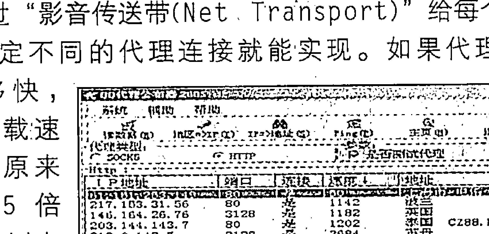

准备工具。首先，使用“QQ代理公布器 2005”探测代理服务器地址，并把 IP 地址及其端口复制下来。软件下载地址为 http://www1.skycn.com/soft/9642.html。如图10所示。

然后，下载并安装“影音传送带”，软件下载地址为 http://www2.skycn.com/soft/9541.html。

添加新的代理服务器地址。点击软件左上角的“代理服务器”标签，再点击右下角的“添加”按钮打开“代理服务器设置”窗口。填上代理服务器相应的 IP 地址和端口号，再把连接类型由默认的“HTTP(Connect)”改为“HTTP(Get)”，点击“确定”添加成功。接下来要完整地测试连接速度，点击选中待验证的代理服务器地址，然后点击下方的“验证”。

当有新的下载任务时，出现“添加新的下载任务”界面，点击属性对话框右下角的“其他设置”，再点击“代理”标签，选择“多代理，每个线程使用不同的代理”。所有线程缺省采用的都是“直接连接”，我们可以为不同的线程换上不同的代理服务器。

两次点击“确认”后影音传送带就开始多线程下载了，和单线程相比，下载速度快了很多。

防守和反击总是一个此消彼长的过程，关键在于有的放矢的操作，很显然，把握主动权的使用者应该就是笑到最后的胜利者了。

## 现代北斗星 >>> GPS应用全面指南

GPS是全球卫星定位系统(Global Position System)的缩写。曾经还是一个离我们很遥远的“高科技玩意儿”，如今随着人们生活水平的提高，相关产品价格下跌，GPS在各个领域的应用越来越广泛，能为我们驾车出游、野外探险带来很多方便，对此感兴趣的朋友也日渐增多，这篇文章就为大家全面谈谈GPS应用方面的热点话题。

### GPS发展历史及基本原理概述

1.  GPS发展历史
在卫星定位系统出现之前，主要用无线导航系统，像罗兰-C系统、Omega（奥米茄）等。由多个地面导航台组成，精度为几英里。其次为多卜勒导航系统，利用多普勒频移原理，通过测量其频移得到运动物参数（地速和偏流角），推算出飞行器位置。但这些导航系统都存在很多局限性。卫星出现后，人们很自然就想到使用卫星进行定位及导航。
最早的卫星定位系统是美国的子午仪系统（Transit），1958年研制，1964年正式投入使用。由于该系统卫星数目少，运行高度较低；从地面站观测到卫星时间间隔较长，因而它无法提供连续的实时三维导航，而且精度较低。为满足军事部门和民用部门对连续实时和三维导航的迫切要求。1973年美国国防部制订了GPS计划，耗资200亿美元，于1994年全面建成。GPS是具备全方位实时三维导航与定位能力的新一代卫星导航与定位系统。GPS覆盖全球，全天候工作，实时向地面发送高精度时间、位置和速度信息，无论你身在何处都能得知所在的位置及海拔高度，其时间与国际标准天文时间保持高度同步。更为重要的一点是，只要你配置好相关软硬件设备，GPS使用不需要办理任何手续，也无须缴纳任何使用费用。

由于卫星定位导航在国防及民用上的作用越来越大，为防止受制于人，中国自行开发了“北斗星”计划，并积极地参与到了欧洲的“伽利略”计划当中，避免在战争等特殊情况下被别人“卡脖子”。“北斗导航试验卫星”由中国航天科技集团空间技术研究院研制，是全天候、全天时提供卫星导航信息的区域导航系统。这个系统建成后，主要为交通运输、海上作业等领域提供导航服务，但是只覆盖了全中国及周边少数地区。中国同时还参与了欧洲的“伽利略”计划，伽利略系统是覆盖全球的，可以提供全球范围内的定位导航服务，最高精度达到了1米。

2.  GPS基本原理
GPS定位的基本原理是根据高速运动的卫星瞬间位置作为已知的起算数据，采用空间距离后方交会的方法，确定待测点的位置。采用多星高轨测距体制，GPS接收机在同时接收到三颗以上卫星的信号后，由三颗卫星至用户的三个等距离球面的相交即可确定用户位置。通过对四颗卫星的观测还可测定海拔高度，并由时钟改正值来修正距离测量误差。简单地说来，就是利用接收到卫星发射的相关信号，再配合我们熟知的几何与物理上一些基本原理来定位。

当用户设备接收到可视范围内三或四颗以上卫星发出的导航信号，信号经接收机解扩、解调处理，控制设备进行信号和信息处理，从中提取卫星星历、距离及距离变化率、时钟校正、大气校正参量等，再用这些数据解算出用户在空间直角坐标系中的坐标，或转换成用户所需的地理坐标，并由软件进行相关应用（图1）。

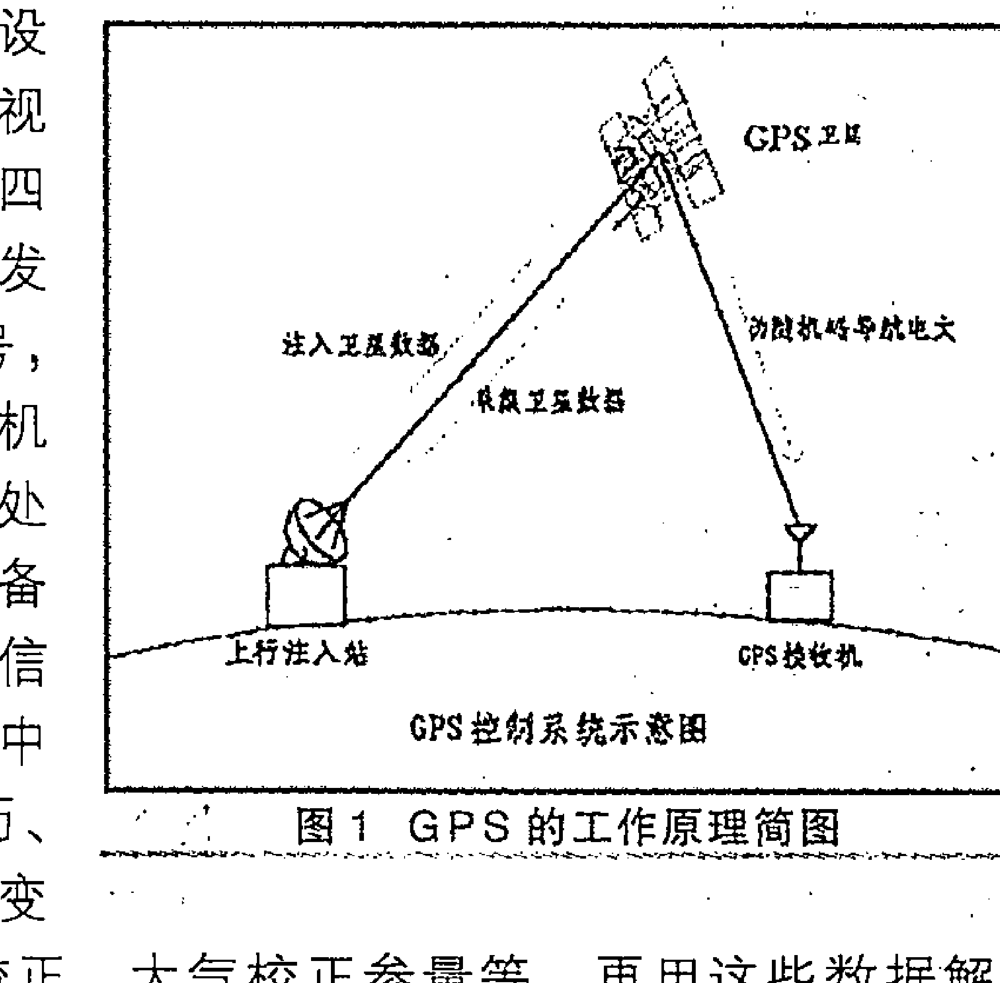

由于卫星运行轨道、卫星时钟存在误差，大气对流层、电离层对信号的影响，以及人为的SA保护政策，使得民用GPS的定位精度只有50米左右。为提高定位精度，普遍采用差分GPS（DGPS）技术，建立基准站（差分台）进行GPS观测，利用已知基准站的精确坐标，与观测值进行比较，从而得出修正数，并对外发布。接收机收到该修正数后，与自身的观测值进行比较，消去大部分误差，得到一个比较准确的位置。实验表明，利用差分GPS，定位精度可提高到5米。差分GPS分为两大类：伪距差分和载波相位差分，具体这里就不细谈了。

### 手持GPS接收器选购与应用

GPS由三个独立的部分组成：空间卫星部分、地面支撑系统和用户设备部分，用户设备用于接收GPS卫星发射信号，以获得必要的导航和定位信息，完成导航和定位工作。手持GPS接收器就是最常用的用户设备之一。

## 1. 手持GPS接收器特点及选购

手持机GPS接收器是一种专用GPS接收设备，不需要与PDA或笔记本电脑配合，本身可以独立完成GPS信号接收及定位功能，现在很多手持机还具备地图功能，具备一定的导航能力。通常手持机设计制造都比较专业化，接收信号能力强，为适应野外工作环境，作了一定的“三防”处理，由于功能单纯，操作使用上也比较简单，很受野外工作及探险人士的欢迎。

选购手持机GPS接收器时，我们应注意以下几点：

- 体积重量
- “三防”能力
- 屏幕大小、色彩分辨率
- 内存大小及是否可扩充
- 电池使用寿命及是否可更换
- 是否具有地图功能
- 是否带电磁罗盘，气压高度计
- 是否能连接电脑等

没有地图的手持机对于一般爱好者来说亲和力不强，功能也不够丰富，应该选择带有地图的手持机，而电磁罗盘和气压高度计可以弥补GPS不能在静止状态下辨别方向及测高不准的先天不足。这里给大家介绍几款目前国内市场上常见的手持机。

Garmin公司的GPS MAP60CS，拥有56MB内存、256色分辨率，160 x 240像素透射式TFT彩色屏幕，具有USB和串口双接口以及MCX天线接口，更有电磁罗盘和气压计。外形鲜明，性价比不错。

eTrex C系列，其中eTrex Legend C拥有24MB内存、176 x 220像素的反射式TFT彩色屏幕、USB接口，而eTrex Vista C还具备电磁罗盘及气压计。这个系列的彩屏GPS手持机有着体积小重量轻的特点。

麦哲伦公司的子午线彩色版(Meridian Color)，拥有16色分辨率120 x 160像素彩色屏幕、支持SD/MMC卡、使用串口传输数据、MCX外接天线接口。这款机器支持SD/MMC卡扩充内存。

探路者彩色版(SporTrak Color)，拥有32MB内存、16色分辨率160 x 240像素彩色屏幕、使用串口传输数据、电磁罗盘、气压计，性价比比较高。

Lowrance公司的iFINDER MAP&MUSIC C，使用256色分辨率160 x 240像素的彩色屏幕，支持SD/MMC卡、使用串口传输数据、MCX外接天线接口。这款机器的特色是支持MP3播放。

此外Holux公司的GM-309有着超大的4096色、2.7寸的彩色屏幕，分辨率160 x 240，使用强劲的20通道SiRF Star III芯片、最高可以支持4G的CF卡。内置了电磁罗盘和气压式高度计。

## 2. 手持GPS接收器的基本应用

首先给大家简单解释一下与手持GPS有关的术语及基本功能：

- **路标 (Landmark or Waypoint)**：GPS内存中保存的一个点的坐标值。在有GPS信号时，按一下“MARK”键，就会把当前点记成一个路标。路标是GPS数据核心，它是构成路线的基础。标记路标是GPS主要功能之一，也可以从地图上读出一个地点的坐标，手工或通过计算机接口输入GPS，成为一个路标。
- **路线 (ROUTE)**：路线是GPS内存中存储的一组数据，包括一个起点和一个终点的坐标，还可以包括若干中间点的坐标，每两个坐标点之间的线段叫一条“腿”(Leg)。常见GPS能存储20条线路，每条线路30条“腿”。各坐标点可以从现有路标中选择，或通过手工/计算机输入数值。
- **前进方向 (Heading)**：GPS静止不动时是不知道方向的。动起来后GPS每隔一秒更新一次当前地点信息，每一点的坐标和上一点的坐标一比较，就可以知道前进的方向。方向是以多少度显示的，这个度数是手表表盘朝上，12点指向北方，顺时针转的角度。有很多GPS还可以用指向罗盘和标尺的方式来显示这个角度。
- **导向 (Bearing)**：根据当前位置，计算出导向目标对你的方向角，按此方向前进即可走到目的地。有些GPS把前进方向和导向功能结合起来，只要用GPS的头指向前进方向，就会有一个指针箭头指向前进方向和目标方向的偏角，跟着这个箭头就能找到目标。
- **足迹线 (Plot trail)**：GPS可以记载自己的运动轨迹。一般GPS能记录1024个以上足迹点，足迹点的采样有自动和定时两种方式，自动采样由GPS自动决定足迹点的采样方式，一般是只记录方向转折点，长距离直线行走时不记点；定时采样可以规定采样时间间隔，和路标不同，足迹线上的点不能单独引用，主要用于画路线图和“回溯”功能。
- **回溯 (Trace back)**：顾名思义就是按照原路返回；使用此功能时，它会把足迹线转化为一条“路线”(ROUTE)，路点的选择是由GPS内部程序完成的，一般是选用足迹线上大的转折点。同时把此路线激活为活动路线，用户即可按导向功能原路返回。

手持式GPS最重要的就是MARK键和GOTO键使用。MARK键用于定位，即把当前的坐标存到内存里，GPS会自动为这个点起一个名字，而GOTO用于导航，如果有一个已知的点位已经存到了GPS的内存里，并且起了名字，那么按GOTO，再选那个点的名字，就可以计算出从此地到那个已知点的直线距离。MARK和GOTO，也就是定位和测距，是GPS最基本的功能。很多手持式GPS还能与电脑进行连接，上传下载GPS航点数据，如果计算机系统中有GIS软件和电子地图，GPS航点还可以直接投影到电子地图上。

手持GPS与详细地图配合使用时有最好的效果，若有目的地附近的精确地图，可以预先规划线路，先做地图上规划，制订行程计划，按照线路复杂情况和里程，建立一条或多条线路(ROUTE)，在图上读出路线特征点的坐标，输入GPS建立线路的各条“腿”，并把一些单独的标志点作为路标(Waypoint)输入GPS。行进时可以利用GPS确定自己在地图上的位置，或是按照导向功能指示的目标方向，配合地图找路，向目标前进。同时一定要记录各规划点的实际坐标，针对每条规划线路建立另一条实际线路，作为原路返回时使用，也可作为路线资料供后人使用。因此我们在使用手持GPS时，最好携带一个录音设备（比如带录音功能的手机或MP3播放器），标记路标后不改变其默认名字，而是录音记录这个路点的详细描述。行程结束后，可根据录音把GPS记载的数据整理成线路描述文件保存，以后别人就可以使用这组数据走这条线路了。

由于国内大比例尺地图十分难得，GPS使用效果受到一定限制。无图使用是更为常见的使用方式。比如使用路点定点，要找的地点坐标须已经以路标的形式存在于GPS的内存中，按GOTO键，从列表中选择你的目的路标，然后转到“导向”页面，上面会显示你离目标的距离、方向角等数据。另外就是路线导向，把某条路线激活，“导向”页会引导你走向路线的第一个点，一旦到达，目标点会自动更换为下一路点，直至到达最终目标。

## 掌上电脑GPS应用详解

对于户外爱好者而言，除了选购专业GPS手持接收器，还有一个比较好的选择就是使用掌上电脑配合GPS接收器使用。掌上电脑的功能比手持机毕竟要丰富很多，而且可以通过安装不同的软件加以不断扩充，同时还可以安装详细的地图及专业导航软件。

### 1. 掌上电脑GPS应用硬件选购与使用

#### （1）适合应用GPS的掌上电脑选购

掌上电脑如需和GPS连用，通常都需要外接GPS模块，使用不太方便。现在市场上有一些内置GPS功能的掌上电脑，其中最早出现的是神达Mio 168，随后推出了改进信号接收效果的Mio 168D，和横屏显示的Mio 169，另外acer N35也带有GPS功能，HP也推出有相关产品，还有国内的哈普Hapo608等。这些都是在标准掌上电脑的基础上整合了GPS功能，从而让GPS从专业应用走向生活化。另外宇达电通还推出了Mio 269、Mio 136这些采用WindowsCE 4.2为核心，但去除PPC标准应用程序（Excel、Word等），并使用专门界面、以车载应用为主的GPS产品。但由于这些整合了GPS模块的掌上电脑，通常在配置上有所欠缺，因此有更多朋友会选择使用普通掌上电脑，配合GPS接收器使用。在选购这类掌上电脑时，我们应注意下面一些问题。

首先没有特殊情况的话最好选择PPC产品，而不要选择PALM。PPC上的GPS应用软件要比PALM上多很多，其次一定要注意其扩展性能，比如是否具备CF、SD双插槽、是否带蓝牙功能等，这一点非常重要，现在市场上大多数低端掌上电脑只有SD插槽，且没有蓝牙功能，连接GPS就十分困难了。而有些早期的掌上电脑只具有CF单插槽，能插CF接口的GPS模块，但地图就只能放到内存中了，使用十分不便。还要注意的一点是电池性能，最好能使用大容量的可更换电池。当然处理器性能和内存容量也应该满足一般需求。

根据上面的标准，现在市场上新推出的中高端PPC产品，都能够符合GPS应用的需求。经济条件许可的话，目前采用VGA屏幕，双插槽，双无线的顶级掌上电脑是最好的选择（“双无线”是指同时支持蓝牙、IEEE 802.11b两种无线网络。“双插槽”是指同时支持SD/MMC及CompactFlash II两种插槽），像DELL Axim X50v、HP 4700、华硕730等就是很好的选择。另外大家也可以选择一些中低端产品（有些已经停产，需到二手市场上寻找），如acer N10（双插槽）、N30（带蓝牙）、N50（双插槽，双无线）、神达Mio 558（双无线，双插槽，并支持USB Host功能）、惠普2210（双插槽，带蓝牙）、HP 1940（带蓝牙功能）、华硕MyPal A620BT（CF插槽，内置蓝牙）、DELL Axim X30（双插槽，双无线）等。

#### （2）掌上电脑配套GPS接收器选购与安装

单独的GPS接收器和GPS手持设备不同，它只负责接收卫星信号，需数据传递到PDA，由相应的软件进行处理。根据GPS与PDA之间的接口不同，主要可分为三类：GPS MOUSE、CF卡式GPS、蓝牙GPS。GPS mouse的数据接口主要为RS232、PS/2、USB口三种。可通过专用转接线与PDA相连使用。CF GPS设备插在PDA的CF扩展槽中，通过PDA供电，二者联系紧密，携带方便，非常适合车载和一般休闲旅游。蓝牙GPS，通过蓝牙与PDA连接并传输数据，它适用范围广，只要具有蓝牙功能PDA，包括PALM、PPC都能用。

具体选择什么类型的GPS接收器与你使用的掌上电脑有关，如果你的PPC既没有CF插槽，也没有蓝牙，那么只能用GPS mouse。只有CF插槽，没有蓝牙，可以购买带SD插槽的CF GPS，或GPS mouse。没有CF插槽，只有蓝牙，可购买蓝牙GPS。双卡插槽，没有蓝牙，当然购买CF GPS。双卡插槽，有蓝牙，建议你购买CF接口的产品。CF接口GPS接收器最大优点是能固定在掌上电脑上，使用起来与内置GPS模块的掌上电脑类似，十分方便。当然蓝牙GPS也有优点，其自带可充电电池，不消耗掌上电脑电能，同时蓝牙GPS可接多种主机平台而无须专门的驱动程序。另外要注意体积大小，电池使用时间等，还要注意是否有内建闪存储存卫星数据，如卫星讯号状态、上次使用的最后位置、日期及时间并随时做星历图更新，可有效缩短定位时间。目前相关产品市场上很多，购买之前，在网上多搜索一下，看看大家的经验，像HOLUX、NAVMAN等大厂的GPS产品都不错。下面简单给大家介绍两款特色产品。

太阳能蓝牙GPS接收器GPS-169，这款产品最大的特点就是内建独创太阳能板充电回路，可充电式锂电池，独特的Solar Cell太阳能充电专利设计加上芯片超低耗电量特性，Solar 7比同级产品待机时间更长可达2～3倍。不使用时，放置于阳光及日光灯下亦具有充电效果。另一款是HAI COM CF GPS接收器HI-305N，具有可调节方向的天线以及可以变成GPS-mouse的特性，其侧面还有个SD卡槽，这样的设计对于很多只有CF卡槽的掌上电脑是一个很好的选择，有了这款HI-305N，就不怕没有空间来储存地图了。同时HI-305N使用了numerix的芯片，灵敏度高耗电少。

GPS接收器在掌上电脑的安装使用非常简单，对于蓝牙GPS，首先把电源开关打开，蓝灯开始闪烁，然后打开掌上电脑的蓝牙管理器，搜索设备。搜索完成后输入匹配码，完成配对。再选择串口服务，并且使用安全加密连接。连接完成后在GPS软件的设置里调整好串口参数和速率，就可以定位了。CF接口的GPS则先需要安装相应的驱动程序，生成虚拟串口即可。而GPS mouse不需要安装驱动，接好转接线后，通常选择COM1即可。

### 2. 掌上电脑GPS应用软件选择与使用

在掌上电脑上使用GPS，最关键是应用软件的选择与使用，掌上电脑上GPS软件可分为两大类。

#### （1）GPS接收及定位软件

GPS接收及定位软件，简单说就是将掌上电脑变成一个GPS接收器，可以不依赖地图实现导航，比如只有地名坐标，而道路不明确的情况下，利用定位和指向功能到达目的地。

- **GPS.PAD**：是结合了书写功能的GPS导航软件，除了具有通常GPS导航软件的功能外，它还可以导入NMEA、Tom、Mobile Navigator、TOP 50的地图系统，在地图上自由手写和标记。
- **Megalith.GPS.Tuner**：是一款高精度的测量、定位和导航软件，提供便捷的路径点、导航文件、导航路径等管理，可使用地图，支持GPX，带电子罗盘，同时具备路线记录和分析、速度和海拔图表显示、路线处理、NMEA日志记录和实时回放等功能。
- **Microsoft.Pocket.Streets**：是一款用于智能手持设备的定位软件，用户可方便地从网上下载多达数百个城市的免费地图，当然也可以从MapPoint或者Streets & Trips中获得地图，具备快捷的地址查询能力。Pocket Streets甚至储存有大量ATM提款机位置的相关信息。
- **VisualGPS**：可以图示显示当前速度、高度、方向、卫星星历，可以记录下运动的轨迹，而且还是接收器初始化时的强大的搜星工具。
- **GPSDash**：能够识别从GPS设备接收的符合NMEA0183协议的GPS信号。通过6个不同的虚拟仪表盘来实时显示各类GPS数据，如速度、指南针、高度计、时钟、卫星信号接收状态和质量、里程数，还可以在地图上实时显示你当前的位置。

这类软件除了以上介绍的，还有GPS315、Sportrak、etrex、STP3、GPS领航员、GPSLOOker等。

#### （2）GPS导航软件

GPS最贴近生活的用处不在于定位功能，而在于导航功能，可以为你指引正确的道路。PPC上的导航软件不算太多，目前国内主要有以下几款常用导航软件。

- **天行者**：是国内出产的一款优秀GPS导航软件，最大优点在于地图详尽，定位准确，导航功能强，缺点主要是速度较慢、地图压缩率较低而且售价昂贵。
- **趴趴走！（PaPaGo!）**：是台湾地区出产的一款优秀GPS导航软件。“Mapking”和“领航星”都采用其引擎设计，主要优点是导航功能强、速度快，最新的V7版本更是具有革命性的“超拟真全景3D视野导航”设计，最大缺点是大陆地图不详细。

另外OziExplorer CE是一款半专业化的导航软件，采用了开放的地图格式，需自己DIY地图。

天行者模仿了GPS车载机的界面风格，十分容易上手。为了方便驾车时的操作，天行者将主要的按键都设计成大按钮，让使用者可以用手指直接控制，而不需要使用触控笔。天行者具有行进线路规划功能，只需要设置好目的地，就能自动计算出行进路线。点击“周边设施”，屏幕上就会显示出当前位置周边的各种场所信息，你可以方便选择需要的设施，并且将其设为目的地。天行者还设计有语音导航系统，能实现全程语音导航，每当需要转弯时，上下高架桥时，天行者都会用甜美的女声告诉你应该如何操作。如果去了一个地图上没有的地方，系统提供轨迹存储功能，记录你所走过的路在哪里右转在哪里左转过，这样就可以轻松地找到回去的路。这个软件还具备了模拟导航设置，可以在确定好路线后让系统自己先走一遍，每到路口都会提前通知你要在哪里转弯，而且能提前告诉你进入辅道。

趴趴走！、Mapking、领航星，这几款软件由于使用了相同的引擎，使用方法都是差不多的。首先定位好自己的位置，再标明目的地，即可实现导航。趴趴走！的语音导航系统相当先进，在到达路口前数百米就会开始不断提示转弯方向，确保行驶线路的准确。其他先进功能还有：导航模式/地图模式双模系统，无段式连续地图缩收，任意角度旋转地图，直线距离测量等，另外还可以标出每一个点的坐标，这样在地图上没有标出地名的地方也可也根据经纬度在普通地图上找到位置。

OziExplorer CE是一款专业的地图软件，最大特点就是采用了开放的地图格式，可以方便地将BMP、JPG等格式的地图文件制作成具有定位、导航功能的地图，保证了地图来源，现在许多GPS地图网站都能免费交流相关地图资源。OziExplorer CE比较适合在其他导航软件无法提供地图的中小城市或越野时使用。OziExplorer CE采用标准的PPC界面设计，上手容易。但由于采用的是标量的地图，不能自动设计行驶路线。

Ozi使用并不太复杂，其中关键就是如何把一幅JPG格式的地图转换成OZI格式的地图并进行校准，这两步都需在PC上进行。使用一款名为“img2ozf”的软件，即可把其他图像格式转换为OZI格式，但这只把JPG格式的地图转换成了精简的OZI格式地图，其中并不包含任何导航信息，必须要为OZI地图加入航点信息，进行校准，才能使之真正成为导航专用的地图，由于这两步都是在PC上操作，将在后面具体谈到。

Ozi尽管不能自动规划路线，不过支持手动路线设计，还能进行语音导航，关键是要自己设置点去引导，所以适合于用别人或者自己走过的TRACK再次顺着TRACK去语音导航。具体步骤如下：首先加载SOUND FILES文件到CE OZI文件夹中，在Track上重要的地方打上Waypoint（路点），Ozi会自动递增编号，把这些点编在一个Router里。打开GPS，Ozi会在当前位置和Router的第一个Waypoint画出一条直线，等你到了第一个Waypoint后，语音会提示你怎样到第二个Waypoint，依此类推。提示是比较详细的，向右前方、向右、向右后方，距离多少米都可以提示。这里要注意“Proximity”（路点的可能半径）的设定，如果Track很清楚，这个值可以小些，比如10米，反之则需要大些，否则你已经经过了第二点，Ozi没识别，以后就不能依次导航了。另外使用Ozi也可自动记录下实际的运行轨迹，这样下次再走这条路时就可以直接调用。

相比起PPC平台，Palm上的导航软件就少了很多，常用的有：广州通软的一路通Pathaway。一路通是国内开发较早的导航软件，提供了全国28个省的省图，以及北京、上海、香港、广州、杭州、苏州等14个城市的地图。一路通的界面十分简单，你只需选择好地图，连接上GPS行了。一路通提供目的地管理、旅程记录、距离计算、语音导航等功能。Pathaway可以看做是Palm上的OziExplorer，操作简单，支持DIY地图、路径记录。如果在欧美及澳洲，那么palm上也有不错的GPS解决方案，有Tube、Metro（地铁通）、HandMap、Mapopolis等。

### 3. 手机定位浅谈

手机定位有两个概念，一是PPC或PALM智能手机，可以设法连接GPS接收器，进行定位，这与上面讲到的掌上电脑GPS应用情况是一样的。智能手机基本没有带CF插槽的，因此通常使用蓝牙与GPS接收器连接。另外还有内建GPS卫星定位导航功能的手机，CECT曾推出过一款GPS导航手机9680，但屏幕小、功能弱、价格高，而现在的产品功能就强大太多了，像Mio A701采用微软Windows Mobile 5.0操作系统，搭配Xscale 520 MHz中央处理器，采用2.7英寸高分辨率屏幕，具备三频、蓝牙v1.2等功能，硬件规格相当高，当然内建GPS功能是其最大的亮点。

除了PPC、PALM手机，其实在Symbian、Linux等智能手机也可以玩GPS，像Route66 Mobile就是SymbianOS平台上的车载导航方案，作为一款功能强大的GPS公路导航工具包，地理覆盖范围包括英国、比利时、荷兰、卢森堡地区，收录了公路数据、门牌号、兴趣点，据称可以实现门到门的导航服务，具有一步步地语音指导和画面指示，以及多语言用户界面。Route66支持手机短信输入地址的方式来访问地址搜索引擎，还可以通过GPRS连接动态导航服务，可避开交通堵塞、道路维护和交通事故路段。

另外手机定位还有一个分支就是通过GSM机站信息来进行，像psiloc miniGPS软件可以在多数Series 60手机上使用，通过使用GSM的基站信息来定位，无须GPS接收器。还可以通过发短消息或通过WAP界面来进行定位，当然这些应用必须获得手机服务商支持，国内的华好网景与联通合作，在这方面有比较深入的应用。总之，使用手机确定位置及附近情况一直是一个热门概念，现在有了更好的手机及软件，正在逐步将这种技术推向普及。日本NTT DoCoMo推出了配备定位功能的手机“Mover F661i”，用户只需按下“GPS按键”，便可以测出当前位置，售价还不到1万日元。

## 笔记本电脑GPS应用详解

随着生活水平提高，喜欢外出旅行的朋友越来越多了，遨游于青山秀水之间，是十分惬意的事情。现在外出旅行，除了数码相机、摄像机，建议大家将笔记本电脑也作为重要装备携带。笔记本电脑在旅途中有很多用武之地，其中GPS就是现在喜欢自驾游朋友的热门应用。

### 1. 笔记本用GPS接收模块的选购

单独的手持GPS接收器价格昂贵，而且功能不强，扩展有限。笔记本电脑由于携带方便、功能强大，十分适合用于全球定位，我们只需要购买一个合适的GPS接收模块，再配合适当的软件及地图，就可以实现移动定位、路径选择、物体追踪等很多功能。下面就简单谈谈GPS模块的选购问题。

GPS模块选购上我们关键应注意接口类型，目前有USB、PS/2、串口、CF、蓝牙等接口形式的GPS模块。

## 2. GPS模块在笔记本上的安装使用

用于笔记本电脑的GPS设备严格意义上说只是一个接收器，它负责接收卫星信号，并把数据传递到笔记本，再由相应的软件进行处理。大多数GPS接收器的使用都很简单，通常不用安装驱动（USB/CF接口的需要安装驱动），直接安装导航软件，然后在软件中设置GPS信息，根据不同的机型和不同的GPS设备设置不同的速率和串口即可。

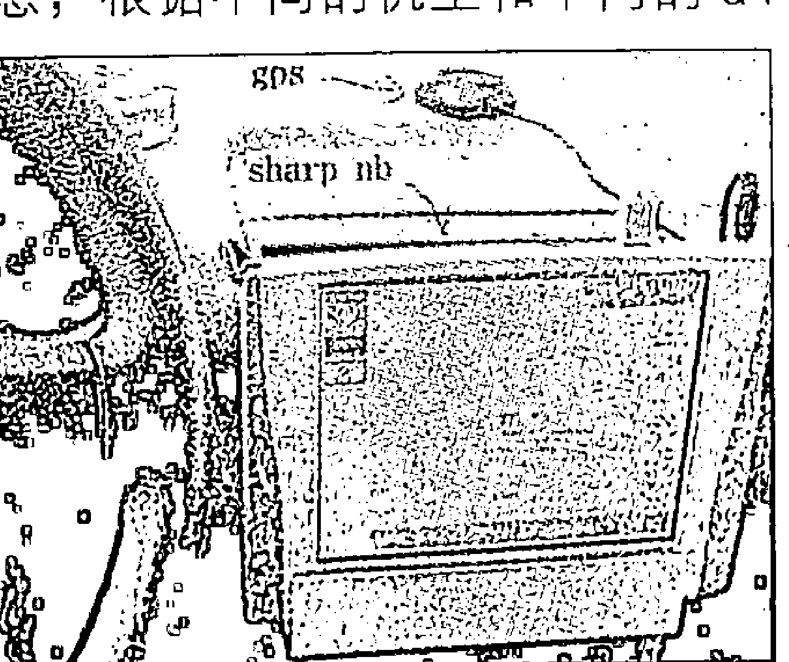

以常见的蓝牙GPS模块为例，首先把蓝牙GPS的电源开关打开，蓝灯开始闪烁，然后运行笔记本电脑上的蓝牙管理器，添加设备。根据不同的蓝牙设备，输入匹配码（参看说明书），完成配对。而USB接口和PCMCIA接口的（经CF-PC卡转换）这两类产品，需安装相应的驱动程序，把各种接口仿真转换为PC的COM口，再用GPSView工具查找GPS的端口号，安装完成后在GPS软件的设置里调整好串口参数和速率，就可以定位了（图9）。

这里要提醒大家注意，由于笔记本电池供电时间有限，因此一定要配置并使用合适的车载电源逆变器。如果使用语音导航软件，最好设法将笔记本电脑的音频输出连接到车载音响上（推荐使用FM发射器）。

## 小技巧：解决车载GPS电脑硬盘易坏的问题

在汽车上配置一套笔记本电脑+GPS，对出行帮助很大，但由于旅途中汽车颠簸厉害，导致笔记本硬盘很容易损坏，比较好的解决方法是用CF卡替代硬盘。现在1GB的大容量CF卡价格已经降到了不到600元，读写速度也能达到6MB/S以上，完全能够在特定的应用中替代硬盘。

如果你使用2000年以前的IBM笔记本电脑，那么很幸运，这类笔记本通常支持从PC卡插槽启动系统，你只需花几十元买一个转接卡，就能将CF卡转接到PC卡插槽中作为硬盘使用了。

但大多数本本并不支持从PC卡插槽启动系统，你就只能自制或者购买一个CF插座转笔记本硬盘44针IDE的接头，最好直接做成笔记本硬盘的尺寸，方便装到笔记本电脑上。

这样改装后你的笔记本中就基本上不存在任何机械运动装置了，不仅防震能力大大增强，而且还能延长电池使用时间，很有实用价值。

不过在容量只有1GB左右的CF卡上最好安装Win97操作系统，并将不必要的帮助文件、字体文件等全部删除，大约只占用200多MB的空间，余下的空间完全足够安装比较完整的电子地图了。这样便能获得一台堪称完美的车载GPS电脑。

## 3. GPS导航软件的选择及使用

同PPC、手持机等相比，PC平台的GPS在性能上具有绝对的优势，大显示屏，超大存储空间以及飞快的运行速度，这些决定了PC上的导航软件是所有平台中最强的。目前PC上使用的GPS导航软件有不少，前面介绍的PPC上的天行者、趴趴走！（PaPaGo！）等都有各自的PC版本。PC上还有很多专业的GPS定位软件，比如GPSview，可以显示当前速度、高度、方向、卫星星历，而且还是GPS接收器初始化时的强大搜星工具。

全中国电子地图，由中国地图出版社制作，拥有权威的地图信息来源，提供全国交通图（包含高速公路、国道、省道、铁路等详细信息），以及超过40个城市的市区图。其最大的优势在于，公路地图的准确和详细程度十分高。缺点是界面不够友好，导航功能较弱（无语音导航）。另外北京灵图公司出版的中国电子地图，也是PC上一款不错的导航软件，最大优点是能够实现线路规划，但地图信息不如全中国电子地图详细。这些软件的使用都很简单，下面给大家详细谈谈广大GPS DIY玩家喜欢的OZI的具体使用方法。

第一步：我们从OZI官方网站(http://www.oziexplorer.com/)下载最新的PC版。安装完成后，应取得注册码进行软件注册，否则功能十分有限，没有什么实用价值。然后去网上找到汉化资源文件（Chinese.ozl），将其复制到OZI安装的目录中，重新运行OZI程序，这时就会出现语言选择的对话框，选择“简体中文”后，菜单和对话框的提示都变成中文的了。

第二步：然后对GPS设备进行配置，GPS设备要正确连接到OZI系统里，需要正确配置GPS设备的端口参数和设备类型，OZI才能正确地和GPS设备通讯。在“文件→配置”里，GPS类型可以选择“仅NMEA”（GPS Make中），COM端口要与GPS接收器使用的端口号对应上，其他参数就选择默认的就行了。另外一个重要设置是地图路径的设置，在“配置”的“系统”里，“文件路径”的“地图文件路径”一项必须正确设定为地图文件存放的目录。

第三步就是扫描或采集地图源。这一步很关键，尽可能找到最新、最准的地图，进行扫描，扫描时一定要把地图压平，另外地图源也可上网找，这里还推荐大家使用“电子地图一把抓”这款软件，来抓取目前国内最好的电子地图“全中国电子地图”，然后进行校准，可以获得很好的效果（图10）。


第四步是进行校准，打开“OZI EXPLORER”软件，选择“文件”下拉菜单中间的“载入并校准地图图像”。我们在其中填入九个点的坐标，因地制宜，利用自己实际经过的点的坐标，打点尽量选择标志明显处，比如道路交叉点、拐点等。OZI 软件将根据此九个坐标点的经纬度算出其他各处的经纬度，以此实现导航地图的功能。导航精度取决于原始地图的变形系数，变形越大则精度越差。同样也取决于九个坐标点的精确度。校准地图一定要多试，校正工作并不简单，不可能一次成功，有了第一个大致校正过的地图，接下来就要在这个地图上实际跑一下，然后再比对轨迹和地图的吻合性。如果轨迹正好在你实际行驶的道路上，那么地图校正的就不错，如果偏了，就得慢慢调校前面9个基准点。退出OZI程序之前，记得要把有用的数据(如轨迹、航点等)保存下来，对今后或他人跑这条路很有实用价值。

OZI 也具备一定的导航能力，甚至可以实现语音导航，具体可以参考前面PPC版的使用方法。导航的关键是ROUTE制作，导航的作用就是在一个Route（内含多个WPT），按前后顺序依次指示要去的方位以及距离。设定好后会首先告诉你目前起点，距离WPT1还有多远、方位、等到快接近WPT1时，会警告已经进入WPT1的有效半径（可自行设置）。然后GPS自动改为由WPT1向WPT2的导航，告诉你从WPT1到WPT2距离是多少，方位如何，依此类推。

总之OZI是个实用的GPS导航软件。也是比较专业化的GPS定位和导航系统，不同于普通傻瓜型的GPS导航系统，只有逐步深入研究下去，才能领悟其精髓，体味到乐趣。当然如果不涉及GPS深层次应用，OZI还是比较容易上手的，只要做好几项必要的设置并简单地进行操作，系统很容易就能够运转起来。

## 4. 专业车载GPS导航系统简介

用笔记本电脑改装车载GPS系统，具备一定的技术难度，通常只是一些对GPS和电脑都比较精通的发烧友才有条件这么做，做出的产品在外观、性能上也存在一些不足。而高档汽车上配置的国外原装DVD导航产品，通常没有配置适合国内用户使用的地图，因此实用性大打折扣，使用维护的代价也比较高昂。因此现在很多国内厂商开始进入车载GPS导航设备的生产和推广中，

目前国内有宇达电通、新科、DEC等厂家在生产GPS导航设备，其中宇达电通有“易上路”Mio136、Mio269，新科有GD-70C等。目前这些产品已经开始在有车一族中成为时尚的消费热点（图11）。

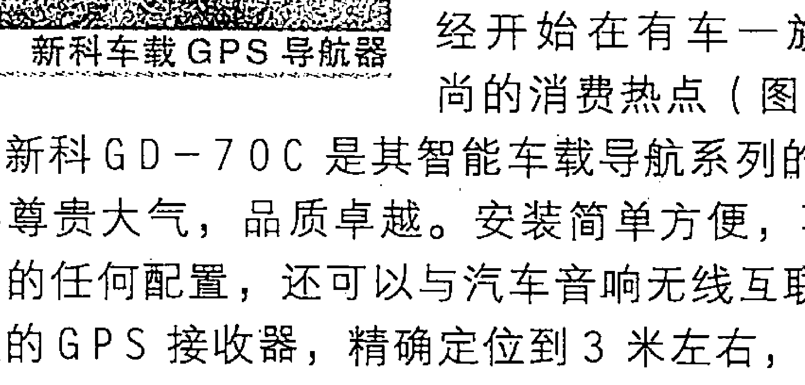

新科GD-70C是其智能车载导航系列的旗舰产品，外形尊贵大气，品质卓越。安装简单方便，不需要改变汽车的任何配置，还可以与汽车音响无线互联。采用16通道的GPS接收器，精确定位到3米左右，并且通过全程语音导航提示；时刻清楚地提醒行车路线。配置国家授权的专业导航地图，真正实现了跨区域导航。可以通过7英寸触摸式显示屏，配合8种目的地输入方式进行设定导航。详尽的交通道路信息和4种路径模式会使导航器在设定路线时，会自动遵照交通规则，避免违章。及时的地图更新，也会让你在第一时间掌握道路的万千变化。此外，这款产品还带有移动DVD娱乐功能，使你在旅途中更加轻松、惬意。

## GPS 在行业中的应用简介

GPS卫星导航系统是由美国国防部研制开发的，首先运用在军事上，为美国军方及其盟国部队提供精确的全球定位和导航数据。在一九九一年海湾战争中，对GPS卫星导航系统进行了一次实战大检阅。当多国部队穿越人迹罕至的沙漠时，GPS卫星导航系统第一次突出地显示了它强大的功能和精确度。在这次战争中GPS卫星导航系统在军事指挥、部队调用、目标侦察等方面都表现非凡。实践证明GPS系统在军事上可用于授时、定位测向、监测监控、电子技术侦察、作战指挥、后勤支援、野外搜索救援等方面。除了军事应用，GPS在民用方面也有着广阔的应用市场。航空导航、车辆管理、城市智能交通管理、公安消防指挥、银行押款车监控、汽车防盗保险、医疗救护调度、科学研究、资源勘探、地图测绘、科学考察探险、地理地质考察、石油和天然气勘探、森林防护、野生动物保护、自然环境监测保护、航海船舶定位导航、港口及航道管理、运动娱乐、汽车拉力赛、登山游泳、野营垂钓、紧急救生、各种线路放样、地壳形变测量、大坝和大型建筑物变形监测、精细农业林业。可以说，任何需要知道精确时间或准确位置的人，都将受益于GPS卫星导航系统。下面为大家具体谈谈GPS在两个行业上的应用实例。

## 1. 车辆管理及防盗

车辆运行管理是GPS重要的应用行业之一。现在很多城市都在出租车上加装了GPS设备，用于调度管理，报警防盗等。而GPS也开始广泛应用在客运监督中，可以防止车辆超速，保障行车安全。另外GPS车辆防盗监控系统是比较成熟的技术了，GPS与GSM网络配合，可实现实时监控、自动报警，具有良好的用户界面和良好的通讯能力，大大提高车辆防盗能力。可任意设置车辆行驶区界，越界则自动报警。车辆非正常启动或人为破坏，车辆能通过GSM网络自动报警，报警隐秘，不会引起盗窃分子警觉。车辆报警后，监控中心可立即显示该车辆警视图标及周边情况，以便指挥有关人员进行协助。车辆租赁公司运用该系统可实现随时从电子地图上了解车辆位置及运行情况，防止公司重大财产损失。

## 2. GPS在林业中的应用

将GPS这一先进的测量技术应用在林业工作中，能够快速、高效、准确地提供点、线、面要素的精密坐标，完成森林调查与管理中各种境界线的勘测与放样落界，成为森林资源调查与动态监测的有力工具。

GPS技术在确定林区面积，估算木材量，计算可采伐木材面积，确定原始森林、道路位置，对森林火灾周边测量，寻找水源和测定地区界线等方面可以发挥其独特的重要的作用。在森林中进行常规测量相当困难，而GPS定位技术可以发挥它的优越性，精确测定森林位置和面积，绘制精确的森林分布图。

GPS在造林中的应用，比如飞播，在没有采用GPS前，飞行员很难对已播和未播林地进行判断，经常会出现重播和漏播的情况，采用GPS后，利用其航迹记录功能，飞行员可以轻松了解上次播种的路线，从而有效地避免了重播和漏播。此外利用航线设定功能，飞行员可以在地面对飞行距离和航线进行设定，在飞行中按照预先设定好的航线工作，极大降低了作业难度。

## GPS应用常见问题解答

问：请问使用GPS需要申请开户吗？需要缴纳哪些费用呢？

答：使用GPS就像接收广播，是不用申请开户的，在使用过程中也不需要缴纳任何费用。但是我们购买GPS设备是要花费很多钱的。而这些GPS设备的核心芯片都是老美的，尽管免费给你使用，但老美可没有做亏本生意。另外我们使用车辆防盗等GPS增值应用，也是需要向相关服务商付费的。

问：为何GPS信号飘移比较严重？是不是软件有问题？

答：采用Xtrac技术的高灵敏度GPS接收器很容易发生飘移，这是因为它是利用放大微弱信号加以运算来定位的，而卫星信号时刻都在改变，所以GPS不断地运算以修正误差，当所收讯号前后差异极大的时候，就会出现“飘移”的现象。导航软件是单纯接收GPS所传来的信号，与信号飘移无关。

问：请问GPS卫星讯号多久更新一次，要多少颗卫星才能定位成功呢？

答：GPS的信号是每秒传送一次，这个值是定位卫星决定，不随你使用的软硬件设备而改变的。由于GPS是利用三角原理定位，所以至少要有三颗星以上才能定位成功，若能接收到四颗以上的卫星信号，则能确定高度值。

问：我使用“天行者”时，为何提示地图数据载入失败？

答：有两种可能，一是用户的地图数据与版本不匹配。用户混用了其他版本的地图数据，建议首先可以把SmartGuider\Temp\SMG_SysSetting.bin文件删除，然后再运行“天行者软件”。如果用此方法还不行的话，最好卸载后重新安装一遍。另外也可能是所装软件的地图存放路径设置有误导致。

问：请问“天行者”的用户行车轨迹如何保存及利用？

答：用户在行驶过程中保存的行车轨迹都在\smartguider\track文件夹下。轨迹格式是灵图公司特有的格式，如果用户想编辑轨迹可以执行轨迹导出操作，轨迹导出后自动变成公开的mif格式，可以用mapinfo等软件修改。轨迹导出和导入的默认目录是\smartguider\temp。

问：为什么在使用GPS时，常常出现“定位中”的提示？

答：主要可能有以下几方面的原因：一是GPS接收机内建锂电池可能没有电了，请先充电。二是移动中定位会比静止定位花的时间长，所以上车前要先定位，因为GPS要首先接收卫星信号，进行在地图上的定位，然后才能进行导航事项。三是接收器的周围存在遮蔽物，比如车窗上的隔热纸之类。

问：请问天行者PPC版怎么改成竖屏显示呢？

答：在灵图3.05之前转竖屏可以这样做：打开profile\size\default.ini，把DISPLAY_WIDTH=320改为DISPLAY_WIDTH=240，DISPLAY_HEIGHT=240改为DISPLAY_HEIGHT=320即可，3.05版以后就不能转了。

问：请问冷开机、暖开机、热开机，到底是怎么回事？

答：热开机就是GPS关闭不久后的再开启，通常是定义在30分钟间隔内，比如当卫星收讯不佳、失联，再度获取定位。暖开机就是一般开机，包括GPS自我测试、取得精确星历至定位完成，冷开机是指开机后GPS接收器需执行一连串如下载星历等的初始化动作，定位速度最慢。一般热开机时间在8秒～15秒，暖开机在40秒左右，冷开机在120秒左右。

GPS接收机首次开机定位后，在下次开机时，接收机将会直接利用记忆体内的卫星轨道资料及上次关机位置坐标，进行快速的接收及计算，以求出目前所在地坐标值，不必再花大量的时间等待搜寻卫星信息。

问：请问GPS的资料传输方式是怎样的？

答：GPS卫星传输导航信息是以“封包”为单位进行的。每一资料封包大小为1500bits，切成五个300bits的子封包，每一资料封包每30秒传输一次。卫星的每一资料封包，第一子封包传输时钟的修正资料及卫星轨道资料(星历资料参数)。第二及第三子封包传送正确的轨道资料。第四及第五子封包传输不同页的系统资料，另外第四子封包中亦含有全球坐标运算参数。一个完整的导航资讯包括25个资料封包(含125个子封包)，传送需花费约12.5分钟。当GPS接收到星历资料参数时，可以算出卫星在轨道上的位置，通常会在一小时接收一次，但GPS可用四小时前的星历资料参数来计算卫星之位置，并不会有很大的误差。

问：请问使用GPS能知道前进的方向吗？

答：GPS没有指南针的功能，静止不动时它是不知道方向的。但是一旦动了起来，它就能知道自己的运动方向。GPS每隔一秒更新一次当前地点信息，每一点的坐标和上一点的坐标一比较，就可以知道你前进的方向，不同GPS关于前进方向的算法是不同的，基本上是最近若干秒的前进方向，所以除非你已经走了一段并且仍然在走直线，否则前进方向是不准确的，尤其是在拐弯的时候你会看到数值在变个不停。

GPS中方向是以多少度显示的，这个度数是手表表盘朝上，12点指向北方，顺时针转的角度。有很多GPS还可以用指向罗盘和标尺的方式来显示这个角度。GPS的方位角是以正北作为0度，正东为90度，正南为180度，正西为270度。

问：请问GPS导航软件与GPS纯电子地图软件有何区分？

答：在这里我们要将GPS导航软件与GPS纯电子地图软件区分清楚。GPS纯电子地图软件，如全中国电子地图、OZI必须依赖地图存在，没地图就没办法。而GPS硬件导航器、GPS导航软件，如GPS领航员、GPSLOOKer等，不依赖地图，没地图也能用。可以在只有地名坐标，而道路不明确的情况下，利用GPS本身的指向功能到达目的地。

问：请问怎么才能得到GPS的导航电文？

答：拿到GPS接收机后，按照说明书装好驱动程序，连接好电脑，使之能正常使用，此时关掉电子地图软件，打开Windows自带的通讯工具“超级终端”，在选择端口时选择GPS接收机所在的端口，波特率选择4800，和GPS接收机一致；数据流量控制选择“无”；其他设置遵照默认即可。点击“确定”后就可以接收到GPS接收机输出的导航电文了。定位之前的数据，可以看到大多数数据为零，而已经定位后的数据，其中电文共分为四种，分别为GPRMC、GPGGA、GPGSA、GPGSV，关于四条电文的具体含义，这里就不作详细解释了，通常我们最为关心的是其中的经纬度数值。另外在PPC上，有不少较专业的GPS导航软件，都带有导航电文的显示功能，使用起来就更方便了。

## 没有什么不能打

找根跳竿 网页直接跃纸上

Raily：我打印的这个网页比较宽，打印出来漂亮的网页被截掉了右边一大截，文字的段落也不完整了，看着真难受。

小杨：嗯，我看看。利用Epson特别提供的网页打印软件Web-To-Page，打印出的网页完整又美观。顺利安装完毕以后，IE工具栏上会自动显示Web-To-Page的“打印预览”按钮。选中要打印的网页，轻轻一点，预览效果，调整设置，OK！

切分蛋糕 大图打印不求人

Raily：明天有公司派团来参观，还要打印一张指路的大图，但一时找不到足够大的纸，只有A4的。怎么把大图片打印到几张纸上，然后拼起来呢？

小杨：这个……我帮你上网查一查，搜索一遍，解法自见。
让PrintGhost来帮忙。安装好后打开控制面板中的“打印机和传真机”文件夹，在打印机图标上右击，选择菜单“属性”，切换到“PrintGhost”选项卡，选中“Enable print job preview”。以后要打印文档，PrintGhost就会显示一个预览窗口。如果要使用拼页打印，选中“Poster Printing”选项，再确定拼页方式即可。

定立规则Outlook邮件自动打

Raily：还有一个问题，我每天都收到大量邮件，并且要按照公司规定打印出来存档。但每次都要把这些邮件一个个地打开来打印，真麻烦。

小杨：启动Outlook，选择菜单“工具→规则和通知”，点击“新建规则”按钮，接下来一步步设置就可以了。完成后，只要是满足条件的邮件，就会自动打印。

Raily（惊喜地）：邮件居然自己会动，厉害！

趣味小知识：打印机打出细胞来

在科学技术突飞猛进的今天，什么事情都有可能发生。科学家们只要把所需骨骼的尺寸输入电脑，轻轻按下按钮，一个完全符合要求的肌体组织或骨骼就会从“打印机”里钻出来。这是英国曼彻斯特大学的生命科学家，日前新开发出的一种让人惊叹的“打印机”。他们首先创造出一种三维“组织支架”结构，决定了组织生长的形状。这种材料每层只有10微米厚，1000层叠加在一起也不过1厘米厚。通过不断打印，反复叠加，直到建立起所需结构。这项新技术将给骨骼和人体组织损伤患者带来福音，让骨骼嫁接变得得心应手。不愧为超级的“特殊打印”！

## 精心呵护 延年益寿
**文/阿亮**
### ——笔记本升级与维护应用指南

从基本架构来看，笔记本与大家所熟悉的台式机并没有本质上的区别，只不过笔记本考虑到便携性与散热条件而采用更为精巧的设计，因此也给后期硬件维护带来了诸多不便。但是正如台式PC一样，笔记本也渴望升级，这样才能让老产品进一步发挥余热。更为重要的是，笔记本升级后能够令产品的性能表现立即有很大幅度的提升，这是很多老式笔记本或者二手笔记本用户都迫切需求的。然而无论技术如何发展，笔记本都是相对脆弱的产品，需要大家在使用过程中精心维护，这样才能让你心爱的本本长时间稳定服役。

## 核心地带：升级本本CPU

两年以前笔记本的主要用途并非是3D游戏，而是移动办公或者多媒体娱乐，因此CPU往往成为衡量性能的关键因素，其权重系数远远大于台式机中的CPU。尽管笔记本在设计时有着严谨的整体考虑，但是这并不意味着笔记本就不能升级CPU。由于封装形式与芯片组的原因，很多PⅡ笔记本或者低频PⅢ-M笔记本能够顺利升级到高频PⅢ-M。

如果升级之后CPU仅仅是主频提高了50MHz～100MHz的话，则系统的性能提升远不如增加内存或更换高转速硬盘明显。因此，对于同级别CPU的升级，除非频率提升幅度大，不然实在没有升级的意义。然而需要注意的是，并不是所有的笔记本都能轻轻松松地升级CPU，因为这牵涉到芯片组的兼容性以及CPU的封装形式。

### 1. 了解移动CPU封装形式

我们先来看一下Mobile CPU的封装问题，这是升级的前提，同时也是升级成功的关键。传统意义上的封装形式对于芯片来说仅仅是一个外壳，是机械结构性的保护。然而现阶段CPU的封装除了结构特性外，还包含了散热机制，并成为了电气性能上芯片与主板连接的平台。进一步说，封装的复杂性很大程度上取决于芯片的结构特性和设计方法。

CPU的高速发展对笔记本电脑的体积、散热、功能等限制无疑是一种挑战。作为笔记本电脑专用CPU，为了满足上述要求，也只好从封装来做文章了。一般而言，采用什么样的封装形式往往取决于各个时代CPU的技术和成本等因素。对笔记本电脑来说，由于其结构空间紧凑狭小，因此它的体积直接影响到笔记本电脑的厚度和空间利用率；它的散热效果直接影响到机器运行的稳定性；它的功耗则影响到笔记本电脑电池的使用时间。这些技术指标与笔记本电脑CPU所采用的封装形式是息息相关的。

### 2. 各时代移动CPU封装详情

与台式电脑一样，笔记本专用CPU的封装形式也因各代CPU的不同而不同。MMC、BGA与μPGA封装技术已经完全落伍，Micro-FCPGA和Micro-FCBGA是目前最成熟、使用最广泛的封装方式之一，在Pentium Ⅲ-M，Pentium 4-M，以及Intel最新的迅驰平台Pentium-M中均可见到它的身影，代表着目前笔记本电脑专用CPU封装技术的最高水准。下面列出各个时代笔记本专用CPU主要应用的封装形式，以便升级时参考。

| 移动CPU | 封装形式 |
| :--- | :--- |
| Pentium | TCP |
| Pentium MMX | MMC1 |
| Pentium Ⅱ-M | MMC2、BGA、μPGA-1、Micro-FCPGA |
| Pentium Ⅲ | BGA-2、MMC2、μPGA-2 |
| Pentium Ⅲ-M、Pentium 4-M、Pentium-M | Micro-FCPGA、Micro-FCBGA |

### 3. 哪些笔记本可以升级CPU

通过对CPU封装的分析可以看到，早期TCP封装的CPU是焊接在主板上的，因此不可升级，也没有升级的意义。BGA（包括BGA-1和BGA-2）与Micro-FCBGA封装的CPU由于是直接焊接在主板上，因此一般的个人用户无法升级。而MMC2、μPGA与Micro-FCPGA封装的CPU由于采用了和台式电脑CPU相似的ZIF（零插拔力）插座，因此升级是可行的，也是所有封装中升级最为方便的。

Pentium Ⅱ-M级别的CPU是最具升级潜力的笔记本专用CPU，也是跨平台升级的代表。从上表中可以看到，采用MMC2封装的Pentium Ⅱ可以直接升级到Pentium Ⅲ或者高主频的Celeron，此时系统性能提升巨大。少数Micro-FCPGA封装的Pentium Ⅱ-M更是拥有巨大的升级空间。然而遗憾的是，采用μPGA-1封装的Pentium Ⅱ无法升级到μPGA-2封装的Pentium Ⅲ，原因在于μPGA-1和μPGA-2这两种封装形式的接口完全不同。0.13微米铜连接工艺Pentium Ⅲ-M使用的是全新的Tualatin核心，采用Micro-FCPGA和Micro-FCBGA封装技术，外频从Pentium Ⅲ的100MHz提升到133MHz，与其搭配的芯片组也升级到了i830M。因此，Pentium Ⅲ无法升级到Pentium Ⅲ-M，毕竟443BX北桥芯片是难以逾越的鸿沟。此外，大家还可以在 Celeron-M 与 Pentium-M 之间自由升级，此时不会有任何限制。

笔记本主板的 CPU 接口一般是不可能更换的，升级空间自然相对较小。一般而言，少数 PII 笔记本能升级到 PIII-M 处理器，因为此时 443BX 芯片组是相同的，唯一的障碍在于 CPU 封装形式。此外，部分笔记本为了节省成本而采用了发热量较大的台式机处理器，此时可以考虑升级为移动处理器，或者在加强散热条件的情况下使用 Pentium 4 替代 Celeron 4。

### 4. 实战演练：更换笔记本CPU

#### （1）拆开笔记本

这是升级笔记本之前必须进行的一步，否则所有的硬件升级操作都将无法实现。一般而言，笔记本在卸下电池后会找到打开上盖的窍门。大部分笔记本都在隐蔽的地方设有螺丝孔位，将螺丝拧下后，用手轻轻将盖板上推，然后抓住两端一掰就可以轻松取下了。

在整个开盖过程中，千万不能使用蛮力，而且得顺着键盘的方向进行，否则很容易折断硬盘的数据线或者连杆。事实上，也有不少笔记本采用键盘覆盖周边卡口的设计，因此拆下键盘是最为关键的一步，此后就可以看到固定螺丝，展开下一步工作。其实拆开笔记本并没有统一的万能方法，但是只要细心观察，耐心琢磨，总能找到解决方法。

#### （2）卸下 CPU 风扇

笔记本 CPU 的风扇总是扁平设计的，一般打开盖板就能发现。事实上，此时的结构与台式机 PC 十分类似，只不过这里的风扇几乎没有厚重的散热片，但是拆除时依旧得小心翼翼，建议分别将各个螺丝拧下，然后取下 CPU 风扇，此时移动处理器就会呈现在我们面前。

#### （3）更换 CPU

这一步几乎没有任何难度，只是针对 Micro-FCPGA 封装的 CPU 要特别小心，千万别弄坏。将零插拔力插座的旋钮旋转 90 度即可取下 CPU，然后按部就班地换上新的 CPU。但是此时可不要忘记重新抹上导热硅脂，特别是在 CPU 核心高度存在区别的时候，散热问题必须十分小心。

需要注意的是虽然可供升级的 CPU 频率种类很多，大家都习惯性地喜欢选择最高主频的 CPU，但往往忘记考虑到老机本身的散热套件的散热能力，如果超出了本身散热能力，则对机器的稳定性会造成很大影响。一般升级频率的幅度在 400MHz～600MHz 为佳，同时要在安装成功后，做好温度测试，甚至可以考虑定做一个更好的散热模块。

## 存储设备扩容：硬盘、内存与光驱升级

除了 CPU，对于笔记本性能影响最大的因素莫过于存储设备。一般而言，由于笔记本主板很难更换，因此对于存储设备的升级仅仅局限于扩容，但是此时必须解决安装、兼容性与发热量等棘手的问题。

### 1. 硬盘升级

至今为止硬盘是制约笔记本电脑性能的罪魁祸首。虽然最近日立推出了一款 7200RPM 的笔记本硬盘，但高昂的价格与惊人的发热量实在让人望而却步。为此，我们建议大家务实地将眼光集中于 10GB～80GB 的普通笔记本硬盘。

笔记本硬盘有四种规格：2.5 英寸 9.5mm、2.5 英寸 12.5mm、2.5 英寸 17.5mm 和世界上最薄的 1.8 英寸硬盘。不过 17.5mm 和 12.5mm 笔记本硬盘现在已经很少使用，各大厂商开始主攻 9.5mm 硬盘，而 1.8英寸硬盘现在还没有推出 5400RPM 的型号，而且大多数笔记本无法固定，所以没有升级的必要。在购买硬盘的时候要了解自己的机器配备的是什么厚度的硬盘，不过标准的 9.5mm 硬盘可以替代 12.5mm 和 17.5mm 的硬盘；反之则不可以。硬盘容量上从 10GB～80GB 不等。如果你对性能要求不是很苛刻的话，笔者认为花同样的钱与其换性能提升不明显的小容量 5400RPM 硬盘不如换一款 4200RPM 的 60GB 或者 80GB 的大容量硬盘来得实惠。

早期有些厂商在设计的时候没有很好地考虑与市场主流机型的通用性；只针对自己选用的硬盘设计硬盘组件，造成现在升级硬盘时标准硬盘不能正常安装。一般表现为固定螺钉钉位不一致。因此，在选购这样的非标准尺寸硬盘时，最好带着电脑去现场试一试。不过现在的笔记本已经不存在这样的问题，采用了笔记本托架，因为要把硬盘安装在托架上，而托架基本上是公版的设计，所以就不存在安装不上去的现象了。

### 2. 内存升级

升级内存对于提高笔记本性能有着很明显的效果，如果系统无法满足当前程序对内存的需求，就会将无法满足的部分转移到硬盘上的交换文件中（即虚拟内存），然而硬盘的运行速度比内存要慢得多，所以内存和硬盘之间的交换数据量越大，系统等待的时间就会越长。特别是在运行一些大的应用程序的时候，大容量的内存可以避免程序在运行时频繁与硬盘交换数据，也可以减少系统对虚拟内存的使用，从而可以提高系统的整体性能。

另外增加笔记本内存容量以后，可以减少了系统对硬盘的读写操作，也减少了硬盘对电池的消耗，延长了电池的使用时间，并且对减少笔记本的发热量和噪音也有帮助。而且目前大多数笔记本所使用的显卡都是采用划分部分内存作为显存的工作方式，增加内存的容量还可以为显卡提供更多的内存来作为显存使用，从而提高显卡的性能，所以升级内存是我们提高笔记本电脑性能的最佳手段。

如今市面上大多数低价位Pentium4-M甚至Celeron-M笔记本都标配128MB内存，这实在有些捉襟见肘。一般而言，笔记本内存的容量应该与CPU频率以及操作系统相辅相成，这样才能达到最佳的性能组合，从而杜绝瓶颈效应。至于究竟应该升级到多少内存，大家可以参考下表。

| CPU / 操作系统 | Windows 9X/Me | Windows 2000/XP |
| :--- | :--- | :--- |
| PⅡ-M 233MHz~PⅡ-M 400 MHz | 64MB~128MB | 不建议安装 |
| PⅢ-M 400 MHz~PⅢ-M 650 MHz | 96MB~128MB | 192MB~256MB |
| PⅢ-M 700 MHz~PⅢ-M 1GHz | 128MB~256MB | 192MB~256MB |
| PⅢ 1GHz~C4-M | 不建议安装 | 256MB~384MB |
| P-M与P4-M | 不建议安装 | 256MB~512MB |

一般而言，笔记本内置两个内存插槽，因此只要打开了笔记本的盖板，那么升级内存简直是轻而易举的事情。唯一不同的是，笔记本内存往往不采用台式机主板上的内存扣，而是类似以往EDO内存的方式。将笔记本内存与插槽呈45度纵向相交，并对准内存金手指处的小梗，然后平行地插入即可。

在整个升级过程中，最关键的要点在于选择兼容性良好的产品，推荐Kingston或者Apacer等名牌产品，也可以考虑一些名牌笔记本的拆机内存。另外需要提醒大家的是，笔记本内存的向下兼容性很不好，特别是SDRAM，尽量采用相同标准的产品，不要将PC100与PC133产品混合使用。

对于DDR内存也是类似的情况，只不过有时DDR333能够与DDR266勉强混合，但并不保证百分百兼容。

如果是老式的PⅡ-M笔记本，那么升级内存时要格外小心。不同类型的内存是不可以乱插的，如果不小心把3.3V的SDRAM内存插入到5V的EDO内存插槽中，由于接口电压的不同会直接导致内存烧毁。此外，部分老式PⅡ-M笔记本对于内存Bank数存在限制，很可能无法识别128MB容量的单条PC66 SDRAM内存，同样的道理，少数低频PⅢ-M笔记本也可能无法识别256MB容量的单条PC100 SDRAM内存。

### 3. 光存储设备升级

笔记本的光存储设备升级相对容易，毕竟接口标准相对统一，大家只需要购买标准接口的光驱设备即可，而至于究竟是CD、DVD、CDRW还是COMBO，这与兼容性都没有关系。倘若大家使用的是非标准接口的光驱，那么可以通过更换机芯来解决问题。笔记本光驱的机芯都是通用的，区别只是外壳和面板，所以如果你的光驱面板和外壳容易拆卸，你可以买一个机芯然后更换。当然，唯一困扰大家的是到哪里购买光驱机芯，其实有条件的读者可以到二手市场寻觅一番，而且多数商家提供更换机芯的服务。

## P4-M也“迅驰”：升级笔记本网络功能

使用PCMCIA来给笔记本扩展无线网络功能自然十分顺利，但是倘若想体验迅驰笔记本一般的便利并节省一个扩展槽，那么使用MiniPCI接口的Wi-Fi无线网络模块将是一条升级捷径。笔记本要安装Wi-Fi无线网络模块必须有内置的天线，比如IBM的ThinkPad的T30/R40/T40/X31系列、SONY的PCG系列。事实上大部分名牌P4-M笔记本都带有内置天线，因为当时无线网络模块已经成为一种潮流，只不过因为成本问题而一直是一个选配组件。而由于笔记本都是一条生产线出来的，相同系列的产品在结构上完全是一样的，所以即使没有内建无线网络模块，其专用的MiniPCI接口槽还是保留着。如图所示即为内置天线部分，大家可以对照自己的笔记本来确认是否可以安装无线网络模块。

无线网络模块使用笔记本中的MiniPCI接口，一般位于笔记本的背面，需要拆下相关盖板才能看到。当然，即便是没有动手经验的朋友也不必担心，打开MiniPCI接口的盖板并不会触及笔记本内部，也不会影响产品的质保。不过在进行具体的操作之前，我们强烈建议大家取下笔记本的电池，避免带电操作。

在笔记本的MiniPCI接口旁边，我们可以看到两根天线，分别是黑色AUX和白色的MAIN。同样，无线网络模块上也有与之对应的两根天线，用小钩将其连接即可。需要注意的是，两根天线的连接不能错位，请大家对照天线上的文字说明！

下一步便是将无线网络模块安装到MiniPCI插槽，这一步与安装笔记本内存条十分相似。安装无线网卡的整个过程不需要用很大力气，先把卡对准插槽与平面成45度角插进去，然后按住网卡的上面两个角用力均匀按下去即可，装到位了会听见清脆的“咔哒”两声。不用担心你是否会把无线网络模块装反了，因为MiniPCI接口有防呆设计，反了是插不进去的。

安装完成之后，要确保不存在松动，同时要注意两条天线的布局，不要往里面硬塞，而是应该沿着边走线，可能要多试两次，找到最佳位置，确定盖子能轻松盖上并不压着天线为止。最后，合上MiniPCI接口槽的盖板并拧上螺丝即可完成整个安装过程。

## 延长续航时间：本本电池应用方案

笔记本电池使用时间长了，就常常充不满，甚至显示电池损坏。因此，电池的保养和恢复就是笔记本电脑用户需要关心的话题。电池在使用了一段时间之后就会衰老，具体表现是内阻变大，在充电的时候两端电压上升得比较快，这样就容易被充电控制线路判定为已经充满了，容量下降之后自然导致笔记本续航时间不足（其实是有电放不出）。如果你的电池还非常健康，那么需要在使用中注意一些小细节；而如果电池续航时间已经明显减少，则需要为它动一动手术了。

### 1. 合理使用电能

尽管目前锂离子电池容量也不小，但是如果不能合理使用，到处无谓地浪费，那么即使是电池再出众的笔记本也难以长时间工作。毫无疑问，要想延长电池使用时间还需“精打细算”。

#### (1) 系统设置

CPU是电源的消耗大户，因此我们必须从这方面着手进行节能。对于采用移动式处理器的笔记本而言，激活处理器节能功能是相当重要的。目前Intel的节能技术分为SpeedStep与Enhanced SpeedStep。在安装操作系统时，我们应该选择“便携型”模式，这样就会获得操作系统在节能方面的更多支持。

除此之外，我们还必须设置LCD的节能功能，毕竟LCD也是一个“电老虎”。打开控制面板下的“电源选项”，选定电脑最适用的电源使用方案。一般而言，大家可以把自动关闭LCD屏幕的时间设置在5分钟左右，而且在“显示属性”中禁用屏幕保护程序。此外，在平时使用时，大家可以适当调节屏幕的亮度。过高的亮度对电能消耗很大，这点是不能忽视的。当然，硬盘、内存等也是可以节能的，因此我们也可以设置硬盘关闭时间与系统等待时间。

#### (2) 降低频率主动节能

实验证明，芯片的耗电量与运行主频息息相关。如果能够降低频率，那么同样可以起到很好的节能效果。目前在Windows下调节CPU主频的最佳软件当数SoftFSB 1.7。SoftFSB是一款专门修改主板外频的实用软件，SoftFSB工作的原理是通过调整主板上的频率发生器，达到调整系统外频的目的。当然这样仅仅只能用于调整外频，而不能调整CPU倍频。尽管SoftFSB的效果很好，但是它毕竟使用范围有限，一般针对PⅡ-M等老式笔记本，最新的笔记本都配备Enhanced SpeedStep或是PowerNow自动频率调整技术。

相对而言，具有节能功能的CPU降温软件更加值得推荐。WaterFall Pro是一个老牌的降温软件，是同类软件中的佼佼者。使用WaterFall Pro可以有效地降低CPU的温度，而且还可以延长CPU的寿命（CPU温度每降低10°C，它的使用寿命就会延长一倍）。更加重要的是，WaterFall Pro会在CPU空闲时发出休眠指令，以达到节省电源消耗的目的。尽管微软的操作系统已经具有良好的电源管理功能，但是通过测试发现使用WaterFall Pro依然能够有一定的节能效果。如果要利用WaterFall Pro的节能功能的话，大家必须激活HLT Enable选项，它主要是通过对CPU执行HLT命令，减低CPU使用功耗，并且降温。

目前不少笔记本都采用了高性能的3D显卡，这也是能源消耗大户。相对CPU的频率调节而言，GPU频率调节要更加简单，PowerStrip就是一款很方便的工具。右键单击Windows任务栏右下角的PowerStrip图标，选择“Performance Profiles→Configure”命令，弹出“Performance Profile”对话框，图中左边滑杆是调节显示芯片频率的，而右边滑杆则是显存频率调整。事实上，略微降低GPU主频并不会对显示性能造成太大的影响，特别是不运行3D游戏的时候。不过，显存频率建议不要降低，这并不会节约太多电能，而且对3D性能的影响很大。需要提醒大家的是，如果你的笔记本采用普通非硬件3D加速的显卡，那么还是不要调整频率了，因为它本身消耗的电能就不多。

#### (3) 附件的使用

笔记本附件对于电源的消耗也是很大的，而且远远超出大家的估计。一般而言，如果你的笔记本内置红外端口，不用的时候禁止它，也可以延长笔记本电脑的电池使用时间。此外，笔记本在使用时尽量不接驳任何外设，网卡、Modem、PCMCIA硬盘卡等都会消耗不少电能。对于光驱的使用也要注意技巧。以看DVD为例，建议...家将视频转换成 MPEG4 文件拷贝到硬盘后慢慢欣赏，这样可以大大节省电能。

需要注意的，对于笔记本而言，USB 设备需要谨慎使用，它对电源的消耗很大。同样是一块无线网卡，USB界面的产品一般不会考虑节能问题，相反采用PCMCIA以及MiniPCI接口的产品多半会有节能设计。因此，添加附件时也应该尽量使用PCMCIA以及MiniPCI的产品。

## 2. 拯救衰老的电池

锂离子电池的正极材料通常由锂的活性化合物组成，负极则是特殊分子结构的碳。常见的正极材料主要成分为LiCoO2，充电时加在电池两极的电势迫使正极的化合物释出锂离子，嵌入负极分子排列呈片层结构的碳中。放电时，锂离子则从片层结构的碳中析出，重新和正极的化合物结合。化学反应原理虽然很简单，然而在实际的使用过程中，需要考虑的实际问题要多得多。虽然锂离子电池很少有镍镉电池的记忆效应（记忆效应的原理是结晶化），在锂电池中几乎不会产生这种反应。但是锂离子电池在多次充放后容量仍然会下降，其原因是复杂而多样的。

过度充电和过度放电将对锂离子电池的正负极造成永久的损坏，这也就是电池的寿命问题。但是更为重要的是，如果充电过程因为意外中断，其内部化学反应将会发生复杂的变化，此时很可能对电池的续航时间造成影响。为此，深度的放电与充电是一个很好的解决方案。

很多名牌笔记本（比如IBM的ThinkPad系列）有专用的放电软件，推荐所有使用IBM笔记本的用户使用。不过该程序需要重复3遍才能得到最好的效果，下载地址为http://download.pchome.net/system/sysenhance/10216.html。下载放电软件并执行后，系统会提示制作安装盘（图12）。使用该安装盘引导PCDOS，提示拔掉AC电源，放电软件会自动进行放电控制。当一切结束之后笔记本会自动关机，然后我们可以接上AC电源进行充电，时间控制在9～12小时，反复进行2～3次即可。

如果你的笔记本不巧没有专用的放电软件，那么可以按照下面的步骤进行：

- 将屏幕保护禁用
- 在Windows电源管理中将电源使用方案设置为“一直开着”。
- 在警报选项卡中将“电量不足警报”设置为10%，操作设置为“无操作”
- 将“电量严重短缺警报”设置为3%，操作为“等待”
- 把屏幕亮度调到最高
- 确认关闭了所有的窗口，并且保存了所有之前工作的数据
- 确认电池充电在80%以上后，拔掉电源和一切外接设备

放电结束后笔记本会自动关机，之后将电源插上让笔记本充电，这个过程可以反复2～3遍。事实上，这种做法的目的是让电池持续小电流放电，而这种放电状态在我们的日常使用中是不可能达到的，其效果与那些专用的放电软件基本一致。最后要提醒大家的是，如果你的电池并不存在续航时间减少的现象，那么完全不必进行上述操作。一般而言，厂商已经对电池进行了最优化，不存在自行深度充放电可以再次提升电池容量的说法。至于我们的电池何时需要采用深度充放电操作，大家可以借助BatteryMon这款专业软件。

BatteryMon是一款专门针对笔记本电池监视的小软件，特别对于那些没有内置电源管理芯片和软件的机器，它无疑帮了不少大忙。BatteryMon最大的特色是可以显示放电曲线，并且安装后会自动运行。一款性能良好的电池一定会有着非常平滑的放电曲线，如图13所示，基本上每下降一格的时间大概都是相同的。而如果发现有十分异常的跳动，那么就很有必要使用我们刚才介绍的方法进行修复。

## 3. 笔记本电池的保养

笔记本电池使用时间长了，就常常充不满，甚至显示电池损坏。因此，电池的保养和恢复就是笔记本电脑用户需要关心的话题。不管你的笔记本使用锂电还是镍氢电，一定要将电量用尽后再充（电量低于1%），这是避免记忆效应的最好方法。事实上，锂离子电池也是有记忆效应的，只是它的记忆效应比镍氢小一些罢了。不过需要注意的是，笔记本电池充电时，尽量避免时间过长，一般控制在12小时以内。

电池的寿命长短不是由总使用时间，而是由充放电次数来决定的。如果始终将电池装到笔记本上而不取下来，那么即使关闭机器并取下AC电源以后，电池也不会像所想象的那样一直保持充满电时的状态。笔记本电脑电池由于集成了控制电路，因此即使是在关闭电脑电源的时候也在耗电。由于一接上AC电源，电池就会开始充电，因此每当打开或关闭电源时，电池就会反复地充电和放电。

为此，使用AC外接电源时最好将电池拔掉，否则电池长时间处于发热状态对其寿命有影响。电池若长期不用，请至少两个月充放电一次，以保证它的活性。在保管电池时也有一个需要注意的问题。目前，绝大多数笔记本电脑所使用的锂离子电池如果长时间不使用，往往容易出现过度放电的现象，可能再也无法进行充电。为了防止过度放电，可以在半充电状态下将其保存在凉爽干燥的地方，然后每半年一次，再将其充电至一半左右的电量。

## 4. 最后的绝招：锂电池换芯

当笔记本电池完全无法使用时，大家根本没有必要更换整块电池板，这样代价太大，少说也得800元左右。事实上，笔记本电池可以分为电路板与锂电池电芯两部分，其中前者损坏的概率很小，大部分报废的笔记本电池都可以通过升级锂电池电芯来起死回生。

笔记本电池粘合技术各有不同，有些老式电池上是利用螺丝夹住的，有些好一点的电池是用超声波焊接的，一般采用强力胶将上下盖粘合，这时候可以先仔细观察一下，看看电池块上有哪些缝隙，考虑一下要把哪些缝隙用刀片和螺丝刀撬开。拆解时可用电工刀或刀片沿电池上下盖结合处的细缝切入，并环绕细缝一周，然后用一字形螺丝刀插入细缝一侧撬开电池盒，注意用力不能过猛，否则可能会损伤电池盒或内部的电路板。

拆开外壳之后就能看到内部的锂电池电芯了，一般由4~8节电池采用串联并联的混合方式组成，建议大家购买相同电压与数量的电芯，然后不要改变连接方式进行升级。

升级笔记本电池电芯可需要一定的电工基础，拆下原有的电芯时一定要非常小心谨慎，千万不能弄坏周边的电路板，并且给连接底片预留一定的长度。此外，大多数锂电池电芯都在外壳上镀了铬，这给上锡造成了很大的不便。当然，“八级电工”并不会因此而难倒，一般只要用刀片轻轻地将电芯的两极刮花，然后用烙铁在刮花处上一层松香，再用沾上焊锡的烙铁对电芯进行焊接就容易多了。

最后不要忘记在使用之前检验电压是否符合要求，而且应当进行两次深度充放电，特别是在提高电池容量的情况下（图15）。很多时候笔记本电池电路板会在一开始时无法识别内部的电池，造成电量误报，但是只要坚持深度充放电2~3次，这种情况会有很大的改善。

关心“面子”问题：LCD的维护

笔记本的各个部件都是有使用寿命的，而这里面最为娇气的，恐怕就是LCD了。要知道一个液晶屏幕，正常的使用时间也就是5年左右，随着时间的推移，笔记本的屏幕会越来越黄，这就是屏幕内灯管老化的现象。在日常使用过程中，要尽量避免LCD过于快速老化。

### 1. 拒绝屏幕保护程序

很多用户都有使用屏幕保护的习惯，但是需要注意的是，LCD灯管的寿命可能不及CRT显示器的荧光粉，因此使用屏幕保护并非是最佳的方案。为此，我们建议大家设置几分钟后自动关闭显示器，这样可以有效减少LCD的工作时间，对于保护灯管有十分明显的作用。

### 2. 亮度是相对的

根据人眼的特性，对亮度以及对比度的感知能力是相对而言的。即便是亮度与对比度都达到巅峰数值的CRT显示器也会在户外强烈的阳光下力不从心，因此天生就在这两方面有所欠缺的本本LCD更加需要注意周边的环境光源。

对于LCD而言，最忌讳的便是面朝窗口摆放，尤其是在朝南的房间里。由于强烈的阳光照射，无论你的LCD有多高的亮度表现，此时屏幕都会显得模糊不清，彩色表现也会大打折扣，对于视力的影响也很大。事实上，最理想的摆放位置应当是亮度适中的地方，比如窗台边缘或者靠近窗台的墙角。

即便在晚上，大家选择光源时也应该有所取舍。一般而言，LCD更加适合使用黄色背景灯光，毕竟这样的色温环境有利于突出色彩表现力。由于LCD的液晶分子本身并不能发光，而是依靠背景灯光，因此大家可以选择使用笔记本周围的台灯。此时光源顺着屏幕方向照射，既不会影响画质，也能令使用者看清键盘，可谓一举两得。

### 3. 善待本本LCD

使用LCD尤其要注意其工作时间。当连续满负荷工作96小时以上，它就会迅速老化，严重时，甚至会烧坏，造成使用者巨大的经济损失。这是因为LCD的像素点是由液晶体构成，长时间工作很容易使某些像素点过热，一旦超过极限会导致永久性损坏。这就形成了常说的“坏点”。所以，如果用户不得不长时间工作时，也一定要让屏幕得到间歇性的休息，不能长时间地显示同一内容。而当屏幕处于等待工作状态时，就要降低亮度。

所有曾经将饮料洒到键盘上而造成键盘损坏的用户都知道这个常识，日常使用中不要让任何具有湿气性质的东西接触硬件设备，LCD更是如此。一旦发现有雾气，要用软布将其轻轻地擦去，然后才能打开电源。如果水分已经进入LCD了，就必须将LCD放置到较温暖的地方，以便让其中的水分和有机化合物蒸发掉。假如强行对含有湿度的LCD加电，很容易导致液晶电极腐蚀，进而造成永久性损坏。当发现显示屏表面有污迹，首先得切断电源，然后可用沾有微量纯净水的软布轻轻地将其擦去。千万不要将清洁剂直接洒到显示表面上，清洁剂进入LCD将导致屏幕短路。此外，擦拭LCD表面的清洁布应该足够柔软，建议使用专用产品，比如3M的思高拭亮魔布。一般而言，我们并不建议大家使用各种有机溶剂或是所谓的LCD清洗液，因为少数高端LCD甚至在表面覆盖，通常只有在照相机镜头才会有的增透膜以及防反射增加视角的薄膜，而部分薄膜会与清洁液中的某些成分发生反应，最终导致镀膜被毁坏就得不偿失了。其实只要做到用力均匀并足够耐心，一般LCD上的污迹都可以清除。如果污迹太多实在无法处理掉，建议使用3M思高拭亮魔布沾一点高倍稀释的肥皂水，而且擦拭过程应尽可能快速，避免大量液体渗透到显示器内部的电路。

本本的LCD十分脆弱娇贵，抗撞击能力远远不及台式机LCD。一旦受到强烈撞击，就很有可能导致LCD中含有的很多精密玻璃元件和灵敏娇气的电气元件受到损坏。所以一定要避免强烈的冲击和振荡。除了防止强烈撞击，还要注意不要对LCD屏幕表面施加压力。有些用户使用一段时间会发现屏幕上的坏点越来越多，其中很可能的原因就是使用者经常用手指指点屏幕某个的部位（哪怕是轻微的点击都可能产生局部坏点，严重的可形成一片黑点），遇到这种情况，使用者自己是没有办法进行补救的。所以养成良好的使用习惯非常重要，不要随便接触本本的屏幕。

写在最后：全方位维护

笔记本的维护需要依靠大家在日常使用中的各方面加以注意。物理防护自然无须我们多说，爱惜本本的读者都知道配一个电脑包的重要性。而键盘、内置鼠标触摸板等需要防尘防水，外部接口等位置也要求注意防止物理损伤。如果笔记本的发热量较高，建议在使用时安装一个专用散热底座，这样也会使得系统的整体稳定性明显提高。

别错过送礼的好时节

年关将至，我们这些搞销售的可忙坏了。先是四处奔波，找各家客户结账。12月开始，又四处奔波，请客送礼。圣诞、元旦、春节，这一连串的节目，我们就像磕头虫一样，疯狂拜访客户，挨家挨户磕头送礼。这时候还时不时有电话来找我：‘老谢啊，最近有空吗？我们一起吃个饭。’ 谁有这闲工夫啊！挂上电话，我忽然发现，大家都在疯狂请吃饭，送大礼。我送出去的礼物，那些客户记得吗？

电脑自动提醒

居然平常用的Outlook自带生日提醒功能！把客户联系人的生日、重要纪念日直接输入到联系人的详细信息里面。程序就会自动加入年度事件，提前在‘Outlook今日’中显示，以示提醒。PPC上的Outlook也有类似功能。
自动提醒的提前时间、提醒方式等设置，以添加联系人生日时的Outlook默认设置为准

掌中随身提醒

办公室有同事还用的是Palm系统的手机。吴伟也找到了解决方案：可以安装HappyDays这个小程序。启动它，就可以自动把联系人当中的生日信息提取出来，加入待办事项，或者设置为约会事件，这样就可以得到自动提醒了。

注意，联系人信息里面的生日必须按照‘日/月/年’的格式记录。否则就无法正确识别。要是一不小心把生日的日期和月份搞混了，送错了礼物，岂不是要闹出笑话？这个小程序还提供了农历/公历换算的小工具，非常实用。
没有PDA的同志们开始长吁短叹了。其实大可不必，因为现在的手机也大多提供了日程管理和定时约会提醒功能。把手机说明书找出来好好研究一下就能自己搞定了。

送礼有人代理

生日和节目不同，送礼自然也不同。生日，送上一张工整的贺卡，就能产生很好的效果。不过，到商场、超市里面去挑贺卡挺麻烦，所以我们就在网上挑，在线支付，然后由网站代我们寄。
http://kaxiu.bny.com.cn/channel/100014/default.shtml
同时送上鲜花也是不错的选择。而且也可以坐在办公室通过网络搞定。
http://www.eastflower.net/
有一位成功企业家说过，在中国做生意，离不开人情关系。所以千万不要小看这一张贺卡、一束鲜花，没准就能换来一张百万元的订单。不信？你试试看！
（老马）

## PART 3 散热与超频
### 性能飞跃 经而易举
#### 散热与超频
**文 阿亮**

超频对于DIY用户而言肯定不是一个陌生的话题。随着PC硬件的高淘汰率逐渐被认同，关于超频危害性的说法也逐渐远离我们，因此越来越多的用户希望通过超频来达到更好的性能，这才是提升产品性价比的捷径。然而尽管超频已经不像前几年那样繁琐，但是其过程中还应当注意很多技巧，同时散热技术也必须及时跟上。我们此次将针对主流超频平台向大家详细介绍，并带来完整的超频散热解决方案。

## 一个好汉三个帮——超频设备的选购

超频可不仅仅是CPU的任务，只有在硬盘、PCI设备、主板等的通力合作之下，我们的超频才能更加顺利。很多时候，即便购买的超频潜力极佳的CPU，因为周边设备配合不良，超频也可能以失败而告终。

### 1. 主板与芯片组

#### (1) 丰富的外频与电压调节范围

目前大多数CPU都将倍频死锁，因此一般情况下我们都是从外频入手进行超频。毫无疑问，如果主板能够提供丰富的外频设置选项，那么我们就能尽最大可能地榨干每一滴油水。尽管到目前为止250MHz以上外频还没有开始流行，但是主板提供这一外频设置是相当重要的，无论是赛扬D还是闪龙，一旦能够超到这一外频，其性能增长幅度将是令人惊讶的。当然，并非每块CPU都有如此巨大的增长潜力，因此外频的逐兆线性调节开始流行，这也是作为一款“超频”主板必备的素质。

如果超频后系统变得不稳定，不妨试着给CPU提高一点工作电压，这么做可以使系统变得稳定一些，因此我们要求主板支持电压可调功能。此外，部分主板还能调节内存以及AGP电压，这对于超频也有一定的辅助作用。

#### (2) 至关重要的分频

提高外频是CPU的一招杀手锏，然而它也是一把双刃剑，一旦外频被提高了，PC中的其他总线频率也相应提高，这对于其他PC部件是相当不利的，因为这些总线是PC中数据与指令传输的桥梁。以PCI总线为例，我们的IDE硬盘对此相当敏感，很少有能够在41.5MHz下稳定工作的产品。同样的道理也出现在AGP和PCI Express总线上。为此，各大主板厂商倾尽全力，采用各种分频技术。目前分频模式主要分为以下三种：

| 模式 | 特征 |
| --- | --- |
| 固定分频模式 | 无论外频如何变化，AGP、PCI的频率固定在66MHz/33MHz。 |
| AGP/PCI Express、PCI分段除频模式 | 在某一段的外频，AGP、PCI的频率是固定除以一个数值。比如，在100~133MHz之间，PCI的频率是100~133MHz/3；在133~166MHz，PCI的频率是133~166MHz/4。 |
| AGP/PCI Express、PCI分段可选除频模式 | 在某一段的外频，AGP、PCI的频率是可以通过跳线选择的。 |

尽管固定分频模式较为中庸，但是这样可以帮助我们免去一切后顾之忧。而分段除频模式可能在部分频率范围内出现高于标准频率的现象，并不是最佳的解决方案。至于分段可选除频模式则较为灵活，但是也有可能出现非标准的频率，还是不如固定分频模式（图1）。

#### (3) 做工、散热与供电设计

在超频后系统变得不稳定时，如果不增大CPU的工作电压而是加大MOS管对CPU的供电电流也能起到相同的效果。不过，无论是增加电压还是增强电流，对主板布线的要求都很高，供电的线路一定要足够粗，否则有烧坏主板的危险，因此主板的做工一定要精湛，这样可以依靠主板本身良好的电路设计来实现超频的稳定性，这也是为何名厂出品的主板更加适合超频的原因。

此外，采用三相电路设计、高品质电容、电源净化技术的主板也能提高稳定性，这对于超频也是大有裨益的。当然，诸如硬件温度监控，风扇监控等也是不可或缺的，毕竟这些都是“安全超频”的保障。作为一款超频主板，三相供电以及高级电容究竟是不是必需的？客观而言，这些都是不可忽视的因素，但是绝对不是主导因素。如果大量上市后的产品因为在电容设计上有所改动就是偷工减料，那未免过于偏激。为了保证CPU能够在快速的负荷变化中，不会因为电流供应不上而出现不稳定现象，CPU供电电路要求具有非常快速的大电流响应能力。供电电路中的MOSFET，电感线圈和电容都会影响到这一能力（图2）。然而大家需要明确的是，并不能简单地认为只要CPU插槽附近有足够多的大体积电容就是用料“不惜工本”，两者之间没有必然的联系。电容并不是主板最主要的部件，有些地方省掉了也不影响运行。相反，主板的品检标准非常重要，如果厂商能够坚持严格的品检，那么使用什么元件都不重要，因为品检时的环境远比日常使用环境苛刻。

当然，以上分析都是建立在不超频的基础上。如果用户渴望选购一款超频王主板，那么还是有必要在元件用料方面有所讲究。客观而言，高精度大容量的Rubycon红宝石、SANYO、NICHICON等电容确实对于稳定超频有所帮助，但是要求所有的主板采用这类高档元件并不现实，毕竟不同产品有不同的市场定位（图3）。

很多主板都采用多相供电技术，并且进行大规模宣传，因此不少消费者对此也可谓趋之若鹜。但是需要注意的是，几相供电也仅仅是一种电路设计，问题的关键并不在于数量有多少，而是需要保证足够的稳定性。以目前Prescott核心的Pentium4 CPU为例，其峰值功耗大约可以达到120W左右，而其电压一般保持在1.35V。经过简单的计算，此时供电电流大约需要90A。主板厂商所要做的是如何分配这90A电流，因为仅用单相供电实在太危险，此时供电元件难以承受高发热量。而假如使用多相开关电源电路提供，那么每组分担的电流就会小得多，此时就可以减小发热量，从而保证稳定性。更为重要的是，一旦用户进行超频，那么供电电流会进一步提升。从理论上说，多相供电肯定是有利的，但是如果厂商仅仅是为了采用低承受能力的电子元件而这样做就并不可取。毫无疑问，几相供电才够用这个问题应该理性看待。如果能够采用三相供电的话，至少应该是值得欢迎的，但是此时还需要在供电模块元件以及散热措施方面加以注意。

很多消费者还会有这样的疑问：究竟如何识别三相供电？通常情况下，每相供电电路由一个电感线圈（CHOKE）、两个场效应管（MOS）和一个（或多个）电容构成。由于供电模块一般集中在CPU插槽附近，因此要判断主板采用了何种供电模块我们只要从CPU插槽周围的电感线圈和MOS数量上就能推算出来。比如图2中是一个典型的三相供电电路，我们从上面可以清晰地看到CPU插槽边上的3个线圈、6个MOS管以及若干个电容。同样地，经典两相供电一般包含2个线圈、4个MOS管以及2个或偶数个电容。至于少数主板采用的四相供电，也是相应的推算方法。

除了CPU供电，很多主板还对AGP PCI Express显卡以及内存单独供电，这种设计的好处毋庸置疑。此时每个电源模块单独对相应元件进行电压过载保护，不会因为某个稳压器的故障使系统瘫痪。此外有利于减小公共阻抗的相互耦合及公共电源的相互耦合，大大提高供电系统的可靠性，也有助于电源的散热。更为重要的是，CPU总线上电压的变化不会影响内存和显卡的电压，有助于在超频时提高稳定性。在十分重要的内存供电部分，一般由扼流圈与MOSFET组成，但是不同的组成方式存在明显区别。

DDR内存有3.3V的I/O电压和2.5V核心电压（DDR2也有这两组电压），最理想的状态下需要两组供电，因此直接使用两组扼流圈与MOSFET是最佳方案。不过有些主板仅仅是用扼流圈与MOSFET提供2.5V核心电压，甚至还舍去扼流圈，3.3V的I/O电压转接由电源提供，此时稳定性就大打折扣。如果电路设计理想并且电源质量较好还问题不大，但是只要稍有闪失就容易带来各种意想不到的故障。

### 2. 内存

由于外频提升后对总线产生的影响，我们在选购其他配件时也应该为超频做好准备。对于部分不能支持内存异步运行的芯片组，内存本身提供良好的超频能力十分重要。此外，当内存频率提升时，综合性能的提升也较为明显，更加值得推荐。我们参考了国外著名论坛Overclockers Forum的资料，向大家着重推荐几种内存颗粒。需要明确这样一个概念，内存颗粒基本决定了内存条的超频性能，其重要性远远高于内存品牌本身。

#### (1) 华邦BH-5、BH-6

BH-5是华邦公司最出名的内存颗粒，也可以称得上目前最出名的内存颗粒！这些颗粒以其超强的内存参数而著称，并且对电压相当地敏感；大多数的BH-5颗粒可以工作在2-2-2-X的参数下，当然在-3.4 ~ +3.2V高压下，部分采用BH-5颗粒的极品内存甚至工作在280MHz的频率，并且仍然维持2-2-2-X这样的时序。当然这样体质的BH-5颗粒还比较少见，对于内存的整体要求也相当高。如果你的主板不支持2.8V以上的内存电压调节，采用BH-5颗粒的内存或许不太适合你（图4）。

BH-6作为BH-X系列的6ns版本，同样具有非常不错的性能，某些批次的BH-6的超频性能甚至能够比得上同门大哥BH-5，大多数BH-6同样可以工作在2-2-2-2X的参数下，并且在3.2V ~ 3.4V电压下可以稳定工作在240MHz ~ 250MHz。不过由于华邦在推出BH-6颗粒不久后由于产能不足停止了该型号颗粒的生产，因此相比BH-5颗粒来说，BH-6颗粒数量更为稀少。Mushkin Special 2-2-2, Corsair XMS, Kingston Hyper X, Kingston Value Ram PC2700等型号的内存产品上采用了BH-6颗粒。

## 2. HY D43、D5

D43 是目前现代最常见的DDR 内存颗粒，这款内存颗粒的特征是可以工作在很高的频率下，不过是以牺牲内存时序为代价的；通过手动超频，D43 颗粒普遍可以工作在260MHz~270MHz、3-4-4-8 的时序。目前D43颗粒分为三种，通过颗粒编号的最后5 位即可辨别，早期的编号尾部为BT-D43，后期的又出现了CT-D43 以及DT-D43，最后推出的DT-D43 颗粒相比它的两位师兄可以工作在更高的频率下。由于D43 优秀的超频性能，使得原本为DDR400 内存设计的它出现在很多厂商的PC4000（DDR500）内存中，如Kingston Hyper X、Corsair XMS、Patriot 等。

D5 作为现代DDR 系列内存颗粒的高端型号，和同门师弟D43 的体质很相似，不过D5 颗粒工作在更高的频率和时序下。D5 默认工作频率是250MHz，是为DDR500 内存设计的，因此极限频率比D43 更高，默认即可达到250MHz，2.5-4-7，D43 工作在250MHz 时的时序为3-4-4-8；此外D5 颗粒可以普遍达到270~280MHz，少数可以超越300MHz，比D43 更优秀。

## 3. 英飞凌BT-5、CE-5

目前最常见的英飞凌DDR400 芯片就是BT-5，默认工作频率为200MHz（3.0-3-3-8 时序）。不过BT-5 擅长的是频率制胜，并且对于电压敏感程度很高。在2.8V 以上电压，BT-5 颗粒大多可以工作在240MHz 以上，少数可以达到275MHz。目前在很多品牌包括英飞凌原厂的PC3200 内存都采用了这款BT-5 颗粒，是一款性价比不错的产品。

英飞凌的另外一款5ns DDR 颗粒也进入了市场，CE-5 颗粒可以稳定工作在200MHz，2-3-2-X 时序，此外部分产品还可以上到260MHz 以上的频率。不过目前采用CE-5 颗粒的内存品质参差不齐，一部分产品甚至不能稳定在225MHz 以上。

## 4. 三星TCC5、TCCD

TCC5 是三星TCC 系列的一款新产品，在各方面比它的前辈TCC4 都要优秀得多，一般多用在PC3700 内存产品上，超频性能很不错。这款内存的默认工作频率为233MHz，初始频率比TCC4 的极限都要高，默认工作时序可以达到2.5-3-3-X。在超频模式下，可以工作在250MHz，3-4-4-X 的时序下，对于电压也不太敏感。这款颗粒相比TCCC 和现代的D43 来说并不常见，售价相对较高，对于AMD 和Intel 的平台都比较适应，200MHz 下可以提供不错的时序，而超频状态下可以提供不错的频率，是一个不错的选择。

TCCD 可以称得上最全面的内存芯片，要高参有高参，要高频有高频，TCCD 可以在2-2-2-X 的时序下稳定工作在220MHz，也可以在2.5-4-4-X 的时序下以超过300MHz 的频率稳定运行，是目前工作频率最高的DDR 内存芯片。TCCD 对电压比较敏感，但是并不需要太高的电压就可以完全进入高效状态，在2.8V 或者更低电压下即可达成，几乎适用于所有的主流主板。目前采用TCCD 颗粒的内存产品在没有改造过的主板上可以轻松达到DDR600 的水准，可以满足不同需求的所有用户的需要。目前几乎所有的内存频宽记录都是由TCCD 创造的，Kingston Hyper X、Corsair XMS、Patriot XBL、PQI Turbo 以及Adata 等采用TCCD 颗粒的产品已经成为超频玩家们追捧的对象，当然售价也是高高在上。

## 3. 电源与机箱

大家可不要小看这玩意儿，它对于超频也有不小的影响，要是你忽略了这一步，很有可能阴沟里翻船，前功尽弃。长期以来，电源与机箱并没有得到DIY 用户的重视。然而随着PC 功率不断提高以及高发热量设备的增加，超频用户开始对这两款设备有了更多的重视。事实上不仅仅是超频用户，普通用户也应当选择功率充足的电源与散热良好的机箱，只有这样才能确保系统的稳定性。

Prescott 处理器功耗接近100W，两块GeForce 6600 在SLI 模式下的功耗也高达75W 左右，再加上其他设备的消耗，此时整个PC 的功耗需求已经不容忽视。如果你想体现超频的乐趣与最佳的稳定性，那么一款出色的电源更是不可或缺。然而当前电源市场的产品可谓鱼龙混杂，消费者必须学会自己判断产品优劣的方法。对于多数消费者而言，我们很难有机会打开电源的外壳以看个究竟，因此选购时根本对电源的这一重要指标无从判断（图5）。但是大家可以记住一个最简单的方法：分量很轻的电源多半偷工减料。当然，以电源的重量判断优劣并不十分科学，但是多数情况下还是比较有效，因为任何一款出色的电源都不会分量太轻，不过反过来可不适用哦！

在ATX 规范中，电源的风扇还要起到帮助机箱散热的作用。一般情况下，任何风扇用于电源本身的散热都是绰绰有余的，而能否帮助机箱内部散热就不是每款产品都能做到了。抽吸式设计是很常见的做法，但是风量是否足够，位置是否合理就成了很关键的问题了。很多低档产品采用一味地追求散热效果，结果造成噪声过大，这也是不可取的。另外，电源的防尘能力也要关注，因为风扇有一个向外吸的过程，因此很容易积累灰尘，时间一长会增大噪音，甚至可能影响电源的正常工作。如果采用网罩设计的话，则完全可以解决这一问题。值得一提的是，部分高档名牌电源采用了双风扇或者大尺寸低转速设计，这无疑是很好的解决方案。

当机箱由AT 向ATX 结构迈进之时，很多用户都不得不承受更换机箱的痛苦，而且ATX 所引入的电源风扇基本上未能起到辅佐散热的作用，即便使用机箱风扇也很难形成合理的散热风道。为此，后续每次机箱架构改变都显得十分谨慎，直到最近Intel 才提出了38 度机箱规范。按照Intel 的说法，当扣好机箱盖后，CPU 散热片上方2cm处的温度就代表这个机箱的内部温度，也就是多少度的机箱。目前，一般普通PC机箱的机箱温度都在42℃左右，所以就称之为42℃机箱。从这里就不难理解，所谓38℃机箱就是指可以将CPU散热器上方2cm处温度控制在38℃的机箱。在标准测试中，所使用的处理器为Celeron D，因此如果用发热量更高的高频处理器测试可能会有所差异。要实现38度标准可并不容易，一般还要求机箱支持CAG 1.1规范。这种规范将机箱侧板原有的CPU散热孔由7cm提升到了9cm，同时还在显卡对应的侧板位置开设了散热孔。由于这两个散热孔正好形成一个散热风道，因此对于降低机箱温度很有帮助，而且巧妙的安排也避免电磁辐射的问题（图6）。

HyperTransport总线的速度也与处理器的外频有关，Socket 754接口的Sempron处理器能够支持800MHz速度的HyperTransport总线速度，也就是与Sempron处理器的外频默认情况下是4X的关系，在处理器提升外频的时候当然HT总线的速度也随之得以提升，这同样会造成系统的不稳定。当然一旦出现这个情况我们可以通过调低HyperTransport总线与处理器外频的比例关系达到稳定系统的目的，一般来讲主板上都提供1～5X的HyperTransport总线范围调节。

## 我们讲究技巧：超频不可蛮干

### 1. 必要的基础知识

了解一些基础知识有助于我们在超频时更加得心应手，掌握分寸，有的放矢。首先大家需要明确的是，主频 = 外频 × 倍频。这里指的主频就是大家常听到的CPU时钟频率，譬如P4 2.8C中的“2.8C”就是指主频。而外频是指主板的外部总线时钟，它是CPU同外部设备进行数据传送的频率。倍频系数即CPU的主频和外频之间的相对比例关系。它保证CPU可以在高速运行的同时，其他设备的工作频率仍然维持一个相对稳定的水平。至于CPU的频率为什么要使用外频×倍频的方式，大家就不必多做理解，只要简单笼统地知道是因为其他设备的发展速度不及CPU就可以了。以主频为1.4GHz的64位闪龙2500+为例，其外频是200MHz，倍频自然是7.0。超频无非就是提高CPU的主频，而既然主频是由外频和倍频得来的，那么我们只要想办法提高外频或是倍频就可以了。但是事与愿违，CPU生产商不会让我们这么简单就超频的。一般来说，Intel CPU的倍频是绝对锁死的，基本上没有任何办法解开，所以对付Intel的CPU只能采取超外频的方法，好在Intel没有把外频也锁上。而AMD CPU的情况就有些特殊了，部分产品完全没有锁频，而最新出厂的产品锁上了倍频。除了外频和倍频，如今又衍生出前端总线这一概念。对于Intel处理器而言，前端总线为CPU外频的四倍，因此超频时大家可以忽略这一概念。而对于AMD K8系列处理器而言（包括闪龙和Athlon 64），前端总线完全被HyperTransport总线替代。HyperTransport可以在内存控制器、磁盘控制器以及PCI总线控制器之间提供更高的数据传输带宽。当HyperTransport应用于内存控制器时，其实也就类似于传统的前端总线（FSB），因此对于将HT技术用于内存控制器的CPU来说，其HT总线的频率也就相当于前端总线的频率。

### 2. 选好超频CPU

再多的超频辅助措施都是外因，而CPU本身的素质才是决定超频成功与否的关键。一般来说，超频能力强的CPU总是集中在某一特殊的时段（CPU生产时间），这是由当时CPU厂商的市场策略所决定的，因此我们可以着重选择相应时间段生产的CPU。在这里我提醒大家一点，选择超频性能好的CPU关键是看编号，一般一批超频性能好的CPU开头的或是结尾的编号总是相同的。关于这些信息，建议大家多留心一下网上以及各种媒体的相关信息。此外，“超频王”的另一个特点便是诞生在制作工艺或者核心Stepping改进后的第一代产品。制作工艺直接决定着产品的主频，采用更先进的制作工艺必然会带来更大的超频空间。如果在制作工艺与内核没有任何改进的情况，同一型号中高频率的产品总是超频能力有限。真正的“超频王”通常出现在每一类产品的最低频率范围，如经典的Northwood P4 1.6A、AthlonXP 1700+(0.13)、Barton 2500+(图7)、Pentium4 2.4B、Celeron D 320、闪龙2500+、Celeron D 325J等。

### 3. 稳定性重于一切

很多CPU在超频后都会显得力不从心，此时系统的稳定性大打折扣。如果在改善散热条件并且适当增加电压都无济于事的情况下，强烈建议大家将CPU频率降下来。为了些微的性能提升而牺牲稳定性是得不偿失的。CPU工作频率不断提升，其中很重要的一个原因就是制作工艺的不断进步。从几年前的0.35微米到现在的0.09微米，CPU的频率也相应地从300MHz提高到了3GHz。当我们超频时，大家完全可以根据该CPU使用的制作工艺来大致估算其极限超频频率。以Intel的CPU为例，一般0.35微米制作工艺的CPU的极限频率是333MHz，而0.25微米制作工艺的CPU的极限频率650MHz，到了0.18微米则可以达到1.2GHz，至于0.13微米，理论上的上限是3.6GHz，而0.09微米也很难实现4GHz以上。AMD的CPU与此类似，只不过因为其短流水线更加注重效率而降低了极限频率。

## PART 3 散热与超频

了解这些知识之后，大家对超频幅度就有了一个正确认识了。尽管增加核心电压对超频十分有效，但这招也不能无限制地使用。一旦超越了CPU本身的最大承受能力，危险也就随之而来。关于CPU的超频幅度，一般以外频提升66MHz为上限。此外，如果你的CPU在某一频率下无法进入Windows甚至不能开机，根据经验，此时即便改善散热措施也是无济于事的，因此它已经达到了极限。

### 4. 巧妙的“逆向”超频

增加电压可能使CPU在超频后更加稳定，但是有时略微降低电压也能激发超频潜力。提高电压是为了以增强电路信号来改善稳定性，但是这也同时带来更高的发热量。有时将CPU的电压降低之后并不会对稳定造成影响，而此时发热量减小，为进一步超频创造了条件。

此外，对于那些破解了倍频的处理器，我们可以尝试使用将倍频降低并提高主频的方法。以Barton 2600+为例，直接超频200MHz外频十分困难。但是通过降低倍频之后，使用200MHz外频的机会大增，极高的前端总线还是可以带给我们更加出色的性能的。

### 5. 提倡安全超频

既然超频具有一定的危险性，那么我们就要提倡安全超频，防止硬件损坏。温度监控与风扇转速监控是非常有用的功能，我们必须在BIOS中将它们打开。此外，超频时也应该遵循循序渐进的原则，一步步提升主频。一旦发现系统有任何不稳定的倾向就应当立即停止频率提升，因为这很可能就是该CPU的超频极限。当然，至于散热问题就不必多说，一款风量强劲的散热器是必不可少的。对于那些超频爱好者或者有一定的电子基础的读者，使用水冷或者制冷片来散热也未尝不可。

## 寻找CPU散热与静音的平衡点

对于大多数用户而言，风冷依旧是最为现实的散热方案。但是你的风扇是否真正稳定，机箱内部的散热通道是否合理，CPU风扇的噪音是否过大，这些都是需要仔细考虑的问题。散热不等于一味地强调稳定性，在保证系统正常运行的前提下，兼顾静音效果也十分重要。如何打造散热系统，散热措施有何窍门，如何才能降低PC噪音，这些都是我们要讨论的话题。

### 1. 掌握均衡原理：CPU与散热器的搭配

无论是在超频或者正常使用的状态下，一旦CPU风扇不能保证CPU表面温度低于其最大承受度，那么CPU就有烧毁的危险。相反，过于高转速的CPU风扇在面对低发热量处理器时也显得“杀鸡用牛刀”，此时多余的噪音令人十分心烦。事实上不同CPU的表面温度与承受能力是不同的，在选购CPU风扇时我们可以根据这一特点来进行搭配。以下是当前主流CPU表面温度的数据：

表面温度限度（摄氏度）

| CPU型号 | 表面温度限度 |
| :--- | :--- |
| Pentium4 2.0GHz~2.6GHz | 75 |
| Pentium4 2.8GHz以上 | 80 |
| Celeron4 | 75 |
| Celeron D | 80 |
| AthlonXP 1500+~2000+(0.18) | 90 |
| AthlonXP 1700+~2200+(0.13) | 95 |
| Morgan Duron | 90 |
| Applebred Duron | 95 |
| Athlon 64 | 90 |
| Sempron 64 | 90 |

客观而言，AMD的处理器发热量较高，不过其承受能力也不小。很明显，无论是Intel还是AMD这一方，高端的Pentium4以及AthlonXP/Athlon 64都比Celeron以及Duron发热量高很多，因此针对这些高端CPU也要选配高转速的风扇。以Celeron D为例，一般具备2500rpm转速的普通风量风扇就已经足够，而且对于散热片也没有太高的要求。不过火炉般的AthlonXP就大不相同了。3500rpm几乎是最基本的要求，而且要求散热片能够有效地将热量传输到风扇，并且风扇的扇叶不能太小，毕竟风量也是不可忽视的。

在选购风扇时也考虑一下噪音问题，在保证散热的前提下选择噪音较低的产品。事实上，最终决定散热器效果的还是散热片的热传导效率与风扇的风压。大家可以在BIOS中查看一下CPU的实际温度，一般在50度以下都是安全的。如果CPU刚运行高负荷3D游戏后还是只有3X度的温度，那表示当前散热器的性能远远超出CPU的发热量，可以使用降低风扇转速的方法来减少噪音，此外，更高效的散热片配合大尺寸风扇也能降低散热器对风扇高转速的依赖度。很多用户所使用的散热器可能并不能满足当前的散热需求，而造成稳定性隐患；另一部分用户则可能正在忍受不必要的噪音煎熬，此时就可以考虑更换散热器。

不同散热器的风压完全不同，大家可以着重考虑那些采用全铜散热片的大尺寸散热器，此时能够更好地平衡散热效果与静音表现。更换散热器时首先用螺丝刀松开散热器扣具，部分散热器甚至可以手动松开卡口。为了保证新散热器与CPU表面紧密接触，建议使用适量的导热硅脂均匀地覆盖。如今不少散热器的扣具往往设计得十分紧，此时安装时千万要小心，得多用巧劲，固定时完全不可将侧压力完全引向CPU的垂直面，否则很容易压坏核心。完成安装之后，切记将风扇接上电源接口，否则巨大的热量会使CPU瞬间报废。

> **小技巧：留心震动产生的噪音**
>
> 很多用户反映CPU散热器间断性地发出巨大噪音，此时很可能是散热片与CPU插槽的固定出现问题。事实上，这种谐振所产生的噪音音量是十分惊人的，而大家又往往忽略这一因素。打开机箱后仔细观察CPU底部的插槽是否与散热片牢牢接触，此时应保证没有任何缝隙。如果没有做到这一点的话，大家可以尝试弯曲一些风扇的扣具，使之与CPU插槽上的小耳朵更加紧密地接触。

### 2. 去尘加油：减小CPU风扇噪音

在整个机箱的气流旋涡中，高转速的散热器风扇很容易聚集大量灰尘，噪音问题便会随之凸现。很多用户都有这样的感觉，新买来的风扇总是噪声很小，而使用一段时间后会明显变大。更为重要的是，聚集太多的灰尘还会影响散热片的热辐射效果，同时也加快了风扇轴承的老化速度。这些因素综合起来便导致散热器在使用一段时间后噪音越来越大。

即可（图8）。拆下风扇不仅仅是为了清洁，我们还需要保养马达传动轴承。经过一段时间的工作之后以及巨大的温差和湿度变化，CPU风扇的马达传动轴肯定灵活性下降。为了避免因此摩擦而带来的噪音，大家可以掀开CPU风扇顶部的标贴纸，然后添加适度的润滑油。不过千万不可太多，一旦溢出来将会吸附更多的灰尘，反而加速老化。完成加油工作之后，强烈建议再次用标贴纸封闭一下。

> **小技巧：使用CPU风扇调速器**
>
> 如果你的CPU并不需要超频，那么CPU风扇的高转速有时并不是必需的。以AMD的Socket A平台为例，高速版的AVC C86散热器达到4500RPM转速，但是普通的Sempron 2200+根本用不着那么高的转速。高转速所带来的必定是较高的噪音，而如果能够降低转速的话，噪音将会立即得到有效控制。从理论上来说，只要为CPU风扇并联一个分压电阻即可解决问题，但是这对于大多数普通用户而言很难实现，为此我们推荐使用现成的CPU风扇调速器。ZALMAN公司推出的FAN MATE1风扇调速器在国内市场十分普及，九洲风神也有类似的产品。这类风扇调速器的使用十分简单，大家只需要将CPU风扇的电源接口插上风扇调速器，然后风扇调速器连接主板上的CPU风扇电源接口即可（图9）。

## 超频新捷径：移动处理器

与台式机处理器相比，移动处理器往往具有更大的超频空间，这与其制作工艺有着很大的关系。一般而言，移动处理器总是采用当时最先进的制作工艺。

以K7 雷鸟时代为例，当时0.18微米还是主流，但是绝大部分同时代的移动处理器已经使用上先进的0.13微米工艺。制作工艺的提升意味着核心发热量将大大减小，在产品内部设计不变时，这一改进将使其最高稳定运行频率突飞猛进，从而直接为超频打下坚实基础。

对于一款处理器而言，决定发热量的不仅仅是制作工艺，内部晶元的切割也相当重要。众所周知，大家在选购“超频王”时总是认准某一编号，而这往往就是位于晶元中央的产品。毫无疑问，几乎所有的移动处理器都是Intel或者AMD工厂严格挑选的产品，晶元中央的选材更有利于提高运行频率。此外，低核心电压、温控电路等也会使移动处理器进一步降低工作稳定性，这些都为我们后续的超频打下坚实基础。按理说移动处理器应该很难出现在主流市场中，但是由于如今供货商的渠道越来越广，加之不少中小厂商因为临时变更产品研发策略，直接导致很多移动处理器流入主流市场。

迅驰的高效率流水线一直倍受称赞，甚至被称为是结合NetBurst技术与大容量缓存的超级Pentium III。但是迅驰平台中的Pentium M处理器一直没能投放到桌面市场，Pentium M处理器采用Socket 479接口，与常规的Socket 478并不兼容，因此普通用户想要使用这款处理器非常困难，直到华硕与建基这两大主板厂商突破限制才使情况出现转机。

研发实力强大的华硕在近期发布了一款转接卡，可以让Socket 478接口直接安装上Socket 479接口的Pentium M处理器（图10）。不过略微遗憾的是，这款转接卡只能适用于采用I865PE和I865G芯片组的华硕P4P800 SE和P4P800-VM主板，其他主板暂时还无法使用。华硕的这款转接卡在使用时十分方便，按照图示简单连接之后，CPU接口直接转变为Socket 479，甚至还提供了专用散热器以解决扣具的配套问题。但是千万不要以为此时I865PE和I865G主板就能激活800MHz前端总线，因为即便使用转接卡也无法超频，只能通过转接卡上的跳线来选择400/533MHz前端总线，对于400MHz前端总线的Pentium M而言还算有一点安慰性的超频空间。

与华硕的转接卡方案不同，建基直接采用I855GME芯片组来打造台式机主板，此时自然也就直接具备Socket 479插槽。不过这款主板在配套南桥方面只能使用过气的ICH4，诸如SATA RAID以及HD Audio等功能都需要依赖于板载芯片，而且价格相对较高。但是与华硕的转接卡方案相比，建基的这款主板在使用时更为方便，甚至可以兼容低电压版Pentium M，只是主板BIOS和跳线基本上没有提供任何超频功能（图## PART 3 散热与超频

既然Pentium M无法超频，那么为何还要应用在台式机上？不要忘记，很多用户对于PC的功耗以及发热量十分敏感，而Pentium M显然有着近乎完美的表现。更为重要的是，二级市场中的Pentium M处理器仅仅相当于普通Pentium4的价格，但是其实际性能却十分了得。在使用台式机显卡与硬盘之后，测试软件中Pentium M的表现出类拔萃，甚至超越高频的Pentium4。

## 64位闪龙2500+ 超频实战

64位闪龙2500+无疑是当前性价比最好的处理器之一，而且超频能力极强。这一部分的实战我们选择了一颗散装产品，配合nForce4-4X芯片组。这里需要提醒大家的是，正如我们前面所说，超频的整个平台需要非常完善，包括主板（芯片组）、内存、电源、散热器等必须为超频而充分准备。

对于64位闪龙2500+处理器来说，调整其倍频和外频都能达到超频的目的。但是AMD的CPU在倍频方面比较特殊，64位闪龙2500+的倍频默认为7.0，在具体BIOS中调整时只能向下调整而无法向上调整。不过根据我们刚才为大家讲述的超频原则，其实这并不妨碍我们实现更高的频率，因为降低倍频后就能充分提高外频，此时依旧能够将主频大幅度提高。至于具体的频率修改方法，其实现的步骤非常简单，大家只需要在BIOS中设定选项并且锁定PCI频率即可。一旦发现无法稳定工作，还可以通过提高核心电压以及加强散热来解决问题。

事实上，64位闪龙处理器真正的超频难点在于如何设置内存频率与HyperTransport总线频率。在AMD的K8平台上，CPU外频和内存频率是同步的，因此外频和DDR内存都是200MHz（对应DDR400）。如果保持同步的话，内存就会成为超频时的限制因素。让我们想象一下，以64位闪龙2500+（200 MHz × 7）搭配标准规格的DDR400（200 MHz）内存为例，在同步状态下超频到1.5GHz（250MHz × 6），此时电脑可能会出现蓝屏和重启等现象。你可能会认为是处理器的超频能力不行，但这并不是事情的真相。对于最普通的64位闪龙2500+而言，仅仅100MHz的超频幅度应该是小菜一碟，因为CPU的因素而造成小幅度超频失败是很罕见的情况，关键还是内存的频率太高，已经超出了极限范围。250MHz运行频率对应DDR500内存。如果大家有幸使用这类内存，那么超频自然轻而易举，而如果仅仅是普普通通的DDR400内存，那么就必须通过分频设置来降低内存工作频率（图12）。

K8主板通常在BIOS中提供了一个命名为Memclock的选项。这个选项的名字根据主板的厂商可能会有不同，它提供了在Auto/100/133/166/200值之间的选择。事实上，这些频率值对应于CPU外频和内存之间的一个比率。因此，对于内存100 MHz的值就对应于2:1的CPU外频/内存比率。这意味着如果把CPU外频升到250 MHz，那内存理论上将随之达到125MHz。很明显，在这样一个频率下内存性能的损失是相当大的。如果用的是DDR400的话，那选择166MHz的值会更方便，因为对应于250 MHz的CPU外频，内存频率等于205MHz。

最理想的情况应该是保持同步，以获得尽可能高的内存频率。但是能够适应高频率工作的内存一般价格昂贵，因此使用内存异步工作模式将会是比较理想的解决方案。大家可以放心的是，K8将内存控制器建立在CPU内部，因此不会出现K7时代那种只要内存异步就严重影响性能的情况（特别是当时的nForce2主板）。

此外，在提高CPU外频之后，相对应的HyperTransport总线频率也需要重新设置。以Socket 754接口的处理器为例，其默认HyperTransport总线频率为800MHz，也就是4倍的CPU外频。当我们将64位闪龙2500+超频到250MHz外频之后，如果不改变HyperTransport总线设置，其频率将会高达1GHz。对于部分nForce4-4X主板而言，这或许并不影响工作，但是其他K8主板，特别是nForce3和K8T800将会比较吃力。而如果是300MHz工作外频，那么4倍HyperTransport就更加难以承受了，此时必须降低，以符合需求。在我们的这个超频实例中，由于nForce4-4X主板采用新版北桥，因此运行在1GHz HyperTransport非常顺利。但是如果改为（300MHz × 5）超频设置，此时HyperTransport倍频必须设置为3倍，因为900MHz HyperTransport频率对于这款主板而言还是很容易承受的。

最后还要提醒大家的是，一旦发现超频不稳定，那么必须在内存频率、HyperTransport频率以及超频幅度之间进行检查。此外，内存和CPU可以适当增加电压，幅度控制在10%以内。至于CPU的散热工作以及整体散热通道的设置，也都需要考虑周全。

## 64位赛扬D 超频实战

与AMD K8平台相比，64位赛扬D的超频步骤要简单得多，这里所谓的简单并不是超频成功率高，而是其设置方法非常简单，不存在前端总线的限制。Intel处理器的前端总线频率为CPU外频的4倍，而且永远不会成为超频中的绊脚石，这个倍率也无法调整。对于Intel处理器而言，超频的关键就是散热，因为I915P/PL/VIA PT880 Pro等主板都已经实现了内存异步以及PCI/PCI Express频率锁定，此时唯一的难题就在于主板是否有足够强大的超频稳定性与散热措施。

在前面的内容中，我们已经为大家详细讲述了如何选择适合超频的主板，而在BIOS中的具体频率调整方法与上一个闪龙超频实例也是一样的，因此这里我们将把做好CPU超频后的散热工作作为重点。CPU散热器由散热片与风扇组成，由于散热片是直接与CPU的表面接触的，因此散热片的材质以及工艺水平非常重要。相接触，因此其导热能力的好坏很大程度上影响到整体的散热效果。我们在选购风扇时不能光看其使用的风扇，其貌不扬的散热器也是不容忽视的。

热传递有三种形式，传导、辐射和对流。在电脑机箱的内部，辐射几乎是可以被忽略的，而在CPU这种要求快速散热的前提下，对流也几乎是可以不考虑的。毫无疑问，此时传导是最主要的散热方式，根据传导的效率定义，散热片的表面积是相当重要的。散热片的散热能力和它的底部厚度以及散热面积都有很大的关系。总体说来，底部越厚的，热容量越大，能带走的热量也越多；散热面积越大，即散热片的鳍片数越多，导热速度也越快。同时，大家在选购时也要注意散热片的加工精度，有些杂牌风扇就是加工得很粗糙，对散热不利，而一些大的厂家，于细微处见功夫，其加工工艺就相当的成熟完善（图13）。

散热片将热量源源不断地带出之后，风扇必须把这些热量立即吹走，不然热量聚集之后就会对CPU的安全构成威胁。对于一款风扇而言，风量、噪音和寿命是极为重要的指标，而其传动的方式将很大程度上决定一款风扇的综合性能。对于一款风扇而言，转速确实非常重要，因为它在很大程度上决定着散热效果。但是令制造商非常矛盾的是，转速提高后，风扇的噪音会立即变大，而且寿命也会受到一些影响。此外，对于一些扇叶大而厚的风扇而言，转速也不便太高。此时，厂商不得不在各种指标下权衡利弊。一般而言，4000rpm以下转速的风扇应该使用厚弯角扇叶才能保证最佳的散热效果，至于5000rpm以上的产品，其转速已经很高了，此时大家要注意产品的噪音。

在我们的超频实例中，64位赛扬D 325J配合I915PL主板以及TT Sonic Tower散热器很轻松地将主频设置在3.7GHz（195MHz × 19），此时仅仅需要提高0.1V电压。在一些细节的技巧方面，我们认为大家应该重视机箱内部的整体散热通道。散热通道就是空气在机箱内运动的轨迹，合理设计的散热通道可迅速带走机箱内的热空气。北方的朋友可能都很有体验，冬天巷子里的风比开阔地方的风大得多，也特别冷，这时巷子就是一个很好的散热通道。散热通道的形成主要是由于机箱内部风扇的转动，把机箱内的热空气强制抽出，使机箱内产生负压，吸引机箱外的冷空气由机箱的开孔进入机箱从而形成空气的交换。

一般而言，安装一个机箱风扇是必需的，这对于提高散热能力有着很大的帮助。事实上，机箱风扇的使用在于位置合理，而并非风力强劲。然而遗憾的是，机箱风扇的位置并不能由用户自己决定。好在目前大部分机箱都至少预留一个风扇位置，此时选用一款2000RPM低转速的机箱风扇将十分合适，对于显卡以及CPU的辅助散热有很大的帮助。最后，建议大家在超频并且稳定运行后使用性能测试软件仔细检验其性能是否在正常范围内，因为Intel处理器在温度过高时会自动降频，此时性能反而会比超频前更低。

## 又快又好又环保

我的一个朋友曾经这样告诉我：“烧水其实用电更划算，电费便宜嘛！”可现如今，电力能源开始紧张，不同范围，不同程度地限电，停电时，电灯亮不了、电视开不了、电脑用不了……太不方便了。这不，全国上下掀起了一阵环保热潮，节电、节能、节地、节水、节材，小到减少马桶用水、减少开灯时间，大到购买排量小的汽车、用垃圾废渣制造建筑材料，可谓轰轰烈烈。能源紧张，匹夫有责，我也来加入环保行列。

### 快速的省电绝技——让电脑休眠

有时我因为开会、约见客户等事情，需要离开电脑一段时间，通常情况我会让电脑待机或者直接关闭。最近我惊奇地发现，电脑在休眠时，可以通过因特网参加搜寻外星人的行动！登录美国太空总署此项计划的中国网站http://cdiablo.51.net/fenbu.htm，下载SETI@home并运行屏保护程序，就能以自己的计算机的闲置能力，参与检测外星文明微弱的嗡嗡声。目前，全世界已有几百万人加入，贡献了几千万年的CPU时间了。如此利用闲置能源的办法，妙哉！不管是否参与检测外星人这个宏伟的计划，至少我知道，如果把电脑设置为休眠，就非常省电，能够将电脑内存中的数据保存在硬盘中，再重新启动时，会直接进入到关机前的工作状态，避免了重新打开之前正在编辑的文档的麻烦。把空调开高一度，能够缓解城市一半的电力缺乏；让电脑好好打个盹，只是举手之劳，能源、时间都大大地节约了。

### 环保的省纸捷径——双面打印

每次走进餐厅，服务员总是微笑着递上一次性筷子，而我总是微笑着拒绝使用。因为记得曾经看到统计，我国每年消耗450亿双一次性筷子，2000万平方米的森林因此而消失，2500万棵大树被无辜地砍伐……一次性筷子尽量不用，中秋节也不送纸质贺卡，我还挺环保的嘛。但是我那天突然意识到，在自己左手挽救不少树木生命的同时，右手又不经意间在办公室里大量地浪费纸张——文件总是打在一面儿上，打印纸经常告急不说，自己翻阅也不太方便。看一看报纸杂志都是印两面的，我为何不试试？

### 好用的省眼妙法——放大PPT的“蚂蚁字”

启功当年在北平沦陷，生活极为窘迫的时候，经被毛泽东誉为“国宝”的辅仁大学校长陈垣力荐，让中学尚未毕业的他到辅仁大学担任国文教师。有这样一件小事：一日启功旁听陈垣上国文课，发现陈垣写黑板一行就在中间写四个字，感觉非常奇怪。后来他站到教室后排一瞧：黑板上整整四个字，再往下就看不见了，不由得感叹：陈先生为学生想得真细致啊！看过这个故事，我想，以前制作PPT，自己有时喜欢在一页把大表一列或者放下很多文字，数据多，字体小，结果远处的观众很难看清。为什么非要让很多东西挤在一个幻灯片里？于是我设置动画让大图表动起来，一部分一部分地展现，观众的眼睛不再受委屈，演讲效果也会更胜一筹。

点点细流，汇成江海。小试牛刀，初见成效。我会做个有心人，去发掘更多的方法，既环保，又能“多快好省”地完成工作，岂不快哉？（王兰富 果果）

## PART 4

## 写作规范

## 比你更懂你 二级市场与网络淘宝全攻略

文/方成亮

打造个人电脑的花费相当巨大，并非每一个用户都能承受。为此，很多人将目光投向了二级市场。与二手市场略有区别的是，二级市场的产品并非全是老态龙钟的二手货，而是以略显过时的全新库存产品为主，其中也不乏精品，相当一部分产品的性能甚至超越主流产品。当然，二级市场也包括二手产品，而这些高性价比的产品同样具有非凡的诱惑力。不可否认的是，二级市场存在一定的风险性，因此我们将带领大家领略一番，并同时提示风险，以成为大家淘宝的最佳指南。

### 国内二手市场简介

#### 1. 北京二手市场
北京的二手市场主要集中于金桥利康和硅谷一带（图1），其中金桥利康具有一定的规模，而硅谷附近的商铺则零星分布，相对规模要小一些。北京利康金桥旧货交易中心（原名北京利康金桥旧货交易中心）成立于1996年12月，当时是遵照国务院副总理李岚清同志关于搞活旧货流通，促进民族工业发展的指示精神，并经原国内贸易部和北京市人民政府批复同意，由北奥公司出资1400万元成立的全国旧货经营试点企业。由于金桥利康的这一特殊背景，因此其市场较为正规，经营摊位也相当多，产品种类丰富。当然，在这种环境之下，价格并不会成为金桥利康二手市场最大优势。

#### 2. 上海二手市场
上海的二手市场同样具有相当的活力，这主要得益于传统的虬江路电子街。从全国著名的二手电子产品街，到如今规模宏大的二手电脑配件市场，其发展速度相当迅猛。虬江路位于商业繁华的虹口区，毗邻熙来攘往的四川北路。从虹口的史料记载中得知，早在抗战结束之初，虬江路市场就已存在，当时以经营一些五金商品为主。到了七、八十年代，二手电子产品逐步占领了大部分市场，而近几年则是二手电脑的天下。

虬江路二手市场的产品种类相当丰富，电脑配件、外设产品、数码设备，几乎在电脑城能够买到的东西都能在这里找到。通过种种途径，从国外流入国内的二手产品往往是销售中的重点。除了虬江路二手市场，位于复兴路的现代电器商厦也是比较有名的二手电脑市场，不过这里的规模远不及虬江路，而且产品种类单一，以数码设备以及二手笔记本为主。此外，在上海正规电脑城太平洋中，我们也不经意能见到一些工业包装产品，电脑广场往往具有较高的性价比，而且这些商家经常与网络销售模式结合，拥有相当的诚信度，毕竟电脑城的管理十分规范（图2）。

#### 3. 广州二手市场
由于广州位于沿海地区，有着很多天时地利的条件，所以二手市场相当繁荣，就连北京以及上海都望尘莫及。国外的二手产品往往具有相当不错的性能，有些甚至还是发烧级的产品，而广州往往就是这些商品的发源地。事实上，很多上海以及北京的二手商家也从广州批货，其地位可见一斑。大沙头旧货市场应该是广州最主要的二手市场，其规模甚至超越上海的虬江路。不过大沙头并非是二手电脑专营市场，而是综合了电器设备、通讯设备、摩托车等，因此专一性并不突出。相对而言，历史悠久的陶街则是二手电脑的‘天堂’，而且人气颇高（图3）。除了陶街以外，将军东电器城、九江旧货市场以及大沥旧货市场都是广州比较有名的二手电脑市场。

### 网络拍卖模式
作为新兴的电子商务模式之一，网络拍卖的发展极为迅速，对传统的拍卖形式形成了很大的冲击。与传统拍卖相比，网络拍卖具有显而易见的优势，也逐渐成为主要的二手产品交易途径。网络拍卖的创始者和最成功的典范是美国的电子港湾公司，即eBay公司，该公司自1995年成立，至今已大约成交物品2300万件，1998年一个季度的成交额就为1亿美元，而股票市值更达近200亿美元。我国的网络拍卖始于1999年，虽然起步较晚，但发展却相当迅速。雅宝、网易、易趣、搜狐、新网、拍得等数十个综合或专业性网站参与其中，一时间网络拍卖大有挤垮传统拍卖的气势。然而经过几年的发展之后，却只有易趣和淘宝生存下来，其他拍卖网站因为人气不足而几乎变得名存实亡。可以说，网络拍卖的出现，充分发挥了拍卖这种竞价交易方式的优越性，并弥补了传统拍卖中一些无法克服的缺陷。但这并不是说网络拍卖是完美无瑕的，特别是对于二手产品而言，其中违约、欺诈现象较为严重。在网络拍卖中，经常发生卖方虚构拍品、以假冒真、以次充好、参与竞买抬价、买方恶意抬价、不履行交割手续等违约、欺诈的情况。造成这些情况的原因有多种，但主要有以下两点。

#### 1. 网络交易的匿名性
在网络拍卖中，虽然网站要求交易双方先要注册登记为网站会员，不仅要注册网络昵称，还要输入真实身份，但网站却无法保证注册事项的准确性和真实性。也就是说，当事人完全可以注册虚假的信息进行交易，这就为违约、欺诈的发生提供了便利。各网站虽然也在探索相应的信用评价机制和规制机制，如对违约、欺诈者采取降低信用评价指数、取消会员资格等一些措施，但网络的匿名性使这些措施的实际效果大打折扣。

#### 2. 网络交易的跨地域性
由于网络打破了地域的界限，那么交易双方就完全有可能身处异地，即便双方在注册时填写的都是真实身份，但跨地域解决纠纷的难度会使受侵害方望而却步。这也使得一些违法、违约者有恃无恐。正是基于以上原因，我们认为网络拍卖更应该是一种信息发布渠道，然后在本地当面交易。如此一来，网络拍卖将完全演变成信息发布平台，也只有这样才能让喜欢二手产品的消费者放心。

### BBS 论坛模式
或许是因为网络拍卖的收费问题，很多二手商品卖家开始转而使用 BBS 论坛。国内比较出名的大规模二手 BBS 论坛当属小熊在线（http://www2.beareyes.com.cn/bbs/d.htm）、PCHOME（http://club.pchome.ne）以及倚天硬件（http://bbs.pcbirds.com）。当然，这些 BBS 论坛也有其各自的特色。小熊在线基本上有几位长期驻守的商家“统治”，销售产品以工业包装货为主，偶尔也能出现一些二手货。由于小熊在线二手 BBS 论坛的排版秩序较为混乱，因此个人卖家很难在此零星地卖出二手货。在销售模式方面，小熊在线二手 BBS 论坛基本上做到了面向全国，因为几位商家来自全国各地，好在信誉有相当的保障。PCHOME 二手 BBS 论坛更像是上海地区的特色，基本上都是本地交易，不过其人气丝毫不亚于小熊在线二手 BBS 论坛。由于分类十分详细，因此 PCHOME 二手 BBS 论坛也非常适合个人用户卖出二手货。相对而言，倚天硬件的二手 BBS 论坛在人气方面差一些，而且管理较为混乱。除了以上三大二手 BBS 论坛，国内还有很多个人开设的二手论坛，但是人气却不能与之相提并论，充其量只能作为宣传自己商品的一个阵地。

### 二手交易中值得关注的几点问题

#### 1. 何谓工业包装
真正意义上的工业包装产品应该是IT制造业社会化大分工的结果，出现在各部件生产工厂和最终的组装工厂之间。以品牌电脑为例，像机箱、板卡这样的部件在没有最终安装好之前的任何正式包装都是毫无必要的浪费，但是如果在没有任何包装的情况下运输又会对硬件造成损害。于是，工业包装就起着保证硬件安全的作用，与销售包装不同，工业包装为了降低成本通常不采用单件包装而代之以多件包装，包装上也没有提供质保卡之类针对最终用户的附件，往往就是将板卡先用防静电袋装好后，再放在内衬泡沫塑料的专用瓦棱纸箱内。真正可怕的并非是工业包装产品，而是一些假冒工业包装的产品，其中不乏返修货、仿造货。为此，消费者必须擦亮眼睛。在下面的产品介绍中，我们会结合实例，陆续向大家介绍。

#### 2. 网络交易诚信
由于网络交易的特殊性，消费者必须提高警惕。相对而言，易趣等拍卖网站拥有一定的诚信度，卖家一般不会虚报资料，但是价格优势似乎并不明显。而备受众多老鸟推崇的二手 BBS 论坛则存在一定的诚信危机。由于一些商家依靠倒卖二手设备为生，因此经常出现哄抬物价、打击竞争对手的现象，甚至也会暴利销售，或者以次充好。总之，大家应该明白的是，二手 BBS 论坛并非是一片净土，需要时刻保持一份冷静。

#### 3. 如何避免交易风险
二手交易的风险是不可否认的，因此消费者必须学会一些保护自己的手段。如果是与个人卖家交易，那么当场测试是必须的。一般而言，个人之间的买卖可以协商保修措施，其中既有卖家承诺保修，又有无保修，或者收费保修。相对而言，CPU、显卡、声卡等设备不易损坏，因此可以略微大胆一些，而硬盘、光驱、显示器等则必须提高警惕。当然，具体的保修细则应该在实际交易环境中积累经验，我们不可能在此用只言片语讲述清楚。毫无疑问，最让人难以放心的便是异地交易，无论是先款后货或是先货后款都存在一定风险。一般而言，我们并不建议消费者与陌生的卖家进行先款后货交易，即便是在对方能够提供很多身份证明的情况下，毕竟人心叵测。至于在商铺交易，消费者完全可以要求商家在发票或者收据上注明商品的详细信息以及保修细则，这不失为一种维权的好方法。通过仔细辨认，消费者应该能够确保自己购买的东西是符合要求的，而不是已经损坏的。在必要的时候，消费者可以拿起法律武器保护自己，然而这必须建立在商家开具正规发票的前提下。

### 二级市场巡礼：CPU
由于CPU一般不易损坏，而且便于运输与保存，因此二级市场中CPU一直相当活跃。国外水货渠道的流入产品、品牌机的拆机产品、厂商库存的备用产品、用户升级后留下的产品，这些都构成了繁荣的二级CPU市场。对于渴望以低成本组装电脑的用户而言，选择二级市场的CPU自然是相当不错的方案。

#### 1. AMD 桌面处理器
（1）产品简介
二级市场上的AMD桌面处理器以Duron系列、雷鸟以及Athlon XP为主。相对而言，Duron的价格优势十分明显，800MHz以下主频的产品只有80元不到（图4），配合KT133或者SiS 730主## （2）性价比分析

Duron 处理器可谓是二级市场中的明星产品，尽管只有 64KB 二级缓存，但是其整体性能完全可以超越同频率的 Intel Celeron Ⅱ处理器，性价比优势毋庸置疑。更为重要的是， Morgan 内核的 Duron 具有 1.0GHz ~ 1.3GHz 的主频，而且支持 SSE 指令集，又能完全兼容最低端的 KT133 或者 SiS 730 主板，此时 CPU 的表现已经可以媲美于 1GHz 以下的 Pentium Ⅲ 系统！相对而言，无法支持 SSE 指令集的雷鸟处理器并不受欢迎。AMD 的 K7 系列处理器并不十分依赖二级缓存容量，测试结果也证明雷鸟 1GHz 的性能甚至不如 Duron 1.2GHz。此外， 133MHz 外频的雷鸟处理器还必须搭配 KT133A 以上档次的主板，综合性价比相对较低。

至于 Athlon XP，这几乎可以算是主流性能的产品了，基本上频率保持在 1800+ 以下，只不过因为超频能力不足而进入二级市场。事实上， 0.18 微米的 Palomino 核心的 Athlon XP 具有很好的兼容性，能够在很多 KT133A 主板上工作。一般而言，二级市场中 Athlon XP 的价格不应该高于 300 元，否则让人无法接受。

### （3）风险提示

Duron 和 Athlon XP 处理器在外观上有很大的区别，因此根本不会搞错。而在选择 Athlon XP 时，分清楚内核就相当重要了。由于到目前为止，所有的 Athlon XP 系列处理器都还没有使用 FC-PGA2 封装形式，因此 CPU 表现为一块外露的核心。通过这一核心的形状，我们可以方便地辨认 Thoroughbred 与 Palomino。Thoroughbred 核心呈长方形，面积为 80 平方厘米；而 Palomino 核心呈正方形，面积为 120 平方厘米。以往 AMD 一直将 CPU 表面的电容放在正面，而到了 Palomino Athlon XP 时代，它们被移到了处理器的背面。非常有趣的是，到了 Thoroughbred Athlon XP 时代，AMD 又复辟了，电容再次移到 CPU 的正面。两款处理器正面对比一下，很明显表面有电容的是 Thoroughbred Athlon XP，而表面没有电容的是 Palomino Athlon XP。从反面来看，情况正好相反。Thoroughbred Athlon XP 是没有电容的，而 Palomino Athlon XP 装有电容（图5、6）。


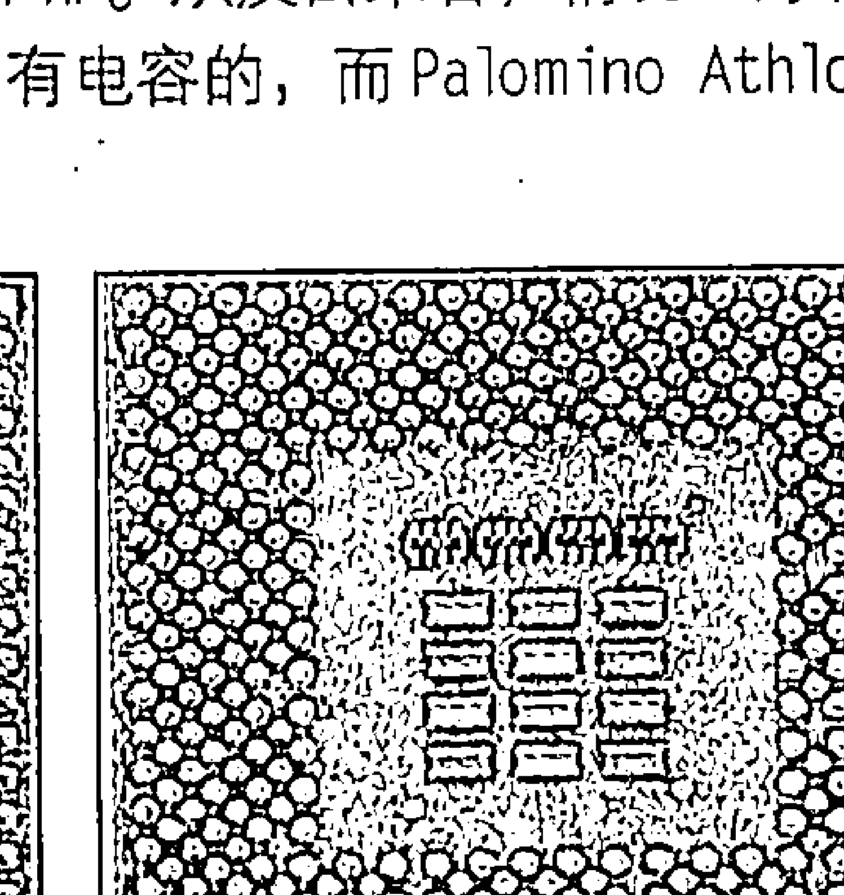

至于 Thoroughbred 中 A0 还是 B0 的辨别，这是肉眼所无法做到的，只能借助 WCPUID 等测试软件。若 CPU ID 为 681 表明是 B0，680 表示是 A0。此外， CPU-Z 测试软件还能直接显示 A0 或者 B0，更为直观。

## 2. K6-3与雷鸟移动处理器

### （1）产品简介

与台式机处理器相比，移动处理器往往具有更大的超频空间，这与其制作工艺有着很大的关系。一般而言，移动处理器总是采用当时最为先进的制作工艺。以 K7 雷鸟时代为例，当时 0.18 微米还是主流，但是绝大部分同时代的移动处理器已经使用上先进的 0.13 微米工艺。制作工艺的提升意味着核心发热量将大大减小，在产品内部设计不变时，这一改进将使其最高稳定运行频率突飞猛进，从而为超频打下坚实基础。

对于一款处理器而言，决定发热量的不仅仅是制作工艺，内部晶元的切割也相当重要。众所周知，大家在选购“超频王”时总是认准某一编号，而这往往就是位于晶元中央的产品。毫无疑问，几乎所有的移动处理器都是 Intel 或者 AMD 工厂严格挑选的产品，因为晶元中央的选材更有利于提高运行频率。此外，低核心电压、温控电路等也会使移动处理器进一步降低工作温度，这些都为我们后续的超频打下坚实基础。

### （2）性价比分析

AMD 的 K6-3 处理器是一位匆匆过客，不过如今移动版 K6-3 依旧活跃在市场上，堪称是坚守 Super7 阵地用户的升级首选。当时大部分 K6-3 处理器都采用 0.25 微米制作工艺，而且集成 On-Die 二级缓存，因此架构过于复杂，频率也被限定在 550MHz。事实上，到了 K6-3 的末期时代，AMD 曾在移动版上使用过 0.22 微米工艺，当然这仅仅是约定俗成的，因为所谓的 0.22 微米工艺仅仅是 0.25 微米的改进，但是其作用却是相当明显，几乎与 0.18 微米工艺没有太大的区别。

目前市场上流通的移动版 K6-3 多为 550MHz 或者 366MHz，前者采用 100MHz 外频，后者采用 66MHz 外频，核心电压只有 2.2V，而不是桌面版产品的 2.4V。事实上 550MHz 的移动版 K6-3 很可能就是 Remark 产品，但是即便如此其超频能力还是很出色。经过测试，这批移动版处理器的超频能力相当惊人，几乎无一例外地可以稳定运行于 133MHz 外频，而且倍频能够自由调节。达到 733MHz 的频率之后，移动版 K6-3 的温度依旧很低，甚至只使用散热片也不会立即死机。唯一遗憾的是，Super7 平台的优秀芯片组很少，只有 VIA MVP3 能够支持 133MHz 外频。如果能够找到经典的 MVP3 主板与 PC150 SDRAM，挑战 150MHz 外频应该不是什么难题。对于还在使用 K6-2 的升级用户而言，移动版 K6-3 确实是很不错的选择，其性能丝毫不亚于同频率的 P Ⅲ。

移动版雷鸟处理器也是目前二级市场上的焦点产品，不仅超频能力极其出色，还与 Athlon XP 一样具备 SSE 指令集。事实上，采用 0.13 微米工艺的雷鸟就是 Athlon 4 的前身，只不过标称频率有所降低。市场上最常见的移动版雷鸟莫过于 900MHz 与 1200MHz 这两种频率，而且都不锁倍频。由于采用了先进的 0.13 微米工艺，因此超频能力都令人相当满意。一般而言， 900MHz 的移动版雷鸟可以稳定运行于 133MHz 外频（即 1.2GHz），部分产品在略微提升电压之后可以运行于 1.4GHz，甚至更高。

由于 900MHz 已经是移动版雷鸟的最低频率，因此大家无须过多地担心 Remark 问题。相对而言， 1200MHz 的移动版雷鸟猫腻更多。如果深入市场的话，大家会发现两种版本的移动版雷鸟 1200，一种带有顶盖，而另一种采用类似 Athlon XP 的绿色封装形式。很明显，带有顶盖的产品是“此地无银三百两”，基本上都是移动版雷鸟 900 通过 Remark 而来的产品，尽管也能稳定运行，但是再度超频就相当困难。相对而言，不带顶盖而且采用绿色封装形式的移动版雷鸟 1200 更为令人放心，而且普遍超频能力出色，一般能够运行于 1.6GHz。从性价比角度来看，这些移动版雷鸟处理器相当出色，二级缓存容量达到 256KB，而且支持 SSE 指令集，仅仅 130 元左右的价格令人难挡诱惑。

### （3）风险提示

有一定 DIY 资历的用户对于 Remark CPU 应该不会陌生，当 Intel 与 AMD 纷纷采取锁频措施之后，Remark 产品几乎消失殆尽。然而移动处理器一般并不会锁频，这就让某些不法商家钻了空子。通过对产品标识进行打磨，甚至自行加上顶盖，瞒天过海的招式让消费者难以察觉。更为要命的是，移动处理器本身就有很出色的超频能力，因此即便打磨后大幅度提高频率也不会出现运行不稳定的情况，但是用户却因此损失了应有的超频空间。还需要提醒大家的是，由于移动版雷鸟不锁倍频，因此主板最好拥有倍频调节功能，否则很有可能无法识别。当然，这对于大多数名牌 KT133A 主板而言并不是什么难事。一般而言，我们建议大家使用 KT133A/266 或者 SiS 735 之类的主板与之搭配，这样可以体现出较高的性价比，性能甚至不输于低频率的 Willamette Pentium 4！

## 二级市场巡礼：显示器

显示器依旧是 PC 中价格最高昂的配件之一，因此很多渴望以低成本装机的用户都会选择二手显示器。更为重要的是，如今二级市场的显示器不仅仅局限于低端产品，甚至还有高端的 OEM 液晶显示器。可以这样说，无论是希望以低价格配置 17 英寸 CRT 还是以高性价比淘到 LCD，二级市场都会给你意外的惊喜。

## 1. 15/17英寸CRT显示器

如果想将整台电脑的成本控制在 2000 元以内，那么选择二级市场的 15/17 英寸 CRT 显示器无疑是一条捷径。不过这类显示器情况复杂，质量与显示品质的个体差异十分明显，因此选购之前应该做好充分的准备，并且掌握相关的知识。

### (1) 产品简介

二级市场中有一个非常有趣的现象，即几乎所有的 15 英寸显示器都是国内用户淘汰下来的产品，而 17 英寸显示器以日系品牌的国外舶来产品为主。相对而言，最值得选购的应当是国内用户淘汰下来的 17 英寸 CRT，这类显示器往往使用时间在三年以下，应该还能继续服役很长一段时间。相对而言，15 英寸 CRT 因为使用时间较长而显得性价比一般，而且较小的视野范围以及与 17 英寸 CRT 并不大的价格差距令它成为二级市场中的冷门。至于日系品牌的 17 英寸显示器，这在二级市场上是绝对的主流，几乎占据供货量的 70% 以上。

国内用户淘汰下来的 15 英寸 CRT 以飞利浦、三星、现代等品牌为主，其中不少是国产品牌机的配件。由于纯平技术并未在 15 英寸时代普及，因此大部分 15 英寸 CRT 都是直角平面的普通产品，甚至柱面显像管都非常罕见。一般情况下，不具备数控的低端 15 英寸 CRT 在 120 元左右；而一台带有数控功能的产品则要价 150 元；少数柱面显像管的 15 英寸 CRT 在 150~200 元之间。

17 英寸 CRT 按照技术可以分为三类：直角平面显像管、柱面显像管和纯平显像管。国内用户淘汰下来的产品以第一类和第三类为主，而日系品牌的产品以第二类为主。从使用年限来看，第三类产品自然是最值得我们选购的，但是价格往往在 500 元以上，部分高带宽产品甚至已经接近当前的低端 17 英寸主流纯平 CRT。性价比最高的无疑是第二类产品，但是不得不承认，日系品牌的产品大多是淘汰货，甚至是翻修货，因此选购时必须格外小心。

### (2) 性价比分析

15 英寸 CRT 在主流市场已经难以寻觅，不过对于需要组装第二台电脑或者极度关注成本的用户而言，100 元出头的产品的确是很好的解决方案。尽管 15 英寸 CRT 的可视面积差强人意，但是如果仅仅工作在 800×600 分辨率时，基本上还是能够胜任日常的办公以及上网等应用。然而，要提醒大家的是，不同的 15 英寸 CRT 在性能上会有比较大的差异。少数不带数控功能的产品并不值得推荐，这类产品往往做不到完全的“平面直角”，而是纯粹的球面管，是 14 寸显示器时代的衍生产物，而且因为视频带宽的不足顶多维持在 85Hz 的刷新率。相对而言，后期的 15 英寸 CRT 更值得我们选购，直角平面的效果远远优于球面管，用户会感觉视野更为开阔，而且部分产品在 800×600 分辨率下能够达到 100Hz 的刷新率，对于稳定画面有很大的好处。

对于在二级市场装机的用户，我们认为 17 英寸 CRT 才是最佳的选择，毕竟主流的 1024×768 分辨率对于一款 15 英寸 CRT 而言太过勉强。从某种程度而言，显像管的种类直接决定最终的显示效果。平面直角技术运用于小面积的 15 英寸显示器或者还令人感觉可以接受，但是运用到 17 英寸显示器时会发现边角处的曲率很大，几乎等同于球面管。为此，柱面显像管成为最佳的合理选择。尽管没能做到纯平，但是此时整体画面效果已经相当出色，350 元左右的价格很容易让人接受。至于 17 英寸纯平 CRT，我们认为其性价比一般，动辄 500 元以上的价格似乎不如直接购买一级主流市场产品。当然不可否认的是，少数个人用户手中淘汰下的高端 17 英寸纯平 CRT 还是相当不错的，至少在质量上比当前“急功近利”的千元级 17 英寸纯平要好得多，但是最终的取舍还是要根据价格以及保养程度来决定。

### (3) 风险提示

-   ①显像管翻新

有些二手显示器在收购时或运输中容易造成屏幕表面划痕，不法商家为了能让这样的显示器能卖个好价钱，往往会对显示屏进行深度打磨将划痕磨平，然后再进行非常细致的抛光。其翻新原理和光盘翻新类似，等抛光完毕再看显示屏时，你就会发现其已和新的差不多了。但是这样的做法会给用户带来很大的安全隐患，因为显示屏的玻璃壁厚是经过厂家设计人员精确设计的。如果玻璃壁经打磨抛光变薄的话，不但会使有害射线强度增强，而且还有可能会发生显像管爆炸事件。另外这样做还会严重损坏显像管的表面涂层，如果使用者长期使用这样的显示器的话很有可能造成视力下降。如何识别彩显的显示屏是否经过打磨抛光呢？方法不是很难，只要细心就会发现被打磨过的显示屏表面用手摸起来有凹凸不平的感觉，原因是因为无论怎么打磨也不会将屏幕打磨均匀，尤其是在厚度方面。

-   ②产品老化程度和稳定性

如果发现显示器刚开机时字符模糊，然后渐渐清楚，这表明显像管内部已经老化，应该尽量避免这类产品。显像管内阴极管由灯丝加热后才可以打出电子束，当阴极管开始老化的时候，加热的过程变慢了，所以在刚开始的时候，没有达到标准温度的阴极管，无法射出足够的电子束，也就导致没有足够电子束轰击荧光屏而使画面不清晰。如果显示器出现偏色（一般是偏红或者偏蓝），那么应当立即调整 RGB 为相同值。倘若还是无法改善，说明阴极管已经严重衰竭，其寿命令人十分担忧。除了仔细查看，大家还可以利用灵敏的耳朵。显示器正常工作时应该是没有声音的，如果你听到异常声音就不要购买。但某些中高档显示器开机时会有“咔”的一声，此时不要担心，那是继电器在工作，属于正常。

-   ③判断显示器生产时间

显示器的出厂日期一般可以从后面的铭牌查到，上面记录着这台显示器的品牌、型号、序列号、通过认证标准、出厂日期等信息。比如我们可以看到“Manufactured: MAY, 1999”这样的标识，就说明这台显示器的出厂日期是 1999 年 5 月。但对于一些年代久远的显示器，商家可能撕掉铭牌来回避这个问题，这样就不能通过简单的肉眼识别来确定出厂日期了，此时只能借助软件来识别。大多数显示器内部的 BIOS 上面记录着出厂时的一些重要数据，包括序列号、生产日期等等。我们可以通过测试软件读取这部分信息，常用的软件有 PowerStrip、AIDA32（EVEREST）等。一般而言，普通显示器的正常使用寿命在 8~12 年，所以我们对于 1995 年以前生产的产品要特别小心。

-   ④警惕聚焦瑕疵

焦距是电子束打在屏幕荧光层上的准确程度，聚焦点越小则清晰程度越高。由于电子枪到屏幕各个位置的距离和角度并不相同，就需要专门的电路来控制，聚焦好坏是一台显示器的关键指标，通常老化的显示器容易在聚焦上出现偏差。一般而言，商家总是喜欢用鲜艳的图片来展示，这样就很难识别聚焦存在瑕疵的产品。具体测试方法应该是打开文本文件，再把字调到最小或把分辨率调到最高并且开满屏，看一看字迹边角是否清楚。

## 2. 19英寸以上大屏幕CRT显示器

由于成本的原因，17 英寸以上的大屏幕 CRT 一直没有普及。尽管大屏幕显示器对于办公与上网等应用而言没有太大的意义，但是在玩游戏或者看电影时，大屏幕的震撼效果是毋庸置疑的。二级市场中的大屏幕 CRT 可谓比比皆是，这也是二级市场的亮点之一。

### (1) 产品简介

17 英寸以上显示面积的显示器比较吃香，是很多追求大屏幕、高性能，而又囊中羞涩的电脑玩家看好的对象。这些显示器多是舶来品，生产年份在 1995~2001 年之间，部分产品外壳经过翻新和清洁，内部线路经过重新调校后效果和外观都还不错。不过由于大部分显示器在前期使用时基本为连续开机，所以有不同程度的老化，但是在个人手里再使用三年左右基本没有问题。二手大屏幕彩显中有些只支持高分辨率、高刷新率。原来工作站上使用的显示器比较便宜，如 SUN、Compaq、IBM 等品牌的 20 英寸彩显，大多采用索尼特丽珑柱面显像管，最高分辨率为 1600 x 1200，带宽 203MHz。此外也有部分此类显示器经过国内二手商的改造，支持 640 x 480 到 1600 x 1200 分辨率（内部加装了部分线路）。

相对而言，索尼、富士通、三菱、日立等品牌的大屏幕 CRT 往往并非用在服务器上，因此实际工作时间稍短，也保养得更好。此外，这类产品采用的显像管并非渠道产品，其中很大一部分都是自家生产的产品，品质上更胜一筹，而且不存在固定高分辨率的问题（图7）。二级市场中也不乏极品，19~21 英寸的纯平显示器便是一个例子。在主流一级市场中，22 英寸纯平 CRT 往往高达 5000 元以上，而二级市场中不少产品只有 1000 元左右，部分 19 英寸纯平甚至仅仅 700 元出头，价格上还是很具有诱惑力。

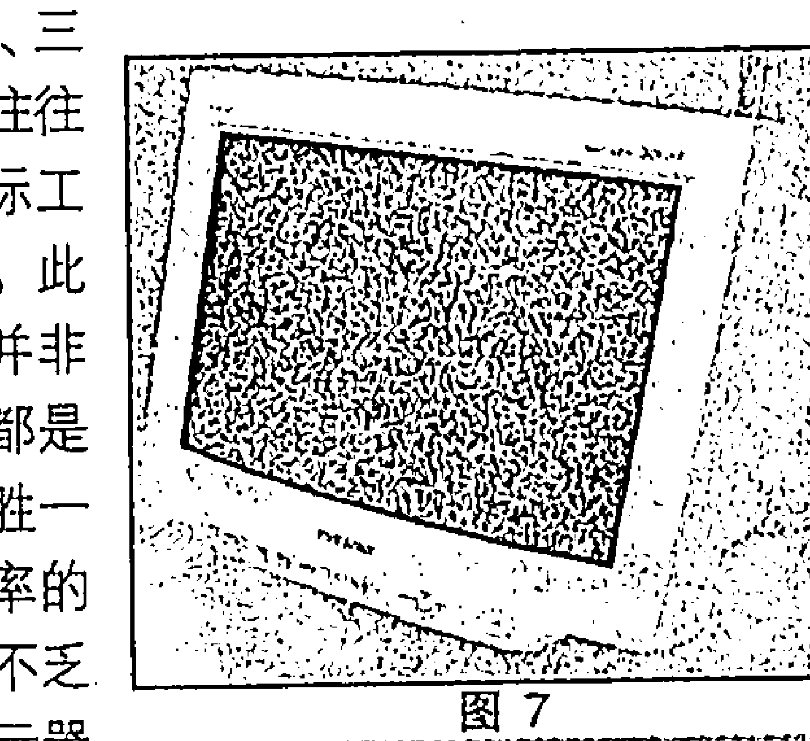

### (2) 性价比分析

大屏幕 CRT，特别是 21 英寸 CRT 已经成为二级市场的招牌，用户甚至无法在一级市场找到相应的产品。然而应当要认识到，二级市场毕竟有别于一级市场，即便是成色很新的产品，细微的差别还是不容忽视。首先应检查分辨率及扫描频率，在 1024 x 768 下应不低于 85Hz，能够达到 120Hz 以上的才算是极品。在此，我们建议大家从外观、镀膜、显像管类型、视频带宽等多个方面进行全面的分析。一般 20 英寸直角平面 CRT 的价格在 400 元左右，19~21 英寸柱面显示器在 550~600 元，19 英寸以上的纯平产品根据视频带宽而存在很大的价格变化。但是有一点千万记住，对于价格在 500 元以上的大屏幕 CRT 显示器而言，实在没有必要购买镀膜损坏甚至存在严重划痕的产品。此外，我们认为采用平面直角显像管的产品并不值得推荐，一方面是显示效果不佳，更为重要的是其生产日期较早，剩余的工作寿命令人十分担忧。

### (3) 风险提示

-   ①勿忘产品兼容性

二级市场中不少大屏幕 CRT 使用 BNC 接口、三色（R、G、B）信号线、复合同步信号线（HV-SYNC）、地线（GND）分开，各自分离独立传输，以提高图像质量。但是这种接口往往得不到普通显卡的支持，因此有时商家安装了转接线。但是请大家记住，使用转接线会令显示效果大打折扣，整体效果还不如普通的 15 针 D-SUB 接口。最理想的情况应当是选择具有双接口输出的产品，可以兼容 D-SUB。此外，部分用于服务器的大屏幕 CRT 可能存在 DOS 下无法显示的问题，此时就得格外留意，根据自己的使用习惯来决定是否购买。

-   ②警觉莫名的效果不自然

显示器在长时间使用后对比度以及亮度均有下降，此时甚至调高压包也无法解决问题，一般通过提高显像管的灯丝电压来进行翻新。但是这样翻新的显示器虽然亮度和对比度有所好转，然而聚焦效果就会大打折扣了，图像看起来就会有一种不是很舒服的感觉（因散光导致过于扎眼），尤其是在看文字时就会更加明显。需要注意的是，这种聚焦问题并非是文字边角不清晰，而是说不清楚的画面不自然。

## 3. LCD

原本无闪烁的 LCD 应当成为绝对主流，但是价格居高不下的液晶面板阻碍了其普及速度。然而二级市场的 LCD 也因此获得了更多机会，其中二手产品以 13 或者 14 英寸产品为主，全新的二级市场渠道产品则包括 15 与 17 英寸，以及少数 14 英寸产品。

### (1) 产品简介

二级市场的 LCD 分类相当清晰，14 英寸以及更小面积的产品以 NEC 等品牌的二手产品为主，极少数非知名品牌的全新 14 英寸 LCD 出自国内厂商。而 15 与 17 英寸的产品几乎都是全新的，货源渠道分为两种：DELL 等品牌机厂商的 OEM 产品或者台湾代工工厂的产品。

客观而言，14 英寸 LCD 是可以接受的最小面积，此时的视野范围略大于一款 15 英寸 CRT 显示器。但是目前二级市场中的这类产品……

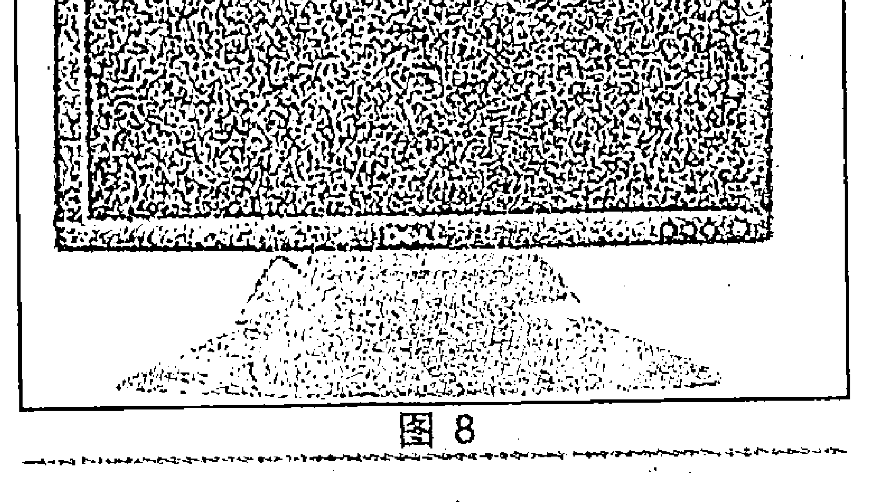

品往往存在比较严重的问题，比如屏幕上有坏线或者存在多个坏点，部分产品甚至已经严重偏色，唯一吸引人的地方就是价格仅仅800元不到，而且拥有不闪烁的画面。

全新的LCD在二级市场更为引人注目，DELL品牌的OEM产品在性能上十分出色，而部分台湾代工厂的产品拥有较为明显的价格优势。DELL OEM的17英寸LCD一般为三星品牌，价格在2200元左右，同时还带有DVI数字接口，响应时间等方面的表现也完全超越主流市场的同价位产品（图8）。至于代工厂的产品，15英寸一般为1300元左右；17英寸为1800元上下。

### （2）性价比分析

如果不是纯粹的办公用户，我们认为没有必要购买二级市场的14英寸LCD。可视面积较小仅仅是一方面，更重要的是这类产品响应时间较慢，在看电影或者玩3D游戏时非常不便。如果十分在意成本，建议选择代工厂的15英寸LCD。LCD不同于CRT显示器，简单的结构注定中小厂商只要使用高档液晶面板也能生产出高质量高性能的产品。至于价格不菲的17英寸LCD，或许我们只能说主流市场的同价位产品性能上不如它，而同级别产品的价格又远远高于它，唯一的缺点就是质保无法保障，这需要大家权衡利弊。

### （3）风险提示

LCD一般不存在翻新或者返修的问题，因此大家所要做的仅仅是鉴别其本身的质量，在此我们推荐大家使用Monitors Matter Check Screen，它可以帮助大家快速了解LCD的品质，以免被美丽的外观所迷惑。Monitors Matter Check Screen的用法十分简单，默认方式进行安装之后就可以使用。

LCD最常见的问题是色彩不纯与串扰，前者是因为液晶面板本身的质量较差，后者是由于“高亮”画面影响到其周围邻近区的液晶分子。通过Monitors Matter Check Screen的Colour和Crosstalk测试单元，LCD的这两个瑕疵将会被凸现。如果产品能够在这两个模式下表现出正常的画面，那么其基本表现就令人放心。此外，Monitors Matter Check Screen提供了Smearing测试单元，用于检验产品的响应时间。在这个测试项中，显示屏幕上有快速移动的小方块，其中方块后拖尾的影子个数代表显示器信号的响应时间的快慢，也由此能够轻易判断出LCD拖尾现象的轻重（响应时间的快慢）。

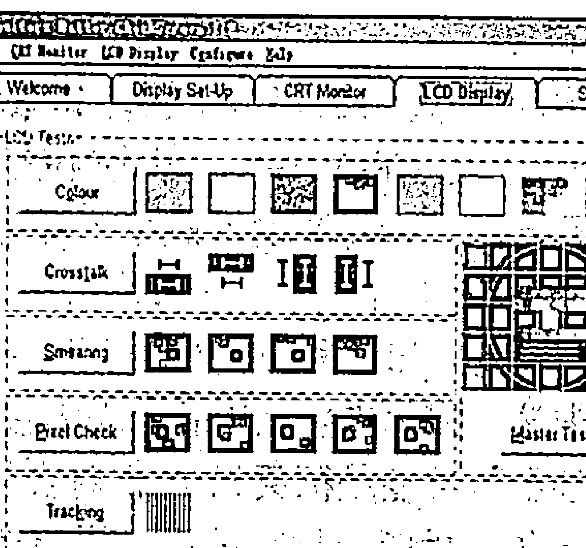

Monitors Matter Check Screen还具备坏点测试功能，可以在Pixel Check单元中进行（图9）。检测过程是在一个黑色背景中进行，我们可以通过键盘上的空格键来切换小方块的颜色（红、绿、蓝、黑、白），还可以通过键盘上的光标键来移动小方块的位置。在红、绿、蓝、黑、白五色小方块分别经过某个位置时，如果某个像素点的颜色始终不发生任何变化，那么我们基本上可以判定这是一个“坏点”。一般情况下，LCD显示器的坏点超过三个就属于不正常范围。

## 二级市场巡礼：主板

曾几何时，千元级成为主流主板的最佳定位。然而从成本分析来看，主板市场的利润相当高，因此近几年一直呈现价格下滑的态势。不过这并没有阻碍二级市场中主板的人气，甚至也没有因为主流市场上出现大量低价位三线品牌而导致二级市场萎缩。对于渴望低成本装机或者升级的用户而言，二级市场中的主板将是很好的选择。

### 1．货源渠道分析：良莠不齐需明辨

二级市场永远是那么令人捉摸不透，不过从货源渠道来对产品质量进行分析是一种捷径。目前二级市场的主板分为工包、返修以及二手货等三大类，其中的区别自然也十分明显，大家在选购时有必要仔细考证一番。

#### （1）工包主板情况复杂

简明扼要地说，所谓工包就是采用了工业包装（如装在一个防静电的袋子里，再用一张绝缘塑胶泡沫垫上，通常没有包装盒子）的配件。对于其他配件的工包产品我们就不在此评述，单对主板的工包产品来说，个人认为不应该一棍子打死。二级市场上的工包主板产品除了部分是翻新或者假冒的工业包装，也有不少是品牌厂商推出的真正意义上的工包品或库存工包品。

工业包装的来源有很多。一些是来自一些硬件厂商的库存产品。这是某些厂商因为生产数量过大，或者是已经淘汰了的产品，由于正规的渠道销售不出去了，唯有通过一定的渠道进入零售二级市场。更为重要的是，厂商对于市场有整体的规划，库存产品的大幅度降价不能直接反映到主流市场，否则不仅会严重影响自身其他产品的销量，更会导致竞争对手不满，从而引发不可收拾的价格战。

另外一些工包主板则是某些品牌电脑厂家由于整机淘汰或者更新而得到的剩余配件，这往往都是通过二级市场渠道销售，也被称为是“拆机货”。需要注意的是，“拆机货”又分为两种：一种是品牌机厂商多余的库存，一般质量十分可靠；而另一种则是代工厂商的产品因为品质瑕疵而遭到品牌机厂商的拒收，其可靠性可想而知。

还有一种是通过某种渠道或者关系从海关手上得到的走私货。这些货往往是市面上正当火热的比较好销售的产品。更为重要的是，目前我国海关已经实行走私货拍卖制度，因此这些“走私货”的官方定性甚至可能是合法的。如果不出意外的话，这类产品的稳定性相对较好，但是也得注意因为运输过程中而造成的损坏以及本身就存在故障的工业报废品。

无论是哪种原因，二级市场的成本都要比零售市场的经销商的渠道价格便宜不少。再加上包装和没有正式的保修等原因，工包主板要比正式的零售型产品便宜一大截也就是情理之中的了。

#### （2）返修与翻新

看到了“工包”产品由于价廉物美销售量不错，一些奸商们便再次冒起了坏水，于是市场上出现了“假工包”的产品。“假工包”的产品指的是那些拆机二手部件和返修部件。一些奸商为了获取高额的利润，将一些从被淘汰的整机上拆下的部件经过一定的翻新处理，然后便自称为“工包”的产品。要知道，市场上“工包”产品的售价可以要比“二手”产品贵得多了。

目前任何产品都不可能做到100%的无故障，即使是一些顶尖的名牌产品，有时也会出现故障。为了保证自己的信誉，厂商们自然会对出现故障的产品进行维修。按照电脑整机维修的惯例，一般都是采用对故障部件予以调换的办法。调换下的部件则会返回生产商处进行维修。可修过的东西即使修得再好，身价也是大跌的了，它的价值还不如拆机的二手部件呢！而如今冒充“工包”主板，则成为了它们提升自己价值的“遮羞布”！因为没有包装，没有正式的保修凭证都可以通过“这是工包主板”搪塞过去。但是大家必须明白的一点，真正的“工包”产品都是新品，用过的产品都不能算是“工包”。相对而言，我们认为那些明确告诉消费者是返修货的商家更为坦率，也更加直接。熟悉主板制造的读者应该都能理解，有些电路故障在情节并不严重的情况下完全可以做到维修后不影响使用，而这类产品的确存在于二级市场，只是如今市场的诚信度令人担忧，真正有口碑的商家实在太少。

#### （3）二手主板

一般主板的使用寿命至少可以达到5年，少数品质较好的产品甚至可以使用10年以上。为此，二手主板活跃在二级市场也并不令人感到意外。对于Socket A以及Socket 478平台的二手主板，应该要求提供产品购买时的收据以及包装和说明书等证明，这样才能令人比较放心。至于Socket 370的老式主板，一般只要能够使用即可，因为无论是造假厂商还是走私渠道都不会对这类老主板感兴趣。

### 2. 经典产品介绍：二级市场超值品

对于系统整体性能而言，CPU、内存以及显卡所起的作用更大一些，而主板芯片组相对次要，特别是在同一平台的产品中。为此，不少被主流市场所淘汰的芯片组在二级市场寻找到很好的归宿，而我们这里所介绍的产品也具备相对较好的质量与市场口碑。

#### （1）精英K7S5A（图10）

采用SiS735芯片组的精英K7S5A并不是今年的新产品，但是依旧是如今二级市场的热门产品之一。在性能方面，精英K7S5A远不及如今的主流Socket A主板，但是巨大的性价比优势使其在二级市场大放光芒。在很长一段时间内，精英K7S5A都是DIY发烧友讨论的焦点。由于这款主板在二级市场的售价120元不到，而且能够完美地支持0.13微米Thoroughbred Athlon XP以及Applebred Duron，因此被称作是性价比最突出的Socket A主板。不仅如此，原本功能简单的精英K7S5A还可以通过刷新非官方BIOS来实现超频功能，最高甚至支持166MHz外频，而且此时同样能够支持正常的PCI分频。最令人吃惊的是，部分发烧友还在这款主板上通过修改电路实现了核心电压调节。

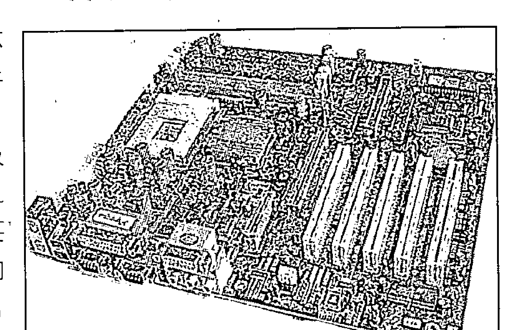

对于那些喜欢“淘宝”的老鸟而言，150元不到的精英K7S5A确实是很不错的升级选择，配合Athlon XP将令整体性价比大幅度提高。由于精英K7S5A同时提供SDRAM与DDR内存插槽，因此用户还可以根据自己的实际情况进行选择，甚至保留以往的SDRAM内存，充分保护升级用户的投资。更加难能可贵的是，这款主板采用了MicroATX设计，独立的AGP 4X以及5条PCI插槽提供了较为完备的扩充性。然而树大招风，精英K7S5A受到假货与返修货的冲击也十分严重，这也是二级市场的固有风险。

#### （2）华硕nForce2 IGP

二级市场中的华硕nForce2 IGP大多为HP品牌机的库存产品，通过一些特殊的渠道流散出来。不过从产品的品质来看，还是十分令人放心的，除了极少数产品因为运输不当而造成硬伤之外，基本上找不到任何故障。也正是华硕与HP的金字招牌使之成为一款热门产品。从性价比角度去评判，如今这款售价300元不到的nForce2 IGP也堪称一流。nForce2是目前性能相当不俗的一款Socket A主板，其主流地位至今仍然没有丝毫动摇。更为重要的是，这款主板还集成nVIDIA Geforce4 MX核心与SoundStorm音频。如果配合双通道DDR内存的话，此时集成显卡性能令人较为满意，远远超出同时代Intel Extreme整合图形芯片。另外特别值得一提的是，这款主板的散热设计十分出色。其风扇电源接口可以根据CPU检测温度实时调整转速，顺利解决了风扇噪音问题。

略微有所遗憾的是，这款出身于品牌机世家的主板似乎对超频特意限制，主板上找不到任何频率相关的跳线，BIOS也采用最为简化的品牌机模式。对于发烧友而言，唯一的超频机会便是直接修改CPU金桥，因为甚至连nVIDIA的官方超频软件都无法在这款主板上顺利工作。之所以华硕nForce2 IGP会成为热门产品，与目前二级市场上基本没有这款主板的假冒产品也有很大的关系。

#### （3）IBM I865G

这款I865G主板出自于IBM品牌机，由技嘉负责生产。该板型采用了技嘉一贯的蓝色PCB板和三相电源回路设计，在主板上很明显可以看到“IBM”的标记。由于其采用的是I865G芯片设计，所以集成Intel Extreme 2显示核心，同时其还具备独立AGP 8×接口，支持前端总线为800MHz的处理器和双通道的DDR400内存。主板还板载了一块I82541千兆网络芯片。除此之外，它还提供2个S-ATA接口和6个USB接口。

从主板配置来看，这绝对不可能是假冒产品，因为没有哪个山寨工厂会傻到使用价格不菲的千兆网卡芯片生产假冒品的地步。但是值得提醒大家的是，少数这类IBM I865G主板存在焊点，这显然是维修后的痕迹。不过从产品品质来看，稳定性还算令人放心。最关键的是，这款主板价格仅仅320元左右，应该说性价比十分突出。另外需要注意的是，该主板往往没有专配的CPU风扇底座以及接口挡板，需要用户另行配置。

#### （4）精英815EPT

这是在二级市场流行多年的产品了，至今仍有充足的货源，因此其货源渠道令人十分怀疑。如果是厂商的库存产品，那么库存量也太为惊人了。更为蹊跷的是，二级市场上的精英815EPT似乎在不断改变PCB板，甚至布局也有改变，因此肯定脱离不了假冒的干系。

作为一款I815EPT主板，其最大的价值在于搭配Tualatin Celeron以及SDRAM内存，因此很受升级用户的追捧，而且价格仅百元出头。但是稳定性是令人最为担忧的问题，因为所谓的假冒精英815EPT有着多个不同版本，并且与真正的工包精英815EPT混杂在一起。I815系列北桥与ICH2南桥的库存量在二级工厂中一直有很多，因此市场上依旧出现大量815EPT主板并不令人感到奇怪，甚至有可能是精英BIOS相对容易仿冒所造成的。问题的关键在于这些主板能否稳定运行，因此选择这种主板时一定要商家提供全面测试的机会，并且承诺较长时间的保修期。

#### （5）SiS730/740主板（图11）

SiS730与SiS740都是技术上十分成功的整合芯片组，当时的VIA甚至没有产品与之对抗。但是SiS的市场推广并不成功，从而导致大量的库存。再加上当年SiS与代工厂广泛合作，因此造成如今使用这两款芯片组的主板在二级市场上铺天盖地。

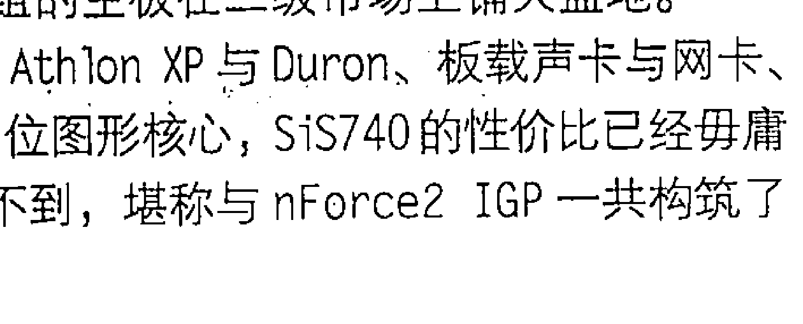

兼容0.13微米工艺的Athlon XP与Duron、板载声卡与网卡、集成DDR内存控制器与256位图形核心，SiS740的性价比已经毋庸置疑，而价格仅仅200元不到，堪称与nForce2 IGP一起构筑了Socket A整合主板平台。至于SiS 730，仅仅支持SDRAM以及128位图形核心使得性能有所下降，但是价格仅仅百元出头，性价比也十分值得肯定。不过不得不承认的是，二级市场上大部分SiS 730/740主板局限于二、三线品牌，整体做工略显粗糙，但是稳定性还算比较理想。

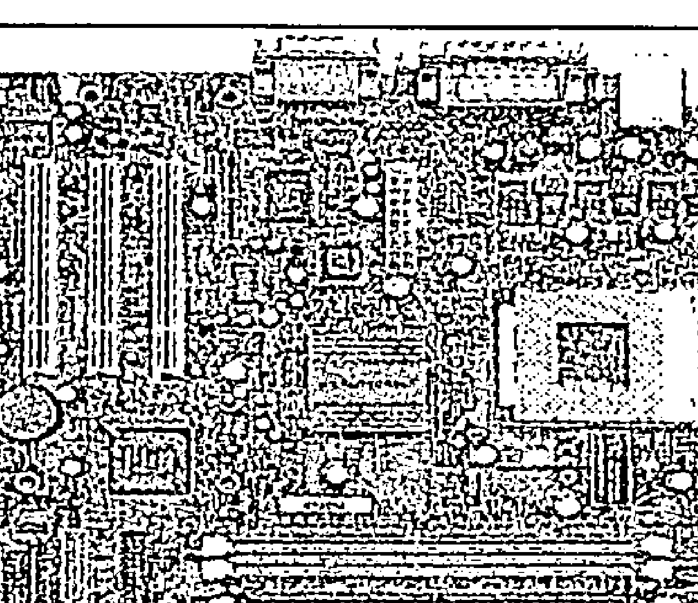

### 3. 火眼金睛：如何鉴别主板质量

以上介绍的几款主板仅仅是二级市场中的冰山一角，旨在帮助大家了解二级市场的产品现状，大量的产品我们不可能全部罗列。但是无论如何，学会产品质量的鉴别相当重要，这才是避免买到劣质产品的王道。

-   (1) SiSoft Sandra MAX 暴力测试

很多在二级市场购买主板的用户最担心稳定性问题，因此很需要一款强力测试软件，而这方面正好是SiSoft Sandra MAX的特长。然而更为重要的是，SiSoft Sandra MAX内置“Burn-in Wizard”，可以让系统满负荷、长时间运行，以确定其稳定性。如果被测试机器能在不开空调的环境中平稳运行2小时，而未出现死机、花屏等现象，那么其稳定性将令人十分放心。不过大家需要注意的是，SiSoft Sandra MAX有两个版本，一种是网上可以随便找到的标准版SiSoft Sandra MAX Standard，这个版本相当于试用版，界面和菜单与专业版完全一样，但其中部分功能被屏蔽掉，相对而言，专业版SiSoft Sandra MAX Professional的功能更加全面，不过价格不菲。好在试用版的SiSoft Sandra MAX并没有屏蔽“Burn-in Wizard”测试功能。

-   (2) 供电部分是关键

很多用户知道主板的超频能力以及稳定性与供电部分息息相关，同时供电部分也是最容易损坏的地方。供电部分的器件主要由电源调节器、滤波电容、扼流线圈等构成。在检验主板时，大家应该仔细查看电容是否有爆浆现象。此外，稳压芯片和MOS管周围是否有烧毁痕迹也是需要特别留心的。事实上主板供电部分损坏并不会引起严重问题，维修好之后便能正常使用。但是此时必须要求维修到位，建议频繁加电测试，并且重启，部分勉强维修好的主板很容易出现间断性无法自检的情况。

-   (3) 电路与芯片级维修

主板出现电路故障是十分常见，修补过程并不复杂，甚至很多仅仅是背面PCB线路划伤。但是如果发现电子元件存在大量的更换现象，那么就得仔细考虑是否值得购买了。二级市场中部分主板甚至是多国部队的集中营，使用了多种不同品牌的电容或者稳压芯片。此外，假如发现主板上存在飞线也应当特别谨慎，这往往是很不稳妥的维修方案，甚至很可能屏蔽了已经损坏的部分保护功能。相对而言，一些芯片级维修还算令人放心，比如更换南北桥芯片以及控制芯片等。但是芯片级维修的设备成本相当高，因此如果不是大量货源的主板的话，也建议不要选购，因为此时商家很难做到所承诺的售后服务。如果条件允许的话，尽量购买不存在维修痕迹的主板，这样才能用得更加放心。

## 二级市场巡礼：硬盘

尽管硬盘的稳定性比起其他配件稍差，但是只要在选购时小心谨慎，那么二级市场上同样能够“淘”到价廉物美的产品。对于比主流市场，如今80GB硬盘几乎成为最低配置，而更高端的SCSI硬盘卖到天价，对于只需要小容量硬盘或者渴望体验高性能磁盘系统的用户而言，选择二级市场的硬盘无疑是一条捷径。

### 1. 普通IDE硬盘

由于接口的普遍性以及广泛的兼容性，IDE硬盘的市场占有率很高。但是不可否认的是，大多数IDE硬盘的稳定性令人担忧，即便是主流市场的产品也常常会受到高返修率的困扰。更为棘手的是，硬盘不像板卡设备那样易于维修，一旦出现物理坏道就会很难处理。也正是基于这些因素，我们在选购二级市场的普通IDE硬盘时，必须进行全面的质量检查以及货源渠道分析。

-   (1) 产品简介

我们将二手电脑市场里销售的二手硬盘分为三种层次。第一种是最便宜的，既不提供上机测试也不提供保修，购买者只能是自己看着硬盘的外观挑选，这些硬盘的数量在二手市场中占有着非常大的比例。第二种是不提供上机测试不过可以包换的硬盘，一般是论个卖，不计较硬盘容量。第三种是提供当场机测试的硬盘，自然也是最可靠的硬盘了。

毫无疑问，前两种硬盘并不推荐购买，第一种硬盘几乎不可能是完好的，能够买到无坏道产品的概率与买彩票中头奖差不多。第二种硬盘虽然安装到电脑上后系统可以识别出，但大多数都存在大量的坏道，而且修复。而第三种硬盘确实是二手硬盘里最好用的，不过其中也有不少是经过修复的硬盘，在购买的时候也要特别的注意。

除了二手设备的经销商，我们还能看到各种真正的水货硬盘，或者由OEM市场外流的产品。与上述纯粹的二手硬盘相比，这类产品的稳定性无疑更加出色。水货硬盘仅仅在渠道上存在一些问题，并不代表品质上有什么瑕疵。而OEM市场外流的产品往往都带有明显的产品标识，比如打上HP或者其他品牌机标签。

-   (2) 性价比分析

二级市场中的硬盘容量有很大的跨度，小到4.3GB的容量，大到80GB以上。当然，小容量硬盘大多是已经使用多年的产品，因此稳定性自然令人担忧。但是还有一点不能忽视，毕竟老一代硬盘采用5400RPM低转速，而且当时的价格竞争并不激烈，因此很多产品的寿命远比如今病态的硬盘市场的产品来得更长。

一般而言，4.3GB硬盘的价格在25～30元之间，而且必须保证没有坏道并且一切工作正常。不过这类小容量硬盘的速度也令人难以满意，因此10GB～20GB的硬盘才是当前二级市场的主流。由于10GB～20GB的硬盘大多支持ATA66甚至ATA100，而且单碟容量大幅度提升，因此整体速度表现相当令人满意，即便是5400RPM的低转速产品也不会表现太差。在价格方面，普通10GB硬盘为100元左右，15GB达到120元，而20GB的产品普遍为150元上线。可以肯定的是，具体的价格也会随着产品型号以及成色而有所波动，但是波动范围不超过30％。与主流硬盘市场动辄160GB的产品相比，10GB～20GB的小容量硬盘在价格上有很大的优势，非常适合那些渴望以低成本装机的用户。

除了20GB以下容量以外，30GB以及40GB硬盘在二级市场也十分常见，而且型号集中于迈拓星钻以及希捷U6。从技术角度而言，这类5400RPM的低转速产品已经相当令人满意，ATA100接口与20GB的单碟容量保证了基本速度，同时噪音控制也十分理想。在性价比方面，这类产品也是最高的，一般都控制在200元左右。相对而言，60GB以及80GB的硬盘主要是个人用户淘汰下来的二手产品，因此品牌型号比较分散。值得一提的是，选购这类硬盘时应该仔细掂量一下性价比。如今主流市场一年保修的7200RPM 80GB硬盘在430元左右，而面对一款已经被使用多年的80GB二手硬盘，350元左右的售价是否能够接受？或许各人有不同的答案！

### （3）风险提示

### ①有些硬盘肯定不能买

二级市场中的硬盘有不少是已经损坏或者基本报废的产品，这类产品自然是最令人后怕的。由于硬盘的特殊性，往往损坏的产品非常集中，形成某一型号的硬盘返修率极高的现象。臭名昭著的IBM硬盘已经完全褪去了光辉的形象，二级市场中很多40GB～80GB的产品都是腾龙三代或者腾龙四代(图12)，几乎每一块硬盘都存在坏道，非常危险，绝对不推荐购买，除非是个人用户淘汰的产品并且提供完整的测试。

二级市场中4.3GB硬盘为数不少，而希捷的大灰熊系列是我们不建议购买的。作为第一款7200RPM IDE硬盘，大灰熊系列的技术并不成熟，发热量相当惊人，故障率很高。如今二级市场上的大灰熊系列多半是返修后的报废产品，均不提供当场测试。

与IBM一样，当时名噪一时昆腾也是因为质量问题而隐退硬盘市场。如果深入了解二级市场的话，你会发现从6.4GB到20GB，昆腾品牌十分常见，而且其电路板往往经过维修，坏道也有不少。与后期的迈拓或者希捷相比，当时的昆腾硬盘在稳定性方面很难令人满意，流落到二级市场后通过低级格式化、改装电路板或者屏蔽坏道或许还有可能勉强工作，但是其寿命可想而知。

### ②外观鉴别

选择二手配件的时候一般都要先观察外表，对于硬盘来说这一点尤其重要，因为硬盘是很怕震动的器件，所以如果硬盘外面的铝壳有碰撞痕迹的话，磁头很容易划伤磁盘表面，造成严重的物理损伤。另外要仔细查看的就是盘体与电路板连接的固定螺钉是否一致且没有被拧过的痕迹，如果有拧过的痕迹，就证明这块盘有可能是商家拼装出来的。最后要看一些针脚有没有修补过的痕迹，还可以通过出厂日期来推断一块硬盘的使用情况。

### ③如何检测硬盘的物理坏道

一旦硬盘存在物理坏道，数据安全性将受到严重威胁，因此在二级市场选购硬盘时，检测物理坏道是必须的。很多商家往往仅仅采用分区格式化或者运行Scandisk来检测物理坏道，而这种方法并不保险，很可能存在漏网之鱼。为此，建议大家使用“效率源硬盘坏道检测软件”，可以到 http://www.newhua.com/soft/1363.htm 下载。

“效率源硬盘坏道检测软件”只能在软盘上生成工具盘，因此使用前提是必须有软驱，而且Windows操作系统下无法查看工具盘中的内容，必须到DOS下运行。使用该工具盘引导系统之后，按F8功能键进入检测界面，此时我们可以看到如下几项功能：

- 硬盘坏道全盘检测：对硬盘进行全盘扫描。
- 硬盘坏道高级检测：对硬盘进行从0%到99%任意位置的检测，或者从99%到0%之间的反向检测。
- 硬盘坏道统计列表：对已检测硬盘中发现的坏道进行统计，并以列表形式显示出来。
- 硬盘坏道修复功能：对已检测硬盘中的坏道进行修复，不过该功能反对注册版提供。

为了保证硬盘检测的完整性，建议大家选择“硬盘坏道全盘检测”，物理坏道很难逃出法眼，即便是商家将物理坏道充分集中分区并隐藏也无济于事。除了具有广泛适用性的“效率源硬盘坏道检测软件”，大家还可以使用硬盘厂商推出的专用检测软件，这样更有针对性。迈拓硬盘可以使用Power Diagnostic（图13）、希捷硬盘可以使用SeaTools Disc Diagnostic、IBM硬盘可以使用Drive Fitness Test、WD硬盘可以使用Data Lifeguard Tools。

## 2. SCSI硬盘

传统的IDE硬盘已经成为整个系统中最为明显的瓶颈，为了改善磁盘性能，很多DIY孜孜不倦地努力，然而效果往往难以令人满意。事实上，高端工作站以及服务器几乎无一例外地使用SCSI硬盘，其好处也是不言而喻的。在二级市场中，SCSI硬盘并不少见，而且也不乏高档货。不过在选购SCSI硬盘时必须具备一些相关的知识，不然肯定找不到方向。

### （1）产品简介

购买二级市场的产品时，搞清楚货物来源渠道是十分重要的。从目前的市场情况来看，大多数10000RPM以及15000RPM的SCSI硬盘都是国外服务器上的拆机产品。此外，当IBM与昆腾纷纷退出硬盘制造之后，各种渠道留下的SCSI硬盘也比比皆是。客观而言，这些产品的品质还是令人放心的，成色至少也有九成，而且部分产品的防静电包装袋甚至都没有开封。

相对而言，一些6.4GB以下的小容量SCSI硬盘的情况就不那么乐观了。不少小容量SCSI硬盘都是从被淘汰的老式服务器上拆下来的，或者直接是从海关而来的“洋垃圾”。借助SCSI的光环，这些产品居然也受到了不少消费者的青睐。但是冷静地看一下，这些转速7200RPM的产品根本没有任何诱人的特色，论速度它更不如如今的主流IDE硬盘，而在这种情况下，单纯地强调系统占用率也没有太大的意义。况且，这些产品已经使用多年，很可能存在物理坏道，配上SCSI控制卡之后，性价比也不高，实在没有必要选择。

### （2）性价比分析

硬盘转速是决定传输性能的一个关键因素。当主流IDE硬盘的转速在5400RPM时，SCSI硬盘的转速就已经达到7200RPM，而现在IDE硬盘转速提高到7200RPM时，SCSI硬盘的转速早已高达15000RPM了。高转速意味着硬盘的平均寻道时间短，能够迅速找到需要的磁道和扇区，所以在转速上IDE硬盘已经同SCSI硬盘无法相提并论了。

然而需要注意的是，SCSI硬盘的最大优势并不是转速，而是SCSI接口本身的一些特性。比较SCSI硬盘和IDE硬盘的CPU占用率，可以发现SCSI硬盘具有相当的优势。SCSI硬盘可通过独立的、高速的SCSI卡来控制数据的读写操作，大大提高了系统的整体性能。而IDE硬盘没有专用的数据处理芯片来担当数据处理重任，所以对CPU的占用比较多。在视频捕捉等应用中，SCSI硬盘和IDE硬盘的差距清晰可见。

很多用户在用上宽带网之后都相继开设了自己的FTP服务器，而在这种应用模式下，不断频繁工作的硬盘对系统资源占用很大，即便是Pentium4电脑也会力不从心。一旦使用SCSI硬盘之后，这些问题都能迎刃而解。此外，在大多数应用场合中，SCSI与目前廉价的IDE RAID0相比也更为现实，毕竟我们面临资源占用问题，而且RAID控制芯片本身也要占用不小的CPU资源。

在扩展性与热插拔特性方面，SCSI硬盘的优势也是毋庸置疑的。此外，由于市场策略的考虑，硬盘厂商对于SCSI产品的生产把关十分严格。SCSI硬盘大多需要24小时无间断工作，因此其设计寿命至少达到5年，远远超过IDE硬盘。

## PART 4A 性价比发源地

### （3）风险提示

目前二级市场的高档SCSI硬盘以富士通、希捷和IBM的产品为多，而我们在选购时必须对产品型号有足够的认识，因为不同的SCSI硬盘之间性能以及各方面的表现差距较大，不像同品牌IDE硬盘那样几乎没有区别。一般而言，SCSI硬盘的型号越新其速度越快，噪音和温度也控制越好。比如希捷的豹子系列以代数来分，有豹子1~7代，型号尾数代表代数。ST318705LC代表豹子5代18GB，C代表80针服务器热插拔，如果是W结尾代表是68针。最新15000RPM的STX15型号也是一样，比如ST336752LW代表36GB X15 2代。富士通的SCSI硬盘以速度快而安静又低温而闻名，它的主流型号以英文字母最后一位的排序为档次区分，和希捷略有不同。MAN318MC代表MAN18G 80针，如果是MAN318MP代表是18GB 68针。先有MAJ，后有MAN，再有MAM。MAN和MAM是最新高端盘，配备8MB缓冲，拷贝数据更强，其中MAM是15000RPM的，和X15II相当。选购二级市场的SCSI硬盘时应该首选确认其接口类型，对于68针接口的产品，我们可以直接使用SCSI控制卡来连接，而80针接口的产品则必须使用LVD转接头。需要注意的是，LVD转接头和SCSI数据线的质量很大程度上决定SCSI硬盘的性能发挥，质量不佳的转接头会折损性能。

### （4）常见SCSI硬盘与附件

从最近的市场情况来看，富士通15000RPM的MAN 18GB十分值得推荐，这款硬盘的性能甚至可以与主流市场的SCSI硬盘相提并论，表现远远超出IDE RAID0。在价格方面，18GB的产品为900元左右。作为一款15000RPM的产品，MAN 18GB的噪音与发热量控制十分出色，是一款真正成熟的产品。

此外，带有8MB缓存的10000RPM富士通MAN3184mc 18GB也可以考虑，虽说其性能比起15000RPM的产品稍逊一筹，但是工作时十分安静，几乎与IDE硬盘一样，而且价格相对便宜，18GB的产品730元左右。与富士通MAN3184mc类似的还有Quantum Atlas10KII，它同样带有8MB缓存，价格为600元不到。

对于SCSI硬盘而言，一款出色的SCSI控制卡是必须的。选择SCSI控制卡应该根据SCSI硬盘本身的需求而定。对于10000RPM的SCSI硬盘，建议至少选择40MB的SCSI控制卡，有条件的可以选择80MB的SCSI控制卡。至于160MB甚至320MB的SCSI控制卡，暂时没有必要，除非你的主板已经集成了64bit的PCI插槽。一般而言，二级市场中的40MB SCSI控制卡为100元左右，80MB SCSI控制卡为250元左右（图14），比起主流市场的产品要便宜很多。在这里，强烈建议大家选择80MB SCSI控制卡，这对于速度发挥有很大的优势。

此外，使用两个SCSI硬盘组成RAID0也是不错的选择，其速度表现远远胜过IDE的RAID0。一款普通单通道的80M SCSI RAID卡在二级市场中大约700元，支持RAID0~5的SCSI阵列卡主流市场中大约几千元，其中的原因自然不用我们多说。此外，二级市场中还能看到一些珍品，譬如Megaraid Elite 1600 Express 64MBECC，这款市价近万的双通道160MB RAID阵列卡很夸张地集成64MB的 ECC SDRAM，而且售价2000元不到，非常适合那些疯狂的硬件玩家。

## 二级市场巡礼：声卡

与其他硬件产品相比，声卡的发展速度显然要慢得多，毕竟DSP处理能力并非是声卡的重点，提供完美的音质才是重中之重。在二级市场中，声卡一直是相当热门的产品，即便是如今的集成声卡时代也没有改变这种局面。无论集成声卡的表现有多么出色，其电气特性就已经注定它很难展现出完美音质，因此中高档声卡依旧是很多发烧级用户的首选，并且在二级市场中不乏高性价比的产品。

## 1. 高端王者：Audigy2 ZS

Audigy的诞生已经标志着Creative的成功，但是感受到各方面压力的Creative还是马不停蹄地推出了Audigy2以及旗舰级的ZS版。在表现力方面，Audigy2 ZS确实好于其前辈，特别是在3D音频定位方面，然而价格上的差距也是十分明显的，或许其唯一的不足就是略显高昂的价格。不过在进入二级市场之后，原本唯一的缺点也蜕变为优点，这将毫无疑问地吸引大量消费者。

### （1）货源渠道分析

从SBLive！时代开始，DELL就一直OEM创新声卡，因此而流落到二级市场的产品为数不少。如今在二级市场极为流行的Audigy2 ZS也与DELL OEM有着密切的关系，这也使各种关于山寨加工的谣言不攻自破。对于声卡而言，板卡做工与电子元件用料十分关键，决定音质的因素绝不仅仅是主芯片与数模转换芯片。如果Audigy2 ZS是由山寨厂购买主芯片加工而成，那么其价值与实用性都会大打折扣。不过需要注意的是，这些Audigy2 ZS与零售版产品还是略有区别，无法安装创新的官方驱动，而只能使用随声卡附送的驱动。

### （2）性价比分析

Audigy2 ZS声卡与Audigy2相比，前后置四声道信噪比提高2dB，而且前后中央声道与重低音声道从信噪比90dB提高到108dB！信噪比在90dB以上之时，如果用音箱的话不易感到有背景噪音的存在，只有用中高档耳机才可以察觉到背景噪音的存在，所以Audigy2 ZS声卡在现阶段可谓是民用娱乐高档声卡了。Audigy2 ZS中的EAX ADVANCED HD音乐播放强化工具提供了最有趣的新增特色，可以提供卡拉OK特效等，甚至支持实时去除音乐档案中的人声部分，直接转换成背景音乐，用户可以用最简单的方式拿来配唱，而不用以软件方式实现效果并不好的音频软件处理。目前市面上能够支持7.1声道输出的声卡不止Audigy 2 ZS这一款，其他支持7.1输出的声卡在WinDVD或是PowerDVD播放软件相关音频解码功能的支持下，也能够获得不错的输出效果。但需要强调的是，Audigy 2 ZS不需要依靠软件的解码功能，其强大的DSP主芯片能够代替CPU来完成这一工作，而且在解码效果上更胜一筹。400元左右就能买到Audigy2 ZS，这的确十分令人心动，毕竟主流市场上的第一代Audigy都不止这个价位。此外，工包产品在破解了BIOS之后也同样能够安装官方驱动以及各种应用软件，在使用上并没有任何限制。

### （3）风险提示

这批Audigy 2 ZS声卡在还没有进入二级市场的时候是真正的原厂生产，没有改动任何地方，但是必须安装创新给DELL专门设计的驱动才可以使用。或是商家担心影响销售，因此对93C46芯片进行了改动，使用零售版Audigy 2 ZS的ROM固件写入93C46芯片，此时和零售版产品已经完全没有区别。但是需要注意的是，目前二级市场出现工包Audigy2假冒Audigy2 ZS的现象。Audigy2 ZS和Audigy2几乎差不多，不管是外在的接口还是内部的排线都大体上采用同一设计。所不同的是，Audigy2 ZS增加了第7 / 8的声道输出口。在5.1声道基础增加“后置中央声道”，也就是6.1声道输出，7.1声道是把单一的后置中央声道分为后左、后右两个声道，分开后影片中来自后面的声音方位感更加明显，更加清晰，在玩游戏或欣赏DVD时带来更逼真的音场感。创新自始至终没有推出过采用5.1声道的Audigy2 Z'S，这一点也并不会因为工包的性质而改变。至于由第一代AudigyLS或者SB Live! 24bit主芯片打磨而来产品，区别方法也十分简单，只要尝试安装官方驱动，而不要安装随卡驱动即可。在主芯片不同的情况下，即便强行写入ROM固件也无法瞒天过海。

## 2. 昔日贵族：帝盟Diamond MX系列

尽管Diamond与Aureal先后被收购，但是这并不代表这款Diamond声卡是失败的作品。与CPU、显卡等设备相比，声卡的发展速度相对缓慢。更为重要的是，声卡看重的可并不是什么速度，而是音质。毫无疑问，即便是以现今的目光去衡量，Diamond MX系列也不失为出色的产品。

### （1）货源渠道分析

Diamond MX200是早期的高端产品，不过由于采用硬件波表子卡，因此其成本很高，甚至超出当时与SB Live！抗衡的MX300。也正因为这一原因，直到今日Diamond MX200还存在大量的库存（图15）。可以肯定的是，目前市场上大部分Diamond MX200都不是返修货或者假货，因此相对而言还是比较安全的。除此以外，二级市场中还有大量Diamond MX400声卡，大多数是海外流入国内市场的工包产品。

### （2）性价比分析

Diamond MX200最大的特色莫过于硬波表子卡、A3D支持以及镀金接口。从理论上说，硬波表子卡的性能可能不如SoundFont技术，但是真实听过MX200的MIDI效果之后，所有的用户都会心动。至于A3D，采用Aureal芯片的Diamond MX200可谓原汁原味。与那些通过授权得到的A3D相比，Diamond MX200具备的A3D效果更加明显，在Quake Ⅲ以及CS中将获得十分不错的3D音频定位效果。由于Diamond MX200采用了高品质的功放芯片，而且本身的信噪比也不低，加上出色的做工，其音质表现相当不俗。作为一款四声道的声卡，Diamond MX200唯一的缺点或许就是无法使用AC3等DVD时代的音频解码。

目前二级市场上的Diamond MX200报价为180元左右，部分电脑城中可能报价稍高，达到220～250元，最低价一般是160元。事实上，很多销售Diamond MX200的商家并非第一级代理商，因此经过层层转手之后，价格势必有所提升。值得大家注意的是Diamond MX200的保修问题，一般为三个月到一年。为了吸引客户，不少电脑城中的Diamond MX200都是一年保修，而其上家可能只提供三个月或者半年的保修。由于声卡的损坏概率非常小，因此商家还是体现出足够的信心。不过为了以防万一，建议大家在购买时要求商家在发票或者收据上注明保修时间。Diamond MX400的价位在150元左右，应该说性价比高于MX200。MX400声卡采用Canyon3D音效芯片，支持DirectSound、DirectSound3D、A3D、EAX及ISDL2等多个音频API。在实际使用中可以感觉到MX400信噪比较高，音场非常有广度和深度。尽管MX400仅仅是四声道，但是整体音质表现十分出色，适合追求高品质的用户。

从200元左右的价位来看，目前主流声卡市场上定位与之相仿的有不少，但是论音质表现以及3D定位效果，Diamond MX200和MX400是当之无愧的胜者，虽说缺乏对5.1声道的支持，但是5.1声道并非是音乐欣赏的最佳选择，而且目前真正支持AC3的DVD影片也屈指可数，实用价值并不是很大。

### （3）风险提示

尽管Diamond MX200的猫腻并不多，但是留一个心眼还是很有必要的，因为任何热销的产品都会被无孔不入的奸商盯上。事实上，Diamond的库存声卡不仅仅是MX200，更早一代的MX100也有不少。由于MX100也可以使用与MX200相同的子卡，因此少数奸商就将MX100的芯片重新打磨，然后配上MX200的子卡。事实上，这种作假的手段并不高明，因为MX100的板形与MX200有较大的区别，而且接口并没有镀金处理。当然，我们一定要强调的是，Diamond MX200只能用在Windows9X下，这可谓是这款高档声卡最大的遗憾。更绝的是，之所以Diamond MX200没有For Windows 2000/XP的驱动并非是因为Diamond被收购而无法继续开发，而是因为这款声卡本身在硬件上需要DOS的底层操作，与强调抛弃DOS阴影的Windows 2000/XP格格不入。需要提醒大家的是，没有必要对那些第三方驱动开发抱有幻想，既然这款声卡在那么长一段时间内都没有驱动的消息，那么其希望已经非常渺茫了。对于那些仍然愿意坚守在Windows9X# PART 4 性价比发源地

平台的用户，Diamond MX200确实没有什么缺点。此外，不得不使用Windows 2000/XP而又对Diamond MX200依依不舍的用户可以考虑使用双声卡，这应该不会很难实现。至于Diamond MX400则完全没有操作系统的限制，XP下也能很正常的使用。

## 3. 专业级产品: Audiotrak MAYA 7.1 Gold

如今板载声卡的普及已经使低端声卡在二级市场很难生存，不过高端产品依旧有着足够的市场空间。Audiotrak MAYA 7.1 Gold一度是录音棚应用的专业级产品，出现在二级市场让人感到颇为意外。

### （1）货源渠道分析

Audiotrak MAYA 7.1 Gold推出的时间并不短，但是国内代理渠道一直不是很顺畅，而且普通用户一般很少会选择这类产品。在进入二级市场之后，这款高档声卡还是被真正的玩家发现其价值。可以放心的是，Audiotrak MAYA 7.1 Gold的主芯片供货量很小，驱动程序也很少更新，更是固化的ROM固件，因此山寨板卡加工厂很难仿冒，而且较小的销量也不会引起这类厂商的兴趣（图16）。

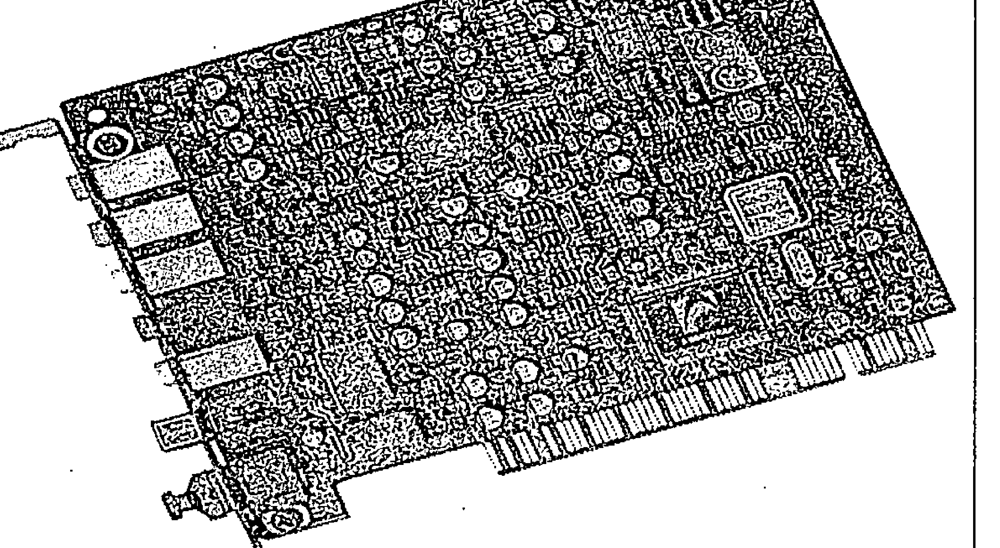

图16

### （2）性价比分析

MAYA 7.1 Gold的定位与Audigy2系列有很大的差别。对于民用级声卡而言，展现动感的3D音效、营造虚拟环境、提供各种音效特技，这些才是最重要的。而专业声卡则全然不同，MAYA 7.1 Gold所要做的是原汁原味地体现出声音的原貌，即设备不可以对声音进行色染。当然，动态范围、信噪比、谐波失真、互调失真等关键指标也是MAYA所极力追求的。

MAYA 7.1 Gold总共有8个模拟输出、2个模拟输入以及1个麦克风输入。毫无疑问，7.1声道是MAYA的优势所在。对于专业级声卡而言，多声道技术并不重要，但是为了打开民用市场，Audiotrak为MAYA装备了史无前例的7.1声道技术。MAYA 7.1 Gold还具备了一个数字（光纤）输出接口，它能够将DTS/AC3信号转到杜比数字（Dolby Digital）或是其他DTS设备（5.1，6.1，7.1）上。也许光纤输出并没有什么稀奇，因为Creative声卡早就有了，但是同轴TOSLINK输出却是MAYA的独门绝活。只要增加一个转接模块，即便我们的音箱或是功放没有光纤输入也没关系，MAYA一样可以帮助我们实现20bits的数字转模拟输出！去年主流市场中的MAYA 7.1 Gold售价高达1500元，而二级市场仅仅500元的参考价格应当说相当划算。

### （3）风险提示

MAYA身上还是遗留着一些专业声卡的烙印，这也许会阻碍其向民用市场的进一步发展。由于产品开发年代的原因，MAYA对于非Intel芯片组的兼容性很不好，尽管已经有了补丁程序，但是问题多多少少还是存在的。此外，MAYA也没能提供普通MIDI端口，如果要使用音乐键盘则必须购买扩展卡，无形中提高了用户的投入成本。至于其他风险，这款供应量较小的产品暂时还没有表现出来，毕竟这类专业级产品本身很难仿冒。

## 4. 最让人放心的测试: Sound Card Analyzer

对于声卡而言，音质表现的重要性毋庸置疑。但是决定音质的不仅仅是主芯片，诸如数模转换芯片等也都十分重要。而在二级市场中，少数产品的主芯片可能存在正品，但其他芯片七拼八凑的山寨声卡，此时采用Sound Card Analyzer测试软件可以让这类货色原形毕露。

Sound Card Analyzer测试软件最大的优势就是可以忽略音箱对最终测试结果的影响，这对于测试的声卡而言也更加公平。在进行测试之前，大家需要先找一根两头3.5mm的音频连线，它的两端分别连接声卡的Line In与Line Out。需要注意的是，这根音频线的质量也会对测试效果产生一定的影响，因此大家尽量选择粗一点的音频线，当然接口最好是镀金的。如果你有MD随身听中原装模拟音频线的话，那么用在这里是最合适不过的了。对于多声道声卡，建议大家先用随声卡附送的软件将声卡设置为两双声道输出，这样可以避免多声道的干扰，然后将音频线接在声卡的第一个音频输出口上。

由于Sound Card Analyzer在测试时需要同时调用声卡的录音与回放功能，因此所测试的声卡必须是全双工的，不过对于目前主流的PCI声卡而言，这个还是不成问题的。但是，很多用户平时把声卡的录音选项关闭，因此测试之前我们必须将其打开。需要注意的是，这里打开的录音选项是Line In，而非Mic In。此外，建议大家把输入音量设定在50%。

当我们第一次运行Sound Card Analyzer时，它会要求我们进行一系列的调整，这些步骤是千万不能忽视的，不然我们的整个测试过程将变得毫无意义。如果你的系统中安装了多声卡，那么必须在这里选定音频输入与输出设备。此外，采样频率也可以在这里选定，不过此时也要权衡一下自己所用声卡的档次。如果你的声卡仅仅是普通的AC'97板载声卡，那么使用默认的44100Hz与16bits就绰绰有余了，而对于高档声卡而言，选择更高的采样频率也是可以的。

进入Sound Card Analyzer的主界面后，还要校准信号电平，这样才能确保测试结果的准确、客观。单击主界面右边的“Check I/O Levels”，然后在弹出窗口中看看左右声道的输入信号电平与输出信号电平是否相等，如果不相等的话一定要在Windows的“音量控制”面板中进行调整。Sound Card Analyzer的测试非常简单，这与运行3DMark等软件几乎没有什么区别，只要点击“Run Test”按钮即可。经过一段时间之后，Sound Card Analyzer会弹出一个测试结果窗口，大家可以对比正品行货的测试数据来验证产品。

## 二级市场巡礼：打破迷信的神话

耐人寻味的二级市场缔造了无数产品神话，不少昔日的经典硬件至今仍然活跃在市场上，而价格往往令人咋舌。不可否认，这些产品的确有着很大的纪念意义，然而其实际使用价值已经大打折扣，甚至被一些别有用心的商家故意炒作，哄抬价格的结果只是一些盲目的消费者成为“刀下鬼”。面对二级市场我们应该更加

## 1. 显卡篇：为了忘却的纪念

由于流通性较好，因此显卡在二级市场供应量与受欢迎程度都相当高。然而在肯定部分产品的高性价比同时，我们认为少数产品已经不应该维持那么高的价格，否则那些对硬件知识并不了解的消费者很容易受到误导而最终上当受骗。

### （1）Matrox G400：2D画质的神话

如果显卡的2D画质不佳，那简直是一种煎熬。成天面对着模糊不清的显示器，这样不仅会影响工作效率，更会对宝贵的眼睛造成一定伤害。一谈及2D画质，不少发烧友就会对nVIDIA咬牙切齿。确实，TNT系列显卡和第一代GeForce256在高分辨率下的2D画质令人难以接受。但是到了GeForce2时代之后，这一局面已经有了很大的改观，而发展到GeForce3之后更是完全弥补了差距。事实上，2D画质具有很强的主观性，因此很难统一看法。但是非常奇怪的是，当年以2D画质著称的Matrox G400系列却在二级市场大红大紫，其中即便是单头输出的G400标准版也往往要价200元左右，双头的G400MAX以及G450价格更加高高在上。

从理性角度来看，我们的确不否认G系列那出色的2D画质，但是凡事都应该有参比对象。当年nVIDIA以及3DFX并未选择独立出厂显卡，而激烈的市场竞争导致部分显卡厂商在低通滤波方面偷工减料，2D画质自然受到影响。而Matrox显卡全面由原厂推出，因此自然保持了较高的2D画质，这与其核心芯片技术的关系并不大。更为重要的是，当前主流市场300元价位的产品甚至集成显卡都有很好的2D画质，而且3D速度明显超越G系列。至于高价位的G550，这更是商家们最后的炒作，实际性价比让人无法满意。综合来看，如果G400 MAX能够在180元左右还算比较合理，而目前二级市场动辄300元出头的价格显然不适合出手，毕竟追求性价比才是二级市场存在的价值。

### （2）3DFX的遗愿：Voodoo5优势荡然无存

或许是怀着对3DFX的敬仰之情，采用VSA100芯片的Voodoo4和Voodoo5一直在二手市场比较热销。客观来看，单芯片的Voodoo4还算比较超值，价格一般在100元以内，可以应对一些支持Glide3D接口的老游戏。然而Voodoo5则无法让人满意，感觉纯粹是在炒作双芯片概念，同等价位有不少产品比其性价比更高，消费者实在没有必要趋之若鹜。

Voodoo5本身并不支持32位色彩并且其AGP纹理调用功能也十分薄弱，因此在面对2002年以及以后推出的显示优势时往往力不从心，甚至远不如同时代的GeForce2 GTS。目前二级市场的Voodoo5 5500普遍报价350元，这几乎可以买到一款Radeon 9000甚至GeForce3 Ti，性价比孰优孰劣想必无须我们过多分析。更为重要的是，所谓Voodoo5（图17）收藏价值的说法也完全站不住脚。暂且不去评论这些Voodoo5是否出自原厂，就以其当年巨大的供应量来看，实在没有什么收藏价值。真正值得收藏的是有四块VSA100芯片的Voodoo5 6000，只不过这已经彻底绝迹于国内二级市场。

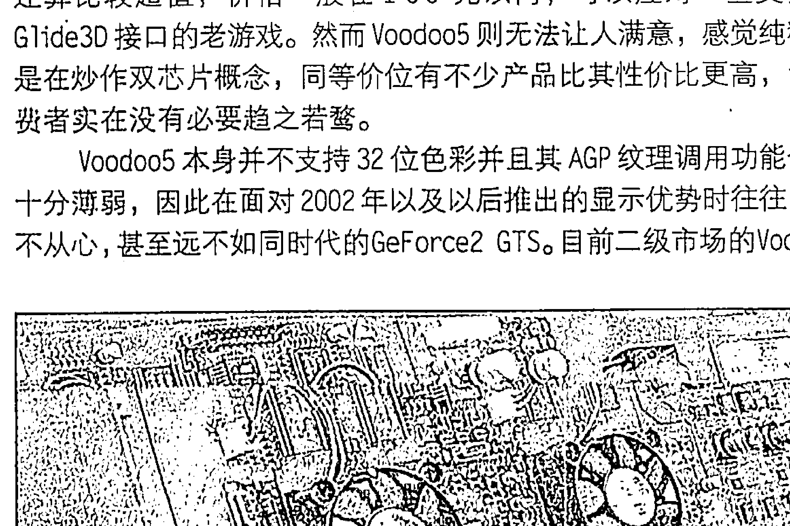

## 2. CPU篇：延续P Ⅲ时代的神话

CPU的服役时间一般都在15年左右，因此淘汰下来的产品依旧可以在二级市场发挥余热，而且一般并不会有什么隐患，十分受到消费者的认同。不过让人非常奇怪的是，二级市场中的少数CPU被人为抬高价格，性价比之低已经让人无法接受。

### （1）Tualatin不是神：P Ⅲ -S凭什么卖高价

当时铜矿核心（Coppermine）的Pentium Ⅲ廉颇老矣，Socket 423接口Pentium 4初出茅庐。就在此更新换代之际，P Ⅲ -S（Tualatin核心）和Tualatin核心Celeron杀入了市场。目前Tualatin核心Celeron价格基本在理性范围之内，而相对产品量小得多的P Ⅲ -S则被卖到了天价。以1.2GHz频率的P Ⅲ -S为例，600元左右的价格实在显得太高，同价格的AMD处理器甚至Intel主流处理器都有着更好的性能。

在二级市场中，商家往往会以“P Ⅲ -S的性能比Pentium 4更好”来误导消费者。其实这一说法在Pentium 4刚刚推出时还说得过去，但是如今Pentium 4的主频与缓存技术都大幅度改进。虽说P Ⅲ -S集成了512KB二级缓存而且其流水线效率颇高，但是低主频会影响性能却是毋庸置疑的事实。或许部分用户可能觉得P Ⅲ -S能够保留Socket 370架构，但是不要忘记，如今400元以下的Socket A甚至Socket 478主板比比皆是，实在没有必要固守老平台。至于P Ⅲ -S是服务器定位，这更是一种荒唐的说法。

### （2）揭穿Pentium 4的谎言：Willamette名不副实

Socket 423可谓是最“短命”的Intel架构，相应的Pentium 4在二级市场也不少见。由于第一代Willamette核心（图18）的整体表现并不出色，少得可怜的256KB二级缓存与100MHz外频严重制约了性能发挥。更为重要的是，Socket 423大多需要搭配I850芯片组，RDRAM内存的价格也相当高。即便是可以采用转接卡运用到Socket 478主板，性价比也实在太低。

目前二级市场的Socket 423 Pentium 4报价普遍为400元左右，这与其Pentium 4的光环不无关系。但是对比价格相仿的AMD Sempron甚至Celeron D，实在让人无法接受。更为使人无法理解的是，随着近期内存价格下调，不少SDRAM也开始跌价，此

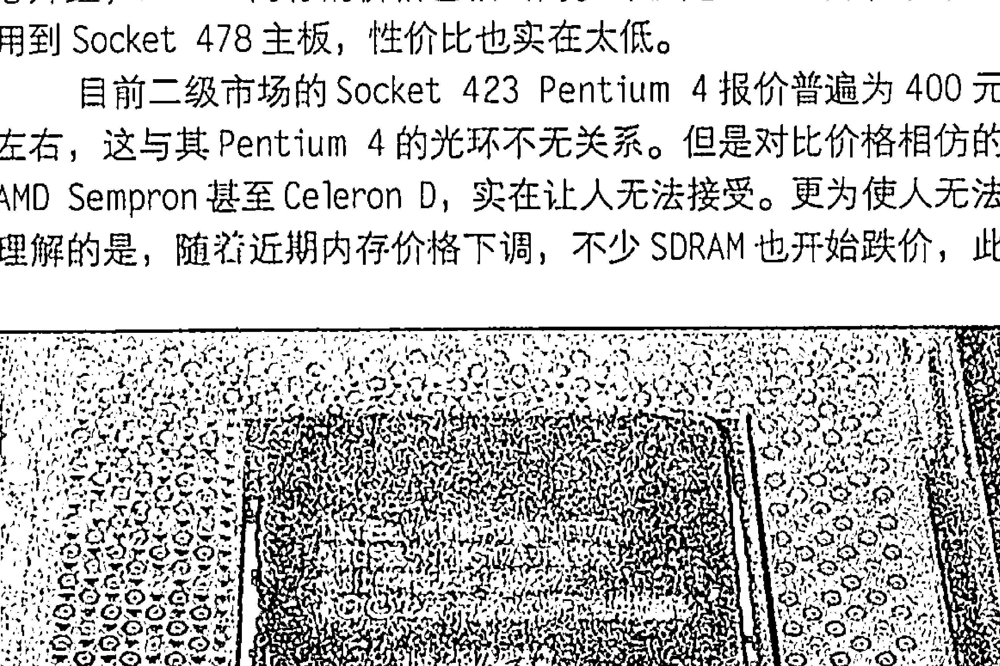

# PART 4 性价比发源地

时进一步拉低Pentium 4配置的整体价格。而商家则趁此机会略微抬高Willamette 核心Pentium 4的价格，消费者反而感觉整机价格下调，而事实上则并不划算。

## 3. 板卡篇：呼唤价值回归

国内中小级别工厂的快速发展使得加工主板与声卡变得轻而易举，而且维修能力也十分强大，再加上部分厂商对于OEM产品的监控力度不足，这些综合因素直接造成二级市场上主板、声卡与网卡类产品相当繁荣。然而二级板卡市场也同样有着耐人寻味的“神话故事”，需要我们正视其本身的价值所在。

### （1）I815EP与VIA双CPU主板

I815EP可以看作是440BX的加强版，支持Coppermine核心的Pentium与Celeron，使用转接卡之后也能轻松兼容Tualatin核心。此外，二级市场还有不少直接支持Tualatin核心的I815EPT主板，主要集中于精英、技嘉等品牌。然而从价格来看，这些主板实在没有体现出应有的性价比优势。一款I815EP主板普遍为150元左右，I815EPT更是一般要高达180元。对于大量已经在100元左右的KT133A主板，这一平台显然已经没有立足之本。不过或许是Intel的光环在释放能量，I815EP/EPT系列依然十分热销，很多低端用户或是渴望组装第二台电脑的用户还是执着地选择Pentium Ⅲ平台。然而与价位更低的KT133A+高频Duron的组合相比，实在没有理由流连于Socket 370平台。

如果说I815EP/EPT的热销因为Tualatin Celeron的存在而情有可原，那么支持双Socket 370 CPU的主板则更像是一个谎言。二级市场中部分采用VIA Apollo 266A芯片组的主板直接支持两块Pentium Ⅲ以SMP模式工作，而且价格被炒到300～400元。不过如果大家真正认识到双CPU的实际性能，应该会显得更为理智。双CPU不仅需要操作系统和应用软件的支持，也需要两个CPU之间有良好的连接带宽。Pentium Ⅲ本身就并非为了SMP模式而设计，此时强行使用的效果并不好。更为重要的是，以现今的眼光来看，双Pentium Ⅲ因为过低的频率而不具备任何性能优势，也许只能在多任务处理中略显身手。但是权衡性价比，主流市场普通的高频Celeron D岂不是更加划算？消费者应当理智地看待，不能简单以为双CPU一定是万能的，更不要勉强地去寻找所谓的服务器配置。

### （2）声卡性价比日益下降

尽管板载声卡已经让主流市场的声卡销售十分惨淡，但是二级市场上仍然活跃着不少声卡。不过看似价格低廉的声卡依旧有严重“暴利”的倾向，其中大力神5.1与部分Creative声卡首当其冲。大力神Hercules Gamesurround Fortissimo Ⅱ虽然采用CS4624主芯片而且具备光纤接口，但是其音质表现很一般，并不比目前的高档板载声卡出色。问题的关键在于，原本在二级市场上仅仅80元左右的大力神Hercules Gamesurround Fortissimo Ⅱ，近期普遍要价150元左右，显然是因为过度的炒作而造成的价格虚高。除此以外，目前不少Creative老声卡也开始涨价，奇货可居似乎并不是理由，毕竟主流市场还有更多高性价比的产品。

### （3）走出名牌网卡的误区

正如大多数读者所知的，Ethernet技术是一项标准，因此理论上各种品牌的10/100Mbps网卡在速度上不会有太大的差异。但是实际情况是，很多用户都在讨论名牌网卡与普通网卡之间的区别。尽管它们遵循的标准都是相同的，在Wakeup On Lan、Boot ROM等功能上也如出一辙，但是价格却有着2倍甚至5倍的差距。

的关键问题是，同样是10/100Mbps的Ethernet网卡，它们是否真的有所不同？会不会有性能比较好的网卡？系统的网络性能是不是会被性能不佳的网卡拖慢？网卡间是否真有功能上的差异？你所选用的网卡是否会因为占用过多的系统资源而降低电脑的性能？

在普通的家庭网络环境中，名牌网卡的确没有明显优势，简单的文件或是Internet共享应用时更是很难感觉到不同网卡之间的区别。然而在二级市场中，3Com与Intel品牌的网卡往往要价80元左右，而Realtek或是SiS芯片的杂牌产品则仅仅是20元上下。作为理性的消费者，我们认为没有必要去盲目追求名牌产品，特别是在网络风暴并不严重的情况下。同样的道理，诸如3Com、Cisco等品牌的无线网卡也往往价格较高，但是追求实在的用户可以考虑更多非名牌产品，而且稳定性与无线传输有效范围并不见得逊色。

## 4. 存储篇：摘掉头顶的光环

存储设备也是二级市场中非常常见的，包括硬盘、光驱和内存等。尽管大部分产品都有着让人满意的性价比，但是并不排除少数产品存在人为价格炒作的因素。

### （1）一俊遮不了百丑：低档SCSI硬盘

4.3GB的SCSI硬盘在二级市场很常见，一般转速在7200RPM，价位从50～100元不等。然而我们要提醒大家，对于已经拥有SCSI卡的用户而言，这类产品还算超值，但是专程购买SCSI卡就显得得不偿失，更不应该迷信SCSI的高性能。SCSI接口本身的带宽优势并不高，主要作用还是降低对CPU的占用率。二级市场不少4.3GB SCSI硬盘仅仅是入门级产品，多碟封装的厚盘导致单碟容量很小，速度并不快而且噪音较大，稳定性更是让人担忧。这里我们并非指责这些SCSI硬盘价格偏高，而是提醒大家不要仅仅冲着SCSI去尝试那些低端产品，其性能往往还不如容量更大的IDE硬盘。

### （2）光存储不信名牌：Plextor高价神话

世界著名的高端刻录机生产厂商Plextor以其一贯的高品质、高性能的刻录机产品博得了全球众多刻录权威网站以及刻录发烧玩家的一致好评，其产品于2002年进军国内市场，但是终因渠道等各种原因，在市场上始终未曾见到大量现货，不过在二级市场上却反而十分活跃。让我们感到吃惊的是，很多用户对于Plextor刻录机十分推崇，以52× CD-RW为例，普遍要价400元左右。名牌刻录机或许在稳定性方面有所优势，但是这并不代表更好的性能与完美的兼容性，有时甚至因为Firmware原因而无法对国内的刻录盘提供很好的兼容性。更为重要的是，当前DVD刻录机才是大势所趋，而且越来越多的产品降价到500元以下，实在没有追逐高价位名牌CD刻录机的必要。

### （3）没落的昔日贵族：RDRAM冷眼相看

目前RDRAM内存已经完全退出主流市场，但是二级市场中还是有不少I850/850E主板，需要搭配RDRAM内存。较少的供应量自然造成奇货可居，128MB的PC800 RDRAM普遍为200～250元，相比DDR内存在价格实在太低。RDRAM的确有着略微的性能优势，但是I850/850E已经不是高端平台，此时配备RDRAM又有何意义？目前二级市场中不少消费者都喜欢对昔日的高端产品顶礼膜拜，但是在面对高价格的同时，也应该更加理智地认识到其真实性能，而并非盲目选购。

## 即时通信双雄会 QQ、MSN应用技巧比拼

说起时下如火如荼的即时通信软件，QQ和MSN无疑是其中的首选。不过，是否想过让这两个软件的技巧来一次“双雄会”呢？其实通过比较往往可发现二者的异曲同工之妙，而二者各具特色的技巧也会让人为之叫绝。

QQ是由腾讯计算机系统有限公司开发、基于Internet的即时通信软件，其不仅可即时发送信息、共享图片，还可实现语音视频聊天、手机短信、聊天室、传输文件、网络硬盘等功能。

MSN Messenger（简称MSN），由微软公司研制，其自身优秀的性能可帮助用户进行文字聊天、语音对话、视频会议、查看照片、传输文件、游戏娱乐等。

本文将先通过比对的方式来介绍二者的共通技巧，然后分别介绍二者各有特色的技巧应用。所介绍的QQ技巧适用于QQ2004中文版以上版本，MSN技巧适用于MSN 7.0.0816简体中文版以上版本。

## 共通技巧大比对

### 1. 目录文件揭秘

**QQ**

在QQ安装目录下有一些以QQ号码为名字的文件夹，这些文件保存着QQ的相关信息，而了解这些文件夹的功能可为进一步掌握技巧打好基础，具体如下所述：

- CustomFace文件夹，存放自定义表情的图像文件，可使用Photoshop等图形图像软件对自定义表情进行编辑。
- CustomFaceRecv文件夹，存放来自好友的自定义表情，可选择喜欢QQ表情通过添加操作后使用。
- Image文件夹，存放截图产生的图片。
- MyRecvFiles文件夹，存放接收的文件。
- ewh.db文件，只需正常登录QQ就会自动生成的初始化文件，用于管理密码。如用户改名或删除该文件，那么该QQ将无法正常登录。不过，用户通过注册向导即可修复密码并正常登录。
- MsgEx.db文件，正常登录QQ后自动生成的聊天记录文件，如改名或删除该文件，那么该QQ将无法正常登录，不过可用其他QQ号码文件夹下的同名文件粘贴并覆盖。
- notes.db文件，备忘录管理文件，如将其他QQ号码文件夹下的notes.db文件复制到QQ号码文件夹下，然后使用QQ登录，即可查看被复制QQ的备忘录管理内容。
- User.db文件，好友列表文件，同notes.db文件类似，如将其他QQ号码下的该文件复制到QQ号码文件夹，然后使用QQ登录，则显示的好友列表为被复制的QQ的所有好友。

**MSN**

安装MSN后，针对每个用户的相关文件一般均保存在以下目录中：Windows 9x系统：“\WINDOWS\Application Data\Microsoft\MSN Messenger\注册号码\”；Windows NT以上系统：“\Documents and settings\当前用户\Application Data\Microsoft\MSN Messenger\注册号码\”。

此外，该目录下的“Backgrounds”目录存放默认背景图片，“CustomEmoticons”目录存放自定义图标，“UserTile”目录存放自定义头像图片。

在重装系统后，如需恢复原MSN设置，只需复制这几个文件夹，即可避免逐一导入图片的麻烦。

此外，这些文件夹中一些以DAT为扩展名的文件改名为PNG文件，有些文件也可当作图片来浏览或编辑，如图1所示。

### 2. 巧添自己为好友

**QQ**

在QQ新版本中允许将自己加为好友，但如使用旧版本，又该怎样实现呢？

首先在系统设置中勾选“允许任何人将我列为好友”，随后切换至“黑名单”中，添加自己的QQ号码，然后将自己拖拽至“我的好友”中，此时会弹出无法添加自己的系统提示，不必处理该提示，直接退出QQ。

随后重新启动QQ，使用注册向导登录，登录成功后，好友列表中即包含了自己的号码，并可如其他好友一样进行交流，这样即可实现“自言自语”。

**MSN**

MSN允许添加自己为好友，但无法和自己聊天，且许多功能也受到限制，但可即时查看自己的头像、昵称的改变情况。

单击MSN主窗口中的“联系人→添加联系人”，选择按登录名或电子邮件查找添加，然后输入自己的注册邮箱地址，即可方便地将自己添加为联系人，如图2所示。

### 3. 巧克隆好友

**QQ**

目前，不少网友均有两个以上的QQ号码，因此如何将QQ上的好友完全克隆至另一个QQ，是一个较棘手的问题。虽然QQ会员具有克隆好友功能，但普通QQ也可通过以下方法来实现克隆效果：

假设有AA号和BB号，需将AA号中的好友名单克隆到BB号中。首先将两个号码都重新登录一次后退出。随后打开QQ目录，在以AA号码命名的文件夹中找到user.db文件，然后覆盖粘贴至BB号码所在的文件夹中（克隆前先备份此文件）。使用BB号码登录，所有好友已全在列表中。打开好友管理器，在好友列表里选择需克隆的好友（按住Ctrl键可选择多人），选择后再将选择的好友全拉到陌生人组，此时会弹出很多提示框里，全部选“确定”。最后在陌生人组中，拖拽需克隆的好友到好友组中，随后使用BB号码再登录一次即可实现完全克隆效果。

**MSN**

目前不少网友均有两个以上的MSN号码，如何将一个MSN账号上的好友完全克隆至另一个MSN账号，是一个较棘手的问题。假设有AA号和BB号，需将AA号中的好友名单克隆至BB号。首先，登录AA账号，单击MSN主窗口中的“联系人→保存联系人名单”，将当前账户的联系人列表导出为一个以CTT为扩展名的文件。随后登录BB账号，单击MSN主窗口中的“联系人→从已保存的文件中导入联系人”，导入刚才导出的CTT名单文件，可发现MSN会自动将不重复的账号逐一添加，实现了克隆功能。

### 4. 查询是否被好友添加

**QQ**

用户往往想查询对方是否已加自己为好友，但如直接询问似乎非常不妥。其实有一个根本不必询问对方的好办法。首先在QQ秀商城中，选择某件付费物品，确定后输入对方QQ号码，然后点“由他人支付”。此时如系统提示：“必须是****的好友，才能向他索要商品”的出错信息时，则说明对方没有添加自己。

**MSN**

登录后，在主窗口中单击“工具”菜单的“选项”子菜单，在弹出的“选项”对话框中单击“隐私”选项卡，单击在“联系人名单”栏中的“查看”按钮，即可查看将自己添加为好友的MSN联系人。

### 5. 巧定义头像

**QQ**

每个QQ账号均有一个头像，老版本QQ只允许用户从系统自带的图标中选择，而QQ 2005版已支持用户上传自定义头像。如需确保上传成功，用户可先将自制的头像图片用ACDSee等软件裁剪为40×40大小并转换为BMP文件格式，然后在QQ的头像下拉列表框中选择自定义头像，最后选择前述步骤加工的头像文件即可。单击QQ主面板左上角的头像列表，进入“个人设置”，单击头像旁边的“更改”按钮，在出现的列表中选择“本地浏览”即可使用自定义的头像。需注意：该服务并非所有QQ用户均可使用，需16级以上的QQ才可，如低等级的用户使用该服务，则需支付1个“Q币”。

**MSN**

MSN支持充满个性的头像，通过MSN的图片功能，可将用户所需的图片添加至MSN中供好友浏览。首先将图片用图形图像编辑软件进行处理，裁剪为90×100的最合适尺寸。随后登录、单击MSN主窗口中的“工具→更改显示图片”，通过“浏览”按钮选择裁剪的图片。勾选“不显示图片”选项，即可在聊天对话时的列表中不显示任何图片。此外，必须在“工具→选项→个人信息”标签卡中，勾选一些“显示我的图片并允许其他人查看”该选项。

### 6. 巧用图标符号

**QQ**

QQ聊天中有大量的有趣表情图标，其实借助这些图标的快捷键，可实现很多有趣的效果。如需发送一些图标贺卡给好友，那么可利用表情图标快捷键来实现。首先在聊天窗口中，打开图标列表下拉框，鼠标停留在所需的图标旁即可获取对应的文字快捷键，随后打开一个文本文件进行编辑，对应需使用表情图标的位置用文字快捷键来代替，编辑完毕后全部选择并复制粘贴至QQ发送信息框，即可实现意想不到的效果。

**MSN**

MSN聊天窗口也支持大量的有趣表情小图标，而这些图标也均有快捷键，因此灵活运用这些快捷键可达到意想不到的效果。如情人节时需发送大量红心给好友，那么可利用表情图标快捷键事半功倍。首先在聊天窗口中，打开图标列表，用鼠标单击红心符号，可发现其代码为“(L)”，随后打开一个文本文件并输入“(L)”，随后复制许多个，然后全部选择，复制粘贴至MSN发送信息框即可，如图3所示。

### 7. 巧用自定义符号

**QQ**

由于版权等诸多原因的限制，QQ和MSN内置的表情符号并不特别丰富，不过QQ与MSN都提供了自定义符号的功能。在QQ聊天中，如收到好友一个有趣的符号，那么可用鼠标右键单击该符号，选择“添加到自定义符号”，即可将该符号自动保存于QQ目录中。如果用户有一个有趣的图片，想将其作为符号，那么可打开任意一个好友聊天窗口，选择聊天窗口中的“选择符号→添加自定义符号”，即可进入“符号管理”窗口。在“符号管理”窗口中单击“添加”按键，即可选择需添加的图片，最后为其指定键盘快捷键即可在聊天时使用。QQ自定义符号目前支持四种常见格式的图片类型，即BMP、JPG、JPEG和GIF。此外，用户还可通过网络下载并批量添加大量QQ符号。通常下载的符号文件有ZIP、CFC和EIP三种格式，使用方法也各不相同：ZIP格式：解压后进入符号管理器，选择“添加”即可。CFC格式：进入符号管理器后，选择“导入”即可。EIP格式：使用方法和CFC格式符号一样，不过EIP格式符号文件支持导入符号分组信息，可自由对符号进行分组。

**MSN**

MSN也支持自定义的符号图标，如用户需将一个图片添加至MSN的自定义符号，可打开MSN的聊天窗口选择“我的图释”，在弹出的“我的自定义图释”窗口中单击“添加→查找图片”，然后选择需添加的图片并为其定义快捷键，最后单击“确定”即可将该图片添加到自定义图释。此外，用户也可下载现成的MSN图释文件，然后按上述方法添加至自定义图释。当用户收集了数量很多的图释后，由于MSN一次仅能添加一个图释，因此可借助一些第三方软件进行批量添加，实现成批快速增加大量自定义符号的目的。

### 8. 个性化昵称

**QQ**

如何让QQ昵称和自动回复与众不同呢？只需在昵称和自动回复中添加QQ支持的表情图标快捷键即可打造个性昵称和回复消息。如加入太阳的表情图标，即可写入“/ty”显示太阳表情图标。这些表情图标所对应的快捷键可单击QQ聊天窗口的表情下拉框，在每个图标上用鼠标停留一会儿即可显示对应的快捷键文字。

**MSN**

使用MSN的用户往往喜欢更换昵称，有两个相当酷的昵称设置方法，具体如下所述：

- （1）图标昵称
使用一些有趣的小图标添加在昵称中，由于不少图标有动画效果，因此会产生一种更炫更酷的效果。
登录后，在MSN聊天对话窗口中打开图标列表。每个图标均有相对应的快捷字符，记下图标的快捷提示，如“\*”代表太阳图标。随后单击MSN主窗口的“工具→选项→个人信息”标签卡，并将刚才所得的快捷提示中的符号“（\*）”输入至“键入让其他人看到的您的名称”框内即可，如图4所示。

- （2）隐形昵称
登录后单击MSN主窗口中的“工具→选项→个人信息”标签卡，在“键入让其他人看到的您的名称”框内先删除所有字符串，然后按住Alt键，输入小键盘中的数字“0160”。这样，在MSN列表中显示的名称将是空白一片，成为一个MSN“隐形人”。
需注意：如不成功，可按住“Alt”键，输入数字代码是255。

此外，MSN还有不少不公开的秘密图释，具体如下所述：

- (xx) = xbox
- (tu) = 乌龟
- (pl) = 刀
- (h5) = 拍手
- (yn) = 手指交叉
- (brb) = brb
- (st) = 下雨
- (ci) = 烟

### 9. 隐藏摄像头

**QQ**

视频聊天是很多网友热衷的聊天方式，但只需安装摄像头，QQ会在每次登录时，自动检测是否安装摄像头并将状态信息发送至服务器，其他网友只需按摄像头查找，即可发出视频聊天请求。因此如不想视频聊天，又该如何隐藏摄像头呢？
进入“个人设置→系统设置→本地安全”选项卡，在“状态显示”中，勾选“不要将我列在在线视频用户的列表中”一项即可。
同样，勾选“游戏状态不可见”和“聊天室状态不可见”两项，就可隐藏自己的游戏和聊天室里活动行踪。

**MSN**

摄像头的出现无疑让聊天有了更多的情趣，虽然视频聊天带来更多的欢笑和乐趣，但有时往往也会造成尴尬。MSN及时发现了该问题，并通过以下设置可完全将摄像头隐藏。
在MSN主窗口中单击“工具→选项→个人信息”标签卡，接着在“我的网络摄像机画面”下查看是否已选择，最后去除“允许其他人看到我有网络摄像机”的勾选即可。此后，即可轻松地在计算机前和好友聊天。

### 10. 查询好友IP

**QQ**

某些网友总试图使用各种手段和方法来探测QQ好友的真实IP地址，其实只需一条DOS命令即可直接查到聊天好友的IP地址。
首先和好友聊天，随后在DOS窗口的命令提示符下输入如下命令：netstat -n
需注意：netstat是Windows自带的网络状态检测程序文件。

DOS窗口中会出现一张IP链接列表，内容如下所述：（操作结果往往会不同）

Active Connections
Proto  Local Address          Foreign Address        State
TCP    222.111.333.444:1200    222.111.333.777:6155   ESTABLISHED
TCP    222.111.333.555:2694    222.111.333.888:6667   ESTABLISHED
TCP    222.111.333.666:4869    222.111.333.999:2694   ESTABLISHED

然后，退出聊天窗口后在DOS窗口再输入一次上述的netstat命令内容，这时列表中将有一条记录的State字段值产生变化，如：
TCP    222.111.333.444:1200    222.111.333.777:6155   TIME_WAIT
对照两张表的内容即可让聊天好友的IP地址和端口即一览无余，即“222.111.333.777”，而端口号则是“6155”。

由于聊天窗口打开后，QQ即产生通过UDP协议的链接，因此退出后的链接中断，“TIME_WAIT”即“等待”，代表了链接中断，成为查询IP的原理。

那么如何防范IP侦测呢？最简单的方法是在QQ中选择“个人设置→系统设置→登录设置”选项卡，在“高级选项”中的“登录到服务器的类型”下拉列表中选择为“TCP类型”，然后保存退出并重新登录即可。

**MSN**

MSN上的不少网友总试图使用各种手段和方法来探测好友的真实IP地址，虽然MSN不提供显示IP功能，但其实只需一条DOS命令即可直接查到正在聊天好友的IP地址。

首先和MSN好友对话聊天，接着在DOS窗口的命令提示符下输入如下命令：netstat -n
需注意：netstat是Windows自带的网络状态检测程序文件。

窗口中会出现一张IP链接列表，内容如下所述：（操作结果往往会不同）

Active Connections
Proto  Local Address          Foreign Address        State
TCP    207.56.215.92:1200      207.56.215.92:6155     ESTABLISHED
TCP    207.46.108.92:2694      207.46.108.92:6667     ESTABLISHED

然后通过MSN给好友传一个小型的文件，再在DOS下再输入上面的netstat命令，这时列表中将有一条记录的State字段值产生变化，如：

Active Connections
Proto  Local Address          Foreign Address        State
TCP    207.56.215.92:1200      207.56.215.92:6155     ESTABLISHED
TCP    207.46.108.92:2694      207.46.108.92:6667     ESTABLISHED
TCP    222.111.333.666:4869    222.111.333.999:2694   ESTABLISHED

从上述数据中即可获得聊天好友的IP是“222.111.333.999”。
由于在最初聊天时，只产生与MSN服务器的网络连接，而传送文件则建立了和对方的连接，因此新增的“TCP   222.111.333.666:4869    222.111.333.999:2694   ESTABLISHED”即代表对方的IP地址。

### 11. 强制聊天

**QQ**

如出于特殊原因，必须向一个非好友的QQ用户发送消息时，可用一段强制聊天代码实现，在浏览器中输入以下这段代码：
http://wpa.qq.com/msgin?V=1&Uin=********&Site=ioshenmue&Menu=yes
随后将代码中的星号换成需联系用户的QQ号码并在浏览器中打开该地址即可，这样无论对方是否为QQ好友，均可能直接发送消息。

执行上述代码时，QQ会采用当前使用的号码作为与对方聊天的号码，但如打开两个以上QQ，则会出现对话框让用户选择使用QQ号码与对方聊天。

**MSN**

其实，我们也可以向联系人名单以外的其他朋友发送即时消息。首先，在MSN Messenger的主窗口中单击“操作”菜单的“发送即时消息”菜单项，然后在弹出的窗口中选择“其他”选项卡，输入该联系人的完整电子邮件地址，最后单击“确定”按钮即可。

### 12. 巧解登录问题

**QQ**

导致QQ无法登录一般有两个原因：
（1）本地文件出错
安装目录下的LoginUin.dat文件出错。由于QQ登录时需加载该文件中的账户信息并将一些登录信息写入，因此如将QQ安装目录设置为只读属性或删除并改名LoginUin.dat文件，那么QQ就会由于无法写入程序而无法登录。
（2）腾讯服务器繁忙
大量用户的同时上线，常常使腾讯服务器拥挤不堪，致使登录QQ时往往弹出服务器太忙无法登录或超时的提示框。此时可改用“注册向导”登录，通常可成功登录。

**MSN**

随着MSN在中国的推广，不少用户也开始抱怨无法登录，几个常见问题及解决方法如下所述：
（1）网络设备故障
随着网络规模的日益膨胀，只要某一环节出现问题，都可能导致网络故障，如网络协议组件、网络通信设备、网络线路、网关服务器等。当出现MSN无法正常登录时，对于局域网用户，解决方法可先使用Ping命令查看内部网络是否通畅，然后再用Ping命令，直接测试公网IP，看看链路是否通畅。对于直接接入互联网的用户，使用Ping命令直接测试公网IP查看即可。
（2）网络防火墙设置不当
MSN登录时要使用TCP的3000至4000端口，如客户端自定义网络防火墙IP规则，禁用了这些端口，那么会导致无法正常登录，因此建议用户在设置时不随意手工禁用TCP的3000至4000端口。
（3）权限限制
局域网中使用网管软件或网关过滤软件可禁用MSN或增加对软件的操作权限，一旦禁用后，用户无法正常登录MSN服务器。解决方法仅有通过管理员取消禁用限制，用户才能使用MSN登录。
（4）第三方程序或插件Bug
目前许多第三方MSN程序或插件虽然增加了MSN的功能，但不少程序没有经过严格的测试即发布，因此，安装第三方插件或程序的用户可先卸载后重新安装MSN，再尝试登录。
（5）微软服务器问题
当微软的MSN服务器出现故障或维护期间，往往是一大片地区的用户均无法登录，解决方法可继续等待。

### 13. 禁止自动提示

**QQ**

使用QQ时，如有好友登录，往往在右下角会自动弹出提示；其实通过QQ系统的基本设置即可隐藏全部好友的上线提示信息。
首先登录QQ后，单击QQ面板的“菜单”的“个人设置”子菜单的“系统设置”。随后单击“基本设置”，将状态显示栏中的“禁止所有用户上线提示”一项选择，最后点击“确定”即可。

**MSN**

登录后单击主窗口“工具”菜单的“选项”子菜单，在“通知和声音”选项卡的“通知”栏目中的多个复选框即可设置是否显示各类通知。
此外，如仅需在运行全屏程序时阻止MSN通知窗口弹出，可将工作状态设置为“忙碌”，来阻止通知窗口的弹出。
在MSN主窗口中单击“工具”菜单的“选项”子菜单，在“个人信息”选项卡中，找到“我的状态”，选择复选框“当我运行全屏程序时（如幻灯片放映），将我的状态显示为‘忙碌’并阻止通知（B）。”

### 14. 从对方好友名单中消失

**QQ**

QQ用户如需将自己从对方的好友名单中消失，但又需将对方保留在自己的好友名单中，那么要求对方删除自己的想法绝对不妥，因此可借助QQ的商务版本TM来实现神秘“蒸发”。
单击QQ“菜单→一键切换到TM”，也可用TM直接登录，然后在好友列表中找到对方，在其头像上单击右键，选择“将自己从对方联系人名单中删除”，最后在随后出现的“警告”对话框进行确定即可。

**MSN**

MSN中无法完全让自己从对方好友名单中消失，但可通过“阻止”的方式使对方永远无法和自己联系。在MSN主窗口中，右键单击需阻止的联系人名字，然后单击“阻止”即可。此外，如需查看已被阻止的联系人名单，可单击“工具”菜单的“选项”子菜单，然后单击“隐私”选项卡。
需注意：被阻止的联系人不会发现自己已被阻止，因此他们看到的用户状态将永远是脱机。不过，如果某人既邀请了用户也邀请了被阻止的人进行对话，那么发现自己和被阻止的人处在同一对话中。

### 15. 数据备份

**QQ**

使用QQ一段时间后，对号码的聊天记录、用户列表和系统消息等数据进行备份无疑非常重要。一般可使用两种方法进行备份，具体如下所述：
（1）QQ自带的管理器
选择“好友和资料→消息管理器”或“好友管理器”选项卡，然后使用其自带的导出功能，即可进行数据备份。还原时，只需使用QQ自带的导入功能即可。
（2）复制号码文件夹
在QQ安装目录下有一个以QQ号码命名的文件夹，只需将其压缩后备份即可。还原时，先成功登录QQ后退出，随后将文件夹解压、覆盖粘贴并重新登录QQ即可。

**MSN**

单击MSN主窗口中的“工具→选项→消息”选项卡，在“消息历史记录”栏目中，可设置是否保存消息历史，以及消息历史的保存位置和时间。如需备份，只需复制该保存位置的文件夹即可。

## 16. 聊天机器人

消息历史记录”下，勾选“自动保留对话的历史记录”选项，系统默认将其保存于“我的文档”中的一个文件夹中，并可单击“更改”按钮将其移至其他目录。

“在新对话窗口中显示最后的对话”选项非常人性化，勾选后，下次和一个好友聊天时，可看到上次的聊天记录。此外，还可查看聊天的历史记录。

## QQ

QQ在2004版TM软件之后开始提供了一些非常实用的机器人，这些机器人提供了很多实用的功能，如可进行各类有趣的问答，或是进行中英文的翻译等。

目前流行的一些QQ机器人，如下所述：

- (1) 小I
该机器人的主要功能在于各类问答和智力游戏，只需输入“？”即可获取相关的帮助，如图5所示。

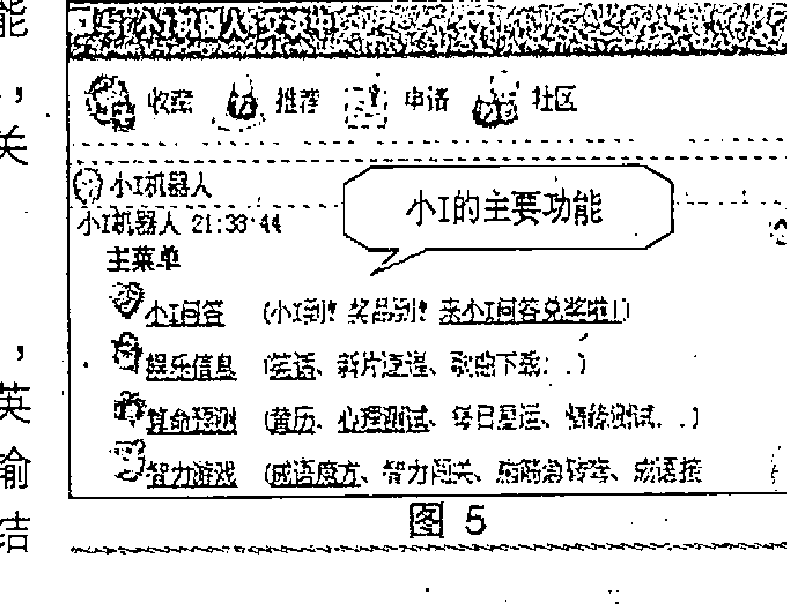

- (2) 金山词霸
该机器人顾名思义，其主要功能在于对各类中英文单词的翻译，用户只需输入单词，即可得到翻译结果。

- (3) 小强
该机器人的主要功能类似小I，不过其名称“小强”可能更有趣味性，只需输入“？”即可获取相关的帮助，如图6所示。

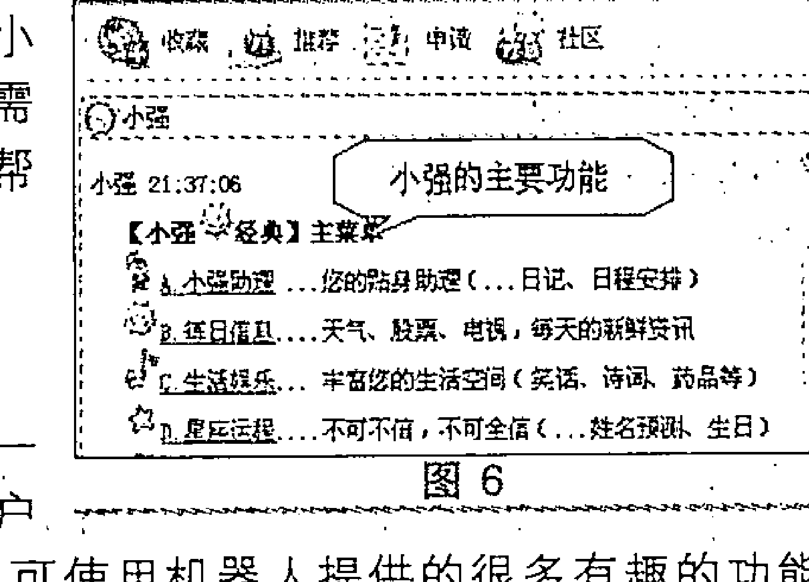

## MSN

MSN机器人，其实是一个程序控制的联系人，用户只需按邮箱地址添加，即可使用机器人提供的很多有趣的功能，如方便地进行各种日常资讯的查询，包括歌曲、新闻、天气预报、电话区号、邮编、列车时刻表、手机号码等，几乎均可实现。

目前流行的一些MSN机器人，如下所述：

- (1) MSN朋友
网址为http://msnfriend.com/msnfriend/index.html，其提供的服务种类相当全面，涉及新闻、电影、交友、英汉互译、魔幻占卜、爆笑音像、IT产品报价、证券行情等，基本满足了不同用户的不同需求。

和普通好友聊天一样，双击好友列表中的MSN朋友，打开聊天窗口，MSN朋友会自动给出介绍和帮助信息，按帮助信息用户即可和机器人朋友进行交谈。

如在打开的“[MSN朋友——魔法占卜]”对话窗口中，了解2005年星座运势，只需输入“23 星座”，MSN朋友即给出较详细的说明，非常有趣。

此外，MSN朋友还可帮助用户查询并下载电影、交友、文字翻译、看新闻、了解股市行情。

- (2) 机器人小布
网址为http://www.9zi.com，主要功能在于在线音乐。如可输入“song:专辑/歌手 歌曲”来查歌曲。此外，机器人小布还可查歌词，输入“gc:歌名”。
查英汉词典：输入“dict:单词/中文”。如：“dict:hello”。
查列车时刻表：输入：“train:列车号/起点 终点”。如：“train:武汉 上海”。
查新闻：输入：“news或news:分类”。如：“news:财经”。
查天气预报：输入：“weather:国内大城市及国外首都城市名称”。如：“weather:上海”。

- (3) 机器人小I
网址为http://www.xiaoi.com，小I的功能特点如下所述：
历史上的今天：输入“今天或today”。
节目预告：输入“TV:电视台 星期”，如：“TV:中央1 5”。
航班查询：输入“plane:起飞城市 到达城市或plane:航班号”，如：“plane:武汉 上海”。
股市行情：输入“stock:股票代码(股票名称)”，如“stock 600519”。

- (4) 灵犀短信精灵
网址为http://www.sms107.com/msn.jsp，其不仅可进行对话聊天，还可向任何手机用户发送短信，每天免费发送5条短信，超过5条，0.1元/条，不收月租。

此外，还有不少功能强大的MSN机器人，用户可选择并添加。不过有些MSN机器人由于添加的用户太多，已超过MSN允许的好友数，因此可能已无法添加。

灵犀短信精灵：http://www.sms107.com
小I：http://www.xiaoi.com
小布：http://www.9zi.com
罗杰：http://www.robotrodger.com
丫丫：http://blog.huangdong.com
如花：http://charry.org/robot/
oracle机器人：oracle_robot@hotmail.com
MSN 自助应答系统：cuterobot01@hotmail.com 至 cuterobot05@hotmail.com
聪聪翻译家：fanyiren@hotmail.com，fanyiren001@hotmail.com

## 各有千秋之QQ篇

### 1. 利用备注整理好友

长期使用QQ后，往往会有一大堆聊友，那么如何使常聊天的好友头像在QQ列表中排列靠前呢？其实只需通过添加备注即可实现。

选择好友头像后，进入“查看资料”对话框，在备注信息中的“用户名称”中添加自己为好友设置的名称，然后保存退出。

在QQ好友列表的空白区域点鼠标右键，勾选“名称显示”中的“显示备注”即可。

### 2. 快速进入聊天室

聊天室是QQ一个非常实用的功能，但由于同时在线的聊天人太多，经常会无法进入热门聊天房间，其实可用一个偏门来尝试巧妙进入。

寻找一个在线人数少的冷僻房间，由于其在线聊天人数不多，因此通常非常快速地成功进入房间，然后返回聊天大厅（如使用旧版QQ，则单击“服务器”按钮），再单击进入原本想去的房间，此时往往即可轻松进入。

### 3. 自动弹出消息

由于QQ的运行方式在后台，因此很多用户在全屏玩游戏或看电影时，无法及时获悉好友发来的消息，不过有一个办法可让QQ自动弹出消息。

首先发送一个语音视频聊天请求或发送文件给对方，随后取消该请求，然后再写消息即可。由于语音视频请求时，对方的QQ会将消息对话框自动在最前面弹出，这样就可提醒对方及时回复信息。

### 4. 截取菜单图

截取捕捉图像是QQ的一项常用功能，如向好友说明某操作、查看某实例时，往往均可通过截图来实现。不过在截取一些软件的菜单图时，则必须使用一些技巧才能顺利截取。

由于普通菜单、下拉式菜单和右键弹出的菜单图，在菜单弹出后，鼠标即无法移动，因此无法单击捕捉按钮。该情况可先按下“Ctrl+Alt+Shift+A”组合键，并一直按住不动，随后用鼠标点出菜单，然后松开Shift键，此后即可在菜单不消失的情况下，自由截取所需的菜单图。

### 5. 去除消息时间

在进行聊天或发送离线信息时，每条信息均会带有发送消息的系统时间，且该时间由QQ自动添加。有时用户并不希望消息接受方知道时间，但由于QQ中暂无相关设置，因此仅有一种可能是QQ的Bug导致的“奇怪”方法来屏蔽。

在Windows操作系统中双击屏幕右下角系统托盘区中的时间，弹出“日期/时间属性”窗口，将当前的系统日期修改为“2038年”以后的任一年份并保存设置后退出。随后按正常方式进行聊天或留言时，所有消息的时间均已去除。

### 6. 揪出隐身好友

隐身是QQ一项独特的功能，虽然灰暗的图标免受了不少打扰，但“道高一尺，魔高一丈”，用户仍有几种方法可找出隐身好友，具体如下所述：

#### （1）利用自动弹出窗口

即发送一个语音视频聊天请求，或发送某个文件给好友。如果对方确实在线的话，会有以下几种处理方式：

“接收”或“拒绝”。此时窗口中会弹出相应的提示，即可确定对方处于隐身状态。

直接关闭。对方既不接受也不拒绝，而直接将弹出窗口关闭，那么窗口同样会有对方拒绝的提示，同样可确定对方隐身。

最小化弹出窗口。此时窗口无任何提示，无法确定对方隐身状态，但该方式下，对方的QQ会一直开着邀请窗口并占用资源。

直接下线。对方不关闭弹出窗口而直接下线，此后再关闭弹出窗口。由于已下线，因此任何举动不会被传送，随后再隐身上线即可，这是对付试探隐身的最好办法。

#### （2）利用网页代码

该方式对于查找隐身好友的准确率虽然不是很高，但使用却非常方便。

首先新建一个HTML网页文件，输入以下代码：

```
alan
张三
李四
```

其中，最前面的文字代表好友名字，代码中的星号代表好友QQ号码。输入完成后保存并上网用浏览器打开，在浏览器窗口中即可显示好友的在线状态列表，如图7所示。

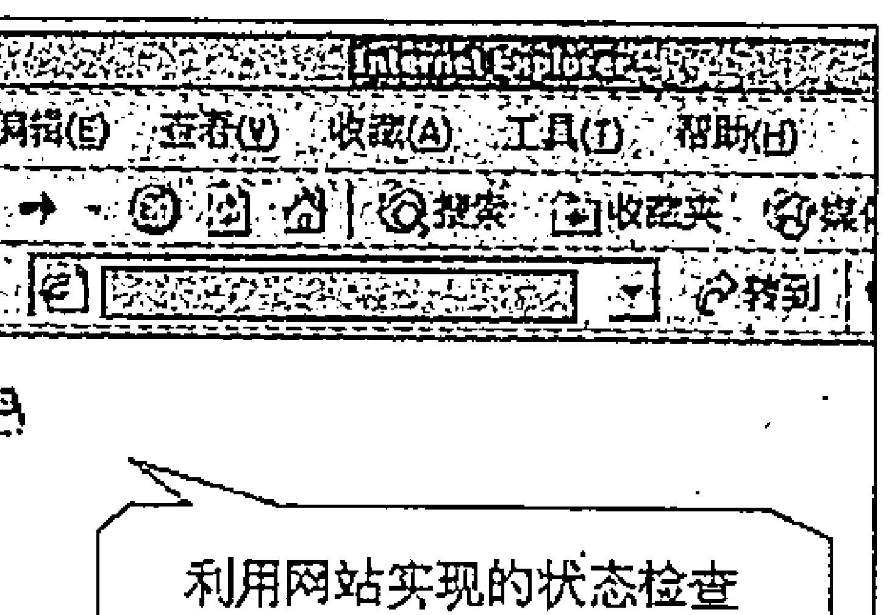

图7

#### （3）利用移动QQ

使用这种方式前需开通“移动QQ服务”。开通后，使用手机给需查询隐身状态的好友发送任意一条消息，消息内容为：60 "对方QQ号码" "所要发送的信息"

然后，移动用户发送到1700，联通用户发送到9777即可。如果好友确实不在线，则系统回复用户不在线的消息，如没有收到任何回复消息，则说明好友处于隐身状态。

### 7. 快速定位好友

目前不少网友的QQ列表中往往有上百个好友，那么如何从长串列表中快速找到某个好友呢？其实，在好友列表中，按下好友昵称的首字母即可快速定位。

如“alan”取首字母“a”，而“猛张飞”取拼音“meng”的首字母“m”即可定位到以该字母为首的好友上，如不是需查找的好友，则继续按下相关字母，QQ会自动查找定位下一个符合条件的好友。

### 8. 从黑名单中复活

如不幸被某个QQ好友放入黑名单或直接删除后，此后发送给对方的任何消息都会被屏蔽，且在下次重新登录QQ时，对方的头像也将在好友列表中消失。那么如何不让对方删且让黑名单失效呢？

首先需确定QQ系统消息没有被清空，随后只需在系统消息中找到对方向用户发送加为好友请求的那条验证消息。

双击该消息，弹出对话框，然后再单击“通过验证”按钮，即可再次回到对方QQ的好友名单，这样对方永远无法删除，实现了无限次从黑名单中复活的目的。不过，如系统消息已被清空，找不到那条验证消息，那么也无可施。

### 9. 自动找出不聊天好友

目前的QQ版本允许添加500个好友，当人满为患时即需删除一些好友，而删除的衡量标准往往是添加后几乎没有聊天的好友。其实使用一个简单的批处理命令即可迅速查出哪些好友没有聊天，随后可将其逐一删除即可。

首先将QQ的聊天记录导出为myinfo.txt文件，随后编写一个批处理文件，内容如下：
findstr “消息对象：” myinfo.txt >myfr.txt

然后将该批处理文件和myinfo.txt放在同一目录中，运行该批处理文件。此后会生成一个myfr.txt文件，文件中包含所有聊天的好友列表，随后只需通过查找方式来对照列表，将没有聊天的好友删除即可。

### 10. 彻底隐藏

在QQ运行时不仅会显示一个面板，且在系统托盘栏里还有一个企鹅图标。那么如何将QQ完全隐藏呢？

首先进入QQ的系统菜单，选择“个人设置→系统设置→基本设置”选项卡，在“窗口设置”中，将“主面板总在最前面”、“自动弹出消息”和“在任务栏显示图标”这三个勾选全去掉，而只勾选“主窗口自动隐藏”该选项。

随后，在“综合设置”中，勾选“拒绝陌生人消息”和“禁止所有用户上线提示”。再在“对讲机设置”中，勾选“拒绝接听呼叫”即可。

选择“个人设置→系统设置→热键设置”选项卡，设置提取消息热键，自定义一个热键组合。然后选择“个人设置→系统设置→声音设置”选项卡，去掉所有声音的勾选。再选择“个人设置→系统设置→自动更新设置”选项卡，选择“不自动更新”。

最后，拖拽QQ面板窗口，放在屏幕的边角，QQ即可被完全隐藏，仅可通过自定义的热键来唤醒。

### 11. 屏蔽广告

QQ用户往往对QQ中频繁出现的广告感到厌烦，那么有哪些方法可屏蔽这些烦人的广告呢？其实最简单的方法即为直接改名程序文件。

该方法针对QQ新版本，只需直接改名QQ安装文件夹下的QQexternal.exe文件和“dat”文件夹下的ad.gif、default_av_chatroom.gif、infoad.gif、vqqad.gif这四个文件即可，此后再次登录即可没有广告骚扰。

### 12. 禁止邮件自检

QQ最新版本已提供了邮箱功能，不过每次运行QQ后自行启动的邮件检测程序，导致了系统资源的浪费，因此不少用户往往不需要该功能。其实只需将QQ安装目录下的QQMail.exe、QQMailCore.dll和QQMailHelper.dll这三个文件更改为其他名字，即可在QQ启动时不自动检测邮件。此后，如需恢复邮件功能，只需将这三个文件名字改回即可。

### 13. 改变地理位置

目前许多QQ版本均有显示IP和地理位置的功能，该特点有利有弊，往往暴露了网友的隐私。不过只需使用代理服务器，即可改变自己的地理位置。

首先搜索到可用的代理服务器地址，在QQ中选择“个人设置→系统设置→代理设置”选项卡，选择“使用自定义的网络设置”，类型按代理服务器属性进行设置，如代理服务器属性为“SOCK5”，那么选择“SOCK5代理服务器”，在服务器一栏中并填入IP地址端口、用户名和密码等信息即可，如图8所示。

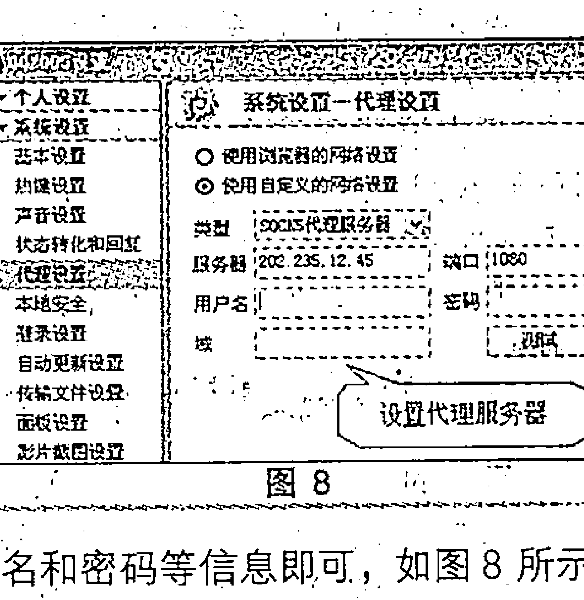

### 14. 安全防范

在公共场合使用QQ无疑得小心，毕竟不少黑客、木马程序一直在暗中监视，不过也有不少妙计可帮助用户实现较好的安全防范，具体如下所述：

- (1) 号码加“0”
在QQ号码前面输入一大串“0”，然后再登录，丝毫不会影响QQ的使用（新版QQ中，0加上QQ号码的长度不可超过10个字符）。

- (2) 使用软键盘
使用QQ提供的软键盘虽然较烦琐，但不失是一种简单的好办法。

- (3) 乱序输入
如QQ密码是123456，输入时先打入1356，接着将鼠标单击到1后面输入2，再将鼠标移到3后输入4即可。该方法主要对付专门截获键盘动作的木马程序，由于截获键盘动作的木马程序无法获悉鼠标的移动，因此非常安全。

### 15. 创建高级群

QQ的群功能是一个非常实用的功能，其最新版本的“群”全面整合了BBS、相册和共享浏览等多个栏目，而更高级的会员群取消了时间和人数的限制，提供了更多的功能。那么，非会员QQ又如何创建高级群呢？其实只需通过“校友录”中转即可。

进入QQ的“群/校友录”组，选择“创建校友录”，在弹出的选择学校网页中任意选择一个学校进入且随便创建一个班级，此时系统会自动分配一个和会员一样的永久免费群，即可享受高级的群功能。

### 16. 巧用网络硬盘

使用新版QQ提供的网络硬盘，可将硬盘的文件上传至服务器，且无论主人在线与否，其QQ好友均可分享，但非会员QQ的网络硬盘的共享访问人数仅可小于或等于5个，如需突破该限制，可采用这种建立多层文件夹的方法来实现。

在任意一个需共享给好友的根文件夹中新建一个文件夹，如“temp”文件夹，随后将需共享的文件上传至该文件夹下。

在根文件夹中，选满5个访问好友，然后在“temp”文件夹中另选与前面不同的5个好友，此后即有10个好友可访问该文件夹（“temp”）的内容。

如还需添加更多的用户，可在“temp”文件夹下再建几层文件夹，将共享文件复制到最下层的文件夹，通过对每层文件夹添加不同好友即可实现无限制好友访问。

此外，文件的存储、访问、共享、备份等功能的一些相关操作技巧如下所述：

- (1) 上传文件技巧
拖拽上传。选择需上传的文件后，按住鼠标左键拖动文件至QQ网络硬盘面板的任何文件夹，松开鼠标后系统将自动完成上传。
工具栏图标。在QQ网络硬盘面板最上端的工具栏提供了上传图标，用户单击该图标并在弹出的对话框选择需上传文件，系统将自动完成上传。
鼠标右键菜单。在QQ网络硬盘面板中选择文件夹，单击鼠标右键，选择“上传”，在弹出的对话框选择需上传的文件，系统将自动完成上传。

- (2) 下载文件
拖拽下载。在QQ网络硬盘界面选择需下载的文件，按住鼠标左键拖动文件至“资源管理器”的任何文件夹，松开鼠标后系统将自动完成下载。
工具栏图标。在QQ网络硬盘面板最上端的工具栏提供了下载图标，用户单击该图标，在弹出的对话框选择需下载的文件夹，系统将自动完成下载。
鼠标右键菜单。在QQ网络硬盘面板中选择文件夹，单击鼠标右键，选择“下载”，在弹出的对话框选择需下载的文件夹，系统将自动完成下载。

- (3) 移动文件
用户可在QQ网络硬盘面板中用左键选择文件，拖动至任何目的文件夹。

- (4) 删除文件
工具栏图标。在QQ网络硬盘面板中，选择需删除的文件，单击顶部工具栏的删除按钮即可删除。
鼠标右键菜单。在QQ网络硬盘面板，选择需删除的文件，鼠标右键单击，选择“删除”。

- (5) 续传文件
鼠标右键菜单。右键单击未完成上传的文件，选择“续传”，系统将自动完成续传操作。

- (6) 文件夹共享
在QQ网络硬盘界面，右键任意单击任何文件夹，在弹出的右键菜单里，选择“设置共享”，在弹出的对话框选择需共享的好友，确认后即可完成文件夹共享。

- (7) 在线播放
在QQ网络硬盘界面，右键任意单击任何文件夹，如该文件夹内包含音频文件，则可选择“在线播放”。

### 17. 巧看网络电视

QQ拥有不少隐藏的功能，其中看电视功能着实让人心动。首先，登录新版QQ并单击QQ侧边栏的“用户自定义面板”。

然后，单击“收藏夹”中的“设置”选项，弹出一个收藏列表框，可看到“Q_Radio”选项，勾选该选项就可进行网络收音机。随后，添加一个“Q_TV”，链接地址输入“http://www.qq-tv.com”并勾选即可。

随后即可使用QQ观看、收听精彩的影音内容，如图9所示。

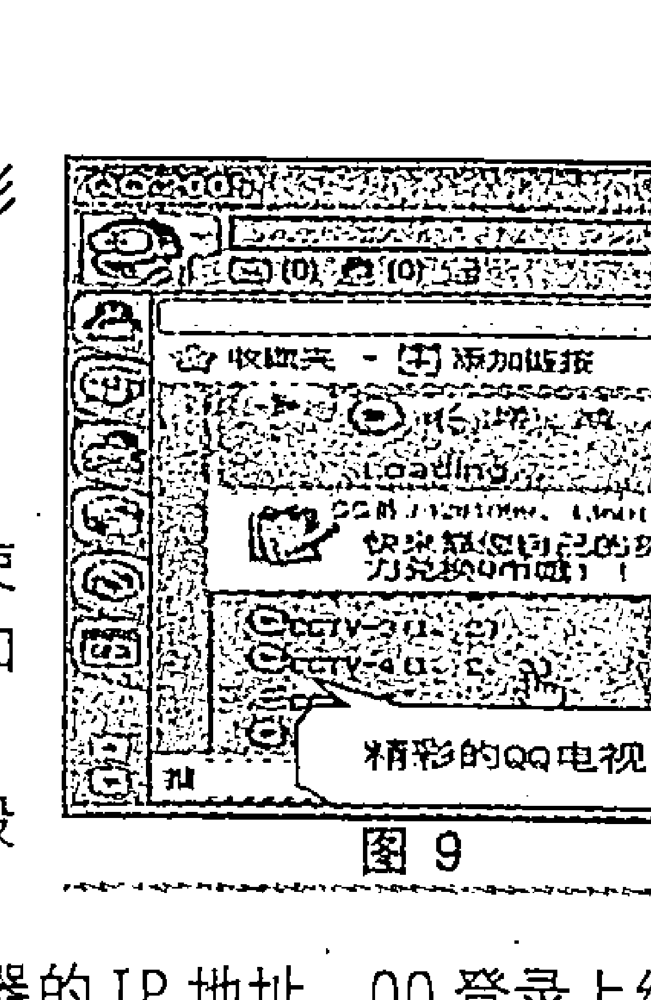

### 18. 限制用户使用

在公用计算机上，常常需限制使用QQ，那么如何通过简单的封闭IP和屏蔽端口设置来实现呢？

使用QQ必须登录QQ服务器，一般有三种情况，具体如下所述：

- (1) 以UDP 8000端口作为服务器的IP地址，QQ登录上线后会先向这几个服务器发送UDP数据包，选择回复速度最快的一个作为连接服务器。

这些服务器名字均以“sz”开头，域后缀是tencent.com，域名与IP对应为：

| 服务器名称 | IP地址 |
| :--- | :--- |
| sz sz2 | 61.144.238.145 61.144.238.146 61.144.238.156 |
| sz3 sz4 sz6 sz7 | 202.104.129.251 202.104.129.254 202.104.129.252 202.104.129.253 |
| sz5 | 61.141.194.203 |

- (2) 以HTTP的80和443端口作为服务器的IP地址，这些服务器名字均以“tcpconn”开头，域后缀是tencent.com，域名与IP对应为：
tcpconn tcpconn3: 218.17.209.23
tcpconn2 tcpconn4: 218.18.95.153

- (3) 会员VIP专用的登录服务器，一般使用HTTP 443安全连接，其服务器IP地址为：
218.17.209.42

以上这些即为通用的服务器地址和端口，网管只需全部关闭即可实现屏蔽QQ的目的。

### 19. 访问链接前进行安全检查

用户在使用QQ时如怀疑收到的某个网页链接不安全，那么可在访问之前进行安全检查。首先单击该链接右边的标记并从下拉菜单中选择“检查链接安全性”菜单项，此时QQ会在浏览器中打开QQ安全中心的“检查链接安全性”页面，并显示该链接的安全性。

如网页经腾讯审核确认为不安全，那么QQ安全中心将阻止用户对该链接的访问并给出警告和提示，否则即可正常访问该链接。

### 20. 避免传送文件遭阻止

有时用户发送的文件本身并无安全问题，但由于文件类型属于QQ安全中心默认阻止的范围，此时有多种方法可供选择，具体如下所述：

- (1) 改名
可将文件重命名为任意的临时文件类型，临时文件类型不属于QQ安全中心阻止的文件类型之列，如将 *.exe 重命名为 *.exe_ABC，然后发送给对方的同时在QQ消息中加入说明，告诉对方保存文件时应使用正确的名称（如 *.exe）即可。

- (2) 打包
发送文件之前，使用压缩程序（如WinZip或WinRAR）将文件打包，同时在QQ消息中加入说明，告诉对方需解压后取出文件。

- (3) 降级
在“文件传输安全设置”中把文件传输安全级别设置为“低”，在文件接收完毕后，手工去除QQ安全中心自动附加的“.重命名”文件后缀。

### 21. 关闭会员登录提示窗口

不少用户购买了QQ会员后，发现每次登录时总会有提示窗口“欢迎QQ会员”出现，实在烦不胜烦，其实关闭这个提示并不难。

首先，在登录QQ后，单击QQ面板的“菜单”的“个人设置”子菜单的“系统设置”。随后，单击“登录提示”，把状态显示栏中的“会员登录设置项→开启会员登录提示窗口”一项去除后，点击“确定”即可。

### 22. 自定义面板

新版本的QQ功能越来越多，尤其是QQ面板中的选择项已变得有些冗余。不过新版QQ的用户自定义QQ面板，通过简化工作不仅让QQ清爽了许多，还可让QQ启动加速。

首先，登录QQ后单击QQ面板“菜单”的“个人设置”子菜单的“系统设置”，随后单击“面板设置”，在“系统面板”中即可随意隐藏面板。

此外，在浏览网页时，只需单击鼠标右键，在弹出菜单中选择“添加到自定义面板”即可将浏览的网页添加到自定义面板中，十分快捷方便。

### 23. 拒绝临时会话消息

在使用QQ时，如收到“登录XXX网站看电影”之类的小广告，可通过QQ小秘书设置来拒绝。

首先，登录QQ后单击QQ面板的“菜单”的“个人设置”子菜单的“秘书设置”。随后，单击“消息模式设置”，在面板中选择“不接收所有临时会话”即可。

### 24. 填写有说服力的申诉

如不幸遭遇盗号，那么如果是会员号码，可在 http://myqq.tencent.com 的“忘记密码”中通过正确的保护资料取回。而普通有保护的号码，可在http://service.tencent.com/psw/mo.shtml?psw_cs.htm，通过正确的保护资料取回。

如忘记了保护资料，可通过申诉系统取回密码。申诉地址：http://service.tencent.com/service/request.shtml，而如何填写一些有说服力的申诉资料也有不少技巧，具体如下所述：

- (1) 被盗号码QQ资料、历史密码、历史好友、用户个人身份资料、原有密码保护资料等，这些资料一般填写半年前即可。

- (2) 其他证明资料填写
    · 该号码何处申请（如声讯、网站、QQ客户端或手机申请）。
    · 该号码是否用手机绑定。
    · QQ游戏是否参加。
    · 是否赠送过别人QQ秀或某些腾讯的业务。
    · 网络硬盘密码、通讯录密码、QQ账户密码。
    · QQ客服电话的VIP服务密码。
    · 该号码是否为会员。
    · 是否向哪个群或QQ游戏家族捐献过Q币。
    · 是否获得别人赠送的QQ秀或腾讯的一些服务。
    · 提供该QQ曾用的昵称。
    · 如有QQ宠物可填写宠物领取的方式。
    · 是否用QQ梦想地带的积分换过奖品或某些增值服务。
    · 是否申请过蓝钻、红钻、黄钻等业务。
    · 是否上传过聊天记录。
    · 是否参加过会员活动。

### 25. 让昵称靠前

首先进入QQ的个人设定，在用户昵称输入框中将光标定位在昵称前。随后，打开输入法的语言栏，右键单击软键盘选择“特殊符号”，按下键盘“P”，此时原昵称前就添加一个符号“□”，最后单击“修改”即可。

此外，如需让自己QQ列表中某位常联系的好友昵称往前，可为其添加备注，将“用户名称”前添加该符号，随后在QQ好友列表的空白区域点鼠标右键，将“名称显示”选为“显示备注”即可。

## 26. 巧避攻击

QQ使用中往往可能遭遇不明来意的攻击，因此可采用一些防范措施来避免，具体如下所述：

-   隐身登录

假如用户首次在电脑上登录QQ，那么登录成功后往往很容易被黑客获取IP地址，此时马上选择“离线”，稍后再选择“隐身登录”即可避免黑客很容易地获取你的IP地址。

-   拒绝陌生人

可在“系统参数”设置里选择“拒绝陌生人消息”，并在“个人设定”的“网络安全”标签里选择“需要身份验证才能把我列为好友”，从而杜绝黑客通过陌生人的方式来嗅探IP地址。

-   避免挂网

如无聊天好友时，建议不要挂网，减少被黑风险。

## 27. 让个人名片与通讯录无缝结合

很多用户经常需交换电子名片，而以往通常需保存于文本文件，腾讯TM2005 Beta1中内置的个人名片和通讯录功能可很好地解决网络个人名片与联系人资料收录的问题，具体技巧如下所述：

首先，TM主界面“文件”菜单中已直接提供了“名片设置”选项，单击进入即可设置个人名片，同时还可同步预览名片的真实显示格式。在聊天对话框中，如采用“交谈模式”，那“个人形象”和“名片”会以选项卡的形式出现在对话框的右侧。

此外，“名片”信息还可在通讯录页面中设置，单击TM主界面左侧的“通讯录”标签，进入“通讯录”页面，在所有联系人列表的最上方将出现一行工具栏。单击左侧第二个按钮，选择“我的资料”，即可打开“我的详细资料”窗口。

需注意：个人名片上填写的电话、邮箱等资料如不想让陌生人看到，可在“名片设置”对话框里设置“仅对好友可见”或“完全保密”。此外，个人名片的资料公开设置与个人设置的联系方式两者完全独立。用户可选择公开个人名片，又可同时禁止别人浏览私人资料。

## 28. 防御消息“炸弹”

所谓QQ消息“炸弹”是攻击者在瞬间向受害者的QQ发送大量的垃圾信息，开启无数个消息窗口，让QQ应接不暇，从而无法正常使用。

QQ消息“炸弹”类的攻击软件非常多，而能够普遍存在的原因在于QQ本身的网络协议以及软件的设计存在着漏洞。QQ主要采用UDP协议进行数据传输（一种面向非连接的协议），虽然它的通信效果比较好，但可靠性却不如TCP协议，只适用于一次传输少量的数据，或对数据可靠性要求不高的环境。UDP协议的不可靠性，使得伪造UDP数据包并不是一件困难的事。

分析了QQ消息“炸弹”的攻击原理后，即可避开其威胁。普通QQ用户最简单的办法是使用代理服务器来登录QQ，以达到隐藏自己真实IP地址的目的。此外当QQ遭受“炸弹”攻击时，可将攻击者从QQ好友拖到黑名单，并将QQ设置为“拒绝接受陌生人消息”。

## 29. 完全“瘦身”指南

-   删除不必要的组件

在新近版本的QQ中已取消了选择安装的选项，直接默认安装TM、腾讯TT、QQ游戏、旋风下载，其实用户可删除一些不必要的组件以实现“瘦身”。

打开QQ安装目录，双击运行uninst.exe程序，在卸载窗口，单击“下一步”直至出现“选定组件”窗口，在该窗口中“选择要卸载的组件”列表中，可选择需卸载的程序，然后单击“移除”按钮即可卸载不必要的组件。

-   禁用其他功能

使用标准皮肤。QQ皮肤很占系统资源，可在QQ面板中依次单击“菜单”的“更换皮肤”子菜单的“标准界面”，将QQ的皮肤设置为“标准界面”，即可节约不少被QQ占用的系统资源。此外，采用默认皮肤界面后即可删除多余的皮肤，这些皮肤往往存放在QQ目录的“NewSkins”文件夹中，因此只需将“NewSkins”整个文件夹删除即可。

删除QQ场景。删除“QQ/IMScene/Scene”文件夹下的所有场景文件即可，此外在设置QQ场景时需取消“接受场景邀请”的选择，以避免接受别人发送的场景。

删除声音文件。如不需要声音效果，那么可在QQ文件夹中删除“QringFiles”文件夹下的所有声音文件，同时删除整个“Sound”文件夹。

## 30. 巧护聊天记录

QQ的聊天记录也是一种不亚于密码的绝对隐私，保护聊天记录等本地信息，可通过设置本地消息口令来实现。

首先在QQ界面上选择“系统参数”，在“系统参数”视窗选择“安全设置”标签，随后选择“启用本地消息加密”，再依次输入口令并确认口令即可。

此外，为保险起见，建议勾选“启用本地消息加密口令提示”，设定提示问题和问题答案，按下“确定”使设定生效。此后在启动QQ输入账号和密码后，软件还会要求输入本地消息口令，否则无法登录。

## 31. 在IE工具栏上安家

浏览网页时，如需和QQ好友聊天，那么最好的方法即为在IE工具栏上直接启动QQ，其实通过Windows XP/2000的组策略，即可让QQ在IE的工具栏上安家。

在“运行”对话框中输入“gpedit.msc”，即可启动组策略。在“组策略”界面中依次选择“本地计算机策略→用户配置→Windows设置→Internet Explorer维护→浏览器用户界面”，在右侧选择“浏览器工具栏自定义”，双击后出现“浏览器工具栏自定义”对话框。

随后在“按钮”栏中单击“添加”，出现“浏览器工具栏按钮信息”对话框，在“工具栏标题”内输入一个自定义的名称，然后在“工具栏操作”输入QQ路径，选择“工具栏颜色图标”和“工具栏灰度图标”的路径，单击“浏览”并定位到一个图标文件即可。

启动IE，如工具栏上无QQ的图标，那么可在工具栏上右击鼠标，选择“自定义”，在“可用工具栏按钮”中寻找添加的图标，选择后单击“添加”即可。

## 32. 好友轻松全部删

如需批量删除好友，在网络速度较快的前提下，可单击QQ主菜单，选择“档案管理→好友管理器”命令，进入“好友管理器”窗口，按Shift键后选择所有需删除的QQ好友，然后按Delete键，QQ将会连接至服务器自动批量删除。

## 各有千秋之MSN篇

## 1. 在列表中只显示邮件地址

MSN好友列表不仅可分组显示，还可按状态显示。其实，MSN还有一项实用的显示选择，即是否只显示账户（即电子邮件地址）。

MSN好友经常变化的昵称往往会产生混淆，其实只需登录后在MSN主窗口中，选择“联系人→管理联系人→显示选项”，在弹出菜单中选择“只显示联系人的管理名称”即可。

## 2. 添加聊天背景

一成不变的MSN主界面白板背景风格，让喜欢耍酷的MSN用户难以容忍。其实，也可让白净的MSN变得漂亮一些。首先用图形图像编辑软件制作中意的背景图片或直接下载一张。随后将这张图片改名为lvback.gif，复制到MSN的安装目录并登录、最小化MSN，随后即可浏览超酷的效果。

## 3. 高级搜索

许多刚使用MSN的网友都错误地认为，MSN无法查找添加在线好友，而仅可通过网友提供的邮件地址才能添加，其实MSN同样具有搜索功能，广交天下友并不是难事。首先登录后在MSN主窗口中，选择“联系人→搜索联系人→高级搜索”菜单，或直接在IE浏览器中打开“http://members.msn.com/find.msnw?pgmarket=zh-cn”页面。该页面是一个高级搜索条件设置页面，用户既可通过MSN昵称、性别、年龄、国家/地区等条件进行搜索，也可单击页面右侧的“依兴趣浏览基本资料”链接来分类查找志同道合的网友。此外，如在检索前，勾选“仅检查包含图片的基本资料”该选项，即可在搜索结果画面查看网友上传的照片。在搜索结果页面中，用户可看到网友昵称、性别、年龄等信息，随后即可向网友发送邮件并邀请其对话。不过，上述的搜索条件往往建立在用户已在MSN交友社区中填写了资料的前提下，用户可使用账号登录“http://www.passport.com”网络社区，打开“http://mrs.msn.com/default.msnw?mem=current”页面填写详细信息。

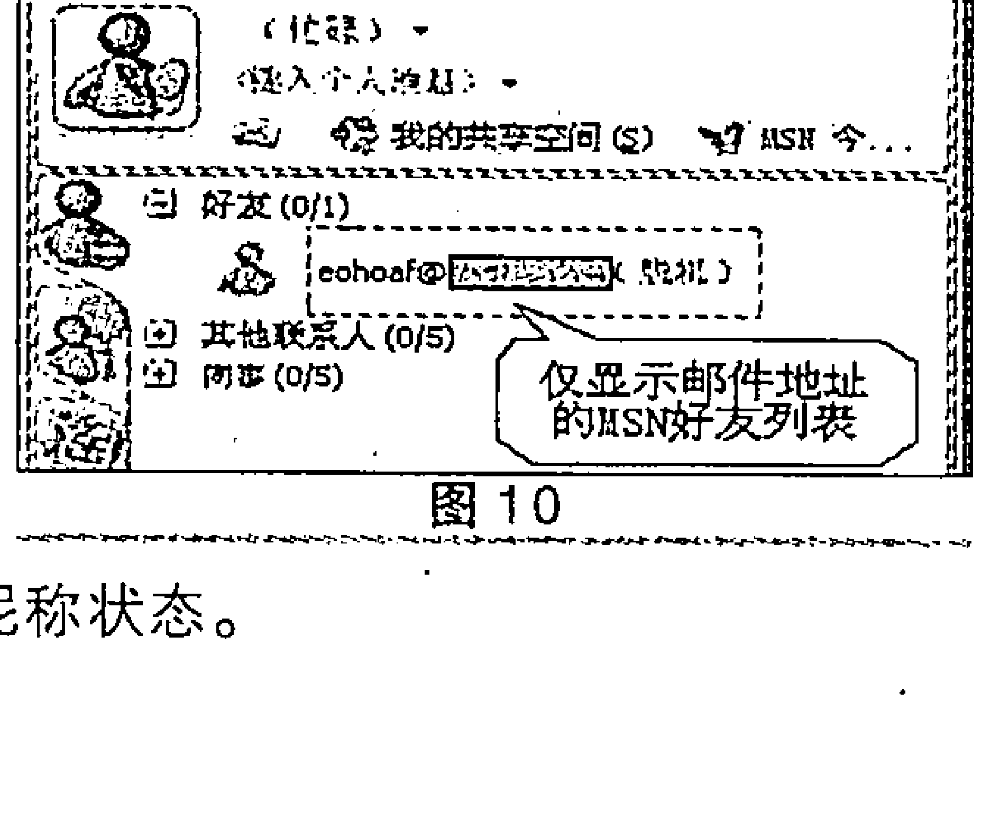

## 4. 直接截取图释

许多MSN用户往往有一些自定义的有趣图释，聊天时如好友发送一个非常生动活泼的图标时，无疑会爱不释手。MSN允许用户不通过其他软件，直接截取聊天窗口中好友发送过的自定义图释。在聊天窗口中，当好友发送动态图标需截取时，可先选择该图标，随后右键单击该图释，在弹出菜单中选择“添加”。此时软件会要求指定图释的快捷键和名称，输入自定义规则并确认即可。最后在聊天窗口中打开表情图标列表，刚才那张截取的图标已在列表中。此外，在为图释指定键盘快捷方式时，不能指定为其他键盘快捷方式的子集。如已为一个图释指定键盘快捷方式“cat”，则不能为另一个图释指定快捷方式“cat1”，否则快捷方式为“cat1”的图释将无法显示。

## 5. 自动调整状态

MSN已逐渐成为办公必备的联系工具之一，不过当用户处于忙碌或离开状态时，如能自动设置，那么无疑会更方便日常生活和工作。MSN可自动调整状态，如设置当用户离开后5分钟后，状态变为“离开”，设置方法很简单。登录后在MSN主窗口中单击“工具→选项→个人信息”标签卡，在“我的状态”设置栏中，勾选复选框，并在时间文本框中输入一个时间值，确认即可。此后MSN会在用户离开5分钟后自动切换为“离开”状态，如图11所示。

## 6. 自动卸载XP自带版本

Windows XP系统秉承了微软一贯的风格，捆绑了MSN的老版本软件，用户往往不需该版本或根本不用MSN，那么如何删除呢？单击Windows“开始”菜单的“运行”命令，输入以下这条语句：

```
rundll32 advpack.dll,LaunchINFSection %windir%\inf\msmsgs.inf,BLC.Remove
```

确认完成后即可卸载自带的MSN。

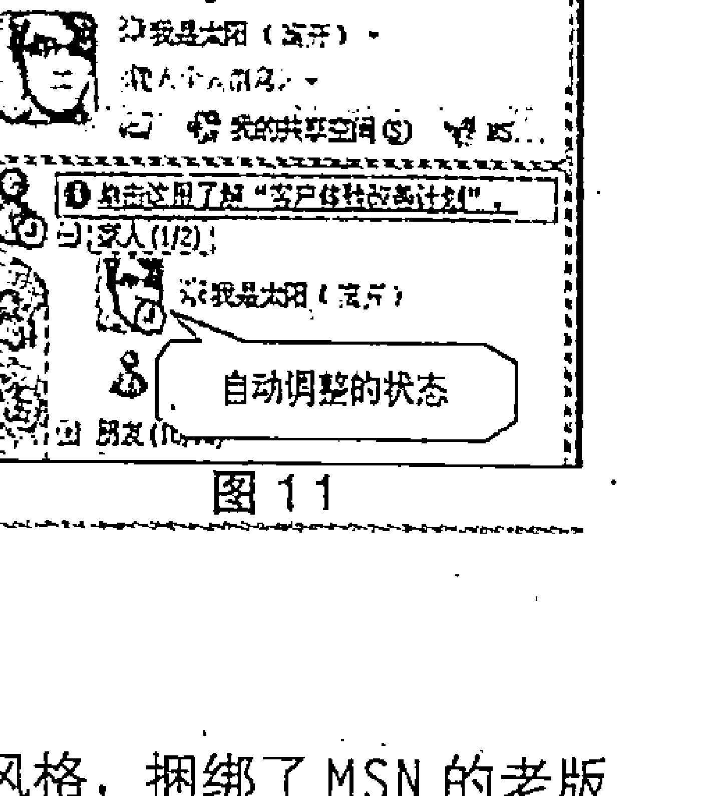

## 7. 禁止语音视频交流

一些用户会忽然发现MSN突然无法语音、视频聊天，其实原因往往在于端口被网络防火墙禁用。由于MSN规定文件传输用到TCP/IP协议的6891至6900端口，而语音、视频交流则使用到UDP协议的5004至65535端口，因此正常使用必须开放以上端口，而许多防火墙的安全等级如设置为较高，则上述端口均会被禁用。对于常用的金山毒霸或天网防火墙，可用以下这种方法解禁端口。

在天网防火墙的“自定义IP规则”窗口中，单击“增加规则”按钮，新建一个“开放语音和视频端口”规则，如图12所示。在规则“名称”栏中输入“开放语音和视频端口”，“数据包方向”选择“接收或发送”，“对方IP地址”设置为“任何地址”，接着在协议框中切换到“UDP”，在端口范围中输入从“5004”到“65535”，然后在“当满足上述条件时”栏中选择“通行”，最后单击“确定”即可，这样语音和视频交流所需的端口即可打开。同样，按照上述方法开放文件传输端口方法，不同之处在于，文件传输端口使用TCP协议，在新建IP规则时一定要注意，在协议框中选择TCP，然后输入从“6891”到“6900”即可。全部设置完毕后，即可无限制地运用各种聊天方式，但同时也需注意网络安全。

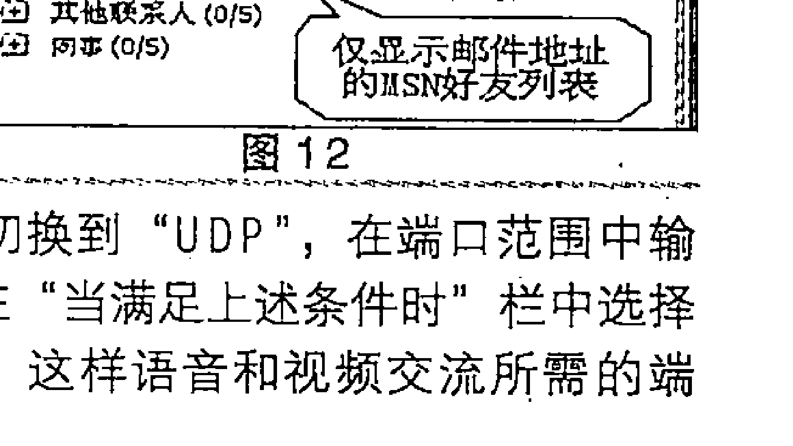

## 8. 取消自动登录

由于MSN秉承了微软的一贯风格，因此在Windows或Outlook启动时，MSN往往会自动登录，那么如何才能取消自动登录呢？

### (1) 取消Windows启动时MSN自动登录

只需在MSN主窗口中单击“工具→选项→常规”标签卡，取消“当我登录到Windows时自动登录Messenger”前的勾选，最后单击“确定”按钮即可。此外，在Windows 98或Windows XP中可使用“msconfig”命令，单击“开始→运行”，在运行对话框中输入“msconfig”，切换到“启动”标签页，取消“msmsgs”项前的勾选，单击“确定”后重新启动系统即可。Windows 2000下无此命令工具，可从Windows XP系统下复制后运行。

### (2) 取消OE启动时MSN自动登录

OE启动后也会自动登录MSN，去除方法也很简单。只需在OE主窗口中单击“工具→选项→常规”标签卡，取消“自动登录到Windows Messenger”前的勾选，最后单击“确定”按钮即可。

## 9. 删除多余账号

对于使用公共计算机的用户由于在同一台计算机上有多人使用MSN，因此每次登录时，往往需输入自己的登录地址，因此MSN中如可删除账号，那么无疑带来了方便。其实通过修改注册表的方法即可轻松解决该难题。

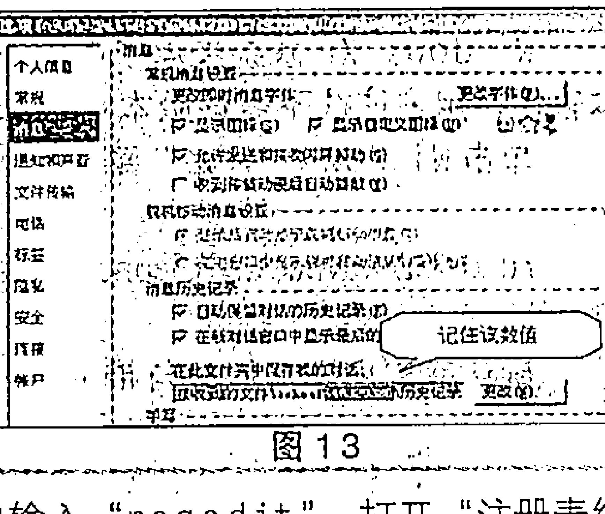

登录后，在MSN主窗口中单击“工具→选项→消息”标签卡，随后在“消息历史记录”栏下勾选“自动保留对话的历史记录”，接着，在保存文件夹一栏中就可查到账号对应的数值号码，可将该数值保存，如图13所示。

随后在“运行”对话框中输入“regedit”，打开“注册表编辑器”，在[HKEY_CURRENT_USER\Software\Microsoft\MSNMessenger\PerPassportSettings]中，对照前述步骤的数值，将其她数值的目录逐一删除即可。

需注意：在删除前请先备份注册表。

## 10. 防毒设置

近期MSN病毒的泛滥令人十分头痛，由于MSN的文件传输功能，往往会在传送过程中将病毒带入，因此必须进行防毒设置。MSN提供了一个查毒接口，通过设置即可将MSN与杀毒软件结合，实现防患于未然。

首先在MSN主窗口中单击“工具→选项→消息”标签卡，在“文件传输”栏里选择“使用下列程序进行病毒扫描”项。接着单击“浏览”按钮，选择杀毒软件的执行程序并确定即可。

用户只需用MSN接收对方发送的文件时，系统会自动调用设置的杀毒程序对文件进行扫描和杀毒工作，防止了病毒以文件传送的方式进入个人计算机。

需注意：必须及时更新杀毒软件的病毒库，才能真正保证计算机安全。

## 11. 巧用网络会议

目前一些企业在召开会议或集体讨论时往往会借助MSN，其实利用MSN召开网络视频会议的方法并不复杂。首先会议主持人在MSN主窗口中单击“操作→开始一个活动”，打开会议对话框。随后单击“邀请”按钮，从在线的成员列表中选择与会者的账号，当对方接受后即可添加至创建的会议，并可在一个窗口中看到彼此的信息。

## 12. 向多个联系人同时发送即时消息

MSN无法同时启动与多个联系人的即时消息对话，不过可在对话框中添加新的联系人，因此“变相”实现了向多个联系人同时发送即时消息的功能。

单击“我想”下的“邀请某人到该对话”按钮，然后在对话框中单击联系人的地址，或单击“其他”按钮并输入其他完整的电子邮件地址，最后即可实现类似QQ“群”的对话功能。

## 13. 申请msn.com信箱

MSN登录名中用“Hotmail”做后缀的邮箱比比皆是，不过如能申请一个用“MSN”做后缀的信箱可能更有成就感，有两种方法可实现这一目的：

+   (1) 在 MSN Explorer 浏览器中通过申请新用户获得。
+   (2) 进入 www.hotmail.com，随意输入一个后缀为“@msn.com”的信箱登录，系统将提示“请正确键入您的 .NET Passport 登录电子邮件地址和密码”，此时再单击“立即注册”即可注册一个“@msn.com”的信箱。

## 14. 更改收到通知时提示音

MSN接受到消息的声音和手机的铃声一样，也可方便地自定义。用户只需在MSN主窗口中，单击“工具”菜单的“选项”子菜单，然后单击“常规”选项卡并单击“声音”，进入“声音和音频设备属性”对话框。

在该对话框中，单击“声音”选项卡。在“程序事件”框中，向下滚动到“MSN Messenger”。随后单击需更改的声音，然后从“声音”下拉列表中选择一种新声音即可。如果列表中没有所需的声音，可单击“浏览”并查找其他扩展名为WAV的声音文件。

## 速清自动编号 文档输入更顺畅

我们在使用Word的时候可能会遇到这样一个问题：在某一段的段首输入1，之后下一段Word会自动出现2，之类的编号。如果每一点包括好几段，我们常常需要不停地删除自动出现的编号，是否有办法进行设置，让这些碍事的自动编号不再出现？最快方法：在默认情况下，自动编号列表功能在启动Word时处于打开状态。如果在段落开始处键入的数字（或字母）后带有句点、空格或Tab符号，此功能即自动转入列表应用自动编号列表格式。去掉它并不难，以Word 2003为例，进入“工具→自动更正选项”，再单击“键入时自动套用格式”选项卡，把“键入时自动应用”下的“自动编号列表”复选框中的对勾去掉，最后单击“确定”就完成了。

## 密件抄送 群发邮件隔离墙

组发送，挺省事的。但是问题很快出现了：通知发给了谁，不希望大家相互知道，而群发时，所有收件人的邮箱地址都完整地列到了邮件中。能否设置一道“隔离墙”，让每个收件人看不到其他收件人的信息呢？最快方法：在Outlook Express和Outlook中，都有这样的隔离装置。在发送前，把这些收件人的地址（或群组）放到“视图”的“密件抄送”框中，如此一来，收件人的邮件地址就相互隐藏起来，避免了不必要的麻烦。

## WMware篇

WMware Workstation可以在同一台电脑上同时互不干扰地运行多个操作系统，就像拥有多台电脑一样。很多朋友把它用于调试程序、测试新软件。其实，WMware还为用户提供了完善的网络功能，通过合理的设置，可以让虚拟机与宿主机形成一个虚拟的网络，甚至可以让虚拟机为宿主机所在的真实局域网提供服务，就像局域网中真有这么一台计算机一样。需要说明的是，本文并不是WMware Workstation扫盲班，因为很多朋友都熟悉这款软件，而且它的基本操作并不复杂。本文旨在告诉用户，如何充分发挥WMware的网络功能，用WMware模拟局域网内的多台计算机。至于如何安装、创建虚拟机、为虚拟机安装操作系统等基础知识，很多文章都已经详细讲过，这里不再具体说明。

## 一、认识WMware的网络组件

WMware为用户提供了丰富的虚拟网络设备，主要包括虚拟网卡、虚拟交换机和虚拟的DHCP服务器。

### 1. 虚拟网卡

安装了WMware之后，在Windows的“设备管理器”中，可以看到在“网络适配器”下多了两块网卡，一个叫WMware Virtual Ethernet Adapter for VMnet1，另一个叫WMware Virtual Ethernet Adapter for VMnet8。前者用于Host-only方式下虚拟机与宿主机进行通信；后者则用于NAT方式下虚拟机与宿主机进行通信。同样，多了两块网卡之后，在Windows的“网络连接”中也会相应多出两块网卡的连接。

对于虚拟机来说，WMware会自动为其指定一个虚拟网卡，虚拟网卡在虚拟机中被识别为“AMD PCNET Family PCI Ethernet Adapter”。大多数操作系统都能识别这个虚拟硬件并为之安装相应的驱动程序。虚拟机中的虚拟网卡为宿主机与虚拟机、虚拟机与虚拟机之间进行通信提供了网络接口。

### 2. 虚拟交换机

虚拟交换机与实际的交换机相同，能够把宿主机与虚拟机和其他网络设备连接在一起。在WMware安装后，交换机会根据组网的需要由WMware自动创建并自动使用。在Windows中，用户可以使用多达10台虚拟交换机。在VMware中点击菜单“Edit → Virtual Network Settings”就可以看到虚拟交换机的配置和使用情况（图1）。

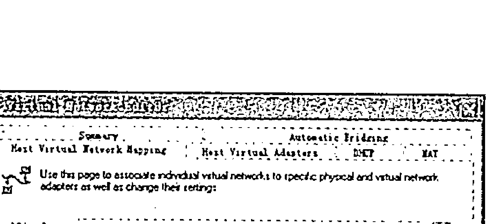

### 3. 三种通信方式

虚拟机与宿主机有Bridged（桥接）、Host-only（仅主机）和NAT（网络地址自动转换）三种连接方式，这三种方式对应着不同类型的网络。

#### （1）Bridged（桥接模式）

如果虚拟机采用这种方式与主机进行通信，WMware将会启动一个虚拟的网桥设备，这个虚拟的网桥会把虚拟机中的虚拟网卡连接到宿主机所在的局域网中，这样虚拟机就会以一台“真实”的计算机身份出现在宿主机所在的真实局域网中，这样的虚拟机能够拥有真实局域网中的IP地址，并且享受主机在局域网中所能享受的一切服务，比如打印机、文件服务、网关以及其他服务。同样，宿主机和宿主机所在局域网上的其他计算机也能像访问一台真正的计算机一样访问虚拟机，虚拟机能够为局域网上的其他计算机提供服务。

#### （2）Host-only（仅主机模式）

当虚拟机采用Host-only模式时，它将通过虚拟网卡WMware Virtual Ethernet Adapter for VMnet1与宿主机进行通信。在功能上，宿主机所在的局域网中其他计算机无法访问虚拟机，只有宿主机和宿主机上其他使用了Host-only模式的虚拟机才能相互访问。因此，这是一种典型的内部局域网结构。

#### （3）NAT（网络地址转换模式）

虚拟机通过虚拟网卡WMware Virtual Ethernet Adapter for VMnet8与宿主机进行通信。在这种情况下，如果宿主机通过另外的网卡连接到外部网络上，NAT设备能够把虚拟机的IP地址转换为宿主机的外部IP地址，让虚拟机以主机的外部网络地址访问外部网络资源。但是，外部网络上的其他计算机不能访问虚拟机，虚拟机也无法对外提供服务。

那么，如何在这三种方式中选择正确的通信方式呢？这要根据自己的需要来确定。

第一种情况：如果宿主机在一个真实的局域网中，希望虚拟机能和局域网中其他主机进行通信，共享网络资源，此时就要选择Bridged模式。第二种情况：如果宿主机是单机，能够连接到互联网上，希望虚拟机能够经过简单配置就能访问互联网，此时要选择NAT模式。第三种情况：如果希望通过WMware学习Sygate之类软路由的配置方法，可以选择Host-only模式。

在WMware中，选择这三种通信方式的方法非常简单。第一种方法是在创建虚拟机的时候，根据提示进行选择，这种方法比较简单，不再详细说明。另一种方式是针对已经存在的虚拟机，可以对其进行修改。具体做法如下：首先，在WMware中点击需要修改通信方式的虚拟机标签，切换到指定虚拟机中；其次，点击菜单“VM

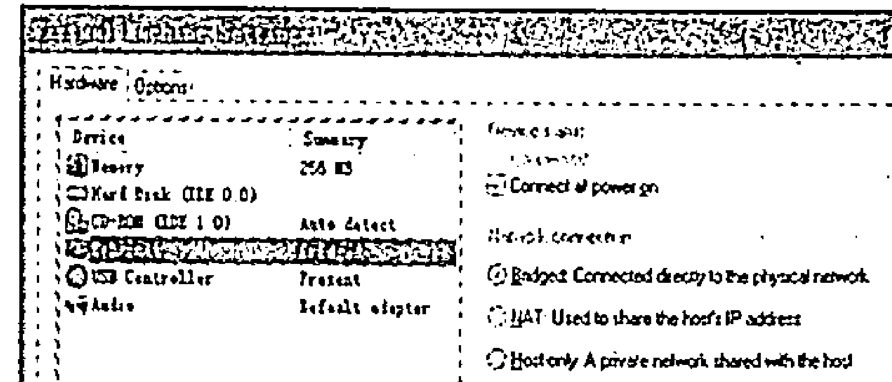

## 四、正确配置和使用VMware的DHCP

在使用Bridged模式时，虚拟机的IP地址要与宿主机的IP地址在同一网段内。这种情况下，如果真实的局域网内没有DHCP服务器，用户可以手工为虚拟机指定IP地址；如果有DHCP服务器，则可以让虚拟机自动获取IP地址，局域网中的DHCP服务器就会自动为虚拟机分配一个可用的IP地址。但在NAT和Host-only模式下，虚拟机不能从局域网中的DHCP中获取IP地址，因此，只能通过手工指定或者启用VMware的虚拟DHCP服务器来获得可用的IP地址。

在NAT和Host-only模式下工作时，很多用户发现一个问题，就是不论是手工为虚拟机指定IP地址，还是让虚拟机自动获得IP地址，虚拟机都无法与宿主机进行通信。其实这个问题产生的原因，是VMware的DHCP服务器没有按照用户的意图分配适当的IP地址。要让DHCP服务器自动分配的IP地址可用，必须保证两个条件：一是正确设置宿主机的虚拟网卡的IP地址，二是正确设置DHCP服务器的地址池。只有宿主机虚拟网卡的IP地址与虚拟DHCP服务器地址池的IP地址和虚拟机的IP地址保持在同一网段内，虚拟机才能与宿主机进行通信。

下面通过一个实例来说明具体的配置方法。

工作环境：虚拟机与宿主机的操作系统都是Windows XP。
通信方式：Host-only。
要完成的任务：把虚拟DHCP服务器的地址池配置为192.168.2.2～192.168.2.254，并自动分配给虚拟机，实现虚拟机与宿主机之间正常通信。

首先，配置宿主机的IP地址。

-   第一步：在宿主机的桌面上右击“网上邻居”，选择“属性”命令打开“网络连接”窗口。
-   第二步：在“网络连接”窗口中右击“VMware Virtual Ethernet Adapter for VMnet1”，选择“属性”命令，打开配置窗口。
-   第三步：选中“Internet协议（TCP/IP）”，点击“属性”按钮。
-   第四步：在“Internet协议（TCP/IP）属性”窗口中，选中“使用下面的IP地址”，并把IP地址设置为“192.168.2.1”，把子网掩码设置为“255.255.255.0”。
-   第五步：点击“确定”按钮进行确认，退出VMware Virtual Ethernet Adapter for VMnet1的属性设置窗口。

其次，配置VMware的DHCP服务。

-   第一步：在VMware的主界面中点击“Edit → Virtual Network Settings”，打开配置窗口。
-   第二步：在 Virtual Network Editor窗口中，进入“Host Virtual Network Mapping”标签页，点击“VMnet1”右侧的“>”按钮，选择“Subnet”命令（图3）。
-   第三步：在弹出的Subnet对话框中，把“IP Address”（IP地址）设置为192.168.2.0，把“Subnet Mask”（子网掩码）设置为“255.255.255.0”，点击“OK”按钮。
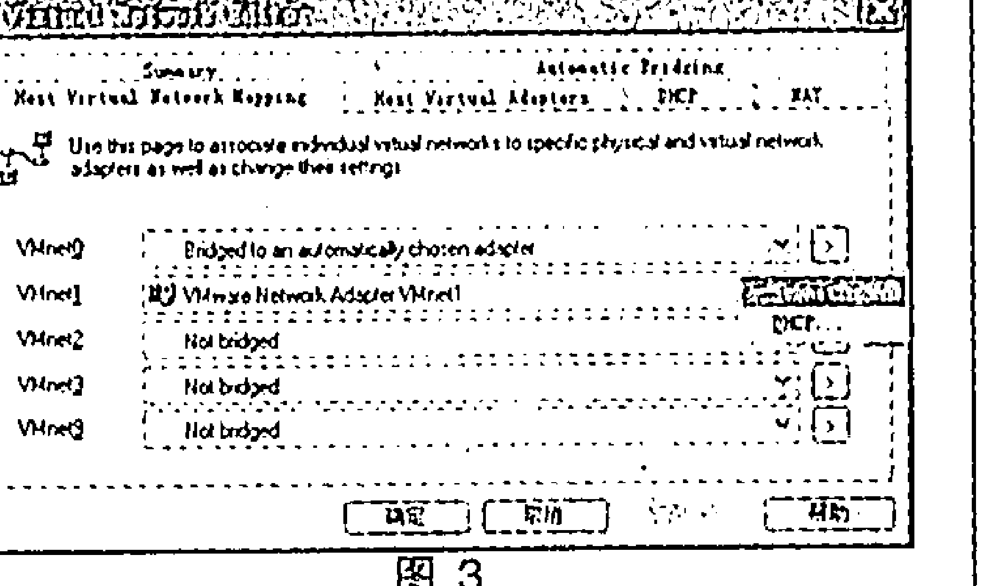
-   第四步：在Virtual Network Editor窗口中点击下方的“应用”按钮，使修改生效。
-   第五步：在Virtual Network Editor窗口中，点击“VMnet1”右侧的大于号按钮，选择“DHCP”命令。
-   第六步：在“DHCP Settings”窗口中，把“Start IP address”设置为“192.168.2.2”，把“End IP address”设置为“192.168.2.254”。点击“OK”按钮。
-   第七步：在Virtual Network Editor窗口中点击下方的“确定”按钮，使修改生效。

接下来，设置虚拟机的IP地址。

-   第一步：启动虚拟机后，进入虚拟机的“网络连接”。
-   第二步：把虚拟机的IP地址设置为“自动获取IP地址”（具体设置方法可参考宿主机设置IP地址的方法，不同之处在于选中“自动获得IP地址”）。
-   第三步：如果原来曾为虚拟机手工指定过IP地址，需要在虚拟机的“开始→运行”中输入“CMD”按回车键，进入命令行模式。然后输入“ipconfig /release”并回车，解除原有的IP地址，再输入“ipconfig /renew”，回车后重新获取IP地址。如果虚拟机一直是自动获取IP地址，那么则无须此步操作，以后再启动虚拟机时，也无需此步操作。

通过前面的设置，虚拟机即可获得正确的IP地址，并且能够与宿主机进行正常通信。

对于NAT方式下修改DHCP服务，也可以参考上述做法，不同之处有两个，一是要修改宿主机的VMware Virtual Ethernet Adapter for VMnet8连接；二是要修改VMware的VMnet8虚拟交换机上的子网掩码和DHCP服务。需要提醒的是，NAT和Host-only两种模式下的IP地址不要在同一网段中，否则将不能正常工作。

## 三、虚拟机与宿主机的文件共享

在虚拟机上安装了Windows操作系统之后，如何让虚拟机直接访问宿主机上的文件呢？有两种解决办法，一是利用局域网的文件共享功能，二是利用VMware的共享文件夹功能。

### 1. 通过模拟局域网共享文件

这种方法比较简单，摆弄过对等网的用户都可以轻松设置成功，这里只简单讲一下操作方法，具体操作步骤不再详细说明。

-   第一步，根据虚拟机与宿主机的通信方式，设置虚拟机的IP地址。如果虚拟机通过Bridged方式与主机连接，要使虚拟机的IP地址与宿主机物理网卡的IP地址保持在同一网段内；如果虚拟机通过NAT方式与主机连接，虚拟机的IP地址要与宿主机虚拟网卡VMware Virtual Ethernet Adapter for VMnet8的IP地址保持在同一网段；如果通过Host-only方式与主机相连，虚拟机的IP地址要与宿主机虚拟网卡VMware Virtual Ethernet Adapter for VMnet1的IP地址保持一致。总之，要让虚拟机与宿主机能够正常通信。
-   第二步，把虚拟机的工作组设置得与宿主机的工作组相同。
-   第三步，在宿主机和虚拟机上分别设置共享目录。
-   第四步，启用宿主机和虚拟机的Guest用户。

通过以上设置，在宿主机的“网上邻居”中就可以访问到虚拟机的共享文件夹，同样虚拟机也可以通过“网上邻居”访问宿主机的共享文件夹。

### 2. 使用VMware的共享文件夹

如果只是希望虚拟机临时借用一下宿主机的某个文件，可以采用更简便的方法，就是启用VMware的共享文件夹功能。这里以如何让虚拟机访问宿主机的“C:\test”目录为例进行说明。

-   第一步，在VMware主界面中点击虚拟机标签，切换到虚拟机中。
-   第二步，点击菜单“VM → Settings”，打开配置窗口。
-   第三步，在配置窗口中点击“Options”标签，然后在左侧点击“Shared Folders”，在右侧点击“Add”按钮（图4）。
-   第四步，VMware弹出一个设置向导，点击“下一步”后，在“Name”中输入“Test”，然后把“Host folder”指定为“C:\test”，顺次点击“下一步->完成”，结束设置。
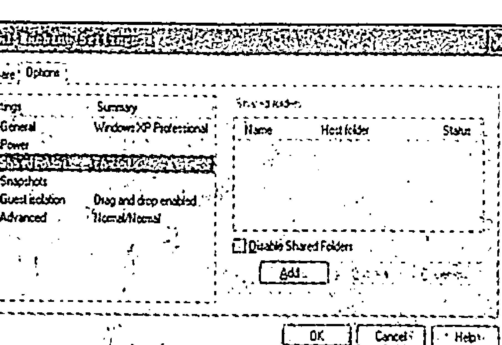

在虚拟机上要访问虚拟目录时，需要在“网上邻居”中添加网上邻居，然后在选择网络位置时，依次选择“整个网络->VMware Shared Folders->\.host->\.host\Shared Folders->test”，即可把宿主机共享的目录作为网上邻居添加到虚拟机中。默认情况下，虚拟机既可以读取共享目录中的内容，也可以向共享目录中写入数据（图5）。
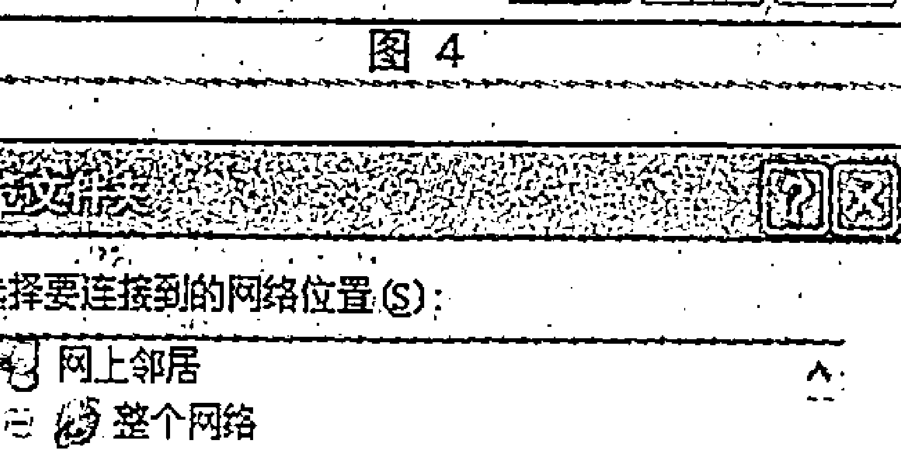

## 四、用VMware组建复杂的网络

VMware不仅能够组建简单的网络，还可以组建一些比较复杂的网络，从而模拟出真实的局域网环境。这里，我们学习如何用VMware组建一个如图6所示的拓扑网络。

在这个网络中，虚拟机A安装了两块虚拟网卡，一块通过虚拟交换机VMnet1与宿主机连接，采用的通信方式为Host-only；另一块网卡通过虚拟交换机VMnet2与虚拟机B相连。要组建这个网络，需要做的工作有三项：一是创建虚拟机，为虚拟机安装操作系统；二是设置虚拟机的网卡；三是配置VMware的虚拟交换机。下面分别说明。
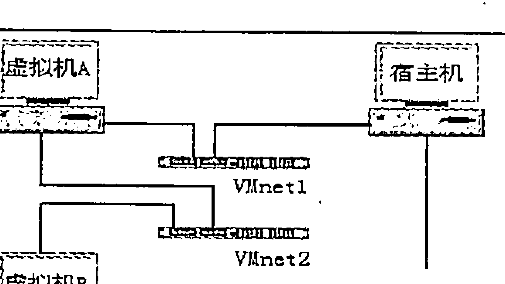

### 1. 创建虚拟机

创建虚拟机的工作比较简单，这里不再详细描述具体步骤，大家可以按照下面的规格创建两台虚拟机：

-   内存：128MB
-   硬盘：4GB
-   网卡工作模式：Host-only

虚拟机创建完毕后，为虚拟机安装操作系统。虚拟机A安装Windows 2000，虚拟机B安装Windows XP。在虚拟机上安装操作系统的方法与在真实的计算机上安装操作系统基本相同，这里也不再详细说明。

### 2. 修改虚拟机的网卡设置

首先修改虚拟机A的网卡设置。

-   第一步，在VMware中点击虚拟机A的标签，切换到虚拟机A中，但不要启动虚拟机。
-   第二步，点击菜单“VM->Settings”，打开配置窗口，在配置窗口的“Hardware”标签页中点击“Add”按钮。
-   第三步，点击“下一步”按钮后，选中“Ethernet Adapter”，点击“下一步”。
-   第四步，在选择网卡类型时，选择“Custom”，并在下面选中“VMnet2”，点击“完成”按钮。

经过上述操作，就会在虚拟机中添加第二块网卡，如图7所示。一块网卡以Host-only模式通过虚拟交换机VMnet1与宿主机相连，第二块网卡以Custom方式连接到虚拟交换机VMnet2上（图7）。

接下来，修改虚拟机B的网卡设置，把虚拟机B的网卡连接方式改为Custom方式，与虚拟交换机VMnet2相连。具体操作方法不再详细说明。
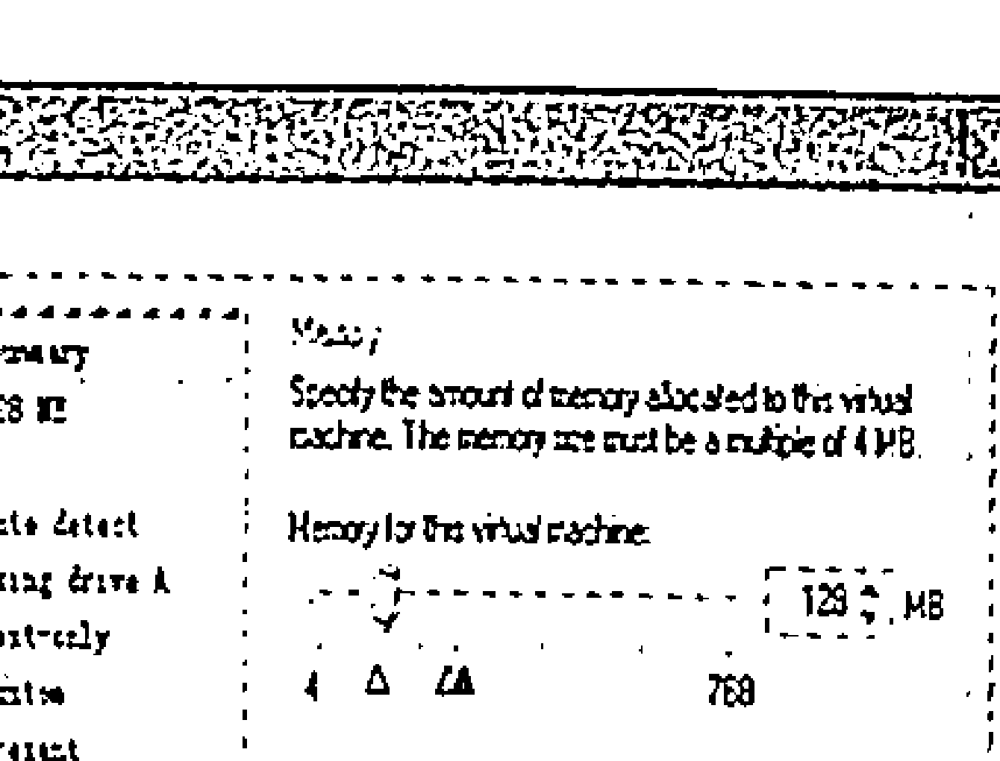

### 3. 修改VMware的虚拟交换机

-   第一步，在VMware的主界面中点击“Edit->Virtual Network Settings”，打开配置窗口。
-   第二步，在“Virtual Network Editor”窗口中，进入“Host Virtual Network Mapping”标签页，点击“VMnet2”右侧的“>”按钮，选择“Subnet”命令。
-   第三步，把VMnet2交换机上的IP地址设置为“192.168.12.0”，子网掩码设置为“255.255.255.0”。
-   第四步，在Virtual Network Editor窗口中点击“应用”按钮，使修改生效。
-   第五步，点击“DHCP”标签，然后点击“Add”按钮，在VMnet host中选择“VMnet2”，然后点击“OK”按钮。
-   第六步，在Virtual Network Editor窗口中点击“应用”按钮，使修改生效。VMware的DHCP服务器就会对连接到虚拟交换机VMnet2上的虚拟机自动分配IP地址。

经过上述步骤，我们要求的网络拓扑结构就算完成了。在这种网络拓扑结构下，两台虚拟机都无法直接通过宿主机访问互联网，而且宿主机与虚拟机B之间也无法正常通信。在这种环境下，用户可以做很多网络实验，比如在宿主机中启动连接共享，让虚拟机A能够连接到互联网上；在虚拟机A中安装软件路由，让宿主机能够访问虚拟机B；在宿主机中安装各种服务器软件，用虚拟机来测试服务是否正常等。

从理论上说，用VMware可以模拟一个拓扑结构非常复杂的局域网，但是，每台虚拟机都要分配一定数量的物理内存，也要占用一定的空间。因此，这里我们不建议用户创建过多的虚拟机，只要能够模拟出实际的网络环境即可。

## 五、用虚拟机学习无盘站的组建

成功组建一套无盘网络是专业人士才能做到的，是非常高深的东西，它不但要求用户必须有两台以上的计算机，还要求配有远程启动芯片的网卡，也要求在服务器上安装合适的服务器软件。因此，一般用户都无缘接触无盘网络。但在VMware的帮助下，即使您对于无盘网络完全是个门外汉，也能非常轻松地组建一个虚拟的无盘网络。

要实现无盘启动，必须具备三个条件：一是局域网中必须有一台DHCP服务器，用于分配客户机的IP地址，而VMware软件本身就具备DHCP服务，因此这个条件已经具备；二是服务器上要安装无盘软件，这里计划使用BXP 3.11；三是工作站的网卡必须支持远程启动，而包括4.5.2版本之后的VMware Workstation虚拟机所使用的网卡具有PXE远程启动功能。因此，用VMware建立的虚拟机完全具备这三个条件。这里假设宿主机上安装的是Windows XP专业版，虚拟机安装的操作系统也是Windows XP专业版，下面就让我们来学习如何用VMware来实现无盘Windows XP。

### 1. 配置DHCP服务

-   第一步，在宿主计算机上点击VMware菜单“Edit->Virtual Network Settings”打开配置窗口，点击“DHCP”标签页，点击“Properties”按钮，即可对DHCP服务进行配置，如分配IP地址的起始范围、租用时间等，这里把起始IP地址设置为192.168.11.128，把结束IP地址设置为192.168.44.254。
-   第二步，配置宿主机的IP地址，使VMware Virtual Ethernet Adapter for VMnet1 的IP地址与DHCP中相应的IP地址范围一致，这里设置为“192.168.44.1”。
-   第三步，配置虚拟机的网卡工作方式，点击“VM→Settings”，选中“NIC”，将其设置为“Host-only”，即使用VMware Virtual Ethernet Adapter for VMnet1与主机通信。
-   第四步，配置虚拟机的IP地址。启动虚拟机，把它的IP地址设置为自动获取。

### 2. 配置 BXP

-   第一步，在宿主机上安装 BXP 3.11，在安装时选择“Full Server”，接下来在选择具体安装组件的时候，可以不安装内置的DHCP服务。在安装的过程中，会出现“发现新硬件”的提示，根据提示安装驱动程序。程序安装完毕后，会在“我的电脑”中生成一个可移动磁盘，用于映射磁盘映像。
-   第二步，在“控制面板”中启动 3Com PXE，在Network Adapters标签页中选中IP地址前面的复选框，其他使用默认设置，点击“OK”按钮。
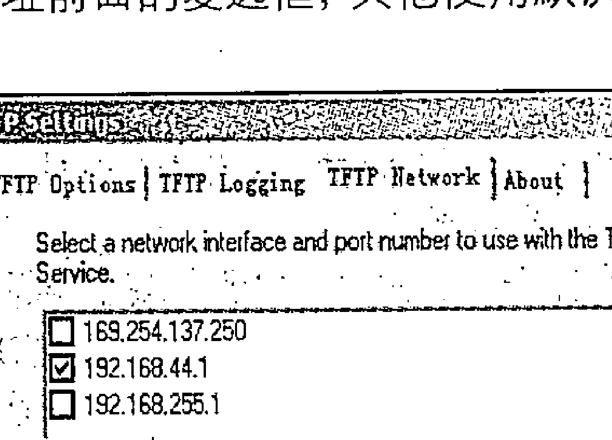
-   第三步，在“控制面板”中启动Venturcom TFTP Service，在 TFTP Network 标签页中选中IP地址，其他配置不变，点击“确定”按钮（图8）。
-   第四步，在“开始”菜单的 BXP 程序组中启动 BXP Configuration Wizard，在欢迎界面中点击“下一步”按钮，开始运行向导。
    -   配置DHCP服务，选择“No, I already have DHCP services…” 一项；
    -   选择 BXP 工作网卡，这里选中 IP 地址为 “192.168.44.1” 前面的复选框；
    -   设置 BXP 的虚拟磁盘工作目录，直接使用默认设置即可；
    -   选择远程启动文件，使用默认设置即可；
    -   设置广播方式，这里我们只建一台虚拟无盘，因此不选取复选框，即不使用广播方式。
    -   选择是否使用磁盘映像，选中 “Yes, I need to configure Managed Disks directories”。
    -   设置磁盘映像文件的目录，点击 “Add new folder” 按钮可以添加目录。
    -   点击 “完成” 按钮，向导程序就会自动配置相关选项，把服务器设置自动添加到 BXP Administrator 程序中，然后重新启动相关服务。
-   第五步，建立虚拟磁盘。在 BXP 程序组中启动 BXP Administrator，点击 “File→New→Disk”，在 “Select New Disk Type” 对话框中选中第一项，即 “Create a new virtual disk…” 一项，点击 “OK” 按钮后，在 “Virtual Disk Size” 中输入虚拟磁盘的容量，如果建立在 FAT32 分区上，最大容量为 4095MB；如果建立在 NTFS 分区上，最大可以模拟 2TB 容量的磁盘。然后在下面 “Disk Name” 中输入磁盘名，这里输入 “winxp”，在 “Description” 中输入描述磁盘的语句，点击 “OK” 按钮，软件经过一系列操作即可建立虚拟磁盘。
-   第六步，点击 “View→Server→Disk”，选中刚才建立的磁盘 winxp，点击菜单 “Tools→Map Virtual Disk”，这个磁盘映像就会被加载到系统中，映射为可移动磁盘。
-   第七步，格式化选中虚拟磁盘映射的磁盘。在 “我的电脑” 中右击BXP生成的可移动磁盘，选择 “格式化” 命令，将其格式化。
-   第八步，在 BXP Administrator 中点击菜单 “Tools→Map Virtual Disk”，取消映射。只有取消映射的映像文件才能被无盘站使用。
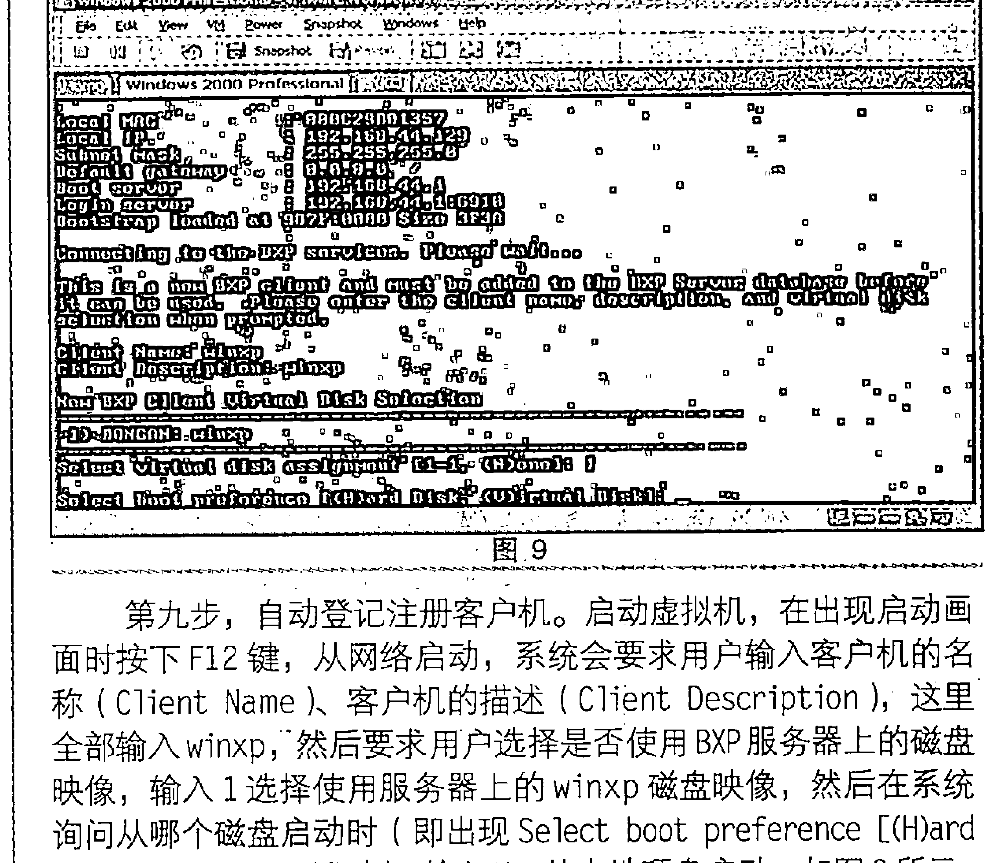
-   第九步，自动登记注册客户机。启动虚拟机，在出现启动画面时按下F12键，从网络启动，系统会要求用户输入客户机的名称 (Client Name)、客户机的描述 (Client Description)，这里全部输入winxp，然后要求用户选择是否使用BXP服务器上的磁盘映像，输入1选择使用服务器上的winxp磁盘映像，然后在系统询问从哪个磁盘启动时（即出现 Select boot preference [(H)ard Disk, (V)irtual Disk]时），输入H，从本地硬盘启动，如图9所示。这样，该客户机的信息就会被添加到服务器中，成为服务器的一个客户机。
-   第十步，在BXP Administrator中，点击菜单 “View→Server→Client→Disk”，在服务器名称下选中客户机名称并用鼠标右键点击，选择 “Properties” 命令，打开配置窗口，在 “Disk” 标签页中把 “Boot Order” 设置为 “Hard Disk First”，即客户机优先从本地硬盘启动。

### 3. 配置客户机

-   第一步，启动虚拟机，在虚拟机上安装 BXP 3.11，在安装时要选择安装Client (客户端)。在安装的过程中，会提示发现新硬件，要根据提示为其安装驱动程序。
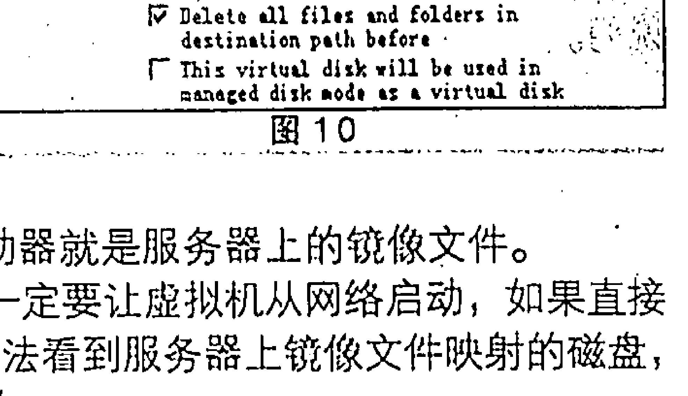
-   第二步，重新启动虚拟机，在出现启动界面之后，按下F12键从网络启动，启动之后会在 “我的电脑” 中出现一个新的驱动器，这个驱动器就是服务器上的镜像文件。
    需要强调的是，这里一定要让虚拟机从网络启动，如果直接从本地硬盘启动的话，将无法看到服务器上镜像文件映射的磁盘，从而也就无法完成文件上传。
-   第三步，启动 “BXP Client Image Builder” （图10），在Destination右侧点击 “Browse” 按钮，选择新的虚拟磁盘，然后点击 “Build” 按钮，即可把文件上传到服务器上。
-   第四步，关闭虚拟机，点击 “VM→Settings” 按钮，从中移除硬盘。
-   第五步，在宿主计算机上启动BXP Administrator，点击菜单 “View→Server→Client→Disk”，在服务器名称下选中客户机名称并用鼠标右键点击，选择 “Properties” 命令，打开配置窗口，在 “Disk” 标签页中把 “Boot Order” 设置为 “Virtual Disk First”，即客户机优先从网络硬盘启动。
    这一步也是非常必需的，否则移除了硬盘，会提示用户找不到系统盘，无法启动虚拟机。
-   第六步，实现无盘启动。重新启动虚拟机，由于没有本地硬盘，所以它会自动从网络启动，成为一个无盘站。无盘启动时，如果不修改虚拟机的BIOS，把它的启动顺序强制设置为网络优先，那么要注意不要在光驱、软驱内插入可启动系统的光、软盘，否则虚拟机会从光、软驱启动系统。

## PART 4 搭建免费的网络实验室

小结：通过前面的介绍可以看出，VMware 的网络功能非常强大。它可以为用户提供一个非常真实的模拟局域网环境，在这个环境下，用户可以尽情发挥，随心所欲地在宿主机和虚拟机上安装各种网络软件，并可以用虚拟机访问虚拟机、虚拟机访问宿主机、宿主机访问虚拟机、宿主机所在的局域网上的其他计算机访问虚拟机等多种方式来进行实验，检验您的配置是否正确。可以说，在VMware的帮助下，绝大多数服务器的软件配置都能得到充分的练习。

## Boson NetSim篇

## 一、路由器、交换机的基础知识

很多读者都不了解路由器和交换机的相关知识，也搞不清楚集线器、交换机和路由器之间有什么区别，下面就让我们来了解一下。

- 1. 交换和交换机

在基本功能上，交换机和集线器一样，都是网络转接设备，局域网内的计算机必须连接到这个转接设备上，才能构成所谓的“网络”。但是，交换机与集线器的工作原理不同，最主要的差别就是集线器是一种“共享”设备，而交换机则是“交换”设备。举例来说，如果端口A要与端口B进行通信，而同时端口C又想与端口D通信。如果在共享技术的集线器上，同一时刻只能传送一个信号，因此，或是端口A和B进行通信，或是端口C和D进行通信，二者不能同时进行，只能通过某个规则竞争网络的使用权。而交换机则不然，它允许在网络上传送多个信号，在端口A与B通信的同时，端口C和D也能同时通信。因此，交换机的整体运行效率要远高于集线器。此外，集线器的功能有限，一般情况下只用于连接网络中的各台计算机，而交换机的功能则要强大得多，用户可以用交换机把网络划分为若干个虚拟局域网VLAN，可以建立冗余链路，增强网络运行的可靠性等。

- 2. 路由和路由器

路由就是选路，也就是确定网络中数据从源站走哪条线路到达目的站的这个过程。如在下图所示的网络中，主机A要和主机B通信，主机A会发出一个广播信息，查询主机B所在的位置。广播消息发送到交换机S1上时，路由器R的端口P1和计算机C都会接收到这个消息，计算机C发现这个消息与自己无关，不予回答。路由器R接收到消息后，会在自己的路由表中查询，发现目的主机（计算机B）的IP地址在自己的端口P2所连接的网络范围内，就由端口P2向交换机S2上发出广播消息，计算机D接收消息后不予回答，计算机B接收到消息后，发送回应信息。路由器R收到回复信息后，得知计算机B所在的位置，通过端口P1回复给计算机A，于是一个数据通道就在计算机A——路由器R——计算机B之间建立起来了，这个选路的过程就叫路由。此后，当计算机A向计算机B发送数据时，就会发送到路由器R的P1端口上，路由器把数据由端口P2转发给计算机B，完成数据通信（图11）。

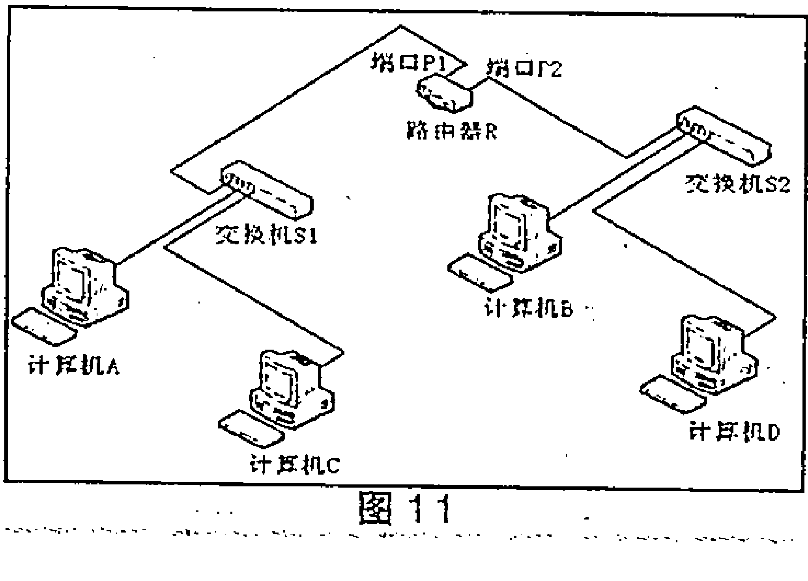

严格说来，路由器也是一台计算机，有自己专用的CPU、内存和操作系统。路由器上有多个不同样式的端口，用于连接不同的网段和网络，同时路由器维护着一张路由表，由路由表来决定数据向哪个端口发送。路由表是路由器工作的核心，它的建立和维护有两种方式：一种叫静态路由，也就是表中的各项数据都由管理员手工输入，并手工维护。这种路由速度快、效率高，但前期的数据录入和后期的维护比较困难。第二种叫动态路由，它有专门的软件，根据路由器在网络中的位置自动生成和维护路由表，如RIP、OSPF等。如果网络结构发生变化，各个路由器都能动态更新自己的路由表。使用动态路由，路由器的工作量大，效率较低，但后期的管理和维护则相对简单。

## 二、认识Boson NetSim

为了学习组网，如果说买几台旧计算机练习软件配置还有可能的话，买几台Cisco的交换机和路由器来练习就不太现实了——这东西太贵了！大家可以在网上查一下，看那些入门级的Cisco交换机和路由器是什么价位，就知道真正组建一台实验室要付出多大代价了。但是，交换机和路由器是网络的核心设备，要想学通网络，必须掌握交换机和路由器的基础知识，了解它们的配置方法。为了帮助大家的学习，也为了让那些参加CCNA（思科认证网络支持工程师）、CCNP（思科认证网络专业人员）考试的人员能够有一个学习环境，Boson公司推出了Cisco交换机/路由器模拟器软件Boson NetSim。

- 1. 简介

Boson NetSim 被称为五星级的模拟器，它主要有以下几个特点：一是能够自定义网络拓扑结构。与那些自带网络拓扑结构、用户只能在固定的结构上进行配置的模拟器不同，Boson NetSim 可以让用户发挥自己的想象力，定义自己的网络拓扑结构，缩小与实际操作的差距。二是Boson NetSim为大家提供了多种虚拟设备，提供了从Cisco 800到4500系列路由器、Cisco 1900、2900和3500系列交换机，同时还提供了Ethernet、ISDN、串口线等三种方式的虚拟线路，用于连接各种不同的设备端口。Boson NetSim提供的虚拟终端功能也非常强大，能通过ipconfig命令定义和查看IP地址、子网掩码、默认网关，能够运行tracert命令跟踪路由，它还提供了winipcfg命令以图形界面方式配置本机的IP地址。三是比较全面的仿真命令。Boson NetSim提供的虚拟设备的配置命令比较齐全，大部分初级实验都能够完成，而且界面的仿真度也极高，与用计算机直接连接到设备上进行配置非常接近。四是Boson NetSim不但能够存储自定义的拓扑结构，在配置操作过程中，还能够随时存储设备的配置。

Boson NetSim 主要由两部分构成，一是Boson NetSim Designer，用户可以通过它来自定义网络拓扑结构；二是Control Panel，用户可以通过它来配置模拟的路由器和交换机。

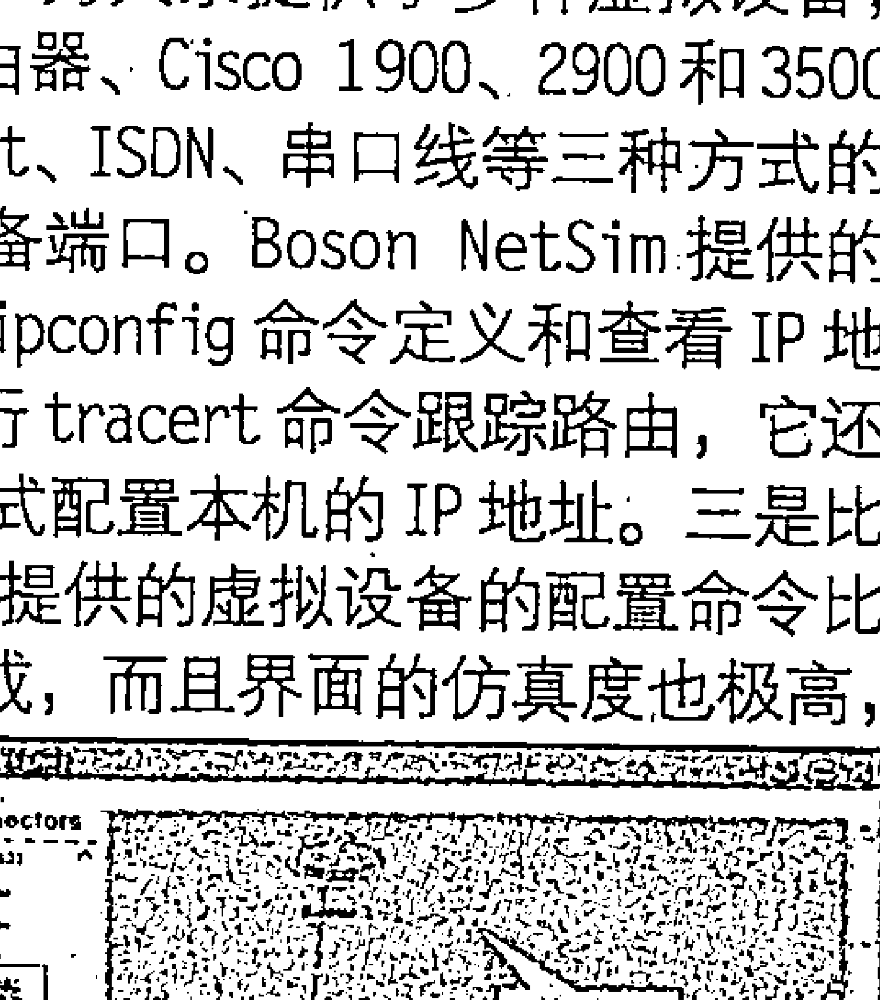

- 2. 认识Boson NetSim Designer

Boson NetSim 已经为用户准备了一些用于实验的网络拓扑图，但是为了让用户体验真实的实验环境，用户要自己设计网络拓扑结构。

在界面上，Boson NetSim Designer 分为设备列表区、设备信息区和绘图区三大部分。在设备列表区中，可供用户选择的设备有Cisco 800、1000、1600、1700、2500、2600、3600、4500 8个系列42台路由器，1900、2900、3500三个系列3台交换机，还提供了Ethernet、Serial、ISDN三种链路设备和PC终端。用户通过这些设备，可以自行定制比较复杂的网络拓扑结构（图12）。

下面我们以建立如上图所示的带有独臂路由的VLAN拓扑结构为例，来说明在Boson NetSim Designer中如何建立自己的网络拓扑。具体要求见表1、表2。

表1

| 设备类型 | 设备型号 | 数量 |
|----------|----------|------|
| 路由器   | 2610     | 1    |
| 交换机   | 2950     | 2    |
| 终端     | PC       | 4    |

表2 布线规划

| 起始设备 | 所用端口         | 结束设备 | 所用端口       | 链路类型 |
|----------|------------------|----------|----------------|----------|
| Switch 1 | Fast Ethernet 0/1/1 | PC 1     | Ethernet 0     | Ethernet |
| Switch 1 | Fast Ethernet 0/1/2 | PC 2     | Ethernet 0     | Ethernet |
| Switch 1 | Fast Ethernet 0/2   | Switch 2 | Fast Ethernet 0/2 | Ethernet |
| Switch 1 | Fast Ethernet 0/1   | Router 1 | Ethernet 0/0   | Ethernet |
| Switch 2 | Fast Ethernet 0/1/1 | PC 3     | Ethernet 0     | Ethernet |
| Switch 2 | Fast Ethernet 0/1/2 | PC 4     | Ethernet 0     | Ethernet |

第一步，添加路由器。在设备列表中找到2610路由器，用鼠标将其拖放到绘图区中，软件会弹出图13所示的对话框，要求用户输入设备的名称以及是否启用扩展设备。把“WAN 1 Options”和“WAN 2 Options”全部设置为“None”，选中“Use Default Name”，然后点击“OK”按钮，把路由器添加到绘图区中。

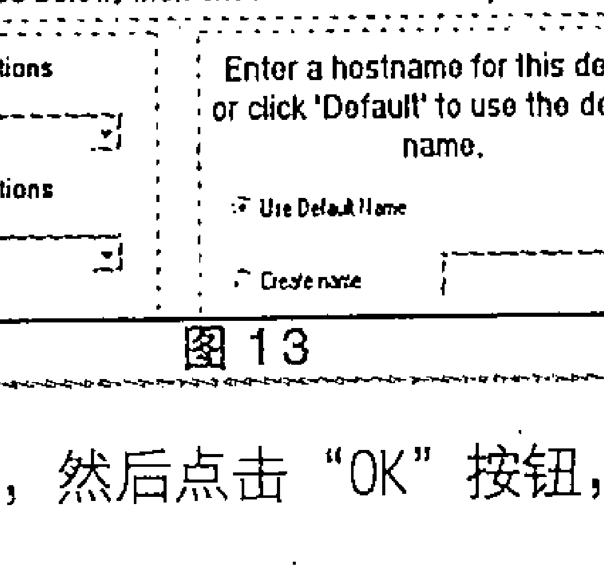

第二步，添加交换机。在设备列表中把2950交换机用鼠标拖到绘图区中，在弹出的对话框中直接点击Apply按钮，使用默认的名字。然后用同样的方法添加第二台2950交换机。

第三步，添加终端。在设备列表中把PC拖放到绘图区中，在出现弹出窗口时，直接点击“Apply”按钮，不再为设备另起名字。用同样的方法再添加3台PC。

第四步，布线。在设备区，用鼠标把Ethernet（以太网线）拖到绘图区中，软件弹出图14所示的窗口，要求用户选择网线的一个端口，这里选择 Switch 1 的 Fast Ethernet 0/11 端口，然后点击“Next”按钮，选择 PC 1 的 Ethernet 0端口后，点击“Finish”按钮，一条网线连接完毕。然后按照表中的要求，用适当的链路连接好其他设备。

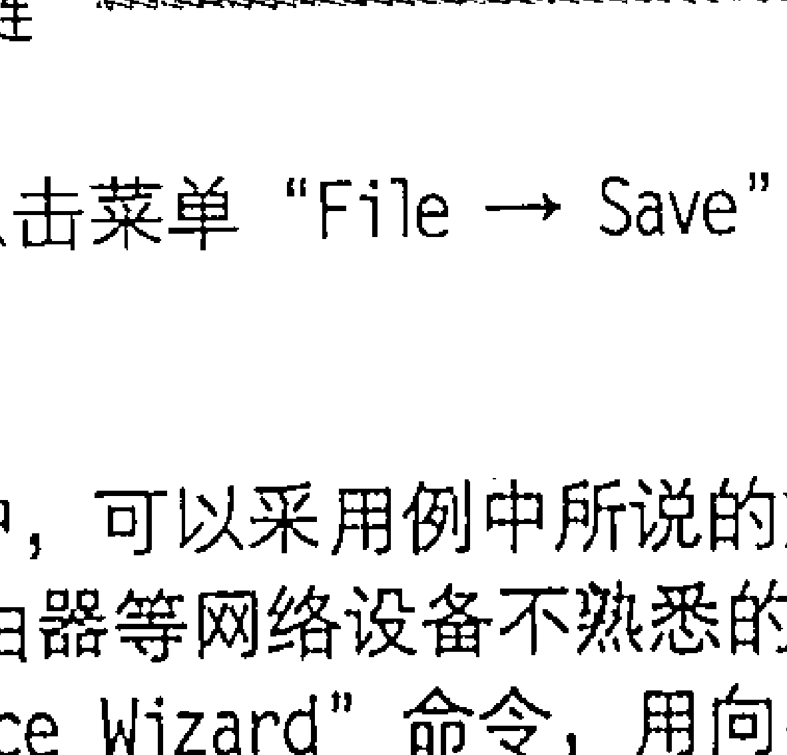

第五步，保存网络拓扑图。点击菜单“File → Save”，将拓扑图保存为“vlan.top”。

这里需要说明的有两点：一是对于熟悉网络设备的用户，可以采用例中所说的方法添加设备，但如果用户对交换机、路由器等网络设备不熟悉的话，可以通过菜单“Wizard → Add Device Wizard”命令，用向导的方式添加设备，此时，用户可以根据自己的需要设定条件，让软件自动过滤选择正确的设备。

二是如果选择了错误的设备，或是布线发生了错误，可以将其删除。如果要删除错误的设备，可以在绘图区中右击该设备，然后右键菜单中选择“Delete Device”，即可将此设备删除。如果要纠正布线错误，可以右击网线连接的设备，然后选择“Remove Connection to”菜单下的错误连线，即可将其删除。

## 3. 认识 Boson Control Panel

Boson Control Panel是 Boson NetSim最主要的组件，当网络拓扑结构设置完成之后，用户要通过Control Panel对网络中的路由器、交换机、终端等设备进行配置。

Boson Control Panel的主界面主要由菜单栏、工具栏和配置窗口三部分组成。用户可以通过工具栏或菜单栏切换设备，在配置窗口中输入各种配置命令。


- （1）打开网络拓扑
- （2）切换设备
- （3）设备配置

当设置完网络拓扑结构后，用户可以点击菜单“File → Load Netmap”命令打开用 Boson Network Designer设计的网络拓扑结构。只有一个网络拓扑结构文件被打开后，才能在 Boson Control Panel中对其进行配置。

每个网络都由许多路由器、交换机、终端等网络设备组成。在工具栏上通过点击“eRouters”按钮可以把配置窗口切换到路由器设备上，通过点击“eSwitches”按钮可以切换到交换机上，通过点击“eStations”按钮可以切换到终端上。

当用户把配置窗口切换到某个设备上时，即可通过配置窗口对该设备进行配置。

虚拟终端的配置比较简单，一般需要为其配置IP地址、子网掩码和默认网关。配置虚拟终端有以下两种方法。

方法一：通过图形界面进行配置。

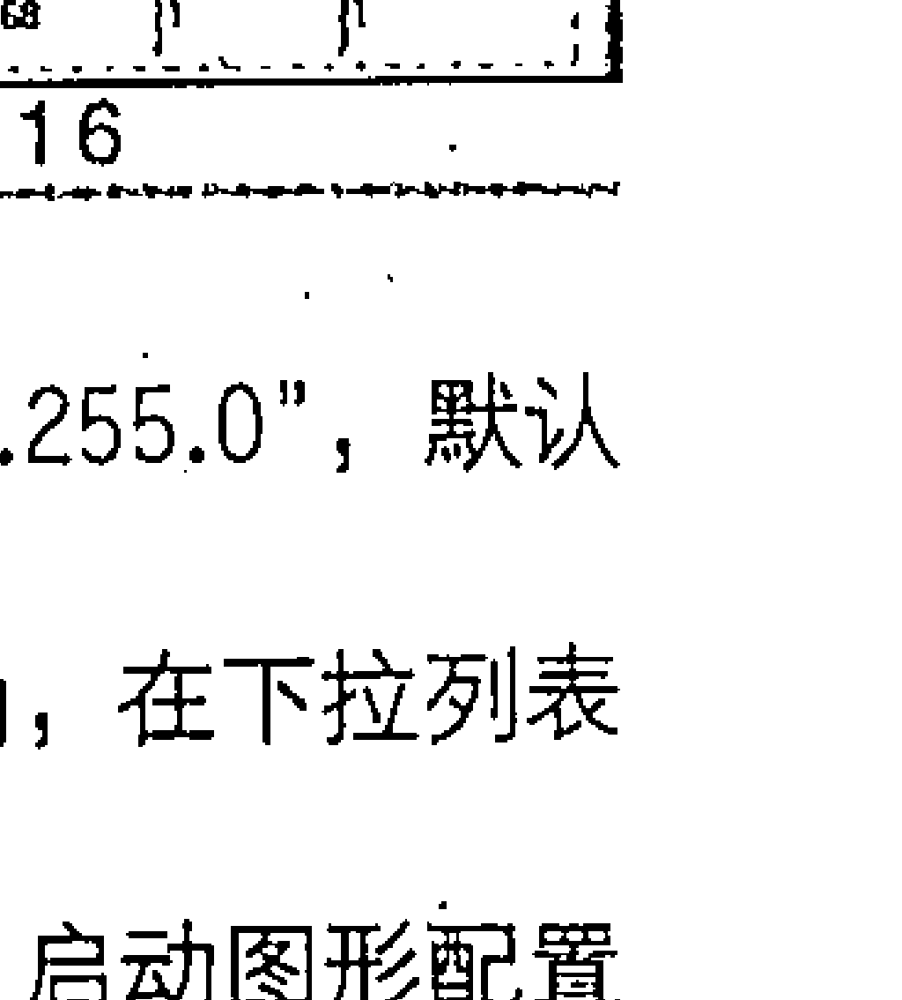

例如，我们要把 PC 1 的IP地址设置为“192.168.1.2”，子网掩码设置为“255.255.255.0”，默认网关配置为“192.168.1.1”。需要进行以下操作。

- 第一步，点击“eStations”按钮右侧的黑三角，在下拉列表中选择“PC 1”。
- 第二步，在配置窗口中输入命令“winipcfg”，启动图形配置窗口（图16）。
- 第三步，在IP ADDRESS下的文字框中输入“192.168.1.2”，把SUBNET MASK设置为255.255.255.0，把DEFAULT GATEWAY设置为192.168.1.1。然后点击“OK”按钮确认。

方法二：通过命令行方式进行设置。

- 第一步，点击“eStations”按钮右侧的黑三角，在下拉列表中选择“PC 1”。
- 第二步，在配置窗口中输入“ipconfig /ip 192.168.1.2 255.255.255.0”，配置IP地址和子网掩码。
- 第三步，在配置窗口中输入“ipconfig /dg 192.168.1.1”配置默认网关。

交换机和路由器的配置非常复杂，命令众多，限于篇幅，本文不可能对所有的命令加以全面的分析介绍，只能在后面的实例中对每项命令加以简单说明。我们后面的实例中，只给出几个常见的网络实例，读者可以根据实例，掌握 Boson NetSim的使用方式，而要全面学习交换机、路由器配置的读者，需要参考相关的专业书籍。

- （4）保存和载入配置

当载入配置完成后，用户如果要把配置保存下来，可以点击菜单“File → Save Multi Devices Configs”命令把当前所有设备的配置全部保存下来。也可以通过菜单“File → Save Single Device Config”命令保存当前设备的配置。当需要的时候，可以通过菜单“File → Load Multi Devices Configs”取出所有配置，并按照上次的配置自动重新配置当前网络；也可以通过菜单“File → Save Single Device Config (merge)”命令把上次的配置以追加的方式重新加载到当前设备中，或者通过菜单“File → Save Single Device Config (overwrite)”命令把用上次的配置重新配置当前设备。

此外，在配置窗口中右击，选择“全选”命令，然后再右击选择“复制”命令，可以把配置窗口中的内容复制到剪切板中，然后可以粘贴到文字处理软件中进行保存。

## 4. 用 Boson NetSim 实验交换机的基本配置

在这个例子中，我们将用 Boson NetSim设计一个虚拟局域网VLAN的网络拓扑结构，实验VLAN的配置。

首先我们简单了解一下什么是VLAN。VLAN就是虚拟局域网，也就是把连接在同一组交换机上的计算机划分为不同的网络。这样，每个网络中的计算机能够相互通信，但不同网络之间的计算机需要通过独臂路由的方式进行通信。这样做的好处很多：一是划分VLAN之后，每个VLAN就是一个逻辑广播域，通过创建VLAN，可以隔离广播，控制广播风暴的产生；二是可以控制用户的权限和逻辑网段的大小，将不同用户群划分在不同的VLAN中，从而提高交换式网络的整体性能和安全性；三是网络的管理更加简单、直观。

在前面，我们已经通过Boson Network Designer设计了一个带有独臂路由的VLAN，下面我们就对其进行配置，实现VLAN的划分。网络的各个IP地址分配如表3所示。

表3

| 设备    | 端口  | IP地址       | 子网掩码      | 默认网关                 |
|---------|-------|--------------|---------------|--------------------------|
| PC1     | E0    | 192.168.11.2 | 255.255.255.0 | 192.168.11.1             |
| PC2     | E0    | 192.168.12.2 | 255.255.255.0 | 192.168.12.1             |
| PC3     | E0    | 192.168.11.3 | 255.255.255.0 | 192.168.11.1             |
| PC4     | E0    | 192.168.12.3 | 255.255.255.0 | 192.168.12.1             |
| Router1 | E0.11 | 192.168.11.1 | 255.255.255.0 | 此IP为vlan 11的默认网关 |
|         | E0.12 | 192.168.12.1 | 255.255.255.0 | 此IP为vlan 12的默认网关 |

第一步，载入网络拓扑结构。在Boson Control Panel中打开前面建立的“vlan.top”，把网络拓扑载入软件。

第二步，配置终端的IP地址。把当前设备切换到终端，并按照上表给出的IP地址和子网掩码，把各终端配置好。

第三步，配置交换机Switch 1。把当前设备切换到Switch 1，然后在配置窗口中输入下列命令（“>”号或“#”号之前的部分为交换机的提示符，“//”后是对该命令的简短说明，中间部分是需要用户手工输入的配置命令，下同）。

```
Switch>enable  //进入特权模式
Switch#vlan database  //开始定义vlan
Switch(vlan)#vlan 11  //新建vlan 11
VLAN 11 added:
    Name:VLAN0011
Switch(vlan)#vlan 12  //新建vlan 12
VLAN 12 added:
    Name:VLAN0012
Switch(vlan)#exit  //退出VLAN配置
APPLY completed.
Exiting....
Switch#config terminal  //进入全局配置模式
Enter configuration commands, one per line. End with CNTL/Z.
Switch(config)#interface f0/1  //进入Fast Ethernet 0/1端口配置模式
Switch(config-if)#switchport mode trunk  //此接口用于连接路由器，需要将其模式配置为trunk
Switch(config-if)#switchport trunk encap dot1q  //定义数据封装格式为802.1q
Switch(config-if)#interface f0/2  //进入Fast Ethernet 0/2端口配置模式
Switch(config-if)#switchport mode trunk  //此接口用于连接Switch 2，需配置为trunk模式
Switch(config-if)#switchport trunk encap dot1q  //定义数据封装格式为802.1q
Switch(config-if)#interface f0/11  //进入Fast Ethernet 0/11端口配置模式
Switch(config-if)#switchport mode access  //定义端口模式为access
Switch(config-if)#switchport access vlan 11  //把此端口划归vlan 11
Switch(config-if)#interface f0/12  //进入Fast Ethernet 0/12端口
Switch(config-if)#switchport mode access  //把该端口定义为access模式
Switch(config-if)#switchport access vlan 12  //把该端口划归vlan 12
Switch(config-if)#end  //结束配置
```

第四步，配置交换机Switch 2。把当前设备切换到Switch 2，然后在配置窗口中输入下列命令：

```
Switch>enable  //进入特权模式
Switch#vlan database  //进入vlan设置
Switch(vlan)#vlan 11  //新建vlan 11
VLAN 11 added:
    Name:VLAN0011
Switch(vlan)#vlan 12  //新建vlan 12
VLAN 12 added:
    Name:VLAN0012
Switch(vlan)#interface f0/2  //进入Fast Ethernet 0/2端口配置
Switch(config-if)#switchport mode trunk  //此端口连接Switch 1，需将其配置为trunk模式
Switch(config-if)#switchport trunk encap dot1q  //定义数据封装格式为802.1q
Switch(config-if)#interface f0/11  //进入Fast Ethernet 0/11端口配置
Switch(config-if)#switchport mode access  //把此端口定义为access模式
Switch(config-if)#switchport access vlan 11  //把此端口划归vlan 11
Switch(config-if)#interface f0/12  //进入Fast Ethernet 0/12端口配置
Switch(config-if)#switchport mode access  //把此端口定义为access模式
Switch(config-if)#switchport access vlan 12  //把此端口划归vlan 12
Switch(config-if)#end
```

第五步，配置路由器。把当前设备切换到Router 1，然后在配置窗口中输入下列命令：

```
Router>enable  //进入特权模式
Router#config terminal  //进入全局配置模式
Enter configuration commands, one per line. End with CNTL/Z.
Router(config)#int e0.11  //定义子接口Ethernet 0.11
Router(config-subif)#ip address 192.168.11.1 255.255.255.0  //定义子接口的IP地址
Router(config-subif)#encap dot1q 11  //定义这个子接口接收vlan 11的数据，封装格式为802.1q
Router(config-subif)#int e0.12  //定义子接口Ethernet 0.12
Router(config-subif)#ip address 192.168.12.1 255.255.255.0  //定义子接口IP地址
Router(config-subif)#encap dot1q 12  //定义这个子接口接收vlan 12的数据，封装格式为802.1q
Router(config-subif)#int e0  //进入e0接口
Router(config-if)#no shut  //启动e0接口
```

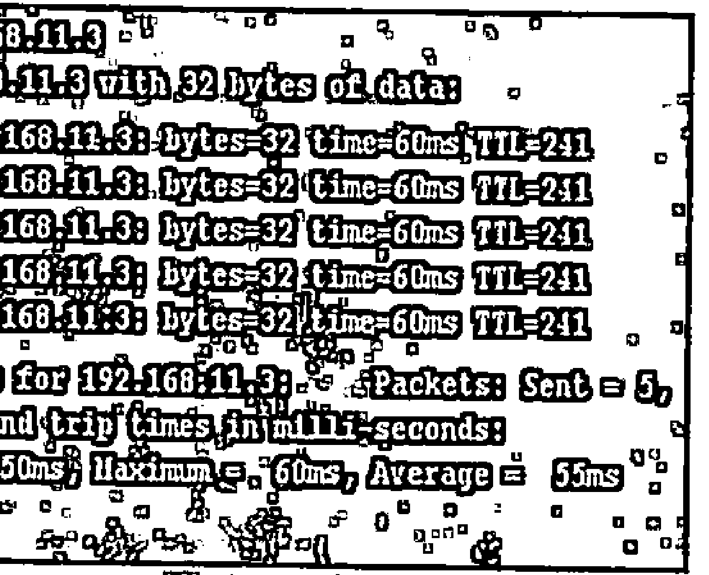## 5. 配置静态路由和动态路由 RIP

在这个实例中，我们将启用两台 2611 路由器，来进行静态路由和动态路由 RIP 的配置。

### （1）定义网络拓扑结构

本例中所需的设备和设备的连接方法见表 4、表 5。

在 Boson Network Designer 中，按照表中的要求建好网络拓扑结构，如图 18 所示。

表 4

| 设备类型 | 设备型号 | 数量 |
| :--- | :--- | :--- |
| 路由器 | 2621 | 2 |
| 终端 | PC | 2 |

表 5

| 起始设备名 | 所用端口 | 终结设备名 | 所用端口 | 连线类型 |
| :--- | :--- | :--- | :--- | :--- |
| Router 1 | F 0/0 | PC1 | E0 | Ethernet |
| Router 2 | F 0/0 | PC2 | E0 | Ethernet |
| Router 2 | F 0/1 | Router 1 | F 0/1 | Ethernet |

### （2）配置设备

网络的 IP 地址规划如表 6 所示。

表 6

| 设备名 | 端口 | IP 地址 | 子网掩码 | 备注 |
| :--- | :--- | :--- | :--- | :--- |
| Router 1 | F 0/0 | 192.168.2.1 | 255.255.255.0 | PC1 的默认网关 |
| Router 1 | F 0/1 | 192.168.1.1 | 255.255.255.0 | 与 Router2 的 F0/1 端口在同一网段内 |
| Router 2 | F 0/0 | 192.168.3.1 | 255.255.255.0 | PC2 的默认网关 |
| Router 2 | F 0/1 | 192.168.1.2 | 255.255.255.0 | 与 Router1 的 F0/1 端口在同一网段内 |
| PC1 | Ethernet 0 | 192.168.2.2 | 255.255.255.0 | 默认网关为 192.168.2.1 |
| PC2 | Ethernet 0 | 192.168.3.2 | 255.255.255.0 | 默认网关为 192.168.3.1 |

### a. 静态路由的配置：

第一步，配置终端。按照上表中的数据，把两台终端的 IP 地址、子网掩码和默认网关配置好。

第二步，配置路由器 Router 1。把当前设备切换到 Router 1 之后，在配置窗口中输入以下语句：

```
Router>enable    //进入特权模式
Router#config terminal    //进入全局配置模式
Enter configuration commands, one per line.  End with CNTL/Z.
Router(config)#interface f0/0    //进入端口 Fast Ethernet 0/0 配置
Router(config-if)#ip address 192.168.2.1 255.255.255.0    //为此端口配置 IP 地址
Router(config-if)#no shutdown    //启用此端口
%LINK-3-UPDOWN: Interface FastEthernet0/0, changed state to up
Router(config-if)#interface f0/1    //进入端口 Fast Ethernet 0/1 配置
Router(config-if)#ip address 192.168.1.1 255.255.255.0    //配置此端口的 IP 地址
Router(config-if)#no shutdown    //启用此端口
%LINK-3-UPDOWN: Interface FastEthernet0/1, changed state to up
Router(config-if)#exit    //退出端口配置模式
Router(config)#ip route 192.168.3.0 255.255.255.0 192.168.1.1    //配置静态路由
```

第三步，配置路由器 Router 2。把当前设备切换到 Router 2 之后，在配置窗口中输入以下语句：

```
Router>enable    //进入特权模式
Router#config terminal    //进入全局配置模式
Enter configuration commands, one per line.  End with CNTL/Z
Router(config)#interface f0/0    //进入端口 Fast Ethernet 0/0 配置
Router(config-if)#ip address 192.168.3.1 255.255.255.0    //为此端口配置 IP 地址
Router(config-if)#no shutdown    //启用此端口
%LINK-3-UPDOWN: Interface FastEthernet0/0, changed state to up
Router(config-if)#interface f0/1    //进入端口 Fast Ethernet 0/1 配置
Router(config-if)#ip address 192.168.1.2 255.255.255.0    //配置此端口的 IP 地址
Router(config-if)#no shutdown    //启用此端口
%LINK-3-UPDOWN: Interface FastEthernet0/1, changed state to up
Router(config-if)#exit    //退出端口配置模式
Router(config)#ip route 192.168.2.0 255.255.255.0 192.168.1.2    //配置静态路由
Router(config)#exit    //退出全局配置模式
```

第四步，验证网络是否畅通。在 PC 1 中输入 “ping 192.168.3.2” 检测是否能够与 PC 2 进行通信。然后，在 PC 2 中输入 “ping 192.168.2.2”，检测是否能与 PC 1 进行通信。

### b. 动态路由 RIP 的配置：

第一步，按照表中的数据配置终端的 IP 地址。

第二步，配置 Router 1，在配置窗口中输入下列语句：

```
Router>enable    //进入特权模式
Router#config terminal    //进入全局配置模式
Enter configuration commands, one per line.  End with CNTL/Z.
Router(config)#interface f0/0    //进入 Fast Ethernet 0/0 端口配置
Router(config-if)#ip address 192.168.2.1 255.255.255.0    //配置此端口的 IP 地址
Router(config-if)#no shutdown    //启用此端口
%LINK-3-UPDOWN: Interface FastEthernet0/0, changed state to up
Router(config-if)#interface f0/1    //进入 Fast Ethernet 0/1 端口配置
Router(config-if)#ip address 192.168.1.1 255.255.255.0    //配置此端口的 IP 地址
Router(config-if)#no shutdown    //启用此端口
%LINK-3-UPDOWN: Interface FastEthernet0/1, changed state to up
Router(config-if)#exit    //退出端口配置模式
Router(config)#router rip    //启动 RIP 路由
Router(config-router)#version 2    //设置 RIP 版本为 2
Router(config-router)#network 192.168.1.0    //声明连接网段
Router(config-router)#network 192.168.2.0    //声明连接网段
Router(config-router)#end    //退出
```

第三步，配置 Router 2，在配置窗口中输入下列语句：

```
Router>enable    //进入特权模式
Router#config terminal    //进入全局配置模式
Enter configuration commands, one per line.  End with CNTL/Z
Router(config)#interface f0/0 // 进入 Fast Ethernet 0/0 端口配置
Router(config-if)#ip address 192.168.3.1 255.255.255.0 // 配置此端口的 IP 地址
Router(config-if)#no shutdown // 启用此端口
%LINK-3-UPDOWN: Interface FastEthernet0/0, changed state to up
Router(config-if)#interface f0/1 // 进入 Fast Ethernet 0/1 端口配置
Router(config-if)#ip address 192.168.1.2 255.255.255.0 // 配置此端口的 IP 地址
Router(config-if)#no shutdown // 启用此端口
%LINK-3-UPDOWN: Interface FastEthernet0/1, changed state to up
Router(config-if)#exit // 退出端口配置模式
Router(config)#router rip // 启动 RIP 路由
Router(config-router)#version 2 // 设置 RIP 版本为 2
Router(config-router)#network 192.168.1.0 // 声明连接网段
Router(config-router)#network 192.168.3.0 // 声明连接网段
Router(config-router)#end // 退出
```

第四步，检测网络是否畅通。在 PC 1 中输入命令 “ping 192.168.3.2” 检测是否能够与 PC 2 进行通信，然后在 PC 2 中输入命令 “ping 192.168.2.2” 检测能否与 PC 1 进行通信。

## 6. 配置 PPP 和 CHAP

### （1）建立网络拓扑结构

当路由器通过串口线连接时，一般采用的数据封装格式为 PPP，同时采取 CHAP 方式验证用户身份。本例中所需的设备和布线方法见表 7、表 8。

表 7

| 设备类型 | 型号 | 数量 |
| :--- | :--- | :--- |
| 路由器 | 2501 | 2 |
| 终端 | PC | 2 |

表 8

| 起始设备 | 所用端口 | 终点设备 | 所用端口 | 线缆类型 |
| :--- | :--- | :--- | :--- | :--- |
| Router 1 | S0 | Router 2 | S0 | Serial |
| Router 1 | E0 | PC 1 | E0 | Ethernet |
| Router 2 | E0 | PC 2 | E0 | Ethernet |

这里需要说明的是，在用 Boson Network Designer 连接路由器的串口时，会出现下图所示的提示，在这里要选择 “Point to Point Serial connection(Serial Cable)”，然后点击 “Next” 按钮选择串口线的两个端口。

串口线连接完成后，会出现 “Serial Connection-Cable Select” 对话框，要求用户指定哪个设备作为产生时钟频率的 DCE 设备，这里选择 “Router 1,Serial 0”。

### （2）网络设备的配置

网络设备 IP 地址的规划如表 9 所示：

表 9

| 设备名称 | 端口 | IP 地址 | 子网掩码 | 备注 |
| :--- | :--- | :--- | :--- | :--- |
| PC 1 | Ethernet 0 | 192.168.1.2 | 255.255.255.0 | 默认网关为 192.168.1.1 |
| PC 2 | Ethernet 0 | 192.168.3.2 | 255.255.255.0 | 默认网关为 192.168.3.1 |
| Router 1 | Serial 0 | 192.168.2.1 | 255.255.255.0 | 与 Router 2 的 S0 端口同一网段 |
| Router 1 | Ethernet 0 | 192.168.1.1 | 255.255.255.0 | PC 1 的默认网关 |
| Router 2 | Serial 0 | 192.168.2.2 | 255.255.255.0 | 与 Router 1 的 S0 端口同一网段 |
| Router 2 | Ethernet 0 | 192.168.3.1 | 255.255.255.0 | PC 2 的默认网关 |

根据以上的 IP 地址规划，进行以下操作。

第一步，配置终端的 IP 地址、子网掩码和默认网关。根据表中的数据，将各终端配置好。

第二步，配置路由器 Router 1。把当前设备切换到 Router 1，然后输入以下命令：

```
Router>enable // 进入特权模式
Router#config terminal // 进入全局配置模式
Enter configuration commands, one per line. End with CNTL/Z.
Router(config)#host router1 // 对此路由器进行命名
router1(config)#enable secret router1 // 设置此路由器的密码，此名称和密码用于另外路由器验证
router1(config)#username router2 pass router2 // 设置能访问此路由器的名称和密码，这个名称和密码就是另外一个路由器的名称和登录密码
router1(config)#interface s0 // 设置 S0 端口
router1(config-if)#ip address 192.168.2.1 255.255.255.0 // 设置此端口的 IP 地址
router1(config-if)#encapsulation ppp // 设置封装格式为 PPP
router1(config-if)#clock rate 1000000 // 设置时钟频率，在 DCE 设备中必须设置这个值，否则另一个路由器无法正常工作
router1(config-if)#ppp authentication chap // 设置 PPP 的验证方式为 CHAP
router1(config-if)#no shutdown // 启用此端口
router1(config-if)#interface e0 // 设置 E0 端口
router1(config-if)#ip address 192.168.1.1 255.255.255.0 // 设置此端口的 IP 地址
router1(config-if)#no shutdown // 启用此端口
%LINK-3-UPDOWN: Interface Ethernet0, changed state to up
router1(config-if)#exit // 退回到全局配置模式
router1(config)#ip route 0.0.0.0 0.0.0.0 192.168.2.1 // 设置默认路由
router1(config)#exit // 退出
```

第三步，配置路由器 Router 2。把当前设备切换到 Router 2，然后输入以下命令：

```
Router>enable // 进入特权模式
Router#config terminal // 进入全局配置模式
Enter configuration commands, one per line. End with CNTL/Z.
Router(config)#host router2 // 对此路由器进行命名
router2(config)#enable secret router2 // 设置此路由器的密码，此名称和密码用于其他路由器验证
router2(config)#username router1 pass router1 // 设置能访问此路由器的名称和密码，这个名称和密码就是另外一个路由器的名称和登录密码
router2(config)#interface s0 // 设置 S0 端口
router2(config-if)#ip address 192.168.2.2 255.255.255.0 // 设置此端口的 IP 地址
router2(config-if)#encapsulation ppp // 设置封装格式为 PPP
router2(config-if)#ppp authentication chap // 设置 PPP 的验证方式为 CHAP
router2(config-if)#no shutdown // 启用此端口
router2(config-if)#interface e0 // 设置 E0 端口
router2(config-if)#ip address 192.168.3.1 255.255.255.0 // 设置此端口的 IP 地址
router2(config-if)#no shutdown // 启用此端口
%LINK-3-UPDOWN: Interface Ethernet0, changed state to up
router2(config-if)#exit // 退回到全局配置模式
router2(config)#ip route 0.0.0.0 0.0.0.0 192.168.2.2 // 设置默认路由
router2(config)#exit // 退出
```

第四步，验证网络是否畅通。与前面的例子相同，通过在终端上键入 “ping 另一台终端的 IP 地址” 的形式进行验证。

## 7. 实验帧中继

帧中继是一种常用的网络环境，路由器一般通过串口连接到帧中继网中。帧中继的配置也是路由器的一项基本配置。

(1) 建立网络拓扑结构

实验中所需的设备和布线方式如表10，表11所示。

| 设备类型 | 设备型号 | 数量 |
| :--- | :--- | :--- |
| Router | 2501 | 3 |
| 终端 | PC | 3 |

| 设备 | 端口 | 相连设备 | 端口 | 说明 |
| :--- | :--- | :--- | :--- | :--- |
| Router 1 | S0 | 帧中继 | | 串口线连接 |
| Router 2 | S0 | 帧中继 | | 串口线连接 |
| Router 3 | S0 | 帧中继 | | 串口线连接 |
| PC1 | E0 | Router 1 | E0 | 网线连接 |
| PC2 | E0 | Router 2 | E0 | 网线连接 |
| PC3 | E0 | Router 3 | E0 | 网线连接 |

自建帧中继的网络拓扑比其他方式稍复杂一些，下面是具体操作步骤。

第一步，在 Boson Network Designer 绘图区中拖入三台 2501 路由器，名称采用默认。

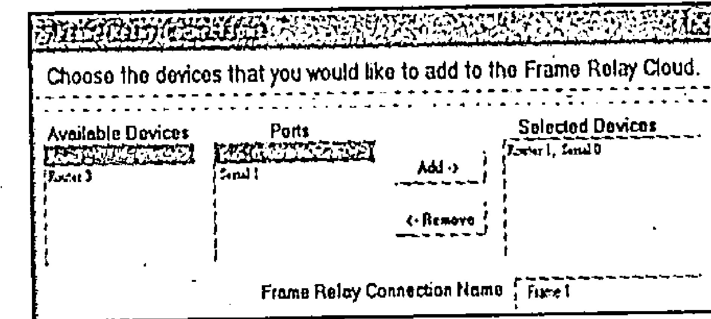

第二步，在绘图区中放入三台终端，名称采用默认。

第三步，连接以太网线，把三个 Ethernet 拖放到绘图区中，分别连接 Router 1 的 E0 端口与 PC 1 的 E0 端口、Router 2 的 E0 端口与 PC 2 的 E0 端口、Router 3 的 E0 端口与 PC 3 的 E0 端口。

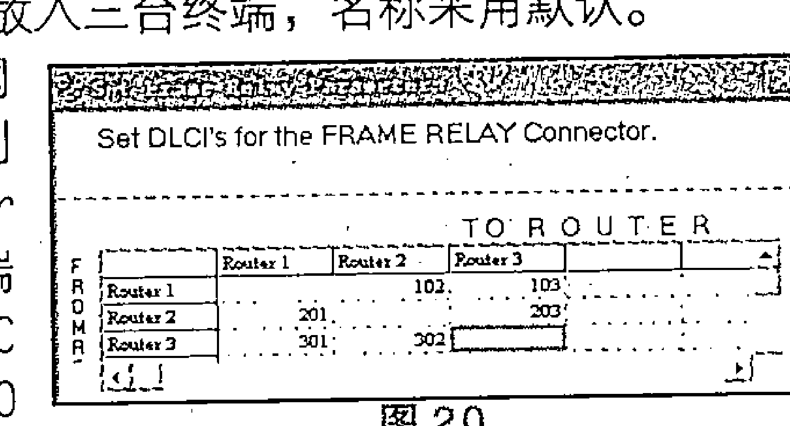

第四步，建立帧中继。把 Serial 拖放到绘图区中，出现对话框，选择 “Point to Multi-Point Serial Connection (Frame Relay)”，然后点击 “Next” 按钮。

第五步，在 “Available Devices” 中选中 Router 1，在 “Ports” 中选择 Serial 0，点击 “Add” 按钮，把 Router 1 的 S0 端口添加到帧中继中。用同样的方法把 Router 2 和 Router 3 的 S0 端口也添加到帧中继网络中 ( 图 19 )。

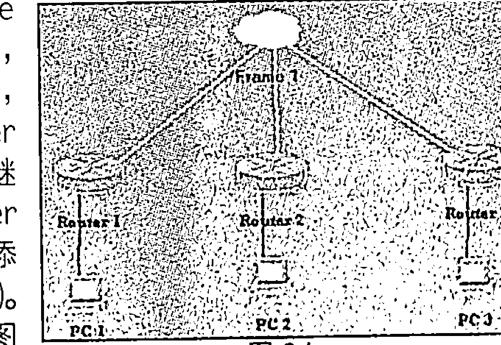

第六步，软件弹出如图 20 所示的表格，说明各个路由器之间用于通信的 DLCI 号码，把此号码记录下来。点击 OK 按钮。

完成的网络拓扑图如图 21 所示。

(2) 网络设备的配置

帧中继中 IP 地址的规划如表 12 所示。

| 设备 | 端口 | IP 地址 | 子网掩码 | 说明 |
| :--- | :--- | :--- | :--- | :--- |
| Router 1 | E0 | 192.168.4.1 | 255.255.255.0 | PC1的默认网关 |
| Router 2 | E0 | 192.168.5.1 | 255.255.255.0 | PC2的默认网关 |
| Router 3 | E0 | 192.168.6.1 | 255.255.255.0 | PC3的默认网关 |
| Router 1 | S0 | 192.168.1.1 | 255.255.255.0 | 在同一网段内，三个路由器通过帧中继相连 |
| Router 2 | S0 | 192.168.1.2 | 255.255.255.0 | |
| Router 3 | S0 | 192.168.1.3 | 255.255.255.0 | |
| PC1 | E0 | 192.168.4.2 | 255.255.255.0 | 默认网关为 192.168.4.1 |
| PC2 | E0 | 192.168.5.2 | 255.255.255.0 | 默认网关为 192.168.5.1 |
| PC3 | E0 | 192.168.6.2 | 255.255.255.0 | 默认网关为 192.168.6.1 |

具体配置步骤如下。

第一步，配置各终端的 IP 地址。根据上面的 IP 地址规划表进行配置即可。

第二步，配置路由器 Router 1，把当前设备切换到 Router 1，然后在配置窗口中输入下列命令：

```
Router>enable // 进入特权模式
Router#config terminal // 进入全局配置模式
Router(config)#interface s0 // 进入 S0 端口配置
Router(config-if)#ip address 192.168.1.1 255.255.255.0 // 配置 IP 地址
Router(config-if)#encapsulation frame-relay // 设置数据封装格式为帧中继
Router(config-if)#frame-relay interface-dlci 102 // 设置 DLCI 号
Router(config-if)# frame-relay interface-dlci 103 // 设置 DLCI 号
Router(config-if)#no shutdown // 启用此端口
Router(config-if)#interface e0 // 进入 E0 端口配置
Router(config-if)#ip address 192.168.4.1 255.255.255.0 // 配置 IP 地址
Router(config-if)#no shutdown // 启用此端口
Router(config-if)#exit // 退出端口配置模式
Router(config)#ip route 192.168.5.0 255.255.255.0 192.168.1.2 // 设置静态路由
Router(config)#ip route 192.168.6.0 255.255.255.0 192.168.1.3 // 设置静态路由
Router(config)#end // 退出配置
```

第三步，配置路由器 Router 2，输入下列命令：

```
Router>enable // 进入特权模式
Router#config terminal // 进入全局配置模式
Router(config)#interface s0 // 进入 S0 端口配置
Router(config-if)#ip address 192.168.1.2 255.255.255.0 // 配置 IP 地址
Router(config-if)#encapsulation frame-relay // 设置数据封装格式为帧中继
Router(config-if)#frame-relay interface-dlci 201 // 设置 DLCI 号
Router(config-if)# frame-relay interface-dlci 203 // 设置 DLCI 号
Router(config-if)#no shutdown // 启用此端口
Router(config-if)#interface e0 // 进入 E0 端口配置
Router(config-if)#ip address 192.168.5.1 255.255.255.0 // 配置 IP 地址
Router(config-if)#no shutdown // 启用此端口
Router(config-if)#exit // 退出端口配置模式
Router(config)#ip route 192.168.4.0 255.255.255.0 192.168.1.1 // 设置静态路由
Router(config)#ip route 192.168.6.0 255.255.255.0 192.168.1.3 // 设置静态路由
Router(config)#end // 退出配置
```

第四步，配置路由器 Router 3，输入下列命令：

```
Router>enable // 进入特权模式
Router#config terminal // 进入全局配置模式
Router(config)#interface s0 // 进入 S0 端口配置
Router(config-if)#ip address 192.168.1.3 255.255.255.0 // 配置 IP 地址
Router(config-if)#encapsulation frame-relay // 设置数据封装格式为帧中继
Router(config-if)#frame-relay interface-dlci 301 // 设置 DLCI 号
Router(config-if)# frame-relay interface-dlci 302 // 设置 DLCI 号
Router(config-if)#no shutdown // 启用此端口
Router(config-if)#interface e0 // 进入 E0 端口配置
Router(config-if)#ip address 192.168.6.1 255.255.255.0 // 配置 IP 地址
Router(config-if)#no shutdown // 启用此端口
Router(config-if)#exit // 退出端口配置模式
Router(config)#ip route 192.168.4.0 255.255.255.0 192.168.1.1 // 设置静态路由
Router(config)#ip route 192.168.5.0 255.255.255.0 192.168.1.2 // 设置静态路由
Router(config)#end // 退出配置
```

第五步，验证网络是否畅通。与前面的几个例子相同，用户可以在终端上进行验证。

## Flex Builder 1.5 入门教程

Flash 网站界面美观，交互能力强，是许多网站开发人员所向往的，也是网民乐于浏览的，然而对于一般的网页设计人员来说，做一个 Flash 网站绝非一件容易的事，不但需要学习 Flash 复杂的操作，同时还要有相当的图像设计和处理能力，所以许多人只能是望而却步。

大家都希望有一种快速而简单的创作工具，就像我们用 Dreamweaver 或 FrontPage 那样，通过简单的拖拉操作就可以创建一个 Flash 网页，这样就可以简化 Flash 网页设计的难度，提高工作效率，同时也可以激发众多 Flash 爱好者的兴趣。其实这样的工具已经产生了，那就是大名鼎鼎的 Macromedia 公司出品的新一代 Flash 网页创作工具 Flex。Flex 技术被比作文艺复兴般的突破，为企业应用程序开发流程带来了革命性的变化。

本文全面讲述 Flex 这一最新技术的有关知识及 Flex Builder 设计工具的使用方法，通过本章的学习，你可以掌握 Flex Builder 创建 Flex 应用程序的方法，让自己快速开发出一个高质量的 Flash 网站。

## Flex 介绍

### 1. 什么是 Flex

Flex 是 Macromedia 公司最新的一个服务器端产品，是一个使用现有的工具、设计模式和结构创建互联网应用程序 RIA ( Rich Internet Applications ) 的服务器组件，它是 Macromedia 公司 MX 产品家族的组成部分。Flex 实际上是在 Web 服务器上运行的一种服务器站点脚本处理环境，它是 Flash 应用的一个开发平台，并提供了完整的开发环境和运行环境。Flex 应用程序由 MXML、ActionScript 2.0 及 Flex 类库构成，开发人员利用 MXML 及 ActionScript 2.0 编写应用程序，通过 Flex 展示服务器编译生成 SWF 文件，然后由客户端的 Flash Player 播放器进行解释执行，用户就可以体会到带有交互动画特征的应用程序了。在 Flex 应用程序中，MXML（一种基于 XML 的标记语言）用于排版用户界面和处理应用中其他方面的问题，ActionScript 2.0 则处理客户端逻辑与控制程序，Flex 类库包含 Flex 组件、资料、行为与其他功能，开发人员运用类库建立用户接口及程序行为。Flex 应用程序可与应用服务器及数据沟通交换资料，对客户端用户的操作产生响应。

Flex 应用程序与传统 HTML 应用程序的主要区别，在于 Flex 应用程序处理最适合在客户端运行，如字段检验、数据格式、分类、过滤、工具提示、合成视频、行为及效果等。Flex 可使开发人员更好地交付应用程序，这种应用程序使用户可以迅速反应，在不同状态与显示间流畅过渡，并提供毫无中断的连续的工作流。

Flex 的推出，标志着一个崭新的应用程序架构的诞生，它将服务为导向的数据存取功能的灵活性融入到一个随处可用、效能卓越的跨平台客户端程序之内，最终为用户带来更易建立、更易维护、耗费更少带宽，却具备更多功能的应用程序。从本质上说，Flex 代表了下一代应用软件开发的新模式，即以 Mark Up 作为 UI 描述，Data Binding 作为数据连接的这样一种模式。这种编程模式可以极大地提高 UI 开发的速度和质量，降低开发门槛，使软件开发能真正着重于其本身代表的价值而不是用户界面带来的假象。更重要的是，这种编程模式统一了 Web 客户端和桌面客户端的区别，使二者的开发过程整合为一体，Flex 应用程序将桌面应用程序的反应快、交互性强的优点与 Web 应用程序的传播范围广、容易传播的特性结合在一起，以便给用户提供更丰富、更具有交互性和响应性的体验。

发布 Flex 是 Macromedia 公司为扩大 Flash 应用范围所采取的一个重要行动。Flex 允许主流开发人员在无需学习 Flash 开发工具的情况下，就可以开发出 Flash 网站。

Flex 展示服务器以 WAR 文档部署在现有的 Java 应用服务器，并在应用服务器中执行。Flex 目前支持各种主要的 Java 服务器，如 IBM WebSphere、BEA WebLogic、Macromedia JRun 及 Apache Tomcat，支持 .Net 的版本尚未发布。

### 2. 什么是 MXML

MXML 是一种基于 XML 的可扩展标记语言，是 Macromedia 公司为开发 Flex 应用程序而开发的一种标记语言。它以 MXML 为文件后缀，专门用来定义应用程序界面元素，还包括一些不可见的元素，如访问数据源、数据绑定等。与 HTML 一样，MXML 也是一种标记语言，它也有许多标签，不过每种标签的前面都带有 Macromedia 公司的专用标记 "MX"，如 "图像" 标签是：<mx: image>，"按钮" 标签是<mx: Button>。

MXML 定义了 120 多种标签，与 HTML 不同的是，MXML 可对展示层逻辑与用户界面和服务器端数据绑定提供声明抽象。MXML 可将展示与业务逻辑的问题彻底分开，以实现最大限度地提高开发人员的生产率及应用程序的重复使用率。MXML 拥有丰富的用户组件，除了传统的数据输入控件（如 Text、Input、TextArea、RadioButton、ComboBox 等），MXML 还包括一些高级组件，如用于维护结构化数据的 Tree 组件和大数据集 DataGrid 组件，以及导航组件（如 Accordion、ViewStack、TabBar、TabNavigator、LinkBar 等）。MXML 文档最后被 Flex 编译成 SWF 文件，在客户端用 Flash 播放器运行。

### 3. 什么是 ActionScript

ActionScript（简称 AS）是一种强类型面向对象的编程语言，即动作脚本语言，目前的版本是 ActionScript 2.0，它采用 ECMAScript 第 4 版标准，用来完成程序逻辑和响应用户的交互。ActionScript 2.0 作为界面控制和数据处理的程序语言，它符合 JavaScript 标准，可以定义事件侦听器和处理器，设置和获取组件属性的值、事件处理函数，以构建复杂的数据模型。开发高水平的 Flex 应用程序，掌握 ActionScript 是必需的。

### 4. Flex 开发工具介绍

开发 Flex 应用程序实际上就是编写 MXML 和 AS 文档，由于 AS 是文本数据，MXML 也是 XML 格式的文本数据，因此可以用各种文本编辑器来进行了编辑，如记事本、写字板等。但这样的开发效率非常低，正如用记事本也可以编辑 HTML 网页，但很少有人用它，而是使用开发效率更高的 FrontPage 或 Dreamweaver。同样，为了提高 Flex 应用程序的开发效率，Macromedia 公司专门开发出了一个“所见即所得”的可视化开发工具 Flex Builder，Flex Builder 通过为 Flex 用户提供一种与 Flex 服务器、应用程序模型和编程语言紧密集成的 IDE，超越了一般代码编辑器。利用 Flex Builder，用户可以快速创建应用程序界面，方便快捷地布置引人注目的

## 搭建Flex运行环境

Flex是一个展示服务器，因此，要想开发和运行Flex应用程序，必须要先搭建一个Flex开发和运行的环境，这主要包括2个方面，一个是安装Flex，另一个是安装Flex Builder。这两个软件的最新版本分别是Flex 1.5和Flex Builder1.5，都可以在Macromedia的官方网站免费下载到试用版，网址是http://www.macromedia.com/software/flex/trial/，注意下载前要先注册，输入电子邮件和密码即可开始下载。

### 1. 安装Flex服务器

Flex服务器的安装有两种方法。

第一种方法：选择Flex自带的Java应用程序服务器Jrun4

安装步骤如下：

- 双击下载的Flex 1.5安装程序，开始安装。
- 出现欢迎画面时，单击Next按钮。
- 出现服务条款画面，选中“I accept the terms of the license agreement”选项，单击Next按钮。
- 出现输入序列号画面，由于我们下载的是试用版，没有序列号，那么就不用在Serial Number文字框中输入任何内容，直接单击Next按钮。
- 系统提示画面告诉你有60天的试用期，在60天试用模式内没有任何功能限制，超过60天Flex就变成了开发模式。在开发模式下无使用时间的限制，但只允许5个IP访问。这两种模式编译生成的SWF文件都会在一天后失效。由于我们是试用，直接单击Next按钮。
- 出现安装选项画面，有两个选项，一个是完全安装Flex 1.5，一个是从Flex 1.0升级安装，我们选择“Install Macromedia Flex 1.5”进行Flex 1.5的全新安装，然后单击Next按钮。
- 选择安装路径，程序已经指定了一个默认的安装目录，即“C:\Program Files\Macromedia\Flex”，你也可以单击Choose按钮自定义安装目录，这里我们选择默认的安装目录，单击Next按钮。
- 选择安装Java服务器（图1）。如果你已经在系统中安装了Java应用程序服务器，那么就可以直接选择Macromedia Flex选项；如果你没有安装Java应用程序服务器，Flex 1.5内置有Java应用程序服务器Jrun4，你可以选择Macromedia Flex with Integrated Jrun4选项，我们选择后者，单击Next按钮。

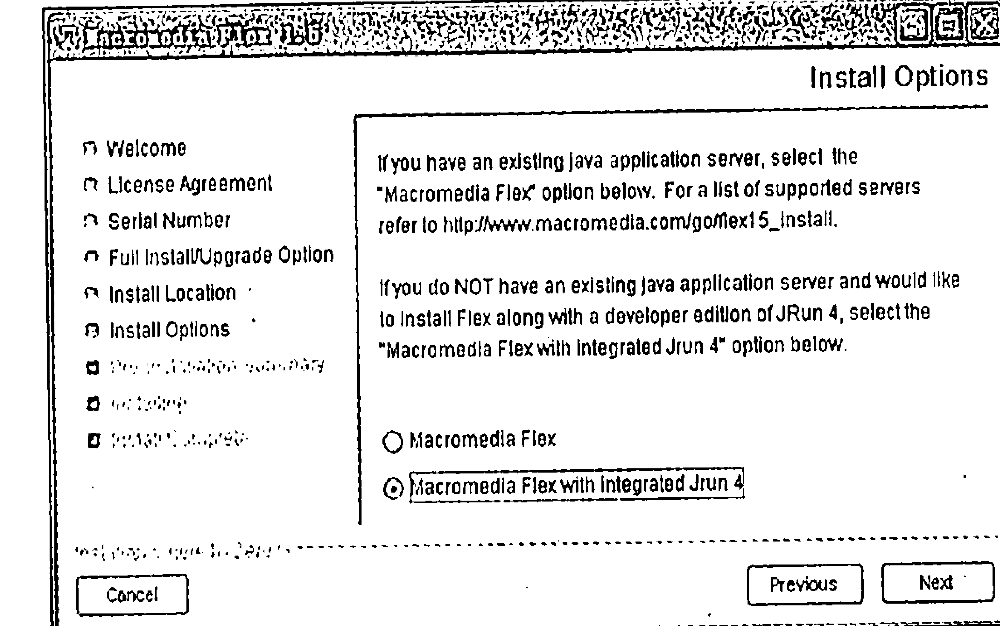

- 出现程序安装摘要，直接单击Install按钮。
- 程序开始自动安装，安装完毕，单击Done按钮。

程序安装完毕，单击“开始→所有程序→Macromedia →Macromedia Flex→Start Integrated Flex Server”，出现DOS窗口，开始启动Java服务器程序（图2）。

稍等片刻，待Java服务器启动成功后，在IE浏览器中输入http://localhost:8700/samples（输入时不带双引号）就可以打开Flex实例页面，表明Flex服务器可以正常使用。单击页面中的Flex Explorer链接，就可以欣赏和学习Flex的强大功能了，里面有各种实际例子和源代码。

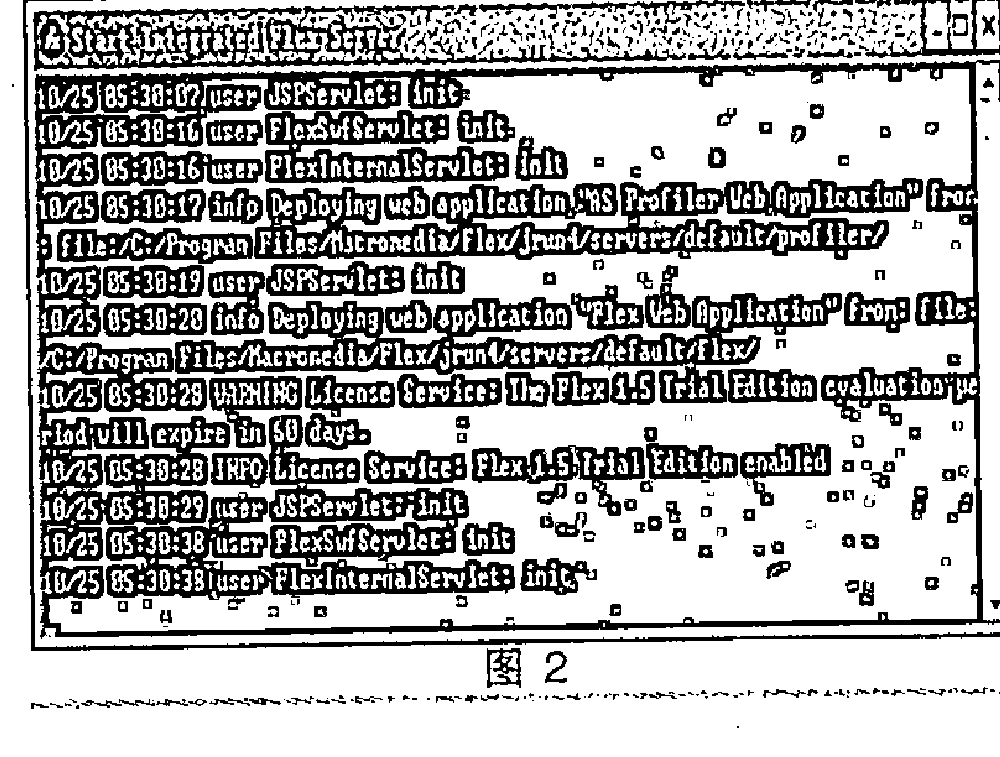

第二种方法：安装独立的Java服务器JDK 1.5和Tomcat 5.5

这种方法涉及到JDK 1.5和Tomcat 5.5两种软件，它们都可以免费下载得到，JDK 1.5的下载地址是：http://java.sun.com/j2se/1.5.0/download.jsp，Tomcat 5.5的下载地址是：http://jakarta.apache.org/site/downloads/。

### (1) 安装JDK 1.5

双击下载得到的文件即可开始安装，在选择安装目录时，单击“更改”按钮可以选择安装目录，我们选择把它安装到“C:\jdk1.5”目录，然后一路点击“下一步”按钮，就会完成安装。程序在安装时会自动安装JRE 5.0。

设置环境变量。右键单击桌面上的“我的电脑”图标，在弹出的快捷菜单中选择“属性”，打开“系统属性”设置窗口，在“高级”标签页中单击“环境变量”按钮，打开“新建用户变量”对话框（图3），在“变量名”文本框中输入“JAVA_HOME”（输入时不带双引号，下同），在“变量值”文本框中输入“C:\jdk1.5”，这样我们就完成了JDK的安装和设置，下面开始安装服务器软件Tomcat。

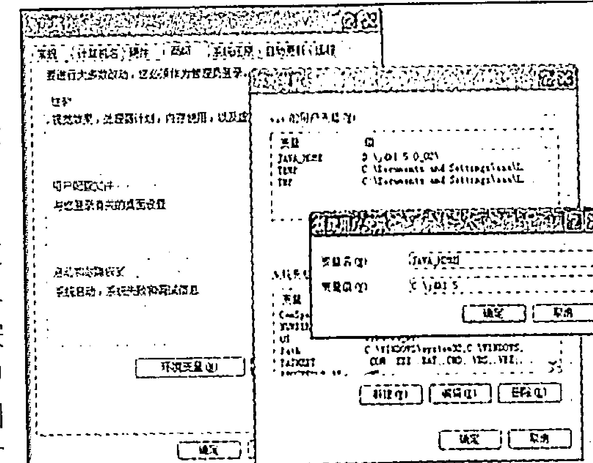

### (2) 安装Tomcat 5.5

双击下载得到的文件开始安装，当安装到选择组件时，请记住单击Tomcat展开目录树，选中Service选项，这样Tomcat就可以以Windows服务的形式启动（图4）。

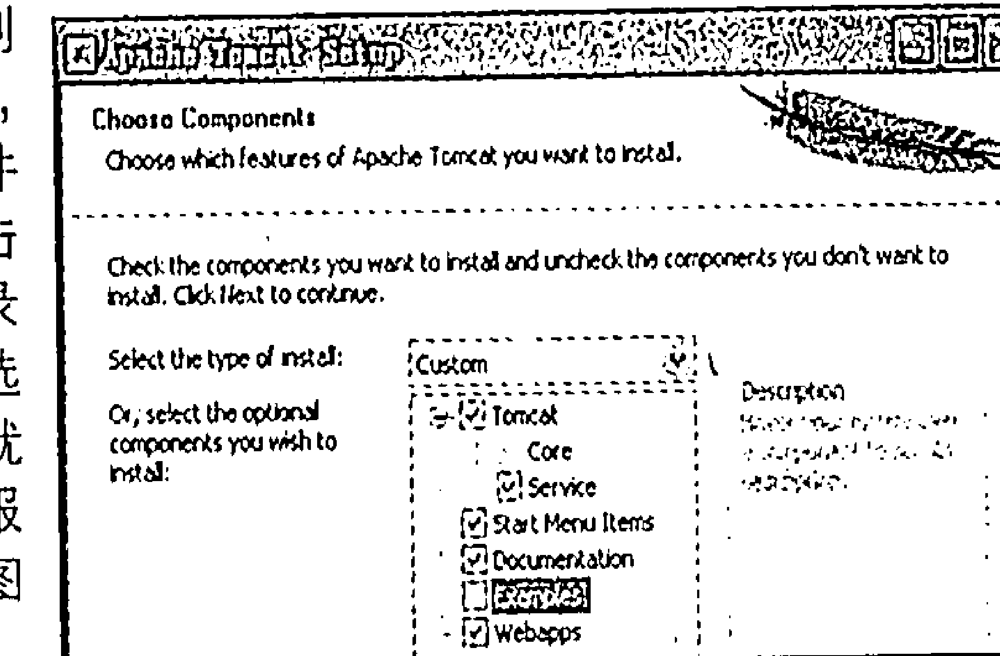

在选择Tomcat安装目录时，我们单击Choose按钮，选择安装到“d:\flex\tomcat5.5”目录。

接着设置管理员用户名、密码和端口号，系统默认的端口是8080，管理员的用户名是admin，密码为空，设置管理员用户和密码是为了以后设置管理服务器，防止其他人随意更改服务器设[content]

置，我们这里不做任何设置，采用程序的默认值，直接单击 Next 按钮进入下一步。程序在安装过程中会自动检测 JRE 安装目录（也就是我们上一步所安装的），按默认检测到的目录即可。如果没有检测到，请手工选择 JRE 的安装目录。Tomcat 安装完成后会在系统右下角的托盘区添加一个小图标，如果是绿色的小三角形则表明 Tomcat 服务器已经启动。如果你想自己手动开启和关闭 Tomcat 服务，可以右键单击托盘区中的 Tomcat 图标，在弹出的快捷菜单中选择 Start Service（开启服务）或 Stop Service（关闭服务）命令。在 IE 浏览器中输入 “http://localhost:8080”，如果出现 Tomcat 欢迎画面（图 5），这就表明 Tomcat 服务器已经安装成功。

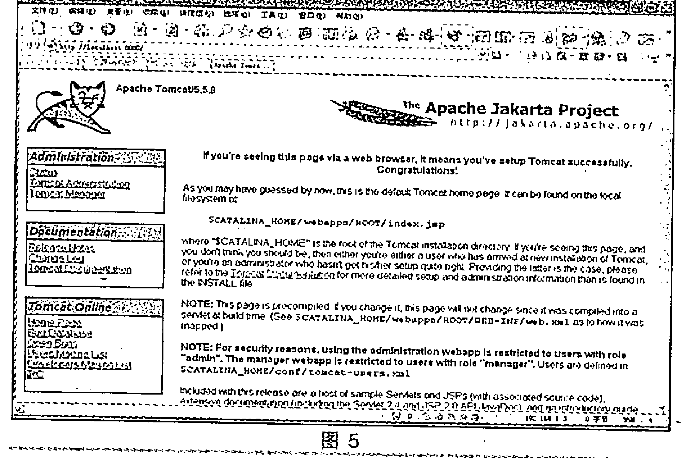

### 2. 安装 Flex 1.5

双击下载得到的 Flex 安装文件，开始自动安装，安装方法与前面介绍的相同，这里需要说明的是，把 Flex 的安装目录指定为 “d:\flex\app”。将 Flex 安装到 Tomcat 中。打开 “d:\flex\tomcat5.5\webapps” 目录，新建 flex 和 samples 两个目录，请注意新建目录的大小写，因为 Tomcat 服务器是区分大小写的。打开 “d:\flex\app” 目录，将 flex.war 和 samples.war 文件分别解压到上一步所建立的 flex 和 samples 目录中，这样就完成了 Flex 1.5 的安装。解压缩 war 文件可以用 WinZIP 或 WinRAR 工具。在 IE 浏览器中输入 “http://localhost:8080/samples”，就可以打开 Flex 帮助文件，单击其中的 “Flex Explorer” 链接，就可以欣赏到 Flex 程序的效果了。

### 3. 安装 Flex Builder 1.5

Flex Builder 的安装比较简单，没有什么特殊的要求，注意在安装前要关闭浏览器。双击下载得到的试用版文件即可开始自动安装。如果你不想做任何改变的话，一路单击 Next 按钮就可顺利安装完毕。需要说明的是，在安装即将结束时，会弹出一个对话框，让你选择所用的程序语言，我们选择 “U.S.English” 选项，然后单击 OK 按钮即可，因为 Flex Builder 目前还没有中文版，所以只有用英文版了。

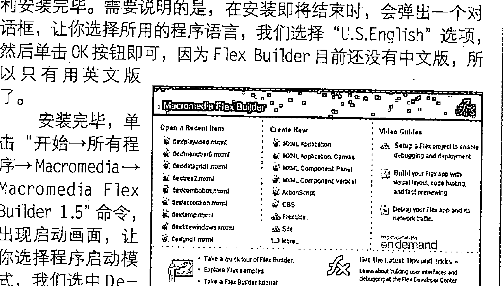

OK按钮，出现注册画面，由于我们使用的是60天试用版，所以选中 “I want to try Macromedia Flex Builder( 60 days remaining )” 选项，然后单击 Continue 按钮，就可以启动 Flex Builder。在启动时，先弹出一个窗口提示要先建立缓存文件，直接单击 “确定” 按钮，就打开 Flex Builder 了，在出现的启动画面中单击 Create New 中的 MXML Application 链接（图6），就进入了 Flex Builder，同时新建一个 MXML 文件，然后我们就可以开始设计网页了。

### Flex Builder 介绍

在使用 Flex Builder 之前，我们首先要对 Flex Builder 有一个大概的了解。如果你使用过 Dreamweaver，你会发现 Flex Builder 的界面与 Dreamweaver 非常相似，事实上，Flex Builder 包含了 Dreamweaver 的所有功能。因此，用 Flex Builder 不但可以设计 MXML 程序，也可以设计普通的网页；如果你安装了 Flex Builder，就不用再安装 Dreamweaver 了。

### 1. 熟悉工作界面

默认情况下，启动 Flex Builder（图 7），我们可以看到 Flex Builder 中间是一个大大的工作区，上面是工具栏，下面是结果面板（Results），右面是设计面板（Design）、数据面板（Data）、标签检查器面板（Tag Inspector）、文件面板（Files）。

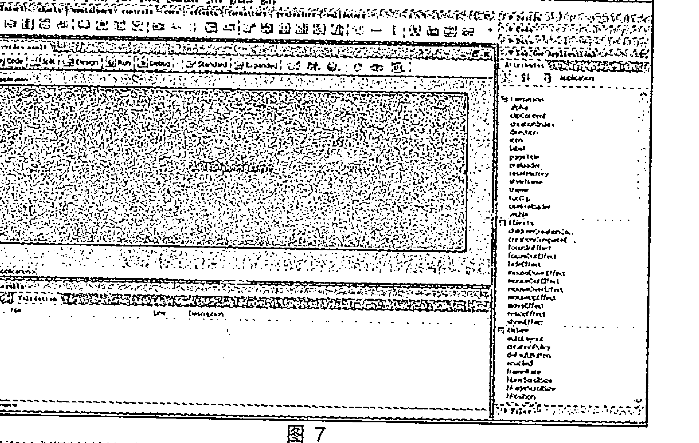

文档工具栏：紧挨着工作区的上部，它主要是用来改变文档编辑模式和选择测试浏览器。它的几个主要按钮的作用如下：Code：代码视图，显示程序的源代码；Split：分隔视图，上部显示代码视图，下部显示设计视图；Design：设计视图，我们看到的程序的实际样式；Run：运行，运行设计好的程序，运行前必须要先保存；Debug：调试应用程序；Standard：标准模式；Expanded：扩展模式；Preview/Debug：预览和调试，可以选择预览程序的浏览器。插入工具栏（Insert）：用来插入各种组件，包括 Charts（图表）、Containers（容器）、Controls（控件）、Effects（特效）、Formatters（格式器）、Validators（验证器）、Preloaders（预装载器）、Core 等，单击每个标签可以切换到相应的功能，同时在下面出现图标，单击图标就可以在工作区中插入相应的组件。我们常用的组件都包括在 Controls 和 Containers 中。单击 Insert 左边的小三角按钮就可以开启/关闭 Insert 工具栏。结果面板（Results）：处在工作区的下部，单击 Results 左边的小三角按钮可以开启/关闭结果面板，这个面板主要包括一些脚本调试和站点监视方面的功能，分成很多标签，单击不同的标签可以实现不同的操作，这个面板对于程序的后期调试和站点发布非常有用。

### 2. 定义站点

要想设计 Flex 应用程序，我们必须要先建立一个站点，有了这个站点，我们就可以创建、编辑、运行和调试 Flex 应用程序了。建立站点的操作如下：

启动 Flex Builder，单击 Site -> New Flex Site 命令，弹出站点设计窗口（图8），它包括四部分的内容：站点名称（Site name）、本地根目录（Local root folder）、Flex 服务器根目录（Flex server root folder）和 URL 前缀（URL prefix）。在设置目录时，可以手工输入，也可以单击右边的文件夹图标进行选择。

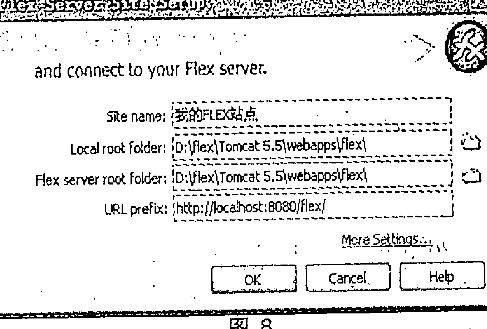

前面我们介绍过，Flex 1.5有两种不同的安装方法，对于不同的安装方式，它在站点设置时的要求也是不同的。
第一种方法是安装 Flex 自带的 Java 应用程序服务器，它的站点设置如下：

| 项目 | 值 |
|------|-----|
| Site name | 可以自己随意命名 |
| Local root folder | C:\Program Files\Macromedia\flex\jrun4\servers\default\flex |
| Flex server root folder | 同上 |
| URL prefix | http://localhost:8700/ |

第二种方法是安装单独的 JDK 1.5 和 Tomcat 5.5，它的站点设置如下：

| 项目 | 值 |
|------|-----|
| Site name | 自己随意命名 |
| Local root folder | d:\flex\tomcat5.5\webapps\flex |
| Flex server root folder | 同上 |
| URL prefix | http://localhost:8080/flex/ |

### 3. Flex 应用程序开发步骤

一个典型的 Flex 应用程序开发应遵循下面的步骤。

- 第一步：用 Flex Builder 建立一个 MXML 文件；
- 第二步：添加容器和控件；
- 第三步：添加对容器和控件的控制；
- 第四步：定义数据模型；
- 第五步：添加 HTTPService、Webservice 或请求远程 Java 对象操作；
- 第六步：添加对数据字段的验证；
- 第七步：添加脚本扩展组件；
- 第八步：调试；
- 第九步：发布。

当然，根据程序的复杂与否，上面的步骤有些可省略，总体上来说，设计过程可归纳为：设计→调试→发布。

## 快速建立第一个 Flex 应用程序

前面所做的准备工作，都是为后面设计 Flex 应用程序准备的，经过前面的一番努力，满足了设计所需的各种条件，下面我们就可以开始踏上真正的 Flex 应用程序设计之旅了。

启动 Flex Builder，建立一个新的 MXML 文档，方法有两种。在启动画面中单击 Create New 中的 MXML Application 链接。单击 File → New 命令，打开 New Document 窗口，在 General 标签页中的左面列表中选择 Flex development 窗口；在中间的列表中选择 MXML Application，然后单击 Create 按钮（图9）。

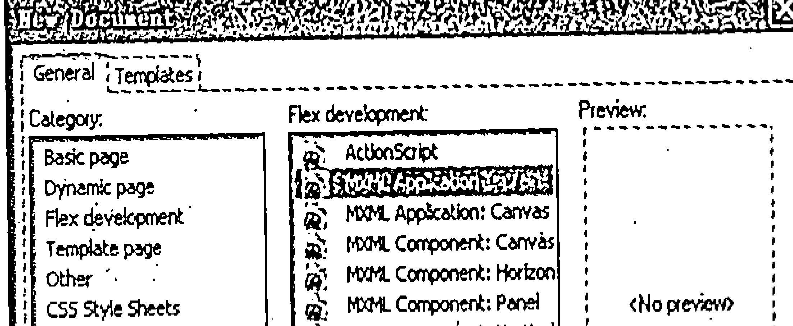

下面我们来设计一个页面，很简单，里面只有一行文字显示，它的操作如下：

选中 Insert 工具栏中的 Controls（控件）标签页，单击其中的 Label 按钮，在页面中就会添加一个显示 Label 的标签。
下面我们来更改 Label，让它变成我们自己的内容。单击界面右边的 Tag Inspector（标签检查器）面板，展开它，选择 Attributes 标签页，单击 Common 前面的“+”号按钮展开它，在 Text 右面的表格中单击，将程序默认的 Label 改为你想要的文字即可，如改成“我的第一个 Flex 程序”，然后回车，我们看到页面中的文字已经发生了改变。
保存文件。单击 File → Save 命令，给文件起一个名字，然后将它保存到自己的站点根目录下。
预览程序。按 F12 键或单击 File → Preview in browser → iexplore 菜单，即可在浏览器中看到设计的效果，一个网页就设计完成了。

上面我们是可视化地完成了一个网页的设计，由于 Flex 应用程序是基于 MXML 标记语言的，要想设计出一个好的应用程序，必须要对 MXML 语言熟悉，下面我们就来看一下上面设计的程序的源代码，单击工作区上部的 Code 按钮，就可以显示出这段程序的代码：

```
<?xml version="1.0" encoding="utf-8"?>
<mx:Application xmlns:mx="http://www.macromedia.com/2003/mxml">
    <mx:Label text="我的第一个Flex程序" />
</mx:Application>
```

下面我们对源代码进行一下解释：
<?xml version="1.0" encoding="utf-8"?>
每个 MXML 文件都必须以这个 XML 声明开始，它表明 XML 版本是 1.0，所用的文字编码（encoding）是 Utf-8，如果你想让中文正确显示，必须用 Utf-8 编码。这一行是每个 MXML 文件都必须有的。
<mx:Application></mx:Application>
是 MXML 文件的根标记，所有的内容都包含在这对标记中。
xmlns:mx="http://www.macromedia.com/2003/mxml"
这是 Application 标记中的 xmlns 属性，它声明了 XML 的命名空间。命名空间可以让你在单个文档中使用多重 XML 语言而避免混淆不同语言中相同的元素名称，这里的“:mx”就是一个在特定命名空间中使用的前缀。可以同时使用多个 xmlns 标记。
<mx:Label text="我的第一个Flex程序" />
这是一个 Label 标记，其中 Text 属性的值就是在页面中要显示的文字内容。不同的标记有不同的属性，同一个标记可以有多种属性。
例如我们可以再给该标记添加颜色属性，让它变成红色的文字，将“color="#FF0000"”（输入时不带双引号）添加到 Label 代码中，注意不同的属性之间要以一个空格来分隔。

在下面讲到各种组件的使用时，我们将会列出它的源代码，希望大家通过上面的介绍能对 MXML 语言有个大致的了解，以便能顺利地读懂 MXML 文件。

## 容器 ( Containers )

容器是 Flex 用来开发应用程序的一种方法，它用一种层次结构来控制子容器、定义用户界面元素的排列方式，使用容器可以定义每个页面元素的位置和排列方式。一个容器定义了一个长方形的区域，在容器里面，用户可以插入各种组件（如控件和容器）。容器已经预定义了插入其中的子元素的大小和位置，这样就可以使用户设计起来更简单。同时，它还提供了很多灵活性，让用户可以设计出丰富多彩的应用程序。

容器分为布局容器（Layout Containers）和导航容器（Navigator Containers）两大类。布局容器用来定义容器子元素的大小和位置，它包括：Canvas、Box、ControlBar、DividedBox、Form、Grid、Panel、Tile、TileWindow。导航容器用于在多个容器子元素间的移动和导航，它包括：ViewStack、LinkBar、TabBar、TabNavigator、Accordion。

### 1. Application 容器

Application 容器是 MXML 文档缺省的容器，也是最顶级的容器，所有的元素都是插入到 Application 容器中的，因此，每一个 MXML 文档都必须有 Application 容器，所有的页面元素都写在<mx:Application>和</mx:Application>标签之间。
事实上我们每次打开 Flex Builder，新建一个 MXML Application 文档时，Flex Builder 就会自动建立了一个 Application 容器，单击 Code 标签可以查看到源代码，除了 XML 声明外，就是一对<mx:Application>标签，下面我们就可以在其中设计内容了。
下面我们就介绍一下 Application 一些主要的属性，这些属性都可以在 Tag Inspector 面板中的 Attributes 标签中进行设置。

- (1) Width 和 Height：容器的宽度和高度。用来设定所设计的应用程序用户界面的大小，默认值是充满浏览器窗口，我们可以用这两个属性来设置容器的大小。属性值可以用百分比值，也可以用实际的像素数，如"width="90%""（不带双引号，下同），"height="260""。
- (2) Backgroundimage 和 Backgroundsize：背景图像和背景图像的大小。程序默认的背景是灰色的，我们可以用"backgroundimage="*.jpg""来指定一个图像作为背景。Backgroundsize 是设置背景图像的大小，用百分比来表示。
- (3) Backgroundcolor：背景色。用"backgroundcolor="#0FFAA""来指定一个自己喜欢的背景色，颜色用十六进制颜色代码。
- (4) PageTitle：页面标题，定义每个页面的标题。
- (5) usePreloader：Flex 应用程序在启动时会有一个进度条，我们可以用"usePreloader="false""来取消进度条的显示，如果再想恢复，将其值设为"true"即可。
- (6) marginTop、marginBottom、marginLeft、marginRight：上、下、左、右边距。也就是容器中的子元素距离 Application 容器边缘的距离，默认值是 24 像素，我们可以根据需要自己设置。

### 2. Panel 容器

Panel（面板）容器是我们常用的一个容器，单击 Insert → Containers → Panel 命令，或者选择 Insert 工具栏中的 Containers 标签页，单击 Panel 图标就可以在页面中插入一个 Panel 容器（图10），上面是标题栏，中间是显示内容区，在 Panel 中我们可以插入各种控件，如文本、标签、链接、图像等。
Panel 容器的标题可以用 Title 属性来定义，如"Title="新闻首页""（不带双引号），除此之外我们还可以用 headerColors 和 backgroundColor 属性来分别定义标题栏背景色和下面内容的背景色。


### 3. Canvas 容器

Canvas 容器定义了一个长方形区域，你可以在其中插入各种容器和控件，Canvas 也是唯一一个允许用户定义插入其中的子元素位置的容器。用户可以用 X、Y 属性指定子元素的坐标值（用像素值）。如

```
<mx:Canvas>
    <mx:Image Source="boy.jpg" x="100" y="50" />
</mx:Canvas>
```

就是在水平位置是 100 像素，垂直位置是 50 像素的地方显示一幅图像。

### 4. Box 容器

Box 容器可以让其子元素按水平或垂直方向进行排列，它用 Direction 属性来控制其子元素的排列方式，"direction="vertical""是垂直排列，"direction="horizontal""是水平排列。实际上，为了简化操作，Flex Builder 专门定义了一个 HBox（水平）和 VBox（垂直）容器，代替用 Box 标签时必须用 Direction 属性来定义排列方式。我们在使用时可以根据需要直接选择 HBox 或是 VBox 容器即可。

### 5. DividedBox 容器

DividedBox 容器可以让插入其中的子元素呈水平或垂直方向排列，与 Box 容器不同的是，DividedBox 容器在分割子元素时，它在每个子元素之间插入了一个分割条，用户可以拖动分割条来改变元素的大小。DividedBox 容器用"direction="horizontal""或"vertical""来定义水平或垂直方向排列子元素。同 Box 一样，为了简便操作，Flex Builder 也提供了 HDividedBox 和 VDividedBox 两个容器，专门用来插入水平或垂直的 DividedBox 容器。如图 11 所示，我们把网页分成了左右两大部分，右边分成了上下两部分，分隔中间都有分隔条。左边显示的是一个目录树，右边上部分是一个数据网格，下半部分是一个文本区，只不过其中都没有具体内容，只是一个框架。这个容器的建立方法如下：

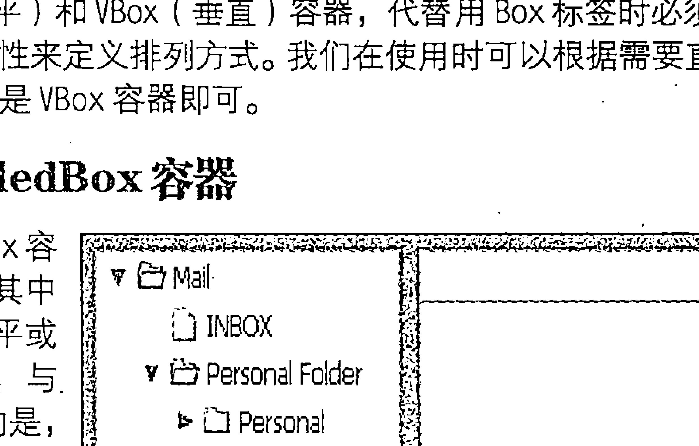

- 第一步：首先新建一个 MXML 文档，然后选择 Insert 工具栏中的 Containers 标签页，单击 HDividedBox 按钮；
- 第二步：单击 Controls 标签页中的 Tree 按钮，插入一个目录树；
- 第三步：单击 Containers 标签页中的 VDividedBox 按钮，然后再分别单击 Controls 标签页中的 DataGrid 和 TextArea 按钮即可。

## 6. Grid 容器

Grid 容器就像 HTML 网页中的表格一样，它有行、列、单元格，用户可以根据需要确定行、列的数量和布局样式。定义网格主要有三个标签。

`<mx:Grid>`：定义一个网格，一个 Grid 容器用此标签表示。
`<mx:GridRow>`：定义行。
`<mx:GridItem>`：定义单元格。

### (1) 建立一个 Grid (网格)

选中 Insert 工具栏中的 Containers 标签页，单击 Grid 按钮，就可以插入一个网格，然后将插入点移到单元格中，单击 Insert 工具栏中的相应按钮，就可以在网格中插入各种容器和控件，如文本、图像、链接、面板、表单等（图 12）。

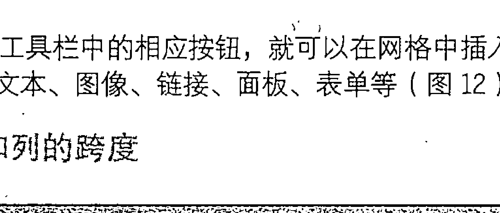

### (2) 设置行和列的跨度

有时我们插入到网格中的一个对象要跨越几个单元格，这时就用到 Rowspan（行跨度）和 Colspan（列跨度）这两个属性了。选中要设置跨度的单元格，然后在 Tag Inspector 面板中设置 Rowspan 或 Colspan 的属性即可，例如：我想把一个图像跨 2 列显示，将 Colspan 的值设为 2 就行了（图 13）。

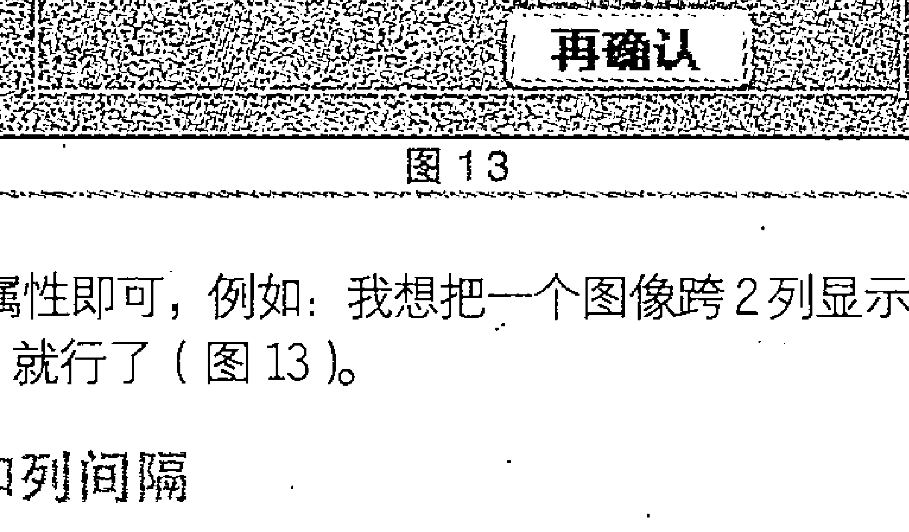

### (3) 设置行和列间隔

Flex Builder 默认的行和列的间隔是 6 像素，我们可以根据需要自由定义行间隔（HorizontalGap）和列间隔（VerticalGap）的值。

## 7. Tile 容器

Tile 容器是用来平铺显示其中的子对象，显示的方式可以是水平或垂直的。Tile 容器中的所有单元格都是相同的，Flex Builder 以正方形单元格排列其中的对象，每一个单元格只能包含一个对象。在排列方式上程序会自动根据子对象的数量计算出每行（列）排几个对象，共排几行，这不需要人工设置，在这一点上，Tile 与 Grid 是不相同的，Grid 容器可以允许用户自定义行和列的数量。

### (1) 建立 Tile 容器

选择 Insert 工具栏中的 Containers 标签页，单击 Tile 按钮，在页面中插入一个 Tile 容器，然后单击 Controls 标签页中的 Button 按钮十次，我们就可以在 Tile 容器中插入十个按钮，在插入按钮的过程中你会发现随着按钮数量的增加，它们的排列方式会自动发生变化（图 14），这就是系统自动运算的结果，不需人工干预。

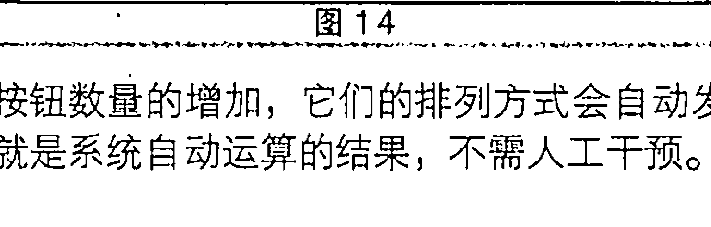

### (2) 更改排列方式

Tile 容器默认是水平排列，我们可以通过 Direction 属性将它设置成水平（Horizontal）或垂直（Vertical）排列。

### (3) 设置 Tile 容器的大小

用 TileWidth（宽度）和 TileHeight（高度）属性进行设置，值为像素值。

## 8. TitleWindow 容器

TitleWindow 容器是一个弹出窗口，它包括标题栏、标题和内容区（图 15），与 Panel 容器非常相似，二者唯一的区别是 TitleWindow 是一个弹出窗口，Panel 是一个静态的窗口。在 TitleWindow 容器的内容区可以添加各种 Flex Builder 组件，一般用 TitleWindow 定义一个表单，当用户填写完毕后，你可以有计划地关闭 TitleWindow 弹出窗口或单击右上角的关闭按钮来关闭它。

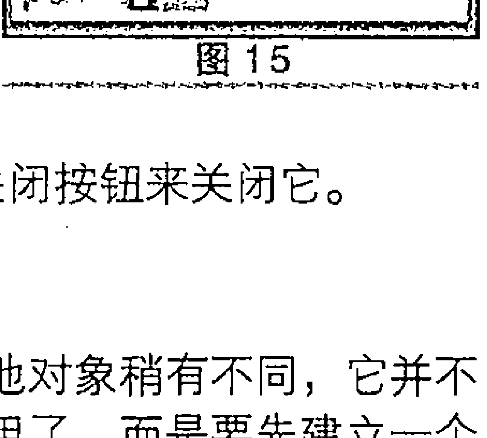

### 建立 TitleWindow 容器

TitleWindow 容器的建立方法与其他对象稍有不同，它并不是建立一个 TitleWindow 容器就可以使用了，而是要先建立一个 TitleWindow 组件，然后再用 Popup Manager 来调用 TitleWindow 组件。

### 第一步：首先建立一个 TitleWindow 组件

新建一个 MXML 文档，单击 Container 标签页中的 TitleWindow 按钮，在页面中插入一个 TitleWindow 容器，然后选择 Controls 标签页，在这个容器中添加 2 个 Label、两个 TextInput 和 2 个 Button 控件，我们把这个弹出窗口设计成一个注册窗口，用户要输入用户名和密码，这是用 Label 和 TextInput 控件实现的，下面是两个按钮，一个是“提交”，一个是“关闭”。将 TitleWindow 容器的 Title 属性值设为“用户注册窗口”。

由于这是一个用户自己建立的组件，不是一个完整的 MXML 文档，所以必须要对它的源代码进行修改。单击 Code 按钮切换到代码视图，将 `<mx:Application></mx:Application>` 这对标签删除，然后将 `<mx:titlewindow>` 标签添加 XML 声明，也就是将 `<mx:titlewindow>` 标签改成 `<mx:titlewindow title="用户注册窗口" xmlns:mx="http://www.macromedia.com/2003/mxml">`，最后将这个文档保存为 mylogin.mxml 格式。

### 第二步：调用 TitleWindow 组件

新建一个 MXML 文档，在其中插入一个按钮，给这个按钮添加一个单击事件，当你单击按钮时，出现弹出窗口。定义这个按钮的单击事件要用到 Script 脚本，它用一对 `<mx:script></mx:script>` 标签来定义一个脚本，这个 MXML 文档的完整源码如下：

```xml
<?xml version="1.0" encoding="utf-8"?>
<mx:Application xmlns:mx="http://www.macromedia.com/2003/mxml">
    <mx:Script>
        <
![CDATA[
            import mx.managers.PopUpManager;
            import mx.core.IFlexDisplayObject;

            private var myTitleWindow:IFlexDisplayObject;

            private function createPopUp()
:void {
                myTitleWindow = PopUpManager.createPopUp(this, mylogin, true);
                PopUpManager.centerPopUp(myTitleWindow);
            }

            private function deletePopUp():void {
                PopUpManager.removePopUp(myTitleWindow);
            }
        ]]>
    </mx:Script>
    <mx:Button label="打开注册窗口" click="createPopUp()"/>
</mx:Application>
```

弹出窗口可以用鼠标拖动在桌面上移动。

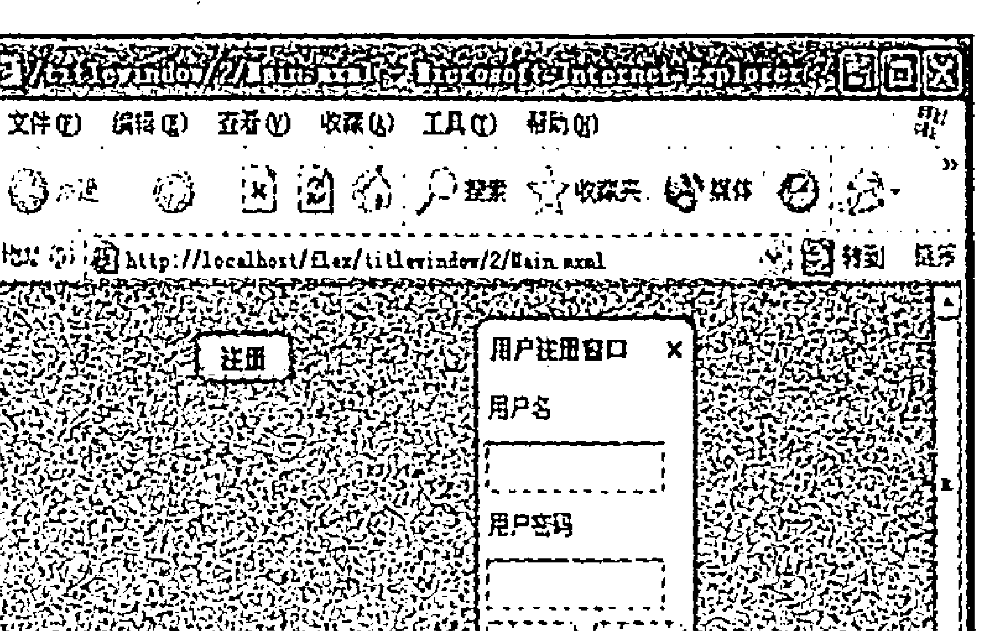

## 9. Form 容器

Form（表单）容器是经常用到的一个功能，我们在网站注册某项服务时，往往需要填写许多内容，这个功能就是用 Form 来实现的。

表单容器包括表单标题（Form Heading）和表单项（Form Item）组成，表单项可以有多个。利用表单容器可以控制表单的样式，处理错误信息，执行数据检查和验证。

下面来看看如何创建 Form 容器。

单击 Containers 标签页中的 Form 按钮，就可以在页面中插入一个 Form 容器，然后单击 Form Heading 按钮，添加一个表单标题，标题的名称可以通过 Label 属性进行修改。下面就可以添加表单项了，单击 Form Item 按钮，在页面中插入一个表单项，程序会默认给这个表单项命名为 Label，我们可以通过 Label 属性来自己定义。然后可以给这个表单项添加控件，例如单击 Controls 标签页中的 TextInput 按钮，添加一个文本输入框，这个表单项就设计好了。重复以上操作，我们可以给表单容器添加多个表单项，这样我们就完成了一个“Form 容器的设计（图 17）”。

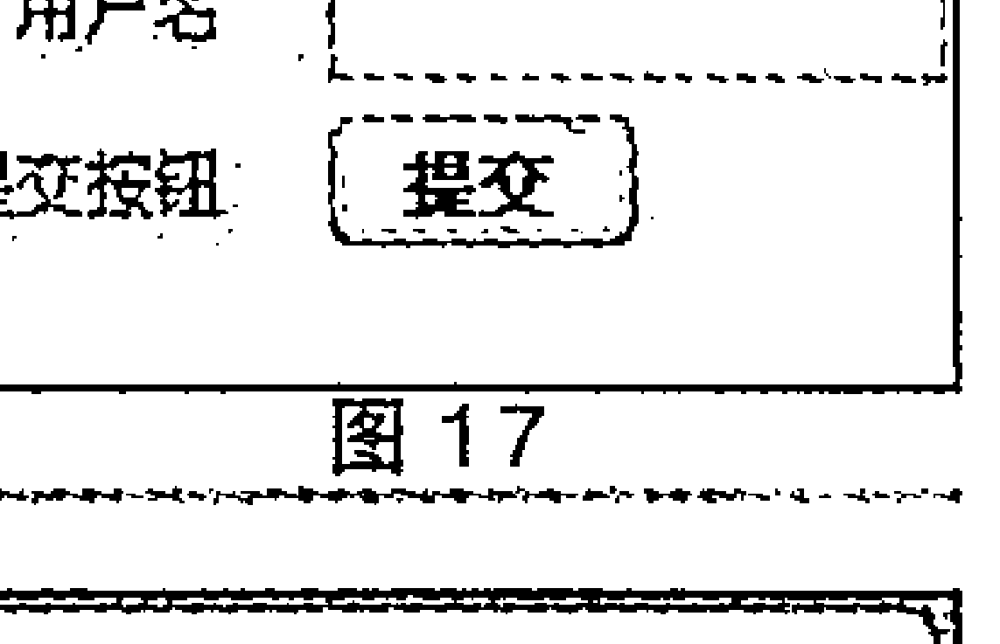

## 10. ControlBar 容器

ControlBar 容器一般用在 Panel 或 TitleWindow 容器的下方，用来传递一些数据，例如我们可以在一个显示商品信息的 Panel 容器中添加一个 ControlBar 容器，当你单击按钮，它会把商品添加到购物车中（图 18）。这个页面的设计方法如下：

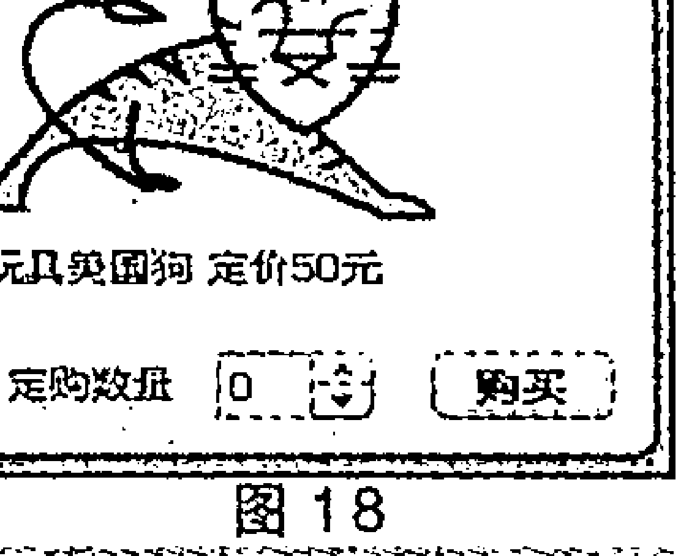

- 第一步：新建一个 MXML 文档，单击 Containers 容器中的 Panel 按钮，添加一个 Panel 容器。
- 第二步：单击 Controls 中的 Image 按钮，在 Panel 中添加一个图像，再单击 Text 按钮，添加一个文本框，输入一些文字内容。
- 第三步：单击 Containers 中的 ControlBar 按钮，添加一个 ControlBar 容器，然后向该容器中添加对象，选中 Controls 标签页，分别单击 Label、NumericStepper、Button 按钮，向 ControlBar 中添加一个标签、一个数字步进器和一个按钮。完成设计，然后就可以保存浏览了。

## 11. ViewStack 容器

ViewStack 容器包括几个子容器，其中只有一个子容器是可见的，用户可以用 LinkBar 或 TabBar 等导航容器来激活 ViewStack 容器中不同的子容器。例如，用户可以用一组按钮来激活 ViewStack 容器，单击不同的按钮可以显示 ViewStack 容器中不同子容器的内容，当然这些内容都显示在同一个位置。下面我们创建一个包含 3 个 Label 的 ViewStack 容器，同时创建 3 个按钮，单击不同的按钮，可以分别显示 ViewStack 容器中 3 个不同 Label 的内容。

操作方法如下：

- 第一步：新建一个 MXML 文档，单击 Containers 标签页中的 ViewStack 按钮，弹出一个对话框，要求你输入 ViewStack 的 ID 值，我们输入“myviewstack”，然后单击 OK 按钮，在页面中添加一个 ViewStack 容器。
- 第二步：在 ViewStack 容器的上方出现一个导航条，单击其中的“+”号按钮，弹出对话框（图 19），让你选择插入的容器类型，我们在 Container 下拉表中选择“mx:Canvas”，单击 OK 按钮，然后在 Tag Inspector 面板的 Attributes 标签页中将 ID 值设为“id1”。再单击 Controls 标签页中的 Label 按钮，在新建的 Canvas 容器中插入一个标签，将这个标签的 Text 属性设为自己的内容。

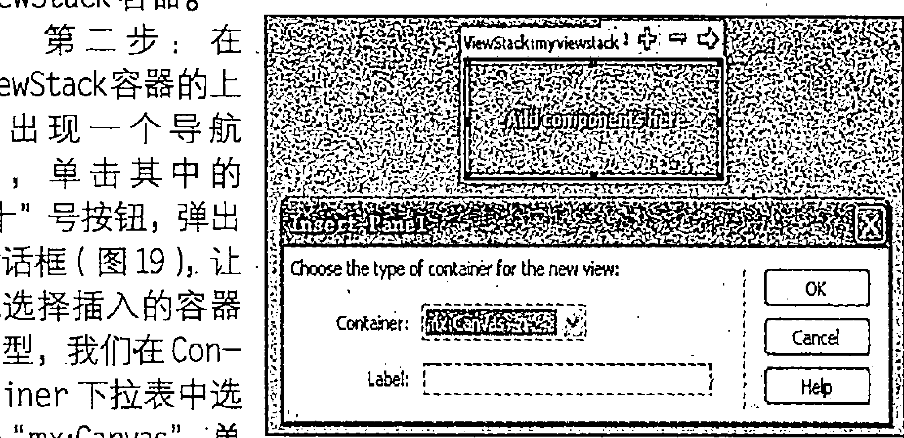

- 第三步：重复第二步的操作，在 ViewStack 容器中添加另外两个 Canvas 容器和 Label 标签，在添加 Canvas 容器时注意将 ID 值分别设为“id2”、“id3”，Label 标签的 Text 属性值可以自己设置。
- 第四步：单击 Containers 标签页中的 HBox 按钮，添加一个 HBox 容器，然后单击 Controls 标签中的 Button 按钮，分别添加 3 个按钮，注意将 3 个按钮的 Click 事件分别设为：
    `click="myviewstack.selectedChild=id1"`
    `click="myviewstack.selectedChild=id2"`
    `click="myviewstack.selectedChild=id3";`
- 第五步：保存文档，在浏览器中浏览，单击三个按钮，就可以看到你设置的不同的 Label 标签的 Text 值。

## 12. TabNavigator 容器

TabNavigator 容器包括一系列的标签，每个标签中都可以加入其他的容器，单击不同的标签就可以显示不同的内容，它非常适合于在一页显示多项不同的内容（图 20）。

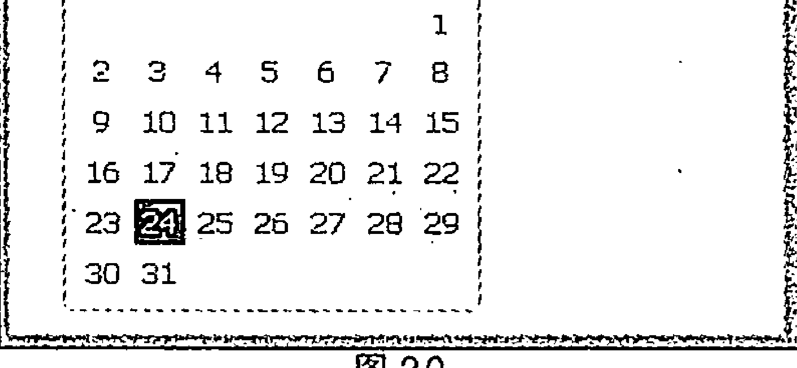

下面就来看看如何建立 TabNavigator 容器。

- 第一步：新建一个 MXML 文档，单击 Containers 标签页的图标，插入一个 TabNavigator 容器，然后就可以给这个容器添加标签页了。
- 第二步：单击 TabNavigator 容器上方导航中的“+”号按钮，弹出一个对话框，要求你选择插入到标签页中的容器，我们这里选择 `<mx:HBox>`，用户在设计时可根据自己的需要自由选择，在 Label 框中输入标签页的名称，然后单击 OK 按钮，一个标签页就添好了。然后就可以根据需要在 HBox 容器中添加其他对象。
- 第三步：重复第二步的操作添加多个标签页。
- 第四步：保存文档，在浏览器中浏览，单击不同的标签就可以在不同的内容间来回切换，非常方便。

## 13. TabBar 容器

TabBar 定义的是水平排列的一行标签，在同一时间只有一个标签是被选中的，它主要用来控制 ViewStack 容器的显示（图 21）。虽然 TabBar 与 TabNavigator 容器极为相似，但是 TabBar 没有内置的容器，它只是一个导航条，需要配合其他容器（如 ViewStack）使用。


## 14. LinkBar 容器

LinkBar 容器包含一个水平排列的链接控件列表，单击这些链接可以连接到 ViewStack 的各个子元素或其它单独的链接上。

下面来看看建立 LinkBar 容器的方法。
方法与前面介绍的 TabBar 相类似，先建立一个 ViewStack 容器，然后单击 Containers 容器中的 LinkBar 按钮，在弹出的对话框中输入 ViewStack 的 ID 值，单击 OK 按钮即可。

## 15. Accordion 容器

Accordion 容器包括了一系列的子面板，它们呈垂直排列，单击不同的面板就可以切换到不同的显示内容，但是在同一时间只能有一个面板显示（图 22），用户可以在不同的子面板中添加不同的容器和控件。Accordion 容器极大地提高了网页的外观效果和容量，用户在一个页面中就可以看到更多的内容和完成更多的操作。

下面来看看建立 Accordion 容器的方法。
- 第一步：新建一个 MXML 文档，单击 Container 标签页的 Accordion 按钮，在页面中添加一个 Accordion 容器。
- 第二步：添加子面板。单击 Accordion 容器上方的“+”号按钮，弹出一个窗口，让用户选择要添加到子面板中的容器类型，用户可根据需要随意选择，这时我们选择 `<mx:VBox>`，然后在 Label 框中输入子面板的标题，单击 OK 按钮，一个子面板就建好了。下面就可以向这个 VBox 容器中添加其它对象了，如文本、图像、链接等。
- 第三步：重复第二步的操作，我们可以建立多个子面板。
- 第四步：保存文档，在浏览器中浏览。


## 控件（Controls）

控件是用来设计用户界面的组件，像按钮、图像、文本区、复选框等，这是我们设计网页时经常要用到的元素，在上面我们介绍的各类容器中最终也要插入各类控件才能实现它的功能。

为了完成各种不同的设计，Flex Builder 内置了 26 种控件，这些控件除了各自独特特性外，还有一些共同的特征，如可以定义控件的外观样式和字体，有自己的属性、事件和方法。控件分为基本控件和数据供应器（Data provider）控件两大类。

- 基本控件包括：Button（按钮）、CheckBox（复选框）、DateChooser（日期选择器）、DateField（日期域）、HRule/VRule（水平线/垂直线）、HSlider/VSlider（水平/垂直滚动条）、Image（图像）、Label（标签）、Link（链接）、Loader（装载器）、NumericStepper（数字步进器）、ProgressBar（进度条）、RadioButton（单选按钮）、RadioButtonGroup（单选按钮组）、ScrollBar（滚动条，包括水平滚动条 HScrollBar 和垂直滚动条 VScrollBar）、Text（文本）、TextArea（文本区）、TextInput（文本输入区）。
- 数据供应器控件包括：TileList（平铺列表）、Tree（目录树）、DataGrid（数据网格）、HorizontalList（水平列表）、ComboBox（组合框）、Menu（菜单）、MenuBar（菜单栏）。

各种控件都包含在 Insert → Controls 菜单或工具栏中，单击相应的命令或按钮就可以在其中插入相应的控件。由于控件的使用方法很简单，我们就不一一进行介绍了，下面简要介绍一些控件使用中要注意的问题。

### 1. Button

按钮控件是使用最频繁的一个控件，除了按钮上的文字标签外，我们还可以将一些图标添加到按钮上，这就要用到 Icon 属性，在 Tag Inspector 中单击 Icon 属性右边的 Browse 按钮，选中图像文件即可，图像文件的类型可以是 JPG、GIF、PNG、SWF 或 SVG。

### 2. RadioButton

单选按钮在创建时，会弹出一个窗口让你输入单选按钮组（GroupName）的名称，如果你创建的几个单选按钮是一个组，那就输入 GroupName 的名称，否则就不用输入，直接单击 OK 按钮即可。

### 3. Text

如果你不想让别人复制你的文本，可以将它的 Selectable 属性值设为 False，这样别人就无法在打开网页时选中网页中的文字内容了。

### 4. Link

可以用 Icon 属性来指定一个图像做链接。
LabelPlacement 属性可设定链接标签和图像的排列位置，有上、下、左、右四种方式，默认值是文字排在图像的右边。用 Click 属性来定义链接的地址，可以是 ViewStack，也可以是一个网站，例如要链接到一个网站，可以用 `click="getURL('http://www.sohu.com')"`（不加外层双引号）来实现。

### 5. NumericStepper

数字步进器用 StepSize 来定义步长，用 Value 来定义当前显示的数值，缺省值是 0，用 Maximum 来定义最大值，Minimum 来定义最小值。

### 6. HSlider 和 VSlider

水平和垂直滑杆也是常用到的控件，它常用的属性设置是：
- Minimum：最小值
- Maximum：最大值
- SnapInterval：每次移动滑块的增量值
- Value：当前显示的数值

### 7. HRule 和 VRule

水平线和垂直线以 StrokeWidth 来定义线宽，Color 定义线条颜色，ShadowColor 定义阴影颜色，Width 定义线条的宽度，宽度可以用像素数，也可以用百分比。

### 8. DateChooser 和 DateField

程序默认的月份和星期是以英文显示的，我们可以通过修改 MonthNames 和 DayNames 属性来让它变成中文月份和星期，如：

```
monthNames=["一月", "二月", "三月",……, "十二月"]
dayNames=["日", "一", "二", "三", "四", "五", "六"]
```

### 9. ComboBox 和 List

要用 `<mx:dataProvider>`、`<mx:Array>` 和 `<mx:String>` 标签来定义下拉列表中的内容，代码如下：

```xml
<mx:ComboBox>
    <mx:dataProvider>
        <mx:Array>
            <mx:String>中国</mx:String>
            <mx:String>美国</mx:String>
            <mx:String>日本</mx:String>
        </mx:Array>
    </mx:dataProvider>
</mx:ComboBox>
``````xml
<mx:String>美国</mx:String>
<mx:String>日本</mx:String>
</mx:Array>
</mx:dataProvider>
</mx:ComboBox>
```

## 10. Spacer
这是一个不可见的控件，它用来在控件之间插入分隔空间，相当于加入空格一样，可以用Width来设置它的宽度。

## 11. Tree
目录树要用<mx:dataprovider>调用一个XML文档信息，来显示各个文件夹的文字内容，关于XML文档的有关内容，这里不做介绍，用户可以参考有关的书籍，下面给出一个目录树例子的源代码：

```xml
<mx:Tree id="tree1" >
    <mx:dataProvider>
        <mx:XML>
            <node label="我的邮箱">
                <node label="收件箱"/>
                <node label="个人文件夹">
                    <node label="商务"/>
                    <node label="演示"/>
                    <node label="个人" isBranch="true"/>
                    <node label="保存邮件"/>
                </node>
                <node label="发件箱"/>
                <node label="垃圾箱"/>
            </node>
        </mx:XML>
    </mx:dataProvider>
</mx:Tree>
```

## 12. DataGrid
数据网格是一个数据驱动的控件，它以一个格式化的表格来显示数据内容，像我们平时用的表格一样，由标题行和具体数据组成（图23）。

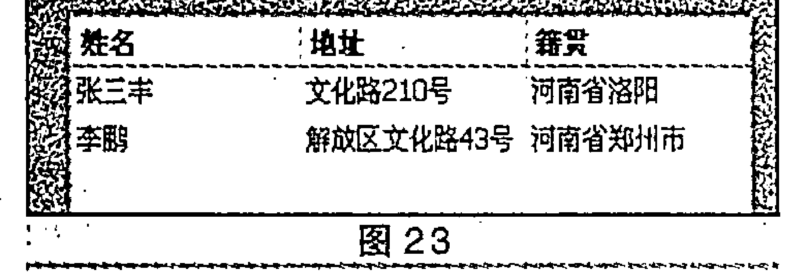

DataGrid也是用<mx:dataprovider>标签来提供数据，它有多种提供数据的方式，下面我们就介绍一种最简单的用行内数组来提供数据的方法，它要用到<mx:array>和<mx:object>两个标签，每个数组Object定义一行数据，Object中的属性定义每列数据。下面就是一个例子的源代码：

```xml
<mx:DataGrid>
    <mx:dataProvider>
        <mx:Array>
            <mx:Object>
                <姓名>张三丰</姓名>
                <籍贯>河南省洛阳</籍贯>
                <地址>文化路210号</地址>
            </mx:Object>
            <mx:Object>
                <姓名>李朋</姓名>
                <籍贯>河南省郑州市</籍贯>
                <地址>解放区文化路43号</地址>
            </mx:Object>
        </mx:Array>
    </mx:dataProvider>
</mx:DataGrid>
```

## 13. Menu
菜单控件用来产生一个弹出菜单，它用XML文档来定义弹出菜单的结构，用<menuitem>标签定义菜单及子菜单（图24）。菜单控件要用AS脚本中的Menu.createMenu()和Menu.show()方法来生成，而不是用MXML标签，因此，我们在设计Menu菜单控件时要在Code代码视图中编辑AS脚本。

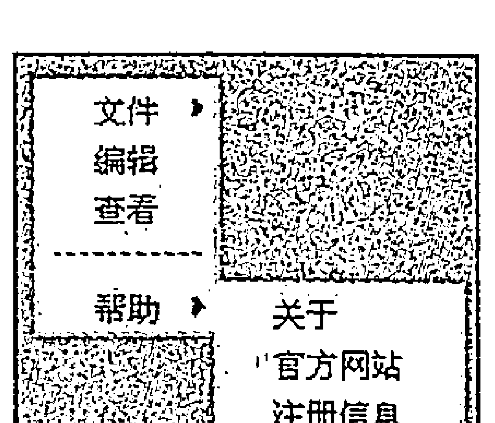

下面我们设计一个用按钮控制弹出菜单的例子，单击按钮时弹出菜单。源代码中的<mx:script>用来生成Menu事件，<mx:xml>用来提供菜单的结构及内容。

```xml
<?xml version="1.0" encoding="utf-8"?>
<mx:Application xmlns:mx="http://www.macromedia.com/2003/mxml">
    <mx:Script>
        <
![CDATA[
            import mx.controls.Menu;
            function createAndShow()
{
                var myMenu:Menu = Menu.createMenu(null, myMenuData);
                myMenu.show(100, 100);
            }
        ]]>
    </mx:Script>
    <mx:XML id="myMenuData">
        <menuitem label="文件">
            <menuitem label="打开" url="http://www.macromedia.com/" target="_blank"/>
            <menuitem label="新建"/>
        </menuitem>
        <menuitem label="编辑"/>
        <menuitem label="查看" type="check"/>
        <menuitem type="separator"/>
        <menuitem label="帮助">
            <menuitem label="关于" type="radio" groupName="one"/>
            <menuitem label="官方网站" type="radio" groupName="one"/>
            <menuitem label="注册信息" type="radio" groupName="one"/>
        </menuitem>
    </mx:XML>
    <mx:VBox>
        <mx:Button id="myButton" label="单击弹出菜单" click="createAndShow()"/>
    </mx:VBox>
</mx:Application>
```

## 14. MenuBar
MenuBar是一个菜单栏，与Menu控件不同，它是一个静态菜单控件，它是一个静态菜单，将始终显示在页面上，就像我们平时所用的应用程序菜单一样（图25）。MenuBar 也是用 DataProvider 来调用一个 XML 文档来实现，XML 文档用 <menuitem> 标签定义菜单的结构和内容，用 “type=separator” 属性来添加菜单之间的分隔条。下面是一个菜单栏实例的源代码：

```xml
<mx:MenuBar id="myMenuBar">
  <mx:dataProvider>
    <mx:XML>
      <menuitem label="记录">
        <menuitem label="添加"/>
        <menuitem label="删除"/>
        <menuitem type="separator"/>
        <menuitem label="查看">
          <menuitem label="所有记录"/>
        </menuitem>
      </menuitem>
      <menuitem label="地址">
      </menuitem>
      <menuitem label="添加">
      </menuitem>
      <menuitem label="删除">
      </menuitem>
    </mx:XML>
  </mx:dataProvider>
</mx:MenuBar>
```

## # 多媒体
Flex Builder 支持图像、音乐、视频、Flash 动画等多媒体文件，利用 Flex Builder 的相关控件就可以将这些多媒体文件导入到页面中，从而丰富页面的显示效果。

### 1. 导入图像
Flex Builder 支持的图像格式有5种，即JPG、GIF、PNG、SVG和SWF。导入图像的操作很简单，单击Controls标签页中的Image按钮，选择一个图像文件即可把它插入到当前页面中。图像的Source属性可以用相对路径，也可以用URL指定互联网上的绝对路径。

### 2. 导入Flash文件
Image 按钮除了导入普通的图像文件，还可以导入 SWF 文件。

### 3. 导入MP3文件
Flex Builder 允许用[Embed]语法来导入MP3，如：[Embed("music.mp3")] var mymusic:String; 因此，要想导入MP3文件，必须要编写AS脚本，下面我们给出一个实例，页面中有一个“播放”按钮和一个“停止”按钮，单击这两个按钮就可以播放/停止MP3。源代码如下：

```xml
<?xml version="1.0" encoding="utf-8"?>
<mx:Application xmlns:mx="http://www.macromedia.com/2003/mxml">
  <mx:Script>
    <
![CDATA[
      var snd:Sound;
      [Embed("srkl.mp3")
]
      var soundSymbol:String;
      function startSound() {
        snd = new Sound;
        snd.attachSound(soundSymbol);
        snd.start();
      }
      function stopSound() {
        snd.stop();
      }
    ]]>
  </mx:Script>
  <mx:VBox>
    <mx:Button label="播放" id="b1" click="startSound();"/>
    <mx:Button label="停止" id="b2" click="stopSound();"/>
  </mx:VBox>
</mx:Application>
```

### 4. 导入视频文件
Flex Builder 支持 FLV 流媒体视频文件的导入，FLV 可以通过 Flash MX 来制作，通过 Flash MX 可以将 MPEG、AVI 等多种视频格式转换为 FLV 格式。Flex Builder 提供了三个控件用于视频的播放和控制。

- MediaDisplay: 显示控件，直接在页面中插入一个视频文件，虽然该控件不可见，但在浏览页面时，它会显示视频图像。
- MediaController: 播放器控件，在页面中添加一个播放器控制条。
- Media Playback: 回放控件，它包括 MediaDisplay 和 MediaController 两部分，可以将显示和控制视频播放合二为一。

#### (1) 用MediaDisplay插入一个视频文件
单击 Controls 标签页中的 MediaDisplay 按钮，弹出对话框，输入 ID 值，单击 Media 右边的文件夹按钮，选中视频文件，最后单击 OK 按钮，即可。

#### (2) 插入MediaController控制器控件
我们在上面的页面中插入一个播放控制条，单击 Controls 标签页中的 MediaController 按钮，在出现的对话框中输入刚才插入的视频文件的 ID 值，然后单击 OK 按钮即可。

#### (3) 同时插入视频和控制条
用 MediaDisplay 和 MediaController 插入的是两个单独的控件，下面我们用 MediaPlayback 控件同时插入视频和控制条，这两部分是一个整体，不能单独分开，方法是：单击 MediaPlayback 按钮，弹出对话框，选中视频文件，单击 OK 按钮即可（图 26）。注意：我们可以用 ControlPlacement 属性改变图像和控制条的排列方式，有上、下、左、右 4 种方式。


### 图表(Chart)
图表可以直观地表达数据之间的关系，Flex Builder 提供了七种图表样式,即区域图 (AreaChart)、条形图 (BarChart)、气泡图 (BubbleChart)、柱状图 (ColumnChart)、折线图 (LineChart)、饼图 (PieChart)、散点图 (PlotChart)。每种图表都有自己的类型、控件和系列。图表控件定义图表的类型，DataProvider 提供图表数据、图表轴文字以及其他属性，图表系列 (Series) 确定图表显示的数据。用户可以使用图表系列指定一个单一的数据系列，也可以指定多个系列，还可以用图表系列确定每一个数据系列的外观。每种图表都有自己的建立方法，限于篇幅，我们这里只介绍一种最常用的柱状图的建立方法（图27），其他图表的建立可参考Flex Builder的帮助文件。下面是一个柱状图的源代码：

```xml
<?xml version="1.0" encoding="utf-8"?>
<mx:Application xmlns:mx="http://www.macromedia.com/2003/mxml">
    <mx:Script>
        var expenses = [{Month: "一月", Profit: 2000, Expenses: 1500},
                       {Month: "二月", Profit: 1000, Expenses: 200},
                       {Month: "三月", Profit: 2500, Expenses: 1500},
                       {Month: "四月", Profit: 1500, Expenses: 500}];
    </mx:Script>
    <mx:Panel title="支出和利润统计表">
        <mx:ColumnChart id="column" dataProvider="{expenses}">
            <mx:horizontalAxis>
                <mx:CategoryAxis dataProvider="{expenses}" categoryField="Month"/>
            </mx:horizontalAxis>
            <mx:series>
                <mx:Array>
                    <mx:ColumnSeries xField="Month" yField="Profit" name="利润"/>
                    <mx:ColumnSeries xField="Month" yField="Expenses" name="支出"/>
                </mx:Array>
            </mx:series>
        </mx:ColumnChart>
        <mx:Legend dataProvider="{column}"/>
    </mx:Panel>
</mx:Application>
```

代码说明：这个柱状图包含在一个Panel容器中，它用一个AS脚本定义了一个变量，用DataProvider提供数据，用<mx:series>定义柱形，最后用<mx:legend>来显示尾注。至此为止，我们简要介绍了Flex Builder1.5的基本操作，事实上Flex Builder的内容非常丰富，除了我们上面介绍的内容外，它还有样式表、行为和特效、事件、数据绑定等高级内容，这都需要你进一步学习，限于篇幅，这里就不详细介绍了。由于Flex是一项崭新的技术，中文的参考资料不多，但有许多Flex爱好者痴迷于这项技术，相信随着越来越多的人了解Flex，Flex的应用一定会越来越广泛。欢迎大家就学习中的问题和经验与我交流，我的信箱是：flex88@56.com，让我们共同努力，推动Flex在中国的普及和应用。

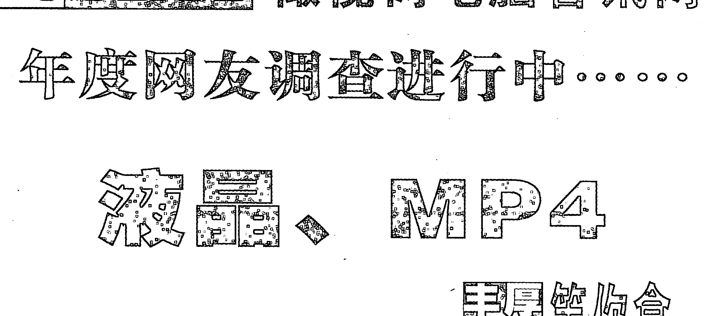

## # 教你用 DW8 编写留言本系统
雁过留声，网过留痕。自从网页有了交互功能后，一时间留言簿，BBS在网络中百花齐放，万千网虫都习惯了在网上留下自己生活中的点点滴滴。虽然留言本在功能上要比BBS稍逊色一些，但是它小巧的身材和简便的操作却成了个人网站的必备。

由于留言本系统功能相对简洁，因此开发一套留言本系统也就不是什么难事了，接下来就让大家跟着笔者一步一步地来完成一个留言本系统的开发。当然，在此之前建议你先熟悉 DW8 的一般应用以及一些简单的 HTML 语法。

注：DW8 是 Dream Weaver8.0 的简称。

### 1. 用 IIS 架设 Web 服务器
开发一个网站我们需要搭建一个测试平台，也就是常说的 Web 服务器。这里以 Windows XP Professional 系统为例，在 Windows XP Professional 中自带了一个 IIS（Internet 信息服务）组件，但 IIS 并不是默认安装的，我们可以通过以下方法进行安装。

#### （1）安装 IIS
第一步：依次选择 “开始”→“设置”→“控制面板”→“添加或删除程序”，打开 “添加或删除程序” 对话框。

第二步：在 “添加或删除程序” 对话框左侧的选项面板中选择 “添加/删除 Windows 组件” 选项，打开 “Windows 组件向导” 对话框。

第三步：选择 “Internet 信息服务（IIS）” 复选框，然后点击 “下一步” 按钮，并依照向导提示完成 IIS 组件的添加。

#### （2）设置 Web 站点
在安装了 IIS 后会在系统中添加一个 “Internet 信息服务” 管理程序，以供用户对站点进行管理操作。依次选择 “开始”→“设置”→“控制面板”→“管理工具”→“Internet 信息服务”，打开 “Internet 信息服务” 对话框。

IIS 创建的默认站点主目录为 “C:\Inetpub\wwwroot”，并将主页的文件名设置为 Default.htm 或 Default.asp，即可通过 Web 浏览器访问该 Web 服务器。我们在此搭建网站测试平台需要对默认目录进行修改。

第一步：在 “Internet 信息服务” 对话框中，点击左侧列表中的 “+” 号展开至 “默认网站” 项，并在该项上右击鼠标，在弹出的菜单中选择 “属性”，打开 “默认网站 属性” 对话框。

第二步：点击对话框中的 “主目录” 选项卡（如图1），在 “本地路径” 文本框中显示的就是站点的主目录，点击 “浏览” 按钮，打开 “浏览文件夹” 对话框，选择留言本程序文件所在的路径。

第三步：IIS 设置了 “Index.htm”、“Default.htm”、“Default.asp” 和 “iisstart.asp” 四个默认文档，当用户在浏览器中输入站点服务器的地址后，IIS 会自动查找并打开主目录下以上四个文档命名的文档，我们可以自定义 IIS 打开的默认文档。由于一般网站系统的首页都为 “Index.asp”，所以我们需要修改默认文档。在 “默认网站 属性” 对话框中选择 “文档” 选项卡，点击 “添加” 按钮，打开 “添加默认文档” 对话框，在 “默认文档名” 文本框中输入自定义的默认文档文件名，然后点击 “确定” 按钮。

第四步：回到 “文档” 选项卡并选择刚才添加的默认文档名，然后点击 “↑”、“↓” 图形按钮调整其优先级别，在这里我们将新增的 “Index.asp” 作为站点的首选默认文档，将其调整至最顶端。

#### （3）测试 IIS
在安装了 IIS 后，可在浏览器地址栏中输入 http://127.0.0.1 或域名 http://localhost，通过查看这个默认的站点即可检查 IIS 是否正常运行。

提示：http://127.0.0.1 是一个特殊的 IP 地址，它代表正在使用的计算机的 IP 地址，与这个 IP 地址相对应的域名则是 http://localhost。

### 2. 方案设计
开发一个网站系统，我们首先得对其功能需求，数据结构等进行分析，然后才是设计页面和程序设计。因此这第一步是至关重要的，这样不仅可以让我们很清楚地了解整个网站的设计流程，而且可以大大减低重复工作。

### （1）程序结构说明
显示留言、发表留言、回复留言、删除留言、编辑留言、管理留言、管理登录，这就是一个留言本所必须有的几个功能，因此我们将这个留言本系统设计了以下几个页面：

- Index.asp：留言本首页，用来显示留言；
- Add.asp：发布留言；
- Admin.asp：管理留言；
- Reply.asp：回复留言；
- Del.asp：删除留言；
- Edit.asp：编辑留言；
- Login.asp：管理登录；

#### （2）数据库设计
从以上的程序结构来看，我们的数据库需要用到两个表，一个表用来存储留言信息，如昵称、QQ、E-mail以及留言标题和留言

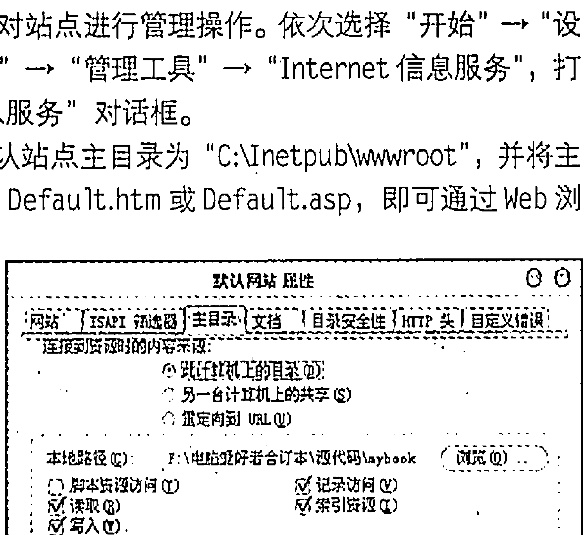
```

## PART 4 教你用DW8编写网站系统

留言内容等信息，另一个表则用来存储管理员账号和密码。

-   第一步：首先打开ACCESS数据库软件，新建一个空数据库，并将该数据库命名为“mybook.mdb”。
-   第二步：在“mybook”数据库窗口中点击“新建”工具按钮打开“新建表”对话框。在对话框的列表中选择“设计视图”，接着点击“确定”按钮，然后在随后的窗口中添加相应的留言信息字段（如图2），并添加初始化信息，最后将该表保存，并命名为“guestbook”。

注意：在添加了相应的字段后，我们还需要对字段的长度进行设置，比如name字段是用来存放用户昵称的，所以可以将字段的长度设在15左右，也就相当于7个汉字所占用的长度了。还有要将ID字段设为主键，确定数据唯一性以保证在管理时能准确查找到相应记录。

-   第三步：同样打开“新建表”对话框选择“设计视图”，并添加UserName和Password两个字段，最后将该表保存，并命名为“admin”。

### 3. 具体实现

定义好程序结构和数据结构后，接下来我们就可以着手页面设计和程序设计了。当然，在开始设计这套系统之前我们还需要在DW8中定义站点，其设置方法相对简单，在此就不再赘述。另外还得准备在留言本中必不可少的用户头像和留言表情的图片，分别将这些图片存放到Face和Icons文件夹中供以后使用。

### （1）显示留言——Index.asp

-   第一步：运行DW8，新建一个ASP文件，并将其命名为Index.asp，接着设计显示留言的界面（如图3）。
-   第二步：依次选择窗口菜单中的“插入”→“应用程序对象”→“记录集”，打开“记录集”对话框。在该对话框的“名称”文本框中输入“RS”，然后点击“定义”按钮打开“连接到站点”对话框。
-   第三步：点击“新建”按钮，在随即弹出的菜单中选择“自定义连接字符串”，打开“自定义连接字符串”对话框。在“连接名称”文本框中输入“Conn”，接着在“连接字符串”文本框中输入“"Provider=Microsoft.Jet.OLEDB.4.0;Data Source="&Server.MapPath("/database/mybook.mdb")”，然后选择“使用测试服务器上的驱动程序”单选框。此时点击“测试”按钮可测试是否能正常连接到数据库，最后点击“确定”按钮回到“记录集”对话框。

注意：在连接数据库之前必须在IIS中正确设置系统网站所在的目录，另外“连接字符串”中的“/database/mybook.mdb”是数据库文件所在的路径，可根据实际情况进行更改。

-   第四步：在“记录集”对话框的“连接”下拉列表框中选择刚才定义的字符串连接“Conn”，在“表格”下拉列表框中选择“guestbook”，接着选择“全部”单选框，在“排序”下拉列表框中选择“time”，选择排序方式为“降序”。
-   第五步：点击“确定”按钮，之后程序会弹出一个对话框，提示“记录集已经添加到了该页面”，这表示成功地创建了连接。
-   第六步：接下来是绑定数据到页面，首先绑定头像图片。选择页面中的头像图片，然后在“属性面板”中点击“源文件”文本框后的那个文件夹图标，打开“选择图像源文件”对话框。选择“数据源”单选框，然后在“域”列表中选择“head”字段名称，最后点击“确定”按钮。
-   第七步：选择页面中的E-mail图片，然后点击“属性面板”中“链接”文本框后的文件夹图标，其后的设置同上，随后再以此方法设置“主页”链接。设置完成后在“链接”文本框中添加“mailto:<%=(RS.Fields.Item(‘email’).Value)%>”。

另外还有一个QQ链接，我们要实现的效果是将鼠标移到QQ图标上时会显示该留言者的QQ号码，因此QQ链接的设置稍有不同。在页面中选择QQ图标，然后转到代码视图，将被选择的代码替换为“"/>”。

-   第八步：选择页面中的昵称字样（即留言昵称），然后按“Ctrl+F10”组合键展开“Application”面板中的“绑定”面板（如图4），在记录集列表中选择“name”字段，然后点击“插入”按钮。通过此方法分别添加表情、留言内容、站长回复、留言时间等字段，现在所有的数据都绑完了，但是不要高兴得太早，这样的留言板永远只会显示最新的一条留言记录，所以我们还需要设定重复域和翻页功能。
-   第九步：选择页面右侧表格中嵌套的那个表格，然后依次选择窗口菜单中的“插入”→“应用程序对象”→“显示区域”→“如果记录集不为空则显示”，在打开对话框的“记录集”下拉列表框中选择“RS”，然后点击“确定”按钮。再依次选择窗口菜单中的“插入”→“应用程序对象”→“重复区域”，打开“重复区域”对话框。在对话框的“记录集”下拉列表框中选择“RS”，接着设置每页显示为5条记录，然后点击“确定”按钮。这一步操作得到的结果是，当数据库中的留言记录不为空时，则每页显示5条留言记录。
-   第十步：选择页面文件中的“首页”字样，依次选择窗口菜单中的“插入”→“应用程序对象”→“记录集分页”→“移至第一步记录”，在打开的对话框中选择默认设置，只需点击“确定”按钮即可。以此方法设置上一页、下一页、尾页几个链接（如图5）。

| 字段名称 | 数据类型 | 说明 |
|----------|----------|------|
| ID       | 自动编号 | 主键 |
| name     | 文本     | 用户昵称 |
| email    | 文本     | 电子邮箱 |
| homepage | 备注     | 主页 |
| time     | 日期/时间 | 发表时间 |
| reply    | 备注     | 站长回复 |
| face     | 文本     | 留言表情 |
| title    | 文本     | 留言标题 |

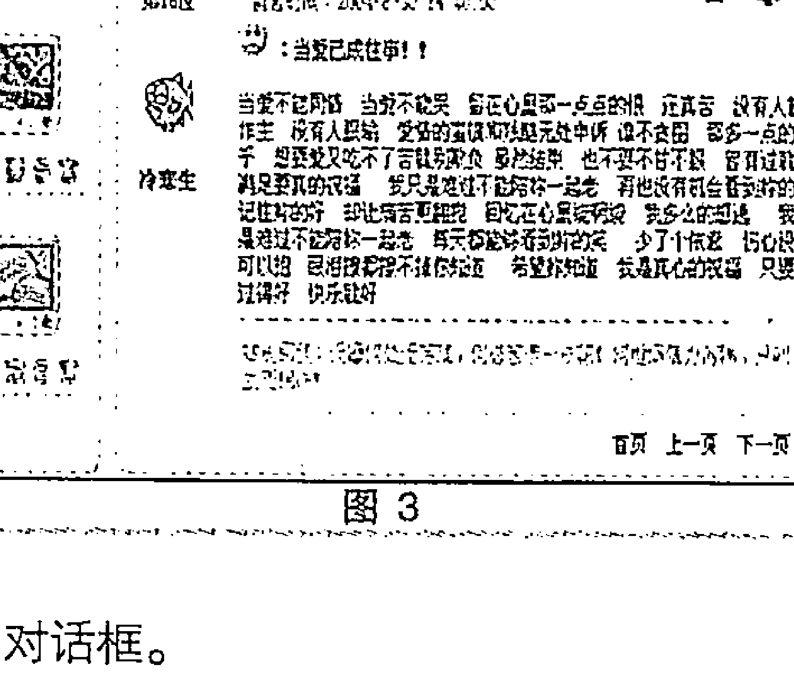

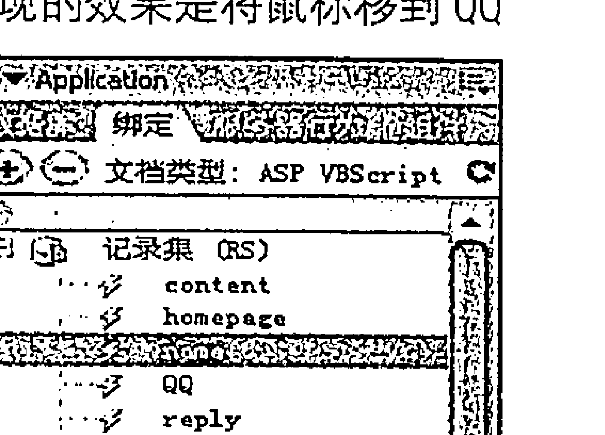

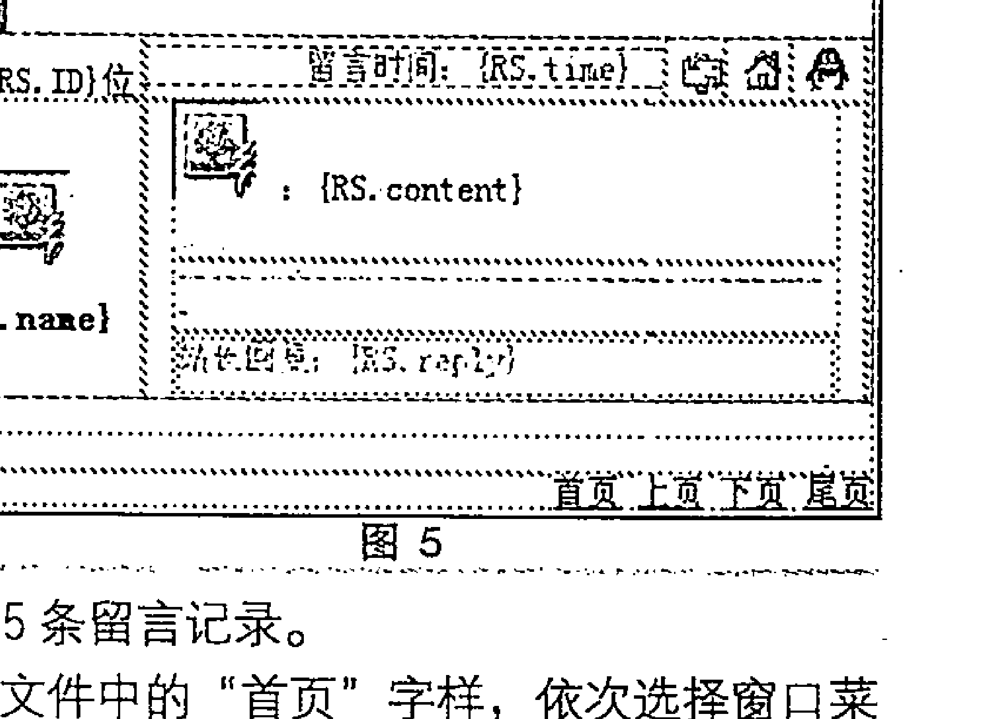

```
mailto:<%=(RS.Fields.Item(‘email’).Value)%>
"/>
```

第十一步：最后将左侧“我要留言”和“留言管理”分别链接到add.asp和admin.asp即可。至此，首页的界面设计和程序设计工作完成了。

### （2）我要留言——Add.asp

“我要留言”页面要完成的工作主要是将用户的留言昵称、QQ、E-mail、头像、表情、留言标题、留言内容等信息写入到数据库。

第一步：设计“我要留言”的页面（如图6），将光标定位在如图6所示的“此处设置留言项目”位置。

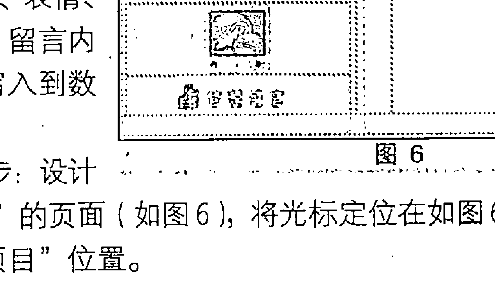

第二步：依次选择“插入”→“应用程序对象”→“插入记录”→“Record Insertion Form Wizard”，打开“插入记录表单”对话框。在“连接”下拉列表框中选择“Conn”，在“插入到表格”下拉列表框中选择“guestbook”，接着在“插入后，转入”文本框中填入“Index.asp”，然后在“表单字段”列表中删除ID、Reply和Time三个字段，并调整各项排列的顺序（在此列表中各字段排列顺序即网页中各字段的排列顺序）。

在字段列表中选择“Content”，然后在“显示为”下拉列表框中选择“文本区域”；在字段列表中选择“Head”，然后在“显示为”下拉列表框中选择“菜单”。点击“菜单属性”按钮打开“菜单属性”对话框。选择“手动”单选框，然后点击+号按钮添加菜单中的项目，并在“值”文本框中填写每个项目对应的头像图片路径，如“face/1.gif”、“face/2.gif”等。此菜单的项目数即留言本系统中可供用户选择的头像数量，其命名方式可自定义，如NO.01～NO.20；在字段列表中选择“Face”，然后在“显示为”下拉列表框中选择“单选按钮组”，点击“单选按钮组属性”属性，在打开的对话框中添加按钮组（每个按钮对应一个表情，可根据实际情况进行添加），并在“值”文本框中填写每个项目对应的表情图片路径，如“Icons/1.gif”、“Icons/2.gif”等，设置完成后点击“确定”按钮。

第三步：现在留言的大致功能已经完成，但是还得调整一下留言项目的位置并将留言项目的描述改为中文，还需要设置留言头像和表情功能。首先在“留言头像”下拉列表框后插入一个头像图片，接着在页面中选择该图片，然后在“属性面板”中将该图片的ID设置为“iface”。

第四步：选择“留言头像”下拉列表框并转换到代码视图，将被选中代码中的“<select name="head">”替换为“<select name="head" onchange="document.images['iface'].src=options[selectedIndex].value;backwav.src='facechange.wav';" size="1" style="border: 1px solid #E6E6E6">”。此时在浏览器中预览该页面，你会发现在“留言头像”下拉列表框中选择不同的项目，其后的头像图片会相应地改变，这样我们就完成了留言头像的实时预览。

第五步：接下来是设置表情，这个操作相对简单，只需要把单选按钮组中的按钮名称替换为相应的表情图片即可。最后再添加一个按钮，添加后在页面中选择该按钮，接着在“属性面板”中将“Value”的值设为“清除留言”，并选择“重设表单”单选框。到这一步就完成了“我要留言”页面的页面设计和程序设计（如图7）。

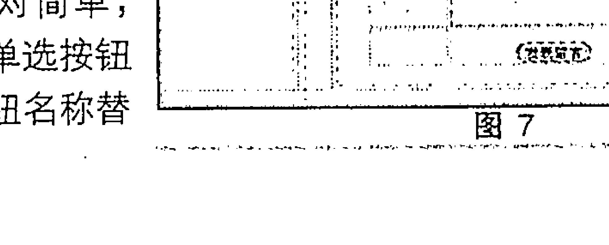

### （3）管理登录——Login.asp

由于管理员需要对留言进行管理，因此需要制作一个进入管理页面的入口，那就是管理登录页面。

第一步：设计管理登录页面的界面（如图8），分别将用户名和密码两个文本表单的名称设置为admin和password。

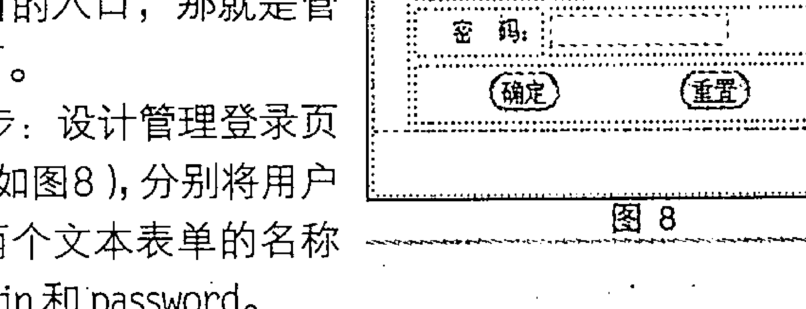

第二步：依次选择“插入”→“应用程序对象”→“用户身份验证”→“登录用户”，打开“登录用户”对话框。

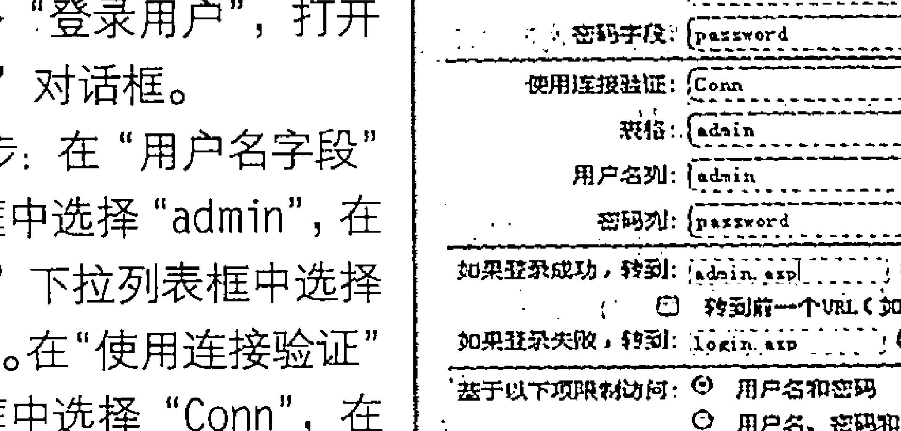

第三步：在“用户名字段”下拉列表框中选择“admin”，在“密码字段”下拉列表框中选择“password”。在“使用连接验证”下拉列表框中选择“Conn”，在“表格”下拉列表框中选择“admin”，在“用户名列”下拉列表框中选择“admin”，在“密码列”下拉列表框中选择“password”。在“如果登录成功，转到”文本框中填入“admin.asp”，在“如果登录失败，转到”文本框中填入“login.asp”（如图9），最后点击“确定”按钮。

这样只有当正确输入用户名和密码后才跳转到管理留言页面，否则一直停留在登录页面。

### （4）管理留言——Admin.asp

管理留言页面的功能主要是编辑、删除、回复留言等功能，其他的留言信息显示内容与Index.asp页面差不多。因此可以直接将Index.asp页面另存为Admin.asp，然后添加上编辑、删除、回复等管理功能。

将Index.asp页面另存为Admin.asp，对于删除、编辑和回复的数据绑定很简单，主要是在链接的参数中传递当前留言的ID号。在页面中选中“编辑”字样，接着在“属性面板”的“链接”文本框中输入“edit.asp?id=<%=(rs.Fields.Item("ID").Value)%>”。以此方法设置删除和回复链接，将“删除”字样的链接设置为“del.asp?id=<%=(rs.Fields.Item("ID").Value)%>”，将“回复”字样的链接设置为“reply.asp?id=<%=(rs.Fields.Item("ID").Value)%>”。

由于还未经技术处理，因此如果知道管理留言页面地址的用户可绕过这个入口直接登录到管理页面，这对于一个网站系统来说是十分危险的，因此我们需要添加对这个页面的限制访问功能。

第一步：依次选择“插入”→“应用程序对象”→“用户身份验证”→“限制对页的访问”，打开“限制对页的访问”对话框。

第二步：在该对话框中选择“用户名和密码”单选框，然后在“如果访问被拒绝，则转到”文本框中填入“login.asp”，最后点击“确定”按钮。

第三步：最后我们再添加一个“退出管理”功能，依次选择“插入”→“应用程序对象”→“用户身份验证”→“注销用户”，打开“注销用户”对话框。选择“单击链接”单选框，并在其下...

回复留言和编辑留言的功能都相同，是对数据库中已有的数据进行修改和更新，因此制作方法也是一样的，只是操作的留言项目不同而已。下面以回复留言页为例进行讲解。

### （5）回复留言和编辑留言——Reply.asp、Edit.asp

-   第一步：首先创建一个记录集，由于在管理留言页面中将留言的ID号传递给了回复留言页面，因此在创建记录集时选择ID和Reply两个字段，并在“筛选”下拉列表框中选择“ID”。
-   第二步：依次选择“插入”→“应用程序对象”→“更新记录”→“更新记录表单向导”，打开“更新记录表单”对话框。该对话框的布局和设置与插入记录表单相似，不同的是需要在“唯一键列”下拉列表框中选择“ID”。在该对话框中只留下“Reply”字段，并在“显示为”下拉列表框中选择“文本区域”。
-   第三步：调整界面（如图11），最后不要忘了也给回复页加上限制访问功能。

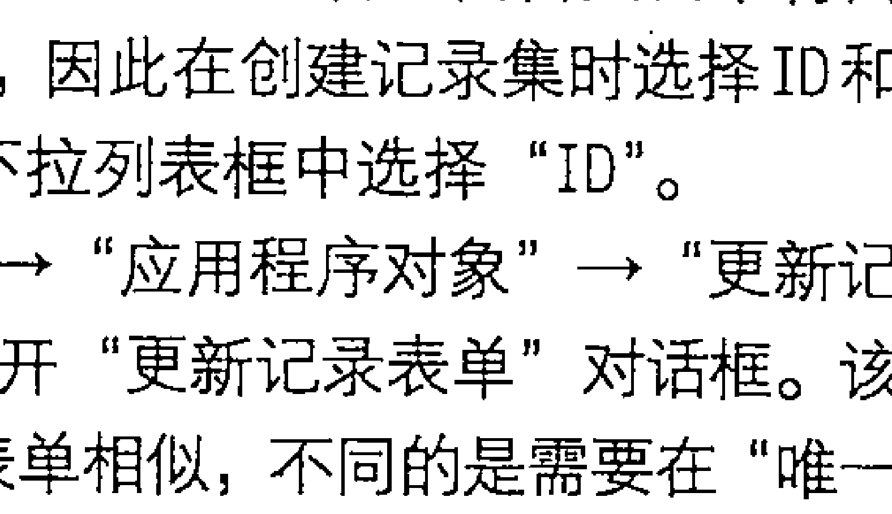

### （6）删除留言——Del.asp

-   第一步：首先设计删除留言界面（如图12）。
-   第二步：依次选择“插入”→“HTML”→“文件头标签”→“刷新”，打开“刷新”对话框。将延迟时间设为3秒，然后在“转到URL”文本框中填入“admin.asp”。
-   第三步：依次选择“插入”→“应用程序对象”→“命令”，打开“命令”对话框，在该对话框中设置如图13所示，最后添加页面限制访问功能。


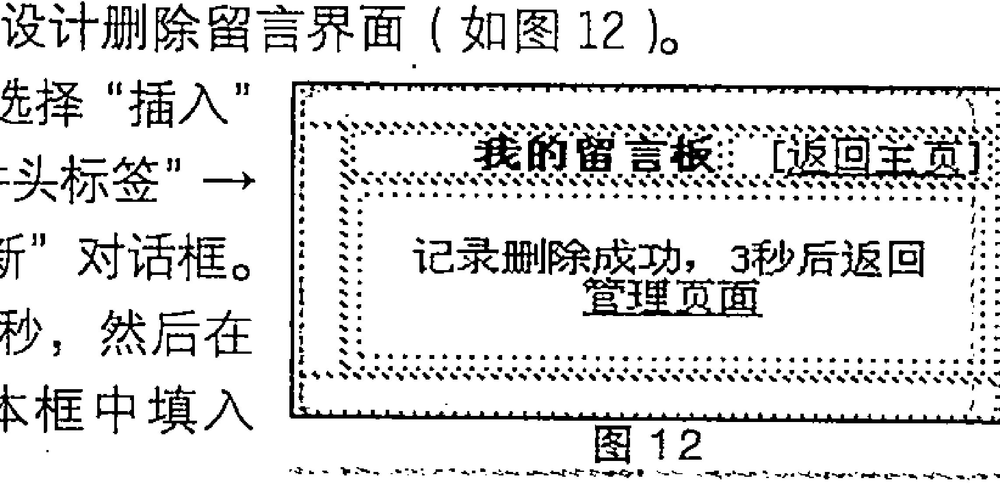

一套完整的图书查询系统包括图书管理、图书查询两大部分功能，在这里我们只对图书查询功能的制作进行讲解。我们将图书查询分成了图书目录查询和图书名称查询两种查询方式，选择按图书目录查询方式，系统会显示所有的图书目录，选择其中一个目录则会显示该目录下所有图书的详细资料。而选择按图书名称查询方式，系统会进入查询页面，当用户在页面中输入要查询的图书名称，系统会在数据库中进行查询，并显示出符合相应条件的图书信息。

我们这个查询系统共需要制作五个页面，其页面名称及功能如下：

-   Index.asp：首页，图书查询系统的入口；
-   LBsearch.asp：图书类别查询页面，显示系统中所有的图书目录；
-   MCsearch.asp：图书名称查询页面，在该页面中可输入图书名称进行查询；
-   LBShow.asp：用户在进行图书类别查询后的结果显示页面；
-   MCShow.asp：用户在进行图书名称查询后的结果显示页面。

#### （2）数据库设计

-   第一步：运行ACCESS，新建一个空数据库，并将数据库命名为Book。
-   第二步：在新建的数据库中新建一个表，并命名为leibie。在该表中添加“类别号”和“类别名称”两个字段，将这两个字段的数据类型都设为文本型，将“类别号”字段的字段大小设为6，将“类别名称”字段的字段大小设为20。
-   第三步：再新建一个表，将该表命名为tushu。在该表中添加编号、书名、作者、出版者、版次、单价、类别名称、是否借出和备注等九个字段，并设置相应的数据类型和字段长度（如图14）。
-   第四步：在设计好了两个表格的数据结构后，分别在两个表格中添加一些初始化信息供程序测试。

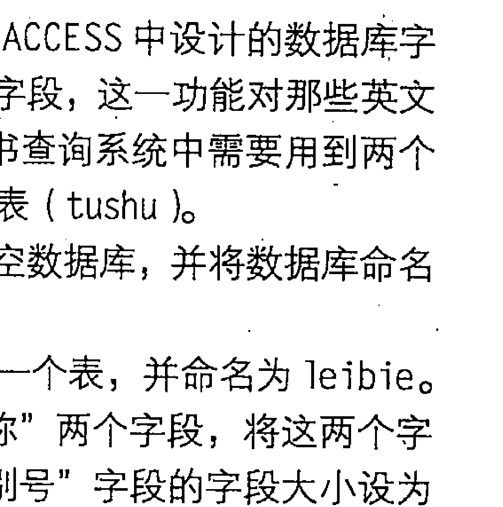

## 2. 具体实现

在开始制作网站之前先要在DW8中定义站点，而且一定要在IIS中将站点目录设置为本系统源文件所在的目录，否则在DW中将不能正确连接到数据库。本系统中共需要设计五个页面，由于界面设计的工作量相对较小，在制作时你可以先将这五个页面的界面设计好，然后再添加相应的功能。

### （1）首页——Index.asp

首页的制作相对简单，只需要设置两个超级链接即可（如图15）。其中“按图书类别查询”链接到LBsearch.asp页面，“按图书名称查询”链接到MCsearch.asp页面。


### （2）按类别查询——LBsearch.asp

首先我们来制作系统的类别查询功能，在该页面中需要列出数据库中所有的图书目录信息。大家已经制作了前面的留言本系统，相信在接下来的制作中就能得心应手了。

第一步：设计类别查询页面的界面（如图16），依次选择“插入”→“应用程序对象”→“记录集”，打开“记录集”对话框。


第二步：在记录集对话框中将“名称”设置为“RS”，接着点击“定义”按钮设置自定义字符串，并将自定义字符串的名称设置为“Conn”，然后在“表格”下拉列表框中选择 leibie 表，最后选择“全部”单选框。

第三步：在设计好的页面中将光标定位到“此处显示图书目录”字样的位置，然后按“Ctrl+F10”组合键展开“Application”面板中的“绑定”选项卡。在选项卡列表中选择“类别名称”字段，然后点击“插入”按钮。

第四步：选择插入“类别名称”字段的表格，接着依次选择“插入”→“应用程序对象”→“重复区域”，打开“重复区域”对话框。在该对话框中将显示的记录设为每页5条。

第五步：在页面中选择插入“类别名称”字段的代码，然后在“属性面板”的“链接”文本框中输入“LBShow.asp?类别名称=<%=(rs.Fields.Item("类别名称").Value)%>”。这样当点击图书目录时系统将会转入 LBShow.asp 页面显示该目录下的所有图书信息。

第六步：接下来是设计首页、上一页、下一页、末页的链接，其方法与我们在留言本系统中的制作方法相同。

### （3）类别查询结果显示页面——LBShow.asp

类别查询结果显示页面中要实现的就是显示符合查询条件的图书信息。其中要制作的各部分功能包括绑定数据库字段、重复显示域、区域显示条件设置以及设置首页、上一页、下一页和末页等几方面。

第一步：设计页面界面，接着需要创建记录集。在“记录集”对话框中选择“tushu”表格，并在“筛选”下拉列表框中选择“类别名称”（如图 17）。

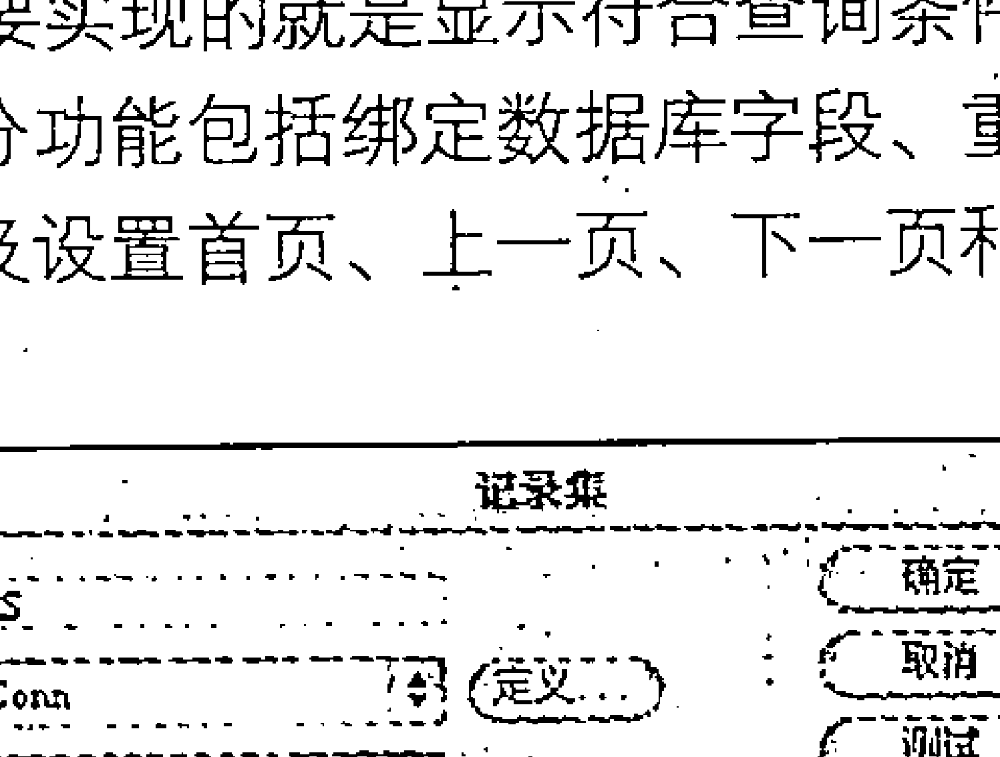

第二步：按下“Ctrl+F10”组合键，展开“绑定”选项卡，在该选项卡中绑定需要在页面中显示的字段。

第三步：选择页面中绑定字段的所有单元格，然后依次选择“插入”→“应用程序对象”→“重复区域”，打开“重复区域”对话框，在该对话框中将每页显示的记录设为10条。

第四步：再次选择页面中绑定字段的所有单元格，接着依次选择“插入”→“应用程序对象”→“显示区域”→“如果记录集不为空则显示”，然后在打开的对话框中点击“确定”按钮即可。


第五步：最后是设计首页、上一页、下一页、末页的链接，该页面的最终页面设置如图18。

### （4）按名称查询——MCsearch.asp

由于按名称查询页面要将用户输入的图书名称传递到另外一个页面，因此制作方法与按目录查询的页面稍有不同。

第一步：设计页面界面（如图 19），首先将光标定位在“图书名称”后的单元格中，接着依次选择“插入”→“表单”→“表单”，创建一个新表单。在页面中选择该表单，并在“属性面板”的“动作”文本框中输入“MCShow.asp”。


第二步：然后在该表单中添加一个文本表单和一个按钮，将文本表单的名称设为“bookname”。至此，本页面的设计工作就完成了，很简单吧！

接着我们绑定数据库字段到页面。

### （5）名称查询结果显示页面——MCShow.asp

名称查询结果显示页面与类别查询结果显示页面的制作流程和界面基本一致，唯一不同的地方，是在名称查询结果显示页面中新建记录集时，在“记录集”对话框的“筛选”下拉列表框中选择“书名”，接着在其下的下拉列表框中选择“表单变量”，然后在后面的文本框中输入“Bookname”。

## 用DW8编写网站调查系统

做一个网站容易，但如何发展经营自己的网站却是站长们一直头痛的事。如一个网上书店，怎样才能了解网友的购书方式以及通常对哪些类别的书籍感兴趣，作为网站站长的你，这些是必须要了解的，那怎样才能做到这一点呢?这就是我们今天要说到的——在你的网站上加个投票系统。有了这个投票系统，你可以调查网友的消费动向，以便更好地经营你的网络SHOP。

### 1. 方案设计

要编写一个完整的网站调查系统是需要涉及许多功能的，如系统管理功能、限制一个用户只能投一次票等。在这里我们旨在让大家了解一个调查系统所必须的功能，如统计每个投票项目的投票数量和百分比等。

### （1）程序结构说明

本系统共涉及到三个页面：Index.asp、Update.asp 和 View.asp，其中 Index.asp 是供用户投票，用户投票后将转入 Update.asp 页面，并将投票结果存入到数据库。在 Update.asp 页面中点击“查看投票结果”链接将转入 View.asp 页面，查看投票的整个情况。

#### （2）数据库设计

数据库文件中只有一个表，该表中包括所有投票项目和投票数量的字段，表中只保存一条记录。运行 ACCESS，新建一个数据库文件，并命名为 Vote.mdb。在该数据库中新建一个 Vote 表，该表的数据结构如图20 所示。为了方便测试，在该表中添加一条记录。

| 字段名称 | 数据类型 | 说明 |
| :--- | :--- | :--- |
| ID | 自动编号 | |
| Title | 文本 | 投票主题 |
| Class1 | 文本 | 投票选项1 |
| Class2 | 文本 | 投票选项2 |
| Class3 | 文本 | 投票选项3 |
| Class4 | 文本 | 投票选项4 |
| ClassNum1 | 数字 | 选项1投票数量 |
| ClassNum2 | 数字 | 选项2投票数量 |
| ClassNum3 | 数字 | 选项3投票数量 |
| ClassNum4 | 数字 | 选项4投票数量 |## PART 4 教你用DW8编写网站系统

## 2. 具体实现

#### (1) 首页设计——Index.asp

第一步：新建一个 Index.asp 页面，依次选择“插入”→“表单”→“表单”，插入一个新的表单到页面。

第二步：选择该表单，接着在“属性”面板中将表单名称设为“vform”，然后在“动作”文本框中输入“Update.asp”。

第三步：在表单中新建一个表格，并调整好投票页面的大致界面框架。然后依次选择“插入”→“表单”→“单选按钮”。插入后选择该单选按钮，在“属性”面板中将该单选按钮的名称设为“rbResult”，在“选定值”文本框中输入“ClassNum1”。

注意：输入的“选定值”与数据库中的表 Vote 的一个字段名相同，而表 Vote 的 ClassNum1 字段保存的是其中一个投票选项的投票数量，在点击投票按钮提交后，将 ClassNum1 作为单选按钮的值传出，并与数据库中的字段名联系起来。

第四步：接下来再创建三个单选按钮，将这三个单选按钮的名称都设为“rbResult”，在“选定值”文本框中分别输入 ClassNum2、ClassNum3、ClassNum4，与表 Vote 中的另外三个字段相同。

第五步：依次选择“插入”→“表单”→“隐藏域”，在页面中插入一个隐藏域。选中该隐藏域，然后在“属性面板”中将其名称设为“id”，在“值”文本框中输入“<%=(RS.Fields.Item("id").Value)%>”。最后再插入一个表单按钮，将其“Value”值设置为“投上一票”。

第六步：依次选择“插入”→“应用程序对象”→“记录集”，打开“记录集”对话框。在“名称”文本框中输入“RS”，点击“定义”按钮定义连接字符串。定义好字符串后再回到“记录集”对话框，选择“选定的”单选框，然后在其列表中选择 ID、Title、Class1、Class2、Class3、Class4 几个字段，最后点击“确定”按钮。

第七步：按下“Ctrl+F10”组合键，展开“绑定”选项卡。在该选项卡中将投票主题和投票项目等字段绑定到页面中（如图21），这样 Index.asp 页面的制作就完成了。

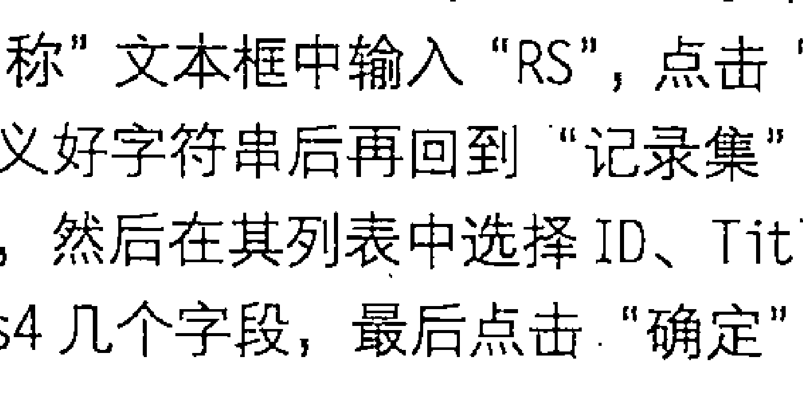

#### (2) 更新投票记录页面——Update.asp

Update.asp 只是一个过渡页面，在该页面中我们需要对从 Index.asp 页面中传递过来的值统计到数据库中，并在该页面中点击相应的链接转入投票结果显示页面。

第一步：设计页面界面（如图22），将“查看投票结果”的链接指向 View.asp 页面。

第二步：依次选择“插入”→“应用程序对象”→“命令”，打开“命令”对话框。在对话框的“类型”下拉列表框中选择“更新”，接着在“SQL”文本框中输入“UPDATE vote SET strUpdate =strUpdate+1 WHERE id=vid”，然后在“变量”列表中分别添加“名称”为strUpdate，“运行值”为Request.form("rbResult"), 和“名称”为“vid”，“运行值”为Request.form("id")的两个变量（如图23），最后点击“确定”按钮。

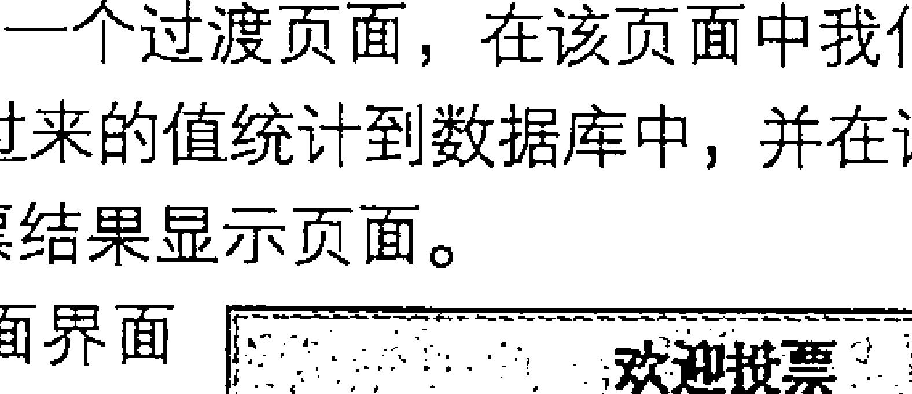

#### (3) 投票结果显示页面——View.asp

在本页面中要统计出的数据包括投票总数，每个投票项目的得票数以及所占百分比，而在我们设计的数据库中只有存放在每个投票项目中的得票数的字段，因此本页面设计的侧重点在于计算出投票总数和每个投票项目所占百分比。

第一步：设计页面界面，依次选择“插入”→“应用程序对象”→“记录集”，打开“记录集”对话框。

第二步：点击对话框中的“Advanced”按钮转入“高级”对话框，在“名称”文本框中输入“RS”，在“连接”下拉列表框中选择“Conn”，接着在“SQL”文本框中输入如下语句：

SELECT Class1,Class2,Class3,Class4,ClassNum1,ClassNum2, ClassNum3, ClassNum4, (ClassNum1+ClassNum2+ClassNum3+ClassNum4) as VTotal, (ClassNum1/VTotal) as N1Percent,(ClassNum2/VTotal) as N2Percent, (ClassNum3/VTotal) as N3Percent,(ClassNum4/VTotal) as N4Percent FROM vote

```
SELECT Class1,Class2,Class3,Class4,ClassNum1,ClassNum2, ClassNum3, ClassNum4, (ClassNum1+ClassNum2+ClassNum3+ClassNum4) as VTotal, (ClassNum1/VTotal) as N1Percent,(ClassNum2/VTotal) as N2Percent, (ClassNum3/VTotal) as N3Percent,(ClassNum4/VTotal) as N4Percent
FROM vote
```

在这个 SQL 语句中我们临时创建了 VTotal、N1Percent、N2Percent、N3Percent 和 N4Percent 等几个字段，其中 VTotal 是统计投票的总数，而其他几个字段则分别是计算出每个投票项目所占总投票数量的百分比。

第三步：按下“Ctrl+F10”组合键展开“绑定”选项卡，此时在记录集中我们就能看到刚才所创建的几个字段了。现在我们只要将这些字段绑定到页面中就可以了（如图24）。

一个简单的网站调查系统就制作完成了，但是这并不是一个完善的调查系统，后台管理和投票验证等功能都还待完善。

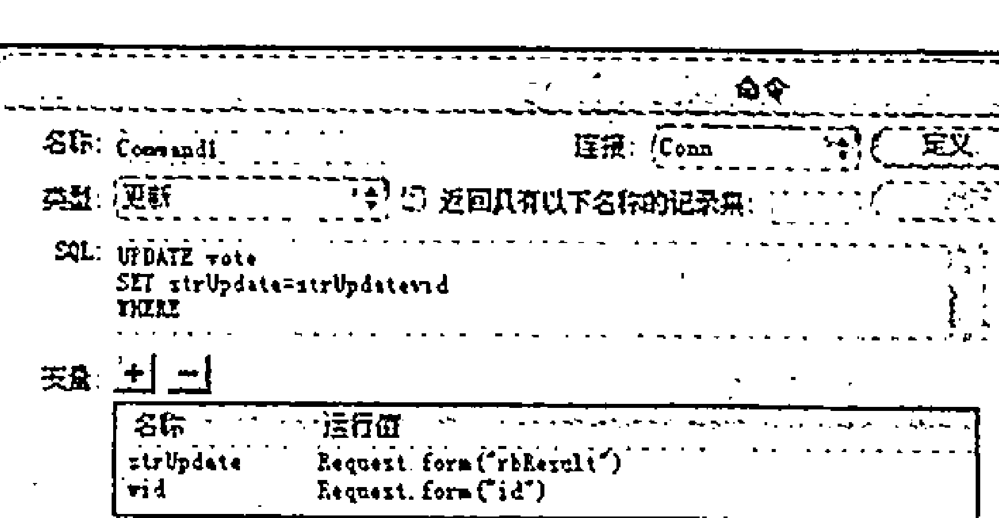

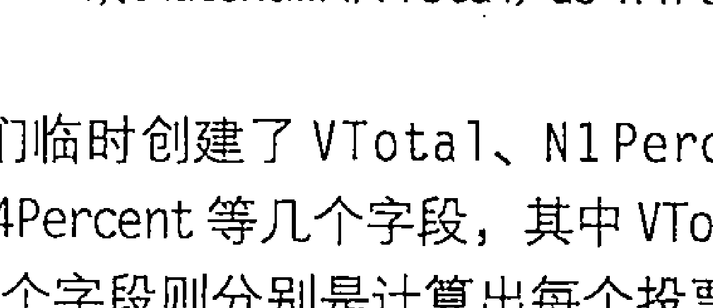

## 用 DW8 编写图片管理系统

随着数码相机的火爆，传统的胶卷式相机已经渐渐被淘汰出局，而通过数码相机可以方便地将相片传送到电脑上，因此许多朋友都将自己生活中的一些精彩瞬间放到网络上和网友们一起分享。

而要在网络上打造属于自己的影像天堂，首先得有一个图片管理系统。一个图片管理系统所要实现的功能包括图片浏览、图片上传管理等，相比于我们前面编写的几个系统，图片管理系统相对复杂，因此部分功能需要用 ASP 来完成。

### 1. 方案实现

### （1）程序结构说明

在本系统中主要包括图片显示、添加图片和管理图片三大功能，其中 Index.asp 页面用来在前台显示图片，通过该页面可以转到“添加图片”和“管理图片”链接页面。添加图片功能又涉及三个页面：AddFile.asp，Upload.asp 和 SaveUpload.asp，而管理图片功能涉及的页面包括：EditFile.asp、Del.asp 和 Modify.asp。以下是本系统所涉及的所有页面及其功能：

- Index.asp: 显示所有图片页面；
- AddFile.asp: 添加图片页面；
- Upload.asp: 浏览图片并上传；
- SaveUpload.asp: 将上传图片的路径传递到添加图片页面，并随机生成图片名称；
- EditFile.asp: 管理图片首页；
- Del.asp: 删除图片；
- Modify.asp: 修改图片；
- upload_5xsoft.inc: 无组件上传程序。

#### （2）数据库设计

由于我们这个系统只实现一些简单的图片管理功能，因此只需要建立一个表格即可。在ACCESS中新建一个数据库，将其命名为 Pic。在该数据库中创建一个表格并命名为 desktop，其表结构如图 25 所示。

| 字段名称 | 数据类型 | 说明 |
| :--- | :--- | :--- |
| id | 自动编号 | |
| name | 文本 | 图片标题 |
| jj | 备注 | 图片简介 |
| minipic | 文本 | 缩略图 |
| pic | 文本 | 放大图 |

## 2. 具体实现

#### （1）显示所有图片页面——Index.asp

在本页面中要实现数据库信息的横向排列，但在 DW8 中只能实现数据库信息的纵向排列，因此需要对页面代码稍作修改。

第一步：设计页面界面（如图 26），在该页面中将“添加图片”字样的链接指向 AddFile.asp 页面，将“管理图片”字样的链接指向 EditFile.asp 页面，而 Table1 表格就是用来显示图片的名称和缩略图，我们将 Table1 表格的宽度设为 33%。

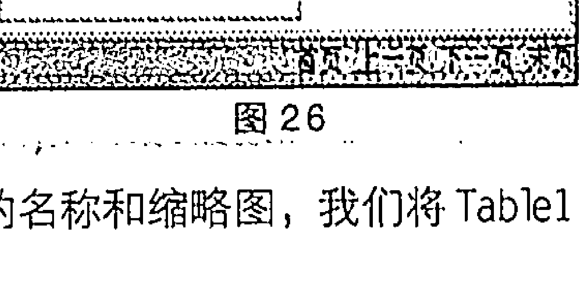

第二步：依次选择“插入” → “应用程序对象” → “记录集”，打开“记录集”对话框。在该对话框中将“名称”设为“RS”，点击“定义”按钮设置自定义字符串，其他选其默认设置。

第三步：按下“Ctrl+F10”组合键展开“绑定”选项卡，首先将图片名称字段 Name 绑定到页面中。

第四步：接着将光标定位到图片名称下面的单元格中，依次选择“插入” → “图像”，打开“选择图像源文件”对话框。在该对话框中选择“数据源”单选框，接着在“域”列表中选择“minipic”数据字段，最后点击“确定”按钮。

第五步：将该图像源插入到页面中后，选择该图像源，然后在“属性面板”中将宽和高都设置为 120 像素，现在预览该页面，就能显示数据库中最新的一张图片信息了。

第六步：在页面中选择 Table1 表格，依次选择“插入” → “应用程序对象” → “重复区域”，在打开的对话框中将显示的记录设为 12。

第七步：此时可以实现一个页面显示 12 张图片，但是在预览时你会发现每行只显示了一张图片。在这里我们要实现每行横向排列 3 张图片，因此需要修改页面代码。

在页面中选择 Table1 表格，然后转入代码视图，将被选代码后的那段 ASP 代码替换为如下代码：

```
<%
if Repeat1__index mod 3 = 0 then Response.write("<tr><td>")
Repeat1__index=Repeat1__index+1
Repeat1__numRows=Repeat1__numRows-1
RS.MoveNext()
Wend
%> </td></tr>
```

其中 IF 语句那段代码是修改后加上的，目的是当每行显示了 3 张图片后就新建一个单元格，而最后的“</td></tr>”则是结束单元格。

第八步：接下来是设计首页、上一页、下一页、末页的链接，其方法在前面有过介绍，在此略过。

#### （2）添加图片页面——AddFile.asp

第一步：首先建立记录集，接着依次选择“插入” → “应用程序对象” → “插入记录” → “Record Insertion Form Wizard”，打开“插入记录”对话框。

第二步：在“插入记录”对话框的“插入后，转到”文本框中填入“Index.asp”，接着在“表单字段”列表中删除“ID”字段，然后选择“jj”字段，在“显示为”下拉列表框中选择“文本区域”，最后在“表单字段”列表中调整各个字段的位置并将各个字段的标签修改为中文。

第三步：在显示“缩略图”的文本框后添加“上传图片”文字，并将该文字链接指向 Upload.asp，最后该页面的界面如图 27 所示。

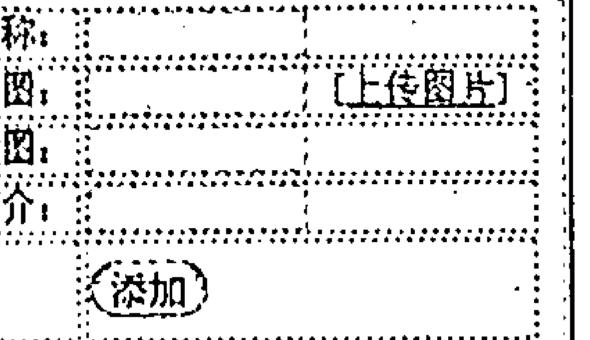

#### （3）浏览图片路径并上传页面——Upload.asp

第一步：依次选择“插入” → “表单” → “表单”，接着在页面中选择该表单。然后在“属性面板”的“动作”文本框中输入“saveupload.asp”。

第二步：依次选择“插入” → “表单” → “文件域”，在页面中插入一个文件域并将该文件域的名称设为“File1”。

#### （4）上传图片核心功能页面——SaveUpload.asp

其实这是本系统中难度较大的一个页面，在本页面我们要将选择的图片上传到服务器上指定的文件夹中，而且还要将上传的图片生成随机的名称。其中生成图片名称功能可以用随机函数和时间函数来实现，而图片的上传功能则要用到一个上传程序。

一直以来，由于 FileSystemObject 的局限，ASP 最大的难题就是文件上传，大多数解决办法就是安装第三方上传组件。可第三方组件有很多问题，如有的组件要注册，有的组件要在表单中加上它的版权信息，在这里我们用到的就是一个无组件上传程序（下载地址：http://files.enet.com.cn/200510/407108273.zip）。

当我们将图片上传到指定的服务器路径后，需要将图片的相对路径传递到 AddFile.asp 页面的“缩略图”和“放大图”两个文本框中，因此要自定义两个函数 minipic()和 pic()来实现。

第一步：首先将下载的无组件上传程序解压，将解压文件夹中的 upload_5xsoft.inc 文件复制到服务器根目录下。

第二步：在 SaveUpload.asp 页面的代码视图中清除已有的所有代码，然后添加<!—#include FILE="upload_5xsoft.inc"—>", 在该页面中引用上传程序。

第三步：在页面的代码视图中定义 minipic()和 pic()两个函数，其代码如下：

```
<script language="Javascript">
function minipic(smileface)
{
    window.opener.document.form1.minipic.value=smileface;
}
function pic(smileface)
{
    window.opener.document.form1.pic.value=smileface;
}
</script>
```

> 小提示：其中 window.opener 是指向父窗口，也就是 AddFile.asp 页面，使用该对象可以访问父窗口中的所有对象。而 form1 则是父窗口中的表单名称，这两个函数的作用就是将上传图片的缩略图和放大图的相对地址在 AddFile.asp 中显示。

第四步：接下来是使用上传程序将图片上传到服务器路径并生成图片的名称，其代码如下：

```
<%
set upload=new upload_5xSoft
set file=upload.file("file1") '获取要上传文件的本地路径
formPath="upload/" '设置上传文件的路径
if file.filesize>100 then
fileExt=lcase(right(file.filename,3)) '获取上传文件的扩展名
if fileExt="asp" then
Response.Write "文件类型非法"
end if
end if
randomize '随机函数
ranNum=int(90000*rnd)+10000
filename=formPath&year(now)&month(now)&day(now)&hour(now)&minute(now)&second(now)&ranNum&"."&fileExt '上传文件在服务器上的相对路径，其中用上传文件时的年、月、日、时、分、秒来生成上传文件的名称
if file.FileSize>0 then
file.SaveAs Server.mappath(FileName)
set file=nothing
end if
response.write "图片上传成功.[<a href='upload.asp'>返回继续上传</a>]<br>图片是：<a href=Javascript:miniPIC("&filename&");>缩略图</a> &nbsp;&nbsp;&nbsp; <a href=Javascript:pic("&filename&");>放大图</a>"
set upload=nothing
%>
```

小提示：当上传图片后，转入到 SaveUpload.asp 页面时，会生成“缩略图”和“放大图”两个文字链接，此时需要点击这两个链接方能在 AddFile.asp 的“缩略图”和“放大图”两个文本框中显示图片的路径。

#### （5）管理图片首页——EditFile.asp

管理图片页面的大致功能和页面与 Index.asp 页面相似，只是管理图片页面新增了删除图片和修改图片功能。

将 Index.asp 页面另存为 EditFile.asp，在 Table1 表格中新增一行单元格，在该单元格中添加“删除”和“修改”两组文字，并将“删除”字样的链接指向“del.asp?id=<%=(rs.Fields.Item("ID").Value)%>”，将“修改”页面的链接指向“modify.asp?id=<%=(rs.Fields.Item("ID").Value)%>”。

#### （6）删除图片页面——Del.asp

第一步：在页面中添加“记录删除成功，3秒钟返回”字样，接着依次选择“插入”→“HTML”→“文件头标签”→“刷新”，打开“刷新”对话框。

第二步：在该对话框中将延迟时间设为3秒，并在“转到 URL”文本框中输入“editfile.asp”。

第三步：依次选择“插入”→“应用程序对象”→“命令”，打开“命令”对话框，该对话框的设置如图 28 所示。

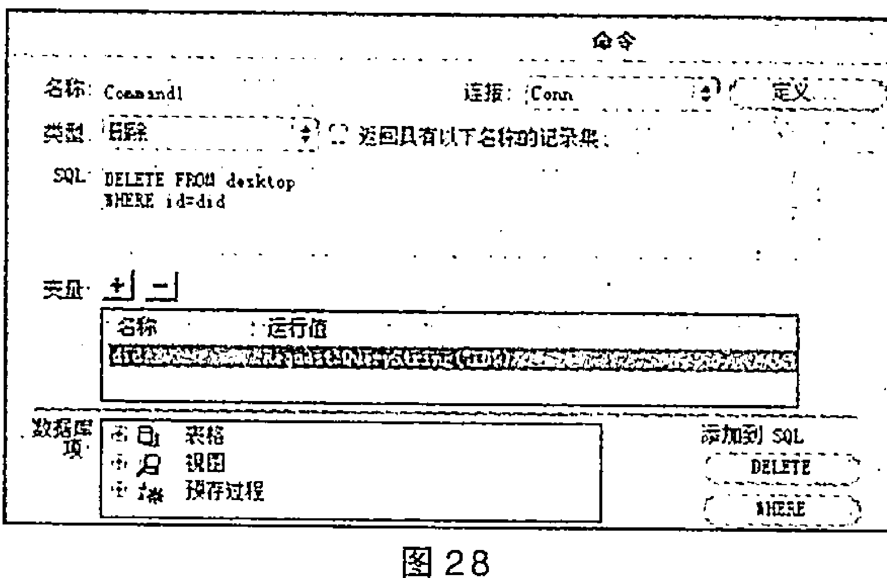

#### （7）修改图片页面——Modify.asp

首先在该页面中创建记录集，接着依次选择“插入”→“应用程序对象”→“更新记录”→“更新记录表单向导”，打开“更新记录表单”对话框。此对话框中的设置与前面我们在设计 AddFile.asp 中用到的“插入记录”对话框相似，其设置方法相同，在此就不再赘述。

做完以上的操作就完成了本系统的开发，而在本系统中只实现了图片上传和图片浏览等简单的功能，图片类型管理和后台登录页面等功能都还待完善。

## 用 DW8 编写文章管理系统

文章管理功能在每个网站系统中都是很重要的一部分，因此，文章管理系统在网站设计中的应用也十分广泛。而在经过上几个实例的学习后，制作一个简单的文章系统已不是什么难事了，其数据记录的显示、更新、插入功能的制作功能都是类似的。在本实例中，我们除了要完成文章管理系统的核心功能外，还新增了统计文章点击数、站内搜索等功能。

### 1. 方案设计

### （1）程序结构说明

本系统也是由前台和后台系统两个部分组成的，其中前台部分包括文章标题显示页面、文章内容显示页面和搜索文章页面组成。

## 2. 具体实现

### (1) 文章标题显示页面——Index.asp

从前面几个实例来看，首页面的制作相对简单，仅是将数据库中各个字段绑定到页面中。本实例也不例外，在Index.asp显示文章标题、录入时间和浏览次数几个字段，另外通过首页可进入文章搜索页面。

第一步：首先设计页面界面，接着依次选择“插入”→“应用程序对象”→“记录集”，打开“记录集”对话框。

第二步：在该对话框的“名称”文本框中输入“RS”，接着点击“定义”按钮设置自定义字符串连接数据库。在“表格”下拉列表框中选择“mynews”，然后选择“全部”单选框，在“排序”下拉列表框中选择“id”，设置排序方式为降序。

第三步：按下“Ctrl+F10”组合键，展开“绑定”选项卡，在该选项卡中将显示文章标题字段（title）、录入时间字段（time）和浏览次数字段（count）绑定到页面中。

第四步：在DW的设计视图中选择显示文章标题、录入时间、浏览次数三个单元格，接着依次选择“插入”→“应用程序对象”→“重复区域”，打开“重复区域”对话框。在该对话框中将显示的记录设为10条。

第五步：在设计视图中选择显示文章标题的代码，然后在“属性面板”的“链接”文本框中输入“ReadNews.asp?id=<%=(rs.Fields.Item("ID").Value)%>”。

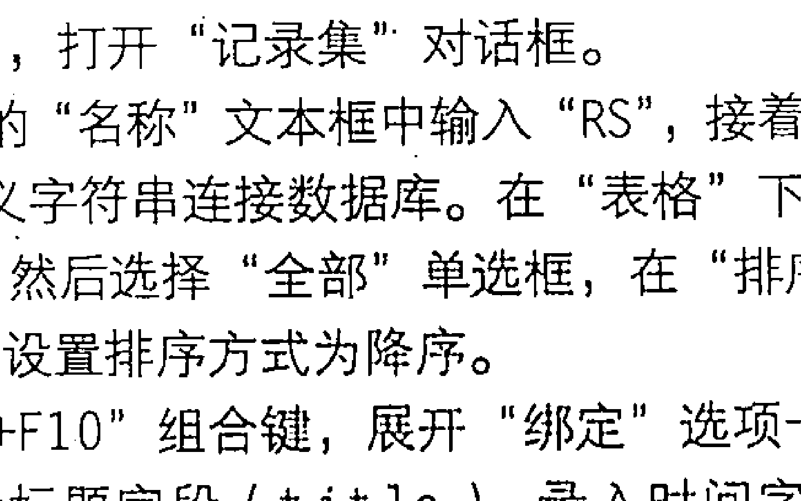

第六步：最后添加首页、上一页、下一页和末页的链接，并将“搜索文章”字样的链接指向Search.asp，最后的页面效果如图30所示。

### (2) 文章内容显示页面——ReadNews.asp

在ReadNews.asp页面中除了要显示文章标题、录入时间、录入者和文章内容外，还要统计文章的点击数。其实现文章点击数的统计很简单，文章页面每被打开一次，就将数据库中的Count字段累加1。

第一步：设计页面界面，接着打开“记录集”对话框，在该对话框中设置创建记录集的名称，连接以及表格，然后在“筛选”下拉列表框中选择“id”，最后点击“确定”按钮。

第二步：按下“Ctrl+F10”组合键展开“绑定”选项卡，在该选项卡中将所需要的字段绑定到页面中（如图31）。

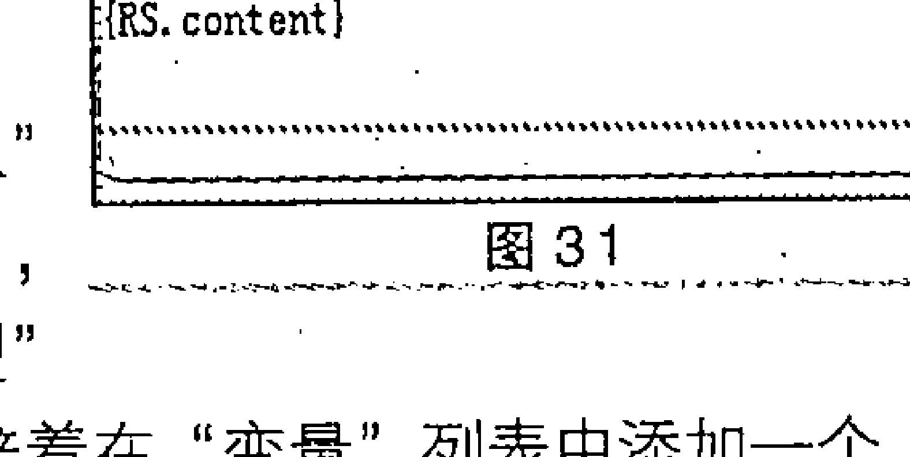

第三步：依次选择“插入”→“应用程序对象”→“命令”，打开“命令”对话框。在“类型”下拉列表框中选择“更新”，接着在“变量”列表中添加一个“名称”为“did”，“运行值”为“Request.QueryString("id")”的变量，然后在“SQL”文本区域中输入“UPDATE mynews SET count=count+1 WHERE id=did”。

### (3) 搜索文章页面——Search.asp

为了便于讲述，我们将搜索结果也放在了Search.asp页面中。在开始本页面的设计前，我们有必要先了解一下SQL语句中的LIKE关键字。下面是运用了LIKE关键字的一个SQL语句：

```
SELECT *
FROM user
WHERE uesr LIKE '%MMColParam%'
```

其中user为要查询的数据库表，uesr为要查询的字段，MMColParam为查询变量，从表单提交数据时，把文本域的值赋值给该变量，%%为通配符，LIKE为逻辑运算符，意为“类似于”，用于搜索包含关键词的记录。以上这些代码是DW MX自动生成的，比较简单。下面我们要实现的是多参数查询，即多个条件，查询多个数据库字段，把符合搜索条件的记录筛出。

第一步：依次选择“插入”→“表单”→“表单”，在页面中插入一个表单。接着在该表单中添加一个“列表/菜单”、一个文本域和一个按钮，将“列表/菜单”的名称设为“Select”，将文本域的名称设为“text”，按钮名称取其默认值。

第二步：选择添加的“列表/菜单”，接着在“属性面板”中点击“列表值”按钮，打开“列表值”对话框。在该对话框中添加“不选定条件”、“录入者”和“文章标题”三个项目标签，并将“不选定条件”项目标签的值设为“name+title”，将“录入者”项目标签的值设为“name”，将“文章标题”项目标签的值设为“title”。

第三步：依次选择“插入”→“应用程序对象”→“记录集”，打开“记录集”对话框。在该对话框中点击“Advanced”按钮转入高级对话框。接着在“名称”文本框中输入“RS”，在“变量”列表中添加两个变量名称：MM_text和MM_Select。将“MM_text”变量的“运行值”设为“Request.form("text")”，将“MM_Select”变量的“运行值”设为“Request.form("Select")”。

注意：其中MM_text变量是获取文本域中的值，MM_Select变量是获取“列表/菜单”中的选择项。

第四步：然后将“SQL”文本区域中的SQL语句修改为：

```
SELECT *
FROM mynews
WHERE MM_Select LIKE '%MM_text%'
```

ORDER BY id DESC

第五步：经过上面的几步操作，页面的搜索功能就算完成了，但是我们还要设置搜索结果的显示。不过这一步非常简单，只需要将相应的字段绑定到页面中即可（如图32）。

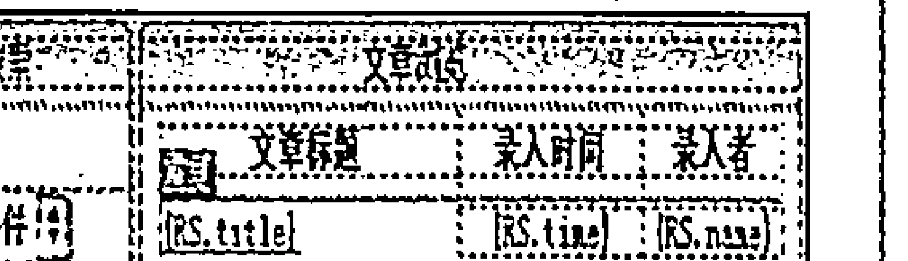

### (4) 后台管理首页——AdminNews.asp

后台管理首页是添加文章，编辑文章和删除文章的入口，因此在该页面中除了要对所需的字段进行绑定之外，还要添加相应功能的链接（如图33）。


- 1. 依次选择“插入”→“应用程序对象”→“记录集”，打开“记录集”对话框。在该对话框中设置记录集名称，自定义字符串和连接表格等。
- 2. 按下“Ctrl+F10”组合键展开“绑定”选项卡，将文章标题和录入时间字段绑定到页面。
- 3. 将“编辑”字样的链接指向“EditNews.asp?id=<%=(rs.Fields.Item(“ID”).Value)%>”，将“删除”字样的链接指向“DelNews.asp?id=<%=(rs.Fields.Item(“ID”).Value)%>”。
- 4. 选择显示文章标题、录入时间、编辑和删除的四个单元格，依次选择“插入”→“应用程序对象”→“重复区域”，将显示的记录设为10条。

第五步：最后将“添加文章”字样的链接指向“AddNews.asp”页面。

### (5) 添加文章页面——AddNews.asp

在本页面的制作中要使用到VBScript的时间函数，通过时间函数我们可以取得当天的日期、时间、年份和月份等，如Now函数是显示当天的日期和现在的时间，其格式为“2005-10-7 13:15”，Date函数是显示当天的日期，其格式为“13:15:43”。在我们这个页面中所要获得的日期格式为“2005年10月7日”，因此不能用单一的某一个时间函数来实现，因此要用Year函数、Month函数和Day函数来配合应用。

- 1. 设计页面界面，依次选择“插入”→“应用程序对象”→“插入记录”→“Record Insertion Form Wizard”，打开“插入记录”对话框。
- 2. 在“连接”下拉列表框中选择定义好的连接字符串，在“插入到表格”下拉列表框中选择“mynews”，在“插入后，转到”文本框中填入“AdminNews.asp”，然后在“表单字段”列表中留下title, content, time和name四个字段，并调整其显示的顺序。
- 3. 选择time字段，在“初始值”文本框中输入“<%=Year(Date)&“年”&Month(Date)&“月”&Day(Date)&“日”%>”。

### (6) 编辑文章页面和删除文章页面——EditNews.asp和DelNews.asp

编辑文章页面和删除文章页面的制作方法我们在前面的实例中已经学习过了，因此在此就不再赘述。


## 2. 数据库设计

在本系统中由于省去了用户后台登录功能的制作，因此只需要一个表格就能实现了。在ACCESS中，新建一个名为news的数据库，接着在该数据库中创建一个名为mynews的表格。在mynews表格中建立六个字段，其中id字段为记录编号，title字段为录入文章标题，content字段为录入文章的详细内容，count字段为统计文章的点击数，time字段为录入文章的时间，name字段为录入者姓名，其数据类型如图29所示。

| 字段名称 | 数据类型 | 说明 |
| --- | --- | --- |
| id | 自动编号 | 记录编号 |
| title | 文本 | 文章标题 |
| content | 备注 | 发表文章的内容 |
| count | 数字 | 被浏览次数 |
| time | 文本 | 发表时间 |
| name | 文本 | 发表人姓名 |

# PART 4 教你用DW8编写系统

## 《街头篮球》

代入感是游戏的根本，当玩家不再满足在篮球场上指挥一支球队与另一支球队的比赛方式之后，韩国的JC Entertainment公司适时地推出了一名玩家只能控制一个场上队员，然后通过与其他玩家组队的方式来与另一支同样由玩家组队的球队进行比赛的《街头篮球》游戏：扮演一名球员，与别人扮演的球员组队一起挑战网络球坛，实现你的篮球梦想！

游戏本身的内容是时下年轻人当中最流行的街球，让人亢奋的HIP-HOP音乐、前卫并且动感十足的造型、花哨的动作、酷酷的文身、实用的篮球技能、自由度极高的比赛方式、讲求团队配合的战术要求、关键时刻个人英雄主义的闪现，令这款游戏具备了足够吸引人的条件。当然最主要的是在游戏中，你就是你自己——一名站在场上的球员，你需要队友的帮助，并帮助队友，只有这样才能够去赢得比赛的胜利。也许正是因为这与众不同的游戏方式，使它成为今年在新加坡召开的电子体育运动盛会WCG2005的“特别游戏项目”。

## 入门篇

### 1. 位置概述

游戏的角色共有5种，分别为场上的5个位置，前面只能选择C（中锋）、F（前锋）、G（后卫）3个位置，自己只能扮演一个角色，所以选择适合自己的篮球信念的位置就很重要了。

中锋（C）主要负责篮下位置，依靠身体和力量的优势抢篮板、卡位、防守、得分，在攻守两方面都起着重要作用，是篮球场上最有统治力的人——看看现在的奥尼尔所做的工作，那将是你在场上的工作了——一个能够控制住篮板、送出火锅、把球放进篮框的人！一个有控制力的中锋在组队中是非常受欢迎的。游戏中的男性中锋身高从190到200，建议大家选择最高的身高，虽然这样会降低一些速度，但是因为能力是可以锻炼的而身高是不能增长的，大家自己掂量吧。

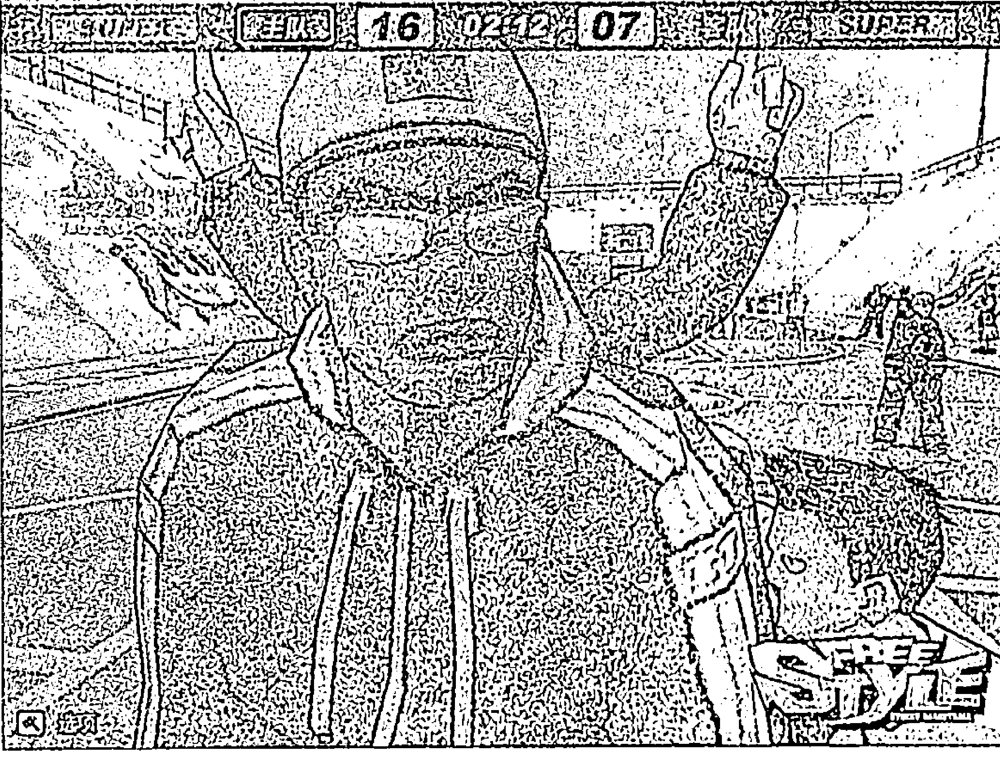

前锋（F）的能力比较全面，是连接内外线的关键，在场上游荡在内外线之间，擅长中距离投篮和扣篮，防守时既可看准了进入篮下抢板，又可以突然冲向外围封盖，是一个非常讲究篮球意识的位置。如果不知道该怎么做，看看现实中森林狼队的加内特吧，传球、抢断、封盖、篮板、中投、扣篮无所不能，场上的每一个角落都可以看到F的身影，当然还要控制F的人具备高人一等的篮球意识才行。男性前锋的身高从180到190，矮的速度占优，不过建议选择最高的，理由同上。

后卫（G）是场上的组织者、进攻的发起者和决定胜负扭转乾坤的关键一投的必然人选，传球、抢断、3分能力比较突出，根据场上形势决定进攻方式、把握住空挡位置传出致命球、投中关键球是展示篮球意识的最佳选择。男性后卫的身高从170到180，矮的速度占优，不过建议选择最高的，理由同上。

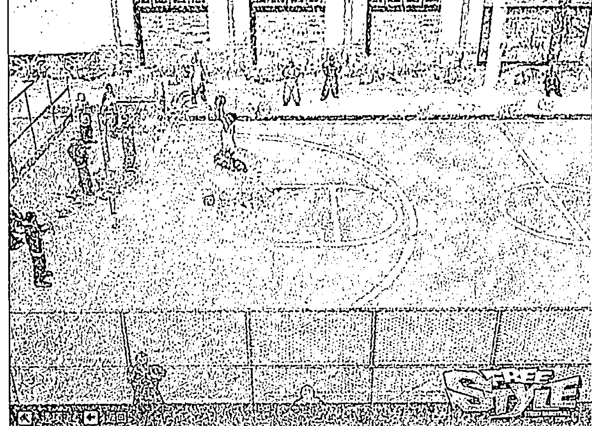

# PART 4《街头篮球》网游上手指南

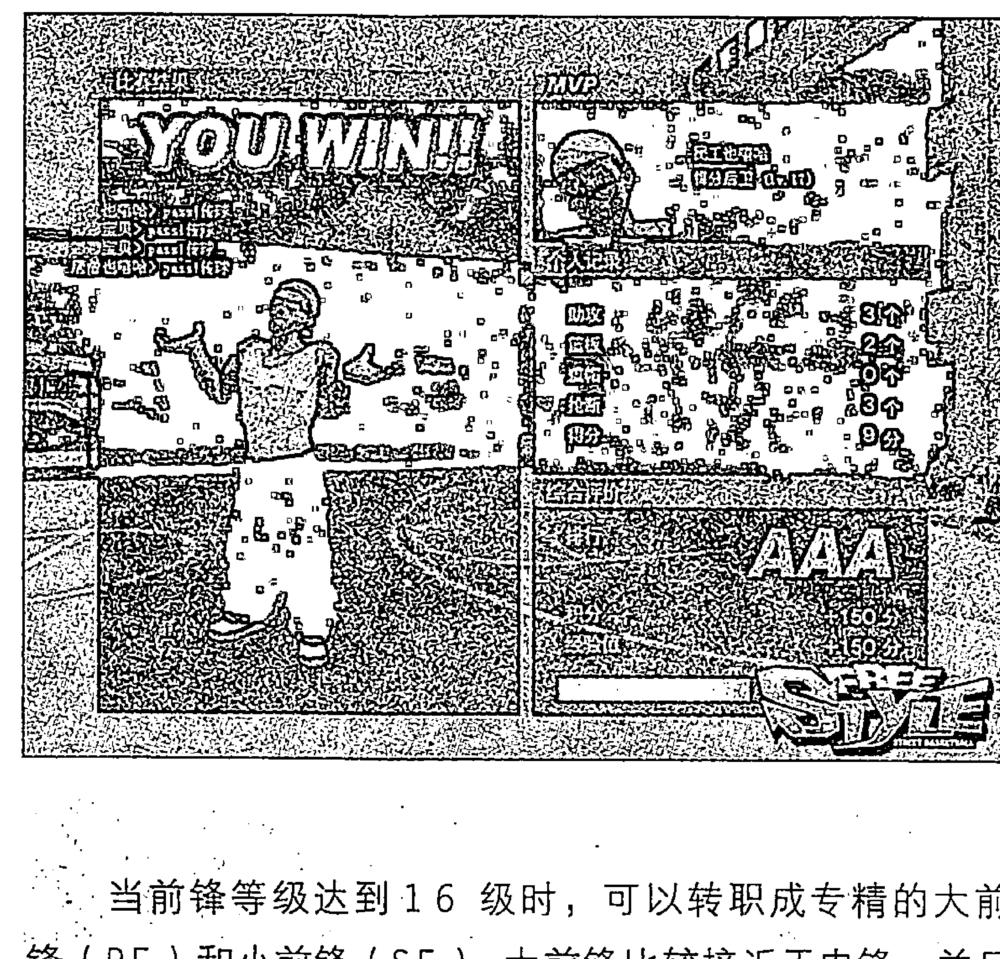

是非常重要的，而游戏中自己的跑位和传接球起到了关键性的作用，建议大家找本专业篮球书来学一下场上的跑位，演练一些经典的配合，这样能起到出奇制胜的作用。每场比赛结束后，会根据你在场上的表现和贡献获得积分，积分达到一定的程度就能升级。升级后能力值就能够长几点。所以等级越高，能力就越高。获得的积分还有一个作用，就是可以去购买技能。技能是游戏中一个很有意思的设计，把一些篮球的基本技术，比如扑地抢球、花式扣篮、花样运球、空中接力传球等做成了技能的方式，必须学会这个技能，才能够在场上使用这个技术来打球，学会的技能越多，也代表着玩家的实力越强大。

当前锋等级达到16级时，可以转职成专精的大前锋（PF）和小前锋（SF），大前锋比较接近于中锋，并且扣篮能力非常的突出，得分区域也比中锋大。练到后期的大前锋，几乎都是在场上“飞来飞去”扣篮的。小前锋（SF）则是一个万金油式的全面角色，接近于现实中的锋卫摇摆人，必要的时候甚至可以客串4个位置（PF/SF/SG/PG）！

当后卫等级达到16级时，可以转职成为专精的得分后卫（SG）和组织后卫（PG），得分后卫相对组织后卫来说进攻能力更强，从篮下到中距离以及3分线外都能投篮得分。组织后卫则强化了抢断、运球和传球能力，超眩的空中接力传球也只有组织后卫才能够传出来。

### 2. 基本操作、比赛与技能

游戏的操作非常简单，键盘上的1到6号数字键是快速通话键：1是赞扬好球，2是赞扬传出好球，3是表示抱歉（用在自己发挥不好的时候，如果是自己表现好也说这话，那就是挑衅了），4是叫队友掩护，5是叫队友进入篮下，6是叫队友回防。方向键是移动所用。A是过人和举手干扰。S在进攻时如有球在手就是传球，无球在手就是呼叫队友传球，防守时是抢断键。D是投篮/盖帽和抢板。F键是组织后卫专用的空中接力传球，W键是挡人卡位以及抓住对手。

游戏中可以自己建立房间或者加入别人建立的房间，根据需要进行1对1、2对2、3对3的比赛，并且可以选择半场和全场。如果不是单挑的话，组队时尽量考虑内外线搭配的组合。也许是因为街球的关系，比赛场上的规则不多，只有一条“防守方取得了球权后，必须把球带出3分线外才能进攻”，其他就没有了，可以打得非常的放松。但要想打得好，和队友的配合与默契

## 进阶篇

### 1. 防守

防守是赢得比赛的关键，所以要想取得好的成绩，就必须有好的防守，而防守主要有五个方面，即卡位、抢断、干扰、盖帽和篮板。

卡位：用W键来做一个张开双手下蹲防守的动作，可以有效防止对手的突破。并且还能够把人给挤住，让他比较难突入篮下有利位置。主要使用方法是要站在进攻队员和篮框的中间进行阻挡，无论他怎么移动，他最终目的还是要正面面对篮框才能有效得分，所以只需要把握好方向，防止他从你面前突破进去就是胜利。并且当你张开双手的时候，进攻方冒冒然的撞过来，还会有一定的几率会把球给撞掉……

抢断：用S键来做的抢断盗球，是后卫的主要防守方式之一。如果开球时G站在弧顶位置和开球队员对位，那大可冲上去试一下断球，对手比较迟钝的话，非常容易抢到球。当对手移动时，在他的后面1步的位置掏球也比较容易把球断下来，不过必须注意如果抢不到，对手会很轻易的把你给过掉。比较好的控制方法是 W 和 S 结合起来，先卡住对方的身位，然后再掏球，那就容易了。尽量不要连按 S 来盗球，如果按一下盗不到，那就移动一下，接近他一点再用，这样也不容易被对手摆脱你的盯防。

干扰：用 A 键能够举手干扰，大前锋还能学《灌篮高手》里樱木花道的成名绝技“嘿嘿嘿举手干扰”，就是把手做扇状挥舞，能有效地降低对手的命中。不过必须注意的是，按下 A 之后，手举起来之后就会站在原地不动了，要防止对手从你身边突破进去。

盖帽：盖帽主要是把握住按下 D 键的时机，尽量的站在投球队员的面前，越贴近他越容易盖到，盖外线 3 分的话如果是 PF 这样有惊人的弹跳力的，不需要太过接近他都没问题，只需要把握住他的投球路线，然后在他出手之后马上起跳就可以了。盖内线的扣篮如中投，最好有队友帮忙，两个人轮流来防，一个盖帽一个准备抢篮板，尽量不要同时起跳盖帽，宁愿慢点起跳也不要跳早，免得被别人晃过了直接上篮。

篮板：可算进攻也可算防守，不过自己抢下了进攻篮板，也算是防止了对手的进攻，所以归入防守一类了。篮板主要是把握好对方的投球，通常近距离投篮，球都不会弹得很高很远，所以看准了球下落的时机来起跳是最好的，基本上连方向都不用按都可以抢到。远距离投篮的话，球会弹得比较远，看好球的影子的移动方向，然后跟着球影子跑位，再按 D 加方向键就容易了。必须注意的是投 3 分还有中球是中框然后在篮圈上弹几下的情况，这些球都不会弹得很远，在篮下卡好位置准备抢是最关键的。篮板主要比的就是站位，要尽量地把对手挤在外面。

### 2. 进攻篇

如果对手比较小心，没办法靠防守打反击把对手打趴下来，那就要灵活地运用各位置的优势来打阵地战。进攻方式有勾手、近投、扣篮、上篮和中远距离投篮这几种。

正对篮框的近投命中率比较高，但一定要注意多用假投（先轻按一下投篮，然后对方精神比较紧张的话，通常都会跳起来），一次不行就两次三次，直到把防守队员晃起来了再出手，不过必须小心后卫跑过来盗球。

勾手主要是内线的个人表演，主要是顶住了对手然后按方向再投球。防守队员如果贴得不紧的话，是没办法盖到的，并且球投出手之后，可以马上跳起来抢篮板，抢到了再继续换方向勾手。

扣篮主要是看传球，后卫把握好传球的时机把球传到内线手上，而内线的队员身边没有防守队员贴身防守的话，基本上都不怕封盖，所以一定要有配合默契的队友，基本上一跑到位就能得到球的话，那扣篮的成功率会大大增加。

上篮主要是看离篮框的距离，通常 F 离篮框 3、4 步的位置就可以用出来，而中锋和后卫弹跳没那么好，就要在离篮框比较近的地方来使用。

没人防守的中距离投篮命中率很高，通常 F 和转职的 SF、SG 都能在空挡位置准确命中，只需要注意看看有没有人在前面举手干扰或者盖帽就可以了。不过记住投球时不要按方向键，免得变成前投了，那样准确度会大大下降。

三分球是种很好的进攻方式，特别是当分数拉很开，或者队友篮板很强的时候，投 3 分球能够给对手的士气造成毁灭性的打击。投 3 分球时站位也很关键，没人防守时在最高点出手则命中率最高，尽量找到自己的出手感觉，MM 球员的出手方式是双手推球式的，和普通的出手方式不同，更需要勤练习。如果在比赛中发现自己的球是打在前框上了，那就要站近一点投；如果是打在板上，那就要退后一点投，一定不要使用转身投 3 分的方法，否则 90% 以上都不会投进的。

## 结束语

掌握了游戏的玩法，就一起进入这由天联世纪公司代理的《街头篮球》(http://www.fsjoy.com) 游戏，冲击游戏的记录吧，在比赛场上的统计数据，将以月为单位记录下来，如果单项统计能够进入联盟该赛季的前 10 名的话，这个成绩将会永久地留在自己的记录中！

## PART 4 方正熊猫防病毒产品概述

### 2005《电脑爱好者合订本》（下半年）附赠熊猫杀毒软件使用说明

2005《电脑爱好者合订本》（下半年）的配套光盘B中包含正式版的熊猫卫士钛金版2005杀毒软件。大家可进入光盘进行安装，安装时，软件的序列号粘贴在光盘袋上。安装完毕后请注意填写本文后面的注册表格，注册熊猫杀毒软件（注册方式可以通过邮寄、EMAIL等方式），此后才能正常使用。

### 一、方正熊猫企业版防病毒（PESA）产品简述

方正熊猫企业版防病毒（PESA）产品是一个高性能和稳定的防病毒解决方案，它方便了对网络中所有计算机的保护配置和更新，这些计算机包括工作站、文件服务器、Exchange和Domino邮件服务器、SMTP网关和边界服务器。它不仅抵御病毒、蠕虫和特洛伊木马，还防护新的互联网攻击，如垃圾邮件、间谍程序、拨号程序、黑客工具和恶作剧程序，并针对系统漏洞提供安全保护机制。方正熊猫企业版防病毒（PESA）产品具有不间断保护功能，至少每天一次将已做的更新自动分发到网络中。这是由于采用了向用户透明的新机制，其结果是提高了产品的质量，使管理员可以集中精力到其他工作中。

### 二、方正熊猫安全网关（PAGD）产品简述

方正熊猫安全网关的目标是在网络边界或Internet网关处提供全面的病毒防护，而该病毒防护设备是即插即用的，不需要改变任何Internet设置，并对所有应用及服务透明。方正熊猫安全网关是一个整合最新硬件及软件技术的高性能的解决方案，通过全面阻截已知及未知病毒、防垃圾邮件功能和内容过滤功能达到对企业网络环境的全面防护的目的。方正熊猫安全网关是一款高度可配置及提供负载均衡的产品，为从中型到大型企业提供全面解决方案，并对网络流量透明。保护所有可能的Internet相关威胁，完全扫描所有常用Internet协议，包括HTTP、FTP、SMTP、POP3、IMAP4、NNTP等。

### 三、方正熊猫因特网企业版防病毒软件——WebAdmin

方正熊猫WebAdmin是一款全新概念的基于Web的企业级防病毒产品，它在为企业内部服务器和工作站提供防护的同时，革命性地将防病毒管理员从繁重的工作中彻底解放出来。由于采用了最先进的防病毒和管理技术，使得该产品可以快速部署、自动升级，并可以允许进行自定义操作以适应每一个不同的用户。无论身在何处，只要有一台能够接入Internet的计算机，就可以安全地管理整个网络防病毒系统，甚至包括那些没有接入局域网的计算机和在异地办事处的计算机，WebAdmin同时提供了一个包罗万象的报告系统。

### 四、方正熊猫入侵防护 TruPrevent 企业版

计算机通讯的应用在企业与供应商及客户的沟通中变得日趋频繁，与之相对应，感染计算机病毒的风险也成倍增加。方正熊猫入侵防护TruPrevent企业版集成了新一代的技术，它比传统的检测系统更加智能化，能在第一时间发现新的威胁，并阻断企图跃过防病毒软件的未知病毒攻击，不管该未知病毒是通过外围设备、局域网共享资源方式传播，还是通过电子邮件E-mail、互联网等方式传播。

### 五、TruPrevent 技术

1.  更多的威胁需要更多的保护

为了能够发现和清除新的病毒，防病毒软件通常采用被动式的方法：它们等到新病毒的出现，感染第一台计算机，然后取得样本并尽快地更新防病毒软件来对抗新病毒。直到如今，防病毒软件已做出了足够快的响应来阻止新病毒进行更广泛的传播。比如Panda防病毒软件每天可以通过Internet更新至少一次。然而，近年来新的病毒和入侵者所表现出的能力是，他们可以在防病毒软件获得足以对抗他们的更新前几小时内就快速地感染成千台计算机。Sasser、NetSky、Mydoom和Sobig是这一类新一代病毒的典型例子，他们利用操作系统和其他常用软件的漏洞，或者其他新型传播手法进行快速传播。即使你已经安装了防病毒软件，你的计算机仍然是易受临时性攻击的，因为他们几乎是立即进行传播，其广泛传播的速度要比开发出清除他们的疫苗和更新防病毒软件的速度更快。要确保你不会处于易受攻击的状态，哪怕是一秒钟，你就需要增强对你计算机的保护，在与未知病毒的对抗中占得先机。Panda全新的TruPrevent技术可以有效地发现和阻截未知的病毒和入侵者，即使你的防病毒软件还未获得更新并足以对抗他们的。

2.  TruPrevent 如何预防未知病毒

目前的防病毒解决方案对于检测和清除已知病毒十分有效和关键。但他们有一个弱点：他们需要等待病毒的出现，然后才能防范他们。也就是说，他们无法防范还未注册到他们病毒库中的病毒。

TruPrevent技术用于满足上述额外的安全需求，保护计算机不受未知病毒和入侵的侵害。该项全新的主动预防技术既不会替代传统的被动病毒防护技术，也不会与之产生冲突。相反的，他们相辅相成，加固了计算机的安全。

一方面，传统防病毒软件的实时监控技术提供了第一层防护，首先扫描任何进入和离开计算机的文件和程序，迅速而有条不紊地检测和清除隐藏其中所有已知病毒。基于该原因，Panda防病毒软件会不断地自动更新以对抗新出现的病毒，至少每天一次。

TruPrevent技术的第二层防护，可以加固整个病毒防护体系。它是通过分析所有程序的行为来做到该点的。它让合法的程序通过，而阻止那些执行破坏操作的未知病毒。

这样一来，所有的过程被优化了。防病毒软件的实时监控过滤已知病毒，TruPrevent技术则分析漏网程序的行为。

TruPrevent技术同样也会压制类似于Sasser、Blaster或CodeRed等类型的病毒，该类病毒无需通过文件或邮件的形式便可透过Internet传播，传统的防病毒技术对他们无能为力。

TruPrevent技术通过分析运行于计算机上的程序的举止行为来发现未知的病毒和入侵者。通过检查那些程序正在执行具有潜在危险性的动作，TruPrevent技术可以识别未知病毒并阻截他们。这个过程是完全可靠的，且不会产生误报警，也不会因此而降低系统的性能或程序的运行速度。

总的来说，TruPrevent技术像一个优秀的警探一样工作，通过观察行为来识别违法者，这样即使他们没有犯罪前科已可以识别并拘禁他们。这个基于行为分析的策略，使得TruPrevent技术具有智能识别能力。该技术相比现有的被动防护技术或其他技术（如启发式扫描技术），是一次飞跃式的提高。

通过我们的测试，已经确认，TruPrevent技术确实足以对抗Sobig、MyDoom或Netsky的更新，发现和阻截它们。

### 3. TruPrevent技术与传统防病毒技术的区别

防病毒软件对于发现和清除已知的恶意代码十分有效。然而，在防病毒软件还未更新前，新病毒出现了，这时防病毒软件对于新病毒是无能为力的。这种情况下，TruPrevent技术便提供了额外的有效对抗未知病毒感染的保护功能。所以，主动预防式的TruPrevent技术既不会替代传统的被动病毒防护技术，也不会与之产生冲突。相反的，他们相辅相成，加固了计算机的安全。首先，防病毒软件的实时监控技术过滤所有的已知病毒，然后TruPrevent技术集中精力检测漏网程序的行为，并阻截其中的未知病毒。

除了检测未知病毒，TruPrevent技术同样可阻截网络病毒（如Sasser或Blaster）的攻击和入侵企图。基于此，该技术是防火墙的补充。防火墙只是允许或拒绝你的计算机和Internet之间的通讯。而TruPrevent技术会在通过防火墙网络数据到达你的计算机前检测其中是否包含可能的病毒攻击或入侵。

熊猫卫士
上海方正信息安全技术有限公司
Founder Information Security Technology Co.,Ltd.

尊敬的用户：
你好，熊猫软件为了提供更好的服务，为每一位OEM用户提供了注册码，请在获得软件后，把用户基本信息填写清楚，通过以下方式注册：
1. 通过普通传真注册：传真至021-63519021
2. 普通信件注册：你可以将注册卡邮寄给我公司
3. 通过电子邮件注册：E-mail:titanium@pandaguard.com
* 如有疑问，请致电熊猫卫士钛金版客户服务中心：021-52554540
或发电子邮件Email：titanium@pandaguard.com

| 姓名 |   | 地址 |   |
| :--- | :--- | :--- | :--- |
| 城市 |   | 邮编 |   |
| 州/省 |   | 国家 |   |
| 电话 |   | 传真 |   |
| 电子邮件地址 |   |   |   |

注册码：CPC000000001
熊猫软件大中国区总部
上海方正信息安全技术有限公司
Add：上海市定西路1061号银统大厦北楼三楼
Tel: 021-52554540 Fax: 021-63519021
http://www.pandasoftware.com（英文）
http://www.pandaguard.com（中文）
Email: titanium@pandaguard.com

上海方正信息安全技术有限公司
Founder Information Security Technology Co.,Ltd.

### OEM注册卡

### 来自欧洲的顶级杀毒软件

http://www.pandaguard.com

### 选择IT世界网, 选择您身边的数字生活

IT世界网于2004年6月创立，是以‘体验互动’为特征的新一代IT媒体，致力于为终端商家及消费者提供IT产品资讯、数字生活等相关内容及专业服务。
目前，IT世界网总体排名稳居同类网站前列，进入世界500强，同时也是全球百大中文网站。
在IT信息服务方面，IT世界网是目前中国最具活力的专业IT资讯原创中心，以简单、时尚的风格引领IT产品消费潮流，并用专业的态度帮助个人及企业解决在数字化生活所遇到的种种问题，是您身边的数字专家。
买手机、手机配件、手机铃声、主题下载请上：www.it.com.cn (IT世界网)

晾音分子, 就听你的! 无链形甩, 就看你的!

世界品质MAXELL寻找上海未来的国际乐队
比赛时间：2005年4月-6月
比赛地点：上海市内各大高校
报名方式：... 电话：021-64480246-13
... 于2005年11月25日... 一等奖2000元，二等奖1000元，三等奖500元
活动详情：... http://site.pchome.net/maxell

### 《电脑爱好者》读者调查表

本有奖调查问卷请于 2006 年 4 月 1 日前寄达《电脑爱好者》杂志社，即可参加以下丰富奖品的抽奖。
邮寄地址：北京市海淀区蓝靛厂南路 25 号嘉友曙光国际大厦南区 8 层 (100089)

优秀建议奖 (2 名)
世纪之星幻影卫士电源 (价值 380 元) + 2006 《电脑爱好者合订本》上半年一套

建议奖 (10 名)
爱国者 UPISDMA 四合一读卡器 (价值 120 元) + 2006 《电脑爱好者合订本》上半年一套

幸运奖 (20 名)
友立会声会影 8 一套 (价值 199 元)

参与奖 (40 名)
本社出品图书一本

姓名_________ 年龄_________ 职业_________
地址_________________________________________
邮编_________ 电子邮件_______________________

1.  2005 年下半年合订本配套的《超级硬件资料手册》收录了近一万条产品信息，您欢迎这样的形式么？
A. 欢迎，做得很好
B. 欢迎，做得不好
C. 不欢迎，没有用
D. 无所谓

2.  2004、2005 年下半年合订本都配套了正版软件杀毒软件，您欢迎这个形式么？
A. 欢迎，越多越好
B. 欢迎，但送的不是我想要的
C. 不欢迎，配送光盘、硬件等实物
D. 不欢迎，做好内容就行了

3.  您认为附录分册（正文分册）中哪些栏目对您的帮助最大？
A. 最新技术描述和评论
B. 热门电脑应用技术操作专题
C. 软件教程
D. 技巧与维修集粹

4.  您认为正文分册多删图、多删非实用性的文字好么？
A. 很好，尽最大努力扩大实用内容
B. 很好，节约出来的空间，可将文字排大一点
C. 适当删除一些
D. 文图尽量不删除，精选文章

5.  您选择哪种配套光盘形式（会根据光盘性质、数量小幅调整相应价格）？
A. 2CD
B. 1CD、1DVD
C. 1DVD
D. 无所谓

6.  配套光盘什么数据检索内容比较喜欢？
A. 本年度全文检索
B. 累积的多年度全文检索
C. 整理的硬件资料数据检索
D. 整理的软件网络技巧检索

7.  您使用电脑的水平是？
A. 初级
B. 一般
C. 熟练
D. 精通

8.  您心目中的合订本是什么样的？（可另附纸）

2005 年《电脑爱好者合订本》（上半年）
读者调查获奖名单

**优秀建议奖 (3 名)**
奖品为爱国者 MP3 一台并《电脑爱好者合订本》2005（下半年）一套
孙妍(北京)　周嘉梁(广东)　苏余坤(四川)

**建议奖 (10 名)**
奖品为爱国者 128M 智慧棒一个，并《电脑爱好者合订本》2005（下半年）一套
徐文(天津)　刘清源(天津)　黄俊毅(广东)　刘剑锋(河北)
王申正(山东)　高少军(山东)　王绍硕(黑龙江)　靳景隆(黑龙江)
安海峰(广西)　石俭(福建)

**鼓励奖 (30 名)**
奖品为一年期 200MB ASP 虚拟主机和 .CN 英文顶级域名并《电脑爱好者合订本》2005（下半年）一套
林易(黑龙江)　吴润升(辽宁)　李振乾(山东)　都秋冬(江苏)
阎蓉(贵州)　胡弓(广西)　卢垚(甘肃)　贾计斌(重庆)
徐杰(云南)　潘春明(江苏)　陈苗(海南)　朱泉(山东)
杨俊和(上海)　王英浩(四川)　王德刚(上海)　高许燕(天津)
孟伟(北京)　宋许(河南)　王翔(福建)　龙国斌(北京)
郑俊(河南)　宦章金(江苏)　郭康(贵州)　刘宏杰(广东)
张钧(浙江)　彭舰(江苏)　余加旺(贵州)　周焱(浙江)
马迪波(上海)　柯永杰(吉林)

**积极参与奖 (50 名)**
奖品为本社出品图书一本
温穗书(广东)　范小飞(湖北)　吕艳伟(河南)　潘栋伟(河南)
宋磊(天津)　孙宗伟(江苏)　尹吉寿(山东)　张宏(甘肃)
张雷(四川)　李云飞(黑龙江)　姚运祥(广东)　任俏(吉林)
杨学文(河北)　陈冯(辽宁)　齐超(河北)　王良杰(河北)
吴子忠(广东)　陈梓滨(广东)　胡建勇(河南)　陶冶(辽宁)
潘达明(福建)　王坤(内蒙古)　胡红科(河南)　高奇(贵州)
徐照贵(上海)　安大鹏(辽宁)　张武(四川)　龚兵(湖北)
薛俊峰(山西)　李超峰(河北)　陈真华(福建)　刘永贵(甘肃)
梦凡喜(辽宁)　张德金(辽宁)　卫江艳(山东)　李伟光(广东)
盘家华(北京)　樊文东(新疆)　杨士龙(上海)　冯磊(陕西)
徐铭(江苏)　刘涛(新疆)　李翔(天津)　李智文(安徽)
李海燕(北京)　孙国伟(山东)　黄龙华(广西)　周华武(湖北)
陈伯懋(广东)　刘平平(湖南)