# 电脑爱好者2008合订本（上）附录分册

## 内容提要

《电脑爱好者合订本》2008年上半年附录分册与正文分册相配套，作为合订本正文分册的补充和完善。

2008年上半年的《电脑爱好者合订本》附录分册，延续了《电脑爱好者》杂志主要栏目的风格，主要由“聪明用电脑·系统”、“聪明用电脑·软件”、“聪明用电脑·办公”、“聪明用电脑·网络”、“聪明用电脑·硬件”、“聪明用电脑·数码”、“特别话题”以及“专题图书”等几个部分组成，是杂志内容丰富的延伸和扩展。

2008年上半年的《电脑爱好者合订本》附录分册，选材广泛、内容丰富、信息含量巨大，不但是对《电脑爱好者》杂志本身内容有益的补充，也是一本实用的电脑技术手册。


## 《电脑爱好者 合订本》2008年(上) · 附录分册

- 主管单位：中国科学院
- 主办单位：北京《电脑爱好者》杂志社
- 编辑出版：《电脑爱好者》杂志编辑部
- 顾问：郭传杰
- 社长：陈梅
- 执行社长/主编：封立鹏
- 总编辑：高翔
- 出版部：聂静(主任)
- 副主编：潘留军
- 责任编辑：董宏
- 发行部：刘丽华(总经理) 顾建林(副总经理)
- 客户服务部：姚雯(总监) 李隆(副总监) 米彬(副总监)
- 商务市场部：柳超(副总监)
- 法律顾问：北京周涛律师事务所 (E-mail:lawyer@cfan.com.cn)
- 办公/通信地址：北京市海淀区万寿路翠微中里14号楼4层，北京123信箱 (《电脑爱好者》合订本)
- 发行：北京《电脑爱好者》杂志社发行部
- 邮购咨询：(010)68258784, E-mail: yougou@cfan.com.cn
- 网址：http://www.cfan.com.cn
- 经销：各地报刊亭及新华书店
- 开本：787×1092 1/16
- 印张：23
- 字数：50万字
- 刊号：ISSN 1005-0043/CN11-3248/TP
- 国内邮发代号：82-528

本书如有印刷或装订质量问题，我们负责调换。E-mail: publish@cfan.com.cn
图文版权所有，未经同意不得转载、翻印
全套合订本（正文分册、附录分册，配套DVD(或2CD)）定价：39.8元

## 目录

## 聪明用电脑·系统

### Windows用户必读——Service Pack的秘密

- 一、微软霸王政策：Vista SP1会不请自来吗
- 二、关注XP SP2后遗症：安装后将发生哪些变化
- 三、没有遗憾只有加强：Windows Vista SP1

### 双操作系统应用方案全集

- 一、双系统无序安装——OSBRecovery上演倒挂金钩
- 二、Windows 2000/XP下安装Windows Me/9X
- 三、Windows 98与Windows Me共存
- 四、双操作系统安装到一个分区
- 五、在多操作系统下卸载Windows XP
- 六、双系统共享应用软件

### 标准BIOS使用方法及秘技

- 实战1：正确设置SATA模式安装系统
- 实战2：通用设置加快机器的启动
- 实战3：设置密码保护系统
- 实战4：锁住第二硬盘和CD-ROM一法
- 实战5：遇到问题默认了之
- 实战6：过犹不及——合理设置监控温度
- 实战7：设置好USB模式
- 实战8：早起鸟儿有虫吃——自动开机
- 实战9：打印BIOS信息

### BIOS的设置造成“故障”

### Windows黑客级技巧精选

- CFanHack01：备份整个注册表
- CFanHack02：快速备份注册表分支
- CFanHack03：优化启动文件以提速
- CFanHack04：虚拟内存文件自动清理
- CFanHack05：为Windows XP启动提速的BootVis
- CFanHack06：藏起重要的控制面板项目
- CFanHack07：组策略方法隐藏控制面板项目
- CFanHack08：为打开对话框添加自定义文件夹
- CFanHack09：虚拟桌面无限扩展屏幕
- CFanHack10：右击文件快速复制到指定文件夹
- CFanHack11：给文件夹打上特定标志

### Windows系统启动故障完全解决方案

## 聪明用电脑·软件

### 自己动手 用Windows Vista打造完美数字家庭

- 一、Media Center录制电视
- 二、动嘴不动手 语音识别程序
- 三、Vista梦幻桌面支持更多格式视频
- 四、调试外置麦克风 使其在高清声卡上录音
- 五、用Vista DVD Maker 打造属于自己的DVD光盘

### 用好你的移动收藏夹——快捷键和群组

- 一、Maxthon傲游
- 二、GreenBrowser

### 在Windows XP下提高文件拷贝速度

### 化险为夷 常见文件的自动修复

- 一、Word文件修复
- 二、RAR文件的修复
- 三、视频文件的修复
- 四、Foxmail邮件的修复
- 五、Outlook Express邮件的恢复

### 用Easy GIF Animator 4快速制作动画

### WMP11打造智能媒体管理新概念

- 一、下载并安装WMP11
- 二、让它支持更多格式
- 三、发挥WMP多媒体库的强大文件管理功能

### 大家一起来炒股——“同花顺2008”使用教程

- 一、下载与安装同花顺2008
- 二、同花顺2008界面简介
- 三、同花顺2008的操作与使用

### 减少记忆痛苦 省时省力用好本地搜索

- 一、什么是桌面搜索
- 二、百度硬盘
- 三、Google 桌面搜索
- 四、Locate32硬盘搜索
- 五、用好软件的搜索功能
- 六、总结评论

### 一专多能 给你全套DVD分享与保存方案

- 一、让CSS和区域码见鬼 复制DVD畅通无阻
- 二、取其精华 让备份文件更小
- 三、旧盘新生 直接翻录DVD
- 四、原汁原味 让光盘成为标准ISO文件
- 五、身兼数职 将文件变为ISO文件

### 给自己更好的声音世界 全面用好高清声卡

- 一、安装驱动要注意
- 二、怎样连接输出
- 三、如何去掉无关的怪音
- 四、怎样录制外部声音
- 五、如何让麦克风正常工作


### 网络新视频——彻底玩转FLV

- 一、关于FLV格式
- 二、下载
- 三、播放
- 四、合并、分割与修复
- 五、转换

### 让腾讯TT如虎添翼

- 第1招 设置为默认浏览器
- 第2招 屏蔽掉讨厌的弹出窗口
- 第3招 自动填表好轻松
- 第4招 集成自己的搜索引擎
- 第5招 让TT快速缩放网页大小
- 第6招 更快捷的拖拽功能
- 第7招 错关网页仍可恢复
- 第8招 关闭网页也爽快
- 第9招 不得不用的鼠标手势

### 如虎添翼——IE的实用插件

- 第1招 翻译类插件
- 第2招 让广告通通消失
- 第3招 让IE也能多页面浏览
- 第4招 上网填表不再烦
- 第5招 下载增强类插件
- 第6招 网上图片保存插件
- 第7招 网上资料保存插件
- 第8招 使用专业保存工具

### 贴心使用——感受IE8的方便之举

- 似曾相识新IE
- IE崩溃，自动恢复
- 快速好用收藏夹
- 邮件阅读，一点即可
- 网页翻译，一步到位
- 网站域名，突出显示
- 开发工具，人有我有
- 活动服务，方便用户
- 模拟IE7，保持兼容

### IE8 Beta1最新技巧放送

- 技巧1：去除默认的欢迎页面
- 技巧2：将链接添加到收藏夹栏
- 技巧3：将文件(文件夹)添加到收藏夹栏
- 技巧4：添加新的活动内容服务
- 技巧5：管理活动内容服务
- 技巧6：订阅源剪辑
- 技巧7：用好开发人员工具
- 技巧8：导入其他浏览器的数据
- 技巧9：恢复崩溃前的页面
- 技巧10：Vista下卸载IE8 Beta1

### 我的IP地址你别动

- 一、停用网络连接服务法
- 二、用regsvr32命令反注册法
- 三、批处理法

### DVD刻录机故障内存制造

### 将QQ保护进行到底——QQ安全全攻略

- 第一篇：保护QQ号码
- 第二篇：保护个人隐私
- 第三篇：防范网络陷阱

### 聊天软件我做主——主流IM软件点评

- 一、腾讯QQ
- 二、Windows Live Messenger
- 三、阿里旺旺（淘宝版）
- 四、百度Hi
- 五、综合点评

### 告别刀与石，中国印轻松做

### 聊天技巧大串烧

- 一、QQ最新酷技
- 二、百度Hi最新酷技
- 三、MSN最新酷技
- 四、UC最新酷技
- 五、Google talk最新酷技

### 爱你没商量 网购你我他

- 网上购物门户篇
- 网上购物一日行
- 网上购物安全篇

### 博客搬家不用请钟点工

- 搬家到搜狐博客
- 搬家到新浪博客
- 搬家到网易博客
- 搬家到Qzone
- 通用博客搬家方案
- Maikr博客伴侣
- Blog Bak备份自己的博客

### 另类搜索 助我一臂之力

- 视频搜索
- 知名视频搜索网站，不可不知
- 网上找图片也有捷径
- 小说迷们的搜索秘笈
- 当好“居家小媳妇”，掌握生活搜索技巧
- 外出旅游，要会找地图

### 万事不求人——网络求助完全手册

- 普通难题——使用搜索引擎查找答案
- 棘手难题——利用远程协助及时解决问题
- 生僻问题——善用互动搜索
- 复杂难题——网上工作室解决问题
- 专业难题——借助威客网站悬赏求助

### 大海也能捞针——邮件跟踪术

- 使用Spypig跟踪邮件
- ReadNotify跟踪邮件
- 延伸技巧：常用快递的跟踪

### 搜索快乐 浏览器搜索引擎我作主

- 一、Maxthon傲游1.x
- 二、搜索我用最酷的
- 三、Maxthon 2.x
- 四、GreenBrowser
- 五、Opera
- 六、世界之窗

### 网络电话，既便宜又方便

- 国内知名品牌UUCALL
- 与大洋彼岸的心上人也能煲电话粥——Skype

### 便宜配件引发大问题

### 轻松无线游——无线路由器设置全攻略

- 一、无线路由器的设置
- 二、无线网卡的设置
- 三、通过MAC地址来加密无线网络
- 四、无线网络的安全设置

### 统筹兼顾 让网络程序们共享带宽

- 一、打好基础
- 二、给网络程序限速

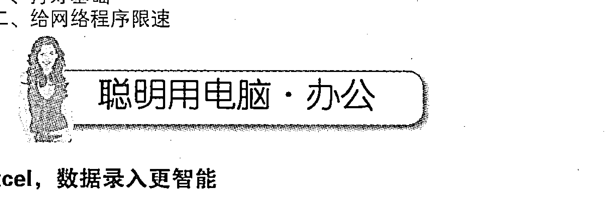

### Excel，数据录入更智能

- 一、工作表的设计
- 二、函数的添加
- 三、代码的添加
- 四、试用

### 手机个性铃声 一分钟快速搞定

- 一、准备工作
- 二、添加板书特效
- 三、效果预览

### Word文档自动添加密码

- 一、添加宏代码
- 二、试用及应该注意的问题

### 巧用函数，玩转Excel稿纸格式

- 一、将Excel文档设置为稿纸格式
- 二、文字录入

### Office 2007协同编辑学几招

- 一、文档协作各管一块
- 二、集思广益提意见
- 三、亲自动手用修订
- 四、现有材料快捷编
- 五、工作簿也能合伙编
- 六、要提建议插批注

### 精心构思，设计一份智能家庭账本！

- 一、创建家庭日常收支明细表
- 二、编辑查询以及汇总，轻松管理日常开支
- 三、美化表格以及进行查询汇总

### 轻轻松松制作和发送工资表

- 一、巧用VBA编程，轻松制作工资条
- 二、使用邮件合并，轻松制作和发送工资条

### 使用Word邮件合并，批量制作邀请函

- 一、整理客户资料
- 二、设计邀请函模板
- 三、利用邮件合并，合并邀请函以及通过邮件群发

### 电源的重要性

### 破解主板和红外适配器的兼容问题

### 做项目管理高手，就用Project

- 一、创建新项目
- 二、为项目配置人员以及设备材料
- 三、管理项目进程以及记录可用资源
- 四、核算成本以及查看项目报表

### 稳如磐石 WPS常见实用安全技巧

- 一、自动定时保存文件
- 二、保护文档
- 三、隐藏文档记录
- 四、注意“自动恢复”功能
- 五、给WPS文档加密
- 六、注意WPS加密的技巧
- 七、网络时代 智能升级
- 八、导出加密型PDF

### 关闭zip文件夹功能

### 让Windows XP也能刻ISO文件


### 省电更省心——低功耗PC全攻略

- 一、环保省电静音：低功耗PC的价值
- 二、最大相差54W：揭秘低功耗CPU
- 三、质疑19W平均功耗：功耗到底有多少版本？
- 四、双核功耗新低：Athlon BE开创历史
- 五、单核不会绝迹：新闪龙带来新惊喜
- 六、最大相差250W：低功耗显卡呼之欲出
- 七、省电的电源更受欢迎

### 安度炎炎夏日——PC静音散热新技巧

- 一、寻找CPU散热与静音的平衡点
- 二、玩的就是心跳：另类散热方法
- 三、硬盘与显卡：不容忽视的发热源

### 巧使跳线排故障

### 个人数据随身带——移动硬盘应用方案解析

- 一、三大难题：移动硬盘使用释疑
- 二、精打细算能省钱：移动硬盘DIY组装
- 三、打造移动数据中心：拓展移动硬盘功能
- 四、DIY移动保险箱：加密移动硬盘

### 内存升级白菜价——解决兼容性问题是关键

- 一、内存容量的选择
- 二、内存升级方案
- 三、深入内存选购策略

### 闲置UPS起死回生记

### 省电就是省钱，电脑省钱要点概述

- 一、选购一台省电的电脑
- 二、台式电脑的省电要点
- 三、笔记本电脑省电概述

### 清凉一“夏” 显卡降温总动员

- 一、噪音解决方案：热管技术显威力
- 二、超频用户首选：全铜散热器
- 三、公版显卡的选择：标准散热器
- 四、细节决定成败：关注显卡散热器附件

### 深入硬盘内部世界——开盘数据恢复

- 一、开盘所需要的环境与准备工作
- 二、实战开盘数据恢复

### 迎接四核心时代——PC电源准备好了吗

- 一、四核时代更需大功率电源
- 二、从V1.3到V2.3：深入了解ATX电源的版本
- 三、功率判断：避免电源功率虚标
- 四、深入细节：高品质电源的内涵
- 五、大功率更要省电：功率因数与待机功耗
- 六、产品推荐

### 重新找回机箱侧面板

### 用好你的辅助硬盘——第二硬盘使用经验谈

- 一、双硬盘工作模式：解决兼容性难题
- 二、实战RAID 0磁盘列阵

### 最新≠最好，驱动不追新

- 一、为什么最新驱动不一定最好
- 二、实战测试：GeForce4 Ti4200之最佳驱动
- 三、老当益壮：老显卡的驱动选择建议

### 7×24，永不停歇的P2P——实战老电脑变下载专用机

- 改造下载专用机之硬件篇
- 改造下载专用机之软件篇

### 启用SATA2接口硬盘的独门功夫——NCQ

- 什么是NCQ?
- BIOS设置不可少
- Windows安装有两招

### 低价投影影绰绰 安装也是技巧

- 投影幕布要不要？
- 墙距决定投影尺寸
- 投影墙与安装墙的关联性要留意
- 吊装还是平装？
- 线材宁多勿少

### 教你设置显示器

- 亮度对比度调节——给眼睛一个休息的窗口
- 色温调节——个人喜好最重要
- CRT显示器——图像满屏是基本要求
- 分辨率调节——合适才是最好的

### 装机之三大纪律八项注意

- 三大纪律之一：机箱电源不能省
- 三大纪律之二：散热是稳定的根本
- 三大纪律之三：多种螺钉，各司其职
- 八项注意之一：先装电源再装主板
- 八项注意之二：硅脂不要涂过多
- 八项注意之三：主板螺丝不要上垫片
- 八项注意之四：接口插针要注意
- 八项注意之五：挡板磁环防辐射
- 八项注意之六：导风罩位置有讲究
- 八项注意之七：绝对不能带电拔插
- 八项注意之八：从最小系统查找故障

### 高清解码全攻略

- 高清是什么？
- 设置高清解码要分清
- PowerDVD设置最简单
- 终极解码最好用
- H.264解码的设置方法

### 轻轻松松玩转显卡

- 超频
- 双卡互联
- 双屏显示
- 输出电视
- 散热

### 登录界面背景变变色

### 完全卸载XP

### 主板超频我也会

- Intel处理器超频
- AMD处理器超频

### Intel超频中选项的调节

### AMD超频中选项的调节

### 硬件安装要仔细

### 系统救命有稻草

### 恢复硬件以前的驱动程序

### 自动登录

### 移动的3D魅力——透视笔记本显卡

- 一、3D游戏的命门：游戏本本配件如何选择
- 二、整合也能出精品：集成显卡性能探寻
- 三、Shader Model 3.0时代：独立显卡更受欢迎
- 四、DX10移动显卡：次世代大战

### 笔记本自力更生升级全攻略

- 一、内存
- 二、硬盘
- 三、CPU
- 四、升级选购注意事项

### 快速关机或重启的快捷键（可定时）

### 让系统自动关闭停止响应的程序

### 躺着也能工作和娱乐，床上用本经验谈

- 一、别随便抱本上床：床上用本有选择
- 二、多方入手：让本本在床上更冷静
- 三、保护本本：床上用本也要小心
- 四、随心所欲用电脑：家居电脑浅谈
- 五、别被电脑奴役：电脑与健康

### 谈天说地——看常见内存故障

- 一、无法正常开机
- 二、劣质内存造成非法操作
- 三、内存损坏故障
- 四、内存损坏导致“解压缩文件时出错”
- 五、内存不同频率的连累集成显卡花屏
- 六、内存造成的硬盘自检无法通过的问题

### 小部件大学问——自己动手解决鼠标小故障

- 一、鼠标时好时坏或者电脑无法识别
- 二、鼠标按键失灵
- 三、鼠标光标无法移动
- 四、计算机不认鼠标

### 寻找丢失的快速启动栏

### 批量文件重命名

### 快速锁定计算机

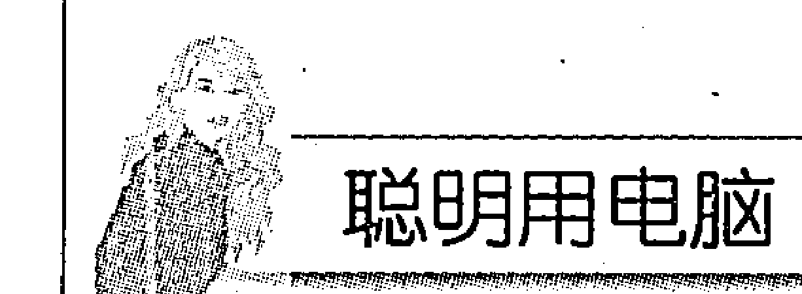

### 开源节流，教你玩转4G闪存硬盘的Eee PC

- 一、EeePC性能瓶颈分析
- 二、选择合适的操作系统
- 三、操作系统手工“减肥”
- 四、量体裁衣发挥EeePC功能

### 游戏新主张——XBOX 360乐趣无穷

- 一、为什么选择XBOX 360：次世代平台之争
- 二、网络对战精彩纷呈：如何接入XBOX Live
- 三、半个HTPC：XBOX 360如何作为媒体播放器

### 没车也玩GPS，实战智能手机GPS的非导航应用

- 一、GPS导航和定位应用
- 二、野外探险的好向导
- 三、运动健身的好助手
- 四、记录照片GPS信息
- 五、徒步旅行的GPS应用

### 走到哪里都不怕——低价位GPS设备扫描

- 一、低价产品省在哪里？
- 二、低价GPS到底质量几何？
- 三、买手持GPS设备时，需要注意的几个要点

### 让GPS导航仪走开 巧用智能手机的GPS功能

- 使用GPS软件的注意事项
- 能以多种角度看地图的凯立德
- 地图详尽的灵图天行者
- 拥有多种导航模式的道道通
- 适合城际游的城际通
- 适合塞班平台的Route66

### 格式通吃也要转，“非主流”MP4视频格式转换大补贴

- 确定转换软件
- 进行文件格式的转换

### 功能强大操作傻瓜 诺基亚PC套件妙用宝典

- 下载并安装诺基亚PC套件
- 让手机的通讯录永远最新
- 与手机进行互联
- 查看手机中的文件
- 方便管理联系人
- 把手机当成小“猫”
- 让自己的手机变成音乐播放器
- 换手机不用怕，原来资料照样走
- 走到哪里都不怕，自由更新手机地图

### 巧用存储卡扩充易PC存储“仓库”

- 升级思路有所不同
- 升级操作不用怕

### 本本携带外出防盗手册

- 身处繁华闹市如何防盗
- 自驾出游不要让爱本独自留下
- 入住酒店也不可大意
- 长途旅行更要小心三只手
- 信息安全更重要

### 高温工作要注意 夏季笔记本电脑散热大全

- 清理散热器和风扇
- 重上散热硅脂
- 清理进风口和出风口
- 改善外部散热条件
- 购买专用的散热底座
- 养成良好的使用习惯

### 视频大宴 笔记本与平板电视的连接和使用

- 一、笔记本电脑常见视频接口
- 二、平板电视常见接口
- 三、实现笔记本电脑与平板电视的连接
- 四、将笔记本电脑的画面输出到大的显示器上

### 天籁之音 笔记本与家庭音响的连接和使用

- 一、笔记本电脑常见音频及对应接口
- 二、家庭音响常见接口及连接
- 三、全面提升笔记本电脑的音量
- 四、怎样提升笔记本电脑的音质

### 防抖功能真是万用灵丹？合理使用DC防抖技术

- 防抖技术到底属于哪路神仙？
- 防抖技术这么多，应该选择哪一种？
- 什么时候应该开启防抖功能？
- 有了安全快门，就能抛弃防抖技术吗？

### 掌握推拉摇移——让DV玩得更专业

- 一、推摄
- 二、拉摄
- 三、摇摄
- 四、移摄

### 睁大眼睛看仔细 微距摄影技巧

- 什么是微距拍摄？
- 微距摄影≠近距拍摄
- 利用变焦功能虚化背景
- 拍摄小动物宜用连拍
- 微距拍摄不一定需要微距功能
- 加装微距镜

### 让双键鼠标具有滚页功能

### 让Windows XP读英文字母

### 恢复Windows经典界面

### 恢复“开始”菜单

### 优化视觉效果

### 禁用多余的服务组件

### 随时随地观奥运，手机电视圆你梦

- 一、手机电视技术概述
- 二、手机电视实现方式
- 三、3G技术和手机电视
- 四、实战不同类型的手机电视

### 跟我一起嘻唰唰，手机刷机技巧集锦

- 一、手机刷机的基本用途及方法
- 二、增强系统功能（打补丁）实例
- 三、偷梁换柱让手机改头换面
- 四、在线刷机让刷机普及起来

### 真是巧了——巧用DC六大招

- 一、巧用闪光灯
- 二、巧用三角架
- 三、巧用白平衡
- 四、巧用快门
- 五、巧用数码变焦和光学变焦
- 六、巧用预置模式

### 留住瞬间的美丽——数码照相机的保养

- 1. 让每一天都是晴天
- 2. LCD变的坚强起来了## 3. 保持镜头清爽清晰
- 4. 轻松解决意外烦恼
- 5. 让“家”永远舒适
- 6. 巧妙应对环境问题
- 7. 相机的支柱之一——电池
- 8. 远离磁场和电场

## 像爱护花瓶一样爱护它——浅谈平板电视的保养
- 一、液晶电视保养术
- 二、等离子电视保养术

## 减少启动时加载项目

## 关闭系统还原功能


## 特别话题

## 引爆流行——Windows Vista SP1全面剖析
- 一、SP1补丁包的组成
- 二、Vista SP1的安装方式
- 三、解决安装SP1之后的“不适”
- 四、值得关注的新变化
- 五、盗版Vista安装SP1的问题
- 六、SP1后安装语言包的问题

## 享用安全系统 给Windows打补丁另外招数集锦
- 招数一：利用迅雷高速下载应用补丁
- 招数二：利用金山毒霸
- 招数三：用天网防火墙的系统漏洞填补
- 招数四：360法
- 招数五：雅虎天盾法
- 招数六：将其集成到Windows XP光盘上
- 招数七：将其集成到Windows Vista光盘
- 招数八：将补丁集成到Ghost文件

## 关闭自动更新

## 关闭远程桌面

## 关闭“自动发送错误报告”功能

## 与时俱进 大文件也有大智慧——大文件处理实用技巧大搜罗
- 一、基础技巧
- 二、清理大文件
- 三、使用大文件
- 四、化整为零 尽量避免大文件

## 禁用休眠功能

## 关闭“Internet时间同步”功能

## 合理设置虚拟内存

## 删除多余文档

## 删除Windows XP中隐含的组件

## 清理垃圾文件

## 拥有最IN的电子书
- 一、发扬“拿来主义”——电子书的下载
- 二、自己动手，丰衣足食——电子书的制作
- 三、转换电子书格式
- 四、制作成手机电子书

## 四两拨千斤 Word 2007中的高级替换技巧
- 一、了解ASCII字符集代码
- 二、“查找”文本框中可以使用的通配符
- 三、“替换为”文本框中可以使用的通配符
- 四、替换操作的几个实例
- 实例一：替换通配符“*”号
- 实例二：将文字替换为图片
- 实例三：替换不确定数量的汉字
- 实例四：为Word文档的段首添加相同字符
- 实例五：批量替换Word文档中的数字句号
- 实例六：快速剔除试卷中的答案内容
- 实例七：快速替换化学分子式
- 实例八：利用Word处理QQ音乐的播放列表
- 实例九：直引号快速替换为全角中文双引号
- 实例十：将一行内容分作两行
- 实例十一：批量删除每行前面或后面的内容
- 实例十二：批量删除制表符后的内容
- 实例十三：删除开头有特定字符的段落

## 禁止MSN随Windows启动

## 高速下载的快感——迅雷超级完全技巧集锦
- 一、迅雷基础类技巧
- 二、迅雷影视下载技巧
- 三、迅雷BT下载技巧
- 四、迅雷电骡下载技巧
- 五、迅雷小文件下载技巧
- 六、迅雷音乐下载技巧
- 七、迅雷安全下载技巧

## 摆脱束缚 轻松遨游——无线网络关键应用指引
- 一、组建WiFi无线网络的基础设备
- 二、WiFi无线网络的设置
- 三、无线网络应用释疑

## 优化带宽

## 更改IE临时文件夹

## 加快“网上邻居”共享的速度

## 划时代的进步——多核CPU多面看
- 一、解析多核计算技术
- 二、多核处理器发展趋势
- 三、AMD多核技术
- 四、Intel多核技术
- 五、非对称的多核心：IBM Cell大放异彩

## 删除多余字体

## 清除预读文件

## 设置预读以提高速度

## 移动的精彩世界——娱乐笔记本面面观
- 一、解析娱乐笔记本
- 二、娱乐笔记本之最
- 三、娱乐笔记本电脑周边设备

## 发挥余热 22个对付旧电脑的办法
- 用处一：让上网更加安全 ( Router and Firewall )
- 用处二：进行公共讨论 ( Public Discussion )
- 用处三：组建RTX服务器 ( RealTime eXpert Server )
- 用处四：组建一个Nero刻录器 ( Recording Server )
- 用处五：让PC和Mac互连起来 ( PC and Mac Connection )
- 用处六：共享扫描仪 ( Scanner Sharing )
- 用处七：共享读卡器 ( Card Reader Sharing )
- 用处八：组建数字家庭平台 ( Media Station )
- 用处九：制作存储服务器 ( Storage Server )
- 用处十：制作打印服务器 ( Printer Server )
- 用处十一：把硬盘拆下制作移动硬盘 ( Portable HardDisk )
- 用处十二：用光驱来听CD ( CD Player )
- 用处十三：制作双显示 ( Dual Display )
- 用处十四：升级电脑组件 ( For Upgrade )
- 用处十五：赠送给孩子们 ( Donation For Poor Children )
- 用处十六：联网打游戏 ( For Games )
- 用处十七：当成开发环境 ( Development Server )
- 用处十八：学习Linux ( Learn Linux OS )
- 用处十九：学习服务器系统 ( Learn Server Deployment )
- 用处二十：组建下载服务器 ( Big File Download Machine )
- 用处二十一：组建远程访问器 ( Remote Server Access )
- 用处二十二：学习电脑原理 ( Learn Computer Architecture )

## 从头到脚，享尽蓝牙提供的全部“服务”
- 一、蓝牙基本技术特点
- 二、蓝牙驱动和管理软件
- 三、各种蓝牙服务简介
- 四、蓝牙服务的具体应用

## 取消不需要的网络服务组件

## 启用DMA传输模式

## 加快关机速度

## 不要太傻瓜，数码相机最新智能技术深入分析与应用
- 一、按需选择才专业，数码单反实时取景技术分析与应用
- 二、拿稳相机更重要，数码相机智能防抖技术分析与应用
- 三、逆光拍摄窍门多，数码相机人脸识别技术分析与应用
- 四、人际沟通是关键，数码相机笑脸快门技术分析与应用
- 五、曝光模式合理用，数码相机智能场景技术分析与应用
- 六、闪光拍摄窍门多，数码相机智能闪光技术分析与应用

## 移动数码影像乐趣——手机拍照功能应用全集
- 一、知己知彼：了解手机拍摄性能
- 二、照片拍摄技巧：不要轻易否定你的手机
- 三、最方便的移动影像：如何生成高质量图片
- 四、新奇手机照片玩法
- 五、拍照手机与便携式打印机推荐

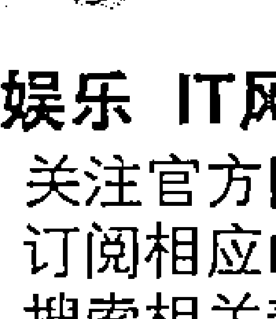

## 专题图书

## 奥运娱乐 IT风行
- 一、关注官方网站
- 二、订阅相应的RSS
- 三、搜索相关新闻
- 四、创建自己的奥运会资讯网
- 五、收看奥运网络电视
- 六、录制奥运节目
- 七、录制奥运声音新闻
- 八、收看手机奥运新闻
- 九、转换格式到手机里（视频 音频）
- 十、将抓取的文字保存为电子书
- 十一、将下载或录制的视频/音频做成自动播放的DVD
- 十二、下载高清后的观看问题
- 十三、如何收看奥运高清频道 ( CCTV-5 )
- 十四、远距离拍摄奥运精彩瞬间 ( DC )
- 十五、如何在迅雷上传并共享自己拍摄的精彩视频
- 加快菜单显示速度
- 关闭计算机时自动结束任务
- 关闭华生医生 Dr.Watson
- 减少磁盘扫描等待时间
- 删除多余的帐户

## 321 Windows Vista安全大家庭
### "Windows Vista安全大家庭" 之安全中心
- 一、认识安全中心
- 二、报警和修复
- 三、禁止盾牌警报
### "Windows Vista安全大家庭" 之防火墙
- 一、Windows防火墙
- 二、高级防火墙
- 三、出站规则的配置
### "Windows Vista安全大家庭" 之Windows Update
- 一、掌握Windows Update的基本操作
- 二、提前享受更新
- 三、让Vista的更新提示不再烦人
### "Windows Vista安全大家庭" 之 Windows Defender
- 一、进入主界面
- 二、加入SpyNet社区
- 三、使用设置
- 四、软件资源管理器
### "Windows Vista安全大家庭" 之 家长控制
- 一、启用家长控制
- 二、用好家长控制的诸般功能
- 三、查看活动报告

## 329 2008实用工具软件“圣技”传递——最常用的优秀免费工具软件超实用技法案例精选
- 【火狐】新开网页方法多
- 【火狐】标签书签批星用
- 【火狐】成批地址作主页
- 【火狐】右键命令保存帧
- 【火狐】不用打开也能保存页面
- 【火狐】插件让火狐飞得更高
- 【火狐】火狐自带下载工具好
- 【火狐】平滑滚屏浏览长页面
- 【世界之窗】放大镜网页自由缩放
- 【世界之窗】灵活关闭标签方法多多
- 【世界之窗】高效浏览页面提前打开
- 【世界之窗】图片动画文件一键保存
- 【世界之窗】超长网页存为图片格式
- 【世界之窗】锁定的网页依然能编辑
- 【IE7】一次收藏多个好网站
- 【IE7】一次打开一组好网页
- 【IE7】自动恢复过去的页面
- 【傲游】自动翻页 看电子书不动手
- 【IE7】用导航选项卡快速定位
- 【傲游】自选颜色 看电子书不刺眼
- 【傲游】多重书签 一次能看多本书
- 【傲游】和谐相处 傲游支持迅雷一把
- 【傲游】开启独立线程 防止浏览假死
- 【傲游】新版是否升级由你自己定
- 【暴风影音】巧用热键 对付老板有办法
- 【暴风影音】中途有事 播放断点可续看
- 【暴风影音】不留马迹 播放记录快速除
- 【暴风影音】留住精彩 视频画面存成图
- 【暴风影音】无缝对接 精彩剧集连续播
- 【暴风影音】图像翻转 不怕电影头朝下
- 【暴风影音】智能识别 前后内容自动连
- 【暴风影音】快进快退 步距间隔自己定
- 【千千静听】轻松转换音频文件格式
- 【千千静听】打造个性化卡拉OK字幕
- 【千千静听】自动下载歌曲同步歌词
- 【千千静听】定制有特色的歌词环境
- 【千千静听】消除全屏显示歌词的烦恼
- 【KMPlayer】滤掉人声 只留背景音乐
- 【KMPlayer】实现视频画面连拍
- 【KMPlayer】KMPlayer也能分开播放APE歌曲
- 【KMPlayer】如何更改视频的播放方向
- 【KMPlayer】自由截取影片中的某个片段
- 【KMPlayer】学英语 视频复播双字幕
- 【快车】下载途中更换文件名
- 【快车】随心定制快车工具栏
- 【快车】添加注释下载好管理
- 【RealPlayer】音乐视频网上搜
- 【RealPlayer】直播视频能录制
- 【RealPlayer】刻录CD也轻松
- 【RealPlayer】多种格式互转换
- 【快车】默认属性可以自己定
- 【快车】让快车默默地为你服务
- 【快车】是否下载完 后缀能识别
- 【快车】注释文件保存自动化
- 【快车】让文件与注释自动关联
- 【电骡子】硬盘空间 事先需要筹划好
- 【电骡子】巧设选项让电骡子快快跑
- 【迅雷】迅雷骑骡子下载爽歪歪
- 【迅雷】自动关机 下载任务不用管
- 【迅雷】批量下载 迅雷一次能搞定
- 【迅雷】下载完后 播放自己的歌
- 【紫光拼音】简体繁体和谐共处
- 【紫光拼音】生僻汉字紫光全包括
- 【紫光拼音】不会发音也有办法输入
- 【紫光拼音】把最常用的字排在最前头
- 【紫光拼音】想要字可以先输一个词
- 【搜狗拼音】三种方法方便切换中英文
- 【紫光拼音】输入法也能支持通配符
- 【搜狗拼音】乔装改扮 狗狗换新衣
- 【搜狗拼音】网址邮箱 输入更方便
- 【搜狗拼音】笔画输入 请用u模式
- 【搜狗拼音】准确输入 笔画来辅助
- 【搜狗拼音】当前时刻 输入好办法
- 【搜狗拼音】输入速度 自动来统计
- 【搜狗拼音】全拼双拼 和谐共生存
- 【搜狗拼音】提前免疫 插件来吃闭门羹
- 【瑞星卡卡】系统修复 数秒之内现原形
- 【瑞星卡卡】IE防漏墙 筑起铁壁挡妖精
- 【瑞星卡卡】广告拦截 弹出不再添烦心
- 【瑞星卡卡】网页过滤 功能强大显神功
- 【瑞星卡卡】右键被锁 解除限制有瑞星
- 【瑞星卡卡】恶意网站 登录之前有警告
- 【优化大师】硬盘有坏道 优化大师带你绕道
- 【优化大师】不怕上当 带着“大师”去装机
- 【优化大师】软件卸不掉 大师有办法
- 【完美卸载】驱动打成自动包 下次重装更方便
- 【完美卸载】魔术师让你的文件夹“神”了
- 【完美卸载】保护正常时间 防止恶意修改
- 【360安全卫士】彻底粉碎顽固不化的文件

## 343 海量的诱惑 实用DVD刻录案例大全
- 一、刻录集成补丁、高清声卡、WMP11、IE7、迅雷的Windows XP光盘
- 二、刻录集成SP3补丁和丰富字库、模板的Office 2003光盘
- 三、刻录带SP1补丁和字库、模板的Office 2007光盘
- 四、打造自动播放的海量DVD MP3
- 五、打造自动播放的海量电影DVD
- 六、刻录一张漂亮面孔的光雕DVD光盘
- 七、刻录DVD光盘的一些实用技巧

## 353 PSP展雄风，娱乐“漫”天下
- 一、专业——PSPcomic
- 二、下载——MangaDowner
- 三、转换——PSP Comic Converter

## 355 给你一双慧眼，让你识得PSP2000和其他配件
- 一、为什么要购买PSP2000
- 二、选购PSP基本思路和步骤
- 三、识破商家的鬼话连篇
- 四、找出屏幕的坏点
- 五、辨别真假电池
- 六、辨别真假记忆棒
- 七、防患未然，辨别PSP硬降级主机
- 八、辨别真伪线控+耳机
- 九、PSP2000周边配件选购
- 十、谁与争锋——PSP2000与PSP1000之比较

## 362 倾听来自PSP的“天籁之音”
- 一、PSP都可以播放哪些格式的音乐
- 二、各种格式音乐的归属
- 三、PSP音乐播放——自身播放篇
- 四、PSP音乐播放——最节能的MP3播放器（LightMP3）
- 五、PSP音乐播放——多格式播放器
- 六、PSP音乐播放——用“聆歌”聆听
- 七、PSP音乐播放——eReader同步显示歌词
- 八、PSP音乐播放——千千静听改变MP3播放顺序
- 九、PSP音乐播放——网络广播也疯狂

## 366 原来桌面可以更美的——开屏桌面画报

## Windows用户必读——Service Pack的秘密

□方成亮

尽管以Windows XP和Windows Vista为代表的新一代操作系统已经变得十分稳定，但是面对层出不穷的软件、无孔不入的黑客程序以及日新月异的硬件技术，系统难免会在时间的推移中变得落伍。从2001年至今，Windows XP一直占据着操作系统的绝对主流，Service Pack就成为Windows XP升级换代的关键。而Windows Vista在渐渐站稳脚跟之后，如今也发布了Service Pack 1，解决了不少困扰在消费者心中的疑难问题。

## Vista SP1会不请自来吗

既然是全世界应用最具人气的操作系统，其安全性就十分引人瞩目。自从Windows 2000开始，微软的Service Pack就引起了用户的广泛关注，在如今的XP和Vista时代更是成为一大焦点。对于任何一款操作系统而言，各种兼容性问题总是难以避免，而此时Service Pack就成了最管用的救命稻草。通过Windows Update功能或是本地安装，Windows XP和Vista用户可以安装到最新的Service Pack。

然而不可否认的是，微软所提供的Service Pack不仅仅是各种安全补丁，其中有不少是功能型的改进。譬如，Windows XP SP2中配合防病毒处理器的DEP硬件保护技术、WIFI无线网络安装向导、蓝牙驱动等以及Vista SP1中的组策略高级功能。部分用户可能永远也用不上这些功能，此时新版Service Pack未免显得有些“不请自来”，甚至可以认为是微软的“霸王政策”。当然，还有些用户不愿意升级Service Pack是因为忌惮盗版验证。

那么，我们究竟能不能拒绝Vista Service Pack1以及即将到来的Windows XP SP3？答案是肯定的。但是，这需要付出无法使用Windows Update功能作为代价。事实上，Windows需要安装的补丁有两种：Hotfix和Service Pack。Hotfix是针对某一具体问题而发布的专门解决这个问题的小程序（也可以叫做修复程序），微软一般会把在软件产品中发现的重大问题以安全公告（Security bulletin）的形式通知给大家，这些公告都有一个唯一的编号，即MS**-***。例如MS05-013，表示微软公司在2005年发布的第13个安全公告。而这些公告所涉及的问题还有另外一个编号：Q******。MS05-013安全公告的编号就是Q 891781，这个号码表明了该问题在微软知识库（Knowledge Base）中的编号，只要记住这个编号，随时都可以查找到相应的文章和解决方案。因此，每个安全公告所发布的补丁也就有了相应的编号，例如Q 891781针对Windows XP系统的补丁名称就是Q891781_WXP_SP2_x86_ENU.exe，这表示这个补丁解决的问题在知识库文章Q 891781中讨论过，适用于Windows XP，被集成到Windows XP SP2中，并且是英文版（图1）。

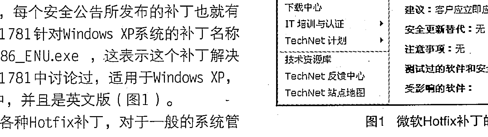

由于微软频繁地发布各种Hotfix补丁，对于一般的系统管理员，要察看自己的电脑是否安装了某个Hotfix补丁就成了一件很麻烦的事情。并且，依次安装各种Hotfix补丁在操作上也非常烦琐和辛苦。微软为了解决这个问题就开始发布Service Pack补丁。这种补丁一般在操作系统正式上市一段时间后发布，包含了自发布之日全部的Hotfix补丁。只要安装了Service Pack，在这个Service Pack发布之前的所有Hotfix补丁就都不用再安装了。很显然，Hotfix补丁总是通过Windows Update功能来实现，而用户今后在使用这项功能的同时必须将接受整个Service Pack作为先决条件。

## 一、安装SP2后系统安全策略发生哪些变化

安装好Windows XP的SP2之后，系统的安全性与功能性都会得到加强，但是与此同时所带来的一些兼容性问题也十分引人瞩目。对于还未安装SP2的用户而言，4月12日之后对于这款全新补丁合集的准备就显得十分重要。

### 1. BT速度下降之谜

SP2限制了TCP最大并发连接数，其目的是为了增加网络安全，防止冲击波一类的蠕虫病毒爆发时所带来的网络灾难。但是这也给BT下载软件带来了不便，特别是用户安装了第三方防火墙时，此时与SP2自带的防火墙一同工作就会导致BT下载速度明显变慢。对此，建议进入Windows防火墙，在“例外”选项中勾选“UPnP框架”，随后在窗口中选择“编辑服务”→“更改范围”，然后选择“任何计算机（包括Internet上的计算机）”（图2）。

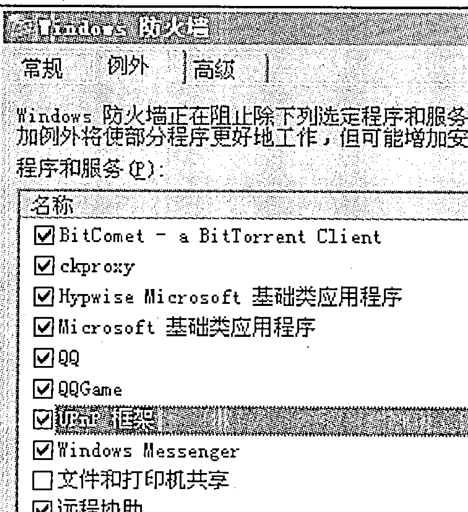

### 2. ADSL虚拟拨号瑕疵

由于ADSL虚拟拨号并不事先设置IP地址，因此安装SP2之后本地连接始终有黄色惊叹号，显示“被限制或无连接”。虽说这样并不影响使用，但是总让人感觉十分不爽。对此，建议大家进入控制面板，取消“网络连接→本地连接→属性→常规”选项卡下面的“此连接被限制或无连接时通知我”这个选项（图3）。

### 3. 封杀所有弹出窗口

SP2在默认状态下拦截所有的IE弹出窗口。但是部分用户并不需要这项功能，此时可以进入IE工具菜单→Internet选项→隐私，取消“阻止弹出窗口”前的复选框，然后点击确定就关闭了此功能。如果是偶尔允许弹出窗口，可以在点击含有弹出窗口的链接时按住Ctrl键或按住Ctrl键再点击“刷新”，这样可临时跳过此功能（图4）。

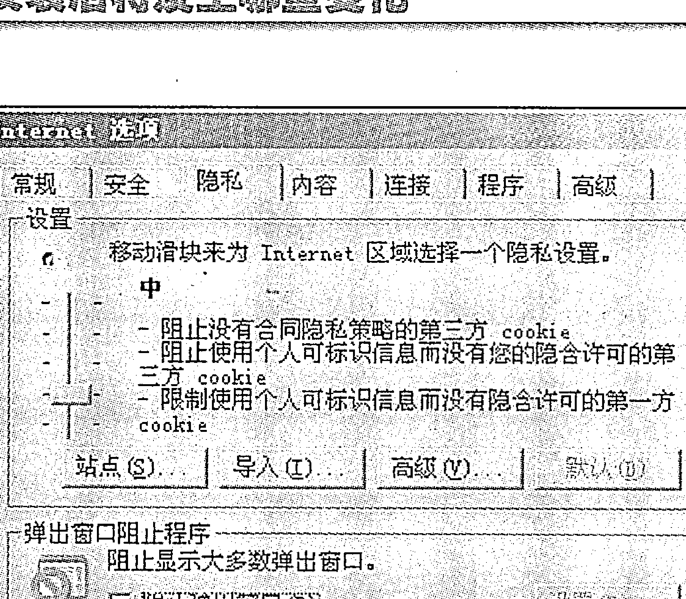

### 4. 远程协助功能受阻

安装SP2后使用远程协助功能时，会遇到“The remote server machine does not exist or is unavailable”错误提示。此时必须首先选择“开始→设置→控制面板→Windows防火墙”，切换到“例外”选项卡，确保勾选“文件和打印机共享”和“远程协助”两项。接下来运行“gpedit.msc”打开组策略管理窗口，依次展开“计算机配置→管理模板→系统→远程协助”，分别启动“启用远程协助”和“提供远程协助”两项。

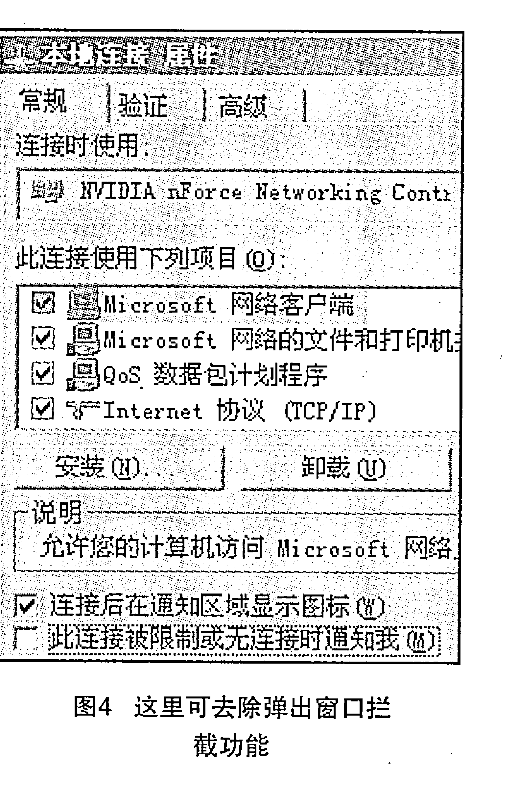

> 小贴士 安装SP2后的激活方法
安装SP2补丁之后，Windows XP的属性完全发生变化，此时就需要重新激活。事实上，SP2也被微软看作是打击盗版的一个手段，只有正版用户才能在安装SP2之后顺利激活。首先单击开始，选择“所有程序”→“附件”→“系统工具”，然后单击“激活Windows”。在随后出现的向导中选择“否，我现在不想注册，只想激活Windows”，接着向导将与激活服务器建立连接，输入相关密钥后处理你的激活请求。使用电话激活 Windows XP也是可以的。首先使用电话与微软顾客服务代表联系，然后单击开始，选择“所有程序”→“附件”→“系统工具”，然后单击“激活Windows”。在随后出现的向导中选择“是，我想打电话给顾客服务代表来激活 Windows”。阅读Windows产品激活隐私声明完毕之后填入相关的激活代码即可成功地激活SP2。

## 全面改进又提速 Windows Vista SP1

在Windows Vista正式发布一年之后，这款被微软寄予了极大希望的操作系统仍然未能占据主流地位。由于Vista存在诸多兼容性的问题，不仅普通消费者怨声载道，连OEM厂商也颇有怨言，许多企业用户都放慢了升级到Windows Vista的脚步。于是，微软及时推出了Windows Vista Service Pack1（简称Vista SP1）。这次Vista SP1的升级确实改善了不少问题，特别是一直受到批评的复制问题，而且基本没有任何新出现的故障，毕竟Vista SP1已经测试了很长时间（图5）。

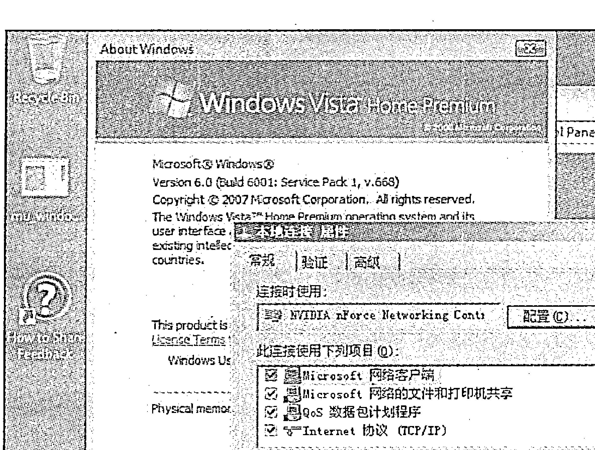

### 1. 全面改善的大集合

从未有一款补丁包像Vista SP1这样受到广泛的关注，除了微软公司声名在外这一因素，Windows Vista在过去一年之内状况不佳也是重要原因之一，许多用户迫切希望Vista SP1能够解决Vista存在的许多问题。微软公布了长达17页的Vista SP1改进列表，这份列表详细描述了Vista升级至SP1之后的所有变化。

根据微软官方提供的数据，除了23项已经通过Windows更新发布的重要安全更新之外，Vista SP1还包含了551项补丁修复内容。在这些重要更新和补丁修复内容之中，其中与IE有关的多达75项，与电源管理有关的41项，与存储器有关的38项，与硬件有关的35项，与网络有关的同样有35项，其他则是包括桌面、打印机等方面的。

根据官方公布的白皮书披露，SP1将提供Express、Stand-alone、Slipstream等三种安装方式。当然，不管选择哪一种安装方式，对于x86-32系统来说，Vista SP1的安装至少需要7GB的可用硬盘空间，而对于x86-64则需要12GB的可用硬盘空间，虽然这些所占用的硬盘空间将在安装完成之后进行自动释放，不过建议大家还是花费一些时间对"C:\Windows\Temp"进行清理。安装过程并无复杂之处，按照提示操作即可，完成之后，我们可以从系统属性中查看到变化，你会发现这里出现了"Service Pack1"的字样。

### 2. 值得关注的变化

从本质上来说，SP1集成了Vista发布以来的诸多安全更新和补丁程序，主要是在安全性、系统性能、兼容性方面，也就是说Vista SP1注重的是改进体验，而不是新增功能或应用程序的变更。IE的版本号为7.0.6001.18000，而非最近公开测试的8.0版本；DirectX同样也只是10，而非传说中的10.1。

在没有SP1之前，Windows Vista的文件复制速度是相当慢的，计算时间的错误经常在复制、移动、传输或删除文件时出现，网上流行的取消“远程差分压缩”设置并不能解决这一问题，因为这与我们所使用的操作方法无关，无论是“复制→粘贴、剪切→粘贴、拖曳/发送到”，都会存在慢速问题。这主要是Vista在计算剩余时间这个环节耗费了太多的时间，从而影响了操作过程，甚至会让系统陷入挂起和停止响应。

安装SP1之后，复制和移动文件速度慢的问题得到了明显的改善，特别是在时间计算方面有了相当大的改进，文件复制进度窗口在两秒钟之内即可计算出所需要的时间，本地磁盘对本地磁盘，文件复制速度提高25%；到非Windows Vista SP1系统之间的文件复制，速度提高近45%；两台Windows Vista SP1之间的文件对传，速度提高近50%。

随着购买第二台电脑高峰的到来，拥有笔记本的普通用户数量急剧上升，而笔记本电脑基本上都是预装正版操作系统，其中绝大多数都是Windows Vista。如果你日常主要使用笔记本电脑，那么更应该为Vista安装SP1，这是因为在安装Vista SP1之后，笔记本系统的性能将得到相当大的提升，特别是提高了进入休眠、从休眠中恢复后的可靠性和性能，缩短了从休眠中进行恢复所需要的时间，系统不等待即可立即重新投入使用，这将大大改善用户的使用体验。另外一方面，安装SP1之后将不再频繁地刷新屏幕，从而降低CPU占用率，这可以在一定程度上提高电池的使用时间。

> **小贴士**
**盗版误装SP1后如何恢复**
有很多使用非正式版Windows Vista的用户安装了SP1后不能成功激活系统，而且在试用30天后无法进入系统，即使卸载了SP1也不行，只得重新安装系统。为了避免造成无谓损失，可以简单使用一种方法使系统恢复到初始状态下，而不必重装系统。但是首要条件是安装SP1时选择了备份系统还原。这样可以在安全模式下卸载SP1，然后在注册表中搜索Wpaevents这个键值并将其删除掉。重新启动系统后系统会回到未激活的状态，好在此时老的激活方法依旧可以奏效。此外，在安装SP1之前使用Ghost备份整个分区也是不错的方案。

## 双操作系统应用方案全集

□阿亮

对于大多数用户而言，选择操作系统总是一件痛苦的事情。一方面Vista操作系统在与老硬件的兼容性上不甚理想，而且很多用户更加习惯于Windows XP的操作界面；而另一方面，很多新型软件开始抛弃Windows 2000平台，给硬件配置不高的用户造成了很大的不便。在这种情况下，安装双操作系统无疑是最佳的解决方案，不过其中也涉及到各方面的细节技巧，我们在此将与大家一起探讨，从而完全掌握双操作系统的配置方略。

## 一、双系统无痛安装——OSBRecovery上演倒挂金钩

为了让用户更好地适应新版本操作系统，微软从Windows 2000开始预设了多操作系统的引导功能，从而方便大家实现多操作系统。然而微软的解决方案有一个明显的不足，即无法在已经安装高版本操作系统上再安装低版本操作系统。譬如用户已经在使用Windows Server 2003，但是新购买的某一硬件设备只能工作在Windows XP下，此时再安装Windows XP将无法顺利实现双操作系统模式。对于这种情况，难道非要格式化硬盘吗？有了OSBRecovery的“倒挂金钩”，我们自然可以妙手回春。

### 1. 强行安装Windows XP

在Windows Server 2003下，如果简单地执行Windows XP的安装程序，那么系统肯定会在检测之后予以否定，用户不得不退出安装界面。为此，建议大家使用启动盘，然后到DOS下安装Windows XP。在这种情况下，因为系统没有检测到Windows Server 2003的存在，因此不会有任何问题。

在安装Windows XP时，最关键的一步是确保安装盘符与Windows Server 2003不同。一般Windows Server 2003安装在C盘下，此时建议将Windows XP安装在别的盘符，并且不要修改目录名（图1）。

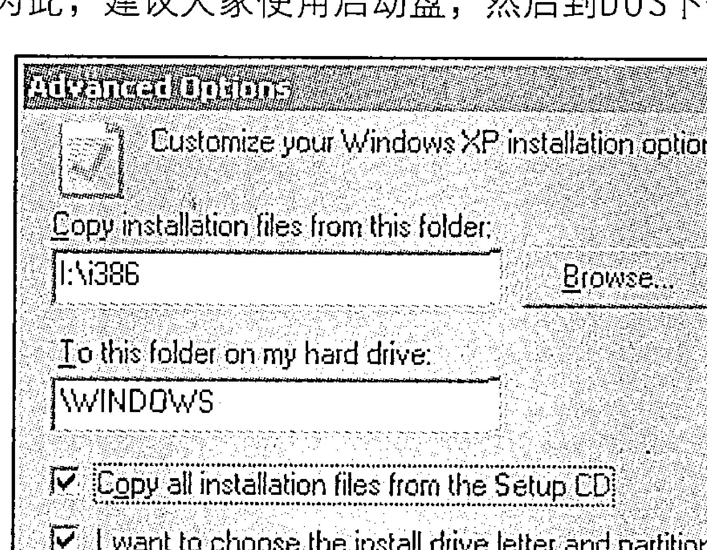

### 2. 使用OSBRecovery修复启动列表

在安装好Windows XP之后，我们会发现此时系统默认进入该操作系统，而不出现可选的启动列表。难道Windows Server 2003就这样报废了吗？赶快安装OSBRecovery，运行之后就可以看到如下的界面，此时分别选择需要修复的操作系统所在的盘符，并且指定默认的操作系统与可选启动列表的等待时间（图2）。单击“修复”按钮之后，OSBRecovery会为我们自动将可选启动列表还原，下一次启动电脑时就能在Windows Server 2003与Windows XP之间切换。

略微有些遗憾的是，目前OSBRecovery的开发还不是很完善。除了能够修复Windows Server 2003与Windows XP之间的双启动，还有一个对应Windows XP与Windows 2000的修复版本。但是OSBRecovery无法做到一次性修复Windows Me/9X与Windows 2000/XP的双启动修复，如果需要这方面的解决方案，请大家继续往下看。

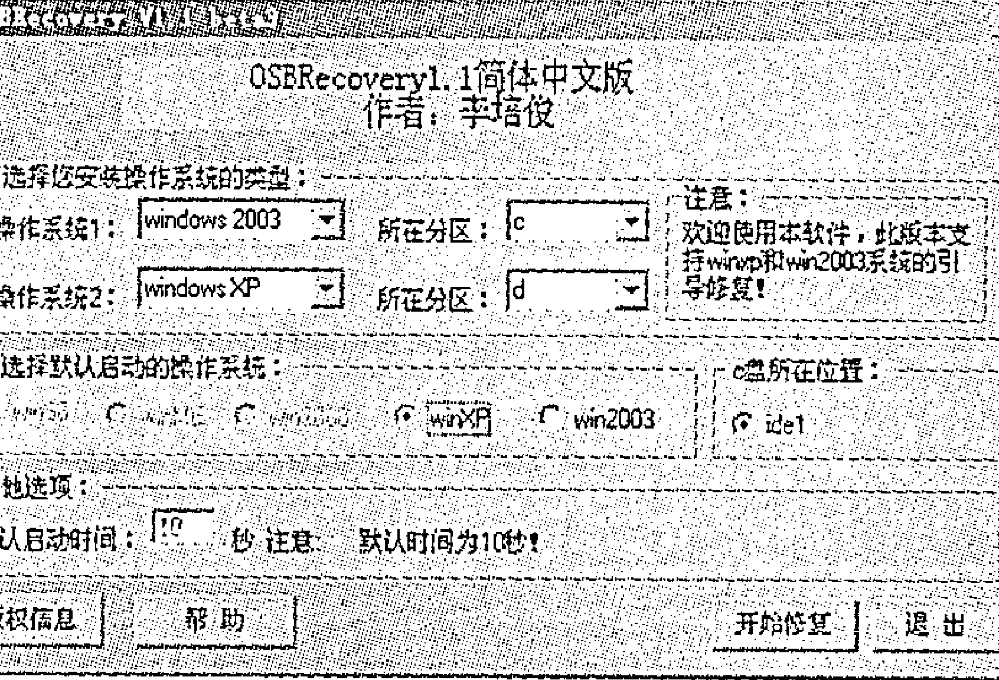

## 二、Windows 2000/XP下安装Windows Me/9X

对于微软操作系统而言，低版本可以通过安装高版本来实现双系统，但是反过来并不支持。更为麻烦的是，上文所介绍的OSBRecovery并不支持修复Windows Me/9X，不过这并不等于我们就束手无策。建议大家首先使用Windows Me/9X启动盘启动电脑，然后把Windows Me/9X安装到Windows XP以外的分区中。重启系统后，你会发现并没有双启动菜单，系统直接进入了Windows 98。此时不用惊慌，可以采用以下方法来解决问题。

### 方案一：巧用Windows XP安装盘

在光驱中插入Windows XP安装盘，然后使用光盘引导系统。启动后，Windows XP自动加载安装程序，不过当系统询问“重新安装还是修复”时，强行退出。当你再次以硬盘启动时，应该已经可以实现双系统启动了，因为刚才Windows安装盘已经自动修复了C盘根目录下的boot.ini文件，而且可以实现双启动。

### 方案二：超级兔子魔法设置

在Windows Me/9x下安装并运行超级兔子魔法设置2002（请尽量使用这一版本），随后单击“电脑启动”图标（图3）。在弹出的“Windows 9X启动方式”中使用“自动选择”，然后选中“Microsoft Windows XP Professional”。

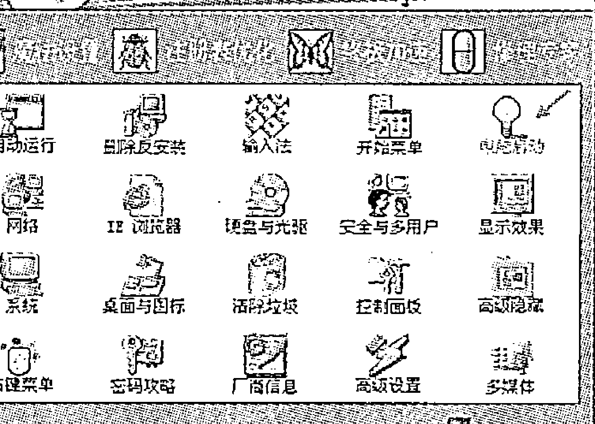

至于最下方的等待时间参数，将其设置为零（图4）。由于系统中并未安装Windows 2000，因此系统重启后不会出现双系统菜单，但是此时系统将直接进入Windows XP。

接下来就好办得多，因为我们已经进入了Windows XP操作系统。此时打开设置单击开始→设置→控制面板，双击系统图标，单击高级标签，在弹出的对话框中选择启动和故障恢复中的“设置”按钮。

随后再次弹出新对话框，把默认的操作系统选为Windows XP，选中“显示操作系统列表的时间”，然后设置为3～10秒。单击编辑按钮之后，我们会看到记事本打开Boot.ini文件，这里就是决定启动顺序的秘密（图5）。在这里，“partition（？）”中的问号代表硬盘分区的盘符，斜杠后的内容是Windows的安装目录，“Default”后的内容表示默认操作系统的安装盘符与目录。如果发现内容与硬盘中安装的两款操作系统不符，大家可以直接编辑该文件。

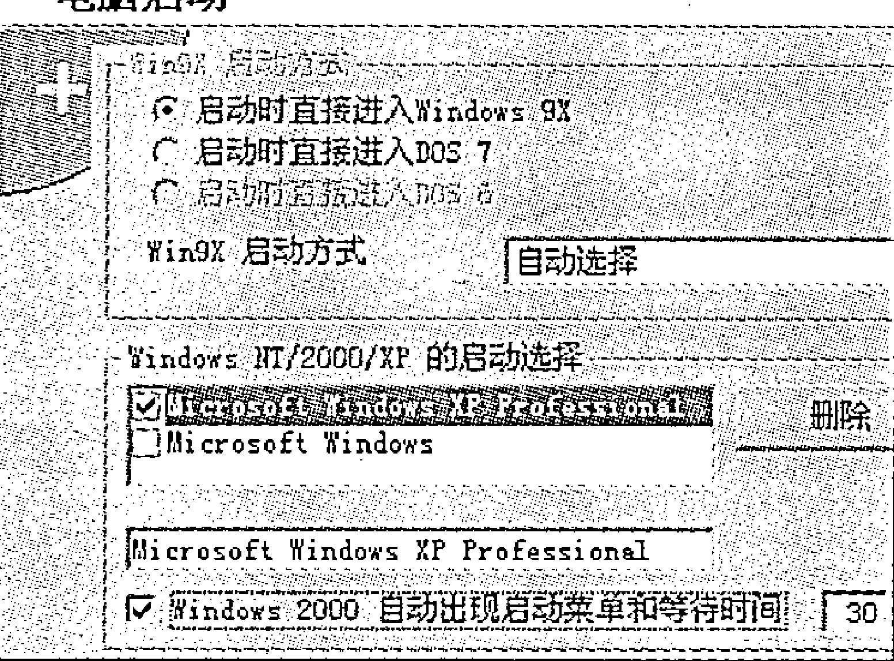

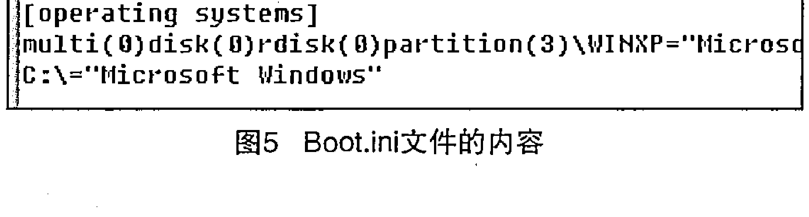

## 三、Windows 98与Windows Me共存

在Windows 98上安装Windows 2000或者XP可以采用另外安装操作系统，但是Windows Me似乎不行。对于部分有这种特殊需求的用户而言，很可能希望Windows Me也能与Windows 98实现共享，此时需要我们动用一些DOS小技巧。

### 1. 分别安装操作系统

实现Windows 98与Windows Me共存时最好在硬盘上划分两个以上分区，C盘（至少1GB）用来安装第一套系统Windows Me，D盘（至少500MB）用来安装第二套系统Windows 98。首先按正常方法在DOS下安装Windows Me，并安装好所需的应用软件和网络软件。然后在DOS下安装第二套系统Windows 98，安装第二套系统时要备份C盘已有的msdos.sys和io.sys，并把安装盘符选择为D:\。

Attrib c:\msdos.sys -s -h -r
Attrib c:\io.sys -s -h -r

随后在C盘建一个存放切换系统启动文件的文件夹（如C:\Change），将msdos.sys和io.sys复制到此文件夹中改名为ms98.sys和io98.sys。在此文件中建一个批处理文件（名字随意）Win98.BAT，用记事本编辑Win98.BAT内容为（图7）：

### 2. 更改系统文件

当电脑中有两套独立的系统时，将由C盘根目录下msdos.sys文件里的WINDIR和WINBOOTDIR两个参数来决定启动哪个系统，而开机画面是在io.sys文件里。先在Windows 98中把msdos.sys和io.sys两个文件的只读和隐藏属性去掉，可以使用如下命令（图6）。

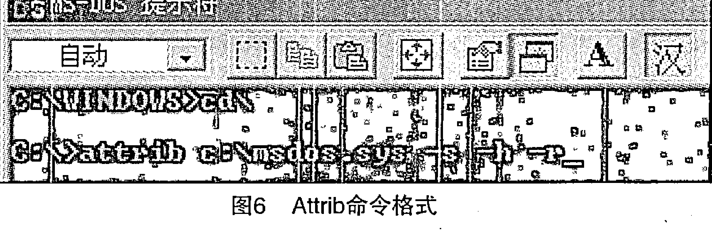

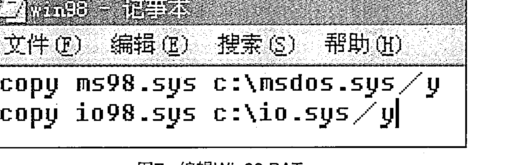

copy ms98.sys c:\msdos.sys /y
copy io98.sys c:\io.sys /y

再把备份的Windows Me的两个系统文件复制到Change文件夹中，然后将两个系统文件去掉只读和隐藏属性，并改名为msMe.sys和ioMe.sys，同样再创建一个批处理文件WinMe.BAT，并编辑其内容为：
copy msMe.sys c:\msdos.sys /y
copy ioMe.sys c:\io.sys

以后要进入某套系统，只要DOS窗口或Windows下运行相应的WinMe.BAT或Win98.BAT后重新启动即可进入相应的系统。

## 四、双操作系统安装到一个分区

为了安装双操作系统，很多用户一直都是把每个系统装到独立的不同分区，以免互相影响，造成不必要的麻烦。但是这样在使用Ghost备份时会非常不便，能否两个操作系统装到一个分区？答案是肯定的。

以Windows 98和Windows XP为例，先安装Windows 98，然后在Windows 98中安装Windows XP。要注意的是，在安装Windows XP时，务必选择全新安装。在安装选项对话框中单击“高级”选项，然后选择一个新的路径，如C:\winxp，而不要用默认的C:\windows目录，否则就会把Windows 98的同名文件覆盖。此外，在安装过程中请跳过升级到NTFS这一步，经过一段等待，Windows XP安装完成并重新启动。

此时电脑自动进入Windows XP，双重启动菜单根本就没出现。但是不要着急，在Windows XP中打开C盘，点“工具”→“文件夹选项”→“查看”→“显示所有文件和文件夹”，找到C盘根目录下的BOOT.INI，点右键并选择“属性”，取消“只读”然后用记事本打开，重新编辑如下：

[boot loader]
timeout=30
default=C:\
[operating systems]
C:\="Microsoft Windows"
multi(0)disk(0)rdisk(0)partition(1)\WINXP="Microsoft Windows XP Professional" /fastdetect

保存后重新启动电脑，双重启动菜单将会出现，可以分别进入两个系统，也便于使用Ghost备份。

## 五、在多操作系统下卸载Windows XP

经过一段时间的使用后，少数用户可能会发现原来Windows XP并不适合自己，此时大多会选择回到原先的Windows版本。如此一来就引出了如何在多操作系统共存的局面下卸载Windows XP的话题，如果处理不当，那么我们很可能把原先的Windows也损坏，因此建议大家参考一下我们下面提供的方案。

以下例子为Windows Me与Windows XP共存，我们需要保留Windows Me而卸载Windows XP。需要注意的是，我们提及的方法同样适用于Windows 98与Windows 2000，或者Windows Server 2003，大家可以如法炮制，其方法基本上没有差别。首先以正常方式进入Windows XP操作系统，通过“控制面板→系统→属性→高级”，进入系统属性设置菜单（图8）。然后我们点击“启动和故障恢复”的“设置”按钮进入设置窗口。在这里我们可以选择电脑启动时的默认操作系统、显示启动菜单的时间。

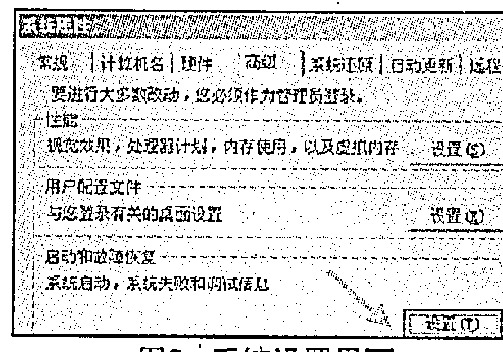

我们所要做的第一步就是把默认操作系统设置为Windows Me，然后将“显示操作系统列表时间”前的小钩去掉（图9），这样每次系统启动时就不会出现选择菜单了。需要注意的是，对于某些版本的Windows XP（主要是少数OEM版本），可能不能禁用选择菜单，此时可将选择菜单的显示时间设定为“0”秒。

好了，现在我们可以重新启动计算机了。如果不出意外的话，那么就应该看不到启动选择菜单，而是直接进入Windows Me了。来吧，操起我们的大刀，要开始尽情地享受删除的乐趣了。但是，这里也不能乱删，不然Windows ME也会崩溃。由于我们需要删除的是系统文件，因此不能在Windows下进行。此时，大家可以准备一张Windows Me的启动软盘或者光盘，开机选择Start Without CDROM，因为我们需要用到Deltree这个强力删除工具。如果使用Minimal Boot，那么这一工具是不会被装载的。

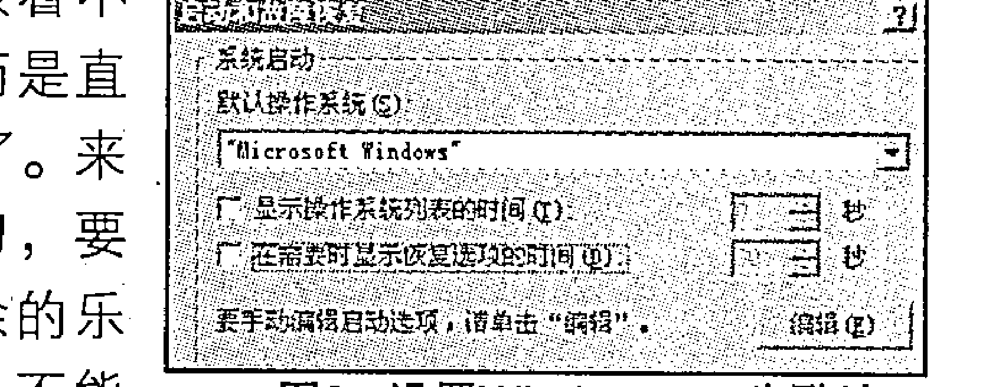

假设大家的Windows XP是安装在X分区，那么请依次输入如下命令：

- `Deltree X:\WINNT` 删除Windows XP的系统文件存放目录。
- `Deltree C:\boot*.*` 删除以boot开头的所有文件，这里有多系统启动菜单的文件。
- `Deltree C:\nt*.*` 删除以nt开头的所有文件。
- `Deltree C:\hiberfil.sys` 删除系统设置存盘文件。
- `Deltree C:\pagefile.sys` 删除页面文件。
- `Deltree C:\pagefile.sys, Deltree D:\pagefile.sys……所有的分区都要进行这一步。`

经过这些步骤之后，终于在成功保留Windows ME的前提下将Windows XP赶走了。也许这种方法不是唯一的，但是这至少应该是最简单的，非常适合初学者。

## 六、双系统共享应用软件

对于使用双操作系统的用户而言，解决应用软件在这两个操作系统的共存问题非常重要，否则就会浪费大量的磁盘空间。除了一些简单的绿色软件，其它软件也能够在这两个操作系统之间共享。

如果是在Windows XP里面已经安装的软件，在Windows Vista中不能运行，那么可以在Windows XP里运行注册表编辑器，查找与该软件有关的注册表分支，导出后再导入到Windows Vista中即可。例如ACDSEE，只要将“HKEY_CURRENT_USER\Software\ACD Systems”分支和“HKEY_LOCAL_MACHINE\SOFTWARE\ACD Systems”分支从Windows XP导出，“移植”到Windows Vista里，ACDSee就可以在Vista下运行了。需要注意的是，多个软件、多个分支要分多次导出，千万千万不能图省事儿，一下子把整个“…SOFTWARE…”分支都导出来。因为Software下还包含Microsoft Windows分支和很多窗口显示信息，而这些内容在Windows XP和Vista中是大不一样的，如果把它整个导入到Vista中，系统就会遭到破坏，出现窗口显示错误，窗口文字几乎都将变成“怪字符”。

注册表的导入与导出方法非常简单，在开始运行菜单输入“Regedit”之后进入注册表编辑器。依次展开到相应的路径，选中后使用“文件”菜单下的导出命令即可，此时将会得到一个.reg文件。随后切换到另一个操作系统，直接运行.reg文件。

## 标准BIOS使用方法及技巧

●小丽

BIOS的版本虽然不少，但是它们也有很多的共性。本文以标准AwardBIOS为例，介绍BIOS中我们最有可能接触到的选项，及其意义和应用方法。

## 实战1：正确设置SATA模式安装系统

要想让SATA硬盘发挥出最大的优势，就必须正确安装其驱动。由于一般安装SATA驱动需要用到软盘，而将SATA驱动集成到Windows XP安装盘中又非一般用户所能掌握。事实上，现在SATA和IDE速度差不了多少，我们可以在BIOS中设置为兼容模式（Compatible Mode），这样即可安装Windows XP。不过，如果你安装的是Windows Vista，则一定要设置为SATA增强模式（Enhanced Mode）。

进到BIOS后，选择Main下的IDE Configuration Menu，在Onboard IDE Operate Mode下面可以选择两种IDE操作模式：兼容模式（Compatible Mode）和增强模式（Enhanced Mode）。其中兼容模式Compatible Mode，可以理解为把SATA硬盘端口映射到并口IDE通道的相应端口，当你选择这种模式时在下面的IDE Port Settings中会有三个选项：

- Primary P-ATA+S-ATA: 并行IDE硬盘占据IDE0+1的主通道（Primary IDE Channel），串行SATA硬盘占据IDE2+3的从通道（Secondary IDE Channel）。也就是说这时主板上的第二个并行IDE接口对应的端口不可用。
- Secondary P-ATA+S-ATA: 与上面正相反，此时主板第一个并行IDE接口（Primary P-ATA）上对应的端口不可用，因为给SATA硬盘占用了。
- P-ATA Ports Only: 屏蔽了串行SATA硬盘接口，只能使用并行接口设备。

注：前两种模式中，主板上的SATA1接口自动对应IDE通道中的主盘位置，SATA2接口自动对应IDE通道中的从盘位置。

当选择模式为增强模式Enhanced Mode时，其下的端口设置的字样变为Enhanced Mode Supports On，其中也有三个选项：

- P-ATA+S-ATA: 并行和串行硬盘并存模式，此时SATA和PATA通道都相互独立互不干扰，理论上4个P-ATA和2个S-ATA可同时接6个设备，实际上得根据不同主板而定，有的南桥芯片就只支持4个ATA设备。此时SATA1口硬盘对应Third IDE Master（第三IDE通道主盘），SATA2口硬盘对应Fourth IDE Master（第四IDE通道主盘）。
- S-ATA: 串行硬盘增强模式，此时理论上支持4个串行硬盘，但还得看主板的支持情况（如果是ICH5R芯片组如P4P800，想组RAID模式，则必须要选择此项，并将Configure S-ATA as RAID项设为Yes，S-ATA BOOTROM项设为Enable，设置后BIOS自动检测的时候按“Ctrl+I”进行RAID设置）。
- P-ATA: 其实还是一种映射模式，SATA硬盘占据的是第一个IDE通道，SATA1口对应第一个通道的主盘，SATA2口对应第一个通道的从盘。

> 如果实在想在SATA下免驱动安装Windows，笔者推荐大家使用番茄XP版，它在显示时将会让我们选择安装自带有SATA驱动的Windows XP，它可以识别出多数的SATA硬盘，可以为我们省下不少时间。

## 实战2：通用设置加快机器的启动

有一些通用设置，设置好可以加快机器的启动。以下逐一介绍：

- “CPU Internal Cache” 和 “External Cache”，也有的BIOS中为 “CPU Level 1 Cache” 和 “CPU Level 2 Cache”，这两个项设为Enabled，可以充分利用CPU的缓存资源，加快系统速度。
- “Quick Power On Self Test” 应设为Enabled，减少自检步骤，加快自检速度。
- “Boot Sequence” 启动顺序，如果安装了系统，启动为硬盘或C盘启动。
- “Boot Up Floppy Seek” 设为 Disabled，因为现在软驱基本上没有了，所以启动时不检查软驱。
- “Boot Up System Speed” 设为 High。

## 实战3：设置密码保护系统

现在Windows的密码都保不住了，因为总有破解的办法。不过，要想破解BIOS密码就不是这样容易了。我们完全可以在BIOS中用方向键将光标移动到Security Option设置项，再用+/-键选择System（开机密码），然后在BIOS主菜单中，选择Set Supervisor Password或Set User Password选项，再按Enter键，在弹出的对话框中输入密码。之后，按Enter键再次弹出对话框，重新输入刚才的密码，再按Enter键，即可确定该密码。

这时，我们只要输入Supervisor或User密码都可以引导系统。

## 实战4：锁定第二硬盘和CD-ROM一法

在我们的机器上一般都安装有硬盘和CD-ROM，在某些特殊条件下，我们必须对它们进行锁定，如我们可以锁住CD-ROM，以防止别人随便使用CD-ROM向我们的系统里安装软件，而有时候，我们也可以把一些秘密的信息放到第二块硬盘上……基于以上种种原因，我们学会了锁住第二硬盘和CD-ROM的方法后，一定会为我们带来不少方便。

如果从硬件来设计电子锁，其复杂程度可想而知。其实通过笔者的摸索，找到了一种最为简单的方法：把第二块硬盘或CD-ROM全部接在主板的第二个IDE口上，然后进入CMOS首先设置好SUPERVISOR密码（有的和USER密码等价），并设置每次系统启动时询问密码。再进入“PNP,PCI&ONBOARD I/O”项，将“Onboard IDE-2 Controller”设置为“Disable”，按F10，存入CMOS中，退出，重新启动机器。这时候，进入资源管理器，你就会发现凡挂在主板的第二个IDE口上的设备全部不可见了！如果你什么时候想再使用它们，只需要在启动时按“Del”键，输入SUPERVISOR密码，再进入“PNP,PCI&ONBOARD I/O”项，将“Onboard IDE-2 Controller”设置为“Enable”，存入CMOS，重新启动系统即可。

## 实战5：遇到问题默认了之

如果是由于BIOS设置不当导致故障，有时会引发一些问题。这时，我们可以在开机按Del键进入BIOS设置后，选择Load Optimized Defaults（加载默认设置）后按F10键保存退出，其他主板BIOS设置可能不同，按提示选择Save&Exit即可，一般可以解决问题。

有的BIOS中菜单为“Load BIOS Defaults”或“Load Setup Defaults”（BIOS参数恢复成尽量发挥系统性能的默认值），默认值是一种很保守的设置，所以除非系统出现故障，否则不要使用。

## 实战6：这就不死——合理设置温度保护

夏天来了，机器会发热，很多人为了保护机器，可能会设置CPU和关机温度。不过，有时设置得不好，往往会造成开机报警、无法开机的问题。这时，我们可以重启开机按Del键进入CMOS设置，找到PC Health Status，将CPU warning Temperature和Shutdown Temperature都设置为Disable依次把它们都关闭即可。

## 实战7：设置好USB模式

现在很多USB盘都支持启动，用它可以杀毒或修复系统。不过，不要忘记BIOS对于USB的设置，一般支持USB ZIP、USB FDD和USB HDD三种方式（当然，U盘还有一种Boot Other Device启动方式，但这样的主板并不多）。选择USB ZIP或FDD方式后，U盘启动后会把自身模拟为软盘，会出现A:\提示符。而选择USB FDD方式后，U盘启动后会把自身模拟为C盘。其余操作一样。一般情况下，我们选择USB ZIP方式。当无法启动时，再换成USB FDD或HDD方式。

## 实战8：早起鸟儿有虫吃——自动开机

在一些情况下，我们往往需要主板的自动开机功能，如利用某一时间下载东西等。多数BIOS均支持，我们只要进入BIOS设置程序，选择“Power Management Setup”，然后移动上下左右方向键到“Power Up Control”中的“Automatic Power UP”，将其设置为“Everyday（每天）”或“By date（某一天）”，一般选前者，然后再在下面的“Time（hh:mm:ss）Alarm”中设置每天定时开机的时间。在这里，我们设置为6:00，设置完毕后按“Esc”键返回至主界面，再按下F10键保存设置。

## 实战9：打印BIOS信息

如果我们需要当前BIOS信息供高手排错，可以在进入BIOS画面后按一下Print Screen键，打印机就会自动将当前的信息打印出来。

## BIOS设置造成故障

●TMG mh

笔者单位的主机近日升级硬盘，即新买了一块西部数据160GB的硬盘，然后笔者用它和老的金钻硬盘组成双硬盘配置来扩大容量。两块硬盘具体分工为：新硬盘做系统主盘，老硬盘做备份系统、储存其他资料用。都安装完毕后，发现用Ghost软件往老硬盘做资料备份时会出现系统反复死机现象，尤其奇怪的是总出现在输入Ghost文件名后。笔者尝试在DOS环境下更换Ghost的版本，但依然出现问题。根据先软后硬的原则，笔者首先排除了软件方面的问题，因为安装前老硬盘查杀了病毒，并整理了磁盘碎片，而新硬盘也没用过，所以软件操作引起的故障概率非常小。那么，问题只能是在硬件方面了。笔者怀疑是数据线连接问题，打开机箱仔细查看，没有发现松动现象。既然不是连接问题，那么难道是配件损坏问题？这个设想随即也被笔者排除了，安装新硬盘前使用一切正常，除非新硬盘有质量问题，买的时候测试过，没有问题。继续分析，笔者猜想是不是配件设置的问题？尤其是主板等主要配件。笔者找来说明书查看，果然，发现了问题所在。如果BIOS的“On-Chip Serial ATA Setting”中的“Raid Function”被设置为“Auto”或者“Enable”时就会使得Ghost软件无法正常访问SATA设备。笔者关闭Raid功能后，Ghost软件就可以正常使用了。但是又发现另一个问题，进入操作系统不能检测到微星DVD光驱。有了前一个问题提醒，笔者进入BIOS中查找原因，最后发现把“On-Chip Serial ATA”的选项设为“For Secondary”，然后再把刻录机和P-ATA硬盘与IDE0接口连接一起就没有问题了。事后总结，笔者知道如果关闭了SATA Raid功能，与两个SATA端口相连接的设备就会映射到IDE端口上，而此时IDE端口上连接的设备便不能被系统辨认。由此可见，BIOS的设置是多么的重要。

## Windows 黑客级技巧精选

●关中少侠

说起“黑客”，你是不是马上想到了网络上那些来无影去无踪的神秘人物？这些网络黑客，他们或正或邪，能轻易进入到别人的电脑中，窃取或仅仅是浏览一下别人的隐私信息，喜欢恶作剧的还会搞一些破坏。不过，我今天介绍的并不是这类的黑客技巧，而是通过手工或借助软件工具，进入Windows操作系统核心进行的“非常规”操作，目的是帮助你提高系统性能，加速办公效率。闲言少叙，下面就开始我们的惊奇之旅吧。（本文技巧皆在Windows XP+SP2系统上测试通过，某些技巧同时适用于Windows其他版本时，会另外加以说明）

### ## 注册类黑客技巧

因为本文中的许多内容，都涉及到对注册表的修改，所以这里我们先介绍几个注册表方面的技巧。

> ★本文中的许多技巧，涉及到对系统文件的修改，这有一定的风险性。所以在开始之前，请务必做好备份工作，如：将本机重要数据复制备份到第二硬盘上或刻录到光盘上妥善保存；对系统进行Ghost备份；备份当前注册表等。

### CFanHack01: 备份整个注册表

安全起见，在对注册表进行修改之前，一般最好先备份注册表。方法很简单：单击“开始→运行”，打开运行对话框，输入“regedit”（不含引号），按回车键即可打开注册表编辑器。单击菜单命令“文件→导出”，在打开的导出窗口中，设置好注册表备份文件的名称及保存路径，再检查确认一下“导出范围”选择的是“全部”，最后点击“保存”按钮就可以了。

### CFanHack02: 快速备份注册表分支

有时我们仅备份要修改的注册表的某一分支即可，无须对整个注册表备份。在注册表编辑器中，右击要保存的注册表分支，在右键菜单中选择“导出”，也会打开保存对话框，其中“导出范围”自动设置为“所选分支”项，并且会显示完整的分支路径，确认无误，设置文件名及保存路径，单击“保存”即可（见图1）。

### ## 启动关机类黑客技巧

按一下电源按键开机，单击“开始→关闭计算机”关机，这些似乎没有什么特别之处。错！其实在这两个看似平常的操作背后，隐藏着不少鲜为人知的内容呢。

### CFanHack03: 优化启动文件以提速

我们知道，Windows XP的启动要用到系统分区根目录下的多个启动文件，如果能让这几个文件在磁盘上的位置彼此相邻，就可以减少启动时的文件查找时间，从而达到提速的目的。单击“开始→运行”，打开运行对话框，输入“regedit”（不含引号），按回车键打开注册表编辑器，定位到[HKEY_LOCAL_MACHINE\SOFTWARE\Microsoft\Dfrg\BootOptimizeFunction]子键，检查一下它右侧的“Enable”项的值是否为“Y”，如果不是则请将它修改为“Y”（见图2）。退出注册表编辑器，重新启动系统，启动文件将被整理优化，从而达到启动提速的目的。

### ## 用户界面装黑密技巧

我们常说Windows是一个GUI系统，这个GUI就是“图形用户界面”的意思。Windows负责把我们的请求转变成计算机的操作，而我们正是通过鼠标、键盘等设备操作显示屏幕上的GUI元素，向Windows发出指令。

### CFanHack04：虚拟内存文件自动清理

当运行比较大的程序（或多个程序）而导致内存不够用的时候，Windows就会启用虚拟内存对物理内存进行补充。不过物理内存中的内容在断电后就全部清空，而虚拟内存中的内容则会保存在硬盘上的pagefile.sys文件中。其中如果包含了机密数据，就有可能被别有用心的黑客所获取。所以如果从安全角度考虑的话，应该定时清理虚拟内存文件，这同样也会优化系统启动和运行时的速度。下面的方法，可让我们在每次关机时自动清理虚拟内存文件：

单击“开始→运行”，在运行对话框中输入“regedit”，按回车键打开注册表编辑器，定位到[HKEY_LOCAL_MACHINE\SYSTEM\CurrentControlSet\Control\Session Manager\Memory Management]子键，双击打开右侧的“ClearPageFileAtShutdown”项，将它的值改为1，确定即可。

> 小提示 ★每一技术总是有利有弊，设置关机自动清理虚拟内存虽然有不少好处，但是它也会导致关机变得非常慢，常常在“正在关机”画面停留半天。如果你觉得数据安全不是问题，则可以将“ClearPageFileAtShutdown”项改回为0值，取消关机自动清除虚拟文件功能。

### CFanHack06：藏起重要的控制面板项目

我们知道，Windows的控制面板中许多项目都是用来直接设置系统本身的，有一定的风险性。如果你担心临时使用你电脑的人在控制面板中胡乱操作，可以将其中一些风险较大的项目隐藏起来。

在运行对话框中输入“regedit”，按回车键打开注册表编辑器，依次定位到[HKEY_LOCAL_MACHINE\SOFTWARE\Microsoft\Windows\CurrentVersion\Control Panel\don't load]分支，在右侧窗格中右击，选择“新建→字符串值”新建一个项，名称就取要隐藏的控制面板项目对应的CPL文件即可。想要找回这些控制面板项目，重新在注册表编辑器中定位到“don't load”分支，删除相应的项目即可。下面我们给出了一些常用控制面板项目所对应的CPL文件，供大家参考：

| 控制面板项目名称 | CPL文件 |
| --- | --- |
| 系统 | sysdm.cpl |
| 显示 | desk.cpl |
| 网络连接 | ncpa.cpl |
| 辅助功能选项 | access.cpl |
| 添加或删除程序 | appwiz.cpl |
| 添加硬件 | hdwwiz.cpl |
| Internet选项 | Inetcpl.cpl |
| 区域和语言选项 | intl.cpl |
| 游戏控制器 | joy.cpl |
| 鼠标 | main.cpl |
| 声音和音频设备 | mmsys.cpl |
| 用户账户 | nusrmgr.cpl |
| 电源选项 | Powercfg.cpl |
| 电话和调制解调器选项 | telephon.cpl |
| 日期和时间 | timedate.cpl |

### CFanHack05：为Windows XP启动提速的BootVis

BootVis是微软内部提供的一个工具，专门用来提升Windows XP启动速度，它的汉化版可从http://www.onlinedown.net/soft/9939.htm下载。解压后，双击BootVisCN.exe启动软件，单击“轨迹→下一个引导”，在打开的对话框中设置重复追踪的次数（默认为1次），单击“确定”，BootVis将自动重启电脑并自动记录启动进程生成相关的BIN文件。

测试完毕重新进入系统，再次运行BootVis，单击“文件→打开”，打开保存的BIN文件（如：TRACE_BOOT_2_2.BIN），将以图表的形式显示系统运行的各种情况。这时再单击“轨迹→使系统最优化”（见图3），BootVis会再次重启计算机，并分析启动进程文件进行优化操作，这个过程稍有点长，不过以后再启动系统，就要快得多啦。

### CFanHack07：组策略方法隐藏控制面板项目

也可以通过组策略编辑器达到上述隐藏控制面板项目的目的。单击“开始→运行”，在运行对话框中输入“gpedit.msc”，按回车键打开组策略编辑器，依次定位到“用户配置→管理模板→控制面板”，双击打开右侧“隐藏指定的控制面板程序”。如图4所示，选中“已启用”，再点击“显示”按钮，在随后打开的对话框中点击“添加”添加要隐藏的控制面板项目（即上面列表中的相应CPL文件）即可。

> 小提示 ★偶尔，自己临时想要运行这些被隐藏的控制面板项目了，怎么办？很简单，只要在运行对话框中输入相应的CPL文件名（如：sysdm.cpl），按回车键就可以调用了。

## CFanHack08: 为打开对话框添加自定义文件夹

大多数Windows应用程序，它们的打开对话框左侧都会预置一些快捷方式，让我们能快速定位到“桌面”、“我的文档”等特定的文件夹位置。其实我们可以用自己常用的文件夹快捷方式来替换预置的项目，从而方便平时的操作。

在运行对话框中输入“regedit”，按回车键调出注册表编辑器，依次定位到[HKEY_CURRENT_USER\Software\Microsoft\Windows\CurrentVersion\Policies\comdlg32]。有些人的注册表中可能找不到“comdlg32”子键，那就右击“Policies”，选择“新建→项”，新建一个名为“comdlg32”的子键。

然后，右击“comdlg32”子键，选择“新建→项”，新建一个名为“Placebar”子键。选中“Placebar”子键，再在右侧窗格空白处右击，选择“新建→字符串值”，新建一个名为“Place0”的项，双击打开Place0项，将它的值设置为你想要快速访问的文件夹路径，如“F:\CFan”（不含引号）。

按F5键刷新，然后关闭注册表。

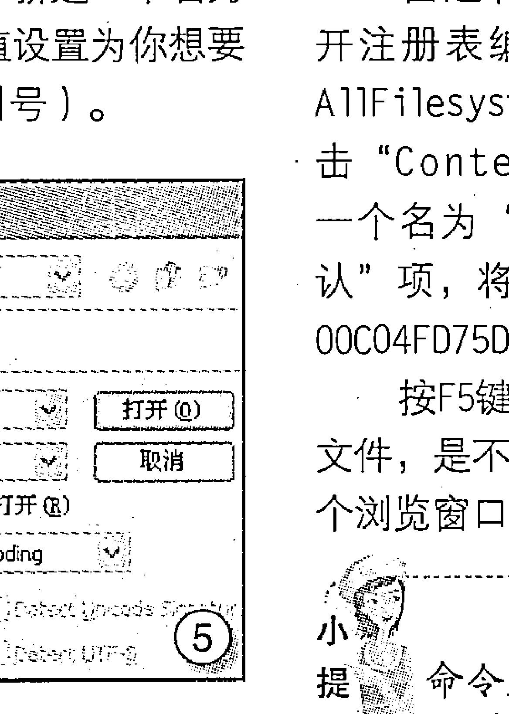

> ★想要在打开对话框中添加更多的自定义文件夹，可在“Placesbar”下依次添加“Place1”、“Place2”等项，不过至多能添加到“Place4”。

## CFanHack09: 虚拟桌面无限扩展屏幕

电脑的功能越来越强，可以在电脑上做的事情也越来越多，办公、学习、游戏、听音乐等等，打开许多个程序窗口之后，显示屏幕显得越来越拥挤。我们可以借助微软提供的虚拟桌面软件扩展屏幕，一个显示器变成多个，一个用来办公，一个用来游戏，一个用来学习等等。

首先从http://download.microsoft.com/download/whistler/Install/2WXP/EN-US/DeskmanPowertoySetup.exe下载软件，双击安装后，右击桌面任务栏，选择“工具栏→Desktop Manager”，这时任务栏上会多出标有1、2、3、4数字的4个图标。点击这些数字图标，即可在四个虚拟桌面中快速切换了。

在某个虚拟桌面中打开的窗口，不会影响到其他虚拟桌面的显示。比如，可以单击“1”进入虚拟桌面1启动Word软件开始办公，再点击“2”进入虚拟桌面2启动游戏娱乐，在虚拟桌面1中的Word窗口不会显示在虚拟桌面2中，反之亦然。这样，就可以工作娱乐两不误了。

## 资源管理器密技

使用Windows的过程中，每时每刻都要和Windows资源管理器打交道，通过它来管理各类文件，如复制、删除、移动、查看文件等。掌握资源管理器的一些绝密技巧，能大大提高平时的工作效率。

## CFanHack10: 右击文件快速复制到指定文件夹

平时的操作中，经常需要将一些文件从一个文件夹复制或移动到另一个文件夹中，一般是先选中文件，右击，选择“复制”（或“剪切”），然后再浏览到目标文件夹中，右击，选择“粘贴”。操作过程比较烦琐。通过下面的方法，可以在右键菜单中添加“复制到文件夹”（或“移动到文件夹”）命令，右击文件并选择此命令，即可快速将文件复制（或移到）指定的文件夹中。

在运行对话框中输入“regedit”，按回车键打开注册表编辑器。依次定位到[HKEY_CLASSES_ROOT\AllFilesystemObjects\shellex\ContextMenuHandlers]，右击“ContextMenuHandlers”，选择“新建→项”，新建一个名为“Copy To”子键，在右侧双击这一子键的“默认”项，将它的值设置为“{C2FBB630-2971-11d1-A18C-00C04FD75D13}”（不含引号）。

按F5键刷新，然后关闭注册表编辑器。现在随意右击某一文件，是不是多了“复制到文件夹”项？点选此项，将弹出一个浏览窗口，选定目标文件夹后点击“复制”就可以了。

> ★同样方法可以添加“移动到文件夹”右键命令，方法很简单：在“ContextMenuHandlers”下再新建一个子键“Move To”，并将此子键的默认值设置为“{C2FBB631-2971-11d1-A18C-00C04FD75D13}”，刷新注册表使其生效即可。

## CFanHack11: 给文件夹打上特定标志

每个人的电脑中都有成千上万的文件，一般都会创建多个文件夹将这些文件分门别类地保存起来。为了便于以后查找文件，我们可以为每个文件夹定制不同的图标加以区分，甚至可以添加说明文字，当光标指向文件夹时这些说明文字会自动显示出来。方法其实非常简单：

在资源管理器中，进入需要自定义图标和说明文字的文件夹，在其中创建一个名为Desktop.ini的文本文件，该文件包含类似下面的内容：

```
[.ShellClassInfo]
IconFile=C:\FolderPic\music.bmp
IconIndex=0
InfoTip=这个文件夹中保存的都是网上下载的MP3音乐。
```

“[.ShellClassInfo]”是必须具有的一行标志。“IconFile=”后面，用来指定具体图片作为文件夹的图标，可以是ICO图标文件，也可以是BMP图片。如果指定的图标包含在DLL文件中，还需要指定该图标在DLL中的具体的索引号，即“IconIndex=”后面的数字，如：

```
IconFile=%SystemRoot%\system32\SHELL32.dll
IconIndex=235
```

最后一行“InfoTip=”的后面，就是对文件夹的说明文字，你可以自己编写具体的文字内容。

## 系统启动故障完全解决方案

□江南江北

据说比尔·盖茨每秒钟赚250美元，也就是每天赚2000万，如果将他的钱换成1美元，你可以建一条路连接地球和月球，来回14次！而且你需要花1400年，使用713架B747飞机来运输这些钱！可是，如果Windows的用户每次电脑死机时向盖茨索赔1美元，他将会在三年内破产！

事实上，通常出现的一些诸如蓝屏、死机等现象，大多是由于某些系统文件操作不当或者感染病毒而造成损坏、丢失的缘故，都只是一些小问题。只要我们动动脑筋，就能解决这些启动故障，而根本不必重装整个操作系统。

## 系统启动不再神秘——系统启动流程介绍

计算机的整个启动过程就像一场接力赛，每一段都有自己的任务，每一段都要努力做到完美无缺，才能将“接力棒”交给下一个环节，它们的终点就是登录界面的出现：这意味着启动过程的终结。虽然不同的计算机以及操作系统，启动的过程也稍有不同。但我们的用户多数使用的是Windows XP，我们就以此为例进行介绍。

乎也是安装了多操作系统朋友经常出现问题的地方。

### 第1阶段：预启动阶段

- 1. POST——开机自检：这是每个计算机的电源接通之后，必须要做的第一件事情。POST将检查硬件：是否有内存、是否有键盘以及SATA、IDE控制器等等。虽然这是一个和操作系统无关的过程，但是它却是保证系统启动的第一个过程。
- 2. 一旦自检完成，计算机将查找启动设备，并且将MBR（主引导记录）调入内存。
- 3. 计算机将查找活动分区、引导扇区，并将其装入内存。
- 4. 开始调用Ntldr，Ntldr是Windows XP操作系统加载器，它是第二阶段的关键部分。

### 第2阶段：启动阶段

- 1. 当Ntldr开始运行之后，Ntldr将访问第一个文件：Boot.ini文件，并且根据文件的内容在屏幕上显示启动菜单。
- 2. 如果用户选择的不是Windows XP操作系统，那么NTLDR将调用bootsect.dos，将控制权移交给它，并且启动所选择的系统。否则，NTLDR将运行Ntdetect.com文件。
- 3. Ntdetect.com将收集计算机硬件方面的信息，这些硬件包括：计算机ID号、适配卡类型、显卡、键盘以及鼠标、软盘、COM口和并口等等。一旦信息收集完成，Ntdetect.com会将信息传递给NTLDR，并将信息写入注册表中的HKEY_LOCAL_MACHINE\HARDWARE分支。我们可以看出，这个过程中调用了三个非常重要的文件：Ntdetect.com、Boot.ini和Bootsect.dos。而这个过程，几乎也是安装了多操作系统朋友经常出现问题的地方。

### 第3阶段：内核调用阶段

- 1. 在这个阶段，NTLDR将调用Ntoskrnl.exe，并且将由Ntdetect.com收集的硬件信息传递给它，同时被调用的还有Hal.dll文件。如果你有多个硬件配置文件，当运行到这一步的时候，你会在屏幕上看到要求选择硬件配置文件的信息。另外，NTLDR也将从注册表中调用所有启动值为0x0的设备驱动程序（如果你在Boot.ini文件中有“/SOS”参数（一般加在/fastdetect参数的后面），那么此时你可以在屏幕上看到调用的设备列表。
- 2. 内核初始化。这一步将对内核以及上一步中调用的硬件驱动程序进行初始化。

### 第4阶段：服务调用阶段

这个阶段将启动会话管理器（Smss.exe），会话管理器将读取必须调用的程序列表（在注册表的BootExecute项中），然后设置内存分页并且启动Win32子系统。

### 第5阶段：Win32子系统启动阶段

一旦Win32子系统启动，会自动运行Winlogon.exe，同时启动的还有本地安全管理（Lsass.exe），并且显示登录对话框。然后会运行服务控制器SCREG.EXE，服务控制器会检查注册表中启动值为0x2的服务项目，然后调用这些服务（值为0x3的服务表示需要手动启动、值为0x4的服务表示禁用）。

### 第6阶段：用户登录阶段

这时会显示当前账户，一旦用户可以登录进系统，那么也就表明整个启动过程已经结束。成功登录之后，当前的设置将被自动保存为“最后一次正确的配置”以备以后可以使用。

## 系统启动各阶段常见故障及解决

### 第1阶段：预启动阶段

#### 1. BIOS Rom checksum error

遇到这种问题，一般有两种情况，一是CMOS的电池没有电了，二是需要重新刷新BIOS。前者可以购买纽扣电池安装，如果是后者，可以到主板官方网站下载并刷新BIOS，不过这些操作需要技术，因此最好找懂这一行的高手来操作。

#### 2. 找不到操作系统

开机后提示“Operating System not found”、提示“Invalid partition table”，这些错误信息的出现是因为MBR遭到破坏，解决的办法是安装光盘启动计算机，当出现“欢迎使用安装程序”界面时，按R键选择修复安装，在随后出现的修复选项窗口中按C键选择“用故障恢复控制台修复Windows XP安装”，然后在控制台中输入要登录的系统序号、管理员口令，在命令提示行下输入fixmbr后回车，在出现警告信息的时候按Y键，最后按exit退出故障恢复控制台。

### 第2阶段：启动阶段

#### 1. 计算机启动时，没有出现启动菜单

这种情况是将显示操作系统列表的时间设为0秒引起的。解决的办法是：右键单击“我的电脑”，然后选择“属性”，在“属性”窗口中，点击“高级”选项卡，然后点击“启动和故障恢复”按钮，在随后弹出的窗口中，首先确保选中了“显示操作系统列表/秒”，然后将时间改为大于0的数字（如图1，默认值为30秒）。

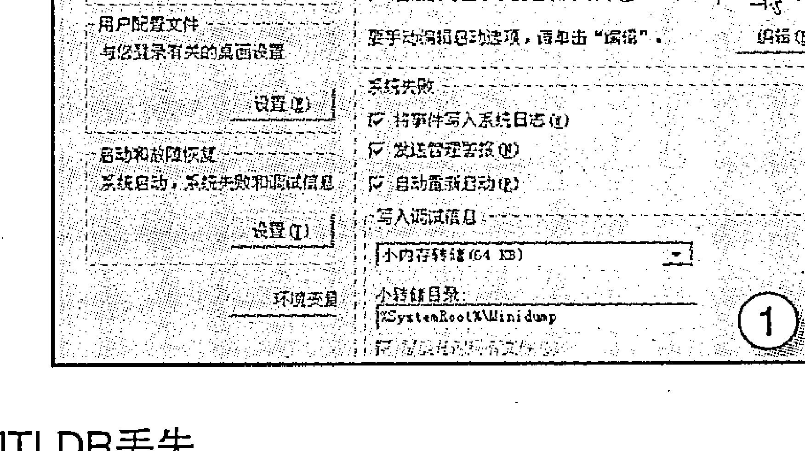

#### 2. NTLDR丢失

启动计算机的时候，出现错误提示信息：NTLDR is missing, Press any key to restart。Ntldr文件丢失、出现错误会造成这个故障。其他类似的故障还包括：NTLDR is missing……等等，可以使用下面的解决办法：把Windows XP光盘插入光驱。然后按下Ctrl+Alt+Del键重新启动系统。在启动时，按下Del键进入BIOS设置程序，选择BIOS Features Setup菜单，然后按下回车键，进入参数设置选项界面，在这个界面中找到并选中选项Boot Sequence，然后按下Page Down键或者Page Up键，选择CDROM，C，A设置系统优先从CDROM盘启动（如图2），最后连接按下Esc键退回到根菜单中并选择保存菜单或直接按下F10键保存设置。

一会儿，就可以看到Windows XP光盘在引导机器（如图3）。再过一会儿，会出现一个如图4所示的界面。此时，按下R键，并在后来打开的窗口中，按下L键，实现快速修复。一会儿，系统会从Windows XP光盘中重新读取并覆盖机器中的系统文件，修复好系统。重新启动后即可使用。

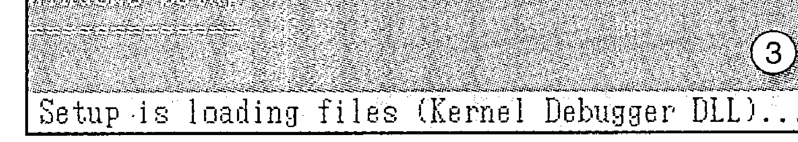

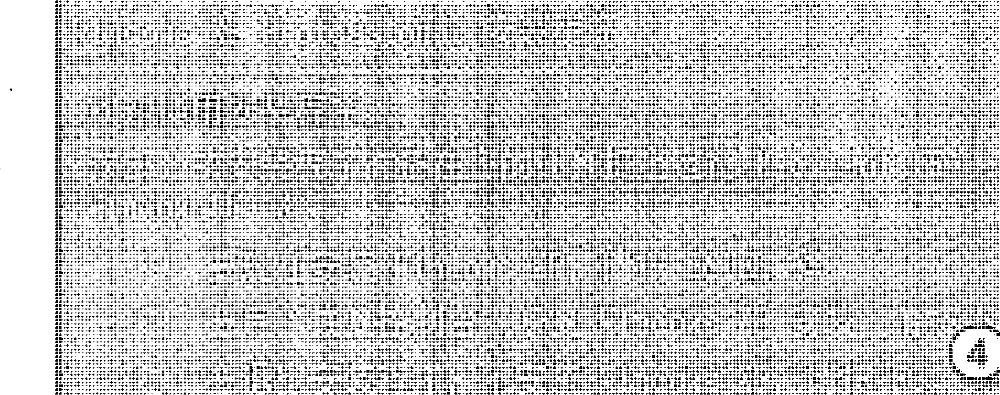

### 第3阶段：内核调用阶段

#### 1. Ntoskrnl.exe丢失或损坏

启动的时候出现错误信息：“Ntoskrnl.exe missing or corrupt" on bootup”（Ntoskrnl.exe丢失或者损坏）。如果出现下列情形之一，会导致上述错误的出现：
（1）新增加了一个硬盘或者改变了原有的分区（例如：删除了原来的一个分区或者将原来的两个分区合并）都可能导致Boot.ini－文件中的[Boot Loader]部分的Default值丢失或无效，从而使启动过程无法找到启动所需的文件；
（2）Ntoskrnl.exe文件被删除或者被损坏；
解决的办法是：
（1）使用启动盘启动操作系统（后面会讲到制作Windows PE光盘），编辑Boot.ini文件，检查与下面一行类似的命令中是否有错误：
multi(0)disk(0)rdisk(0)partition(1)\WINNT="Microsoft Windows XP Professional" /fastdetect
这一行表示在第一个IDE硬盘上（rdisk(0)）的第二个分区（partition(1)）上装有Windows XP，大家可以根据这个规律来查找自己的Boot.ini文件中的数值是否正确。
（2）如果没有发现错误，请用Windows XP光盘启动机器。在欢迎界面中，按R键。按C选择使用故障恢复控制台修复Windows XP安装。输入需要修复的Windows所在盘符前的序号，然后按回车。输入管理员口令，然后按回车。输入map，然后按回车，记下Windows XP安装光盘所在的光驱盘符（例如I)。输入以下命令后按回车：expand i:\i386\ntoskrnl.exe c:\ntoskrnl.exe，在提示是否覆盖的时候，按Y键。输入exit重新启动计算机。

#### 2. 长时间等待或提示hal.dll丢失

机器长时间等待，机器左上角有光标闪烁，但就是进不去系统，或者屏幕显示hal.dll is Missing。

这个故障是由于现在很多人的机器用的是Ghost安装的，而在选择电源类型时出现了问题，引发了hal.dll不匹配，进不了系统。而显示hal.dll is Missing则表示缺少hal.dll文件。解决的办法是：请用Windows XP光盘启动机器。在欢迎界面中，按R键。按C选择使用故障恢复控制台修复Windows XP安装。输入需要修复的Windows所在盘符前的序号，然后按回车。输入管理员口令，然后按回车。输入map，然后按回车，记下Windows XP安装光盘所在的光驱盘符（例如I）。输入以下命令后按回车：expand d:\i386\hal.dll c:\windows\system32\hal.dll，在提示是否覆盖的时候，按Y键。输入exit重新启动计算机。进行此操作后，有可能进入Windows XP后提示发现新硬件，但一般可以自行安装好。

> **小知识** 什么是HAL
> ★HAL是英文Hardware Abstraction Layer (硬件抽象层)的缩写，这种技术提供了驱动程序与硬件之间的接口，可以防止应用程序直接访问计算机系统内存、CPU以及硬件设备(如显卡或声卡)，从而使系统可以跨越多种硬件平台运行。这个损坏，是无法进入系统的，因为它提供了系统与硬件的接口。

### 第4阶段：服务调用阶段

这个阶段会调用服务，不过，有可能也无法启动。造成这个原因是某些核心服务被我们禁止掉了。这时我们可以在启动Windows XP时按下F8键，选择“安全模式”，然后右击“我的电脑”，选择“管理”，然后单击“服务和应用程序”下的“服务”项，双击其中的服务，在“常规”选项卡上单击“启动类型”下拉列表框，选择“自动”，单击“确定”按钮确认。如果先前此服务是关闭的，可以单击“启动”按钮启动此服务（如图5）。

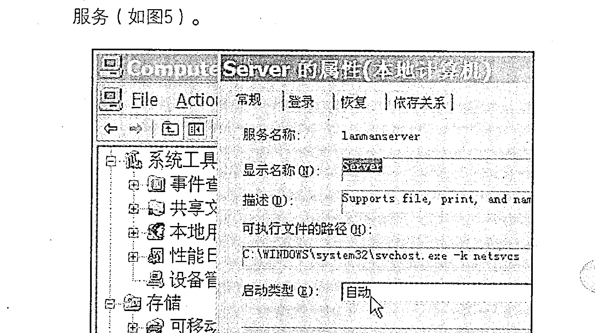

### 第5阶段：Win32子系统启动阶段

这个阶段最怕的是winlogon.exe损坏，如果损坏，可以用Windows安装光盘来覆盖。当然，如果无法解决，可以重新启动机器，并在出现“正在启动Windows”信息提示时按F8键，选择“最后一次正确的配置”试一下，说不准可以解决问题。

### 第6阶段：用户登录阶段

#### 1. 无法进入

如果无法进入用户，可以尝试启动至安全模式。然后打开“控制面板”，双击“用户和密码”项，在打开窗口中单击“添加”按钮，然后输入新用户名，如newuser。接下来，单击“下一步”，输入密码。同时，选择把该用户添加到Administrators组中。最后重新启动系统，以newuser进入。一般情况下，机器会变得较为稳定，并可以使用一段时间。

#### 2. 试试系统还原

选择“开始→程序→附件→系统工具→系统还原”就可以打开相应窗口，选中“恢复我的计算机到一个较早的时间”单选按钮，再单击“下一步”按钮。从中选择一个还原点，单击“下一步”按钮顺着向导操作即可还原系统。一般情况下，我们在还原系统时先选择最近的还原点还原，如果机器还不稳定，那再顺次选择较近的还原点。

#### 3. 忘记密码

从http://58.61.34.206/down?cid=8071EB176FAB46F36B743DA875D50D189EDF3A08&t=2&fmt=一处下载愚盘，将其刻录到光盘上，用它启动之。之后，在启动时选择“清除Windows用户密码”项即可（如图6）。

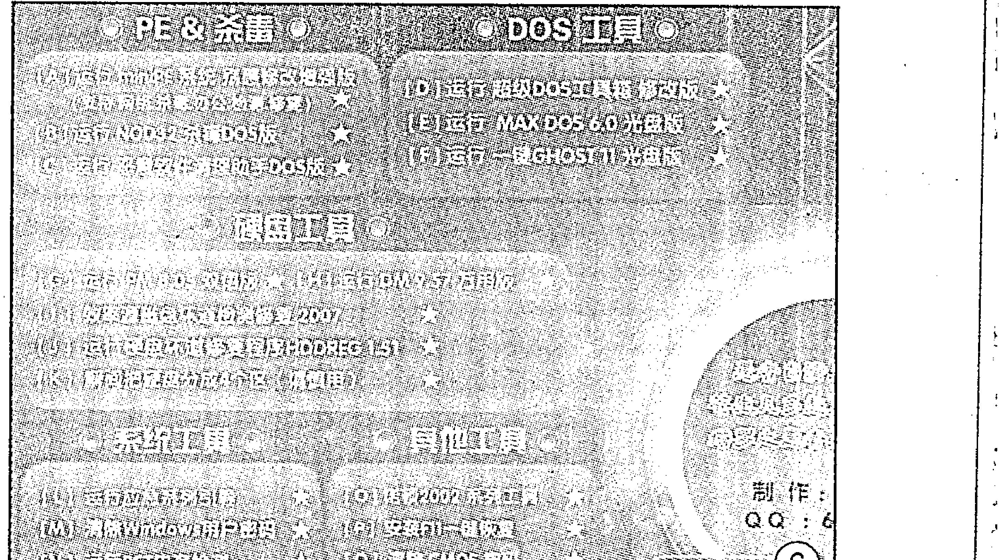

### 多种工具光盘(如深山红叶)

启动问题很复杂，不可能一一穷尽。现在有不少的高手制作了多种工具光盘，如深山红叶光盘就是很好的产品。我们下载后，将其刻录到光盘上，用它启动之。之后，在启动时选择“启动Windows PE系列”，之后单击“开始→程序”会看到窗口，其中会有很多的修复工具。其中比较有用的是备份和恢复当前系统。使用的就是Ghost，不再赘述。

## 操作系统救命稻草——最好用WASAY Pro Magic
□ 方成亮

尽管如今NT内核的Windows操作系统已经在稳定性方面大幅度改善，但是有时候各种意想不到的系统故障还是不期而遇。在很多紧急情况之下，重新安装操作系统或者慢慢寻找解决方案根本来不及，我们需要的是最简单的恢复方法。对此，很多品牌机都采用了还原技术，而DIY用户则考虑WASAY Pro Magic这款超强软件，这可谓是操作系统的救命稻草，帮助大家在一分钟以内顺利修复操作系统。

Pro Magic能够支持各种语言版本的Windows 9X以及Windows 2000/XP，这是大家最常用的，但是无法支持Windows Server 2000/2003，也无法支持Linux和Vista等操作系统（图1）。在安装之前，建议大家关闭杀毒软件，否则很可能引起误报。此外，使用8.4GB以下的小容量硬盘也需要注意，必须将硬盘识别模式设置为LBA，否则有可能造成Pro Magic功能无法运作。在Pro Magic的安装过程中，会要求大家设置用于保存数据的磁盘空间，因此大家在C盘上应当至少留下160MB空间。对于如今的海量硬盘而言，这应当不是什么难事，所以为Pro Magic预留1GB直接用于保存数据将是不错的选择（图2）。

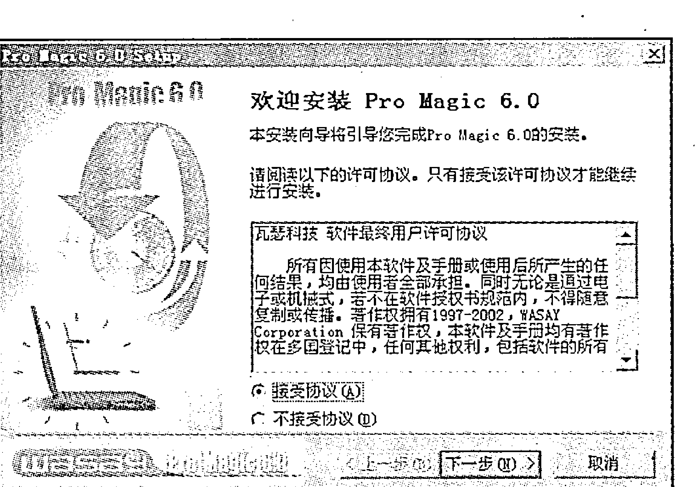

图1 Pro Magic安装界面

当我们完成安装过程，系统需要重新启动，并且在进入Windows之前出现Pro Magic的DOS界面（图3）。此时，Pro Magic要求大家选择需要被保护的硬盘分区。一般而言，建议大家只选择安装操作系统的分区以及含有重要办公资料的分区，否则保护的分区数量太多只会浪费硬盘空间。随后，Pro Magic将会对整个硬盘分区进行检测，识别已经安装的操作系统以及分区格式（图4）。

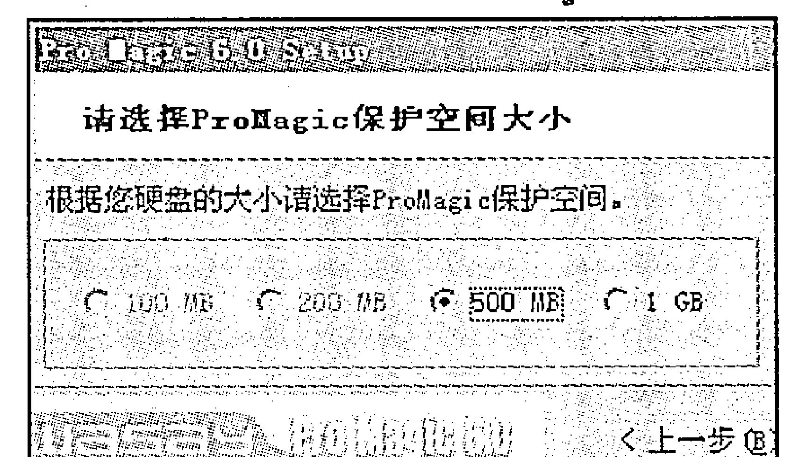

图2 设定Pro Magic保存空间

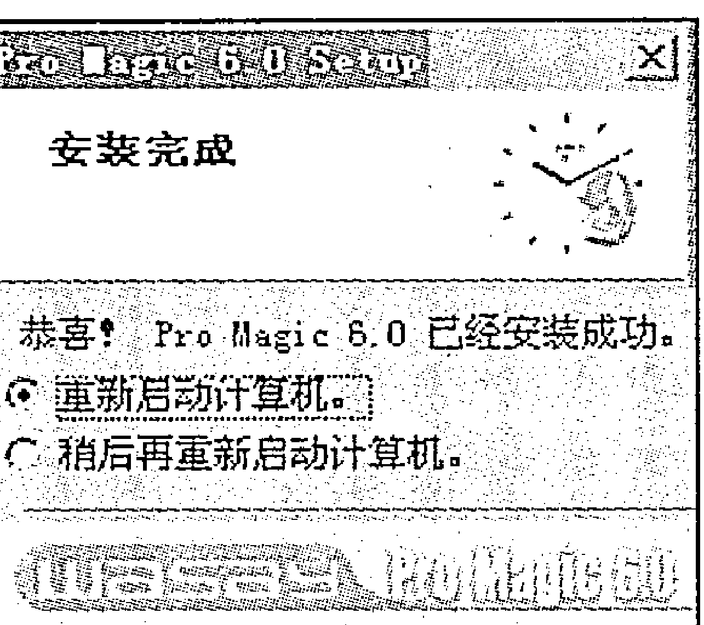

图3 最好立即重启，这样才能完成整个安装过程

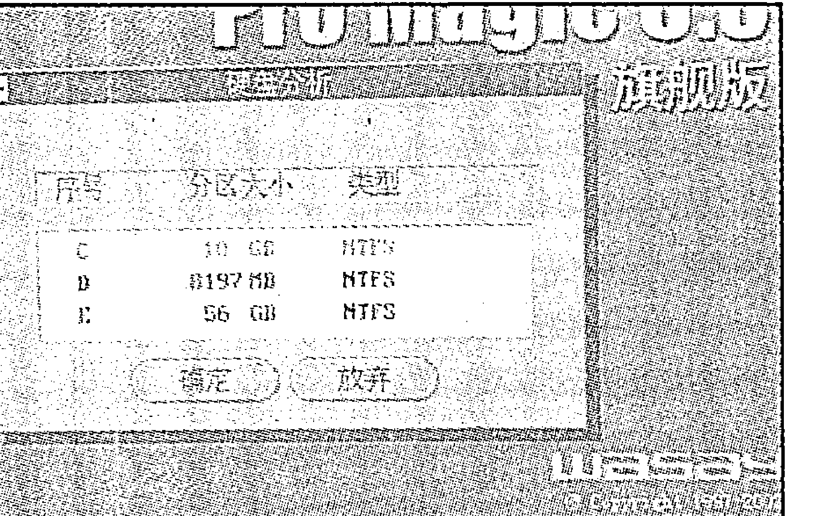

图4 Pro Magic进行硬盘分析

### 小贴士：避免操作系统错乱

Pro Magic在安装过程中的磁盘检测中会扫描所有的操作系统信息。有些用户安装了多操作系统，随后又进行强制删除。但是由于部分残留信息可以被Pro Magic检测到，因此反而造成兼容性问题。所以，建议大家在完全干净的硬盘上安装操作系统，然后再使用Pro Magic进行保护。此外，如果硬盘使用PQMagic设定了隐藏分区，并安装第二操作系统，那也无法得到Pro Magic的保护，也有可能遭到Pro Magic的拒绝安装（图5）。

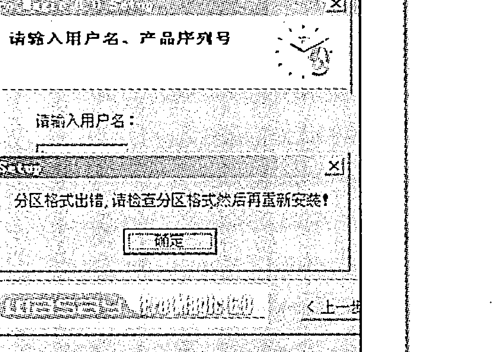

图5 因为设有隐藏分区，Pro Magic拒绝执行安装程序

## 突破极限——大容量硬盘分区方案
□ 方成亮

硬盘的分区设置涉及到BIOS底层管理，然而正如大家所知道的很多PC历史故事一样，我们早先的设计人员总是无法充分估计今后的发展速度，继而导致BIOS一直成为硬盘容量扩充的绊脚石。跨越了32GB限制，如今LBA逻辑块寻址模式又让我们迎来了137GB限制。对于160GB以及更大容量的硬盘而言，很可能遇到主板无法识别的尴尬，此时就得格外小心了。

### 一、大容量硬盘识别关键：满足三大条件

由于137GB以上容量涉及到48bit寻址，因此如果要使用137GB以上容量的硬盘，那么我们必须满足三个条件：南桥芯片（磁盘控制器）支持、主板BIOS支持以及操作系统支持，其中前两个是刚性条件，几乎没有任何回旋余地。

根据我们查阅的技术资料，Intel从ICH系列开始、VIA从VT8233A开始、SiS从961开始、nVIDIA全系列南桥都能够提供对137GB以上容量的支持，也就是说磁盘控制器支持48bit寻址。此外，大多数支持ATA66的IDE/RAID卡也能支持137GB以上容量。

至于BIOS方面，一般在2002年以后推出的固件都不会有问题。此外，建议大家选择支持48bit LBA模式的Windows 2000/XP/2003或是Vista操作系统，分区操作可以与操作系统安装同步完成，或者在已经安装Windows 2000/XP/2003操作系统的电脑上挂接第二块硬盘进行分区。

最后还要特别提醒大家，一般情况下请不要让单分区的容量超过137GB，否则很容易造成数据崩溃。在Windows 2000/XP的安装过程中，分区时直接将单个分区容量划分为137GB以上没有遭到任何限制。但是如果没有打好补丁，那么写入大量数据（通常是120GB以上）后很容易造成分区表与MFT表信息丢失，表现形式便是拷贝数据过程中失去响应，重启后报告该分区没有格式化等。至于Vista系统，目前则没有任何兼容性问题，允许使用更大容量的单个分区。

事实上，Windows 2000/XP出现大分区故障的关键原因便是Atapi.sys文件没有支持48bit寻址。通过Service Pack补丁能够更新该文件，但是建议大家谨慎起见还是不要将单分区容量设置为137GB以上。假如已经这样做了，那么请尽快修改一下注册表，这比查看Atapi.sys文件是否被Service Pack更新要更加保险一些。Windows 2000+Service Pack3/4用户展开注册表HKEY_LOCAL_MACHINE\System\CurrentControlSet\Services\ACPI\Parameters，然后新建一个名为EnableBigLba的DWORD键项，其值为1；Windows XP+Service Pack1/2用户展开HKEY_LOCAL_MACHINE\System\CurrentControlSet\Services\ACPI\Parameters，新建一个名为EnableBigLba的DWORD键项，其值为1。至于Windows Server 2003和Vista，完全可以放心地使用大于137GB的单分区，此时不会出现任何问题（图1）。

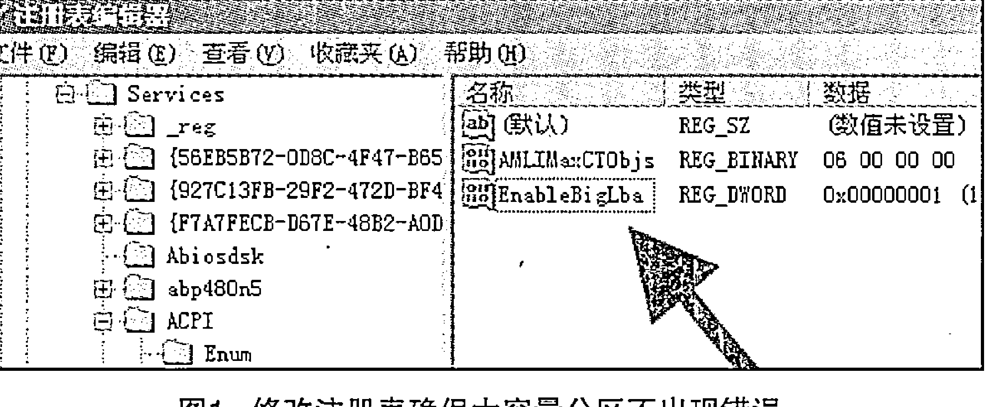

图1 修改注册表确保大容量分区不出现错误

Pro Magic与Windows XP自带的“系统还原”功能相比最大的优势便是支持手动还原点设置，而且备份的数量更小，有着很强的针对性。现在，6.0以后版本的Pro Magic的大部分设置都可以在Windows界面中设置完成，而不必进行DOS管理界面。在Windows操作系统中，点击右下角系统托盘中的Pro Magic图标，然后就可以自己保存存储点，并且在“设定”标签页中关闭软盘启动、CMOS保护等。

当然，涉及到保存点以及还原的操作，我们还是建议大家进入DOS界面，否则系统生成的缓存文件是一大不便。开机进入Pro Magic的DOS界面之后，直接选择“存储”就可以手动建立一个保存点。而当以后需要还原时，直接选择“还原”即可（图6）。需要注意的是，Pro Magic支持双操作系统，因此建议大家同时备份，而这款软件中所谓的“所有开机盘”是指所有操作系统针对的分区。但是，有些用户直接将两个操作系统安装在同一个分区，并且手动修改了Boot.ini以及关键系统文件的存放路径，此时就最好别用Pro Magic，否则容易引起操作失误。

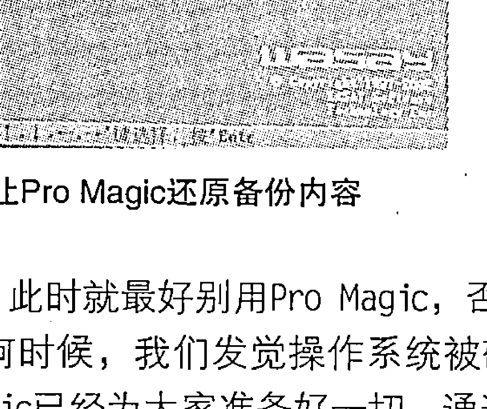

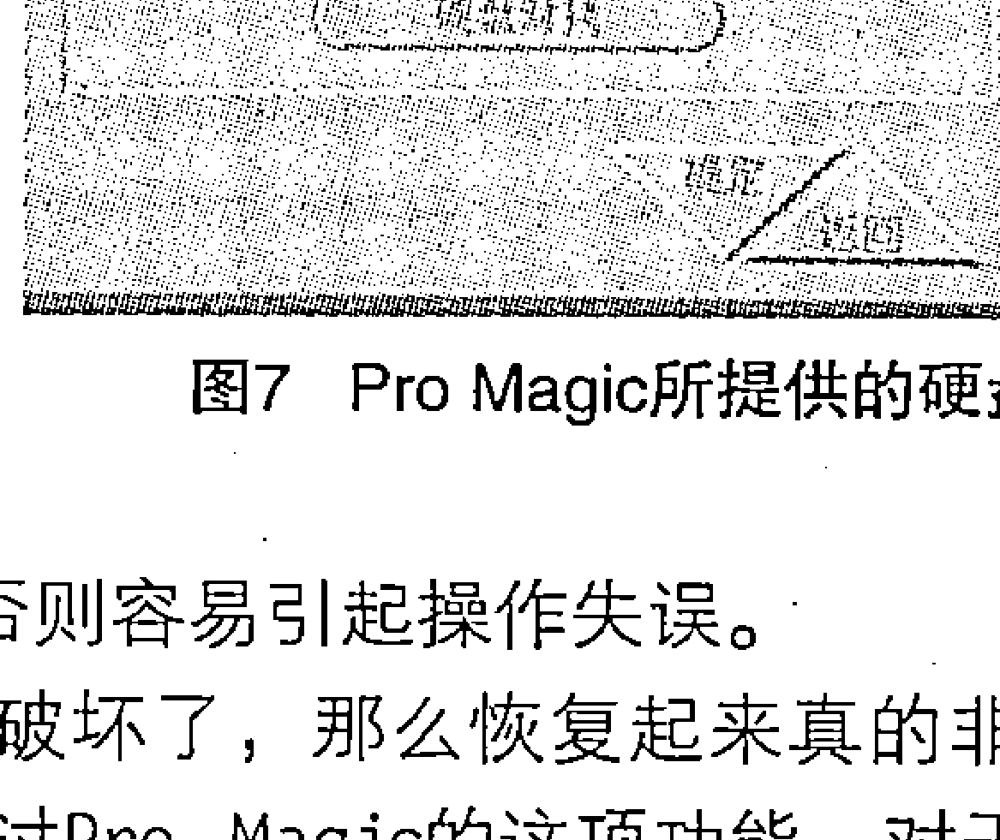

如果任何时候，我们发觉操作系统被破坏了，那么恢复起来真的非常迅速，因为Pro Magic已经为大家准备好一切。通过Pro Magic的这项功能，对于系统崩溃是非常理想的。无论是误删除重要的系统文件，还是木马病毒破坏，或者软硬件冲突，所有的问题都能在瞬间解决，而且这款软件还允许设置启动方式并且提供一些硬盘工具（图7）。

### 二、大容量分区崩溃之后：挽救丢失的数据

如果单分区容量超过137GB，而且已经出现崩溃现象，那么千万不要盲目地进行格式化，因为数据完全是可以找回的。首先确保不要对该硬盘进行任何“写操作”，并且将其作为从盘挂接在其它机器上，这样可以避免操作系统缓存文件的写入。随后，我们可以使用一些数据恢复软件对该分区进行扫描。

常见的恢复软件有Easy Recovery、Final Data、RecoverNT等，这里以Easy Recovery为例进行介绍。EasyRecovery使用Ontrack公司复杂的模式识别技术找回分布在硬盘上不同地方的文件碎块，并根据统计信息对这些文件碎块进行重整。哪怕整个分区都不可见，或者硬盘上也只有非常少的分区维护信息，EasyRecovery仍然可以高质量地找回文件。

进入界面后首先在左边的列表中选择“数据恢复”工作模式，此时软件会提供更多的选项以供大家选择。其实这里一般我们选择使用“高级选项自定义数据恢复功能”，因为它的功能是最强的，已经包括了“查找并恢复已删除的文件”和“从一个已格式化的卷中恢复文件”以及“不依赖任何文件系统结构信息进行恢复”三个功能选项（图2）。

选定“高级选项自定义数据恢复功能”，随后系统要求输入扫描所针对的分区（图3）。然后EasyRecovery让用户自己选定文件系统类型，如果无法确定是FAT32还是NTFS，那么可以直接选择为RAW模式，只不过此时将对整个分区的扇区一个一个地进行扫描，速度会比较慢。根据磁盘系统性能以及数据量，扫描会占用比较长的一段时间。扫描结束后，EasyRecovery将列出丢失文件的列表，并且都放在LOSTFILE目录下，在前面的小方框内打上钩，恢复所有找到的文件。也可以用鼠标左键按一下LOSTFILE前面的+号显示列表，然后从中选取你要恢复的文件。选择完成后，单击“下一步”并按照提示选择文件的存放路径即可（图4）。

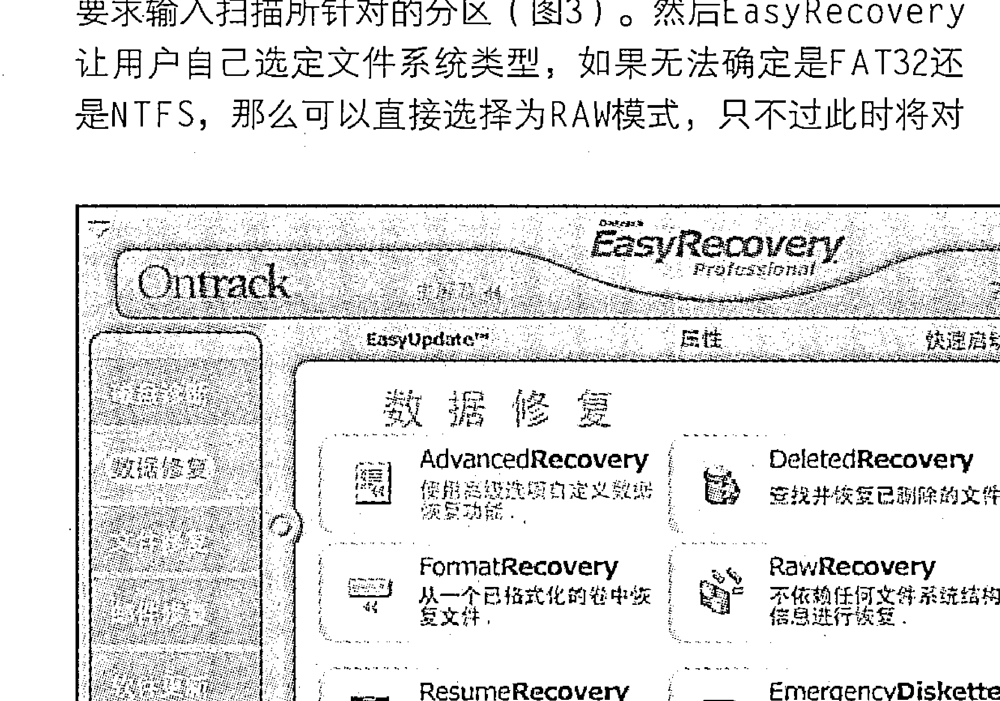

图2 EasyRecovery中“数据恢复”工作模式选择

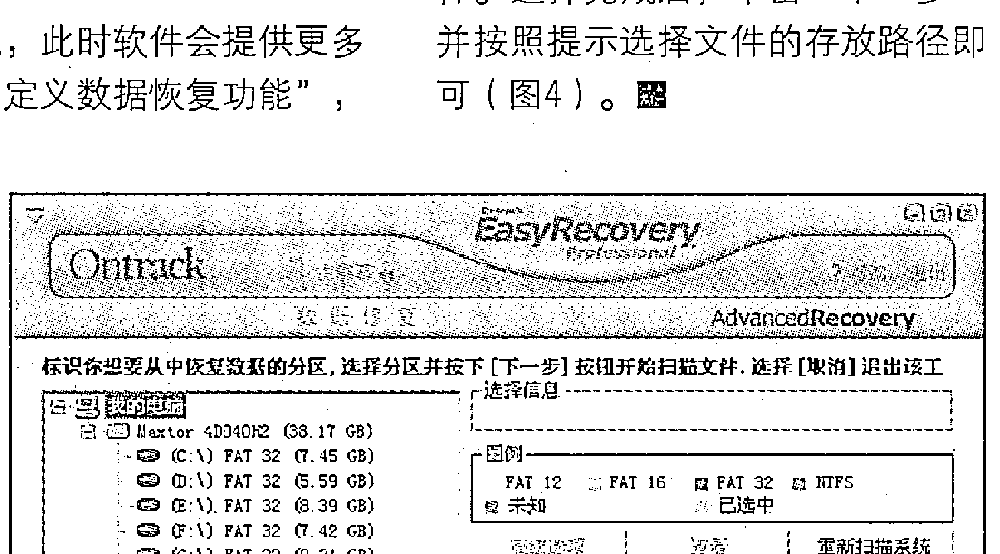

图3 让EasyRecovery扫描指定的分区

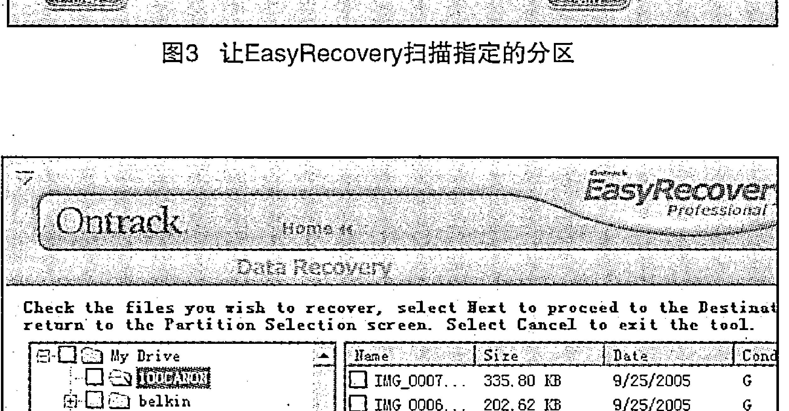

图4 EasyRecovery找回丢失的文件

### 写在最后

微软美国总部针对Windows操作系统在备份与恢复上，在全球仅认可十家公司达到微软的技术要求。而在国内仅有北京瓦瑟科技一家在技术上得到认可。Pro Magic就是由北京瓦瑟科技开发，它只需要很短的时间就能还你一个干干净净的操作系统，比“系统还原”功能或是Ghost备份更加好用。

## Windows离不开的“老伙计”——DOS拯救单片机


许多人都说DOS成了明日黄花，可微软偏偏在Windows XP/Vista中还要加上了“命令提示符”，而且许多功能有增无减。为此我深入“敌后”，经过跋涉，在其中又找出一些DOS回春秘方，奉献给所有熟悉和不熟悉DOS的朋友。

### 实例1：制作DOS启动盘

现在的电脑上都是Microsoft Windows的天下，而且Windows的版本也有愈演愈烈之势。不过，我们在使用Windows的同时，有时也必须使用一些DOS命令或必须在DOS下工作，如升级BIOS、修复系统、病毒/木马查杀、刷新硬件的固件等等。但是DOS命令行已经在Windows Me、2000、NT、XP的启动菜单中去除了，我们无法直接进入实DOS模式。这时我们就需要制作DOS启动盘，由于软驱已经被淘汰，所以我们讲一下让U盘制作DOS启动盘的方法。

#### 1. 指定程序法

启动到Windows下，安装好U盘驱动程序，并把你的U盘的驱动盘放入光驱，找到其中的启动制作工具，如Bootup.exe程序。双击它完成安装，插入U盘，把写保护开关切至于“OFF”的位置，备份好闪盘上的数据。再选择“开始→BootUp Creator→BootUp Creator V1.2”执行程序或者在桌面双击图标，顺着向导操作即可。选择相应的启动模拟方式，我们推荐使用ZIP方式。单击“开始”按钮，程序会提示格式化闪盘，接受警告，完成制作。完成制作后，一定要按提示拔插一下闪盘。

之后，把一些DOS的外部文件（如刷新固件的执行程序和固件文件）保存到U盘上，用它启动机器，即可在DOS下操作了。

**小提示：U盘启动的几种方式**
- ★ U盘启动机器主要可以分为USB ZIP、USB FDD和USB HDD三种方式（当然，U盘还有一种Boot Other Device启动方式。不过，目前市面上还很难找到此类主板）。选择USB ZIP或FDD方式后，U盘启动后会把自身模拟为软盘，会出现A:\提示符。而选择USB FDD方式后，U盘启动后会把自身模拟为C盘。其余操作一样。一般情况下，我们选择USB ZIP方式。当无法启动时，再换成USB FDD或HDD方式。

#### 2. USBoot法

先下载并启动USBoot，如图1，在驱动器列表框中显示系统中的所有驱动器，选中优盘驱动器，单击“单击此处选择工作模式”标签，出现下拉菜单，从中选择FDD方式（如图1）。

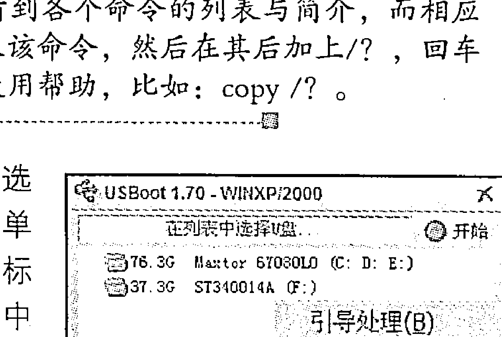

选择相应的模式后，单击面板上的“开始”按钮即可开始制作启动盘。不过此时会弹出一个警告对话框，提示U盘上的资料会全部消失。所以我们在制作U盘启动盘前，一定要将U盘上的资料进行备份。在制作过程中，其删除和写入数据的速度都很快，然后根据程序的提示拔出和插入一次U盘，一个启动型U盘就打造成功了。

用它来启动计算机，即可进入纯DOS。

**小提示：关于DOS必须掌握的知识**
- ★ DOS是英文Disk Operating System的缩写，中文意为磁盘操作系统。
- ★ DOS可以分为纯DOS和Windows下的DOS，有一些操作需要在纯DOS下操作，有的则需要在Windows的DOS下。
- ★ 启动命令提示符环境：按下Win+R，接着输入：CMD，回车后也能启动命令行提示符。
- ★ 使用命令提示符：按一定格式键入以字符组成的命令串，回车即可执行这一命令串。其中，键入字符串命令就好比是在Windows桌面上选中目标，而回车就好比是选中目标后双击目标。
- ★ 自学命令：Windows XP已经提供了详细的命令行帮助信息，你可以在进入命令提示符后，键入：help，回车后可看到各个命令的列表与简介，而相应具体命令则可输入该命令，然后在其后加上/?，回车即可得到详细的使用帮助，比如：copy /?。

### 实例2：在USB移动硬盘上备份/恢复系统

一般GHO文件体积比较大，这么大的文件放到硬盘上占用了太多的硬盘空间。而现在越来越好用的USB移动硬盘，就成为保存这些不常用备份文件的最佳仓库。让DOS识别USB的移动硬盘，并用它来备份和恢复系统倒是相当有用的。现在只要下载并安装MaxDOS，我们就可以如愿。

先启动“记事本”，输入`ghost -sure -clone,mode=pdump,src=1:1,dst=sys.gho`，将它保存为backup.bat文件。再新建一文件，输入`ghost -sure -rb -clone,mode=pload,src=sys.gho:1,dst=1:1`，将其保存为restore.bat文件。最后把backup.bat、restore.bat和ghost.exe文件保存到USB硬盘的根目录下。

将移动硬盘接到电脑的USB接口上，接着重新启动电脑，选择如图2所示中的第5项，即会自动识别USB存储设备，并分配盘符，我们进入包含有backup.bat、restore.bat和ghost.exe文件的USB硬盘的根目录下，输入backup则会把C盘内容保存到USB硬盘中的sys.gho文件中，输入restore就将USB硬盘中的sys.gho文件恢复到C盘中。

要注意的是，你的USB芯片不要过于特殊，否则有的USB设备可能并不能识别，建议根据自己的芯片到网上搜索相应的驱动文件。另外，你的USB接口和移动硬盘盒必须是2.0的芯片才有意义，如果是1.1，操作速度会很慢。

### 实例3：快速将多个文本文件合并在一起

COPY命令可以将两个或多个文本文件合并成一个文件，当要合并数个文本文件，而不想用记事本反复打开复制、粘贴，那么可以用它来快速完成任务。只要用：`COPY file1+file2+…+newfile`。该命令中，前面的file1、file2是要合并的文件名，newfile是要生成的文件名。当然，对这个功能还可以使用通配符，如果一个目录中的文件都是.txt为扩展名的文件，就可以用命令：`COPY *.txt newfile`将它们合并成一个文件。不过提醒大家注意的是，这种方法只对文本文件有用，不能用于处理带格式的文件（比如：Word、Excel文件）或程序。

### 实例4：解决无法登录问题

Windows XP访问共享文件夹时，经常会出问题。与其花费很多精力学习深奥的网络知识，不如直接用DOS下的批处理来登录机器。先建立一个bat文件，然后在其中输入如下命令：
`net use \\share\IPC$ "8888" /user:"username"`，接着把该bat文件拖放到“开始→程序→启动”组中，这样一开机，系统就会以username为用户名，8888为密码登录\\share电脑，这样你在任何地方访问它上面的共享文件夹则无须再输入用户名和密码了。而且，再也不会出现因为权限问题无法访问了。当然，这个用户名在\\share机器上必须是要有的。

> 当然，如果你想登录多台电脑，且知道用户名和密码，那可以把相应语句加到bat文件中，这样也会方便很多，省却了你记忆密码之苦。

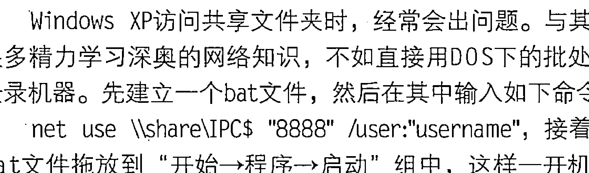

### 实例5：删除掉所有的垃圾文件

有很多的垃圾文件存放在硬盘的各个角落，很难清理，现在我们只要写一个批处理文件：

```
c:
cd \
del *.tmp *.bak /s /q
```

双击这个批处理文件，就可以将C盘上所有的tmp和bak文件全部删除掉！以此类推。

### 实例6：快速删空文件夹

电脑用的时间长了，系统中常常会留下一些空文件夹，比如有些软件卸载后会留下一些空文件夹，手动删除非常麻烦，怎么办呢？事实上，巧用DOS批处理命令中的For命令，简单、实用，只需要轻轻一点，空文件立即一扫而光。
以清理D盘上的空文件夹为例加以说明。打开记事本程序，录入以下内容：
`dir d:\ /ad /b /s |sort /r >>d:\kill.txt For /f %%i in (d:\kill.txt) DO rd %%i echo y |del d:\kill.txt`
录入完毕，另存为“kill.bat”，现在双击此文件试试，只见命令行窗口一闪，D盘上所有的空文件夹立即消失得无影无踪了。

### 实例7：批量关闭无用服务

Windows XP中的服务很多是无用的，有的开着不仅消耗资源，而且还会产生安全问题。因此，一般管理者都会建议用户在安装完Windows后将这些服务关闭，但是有些用户对系统不熟悉，给关闭带来了麻烦。现在我们只要一个DOS的批处理就可以批量关闭无用服务。
http://bbs.cpcw.com/attachment.php?aid=239157处下载并将得到的rar文件中的“XP优化.bat”解压出来，双击后其会先清理硬盘上的无用文件，接着就会批量地来关闭无用的服务（如图3）。

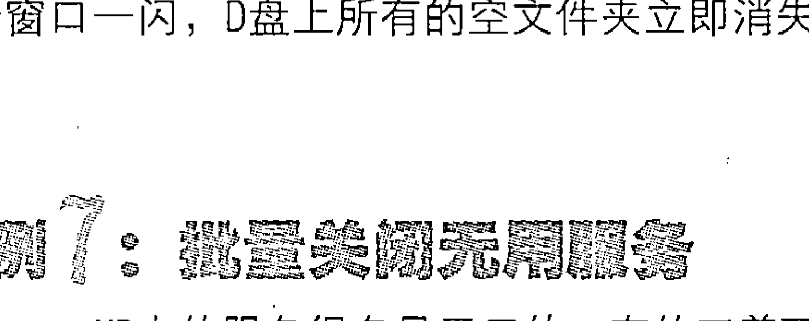

> 大家也可以 http://58.251.57.67/down?cid=3177A5B42378D1AD53E8EE6FCA46C42F70D277C4&t=2&fmt=-处下载，下载后得到“多功能系统优化设置控制台v1.rar”，将其中的“系统优化设置控制台.bat”解压出来，双击之可以对系统进行优化（如图4）。

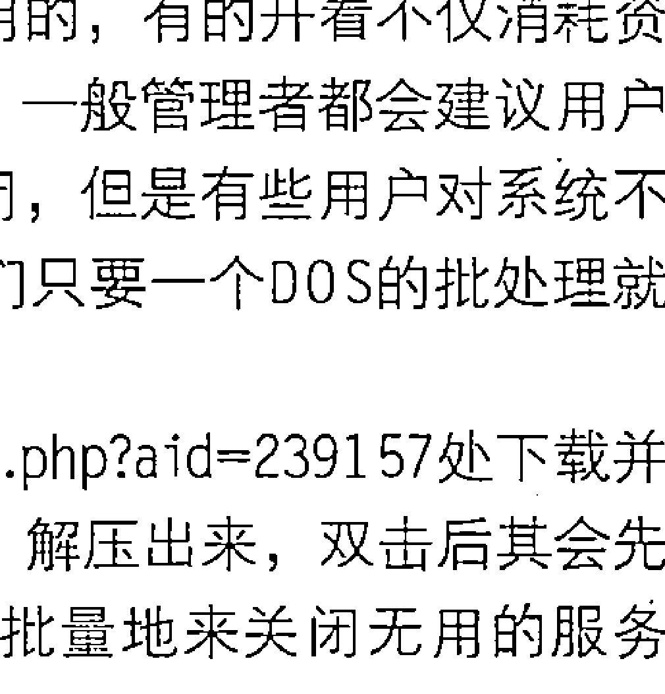

## 实例8：快速设置/取消共享文件夹

机器上有不少文件夹要共享，有时又要关闭共享，一个一个地右击，选择“共享和安全”，再进行相应的设置非常麻烦，巧妙利用DOS批处理即可很容易完成。

- 1. 设置共享文件夹

新建一个share.bat文件，输入如下命令：

```
NET SHARE 软件=D:\soft
NET SHARE 稿件=E:\wengzhang
```

双击此bat文件，则会自动共享D:\soft、E:\wengzhang文件夹为“软件”、“稿件”。

- 2. 取消共享文件夹

如果需要批量取消共享，只要建立一个unshare.bat文件，在其中输入如下代码：

```
net share 软件 /del
net share 稿件 /del
```

双击此bat文件，就取消D:\soft和E:\wengzhang文件夹共享。

## 实例9：文件日期巧更新

因为工作需要，有时有可能要将一个文件夹内多个文件日期修改一下。看似简单的操作，但小李在Windows中折腾了半天也没有成功。难道真的只能求助于专用工具了吗？其实不然，同样是使用DOS命令就可以轻松完成。

如，我们输入如下命令：`copy d:\work\*.doc+,`

执行此命令，系统会提示你是否覆盖？只要键入Y即可将d:\work下的所有doc文件的日期修改为当前日期。

> 提示：如果我们要修改的日期为过去或将来的某个时间，你可以先将系统的日期调整一下，如2008年10月1日，这样修改后的文件日期就为用户指定的日期了。

## 实例10：免光盘运行/安装软件

有的软件比较特殊，有可能需要在光盘上运行。事实上，完全没有必要将文件刻录到光盘上。只要用Subst命令即可实现。如输入`subst i: d:\game`命令后，再试着打开I盘，然后执行其中的运行/安装程序即可。

## 实例11：备份/恢复网卡设置

好不容易将无线网卡设置好，包括IP地址、WEP加密设置等，但是Windows不稳定，安装系统后不得不重新设置，有时又不一定设置成功。现在只要用DOS批处理命令即可完成。

先建立一个bcknet.bat批处理文件，在其中输入`netsh dump >d:\netbck.txt`命令。再建立一个resnet.bat，在其中输入`netsh exec d:\netbck.txt`命令。双击bcknet.bat会将当前网络设置备份到d:\netbck.txt文件中。系统崩溃重新安装后，双击resnet.bat则可以从d:\netbck.txt文件中恢复网络设置。

## 实例12：藏起所有的同类文件

假如我们的一个工作目录下有许多DOC文档文件，这些文件位于不同的子文件夹下，一时难以完全指定，又需要一下子把它们的属性都设置为“隐藏”。这时只需打开命令提示符，输入如下命令：

```
ATTRIB +H C:\MYWORK\*.DOC /S
```

这样即可将C:\MYWORK文件夹下的文件及其下的子文件夹中的DOC文件都设置为隐藏属性。

## 实例13：备份文件随心所欲

如果希望只将某个结构较为复杂的文件夹及其下属子文件夹中作过修改的文件备份到指定文件夹下，而没有修改过的文件不备份，并且要求目标目录的结构与原文件夹相同，在Windows窗口环境下实现起来非常麻烦，但利用“命令提示符”窗口可以轻松办到。例如：要把2008年3月15日以后修改的位于C:\MYDOC文件夹及其子文件夹下的文件都备份到D:\BACK下，则可以用如下命令：

```
XCOPY C:\MYDOC\*.* D:\BACK /D:03-15-2008
```

这里的/D:03-15-2008参数的意义是指定日期为2008年3月15日以后修改过的文件。

如果每次只需备份当天改动过的文件，其他文件原封不动，则可以先把原文件夹中的内容完全复制到目标备份文件夹中，然后在每次工作完毕后使用如下命令进行文件更新备份：

```
XCOPY C:\MYDOC\*.* D:\BACK /D
```

以上命令中的参数/D表示只复制那些源时间比目标时间新的文件。

## 实例14：DOS下杀毒

病毒一旦感染了Windows系统应用程序，一般在DOS下才能完全杀除。但是杀毒软件庞大，软盘、光盘携带起来都不方便。不过，只要我们有U盘，那完全可以自己动手，把DOS版杀毒软件装进U盘中，放到兜里，走到哪，杀到哪，还能免费升级，岂不妙哉？

先用前面介绍的办法制作一个启动U盘，然后打开根目录下的config.sys文件（如果没有，请创建一个），在其中输入如下代码：

```
dos=high,umb
device=himem.sys
device=emm386.exe
```

打开autoexec.bat文件（如果没有，请新建），在其中输入如下代码：

```
smartdrv.exe
cd \KAV
KAVDX
```

最后我们要做的就是，从网上下载最新的金山毒霸DOS版，也可以自行制作，再把病毒引擎升级到最新版本，然后将所需文件拷贝到U盘根目录下的KAV文件夹中。

用U盘启动后，就会直接启动金山毒霸DOS版来杀毒。

怎么样，这些活儿在Windows下干起来可不容易吧，但在DOS下却很容易得到了解决。本文案例中运用的DOS命令不一定都很复杂，但却可以解决Windows无法解决的问题，只要多思考多操作，DOS命令的确可以帮助我们完成很多重要的任务。所以，我坚信——DOS不能没有你！

## 让Windows Vista光盘焕发活力

□江北书生

> 随着Windows Vista的普及，很多人也用其安装光盘安装并体验了Vista。不过，由于它的光盘太大，所以很多人用后往往将其扔到一边。其实，Windows Vista作为微软迄今为止最好的操作系统之一，其安装光盘上有很多的实用工具，自身也有很多鲜为人知的功能。笔者将其列出，供大家参考。

### 一、图形可视化的安全分区工具

- 小提示
  ★如果你想继续安装Vista，那也完全是可以的。一般来说Vista安装分区至少要空出20GB的空间。
  ★最好在安装完Vista后，在Vista中再对剩下的硬盘空间进行分区操作，这样会容易得多。

现在硬盘越来越大，同时也越来越便宜，将其购买回来后，第一步就是要将其分区。如果还在用FDisk，那就老掉牙了。一来FDisk本身就不支持大硬盘，二来对于黑底白字的FDisk很后怕，弄不好就要丢失数据。现在如果想分区，不要再担心了。只要用Windows Vista光盘引导机器，稍等片刻，就启动了Vista的安装程序。选择安装，然后可以看到如图1所示的窗口，在其中可以选中新安装的硬盘。然后单击“驱动器选项（高级）”，之后可以看到如图2所示的窗口，在其中我们可以对硬盘分区进行新建、删除和格式化等操作。选择“新建”后，我们来为硬盘划分第一个分区也就是C盘。单击新建按钮后会出现一个输入框，在这里输入你要划分给第一个分区的空间大小，如果你习惯了用C盘来安装系统，而且安装Vista的话，该分区大小最好不要低于15000MB。输入大小后单击应用，第一个分区就划分出来了。完成后，退出安装程序即可。

### 二、让Vista更稳定 安装SATA驱动

众所周知，Windows Vista在SATA硬盘上安装时，一般需要加载SATA驱动。此时，我们可以在图3窗口中单击“加载驱动程序”命令，然后在打开窗口中可以选择SATA驱动程序所在的盘，这里还支持USB闪盘（如图4）。此时，我们也可以插入买主板时附带的一个软盘或者是主板附带的光盘，然后找到相关的驱动就可以了。

### 三、修复要领知识

虽然Windows Vista的稳定性得到了很大的提升，但谁也不能保证它时间长了不会坏。对于菜鸟们来说，系统坏了就是灾难。不过，重新安装系统更是一个麻烦，弄不好将会丢失邮件和文件。这时，我们可以把Windows Vista光盘插入光驱。在启动时，按下Del键进入BIOS设置程序，选择BIOS Features Setup菜单，然后按下回车键，进入参数设置选项界面，在这个界面中找到并选中Boot Sequence选项，然后按下Page Down键或者Page Up键，选择CDROM，C，A设置系统优先从CDROM盘启动（如图5），最后接连按下Esc键退回到根菜单中并选择保存菜单，或直接按下F10键保存设置。

一会儿，就可以看到Windows Vista光盘在引导机器。再过一会儿，会出现一个如图6所示的界面。此时选择“修复计算机”，之后顺着向导可以为不能启动已经安装Vista的电脑添加引导记录，也可以为损坏的Vista进行修复操作。

### 四、备份/恢复机器

在Vista中可使用其内置的备份功能——Complete PC备份，你不仅可以备份个人文件和文件夹，还可以备份硬盘上的所有内容，包括所有的操作系统文件和程序。一旦发生灾难性硬件故障，我们则可以在如图7所示的窗口中选择“Windows Complete PC还原”，只需一步简单的操作便可将整个PC恢复正常。

### 五、时间机器 系统还原

现在Mac OS X出了一个新的Time Machine功能，可以让机器恢复到几天前。Vista同样也有此功能，只要我们在Vista中启用了此功能，在图7窗口中我们就可以选择“系统还原”功能来进行还原。

### 六、重置自己的设置

使用Windows Vista一段时间，每个用户必然有自己的喜好。但可惜的是，一旦重装系统，则所有的设置都会不翼而飞。不过，我们可以打开Windows Vista光盘support\migwiz下的migsetup.exe文件，之后就会出现一个“Windows轻松传送”窗口（如图8），通过它既可以把Windows Vista中我们的个性设置保存到文件中，也可以把保存的设置文件导入到当前系统中。使用起来非常简单，大家一用就会，非常实用。

### 七、更快地安装Vista

光驱的速度有限，如果我们能够把Vista盘放到硬盘上，然后从硬盘上安装，那是最好不过的，因为现在硬盘的速度可要比光驱高出许多。
把Vista光盘放入光驱中，然后将其中的所有内容拷贝到一文件夹下，如D:\Vista。D:\Vista目录下的bootmgr和boot目录（其实只要里面的boot.sdi和bcd文件）拷贝到C盘根目录下，并在C盘根目录下建个sources文件夹。把D:\Vista\sources下的boot.wim复制到C盘下sources文件夹。
接着按下Win+R键，输入cmd，启动命令提示符。在其下输入`c:\boot\bootsect.exe /nt60 c:`（注意，此处bootsect在c:\boot目录下）。重启计算机，正在启动安装程序，加载boot.wim，启动Windows PE环境。这个过程可能比较长，有可能需要一些时间。之后，安装程序启动，选择你要安装的语言类型，同时选择适合自己的时间和货币显示种类及键盘和输入方式。出现“开始安装界面”，此时不要单击“现在安装”，直接单击左下角“修复计算机”，进入“系统恢复选项”，选择最后一项“命令提示符”（command prompt），进入DOS窗口。执行格式化命令`format c:/q`（注：如C盘是FAT32格式，想转NTFS格式的话，执行`format c:/fs:ntfs`）。安装系统，接下来就可以执行D:\Vista\sources\setup.exe，由于是从硬盘上安装，所以速度要快出很多。

### 八、清除Windows.old文件夹

有很多人的机器在从早期版本的Windows升级到Windows Vista时，Vista会把以前的系统文件转移到一个叫WINDOWS.OLD的文件夹中。而且这个文件夹有时在Windows Vista安装不成功时也会出现，更为可气的是，你在XP下面根本无法删除它，而且这个文件夹所在的盘竟然都无法格式化！难道眼看着10GB之多的空间白白葬送吗？
我们这时可以用Vista光盘引导机器，然后选择“修复计算机”，再选择“命令提示符”，然后切换到WINDOWS.OLD文件夹所在驱动器。再键入`rd /s /q $windows.older`，然后按ENTER键删除$WINDOWS.OLD文件夹。当提示确认删除时，键入Y键，然后按Enter键。

### 九、恢复Windows XP引导

如果你安装了Vista后想将其换回XP，是个麻烦。因为Vista的引导管理器在C盘上，不太容易去掉。这时，我们也不要着急，只要把Vista光盘放入光驱中，然后将其下的boot目录拷贝到C盘根目录下，接着按下Win+R键，输入cmd，启动命令提示符。在其下输入`c:\boot\bootsect.exe /nt52 sys`（注意，此处bootsect在c:\boot目录下）。重新启动后即可看到NT Loader，可以放心使用。

## 用Windows Vista打造完美数字家庭

□江北书生

数字家庭相信大家都不会陌生，电脑的确改变了我们的生活。享受作为人类发展的一个很重要的需要，电脑的娱乐则成为满足这个需要的一个重要的内容。Windows Vista作为一款最新的操作系统，在娱乐方面给我们带来了哪些惊喜呢？

### 一、Media Center录制电视

由于种种原因，一场精彩的球赛你却与之失之交臂？很多的比赛在国外举行，和我们相差几个时区，怎样才能够保证实况看到内容？每天都熬夜不太现实，毕竟我们都不是老板，都要上班来交纳网费和有线电视费用。看到自己喜欢的电视是不是有录制下来的冲动？世界杯或奥运会的精彩过程很想保存下来？那就用Windows Vista Media Center（媒体中心）的电视录制功能吧。

先正确安装电视卡的驱动，然后单击“开始→所有程序→Windows Media Center”启动之。再选择“电视 + 电影”选项，单击“电视”按钮（如图1）。进入观看电视节目画面，我们可以选择想看的节目，之后只要单击右下角导航菜单中的红色录制按钮。单击“录制”按钮即可开始录制电视节目。录制结束，单击“停止录制”按钮。之后，我们可以在主界面中单击“录制的电视”，之后可以看如图2所示的窗口，在其中可以播放我们录制的电视节目，还可以将其刻录到光盘上。

### 二、动口不动手 语音识别程序

Bill Gates在近期的大会上表示，未来输入接口将会发生重大的变化。不管如何变化，一定是更为智能化。而语音识别则属于其中之一。有了语音识别，我们就可以真正解放双手，真正做到“动口不动手”！有幸的是，Windows Vista提供了这样的支持，可以大大提升我们的输入效率，同时还可以通过语音来使用电脑。

#### 1. 准备好硬件

要使用语音识别系统，耳麦或者话筒是不可缺少的，它们的质量不要太差就可以了，以免影响语音的识别效果。把麦克风接到声卡的MIC口，然后右击下方的喇叭图标，选择“录音设备”。在打开的窗口中选中相应麦克风，然后单击“属性”按钮，打开如图3所示的窗口，根据自己的需要将麦克风设置好。

#### 2. 开启语音识别系统

单击“开始”→“所有程序”→“附件”→“轻松访问”→“Windows语音识别”，第一次使用会弹出一个设置向导界面。

我们点击“下一步”按钮来选择一下耳机的类型，这个就看自己是使用什么类型的麦克风了，一般选择“桌面麦克风”（如图4，当然也可以选择“头戴麦克风”）。接下来设置向导会告诉一些麦克风的摆放位置和注意事项。
了解后点击“下一步”按钮，就可以调整麦克风的音量了，大声朗读窗口中的斜体文章，声音的范围最好在绿色区域内波动，这也是语音识别系统在采集你的声音，完成后点击“下一步”按钮（如图5）。

#### 3. 启用文档复查

为了提供语音识别的准确度，我们还可以选中“启用文档复查”，让语音识别系统在开始的时候自动运行，以使其随时方便我们调用。

#### 4. 校正语音

完成设置后，“语音识别”系统会自动调出它的使用教程，整个教程分欢迎、基础、听写、命令、使用Windows、结论这几个部分，按它的提示进行操作就可以了，很简单的，而且其中的操作都可以用语音来进行，如要点击“下一步”按钮，只要直接说“下一步”就可以了。

> 小提示
在使用和学习“语音识别”系统的过程中，周围的环境一定要安静，如果有杂声就会影响语音识别的效果，而且在说话的时候，语速不要不太快，一定要说普通话。在语音识别过程中，如果碰到问题又不知道如何解决的时候，可以对电脑说“我能说什么”，这时就会启动语音识别系统的帮助窗口，里面有详细的命令和语言对比表，一些电脑的基本操作都在这个表格中，只要按上面的内容说就可以实现相应的功能。

#### 5. 使用语音识别

重新启动操作系统，之后就会在Windows桌面的上方有一个识别窗口。我们启动Word，然后对着麦克风说“开始聆听”，之后就可以说出句子了（如图6）。当然过程中还可以发出相应的命令，如说“文件”则会弹出文件菜单，说“保存”就会保存文件，非常智能。

### 三、Vista梦幻桌面支持更多视频

Windows Vista梦幻桌面允许我们将自己喜欢的视频制作成梦幻桌面，这是一个很好的事情。但可惜的是，它只能够支持Mpeg等小部分格式。而网上很多的格式并不在此列（如AVI、RM、RMVB等），怎样才能让Windows Vista梦幻桌面（DreamScene）在不做格式转换的前提下，支持除了Mpeg/mpg以外的视频格式呢？

#### 1. 下载并安装Vista Codec Package

Windows不能够播放AVI、RM、RMVB等文件是因为其缺少解码器（这与竞争问题有关），我们可以从相关网站下载并安装“Vista Codec Package”。

> 小提示
★进行这个操作后，Windows Media Player一直无法播放的RMVB、MP3Pro、DVD及全新的格式也可以支持了，这样我们就无需安装太多的播放器，如RealPlayer、KMPlayer等。
★我们也可以下载并安装终极解码或完美解码或暴风影音或K-Lite Codec Pack，一般也可以解决问题，但那些非常大。而且上面的Vista Codec Package还可以支持Windows Vista系统。

#### 2. 修改文件扩展名

我们从一些网站下载了电影，如movie.rm，可以选中它，按下F2，重新命名，将其命名为movie.rm.mpg。之后会弹出提示窗口，确认操作。

#### 3. 使用视频当桌面

进行上述操作后，就可以使用该视频当桌面了。
现在网上的电影或视频多数是以RM和RMVB为主，而且将来还会有高清的AVI格式，有了这一招就可以省去转换之苦了。

### 四、调试外置麦克风、键盘在高清声卡上要善

在Windows Vista下调试麦克风和在Windows XP上完全不一样。由于麦克风是一个非常重要的设备，不调试好就无法进行相应操作，因此必须学会。另外，现在高清声卡已经成了标配，但有时发现在高清声卡上麦克风工作不正常的现象，这对于语音聊天一族来说可不是个好消息。事实上，这个问题并不难解决。

#### 1. 调试麦克风

右击Windows Vista托盘区最右侧的喇叭图标，选择“录音设备”。在打开的窗口中选中相应麦克风，然后单击“配置”按钮，打开如图7所示的窗口，根据自己的需要单击相应的项进行调试。

把麦克风的一端插到主板后面高清声卡中的粉红色的插口中，系统提示已经插入。接着，双击任务栏上相应的管理工具，如“Realtek HD音频管理器”，再单击“音频I/O”标签，然后单击后面板中粉红色插口左侧的图标，从中选择“麦克风”（如图8）。再单击“混频器”标签，然后确认Rear Pink In（后端粉红色插口输入）没有被禁音。

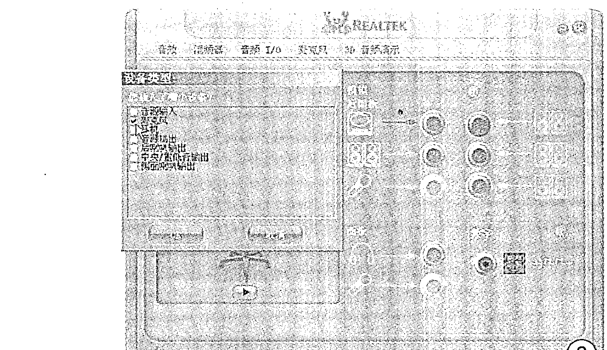

接着在QQ或MSN或Skype中就可以直接使用了，非常方便。

## 五、用Vista DVD Maker 打造属于自己的DVD光盘

现在硬盘大了，机器里已经保存了很多的图片、音乐和视频（如宝宝的视频、生日的视频等），如果能够将其制作成DVD是最好不过的了。因为多数的DVD播放机支持我们用DVD Maker制作出来的光盘，就算你的父母不懂电脑，也可以快速地看到你的面容，听到你的笑声。有幸的是，Windows Vista家庭高级版和Windows Vista旗舰版都提供了Windows DVD Maker，我们可以使用它来为我们的家庭电影和照片制作具有专业外观的视频DVD。

### 第1步：准备素材

DVD Maker支持很多的多媒体素材，包括视频、音频和图片文件。巧妇难为无米之炊，我们要想得到好的效果，在很大程度上取决于其精美的素材。因此，如何获取更多的素材也成为我们制作DVD最关键的一个环节。这里简单地给大家介绍一些获取素材的方法。

#### 1. 视频文件

-   1. 从网络下载

网络发展很快，大家可以优先从网上下载。这里推荐使用http://www.gougou.com，这是迅雷推出的一个视频/影视搜索引擎。通过它，可以搜索到很多好的素材。配合迅雷下载，可以获得很好的高速下载体验。

但要注意的是，一般从网上下载回来的文件都是压缩比相当高的流媒体格式，一般也只能通过相应的播放器来播放和观看。请大家使用专门的转码器将其转为wmv，即微软支持的格式。

-   2. VCD/DVD光盘抓取

VCD/DVD光盘结构较为特殊，其中的文件我们无法直接拿来使用。不过，我们可以用KMPlayer将其中的片段抓取下来备用。

-   3. 视频卡采集

把采集卡的驱动程序安装好后，把录像机的视频输出线接到采集卡的视频输入口，把录像机的音频输入线也接到采集卡的音频输入口，再打开相应的抓取程序（一般购买采集卡时会赠送），然后播放录像机中的录像带，就可以把录像带上的内容采集到电脑中。

#### 2. 音频文件

-   1. 从网上下载

声音文件可以从网上下载，推荐使用http://mp3.gougou.com。

-   2. 录制CD

对于CD音乐，我们可以通过Windows Media Player来抓取这些CD为WAV或WMA格式。

-   3. 用麦克风录制

先把麦克风接到电脑的麦克风口上，然后启动音乐编辑软件，如Nero Wave Editor（随Nero一并赠送），按下录制按钮（如图9），然后就可以通过麦克风把人的解说词、旁白、背景音乐等声音录制下来，并储存成WAV或MP3格式了。

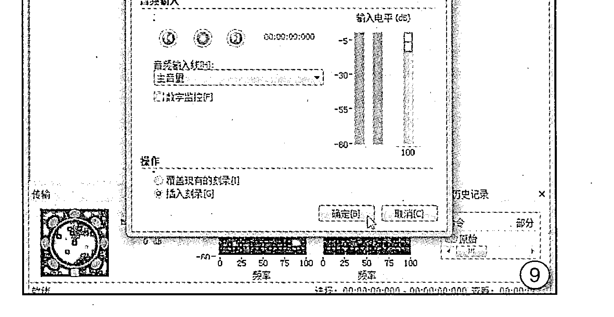

-   4. 线录

如果你准备录制磁带上的歌曲，则可以准备一根双头音频线，一端接入声卡的Line In口，另一端接入磁带的耳机口。最后按下磁带播放键开始播放，同时启动录音软件，如Nero Wave Editor等进行录音，保存为WAV或MP3备用。通过这种方法可以把磁带上的歌曲录制到硬盘中来。

-   5. 通过Windows来捕捉

有些多媒体软件和光盘中没有现成的声音文件，但是程序中却有声音，我们可以先通过上面的方法，打开录制设置对话框，然后设置声音的录制方式为Master Out（具体的声卡有着不同的设置界面），最后再启动声音录制软件进行录制，同时运行能够发声的软件，即可通过这种方法把程序中的声音取下来了。

#### 3. 图片文件

图片文件我们一般可以通过扫描仪、数码相机和截屏软件来抓取。

##### (1) 扫描仪、数码相机

通过扫描仪获取时，我们先把扫描仪的驱动程序安装好，然后就可以使用相应的程序来扫描图片了。当然，如果我们使用ACDSee，也可以选择File→Acquire命令来直接扫描。如果使用数码相机，那就更简单了，只要把驱动程序安装好，把数码相机通过电线接到机器上后，再通过程序获取即可。

##### (2) 抓屏软件

抓屏软件很多，其中最有名的是SnagIt和HyperSnap-DX，功能相当强大。不过，对于VCD、RM、DVD、电影中的画面，可以用KMPlayer来抓取。

##### (3) 从网上抓

当然，从Internet上获取图片也是一个不错的选择，百度图片、Google图片都是不错的图片搜索引擎。右击鼠标，选择“图片另存为”命令即可保存。如果要批量保存，也可以使用迅雷等下载软件。

### 第2步：准备制作

点击“开始”菜单→“所有程序”→“Windows DVD Maker”启动程序。程序主窗口非常简洁，你不会面对一个设置复杂、选项众多的DVD制作工具，其实整个视频DVD的制作流程，都是通过傻瓜向导界面来完成，如图10所示。

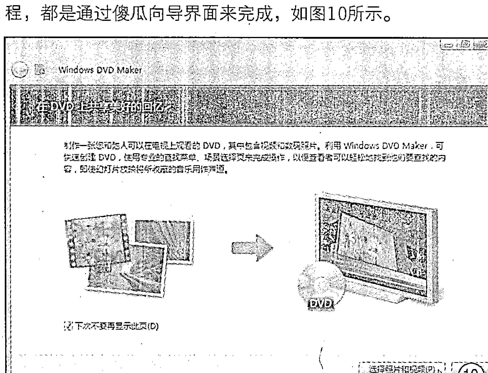

### 第3步：添加素材

单击“添加项目”按钮，此时会打开如图11所示的窗口。在其中我们可以添加相应的素材文件，点击“添加”按钮即可。

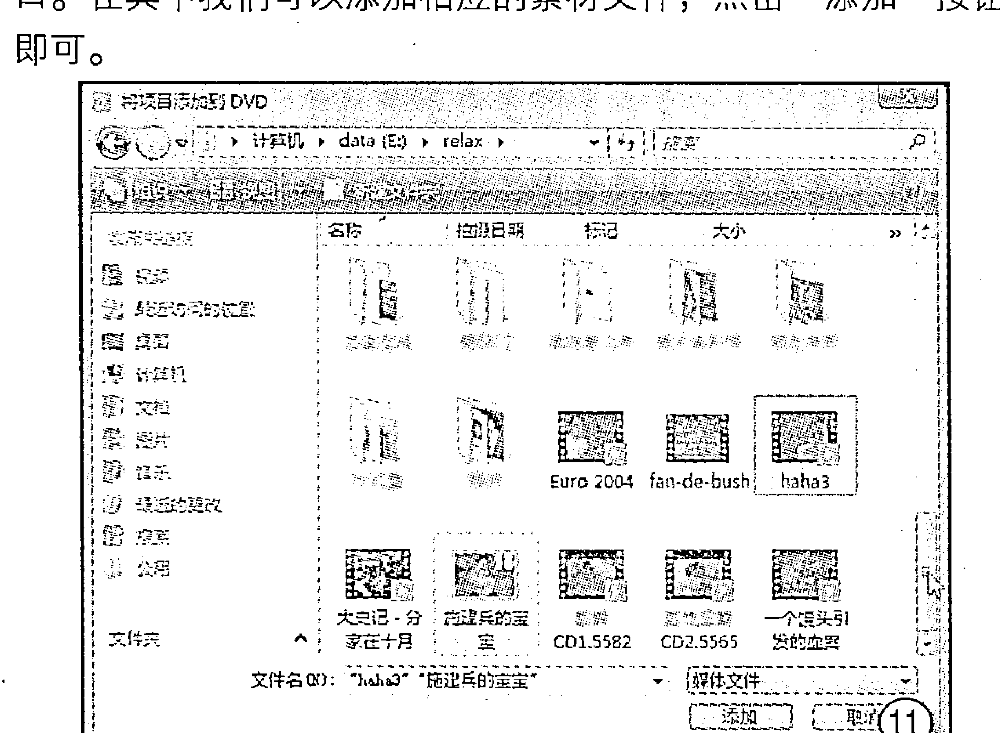

### 第4步：设置选项

因为DVD格式有所不同，因此我们有必要进行相应的设置。单击窗口下方的“选项”按钮，此时会弹出窗口，在其中可以进行相应的设置。

#### 1. 选择DVD播放设置

在这里可以选择：使用DVD菜单启动、使用DVD菜单播放和终止视频或连续循环播放视频。

#### 2. DVD纵横比

可以选择4：3、16：9。4：3是一般屏幕模式、16：9是宽屏模式。

#### 3. 视频格式

可以选择NTSC或PAL，在中国一般选择PAL制式。

### 第5步：设置光盘标题

在窗口的最下方不要忘了“光盘标题”，该标题会出现在最终生成的视频DVD中，而软件默认使用系统当前日期作为光盘标题，这并不符合我们个性化的需要。我们可以自己修改。

### 第6步：设置菜单模板

在这一步里，我们可以看到很多风格的DVD菜单，我们可以单击后应用菜单模板。一共有20种风格，这些模板都相当精美，我们完全不必担心最后生成的视频不够吸引人。

### 第7步：预览效果

单击“预览”按钮可以看到如图12所示窗口，为我们提供了一个模拟真实DVD环境的交互式预览场景，有视频播放、暂停控制、上下方向控制，同真正的DVD播放器没有什么两样，这样我们完全可以对最终生成的视频做到心中有数。如果满意，则单击“确定”按钮返回。

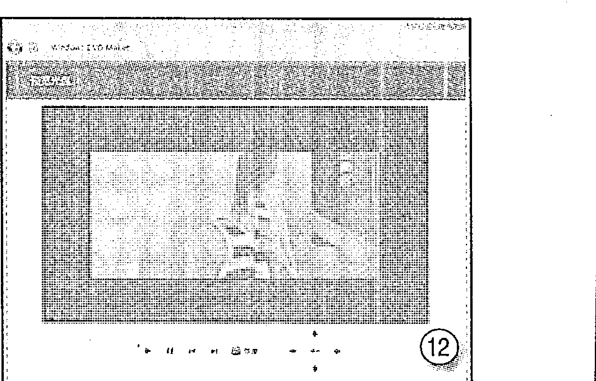

> 小提示：Windows DVD Maker不仅支持预览，我们还可以对DVD菜单的文本进行编辑，点击工具栏“菜单文本”按钮，转入自定义对话框。你可以自由选择字体、文字颜色、样式，当然还可以设置DVD菜单上的关键文本内容，例如：光盘标题、播放按钮、场景按钮等等。而且所做的这些修改，都可以通过对话框右侧的预览图看到修改后的结果。只是这一步并非必需，因此我们没有赘述。

“放映幻灯片”设置对于生成视频DVD相册来说非常重要，我们可以在这里定义图片的显示间隔时间，以及设置图片的过渡效果。同时，我们还可以通过点击“添加音乐”按钮为视频增加背景音乐，以加强音效。

### 第8步：刻录光盘

完成上面所有这些设置后，点击“刻录”按钮，然后按提示放入DVD刻录光盘，再安心地等待视频DVD的生成。最后，可以将其邮寄给远方的亲友，他们放入DVD即可播放，共享我们的欢乐！

## 用好你的浏览器功能——快捷组和群组

□江北书生

> 互联网浩如烟海，而收藏夹则是我们的“导航仪”，但是由于IE和系统的“紧密关联”和Windows系统的不稳定性，重装系统是家常便饭。而且，一旦重新安装系统，则收藏夹会丢失，给我们带来不便。不过，如果我们使用Maxthon和GreenBrowser，则可以将一些网址保存于快捷组和群组中，然后把Maxthon和GreenBrowser拷贝到移动硬盘上即可让“收藏夹带着走”。

### 一、Maxthon篇

#### 1. Maxthon 1.x

在Maxthon中完全可以建立快捷组，然后把相应的快捷方式放到其中。这样以后可以快速打开相应快捷组中的链接。

-   （1）建立快捷组

首先打开多个网站，然后选择“快捷组”→“保存当前所有标签为快捷组”（如图1），可以在窗口中设置保存文件名。以后可以直接单击“快捷组”菜单，选择我们保存的项目即可打开保存在其中的多个网站。

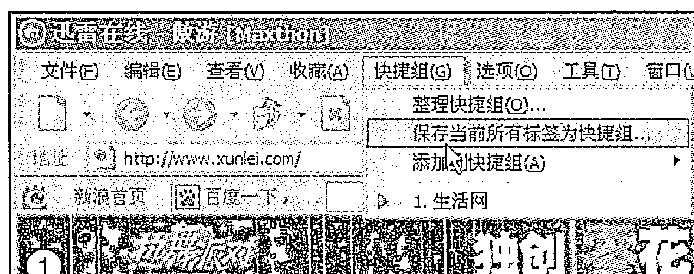

-   （2）整理快捷组

选择“快捷组”→“整理快捷组”，打开“整理快捷组”对话框，然后可以在这里选定快捷组，然后单击工具栏上的添加或删除按钮对其中的网址进行添加、删除、修改等处理。

-   （3）添加到快捷组

在看到某个网站较为喜欢，可以选择“快捷组”→“添加到快捷组”命令，然后再选择一个组即可把它添加到相应组中。

> 小提示
Maxthon 的快捷组和 Netcaptor 的快捷组兼容，你可以将 Netcaptor 的 *.cgp 文件拷贝到 Maxthon的Groups目录中，也可以在Maxthon内添加快捷组。

-   （4）只访问某个网站

如果只想访问快捷组中的某个网站，可以单击“快捷组”，再右击相应的快捷组，然后单击相应链接即可（如图2）。

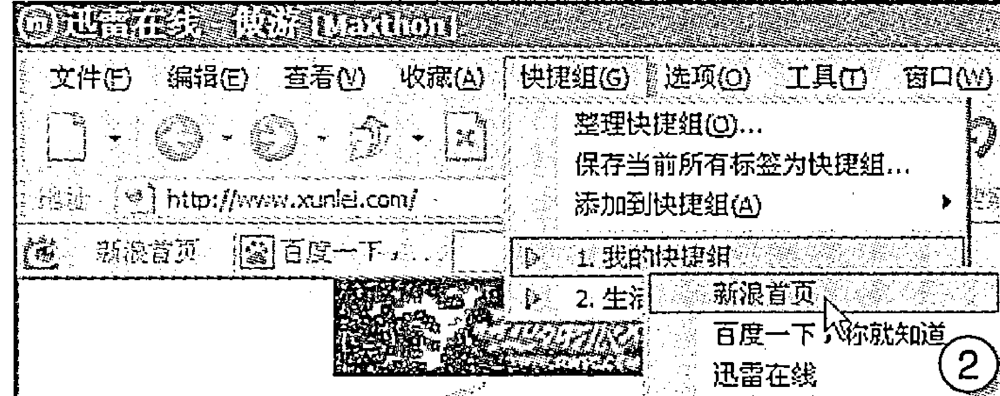

#### 2. Maxthon 2.x

-   （1）建立快捷组

首先打开多个网站，然后选择“快捷组”→“保存所有标签为快捷组”，可以在窗口中设置快捷组名。以后可以直接单击“快捷组”菜单，选择我们保存的项目即可打开保存在其中的多个网站（如图3）。

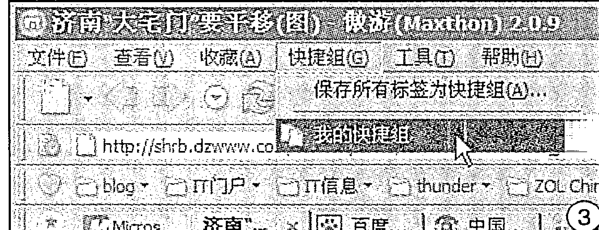

-   （2）添加到快捷组

在看到某个网站较为喜欢，可以单击“快捷组”菜单，然后把光标移到相应快捷组中，再单击其三角扩展按钮，选择“添加到此文件夹”命令即可。

-   （3）只访问某个网站

我们在扩展菜单中可以直接单击相应的链接来访问快捷组中某个网站。

-   （4）整理快捷组

单击“快捷组”菜单，然后把光标移到相应快捷组中，再单击其三角扩展按钮，选中某个项，右击之，再选择相应的命令进行操作即可。

### 二、GreenBrowser篇

在GreenBrowser（以下简称GB）中也可以建立群组，然后把相应的快捷方式放到其中，从而快速打开相应链接，访问自己希望的网站。

#### 1. 建立群组

首先打开多个网站，然后选择“群组”→“保存所有窗口为群组”，可以在如图4窗口中设置保存群组名。以后可以直接单击“群组”菜单，选择我们保存的项目即可打开保存在其中的多个网站。

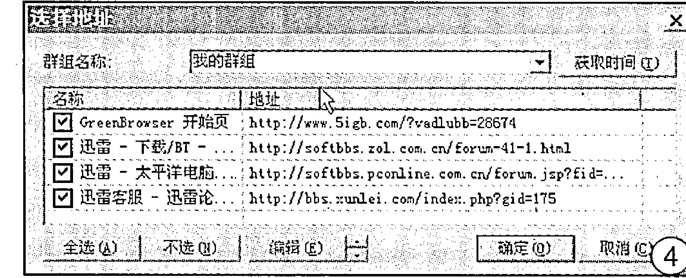

#### 2. 整理群组

选择“群组”→“设置群组”，打开“整理群组”对话框，可在这里选定群组，然后单击工具栏上的添加或删除按钮进行整理。

#### 3. 添加到群组

在看到某个网站较为喜欢，可以选择“群组”→“添加到群组”命令，然后再选择一个组即可把它添加到相应组中（如图5）。

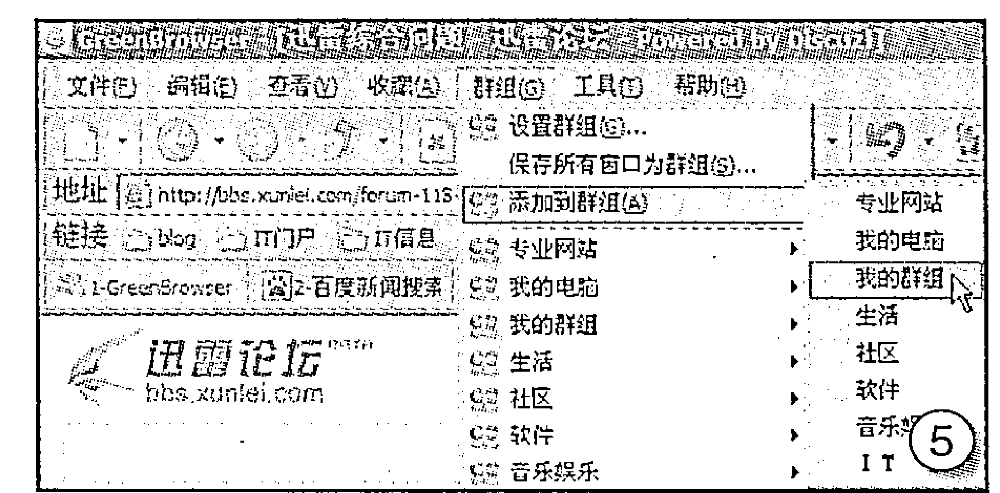

另外，我们选择“群组”命令，单击相应群组文件夹，选择“添加链接到这里”可把当前网页链接添加到相应群组文件夹下（如图6）。

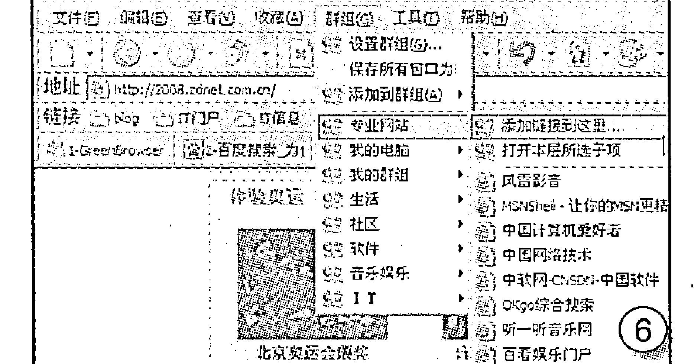

#### 4. 一次打开多个项目

单击“群组”菜单，再单击相应文件夹，选择“打开本层链接”可把当前群组中的所有网页打开。当然，也可以单击单个链接来打开。

## 在Windows XP下提高文件拷贝速度

□小新

现在的硬盘越来越便宜，相信没有多久TB很快就会成为主流硬盘容量。硬盘容量大了，拷贝速度慢的问题就呈现出来。在Windows XP中，拷贝文件的速度非常慢，尤其在拷贝GB级别的文件尤为明显。并且Windows XP中不支持断点续传功能，如果在拷贝的时候遇到一些问题，则要重新对文件进行拷贝，非常的麻烦。这时你也许需要一个简单易用的软件来加速复制速度，免费软件TeraCopy就能完全满足这个要求。

| 项目 | 内容 |
| :--- | :--- |
| TeraCopy 2.0 Beta3 | |
| 软件大小 | 1232KB |
| 软件性质 | 免费软件 |
| 适用平台 | Windows 9x/2000/XP |
| 下载地址 | http://www.onlinedown.net/soft/61376.htm |

在电脑上安装了TeraCopy之后，选择要拷贝的文件按鼠标右键，会在右边的菜单发现多了一个TeraCopy选项。其中包括Copy To或者Move To分别对应复制和移动操作，点击Browse选择目标路径，选择好之后就会开始进行拷贝或移动（图1），速度跟直接在Windows XP下拷贝要快上很多。

TeraCopy除了可以通过鼠标右键菜单来进行拷贝之外，还可以在主界面里直接进行拷贝。方法更为简单，要将拷贝到文件拖拽到TeraCopy的主界面中，然后点击Copy To或者Move To按钮，就可以进行拷贝或移动（图2）。并且支持批量操作，也就是一次可以拷贝多个文件。无论采用哪种方式来拷贝文件，TeraCopy支持断点续传，如果在拷贝文件的时候突然停止拷贝，那么下次可以继续上次没有拷贝完的地方继续进行拷贝，而无需重新进行拷贝。

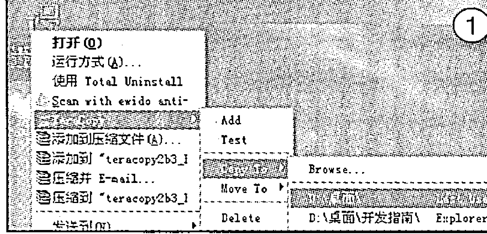

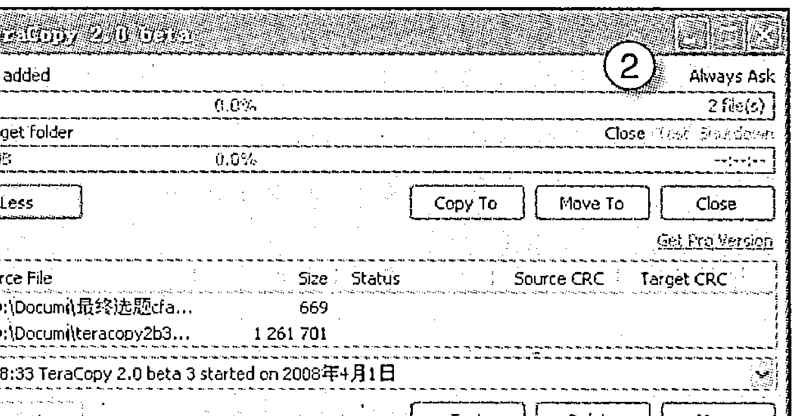

或许用TeraCopy拷贝小容量文件感觉不到明显的提速，但是要拷贝GB以上容量的文件，速度提高的就非常明显。如果你平时经常拷贝文件，那么不妨试试TeraCopy这款软件，相信一定会帮助你节省很多时间，大大提高工作效率。

## 常见文件的自动修复

使用电脑的确是给我们带来了极大的方便，但是要知道任何事物均有其两面性，在享受着高科技带给我们的方便之余，是否想过文件打不开时的痛苦？不过，有幸的是，现在很多软件非常智能化，已经可以做到自身修复，这样，我们往往可以化险为夷！

### 一、Word文件修复

Word文件是我们平时用得最多的格式，里面往往凝结着我们的劳动。因此，我们先来学习Word文件的修复。

#### 1. 自动恢复

**方法一：自动恢复**

如果你使用Office XP/2003，突然出现蓝屏或是断电。重启，运行Word，会发现一个 “文档恢复” 工具栏（如图1），单击相应文件即可打开，接下来另存一下即可，此技巧对于Excel、PowerPoint同样适用。

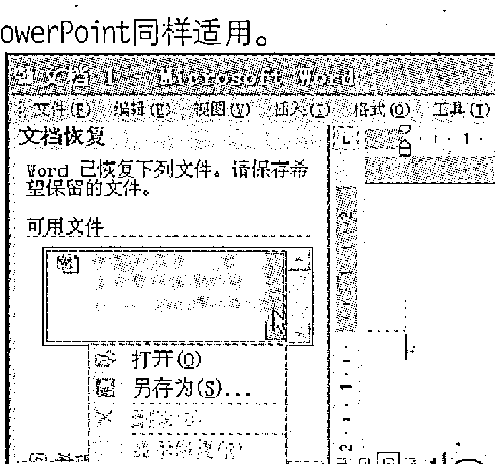

#### 2. 选择“另存为”命令

**方法二：打开时恢复**

在Office程序中的“打开”对话框中，选中一个文件，单击“打开”按钮旁边的下拉箭头，再选择“打开并修复”也可以修复选中的文档并再打开（如图2）。

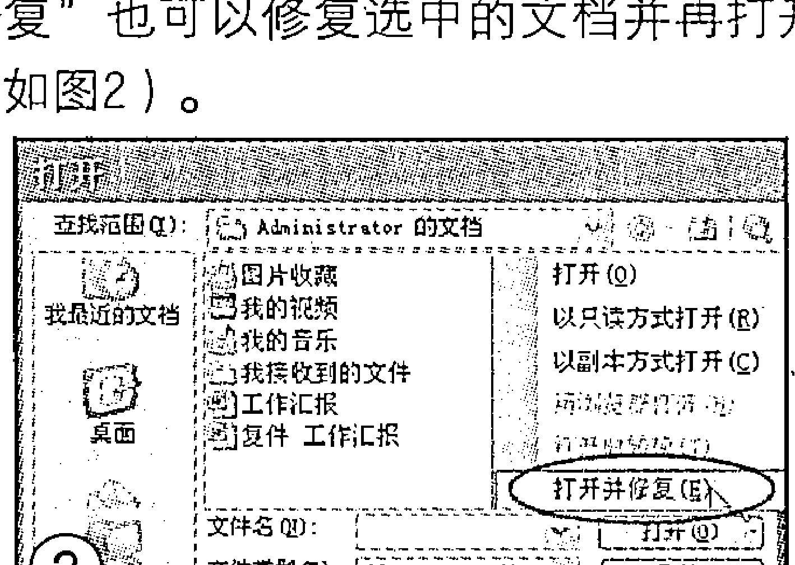

#### 3. 使用专用工具修复

由于Office格式较为流行，因此针对它的 “Office文件修复器” 也应运而生，大家下载后可以启动之，此时单击 Recover按钮，再打开如图3所示窗口，选择欲修复的文件。该软件即会对打开的文件进行修复，最后弹出窗口保存修复后的文件。

> **小提示：** 该软件可以修复Office所有文件，包括Word、Excel、PowerPoint、Access、Publisher、Outlook、OneNote等。

### 二、RAR文件的修复

压缩包的作用众所周知，如果你打开一个压缩包，却发现它发生了损坏（如图4）。那可以启动WinRAR，定位到这个受损压缩文件夹下，选中这个文件，再选择工具栏上的“修复”（如图5，英文版的为Repair），确定后WinRAR就开始修复这个文件，并会弹出修复的窗口（如图6）。最后生成rebuilt.+原文件名的压缩包。要注意的是，目前WinRAR只能够修复RAR或ZIP格式的文件，对于其他的文件则无能为力。

> **小提示：** RAR压缩包中的文件删除后会被自动更新，一般不能找回来。如果被删除的文件打开过，可以尝试到临时文件夹下查找恢复。或者尽量把RAR压缩包中的文件解压出来再使用，当文件丢失时，RAR压缩包中还有一份。

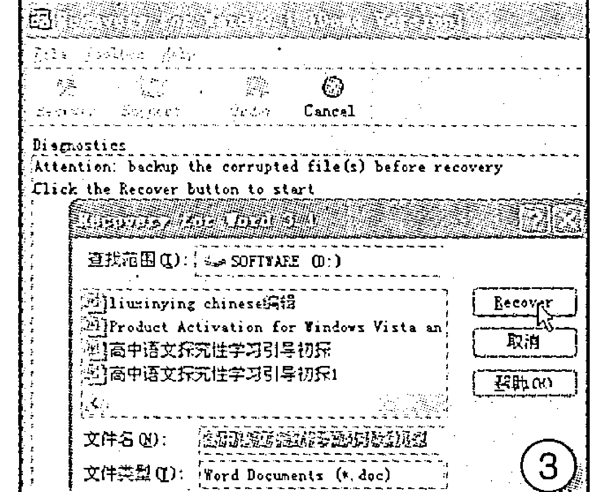

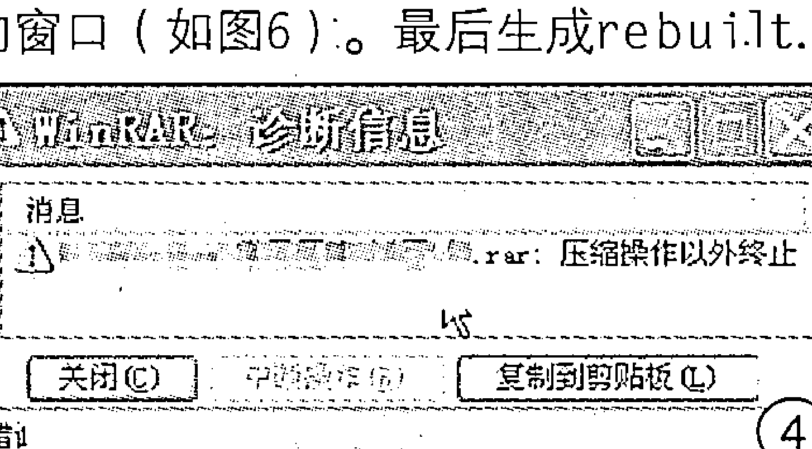

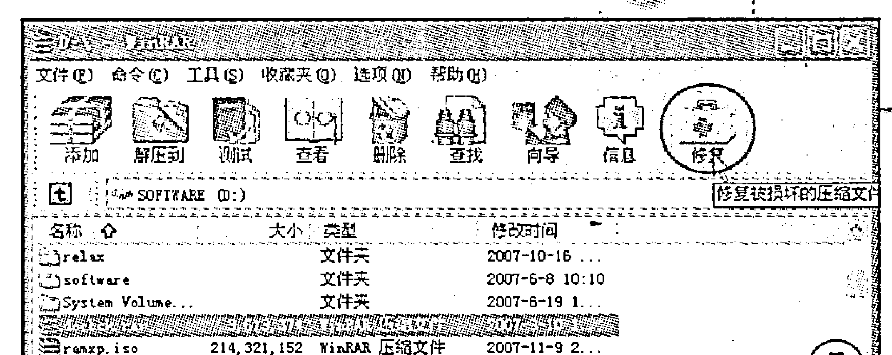

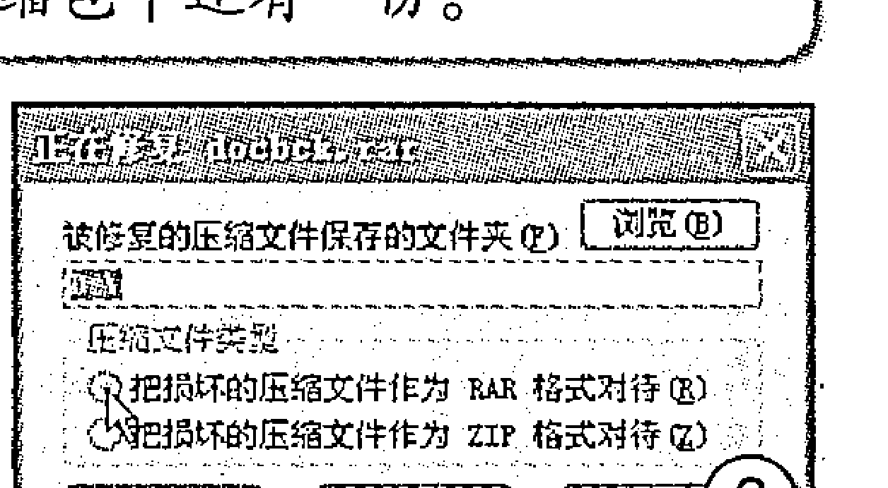

### 三、视频文件的修复

随着带宽的增大，很多人喜欢从网上下载视频电影来欣赏。但如果是你非常喜欢的电影，却发现无法播放，一定会很惆怅万分！现在只要有了Divx Avi Asf WMV WMA RM Rmvb 修复器，然后单击“添加文件”来打开相应的视频文件，再单击“修复文件”按钮即可（如图7）！最后可以得到“修复的”+先前文件名的视频。

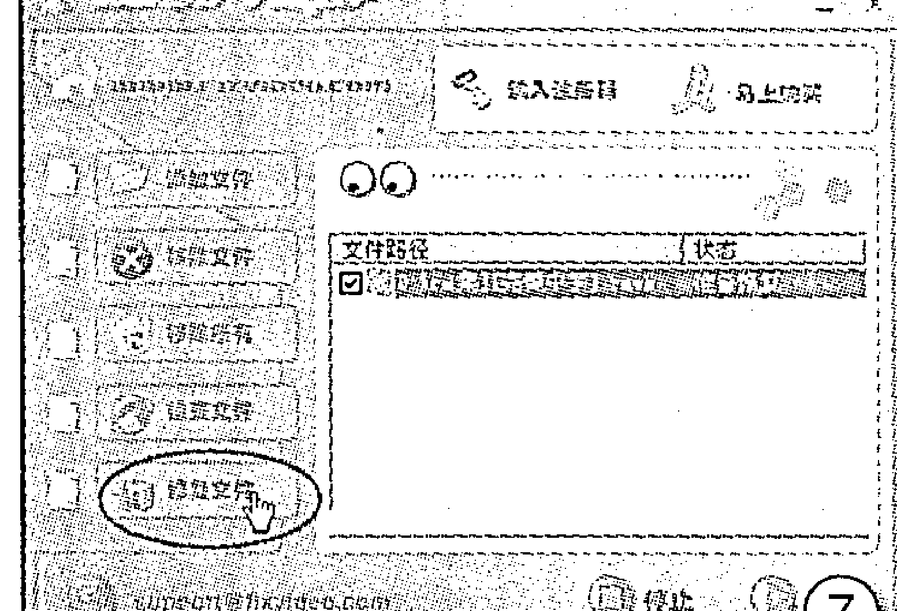

软件名称：Divx Avi Asf Wmv Wma Rm Rmvb 修复器
语言界面：简体中文
软件大小：1.29MB
购买金额：共享
操作系统：Windows XP/2003
下载地址：http://www.skycn.com/soft/11574.html

> 小提示
为了保险起见，建议在修复视频文件前，先做一下备份。

### 四、Foxmail邮件的修复

如果你使用Foxmail收发邮件，发现重要的邮件不见了，可以先右击相应的邮箱，选择“属性”，然后再选中“工具”标签，点一下“开始修复”按钮。这样Foxmail就会尽自己最大的努力给你修复这个邮箱（如图8），并会把丢失的信件找回来，以让你的损失减少到最低限度。

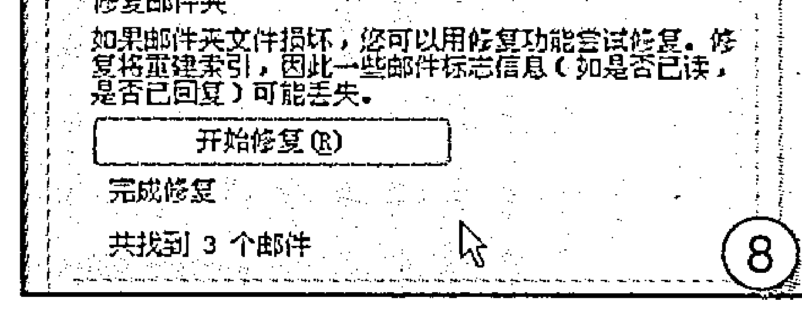

### 五、Outlook Express邮件的恢复

很多人使用Outlook Express来收发邮件。但是现在垃圾信件非常多，有时常在删除那些烦人的信件时，不小心就把重要信件给删了。在欲哭无泪的情况下，我们还可以让R-Mail来帮忙！

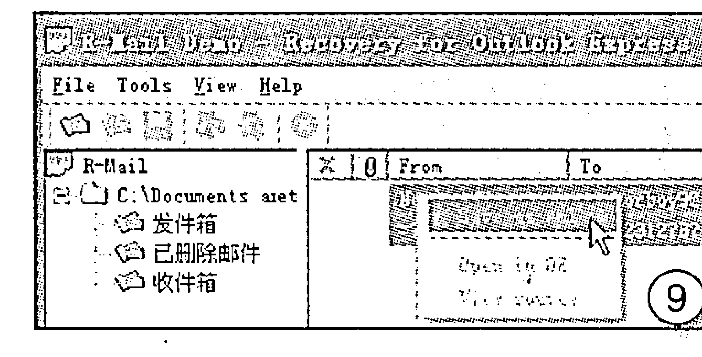

软件名称：R-Mail
语言界面：英文
软件大小：1.29MB
购买金额：共享
操作系统：Windows XP/2003
下载地址：http://www.outlook-mail-recovery.com/zhcn/Outlook_Mail_Recovery_Download.shtml

下载并安装后，启动之，该软件会侦测出你当前OE中邮件的保存文件夹，同时会出现如图9所示界面。首先回忆并选中误删除的邮箱，然后选择“Tools”（工具）→“Message base recovery”（仅恢复误删邮件），单击相应邮件，即可看到其内容，也包括从谁发来、发送给谁、主题及附件等。只要右击它，选择Save as eml命令即可把它保存为eml格式的邮件（仅限于注册版本）。然后把它直接拖放到OE的邮箱中即可恢复。

> 小提示
如果选择“Tools”→“Message base browsing”（显示所有邮件），则会显示出选中邮箱中的所有邮件。同时，R-Mail会将所有的已删除或是未删除的信件找出来。有些信件的主题前有红色的小叉叉，那就是已删除的信件。

事实上，现在硬件的价格在不断下降，但是有用数据的价格却与日俱增。平时使用电脑操作时，最为宝贵的就是数据了。因为物理损坏、感染病毒、误删除操作、黑客入侵等等情形，都可能造成系统崩溃或文件损坏等严重后果！在我们说遗憾之前，可以试一下上面的办法，往往可以有“柳暗花明又一村”的感觉！■

## IE标题栏内容咱说了算

□王道才

如今这个浏览器那个浏览器的，可以说种类繁多，让人目不暇接。细品这些浏览器，虽说功能、使用方便程度各有千秋，但对于我们大多数普通网民来说，都只使用其最基本的功能，为此我们只需本着一颗平常之心，用好系统自带的IE浏览器，对它再进行稍加修饰，也会别有一番情趣。

### 一、组策略中更改“标题设置”法

1.  单击“开始→运行”，在打开的“运行”对话框中输入gpedit.msc后回车或点“确定”，启动“组策略”对话框。
2.  在“组策略”对话框的左侧窗格中单击“用户配置→Windows设置→Internet Explorer维护→浏览器用户界面”，然后到右侧窗格中双击“浏览器标题”，在打开的“浏览器标题”对话框中勾选上“自定义标题栏”项，在“标题栏文字”框中输入你准备在IE标题栏中显示的文字，最后点“确定”退出并关闭“组策略”对话框。重新打开一个IE浏览器窗口，你就会发现IE标题栏中有你设置的文字了。当然你还可以在刚才的对话框中“自定义徽标”和“IE工具栏背景”。

### 二、修改注册表法

1.  单击“开始→运行”，在“运行”对话框中输入regedit后回车或点“确定”，启动“注册表编辑器”。
2.  在“注册表编辑器”窗口中，单击“编辑→查找”，在“查找目标”框中输入window title（注意两个单词中间有空格），然后点“查找下一个”。稍微等待后，就会找到“Window Title”项，双击“Window Title”，在打开的“编辑字符串”对话框中的“数值数据”框中输入你准备在IE标题栏中显示的文字，最后点“确定”并关闭“注册表编辑器”窗口。这样再启动IE浏览器，它的标题栏就会显示出你修改后的文字。

怎么样！有了这两招，你就不要再东张西望说这好那好了，因为只有自己的才是最好。■

## 懒惰进行时 软件自动更新

亚军

无可非议，一般软件的更新总会给我们带来更多、更稳定的功能，但是由于我们平时工作太忙，也无暇去关心软件的更新。不过，有幸的是，现在的软件大多提供了一条更新的终南捷径，我们只要简简单单进行设置，就可以使其自动更新，从而让我们体验新版软件的超强功能！

## 第一招 系统一定要自动更新

Windows非常易用，但是总有太多的漏洞需要堵住。其实，Windows本身就有自动更新功能，不需要你太多干预就能智能升级，又高效、又安全！

打开“控制面板”，双击“自动更新”图标，弹出“自动更新”窗口，在“设置”项下有三种方式供我们选择（第四项是关闭自动更新，自然不能选择），一般选择第三项（如图1）。

一旦有更新可用，在系统托盘处就有图标显示，当鼠标停留时，还会提示下载的进度（如图2）。当下载完成、安装准备就绪时，系统托盘处弹出提示，单击图标即可启动安装向导，在向导提示下完成安装。

## 第二招 Office的自动更新

Office也像Windows一样，也要经常打一些补丁，以修补一些错误。只要在Office组件中单击“帮助→检查更新”（如图3），会自动连接到更新网页，选择右侧的Office版本，如Office 2003。单击“检查更新”后，即开始检查更新的内容。在检查过程中，会提示你安装Office Installation Engine。

过一会儿，需要更新的内容就会显示在网页中（如图4），单击“开始安装”后在Office Update向导的提示下一步一步开始Office的自动下载和安装更新操作（如图5）。完成后你的Office就是最新版本了，只是在安装更新组件时，可能需要插入Office的安装光盘。

## 第三招 电子邮件程序更新

在上个世纪，电子邮件就已经成为浏览后的第二大应用，在宽带盛行的今天其地位仍没有改变，电子邮件仍是商务人士交换数据和信息最主要的工具。而一般新的电子邮件程序往往会提供更好的功能，因此保持电子邮件程序的更新也是十分有必要。

### 1. Foxmail
单击“工具→系统设置”，在“常规”选项卡中选中“自动检查最新版本”复选框即可（如图6）。

### 2. Outlook Express
更新Windows时会一并更新。

### 3. Outlook
更新Office时会一并更新。

### 4. DreamMail

DreamMail是一款非常强大、优秀的电子邮件收发程序，其很多功能都胜过了Foxmail和Outlook Express。它自然也会让自己与时俱进，始终保持先进性。

#### (1) 自动更新
选择“工具→选项”，再单击“常规”标签页中的“自动检测新版本”复选框（如图7），这样DreamMail一启动就会自动检测新版本。当然，我们也可以选择“帮助→检查新版本”来手工检测。

#### (2) 更新黑名单
垃圾邮件满天飞，如果大家能够来一个黑名单库与大家共享是再好不过了。默认情况下，DreamMail并没有提供黑名单列表，不过大家可以从 http://oldbbs.dreammail.org/Announce/Announce.asp?BoardID=8&ID=13244 下载最新的黑名单列表，将其中的txt文件导出到桌面上，再在DreamMail中单击工具栏上的“选项”按钮，再单击“垃圾邮件/过滤”→“黑名单”，再单击“从文件导入”，然后打开其中的txt文件即可将这些地址导入到列表中（如图8）。如果你手工添加了黑名单的话，也可以单击图8窗口中的“导出到文件”按钮将自己的黑名单导出，然后与他人分享。

### 5. Flymail

Flymail是一款集邮件收发和新闻组于一体的优秀软件，本刊也有过介绍。打开它后，单击“工具→系统设置”，再单击“检查新版本”标签，然后选中“启动时自动检查服务器上是否有新版本”复选框（如图9）。这样一打开Flymail时，如果有更新，就会弹出窗口让我们选择是否更新。当然，我们也可以手工选择“帮助→检查是否有新版本”命令来选择更新。

## 第四章 IM软件更新

商务人士多数会使用QQ、MSN等即时通讯软件，它们也可以自动更新。

### 1. QQ的自动更新
QQ的升级总是能带来大量新鲜而时尚的东东，如何能第一时间体验它的新功能呢？最好是让QQ自己来提醒你。单击QQ主窗口上的“菜单→个人设置”，单击“系统设置”，再切换到“自动更新设置”选项（如图10），勾选“启动自动更新”后确定。以上，每当QQ有新版本提供时，就会弹出窗口提示下载并安装新版QQ。当然也可以单击图10窗口上的“检测最新升级版本”按钮来马上升级。

### 2. MSN Messenger
MSN Messenger的自动更新是完全自动的，不需要进行任何设置。每次启动时，它会自动连接到微软网站进行比较，当发现有新版可用时，会弹出提示窗口（如图11），单击即可下载安装新版MSN。如果你使用Messenger Plus的话，只要在MSN的窗口中单击“Plus!→关于”命令，然后在打开窗口中单击“检查更新”即可。

## 第五章 浏览器自动更新

### 1. Maxton的自动更新
单击“选项→Maxton选项”，切换到“启动时”选项卡，勾选“检查更新版本”（如图12），即可让Maxton每次启动时，自动检查新版本。另外，我们也可以选择“帮助→检查更新”，然后在打开窗口中选择相应更新组件即可更新。

### 2. MyIE2的自动更新
单击“选项→MyIE2选项”，切换到“启动时”选项卡，勾选“检查版本更新信息”，即可让MyIE2每次启动时，自动检查新版本，发现更新版本会自动下载（图13）。

### 3. Firefox
选择“工具→选项”，再单击左侧的“高级”项，然后滚动鼠标到下方，选中“软件更新”下的“定期检查更新，为：”下的Firefox和我的扩展项（如图14），这样Firefox会定时检测其自身及扩展插件是不是有更新，一旦有则会弹出窗口来让我们更新。如果单击图14中的“立即检查”按钮则可以即时手工检测。

## 第六章 播放器的更新

在旅途生活中，用上最新的播放器软件可以更好地播放歌曲和电影，给我们带来更多的快乐。

### 1. Winamp
启动Winamp，按下Ctrl+P键，再单击“常规参数”，然后再选中“启动时检查Winamp最新版本”复选项（如图15），以后每次启动时，Winamp就会启动并检查新版本。

### 2. RealPlayer
单击RealPlayer的“工具→首选项”，选择“自动服务”→“自动更新”项，然后在右侧窗口中选中“自动下载和安装重要更新”复选框（如图16），单击“确定”按钮。当然单击“现在检查更新”按钮，RealPlayer会自动上网检查，如果检查有新的版本，就会在弹出窗口中告知并提示升级。

## 第七章 病毒库

世界上新病毒无时无刻不在产生，有效查杀最新病毒的方法就是升级病毒库。如果你的重要文档不想被病毒破坏，那就一定要自动更新升级病毒库。多数的杀毒软件病毒库的更新大同小异，笔者在这里以Norton AntiVirus为例进行介绍。

双击任务栏处的Norton AntiVirus盾牌图标，在打开窗口中单击File→Schedule Update（如图17），在打开窗口中选中Enable scheduled automatic update项，然后单击Schedule按钮，在打开窗口中则可以设置多长时间自动更新病毒库，选择Daily则表示每天更新，接着设置好更新时间即可（如图18，每天20:45，这时一般机器也开着）。这样即保证你的Norton AntiVirus每天都能够自动更新病毒库了。

对于江民杀毒王，可右击任务栏图标，选择“设置”，单击“升级”，再单击右边的“立即升级”按钮即可。选中打开窗口中的“定时升级”复选框，再选中“每天”项，那系统默认为在每天的12：30分自动升级。

如果是金山毒霸，可右击任务栏托盘区中“金山毒霸大管家”图标，选择“选项设置”命令，在打开窗口中选中最下方“提示升级或自动升级”复选框，即可在窗口的最上方设置每几天自动升级或设置具体的时间（如每周一12：00）。

使用McAfee VirusScan的用户，双击任务栏上的McAfee图标，打开设置窗口，再单击Check for a VirusScan update（更新病毒库）按钮，然后向导会登录服务器查找最新的病毒库，并允许我们在线下载升级。

# 给宏代码加把“锁”

□孙学荣

人们常常为Excel文档添加宏代码以完成一些比较复杂、重复或者是特殊的操作，每段宏代码都是自己耗费了无数心血才试验成功的，如果我们只想让别人使用宏代码提供的功能，而不想让别人查看、修改自己的宏代码，那就要给宏代码添加密码保护了。下边就给大家简单介绍一下怎样给宏代码添加密码保护，以更好地保护自己的劳动成果。

先打开包含有宏代码的Excel文档，然后单击菜单“工具→宏→Visual Basic 编辑器”命令，调出“Visual Basic 编辑器”窗口，然后在左边的“工程 - VBAProject”窗口选中需要给宏代码添加密码保护的工作簿，右击之，选择“VBAProject 属性”命令，打开“VBAProject - 工程属性”窗口，并切换到“保护”选项卡，先勾选“查看时锁定工程”复选框，接着在“密码”和“确认密码”后边的文本框内输入自己想好的密码，最后单击“确定”并关闭这个Excel文档。

经过以上操作，当我们再次打开这个Excel文档并调出“Visual Basic 编辑器”想要查看相关宏代码时，就会弹出一个要求输入密码的对话框，只有在密码输入正确的情况下才可以查看相关宏代码。

> 小提示：利用这个方法也可以为包含有宏代码的Word文档设置密码，以防止别人查看相关宏代码。

# 让我的Windows XP 也换个模样

□闫 皓

现在虽然Windows vista出来已经快1年的时间，但是大部分人的电脑还是安装Windows XP操作系统。大部分的Windows XP都是千篇一律，一点特点都没有。这里给大家介绍几款软件，利用这些软件就可以美化一下Windows XP，让自己的Windows XP充满个性。

### 1. 将Vista窗口切换特效克隆到XP上
如果在Windows中打开了多个程序，想进行切换的话，需要按ALT+TAB才可以。但是Windows XP对切换界面十分的简陋，并且没有预览图，不知道具体切换到哪个程序中。而在Windows vista中就有非常华丽的程序切换特效。其实并不用羡慕Windows vista，在Windows XP中只需借助一款名字为TopDesk的小软件，也可以拥有华丽的切换窗口特效。先将TopDesk安装在电脑上，之后就可以使用。按WIN+TAB键，就会看到华丽的3D程序切换（图1），非常的漂亮。而按ALT+TAB键，依然是传统的切换界面。不过TopDesk的华丽的3D程序切换非常占用系统资源，如果电脑配置不是很强劲的话，系统会很卡。这时候可以进入TopDesk的设置，来改变切换特效。

TopDesk提供了多种程序切换特效，但这些切换特效要更换起来比较麻烦。TopDesk就提供了一个人性化设计，可以直接在屏幕上显示出命令切换按钮。在TopDesk的设置窗口中，进入User Input，将Floating Buttons菜单中的选项全部选上，然后点击OK按钮（图4）。在桌面上就有程序切换特性按钮，点击这些按钮就自动进入切换界面，无须手动进行设置（图5）。

我们使用了TopDesk这款软件，无须再羡慕那些安装Windows vista系统的朋友，在Windows XP中可以实现3D程序切换窗口。

### 2. Windows XP下实现玻璃特效
Windows vista中的玻璃特效非常的漂亮，可以让任务栏和开始菜单都变成透明样式，跟玻璃一样。不过Windows XP中就不提供这些特效，就需要用第三方软件来实现。WinBlinds 5就可以让Windows XP实现玻璃特效，不过就为了这一个特效安装WinBlinds 5有些大材小用，并且WinBlinds 5是收费软件，需要花钱才能够使用。介绍一款GTaskbar的绿色软件，利用它也可以在Windows XP中实现玻璃特效。GTaskbar大小只有92KB，随意解压到任意目录后就可以使用。运行GTaskbar之后，会出现设置窗口，在这里可以调整任务栏和开始菜单的透明度，从0~100%可以设置。0为不透明，而100%为全透明，可以根据自己的喜好进行选择（图6）。选择好后，点击立即执行按钮，就会发现Windows XP中的开始菜单和任务栏已经变成透明（图7）。要想恢复也很容易，点击全部还原按钮即恢复正常。

- 软件名称: GTaskbar
- 软件大小: 91.9KB
- 软件性质: 免费软件
- 适用平台: Windows 2000/XP
- 下载地址: http://www.pconline.com.cn/pcedu/soft/st/winxp/0512/acc/v0230.rar

> 使用GTaskbar将Windows XP实现玻璃特效之后，如果更改桌面主题，需要重新进行设置，否则开始菜单将恢复正常，不再透明。

### 3. 让Windows XP随意变色
Windows XP中大部分颜色是无法进行改变的，如果想要自己修改Windows XP中的颜色非常麻烦，需要通过修改注册表等方式来实现。但用了Color Control这个小软件一切将变得非常简单，只需动动鼠标就可以轻松地改变Windows XP的颜色。Color Control是一款绿色软件，随意解压到任意目录就可以使用。Color Control主界面的左边选择要更改颜色的部分，然后用鼠标双击，就会出现调色板，选择自己喜欢的颜色（图8）。颜色选择好后，点击激活按钮，稍等一段时间，就会发现Windows XP中相对应的部分颜色已经发生了变化（图9）。要是觉得这个颜色不喜欢的话，可以点击恢复按钮，来还原原先的颜色。都觉得没有问题，可以点击保存按钮，来永久保存更改后的颜色信息。我们可以使用Color Control来随意更改Windows XP的颜色，制作一个拥有独一色彩的Windows XP出来。

- 软件名称: Color Control
- 软件大小: 169KB
- 软件性质: 免费软件
- 适用平台: Windows 2000/XP
- 下载地址: http://www.i-3hao.com/soft/colour.rar

> 要是觉得这个颜色不喜欢的话，可以点击恢复按钮，来还原原先的颜色。都觉得没有问题，可以点击保存按钮，来永久保存更改后的颜色信息。

### 4. 让Windows XP更完美一些
细心的朋友一定会发现，在Windows XP操作系统中有很多地方的位图、图标和AVI动画资源并不是XP风格，虽然看起来没有什么大碍，但总觉得有些不舒服。为了打造完美的Windows XP，可以使用一款名字为Xpize的软件，它可以将这些非XP风格的资源替换为真正XP风格。

在Xpize安装的时候可以直接改变现有的Windows XP外观，也可以选择Windows XP的ISO文件。然后运行Xpize的时候，选择要进行替换的部分，建议大家全部选择。选择好之后，点击Reload按钮开始进行替换（图10）。经过一段漫长的时间等待后，资源替换完毕。但这时候并看不出来什么，重新启动一下电脑，就会发现自己的Windows XP中有问题的部分，都恢复了正常。

- 软件名称: Xpize 4.7 Beta 2
- 软件大小: 8314KB
- 软件性质: 免费软件
- 适用平台: Windows 2000/XP
- 下载地址: http://www.duote.com/soft/6963.html

### 5. 让Windows XP的文件夹告别黄色
从有了Windows开始，文件夹就一直是黄颜色。如果要是觉得黄颜色的文件夹看时间久了有些疲劳的话，不妨可以给文件夹换一个颜色。直接可以通过文件夹属性来更换，但比较麻烦。可以利用一款iColorfolder的软件，通过这款软件可以轻松地修改文件夹的颜色。

先将iColorfolder安装在电脑上，然后在文件夹上按鼠标右键，就会看到文件夹染色选项，在这里可以选择一共七种颜色，如果觉得这七种颜色没有自己喜欢的，可以在自定义中选择自己喜欢的颜色（图11）。

选择好之后，就会发现所选的文件夹改变了颜色（图12）。要是觉得颜色不太合适，可以再右键单击该文件夹，左键单击文件夹染色→还原，文件夹就又变回原来的颜色。

以后可以利用iColorfolder来改变文件夹的颜色，可以将放不同文件的文件夹加上不同的颜色来区分，查找起来就会方便很多。

> 小提示：iColorfolder可以同时让多个文件夹改变颜色，方法很简单，用鼠标选中要改变颜色的文件夹，然后把鼠标指向其中的任意一个文件夹进行操作即可。

- 软件名称: iColorfolder 1.4.2
- 软件大小: 1.37MB
- 软件性质: 免费软件
- 适用平台: Windows 9x/2000/XP
- 下载地址: http://download.it.com.cn/softweb/software/desktop/buildup/2007/21330.html

### 6. 让我的开始菜单与众不同
一提到Windows XP的开始菜单，相信大家都不陌生。在开始菜单中可以找到相对应的程序，给我们带来很多方便。不过Windows XP中的开始菜单有很多不足的地方，查找不够人性化，并且界面不是很漂亮。Windows XP的开始菜单虽然有一些不足，可以使用一款名字为Open Menu+的软件来进行完善，让自己的开始菜单与众不同。

先将Open Menu+安装在电脑当中，然后打开开始菜单，就会发现已经发生变化，已经完全换掉Windows XP原来的开始菜单（图13）。在开始菜单上有一个搜索栏，里面输入程序的名字，就会马上找到所需的程序。支持智能查找，对中文支持得很好（图14）。

Open Menu+除了可以代替系统的开始菜单之外，还可以直接显示网页收藏夹和电脑里面的文件（图15），操作起来非常的简单，无须再一层层进行查找。另外也支持关机、重启、休眠等操作。

想恢复Windows XP的原始菜单也很简单，只需将Open Menu+程序退出即可，不会对原来的开始菜单造成任何影响。

- 软件名称: Open Menu+ 5.6
- 软件大小: 5.3MB
- 软件性质: 免费软件
- 适用平台: Windows 9x/2000/XP
- 下载地址: http://downloads.sourceforge.net/openmenuplus/OpenMenuPlusPortable156Setup.exe

## 博客美化技巧

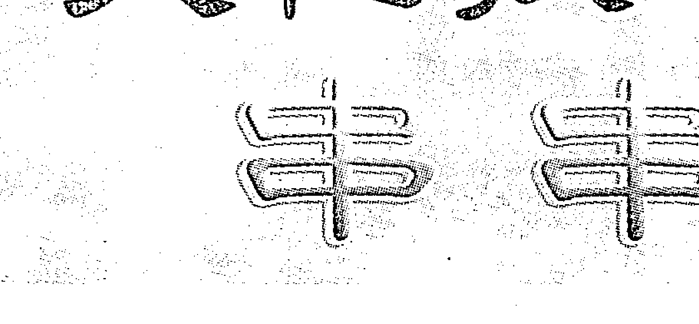

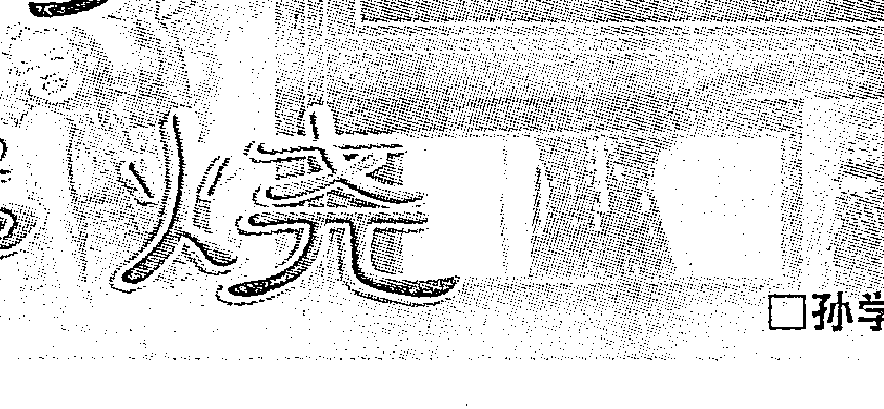

□孙学荣

随着生活水平的不断提高，越来越多的家庭都安上了宽带网。过去，人们接触网络的目的仅仅是由于工作、学习的需要，而现在，上网成了人们的一种生活习惯。对于经常泡在网上的网虫来说，相信不少人都有看博客、写博客的习惯，而如何提高自己博客的访问量也是这些人所关心的。今天，笔者就以新浪博客为例，给大家介绍几个美化博客的小技巧，希望对提高大家博客的访问量能够有所帮助。

### 一、博客也来“养”金鱼

笔者特别喜欢金鱼，但是自己养了N次，最后这些金鱼都“挂”掉了，真是让人郁闷呀。干脆，还是在博客上来“养”几条金鱼吧！博客上“养”金鱼不但少了给金鱼喂食、换水之苦，而且也可以给自己的博客增加一些活力，让来访者有种神清目爽的感觉，相信对提高自己的博客访问量一定会大有帮助。

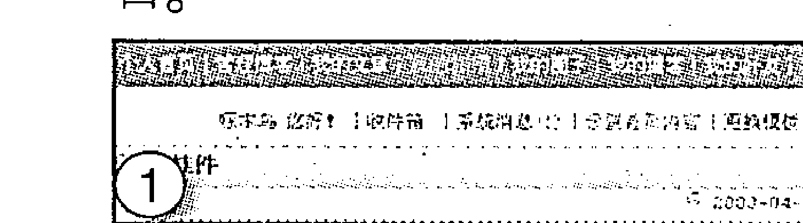

第一步：先登录自己的新浪博客，在自己博客的主界面单击“管理博客”链接（如图1），然后单击新打开的“管理博客”窗口中的“发表BLOG文章”链接，再打开“BLOG发表文章”窗口。

第二步：在“BLOG发表文章”窗口中，先在“文章标题”后边的文本框内输入文章的名称，如“金鱼”，再勾选“显示源代码”复选框，最后在该窗口的文字编辑区域输入以下内容（如图2）：

```
html
<DIV style="VISIBILITY: visible"><EMBED style="WIDTH: 460px; HEIGHT: 350px" name=acrobat_cube align=middle src=http://www.leiyu668.com/flash/FSC/049.swf width=460 height=350 WMODE="transparent" QUALITY="high"></EMBED></DIV>
```

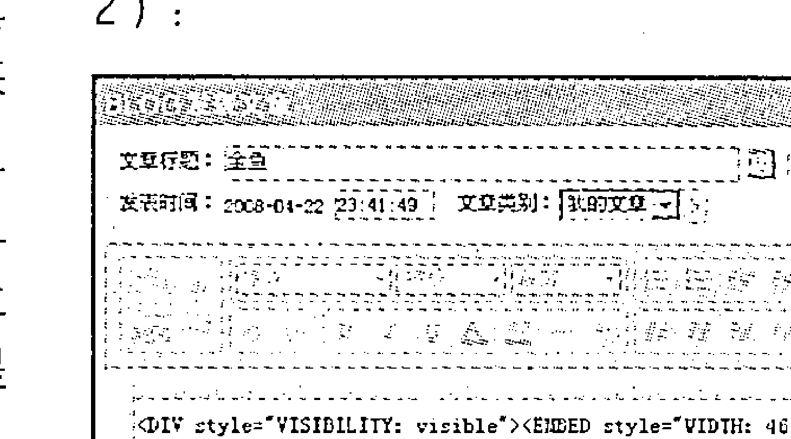

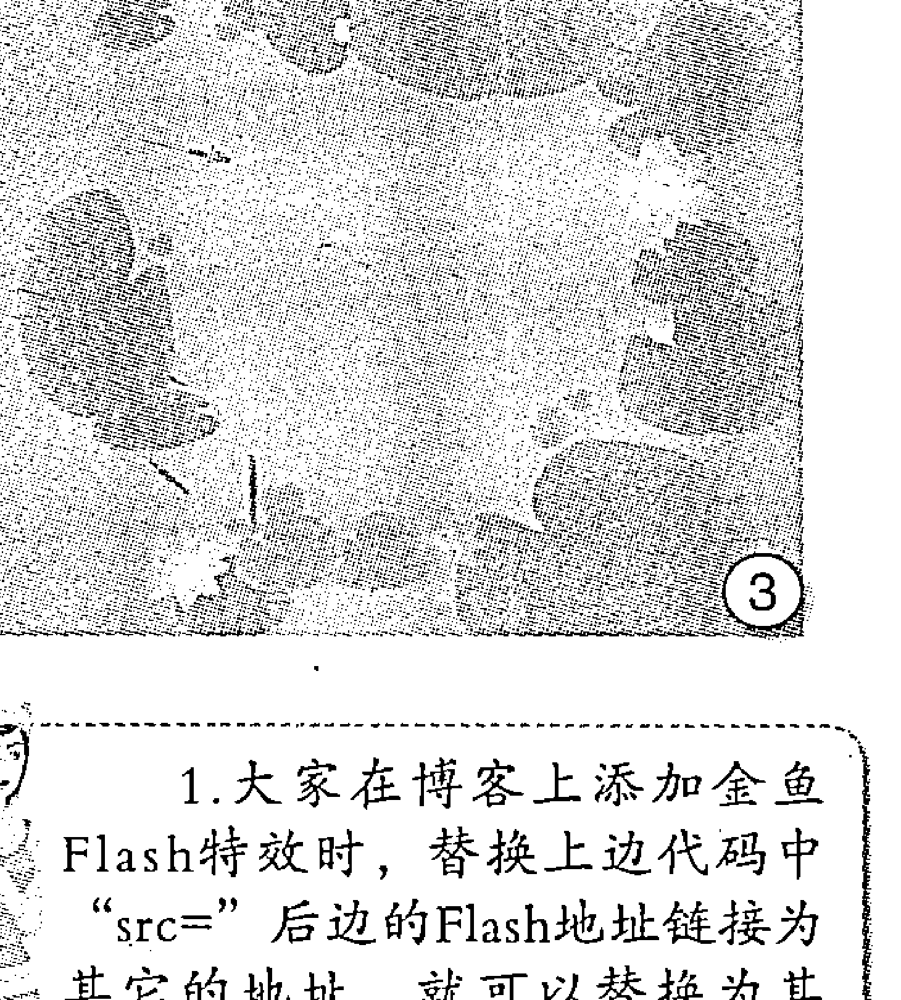

> 小提示
> 1. 大家在博客上添加金鱼Flash特效时，替换上边代码中“src=”后边的Flash地址链接为其它的地址，就可以替换为其它自己喜欢的Flash动画了。
> 2. 在博客上添加金鱼Flash特效时，不要采取通过添加自定义空白面板的方式添加，因为这种添加方式会使金鱼Flash特效在左边的一角，而且受边栏宽度的影响，金鱼Flash特效也不能完整地显示出来。

第三步：“BLOG发表文章”窗口中的代码输入完毕后，单击窗口下边的“发表文章”按钮，与金鱼有关的一篇文章就发完了，这时重新返回自己的博客首页，就可以看到自己养的金鱼了（如图3）。

### 二、博客音乐随心播

现在，几乎所有人的博客都添加有背景音乐，因此，下边就给大家介绍一下背景音乐的添加。可能有的朋友会说，添加背景音乐是博客的一个基本功能，我们都比较熟悉了，难道还有必要再介绍吗？当然有必要，因为这两者之间有很大的不同。今天，笔者给大家推荐的博客音乐播放器，不但包含的音乐文件众多，而且来访者在浏览博客时，每次听到的音乐都是随机播放的，更重要的是还可以让来访者自己选择喜欢听的音乐。

第一步：在自己博客的首页单击“设置首页内容”链接，打开“设置首页内容”窗口（如图4），接着单击窗口中“自定义模块”下边的“管理”链接，打开“自定义空白面板”窗口。


第二步：单击“自定义空白面板”窗口右边的“新增”按钮，就可以添加一个空白面板了，先在“面板标题”后边的文本框内输入一个标题，如“music”，然后勾选“显示源代码”复选框，接着在“面板简介”下边的区域内输入以下代码（如图5）：

```
html
<DIV align=center><EMBED src=http://bfq.7878758.com/pk/010.swf width=200 height=200></DIV>
<DIV align=center>
<EMBED src=http://bfq.7878758.com/pk/010.swf width=380 height=180 type=application/x-shockwave-flash ALLOWSCRIPTACCESS="samedomain"></EMBED>
</DIV>
```

第三步：代码输入完毕后，单击图5窗口的“保存”按钮，就完成了新添加的空白面板的编辑工作，接着返回“设置首页内容”窗口，勾选“自定义空白面板”下边新添加的“music”面板，最后单击“确定”。自定义模板添加完毕后，再一次回到自己的博客首页，这时就可以看到新添加的音乐播放器（图6），同时也可以听到悦耳动听的音乐了。不仅如此，而且每次打开博客时，音乐播放器都是随机播放音乐的。当然，如果来访者愿意，也可以自由选择音乐播放列表中自己喜欢的音乐来听。

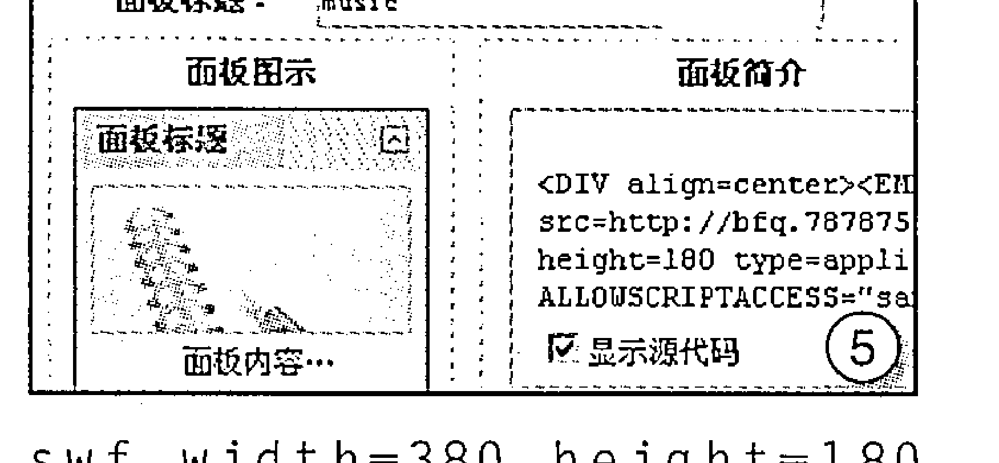

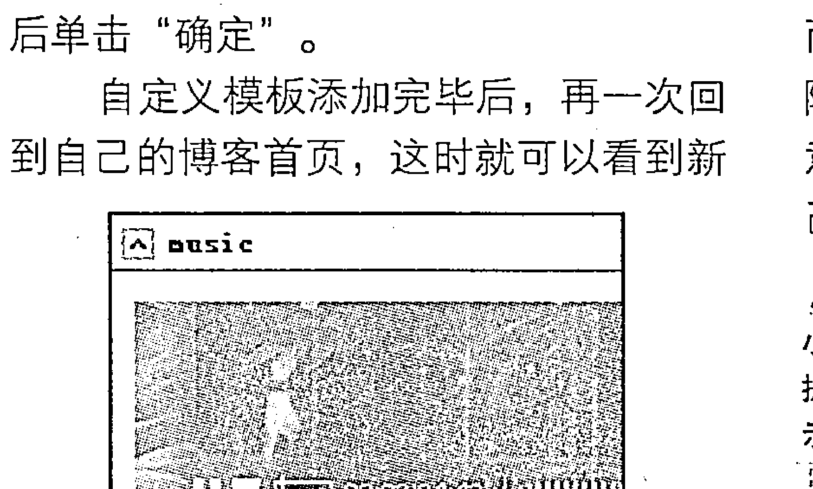

> > 添加音乐播放器时，大家也可以按照添加金鱼Flash特效的方法来添加，相信到时大家会有新的发现。但笔者认为将音乐播放器添加到博客的中间并不是很合适，当然，大家可以按照自己的意愿灵活选择。

### 三、QQ饰物全免费

喜欢在QQ空间安家的朋友对各种QQ饰物相信一定不会陌生，利用它们可以把自己的小窝打扮得很漂亮，但那些QQ饰物是要用QQ币买的，能够免费使用的各种QQ饰物几乎没有。那么，那些QQ饰物在新浪博客上是否能用呢？答案当然是肯定的，下边就给大家介绍一下如何享受这道免费大餐。

- 第一步：先登录自己的QQ空间，单击“立即装扮QQ空间”进入“QQ空间商城”，再单击“装饰”旁边的下拉箭头，选择“漂浮”，进入到“漂浮”界面（如图7），在这个窗口中双击自己喜欢的QQ漂浮物，就可以预览到QQ漂浮物的效果了。
- 第二步：右击QQ空间中预览到的QQ漂浮物，选择“属性”，打开“属性”窗口，这时就可以看到该QQ漂浮物的链接地址了（如图8），将图8窗口中QQ漂浮物的链接地址复制到一个记事本中备用。
- 第三步：当选择预览某一种类的QQ漂浮物时，会看到QQ空间中有三个QQ漂浮物，再按照第二步的方法获得其它两个QQ漂浮物的链接地址，并复制到一个记事本中。接着按照同样的方法，再选择预览自己喜欢的其它类别的QQ漂浮物，并获得它们的链接地址，最后将链接地址复制到一个记事本中备用。
- 第四步：在一个记事本中输入以下内容：

```
<DIV style="LEFT: 10px; POSITION: absolute; TOP: 100px" align=left></DIV></IMG>
```

代码说明：http://cnc.imgcache.qq.com/qzone/space_item/orig/11/22571_1.gif是刚才获得的QQ漂浮物的链接地址，大家可以将这个地址替换成自己获得的刚才备份好的QQ漂浮物的链接地址。
- 第五步：替换完成了自己获得的某个QQ漂浮物的链接地址之后，复制记事本中的代码，在“</IMG>”末尾回车，并粘贴复制的代码，再将复制的代码中的QQ漂浮物的链接地址替换成自己获得的其它QQ漂浮物的链接地址。最后，重复这个过程，直到完成所有QQ漂浮物链接地址的替换工作。
- 第六步：按照添加金鱼Flash动画的方法，再发布一篇博客文章，并将自己编辑好的代码粘贴进来。博客文章发布之后，返回自己的博客首页就可以看到添加的QQ饰物了（如图9）。

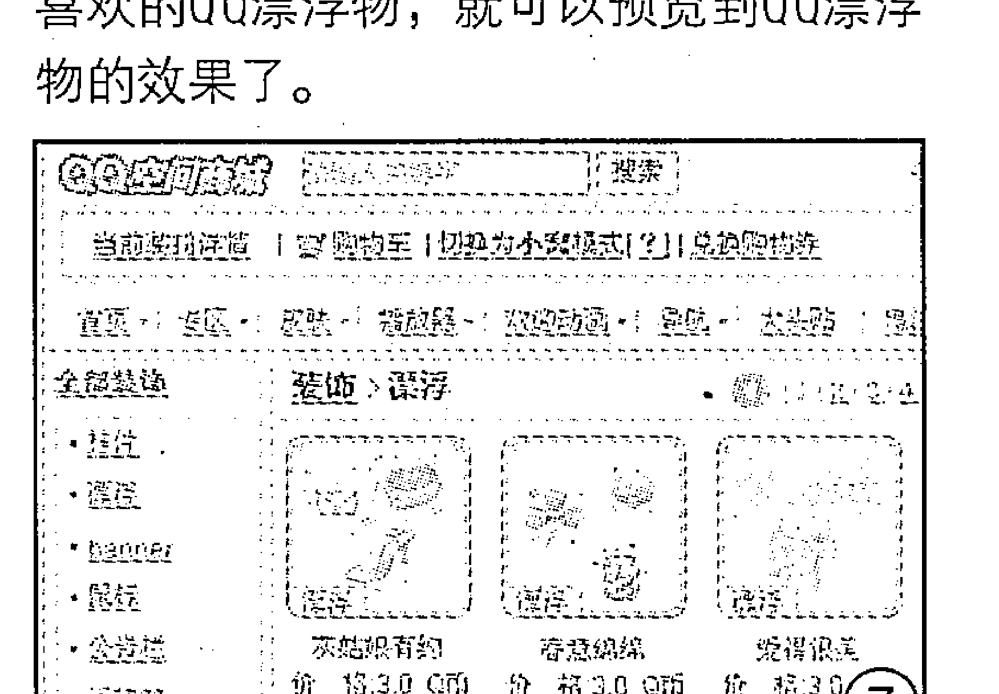

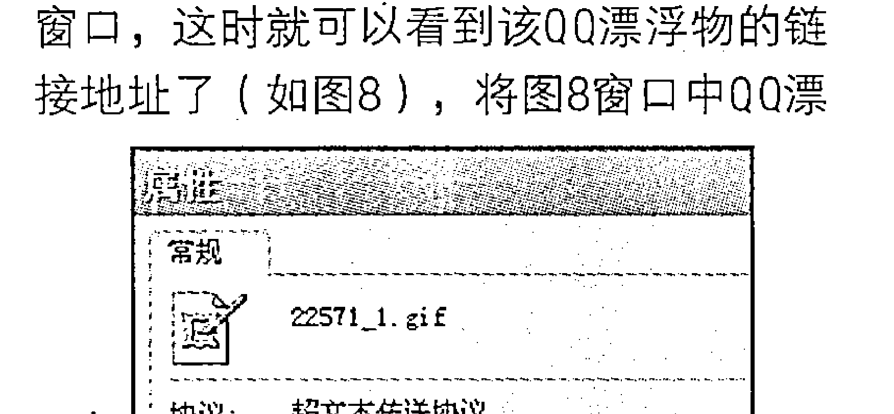

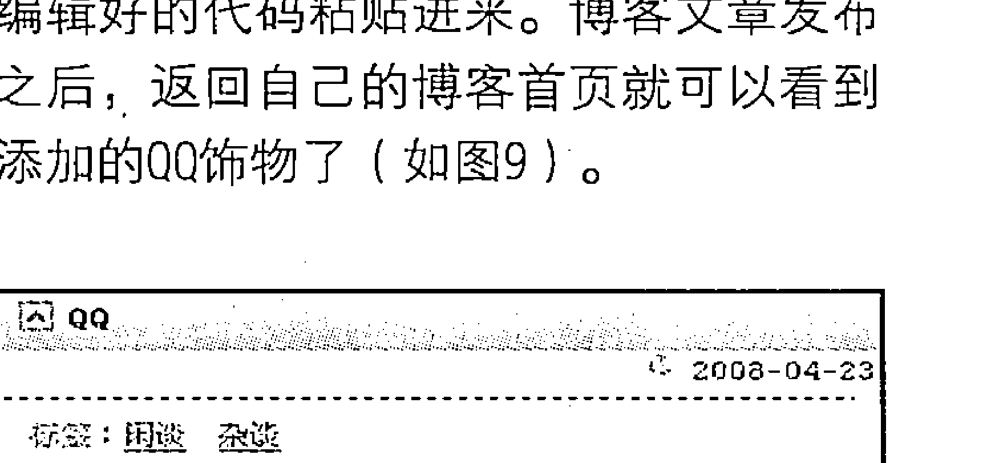

以上是笔者在美化自己博客过程中得到的一点小经验，大家在美化博客的过程中，可以按照自己的喜好，有选择地借鉴使用。祝愿大家博客的访问量是芝麻开花——节节高！

### 重装Windows XP系统不再需要激活

如果你需要重装Windows XP，通常必须重新激活。事实上只要在第一次激活时，备份好Windows\System32目录中的Wpa.dbl文件，就不用再进行激活的工作了。在重装Windows XP后，只需要复制该文件到上面的目录即可。

### 如何知道自己的Windows XP是否已激活

打开开始→运行，在弹出的对话框中输入：oobe/msoobe /a，回车后系统会弹出窗口告诉你系统是否已经激活。

## 让桌面天天换新颜

□ 阎 皓

无论多美的桌面壁纸，如果要是天天看的话，一定会产生审美疲劳。所以要经常更换一下桌面壁纸，从而改变自己的心情。大家都知道，更改桌面壁纸非常简单，在显示属性中就可以进行更改。但要想自动更换桌面壁纸，就得借助第三方软件才可以。这里给大家介绍三款自动切换桌面壁纸的软件，利用这些软件，就可以随时自动更换自己的桌面。

## WaterWall

WaterWall最大的特点就是操作非常简单，就算是第一次使用也很容易上手。在第一次运行WaterWall的时候，会扫描电脑中的图片（图1），选择好图片所在路径之后，点击确定按钮就会扫描出所在目录下的所有图片，并且以列表的形式显示出来（图2）。在图片列表的右边，可以设定每张图片的映像风格。包括默认、居中、平铺、适合屏幕、充满屏幕、活性伸缩和万花筒七种风格，可以选择自己喜欢的。都选择好之后，点击WaterWall主界面执行→更新桌面按钮，就会将桌面变成事先设定好的图片。并且每隔15分钟之后，就会更换新的图片。如果觉得15分钟这个时间比较长或短，可以在设置中更改时间。最短为10秒钟，最长为1个小时。


| 软件名称 | WaterWall 5.0 |
|---|---|
| 软件大小 | 725KB |
| 软件性质 | 免费软件 |
| 适用平台 | Windows 2000/XP |
| 下载地址 | http://cnc.skycn.com/soft/2386.html |

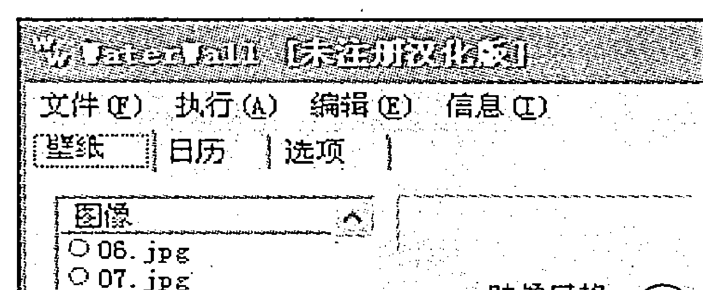

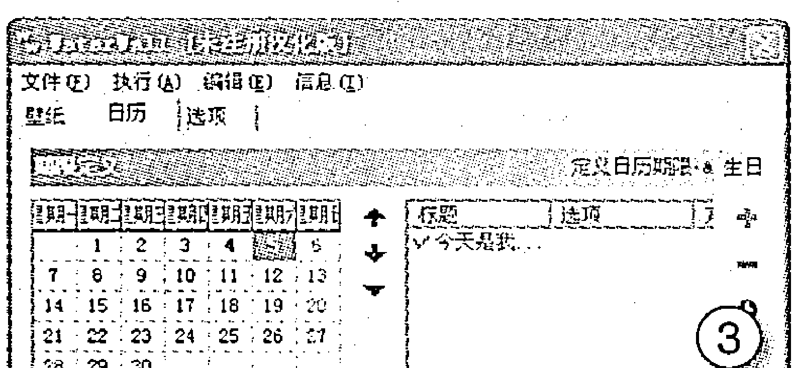

WaterWall除了可以自动更换桌面壁纸之外，还可以给桌面添加日历。先在选项中设置日历的样式，样式设置好之后，进入日历选项，添加提醒事件（图3）。添加好之后，回到桌面，就会发现日历已经放到桌面上了，并且上面还有实现添加到提醒事件。

| 软件名称 | 壁纸魔术师 1.1 Build 0104 |
|---|---|
| 软件大小 | 1.04MB |
| 软件性质 | 免费软件 |
| 适用平台 | Windows 2000/XP |
| 下载地址 | http://www.xdowns.com/soft/15/193/2008/Soft_39960.html |

## 壁纸魔术师

壁纸魔术师与其他同类软件最大的不同是可以将壁纸合成加工成带有天气预报，带有本机信息，带有公告还有日历信息的透明效果的壁纸，并且信息随时进行更新，无须手动更改。壁纸魔术师是一款绿色软件，随意解压到任意目录后就可以使用。

在壁纸魔术师的主界面中，有一个虚拟桌面，跟传统桌面一样。在显示模块中添加放在桌面上的模块，并且可以用鼠标随意拖拽已经添加的模块（图4）。在模板中，选择一款适合自己的模板。最后点击载入壁纸文件按钮，来添加壁纸。

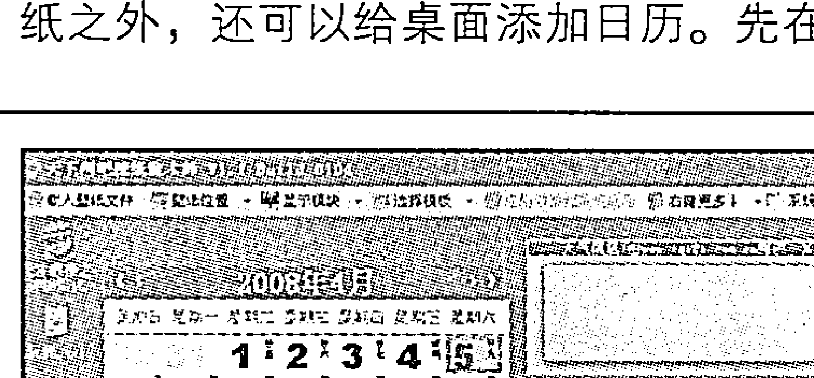

都选择好之后，点击壁纸魔术师主界面的应用到系统桌面按钮，就会将虚拟桌面的设置完全转移到现实桌面中。要是选择系统启动时自动更换壁纸这个选项，就会在每次开机的时候随机更换桌面壁纸，并且其中的天气预报和日历数值也实时进行更换，显示当前的温度和日期。

| 软件名称 | 雪狐酷壁精灵 2.0 |
|---|---|
| 软件大小 | 1024KB |
| 软件性质 | 免费软件 |
| 适用平台 | Windows 2000/XP/Vista |
| 下载地址 | http://www.xdowns.com/soft/15/193/2007/Soft_38120.html |

## 雪狐酷壁精灵

雪狐酷壁精灵也是一款非常优秀的自动更换桌面壁纸的软件，跟前面软件不一样的是，它主要是以网络壁纸为主。雪狐酷壁精灵具有极丰富的网络壁纸库，一共十二大分类，支持手动下载新壁纸，无须再为寻找壁纸而发愁。

先启动雪狐酷壁精灵，然后点击设置按钮，先选择壁纸分类，下面选择壁纸切换的间隔时间，从30秒到30分钟可供选择。设置好之后，就会按照指定的时间来更换桌面壁纸。并且雪狐酷壁精灵采用智能边框快速切边技术，能自适应各种流行的显示器尺寸。除了可以自动切换网络上的图片之外，还可以添加本地的图片。

## 不用专业软件 用SnagIt制作网页相册

□闫 皓

一提到截图软件，大家首先会想到SnagIt，确实SnagIt是一款非常优秀的截图软件。SnagIt除了可以截图之外，还可以制作网页相册。这样可以把自己喜欢的照片全部做成网页相册，发布到网上，跟好友一起来分享。

第一步：将要制作网页相册的照片保存在同一目录当中，然后启动SnagIt，进入图库浏览器中。在左边选择照片的所在目录，然后在SnagIt菜单中选择工具→创建Web页（见图1）。

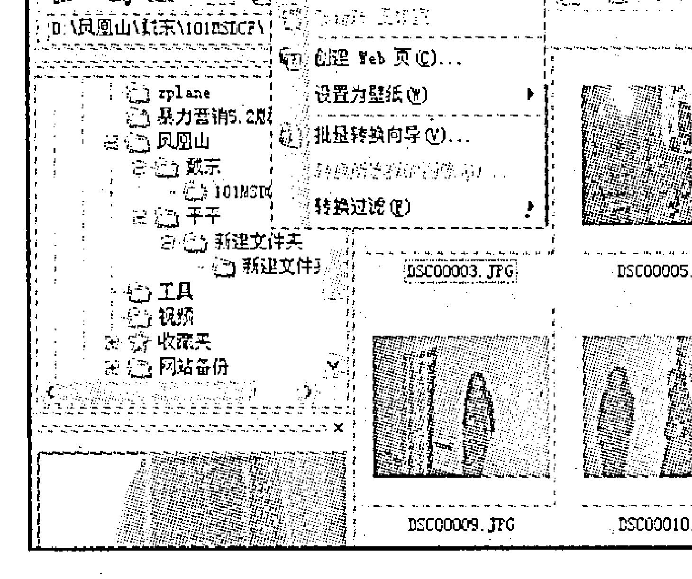

第二步：在网页相册中设置标题、主题和背景，标题页可以随便起，只要跟照片相符合即可。主题包括酷阴影、斑纹、复视觉、幻灯片、列表、缩略图，可以选择一个适合自己的样式（见图2）。而相册背景可以选择图像、固定色和纹理，单击“添加文件”按钮为相册添加背景图片。完成后点击“下一步”按钮。

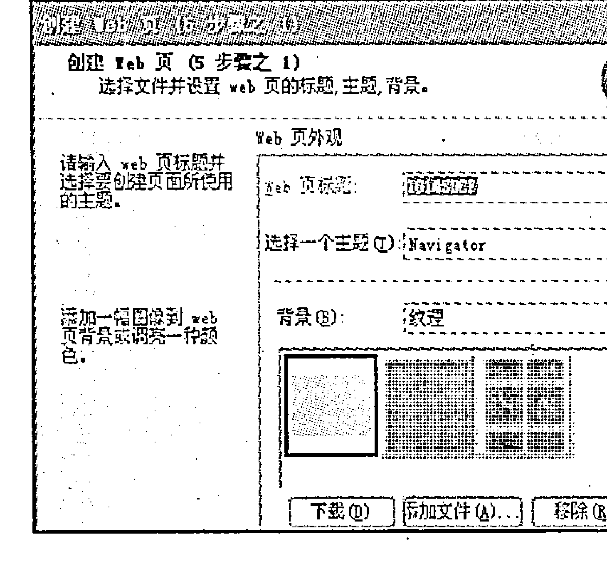

第三步：接下来设置相册中的源文件图片路径，选定成品相册的输出目录，点击“下一步”按钮继续操作（见图3）。然后设置缩略图像的相关选项，包括缩略图像的文件格式、颜色、质量等（见图4），点击选项按钮，还可以设置图像的质量，由于是缩略图所以不用设置太高的质量，可以适当降低一些图片质量，从而提高网络传输速度。

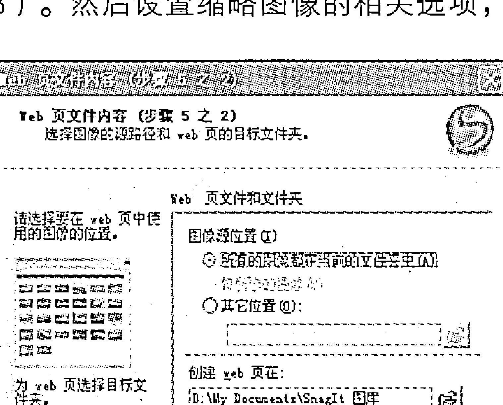

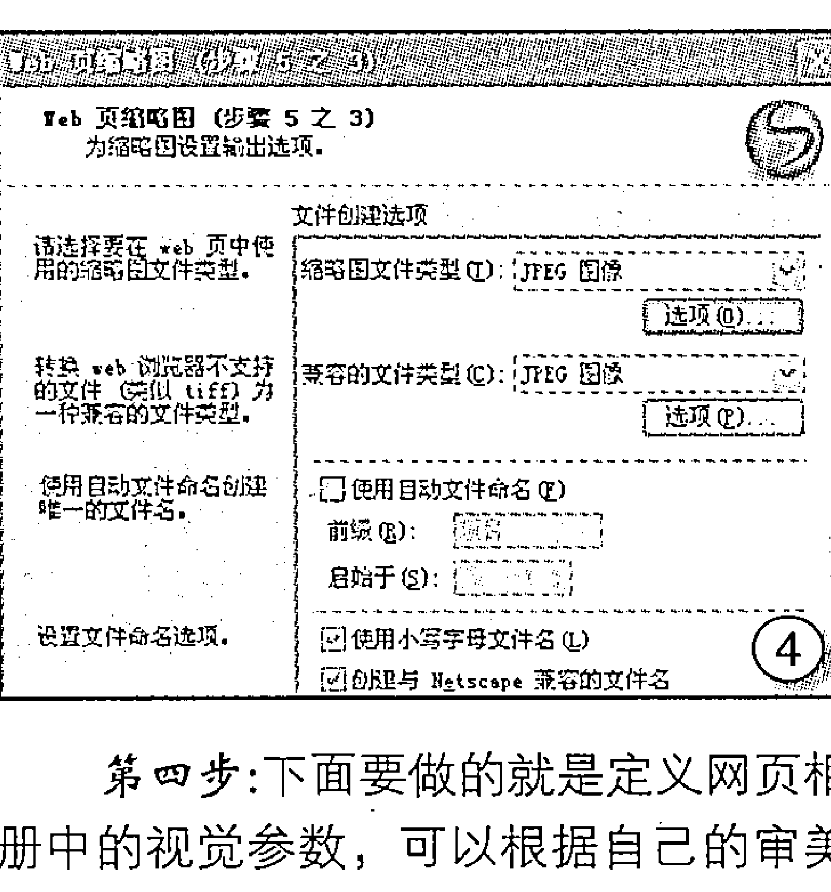

第四步：下面要做的就是定义网页相册中的视觉参数，可以根据自己的审美习惯来定义相册的外观、超链接和缩略图的边框大小、字体和背景色，如果对这方面不是很了解，可以按照默认设置（见图5）。最后设置的是网页相册的切换特效，一共有13种特效可供选择。选择好特效之后，在下面设置特效参数，都完成后点击“完成”按钮就生成网页相册（见图6）。

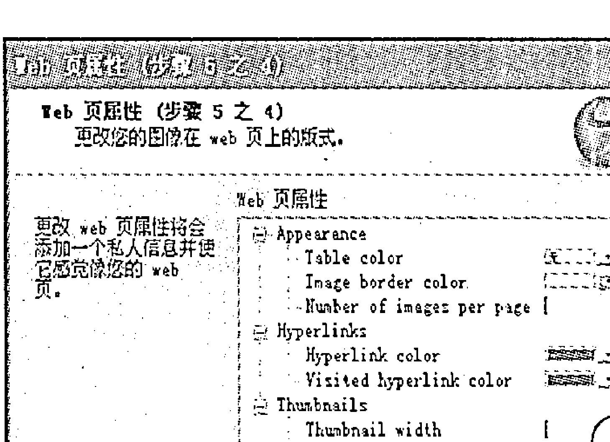

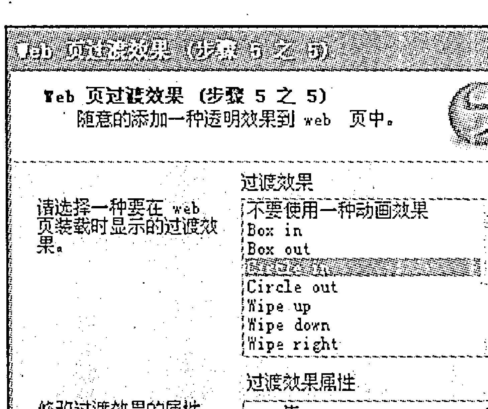

这样网页相册就制作好了，是不是觉得很容易。那你还等什么，赶快用SnagIt也做一个网络相册吧，可以将自己喜欢的照片都以网页相册的形式发布到网上去，好让更多人一起来分享（见图7）。

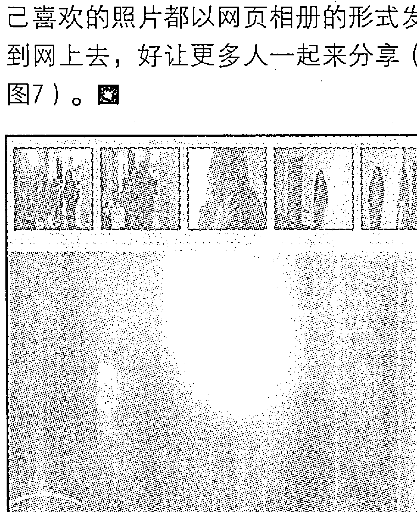

## 雇一个免费秘书
## 用 Freebie Notes 进行记事提醒

□闫 皓

「小王是一个办公室职员，每天要处理很多事情。但是小王的记忆并不是很好，经常有要做的事情忘记。为了这事，经理没少批评他。小王为了让自己更好地记忆，在电脑旁边贴了很多小贴，上面记着要做的事情。开始的时候还真管用，不过到了后来小贴多了，依然有忘记的事情。一直到发现一款名字为Freebie Notes的软件，Freebie Notes允许你创建在你的电脑桌面上显示的用做提醒的记录，小王以后再也没有忘记过事情。」

软件名称：Freebie Notes(桌面即时贴) 3.17
软件大小：1.56 MB
软件性质：免费软件
适用平台：Windows 2000/XP/Vista
下载地址：http://www.crsky.com/soft/9542.html

先将Freebie Notes安装在电脑上，然后就可以使用。在第一次使用Freebie Notes的时候，先要设置语言，我们设置成中文。然后在Freebie Notes主界面中点击“新建便条”按钮，就可以建立一个记事提醒（图1）。譬如小王下午要用Foxmail收取公司的邮件，就可以用Freebie Notes建立一个新的便条。在上面输入提醒的信息，然后在下面设置提醒设置，选择日期时间，输入具体的日期和时间（图2）。

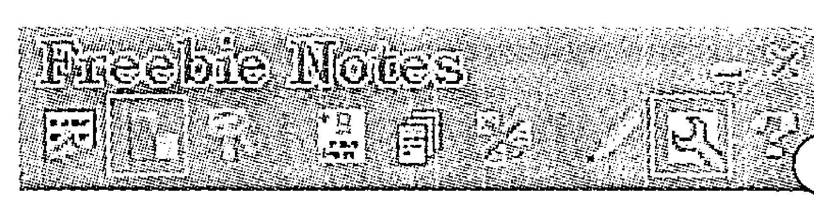

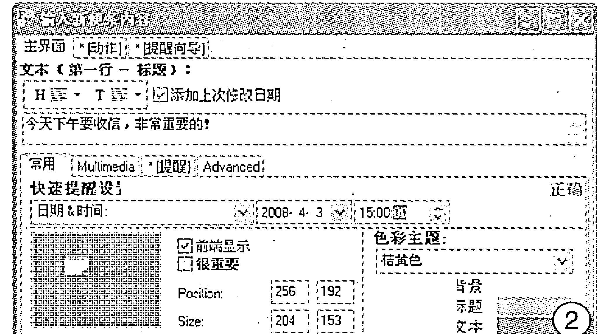

上面都设置好之后，点击“动作”按钮，来设置启动的程序。点击浏览按钮，选择提醒后要运行程序的快捷方式，并且可以在下面添加运行参数。为了避免到时候启动失败，可以点击测试程序按钮来看看程序是否能正常运行（图4）。除了可以运行程序之外，还可以打开指定的网页。

输入好上面的信息之后，点击Multimedia按钮，来设置提醒声音。在Freebie Notes中只支持WAV格式的音频，选择好声音后，可以点击测试按钮来进行试听（图3）。

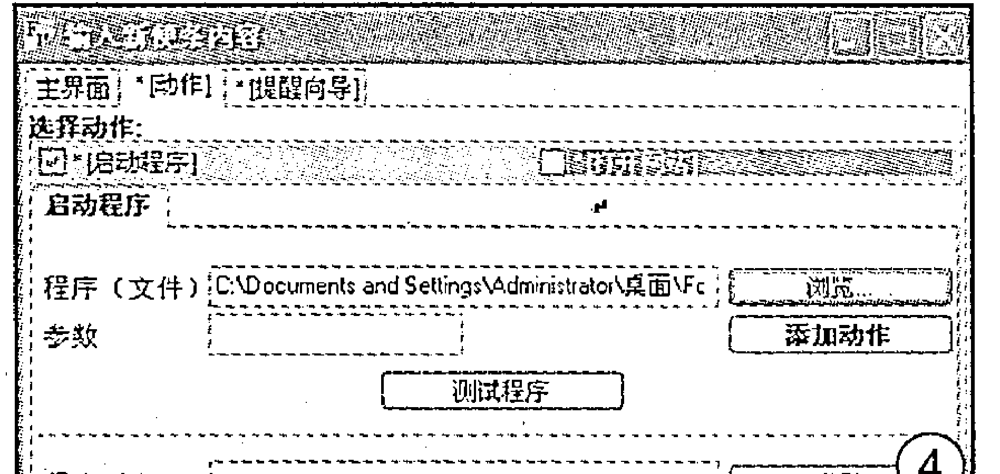

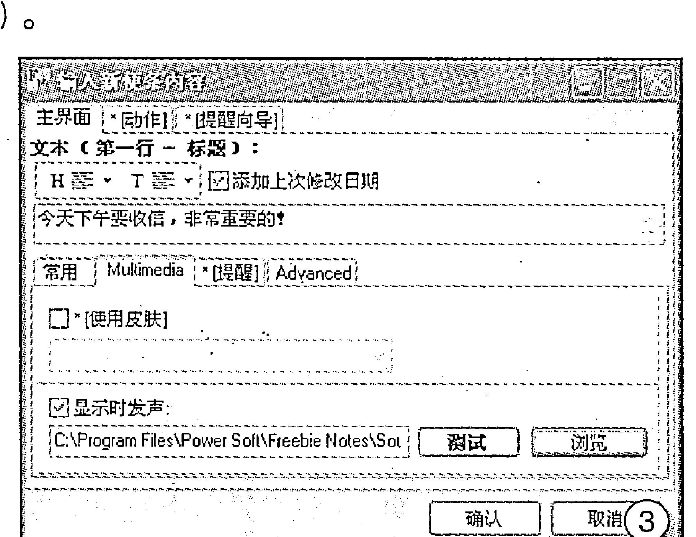

接下来进入提醒向导中，来设置开始结束时间和重复方式。如果提醒的事件仅一次，就不用进行设置。如果每周或每个月都需要提醒的话，就可以选择相对应的周期（图5）。周期选择好之后，点击确定按钮完成。这时候添加好的便条就会在显示桌面上（图6），用同样的方法可以添加多个便条。小王自从用了Freebie Notes之后，工作效率明显提高，基本上就没有忘记的事情。如果你跟小王一样，老是忘记事情，那么不妨用用Freebie Notes，相信一定不会让你失望的。

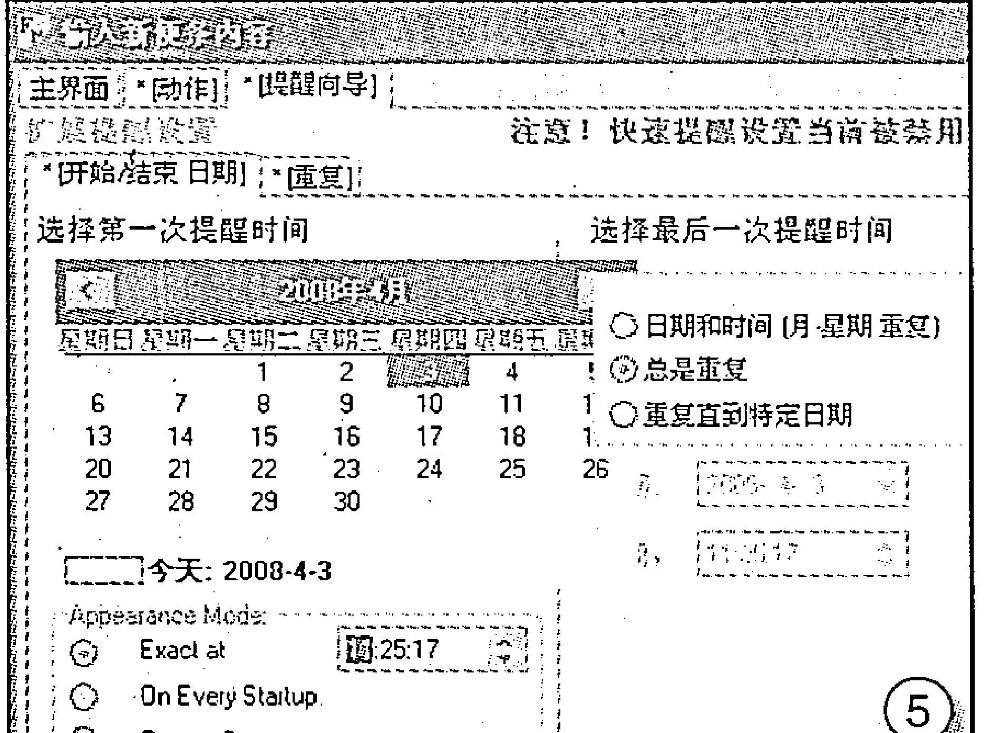

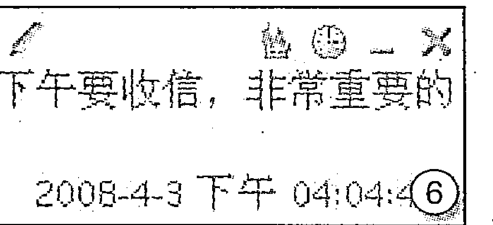

## 批量转换图片格式
## 阎皓

现在有越来越多的人都拥有数码相机，这样出去玩的时候就可以尽情地拍摄照片。等回来的时候，可以将照片上传到网络当中，跟好友一起来分享。不过问题出现，现在数码相机的像素都非常高，每张照片都有几MB之大，而网络通常只能上传几百KB的图片。这就需要对照片进行格式上的转换，或者压缩。通常情况下是用Photoshop，不过仅仅是修改图片格式或进行压缩操作，用Photoshop有点大材小用。并且Photoshop不支持批量操作，如果要修改多张图片，就比较麻烦。我们可以利用Image Converter One这个小工具，来批量转换图片格式。

Image Converter One是一款绿色软件，随意解压到任意目录后就可以使用。在Image Converter One的主界面中可以添加要处理的图片，几乎常用的都支持了（bmp、jpg、gif、png、tif、tga和pcx等）。一次可以添加多张，并且还可以选择图片所在的目录（图1）。选择好的图片会在下面以列表的形式显示，并且显示图片的基本资料。

- 软件名称：Image Converter One(改图快手) 1.009
- 软件大小：905KB
- 软件性质：免费软件
- 适用平台：Windows 9x/2000/XP/Vista
- 下载地址：http://www.newhua.com/soft/62205.htm

除了可以改变图片的格式和大小之外，还可以给图片添加水印。这样辛苦上传的照片，就不会被其他人盗用。Image Converter One给图片添加水印很简单，在主界面设置选择“处理”→“创建数字水印”，就可以给图片添加水印。在添加水印设置中，左边添加水印内容，并且可以改变字体的大小、颜色和阴影等设置。而且Image Converter One采用了即时预览，添加水印之后，可以在右边的预览区域显示水印效果（图5）。Image Converter One除了可以添加文字水印之外，还可以添加图片水印，方法跟前者相同。

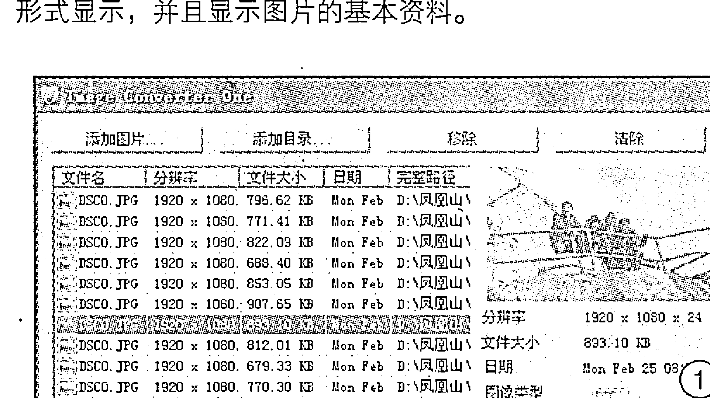

图片选择好之后，在Image Converter One 主界面中选择“处理”→“改变图片大小”（图2）。进入输出格式选项，选择图片格式、插值方式和图片大小（图3）。而且在Image Converter One中有一个非常人性化的设计，如果图片尺寸变小，可以用一种填充色来弥补空白处。设置好之后点下一步按钮，进入输出设置。在这里选择图片处理后保存的路径，如果跟原文件为同一路径，可以选择是否进行覆盖（图4）。都选择好之后，点击完成按钮就开始批量转换图片的格式和大小。


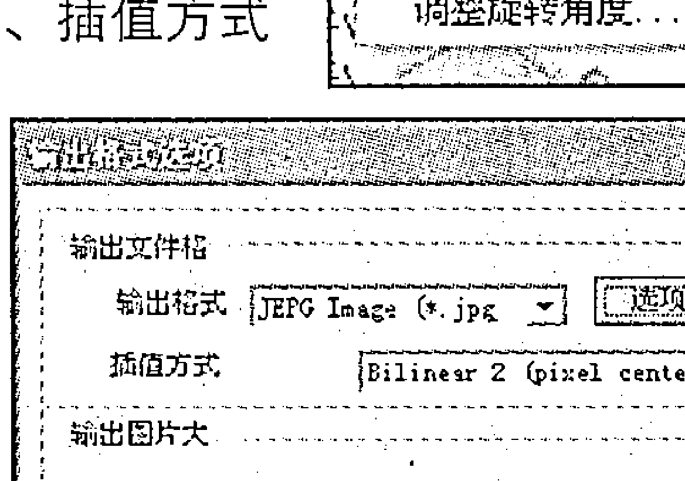

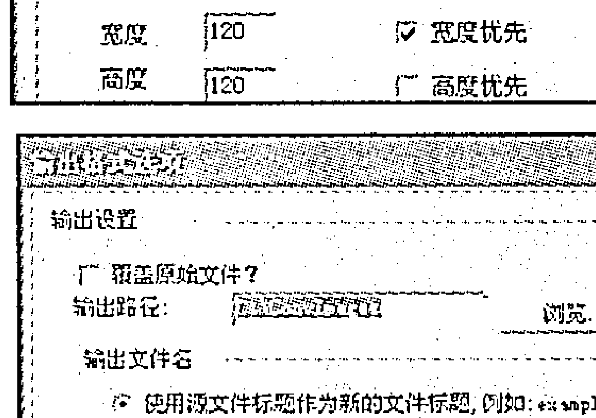

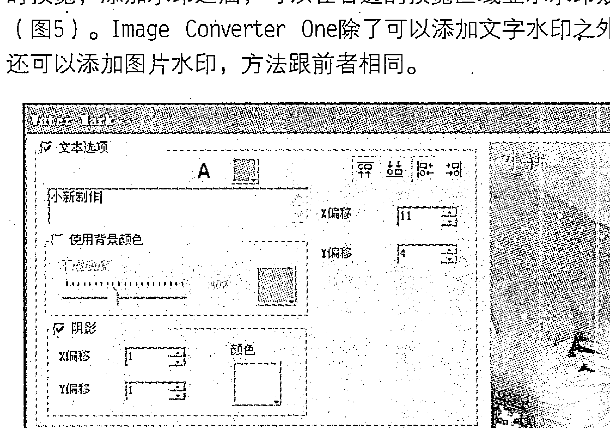

以后再拍完数码相片之后，可以用Image Converter One批量进行处理，并且保证压缩后的图片质量损失尽可能最小，可以跟广大网友尽情分享自己出游的快乐。

## 系统变慢，是谁在捣鬼
□1984年小巷

最近经常有朋友打电话给我，反映的问题只有一个，就是刚刚重作不久的操作系统，最近时快时慢。遇到这类问题，我的第一反应是中了病毒，毕竟现在是病毒肆意猖獗的时代，询问过后，无一例外地会对我说，查过整个硬盘，没有病毒。带着疑问的心情，我登门查看问题的所在。

在对系统进行了一番检查之后，轻松排除硬件的问题，病毒库又是自动更新的，系统变慢的原因在哪里呢，重新将目标定位于最近安装的软件，不出所料，果然是在运行这些软件时，系统的内存非常吃紧，而造成系统变慢的原因，竟然只是这些软件的某些设置问题。下面，我们一起看看问题都出现在哪里？

### 一、杀毒软件的设置

杀毒软件是我们的操作系统面对网络的第一道平台，失掉这层保护，我们的系统就完全暴露在病毒的危害中，可是很多人都在抱怨安过杀毒软件系统就变得非常慢，其实，我们完全可以根据自己的机器性能，设置适合自己的杀毒软件。我们以目前比较流行的为例。

普通的网友是按正常模式安装的卡巴斯基，安装完所有的设置都是默认的，我们可以看到，保护列表里的监控是全部打开的(图1)。

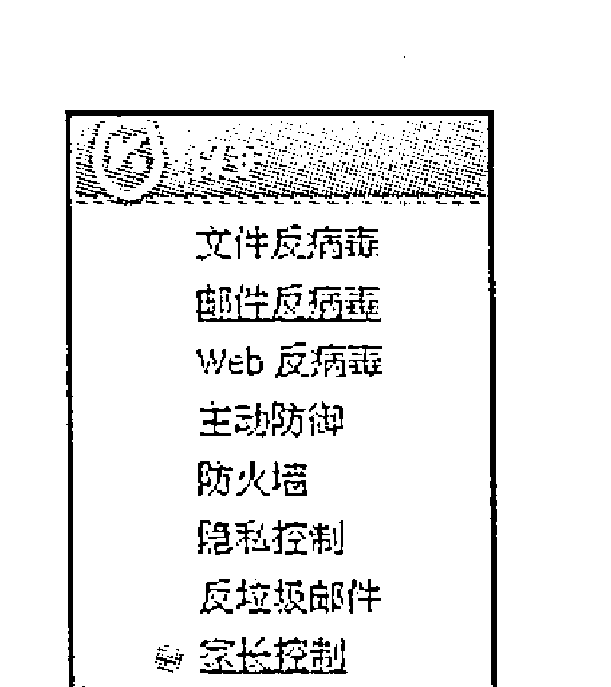

其实，列表里面的邮件反病毒、主动防御、隐私控制，反垃圾邮件及家长控制这几项对一般网友来说是没有任何作用的。可以根据情况选择关掉这几项，方法是，点击邮件反病毒，在右边配置选项里选择停止(图2)，当邮件反病毒的字体颜色从黑色变为灰色，就代表停止成功。

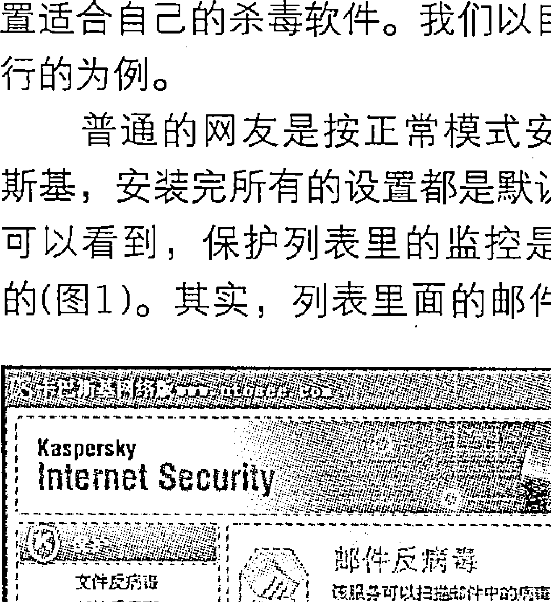

在默认设置下，我的任务管理器的内存显示为486M，停止部分监控之后(图3)，任务管理器内存使用从420M下降到399M；进程里的AVP.EXE也从60M下降到12M(图4)。

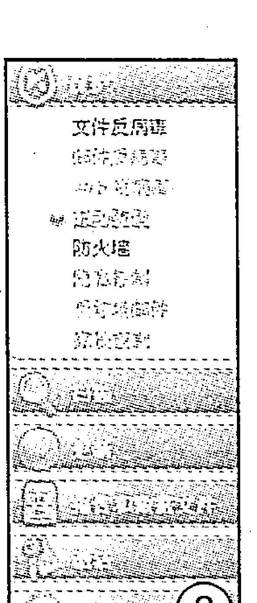

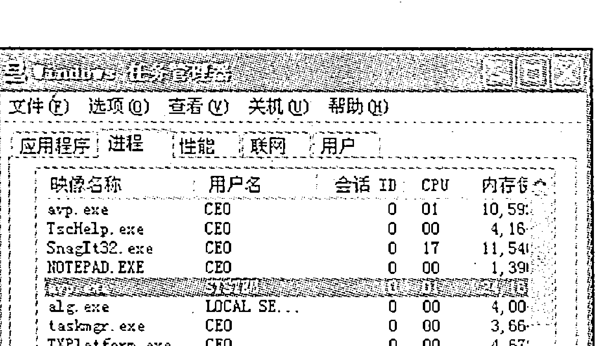

另外，杀毒软件的自动更新也是偷偷消耗内存的杀手，这是个杀毒的误区，一部分人是为了升级方便，也有人是想给自己一个安全感，正常的情况下，每三四天更新一下病毒库才是理性的作法。设置方法如下：首先打开卡巴斯基的设置页面，点击左侧列表中的更新选项，在运行模式下选择每1天，然后再点击它后面的更改，对天数和时间进行设置(图5)。

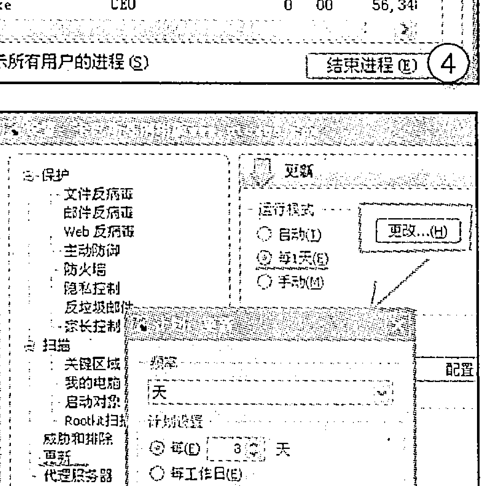

### 二、OFFICE软件的设置

更改过杀毒软件，我们再来看最最常用的办公软件，OFFICE已经成为办公室用途最广的软件了，可是大部分的时候，我们会发现，用过一段时间OFFICE也会变慢，还常常假死，这对我们的工作造成很大的麻烦。下面，我们从几个方面来了解一下，Word，为什么会使系统变慢。

第一个原因：以缺省方式安装Word，当我们以这种方式安装Word以后，就会有一个名为“文件检索”的文件被装入“启动”文件夹中，这个程序会在硬盘上建立一个“后台文件索引”，目的是加快文件检索的速度，但使用后台文件检索却会直接导致系统速度变慢。解决的方法如下：从“启动”文件夹中删除“文件检索”的快捷方式，然后打开“控制面板”，双击“文件检索”图标，删除所有列出的索引项。

第二个原因：自动保存的设置。不得不说，这是一个很实用的功能，使用它可以每隔一段时间自动保存一次文档，非常有效地防止我们因各种意外情况的关闭而丢失文档内容，将损失降到最低。但正是这个设置，会不知不觉地消耗掉一些系统资源，如果我们降低自动保存的频率，就可以达到减少资源消耗的目的，设置方法是：单击“工具”菜单中的“选项”，然后选择“保存”标签，在“自动保存时间间隔”中把时间设成自己需要的较为长一点的时间，这样就可以降低自动保存出现的频率，当然你也可以直接把它关闭，将“允许后台保存”复选框勾掉即可(图6)。

第三个原因：“拼写检查语法”功能引起的，当我们在编辑一个比较长的文档时，随着文字的录入，“拼写语法检查”会不时自动地从头到尾进行一次语法检查，随着文档的增长，检查的时间也会越来越长，当然，在每次检查的时候它都会占用大量的系统资源，导致系统在瞬间就变得很慢，还可能假死。最好的方法就是关闭这项功能，方法如下：先选择“工具”菜单下的“选项”，然后选择“拼写和语法”标签，关闭以下三项：“键入时检查拼写”、“键入时检查语法”和“随拼写检查语法”。还可以通过右单点“拼写和语法状态”(图7)来取消检查，当然，我们可以在编辑完文档后，选择“工具”菜单下的“拼写和语法”命令来重新检查一次。

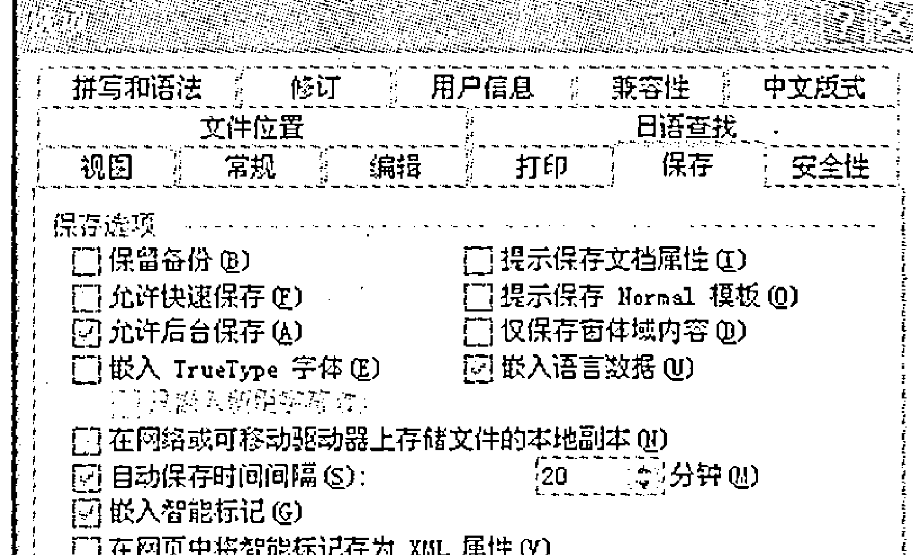

18行 13列 录制 修订 扩展 改写 中文(中国) 图7

盘,第二暂存盘设置为E ( 图8 )。

### 三、图像类软件的设置

说完办公软件，我们再来说说图像类软件，今天我们就用Photoshop来举例说明。

Photoshop是一款经典但庞大的图像处理软件，虽然它的安装对硬件配置要求并不高，但在处理图像的过程中要调用足够的内存及生成大量的临时文件。在我们安装Photoshop之后，系统的默认设置并不能满足软件流畅运行要求，这就需要我们重新对它进行设置。

#### 1. 设置暂存盘

在安装后默认情况下，Photoshop使用安装操作系统的分区C盘作为第一暂存盘，但C盘由于要安装和卸载一些软件，容易产生磁盘碎片，这会降低Photoshop运行速度。所以最好选用其他分区作为第一暂存盘。

设置方法：首先选择菜单栏的编辑→预设——增效工具与暂存盘，在弹出的“预置”对话框里，将第一暂存盘设置为非系统C

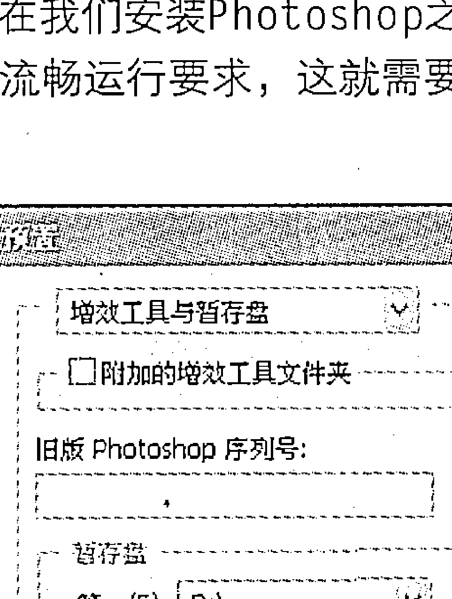

#### 2. 配置高速缓存和系统内存

首先选择菜单栏的编辑——预设——内存与图像高速缓存，在弹出的“预置”对话框里，我们先要调整图像高速缓存的级别，在“高速缓存级别”文本框中输入1~8之间的值。较高数值可以造成更多高速缓存和更快屏幕重画，但也占用更多的硬盘空间和内存，并且会增加打开文件的时间，因此我们可以降低这个值。如果想分配给Photoshop更多的可用内存，在“内存使用情况”选项组中的“Photoshop占用的最大数量”文本框中输入百分比。百分比越高，应用滤镜特效时速度会相对较快。此处将图像高速缓存级别设置为5，分配给Photoshop 80%的可用内存百分比（图9）。注：如果想流畅地运行Photoshop，最好不要同时运行其他占用内存较大的程序。

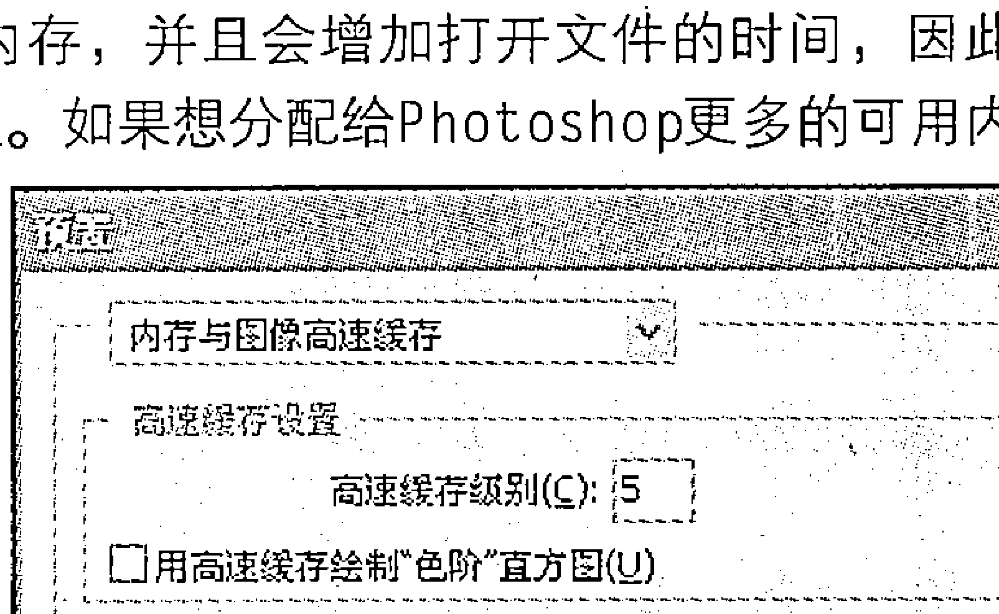

### 四、下载类软件的设置

通常，大部分网友都很喜欢使用迅雷来作为下载工具，因为它的下载速度非常快，不过迅雷给我们带来的困扰也不少，很多时候，只要启动迅雷，我们的系统就会变慢，或者是刚刚下完一个电影，整个屏幕就处于假死状态，对于这个让我们又爱又恨的软件，一定要扬长避短。那么，应该如何对其行优化设置呢？

首先，我们打开迅雷的“工具”菜单，选择其中的配置选项，这时会弹出一个窗口，在左边有一个列表，点击列表中的每一项，在右边就会出现相应的设置，下面，我们就开始优化。

第一步：迅雷常规设置：磁盘缓存不要太大，很多人觉得这个越大，对硬盘保护越好，其实不然，设置太大将占用更多的物理内存，也将影响系统的执行速度，建议内存512M以下的用户设置低于2048k即可。

第二步：迅雷连接设置：最多同时进行的任务减少到2-5个，避免大量文件同时下载加重系统的负担。上传速度降低到10KB/S以内，虽然迅雷提示限制上传速度可能影响下载速度，但事实证明，上传速度在10KB/S时，2M带宽的下载速度仍然可以达到90KB/S，因此推荐更改，这样同时也减轻了硬盘的消损。

第三步：下载安全设置：关闭“启用下载完查杀病毒”选项，系统中杀毒软件的实时监控完全可以对下载中和下载后的病毒文件进行处理，当下载完一个大文件时，迅雷自动进入杀毒状态，如果用户正在运行其它稍大的程序，完全会造成系统的变慢或者假死。

总结：看了上面关于软件设置方面的文字，是否对你有些帮助？其实，当我们安装完一个新的软件，了解该软件默认设置都有哪些功能是必不可少的，日常生活中，只要我们对软件多一点了解，定时对系统的垃圾文件进行清理，电脑的运行速度一定会变快的。

## # Easy GIF Animator 4
### 快速制作动画

现在有很多QQ动画表情都非常有意思，发给自己的好友一定很受欢迎。不过大部分的QQ动画表情都是在网上下载的，比较千篇一律，没有什么新意，要是能自己制作动画就好了。不过制作动画并不简单，首先要有专业的知识，并且还要掌握那些复杂的软件。如果想快速制作QQ动画表情，可以试试Easy GIF Animator 4这款软件，利用它可以快速制作出Gif格式的动画图片，生成的Gif文件称得上高压缩比高画质。下面就一起来看看，如何用Easy GIF Animator 4快速制作动画。

Easy GIF Animator 4采用的是傻瓜式操作，就算是第一次使用这款软件也很容易上手。在Easy GIF Animator 4的主界面上有操作向导，提示你想做些什么？点击“创建新的动画”按钮来制作动画（图1）。进入动画向导后，首先要添加图片，支持JPG、BMP和GIF三种格式的图片，一次可以添加多张（图2）。图片添加好之后，可以按上下箭头来改变位置。

接下来点击下一步按钮，来设置动画循环次数、每帧画面持续时间、显示位置等具体参数（图3）。都设置好后，点击完成按钮，动画就基本创建完毕（图4）。

然后要做的是给图片进行简单的编辑，可以给图片裁剪、添加注释、设置透明度，根据图片的具体情况来进行编辑（图5）。

在设置好上述东西后，下面设置一下图片的过渡效果。在Easy GIF Animator 4中提供了幻灯片、彩虹、旋转、淡出等几种过渡效果，在下面设置过渡的速度及方向（图6）。设置好后，点击确定按钮。

下面在Easy GIF Animator 4主界面中点击播放按钮，来预览编辑好的动画，如果发现有什么问题，可以随时进行修改。要是觉得没有问题，可以将制作好的动画进行保存。在Easy GIF Animator 4中支持GIF、AVI和SWF三种格式。由于我们制作的是QQ动画表情，所以保存为GIF格式。以后不用再羡慕别人有趣的QQ动画表情，用Easy GIF Animator 4就可以轻松地制作出动画，并且效果一点不比那些专业的软件差。

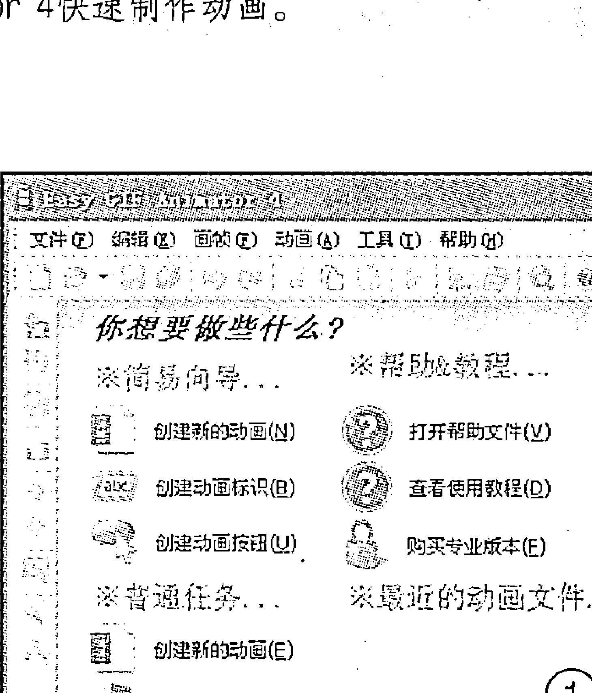

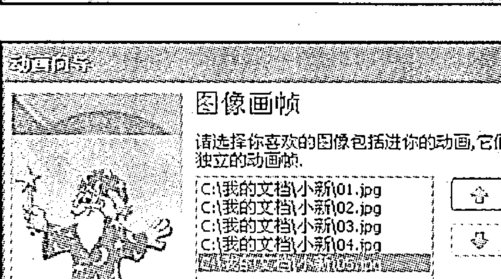

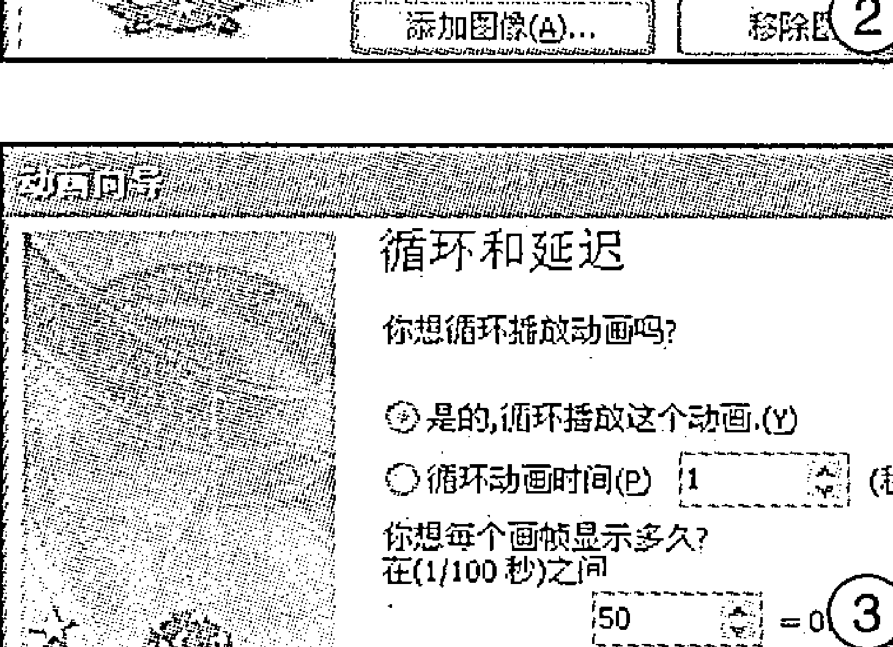

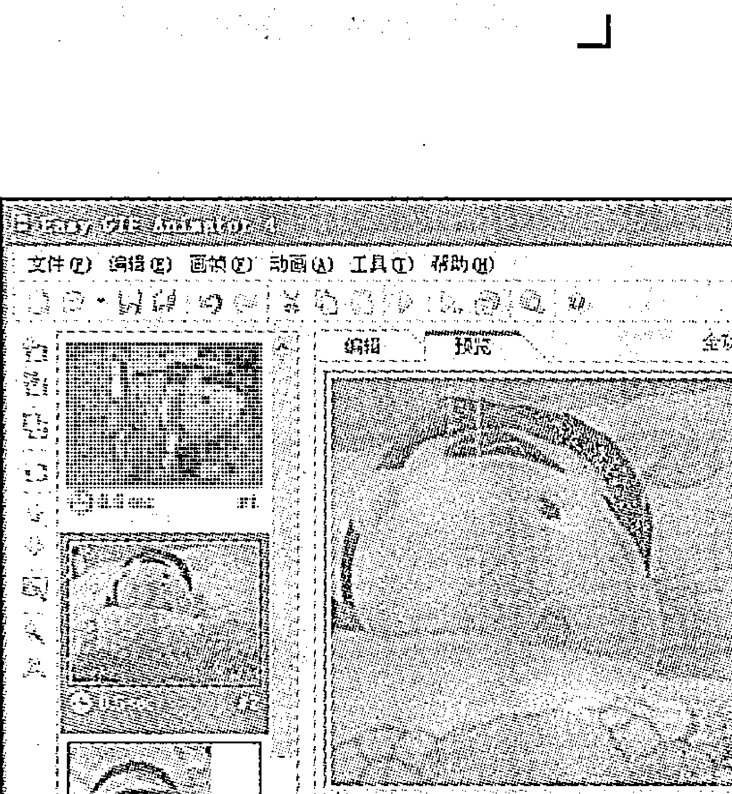

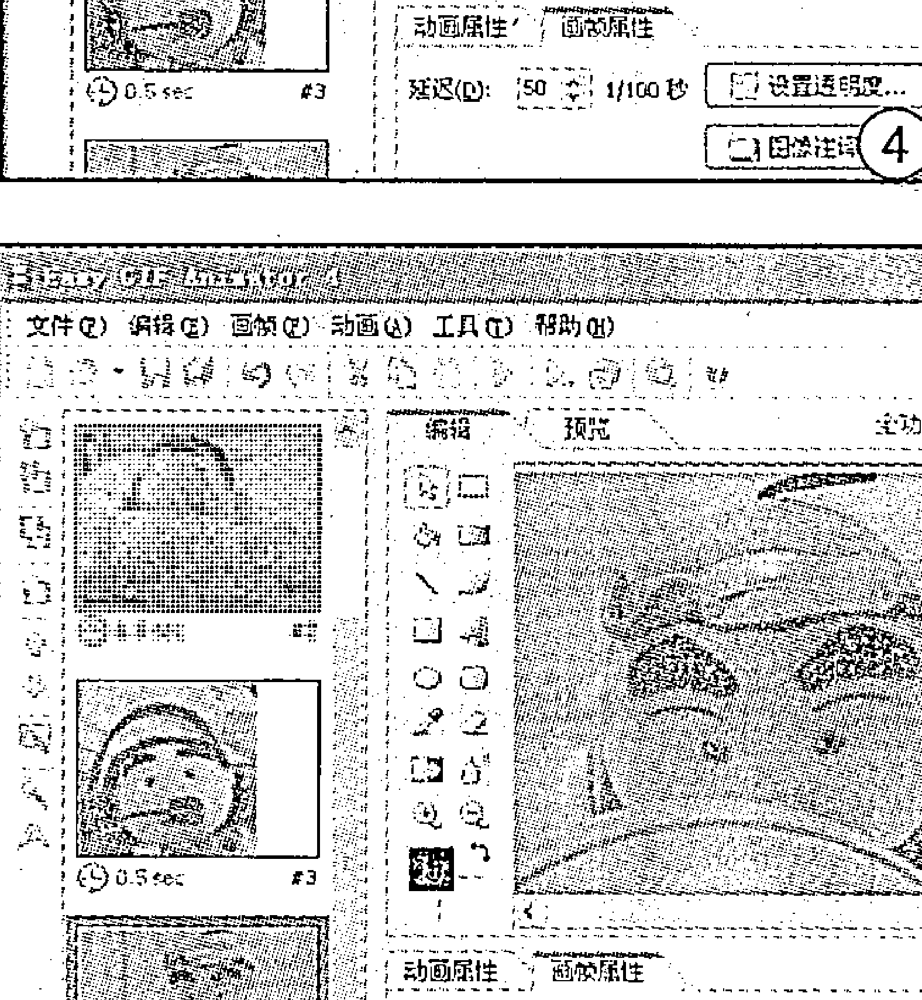

| 属性 | 内容 |
| :--- | :--- |
| 软件名称 | Easy GIF Animator 4.4.0.32 汉化版 |
| 软件大小 | 2765KB |
| 软件性质 | 免费软件 |
| 适用平台 | Windows 9x/2000/XP |
| 下载地址 | http://www.onlinedown.net/soft/32735.htm |

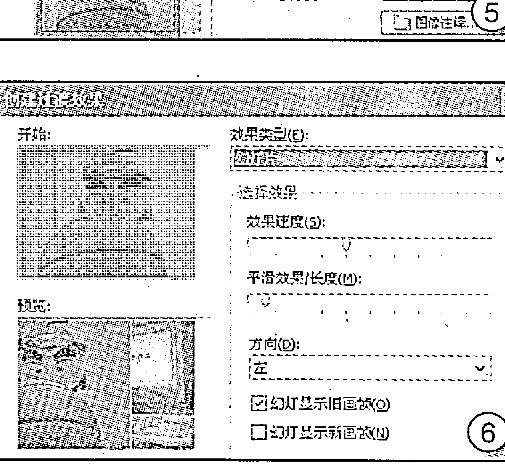

## # WMP11
### 打造智能媒体管理新概念

Windows Media Player是软件巨头微软公司基于DirectShow基础之上开发的媒体播放软件，微软将它设计成在电脑和Internet上播放和管理多媒体的中心，是微软统一媒体市场的利器。它提供最广泛、最具可操作性、最方便的多媒体内容。利用它可以播放很多的文件类型，包括ASF、WMA、WMV、MPEG-1、MPEG-2、WAV、AVI、MIDI、VOD、AU、MP3文件等等，还可以播放CD、VCD和DVD光盘，收听世界范围内的网络广播电台，播放Internet上提供的电影。

事实上，Windows Media Player就是微软推出的优秀的多媒体播放机。利用它，我们可以在Windows上轻松愉悦地发现、播放和利用数字媒体。不过，现在的WMP已经发展成了一个多媒体软件套件的概念了，不再局限于简单地播放了。而且，它在对音频及便携设备（Portable Devices），如MP3 Player上就有很多的亮点。

### 下载并安装WMP11

从http://www.microsoft.com/downloads/details.aspx?FamilyID=1d224714-e238-4e45-8668-5166114010ca&DisplayLang=zh-cn处可以下载到Windows Media Player 11 for Windows XP（以下简称WMP11），得到wmp11-windowsxp-x86-zh-cn.exe，双击安装之。

同时，Windows Media Player 11与网络连接很紧密，所以我们最好从http://www.microsoft.com/downloads/details.aspx?FamilyID=9ae91ebe-3385-447c-8a30-081805b2f90b&DisplayLang=zh-cn处下载Windows Internet Explorer 7 for Windows XP SP2，得到IE7-WindowsXP-x86-chs.exe，并安装之，然后重新启动计算机，使之生效。

### 让它支持更多格式

使用过Windows的人对驱动程序一定不陌生，因为它是硬件赖以正常工作的必要条件。但是你知道吗？在Windows中有些软件也需要驱动，尤其是那些多媒体格式的文件，如果在Windows下不“驱动”的话，同样无法播放。

由于种种原因，Windows Media Player一直无法播放RMVB、MP3Pro、DVD及全新的格式。事实上，我们完全不用安装太多的播放器，如RealPlayer、KMPlayer等，只要安装了Vista Codec Package，再启动Windows Media Player即可正常播放。

同时，安装了此解码器后，我们在网页上显示流媒体也不会有任何问题，也可以播放DVD（要知道传统DVD的播放是要付费的）。另外，它还有很多的媒体工具，值得我们平时使用。

### 发挥WMP多媒体库的强大文件管理功能

WMP11加强了对移动设备的支持，包括对当前便携式音乐播放器和新的便携式Media Center设备的控制。它还有一个同步功能，允许无缝、自动地和支持的便携设备同步音乐、视频，甚至于同步录制的电视和照片。当然，我们这里主要讲述其对MP3 Player的强大同步功能。

#### 1.将下载音乐随时同步到MP3 Player

如果我们想将网上下载的歌曲同步到MP3 Player中，只要在下载时将其放到Documents and Settings\用户名\My Documents\My Music文件夹下（如图1）。则我们启动Windows Media Player后，单击“同步”标签，再单击上方“所有音乐”，此时Windows Media Player会检测到我们新下载的音乐，并将它们列在列表中。选中窗口中的歌曲（配合Ctrl或Shift键多选），右击，选择“添加到同步列表”（如图2），之后再单击窗口右下角的“开始同步”按钮即可将它们同步到我们的MP3 Player中了。

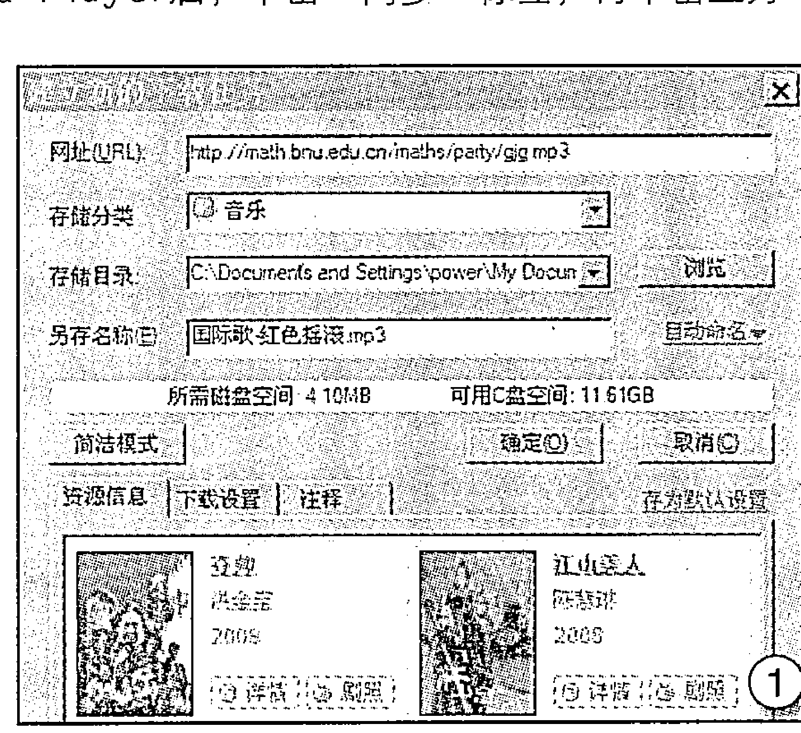

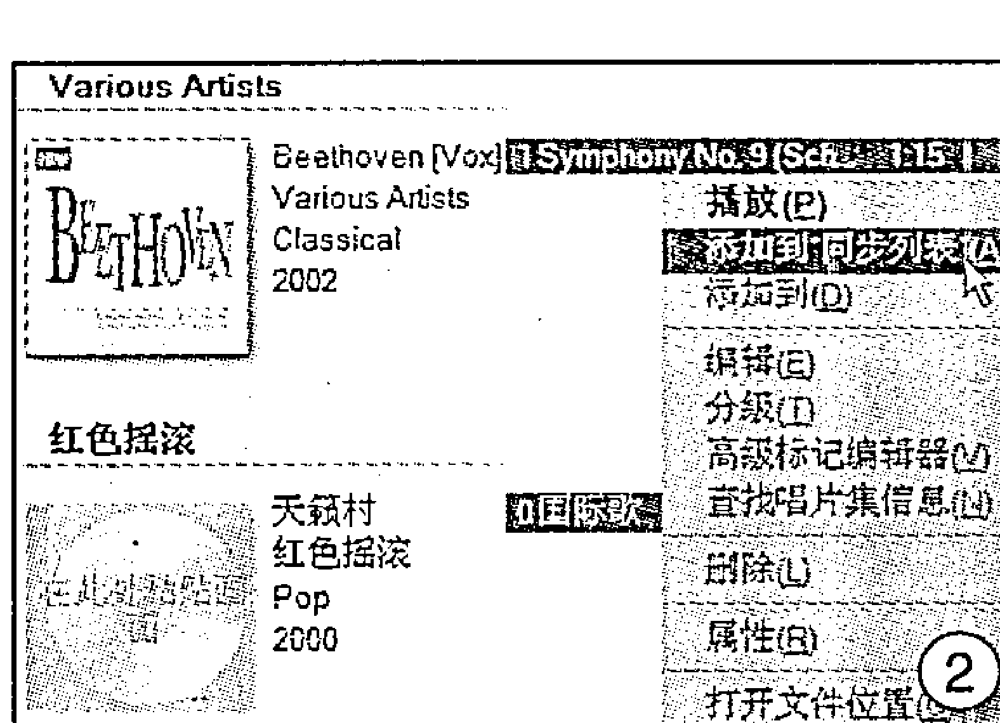在这里要注意的是，同步的概念与复制不一样，因为同步时WMP会比较电脑和MP3 Player中的音乐的版本，会自动保留最新版本。

当然，我们也可以将MP3 Player中的音乐直接拷贝到电脑音乐文件夹中，因为电脑的硬盘总是比MP3 Player要大得多，也便于后面用WMP的媒体库来管理。

## 2. 搜索本地电脑上的媒体

WMP11最大的一个好处，就是能够方便地播放和管理电脑中的多媒体文件，我们先来建立媒体库和播放列表。

按下Alt键，单击“文件” → “添加到媒体库”命令，之后会弹出如图3所示的窗口，选择第二项“我的文件夹以及我可以访问的其他用户的文件夹”，同时单击下方的“高级选项”。接下来，单击“浏览”按钮，在如图4所示窗口中选择搜索文件夹。之后会出现导入窗口。

经过一段时间的等待，你爱机上的所有媒体文件就会全部导入，最后，别忘了点击“完成”按钮，媒体库就建好了。返回到WMP11窗口，单击“媒体库”标签下拉箭头按钮，还可以选择显示音频或视频，也可以进行其他操作（如图5）。选择后，将看到相应的窗口，在这里，已经将内容作了很好的分类，便于我们播放、同步。WMP11已经为我们自动整理了找到的多媒体文件，把它们加入到不同的子类，并在子类中再进行细致分类。我们还可以在上方搜索框窗口中输入相应的关键字来搜索媒体，方便极了。

## 3. 将媒体库与MP3 Player同步

我们此时单击“同步”标签，可以看到更多的媒体。同样选中它们，右击，选择“添加到同步列表”，之后再单击窗口右下角的“开始同步”按钮可以将它们同步到我们的MP3 Player中。

## 4. 随时扩大媒体库

如果我们在机器上新建了文件夹，默认情况下是不会被WMP11添加到媒体库中的。此时，我们可以单击“媒体库”标签，然后单击下方的“添加到媒体库”（如图6）。单击“浏览”按钮，在弹出的窗口中选择搜索文件夹，同样会出现相应的导入窗口。

## 5. 给音乐分级

音乐有很多，我们将其添加到媒体库后，还可以对其进行分级。

我们只要单击窗口上方的“艺术家”或“唱片集”按钮，将这些音乐、视频按歌唱者或专辑来分类。同时还可以右击某个音乐，选择“分级”，给这首歌打上一个级别（如图7）。之后单击左侧窗口中的“分级”项，在右侧会将当前媒体库中的所有音乐的级别列出。我们可以双击相应的级别来获取指定级别的歌曲。如我们可以只查找5星级的歌曲（如图8）。再选中这些5星级的歌曲，右击，选择“添加到同步列表”，之后再单击窗口右下角的“开始同步”按钮即可将5星级歌曲同步到我们的MP3 Player中。

# # 大家一起炒炒股
## —— “同花顺2008” 使用教程

网络快捷方便的特点使其成为股民炒股时的首选，但大量的数据信息往往使人晕头转向，于是很多股民都会选择炒股软件作为工具。下面就为广大股民朋友们推荐一款功能强大的免费网上股票证券交易分析软件——同花顺2008。

该软件更新快速、功能强大、资讯丰富、操作简便、界面良好，是同类股票证券分析软件中的佼佼者，也是唯一被全国95家证券公司所使用，覆盖2400多家营业部，占有率89%以上的股票证券交易分析软件。目前，有5000多万证券投资入使用该软件。下面就让我们一起来学习同花顺2008的使用吧！

# # 一、下载与安装同花顺2008

首先，需要先把“同花顺”下载到计算机，下载地址：http://www.onlinedown.net/soft/39710.htm。

下载完成后，解压缩文件，双击“10JQKA2008_OnlineDown_Build80108.exe”安装程序，开始安装。按照提示依次单击“下一步”按钮，弹出“选择网络运营”对话框（如图1），根据你的网络类型进行选择。笔者是中国电信的用户，故作如下选择。

单击“确定”按钮，弹出“登录到中国电信行情主站”对话框。第一次使用时要先进行注册。单击“免费注册”按钮，弹出第一个界面。设置用户名，单击“下一步”。弹出第二个界面，设置密码，单击“下一步”。弹出第三个界面，输入你的联系电话和电子邮件，单击“完成”或者“返回”。这时程序将会自动登录，进入“同花顺2008”主界面，并弹出“登录到中国电信行情主站”对话框（如图2）。

单击对话框中的“选择最快行情站点”或者“优选主站”，在弹出的“选择最优行情站点”窗口中选取性能良好的站点，单击“登录”，返回主界面。这时候的界面将会出现股票投资的相关数据与分析图表。

至此，整个安装过程完成。以后登录时，你只需要在“登录到中国电信行情主站”对话框中输入注册的用户名和密码，单击“登录”按钮即可打开同花顺2008的主界面。

# # 二、同花顺2008界面简介

首先，让我们来认识一下“同花顺2008”的主界面。

## 1. 菜单栏

打开“同花顺”，在主界面的最上面一栏你可以看见系统、报价、分析、港汇、基金、理财、资讯、智能、工具、在线服务、华军软件等菜单。在这里能找到“同花顺”几乎所有的功能。我们将会在下面的具体操作中依次对所涉及到的菜单进行详细的说明，这里就不介绍了。

## 2. 工具栏

在菜单栏的下方，紧挨着的是工具栏，所包含的是“同花顺”软件菜单中一些常用功能，方便用户操作。默认情况下工具栏是处于“自动隐藏”状态的，即当鼠标移动到工具栏所在区域才显示。用户可以单击“工具”菜单，在“工具栏设置”项中按照需要进行设置。当某菜单项名称前有对勾时，表示选中该项，工具栏就会呈现相应显示状态。你还可以通过“定制工具栏”管理工具栏的项目，添加或者删除按钮，也可以移动按钮。

## 3. 主窗口

在“同花顺”主界面中面积最大的一块就是主窗口，主要用来显示股票的走势图和相关数据。但是当我们需要查看其它资讯时，如“同花顺视点”、“财经要闻”、“行业市况”，它将切换成为浏览资讯的窗口。

## 4. “同花顺/网站/技术指标”窗口

在主窗口的左侧有一个小的细长窗口，“同花顺/网站/技术指标”窗口（如图3），用来进行相关操作。

“同花顺”选项卡：具有资讯查询的功能，单击相应选项可以查询相应信息。是“资讯”菜单的快捷窗口。

“网站” 选项卡：链接相关网站。包括“财经要闻”、“公司透视”、“行业市况”、“机构名家”、“同花顺视点”。

“技术指标”选项卡：主要用来查看相关技术指标，包括分时指标、基金指标、主要曲线、趋向指标、反趋向指标、能量指标、量价指标、大盘指标、压力支撑、特色指标、指南针、神光指标、自定指标、五彩K线、交易系统。

在主窗口的右上角和左下角还用一些小按钮。当鼠标移动到这些按钮上时就会显示其功能，非常方便。

此外，“同花顺”软件的鼠标右键菜单功能也很丰富，可以显示当前状态下能够使用的主要功能。“同花顺”的主界面就大致介绍到这里，下面进入实际操作环节。

# # 同花顺2008的操作与使用

在使用“同花顺2008”前，我们首先要对该软件进行系统设置。

## 1. 软件设置

单击“工具/系统设置”菜单，弹出“系统设置”对话框（如图4），其中包括用户管理、分析周期、其他设置、性能选项、颜色字体、信息地雷。

-   用户管理：用来设置行情主站，切换用户，修改登录密码。
-   分析周期：主要用来管理分析周期。
-   其他设置：主要用来设置自动翻页的时间间隔、快速隐藏/显示的快捷键，以及允许访问的证券市场。
-   性能选项：主要用来设置软件的性能。
-   颜色字体：主要用来设置软件的颜色方案以及字体。
-   信息地雷：主要用来选择显示的信息地雷。信息地雷主要显示你所选择的这个上市公司最近有没有新的公告、信息或新闻。

## 2. 常规操作

首先，我们可以利用“同花顺2008”软件来进行常规的看盘操作。这里重要用到的就是“报价”菜单和“分析”菜单，我们可以通过单击相应的菜单项打开相应页面，查询我们所需的数据信息。

“报价”菜单：单击主菜单中“报价”菜单可以调用各种报价的页面。

-   大盘指数：包含11个选项，单击后将会在主窗口中显示上证、深证等大盘的股票走势指数；
-   商品顺序：包含11种股票投资种类，单击后将会在主窗口显示按各种商品代码大小排列的表格；
-   涨幅排名：单击显示各个商品的涨跌幅排名；
-   综合排名：同时包含9项综合排名；
-   分时同列：将四股、九股、16股进行分时段排列；
-   K线同列：将四股、九股、16股的K线排列的表格；
-   大字报价：将各个股票信息报价信息排列的表格；
-   两股对比：将两支股票进行对比；
-   多窗看盘：为实时看盘的特制的页面；
-   主力大单：显示主力大支股票相关数据的页面。

还有“自定义板块”、“自选报价”、“自选同列”三项，单击可以自己定制报价页面。

“分析”菜单：单击主菜单中“分析”菜单可以调用各种分析的页面（如图5）。

“财务”菜单项包含10个选项，基本资料、财务图示、股本结构、财务数据、基金周报等。

此外，“分析”菜单还包括分时走势、超级盘口、成交明细、价量分析、技术分析等众多分析页面，满足你的各种需求。

除了“报价”菜单和“分析”菜单外，该软件还提供了“港汇”菜单和“基金”菜单。其中，“港汇”菜单包括涉及香港证券、港股、外汇、商品期货相关信息19个菜单项，单击可以打开相应页面。“基金”菜单则可以显示与基金有关的相关数据页面。您可以根据需要单击相应菜单项，主窗口就会切换成相关页面，十分方便。

## 3. 资讯查询

“同花顺”所提供的“资讯”菜单还可以打开相应资讯页面。

单击“资讯”菜单，打开其下拉菜单，除资讯中心外，还包含22个具体资讯项目（如图6），单击就可以在主窗口显示相应页面，资讯丰富，操作方便。相当于主界面左侧的“同花顺”窗口。如此丰富的资讯信息为您的炒股之路保驾护航的，您一定可以掌握大盘的。

## 4. 智能帮手

在完成基本操作，提供丰富资讯的基础上，“同花顺2008”的“理财”菜单以及“智能”菜单还为您提供了智能帮手，可以帮助你轻轻松松炒股投资。

“理财”菜单：单击主菜单里的“理财”菜单，打开下拉菜单，你会发现8个菜单项。其中前三个是“同花顺”的辅助理财工具。

-   小财神：功能强大的实用理财工具，记录用户的投资买卖过程，查看成本核算，进行统计分析以及报表分析。单击弹出窗口（如图7），可以根据提示进行相关设置。小财神使用的具体过程很复杂，可以查看相关教程，这里就不详细介绍了。
-   委托下单：单击弹出“用户登陆”对话框，输入相应信息，单击“登陆”，就可以登录相应营业厅进行股票交易。
-   第三方委托：可以添加和调用非核心公司的委托下单程序。

余下的5个菜单单击将会打开辅助理财的资讯信息。

“智能”菜单：包括14个菜单项，为您提供智能选股方案，主要有：

-   傻瓜选股：单击弹出“傻瓜选股”窗口（如图8），为您提供简单易行的选股方案。
-   个股雷达：单击弹出“结果显示”的“个股雷达”页面。您可以单击“启动雷达”按钮启动雷达，并单击“设置”来设置您所需要的个股雷达条件。
-   鹰眼盯盘：单击弹出“结果显示”的“鹰眼盯盘”页面，与“个股雷达”页面相似。
-   智能选股：单击弹出“智能选股”对话框，选择选股的范围。然后，在需要的条件前打勾，单击“执行选股”。这时会弹出“选股结果”对话框，双击选股条件，将显示出所选股票的报价表。然后，双击选股结果列表中的条件，则会在后面页面里面显示这个条件所选出来的股票。
-   选股平台：单击“智能/选股平台”菜单，弹出“选股平台”对话框。在这里您既可以使用系统提供的100多种选股公式、200多种技术指标来选股，也可以用自己编写的选股条件来选股。
-   基本面选股：使用财务数据选出满足条件的股票（如图9）。选股的时候在需要的条件的对话框中加上限制，单击“执行选股”。如果想将选股结果保存，单击“生成板块”。
-   交易系统评价：用于测试交易系统的某一参数组合对每只股票所能达到的收益率水平和交易次数。首先，选择某交易系统。其次，设定分析周期、选择测试的股票和时间段、是否扣除手续费。最后，单击“开始”就可以了（如图10）。
-   优选交易系统：帮助你了解各个不同的交易系统对于某一支特定股票的有效程度。在“选择股票”里面选择测试的股票，然后选择测试时间段，就可以测评了（如图11）。
-   星空图：星空图反映了某个股在其所属分类板块中的价格、涨幅、流通盘大小、震幅等指标在星空图二维坐标中的位置。
-   历史回忆：单击弹出“历史回忆播放器”，可以看到过去交易历史。
-   未来预演：您可以在这里预设未来几天的K线走势。系统将自动帮您计算出，相应的技术指标与均线系统的形态。以此作参考，您在考虑未来的走势的时候就有了更多的依据。

有了这些工具的帮助，你还怕不能成为股票投资高手吗？

## 5. 其他工具

除了能够完成上述功能外，“同花顺”还提供在线服务，能够随时解决您的问题。

单击主菜单中的“在线服务”，可以打开其下拉菜单（如图12），你会发现该软件提供了所需要的在线服务，就连你没想到的它也为您准备好了。

综述：介绍了这么多，你还等什么，赶紧让我们一起来炒股吧！

# # 减轻记忆痛苦 当精力用好本地搜索

□江北书生

对于上网的人来说，每天打开搜索引擎来寻找自己想要的信息已经成为一种习惯。不过，你想过吗？时间在变少，工作在增多，如何安排个人和团队的日程，管理越来越多的联系人，管理像雪片一样飞来的邮件？还有海量的硬盘空间和白菜价格，使得大容量硬盘普及。与此同时，杂乱堆集的MP3、文档、图像等等文件，怎样才能让它们变得井井有条？

硬盘越来越大，电脑中的文件却是杂乱无章，要找一份资料真的很难。是否早已对Windows的搜索功能大失所望？是否想将桌面搜索与网络搜索合二为一？所有这些，对于商务人士的您来说是相当有用的。巧妙地利用好桌面搜索会给我们带来极大的便利并省下很多的时间。

## 一 什么是桌面搜索

### 1. 桌面搜索产生背景

在国内的Internet搜索领域可谓是两强并立（百度和Google），而桌面搜索的竞争正在开始变得白热化。而提到桌面搜索，每个用户应该不会陌生。因为Windows本身的搜索功能大家都用过，如果你知道文件名或者文件内容中的某几个字，就可以用它来帮你查找到自己需要的内容。但是它的局限性也是很明显的，因为它一般只支持较少的文件类型（一般只支持文本文件和ZIP压缩文件，还必须使用Windows XP操作系统）。为此，桌面搜索技术应运而生。

### 2. 何为桌面搜索

何为桌面搜索？说白了，就是让你像在互联网上搜索一样，完成在电脑上的本地搜索。或者说，是一个将本地搜索与网络搜索有机结合的统一体。

桌面搜索技术不同于以往的Windows搜索功能，还不同于各种“地址栏”搜索工具。首先，它的本地搜索拥有让你无法想像的快速度；其次，搜索无处不在。不管是在浏览新闻，还是在编辑文件、收发Email，或是玩游戏、听MP3，只要用户有搜索的需求，就可以随时完成搜索。

### 3. 桌面搜索四分天下

软件霸主一微软公司早就宣布将在下一版本的Windows操作系统中嵌入强大的搜索功能。Google闻讯，迅即于2004年10月发布了全新的桌面搜索工具：Google Desktop Search Beta（以下简称GDS）。此招一出，业界哗然。微软自然也不敢怠慢，加班加点，于2004年底发布了自己的桌面搜索工具测试版：MSN Toolbar Suite Beta（以下简称MSTS）。现在已经变成了Live Search的一部分。同时，很多的本地搜索工具也出现了，如Locate32等。另外，很多软件也已经内置了本地搜索功能，挖掘一下相当有用。

## 二 百度硬盘搜索

先试用百度的桌面搜索，是因为不管怎样，对于Goolge和微软的产品，我们都认为是“舶来品”，而百度对中文内容搜索的良好支持是百度在国内市场成功的关键。

### 1. 下载安装

从http://disk.baidu.com上直接下载并安装它（如图1），安装比较简单，一般“一路回车”即可。

### 2. 索引硬盘文件

这里要注意的是，桌面搜索软件一定要先建立起本地硬盘上的文件索引才能够进行搜索。因此，你双击任务栏上的百度硬盘搜索图标即可打开窗口，在其中输入关键字，单击“硬盘搜索”即可搜索到相应的内容。

### 3. 只搜索特定文件类别

默认情况下，百度支持邮件（Outlook邮件、Outlook Express邮件）、网页历史（IE、Firefox网页历史）、图片（JPG、GIF、BMP、TIF、PNG）、聊天记录（MSN 聊天记录）、影音文件（MP3、WAV、WMA、AVI、MPG、WMV、RM等）、办公软件（Word、Excel、PowerPoint、PDF、WPS）、文本文件（TXT、RTF、C、JSP等源代码）及其他文件（RAR、ZIP、EXE）等。因此，如果仅仅输入相应的关键字，往往会搜索到非常多的文件，我们可以单击下方的文件类型来限定搜索的文件类别，从而可以更快地找到我们的内容。

如我们选中“文档”，然后输入关键字，则可以查找到Word或TXT文件中的内容。单击搜索页面后面黄色的文件夹图标，可以打开包含该文件的文件夹。

### 4. 限定文件类型

百度桌面搜索支持filetype:,title:,to:,from:,subject:,folder:等多种搜索语法，这样可便于我们更好地搜索。如，我们输入 合同 filetype:doc，则会搜索到包含合同字样的Word文件。

## 5. 支持高级查找

单击主界面上的“高级搜索”会打开如图2所示的窗口，在这里，我们可以限制更多的范围，比如搜索时间、搜索关键字、只在相应的文件夹中搜索等。

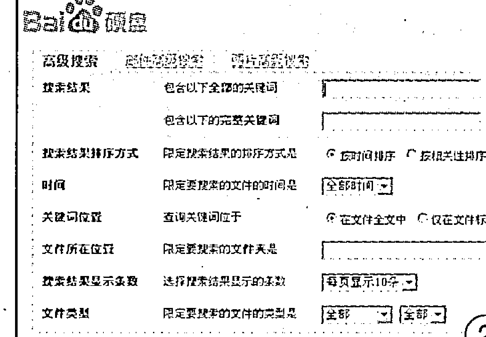

## 6. 搜索邮件

网络时代，人们的邮件非常多。时间一长，就不易记住了。幸运的是，百度硬盘支持邮件查找，找到邮件后直接用Outlook/Outlook Express打开邮件，无需打开邮件客户端，即可进行回信，转发，编辑邮件等操作。

## 7. 密码保护

一般来说，个人电脑的硬盘上都会保存有大量用户隐私或敏感文件，出于安全方面的考虑，百度硬盘搜索为用户提供了密码保护功能。只要右击任务栏下方的百度硬盘图标，选择“使用密码”→“创建”（如图3），在窗口中设置密码和忘记密码时的提示问题，单击“创建密码”按钮即可设置完成。

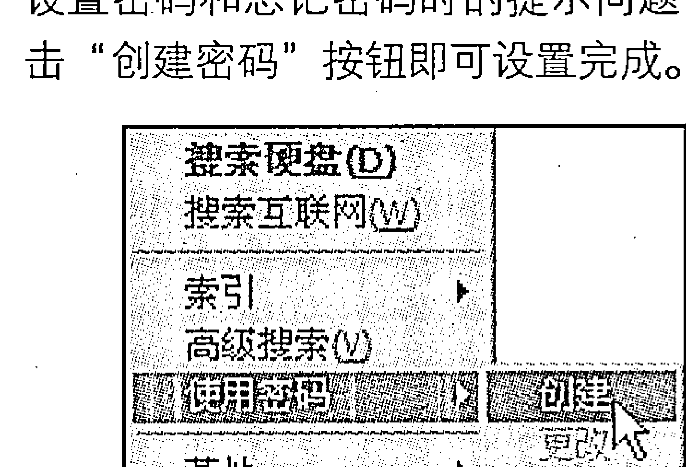

以后双击任务栏下方的百度硬盘图标时，将会提示我们输入密码，而且我们还可以设置过几分钟不使用百度硬盘就自动重新需要输入密码。

## 8. 更强照片/影音查找

现在数码相机相当普及，如果你出差在外，也肯定会拍些照片。百度硬盘可以展示更多图片信息，增加图片“更多”信息页面，可查看图片的大小、色彩模式等属性，如果是jpg、tif还会显示相机型号、光圈、焦距等信息。

如果你查找的是影音文件，还会显示出更多影音信息，增加“艺术家”，“专辑”，“流派”，“播放时间”等信息更快找到相应的文件。

## 9. 仅索引相应文件夹

默认情况下，百度硬盘会索引并搜索本地硬盘上的所有的内容。我们也可以在百度硬盘主页面上下方单击“设置”进入设置窗口（如图4），在这里我们可以添加或减少搜索文件的类型，也可以设置仅仅搜索某个文件夹或排除掉一些文件夹。从而可以让我们更快地找到自己所要的内容。

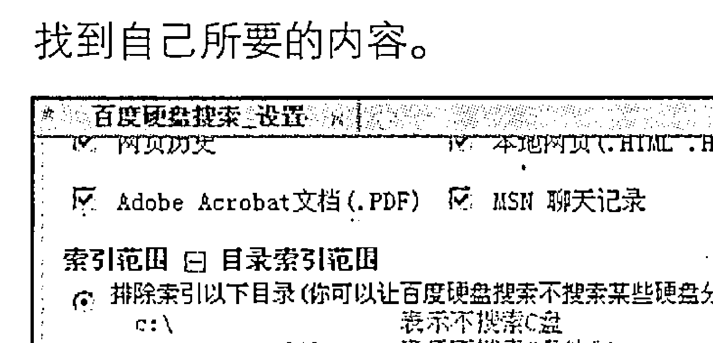

## 二、Google 桌面搜索

Google对于信息的整理能力很强，世人从来没有怀疑过。Google在搜索技术领域的地位，到目前为止，无人能出其右。而且，在推出Google桌面搜索英文版没多久，它就推出了简体中文版，可见其实力。

### 1. 下载并安装

登录 http://desktop.google.com/zh/?ignua=1 即可下载并安装。之后，右击任务栏托盘区中的Google桌面搜索图标，选择“搜索桌面”即可启动之（如图5）。

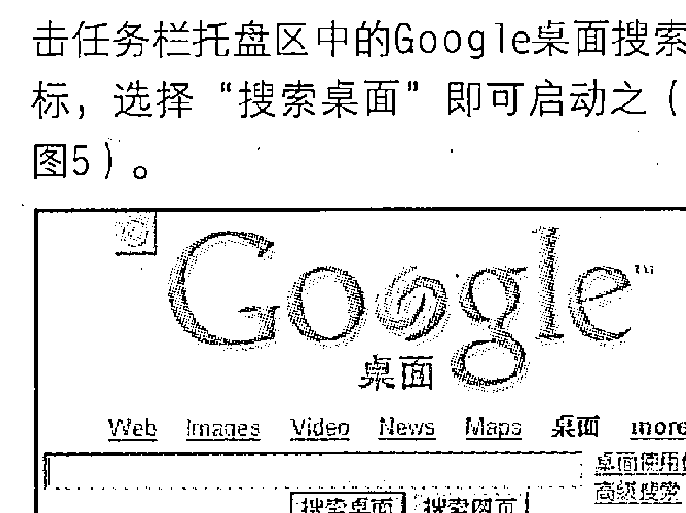

### 2. 一般搜索

在搜索框中输入关键字，单击“搜索桌面”按钮即可打开相应的结果页面。它的界面中同时提供了“搜索桌面”和“搜索网页”两个按钮，把桌面搜索和Internet搜索统一的野心可见一斑。

Google桌面搜索支持的文档类型是很全的，包括Word、Excel、PowerPoint等Office文档，当然文本文件自然也没有问题。同时还包括Outlook、Outlook Express的邮件，此外还提供对PDF文档和Internet Explorer历史浏览记录的支持。另外，它还提供了对Netscape和 Thunderbird邮件系统的支持以及对Netscape/Firefox/Mozilla的Web浏览记录的搜索支持。

### 3. 使用相应参数

Google桌面搜索中同样也支持filetype等参数，这也便于我们更好地锁定某些文件类别。

### 4. 设置桌面搜索偏好

单击主页面上的“桌面使用偏好”链接可以对桌面搜索偏好进行设置。通过此设置页面，我们可以指定希望纳入索引的文件类型或不希望索引的文件类型，还可以定制搜索框的显示模式和每次显示的结果数。还可以设置仅对某些文件夹或硬盘进行查找，也可以加密搜索索引和数据。

### 5. 支持插件

我们可以单击相应的链接，到达 http://desktop.google.com/plugins/c/index/search.html?hl=zh_CN （如图6）的页面，有不少的插件下载，利用它们可以大大扩展Google桌面搜索的功能。

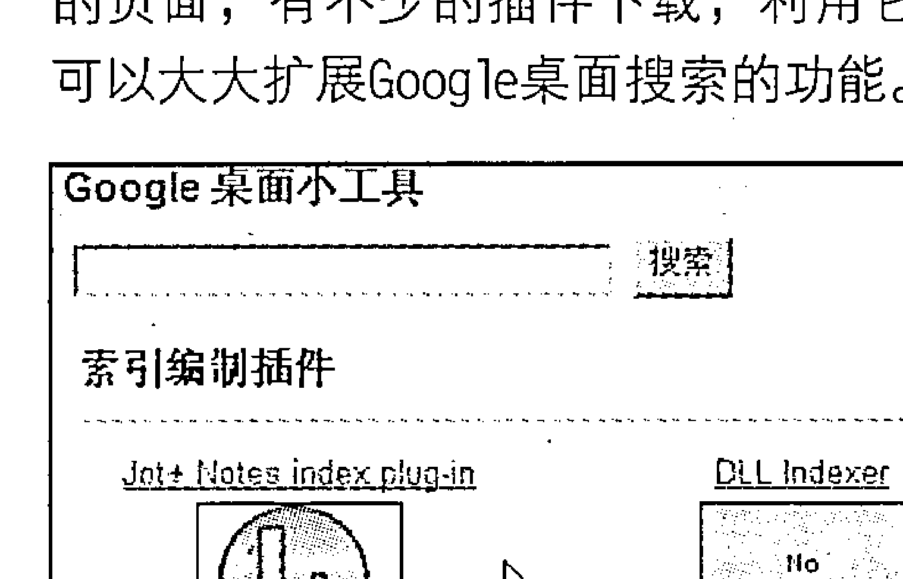

## 三、Locate32硬盘搜索

Locate可以将我们硬盘上所有文件的文件名保存进一个数据库，或是你指定的任意硬盘和目录，这样在工作中你就可以方便快速的查找文件。

### 1. 下载软件

登录 http://www.locate32.net/ ，然后右击其中的“Download: 32 bit version or 64 bit version”（视机器的系统环境所定），选择“使用迅雷下载”将其下载下来。然后双击下载后的zip文件，将其中的所有文件解压到一文件夹下。

接着从 http://locate32.net/forum/download/file.php?id=61 处下载到lan_cn_3.1.8.03260.zip，将其中的所有文件解压到Locate32的解压文件夹下。同时要注意的是，请将其bin子文件夹下的lan_cn.dll同时复制一份到Locate32的解压文件夹下。

### 2. 设置为中文界面

双击解压后的locate32.exe，再选择Options→Settings，再单击Languages标签，然后从中选择“Chinese Simplifie(简体中文) lan_cn.dll”，单击下方的“确定”按钮，关闭并重新启动Locate32，即可看到简体中文界面。

### 3. 设置索引

选择“选项”→“设置”，再单击“数据库”标签，然后单击“新建”按钮，在打开窗口中设置好“名称”，再单击“文件”后的“浏览”按钮设置保存文件名，如e:\index.dbs，然后在下方选择相应的索引驱动器（硬盘），如图7所示。设置完成后，单击“确定”按钮返回到Locate32主窗口。

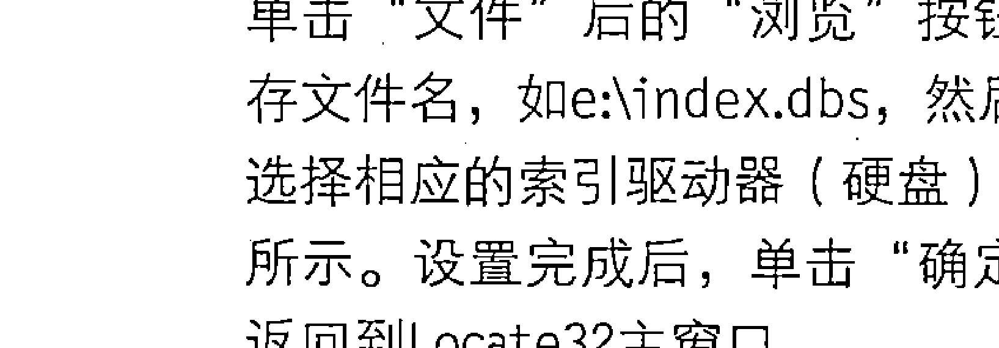

### 4. 开始索引

选择“文件”→“更新数据库”（如图8），之后将会对我们选定的驱动器的文件进行索引，视机器的配置和硬盘大小、文件的多少而定。

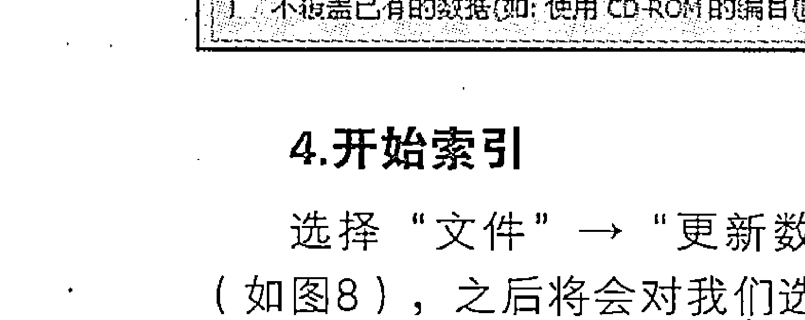

### 5. 快速查找

打开Locate32，在搜索框中输入相应的关键字，单击“立即查找”按钮即可查找到文件。双击之，可以打开。右击之，选择“打开所在文件夹”命令可以打开其所有文件夹。

## 五、用好软件的搜索功能

相对于专业软件来说，很多大家熟悉的软件也提供了很好的搜索功能，利用这些功能，可以让我们更快地找到自己想要的资源。

### 1. Winamp

在Winamp中，右击播放列表中一歌曲，选择“跳到文件”→“跳到文件”，然后在上面输入关键字，双击找到的相应歌曲即可到达。这样就不用在播放列表中手工查找了。这对于歌曲较多的人时尚人士来说尤其有用。

### 2. Foobar2000

在Foobar2000中，按下Ctrl+F或者F3键，会跳出一个窗口，在上面输入关键字，其匹配的资源将会被列出来。双击之即开始播放，非常方便（如图9）。

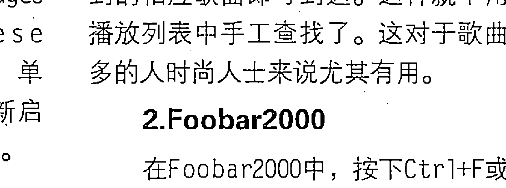

### 3. 千千静听

在千千静听中右击播放列表中空白处，选择“查找”→“快速定位”，在打开窗口中输入相应关键字，则会自动定位到相应的位置处，双击它就能够播放了。

### 4. Windows Media Player

先将媒体资源添加到媒体库中，然后在其右上角即可输入关键字来查找资源（如图10）。

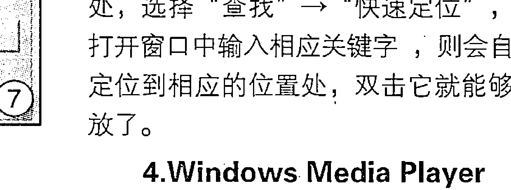

### 5. Total Commander

Total Commander是一个文件管理器，要在其中查找文件就方便了：直接选择“命令”→“搜索文件”或者按Alt+F7键即可打开相应的窗口来进行搜索。Total Commander的功能非常强大，它还支持文件类型及文件中包含关键字来搜索，合理地运用可以给我们文件管理带来极大方便，减少重复劳动。

### 6. 迅雷5

如果你下载了很多的资源，一时想不起放哪里了，怎么办？不要急！迅雷5为我们准备好了搜索功能，只要在迅雷中选中“已下载”项，再按下Ctrl+F键，打开查找窗口，输入关键字，再勾选相应的类别（可通过名称、网址、注释来查找），单击“确定”按钮即可进行查找，迅雷会自动定位到第一个匹配的资源上，鼠标移过去还可以显示出它的一些具体信息。如果想继续查找下一个匹配目标，只要按下F3键即可，和其他软件中是完全一样的。

### 7. Web迅雷

打开Web迅雷，单击“高级”→“下载任务搜索”（如图11），在窗口中输入关键字即可查找，Web迅雷会把找到的资源列在列表中。

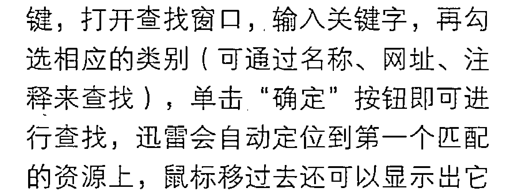

## 六、总结

总体看来，四种桌面搜索可以分为两种：前三种用的是索引的办法，后面是实时搜索，各有千秋。我们建议，如果只搜索指定的内容，如下载资源或歌曲，可以用最后一种办法。如果知道文件名，可以使用Locate32。如果只记得文件的内容或相关信息，可以使用百度硬盘搜索或Google桌面搜索。不过，要注意的是，百度支持更多的文件类别和简体中文，而Google支持插件而具有更大的开放性，MSN则是微软本身的作品，极有可能会将此技术应用于Windows操作系统。因此，这三种桌面搜索也是难分上下，笔者比较推崇的是使用百度，因为它有些特点是其他另外两种所没有的，如更好地支持图片和影音的搜索，可以支持查看图片的大小、色彩模式等属性，也能显示相机型号、光圈、焦距等信息。更好地支持影音信息，增加“艺术家”，“专辑”，“流派”，“播放时间”等信息。更重要的是，它提供了更为安全的密码保护。同时，百度也是中文搜索引擎中的老大，相信会更好地将其搜索技术应用于新版本的百度硬盘中的。

## E生活

## 给你全套DVD分享与保存方案

□江北书生

现在DVD已经相当流行，但是怎样保存和分享则成了一个问题。现在硬盘空间非常大，我们完全可以将DVD保存到硬盘上。但是问题随之而来，怎样去除DVD的CSS的防拷贝措施？怎样精简拷贝后的文件，只留下主要的电影？如何只留下自己想要的声音和字幕？如何制作出快要损坏的DVD的备份？这一切，只要ImTOO DVD Copy Express即可解决。

## 一、让CSS和区码见鬼 复制DVD畅通无阻

几年前VCD正当流行时，我们就经常将VCD中Mpegav目录下的文件直接拷贝到硬盘上，这样不仅能减少光驱的磨损，还能保证VCD的流畅播放。现在，当我们播放DVD影片时，DVD光驱更加地忙碌，如果能花些时间将DVD光盘上的内容拷贝到硬盘中进行播放，那不就可以将光盘从辛劳中解放出来了吗？但可惜的是，以前应用在VCD上的拷贝方法并不能直接运用到DVD上。

这是由于DVD一般会采用了一种名为CSS（Content Scrambling System，内容不规则系统）的加密方法，这样我们就会发现很多的DVD将无法复制到硬盘中，而且有的即使能够复制，也不能正常播放。它的主要作用在于阻止在没有解密钥匙时直接从光盘中读取多媒体文件的企图。

不过，现在有了ImTOO DVD Copy Express，我们可以突破CSS的束缚，直接将DVD复制到硬盘上。

- 第一步：安装软件
安装软件非常简单，直接从 http://www.imtoo.com/dvd-copy-software.html 处下载并安装即可，在安装时可以选择语言为简体中文。
- 第二步：准备光盘
将DVD影碟光盘放入光驱中，此时ImTOO DVD Copy Express会显示已经准备好，并显示总时长和大小，一切准备就绪。
- 第三步：选择备份方式
单击下方的Target下拉列表框，选择Save as DVD Folder（如图1），将DVD备份到文件夹中。
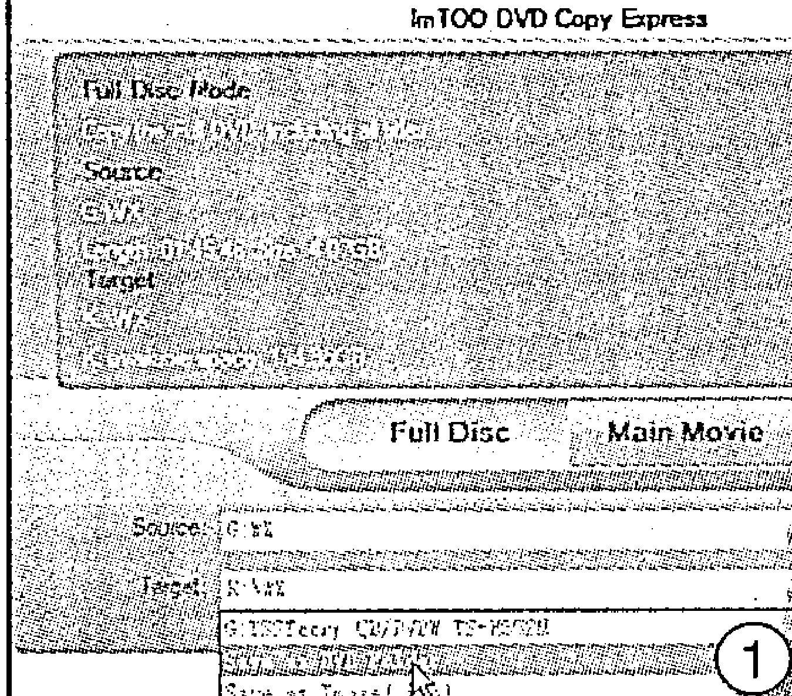
- 第四步：选择文件夹
此时会弹出如图2所示的浏览文件夹的对话框，从中选择相应的文件夹用于保存DVD内容。
- 第五步：开始拷贝
接着单击右侧的Start Copy按钮即可开始拷贝。而且拷贝的过程中还会显示画面，我们可以一边欣赏一边拷贝。

要注意的是，DVD一般有区码的限制，而现行DVD影片的保护措施（区码的限制）是由美国八大影业所提出，将DVD影片分成6区来发行，最主要就是要保护经销商与代理商的权益，杜绝产品的水货及平行输入的问题。DVD区码总共可以区分为六个不同的区域，以下是详细的DVD分区说明表。

- DVD分区说明表

| 分区 | 区域 |
|---|---|
| 第一区 | 美国、加拿大地区 |
| 第二区 | 日本、欧洲、南非、中东（包含埃及） |
| 第三区 | 东亚地区以及东南亚地区（包含中国台湾、中国香港地区） |
| 第四区 | 纽澳、太平洋群岛、中南美洲、加勒比海地区 |
| 第五区 | 前苏联、非洲（包含朝鲜、蒙古） |
| 第六区 | 中国内地 |

DVD区码的限制可以区分为两种方式，在某些驱动器上将有可能无法播放其他区码的DVD。但是ImTOO DVD Copy Express可以解决此问题，备份DVD时不会存在这个问题。

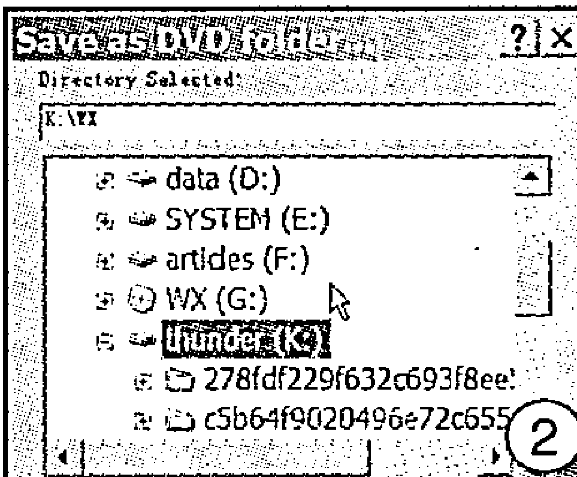

## 二、取其精华 让备份文件更小

DVD以其影院级的音像效果，支持多语音、多字幕、多视角及强大的交互功能，因此它的文件体积比较大。事实上，这些往往带来备份后文件夹的冗余。硬盘虽然便宜，但是文件太大太多则必然带来管理上的麻烦。因此，我们可以利用ImTOO DVD Copy Express将DVD“取其精华”，让备份的文件更小。

- 第一步：选择Main Movie模式
单击Main Movie，这样可以看到上面的文件大小明显变小了。这种模式下，它只拷贝Main Movie，把一些花絮（trailers）还有等交互特色功能将去除，因此可以大大使其变小。
- 第二步：选择字幕和音频
单击右侧的扩展按钮，弹出如图3窗口，在其中单击Audio下拉列表框，从中只选择自己想要语言的声音，单击Subtitle下拉列表框，从中只选择自己想要语言的字幕或者选择不要字幕。
- 第三步：取消菜单
在窗口下方取消Include Menu，取消菜单的备份功能。
- 第四步：开始拷贝
接着单击右侧的Start Copy按钮即可开始拷贝。同样，拷贝的过程中还会显示画面，我们可以一边欣赏一边拷贝。但是拷贝后的容量已经明显减少。

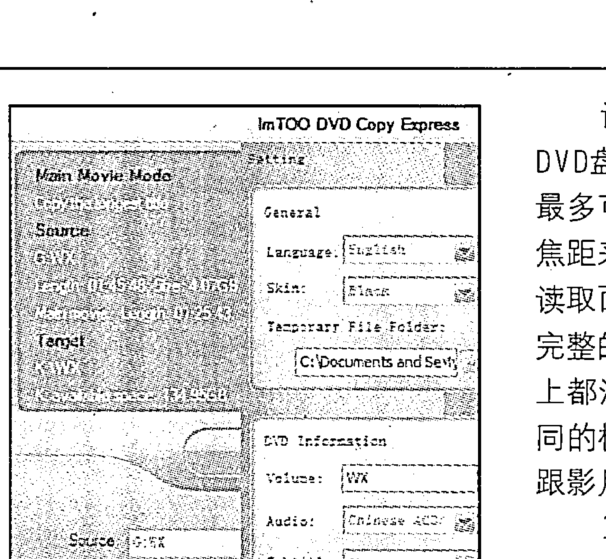

说到这里，不得不提到DVD的格式。因为，DVD盘片都是由上下两片基组成，每片片基上最多可以容纳两层数据，DVD光头能够通过调整焦距来读取这两层数据。在制作过程中，把数据读取面向外，两片片基粘合在一起，就成了一盘完整的DVD盘片。一般市面上出售的DVD碟，包装上都注明了DVD的格式，常见的有D9、D5等。不同的格式除了DVD碟片制造工艺上的差别以外，跟影片的质量也密切相关。

### 三、旧盘新生 直接翻录DVD

DVD光盘如果有所磨损，而现在的DVD刻录盘并不贵，想过将其进行翻录吗？前面已经提过了，由于它受CSS和区码的保护，一般的刻录软件根本无能为力。但现在我们完全可以通过ImTOO DVD Copy Express来让旧盘获得新生，因为它支持直接DVD光盘的翻录，就算你只有一台DVD刻录机也可以！

- 第一步：选择Full Disc模式
- 第二步：选择字幕和音频
- 第三步：选中菜单
- 第四步：选择源盘和目标盘
- 第五步：选择翻录光盘格式
- 第六步：开始翻录DVD盘
- 1. D5：单面单层(Single Sided / Single Layer)容量约4.7GB
D5格式的DVD影碟是把所有资料存放在一面DVD碟片上，另一面印上影片的资料作封面。DVD机的激光头由DVD碟片的圆芯开始，一直向圆周读出去。相比而言，D5格式的DVD（单面单层），存储数据量最少，相应压缩比率较高，其音频、视频效果也受影响。
- 2. D9：单面双层(Single Sided / Dual Layer)容量约8.5GB
D9格式采用两层来存放数据。和D5格式不同，D9虽然也只有一面可读，但这一面是两层的（容量大了一倍）。播放时激光头由D9碟片的圆芯开始，一直向外圆周读出去，当读完第一层后，激光头会自动调整焦距穿透第一层，到达第二层后，激光头再由圆周开始向内圆芯读回去，直到读完第二层为止。对于同一部电影来说，D9比起D5格式存储空间变大了，效果自然会有所提升。

还有其他规格的，但不流行，在此略过。

- 第六步：开始翻录DVD盘
选择好翻录光盘格式，即可开始翻录。同样，拷贝的过程中还会显示画面。

### 四、顺手牵羊 让光盘成为标准ISO文件

有一些DVD光盘上的内容复制到硬盘上后，有可能还不能播放。这时，我们就有必要将其备份为ISO文件，要用时只要安装Daemon Tools之类的虚拟光驱软件即可正常播放，这样可以保持其原汁原味。

- 第一步：选择源盘，单击Source，选择被复制DVD盘所有的光驱。
- 第二步：选择ISO文件，单击Target，选择Save as Image，同时设置输出文件名。
- 第三步：开始生成，单击右侧的Start Copy按钮即可，余下过程是一样的。
- 第四步：虚拟光驱，安装Daemon Tools，然后可以将iso虚拟为光驱，正常播放或访问。

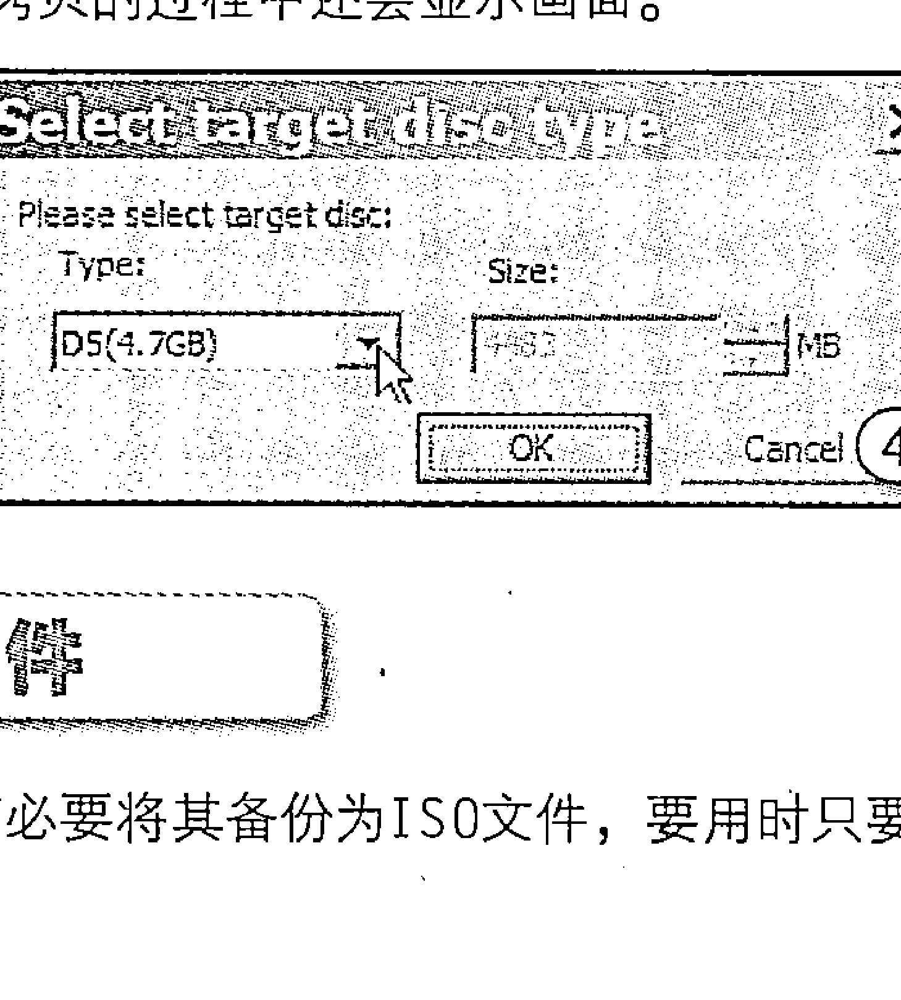

### 五、另辟蹊径 将文件变为ISO文件

如果你想把文件先前备份的DVD文件夹变为ISO文件，再也不用购买第三方的软件了。现在只要在ImTOO DVD Copy Express中选择Source为Open DVD Folder，然后选择相应的文件夹，如c:\dvd。单击Target，选择Save as Image，同时设置输出文件名，如d:\iso1.iso。单击右侧的Start Copy按钮即可，这样就会把c:\dvd文件夹中的所有文件制作成d:\iso1.iso文件。

## 给自己更好的声音世界
全面用好高清声卡

□江北书生

随着电脑主板的升级，现在很多的主板上都集成了高清的声卡（HD Audio）。但是这种高清声卡有时并不如传统的声卡那样容易驯服。因为上面接口众多，而且有时驱动安装比较难，甚至会出现噪音或反常的现象。更为严重的是，它在录音时不是那样容易，怎样选择录音设备是一个问题。同时，怎样让它适应QQ、Skype等语音聊天工具也是摆在大家面前的问题。

> 小知识
什么是HD Audio
HD Audio，其中，HD是高保真的简称，它提供比AC‘97标准的声卡更好的音乐与电影感受效果，今年以来陆续上市，取代AC’97声卡只是个时间推移的问题。HD Audio也是INTEL力推的替换AC‘97声卡的标准。

HD Audio (High Definition Audio，高保真音频) 标准的主要优点在于它的音频采样位数和音频采样频率都非常高，理论上使电脑中播放的音频达到甚至超过高档家庭影院的音质效果，像6声道，每声道24bit/96KHz的DVD Audio音乐光盘，仅仅被视为HD Audio的基本要求而已。除了采样位数和采样频率高外，大部分支持HD Audio标准的声卡都有极高的信噪比(信噪比参见：http://hi.baidu.com/gwjtzy/blog/item/bd93a2006e37ac86e850cd14.html)，输出的音乐信号比以往更清晰，更少杂音。其实，HD Audio并非是在Intel公司推出i915/925平台后才出现的。2001年，全球最大声卡制造商——新加坡Creative（创新）公司推出Audigy声卡时，它就已经支持到24bit/96KHz音频输出(数字)。其后VIA（威盛）公司的Envy系列音频芯片也增加了相同的输入输出标准。再后来，创新Audigy2声卡支持到24bit/192kHz，使它可播放DVD Audio光盘中最高标准的两声道音乐。至此，HD Audio的雏形初现。现在，由于Intel i915/925主板芯片组的应用逐渐走向普及，故我们知道，现在Intel倡导的HD-Audio能支持到24Bits/192kHz，它的使用和设置与旧的AC‘97有较大的差异。

## 一、安装驱动要注意

Windows Vista提供了对高清声卡的全面支持，但是现在Windows XP仍是我们主流操作系统，可惜的是，在下面安装HD Audio驱动会出现问题(如图1)。这时，我们有几种方法来解决。

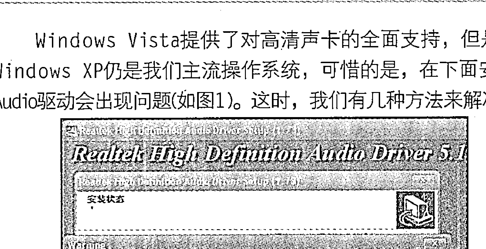

### 1. 安装UAA驱动

必须为Windows XP、Windows Server 2003 和 Windows 2000安装通用音频结构（UAA）高清晰度音频类驱动程序（其实是一个补丁）。该问题在微软知识库中的编号是888111，大家可以登录 http://support.microsoft.com ，然后输入888111来查找相应的知识（如图2）。但是微软本身网站上查找非常不容易，所以可以到 http://www.gougou.com/search?search=888111&id=1 上进行下载，只是在下载时一定注意版本号，一是操作系统的版本，如XP、2000、2003，同时还要选择相应的补丁包，如不要下载SP1下的驱动，而去SP2下安装。一般情况下，我们应该下载并安装SP2包。下载完成后，再安装驱动即可保证安装HD Audio。事实上，由于Intel采用新的高清晰度音频（High Definition Audio）技术，所以才要微软的通用音频结构（UAA）高清晰度音频类驱动程序。一个是KB835221，一个是KB888111，先装KB835221，再装KB888111，最后安装声卡驱动，就能解决此类问题。笔者在很多机器上发现KB835221无需安装（有可能已经被集成在了Windows XP SP2包中了）。

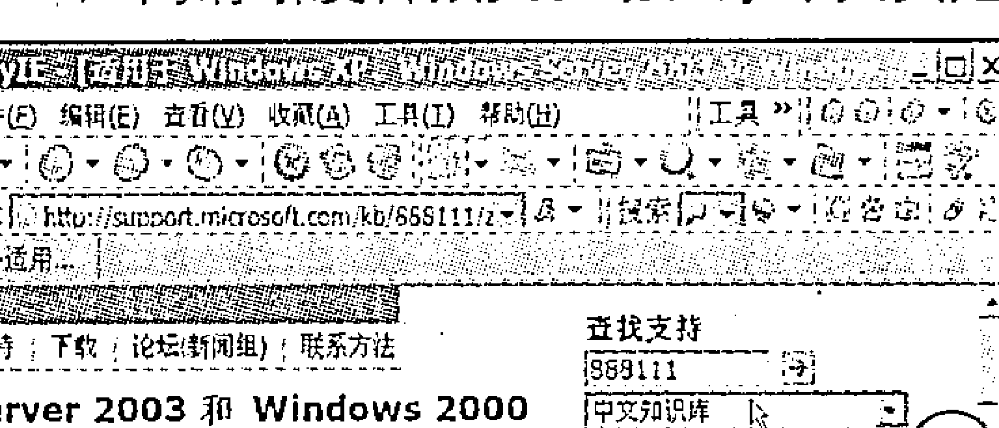

> 小提示
另外，最新出厂的主板已经解决了此类问题，驱动程序里面的UAA高清音频程序，就是此补丁。有的驱动程序更为智能，在安装前会自动判定系统中有没有此补丁，如果没有，会自动应用。

### 2. 使用集成了UAA驱动的光盘或克隆

现在有的光盘已经集成了此驱动，用它来安装系统或者克隆安装，则无需再安装。但别人做的光盘，其安全性总不是太能让我们放心的。所谓害人之心不可有，防人之心不可无，我们自己动手制作一个也是不错的。

## 二、怎样连接输出

如果是6.1音箱，直接按线的颜色进行连接。一般人用的仍是双声道的音箱，这时将其插到主板后面高清声卡输出口中的绿色口中（如图3）。

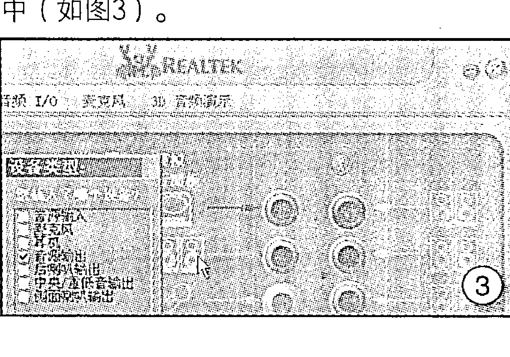

## 三、如何去掉讨厌的怪音

安装完HD Audio声卡后，很多人发现声音有点“不对劲”。这是由于一般人安装时采用了默认的设置，所以它启用了环境音效。而多数人的音箱仍是双声道的，所以才会出现怪音的效果。这时，只要双击任务栏上相应的管理工具，如“Realtek HD音频管理器”，再单击“音效”标签，然后单击“环境”下拉列表框，从中选“无”，再单击右侧的“重设”即可（如图4）。

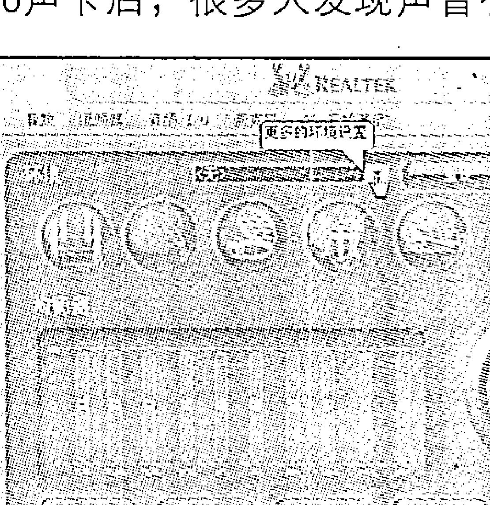

## 四、怎样录制外部声音

由于高清声卡的插口比较多，所以我们用它来录制声音时，也有一些讲究。

- 第一步：连接硬件
从市场上购买对录线，此对录线可以到当地电子电脑市场购买，价格在三四元左右。如果需要较好的，价格可能在七八元左右。然后将对录线的一端插入声卡的青色插口，另一端插入收音机的Phone（耳机）插孔中。接着双击任务栏上相应的管理工具，如“Realtek HD音频管理器”，再单击“音频I/O”标签，然后单击后面板中的青色插口左侧的图标，从中选择“音频输入”。

- 第二步：安装好必要的驱动程序
启动你的Windows，并正确安装好声卡的驱动程序，使之能够正常发出声音。

- 第三步：选择录音源
双击任务栏上的相应的管理工具，如“Realtek HD音频管理器”，再单击“混频器”标签，再单击左下方的“录制”区域中最左边的“混音器工具箱”，在打开的窗口中选中“线路音量”。之后返回到相应窗口中，取消掉了“线路音量”之外的所有项目。

- 第四步：安装Messer录音程序和MP3编码器
从http://www.gougou.com上搜索并下载Messer，然后用WinRAR或WinZip打开它。再双击其中的messer-v098-setup.exe，并采用“一路回车”法完成安装。
接着从http://www.gougou.com上搜索并下载lame，然后用WinRAR或WinZip打开它，把其中的所有文件解压到Messer的安装文件夹下，如C:\Program Files\Messer，即可完成MP3编码器的安装。

- 第五步：设置Messer
打开Messer，然后单击Configration（配置）标签，在Messer Enlargment factor X times larger than normal（放大因子）下拉列表框中选择3/2（如图5），再单击最右下方的放大图标放大窗口，最后单击界面左上方的钟表图标，禁用定时录制。
接着向上拖动滚动条，在I. Sound proprites for manual sesseins项下，首先选择mp3 compression；然后通过下拉菜单选择Stereo（立体声），sample rate（采样率）选择48.00KHz；单击mp3按钮，在弹出菜单中选择LameEnc。然后从下滑菜单中选择编码比特率，数值越高，效果越好，当然文件体积也会越大，建议选择048Kbit/s（如图6）。要注意的是，如果你愿意，也可以选择更好的编码比特率。这样音乐质量会高很多，但同时也会占用更多的硬盘空间。

- 第六步：开始录制
接下来，打开收音机，调至相应的频段。单击Messer工具上的Recording monitor标签，然后单击MP3 Rec按钮（如图7）。接着在打开的窗口中选择录制文件的保存文件夹和文件名，再单击“文件类型”下拉列表框，从中选择*.mp3即可。

- 第七步：结束录制
过程结束后，单击Stop按钮，完成录制。之后，即可将录制完成的MP3文件在MP3播放器中播放。

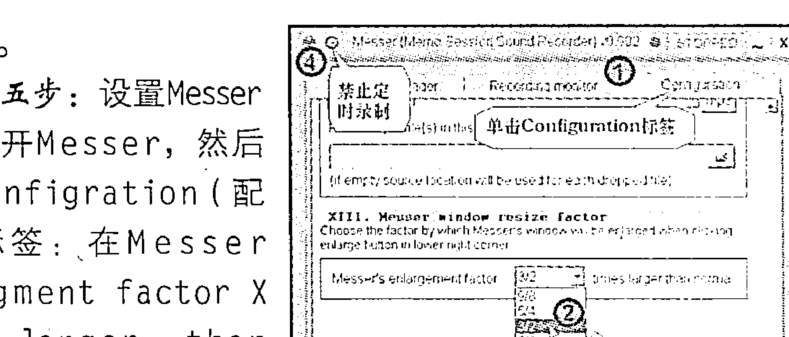

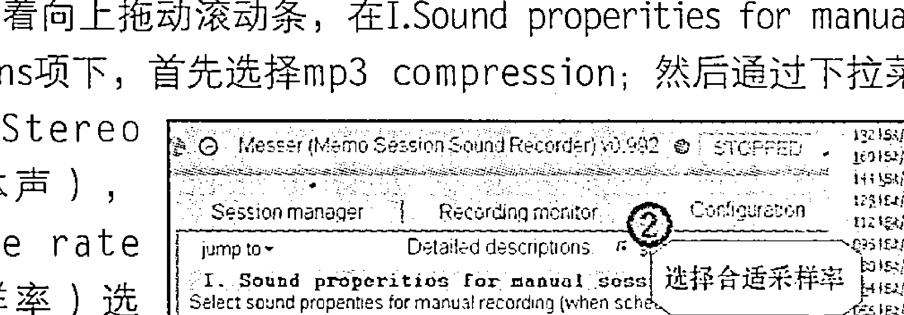

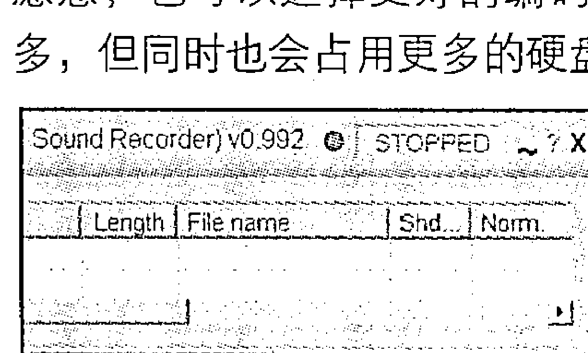

## 五、如何让麦克风正常工作

有时发现在高清声卡上有麦克风工作不正常的现象，这对于语音聊天一族来说可不是个好消息。事实上，这个问题并不难解决。
把麦克风的一端插到主板后面高清声卡中的粉红色的插口中，机器提示已经插入。接着，双击任务栏上的相应的管理工具，如“Realtek HD音频管理器”，再单击“音频I/O”标签，然后单击后面板中的粉红色插口左侧的图标，从中选择“麦克风”。再单击“混频器”标签，然后确认Rear Pink In（后端粉红色插口输入）没有被禁音。
接着在QQ或MSN或Skype中就可以直接使用了，非常方便的。

## 网络新视听
——彻底玩转FLV

随着WEB2.0的普及，“体验、分享、互动”成了时下互联网上炙手可热的词汇，而网络视频也逐渐渗透到了我们的日常生活当中，从NBA赛场姚明矫健的身影，到美国的热播电视剧《越狱》；从最新的电影，再到各种搞笑的视频短片，只要你有时间，想怎么看就怎么看，甚至连下载都免了，一个由YouTube、土豆、六间房、酷溜等在线视频分享网站引导的新视频时代已经来临！同时值得注意的是，这些网站无一例外地采用了FLV格式，现在我们就来看看如何玩转它。

### 一、关于FLV格式

FLV是一种全新的流媒体格式，全称为“Flash Video”，它是在基于Sorenson公司的压缩算法基础上开发出来的。FLV得到Flash MX 2004的完美支持，不仅可以轻松、快速地导入Flash中，而且具有体积小巧、图像质量相对较高的特点，可以不通过本地的微软或者REAL播放器实现在线播放视频。同时，FLV提供了下载进度的显示，可以一边下载一边播放，这样我们的网站再也不用愁那些“大块头”的视频文件怎么放上去了，因此也就成了众家视频分享网站的唯一最爱。

### 二、下载

很多朋友都知道，限于当前播客网站服务器带宽以及在线人数等原因，会造成在线观看FLV视频节目时不太流畅、缓冲时间较长、时断时续甚至无法观看。另外，现在很多的便携式视频播放器已经支持FLV格式，这样我们就可以摆脱网络，随时随地地欣赏精彩视频短片……因此，把这些FLV文件下载到本地硬盘成了很多人的强烈愿望！但是，由于FLV视频格式的原因，在网页页面上无法找到节目的真实下载地址，要想下载到本地就需要费一番周折了，这里总结了三种最简便、实用的下载方法，相信肯定有一种方法最适合你！

#### 方法一：在线获取FLV地址

现在很多网站都提供了在线分析FLV视频地址的服务，比如网站“www.wbwb.net/video”，它支持当前人气较高的土豆、六间房、优酷等等知名视频分享网站，而且使用方法也非常简单：

第一步：先从视频分享网站中寻找自己想看的电影，比如http://6.cn/watch/4475002.html中的视频短片。

第二步：复制地址栏中的网页地址，然后打开“www.wbwb.net/video”，将该网址粘贴到“请输入视频网页地址：”下方的空白栏里，点击“显示下载地址”按钮（图1）。

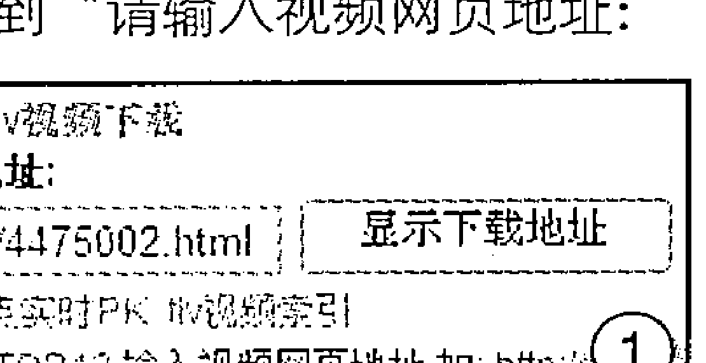

第三步：稍等片刻，该网站将自动分析视频短片的地址，然后在“flv视频下载路径：”下方显示真实的FLV文件地址，现在大家就可以使用“目标另存为”或者快车、迅雷等等工具把它下载到本地了（图2）。

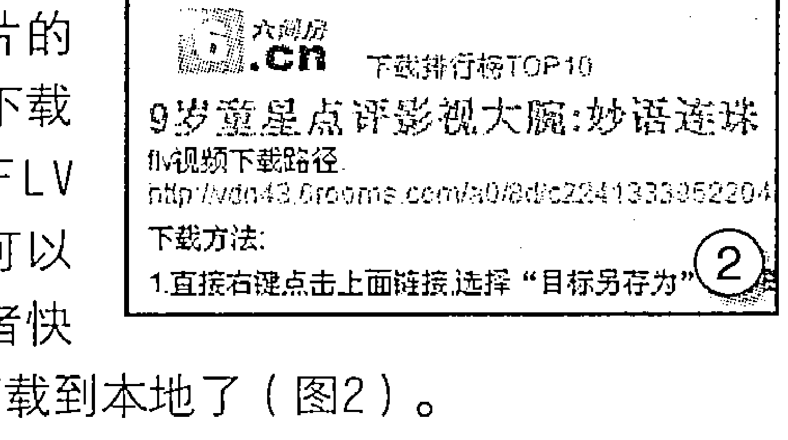

> > **小提示**
>
> www.wbwb.net/video网页下方中，对每个支持的视频站点都提供了“查看TOP10”功能，只要点击该超链接，就可以直接得到该网站当前最为热门的10个视频短片的下载地址！

#### 方法二：使用“维棠”下载更轻松

如果你经常要下载FLV文件，会发现虽然在线获取FLV地址的操作很简单，但会遇到不支持某些不太知名的视频站点，或者不支持使用快车、迅雷等工具而无法断点续传下载的问题，因此这里向大家推荐“维棠”，它是一款集分析真实FLV地址、断点续传下载于一体的工具软件（下载地址：http://cn.vidownonline.com/download.html）。

第一步：下载并运行维棠，会发现它的界面跟经典的快车如出一辙，点击“查看→悬浮窗”，屏幕上也会出现一个悬浮窗口，这里将显示当前的下载状态。

第二步：打开视频所在的网页，比如我们前面的http://6.cn/watch/4475002.html，复制该地址，然后在维棠中依次点击“任务→新建下载任务”，在弹出的下载确认窗口可以看到已经自动粘贴到了“视频网址”一栏中，设置保存位置后点击“确定”按钮就行了（图3）。

第三步：回到维棠主界面，会发现任务列表里已经出现刚刚添加的下载任务，如果想暂停，只要双击它即可。

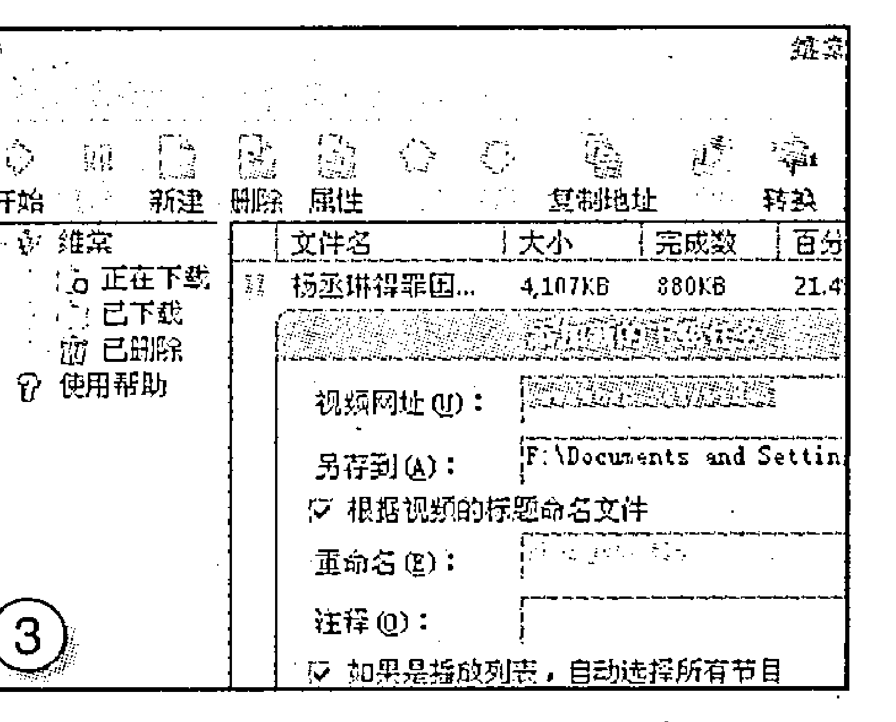

#### 方法三：使用“横行天下”搜索、下载一条龙

现在有很多电视剧也被搬到了视频分享网站，这大大方便了那些无法每天守在电视旁的倒班族，从此也能欣赏有头有尾的精彩电视剧了。但是，在线播放这些视频，不仅要忍受网速慢而造成的缓冲，而且还要手动去按顺序寻找每一集节目，有更加方便的解决方案吗？当然有！来试试绿色软件——“横行天下FLV视频下载”软件吧（下载地址：http://www.orsoon.com/Soft/7845.html）。

第一步：比如现在我们要下载热播的“神探狄仁杰”，只要先运行“横行天下”，然后在“关键词”处输入“神探狄仁杰”，从支持的土豆网、六间房、优酷、酷六、新浪播客、YouTube等知名网站列表里根据需要选择一个搜索目标，比如“优酷”，点击“搜索”按钮开始查找（图4）。

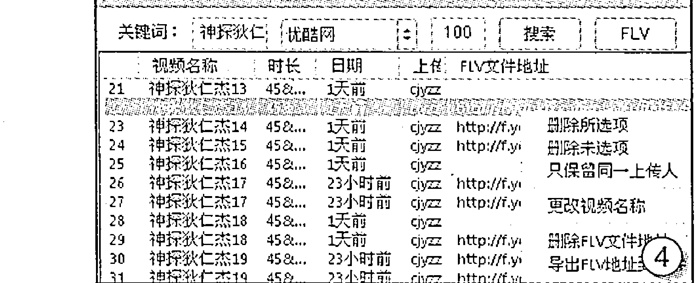

第二步：由于热播的节目上传的人也多，因此会存在很多重复的节目，但是同一个上传者重复上传的几率就很小了，因此可以先观察一下哪个上传者上传的视频最全，然后右击他上传的任意一集，在弹出菜单里选择“只保留同一上传人”，这样就只剩下他上传的节目了。

> > **小提示**
> 从右键菜单中使用“删除所选项”、“删除未选项”功能可以很方便地实现选择或反选，从而达到精简搜索结果的目的。

第三步：点击“FLV”按钮，它将自动获取列表里所有搜索结果的真实FLV视频地址，如果此时点击“下载”按钮将依次开始下载，但由于我们所需要的“神探狄仁杰”有48集之多，因此可单击右键后选择“导出FLV地址到文件”，它会自动保存到记事本程序并打开该文件，把它“另存为”lst列表文件；最后，运行前面我们介绍的“维棠”软件，依次点击“文件→导入下载列表”就可以批量下载了（图5）。

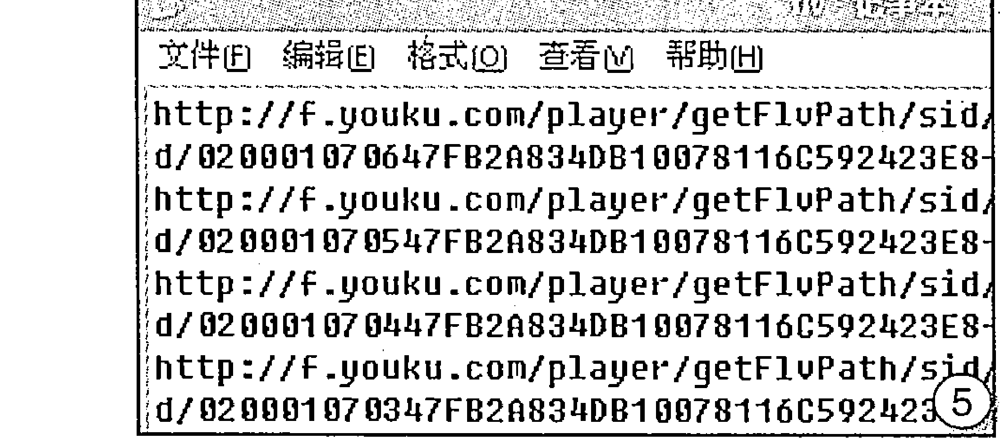

### 三、播放

曾几何时，很多人为如何播放下载回来的FLV文件而大伤脑筋，因为当时常用的播放器都不支持该格式，比如Windows Media Player，不得不安装专用的FLV播放器，比如最常用的Flv Player播放器。不过，随着各种万能播放器、万能编解码包的流行，只要安装了它们其中的任意一个，从此播放FLV格式视频跟播放AVI格式就没有区别了。

这里推荐大家安装“阿飞编解码包”，只要安装了它，从此Windows Media Player也能轻松播放FLV文件，甚至RM文件，当然使用KMPlayer、暴风影音等第三方播放器也可以（图6）。

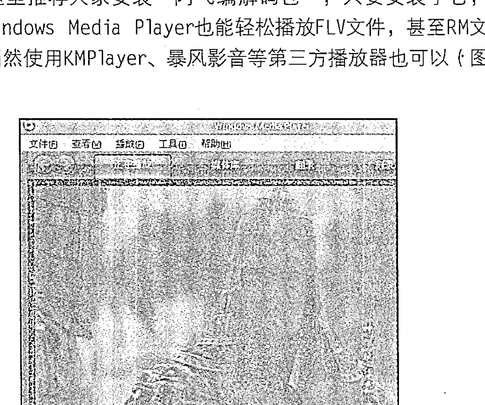

阿飞编解码包官方下载：http://www.ogg.cn/software/view-software-205.html

### 四、合并、分割与修复

在某些视频网站，往往对FLV文件的体积或播放时间进行了限制，因此上传的大体积FLV文件都会被分割成多个部分，直接导致我们下载的某个视频短片居然由好几个片段组成，当播放时就非常的麻烦；另外，当我们想将FLV文件上传到网站或便携式播放器时，很希望把体积超大的FLV文件按照自己的想法进行分割……如何快捷地合并、分割FLV文件呢？还是借助“FLV编辑器”软件来实现吧。

#### 基本设置

FLV编辑器是一款绿色软件，但要想使用它，还需要确认两个问题：

- 1. 由于该软件基于VB编写，因此请确保系统目录下（c:\windows\system32）存在msvbvm60.dll，如果没有，请把压缩包中的该文件复制到系统目录下即可。
- 2. 确认当前系统可以正常播放flv视频文件，如果不能正常播放，请运行压缩包中的klcodec301s.exe来安装编解码包。

##### 1. 合并

第一步：运行“FLV编辑器”，从主菜单的“高级处理”中点击“合并”进入合并工作区界面（图7）。

第二步：点击“加入文件”图标，找到并全部选中需要合并的FLV片段，点击“打开”按钮后把它们加入到列表中，然后按下“依序排列项目”图标来按照顺序进行排列，避免合并后视频错乱的问题。对于偶尔出现的无法依序排列的文件，可以选中它后点击上下箭头图标来进行调整（图8）。

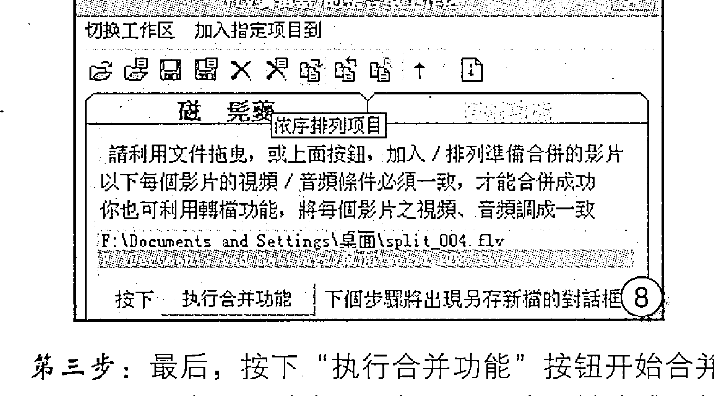

第三步：最后，按下“执行合并功能”按钮开始合并，稍等片刻即可完成。经测试，一个88MB左右、被分成四部分的FLV文件，合并过程大约需要50秒。

##### 2. 分割

第一步：从“FLV编辑器”主菜单下的“高级处理”中进入“分割”功能。

第二步：在“指定影片”中载入需要分割的FLV文件，点击“取得属性”按钮将自动完成对视频文件的分析（图9）。

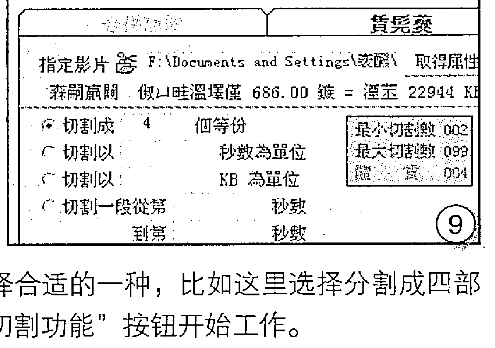

第三步：根据需要，从下方提供的六种分割方案中选择合适的一种，比如这里选择分割成四部分，最后点击“执行切割功能”按钮开始工作。

##### 3. 修复

我们从网上下载到的FLV文件，很多都是从常见视频格式转换过来的，很容易存在损坏、无法正常显示播放时间、无法拖到进度条快放等问题，因此就必须进行修复。如果你遇到了此问题，不妨也用FLV编辑器来试试：

第一步：从其主菜单下依次进入“高级处理→修复功能”。

第二步：在弹出界面中，首先在“指定影片”中导入需要修复的FLV文件，然后按下“执行修复功能”按钮，最后在弹出对话框里指定修复后文件的存放位置以及名称，点击“保存”按钮即可（图10）。

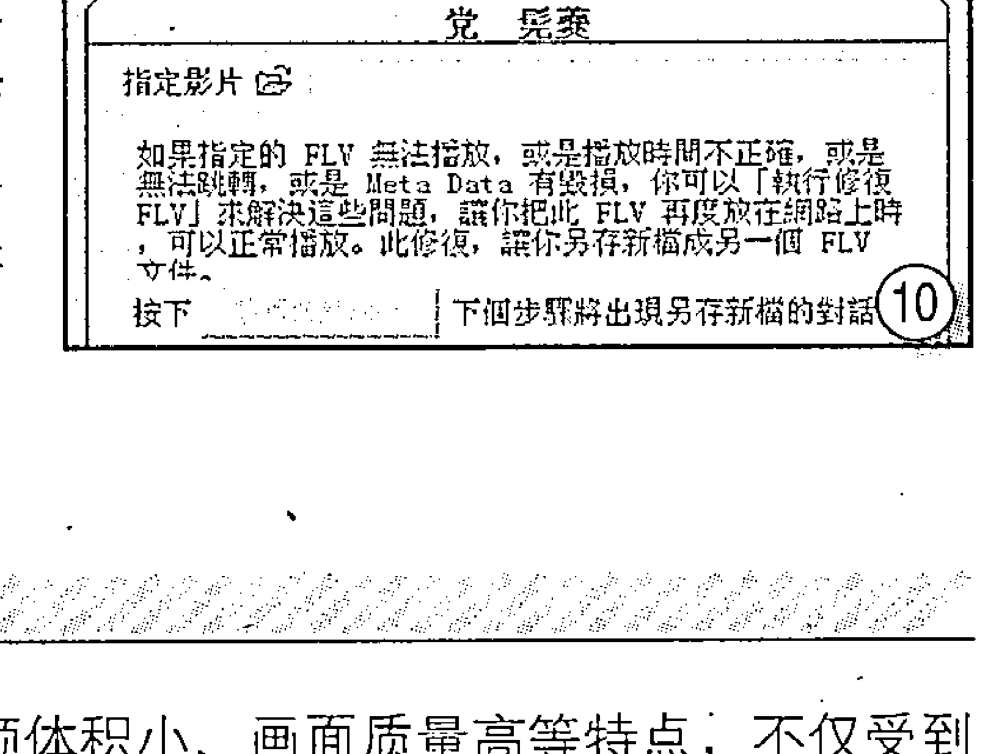

由于FLV格式视频体积小、画面质量高等特点，不仅受到众家视频分享网站的青睐，而且当前很多MP3、MP4厂商也推出了支持FLV的产品，因此FLV格式也逐渐成为常用的视频格式之一。这样一来，如何才能实现FLV格式与AVI、MPEG等视频格式的互换，也成了很多人挠头的问题。这里向大家推荐由著名的BitComet开发者推出的“BitComet FLV转换器”软件，它拥有的体积小巧、转换速度快、中文界面、免费、绿色等特点成了FLV转换的首选！

##### 1. 其他格式转换到FLV

现在我们从网络上下载到的视频，基本上都是RMVB或者AVI格式，如果想在保证画面质量的条件下，让体积变得更小，将其转换成FLV格式最合适不过了，而且使用“BitComet FLV转换器”只需两步就能完成。

第一步：运行BitComet FLV转换器，切换到“Video2FLV”选项卡，从“输入文件”中载入需要转换的视频文件，在“输出文件”里指定转换后存放的位置以及文件名（图11）。

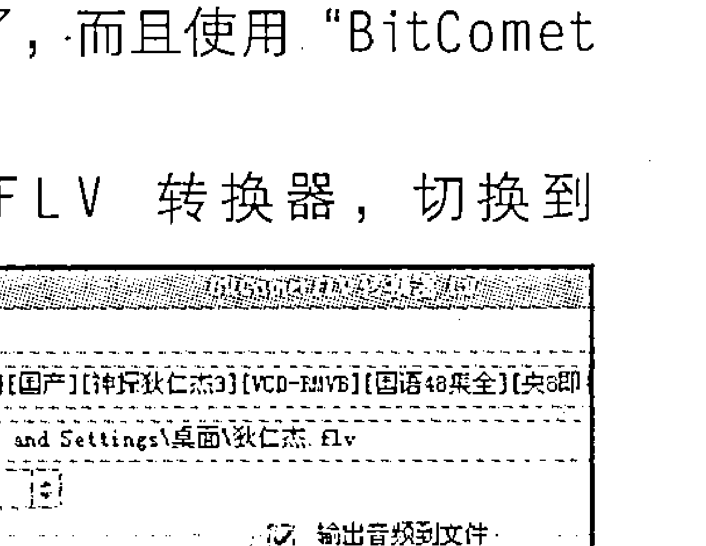

第二步：无须更改其他参数，只要点击“转换”按钮，稍等一会儿就能完成转换了。经测试，一个150MB左右的RMVB文件转换到FLV格式后变成88.8MB，耗时12分钟左右。

##### 2. FLV转换到AVI、MP4、MP3

早期购买的MP3、MP4等播放器很多都不支持FLV格式，甚至有些MP3只能播放音频文件，莫非无缘随时随地“欣赏”FLV了？当然不是！我们可以采用视频格式转换的方法，将其转换成AVI、MP4等视频格式，甚至直接提取其中的音频，从而使普通MP3也能“听”视频了！

第一步：运行BitComet FLV转换器，切换到“FLV2Video”选项卡，从“输入文件”中载入需要转换的FLV视频文件，在“输出文件”里指定转换后存放的位置以及文件名。

第二步：在“输出格式”里选择要转换成的格式，如果只想提取音频，这里选择“MP3”，其他参数保持不变，点击“转换”按钮即可（图12）。

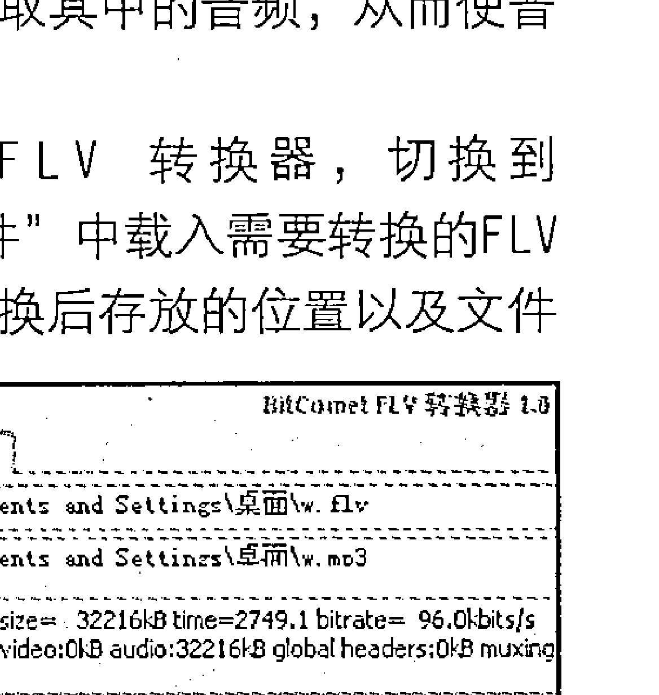

### 相关转换软件推荐：

- 1. **FLV to AVI MPEG WMV 3GP MP4 iPod视频转换器**
   下载地址：http://www.serverol.com/download/dl1102.html
   一款共享软件，支持将FLV文件转换成更多的文件，比如ASF、3GP、DVD MPEG-2（*mpeg）格式等等，同时支持批量转换、转换后自动关机等实用功能。

- 2. **Total Video Converter**
   下载地址：http://www.onlinedown.net/soft/56967.htm
   Total Video Converter提供视频文件转换的终极解决方案，它内置一个强大的转换引擎，能快速地进行文件格式转换，可以把各种视频格式转换成手机、PDA、PSP、iPOD使用的便携视频、音频等流行的媒体文件格式，同时也支持批量转换！

## 让腾讯TT如虎添翼

□亚军

作为国内即时通信软件领域的龙头，腾讯公司早就盯上了多页面浏览器市场。可惜早期与QQ捆绑的TE（现在叫TT）存在诸多问题，不少QQ用户对它比较反感。不过，腾讯早已开始重视这一块了，现在的TT已经是一个比较成熟的产品了，也有了很多用户。

### 第1招 设置为默认浏览器

TT在安装后，第一次启动时会询问我们是否设置为默认浏览器。以后，我们还可以打开TT中【工具】→【选项】命令，然后单击【综合设置】标签，在其中设置它为默认浏览器（如图1）。

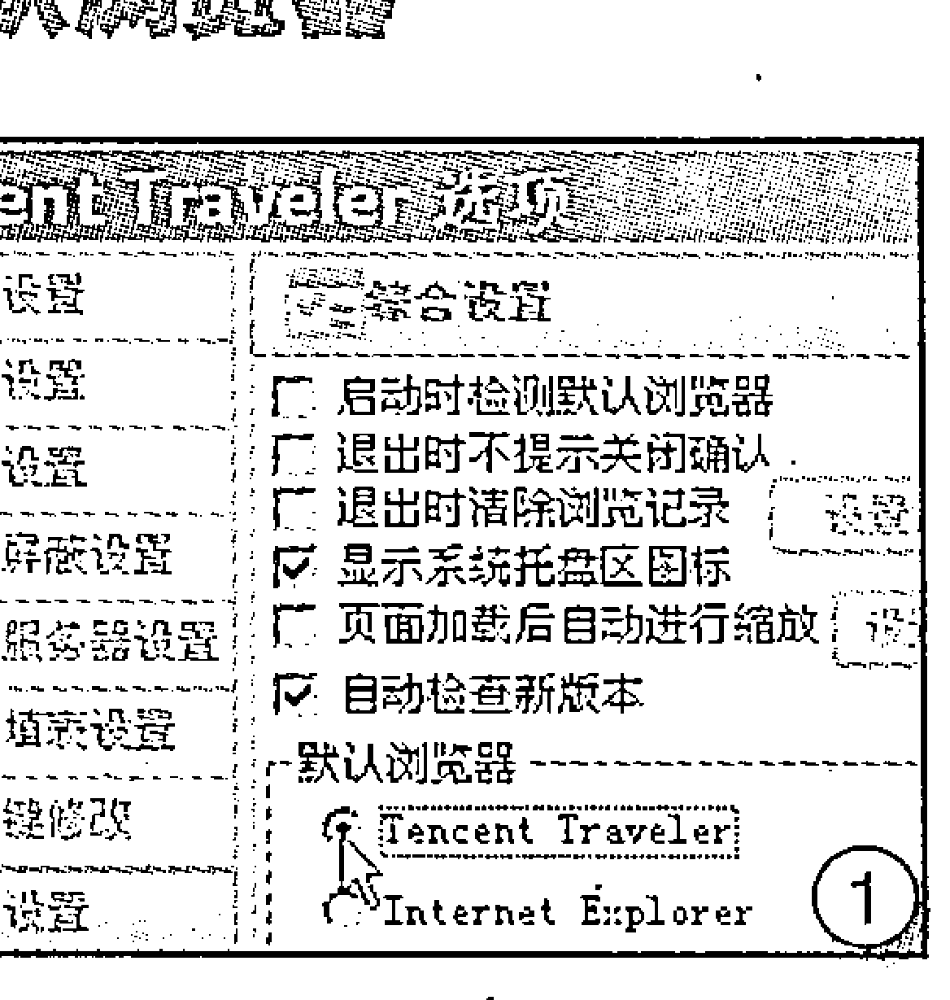

### 第2招 屏蔽讨厌的弹出窗口

每位网虫都会有这样的经历，正在搜索自己需要的资料或浏览感兴趣的内容时，被突如其来的网页广告所困扰，浪费时间去关闭它不说，而且耗费了宝贵的系统资源，甚至影响了上网的心情；使用腾讯TT，这一切将成为历史！

在TT中单击【工具】→【选项】命令，在对话框中单击“智能屏蔽设置”标签，在打开如图2所示的窗口中进行相应的设置，再单击【确定】按钮就可以了。以后每打开一个含有广告的弹出窗口，TT状态条的【屏蔽某页面】后面的数字就会增加1，说明一个广告弹出窗口已被TT过滤。

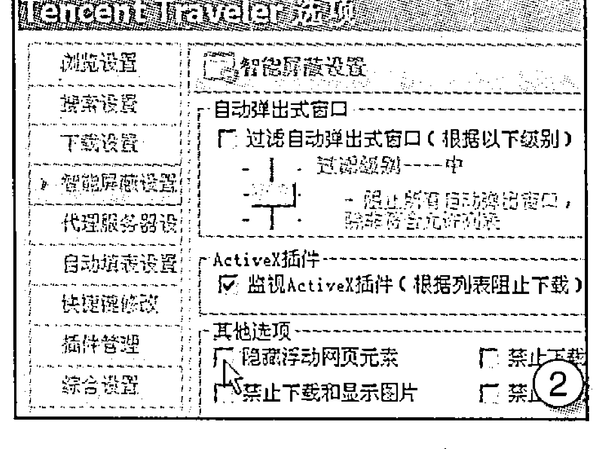

### 第3招 自动填表超轻松

上网的时候经常需要填写各种各样的表格，腾讯TT为了方便广大用户，设计了自动填表功能，运用它，用户的一些基本信息可以很轻松地进行填写，大大提高了工作效率。如何使用这个功能呢？打开如图3所示的TT选项后，单击【自动填表设置】标签，在其右侧的文本框中，可以自行填入自己的信息。也可以单击【追加数据】新增一些这里没有而又经常需要填写的资料，如QQ、MSN等等，最后确定保存；当遇到需要填写表单的网页时，只需单击工具条上的【自动填表】按钮，表单中相应的内容是不是自动填写上了，是不是超级方便？

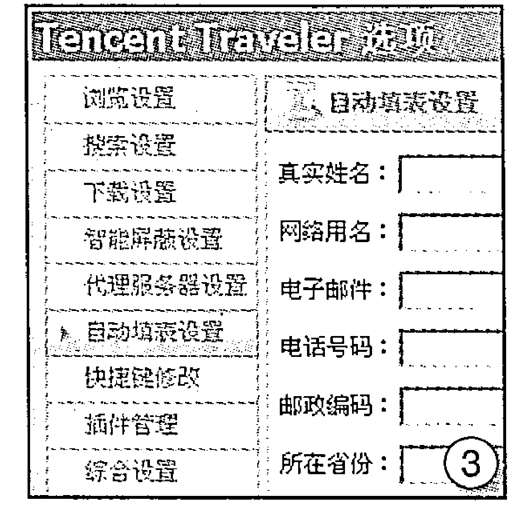

### 第4招 集成自己的搜索引擎

TT浏览器在安装后，默认只有QQ搜索引擎，事实上，我们完全可以将自己的搜索，如Google和百度等添加上去：打开C:\Program Files\Tencent\TT\CustomSearch\搜索引擎导入示例.txt，然后在下方添加如下语句：

```
"用百度搜歌词","http://www.baidu.com/m?tn=baidump3lyric&ct=150994944&rn=10&word=[%]"
"用搜刮网搜歌曲","http://search.sogua.com/search/search.asp?key=[%]&fexe=1&fzip=1&frar=1&fmp3=1&frm=1&fwma=1&fasf=1"
"yahoo搜索","http://cn.search.yahoo.com/search/cn?stype=&p=[%]&scch=on"
```

之后，再在TT中选择【工具】→【选项】命令，在弹出的对话框中选择【搜索设置】选项，然后单击【导入】按钮，选择C:\Program Files\Tencent\TT\CustomSearch\搜索引擎导入示例.txt文件即可。完成设置后，只要在TT的搜索框中输入相应的关键字，然后单击【多搜索】按钮就能调用我们自行设置的搜索引擎来搜索了（如图4）。

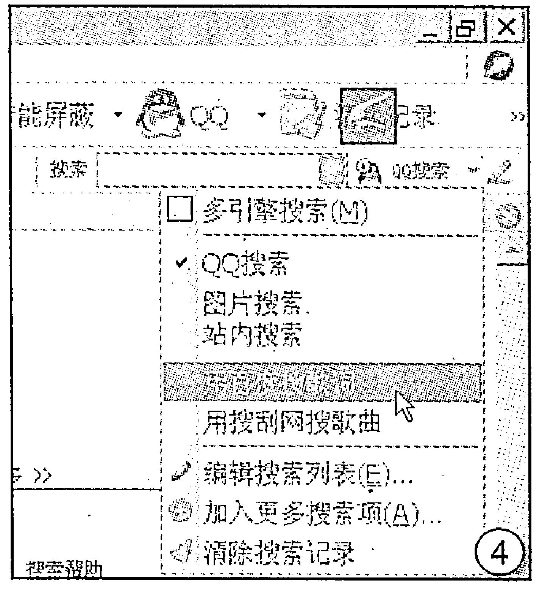

# 第5招 让TT快速缩放网页大小

如果你使用的是TT 3.1，则可以在打开网页后，按下Ctrl不松开，用鼠标的滚轮来放大/缩小网页。选择【查看】→【设置自动缩放】命令可以自行在打开窗口中设置自动缩放的比例（如图5）。而选择【工具】→【TT选项】，单击【综合设置】项，选中【页面加载后自动进行缩放】项（如图6），再单击【设置缩放比例】按钮可以设置页面打开后自动缩放比例，此技巧对于视力不好或屏幕字体较小的用户比较实用。

> 小提示
> - 【最近浏览】下拉列表显示和保存的地址信息有限，它只能显示10条地址信息、保存15条地址信息。当关闭的页面超过15个以后，列表中只保存最近关闭的15个地址，同时显示最近的10条地址。
> - 单击【最近浏览】下拉列表中的“清除最近浏览列表”命令，可以清除“最近浏览”下拉列表中的所有网页的名称。


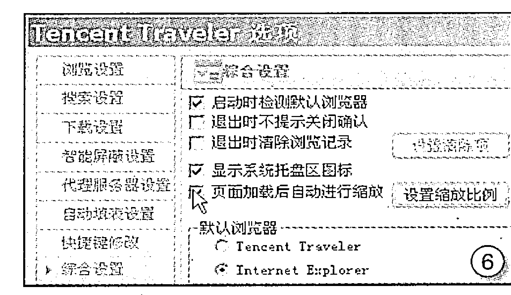

# 第6招 更快捷的拖拽功能

当我们需要在新窗口打开某一链接时，会习惯性地右击鼠标，然后在弹出菜单中选择【在新窗口中打开】命令。在腾讯TT使用拖拽功能即可轻松在新窗口中打开链接，拖拽功能提供了一个非常便捷的操作方式，省去了日常的拷贝、粘贴的操作。完全可以更加轻松，只需用鼠标选中源内容（可以是文本和链接），然后拖拉到目标位置，就可以执行相关的功能。比如，可拖拽一链接地址到地址栏下面，即可迅速打开该页面，是不是很智能化？腾讯TT真正实现了更少的操作、更快的打开。

# 第7招 轻松网页的浏览集

如果你使用的是IE，那关闭窗口后要想重新再打开还是挺麻烦的。不过，借助于 TT的【最近浏览】下拉列表，用户只要单击【最近浏览】按钮的下拉箭头（如图7），就可以恢复你想观看的网页了。

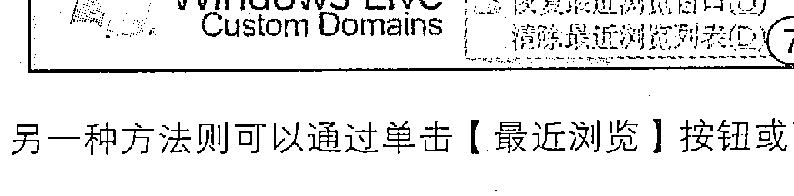

# 第8招 关闭网页更更快

信息太多，我们反而无法抓住重点。因此，为了适应TT的多页面浏览方式，它设计了多种关闭网页的方式。
- 用户需要关闭正在浏览的当前页，最快的方法是双击该页面标签。
- 右击页面标签，选择快捷菜单中的【关闭】命令。
- 单击工具栏中的【关闭】按钮。
- 按关闭当前网页的快捷键【Ctrl+F4】，它可以快速关闭当前打开的页面。
- 如果用户起用了【鼠标手势】，可以按住鼠标右键，向右移动鼠标后向左移动再向右移，最后松开右键就可以关闭全部页面。
- 如果用户需要关闭当前打开的所有网页，可以单击【多页下拉菜单】按钮打开菜单，选择其中的【关闭所有窗体】命令。
- 右击一页面标签，选择快捷菜单中的【关闭所有】命令，即可把打开的全部页面关闭。

# 第9招 鼠标手势

所谓鼠标手势就是按住鼠标右键，让鼠标在网页空白处以某一轨迹运动，以此来执行后退、前进、刷新、关闭窗口等常用操作。TT中也有很强的鼠标手势支持，这里作一总结：
- 关闭当前网页可以按住鼠标右键，向右移动鼠标后向左移动再向右移，最后松开鼠标右键。
- 前进到某一网页可以按住鼠标右键，向右移动鼠标后松开鼠标右键。
- 刷新当前网页可以按住鼠标右键，向上移动鼠标后向下移动再松开右键。
- 后退到某一网页可以按住鼠标右键，向左移动鼠标后松开右键。
- TT的鼠标手势功能的默认状态是关闭的，打开这一功能需要单击TT【工具】→【选项】命令，在对话框单击【浏览设置】标签，勾选【使用鼠标手势功能】并单击【确定】按钮就可以了（如图8）。

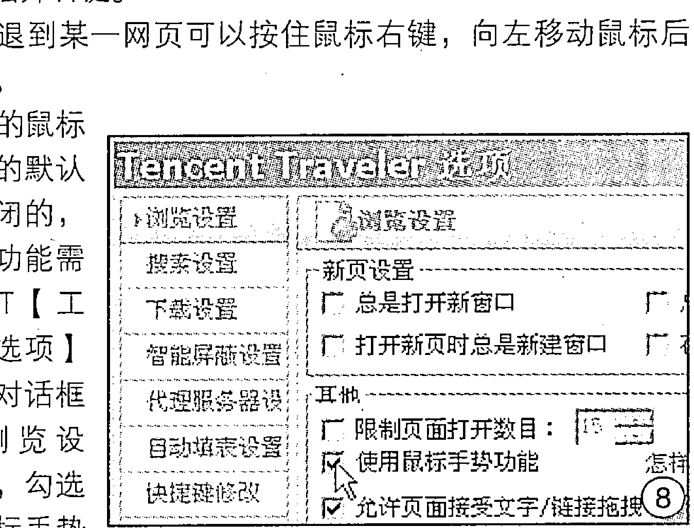

# 虎添翼

## ——IE的实用插件

□ 亚军

微软的IE浏览器在整个全球的浏览器市场中占有89%的绝对份额，因此而成为大家最为常用的浏览器。可惜的是，它本身除了有不少的安全漏洞外，还有很多的功能需要加强。但幸运的是，只要我们借助一些插件程序就可以让IE重新焕发出新的活力，使其更好地帮助我们更高效地工作！而且这些插件里多数还是免费的！

## 第一招 翻译插件

中国人在上网方面还是很难过了英文关，这就使得我们平时无法得到第一手的资讯而错过很多的商机。但真正地坐下来花太多的时间去学习外语又不太可行。现在有了IE的翻译类插件，这个烦恼就可以抛到九霄云外去了。

### Step1: Babylon

先进入http://www.babylon.com/display.php?id=95&&tree=57&&level=2#892，然后选择Chinese(S)下的Package 1 Dictionaries:English-下的download，即可安装英语到简体中文的翻译器，安装后直接运行之。我们右击其任务栏图标，选择Configuration，再在打开的窗口中单击Find标签下的Mouse Activation旁的Change，然后用鼠标中键单击空白区域（如图1）。这样在浏览网页时，只要用鼠标中键单击某个单词即可出现其解释（如图2），它和金山词霸不一样，因为它还会用英语来解释，以加深你的理解。

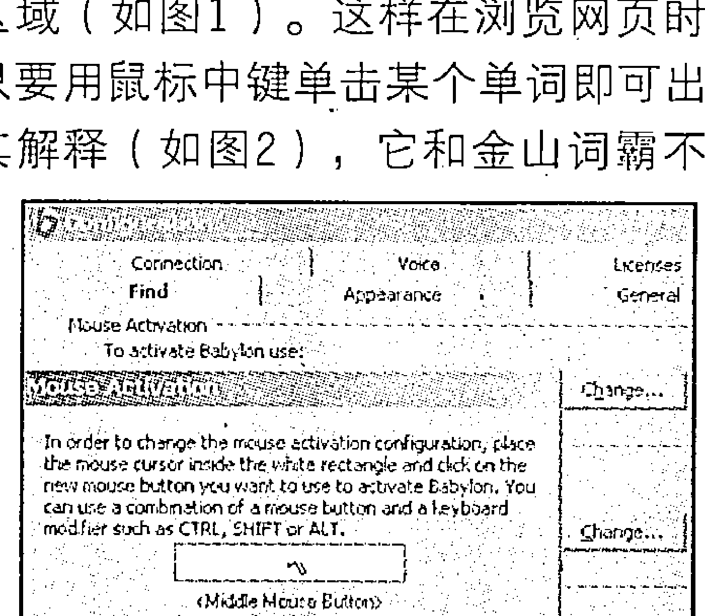

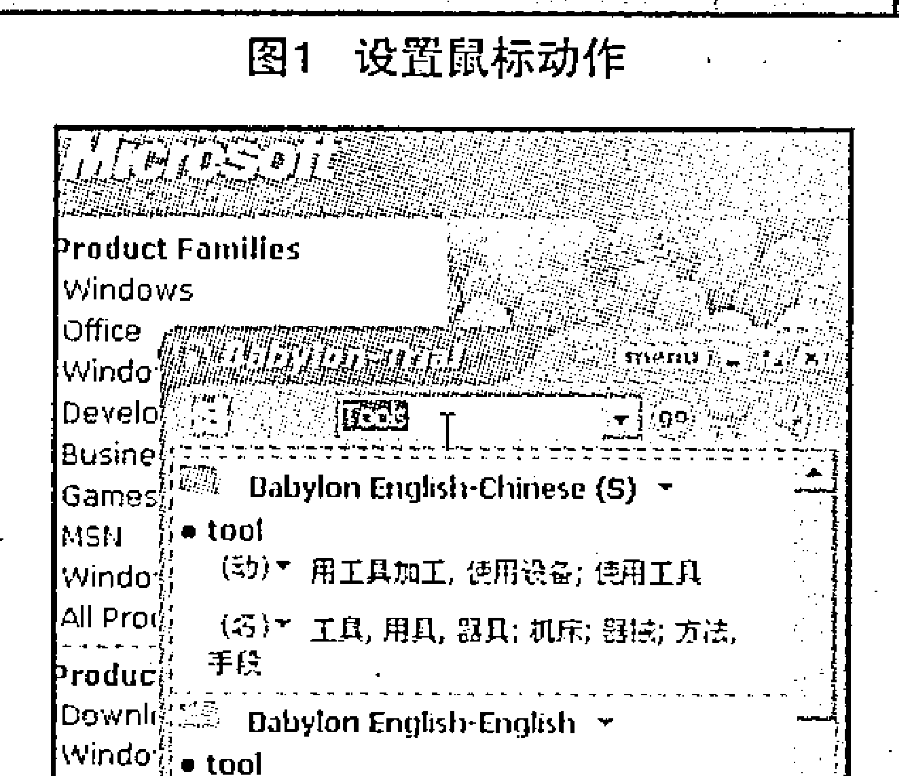

### Step2: 金山词霸

如果你愿意也可以使用金山词霸，它也提供了鼠标即时即译的功能（如图3）。

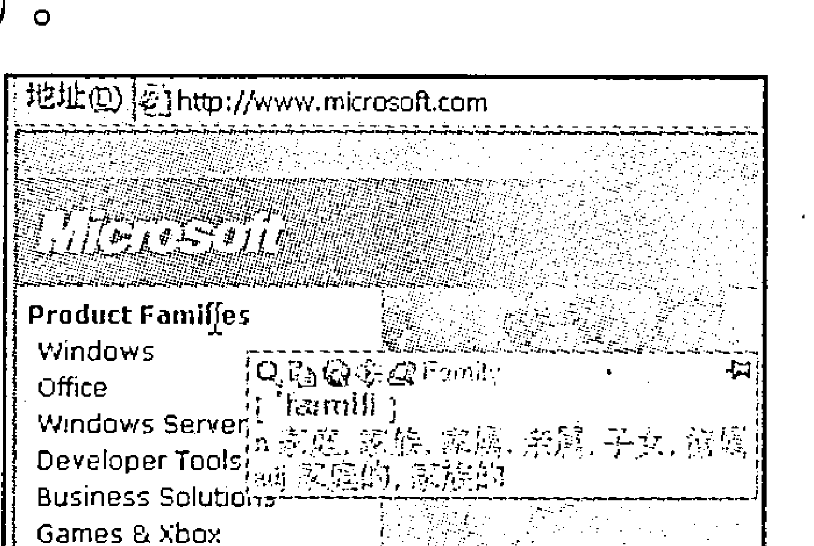

### Step3: 使用Maxthon

这个软件应该是大家非常熟悉的了，它是一款基于IE内核的浏览器工具。只要打开一个网址，然后单击如图4所示的按钮，再选择相应的转换功能，则可以将当前打开的网页译为简体中文。

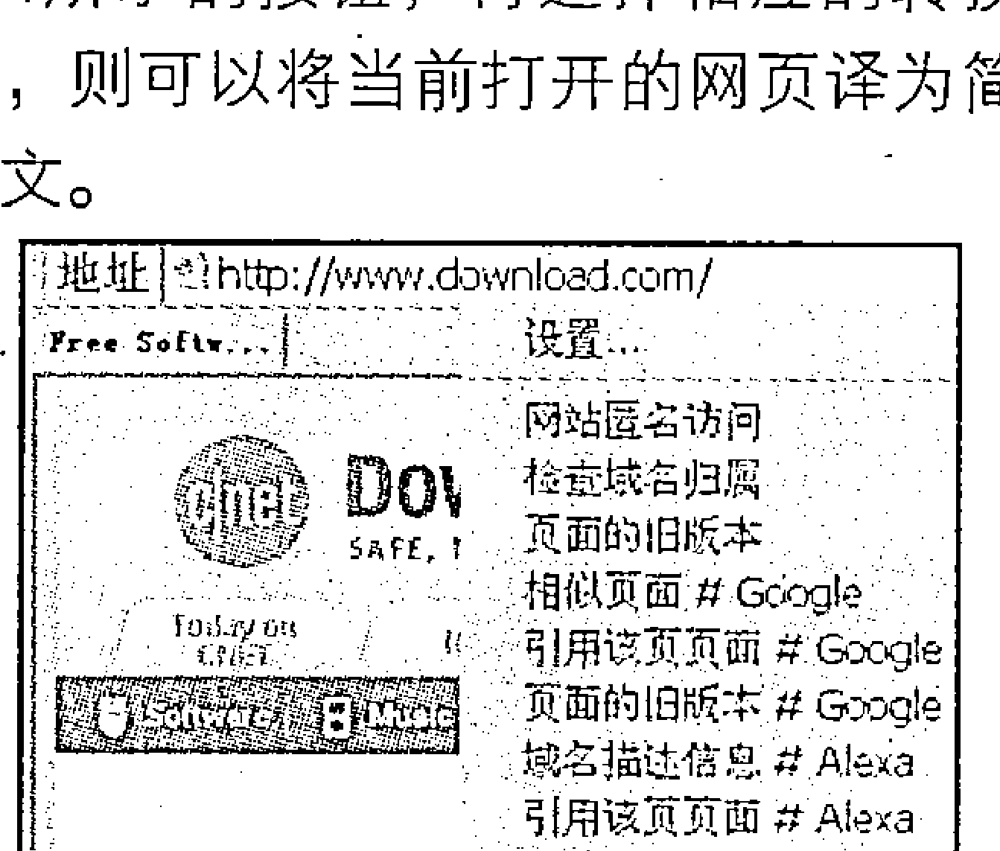

## 第二招 广告屏蔽类

上网的人对于不请自来的广告一定都很讨厌，因为它总是影响注意力、增加网络负担、浪费时间和金钱。而只要适当地用好广告屏蔽插件，就可以将它们通通消灭！

### Step1: Popup Ad Filter

从http://soft.2118.com.cn/soft/4838.htm处下载并安装之。然后就会在任务栏的托盘区中出现相应图标，如果打开IE时发现了弹出式广告，就会将它们屏蔽掉，同时会发出警告声，其任务栏托盘区的图标也会跳动，双击后可以看到它已经屏蔽掉的广告网页内容（如图5）。

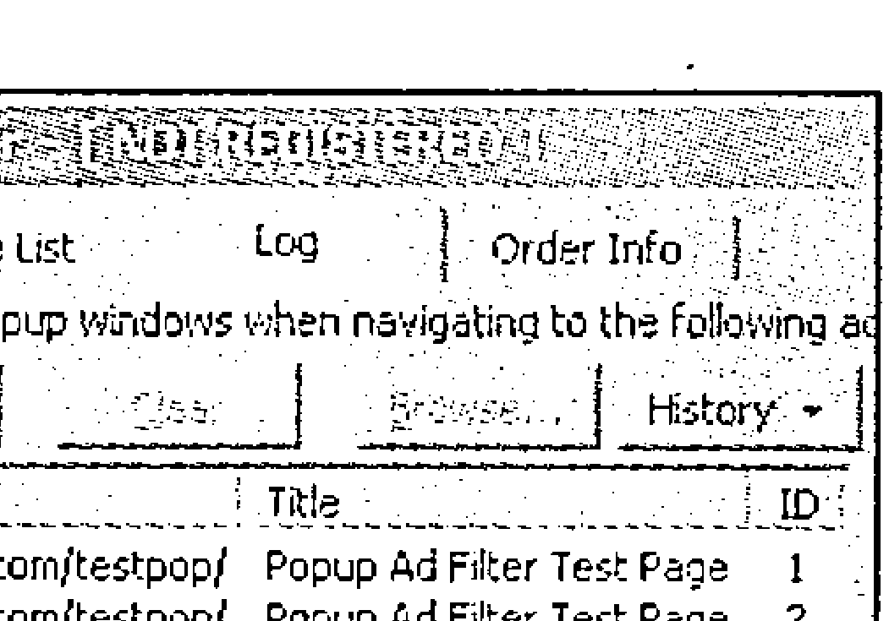

### Step2: InterMute

从http://ftp15.enet.com.cn/pub/network/nspeed/iM-setup15.exe下载InterMute的最新版本，下载后直接安装即可，在安装时，InterMute会让用户设置过滤规则，由于启动InterMute程序时，你可以对过滤规则进行更改，所以这里可以直接选用默认参数，当然你也可以就在这里改变。以后的步骤只要按照提示，依次单击【Next】或【OK】按钮就可顺利完成。最后，你会看到一个注册的画面，你可以选择【Buy Now】（现在购买）或是【Buy Later】（以后购买），然后你会发现系统托盘区出现了InterMute小图标，这时InterMute已经在后台开始工作了。在此软件中有许多选项（如图6），可以对广告进行有效的过滤！

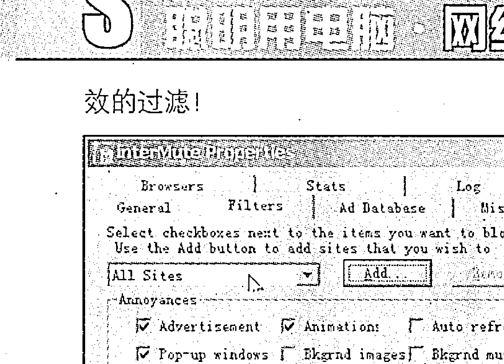

### Step3: 使用Maxthon和GreenBrowser

Maxthon和GreenBrowser都是基于IE内核的浏览器，在Maxthon中选择【选项】→【Maxthon选项】，再在打开窗口中单击【广告猎手】，然后按图7所示的窗口选中所有项（如图7），这样上网时被屏蔽的广告将会自动被【被屏蔽广告】代替。

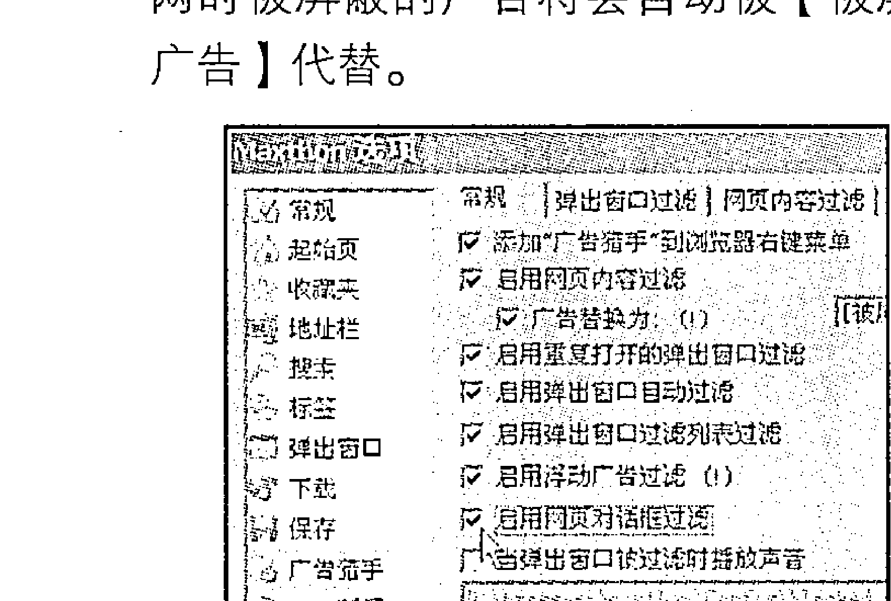

在GreenBrowser中单击【工具】→【广告过滤器】→【设置广告过滤器】，在打开如图8所示窗口中对其进行设置，用它来浏览网站时广告也会大大减少。

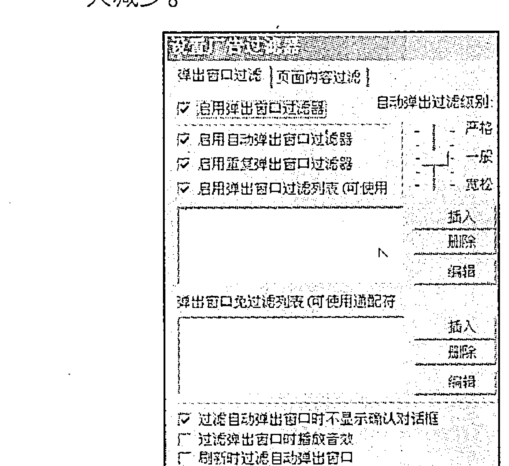

## 第3招 让IE也能多页面浏览

很多舍弃IE浏览器而使用Maxthon、GreenBrowser或Firefox的朋友都是因为IE是一个单窗口浏览器。而现在的IE 7中的多页面浏览也并不太成熟，加上它还是测试版。所以，我们完全可以通过安装Microgarden WebTools来让IE也能多页面浏览。

先从http://www.microgarden.com/shareport/wt21install.exe处下载此插件，安装好后，重新运行IE浏览器，能看见工具栏中多出了一行按钮（如图9），这时就可以通过【Add New Tabs】按钮增加新页面、【Close Tab】按钮关闭页面，这样你的IE也有多页显示功能。另外，我们将一个地址直接拖放到标签栏上即可随时打开。如果你对标签的位置不满意，可以用鼠标直接拖放标签到相关的位置。单击【Web Tools】→【Modify settings】还可以打开窗口来进行设置（如图10）。另外，注册后，我们还可以将当前的所有页面保存为一个群组，以方便日后打开。

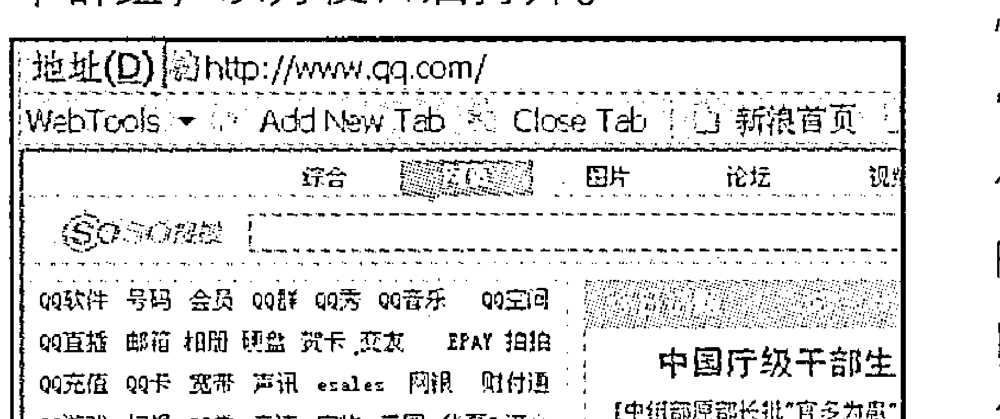

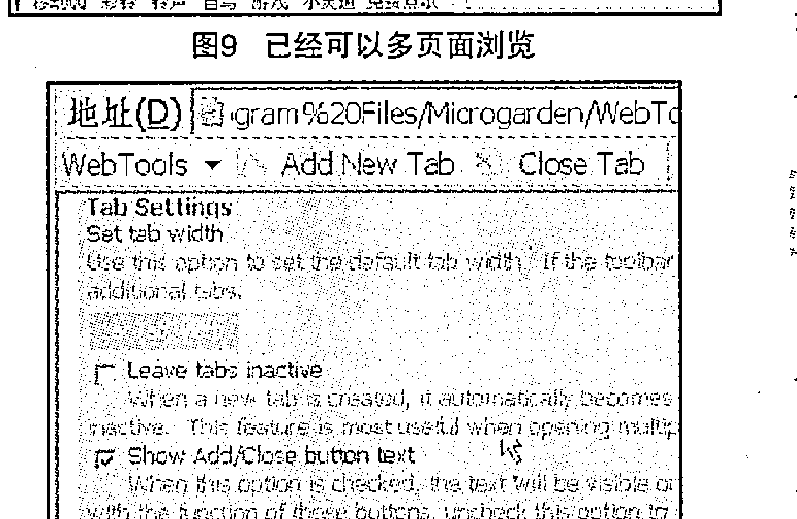

## 第4招 上网填表不求人

在网上冲浪时，经常需要填写一些表单，如姓名、地址、邮箱等，每次都要重复相同的信息实在让人头疼。

### Step1: 用AI RoboForm

先从http://hlbr.onlinedown.net/files2/AiRoboForm-6-2-9.exe下载并安装AI RoboForm，根据向导提示，我们顺着向导创建一个用户，并且输入我们自己的个人信息，接着填写用户名、密码、密码提示问题、密码提示答案和联系信箱，完成设置。以后，打开IE，会在工具栏中多出了一排AI RoboForm生成的按钮，只要页面中出现注册信息窗口，那么程序就会自动弹出填表窗口，此时点击窗口中的【填表】按钮就可以把设置好的各种信息填写到对应的项目中（如图11）。

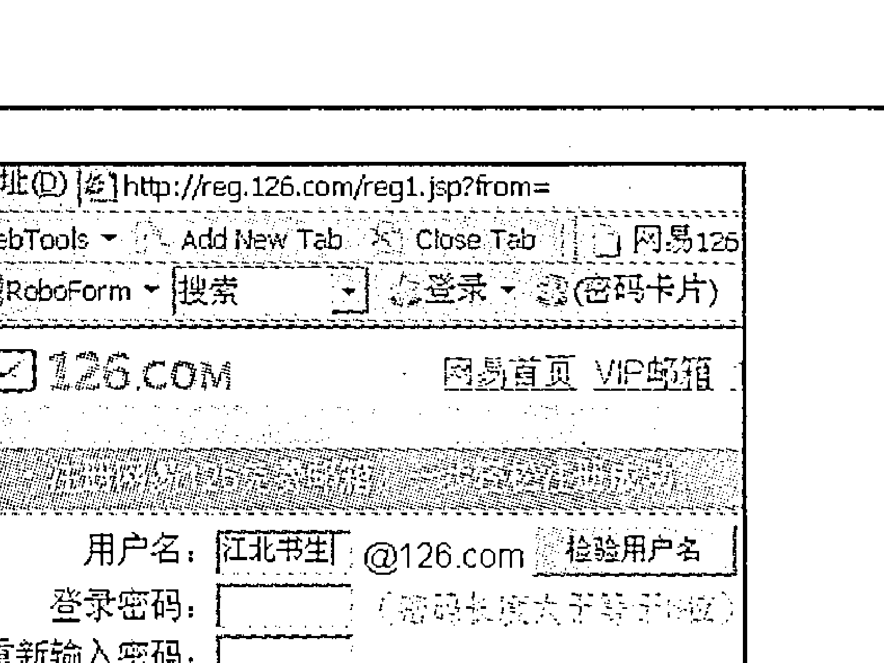

要注意的是，安装完这个软件后可能需要重新启动系统才能够使其正常工作。

### Step2: 使用Maxthon

这时，我们可以在填写完毕后，按下Alt+1键将信息保存起来，以后再登录这个网站时，只要按Alt+0键便可快速将信息填入相应的文本框中了，非常方便。而且，Maxthon会把表单信息保存在其安装文件夹下Config目录下的FormData.ini 文件中，并且会保存相关的网页地址，因此它可以快速恢复相应信息。我们将Maxthon安装文件夹放在移动硬盘中就可以随时浏览并使用我们自定义的内容来填表。

## 第5招 下载断点续传

我们在网上很多时候需要下载文件或资料，但是IE本身的下载功能比较弱，有时不得不用FlashGet或NetAnts来下载，但是有些网站的下载方式比较特殊，无法激活这些外部下载器来下载。但用IE自己的下载功能有时会遇到网速慢，意外死机等情况，往往下载不成功（很多时候下载到99%就是无法向前）。

### Step1: IE6文件下载增强插件

现在只要从 http://dg.download.21cn.com/file1oflmao/plugin/liulaniqi/ledownloadplus.zip处下载此软件，然后将其解压到一文件夹下，双击其中的install.exe完成安装。一旦我们右击某链接，选择“目标另存为”，打开IE的下载窗口，可以看到如图12所示的窗口，上面有“复制URL到剪贴板”按钮。

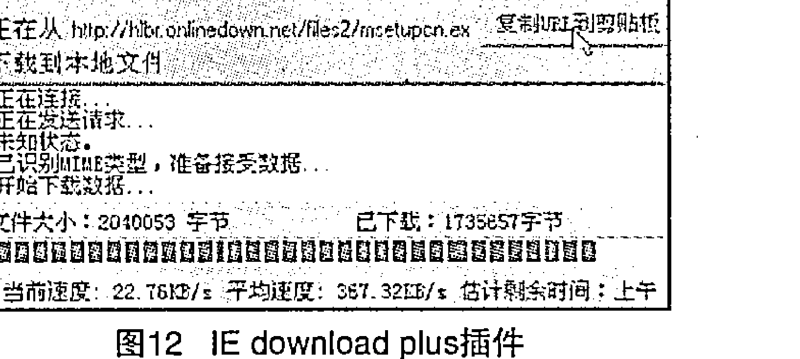

## 第6招 网上Flash随意存

现在有很多的网站都有漂亮的Flash动画，但是右击Flash动画后，只有其标准的菜单可选（如图13）。现在大家只要从http://hlbr.onlinedown.net/files2/FlashCatcher.EXE下载Flash Catcher，下载后直接安装，再次启动IE，在想下载的Flash动画上右击，便可发现原本只具有播放功能的选项多了储存的功能，选择保存命令之后确认需要保存的动画之后再点击下部的【Save】按钮就可以快速完成保存操作了。特别需要指出的是，Flash Catcher对于各种Flash动画的捕捉能力相当强；连号称具有保护的原创公司Macromedia的网站首页动画文件也难逃它的手掌心，看来有了它就不怕无法保存Flash动画。

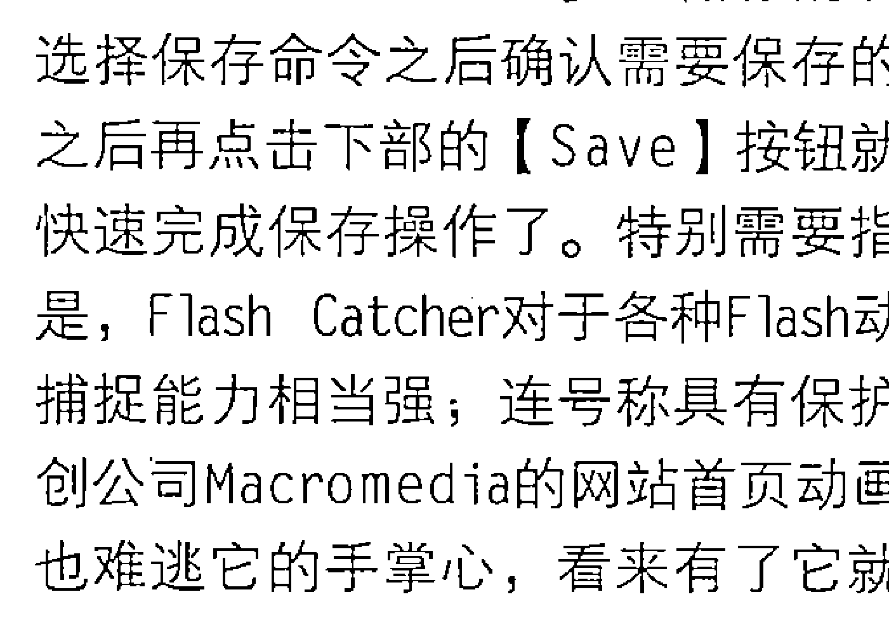

### Step2: Flash Catcher

### Step3: 其他插件

另外，还有不少IE下载加速软件，如迅雷、Download Accelerator Plus、Internet Download Manager等。

## 第7招 图片抓取管理

运行ICT后，单击【Category】→【New】会出现一个文本框，输入新建类别名称后确定即可，如本例中我们输入“商业竞争对手产品图片”（如图14）。

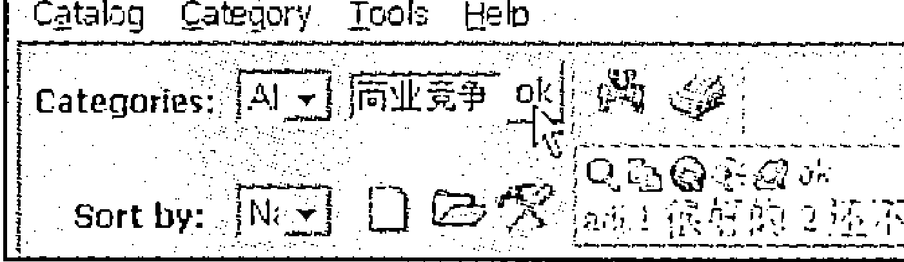

### Step2: 网上抓图

在网上看到某个精彩的图片时，右击，选择Grab Image命令（如图15），这时即会弹出保存设置对话框（如图16），ICT已经自动添加了图片来源链接并选择好了保存路径，你要做的只是在name中输入图片名称，在comment中输入注释，并在Category下拉框中选择我们先前设置好的保存类别，单击OK即可。

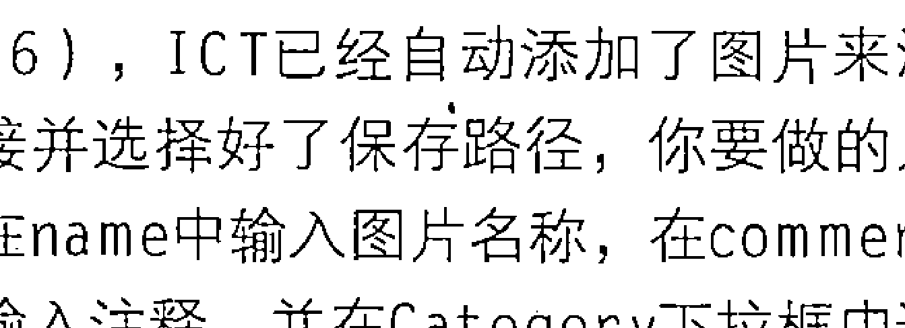

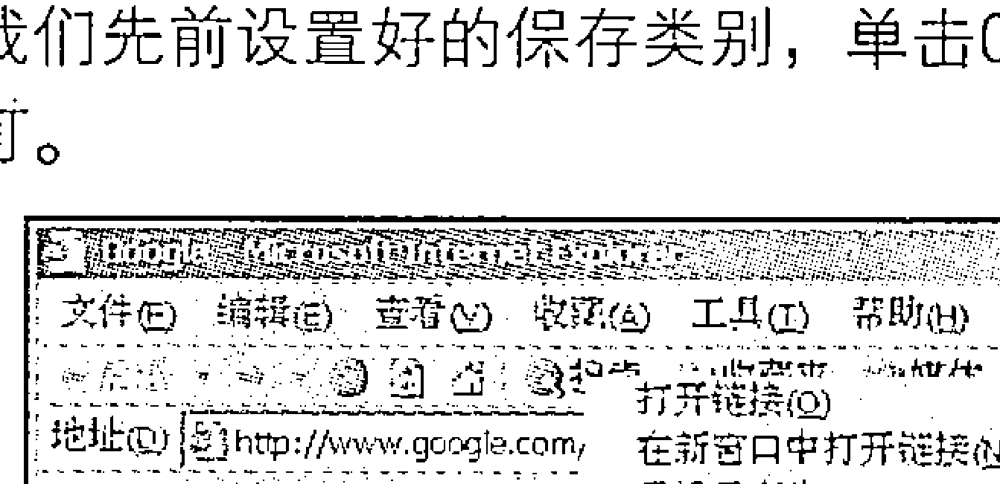

### Step3: 后期管理

直接在IE中单击【工具】→【Image Co-Tacker】打开ICT主程序，首先显示出默认类别中保存的所有图片，单击【Categories】（分类）右边的下拉框可选择显示其它类别中的图片。单击【Sort By】下拉框可让图片按照Date Added（加入日期）、Name（名称）Comment（注释）、Category（类别）等条件进行排序。
另外，对于保存的每张图片，ICT都会显示详细资料，包括名称、注释、引用、来源、类别以及添加日期等，单击项目后面的change还可对图片信息进行重新设置，单击图片右边的Delete则可删除当前图片信息。

## 第8招 抓上资料有据查

有一段对自己很有启发的文字，将它拷贝并粘贴到一文件后，再也不见了踪迹？很多人都存在这样的问题：保存的文件到处都是，很难查找和管理、无法确定信息来源、不能想起当时为什么要抓取这些内容等。这时候Cogitum Co-Citer就派上用场了。
从http://www.cogitum.com/cociter/cociter.exe下载Cogitum Co-Citer（以下简称CCC），此插件主要用于网上文字的收集与管理，在浏览时如遇到需要保存的文字，只要选中它们后按下右键，然后选择【Grab Selected text】（如图17，抓取选取文字）这时会弹出保存设置对话框，CCC会自动将选中文字段所在页面的标题作为保存后的标题，并自动添加信息的来源链接。我们只需为其添加上合适的【Comment】（注释），并在【Save in】窗口中选择好保存的类别。第一次使用时只有一个默认的缺省类别，可以单击下方的【New】按钮创建新类别，在创建类别时还可以创建具有多级目录结构的类别，只要将光标定位在子类别上再单击【New】按钮即可。

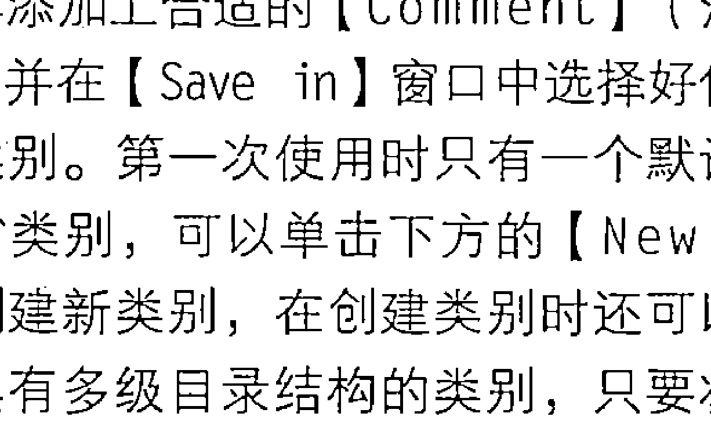

和Image Co-Tacker一样，我们也可以打开其软件，对所有保存的内容进行整理，以更方便地处理。

## 第9招 使用专业抓取工具

如果你想用专业的工具，可以选择CyberArticle，即网文快捕。

# 随心使用

## ——感受IE8的方便之举

口贺拴运

或许是迫于Firefox、傲游等浏览器的压力，微软又是解除对IE7的安装限制，又是大力宣传IE8，变化之大，升级之快，超乎意料。要知道，Vista内嵌的也不过是IE7！不过，或许是推出太匆忙，IE8beat1中文版（以下简称IE8）较之IE7，并没有多少革命性的改变，但IE8毕竟不是IE7，无论是新增功能，还是功能扩展，微软都将易用性提到了重要地位，操作中，笔者深感，IE8的众多举措都深深打上了“方便”的烙印。

## 便捷的浏览新体验

IE8 beat1中文版（以下简称IE8）与IE7几乎如出一辙：相似的界面、相似的过程，安装完毕，都要求重启系统。首次运行也和IE7相似：要求你进行相关设置，你可以设置，也可以先放下，以后再操作。IE8的界面也和IE7十分相似，若不仔细观察，还真会以为就是IE7——毕竟，这只是第一个测试版，我们不能指望微软有多少革命性的突破。需要注意的是，大概因为是测试版的缘故，IE8 beat1中文版和比其早发布一个月的IE8 beat1英文版在功能上并不能完全一一对应。英文版中的一些功能，比如翻译功能，目前还无法在中文版中使用。此外，像网页自动缩放等实用功能，早已被傲游等浏览器采用，IE8中依然难觅踪影等，这不能不说是一大遗憾。

## 快速访问收藏夹

用过Firefox的都不会对其独特的书签工具栏陌生。若将其书签比做硬盘，则书签工具栏就是内存。直接点位于该“内存”中的网址，一步即可打开该网站。IE原本也有这一功能，但在IE7中却被微软看做“鸡肋”而取消，这实在不是高明之举。到IE8，我们欣喜地看到，收藏夹栏又回归IE，并被单独列为一列。默认位于标签栏之上，若要将网址添加到收藏夹，可点收藏夹的绿色图标，选择“添加到收藏夹”即可；若选择第二项“添加到收藏夹栏”，则被添加到收藏夹栏一列中，这样，直接点收藏于该栏的网址，即可一步打开该网站。若你在收藏夹中建立了多个文件夹，需要将其添加到特定的文件夹，可点第三项“将当前选项卡添加到收藏夹”。

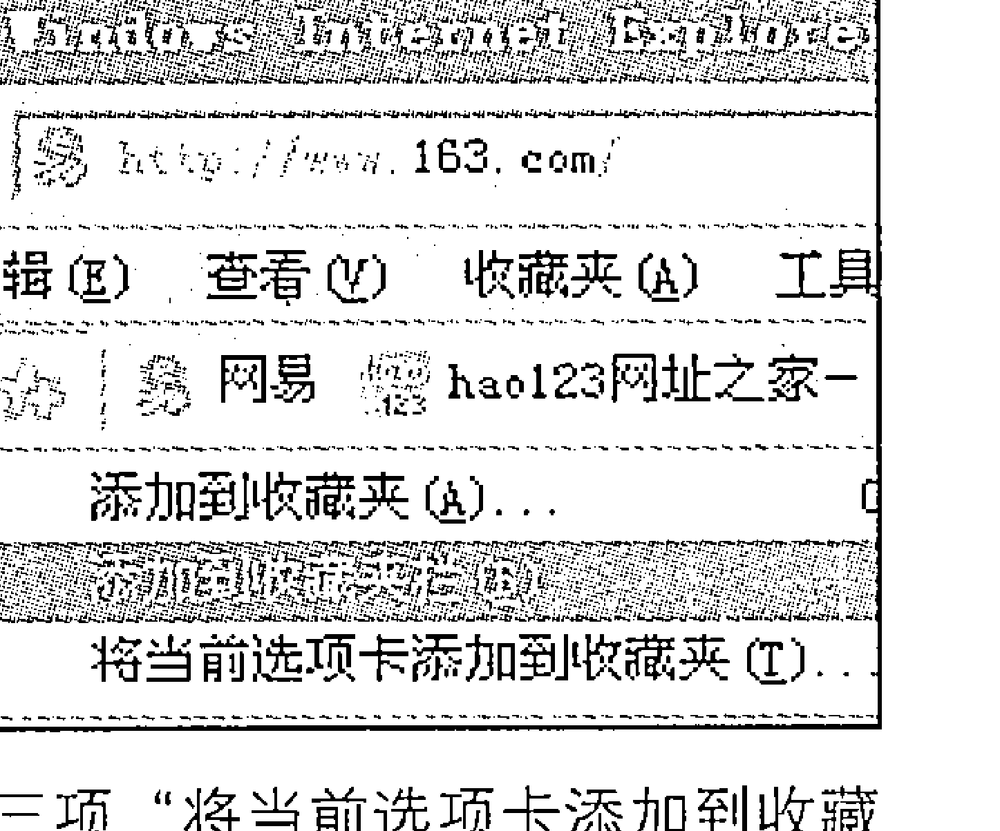

## IE崩溃，自动恢复

出于多种因素，上网中，浏览器有时会出现崩溃现象，重新打开，要浏览原来浏览的网页，就得从头开始，大为不便。当然，Firefox用户不必担心，因为Firefox有崩溃恢复功能，可恢复崩溃前的网页。这一功能未必多么重要，但方便性是无疑的，这促使微软也在IE8中推出该功能。当IE8崩溃时，IE会自动保存你正在浏览的网页，重新启动，IE会弹出提示：“上次浏览会话意外关闭，是还原上次会话，还是访问主页？”，点“还原上次会话”，则IE自动打开上次浏览的网页；点“转到主页”，则IE打开主页。

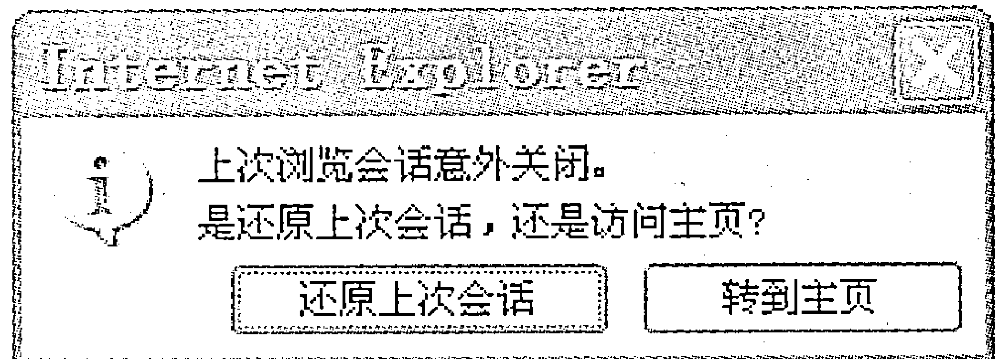

## 邮件阅读，一点即到

虽然QQ等软件如日中天，但电子邮件依然是日常工作必不可少的东东。无论你是用OE，还是Foxmail，要打开它们，都得依次执行“开始→程序”等操作，若你正在上网，就很不方便。不过在IE8中，这一问题得到了很好的解决。要阅读邮件，只需点击工具栏上的“阅读邮件”按钮，即可一键调出你的默认电子邮件软件。更重要的是，这一功能虽是IE8内嵌的，但不一定要你必须使用微软的产品，只要是你设定的默认电子邮件软件，IE8照样能够正常调用。

## 上网利器，一步到位

IE8英文版默认添加了几个不错的活动，比较实用的是翻译活动，遗憾的是，这一服务目前和中文版不兼容，只能在英文版中使用。有此功能，我们无须借助专门的翻译网站浏览非中文网页。要浏览某个英文网站，只需打开该页面后，点工具栏的Page按钮，选择Translate With Windows Live，IE8即可打开一个名为“翻译试用版-翻译网页”的页面，并列显示原始网页内容和翻译后的效果，不但方便，而且借助这种对比，你还可多少在不经意间学点英文！当然，你也可通过此方式查看中文网页的英文或其它语言效果，只不过要在“翻译试用版-翻译网页”的页面中手动修改翻译方式。

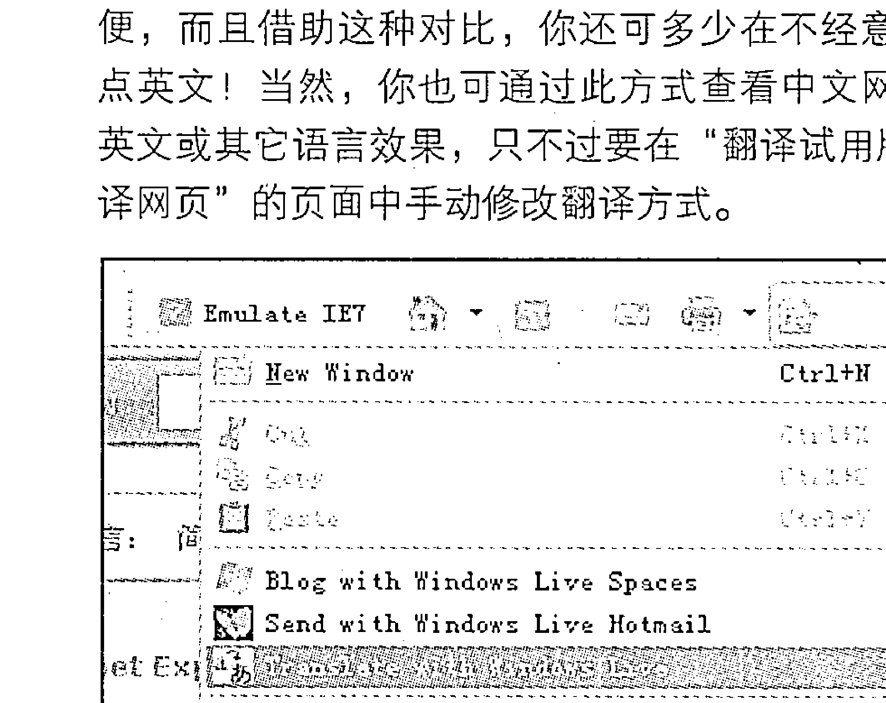

## 活动丰富，方便用户

| 网站 | 功能 |
| --- | --- |
| 百度 | 使用百度搜索 |
| 中央电视台 | 使用百度搜索 |
| Google | 中国雅虎 |
| 中华英才网 | 中国政府网 |
| 天天基金 | 东方财富 |
| 瑞丽女性网 | 百度空间 |
| 阿里巴巴 | NBA中文网 |
| 腾讯QQ | 使用 Live Search 搜索 |
|  | 用 Live Mail 发送 |
|  | 查找更多活动... |
|  | 管理活动... |

或者删除活动。与IE8英文版不同，IE8中文版默认并没有添加具体“活动”，要使用，需要手动添加。方法：在工具栏点“页面→活动→添加更多活动”，打开活动添加新页面，选择一个活动，点击即可。比如，点“百度免费电影”链接，将其添加到活动中，以后，任意选择网页一段文字，IE会自动弹出一个绿色的功能按钮，单击该按钮，弹出菜单，将鼠标依次定位到“更多活动→免费电影”上，不要点击，则IE8会自动将选择文字作为关键字发送给服务器，并很快弹出浮动框，显示处理的结果。当然，如果你在“更多活动→免费电影”单击鼠标，则IE会自动打开百度免费电影页面。

## 网站域名，突出显示

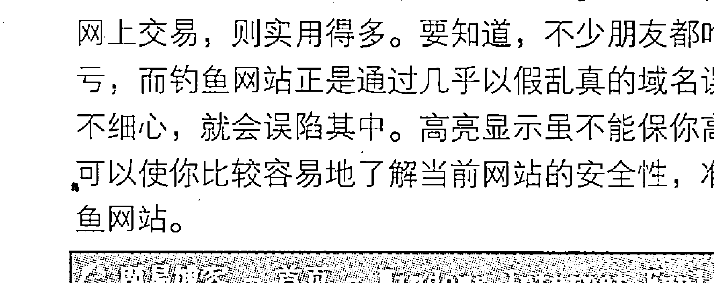

仔细观察IE8的地址栏，你会发现，地址栏会高亮显示当前页的域名。此举对我们日常上网没多大意义，但你若经常在网上交易，则实用得多。要知道，不少朋友都吃过钓鱼网站的亏，而钓鱼网站正是通过几乎以假乱真的域名误导用户的，稍不细心，就会误陷其中。高亮显示虽不能保你高枕无忧，但却可以使你比较容易地了解当前网站的安全性，准确判断是否钓鱼网站。

## 开发工具，人人可用

```
html
1 <html><head>
2 <meta http-equiv="Content
3 <title>hao123网址之家--
4 <style type="text/css">
5 <!--
```

Firefox有一个实用的Web开发辅助工具 —— DOM开发工具，尽管对普通用户没多大关系，但对Web开发人员却大有裨益。IE8不甘落后，同样也为开发人员准备了一套简便的开发工具。要使用，只需点击工具栏最右侧的鼠标形按钮，即可打开该工具，怎么使用，那就是你的事了。

## 模拟IE7，确保兼容

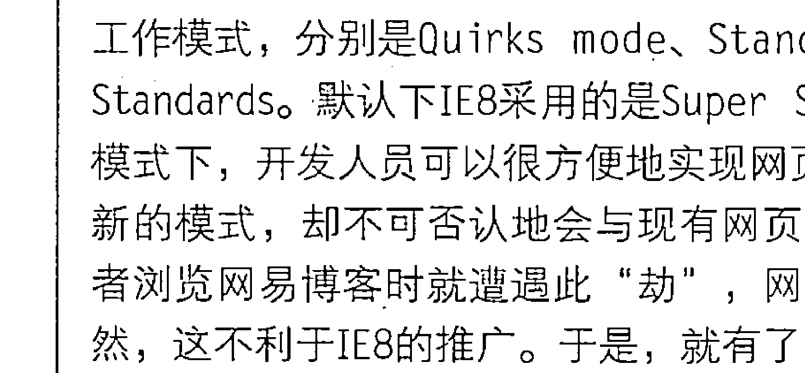

仔细观察，你会发现IE8工具栏多了一个按钮且被置于第一位，这就是“模拟IE7”按钮。原来，IE8共支持三种工作模式，分别是Quirks mode、Standards mode和Super Standards。默认下IE8采用的是Super Standards模式。在此模式下，开发人员可以很方便地实现网页和IE8的兼容，但全新的模式，却不可否认地会与现有网页发生冲突。比如，笔者浏览网易博客时就遭遇此“劫”，网页内容无法显示，显然，这不利于IE8的推广。于是，就有了“模拟IE7”按钮。

如果某个网页在IE8下无法正常显示，可点该按钮，然后重启IE8，于是IE8就会在IE7框架下运行，确保网页正常显示。无疑，该功能可使IE尽可能保持与旧版兼容，重要性不言而喻，但要实现IE8和IE7的切换，IE就得重启，无形中给用户增添了麻烦，看来，对此功能，微软还得多加改进。

由于微软推出的IE8毕竟只是测试版，功能还很不完善，如果你感觉不错，试试也没什么，如果感觉不怎样，不妨多用一阵IE7，期待更好的IE8的出现。

## IE8 Beta1 最新技巧放送

□王志军

「 微软已经于日前开始了下一代浏览器Internet Explorer 8 Beta 1的公开测试(以下简称为“IE8 Beta1”)，支持 Windows Vista、Windows XP、Windows Server 2008、Windows Server 2003四种系统平台，感兴趣的朋友可以访问http://www.microsoft.com/windows/products/winfamily/ie/ie8/default.mspx，按照提示、进行下载和安装。 」

这里，我们以简体中文版本为例，向朋友们介绍IE8 Beta1的最新操作技巧。

### 技巧1：去除默认的欢迎页面

默认设置下，IE8 Beta1完成安装之后，除了会继续保留原来的主页之外，还会自动添加一个名为“欢迎使用 Windows Internet Explorer Beta1”的主页，这个主页将在首次运行IE8 Beta1的两周后被删除。当然了，我们也可以打开“Internet选项->常规”对话框，在这里手工删除欢迎页面，或者单击命令栏上“主页”图标旁边的倒三角箭头，从下拉菜单中选择“删除”，如图1所示，接下来从下级子菜单中选择“欢迎使用Windows Internet Explorer Beta 1”就可以了。

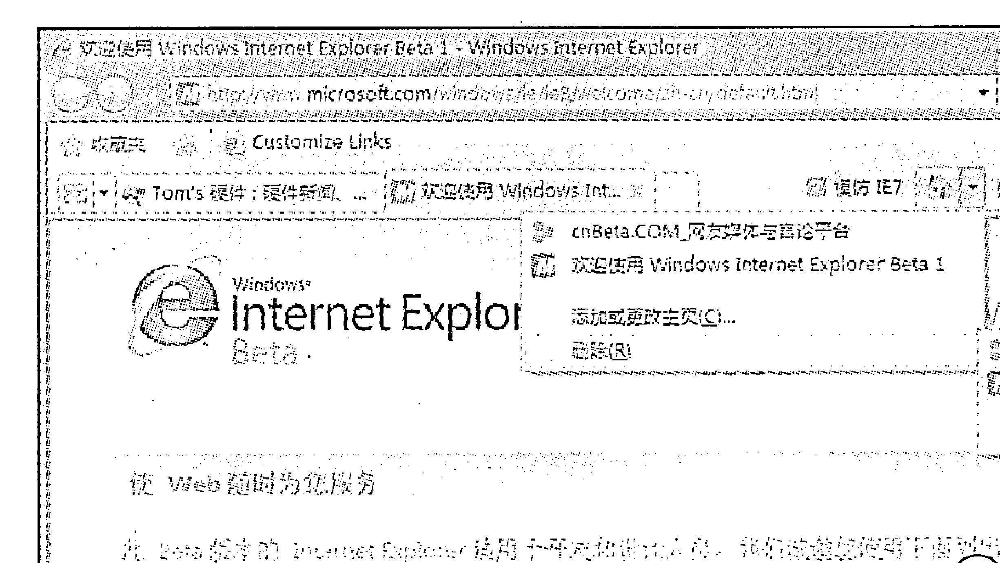

### 技巧2：将链接添加到收藏夹栏

与IE7相比，“收藏夹”、“添加到收藏夹”两个按钮的位置被单独移到了一个新的收藏夹栏最左侧，其实是代替以前版本的“链接”工具栏，虽然看起来似乎会浪费一部分的显示空间，但这里不仅保管收藏夹链接，而且还同时保管源和源剪辑。

如果要将链接添加到收藏夹栏，可以单击“添加到收藏夹”按钮，然后从下拉菜单中选择“添加到收藏夹栏”，此时会弹出对话框，按照提示输入相关的信息就可以了。不过，更简单的方法是按住鼠标左键，如图2所示，从地址栏中将最左侧的网页图标直接拖曳到收藏夹栏上的适当位置，也可以从网页中将链接直接拖曳到收藏栏。

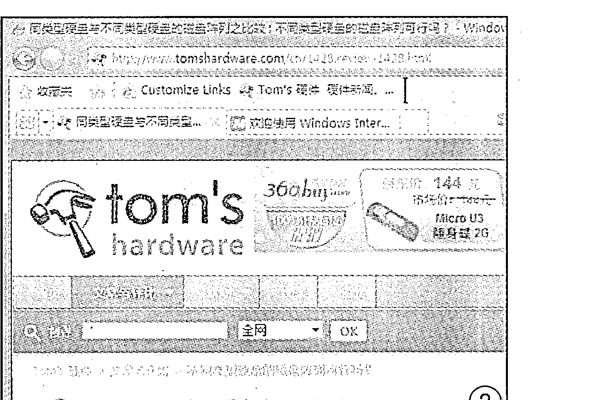

### 技巧3：将文件(文件夹)添加到收藏夹栏

可能很多朋友并不清楚，除了可以将链接添加到收藏夹栏之外，我们还可以将自己经常访问的文件或文件夹添加到这里，需要访问时直接单击即可快速访问这些文件，就不需要返回资源管理器逐级进入了。

添加的方法很简单，从资源管理器中定位到相关文件或文件夹的上一级目录，然后按住鼠标左键，将相关对象直接拖曳到收藏夹栏即可，效果如图3所示。当然，也可以不打开IE8 Beta1，将相关的文件或文件夹复制到“C:\Users\帐户名\Favorites\Links\”文件夹，这个文件夹实际上就是收藏夹栏。

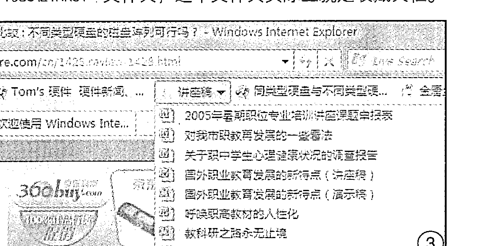

### 技巧4：添加新的活动内容服务

所谓“活动内容”，是相关网站提供的某些在线服务，例如将所选网页上的文本发布到博客、在地图上定位地址、单词翻译等，英文版本中将这种服务称为“Activity Providers”，中文版本则允许用户在页面通过百度搜索免费电影、股票、基金报价、游戏大全等内容，还可以搜索淘宝商品。

访问http://ie.microsoft.com/activities/zh-chs/default.aspx，根据需要选择相关的活动提供程序，例如我们这里选择添加“淘宝”这项活动内容服务，确认之后即可将“淘宝搜索”这个活动内容服务添加到右键菜单。使用的方法很简单，选中网页上的相关物品名称，右击选择“更多活动→淘宝搜索”，很快就可以查看到相关的内容(见图4)；添加“QQ”则可以在线查看网页上QQ号码的个人资料，效果如图5所示，是不是很清晰？

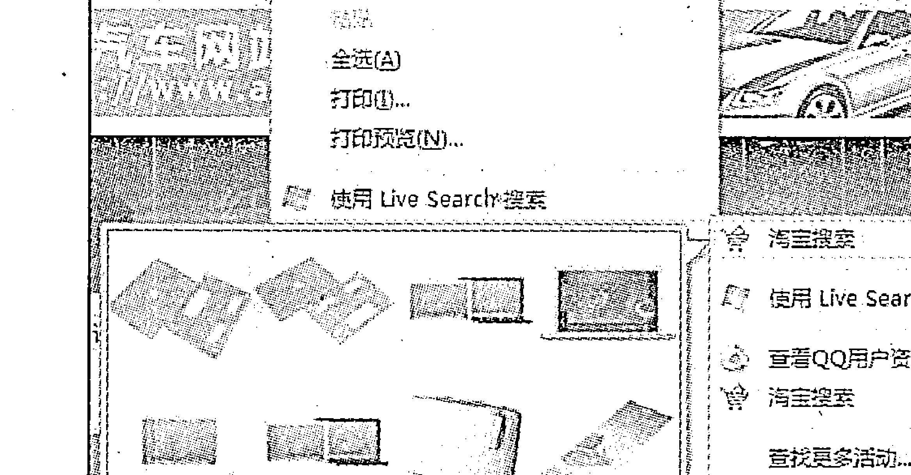

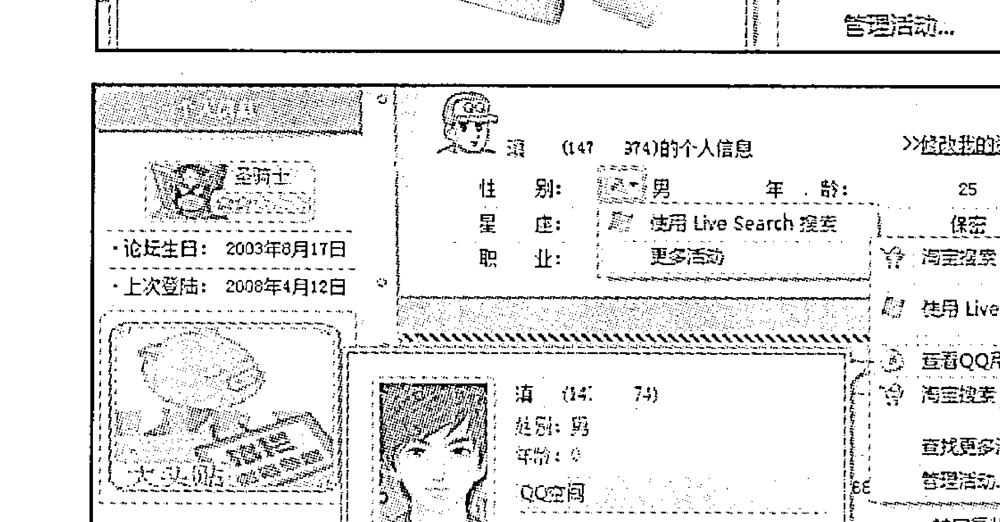

访问http://ie.microsoft.com/activities/en-en/default.aspx页面，这里提供的活动类别更多，项目也更为丰富，例如Define、Lookup、Share等，感兴趣的朋友不妨一试。

### 技巧5：管理活动内容服务

如果你使用的是英文版本的IE8 Beta1，那么在首次运行IE8时，会有一个“Set up Internet Explorer”的设置向导，一般都是选择“Use express settings”，这里提供了一项名为“Activities(活动内容)”的新服务，如图6所示，其中

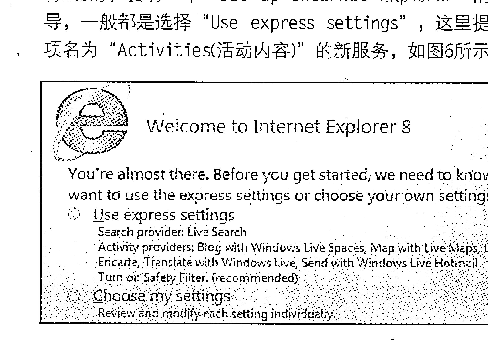

包括Live Spaces、Live Maps、Encarta、Windows Live、Live Hotmail等Windows Live系列的各项服务，我们可以在浏览页面时直接访问这些在线服务，例如撰写博客、访问地图、翻译字词、发送邮件等。

如果需要对添加的活动提供程序进行管理，可以打开“管理加载项”对话框，在左侧窗格的“加载项类型”列表中选择“活动”对话框，如图7所示，在右侧窗格中选择相应的活动提供程序，你可以选择设置为默认，也可以禁用或删除。

| 名称(N) | 地址(R) | 类别(A) | 状态(S) |
| --- | --- | --- | --- |
| 淘宝搜索 | taobao.com | 查找 | 已启用 |

### 技巧6：订阅源剪辑

源剪辑是一个可以订阅的网页，英文版本中称为“WebSlice”，订阅之后将以链接的形式显示在收藏夹栏上，当源剪辑更新时，收藏夹栏的链接将以粗体格式显示，单击链接即可查看更新内容。

需要指出的是，目前支持源剪辑的网站还不是很多，简体中文版本允许用户跟踪百度基金、百度财经、淘宝等网站的源剪辑，当然你也可以跟踪eBay、Facebook、internet buzz、MSH headline等英文网站的源剪辑。

例如我们需要跟踪淘宝上的行情变化，可以访问http://ie8.taobao.com/list.php，在页面顶端的搜索框输入关键词，例如目前非常流行的“MacBook Air”，单击右侧的“搜索”按钮，很快就可以获得相应的搜索结果。将鼠标悬停到感兴趣的某个宝贝，不仅左侧会出现一个源剪辑的按钮，而且此时命令栏中的源剪辑按钮会发生变化，注意这个颜色与RSS按钮有着明显的区别，单击之后会弹出一个对话框，如图8所示，确认之后即可在收藏夹栏中成功订阅。

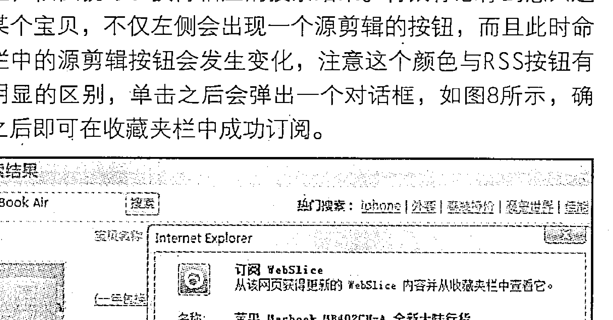

以后，即使不访问淘宝网站的相应页面搜索商品，只要鼠标指向收藏夹栏上的源剪辑图标，即可显示淘宝网上关于此宝贝的详细预览，效果如图9所示，在这里除了可以查看相关宝贝的类型、所在地、数量、剩余时间等基本信息之外，还可以与卖家进行沟通或留言，当然也可以选择立刻购买，单击预览区可以进入页面查看更详细的内容。如果需要监视eBay网站关于“MacBook Air”的拍卖情况，那么可以访问http://ie8.ebay.com/，按照同样的步骤进行操作。

### 技巧7：恢复崩溃前的页面

不管是中文版本或是英文版本，使用IE8 Beta1访问QQ邮箱的文件中转站，或者是访问foxmail.com邮箱的文件中转站，都会导致页面非法关闭并自动退出，这当然是兼容性的问题，暂时还无法得到解决。
不过，你也不用担心浏览网页时意外的崩溃，因为IE8 Beta1会自动保存崩溃前正在浏览的页面，再次运行时会弹出图12所示的对话框，选择“还原上次会话”即可自动恢复崩溃之前所浏览的所有标签页，如果选择“转到主页”则会进入默认主页。

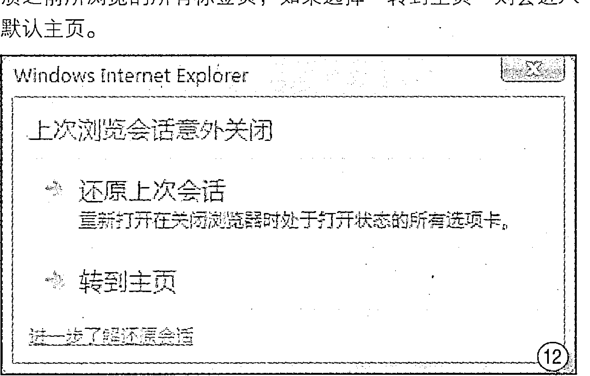

### 技巧8：用好开发人员工具

对于网页制作人员来说，应该利用好IE8内置的“开发人员工具”，单击工具栏最右侧的空心小箭头，或者按下“Alt+Y”组合键，此时会打开“开发人员工具”窗口，这里提供了HTML、CSS、脚本等三个选项卡，如图10所示，我们可以很方便地在这里查看和调试当前页面的HTML源代码、CSS语言、脚本，“查看→更改兼容模式”子菜单下提供了Quirks(IE5)、Strict(IE7)、Standards(IE8，默认使用此模式)等三种不同的查看方式。

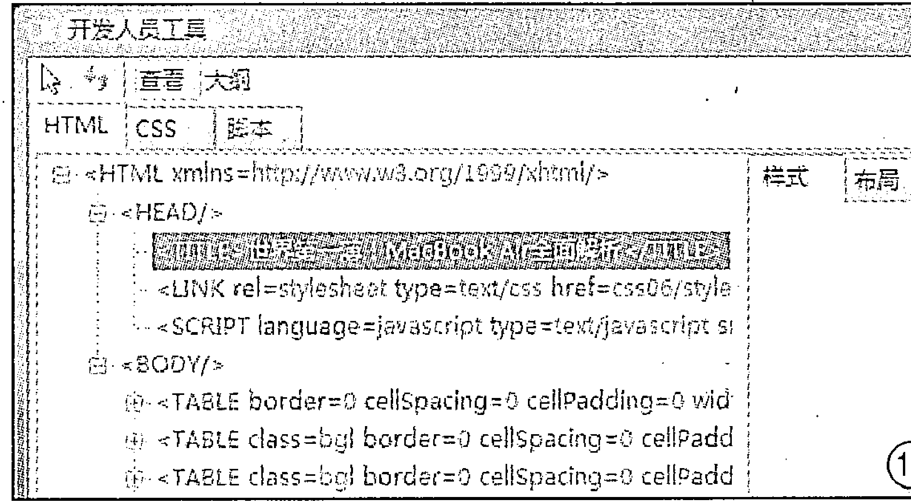

### 技巧9：导入其他浏览器的数据

IE8的导入功能得到了很大的提升，现在可以直接导入其他第三方浏览器的收藏夹、源和Cookie。单击收藏夹栏上的“添加到收藏夹”按钮，或者按下“Alt+Z”组合键，然后从下拉菜单中选择“导入和导出”，此时会弹出如图11所示的向导窗口，这里提供了两种导入的选择，选择“从另一个浏览器中导入”可以直接从已安装的其他浏览器中读取，选择“从文件或地址中导入/导出”可以从已导出的书签文件中读取。

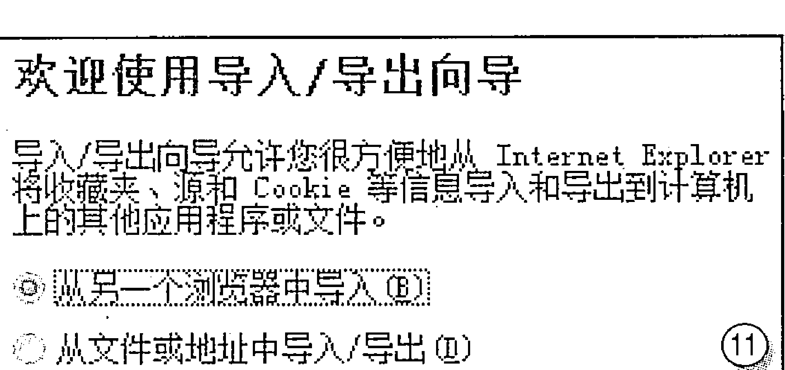

### 技巧10：Vista下卸载IE8 Beta1

如果你使用的是Windows Vista，那么打开“卸载或更改程序”窗口后会发现无法在这里找到卸载IE8 Beta1的项目，其实系统是将其作为一个更新来安装的，因此我们可以从控制面板中打开“程序和功能→已安装更新”窗口，如图13所示，在这里找到“Windows Internet Explorer 8”，根据提示进行卸载就可以了。

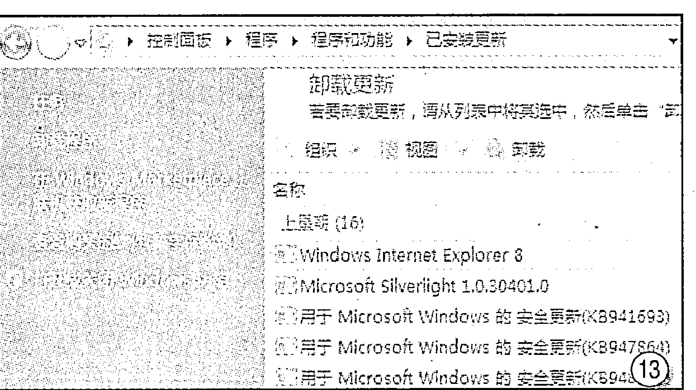

除了上面所提到的内容，使用IE8 Beta1浏览网页时，地址栏中Web页面的URL主域名会高亮显示，例如微软官方网站的URL地址是“http://www.microsoft.com”，那么其中的“microsoft.com”会被高亮显示，这项功能有助于帮助用户识别仿冒网站。另外，在右上角的搜索引擎框中，IE7只是显示搜索引擎的名称，用户输入搜索关键词之后，搜索引擎名称就会消失，而IE8 Beta1则会在每一个搜索引擎的前面显示相应的图标，这样就不容易产生误解。

## 我的IP地址你别动

□王道才

「为了便于管理，我为学校计算机教室、教师备课室、领导办公室、教师办公室和各功能教室的近200多台机器分别指定了静态IP地址，并简单设置网关和DNS，使不同的IP地址设置有不同的权限，如计算机教室、教师办公室和各功能教室机器只能访问校内服务器资源而上不了互联网，但教师备课室和领导办公室的机器则可以自由上网，也能通过IP地址访问校园服务器。由于不同的IP地址具有不同的权限，所以经常有人通过修改IP来偷偷上网，这为机器的管理和维护带来很多麻烦和安全隐患。为了防止这种事情的发生，我在工作中试着用如下方法来限制对IP地址的修改。」

### 一、停用网络连接服务

1.  桌面上右键单击“我的电脑”左键选择“管理”，在打开的“计算机管理”对话框中的左侧栏中双击“服务和应用程序→服务”，找到Network Connections（系统默认该服务的状态应该是已启动，启动类型应该是自动）并双击它（图1）。

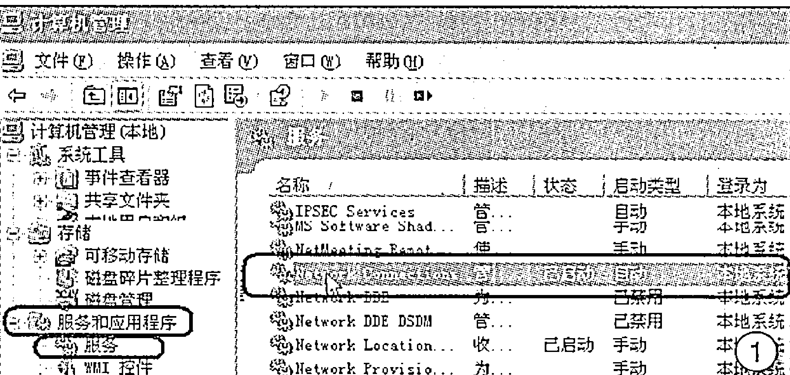

2.  在“常规”选项卡下单击“停止”，出现对话框，稍后“服务状态”会变成“已停止”。这时再单击“启动类型”后边的下拉按钮，选择“已禁用”，最后点“确定”退出（图2）。

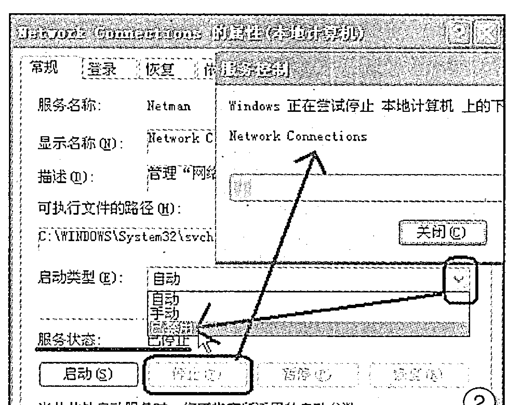

3.  在“控制面板”的“网络连接”中右键单击“本地连接”左键选择“属性”，出现对话框，也就无法修改IP地址了（图3）。

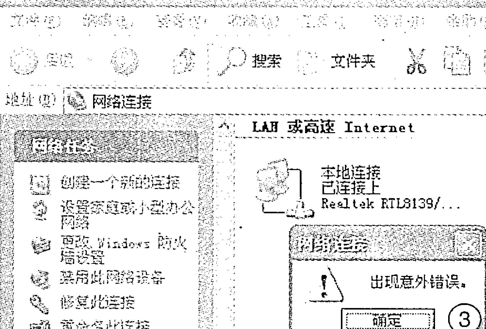

> 小提示
如果自己想改IP，可单击“启动类型”后边的下拉按钮，选择“自动”，点“应用”，然后单击“启动”并点“确定”退出即可。

### 二、用regsvr32命令反注册键

IP地址与Windows系统中的动态链接文件Netcfgx.dll、Netman.dll以及Netshell.dll有关，这些文件其实都是计算机系统的控件，在初始安装Windows系统时这些控件将被自动注册。当我们要对机器的IP地址进行修改时，就会调用这几个系统控件文件。所以我们只要把这几个系统控件文件卸载掉就可以了。
单击“开始→运行”，输入cmd并回车或点“确定”，在DOS命令行窗口中依次输入regsvr32 Netcfgx.dll /u /s并回车、regsvr32 Netshell.dll /u /s并回车、regsvr32 Netman.dll /u /s并回车。这样“控制面板”中的“网络连接”就不能使用，也就无法修改IP地址了。而在桌面上右键单击“网络邻居”左键选择“属性”也会毫无反应（图4）。

如果自己想改IP，可依次输入regsvr32 Netcfgx.dll /s并回车、regsvr32 Netshell.dll /s并回车、regsvr32 Netman.dll /s并回车就能修改了（图5）。

```
@echo off
echo 锁定IP地址
regsvr32 Netcfgx.dll /u /s
regsvr32 Netshell.dll /u /s
regsvr32 Netman.dll /u /s
```

1.  打开“我的文档”，单击菜单栏“工具→文件夹选项”，选择“查看”，单击“隐藏已知文件类型的扩展名”把其前边的√去掉（图6）。

2.  在“我的文档”文件夹的空白处右键单击，选择“新建→文本文档”，打开“新建的文本文档”并输入如下内容：
    @echo off
    echo 锁定IP地址
    regsvr32 Netcfgx.dll /u /s
    regsvr32 Netshell.dll /u /s
    regsvr32 Netman.dll /u /s
    保存、退出后，把新建的文本文档改名为lockIP.bat，单击确认时会出现提示，点“是”即可（图7、图8）。

3.  仿照上面的方法再在“我的文档”中新建一个名为unlockIP.bat的文件，内容为：
    @echo off
    echo 正在对IP地址解锁
    regsvr32 Netcfgx.dll /s
    regsvr32 Netshell.dll /s
    regsvr32 Netman.dll /s
    这样我们就可以双击lockIP.bat去锁定IP地址，而自己想修改时可以双击unlockIP.bat解锁。最后把这两个批处理文件剪切、粘贴到U盘或移动硬盘备用。

这里Regsvr32命令是注册三个动态链接库文件，加参数/u是卸载这三个动态链接库文件，而加/s是为了不显示注册或卸载成功的提示信息。ECHO是在屏幕上显示其后信息的批处理命令，加OFF是执行时不显示命令行，前面加@是关闭ECHO OFF命令行自身的显示。

## DVD刻录机故障内有乾坤

最近安装宽带后，开始疯狂下载电影，渐渐地发现硬盘不够用了，想增加块硬盘，但觉得花费太大，于是听从同学的建议：去电脑街买了一款先锋DVR-110CH刻录机。
回到宿舍安装上刻录机，笔者迫不及待地开始体验。开始一切顺利，但没过几日就发现刻录机刻盘开始“造反”了——在刻录电影等大文件时候，刻录进程进行到60%就停止了！这时怎么回事？笔者电脑配置不差啊，应该能良好地支持刻录。笔者电脑配置如下：Intel奔腾4 3.0GHz(盒)、磐正5LDA+GLI、XFX讯景6600LE、宇瞻512MB DDR 400X2。

笔者把刻录机安装在邻居的机子上，刻录过程没有异常，看来不是刻录机的问题。另外，我在刻录过程中一向很小心，也排除了误操作的原因。是不是软件方面的原因，于是我上网下载了最新的NERO v7.0。安装好软件，然后开始刻录测试，问题不见了！
可惜高兴的太早，没过几天，问题又重新出现了。笔者还是从软件方面入手，正没有线索的时候突然发现了“病症”

所在。原来，前一段时间我总是下载电影、歌曲等文件，并且不停地删除以留出空间，但很长一段时间也没有注意整理硬盘碎片，更不用说重装系统了。所以，笔者的电脑垃圾文件几乎随处可见，硬盘碎片到处可寻。这样很容易使得系统缓存不足从而导致溢出现象，刻录失败也就不奇怪了。找到原因，笔者重新安装操作系统，然后对各个分区进行整理优化。再安装上最新刻录软件，再次刻录测试，问题果然不见了！

“太平日子”仅仅维持了几天，刻录问题又“重出江湖”了。笔者这时有点犯难了，是病毒的问题？用最杀毒软件查杀病毒，一无所获。软件方面没有问题可找了，现在需要检查硬件问题了。打开机箱，查看刻录机的数据线连接情况，一切良好，没有松动现象。其他配件也没有异常现象。没办法，只好使用逐个替换法了。在邻居家实验显卡，没事；测试CPU，正常；再换上一条宇瞻内存，无恙；换上另一条内存，问题出现了，系统开始报错，看来这条内存出问题了！我回家把出现代内存的配件都安装好，进入系统，尝试刻录，结果一切顺利，问题重要得到解决！

事后总结，刻录机需要占用很多资源才能刻录大文件，如果双内存配置中的一条内存发生故障就不能承受满负荷的运行，很容易造成系统内存冲突，从而导致刻录失败。

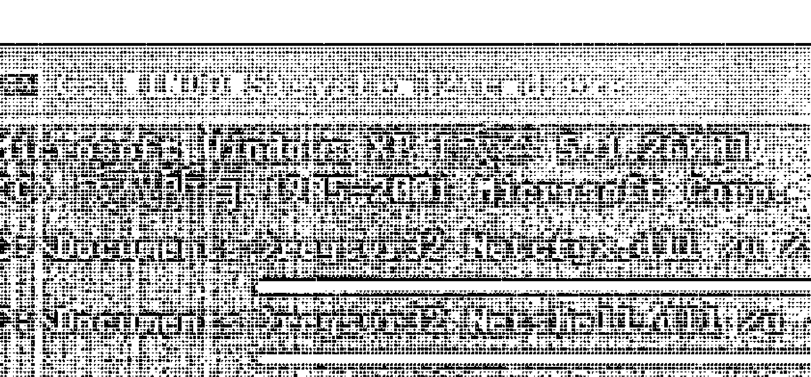

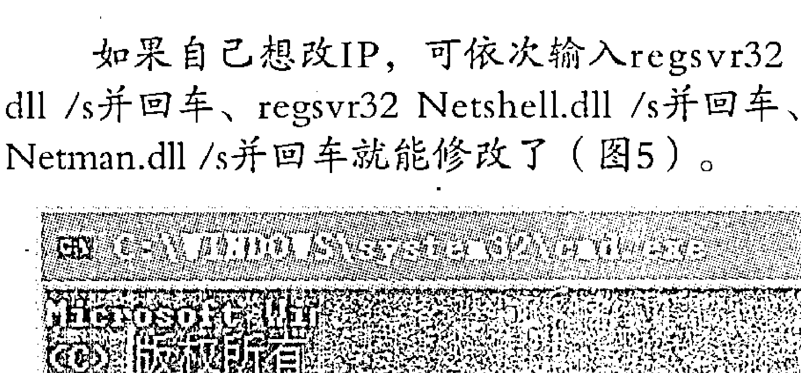

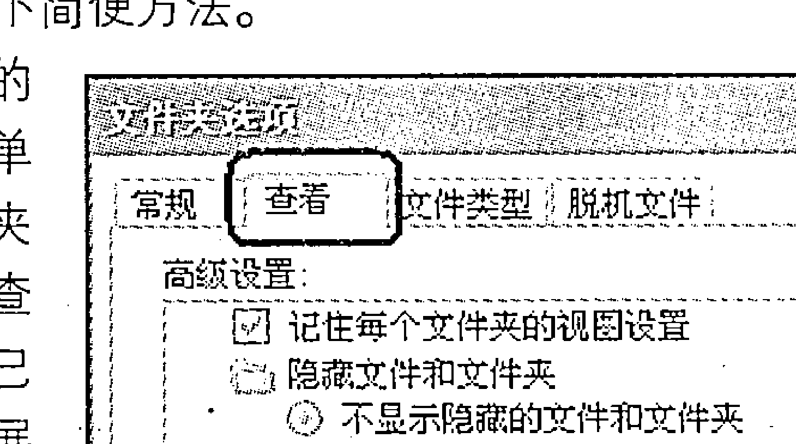

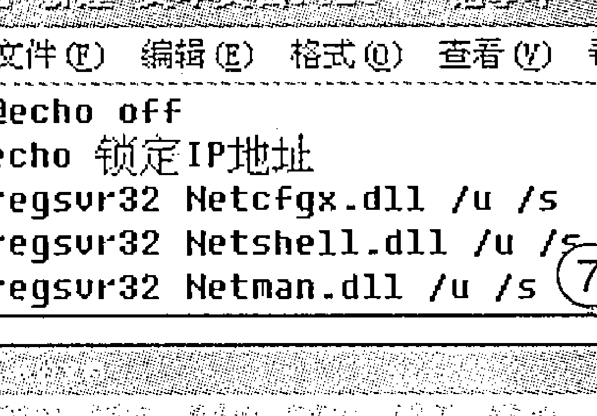

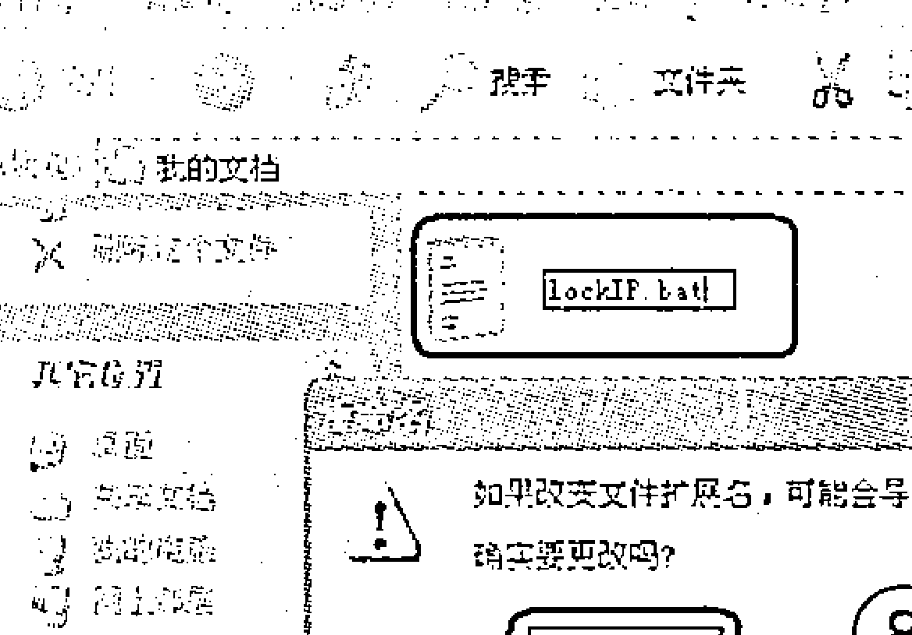

## 将QQ保护进行到底
### ——QQ安全全攻略
□狮子王

作为“网漂”一族，熟练使用各种即时聊天软件，特别是QQ，不仅成了结识朋友、交流沟通、节省话费的制胜法宝，甚至已经成为“宅男宅女”们与外界联系的重要途径之一。因此，关于QQ的各种安全问题，不仅仅存在有感染病毒、丢失众多好友联系的尴尬，甚至还要面临金钱损失的风险！
为了电脑上宝贵的文件、为了五湖四海的友谊、为了捂住囊内的Money，让我们再一次全面关注QQ的安全吧！（以下介绍均使用QQ2008贺岁版）。

## 第一篇：保护QQ号码

虽然QQ号码是几个数字的随机组合，但在腾讯QQ的即时通讯服务中，它就如同现实生活中我们的姓名，能帮助他人从茫茫人海中定位并找到我们，是我们存在于虚幻网络世界中的重要标志之一。可想而知，如果QQ号码丢失，会给自己带来多少麻烦？不仅朋友们再也无法找到你，而且还有可能造成误会甚至金钱的损失！

### 一、拒绝“弱智、财迷”型密码

密码是进入精彩QQ世界的“敲门砖”，但在申请QQ号码时，有很多人为了能快速完成申请，于是将默认密码设置为了“123456”、“888888”、生日等等弱密码，可当申请成功后就忘记了修改为强密码，这样一来就会给他人以可乘之机，利用社会工程学甚至暴力破解方式轻而易举地盗取你的密码！因此，这里建议大家将此类密码修改为六位以上、“字母+数字+符号”的方式，为了便于记忆，可以选择那些你自己经常使用的字符，比如“$cfan$”、或者“%mycfan2008%”，甚至“@www.cfan.com.cn@”！修改方法如下：

-   **第一步**：正常登录QQ程序，依次进入“设置→系统设置→安全设置→密码安全”，从右侧界面里点击“修改密码”按钮打开腾讯网页。
-   **第二步**：仔细观察浏览器上方，那里将弹出是否运行下载Activex插件的提示条，点击该提示条后安装控件，从而进入QQ的“安全模式”进行密码的修改（图1）。
-   **第三步**：按照提示，先输入旧密码，然后再输入两次新密码，点击“继续”按钮后跟着向导完成密码的修改。

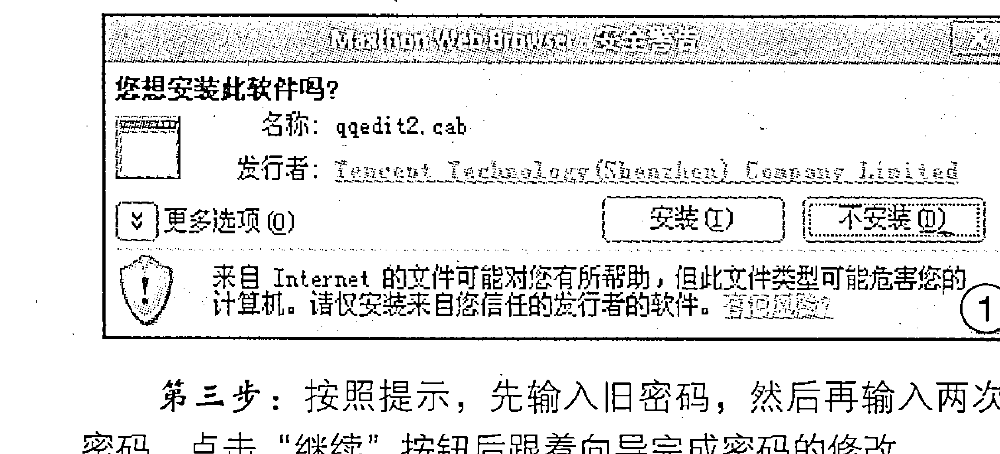

### 二、申请密码保护

为了能在忘记密码或丢失密码之后快速找回，腾讯提供了“密码保护”服务，只要事先申请该服务，在丢失密码以后就可以根据当时填写的信息找回密码了。

-   **第一步**：在QQ登录界面点击“设置”按钮展开登录界面，然后点击最下方的“申请密码保护”打开“密码保护”网页（或者在浏览器地址栏中直接打开https://account.qq.com/cgi-bin/showMain）。点击“马上登录”按钮，根据提示，输入需要保护的QQ号码和密码后登录，在弹出的腾讯“第二代密码保护”页面中点击“太好了，我要马上设置”按钮进入具体设置界面。
-   **第二步**：根据网页中的提示，请设置并输入三个机密问题以及答案、安全信箱和安全凭证，这里强烈建议大家输入完成后立即用纸和笔将它们记录下来，然后再点击“下一步”按钮提交（图2）。
-   **第三步**：进入“确认资料”页面，根据网页中的提示问题，请输入你刚才设置的答案，点击“确定”按钮提交，经网站验证无误后即可完成密码的保护了（图3）。
-   **第四步**：最后，将提示你验证安全信箱或手机，这里建议大家验证安全信箱，如果经过了验证，以后若遇到密码丢失问题，只要再次登录https://account.qq.com/cgi-bin/showMain，通过“自助取回密码”功能就可以重新设置密码了（图4）。

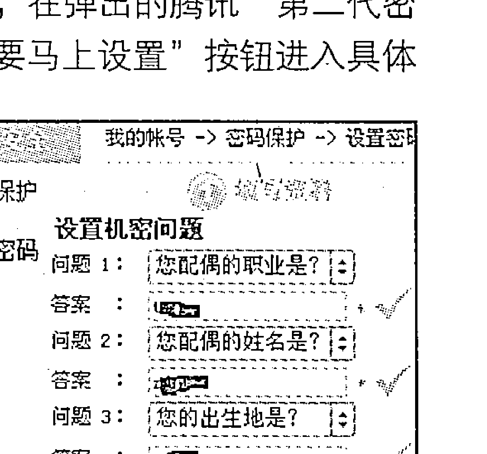

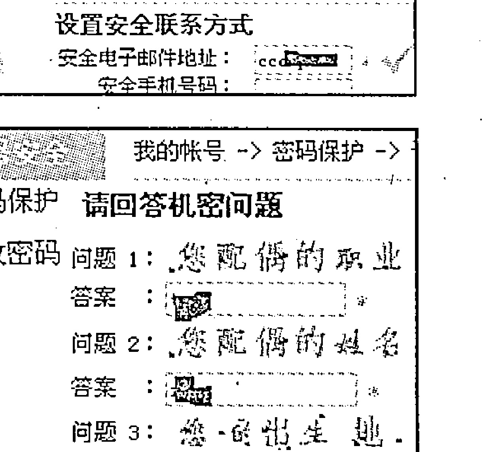

## 第三篇：保护个人隐私

作为即时通讯工具，我们经常使用QQ来联系异地的客户、知心的朋友、合作的伙伴，几乎没有人愿意把自己的聊天记录公布于众，当然更担心被他人偷窥，谁能容忍自己的隐私“路人皆知”呢？

### 一、清除登录号码以及聊天记录

为了方便用户下一次快速登录，QQ软件的登录窗口中会记录下所有曾使用过的QQ号码，而且只需要输入第一个数字，它就会自动补全剩余的号码，用户只要再输入密码就可以登录了。但是，在某些时候我们不希望别人知道曾在此机器上使用过QQ，因此可以删除自己号码的历史记录：只要在登录窗口里点击“QQ账号”后面的蓝色箭头图标，然后在弹出对话框里勾选“同时删除该账号对应的所有记录文件”，接着输入你的密码后点击“确定”就行了（图9）。

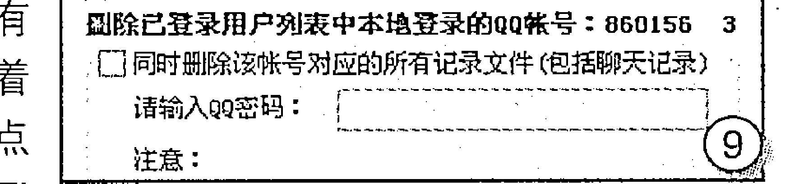

### 二、给本地聊天记录加把锁

现在网络上有些软件可以不用登录QQ，就能查看存放在本机上的聊天记录，如果你需要在公共电脑上使用QQ但不想删除聊天记录，不妨为其再加一把锁：进入QQ的“个人设置→安全设置→聊天记录安全”页面，在右侧界面勾选“启用聊天记录加密”，然后设置一个口令即可。

在“启用聊天记录加密”复选框，然后在下方的空白栏里设置好密码。另外，勾选“启用聊天记录加密口令提示”复选框并填写提示问题及答案，这样当你自己忘记该密码时，也能根据提示问题想起密码（图10）。

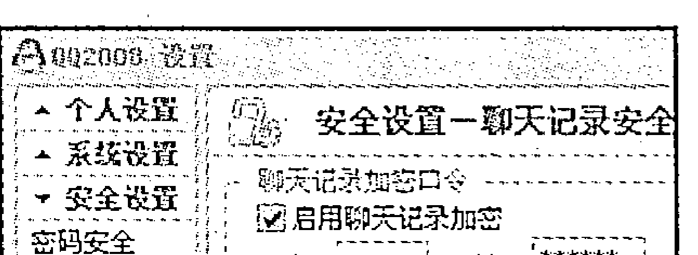

> 小提示 如果不慎忘记了聊天记录的密码，造成无法登录QQ，只要到QQ程序的安装目录下删除以你的QQ号码命名的文件夹即可。

### 三、隐藏当前登录IP地址

现在有很多种优化版的QQ程序支持显IP功能，比如著名的珊瑚虫版、飘云版、狂人版等等，如果使用它们跟好友聊天，可以很轻松地从聊天窗口里知道对方当前的IP地址以及所在地区甚至具体的网吧名称！因此，只要你登录QQ，就无疑暴露了现在的行踪，当然也毫无隐私可言了，赶快想办法隐藏自己的“踪迹”吧。

第一步：登录“纯真论坛”（http://bbs.cz88.net），先注册一个用户，然后进入“代理之家”栏目，从这里可以得到网友们发布的最新、有效的IP地址，但很多“楼主”都设置了“回复后可见”的限制，因此需要点击最新的代理IP地址发布帖并回复一下，马上就可以看到其中的内容了。如图所示（图11）。

| 代理类型 | 代理地址与描述 |
| :--- | :--- |
| HTTP | 58.210.253.101:3128$6&4063,16766,16766 # 江苏省苏州市 电信 |
|  | 58.216.235.242:3128$6&16,63,63 # 江苏省常州市 电信 |
|  | 58.248.44.155:3128$6&1234,4953,4953 # 广东省广州市 网通 |
|  | 59.61.239.19:80$6&31,2984,2984 # 福建省泉州市 电信 |
|  | 59.125.18.179:3128$6&891,7750,7750 # 台湾省 中华电信Hinet (11) |

第二步：比如我们选择了代理类型为“HTTP”的代理地址“59.125.18.179:3128$6&891,7750,7750 # 台湾省 中华电信HiNet”，现在打开QQ的登录界面，点击“设置”按钮，在“网络设置”的“类型”里选择“HTTP代理”，然后在“地址”里输入“59.125.18.179”、“端口”里输入“3128”，点击“测试”按钮，QQ程序将自动检测该代理地址是否有效，并以弹出窗口进行提示（图12）。

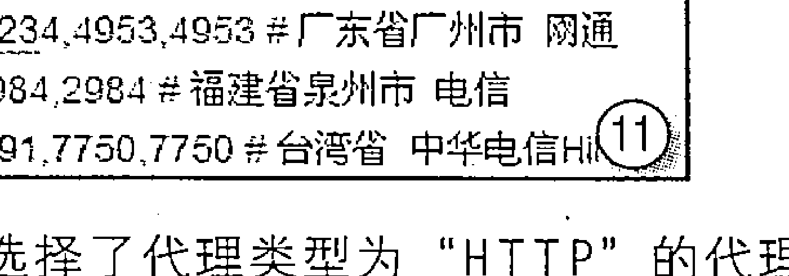

第三步：现在输入你的QQ号码以及密码，点击“登录”按钮后就可以登录了。现在你的好友如果正在使用能显IP地址的QQ版本，他（她）就会从聊天窗口里看到你已经在宝岛台湾了（图13）。

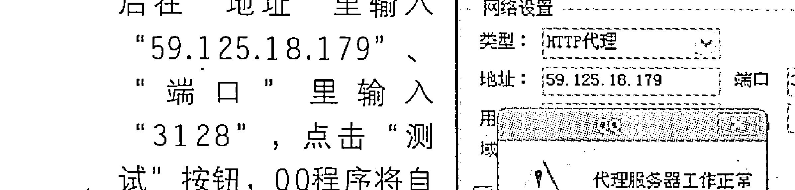

> 小提示 由于纯真论坛发布的均为免费代理地址，因此都具有一定的时效性，如果你发现昨天还能正常登录QQ的IP地址，今天居然不能使用了，只要再到论坛中寻觅最新发布的代理地址即可。

### 四、个性设置 享受聊天过程

经常听到有些QQ聊友抱怨，说自己频繁遇到陌生人要求加为好友、被要求视频聊天、自动弹出的视频请求窗口迫使游戏中断、突然被好友的炫铃吓到等等无奈的问题，大大影响了网聊的心情。其实，腾讯也早已想到这些问题，因此只要在QQ的“个人设置”里简单调整一下默认选项就可以解决。

### 优化一：只加熟悉的人做好友

现实生活中，当我们遇到一个谈得来的新朋友，经常会互留QQ号码，当登录QQ后再通过“查找→精确查找”来加为好友，从而保持联系。但是，利用“查找→看谁在线上”的功能可以搜索到很多在线上的QQ用户，如果你的名称和个人资料比较吸引人的话，相信马上会变成加“好友”的抢手货。为了不再手动去拒绝每一个陌生人的请求，只要在“个人设置”里切换到“身份验证”，在右侧界面勾选“只能通过号码找到我”、“需要身份认证才能把我列为好友”，这样以后凡是加你的，基本都是曾经相识的“陌生人”了（图14）。

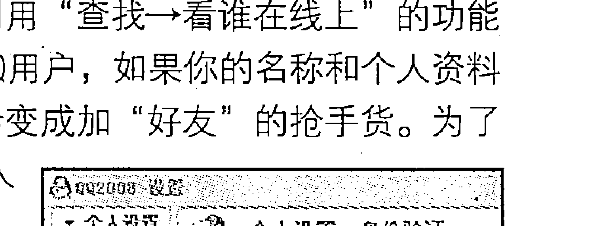

### 优化二：就不告诉你我在干什么

默认下，当我们听歌、玩QQ游戏、看QQ直播时，都会在个人签名处出现相应的状态显示，如果安装了摄像头，头像处也会出现摄像头图标……总之，QQ恨不能把我们正在“做什么”的一切都显示给好友们，这没有一点儿隐私可言！于是，可以进入“个人设置”，切换到“状态显示”页面，在右侧的众多复选框里勾选不想让别人知道的状态，点击“确定”按钮后重新登录QQ就行了（图15）。

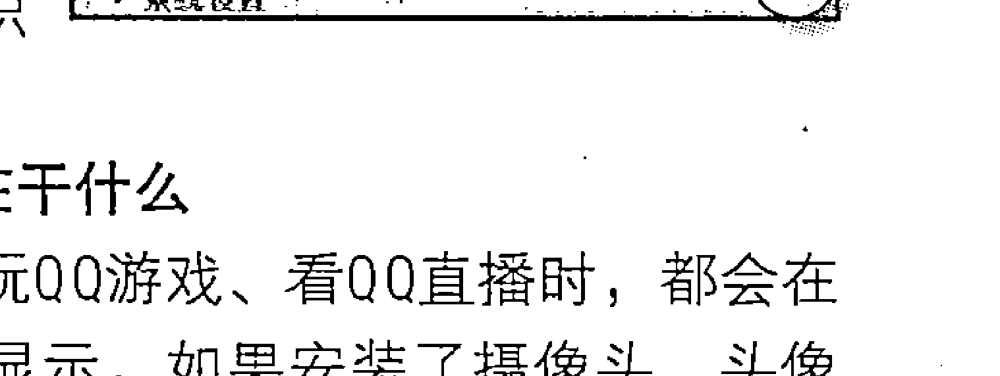

### 优化三：拒绝自动提示

为了不错过与朋友交流的机会，QQ允许给每个好友添加上线提醒服务，以及自动弹出视频聊天请求、自动播放魔法表情等等。但是，如果你正在处理重要文件、玩游戏或者隐身挂机，当跳出上述的提醒或服务时都会手忙脚乱，因此还是事先按自己的不同需要进行设置为好：

进入“个人设置”，切换到“系统设置”下的“基本设置”，从右侧的“综合设置”里设置适合自己的选项即可；然后切换到“声音设置”，勾选右侧的“屏蔽所有好友的炫铃”即可（图16）。


## 第三篇：防范网络诈骗

由于现在使用QQ的用户群十分庞大，引得很多别有用心的人开始动起了“歪脑筋”，利用各种各样的花招来欺骗QQ用户，从而达到其不可告人的目的！俗话说“知己知彼，百战不殆”，现在我们就来看看骗子的种种伎俩：

### 骗术一：恭喜中奖

现实生活中，经常有人收到中了大奖的信件或者手机短信，但经过各种媒体的频繁提醒，已经很少有人再相信“天上掉下了馅饼”，于是有些人就将此方法移植到了QQ上，而且其中提供的网站不仅被挂了木马，有时还骗你输入QQ密码、身份证等等个人信息，如图所示（图17）。

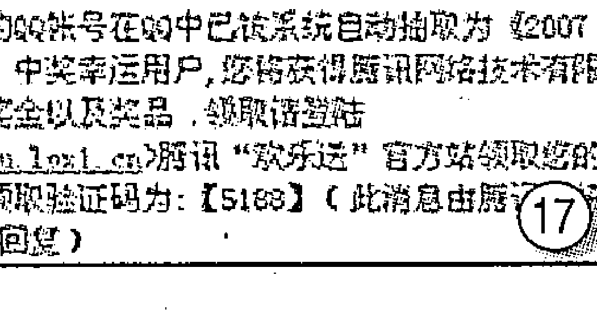

虽然我们没有理由怀疑自己的运气，但如此的行“大运”也太让人匪夷所思了。如果真是腾讯公司组织的活动，在其官方网站肯定要大肆宣传，如果你真的曾参加过腾讯某些有奖活动，当你看到获奖信息时，请第一时间到QQ主页上查看获奖名单吧，因为腾讯公司曾经发布过声明：不会通过QQ消息的方式发布中奖信息、收集个人资料等行为，一切的官方活动都将以“公告”的方式在主页公布！


### 骗术二：原来是话费陷阱

喜欢听收音机的朋友都知道，很多电台都有给朋友、家人点歌的栏目，一般来说很少是收费的，只是想让听众们来参与节目而已。但是，如果你在QQ上收到了某人给你点歌的信息，可别先顾着高兴，很有可能是一场骗局哦，如图所示（图18）。

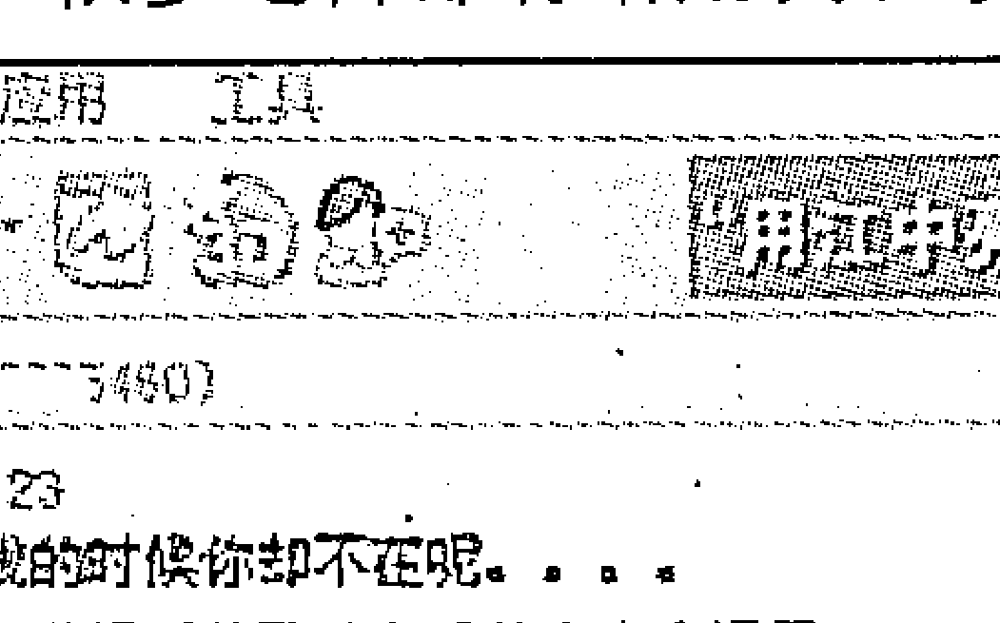

“12590”是中国移动的语音杂志业务，它提供的是娱乐、声讯类的服务，费用由通讯费+信息费组成，其中通讯费是1元/分钟，而信息费由服务提供商制定。这里，骗子将“12590”号码分成两部分，降低了用户的警惕性，从而使骗术得逞。因此，看到了此类的信息不妨一笑而过吧。


### 写在最后

上面我们介绍了QQ中最常见的安全威胁以及解决方案，但随着黑客技术和骗术的不断发展，大家一定不能放松警惕！尽管我们无法彻底解决木马、病毒问题，但只要在平时的应用中，及时更新杀毒软件的病毒库、安装Windows的最新安全更新、关注腾讯官方QQ版本的更新、尽量不浏览不良网站，相信要做到远离威胁、保证安全还是可以的。

### 骗术三：久违的老同学向你借钱

经常在报纸上看到，说某某出门在外，可家里突然接到电话，说他遭遇了某某事故，需要马上寄钱云云，最后才知道原来是骗子骗取了个人信息后实施的诈骗手段！可现在，这一套骗术也被搬到了QQ上，如图所示（图19）。

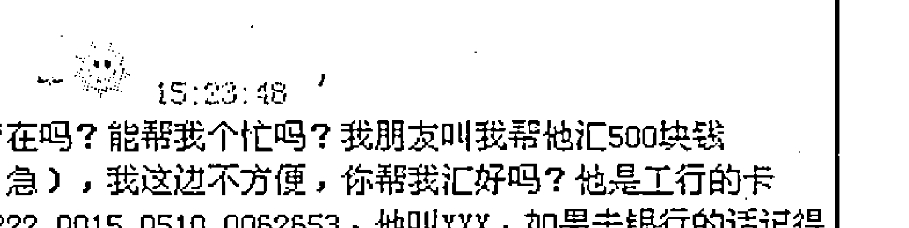

其实，这是由于你好友的QQ号码被盗了，然后骗子将早已编好的一套瞎话群发给主人的好友，如果遇到热心且性急的用户，为帮助朋友，肯定会毫不迟疑地去转账，结果骗子得逞！其实，如果真的有朋友求助，最简单的方法就是马上给他打电话！如果本人正在线，也必须要视频或语音聊天来辨别真伪；如果对方以没有摄像头或麦克风为由来拒绝，你可以向其提问一些只关于你们之间才了解的情况，比如班主任是谁等等，从而轻松地防止受骗。当然，如果真是好友本人，相信肯定理解你的这番“啰嗦”。

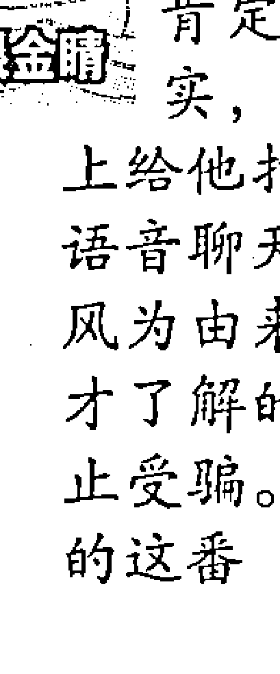

### 骗术四：赠送QQ币？原来是骗点击率！

现在要想使用QQ程序中的某些服务，比如成为QQ会员、购买QQ秀等等，这就需要使用QQ币了。但通常来讲，要想获得QQ币就需要支付人民币，如果有人说要赠送QQ币，也就无异于白给钱，谁能错过如此好的机会呢？如图所示（图20）。

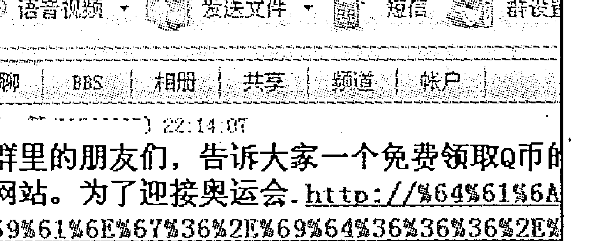

为了提高网站的点击率、提高Alexa网站排名，有些站长不去想办法怎么丰富网站内容来吸引访客，而是不择手段地去骗别人点击。但是，此类网站往往还有可能存在骗取用户的QQ密码、暗藏木马或病毒等威胁，因此不要为了蝇头小利而去冒险。


## 聊天聊地聊生活
### ——主流IM软件点评
□越野苍狼

1996年的夏天，以色列的三位年轻人为了解决彼此之间在网上即时联系、交流的问题，开发出了一款名为ICQ的即时通讯软件（Instant Messaging Software）。随着Internet应用的逐渐普及，其应用性越来越广，由于ICQ的界面为英文，且在某些功能、操作使用上并不符合中国人的习惯，在此背景下，腾讯公司的OICQ应运而生，以其界面友好、操作便利等优势，迅速占领了国内的IM软件市场，其用户数也得到了链式增长，后来因为商标使用权的问题，在2000年OICQ正式更名为QQ。

虽然IM软件本身免费，但其用户粘性而带来的其它影响，对整个互联网行业都有着深远的影响，因此各大公司都加入了IM软件的用户争夺战之中，似乎谁能拥有最大的用户群，谁就掌握着下一场互联网战役的主动权。新浪收购了UC，网易自行开发的网易泡泡，微软的Windows Live Messenger（下文中简称WLM），点击科技的Lava-Lava，阿里巴巴的阿里旺旺，甚至连Google也加入到这一阵营中开发了Gtalk等等，但在整个的抢夺用户的战役中，似乎没有完胜者，也因此，一些公司渐渐淡出了IM软件领域。近日，家喻户晓的百度公司正式推出了IM软件产品“百度Hi”，并进行小范围的邀请测试。

IM软件市场竞争如此激烈，并且在目前的用户争夺战中，QQ一直保持着绝对的领先优势，百度在此时发布其IM产品又意欲何为呢？就连Google的Gtalk都已经低调“退市”了，百度Hi能够闯出一片新天地吗？能够在QQ的手中抢回些许的“馒头”吗？不论最终结果如何，百度Hi的亮相，都会将IM软件的焦点再一次推上高峰。这里就以目前用户群相对较广的几款IM软件进行简单点评，希望对大家在对IM软件市场的了解上有点参考价值。

## 一、腾讯QQ

| 项目 | 内容 |
| :--- | :--- |
| 软件版本 | QQ2008 Beta1 |
| 软件大小 | 24.72MB |
| 服务提供 | 腾讯 |
| 网站地址 | http://www.qq.com |
| 人气指数 | ★★★★★ |

因为ICQ在国外的流行，并且因软件语言及操作习惯的差异等原因在国内普及程度不佳，国内迅速出现了一些以“模仿”ICQ为主的即时通讯软件来填补国内IM软件市场。腾讯QQ的前身OICQ便是这支大军中的一员，因其界面设计简单、使用方便等原因被网友们所喜爱，并且随着宽带网络的普及，在很多人的眼中，QQ几乎成了“网号”的代名词。

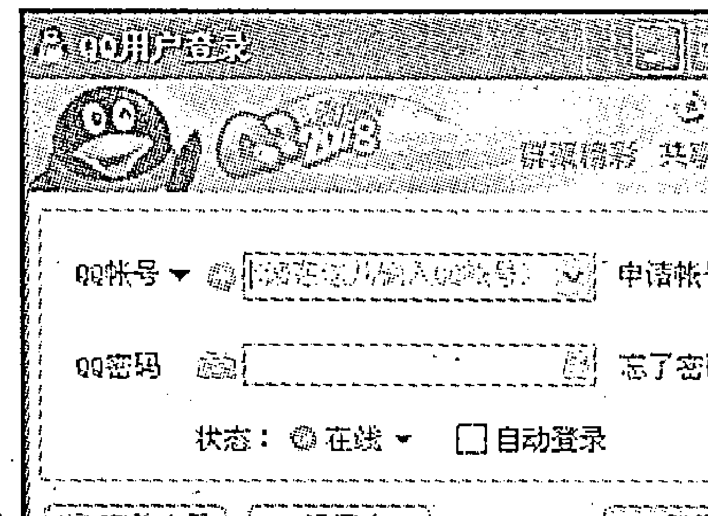

虽然QQ从诞生之今，已经历近五十个版本的发展；但其登录界面仍然保持着最初的简洁。

既然是即时通讯软件，即时消息当然是最最基本的功能了，不过QQ已经发展成为一款集文字、语音、视频为一体的通讯软件，支持群聊、网络会议、网络硬盘、文件传送，并且还附带了远程协助、木马查杀、系统漏洞修复等非常实用的功能。另外以QQ为核心，腾讯相继开发出了半集成于QQ的QQGame、QZone、QQMail、QQ音乐、QQLive等众多流行的网络应用。因为QQ本身的用户基数大，所以QQ每推出一项新的流行的网络应用，马上都会引来大量的用户。

**优点：** 符合中国用户使用习惯，对网络要求不高，在很多网页都很难打开的网络环境下，QQ都可以正常使用；语音、视频效果较好，可实现多方通话，远程协助功能非常优秀；文件传输功能非常好，特别是内网传输时，速度非常快。

**缺点：** 广告多，安装时很多组件不可以进行选择安装，用户要想获得一些“额外”的服务，通常都需要付费进行解决。

**点评：** QQ能够在众多的ICQ模仿者中脱颖而出，可以说是因为它抓住了中国网民的使用习惯及不断增加的贴心功能，边缘隐藏、离线留言以及后来推出的远程协助、屏幕截图等都是非常人性化及贴心的功能。功能越来越强大，越来越好用，不断推出的其它互联网服务，可以说QQ现在是聚焦了一个网络应用服务圈，围绕QQ，就可以完成现在的绝大多数互联网应用，包括博客、播客、迷你博客、电子商务等。

不过QQ的某些“不作为”也正让自己处于越来越危险的境地，如越来越多的广告，安装时组件的不可选择性，自定义图像的等级限制、群组建个数限制等，QQ身上的一些霸道行为，曾让很多用户“咬牙切齿”，在目前的环境下，QQ用户是被迫的接受状态，因为朋友都用QQ，不用没办法，而一旦时机成熟，新的IM软件有足够的理由取代QQ，QQ的继续不作为定会让它为自己的行为埋单。

## 三、Windows Live Messenger

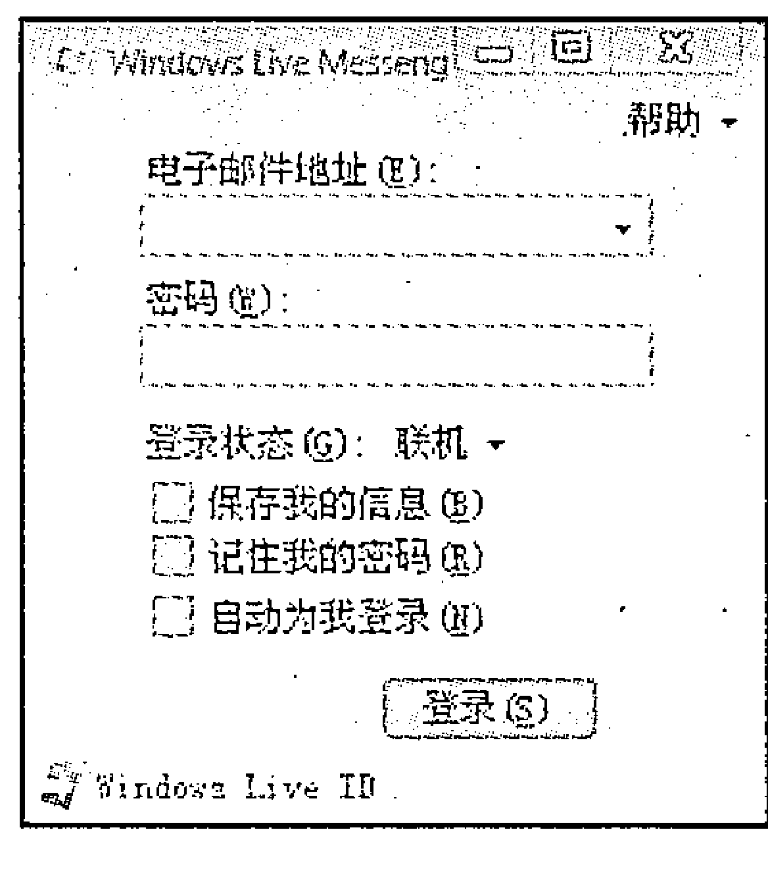

- 软件版本：8.5
- 软件大小：19.32MB
- 服务提供：微软
- 网站地址：http://im.live.cn/
- 人气指数：★★★

因为和Windows非同寻常的关系，Windows Live Messenger以简洁、广告少而获得广大办公族的欢迎。
WLM除了最基本的文本消息功能外，同样支持语音、视频及文件传输功能，并且还支持手写功能。虽然其它特色功能不是很丰富，但日常应用中最基本的还是文字消息，所以WLM的市场份额一直处于不温不火的“火热”状态。

> 优点：简洁、广告少。
> 缺点：对网络质量要求高，特别对局域网支持不是很好，容易掉线，文件传输速度慢。
> 点评：经过这么多年的发展，WLM一直这样不温不火，在市场份额上没有什么大的突破，如果将这些归功为微软的“不思进取”，绝对一点也不为过。所谓“入乡随俗”，在8.0版推出之初，众望所归的“边缘隐藏”功能让人们再一次失望，而8.5版的我行我素，真是让所有支持WLM的用户伤透了心。如果哪一天WLM从市场消失，绝对是微软自己的放弃，而不是用户没有给它机会。

## 四、阿里旺旺（淘宝版）

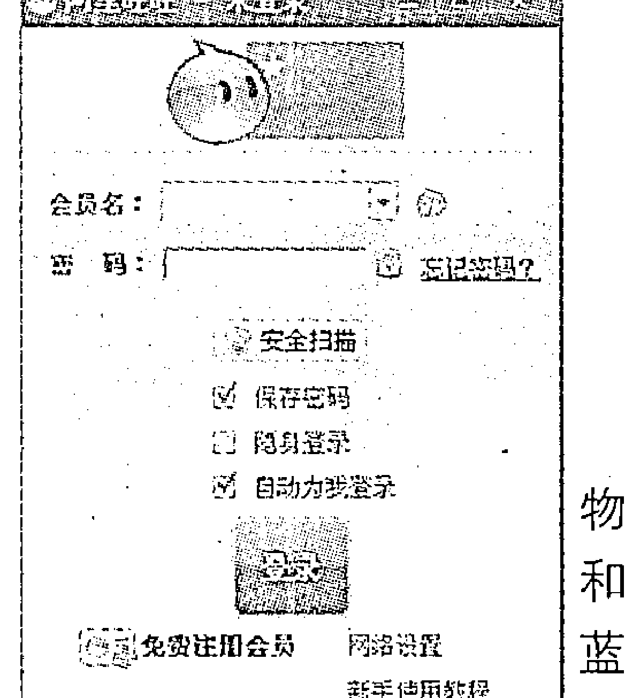

- 软件版本：5.7
- 软件大小：12.32MB
- 服务提供：阿里巴巴
- 网站地址：http://www.taobao.com/wangwang/index.php
- 人气指数：★★★

阿里旺旺可以说是由“淘宝”催生出的IM产物，并且是模仿WLM和QQ而来的，连登录界面都和WLM类似。只不过阿里旺旺是“青出于蓝而胜于蓝”，在软件的易用性及使用习惯上，绝对超出WLM一筹，还将QQ中一些好的方面借鉴了过来。
阿里旺旺基本上提供了WLM能够提供的所有功能，并且“原生”支持群功能，而不是像WLM一样通过“小i”一类机器人方式实现群功能，“原生”支持的群易用性更好。
文本聊天、语音、视频、文件传输在阿里旺旺中可以说是“一个都不少”，并且和淘宝网站紧密集成，可以让用户在“淘宝”上淘物的时候方便与店主沟通。

> 优点：与淘宝网站紧密集成，最多可添加1024个好友。
> 缺点：部分软件功能设置，如切换发送消息的快捷键等，相对于同类软件来说较麻烦。
> 点评：也许阿里旺旺最初只是迎合“淘宝”的需要，根本没有想过要去争夺IM软件的市场，只是“无心插柳柳成荫”，随着C2C市场的不断成熟，淘宝用户的不断增加，阿里旺旺已经占领了一定的市场，并且也捕获了相当一部分人心。
> 作为一款IM软件，对于阿里旺旺，笔者一下子真是找不出什么大的缺点，可以说在很多方面阿里旺旺是汲取了WLM和QQ的长处，如账号注册形式、屏幕截图、安全扫描等。在一定程度上为用户的账号提供了更高级的保障，不像数字账号那样容易被盗取，也让用户的沟通更便捷。

## 五、百度Hi

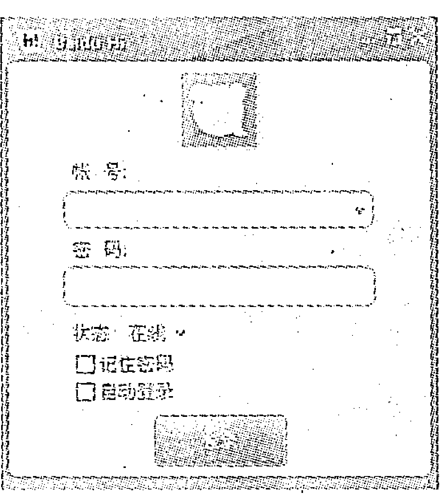

- 软件版本：1.0 Beta1
- 软件大小：5.85MB
- 服务提供：百度
- 网站地址：http://im.baidu.com
- 人气指数：★☆

百度Hi是国内的搜索引擎老大哥，百度最新推出的IM软件，其登录界面同样采取WLM的形式，看样子WLM的登录界面还是比较受欢迎的。百度Hi支持文本消息、语音、视频、文件传送及群聊功能。

> 优点：百度Hi账号与百度空间账号通用，用户可随意自定义图像，据来自官方的资料显示，百度Hi支持一个账号建立20个群，单个群的人数可达256个。
> 缺点：语音、视频效果有待改善，内网文件传输速度慢。
> 点评：在IM软件市场基本成定局的今天，不知道百度推出百度Hi的用意何在，如果正如网友们所说的那样，百度Hi只是百度进军C2C的一个前奏，我倒真是希望如此，因为借助C2C或者是B2C，类似“淘宝”和“阿里旺旺”这样的成功案例，只要业务发展顺利，百度Hi定能在IM软件市场中杀出一条血路，拥有自己的一批忠实拥趸者。如果只是百度拓展新业务的试水动作，恐怕百度Hi也要步Gtalk的后尘了。

## 五、综合解答

腾讯QQ无疑是当前IM领域的绝对王者，并且围绕着QQ已经建立起了一个网络应用服务圈，绝大多数用户都被“套”在这个圈子当中，QZone、滔滔、问问无一不说明了这一点。抛开其它感情因素不说，QQ在很多方面确实值得夸奖，因为其推出的很多功能确实是大家所需要的，如远程协助，可谓是想用户之所想，将用户放在第一位是赢得用户的基础。虽然大家常说QQ是靠“抄袭”起家的，但是研究对手的产品，“取其精华，去其糟粕”，又有谁敢否定这种做法呢？

WLM在经历了8.0这个大版本更新后仍然没有给我们带来任何惊喜，不改善服务，不站在用户的角度考虑问题，在一次次失望之后，必然会被用户所抛弃。虽然现在已经是8.5版本了，但是似乎它并不了解用户需要的是什么，怪不得有网友曾说：“WLM好的地方全被QQ学习了，而QQ不好的地方全被WLM学习了”，我想这句话是用户对WLM“恨铁不成钢”的最好解释吧！

说。这也许是他从阿里旺旺身上所悟出的，因为从目前的形势看，想要从功能或者用户体验等方面将用户拉拢过来，其希望都是非常渺茫的，只有依托平台，让用户不自觉地转移过来，这才是成功的“掠夺”，阿里旺旺无疑是无意中走对了这一条路。如果说未来的IM市场，谁能将QQ拉下马，谁能从QQ的手中抢到最大的蛋糕，阿里旺旺绝对是不二人选。试想一下，当C2C普及的那一天，当人们坐在家里要购物第一个想到的是淘宝时，他会干什么？绝对是登录阿里旺旺，当周围的朋友都用上阿里旺旺时，从QQ转向阿里旺旺就是一件顺其自然的事，当然这些是建立在QQ继续“霸道”的前提下。

百度Hi的推出，只是将人们的视线重新拉回到IM软件上来，将IM软件的焦点再一次推上高峰。虽然百度公布了其测试以来的数据，并借此说明其用户数的增长，但是这些有多少是“活跃”用户呢？有多少人在测试后仍然是百度Hi的忠实用户呢？也许这些数据的猛增只不过是网民的好奇心在作祟罢了，或者说是百度Hi在出生后便展现的回光返照，仅此而已。

## 告别刀与石，中国印章轻松做

□孙学荣

怎样才能快速制作一个比较有个性的印章呢？今天，笔者就给大家介绍一下如何在线制作印章，这不但不需要刻刀与石头，而且方便快捷，不到一分钟就搞定了。

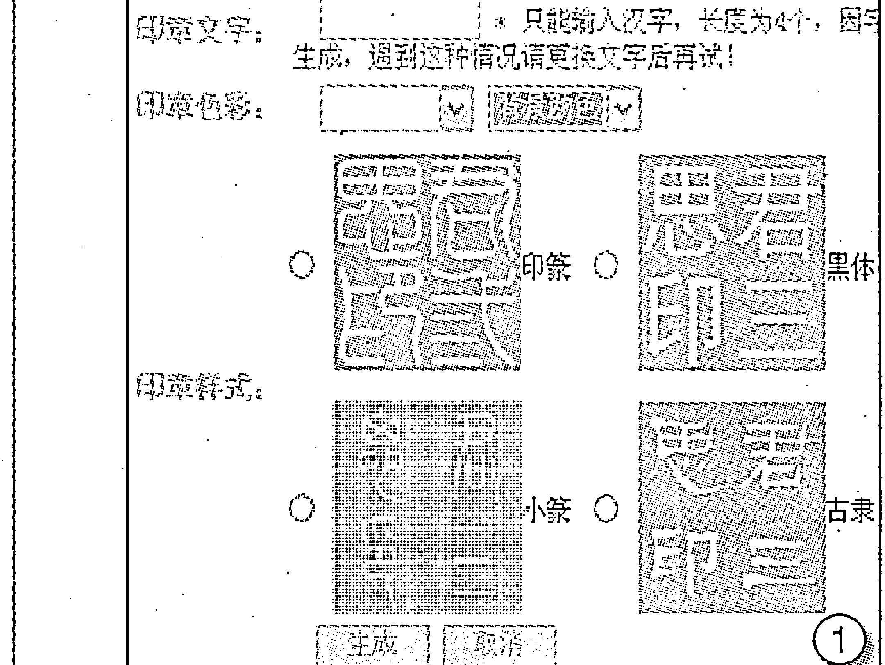

第一步：在浏览器的地址栏输入http://home.kele8.com/smallgame/signetImg/default.aspx并回车，登录可乐8，其界面如图1所示，接着在图1“印章文字”后边的文本框内输入需要生成的印章的文字，如“啄木鸟印”。

第二步：单击“印章色彩”右边的第一个下拉按钮，选择自己喜欢的颜色设置为印章的文字颜色；接着单击“印章色彩”右边的第二个下拉按钮，选择自己喜欢的颜色设置为印章的背景颜色。

> > 小提示 印章一般分为阳刻和阴刻两种，如果将印章的文字颜色设置为红色、背景颜色设置为白色，这种白底朱文（朱，红色，印泥的颜色）的印章效果称之为阳刻；同样的道理，如果将印章的文字颜色设置为白色、背景颜色设置为红色，这种朱底白文的印章效果称之为阴刻。

第三步：在图1“印章样式”右边的六种印章效果中选择一种自己比较喜欢的，然后选中该印章效果左边的单选按钮，再单击“生成”按钮，就可以看到自己设置好的印章效果了，如图2。如果对这个印章的效果满意的话，可单击图2窗口中的“保存图片”链接，这时就会进入下一个窗口，右击左上角的印章图片，选择“图片另存为”，将设计好的印章图片保存到任意位置就可以了。

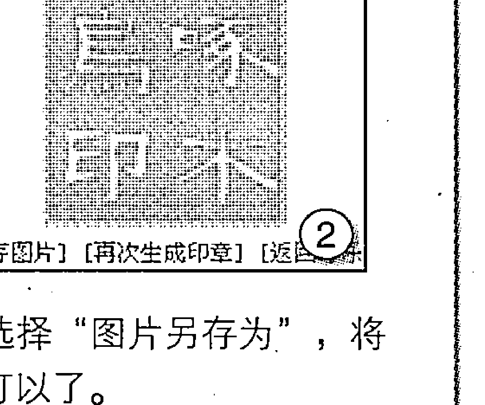

> > 小提示 在生成印章的过程中，对于某些比较生僻的汉字，由于字库的原因，可能无法生成印章，这时可以更换一种印章样式或者更换印章文字之后再试试。

在线制作印章不但非常方便快捷，而且印章效果可以和刀刻的石质印章相媲美，感兴趣的朋友不妨一试。

## 聊天技巧大暴走

□dream

聊天软件是现在网络上与朋友们互相联系的重要渠道。随着百度Hi的推出，现在几乎每家知名的网络公司都有自己的聊天工具，例如腾讯的QQ、微软的MSN、百度的百度Hi、网易的网易泡泡、新浪的UC、搜狐的搜狗、Google的Google Talk等等。而这些工具在平时使用过程中，如果能掌握一些技巧往往能起到奇妙的效果。下面，我们就来看看这些聊天工具有些什么最新的技巧。

## 一、QQ最新酷技

### 1. 菜鸟也能为QQ编程，实现与任意QQ网友聊天

由于QQ设置了好友添加验证功能，如果想与某个网友聊天，在没有将对方添加为好友的情况下便无法与其直接聊天，其实，QQ提供的与陌生人聊天功能便可以解决这个问题，只要在浏览器中打开http://wpa.qq.com/msgrd?V=1&Uin=123456789&Site=www.7dspace.com&Menu=yes，将其中的123456789更换成对方的QQ号码即可强行打开聊天窗口与对方聊天了。除此之外，我们还可以编写一个强制聊天软件来实现同样的功能。

不管你是菜鸟还是编程高手，都可以轻松地完成这个程序的制作。

新建一个记事本文件，将下面的代码粘贴进来，然后在记事本程序窗口中单击“另存为”，在打开的窗口中的路径选“桌面”，保存类型为“所有文件”，文件名为“强制聊天.bat”并进行保存，保存后直接运行这个程序，按照文字提示输入对方号码即可与其聊天了（图1）。

```
@echo off
title QQ强制聊天工具
color 0a
echo.
echo 本程序应用于与任意号码聊天，也可以用于骚扰把你加入黑名单的家伙。。。。。。
echo.
pause
echo.
echo.
echo.
echo.
:a
Set /p num=请输入你想要强制聊天的人的QQ号码:
If /I "%num%"=="n" Exit
start tencent://Message/?Uin=%num%
cls
echo.
echo 点击任意键选择另一个人。
echo.
echo.
pause
echo.
echo.
echo.
echo.
Goto a
```

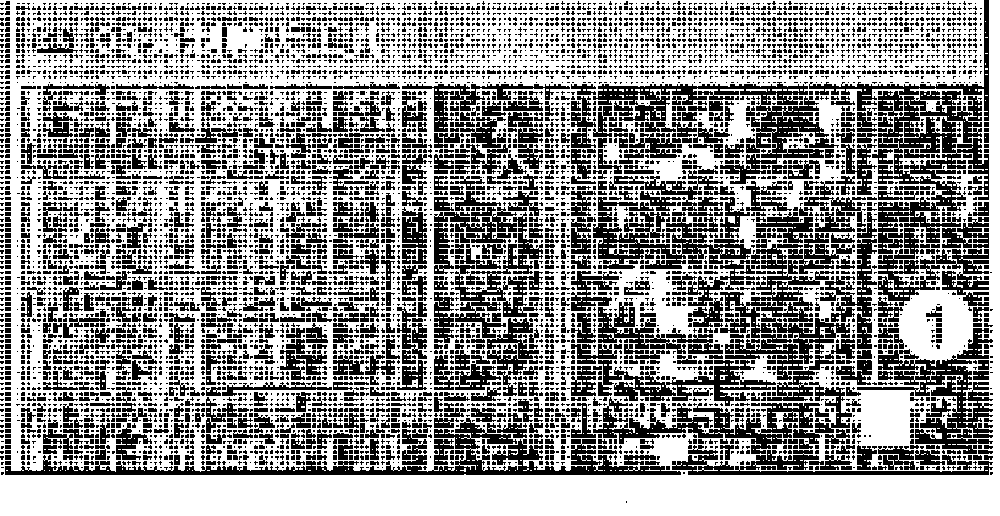

### 2. 难以直白的话，让QQ音信帮你传

很多场合，有些话不能直接亲口说出，例如向梦中情人表白真心时就有一种难以启齿的感觉。在这类场合下，何不让QQ音信代劳！

首先，在浏览器中打开QQ音信页面：http://yinxin.qq.com/，接下来在打开的页面中的“他/她的名字是”框中输入对方的称呼，再点击选择下面页面中的“自写”，然后将你想对对方说的话输入进去，接下来再选择“电话”，这样就可以通过手机或电话来传送你想说的话了。

点击“下一步”按钮，设置好自己的身份、对方的电话号码等参数，最后按照页面提示选择支付方式，支付后即可将自己想说的话通过音信向对方表白了，之后，对方将会接到音信拨打的电话（图2）。

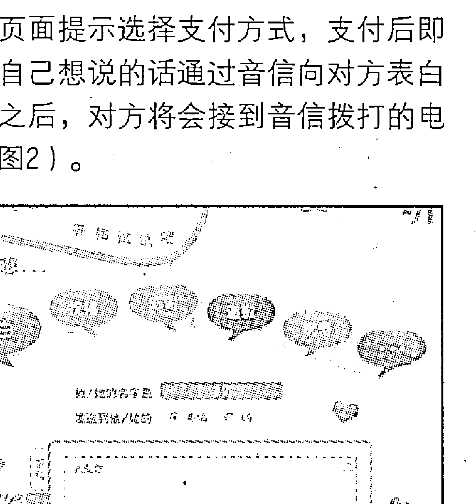

> 支付方式可以是手机支付，也可以是QQ币支付。

## 二、百度Hi最新酷技

百度Hi算是聊天软件家族中最年轻的一员，但是其后台强大，将来的发展潜力巨大。那百度Hi中有哪些新鲜的技巧呢？

### 1. 消息中的内容，随手搜索

在平时与朋友们聊天时，可能会碰到对方说的一些话我们不太理解，譬如对方说到时下某个新名词，而自己之前却从来没听说过，如果当着对方的面去搜索，又怕对方认为自己很“菜”。其实，你完全不必担心，百度Hi已经为你想到了这一点。

前还没听说过，怎么办？只要到百度中搜索一下不就知道了嘛。现在你无须单独将其复制下来，然后再打开浏览器并打开百度搜索引擎页面了，只要直接在聊天窗口中选中这句话或是这个词，按住鼠标左键不放拖动一下即可，稍后会自动启动浏览器并展现百度的搜索结果了，真方便。

### 2. 网友的添加邀请，也可以“暂停”

当我们设置陌生人添加我为好友时必须经过我的同意后，当有人添加自己时将会弹出一个消息，而当自己正忙于工作无暇细看对方信息时，可以通过添加消息窗口中的“稍后处理”按钮来暂停邀请。待工作忙完后，在主窗口中单击“您有？个待定请求”项即可进行处理了。

### 3. 让经常联系的朋友住一块儿

在聊天好友列表中也许有很多联系人，而平时经常联系的也许就那几个或是十几个，但每次在长长的好友列表中查找是相当的不方便。在百度Hi中则可以通过频度排序功能，方便地让那些经常联系的朋友同居一屋，以方便以后的操作：在主窗口中单击“对联系人进行排序”按钮，选择“按联系频度排序”项，稍后便可看到列表中会以“经常联系”和“较少联系”两个分组来显示好友；前面的分组当然就是你平时经常与之聊天的好友了。

### 4. QQ表情、其他图片批量转换为HI表情

不少朋友在QQ中搜集了大量好玩的QQ表情，或者保存了很多表情图片，想将其快速导入到百度Hi中，如何实现呢？其实很简单，只要先从http://www.skycn.com/soft/43630.html下载百度Hi助手程序，关闭百度Hi后再运行百度Hi助手程序，它会自动识别系统中登录过的QQ账号及百度Hi助手。接下来只要直接在左侧列表中选择含有表情的QQ号，再选中百度Hi账号，单击“开始导入”按钮即可。导入完成后再打开百度Hi就可以看到QQ中的表情已经被导入到百度Hi中了。

> 小提示：此软件还可以导入硬盘中某个文件夹中的图片（例如定位到其他聊天软件的表情图标保存目录，就可以完成与QQ类似的表情导入功能了），非常方便（图3）。

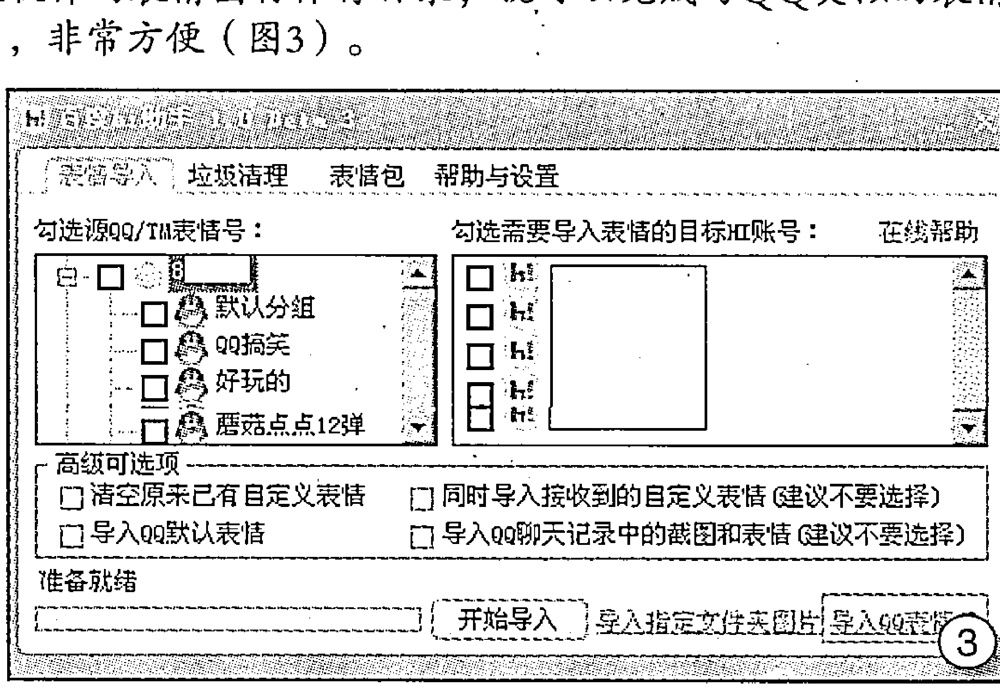

## 三、MSN最新酷技

MSN作为聊天工具中的大哥大，技巧也有很多，不过最新的技巧要数官方推出的小美机器人，通过这个MSN机器人，平时遇到的很多故障问题都能让它帮助解决。

只需将msn.help@live.cn加为好友，或登陆新版客服主页http://help.msn.cn，就可以与小美即时沟通，享受小美提供的客户服务。小美具有很高的“智商”，目前已经收集整理了大量关于MSN使用的常见问题和解决方法，可与用户以自然语言交互方式进行对话，并对用户提出问题的关键词进行理解分析后，在知识库中找出相关的解决方案和建议。譬如，你想解决为什么无法登录Windows Live网站，那只要将“无法登录Windows Live”作为消息发送给小美，然后在打开的列表中再输入“1”，然后再输入“2”，再按照消息中的提示操作即可看到该问题的解决方法了。

## 四、UC最新酷技

现在，使用UC的朋友也有不少，UC在聊天功能方面并不比QQ、MSN这些强出多少，不过，UC平台上的语音聊天室倒是一个亮点，不少朋友在这个平台上建立自己的语音聊天室，通过这个平台进行远程教育、在线展示等，的确不错。下面我们就来简单地看一下具体的实现过程：

-   第一步：打开UC聊天室页面：http://chat.sina.com.cn/homepage/chat_index.shtml，然后点击导航栏中的“购买VIP房间”，在打开的页面中选择一款合适的VIP房间（图4）。
-   第二步：选择一款后即可点击进入进行购买，在打开的购买页面中请如实填写真实详细资料，支付费用后即可成功购买。
-   第三步：拥有了视频聊天室后，就可以根据自己的实际需要着手组建相应的网络聊天室了。点击http://cgi.chat.51uc.com/admin/ManagerLogin.jsp?url=http://cgi.chat.51uc.com/admin/Manage_index.jsp链接即可进入后台管理，按照自己的要求进行设置即可。不明白的地方还可以参考官方帮助文档：http://hezuo.chat.sina.com.cn/vip/VIPHelp.html。

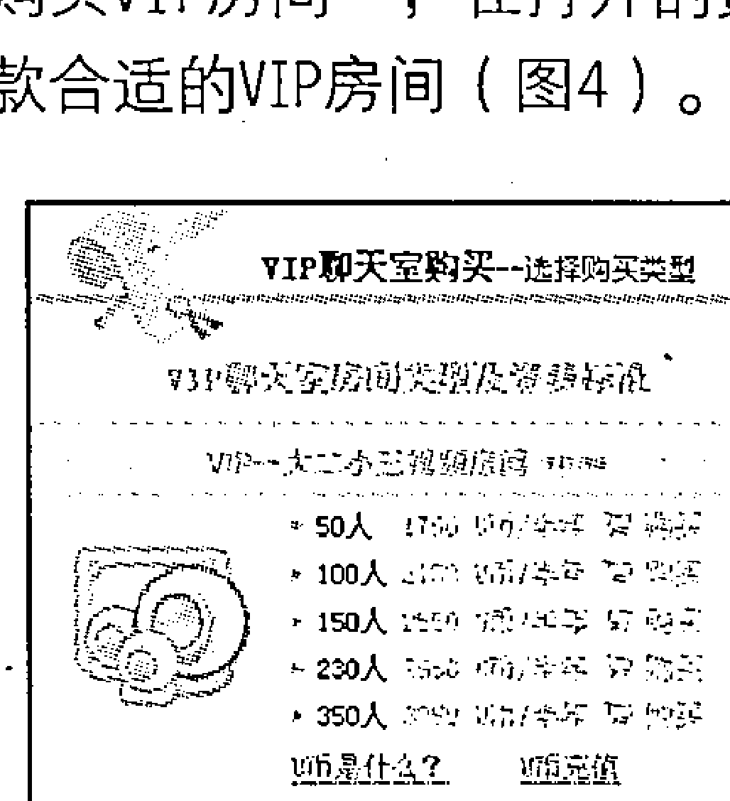

## 五、Google talk最新酷技

Google Talk平素以简洁而著称，功能能够用，界面简洁，不像QQ那样动辄几十MB的庞大身材。Google Talk使用起来也很简单，说到最新的技巧，让其永远处于空闲状态这则技巧当然要介绍给大家。使用方法也很简单：

首先，从http://www.galwaysidle.com将名为“gAlwaysIdle”的小工具下载并安装到系统中，接下来只要在Google Talk中右击托盘区中的Google Talk程序图标，在弹出的快捷菜单中就能看到gAlwaysIdle相关的选项了，直接选中“Always Idle”选项即可。

这样设置后，任何时候Google Talk都处于空闲状态了。

## 爱你没商量

## 网购你我他

□ 朱 莉

据美国大型网上零售商协会Shop.org估计，2007年，美国人的服装采购有10%在网上完成，电子商务占美国零售销售额的7%。而在中国，根据艾瑞咨询和淘宝网的联合调研，2007年全国网络购物市场销售额达到594亿元，首次超过500亿元大关。自从突破了网上购物支付手段和物流这两大瓶颈之后，上网购物已经成为主流上网人群的一种消费习惯，被越来越多的人所青睐。

## 网上购物门户篇

电子商务给我们的生活带来了巨大的改变，不仅是个人网上购物踊跃，越来越多的传统商家也把触角延伸到网络，其销售和原料渠道也在逐渐走向网络化。目前的网上购物网站主要分为三大类网站，分别是B2B、B2C、C2C网站，不同的网站性质针对不同的客户群体。目前客户群体大致分为三类：一是既做卖家又做买家的小商户；二是纯粹的个人买家；三是只做大卖家的厂家、商行。这里主要介绍客户群体最多的C2C网站。

### 1. 人人参与的互动店——C2C网站

> 小提示：C2C是消费者之间或消费者对消费者的意思，是“Consumer to Consumer”的简称。

我国目前比较成熟的C2C网站有淘宝、易趣、QQ商城三大网站。淘宝在这个领域的绝对优势目前很明显，特别是个人卖家得到了迅猛发展。下面我们来看看这三大C2C网站各有哪些优劣势及其发展前景。

### ☆淘宝

优势明显，用户体验好，页面漂亮（图1），商品分类清晰，有自己的聊天工具，有专人团队管理网站的商品信息是否分类正确，处理投诉举报及时合理。再加上有支付宝作为其完善的支付担保平台，使之成为这个领域的排头兵。

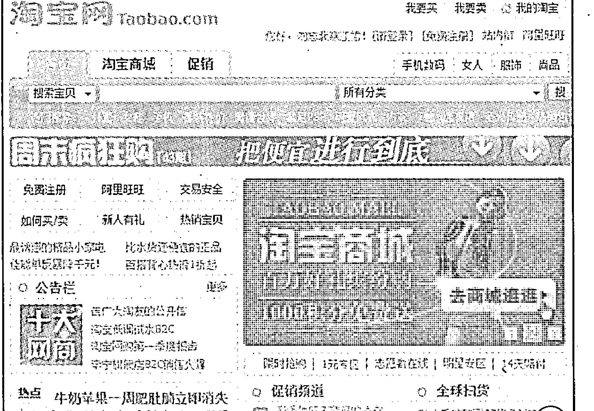

然而目前淘宝的信用评价体系还有待完善，整个交易过程淘宝网不能控制，那些不实际交易而又互给好评作假的卖家会趁虚而入。电子商务的前景是很乐观的，淘宝在多年的磨砺中会摸索出更合理的盈利模式，与淘宝卖家达到双赢的效果。

### ☆拍拍网

最大优势是已经拥有的庞大用户群，凭借腾讯QQ在中国的强大品牌效应，拍拍网几乎没有花多少力气，在C2C领域取得相当不错的业绩。页面、商品分类等等，拍拍网很多地方比淘宝网都不逊色，然而拍拍网在处理纠纷、反馈信息方面显得不够及时和专业，评价系统的细节方面做得还不够到位，加之腾讯也没有花太多的广告费用在C2C市场，因此能够做到今天的成绩还是很不错了。

对于拍拍网来说，借助腾讯QQ通信优势和Q币虚拟货币，加快虚拟货币与现实货币的通存通兑趋势。或许不久的将来，你的Q币还可以购买现实中的商品，这种优势也是其它C2C网站所不具有的强大优势。拍拍的前景还是比较看好的，当然这主要取决于腾讯对拍拍的重视程度了。

### ☆易趣

实际上易趣是在国内开辟C2C的先河，但由于其支付担保平台问题解决得太缓慢，所以在C2C市场迟迟不能得到发展，目前国内这个市场它已基本没有什么竞争力了。因此，它很快转向做国际贸易。易趣网提供了许多丰富详尽的外贸交易教程。值得注意一点，易趣的信用评价体系约束力较前两者更强，更有效地规避了虚假交易增加信用度的行为发生。

> 小提示：除此三大C2C网站以外，其他的C2C网大多没有自己的支付担保平台，基本没有什么竞争力了。

C2C模式给一些没有资金、没有技术的个人卖家提供了一个很好的发展平台，许多在淘宝从零做起的卖家，今天已成为专职网上销售人员，越做越大。强者越强这个商场的规律，同样适合于电子商务当中。

## 2. 领先门户的信誉店——B2C网站

B2C是商业机构对消费者的电子商务模式，是Business To Customer的简称，如卓越亚马逊、当当网都是属于典型的这类网店，两者现在都主要是以网上售书和光碟为主，形成激烈的竞争。与此同时，PPG衬衫/衬衣网上专卖店、红孩子购物网站、京东商城、北斗手机网等也呈现出火爆趋势。B2C领域，随着传统企业的资金涌入，将会获得高速发展，效益明显。而且，拥有独立品牌、优势货源、良好口碑、服务完善的各行业B2C商家会在这个领域大显身手。

## 3. 批发商品的行业店——B2B网站

B2B是商业机构对商业机构的电子商务模式，是Business To Business的简称，如阿里巴巴、慧聪商务网等，阿里巴巴已连续五年被评为全球最大B2B网站。这种模式目前是我国盈利状况最好的电子商务商业模式。B2B模式主要是通过互联网平台聚合众多的企业商家，形成买卖的大信息海洋，买家与卖家在平台上选择交易对象，通过在线电子支付完成交易。

> 如何寻找网上购物信息：一是在搜索中直接输入商品信息；二是直接找到购物网站，个人卖家可以去淘宝、拍拍、卓越亚马逊、PPG衬衫等网站，企业商家当然首选阿里巴巴。

电子商务中还包括G2B (Government to Business政府对企业)、B2B (Business to Business商业对商业)、B2G (商业机构对政府管理部门的电子商务)、C2G (消费者对政府管理部门的电子商务)等多种模式，其中B2G、C2G模式是政府的电子商务行为，不以营利为目的，主要包括政府采购、网上报关、报税等，对整个电子商务行业不会产生大的影响。

## 网上购物一日行

网上购物由于受运输、环境(如不能听、闻、嗅等)的限制，人们在网上购物时一般都会选择一些易于运输，轻便的商品。但随着物流手段的不断成熟，网上销售的商品品种已越来越多。下面让我们来看看时尚火爆的淘宝上是如何购物的吧。

### 1. 淘宝里的哪些商品是最受欢迎的呢？

看看2008年4月份淘宝店铺的数量统计，店铺数量最多的是女装/女士精品/童装，214747家，其次，彩妆/香水/护肤/美体类有96857家，三至五位分别是：饰品/流行首饰/时尚饰品类76515家，居家日用/厨房餐饮/装饰/工艺品类69068家，网络游戏虚拟商品交易区45053家。从以上数据可以看出这几类商品在淘宝很有市场，其中排在前三位的商品均是女人大类的商品，而女人大类的商品则占了淘宝总店铺的大约43%(图2)，占绝对第一位，可见网上购物群体以女人为主，如果想在淘宝开店，那就围绕女人用品开个小店吧。

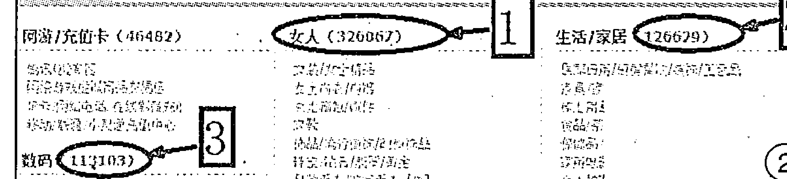

### 2. 淘宝购物跟我来

新手第一次购物不知从何入手，先看看淘宝购物流程图(图3)，依次操作，很快就上手了。

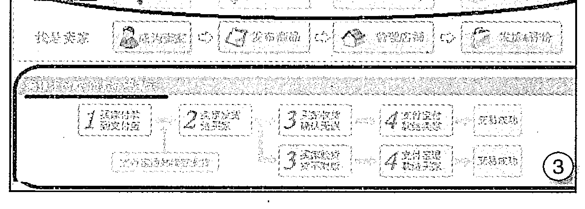

第一步：注册用户名及支付宝实名认证。登录淘宝网 http://www.taobao.com，单击最上方“免费注册”，根据提示注册完用户名。再登录淘宝，进入“我的淘宝”，单击“您的支付宝个人实名认证正在审核中”后的“点击查看详情”的蓝色字样，进入支付宝认证信息输入，根据提示输入个人信息和银行账户信息，系统确认审核后会给你的注册邮箱发出确认信。最后再去下载一个阿里旺旺即时通讯工具，以便于买卖方及时沟通。下载地址：http://www.taobao.com/wangwang/index.php。

> 小提示：在网上购物通过支付宝就必须开通网上银行。工商银行、交通银行、建设银行等各大商业银行的网上账户开通流程，可参见此网址：http://service.taobao.com/support/7-196/196.htm

第二步：买家拍商品，付款到支付宝中暂存。和卖家在淘宝旺旺上沟通好以后，打开将要购买宝贝的页面，单击“立即购买”，在新网页中输入你的购买数量、运送方式、收货人姓名、地址、电话等准确信息后，输入支付宝密码，付款到支付宝。

第三步：买家收货，支付宝付款并评价。买家收货后，登录到“我的淘宝”中，单击“买家提醒区”中“已买到的宝贝”，单击“确认收货”，再根据提示将支付宝的款项付给卖家。完成后，回到“已买到宝贝”界面，再给辛苦的卖家们一个真实的评价，一个网购就完成了。

- ◆网络大补贴
快速网购通道指南：怎样快速搜到宝贝？ http://service.taobao.com/support/132.htm

### 3. 网购技巧让你喜笑颜开

我们先来看看资深买家给出的六大网购秘籍吧！一是钻石信誉来源要追究。选择钻石信誉的卖家时，一定要看看他的最初评价是怎么来的，有些商家是通过先卖点卡之类的攒到钻石级了，再改行卖其他商品，因此这个钻石不能代表他现在商品质量。

## 网上购物安全篇

### 1. 曝光最新的买家被骗三黑招

第一黑招：骗你先确认收货。

主要是买点卡时，卖家利用“自动发货”功能，骗买家要先确认收货后才能弹出“提取卡号密码”的字样，同时还会发假的截图给买家，注意卖家的截图上方显示的是“交易成功”，下面是“提取卡号密码”，而实际正确的窗口是“等待买家确认收货”下面是“提取卡号密码”！几番来回，使不熟悉“自动发货”的新手买家很容易上当了。

防骗绝招：妥善保管您购买后的卡号密码，充值前请勿将提取的卡号密码告诉任何人；充值成功后请进入“已买到的宝贝”里“确认收货”。

> 知识链接：如何判断系统自动发货商品？http://forum.taobao.com/forum-170/show_safe----13627144-.htm。

第二黑招：低价骗取卡密

用低价充值来诱惑买家，买家开始上钩，如果买家要买魔兽点卡，骗子会先发其他淘宝店里其他游戏点卡的自动发货链接给买家。当买家在这个链接上拍下宝贝，提密充值会发现卡密不对，骗子会要求买家把卡密给他，说是要拿到平台上去验证一下，再换真正的卡密给买家。当买家告诉他真正的卡密后，你会永远都找不到他了。骗子把你拉入黑名单就完了。

防骗绝招：仔细对照卖家发给你的链接是不是你要购买的点卡，在拍下宝贝时一定要注意商品右上角的淘宝旺旺ID号，是不是你刚刚联系的店家，如果不是，一定不能拍。最后，如果不小心把卡密发了，一定要马上及时联系客服处理。

第三黑招：骗取大单汇款不经过支付宝

买家先在代理商卖家那里小额进货，每次都是先打款再发货，交易正常。当买家准备一次性进货量比较多时，卖家找各种理由不通过支付宝，一般买家会考虑到前几次合作卖家比较守信用，会同意直接打款过去。打完款后，卖家所有联系方式中断，在恰当的时候消失得无影无踪了。

防骗绝招：买家必须通过支付宝的手段进行货款交易，如果卖家不同意使用支付宝，那么买家一定要小心。万一被卖家诱导，可以向客服提供旺旺聊天记录等作凭证来解决问题。

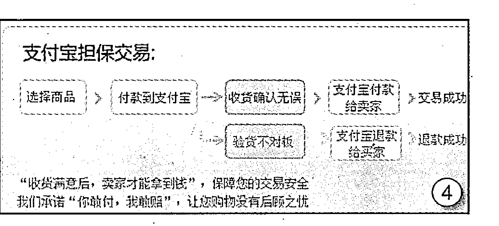

快，比在皇冠店更能享受到购物的乐趣。

- ◆网络大补贴
网上购物如何避歪货：http://news.21tx.com/2007/08/27/10110.html。
阿里旺旺使用小窍门：http://forum.taobao.com/forum-51/show_thread-----5804399-.htm。

### 2. 网上购物三大纪律八项注意

三大纪律：

1. 网下无法见面交易又不愿意通过支付宝的交易不能做。
2. 贪图小便宜，比同类商品便宜50%以上的商品不能买。
3. 没有收到货一定不能“确认收货”并完成支付宝付款。

八项注意：

1. 注意保留证据。买家为防骗，随时注意将聊天记录、短信、E-mail和汇款凭证等证据都要保留下来，以备被骗后能投诉。
2. 注意商品描述真实性。对于没有使用真实图片的卖家，特别是服装和首饰之类的，很可能会出现图片与实物不一样的情况，这时要注意选择有真实图片的卖家。
3. 注意卖家对差评的态度。卖的东西多了难免会有差评，差评的原因以及卖家对待差评的态度如果恶劣，那么这种卖家的售后服务的水平很值得考虑。
4. 注意挑选促销品。促销品不一定是性价比高。很多店家之所以拿这个产品来促销，很有可能是因为它的销路不是很好。
5. 注意售后服务的承诺。在购物时一定要看清卖家对售后的承诺，同时要注意保留旺旺聊天记录或者电子邮件等。
6. 注意当场快递签字。收到货物一定要在快递人员面前当场开货，货物不符，请快递员签字并记住快递员的编号和姓名。
7. 注意选择知名度高、信誉好、售后服务比较规范的商业网店进行消费，对网店的经营资质真实性和合法性有一定的了解。
8. 注意保持头脑清醒。不要轻易相信网上提供的各种产品信息、广告宣传和承诺。

# 博客搬家 不再烦恼
□dream

随着博客的流行，不仅仅是玩博的人（博客）人数越来越多，提供博客服务的网站服务商也是呈现群雄争霸的局面。也许很多朋友之前在很多网站上已经注册申请了博客，并且还花费了不少时间撰写了许多博文。但现在又看中了另外一款博客，如何将之前花了大气力撰写的博客批量搬到新博客中呢？

## 搬家到搜狐博客

如果之前使用的其他博客现在想搬到搜狐博客中，可以直接使用搜狐博客提供的搬家工具来实现。
在浏览器中打开搜狐博客搬家工具页面：http://act.blog.sohu.com/transfer/apply.jsp，首先登录到自己的搜狐博客中，然后选择源博客，再输入博客地址、账号及密码即可完成申请的提交，提交了申请后，在系统通过申请后，便会完成博客的搬家了（图1）。

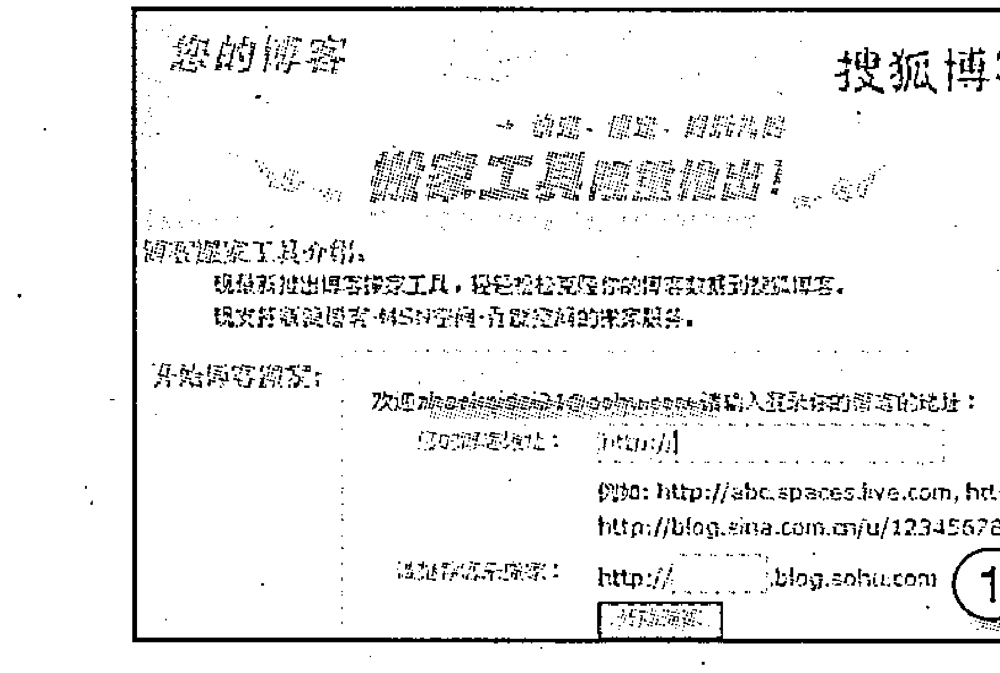

目前，搜狐博客搬家服务提供对MSN空间、新浪博客、百度空间这三个博客的搬家支持。

## 搬家到新浪博客

新浪博客自己推出了从其他博客搬家到新浪博客的工具，只要在浏览器中打开新浪博客的搬家页面：http://blog.sina.com.cn/blogmove/index.php。
在打开的页面中便可看到系统提供了可以从MSN搬家到新浪博客、从搜狐搬家到新浪博客以及从网易搬家到新浪博客的三个按钮，如果想将在上面三个博客网站开通的博客搬家至新浪，则只要点击相应的按钮，即可打开搬家申请页面，按照页面提示填写源博客的登录账号及密码，再点击“下一步”按钮即可完成搬家申请。
接下来，只要等待新浪博客系统的处理，完毕后系统会以系统短信的方式通知搬家处理结果（图2）。

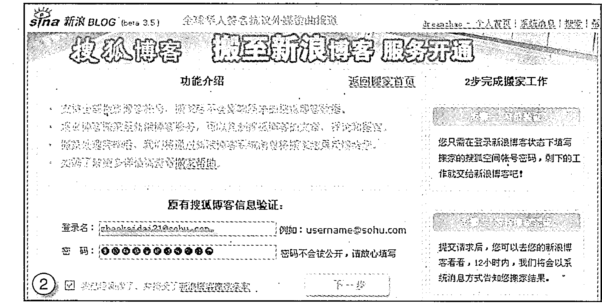

> > 成功搬家后，原先的博客中的数据不会受到任何影响，而搬家成功后，包括源博客中的博文、评论等数据都会被完整地搬到新博客中。

不过，新浪自身提供的博客搬家工具只支持搜狐、网易、MSN这三款博客，如果是其他博客，可以通过将它们先搬到上述三家博客中，然后再搬一次即可。

## 搬家到网易博客

如果想将之前的博客搬家到网易，也可以直接利用网易博客的搬家工具来进行搬家。
在浏览器中打开网易搬家页面：http://blog.163.com/activities/cloneOne.do，然后依次填写源博客的地址、登录账号及密码，然后点击“提交搬家申请”按钮即可进行搬家申请，申请通过后，博客搬家工作也便完成了。
网易博客搬家服务提供对雅虎空间、51.com、QQ空间、搜狐博客、Live Spaces、新浪博客、中国博客网、百度空间等博客的搬家服务，操作起来也相当方便。

## 搬家到Qzone

腾讯博客——Qzone与QQ的完美结合，使众多博友对其爱不释手，纷纷想将以前在其他地方（例如51博客、搜狐、新浪、网易等）的博客搬家到Qzone中来，现在，腾讯公司为我们提供了官方搬家服务，可以轻松地将其他博客搬到Qzone中。
直接在浏览器中打开Qzone搬家页面：http://n.qzone.qq.com/move/move_login.htm，使用即将转入到此号码对应的Qzone中的QQ号码登录到系统中。接下来，选择源博客类型，然后在“用户名”框中输入该博客账号，再输入验证码并点击“提交搬家申请”按钮即可。
当你提交的申请被批准后，源博客上的文章就像是被执行一遍复制操作而被搬到Qzone中，源博客上的文章仍然存在。

## 通用博客搬家方案

上面提到的方法都是针对单一博客进行的搬家方案，很多朋友手头可能拥有多个博客，通过上面的方法也许不太方便，这时，则可以考虑使用下面的通用博客搬家方案来进行博客搬家。
首先，在浏览器中打开这个名为Blog Mover的工具页面：http://blogmover.redv.com/blog-mover.jsp，接下来，只要三步操作就能进行博客搬家了。

第一步：点击选择“从源BLOG读取日志”标签，接下来选择一个博客空间提供商，点击后在下面的博客登陆框中，输入你博客登陆的用户名和密码登陆后，就开始读取你博客中的文章了。（图3）

> 小提示
通用博客搬家方案目前支持搬家的博客：百度空间、和讯博客、新浪博客、搜狐博客、博客中国人、网记杯子、中国博客网、博客天下、Blogger、MSN空间、metaWeblog这些博客之间互相搬家。

第二步：点击“去除不需要导入的日志”标签，页面会列出你博客中的全部日志，你可以选择哪些不需要导入（其中选择的删除并不会删除你博客中的日志）。
第三步：选择你要导入的博客空间，点击写入即可开始博客写入操作。等写入完毕便完成了博客搬家。搬家过程中的各种操作，并不会影响你的博客正常使用。这款在线搬家的工具，可以帮你把日志的内容、发布的日期、评论标签、图片等所有的东西搬移。

## Blog Mover（博客搬家通）

- 百度空间搬家
工具地址：http://hi.baidu.com/sys/bmove/
支持搬家的博客：MSN空间、新浪博客。
- 和讯博客搬家
工具地址：http://hexuncom.blog.hexun.com/306956_d.html。
支持搬家的博客：新浪博客、搜狐博客、网易部落、TOM博客、MSN空间、天涯社区、中国博客网、中华部落阁、博客中国、博客中国专栏、DoNews、歪酷博客、敏思博客、BlogBus、BlogDrive、百度空间、mop博客。
- BlogBus搬家
工具地址：http://banjia.blogbus.com/index.jsp。
支持搬家的博客：Blogcn、Bokee、新浪博客、大旗精英、敏思博客、UUZone、和讯博客、网易部落、天涯博客、MSN空间、BlogDriver、搜狐博客等12个站点提供搬迁服务。
- Blogger搬家
工具地址：http://www.coollittlethings.com/blogconverter
支持搬家的博客：MSN空间

- ◎搬家
点击软件界面右上方的“博客搬家”，通过“添加欲发布博客→选择博客空间→输入空间的用户名、密码和名称→确定”后，点击“导入的文章→批量上传”等待文章搬移即可。
- ◎备份
我们通过“添加欲备份博客→选择博客→输入博客用户名、地址和名称→下载新博客”就完成了博客的备份。
软件下载页面：http://www.maikr.com/blogpartner/index.htm

## Blog Bak备份自己的博客

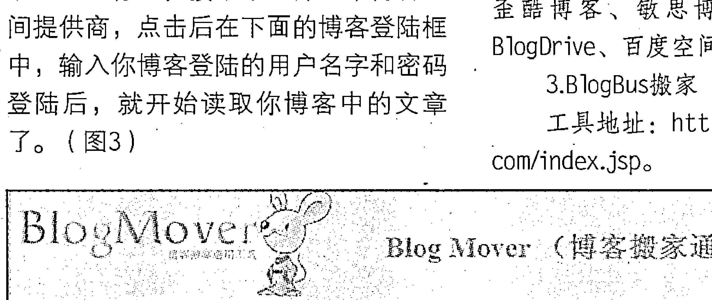

博客也有遭殃的时候，万一不幸之事降临到自己的头上时，如何办？那就要养成提前备份的良好习惯，本工具就能帮助大家轻松地将自己的博客备份起来。
Blog Bak就是一款BLOG用户备份自己文章的工具，它最大的特点是支持众多的BLOG运营商，不管你是使用什么BLOG系统，都可以轻松完成数据的导出和备份。因此拥有了Blog Bak，你有多少个博客，都可以轻松把它备份到一个博客中。这里说的“一个博客”，实际上是在www.5ilog.com注册的一个新博客，一旦源博客出故障了，你还有这个备份博客。

1. 将下载压缩文件解压；
2. 运行blogbak.exe；
3. 选择当前使用的blog服务商；
4. 点“去登录”按钮，左侧浏览器会转到对应服务商站点的入口，输入你自己的用户口令正常登录；
5. 登录成功后，点“开始备份”，然后耐心等待。
软件下载地址：http://www.newhua.com/soft/52120.htm。

> 小提示
此工具需要.NET Framework2.0的支持，如果系统中没有安装，请先下载Microsoft .NET Framework 2.0并安装(下载地址：http://www.onlinedown.net/soft/38669.htm)。

# 另类搜索 事半功倍
□小赵

> > 平时使用搜索引擎进行各项搜索，几乎占据了上网时间的一大部分，适当地掌握一些另类搜索技巧，则可以实现事半功倍的效果。我们这地方所指的另类搜索主要包括：视频搜索、图片搜索、音乐搜索、地图搜索、小说搜索、周边搜索等。

## 视频搜索

要说到视频搜索，首先，你需要知道著名搜索引擎Google和百度这两大搜索引擎的视频搜索地址。Google的视频搜索频道：http://video.google.cn/，百度的视频搜索频道：http://video.baidu.cn/。其实，针对这两个网站，知道这两个子频道的地址，也算你掌握了视频搜索技巧的一半了。

### Google视频搜索技巧

Google在中国被称为谷歌，而谷歌视频搜索过程中也有很多技术可寻。

#### ◎谷歌榜单，尽是最热视频

在谷歌视频搜索页面的右侧显示一个视频搜索榜单，而该榜单中的视频都是网上最热门的视频资源，再点击“更多视频”链接还可以看到更多的热门视频。因此，在使用谷歌视频搜索时，这个视频榜单绝对是个最佳的去处，在里面可以轻松地找到各种热门的视频。

#### ◎分类搜索，让你快速找到自己心仪的视频

谷歌视频提供的分类搜索相当精细，例如它将视频分为幽默、音乐视频、体育、动画这几个类别。作为用户，在搜索时，直接选择这几个类别中的一种即可快速搜索到自己喜欢的视频类别了。

> > 小提示 譬如，要想搜索一些与幽默相关的视频，只要在类别中选择“幽默”，然后再输入关键词，就能快速找到大量的幽默搞笑的视频片断。即使不输入关键词，直接选择相应的类别后，也能搜索出所有的该类别的视频来。

#### ◎谷歌视频搜索，也能使用RSS阅读器订阅

平时喜欢使用RSS阅读器看博客的朋友，肯定对RSS阅读器带来的方便很是赞成，而谷歌视频频道也推出RSS订阅服务，这样，一些最新的视频出现于网络后，你也许第一时间就能看到。使用谷歌视频的RSS订阅非常简单：首先，在视频频道打开目标类别（例如“幽默”），右击类别后在打开的搜索结果页面右上角点击“RSS”链接并将其快捷方式复制到剪切板。接下来，打开RSS阅读器，直接添加频道，频道地址就是上面复制的RSS链接。这样就能方便地将这个视频频道添加到RSS阅读器中了。以后，如果该视频类别中有新的视频，你的RSS阅读器中就会看到消息（图1）。

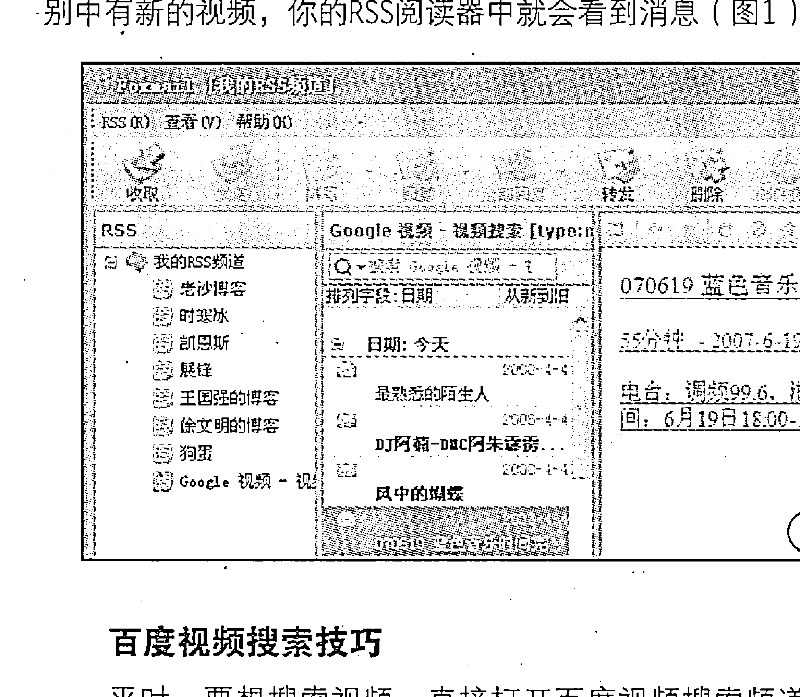

### 百度视频搜索技巧

平时，要想搜索视频，直接打开百度视频搜索频道，然后输入视频关键词就可以进行搜索了，而百度为我们提供了视频分类搜索，可以减小搜索范围，快速定位到自己想找的视频分类。

#### 类别搜索，快速找到喜欢视频

有的朋友喜欢看爱情剧，而有的朋友则喜欢看动作片。如何快速找到自己喜欢的视频类别呢？百度视频为我们提供了分类搜索功能，可以快速找到自己喜欢的类别：只要直接将你喜欢的类型作为关键词进行搜索即可。

> > 小提示 例如以“爱情片”为关键字，即可快速找到大量的爱情片了。

#### ◎按明星来搜索视频

不少朋友在看电影时，都喜欢看指定明星们的作品。譬如，笔者一直喜欢周星驰（周星星）的幽默电影，感觉要是看电影，不看周星星的电影，有一种枉看一回的感觉。
而百度则提供了明星搜索功能，只要直接输入明星的姓名进行搜索，之后便可得到大量与该明星相关的电影了。譬如，我们以“周星驰”为关键词进行搜索，稍后就可以看到诸如“功夫”、“最佳女婿”等作品，直接点击链接后即可打开。

在线播放的视频网站直接在线欣赏了。另外，按明星名称搜索还可以附带搜索到与该明星相关的其他视频（图2）。

## 快速找到最新的视频

不少朋友都是追新族，总想找到网络上最新的视频，在百度视频搜索中也可以轻松地实现。譬如，现在想查询最近的视频，只要在百度的视频搜索频道的搜索框中输入最近的日期（例如2008年4月），回车后就可以看到搜索结果中全部是这个月份最新上映的视频了。

## 网上找电视剧，不费吹灰之力

也有不少朋友喜欢看电视连续剧，而在电视机中看连续剧总是让人叫苦不迭，还没放20分钟就会来一段10分钟的广告，让你兴致尽失。而直接在因特网上看电视连续剧就显得大有优势了，既不受广告的侵袭，又能跳着看。

在百度视频搜索中搜索电视连续剧也非常轻松。譬如，现在想看“婚姻背后”这部连续剧，则只需要直接将该连续剧名称作为关键字进行搜索即可得到大量的搜索结果，随便点击一个链接进入即可在线欣赏了。

## 知名视频搜索网站，不可不知

上面，我们介绍了Google与百度这两家视频搜索功能的应用技巧。除此之外，我们还需要了解一些著名而稳定的视频网站，下面逐一介绍一些知名的视频网站，在这些视频网站中，可以搜索、在线直接欣赏各类视频了。

1.  **Youtube**
    网址：http://www.youtube.com
    YouTube是设立在美国的一个互联网网站，它是一个可供网民下载观看及分享视频短片的网站，至今已成为同类型网站的翘楚，并造就多位网上名人和激发网上创作。

2.  **优酷网**
    网址：http://www.youku.com/
    优酷网是国内一个比较著名的视频网站，里面有大量的视频，涉及生活、幽默、教育、新闻等各个方面的视频，同时还有大量的电影、短片、小品的视频资源。

3.  **土豆网**
    网址：http://www.tudou.com/
    土豆网也是国内一家相当知名的在线视频网站，各种最新的视频、电影、小品几乎都能在这个地方觅见其踪影。

4.  **六间房**
    网址：http://6.cn/
    六间房也是一个可免费观看和搜索视频和专辑的网站，提供无限视频博客空间，做自己喜欢的视频相册，与朋友分享视频和获得上传收益。

5.  **搜狐博客视频**
    网址：http://v.blog.sohu.com/
    这是搜狐网推出的视频频道，里面也有大量的影视、搞笑视频等，提供的搜索功能也相当丰富。

6.  **新浪视频**
    网址：http://video.sina.com.cn/
    这是新浪网旗下的视频频道，在门户网站中的视频功能方面也算是老资格的，里面有大量的视频资源，可以直接在线观看。

## 网上找图片也有诀窍

在网上搜索图片也是经常需要实现的操作，如何快速找到自己想要的图片呢？也是有科学方法及讲究的。

### 专业搜索引擎中觅技巧

Google、百度、雅虎等这些大牌搜索引擎几乎都内置了图片搜索功能，打开Google、雅虎或百度后，在搜索页面上端再点击“图片”链接，然后在搜索框中输入关键词进行搜索，稍后便可看到与搜索关键词相关的大量图片了。

-   Google图片搜索地址：http://images.google.cn/imghp?hl=zh-CN&tab=wi。
-   百度图片搜索地址：http://image.baidu.com/。
-   雅虎图片搜索地址：http://image.cn.yahoo.com/。

> **小提示**
> 说到雅虎图片搜索，它提供的功能最强大，主要是其以分类的方式清晰地列出壁纸、聊天头像、聊天表情、影视动漫等类别，譬如，现在想搜寻一些精美的聊天表情，那直接通过在雅虎的聊天表情类别中找寻即可快速找到大量你喜欢的表情。

### 批量搜索、下载图片

使用搜索引擎来找图片固然可行，但总感觉还不是很方便，何不如使用下面这个集搜索、下载功能于一身的图片下载方案，既省事又能找到大量的图片。

第一步：先从http://down1.tech.sina.com.cn/download/down_contents/1191686400/36999.shtml下载安装这款“极速图片下载器”程序，解压到硬盘中的某个文件夹中以备用。

第二步：运行程序，在搜索关键框中输入搜索关键词即可进行搜索。譬如，现在想搜索赵雅芝相关的图片，只要直接以“赵雅芝”为关键词进行搜索即可，搜索结束后会自动将所有相关的图片下载并保存在程序目录下的“downImages”文件夹中的以该关键词为名的文件夹中（图3）。

### 指定网站的图片全获取

与上面使用专业搜索引擎相比，网上还有不少专业的图片搜索与下载工具，集搜索与下载功能于一身，只要你给一个初始网站给它，它便会按照页面的层次逐级搜索并下载所有页面中的图片了。让找图片的工作显得更加轻松。

GlobalFetch就是这样一款批量搜索下载图片的工具，只要从http://www.onlinedown.net/soft/13991.htm将其下载并安装到系统中，运行后单击菜单“文件→新建”，在打开的任务新建窗口中，输入目标网站的根目录（一般直接选择网站的首页页面地址），再设置图片保存的路径、搜索深度、图片类型等参数，之后就可以进行批量搜索与下载了（图4）。

## 小书迷们的搜索捷径

有的朋友在工作之余，玩玩电脑游戏，而有不少朋友则是小说迷，别说在闲暇时间里了，甚至一边上班一边看小说。当然，现在网络如此发达，看小说已经由手捧小说书而转型为在网上看，甚至动用手机、MP3类电子设备来看了。而谈到在网上看小说，你不得不掌握一些技巧，掌握后不仅看得方便，找小说也不那么费劲了。

### 新浪小说频道，常去常有惊喜

说到看小说、网上读书，新浪网的读书频道你可不能不知晓。该频道会经常更新小说、图书，你想看的也许就在里面。只要在浏览器中打开新浪读书频道（http://book.sina.com.cn/），搜索你想看的图书，然后打开即可阅读。

> 小提示 新浪读书频道的图书分类也非常详细，你也可以直接在页面左侧的图书类别中，直接依次定位到你喜欢看的图书。

### 小说即搜即得

要想看小说，推荐你使用这款名为“华之城小说阅读器”的软件，集搜索、下载、阅读等功能于一身，是小说迷朋友们不可多得的一款好工具。首先，从http://www.chinacitysoft.com/book/news.htm将这款工具下载并安装到系统中，安装后就可以用它来在线搜索、下载小说了。如果你打听到一部非常好看的小说，通过软件的搜索功能就很能方便地找到目标了。运行华之城小说下载阅读器，单击“新增小说”按钮，在打开的窗口中输入小说名称，并单击“搜索”按钮即可。等搜索完成后，会在窗口列表中显示搜索结果。譬如，我们以“坏蛋是怎样炼成的”这部网络小说为例，来看其具体是如何进行搜索的：单击“新增小说”按钮，然后输入“坏蛋是怎样炼成的”，再单击“搜索”按钮，稍后即可进行搜索了（图5）。

因为同一部小说可能在多个网站都有连载，因此在这个列表中会显示多个选择，选择一个后单击“确定”按钮，系统便会自动开始下载了。下载完毕的小说，就可以直接在该软件中阅读。由于现在网络发达，小说作者也更易于将小说发布，因此，网络小说更新的频率往往都比较快，如何最快得到最新的小说章节更新呢？通过华之城小说下载阅读器的小说更新功能，它可以自动从因特网上搜索小说的最新更新内容，并自动完成下载，这样就免去了花时间去搜索及下载了。

> 小提示 在小说列表中选择某个小说并右击之，通过“更新小说”即可进行更新操作，如果已经下载了多部小说，欲同时对所有的小说进行更新，直接右击小说列表空白处，选择“更新所有小说”即可进行更新操作了。

### 当然“看家小绝招”——掌握生活搜索技巧

人们都说，网络正在改变人们的传统生活方式，事实的确如此。譬如，想随时看看后面几天的天气情况，以前只能定点守候电视中的天气预报节目，而现在只要随时打开电脑就可以看到未来几天的天气信息了。明天准备外出旅游，乘坐几点的火车，现在根本不用去车站询问，直接在网上就可以查出准确的列车时刻表信息……这些都属生活服务方面的信息搜索，每个人都需要掌握，这样才能利用网络技术切实提高自己的生活质量和效率。譬如谷歌、百度等大牌搜索引擎都提供了生活搜索服务，使用起来也非常简单。

### 谷歌的生活搜索服务

在浏览器中打开谷歌的生活搜索页面：http://shenghuo.google.cn/shenghuo/?hl=zh-CN&tab=w8，也可以直接打开谷歌搜索页面，点选页面上方的“更多→生活”。打开生活搜索后，在下面还以“房屋”、“工作”、“餐饮”及“出行票务”为子类别排列。根据搜索的内容不同，选择相应的搜索类别。例如，现在想在北京的海淀区附近快速找到一家有名的餐馆，那只要这样搜索即可得到租房信息了：将搜索类别设置为“餐饮”，在下面的城市列表中点击“切换城市”，将当前城市设置为“北京”，接下来在下面的租房地区列表中点击“海淀区”，稍后就可以看到该地区的所有饭店信息了（图6）。

在打开的页面中还可以通过系统提供的搜索范围参数，缩小搜索范围，例如指定菜系、价格等。还可以通过上面提供的电话号码，直接提前预订饭菜。

按照同样的操作方法，通过谷歌来找附近的房屋租赁信息、酒店、工作、火车票、汽车票等信息，搜索方法也不难，而实用度却很高。

### 百度的生活搜索服务

百度的生活搜索服务也相当好用，打开百度的地图搜索页面：http://map.baidu.com，在打开的百度地图搜索页面中的搜索框中，输入地址名加上“酒店”、“银行”、“饭馆”以及从某地到某地的公交乘坐方案等。只是百度没有将生活搜索服务单独列出来，集成在其地图搜索频道，只要注意到这点，操作起来也不难。

### 外出旅游，要学会地图

俗话说：在家靠父母，出门靠朋友，但是当你只身来到一座陌生城市，连朋友都没有了，怎么办？除了将嘴巴变得甜点问当地人外，手持一份地图更方便些。现在网络如此发达，电子地图使用起来更方便，想到哪就到哪，没有熟人照样能闯天下。

### 谷歌平面地图

谷歌的平面地图现在对中国各大城市支持得相当完美，只要在浏览器中打开谷歌地图页面：http://ditu.google.com/，接下来只要在搜索框中输入目标城市名，单击“搜索地图”按钮后，就能快速地定位到目标城市了（图7）。

而谷歌的地图搜索，不止简单地搜索目标城市的道路、地形这么简单，你还可以通过它来搜索公交乘坐方案、搜索目标地点附近的建筑、公共设施（例如机场、车站等），在注册了谷歌账号的情况下，还能收藏自己的地图。

### Google Earth让你坐在家里旅游

上面提到的是Google的平面地图，而Google推出的大名鼎鼎的Google Earth卫星地图，大家肯定也不陌生，它通过卫星拍照的方式将整个地球拍摄下来，然后以照片的方式推出的地图，全部是实景地图，让你可以坐在家里云游全球。当然，要想搜索你即将去的城市，也是非常有意义的。

如果还没有安装Google Earth，请先从http://www.newhua.com/soft/51524.htm下载安装，安装后就可以用它来搜索你想要搜索的目标位置了。

想搜索北京，只要直接在搜索框中输入“Beijing”进行搜索，稍后便能得到北京的卫星图片了（图8）。

双击目标位置还可以放大地图，放大到最清晰模式时，甚至连你家的屋角都能看清楚。

### 百度地图

百度也推出了自己的网络地图，使用起来也比较容易上手。

在浏览器中打开百度地图首页：http://map.baidu.com/#，然后在搜索框中输入目标地名即可将地图定位到目标位置，同样，也可以通过双击目标地点来放大地图。百度地图还提供了距离测量功能，只要在地图页面左上角用鼠标点击测量尺工具，然后依次点击起始点、终点，双击鼠标就可以得到起始点到终点之间的距离。

百度地图还可以进行公交查询、天气预报等功能。

### 搜狗地图

这是搜狐公司推出的平面电子地图，用户只要在浏览器中打开搜狗地图页面：http://map.sogou.com，使用方法与百度地图类似，在搜索框中输入目标地址名进行搜索即可。搜狗地图也提供了公交搜索、自驾车搜索、周边公共设施搜索等功能。

## 菜鸟求助——网络求助完全手册

□俞木发

> 碰到问题通过网络求助已经成为很多朋友首选的求助方式，但是面对网络上浩瀚的资源，很多朋友却不知道如何下手。同样是利用网络，老鸟们可以轻车熟路找到所需的资源，菜鸟们却不知所措。为此，我们根据不同的难题设计不同的求助方式，让菜鸟们也可以轻松利用网络解决各种问题。

### 普通难题——利用搜索引擎寻找答案

作为网上资源的指路人，我们首先应该利用万能的搜索引擎搜索资源。百度 ( www.baidu.com ) 和Google ( www.google.com ) 是专业的搜索引擎，不过要快速找到答案，我们需要讲究搜索技巧。

1.  学会使用关键词。因为搜索引擎使用的是关键词查找结果，所以自己碰到问题进行搜索时一定要依据关键词进行搜索。比如你的电脑由于内存原因遭遇无法启动的故障，输入 “我的电脑由于内存无法启动了” 作为搜索关键词就很难找到结果，这主要是因为关键词太多，搜索引擎无法精确找到匹配结果。输入 “内存故障 无法启动” 则可以更快找到结果。
2.  高级搜索。仅仅通过一个或几个关键词，有时候通过百度还无法找到搜索结果，为此，百度还提供了高级搜索功能。在地址栏输入http://www.baidu.com/gaoji/advanced.html，可以在打开的页面输入多个搜索条件。比如，现在需要搜索2008奥运会的游泳场馆，搜索结果是所有简体中文的网页，我们只要按高级搜索提示输入对应的字符即可 ( 见图1 )。

其他常见搜索技巧扩展
A. 专业搜索。除了提供常见的搜索外，百度还提供很多专业的搜索，可以满足我们对搜索的个性需求。比如，我们需要搜索劳动法中关于解除合同补偿的相关规定，现在就可以借助百度的【法律搜索】。
B. 突破限制搜索。通过搜索可以找到很多素材，不过有些素材却由于种种限制无法下载，此时可以借助一些方法突破限制。比如在Google搜索框上输入："index of/" inurl:lib ( 注意引号应是英文的！ )，按搜索后将进入许多图书馆目录，并且可以下载自己喜欢的书籍。

### 棘手难题——利用远程协助及时解决问题

大多数问题都可以借助搜索引擎获得帮助，不过，有些棘手的问题如果一时找不到答案，但是又急需解决该怎么办？比如，你现在正在加班，碰到一个Excel函数难题需要马上解决，否则无法继续工作。此时我们就得借助远程协助，利用网络让高手为我们“现场办公”！远程协助方法有很多，这里以QQ远程协助为例。

首先在QQ好友列表找到Excel高手，发起对话后切换到 “应用” ，然后单击 “远程协助” 向对方发起求助，对方接受后，求助者再次确认，然后单击 “申请控制” 并确认接受。这样对方就可以在他的电脑屏幕上对你的电脑进行远程操作，棘手难题可以瞬间解决 ( 见图2 )。此外，MSN ( 请求远程协助 )、系统本身 ( 远程桌面连接 ) 也都自带远程协助功能，具体使用类似，大家可以根据自己的实际情况加以选择。

对于比较棘手的问题，我们平时就应该加入一些专业的QQ群，在碰到问题时可以在QQ群里向网友求助。

### 生僻问题——使用互动搜索

搜索引擎提供的结果只是单向服务，对于一些比较生僻的难题，我们还可以借助百度知道、新浪爱问等互动搜索模式进行询问，充分地利用互联网上网民的智慧。打开http://zhidao.baidu.com/，按提示注册为百度用户。这里既可以搜索问题也可以提问题，而且无须使用关键词搜索。比如，我们可以直接使用“目前ghost版xp系统哪个最好用、最稳定”作为搜索词。如果找不到结果，我们还可以登录百度知道，直接输入上述问题向网友提问。百度知道上面有许多热心的网友会帮助我们解答，只要过段时间登录就可以看到网友的回复（见图3）。类似互动搜索还有新浪爱问（http://iask.sina.com.cn/）、雅虎知识堂（http://ks.cn.yahoo.com/）等，具体使用类似。

> 小提示：我们还可以借助论坛求助，到其他专业电脑论坛提发帖求助，具体操作可以查看杂志相关文章的介绍。

### 复杂难题——网上工作室解决问题

对于一些复杂的难题，通过简单的搜索或求助可能根本无法解决问题。此时不妨利用“忙吧”提供的网上工作室为我们服务。借助这个虚拟的空间，一些志同道合的人们通过网络和团队协作可以轻松完成很多项目。比如，现在自己要搞一个大型公益程序招标，我们可以在网上把这个任务分解给好友一起完成。

第一步：登录www.mangbar.com后单击“建立自己的在线工作室…”，按提示创建自己的工作室，以后可以使用http://用户名.mangbar.com访问自己的工作室。

第二步：登录自己的工作室后，单击“我的工作室→新建项目”，模板选择“商业→招标”。这里可以看到整个项目的结构，按提示完成项目的创建。

第三步：完成项目创建后，可以添加好友来一起完成任务，只要在“第三步：有那些项目成员”中，按提示输入好友的邮箱，单击“增加”，添加到好友列表即可。如果好友已经是忙吧会员，我们可以直接添加，否则对方会收到我们发出的邮件加入忙吧。好友加入忙吧后，我们可以把他们加为忙吧好友，一起完成任务。

第四步：打开上述创建的项目，切换到“任务分解”标签，这里可以将项目的各项任务交给指定好友们完成。比如，可以展开“编制招标文件”，单击“编辑”。可以在“责任人”选择其他好友，把这个子项分解给某一好友完成，单击“保存”，完成分解任务（见图4）。

第五步：操作同上，根据好友的不同特长，分解不同的任务给好友。由于在线工作室有自己的二级域名，现在每个分配任务的好友只要访问“http://用户名.mangbar.com”，输入自己的用户名登录后就可以看到自己的任务，此外，每个朋友也可以单击“讨论”标签，在这里发表对上述任务的看法，一起交流如何把工作做得更好（见图5）。

> 小提示：为了更好地利用团队，我们平时就应该通过QQ群、论坛等网罗一批志同道合者。或者在忙吧网站搜索专业的工作室为我们服务。

### 专业难题——借助威客网站悬赏求助

上面介绍的都是利用网友的智慧免费获取服务，但是对于一些工作上的难题，或者比较专业的难题，由于需要专业的知识或者解答者需要付出很多时间，可能通过上述的方法就不容易找到答案。对于专业难题，我们可以到一些专业威客网站发布悬赏求助，有偿利用网友智慧为我们服务。比如，需要设计公司的LOGO，但是公司没有专门的设计人员，此时就可以到“任务中国”（http://www.taskcn.com）上发布悬赏求助。

打开上述网站并注册为用户后，单击左上角的“发布任务”，然后按提示根据任务性质选择发布方式。发布威客任务并支付预付款后，我们就可以等着威客们提交作品（见图6）。虽然公司没有任何一名设计人员，但是只要我们花费少量的金钱，网上的各路豪杰就会完成我们设计的悬赏任务。通过这些有偿服务可以获得高质量的网络帮助。

上面我们根据难题性质介绍了不同的网络求助方法，对于一些难题我们可以把上述方法结合起来使用，让大家能通过无所不能的互联网为我们提供更多的帮助。

## 大海也能捞针——邮件跟踪术
□小赵

平时发送邮件时，只能通过回执来知道邮件是否被对方打开过，而对方不发送回执给你，用此方法跟踪邮件就失效了。下面，我们另寻他法，用来跟踪邮件，你发出的邮件是否被对方打开，一目了然！

### 使用Spypig跟踪邮件

使用Spypig这个网站提供的服务，就能轻松地对发出的邮件进行跟踪，而且实现的方法也很简单。
首先，按照常规方法在邮件软件中将要发送的邮件内容、附件、收件人地址等填写好。接下来，在浏览器中打开http://spypig.com页面，在“Your email address”（你的邮件地址）框中输入你的发信邮箱地址，“Your message title”（你的邮件标题）中输入你的邮件标题，或者其他可以将此邮件与其他邮件区分开来的信息。再选择一个图片（建议选择第一幅透明图片）。
接下来，点击“Click to Activate My Spypig”（点击激活我的Spypig）图标，此时将会看到下面的1分钟倒计时开始。在数字达到“0”之前，将上面的图片复制并粘贴到邮件内容中，接下来只需要按照常规方法完成邮件发送即可（图1）。

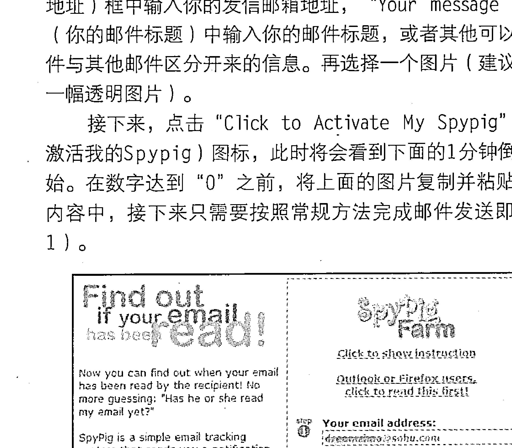

将这封邮件发送给对方后，当对方打开邮件时，SpyPig就会私下里向你汇报情报，包括打开的时间、IP地址、次数等。这些信息都会以邮件的形式发往你的发件邮箱中，打开即可查看。

### ReadNotify跟踪邮件

除了上面的Spypig外，还可以通过这个ReadNotify网站来进行邮件跟踪，效果是一样的，使用方法也不难。

首先，在浏览器中打开ReadNotify网站：www.readnotify.com，在网页右侧下方的“Your existing email address”（想注册的邮箱地址）框中，直接输入你想注册的邮箱。单击“Go”（确定），进入注册界面，按照要求一一填写完整，完成注册。

> 注册时选择在“Language”（语言）后的框中要选择“汉语”，以方便你查看最后的注册结果。

成功注册后，在发送邮件时，只需要在收件人的邮箱地址后面添加“.readnotify.com”，其他操作依旧，按正常程序发送即可。

这样，当你发送的邮件被对方打开后，就可以在ReadNotify网站来查询邮件的状态了。打开ReadNotify网页，在网页右侧的“email”（邮箱）框下，输入你刚刚注册的邮箱，在“password: ”（密码）后输入注册密码，单击“Sign-in”（登入），登录即可看到跟踪信息了。

### 延伸技巧：常用快递的跟踪

上面，我们介绍了电子邮件的追踪，而现实生活中真实的快递邮件，如何对其进行跟踪呢？其实方法很简单，可以直接登录相应的快递公司的网站，在快递查询栏目中就可以进行查询了。

- 网络大补贴

推荐一个网站：“快递宝”（http://www.7695.com/kdbao），可以查询各家主流快递公司的货单号（图2）。

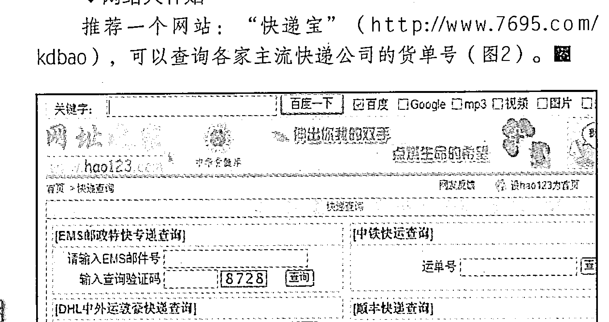

## 搜索快乐

## 浏览器搜索引擎我作主
□ 江北书生

> 「世界上的信息非常多，因此搜索引擎应运而生。但是搜索引擎有很多，功能也各不相同。而我们一般都是用浏览器打开搜索引擎网站，然后输入关键字来搜索。事实上，我们完全不用这么麻烦，而只要将搜索引擎集成到浏览器中就可以做到非常方便地搜索。」

### 一、Maxthon1.x

Maxthon的流行版本有1.x和2.x两种，1.x用户也很多。所以我们首先要解决在Maxthon 1.x中集成搜索引擎的问题。

### 二、搜索引擎随心换

Maxthon中的搜索引擎并不是完美的，我们完全可以定制出自己的搜索，更好更方便地搜索到自己想要的内容。

### 1.添加搜索引擎

单击“选项→Maxthon选项”，单击“搜索”项，再单击其中右上角的+号，再输入一个名称，如“狗狗搜索”，再单击下方的“别名”，如gougou，再在下方的“搜索引擎”中输入相应引擎，如http://www.gougou.com/search?search=%s&id=1（如图1。）。

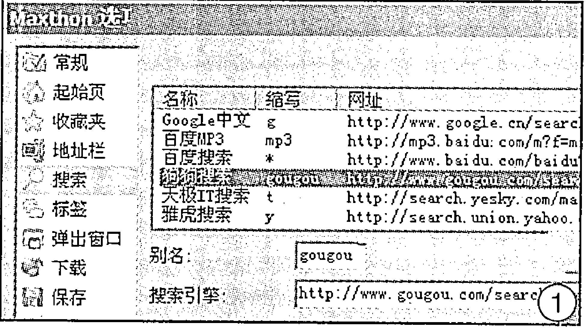

要说明的是，搜索引擎的格式是 URL + %s ，其中 %s 表示可以替换的关键字。

下面列举一些常用搜索引擎：
- 天空软件站：http://www.skycn.com/search.php?sor=00&ss_name=%s
- 电脑之家：http://download.pchome.net/php/search.php?pid=0&searchstr=%s
- 太平洋下载：http://dl.pconline.com.cn/search.jsp?keyword=%s
- 查询扩展名1：http://filext.com/detaillist.php?extdetail=%s&goButton=Go
- 查询扩展名2：http://shell.windows.com/fileassoc/0409/xml/redir.asp?Ext=%s
- 剑桥查单词：http://dictionary.cambridge.org/results.asp?searchword=%s&image.x=41&image.y=10
- 译典通：http://www.dreye.com.cn/dict/dict.phtml?w=%s&d=010300&account=123456&ver=gb&show=&repeat=1&ie=1
- 用百度搜图片：http://www.baidu.com/i?tn=baiduimage&word=%s&lm=-1&ct=201326592&cl=2
- Google搜索图片：http://images.google.com/images?q=%s
- 新浪搜索图片：http://pic.sina.com.cn/cgi-bin/retr/search?query=%s
- 用百度搜MP3：http://mp3search.baidu.com/wstsearch?tn=baidump3&ct=134217728&word=%s
- 用百度搜歌词：http://www.baidu.com/m?tn=baidump3lyric&ct=150994944&rn=10&word=%s
- 用搜刮网搜歌曲：http://search.sogua.com/search/search.asp?key=%s&fexe=1&fzip=1&frar=1&fmp3=1&frm=1&fwma=1&fasf=1

### 2.使用搜索引擎

然后在gougou地址栏中输入“史前一万年”即可看到如图2所示的搜索结果。当然，我们也可以在搜索框中输入保镖，再选择“狗狗搜索”，然后回车，则会自动连接到迅雷网站搜索关键字为“史前一万年”的内容。

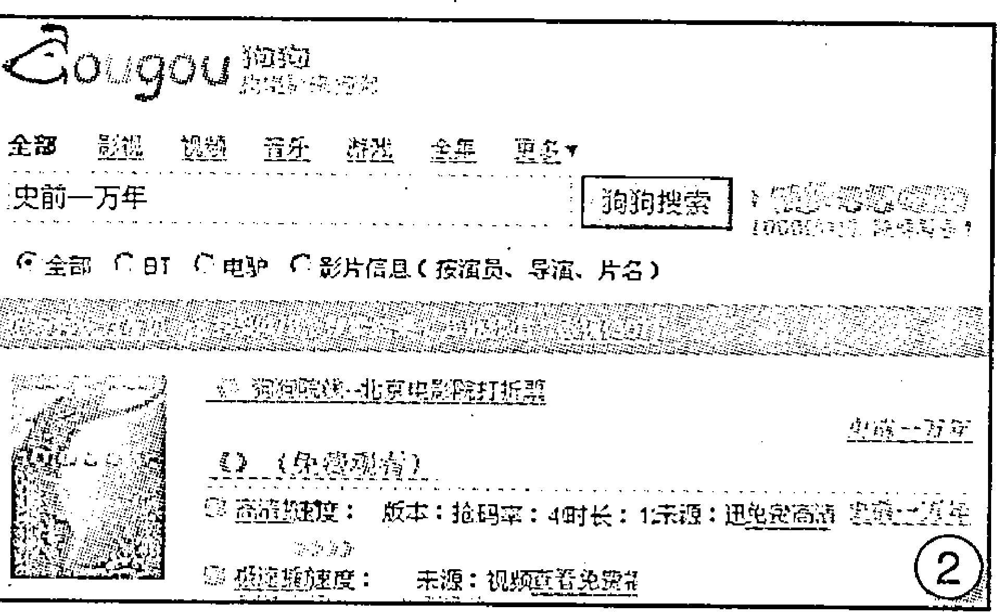

### 三、Maxthon2.x

现在Maxthon 2.x已经出来好几个版本，功能也越来越强，同样它也允许我们集成搜索引擎。单击“工具”→“傲游设置中心”，单击“搜索”项，取消“使用服务器提供的搜索引擎列表”选项，选中“将别名为“*”的搜索引擎作为地址栏默认搜索”选项。接着单击下方的“添加项目”，再在下方填写相应的搜索引擎名称“狗狗搜索”，别名gougou和表达式http://www.gougou.com/search?search=%s&id=1。接下来，一定要先单击最下方的“保存”按钮，再单击上方的“应用”按钮保存设置。进行上述设置后，我们地址栏中输入gougou 史前一万年或者在搜索框中输入保镖，再选择“狗狗搜索”，然后回车，则会自动连接到迅雷狗狗上搜索关键字为“史前一万年”的内容。

### 四、GreenBrowser

GreenBrowser（以下简称GB）也是浏览器市场杀出一匹黑马，用户也比较多。它也提供了自定义搜索引擎的接口：右击GB工具栏，选中“搜索栏”，单击“搜索”按钮，选中“设置搜索引擎”命令（如图3），打开设置界面，在其中输入名称，并设置相应的表达式即可。不过要注意的，这里不能用%s来作为变量了，而要用%u来代替。如“狗狗搜索”，地址不再是http://www.gougou.com/search?search=%s&id=1，则要换为http://www.gougou.com/search?search=%u&id=1。单击“插入”按钮，将新的搜索引擎地址添加到GreenBrowser中。

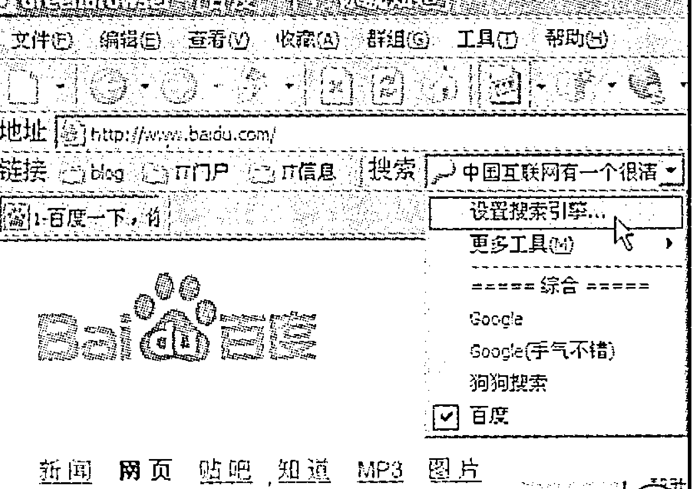

要使用时，只要在搜索栏中输入关键字，再单击搜索栏最后的“查找”按钮，选择相应的搜索引擎即可打开。如果你感觉GreenBrower中的搜索太多，可以打开GreenBrowser安装文件夹下User子文件夹中的SearchEngine.ini文件，然后作相应的删减即可。

### 五、Opera

Opera的浏览速度非常快，而且经常更新版本，推出更多实用的全新功能，因此也赢得了更多用户的青睐。而且，它也相当开放，允许我们将迅雷狗狗搜索集成到其中。在Opera中单击“工具”→“首选项”，再单击“搜索”标签，可以看到已有的搜索引擎。单击“添加”按钮。在打开窗口中设置“名称”（如百度搜索）、“关键字”（如baidu）和“地址”（如http://www.baidu.com/s?wd=%s）即可（如图4）。

名称: 百度搜索
关键字: baidu
地址: http://www.baidu.com/s?wd=%s
查询字符串: （空）

以后在搜索列表框单击下拉列表框选择相应的搜索引擎，再在搜索框中输入相应的关键字回车即可搜索（如图5）。

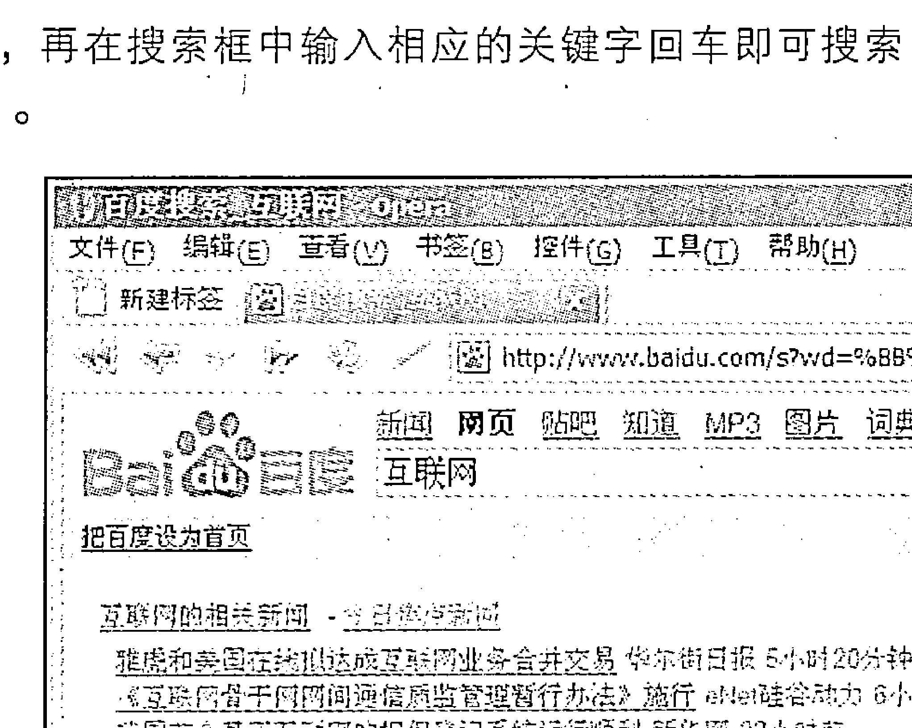

### 六、世界之窗

世界之窗采用多线程窗口框架的浏览器，进而可以大幅减少由于某个网页假死导致的整个浏览器假死情况，并且可以在一定程度上提高网页打开速度。有幸的是，在我们使用世界之窗的同时，也可以自定义搜索引擎。在世界之窗的地址栏中输入tw:conf，然后单击左侧的“地址栏和搜索栏”，再在右侧窗口中单击“搜索引擎”右边的“添加”按钮。然后输入“显示名称”（如“狗狗搜索”）、“快捷词”（如gougou）和“搜索串”（如http://www.gougou.com/search?search=%u&id=1），如图6所示。确定后返回到世界之窗设置窗口，单击左侧下方的“应用”按钮保存设置。

显示名称: 狗狗搜索
快捷词: gougou
搜索串: http://www.gougou.com/search?search=%u&id=1
搜索网站: http://www.gougou.com/

之后，打开世界之窗主窗口，单击搜索框前的图标，选择相应搜索引擎，再在搜索框中输入相应关键字，回车后即可搜索到相应的资源。

## 网络电话既便宜又方便

随着网络技术的发展，直接颠覆了传统的生活习惯，譬如，以前人们都是使用固定电话或手机拨打长途，明知道话费高昂但是没有办法。现在，直接使用网络电话，方便不说，话费是普通固定电话的三分之一甚至是十分之一还有余，而且通话质量并不比固定电话差。对于那些出国在外的朋友们，使用网络电话优势更是显而易见的。

### 国内知名品牌UUCALL

UUCALL是国内知名品牌的网络电话，通话质量可以与固定电话相媲美，而其长途通话费最低可至0.06元/分钟，低廉的话费、清晰的通话质量，是网络电话中的首选产品。
如果之前还没有下载UUCALL,请先从http://www.uucall.com/index.do下载最新版的UUCALL软件，下载后无须安装直接运行便可使用UUCALL了。

### 注册UUCALL账号

使用UUCall拨打电话前，先注册一个用户。首先打开UUcall的首页：http://www.uucall.com/index.do，点击“免费注册”链接，进入到注册界面，在此输入用户名、密码等信息即可注册。注册后会得到一个数字账号，使用此账号及注册时输入的密码直接登录到UUCALL中即可。
新注册的UUCALL账号余额为0，因此不能直接拨打电话。不过，可以在主页中点击“免费体验，最多送60分钟”按钮来申请体验话费。点击申请按钮后，按照页面提示填写自己的手机号码（请如实填写），之后便会得到一条短信，此条短信中便含有免费体验码。接下来再回到前面申请时打开的页面中，再将得到的免费体验码输入对应的文本框中即可领到免费的通话时间了。

### 拨打电话

账户中有了话费后就可以拨打电话了。拨打时，在程序的主界面中使用鼠标单击数字键，即可输入号码。使用UUcall拨打手机号码时需要在手机号码前面加“0”，拨打固定电话时在固定电话号码前面加区号，如“北京”要在前面加“010”。号码输入后，单击拨号按钮即可与电话连接，对方接通后我们就可以使用电脑上的耳机和麦克风与对方通话了（图1）。

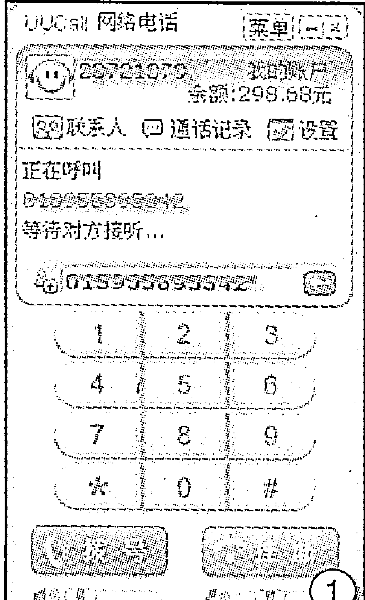

### 通话录音

UUCALL提供了通话录音功能，可以将双方的通话直接录音并以文件的形式保存到硬盘中，日后便可以使用播放器来播放之前的通话录音内容。录音时操作也很简单：通话时单击界面中的“通话录音”按钮即可开始录制，录制后文件自动保存到“我的文档”下的“users”文件夹中。

### 话费充值

而要正常而稳定地拨打电话，则需要向UUCALL账户中充值，充值方法也不难，只要有网上银行或支付宝账号就可以轻松地在线充值。在充值时，尽量注意官方发起的各项优惠活动，每逢节假日（例如五一、十一、元旦等），官方都会推出优惠政策，这时充值会得到更多优惠。充值时，只要打开官方充值页面：http://pay.uucall.com/showFavourableList.do，点选左侧不同面额的电话卡，然后在打开的页面中选择支付方式，按照页面提示即可进行充值了（图2）。

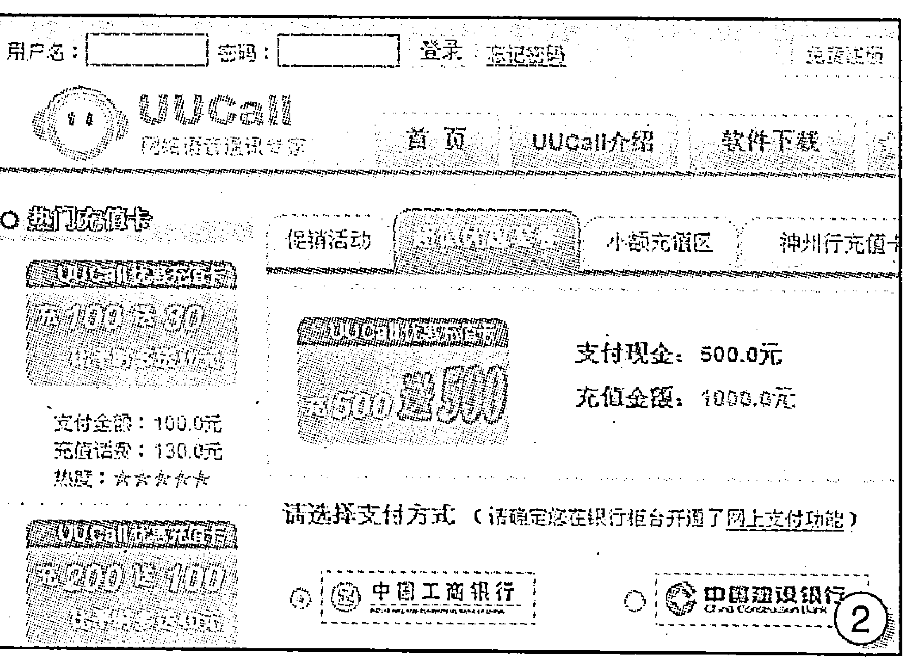

> 小提示
要想查看UUCALL的通话费率，可以打开http://www.uucall.com/fee.do进行查看。

### 与大洋彼岸的心上人也能煲电话粥——Skype

不少朋友身居国外，或是家里有亲戚朋友在国外，这种情况下，越洋电话便是经常拨打的了。越洋电话的话费可不是一般的贵了，使用固定电话打起来总让人心疼。这时，使用Skype就会解除你的高额话费的担忧了。现在，Skype与国内的TOM网站合作推出了中文版的TOMSkype软件，可以直接使用Skype账号登录，使用起来与Skype一样。如果系统中还没有安装TOMSkype，请先从http://skype.tom.com/下载安装最新版的TOMSkype软件。

### 注册账号

安装结束后会自动打开创建账号的窗口，按照窗口提示注册一个账号即可，注册后就可以使用此账号登录到系统中了。登录后，还需要先为自己的账户充话费，只有充了话费后才可以正常使用Skype来拨打电话。充话费也不难，只要在TOMSKYPE的首页点击“立即购买”按钮，然后按照页面提示选择自己要拨打电话的目标国家或地区，然后再点击“我要购买”按钮。在打开的页面中选择好面值并设置好购买的张数，再选择支付方式、充值账号等参数。按照文字提示进行付款即可完成账户充值了，非常方便。

### 拨打电话

在主窗口中单击“拨打电话”选项卡，选择好拨打的目标地区，接下来在下面的电话号码框中直接敲入带长途区号的电话号码（例如01012345678），单击“呼叫”按钮即可拨打目标电话了，待对方接听电话后，双方便可直接通话了。

> 具体的通话费率可以参考http://skype.tom.com/products/redeem/index.html?type=image&product_id=image_gmdhk&product_count=0页面上的说明。

### 妙用Skype免费发手机短信

如果你安装的是最新版的Skype3.6，则可以利用Skype来快速而方便地发送免费（免费是有限制的，只限于2008年4月30日前开通Skype 3.6的短信通每月享受100条免费短信）手机文字短信。只不过，目前只对中国移动用户提供支持，以后会对中国联通用户进行支持。

### 便宜配件引发大问题

一台计算机具体配置为：AMD Athlon 2600+、技嘉K8VT800 2.0、技嘉热管1600PRO、KINGMAX DDR400 512M、明基DVD刻录机、酷鱼80G。其他的配件都使用同学原来的旧件，其中的CPU散热器是款杂牌且比较陈旧，笔者建议更换新的或者散热性能更好的产品，但同学坚持不换，笔者没有办法，好在安装后使用起来还很顺利。

### 第一步：订制Skype短信通服务

单击Skype主窗口中的菜单“帐户→移动Skype”将会直接打开移动Skype定制页面：http://client.skype.tom.com/mobile/，在该页面中即可定制手机短信业务。

> 本业务仅限中国移动用户使用，且浙江地区用户暂时不能使用。预定制定用户必须账户中有剩余的国内时长，如果没有，可以参加活动购买。

### 第二步：在打开的页面中点击“我要开通→输入需要绑定的手机号码→发送手机短信定制完成”。发送手机短信的方法：使用手机发送85到1066998840，系统会自动下发一条短信：“您将定制由雷霆无极公司提供的零月刊业务，信息费免费，由中国移动代收，回复任意内容确认订制，无回复则不订制。中国移动”，只要您回复任意内容就可以订制成功。订制成功会再收到一条短信：“您已定制雷霆无极公司零月刊业务，免信息费，客服电话：010-67868800，退订拨10086。中国移动”，此时，您可以在短信通页面看到服务已开通。

### 第三步：完成定制后，就可以使用Skype发送短信了：

打开Skype客户端，选择即将发送短信的好友，右键点击好友，选择“发送手机短信”，或者单击菜单“工具→发送手机短信”命令（图3），如果你的Skype好友关联了手机，就会直接出现他的名称，如果你的Skype好友没有关联手机，可以在上面输入他的手机号码，格式为：+8613900000000，单击“确定”就可以给好友发送短信了。

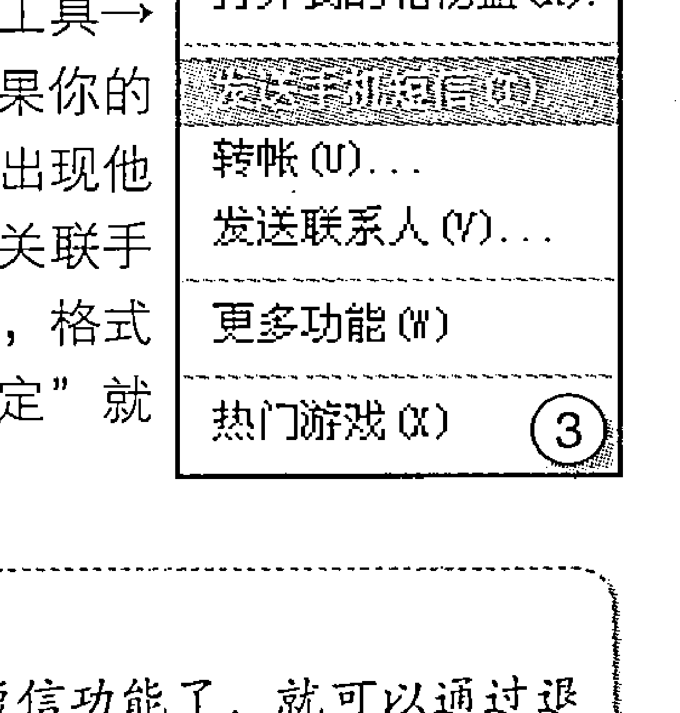

> 退订Skype短信通服务 如果不想使用Skype的短信功能了，就可以通过退订的方法将其退订。先进入到Skype短信通页面，之后点击“取消服务”或者“退订”，按照页面提示操作即可。也可直接用手机发送0000到10669988，对短信通业务进行退订。

东西，所以也不太可能是病毒的原因。笔者判断是硬件出现了问题，于是打开机箱查看。打开机箱盖一看笔者吃了一惊，CPU上方的风扇已经倒在了一边，固定风扇的塑料爪已经断裂成了两半，一摸CPU发现热得烫手，估计其“幸存”的可能性不大了。转天我们拿着这块CPU到电脑城找技师一测，发现其已经彻底报废了。由于过了保修期，他只好自掏腰包重新买了AMD Athlon 2600+和一个CPU风扇，重装后系统终于可以正常工作，但是我发现重装后机箱的震动还是非常厉害。这是为什么呢？通过我仔细观察发现风扇转动时造成机箱共振，而他的劣质机箱外壳非常薄，使这种共振更加严重，加上他原来使用的旧风扇固定爪已经老化最终造成了这次事故。因此我建议他抓紧时间更换品牌机箱，以免造成更大的损失。通过这次事故，笔者更加清楚杂牌、陈旧的产品存在很大的安全隐患，任何一个不起眼的劣质零件都可能给我们的电脑造成巨大的损失，因此我们即使是在选购机箱和风扇这种部件时也要慎之又慎，避免为了节省那么一点点钱而造成不必要的损失。

# 轻松无线连接
## ——无线路由器设置全攻略
□小风

现在很多家庭都有两台或者两台以上的电脑（包括笔记本电脑），这些电脑上网一般都是通过路由器来共享上网的，如果这些电脑不在一个房间里面，那每台电脑都拖根网线，感觉就有点乱了。其实我们可以用无线路由器配备无线网卡来进行共享上网，现在这些设备的价格也已经很平民化了，一个无线路由器配一个无线网卡，一般在220元左右，这样上网不仅不需要网线，而且随便你在家里的哪个位置都可以上网。下面我们就以TP-LINK的无线路由器为例来介绍怎么样设置无线路由器，其他品牌的路由器设置基本差不多。

## 无线路由器的设置

首先确保无线路由器正确和电脑、宽带猫连接在一起，并且是开启状态，打开IE浏览器，在地址栏输入http://192.168.1.1并按回车，会弹出一个输入账号和密码的窗口，输入默认账号和密码admin，这个一般会在说明书和包装盒上注明的，登录成功后就进入到无线路由器的管理后台界面（如图1）。

接下来点击左侧“设置向导”标签，在右侧点击“下一步”按钮，一般都是选择“ADSL虚拟拨号（PPPoE）”的上网方式，选好后点击“下一步”按钮，这时输入你的宽带账号和密码，完成后再设置一下无线的参数，在无线状态后面选择“开启”，接着设置一下SSID号，就是当接入到你的无线网络后显示的名称，随便输入一个就可以，后面的“频段”和“模式”按默认就可以了，这样就完成无线路由器的设置了（如图2）。

为了安全起见，我们一定要给无线路由器设置一下密码，这样别人就不能通过无线路由器来访问互联网了。在无线路由器的管理后台点击左侧的“无线参数/基本设置”，在右侧的页面中选中“开启安全设置”，密钥格式选择“ASCII码”，接着在下面的密钥1后面选择“64位”的密钥内容，密钥内容只能设置5位，比如设置为“12123”，这个就是密码，完成后点击“保存”按钮就可以了（如图3）。

## 无线网卡的设置

设置好无线路由器后，再来设置一下你的无线网卡。现在一般都是用USB接口的无线网卡，安装起来很方便，不像PCI接口的无线网卡要打开机箱。把USB无线网卡插到电脑上，这时电脑会提示发现新硬件。一般无线网卡都配有驱动程序，把驱动程序光盘放入光驱，根据无线路由器的型号安装相应的驱动程序，安装好后就可以设置无线网卡了。

打开“网络连接”窗口，在无线网卡上点击右键选择“属性”项，在弹出的属性窗口中点击“无线网络配置”标签，把下面的“用Windows配置我的无线网络设置”选中，点击“查看无线网络”按钮（如图4）。

点击后会弹出一个“无线网络连接”窗口，在里面可以看见已经搜索到你自己的无线网络了，双击无线网络会弹出一个输入密码的窗口，输入前面设置的密码就可以连接上无线网络（如图5）。

通过MAC地址来加密无线网络

如果觉得给无线网络设置密码用起来不太方便，还可以通过另外一个方法来限制别人使用你的无线网络，就是通过网卡的“MAC地址”来进行设置。“MAC地址”是网卡的物理地址，也可以说是硬件地址，它是网卡唯一的标识，就像我们的身份证一样，一般不能随意更改。

获取网卡的MAC地址很简单，按组合键“Win+R”打开“运行”窗口，在命令提示符下输入“ipconfig /all”并按回车，在显示的内容中就可以查看到MAC地址了（如图6）。

打开无线路由器的管理后台，点击左侧“安全设置/防火墙设置”，在显示的页面中选中“开启MAC地址过滤”，并选中下面的“仅允许已设MAC地址列表中已启用的MAC地址访问Internet”，设置好后点击“保存”按钮（如图7）。

然后点击左侧的“安全设置/MAC地址过滤”，点击“添加”按钮来添加你允许访问网络的电脑的网卡MAC地址，完成后点击“保存”按钮（如图8）。

无线网络的安全设置

由于网络连接是无线的，安全性肯定没有有线连接的高，当然我们可以通过一些简单的设置来让你的无线网络更安全。

1. 修改无线路由器的默认账号和密码

路由器都有一个管理后台，我们可以通过网页浏览器进入后台管理路由器的一些设置，制造商给每一个型号的设备提供的默认用户名和密码都一样，不过很多家庭用户购买后都不会去修改设备默认的用户名和密码，这就使黑客们有机可乘，他们只要用一些简单的扫描工具来扫描一下，就可以很容易地找出这些设备的地址，并用默认的用户名和密码登录路由器的管理页面，如果成功，那就可以对路由器进行随心所欲的控制了，包括修改登录密码，让你不能登录管理后台。

修改账号和密码的方法很简单，点击左侧“系统工具/修改登录口令”，输入原来的账号和密码，再输入新的账号和密码，完成后点击“保存”按钮就可以了，以后就可以用新的账号和密码登录后台了（如图9）。

2. 修改默认的标识符（SSID）

每个无线网络都有一个标识符（SSID），一般这个标识符是路由器制造商在产品中默认设置的，一个品牌的标识符是相同的，如果一个网络不指定一个SSID或者只使用默认SSID的话，那么任何无线客户端都可以进入这个无线网络，这样就很容易被别人入侵你的无线网络。设置无线网络的SSID号，可以在路由器的管理后台点击左侧的“无线参数/基本设置”来进行设置。

3. 禁止SSID广播

在无线网络中，路由器有个很重要的功能，那就是服务区标识符广播，也是“SSID广播”。这个功能主要就是为那些流动量特别大的商业无线网络设计的，当我们开启了SSID广播的无线网络，路由器就会自动向无线网络中广播自己的SSID号，能接收无线网络的电脑收到这个SSID号后，就能利用这个SSID号来访问无线网络，可见这个功能对我们家庭用户来说很不适用，所以我们要关闭这个SSID广播。

在路由器的管理后台页面上点击左侧的“无线参数/基本设置”，在右侧显示的页面中把“允许SSID广播”前面的钩去掉，再点击下面的“保存”按钮就可以关闭了（如图10）。

4. 更改DHCP分配IP地址

默认情况下，路由器会自动获取192.168.1.1、192.168.1.30或192.168.1.254等IP地址，由于很多路由器都是使用这个范围的IP地址，别人入侵起来就比较轻松了。其实我们可以把路由器的IP地址设置为其他范围。

目前，用于私人的IP地址范围是：10.0.0.0～10.255.255.255、172.16.0.0～172.31.255.255、192.168.0.0～192.168.255.255。如果设置了其他的IP地址范围，别人入侵起来就非常麻烦了。我们可以进入路由器的管理后台来修改IP的地址范围，点击左侧的“DHCP服务器/DHCP服务”，在右侧的“地址池开始地址”和“地址池结束地址”中输入上面的IP地址范围，完成后点击“保存”按钮就可以了，以后路由器就会自动替你分配这个范围的IP地址了（如图11）。

让网络程序们共享带宽
□小莉

是不是有时觉得一用上网络程序，网速就变得很慢，甚至系统几乎“零响应”？事实上，我们很多时候需要对网络带宽进行合理统筹兼顾，这样才能够保证在共享带宽的基础上全面协调可持续地使用带宽资源。

量大的机器通过有线网卡和网线将它接在无线AP/路由器的有线接口上，同时将有线网的IP地址记住。这样，你在别的房间里用无线网卡的机器上按下Win+R，输入\有线网卡的IP地址来访问电脑时速度将会快出很多！无线网卡与有线网卡之间传输起来速率非常慢！

1. 让网卡全速前进

打开“设备管理器”，双击“网络适配器”下相应网卡，在打开窗口中单击“高级”，找到设置项，然后设置其速率为100Mbps双工（如图1）。这样才可以让网速更快，因为网卡有容错，如果不让它全速前进，它就会占用系统资源来纠正数据。

2. 尽量用有线

在装修时要注意，尽量用有线来搭建网络。这样会更为稳定！

3. 一定要选择更快路由器

如果实在不行，可以选择无线组网。现在无线路由器产品很多，品牌也是琳琅满目，但较为流行的主要有802.11g和802.11n两种协议（802.11b也有，但不多）。802.11n现在也不算贵，它的速率较高，理论可达300Mbps。一般情况下至少也要选择802.11g的产品，因为802.11g的理论速度达到54Mbps，而802.11b则有11Mbps。所以我们在选择路由器时至少要选择802.11g，最好选择802.11n。

4. 有线和无线并用

这样往往可以节省一些系统的资源，因为处理无线要比处理有线要复杂，间接地给了系统资源。而且，现在购买的无线AP/路由器上一般都会有4个有线网线的接口，你把数据访问

5. 关闭掉共享 节省带宽

如果在公司里工作，可以关闭掉共享。一来放上共享不安全，二来别人如果在你的共享文件夹里拷贝或访问文件，会给你的网卡带来负担。而且，我们采用“硬办法”来关闭：打开“本地连接”属性对话框，然后取消“Microsoft 网络的文件和打印机共享”项，这样别人就无法看到你电脑上的任何文件了，但你仍可以看其他电脑上的共享文件（夹）。

6. 破解TCP/IP限制

众所周知，在Windows XP SP2中，为了防止网络蠕虫病毒的传播攻击，微软给Windows XP加上了最大安全连接限制，默认是10。这导致了BT等P2P软件的使用受到限制，严重影响BT和电骡的下载速度。我们可以通过下面的办法来破解这个限制。

（1）迅雷5

选择“工具”→“XP系统优化工具”，然后在打开的窗口进行修改即可直接修改TCP/IP半开连接数，而且，只要用最新的迅雷5，修复TCP/IP最大安全连接数将不再受版本的限制，用户可以直接修改（如图2）。这里要说明的是，当系统的TCP/IP最大安全连接数小于128时，迅雷还会提示用户进行修改。

（2）WEB迅雷

只要使用的是新版的WEB迅雷，在安装后，单击最左上方的“设置”链接，单击“连接”标签，然后在“连接管理的最大连接数：”后单击下拉列表框，从中选择一个数值，再单击下方的“保存更改”按钮即可。

（3）PPStream

选择“工具”→“选项”，再在打开窗口中单击“XP SP2补丁”项，然后单击“立即下载补丁”按钮，PPStream会立即从网上下载并打开补丁，输入相应的数值，再单击“应用补丁”按钮即可。

（4）PPMate
选择“工具”→“XP连接数补丁”，在相应窗口中输入合适的数值，再单击“应用补丁”按钮即可，非常简单。

二、合理分配网速

1. 给迅雷限速

在迅雷中，选择“工具”→“配置”，在打开窗口中单击“连接”项，然后选中“速度”下相应选项来设置下载和上传的速度（如图3）。当然，也可以将“最多同时进行的任务数”设置得更少一些。这样，迅雷下载时对于带宽的占用会少一些。

2. 电骡/eMule

启动eMule，单击“选项”按钮，打开“选项”窗口，单击左侧“连接”，勾选“下载限制”和“上传限制”复选框，再用鼠标拖动滑杆，来限制速度。

3. FlashGet

在FlashGet中，选择“工具”→“选项”，在打开窗口中单击“连接”项，然后进行相应设置即可。

4. BitComet

单击BitComet工具栏上的“选项”按钮，打开选项窗口，再单击“网络连接”项，再在右边设置最大的下载和上传速率（如图4）。

5. FlashFXP

在FlashFXP中选择“选项”→“参数设置”，在打开窗口中单击“传送”→“速度限制”，然后选中“上传”和“下载”项，再设置限制的速度即可。在CuteFTP中选择“工具”→“全局设置”，再在打开的窗口中单击“传输”项，然后在“全局带宽限制”后面输入相应的限制速度。而在FTPRush中选择“工具”→“选项”，再在打开窗口中单击“传输”项，然后在“速度限制”下选中“限制最大下载速度为”和“限制最大上传速度为”复选框，然后再设置相应的限制速度。

6. 让传递文件缓存再大一些

单击QQ 2008左下方的“菜单”按钮，选择“设置”→“系统设置”，再在打开窗口中单击“传输文件设置”项，在其中启用断点续传，并把断点续传的空间设置得大一些（如图5）。

7. 浏览器

如果发现网速不是太好，是不是得检查一下我们的浏览器设置呢？作为“杀手级应用”的浏览行为，往往也会由于我们设置不当而占用太多的带宽，而这些也往往是可以纠正的。

（1）Maxthon 1.x
单击“选项→Maxthon选项”，单击“标签”项，再单击“常规”标签，然后设置“最大打开标签数”至较小值，我们设置为10个。这样Maxthon不会打开太多的网页，会少占些系统资源。尤其有时自己不注意，极有可能会拉出几十个窗口而将系统资源消耗尽！

（2）Maxthon2
单击“工具→傲游设置中心”，单击“标签栏”项，再在右侧向下拖放滚动栏，在最下面可以设置“最大打开标签数”，默认是50，我们将其设置为10。作了修改后，单击上方的“应用”按钮保存设置，再单击“关闭”按钮退回浏览环境。

（3）GreenBrowser
单击“选项→GreenBrowser选项”，单击“窗口”项，设置“一次打开最大数”至较小值（如图6，默认为100个）。

（4）The World
在世界之窗的地址栏中输入tw:conf，单击“标签栏”项，再在右侧向下拖放滚动栏，在最下方可以设置“最多允许打开x个标签”，可将其设置为10。作了修改后，一定要单击左侧的“应用”按钮保存设置。

另外，少开一些程序，程序不用了就关掉，或者将它们最小化掉，而不是正常窗口，同时少用一些外挂和皮肤等也是一个准则，毕竟我们的电脑是工具，不是用来欣赏的。

Excel数据录入更智能
□阎华礼

大家可能都比较了解，在医院或者药店等地方购买药品的时候，即使那些药品的名称并不常见，药品销售人员也能够迅速地完成药品购买记录的录入工作。其实，原因并不是那些药品销售人员打字速度飞快，而是他们在一个数据录入窗口输入药品名称的时候，只要输入药品名称汉字的首个拼音字母，与此种药品有关的诸如药品名称、单价、产地等信息就都自动输入了，因此药品销售人员只要再输入购买药品的数量就可以了。那么我们在实际工作中，能不能利用这个方法来完成某些数据的自动录入呢？答案当然是肯定的，下边笔者就以文具店商品销售记录为例，给大家介绍一下利用一个数据录入窗口如何实现数据的自动录入。

1. 工作表数据结构的设计

第一步：启动“Excel 2003”（其它版本操作类似）；将默认打开的工作簿中的“Sheet2”和“Sheet3”工作表删除，再将“Sheet1”工作表重命名为“文具店商品销售记录”，最后将这个工作簿保存为“文具店商品销售记录.xls”。

第二步：重新打开“文具店商品销售记录.xls”，同时选中“A1——E1”单元格，右击之，选择“设置单元格格式”，打开“单元格格式”窗口并切换到“图案”选项卡，在这里设置好选中的单元格的背景色；接着在“A1——E1”单元格中分别输入“商品代码”、“商品名称”、“单价（单位:元）”、“销售数量”、“总价（单位:元）”，最后设置好输入的文字的字体、字体颜色、大小等参数（如图1）。

第三步：选中“C”列单元格，右击之，选择“设置单元格格式”，打开“单元格格式”窗口并切换到“数字”选项卡，将该列单元格的数据类型设置为“货币”型（如图2），按照同样的方法，再将“E”列单元格的数据类型设置为“货币”型。

2. 添加提示信息和命令按钮

如果文具店只销售一两种文具，我们在实现数据自动录入的时候，是比较简单和不容易出错的，问题是文具店销售的文具种类往往很多，再加上各种文具的单价也不相同，这么多信息我们怎么能够记得清楚呢？因此，在实现数据自动录入的过程中，为了避免出现错误，添加一些文具销售的提示信息，是非常有必要的。

第一步：根据文具店文具的销售情况，同时选中“文具店商品销售记录”工作表的“F3——H15”区域，接着设置好单元格自己喜欢的背景色、字体、字体大小、字体颜色等参数，然后再将“H”列单元格的数据类型设置为“货币”型，最后在“F3——H15”区域输入以下内容（如图3）。

| 商品代码 | 商品名称 | 单价（单位:元） |
|----------|----------|----------------|
| 1        | 铅笔     | ¥0.20          |
| 2        | 钢笔     | ¥5.28          |
| 3        | 笔袋     | ¥0.10          |
| 4        | 文具盒   | ¥5.30          |
| 5        | 书包     | ¥12.50         |
| 6        | 作业本   | ¥0.50          |

第二步：单击菜单“视图→工具栏→控件工具箱”命令，调出“控件工具箱”，选中里边的命令按钮，在“文具店商品销售记录”工作表合适的位置插入一个命令按钮，右击这个命令按钮，选择“命令按钮对象→编辑”，将命令按钮界面的文字修改为“添加销售记录”，并调整好命令按钮的大小。

3. 添加数据录入窗口

上边我们提到过，是通过一个数据录入窗口来实现文具店商品销售记录的录入工作的，“文具店商品销售记录”工作表设计完成后，下边就来给大家介绍一下数据录入窗口的添加。第一步：单击菜单“工具→宏→Visual Basic编辑器”命令，调出“Visual Basic编辑器”，右击需要添加数据录入窗口的工作表（本例中为“文具店商品销售记录”），选择“插入→用户窗体”命令，插入一个用户窗体，然后分别选中“控件工具箱”中的一些控件，再在用户窗体上拖放出数据录入窗口的各个组成部分，比如标签、文本框、命令按钮等，然后再设置好这些控件的一些属性，比如名称、字体、字体颜色、背景颜色等参数。

控件”工具箱中的“标签”控件、“文字框”控件、“命令按钮”控件（如图4，A处），往“UserForm1”表单中插入两个“标签”控件、两个“文字框”控件、两个“命令按钮”控件，如图4，B处。

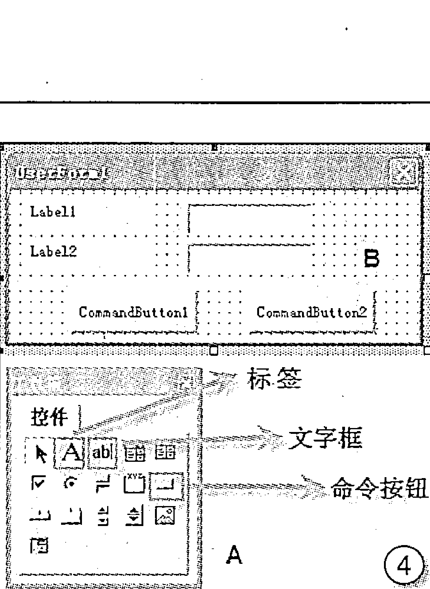

第二步：右击“图4，B处”的“Label1”标签，选择“属性”，打开“属性”窗口，将该“标签”控件的“Caption”属性修改为“商品代码”（如图5），接着将鼠标定位到图5中的“Font”属性，单击该属性右边的命令按钮，打开“字体”窗口，设置好字体的大小；执行同样的操作，再把“Label2”标签的“Caption”属性修改为“销售数量”，并设置好字体的大小。

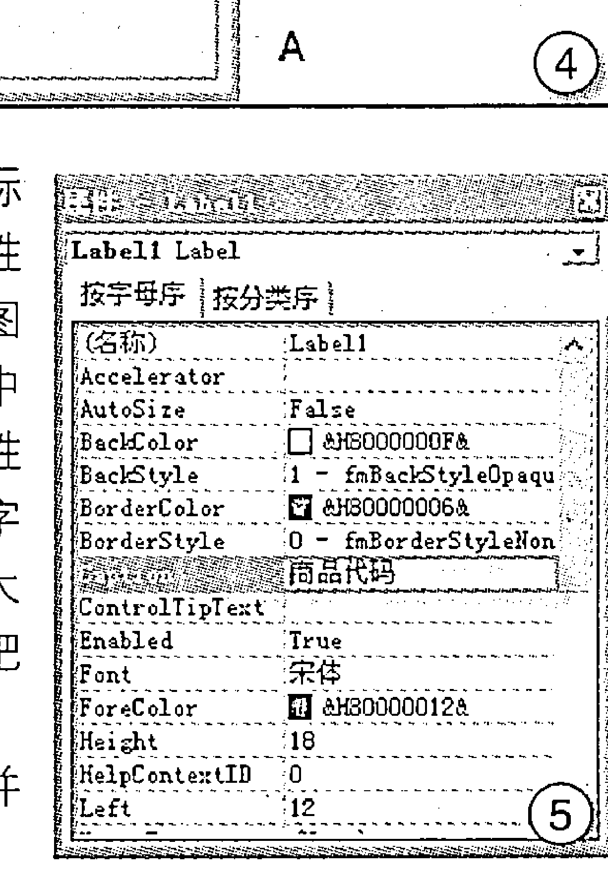

第三步：命令按钮界面的文字的修改及字体大小的设置和标签界面是一样的，右击“CommandButton1”命令按钮，选择“属性”，打开“属性”窗口，将该命令按钮的“Caption”属性修改为“添加记录”，并设置好字体的大小；最后再将“CommandButton2”命令按钮的“Caption”属性修改为“退出”，并设置好字体的大小。

第四步：在“UserForm1”表单中新添加的六个控件以外的任意位置右击，选择“属性”，打开“属性”窗口，将该表单的“Caption”属性修改为“数据录入”，最后调整好窗口中各个控件之间的位置关系，使之整齐美观，这样，“数据录入”窗口就设计好了。

## 三、函数的添加

我们在“数据录入”窗口中“商品代码”和“销售数量”后边的文字框中输入相应的数据，并单击“添加记录”按钮，图1中的B列、C列和E列单元格的数据为什么能够自动输入呢？这就是函数所起到的作用了，下边，就给大家介绍一下这三列单元格中函数的输入。

第一步：在“文具店商品销售记录”工作表的主界面，同时选中“F4——H15”区域（文具的各种提示信息），单击菜单“插入→名称→定义”命令，打开“定义名称”窗口，在“确定”左边的文本框内输入需要定义的名称，如“spdm”（不包括引号，如图6），最后单击“确定”，我们定义这个名称——“spdm”，是因为在下边的函数里边能用得到。

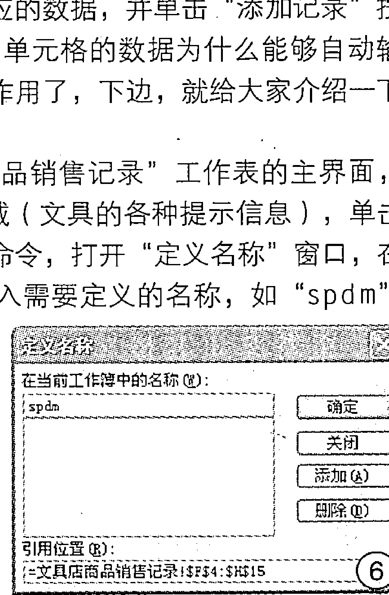

第二步：在“文具店商品销售记录”工作表的主界面，将鼠标定位到B2单元格，在B2单元格输入以下内容：=IF(ISERROR(VLOOKUP(A2,spdm,2,FALSE)),"",VLOOKUP(A2,spdm,2,FALSE))

函数说明：B2单元格中函数的作用是先查找A2单元格的数据是否和spdm（被定义为“F4——H15”）区域中第一列“F4——F15”中的数据相同（“VLOOKUP(A2,spdm,2,FALSE)”），如果不同，B2单元格的内容为空；如果相同，就将spdm中和A2单元格数据相同那一行的第二列（G列）中的数据输入到B2单元格中。

函数输入完毕后，拖动填充手柄到B30单元格，当然，如果想让该工作表保存更多的销售记录，可将填充手柄继续往下拖，比如拖到B100单元格。

第三步：再将鼠标定位到C2单元格，在C2单元格输入以下内容：=IF(ISERROR(VLOOKUP(A2,spdm,3,FALSE)),"",VLOOKUP(A2,spdm,3,FALSE))

函数说明：这个函数和B2单元格的函数几乎是相同的，它的作用是：先查找A2单元格的数据是否和spdm（被定义为“F4——H15”）区域中第一列“F4——F15”中的数据相同（“VLOOKUP(A2,spdm,3,FALSE)”），如果不同，C2单元格的内容为空；如果相同，就将spdm中和A2单元格相同那一行的第三列（H列）中的数据输入到C2单元格中。

函数输入完毕后，拖动填充手柄到C30单元格。

第四步：在E2单元格输入“=C2*D2”（不包含引号），函数输入完毕后，拖动填充手柄到E30单元格。

> 小提示：无论是B列单元格、C列单元格还是E列单元格，我们都将相关函数填充到第30行为止，记住这个30，因为在下边还要用得到。

## 四、代码的添加

到了现在，我们的“作品”已经差不多就要完成了，但是“添加销售记录”按钮和“数据录入”窗口都还只是个“花架子”，如果想让它们发挥自己应有的作用，就必须得添加与之有关的代码才行。代码的添加，具体步骤如下：

第一步：在“文具店商品销售记录”工作表的主界面双击“添加销售记录”，打开这个命令按钮的代码窗口，在“Private Sub CommandButton1_Click()”和“End Sub”插入以下内容：

```
UserForm1.Show'调用名称为“UserForm1”的表单
```

代码说明：
1. 上边这一句代码的作用是当用户单击“添加销售记录”，就会打开名称为“UserForm1”的表单（即“数据录入”窗口）
2. 单引号后边的内容是注释，在实际的操作过程中可不输入，下同。

第二步：单击菜单“工具→宏→Visual Basic编辑器”命令，调出“Visual Basic编辑器”，双击“窗体”下边的“UserForm1”，打开“数据录入”窗口，再双击窗口中的“添加记录”按钮，打开这个命令按钮的代码窗口，在“Private Sub CommandButton1_Click()”和“End Sub”之间输入以下内容：

```
Istrow = Range("A30").End(xlUp).Row '将A列从A30单元格往上最后一个非空单元格赋值给Istrow
If Istrow + 1 < 30 Then
TextBox1.SetFocus '设置TextBox1文字框获取输入焦点
TextBox1.SelStart = 0 '选定的文本从TextBox1文字框第一个字符开始
TextBox1.SelLength = Len(TextBox1.Text) '选取TextBox1文字框的全部文本
Cells(Istrow + 1, 1) = TextBox1.Text '将TextBox1文字框的内容赋值给A ( Istrow + 1 ) 单元格
Cells(Istrow + 1, 4) = TextBox2.Text '将TextBox2文字框的内容赋值给D ( Istrow + 1 ) 单元格
TextBox1.Text = "" '清空TextBox1文字框
TextBox2.Text = "" '清空TextBox12文字框
TextBox1.SetFocus '将光标定位在TextBox1文字框
End If
```

第三步：双击“数据录入”窗口中的“退出”按钮，在“Private Sub CommandButton2_Click()”和“End Sub”之间输入以下内容：

```
Unload Me '退出“数据录入”窗口
```

所有的代码输入完毕后，退出“Visual Basic编辑器”，关闭并保存“文具店商品销售记录”工作簿。

## 试用

代码添加完以后，所有的工作就大功告成了，重新打开“文具店商品销售记录.xls”，单击界面中的“添加销售记录”按钮，调出“数据录入”窗口，然后根据“添加销售记录”按钮上边的提示信息，在“商品代码”和“销售数量”后边的文本框内输入相应的数字，最后单击“添加记录”按钮，就完成了某种文具销售记录全部数据的录入工作，而且该种文具的名称、单价和总价都是自动录入的。

## 手机个性铃声 一分钟快速搞定

□小新

小菲买了一款新的手机，支持MP3铃声，这样她就可以去网上找自己喜欢的MP3歌曲当作铃声。不过让小菲比较郁闷的是，网上的MP3歌曲都是完整版的，而她只想把歌曲中的高潮部分当作铃声，这就需要用第三方软件来对歌曲进行处理。虽然可以直接用Adobe Audition或GoldWave等专业软件来进行处理，但是这些软件操作起来非常复杂，需要一段时间才能够完全掌握。并且小菲只是对歌曲进行简单的裁剪，用这些专业的软件有点大材小用。一次偶然的机会，小菲的朋友给她介绍了一款名字为蓝光影音Mp3录音机的软件，该软件比较适合新手，简洁的界面让人很容易上手。下面就一起跟随小菲，看看如何用蓝光影音Mp3录音机快速制作手机个性铃声。

- 蓝光影音Mp3录音机 1.6
- 软件大小：2680KB
- 软件性质：免费软件
- 适用平台：Windows 9x/2000/XP
- 下载地址：http://www.languangav.com/soft/download.htm

首先在蓝光影音Mp3录音机的主界面中打开要编辑的歌曲，支持MP3和WAV两种格式。选择好歌曲之后，会在下面以音波的形式显示出来（图1）。这时候就可以点击播放按钮，来对歌曲进行播放。歌曲播放完之后，可以用鼠标选取要当成铃声的部分，然后点击另存为按钮，就完成对铃声的截取，非常的方便。

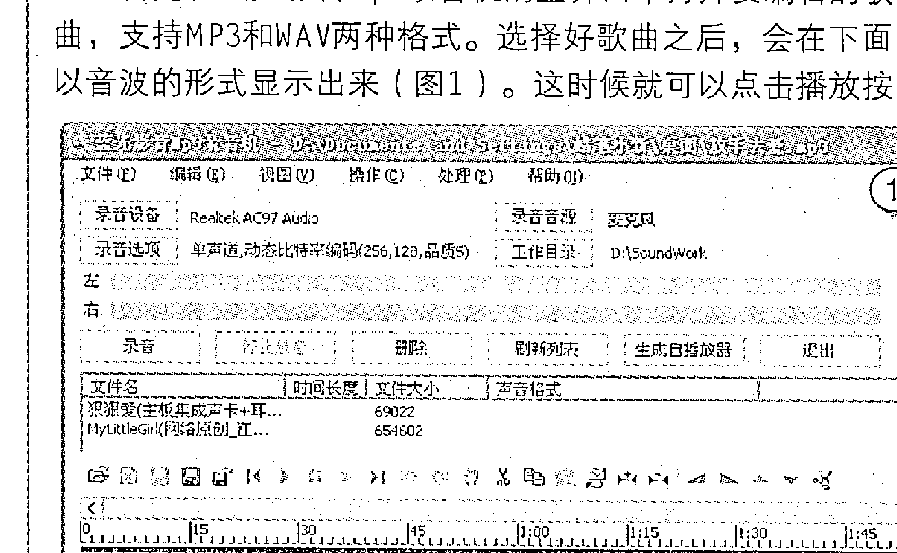

蓝光影音Mp3录音机除了可以对歌曲方便的截取之外，还可以对音频文件进行简单的处理。可以放大、减少音量，也可以将歌曲部分进行静音，并且还可以进行混音操作，将几首歌曲混为一首（图2）。而且蓝光影音Mp3录音机支持录音功能，可以利用麦克风将自己的声音录制成铃声。

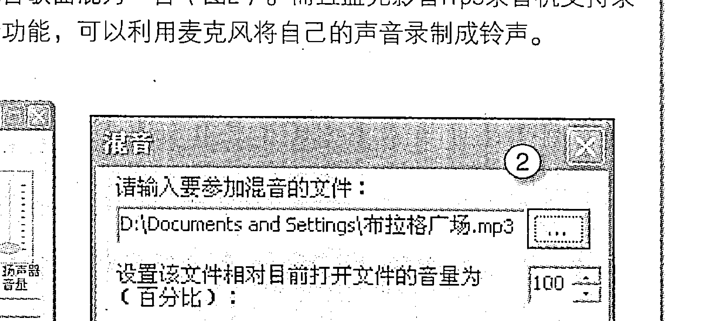

如果你跟小菲一样，要求不高，只想简简单单地制作一个属于自己的手机个性铃声的话，那么不妨用用蓝光影音Mp3录音机吧，让你在一分钟之内就可以拥有只属于自己的手机铃声。

## 板书特效轻松做

□杨杰晶

在教学过程中，老师的板书并不是按照文字的先后顺序来书写的，总是会事先空出一部分内容，给学生留下思考的空间，等到讲完与之相关的环节后，学生对问题的认识统一了，老师再补充上。但在老师讲公开课时，一边用着课件一边板书，由于受到场地等诸多条件的影响，板书的效果就会大打折扣。其实，如果我们将板书特效整合到课件中，就两全其美了，下边以PPT为例给大家简单介绍一下。

### 一、准备工作

先根据所要讲授的课的内容，设计好板书（以青岛版五年级上册科学课本第二课《它们都是鸟》为例），然后启动“PowerPoint 2003”，新建一个空白幻灯片，将设计好的板书内容输入进去（如图1）。

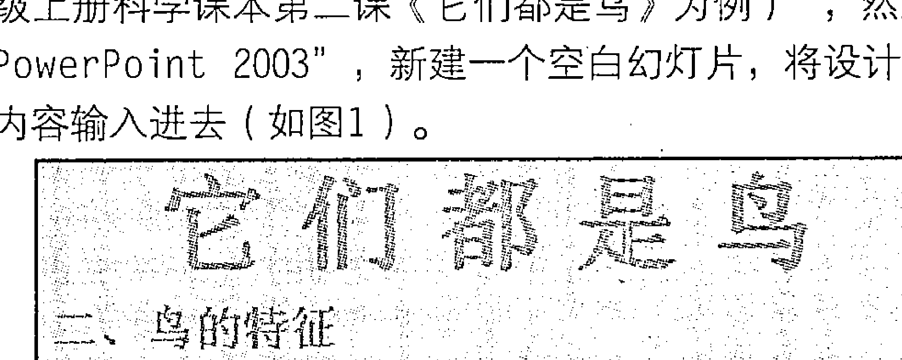

第一步：单击菜单“插入→文本框→水平”命令，在图1所示的窗口的横线上插入两个文本框，并在文本框内输入与之相关的正确答案（如图2）。

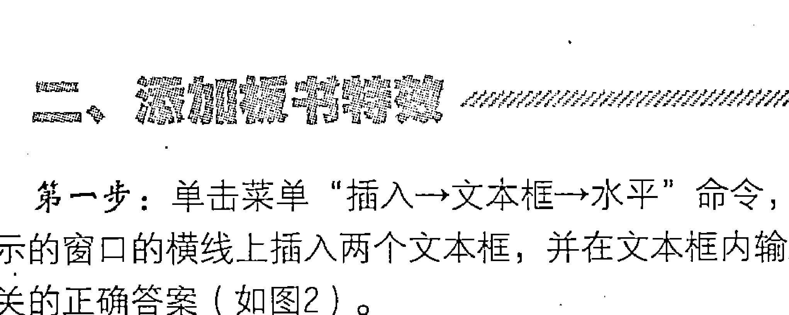

第二步：单击菜单“幻灯片放映→自定义动画”命令，调出“自定义动画”面板，选中图2中的“身体表面有羽毛”这个文本框，然后单击“自定义动画”面板中的“添加效果”旁边的下拉箭头，选择一种你所喜欢的动画效果（如盒状效果）。

第三步：在“自定义动画”面板的自定义动画列表中，单击刚才添加的项目右边的下拉箭头，选择“计时”（如图3），打开“盒状”窗口并切换到“计时”选项卡，单击“触发器”按钮，勾选触发器下边的“单击下列对象时启动效果”单选按钮，最后单击该单选按钮右边的下拉箭头，选择第一个文本框前边的文字作为“触发器”（如图4），这样当幻灯片放映时，单击第一个文本框前边的文字时，第一个文本框内的文字就会以先前设定的盒状动画效果出现。

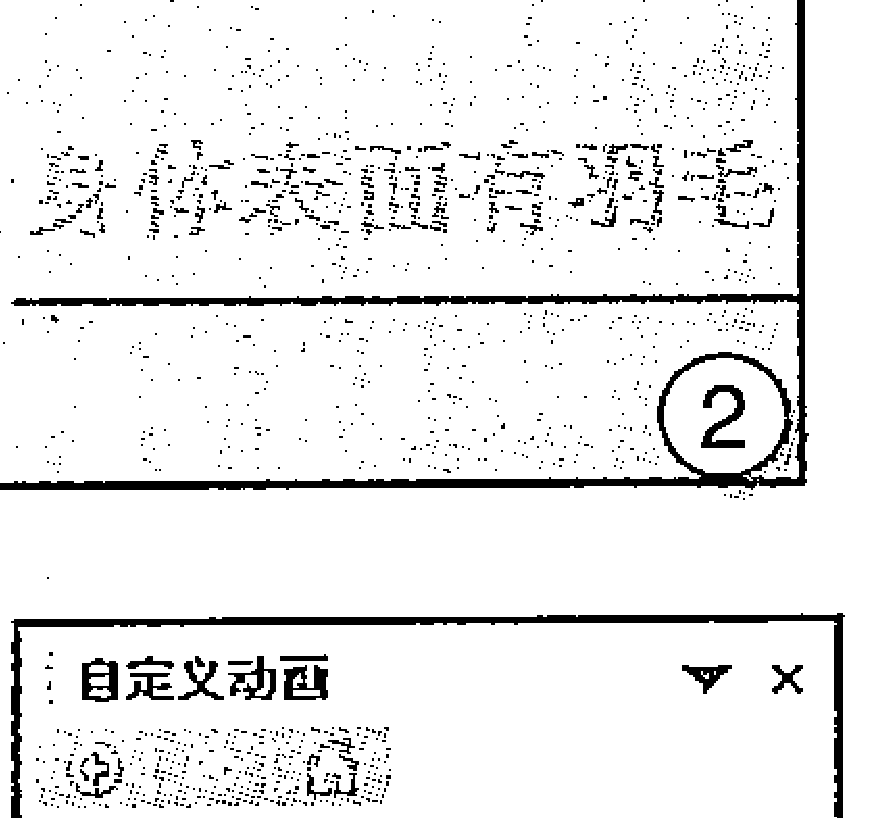

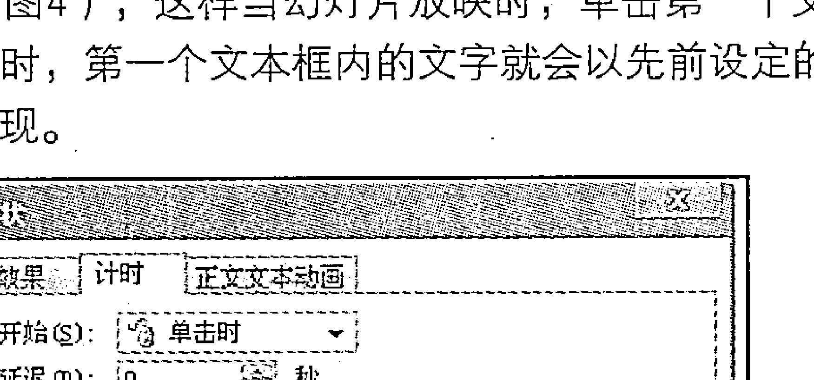

第四步：重复第二步的方法，为第二个文本框内的文字设置好动画效果，再重复第三步的方法为该文本框的内容设置好“触发器”，建议大家选择这个文本框后边的文字作为触发器。

> 小提示：为某个文本框的内容设置“触发器”时，“触发器”的对象选择要有一定的规律，否则在实际应用的过程中就会弄混了，造成该出来的文字内容没有出来，不该出来的文字内容出来了，从而影响公开课的讲课效果。

### 二、添加动画效果

### 三、效果预览

至此，我们的“作品”就算大功告成了，单击菜单“幻灯片放映→观看放映”命令或者按下F5快捷键时，你就会发现正在放映的幻灯片的两个文本框都是空白的，没有任何内容。当你将鼠标移动到“像鸡、喜鹊、鸽子等动物这样，”的文字上时，你就会发现鼠标变成了手形，这时单击鼠标，第一个文本框内的文字内容就会以盒状动画效果出现了；同样，当你将鼠标移动到“的动物都是鸟。”的文字上时，单击鼠标，第二个文本框的内容就会以你先前设定的动画出现了。

## Word文档自动添加密码

□孙学荣

在工作中，建立Word文档时，人们往往需要给Word文档添加密码，以保护好文档内容不被泄露。添加密码时，一般是单击菜单“工具→保护文档”命令，打开“保护文档”窗口来进行密码的设置工作。但是如果经常给Word文档添加密码，这种方法就显得太麻烦了，今天笔者就给大家介绍一下，如何让Word文档自动添加密码。

### 一、编写宏代码

第一步：先启动“Word 2003”（其它版本操作类似），然后单击菜单“工具→宏→宏”命令，打开“宏”窗口，在“宏名”下边的文本框内输入要建立的宏的名字“AutoNew”（如图1所示，宏的名字不可以为其它内容，否则就不会成功），最后单击“创建”按钮，这时就会打开一个代码窗口——“Normal - NewMacros”。

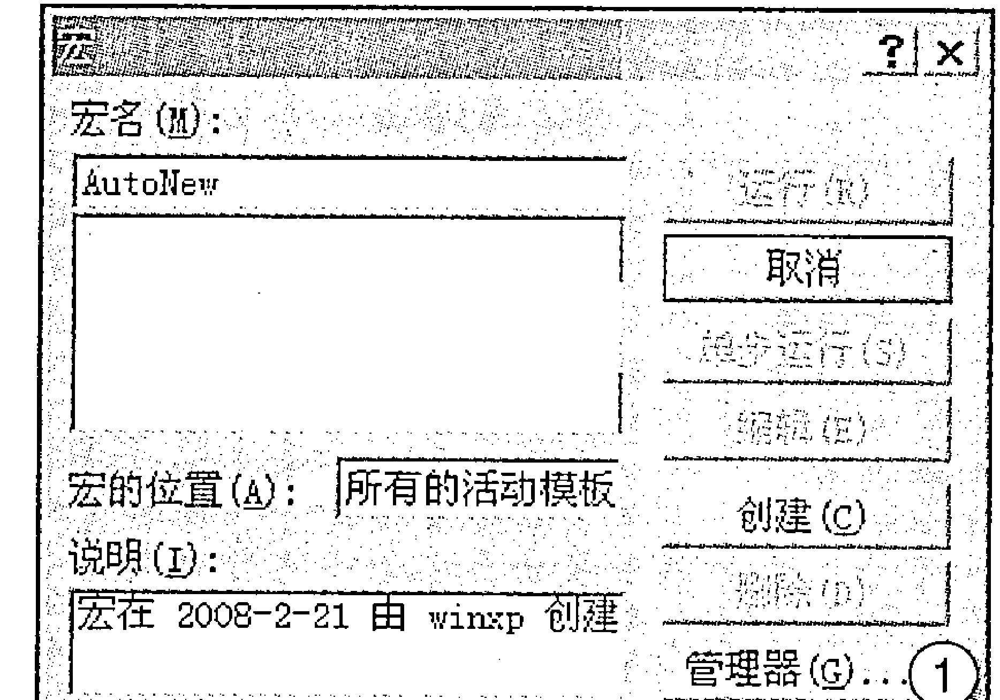

第二步：在“Normal - NewMacros”窗口中将“Sub AutoNew()”和“End Sub”之间的内容替换为以下代码（如图2所示）：

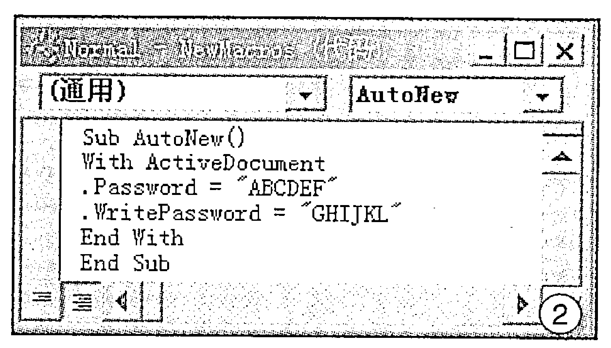

```
With ActiveDocument
    .Password = "ABCDEF"
    .WritePassword = "GHIJKL"
End With
```

代码说明：
代码 “.Password = "ABCDEF"” 的作用是将打开Word文档的密码设置为：ABCDEF。
代码 “.WritePassword = "GHIJKL"” 的作用是将修改Word文档的密码设置为：GHIJKL。
最后，退出“Word 2003”。

> 提示：大家可以修改代码中的密码文字为其它内容。

### 二、试用及应注意的问题

现在，重新运行“Word 2003”，新建一个Word文档并保存，无论是执行菜单“文件→新建”命令新建一个Word文档，还是单击工具栏上的“新建”按钮新建一个Word文档，当保存、退出并重新打开这个Word文档时，就会弹出一个要求输入密码的窗口（如图3）。在这个窗口中，如果输入密码“ABCDEF”就会弹出另一个窗口（如图4），在窗口中可以单击按钮“只读”以只读方式打开相关Word文档，也可以在图4所示的窗口中输入“GHIJKL”以完全控制的方式打开该Word文档。

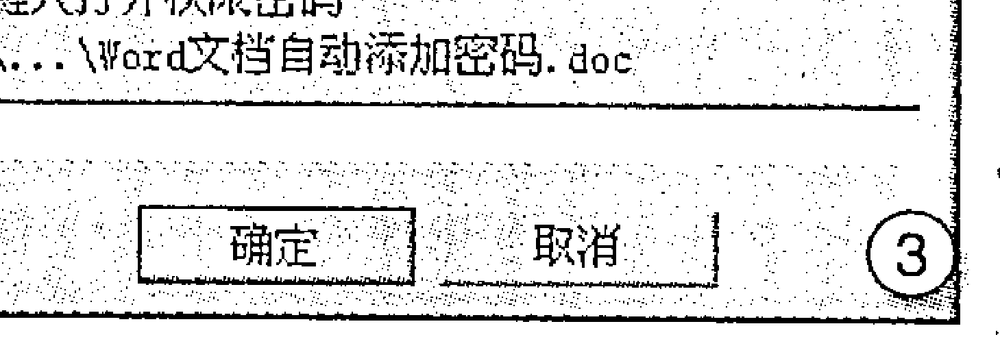

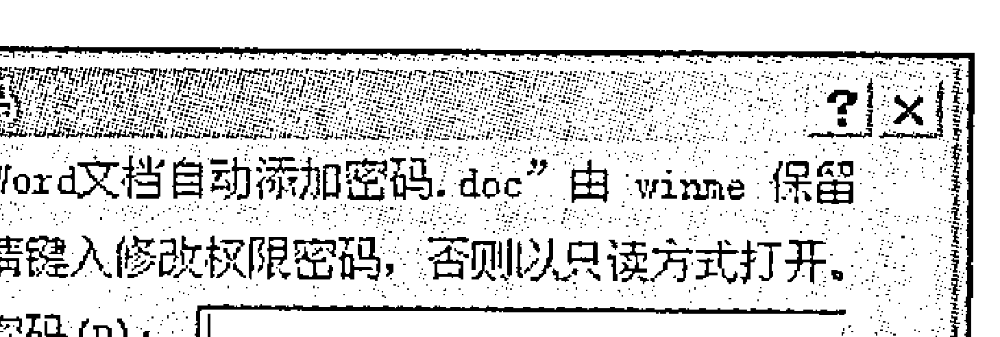

可能有的细心的朋友会说，虽然建立添加密码的Word文档比较方便了，可是如果要建立一个不需要添加密码的Word文档又该怎么办呢？方法很简单，当直接运行“Word 2003”时，将默认打开的Word文档保存，这个Word文档就是没有添加密码的。当然，也可以通过右键菜单来建立一个没有添加密码的Word文档。

怎么样，现在无论是建立添加密码的Word文档，还是建立没有添加密码的Word文档，都方便多了，如果你有兴趣的话，也赶快试试吧！

## 巧用函数，玩转Excel稿纸格式

□闫华礼

我们知道，在Word2007和WPS中可以将文档中的文字设置为稿纸格式，但大家想没想过，在Excel中也可以实现稿纸格式呢？可能有的朋友会说，既然在Word2007中就能将文字设置为稿纸格式，那么再在Excel中将文字设置为稿纸格式，岂不多此一举？二者还是有差别的，与在Word2007中不同的是，如果将一段文字设置为稿纸格式，要先选中，再进行一系列操作；而在Excel中则要简单得多，只要利用公式将某个Excel文档设置好，以后如果将某些文字设置为稿纸格式，只要将文字复制过去就可以了。下面就给大家介绍一下如何将某个Excel文档设置为稿纸格式以及怎样使用。

### 将Excel文档设置为稿纸格式

第一步：打开Excel2003（其它版本操作类似），新建一个Excel文档，先将“Sheet3”这个工作表删除，再将“Sheet1”和“Sheet2”这两个工作表分别重命名为“稿纸格式”、“文字编辑”，最后将这个工作簿保存为“稿纸格式.xls”。

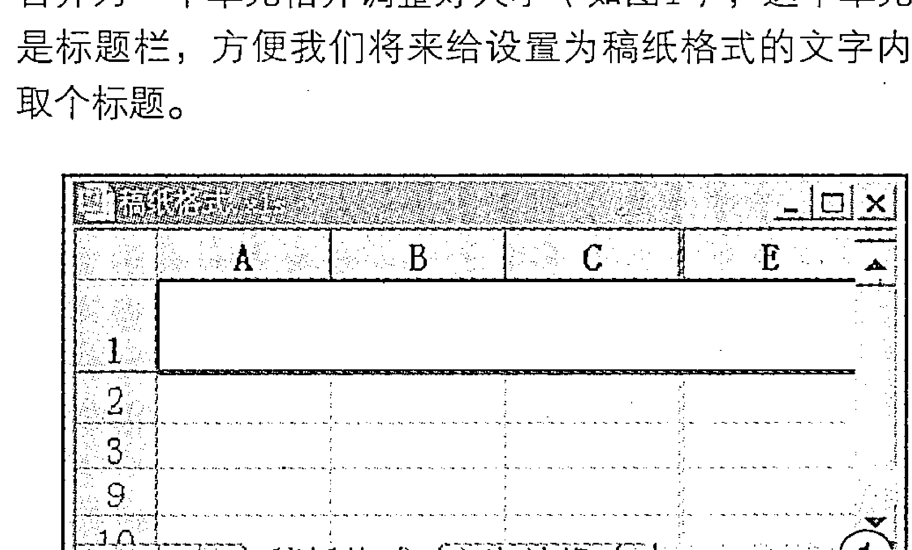

第二步：重新打开工作簿“稿纸格式.xls”并切换到“稿纸格式”工作表，先选中“A1—AN1”单元格，然后单击工具栏上的“合并并居中”按钮，将这40个单元格合并为一个单元格并调整好大小（如图1），这个单元格是标题栏，方便我们将来给设置为稿纸格式的文字内容取个标题。

第三步：在A2单元格内输入“=IF(AND(MOD(COLUMN()+1,2)=0,MOD(ROW(),2)=0),MID(文字编辑!$A$1,COLUMN()-(COLUMN()-2)/2+(ROW()-2)*10,1),"")”，然后拖动填充手柄到AN2单元格，这样A2—AN2单元格的每一个单元格都包含有相同内容的公式；最后同时选中A2—AN2单元格，拖动填充手柄至第40行，这样我们就完成了公式的复制工作。

公式说明：该公式先从A2单元格开始依次判断某个单元格所在的行是不是偶数行、所在的列是不是奇数列，如果同时满足上述两个条件，就将“文字编辑”工作表中A1单元格的所有文字内容依次复制到“稿纸格式”工作表中。

> 小提示：上边公式中的“(ROW()-2)*10,1)”表示在稿纸格式中，每一行显示20个文字，如果要显示16个文字只需要把上边公式中的“(ROW()-2)*10,1)”修改为“(ROW()-2)*8,1)”就可以了。

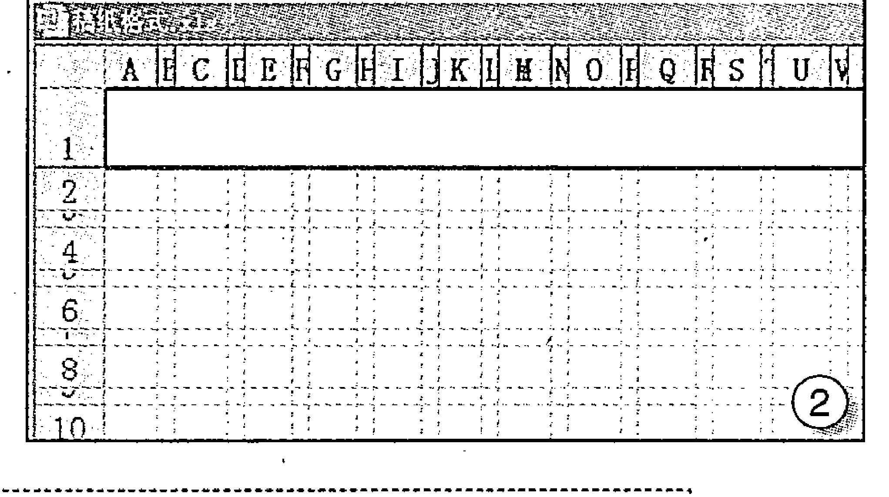

### 文字录入

我们经过上边的三个步骤，已经完成了稿纸格式的设置工作，下边就给大家介绍一下怎样往设置好的“稿纸格式”工作表中复制文字。

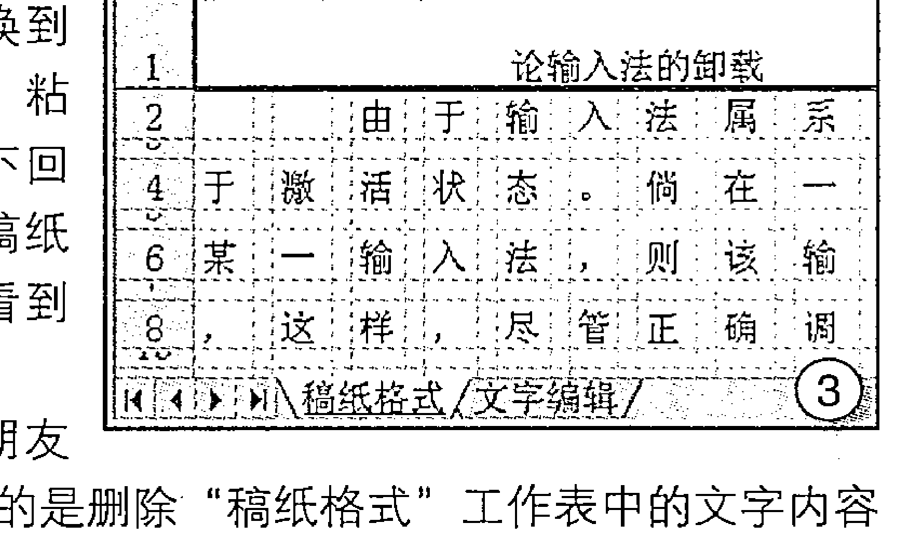

可能有的细心的朋友会说，该方案美中不足的是删除“稿纸格式”工作表中的文字内容很麻烦，而且也会造成该工作表中的公式丢失。其实我们可以变通一下，如果我们要删除“稿纸格式”工作表中的文字内容，可删除“文字编辑”工作表中的A1单元格中的内容，并按下回车键，就可以发现“稿纸格式”工作表中的文字都被清空了。

## Office 2007 新体验课堂

张迎新

## 一、文档协作各管一块

对商业合同或公务文件之类文档来说，里面的段落和文字格式等都有一定标准。在多个用户协同编辑文档的情况下，避免错误修改文档格式是非常必要的。为此，Word 2007专门提供“限制格式和编辑”功能，下面介绍这一功能的使用方法：

### 1. 格式设置别乱动

协同编辑Word文档时，通常有一位用户负责起草，编辑格式限制可以由他设置。如果需要限制合作者修改文档格式，请单击Word 2007“审阅”选项卡中的“保护文档”，选中菜单中的“限制格式和编辑”，就可以打开“限制格式和编辑”任务窗格。
如果起草者只允许合作者使用几种特定格式，请选中任务窗格中的“限制对选定的样式设置格式”，接着单击“设置”打开如图1所示对话框。根据需要选中“当前允许使用的样式”下的复选项，然后清除不允许使用样式前面的复选项。如果只允许文档使用少数几种格式，可以单击对话框中的“无”按钮，再选中允许使用的格式就可以了。

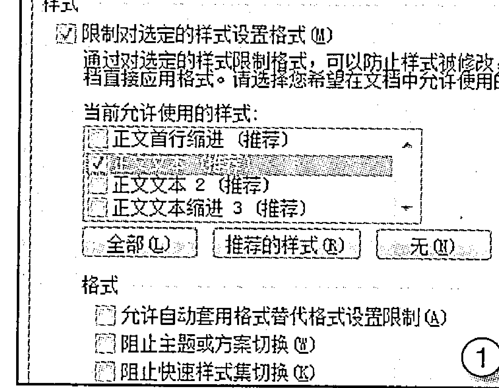

以上设置完成后单击“确定”按钮关闭对话框，如果当前文档应用了不允许使用的格式，则会弹出对话框告知“该文档可能包含不允许的格式或样式。您是否希望将其删除。”单击“是”按钮就会删除不允许使用的格式，然后允许使用的格式将会替代它们。此后只要按下面介绍的办法启动强制保护，再打开Word 2007的“样式”下拉列表，可以看到其中仅剩“当前允许使用的样式”，其他不允许使用的样式全部消失。

### 2. 编辑范围有限制

如果某些文档只允许用户执行修订、批注等指定操作，请选中“限制格式和编辑”任务窗格中的“仅允许在文档中进行此类编辑”，然后打开下面的下拉列表，从“修订”、“批注”、“填写窗体”或“不允许任何更改（只读）”四个选项中选择一个。选择完毕启动“强制保护”，除了发布这个文档的用户以外，其他用户只能执行上面指定的某种操作，其余操作全部被禁止。
假如文档起草者需要个别用户编辑文档的部分内容，仅提供上面提到的四种操作权限是不够的。为了方便不同用户编辑文档的特定内容，Word 2007在“编辑限制”下设置了“例外项”。假如文档拥有者需要一个或几个用户编辑文档的某一部分，可以将文档中的相应区域选中，然后单击任务窗格“例外项”下的“更多用户”。打开如图2所示“添加用户”对话框。按照“用户1；用户2”、“域\用户名1；域\用户名2”或“E-mail地址1；E-mail地址2”的格式，在对话框中输入允许编辑该区域的用户名称。用户名输入完成后单击“确定”按钮，系统将对用户是否存在进行验证。如果文档保存在本地的共享文件夹中，验证的范围就是本机的所有用户；如果文档保存在网络共享文件夹中，验证的范围则是访问该文件夹的所有用户。

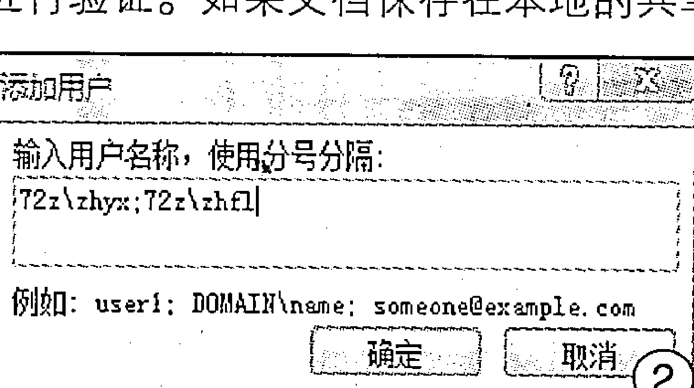

用户验证通过后被选中的区域就会变成浅灰色，区域两端带有颜色稍深的大括号，说明该区域除了发布文档的用户以外，只有上述被授权的用户才能编辑。如果你想授予每个打开文档的用户都有编辑特定区域的权限，只须选中“例外项”下的“每个人”就可以了。

### 3. 强制保护更安全

设置上述限制措施中的一项或两项以后，如果没有启动强制保护，其他用户仍然可以取消这些措施。
为此，必须单击“限制格式和编辑”任务窗格中的“是，启动强制保护”按钮，打开如图3所示的“启动强制保护”对话框，选中上面的“密码”然后在“新密码”和“确认新密码”框内输入保护密码。此后，用户在任务窗格中设置的所有保护措施即可生效，其他用户只能执行文档发布者指定的操作，“保护文档”任务窗格也会显示有关编辑权限的信息。其中的“有效样式”链接可以打开“样式和格式”任务窗格，使用权限内提供的样式和格式。还可以使用“查找下一个可编辑的区域”和“显示可编辑的所有区域”按钮，以便快速寻找或显示自己有权编辑的区域。

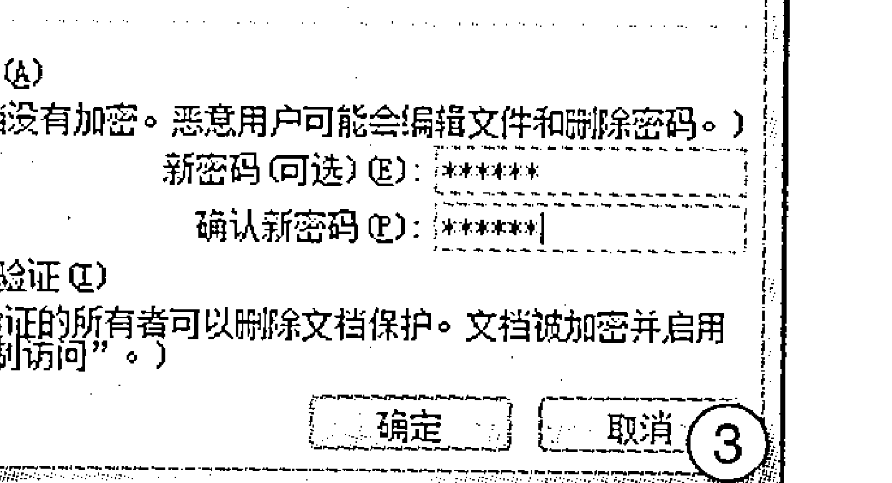

如果设置编辑限制的用户要取消以上保护措施，只须按上面介绍的方法打开“限制格式和编辑”任务窗格，然后单击“停止保护”按钮，在打开的对话框中输入正确的密码，即可取消所有保护措施。

## 方案 巧用批注·办公

开“保护文档”任务窗格，单击其中的“停止保护”按钮打开对话框，在其中输入保护密码“确定”，就可以将文档恢复到保护之前的自由编辑状态。

## 二、编辑协作提意见

商业合同或政府公文等的行程非常严谨，文档从起草到定稿需要上下反复多次，要由不同级别的多位领导审阅才能成文。为了便于审阅者提出自己的意见和建议，Word 2007提供了名为批注的工具。审阅者可以在文档中输入自己的意见，供文档最后定稿时参考。

### 1. 批注选择有讲究

Word 2007文档批注有两种显示方式：一是打开Word 2007的“审阅”选项卡，单击“批注框”选择菜单中的“仅在批注框中显示批注和格式”。文档页边距处就会显示如图4所示的“批注框”，批注框与手工批注文件很相似，其内部显示批注的具体内容，左边的红色虚线则指向被批注的内容。由于批注框的容量有限，所以这种方式比较适合内容较少的批注。

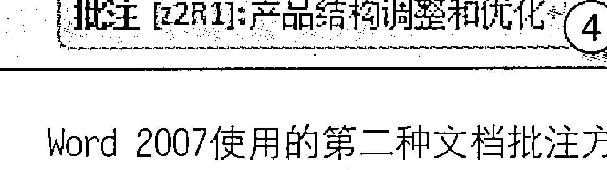

Word 2007使用的第二种文档批注方式称为“嵌入式批注”。单击“审阅”选项卡中的“批注框”，选择菜单中的“以嵌入方式显示所有修订”。那么Word 2007窗口左侧或下方会显示如图5所示窗格，里面显示了批注的位置、批注用户名和批注内容。由于窗格可以容纳较多的文字，因此这种方式比较适合内容较多的批注。

### 2. 选中对象插批注

由于批注是对文档的某个内容提出意见和建议，所以插入批注前必须打开Word 2007文档，选中需要批注的文字（插入批注以后，这部分文字将用括号围起来），或将光标放在待插入批注的位置（插入批注以后，该位置显示一个“I”）。然后单击Word 2007“审阅”选项卡中的“新建批注”按钮，在用户按前面的介绍选择了批注方式以后，用户就可以向批注框或窗格输入批注了，完成后必须按常规方法保存文档。

在向批注框输入批注之后，鼠标单击文档的任意位置，批注框的指示线变为虚线，边框也会变为较细的红色实线。在向如图5所示窗格中输入批注时，光标插入窗格中的某条批注，那么文档中的对应位置会变成深红色，便于用户确定批注的位置。

| 摘要: 共4处修订 | |
| --- | --- |
| 插入:0处 | 删除:0处 | 移动:0处 | 格式:0处 | 批注:4处 |
| 批注 [x1] | zhycx |
| 应为 IC 卡优势企业 | |
| 批注 [x2R1] | zhycx |
| 产品结构调整和优化 | |
| 批注 [x3] | zhycx |
| 批注 [x4] | zhycx |
| (无) | |
| (无) | |
| (无) | |

### 3. 批注快捷查看

其他用户查看批注时，只须打开带有批注的文档，右击文档中带有批注标记的位置，选择快捷菜单中的“编辑批注”，就会打开如图5所示的窗格查看其中的批注。如果单击“审阅”选项卡中的“批注框”，选择菜单中的“仅在批注框中显示批注和格式”。就可以在文档页边距处显示“批注框”，同时在批注框和窗格中查看批注。

如果需要单独查看某位用户插入的批注，可以打开“审阅”选项卡“显示标记→审阅者”子菜单，选中用户姓名就能够看到他的所有批注；取消选中“显示标记”下的“批注”，可以将文档中的所有批注暂时关闭；如果需要查看所有用户插入的批注（或修订）。打开“审阅”选项卡“显示标记→审阅者”子菜单，选中“所有审阅者”，就可以看到所有用户插入文档的批注了。

如果文档有多位用户插入了批注，查看时只要将鼠标的光标放入批注框，就可以看到批注人的姓名、批注日期和时间。查看批注的过程中进行修改也很容易，只要用鼠标在批注框内或窗格内单击，即可修改其中的任何内容了。

如果文档中的某个批注不再需要，只须右击批注框或批注窗格中含有“批注”字样的区域或位置，选择快捷菜单“删除批注”即可将其从文档中清除。

## 三、亲自动手用修订

Word 2007提供的另一种协同编辑方法是用户直接修改文档，它与通常使用的修改方法不同：其他用户不仅可以看出何人在何处做了修改，还能选择接受修改或拒绝修改，从而大大提高文档的修改效率。

### 1. 插入修订

打开待插入修订的文档，将光标放在需要修订的位置，按上面介绍的方法打开“审阅”选项卡，单击“修订”按钮选中菜单中的“修订”。在当前光标位置输入第一条修订，完成后将光标插入新的修订位置，再次输入第二条修订。全部修订输入完毕以后，取消选中“修订”菜单中的“修订”，然后按常规方法保存文档即可。

按上述方法进入“修订”状态以后，用户不仅可以向文档插入修订内容，显示为带下划线的红色文字。也可以删除文档中的内容，被删除的文字显示为带“删除线”的红色文字。

### 2. 编辑修订

编辑修订就是在文档定稿时接受或拒绝修订。由于修订有插入和删除两种情况，所以用户可以选择两种不同的编辑修订方式。

对插入内容的修订来说，定稿用户只须右击文档中的修订文字，根据需要选择如图6所示快捷菜单中的“接受修订”或“拒绝修订”即可。前者可去掉文字的修订标记（颜色和下划线），使它成为文档的一部分；后者可直接将文字从文档中删除，不会留下任何修订痕迹。

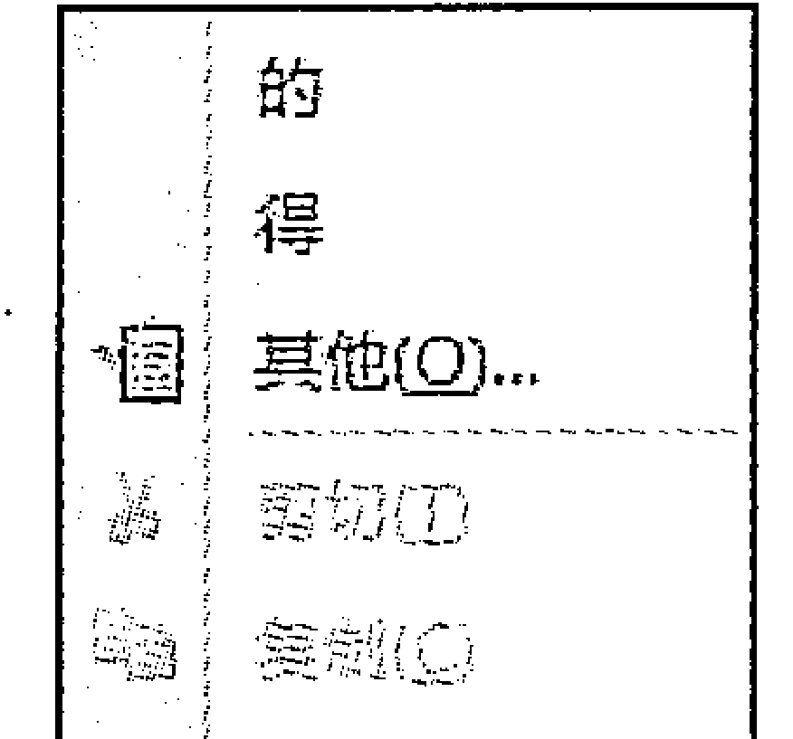

对删除文档内容的修订来说，只要按相同方法打开如图6所示菜单。

### 3. 协同效果看明白

重要的文档往往有很多人参与，定稿者不仅需要查看不同用户的批注或修订，有时还需要看到应用批注或修订前后的效果。为此，Word 2007在“审阅”选项卡中提供了“显示以审阅”菜单，选择其中的命令可以看到应用批注或修订前后的效果。

单击“审阅”选项卡中的“显示以审阅”下拉按钮，打开如图7所示菜单选择“显示标记的最终状态”，则文档中未删除的批注全部显示，插入修订用带下划线的红色字体显示，已经删除的修订文字则被去掉，这种方式可以看到应用修订后文档的实际情况。

如果选择如图7中的“最终状态”，则文档中的批注被全部删除，插入的修订文字全部生效（像其他内容那样采用正常字体显示），删除的修订文字则被全部去掉，这种方式可以看到文档定稿时的实际效果。


选择如图7中的“显示标记的原始状态”，曾经插入文档的批注会全部显示出来（包括已经删除的批注），插入的修订文字则被全部去掉，已经删除的内容用红色划线文字显示，这种方式可以查看文档批注和修订的总体情况。

最后，选择如图7中的“原始状态”，此时文档中的批注和修订全部隐藏，审阅者看到的是未经批注和修订原始文档，这种方式可以查看文档的最初状态。

## 四、现有材料快速编

机关和企事业单位经常利用现有文档编写材料，若干旧文档经过合并编辑就可以成文。这种应用非常适合Word 2007提供的比较合并功能。

### 1. 文档差别有比较

Word 2007比较合并可以两个文件进行比较，然后在新文档中显示源文档和目标文档的差异，最后由用户决定需要保留或删除的内容。其操作的基本步骤如下：

假如需要比较《2006年精神文明建设汇报材料》（源文档）和《2007年精神文明建设汇报材料》（目标文档），然后决定哪些内容可以合并。首先应当用Word 2007打开《2006年精神文明建设汇报材料》，再单击“审阅”选项卡中的“比较”命令，就可以看到如图8所示的“比较文档”对话框。单击“修订的文档”下的按钮，将《2007年精神文明建设汇报材料》的文件名放入框中。根据需要选中对话框“比较设置”下的复选项，再选中“显示修订”下的“修订的显示级别”（字符级别还是字级别），最后选中“修订的显示位置”下的选项（原文档、修订后的文档或者是新文档）。

以上操作完成后单击如图8所示对话框的“确定”按钮，如果上述文档中有一个或两个含有修订，就会弹出如图9所示对话框，单击“是”Word 2007就会新建一个名为“比较结果”的文档。源文档《2006年精神文明建设汇报材料》在窗口的右上窗格显示，《2007年精神文明建设汇报材料》作为修订的文档在右下窗格显示，两者比较合并后的结果在窗口中间显示，两者的不同点作为修订在左边的修订窗格中显示。


### 2. 比较结果有选择

由于两个文档的比较结果作为修订显示在中间窗格和修订窗格中显示，因此可以选择是否将修订内容应用于比较结果文档。右击“比较结果”中带有下划线的红色文字，或者右击修订窗格中“插入的内容”字样（也可以右击下面的文字），选择快捷菜单中的“接受修订”命令，就可以将这些文字插入“比较结果”文档。如果选择快捷菜单中的“拒绝修订”命令，说明修订文字不需要插入“比较结果”文档，则带有下划线的红色文字会自动消失。


## 五、工作簿协同编辑

修订也是Excel 2007工作簿重要协同编辑方式，它的操作特点与Word 2007很相似。就是其他用户可以看出修订工作簿何处做了修改，然后根据需要决定接受或拒绝修订。但是Excel 2007的修订对象只能是共享工作簿，并且必须打开修订跟踪，这一点与Word 2007完全不同。

### 1. 使用修订先设共享

由于Excel 2007的修订对象只能是共享工作簿，所以在修订操作前必须设置共享工作簿：

- 第一种方法是单击Excel 2007 “审阅”选项卡中的“共享工作簿”按钮，打开如图10所示的“编辑”选项卡，选中“允许多用户编辑，同时允许工作簿合并”然后“确定”。如果是新建的工作簿就会提示用户保存，之后再次打开若能看到工作簿名称后有“[共享]”字样，说明共享工作簿设置成功。

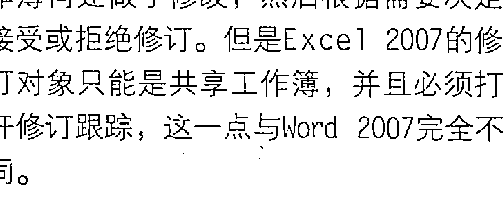

- 第二种方法是单击Excel 2007 “审阅”选项卡中的“保护并共享工作簿”命令。打开如图11所示对话框选中“以跟踪修订方式共享”，它可以启用对共享工作簿的共享和修订记录保护。以后每次保存工作簿时，修订跟踪日志会详细记录修订信息。在多个用户同时编辑一个工作簿时，该功能特别有用。它可以了解所有共享用户对工作簿的编辑，并决定是否接受或拒绝所修订的数据。

### 2. 亲自动手用修订

共享工作簿设置完成之后，就可以将它分发给其他用户进行修订（增补或修改数据），此时的操作和编辑普通工作簿没有什么区别。不同的是鼠标指向修订过的单元格时，会弹出一个黄色的提示框，其中显示了执行修订的用户名、修订时间以及对单元格进行了怎样的修改。

### 3. 显示修订了解更改

当所有用户完成共享工作簿的修订之后，负责定稿的用户就可以显示修订，了解工作簿的更改情况了：单击“审阅”选项卡的“修订”下拉按钮，选择“突出显示修订”命令打开如图12所示对话框。首先选中“在屏幕上突出显示修订”，然后根据需要选择“时间”、“修订人”和“位置”。选中“时间”复选项可以在下拉列表中设定显示修订的时间间隔，其中包括“全部”、“从上次保存开始”、“无”或“起自日期”。选中“修订人”然后打开下拉列表，可以选择突出显示那些用户所作的修订。选中“位置”复选项将光标放入后面的输入框，鼠标拖过要突出显示修订的连续单元格，或按住Ctrl单击要突出显示修订的非相邻单元格，即可使这些单元格的引用出现在输入框中。

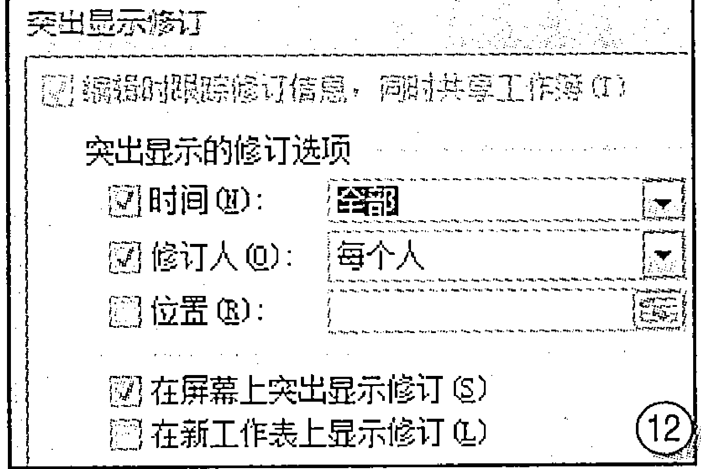

### 4. 修订记录逐个看

Excel 2007查看修订有两种方式：如果用户想逐个查看某个单元格的修订，只须将空心十字光标指向带有批注的单元格，就会弹出一个黄色的修订框，顺序显示“用户名”、“修订日期和时间”和“修订内容”。

如果需要一次性查看所有用户对工作簿的修订，只要选中如图12所示对话框中的“在新工作表上显示修订”。“确定”之后，Excel 2007就会在当前工作簿中新建一个名为“历史纪录”的工作表，其中详细显示了所有修订的细节。

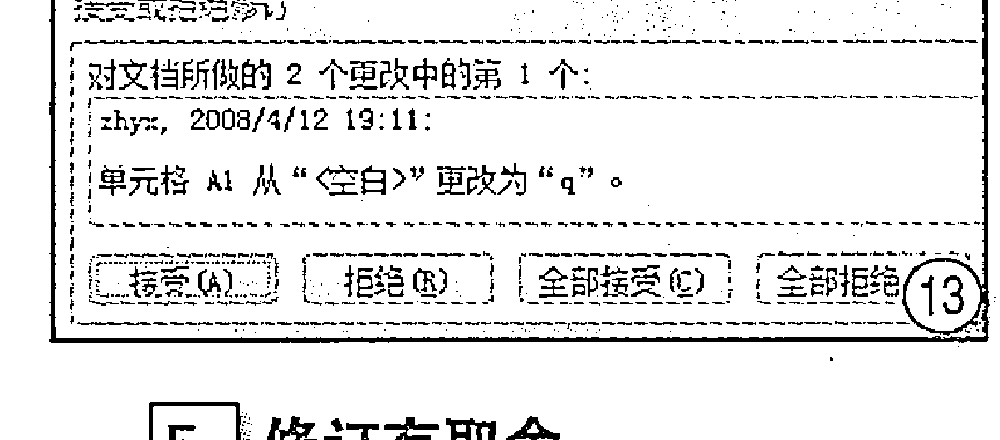

### 5. 修订有取舍

经过多人修订的共享工作簿最后需要定稿，其主要内容就是做出接受或拒绝修订的决定：单击“审阅”选项卡“修订”子菜单下的“接受或拒绝修订”命令打开对话框，按照“突出显示修订”的原则选择“时间”、“修订人”和“位置”，“确定”后即可看到如图13所示对话框。

对话框中显示了当前单元格是总共更改的多少个单元格中的第几个，中间则显示了修订的“用户名”、“修订日期和时间”以及对单元格所做的更改内容。单击“接受”按钮可以接受对单元格所做的修订；单击“拒绝”按钮就会拒绝应进行的修订，单元格中的已有的值将会恢复为初始值，并且删除修订单元格的突出显示（如果已经显示的话）；单击“全部接受”按钮将接受所有剩余的修订。如果单元格中已经保存了多个修订，那么所有修订都在“选择单元格的值”列表框中列出；单击“全部拒绝”按钮将拒绝所有剩余的修订，并将修订单元格的值返回到初始值。

## 六、要用建或插批注

与Word 2007相比，Excel 2007批注很像前者的“批注框”，普通工作簿和共享工作簿都可以插入批注。

### 1. 插入批注提建议

与Word 2007相比，Excel 2007插入批注的方法比较简单：首先选中需要批注的单元格或区域，单击Excel 2007“审阅”选项卡中的“新建批注”，当前单元格右上角就会显示一个黄色的批注框，用户就可以在里面输入批注文字了。另外，使用右键快捷菜单中的“插入批注”命令，同样可以给当前单元格插入批注。某个单元格的批注输入完成以后，鼠标在批注框外的任意位置单击，批注框就会自动隐藏起来，当前单元格右上角则显示一个红色三角，说明这个单元格已经插入了批注。

小提示：Excel 2007批注框可以任意移动，鼠标单击批注框的边缘显示八个控点后，鼠标指向边框的任意位置显示四向光标，就可以把批注框移动到当前工作表的任意位置了。

### 2. 查看批注获信息

用户打开含有批注的工作表后，可以用下面几种方法查看单元格批注：一是用鼠标右键单击含有批注的单元格（其右上角带有一个红色三角），选择快捷菜单中的“显示批注”命令，就可以打开批注框查看其中的内容了。查看完毕再次用鼠标右键单击含有批注的单元格，选择快捷菜单中的“隐藏批注”命令即可将批注框隐藏起来。

如果工作表中的批注比较多，只须打开“审阅”选项卡单击“显示所有批注”，则工作表中的批注框就会全部打开让用户查看。每个批注框的左上角显示了该批注的用户名，下面则是批注的内容。查看结束再次单击“显示所有批注”按钮，所有打开的批注框就会全部关闭。

### 3. 编辑批注

已经插入工作表的批注如果需要修改，可以采用以下几种方法：一是用鼠标右键单击需要编辑批注的单元格，选择快捷菜单中的“编辑批注”命令，就会打开批注框修改其中的文字。二是选中含有批注的单元格，单击“审阅”选项卡中的“编辑批注”按钮，打开批注框编辑器中的文字。

### 4. 删除批注速度快

如果工作表中的批注不再需要保留，可以使用以下方法将其删除：一是鼠标右单击含有批注的单元格，选择快捷菜单中的“删除批注”命令，即可删除当前单元格中的批注。二是选中含有批注的单元格，单击“审阅”选项卡中的“删除”按钮即可。如果工作表中带有批注的单元格较多，可以按住Ctrl键逐个选中这些单元格，再单击“审阅”选项卡中的“删除”按钮，即可一次性删除所有选中的批注。

# 设计一份智能家庭账本！

很多朋友经常为日常家庭开支的管理感到头疼，如果开支项目过多或者亲戚朋友经济方面往来频繁，更容易导致开支账目混乱，如果收入有限，稍微大手大脚，就有可能导致寅吃卯粮的后果！现在通过Excel，结合使用一系列的工具以及函数，就能创建一份智能的家庭管理账本，让你的家庭财务管理提高到一个新的层次！

## 一、创建家庭日常收支明细表

一般情况下家庭账的功能主要包括日常开支明细的记录以及汇总查询功能，因此首先必须创建家庭日常收支明细表，具体操作如下：

### 1. 创建收支明细表

启动Excel 2007，新建一个工作簿，将其命名为“家庭财务管理账本”，并将其Sheet1工作表命名为“家庭日常收支明细”，在其A1:F1单元格中输入家庭账本收支明细的列名，如时间、摘要、收支项目、收支明细、金额、备注等内容（图1）。

| A | B | C | D | E | F |
|---|---|---|---|---|---|
| 时间 | 摘要 | 收支项目 | 收支明细 | 金额 | 备注 |
| 1 | | | | | |
| 2 | | | | | |
| 3 | | | | | |
| 4 | | | | | |
| 5 | | | | | |

“数据”菜单，在弹出的“数据工具”功能区中选择“数据有效性”工具按钮，从随之弹出的下拉命令列表中选择“数据有效性”命令。在弹出的“数据有效性”对话框中，从其中的“设置”选项卡“有效性条件”下面的“允许”列表框中，选择“序列”选项，来源选择刚才输入的收支项目所在的单元格区域，如G3:G10，同时选中右侧的“提供下拉箭头”复选框，单击“确定”按钮即可（图3）。常用同样的方法，将收支明细所在的D3:D500的数据来源设置为收支明细所在的H3:H10。

| 设置 | 输入信息 | 出错警告 | 输入法模式 |
|---|---|---|---|
| 有效性条件 | | | |
| 允许(A): | 序列 | ☐ 忽略空值(B) | |
| 数据(D): | | ☑ 提供下拉箭头(I) | |
| 来源(S): | =$G$3:$G$10 | | |
| ☐ 对有同样设置的所有其他单元格应用这些更改(D) | | | |
| [全部清除(C)] | [确定] | [取消] | |

为了便于表格美观，当设置完毕数据有效性后，可以将G3:G10、H3:H10等预置内容予以隐藏，隐藏时只需要选择这些单元格区域，然后单击“开始”菜单，从弹出的“字体”功能区中，将其背景填充色以及字体颜色均设置为白色即可。

### 2. 采用数据有效性，实现快捷输入

为了便于日常输入收支内容出现不必要的失误，可以利用数据有效性工具，在收支项目、收支明细等列中实现下拉框式输入。因此在“家庭日常收支明细”右侧的空白区域中，根据收支情况，输入预置内容，如在G3:G10单元格中输入张洁收入、张娜收入、张洁支出、张娜支出等收支项目；在H3:H10单元格中输入工资收入、奖金收入、食品支出、酒水支出等收支明细（图2）。

- **收支项目**：张洁收入、张娜收入、李洋收入、其他收入、张洁支出、张娜支出、李洋支出、其他支出
- **收支明细**：工资收入、奖金收入、加班收入、其他收入、食品支出、酒水支出、服饰支出、水电费支出

| G | H |
|---|---|
| **收支项目** | **收支明细** |
| 张洁收入 | 工资收入 |
| 张娜收入 | 奖金收入 |
| 李洋收入 | 加班收入 |
| 其他收入 | 其他收入 |
| 张洁支出 | 食品支出 |
| 张娜支出 | 酒水支出 |
| 李洋支出 | 服饰支出 |
| 其他支出 | 水电费支出 |

根据自己日常收支业务多少情况，如选择收支项目列中的C3:C500单元格，然后单击

### 3. 输入日常开支数据

在输入日常收支数据时，首先在B2的摘要项目中输入“期初余额”，在后面的E2“金额”栏中输入期初家庭资产金额，如34000.00元，然后依次在下面的单元格中输入平时发生的家庭开支明细即可，由于前面已经给收支项目、收支明细列设置了数据有效性，因此输入相应内容时，只需要单击对应的单元格，即可弹出下拉列表框，从其中选择相应选项即可（图4）。

| A | B | C | D | E |
|---|---|---|---|---|
| 时间 | 摘要 | 收支项目 | 收支明细 | 金额 |
| 2008-4-25 | 期初余额 | | | ¥34,000.00 |
| 2008-4-30 | 4月份工资 | 张洁收入 | 工资收入 | ¥1,564.00 |
| 2008-5-1 | 支付电费 | 张娜收入 | 水电费支出 | ¥-456.00 |
| 2008-5-2 | 购买食用油 | 李洋收入 | 食品支出 | ¥-56.00 |
| 2008-5-3 | 购买凉鞋 | 其他收入 | 服饰支出 | ¥-256.00 |
| 2008-5-4 | 4月份奖金 | 张洁支出 | 奖金收入 | ¥578.00 |
| 2008-5-5 | 加班费 | 张娜支出 | 加班收入 | ¥240.00 |

## 二、编辑查询汇总表，轻松管理日常开支

在前面日常收支明细表的基础上，我们就可以利用已有的数据，进行家庭开支的查询汇总了，比如按照年、月，并能够及时计算出期末余额，具体方法如下：

### 1. 设置查询汇总选项

将此工作簿的Sheet2工作表命名为“查询以及汇总”，在A1中输入表头，如“家庭开支查询以及汇总明细表”；在其A2中输入“请输入查询年度：”，B2单元格空白，以便于输入查询年度；在其C2中输入“月份：”，D2单元格空白，以便于输入查询月份（图5）。

| A | B | C | D | E |
|---|---|---|---|---|
| 家庭开支查询以及汇总明细表 | | | | |
| 请输入查询年度： | | 月份： | | |
| 期初余额： | | 期末资产余额： | | |
| 项目 | 金额 | 比例构成 | 项目 | 金额 |
| 2008年5月张洁收入合计 | | | 2008年5月张洁支出合计 | |
| 2008年5月张娜收入合计 | | | 2008年5月张娜支出合计 | |
| 2008年5月李泽收入合计 | | | 2008年5月李泽支出合计 | |
| 2008年5月其他收入合计 | | | 2008年5月其他支出合计 | |
| 2008年5月收入总计 | | | 2008年5月支出总计 | |
| 其中：2008年5月工资收入 | | | 2008年5月食品支出合计 | |
| 其中：2008年5月奖金收入 | | | 2008年5月酒水支出合计 | |
| 其中：2008年5月加班收入 | | | 2008年5月服饰支出合计 | |

同时在其A4中输入“期初余额：”，并在B4单元格输入公式“=家庭日常收支明细!E2”；在其C4中输入“期末资产余额：”，并在D4单元格输入公式“=SUM(家庭日常收支明细!E2:E500)”，以便于分别计算家庭开支明细表中的期初余额以及最终期末余额。

### 2. 编辑查询汇总表

由于要根据年度以及月份汇总不同收入、支出明细的汇总情况，因此在“查询以及汇总”表的A6:F6单元格中输入项目、金额、比例构成、项目、金额、比例构成等内容。其中左侧是汇总收入情况，并根据不同收支项目、收支明细进行分类汇总，如按照张洁、张娜输入……以及工资收入、奖金收入，而右侧则是汇总开支情况。

输入汇总项目时，在A7单元格中输入公式“=$B$2&"年"&$D$2&"月"&"张洁收入合计"”。此公式的作用是根据B2中的年度、D2中的月份，就可以自动输入“×年×月张洁收入合计”文本，其他项目单元格中按照此方法输入即可。同时在汇总张洁收入的B7单元格中输入公式“=SUM(IF(MONTH(家庭日常收支明细!$A$3:$A$3599)=$D$2,IF(YEAR(家庭日常收支明细!$A$3:$A$3599)=$B$2,IF(家庭日常收支明细!$C$3:$C$3599=家庭日常收支明细!$G$3,家庭日常收支明细!$E$3:$E$3599)))))”，此公式的作用是利用SUM、IF、MONTH、YEAR等函数，根据B2中的年度、D2中的月份以及家庭日常收支明细中的G3单元格内容（即张洁收入），来汇总某年某个月份张洁收入情况。需要注意的是，这个公式是个数组公式，因此在输入完毕后，必须按下Ctrl+Shift+Enter组合键，才能够输入{}符号，其他项目汇总单元格中也按照此方法输入即可（图6）。

```
=SUM(IF(MONTH(家庭日常收支明细!$A$3:$A$3599)=$D$2,IF(YEAR(家庭日常收支明细!$A$3:$A$3599)=$B$2,IF(家庭日常收支明细!$C$3:$C$3599=家庭日常收支明细!$G$3,家庭日常收支明细!$E$3:$E$3599)))))
```

| A | B | C | D | E |
|---|---|---|---|---|
| 家庭开支查询以及汇总明细表 | | | | |
| 请输入查询年度： | | 月份： | | |
| 期初余额： | | 期末资产余额： | | |
| 项目 | 金额 | 比例构成 | 项目 | 金额 |
| 2008年5月张洁收入合计 | | | 2008年5月张洁支出合计 | |
| 2008年5月张娜收入合计 | | | 2008年5月张娜支出合计 | |
| 2008年5月李泽收入合计 | | | 2008年5月李泽支出合计 | |
| 2008年5月其他收入合计 | | | 2008年5月其他支出合计 | |
| 2008年5月收入总计 | | | 2008年5月支出总计 | |

为了进一步提高家庭账本的准确性，可以对按照不同的收支项目汇总求和结果进行核实，如按照收入项目以及收入明细进行对比，只需要在B11中输入“=IF(SUM(B7:B10)=SUM(B12:B15),SUM(B7:B10),"不正确")”即可，此公式的作用是分别对B7:B10、B12:B15的数据求和，如果两者相等，则对B7:B10求和，即汇总出本月的收入总计，否则显示不正确。另外为了核算不同收支项目在总计中的所占比例，还可以在每个项目金额后面的单元格中输入公式，如在张洁收入合计后面的C7单元格中输入公式“=B7/$B$11”，并将其单元格格式设置为百分比类型。

## 三、美化表格以及进行查询汇总

| A | B | C | D |
|---|---|---|---|
| 家庭开支查询以及汇总明细表 | | | |
| 请输入查询年度： | 2008 | 月份： | |
| 期初余额： | ¥ 34,000.00 | 期末资产余额： | ¥ 35,000.00 |
| 项目 | 金额 | 比例构成 | 项目 |
| 2008年5月张洁收入合计 | | | 2008年5月张洁支出合计 |
| 2008年5月张娜收入合计 | ¥ 240.00 | 29.34% | 2008年5月张娜支出合计 |
| 2008年5月李泽收入合计 | | | 2008年5月李泽支出合计 |
| 2008年5月其他收入合计 | ¥ 578.00 | 70.66% | 2008年5月其他支出合计 |
| 2008年5月收入总计 | ¥ 818.00 | 100.00% | 2008年5月支出总计 |
| 其中：2008年5月工资收入 | | | 2008年5月食品支出合计 |
| 其中：2008年5月奖金收入 | ¥ 578.00 | 70.66% | 2008年5月酒水支出合计 |

作为一份家庭账本，不仅仅能够核算日常开支，还需要美观大方，因此对刚才制作的家庭账本工作簿进行适当修饰是非常必要，操作起来也很简单，只需要修饰下字体，并为一些特殊的单元格区域设置漂亮的填充颜色即可。而使用此家庭账本就更简单了，只需要在家庭日常收支明细表输入收支数据，需要查询汇总时，在“查询以及汇总”的B2、D2中输入要查询的年、月，如2008年5月份，就可以在下面的查询表快速计算出分类汇总数据来（图7）。

# 轻轻松松制作和发送工资表

□孙宁

每个月的10号，是全公司上下都为之振奋的日子。为什么？因为10号发工资呀，这特别对于“月光族、买房买车按揭族”来说可能是一个月中最值得期盼的日子。可是，这一天最忙碌也最发愁的却是公司计财部的小丽了，因为那天她需要面对全公司上百人的工资条制作和发放任务。从一张工资条上，我们可以清清楚楚地了解到当月的工资收入情况，发了什么工资什么奖金什么加班费，扣除了什么个人所得税什么住房公积金等等。简单地说，工资条就是一个细长的小纸条，上面罗列了该员工的工资组成元素以及各元素发放的金额。

目前，各单位往往都使用财务软件来计算工资，而各财务软件基本上也都提供了为Excel导出表格的功能。这样一来，就为我们使用Excel制作工资条提供了基础。

小丽将公司的工资报表文件导出了Excel文件（如图1），使用Excel打开后面对表格却犯难了。因为工资报表只有在最上面一行有一行列标题，打印时如何使得每行数据都带有这个列标题呢？

## 一、启用VBA编辑器，轻松制作工资条

不过，这可难不倒小丽，公司前一段刚组织了办公自动化学习，小丽想到使用Office的“宏”通过简单的VBA编程来实现这一功能。

小丽最近刚刚将Office 2003升级到了Office 2007，令她奇怪的是找不到VBA编程的选项了。这也提醒我们需要注意的是，Excel 2007在默认情况下是不开启开发工具选项卡的，而VBA编程和宏工具栏等都位于其中，所以首先需要开启“开发工具”选项卡再在其中进行VBA编程。

1. 第一步：单击“Microsoft Office 按钮”（Excel 2007左上角的圆形按钮），然后单击“Excel 选项”按钮（如图2）。
2. 第二步：在“常用”类别中的“使用 Excel 时采用的首选项”下，选中“在功能区中显示‘开发工具’选项卡”复选框，然后单击“确定”按钮（如图3）。
3. 第三步：在Excel 2007中切换到“开发工具”选项卡，单击其中的“Visual Basic”按钮准备进行编程（如图4）。

> 小提示 Excel 2003中的Visual Basic编辑器 单击Excel 2003主菜单中的“工具→宏→Visual Basic编辑器”来打开“Visual Basic编辑器”窗口。

4. 第四步：在弹出的“Microsoft Visual Basic”代码编辑器中，输入以下代码，该段代码的作用即为向表每行工资数据中添加列名（如图5）。

```
Sub InsertColumnName()
    Dim r As Long, LastRow As Long
    Application.ScreenUpdating = False
    LastRow = Sheet1.Range("A65536").End(xlUp).Row
    r = 3
    Do While r <= LastRow
        Sheet1.Rows(1).Copy
        Sheet1.Rows(r).Insert Shift:=xlDown
        LastRow = LastRow + 1
        r = r + 2
    Loop
    Application.CutCopyMode = False
    Application.ScreenUpdating = True
End Sub
```

第五步：代码输入完成后单击快捷工具栏上的保存按钮将代码保存到 Excel 文件中，这时有可能会提示需要另外将 Excel 文件保存为启用宏的文件（如图6），这是 Office 2007 提高了安全性的需要，这时要按提示另存为启用宏的 Excel 文件（如图7），该文件会在文件图标上显示一个红色的感叹号表示包含宏代码。

> 小知识 宏是微软的 Office 中通过一次单击就可以应用的命令集，它们几乎可以自动完成 Office 中执行的任何操作，甚至还可以执行很多在 Office 中使用人工操作几乎不可能的任务。简单地说，使用宏可以节省时间，并可以扩展日常使用的程序的功能，可以自动执行重复的文档制作任务，简化繁冗的操作。Office 提供了两种创建宏的方法：宏录制器和 Visual Basic 编辑器。

第六步：保存了 VBA 程序代码到启用宏的 Excel 文件后，单击“开发工具”选项卡中的“宏”按钮，在弹出的“宏”运行和设置窗口中选择刚才编写的宏函数，单击右侧的“执行”按钮运行宏（如图8），稍微等待一会儿就会发现每行数据都带有列标题了（如图9）。

有列标题的工资表已经制作好了（如图9）。

## 二、邮件合并，轻松分发工资条

运用 Office 的宏功能，小丽轻轻松松地实现了制作工资条的任务，可是接下来的工作更让她烦恼，那就是将工资条打印出来并发放到每个部门。这可是更宏大的一项工作，并且公司要求工资条属于“保密”，可不能发错了。
“现在都无纸化办公了，工资条能不能也实现无纸化？比如用电子邮件方式发送，既方便快捷又能在一定程度上保障安全。”小丽心想。
使用 Word 2007 的邮件合并功能，制作工资条和通过电子邮件发送工资条的工作可以一条龙似的完成，还不用编写那看似复杂的宏程序。

> 你知道吗 “邮件合并”就是在邮件文档（主文档）的固定内容中，合并与发送信息相关的一组通信资料（数据源：如 Excel 表格、Access 数据表等），从而批量生成需要的邮件文档，因此大大提高工作的效率，“邮件合并”因此而得名，它除了可以批量处理信函、信封等与邮件相关的文档外，还可以轻松地批量制作标签、工资条、成绩单等。

> 小提示 为了防止运行有潜在危险的代码（比如宏病毒），特别建议在使用完宏之后恢复禁用所有宏的设置。

第一步：使用 Word 制作好工资条的表格，便于之后在其中填写邮件合并的各项内容（如图10）。同时，为了便于制作好工资条后使用 Email 发送电子工资条，也需要在之前的 Excel 工资报表中增加一列“电子邮件”，在其中填写各员工相应的电子邮件地址。

第二步：单击 Word 的“邮件”选项卡中的“开始邮件合并”按钮，在下拉菜单中单击“邮件合并分步向导”选项使用向导模式开始邮件合并的操作（如图11）。

“《》”标明。其中，添加的数据库域会根据不同员工的情况填写入不同的数据（如图14）。

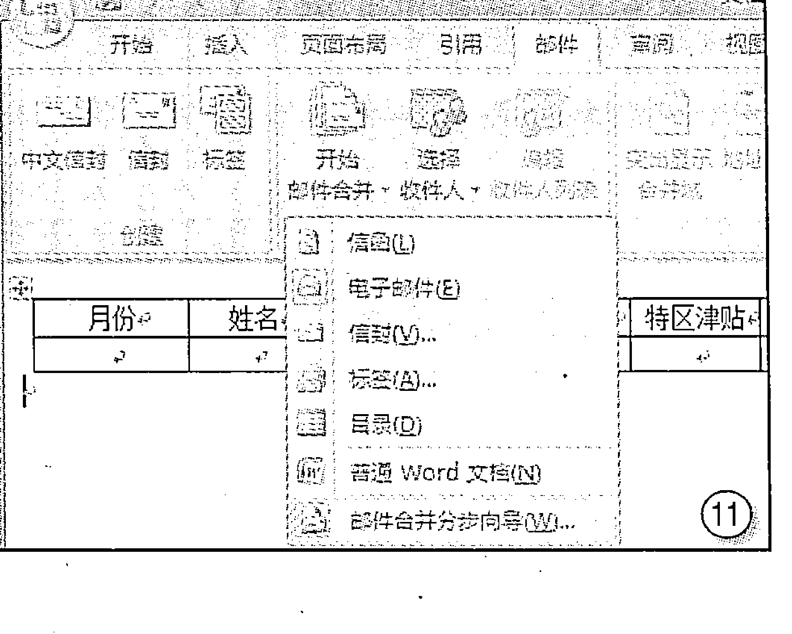

> Word 2003中的邮件合并 在Word2003中，单击主菜单中的“工具→信函与邮件→显示邮件合并工具栏”来打开“邮件合并”工具栏，通过该工具栏上的不同功能按钮即可完成邮件合并工作。

## 第三步：

在邮件合并分步向导中（默认位于窗口右侧）按提示操作，首先选择正在使用的文档类型为“电子邮件”，再选择使用电子邮件的方式为“使用当前文档”（如图12）。

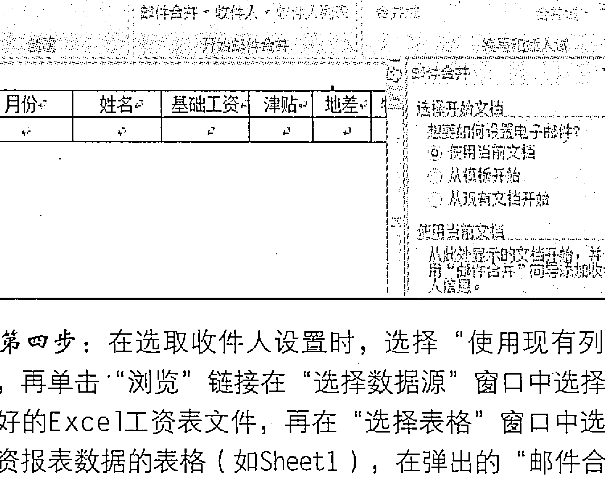

## 第四步：

在选取收件人设置时，选择“使用现有列表”选项，再单击“浏览”链接在“选择数据源”窗口中选择之前制作好的Excel工资表文件，再在“选择表格”窗口中选择包含工资报表数据的表格（如Sheet1），在弹出的“邮件合并收件人”设置窗口中可以看到工资报表中的数据，这时单击“确定”按钮即可（如图13）。

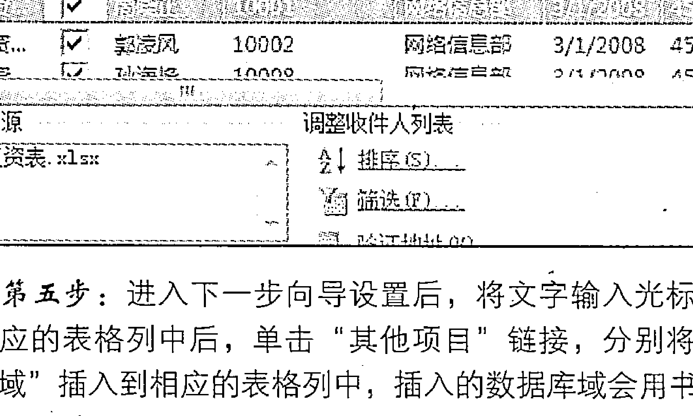

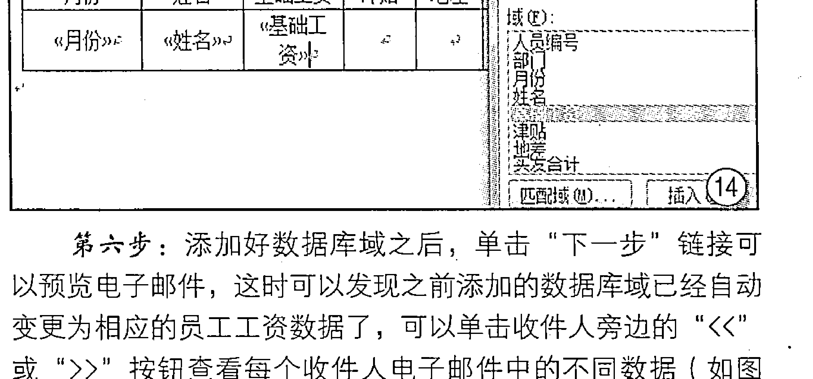

## 第六步：

添加好数据库域之后，单击“下一步”链接可以预览电子邮件，这时可以发现之前添加的数据库域已经自动变更为相应的员工工资数据了，可以单击收件人旁边的“<<”或“>>”按钮查看每个收件人电子邮件中的不同数据（如图15）。

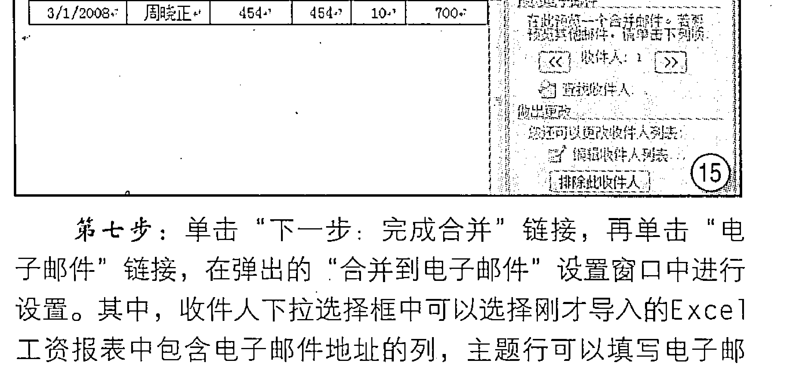

## 第七步：

单击“下一步：完成合并”链接，再单击“电子邮件”链接，在弹出的“合并到电子邮件”设置窗口中进行设置。其中，收件人下拉选择框中可以选择刚才导入的Excel工资报表中包含电子邮件地址的列，主题行可以填写电子邮件的主题（如“工资条”），邮件格式按照默认选择为“HTML”，发送记录则可以选择发送Excel表格中的全部或某些数据行（如图16）。

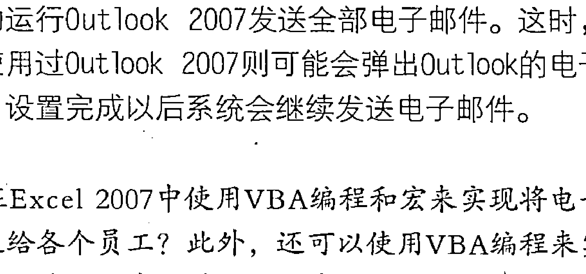

## 试一试：

你能否在Excel 2007中使用VBA编程和宏来实现将电子版的工资条发送给各个员工？此外，还可以使用VBA编程来实现工资条的保密功能，让每个员工只能在自己的电脑上查看属于自己的工资条文件。应该如何做？你自己动手试一试，将可能发现VBA编程的乐趣。

这样一来，工资条也轻轻松松实现了无纸办公。“动动鼠标，轻松搞定工资表制作和发放”，小丽现在对于这项工作反而有些喜欢了。

## 使用Word邮件合并，批量制作邀请函

在日常业务中，很多朋友经常需要向一些单位或者个人发送一些内容相同的文件，比如产品介绍、请柬、上报资料等，其中很多都需要在抬头位置添加客户信息，以前的时候需要逐份填写，其实我们可以充分利用Word的邮件合并功能，结合现有的客户资料，从而实现自动输入，轻松地完成这些烦杂工作，下面我们在Word2007中，以发送请柬为例，来介绍如何“邮件合并”功能来实现批量发送邀请函。

### 一、整理客户资料

由于要使用邮件合并功能实现批量发送邀请函，因此就必须要先准备一份客户信息数据源文件，也就是说需要将哪些客户信息添加到邀请函中，这关系到合并后的邀请函中的客户信息是否准确、全面，因此一定要仔细。可喜的是Word支持从Excel、Access、Word以及其他多种数据库中读取信息，比如将所有的客户信息编辑到一个Excel工作表：客户信息.xlsx，其中姓名、单位、职务、地址、电话、电子邮件等信息（图1）。

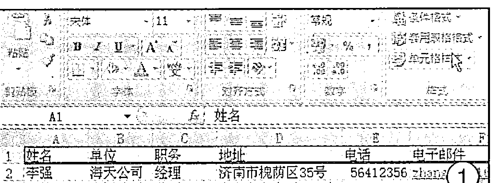

### 二、设计邀请函模板

启动Word2007，新建一个空白文档中，然后编辑一份邀请函模板，在其中输入邀请函内容，特别是在邀请函的抬头位置，也就是邀请函的开头留下空白编辑区域，以便于通过邮件合并来输入被邀请的客户信息。在编辑邀请函模板时，为了提高邀请函的美观，可以适当给邀请函添加页面颜色（图2）。

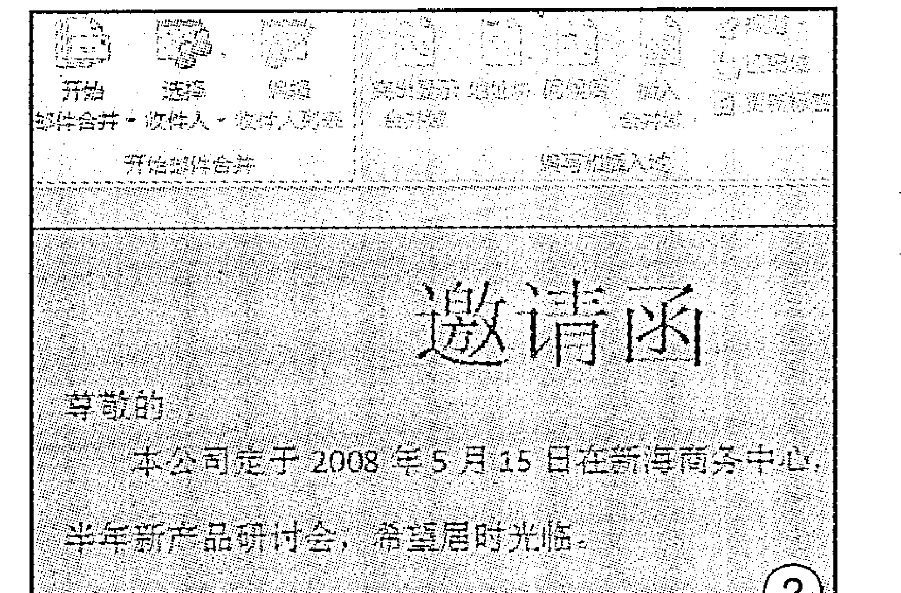

### 三、利用邮件合并，合并邀请函以及通过邮件发送

需要利用刚才设计的邀请函模板，合并邮件时，具体操作如下：

- 1) 单击“邮件”菜单，在弹出的“开始邮件合并”组中，单击“开始邮件合并”选项，从弹出的命令列表中，选择“电子邮件”选项（图3）。

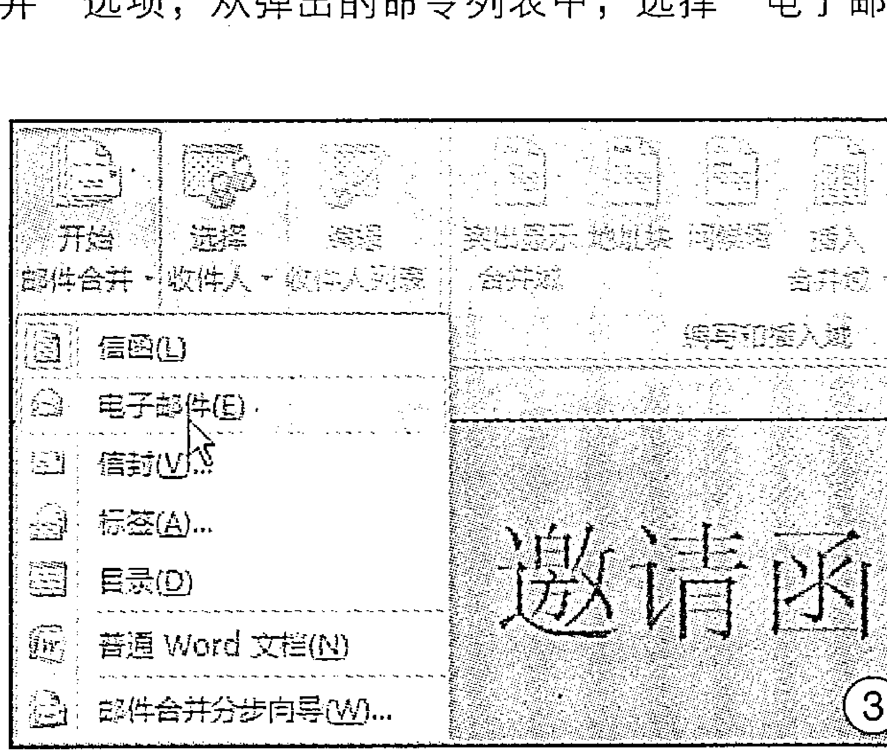

- 2) 单击功能区“邮件”选项卡中的“选择收件人”选项，从弹出的命令列表中选择“使用现有列表”选项，随之将弹出“选择数据源”对话框，在其中选择前面编辑的“客户信息.xlsx”，单击“打开”按钮。在新弹出的“选择表格”对话框中，选择“客户信息.xlsx”工作簿中存储客户信息的工作表：sheet1$，单击“确定”按钮（图4），即可在Word功能区中显示一个“编辑和插入域”组。

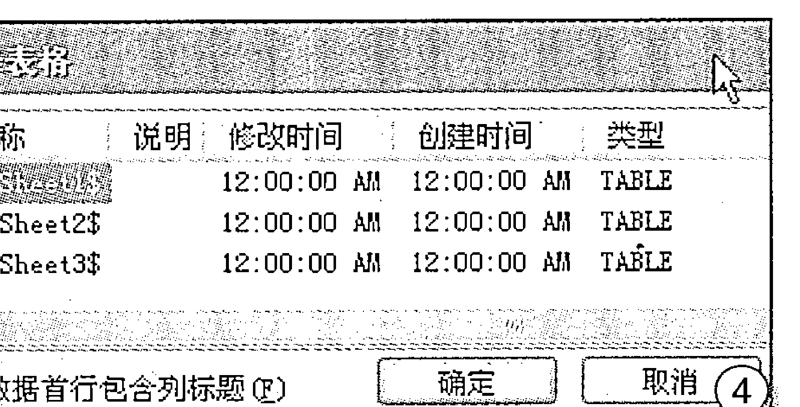

- 3) 将插入点移动到邀请函模板中编辑客户信息的抬头位置，然后单击“编辑和插入域”组中的“插入合并域”选项，从弹出的命令列表中，依次根据需要，选择“单位”、“姓名”、“职务”等选项（图5），这样就可以自动将相应的客户信息添加到邀请函中。需要预览效果时，只需要单击“预览结果”组的“预览结果”选项即可（图6）。

## SOLUTIONS 清华同方·办公

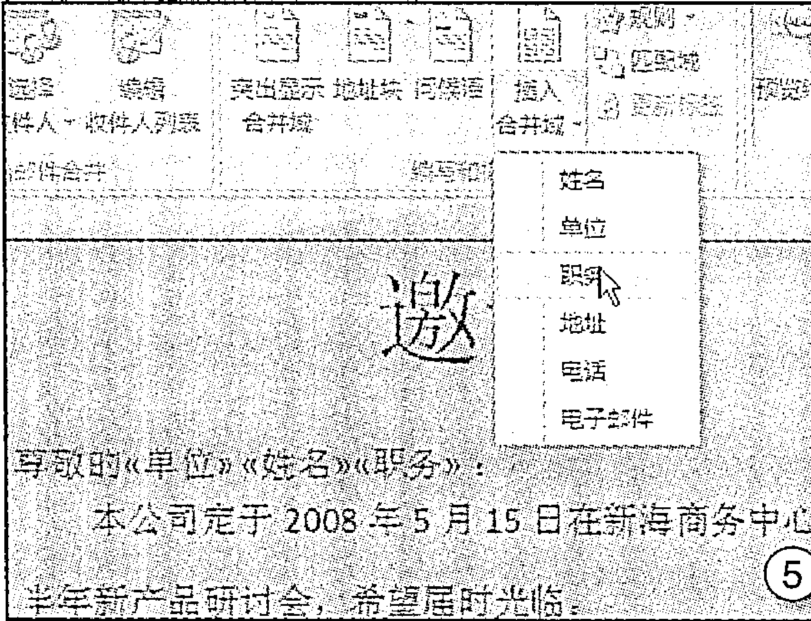

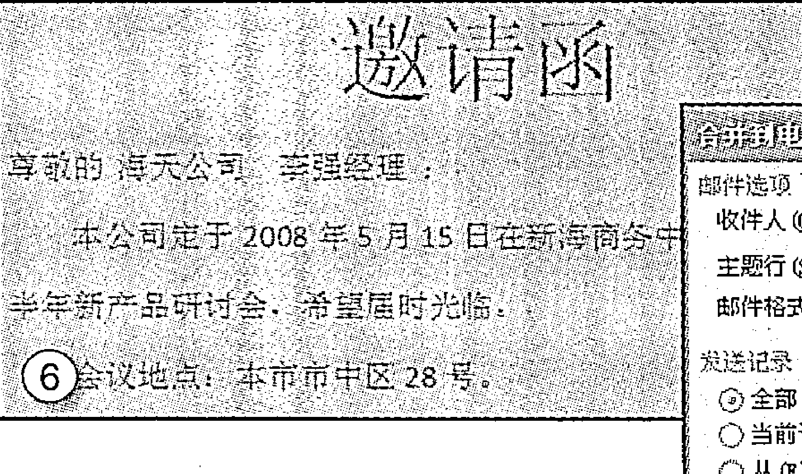

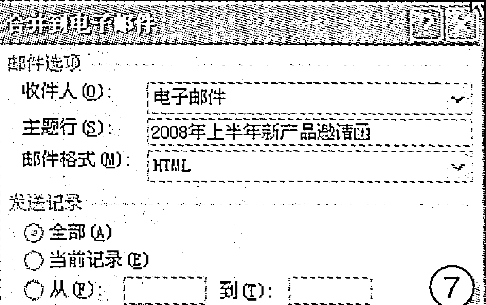

- 4) 需要将这些邀请函进行发送时，单击“完成”组中的“完成并合并”选项，在弹出的命令列表中选择“发送电子邮件”命令，然后在弹出的“合并到电子邮件”窗口中，“收件人”项选择“电子邮件地址”，在“主题行”中填入电子邮件的主题，邮件格式选择“HTML”格式，“发送记录”选择“全部”，最后单击“确定”按钮（图7）。这样就会自动启动Outlook，将所有邮件发送给所有的客户了。

如果你想要将合并后的邀请函打印出来，只需要单击“完成”组中的“完成并合并”选项，在弹出的命令列表中选择“打印文档”命令即可，而且通过这种邮件合并方法，不仅仅可以合并邀请函，还可以用于批量设计信封、标签、贺卡等业务中。

## 电源的重要性

□TMG mh
我的电脑刚组装时运行相当稳定，不论是玩游戏、上网还是看电影都没有问题。可是在使用了五个多月后发生问题，故障如下：开机不能进入系统，显示器黑屏，主机的启动灯不亮。但我随即发现只要重复开机几次就能正常使用，而且进入系统后一直使用七、八个小时都没问题。
我怀疑电脑被病毒感染，使用了金山毒霸2008查杀病毒，查杀了一些病毒，并且顺便整理了磁盘碎片，但问题依旧。难道是配件松动？我打开机箱，把CPU、显卡、内存等配件重新插拔了一遍，确认接触充分后再使用，故障仍然没有消除，且有愈演愈烈之势——显示器黑屏发生的频率越来越频繁，有时还会出现死机和自动重启的情况。没办法，笔者认为是硬件出现了问题，于是笔者使用替换法来判断是哪个配件出现了问题。内存、显卡、CPU哪个都没落下，可件件都没问题。只剩下主板和机箱电源了，笔者心想要做就做到底，当替换主板后各种问题不见！终于找到了，看来是主板损坏了。我把替换下来的主板拿到电脑城找技师检测，发现主板南桥损坏，技师帮我修好主板南桥后提醒我主板南桥损坏可能是由于电压不稳问题造成的。回到家后，我安装了华硕的PC Probe II监视电脑状况，开机之后，PC Probe II开始报警，自动弹出的窗口显示我的电压为-16V，可我电源应提供-12V。看来问题的根源找到了——电源提供的电压不稳定！原来当初攒电脑时，笔者为了节省资金而选购了一款杂牌电源。转天笔者买了一款长城电源，安装好后，电脑使用一切顺利！
这事让我了解到电源对电脑是多么重要，我们在装机时一定要选一款好的稳压电源，以避免给我们的电脑造成巨大的损失，不要为了节省那么一点点钱而“捡了芝麻，丢了西瓜”。

## 破解宝典和红外适配器的兼容问题

□TMG mh
因为笔者的波导 M15手机支持红外，所以又购买了一个USB接口的红外适配器，即水木行IR650。这样，笔者可以把手机的图片和铃声自由地进行替换。满心欢喜地回家体验，可是发现我的电脑不“认”手机，只是红灯闪烁。笔者使用连接测试软件，但显示“未发现可用设备”，可此时手机已经开通红外并处在对接的状态。笔者查杀了一下病毒，再整理了磁盘碎片也没有起色。于是笔者进入水木行的网站：http://www.irxon.com/；然后在左侧选择“防伪专栏”，按提示输入20位防伪密码进行验证，确实为正品。笔者此时百思不得其解。我突然灵机一动，我拿起IR650在邻居家电脑试验，发现一切正常，完全能使用。这是怎么回事？在我家怎么就不能用？我要来邻居的电脑配置仔细和我的电脑进行对比，看来看去，我发现我的主板、显卡芯片组都是nForce系列的，这点与邻居明显不同。看来这是问题的关键点，更换主板是不可能了。但是，如果想办法绕过主板的USB接口是不是可以辨认我的水木行IR650呢？带着希望，笔者找了一块USB扩展卡插在我的主板上，然后启动电脑，把水木行IR650连接到USB扩展卡的接口上，果然顺利识别了手机，笔者尝试传输数据也非常稳定。至此，问题得到解决。
事后分析，水木行IR650与nForce系列芯片组的主板有兼容问题，即使偶尔认出了红外设备也不能稳定地传输数据，所以需要用USB扩展卡来解决。

## 做项目管理高手，就用Project

□朱晓燕

你从事过项目管理工作吗？如果你有这方面的经历的话，就可能对于项目管理工作中的烦恼深有感触了，的确项目管理工作涉及到方方面面，如果稍有闪失，就有可能影响到整个项目工作的进展，从而给单位或者个人带来或多或少的损失。针对这些问题很多朋友往往通过一些办公软件或者项目管理软件来做项目管理的辅助工作，但是很多方面并不能够满足项目管理工作的需要，其实通过Microsoft Office Project项目管理软件，就可以让你的项目管理工作做到井井有条，而且由于Project也属于Microsoft Office大家族中的一员，因此其操作性与其他Microsoft Office办公软件有很多相似性，使用起来很容易上手，下面就以某公司来规划管理2008年5月份的一项车间维修项目为例，来介绍Project在项目管理工作中的具体应用。

### 一、创建新项目

由于每个项目往往包括很多工作，而且往往具有相互衔接关系，如这次的车间维修，就需要制定车间维修计划、采购维修配件、进行维修、验收等工作，因此必须在Project中创建一个新项目，并将这些工作输入其中，具体操作如下：

- 1. 启动Project2007，执行“文件→新建”菜单命令，从左侧弹出的“新建项目”任务窗格中，选择“空白项目”选项，然后双击右侧项目管理主窗口中的第一行，即可弹出“任务信息”编辑窗口，在其中输入项目名称，如5月份车间维修，维修工期（如20日），以及开始日期、优先级别等内容，设置完毕后，单击“确定”按钮，即可将此项目添加到项目管理主窗口中（图1）。

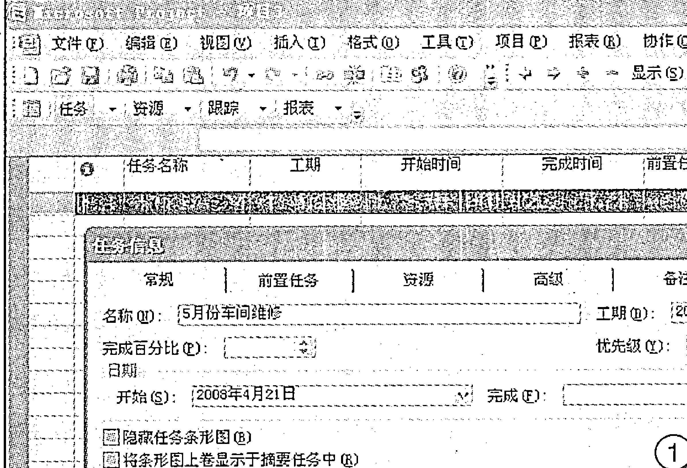

- 2. 由于此次项目包括很多工作环节；因此需要将这些工作中的细节输入到项目中，也就是将项目进行分解，分解项目时，在项目“5月份车间维修”的下面依次输入各个项目环节，如制定车间维修计划、采购维修配件、进行维修、验收、总结等，并按照前面的方法，分别设置每个环节任务的工期、起至时间等，以便于在以后的管理工作，更容易控制任务进度（图2）。

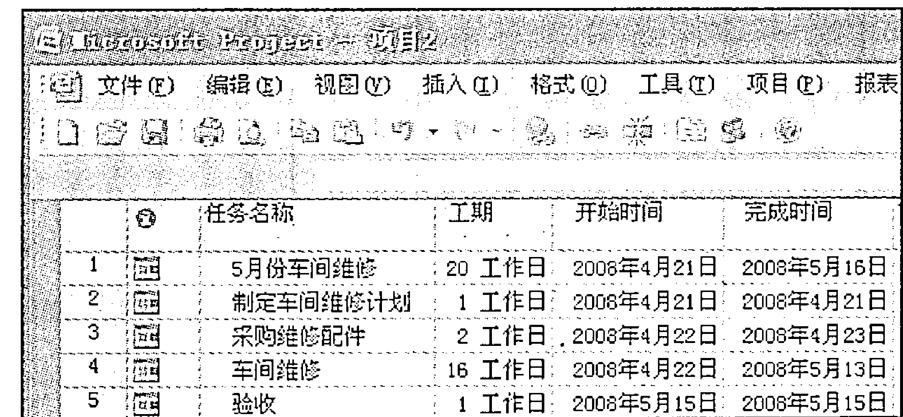

- 3. 在实际项目管理工作中，各个任务之间存在依存关系，因此必须将一些工作内容设置为其他任务的子任务，这样能够在日常项目管理工作按次序进行，不至于顾此失彼。需要将“总结”子任务设置为“验收”的子任务时，选择“总结”选项，单击右上角的“任务”按钮，从下拉列表中选择“将任务分成阶段”命令，然后从弹出的“组织任务”任务窗格中，选择“单击此处缩进选择的任务...”命令即可（图3）。

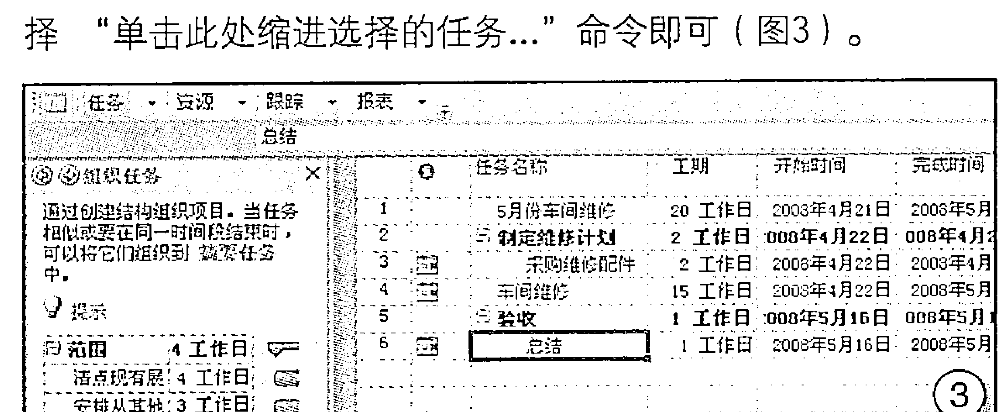

> **小提示**
如果在Project2007的左上角没有显示“任务”等工具按钮，可以依次执行“工具→选项→界面”菜单命令，在弹出的“界面”对话框中，将其中的“显示项目向导”选项，单击“确定”按钮即可。

### 二、为项目配置人员以及准备物力

在进行车间维修时，当然必须耗费一定的人力物力，这时候为了便于维修过程中以及结束后核算维修成本，就需要为此次维修项目设置可用资源以及分配资源。

一般情况下，可用的资源包括工作人员以及材料等，进行资源设置时，进行资源安排时，单击右上角的“资源”按钮，从弹出的“资源”任务窗格中，选择“为项目指定人员和设备”命令，从弹出的“指定资源”列表中选择一种资源来源，这里选择“手动输入资源”选项，然后在左侧的资源列表中输入可用的人员名称、工时费、加班费（图4）。

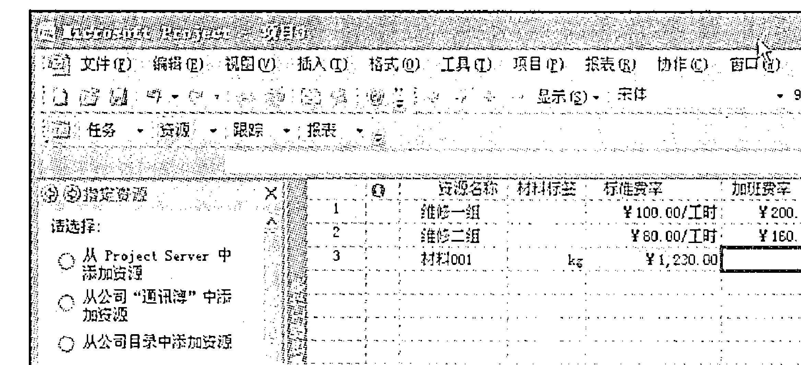

需要注意的是，在默认情况下，在资源列表中可以使用的列标题选项较少，只能够设置标准费率以及加班费率，而不能够设置材料成本价格，这时候可以将“标准费率”改为材料价格类型，只需要双击需要插入材料价格的单元格，如“标准费率”下面的第三列，在弹出的“资源信息”对话框中，将“常规”选项卡中的“类型”设置为“材料”，然后在“材料标签”中输入材料的计量单位，如kg（图5）。

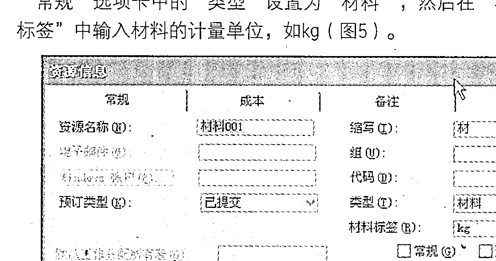

最后右击顶端标题行，从弹出快捷菜单中选择“插入列”，然后在弹出的“列定义”对话框的“域名称”中选择“材料标签”，这样就会在资源列表中显示材料单位名称，并且可以输入材料价格了。

## 二、管理项目进程以及记录费用信息

当设置项目后，就可以在日常的项目管理工作中，通过Project来控制项目的具体进程了，比如某个子任务完成后，如采购维修配件工作，只需要打开此子任务，然后将其任务完成率设置为100%即可，而某些任务只完成部分工作，比如车间维修进行到70%时，同样可以将其设置为70%，这样就可以对整个任务的进展一目了然了。

在项目执行过程中，可以根据项目的可用资源情况，记录其费用情况，如记录车间维修工作的费用时，具体操作如下：

- 1. 选择“车间维修”任务项目，单击左侧“资源”列表中的“向任务分配人员及设备”命令，在弹出的任务窗格中，单击“分配资源”按钮，在弹出的“分配资源”对话框中，从“资源名称”列表框中选择此工作耗用的人员、材料，如“维修二组”、“材料001”，然后单击“关闭”按钮（图6）。
- 2. 单击右侧任务窗格底部的“编辑任务和分配信息”选项，在弹出的窗口下面的资源设置对话框中，分别输入所使用的材料以及工时具体数量，如使用材料001为1200kg（图7）。

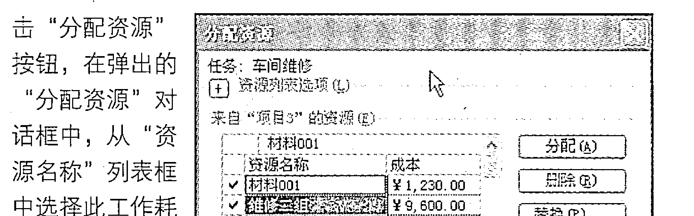

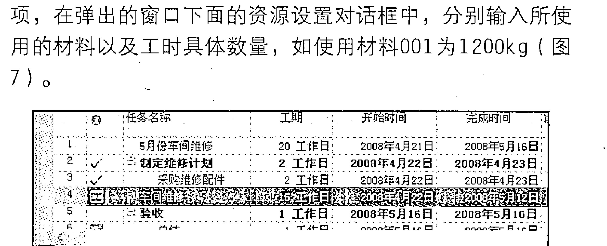

## 三、获取成本以及查看项目报表

在项目管理中，成本控制是一个非常重要的内容，而Project能够根据日常的费用记录情况，自动计算出非常不错的成本报告来！需要查看项目已耗费成本情况时，可以单击“报表”按钮，选择“查看项目成本”命令，即可得到此项目的总成本、实际成本、剩余成本了（图8）。

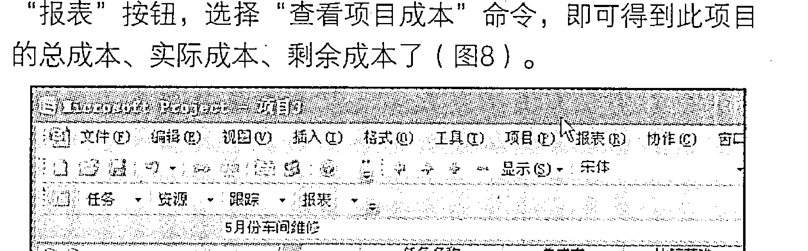

更为重要的是，我们还可以将一些需要的报表导出到其他编辑工具中，如Excel，做进一步的分析加工，如需要资源工时可用性报表时，执行“报表”→“可视化报表”菜单命令，在弹出的对话框中选择“资源工时可用性报表”选项，单击“视图”按钮，就可以在Excel显示一份不错的关于资源工时可用性的图表了（图9）！

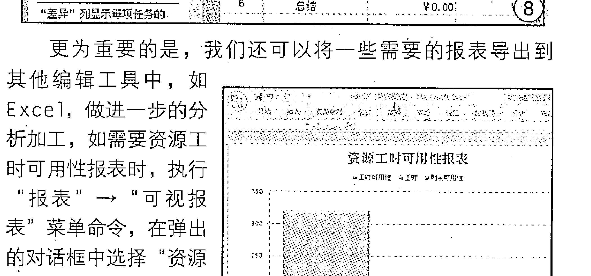

## 文档安全 WPS常见实用安全技巧

□江北书生

文档的安全问题一直是企业白领和政府工作人员非常关注的问题，诚然，无纸化的电子办公和互联网的盛行给我们带来了更多便利的同时，我们不得不关心安全问题。对一个电脑用户来说，文字处理工作是必要的。出于某些目的，我们常常需要对自己的文档进行保护。这里最主要的就是确保自己文档中的信息不被其他未授权用户看到，同时不能让第三方篡改文档，以保证文档的完整性。

### 一、自动定时保存文件

为了防止突然断电、死机等对正在编辑的文档造成破坏，我们可以通过自动定时保存文件来为WPS文档买第一份保险。
单击“工具”→“选项”，再单击“常规与保存”，然后选中“恢复选项”下的“第一次保存时生成备份文件”和“定时备份，时间间隔”前的复选框，
输入时间间隔，以确定WPS保存文档的频繁程度。例如输入“5”（如图1），就表示每隔5分钟WPS就会自动存盘一次，一般来说将其设置得较短比较好，这样保存会频繁一些，保存时间间隔为5分钟（默认为10分钟）。

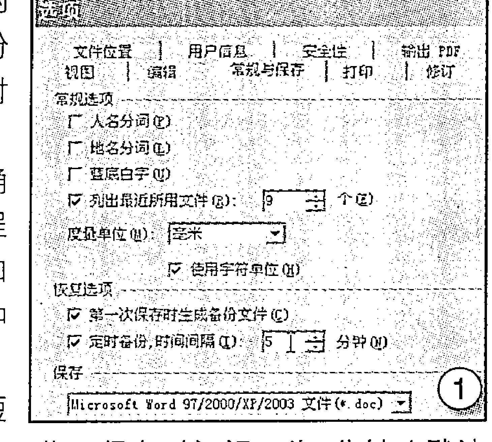

### 二、保护文档

- 如果不想让文档被别人随便修改，可以选择“工具”→“保护文档”，在打开窗口中执行以下操作之一：
    - 修订保护：设置该密码后，用户只能在修订状态下操作；
    - 只读保护：设置该密码后，不允许执行更改、复制、打印或保存等操作，但可以选中文字、滚屏等，起到阅读器的目的。

### 三、隐藏文档记录

当我们打开WPS时，单击“文件”菜单，默认情况下会列出最近使用过的文件。这样，我们打开过的文件会完全暴露在外，无需查找也能轻易被别人发现。出于保密需要，我们往往不希望别人看到自己最近编辑过的文件，要达到这样的目的，可以选择“工具”→“选项”，再单击“常规与保存”，然后取消“常规选项”下的“列出最近所用文件”复选框。

### 四、注意“自动恢复”功能

新版WPS非常智能化，在断电或程序异常情况发生而退出后，将对正在使用的文件进行分析以查找错误，如果可能将恢复其中的信息。在重新启动WPS Office程序，将自动弹出“备份管理”任务窗格，里面列出了程序停止响应时已恢复的所有文件，如图2所示。这时，我们可以通过文件名称、备份时间等信息找到合适的备份文件进行恢复。恢复完毕之后，您可以选择手工逐个删除或者全部删除备份文件。

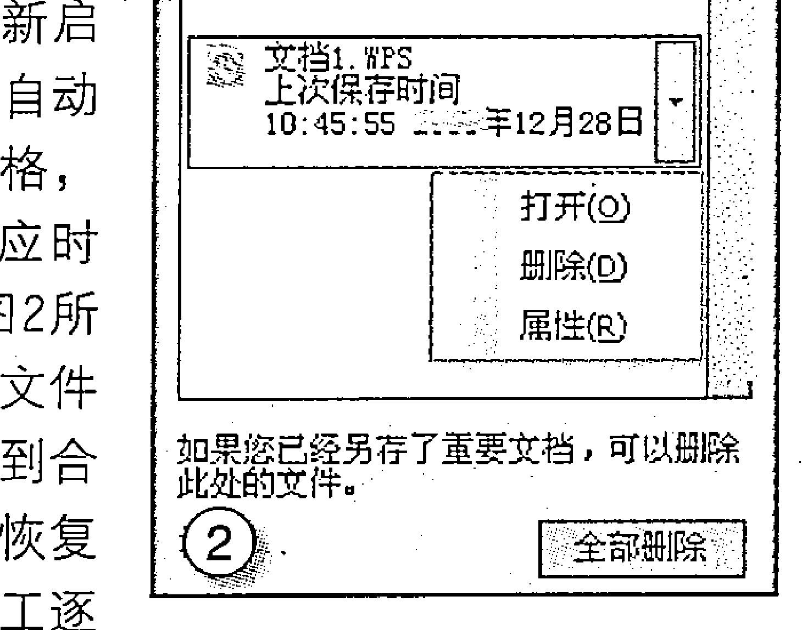

### 五、给WPS文档加密

加密WPS文档，这是最为有效的手段之一。事实上，这也是目前最为流行的安全举措之一。我们要做的只是选择“文件”→“文件加密”，有两种密码可供大家进行设置，“打开文件密码”是用户能够看到这个文件时的密码，如果密码不正确，则文件无法打开。而“修改文件密码”是用户能够对文档修改的密码，如果密码不正确，则只能够打开阅读。
有了这个功能，可以将文档设置不同的密码，然后把不同的密码告诉不同的人，这样他们就自然有的只能打开，有的就可以修改了。

### 六、注意WPS加密的技巧

利用文件加密功能来给文档加密是最有效也最容易的保护措施，但是世界上没有戳不破的盾牌。所以研究一下WPS文档加密的技巧则显得十分必要。

#### 1. 加长密码

现在很多密码破解器使用的是穷举法对WPS进行解密的，所以，我们完全可以加长密码。如果我们加长密码后，势必会让解密器解密很难解密，因为增长的密码倍数与解密器的破解组合和时间是呈几何级增长的。

- 据笔者试验，一般5位字母密码，解密器告诉用户约要花1192小时53分，如果增长为6位，那就是它的2倍，增长为7位就是它的4倍，这么长的时间解密者无论如何也会因为时间问题而被迫放弃。
- 另外，我们如果在加长的密码中间多加入几个空格的话，那么破解器就更难破解了，因为在默认情况下，Space键是被忽略的，即使被选中，使用空格键由于是不可见字符，被解出来后用户还得去试，这样也会增加难度。

## 2. 使用不同的加密算法

在加密文档时单击“高级”按钮，然后选择不同的加密算法，同时可以加强密钥的长度。这些算法比较专业，大家可以尝试从网上查询，但一般来说，选中任何一种算法，再加长密码，是可以保证文档安全的。

## 3. 可以考虑使用第三方加密软件

其实，我们除了使用WPS加密外，还可以考虑选择第三方软件来加密，最为流行的就是WinRAR。在保护数据的同时，还能压缩文档。相当于给硬盘增大了容量、扩展了硬盘的空间，何乐而不为？大家只要在“资源管理器”中右击一WPS文件，然后选择WinRAR→“添加到压缩文件”命令，打开“压缩包名称和参数”设置对话框。

接着，在打开的“压缩包文件名和参数”窗口中单击“高级”标签，然后单击“设置密码”按钮，并在打开的“带密码压缩”窗口中输入密码，按下“确定”按钮返回“压缩包文件名和参数”窗口，再次按下“确定”按钮后即可把所选文件加密起来（如图3）。

最后删除掉WPS文件，以后双击打开RAR文件，并解压其中的文件时，WinRAR会向您询问密码，如果密码不对，任何人都无法看到其中的内容。

> ★ 由于ZIP和RAR压缩格式的盛行，使得现在有许多破解它们密码的程序。不过，我们只要在输入口令时加大口令的长度，并多加几个空格符，再加上不使用别人很容易就猜出来的密码。具体方法参见上面的文字。
> ★ 如果选中“带密码压缩”窗口中的“加密文件名”复选框中，双击这个RAR文件时，WinRAR就会向你索取密码，如果口令不对，连RAR中的文件名都无法看到！这样会更加安全些。

## 七、网络时代 智能升级

现在多数的软件都有在线升级功能，而升级后往往可以修补漏洞，大大增强其安全性。WPS Office 2007从2005版即添加了此功能。选择“帮助”→“在线升级”命令，此时会自动上网升级，并会弹出如图4所示的窗口，此例中无需升级。

单击“升级”链接，即会连接到WPS的官方网站进行升级。

## 八、导出加密的PDF

随着无纸化办公的推进，现在很多地方都开始使用电子文档了。而PDF文件作为电子文档中的主力产品，业已成为标准。在WPS中，我们只要先保存好文档，再选择“文件”→“输出为PDF格式”，然后作相应设置（如图5，可加密）即可将其导出为标准的PDF文件。而且与其他Office不同，WPS在PDF输出时，能够完整保留原文档各种特殊内容，并提供完善的PDF文件权限设置功能，而且自动形成目录，还带有索引功能。功能相当强大。大家要做的就是选中“权限设置”，然后输入密码，并在确认框中再次确认。之后，此文档在打开时将会询问密码，不知道密码自然无法打开。

## 关闭zip文件夹功能

你是不是觉得Windows XP中的zip文件夹功能太慢，功能也不吸引人？如果是这样，你可以打开开始→运行，在弹出的对话框中输入：regsvr32 /u zipfldr.dll，回车后即可关闭ZIP文件夹功能。

## 让Windows XP也能刻ISO文件

Windows XP没有提供直接刻录ISO文件的功能，不过你可以下载一个第三方插件来为系统增加这个功能。该插件的下载地址为：http://members.home.net/alexfein/is...rderSetup.msi。

# 节能减排 省钱省心——低功耗PC全攻略

□ 方成亮

> 很多消费者购买一款配件时为了几十元的差价而费尽心思，但是一些小小的用电坏习惯却令其每年损失更多钱。据统计，目前家用PC的功耗已经直逼200W，此时从配件选购角度来控制功耗显得尤为重要，尤其是对低功耗CPU的关注更是不容忽视。节省电能不仅有利于环保，还能给用户带来最切实的经济利益。

## 一、环保省电静音：低功耗PC的价值

最近，Google的一位工程师抱怨说，电费开支迟早要比电脑硬件本身更贵。Google一共彻底升级过三次服务器，每次更新性能提升1.8倍，但耗电量却同时增长2倍。同样，我们的PC也面临着这样的尴尬局面，越来越多的用户已经开始对低功耗PC表现出浓厚的兴趣。

如果仅仅是上班族普通的家用PC，那么选择低功耗PC的意义并不大，因为开机时间不长的话，未必能节省多少电费。但是，假如是学生用的PC、网吧专用PC、炒股专用PC，那么低功耗CPU的意义就显而易见了。以30W的功耗差距为例，按照平均每天使用PC时间为16小时进行计算，每年节省电费就有175度（千瓦时）。如果是商业用电，那么不出两年就等于一块CPU的价值了（图1）。

### ① HTPC的绝配

很多用户都以为HTPC在播放高清视频时必须拥有足够强大的配置，但是这往往一知半解。我们可以做这样一个很简单的测试：在合理设置播放器、分离器和解码器的情况下，Athlon 64 3000+配合1GB内存以及MCP68的集成显卡就可以很流畅地解码10Mbps的H.264@1080p高清视频。而如果是应对MPEG2-TS和WMV-HD解码，那么就更加游刃有余了。HTPC实际上对CPU的性能要求并不高，尤其是在编码速率偏低的情况下。以目前国内的网络状况以及蓝光普及率，我们完全可以给HTPC配上低功耗的低端CPU，再配合低功耗电源和显卡，这样无论是长时间BT还是播放HDTV，一年节省下来的电费都非常可观。

### ② 长时间运作的PC

### ③ 静音表现与成本控制

低功耗PC的价值不仅仅是环保与省电。可以想像，低功耗的CPU必然降低对主板供电的需求，此时有利于控制主板成本；低功耗显卡将会让电源选购不再是一种负担；更加重要的是，低功耗PC意味着散热量相对较小，此时CPU风扇、显卡风扇以及机箱风扇都可以大幅度减轻压力，甚至不用风扇，营造了更加安静的工作环境。

## 二、最大功耗54W：搜罗低功耗CPU

在选购低功耗CPU的时候，很多读者都会有诸多疑问。其实，低功耗CPU并不仅仅是只要查看最终的TDP功耗表现就简单了事，而是应当深入细节。

### ① 低功耗CPU产品分析

目前，市场上所谓的低功耗版本产品，可能大家见得比较多的是AMD的产品，因为AMD主流的产品都推出了低功耗的版本。比如Athlon64 X2（Athlon BE）就有35W、45W、65W以及89W这四种TDP功耗版本，而与标准功耗的产品相比，低功耗产品的规格与性能都是一样的。但是，低功耗产品由于采用了品质更好的晶圆，以及设计时位置的优化，令其可以得到更低的功耗（图2）。

相对来说，目前Intel在低功耗桌面处理器市场的产品还是偏少。Core 2 Duo和Pentium E2000系列全部为65W TDP，

### ② 如何识别低功耗CPU

除了新发布的Pentium E2140，目前Intel在桌面平台的低端CPU肯定省电吗？

低端CPU一定省电，因此闪龙比速龙更加适合低功耗PC，这是很多读者认识上的误区。以AMD速龙和闪龙，速龙CPU因为具备了Cool ‘n’ Quiet技术，因此尽管TDP功能一样，可实际使用过程中，反而可以节省能耗，这是绝大部分闪龙处理器所办不到的。但是，如今AMD又开始采用了技术改进，45W和35W TDP功耗的新闪龙处理器都支持Cool ‘n’ Quiet技术。至于Intel方面，其低端的Celeron 4XX系列则完全支持EIST节能技术，只不过其待机状态下的分级能力弱于Core 2 Duo，因此部分极限情况下的待机功耗还是偏高。

### 3. 双核和四核CPU耗电量较大

我们给出的答案是肯定的，但是大家应该更加客观地来看待这一答案。尽管不少双核CPU与单核CPU的TDP功耗数值是相同的，但是这并不意味着双核CPU的另外一个核心不会额外耗费电能。事实上，TDP是指CPU电流热效应以及其他形式产生的热能，它们均以热的形式释放，对于散热要求有着极大的参考意义。双核CPU和四核CPU通过一些改进设计，的确能够控制TDP，可是一旦所有的核心全速运行，此时惊人的功耗是不可避免的。但是话又说回来，目前应用软件未必时刻会利用上双核甚至四核，因此购买双核CPU也不能认为是彻底浪费电能。

## 三、要报19W平均功耗：功耗到底有多少猫腻？

对于CPU的功耗标称，很多消费者都感觉一头雾水。起初我们对于CPU功耗的判断是非常模糊的，而当厂商们引入TDP功耗标称之后，逐渐被大家所接受。但是，现在Intel又开始启用所谓的“平均功耗”，这与大家熟知的TDP功耗大相径庭。

### 1. 何谓TDP功耗

CPU在实际工作状态下，其频率是可以调整的，而且运算不同的内容时，部分电路也可能处于待命状态。因此，以往我们总是保守地以CPU的最大电流乘以工作电压来计算其功耗。可是，这种计算方法对于实际应用的参考价值并不大，因为用户在使用CPU时并不需要时时刻刻令其达到最大电流值，这只有主板厂商在进行供电设计时才会关心。而我们DIY用户所关心的是散热，换句话说就是CPU工作时所产生的热效应。

事实上，TDP是指CPU电流热效应以及其他形式产生的热能，它们均以热的形式释放，对于散热要求有着极大的参考意义。TDP功耗肯定小于处理器的最高瞬时功耗，但是其实际参考意义和不同产品之间的横向比较价值却非常大。从2005年到现在，TDP功耗已经普遍为大家所接受，DIY玩家或是整机厂商在采购产品时，无不将其作为重要的参考指标。

### 2. 平均功耗“荒唐登场”

Intel善于营销已经算是公开的秘密了。继当年紧急用Pentium D “粘”出双核心之后，现在又在一场低功耗大战中率先玩起了“平均功耗”游戏。很多资深的DIY玩家都有这样的体验：当我们仅仅打开记事本或是运行桌面小游戏时，CPU的负担特别小，此时即便不使用风扇进行主动散热也无妨。但是，一旦运行大型游戏，那么CPU温度必然骤升，摸摸机箱出风口的温度便可以感知了。

因此，运行不同程序时，CPU的功耗是截然不同的。本着安全目的，TDP功耗是以CPU在最大符合运行状态下以热能形式的释放量为基础进行计算的，而如今Intel的平均功耗则是含糊不清。到目前为止，Intel尚未对“平均是如何平均”进行任何说明。显然，办公用户的平均一定是以办公软件为主，而游戏发烧友的平均自然是3D程序，其中的差距非常惊人。

更加重要的是，提出“平均功耗”概念的Intel似乎并不愿意承认这就是“平均功耗”，而是企图混淆视听，直接冠以功耗的统称。以新发布的Pentium E2140为例，虽然Intel堂而皇之地在包装盒上表明了19W功耗，但是其TDP功耗还是没有任何变化，依然是65W！对于消费者来说，TDP功耗不变意味着散热压力没有减小，主板的供电单元也不能简化。尽管Intel的确是优化了CPU在低负荷运作状态下的节能技术，但是对于桌面平台来说，其实际应用状态与移动平台截然不同，真正的超低负荷工作状态甚至待机状态并不会频繁出现。

### 3. 平均功耗由来已久

新版Pentium E2140并非是Intel第一款采用平均功耗标称的产品，早在迅驰3时代开始，部分超低电压版的移动处理器就有平均功耗的标称方法。以Core Duo U2500为例，Intel非常公平地标称其平均功耗为1W，丝毫没有混淆视听的做法。但是，为什么这次Intel在桌面平台显得那样“激进”呢？究其原因，Intel台式机处理器在功耗上的暂时落后是关键因素。

事实上，和AMD的低功耗表现吸引大量DIY玩家一样，Intel在移动平台的低功耗实力也有目共睹。MoDT平台是把移动处理器用在台式机主板上，以迅驰4中的Merom核心为例，包括正常版本（TDP 31W）、低电压版本（TDP 17W）及超低电压版本（TDP >14W）。这些关键信息会在产品型号上加以区别，譬如首英文字母将会以T（TDP 25-49W）、L（TDP 15-24W）及U（TDP >14W）进行区分。当然，以上分类也适用于Yonah核心的迅驰3移动CPU。毫无疑问，假如Pentium E2140的19W功耗也算是实际功耗，那么岂不是出现了台式机处理器比移动处理器功耗更低的倒挂现象？

## 四、双核功耗新低：Athlon BE开创历史

Athlon BE对于AMD来说完全是一款倾注K8架构之精华的产品。凭借45W TDP的超低功耗表现以及平实的价格，不仅在DIY领域得到众多专业用户的喜爱，OEM市场的品牌机厂商也纷纷批量采购这款极具意义的CPU，以此来打造低功耗PC。

### 1. AMD用心良苦：十年PR历史宣告结束

一款产品仅有优异的性能还是远远不够的，市场推广也同样重要。由于同频的双核速龙以及闪龙对比比赛扬甚至双核奔腾时的性能优势巨大，如果不改变命名方式，那么对于AMD而言显然是不公平的。为了使用户更加简单地理解并接受这一概念，AMD十年前便提出TPI，即真实性能标准概念。根据这一命名原则，AMD处理器将以性能相当的Intel处理器频率来标称主频（尽管AMD一直不承认这种以Intel为标杆的说法）。其实，类似的做法AMD在K5时期就应用过，所不同的是当时的TPI仅以整数性能为参考，浮点性能是不如Intel Pentium处理器的；而随后AMD的标称方法更加客观，甚至有些保守。

然而时过境迁，十年后Intel已经推出了酷睿架构，此时在整体效率方面已经逐渐摆脱了NetBurst的“高频低能”局面。在这种情况下，一味从产品命名上强调“频率≠性能”已经意义不大了，反倒是突出市场定位以及功耗等表现才更有价值。因此，AMD发布了双核Athlon BE 2350和单核新闪龙，全新的命名方式绝非“新瓶装旧酒”，而是赋予低价市场全新的内涵。

### 2. 低价位市场“鹤立鸡群”

Athlon BE 2350是整个Athlon BE产品线中最早上市并且快速普及的型号。BE 2350的主频和缓存配置与Athlon 64 X2 4000+基本相同，但是Athlon BE 2350绝不完全等同于Athlon 64 X2 4000+，AMD还是让新产品赋予一定的技术改进，并且性能略有提高。从规格和AMD提供的官方数据来看，BE 2350仍为Brisbane核心，主频是2.1GHz，倍频10.5，只是当前最新版本的CPU-Z以及其他测试软件都无法完全识别这款CPU，但是与主板兼容性方面则不存在任何问题（图3）。

Athlon BE 2350的出现无疑是AMD在中端市场的“策略行为”。凭借45W的TDP功耗的优势，这足足比竞争对手的产品降低30%以上，这令DIY用户的散热压力大幅度减小，CPU的寿命和节能表现都将会大幅度增强。其实，关注低功耗CPU领域的消费者可以发现，每降低一些功耗对于CPU厂商都是非常困难，因此诸如AMD Geode以及超低电压版奔腾M等CPU的价格都会高得惊人。此番Athlon BE 2350可谓打破了常规，将低功耗双核带入“平价”市场，真正给用户带来切实可见的利益。

此外，由于Athlon BE 2350默认主频较低，因此一旦超频则完全能够发挥出更加惊人的性能，从而在性价比大战中压倒Intel。较低的TDP功耗意味着更大的超频潜力以及超频后较低的散热压力。目前，Athlon BE 2350在市场上的差异化优势已经非常明显。以性能对比为例，价位接近的双核奔腾E2140在对抗双核速龙4000+时已经全面落败，而Athlon BE 2350的性能甚至还略比双核速龙4000+更高一些，因此这场同级别的性能大战已经让AMD成为胜者。另一方面，Athlon BE 2350的功耗大幅度低于Intel的双核CPU，这一优势令主流消费者对其趋之若鹜，毕竟没有哪个用户会拒绝价格更低、功耗更低和性能更好的产品。

### 3. 最低的TDP功耗

除了AMD在专业领域发布的35W超低功耗双核速龙，Athlon BE 2350是当前市场上TDP功耗最低的主流双核CPU，其45W TDP功耗已经低于Intel的全线双核CPU。面对如此惊人的功耗差距，竞争对手无法推出相应的产品进行对抗，此时市场宣传策略只能是无畏的抵抗。以Pentium E2140为例，Intel在更新核心步进时标称平均功耗为19W，但是根据很多第三方机构的权威测试，这绝非是运行游戏或是办公软件时的表现，而是综合了待机功耗以及超低负荷状态下的功耗表现。

由于当前业界对于“平均功耗”的计算方法尚无明确定义，所以此次Intel巧妙发布19W平均功耗标称也无可厚非。但是，如果按照Intel的计算方法，其老产品也同样拥有超低的平均功耗，约为23W左右（其实Intel新老产品的TDP功耗相同）。而如果对比竞争对手AMD的产品，那么原本在TDP功耗就有优势的AMD双核速龙显然拥有更低的平均功耗，约为15W左右。所以，提出平均功耗并没有错，但是在当前计算标准尚不统一的背景下，其参考价值并不大，甚至有可能让部分消费者将平均功耗与TDP功耗弄混淆。

在近期国内某IT专业媒体做的“极限无风扇测试”中，Athlon BE 2350的表现也让人信服。凭借超低功耗，Athlon BE 2350在不使用主动散热的情况下，也拥有很稳定的表现，可在一段较长的时间内高负荷运行各种应用软件，CPU表面温度也维持在较低的水准。只有当长时间运行之后，CPU才会因为积累过多的热量而采用主动保护技术（图4）。

## 五、单核不会绝迹：新闪龙带来新惊喜

单核CPU会从市场上消失吗？AMD和Intel带给我们的答案都是否定的。从应用角度来看，办公电脑，普及型家庭电脑，甚至HTPC，都是单核CPU最佳的舞台，综合性价比也令人满意。Intel酷睿架构的单核赛扬4XX依然活跃在市场上，而AMD的新闪龙也积攒了大量人气。

### 1. 新闪龙PK单核赛扬

PC低价位时代已经来临，明智的消费者开始更多地关注低端处理器。新闪龙体现了AMD力拼低端市场的决心和实力，而且45W TDP低功耗表现足以让每一个注重静音表现以及稳定性的用户感到满意。此外，新闪龙具备256KB或是512KB二级缓存，比起部分老闪龙的128KB二级缓存更加理想，而且内存控制为双通道DDR2 800，其内存兼容性也有进一步提升，有望在300元以内的低端处理器市场获得巨大成功。从性能角度来看，默认主频较高且缓存容量不小的新闪龙单核处理器并不会让人失望，无论是组建HTPC，还是作为台式机处理器，都能够满足各种应用需求。此外，以新闪龙LE1100为例，其工作电压仅为1.2V~1.4V，甚至DIY玩家还可以进一步降低电压后获得更出色的低功耗表现（图5）。

Intel在同级别市场所推出的产品是赛扬420和赛扬440，甚至还有主频更高的赛扬460和赛扬480。但是即便如此，单核赛扬对比单核新闪龙时还是处于性能下风，其中过于明显的“阉割”是主要原因。众所周知，酷睿架构的产品原本配合2MB二级缓存，双核奔腾已经精简到1MB，而赛扬4XX系列更是减少到512KB。反观AMD的新闪龙，由于512KB二级缓存基本与双核速龙持平，而且K8架构对于缓存容量的依赖并不明显，所以综合表现超越单核赛扬也在情理之中。

### 2. 45W TDP切中要害

45W TDP功耗是目前Intel的“断码产品线”。AMD布置的45W TDP产品线不仅仅是单核心的闪龙LE，还包括双核心的Athlon BE。如果将45W TDP折算成Intel标准的平均功耗，那么也将远远低于19W，可谓是目前功耗最低的双核处理器之一。如果说以往AMD是以更低的价格实现更好的性能，那么现在则还应该加上“更低的功耗实现更好的性能”。65W TDP已经是当前AMD处理器的最高值，这与Intel高端市场的酷睿2双核打成平手。但是，AMD显然在低功耗领域有更多的衍生产品，这也正是Intel的软肋所在。

## 六、最大功耗250W：低功耗显卡呼之欲出

如果要打造超低功耗的PC，那么仅仅依靠低功耗CPU还不够，因为显卡也是一个不折不扣的“电老虎”，甚至比CPU的耗电量还要大。尽管主流GPU厂商都设计了3D和2D状态下不同的频率，可是高端产品的实际情况却并不理想。以GeForce 8800GTS为例，专业机构测试得出其2D和3D工作状态下的功耗分别为164W和258W。对比SiS的集成显卡，其Mirage3图形核心只有7W功耗，可见差距非常惊人（图6）。

想要节省显卡功耗的话，建议使用新一代产品线中的低端产品，譬如Radeon HD2400Pro以及GeForce 8500GT系列。此外，如果显卡的GPU采用新工艺的话，那么耗电量也会大幅下降，譬如近期AMD-ATI推出了65nm和55nm的GPU。当然，最最重要的是，低功耗显卡绝对不要超频，只要按照GPU公版设计的标准频率，那么显卡功耗不会高到哪里去。相反，有些所谓的中低端显卡为了追求超频表现，采用了中高档显卡的PCB以及高速GDDR3显存，那么耗电量自然就无法控制了。最后，使用集成显卡也是节能的最好方法，而前提自然是集成显卡性能可以满足大家的需求。

## 七、省电的电源更要挑剔

电源本身又是一个“耗电器”。输入电源的能量并不能100%转化为主机内各部件使用的有效能量，这样就出现了一个转换效率的问题。最初，电源转换效率仅有60%左右；在Intel的ATX 12V 1.3电源规范中，规定电源的转换效率满载时不得小于70%；而在ATX 12V 2.X中，对电源的转换效率提出了更高的要求——不得小于80%。除了电源标准，选择具备主动式PFC电路的产品也能提高电源转换效率，也等于变相节省了电费。

此外，电源节能的意义还在于减少待机功耗。现在，每个主流电源产品都提供+5V Standby，这是在系统关闭后保留的待机电压，用于对系统唤醒的支持。优秀的省电电源采用了待机低功耗控制芯片，此时可以完全关闭其它电压值的供电，而且更需要节省+5V Standby供电。可别小看了这不起眼的待机功耗，其实对于开机时间不长的家用电脑来说，其省电效果甚至比高转换率的电源更加有效。一般中高档电源待机功耗都可以做到5W左右，这也符合Intel白皮书的规定，有利于节能环保。但是，部分电源在待机时功耗可能高达10W以上，长时间积累下来的电费损失非常明显。至于如何去判断一款电源的待机功耗，这是相当困难的事情，因为电源厂商并不公开相关数据，此时建议大家更多关注IT专业媒体的测评与介绍。

# 炎炎夏日——PC静音散热新技巧

□方成亮

每年夏日的高温天气总是对PC稳定性的一大考验。除了在选购配件时精心挑选，后期的散热工作也不容忽视。更为重要的是，散热不等于一味地强调稳定性，在保证系统正常运行的前提下，兼顾静音效果也十分重要。如何打造散热系统，散热措施有何窍门，如何才能降低PC噪音，这些都是我们所要讨论的话题。

## 一、寻找CPU散热与静音的平衡点

对于大多数用户而言，风冷依旧是最为现实的散热方案。但是你的风扇是否真正稳定，机箱内部的散热通道是否合理，CPU风扇的噪音是否过大，这些都是需要仔细考虑的问题。

### 1. 更换力不从心的散热器

如果发现系统在长时间运行3D游戏时不够稳定，那么更换风扇就是必然的。很多在冬季装机并且超频的用户都会明显感受到环境温度对稳定性的重要性，此时更换散热能力更强的产品能够确保CPU安全。此外，很多劣质散热器在使用一段时间之后会效率下降，而凝聚的灰尘更是成为CPU杀手。如果这款散热器并不是高端产品，更换一款名牌散热器将很有必要（图1）。

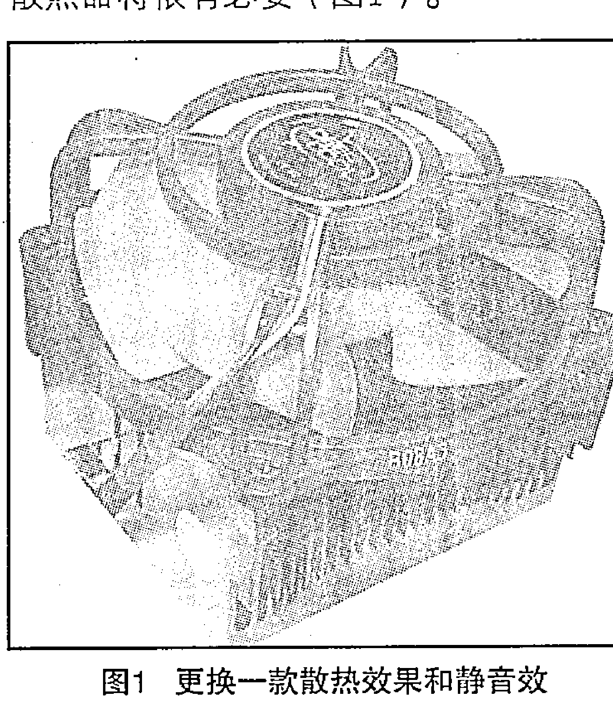

但是散热器的选择很有讲究，必须对应自己所使用的CPU。一般而言，厂商在产品包装中会标明该散热器的支持范围，因此更换时请尽量保证散热器与CPU的对应关系，而不要强行使用只能支持低频率的散热器。巨大的发热量可谓是CPU的终极杀手，因此安装风扇切不可大意，在没有正确安装风扇之前切不可给CPU通电，不然短短的几秒钟就可能使价格不菲的CPU报废。在打开机箱的状态下开机，查看CPU风扇是否正常工作。如果CPU风扇没有转动的话，应该立即切断电源。

### 2. 减小CPU风扇噪音

为了增强散热效果，目前很多风扇都采用高转速设计，但是噪音问题随之凸现。大家是不是有这样的感觉，新买来的风扇总是噪声很小，而使用一段时间后会明显变大。当然，我们不可能无止境地购买新的风扇，其实大家只要动一下手就能解决问题。

灰尘是造成风扇噪音上升的重要原因之一，为了确保散热，多数机箱密封性并不高，因此久而久之灰尘就会集聚在风扇上。当风扇马达旋转时，凝结的灰尘会阻碍其运动，更大的噪音也就应运而生。为了更加彻底地清除灰尘，建议大家将风扇从散热片上取下，此时我们只要拧下正面的那个螺丝即可。在清除灰尘时，大家要注意风扇背面与散热片的夹缝，这里是最容易遗忘的（图2）。当然仅仅清除灰尘还是远远不够的，由于风扇的马达传动轴经过长时间工作后已经不怎么灵活，因此我们需要对这一关键位置添加一些润滑油。此时最好使用工厂中的机械油，实在没有的话用我们的食用油也可以勉强替代。在加机械油时，切记不要太多，溢出来的话会影响其它部件，而且机油过多反而更容易吸附灰尘。

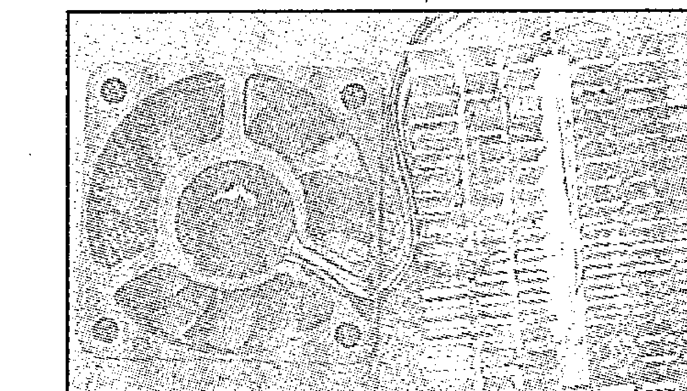

加机械油时，切记不要太多，溢出来的话会影响其它部件，而且机油过多反而更容易吸附灰尘。

此外，散热片与CPU插槽的固定也是极为重要的，不然谐振的声音将是十分惊人的。我们需要观察的是CPU底部的插槽是否与散热片牢牢接触，此时应保证没有任何缝隙。如果没有做到这一点的话，大家可以尝试弯曲一些风扇的扣具，使之与CPU插槽上的小耳朵更加紧密地接触。

### 3. 使用CPU风扇调速器

如果你的CPU并不需要超频，那么CPU风扇的高转速有时并不是必须的。以AMD的Socket AM2平台为例，高速版散热器往往达到4500RPM以上转速，但是普通的X2 4000+在不超频时根本用不着那么高的转速。高转速所带来的必定是较高的噪音，而如果能够降低转速的话，噪音将会立即得到有效控制。从理论上来说，只要为CPU风扇并联一个分压电阻即可解决问题，但是这一步对于大多数普通用户而言很难实现，为此我们推荐使用现成的CPU风扇调速器。

ZALMAN公司推出的FAN MATE1风扇调速器在国内市场十分普及，九州风神也有类似的产品。这类风扇调速器的使用十分简单，大家只需要将CPU风扇的电源接口插上风扇调速器，然后风扇调速器连接主板上的CPU风扇电源接口即可（图3）。

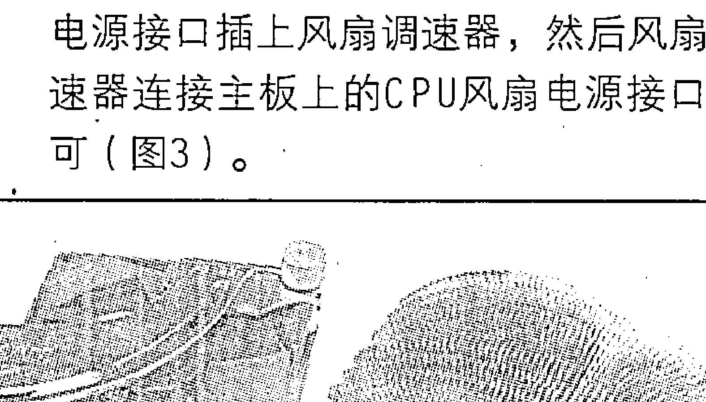

### 4. 改进机箱散热通道

散热通道就是空气在机箱内运动的轨迹，合理设计的散热通道可迅速带走机箱内的热空气。北方的朋友可能都很有体验，冬天巷子里的风比开阔地方的风大得多，也特别冷，这时巷子就是一个很好的散热通道。散热通道的形成主要是由于机箱内部风扇的转动，把机箱内的热空气强制抽出，使机箱内产生负压，吸引机箱外的冷空气由机箱的开孔进入机箱从而形成空气的交换。

一般而言，安装一个机箱风扇是必须的，这对于提高散热能力有着很大的帮助。事实上，机箱风扇的使用在于位置合理，而并非风力强劲。然而遗憾的是，机箱风扇的位置并不能由用户自己的决定。好在目前大部分机箱都至少预留一个风扇位置，此时选用一款2000RPM低转速的机箱风扇将十分合适，对于显卡以及CPU的辅助散热有很大的帮助。

如果大家使用的CPU发热量并不高的话，譬如低频Duron和Tualatin Celeron，甚至还可以利用机箱风扇来舍去CPU风扇，这样整机的静音表现将十分出色。从表面来看，机箱风扇作用于CPU简直是天方夜谭，因为如果熟悉流体力学的话，大家应该明白管道流动对于气体传送的重要性。在机箱这种敞开式环境中，风扇所吹出的风会立即扩散，等到传递到CPU风扇上方的位置时，此次风压已经小得可怜，自然无法取得理想效果。

但是只要为机箱风扇建立一个风道，这一切都将变为现实。利用一个弯曲管道将机箱风扇的“风”集中起来作用于CPU散热片上方，然后使用排气风扇将热量排出机箱。这样一来，我们甚至不需要CPU风扇，同时也能避免机箱中其它热源对CPU散热的干扰。事实上，这类设计在很多国外品牌机中已经屡见不鲜，被称为“风洞”散热装置（图4）。使用PVC材料根据CPU风扇尺寸以及12cm机箱风扇的尺寸做好管道之后，将其一头固定在机箱安装风扇的位置，另一头套住CPU散热片。需要注意的是，如果采用的是金属材料管道，那么与套住CPU风扇的一头必须用其它不导电的材料包裹，以免触及主板时造成意外。“风洞”散热装置也可以简单演变，即在CPU散热器上方安装转速低于2000RPM的小尺寸风扇，这样对于提高散热能力有很大的帮助，而且同样能够控制好噪音。

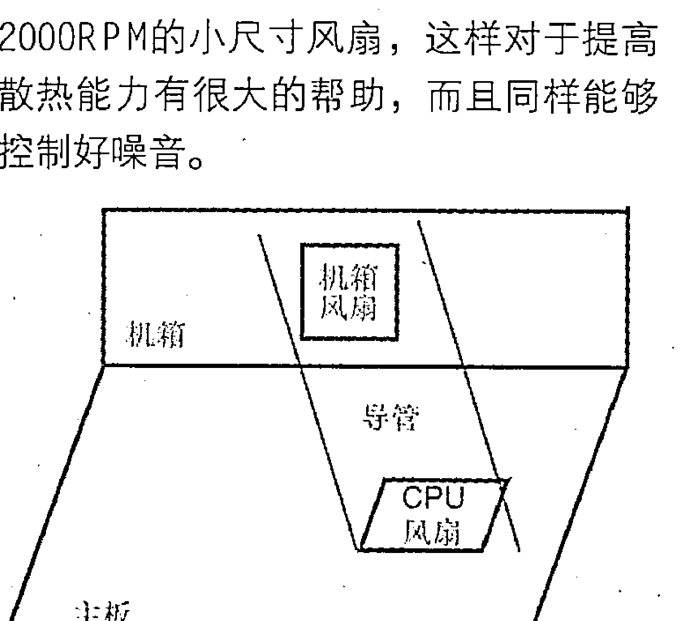

## 二、玩的就是心跳：另类散热方法

常规的风冷散热技术尽管有着成本低廉、简单易用的优点，但是对于疯狂的超频发烧友或者要求苛刻的极端静音需要还是无法满足。为此，水冷、半导体制冷、热管散热等一系列技术应运而生。

### 1. 水冷系统介绍

任何散热系统的最终目的都是将从CPU产生的源源不断的热量带走，而与风冷技术截然不同的是，水冷系统采用了更为平和的热传导技术，这样就可以杜绝因为风扇快速切割空气而造成的音障，为我们提供一个更为安静的工作环境。风冷技术依靠金属散热片将热量传递到表面，然后利用风扇将其带走。而事实上，金属并不是最佳的传热介质，普普通通的水才是“传热专家”，因为水的比热容最高，这也是水冷设备散热效果出众的原因之一。

基本上，一套水冷系统包括具有水箱的水泵，处理器用的散热组件（图5），以及内建风扇的辅助热交换器。为了让整体散热效果达到理想的状况，水冷系统必须组成一套有机的水循环体（图6）。目前水冷系统的水循环采用古老而有效的电动抽水渠来实现。当然，抽水渠自身也会发出一定的噪音，不过大多数噪音能量在水中转换成机械波，而且在外壳的层层包裹之下，几乎听不到明显的噪音。客观而言，水冷系统最大的麻烦并不是散热效果或者其它技术因素，而是捉襟见肘的安装空间。为此，目前的水冷系统可以分为内置与外置两种。内置水冷系统设计得相当精密，将整个水循环设计在一个箱体中，并且所有的液体密封处理，不会出现水垢或者变质。相对而言，外置水冷更加容易实现，不少DIYer自创的水冷都属于这一类型。由于外置水冷将储水槽放在机箱外部，因此我们所要做的仅仅是固定水管、散热片等。水冷的优点是相当突出的，高效散热与静音使之有绝对充足的存在理由。此外，由于水循环的特点，大多数水冷系统包含了CPU、GPU、北桥的一整套散热方案。然而正如其突出的优点一样，水冷的缺点也不少。首先是相对麻烦的安装过程，即便是内置型产品，其安装也得颇费一番心思。而外置型产品虽然安装相对简单，但是在机箱外部放置一个巨大的水桶并不是一种好感觉。频繁更换容易变质的水是相当麻烦的，而且占据不小的空间。当然，水冷最大的不足还在于安全性略显稚嫩，一旦水渠漏水，后果不堪设想。不过，随着水冷技术逐渐受到散热器厂商的青睐，这一情况已经大有好转。

### 2. 半导体制冷散热

CPU工作时温度越低越好，很多用户都知道CPU散热是否良好是超频能否成功的一个关键因素。一般通过用大风扇、涂导热硅脂等来改善CPU的散热条件，但这些方法都不可能使CPU的温度低于室温。这里谈到的半导体制冷器是根据热电效应技术的特点，采用特殊半导体材料热电堆来制冷，能够将电能直接转换为内能，效率较高。一般CPU的发热功率小于30W，而制冷器的功率则大于50W，如果散热良好，它完全可能使CPU工作在低于室温度的问题。

国内市场上常见的半导体制冷片型号有CT1－12701、CT1－12703、CT1－12705等，额定电压为12V，电流分别为1A、3A和5A，恰好可以由我们的ATX电源供电。不过半导体制冷片的功耗很大，因此建议使用名牌的350W电源。使用半导体制冷片并不困难，把制冷片夹在散热片和CPU之间（适当使用导热硅脂），并保证冷热朝向正确，电源方向正确即可。不过半导体制冷片的危险系数不低，大家必须提高警惕。结露问题是使用半导体制冷片用户必须要注意的，特别是南方用户。当半导体制冷片陶瓷表面的温度降至一定程度时，就不可避免地会产生结露现象，在电脑机箱中这种情况绝对不允许发生。针对这种情况，建议大家降低制冷片的功耗。另外一个需要我们警惕的问题是制冷片反面的发热端，这里必须采用风扇来保证安全工作。

### 3. 液氮与热管散热

尽管水的比热很大，对于热传导大有好处，但是毕竟这还不是高效性的制冷剂，因为蒸发的制冷速度远远高于热传导。常温下的气体一旦被高压低温下压缩成液体之后就成了十分理想的制冷剂，其效果甚至不亚于氟利昂（图7）。

论效果，液氮方案无可挑剔，但是其危险性实在太高，而且代价高昂，对于普通DIYer来说确实不怎么合适。第一液氮的温度非常低，人体不能直接接触，第二液氮比重比较大，挥发成气体之后，会落在屋子的底层，然后随着液氮气体的增加渐渐取代空气，有杀人于无形的作用。第三氮的燃点比较低，如果温度过高容易燃烧、爆炸。所以综上所述，液氮制冷还是一些发烧级DIYer的专利，普通环境下根本无法应用。

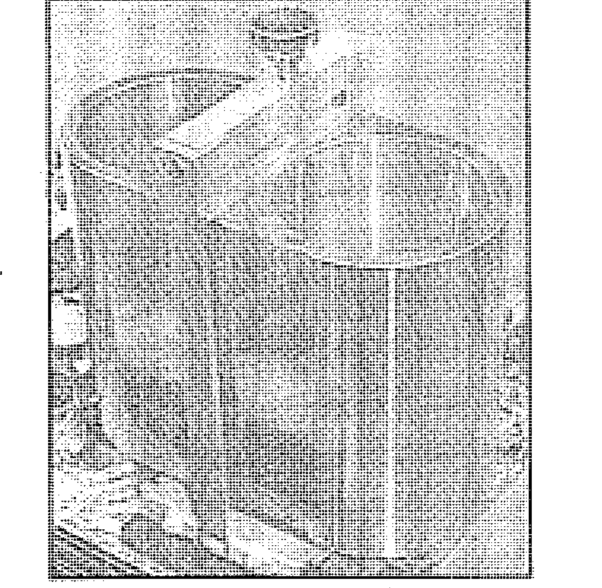

相对而言热管散热更为现实一些，并且已经大规模用于实际生产。热管技术是1963年美国Los Alamos国家实验室的G.M.Grover发明的一种称为“热管”的传热元件，它充分利用了热传导原理与致冷介质的快速热传递性质，透过热管将发热物体的热量迅速传递到热源外，其导热能力超过任何已知金属的导热能力。更为重要的是，采用热管散热之后就可以使用低转速的风扇，因为此时热量已经远离危险区，这也是降低噪音的有效方法。

在准系统、移动PC等设备中，热管已经司空见惯（图8）。从效果来看，热管确实值得称赞，它不仅可以大幅度提高散热效果，同时也是噪音问题的解决良方。对于移动设备而言，热管设计还能节省空间，毕竟热管可以随意弯曲。目前热管散热器已经十分普及，甚至还能看到各种单纯的热管散热片，用户买回以后只需要根据CPU的发热量选配相应的低转速风扇即可。

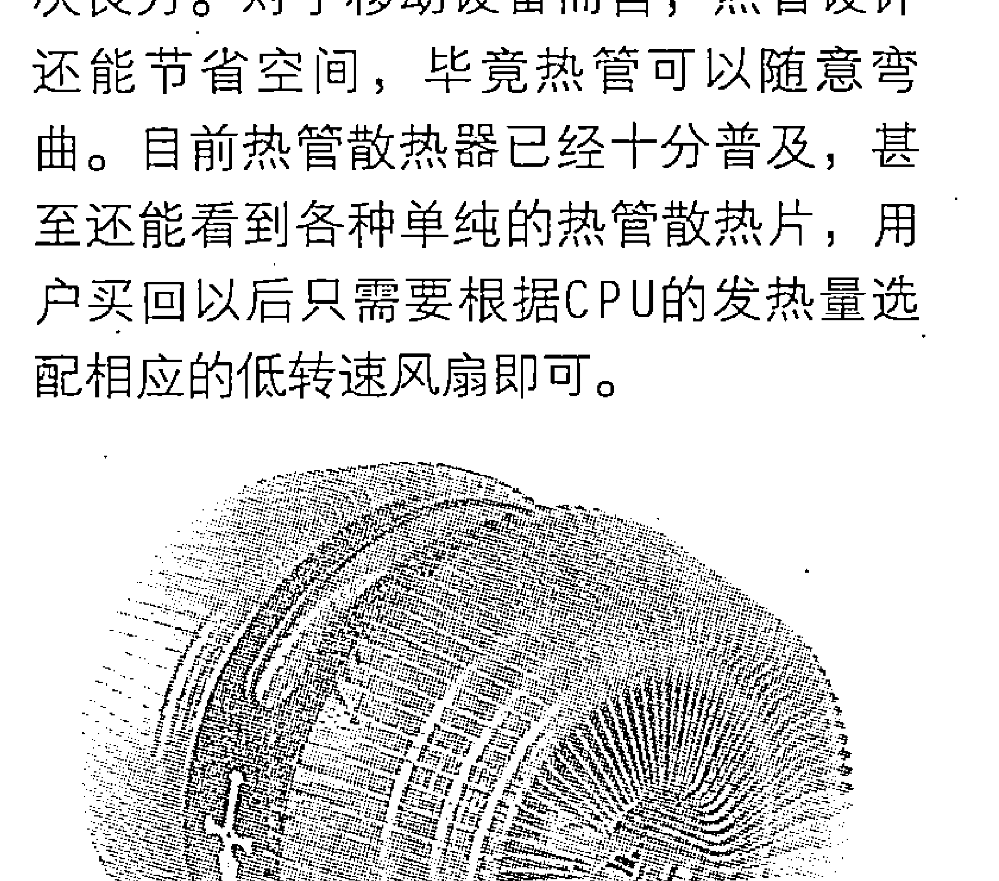

## 三、硬盘与显卡：不容忽视的发热源

随着7200rpm高速硬盘逐渐占据市场主流地位，目前硬盘的散热问题越发突出。从硬盘技术的角度来看，尽管噪音问题已经得到了很好的控制，但是7200rpm硬盘的发热量还是令人忐忑不安。至于显卡，其超过CPU的晶体管集成度早就让PCIe插槽周围成为一个大火炉，完善的散热措施自然必不可少。

### 1. 加装硬盘风扇

硬盘风扇已经不是什么新鲜事物了，很多电脑城都可以买到。与几年前的暴利时代相比，目前的硬盘风扇便宜得多，一般20元左右就能买到一款很不错的产品。不过与CPU风扇不同的是，硬盘是精密仪器，所以选购硬盘散热风扇时，风量还不是最关键的因素，最关键的是风扇产生的震动要最小。这里建议大家选择那种装有双风扇的产品，不仅散热效果更好，也有利于力平衡。安装硬盘风扇前，要把硬盘拆下来，在硬盘底部预留有6个螺丝孔，把风扇所附的螺丝装在硬盘底部，固定好风扇，然后把风扇电源插头串接在硬盘电源插孔上（图9）。但是需要指出的是，使用硬盘风扇来散热也有不少缺点。首先，风扇没能与硬盘表面完全接触，因此散热不能立即吹走。此外，硬盘风扇只能对硬盘的单面进行散热辅助，事实上硬盘的正反面以及侧面温度都很高。最后，硬盘风扇还会产生不小的噪音。

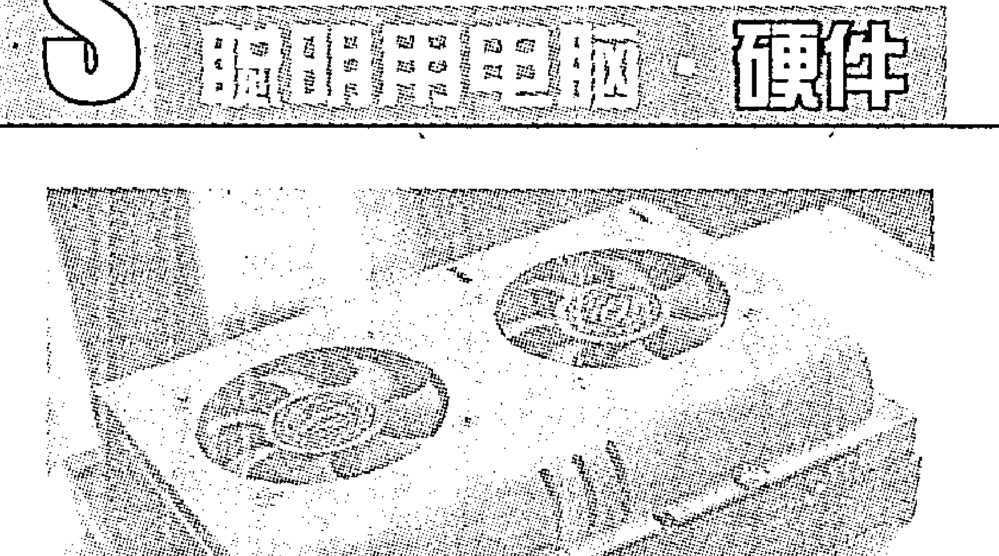

部分用户可能对此相当敏感。

### 2. 利用硅脂给硬盘巧妙散热

硅脂是一种物理性能出色的导热剂，一般用于CPU或者GPU的散热。但是硅脂也同样可以用于硬盘散热，只要我们用硅胶将硬盘表面与机箱相连，源源不断的热量就会随着机箱内部的钢板传走。事实证明，这种散热方法的效果相当理想，而且操作并不复杂。

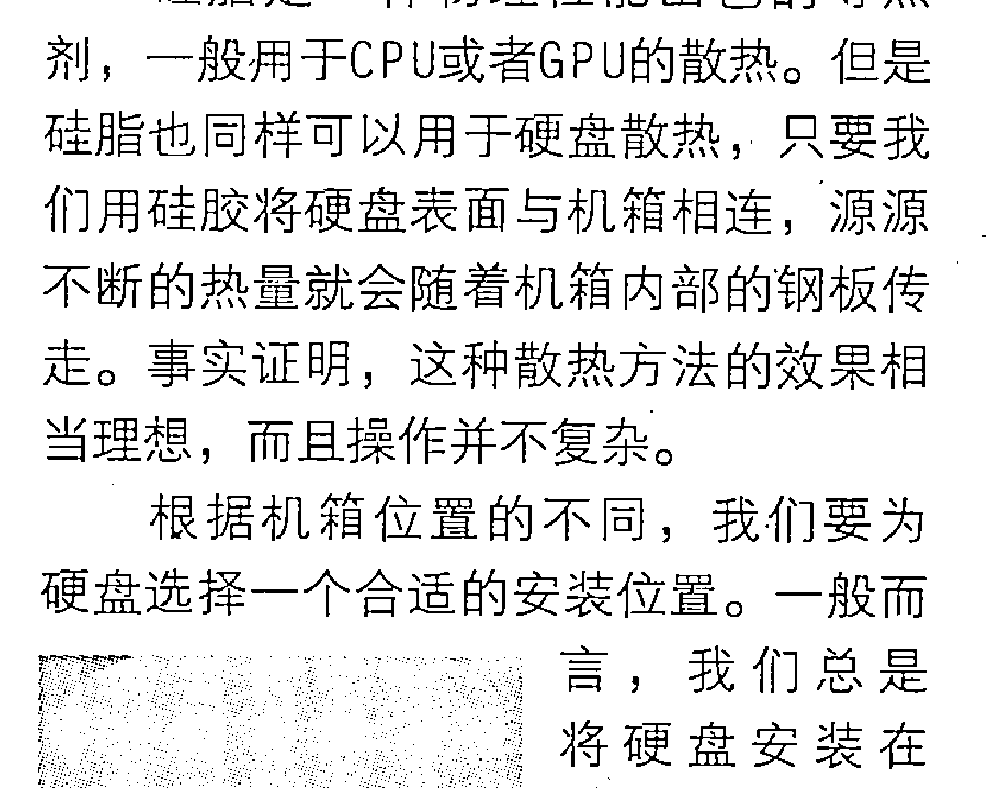

根据机箱位置的不同，我们要为硬盘选择一个合适的安装位置。一般而言，我们总是将硬盘安装在3寸卡槽的顶部或者底部，这样可以节约硅脂。关于硅脂的选购，大家也要注意一下，一定要买那种具有较强粘性的产品（图10），这样可以保证硅脂不脱落。

从机箱上卸下硬盘，然后将硅脂均匀地涂抹在硬盘的上表面以及两个侧面（图11），并确保其厚度刚好能使硬盘与机箱紧密接触，达到最佳的热传导效果。

需要注意的是，如果你喜欢将硬盘反装，那么千万不要将硅脂涂抹在有电路板的一面。尽管硅脂并不导电，但是弄在电路板上总不好，非但起不到散热作用，还有可能损坏硬件。其实，硬盘电路板的发热大户就是主芯片与缓存芯片，我们只要对这两个地方着重散热即可。这里，建议大家使用显卡GPU芯片上的散热片或者北桥芯片的散热片。由于硬盘是水平安装的，因此在强粘性硅脂的帮助下，我们无须担心固定的问题。

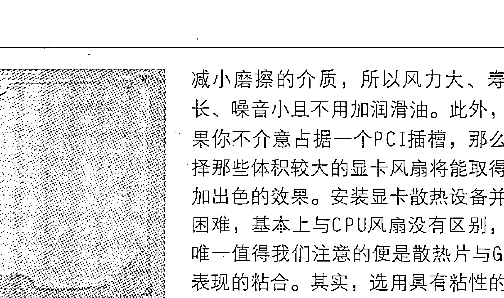

### 3. 显卡散热措施

GPU的晶体管集成度已经超越了CPU，因此其发热量也非常可怕。客观而言，如今几乎所有的显卡在出厂时都已经配备了完全合格的散热方案，无须我们过于操心。但是对于那些渴望超频的发烧友而言，改善显卡的散热措施就是必须的了。

显卡的散热结构并不复杂，GPU核心与散热片之间使用胶水紧紧地粘合，而风扇利用散热片之间的空隙固定。毫无疑问，大多数中低价位显卡所使用的散热片不够大，这也是超频幅度难以提高的原因之一。为此，建议大家使用表面积更大的铜质散热片。显卡风扇建议选择滚珠风扇，它利用多个钢珠来作为减小磨擦的介质，所以风力大、寿命长、噪音小且不用加润滑油。此外，如果你不介意占据一个PCI插槽，那么选择那些体积较大的显卡风扇将能取得更加出色的效果。安装显卡散热设备并不困难，基本上与CPU风扇没有区别，而唯一值得注意的便是散热片与GPU表现的粘合。其实，选用具有粘性的导热硅胶是最佳的选择，一般电脑城都有卖。

除了GPU核心的散热，我们还有必要为显存加上散热片，这样可以提高显存的工作频率，大大提升显存带宽。在大中城市的电脑城一般都能买到十分便宜的专用显存散热片，而且背部涂抹了特殊的导热贴，使用很方便（图12）。这类显存散热片一般为铝材制作，价格大约为5～8元一片。当然，动手能力出色的朋友也可以自己使用铝合金材料来制作散热片，然后使用具有粘性的导热硅胶来粘合。

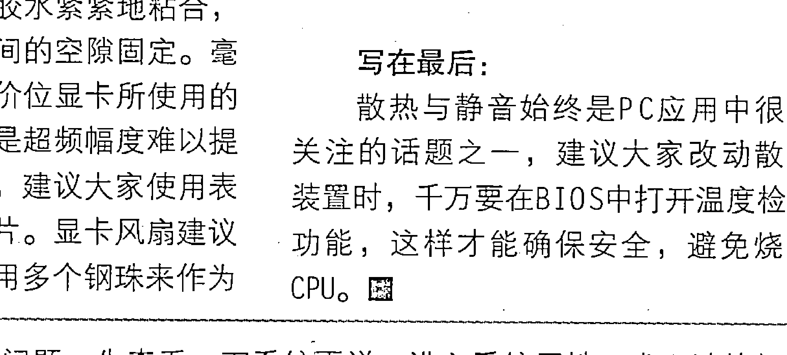

## 写在最后

散热与静音始终是PC应用中很受关注的话题之一，建议大家改动散热装置时，千万要在BIOS中打开温度检测功能，这样才能确保安全，避免烧毁CPU。■

# 巧借跳线排故障

□TMG mh

几天前我去同学家玩，同学向我抱怨电脑有问题，虽然配置很好但速度比原先的老电脑速度还慢。于是我自告奋勇地为他检查。我开机后发现电脑运行速度果然很慢。我查了他的机器配置如下：AMD Athlon 2600+、昂达 RS480、KINGMAX 512M、DDR400、昂达 X550XT 白金版、酷鱼 80G、7200、8M、SATA150。我怀疑是电脑中了病毒，先用金山毒霸2008查杀了一下，没有发现任何病毒。我又怀疑是电脑因为长期没有整理导致垃圾过多，占用了电脑的空间。于是我用优化大师进行了整理，但运行速度稍有增加但还是非常慢。至此，笔者陷入困境。看来只能开机箱检查硬件了。这时同学提醒我说是不是系统的问题，重装系统是否有效。我也认为有可能是系统的问题，先查看一下系统再说。进入系统属性，发现计算机的CPU的频率仅为1.1GHz，而AMD Athlon 2600+的主频应为1.83GHz啊。问题终于找到，看来是CPU未被正常识别的问题。我立即让同学找来了主板说明书，在主板说明书上找到了频率设置对照表，我发现该主板是通过设置四个跳线的位置来设定CPU的频率的。四个跳线的位置从左到右依次为JP1、JP2、JP3、JP4，其正确的跳线设置为JP1、JP2跳线设置为关，JP3、JP4跳线设置为开。我按照提示一一设置好，然后重新启动计算机，机器的运行速度明显加快，看来CPU频率被主板正确识别，故障得到彻底解决。

最后总结，组装机器并不是简单的零件组装，而是需要认真的阅读每一个说明书，设置好各个跳线才能组装好一台电脑，使之真正发挥本身零件的功率，成为一台运行良好的电脑。■

# 个人数据随身带——移动硬盘应用方案解析

□方成亮

尽管目前U盘已经相当普及，但是当我们需要进行大数据量的交换时，这类小容量的移动存储设备并不方便，而且速度表现让人无法满意。毫无疑问，整天抱着一个脆弱的台式机硬盘来回穿梭并频繁地打开机箱是不现实的，因此综合容量与速度优势的移动硬盘逐渐流行起来。然而，移动硬盘可不仅仅是简单的移动数据存储工具，配合一些软件还能衍生出更多的实用功能，而且一些相关的设备使用技巧也十分重要。

## 一、三大难题：移动硬盘使用难题

在移动硬盘的使用过程中，很多用户或多或少都会遇到一些问题，有时甚至导致设备无法使用。其实移动硬盘的故障解决还是有很大的通性，只要掌握一些常见问题的处理方法，那么基本上就能轻松应对。

### 1. 移动硬盘与USB 2.0兼容性问题

对于USB 1.1接口的低速移动硬盘而言，一般不会遇到USB兼容性问题，然而USB 2.0规范的产品却不得不为速度而付出代价，nVIDIA的南桥芯片与VIA控制芯片存在不同程度的兼容性问题，配合USB 2.0移动硬盘时就会表现得十分明显。

虽然Windows XP的SP2中已经自带了USB 2.0的驱动，但是在实际使用中还是存在着一定的兼容性问题。其实这个问题严格地来说并不是nVIDIA主板的问题，因为nVIDIA南桥芯片的USB 2.0标准是严格按照标准来设计，所以对USB的设备的信号要求也十分严格，而现今市面上大部分移动硬盘的USB控制芯片并不是完全按国际标准设计，信号需要有强有弱，从而造成一系列的问题。要解决这个问题其实也并不困难，首先安装集成SP2补丁的Windows XP，然后再安装主板厂商专用的USB 2.0驱动（图1）。由于Windows已经安装了USB 2.0驱动，因此这里需要在控制面板中更新驱动，自己指定驱动程序的位置，选定后会提示该驱动没有通过微软认证，不过这并不影响使用，最后不要忘记在设备属性中把“快速删除优化”改为“为优化性能优化”（图2）。

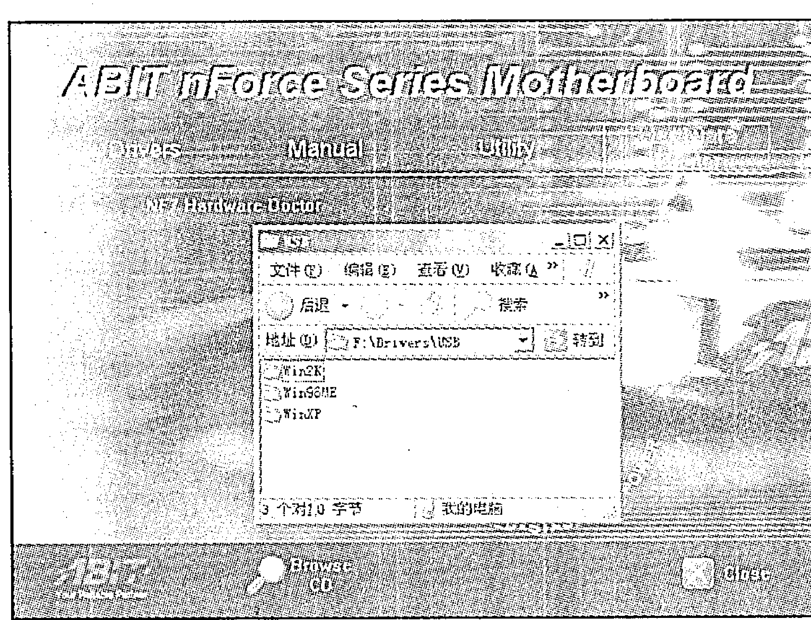

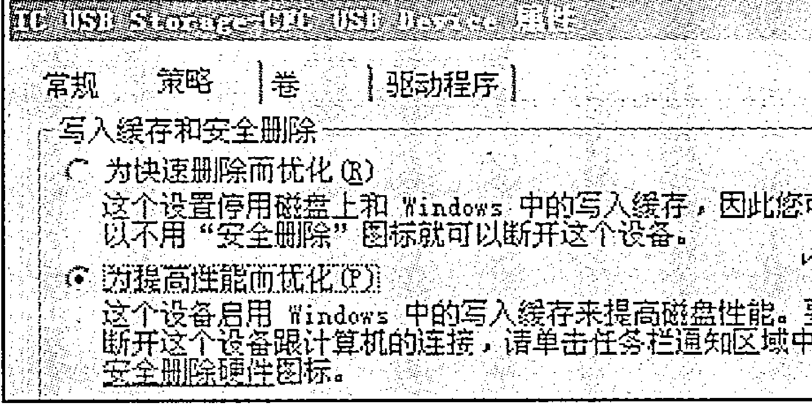

VIA的USB 2.0驱动问题主要表现在Windows 98操作系统下，而且仅仅是VIA VT6202这款板载USB 2.0控制芯片存在问题，其它最新的VIA南桥都没有很严重的兼容性故障。好在VIA已经推出了完美的解决方案，大家只要安装好最新版本的Hyperion 4in1驱动再打上最新版的USB 2.0过滤器补丁程序即可，该补丁可以到http://downloads.viaarena.com/drivers/USB/VIA_USB2_V258p3-L-M.zip下载。

### 2. 解决移动硬盘供电问题

如果发现移动硬盘在拷贝大容量数据时会出现间隙性中断甚至无法识别的情况，那么很有必要检查一下是否由USB供电不足而引起。原本USB接口仅仅用来针对低功耗设备，但是后来的发展的确很出人意料。如果移动硬盘具备PS/2或者双USB接口的话，应该尽量将其连接上，此时可以很大程度上起到辅助供电的作用（图3）。

另外需要注意的是，尽量不要在移动硬盘之前使用USB延长线或是连接到机箱上的前置USB接口，此时供电会有衰减，造成设备工作不稳。

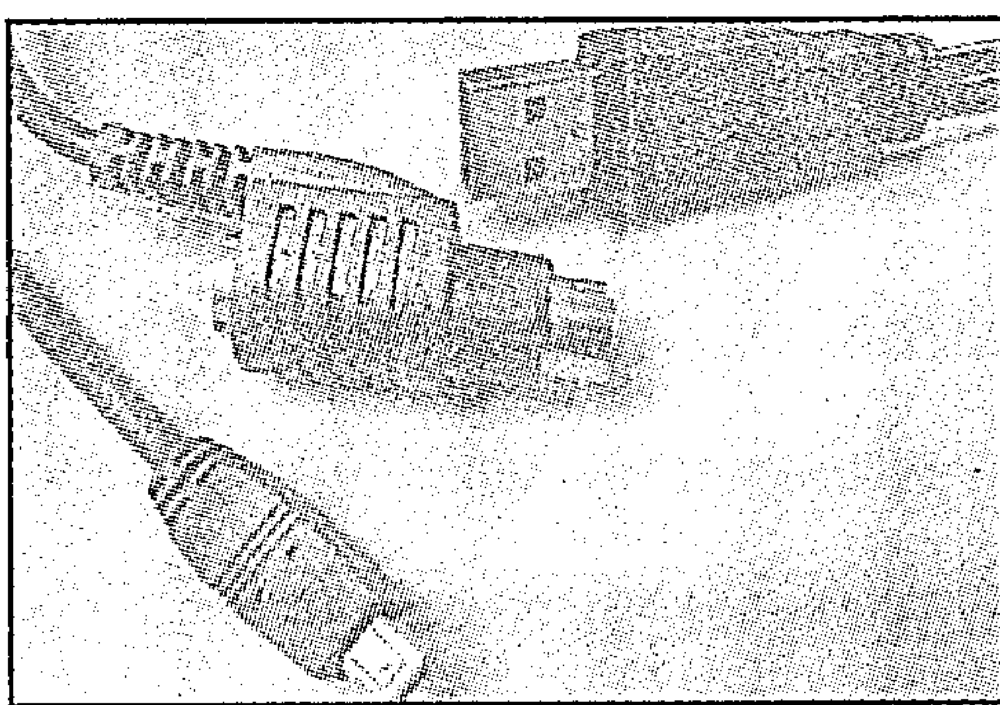## 3. 解决Windows Server 2003无法识别移动硬盘

很多用户都反映移动硬盘无法被Windows Server 2003操作系统识别，其实这是因为系统出于安全性考虑而没有分配盘符。如果查看移动硬盘指示灯的话，你会发现此时是亮着的，而且任务栏右下方也会出现移动设备的图标。解决方法十分简单，依次打开“开始” → “管理工具” → “计算机管理”，在计算机管理窗口的左侧选择磁盘管理，此时窗口的右侧就会出现容量相同“状态良好（活动）”的移动硬盘被系统列出（图4，系统已经识别出移动硬盘）。在新发现“状态良好（活动）”的设备图标上点击右键，选择“更改驱动器号和路径”。随后在弹出窗口中点击“添加”，从窗口右侧的组合下拉菜单中选择目的盘符，此时系统将自动添加移动存储设备（图5）。

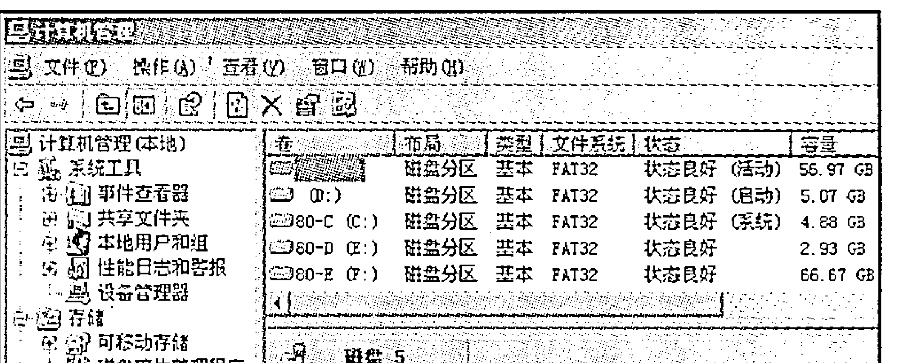

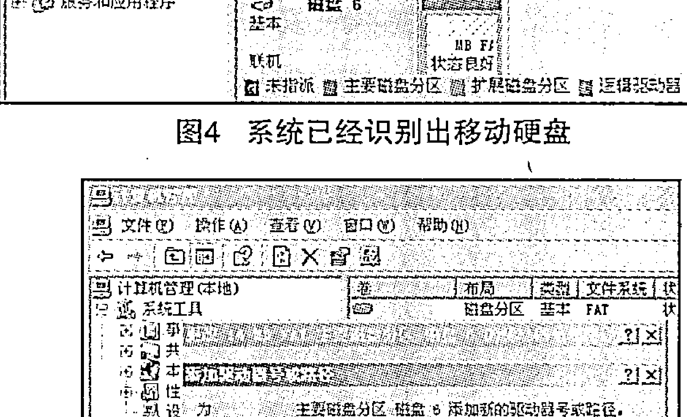

## 二、精打细算能省钱：移动硬盘DIY组装

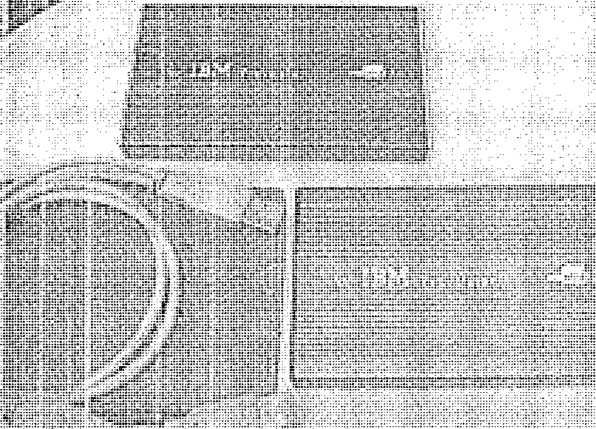

移动硬盘的本质并不复杂，仅仅是体积较小且具备一定抗震能力的笔记本硬盘加上搭配USB控制芯片与电源驱动的移动硬盘盒。如果大家手头已经有笔记本硬盘，那么只要购买一个普通的USB 2.0移动硬盘盒即可，这样整体成本将会大幅度降低。移动硬盘盒分为3.5英寸与2.5英寸两种，前者适合于普通的台式机IDE硬盘，价格较为便宜，但是体积过大便携性不是很好，而且需要使用外置电源，一般并不推荐使用。而2.5英寸的移动硬盘盒只能用于安放2.5英寸笔记本硬盘，便携性相当出色（图6）。需要注意的是，2.5英寸硬盘分为薄盘与厚盘，大家在选择2.5英寸移动硬盘盒时一定与自己的硬盘相配套，少数追求便携性的移动硬盘盒无法兼容2.5英寸厚盘（图7）。

防震安全措施也是我们对硬盘盒的基本要求之一。硬盘的稳定性是所有配件中较差的，即便在关闭状态下，剧烈的振荡也会对其形成致命的打击，造成物理坏道。因此，我们的移动硬盘盒必须具有坚固的外壳与缓冲装置，这样才能确保价格不菲的硬盘的安全。客观而言，镀锌钢板应该是最好的材料，但是这也会加重量并且不太美观。此外，铝镁合金、高强度有机塑料也可以成为硬盘盒的外壳材料。不过相对而言，有机塑料的耐磨性较差，时间一长会非常难看。铝镁合金的硬盘盒应该是最合适的，它不仅分量轻，而且表面不易划伤，显得较为尊贵，唯一的缺点就是价格昂贵。

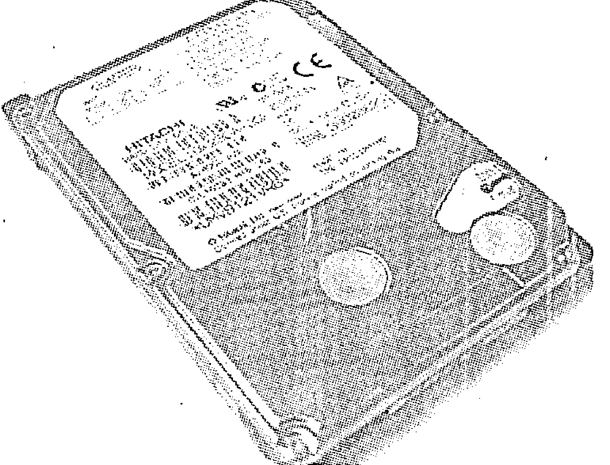

## 三、打造移动数据中心：拓展移动硬盘功能

移动存储是移动硬盘的基本功能，而对于那些频繁奔波于“办公室－家里”或者“网吧－寝室”的用户而言，如何用移动硬盘来管理好E-mail以及QQ记录是一个很值得探讨的问题。令人感到万幸的是，无论是Foxmail还是OICQ，它们都是真正意义上的绿色软件，即无须在操作系统下安装，而只要直接运行可执行文件即可启动程序。

小，而且解压后能够直接运行。自从4.0版本之后，Foxmail采用了安装界面，虽说可以直接在安装目录中运行，但是此时的文件夹体积已经较大，不够精简。对于读写速度只能达到1.2MB/s左右的USB 1.1移动硬盘而言，直接运行Foxmail会感觉速度稍有些慢，因此小巧玲珑的Foxmail 3.11版更加值得推荐。

### 1. 随身的邮箱：移植Foxmail

首先建议大家下载Foxmail 3.11版，这款软件的体积很小，而且解压后能够直接运行。自从4.0版本之后，Foxmail采用了安装界面，虽说可以直接在安装目录中运行，但是此时的文件夹体积已经较大，不够精简。对于读写速度只能达到1.2MB/s左右的USB 1.1移动硬盘而言，直接运行Foxmail会感觉速度稍有些慢，因此小巧玲珑的Foxmail 3.11版更加值得推荐。Foxmail文件夹的体积会随着使用时间的延长而增大，特别是在频繁发送与接收带有附件的邮件时，因为所有的文件都保存着，因此体积增长速度十分惊人。为了控制 Foxmail 文件夹的体积，建议大家点击主界面 “选项”菜单下的 “系统设置”，然后勾选 “退出时自动清空废件箱”(图8)。此外，对于一些带有大体积附件的邮件，应该注意及时删除，以便节省存储空间。

### 2. 到处能聊天：让QQ移动起来

将 QQ 移植到移动硬盘可谓十分简单，只要将整个软件的安装目录复制过去即可，然后从移动硬盘中直接运行。QQ 移植的主要目的便是保存 QQ 聊天记录，腾讯所提供的很多附加功能基本用不上，此时完全可以精简一下以便节省存储空间。

首先打开移动硬盘中的 QQ 目录，我们可以看到 “newface”和 “skins”文件夹，尽管体积不大，但是由于文件数量很多，因此在 FAT32下占据 8MB以上的空间(图9)。如果大家不需要这些 “皮肤功能”，完全可以把这个文件夹删除，并不会影响 QQ 的正常使用。随后进入以 QQ 号码命名的文件夹，这里可以将 QQMail.dat、MailData、MsgEx.db 这三个文件删除，这样能够节省 20MB以上的空间，而且并不影响 QQ 记录，只是会令所有的 QQ 邮件记录消失，毕竟大部分非会员都不需要使用 QQ 邮箱。

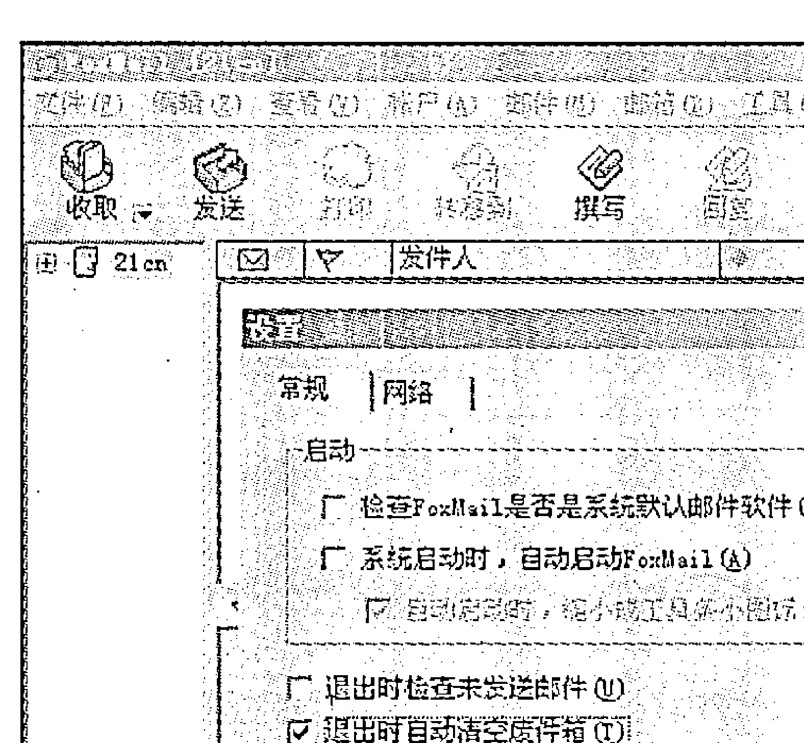

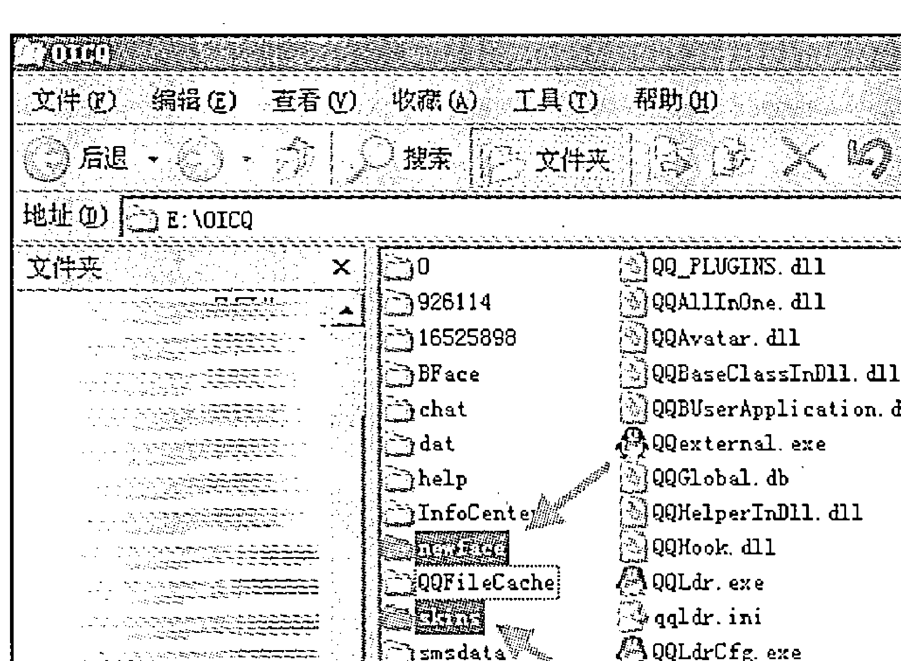

### 3. 协调数据版本：JFileSyn文件夹同步助手

如今移动存储工具日益普遍，使用中往往会遇到需要文件夹同步的情况，JFileSyn 软件是一款简单易用的文件夹同步工具，可以成为广大移动硬盘用户的好帮手。启动 JFileSyn 程序，其界面如下图所示。分别设定好源文件夹与目标文件夹之后，将 “目标文件最后修改时间” 指定为 “小于源文件”，这样只要文件经过操作就会被更新到目标路径。当然，使用这一功能的前提是主机的计算机时钟必须足够准确，否则会造成同步操作失败。

利用 JFileSyn 的同步功能，大家可以针对本地硬盘以及移动硬盘中的关键文件夹进行同步。以 QQ 聊天记录为例，只要设置 QQ 安装目录下的 QQ 号文件夹作为源文件夹与目标文件夹即可，每次拔下与插上移动硬盘前后，执行一遍 JFileSyn 的同步功能即可保持 QQ 聊天记录丝毫不会因为在多个地方保存而有任何遗漏(图10)。同样，这项功能也可以用来同步 Foxmail 中的邮件，只不过此时分别指定以账户为命名的文件夹。

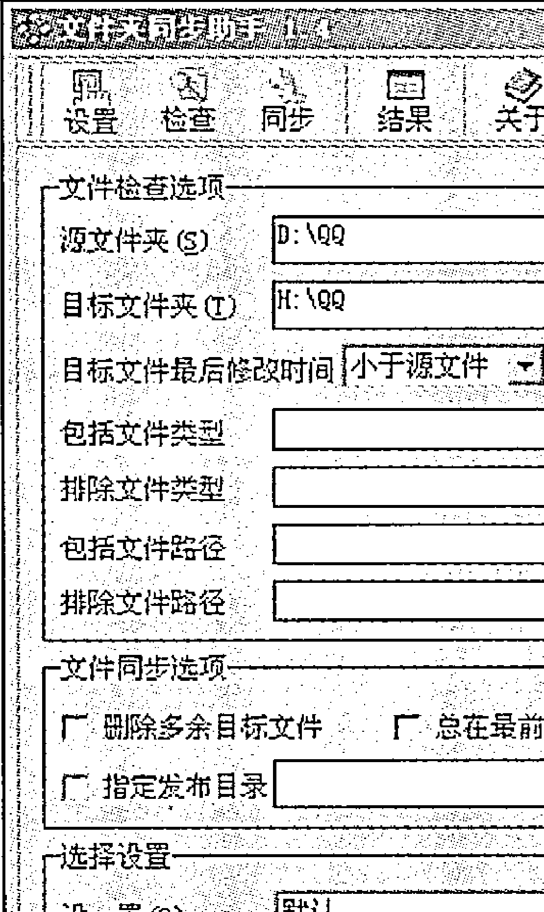

## 四、DIY移动保险箱：加密移动硬盘

具备加密功能的移动硬盘往往价格不菲，目前各家生产商都推出了加密型的产品，但是在具体的实现方法上还是有很大的不同。首先要告诉大家的是，部分不具备加密型产品研发技术的厂商以技术名词概念来混淆用户。所谓的加密型移动硬盘仅仅采用软件进行加密，而且仅仅是一道简单的入门口令，面对高级用户时根本无法起到保护作用，而且只要打开硬盘盒取出硬盘就彻底加密失败。事实上，如果大家的移动硬盘没有加密功能或者是使用笔记本硬盘与移动硬盘盒 DIY 的产品，那么完全不必因为缺少加密功能而失望，因为通过其它软件也完全能够实现加密功能，基本上与那些软件加密技术的移动硬盘没有很大的区别。

### 智能格式化的 Mformat

下面我们要介绍的便是一款特殊的闪存盘格式化软件 Mformat，它能轻松实现加密功能。 Mformat 可以到 http://www.jangotech.com/download/ufd.zip 下载，解压后将得到 “Mformat.exe”和 “Passid.exe”这两个文件。首选运行 Mformat.exe 程序，此时在弹出的界面中勾选 “启动密码保护功能”，然后进行格式化操作。当格式化操作完成之后，系统会自动告诉你初始密码为 “1111”。

当我们再次使用闪存盘时，你会发现任何读写操作都会遭到拒绝，因为整个存储区域已经被 Passid 程序控制，而且闪存盘中生成了 Passid.exe 文件。在使用闪存盘之前，任何用户都必须先执行 Passid.exe 程序，然后在弹出的对话框中输入正确的密码。在右下角的系统托盘中，我们还能看到一个后台控制程序。一旦在解密状态下希望给移动硬盘重新加密，可以用鼠标右键单击系统托盘上的 PASSID 图标，然后在弹出的快捷菜单中点击 “磁盘上锁”命令。最后需要提醒大家的是， Mformat 生成的初始密码都是 “1111”，因此请尽快在后台控制程序中更改。

## 内存升级百科
——解决兼容性问题是关键

随着Windows Vista的发布，DirectX 10、玻璃特效等，都成为了近期的热门话题。但如果想体验Vista，至少得拥有1GB的内存。因此对于内存较小的用户而言，如何升级就成了当务之急。正好近期内存价格崩盘，扩容内存就变得不再是一件难事，而此时究竟选择多少容量以及如何解决一些兼容性问题就成为很多读者非常想了解的知识。

□方成亮

## 一、内存容量的选择

### 1. 内存的作用

从功能上理解，你可以将内存看作是内存控制器（一般位于主板北桥芯片或是CPU中）与CPU之间的桥梁或仓库。显然，内存的容量决定“仓库”的大小，而内存的速度决定“桥梁”的宽窄，两者缺一不可，这也就是我们常常说到的“内存容量”与“内存速度”。当CPU需要内存中的数据时，它会发出一个由内存控制器所执行的要求，内存控制器接着将要求发送至内存，并在接收数据时向CPU报告整个周期（从CPU到内存控制器，内存再回到CPU）所需的时间。一旦内存容量不够大，这个过程将会多次往返，其低效率可想而知（图1）。

### 2. 内存容量的选择

其实，按需购买才是明智的选择，不要因为现在内存便宜了就盲目多买。从目前的常用软件及操作系统看，1GB已经完全能够满足一般普通家庭用户的需要。虽然使用中可以明显感觉到从512MB提升到1GB的好处，但从1GB再提升到2GB就不那么明显了。不过随着Windows Vista以及多款有着内存消耗大户之称的游戏上市，2GB正逐渐成为市场的主流。由于操作系统本身就要占据大量的内存，因此2GB内存还是有必要的，况且你还经常玩《魔兽世界》，2GB内存还是比较好的平衡点。当然，有些人的配置很老，打算继续使用Windows 2000甚至Windows 9X，那么最多使用1GB内存就可以了，因为这一类操作系统对于内存的管理能力较差，有时内存多了也利用不上，造成资源的白白浪费。


### 3. 2GB必要性探讨

在讨论这一问题之前，应当先明确究竟怎样才是判断内存容量必要性的正确方法。以十分普及的SuperPi等纯计算软件为例，对于内存容量根本不敏感，而即便是CC Winstone、PC Mark和SiSoft Sandra等综合性测试软件，也无法充分体现大内存容量的优势。然而在实际应用中，大容量内存却扮演着重要角色，这是我们所容易忽视的。以办公用户为例，同时开启十几个IE窗口（通常使用外壳软件）司空见惯，如果此时再打开MSN和QQ，甚至同时运行Office等，1GB内存会显得力不从心，而不是想象中的绰绰有余。也许综合性测试软件的商业办公性能测试单元无法反映出1GB内存容量的优势，但是在实际应用中的体验才更具评判价值。对于3D游戏用户，其实结论就更加直接了：2GB内存大有裨益。以往的3D游戏往往只重视CPU和GPU，对于内存容量并不敏感。但是随着次世代游戏的普及，这类新型引擎都明确要求1GB以上内存容量才能达到更好的效果。更为重要的是，我们还不能忽视操作系统本身对内存的占用。Windows XP的普及令512MB内存几乎成为底限，而Vista操作系统开始普及应用，那么2GB又会成为新的最低要求（图2）。

### 4. 4GB内存需要安装什么操作系统

既然最近内存真的很便宜，那么我是否有必要趁机升级到4GB？如果这样的话，是不是一定要用64位的操作系统，或者Vista？现在的XP还能继续使用吗？很多用户在升级内存时都面临这样的疑惑。

首先，4GB内存的作用真的不是很明显，因为2GB基本已经足够大家使用。普通32bit版本的XP最多只能识别3GB内存，所以升级到4GB内存的话必须更换操作系统。其实，要识别


4GB内存并非只要64位操作系统即可，这完全是以讹传讹。譬如，Windows 2003 Server的32位标准版本也可以完全识别4GB内存，这是比较理想的选择，可以避免出现兼容性问题，因为当前64位操作系统与部分32位软件的兼容性还无法让人完全满意。

意。至于32位的Vista，不管什么版本都只能识别到3GB内存，只有64位Vista才能识别。最后，目前很多操作系统都宣称能够支持4GB内存，但使用起来却远不如大家想象得那样好，对于性能提升的幅度并不大。

## 三、内存升级方案

### 1. 了解内存的种类

内存种类有很多，到底应该选择哪一种呢？其实，这完全取决于你现在使用的是哪一种内存，因为不同种类的内存是无法混合使用的。此外，涉及到双通道技术的因素，最好内存品牌与型号都完全一样。目前市场上存在的内存种类分别是SDRAM、DDR、DDR2和DDR3，而选择哪一种内存取决于现有主板平台。

现在也只有DDR和DDR2才是市场上的绝对主流，而老迈的SDRAM以及超前的DDR3内存基本无法在电脑城买到了。为了确定内存种类，可以先使用CPU-Z (http://www.onlinedown.net/soft/2779.htm可下载) 之类的检测软件查看，运行后切换到“内存”标签页即可。假如还是嫌太麻烦，那么可以根据CPU类型以及电脑购买的年代来判断。2003年到2005年购买的电脑以DDR为主，而2006之后的基本都是DDR2内存。当然，这样其实并不保险，最好还是使用CPU-Z软件检测后确认。

### 2. 拥有3个内存插槽的主板如何升级内存

现在采用3个内存插槽并且支持双通道的主板几乎已经彻底退出市场，但是当年nVIDIA nForce2以及VIA KT880/PM880却普遍采用这种规格的内存插槽搭配。其实，双通道内存并不一定要求双数内存条才能发挥作用，这类主板在安装三条内存时也能实现双通道，并不会有任何兼容性问题。因此，如果现在已经使用两条512MB内存组成双通道，那么完全可以再添加一条512MB内存，构成1.5GB内存。此外，你也可以再购买一条1GB内存，只是这里在安装内存时需要注意一个小细节：1GB内存条必须安装在独立的通道（一般与两个相邻内存插槽隔开），而另外两条512MB内存安装在一个通道中（一般两个内存插槽连在一起）（图3）。

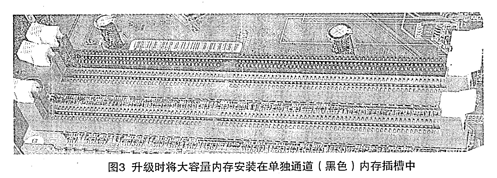

图3 升级时将大容量内存安装在单独通道（黑色）内存插槽中

### 3. 笔记本电脑内存升级时如何照顾双通道

笔记本电脑在升级内存的过程中，应该也会遇到双通道的取舍问题，毕竟大部分笔记本电脑都提供两个内存插槽。以Intel平台为例，由于迅驰芯片组全线支持双通道，因此我们显然不应该浪费这一功能，此时最好通过两条品牌型号相同的内存条组成双通道模式。此外，对于笔记本的整合芯片组而言，搭配DDR2 667双通道内存就显得更有必要。由于使用高速DDR2内存之后，其实等于提高了集成显卡的显存带宽，更高的内存频率对于提高集成显卡性能很有帮助。

相反，在AMD平台上配置两条内存就应该格外小心。由于炫龙移动处理器集成内存控制器，但是第一代单核炫龙并不支持双通道功能，所以此时以配备单条大容量DDR2 667内存为佳。AMD的内存控制器比较特殊，在单通道模式下，单条内存有着更高的稳定性，可以确保以默认的1T内存周期运行，可帮助系统提高整体性能。但是，在双核炫龙平台下，双通道依然是绝对的首选（图4）。

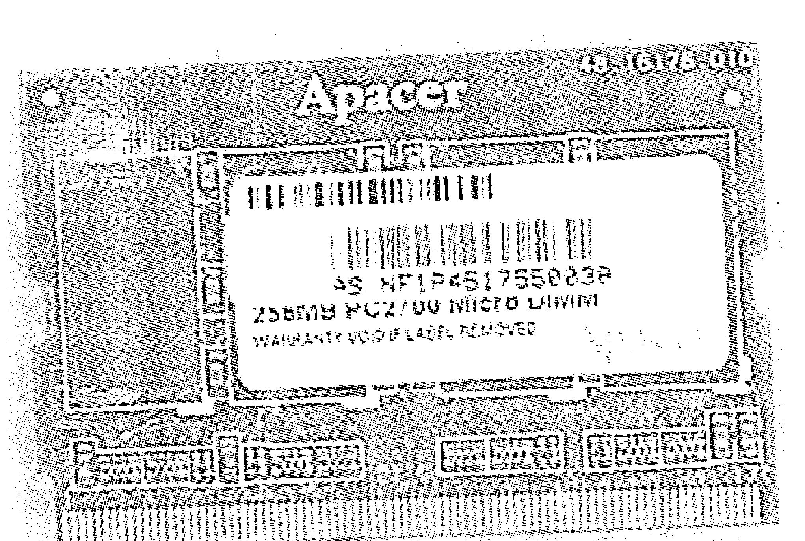

图4 笔记本内存体积远小于台式机内存

### 4. 四个内存插槽的主板如何升级

现在大部分主板都拥有四个内存插槽，一般前期只是使用两条内存，此时应该如何升级呢？事实上，针对拥有四个内存插槽的主板，我们在扩容内存的过程中更多的焦点还在于避免兼容性问题。以Socket 939/AM2平台为例，尽管在双通道的128 bit模式下最多可以支持4个DIMM模组（即4条双面内存），但是此时内存必然出现降频情况。为改善这一情况，AMD在K8处理器中增加了2T内存延迟参数以提高对内存的兼容性。不过2T延迟参数并不能解决所有的降频情况，并且当系统工作在2T模式下时整体性能会有比较明显的下降。因此，建议大家在升级时尽量购买单条容量比较大的内存以减少内存条数，这样可以在很大程度上避免兼容性问题和降频情况的出现。

最后，大家还得注意极少数拥有四个内存插槽的I945PL主板。这类主板受到芯片组的限制，最多只能安装4根单面内存条，而且无法兼容少数1GB的单面内存条。事实上，即便是拥有四个内存插槽的主板，也尽可能减少内存条的数量，这样对于提高系统稳定性总是有帮助的。

## 二、装入位置选购要领

### 1. 内存有些什么品牌，去哪里购买？

很多用户在购买内存时都会认准其品牌，毕竟一些名牌产品经过长期的积累已经赢得了用户的信赖。然而大家也不必太过迷信于品牌，决定一款内存性能与兼容性的关键在于芯片与封装技术，优质品牌只能对稳定性作出保障，技术含量并不高。目前我们熟悉的品牌不外乎Kingston、Kingmax、三星、APACER、威刚、海盗船等，而事实上Kingston与Kingmax都不是内存芯片生产商，只不过Kingston与Kingmax内存往往在做工、芯片封装、售后服务方面更胜一筹。

关于内存的价格查询，上网无疑是最最方便的。国内比较方便的报价查询渠道应该是ZOL（http://detail.zol.com.cn）和PCPOP（http://product.pcpop.com），几乎包含了市面上所有的品牌和型号，而且更新非常及时。不过要提醒大家的是，这里的报价总是略微偏低，一般市场成交价要高出5~10%。至于购买的地方，一般首选IT电脑卖场，并且最好找到代理商或是专卖店。如果是在装机商家那里购买，往往价格会偏高一些。此外，京东网（http://www.360buy.com）、新蛋网（http://www.newegg.com.cn）和易讯网（http://www.icson.com）也是不错的选择，这类在线购物网站的口碑非常出色，价格优势也比较明显（图5）。

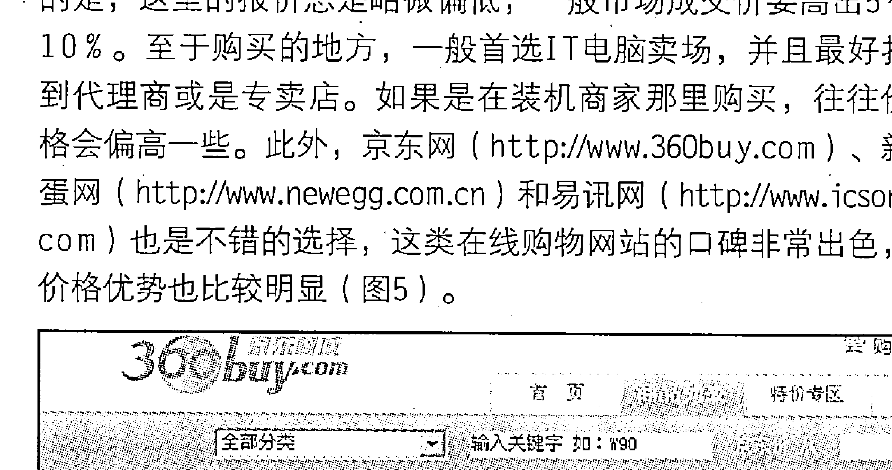

### 2. 购买什么档次的内存才合适？

同样是1GB的内存，不同品牌和型号的报价有着不小的差距。那么，大家到底应该选择什么档次的内存呢？其实，内存的同质化现象是比较明显的，如果不是追求疯狂的超频表现，那么实在没有追求高档产品的必要。以DDR内存为例，这已经是日落西山的平台，此时购买Kingston、APACER等一线主流品牌的DDR400即可，甚至选择同样拥有三年质保的超胜等二线品牌也不错，根本没有必要追求高端DDR500产品。至于DDR2内存，当前DDR2 667和DDR2 800之间的差价非常小，自然是选择频率更高的DDR2 800。至于具体品牌的选择，我还是建议不要太看重，只要厂商敢于提供三年质保，那么品质绝不会差到哪里去，毕竟全球能够生产内存芯片的厂商很有限，同质化趋势太明显了。当然，如果你非常需要超频，那么高价格的DDR2 1066甚至DDR2 1333也不是不可以选择，只是总体性价比偏低。

### 3. 如何鉴别内存做工

内存的质量对于系统全局稳定性极为重要，因此选购内存时自然要避免那些粗制滥造的手工加工产品，而尽量选择名牌产品。电气性能直接影响内存的稳定性，如果内存使用经过严格设计的专利封装技术，那么产品的稳定性自然不在话下。但对于更多采用普通封装技术的内存来说，稳定性则大大依赖于整齐规范的电路布线。好的内存电路板面应该光洁且色泽均匀，元件之间的焊点整齐，内存芯片同PCB板相连的引脚应该是紧密且整齐。有些内存芯片的引脚给人一种松散的感觉，甚至有歪脚，这样的内存怎么能够保证稳定工作呢？此外，优秀内存的PCB板拿在手里应该有一种沉甸甸的感觉，并且感觉质量均匀，而非一块薄薄的、又毫无重量感的普通半导体板子。需要注意的是，做工好的内存PCB板边缘打磨得比较光滑，摸起来没有毛刺感（图6）。

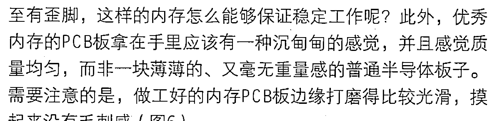

### 4. 如何选择适合超频DDR2内存

超频CPU需要配合超频好的内存，但是怎样才能买到超频好的内存呢？内存超频直接的受益方就是CPU。CPU通过外频的升高，间接要求了内存的工作频率进一步的升高。尽管部分主板允许内存异步运行，但是此时依然会折损性能。既然超频CPU是为了追求更好的整体性能，那么内存频率也不可忽视。我们经常说超频时稳定压倒一切，这里就牵扯到了一个内存时序的问题，所有的品牌内存都会具有SPD，其中包含了这款内存的时序值。这个值有的厂家标得很保守，而有些则是标极限。我们要求DDR2内存不仅能够运行在更高的频率，时序也非常重要。

DDR2内存的延时都比较高，特别是在较高的频率时。因此，我们对于超频颗粒的要求将不仅仅是极限工作频率，而是包含延时参数。三星DDR2内存在市场上比较常见，其中最后两位编号为D5的颗粒有着不错的超频表现，很容易实现800MHz频率。此外，极少数采用E6结尾的颗粒也属于DDR2 667内存，一般可以在较高内存延时下超频到DDR2 800。

当然，即便是相同的内存颗粒，其超频能力也存在不小的区别。在这种情况下，建议大家根据内存条的时序参数来选择。事实上，大家所熟悉的Kingmax、Kingston、威刚、海盗船等都并非是内存颗粒厂商，但是这些内存条品牌厂商却与颗粒厂商保持紧密的合作，因而往往能够达到性能不俗的颗粒，并打造出适合超频的产品。以一些品牌DDR2 667内存为例，其SPD默认时序就达到“3-3-3-8”，远远优于普通产品的“5-5-5-12”，因此在适当降低时序要求后再超频到DDR2 800就轻而易举，甚至有望冲击DDR2 1066模式（图7）。

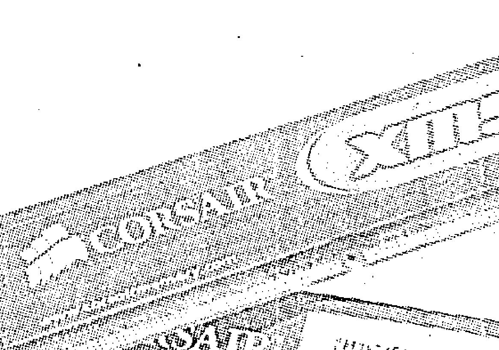

图7 很适合超频的海盗船内存

## 5. 如何鉴别假冒内存

假冒内存主要有两种：假冒更高的频率和假冒品牌。不少内存颗粒具有很强的超频能力，因此无孔不入的奸商就想到打磨内存颗粒的作假手段，然后再加印上新的编号参数。其实，我们只要在强光下细心观察，一眼就可以看出区别。打磨过后的芯片暗淡无光，有起毛的感觉，而且加印上的字迹模糊不清晰。当然，更有过分的甚至连芯片打磨的“工序”也省下了，直接更换产品的包装来以次充好，此时大家直接查看内存芯片的编号即可识别，部分知名品牌还能通过电话查伪（图8）。

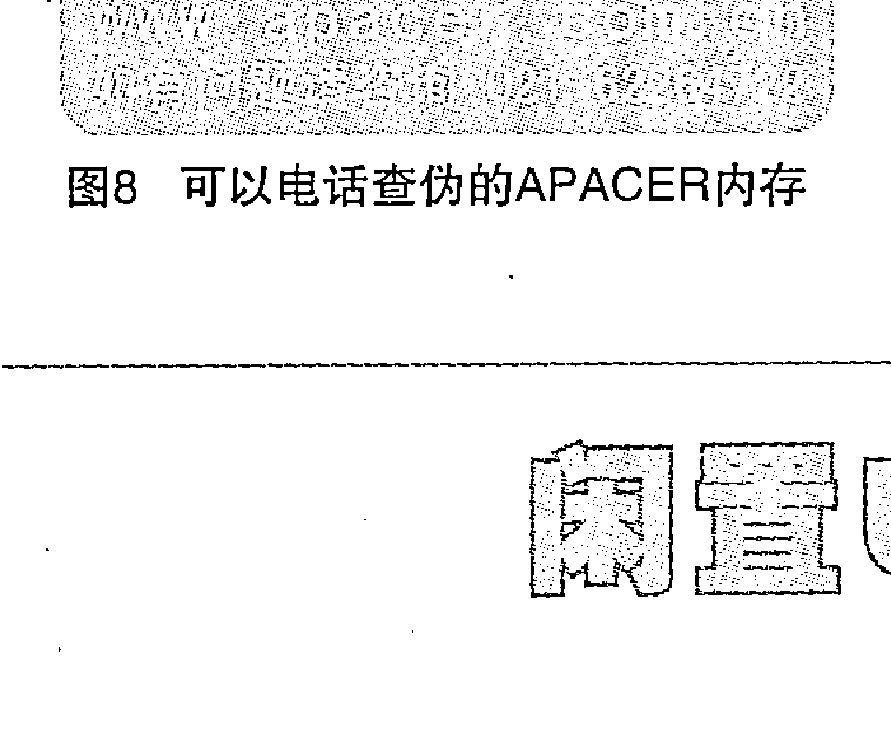

图8 可以电话查伪的Apacer内存

此外，部分品牌内存都有专门的鉴别方法。Kingston内存目前共有变色防伪标和缩微印刷防伪标两种识别技术，而且已经非常成熟。变色防伪标就是贴在Kingston内存产品的内存颗粒上的那个长方形规格标签，用户从不同的角度观察其中的Kingston人头像，会反射出不同的颜色，垂直角度观察为玫瑰红，斜向角度观察为橄榄绿。Taggant ID缩微印刷防伪标技术可以说达到了人民币缩微印刷防伪的级别。不过要通过缩微印刷防伪标检验存储卡或内存真伪，需要借助Taggant ID显微镜，只有部分代理商和规模比较大的经销商才可能配备。Kingmax推出的“关公红芯”防伪技术是在PCB板正面第四颗颗粒的位置设定了一颗采用Kingmax全球独家专利的TinyBGA封装技术的红色Coding颗粒。这是Kingmax独家拥有的专利技术，可以说使其产品具备了不可复制性。

```
进行计算(C) 关于Super π(A) 日文帮助(H)
000小时 00分 01秒 [ 1.6万行]
- 还没有进行计算呢 [ 3.2万行]
000小时 00分 01秒 [ 6.5万行]
000小时 00分 08秒 [ 13万行]
- 还没有进行计算呢 [ 26万行]
- 还没有进行计算呢 [ 52万行]
000小时 00分 39秒 [ 104万行]
000小时 02分 00秒 [ 209万行]
000小时 03分 35秒 [ 419万行]
000小时 07分 28秒 [ 838万行]
000小时 15分 32秒 [1677万行]
- 还没有进行计算呢 [3355万行]
```

## 写在最后：

在购买内存之后，随后的稳定性必须关注，因为能够顺利进入操作系统并不等于万事大吉。一般而言，大家可以使用高位Super Pi运算来验证内存稳定性。当通过这一测试单元之后，保险起见还可以运行一下SP2004来考验整机稳定性。至于优化软件，必要性并不是很大，因为这些软件大多适用于内存容量奇缺的年代。真正需要大家做的只是在BIOS中适当使用更高标准的内存延时参数即可（图9）。

## 闲置UPS起死回生记

□TMG mh

笔者家里有一台闲置的UPS，几乎一年没使用了，碰巧小区最近回收各种电脑的配件以便支持贫困地区，笔者想将这台UPS捐献出去。总不能捐献坏的吧，于是笔者通电测试其是否还能工作。笔者把这台UPS接入电脑，开机后无任何反应，输入交流电后重新启动机器，UPS指示红灯闪烁不停，虽有交流电输出，但有“喳喳”的声响，同时电流时断时续非常不稳定。这到底是怎么回事？按理说不可能发生损坏，当初使用时没有任何问题，最后不使用了也把它放在一个安全的地方以避免磕碰，所以UPS不应当受硬伤损坏。是不是长时间没充电其内部电量不足了？检测电量之前，我从说明书得知，这台UPS内置两块12伏的电池进行串联，输出电压应该为24伏。我打开箱盖用万用表测试，发现电池组的电压只有区区的12伏，只相当于一块电池的电压，测单块电池电压只有6伏。抱着试试看的心态，我尝试给这台闲置过久的UPS充电，先给它充了18个小时。然后再次用万用表测试，发现电池组的电压上升到了17伏左右，试机查看能否正常工作，但警报声长鸣，指使红灯长亮，欣慰的是“喳喳”声音消失了。看来还是电压不足，再多充电试试，于是笔者第二次充了一天多的时间，几乎30个小时左右。笔者用万用表测试，发现电池组的电压到达了21伏，看来接近正常值了。笔者开机尝试，果然绿色灯亮，用其给电脑供电，电脑可以顺利工作十几分钟。至此，问题彻底解决，闲置的UPS终于起死回生！事后总结，笔者的UPS长时间没有使用，所以使得电池放电造成放电过量，电压也就很低，逆变器不能使用，这台UPS也就不能履行供电的职责了。■

## 省电就是省钱，电脑省电要点概述

□龚师傅

> 随着气候变暖和石油价格暴涨等环境及能源问题日益严重，将节省电力和能源效率作为重要课题并不只是一个暂时现象，事实上，如果在我们生活的各方面都能降低电力消耗的话，将不只有利于减少二氧化碳的排放量。由于互联网普及，家用电脑数量急剧攀升，如果每个家庭都能节省一度电的话，那节省下来的数字将会非常惊人，节约能源人人有责，下面我们就来谈谈如何使你的电脑更省电。

### 一、选购一台省电的电脑

我们来看看如何选购一台省电的电脑，这是让电脑省电的根本所在。尤其在网吧、机房这类大规模用机的商业场所中，的确值得认真考虑。如果每台机子能省下哪怕百分之一的电能，多台电脑常年累计下来也不是个小数目。

首先应考虑CPU的选择，现在CPU几乎是一台电脑最大的耗能配件。在CPU的功耗控制上，无论是英特尔还是AMD目前都非常重视。过去AMD平台的CPU，由于实际运行主频较低，从而具备了较大的省电实力。不过自从英特尔从奔腾D高功耗高频率的误区走出来以后，酷睿架构凭借强大的性能和超低的功耗迅速帮助其夺回了市场（图1）。将要推出的奔腾E2220系列产品的功耗更是低至45W，AMD也不示弱，其Athlon X2 BE-2350的功耗也仅在45W，配合同样低功耗的AMD 570X芯片组主板以及HD 2600Pro，可以组成强大的“3A”平台。AMD还发布了一款省电的Phenom四核处理器，工作频率为1.8GHz，功耗仅为65W TDP。当然目前功耗最低的CPU产品当属汉腾VIA的C7系列，功耗不到20瓦，不过C7的性能太低，无法进入主流市场（图2）。

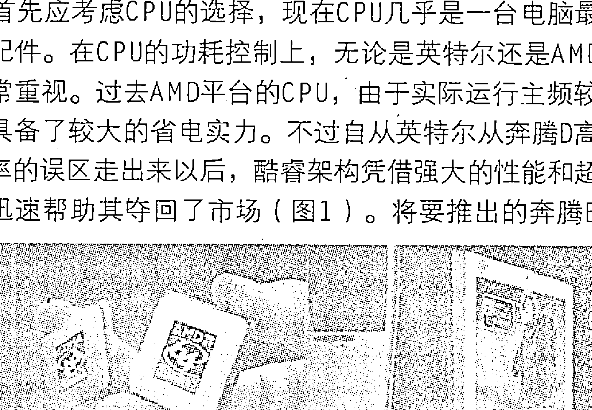

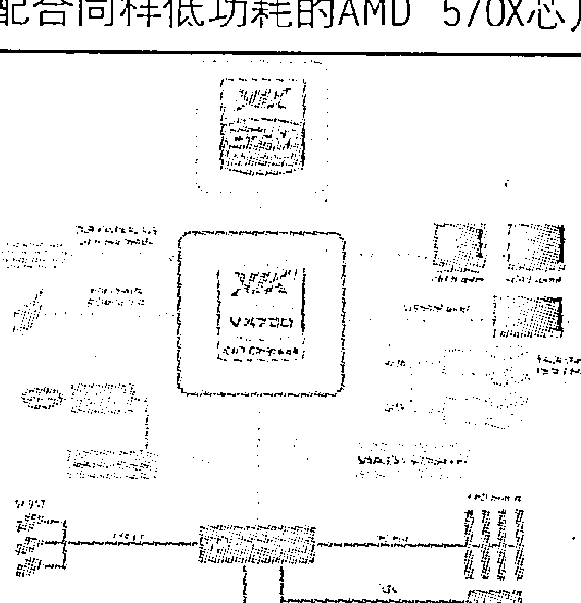

其次就是显示器，建议尽量选择液晶显示器，与同尺寸的CRT显示器相比，通常可省电近一半，但是要注意某些采用奇美液晶面板的低价产品通常具有较高的功耗，尤其是19英寸宽屏显示器，其U型六灯管的设计令其耗电量达到惊人的65W。而现在有些采用特殊节能芯片的17英寸CRT显示器，功耗不高于60W。当然这只是特殊情况，目前市场上大多数19英寸LCD的能耗都低于50瓦。飞利浦在功耗控制方面的成就更是相当突出，其19英寸LCD的功耗通常只有30多瓦，比起CRT显示器来说还是要省电不少。

现在高性能的3D显卡，尽管可以为我们带来不俗的游戏体验，但其耗电也是惊人的。如果不怎么玩游戏的话，最好换成集成显卡，这样能省电不少。另外老牌显卡厂商Matrox再次出手，推出全新的P690无风扇超静音版商用显卡，性能一般，但功耗控制在12W以下，相当省电。

硬盘耗电尽管不怎么起眼，但还是有省电的潜力可挖。WD的Caviar GP 系列硬盘提供了“省电”的重要特性，可藉由调节硬盘转速来达到省电的目的。另外采用SATA接口和省电芯片的产品也比较省电（图3）。

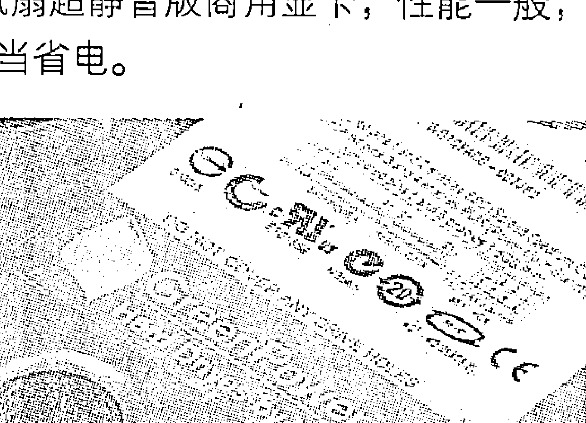

电脑配置的ATX电源功率因数和整机效率应该尽量高，这对整机省电有较大影响，现在市场上也有高效的省电电源可以选择。最后提一下，如果没有特殊原因，建议大家尽量购买并使用笔记本电脑，通常一台笔记本电脑的整机功耗仅有几十瓦，大大低于台式机功耗。

### 二、台式电脑的省电要点

对于台式机而言，良好的使用习惯可以帮助我们节省不少的电能。一般来说有以下几点要特别注意：如果短时离开电脑，建议使用键盘上的快捷键直接将电脑置于待机状态，如果长时间不使用，最好彻底关机。平时在关机后，应拔下电源插头或关闭电源接线板上的开关，一定养成这种彻底断电的习惯，避免电脑在关机后仍通过电源继续耗电，这样不但可以省电，还可以防止电脑意外损坏。另外，适当的降低显示器的亮度，也可以有效的降低电脑的耗电量，而定期的对电脑主机进行内部的灰尘清理，也可以有效的避免因散热不畅而造成的电能浪费。

惯，而不要让其处于通电状态，电脑通电状态的耗电量仍有10多瓦，同时也潜藏安全隐患。关掉计算机主机后，别忘记同时要彻底关闭显示器、打印机、音箱等外设的电源开关。现在市场上有一种智能节电插座销售，这种插座可以检测计算机主机是否已经关闭，如果已关闭，则可以切断插座自身的电源，对办公室用户而言特别有用。

尽量降低显示器亮度，在做文字编辑时，可将背景调暗些，节能的同时还可以保护视力、减轻眼睛的疲劳强度。当电脑在播放音乐等单一音频文件，或者在下载大文件，暂时不用显示器的时候，最好彻底关闭显示器。在夜间进行渲染、BT下载等无人值守操作时，也应关闭显示器电源，同时建议使用这类软件的任务完成后自动关机功能。

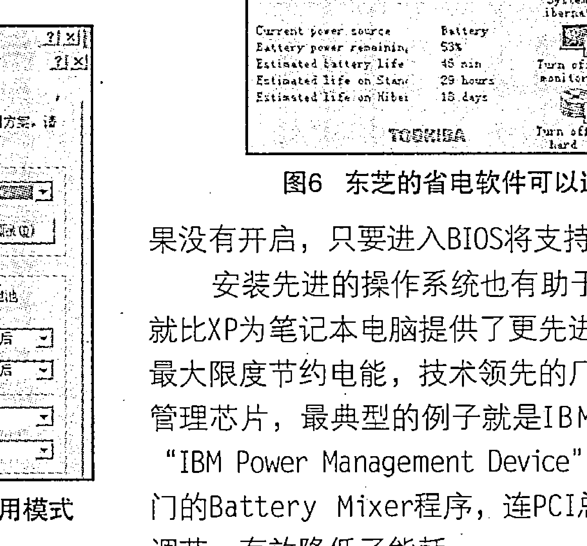

另外在主板BIOS中打开AMD CPU的CNQ技术（cool and quiet），可以在CPU空闲的时候自动降频来达到节电的目的（图4）。

### 三、笔记本电脑省电概述

首先在安装操作系统时，应该选择“便携机”模式，这样就会获得操作系统在节能方面的更多支持。在电源管理中，也要选用“膝上袖珍型”模式。同时为省电可以从以下点滴小事做起：将暂时不用的红外端口、蓝牙、WIFI关闭，因为它们也会消耗你一点电能；将音量调为静音，要用时再打开；调低液晶屏亮度，将屏幕背景调为白色可以更加省电。如果无法直接调低液晶屏亮度，可以用专门的软件来调整。

要节省电能，还应仔细研究笔记本电脑的CMOS设置里提供哪些节电的优化调节选项，然后选择合适的节电模式（图5）。比如东芝本本BIOS中大都有一项“Power Savings”，其中可以选择“Maximum Battery Life”和“Maximum Performance”等多个选项。我们要根据实际的需要选择（图6）。另外现在大多数新型号的笔记本电脑在BIOS中都对CPU的节能技术给予了支持，默认状态下是开启的，如

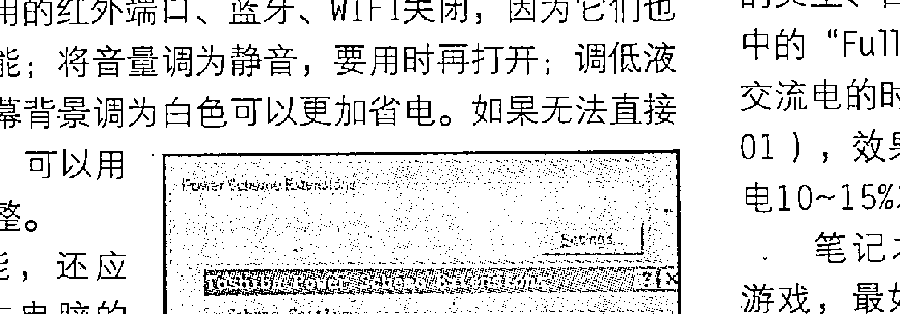

果没有开启，只要进入BIOS将支持选项打开就OK了。安装先进的操作系统也有助于节能，比如Windows Vista就比XP为笔记本电脑提供了更先进的电源管理功能，另外为了最大限度节约电能，技术领先的厂家自行开发自己专用的电源管理芯片，最典型的例子就是IBM，其笔记本电脑中都装备了“IBM Power Management Device”专用电源管理芯片，配合专门的Battery Mixer程序，连PCI总线耗电和CDROM速度都可以调节，有效降低了能耗。

有些软件，能有效节省笔记本电脑的电能消耗，首先我们应用好厂商自带的节能软件，比如Battery MaxMiser就是ThinkPAD上一款很有特色的电源管理程序，在BatteryMaxMiser中，你可以选择IBM已经为你定制好的多种主题，SONY的电源管理技术PowerPanel也有类似的功能。而像华硕、东芝等厂家的笔记本电脑还专门设置了能耗切换的快捷按钮，可以快速设定不同的节能状态。

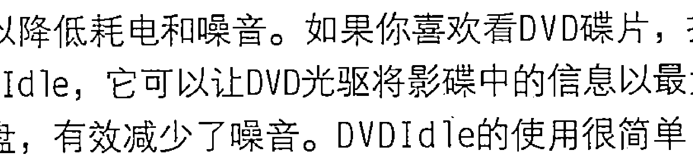

如果你的笔记本电脑采用IBM或日立硬盘，这类硬盘采用了“自适应电池增效技术”，可以加载一个Power Booster软件，它会在后台每隔5秒钟监测一次是否有读写硬盘的动作，然后根据你的设定（从最省电到最佳性能）来使硬盘进入省电模式。PB的界面极其简洁，最主要的调节部分就是中间的滑动条，从最左侧的最省电到最右侧的最佳性能，对应从0×01至0×FF的各种省电级别，其中从0×01至0×7E表示允许磁盘停转的各种省电级别，0×80至0×FE表示不允许磁盘停转的各种省电级别，至于0×FF则是表示禁用硬盘的这种省电特性。单击About你就可以看到现在你的硬盘的详细情况了，包括硬盘的类型、固件版本和目前的省电级别（0×01至0×FF）。其中的“Full performance with AC power”指的是在使用外接交流电的时候不需要省电。如果把PB设定为最省电级别（0×01），效果还是比较明显的，一般的操作环境下，大概能节电10~15%左右。

笔记本中光驱的耗电不可小视，如果你喜欢玩光盘游戏，最好使用虚拟光驱软件，也可通过Nero软件包中的DriveSpeed命令来降低光驱的运行速度。打开DriveSpeed之后，我们只要从Read Speed的下拉式选单中直接选择期望的读取速度即可，非常方便。一般将光驱读盘速度调整到10X以下，就可以降低耗电和噪音。如果你喜欢看DVD碟片，推荐大家使用DVDIdle，它可以让DVD光驱将影碟中的信息以最大速度预读到硬盘，有效减少了噪音。DVDIdle的使用很简单，在系统属性中打开光驱的DMA模式之后，选择一下DVD光驱盘符即可。DVDIdle可以支持PowerDVD、WinDVD，安装后在播放DVD时会自动启动，无需人为干预。

### 一、噪音解决方案：热管静音显威力

倘若对于显卡风扇的噪音十分敏感并且不需要对显卡超频的话，大家可以考虑购买不带风扇的被动式热管散热器。这类“零分贝静音”散热器的基本原理就是利用蒸发制冷，使得热管两端温度差很大，使热量快速传导。热管本身作为一种被动式的散热系统，不耗电也不产生噪音，散热能力很强，通过附在芯片正反两面的金属片吸收显示芯片传过来的热量，而其本身也能依靠里面的冷却液挥发热量同时传达至表面的大型散热片挥发热量。

导热管技术的原理其实很简单，就是利用工作流体的蒸发与冷凝来传递热量。由于其特殊的工作原理，我们建议大家在购买时还需要考虑一下机箱的散热环境。假如采用散热通道比较理想的38度机箱，那么配合热管散热器是很不错的方案。而对于那些老式机箱，甚至没有使用机箱风扇的用户，这类产品可得谨慎购买了（图1）。

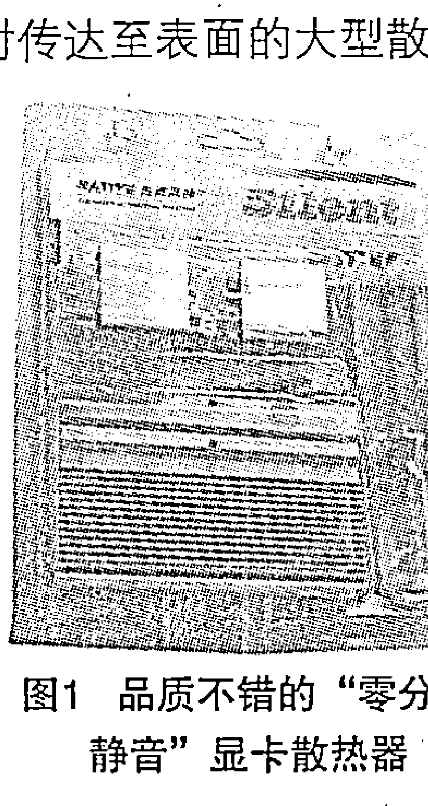

### 二、游戏用户首选：全铜散热器

显卡的散热结构并不复杂，GPU核心与散热片之间使用胶水紧紧地粘合，而风扇利用散热片之间的空隙固定。毫无疑问，大多数中低价位显卡所使用的散热片不够大，这也是超频幅度难以提高的原因之一。为此，建议大家使用表面积更大的全铜质散热片（图2）。显卡风扇建议选择滚珠风扇，它利用多个钢珠来作为减小摩擦的介质，所以风力大、寿命长、噪音小且不用加润滑油。

此外，如果大家不介意占据一个PCI插槽，那么选择那些体积较大的显卡风扇将能取得更加出色的效果。安装显卡散热设备并不困难，基本上与CPU风扇没有区别，而唯一值得我们注意的便是散热片与GPU表面的粘合。其实，选用具有粘性的导热硅脂是最佳的选择，一般电脑城都有卖。部分产品采用背夹来固定，不过稍有设计不当就会出现一些兼容性问题，这类产品安装起来并不方便。

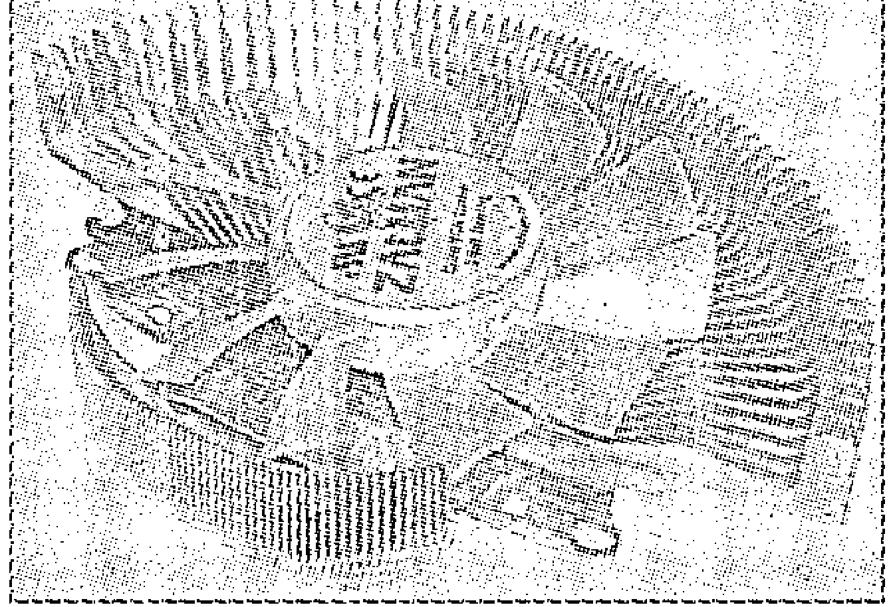

### 三、公版显卡的选择：标准散热器

为了简化安装过程并提高散热效率，不少散热器厂商针对nVIDIA或是ATI的公版设计而推出了专用散热器，这无疑是非常理想的选择。这类公版散热器一般都设计得比较贴合显卡，而且固定方式多为利用板卡上的固定卡孔，既方便又牢固。不过需要特别注意的是，不是每一款针对公版显卡的标准散热器都有非常理想的效果，建议大家在更换之前仔细对比一下原装散热器。由于显卡散热器的风扇尺寸几乎固定，因此决定散热效果的关键因素在于散热片。假如标准散热器的散热片的材质与表面积并没有明显超过原装散热器，那么就没有更换的必要。

### 四、细节决定成败：关注显卡散热附件

在热管显卡散热器的安装过程中，涂抹硅脂和安装热管非常关键。如果方法不当，不仅会把硅脂搞得到处都是，且散热效果不佳。为此，尽量选择那些提供优质含银硅脂以及涂抹工具的产品，这样可以确保硅脂与散热片的充分接触。除了GPU核心的散热，我们还有必要为显存加上散热片，这样可以提高显存的工作频率，大大提升显存带宽。假如显卡散热器没有覆盖到显存，那么大家可以独立购买。在大中城市的电脑城一般都能买到十分便宜的专用显存散热片，而且背部涂抹了特殊的导热贴，使用很方便（图3）。这类显存散热片一般为铝材制作，价格大约为5～8元一片。当然，动手能力出色的朋友也可以自己使用铝合金或全铜材料来制作散热片，然后使用具有粘性的导热硅脂来粘合。

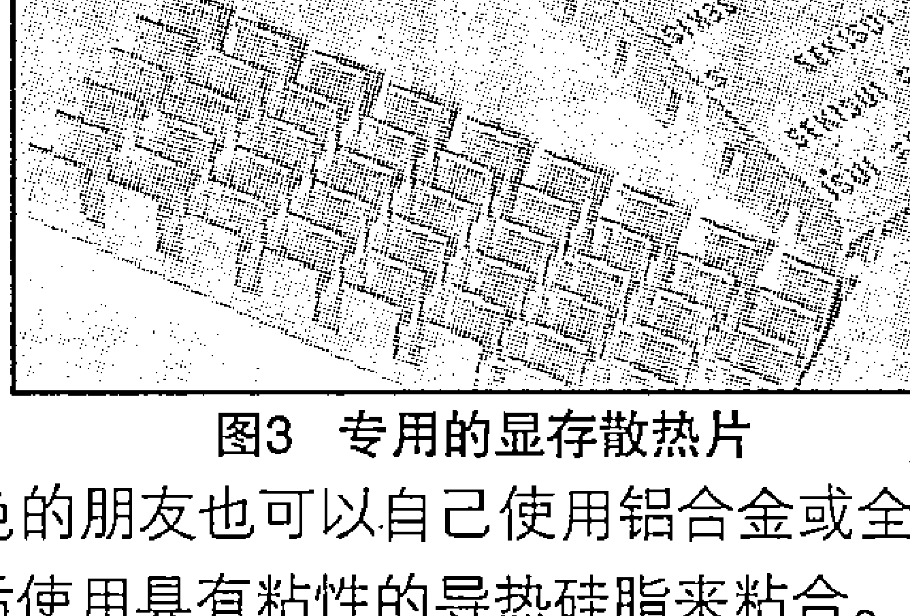

| 型号 | 适用范围 | 传热方式 | 风扇 | 参考价格 |
|---|---|---|---|---|
| Silencer NV5 | GeForce 6800/7800/7900 | 全铜散热片 | 有 | 320元 |
| Zalman VF700-Cu | 全部显卡 | 全铜散热片 | 有 | 280元 |
| 酷冷至尊CoolVive | 全部显卡 | 热管 | 有 | 98元 |
| 九州风神SNOWMAN V20 | 全部显卡 | 热管 | 有 | 168元 |
| UNIKA冰翼 | 全部显卡 | 热管 | 有 | 99元 |
| Arctic Cooling ATI Silencer 4 | X800 | 全铜散热片 | 有 | 310元 |
| Evercool夜鹰VC-F117 | 全部显卡 | 全铜散热片 | 有 | 180元 |
| Tt DuOrb双风扇 | GeForce 8800系列 | 热管 | 有 | 399元 |
| 超频三SVC-737CU 金蝠 | 全部显卡 | 全铜散热片 | 有 | 99元 |
| 劲冷VGA散热器-F117 | 全部显卡 | 全铜散热片 | 有 | 139元 |

## 深入硬盘内部世界
——开盘数据恢复

□方成亮

一旦硬盘的磁头或是电机出现故障，那么普通软件类修复方法将无能为力，只能通过打开盘腔后进行深层次数据恢复。如今，很多数据恢复公司从事这类服务，其收费往往高达几千元。但是，假如大家的数据并不是非常重要，而丢弃又觉得可惜，那么完全可以自己尝试着进行开盘操作。

### 一、开盘所需要的环境与准备工作

在很多用户的印象中，进行开盘操作的工程师总是全副武装，俨然一副大夫的样子。而事实上，这完全是以讹传讹，甚至是被一些别有用心的数据恢复公司故意利用。在国外，的确有非常严格的开盘环境要求，但是这仅仅是针对一些军工级别的应用。对于普通的民用或是商用市场，大家完全无须吹毛求疵。

#### ①. 超净间并非必须环境

按照很多数据恢复公司的说法，开盘工程师在进入超净间之前必须穿着洁净服，而且此前还得在风室内吹走身上的灰尘，这样才能保证进入超净间后不会降低其洁净度。但事实上，普通开盘操作对于环境洁净度的要求并没有那么高，特别是民用领域，完全不必如此大费周章。

虽说硬盘内部的工作环境洁净度达到10级，但是这是指长期稳定运行。由于我们的开盘操作一般短时间内就可以完成，所以普通没有明显灰尘的环境就完全可以了。这里对于“普通没有明显灰尘”的定义可以是相对干净的小区，并且应当关闭门窗。一般而言，将硬盘打开时间在1小时以内，普通环境下造成灰尘颗粒划伤盘片的概率小于3%。从数据恢复的角度来看，这样的环境显然已经不错了。至于飞客、韩新等极少数数据恢复公司坚持使用高级别的超净间，这完全是为了避免一些小概率事件。由于这类公司的开盘操作次数很多，此时才有必要使用。最后要提醒大家的是，在操作时最好戴上口罩，否则呼吸时带出的气体容易引起扬尘（图1）。

> > **小贴士**
> > ### 超净间的级别划分
> > 所谓的10级、100级、1000级超净间，指的是单位体积内大约一定体积的尘埃数目，数字越小表示洁净度越高。一般而言，较为清洁的普通环境大约只有10万级别的洁净度，但是对于普通要求下的短时间开盘操作而言也的确是够了。当然，更高的洁净度对于开盘肯定是有好处的，只是普通用户没有必要提出如此高的要求。

#### ②. 确认开盘的必要性

并不是所有的硬盘内部故障都可以通过开盘来解决，因此我们需要根据实际情况再结合经验来判断。事实上，在打开硬盘之前，有经验的数据恢复工程师一般都会凭借经验判断故障部位。如果在加电时没有听到硬盘转动声音且更换电路板后也没有效果，那么很可能是电机故障。而如果转动声音很正常且伴随着“咔哒”声，则多半是磁头故障（此时应尽可能减少加电次数），需要更换磁头后才能恢复数据。然而需要指出的是，硬盘加电出现“咔哒”的敲盘声并非完全是磁头偏移，很多迈拓硬盘在固件信息损坏之后也会有这样的现象，少数西数硬盘也是同样的情况，而IBM/日立和希捷的硬盘则很少会固件损坏，因此具体问题还是得分门别类地判断。

> > **小贴士**
> > ### 如何避免固件损坏的误判
> > 部分非专业的数据恢复服务商甚至都不知道如何去区分固件故障与磁头故障，其实要做到这一步很容易，其核心思想便是电路板热交换。在带电的情况下，将电路板热插（要求相同型号与Model号的电路板）。如果此时还是无法导出数据，则可以确定是磁头或是电机等内部盘腔故障。

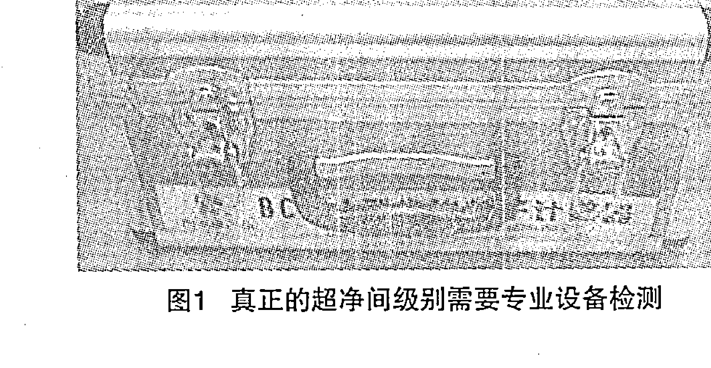

### 二、实战开盘数据恢复

在整个硬盘结构中，磁头的精密度非常高，一般出现故障后也难以修复。当遇到硬盘因为磁头故障而无法读取数据时，可以直接将相同品牌与型号（严格要求## 1. 开盘的基本手法

事实上，所谓的开盘数据恢复以更换磁头为主。但是，大家可别小看这一步，毕竟硬盘内部的精密度相当高，稍不留神就可能导致数据彻底报废。从技术角度来看，换磁头也并非是高深莫测的技术。由于很多硬盘内部故障是磁头芯片烧毁、磁头老化、磁头臂机械故障，因此换磁头是非常简单而有效的数据恢复方法。

- （1）打开硬盘外壳

首先我们卸下电路板，然后使用六角螺丝刀将硬盘的上盖打开。使用六角螺丝刀还是非常简单的，对准位置后稍微用力就可以搬动螺丝。唯一要注意的是，此时千万不能用蛮力，因为六角螺丝刀比较精密，稍不小心很容易损坏。硬盘的密封都十分结实，但是只要使用六角螺丝刀也很好处理。分别拧下各个六角螺丝之后，就可以打开硬盘的上盖，此时也能清晰看到其内部结构（图2）。在打开硬盘上盖之后，大家就必须特别小心灰尘了，千万不能因为说话或是周围的电风扇而形成扬尘。建议大家一定要找一张平整的工作台，而且最好下面垫一张防静电的橡胶皮，同时戴上手套和口罩。

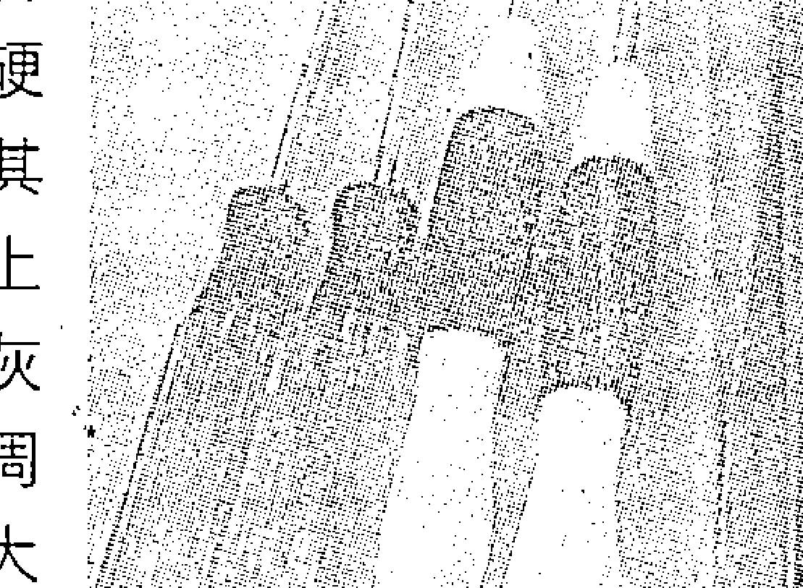

- （2）卸下磁头

此时，大家已经可以清楚地看到硬盘内部的磁头，不过可不要随便急着动手，因为我们还得将磁头的驱动臂固定架先取下来。磁头的驱动臂固定架有一块磁铁，磁力非常大，所以建议大家拧下螺丝后用老虎钳将上方的盖片取下（图3）。对于大多数台式机硬盘，经过这一步还不能直接取下磁头，因为硬盘反面往往还有一个螺丝起着固定作用（图4）。

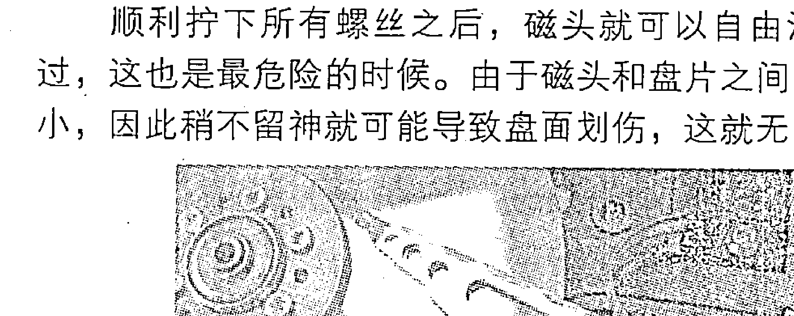

顺利拧下所有螺丝之后，磁头就可以自由滑动了。不过，这也是最危险的时候。由于磁头和盘片之间的距离非常小，因此稍不留神就可能导致盘面划伤，这就无力回天了。

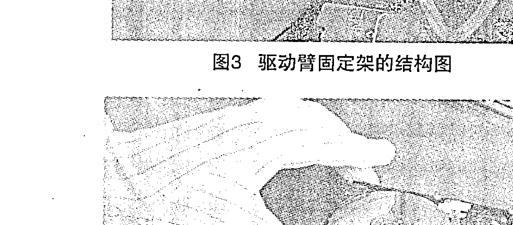

正确的做法应该用一根牙签托着磁头的前1/3处，然后小心翼翼地取下磁头。这一步完全依靠大家小心谨慎的操作，也是开盘能否成功的关键（图5）。

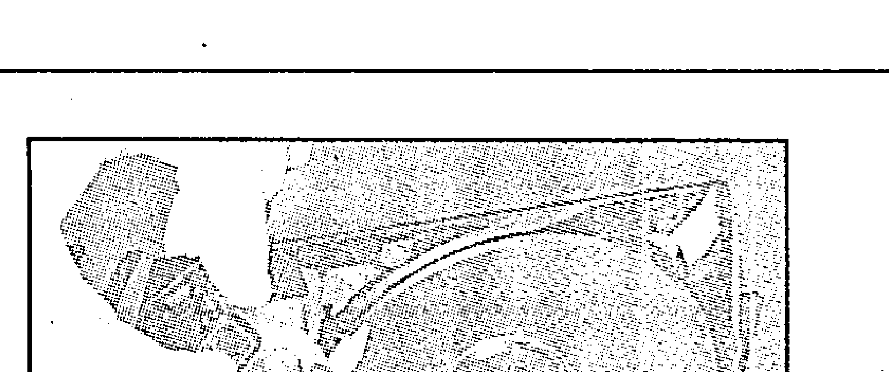

- （3）安装磁头

对于一块相同的备件，我们也得采用相同的操作，目的便是取下完好的磁头。但是相对卸磁头而言，其实安装磁头是更加困难的操作。安装磁头的时候，我们得寻找一个支点，因此建议先将磁头稳定地架在固定轴上方，然后使用镊子顶住电机以防止滑动，再缓缓地使其滑上盘片。一般情况下，只要大家安装正确，那么并不会划伤盘面（图6）。

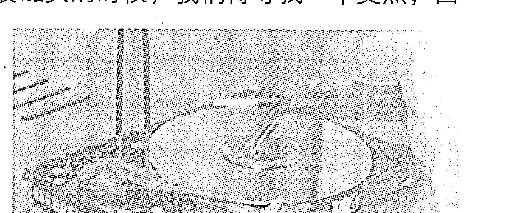

## 2. 特殊硬盘的处理手段

尽管开盘的大致方法可以很简单地进行总结，但是对于一些特殊型号的硬盘，我们很有必要掌握一些经验，此时才能大幅度提高开盘成功率。

- （1）笔记本硬盘

按照很多人直观理解，更加精密的笔记本硬盘似乎很难进行开盘操作，其实不然。由于笔记本硬盘往往磁头数较少，因此大家打开后会发现其结构比台式机硬盘更加简单。此外，笔记本硬盘一般都考虑到抗震设计，所以磁头稍微偏移一些也无妨，其自动校正能力非常出色。在进行笔记本开盘时，上磁头是需要特别注意的。以日立笔记本硬盘为例，大部分都在盘片边缘有一个起落架，这是我们要好好利用的。在稳定放上磁头之后，只要顺着方向移动磁头臂，磁头就会很顺利地进入起落架，此时的定位将是最为准确的。

- （2）昆腾硬盘

这里所指的昆腾硬盘包括迈拓D540X/D740X等后期产品，因为这些也是由昆腾生产的，只不过因为当年的收购原因而打上了迈拓的商标。对于这些昆腾硬盘，建议大家不要对开盘成功率抱以太高的期望值。由于这些硬盘的磁头是方形的，因此卸下或是安装磁头时很容易导致磁头损坏。在没有机械手辅助的情况下，个人顺利更换磁头的成功率往往低于20%。不过，在万般无奈之下，大家可以尝试卸磁头时直接将一张质地柔软的薄纸垫在盘片边缘，这样可以防止刮伤磁头，适当提高一些成功率。

- （3）西数硬盘

西数硬盘的开盘操作并不困难，但是由于磁头芯片和固件之间存在校验，因此开盘更换磁头后，依然会显示固件问题。对于这一问题，一般需要使用PC3000专业工具进行处理，而且涉及到的情况比较复杂。因此，建议大家针对西数硬盘只是在做好恢复失败心理准备的情况下，直接打开看看是否有磁头卡住的现象。否则，更换磁头并不是明智的选择。

## 迎接四核时代
——PC电源准备好了吗

□方成亮

> 据知情人士透露，Intel将于近期发布全新的四核处理器，因此Core 2 Quad系列将会大幅度降价。更加重要的是，AMD四核心Phenom X4处理器低价发售，四核心的普及时代已经来临。但是，四核心的到来却给电源选购提出了新课题，如果还需要进一步超频的话，那么电源的负担就更加重了。因此，如何为四核心时代做好准备，这已经是一门必修课。

## 一、四核时代更需大功率电源

在四核处理器普及之后，PC用户对于电源的功耗需求将会明显增加。以往，我们总是认为普通250W电源就足够了，但是四核心时代的到来完全颠覆了传统观念，此时电源选购也必须与时俱进。

### 1. 四核PC的功率有多大

以四核处理器为例，目前G0步进的Core 2 Quad 6600系列处理器的TDP功耗为95W，而老型号的产品则高达130W。即便是一向在功耗方面有着优势的AMD，其新发布的Phenom 9500/9600处理器也达到89W TDP功能，这都远远高于当前主流的双核处理器。此外，Intel最新发布的Core 2 Extreme四核系列也达到130～136W TDP功耗，这都对PC供电提出严峻的考验。

特别不可忽视的是，选择四核心处理器的用户一般都组建高端平台，此时其它配件的功耗也相应较高。以当前顶级的GeForce 8800以及Radeon HD2900为例，全速运行3D程序时的功耗都超过了100W。如果大家还需要使用双硬盘RAID磁盘阵列，再加上双通道内存以及其它周边设备的能源开销，PC功耗突破350W非常轻松。对于电源选择来说，通常是基于“留有余地”的选择，也就是额定功率应该稍稍大于总体实际功耗。为此，一款400W以上的电源对于使用四核心处理器的用户而言自然是不可或缺的。目前，以长城为代表的一线品牌已经推出了为四核以及双显卡SLI专门优化的电源，譬如长城双卡王BTX-500SE和双动力BTX-500P4等，这类产品更加值得大家关注。

### 2. 实际功耗其实更大

对于CPU厂商来说，过高的功耗总是一件尴尬事。因此，诸如TDP功耗甚至平均功耗概念被不断推出。不少DIY用户以为CPU的TDP功能下降，那么电源的供电压力就大幅度降低了。其实，尽管不少四核CPU看似比单核CPU的TDP功耗提高不大，但是这并不意味着实际电能耗费也是相应的等比例。TDP是指CPU电流热效应以及其他形式产生的热能，它们均以热的形式释放，对于散热要求有着极大的参考意义。双核CPU和四核CPU通过一些改进设计，的确能够控制TDP，可是一旦所有的核心全速运行，此时惊人的功耗是不可避免的。因此，我们建议使用四核处理器的用户还是得重视电源选购，尤其是超频用户更加应该加以重视。

## 二、从V1.3到V2.3：深入了解ATX电源的版本

在选购ATX电源之前，了解版本之间的区别非常重要，这是电源性能与适用范围的分水岭。目前市场上的主流电源都至少遵循V2.0规范，但是也有部分产品采用V1.3或是V2.3标准。相对而言，我们可以将V2.0与V2.2规范看成一个整体，后者是前者的加强补充，而V1.3规范则属于基本被淘汰的边缘。

### 1. 主板电源插头的巨大变迁

V1.3版和V2.X版最直观的区别就是主板电源插头，其中V1.3版ATX电源没有使用合在一起的24pin接口，而V2.0版则将20pin与4pin整合为24pin（图1）。不过需要提醒大家的是，接口形式只是表面现象，V2.X版ATX电源的真正内涵在于两路+12V输出。CPU和显卡这两个“用电大户”都采用12V供电，因此传统的单路+12V输出显得力不从心。V2.X版ATX电源分将单路+12V输出改为双路+12V输出。不过这种设计并非是提高供电，因为分两路后的电流也下降了，其作用在于降低电路发热量，类似于主板为CPU设计的三相供电技术。此外，V2.X版ATX电源普遍带有源生SATA供电线，可以直接为各种SATA设备供电，而不需要转接器（图2）。

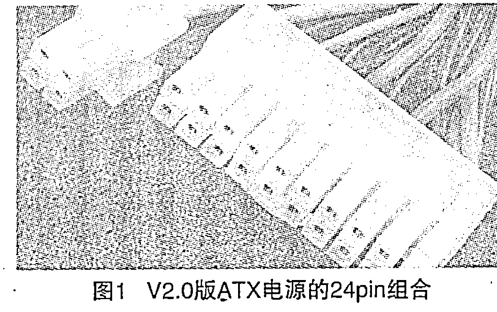

### 2. 双路12V输出引领潮流

而为了满足新一代大功耗配件的需要，V2.2规范中加入了450W的输出规范。双路12V最大联合输出功率可以达到400W以上，如此大功率输出，不论是应付何种高端平台都已不在话下。此外，V2.2规范中还进一步提高了电源的转换效率，并且加强了3.3V与5V的输出能力。

进入2007年，V2.3标准又新鲜出炉。该标准推出了180W、220W、270W三个功率级别的单路+12V电源供电规范，为入门级用户提供了一个经济型的产品方案。同时，针对大功率电源时，V2.3标准的+12V1输出能力得到了提升，+12V2输出能力则下降了，直接反映出显卡功耗的不断提升与CPU功耗持续下降的“鲜明”反差。但是，V2.3标准似乎对于低端配置更加有利，尤其是不需要独立显卡的整合主板将会受益匪浅。相反，需要超频的高端用户则对这一新标准并不感冒，因为CPU的功耗降低并不意味着对电源+12V2输出的要求下降，毕竟超频后的功耗依然非常惊人。

| ATX电源版本 | 发布时间 | 改进内容 |
| :--- | :--- | :--- |
| V1.0 | 2000年2月 | 增加4pin主板供电接口 |
| V1.1 | 2000年8月 | 增强+3.3V供电能力 |
| V1.2 | 2002年1月 | 取消-5V输出 |
| V1.3 | 2003年4月 | 增强+12V供电能力 |
| V2.0 | 2005年2月 | 将+12V分为双路输出 |
| V2.2 | 2006年1月 | 增强双+12V供电能力，加强+5V输出，提高转换效率 |
| V2.3 | 2007年4月 | 优化双+12V供电的配置 |

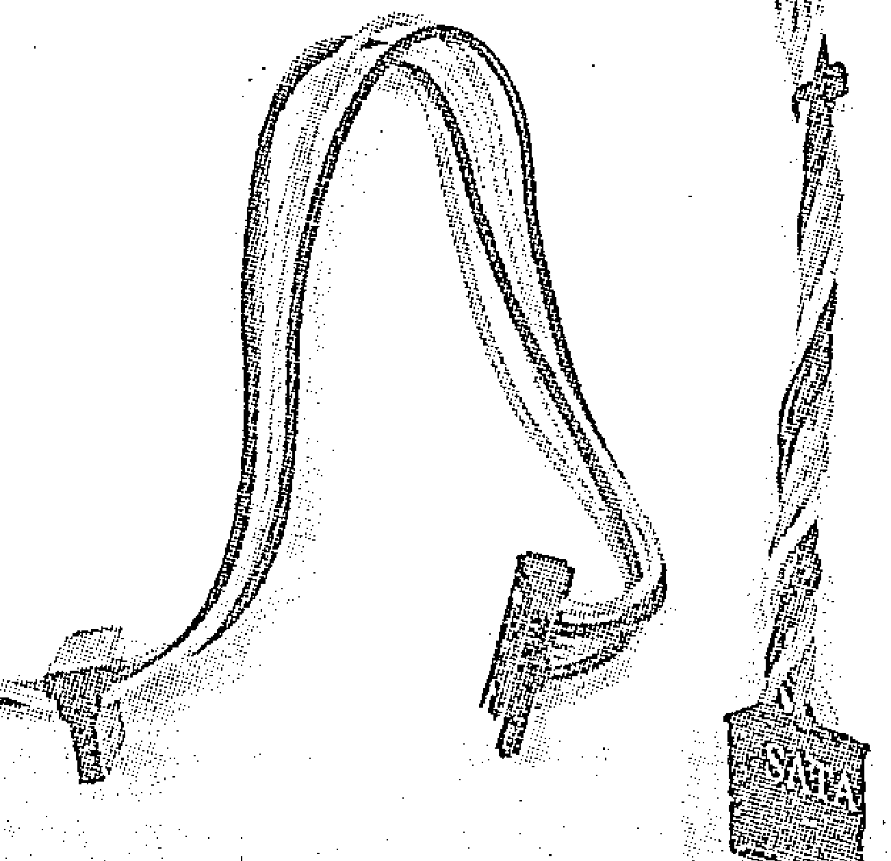

> CPU功耗下降就能忽视电源选购吗？
不少DIY用户以为CPU的TDP功耗下降，那么电源的供电压力就大幅度降低了。其实，尽管不少双核CPU与单核CPU的TDP功耗数值是相同的，但是这并不意味着双核CPU的另外一个核心不会额外耗费电能。事实上，TDP是指CPU电流热效应以及其他形式产生的热能，他们均以热的形式释放，对于散热要求有着极大的参考意义。双核CPU和四核CPU通过一些改进设计，的确能够控制TDP，可是一旦所有的核心全速运行，此时惊人的功耗是不可避免的。因此，我们建议使用双核乃至四核处理器的用户还是得重视电源选购，尤其是超频用户更加应该加以重视。

## 三、功率判断：避免电源功率虚标

很多用户都已经意识到了电源功率的重要性。在使用四核心CPU以及双显卡SLI的时候，配置一台质量可靠的电源远远不够，400W以上的额定功率很有必要。但到底多大功率的电源才能满足系统的需要？如果铭牌没有标明功率，或者标称值存在很大的水分时，我们是否能判断电源的实际功率，而不是简单地根据型号进行识别呢？千万不要认为功率就是电压乘以电流这么简单！通过对电源外观的观察，我们也能大致判断一款电源的质量。如果发现一款标称400W以上电源的输出线很细，那么就很有必要对其实际功率表示怀疑了。细细的输出线必然存在较大的压降损耗，所以大功率电源往往采用粗线。

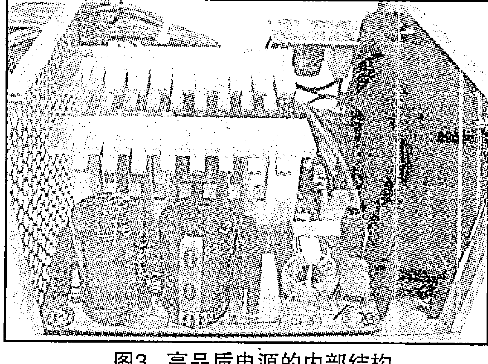

我们建议大家选择350W以上额定功率的电源，但是此时并不是仅仅看功率标称，而是要仔细辨别各个电压的安培值输出。双路12V输出是大家所要关注的重点，一般要求+12V1和+12V2的总安培数在28A以上，这样更加有利于四核心CPU的稳定运行，而且为超频预留充足的空间（图3）。

## 四、深入细节：高品质电源的内涵

电源的内部结构主要包括输入电网滤波器、输入整流滤波器、变换器、输出整流滤波器、控制电路、保护系统。除了从上面介绍的方法判断电源功率以外，我们还需要关注电源的供电稳定性。

### 1. 高压与低压滤波电路

构成滤波系统的主要元件就是扼流线圈与滤波电容和电感。作为一款高品质的电源，为主板以及各种设备提供纯净的输入电流是十分有必要的，这对于系统稳定性至关重要。通过大容量的滤波电容，电源的输出电流会更为纯净，不过采用大容量滤波电容会明显增加成本，因此一些低功率电源往往在这里改用小容量滤波电容。一般而言，优质的电源应该至少提供两个470微法的电容，部分高档电源甚至会采用680微法或者1000微法的电容，此时滤波效果将有一定的提高。

事实上，电源中最大容量的滤波电容往往用于对高压部分进行过滤，而构成完美滤波系统也离不开扼流线圈、低压滤波电容和电感。一般而言，扼流线圈越大，滤波效果越好。此外，扼流线圈周围应该有多个滤波电容和电感（图4），部分低端电源可能会省略一些元件，因此往往能在PCB板上看到空焊的位置。

### 2. EMI滤波电路

在电脑电源的输入端，需要有由电容和电感构成的滤波器，用于抑制交流电产生的EMI。EMI滤波电路是电源中的第一道滤波电路，其作用是滤除电网中的高频杂波和互相干扰信号，以及避免电源中产生的电磁辐射泄漏到外面（图5）。没有EMI电路的电源所泄漏的电磁辐射会影响到显示器和声卡等设备的正常使用，而且还会对人身造成伤害。

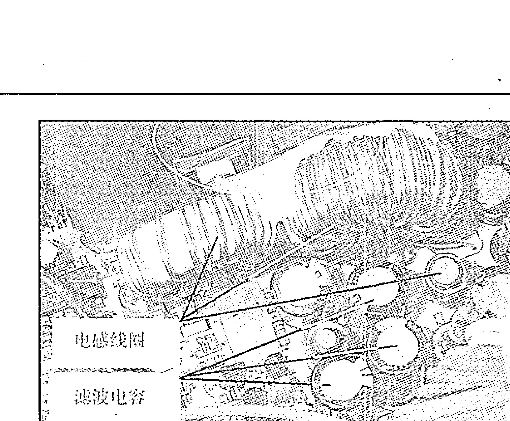

图4 滤波电容和电感

### 3. 变压器

如果说滤波系统决定了一款电源的稳定程度，那么变压器就在很大程度上决定了实际功率。大功率电源一般采用体积较大的变压器，而且做工精细，布局紧凑。一般而言，我们还能在变压器周围看到PFC电路。大功率电源一般采用体积较大的变压器，而且做工精细，布局紧凑。然而在关注变压器的同时，我们不能忘记与之密切相关的PFC电路，它主要用于提高电源的功率因数，使电源在输出相同功率时能够更加省电并减少空载，大家可以简单地将其理解为提高变压器工作效率。

### 4. 保护系统

保护系统对于电源而言也相当重要。在电源中，构成最大的威胁便是高温，因此散热片与风扇是必不可少的。设计合理的电源往往将散热片放在最需要散热的元件附近，同时也不会因为散热片占据空间而导致其它元件挤在一堆。在一些设计考究的电源中，我们还能见到磁环（图6）。由于电源内部有一些线圈，电流流过时会产生交变的磁场并向外辐射，而磁环就是来抵消磁场产生的电磁辐射的，对于保护用户的健康很有好处，而且成本并不高。然而可惜的是，能够使用磁环的电源真的少之又少，低端产品根本不敢奢望。

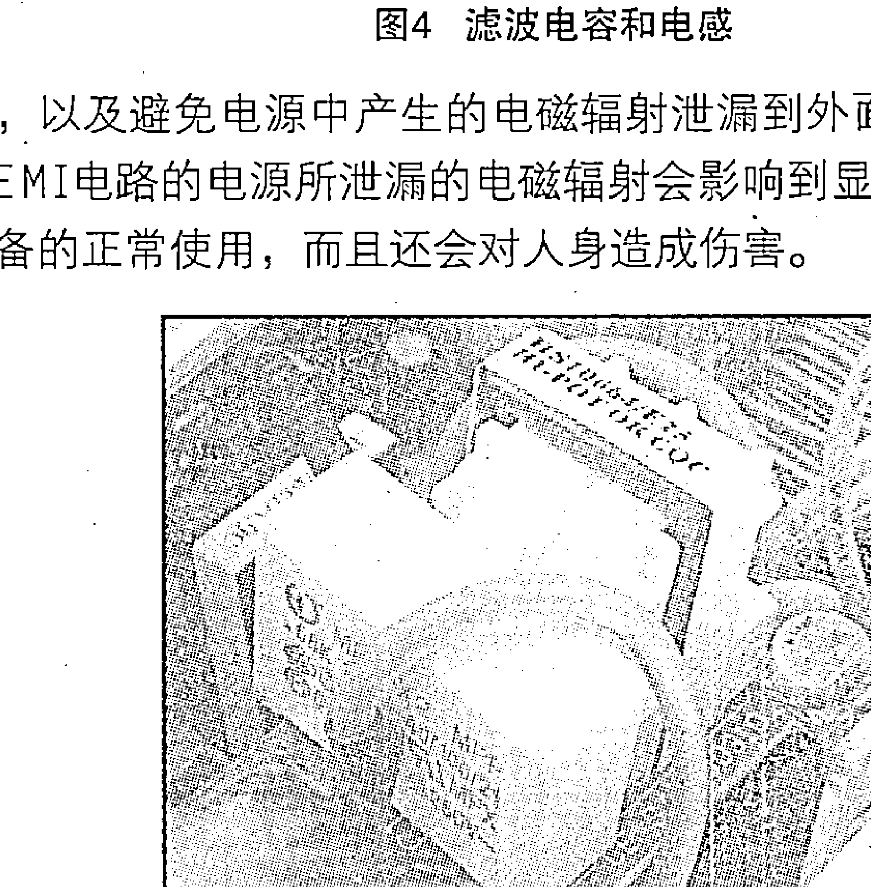

图5 重要的EMI滤波电路

EMI滤波电路由电容和线圈所组成。作为一款高品质的电源，为主板以及各种设备提供纯净的输入电流是十分有必要的，这对于系统稳定性至关重要，而此时EMI滤波电路几乎是必须的。在高压滤波电路中，高压滤波电容的容量对输出端的稳定性有很大影响，纹波输出的控制也是基于滤波电容的容量。纹波是与输出端呈现的输入频率及开关变换频率同步的分量，一般为输出电压的0.5%以内。另外，采用高容量的滤波电容，在电网电压突然降低时，也可以保证电源不至于重新启动。

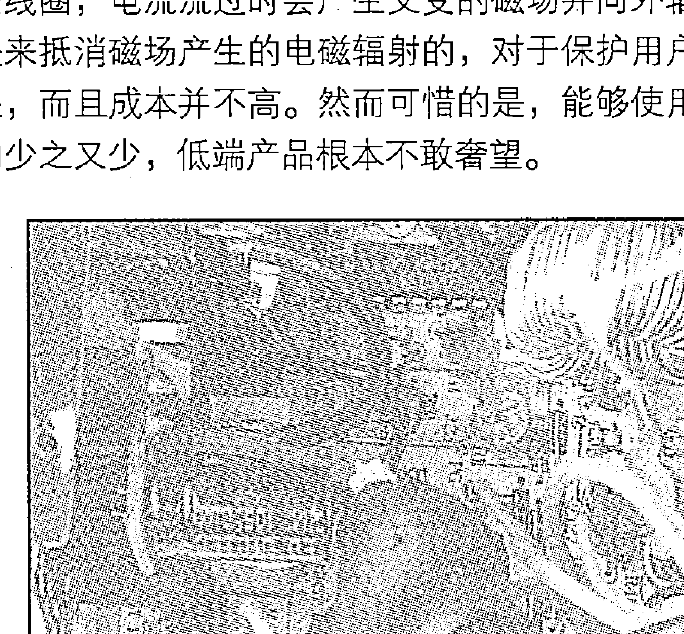

图6 可以抵消磁场电磁辐射的磁环

## 五、大功率电源要省电：功率因数与待机功耗

对于大功率输出的电源来说，能否实现省电显得特别有意义。在四核时代，用户的电源普遍在400W以上，此时较高的电源转换效率与待机功耗能够着实为大家节省电费。

PFC使用由电感、电容等组合而成的电路来降低谐波电流，其输入电流为低频的50～60Hz，因此需要大量的电感与电容，而且其功率因数校正仅达75%～80%。主动式PFC使用控制线路及功率型开关式组件，功率因数校正值接近100%。

### 1. 关注电源转换效率

电源本身又是一个“耗电器”。输入电源的能量并不能100%转化为供主机内各部件使用的有效能量，这样就出现了一个转换效率的问题。最初，电源转换效率仅有60%左右；在Intel的ATX 12V 1.3电源规范中，规定电源的转换效率满载时不得小于70%；而在ATX 12V 2.X中，对电源的转换效率提出了更高的要求——不得小于80%。除了电源标准，选择具备主动式PFC电路的产品也能提高电源转换效率，也等于是变相节省了电费。

### 2. 待机功耗不可小视

相对而言，待机功耗是比较容易被大家所忽视的。由于ATX电源在关机后依然需要维持供电，因此待机功耗就成了不可忽视的环节。一般中高档电源待机功耗都可以做到5W左右，这也符合Intel白皮书的规定，有利于节能环保。但是，部分电源在待机时功耗可能高达10W以上，长时间积累下来的电费损失非常明显。至于如何去判断一款电源的空载功耗，这是相当困难的事情，因为电源厂商并不公开相关数据，此时建议大家更多关注IT专业媒体的测评与介绍。

在国家强制推行的3C认证中，PFC电路是强制使用的。但是PFC有主动或被动两种方式，而且存在不小的差别。被动式PFC使用由电感、电容等组合而成的电路来降低谐波电流，其输入电流为低频的50～60Hz，因此需要大量的电感与电容，而且其功率因数校正仅达75%～80%。主动式PFC使用控制线路及功率型开关式组件，功率因数校正值接近100%。

## 六、产品推荐

### 1. 航嘉宽幅王小子V2.3

新版宽幅王小子符合ATX 12V 2.3标准，此时双路12V供电将有助于提高整个系统的稳定性，特别适合采用整合主板的用户。宽幅小子额定功率200W，拥有最低150W的功率输出保证，这对于网吧用户而言无疑是一个好举措，而宽幅小子的耐压范围为150V~270V，有效解决因为电压不稳带来的电脑硬件安全问题。

参考价格：136元

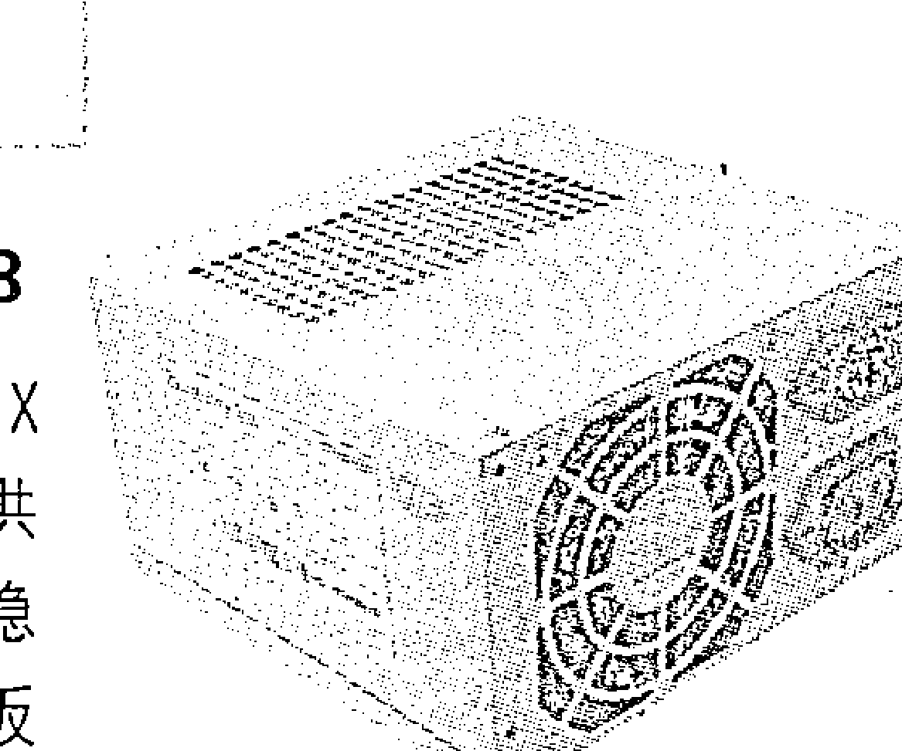

### 2. 长城静音大师ATX-300SD

尽管这款电源的额定功率只有250W，但是其+12V的输出能力达到了17A，可以稳定有效支持包括主流P4、K8等系统，自然也包括功耗较低的“扣肉”平台。静音大师ATX-300SD也在经过改进设计后提供SATA供电接口以及20+4pin魔术接口，而且其12cm低转速风扇又保证了出色的静音效果。对于200元以下的普通电源而言，静音大师ATX-300SD无疑有着很明显的性价比优势，并在国家权威测试中达到平均65000小时无故障运行。

参考价格：148元

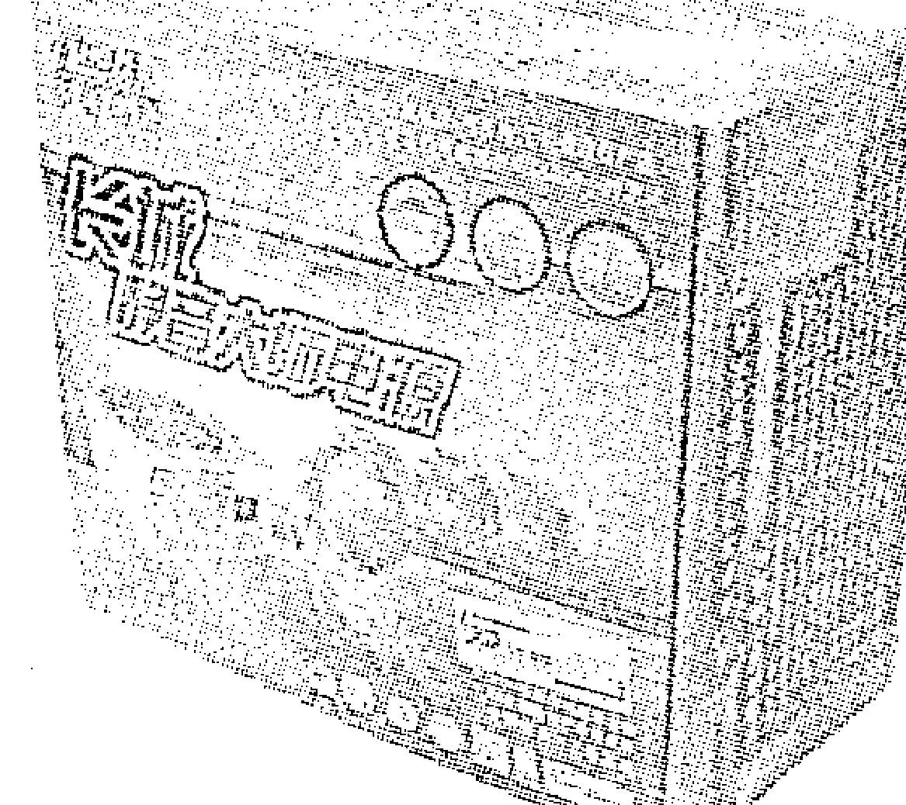

### 3. 鑫谷网驰一号

这款电源采用宽幅设计160V~264V，这样在供电紧张地区照样可以轻松开机。其实，作为一款面向普通大众的产品，网驰一号最大的特点便是待机时的省电功能。通过一块专用的省电芯片，电源在待机时能够将功耗控制到小于1W，这样日积月累所省下的电费非常可观。此外，这款电源的静音表现也非常理想，被动式PFC电路也比较完整，可以提高电能利用率。

参考价格：158元

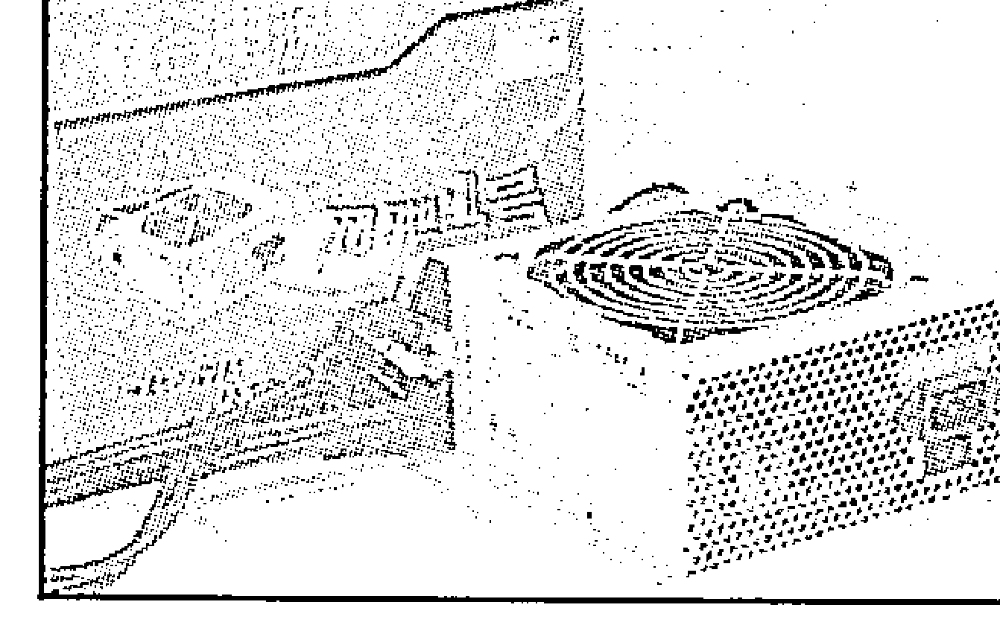

### 4. 多彩DLP-410A超霸电源

作为知名的机箱厂商，多彩的电源在市场上也很受欢迎，并且一直在合理的中等价位提供小功率输出的精品。尽管DLP-410A的额定功率只有250W，但是由于其符合ATX12V 2.2标准的双路12V输出，因此用户双核心CPU平台也完全可以。此外，多彩在这款电源上采用了完整的滤波电路、高档变压器和SMT贴片工艺，电流输出非常稳定，有助于提高整机的稳定性。

参考价格：178元

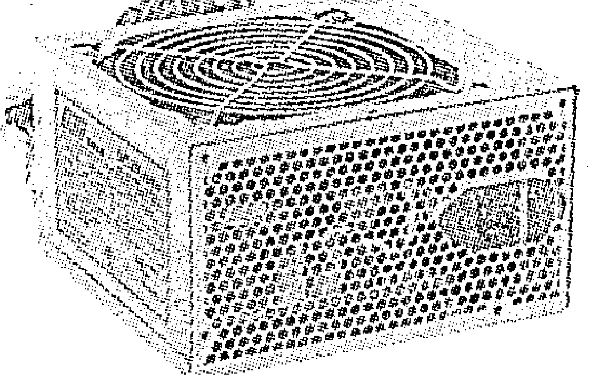

### 5. 康舒ATX400C

随着双核处理器的普及，今年消费者开始对大功率电源格外关注。这款康舒ATX400C电源实现了双12V输出，其12V输出的总电流最大达到34A，远高于一般400W电源的水平。此外，该电源新增加了专用显卡供电接口，能够更好地支持新款高端显卡。再加上更加有利于提高省电效率的主动式PFC电路，应该说绝对是一款卖点颇多的产品。

参考价格：399元

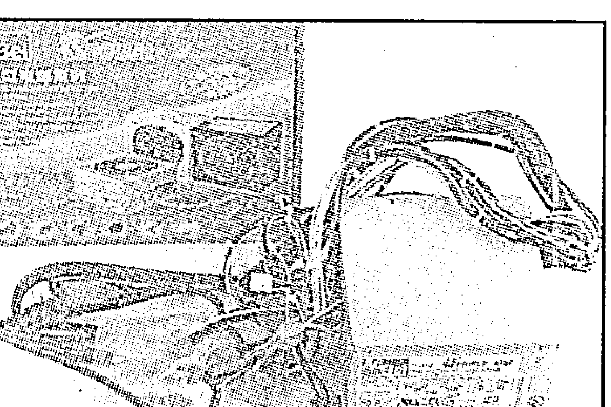

## 重新找回机箱侧板

□TMG mh

夏季到来，温度骤升。为了给配件更好地散热，我把机箱的侧面板都拿下，这也是大多数男性用户们的习惯。可是没过多久就出现了奇怪的现象，启动电脑不久，系统会自动重启，然后电脑不自检且处于“HALT”状态，同时显示器状态灯闪烁黄色。是不是病毒问题？笔者尝试用金山毒霸 2005杀毒，虽然查到了几个病毒，但作用不大，然后又整理了一下磁盘碎片，但机器还是“照常”重启。

软件方面解决不了，看来是硬件的问题了。但笔者对自己的配置还是挺有信心的，笔者配置为：奔腾D 820(双核 2.8G 64位)、INTEL 945G NT、双敏速配PCX6618-GT冰翼版、宇瞻 DDRII533 512M*2、西部数据120GB。难道是配件老化或者其他的问题？带着疑问，我拉出机箱仔细查看。不看不要紧，一看吓一跳，只见CPU风扇的扇叶发生损坏，其中一片扇叶还省一半，正凄惨无力地转动着。笔者急忙热插拔关机，用手一摸，嚯，真烫啊！笔者当时心疼不已。风扇这种样子，怎么能有效散热？肯定是无法正常散热引起CPU的温度迅速上升，从而发生重启问题。因为CPU温度过高，电源管理模块就会启动，从而使电脑不能进行自检且处于“HALT”状态。笔者在附近的电脑配件专卖店买了一款新的LGA 775散热器，安装之后，启动电脑，一切使用正常，没有重启等异常现象发生。

经过回忆，我终于想起来前些天家里来了亲戚，其中的小表弟最顽皮，看到电脑很好奇，总是趁我不在就上去胡乱操作一翻。有一次我看他把机箱拉出来玩耍，只是批评了一顿，也没注意检查。从此以后，我再也不敢去掉机箱的侧面板了，与我一样的朋友们，你们也不希望电脑配件发生硬伤吧，你们是不是也应该关心电脑，把失去的侧面板重新找回来安上呢！

# 用好你的辅助硬盘
## ——第二硬盘使用经验谈

□方成亮

大容量硬盘时代以及接口的变迁使得很多用户，尤其是升级用户都装配了两块硬盘，此时如何设置从盘便是一个很值得探讨的问题。而与此同时，越来越多的用户涉及到了移动存储，USB接口的移动硬盘所涉及的相关存储技巧也是很多读者十分关心的话题。针对我们的辅助硬盘，这里将与大家一起探讨一些实际使用过程中经常遇到的技巧问题。

## 一、双硬盘工作模式：解决兼容性问题

无论是双IDE硬盘还是IDE与SATA硬盘的组合，其使用过程中都会遇到一些兼容性问题，此时需要大家通过合理的设置来解决，否则很容易造成硬盘无法识别或是性能严重下降等问题。

### 1. 双IDE硬盘：如何确保性能发挥

安装双硬盘之后，如何解决ATA模式的识别问题十分关键。如果两个硬盘都支持ATA100/133，建议直接将双IDE硬盘连接在一个IDE通道，然后光驱安装在另一个IDE通道。如果将硬盘与只能支持ATA33的光驱连接在一起的话，很容易造成ATA模式降低，此时性能将会明显下降。而如果其中一个老硬盘只能支持ATA66/33，那么建议将其与光驱安装在一个通道，然后新的大容量一个盘独立使用IDE通道。

事实上，一个IDE通道中安装不同的ATA模式设备完全是可行的，但是这往往会带来一些意想不到的意外，特别是VIA和nVIDIA芯片组，很容易出现故障。此外，安装新硬盘之后强烈建议大家重新安装磁盘驱动。安装完毕之后，可以在硬件设备管理器的磁盘控制器属性中查看当前硬盘的工作模式，其中DMA5代表ATA100（图1）。至于非Intel芯片组和Maxtor硬盘所支持的ATA133，一般不用太过在意，因为ATA100对于当前IDE硬盘的内部传输率而言已经绰绰有余，即便ATA133硬盘工作在ATA100模式下也不会降低性能。而如果升级的大容量硬盘是SATA接口，那么就更不用担心传输模式的识别了。IDE硬盘与SATA硬盘互相之间并不会影响。

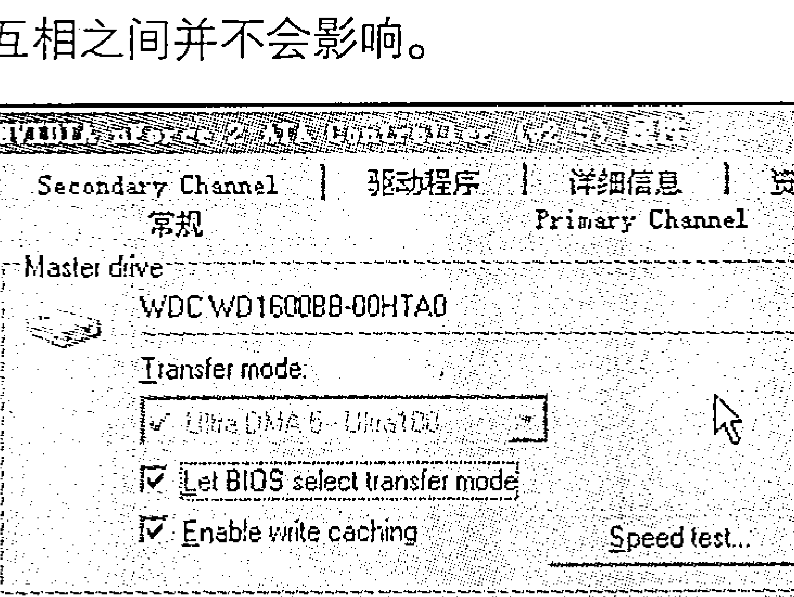

### 2. SATA与PATA硬盘和睦相处

SATA与PATA（IDE）硬盘采用完全不同的接口，因此要和睦相处并不困难（图2）。连接好数据线与电源接口之后，大家只需要在BIOS中指定哪个硬盘作为启动盘即可。对于Intel芯片组而言，由于南桥芯片中的SATA占用一个IDE通道，因此设置过程略有特殊。以I865PE+ICH5芯片组的主板为例，进入BIOS设置菜单后选择Main→Configuration Menu，在Onboard IDE Operate Mode下面可以选择两种IDE操作模式：兼容模式（Compatible Mode）和增强模式（Enhanced Mode）。其中Compatible Mode代表将SATA硬盘端口映射到并口IDE通道的相应端口，通常适用于DOS/Win98/WinME系统；Enhanced Mode下的SATA硬盘将使用独立的IDE通道，不与原PATA设备冲突，但仅适用于Win2000/XP/2003系统。

这两种模式的实际区别并不大，甚至Win2000/XP/2003用户完全采用兼容模式也可以。真正重要的还是下一步的通道映射设置。选定兼容模式之后，系统提供Primary PATA+SATA、Secondary PATA+SATA以及PATA Ports Only。从字面意思应该不难理解，第一种表示将PATA硬盘作为启动盘，第二种表示将SATA硬盘作为启动盘，第三种表示只使用PATA硬盘而禁用SATA硬盘。至于非Intel芯片组则简单得多，此时BIOS中SATA通道完全不与PATA通道共用，一般直接通过一个选项来决定将哪个硬盘作为启动盘。而如果使用PCI接口的SCSI卡安装串行硬盘，这需要在BIOS中将第一启动设备指定为SCSI，这样其优先权互相之间并不会影响。

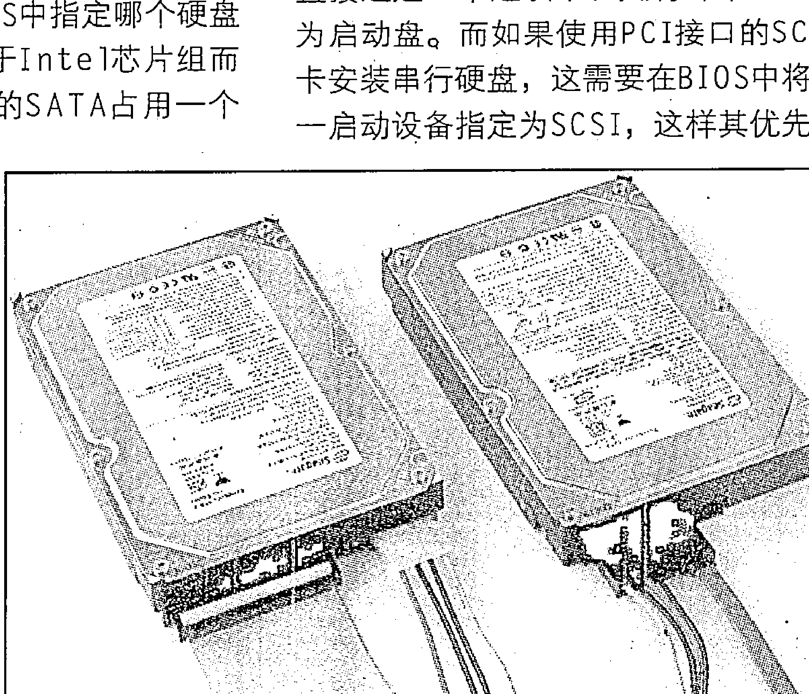


就会高于并行硬盘。需要注意的是，不同品牌的主板肯定在设置上有所区别，但是大致方法如此，大家可以举一反三（图3）。

### 3. 解决盘符交错问题

安装双硬盘就不能不说盘符交错问题。什么是“盘符交错”呢？举个例子吧。假设你的第一硬盘原来有C、D、E三个分区，分别标记为C1、D1、E1，第二硬盘有C、D两个分区，分别标记为C2、D2。一般情况下，安装双硬盘后，硬盘分区的顺序将为C-C1，D-C2，E-D1，F-E1，G-D2。原来第一硬盘的D、E分区变成了E、F盘，在C、E盘之间嵌入了第二硬盘的C分区，这就是“盘符交错”。“盘符交错”会引起安装双硬盘以前原有的软件、链接等因路径错误而无法正常工作。

此时我们可以采取以下两个措施来避免“盘符交错”：

方案一：
如果两块硬盘上都有主引导分区，可在BIOS中只设置第一硬盘，而将第二硬盘设为None，这样在Windows或Linux系统中就会按IDE接口的先后顺序依次分配盘符，从而避免“盘符交错”，而且也不会破坏硬盘数据。这样做还有另外的好处，如果在两块硬盘的主引导分区分别装有不同的操作系统，可以通过改变CMOS设置激活其中的一个硬盘，屏蔽另一个硬盘，从而启动相应的操作系统。缺点是在纯DOS下无法看到被BIOS屏蔽的硬盘。不过现在NTFS分区时代已经与DOS彻底决裂，因此这一缺陷几乎可以被忽略。

方案二：
只在第一硬盘上建立主分区（当然还可以有其它逻辑分区），而将第二硬盘全部划分为扩展分区，然后再在其中划分逻辑分区，就可以彻底避免“盘符交错”了。当然，对第二硬盘分区前，要备份好你的数据。Windows 2000/XP/2003操作系统自带了磁盘管理器，点击“开始”→“设置”→“控制面板”→“管理工具”→“计算机管理”，切换到“磁盘管理”，此时就可以对每个分区分派盘符。由于第二个分区已经不存在主分区，此时调配时没有任何限制（图4）。


## 二、实战RAID 0磁盘列阵

在谈论到电脑的速度（性能）时，我们一般只在意CPU的速度、内存的大小等，而对于硬盘的速度却不怎么重视。其实这是绝对错误的，因为硬盘的速度将直接影响到整个系统的效率，有时甚至比CPU和内存更为显著。为此，将双硬盘并行工作的RAID 0磁盘列阵开始流行起来，这项技术能够在不损失容量的前提下大幅度提高磁盘性能。

在此次IDE硬盘的RAID 0实战中，我们采用Tekram DC200芯片为例向大家介绍。尽管它与常见的Promise和HighPoint芯片不同，但是使用方法还是基本一致，而SATA RAID的使用方法也几乎与其完全一样。其实使用RAID 0的关键是掌握RAID控制卡BIOS的使用，当我们把RAID控制卡安装好并接上两个硬盘时，系统开机就会出现如下的画面（图5）。BIOS界面分三个部分：MENU（菜单）、HELP（帮助）和STATUS（状态）。由于我们是首次安装RAID，因此必须进入MENU窗口进行创建。

在MENU菜单中选择“1. SET RAID CONFIGURATION”，按回车键，此时我们就可以进入“SET RAID CONFIGURATION”界面（图6）。RAID控制卡将使用一段时间来识别硬盘，稍后我们把光标移动到硬盘，再按空格键来进行选择，按回车键确认选择，这时将弹出一个新的窗口显示可供选择的RAID的模式共有4种模式：JBOD（不适用RAID）、RAID 0、RAID 1、RAID 0+1。

毫无疑问，我们当然是选择“RAID 0”。然后大家可以通过STATUS（状态）菜单查看此模式是否被真正激活（图7）。至此，我们的RAID 0硬件安装就结束了，大家可以接着分区并安装操作系统。值得注意的是，由于Windows并不能识别RAID控制芯片，因此它会被设备识别为普通的SCSI控制卡。强烈建议大家在安装完Windows之后为RAID控制器补上正确的驱动程序，这不仅能够提高RAID系统的稳定性，还可以大幅度提高性能。此外，不少RAID控制卡还带有功能丰富的软件，可以帮助用户在Windows下查看RAID工作状态。


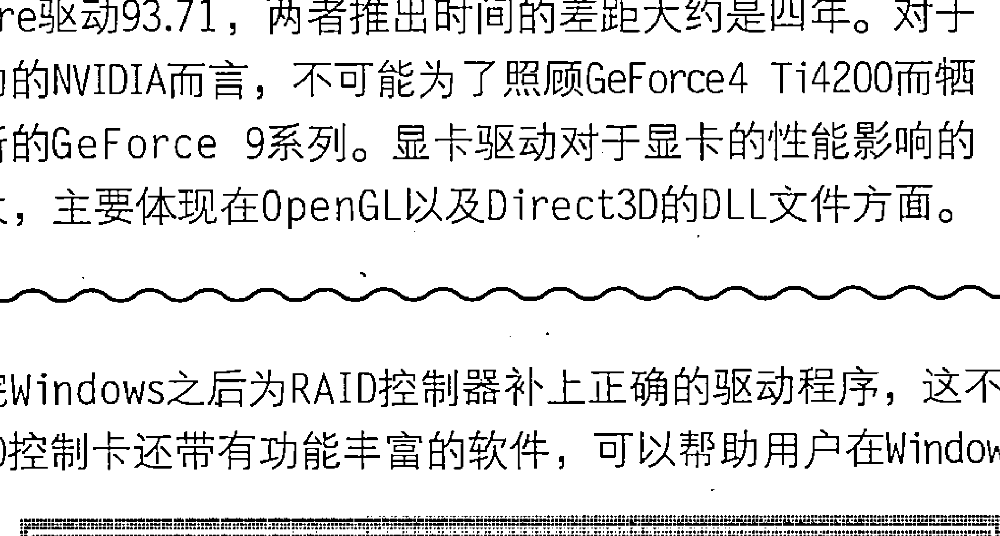

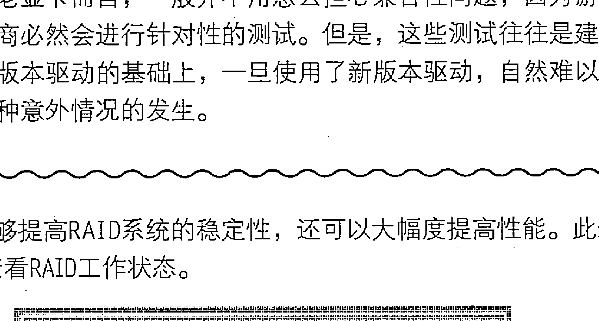

**总结：**
随着硬盘容量的升级频率越来越高，很多用户都免不了扩容硬盘。在这种情况下，其实不必丢弃老硬盘，因为双硬盘方式其实非常简单，甚至还能提高性能，组成RAID阵列更是值得推荐的方案。总之，用好自己的第二块硬盘将会带来不少便利之处。■

# 最新不一定最佳，驱动不一定新

□方成亮

俗话说驱动是硬件的灵魂，没有驱动时，再好的硬件在Windows里也只能干瞪眼。驱动对于显卡来说显得尤为重要，大家一定都体验过未装显卡驱动时浏览网页的那种软加速感吧，显卡驱动对显卡性能提升作用十分明显。例如，nVIDIA早年的TNT因为驱动不成熟而一直没能赶上Voodoo2，但新版驱动的发布却让TNT重振雄风并一举赶超对手。类似的例子还有很多，这让大家对显卡驱动都充满了期待。需要注意的是，如今NVIDIA和ATI都在推广集成化驱动，即新版本的驱动用在几年前的老显卡上都可以适用。但是，此时的新版本驱动是不是适合老显卡就是一个关键问题了。

## 一、为什么最新驱动不一定最好

对于显卡用户而言，使用最新版本的驱动程序已经成为一种思维定式。然而，这也往往并非是最佳的选择，因为所谓的最新驱动完全将优化要点放在了最新产品中，很可能没有照顾到老产品。尽管用户在使用最新驱动之后暂时没有发现什么不兼容现象，不过性能反而会有所下降，并且与部分老游戏配合使用时也会因为新款驱动而出现一些瑕疵。

举一个最简单的例子，如果用户使用的显卡是GeForce4 Ti4200，那么现在可以兼容这款显卡的最新版驱动为ForceWare驱动93.71，两者推出时间的差距大约是四年。对于开发驱动的NVIDIA而言，不可能为了照顾GeForce4 Ti4200而牺牲了最新的GeForce 9系列。显卡驱动对于显卡的性能影响的确非常大，主要体现在OpenGL以及Direct3D的DLL文件方面。

为了在新款游戏中获得更加理想的表现，驱动程序开发商需要不断修改这些关键的DLL文件，以此来充分为GPU的技术特性进行优化。在这四年的时间里，GeForce4 Ti4200已经演变为一款老产品，不仅DirectX API完全不同，总线和接口发生改变，甚至渲染管线与纹理单元的比例数也和当前的主流显卡不一样。

在这种情况下，如果依旧固执地使用最新版本驱动，那么只会导致性能降低，并没有实质性的好处。更加重要的是，我们还会因此而遭遇各种难以预期的兼容性问题。事实上，作为老显卡而言，一般并不用怎么担心兼容性问题，因为游戏开发商必然会进行针对性的测试。但是，这些测试往往是建立在老版本驱动的基础上，一旦使用了新版本驱动，自然难以避免各种意外情况的发生。

## 二、实战测试：GeForce4 Ti4200之驱动选择

既然最新版本的驱动并非是最理想的选择，那么我们又应该如何选择最合适的驱动呢？首先要检测的原则是一定通过WHQL认证。WHQL测试对于用户来说很有意义，但对于厂商来说却不是免费的午餐，这在客观上也就决定了厂商将驱动程序送交WHQL时的谨慎性。并且，WHQL具有严格的规程，驱动不过各项测试就不可能获得授权，这点相信微软是不讲什么情面的。所以说，通过了WHQL认证的驱动最起码在普遍的稳定、兼容性两方面是毋庸置疑的。

针对GeForce4 Ti4200显卡，我们为大家选取了43.51、52.16、56.64、61.12和93.71这五款驱动。很明显，43.51是当时Ti4200推出很长一段时间并且在市场上热销之后的驱动，而52.16则是当年专门为GeForce FX系列推出的优化版驱动。至于随后的新版本驱动，则分别为其它产品而专门推出，其中可能也包含了对老产品的优化。

| GeForce4 Ti4200 | 43.51 | 52.16 | 56.64 | 61.12 | 93.71 |
|----------------|-------|-------|-------|-------|-------|
| D3D测试项目    |       |       |       |       |       |
| 3DMark2003 ( Default ) | 1430 | 1510 | 1485 | 1409 | 1422 |
| 3DMark2003 ( 2AA, 4AF ) | 755 | 777 | 804 | 760 | 764 |
| OpenGL测试项目 |       |       |       |       |       |
| Quake3 ( Default ) | 72.2 | 55.0 | 62.5 | 61.2 | 57.9 |
| Quake3 ( 2AA, 4AF ) | 54.9 | 48.3 | 50.7 | 51.1 | 48.7 |

从测试结果来看，56.64显然是更加合适的选择，而43.51的表现也非常不错。至于61.12和93.71这两款新版本驱动，其综合表现并不理想（图1）。事实上，这样的测试结果与专业DIY玩家选择驱动的原则并不相违背，那就是尽可能选择下一代产品中后期推出的驱动。以56.64为例，这是GeForce FX为优化的驱动，此时NVIDIA自然也顾全了GeForce4 Ti4200。相反，当推出61.12驱动时，NVIDIA的优化精力全部在GeForce6系列上，再加上产品架构上的巨大变化，自然难以照顾到老迈的Ti4200了。同样，最新的93.71驱动也不是老显卡理想的选择（图2）。

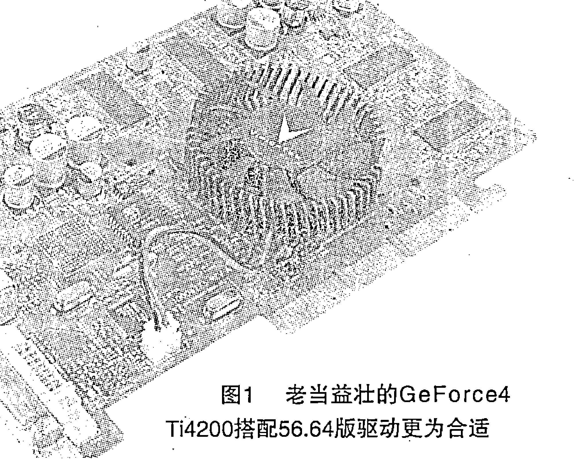

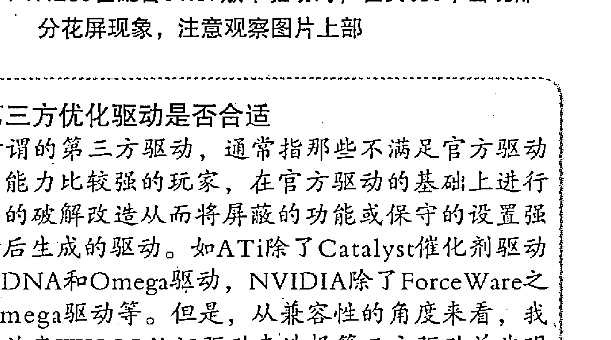

## 三、老当益壮：老显卡的驱动选择建议

事实上，诸如GeForce4 Ti4200这样老当益壮的显卡还有很多，包括GeForce FX5900XT、GeForce 6800、Radeon 9800Pro、X800等，这些显卡在应对部分3D游戏时仍然游刃有余，甚至部分产品还能媲美于当前市场上的主流中低端显卡。我们为大家推荐了合适的驱动版本，相信这会给大家合理使用驱动带来一些帮助。至于后期推出的显卡，一般还是建议使用最新的驱动程序。

> ### 小贴士
>
> 第三方优化驱动是否合适
>
> 所谓的第三方驱动，通常指那些不满足官方驱动而动手能力比较强的玩家，在官方驱动的基础上进行一系列的破解改造从而将屏蔽的功能或保守的设置强行打开后生成的驱动。如ATi除了Catalyst催化剂驱动之外的DNA和Omega驱动，NVIDIA除了ForceWare之外的Omega驱动等。但是，从兼容性的角度来看，我们认为放弃WHQL认证驱动来选择第三方驱动并非明智之举，毕竟兼容性才是我们最最看重的。

| 同类可参考产品 | 建议驱动版本 |
|----------------|--------------|
| GeForce4 MX440 | MX420、MX460、MX4000 | NVIDIA雷管43.51 |
| GeForce FX5200 | FX5600、FX5700、FX5800 | NVIDIA ForceWare 71.81 |
| GeForce FX5900XT | FX5900、FX5900U | NVIDIA ForceWare 84.21 |
| GeForce 6600 | 6200、6600LE、6800 | NVIDIA ForceWare 97.34 |
| GeForce 7300 | 7300LE、7300GS、7100GS | NVIDIA ForceWare 163.67 |
| Radeon 9550 | Radoen 9600 | ATI催化剂5.12 |
| Radeon 9800Pro | Radeon 9500、Radeon 9700 | ATI催化剂6.1 |
| Radeon X300 | X300SE、X600 | ATI催化剂6.8 |
| Radeon X800 | X700、X800 GTO | ATI催化剂7.8 |
| Intel 865G ( Extreme2 ) | I865GV | Intel Graphics Media Accelerator 14.13 |
| Intel 915G ( Extreme3 ) | I915GL、I945G | Intel Graphics Media Accelerator 14.25 |

**总结：**
硬件设备的性能发挥离不开驱动程序的支持，这是很多用户都明白的道理。然而，重视驱动程序不等于一味追求最新版本驱动，只有最合适的才是最好的。

# 7×24，永不停歇的P2P ——实战老电脑变下载专用机

网络上的好东西实在太多了，而国内的网速又慢得令人发指，为了那些最新的游戏、电影、音乐、软件……要是能一年到头都不关机，连续不停地下载该多好。不过功耗两三百W的台式机用来长时间下载可不是好主意，别的不说，光电费就哗哗的。其实玩电脑时间长了，家里多少会有一些升级换下来的配件或是老电脑，完全可以让这些旧配件发挥余热。

## 改造下载专用机硬件篇

### 最低配置需求

-   CPU: Pentium II级以上;
- 主板: 具有USB 2.0接口;
- 内存: 256MB以上;
- 硬盘: 大小随意，只要能装得下Windows 2000和各种下载软件即可，下载数据是另外保存在外置硬盘上的;
- 网卡: RJ45接口，100M以上;
- 显卡: 随意，集成或独立都可以;
- 显示器、键盘鼠标: 只在安装配时会用到，全部装好后就可以拆下，可以先从别的电脑上借用。

此外还需要USB 2.0接口的外置硬盘盒以及相匹配的硬盘一块，硬盘无论新旧、无论容量大小（当然还是越大越好）都可以，用来保存下载的数据。之所以要用外置硬盘，主要是考虑到老主板对于大容量硬盘的兼容性，很多老主板对于32GB以上的硬盘支持会有问题，而主流外置硬盘盒往往能支持到1TB甚至更高容量。再有一个问题就是硬盘本身的散热和寿命问题。其实只要主板能支持大容量硬盘，把硬盘安装在机箱里也未尝不可，但一定要做好散热工作。很久以前就有“BT下载毁硬盘”的说法，其实并不完全正确，因为硬盘损坏的主要原因在于高温下连续工作，换句话说，最根本的原因是散热不良！笔者一块2001年购买的希捷40GB硬盘先后在两台电脑

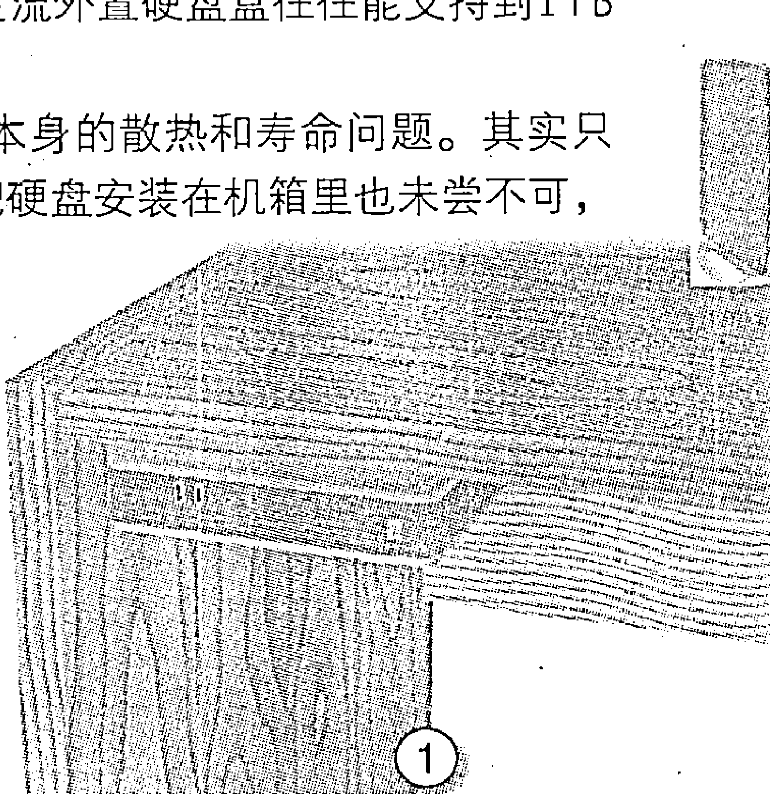

### 老笔记本最适合

如果有台老笔记本电脑的话，用来改造成下载机最合适不过了。因为笔记本电脑本身设计为低功耗低发热，而且也更省空间，自带屏幕和键盘鼠标（触摸板）的特性使它还能在下载之余查查攻略什么的。但是笔记本电脑在硬件上限制比较多，可扩展的空间也比较有限，像笔者一台Lenovo的老PentiumII 366，内存硬盘都可以升级，但机身上没有网卡接口，且USB接口也只有一个1.1的，还好有2个PCMCIA插槽，另外购买了相应接口的USB 2.0和10M/100M网卡各一块，算是勉强达到了标准。

### 低功耗超迷你全静音下载机

如果没有老旧的笔记本电脑或台式机，又有一定动手能力的话，可以考虑HP的T5系列瘦客户机，不但个头只有巴掌大小，散热还是热管被动式的——完全静音！而且除了可以用随机的支架把主机像外置硬盘一样竖起来摆放外，还预留了螺丝孔可以横挂在写字台下面（图1）。这类机型如果买全新的并不便宜，好在淘宝等地方都有大量二手货出售，价格只要几百元，算上后期改造的费用也花不了多少钱，相当超值。具体改造方法可以参考这个帖子：http://tgfc.qwd1.com/club/viewthread.php?tid=5947803改造下载专用机之软件篇

为了尽可能节省空间，这台机器不会配备键盘鼠标显示器，可以通过局域网来远程控制。而要实现7×24不停机下载的话，显然不能只在家里查看下载进度或添加下载的文件，最好能通过互联网随时随地进行控制，而ADSL的IP地址又是不固定的，因此还需要一个将IP地址转换为固定域名的软件。

### 所需要的软件

操作系统：Windows 2000/XP
远程控制：Remotely Anywhere
域名转换：花生壳
下载软件：eMule、BT、uTorrent、迅雷、快车……等等，随你高兴

### 操作系统——尽可能进行优化

操作系统推荐Windows 2000，如果能有500MHz以上的CPU以及512MB以上内存的话，Windows XP也不错，但不建议用Windows 98/Me等操作系统，毕竟稳定性和Windows 2000/XP还有不小差距。安装好操作系统和各种补丁后，建议用Windows优化大师之类的软件进行优化，关闭不需要的服务和进程，各种视觉效果也全部取消，TCP/IP协议的连接数（主要是指XP而言）可以在各种下载软件里去修改。至于杀毒软件、360安全卫士之类的东西统统都可以不装，除非你要用这台电脑去浏览网页或运行下载软件以外的程序。

### 远程控制——别忘记端口映射

为实现远程控制需要两个软件，一是Remotely Anywhere，用来从其他电脑上对下载机进行完全控制，二是花生壳。严格来说，花生壳应该是一种服务，用处是将本机的IP地址提交给服务器，进而映射到***.vicp.net这个域名上，这样无论ADSL的IP地址怎么变，只要通过***.vicp.net就可以连接到下载机上。首先到http://www.oray.cn/PeanutHull 注册并申请免费域名，然后下载花生壳客户端，安装之后用刚注册的用户名登录，就会拥有一个“用户名.vicp.net”的域名。

另一方面，远程控制软件已经很多了，推荐Remotely Anywhere的原因在于它不需要客户端支持，只要有浏览器且连接到网上就可以控制。下载并安装之后，系统托盘里会出现一个图标，双击之后会出现Remotely Anywhere的状态窗口，包括是否运行、访问方法等信息。

此时可以在局域网的另一台电脑上打开浏览器，在地址栏中键入“notebook:443”（端口是可以随意设置的，默认为80），然后就会出现一两个与证书和安全性相关的对话框，统统选“是”。

后就会出现图2的登录框，用下载机的用户名和密码登录，在随后出现的界面中，点击左侧的“Remote Control”，然后右侧就会出现下载机的桌面。建议更改一下端口，这样比较方便记忆，方法是点击左侧的“Preferences” - “Network”，然后在图3所示的地方设置。

到这一步还不算完，如果是通过路由器共享上网的话，现在只能通过局域网来访问下载机。要想通过刚才注册的域名从互联网上访问，还需要在路由器上为Remotely Anywhere打开刚刚设置的端口，具体方法请参考相关文章，这里就不多讲了（图4）。

### P2P软件——缓存设置很关键

打开下载软件的设置窗口，把下载目录、临时目录和缓存都设置在外置硬盘上，目的是为了尽可能延长系统硬盘的寿命，毕竟外置硬盘比装在机箱里的硬盘在散热上要强很多，出了毛病也更容易更换。然后打开下载软件的缓存设置窗口，将缓存尽量设大一些——反正这台下载机除了下载软件之外什么程序都不会运行。如果有256MB内存，建议设置为50~70MB，更大内存的话还可以设得更多，也就更有利于减少读写硬盘的次数。

### 省电——关闭屏幕是重点

如果是台式机的话，这一步其实可以省略，因为可以直接把显示器关掉，甚至根本就不配备显示器。而笔记本电脑的话，可以进入Windows的电源管理，设置为闲置10分钟后关闭监视器，可以减少很多电能消耗。

经过以上几步设置之后，就可以在任何一台安装了浏览器且连接到互联网的电脑上以“用户名.vicp.net:端口”的方式登录并完全控制这台下载机，就像在本地操作一样。而且不光是电脑，Remotely Anywhere支持包括PDA和手机在内的很多种便携设备，完全可以通过CDMA或GPRS在任何有手机信号的地方控制家里的下载进程。到这一步还没完，仔细琢磨琢磨的话，其实还可以实现远程唤醒、远程登录并添加下载任务、下载完毕后自动关机等一系列功能（图5），是不是很好很强大？

### 启用SATA2接口硬盘的独门功夫——NCQ

■west

> > 很多使用SATA硬盘的人都不知道，它有一个名为NCQ的功能，这个功能可以让硬盘性能提升近15%！不过，开启NCQ功能可并非那么简单的……

### 什么是NCQ？

NCQ被称为“全速命令队列(Native Command Queuing, NCQ)”，它是一项强大的接口/硬盘技术，它通过在硬盘内部优化作业的执行顺序来提升硬盘性能和使用寿命。如向硬盘下达一组数据传送指令，由于数据在磁盘上分布位不同，磁头可能会先读取660扇区，再读取1370扇区，然后又读取579扇区，这样只能等硬盘转完一圈再读取下一个数据，无疑耗时更久。而开启NCQ后减少了磁头臂来回移动的时间，可以先读取579扇区的数据，然后读取660扇区的数据，最后再读取1370的数据，等待时间无疑大为缩短，性能也就提高了。

### BIOS设置不可少

首先，NCQ是AHCI（高级主控界面）所支持的一项技术，开启AHCI是第一步。AHCI属于SATA2的高级特征之一，支持SATA功能的主板并不一定支持AHCI。只有在主板BIOS中能找到AHCI选项才表明这款主板能支持NCQ。进入主板BIOS（开机时按下DEL键），找到“Integrated Peripherals” → “OnChip Serial ATA Device”，查看此处是否有“AHCI”选项。
下面以Intel ICH8南桥的主板为例介绍NCQ相关的BIOS设置。在BIOS的SATA工作模式选项中，除了RAID和IDE外，还多出了一个AHCI选项（图1）。其中，IDE模式是指让SATA硬盘工作在普通IDE模式下，通常用于单个SATA硬盘，而RAID模式则是通过RAID控制器来管理SATA硬盘，适合建立SATA RAID。新增的AHCI模式则利用AHCI控制器来管理SATA硬盘。
在某些主板的BIOS选项中，SATA工作模式和AHCI功能是两个选项，当SATA模式设置为RAID时，AHCI自动处于“支持”；当SATA模式设为IDE时，AHCI可选择“支持”或“不支持”，两种设置可能存在的选项有3种。所以，要启用NCQ功能，则BIOS中的“SATA Mode”应设为“AHCI”（图2）。

### Windows安装有两招

当你设置好硬盘后，安装Windows XP SP2时必须安装SATA驱动程序才可以让NCQ技术真正激活，否则甚至无法安装系统。
这种方式的操作方法比较简单，但必须拥有软驱才可以。在安装界面刚刚出现时按F6键，在弹出的磁盘控制器驱动选择界面里，将支持NCQ技术的南桥驱动软盘放入软驱中，并按下S键进行选择。经过这一步骤后，Windows XP SP2便可自动安装好NCQ的驱动程序，然后进行操作系统的安装。
第二种方法适合没有软驱或者已经安装好Windows XP SP2的使用者操作。
第一步：下载相应的SATA/RAID驱动程序，这要依照主板芯片组不同而定，并将其解压缩到任意目录中。
第二步：没有安装驱动的Windows XP SP2操作系统在主板开启ACHI后会蓝屏无法进入系统，这时需要重新进入BIOS，将ACHI关闭，操作方法就不再多说了。
第三步：重启电脑进入系统，选择IDE控制器，注意不是“IDE通道”，双击弹出属性界面，选择“更新驱动程序”（图3），并选中“从列表或指定位置安装”
第四步：在下一步界面中选择“不要搜索，我要自己选择要安装的驱动程序”，然后点击“从磁盘安装”。
第五步：点击浏览，然后找到你解压缩的驱动目录，选中inf安装文件，点击“确定”继续。
第六步：安装完驱动程序后会提示重新启动，重启时记得先进入BIOS将AHCI功能打开，这样再进入操作系统就完成开启AHCI功能的全部操作了。

低价投影
安装也是技巧

时下非常流行低价位投影机，毕竟超大尺寸的显示面积是任何人也抵挡不了的现实诱惑——随随便便就是80英寸、100英寸，怎么能不叫人动心呢？而且，价格更是让人难以拒绝——3999元，甚至现在有厂商已经打算推出1999元的投影机产品了……

-   投影幕布要不要？

安装投影机之前这是首要考虑的问题，幕布的作用是增强投影机投射画面时的亮度。在幕布上会有不规则的晶体辅助反光，毕竟家用型投影机产品（无论是否为低价机型）都存在亮度不足的问题。幕布现在分为灰幕和白幕两种，灰幕的好处除了使黑色更深沉之外，它能增加对比感。同时，灰幕能抵抗环境的反射光。与白幕相比，灰幕受反射光的影响较低，很适合普通室内环境，但要注意，墙面颜色不能使用深色吸光的涂料或壁纸。当然，灰幕也不是样样都好，它表面的涂层会在投射画面时产生一层干扰纹，这会影响画面的清晰度及锐利感。
也有人干脆就省略了幕布，直接投射到墙面上观看，这时，最好将光源全部遮挡，窗帘最好是红、黑两色的，因为这样遮光效果最好。

-   吊装还是平装？

投影机的安装更是一个决定性因素，尽管投影机大多都具备梯形校正功能，但在安装之初还是尽量安装得横平竖直为好。一般安装投影机最佳选择自然是吊装，但这会涉及到顶墙的开孔问题，对于正在居住使用的房屋来说并不是很合适。侧墙平装倒是个相对合理的方法。一般来说打算投射16:9、80英寸画面时，投影机的高度应该在1.85米，如果要投射16:9、100英寸的画面，那么投影机的高度就要在1.92米才更加合适了。

-   墙距决定投影尺寸

投影机的原理其实和教学用的幻灯机没什么差别，但是，投影机有个投射距离的问题。一般来说低价机型、尤其是DLP低价投影机都不具备短焦能力（2.1倍焦距），能达到1.6倍就已经相当不错了。因此在投影距离上，墙到墙的距离（投影机位到投射墙面）必须不少于3.5米才能投射80英寸的画面，虽然极限情况下3米距离也能投射出80英寸，但无疑在亮度、变形问题上会有较大的麻烦。要想达到100英寸的投射面积，最好墙对墙的距离达到至少4米。

-   投影墙与安装墙的关联性要注意

安装投影机时，还必须注意一个问题：投影机要取中安装，这个取中是指取投影画面的中间部位。例如2.13米是100英寸16:9画面尺寸的长度，取中即为1.065米。而且幕布安装时也应该考虑上下间距，80英寸大小的16:9画面，建议下沿离地高度在70厘米为宜；100英寸大小的16:9画面，建议下沿离地高度在60厘米为宜。另外，不要光考虑幕布问题，两侧音箱的位置也要留出足够的空间，一般左右各预留45厘米即可。

-   线材宁多勿少

购买线缆之前，最好先确定自己的投影机型号，因为不同品牌、型号的投影机很可能提供的接口不大一致。因为线材将会是埋进墙里（装修）或是走明盒（已装修完的房屋）固定的，所以线材必须一次购齐，否则临时添置就非常麻烦了。其中要注意的是，VGA线缆最好不要超过15米，分量线缆不要超过12米。部分购买中高端投影机的使用者可能还会需要购买HDMI线缆，一般质量的HDMI线，长度最好保持在10米之内。过长的线缆如果没有特别设计（甚至是即便有特别设计）也会出现信号衰竭的现象。最直观的表现就是画面“发虚”，看不清楚、颜色不够纯正等。

要想得到足够好的显示效果，对显示器本身的素质固然要求很高，而调节是否得当也非常重要。很多人买了最新款显示器却没有调整到最佳状态，岂不是花了冤枉钱。

现在绝大多数显示器都是通过面板上的控制按键来调节的，最常见的就是四键调节了，分别为菜单、选项+、选项-和确定，不同显示器的标示可能不同，但功能都是基本一致的。调节时首先按下菜单键调出主菜单，然后通过选项+/-来移动光标位置，确定键用来进入选定的子菜单，选定具体调节项目之后，再通过选项+/-来设置数值，最后按菜单键一级一级地退出。需要注意的是，有些显示器可能只有3个键，需要在每一级菜单中选择“退出”才能返回上一级。

### CRT显示器——图像满屏是基本要求

对于CRT显示器来说，图像满屏虽然是个基本要求，但能调节好的人并不多。首先通过OSD菜单中的高度、宽度、垂直位置、水平位置四个选项，将画面调整到四边离边框3~5mm的程度，此时画面可能会有些歪斜且边框不直。不要紧，接下来通过桶形失真和枕形失真将画面的左右边缘调节平直，然后通过梯形调节和平行四边形调节，使画面左右边缘平行于屏幕边框，最后再通过高度、宽度、垂直位置、水平位置四个选项将画面调节满屏。一般来说，普通显示器很少能够调节得非常完美，总会有个边不齐，或是图像稍有歪斜，只要不影响观看都是正常的，不必在意。

### 亮度对比度调节——给眼睛一个舒适的窗口

进入LCD时代之后，显示器的调节变得简单了许多，只要轻轻按下“Auto”键，画面就会自动调节完毕，倘若通过DVI方式连接，就连这一步都可以省去，极为省事。但不要以为这样就可以完全不必调节了，为了能尽量减轻眼睛的负担，有必要仔细调节亮度和对比度，其实这个问题在CRT上同样存在，只不过在LCD上表现得更加突出。首先找一个Windows XP的勾选项，并将显示器对比度调到最大，此时画面应该是白茫茫一片。然后慢慢减少对比度，直到能够看清勾选框里的明暗变化为止，如果对比度调节正常，勾选框的左上角会稍微偏暗，而右下角会稍微偏亮，有一种立体感。注意这种调节方式要求Windows XP“控制面板”–“系统”–“高级”–“性能”–“视觉效果”中的“在窗口和按钮上使用视觉样式”必须选中（默认为选中）。也可以使用Nokia Monitor Test或DisplayMate之类显示器测试软件中的灰度测试，会有更直观的效果。至于亮度，可以在对比度调好之后从低到高慢慢增加，直到看着不累为止。一般显示文字为主的画面可以适当降低亮度，减轻眼部疲劳，而显示图片或视频的画面可以稍微提高一些，画面细节会表现得更加充分。

### 色温调节——个人喜好最重要

无论CRT还是LCD都有色温设置这一项，从5000K～9300K分为很多档，色温的K数越高，画面就越冷越白，而K数越低则越暖越红。如果是图形图像等方面的专业人士，需要用显示器校色仪将屏幕调整为标准色调，而我们一般用显示器则不必这么苛求，调节为9300K或自己喜欢的色调就好，要知道国家标准的色温大约在6300K左右，而这种色温绝大多数人第一眼看上去都会感觉太红了。

| 点距 | 最佳分辨率 |
| --- | --- |
| - | 1024×768@85Hz |
| - | 1280×1024@85Hz |
| 0.264mm | 1280×1024@60Hz |
| 0.294mm | 1280×1024@60Hz |
| 0.285mm | 1440×900@60Hz |
| 0.258mm | 1680×1050@60Hz |
| 0.276mm | 1680×1050@60Hz |
| 0.282mm | 1680×1050@60Hz |
| 0.270mm | 1920×1200@60Hz |

### 分辨率调节——合适才是最好的

LCD显示器的尺寸不同，标准分辨率也不同，低于这个分辨率就会显得很模糊，完全失去了液晶显示器那种刀劈斧砍的锐利感。而CRT则没有标准分辨率，但为了能看清画面上的字符，并保证屏幕刷新率在85Hz以上，不建议将分辨率设置得过高，显示器尺寸、最佳分辨率及刷新率的关系请参考附表。需要注意的是，CRT显示器的刷新率越高，屏幕的闪烁感就越轻，为了使眼睛看不出屏幕在闪，刷新率至少也要达到85Hz。而LCD则完全没有刷新率的问题，设置过高反而可能导致画面失真，因此液晶显示器无论尺寸与分辨率是多少，只要将刷新率设置为60Hz就可以了。

装机之三大纪律八项注意

「对很多人来说，自己攒机固然能以相同的花费换来更强的性能，而能够亲自动手也是一个很重要的原因。装机看起来很简单，柜台里的老板三下五除二，一会就能把硬件全装进机箱，一小时以内就能连系统都装完。但是我们自己装机时，尤其是第一次装机时，往往会很不顺利，其实装机有很多必须遵守和需要注意的“三大纪律、八项注意”。

### 三大纪律之一：机箱电源不能省

装机时往往把注意力集中在CPU、显卡、主板等主要部件上，对于机箱电源却往往仅凭感觉去挑选。实际上这两件才是重中之重，只要稍微多花点钱，一方面在装机时会非常方便，另一方面则可以免去后期很多莫名其妙的问题。

目前市场上的绝大多数机箱都采用镀锌板作为主要材质，厚度却大有文章，这关系到机箱的强度和抗共振的能力。一般厂商在规格上都会标明厚度为0.8mm，但这可能是包括了漆层的数字，甚至有些厂商干脆虚标——用的是0.7mm甚至0.6mm的钢板。我们买机箱又不可能带个游标卡尺去量，所以只有靠重量来判断机箱好坏。还可以注意一下机箱背板，也就是安装后置风扇的那一块钢板，如果用手能很容易地撼动，这机箱用料显然好不到哪去。此外，用手握住机箱顶部的两个对角，用力向中央挤压，如果感觉到机箱变形了，说明坚固程度欠佳。

电源方面，通过估算实际功耗来挑选电源的原则相信很多人都知道，但一定要留出一些余量。比如整机功耗在200W左右（不含显示器），那么买300W左右的电源比较合适，而250W~300W功耗的整机，则建议购买350W~400W的电源。一方面是为了今后可能升级配件打基础（例如功耗更高的显卡、多块硬盘等等），另一方面则有助于节能。因为电源只有在80%负载时转换效率才是最高的，负载过低时由于转换效率较低，并不会节省多少电。

### 三大纪律之二：散热是稳定的根基

现在的机箱，前后面板基本都预留了风扇位，在机箱允许的前提下，优先选择大口径风扇，这样可以在保证风量的同时减少工作噪音。另外风扇最好是3针插头，并直接连接到主板上，这样可以通过主板自带的监控软件随时查看/调节风扇转速。

此外，现在还有一种全铝机箱，顾名思义，这种机箱的主要材质是铝合金。由于铝合金的导热能力非常好，因此全铝机箱实际上相当于一个巨型散热片，对整机散热非常有帮助。由于全铝机箱要求较高的生产工艺，目前只有联力、酷冷至尊等大厂在生产，品质也都比较有保证。性价比较高的全铝机箱已经降到了400多元（不含电源），和普通中端机箱的价格差不多，如果希望加强机箱内部散热的话，全铝机箱是个不错的选择。

### 三大纪律之三：多种螺丝，各司其职

机箱里往往会附带N多种螺丝钉，很多人并不在意，觉得能拧上就行了，殊不知螺丝钉虽小，却关系着显卡、主板、光驱、硬盘等诸多高价配件的稳定程度。用得不对，轻则安装不稳产生震动，重则螺丝孔溢扣（俗称拧豁了）无法固定，甚至螺丝钉掉到主板上造成短路。最常见的螺丝钉和相关用途有以下几种，不过并不绝对，各个机箱厂商可能会有自己的惯例。实际上有些螺丝钉是完全可以互换的，只要能正常拧上去就行，孔径不相符时千万不要用蛮力或是凑合，一定要换成合适的。

六角的柱状螺丝钉，安装在机箱的主板背板上。注意要对准主板上的螺丝孔位，在背板的相应位置安装，装多了可能造成主板短路，装少了可能主板会在安装其他配件时发生变形甚至断裂。

圆头螺丝钉，固定主板，拧在六角柱状螺丝钉的上面，部分机箱中会用来固定主板上的各种插卡。

六角头螺丝钉，多用于机箱结构件上，例如硬盘架、电源等。也可以用来固定显卡等插槽挡板。

小圆头螺丝钉，固定光驱、硬盘等驱动器，一般买光驱时也会附带。

大圆头螺丝钉，固定机箱风扇，比主板上用的那种圆头螺丝钉还要大些。

手拧螺丝钉，顾名思义，用手拧即可。虽然头部也有十字开口，但不建议用螺丝刀拧得过紧，以免拆卸不便。

## 八项注意之一：先装电源再装主板

在安装主板之前，记得先把电源装进机箱里。目前绝大多数机箱的电源都是从侧面装进去的，如果主板先固定到背板上的话，电源就会受到阻挡，不得不把主板再拆出来。而另一些机箱则单独配备了设计非常巧妙的电源背板，这样一来，电源就可以从机箱后部安装，简直比装硬盘一样简单——装好背板的电源推入到位后会自然卡住，而不会掉入机箱内，很多机箱还在电源背板处配备了手拧螺丝，更加方便装卸。

## 八项注意之二：硅脂不要涂过多

不少人都在CPU上大量涂抹硅脂，甚至安装散热器后溢出到底座上，其实这是完全错误的。因为硅脂的导热性能其实并不好，和CPU以及散热器的金属表面相比更是差了十万八千里。涂抹硅脂主要是为了填补金属接触面上的空隙，绝不是为了在CPU和散热器之间隔上一层！打个比方说，CPU和散热器之间应当像磨刀石和菜刀一样紧密接触，而不是像三明治那样彻底隔开。因此正确的方法应该是，在CPU上均匀地涂抹一层硅脂后，用厚纸、名片类的东西将表面的硅脂刮掉，能看到稍稍有些变色的CPU表面即可。

## 八项注意之三：主板螺丝不要上垫片

机箱往往会附带几个绝缘垫片，很多时候会被装在固定主板的螺丝钉上。其实主板固定时不需要上绝缘垫片，因为主板需要通过螺丝钉来连接到机箱，进而接地。其实固定主板时，正反两面都会接触到金属螺丝钉，那岂不是两面都需要安装垫片？而一般机箱只会附带6～8个绝缘垫片，所以这不是用在主板上的。

## 八项注意之四：接口插针要注意

机箱有很多与主板连接的插针——IEEE1394、USB 2.0、耳机、麦克风之类，其中以电源开关、Reset按钮等前面板插针连接最麻烦，像华硕等一些品牌的主板会附带辅助连接的小插头，可以在机箱外把所有插针连接好再统一插入主板上，非常方便。此外，即使USB插针是一体化的，也要仔细核对针脚定义与主板上是否一致，万一不一致的话就有烧坏主板USB接口的危险。好一点的机箱往往会给USB接口同时配备散插针和一体化插头，为的就是以防万一。

## 八项注意之五：挡板磁环防辐射

对于电脑所发出的各种电磁辐射，只要金属材质足够厚，就能够有效屏蔽。但是很多廉价机箱的驱动器挡板和PCI插槽挡板都是一次性的，拆下来就无法再装回去，如果这个位置上没有驱动器的话，最好另外配上金属挡板，否则会成为电磁辐射泄漏的通道。甚至于机箱面板上的指示灯和各种按钮的导线也能够泄漏电磁辐射，比较好的机箱会给这些导线配上磁环，没有的话也可以自己装一个上去。

## 八项注意之六：导风罩位置有讲究

很多人在装机时，将导风管拉到离CPU散热器非常近的地方，恨不得贴上才好。这种做法实际上是错误的，在Intel CAG规范中，明确指出导风管与CPU散热器的距离为2cm。过远的话，冷空气在到达CPU散热器之前就散发了；过近的话，CPU散热器吸收了大部分冷空气，会影响其他部件的散热。

## 八项注意之七：绝对不能带电插拔

机箱内部的配件不能带电插拔是常识，相信所有人都很清楚，而机箱外部的配件也同样要注意带电插拔问题。一般来说，连接或断开设备时，只要主机和外设之一关闭电源即可，比如并口打印机、VGA/DVI接口的显示器之类。但PS/2接口的键盘鼠标等则是例外，虽然键盘鼠标本身没有电源，也要关掉主机再插拔。此外需要注意的是，USB接口的设备虽然支持热插拔，但不能连续插拔，比如将闪盘从USB口上拔下来后，至少要等5秒钟才能再插回去，否则就有烧掉主板USB口或闪盘的危险。

## 八项注意之八：从最小系统查找故障

如果装完机发现“点不亮”，可以从最小系统入手，逐一排查故障。所谓最小系统就是只保留CPU、内存、显卡和主板，并连接键盘鼠标显示器，其他诸如硬盘、前置扩展接口，以及外部的网线、音频线或各种外设都不要连接，然后通过主板跳线清除CMOS，恢复默认设置。这种情况下如果还不能启动，只要不是配件本身的故障，则很有可能是某个部位插接不牢或线缆错接漏接造成的。

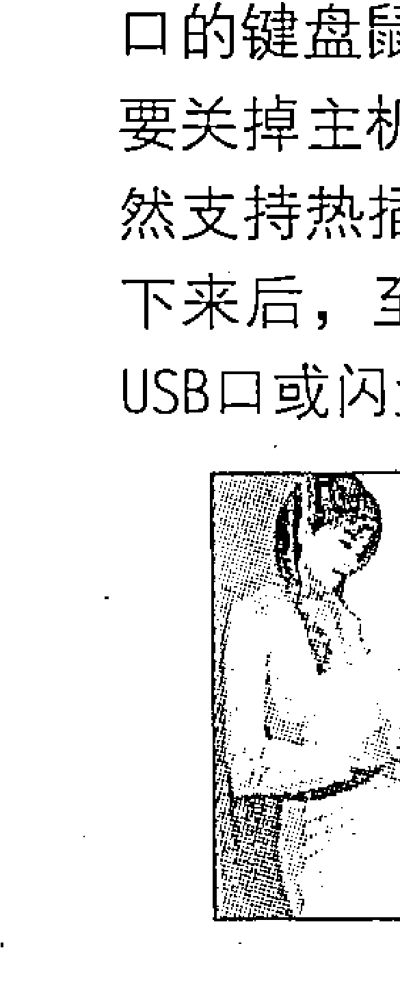

### 38度机箱≠侧板导风孔
一提起38度机箱，最先想到的肯定是从2004年开始出现的CPU导风管和侧板上的散热孔。来自Intel的正确叫法是“散热优势机箱”（Thermally Advantaged Chassis，简称TAC），要求CPU散热器上方2cm的空气温度不高于38摄氏度，并提出了一系列设计规范（简称CAG，Chassis Air Guide）。

## 高清解码全攻略

「现在到处都在说高清，电视是高清的、蓝光也是为高清而生的、游戏也要高清……到底高清是什么，咱自己又能不能播放它呢？」

## 高清是什么？

HDTV ( High Definition Television ) 是高清晰度数字电视输出技术，中文简称高清，可提供相对于传统模拟电视技术更高清晰度的图像质量。HDTV的高清主要表现在它支持1280×720、1920×1080、分别有720p、1080I/1080P之分。720/1080指的是分辨率1280×720与1920×1080，而1080分为I和P两种，其中I代表Interlace，隔行扫描；而P是Progressive，逐行扫描。720P与1080I的带宽是一样的，在清晰度自然是1080I高一些，但动态画面表现得更流畅的则是720P。1080P则兼顾了清晰度以及动态表现的要求，也就是大家所说的FULL HD，但它也是对码率、存储空间要求最高的格式。

HDTV除了有码率上的不同之外，还有编码格式的不同，现在主流视频主要有MPEG2、MPEG4、H.264(MPEG4 AVC)、VC-1(AVC-1)/WMV9HD等。这些格式都有个相同的名词叫码率。这个码率不能决定分辨率，但是能够决定在相同分辨率下所能实现的压缩程度。既然是压缩，那么就会有损失，优秀的编码方案可以在尽可能大的压缩比下减小画面受压缩影响带来的损失。码率以及时间决定了一部片的总容量，同时码率对编/解码处理器也会提相应的要求。一般来说，码率越高，画面就越清晰锐利，也越流畅，但是对存储容量以及编/解码的要求更加苛刻。

既然高清主要是影片，那它的载体就有必要说一下了。如同在DVD时代有＋、－两大标准一样，新一代光存储也有两种规格：HD-DVD和蓝光。但是在今年，HD-DVD已经宣告退出竞争，那么只剩下这一种格式——蓝光了。蓝光存储原理为沟槽记录方式，采用传统的沟槽进行记录，然而通过更加先进的抖颤寻址实现了对更大容量的存储与数据管理，目前已经达到惊世骇俗的100GB（普通单层蓝光盘为25GB）。与传统的CD或是DVD存储形式相比，蓝光光盘显然带来更好的反射率与存储密度，这是其实现容量突破的关键。

> 什么是解码？
解码器的功能就是对视频或者音频进行解压缩。我们知道不论是原始的视频或者是原始的音频，数据都是十分惊人和庞大的，所以要用编码器对其进行压缩，这样才有利于传输和存储。在播放时我们就需要还原成画面或者声音，这就需要解压，也就是解码。硬件解码器就是利用解码器所带的驱动接口和硬件本身连接上，利用硬件所带的功能对视频进行解码，这样可以降低对CPU的负荷，从而实现流畅播放以及提升CPU多任务的能力。

> 什么是HDMI？
HDMI的英文全称是 “High Definition Multimedia”，中文的意思是高清晰度多媒体接口。HDMI接口可以提供高达5Gbps的数据传输带宽，可以传送无压缩的音频信号及高分辨率视频信号。同时无需在信号传送前进行数/模或者模/数转换，可以保证最高质量的影音信号传送。HDMI在针脚上和DVI兼容，只是采用了不同的封装，但其结构仍然有许多不同之处。

什么是HDCP？
HDCP的全称是High-bandwidth Digital Content Protection，也就是“高带宽数字内容保护”。简单的说，HDCP就是要将通过DVI接口传递的数字信号进行加密，多媒体内容的发出端（电脑、DVD、机顶盒等）与接受端（显示器、电视机、投影机等）之间加上一道保护，蓝光光盘上都会有这个技术。在设备端，只要使用数字接口，HDMI或是DVI连接的，就必须具备HDCP技术才能正确播放高清电影，否则画面将严重受损，甚至不如VCD。

## 设置高清解码分不清

就像DVD时代显卡都具备硬解码功能一样，现在绝大多数新显卡也都具备了硬解码能力。所谓硬解码能力，就是指所有的演算都交由显卡专门的逻辑电路来进行，而不是依靠CPU来计算。这样资源将大大节省，播放起来也不会一卡一顿、不流畅了。既然提到显卡，那就不能不提现在两大显卡巨头——NVIDIA和ATI，两家公司都提供了高清解码能力的显卡，分别是具备AVIVO HD功能的ATI RADEON HD系列与内建PUREVIDEO HD技术的NVIDIA GeForce 8（部分）/9系列显卡，只有它们才能够实现高清硬解码。当然了，既然是电脑，那就免不了设置，鉴于现在编码方式较多，播放起来还是需要一定设置技巧的，而且两家显卡的设置使用方式又不尽相同，所以才会提出“高清解码全攻略”的名称。

## PowerDVD设置最简单

无论是ATI亦或是NVIDIA的显卡，PowerDVD的高清解码设置无疑最为简单（图1），基本上都是全自动的，当然前提是你必须安装好显卡的驱动程序才可以。但其对版本有要求，必须是PowerDVD 7.0以上的版本才能支持高清电影播放，同时，对于下载的高清电影文件，PowerDVD不能加载外挂的字幕文件，这也是一个不大不小的遗憾。

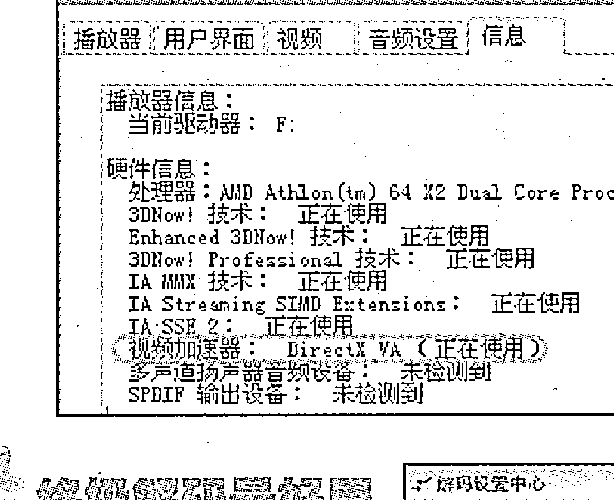

## 终极解码最好用

终极解码无疑是目前最适合用来播放高清电影的播放器集合（图2），它整合了大多数常用的编码器，使用起来功能非常强大。但是，它的缺点也是非常致命的——很多使用者不知道如何在它上面设置解码模式。

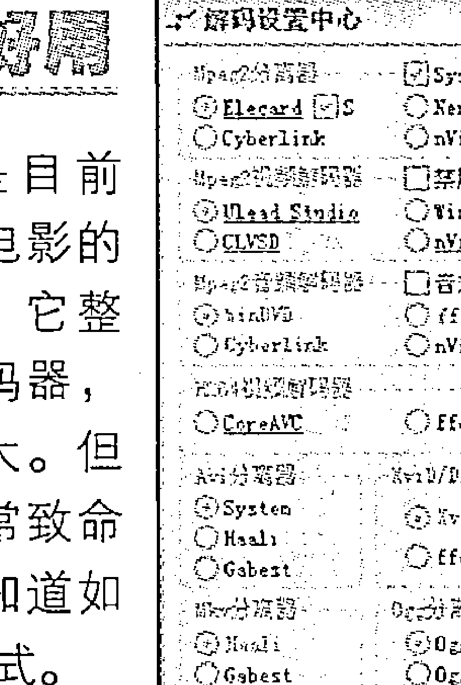

## H.264解码的设置方法

H.264解码设置相对比较容易，首先选择外部视频解码器，如果之前没有调入外部解码器或者搜索过外部解码器的话都是系统默认（图3）。

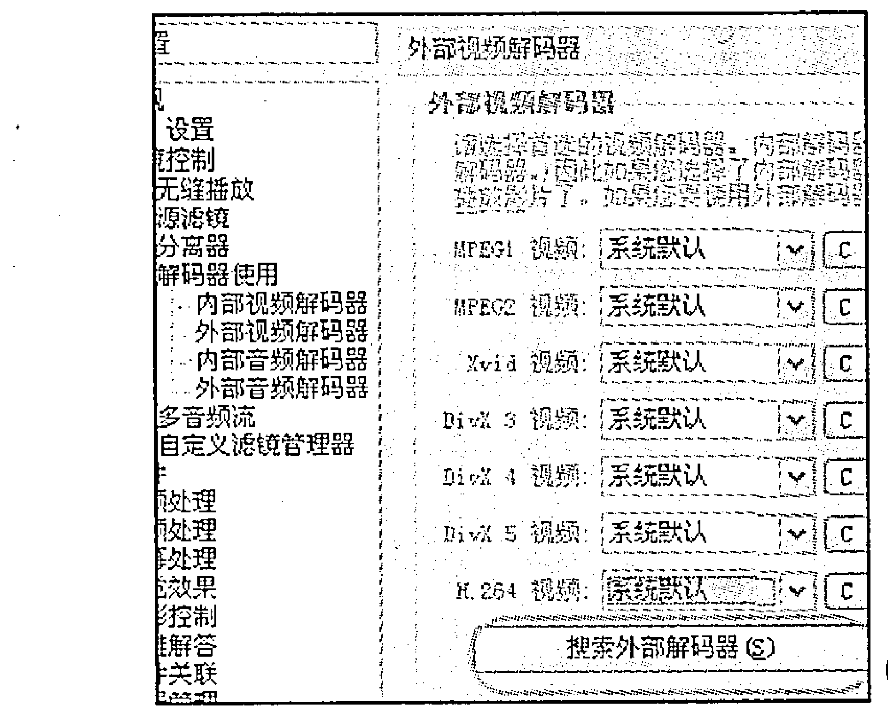

然后点击“在扫描后添加”搜索外部解码器（图4）。

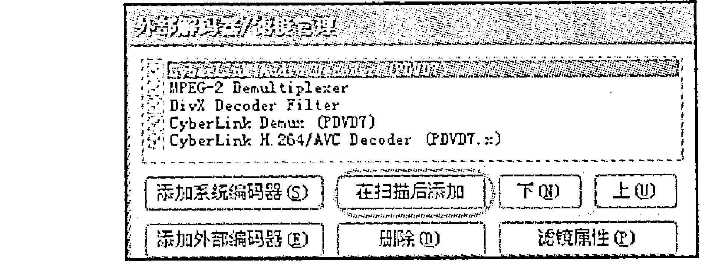

然后在相应的编码格式里选对应的解码器，H.264的视频直接使用PowerDVD的H.264解码器可以直接开启硬件加速（图5）。

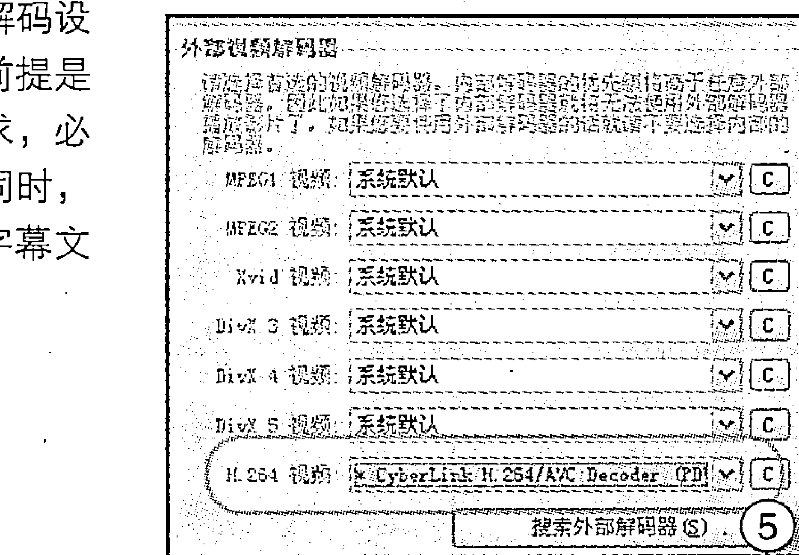

然后点右边的C，就可以进去对解码器进行调节。USE DxVA的选项勾上即打开硬件加速（图6）。

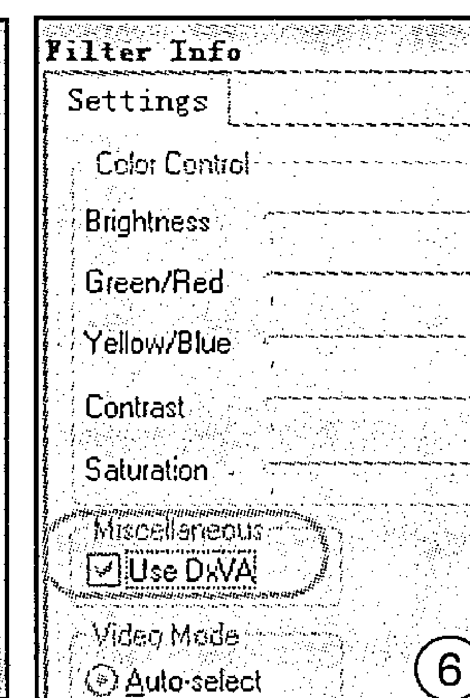

完美解码的设置相对简单，只要H.264这一项选中Cyberlink(DxVA)即可（图7）。当然分离器最好还是选择Haali。

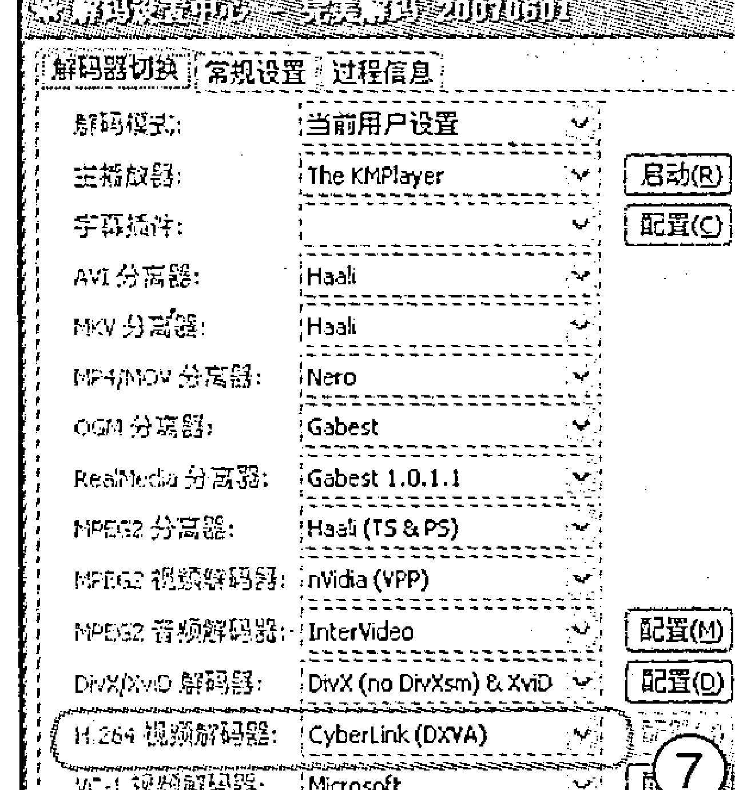

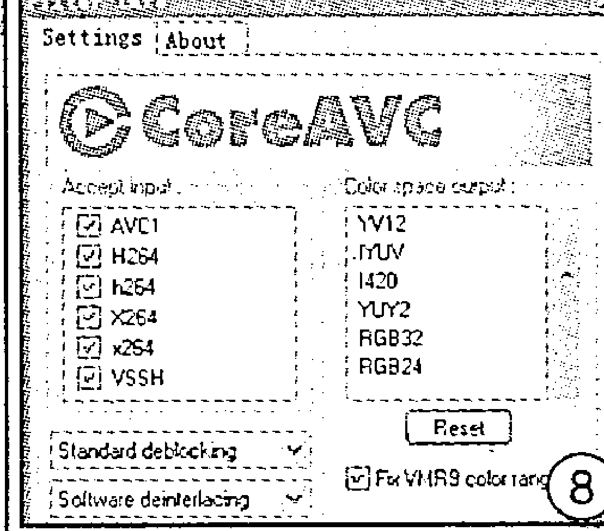

此外，有必要介绍一下CoreAVC这个软件H.264的软件，它是公认H.264画面以及设置比较优秀的解码器，尽管它只是软件运算，但是拥有比FFSHADOW更低的CPU占用率，成为了解解解码器的首选（图8）。

## VC-1/WMV HD的解码设置方法

VC-1/WMV HD的情况比较复杂，首先KMPlayer要选用比较新版的，自从2.9.3.1288之后开始增加VC-1/WMV HD选项，在解码中心设置中（图9），注意Mpeg2分离器的设置，不要选择Nero、Haali。另外关键的是不要勾选wma-HA和自动模式。XP系统渲染模式VMR9、Vista用ERA增强（C/A）高速、快速模式。

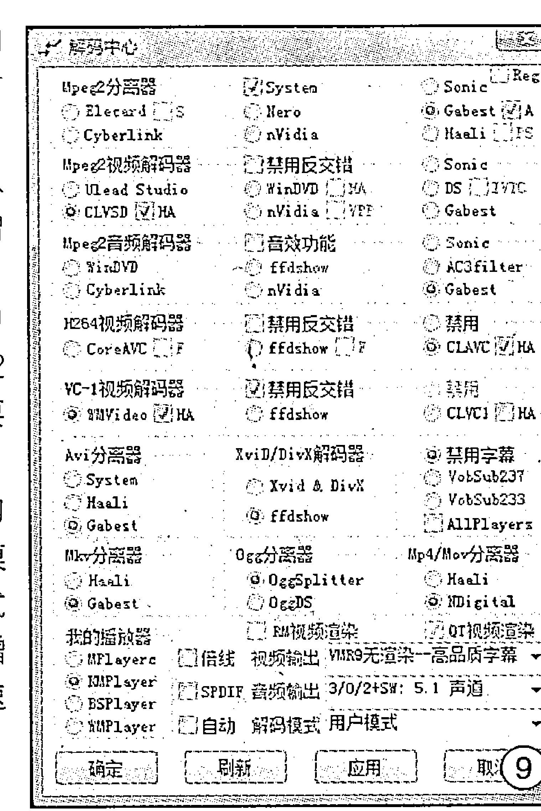

## 轻轻松松 玩转显卡

□赵洪斌

虽然显卡市场争夺激烈，但作为显示系统的核心——显卡，对于大多数人来说仅是追求性价比的简单商品。其实显卡的玩法很多，可以像CPU和内存一样超频，还可以组建混合双卡等，而且并不像想象中的那么深不可测。通过下面几方面的讲解和学习，你肯定能够玩出自己的花样来。

## 超频

一提到超频，大家首先会想到处理器超频和内存超频，接下来就是通过超频获得了什么样的性能，这使得不少朋友过于看重处理器的性能，而忽略了显卡这一重要角色。其实在不少方面，中高端的差距用户根本体会不到。就拿游戏来讲，PC版《失落星球》、《极品飞车》甚至于《Crysis》，Core 2 Duo E4500和Core 2 Duo E6550的性能差距微乎其微，但是同样处理器下的中高级显卡的表现则差异很大。可是高端显卡的性能并不是所有用户可以享受到的，不过普通用户可以自己动手丰衣足食，对显卡进行超频，在免费获得性能提升的同时，还能享受到显卡超频过程的乐趣。

显卡超频不像CPU超频那么复杂，因为显卡本身就是个整体，可以说显卡在出厂时能超多少基本已经确定，主要依靠驱动程序或者是第三方工具软件，但也可以通过刷新BIOS来进行硬超，不过多数厂商不鼓励这么做，只有少数的厂商提供部分自己产品的超频版本BIOS。

由于A卡、N卡的驱动程序不同，所以在使用各自自带的驱动程序超频时也会有些差别。对于N卡可以使用NVIDIA nTune这款调节优化软件，在安装完NVIDIA驱动程序的情况下，再单独安装nTune，桌面会出现“”的nTune的图标。

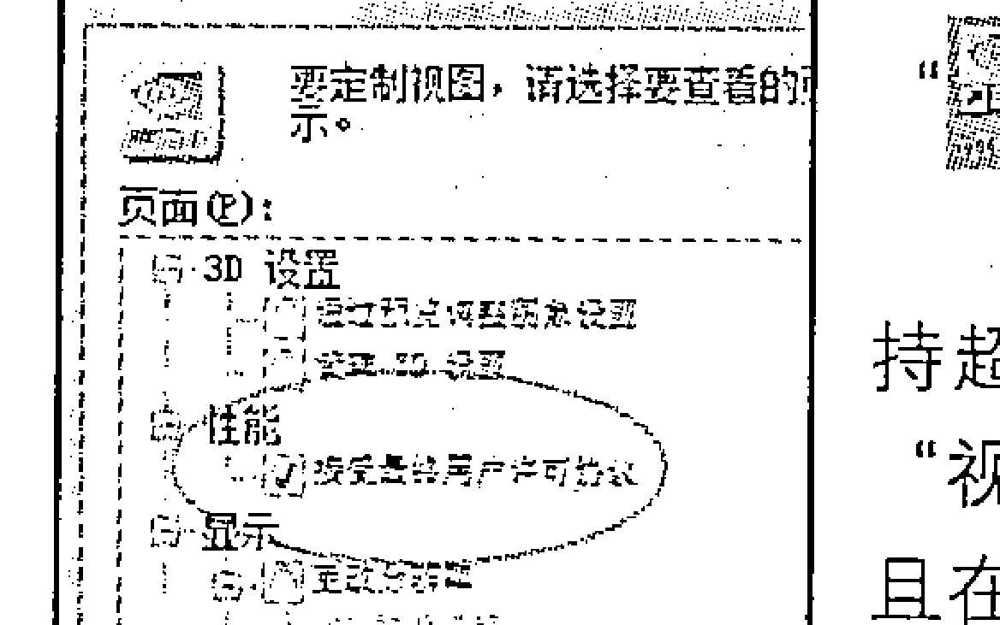

进入nTune之后，默认还无法支持超频调节，需要点击菜单栏中的“视图” → “确定自定义视图”，并且在弹出的窗口中勾选上接受最终用户许可协议（如图1）。然后在“接受最终用户许可协议”界面，点击确定（如图2）。

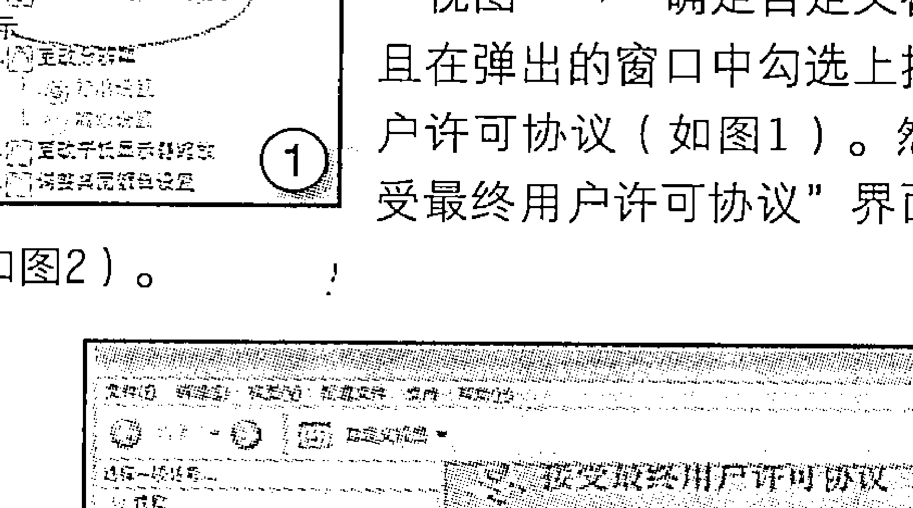

在确认完信息之后，nTune左边竖栏里有了调整GPU设置一项，点击它就可以对显卡进行超频调节，也可以对GPU的风扇转数进行调节，非常的明了（如图3）。

在超频的同时我们还可以使用nTune系统状态监控功能对整个系统进行监控（如图4）。

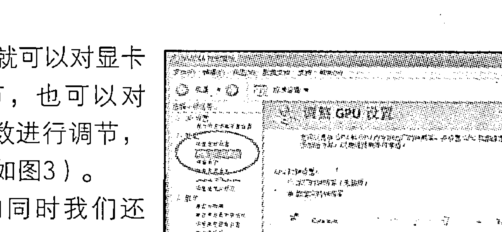

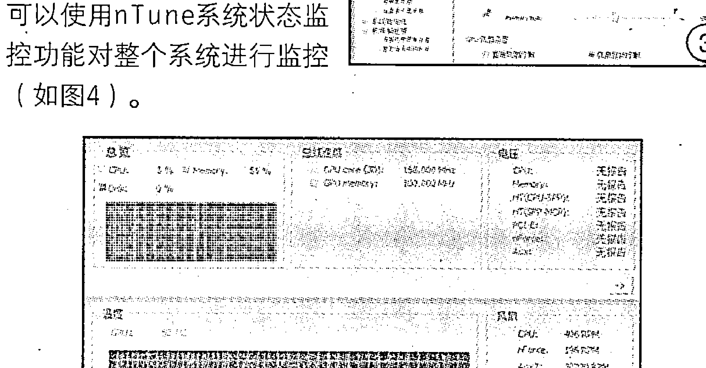

使用NVIDIA驱动程序超频操作简单是其优点，但也带来了一个缺陷就是超频幅度太小，同时nTune系统本身还有一个缺陷就是不能保存频率，也就是说超频之后，其有效期只是在计算机下一次重新启动之前，重启后则需要重新进行超频。在这方面ATI的驱动程序做得较好。

使用ATI的驱动超频也非常简单，装好驱动程序后，在桌面上点右键，可以看到“催化剂控制中心”(Catalyst(TM) Control Center)选项，点击它就可以进入ATI驱动程序设置界面（如图5）。

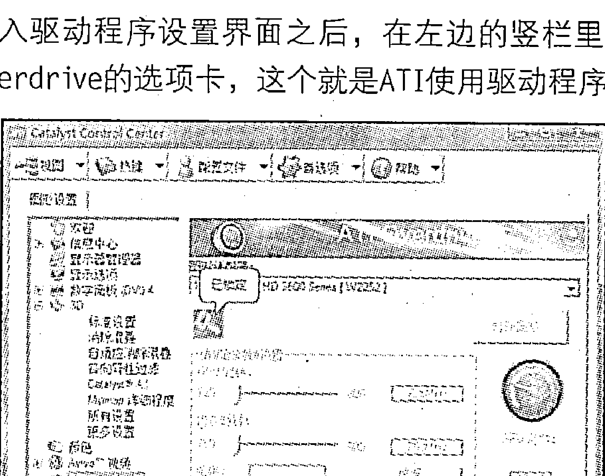

进入驱动程序设置界面之后，在左边的竖栏里可以发现ATI Overdrive的选项卡，这个就是ATI使用驱动程序超频的工具——Overdrive。但是在默认状态下不能对任何频率进行调节，此时点击画面上的钥匙，会出现警告状态栏（如图6），点击确定即可打开频率调节功能（如图7）。

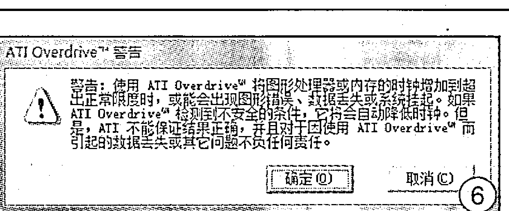

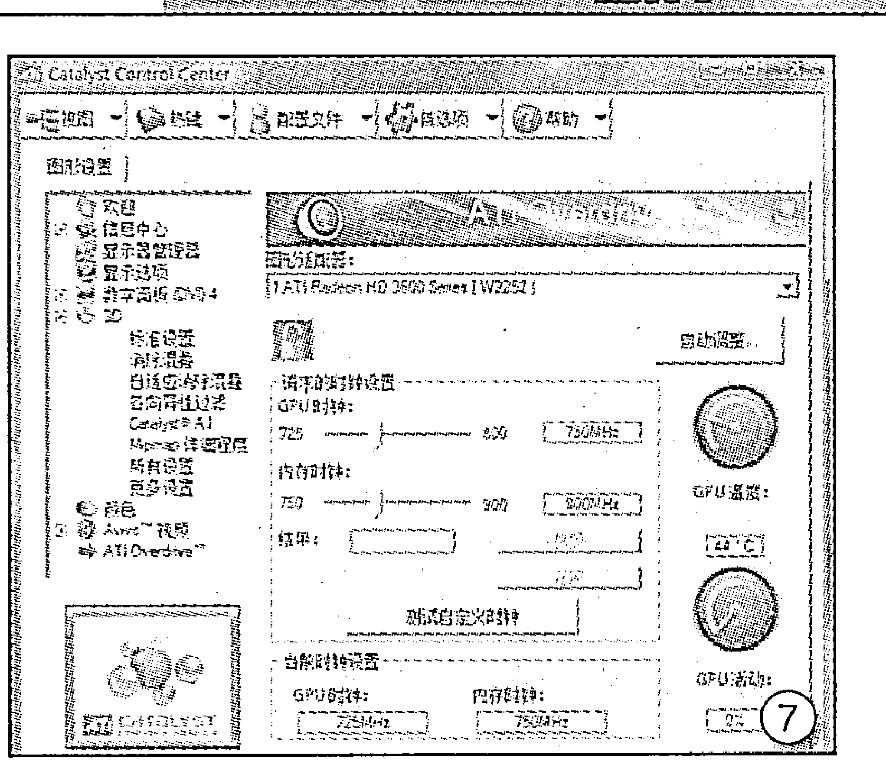

进入ATI驱动程序超频页面，和NVIDIA nTune一样，Overdrive也支持线性超频，超频只需要拖动画面上的滑块即可。而且对于新手，可以直接点击画面上的“自动调整”，Overdrive会自动帮你超频到一个合适的状态。还有，如果你想知道超频后是否稳定，可以点击画面上的“测试自定义时钟”来进行判定。

除了使用上面的方法，还可以使用RivaTuner第三方软件对显卡进行超频（操作基本同上），可以得到更好的超频范围，而对于BIOS刷新法，虽然一劳永逸，但是操作危险系数很大，这里不推荐使用。

## 双卡互联

下面我们来看一下如何实现双卡互联。NVIDIA和ATI分别推出了自己的双卡互联技术——SLI和CrossFire。

NVIDIA SLI的设置首先需要主板的驱动支持SLI功能，然后正确联接SLI桥接器进行双卡的安装。进入系统后，右键单击桌面选“属性”→“设置”→“高级”，勾选“启用SLI多GPU”（如图8）即可实现SLI功能，此时系统会提示需要重启，设置才能生效。不过从80系列驱动开始，已经可以随时进行切换而不需要进行重启。

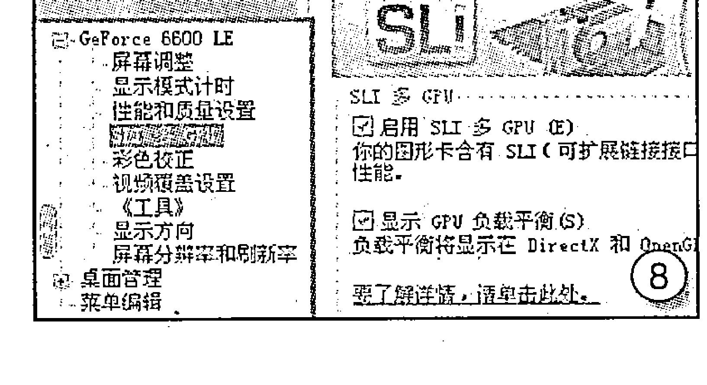

重启后还没有完成SLI的设置，还需要进入驱动面板（如图9）的“性能和质量设置”项进行设置。在这里先确定所有的“应用程序”和“活动配置”都是处于全局设置模式。然后在“驱动程序全局设置”中将“基本设置”改为“高级设置”。这样，在下方的查看框中就可以看到“SLI渲染模式”这一项，默认状态下这里是“SLI单GPU渲染”，我们所要做的就是将它改为“SLI多GPU渲染”（如图9）。至此，组建SLI双卡的设置才算大功告成。

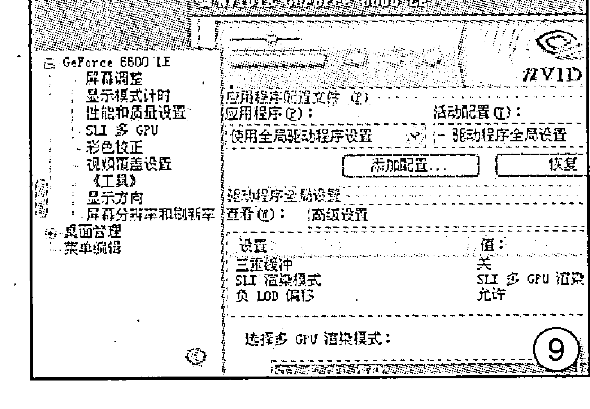

组建CrossFire系统同样也很简单，但也需要安装上ATI的专门驱动才能实现CrossFire功能。进入系统单击右键，进入ATI CATALYST Control Center，不过我们并没有看到有关CrossFire的设置，因为CrossFire的选项是隐藏的，必须将View选项设置成为Advanced View, CrossFire的开关才会出现（如图10）。

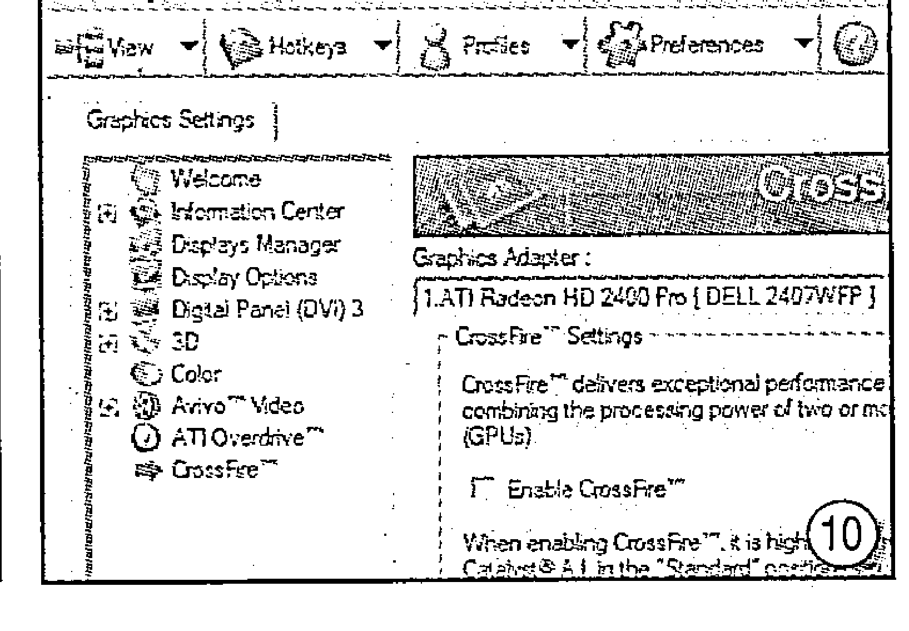

选择打开交叉火力（CrossFire）选项，系统会弹出一个提示对话框，按确定后即可打开交叉火力了。

## 双屏显示

接下来是双屏显示的问题。记得最初推出双头显卡的时候，设置很单一，在系统桌面显示属性的设置一栏进行设置即可（如图11）。
而如今设置可以在两大显卡厂商推出的显示控制中心来完成，并且还提供了更为丰富的调节选项。

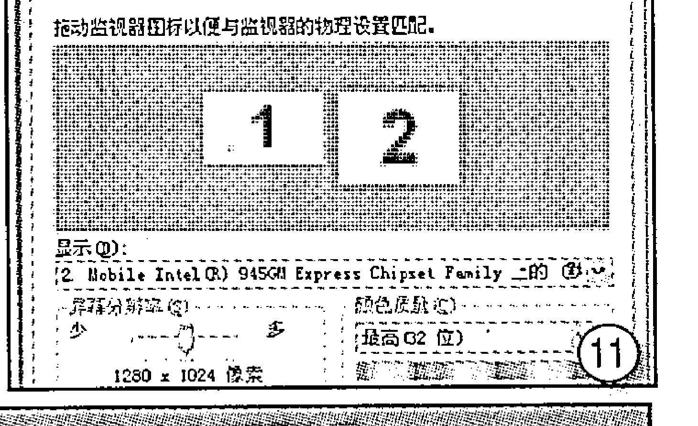

- 1. NVIDIA
在“控制面板”中打开“NVIDIA Control Panel”，然后选择“显示”打开（如图12）对话框。

点击“运行多显示器向导”开始多显示器的设置，使用“典型设置（推荐）”一路“下一步”即可。如果选择“自定义设置”（如图13）则会进入主显示器的选择（如图14）。

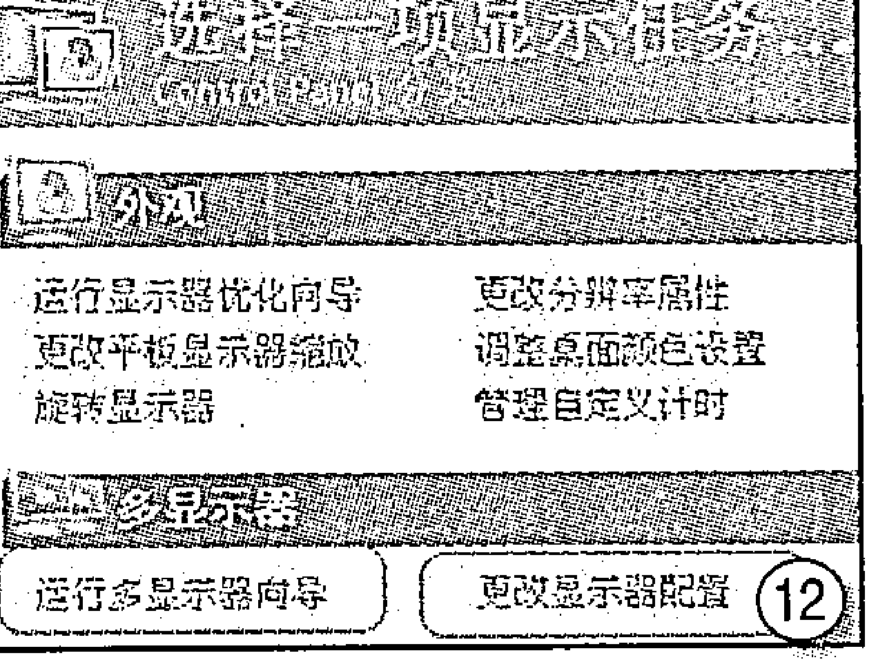

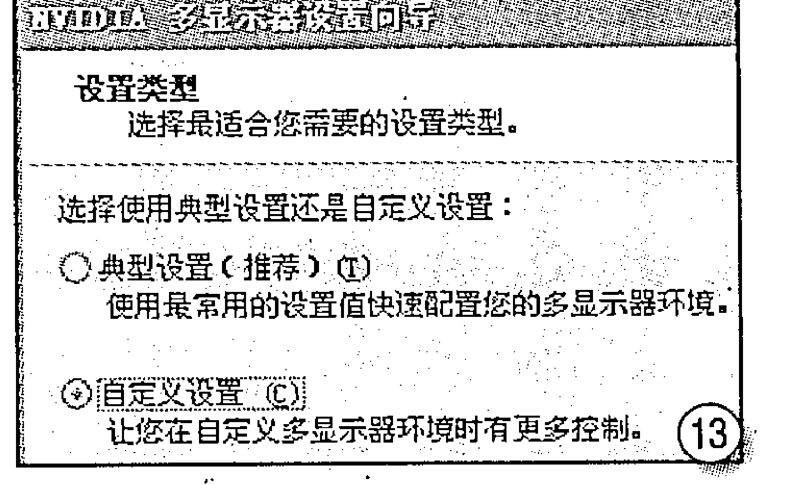

这里需要注意一下，建议使用尺寸较大、分辨率较高的显示器作为主显示，如果使用相同规格的显示器则不存在这种需要。选择了主显示器后继续# 双屏显示设置向导

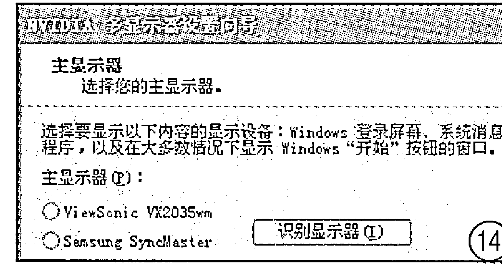

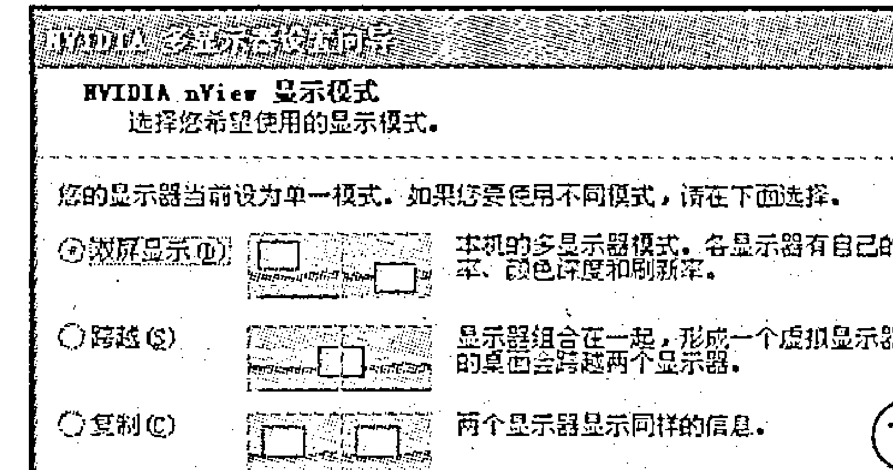

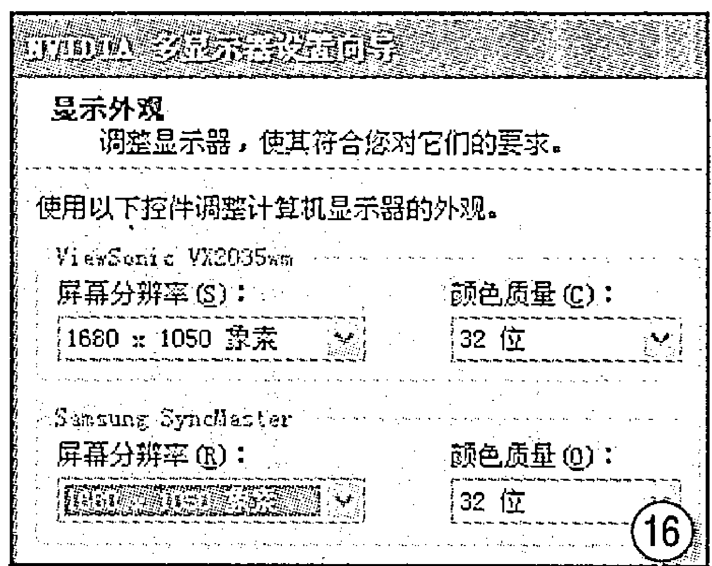

“下一步”，进入双屏显示模式的选择（如图15）。这时我们可以选择自己所希望的显示模式，然后选下一步，进入两个显示器的分辨率设置（如图16）。如果默认的不是显示器最佳分辨率，可以通过下拉菜单选择显示器最佳分辨率，然后点击“下一步”完成设置。

## 2. ATI

在系统桌面单击右键进入“ATi CATALYST Control Center”，然后在打开的高级设置对话框中选择“显示器管理器”（如图17）。

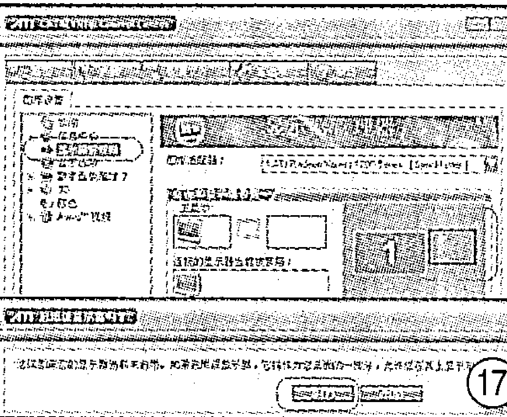

此时并没有加载第二台显示器，我们需要点击显示器2，弹出添加显示器对话框，选择“是（Y）”即可。鼠标右键点击桌面2的显示器图标，弹出双屏显示模式的选择，选择所需的显示模式后，应用确定即可（如图18）。

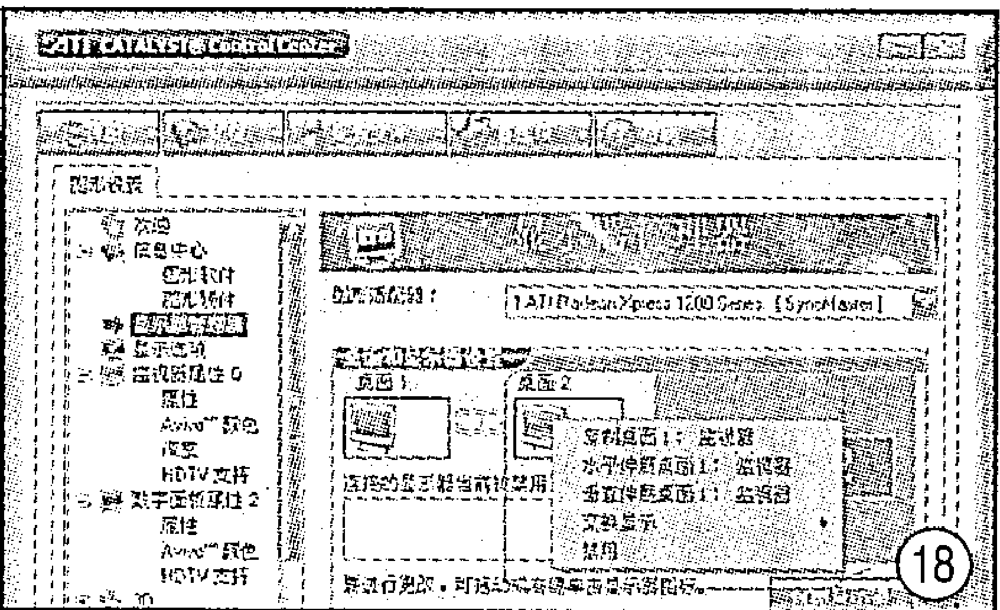

## 妙用电视

电脑的屏幕在走向大屏幕，但和电视相比还是小了不少，尤其现在很多液晶和等离子都支持1080P的视频解码，所以很多用户希望用电视播放高清视频。其实这也不是什么难事，因为现在的液晶、背投、等离子很多都可以支持直接和电脑相连（老式的电视看显卡是否具有S端子输出功能）；然后再使用上面讲到的双屏显示中的复制选项，就可以实现电脑屏幕和电视屏幕同时播放了。

## 显卡散热

显卡要完成上面这么多的工作，自身的稳定运行很重要，尤其在进行超频的时候，如果不能把热量及时排走，将会对显卡造成致命的伤害。显卡有散热片和散热片配合风扇两种方式进行散热，也就是被动式散热和主动式散热。一般一些工作频率较低的显卡采用的都是被动式散热，这种散热方式就是在显示芯片上安装一个散热片，并不需要散热风扇。而对于工作频率较高的显卡则需要采用主动散热的方式，安装散热风扇，因为较高的工作频率会带来更高的热量，仅安装一个散热片的话很难满足散热的需要。

如果这还不能满足你的需要，也可以自行改造一下，更换更好的显卡散热系统。准备相应的工具，将原装的散热系统拆掉，换上自行购置的散热系统即可。需要注意的是：

- 购买一个质量较好的风扇，最好是带上显卡去挑选。
- 一定要将残留的导热硅胶去除，使芯片表面光洁，没有异物，才能再涂新的硅胶。
- 另外新的散热系统最好另接电源，以免更换大功率的散热风扇后，增加显卡插槽的供电负荷。
- 除了更换散热风扇外，我们还可以给显存散热，贴上专用的散热铝块，也可以起到很不错的散热效果。

## 登录界面背景变变色

打开注册表编辑器，找到[HKEY-USERS\.DEFAULT\Control Panel\Colors]，将Background的值改为“0 0 0”（不带引号），这样登录背景就成了黑色。

## 完全卸载XP

有些朋友在安装Windows XP后发现自己并不喜欢这个操作系统，这时你可以用Windows 98安装光盘启动到DOS状态，然后键入：

```
format -ur
```

这样可以删除所有XP的文件，并可重新安装Windows 98/Me。

# 超级超频

□赵洪斌

『 “更快、更高、更强”是DIY——Do It Yourself在诞生的那一刻所追求的目标，也就在这样的驱动下DIY和超频形影不离。回忆C300A超频到450MHz的那一瞬间，心里仍不禁感慨。现在Q9650超到4.5GHz除了带给我们激动之外，还给了我们向下一个目标挑战的动力。这么一说感觉超频很神秘，是专业人士才能做到的，其实超频虽然复杂，但并非深不可测。目前两大处理器阵营Intel和AMD的技术各有其特点，也使得超频的侧重点有所不同，但是主流的CPU超频是通过调节主板BIOS来完成的。 』

先了解一下超频的原理：CPU实际运行频率=外频×倍频，所以只要改变外频和倍频中的任何一个便可实现超频，当然也可以两者结合同时改变。外频Intel称为FSB，AMD在K8架构后改为HT总线。Intel的FSB仍采用单向式传输设计，不支持多点传输，又加上内存控制器在北桥，也就使得FSB的带宽成为Intel的瓶颈。而AMD的处理器由于集成了内存控制器和采用了HyperTransport技术，从而摆脱了带宽瓶颈的苦恼。

接下来，由于主板提供的默认电压无法满足高频率运行的要求，这就像大功率的电器，必须要更多的电流来保持运行的道理一样，因而要增加适当的电压。一般CPU加压分为基础电压（如图4）和几段微调电压（如图5）。最后还要辅以内存参数的调整才能最终超频成功。

## Intel处理器超频

开机按DEL键进入BIOS设置界面，然后进入相关的超频选项栏。有些BIOS默认的情况下超频选项是关闭了的，CPU的外频无法调整。可手动开启超频功能。接下来就可以对外频、倍频进行相应调整。想先超外频，那么我们首先要调节处理器的倍频（如图1）。

## AMD处理器超频

开机按DEL键进入BIOS设置界面，然后进入相关的超频选项栏。对于有些主板BIOS默认超频选项是关闭了的情况，我们可以手动将其启动，此时我们可以看见自动超频和手动超频两个选项，选择手动超频（如图6）。

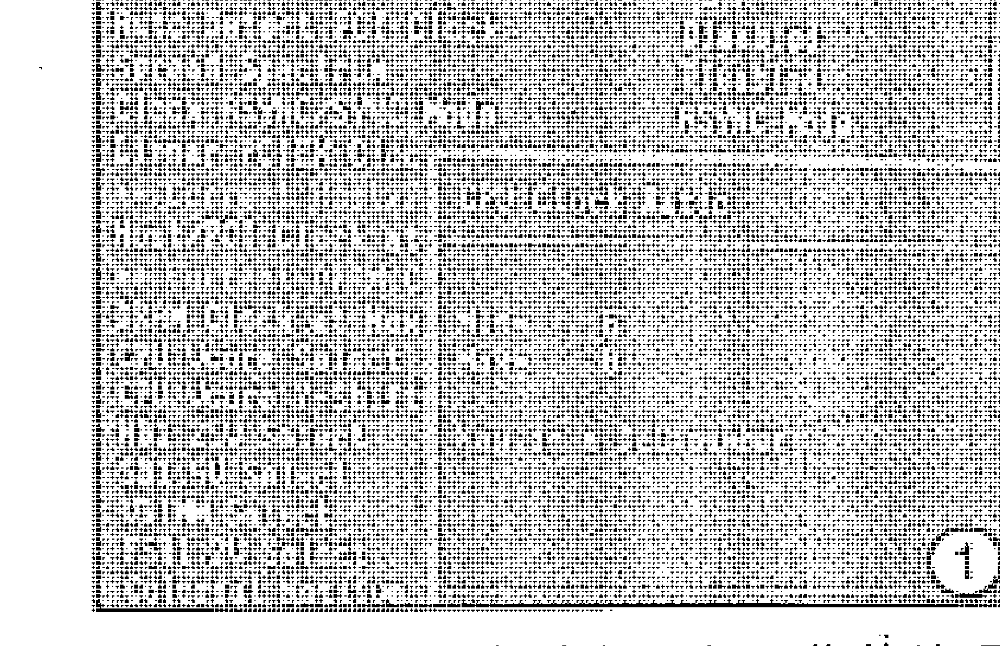

最好的方式是调节到最低倍频，如果你的处理器的品质不错，并且想要更高的主频，则可以适当地提高倍频。在此期间我们还要对PCI-E的频率、内存分频进行调整才能调整外频（如图2、3）。

选择手动超频设置后底下的CPU电压、内存电压、主板电压、串行总线电压、CPU外频、倍频、HT速度、内存时序等都变得可以调节了（如图7）。

调节CPU电压（如图8），主板都有一个比较安全的默认电压，有时候CPU的体质不是特别好，或主板供电或电源做工不够，会在超频启动瞬间形成压降，所以CPU可以适当地给予加压，一般以不超过0.2~0.4V为好。

还可以调节内存的电压，而主板的电压一般是在超频后不稳定才给予加压，加压后主板温度会有大幅度提高。然后调节HyperTransport串行总线电压。接着调节CPU的外频、倍频，在外频的调节上还是要根据处理器的体质，量力而为，而倍频方面，如果你不是玩频率极限，一般以使用Auto选项为主（如图9）。还可以对CPU到主板的HT总线倍频、内存的设定以及PCI-E频率进行调节，以配合整个超频的进行。

## Intel超频中选项的调节

了解了基本的超频过程，下面对超频中选项的调节详细介绍一下。PCI-E频率的调节。PCI-E的默认频率是100MHz。在超频的时候不要同步PCI-E插槽的频率，要锁定PCI-E频率。因为如果不锁PCI-E频率的话，提高外频以后，可能会由于过高的处理器频率导致PCI-E频率也加上去，使得显卡不稳定，从而影响超频。锁定的数值在100～105MHz之间，具体的数值还需要自己去试验，因为有些主板101MHz稳定，有的可能105MHz稳定，也有默认频率100MHz就稳定的。CPU电压的调节对超频非常重要，因为对于Intel的CPU，稍微加一些电压效果都是很明显的。但在调节电压之前一定要加倍小心，不要超过默认电压太多，要循序渐进，一次不宜增加过多，以免造成电压过高而烧毁硬件；另外也并非是电压加得越高越好，如果只是通过降低倍频超更高的FSB频率，而CPU的主频没有超频时，CPU电压适当加点就可以，建议增加0.1750V以内。内存频率尽可能设为最小值。因为在CPU超频的时候，我们会提升FSB频率，同时，内存的频率也会提升，如果将内存频率设为最小，它将存在更多的提升空间。也就是说，这样可以尽可能地消除内存对CPU超频的影响。另外，我们还可以稍稍将内存时序设高一点，或者为内存加少量电压，当然必须在允许的范围内进行。设置内存频率值有几种方式，主要看主板实际的设置。

## AMD超频中选项的调节

首先需要注意的是，PCI-E频率要锁定，原因及方法和上面Intel处理器超频都是一样的。电压的调节倒不是很重要，因为对于AMD的CPU，稍加电压对超频产生的效果并不明显，反而增加过高的电压会导致CPU温度大幅提高，不利于超频。HT总线可以分为CPU到北桥、北桥到南桥、南桥到北桥HT总线三种。其中，CPU到北桥的HT总线频率对超频有直接影响。一般说来，绝大多数Socket AM2主板都提供了1X、2X、3X、4X和5X的HT总线倍频设置。CPU到北桥HT总线的计算公式是：HT总线频率=CPU外频×HT总线倍频。比如在默认状态下，Athlon 64系列处理器的外频均为200MHz，主板默认HT总线倍频为5X，此时处理器到北桥芯片的HT总线频率为200MHz×5=1000MHz。目前大多数Socket AM2主板所能承受的HT总线频率都不超过1000MHz，即使是一些高端Socket AM2主板所能承受的HT总线频率也不超过1200MHz。一旦HT总线频率超出这一范围，主板和芯片组很难承受如此高的频率，进而造成系统不稳定或频繁死机。所以，将HT总线的实际频率控制在合理的范围内就成为了影响超频稳定性和成功率的一个重要因素。为了确保超频的成功率和稳定性，建议大家最好将HT总线的频率控制在1000MHz以内，最高不要超过1200MHz。比如当玩家将处理器外频超频至300MHz时，为了保险起见我们可以选择3× HT总线倍频，此时HT总线的实际频率是900MHz，属于安全的范围以内。最后需要提醒大家的是，BIOS中CPU到北桥芯片的HT总线带宽（通常显示为K8<->NB HT Width）默认设定为↓16 ↑16，大家最好不要更改。该选项对超频并没有任何影响，如果改成↓8 ↑8反而会严重削弱系统的整体性能。

内存频率方面，Socket AM2平台的内存分频设置是比较怪异的，并不像LGA775平台那样与BIOS中的设置完全对应。其具体计算公式为：内存实际分频=CPU主频÷（BIOS内存频率设置÷2）注：内存实际分频取运算结果第一位整数，小数部分四舍五入。另外，DDR2内存等效工作频率是实际频率的2倍，故除以系数2；如BIOS内存设置直接用如200/266/333/400MHz等实际频率表示，则不用除以系数2。内存实际工作频率=CPU实际频率÷内存实际分频。对于现在的主流内存我们再给出两个公式：DDR2 667：CPU主频 / 7 = 实际内存需要的工作频率；DDR2 800：CPU主频 / 6 = 实际内存需要的工作频率。内存时序方面，自然是越低越好，但不能做到无限低，所以要慢慢寻找一个最佳性能与稳定平衡点。时序重要性的排序为：cas延迟、ras至cas延迟、RAS预充电、周期（常见调为5 5 15），当然Command PER Clock首命令延迟非常重要，1T追求的是速度，对内存质量的要求较高，2T追求的是稳定与兼容，速度自然会慢一些。

超频工作是做完了，该如何验证超频是否成功？能够顺利地进入系统是检验的第一步，还可以运行系统里的一些程序，例如Word、Windows Media Player等，同时运行大型的3D网游。除了这些之外，还需要专业的检测软件来测试超频的稳定性。

## SuperPI

SuperPI利用CPU的浮点运算能力来计算出π（圆周率），是目前普遍用来测试稳定性的小工具，它对内存以及CPU的性能和稳定性有较高的要求。选择好计算位数之后直接运行即可，例如让它进行3355万位的负荷计算，如果系统能够顺利地完成这个考验，就说明系统很稳定了，运行的时间越少也代表了超频后性能提升越高。

## Stress Prime 2004

Stress Prime 2004就是俗称的SP2004，是利用分布式计算寻找梅森素数。SP2004能使CPU达到近乎最大功耗和发热，从而测试CPU的稳定性。一般在CPU超频后把SP2004设成适当大量FFTs(即着重内存的那个选项)，优先权9，运行一段时间以确保CPU的稳定性。

## Intel超频小知识

关闭CPU Features中ESIT、硬件防病毒等四项功能可有利于超频成功并提高成绩。
超频过程中严密注意系统温度和电压，这个在主板BIOS的监控功能中实现。
注意处理器的散热。

## AMD超频小知识

关掉主板的COOL N QUIET功能。因为它的作用是降低功耗，让CPU风扇自动降速。
HT总线和内存的调节对AMD CPU超频十分重要，要格外的注意和谨慎。
选择一款好的散热器。

## 超频检测

对于有时会出现SuperPI运行没有问题，但是其后运行大型3D游戏的时候出错的情况。SP2004说明中提示：除非特殊需要，一般拷机建议选择“少量FFTs”运行24小时而不出错即可被认为系统相对稳定。选择“少量FFTs”进行测试后可继续在系统上同时运行其它程序。选择“适当大量FFTs”和“混合”选项进行测试后系统一般不宜继续运行其它程序。

## 硬件安装要仔细

□TMG mh

一款6600GT显卡，专门超频用，该显卡性能和超频能力都很出众，只是温度太高。笔者考虑给机箱加装风扇但又太破费，于是笔者在显卡散热器上下功夫。笔者把显卡散热器拆下，把散热器与核心之间的导热介质——石墨贴纸去掉，换成了硅脂。重新组装过程中，笔者费了很大力气才把背面的螺丝钉拧好，然后再把显卡插好，重新启动机器，电脑使用一段时间后竟然出现了花屏现象。笔者以为是病毒作怪，用金山毒霸2008查杀病毒，一无所获。笔者又怀疑是接触不良的问题，仔细检查了显示器、显卡接口和数据线之间的连接，发现没有松动现象。回想刚才操作，只是动了显卡，看来问题很可能出在显卡上面。为印证这个观点，笔者把显卡拿下，然后到旁边邻居家测试，果然，安装笔者的显卡邻居的电脑也出现花屏现象。笔者害怕刚才碰坏了显卡，仔细查看，没有发现什么伤痕，电容和电阻都完好无损。冷静下来，想一想故障现象和分析目前的现象，笔者认为是显卡散热不良而引起花屏现象。把显卡重新插入主板，启动电脑，过了一会，用手在显卡附近感觉，果然感觉到温度很高，急忙关闭机器，看来问题是显卡的散热问题，很可能是刚才我对显卡散热器的拆卸有问题。想到此处，笔者重新安装显卡散热器，在拆卸过程中，笔者发现有一颗螺丝钉拧偏了，核心的一角被紧紧地顶在散热器底部，尤其是硅脂被拥挤到了核心四周。笔者认真把散热器安装一边，尤其注意螺丝钉的拧法。然后，笔者再次启动机器，使用了一段时间没有发现任何异常，问题彻底消失不见。
事后总结，笔者第一次拆装显卡散热器很匆忙，以至螺丝钉没有拧正位置，造成散热器工作不正常。希望大家以后引以为戒，硬件的安装一定要小心仔细。

## 系统救命有招

当怀疑系统重新启动之前针对计算机所进行的更改可能导致故障，可以在启动系统时按F8键，选择“最后一次正确的配置”来恢复对系统所做的更改。

## 恢复硬件以前的驱动程序

在安装了新的硬件驱动程序后发现系统不稳定或硬件无法工作时，只需在“设备管理器”中选择“驱动程序恢复”按钮，即可恢复到先前正常的系统状态。但不能恢复打印机的驱动程序。

## 自动登录

单击开始→运行，输入 `rundll32 netplwiz.dll, UsersRunDll`（不带引号），然后在User Accounts中取消“Users must enter a user name and password to use this computer”，单击“OK”，接着在弹出的对话框中输入你想自己登陆的用户名和密码即可。

# 移动的3D魅力 ——透视笔记本显卡

□方成亮

无论移动处理器的性能有多强大，LCD液晶屏技术取得何种突飞猛进的发展，作为最大薄弱环节的移动显卡长期令笔记本与发烧级3D游戏基本无缘。在nVIDIA进入移动CPU领域之后，原本稳坐钓鱼台的ATI感受到巨大的压力，也因此出现了一轮又一轮的移动GPU性能竞争。时至今日，我们已经欣喜地看到基本局面的改变：高配置本本结合高性能移动GPU之后展现出强大的3D性能。

## - 3D震撼的前奏: 游戏本本配件如何选?

很多用户都知道移动CPU并不是决定笔记本性能的唯一要素，那么对于那些看重3D性能的玩家们而言，购买笔记本时究竟应该看重哪些配件呢？客观而言，CPU依然是不可忽视的环节，但是我们建议大家不用太过重视“双核”的威力，因为绝大多数游戏是不支持双核心技术的，并没有太多的实际意义。相反，较高的频率以及合理的效率才是关键。目前，AMD的炫龙以及Intel的单核酷睿都是不错的性价比之选。总之，我们并不反对双核心CPU，但是如果渴望更加出色的3D性能，那么在CPU上节省一些投资，然后将重点放在移动显卡方面，那么很容易获得更加出色的效果。

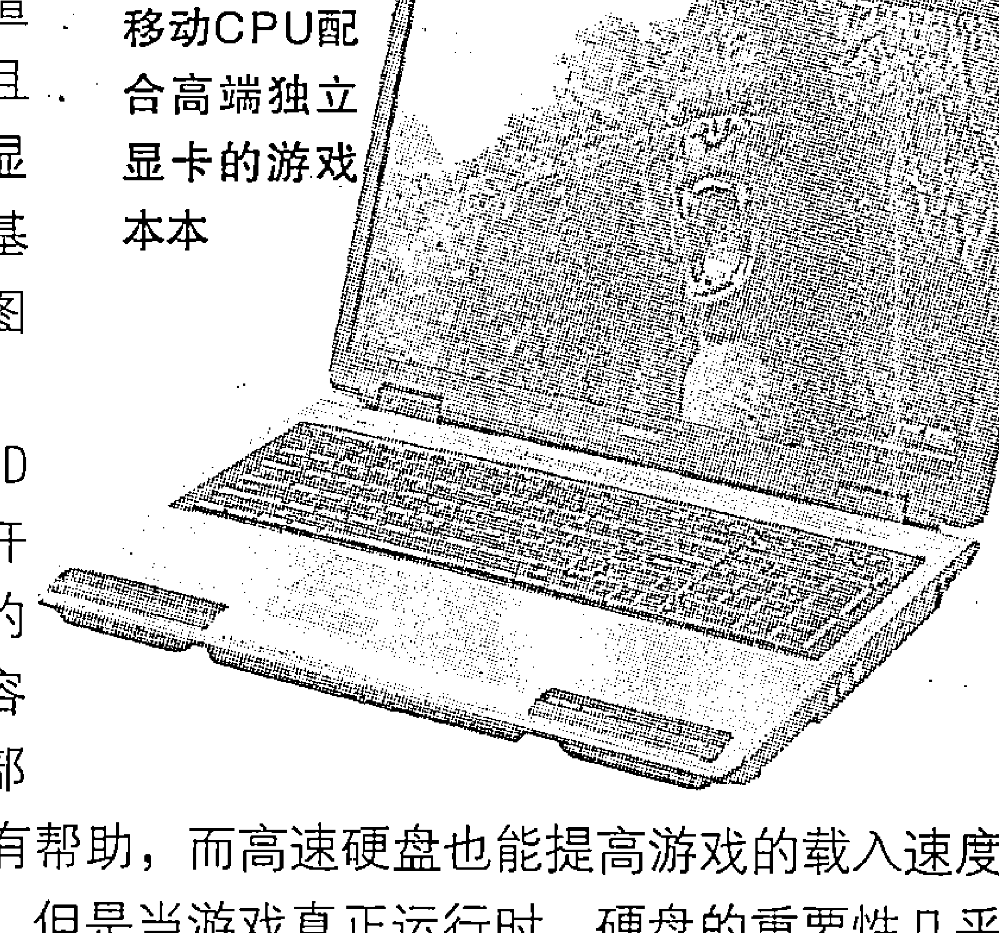

此时独立显卡具备4条以上渲染管线，并且拥有128bit显存位宽是最基本的要求（图1）。

当然，3D游戏也离不开内存和硬盘的支持，更大容量的内存对部分游戏还是很有帮助，而高速硬盘也能提高游戏的载入速度与场景切换速度。但是当游戏真正运行时，硬盘的重要性几乎可以被忽略。为此，我们建议大家将更多的精力放在笔记本的显卡上，并且保证内存容量在512MB以上，这样才能真正有的放矢。

目前，新一代的主流游戏大量采用Shader Model 3.0和HDR技术，并且要求显卡有较高的像素处理能力。从理论上说，一旦游戏的分辨率或者颜色数提高，显卡的负担将呈几何倍速提高，对像素填充率与显存带宽提出极高的要求。而DirectX硬件支持则完全依赖于显卡GPU本身的素质，如果移动显卡达不到这项要求，纵然CPU是酷睿2也无济于事。因此，渴望在笔记本上玩最新3D游戏的用户对移动显卡必须提出很高的要求，这样才能真正有的放矢。

## 二、整合也能出精品：集成显卡性能探寻

对于非常重视功耗控制与发热量控制的笔记本电脑而言，集成显卡依然是最为主流的选择。然而，选择集成显卡并不意味着彻底放弃3D性能，毕竟部分集成显卡还是有着相当不俗的综合表现，而且不同集成显卡的性能差距也非常明显。

### 1. 集成显卡到底能否玩游戏看电影

如今的Intel、SiS、VIA、ATI的整合图形核心都有相当不错的3D能力，应对大多数3D游戏还是绰绰有余的。以ATI Xpress 200M以及Intel 945GM为例，这些集成显卡的3D性能都已经非常不错，此时完全可以媲美于低端独立显卡。至于看电影，应该说整合芯片组内置的集成显卡也已经绰绰有余，毕竟看RMVB等格式的电影并不会对硬件性能提出很高要求，只不过软解压1080i以上HDTV时还略显不足。不过要说集成显卡能够应对所有的3D游戏以及视频应用，那也是不现实的。我们对于3D游戏的定义应该更加清晰一些，大多数RPG游戏、网络游戏以及即时战略游戏都算不上真正意义上的发烧游戏。以一些竞速游戏、FPS游戏为例，此时几乎所有的集成显卡都难以胜任。总之，建议大家不要对于集成显卡过于偏激，而是应当有客观而全面的认识。

### 2. 绝对主流的Intel移动集成显卡

更为让人欢欣鼓舞的是，Intel在全新的I915GM/I945GM芯片组中集成Extreme3核心（分别为GMA900和GMA950，后者频率更高），完全改变了集成显卡性能差劲的传统面貌。随后，G965M芯片组的GMA X3100集成显卡更是支持了DX10规格。由于Intel芯片组支持DDR2双通道内存技术，因此其集成显卡的显存带宽可达到128bit。事实上，Intel集成显卡最大的改进在于支持DirectX 9.0和10.0 API。目前很多3D游戏已经强制要求显卡具备Pixel Shader，否则无法运行，譬如《波斯王子时间之砂》等。以往集成具备Pixel Shader的移动显卡是令人不敢想象的，而Intel居然做到了。I945GM集成2.0版本的Pixel Shader，在硬件规格上完全支持DirectX 9.0 API，而G965M更是支持3.0版本的Pixel Shader。唯一遗憾的是，I945GM的Extreme3集成显卡无法支持Vertex Shader，因此在3D运算时的顶点渲染工作仍需要靠CPU来模拟运行完成，而最新的G965M已经克服了这一缺陷（图2）。

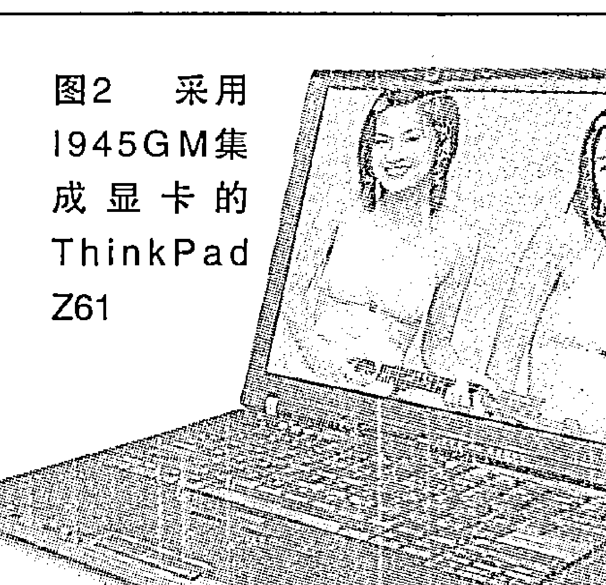

值得注意的是，Intel集成显卡的核心应用了一种非常有意思的DVMT动态显存技术，该技术允许图形核心根据任务需要从系统中动态获取内存资源。例如在上网浏览、办公处理等应用中只需要调用8MB的内存资源，而在运行3D游戏时可以最多共享512MB的系统内存作为显存。从测试情况来看，Extreme3在搭配双核处理器以及双通道DDR2内存时，3Dmark2001SE的标准模式测试（1024×768×32Bit）达到5000分以上，令人相当满意，完全可以流畅运行《魔兽世界》、《CS》、《实况足球》等游戏，而且降低分辨率甚至可以在《极品飞车》中获得不错的表现。

### 3. 最热门的ATI移动集成显卡

凭借在独立显卡领域的辉煌，ATI移动集成显卡也一直是市场上的香饽饽。Radeon Xpress 200M是目前ATI移动集成显卡的主打产品，所集成的图形核心为X300，也就是移动PCI Express版本的Radeon 9550。不过需要注意的是，Radeon Xpress 200中的图形核心还是与独立版X300显卡有所区别。

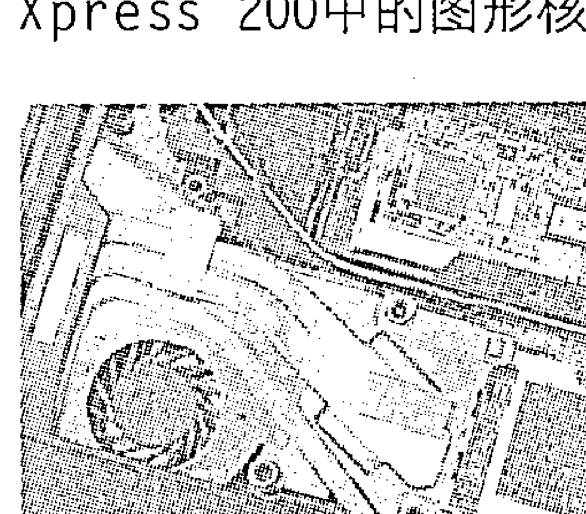

这款集成核心只有两条渲染管线，好在还是保持了1个Vertex Shader顶点着色引擎，这与Intel的集成显卡有着明显区别，此时Vertex Shader不再由CPU模拟运算，因此速度表现会好很多（图3）。

事实上，真正值得我们关注的ATI移动集成显卡还是最新发布的Radeon Xpress 1250M，也就是RS600M整合芯片组。Radeon Xpress 1250M对于桌面平台的AMD 690G，集成X700显卡，因此拥有4条渲染管线，并且凭借80nm制程实现400MHz高主频，这也是当前性能最为出色的移动集成显卡。不过，由于Radeon Xpress 1250M刚刚推出，因此采用这款超强集成显卡的产品并不多，目前只有三星R20等少数几款产品。

### 4. VIA与SiS的移动集成显卡

尽管VIA和SiS在台式机整合芯片组市场有着不错的竞争力，但是移动平台却不是他们的强项，因此市场占用率较低，而且基本只面向AMD平台。VIA的移动整合芯片组主要是K8N800，配合AMD炫龙或是VIA C7-M。K8N800整合的UniChrome Pro图形核心表现一般，其2条渲染管线主频只有200MHz，而且并不支持Pixel Shader。K8N800其实是一款几年前的老产品了，而VIA的新款移动整合芯片组应该是K8N890，此时集成的Chrome9 HC IGP在硬件上完全支持DirectX 9 API，而且还拥有Vertex Shader功能。但是，目前VIA在移动芯片组领域的局面有些尴尬，一方面受到Intel的排挤，另一方面又因为ATI和AMD的合并而无法在炫龙平台大展拳脚，因此实际采用K8N890的产品很少见。

SiS的移动整合芯片组比VIA相对常见一些，SiS M661MX和SiS M672MX在迅驰平台有着不错的价格优势。但是，SiS M661MX仅仅集成第一代Mirage移动图形核心，不仅无法支持Pixel Shader，而且频率较低，因此3D性能非常薄弱，甚至不如I915GM。SiS M672MX则在很大程度上改变了这一尴尬局面，因为Mirage3+移动图形核心将频率提高到300MHz，而且支持DirectX 9 API，可惜这款北桥芯片仅仅支持单通道DDR2，因此实际显存带宽受到不小的影响，综合表现还是差强人意。

移动集成显卡要关注内存配置
由于移动集成显卡使用部分内存作为其显存，因此内存的性能非常重要。以I945GM所集成的GMA950为例，不同产品的3Dmark 2001SE测试成绩大约在4000~6000分之间，差距可达50%。究其原因，内存容量与是否采用高频率双通道显得非常关键。有些笔记本配备了双通道DDR2 667，此时自然表现不俗；而有些则仅仅是单通道DDR2 533，所形成的显存带宽差距非常惊人。此外，部分本本为了控制成本而只是配备了512MB内存，再加上集成显卡的消耗，那么内存容量在捉襟见肘的情况下自然成为严重的性能瓶颈，3D性能令人无法恭维（图4）。

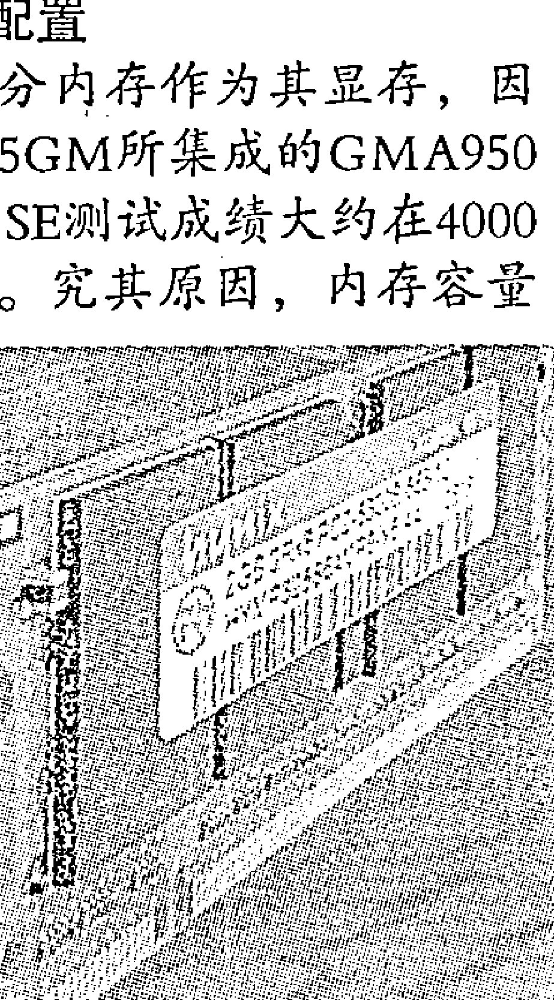

## 二、Shader Model 3.0时代：独立显卡已成新宠

对于如今的主流移动显卡而言，尽管依然停留在DirectX 9时代，但是由Shader Model 3.0所倡导的DirectX 9.0c却完全开辟了一个新局面。ATI依然是Shader Model 3.0移动显卡时代的王者，尤其是在推出Mobility Radeon X1000系列之后，其市场龙头老大地位得到进一步加强。但是，nVIDIA在这一时代的崛起也绝对不容忽视，因为GeForce7 Go系列的优异表现，包括联想、惠普、DELL等知名品牌笔记本电脑都开始装配nVIDIA独立显卡。

### 1. Mobility Radeon X1000

Mobility Radeon X1000系列最大特点就是采用了90nm的工艺，并且支持Shader Model 3.0，弥补了Mobility Radeon 9700系列仅支持Shader Model 2.0的缺陷。由于ATI的移动显示产品在功耗上的出色表现，受到了很多笔记本电脑制造商的青睐。在最新发布的一系列Napa和Merom平台的机型中，ATI又再次独占鳌头，再加上与AMD联手后的炫龙平台，可谓把nVIDIA远远抛在后面。ATI Mobility Radeon X1000系列主要包括三款：ATI Mobility Radeon X1300/1400/1600（图5）。

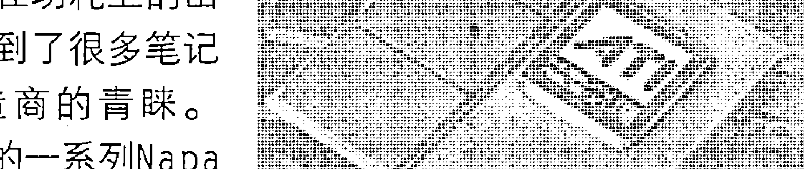

Mobility Radeon X1300无疑是现在市场上的绝对主流。Mobility Radeon X1300更多是面向对图形性能有一定需求的主流机型，它只有4条Pixel Shader流水线及2个Vertex Shader顶点引擎，显存控制器也缩水到64bit，性能相对较弱。Mobility Radeon X1400则是Mobility X1300的简化版，通过降低频率与改进封装技术来适合轻薄型产品的需求，但是由于核心以及管线设计完全相同，因此它和Mobility X1300的性能差距非常小。至于Mobility X1600，这才是ATI移动显卡的中流砥柱。Mobility X1600秉承ATI的“3：1渲染架构”，即四条渲染管线拥有12个Pixel Shader单元，而且还配备5个Vertex Shader顶点着色器单元，再加上128bit显存位宽，因此综合表现非常出色。

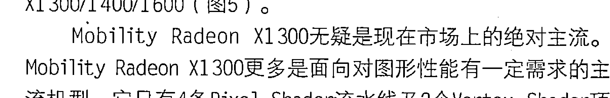

> > **选购产品要注意细节区别**
> 由于笔记本厂商在选择显卡模块时有着很强的主动性，可能考虑到各方面的设计需求而牺牲部分功能，因此同样是一款移动显卡GPU，在不同产品上的频率以及显存位宽可能存在明显区别。以Mobility Radeon X1600为例，有些配置该移动显卡的本本只有64bit显存位宽，或是核心频率被大幅度降低到300MHz左右，此时性能将会大受影响。因此，建议大家购买独立显卡本本时还是得用Everest Pro等测试软件仔细鉴别，而不能一味地查阅技术资料。

### 2. GeForce 7 Go系列

G72M是nVIDIA最早投入市场的使用90纳米工艺生产的GPU。市场上基于G72M的显卡主要有GeForce Go 7400和GeForce Go 7300，前者多用于超轻薄本本，而它们之间的差异仅仅只有核心频率和显存频率。其实，大家不要想当然地把GeForce Go 7300去与桌面版的GeForce 7300GT做对比，因为GeForce Go 7300其实更加类似于桌面版的GeForce 7300GS，它也是一款4条渲染管线的GPU，并且只能支持64bit显存位宽。如果要给桌面版的GeForce 7300GT找一个移动显卡对应产品，那么GeForce Go 7600才是真正的答案。GeForce Go 7600基于G73M核心，拥有8条像素渲染管线、5个顶点着色单元和128bit显存位宽。按照nVIDIA的规格，GeForce Go 7600的核心频率与显存频率分别高达500MHz与1GHz，但是事实上大部分产品考虑到功耗与散热控制，只是将最高核心频率限定在400MHz左右，而显存频率以800MHz更为常见（图7）。

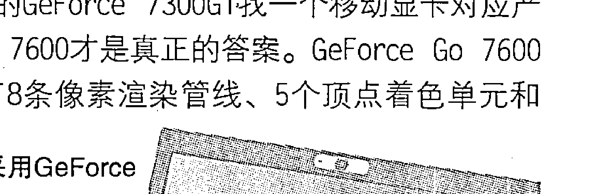

作为明智的消费者，我们认为当前GeForce Go 7700是最值得大家关注的移动显卡。这款GPU基于G73M-B1核心，由于采用了80nm制作工艺，因此发热量和功耗都大幅度降低。对比GeForce Go 7600，GeForce Go 7700更有移动版GeForce 7600GT的风采，因为它保留了12条像素渲染管线，性能明显优于GeForce Go 7600。至于GeForce Go 7800/7800GTX以及GeForce Go 7900/7900GTX，这类超级移动GPU都显得过于疯狂，和ATI Mobility Radeon X1800一样存在发热量无法控制的问题，仅仅适合于高端的17英寸游戏本本，普通用户一般很难接触到（图8）。

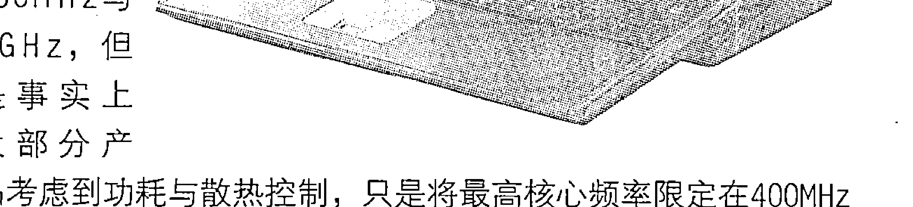

> > **ATI的奇怪命名方式**
> 如果简单地以为移动GPU对应桌面图形芯片，那可就要格外当心了，因为ATI并不采用传统的命名方式。以Mobility Radeon 9700为例，它仅仅是Mobility Radeon 9600的高频率版本，依然是四管线结构，并不对应桌面版的Radeon 9700。而Mobility Radeon 9800也不对应桌面版的Radeon 9800，它是对应X800的移动核心，性能甚至超越桌面版Radeon 9800。至于nVIDIA的移动GPU，也存在类似的现象，譬如GeForce Go 7600更像是桌面版本的GeForce 7300GT。

## 四、DX10移动显卡：实惠量大跳

NVIDIA方面的GeForce 8M已经由官方正式发布，其中包括面向家庭娱乐的GeForce 8400M G、8400M GS、8400M GT、8600M GS以及8600M GT，商务市场则推出了Quadro NVS 320M、Quadro NVS 140M、Quadro NVS 135M和Quadro NVS 130M。AMD方面也终于正式为DX10版移动显卡解冻，推出了ATI Mobility Radeon HD2300、2400、2400XT、2600以及2600XT五款型号，刚好与NVIDIA方面的产品线相对应。

### 1. NVIDIA大打翻身仗

在移动图形领域，AMD（原ATI）一直是称霸此领域的王者，曾经的Mobility Radeon 7500一直是笔记本用户引以为傲的游戏资本，至今AMD移动图形核心在功耗处理方面也占据一定的优势。不过在DX10显卡时代，AMD在新品跟进的速度方面却落后于对手，一直是AMD铁杆用户的ThinkPad在新一代产品T61/R61中也改用了NVIDIA图形芯片，可见通过多年的苦心经营，NVIDIA终于开始了移动市场的反击战了。

| | GeForce 8400M G | GeForce 8400M GS | GeForce 8400M GT | GeForce 8600M GS | GeForce 8600M GT |
| :--- | :--- | :--- | :--- | :--- | :--- |
| 流处理器 | 8 | 16 | 16 | 16 | 32 |
| 显存频率(MHz) | 400 | 400 | 450 | 600 | 475 |
| 着色器频率(MHz) | 800 | 800 | 900 | 1200 | 950 |
| 内存时钟(MHz) | 600 | 600 | 600 | 700 | 700 |
| 最大显存 | 256MB | 256MB | 512MB | 512MB | 512MB |
| 显存位宽 | 64位 | 64位 | 128位 | 128位 | 128位 |

GeForce 8M系列是NVIDIA在移动市场推出的第一批采用了统一渲染架构设计的图形芯片，提供了对DirectX10的支持。比如目前最高端的8600M GT内置32个流处理器，每个流处理器都可以提供像素着色器、顶点着色器、几何着色器的功能。它打破了传统渲染架构中固定着色单元的概念，使得VPU资源分配更灵活，整体执行效率更高。而最低端的8400M G仅内置8个流处理器，综合性能自然要逊色几筹了。

除了游戏性能的提升以外，GeForce 8M系列还引入或者升级了以下新技术或功能。首先就是它们均完整支持H.264高清视频的硬解码，在今后HD DVD、蓝光等新一代存储设备普及，或者我们可以下载到高清格式的视频时，GeForce 8M系列可以在降低CPU占有率的情况下依旧保证流畅的播放效果。此外，GeForce 8M系列还支持NVIDIA PureVideo技术，透过此技术，可以提高笔记本播放HD视频性能，在旅行中带上DVD，也可以观看无抖动、画面逼真的视频，不必担心出现传统PC视频解决方案的失真和瑕疵。高端的8600M系列还支持NVIDIA PowerMizer技术，此技术可以根据笔记本应用环境的不同，自动降低图形芯片的运行频率，达到降低功耗，延长笔记本续航时间的效果（图9）。

### 2. AMD延续辉煌

AMD方面的ATI Mobility Radeon HD2000核心应该是其桌面R600的衍生版本，同样采用了统一渲染架构，并支持DirectX10图形接口。第一批上市的HD2000系列显卡包括ATI Mobility Radeon HD2300、2400、2400XT、2600以及2600XT五款型号。

其实ATI Mobility Radeon HD2000系列当中，把Mobility HD2300作为最低端入门级的型号，但HD2300采用90nm制作工艺，只支持DirectX 9，所以只能算是上一代的显卡，不具有可比性。从ATI Mobility Radeon HD2000的系列产品线布局可以知道，HD2300、HD2400、HD2400XT为新一代独立显卡的低端到主流定位的产品，HD2600就作为高端产品，HD2600XT则面向于发烧级别的游戏玩家。

ATI Mobility Radeon HD2400采用代码为M72的显示核心，使用先进的65nm工艺制造，内部集成了1.8亿个晶体管，与GeForce 8系列一样采用效率更好的统一渲染架构，支持DirectX 10.0+SM4.0，在高清视频播放上使用Avivo HD技术，节能技术PowerPlay则要提升到第7.0版。

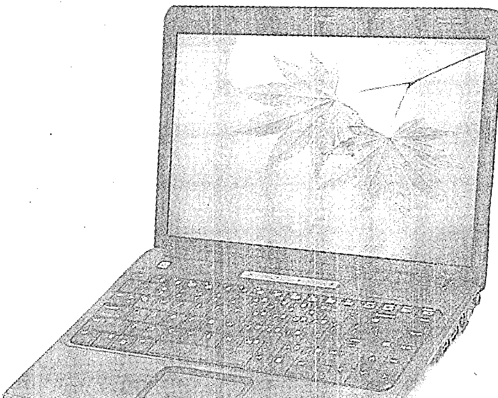

### 写在最后：

移动显卡的确对笔记本的3D性能产生很大的影响。作为明智的消费者，我们建议大家仔细衡量自己的3D性能需求，而不要一味否定集成显卡或是盲目追求高端独立显卡。对于偶尔玩游戏又要兼顾轻薄表现的用户来说，选择一款使用高性能集成显卡的本本是最佳的选择。而如果确定需要独立显卡来获得更好的3D表现，那么可就得仔细辨别不同的独立显卡，而不能盲目认为只要是独立显卡就好。

图9 采用NVIDIA GeForce 8400M GS独立显卡的HP笔记本电脑

## # 笔记本自力更生升级全攻略

□赵洪斌

不少笔记本用户希望给自己的“爱本”进行升级，一方面想通过升级获得更好的性能、更快的运算速度，另一方面也适应如今操作系统和应用软件不断升级的压力，以弥补笔记本体积和技术上的“先天不足”。不过笔记本并不像台式机升级那样简单，除了升级的部件有限之外（一般升级内存、硬盘，少有升级CPU的），升级时拆装笔记本也十分的麻烦。
初次拆笔记本会感觉有些害怕，小心翼翼的，主要是接触太少的缘故。拆本之前要注意：笔记本和台式机有本质的不同，集成度非常高，内部元件也很精密，稍有不慎便会造成严重的后果。
有了前面的铺垫，现在动手开始我们的拆装升级之行。

### ## 内存

笔记本内存一般都安装在机身的底部，这也是我们最常见到的，但是由于没有统一的规范，再加上机型、外观和内部结构的不同，也有一些内存则是安装在笔记本键盘的下方。位于机身底部的内存一般都用一个小盖子保护着，只要将内存舱盖上的螺丝取出，即可方便地进行内存的升级。如果内存在键盘的下方，升级起来会麻烦一些，先要将键盘取下，耐心地找到固定内存的位置，才能完成增添内存的操作。另外内存插槽分为堆叠式和分开并列式两种。内存在机身底部拆装的具体操作步骤如下：

- 准备十字螺丝刀、一字螺丝刀和镊子。
- 在桌面上铺上柔软物作为底垫，这样可以避免本本翻过来时把屏幕盖划花，合上笔记本并翻过来放到底垫上。
- 在本本底部可能有好几个盖子，哪一个才是我们要找的内存舱盖呢？看一下盖子的形状，再仔细找一下这些盖子上的图案，长条型，其中一边还有“脚”标志，通常就是内存仓了。倘若盖上没有标记，那就只有挨个打开看看了。
- 找到内存舱盖，如图1所示，打开内存盖螺丝“1”，拖起有螺丝的一端向“2”方向抬起即可看到内存了。
- 打开内存插槽盖后，如图2所示，把内存两边的卡子按照“3”所示方向分开。将标签面朝上，调整内存金手指的缺口部分的位置，使它正对内存插槽固定凸起部分，按照“4”斜插入插槽，然后轻轻往下按一下，就会听到“啪”的一声轻响，证明被两边的弹簧卡扣卡好，如果没有听到，很可能没按到正确的位置，重新上面的操作就可以了。

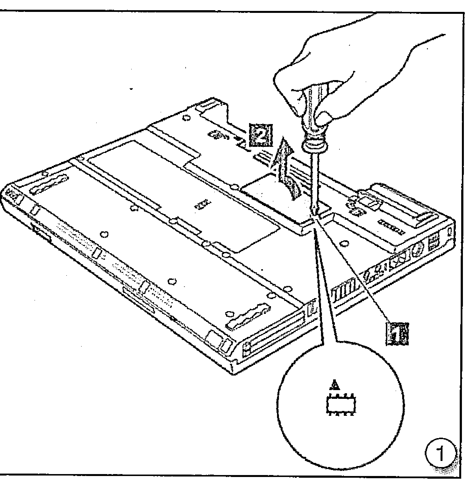

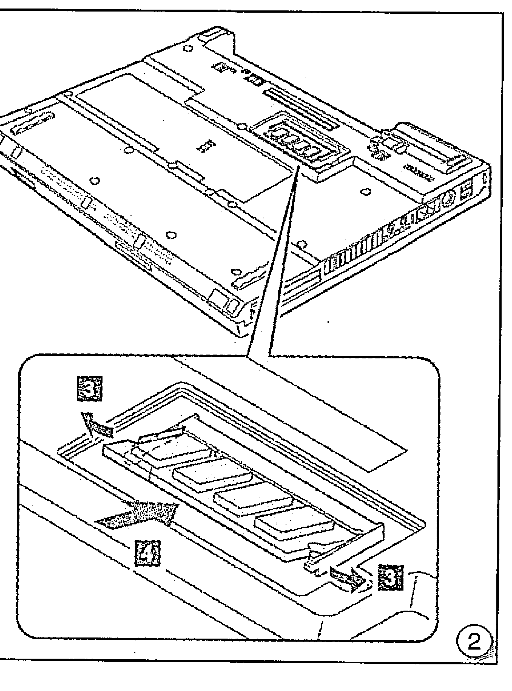

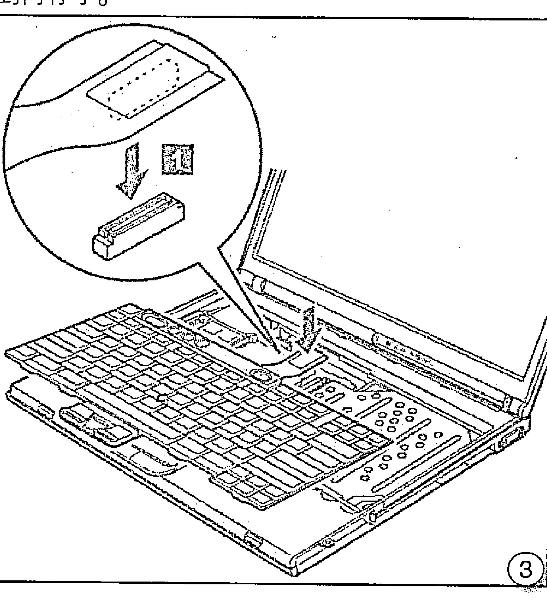内存在键盘下方拆装的具体操作步骤如下：

- 1. 取下键盘。如图3所示，取下键盘时注意键盘和主板的连线，切不要取键盘时用力过猛而损坏键盘线。
- 2. 取下键盘后，找到内存的插槽，如图4所示，把内存两边的卡子按照 “1” 所示方向分开。将内存标签面朝上，沿 “2” 方向插入即可，然后再把内存压入弹簧卡，直到听到轻微的 “嗒” 声音。

在增添内存后，先不要急着合上内存舱盖，应先确认新安装的内存系统是否识别。开机进入主板BIOS查看内存容量是否有所增加，再进入系统运行软件看是否有不兼容的情况发生。

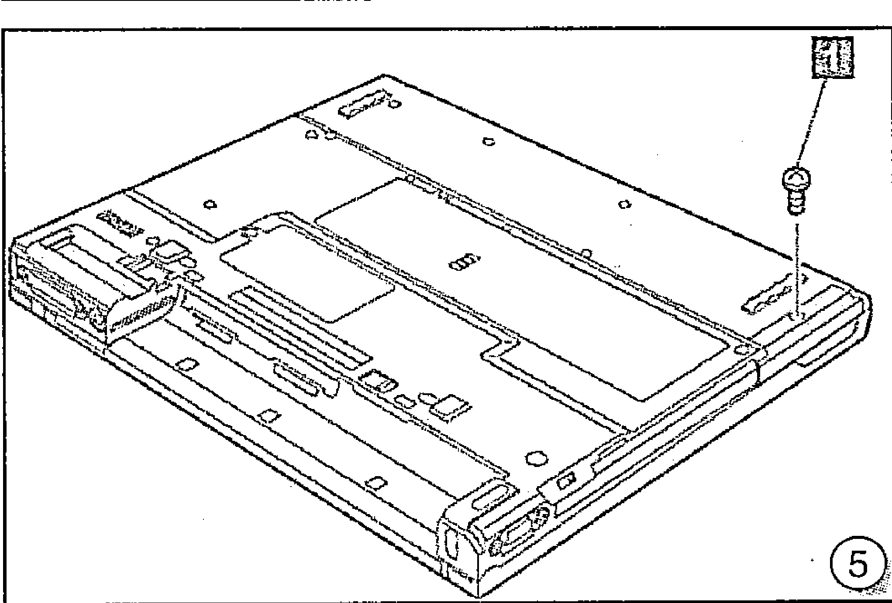

## 笔记本硬盘的位置有三种：一是放在笔记本的底座，也就是背面。

这种情况也有两种安装模式，有的是有独立的硬盘盖，只要打开硬盘盖便可以取出硬盘，还有的则是要拆掉整个底座才能看见硬盘，总之这类硬盘的拆装和上面内存的情况大同小异，这里不再赘述。二是放在笔记本的侧边，有几个螺丝固定，卸下螺丝就可以把硬盘抽出来。三是放在笔记本的触摸板的两旁，一般笔记本的触摸板壳子都是跟键盘分开的，只要从底座把触摸板连在一起的壳子的螺丝卸掉拆开，就可以看到硬盘了。

## 硬盘在侧面拆装的具体操作步骤如下：

- 1. 先取掉固定硬盘的螺丝如 “1” 所示（图5）。
- 2. 把笔记本电脑屏打开，成半开状态，双手向 “2” 所示的方向拖出（图6）。

硬盘在笔记本的触摸板的两旁拆的顺序也是如此。尽管硬盘的拆卸比较简单，还是要注意即便把笔记本硬盘的螺丝全部卸掉，硬盘托和笔记本壳可能是有卡位的，因而每一步都应慢慢地进行，同时还要认准方向。

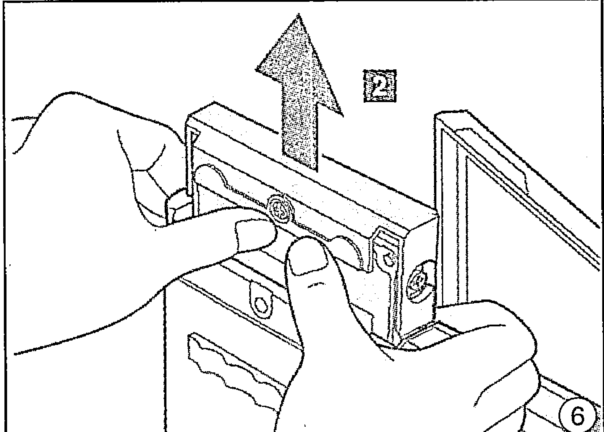

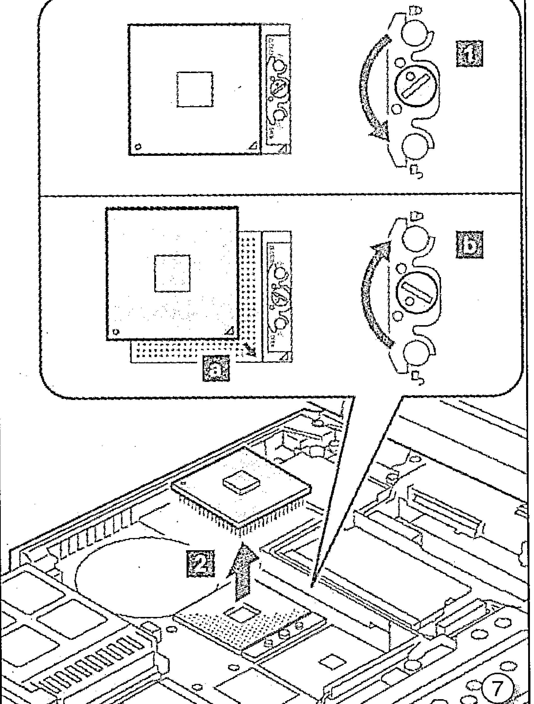

## CPU

处理器的升级是这几项中最困难的，不像内存和硬盘的升级上手来得快，必须得具备一定的拆机经验，最好有专业人士的指导，否则很可能会使 “爱机” 一命呜呼。还要注意的是，在保修期内厂家是不允许个人拆装笔记本的。

### CPU的拆装：

在拆卸CPU时一定要小心，先要打开CPU锁才能把CPU从座上取下来。如图7所示，按 “1” 所示的方向是开锁方向，然后向 “2” 所示的方向拿起CPU即可。在安装CPU的时候要注意CPU的安装方向，缺脚要和座上一致，如 “a” 所示，当CPU插入放好时按照 “b” 所示的方向关闭锁。

## 笔记本升级注意事项

升级内存是提高电脑性能最直接的方法，同样也是花费最少的。但是切不可因此就掉以轻心。选购笔记本内存时最重要的是选择品牌好的内存，毕竟对于笔记本本身来讲，兼容性不像台式机容易满足，产品都是经过层层检验才能使用的，若内存质量不够稳定，可能会导致笔记本死机等症状经常发生。所以认准大厂的品牌是关键，虽然品牌内存会比杂牌贵一些，但是因此而换来品质的保证和完善的售后服务则是很值得的。

另外也并不需要非得购买笔记本厂商的原装内存条，一来虽然原装内存条有很好的兼容性，但是价格昂贵，性价比不高，二来内存兼容性问题一般在杂牌内存和散装内存中较为突出，对品牌内存则出现较少。如果还是不放心的话，可以先向笔记本经销商询问笔记本的内存品牌，再另行购买相应品牌的盒装内存。

在升级之前还需要知道自己笔记本的接口和大小，否则最后免不了南辕北辙。笔记本的接口和大小，大致可以分为3种：第一种是应用最广泛的SO-DIMM，又称为标准内存；第二种是Micro-DIMM，又称为小内存；最后一种是专用的内存，用于那些体积超小的机器。

第一种为大部分笔记本所采用，升级非常容易，而对于后两种内存所对应的机型升级起来会比较困难，不仅升级成本较高，产品也不容易买到。

关于不少升级内存用户所关心的内存双通道问题：Intel方面，9xx系列以后的芯片组，由于内存和内存、内存和主板之间兼容性的不断提高，现在几乎任何两条内存都可以组成双通道。不仅两条相同容量的内存可以组成“对称双通道”，不同容量的内存也可以组成“非对称双通道”。而AMD的处理器内部集成了内存控制器，所以能否开启双通道则是由处理器决定的，目前的炫龙64位处理器都支持双通道内存。不过在内存容量没有达到1GB之前，组建内存双通道对系统的性能贡献并不是很大，建议以提高内存容量为主，但双通道对集成显卡的性能提高有不小的帮助，集成显卡用户希望适当提高显卡性能的可以考虑组建双通道。

升级硬盘一般是觉得自己硬盘容量小，想要更大容量的硬盘，或者希望寻求更好的硬盘性能。硬盘升级首先要考虑尺寸。出于便携的考虑，笔记本硬盘不同于台式机硬盘的3.5英寸，一般为2.5英寸和1.8英寸。需要注意的是一些1.8英寸硬盘的笔记本，其硬盘是集成在主板上的，以至于不能升级。而2.5英寸的硬盘又有三种厚度：17.5mm、12.5mm、9.5mm，虽说目前的主流是9.5mm，但在购买笔记本时，特殊情况往往被忽略，因而在升级前还是谨慎为妙，然后再选择不同的容量进行升级。

笔记本的转速分别有4200/5400/7200RPM三种规格，转速越高，笔记本传输数据的能力也就越快，虽然在桌面系统，7200RPM的硬盘早已成主角，但是大部分笔记本硬盘还停留在5400RPM上面，主要是因为7200RPM的高速电机将会使笔记本面临散热和震动两大致命问题，到目前为止笔记本厂商并没有很好的解决方案，不得已只好采用5400RPM的硬盘。所以在提升硬盘的性能方面建议不要擅自采用7200RPM的硬盘，但是4200RPM的用户除了可以将硬盘升级到5400RPM之外，还可再升级到SATA的级别。

这里有一点需要注意，如果换成SATA的硬盘，装XP系统时可能会遇到无法继续安装、安装后启动成蓝屏等问题，这是由于XP系统在安装过程中缺少对SATA硬盘模式的支持造成的。解决办法是进入BIOS，找到SATA设置项，一般在Config项中，将SATA模式改为Disable或是Compatible Mode（兼容模式），各个BIOS版本不同具体的选项也不尽相同，但一般为两项，进入后选择与当前项不同的另一项即可。这样就可以正常安装Windows XP了，但是会埋没串口硬盘的优势，如果想继续使用SATA模式，就需要安装相应的SATA驱动程序。

在CPU升级方面，目前市场提供给笔记本升级CPU的版本有：盒装CPU、正式版CPU、ES版CPU、BGA加脚版CPU。盒装CPU不用说了，属于原装产品，不过销售范围很小。正式版CPU多是玩家升级或OEM外流的产品。ES版CPU是处理器厂商在出厂前的测试版本（版本越靠后越接近正式版）。BGA植球CPU则是一些JS通过特殊渠道买来主板上焊死的BGA植球CPU，将其焊下，再通过技术将处理器针脚加工上去。固然升级CPU能够得到更好的性能，但是也会带来发热量的急剧增长，如果本本的散热系统不能承受，那将会酿成悲剧。

笔记本的升级除了上面的几个方面之外，还可以升级显卡、光驱等方面。但在升级拆装之前应关闭电源，切勿带电操作，并拆去所有外围设备，如AC适配器、电源线、外接电池、PC卡及其他电缆等；因为在电源关闭的情况下，一些电路、设备仍在工作，如直接拆卸可能会引发一些线路的损坏。

## 快速关机或重启的快捷键（可定时）

在桌面点击鼠标右键，选择新建(快捷方式，在弹出的向导中输入位置为：C:\WINDOWS\system32\shutdown.exe -s -t 10（其中的-s可以改为-r，也就是重新启动，而-t 10表示延迟10秒，你可以根据自己的需要更改这个数字）。制作完这个快捷键后，按照上面的方法为它指定一个图标。这个快速关机或重启的技巧会显示一个比较漂亮的对话框提示关机（重启），而且你可以在后面加上“-c "我要关机啦！"”，这样这句话会显示在对话框中，当然文字你可以随意写，但要注意不能超过127个字符。

## 让系统自动关闭停止响应的程序

单击“开始/运行”，输入regedit，弹出注册表编辑器，寻找[HKEY_CURRENT_USER\ControlPanel\Desktop]，在右边的窗口中选择AutoEndTasks，按鼠标右键，选择“修改”，将其数值资料改为1(默认值为：0)。

## 躺着也能工作和娱乐，床上笔记本选购

□葵师傅

人是一种很懒惰的动物，一生中有1/3左右的时间是在床上度过的。进入移动计算时代后，笔记本电脑迅速普及，不少朋友喜欢躺在床上，办公、娱乐、看大片、听音乐、上网聊天，笔记本已经成为不少朋友心爱的“床上伴侣”。不过这里要提醒大家，在床上用电脑还是有很多讲究的，下面为大家谈谈如何在床上用好电脑的经验及心得。

## 一、有的放矢：床上用本有选择

要在床上尽量舒适地使用笔记本电脑，不是什么本本都适合，一些块头巨大或发热厉害的本本并不适合在床上使用。要在床上使用的本本，总体而言需要满足四个条件：即轻、静、无、冷。下面我们具体来看看这四个条件。

首先是轻，在床上用本通常需要用身体承重，把一台大而重的本本抱在怀中，没多久你就会感觉疲惫的，因此需要选择比较轻薄的本本。不过太小的本本也不合适，长时间使用会不太舒适。一般而言，选择屏幕尺寸在12～13英寸，重量在2kg以下的本本比较合适。

其次是静，在床上使用笔记本常常是夜深人静之时，如果你不是单身汉的话，一台在工作时不太安静的笔记本不仅会影响你自己的心情，还可能让你的枕边人不满。因此选择安静的“床用”笔记本电脑就非常重要了。笔记本电脑噪音主要来自机械运动部件，即散热风扇、硬盘和键盘。

无，这里是指无线的意思，为了方便在床上使用，笔记本电脑应具备完善的无线接入能力，应该支持WIFI无线和蓝牙接入。这一点我们在后面会详细谈到。

最后还有很重要的一点是“冷”的问题，即笔记本电脑的发热要小，散热设计要好。笔记本电脑由于体积比较小，发热元件集中，散热设计有相当大的难度，其中重点又在CPU的散热上，现代笔记本电脑的散热设计越来越趋向智能化和综合化。像华硕智能型动态散热技术（ADTD II），是一种低噪音、低震动、低耗能环保设计之动态散热技术，最大程度避免了因处理器温度过高导致的死机问题。而ThinkPad系列笔记本就采用了双散热管系统散热方式，它由三部分组成：双散热管、双散热板以及金属支架。其优点是没有活动零件，全部零件都密封在内，不消耗电能，使用可靠，寿命长（图1）。

下面具体谈谈床上用本的选择。尽管适合在床上使用的本本不少，不过这里强烈推荐大家选择IBM（现为联想）的ThinkPad X系列机型。ThinkPad X系列笔记本电脑在人性化设计方面非常出色，很好的满足了我们上面提到的四个床上用本条件。不仅如此，ThinkPad笔记本的键盘手感一直被公认为业界最佳，TrackPoint（小红帽）也是其特色之一，凝结了各种精心的设计，非常符合人体工程学。这里特别指出，ThinkPad的ThinkLight LED键盘灯简直就是为夜里躺在床上用本量身定做的。有了ThinkLight，不用开灯影响你的枕边人，在黑暗的环境中同样能继续工作。

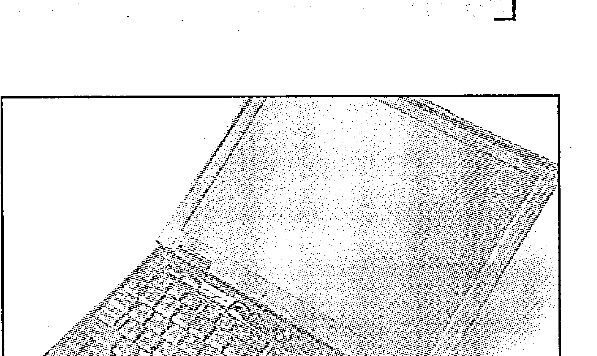

## 二、多方入手：让本本在床上更冷静

除了在寒冬季节外，在床上用本要重点解决的一个问题就是散热问题。不仅要选择发热低、散热好的产品，更应该从下面两个方面入手来让本本在床上更冷静、使用更舒适。

### 1. 购买配套附件

要解决床上用本的散热问题，我们可以购买合适的产品来提高使用的舒适性。下面为大家介绍两款相关的产品：散热底座（图2）和小木桌。

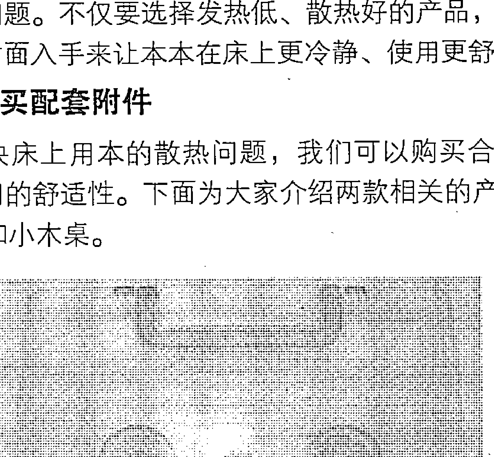

随着性能提升，笔记本电脑发热问题也日益严重，但由于体积限制，笔记本不可能像台式机一样使用巨大的散热器和散热风扇，而往往只能采用热管等被动散热方式，这就导致热量大量聚集在笔记本底部，降低了使用舒适度和运行稳定性，要解决这一问题，最有效的方法就是使用笔记本散热器。选购时要注意与笔记本的配合问题，注意笔记本是否和散热器紧密贴合，严丝合缝，散热器能不能紧紧固定在笔记本下部，一款做工精细的笔记本散热器在安装使用时要方便，卡扣的设计要能让使用者轻松安装及卸装。散热器风扇的质量也十分关键，其好坏直接关系到散热效果以及散热器噪声的大小，如果在试用时发现风扇声音过大或者风扇有杂音，就要考虑其质量是否可靠。目前市场上笔记本电脑的散热器有很多品牌，价格也数百元不等，其形状、散热性能等也不尽相同。大家可以根据需要选购。

除了散热器，一种专用的小桌子也是床上用本的好帮手(图3、图4)。这种专用小桌子的桌面是可以调节的，一般来说可以调节为垂直、水平、斜下方30度、斜下方60度，使用这种专用小桌子不仅可以解决散热问题，也让床上用本的舒适性得到提高。另外要解决笔记本电脑的散热问题，一种在超市出售的水垫也是很好的选择，价格只需20元左右，使用时垫在笔记本下面，就能很好地吸热，夏季还可以事先将其放入冰箱降温。

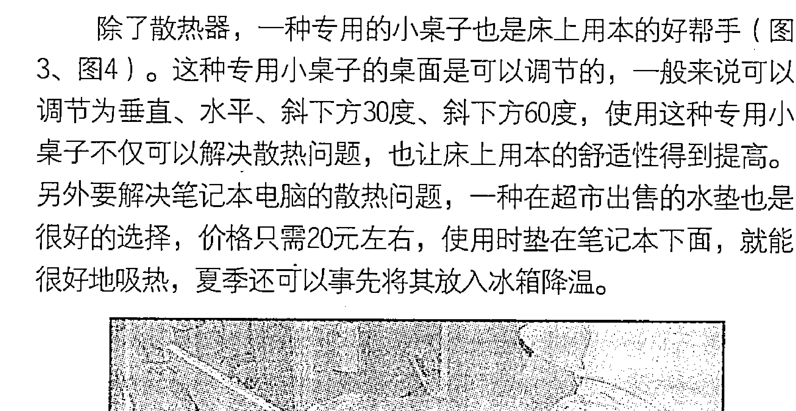

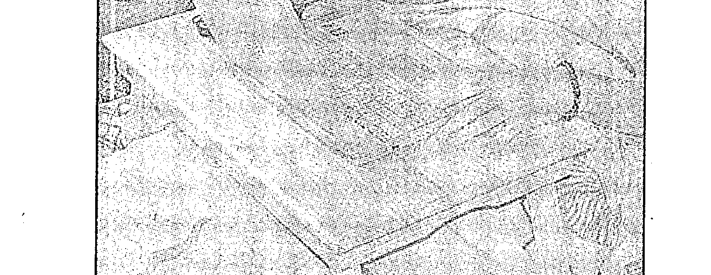

### 2. 使用降温软件

除了使用散热器和专用小桌子等配件外，如果不计较性能的损失，我们有很多其他方法能让笔记本电脑工作时的发热变低，从而更加冷静。最常见的方法就是用CPU降温软件来降低笔记本电脑工作时的温度。CPU降温软件的工作原理并不复杂，就是在计算机CPU工作空闲时(一般来讲在只要不运行复杂的计算程序，CPU是不可能满负荷工作的)，向计算机发出一个hlt指令，让CPU暂时进入休眠状态，避免CPU时刻都处在满负荷的待命状态而一直发热，从而使CPU降温，并且基本上不会对运行的程序产生影响。常见的CPU降温软件有CpuIdle、Rain、Waterfall等。从我实际使用经验来看，Waterfall Pro的降温效果是最好的，推荐大家使用。另外笔记本电脑自带的电源管理软件也可以降低CPU工作频率，从而降低发热。另外现在大多数新型号的笔记本电脑在BIOS中都对CPU的节能技术给予了支持，但这些技术默认情况是在使用电池时才开启，我们可以设法通过调整BIOS设置、使用专门软件等方法来让其在使用交流电源的情况下也打开这些节能技术，从而降低CPU工作时的温度，让笔记本电脑整机温度下降。

此外现在大多数笔记本硬盘都有“自适应电池增效技术”，我们可以加载一个特定的软件比如：Power Booster，它会在后台每隔5秒钟监测一次是否有读写硬盘的动作，然后根据你的设定来使硬盘进入省电模式，甚至让主轴停止转动。PB的界面极其简洁，最主要的调节部分就是中间的滑动条，从0×01至0×7E表示允许磁盘停转的各种省电级别。如果把PB设定为最省电级别（0×01），效果还是比较明显的，很多时候硬盘会停止转动，从而减少硬盘的发热和噪音。对于内置光驱的机型，我们可以使用一些专门的软件来设法降低光驱的读写速度，从而减少光驱的发热。通过采取上面的措施，不仅能降低笔记本电脑工作时的发热，同时也减少了风扇的运行时间，降低噪音，延长相关机件的使用寿命，还能有效延长电池使用时间，可谓一举数得。

## 三、床上用本：床上用本更要小心

有些朋友认为本本在舒适的床上会过得很好，在床上用本太随心所欲，岂不知这样可能会造成本本不幸损坏的问题。其实我们在床上用本更应该小心。

### 1. 让本无“牵”无“挂”

我们躺在床上用本的时候，本本难免会随着身体不规则地动来动去，长此以往，本本上有连接线的接口就比较容易损坏，因此在床上用本最好能做到无“牵”无“挂”，尽量少在本本上连线，这样不仅用起来会更加自在舒适，也可以尽量减少本本接口损坏的问题发生。一般情况下，本本上可能连接三根线：电源线、网络线和鼠标线。其实后两根线完全可以省掉的，建议大家尽量选择内置WIFI无线网卡的本本，然后买一台无线路由器就可以轻松在家构建一个无线网络环境了。另外如果你的本本内置蓝牙，还可以选择蓝牙无线鼠标，或者直接使用本本的指点杆，在很多笔记本产品改用触摸板的风潮中，ThinkPad依然使用TrackPoint是有其道理的，它位于键盘的正中央，这样保证手不必离开键盘就能方便地操作；由于操作时手指不需要移动，所以点击按钮时位置固定易于点击；配合强大的TrackPoint功能增强软件，使用习惯后甚至比外接鼠标还好用(图5)。

不过电源线通常是难以省掉的，我们特别要注意避免电源线过度弯曲、拉扯，而造成电源插头和电源接口损坏。电源线或接口出现问题，其症状表现为：电源忽有忽无、屏幕不断闪烁，电源插头与机身连接处发烫甚至有焦味，最后笔记本完全失去供电能力。床上使用笔记本时，一定要对电源线加以注意，不要生拉硬扯，如果发现接触不良的情况时，一定要抓紧时间维修或采取措施。其实如果你本本的电池续航能力不错，在床上用本时完全也可以用电池，这样本本就彻底无“牵”无“挂”了。用电池供电可以白天在单位充足电，晚上在床上使用，呵呵，不仅舒适自由，连电费也省了。有些朋友可能担心电池的寿命问题，其实电池是一种消耗品，就算你将其放在神龛上“供”着，放几年还是要坏的，不如将其充分利用。

有些朋友可能还喜欢在床上用摄像头视频聊天，如果这样那你最好选择内置摄像头的产品，不过劝你还是省省吧，在床上视频聊天，稍不注意会走光哦。另外有些本本带有底座，也可以充分利用起来，把不常用的打印机等外设连接到底座上，使用起来就更方便了。

### 2. 防止本本意外受损

除了尽量减少连线，在床上用本时还要防止其他因素意外损坏你的本本。首先还是散热的问题，比如笔记本放在柔软被子上，不注意的话会阻碍出风口的散热能力。一般而言，笔记本电脑制造厂商将透过风扇、散热导管、大型散热片、散热孔等方式来降低使用中所产生的高温，如果排风口被阻挡，造成温度过高，可能引起死机甚至CPU烧毁等故障。

其次要注意保护硬盘，硬盘在读写数据的时候最怕遇到震动，如果你的床垫太柔软，一定要注意别在用本时乱动。另外在床上使用笔记本通常会放在腿上或者肚子上，有些好瞌睡的朋友可能在用本本看电影或听音乐时就睡着了，这样一翻身，不幸的事情发生了：本本滚落到床下……打瞌睡前别忘记你还在用本本哦(图6)。

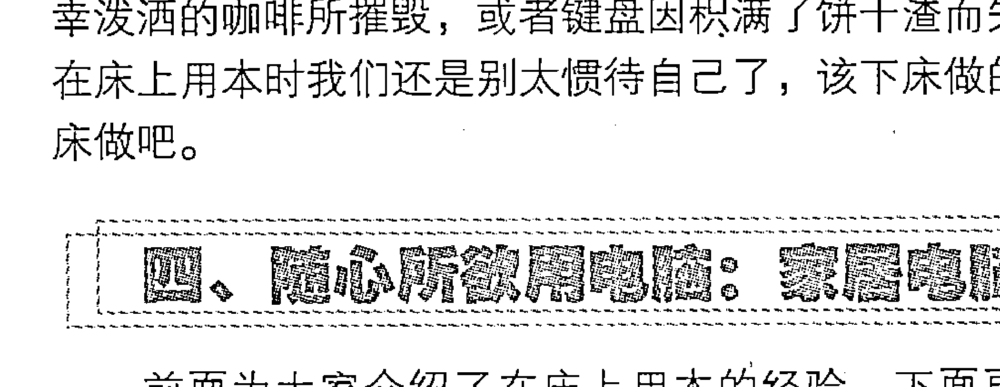

笔记本是一个高度集成化的电子产品，此类产品对水最为敏感。很多朋友都有边用电脑边喝饮料的习惯，而在床上使用笔记本时这一习惯最好就改掉吧，如果你躺在床上一边用本一边依然喜欢喝饮料、吃东西，那么你的本本很可能就会被不幸泼洒的咖啡所摧毁，或者键盘因积满了饼干渣而失灵，因此在床上用本时我们还是别太惯待自己了，该下床做的事还是下床做吧。

## 四、随心所欲用电脑：家居电脑选购

前面为大家介绍了在床上用本的经验，下面再简单介绍一下在床上用台式机的相关情况。进入2008奥运年，国内“数字家庭”概念骤然升温。可以方便在沙发、床上躺着使用的“家居娱乐电脑”无疑将成为今后家庭电脑应用的新热点。目前国内市场能够看到一些厂家推出了专门的家居电脑，另外我们也可以动手DIY属于自己的家居电脑。

### 1. 选择成品家居电脑

电视诞生以来，已经成功取代了电影的地位，成为许多家庭最主要的娱乐项目，不过家居电脑的出现似乎会让电视机逐步蜕变为电脑的一个显示终端。目前家用PC“家电化”已是一个发展趋势。在这方面不同的厂家都在做出自己的努力。下面让我们来看看国内家居电脑市场的相关情况(图7)。

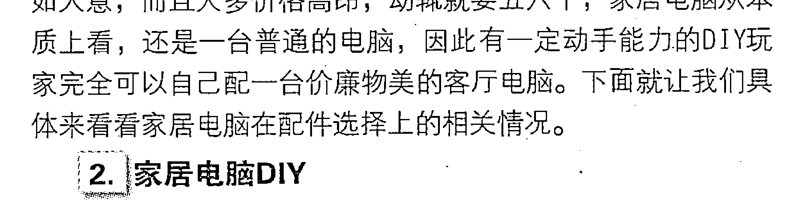

几年前以提供“免费”网游服务出名的盛大网络，在国内率先推出了一款真正意义的客厅电脑：盛大盒子以及配套的客厅电脑遥控器，盛大易宝。试图将电脑与客厅娱乐和网络服务联系在一起，打造“家庭宽带娱乐中心”。市场上还有功能类似的长虹数霸M10家居娱乐电脑、万利达家居电脑等，此外海信也推出了定位于数字家庭娱乐中心的“海信智佳M媒体娱乐中心(EPC)”。这些产品的外形设计非常家电化，经过特殊设计的卧式机箱无论外形风格还是尺寸大小都非常适合在客厅或卧室摆放。同时都提供了方便操作的遥控器。我们完全可以买这样一台电脑放在卧室里，然后在床对面的墙上挂一台全高清液晶电视，配合专用遥控器，或无线鼠标键盘，就能舒适的躺在床上玩电脑了，看大片、玩游戏、上网都不在话下。这与躺在床上用本本的感觉又完全不同，你不想试试吗？不过目前国内市场上家居电脑不仅种类少，而且在功能和性能上还不尽如人意，而且大多价格高昂，动辄就要五六千，家居电脑从本质上看，还是一台普通的电脑，因此有一定动手能力的DIY玩家完全可以自己配一台价廉物美的客厅电脑。下面就让我们具体来看看家居电脑在配件选择上的相关情况。

### 2. 家居电脑DIY

首先是机箱，家居电脑在机箱的选择上是最令人费心的，机箱最好要有家电的样子，一般而言我们选择一款自己喜欢的体积小巧的卧式机箱即可。显卡选择也很重要，客厅电脑显卡应具备迷你、精致的外观，以适应小机箱对显卡小体积的要求。其次，应拥有较好的3D游戏性能，以应对在大屏幕高清电视上畅玩游戏的需求。此外，还应支持Full HD全高清、原生HDMI接口、HDCP、HD Video (1080p、H.264或VC-1硬件解码)以及板载音效处理能力(图8)。这里推荐大家选择七彩虹的逸彩mini精致版。客厅电脑还有一个重要配件就是电视卡，要注意其软件兼容问题。如果你打算使## 硬件

用盛大易宝（Ez Center）则要购买与其兼容的电视卡。
家居电脑固然可以使用无线鼠标键盘作为输入设备，但更方便的是使用专门的电脑遥控器（图9），这里推荐大家选择盛大易宝（EZ Pod），这款遥控器对于HTPC用户无疑是非常合适的，配合盛大Ez Center软件，不用走近主机，拿起遥控器就可以操作电脑，是将普通电脑平台迅速升级为互动娱乐平台的好选择。也可以选择与微软 MCE（Media Center Edition，媒体中心）兼容的产品，MCE是微软整合在操作系统中的一个多媒体组件，主要提供整合式的多媒体接口，让计算机方便地与电视机连接，实现数字家庭需要的各种多媒体功能。

另外家居电脑也要注意散热和噪音的问题，对于普通DIY用户而言，要实现电脑的“静音”，可尽量使用低速设备，以及安装热敏机箱风扇、购买更好的静音电源、安装隔音材料等措施加以解决。

## 五、别被电脑奴役：电脑与健康

在床上用本或用台式机娱乐及工作，舒适自不在话下，但是往往在“舒适”的温柔乡中，我们会不知不觉地延长电脑使用时间，从而造成健康损坏。曾有说法是如果男性经常把笔记本放在腿上用，其辐射及热量会损伤男性的性能力及生育能力。够可怕吧？在没生小孩前，建议男青年还是少把本本放在腿上用（图10）。

### 1. 保护眼睛的健康

长时间操作计算机对视力影响很大，可能会引起眼睛不适和疲劳。因此应特别注意保护视力。长时间使用计算机，最常见的症状是眼睛疲劳，比如困倦、眼皮或前额沉重，还有就是眼睛刺激感，像红眼、流泪、干涩等。

使用电脑时应经常让眼睛休息。每一小时至少应休息十分钟，经常使视线远离显示器，并向远处眺望。清洁显示器和眼镜保持显示屏、眼镜或隐形眼镜清洁。其次要合理放置显示器，要确定舒适的观看距离和角度。在观看屏幕中间的内容时，视线应该略为偏低，会让眼镜觉得更加舒适。同时请调节好显示器的亮度和对比度，以提高文字和图形的显示质量，并尽量消除显示器的炫光和反射，这样可以减少可能引起的眼睛不舒适感。

最后要注意饮食，多吃富含维A、维D的食物，如猪肝、胡萝卜。也可自行补充鱼肝油。并可适当使用合适的滴眼液，如珍珠明目液、润舒等。

### 2. 肩肘部和手的保健

电脑操作是一项静力作业，伴有头、眼、手、指的细小频繁运动，时间长，工作量大，会使操作者肌肉骨骼反复紧张，以致造成紧张性损伤，引起相应的病症。首先要缩短使用时间，最好每周不超过二十小时，经常使自己放松一下，并调整自己的工作姿势，并适时做一些手腕臂的肌肉放松运动。

长期使用键盘打字，还会增加患腕管综合症的机会，可能会导致神经受损和手部肌肉萎缩，可以通过一些简单的运动而得到预防：如做一些伸展身体的运动，以预防或减轻颈部、背部的紧绷和疼痛。同时，每隔最多一小时，就应该暂停工作，让双手休息一下。

### 3. 加强对颈椎的保健

预防颈椎病首先要从改正不良坐姿和习惯开始，操作电脑时要经常抬抬头，不要长时间维持一个姿势，经常站起来离开工作台稍微走动，使人整个放松一下。此外，还可配合做些保健操加以预防，比如头部左右旋转、前屈后伸（图11）。

在活动颈椎时，可按摩颈部的肌肉，或用热毛巾捂一捂发酸的头颈，多吸吸新鲜空气，晒晒太阳。不要低头闷在空调房内。不要忽视午休和睡眠。增强体质，参加必要的体力劳动和体育锻炼。饮食上可经常食用胡桃、黑芝麻、木瓜、当归等具有强壮筋骨的食物，要多吃些含钙丰富的食物，比如多喝牛奶。

最后特别强调一点，使用电脑的心理问题：电脑、网络、游戏不是我们生活的全部。千万不要成天捧着电脑，迷失在网络和游戏中。尽管本文谈的是如何在床上使用电脑，在本文结束时，我还是要呼喊一句与本文主题完全背离的忠告：珍惜生命，远离电脑，多和你的家人朋友在一起，多去户外呼吸新鲜空气吧（图12）！

## 硬件

## 内存当机——看常见的方法修

内存，作为电脑主要硬件之一，有着为CPU的高速运算提供数据资料中转、暂存的重任。一台性能强劲的电脑离不开优质内存的支持。无论是购买新机或是升级旧电脑，内存也越来越被人们所重视。而同时内存造成的电脑故障也是越来越多。下面是几种常见的内存故障及排除方法。

## 一、无法正常开机

故障现象：开机的时候显示器黑屏没有任何显示。主机风扇转动，但是听到的不是平时正常启动“嘀”的一声，而是“嘀，嘀，嘀...”的主板报警声音。（根据主板BIOS不同也可能是长鸣）

故障分析与解决：这种情况是最常见的内存引起的无法正常开机的故障，一般常见有几种可能：内存条自身损坏无法正常使用、内存条松动导致与主板接触不良、内存条的金手指表面氧化。解决方法：如果是内存松动，取下内存条后重新插紧即可。对于内存的金手指表面氧化，则需要取下内存，使用绘图橡皮将内存两面的金手指仔细擦干净，再重新插回内存插槽就可以。在擦洗金手指时，一定不要用手直接接触金手指，因为手上汗液会附着在金手指上，使用一段时间后会再次造成金手指氧化。

这个故障是最常见的电脑无法正常开机的故障，除了内存条本身外，内存插槽积灰导致接触不良或内存插槽的损坏也是另一个方面的原因（图1）。

## 二、劣质内存造成非法操作

故障现象：一台电脑基本配置如下：酷睿 4500、华硕P35主板、不明品牌1GB DDR667内存，Windows XP的操作系统。最近在操作过程中经常弹出“非法操作”的提示对话框，在设备管理器中没有发现硬件信息的黄色“惊叹号”。再装系统后问题依然存在。

故障分析与解决：进入操作系统，单击“开始”菜单，选择“设置→控制面板”，双击“系统→设备管理器”，并没有看见任何硬件信息的黄色“惊叹号”，所以应该不存在冲突和驱动问题。进入主板BIOS，也没有发现任何异常情况和设置问题。用一条品质相对较好内存条对原内存进行替换后，问题再也没出现过。

一个典型的由于内存品质不佳造成的系统问题。虽然该内存在平时可以正常使用，但在电脑需要大量交换数据时，内存作为系统数据交换的中转站，问题就暴露出来了。

## 三、内存插槽故障

故障现象：一台电脑在开机进入桌面后，系统会提示“注册表读取错误，需要重新启动电脑修复该错误”。但是重新启动电脑后，仍旧是同样的问题提示，重启无效果。

故障分析与解决：启动电脑后按F8进入安全模式，单击“开始”菜单中单击运行并输入“MSCONFIG”命令，将“启动”项选项卡中的ScanRegistry前面的“V”去除，然后再重新启动电脑，结果故障依旧。这就说明该问题并不是由系统提示的注册表读取错误引起的，而硬件问题的可能性极大。用“替换法”对电脑硬件进行排查，首先是嫌疑最大的内存条。拔下内存更换一条全新的内存，问题不再出现。可以确定是内存条问题。回过头来仔细观察内存条表面，发现金手指、阻容并没有明显的烧灼痕迹。

由于内存损坏导致的问题，内存损坏，一般情况下，内存芯片表面，金手指并不一定有明显的烧灼痕迹，有时看似完好的内存，其实内存已经损坏。就是由于在电脑运行过程中，可能一次突然的断电就造成了内存损坏，而光从肉眼是无法看出损坏的痕迹的（图2）。

## 四、内存瑕疵导致 “解压缩文件时出错”

故障现象：在正常安装系统的时候（非GHOST），有时会出现安装过程中断并提示“解压缩文件时出错，无法正确解开某一文件”。

故障分析与解决：这类故障常见于系统安装的过程中，会经常意外的退出安装。实际上这也是因为内存的质量不佳或稳定性差造成的。多数情况是在更换内存后故障解决。这个无论是直接从光盘安装系统还是从硬盘安装系统都会出现同样的提示信息。虽然和我们在安装Windows XP操作系统过程遇到的无法正常读取某一文件，请选择“忽略，终止，放弃”有点类似，但那个问题多数是因为光盘的质量差或光驱的使用时间过久造成的。和我们的问题有本质的区别。

我们在维修电脑过程中遇到这个问题时，最好直接更换内存检测，观察是否出现同样的故障。如故障消失，则说明原来内存有问题；如果故障依旧，则是因为光盘质量差或光驱读盘能力下降造成的，也可能是硬盘上的系统安装文件损坏。

## 五、内存不同频率的连累集成显卡花屏

故障现象：一台集成显卡的电脑，Windows XP操作系统，发现在开机后不久显示器的画面会出现灰白交错的小方块，即所谓的花屏。将主机接上另一台正常的显示器，问题依旧，排除显示器显示问题。

故障分析与解决：该台电脑采用的是AMD690G集成显卡的主板。经过打开机箱检测发现机内温度并不高，并非是散热不畅引起的花屏。怀疑是显卡驱动损坏，于是重新安装了主板的驱动，问题依然存在，安全模式下也有相同情况，说明并非驱动问题。

一般的说来，显卡花屏的原因有许多可能，最常见的是显卡过热，驱动损坏和显存损坏几种可能。而前两种情况已经被排除了，那问题很可能就是出在显存上。由于是集成显卡，显存是由内存共享划分而来，也就是说问题出在内存上。出现花屏现象正好是在添加了一条512MB DDRII667的内存条后才出现的（图3）。

在加内存条前，电脑用的是一根512MB的 DDRII533的内存，插在第2个插槽上，而新加的内存则插在第一个插槽（注：靠近CPU的插槽为第一插槽）上。首先清理了一下所有内存插槽，然后只插上原来的DDRII533的内存，恢复到电脑添加内存条以前的状态。启动电脑，故障没有出现，难道是新加的内存条有问题？为了进行确定，然后又只插了一根DDRII667的内存，花屏也没有出现。看来单独的插任意一根都是可以的，可以确定两条内存都是完好无故障的。既然如此，猜测是由于两条内存的频率不同导致出现这样的问题。

## 六、内存造成的硬盘自检无法通过的问题

交换一下两根内存的插槽，把新的DDRII667的内存换到了第二插槽上，把老的DDRII533换到了第一插槽上，然后开机，没出现问题。为了进一步确认问题解决，运行了几遍3DMARK 03，并没有出现花屏。在使用两根频率不同的内存发生花屏时，交换一下两条内存的插槽，这样就可能解决花屏的现象。也不排除无论两条内存不兼容后，无论怎么安排位置也无法解决花屏的情况。如果遇见这类情况，请更换内存确保两条内存相同。

> 提示：
这是一个由于内存条引起的花屏问题，特别是集成显卡是最为常见。在使用两条频率不同的内存时，频率高的内存会自动降频配合另一条内存。如上例，两条内存一起插上时DDRII667的内存只能被系统识别成DDRII533的，请注意（图4）。

故障现象：在某次突然停电之后，电脑无法进入操作系统，每次开机后都会出现系统磁盘自检，且每次自检运行到C盘的70%左右就停止不动，提示有错误了。

故障分析与解决：怀疑是由于突然停电使硬盘造产生坏道，于是用SCANDISK对硬盘进行扫描，提示E盘有坏道。将E盘格式化以后，重新启动电脑，问题依旧。重新对硬盘进行低级格式化并分区，还是同样的情况。

换一块新硬盘，也出现同样的问题，而将以前的硬盘放到其他主机中却能正常使用，也没有发现坏道。装回以前的硬盘，仔细看系统提示，发现内存检测时的错误信息，于是怀疑为内存损坏。将内存换到其他正常电脑中，其他主机就会出现故障。而原故障机器更换内存后问题就得到了解决，所以判断是内存问题。

> 提示：
这是一个内存错误嫁祸给硬盘的例子，在开始的判断中凭经验认为是硬盘坏道，而没认真看系统提示的信息，走了比较多的弯路。以后遇见电脑故障不能大意，还是要多注意系统提示，才能正确的将问题解决！

## 小部件大学问——自己动手解决鼠标小故障

鼠标是大家在使用计算机时频繁使用的工具之一，它快速、准确、方便，自从问世以来，就成为计算机不可缺少的配件。但鼠标长期使用，总会出现按键失灵、光标不能灵活移动之类的问题。尽管一个性能良好的鼠标价格对于普通用户来说并不会太贵，但长期使用的鼠标早已使用顺手，又怎么会舍得丢掉。那么，不如自己解决其中的小问题吧。

准备工具：尽管鼠标设计结构简单，但是准备几样简单的修理工具还是首先要做的事。一块万用表，一把十字螺丝刀，一个功率较低的电烙铁以及一把用来切割导线的小刀。

> 目前市面上的鼠标按照接口来区分，主要有USB和PS/2两种。在连接新的导线时，对于USB接口的鼠标，最好找一根韧性较好的USB延长线将其焊接在线路板上。需要注意的是，在焊接之前，最好用万用表测得USB插头分别对应线路板上的那一个焊接点。因为即使是相同的USB导线，即使颜色都相同，也不能完全保证USB接口连接的导线的方向是正确的。

## 鼠标时好时坏或者电脑无法识别

- 难易指数：★★
- 曲折指数：★★
- 综合评定：★★★

故障现象：有时会发生这样的状况：电脑正常启动后，可以用键盘操作，打开文件、浏览图片，却唯独不见鼠标指针的影子。检查USB接口都好好的，系统本身也没有什么问题，动一动鼠标，屏幕上便会出现鼠标指针，但是刚准备操作时，它却又消失的无影无踪。

故障分析与解决：出现这种情况一般是鼠标的线断或者接触不良。这时，我们可以用万用表来检测电线是否良好。用螺丝刀拆开鼠标外壳，在电路板上找到关于鼠标线的焊点，用万用表进行测量。在使用万用表时，首先把量程旋钮调节到最小欧姆档，用一只表笔触碰引脚的焊点，另一只表笔的鼠标对电脑的外接口的触点上接触，注意每一个针脚上都测量一次。如果万用表的示数不接近零，那就说明其中有引线不通，这样便可以判断鼠标故障是由电缆断线造成的。通常情况下，鼠标断线部位一般是在接入鼠标处的电线。用小刀在线路板断线处将引线全部切断，将切下的电缆截至50厘米左右，然后剥开线头，用万用表检查这段导线是否正常。如果导线良好，便可将余留在鼠标上导线全部去掉，把这段导线重新焊接在线路板上即可。在焊接的过程中，要特别注意线头的颜色是否和原先接头颜色焊接的是否一致，也就是说，要保证线头没有接反。最后，把鼠标重新接上，看看屏幕上是否有鼠标的图像呢。倘若还没有图像，笔者认为是插头的因素，做好更换一块插头。还有一种情况，如果在用万用表测量时，发现鼠标电线并没有折断，这就有可能是鼠标内部的电路损毁，这种情况下，作为普通使用者，基于电路的复杂，便没有必要进行维修。

## 鼠标按键失灵

- 难易指数：★★
- 曲折指数：★
- 综合评定：★★★

故障现象：当鼠标使用了两三年之后，有些用户就会发现鼠标按键点击时出现“咔哒”之类的声音。点击时不是每次都会奏效，并且需要猛烈点击，甚至是频繁点击才会有反应。而同时，在需要单击时，因为大力点击的原因，又出现双击的效果，给操作带来诸多不便。

故障分析与解决：出现这种问题，通常情况下是因为长时间使用造成内部微动开关接触不良造成。因为能听见鼠标内部的声音。用螺丝刀拆开鼠标，使线路板处于裸露状态，注意，要知道是哪个按键出现开关的方向，并记住开关的方向，在线路板下面找到三个固定开关的焊点，用电烙铁对这三个焊点进行加热，一定时间后，另一只手拔出开关即可。然后，带着开关到配件市场买一个同样的开关，再用电烙铁把新的装上即可。在进行装新时，先要用电烙铁把电路板上安装开关的小孔上的锡融化，并保证插孔畅通。如果在市场上没有找到这种开关，可以用右键开关和左键互换。因为通常情况下，左键使用的频率相对高，所以左键出现这种问题的概率会大很多。有些读者可能会问，如果家里没有电烙铁，是不是就没有办法修理这种情况下的鼠标了。当然有！我们可以通过对微动开关的内部进行简单处理便可消除按键不灵的情况。通过观察，我们可以看见在微动开关的两侧各有一个小窄缝，用刀片尖端沿着侧面轻轻撬动，会听见“啪”的声音，微动开关便会弹出一个弹簧片，因为弹簧片长时间摩擦，已经生锈，并且成为黑色。用刀片轻轻刮几下，便可露出黄铜的颜色。去掉表面的锈迹，把盖子装回鼠标里的微动开关上。装好鼠标即可。

> 在焊接引脚的过程中，注意电烙铁焊接的时间不宜过长，否则会烧坏鼠标的内部电路。如果没有电烙铁，进行微动开关内部处理，在撬开微动开关时，注意要用手轻轻压住盖面，防止小盖子被弹簧弹得不知去向。

> 这方面的检查需要细心，因为一丁点污浊便可影响光学透镜的灵敏度。

## 鼠标光标无法移动

- 难易指数：★★★☆☆
- 曲折指数：★★★☆☆
- 综合评定：★★★★☆

故障现象：在使用鼠标时，有些用户可能会遇到这样的情况。桌面上的鼠标完全不动，但是仍然可以点击右键进行操作。有时候远距离滑动鼠标时，又会发现鼠标稍稍移动。但过会再次滑动又发现它一动不动了（图1）。

故障分析与解决：光标出现这种情况一般不是由于线路接触不良等原因，通常情况下是鼠标的光学感应器或者光学透镜出现问题造成。当我们打开鼠标盖后，应首先观察光学透镜上是否附着有污渍等影响了光捕捉。如果是这种情况，可以把它取下来用清水清洗，有必要的话可以加上洗涤剂之类的清洗剂，晾干后装入使用。如果光学透镜没有问题，可检查光学感应器下面的孔是否畅通，倘若被堵，可用铁丝将其捅开，使其畅通。如果还不是这方面的问题，那便是光学感应器出现了故障，但修复这种故障难度较大，需专业人士；如果更换，成本太高，建议更换鼠标。

## 计算机不认鼠标

- 难易指数：★★★☆☆
- 曲折指数：★★★★☆
- 综合评定：★★★★☆

故障现象：在计算机上连接鼠标后，屏幕上没有显示光标，鼠标按键也不起任何作用。

故障分析与解决：计算机不认鼠标，同时鼠标不起任何作用。造成这种情况的原因有很多。在确保鼠标没有问题的情况下，没有正确的安装鼠标的驱动程序，或者电脑中有病毒，以及应用软件和鼠标驱动程序发生冲突都有可能造成鼠标完全失灵。对于这种情况，建议应先进行杀毒，然后检查驱动程序是否安装正确，最后在检查应用软件是否支持鼠标类型（图2）。如果不是以上原因，那么鼠标的断线将成为最可能的原因之一。因为鼠标总是处于拉扯之中，断线的可能性很大。如果是这种情况，按照本文第一种情况处理即可。

> 出现鼠标在电脑中没有显示的情况较为复杂，并且一般都是由于软件原因所致，所以更换鼠标不一定能消除故障。建议在软件这方面多费心思查找故障。

小部件——大学问，看了这篇小文，相信你对鼠标故障处理有一定的能力。如果朋友家的鼠标出现故障，你便可以大显身手喽！

## 寻找失踪的快速启动栏

把鼠标移到任务栏的空白区域，单击右键从弹出的菜单中选择“属性”，在弹出的窗口中选择“任务栏”选项卡，再从“任务栏外观”框中把“显示快速启动”的复选框选中，“确定”就行了。

## 批量文件重命名

Windows XP提供了批量重命名文件的功能，在资源管理器中选择几个文件，接着按F2键，然后重命名这些文件中的一个，这样所有被选择的文件将会被重命名为新的文件名（在末尾处加上递增的数字）。

## 快速锁定计算机

在桌面上单击鼠标右键，在随后出现的快捷菜单上选择新建“快捷方式”，接着系统便会启动创建快捷方式向导，在文本框中输入“rundll32.exe user32.dll,LockWorkStation”，点击“下一步”，在弹出的窗口中输入快捷方式的名称，点击“完成”即可。当然最简单的锁定计算机的方法是直接按WinKey + L。

# 开源节流，让低配4G本本也跑起Vista和EeePC

随着技术发展，笔记本电脑早已经迈入了双核心时代，其运算速度和影音娱乐效果达到了很高的水平。但是目前低配置本本也是广泛存在的，主要包含了两个方面的产品，一是购买时间比较久或二手本本，二是以华硕EeePC为代表的特殊廉价本本。有些朋友对这类低配置本本不屑一顾，认为只是“玩具”而已，其实只要有针对性地对这类低配置本本进行优化，并选择适合的应用，低配置本本同样能成为我们生活及学习的好帮手。本文我们重点谈谈目前热门的EeePC的性能瓶颈分析及突破技巧。

## 一、EeePC性能瓶颈分析

我们首先来看看目前市场上比较热门的低配置本本华硕易PC的主要配置情况：
- 处理器： Intel Celeron M 赛扬M 900MHz 二级缓存 512KB
- 芯片组： Intel 910GMLE+ICH6M 系统总线 400MHz
- 内存容量： 512MB DDR2
- 硬盘类型： 4GB闪存
- 屏幕尺寸： 7英寸 分辨率:800×480
- 显示芯片： 集成Intel GMA900芯片 最大共享128M内存
- 内置摄像头，10-100M网卡，802.11b/g无线网卡
- 鼠标替代设备： 触摸板
- USB 3个， USB2.0，内置SD， MMC读卡器
- 其它接口 VGA接口，RJ45，声音输入，声音输出孔，直流电源插孔，安全锁孔
- 重量： 约0.89kg 规格：225×165×21-35mm
- 电池：5200mAh锂电池 工作时间：约3小时

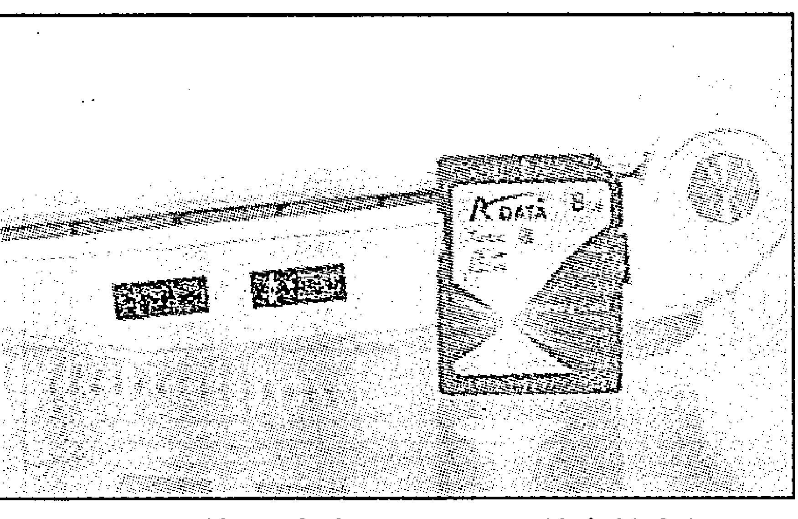

用8GB的SD卡来扩充EeePC的存储空间

从以上配置清单中我们可以看到，在决定一台电脑主要性能的CPU、内存和硬盘“三大件”上，EeePC的CPU性能和内存容量尽管很一般，但也高于大多数二手本本，足以满足流畅运行Windows XP操作系统和主流办公软件的需要。而仅仅4GB的硬盘空间就成为阻碍EeePC应用的最大瓶颈了。我们安装一个完整的Windows XP就要占用2GB-3GB的硬盘空间，剩余的1GB左右空间，实在是太小，无法安装更多的应用软件，就更不用说存储影音文件了。

要突破这一瓶颈我们可以从两个角度来操作，首先是“开源”，即硬件的升级，EeePC由于结构特殊，4GB闪存是集成在主板上的，既无法更换扩展闪存，更不能安装普通硬盘，只能通过其SD卡插槽，使用SD卡来扩充容量，建议大家购买目前市场上能买的最大容量8GB的SDHC高速卡。
EeePC使用普通的DDR2内存，因此可以考虑将内存升级到2GB，不仅在一定程度上弥补CPU性能不足，也能带来一定的额外存储空间。其次我们要合理使用有限的硬件资源。SD卡建议专门用来放置用户影音数据文件和一些不常用的绿色软件。

如果将内存扩展到1GB以上后，还可以关闭虚拟内存，从而节省宝贵的主硬盘空间。在软件选择上尽量只安装最常用的软件，如OFFICE套件、迅雷、QQ、360、暴风影音、千千静听等，并尽量使用其绿色精简版。

另外如果将内存升级到2GB，我们可以使用虚拟硬盘软件，系统启动后用一部分内存虚拟为磁盘分区，将IE缓存等临时文件设定到该分区。所谓RAM虚拟硬盘，实际上是把系统内存划出一部分当作硬盘使用。对于操作系统来说，内存的存取速度远远大于实体硬盘，所以RAM虚拟硬盘肯定要比实体硬盘快得多。不过关机后，虚拟硬盘上的数据会全部消失，因此建议把各种临时文件夹放在虚拟硬盘上，可显著加快程序运行速度。另外使用 RAM 虚拟硬盘技术，对于延长笔记本电脑电池使用时间也是十分有利的。建议大家用SuperSpeed RamDisk这款免费的虚拟硬盘软件，它基于微软的 ramdisk.sys 驱动程序（MOD），非常稳定安全可靠，可用于32位Windows XP、2003 和 Vista 下。下载后运行包内的Ramdisk.exe，单击安装内存盘按钮（其实就是加载一个Ramdisk.sys），选加载内存大小和分配盘符，选内存盘类型，一般选硬盘驱动器。最后点OK就成功了，电脑里会多出一个(RamDisk)盘来。根据我个人使用经验，1G内存设置为150M以下合适，2G内存的话可以设置为300M。对于有4G内存的BT狂人，可以把RAM盘设置为1~2G，把BT的下载文件夹设置在内存盘，下载完后再移动到硬盘中。BT也不怕伤硬盘了，做种子也不怕了。

## 二、选择合适的操作系统

EeePC预装了定制的Linux系统，并内置了很多实用软件，可以满足大多数朋友办公、上网、娱乐需求，不过很多朋友还是不太习惯使用Linux系统，大多数会重新安装Windows XP系统，但是安装完成后光系统就占了约2GB的空间，运行也不是很流畅，因此在EeePC上我们不要安装普通版本的Windows XP系统。

硬盘容量较小及配置较低的电脑安装操作系统还是有很多选择的。首先Windows 2000就是不错的选择，全部安装完毕占用的空间只在800M左右，而且在低配置的机器上运行比XP更快速稳定，同时几乎所有主流软件都能在Windows 2K下正常运行，不过EeePC由于驱动程序等原因，不建议安装Windows 2K。我们可以选择“精简版”的XP，这里推荐大家用口碑很不错的“深度精简XP”，这个精简后的XP系统定位于个人在家庭、网吧及小型办公环境使用，采用久经考验的精简方法和体积压缩技术，在220M的安装文件中提供了几乎100％的原版XP兼容性。经过两年多十余个版本的更新和升级过程后，已经被证明能很好支持各种软件使用和硬件驱动安装。深度XP精简版已经成为真正可以用来日常工作的精简系统，无论是家用、办公还是网吧，都可以放心使用。精简并不意味着功能缺失、不稳定或者兼容性差。实际上不仅较低配置的主机，使用精简XP版本可以体验到更快的安装速度、更小的硬盘占用和更快的运行效率，对于追求最高性能和纯净系统的朋友来说，在高配置电脑上 Deepin XP Lite也是很好的选择。

对于行业用户则推荐大家安装Windows Fundamentals For Legacy PCs， 即“用于旧PC的 Microsoft Windows XP 基础版”，（简称WinFLP），WinFLP 提供与 Microsoft Windows XP SP2 同等的安全性与可管理性，同时提供向最新硬件与操作系统的平滑过渡。系统仅要求奔腾处理器 233 MHz、内存最小64M、2GB硬盘剩余空间即可，这的确是一个相当惊人的低配置要求。但WinFLP的功能并不弱，系统安装盘结构是与Vista类似的WinPE+WIM部署方式，而且管理员还可以灵活地选择组件为客户部署。WinFLP与功能存在很多限制的XP精简版是截然不同的，大家不要混淆。具备完整的多任务处理功能，完整的显示功能，支持.Net，支持活动目录，支持在线更新。这个版本非常适合目前的企业部署；而无须去理会机器的配置新旧，旧电脑也同样可以使用，微软开发这个精简客户端的目的，主要是协助企业把旧有的旧电脑过渡至可执行只适用于WinXP的新软件。

由于EeePC取得了市场成功，因此微软官方的精简版XP系统也出现在新版的华硕EeePC上，据介绍安装在EeePC上的精简版XP操作系统，与以后微软提供给其它低价电脑的系统一致。精简版XP和传统XP最大的不同即在于容量缩小，由原有安装后占用2.5GB左右的空间，压缩成仅占用1.5GB，而功能基本不变，同时还可以搭载官方的精简版Office应用程序，使用者仍可编辑Word和Excel文档，但是只能读取PowerPoint档。

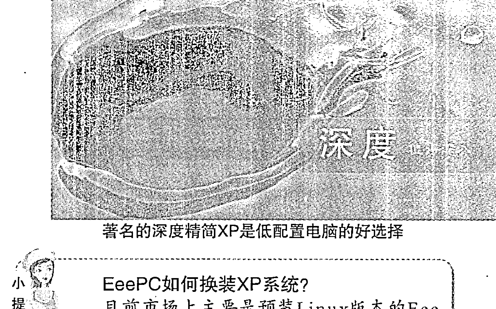

小提示：EeePC如何换装XP系统？目前市场上主要是预装Linux版本的EeePC，在Linux系统下，一般的日常使用并没有太大问题，不过Linux毕竟不是主流操作系统，用户使用起来还是会有不方便的地方，华硕EeePC支持从USB光驱启动，换装XP并不是很难的事，我们可以通过光盘启动并安装XP。但由于华硕EeePC并未标配外置光驱，换装Windows XP前我们还需自行准备一台USB接口的外置光驱，目前市场上最便宜的组装外置光驱大约为两百多元，或者临时借用也可。华硕EeePC的BIOS设置是默认4GB SSD硬盘为第一启动设备的。如果要使用外置光驱引导启动，我们还需在连接好外置光驱的前提下，进入BIOS设置界面将以识别出的外置光驱改为第一启动设备，才可正常引导，接下来的安装步骤和在普通电脑上安装XP没有任何区别。安装完成后，我们要按照说明书的使用说明，安装随机光盘附带的各种设备的XP驱动程序。要注意首先需安装ACPI驱动。另外也有朋友声称成功通过U盘或SD卡安装Windows XP系统，但比通过光驱安装要麻烦一些，不便使用光驱的朋友也可尝试。

除了安装Windows XP， EeePC还可以安装定制版的uBuntu 7.10操作系统。甚至有国外玩家给EeePC装上了Vista系统。对于EeePC的4GB闪存容量，显然满足不了Vista系统的需求。这些玩家首先使用Vista安装盘简化工具vlite对Vista系统进行瘦身，然后动用了8GB的SD卡，通过分离Windows\WinSXS目录的方法完成了Vista的安装。

最后要提醒大家，尽管换装Windows XP后的华硕EeePC，具备了实现更多功能的软件平台，但与此同时也带来了更繁复的操作流程和安全问题，容易遭受流氓软件的侵扰，实际上保留Linux系统也是不错的选择，因为EeePC并不是一台传统意义上的全功能电脑。

## 三、操作系统手工“减肥”

除了选择合适的操作系统外，对于硬盘容量较小、配置较低的电脑也可以考虑对正常的Windows XP系统进行手工“减肥”。 这方面的技巧很多，这里为大家介绍几个效果比较显著的主要技巧。

首先是禁用系统还原，系统还原可以在平时备份系统的状态出现问题后还原到之前的备份状态下，但在实际使用中这个功能并没有太大的用途，还要占据大量的硬盘空间，并耗费一定的系统资源，建议将其禁用。具体方法是进入“控制面板”、“系统属性”、“系统还原”，选择“在关闭驱动器上关闭系统还原”复选框，并确定。

二是禁用休眠并设置合适的虚拟内存大小。启用休眠后会占用系统盘上一块跟你的物理内存大小相当的空间（Hiberfil.sys文件）。在大多数情况下，休眠并没有多大意思，我们最好将其禁用，进入电源属性设置对话框，打开“休眠”选项卡，取消对“启用休眠”的选择，确定后新的设置马上就会生效。另外如果你的物理内存比较多（例如512MB以上），那也可以把虚拟内存的最大值设置得小一些，甚至禁用虚拟内存。打开系统属性的“高级”选项卡，点击“性能设置”按钮，然后在新弹出的窗口中打开“高级”选项卡，并点击“更改”按钮，然后在“虚拟内存”对话框中重新指定分页文件的大小。

三是使用NTFS格式分区，并压缩驱动器以节约磁盘空间。要压缩驱动器必须保证该磁盘分区格式为NTFS，如果你的磁盘格式为FAT32的话，可以在CMD下输入“convert c: /fs:ntfs”。然后右键点击该磁盘盘符，选择属性，把“压缩驱动器以节约磁盘空间”前面的钩打上，完成后你的磁盘盘符名称会变成蓝颜色。这一招对提高磁盘空间的利用率是很有效的。

四是卸载不需要的组件。在运行中输入“%systemroot%/inf/sysoc.inf”然后回车，就可以用写字板打开一个inf文件，这里显示了所有Windows组件程序的安装和卸载情况，而我们可以通过修改这个文件来卸载通常根本无法卸载的组件。打开这个文件后在记事本的“编辑”菜单下点击“替换”，然后在“查找内容”中输入“hide”（不包括引号），然后点击右侧的“全部替换”按钮，之后保存文件并关闭。重新打开控制面板中的添加删除程序，然后点击“添加删除Windows组件”，现在可以直接卸载很多以前并不允许卸载的组件了。打开控制面板里的添加/删除程序，选择“Windows安装程序”。在这里，其实所有组件都可以不要，事实证明，这不会影响Windows的运行。不过最好保留多媒体里面的音频压缩和视频压缩、声音采样。

五是删除不需要的文件，比如多余的字体文件、帮助文件、不需要的输入法等。删除不必要的字体，进入Windows目录下的字体文件夹FONT。里面的中文字体除了宋体是系统必需的，其他的中文字体如：仿宋体、楷体、黑体、幼圆等都可以删除。尤其在安装OFFICE后增加的字体都可以删除。但要注意英文字体是不可以随意删除的。查找Windows目录下所有的*.hlp、*.chm、*.cnt文件，全部删除。这些都是Windows的帮助文件，可以放心删掉。壁纸、屏幕保护等文件当然也可以全部删除。还有两个文件MINI.CAB和MINI1.CAB在system文件夹内，也可以删除。Windows目录下的java文件夹，里面包含着Java类（Class）文件和其他数据文件，可以全部删除。Windows目录下的INF和System32两个目录也可以删除。此外要注意经常清理TEMP、Temporary Internet Files目录下的文件。以$开头的临时文件夹也可以删除。另外为了保证系统的稳定性以及重要的系统文件不会被错误删除或者替换，XP 会自动备份重要系统文件到%systemroot%/system32/dllcache文件夹中，我们也可以将其删除，在运行中输入“CMD”回车，打开命令提示行窗口，然后输入“sfc /purgecache”并回车即可。接着输入“sfc /cachesize=0”并回车，系统以后就不会消耗硬盘空间来保存备份的系统文件了。

只要我们选择合适版本的操作系统，或者对臃肿的Windows操作系统进行手工“减肥”，也能让只有4GB小容量硬盘的EeePC尽可能满足我们的需求。

## 四、量体裁衣发挥EeePC功能

前面谈到，EeePC并不是一台传统意义上的全功能电脑，我们不能奢望用它来玩大型网络游戏或进行三维动画设计。下面我们就从网络、娱乐、办公角度看看EeePC究竟能买来做什么，从EeePC的实际配置看，它应该在以下领域发挥其功效：

- 一是随时随地无线上网，EeePC内置了无线网卡，因此在有“热点”的区域可以很方便地无线上网，收发邮件、信息查阅、QQ聊天、下载文件都可以实现。但是由于EeePC屏幕分辨率只有800X480，无法完全显示1024x768的标准页面，所以在观看此类页面时需要拖动才能浏览全部内容，比较繁琐。在XP下运行QQ很流畅，尽管2007版QQ非常占资源，但是在EeePC上单聊、群聊都可以，只不过还是屏幕分辨率的问题，QQ窗口比较大，需要用户调节一下窗口大小。在正常使用情况下，开三个网页，再打开QQ，机器运行得依然很流畅，可以说，只要具备网络条件，EeePC可以很轻松地让用户上网浏览信息。

另外建议大家在外出时可以携带一个体积小巧的无线AP，这样在宾馆房间等只有有线宽带而没有无线热点的环境也可以方便地上网。EeePC内置了摄像头，因此上网后我们可以方便地进行视频交流，通过SKYPE等软件也能拨打网络电话。不过EeePC没有内置蓝牙，因此要连接手机无线上网就比较麻烦，需使用支持USB数据线连接上网的手机，或者用USB蓝牙棒。

- 二是移动办公、教学演示等，根据EeePC的实际配置，建议安装精简版的OFFICE 2003，另外要根据自己的习惯安装合适的中文输入法，强烈建议大家安装新一代的搜狗、谷歌、QQ等网络拼音输入法。EeePC在小巧的机身上内置了VGA接口，因此可以方便地外接显示器或投影仪，最大分辨率支持1600X1200，完全可以满足我们演示的需要。在传真收发方面，由于EeePC没有内置MODEM，因此需要使用外置USB MODEM或者通过蓝牙棒与手机配合收发传真。

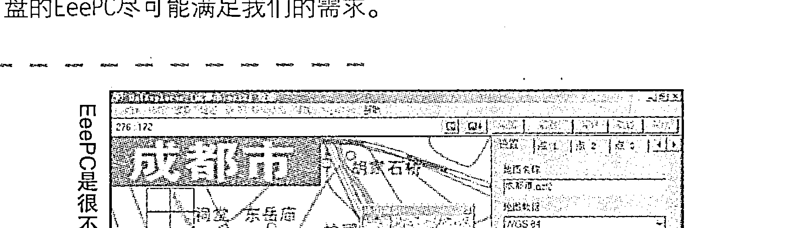

- 三是休闲娱乐。EeePC尽管不适合玩大游戏，但玩一些小的休闲游戏还是足够胜任的。比如QQ的联网游戏、小单机游戏，都可以流畅使用。另外在安装“千千静听”和“暴风影音”这两款软件后就可以播放几乎所有影音文件了，看电子书等更不在话下。当然由于内置存储空间小，影音文件我们尽量放在SD卡或外置U盘、移动硬盘上。外出时用EeePC来打发时间是非常实用的。

- 四是其他特殊用途。比如作为车载GPS电脑。EeePC由于采用了不怕震动的闪存硬盘，非常适合放在汽车上作为GPS车载电脑。GPS硬件上可以选择USB GPS接收器或USB 蓝牙棒+蓝牙GPS接收器。软件上大家可以选择天行者、趴趴走！（PaPaGo！）、城际通、OZI的PC版本。还应安装专业的GPS定位软件，比如GPSview，可以显示当前速度、高度、方向、卫星星历，而且还是GPS接收器初始化时的强大搜星工具。最后要提醒大家注意，由于EeePC电池供电时间有限，因此一定要配置并使用合适的车载电源逆变器。如果使用语音导航软件，最好设法将EeePC的音频输出连接到车载音响上（推荐使用FM发射器）。

# 游戏新主张 —— XBOX 360乐趣无穷

□方成亮

玩腻了网络游戏、看腻了港台肥皂剧、听腻了网络流行音乐，还有什么适合在家里玩？也许很多人想到了TV Game，更想到了时下非常流行的任天堂Wii。但是，Wii更加适合多人同时娱乐，一个人玩的时候势必显得无聊。

## 一、为什么选择XBOX 360：次世代平台之争

次世代游戏主机主要是任天堂的Wii、索尼的PS3以及微软的XBOX 360。尽管目前PS2依然显得老当益壮，但是画质表现实在难以满足大家越来越挑剔的眼光，而且大部分“神作”都纷纷登录次世代平台，这已经成为众多玩家无法抗拒的诱惑。那么，为什么在这三大平台中，XBOX 360更适合我们呢？（图1）

平台，就连一些PS系列平台上的传统大作都纷纷登录XBOX 360，譬如《三国无双5》、《鬼泣4》以及《合金装备4》等。当然，最重要的还有软件获取渠道方面的因素。众所周知，PS3游戏不仅数量相对较少，而且正版软件的价格也实在高得惊人，而XBOX 360则因为某些原因而显得更加平易近人（图2）。

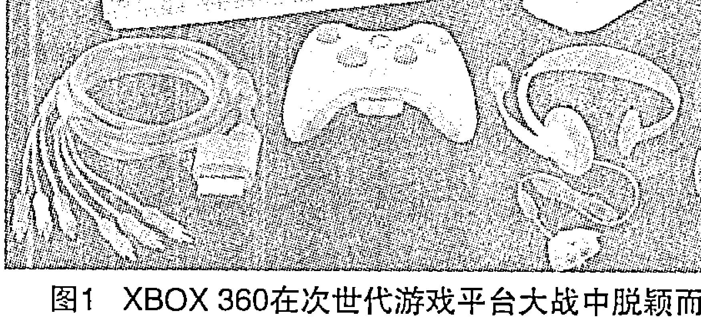

图1 XBOX 360在次世代游戏平台大战中脱颖而出

### 理由一：平台硬件性能出众

XBOX 360的CPU采用IBM特制65nm工艺、SOI技术生产的PowerPC，其中集成了3个PowerPC内核与1MB二级缓存，每个核心频率为3.2 GHz，每核心拥有2线程处理能力，每个核心拥有一个VMX-128矢量处理单元，浮点运算性能高达115.2Gflops。相比之下，Wii主机的CPU性能就太过寒酸，这就使得最流行的顶级“枪球车”游戏基本与Wii无缘，Wii游戏只能以卡通风格为主。此外，XBOX 360采用的是ATI公司的GPU，而且前瞻性地使用了统一渲染架构，废除了Vertex Shader和Pixel Shader分开的传统设计，取而代之的是48个并行Shader，GPU可以动态分配Shader资源来处理Vertex或是Pixel数据。

### 理由二：游戏软件选择丰富

Wii平台的游戏其实也不少，甚至还能兼容NGC游戏，但是太过卡通的风格使得个人娱乐并不合适。相比之下，目前XBOX 360的游戏选择就多了很多，不仅欧美游戏制作商几乎都首选该


图2 XBOX 360平台的游戏选择余地非常宽广

### 理由三：画质表现更加理想

XBOX 360的高性能硬件平台不仅带来更加流畅的次世代游戏速度，其画质表现也是一大亮点。与Wii基本只能达到480p水准相比，XBOX 360所实现的1080i显然精细得多，甚至最新的HDMI版在部分游戏下还能实现1080p。从理论上分析，XBOX的画质竞争对手只有PS3，但是如今游戏开发商对于PS3平台的关注度显然不够，大部分同时登录双平台的游戏中，往往是XBOX 360版本有着更好的画质（图3）。

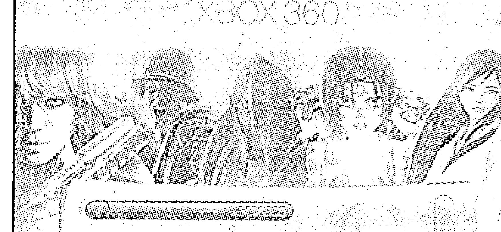

图3 各种风格的高质量游戏都纷纷登录360平台

## 到底选择哪个版本的XBOX 360

XBOX 360的版本区别主要是配置和产地。在配置方面，目前以豪华版和ARCADE版为主，前者的优势在于配备了一个20GB硬盘，而后者价格上大约便宜400元，而且具有HDMI接口。相对来说，还是豪华版更加值得推荐，毕竟大容量硬盘使用起来更加灵活。至于产地方面的区别，应该首推港版，因为港版是220V直插电源，而且带有色差线。相比之下，日版的110V电源肯定不便，并且D端子传输线在国内很难派上用场。

## 网络创造出精彩纷呈：如何接入XBOX Live

很多人这么形容XBOX 360主机：没有XBOX Live，那么XBOX 360只能叫做XBOX 180。可见XBOX Live对于XBOX有多么大的重要性。XBOX Live总的说来给人的感觉就是：一个全世界游戏玩家的社区，你可以在这里感受到丰富多彩的游戏体验。它的功能要高于很多现在的PC游戏对战平台，而且具有了更加强劲的扩展性。在不久的将来，微软利用自己强大的技术力，甚至可以把XBOX 360、MSN、手机整合起来，形成一个强大的虚拟网络空间。到那时候，我们的生活中将处处是Live的影子。

## 登录XBOX Live方法之一：PC双网卡

对于没有路由器的用户来说，在PC上安装双网卡，其中一块连接宽带Modem，另一块连接XBOX 360网卡，这是最方便的方法。不过，此时需要在PC上进行一些设置。打开连接宽带的网卡属性，选择右键菜单进入高级选项的“Internet连接共享”，随后在选择“家用网络连接”中指定为第二块网卡。一般来说，PC上的第二网卡把IP设置为“192.168.0.1”，而XBOX 360的IP设置成“192.168.0.2”。

## 登录XBOX Live方法之二：宽带路由器直接连接

现在，宽带路由器已经非常普及了，而且这样能够让XBOX 360在登录Live时摆脱对PC的依赖。只要在宽带路由器的设置中打开DHCP功能，然后网线连接XBOX 360与宽带路由器的LAN接口即可。接下来的工作就非常简单，进入XBOX 360的“系统”→“网络设定”→“测试Live连线”，系统将会自动完成网络连接的相关工作。

## 登录XBOX Live方法之三：WiFi无线网络

如果XBOX 360摆放的位置正好没有网线，那么就只能依靠无线网络了。XBOX 360的USB接口可以插入无线网卡，微软提供的原状无线网卡大约500多元，然后自己购买一个无线宽带路由器即可。需要注意的是，市面上大部分普通的USB无线网卡并不支持XBOX 360，这也是微软垄断的结果。

作为以“枪球车”为主打的次世代游戏平台，充满竞技性的XBOX 360游戏几乎都很适合网络对战。在多款大作之中，目前《PES2008》和《NBA Live 2008》有着很高的人气值，玩家甚至可以扮演游戏中的某一名球员，多人对战比简单的双人竞技更加有趣。此外，《使命召唤4》的网络对战功能也颇为引人瞩目，这可是PC平台上所难以实现的，因为即便是人气很旺的浩方平台，《使命召唤4》玩家也寥寥无几。但是，XBOX Live上就大不一样了，来自全世界的玩家很容易集合到一起。经过测试，在上海地区使用2M ADSL就能获得比较流畅的在线游戏效果，服务器一般选择日本的。

## 半个HTPC：XBOX 360如何作为媒体播放器

买了XBOX 360的用户大多都会拥有一个32英寸以上的液晶电视机，而拥有液晶电视机的用户自然又会对HTPC蠢蠢欲动。其实，与其大动干戈地组装一台HTPC，不如好好利用XBOX 360的视频播放功能。尽管目前在XBOX 360上所支持的视频格式并不完整，但是顶上“半个HTPC”还是丝毫不会成问题的。

豪华版XBOX 360拥有20GB的硬盘，如果只是用来存储游戏进度，那也太过浪费了。为此，建议大家充分利用好这一空间，放置一些视频文件就非常不错。在XBOX 360的媒体选项里面，其内置的播放器可以支持WMV以及MPEG2格式，不过MPEG4还无法支持。其实，凭借XBOX 360的机能，解码MPEG4非常轻松，而微软也在近期的更新中加入了这项功能。

首先直接访问http://www.xbox.com/zh-TW/support/systemuse/xbox360/console/softwareupdates.htm?，选择产品列表中的Games & Xbox，然后再缩小范围在“Show downloads for”选择Microsoft Xbox。这样，你就能迅速找到所需要的更新文件了（即Xbox Game Support Updates）。下载后的文件我们可以通过U盘来完成本地更新，不过此时需要把“SystemUpdate”拷贝到U盘的根目录下，通过XBOX 360的USB接口连接后就能自动完成系统更新。

需要注意的是，目前微软对于MPEG4的支持仅限于DivX编码。如果是采用xVID编码的MPEG4视频，那么仍然无法识别。但是，即便如此，我们也应该感到非常高兴了，毕竟DivX编码的普及度非常高，而且XBOX 360对于DivX的编码速率以及分辨率没有要求，就连720p分辨率也能轻松支持。

XBOX 360其实还可以完美配合PC端的Windows XP Media Center Edition 2005，它可以通过XBOX 360使用MCE的多媒体功能，以及MCE兼容的网络模式。在PC端安装MCE 2005操作系统之后，XBOX 360的“Media Center”就能轻松工作，但是此时需要安装更多的解码器才能兼容RMVB、XviD和H.264 HDTV。在此，一般是安装Transcode 360（Xbox多媒体软件XBMC开发组开发）。其实，个人感觉这样操作略微有些麻烦，因为播放的时候必须开着PC，这样还不如让PC显卡直接连接液晶电视机。

## 漫车也玩GPS，实战智能手机GPS的非导航应用

现在GPS应用越来越普及了，车载GPS导航仪价格降到了千把元，有些手机还内置了GPS模块，而外置蓝牙GPS模块价格也就300元左右，配合PDA或智能手机也可很方便地实现GPS功能。但是不少朋友对GPS的使用还存在一个误区，就是只有对驾车的人才有用，难道对大多数没有车的朋友，GPS就真的没用了吗？其实没车我们也照样可以玩GPS，体会高科技带给我们的无穷乐趣。

### 一、GPS导航和定位应用

关于智能手机GPS设备的软硬件准备我们曾有过文章详细谈及，这里只对其中的重点作简要回顾，硬件上除了选择内置GPS芯片的产品，我们通常使用蓝牙GPS接收器与智能手机搭配，组成手持GPS系统。蓝牙GPS接收器安装使用非常简单：首先把电源开关打开，蓝灯开始闪烁，然后打开智能手持设备的蓝牙管理器，搜索设备。搜索完成后输入匹配码，完成配对。再选择串口服务，并且使用安全加密连接。连接完成后在GPS软件的设置里调整好串口参数和速率，就可以定位了。关键是GPS软件的选择与使用。

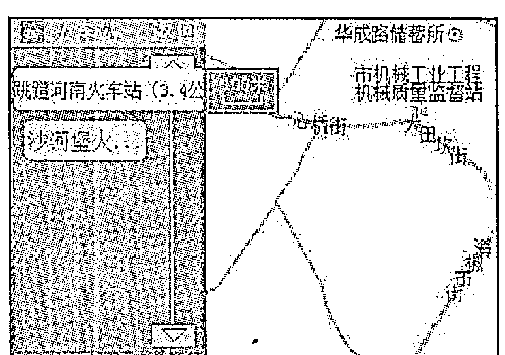

智能手机上GPS软件可分为两大类，一是GPS语音导航软件，比如天行者、路路通等，主要对驾车用户有用，具备智能导航功能，可以为我们指引正确的驾车道路。但对无车用户而言，这类软件没有多大的用途，这里不作介绍。二是GPS接收及定位软件，是本文介绍的重点。比如 Megalith.GPS.Tuner 是一款高精度的测量、定位和导航软件，提供便捷的路径点、导航文件、导航路径等管理。可使用地图；支持GPX；带电子罗盘。同时具备路线记录和分析，速度和海拔图表显示，路线处理，NMEA日志记录和实时回放等功能。GPSDash：能够识别从GPS设备接收的符合NMEA0183协议的GPS信号，通过6个不同的虚拟仪表盘来实时显示各类GPS数据：速度、指南针、高度计、时钟、卫星信号接收状态和质量、里程数，还可以在地图上实时显示你当前的位置。这类软件还有很多，不过在功能上都大同小异。下面我们具体来看看GPS除了为驾车者导航，还能实现哪些应用。

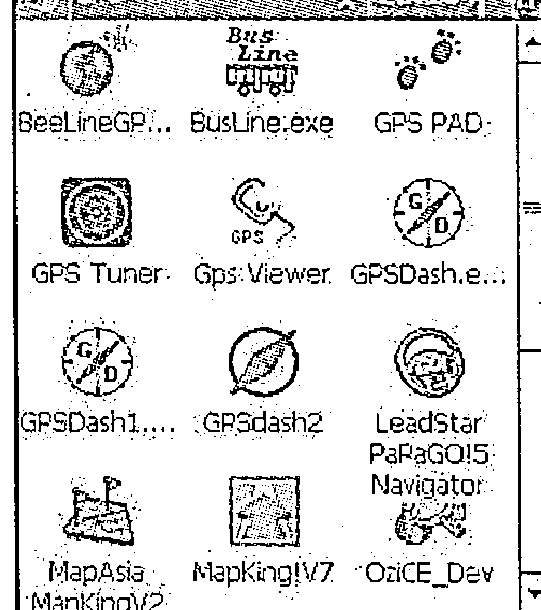

### 二、野外探险的好向导

如果你去荒郊野外旅游探险，普通的GPS导航软件就没有什么用处了，需要你保存航迹和航点，因为在荒郊野外不会有街道名，也不会有标志性建筑物，为了不在野外迷路，这时我们需要用到GPS定位软件的航点记录及导向(Bearing)功能，即根据当前位置，计算出导向目标对你的方向角，按此方向前进即可走到目的地。有些GPS把前进方向和导向功能结合起来，只要用GPS的头指向前方方向，就会有一个指针箭头指向前方方向和目标方向的偏角，跟着这个箭头就能找到目标。

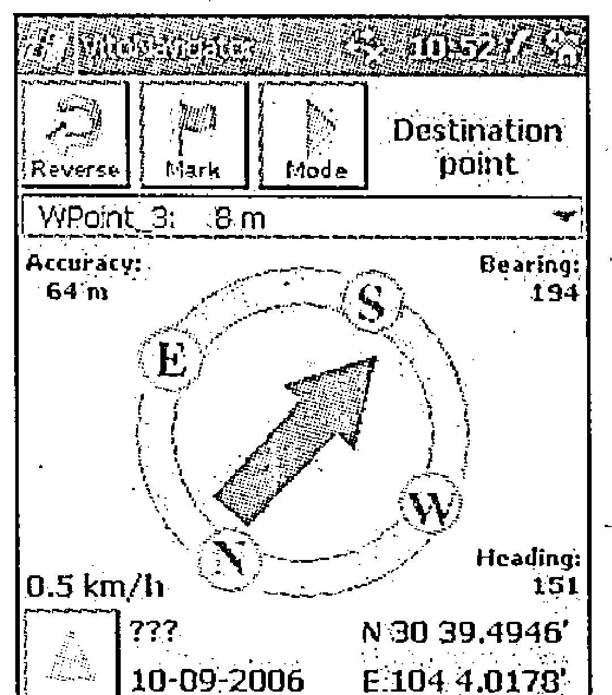

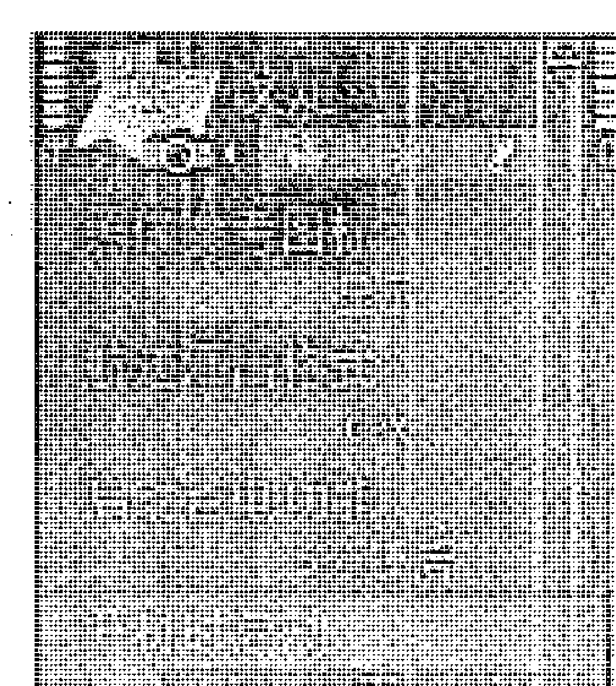

此外我们还可以使用足迹线(Plot trail)功能， 用GPS记载自己的运动轨迹。足迹点的采样有自动和定时两种方式，自动采样由GPS自动决定足迹点的采样方式，一般是只记录方向转折点，长距离直线行走时不记点；定时采样可以规定采样时间间隔，和航点不同，足迹线上的点不能单独引用，主要用来画路线图和“回溯”功能。回溯(Trace back)顾名思义就是按照原路返回，使用此功能时，它会把足迹线转化为一条“路线”（ROUTE），路点的选择是由GPS内部程序完成的，一般是选用足迹线上大的转折点。同时把此路线激活为活动路线，用户即可按导向功能原路返回。

另外在野外探险，OziExplorer这款专业的地图软件也是我们的好帮手，这款软件最大特点就是采用了开放的地图格式，可以方便地将BMP、JPG等格式的地图文件制作成具有定位、导航功能的地图，保证了地图来源，现在许多GPS地图网站都能免费交流相关地图资源。OziExplorer CE比较适合在其他导航软件无法提供地图的中小城市或越野时使用。OziExplorer CE采用标准的PPC界面设计，上手容易。Ozi使用并不太复杂，其中关键就是如何把一幅JPG格式的地图转换成OZI格式的地图并进行校准，这两步都需在PC上进行。使用一款名为“img2ozf”的软件，即可把其它图像格式转换为OZI格式，但这只把JPG格式的地图转换成了精简的OZI格式地图，其中并不包含任何导航信息，必须要为OZI地图加入航点信息，进行校准，才能使之真正成为导航专用的地图。

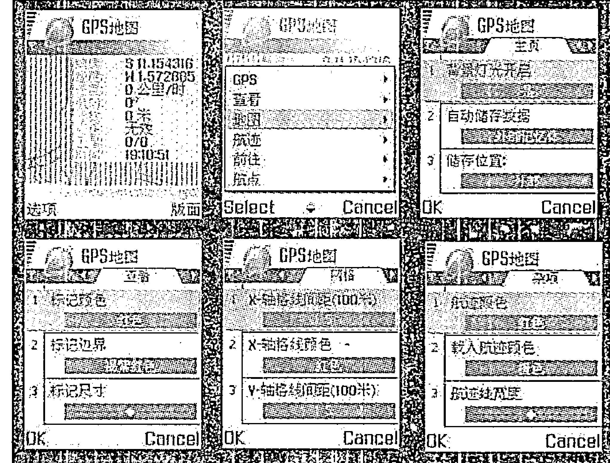

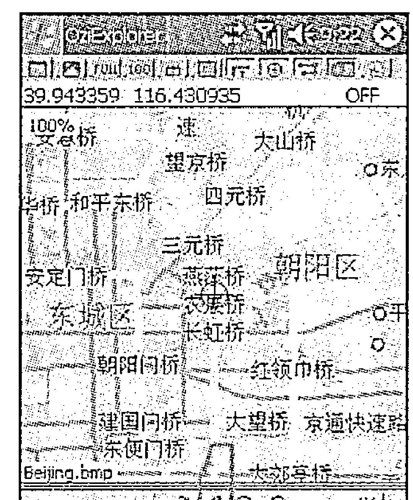

## 二、运动健身的好帮手

如果你是运动爱好者，比如喜欢爬山、跑步，那么GPS也可以成为你的好帮手，这里为大家推荐一款塞班智能手机上用的好软件：Sport tracker。这款软件是Nokia实验室开发的产品，需要运行在S60 第三版环境下，是一款英文软件，目前没有汉化版，不过使用起来还是比较简单的。软件分为四个主选项，分别是：新练习，也就是进行新的训练记录；训练日历，按日期记录训练的情况；路径，简单导航用；设置，设定软件的一些参数。运动前首先打开GPS接收器，等几分钟让GPS收到卫星信号并定位，然后打开该软件，直接选“new workout”，开始新的练习。点 start 后，出现新练习界面，分别显示了运动轨迹、当前速度、运动距离、运动时间。按下方向键后，还有更多的信息展现。

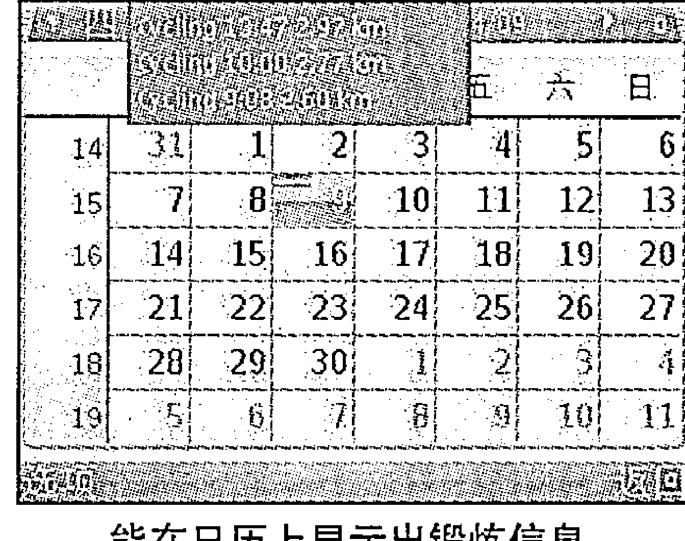

此页面显示的是平均速度、当前速度、海拔、距离、时间。此页面显示的是方向、速度、经纬度。再往下显示的是速度 / 时间曲线。再往下显示的是速度 / 距离曲线、海拔 / 距离曲线、全屏路径等。除了丰富的练习信息外，练习完毕后，在“training diary ”里面会自动保存练习信息，并且与日历无缝结合。

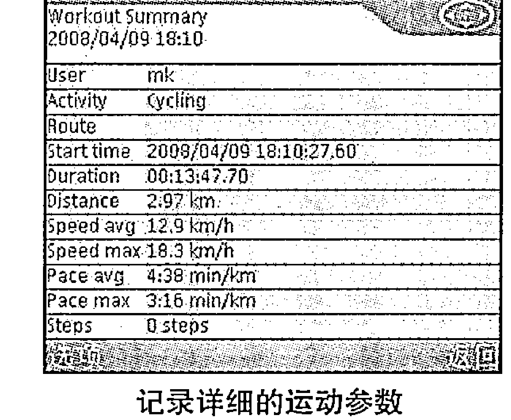

我们可以依次查看练习的各种信息，包括速度/时间图、速度/距离图、海拔/距离图等。最后我们还可以把练习路径导出到Google Earth。导出后把该gml文件传到电脑，打开Google Earth ，开启该档案，你的运动轨迹就跃然于卫星图上！起点、终点、最高海拔点、最快速度点、最慢速度点，都一目了然，真是我们运动的好帮手。

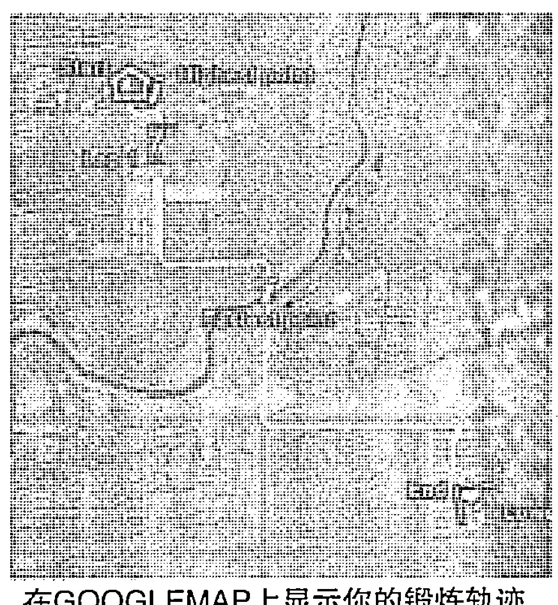

使用PPC的运动爱好者则建议选择GPS Tuner这款软件，Megalith.GPS.Tuner是一款高精度的测量、定位和导航软件，提供便捷的路径点、导航文件、导航路径等管理。可使用地图；支持GPX；带电子罗盘。同时具备路线记录和分析，速度和海拔图表显示，路线处理，NMEA日志记录和实时回放等功能。其中轨迹分析报告对运动者而言非常有价值：分为轨迹分析报告和路线分析报告两大部分，可以监控全程的速度，最高速度，平均速度，直线速度，海拔，最大高度，最小高度，攀登，继承，长度，总时间，移动时间，相当全面，几乎没有软件能够逾越。其中直线速度是这个软件的独特统计功能。

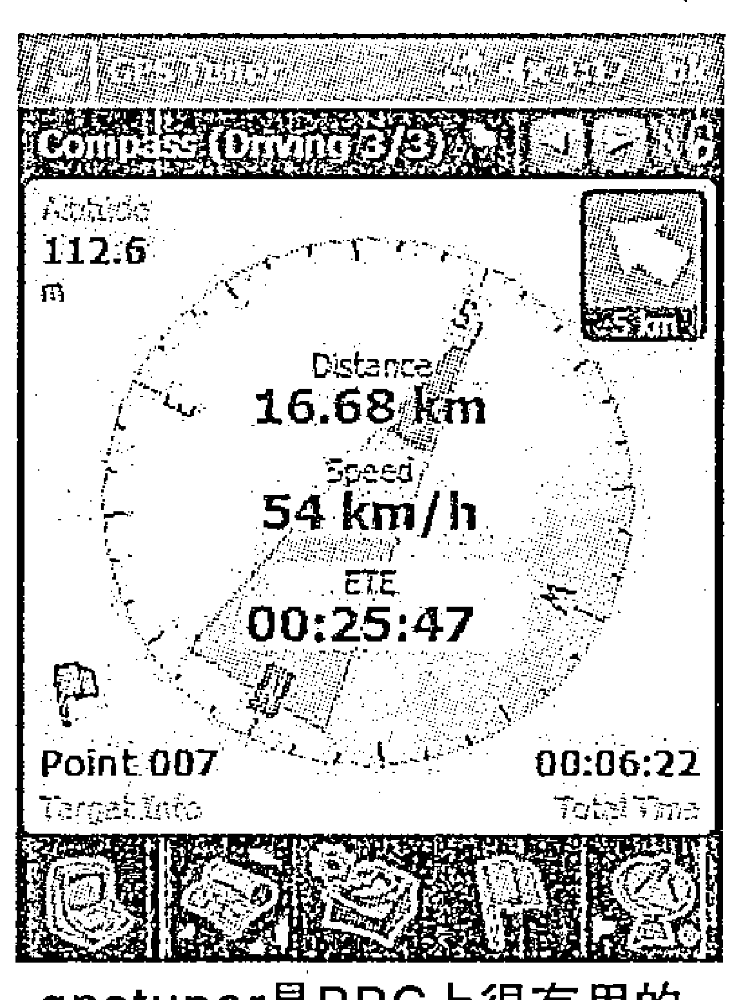

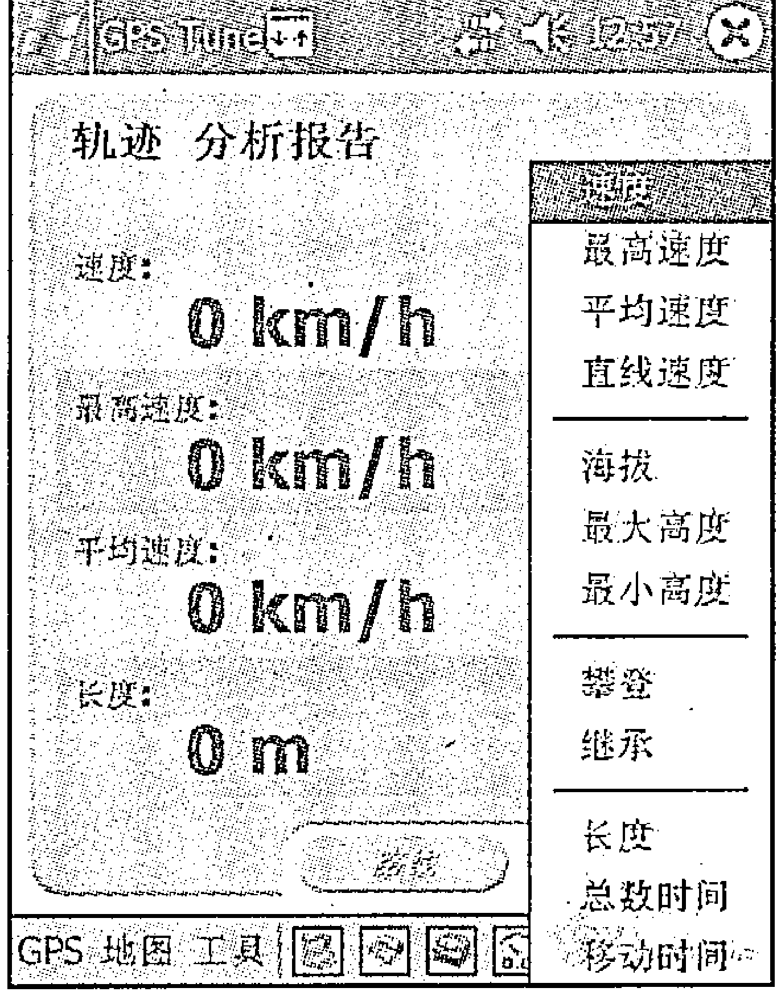

## 四、给照片GPS信息

喜欢外出旅行的朋友都会随时用相机记录下沿途美丽的风景和别致的人文风貌。不过这些照片到底在什么地方拍摄的，我们无法一一确定。不要紧，用GPS就可以很好地帮助我们解决这个问题。只要设法记录下拍照地点的GPS信息，我们就可以在Google earth卫星图上方便地查到拍照片的位置。具体方法我们曾在去年合订本的《玩转数字地球》一文中有过详细介绍，这里就不再赘述了。下面为大家谈谈如何用塞班手机直接拍摄带GPS信息的数码照片。

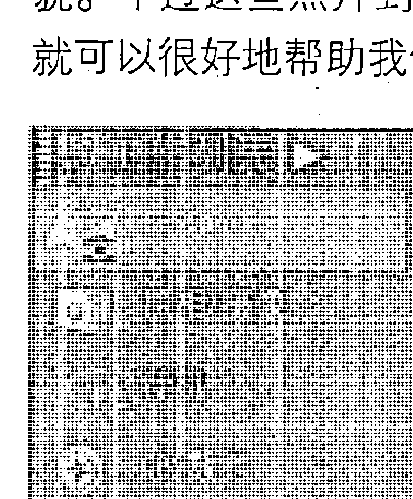

连接并启动GPS功能后，我们需准备好专门的软件，比如用“GPSCam”或者Nokia实验室推出的LocationTagger，这样就能拍下带GPS信息的照片了。具体步骤如下：启动GPS，并等待接收卫星信号，定位完成后打开手机上的GPSCam或者LocationTagger软件不要关闭，然后切换到待机界面，打开摄像头，这时GPSCam的拍照界面上会有一个带圈的G，LocationTagger的拍照界面上则出现了一个黑框，这就表示已经可以记录GPS信息了，然后我们直接拍照就可以了。对于记录后GPS信息的数码照片，我们上传到电脑后，可以进行如下操作，首先确保电脑上安装有Google的最新版Picasa及Google Earth软件，然后用Picasa打开照片，带有GPS信息的照片会多一个符号，选中该照片，点击菜单栏—工具—地理标记—在Google Earth中查看，Google Earth随之启动，地球旋转几次后，拍摄该照片的地点就在画面中显示出来了，十分有趣。

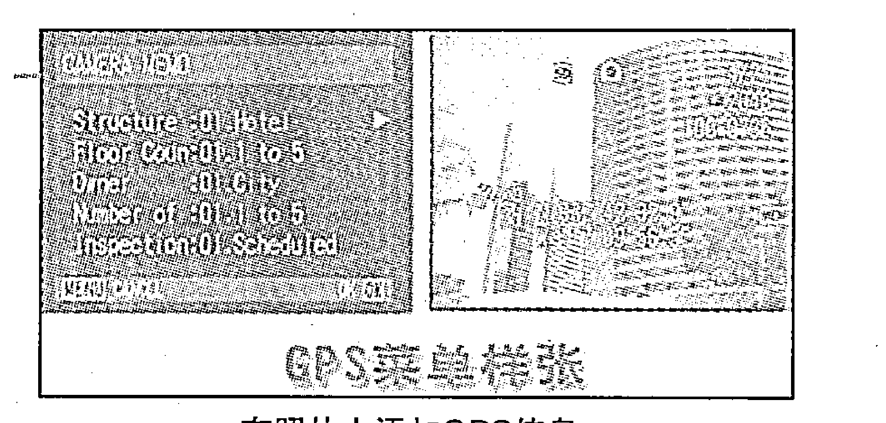

## 五、徒步旅行的GPS应用

最后我们来看看在徒步或骑车旅行中我们如何用好GPS定位软件。首先以Navigator II为例说明。这是一款很不错的手持机软件，不仅能显示速度、经纬度、海拔等基本GPS数据，具备指南针、目的地距离显示、星图等功能，还能通过航点的设定来导航，且能用图的方式记录下你行进的轨迹，是户外活动时非常好的帮手。建议“驴友”们一定要安装该软件。

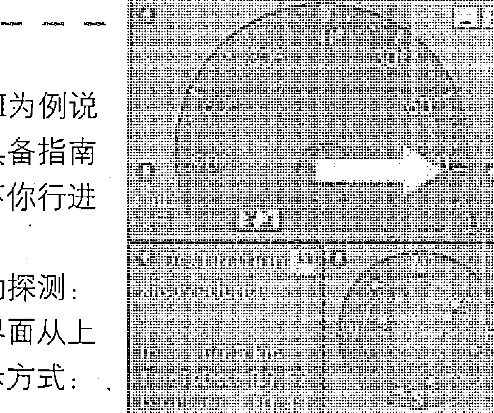

第一次启动VITO Navigator II时，软件会自动进入GPS设置中。Autodetect--自动探测：让你的PPC自动探测和设置GPS，选择好以后，就会进入VITO Navigator II主界面。主界面从上至下可以分成3个部分，每部分又各有不同菜单选项。最上面是主要仪表区，有3种显示方式：方向盘（Course）；速度表（Speed）；经典视图（Retro）。

其中方向盘（Course）用于导航时指示前进方向。只要用GPS的头指向前方方向，黄色指针表示转弯方向（左右不超过90度），红色指针表示实际目标方向，相当于导向(Bearing)。另外上面部分还可以显示海拔高度、速度、精度、剩余电量等。

主要仪表区我们还可以设定为经典视图（Retro），该界面很像手持机界面。在没有使用导航模式情况下，蓝色箭头是你前进方向；周围黄圈表示方向：N-北，S-南，E-东，W-西。导航模式时，将PPC指向前方方向，蓝色箭头表示最近目标方位。

- Compass: 指南针，蓝色表示北，红色表示南。
- Destination, 目的地，在导航时，指示目的地距离，预计还有多少分钟到达（TimeToDes），现在时间（LocalTime）。
- Sky View: 星图，指示所收到GPS信号卫星，黄色代表已经锁定的卫星。
- Position: 目前位置，包括经纬度和海拔。
- Acceleration: 显示运动中的加速度变化。
- Clock: 时间表。

- Speed Chart: 速度曲线表
- Odometer: 里程表，左边是清零键，右下角是设置键。
- Altimeter: 高度计。要注意这些功能需要安装插件后才能实现。

软件界面的最下面是功能及设置区，点击最左边地球仪图标，会出现轨迹图，能看见记录的轨迹和航点，点击右下角的“设置”（齿轮图标），可以看见轨迹设置选项Rotate map: 可以旋转地图，Drag map: 可以拖拉地图，还可以保存、加载、清除轨迹。记录轨迹功能在徒步旅行时很有用。

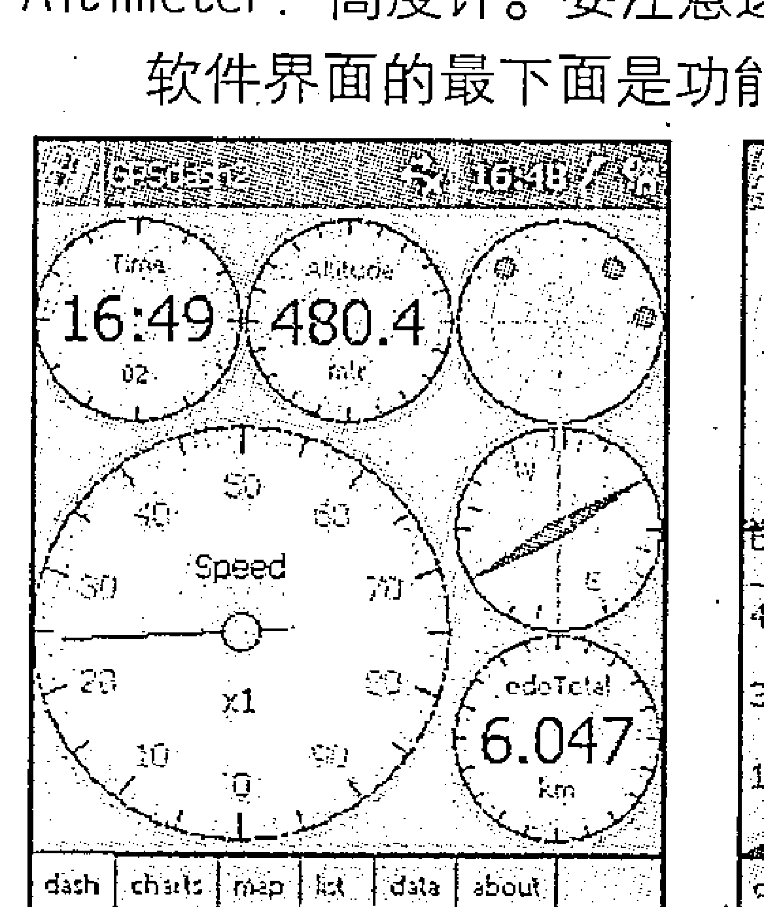

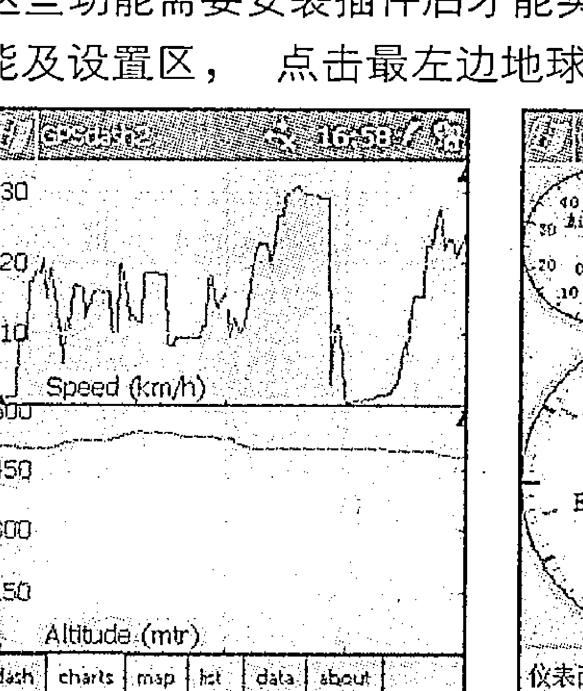

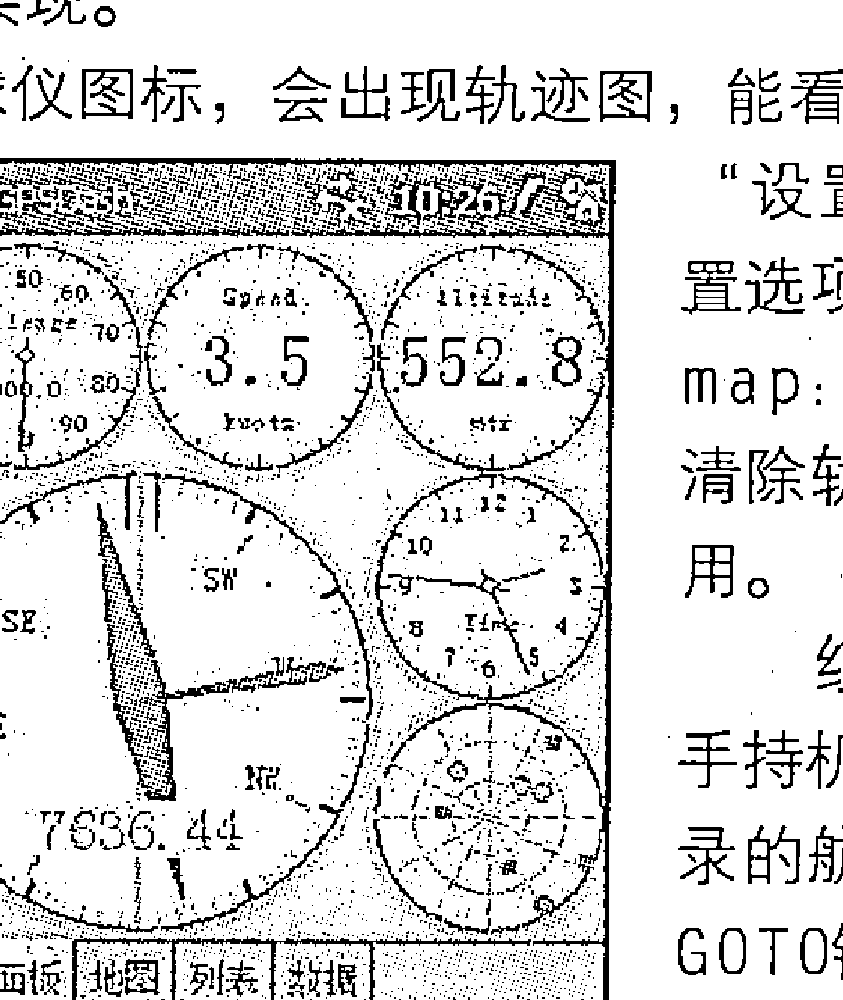

红旗图标是记录当前点信息，相当于手持机上的MARK键。而绿色箭头，是选择记录的航点信息用来导航，相当于手持机上的GOTO键。最右边齿轮图标是用来设置各项参数的。包括GPS参数设定、超速提醒设定、航点管理等，其他还有插件管理等选项。

## 走到哪里都不怕
——低价位GPS设备扫描

□方成亮

> 「GPS车载导航设备作为一种全新概念的汽车电子用品，可以在地理信息服务、城市导航、自驾远游等方面为车主提供诸多便利。据了解，在发达国家，GPS车载导航仪已经成为大众生活辅助工具，甚至是必需品。但是，高昂的价格使得GPS设备在国内的普及度并不高。不过，近期出现了不少2000元左右的产品，再加上家用汽车的普及化，有望令GPS“飞入寻常百姓家”。」

### 一、低价产品贵在哪里？

目前市场上的GPS车载导航仪种类很多，消费者选购时需注意，作为成熟的GPS车载导航设备，应具有的基本功能包括：GPS卫星导航定位、电子地图浏览查询、智能的路线规划、全程的语音提示。其中，电子地图的数据量与详细程度最为重要，除了丰富的城市地图外，全国的公路网图也是不可或缺的，否则导航仪可就出城不认路了。此外，机器的外形、安装方式、物理性能也是值得注意的，选择安装程序简便、外形美观、防水抗震、收星稳定的GPS车载导航仪会令使用者得心应手。

1. 独立型GPS更有实用价值

如同很多手机拥有拍照功能一样，现在不少智能手机、PDA甚至PSP游戏机都可以拥有GPS功能。但是，这类GPS功能往往就像手机拍照功能那样薄弱，实际应用起来只能作为一个简单的辅助，不可能成为真正意义上的导航者。手持GPS以及车载GPS才是GPS设备中的“正统”。虽然和其它手机GPS或是PDA GPS的功能定位类似，但是由于设计理念的不同，在寻星速度、定位准确性、地图丰富性等方面有着很大的优势。

但是，正是因为这种独立式GPS脱离了手机或者PDA硬件环境，因此它还需要一个独立的操作系统以及支持操作系统和应用软件的硬件环境，所以其成本还是相当高的。可以发现，部分独立式GPS采用了PocketPC操作系统，此时所使用的CPU、内存几乎和PDA一样，并且考虑到运算速度还必须配备高频率产品，这自然难以令成本下调。

2. 数码厂商介入解开价格死结

原本GPS仅仅面向于经济实力很强的消费者，所以高成本并不会成为其拦路虎。但是在国内，动辄5000元以上的GPS设备还是很难普及。为了降低成本又不严重牺牲功能性，不少产品开始开发独立的嵌入式系统，并且在地图以及软件方面通过各种渠道来节约成本。当然，随着FlashROM闪存、射频发生器、LCD屏幕的成本下调，GPS设备的成本也的确确大幅度下调。但是，很多汽车厂商并不愿意立即降价，因此价格上的门槛依然没有下降。

只要有市场就有竞争者，随着一些数码设备厂商的介入，GPS设备的价格开始松动。现在，我们看到不少2000元左右的独立式GPS设备，而且在功能上基本与高端产品差距不大，这就很快吸引了大量消费者。纵观这类产品，虽说屏幕小了一些、语音提示功能单薄了一些、地图少了一些、定位精度差了一些，但是综合差距并不大，完全对得起其价格。

### 二、低价GPS到底质量几何？

面对如今2000元左右的GPS设备，很多消费者都在购买时产生了疑惑。比起6000元以上的产品，似乎有着很大的价格优势，但是实际应用效果会不会受到影响呢？

1. 主控芯片

GPS应用需要软件支持，而为软件寻找一个操作系统平台显得非常重要。目前，部分高端GPS设备直接使用PocketPC操作系统，这直接导致其主控芯片成本较高。Intel Xscale 处理器尽管性能强大，可是本身的价格以及配件成本都不低。相反，大多数2000元价位的GPS采用嵌入式操作系统，此时配合ARM处理器，成本可以很好地控制。尽管主控芯片的功能并不是很出色，但是实际GPS功能却根本不会受到影响，因为大多数GPS软件对于硬件性能的要求并不高（图1）。

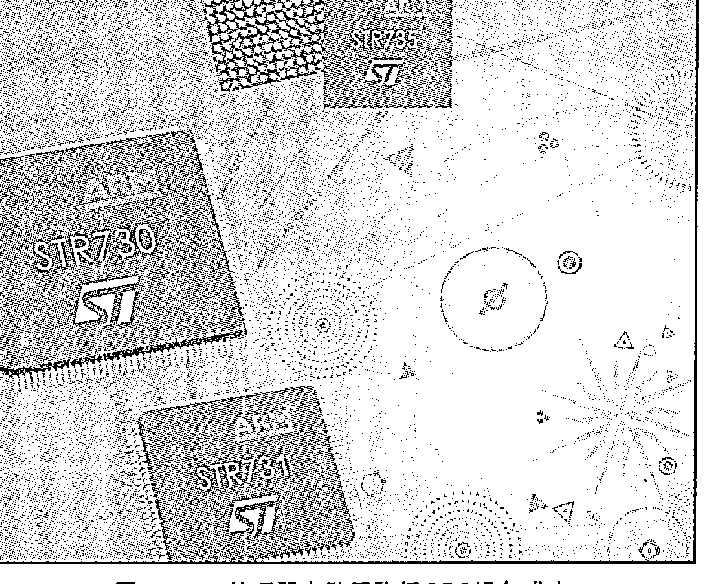

理论上说使用普通的主控芯片会略为降低软件运行效率，但是要知道大部分GPS地图软件都是几年前开发的，而现在的新款芯片完全拥有不俗的性能，因此实际运行效率可以得到保障。此外，很多独立式GPS设备还添加各种辅助芯片来实现MP4功能或是操作系统界面，这也是很不错的解决方案。

## 2. GPS芯片

GPS芯片是指GPS接收机专用芯片组，主要包括射频和基带信号处理芯片，构成了GPS接收机的核心和关键部件。随着民用GPS设备对小尺寸、低功耗的不断追求，以及硬件设计水平和芯片制造工艺的不断进步，如今将GPS射频与数字部分集成在一起的单芯片GPS接收机是绝对主流。Garmin、德州仪器、高通、美国SiRF、英飞凌、索尼等都推出过单芯片GPS接收机。不同产品之间的性能还是有所差距，主要体现在信号接收能力、抗干扰能力、定位算法（图2）。

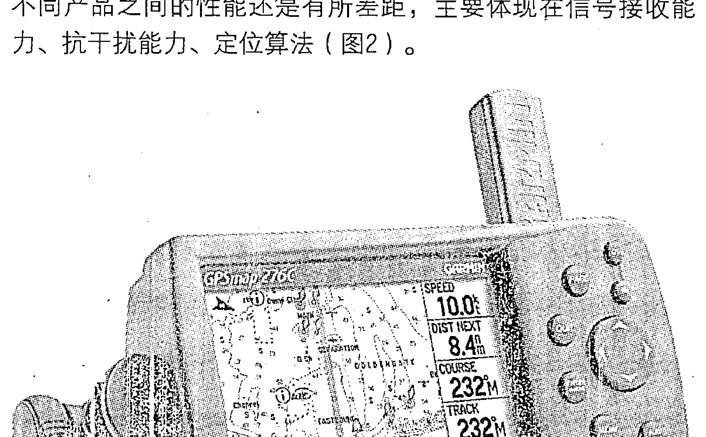

Garmin在独立式GPS设备市场中占有半壁江山，主要采用Garmin自己的芯片产品。Garmin公司很像IT领域中的IBM，从地图软件到GPS设备、到核心芯片，是一个产业垂直集成的公司。但是2000元左右价位的GPS设备一般采用SiRF III芯片，应该说也有着不错的性价比。SiRF III芯片在各种角度以及天候都可以顺利接收，即使是贴了内含金属丝防爆膜前风挡信号也可以穿越（当然信号也会受到一定影响）。老款的GPS芯片产品不宜在树下，不宜有高楼建筑物遮蔽，连隔热膜也是障碍，这类情况往往发生在一些支持GPRS的PDA或是手机上，而目前大多数低价位独立式GPS设备并不存在这类问题。

## 3. 定位精度

定位精度对于GPS设备而言非常重要，否则很容易在指路的过程中产生偏差，尤其是应用在城市道路中。让我们感到高兴的是，现在2000元左右的GPS设备在定位精度方面有了大幅度提高，这主要是因为能够支持WAAS技术。WAAS是美国联邦航空局及美国交通部为提升飞行精确度而发展出来的，目前则在民用市场普及化应用。WAAS提供校正GPS讯号的功能，让您得到更精确的定位。到底能提升多少精确度呢？官方给出的数据是，可以平均提升最多五倍的精确度！目前无WAAS功能的普通GPS接收机的正常精确度是15米，而一台具备WAAS功能的GPS设备能在95%的情况下提供用户误差小于三公尺的精准定位，而且用户不必为了使用WAAS功能而支付任何使用费。EGNOS是与WAAS类似的技术，目前也有不少低价位设备支持该功能。

## 4. 地图表现

在旅游及野外考察中，比如到风景秀丽的地区去旅游，到原始大森林、雪山峡谷或者大沙漠地区去进行野外考察，GPS是你最忠实的向导，再也不必担心迷失方向。GPS设备可以让用户随时知道所在的位置及行走速度和方向，不过这都建立在GPS与详细地图配合使用的基础上。低价位的GPS设备在地图软件以及地图配置方面总是比高端产品逊色一些，主要体现在地图容量较小。

目前，GPS设备用于存储电子地图等相关数据信息的主流介质主要有内置FlashROM、外置闪存卡和DVD光盘。尽管以CF卡、SD卡为介质的卡槽式设计稳定性较高，抗震性能较好，但是其容量还是相对有限。目前，6000元以上的高端产品一般都采用DVD读取地图，而且地图容量非常大，也支持各个城市甚至周边小乡村的导航。从冰天雪地的哈尔滨到春城昆明，从青藏高原的拉萨到风光绚丽的三亚，由南到北，从东到西，更多的地图能够实现全国范围的覆盖（图3）。

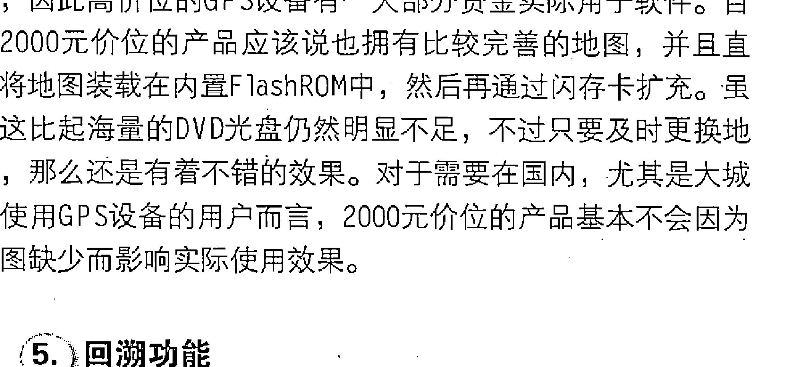

由于地图的制作成本很高，因此高价位的GPS设备有一大部分资金实际用于软件。目前2000元价位的产品应该说也拥有比较完善的地图，并且直接将地图装载在内置FlashROM中，然后再通过闪存卡扩充。虽说这比起海量的DVD光盘仍然明显不足，不过只要及时更换地图，那么还是有着不错的效果。对于需要在国内，尤其是大城市使用GPS设备的用户而言，2000元价位的产品基本不会因为地图缺少而影响实际使用效果。

## 5. 回溯功能

回溯功能则是GPS设备输入线路的一种特殊方法，它在原路返回时十分好使。目前大多数GPS设备都支持回溯功能，不过少数低价位设备可能不支持这项功能。回溯功能首先在需要标记的地方为GPS设备输入原始坐标点，随后无论往哪个方向活动，都能轻松找回原路，因为GPS定位可以在抛弃地图的情况下使用相对位置来进行定位。此时GPS设备可以显示用户离、原设定目标的距离、速度、目标方向角等数据，只要按照这些实时更新的数据移动，返回原路肯定是轻而易举的事情，这甚至有些类似于RPG游戏迷宫中的“存盘技术”。事实上，按照地图使用GPS的价值在于寻找目的地，而真正在迷路时最佳解决方案还是回溯功能。旅游途中总有熟悉的出发点和陌生的目的地，只要应用好这一功能，那么无论怎样都不会迷路。

## 6. 附加功能

一款好的GPS导航设备还应该具有智能的路线规划、全程的语音提示、多种查找方式、航线记录、存储航点等丰富的功能。在这些方面，2000元左右的GPS设备相对于高端产品而言略为薄弱，主要体现在查找方式以及存储航点功能方面，而且语音提示功能比较单薄。不过，这些都不能一概而论，因为现在部分2000元左右的GPS设备通过高版本的软件很好地弥补了这一劣势。但是，诸如液晶屏效果、车载固定方式、报警功能等方面，低价位产品还是有着明显的差距，这是受到成本限制而无能为力的。

## 三、选择GPS设备时，需要注意的几个要素

### 1. 电子地图出身须正宗

电子地图是导航仪应用中基础且核心的部分，专业的认证和详实的数据量是其应该具备的基本要素，所以消费者在购买导航产品时，首先要检查电子地图的“出身”。国家测绘局有关负责人介绍：电子地图与车主出行安全息息相关，有些盗版电子地图出现错绘漏绘，将给车主出行带来麻烦。按国家规定，正规的GPS导航产品必须使用具有国家专门机构认证的电子地图，截至今年8月，国内只有四维图新、高德软件等8家导航电子地图提供商通过了国家测绘局的导航电子地图资质认证。可以说，用户使用具有认证的电子地图等于是为自己的出行买了一份“保险”。考核完电子地图的出处以后，还要检验电子地图的内涵量。专业、详尽的导航电子地图除了准确度较高外，还可以提供全国道路交通网图和主要城市的详细地图。其中，需要尽量多的包含街道、餐饮、住宿、娱乐、交通运输等信息点（图4）。

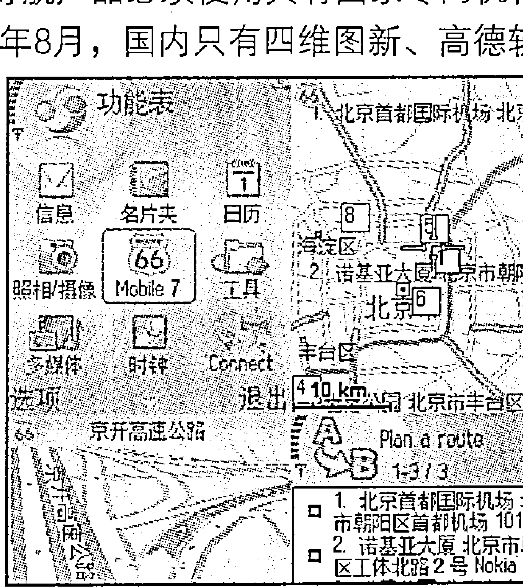

### 2. 并行通道与灵敏度

市面上的GPS接收器大多数是8通道、12通道、16通道、20通道的，这允许它们连续追踪每一颗卫星的信息。而某些GPS设备只有2～5条并行通道接收卫星信号，因为一般来说平均有8颗卫星是可见的，这意味着这些GPS接收器必须按顺序访问每一颗卫星来获取每颗卫星的信息。多通道并行GPS接收器的优点包括快速冷启动和初始化卫星的信息，而且在森林地区可以有更好的接收效果。一般12通道接收器不需要外置天线，除非是在环境条件不好的条件下如封闭的空间中，比如船舱、车厢中。GPS卫星的信号传到地面上已经很弱了，还有地面无线通讯的杂波干扰。GPS接收器的最低可追踪的信号强度决定了收到多少有用的信号。一个有着最低可追踪的信号强度的GPS接收机就有着更高的灵敏度，也就可以在恶劣的条件下收到更多的可用卫星。

### 3. 稳定性与供电能力

首先要考虑选择抗电磁干扰强、性能稳定的GPS产品。车辆颠簸、温度高、有电磁干扰，这类比较差的车内环境状况会影响GPS的正常运作，所以对产品的稳定性要特别强调，建议大家购买时仔细检测。此外，GPS的能量消耗较大，应设置GPS专用电源，防止因普通电源在较差的环境下电频不稳定，令电路烧坏的故障发生。不管怎么样，我们认为手持式GPS设备也必须拥有汽车点烟器供电接口，而且连接线通电流足够大，因为普通的连接线容易烧毁，连接线的质量要够好才能保证可靠安全（图5）。

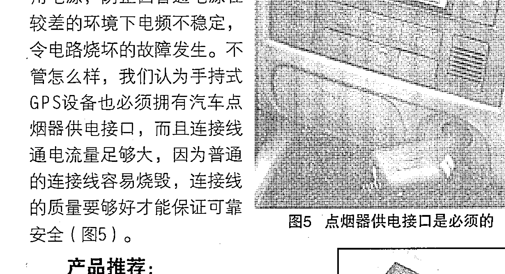

## 产品推荐

纽曼天下通E666

纽曼天下通E666可谓创造了一个GPS产品的性价比神话。这款1599元的GPS设备在功能方面丝毫不逊于高价位产品，而且使用SiRF III GPS芯片，并且地图功能非常强大。天下通E666还拥有MP4功能，配合车载电源，完全可以作为爱车的导航助手，并且日常MP4应用也非常有趣。

参考价格：1599元

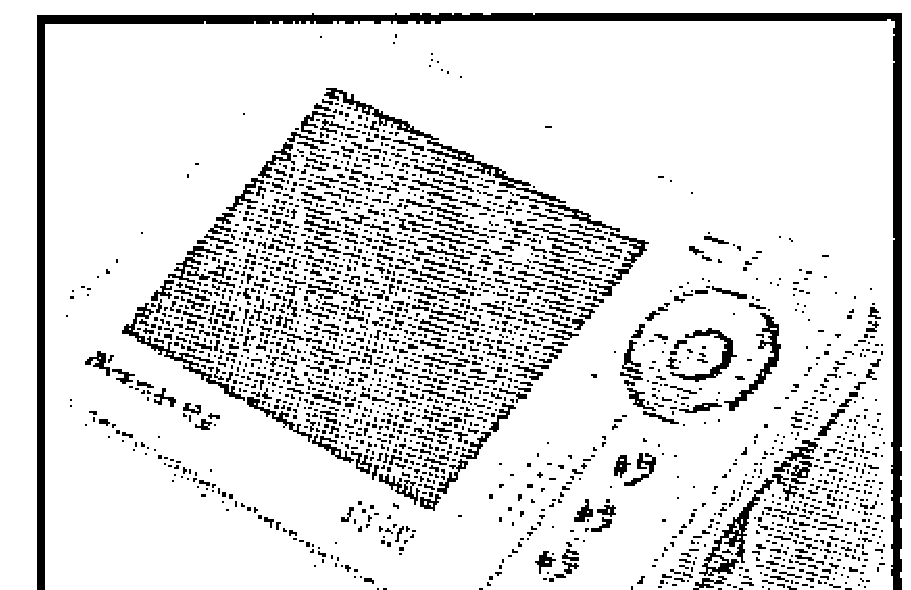

DEC中恒GPS510

中恒GPS510也是一款MP4型GPS设备，不过这并不影响其GPS专业功能。GPS510采用SiRF III GPS芯片，提供行程说明和模拟行驶功能，帮助用户快速了解道路行驶路程，并支持语音功能。

这款产品的地图也比较全面，包含周边设施检索，内含餐饮、住宿、银行、加油站、停车场等13大系统100多小类的信息。

参考价格：2299元

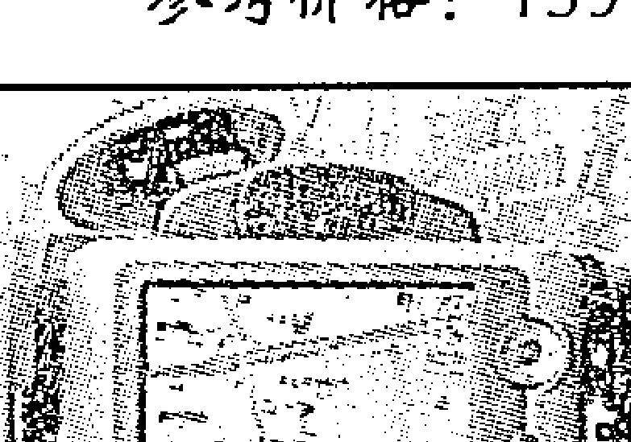

神达 Mio C210 GPS

C210 GPS使用了PocketPC平台，通过USB与PC连接即可轻松升级地图数据。内置的导航软件为深圳凯立德的移动2.0版本，内置的GPS模块是SiRF III芯片，因此综合表现非常理想。

参考价格：2100元

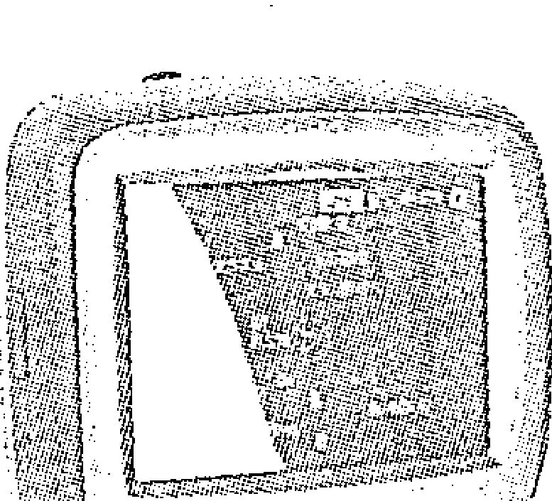

GARMIN任我游300

任我游300是GARMIN的第一款外置折叠天线的民用机型。这款GPS设备装载了中国四维图，包括了全国公路网和313个城市的详细地图，内含有大量的生活、旅游、交通资讯，可供广大消费者外出游玩时查询。此外，任我游300还支持MP3播放器和电子相册功能。

参考价格：3700元

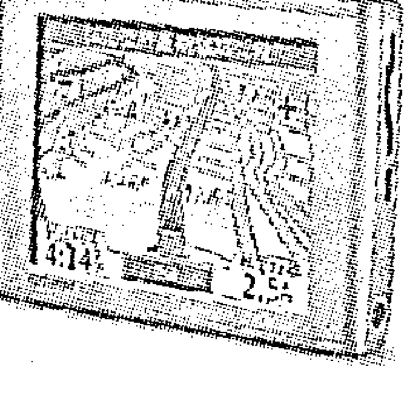

## 让GPS导航仪走开

### 玩用智能手机的GPS功能

□刀 锋

随着自驾车出游逐渐成为一种时尚，以及手机功能的多元化趋势日渐明显，多数智能手机都内置了GPS模块以及相关软件，大大方便了用户的日常使用。您可以不必再单独购买价格不菲的GPS导航仪，也不会让您在陌生的地方迷失方向。下面笔者就带着大家一起去看看智能手机中有哪些常用的GPS导航软件。

### 🧭 用GPS软件的注意事项

任何一款GPS软件都有其兼容的操作系统平台，在安装GPS软件之前，需要了解能够兼容自己智能手机的都有哪些GPS软件。其实应该选择最符合自己需求和使用习惯的GPS软件，这样会给自己日常使用带来极大的方便。及时更新GPS软件的地图文件也是延长软件使用寿命的最好办法，就和及时给杀毒软件升级病毒库是一样的。

### 🗺️ 地图详尽的灵图天行者

灵图天行者是一款地图信息详尽的GPS软件，除了适合在智能手机上使用之外，还可以在普通的PC（包括笔记本电脑、UMPC等）上使用（图1）。其地图文件上对道路附近的建筑物标识得也相当仔细，除了常见的大厦、小区、车站、码头、饭店等建筑物之外，连宠物店、咖啡店这样的小建筑物都没有放过，适合于对生活质量要求较高的白领人士。

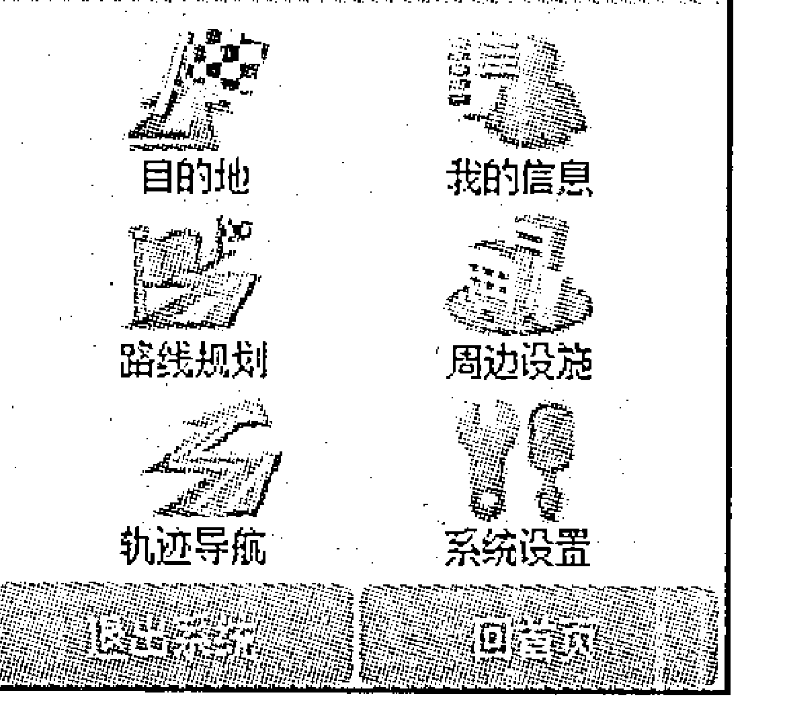

灵图天行者对于导航的人性化设计也做得十分出色。在到达路口之前软件都会进行渐进式提醒驾驶者注意，这样可以大大降低交通事故发生的频率。根据用户当前所在地方与目的地的距离，会自动计算出最短路径供用户参考，达到最短时间和最佳路径之间的平衡。

灵图天行者还支持用户通过拼音或者手写输入的方式，提供模糊查询目的地的功能。这对于经常自驾游到一个陌生的城市相当有用，不会说找不到目的地，像没头苍蝇一样乱飞。

本款软件还特意设计了白天模式和夜间模式两类。白天模式采用较高的屏幕亮度，即便是在阳光下也能清楚地看清地图。夜间模式的屏幕亮度则比较低，一则能节约设备电能，二则不会分散驾驶者的精力，保证交通安全（图2）。

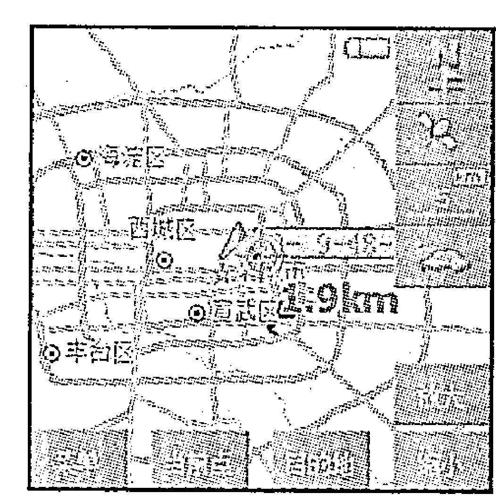

图2 灵图天行者的白天模式

### 🧭 能以多种角度查看地图的凯立德

凯立德同样是一款国产的GPS定位软件，其最大特色是允许用户以不同的视角查看地图（图3）。除了以传统的2D鸟瞰方式外，还设计了图随车转和地图正北两种方式。图随车转实际上就是以驾驶者的视角出发来查看地图，从使用习惯上来看非常直观，方便对周围环境不太熟悉的朋友。地图正北方式则是以传统纸质地图以上为北的方式来显示地图，适合于已经有多年驾龄的老司机朋友，但是对于方向感不强的MM们来说，反正会弄不清楚方向导致迷路。

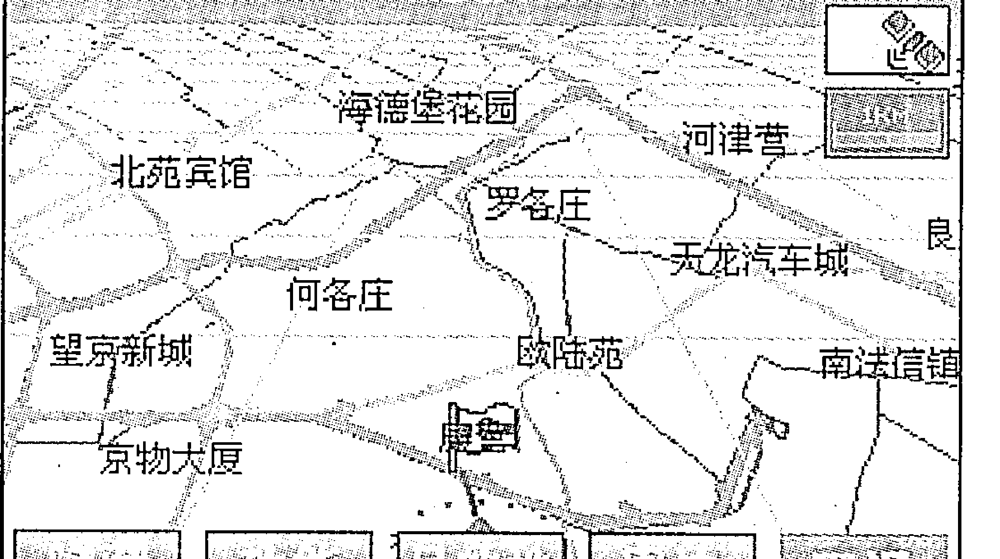

凯立德设计了路径规划功能，实用性相当不错，如果您是第一次到某个城市的话，这个功能会令您喜出望外，可以节约时间并少跑冤枉路。另外设计了目的地历史记录功能，方便用户来往于相同目的地之间。

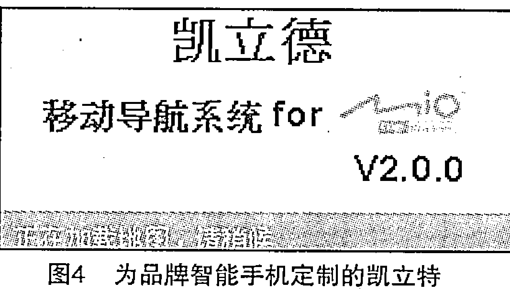

图4 为品牌智能手机定制的凯立德

图3 凯立德软件横向视图

**注意版本问题**

凯立德GPS软件都是为各品牌的智能手机量身定制，所以操作界面会有所不同。软件版本越高，并不意味着地图文件的版本越新。地图文件的版本可以查看地图文件的日期，日期越晚地图文件越新（图4）。

### 拥有多种导航模式的道道通

道道通软件拥有三种导航模式：真实模式、模拟模式和轨迹模式，这在其他GPS导航软件中是相当少见的。真实模式就是传统的实时导航模式，通常情况下可采用该模式进行导航。模拟模式也就是在用户指定目的地之后，给出从当前地到目的地的最佳路线供用户参考，适合于对周围路况不太熟悉的用户。轨迹模式是利用车辆记录的行驶轨迹来进行导航的模式，对于行驶里程较多的汽车来说十分合适，里程越多轨迹模式的有效程度越高。

道道通软件的目的地检索方式与灵图天行者、凯立德一样，支持手写关键字输入和快拼检索目的地，大大方便了日常导航使用。道道通软件的地图文件更新很快，这样大大提高了软件的实用性。每当接近路口需要转弯时，都会进行语音和图标提示，对于刚刚开车的新手来说，不会错过需要转弯的路口。

道道通的地图软件涵盖的范围最广，覆盖了全国31个省、市、自治区的333个地级以上行政区划单位、4个直辖市和2859个县级行政区划中心。不仅在大城市的中心区，在城市的郊区和城区间星罗棋布的县城、乡镇、村庄，道道通都能提供详尽的导航指引。理论上，道道通的制图精度最高可达到3米之内（图5）。

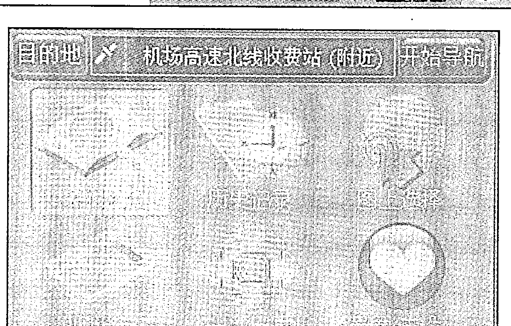

### 适合多端平台的Route 66

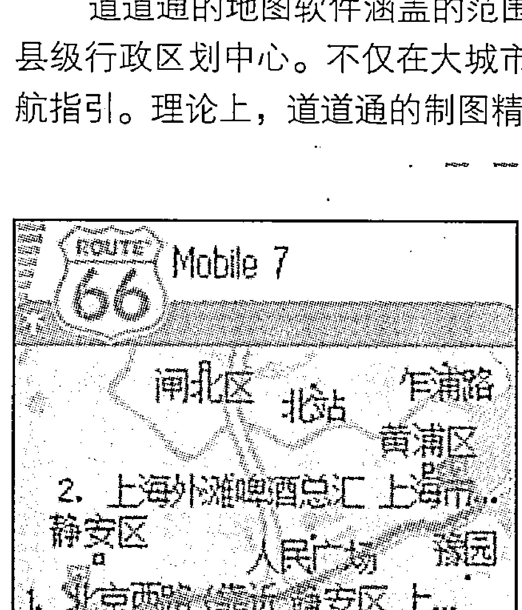

Route 66专门为智能手机打造的GPS地图，特别适合于诺基亚的塞班Series 60平台的手机。Route 66的最大特点是导航地图上明确标注了各个路口的红绿灯、人行道，甚至连过街天桥和地下过道都没有放过，适合于喜欢骑车、散步的驴友们，相信对于喜欢自驾车一族来说，过街天桥和地下过道的意义都不是很大（图6）。

Route 66的操作非常直观，只要点击地图上的任意一处建筑物，就会弹出显示设施的种类、门牌、联系电话等相关信息，这一点设计得十分人性化，大大方便了人们在日常出行中的需要。而且Route 66对触摸屏的支持比较好，使用手写笔进行操作十分便利，比较容易上手。Route 66的语音导航功能比较有意思，除了支持普通话之外，还支持粤语及英语，这样大大扩展了软件的用户范围，特别是对于在中国工作的外籍人士和华南地区的人士来说，使用起来也会感到比较方便。

Route 66对一些大、中城市的地图信息支持得比较好，适合经常出差的商务人士。但是对我国大部分县、镇的支持就不是太好，如果您是旅游爱好者，恐怕会觉得有些力不从心。

### 适合城际游的城际通

对于在城市之间进行自驾游的朋友来说，城际通是一款比较实用的GPS导航软件。操作比较简单，地图无缝自动切换大大方便了自驾游一族。除了路径规划功能之外，还能显示周边道路和建筑物的名称，有助于驾驶者确定自己行驶的路是否正确（图7）。

由于城市道路日渐拥挤，很多城市的道路都实行交通管制（包括单向行驶、规定转弯方向等）。城际通软件对于交通管制的支持比较好，在进入交通管制的道路之前，会及时提醒驾驶者注意，可以防止交通违规的情况发生，减少警察叔叔向您敬礼的次数。

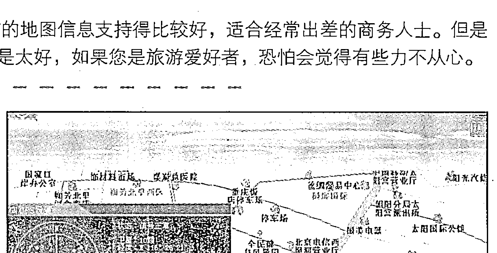

城际通的路径规划功能被直接设置在一级菜单中，与其他GPS软件多设计在系统菜单中相比，用户操作起来会感觉非常方便。城际通还设计了GPS冷启动功能，若是遇到智能手机的GPS模块死机无法使用时，可以单独让GPS模块冷启动，而不必让智能手机重启，这样可以大大节约宝贵的时间。

怎么样，智能手机中的GPS导航软件还是很丰富吧。那还等什么？把导航仪扔出去，让手机兼职作为您忠实的引路手吧！

## 附表：主流GPS软件详情列表

| 软件名称 | 官方网站 | 参考价格 |
| --- | --- | --- |
| 灵图天行者 | http://www.lingtu.com/ | 950元 |
| 凯立德 | http://www.careland.com.cn/ | 为各GPS智能手机定制，不单独出售 |
| 道道通 | http://www.cn-map.com.cn/ | 400元 |
| Route 66 | http://www.66.com/route66/homepage.php?cid=CN-md | 800元 |
| 城际通 | http://www.citvonmap.com/ | 费用未知（只能在其支持的GPS智能手机上使用） |

## SOLUTIONS 解决方案 数码

## 格式通吃也要转 “非主流” MP4视频格式转换大作战

由于RMVB格式的流行，越来越多的MP4播放器都以RMVB直播作为卖点，诸如RMVB等文件格式在最新的MP4上都可以不经转换直接播放了，那对于已经购买只能播放AVI格式的MP4的用户来说，是不是就无法播放这些资源了呢？答案是否定的，经过转换，老款MP4一样可以播放这些视频。

### 挑选转换软件

工欲善其事，必先利其器。为了保证格式转换又快又好地完成，一款强大的视频转换软件是必不可少的。在这里，笔者推荐使用方便、功能强大的Wismencoder。

这款软件是Mencoder的GUI界面版，而对Linux稍有了解的朋友一定对Mencoder不会陌生，Mencoder作为Linux平台的强大解码器，在Windows平台一样可以发挥其作用，将各种格式的视频转换为“过时”MP4需要的AVI格式。Mencoder有很多优点：压缩速度快且质量较高，支持批量压缩，以及压缩后自动关机，支持各种音频、视频编码器，支持字幕，支持压缩的优先级，利用已经设置好的配置文件轻松为各种设备设定转换参数，而不需要每次都重复设置。而作为其GUI版本，Wismencoder的图形化界面做得也相当成功，对于初级用户很有亲和力。

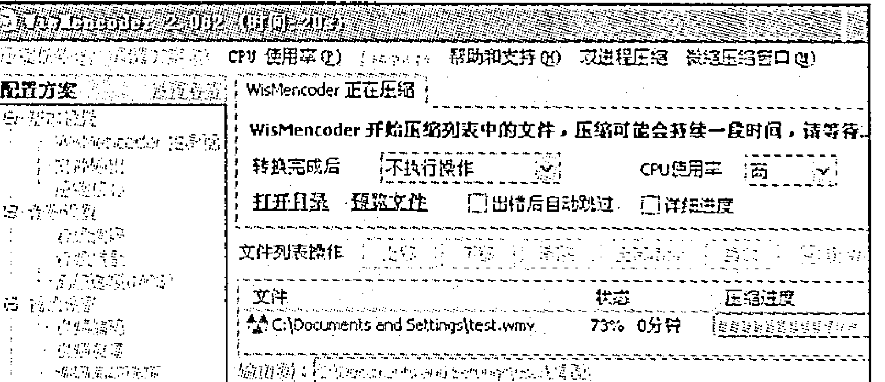

### 进行文件格式的转换

- 第一步：选择需要转换的“过时”文件

首先点击压缩文件菜单，选择添加文件，然后选择我们需要转换的视频，在这里我们使用test.wmv作为范例。文件导入完毕后，我们需要对其进行一番设置并转换，使其可以为我们的MP4播放。

- 第二步：设置转换的相关参数

选择视频设置中的视频质量选项，在这里有预置大小，编码率和帧数，这里具体的设置要依据你的MP4型号而定，具体参数可以参考你的MP4说明书来找到合适的设置。这里以Miniplayer为例，预置大小选项中我们选择QVGA，也就是320×240，在码率中选750Kbps，帧数选择24帧。在下面的编码高级选项我们可以选择二次编码来提高画质，就笔者看来，这个选项还是有一定效果的。

- 第三步：设置视频截取和合并

限于MP4有限的存储空间，如果我们只需要视频里面的一小段，除了动用绘声绘影这种大型视频编辑软件，有没有别的办法呢？答案是肯定的，Wismencoder自带视频截取和合并功能。我们可以单击截取和合并选项来截取视频和合并视频，首先我们点选启用此功能，然后在起始时间和结束时间框中分别输入需要截取的时间，这里我们截取十分钟。

- 第四步：设置转换文件输出位置

现在我们要选择文件输出位置，我们点击基本设置中的文件输出，在输出文件夹中选择目标文件夹，考虑到速度、稳定性以及闪存读写寿命等因素，笔者推荐输出到本地文件夹，转换完成后再手动复制到MP4播放器上。在文件名后缀中软件默认使用[WisMencoder Encoded]，也就是在转换后的文件名后加上[WisMencoder Encoded]，我们本次转换没有这种需要，所以在这里，笔者清除这一栏的选项，也就是不添加文件后缀。

- 第五步：进行转换

在这里还要提到一点，Wismencoder可以控制CPU的占用率，将CPU的占用率保持在设定值以下，以保证其他程序的正常运行，在这里笔者并不打算也不推荐大家在转换视频的同时进行别的工作，所以在CPU使用率菜单中使用了高（默认）。最后，自然是开始压缩，我们可以点击压缩任务菜单中的开始压缩或使用快捷键CTRL+ENTER。接下来就是等待，具体时间视参数及硬件配置而定，在本例中，笔者使用CORE2 DUO 6320，共用29秒完成了转换，最后将其复制到MP4播放器，至此，本次转换大功告成。

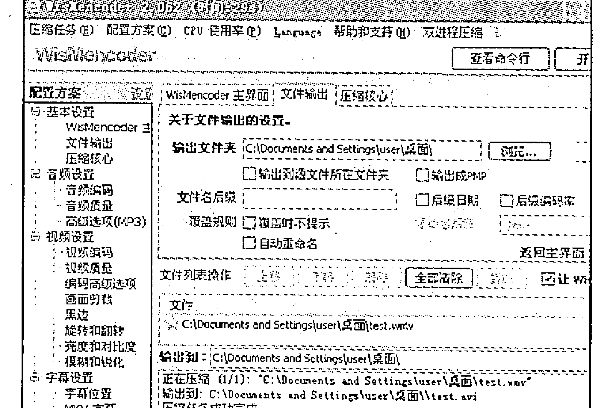

不要再为手上的“过时”MP4发愁了，经过简单的转换，“过时”MP4也可以播放目前流行的视频，怎么样？心动了？那就快去试试吧！

202 电脑爱好者 合订本·2008

## 功能强大操作傻瓜 诺基亚PC套件妙用多

诺基亚手机以其庞大的产品线、适合不同人群的设计以及灵活多变的价格和速度占领了国内手机大半壁江山，去年的国内市场占有率更是突破了54%！面对庞大的用户群体，诺基亚公司特意开发了PC套件软件，方便用户的手机与PC电脑协同工作。现在笔者就带着大家一起去看看诺基亚PC套件软件究竟有什么妙用。

## 下载并安装诺基亚PC套件

首先需要到诺基亚的官方网站下载PC套件的安装程序（下载地址：http://www.nokia.com.cn/link?cid=EDITORIAL_511477），目前最新版本为6.80.9.0。安装程序的容量为31.24MB，下载完成后可以进行安装。安装的过程比较简单，基本上就是一直点“下一步”按钮即可，限于篇幅即不再展开。

注意老机型与软件的兼容问题
如果您的诺基亚手机型号较早，这就要注意新版的PC套件与手机的兼容问题了。可以在下载网页中，查看自己的手机型号是否位于兼容列表中。

## 与手机进行互联

PC套件安装之后，安装程序会要求重启系统。系统重启之后，会在任务栏中显示诺基亚PC套件的图标。双击该图标，将打开PC套件的主界面。在软件的主界面中单击“设置”下拉菜单，选择“管理连接”选项。在打开的“诺基亚连接管理器”对话框中，根据您实际的需要，在连接方式的框内打上“√”。笔者的笔记本电脑由于没有蓝牙模块，所以选择了红外线模式。确定互联方式之后，即可关闭“诺基亚连接管理器”对话框，如图1。

手机和电脑互联方式有哪些？
手机通过蓝牙、红外线、串口和USB接口与电脑互联。蓝牙和红外线属于无线连接方式，需要手机和电脑都拥有同一种端口，适合手机与笔记本电脑互联。而后面两种则是采用有线连接方式，需要购买专用的数据线。数据线有串口和USB两种，最好选择USB接口的数据线，这样可以方便PC套件今后的使用，适合手机与台式电脑互联。

设置好互联方式之后，将手机和笔记本电脑进行物理连接。物理链接完成后，在PC套件的主界面中点击“单击此处可连接手机”按钮。此时会跳出连接向导。连接向导过程中应再确定手机与电脑的连接方式，否则PC套件将无法正确识别手机。PC套件能正确识别手机型号之后；我们可以进行以下操作了。

## 让手机的通讯录永远最新

对于商务人士来说，通讯录与其工作信息息息相关，但是要管理庞大的通讯录既费力又耗时。PC套件提供了同步通讯录的功能，大大方便了维护通讯录的人力成本。打开PC套件的同步模块，先需要进行一定的设置。PC套件支持手机与电脑中的Outlook Express、Windows Mail和Office套件的Outlook等客户端邮件程序同步通讯录，大家可以根据自己使用的实际情况决定。另外还需要设置同步方式，软件一共给出了三种同步方式，笔者建议采用手机和通讯录合并更新的方式，这样可使两者的通讯录保持最新状态。

不是任何文件都能删除
手机中存储的文件（包括存储卡中存储的文件）不能全部删除，主要是诺基亚预装的文件无法删除，需要占用一部分空间，好在占的地方并不是太大。

## 查看手机中的文件

如图2，右键单击任务栏中的PC套件图标，在弹出的菜单中选择“信息”项。这时将会打开类似资源管理器的窗口，在窗口中会显示“Phone Memory”和“存储卡”两个图标。单击“Phone Memory”图标，主要是显示手机内存中存储的多媒体资料。这些多媒体资料包括铃声、录音、视频短片、图案、图像、音乐文件等，每类资料都单独建立一个文件夹，大家可以非常方便地进行管理。“存储卡”图标则是显示手机存储卡内存储的文件。存储卡的管理比较自由，没有给用户预设多个文件夹，大家可以把喜欢的歌曲、图片存入存储卡，给手机内存腾出更多的空间用于运行应用程序。

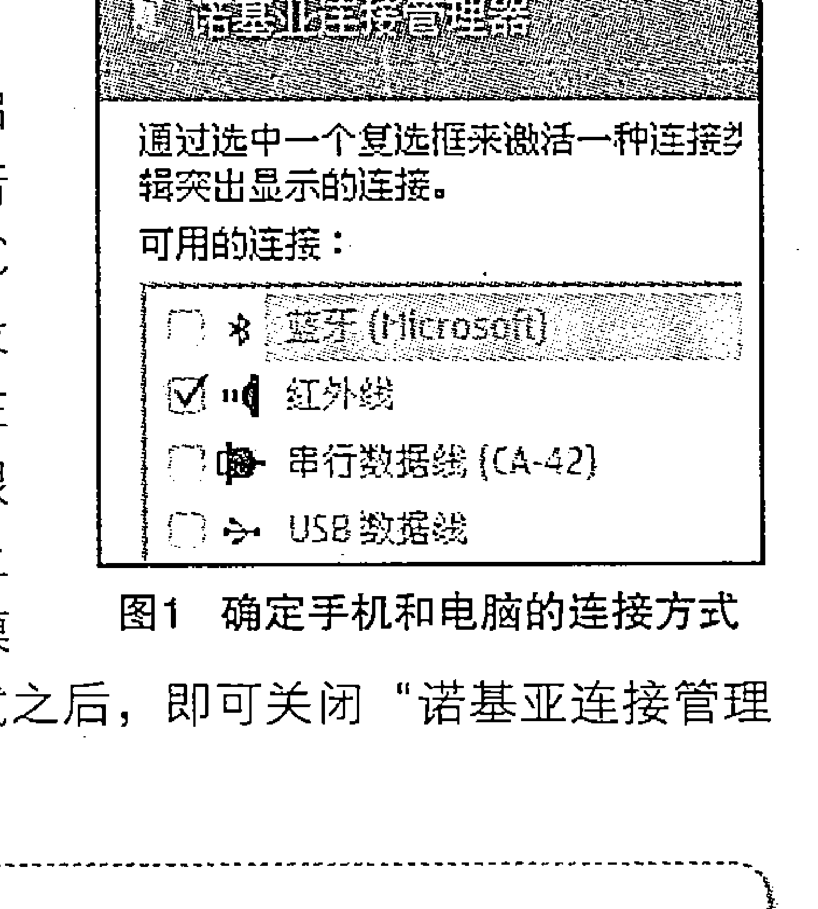

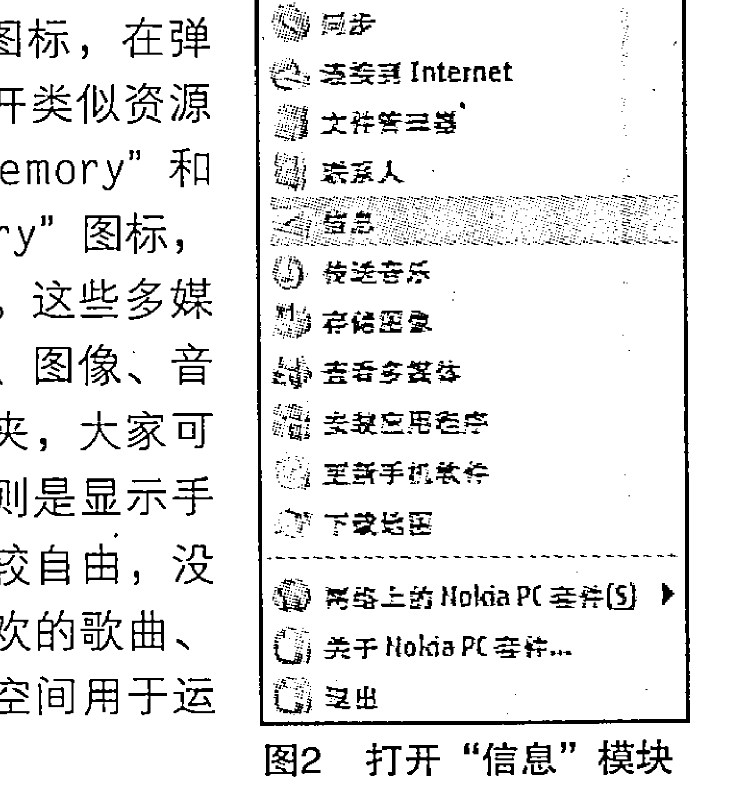

## # SOLUTIONS 实用宝典·数码

### ■ 方便管理联系人

同样也是右键单击PC套件图标，在弹出的菜单中选择“联系人”选项。此时打开诺基亚手机浏览器窗口。在浏览器窗口中，单击“联系人”图标。在联系人列表左侧，单击新建联系人图标，可以更新手机的联系人资料，适合于需要批量更新联系人的情况。对于不需要的联系人，可在联系人列表中选择该联系人项，然后单击右键，在弹出的菜单中选择“删除”选项即可。如果需要修改联系人的联系方式，可选中该联系人项，同样单击右键，然后在弹出的菜单中选择“打开”选项，将打开该联系人的详细设置对话框。在该对话框中可以对联系人的姓名、公司、职务、固定电话、手机等项目进行设置，而且固定电话和手机都能设置常用、住宅、商务三大类，适合于商务人士。在这个对话框中，单击缩略图框，可以导入联系人的照片（支持JPG、GIF、BMP、PNG等图片格式），方便用户日常联系。修改完成之后，单击保存图标就完成了联系人资料的修改，如图3。

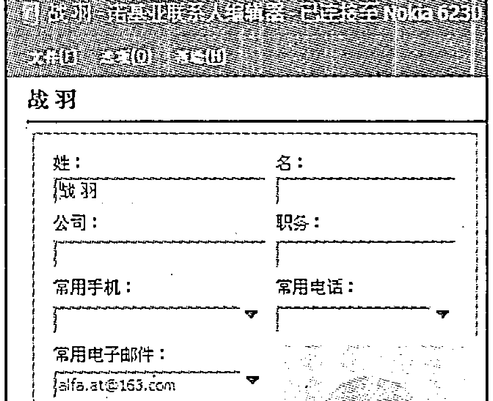

- 姓：
  - 战羽
- 名：
- 公司：
- 职务：
- 常用手机：
- 常用电话：
- 常用电子邮件：
  - lafa.at@163.com
- 常用地址：

图3 修改联系人资料

### ■ 让自己的手机变成音乐播放机

随着当前手机娱乐化功能的加强，很多朋友喜欢把歌曲存入手机作为来电铃声或者用于欣赏。PC套件提供了将音频文件传输到手机的功能，右键单击任务栏中的PC套件图标，在弹出的菜单中选择“传送音乐”选项。在随后打开的“诺基亚音乐管理器”对话框中，首先需要您指定电脑中存放音乐文件的文件夹。指定完成之后，管理器中将显示搜索到的音乐文件列表，选择您想传送的音频文件，然后单击“文件”下拉菜单，选择“复制到手机/Nokia 6230”选项，这样音频文件就可以传输到手机了。如果您的手机支持存储卡，笔者还是建议您将音频文件存于存储卡中，这样可以为手机节约空间用于运行程序，如图4。

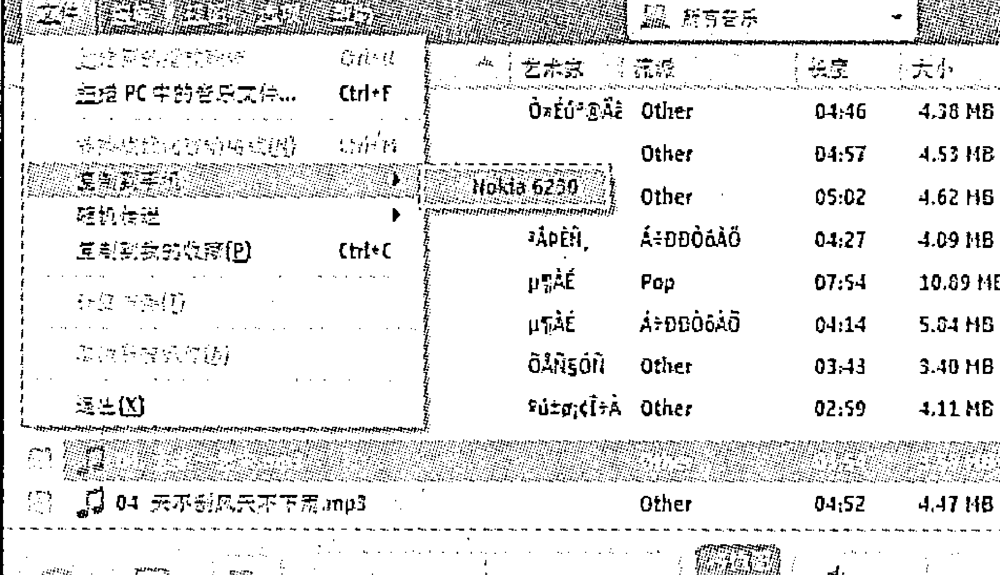

图4 将电脑中的音乐传输到手机

### ■ 把手机当成小“猫”

虽然说无线局域网随着迅驰的推出得到了很大的普及，但是国内很多地方还是没有布置无线接入“热点”，此时我们需要手机暂时作为MODEM来让电脑拨号上网。在PC套件中提供了相关的功能，只要打开“连接到Internet”模块，软件就会根据手机的特点，自动为电脑设置接入号、用户及密码，并自动进行拨号连接。整个过程十分傻瓜，适合于对移动拨号不太熟悉的用户。

> **小提示**
>
> **手机拨号上网要注意**
>
> 要让手机能拨号上网，首先SIM卡要支持数据传输功能。如果您的SIM卡不支持数据传输功能，您可以带上身份证就近到移动服务商（ISP）的营业大厅进行办理。手机拨号上网的网速并不很快，特别是在手机信号较弱的区域尤为明显，并且费用相对较高，适合于收发电子邮件、浏览网页、在线聊天等数据流量不大的情况。

### ■ 将手机不用怕，隐私资料随身走

我们更换手机时，通常需要将旧手机中的相关资料导入新手机中。但是直接在手机之间传递资料不是十分方便，可以通过PC套件来方便地操作。首先将旧手机与电脑相连，然后打开PC套件中的诺基亚内容复制器模块。接着单击备份图标，软件会选择备份项目。为了使旧手机的相关资料能全部备份，笔者建议把所有项目都选上。在备份的过程中，注意不要让手机与电脑断开，同时也不能使用手机。

旧手机的资料备份完之后，将旧手机与电脑断开。让新手机与电脑相连，然后在诺基亚内容复制器模块中，单击恢复按钮。PC套件会自动显示已保存的备份文件及其相关信息，确定备份文件无误之后，会显示需要恢复的项目，笔者建议也把所有项目选定。然后单击下一步按钮，PC套件会把旧手机中的各种资料及设置传输到新手机中。

### ■ 定制到哪里都不怕，自由更新手机地图

喜欢自驾车的朋友，通常喜欢拥有地图功能的手机。但是当前我国多数城市建设很快，手机中的地图很快不适用了。打开PC套件中的“下载地图”模块，会自动打开诺基亚的官方地图下载网站。在“Download”选项卡中选择“Simplified Chinese（简体中文）”语言项，然后在左侧列表中选择相应的机型，下载地图软件。下载完成之后，再打开地图软件即可。

> **小提示**
>
> **哪些诺基亚手机可以使用地图软件？**
>
> 并不是所有的诺基亚手机都可以使用地图软件，只有那些拥有GPS功能的机型才行，这些手机包括E系列、N系列中的N8X和N9X机型、6XXX系列中的部分机型。
>
> 不看不知道，一个小小的诺基亚PC套件功能不少吧。还等什么，快在自己的电脑中安装上PC套件，方便自己手机的使用！

## 巧用存储卡扩充易PC存储“仓库”

□刀 锋

华硕易PC以其低廉的价格、超强的便携能力，获得了许多消费者的青睐。但是由于受到成本的限制，易PC的硬盘容量都不是很大。安装我们熟悉的XP之后，所剩余的空间不多，需要扩充易PC的存储能力，方能满足日常使用的需要。

### □升级思路有所不同

由于易PC的存储系统是采用闪存块直接焊死在主板上的方法，并且没有提供相关的IDE插槽，所以无法加载普通的笔记本电脑硬盘来扩充易PC的存储“仓库”。
好在易PC有一个SD\SDHC\MMC的读卡器，可以提升整机的存储能力。从实用性来看，SD或者SDHC存储卡无疑是两种最佳的升级方案。考虑到易PC对存储卡的读写速度要求较高，笔者建议升级SD卡的话，最好选择SD高速卡。如果您对于存储卡的读写速度非常在意的话，那么升级SDHC卡将是最佳的选择。目前，存储卡的价格十分低廉，下表就以市场上销售最为广泛的金士顿相关存储卡报价为例，给大家作一参考。

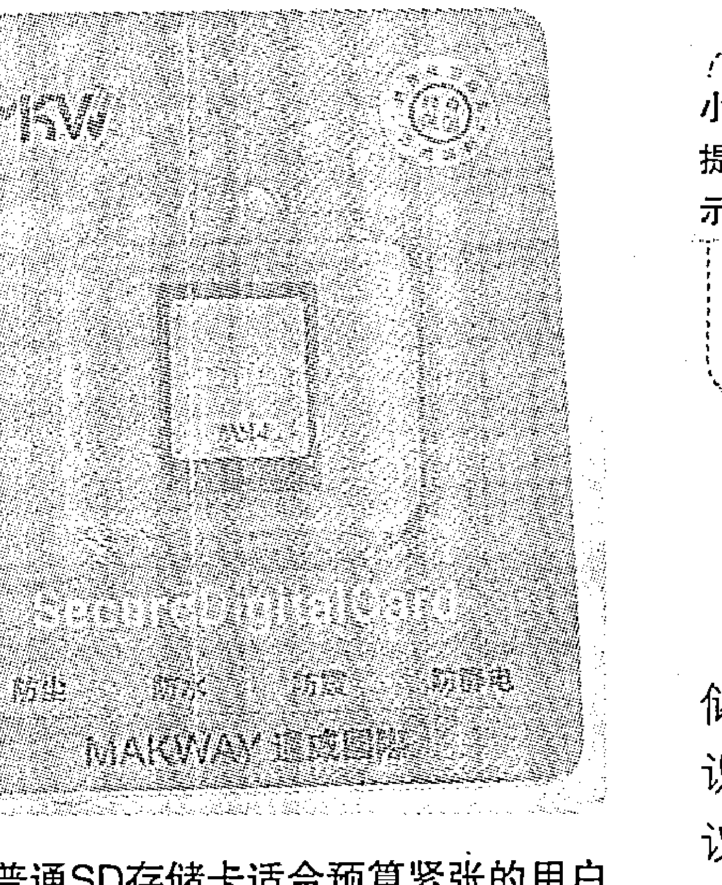

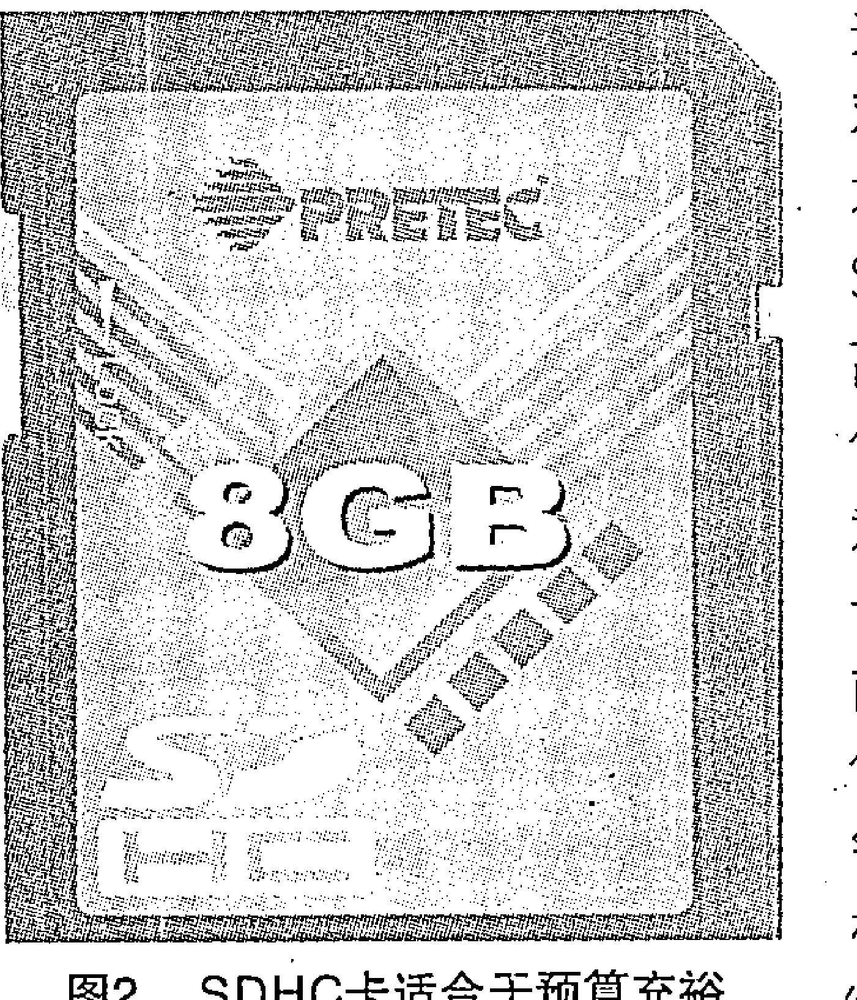

| 种类 | 容量 | 参考价格（元） |
| :--- | :--- | :--- |
| SD | 2GB高速 | 95 |
| SDHC | 4GB | 135 |
| SDHC | 8GB | 320 |

虽然现在存储卡价格十分低廉，但是目前市场上依旧是鱼龙混杂。像金士顿这样的一线品牌，几乎都有假冒产品出现，购买时应该引起足够的重视。面对假货泛滥的情况，各厂商纷纷出台了不少防伪措施供消费者使用，比较常见的有：镭射标签防伪、变色LOGO防伪、在线查询防伪等。在购买之前，大家可以先登录存储卡厂商的官方网站，仔细阅读其防伪办法，有助于辨别假货。

> 小提示
**什么是SDHC？**
SDHC是High Capacity SD Memory Card的缩写，也就是高容量SD存储卡的意思。凡符合容量高于2GB低于32GB，采用FAT32文件系统，最大传输率不低于Class2（2MB/s，16Mbps）标准的SD存储卡就是SDHC。

### □升级操作不用愁

升级易PC存储“仓库”的操作办法也不是很难。首先将存储卡插入读卡器，然后启动易PC，进入系统后机器就可以自动识别存储卡了。为了存储卡能够非常稳妥地存储文件，笔者建议大家最好先把存储卡进行全面格式化，保证存储卡中没有无法读写的坏块。
有些朋友喜欢把XP操作系统安装在存储卡中，但是从实际应用来看，安装在易PC自带闪存的XP系统可以启动得更快。升级的存储卡更适合作为应用程序、各类文档（包括音乐、电影、书籍和办公文档等）的“集中营”。
很多朋友习惯把硬盘分区，但是由于存储卡的总体容量并不是很大，笔者建议不必将存储卡分区。存储卡不分区方便文件的集中管理，如果对存储卡分区反而会造成文件管理上的不便，而且搜索文件的速度也会略有下降。与硬盘容量一样，系统识别的存储卡实际容量比起标称量要小一些。您可不要以为是存储卡厂商偷工减料，而是由于存储卡厂商和系统厂商在容量标准上的不同造成的，大家大可不必吃惊。
在外出时，也不必按照日常习惯把存储卡取出，否则存储卡由于体积较小比较容量丢失，反而会给日常使用带来很大的不便和麻烦。

> 小提示
**有时存储卡怎么只能读而不能写？**
出现这种问题是由于存储卡上的读写开关处于写保护状态。从读卡器中取出存储卡，将读写开关拨至写状态，然后再将存储卡插入读卡器，就可在存储卡中写入文件了。

经过升级存储卡，易PC的存储能力得到了极大的提升。购买一张适用的存储卡，给自己的易PC盖一个超大的存储“仓库”吧！■

## 本本携带外出防盗手册

随着笔记本电脑总体价格的逐渐下滑，现在越来越多的人手中都拥有了一台笔记本电脑。由于笔记本电脑轻便易携加之价格不菲，于是乎大家的爱本又成为盗贼的下一个目标了。我们应该采用什么方法来防止爱本被盗呢？

### 身处繁华闹市如何防盗

正因为笔记本电脑轻巧易携，很多时候我们会背上自己的爱本穿行于闹市之中，说不定此时已有三只手尾随而至了。到了商场的柜台（包括电脑市场的柜台）前，很多朋友习惯性地把笔记本电脑放在自己的脚边，接着和柜台里的朋友开始海阔天空地聊起来。等您聊完之后，您会惊奇地发现自己的爱本居然长腿跟人家“私奔”了。这才大呼不妙，然后赶紧出去寻找，接着让警察叔叔帮忙，恐怕已是回天无力，爱本早被盗贼拐跑了。

我们到商场或者电脑市场购物时，笔者建议最好不要把笔记本电脑放在一边，即便是在自己的视线范围内，这也是很危险的。商场和电脑市场人流量很大，也就在这么几秒钟之内您爱本就是这样被盗的，相信这样类似的事例在电视里也播放过多次了。笔者觉得最佳的防盗办法就是将笔记本电脑背着，不要随意放置。何况目前笔记本电脑都不是很重，为了保证爱本的安全还是背在身上吧。有时候您可能还要背着本本去赴饭局，就把爱本放在旁边的椅子上，待酒足饭饱即将离席而去时，却发现笔记本电脑已经不翼而飞了。饭店也是人流量比较大的场所，各色人等混杂其间，其中不乏一些三只手，这种顺手牵羊式的盗贼也是时有耳闻。对付这种顺手牵羊的盗贼也不是很难，把笔记本电脑包背带套在椅背上即可。

### 自驾出游不要让爱本独自留下

随着私家车的日益普及，很多朋友都喜欢带着自己的爱本开着车出去旅游或者工作。到了目的地之后，自己去办事就把爱本独自留在车里。结果回来之后则发现不是车窗被砸，就是后背箱被撬，里面的笔记本电脑自然也被盗走。不但爱本被偷，与此同时还要支付一笔价格不低的修理费。可能有些车友会说，自己的爱车有防盗报警系统，把报警声调大不就行了。但是我们从现实的教训中可以看到，等报警声大作众人赶至现场时，车子早被盗贼洗劫一空了。为了防止爱本被盗，又不会殃及爱车，笔者建议您还是带着爱本随行吧。在客户面前显摆一下本本，说不定还能为您的业务增色不少呢。至于旅游去，更不能少了本本。爱本不但能及时帮您处理旅游时拍摄的照片，说不定还能博取美人欢心呢。

### 入住酒店也不可大意

携带笔记本电脑出差，需要入住酒店。在入住酒店时，也要注意笔记本电脑的防盗问题。特别是在旅游旺季时，酒店被盗案件（包括本本盗窃案件）呈直线上升的趋势，所以大家别以为入住酒店就是回到了家，放松了警惕导致爱本被盗。通常在三星级以上的酒店，其总台免费提供了供客人放置贵重物品的保险箱。而保险箱则必须由客人和酒店工作人员共同开启，才能取出暂存在里面的物品，其安全性非常高。每天休息之前，笔者建议您还是不要怕麻烦提着爱本到总台走一趟，放进保险箱中过夜。第二天需要使用时，再去总台取回。笔者以为虽然这样麻烦了一些，但是对于笔记本电脑的安全还是值得的（图1）。如果您入住的酒店规模较小，没有提供保险箱业务也不必担心。每天休息前将笔记本电脑装入电脑包中之后，把电脑包放置于床头柜附近。请注意，不要把电脑包置于窗户附近或者房间的过道上，也不要把电脑包放置在床脚，这样笔记本电脑很容易失窃。

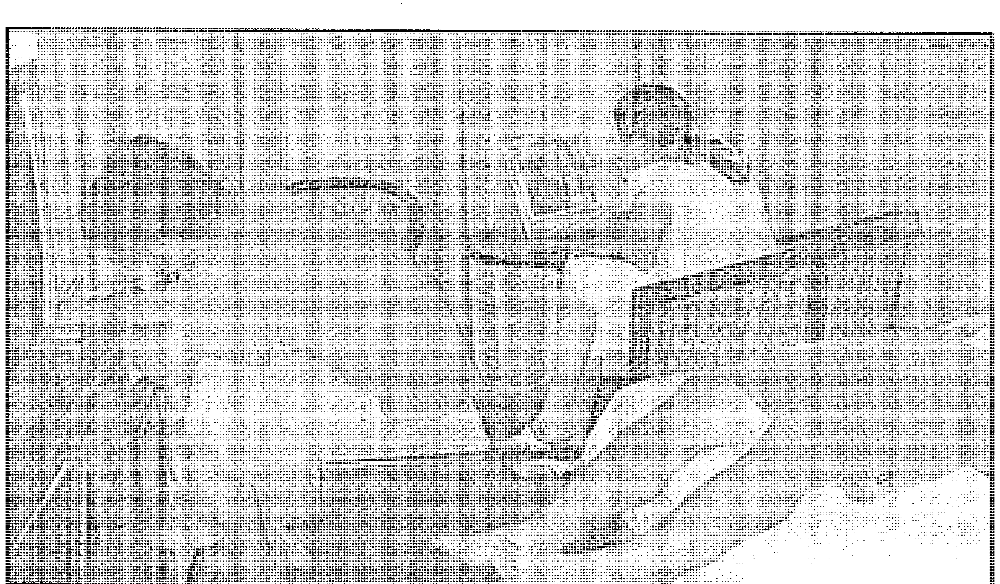

## 长途旅行要防小偷光顾

对于在外读书或者工作的朋友来说，每年需要坐上几次火车才行。由于火车是我国人流量最大、人员最为复杂的公共场所，故而我们对于笔记本电脑的安全更是要引起注意。

有些朋友为了省钱，特别买了坐铺，岂不知这是整节火车中最不安全的地方。不知道大家有没有看过央视的相关节目，有些盗贼专门趁午夜旅客熟睡时盗窃财物（当然也包括您的爱本）。

为了您的旅途舒适，并保障笔记本电脑的安全，笔者还是建议您购买卧铺票。不过您也不要以为购买了卧铺票，爱本就是进了保险箱，我们还是要采取一些安全措施来防止笔记本电脑被盗。晚上休息前，将笔记本电脑放置于卧床内侧的床头边上，这样可以有效地防止在午夜有三只手把爱本偷走。

对于坐飞机出门的朋友来说，笔记本电脑最容易在到达目的地机场，由乘客自己提取时被盗窃。好在根据民航的相关条例规定，允许乘客随身携带部分行李，我们完全可以随身背上笔记本电脑登机，这样才能保证爱本不会被盗。

## 信息安全更重要

自打去年来闹得纷纷扬扬的“艳照门”事件之后，笔记本电脑内部存储的信息安全问题得到了大家前所未有的重视。个人信息以及商业机密的价值，往往超过笔记本电脑本身的价值。除了非授权用户访问笔记本电脑之外，木马、病毒的横行，更是对信息的安全造成了很大的危险。

首先，我们可以利用BIOS提供的密码功能对非授权用户建立起第一道安全门户。利用BIOS提供的开机密码和硬盘锁密码的功能，分别设置开机密码和硬盘锁密码。开机密码是笔记本电脑启动在完成硬件初始化、BIOS检测后，开始启动操作系统之前所需要输入的密码，若无法输入正确的开机密码将无法进入系统，可以保证信息不会外泄。硬盘密码则是保护硬盘信息不会被随意读取，若笔记本电脑被盗，硬盘被拆下来挂到其他电脑上也无法读取存储在其上的信息。BIOS密码是目前最为方便、易用的安全技术之一，可以很好地防范非法访问。

> 小提示
怎么样设置BIOS密码？
进入BIOS的按键和BIOS密码的具体项目随着品牌不同而异，大家可以参阅用户手册或者拨打厂商售后服务电话进行咨询。为了保证信息安全，笔者建议不要以身份证号、生日、电话号码、手机号等易破解的数字串作为密码，更不要为了方便记忆，采用类似“8888”、“6666”等白痴型数字串作为密码。

进入系统后，给每个用户账号设置必要的登录密码也是一个非常有效的方法。与设置BIOS密码相同，用户账号的密码设置得既不要太简单，又不能过于复杂难以记忆。除了设置必要的登录密码之外，为每个用户设置适用的权限。权限的大小以满足该用户日常操作作为最终目的，既不能将权限设置太小，影响了日常的操作，同时也不能将权限设置得太大，给信息安全留下极大的隐患。

目前主流的中、高端笔记本电脑都内置了指纹识别器，（图2），这给保护信息的安全带来了极大的便利。厂商都提供了专用的指纹识别软件，帮助用户来设置和管理指纹，只要按着软件的提示操作即可。在设置指纹时，不要为了贪图方便只保存一个手指的指纹，否则极易因为指纹受损而无法进行日常操作，正确的方法是保存多个手指纹以备不时之需。设置完指纹之后，可以利用指纹来替代系统登录密码以及部分应用软件，并可以对office文档进行加密。指纹加密技术是目前最为安全、主流的安全技术，可以给信息带来很高的安全级别，并免去了记忆密码、输入密码的麻烦。

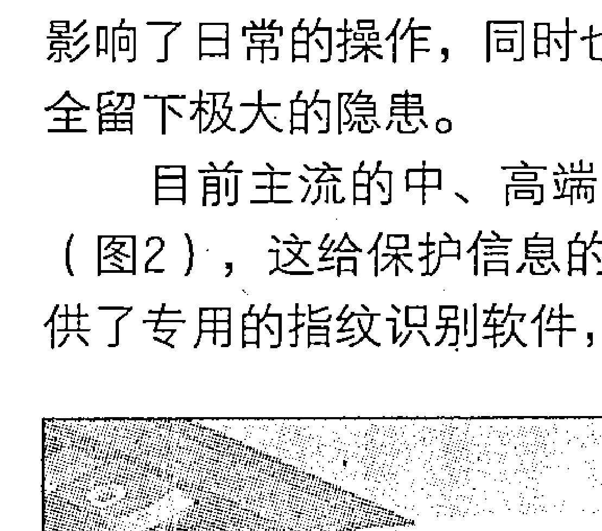

> 小提示
应该如何刷入指纹？
在刷入指纹前，应保持手指的清洁、干燥，然后将手指从上往下刷过指纹识别器，指纹的相关信息就会被笔记本电脑获取。

部分笔记本电脑（主要是商务机型）还配置了TPM安全芯片，大大增加了信息的安全性。TPM安全芯片会在磁盘上划出一块专门区域用于放置机密文件，由TPM安全芯片独立管理，防止非授权用户进行访问，保护机密信息不会外泄。目前TPM安全技术和指纹识别技术已经合二为一，安全级别是目前民用笔记本电脑中最好的（图3）。

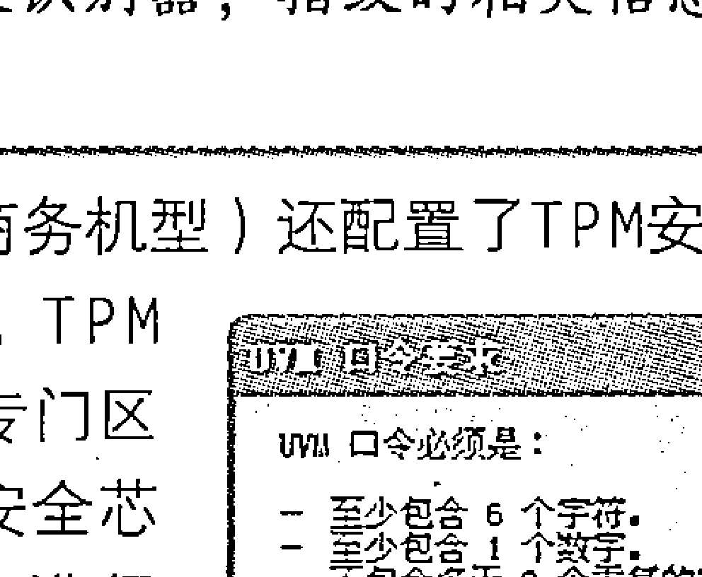

除了采用硬件安全技术来保护信息安全外，我们还应该利用软件技术来保护信息安全。首先是给操作系统打上补丁，及时把系统的安全漏洞堵上。其次，我们还应该安装拥有防火墙功能的杀毒软件。但是不要以为安装了杀毒软件就万事大吉了，您还需要每天及时地升级病毒库，使其能够有效地抵御新的木马、病毒的进攻。另外定期地进行全盘扫描，也有利于杀灭隐藏在笔记本电脑中的木马或病毒，保护信息的安全（图4）。

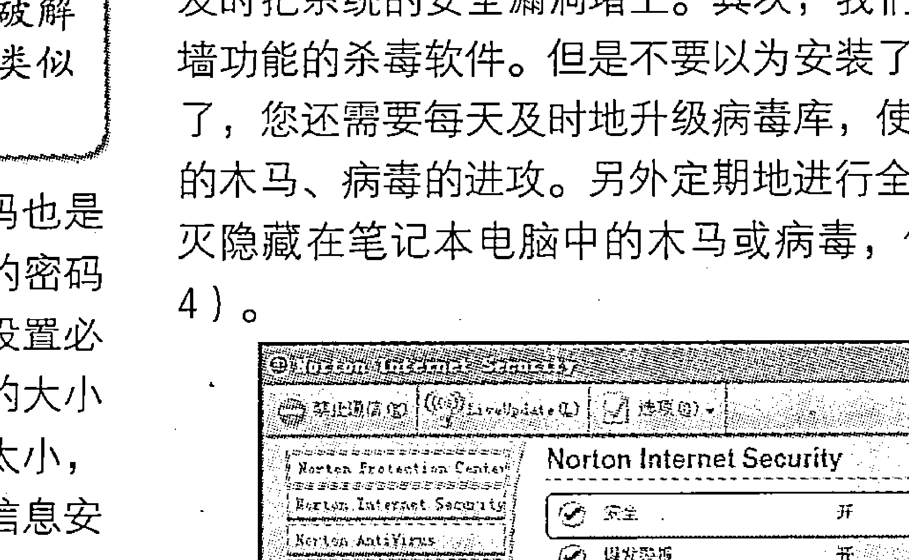

经过硬件和软件两大方面的保护，在您的爱本周围已经建立起一道固若金汤的防护墙。现在还怕什么？带上自己的爱本走遍天涯海角吧！

## 高温工作要注意 夏季笔记本电脑散热大全 作者：刀锋

再过两个月将进入炎热的夏季，大家的爱本又将迎战一年一度的高温工作。在热浪来袭之前，我们应该做些什么工作让爱本安然度夏呢？

### 清理散热器和风扇

在夏季到来之前，首先对笔记本电脑的散热器和风扇进行清理，保障其在炎热的夏季能发挥最大的性能，帮助本本降温。

关闭系统，断开交流电源适配器。按照用户手册或者官方网站提供的相关资料，拆卸下键盘、掌托或相关保护盖板。键盘和掌托通过数据线与主板相连，拆卸时需要小心，以免扯断数据线，使键盘或掌托严重受损。

这时我们可以看到散热器和风扇了。先把散热器的固定螺丝拧下并单独放置，不要和其他螺丝混放，影响笔记本电脑的安装复位。拧下固定螺丝之后，把散热器从机身上小心取下来。先用皮老虎把散热器栅格上的尘埃全部吹掉，保证散热器出风口的流畅。然后将散热器上沾有的散热硅脂用干净的抹布擦掉，接着用小刷子将散热器表面的尘埃全部打扫干净。

将清理干净的散热器放在一边后，再将风扇的固定螺丝拧下。某些笔记本电脑的散热器和风扇是集成在一起的，所以要把两者的固定螺丝全部拧下。拧下风扇的固定螺丝后，别忘了把风扇的电源插头从主板的插座上小心地拔下。许多电源插头附近的空间比较狭小，我们可以用圆头镊子进行辅助操作。拔下电源插头之后，风扇就可以拆下来了（图1）。

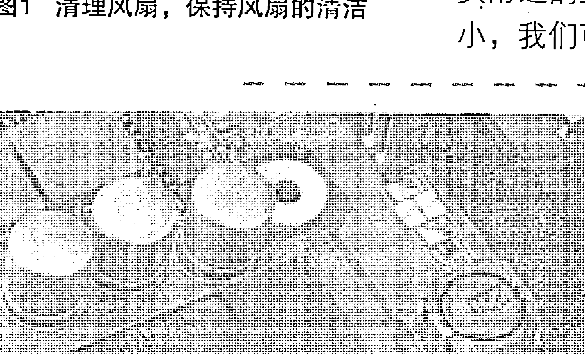

用小刷子把风扇片打扫一遍，使得风扇能轻装上阵。然后用皮老虎将风扇内部积聚的尘埃尽量吹掉，净化风扇工作环境。

如果风扇在工作时噪声很大，说明轴承处摩擦很大，应该给风扇加油了。用长管注射器吸一些机油后，将注射器的长管小心地插入风扇的轴套，然后滴入1~2滴即可。有些朋友为了使轴承更加润滑，滴入很多机油，结果使机油溢出流入机身内部造成主板短路事故。此外加油时绝对不能将机油滴到风扇的集成电路板上，否则会使整个风扇报废（图2）。

> 用什么样的机油好？给风扇加油绝对不能采用食用油，普通的机油也不是很合适，最好采用高级机油或者缝纫机油。


### 重新给CPU和显卡涂抹散热硅脂

笔记本电脑使用一段时间之后，CPU和显卡上的散热硅脂会慢慢干涸，逐渐丧失散热的功能，会给爱本安全度夏带来很大的隐患，此时需要我们重新给CPU和显卡涂抹散热硅脂(图3)。

先找一块干净、柔软的抹布把CPU和显卡上的旧硅脂全部擦去，注意不要将旧硅脂落到主板上，否则会引起短路事故导致主板报废。然后用不带针头的注射器吸入少量散热硅脂（尽量选择口碑好的品牌，能保证今后的散热效果），将散热硅脂均匀地涂抹在CPU和显卡上。由于移动式CPU和移动式显卡的功耗比较小，只需要涂抹薄薄一层即可（厚度最好控制在0.5毫米左右）。


0.5毫米以内），如果涂抹过厚反而会影响散热效果。此外散热硅脂的涂抹范围仅限于CPU和显卡的陶瓷封装部分，不要将散热硅脂涂满全身，否则会对硬件的日常工作带来不利的影响。涂抹完散热硅脂后，需要把笔记本电脑安装复位。先安装风扇，拧紧固定螺丝，记住不要忘了把风扇的电源插头插到主板的相关插座上，否则风扇将无法工作。然后将散热器安装好并拧紧固定螺丝，再把键盘、掌托安装复位。

### 清理进风口和出风口

清理完散热器和风扇后，我们再将目光转向机身上的进风口和出风口。用小刷子轻轻地拭去沾在进风口和出风口上的尘埃，笔者提醒大家某些笔记本电脑设计了多个进风口，不要只清理其中一个，把其他几个给忘记了。

### 改善外部散热条件

笔记本电脑除了通过出风口来导出热量之外，很大程度上还通过机身底部与外界空气的对流效应来导出部分热量，特别是对于机身内部空间非常狭小的便携式机型来说尤为明显。如果发现机身底部CPU位置或者内存、硬盘等位置的发热量明显比其他区域要大的话，应该增加机身底部的空间以增大空气流动量来导出热量。一般来说，可以在机身的左上角和右上角各垫上一本厚一点的书，这样既能增加机身底部的空间，又不会影响用户的日常输入，可谓是一举两得。

> **小提示**
> 垫的书有讲究
> 用于垫高机身的书籍厚度应基本相近，否则会使垫高后的机身左右两侧不在同一水平位置，使大家操作时会感到不适，久而久之还会对身体健康造成一定的损害。在我国南方多数城市都安装了空调，夏季到来之时可以开启空调来降低室内温度。降低室内温度在一定程度上也能帮助笔记本电脑散去热量，特别是对于采用金属材质的机器效果比较明显。

### 购买专用的散热底座

对于一些自身发热量比较大的机型，比如台式电脑替代机型、游戏机型等，清理散热系统以及改善外部散热条件显然还不能满足其在夏季的散热要求。针对以上机型发热量较大的实际情况，我们可以购买专用的散热底座来加强整机的散热功能。目前生产散热底座的厂商比较多，可能大家一时间不知道如何选择。首先是品牌的选择，我们应该选择一线散热器厂商的品牌。其次看散热底座的制造工艺。做工优良的散热器，应该是四角圆润、边缘没有毛刺、布线合理。中、高端散热器多采用金属材质，其散热效果更佳，在预算充足的情况下应该优先购买金属材质的散热器。另外，散热器按照笔记本电脑屏幕尺寸的大小，分为10.6英寸、12.1英寸、13.3英寸、14.1英寸、15.4英寸、17英寸等多种类型，大家应该针对自己爱本的屏幕尺寸选择合适大小的散热器。安装散热器也比较简便，先关闭系统并断开交流电源适配器。接着将笔记本电脑放置到散热底座上，然后把散热底座的数据线插入笔记本电脑的USB接口。重新接上交流电源适配器，启动笔记本电脑后，散热底座就会自动工作了。某些散热底座设计了开关按钮，在笔记本电脑启动后，应按下电源开关，散热底座才会开始工作（图4）。

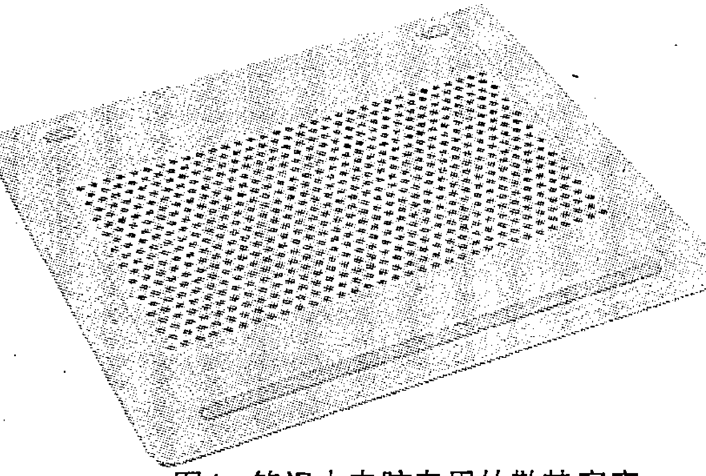

### 养成更好的使用习惯

要让笔记本电脑安全度夏，大家养成一些良好的使用习惯也是非常必要的。首先，要保持出风口附近空气通畅。为了便于机身热量导出，笔者建议在出风口附近约15厘米范围内不要放置较大物体，以免影响笔记本电脑的散热。其次，不要将笔记本电脑放在柔软的太空被上使用。太空被会大大阻碍笔记本电脑的热量散发，轻则使笔记本电脑蓝屏死机，重则将会烧毁自己的爱本。如果在床上需要使用笔记本电脑，最好购买专门的笔记本电脑支架或者是床用小桌来放置笔记本电脑，这样可以避免爱本在夏季高烧不退。对于喜欢超频的朋友来说，炎热的夏季还是让自己的爱本在正常频率下工作，暂时不要超频。超频产生的大量热能，使得笔记本电脑的散热矛盾更加凸现。机器各元器件长期在高温条件下工作，其电子迁移速度十分迅速，这样会大大缩短笔记本电脑的使用寿命。

> **小提示**
> 什么是电子迁移？
> 在电流密度很高的导体上，电子的流动会产生不小的动量，这种动量作用在金属原子上时，就可能使一些金属原子脱离金属表面到处流窜，结果就会导致原本光滑的金属导线的表面变得凹凸不平，造成永久性的损害。

由于夏季室外温度比较高，如果没有十分必要，笔者建议您最好也不要在室外使用笔记本电脑。室外的高温会加剧整机的排热不畅，而且强烈的阳光也会使屏幕变得一片花白，严重影响使用效果。对于使用UMPC、MID、易PC等超便携式笔记本电脑的用户来说，经常在室外使用爱本，无疑会加速其死亡。在炎热的夏季到来之前，大家应做好笔记本电脑的防暑降温工作，这样才能使自己的爱本伴您度过炎炎盛夏，为我们的工作、学习和生活带来欢乐！

## 视频大营

## 笔记本与平板电视的连接和使用 □江北书生

笔记本电脑的性能越来越强，我们完全可以将其当作一个多媒体的平台，在上面播放DVDRip或DVD大片，亦或播放网络电视。但笔记本电脑有一个缺点，就是其电脑屏幕较小，看起大片或网络电视来不太舒服。事实上，通过相应的视频接口和线缆，我们完全可以将其与平板电视连接，并在上面超爽一把！

### 一、笔记本电脑常见视频接口

笔记本电脑上的常见视频接口主要有：

### 1. VGA

VGA接口是比较常见的视频输出口（如图1），可以用于连接电脑和家用电视。VGA是台式机显卡的标准接口，设计在笔记本上主要是用于连接外界显示器或其他显示设备，不过一般用户很少用到，最好选择将其设计在不显眼的位置上。

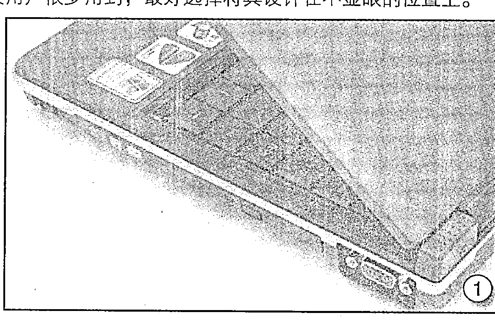

### 2. S-Video

S-Video接口可以实现TV-Out或Video-In的功能（如图2），一般用在笔记本上的有4针和7针两种，区别在于4针的不带音频，而7针的带音频。还有9针的S-Video接口是出现在台式机显卡上的，也称为VIVO接口，但几乎不在笔记本上出现。

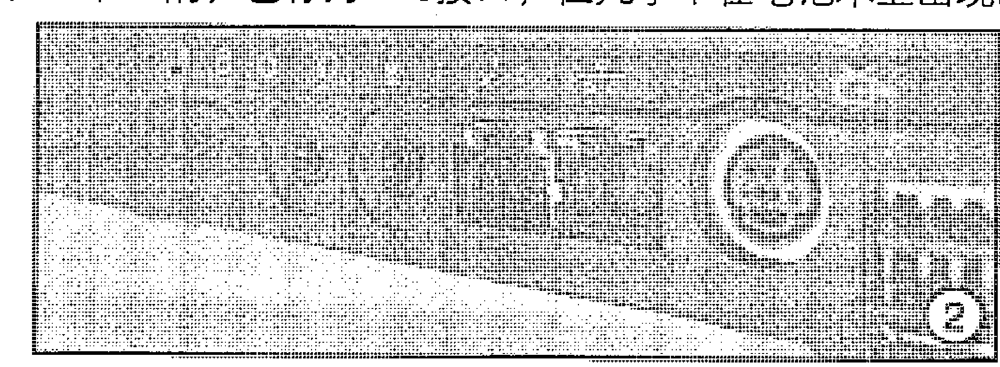

### 3. DVI接口

DVI全称为Digital Visual Interface，它是1999年由Silicon Image、Intel（英特尔）、Compaq（康柏）、IBM、HP（惠普）、NEC、Fujitsu（富士通）等公司共同组成DDWG（Digital Display Working Group，数字显示工作组）推出的接口标准。一个DVI显示系统包括一个传送器和一个接收器。传送器是信号的来源，可以内建在显卡芯片中，也可以以附加芯片的形式出现在显卡PCB上；而接收器则是显示器上的一块电路，它可以接受数字信号，将其解码并传递到数字显示电路中，通过这两者，显卡发出的信号成为显示器上的图像。

一些笔记本电脑上也有DVI接口，目前的DVI接口分为两种，一种是DVI-D接口，只能接收数字信号，接口上只有3排8列共24个针脚，其中右上角的一个针脚为空，不兼容模拟信号（如图3）。另一种则是DVI-I接口，可同时兼容模拟和数字信号（如图4）。兼容模拟信号并不意味着模拟信号的D-Sub接口可以直接连接在DVI-I接口上，而是必须通过一个转换接头才能使用，一般采用这种接口的显卡都会带有相关的转接头。

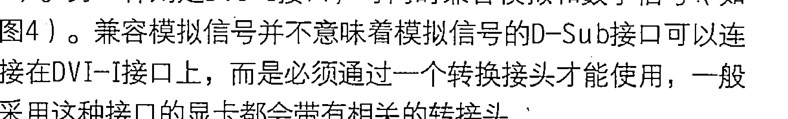

### 二、平板电视常见接口

目前电视机领域最热、最吸引人的产品是平板电视产品，它主要包括了等离子电视（PDP）和液晶电视（LCD）。它们的特点主要有两点，一是薄，往往厚度只有几英寸。因此我们可以将它们挂在墙上使用。二是清晰，它们往往可以提供较传统电视更为清晰的信号，包括视频和音频信号，从而可以得到更高质量的享受。关于平板电视的更多知识，大家可以从网上查找到。由于我们要将其连接到笔记本电脑上来欣赏大片，因此我们有必要学习一下平板电视的常见接口。

### 1. 视频接口

#### （1）HDMI接口

最新的应该是综合数码接口HDMI（Hi-Definition Multimedia Interface），HDMI一条线就能支持数码视频和数码音频的输出（如图5、6是HDMI接口和连线）。以无压缩技术传送全数码信号，最高传输速度是3.95Gb/s，并支持八声道

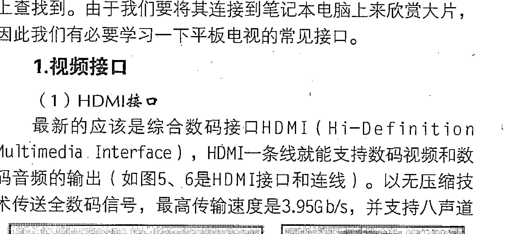

96kHz或单声道的192kHz数码音频传送。HDMI线同时传输视频和音频的信号，可以免除数码音频接线，而且线的长度限制也比DVI要少，一般就算走20几米也不会影响画质。
另外，现在市面上也有DVI和HDMI接口的转接头（如图7），利用它们可以在DVI和HDMI接口信号之间转换。这样，我们的笔记本电脑上的DVI接口上的信号就可以连接到HDMI接口上来了。

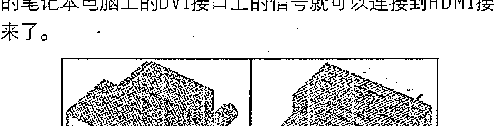

#### （2）VGA接口
有些平板电视上还是保留了此类接口（如图8下方VGA接口），它也是最常见的计算机显示信号连接方式，有时也用以代替RGB+H/V。其视频传输过程最短，所以优点很多，如无串扰、无电路合成分离损耗等。

#### （3）DVI接口
类似于电脑上的DVI接口（如图8上方DVI接口）。数字显示接口是一个全数字RGB连接方式。主要应用于HDTV接收器和部分DVD播放器中，在计算机显示接口中也很常见。这种连接方式需要特殊电缆和多芯插头。为了保证HDTV的兼容性，DVI输入需要支持HDCP（High-bandwidth Digital Content Protection，高宽带数字内容保护）系统。

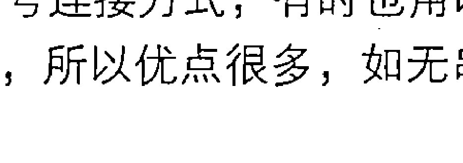

#### （4）S-Video接口
类似于电脑上的S-Video接口。较好的质量，除了标准的VCR录像机外，大多数视频播放设备都具有S-Video输出。使用特殊电缆连接，接头是多芯接头。

#### （5）RCA视频接口
这是应用较为广泛的一种接口，任何具有视频输出的设备几乎都会包含有复合视频信号。可以使用1根75欧姆的同轴电缆通过RCA插头连接。

#### （6）分量视频
提供较高质量的视频连接，主要是用于连接高清晰度电视接收器和逐行扫描DVD播放器。分量视频信号需要使用3根完全相同的75欧姆同轴电缆连接。

### 2.音频接口

平板电视中提供的音频接口主要就是传统的模拟接口，也有的是使用RCA接口，这些比较简单，不再赘述。

### 3.USB接口

有不少的平板电视上还有USB接口，这就使得我们可通过USB接口读取并播放多种格式的音视频文件。而且，平板电视上的USB接口的兼容性相当高，可以识别多数的移动设备和其中的文件。

### 三、实现笔记本电脑与平板电视的连接

要实现笔记本电脑与平板电视的连接比较简单，一般说明书上都有，不再赘述，最多需要购买相应的转接头。这些在一些电器市场都有售，价格也不贵。

### 四、将笔记本电脑的画面输出到更大的显示器上

购买了大屏幕平板电视，那可以将它接到笔记本后面的VGA输出端口，用于外接显示器或投影仪，大大增加了笔记本电脑发表信息和演示的能力，这样看大片会更好。

### 1.一般输出

在完成连接后，只要按下相应的热键（笔者机器上是Fn+F10键）即可切换，如果发现笔记本上没有图像了，可以连续按下此键。
同时，有的笔记本的显卡具有双屏显示功能，双屏显示功能允许在LCD和外接显示器或投影仪上同时显示不同的输出内容，两个显示设备可以分别独立调整显示的刷新率、分辨率和色彩深度，而且可以支持不同的应用。通过同时使用笔记本电脑LCD和外接监视器或投影仪的方式，就能扩展您的桌面空间，可以在不影响外接监视器或投影仪上演示的前提下，通过笔记本电脑LCD查找数据或编辑文档，也可以将应用程序或窗口在LCD与CRT之间移动或拉伸，甚至可以通过监视器打开单个文档的多个页或查看同一个电子表格的多个列。

### 2.让局域网内的机器随时切换至平板电视

如果家里安装了宽带路由器，那我们完全可以将一台电脑上的画面切换至另一台电脑，而另一台电脑直接输出到平板电视上，从而省去了重新连线的麻烦。而解决这个问题的关键则是MaxiVista软件。

#### （1）笔记本上的设置
从http://www.maxivista.com/maxivistademo.zip处下载maxivistademo.zip，用WinRAR将其中的所有文件解压后，双击MaxiVista_Setup_PrimaryPC.exe，顺着向导安装一个虚拟显卡。在安装过程中会出现窗口提示，它会安装一个虚拟显示卡。
右击桌面空白处，选择“属性”，单击“设置”，再用鼠标选中“Max_Vista_Demo_Driver上的（默认监视器）”，将它拖放到相应位置，再选中下方的“将Windows桌面扩展到该监视器上”复选框。
接着选择“开始→程序→MaxiVista Demo→MaxiVista Demo Server”运行服务端。

#### （2）显示机上的设置
如果欲将上面的内容显示到另一台机器上，只要在另一台机器上也下载maxivistademo.zip，双击之，用WinRAR打开，再双击其中的MaxiVista_Setup_SecondaryPC.exe。安装完成后，选择“开始→程序→MaxiVista Demo Viewer→MaxiVista Demo Viewer”。
此时，我们只要将笔记本上的一些窗口向左或向右拖拉，就可以将它显示到安装有MaxiVista_Setup_SecondaryPC的机器上。只要这台机器连接着平板电视，则显示机上的内容也会被自动送至平板电视上。

#### （3）指定相应机器显示
如果你希望指定某一台固定机器来显示，请在主机上右击任务栏托盘区中的MaxiVista Demo Viewer，选择Configuration→Network Options，然后在打开的窗口中单击Manual（手工），再输入从机的IP地址就可以了。

## 天籁之音 笔记本与家庭音响的连接和使用

现在笔记本电脑已经相当普及，而且多媒体功能也相当强劲。因此我们完全可以将笔记本电脑与家庭音响连接起来，并用它来播放并享受高音质所带来的全新体验和感受。本文将会向大家介绍笔记本与家庭音响的连接和使用，其中会提到电脑常见音频接口及如何解决并提升笔记本的音质问题。

### 一、笔记本电脑常见音频及对应接口

笔记本电脑的确特殊，因为它要在很小的面积上集成非常多的功能，因此芯片的选择就非常慎重。而音频系统作为最容易出现问题的部件，我们只要稍稍动动脑筋，也可以让它Hi-Fi起来。这里先介绍一下笔记本电脑常见音频及对应接口。

### 1.传统音频输入输出口

如图1，一般笔记本电脑上使用的都是传统音频输入输出口，其中包括Line-in（音频输入插口）、Microphone-in(麦克风输入插口)、Headphone-out(扬声器、耳机输出插口)等。

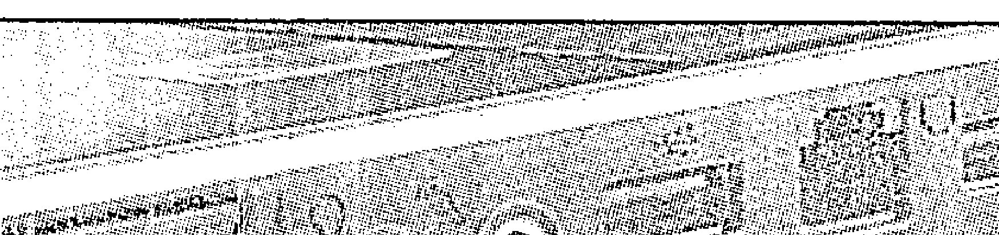

一般来说，虽然这三个接口比较普通，但是仍是相当有用的。如通过Headphone-out插口，我们可以买耳塞或耳麦来听音乐，也可以接上音箱来尽情听歌；而通过Line-in插口，就可以随意从音频CD播放器、随身听等设备中录制音源；而Microphone-in插口则可以插上麦克风，用它来录制声音。

### 2.SPDIF

现在有不少高级的娱乐型笔记本电脑上还带有SPDIF的音频接口，提供音质更好的数字音频信号输出，通过外接音箱获得完美的听觉效果（如图2）。不过，就算你的笔记本电脑没有SPDIF接口也没有关系，后面我们会告诉大家通过外置的声卡来实现。


> 什么是SPDIF
> SPDIF（SONY/PHILIPS DIGITAL INTERFACE）是SONY、PHILIPS数字音频接口的简称，也是一种最新的音频传输格式，它通过光纤将数字音频信号与带有SPDIF数字输出接口的设备相连，从而取代传统的模拟信号传输方式，因此可以取得更高质量的声音效果。

就传输方式而言，SPDIF分为输出（SPDIF OUT）和输入（SPDIF IN）两种。目前大多数的声卡芯片都能够支持SPDIF OUT，但我们需要注意，并不是每一种产品都会提供数码接口。譬如早期的一些中高档 YAMAHA 724声卡（如：中凌雷公724、YAMAHA原厂的WF192D）普遍含有一个SPDIF OUT，而一些中小“山寨厂”的廉价产品就不提供这个接口。而支持SPDIF IN的声卡芯片则相对少一些，如：EMU10K1、YMF-744和FM801-AU、CMI8738等。

就传输载体而言，SPDIF又分为同轴和光纤两种，其实它们可传输的信号是相同的，只不过是载体不同，接口和连线外观也有差异。但光信号传输是今后流行的趋势，其主要优势在于无需考虑接口电平及阻抗问题，接口灵活且抗干扰能力更强。通过SPDIF接口传输数码声音信号已经成为了新一代PCI声卡普遍拥有的特点。

不过，现在并没有太多的笔记本电脑支持SPDIF接口，但可以通过扩展卡来实现。

### 二、家庭音响常见接口及连接

要实现家庭音响和笔记本电脑的连接，我们先来认识一下家庭音响常见的接口，然后才能够实现连接。

### 1.传统音频接口

有的家庭音响提供类似于声卡上的传统音频接口（如图3，即1/8"的小型插口）。单声道插孔用于麦克风输出，立体声插孔用于line-in（线入）、line-out（线出）和耳机输出。立体声插孔同时提供左右两个声道的信号，而且可以节省空间。


要连接它，我们只要购买一根模拟对录线，一头连接笔记本电脑的声卡上的Headphone-out插口，另一头连接家庭音响的Line-in接口。

### 2.RCA插孔

有的家庭音响系统上采用的是一对RCA插孔，用于左右声道的输入（如图4），这些插孔和家庭音响系统上的插口属于同一类型。一般只要选择相应的线缆即可。

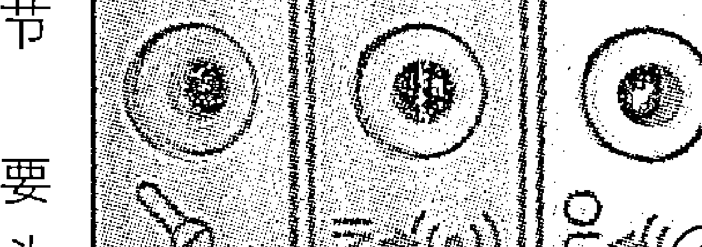

## 3. SPDIF接口

有的高级家庭音响系统上也有SPDIF接口（如图5），此时大家只要使用相应线缆连接即可（如图6）。

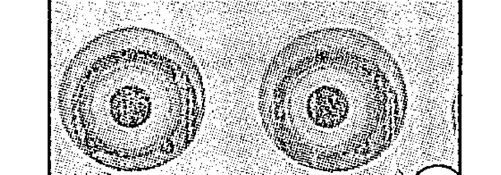

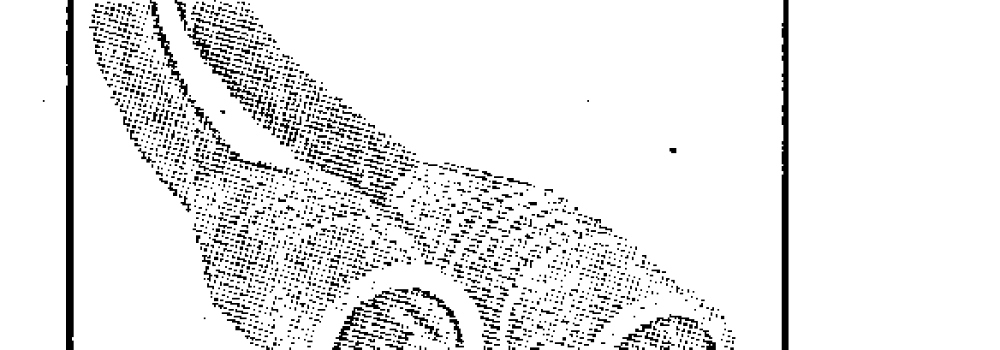

## 4. 常见转换接口

如果你笔记本电脑上的接口和家庭音响系统上的接口不一样，那就需要转换接口了，常见转换接口有：

- （1）模拟对录线转RCA插孔
  如图7，是最为常见的模拟对录线转RCA插孔线缆。一头是传统音频接口，另一头是RCA接口。

  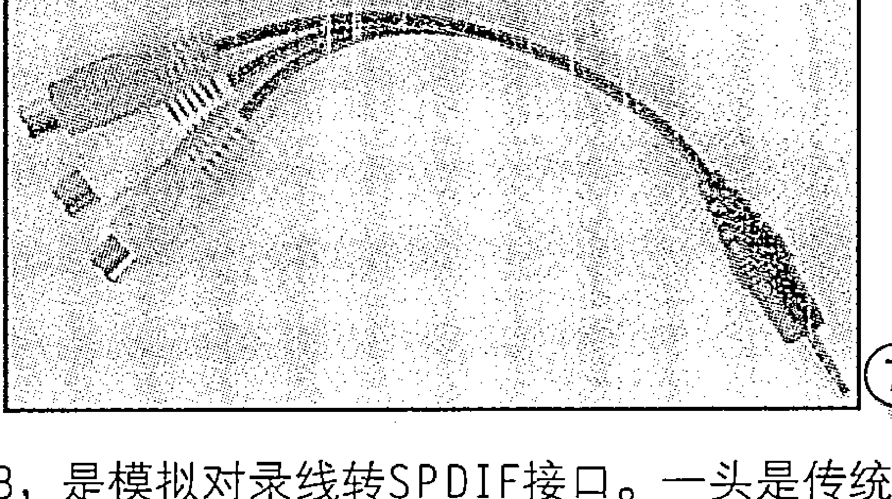

- （2）模拟对录线转SPDIF接口
  如图8，是模拟对录线转SPDIF接口。一头是传统音频接口，另一头是SPDIF接口。

  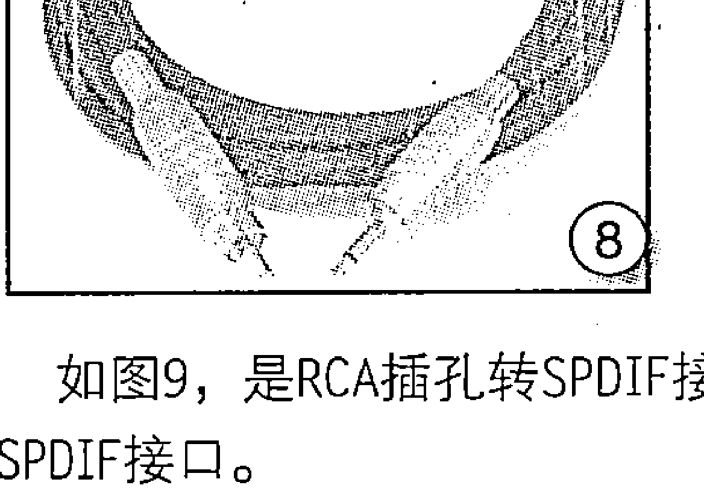

- （3）RCA插孔转SPDIF接口
  如图9，是RCA插孔转SPDIF接口。一头是RCA接口，另一头是SPDIF接口。

  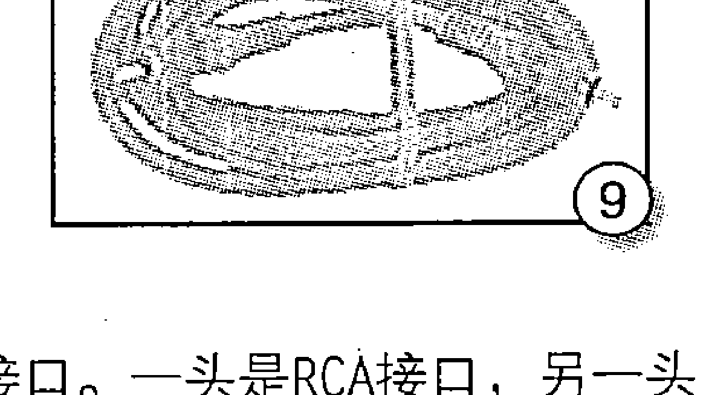

- （4）大头转小头接口
  如图10，是传统音频线中的大头转小头接口，因为有的家庭音响中的麦克风采用的是大头的接口，如果想在笔记本电脑上唱卡拉OK或者录制声音，则需要用到此转换口。一般家用电器商场里都有卖，便宜的只要几块钱。

  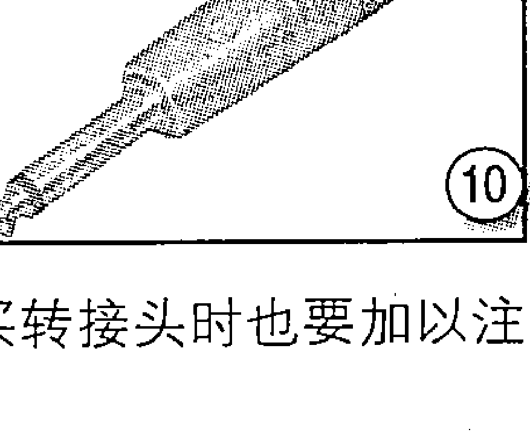

最后要说明的是，以上图片没有明确公头和母头，大家在购买时一定要认好自己笔记本电脑和家庭音响上的接口是公头还是母头，在购买转接头时也要加以注意，以免无法使用。

## 三、全面提升笔记本电脑的音量

笔记本电脑的声卡和一些台式机主板上集成声卡最大的问题就是音量较低，就算在系统中将音量控制中的“主音量”和“波形”等有关于音量控制调节项设到最大值，而且把音箱和耳机的音量也调到最大，声音仍相当小。这的确是很头疼的事情，往往不能够让我们听清歌曲。音量不够高的问题，解决起来并不是很难，主要归结起来有如下几种方法：

### 1. 外接了耳机

在一些音箱上（尤其是旧的音箱），给我们提供了一个专供外接耳机的音频输出插座（如图11）。很多时候你可能将耳机接在了这个插座上，而这种插座一般有串联和并联两种工作方式，如果是并联方式，则音箱的音量就会比平时要小一些。此时只要取掉耳机，音量自然会恢复。或者直接将耳机接到笔记本声卡的音频输出口。

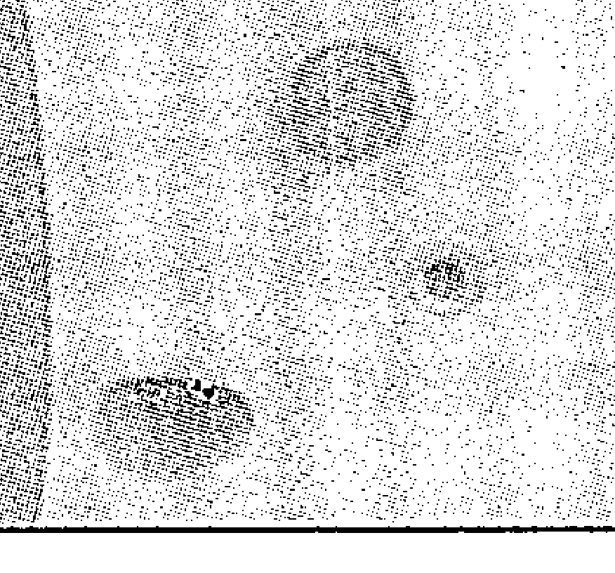

### 2. 不要忽视系统设置

打开“控制面板”，双击“声音和音频设备”，再单击“音量”标签，然后单击“扬声器”旁的“高级”按钮，在打开窗口中选择相应的输出设备（如图12）。接下来，再单击“性能”标签，将“硬件加速”设置为完全加速，把“采样率转换质量”调节到最好，这样可以提高集成声卡的声音效果。

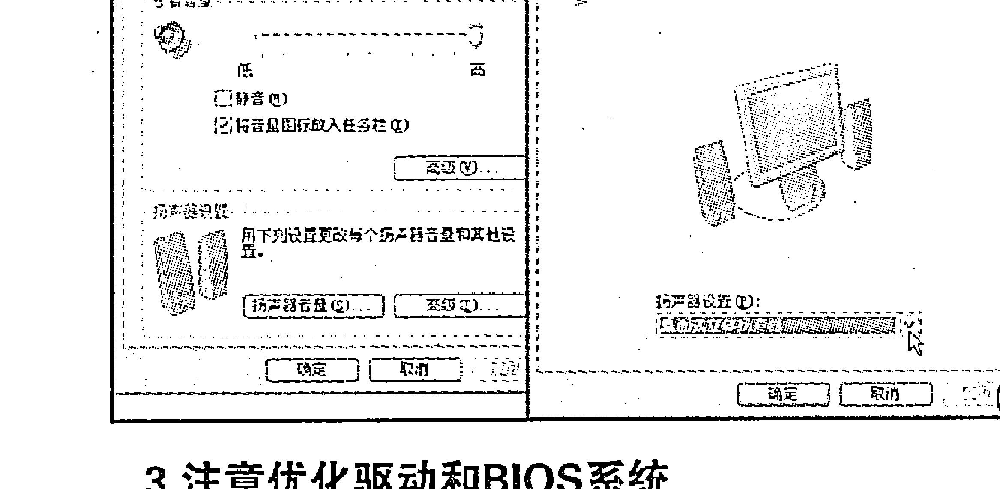

### 3. 注意优化驱动和BIOS系统

一定要安装上笔记本电脑芯片组和声卡的最新驱动（可从http://download.zol.com.cn上下载），这个不用说了，查看你的笔记本说明书并了解你的声卡类型，经常到其官方网站下载最新驱动并安装，就有可能解决问题（比如，CMI声卡推出的补丁程序就可以解决其音量不足问题）。并注意刷新BIOS（最好请高手来操作），这样才能让声卡和其他组件及操作系统更好地合作，也有可能解决音量不足问题。

### 4. 不要使用一转二接头

很有可能你将音量输出接在一分二的转接器，或者使用了一分二的音频线，这在很多人怕音箱音量在晚间打扰别人而看电影时经常会用到！而采用这种方式会大大降低音量。如果是这样，请不要使用一转二，如果的确希望有多人听到声音，可以外接音箱，并让观众尽量在一个房间中，而且靠得近一些。

## 四、怎样提升笔记本电脑的音质

由于笔记本电脑芯片集成度较高，因此一般来说其性能都不如类似的台式机，同样声音质量也不例外，但是很多时候我们也可以通过另类的方法来提升笔记本电脑的音质，让自己也Hi-Fi一把。

### 1. 考虑更换操作系统

多数的笔记本电脑采用的是集成声卡，这样声卡声音处理工作将交给CPU进行，因此在处理器性能较低时，就有可能出现“断续”或“杂音”等问题。如果你的机器配置不太高，请不要安装Windows XP，它不仅占用太多的资源，而且对多媒体的支持不如Windows 98和Windows 2000。

### 2. 优化通用驱动程序

如果你的笔记本声卡符合AC 97技术规范，可以采用SoundMAX来优化你的声卡。

> **什么是SoundMAX**
> 首先要说明的是，SoundMAX不是声卡驱动，而是一种技术规范，是一种基于AC 97技术规范的声卡技术“实施细则”。它具有硬件级的数据处理转换能力和最高94dB的专业音质回放能力，并可以发掘Codec芯片的潜能，从而全面提升声卡的音质。

要作修改，请打开“设备管理器”，双击声卡，然后单击“详细信息”，单击“硬件ID”，找到其ID号，一般是第二个，REV后是更小的版本号，无需理会（如图13）。

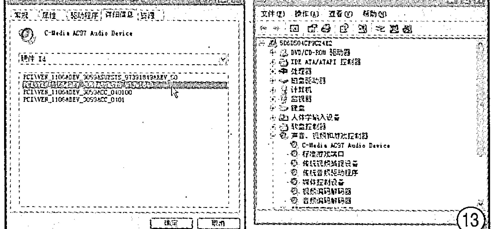

接着，将SoundMAX解压后，找到smwdmCH5.inf文件，用“记事本”打开，在[AnalogDevices]小节的最后一行中，按同样的格式将前面记录的ID数字内容添加（如图14），确定无误后保存，接着安装SoundMAX 4后并重新启动机器，此时打开“设备管理器”可以看到相应的声卡已经被SoundMAX接管。

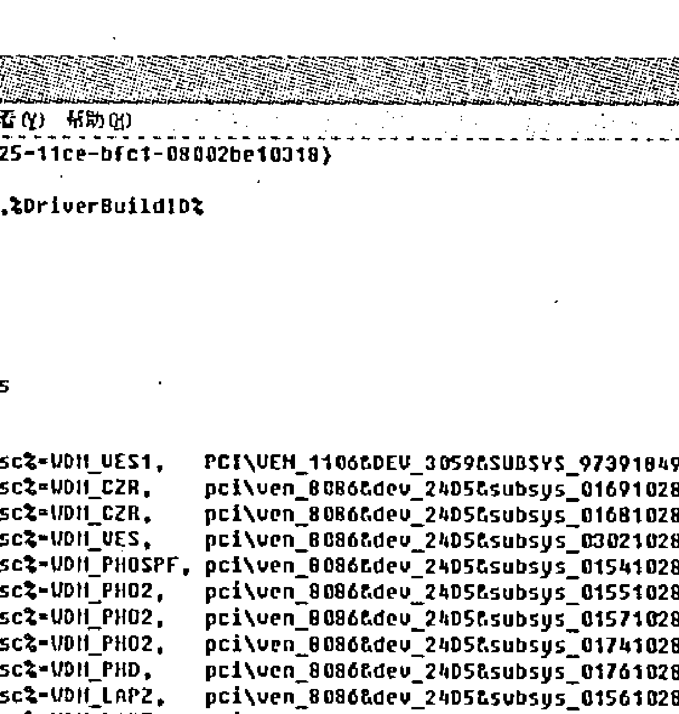

接下来，只要双击任务栏托盘区中“SoundMAX数字集成音频”图标，即可进入设置界面，对其进行设置（如图15）。音频选项中还有一个“BassBoost超重低音的高级设置”。BassBoost项可以让普通集成声卡获得更为真实的立体音质，特别是在播放DVD大片时。另外，如果我们选中“麦克风设置”下的“减少噪音”项，可消除录音时周围环境噪音，从而便于我们录制更为清晰的声音。

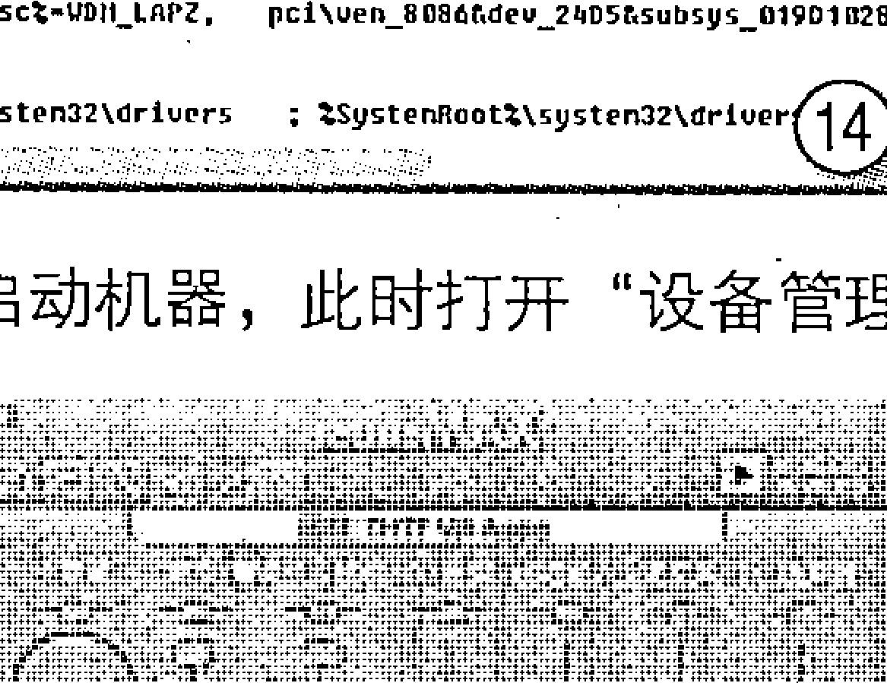

### 3. 优化多媒体驱动和播放软件

#### （1）优化多媒体驱动

我们知道，操作系统中的影视文件播放时也是需要多媒体驱动的，同样使用最新的多媒体驱动也可以优化一下音质。

#### （2）WMP增强

由于种种原因，Windows Media Player一直无法播放RMVB、MP3Pro、DVD及全新的格式。事实上，我们完全不用安装太多的播放器，如RealPlayer、KMPlayer等。只要从http://www.onlinedown.net/soft/8448.htm下载并安装“Vista Codec Package”，之后即可正常播放。

> **我们也可以下载并安装终极解码、完美解码、暴风影音或K-Lite Codec Pack，一般也可以解决问题，但那些非常大。而且上面的Vista Codec Package还可以支持Windows Vista系统。**

#### （3）优化播放软件

现在使用Foobar2000的人很多，我们只要在安装时选择“完全”。之后启动Foobar2000，选择“Foobar2000→参数设置”，再单击“播放”→“输出”项，然后将“输出数据格式”设置成你的声卡位数（如图16），一般高档的会达到24位甚至是32位，如果你不知道，请查看一下说明书，高于16位（bit）才选“高频振动”，目前一般的低端声卡大部分是16位。

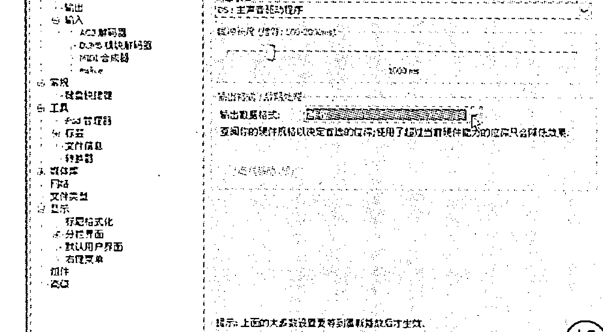

接着，再来单击“播放”下的“DSP管理器”项，然后添加自己所需要的处理模块，用耳机听的话，“简单环绕”能增大空间感，喜欢这种感觉可以加上。如果不能确认某个DSP的作用，请将它移到右面以取消之。同时，如果还要增加DSP，请按以下顺序添加：Resampler（重采样）=>[其他DSPs]=>音量控制=>[某个limiter（限幅器）]，因为Foobar2000的音频处理流程是：解码器→播放增益→DSP（数字信号处理）→转换到数据输出格式→输出。

### 4. 安装高级外置声卡

一般来说，笔记本电脑的声卡质量不会太高，因此我们必须通过安装高级外置声卡来提升音质。这里要介绍的是创新Sound Blaster Audigy 2 ZS Notebook，这是一款非常经典的PCMCIA接口的高级声卡，支持7.1声道及SPDIF输入输出，方便数字输出。而且随卡赠送的驱动程序的功能也很强，唯一的缺点就是价格较高。

## # 防抖功能真是万用灵丹？
### 合理使用DC防抖技术
作者：□刀 铮

随着数码相机价格的日渐低落，很多朋友都想拥有一台属于自己的数码相机。大家去卖场考察或者登录数码相机厂商的官方网站，都能听到一个词“防抖”。某些不良商家为了推销其产品还吹嘘数码相机的防抖功能十分管用，几乎可以说达到了包治百病的境界。防抖技术真的有这么神？下面笔者就带着大家去一探究竟。

## # 防抖技术到底属于哪管哪？

数码相机的防抖技术是通过数码相机内部的相关硬件设备或者处理器中的相关设计功能，缓解因手部持机不稳而造成的相片模糊问题。防抖技术可以在一定程度上减轻因为持机不稳而造成的成像虚化问题，在一定程度上提升了相片的清晰度。
不过防抖技术作为数码相机的高端技术之一，并不是每台数码相机都拥有该功能。由于成本方面的制约，一些数码相机特别是低价的入门级数码相机，基本上都没有设计防抖功能。如果您刚刚接触摄影，那么数码相机的防抖功能非常适合您。对于预算充裕又喜欢长焦数码相机的朋友来说，笔者建议您购买拥有防抖功能的数码相机。

> ### 是不是所有数码相机都有防抖功能？
> 答案是否定的。一些小变焦（这里是指光学变焦，不包含数码变焦，下同）数码相机只要拍摄一段时间之后持机相对较稳，不会造成相片发虚的问题。某些厂商在小变焦数码相机上增加防抖功能纯粹是为了增加卖点而已，功能既不实用又增加了用户的购机成本。真正需要防抖功能的，还是那些变焦能力在10倍以上的大变焦数码相机。由于大变焦数码相机工作时，镜头的很大一部分伸出机身外部，只要手部持机稍有不稳，就会造成相片发虚。

## # 防抖技术这么多，究竟该选哪一种？

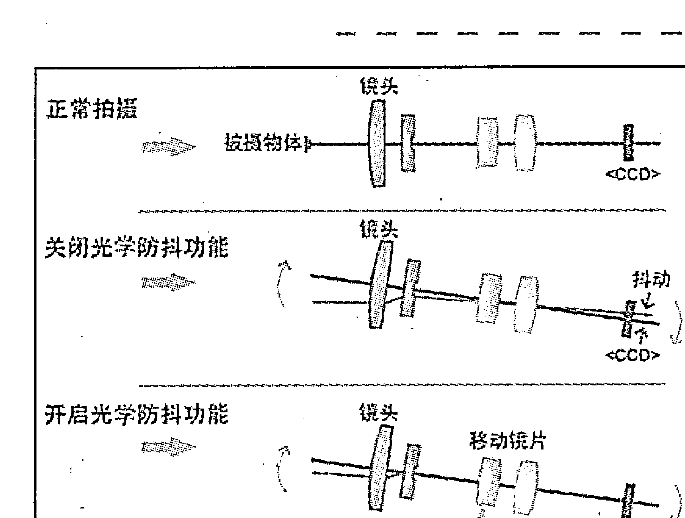

为了增加产品的亮点，几乎目前市面上主流的数码相机厂商都开发了一套防抖技术并为之命名，刚刚接触数码相机的朋友可能会一头雾水，一时间都难以分辨其中的优劣。其实各厂商的防抖技术按其原理划分，也就不外乎以下三种：光学防抖、感光器防抖和电子防抖。
光学防抖其原理是通过移动镜头中的镜片组，适时调整相机的焦距，到达成像清晰的目的。光学防抖是一种以硬件为基础的防抖技术，其防抖效果是三种防抖技术中最好的，不会影响相片的质量。由于在防抖过程中需要移动部分硬件，因而比较费电。此外，需要在镜头中设计额外的驱动马达和电路，体积相对较大，导致其成本也比较高，特别是带有防抖功能的单反镜头，价格更是昂贵。目前采用光学防抖技术的厂商主要有佳能和尼康等。
感光器防抖则是移动机身内部的感光器件（COMS或者CCD）来达到防抖的目的，保持相片的清晰。感光器防抖也是一种硬件防抖技术，其效果比光学防抖略差，但是成本比前者要低廉得多。感光器防抖的最大优点是避免了复杂的镜头制造工艺，降低了整机的成本，而且移动感光器相对比较省电。感光器防抖技术多见于采用4/3系统的数码相机，代表厂商有奥林巴斯、柯达等。
电子防抖是一种利用相机处理器进行“软件”处理的防抖技术，电子防抖工作时，感光器件只使用90%的面积进行拍摄，剩余的10%留给处理器进行防抖处理。电子防抖技术实质上是利用了相机处理器强大的计算功能，不必移动相关硬件，因而电子防抖技术耗电较少，不需额外设计相关硬件设备及电路，适合于体型轻巧的卡片数码相机以及入门型数码相机。由于电子防抖技术是一种软件技术，所以成像的质量会受到一定影响，而且噪点也会明显增加。

> ### 什么是4/3系统？
> 4/3系统是由奥林巴斯光学工业株式会社和伊斯特曼柯达公司于2002年9月共同推出的感光器材尺寸标准，但是并不是指感光器的对角线长度是4/3英寸，而是指感光器总成的直径为4/3英寸。采用4/3系统的相机体积更小、重量更轻，而且改善了普通数码相机周边成像模糊的问题。

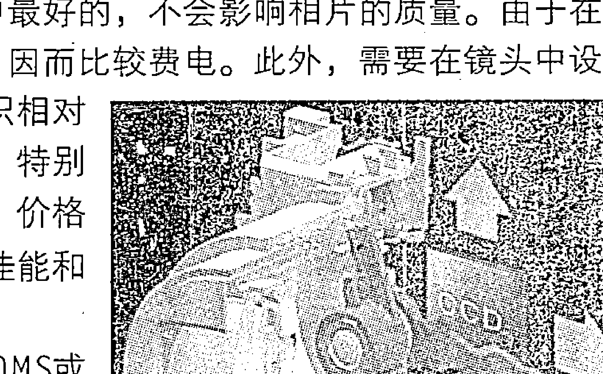

以上三种防抖技术的应用都不是孤立存在的。在中、高端数码相机中，电子防抖技术通常与其他防抖技术一起使用，方能达到较为满意的防抖效果。

下面列出目前市场上主流品牌的防抖技术，供大家参考。

无论哪一种防抖技术，其防抖的效果十分有限，根本不是如某些宣传上说的那样神奇无比。要使照片清晰不模糊，最关键的还是需要我们拍摄者稳定持机，尽量减少手部抖动。防抖技术仅仅在拍摄过程中起到辅助作用，只能校正小幅抖动引起的相片模糊问题。

## 附表：各品牌数码相机防抖技术一览表

| 品牌 | 防抖技术名称 | 防抖技术类别 |
|------|--------------|--------------|
| 佳能 | IMAGE STABILIZER (IS) | 光学防抖 |
| 尼康 | Vibration Reduction (VR) | 电子防抖(消费级数码相机)/光学防抖(专业级单反数码相机) |
| 索尼 | Super SteadyShot | 电子防抖/光学防抖 |
| 松下 | MEGA O.I.S | 光学防抖 |
| 奥林巴斯 | 超声波驱动防抖系统 | 感光器材防抖 |
| 理光 | CCD防抖 | 感光器材防抖 |
| 宾得 | Shake Reduction (SR) | 感光器材防抖 |
| 卡西欧 | Anti Shake | 电子防抖 |
| 富士 | 多重IS图像防抖 | 电子防抖/光学防抖 |
| 三星 | Fast ASR/OPS | 电子防抖/感光器材防抖 |

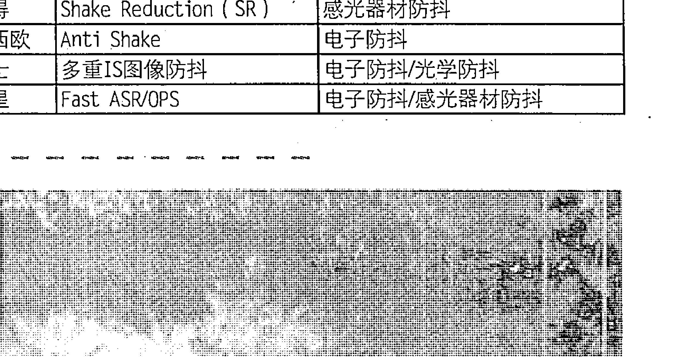

## # 什么时候应该开启防抖功能？

由于开启防抖功能时需要耗费一定的电能，并会引起部分机械磨损，所以并不是说防抖功能需要随着开机时一起启用。这样既可以节约电能，又能延长数码相机的使用寿命。不过在下列情况中，笔者建议您开启防抖功能，保证相片成像的清晰。

- 1. 长焦端拍摄
  在长焦端拍摄时，镜头的大部分都会伸出机身外部。如果这时您持机稍有不稳的话，会大大降低相片的清晰度，严重的时候拍出的相片会一片模糊。特别是一些大变焦（10倍以上）的数码相机以及加载了长焦镜头的单反相机，在进行长焦端拍摄时必须开启防抖功能，这样才能保证拍摄出来的照片清晰美观。

- 2. 夜景拍摄
  在拍摄夜景时，由于周围光线不足需要启用闪光灯来补充光线。一般开启闪光灯之后，数码相机会自动降低2~3档快门速度，延长曝光时间，保证相片能够准确曝光。在降低快门速度之后，即便是机身轻微的抖动也会造成相片模糊不清。在这种情况下，必须开启防抖功能来保证相片的清晰度。

  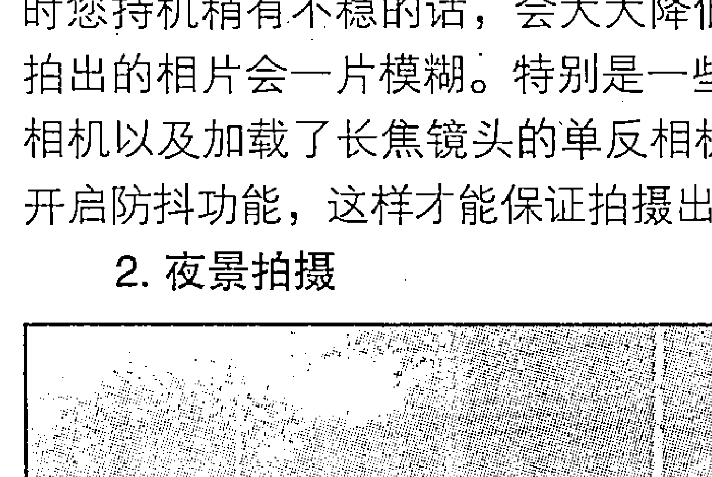

- 3. 动态抓拍
  在拍摄高速运动的物体（飞驰的汽车、正在跑步的运动员）或者突发事件的时候，经常会因为被摄物体运动速度过高，造成拍摄的照片发虚甚至是一片花白。此时开启防抖功能方能保证被摄物体能够清晰地展现在相片中。

- 4. 在运动物体上拍摄
  在我们旅行途中，身处高速行驶的交通工具，此时进行拍摄就需要开启防抖功能。由于拍摄者处于高速运动的物体内（如汽车、火车、飞机等），这个时候按下快门后极易造成相片模糊。开启防抖功能，有助于提升照片的清晰度。

## # 有了安全快门，您能抛弃防抖技术吗？

首先笔者要向大家简要介绍一下安全快门。所谓安全快门并不是指数码相机上的快门按钮，而是指快门的速度，由于采用该快门速度拍摄出来的照片相对清晰，故而得名。

由于安全快门的速度相对较快，能够在很大程度上改善因为手部抖动而造成的相片模糊问题。安全快门实质上是用户能够稳定持机所需要的快门速度，故而其受到许多因素的影响，譬如拍摄者的臂力、使用习惯、拍摄经验等。因此安全快门并不是一个确定的值，会因用户不同而异。使用长焦端时，必须有足够的快门速度才能保证相片的清晰，此时安全快门速度就很快。然而采用广角相机拍摄时，安全快门的速度就要相对慢一点。对于大家日常使用的相机（包括搭配标准镜头的单反相机），建议安全快门的速度不要超过1/60秒。

虽然安全快门的目的与防抖技术非常接近，但是两者的工作机制有着很大的区别。特别是安全快门设定得过高的话，会使相片曝光不足，明显降低相片的质量，故而安全快门并不能替代防抖技术。安全快门只能作为防抖技术的补充，而且对于刚刚接触数码相机的朋友来说，由于经验不足反而会觉得安全快门不好调控。

## 掌握推拉摇移
### ——让DV玩得更专业
作者：□TMG zlw

随着经济的迅速发展、国民生活水平的不断提高，数码摄像机不再像以前那样高不可攀，它被越来越多的家庭所接受，同时也为广大观众带来了更多的欢乐与回忆。在众多的拍摄技巧中，最常见的是推、拉、摇、移了。因此，我们下面就通过问答的形式对这四种技巧逐个进行介绍，希望能对广大拍摄爱好者有所帮助。

### 1. 什么是推摄？

推摄又叫推镜头，就是把摄像机向被摄主体的方向推进，或者是变动镜头焦距使画面框架由远而近向被摄主体不断接近的拍摄方法。推摄可以使视点渐进向前移动，而被摄物体由小变大，而周围环境则由大到小。例如：如果拍摄趴在花上的蜜蜂，就可以用推摄的方法，从树的全景开始拍摄，将镜头推向蜜蜂所在的枝，然后再推向花，最后用特写画面拍摄蜜蜂，这样整个影像就丰满了。


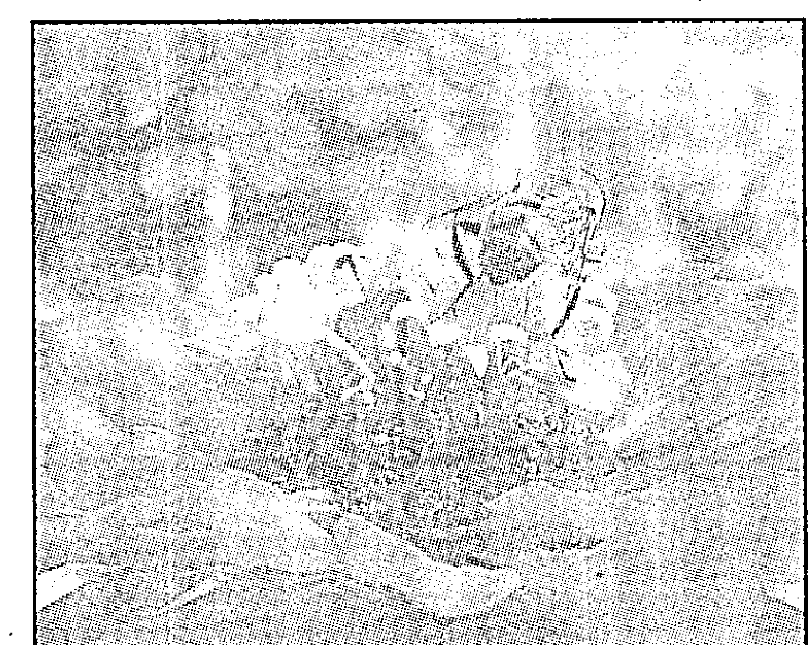

### 2. 推镜头适合怎样的场景

推镜头的作用主要是用来突出主体、突出细节、突出重要的情节因素。它能够从一个较大的画面范围和视域空间起动，再逐渐向前接近这一画面和空间中的某个细节形象，并通过这种运动所带来的变化引导观众对这一细节的注意。


### 3. 推镜头如何操作

推镜头可以分为起幅、推进、落幅三个部分。拍摄推镜头时，可以先拍摄远处的景物，开始拍摄后，先保持几秒钟静止，这几秒钟称为‘起幅’；然后调整旋钮，将镜头慢慢推向被摄主体，此时被摄物体会在镜头中渐渐变大，而周围的环境也在逐步退出镜头。这一过程就是所谓的‘推’。当你的镜头完成预先设定画面的拍摄时，也应在最后画面处静止几秒钟，完成‘落幅’的拍摄。这样一组完整的推镜头就完成了。值得注意的是，在‘起幅’和‘落幅’的拍摄过程中，静止时间最好控制在5秒钟左右，以达到最佳效果。

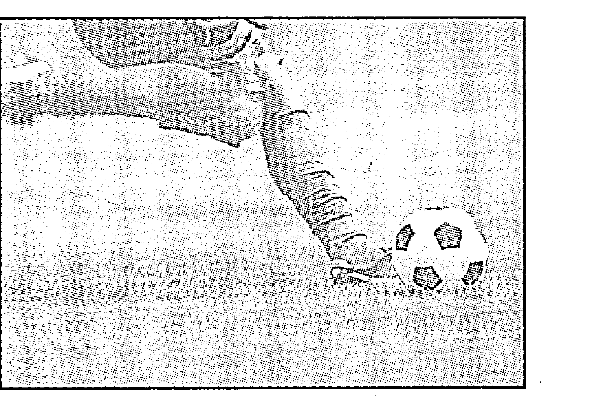

### 4. 推镜头应用小技巧

在拍摄时，根据需求适当运用不同的推进速度可以产生不同的视觉效果。如果推进速度是缓慢平稳的，表现出来的就是一种幽静或是神秘的氛围，能勾起人探索的欲望。 如果推进的速度是急剧而短促的，一种紧张、激动的氛围就将围绕着你。 推镜头还能产生一种效果，它可以调整运动主体的动感。当你用推镜头正面拍摄一个奔跑的人时，就能产生画面和被摄主体在途中快速相遇的效果，使被摄主体更具动感。 而当你用推镜头拍摄与某人分手的场景时，镜头对准被摄主体的背影，产生一种离别时的伤感效果。


## SOLUTIONS 数码

产生的就是久久不能离去的效果，被摄主体的动作缓慢化，给人带来一种依依惜别的伤感。

## 二、拉摄

### 1. 什么是拉摄?

在说拉镜头的时候，我们不妨把它和推镜头做对比。所谓拉镜头，就是将摄影机放在移动车上，对着人物或景物向后拉远所摄取的画面。摄影机逐渐远离被摄主体，画面就从一个局部逐渐扩展，使观众视点后移，看到局部和整体之间的联系。

### 2. 拉镜头适合怎样的场景

拉镜头用于介绍被摄对象所处的环境。随着镜头向后拉，人物形象越来越小，环境空间逐步显现，它着重表现的是主体和环境的关系，而非主体本身。

### 3. 拉镜头如何操作

在了解了推镜头的前提下，我们就很容易理解拉镜头的操作了。简单地说就是把推镜头的起幅当成拉镜头的落幅，而把推镜头的落幅当成拉镜头的起幅来拍摄。其实拉镜头也就是推镜头的逆转。它与推镜头一样，强调重点也是在落幅上。

**小提示**
拉镜头应用小技巧
拉镜头的速度可以充分表现某种情感。如果拉得较慢，大家就能清楚地观察到景别的变化，最后定格在一个全景或者大全景上，带给人是非常平和的感觉。

## 三、摇摄

### 1. 什么是摇摄?

摇摄是指将摄像机机位固定不动，借助于三脚架上的活动底盘或者是把拍摄者自身作为支点，通过变动摄像机光学镜头轴线来进行拍摄的方法。摇镜头的视觉效果就像摇头一样，体现的是一个以摄像机为中心的扇形画面，感觉就像是观众自己在“摇头”观看一样。

### 2. 摇镜头适合怎样的场景

因为摇镜头的视角和观察人的视角相同，带给大家的就是“眼睛”的感觉。用它来表现一些主观性的镜头或者是运动主题的动态是非常好的。并且用它还能展示出空间和视野的广阔，具有大景别的功能。多侧重于介绍环境、故事或事件发生地的地形地貌，展示群山、沙漠、海洋、草原等开阔的视觉背景。

当我们运用拍摄技巧，将两个物体或事物分别安排在起幅和落幅中，然后通过镜头摇动将这两点连接起来，这样，两个物体或事物的隐含关系就会通过镜头运动慢慢暗示出来。因此摇镜头还可以用来介绍两个物体的内在联系。

### 3. 摇镜头上下摇摄

上下摇摄，顾名思义就是把镜头沿上下方向摇动，它可以用来追踪拍摄上下移动的目标。比如要拍摄运动员的跳水动作就可以使用摇摄。将运动员站在高台准备起跳的场景设定为起幅，镜头推近并锁定运动员，从起跳到入水，随运动员的下落而将镜头同步下移。这样就能完整地表现出跳水的整个过程。

上下摇摄的方法还可以通过镜头缓慢的上下摇动，表现出某一景物的高大。

### 4. 摇镜头左右摇摄

左右摇摄和上下摇摄差不多，只是它是把镜头沿左右方向摇动而已。我们操作时一般会两脚分开使摄像机稳定，然后将身体朝向摇镜头开始的方向并慢慢朝向终止的拍摄方向移动。但如果摇摄的角度超过120°，我们就只能用左右转身的步法来控制身体重心，减轻机身的摇晃。倘若镜头摇的速度和拍摄主体运动的速度不一样，我们最好的操作方法就是保持拍摄主体在画面中的某一个固定位置。以避免拍摄主体在画面上不规则晃动时产生视觉疲劳和不稳定感。

摇摄的时间是一个值得拿捏的地方。时间不能过长，也最好不要太短，一般来说大概10秒左右完成一组镜头的摇摄是比较适宜的。摇摆速度同样也值得商酌，追随运动物体拍摄时，摇摆速度要与被摄主体的位移相对应，并且在拍摄时最好能将被摄主体固定在镜头的某一点上。
运镜也要讲究，绝对要保持平稳，建议使用三脚架。注意不要来回晃动镜头，镜头最好是过去了就不要再回来，只做一次左右或上下的全景拍摄就可以了。起点和终点也要注意把握，技巧运用须有分寸。

## 四、移摄

### 1. 什么是移摄？

移摄和摇摄不同，它是将摄像机架在活动物体上，并随活动物体的运动而进行的拍摄。在观看移镜头拍摄的画面时，我们最容易产生身临其境的感受，因为任何时候我们都是处在移动中观察这个世界的，所以移镜头其实是我们生活的真实反映。

### 2. 移镜头适合怎样的场景

移摄是所有拍摄技巧中最常用的，它适合的场景很多，不管是拍摄内部结构以及复杂场景的恢宏气势还是开拓画面空间及纵向景色，它都可以表现得相当完美，表现出真实感和现场感。如果你坐在行驶的汽车上拍摄路边的景色，镜头随着汽车的向前运动而运动，起伏的山峦在两边退去，路边的景色在身边经过，一下子，画面中的景物就有了高度，也有了宽度，同时还能在运动中展现它的长度和深度。

> **小提示**
摇镜头应用小技巧
记住！在使用摇镜头拍摄时一定要有明确的目的性。因为摇摄镜头能深深吸引观众的眼球，让观众对后续画面保持某种期待和注意，倘若后面的画面与前面的画面没有太大的相关性、没有联系或者根本就没有可看性，我建议那就放弃使用摇镜头拍摄吧。

> **小提示**
移镜头应用小技巧
用移摄方式进行拍摄时，特别要注意以下三点：
- 首先，进行移动拍摄时最好只移动上半身。在具体操作时，可以预先将摄像机镜头对准你想要拍摄的终点画面，然后再移动腰部使上半身正面对准拍摄的起点。当开始拍摄后，先停顿一段时间，拍好“起幅”，然后转动上半身，使身体还原，当上半身回到首先设定的画面后，依然静止一段时间，然后再停止拍摄。这样拍出来的画面效果很精致。
- 其次，移动拍摄时速度要尽量慢。因为无论镜头运动速度如何，角度变化如何，除非是为了特殊的表现，其他情况地平线都应基本处于水平状态。所以只有转动慢一些，才能出现那种通过镜头看全景的效果。
- 再次，建议大家移动拍摄时尽量使用广角镜头。因为只有这样才能保证在运动过程中拍摄的画面动感强并且保持平稳。

### 3. 移镜头如何操作

按行走路线的不同，移摄可分为前后移动、左右移动和弧形移动三种拍摄方式。

- “前后移动”是移摄中最基本的步行方式。在拍摄移动的目标时，我们应在移动目标的前面保持一定的距离，并将镜头对准被拍摄主体的正面。然后随着移动物体的前进而平稳地向后退步，必须保持行走路线与被拍摄主体的一致性。这种情况下，很适合拍特写镜头。
- “左右移动”就是说摄像者与被拍摄主体移动的线路平行，应该选择侧步行走去拍摄。假如我们应该向右边侧步行走，那么我们就必须先把两腿微曲，让左脚移到右脚前，使右膝的前端碰到左膝的背部。当左脚接触到地面时，将身体的重心转移到左脚上来，然后再把右脚向后绕过左脚站稳……依次重复这个动作，就能完成整个拍摄过程。
- “弧形移动”就是要求摄像者以圆形或弧形绕被摄物体方向移动，而不再是直线移动。但是拍摄时，移动弧度应该控制在120°－180°之间，不宜过大或过小。并且在整个拍摄中，被摄主体应该一直维持在画面的中央。

综述：通过上面简单的介绍，大家应该对推、拉、摇、移这四种拍摄技巧有了全方位的了解，希望大家在实践中慢慢体会，拍下生命中最美好的瞬间，留下永久的回忆！

## 睁大眼睛看仔细

## 微距摄影技巧

在我们实际使用数码相机时，经常免不了要进行近距离的所谓微距摄影。由于微距摄影与日常的旅游纪念照相有着很大的区别，很多刚刚接触摄影的朋友一时难以掌握其拍摄的技巧，致使拍出的相片质量不高。我们应该如何进行微距拍摄呢，笔者给您支几招。

### 什么是微距拍摄？

微距摄影是数码相机的特长之一，用微距拍摄可以把很普通的场景拍成戏剧性的场面，微距摄影特别擅长表现花鸟鱼虫等细小的东西，对细节可以充分展示，而且也可以随心所欲地表现自己在选题、构图、用光方面的创意，不像拍摄风光、人物、民俗文化等题材，要受很多条件的制约。

### 微距摄影≠近距离拍摄

刚刚接触摄影的朋友可能会从直觉来判断，微距摄影就是要尽可能接近被摄物体。个别朋友在微距拍摄时唯恐成像不够清晰，镜头与被摄物体仅仅只有几毫米甚至镜头触及被摄物体。其实这都是对微距摄影的误解，微距摄影并不是指近距离拍摄。其实微距摄影是将被摄物体进行细节拍摄，其效果近似我们人眼用极近距离观看物体而得名，并不是指采用微小距离进行拍摄，与被摄物体之间的距离没有绝对的关系。而且与被摄物体距离过近，人体的遮挡会使周围环境光线昏暗，大大降低成像的质量。

### 利用变焦功能虚化背景

在微距摄影中我们需要拍摄的往往是物体的局部，并不需要把整个被摄物全部拍下来。您在取景时会发现，通常情况下背景比较杂乱，会大大影响主体的效果。用什么办法来突出主体的形象呢？我们可以采用虚化背景的方法来凸显主体形象，提升相片质量。虽然消费级数码相机囿于成本上的限制，镜头的光学性能与专业的单反相机还存在着一定的距离，但是我们还是可以通过一定的拍摄技巧来实现背景虚化的目的。
首先镜头离被摄物体不要太近，按笔者的经验来看，两者距离在10厘米左右比较适宜。按下相机的微距功能键，启用微距功能。然后将数码相机的镜头由广角端慢慢往长焦端推进，直至对焦正确后按下快门。拍出来的照片，您看背景已经虚化而主体凸出，正好达到我们预期的目的了。

### 拍摄小动物宜用连拍

春暖花开，大地复苏，可爱的小动物们也活跃起来了。面对可爱的小动物，很多朋友不禁会举起相机将这美好的瞬间记录下来。不过小动物生性胆小，稍有动静便会跑走，恐怕您还没按下快门，人家就会跑得没影了。笔者建议最好把数码相机的快门声音关闭，可以减少对被摄动物的干扰。其次小动物生性好动，要抓住美丽的瞬间，恐怕我们初学者按快门的速度还跟不上。笔者建议最好开启数码相机的连拍功能，一次性多拍数张，相信其中定有一张您能满意。同时为了保证成像清晰，笔者建议您快门的速度不要太低以免引起成像发虚。笔者还建议把相机的光圈开得大一些，这样既可以保证相片的曝光量，又可以在一定程度上虚化杂乱的背景，突出动物可爱的形象。

### 微距拍摄不一定需要微距功能

有些朋友认为微距拍摄一定需要微距功能，这几乎已成为初摄者的不二定理。当前有些厂商为了增加卖点还在相机中增加了超微距（也称微微距）功能，于是乎唯恐成像不够清晰干脆启用超微距功能。其实这样盲目启用微距功能并不科学，因为微距功能启动时，镜片的调焦精度以及测光系统的对焦精度都大幅提升，无论是耗电量还是机械磨损度都会不同程度地提高。

特别是拍摄由网格构成的物体（例如瓷砖地面）时，开启微距功能反而会引起摩尔纹增多的问题。这是由于消费级数码相机的光学效果相对较弱，所以抑制摩尔纹的能力不是很强。拍摄这类物体时，笔者建议您最好不要开启微距功能。为了能够拍摄到物体细节，建议相机离被拍物体不宜太远，同时要注意自己的身体是否遮挡了光线从而影响了拍摄。

### 加载微距镜

如果您对于微距拍摄的要求比较高，那么笔者建议您可以通过加载微距镜来实现目的。数码相机通过安装微距镜可以得到更好的微距拍摄效果，提升相片的拍摄质量。该种方法适合于预算较为充足的用户，否则可能会给您带来一定的经济压力。

> 如何加载微距镜？
微距镜不能直接安装到相机的镜头上，而是需要通过一个特殊的转接环才能安装。各种相机的转接环互不兼容，应该购买适合您相机的型号。

经过以上介绍，相信大家都已经掌握了微距摄影的技巧了吧。还等什么，快拿起自己的DC猛拍吧！■

## 让双键鼠标具有三键功能

在控制面板中双击“鼠标”项，在弹出的“鼠标属性”对话框中选择“单击锁定”栏中的“启动单击锁定”项。再点击“设置”按钮，在弹出的“单击锁定的设置”对话框中将鼠标设为最短，点击“确定”保存。打开一个网页，点击网页的卷轴，在离网页卷轴不远处上下移动鼠标，即可实现此功能。再次点击网页的卷轴即可关闭此功能。

## 让Windows XP读英文

找到“辅助工具”组里的“讲述人”程序，点击“声音”按钮，进入“声音设置”界面进行一番设置然后保存即可。当你把鼠标指向带有英文字母的对话框、菜单以及按钮时，会听见一个男声读着英文

## 恢复Windows经典界面

很多人安装了Windows XP后的第一感觉就是Windows变得漂亮极了。只是可惜美丽的代价要耗掉我们本就不富裕的内存和显存。要想恢复到和经典Windows类似的界面和使用习惯，请在桌面上单击鼠标右键，选择“属性”命令即可进入“显示属性”的设置窗口。这里共有“主题”、“桌面”、“屏幕保护程序”、“外观”和“设置”五个选项卡。在当前选项卡的标签上会有一条黄色的亮色突出显示，默认是“主题”选项卡，这里我们只要在“主题”的下拉选单里选择“Windows经典”，立即就可以在预览窗口看到显示效果，同时，外观选项卡的内容也会随之进行更改。

注意：Windows XP中“主题”和“外观”选项卡是息息相关的，只要更改其中的任何一个选项，在另一个选项卡中也会看到相应的改变。

## 恢复“开始”菜单

Windows XP新的“开始”菜单还是挺方便的，对系统资源的影响也不大。如果你喜欢过去的经典菜单的话，用鼠标右键单击任务栏空白处，选择“属性”菜单，进入“任务栏和开始菜单属性”的设置窗口，选择“[开始]菜单”选项卡，选择“经典[开始]菜单”即可恢复到从前的模样了。

## 优化视觉效果

Windows XP的操作界面的确是很好看，好看的背后是以消耗大量内存作为代价的，相对于速度和美观而言，我们还是宁愿选择前者，右键单击“我的电脑”，点击“属性/高级”，在“性能”一栏中，点击“设置/视觉效果”，在这里可以看到外观的所有设置，可以手工去掉一些不需要的功能。在这里把所有特殊的外观设置诸如淡入淡出、平滑滚动、滑动打开等所有视觉效果都关闭掉，我们就可以省下“一大笔”内存。

## 禁用多余的服务组件

Windows XP和Windows 2000一样可以作为诸如Http服务器、邮件服务器、FTP服务器，所以每当Windows XP启动时，随之也启动了许多服务，有很多服务对于我们这些普通用户来说是完全没用的；所以关掉它们是一个很好的选择。操作的方法是：右键单击“我的电脑”，依次选择“管理/服务和应用程序/服务”，将不需要的服务组件禁用。

注意：有些服务是Windows XP必需的，关闭后会导致系统崩溃。查看详细说明确认后再禁止。

编者注：对于Windows XP常见的90个服务，本文将有专门章节分析。

## 手机电视 烽火连天 奥运年 谁主沉浮?

今年是举世关注的“奥运年”。手机上也出现不少与奥运有关的新技术，比如非智能GPS手机、带光学变焦的相机手机，不过与奥运会关系最大的无疑是手机电视，因为通过手机随时随地观看精彩的奥运赛事，是很多朋友的梦想。如今形式多样的手机电视将成为今年手机上最引人关注的新技术。这里为大家谈谈手机电视技术及其在国内实际应用的相关情况。

### 一、手机电视技术概述

简单地说，手机电视是指以手机为终端设备观看电视的一项技术或应用。和IPTV一样，手机电视也是一个前景看好但现阶段却发展缓慢的业务应用。因为涉及广电和电信两大产业，手机电视牵涉的产业链非常庞大，需要解决的问题也很多。手机电视的实现是多种技术组合的结果，概括起来主要包括三个方面的技术：上行交互技术、业务层实现技术和下行传输技术。上行交互技术需要通过移动网络实现，主要为业务提供上行传输通道，保证双向交互能力。业务层实现技术负责实现手机电视业务的认证、计费、业务发现和获取、业务定制、内容保护及其他灵活的应用，从而保证手机电视的可运营和可管理。下行传输技术负责实现电视节目向用户的传送，下行传输技术可分为多种实现方式。

下面我们来看看手机电视在各国的发展现状，欧洲手机电视试验和商用基本上采取广播网络公司、广播内容公司、移动网络公司合作的方式进行，其中广播网络提供商提供手机电视下行信道和内容平台运营，移动运营商提供用户鉴权、计费和交互信息服务，内容提供商提供电视内容。韩国有两种方式的广播网手机电视业务：一是广播电视公司推出的地面DMB业务；二是电信SKT下属的TUMedia公司运营的卫星DMB业务。美国CrownCastle公司获得了在全美范围1670MHz~1675MHz频段的移动电视运营权。并使用相关资源组建了一个全国范围内专用的DVB-H手机电视网络(图1)。从政策上看，欧洲的手机电视管制是最宽松的，在欧盟开放的管制环境下，各国运营商在手机电视的经营许可上基本没有障碍，欧洲因此成为广播式手机电视技术试验和商业运营最多的地区。日本则建立了广播和电信统一的管制机构总务省(MIC)，在统一监管机构的管理下，使电信运营商进入广播电视领域成为可能。
而在国内手机电视标准和政策都尚未确定。奥运良机无疑为手机电视带来诱人的市场蛋糕，随着奥运脚步日益临近，手机电视领域各大标准阵营也纷纷加紧备战。日前新岸线的TMMB方案被国家标准专家评审组遴选为手机电视/移动多媒体国家标准，但并未获得广电总局等其他相关部门认可。

### 二、手机电视实现方式

手机电视的实现方式是多种多样的，总体看可以分为两个大的类型，即非数字电视方式和数字电视方式。其中非数字电视方式包含了两个方面，一是传统模拟无线接收，即使用手机接收在空中播放的开放无线电视，这种方式是最“原始”的手机电视，实现方法简单，技术成熟，几乎所有城市都有无线播放的模拟电视频道，用户接收免费，但选择余地小，信号易被屏蔽、干扰，收视效果不稳定，目前国内有不少能看电视的“黑”手机就采用了无线电视接收技术(图2)。

二是基于移动网络的实现，此类方式是通过现有移动网络，如GPRS网络和CDMA1X网络，利用移动流媒体技术实现手机电视的服务。基于移动网络技术的实现方式继承了移动网所固有的诸多能力，如用户的业务鉴权以及用户管理、业务的计费和控制、业务的个性化定制和点播、互动应用的实现、与位置相关的业务提供等。但是在现有移动网络中会出现带宽受限、播放效果不很稳定、并发用户数有限、收费较高等问题。并且此实现方式需要占用移动网络系统的核心频率，终端通常要求是智能手机，不适合大规模应用。

目前我们谈论的手机电视主要是通过数字电视方式实现。此类方式所采用的技术多是由地面数字广播电视技术发展而来，在音视频下行传输方面相对完善，不受带宽限制，播放效果较好，可支持多种业务，包括广播式业务和互动业务。数字电视方式又可以分为两大类：地面广播和卫星广播。地面广播方式如欧洲的DVB-T、美国的ATSC、日本的ISDB-T等；卫星广播方式如欧洲的DVB-S2等。手机电视的下行传输技术具体实现方式还包括：

- 地面数字电视广播方式
- 卫星数字电视广播方式
- 移动网络流媒体方式
- 其他方式

在数字电视方式中，地面广播和卫星广播都属于广播网络，而移动网络流媒体则属于电信网络。广播网络的优势在于下行带宽大，适合广播类业务，但交互能力弱；电信网络的优势在于交互能力强，但下行带宽有限。因此，手机电视的实现往往需要结合广播网络和电信网络的优势。

以上就是手机电视技术及其在国内实际应用的相关情况。希望对大家有所帮助。

播放画面效果稳定流畅。但由于传统的广播电视网络通常都没有上行链路，因此一般都需要依靠移动通信网络的协助来完成互动操作。这类手机电视的代表技术是DVB-H，是欧洲数字电视标准组织为通过地面数字广播网络向便携/手持终端提供多媒体业务所制定的传输标准。该标准是欧洲数字电视标准（DVB-T）的扩展应用。DVB-H终端具有功耗更低、移动接收和抗干扰性能更强等特点，适用于移动电话、手持计算机等小型便携设备通过地面数字电视广播网络接收信号。DVB-H由于其技术标准开放等特点，在全球范围内受到了广泛欢迎。很多国家和地区的运营商都在积极地进行相关的研究和试验工作。全球最大的手机制造商诺基亚公司推出了多款基于DVB-H系统的手机电视。DVB应该是今后手机收看电视的主流发展趋势，不过由于标准、政策等原因，DVB要在国内普及还需等待时日。

从发展角度看，利用卫星数字电视（S-DMB）系统提供手机电视业务具备更大的发展潜力。由于卫星覆盖范围更大，而且对移动性的支持也更高，所以一般认为卫星DMB会是一种更有前途的业务。此类方式是通过卫星提供下行传输实现广播方式的手机电视业务，而用户通过在手机终端上集成直接接收卫星信号的模块，就可以实现多媒体数据的接收。当覆盖范围比较小、用户比较集中时，使用卫星开展手机电视业务效率较高，也比较经济。韩国S-DMB业务的主要推动者是SKT公司。为了建设S-DMB业务系统，SKT电信公司于2004年3月发射了专用卫星，向移动手机、手持通信设备或者车载设备发射电视节目。

## 三、3G技术与手机电视

2008年4月1日，广大中国手机用户终于等到了期待多年的3G放号，中国移动通信集团公司在北京、上海、天津、沈阳、广州、深圳、厦门和秦皇岛等八个“奥运城市”启动了第三代移动通信（3G）“中国标准”TD-SCDMA（简称TD）社会化业务测试和试商用。这意味着3G在国内迈出了真正踏入市场前的最后一步。所谓3G就是“第三代移动通讯技术”的简称。移动通讯发展到今天，业界习惯将其分为三个发展阶段，过去大家熟知的“大哥大”采用的是第一代模拟移动通讯技术（1G），目前广泛使用的数字移动通讯技术GSM被称为是2G，而在GSM基础上发展的GPRS、EDGE等技术则分别称为2.5G和2.75G。不同时代的移动通讯技术在语音功能上并无本质差别，关键在于数据业务承载的最大速率不同，比如目前使用广泛的GPRS作为2.5G移动通讯技术的代表，其实际速率仅在50KB/S左右，而根据设计3G手机的接入速率达到2兆／秒左右。

所谓TD-SCDMA，即时分同步的码分多址技术、集CDMA、TDMA、FDMA技术优势于一体、系统容量大、频谱利用率高、抗干扰能力强的移动通信技术。它采用了智能天线、联合检测、接力切换、同步CDMA、软件无线电、低码片速率、多时隙、可变扩频系统、自适应功率调整等技术。TD-SCDMA通过最佳自适应资源的分配和最佳频谱效率，可支持速率从8kbps到2.8Mbps的语音、互联网等所有3G业务。前面我们已经提到，3G相对2G最大的优势在于数据传输速度得到了极大提高，如果在2G环境中上网相当于以前通过普通Modem拨号上网，那么3G环境中的移动上网速度已经能和ADSL宽带比美。因此在线宽带环境下我们能够使用的网上业务在3G网络支持下，通过手机也能实现。

今年是举世关注的“奥运年”，奥运期间用3G手机看电视的问题是TD-SCDMA最受关注的应用之一，也将是用户在奥运期间使用最多的3G功能之一，现在已经有多款TD终端可以实现手机电视功能。比如中兴通讯的TD-SCDMA手机U800在业内第一个实现了TD-MBMS手机电视业务，这意味着2008年用手机看奥运直播将成为现实。手机电视是3G的杀手级业务，也同时是技术难题。这主要是因为3G手机与2G手机最大的不同在于功能的复杂性以及业务的并发性，对网络的传输速率、业务的成熟度以及终端软件的开发有着相当高的要求。如何保证接收电视节目时画面流畅，画面与声音保持同步，以及频道切换等环节是需要解决的难题。除了手机电视外，在3G网络高带宽的支持下，通过3G手机还能实现包括无线宽带上网、视频通话、PTT通话、IP电话、远程视频监控等更多应用。

## 四、实践不同类型的手机电视

### 1.通过智能手机看网络电视

用手机看网络电视，这本来属于3G时代的服务，如今在视频压缩技术及GPRS、EDGE网络的支持下，用户只要使用智能手机，再安装一些专门的小软件，就可以在线收看电视了。

对于PPC手机，如果你的手机通过CMNET上网，那么可打开系统自带的WMplayer播放器选“菜单”→“打开url”→选“mms://”填写成“mms://winmedia.cctv.com.cn/live1”按“播放”，稍等……开始拨号→连接→缓冲→播放。CCTV有几个频道（比如cctv国际频道mms://winmedia.cctv.com.cn/live）好像为手机网络专门优化过，在手机上看稳定在34kbps，不需要缓冲，声音比较流畅，和普通电视差不多（图3）。

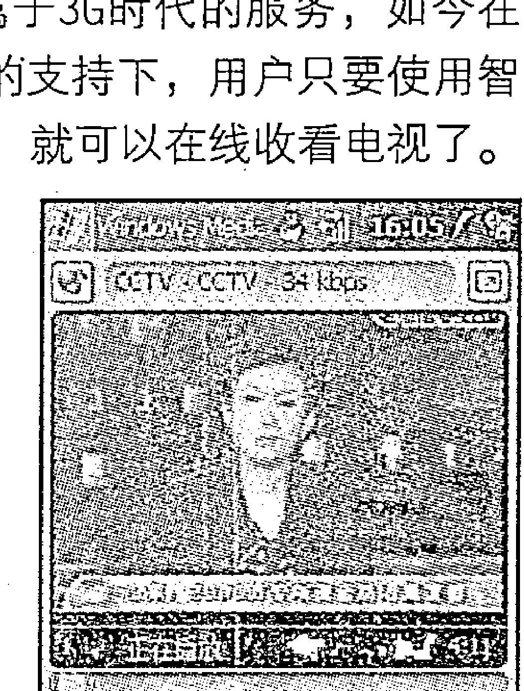

如果你的手机使用CMWAP节点上网，那么可以使用GGTV这个在线流媒体播放器。大家可通过PPC手机直接连上wap.3g.net.cn下载。GGTV手机电视门户是首个面向全球的双语版手机电视wap服务网站，采用世界领先图像压缩及编解码技术，免费为用户提供高品质的手机电视服务。GGTV手机电视采用基于自有知识产权的视频压缩与传输技术建设开发的CMT移动流媒体平台，通过GPRS、CDMA1X等2.5G移动网络即可以在线直播、VOD点播等方式观看电视。

在智能手机上支持网络电视功能的软件还有很多，除了GGTV，还有Fondo Player、10LIVE、REALPALY等，通过这些手机客户端软件，我们可以在2.5-2.75G的网络环境中勉强实现手机电视功能（图4）。目前要收看网络电视带宽是关键，用2.5G的GPRS还无法获得较好的收看效果，如果你的手机支持2.75G的CDMA 1X网络或EDEG，或者能通过WIFI接入宽带网，那么效果会好不少。当然现在有些TD-SCDMA

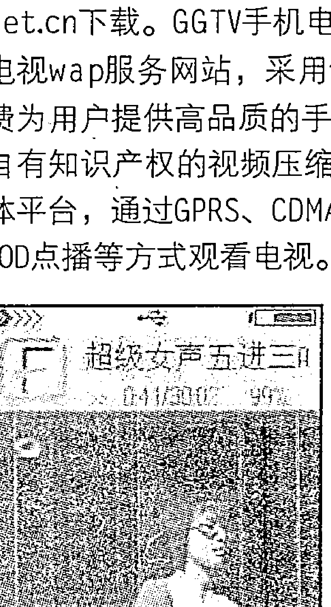

新硬件 数码

3G手机也可以支持网络电视，效果就要好很多了。用手机收看网络电视时，要特别提醒大家注意费用的问题，尽管大多数手机网络电视都是免费的，但用手机收看网络电视流量惊人，如果不是包月套餐，请适可而止。

### 2. 用手机收看传统模拟电视
由于目前国内3G尚未正式商用，手机网络电视效果不佳且费用较高，而手机数字电视更是在标准和政策的争论下遥遥无期，因此前面提到过的传统模拟无线接收的手机电视技术，居然成为目前国内最为普及和实用的手机电视技术。除了很多具备电视接收功能的“黑”手机采用了此技术，一些正规手机也开始具备模拟无线电视的接收功能了。

国内的手机用户应该对几年前NEC推出的电视手机N940还记忆犹新吧（图5），这款国内首款无线电视手机给不少朋友留下了很深刻的印象，另外技嘉的“爱因斯坦”PPC手机也内置了电视接收器，可以收看无线模拟电视。另外有些PPC手机本身有CF插槽，或者能通过背夹扩展出CF接口（如多普达696i），然后你再购买一款为Pocket PC掌上电脑设计的CF电视卡——EOPS P01，它能够让PPC用户随时随地收看电视台正在播放的电视节目。但这些产品都不太适合国内的无线电视环境，接收效果差，耗电厉害，价格高，并未获得市场成功。

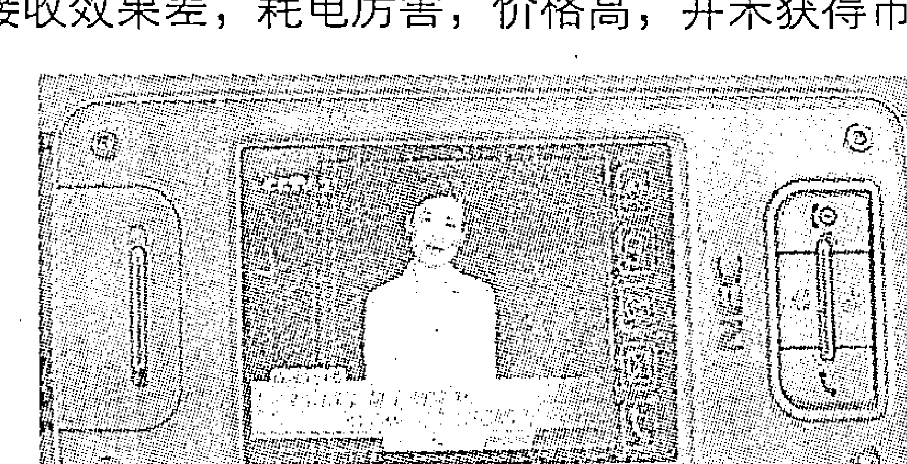

随着技术发展，这种貌似“原始”的手机电视技术在今天已经趋于完善，在大中城市基本达到了实用水平。下面为大家介绍一款具备无线电视接收功能的天语V918手机的使用情况（图6）。

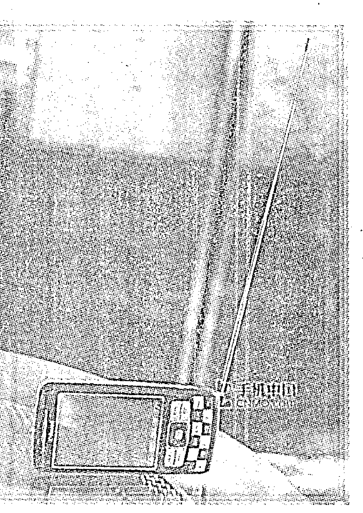

天语 V918电视手机的天线藏在了手机的右下角，此天线为四节式折叠设计，全面放开后长达二十多厘米，为增强接收信号提供了保证。毫无疑问模拟无线电视的接收效果在开阔的室外表现最好，在北京、上海、成都等大城市，可以接收到八个左右的电视频道，且具有相当不错的清晰度。而在室内接收效果就很差了，通常只能在靠近窗口的地方才可以比较清晰地观看电视节目，当然你也可以自行DIY天线甚至信号放大设备，以增强室内的接收效果。不过我认为需要用手机看电视的环境应该大多在室外，所以这款手机的电视接收功能还是比较实用的（图7）。

天语V918的电视操作软件简单易用，操作非常方便。在收看界面中，长按“OK键”手机会自动搜台，搜到的可用信号会自动排列储存，使用时可以按数字键进行频道切换。此外，V918还支持不同制式的电视节目，方便在不同国家及地区使用。

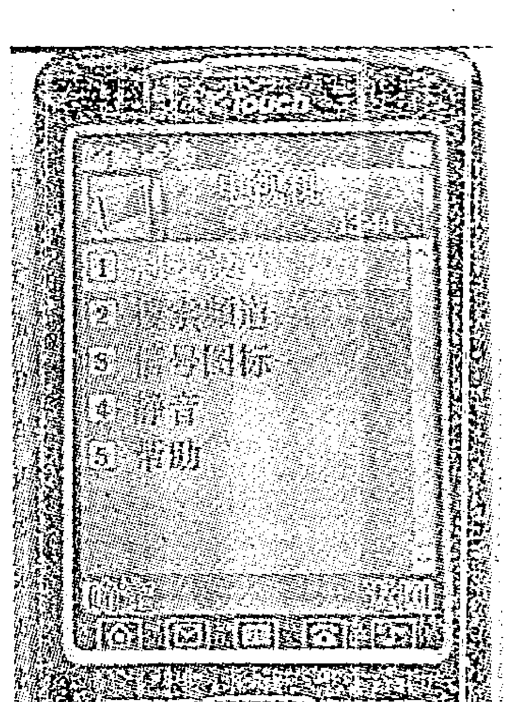

### 3. 用手机收看数字电视
前面提到，手机数字电视才是手机电视的王道。不过十分遗憾，目前国内还不具备手机数字电视的接收环境。广大中国手机用户暂时不能体验到手机数字电视带来的便利和乐趣。下面为大家简单介绍几款支持数字电视功能的手机，权当画饼充饥、望梅止渴吧。

目前诺基亚有N77、N92等多款手机提供了对DVB-H格式的移动数字电视支持（图8），DVB-H是DVB组织专为电视广播如移动电话等手持设备上的内容和数据制定的标准，具体前面有详细介绍，不过令人遗憾的是目前国内甚至包括港澳台三地均未有网络商提供对DVB-H标准的支持，在此诺基亚N77等机型上的移动电视功能无法使用，形同虚设。除了内置DVB-H数字电视功能之外，诺基亚的电视手机本身也是塞班三版智能手机，还内置了视频播放器、音乐播放器以及FM调频可视收音机，综合功能都是很不错的。

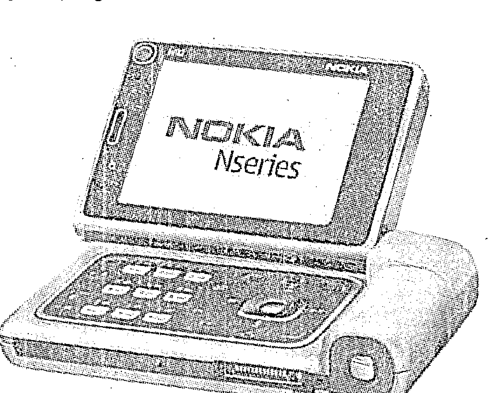

对于技嘉的智能手机想必大家不陌生，从g-Smart开始，技嘉的智能手机许多机种都内建了模拟电视接收的功能，不过效果并不理想。而新推出的技嘉GSmart t600是世界第一款DVB-T/DVB-H/DAB数字电视手机，不但有欧洲的DVB-H规格，更可收看在国内很多大城市已经开播许久的DVB-T数字电视，如果你所在的城市开播了DVB-T移动数字电视（即在公交车和出租车上播放的电视），那么选择这款产品来尝尝鲜还是不错的。技嘉t600不但可看数字电视，也支持T-DMB以及DAB数字广播标准，并内建讯连科技的「CyberLink Mobile TV」应用程序，除了可观赏电视节目以外，还可以录下节目（图9）。

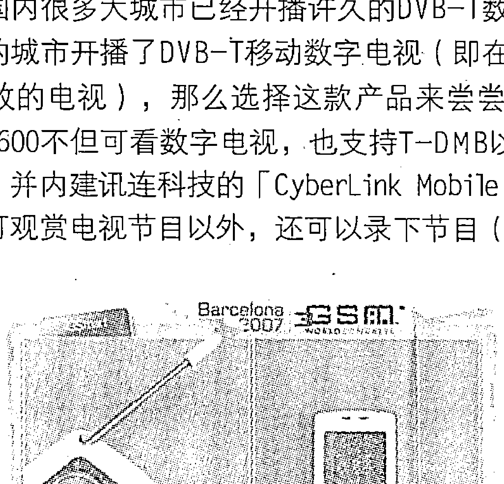

# 跟我一起喜刷刷：手机刷机技巧集锦

□龚师傅

手机刷机，并不是用刷子刷去你手机的灰尘，而有些像在电脑上重装操作系统，或者类似于其他数码产品的固件升级，简单说就是用特定方法修改或替换固化在手机芯片上的程序系统。刷机有着许多独特的用途，是体味玩机乐趣的重要途径。下面就跟我一起来喜刷刷吧。

## 一、手机刷机的基本用途及方法

让我们先来看看刷机都有哪些基本用途。一般来说，对于大多数手机尤其是智能手机而言，刷机有以下几大用途：

- 一是改变手机的语言版本，由于各种原因，市场上中高档手机尤其是智能手机“水货”是比较多的，这些水货的语言版本通常都不是简体中文的，我们可以通过刷机来将其变为简体中文（图1）。
- 二是升级系统版本，对于非智能手机而言，新版本通常是厂商对老版本存在BUG的修改，功能上变化不大，而对于智能手机而言，比如将使用WM5版本的产品升级为WM6，非常类似将电脑操作系统从WIN XP升级到VISTA，变化会很大，更厉害的还有将塞班系统更新为LINUX，或将LINUX机子改为PPC，相当于在苹果电脑上安装了Windows。
- 三是其他一些特殊用途，比如去掉系统自带程序，增加ROM中用户可用空间、去掉拍照时的快门声等。

当然这些功能不是截然分开的，相互之间也有交叉，比如在升级操作系统版本的同时，也可以改变语言版本并增加ROM可用空间。由于刷机和通过安装软件来增强手机功能等其他DIY行为不同，具有较大的风险，因此是否需要刷机，请大家对照一下上面提到的几点用途，确认自己是否的确有其中所列的需求。

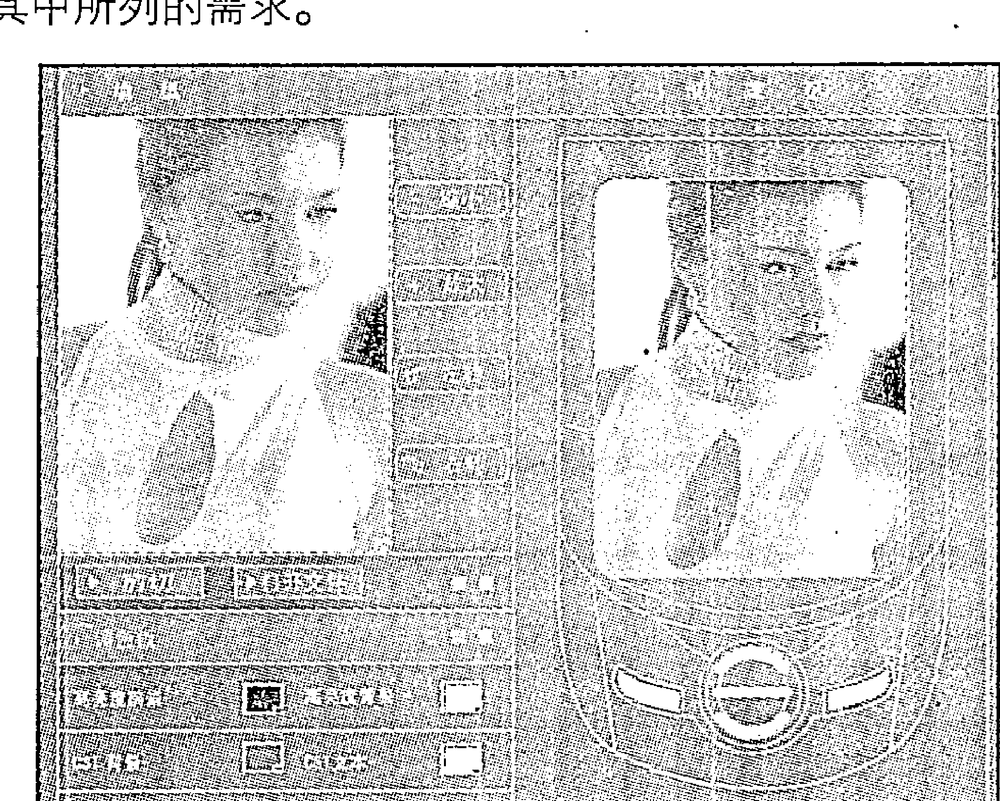

简单说，目前对手机进行刷机有三种方法，即存储卡刷机、数据线刷机（在线刷机）和特殊设备刷机。其中只有部分PPC智能手机可以通过存储卡进行刷机，而大多数朋友更接触不到使用特殊设备刷机的情况。因此通过数据线刷机是最常见的刷机方法。下面简单谈谈一般步骤和注意事项。其实各种机子的刷新方法都是大同小异的。首先我们要准备好合适的ROM数据文件和刷机程序，并在电脑上安装好刷机程序，推荐用装有电池的笔记本电脑，可杜绝绝大多数意外中断。接下来用数据线连接好需要刷机的手机。再运行刷机软件，按提示一步步进行操作就可以了。用存储卡刷机的方法更简单，比如联想的PPC智能手机ET980就可以用mini_SD卡升级OS。先插入存有CHSM MDD.980系统程序的mini_SD卡，然后上电池，同时按下录音键和电源键2秒以上，就进入自动升级程序。升级程序进行过程中，蓝色灯会常亮，蓝灯变为闪烁，系统升级就完成了（图2）。

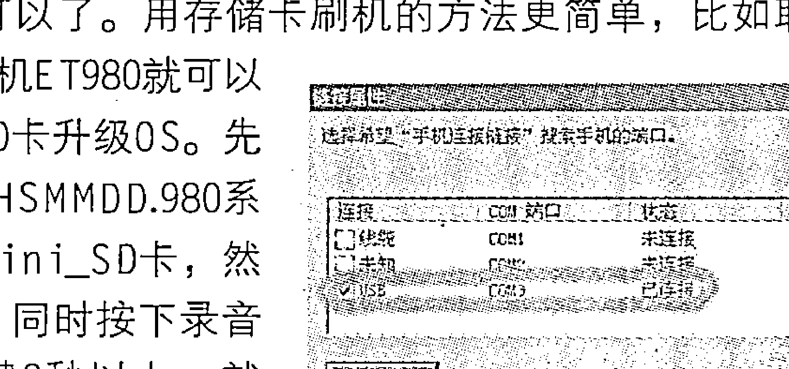

不少玩家就经常刷来刷去的，不过并非总是“喜刷刷”，因为刷机具有一定风险，弄不好会“机毁人伤（伤心）”，因此动手刷机前，请一定要三思后而谨慎行事。升级前有一些基本的注意事项，比如确定ROM版本的匹配；保证可靠供电；真正弄清楚升级的具体要求和步骤；用来升级的电脑要运行稳定等。刷机是有一定危险的，但按正常方法操作的话，一般也没什么问题，刷坏了也有补救的方法，大不了返修。套一句俗语说，就是要胆大心细。

## 二、增强系统功能（打补丁）实例

前面提到，手机刷机的一个重要用途就是增强系统（打补丁），下面我们以给西门子SX1这款手机为例说明具体的方法和步骤。西门子SX1这款数年前推出的塞班智能手机，之所以至今还有强大的生命力，一个重要原因就是可通过“打补丁”来增强系统的功能。我们可以使用Apätcher等专门的软件工具来合成补丁文件，然后进行刷机。首先我们要准备好以下工具软件：Apathcer、Winswup刷机驱动和15版刷机程序。

运行Apathcer，第一个标签页就是编写代码的窗口，从网上获取所需要的补丁代码，复制相关代码到apatcher的窗口中，如果需要把多个补丁放在一起，可以继续复制其他补丁到这个窗口。代码编写的语法规则是：代码以replace开始，每个代码一行，如果代码太长会自动换行可以插入任意个空白行，可以添加任意注释，注释以英文的引号“;”开始，可以使用中文。选好补丁后，就可以保存补丁了。在file菜单中选择save就可以保存了，通过这种方式，我们可以把多个补丁合到一个补丁文件中（图3）。

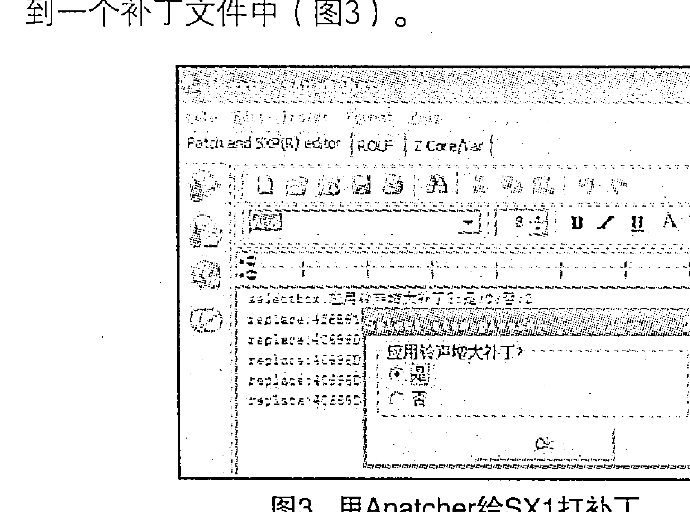

接着运行Winswup刷机程序，需要注意的是，刷之前要把刷机程序改名为Siemens Sx1 SVN15 (Admin Mod).exe，否则apatcher无法识别刷机程序从而无法正确地打上补丁。第一次使用需要设置一下，serial config中Switch USB Serial改为USB only，USB中设置为USB0。最左边的窗口可以选择刷哪些模块，具体下面再谈（图4）。

再打开apathcer，打开刚才作好的补丁文件，选择 apply patch for ram，完成后apatcher 会提示 all done。然后切换到Winswup，点start 看到提示，关闭手机，连上数据线，进入升级模式（注意要事先装好刷机驱动程序）。

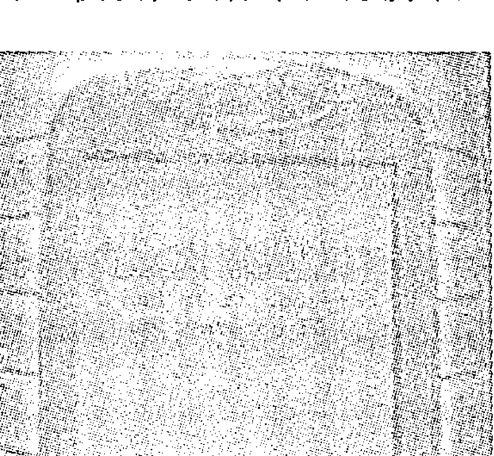

在上面的刷机程序中，我们可以选择刷哪些模块。这里对各模块功能进行简单说明：

- Core：核心模块，包括系统启动的最基本的程序，升级模式就在这个模块中。对于这个模块，只需要在改变系统版本的时候选择。如12版升15版、英文版升中文版，其它情况下刷机就别选了，没有任何作用还平白增加了风险。
- Core-img(Z1) Var(Z2)：对应系统的Z盘，绝大部分的系统文件都在这一部分。基本上这是每次刷机的必刷部分，因为目前的补丁基本上都是通过修改Z盘的文件来实现的。
- IBoot：包含了一些诊断程序。可以在升级模式下，通过特殊的软件对系统进行诊断。这一部分与Core同样处理。
- ROLF：对应于系统的A盘，这一部分在刷A盘时要选上，对于平时打补丁不需要选择这一部分。
- Liff：对应系统C盘，选中这一部分刷机，效果相当于格式化C盘。我们平时刷机，一般是不需要格C盘的，这样可以保留所有的设置而又能应用补丁。所以这个部分没有必要的话就不选了。如果在刷机时要格机，或刷机后要格机，可以选择这个部分。刷完后就相当于格机了，也不需要再手动来格机了。另外单独选择这个部分刷机可以实现格机的目的，可以解决开机后自动格机的问题。

以上几个升级模块，大家可根据具体情况来组合选择。另外我们还有所谓“集成版”和“纯净版”的选择，一般而言，“集成版”就是已经集成了常用补丁的刷机程序，而“纯净版”可以理解为未加任何修改的官方升级程序，我们可以自行添加补丁。

做好准备后，我们就需要将手机关机并用数据线连接电脑了。按住中央操纵杆（向下按），同时按开机按钮。机器亮起来，进入升级模式后就可以松开手了，这时Windows会显示找到usb drive并要求你安装驱动程序，点击浏览后定位到Siemens_Sx1swup.inf和Siemens_SX1swup.sys所在的目录，完成驱动程序的安装，注意这时安装的驱动程序是特殊的“刷机驱动”，与普通用来进行数据同步的驱动是不一样的。安装完刷机驱动后，我们就可以运行版本升级程序进行升级操作了。通常需要先进行简单的设置，比如选择USB0端口，然后点击“START”按钮，再按提示一步一步按下确认按钮即可。完成后拔下数据线，再重新启动手机，你会发现版本已经成功升级了。上面的升级步骤对升级手机系统版本和改变手机的语言版本都是适用的。比如通过上面的升级步骤我们可以将水货英文版的SX1升级为简体中文版。如果升级失败，也不用太着急，通常是版本匹配有问题，我们可以重新用其他版本的升级程序进行升级。比如使用所谓的“强刷版”，通常都能升级成功的。如果仍有问题也可以通过使用COM数据线进行挽救。

## 三、偷梁换柱让手机改变功能

下面以摩托罗拉经典Linux智能手机A760为例，说明另外一种常用的“偷梁换柱”刷机法，即在刷机过程中，替换官方刷机文件为经过修改的文件，以达到修改系统功能的目的。比如我们可以通过下面的刷机步骤，来将MOTOROLA A760升级为A768透明版（图5），并为其增加 Picsel应用程序，且让USBNET功能开启。具体步骤如下：

首先下载刷机所需软件：pst7.11和71版本官方升级包和两个经过修改的刷机文件。pst7.11解压缩后有两个文件分别是PST_7.1.1_GENERAL.exe和PST_patch.exe，前者是安装软件，后者是破解补丁，安装好第一个以后提示要重新启动，先不要重启，复制PST_patch.exe到c:\Program Files\Motorola\pst\下面，双击PST_patch.exe，会出来一个提示，不管它，一路点next，就破解好了。然后重新启动电脑。接下来解压缩71版本的升级包，到一个单独的文件夹中。解压出来有两个文件，分别是EZX_G_00.71.A1R_gsm_ezx_kernel_root_user_language_setup_logo.shx和EZX_G_00.40.B1R_p10_flash_dev_ext_4M_reflash.shx。电脑上的工作就准备好了。

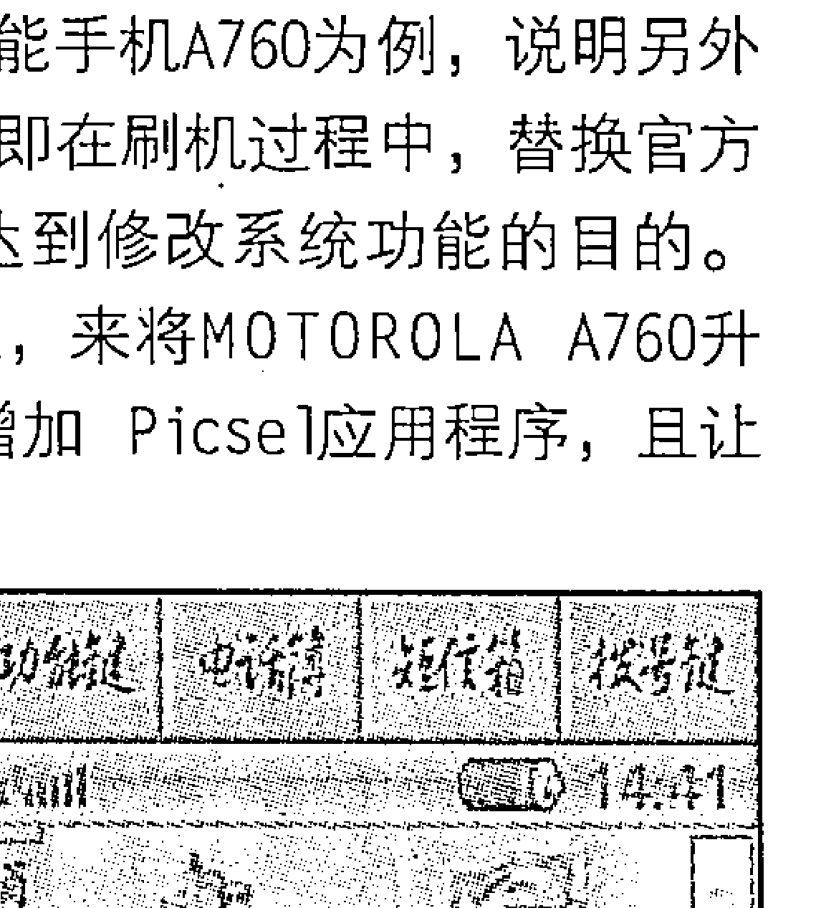

然后拿出电话，注意事先给手机电池充满电。再设法将手机中必要的数据备份出来，比如把手机电话本和短信备份好。然后把手机先主清除然后再主恢复，默认密码是## 1. 准备好数据线。随后我们在电脑上运行刚才安装好的PST主程序MultiFlashFlex，打开手机电源，插上数据线，连好电脑，等一会儿，系统会自动安装很多特殊设备。当程序中显示“连接完成”后，点browse找到你解压缩后的71升级包中的92.8MB的大文件，这个时候左下角会出来一个图标，单击这个框里的东西，会发现新硬件，过一会儿，那个灰色的flash会变成黑色，就点它，出来提示，点“是”，下面出来一个进度条，刷机过程就开始了。如果此时你不作其他操作，我们刷新的只是摩托官方的71版升级软件而已，升级完成后不会有大的变化，不能达到增加Picse应用程序并让USBNET功能开启的目的。好，下面要注意了，看我们如何在刷机过程中进行“偷梁换柱”的。

对于摩托A760大家可以放心刷机，这款手机号称是刷不死的，一旦刷机失败，请卸下电池，长按开机键，放掉所有的电量，重新装入电池，关机状态下，设法短接手机数据接口的4、5脚（从右往左数），然后同时按开机键，进入维修员FLASH模式（蓝屏白字显示）。再重新刷机即可。另外我们在开启USB NET选项后，连接好电脑，打开IE浏览器，在地址栏输入169.254.142.2/system/，你能看到平时被隐藏起来的Linux系统文件（图7）。如果是这方面的行家，还能从中获得更多的DIY乐趣。

## 四、在线刷机让刷机普及起来

看了上面两个实例，大家可能会感觉手机刷机还是比较复杂的。其实如果你只是打算升级官方的升级文件，那么方法就简单多了。现在有些手机厂家为减轻售后服务的压力，甚至鼓励用户自行刷机，可见现在刷机的安全性提高了很多。比如索爱很多手机都支持通过互联网在线刷机。下面以在线刷新W830为例说明具体方法。

首先去官网下载并安装在线更新程序Update_Service_Setup-2.7.6.8-1.exe。安装后连接好数据线，再安装USB驱动Win_USB_Driver_new，在随机驱动光盘/drivers/usb cable里就有。不过，如果你此前已经用手机通过数据线连接过电脑而且电脑能正确识别的话，就没必要再安装了，因为第一次连接电脑检测新硬件的时候要求安装的驱动里就包括了USB驱动。

准备刷机前，最好先关闭其他应用程序，并确保网络速度快速稳定。一般在凌晨人少的时候更新会更快更稳定。

接着启动Update Service，第一次启动的话会比较久，程序会上网搜索并下载一些更新。更新完进入语言选择界面，如果是国内行货，选择简体中文即可。进入欢迎界面，点击开始继续。有一些协议，当然要选择接受。按提示选择好具体的机型。接下来的步骤比较关键，注意在手机和电脑连接前一定要按住手机C键不松，如果中间松开了，电脑会把手机识别为移动存储设备导致更新不能进行，又得重新操作。手机被识别后，就可以松开手机C键了，升级软件会继续识别手机的软件版本，如果不是最新版本，就会开始下载更新的软件版本，等待即可。下载之后开始更新新版本软件，继续等待。这一过程切不可中断。更新完成后，软件会有明确提示，按操作拔下手机，取出电池再重新装好，开机，整个过程完成。很显然，通过在线刷机的方法对手机进行刷机是很简单的，预计今后会有更多的厂商提供在线刷机的支持。

另外对于索爱的机子，除了刷机，更有乐趣的是使用FAR 对手机进行DIY（图8、图9、图10、图11）。FAR是File and AArchive Manager的缩写，是一个DOS界面文件管理器。通过FAR+SEFP软件，以及非官方的刷机驱动，我们就可以对平时隐藏起来的手机上的系统和配置文件进行修改了。比如可以修改配置文件，让手机在静音模式下拍照无声。关于FAR的具体应用这里就不多谈了，感兴趣的朋友可自行研究。

最后提一下，每款手机具体的刷机方法都不尽相同，本文仅作抛砖引玉之用，大家可以到与自己手机相关机型的专业论坛获取更新更详细的刷机信息。

## 真巧了
15个DC夺大招

□TMG zq

数码相机出现在我们身边已经有好多个年头了，像素也由当初的10万发展到现在的上千万，功能更是日新月异，同时，相机的价格却是越来越低。所以，在相机比以往任何时代都要普及的今天，我们可以看见很多人都成为了专业或业余的摄影爱好者。但是，虽然使用相机的朋友越来越多，却听见很多朋友对自己相机不如人意的抱怨。

> “三流选手谈相机，二流选手谈手法，一流选手谈头脑。”

偏色、相片模糊，这些问题的出现，相信大多不是相机本身的问题，关键在于我们掌握了多少使用相机的技术，对基本的拍摄常识掌握如何。那么，从哪儿学这么多拍摄技巧和使用常识呢？别着急，还是先看看本篇文章吧，希望对你摄影技巧的提升有所帮助。

## 一、巧用闪光灯

光是生命成长不可缺少的元素，因为光的存在，才成就了人类色彩斑斓的生活。利用相机的镜头，记录我们成长的点滴，如何能离开光！所以，在摄影艺术中，光无需辩驳地成为它的基础。一幅绚丽多彩的画面，是光使它变得富有层次，画面变得饱满。但是，在摄影中，仅仅利用自然光线，想要拍摄出优秀的照片是远远不够的，这时，我们就需要用到一些人工光源，闪光灯就是其中之一。闪光灯与自然光的区别就在于它是一瞬间释放强烈的光线，因此，用闪光灯进行辅助拍摄时，闪光灯的巧用对照片的效果有很大的影响（图1）。

在进行拍摄前，首先要查看相机说明书，了解相机内置闪光灯的使用范围。拍摄时距离太近，会造成曝光过度；太远又会造成曝光不均。在近距离拍摄时，为了得到适度的曝光，可以选择用相机的小光圈，同时在闪光灯上蒙上一层白纸、纱布等能减弱光线强度的材料，让光线变得柔和。

闪光灯的使用不仅是在光线昏暗的情况下，有时因为逆光拍摄，也需要用到闪光灯，避免拍摄主体和背景产生较大反差。背景和主体曝光的互不“兼容”，就需要我们进行人工补光了。首先将相机设置成光圈优先模式，设定光圈数值，并进行背景测光，记录快门值。然后，切换到手动模式，设置为刚才得到的光圈和快门的数值，将闪光灯设置为强制闪光模式。这样拍摄，就能得到背景和主体均有良好表现的画面。

## 二、巧用三角架

我们经常看到专业摄影师在拍摄照片时使用到三角架，它的优点就在于无论你经过多长时间的曝光和使用多么小的光圈，依然可以拍摄出质量高的画面。所以，在进行近距拍摄时，对相机的稳定要求很高的情况下，选择使用三角架的确是一个明智的做法（图2）。

我们所看到的三角架通常都有三节，见过的很多朋友都喜欢把最下面一节收起来，使用上面的两节。我们给出的建议是，把第二节收起，这样将会更稳定些。

其次，三角架的中央轴不必升得很高。这样会造成重心上升，在野外拍摄时，倘若有大风，便会造成相机的不稳定。

再次，我们需要考虑到三角架水平装置的使用。三角架是否处于水平状态，对拍摄出来的照片是否倾斜有很大的指导作用。顺便说一下，在挑选三角架时也要注意水平装置是否良好。

最后，我们需要注意中心轴的调节。很多摄影发烧友在进行拍摄时经常把侧腿升到一半便锁死，再用镜头调节所要的角度。这样做的弊端在于影响了拍摄画面是否在同一水平面上。侧腿升到一半便锁死的做法，也会对三角架的寿命有一定影响。正确的做法是，通过中心轴来进行高度调节。

## 三、巧用白平衡

数码相机和普通相机的区别之一就是多了一项参数——白平衡。为什么数码相机要有白平衡呢？控制好白平衡对拍摄画面又有什么帮助呢？首先，我们说说白平衡。由于数码相机的感光会产生色偏，阳光下拍摄出的照片偏黄，荧光灯下拍摄出的照片偏绿，无法拍摄出和传统相机所拍摄的同人类眼睛所看见的一样的颜色。色偏是我们不希望看到的，所以需要调整光线的平衡，即白平衡。数码相机可以自动调节为自动、室内、日光、夜晚等。尽管有这些调节方式的存在，但是想要得到理想的拍摄效果，我们还需要进行手动调节白平衡。在调节之前，我们最好能找到一张白纸作为参照物。然后，把变焦镜头调到广角，将白纸放在镜头上，把白平衡调到手动，然后把镜头对向天空（不要直对太阳），拉近镜头使屏幕变成白色，按下白平衡调节按钮，直到白平衡灯停止闪烁，调节完成。

在进行拍照时，不同的选择会出现不同的效果。笔者在这里以城市夜景举例。

暖色风景 要想找到傍晚自然风景迷人的温暖感觉，我们可以把白平衡调节为日光模式，上文提过，日光模式下画面会显出橙黄色的暖色调（图3）。

真实风景 要想找到自然风景最为真实的一面，我们可以将白平衡设置为白炽灯模式，这样将会对夜晚频繁出现的灯光进行调节（图4）。

冷调风景 要想找到傍晚风景孤寂冷寂的感觉，你不妨将白平衡调节到绿色调的白炽灯模式（图5）。

## 五、巧用数码变焦

由于快门速度的不同，拍摄出的画面可以体现拍摄者在拍摄时的情愫，画面的呈现实际上也是一种感情释放和倾诉的过程。奔跑中静止的人群，凝固的河水，这些图片都是使用快门和光圈的控制来实现的。

通常，使用快门的技巧是指如何捕捉在一定速度下的运动中的物体。快门速度的掌握通常有两个因素，一个是拍摄主体的大小，另一个是其运动的方向（对相机而言）。通常来说，拍摄一个从相机面前经过的动体要比远距离经过的动体要求更快快门的速度。同样，以斜角拍摄动体要比以笔直方向的动体要求更快快门。这些知识不在于书面做秀，要靠长时间的拍摄积累。例如，对于正常的人类行走，快门速度设置在1/250秒左右最为合适，而想要拍摄在球赛或者田径比赛中运动者的姿态，需要1/2000秒的快门速度，如果要拍摄奔跑中花豹的画面，就需要1/4000秒的快门速度（图6）。

通常情况下，我们会将背景拍摄得较为模糊，以突出主体，那就要使用追赶法，具体来说是使用1/50秒或1/25秒较慢的快门速度将多数物体拍得清晰；当我们需要将主体拍摄得虚一些，那便需要使用低于捕捉动体的快门速度进行拍摄。

## 光学变焦

是清晰度会有所下降。通常数码相机的数码变焦为实体的六倍左右。

在使用光学变焦时，需要特别注意的是画面边缘的失真。由于不同相机具有不同品质的镜头，在拍摄时，画面的边缘都存在不同程度的弧形失真。所以在拍摄时，当镜头进行拉伸时，要尽量把拍摄主体放在画面的中心，避免拍摄主体变形，影响照片的整体质量。

在使用数码变焦时，由于图案的局部放大会降低画面的质量。所以，在拍摄物体较远时，可以通过使用分辨率较高的模式进行拍摄。这时，你拍到的画面通常不很清晰，但后期通过图片制作软件进行大小调整，便会得到较不错的照片。

## 六、巧用预置模式

在购买数码相机时，相信你一定会对数码相机繁多的预设模式有了一定了解。运用这些预设模式将会比普通模式拍出的照片更为精彩，因为它是对拍摄环境不足的弥补参数。但是在实际拍摄中，如何运用好这些预设模式拍摄出满意的照片，可不像按下快门那么简单。下面，笔者就给大家简单介绍一下怎样运用这些预设模式。

在普通环境下，一般用户只要选择P模式（自动模式）就好，相机会根据环境自动进行调节。在照片储存模式中通常有分辨率设置和图像设置，图像设置有HQ、SHQ、TIFF等5种，选择最后一种非压缩格式就好（前四种为压缩格式）。闪光灯通常分为自动闪光、强制闪光、禁止闪光和防止红眼闪光，可以根据当时环境选择。同时，也可以调节曝光参数，对主体和背景的颜色反差进行调节。

综述：这六大技巧，是否对你的摄影基本常识有所补充呢？可不要光说不练嘴把式，还是赶紧拿起相机，实战一把吧！

## 如何呵护你的——数码照相机的保养

TMG zdn

相机的魅力在于将瞬间变成永恒。让我们能把每一次邂逅，都留在册子里；让我们把岁月的无痕变成永恒；让我们记住每一个生命中的过客。每每抚摸身边的那个“它”，看到它一天一天的陈旧、破损。我们的心渐渐沉重。让我们一起来保护这些留住美丽的功臣，让我们动手一起做吧！

### 1. 让每一天都是晴天

天气的变化，对相机来说很重要。温度高的时候，相机不能直接暴露在高温的环境下，如果不得不晒太阳的话，要用有色，而且避水的毛巾来避光，切记不要用黑色的工具，因为黑色吸光，会让情况变得更糟糕。当想留住唯美的冬天的时候，在室外，我们可以把相机藏在口袋里，还要记得携带额外的电池，因为在低温的状态下，相机可能会罢工。当把相机带入室内时，会有结露，我们要用报纸或塑料袋将相机包好，直到相机的温度升至室内的温度时再使用。由于热胀冷缩的原理，我们应该注意，不要让相机的温度在骤间变化。

### 2. LCD变的坚强起来了

手指接触到LCD，几乎是在所难免的事。我们可以用眼镜布来擦拭，切记不要太大力，轻轻擦拭。也不要用强烈的玻璃清洁剂，LCD的表面有一层抗强光膜，这层膜一旦破坏，是无法修护的，也不在保修范围内。另外，我们也可以购买屏幕保护贴，拿回去后剪裁成适当的大小，贴在镜头上，就可以防止屏幕被刮伤刮坏。

### 3. 保持镜头清爽清晰

当我们在回味过去的同时，随着时间的流逝，镜头早已沾上许多灰尘。镜头上的灰尘会影响相片的效果。这个时候，我们要先用吹球或软刷将镜面上的灰尘除去，如果忘记这个步骤直接在镜头上擦拭的话，会造成镜面的毁损。然后再使用专用的拭镜布，当要使用清洗液时，一定要使用专用的清洗液，先将清洗液滴在拭纸上，注意：不要将清洗液直接滴在镜头上，然后再由中心向外面轻轻擦去污渍，最后用一块干净的棉纱布擦净镜头，直到镜头干爽为止（如图）。

### 4. 轻松解决意外烦恼

如果相机不小心碰上水等液体时，要赶紧将电源关掉，擦干机身上的水渍，用橡皮吹球将机身一些细缝处喷一次，风干几个小时后，再检查相机是否出现故障。千万不要马上开机检查，否则可能造成相机短路。如果不幸，进入的是海水或电池液等高腐性的液体时，则要马上送去检修。随着机器的不断更新，内部构造也越来越复杂，集成度高。

相机的制造商，最不想听到的就是相机碰撞的声音。轻微的碰撞，会导致内部零件的松动，会埋下隐性故障；强烈的碰撞，如导致镜头跌歪、跌烂、外壳暴烈等。因此，我们在使用的时候始终要将相机套在手腕或脖子上，避免摔落或随处乱扔。有条件的用户可定期送到专业维修站检查。

### 5. 让“家”永远舒适

当我们在购买相机时，一定要记得：选购一个简易型的密封防潮箱以及干燥剂。一般市面上，小型的防潮箱大约250元，中型的450元。防潮箱可以严密控制温度和湿度。当我们长期不使用时，应取出电池，卸掉皮套，存放在有干燥剂的防潮箱里。相机是精密的机器，如果随便放在平常的衣橱、柜子容易受到湿气的影响，虽然不会导致立刻损坏，长期也会影响相机的品质。

### 6. 巧妙应对环境问题

当我们在环境恶劣，例如像油烟、污物、灰尘特别多的地方工作时，可能会导致相机产生故障。污染物落到相机的镜头，会影响拍摄的清晰度，甚至还会增加相机的调整开关与旋钮的惰性。同样，必须在潮湿的环境下工作时，也一定要采取严格的防护措施，减少在这种环境下相机受到的伤害。通常，我们要随身携带一个袋子，可以在袋子的侧面，开一个小口，刚好放的下相机镜头，把相机放在袋子里，不让雾气、湿气和灰尘进入相机，延长它的使用寿命。

### 7. 相机的支柱之一——电池

相机主要是靠电池来提供电源的，可以说电池是相机的生命支柱之一。数码相机的电池跟传统相机不同，对电力的需求非常的大，一般情况都能使用70~120分钟上下限。我们在使用时，都要尽量将电力用完后，再进行充电，一般可以充电300~500回左右。时间长了，电池会出现老化的现象，如果你使用了不匹配的电池时，就会对相机造成伤害。现在电器更新频繁，我们在购买相机时，应该购买一个相应的电池做为备用。如果打算长时间不使用相机，一定要记得把电池取出来，并将电池完全放电，存放在干燥、阴凉的环境，不要将电池与一般的金属物品存放在一起，也不能存放在皮包、衣服口袋、手提袋等地方。同时，电池如果长时间存放在数码相机或者充电器内，可能会造成漏电或损坏等问题。

### 8. 远离磁场和电场

数码相机的一些关键部件，如CCD、CMOS、DSP芯片等，对磁场和电场都非常敏感，磁场和电场，会影响关键部件性能的正常发挥，直接影响拍摄的质量，严重的还会导致机器出现故障。因此，机器在使用和保存时，都要远离磁场和电场。如音响、电视机、变压器、电磁炉等！

## 像爱护肤一样爱护——浅谈平板电视的保养

□TTMG wangw

女人娇嫩如花，需要小心呵护才能美丽绽放；女人美丽似水，要用心保护才能魅力四射。这就如同我们现在日常使用的平板电视，它们一样需要使用它的主人精心爱护，才能做到物尽其用，更好地为主人服务。

## 一、液晶电视保养术

平板电视包括现在已经普及的液晶电视和等离子电视两种电视类型。现在让我们先从液晶电视谈起，来探讨日常对平板电视的保养问题。

要知道如何保护好我们的液晶电视，首先需要我们要对液晶电视有一个大致的了解。液晶电视又叫做LCD电视，它的显示屏是用一种昂贵的特殊玻璃嵌板和上面的晶体管组成的。液晶电视采用灯管作为背光光源，通过辅助光学模组和液晶层对光线的控制来达到较为理想的显示效果。显示屏内的液晶是介于固体和液体之间的物质，本身不能发光，它是通过电压的更改产生电场而使液晶分子排列产生变化来显示图像的。

### 1. 液晶电视的使用环境

- （1）液晶电视不能“保湿”
要怎么样做到对液晶电视的最大保护以延长它的最长使用寿命呢？这就要首先从使用它的周围环境谈起，就像要使女人的肌肤保持美丽光滑，就要注意她生活的环境。
液晶电视最害怕的就是一个字——湿！这是要保证其使用寿命要注意的首要问题。虽然现在电视机技术含量很高，在潮湿的环境中液晶电视也能照常工作，但长此以往对它造成的伤害却是不可估计的。如果使用环境湿气过重，就会导致电视内部产生结露现象，使内部电源变压器和其它线圈受潮漏电，严重的还会短路，造成不可逆的伤害。所以我们必须保证液晶电视的使用环境足够的干燥，环境湿度保持在大约30%—80%之间。如果有较长时间不使用电视最好定期开机通电，通电后产生的热量可以将机器内的湿气驱散出去以达到保持机器干燥的目的。

- （2）让磁场离液晶电视远点
除了注意“潮湿”这一问题外，还有一个不可忽视的问题那就是液晶电视放置环境中的强磁场。液晶电视机内部很多元件容易被外界强磁场所磁化，如果受到强磁场干扰就会容易导致电视机屏幕显示色彩发生紊乱。因此电视机不要和其它电器靠得太近，如：手机，音箱等。

- （3）液晶电视也要防晒
将液晶电视放置在阳光下暴晒也是种错误的做法。女人在夏天出门时都要涂上防晒霜，打上遮阳伞，更何况比女人还需要细心呵护的液晶电视呢！在阳光下长时间暴晒会加速液晶电视屏幕的老化，从而过早结束它的使用寿命。

### 2. 杜绝液晶电视日常使用陋习

除了上面我们所要注意的放置环境问题，在生活中还需要我们从更多小事做起，防微杜渐才能让液晶电视在使用时发挥出最好状态并且保持持久的生命活力。

- （1）液晶电视要注意休息
要避免让液晶电视过长时间持续工作，就像女人工作一段时间需要休息放松以保持青春活力一样，您的液晶电视在工作一定时间后也需要适当的休息。如果让它长时间持续工作就容易导致机器内部烧坏或者老化，且这种损坏是永久的，难以挽回的。所以我们在不看电视的时候最好将电视关闭或者降低其显示亮度。另外，我们还要避免长时间显示一个固定的画面，液晶电视不同于一般显示屏的电视，长时间显示一个画面会导致LCD像素过热，进而烧坏内部元件。有些朋友在看盘的时候习惯在有事长时间走开时按“暂停”，使一个固定画面长时间在液晶电视上显示。这样不经意的做法是相当危险的，应该引起重视。同样道理，平时在看电视时最好不要将其对比度调成最高值，以避免对液晶屏幕造成伤害。

- （2）不要对液晶电视“动手动脚”
对待液晶电视要温柔小心。就像女人一样，如果总是用粗暴的态度对待她，她就会生气哦。所以我们平时不要随便用手触摸LCD屏幕，手上带有的静电会使晶体击穿失效而形成亮点同时容易造成LCD屏幕上细小线路与装置的损伤，产生坏点。更重要的是，我们必须要避免对液晶电视的冲撞等更加暴力现象的发生。这个道理很简单，比女人还娇柔的液晶电视怎么禁受得起这样的粗暴对待呢。

- （3）让化学试剂离液晶电视远点
液晶电视的LCD面板并不只是我们肉眼所见的只是一层薄薄的黑色屏幕，它上面还有一层特殊的化学薄膜层，这层化学物质可以防止反光和眩光并且加强屏幕显示效果以达到使显示画面更加生动逼真的目的。但是这层化学薄膜容易被很多化学药剂腐蚀，所以在日常生活中我们要注意不要让发胶，酒精和杀虫剂等化学药剂靠近它（图1）。

- （4）液晶电视不是积木
还有一点需要大家特别注意的就是——千万不要私自拆卸液晶电视，即使在没有通电## 3. 液晶电视的日常清洁

就像女人每天都要用洗面奶洗脸以保持脸部皮肤健康光滑一样，液晶电视也需要我们对它进行定期清洁，让它可以在干净清爽的状态下工作。液晶电视在工作时会对环境灰尘产生一种吸引力，时间一长LCD屏幕上就会粘满灰尘而影响液晶电视的工作。定时清洁灰尘也是保养好液晶电视的必须之一，正确清洁LCD屏幕上的灰尘也是有讲究的。

- (1) 液晶电视的清洁禁忌

在了解清洁灰尘的正确方法前，我们有必要知道什么样的清洁方法是清洁液晶电视的禁忌。第一，我们不能直接用手去擦试屏幕。在刚才我们就提到了，人手上会带有静电会对屏幕造成损伤。用手也根本不能达到清洁的目的，因为人手的皮肤是带有油的，用手擦拭反而会让屏幕越擦越脏。第二，我们不能随便用毛巾或纸巾去擦拭，上面的粗纤维会划伤屏幕。第三，最忌讳的是随便将湿毛巾或酒精等有机溶剂随便的擦拭屏幕，这种粗暴方法会对屏幕造成很大的伤害，并且也犯了液晶电视最忌讳的“湿”字！

- (2) 液晶电视清洁方法

要想保护好液晶电视，我们就要从选择正确的清洁材料开始。这就好比女人在超市中仔细选择适合自己的洗面奶一样，液晶电视也需要专门的清洁用品。在电器商店或超市中有专门的液晶屏幕清洁剂，里面附带有专门的清洁用布。使用专用清洁用布清洁屏幕，可以在不伤害液晶屏幕的前提下达到有效清洁液晶屏幕的效果。根据清洁剂说明书上的步骤我们可以一步步来学习如何清洁屏幕。

首先喷洒少许清洁剂在专用清洁布上，喷洒程度为清洁布微微发湿即可；然后在屏幕上顺着一个方向轻轻擦拭，即可达到清洁的目的，对较难清除的污点可多擦拭几遍。切忌在屏幕上随意画圈和擦拭时用力过猛。擦拭完后需要通电半小时将潮气驱散后再打开液晶电视。一旦有湿气侵入最稳当的救急措施就是将其放到温暖通风的地方将水汽蒸发。另外需要我们记住的就是清洁要定时，不要清洁得过于频繁（图2）。

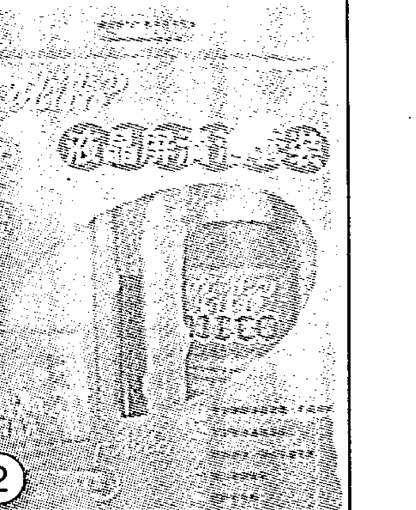

## 二、等离子电视保养术

在对液晶电视的保养有所了解的基础上我们对等离子电视也应采取类似的保养措施。等离子电视又叫PDP电视，等离子电视采用了等离子管作为发光元件，屏幕上每一个等离子管对应着一个像素，屏幕以玻璃作为基板。

与液晶电视不同的是，等离子电视的头号大敌是“散热”问题。等离子电视功率较大，容易由此产生较大热量，因此及时散热是使用等离子电视时必须重视的问题，尤其是在炎热的夏季。将等离子电视放置在通风好的地方或在旁边安置空调都是较好的散热方法。

另外，就是电压问题。PDP的功率较大，在启动时需要较大电流，在有条件的情况下最好为PDP提供独立的线路为其供电，或者再为其增加一个稳压电源。

除去以上和液晶电视不大相同的两点，其它等离子电视的保养方法大都和液晶电视相似。如：避免长时间工作，防止长时间显示同一画面，防潮湿，冲撞以及定时清洁等。清洁方法也和液晶电视一致，同样最好使用等离子电视专用清洁剂。

综述：我们在对液晶和等离子电视的日常保养有了一定的了解以后要做的就是要将这些保养知识付诸实践，在点滴生活中做到对它们的精心呵护，只有呵护好比女人还娇嫩的它们才能使它们在工作中发挥最好状态和延长它们的使用寿命！

## 减少启动时加载项目

许多应用程序在安装时都会自作主张添加至系统启动组，每次启动系统都会自动运行，这不仅延长了启动时间，而且启动完成后系统资源已经被吃掉不少！我们可以减少系统启动时加载的程序，方法是：选择“开始”菜单的“运行”，键入“msconfig”启动“系统配置实用程序”，进入“启动”标签，在此窗口列出了系统启动时加载的项目及来源，仔细查看你是否需要它自动加载，否则清除项目前的复选框，加载的项目愈少，启动的速度自然愈快。此项需要重新启动方能生效。

## 关闭系统还原功能

“系统还原”功能是Windows系列操作系统的一个重要特色，当Windows运行出现问题后，还原操作系统。“系统还原”虽然对经常犯错误的人有用，但是它会让你的硬盘处于高度繁忙的状态，你会发现你的硬盘总是忙个不停，因为Windows XP要记录操作，以便日后还原。如果你对自己有信心，那么就不要使用它，因为它可占不少内存。

关闭系统还原功能方法是：单击“开始/所有程序/附件/系统工具/系统还原”，在系统还原界面，单击“系统还原设置”进入“系统还原设置”窗口，清空“在所有驱动器上关闭系统还原”复选框，这样Windows XP就会删除备份的系统还原点，从而释放它占用的磁盘空间。

一般来说，为了兼顾系统性能和系统安全，笔者建议打开Windows XP所在盘符的系统还原功能。

## 引领流行——Windows Vista SP1全面剖析

□江北书生

> 在Windows Vista正式发布一年之后，这款被微软寄予了极大希望的操作系统仍然未能占据市场主流地位，由于存在诸多兼容性的问题，不仅普通消费者怨声载道，而且OEM厂商也颇有怨言，许多企业用户都放慢了部署Windows Vista的计划。面对这些尴尬，Service Pack1(SP1)引起极大关注自然也在意料之中，本文将以简体中文版本的Vista SP1为例，全面剖析SP1的方方面面……

## 一、SP1补丁包的组成

从未有一款补丁包像Vista SP1那样受到广泛的关注，除了微软公司声名在外这一因素的影响，Vista在过去一年之内境况不佳也是重要原因之一，许多用户迫切盼望SP1能够改善Vista存在的许多问题。

微软公布了长达17页的Windows Vista SP1改进列表，这份列表详细描述了Vista升级至SP1之后的所有细节变化，感兴趣的用户可以访问http://www.microsoft.com/downloads/details.aspx?FamilyID=e71f0083-1013-4f9c-a3f9-c56e7120a5e9&DisplayLang=en获得相应的官方文档，可惜的是目前暂时只有英文版本。

根据微软官方提供的数据，Vista SP1除了23项已经通过Windows更新发布的重要安全更新之外，Vista SP1还包含了551项补丁修复内容，这与其前辈Windows XP相比，已经有了很大的改善。Windows XP SP1在RTM版本之后14个月发布，包括24项安全更新和297项补丁修复，23个月之后发布的SP2更是包含60项安全更新、666项补丁修复。通过这些数据的比较，我们也可以看出，Windows Vista的确是一款相当优秀的系统。

在这些重要更新和补丁修复内容之中，其中与Internet Explorer有关的补丁高达75项，与电源管理有关的补丁41项，与存储器有关的补丁38项，与硬件有关的补丁35项，与网络有关的补丁同样35项，其他则是包括桌面、打印机等方面的补丁。

## 二、Vista SP1的安装方式

根据官方公布的白皮书披露，SP1将提供三种安装方式：

- 1. Windows Update：通过Internet下载更新，大约65MB，这是容量最小的一种，安装最为方便，安装时会根据当前计算机的实际情况继续下载所需要的数据。
- 2. 独立程序包：不分语种均可直接安装，用户可以将独立安装包部署到任何版本上，并且兼容System Center Configuration Manager 2007，但不足之处是独立安装版本的个头比较大，例如x86(32位)版本的文件大小为543MB，而64位版本的文件大小则高达728MB。
- 3. 集成DVD：使用媒体介质安装，主要针对批量授权用户，即OEM和更新后的彩盒包装，用户直接安装即可。不过，微软表示用户不能将SP1离线集成到Vista的安装镜像中，也就是无法在现有的Vista安装光盘上自制Slipstream版本的Vista SP1，但据称可能会在SP2中实现这一功能。

4月18日之后，对于单机系统而言，我们可以通过“Windows Update”进行在线更新，或者也可以访问官方下载中心直接获取所有语言的可执行单行版本，包括阿拉伯语、爱沙尼亚语、巴西葡萄牙语、保加利亚语、波兰语、丹麦语、德语、俄语、法语、繁体中文、芬兰语、韩语、荷兰语、简体中文、捷克语、克罗地亚语、拉脱维亚语、立陶宛语、罗马尼亚语、挪威语(博克马尔语)、葡萄牙语(葡萄牙)、日语、瑞典语、塞尔维亚语(拉丁语系)、斯洛伐克语、斯洛文尼亚语、泰国语、土耳其语、乌克兰语、西班牙语、希伯来语、希腊语、匈牙利语、意大利语、英语、中文(中国香港特别行政区)等36种语言。下载页面的地址是https://www.microsoft.com/downloads/details.aspx?familyid=F559842A-9C9B-4579-B64A-09146A0BA746&displaylang=zh-cn，两种方式的区别是前者的文件大小仅66.9MB，而后者则高达544.3MB。

不管选择何种安装方式，请确保硬盘上至少存在4.5GB的可用空间，安装过程并无复杂之处，在线更新完全是自动完成的，如果使用单行版本，遵循下载、安装的流程，只要按照提示操作即可，完成并重启系统之后，我们可以从系统属性中查看到版本号（图1），你会发现这里出现了“Service Pack1”的字样，而以前的测试版本则可能还会同时显示“v.658”等具体的版本号。

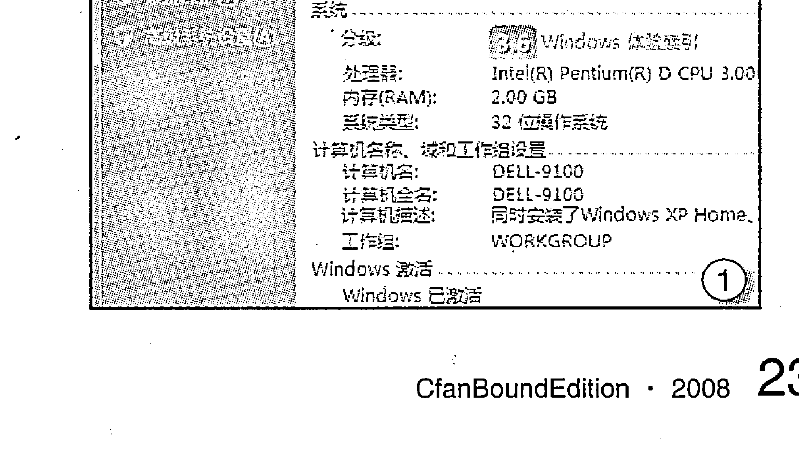

## 三、解决安装SP1之后的“不适”

需要指出的是，SP1在安装之后可能会在某些机子上出现一些小小的“不适”，需要我们动一些脑筋才能医治。

### 不适之一：系统变成无声的哑巴？

据说Vista SP1与Intel i945G系列芯片组的主板存在某些驱动程序方面的兼容性问题，例如笔者的戴尔Latitude D620笔记本电脑，正好是i945GM芯片组，板载SigmaTel HD Audio声卡，以前每次安装Vista SP1的测试版本，都没有任何的硬件问题，这次安装了正式版本的SP1，竟然声卡无声，提示未安装任何音频设备，而设备管理器中“声音、视频和游戏控制器”下却是一切正常，这里没有任何的问号或感叹号，看来还是SP1声卡驱动程序的兼容性有些问题。

这个问题解决起来当然不复杂，访问戴尔的驱动下载页面，如图2所示，找到符合条件的声卡驱动程序，将其下载回来后按照提示进行安装并重启系统，这次终于听到了熟悉的声音。如果你遇到类似的问题，不妨尝试访问厂商的官方网站下载适合Vista的驱动程序，据称945G芯片组所包含的GMA 950图形内核也与Vista SP1有兼容性的问题，而nVIDIA和ATI的主板并不存在这方面的问题。

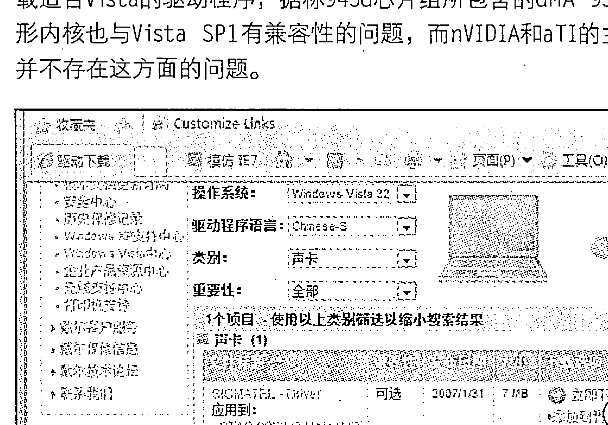

### 不适之二：Windows Live Messenger 9.0恢复为英文版本

Vista SP1安装之后，系统中原来安装的Windows Live Messenger 9.0会被自动恢复为英文版本，而笔者当初已经安装了简体中文的语言文件，看来是SP1重新覆盖了相关的文件，其实也就是对c:\Program Files\Windows Live\Messenger\msgslang.9.0.1407.1107.dll这个文件进行了覆盖。

### 不适之三：恢复“创建恢复光盘”的功能

如果你细心的话，会发现正式版本的SP1反而去除了先前在测试版本中所提供的“创建恢复光盘”的功能（英文版本中名为“Create a recovery disc”），虽然这张恢复光盘的功能似乎并不如微软所声称的那么强大，但对于初级用户来说还是比较实用的。

- 1. 首先下载一个名为recdisc.exe的程序，地址是http://www.istartedsomething.com/uploads/recdisc_x86.zip，如果是64位版本请使用http://www.istartedsomething.com/uploads/recdisc_x64.zip这个地址。
- 2. 下载回来的是一个ZIP格式的压缩包，解压缩后覆盖到系统所在磁盘的“c:\windows\system32\”这个路径，注意由于Windows Vista的自我保护机制在发生作用，因此覆盖之前请进行备份，而且需要获得相应的操作权限，这可以在属性窗口的“安全”选项卡下进行，具体操作这里就不多说了。
- 3. 接下来的工作就简单多了，直接运行recdisc.exe，在进行UAC确认之后，我们会看到图4所示的向导窗口，按照提示进行操作即可创建恢复光盘。假如你觉得每次手工运行这个文件比较麻烦的话，那么可以在桌面上创建一个快捷方式，具体操作这里就不多说了。

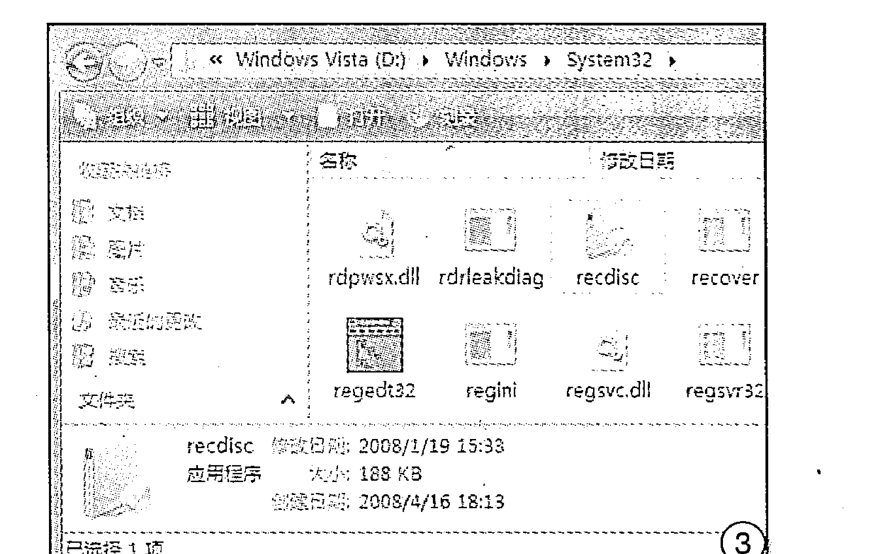

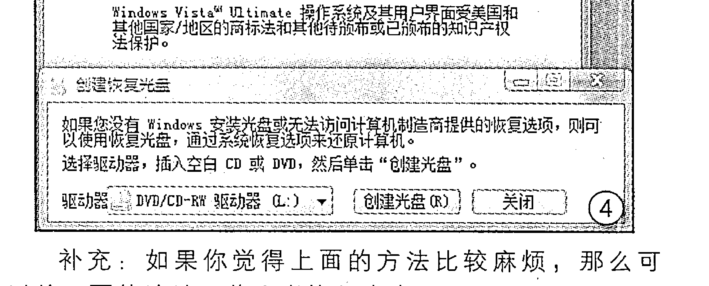

补充：如果你觉得上面的方法比较麻烦，那么可以从下面的地址下载这张恢复光盘：http://coblitz.codeen.org/neosmart.net/downloads/guides/Vista_Repair/Vista_Recovery_Disc_x86.iso，下载回来后将其刻录下来就可以了。

## 四、值得关注的新变化

虽然从本质上来说，SP1不过是集成了Vista发布以来的诸多安全更新和补丁程序，主要是在安全性、系统性能、兼容性方面做文章，也就是说SP1更注重改进和体验，而不是新增功能或应用程序的变更。IE的版本号为7.0.6001.18000，而非最新的IE8。

### 变化之一：文件复制速度明显提高

如果你看到图5所示的对话框，“正在计算”的时间相当漫长，不知作何想？Vista的文件复制速度是相当缓慢的，计算时间的错误经常在复制、移动、传输或删除文件时出现，取消“远程差分压缩”并不能彻底解决这一问题，这与我们所使用的操作方法无关，无论是复制→粘贴、剪切→粘贴、拖曳/发送到。这主要是Vista在计算剩余时间这个环节耗费了太多的时间，从而影响了操作过程，甚至会让系统陷入沉住、挂起和停止响应。

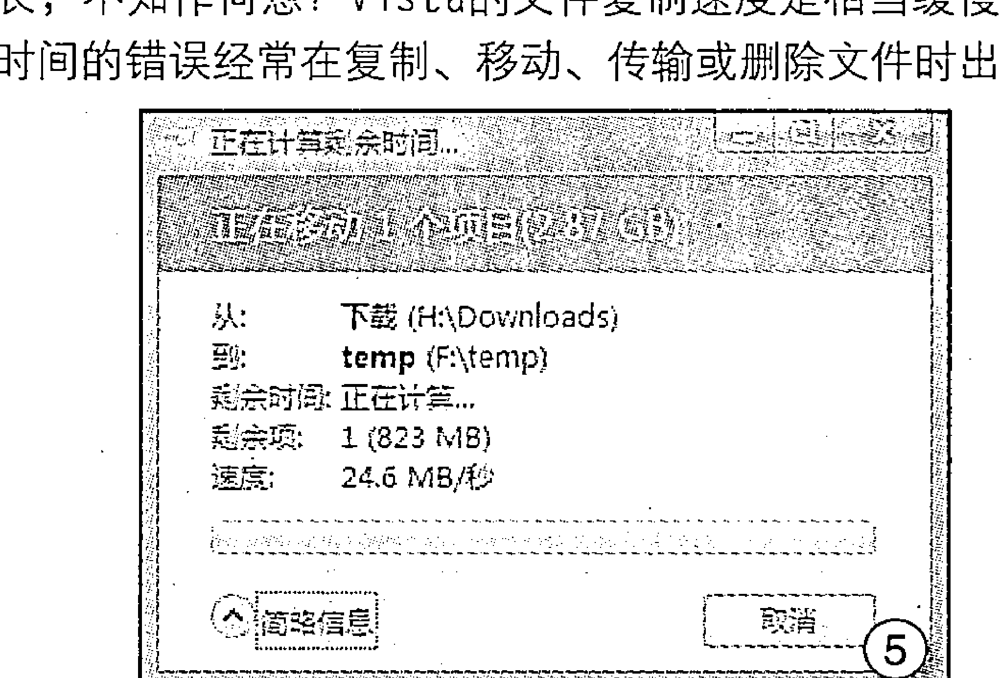

安装SP1之后，复制和移动文件速度缓慢的老大难问题得到了显著的改善，如图6所示，特别是在时间计算方面有了相当的改进，文件复制进度窗口在很短的时间之内即可计算出所需要的时间，本地磁盘对本地磁盘，文件复制速度提高25%；本地到非Windows Vista SP1系统之间的文件复制，速度提高45%；两台Windows Vista SP1之间的文件对传，速度提高50%。

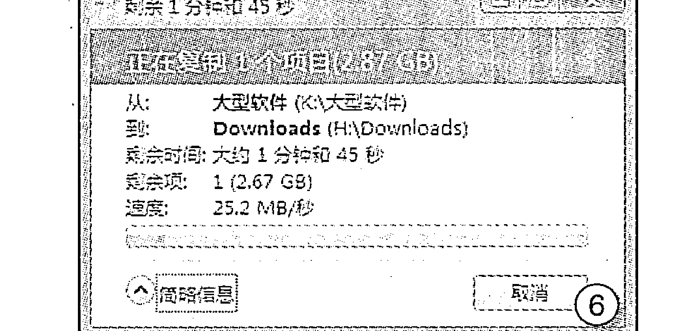

如果你不想安装SP1，那么可以访问微软的官方下载中心手工安装KB938979、KB931770。
KB938979：这是与KB938194同时发布的性能更新，除了解决计算时间的问题之外，还解决了许多其他方面的速度问题，并且改善了Vista的性能。
KB931770：解决了从网络复制文件时的计算时间的错误，主要出现在剩余时间和0分钟剩余显示的问题，也就是不能自动结束复制过程的问题。

### 变化之二：笔记本系统性能得到提升

随着二次购机高峰的到来，拥有笔记本电脑的普通用户数量急剧上升，而笔记本电脑基本上都是预装正版操作系统，其中绝大多数都是Windows Vista。

如果你日常主要使用笔记本电脑，那么更应该为Vista安装SP1，这是因为在安装Vista SP1之后，笔记本系统的性能将得到相当大的提升，特别是提高了进入休眠、从休眠中恢复后的可靠性和性能，缩短了从休眠中进行恢复所需要的时间，系统无需等待即可立即重新投入使用，这将大大改善用户的使用体验。在某些笔记本上不再频繁刷新屏幕，从而降低CPU占用率，这可以在一定程度上提高电池的续航时间。

### 变化之三：允许用户更改默认的搜索引擎

我们知道，Vista的搜索功能是十分强大了，除了可以在“开始搜索”框快速完成搜索任务之外，几乎所有常规对话框都在右上角提供了一个搜索框。不过，也许你执着地喜欢如Google桌面这样的第三方搜索程序……

在本文截稿时止，欧盟已经向微软再次开出总额高达8.99亿欧元（约合13.5亿美元）的反垄断罚单，理由是微软没有按照“合理”价格向竞争对手收取Windows平台与他们产品连接所必须的专利许可费用。其实，颇感委屈的微软已经按照欧盟的要求在Vista SP1内作了许多改进，例如开始菜单中的“搜索”命令已经被移除（见图7），当然你仍然可以通过F3或“Win+F”组合键调出搜索浏览器。

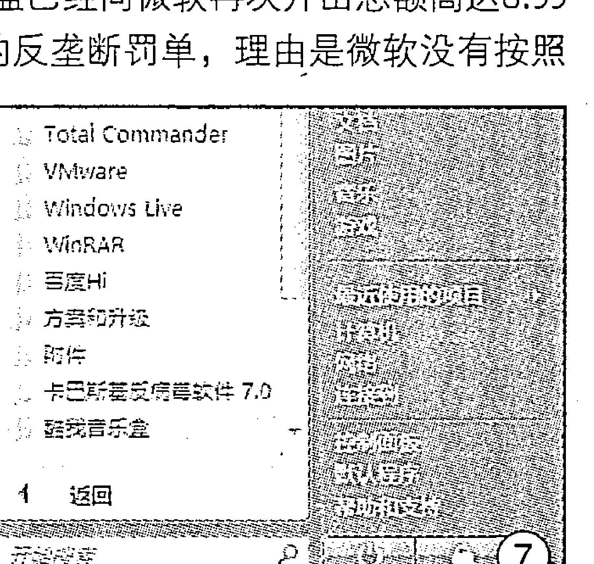

现在我们可以自行定义默认的搜索引擎，当然这些搜索服务必须符合Windows Vista SP1新增加的通讯协议（Protocol），并且注册所提供的搜索服务。这里以Google的桌面搜索为例进行说明，访问“http://desktop.google.com/zh/”下载并安装“Google桌面”，安装完成之后，Google桌面会在后台自动运行并创建索引文件，以后我们按下“Win+F”时所调用的就不再是默认的搜索组件，而是会在任务栏和桌面同时打开Google Desktop的搜索栏（见图8），不过“开始搜索”框仍然只能使用Windows Vista内置的搜索服务。


如果Google桌面的替代行动没有成功，你也可以从控制面板进入“默认程序”，在这里选择“将文件类型或协议与程序关联”，稍等片刻后打开“设置关联”的窗口，在列表框中找到名称为“SEARCH”的搜索协议，如图9所示，可以看到当前搜索协议已经与Google桌面自动建立了关联，而之前的默认值则是Windows资源管理器。或者，也可以打开“设置默认程序”窗口，在列表框中找到“Google桌面”，单击右侧的“将此程序设置为默认值”按钮，确认后即可将Google桌面设置为搜索协议的默认程序。

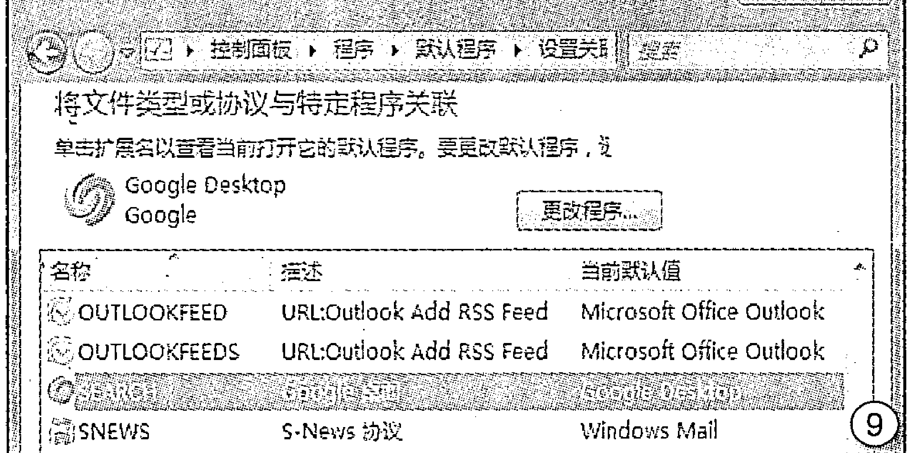

### 变化之四：本地组策略的地位被提升

对于系统管理员来说，安装SP1将获得非常实质的好处，例如本地组策略的地位得到提升。

如果你细心的话，会发现GPMC（Group Policy Management Console，组策略管理控制台）已经被从系统中移除，我们在运行对话框输入“gpedit.msc”之后，如图10所示，默认启动的将是“本地组策略编辑器”，管理员还可以自行加入额外的组策略对象（GPO）或独立的设置选项。据微软官方的解释，这是为了响应管理员的普遍需求。

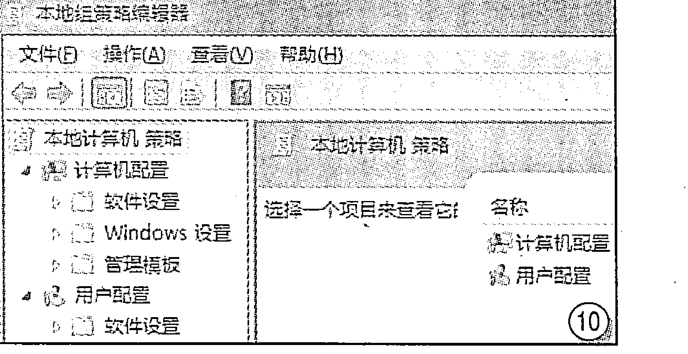

> **小提示**
> Vista SP1降低了UAC（User Account Control）对用户常规操作的苛刻要求，在进行重命名文件夹等操作时不再需要用户进行确认。

### 变化之五：对更多新技术的支持

Vista SP1增加了对新硬件技术和新标准的支持，虽然对普通用户来说，这些变化可能很难在短时间内得到切身的感受，但了解一下还是有好处的。

在未安装SP1之前，我们整理磁盘碎片时并不能自由进行选择，往往只能被动接受。安装SP1之后，你可以在运行磁盘碎片整理程序时，很方便地选择卷（图11）。除此之外，BitLocker加密功能得到了一定的增强，例如支持非系统磁盘的加密，改进了BitLocker Drive Encryption（BDE），提供TMP加密支持，包括闪存加密和PIN。例如广泛用于数据产品的ExFAT文件系统（Extended File Allocation Table）、作为RRAS平台一部分的安全套接字隧道协议（SSTP）、适应SDHOST控制器的Secure Digital Advanced Direct Memory Access（SDDMA）、可扩展固件界面启动（EPI）、UEFI支持将允许Windows Vista安装在GPT格式的硬盘上。

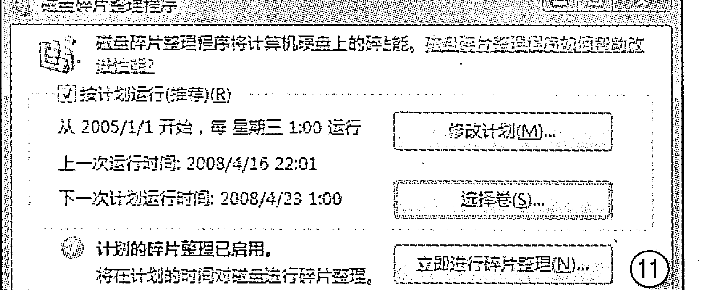

在终端服务（TS）中打印到本地打印机变得更为简单，打印管理也得到了很大改进。

### 变化之六：兼容性得到极大改善

Windows Vista的推广之所以受到阻碍，很大原因是由于软件兼容性不佳所导致，毕竟硬件方面的兼容性问题已经基本上得到解决，而软件方面的兼容性问题却是旷日持久的。不过，SP1可以让Vista的兼容性问题得到极大改善，当然仍然有少部分软件存在兼容性方面的问题，微软在其官方支持网站公布了一份关于与Windows Vista SP1不兼容的软件列表，页面地址是 http://support.microsoft.com/kb/935796/en-us，其中将不兼容的软件分成三种情况，国产的江民杀毒软件2008、瑞星防火墙2007等都位列其中。

对于这些问题，我们可以尝试安装软件开发方所提供的最新版本或相关的补丁程序，或者尝试在兼容模式下运行，相信既然被列入微软的不兼容列表，各方会很快提供解决方案。

## 五、盗版Vista安装SP1的问题

对于国人来说，由于可以理解的原因，可能很多朋友使用的是通过非正常途径获得的Vista系统，比如通过模拟BIOS的OEM方法等。如果这样的盗版系统安装了SP1以后会出现什么情况呢？

需要说明的是，由于Vista本身内核上的提升，其安全性比XP有很大的提高，而盗版破解Vista系统就意味着要破坏掉系统的某些安全措施。打个比方：Windows系统如果是一面墙，Vista就是一面比以往都要坚固的墙，如果通过非法的手段侵入这面墙，那么势必会破坏掉墙的一部分，导致整体的稳定性下降，安全性也丧失。

对于盗版用户安装SP1的问题，有几种情况，但是大家会发现对于任何的情况，SP1都没有破坏您的用户数据，只不过用户体验上会有一些不同。

### 1. 采用KMS方式激活的系统

对于那些采用KMS方式激活的用户在安装SP1以后，激活会立即失效，并提示你拥有30天的试用期，如果30天之后没有通过合法途径激活您的Vista，那么会遇到这样的情况，登录到系统后桌面变成纯黑色，并在右下角托盘处提示您激活Vista，当然你可以选择更换桌面壁纸，但是每隔一个小时系统会再次自动更换到纯黑色的壁纸并提示您激活Vista。这些并不会影响到用户所保存在电脑中的数据和资料。

### 2. 采用模拟BIOS激活的系统

对于那些采用模拟BIOS以OEM方式激活的用户安装SP1以后，激活也会立即失效，并提示你拥有15天的试用期，如果15天后没有通过合法途径激活Vista，那么同样会遭遇到上面说的黑屏情况，同样不会影响到用户保存在电脑中的数据和资料。

如果使用的是预装的OEM版本Vista，那么您可以放心，升级Vista SP1不会对您的激活有任何的影响。

## 六、SP1后安装诺顿的问题

令人遗憾的是，在安装SP1之后，当你通过控制面板检测## 掌掴安全系统
## 给WINDOWS打补丁另类招数集锦

□江北书生

我们平时用的Windows系统存在很多的系统漏洞，这些漏洞正是黑客和剑客攻击您的把柄。虽然我们有防火墙的防护，但是我们不得不承认，有些破坏性程序仍然可以利用系统漏洞绕过防火墙入侵系统。这时，我们能够做的就是为系统打上补丁。提到补丁，相信大家对于它一定不会陌生，因为它关系着我们系统的安全。在如今的互联网环境下，如果电脑不接入网络，就是一个信息孤岛。而接入网的电脑无时无刻不被网上的威胁所包围。除了安装杀毒软件和防恶软件外，给系统打补丁也成为了我们一门必修课。但可惜的是，Windows本身打补丁速度慢不说，而且有时还无法通过验证（即使是正版系统），给我们带来麻烦。如果能够更加高速地为系统应用补丁，则成为我们大家非常关心的问题。本文将告诉大家一些办法。

更新时，已经无法再像以前那样发现多种语种的语言包更新（见图12）。因此在安装SP1之后，除了Office、Defender等少量的更新之外，是不会找到系统更新的，毕竟微软不可能对尚未正式发布的SP1提供更新。这样一来，我们就无法安装语言包了，无论是直接运行.exe格式的多语言界面包，还是通过“Install or Uninstall Display languages”添加.cab格式的语言包，都将无法实现。如果是后者，我们会看到版本不符的提示信息，微软官方的建议是在安装SP1之前安装相关的语言包。

其实，按照下面的方法进行操作，我们同样可以在SP1上完成语言包的安装工作，当然前提是你的Windows Vista必须是旗舰或商业版本才行，具体步骤如下：

### 第一步：获取官方语言包

首先，我们需要从微软官方获取多语言界面包，微软为用户提供了16种语言的多语言界面包，英文语言包的下载地址为http://www.download.windowsupdate.com/msdownload/update/v3-19990518/cabpool/lp-en-us_c38cb05f3146b642c95743633998808fa5229875.exe。

### 第二步：安装WinCAB

如果直接执行下载回来的.exe文件，虽然会自动弹出“安装或卸载语言”的窗口，但我们却会看到“无法选择语言，因为语言包版本与此版本的Windows不兼容”的尴尬提示（见图13）。解决的办法是利用Issaris WinCAB，从这个.exe文件提取cab格式的压缩包，Issaris WinCAB的下载地址为http://www.skycn.com/soft/3470.html，安装后还需要从Windows XP系统中将“makecab.exe”这个文件复制过来，否则将无法运行。

### 第三步：提取.cab压缩包

运行WinCAB，从“Convert”菜单下执行“SFX CAB to CAB”命令，单击“Open”按钮，虽然这里不会有任何提示，但相关的.cab文件已经被自动提取出来，你可以在当前路径下找到。

### 第四步：安装.cab压缩包

由于我们无法通过控制面板来安装语言包，因此只能利用其他方法来完成。找一个剩余空间比较大的磁盘分区，在根目录下创建一个临时文件夹，例如“j:\temp”，将刚才提取出来的.cab文件复制过去，然后从开始菜单下找到“命令提示符”，右击选择“以管理员身份运行”，进入命令提示符环境后输入如下命令并运行：

```
start /w pkgmgr /ip /m:j:\temp\lp-en-us_c38cb05f3146b642c95743633998808fa5229875.cab
```

上述命令中，“start”是用来执行后续的程序；“pkgmgr”是所谓的“程序包管理器”，可以在命令行下安装CAB格式的压缩包，当然主要是针对微软的补丁程序和更新，这里的“ip”参数主要是用来安装压缩包，“m:”参数是指定压缩包所在的绝对路径。

执行上述命令后，你需要耐心等待一段时间，完成后会显示图14所示的结果。现在，从控制面板进入“区域和语言选项”对话框，切换到“键盘和语言”选项卡，我们就可以在“选择显示语言”下拉列表框中发现“English”的身影（见图15），切换语言后注销系统并重新登录，即可获得英文语种的语言界面。如果你需要安装其他语种的语言包，不妨按照类似的方法进行操作。

> 写在题外的话：
> 微软虽然发布了SP1，但却仍然没有解决天气预报小工具的正常显示这个难题，我们所看到的还是“服务无法使用”的提示信息，据官方解释说是因为天气预报的发布受到中国政府层面的严格限制，只有少数特定的网站才被授权合法的提供天气信息。另外，虽然现在32位的Vista SP1能够正确地报告系统所安装的4GB内存，而不再是未安装SP1之前的3.25GB，但却没有办法使用这些额外的内存……■

### 招数一：利用迅雷高速下载应用补丁

#### 第一步：安装系统漏洞修复

先从http://www.xunlei.com上下载并安装最新版的迅雷5。接着，我们可以在“狗狗影视排行”下方看到“系统漏洞修复”项，单击后会看到初始化的窗口，之后可以看到如图1所示的窗口。

#### 第二步：分清补丁类型

如图2所示，此时可以看到“独占式”和“非独占”两种补丁类型，所谓独占式补丁是一类无法与其他补丁同时安装的补丁程序，这通常是由于这些补丁会替换待修复的软件的一些核心模块，可能与同时安装的其他补丁发生冲突。许多常见的软件服务包（Service Pack），如Windows XP SP2、Office 2003 SP1等，都属于独占式补丁。

这里要注意，独占式补丁的安装逻辑是：如果我们想安装独占式补丁，必须先单独安装该补丁，然后在重启之后再进行一次漏洞扫描/修复操作，再修复其他的漏洞。

#### 第三步：应用独占补丁

此时单击独占补丁前的小圆点，表示选中它，然后单击下方的“下载并修复”。接着会出现如图3所示窗口，表示正在调用迅雷修复补丁。要注意的是，有些补丁在安装前还会让你同意其协议。

#### 第四步：重新启动系统

接着，在如图4所示的窗口中选择“立即重启”，重新启动计算机。

#### 第五步：应用非独占补丁

启动迅雷5，在“狗狗影视排行”下方单击“系统漏洞修复”项，再选中“全选（仅对非独占安装）”复选项，然后单击下方的“下载并修复”（如图5）。后面步骤是完全一样的。

#### 第六步：享用安全系统

接着，出于安全，可再次重启系统，这样我们的系统就很安全了！相比于Windows传统的更新，用迅雷会方便很多。一来其速度比较快，二来根本不用开启Windows中的某些服务（如BITS后台智能传输系统服务），可以大大减少系统资源的占用。

### 招数二：利用金山毒霸

安装完金山毒霸2008后，选择“开始”→“程序”→“金山毒霸2008杀毒套装”→“金山清理专家”，在打开窗口左侧单击“漏洞修补”下的“系统漏洞”。然后选中相应的漏洞，再单击“修补选中的漏洞”按钮即可（如图6）。之后会出现如图7所示的窗口，表明正在下载。图8窗口表示正在应用补丁。

同样，独占补丁和非独占补丁不可以同时应用。而且，应用完成后，还可以单击图6窗口下方的“补丁管理”按钮来管理已经安装的补丁（如图9）。

### 招数三：用天网防火墙的系统漏洞修补

和金山毒霸一样，天网防火墙也提供了系统漏洞填补程序。我们可以在安装后，右击天网防火墙在托盘区的图标，选择“Windows补丁”（如图10）。在打开如图11所示的窗口中可以看到相应补丁，选中后，单击最下方的“安装”按钮即可开始安装。

### 招数四：360法

安装了奇虎360安全卫士后，在其安装文件夹下（如C:\Program Files\360safe）双击360hotfix.exe。之后会看到如图12所示的窗口，选中相应的漏洞补丁，然后单击“修复系统漏洞”，顺着向导给系统打上最新的补丁。

### 招数五：雅虎天盾法

先下载并安装雅虎天盾，然后单击“漏洞扫描”标签，再单击下方的“扫描”，再单击“立即修补”（如图13），则天盾会自动将系统漏洞补丁文件自动下载到C:\Program Files\Yahoo!\雅虎天盾\sysfix文件夹下。

### 招数六：将其集成到Windows XP光盘上

与时俱进，给Windows光盘打补丁。每次安装系统后，总要下载补丁，实在是消耗时间和带宽。如果我们将下载的补丁集成到Windows XP光盘中，这样用此光盘安装的系统就“总是最新”了，十分方便。

#### 第一步：下载/安装nLite

先确认机器已经安装了Microsoft .NET Framework Version 2.0，如果没有可以从http://www.microsoft.com/downloads/details.aspx?displaylang=zh-cn&FamilyID=0856eacb-4362-4b0d-8edd-aab15c5e04f5处下载并安装。
接着，从http://home.midmaine.com/~nlite/nlite/nLite-1.4.installer.beta.exe处下载并安装nLite最新版，在安装时请确认安装类型为“简体中文”（如图14）。安装后运行之，选择语言也为Simplified Chinese（即简体中文，如图15）。选中后软件界面会即时切换到中文界面，单击“前进”进入下一步。

#### 第二步：复制安装文件

把先前的Windows XP安装光盘中的所有文件复制到e:\winxp文件夹中，在接下来的界面中，我们需要选择安装文件的所在路径，此时选择e:\winxp文件夹，会弹出相应的窗口，会扫描当前的安装文件及打SP后的情况（如图16）。完成后单击“前进”按钮进入下一步。

#### 第三步：整合补丁

接下来这步是加载上次使用后自动保存的配置文件，由于我们是第一次使用，没有配置文件可以加载，所以直接单击“前进”。这里提供了八个选项供我们选择。由于我们这次只是整合修补程序包和驱动，我们只要选中“修补程序包整合”、“驱动整合”以及最后一项“可引导ISO镜像”。最后一项的意思是在修补程序包和驱动整合结束后直接由程序制作完整ISO文件（光盘镜像文件的一种常用格式）。接着，单击“前进”，进入下一步（如图17）。

此时进入了修补程序包的整合界面，单击“插入”，在弹出的选择框中打开C:\Program Files\Thunder Network\Thunder\Plugins\KLScan\hotfix文件夹，然后选中一个文件，再按下Ctrl+A选中所有的补丁文件（如图18），并返回如图19所示界面。

#### 第四步：完成其他操作

顺着向导完成其他的操作，完成后nLite提示正在处理（如图20），确定无误后，单击“创建ISO”，指定ISO文件存放的位置即可生成ISO文件。

#### 第五步：刻录安装光盘

启动Nero，选择“刻录器”→“刻录映像文件”，然后打开我们先前生成的ISO文件，再单击“刻录”按钮，将它刻录到光盘上。接下来，我们只要在BIOS中设置好从光盘启动，其他的安装过程与普通的Windows XP安装光盘一样。只是安装完成后，还会自动将补丁安装上，一步到位！

### 招数七：将其集成到Windows Vista光盘

微软从Windows Vista SP1开始，不再提供集成开关，也就是说Windows Vista的SP1不可以集成到光盘上。但是我们却可以将扩展名为*.msu或*.cab的补丁集成到光盘上。这样，我们就可以保证安装出来的系统是最新的。

#### 第一步：下载系统补丁包

可以从网上下载补丁包，也可以通过奇虎360安全卫士来获得。具体步骤与在XP下获得补丁办法差不多，可以参见上文。

#### 第二步：下载/安装vLite

先确认机器已经安装了Microsoft .NET Framework Version 2.0，如果没有可以从http://www.microsoft.com/downloads/details.aspx?displaylang=zh-cn&FamilyID=0856eacb-4362-4b0d-8edd-aab15c5e04f5处下载并安装。

#### 第三步：安装vLite

从http://www.vlite.net/download.html下载并安装vLite。安装后运行之，在打开的窗口中选择语言，这里当然是选择“Chinese (Simplified)”了。

#### 第四步：设置语言界面

单击“语言”，选择Simplified Chinese（简体中文），如图22所示，即可出现简体中文界面。

#### 第五步：设置临时文件放置文件夹

因为进行整合操作时需要大量的磁盘空间，所以我们要选择一个更大更稳定的文件夹。单击“设置”，单击“更改”按钮，在打开窗口中设置好临时文件放置文件夹（如图23）。

#### 第六步：复制安装文件

将Windows Vista光盘放入DVD驱动器，然后将其的所有文件（夹）拷贝到一文件夹下，如E:\software\sys\Vista_EN_DVD下。

#### 第七步：选择安装文件夹

接下来的界面中，我们需要选择安装文件的所在路径，此时选择E:\software\sys\Vista_EN_DVD文件夹，会弹出相应的窗口，如图24所示。要求我们选择定制Windows Vista的版本。选中后单击“确定”按钮返回。

#### 第八步：整合补丁包

单击图24所示窗口中的“下一步”按钮，在打开如图25所示窗口中，选中“集成”、“组件”、“可引导ISO”项。最后一项的意思是在修补程序包和驱动整合结束后直接由程序制作完整ISO文件（光盘镜像文件的一种常用格式）。

#### 第九步：完成其他操作

顺着向导完成其他的操作。

#### 第十步：重建文件

到最后一步，单击“应用”，此时会弹出如图27所示的窗口，要求我们重建哪些版本。一般来说，选择“重建所有”，之后会弹出如图28所示的窗口，表示正在处理。

#### 第十一步：制作ISO文件

单击“制作ISO”，然后选择一个文件夹，指定ISO文件存放的位置即可生成ISO文件（如图29）。之后，vLite提示正在处理（如图30）。

#### 第十二步：刻录安装光盘

启动Nero，选择“刻录器”→“刻录映像文件”，然后打开我们先前生成的ISO文件，再单击“刻录”按钮，将它刻录到光盘上。接下来，我们只要在BIOS中设置好从光盘启动，其他的安装过程与普通的Windows Vista安装光盘一样。只是安装完成后，还会自动将补丁安装上，一步到位！

### 招数八：将补丁集成到Ghost文件

现在有一些人是用Ghost恢复来安装系统的，但是由于这些GHO文件不可能做到每天都发布新的GHO文件，因此这些GHO文件安装出来的系统也不可能是最新的，所以它也需要集成补丁。

由于这些系统多数是用sysprep工具进行封闭的，因此非常容易操作。

#### 第一步：集成补丁文件

先把相应的补丁重命名，这样就得到诸如patch1.exe、patch2.exe……等文件。再用Ghost Explorer打开GHO文件，然后再把上述两个补丁放到<C:\Windows>（即Windows目录）下。

#### 第二步：添加应用语句

用Ghost Explorer打开GHO文件，如果发现其下有sysprep文件夹，则把该文件夹下的sysprep.inf拖放到C:\目录下，再打开c:\sysprep.inf文件，再将[Unattended]下面的OemPreinstall=No修改为OemPreinstall=Yes，并在[Identification]上面添加如下内容。

```
[GuiRunOnce]
Command0=c:\windows\patch1.exe
Command1=c:\windows\patch2.exe
```

接着把c:\sysprep.inf文件保存到GHO文件中的sysprep文件夹下，覆盖同名文件。

如果打开GHO后没有发现有sysprep文件夹，则在C:\下新建sysprep文件夹，把上述sysprep.inf文件拷贝到<C:\sysprep>文件夹下，最后把<C:\sysprep>文件夹拖放到GHO文件的根目录中，只要保证GHO文件根目录下有sysprep文件夹，而且此文件夹中有sysprep.inf文件即可。

#### 第三步：应用补丁

把此GHO文件利用Ghost文件恢复到C分区后，系统在重新最小化安装时，会自动打上相应的补丁。

### 关闭自动更新

“自动更新”是Windows XP为了方便用户升级系统而推出的一种新功能，这种功能可以在微软推出系统升级补丁或系统安全补丁的时候，自动提醒用户升级自己的系统，不过这种功能有一个要求，就是用户必须时时在线，但是对于我们这些缺少银子的“穷人”来说，这个要求未免苛刻，所以我们把“自动升级”功能关闭掉，改为“手动升级”。关闭自动更新具体操作为：右键单击“我的电脑/属性/自动更新”，在“通知设置”一栏选择“关闭自动更新。我将手动更新计算机”一项。

### 关闭远程桌面

这个功能的一个特点就是可以让别人在另一台机器上访问你的桌面。在局域网中，这个功能很有用。比如你有问题了可以向同事求助，他可以不用到你的跟前，直接通过“远程桌面”来访问你的机器帮你解决问题。但是对于我们只有一台计算机的普通用户来说这个功能就显得多余了，所以我们把它关掉，不让它在那儿白白浪费内存。具体操作为：右键单击“我的电脑”，选择“属性/远程”，把“远程桌面”里的“允许用户远程连接到这台计算机”勾去掉。

### 关闭“自动发送错误报告”功能

大家在Windows XP中肯定有这样的经历，一旦一个程序异常终止，系统就会自动跳出一个对话框问你是否将错误发送给微软，这就是XP中的“自动发送错误”功能，它可以将错误信息发送到微软的网站。虽然微软一再信誓旦旦地表示，可以提供强大的安全保障，不会泄露个人隐私，但是发送给微软的信息中有可能包含你正在浏览或编辑的文档信息，也许这正包含了个人隐私或是公司机密，因此如果你想保障自己应有的权利，我们应该义无反顾的把这项功能关掉。方法是：单击“开始/控制面板/系统/高级”，单击“错误报告”按钮，然后选中“禁用错误报告”，下面的“但在发生严重错误时通知我”可以选中。

# 与时俱进 大文件也有大智慧——大文件处理实用技巧大搜罗

江北书生

几年前我们还生活在100GB的时代，但短短几年后的我们却已经完全进入了半TB的时代，明年我们将进入TB时代。越来越便宜的存储空间，越来越成熟的存储技术，使得我们处理的数据也越来越大。同时，处理的文件也越来越多。

## 一、基础技巧

### 1. 尽量购买SATA硬盘

SATA硬盘的价格与PATA硬盘的几乎相当，而且它提供的150MB/s甚至300MB/s的传输速度的确令我们用户很难抵挡其诱惑。而且购买的时候，一定要购买II代产品。同时，有些硬盘跳线会将其限制在II代速度，即150MB/s上。

### 2. 在BIOS中开启SATA模式

现在的BIOS中允许SATA硬盘采用兼容模式，这并不是一个好消息。建议大家全面开启SATA，当然在安装Windows Vista的时候没有问题，但在安装Windows XP时会有一些麻烦。下面会有解决方案。

### 3. 让系统自动安装SATA驱动

要想让SATA硬盘发挥出最大的优势，就必须正确安装其驱动。由于一般安装SATA驱动需要用到软盘，而将SATA驱动集成到Windows XP安装盘中又非一般用户所能掌握。在此，笔者推荐大家使用番茄XP版，它在显示时将会让我们选择安装自带SATA驱动的Windows XP，它可以识别出多数的SATA硬盘，可以为我们省下不少时间。

### 4. 注意不要接多个电源接口

一般SATA硬盘上都有两个电源接口，一个和IDE硬盘电源接口完全一样，另一个是SATA专用的电源插头，我们推荐使用SATA专用的电源插头来取电，千万不要同时将电源插入两个电源接口中，否则将有可能烧毁你的硬盘！

### 5. 注意热插拔问题

目前SATA技术分为V1.0和V2.0两个版本，其中V1.0不支持热插拔技术，在V2.0规格中SATA实现了热插拔功能。因此，如果你使用的SATA是第一代产品，请不要热插拔硬盘。同时，热插拔功能也要主板支持的，由于Intel的ICH5南桥芯片不支持热插拔功能，因此如果你是购买了Intel 865系列主板的用户将无法实现这一功能，目前市场上支持SATA规格的主板中能够支持热插拔功能的并不是很多，所以，一般情况下，请不要热插拔SATA硬盘，毕竟硬盘上的数据还是相当宝贵的。在热插拔时，如果插上，请一定先上电源线，后上数据线，而拔下时，反之，先拔下数据线，后拔电源线。

### 6. 硬盘分区

现在硬盘很大，我们不可能买回来当成一个分区使用。这样数据处理的难度和数据保存的风险将会非常大。因此，硬盘分区要有技巧。

#### （1）不要大于128GB

SATA相对来说都比较大，因此大多数人一定会好好地计划这一块‘宝地’。不过，我并不建议将分区划分得大于128GB。因为Windows XP管理大分区还是有一些问题，大家最好将其分在100GB左右，如果数据较多，可以通过NTFS分区文件夹映射的方法来解决。

#### （2）分区建议

当然，对于新硬盘，我们必须要有一个合理的分区。另外，很多用户并不会用FDisk来分区，不要着急，这些问题都可以解决。

| 硬盘大小 | 主分区 | 扩展分区 | 系统备份区 | 数据区 | 软件/游戏区 | 其他区 |
|----------|--------|----------|------------|--------|-------------|--------|
| 120GB | 5GB | 115GB | 10GB | 105GB | 无 | 无 |
| 160GB | 10GB | 150GB | 10GB | 80GB | 60GB | 无 |
| 200GB | 10GB | 190GB | 10GB | 120GB | 60GB | 无 |
| 250GB | 20GB | 230GB | 10GB | 120GB | 100GB | 无 |
| 320GB | 20GB | 300GB | 10GB | 120GB | 100GB | 70GB |

#### （3）尽量用Windows来分区

在这里要提示大家的是，新硬盘安装到电脑上后，进入BIOS，设置从优先光盘启动。用Windows XP光盘引导机器，它会发现新硬盘，并会出现如图1所示的窗口。我们可以分出10GB左右的空间来安装Windows XP。稍等片刻即可完成，接下来就是我们所熟悉的安装过程了。

安装完成后，右击“我的电脑”，选择“管理”，再依次进入“计算机管理→存储→磁盘管理”项目，如图2所示，分为上下两个窗口，上面显示了磁盘的基本信息，例如布局、类型、文件系统、状态、容量、空闲空间、容错、开销等，是不是比FDisk要简单多了？右击笔记本硬盘剩下的区域，选择“新建分区”命令，然后在打开窗口中选择分区类型，一般选择扩展分区，完成后，再右击新建的扩展分区，选择“新建分区”，在打开窗口中选择“逻辑驱动器”，按上述表中进行划分即可，同时选中“快速格式化”，否则几十上百GB的分区格式可要不少时间，而且新硬盘一般不会有问题，快速格式化之即可。

### 7. 如果处理文件大于4GB 使用NTFS分区

现在在Windows上通用的是NTFS和FAT32，到底用哪一种好呢？笔者的建议是如果文件大于4GB，使用NTFS分区。

随着互联网数据的增大，现在超过4GB的文件也开始出现。但是由于2的32次方为4G，所以FAT32最大的单个文件不可能超过4GB。因此，我们如果处理的文件有大于4GB的，必须将硬盘格式为NTFS分区方式。要进行此类操作非常简单，大家在安装Windows XP/Vista后，将剩下的分区在“磁盘管理”中格式化时选中NTFS即可。但是，如果你有FAT32分区，可以通过下面的方法来转换。要注意的是，在转换前必须做好相关数据的备份工作！

#### （1）Convert工具

我们可以利用Windows 2000/XP提供的分区格式转换工具“Convert.exe”。Convert.exe是Windows 2000附带的一个DOS命令行程序，通过这个工具可以在不破坏FAT文件系统的前提下，将FAT转换为NTFS。它的用法很简单，先在Windows 2000环境下切换到DOS命令行窗口，在提示符下键入：D:\>convert 需要转换的盘符 /FS:NTFS。所有的转换将在系统重新启动后完成。

#### （2）专门工具

另外，我们还可以使用专门的转换工具，如硬盘无损分区工具Powerquest Partition Magic。使用它完成磁盘文件格式的转换也是非常容易的。首先在界面中的磁盘分区列表中选择需要转换的分区，从界面按钮条中选择“Convert Partition”按钮，或者从界面菜单条“Operations”项下拉菜单中选择“Convert”命令。激活该项功能界面。在界面中选择转换输出为“NTFS”，之后单击“OK”按钮返回程序主界面。单击界面右下角的“Apply”添加设置。此后系统会重新引导启动，并完成分区格式的转换操作。

> 小知识 什么是NTFS文件系统
NTFS: New Technology File新技术文件系统，微软Windows NT内核的系列操作系统（Windows NT/2000/XP）支持的、一个特别为网络和磁盘配额、文件加密等管理安全特性设计的磁盘格式。以前主要是为网络用户服务，现在很多个人用户开始用到了NTFS。NTFS也是以簇为单位来存储数据文件，但NTFS中簇的大小并不依赖于磁盘或分区的大小。簇尺寸的缩小不但降低了磁盘空间的浪费，还减少了产生磁盘碎片的可能。同时NTFS支持文件加密管理功能，可为用户提供更高层次的安全保证。

### 8. 如果处理文件小于4GB 使用FAT32分区

NTFS分区虽然好，但一些菜鸟都有过忘记了密码或者未能导出证书而造成数据丢失的经历。如果你使用的是对安全性要求不是很高的个人电脑，可以考虑将分区格式化为FAT32格式。但是不知道大家注意过没有，当我们在Windows 2000/XP中格式化一个大于32GB的分区时，只有NTFS格式可选（如图6）。如果你希望Windows 2000/XP能够识别出你的大FAT32分区的话，可以通过如下两个方法：

#### （1）使用增强型FDISK

先在Windows 98的DOS窗口中运行C:\Windows\Command目录下的bootdisk.bat批处理文件制作Windows 98启动盘。同时，由于Windows 98中的FDISK程序无法很好地支持大硬盘，所以从http://ffdisk.webaps.de/fdisk121.zip处下载此压缩包，并用WinRAR将其中的Program文件夹中的FDISK.EXE解压出来，然后拷贝到A盘上代替Windows 98中的FDISK程序。同时查看一下A盘上有没有FORMAT.EXE，如果没有，则从C:\Windows\Command文件夹下拷贝。最后就是用这张Windows 98启动盘启动系统，然后用FDISK分出大于32GB的“大分区”，然后再用该盘中的FORMAT.EXE对分区进行格式化即可被其Windows 2000/XP识别并使用。这样，系统崩溃了，我们也可以通过DOS启动盘，从“大分区”上恢复数据。

#### （2）用Partition Magic来分区

Partition Magic支持多种格式分区的创建，我们只要启动之，点击向导栏的“创建新的分区”按钮，单击“下一步”，在窗口中选择“是”。继续点击“下一步”按钮，顺着向导，选择文件系统类型为FAT32，再将其格式化即可。

### 9. 别让文件名拖了NTFS分区后腿

一般人将大分区还是格式化成了NTFS分区格式，但使用8.3文件命名方式会降低NTFS分区的性能，而现在我们使用16位的程序并不多，所以我们完全有理由禁止NTFS分区上的8.3文件命名方式，从而提升其性能：打开“注册表编辑器”，定位到HKEY_LOCAL_MACHINE\SYSTEM\CurrentControlSet\Control\FileSystem，再双击NtfsDisable8dot3NameCreation项，将其设置为0，重新启动系统后生效。另外，如果没有这个项，请右击，新建一双字节值，将其命名为NtfsDisable8dot3NameCreation，再双击之，将其值设置为0。

## 二、清理大文件

现在的硬盘容量动辄上百个GB，按说不会出现硬盘不够用的情况。尽管现在硬盘是白菜价，但是再有钱的人也怕多花钱，尽管我们生活在一个海量且廉价的存储空间时代，但懂得节省仍是很好的美德。让大文件变小或者把不必要的文件请出硬盘，对于我们管理文件、提升效率是大有裨益的。

### 1. 清理Vista

Windows Vista安装后，硬盘空间占用巨大。其实有很多不必要的文件（夹），完全可以将其删除掉：

主要的文件夹占用空间为：build 2.12GB、InstalledRepository 177MB、packages 510MB、Program Files 628MB、Windows 4.81GB等。不过，我们可以删除以下的文件夹：

C:\Windows\Web\Wallpaper 里面是Windows自带墙纸，不需要的可以删除掉，或者转移至其他盘（45.5M）；
C:\Boot 除zh-CN外均可删除，直接删除会提示无权限，方法同上（13.3M）；
C:\perflogs\System\Diagnostics 进行了Windows Vista系统测试之后的测试记录文件存放处，按照不同的日期一个文件夹来存放，不需要的可以删除之（9.39M）；
C:\Windows\Downloaded Installations 有一些程序（如Dreamweaver等），安装的时候会把安装文件解压至此文件夹里面，可以删除；
C:\Windows\Help 帮助文件，可以删除。建议暂时保留，因为对这VISTA还不怎么熟悉，有时有点用处（105M）；
C:\Windows\IME 输入法文件，不清楚具体的哪个文件夹对应哪个输入法（136M）。一般来说，用紫光和搜狗、五笔的人很多，因此这个文件夹可以删除掉；
C:\Windows\Installer 已安装程序的卸载修改时所需程序，如果确定该程序安装后不用卸载，可以删除之，要不然以后要删除可能删不了（不过也可以重新安装再删），按安装程序的数量，几十到几百M不等；
C:\Windows\winsxs\Backup 这个里面是一些备份文件，可以删除（353M）；
C:\ProgramData 一些程序安装时会放一些文件到这里面，看需要删除，例如我装了iTunes之后会出现C:\ProgramData\Apple Computer\Installer Cache\iTunes 7.0.2.16这个文件夹，里面其实就是安装文件，可以删除，但是有些是软件运行时需要的文件，不能乱删，自己看着是安装文件的就可以删，此文件夹大小几十到几百M不等；
C:\Users\Public 所有用户公用文件夹，里面有一些示例图片、视频等，可以删除之（217M），其中C:\Users\Public\Recorded TV\Sample Media为Windows Media Center的示例电视录制文件（143M），C:\Users\Public\Music\Sample Music为示例音乐（59M），C:\Users\Public\Pictures\Sample Pictures为示例图片（4.7M），C:\Users\Public\Videos为示例视频（9.6M）。

经过上面的操作，C盘的空间会多出许多。

### 2. 清理XP

可以删除的文件夹有：

C:\Windows\Driver Cache\i386\driver.cab 这里是驱动程序，删除后可以省下73MB；
C:\Windows\system32\dllcache 这里是DLL备份，删除后可以省下250多MB；
C:\Windows\fonts 这里是字库，可以删除不必要的。不过，不要直接删除，以防误伤了正常字库。因此，必须单击“开始”→“设置”→“控制面板”，双击“字体”项目。在其中删除；
C:\Windows\IME 这里是XP自带的输入法，如果用五笔和紫光或搜狗，可以删除掉，省下80MB。

### 3. 减少页面文件大小

我们知道，在Windows中采用了一项虚拟内存技术，而页面文件实际上就是XP使用的虚拟内存的文件，它保存在系统区根目录下的pagefile.sys文件中。但是Windows XP的默认值设得很大，浪费了不少的硬盘空间，其实我们完全可以将它的值设小一点：单击“开始”→“设置”→“控制面板”，双击“系统”图标，选择“高级”→“性能”→“设置”→“高级”→“虚拟内存”→“更改”，先选中C分区，选中“自定义大小”单选按钮，并在其中输入小一点的数值，再单击“设置”按钮确认（如图3）。然后再选择其他的盘符驱动器，并都选择“无页面文件”项来禁止在上面的页面文件。

现在很多机器配置了2GB的内存，这时可以将页面文件设置为无。

### 4. 去除休眠文件

Windows XP支持休眠功能，电脑处于休眠状态时，内存中的所有内容将保存到硬盘，并且电脑会被关闭。电脑在返回打开状态之后，关闭电脑时打开的所有程序和文档将全都还原到桌面。因此，在一些较新的具有STR功能的主板上安装了XP后，在系统区根目录下会有一个hiberfil.sys的文件，而且它的大小和内存容量完全一样！如果你的内存是1GB，那它的大小也是1GB！因此，大家如果不使用它的休眠功能，则可以进入“控制面板”→“电源选项”中取消“启用休眠”前的复选框（如图4）。

### 5. 去掉ACDSee缓存文件

ACDSee的硬盘空间占用实在是太大了，别看ACDSee刚安装完时很小，但它会自动地把看过的图片的缩略图放在自己的磁盘缓存文件里面，以便下次再打开这些图片文件时很快地显示出来（现在知道ACDSee看图为什么快了吧！）。此时，请打开<C:\Documents and Settings\用户名\Application Data\ACD Systems\ACDSee\Cache>文件夹，删除掉其中的所有文件（有可能这些文件是隐藏的）。

另外，ACDSee还会把一些数据库文件放到<C:\Documents and Settings\用户名\Application Data\ACD Systems\Catalogs\Default>文件夹下，大家可以把其中的文件删除掉。

> 我们可以制作一个cleanacd.bat，在其中写上xxcopy "C:\Documents and Settings\用户名\Application Data\ACD Systems" /rmdir /yy，将此文件的快捷方式放在桌面上，直接双击可以快速清除掉这些巨型文件。

> 安装了xxcopy后（我们后面要介绍），在“命令提示符”下输入xxcopy c:\thumb.db /s /h /yy /rs则会把C盘上所有文件名为thumb.db的文件删除掉。

### 6. 删除掉Office缓存文件

在安装完Office 2003时，会有一个“删除安装文件”选项，我们选中后可以将其在硬盘上的450多MB的缓存文件删除掉。以后要更新Office或者添加功能时，只要插入Office 2003安装光盘就行了。如果忘记选了，可以在硬盘上找MSOCache文件夹（隐藏），将其删除即可。

### 7. 不要thumb.db

如果你使用Windows XP，一定会发现在很多文件夹中莫名其妙地出现thumb.db文件，有的还相当大。其实，它是“资源管理器”使用了“缩略图”后系统生成的缓存文件，有了它，以后再访问这个文件夹时，文件的缩略图会很快显示出来。此时，可以打开“资源管理器”，选择“工具→文件夹选项”，单击“查看”标签，再选中“不缓存缩略图”复选项（如图5）。

## 三、使用大文件

### 1. 如何找到并移动大文件

如果你的硬盘上的大文件较多，而且分散在硬盘的各处，那查找起来可不容易，此时可以借助于xxcopy来帮助我们。下载地址：http://www.xxcopy.com/download/xxcopy.zip。下载后，把xxcopy.zip压缩包解压到一文件夹下，再双击install.bat文件即可安装，一般情况下，安装程序询问时，均可按下Y键，它会把xxcopy安装到系统文件夹下，以方便我们调用。

注意：xxcopy必须在Windows的DOS方式下运行，它调用的是标准的Win32文件输入/输出函数，完完全全支持长文件名文件。同时，xxcopy在NTFS分区间拷贝文件时，还会自动带上相应文件权限。

安装后，编写一个bat，命名为move300.bat

```
xxcopy D:\*.* E:\big300 /s /h /yy /sz:300MB-
```

执行以上命令后将会将D盘上所有大于300MB的文件移到E:\big300文件夹下，完成后进入E:\big300文件夹，如果发现没有大作用，可以将它们删除掉。

> SZ还有更多参数，它可以更好地控制大文件：
> - /SZ:<n>-<m>：处理处于n字节和m字节之间的大文件；
> - /SZ:<n>-：处理等于或大于n字节的大文件；
> - /SZ:-<m>：处理等于或小于m字节的大文件；
> - /SZ:<n>：处理正好等于n字节的大文件；

### 2. 只清除指定大小大文件

xxcopy d:\*.* /s /h /yy /sz:300MB- /rs 则可以将D盘上所有大于300MB的文件直接删除掉，其余以此类推。不管硬盘怎样大，如果不会整理，总有有用完的时候！

### 3. 大文件 巧妙传

有了大文件，用邮件来传送是不现实的。因为很多邮箱对于附件作了限制，对服务器也有很大的伤害。不过，我们可以利用其他的办法来传递大文件。

- （1）网站也可发文件
打开http://file.mofile.com，然后顺着向导可以将文件保存，然后将下载地址和提取码给朋友（如图6）。
- （2）使用Yahoo公文包
打开http://cn.briefcase.yahoo.com/bc//home（如图7），Yahoo公文包## 三、 网络存储，让你的文件“移动”起来

### 1. 网络存储的类型
    目前，网络存储主要有以下几种类型：
    *   **个人网络存储**：主要面向个人用户，提供文件存储、备份和共享功能。
    *   **企业网络存储**：面向企业用户，提供大容量、高可靠性的存储解决方案。
    *   **在线备份服务**：专门用于数据备份，确保数据安全。

### 2. 主流网络存储服务介绍
#### （1）网络硬盘
提供同样的网络存储接力站的功能。也可以为各自的用户在网上提供一个文件存储的“虚拟硬盘”，以便让我们从家中、单位、网吧或者其他任何可以连接互联网的计算机来上传、下载和管理上面文件，来达到文件共享的目的。

#### （2）网络存储接力站
*   **@Backup**: http://www.atbackup.com/ 提供50MB的空间，可以免费使用30天。
*   **Easiestfilesystem**: http://www.filesanywhere.com/ 提供250MB的空间，可以免费使用15天。
*   **FilesAnywhere**: http://www.filesanywhere.com/ 提供50MB的空间，可以免费使用30天。
*   **IBackup**: http://www.ibackup.org/ 提供50MB的空间，可以免费使用30天，成功推荐10个朋友注册的用户可以升级200MB。
*   **Xdrive**: http://www.xdrive.com/ 提供25MB的空间，可以免费使用15天。

#### （3）Foxmail.com
文件中转站帮助您在不同电脑间转移文件（如图8），以链接形式向任意邮箱发送1G的超大附件。

#### （4）其他服务商
*   **@Backup**: http://www.atbackup.com/ 提供50MB的空间，可以免费使用30天。
*   **Easiestfilesystem**: http://www.filesanywhere.com/ 提供250MB的空间，可以免费使用15天。
*   **FilesAnywhere**: http://www.filesanywhere.com/ 提供50MB的空间，可以免费使用30天。
*   **IBackup**: http://www.ibackup.org/ 提供50MB的空间，可以免费使用30天，成功推荐10个朋友注册的用户可以升级200MB。
*   **Xdrive**: http://www.xdrive.com/ 提供25MB的空间，可以免费使用15天。

#### （5）使用网络邮盘
许多上网的朋友都会使用多个邮箱来应付不同的需要，这得益于在网上多能轻而易举地申请邮箱，而且所给予的邮箱空间还都比较庞大，自然也就“多多益善”了。不过实际应用中，很多邮箱会被束之高阁未能充分利用，就造成了网络资源的大量浪费。而网络邮盘则可以将各个不同邮箱的存储空间组织起来。

### 4. 大文件玩断点续拷
如果复制一个大文件，中途却发现由于种种不明原因而造成失败，重新开始一定是一个耗时很多的累活。推荐使用 Total Copy这个免费的增强软件，它可以让你的系统支持断点续拷功能。

从http://www.gigahost.no/nedlaster/tcopy.exe处下载并安装此软件。安装后，当我们用鼠标右键拖放文件到相应文件夹，会多出Tocal Copy Here和Total Move Here两个命令（如图9），选择Total Copy拷贝文件，选择Total Move Here则移动文件。经试验，它的拷贝速度非常快，远超过Windows本身的拷贝速度。同时，我们可以单击如图10窗口中的Pause按钮暂停，按下Resume键继续。另外，它支持“断点续传”，当目标空间不够时，程序会自动中止拷贝，并允许我们释放空间。在拷贝或移动文件过程中即使发生意外，哪怕断电，Total Copy也会记住拷贝点，下次会从断点处开始重新拷贝文件。同时，在拷贝过程中，我们还可以拖动Speedlimit的调节滑杆设置拷贝速度，这样就可以避免因大文件或多个文件而占用过多的系统资源，影响其他任务的执行。

### 5. 下载大文件有技巧
带宽的激增、DVD的普及、视频的盛行……所有这些都告诉我们计算能力增加了，带宽速度变快了。随之而来的是大块头内容的巨增！而作为下载工具的迅雷，我们很多时候都要靠它来进行大文件的传输工作。事实上，随着互联网的发展，网上的大文件越来越多，怎样高速下载大文件成了当务之急。虽说网络速度很快，但要下载大文件还是要一些实用的技巧的。下面以迅雷为例进行介绍：

#### （1）突破同时连发数
Windows XP SP2为了防止病毒扩散，而采用“极限政策”。不过，我们可以在打开迅雷5后，选择“工具” → “XP系统优化工具”，并在打开窗口中设置相应的连接数，再单击“修改连接数”按钮，将其设置一个较大的值（如图11）。

#### （2）总使用最新的迅雷
及时更新迅雷可以修正软件Bug，提高软件运行的稳定性。而且，迅雷开发团队也会与时俱进，针对大文件下载进行优化。更新下载库，优化了大文件的数据传输，让迅雷5下载大文件时也可以做到“风驰电掣”！硬盘真正做到“有容乃大”！

#### （3）给更大的下载空间
默认情况下，迅雷安装后会在C盘创建一个TDDownload目录，并将所有下载的文件都保存在这里。如果要下载大文件，最好不要和系统放在一个盘上。单击迅雷主窗口中的选项“已下载”，右击，选择“属性”。然后在如图12所示窗口中设置默认文件夹。完成后按下“确定”按钮，迅雷还会弹出相应的确认对话框，建议选中“修改子类别的存储文件夹”和“移动本地文件”（如图13），这样软件会同时将C:\TDDownload下默认创建的“软件”、“游戏”、“音乐”、“影视”、“手机”和“书籍”等子文件夹一并移动，并且还会移动其中已经下载的文件。让我们做到“无缝移动”！

#### （4）下载文件所在分区为NTFS
随着互联网数据的增大，现在超过4GB的文件也开始出现。因此一般来说，可将上面的文件夹放到NTFS分区上。

#### （5）不要限制速度
出于稳定的原因，迅雷默认设置中作了保守的设置，而我们的机器和网络环境都比较好，这时完全可以自行设置，使其“全速前进”：在迅雷主窗口中选择“工具”→“配置”命令，再选择“连接”，取消选中“限制”下的两个复选框。这样机器将会全速前进，自动来调整（如图14）。

#### （6）让同时任务数少一些
尽管迅雷5现在最多同时的任务数可以上调为20，但是如果我们经常下载大文件，则可将此数值下调，这样迅雷对于文件系统和资源的占用会少得多，提升了稳定性的同时，相当于提升了速度！选择“工具”→“配置”，再选择“连接”，即可在右侧的“最多同时进行的任务数”进行设置。如果我们下载大文件较多，则改为5比较合适（如图14）。这样一来可以减少下载时对文件系统的资源占用，二来也可以统筹好有限的带宽资源，形成良性循环。

#### （7）让迅雷支持UPnP
打开UPnP服务后，可以在下载BT等大文件时穿透NAT设备。这样，外部的BT客户端可以主动连接，这样一来peers自然会多出很多。不仅可以从这些peers处得到数据，而且我们也可以向他们上传数据。根据BT精神，我们上传得越多，其速度就会越快！

要让迅雷支持UPnP，首先在路由器中进行设置，如在DI-724P+中，选择“工具”→“其它项目”，然后选中“启用UPnP”后的“激活”，再单击下方的“执行”即可生效。

然后在Windows XP中打开SSDP Discovery Service服务，在Windows Vista中打开SSDP Discovery服务。这些比较简单，如果你不会，可以参考Windows的使用手册或请教高手。

最后，要打开迅雷，选择“工具”→“配置”命令，再选择“BT/端口设置”，然后选中“允许连接DHT网络”和“允许使用UPnP自动端口映射功能”复选框（如图15）。之后，我们可以看到迅雷5中左下角“网络”项的图标已经是绿色，单击后可以看到UPnP已经正常（如图16）。

#### （8）支持KAD网络
新版迅雷全面支持KAD网络，这样就意味着迅雷在下载电骡资源时可以走“更广”的KAD网络（如图17），可以在此网络中寻找下载同一文件的其他用户。资源和连接更多，再加上迅雷的智能计算，其速度也会得到更大提升。在下载电骡等大文件时，特别有效。因此，我们必须确认选择“工具”→“配置”→“EMule/端口设置”，选中“启用KAD网络”复选框。

#### （9）设置更大的缓存
我们可以设置更大的缓存来改善大文件的下载。选择 “工具”→“配置” 命令，再选择 “常规”，然后在 “磁盘缓冲区设置” 中将 “最小缓存” 和 “最大缓存” 都设置成最大值（如图19）。

## 四、化繁为简 尽量避免大文件
“体型”庞大的文件，我们携带交流起来很不方便。为此，我们决定给这些文件来一个减肥套餐，在不影响它们功能的前提下，给它们减减肥，让它们变得身轻如燕。这样就可以避免更多的大文件。

### 1. Office文档
#### （1）另存法
把原先的文件用 “文件”→“另存为” 命令保存一次，这样可以大大减小这些文件的大小。再压缩，自然会小出许多。

#### （2）不嵌入字体
在Word中有一项嵌入字体技术，它能够把文档中使用的字体保存到Word文档中，以便能够在他人的机器上正常显示。毫无疑问，这样会使文档的容量大大增加。不过，我们可以单击 “工具” 菜单中的 “选项” 命令，再单击 “保存” 选项卡，然后取消 “嵌入TrueType字体” 选项。同时在文档中尽量使用Windows中自带的字体，如果实在为了美观或特殊排版需要而选择了其他字体，则给出该字体的下载地址。

#### （3）批量压缩图片
在添加图片，如照片或插图时，右击之，选择 “设置图片格式”，然后单击 “压缩” 按钮，弹出 “压缩图片” 窗口，选中 “文档中的所有图片” 单选按钮。在 “更改分辨率” 区域，选择演示文稿的使用目的：“Web/屏幕”（96dpi）、“打印”（200dpi）或者 “不更改”。同时选中 “删除图片的剪裁区域” 复选框，点击 “确定” 即可。在执行了图片压缩或删除图片剪裁区域的操作后，将不能把图片恢复至原先的分辨率或大小（如图20）。该技巧同样适用于Word文档。

### 2. RAR压缩包
在 “资源管理器” 中右击一文件，选择WinRAR→“添加到压缩文件” 命令后，在打开的 “压缩文件名和参数” 窗口中可以看到 “压缩方式” 下有六种压缩方法：“存储”、“最快”、“较快”、“标准”、“较好”和“最好”。选择“最好”方式后则可以使生成后的RAR文件容量相对最小。同时，还可以选中 “压缩选项” 下的 “创建固实压缩文件” 前的复选框，从而生成固实压缩包文件，这样可以进一步获得更高压缩比，使得压缩文件更小（如图21）。

> ★ “最快”压缩性能最差，但速度最快，“存储”则将全部文件结合成单一的文件，但是不压缩。如果我们的压缩包是为了散布或是长久性保存，则可以忽略时间因素而使用 “最好” 的压缩方法来尽可能减少压缩包大小。
★固实压缩包是用一种特殊压缩方式压缩的RAR压缩包，它把压缩包中的所有文件当成一个连续数据流来看待。固实压缩只被RAR格式的压缩包支持，ZIP压缩包不支持。使用固实压缩可以明显提高压缩比，特别是在添加大量的小文件的时候，但是它们也有一些缺点：（1）解压部分文件时速度会变慢。因为从固实压缩包解压缩单个或多个文件时要经过分析，所以速度要比解压普通压缩包慢一些。但是从固实压缩包解压缩所有文件时，解压缩速度并不受影响；（2）不利于修复操作。如果固实压缩包中的任何文件损坏了，要解压缩损坏区域后面的所有文件是不可能的。而使用非固实方式压缩的压缩包，还可能可以通过WinRAR来修复。

### 3.附件文件
虽然带宽已经很不错，但是现在内容的身体同样也在“发胖”。因此，我们要想快速地将邮件发送到对方，关键要解决减小附件容量问题，以下则是笔者减少附件容量的一些非常实用的技巧：

#### （1）将文章存为纯文本文件，并去掉不必要的空行的空格符；
#### （2）将图片全部转换为BMP或TIF格式，然后和纯文本文件一并压缩；
因为很多人认为把图片保存为JPG格式后，可以减少容量。但事实证明，把图片存为JPG后用压缩软件压缩后还没有存为BMP格式后压缩的文件小！
#### （3）压缩时注意使用高压缩率并生成固实压缩包（前面已经介绍）；
#### （4）尽量把附件压成一个文件：
如果我们要发送的文件中有多个文件，那么笔者建议你尽量压缩成一个文件，因为如果我们向对方发送的附件中带有多个文件，那么对方就不得不一个一个地查看和保存，多少有些不方便。更重要的是，电子邮件会对每一个附件生成相应的头，这样发过去就显得大了。
#### （5）可以考虑让OE自动拆分信件，
现在大多数邮件服务器限制了可发送和接收邮件的大小，通常每封邮件连附件在内，不得超过一个额定值。不过，OE有一个“特异功能”，能够自动把带有大容量附件的邮件拆分为几个小部分，并发送到有限制的邮件服务器上，接收方在收信时会自动重新合并到一个邮件中，相当智能化：启动OE，单击“工具”→“账户”命令，在打开的“Internet账户”窗口中单击“邮件”选项卡，单击“属性”命令，再单击“高级”选项卡，选中“拆分大于X KB的邮件”，并设置一个大小值即可。

### 禁用待机休眠功能
Windows XP的休眠可以把内存中当前的系统状态完全保存到硬盘，当你下次开机的时候，系统就不需要经过加载、系统初始化等过程，而直接转到你上次休眠时的状态，因此启动非常快。但它会占用大量的硬盘空间(和你的内存大小一样)，可以到“控制面板/电源选项/休眠”中将其关闭，以释放出硬盘空间，待到需要使用时再打开即可。方法是：单击“开始/控制面板/电源管理/休眠”，将“启用休眠”前的勾去掉。

### 关闭“Internet时间同步”功能
“Internet时间同步”就是使你的计算机时钟每周和Internet时间服务器进行一次同步，这样你的系统时间就会是精确的，不过这个功能对我们来说用处不大，而且还可能引起死机的问题。一般来说，只要在安装完Windows XP以后同步一次时间就可以了。所以我们要把它关掉。具体操作是：依次单击“开始/控制面板/日期、时间、语言和区域选项”，然后单击“日期和时间/Internet时间”。

### 合理设置虚拟内存
对于虚拟内存文件，Windows XP为了安全默认值总是设的很大，浪费了不少的硬盘空间，其实我们完全可以将它的值设小一点。方法是：进入“控制面板/系统/高级/性能/设置/高级/虚拟内存/更改”，来到虚拟内存设置窗口，首先确定你的页面文件在哪个驱动器盘符，然后将别的盘符驱动器的页面文件全部禁用。建议你把它设置到其他分区上，而不是默认的系统所在的分区，这样可以提高页面文件的读写速度，有利于系统的快速运行。根据微软的建议，页面文件应设为内存容量的1.5倍，但如果你的内存比较大，那它占用的空间也是很可观的，所以，建议如果内存容量在256MB以下，就设置为1.5倍，最大值和最小值一样，如果在512MB以上，设置为内存容量的一半完全可行。

### 删除多余文档
Windows XP中有许多文件平时我们很少用到，放在硬盘中，白白浪费空间，降低系统性能。我们完全可以把这些用不到的文件删除，需要删除的文件有：
*   帮助文件：在C:\Windows\Help目录下。
*   驱动备份：C:\Windows\driver cache\i386目录下的Driver.cab文件。
*   系统文件备份： 一般用户是不怎么用的，利用命令sfc.exe /purgecache删除。
*   备用的dll文件：在C:\Windows\system32\dllcache目录下。
*   输入法：在C:\Windows\Ime文件夹下直接删除chtime、imjp8_1、imkr6_1三个目录即可，分别是繁体中文、日文、韩文输入法。

### 删除Windows XP中隐藏的组件
Windows XP在正常安装之后，会自动安装许多组件，这些组件有许多是平时用不到的，安装在系统中会占用很多空间，降低系统性能，我们可以用下述方法删除不用的组件。
用记事本修改C:\Windows\Inf目录下的Sysoc.inf文件，用查找/替换功能，在查找框中输入“,hide”（一个英文逗号紧跟hide），将“替换为”框设为空。并选全部替换，这样，就把所有的“,hide”都去掉了，存盘退出，再单击“开始/控制面板/添加或删除程序”，就可以看到许多平时见不到的组件，选择不需要程序进行删除即可。

### 清理垃圾文件
Windows XP在正常的使用过程中会产生扩展名为TMP、BAK、OLD之类的垃圾文件，你可以用Windows的搜索功能，查出这些文件，然后把它们删除。另外Windows XP默认会在系统失败时记录错误事件，并写入调试信息，这些文件信息我们完全可以弃之不用。方法是单击“开始/控制面板/系统/高级/启动和故障恢复”，清空“将事件写入日志文件”，在“写入调试信息”下拉框里选“无”即可。

## 五、拥有最IN的电子书
□北运河畔

电子书又称e-book，是将书的内容制作成电子版，在电脑或是掌上阅读器中阅读。如今的电子书方兴未艾，电子书下载网站和制作软件如雨后春笋般涌现，因为随着MP3、MP4、PDA以及手机等移动设备的日益普及，使得电子书的阅读已不再局限于电脑，可以随时随地阅读。阅读电子书成为很多朋友休闲娱乐、增长知识的一条重要途径。怎样才能使自己拥有最IN的电子书呢？且听我慢慢道来。

### 一、先搞“拿来主义”——电子书的下载
网络上的电子书浩如烟海，如何才能快速找到自己需要的电子书？这就需要借助专门的搜索工具了。

#### 1. 搜索引擎
对于电子书的搜索，可以利用专门的搜索引擎，如http://www.pealy.com/，打开其主页（如图1），输入电子书名，单击“Pealy搜索”即可打开搜索结果页面，接下来就不用多说了，和我们天天用的Baidu、Google一样。另外，类似的搜索引擎还有E书搜索（http://www.gy16.com/s.html）、中搜联盟（http://book.httpcn.com/search/）等。

#### 2. 目录页式书籍的下载高手——超级抓书狂
软件版本：超级抓书狂 2.0
软件大小：8733KB
软件授权：共享软件
运行环境：Win9x/Me/NT/2000/XP/2003
下载地址：http://www.onlinedown.net/soft/982.htm

用搜索引擎搜索到的书籍不全都是打好包可直接下载的资源，有的是提供一个目录页，单击其中的链接打开各章节在线阅读，如果一页一页地复制粘贴那就太麻烦了，这时不妨利用“超级抓书狂”。打开软件，单击“下载”按钮，把要抓取的电子书目录页的网址粘贴到网址框中，单击“确定”，该页面中所有的链接地址会出现在下面的列表中，选取要下载的链接，单击“完成”，书籍的下载就开始了。下载回来的书籍被存储成txt文件，书籍存储位置可以通过“选择下载目录”来指定（如图2）。

#### 3. 搜索、下载、阅读集于一身的“小说下载阅读器”
软件版本：小说下载阅读器 V6.1
软件大小：6845KB
软件授权：免费软件
运行环境：Win9x/Me/NT/2000/XP/2003
下载地址：http://www.skycn.com/soft/31821.html#download

运行“小说下载阅读器”，单击工具栏中“新增小说”按钮，在打开的窗口中输入书籍名称，单击“搜索”，软件会在多个网站自动进行搜索，搜索完毕，打开“选择目录页网址”窗口，里面列出了搜索到的所有网址，选择一个网址，单击“确定”返回到“新增小说”窗口，“目录页网址”中已经出现了选择的网址，单击“确定”，软件即开始下载书籍（如图3）。等下载完毕，单击“标题”栏下面的章节，在下面的窗口就可以直接阅读了。下载回来的小说还可以制作成chm或txt格式的电子书，在小说列表中选择一部小说，单击工具栏中的“制作电子书”按钮即可，制作好的电子书保存在软件安装目录下的chm文件夹中。

## 二、自己动手，丰衣足食——电子书的制作

看了很多的电子书，有没有自己来一试身手的冲动。其实，就算不想制作出与网友共享的电子书，平时在上网时遇到一些妙文美图，或者与自己的工作、生活相关的内容，总要保存下来吧，这些零零散散的东西，不仅没有系统性，容易丢失，查找起来也比较麻烦，要是能够制作成一本完整的电子书，保存查找都会方便很多。“工欲善其事，必先利其器”，下面就介绍几款常用的电子书制作工具。

### 1. 网文快捕（CyberArticle）

- 软件版本：网文快捕CyberArticle 4.363 简体中文版
- 软件大小：5146KB
- 软件授权：共享软件
- 运行环境：Win9x/Me/NT/2000/XP/2003
- 下载地址：http://www.onlinedown.net/soft/1874.htm

作为老牌的电子书制作工具，网文快捕的使用比较简单，容易上手，可以保存网页中的文字、图片、Flash动画等内容，目前其最新版本为5.0，这里以4.363版为例：在安装过程中网文快捕会询问是否安装对Maxthon、Firefox、Opera等浏览器的支持，可根据自己的实际情况进行选择。安装完网文快捕，打开浏览器会多出一个CyberArticle Express工具栏，鼠标右击页面，会多出网文快捕的两个菜单项。

新建电子书：打开网文快捕，我们可以看到左侧是书籍目录的列表框，右侧则是文件内容编辑器，我们大部分的操作都可以在这里进行。首先要新建一本电子书，把从网上摘录的内容保存其中。单击菜单“新建→新建书籍”，为新建的书籍起个名字，并选择一个存储位置。之后，新建的书籍会出现在左侧的书籍列表中。先确定书籍的主体结构：鼠标右击书籍名称，选择“新建文件夹”，为这本新书建立几个文件夹，以分门别类地存放各样内容。文件夹之中可以再建子文件夹，也可以直接存放相应类别的文章。建立的文件夹还可以对其进行诸如改名、删除、移动等操作，只需鼠标右击相应文件夹，从弹出的菜单中执行相应命令即可。

建立第一篇文章：在文件夹上右击鼠标，选择“新建文章”，然后输入文章标题，接着在右侧输入文章内容（如图4），利用上面的工具栏还可设置字体字号、颜色格式、插入图片和超链接等。输入完毕，单击菜单“编辑→保存”来保存制作的电子书。

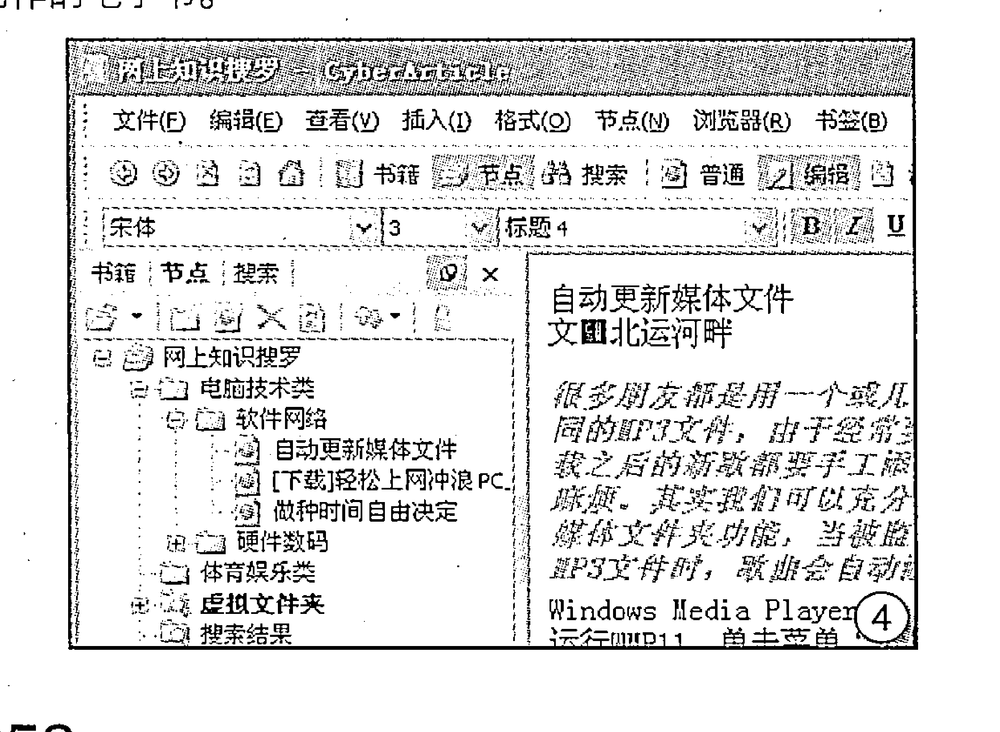

导入已有内容：如果在制作电子书之前，已经从网上下载了一些内容，我们可以把这些内容直接导入电子书中。在一个文件夹上右击鼠标，执行“导入”，可以导入邮件、收藏夹、CHM电子书等。以“从文件夹导入”为例，选择该项，打开导入窗口，选择导入内容存放的路径和要导入的文件类型（如图5），支持导入图像、Flash文件等，最好勾选“使用文件名作为文章标题”一项，这样导入的文章就以文件名作为标题了。

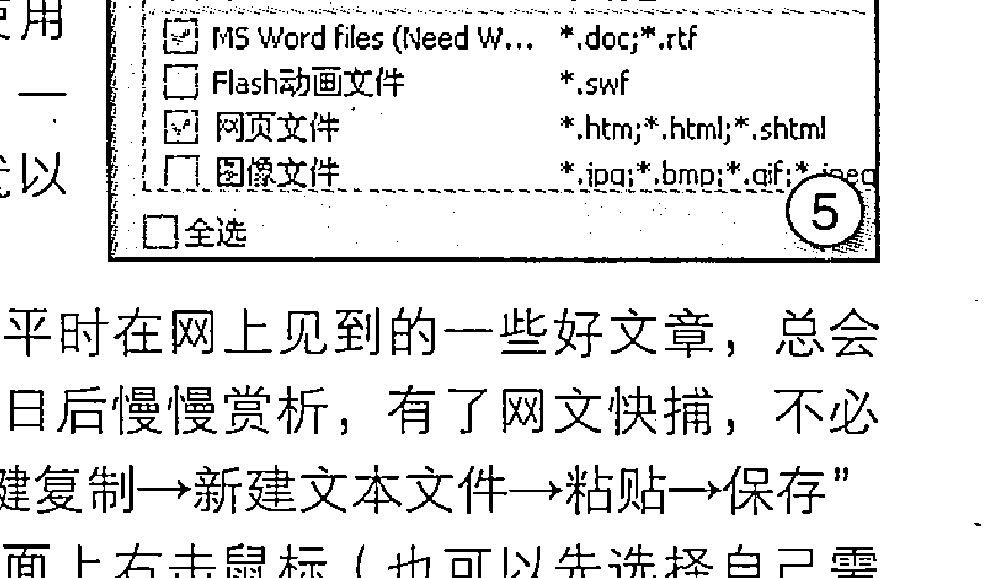

直接从网上下载：平时在网上见到的一些好文章，总会想到将其保存下来留待日后慢慢赏析，有了网文快捕，不必再进行“选中文本→右键复制→新建文本文件→粘贴→保存”这一系列操作了。在页面上右击鼠标（也可以先选择自己需要的文字等内容，再在选中的文字上右击鼠标），执行弹出菜单中的“保存：完整网页”或“保存：更多内容”，打开“保存选项”窗口（如图6），依次选择“书籍”、“文件夹”、“标题”，单击“点击这里更改”按钮，选择保存网页中的哪些元素，单击“确定”出现“正在保存网页”窗口，保存完毕，这些内容就已经进入选择的电子书之中。

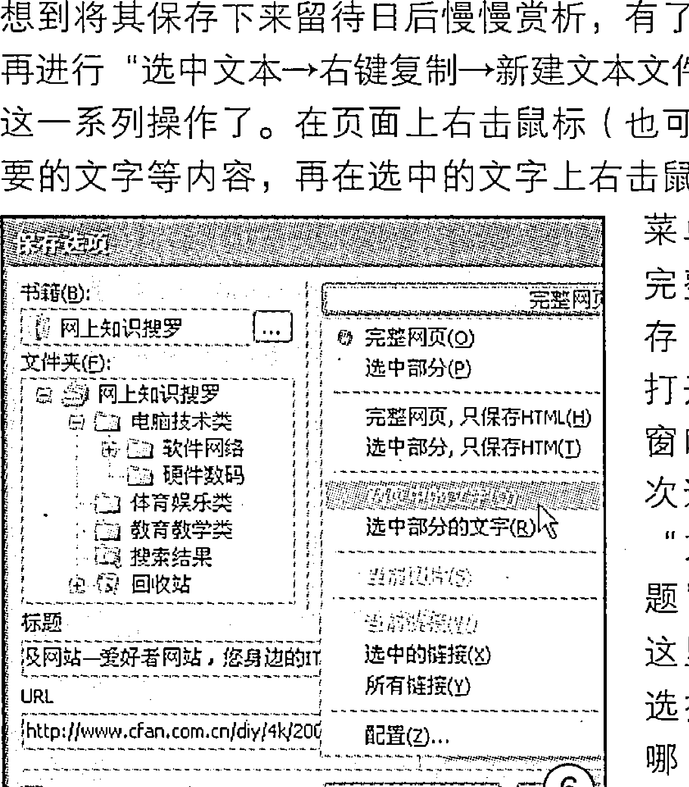

制作电子书：选择要制作的书籍，单击菜单“文件→制作电子书”，以制作exe格式为例，出现“制作电子书”窗口，为制作好的电子书选择一个存放位置，在“窗口”选项卡中设置好窗口标题、文件图标等内容，在“作者信息”选项卡中输入有关自己的版权信息，单击“制作”按钮，一本自己的电子书就制作完成了。

### 2. 友益文书

- 软件版本：友益文书8.2.2版
- 软件大小：1795KB
- 软件授权：共享软件
- 运行环境：Win9x/Me/NT/2000/XP/2003
- 下载地址：http://www.onlinedown.net/soft/736.htm

友益文书采用视窗风格，目录树结构管理，所见即所得的设计理念，使用、操作方便，可以自由地添加、删除目录树，可以随心所欲地编辑文档内容。软件支持Word文档、网页、文本等多种格式文档之间的转换，做出来的电子书页面美观，简洁大方。

导入源文件：对于已经下载的htm网页、Word文档、excel文档、pdf文件、txt文件甚至是ppt幻灯片，想把它们整合在一起做成电子书，在友益文书中可以直接导入，并可以进行组织、整理，让各类资料按部就班、有条不紊。在“目录”页中，右击鼠标，选择“批量导入文件”，打开导入文件类型窗口，从中可以看到其支持众多格式文件的导入（如图7），由于在制作之前，笔者已经把源文件整理到了同一个文件夹中，所以单击“导入文件夹”，选择存储文件夹进行批量导入。导入后会在左侧将文件罗列出来，可以利用上移目录、下移目录、左移目录和右移目录来调整目录位置和结构。

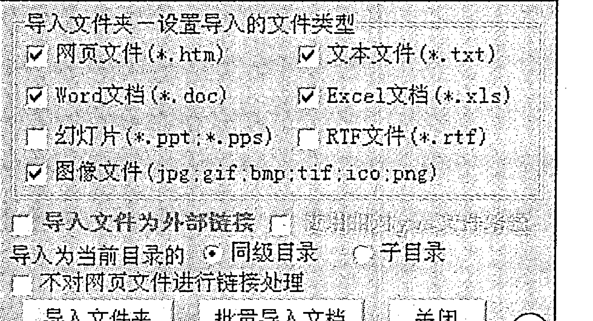

格式调整：导入的文档可以进行格式转换，选择要转换格式的文章，单击右侧内容框上面的“转换”，可以将文档转换成统一的格式，如文本格式（如图8）。有些文件中有不少硬回车和空格，它们会增加阅读的困难，可以利用软件提供的批量整理工具解决：在左侧书籍根目录上右击鼠标，选择“更多目录操作→整理全部文档”，友益文书即可自动进行整理。另外，在右侧的文档内容中右击鼠标，选择“导入图片”，还可以为文章配上插图。友益文书的所见即所得功能跟一个简化版的Word编辑器差不多。

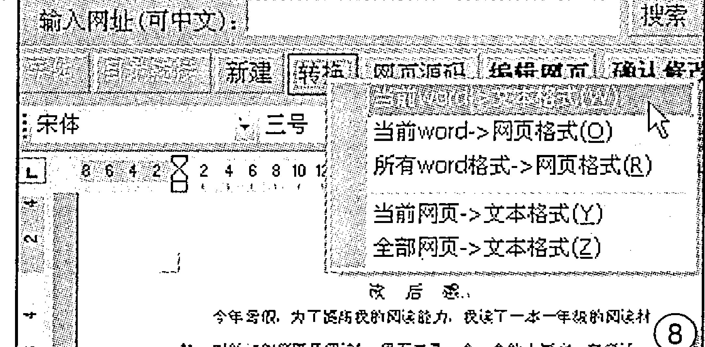

抓取网页内容：友益文书可以轻松地把在网上遇到的好文章保存在电子书中。

- 方法一，启用软件的文本拖放功能。鼠标右击友益文书的悬浮框，选择“启用文本拖放”，选中要保存的文字后，按住鼠标左键往悬浮框窗口一拖，软件会自动以文本标题或文本的第一行为文件名保存。此方法不仅适用于网页中的文本，只要支持OLE拖放的编辑器就可以，如：Microsoft Word、写字板、Adobe Acrobat Reader等。
- 方法二，启用剪贴板监视。同样在悬浮框右键菜单中选择“启用剪贴板监视”，这样在复制选取的文本后，所选取内容会自动粘贴到软件的编辑框中，且保持格式不变。对上面两种方法保存下来的文章内容可以通过文档整理或文本编辑功能重新编辑和排版。

书写读书笔记：“不动笔墨不读书”，用友益文书制作的电子书在阅读时，可以随时添加读书笔记。打开图书后，单击工具栏中的“读书笔记”按钮，出现“读书笔记”窗口，在里面可以随时书写读书心得。

### 3. DeskTopAuthor

- 软件版本：DeskTopAuthor V4.57 汉化版
- 软件大小：27.8MB
- 软件授权：共享软件
- 运行环境：Win9x/Me/NT/2000/XP/2003
- 下载地址：http://www.gpxz.com/soft/softdown.asp?softid=689

DeskTopAuthor可以制作出独具特色的翻页电子书，就像有一本真正的书在屏幕上观看一样，给人的感觉更接近于传统书籍。

新建电子书：单击工具栏中的“新建”按钮，弹出“书籍属性设置”窗口（如图10），在此，我们可以设置书籍的宽度和高度，边界、纸张和背景颜色，单击“翻页速度”后的下拉列表，为电子书的翻页效果设置速度，单击“确定”进入电子书编辑状态。DeskTopAuthor准备了现成的精美模板，供我们直接使用。单击“工具栏”中“书籍模板”按钮后的向下箭头，从中可以为即将制作的电子书选择一个模板。

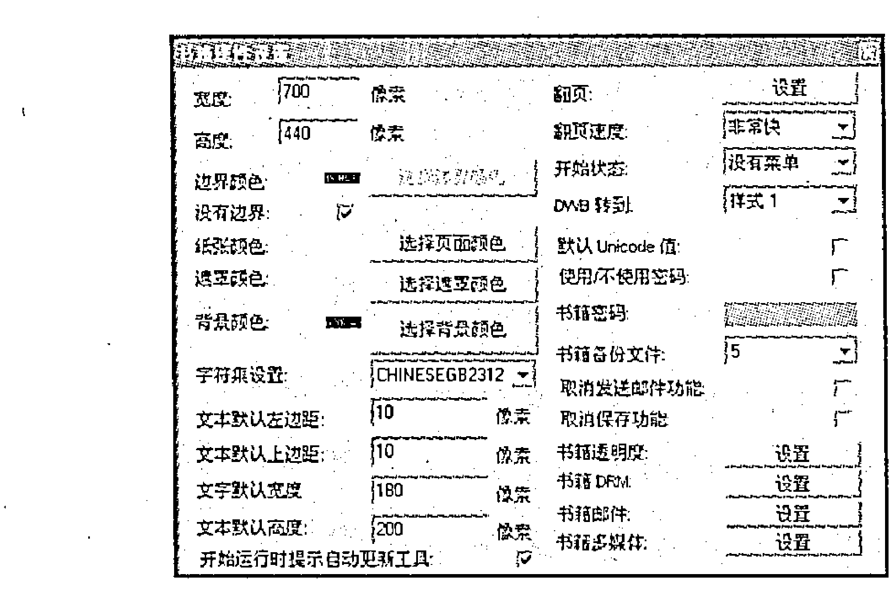

制作封面：翻页电子书的第一个页面应该是封面，封面的大小应该是这个电子书页面大小的一半，而且是右侧的一半。单击工具栏中“书籍属性”按钮，再次打开“书籍属性设置”窗口，单击“书籍透明度”后的“设置”按钮，打开“书籍透明度设置”窗口，勾选“封面遮罩效果”和“封底遮罩效果”中的“使用透明效果”，透明颜色默认为绿色，可以不变，连续单击“确定”回到电子书的第一个页面中。

在DeskTopAuthor主界面左侧有一个“工具”条，可以完成添加、删除、移动、切换页面，以及向页面中插入方框、文字、图像等操作。单击Insert下的“插入方格框”按钮，打开Color窗口，为方格框选择颜色，在此选择的颜色一定要和在封面、封底中设置的透明颜色一致（即默认的绿色）。单击OK，在页面中已经插入了一个默认大小的方格框，用鼠标右击，选择“调整文本内容位置”，打开“位置属性”窗口。由于本书的页面大小为默认的宽700像素，高440像素，而这个将来透明的方格框要占据页面的左侧一半，以留下右侧一半作为封面，所以在“位置属性”窗口中设置左部、顶部都为0，宽度为350，高度为440，单击“确定”，方格框占满了第一个页面的左半部分。

在封面余下的右半部分，可以添加一些图片做装饰，添加文字做标题或说明：单击左侧“工具”中的“插入图像”按钮，选择一张合适的图像插入，并利用图像周围的八个调整点调整图像的位置和大小；单击“插入文字”按钮，打开“文字编辑器”窗口，输入文字并可设置文字格式，单击“确定”完成文字的插入，调整好文字的位置，封面就制作好了（如图11）。

插入页面：接下来制作电子书的第一页，单击“工具”中的“添加页面”按钮来插入一个新的页面，新页面的纸张颜色和在“书籍属性设置”中设置的纸张颜色是一致的。新插入的一个页面实际上相当于一本书展开时的左右两页。下面我们来制作一个翻页的电子相册：展开右侧“图像浏览器”中的“我的电脑”，定位到有照片的文件夹，下面会显示出照片的预览图，用鼠标拖动一张照片到页面中，调整好大小和位置（事先最好用PhotoShop等软件统一调整好照片的大小），用鼠标右击图像，利用快捷菜单可以对图像进行一些简单操作。单击“工具”中的“插入文字”按钮，打开“文字编辑器”窗口，可以为该照片添加一些说明性文字，选中文字，单击下面的“链接”按钮，还可以为选中的文字添加链接或页面跳转，这样在浏览电子书时，单击这些文字，就可以实现页面的跳转或打开相应网站了。同样的方法制作完其它页面，最后制作封底。封底的制作与封面相似，只不过要留下的是页面的左半部分，所以插入的方格框要放置在页面的右半部分。

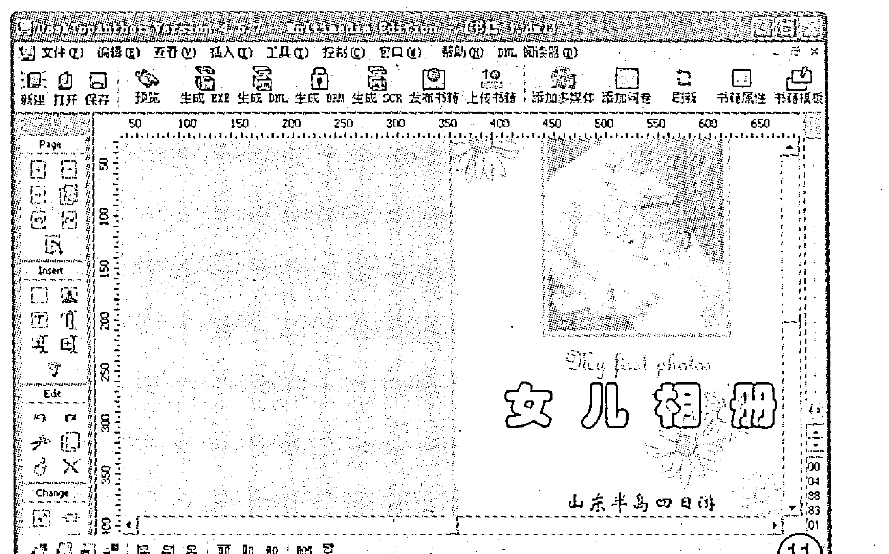

发布电子书：利用“工具”中的“上一页面”和“下一页面”按钮，浏览一下要发布的电子书，确认没有问题后，单击工具栏中的“预览”按钮可以预览一下效果，最后单击“生成EXE”按钮，一本漂亮的翻页电子书就制作完成了。

## 二、转换电子书格式

下载或制作的电子书，什么格式的文件都有，在电脑中阅读当然不会有任何问题，但是很多时候，我们需要随身携带这些电子书，放在MP3等随身设备中，度过一些诸如在公交车上的闲暇时光。但问题是这些格式的电子书，这些随身设备不支持怎么办呢？其实我们可以把其它格式的电子书转换为文本格式，因为文本格式是都支持的。

### 1. 从EXE、CHM格式到文本

- 软件名称：miniKillEBook V1.0.0.1
- 软件大小：85KB
- 软件授权：免费软件
- 运行环境：Win9x/Me/NT/2000/XP/2003
- 下载地址：http://www.skycn.com/soft/43967.html#/download

miniKillEBook是一个绿色软件，该软件可以把exe、chm等格式的电子书转换为txt文件。运行该软件，出现其主界面，打开电子书，拖动miniKillEBook主界面中“选择源文件”中的十字瞄准图标到电子书的页面上，松开鼠标，miniKillEBook会显示出相关信息（如图12），由于要转换成文本文件，一定要勾选“以文本方式保存”。单击“开始”，软件会自动在与电子书相同的文件夹中，建立一个与电子书同名的文件夹，用于存放转换后的文本文件。等转换完毕，打开目标文件夹，里面一个个的文本文件中，存放的就是电子书的每个页面中的文本内容。

### 2. 从HTML格式到文本

- 软件名称：HTML2TXT v4.0
- 软件大小：412KB
- 软件授权：免费软件
- 运行环境：Win9x/Me/NT/2000/XP/2003
- 下载地址：http://www.crsky.com/soft/3012.html

运行解压后的h2t.exe文件，打开HTML2TXT主界面，利用“添加文件”或“添加文件夹”按钮，来添加要转换的html文件，在“输出到”中选择好转换后txt文件的存储文件夹，单击“转换”或“全部转换”按钮，即可把列表中的html文件转换为txt文件了（如图13）。

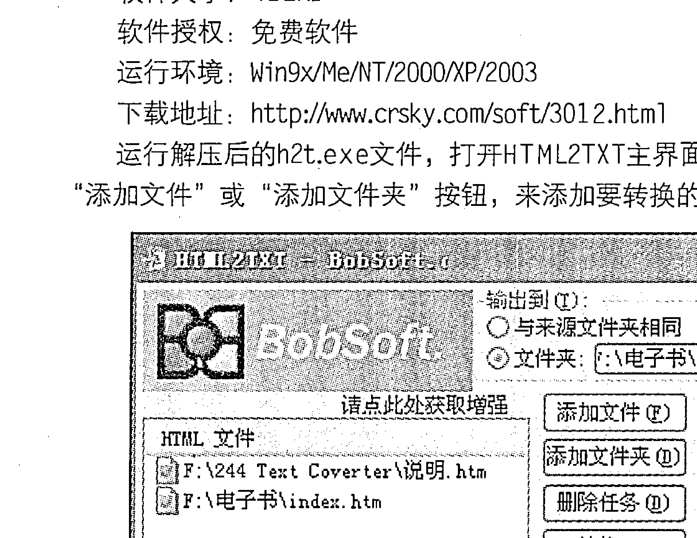

### 3. 从PDF格式到文本

- 软件名称：Foxit PDF Text Converter v1.1 汉化版
- 软件大小：1.09MB
- 软件授权：免费软件
- 运行环境：Win9x/Me/NT/2000/XP/2003
- 下载地址：http://www.crsky.com/soft/6909.html

安装后运行该软件，在“浏览器”栏中定位到含有pdf文件的文件夹，在下面的“PDF文件列表”栏中会显示出该文件夹中的所有pdf文件，用鼠标双击要转换的pdf文件，将其添加到转换列表中，鼠标右击转换列表中的文件，利用“设置输出文件夹”和“设置输出文件”，可以为转换后的txt文件选择存储位置和文件名。单击工具栏中的“转换”按钮，即可把pdf文件转换成txt文件了（如图14）。

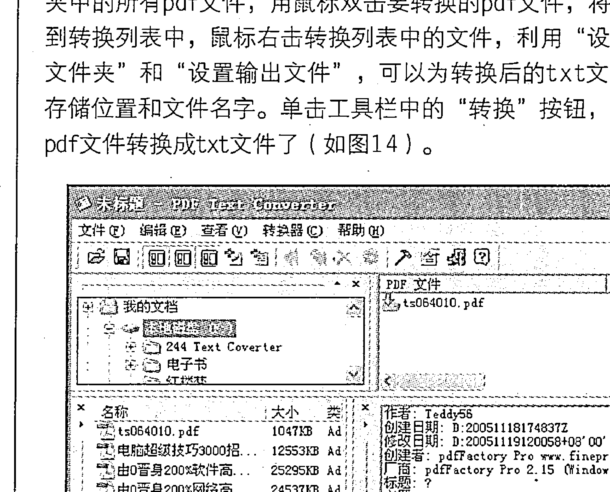

## 四、制作成手机电子书

随着支持JAVA的手机日益普及，出现了JAR和JAD格式的手机电子书，其中JAD文件是一个说明文件，来描述JAR文件的信息。借助软件，我们也可以制作出自己的手机电子书。这些软件，大都只支持把文本文件制作成JAR文件，好在我们前面已经把其它格式的电子书转换成文本文件了。这类软件很多，使用起来大同小异，这里以“口袋书屋手机电子书制作”软件为例。

- 软件名称：口袋书屋手机电子书制作 2.3
- 软件大小：15016KB
- 软件授权：免费软件
- 运行环境：Win9x/Me/NT/2000/XP/2003
- 下载地址：http://www.onlinedown.net/soft/56011.htm

口袋书屋是一款绿色的手机电子书制作软件，可以将txt文档制作成手机电子书。运行Mbook.exe，打开软件主界面（如图15），利用“主要功能”列表中的“添加一个文件”或“从文件夹导入”，把要制作成手机电子书的文本文件导入，到右侧的转换列表中，通过“上移文件”和“下移文件”调整好文本文件的排列顺序。如果想把列表中的文件制作成一本手机电子书，就选择“合并打包”，如果想把每一个文本文件各自制作成电子书，则选择“单个打包”，然后输入电子书名称。在文件列表中右击一个文本文件，执行“修改章节名称”，可以为电子书的章节修改名称。一切准备完毕，单击“生成电子书”命令，打开“生成”窗口，先选择自己的手机型号，接着选择输出目录和输出文件名。在“阅读器”标签中可以为生成的电子书设置启动画面和界面皮肤，在“电子书”标签中可以输入制作人姓名以及为电子书设置密码。最后单击“确定”，一本手机电子书即可制作完成。

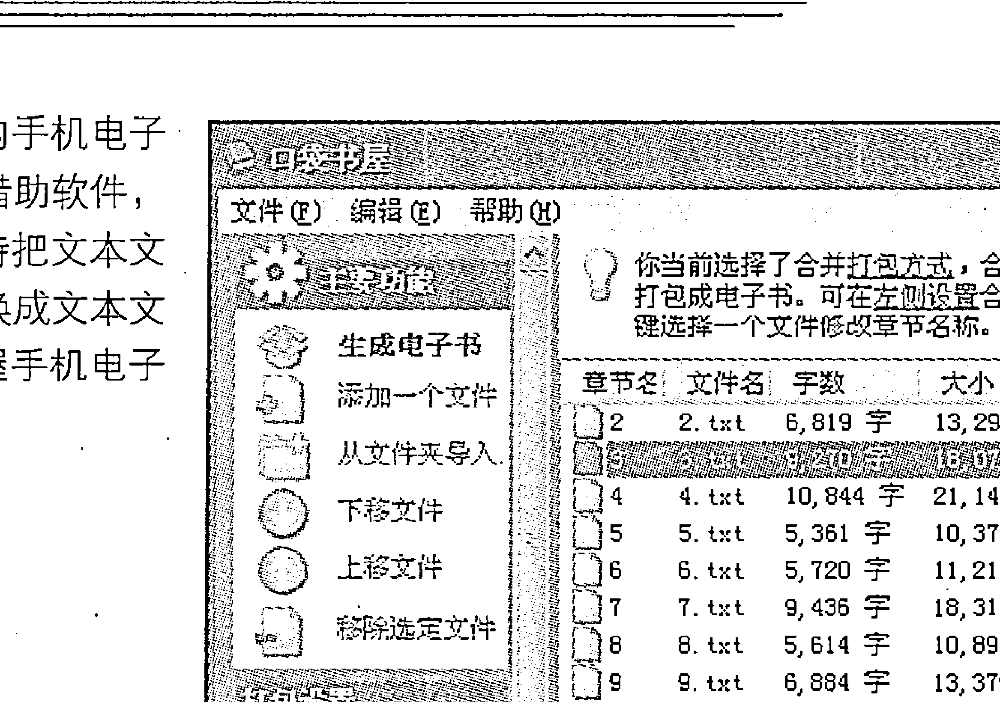

## Word 2007中的高级替换技巧

□王志军


相信有很多朋友已经用上了Office 2007，其实我们经常使用的还是Word 2007，如果你能够用好Word 2007的“查找和替换”，相信必将能够充分提高文档处理的操作效率。

### 一、了解ASCII字符集代码

在20世纪60年代，标准化的需要导致了美国标准信息交换码(ASCII)的出现。ASCII为计算机提供了一种存储数据以及与其他计算机和程序交换数据的方式，ASCII表总共包含128个数字，这些数字都被分配给相应的字符，下表是相应的代码以及说明：

| 代码 | 说明 | 代码 | 说明 | 代码 | 说明 |
|------|------|------|------|------|------|
| 1 | 嵌入式图形 | 44 | , | 87 | W |
| 2 | 脚注标记 | 45 | - | 88 | X |
| 3 | | 46 | . | 89 | Y |
| 4 | | 47 | / | 90 | Z |
| 5 | | 48 | 0 | 91 | [ |
| 6 | | 49 | 1 | 92 | \ |
| 7 | 表格竖线 | 50 | 2 | 93 | ] |
| 8 | 退格键 | 51 | 3 | 94 | ^ |
| 9 | 制表符 | 52 | 4 | 95 | _ |
| 10 | 换行符 | 53 | 5 | 96 | ` |
| 11 | 手动换行符 | 54 | 6 | 97 | a |
| 12 | 分页符或分节符 | 55 | 7 | 98 | b |
| 13 | 回车符 | 56 | 8 | 99 | c |
| 14 | 分栏符 | 57 | 9 | 100 | d |
| 15 | | 58 | : | 101 | e |
| 16 | | 59 | ; | 102 | f |
| 17 | | 60 | < | 103 | g |
| 18 | | 61 | = | 104 | h |
| 19 | 左侧域标志 | 62 | > | 105 | i |
| 20 | | 63 | ? | 106 | j |
| 21 | 右侧域标志 | 64 | @ | 107 | k |
| 22 | | 65 | A | 108 | l |
| 23 | | 66 | B | 109 | m |
| 24 | | 67 | C | 110 | n |
| 25 | | 68 | D | 111 | o |
| 26 | | 69 | E | 112 | p |
| 27 | | 70 | F | 113 | q |
| 28 | | 71 | G | 114 | r |
| 29 | | 72 | H | 115 | s |
| 30 | | 73 | I | 116 | t |
| 31 | | 74 | J | 117 | u |
| 32 | 半角空格 | 75 | K | 118 | v |
| 33 | ! | 76 | L | 119 | w |
| 34 | " | 77 | M | 120 | x |
| 35 | # | 78 | N | 121 | y |
| 36 | $ | 79 | O | 122 | z |
| 37 | % | 80 | P | 123 | { |
| 38 | & | 81 | Q | 124 | | |
| 39 | ' | 82 | R | 125 | } |
| 40 | ( | 83 | S | 126 | ~ |
| 41 | ) | 84 | T | 127 | DEL |
| 42 | * | 85 | U | | |
| 43 | + | 86 | V | | |

### 二、在“查找和替换”文本框中可以使用的通配符

按下“Ctrl+F”组合键，可以打开“查找和替换→查找”对话框，在“查找内容”后面的文本框中，我们可以按照如下规则使用通配符，这里按照是否勾选“使用通配符”复选框进行区分，单击“高级”按钮可以切换到高级替换模式：

| 序号 | 未曾勾选“使用通配符”复选框 | | 已勾选“使用通配符”复选框 | |
|------|-----------------------------|------|-----------------------------|------|
| | 特殊字符 | 代码 | 特殊字符 | 代码or通配符 |
| 1 | 任意单个字符(只用于查找框) | ^? | 任意单个字符 | ? |
| 2 | 任意数字(单个)(只用于查找框) | ^# | 任意数字(单个) | [0-9] |
| 3 | 任意英文字母(只用于查找框) | ^$ | 任意英文字母 | [a-zA-Z] |
| 4 | 段落标记 | ^p | 段落标记 | ^13 |
| 5 | 手动换行符 | ^l | 手动换行符 | ^l or ^11 |
| 6 | 图形(只用于查找框) | ^g or ^1 | 图形 | ^g |
| 7 | 1/4长划线 | ^+ | 1/4长划线 | ^q |
| 8 | 长划线 | ^j | 长划线 | ^+ |
| 9 | 短划线 | ^q | 短划线 | ^= |
| 10 | 制表符 | ^t | 制表符 | ^t |
| 11 | 脱字号 | ^^ | 脱字号 | ^^ |
| 12 | 分栏符 | ^v | 分栏符 | ^n or ^14 |
| 13 | 分节符(只用于查找框) | ^b | 分节符/分页符 | ^m |
| 14 | 省略号 | ^n | 省略号 | ^i |
| 15 | 全角省略号 | ^i | 全角省略号 | ^j |
| 16 | 无宽非分隔符 | ^z | 无宽非分隔符 | ^z |
| 17 | 无宽可选分隔符 | ^x | 无宽可选分隔符 | ^x |
| 18 | 不间断空格 | ^s | 不间断空格 | ^s |
| 19 | 不间断连字符 | ^~ | 不间断连字符 | ^~ |
| 20 | 段落符号 | ^% | 表达式 | () |
| 21 | §分节符 | ^ | 单词开头 | < |
| 22 | 脚注标记(只用于查找框) | ^f or ^2 | 单词结尾 | > |

## 实例一：替换通配符“*”号

对于文档中的“*”号，在正常情况下进行替换是非常简单的，按照常规操作即可完成。不过，如果你已经勾选了“使用通配符”复选框，那么“*”会被定义为通配符，此时它所代表的就是任意字符。在这种情况下，如果查找的内容为“*”，那么执行替换操作后当然就会将所有字符替换为“替换为”框中的内容（见图1），这就不是我们所希望的了。

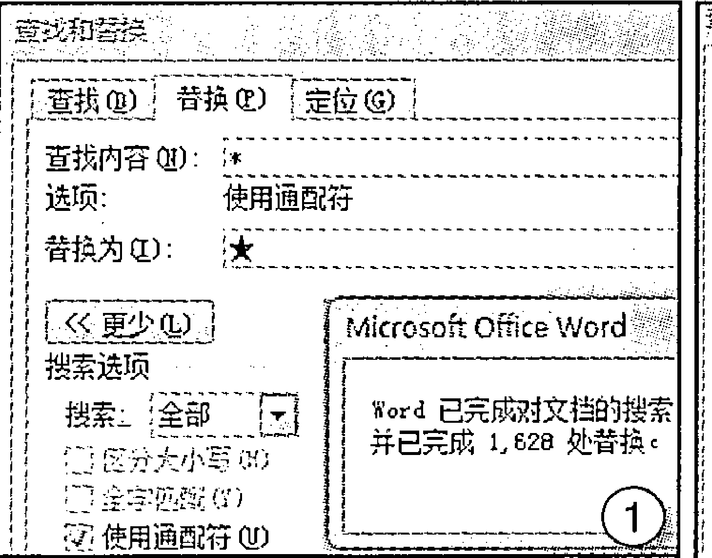

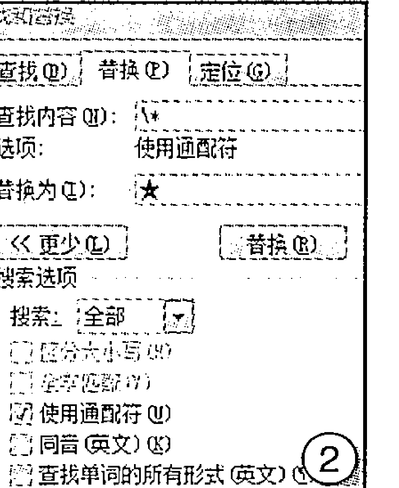

正确的方法是在“查找内容”被定义为通配符的字符前加上一个反斜杠，本例就是“\*”，至于“替换为”文本框中的内容则不用更改，这下替换操作就可以符合我们的要求了（见图2）。

## 实例二：将文字替换为图片

如果你准备将文档中的某些文字替换为图片，例如将学校全称替换为新征集的校标，逐个手工替换显然是一个好主意。但当你准备将已经复制到剪贴板中的图片内容再粘贴到Word的“查找和替换”对话框中的“替换为”框时，却会遗憾地发现右键菜单中的“粘贴”命令呈灰色而无法使用。

究其原因，这是因为无论是“查找”还是“替换为”，这两个文本框中在默认设置下只能接受文本格式的内容，而无法接受对象为图片的内容。解决的办法并不复杂，请单击“更多”按钮，在“特殊格式”下拉列表框中选择“‘剪贴板’内容”（见图3），然后按下“Ctrl+N”新建一个空白文档，通过“插入→图片”插入指定的图片，将其复制到剪贴板中，然后再返回“替换为”文本框，再次从下拉菜单中选择“‘剪贴板’内容”，接下来就可以去自由替换了。

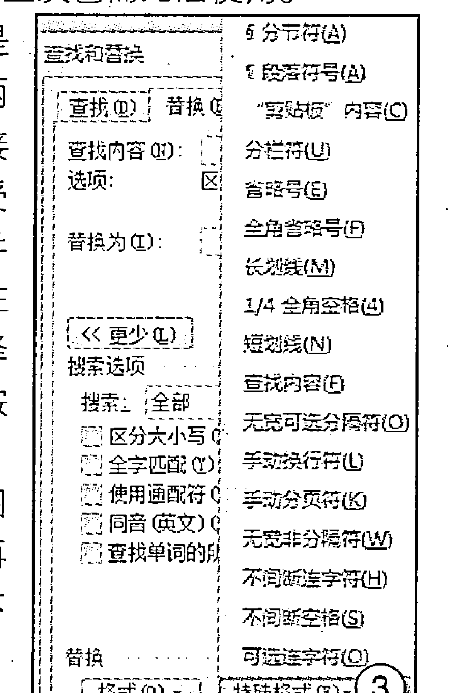

### 三、“替换为”文本框可以使用的通配符

按下“Ctrl+H”组合键，可以打开“查找和替换→替换”对话框，在“替换为”后面的文本框中，我们可以按照是否勾选“使用通配符”复选框选择相关的代码：

| 序号 | 未曾勾选“使用通配符”复选框 | | 已勾选“使用通配符”复选框 | |
| :--- | :--- | :--- | :--- | :--- |
| | 特殊字符 | 代码 | 特殊字符 | 代码 or 通配符 |
| 0 | | | 要查找的表达式 | \1 |
| 1 | 段落标记 | ^p | 段落标记 | ^p |
| 2 | 手动换行符 | ^l | 手动换行符 | ^l |
| 3 | 查找的内容 | ^& | 查找的内容 | ^& |
| 4 | 剪贴板内容 | ^c | 剪贴板内容 | ^c |
| 5 | 省略号 | ^i | 省略号 | ^i |
| 6 | 全角省略号 | ^j | 全角省略号 | ^j |
| 7 | 制表符 | ^t | 制表符 | ^t |
| 8 | 长划线 | ^+ | 长划线 | ^+ |
| 9 | 1/4长划线 | ^q | 1/4长划线 | ^q |
| 10 | 短划线 | ^= | 短划线 | ^= |
| 11 | 脱字号 | ^^ | 脱字号 | ^^ |
| 12 | 手动分页符 | ^m or ^12 | 手动分页符/分节符 | ^m |
| 13 | 可选连字符 | ^- | 可选连字符 | ^- |
| 14 | 不间断连字符 | ^~ | 不间断连字符 | ^~ |
| 15 | 不间断空格 | ^s | 不间断空格 | ^s |
| 16 | 无宽非分隔符 | ^z | 无宽非分隔符 | ^z |
| 17 | 无宽可选分隔符 | ^x | 无宽可选分隔符 | ^x |
| 18 | 分栏符 | ^n | 分栏符 | ^n |
| 19 | 分节符 | ^% | 分节符 | ^% |
| 20 | 段落符号 | ^v | 段落符号 | ^v |

### 三、替换操作的几个实例

说一千道一万，还是要在实践中进行检验。这里，我们通过相应的实例操作，说明在Word 2007中进行替换的相应技巧。

## 实例三：替换不确定数量的汉字

某些时候，你可能会需要在Word中替换数量不确定的汉字，例如某文档中有这样一行一行的文档，而且汉字数量不确定，不过每一行都是以空格结尾：

-   给水泵出口阀
-   给水泵出口甲阀
-   给水泵入口阀
-   给水泵入口乙阀

现在的要求是将“给水泵”后面的汉字都替换为空白，实质上也就是删除其后面的汉字，不过要求保留后面的数字和字母，这就对替换操作提出了很高的要求。

### 1. 不正确的替换方法

可能有些朋友会采取这样的替换方法：首先打开“查找和替换”对话框，切换到“替换”标签页，在“查找内容”框中输入“(给水泵)(*)^13”，这里的“(*)”表示零个或多个字符；“替换为”文本框中输入“\1\3”，当然还需要勾选“使用通配符”复选框，执行替换操作后却将“给水泵”后面的所有内容全部替换为空白，这就没有达到我们的要求，效果如图4所示。

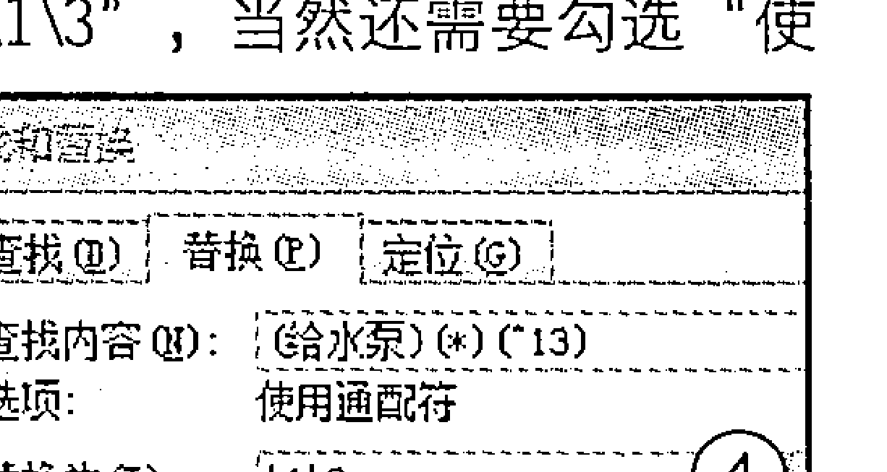

还有些朋友会将“查找内容”设置为“[!给水泵,a-z,0-9,A-Z,^13]”，这里的“[!]”表示“非”，而“替换为”设置为空（即不输入任何内容），不过执行替换操作后仍然没办法得到正确的结果，你会发现此时竟然还会将“给水泵”前面的汉字也进行了替换…

### 2. 正确的替换方法

那么，究竟该如何执行替换操作呢？正确的方法是在“查找内容”设置为“(给水泵)[一-龥]{1,}”，其实这里也不一定非要“龥”这个汉字，其他的汉字也可以，但前提是当前文档的“给水泵”后面没有这个汉字，因此我们一般找个比较生僻的繁体字较好一些，这里的“{1,}”表示只出现一次；“替换为”设置为“\1”，不要忘记勾选“使用通配符”复选框，如此执行替换操作后，就可以达到我们事先的要求，效果如图5所示，有这方面需求的朋友不妨一试。

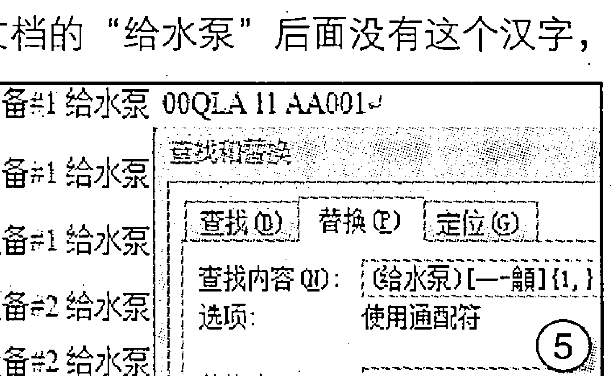

## 实例四：为Word文档的段首添加相同字符

在实际工作中，你可能会遇到这样的特殊情况：需要为某份Word的每一段的最前面添加一些相同的字符。如果文档不是太长，那么手工添加就可以了，但假如该文档有很多段，那么建议还是想它法的好，否则耗费的时间就太久了。

这里，我们可以使用替换功能来完成这个任务。首先打开待处理的文档，在最右侧的“编辑”区域选择“替换”，打开“查找和替换”对话框，在“查找”文本框中输入“(*)^13”，这里的“^”可以按住Shift键和6数字键组合输入，“替换为”文本框后面则应输入“待添加的字符\1^13”，注意还应该单击“更多”按钮激活搜索选项，请勾选“使用通配符”复选框，然后单击“全部替换”按钮，即可获得图6所示的效果。

可能有些朋友不太明白上面这个替换式子的含义，这里的“^13”表示段落符号，由于这里选择了将段落作为通配符，因此必须在通配符之前添加反斜杠“\”，这里的“\1^13”表示替换为通配符段落符号。

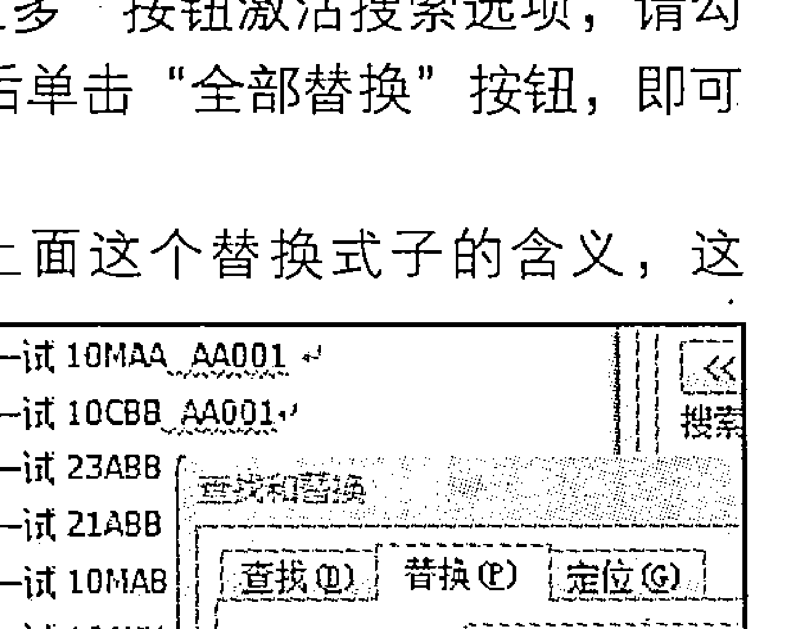

另外，执行替换操作之前，请将插入光标放在文档的最前面，否则效果将适得其反。

## 实例五：批量替换Word文档中的数字句号

我们经常会有这样的尴尬事情：当需要处理某篇文档时，却发现由于某些原因，文档中涉及数字之处竟然将原本应该为英文句点的符号全部写成了中文的句号，例如下面的这段文字（见图7）：


手工更改这些中文句号显然不是什么好办法，毕竟可能文档中会涉及很多类似的数字。其实，我们可以采取替换的方法来完成，具体步骤如下：

第一步：按下“Ctrl+H”组合键打开“查找和替换”对话框，切换到“替换”选项卡，单击“更多”按钮切换到高级替换模式，在这里勾选“使用通配符”复选框；

第二步：在“查找内容”文本框中输入“([0-9]{1,})。([0-9]{1,})”，这里的“[0-9]”表示任意的单个数字，“{1,}”表示1个以上前一字符，中间的“。”表示中文的句号，后面的含义类似，表示查找所有以数字加句号的数字部分的内容，在“替换为”文本框中输入“\1.\2”，这里的“\1”和“\2”分别代表小数点前面和后面的字符串，当然其中的“。”必须输入“.”；

第三步：单击“全部替换”按钮，很快就可以获得图8所示的结果，是不是很简单呢？

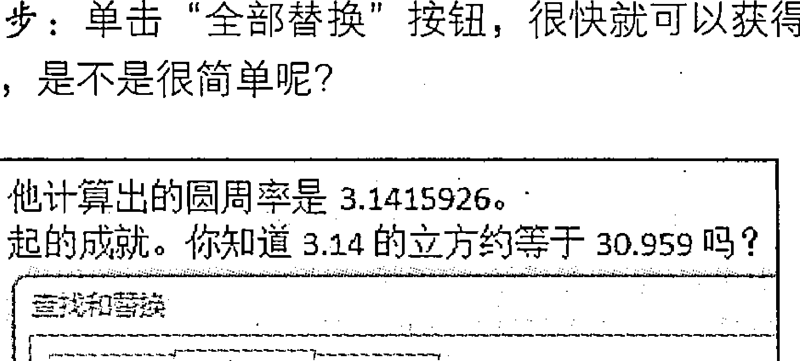

## 实例六：快速剔除试卷中的答案内容

教师的日常工作之一就是出试卷，大多数还会同时做出答案，现在当然大都是在Word文档中完成了。不过，面对图9所示的答案卷，该如何将其中的答案部分剔除而只保留空的下划线，如果逐题手工删除答案的话，也实在是太麻烦了…

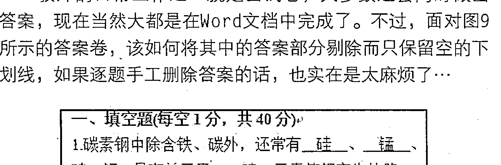

这里，我们可以利用Word的替换功能来删除这份答案卷中的答案内容，操作也并不复杂：

第一步：按下“Ctrl+F”组合键，打开“查找和替换”对话框，切换到“替换”选项卡，或者直接按下“Ctrl+H”组合键，单击“更多”按钮切换到高级替换模式；

第二步：此时我们会看到“格式”和“特殊格式”两个按钮，将光标定位在“查找内容”后面的文本框中，单击“格式”按钮，选择“字体”打开“查找字体”对话框，在这里选择好当前答案卷中所使用的下划线线型，或者也可以直接按下“Ctrl+U”组合键，此时你会看到“格式”处已经出现了“下划线”的提示信息；

第三步：将光标定位在“替换为”后面的文本框中，注意这里什么也不需要输入，仍然单击“格式”箭头下的“字体”按钮，在随之打开的对话框中设置字体的颜色为白色、下划线，注意下划线的颜色应该为黑色，完成上述设置之后返回“查找和替换”对话框，请注意不要勾选“使用通配符”的复选框，否则两个替换的按钮将无法使用。

现在，我们就可以单击“全部替换”按钮，执行后很快将完成替换的操作（见图10），我们也可以看到这份答案卷中填写题部分的所有答案内容都已经被“清空”（见图11），其实只是被设置为白色而无法看到。

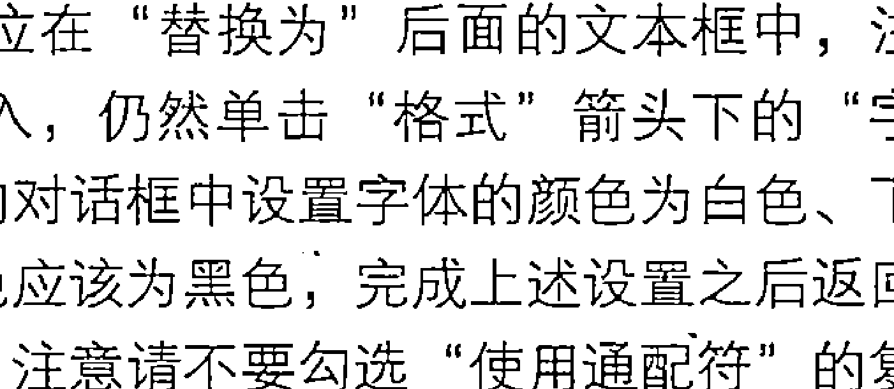

-   一、填空题（每空1分，共40分）
    1.  碳素钢中除含铁、碳外，还常有______、______、______、______是有益元素，______元素使钢产生热脆，______元素是有害元素。
    2.  在图线的应用中，断裂画法的断裂处边界线可选用______线；半剖视图中剖与不剖的分界线应采用______

下次需要时可以再次使用替换功能进行操作，只要将“查找内容”设置为“下划线，黑色；文字，白色”，“替换为”设置为“下划线，黑色；文字，黑色”，感兴趣的朋友不妨一试。

## 实例七：快速替换化学分子式

很多学校都开始了无纸化的电子备课，大多数教师应该都是在Word文档中进行备课，无论是编辑或是修改无疑是方便多了。

不过，假如你准备对化学分子式进行批量替换，就需要考虑一番了，因为普通的操作并不支持上标和下标，例如《金属材料与热处理》教材中《铁碳合金》这一章，很多内容都会涉及“Fe₃C”，这是铁碳合金中渗碳体的化学式。如图12所示，如果你在教案中误输入为“Fe3C”，那么就完全错了，但如何逐个手工更改为下标，显然是相当的麻烦…

-   （2）低温莱氏体: L’d, (P+ Fe₃C)
    （3）力学性能：与渗碳体相似，硬度高，塑性很差。
    三、铁碳合金的相：

第一步：首先将教案中某一处的“Fe3C”手工修改为“Fe₃C”，然后选中“Fe₃C”，单击“剪贴板”功能组中的“复制”按钮，或者直接按下“Ctrl+C”组合键将其复制到剪贴板中备用；

第二步：按下“Ctrl+F”组合键打开“查找和替换”对话框，切换到“替换”选项卡，在“查找内容”后面的文本框中输入“Fe3C”；

第三步：将光标定位在“替换为”后面的文本框，此时你会发现这里是无法直接输入“Fe₃C”的，正确的方法是单击“更多”按钮切换至高级替换模式，单击“特殊格式”按钮，在这里选择“‘剪贴板’内容”（见图13），然后你会发现“替换为”后面的文本框中会出现“^c”的符号，这表示以剪贴板中的内容作为替换内容。

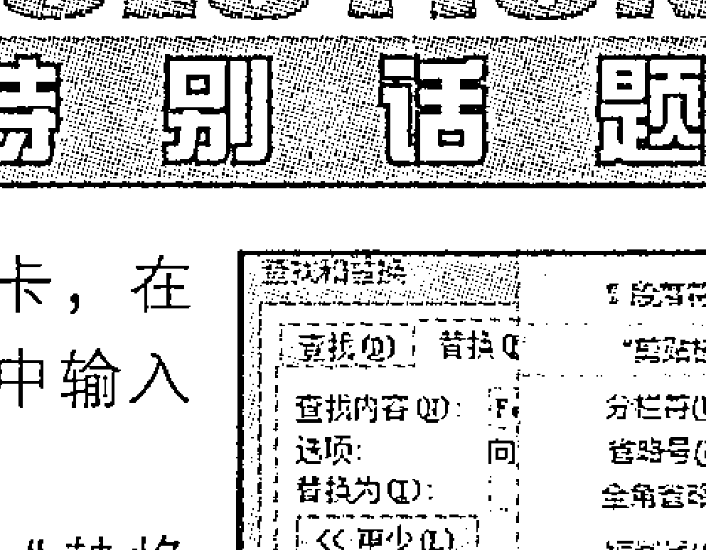

接下来嘛，我们只需要单击“全部替换”按钮，如图14所示，很快就可以将教案中的“Fe3C”全部替换为“Fe₃C”，最终效果如图15所示，是不是很方便呢？


-   （1）符号：L’d
    （2）低温莱氏体：L’d, (P+ Fe₃C)
    （3）力学性能：与渗碳体相似，硬度高，塑性很差。

利用同样的方法，我们还可以将Word文档中的特定对象替换为图片，这样就方便多了。

## 实例八：利用Word处理QQ音乐的播放列表

听QQ音乐如果遇到自己喜欢的歌曲，你也许希望将它们下载回来细细欣赏？对不起，不是绿钻的话你没有权利。利用MP3搜索引擎也许可以找到想下载的那些歌曲，但是有时候可能会花费大功夫。但是万事没有绝对，其实利用Word就可以提取出QQ音乐中的下载链接，而且是批量下载你的播放列表中的文件哦。

### 1. 从tmp文件中侦测下载地址

既然要下载的是QQ音乐中的歌曲，就要打入其内部进行侦查工作。先将QQ音乐的播放列表上传到服务器，在此过程中会自动生成一个临时文件。而这个临时文件中包含了所上传播放列表中的歌曲链接，这就是我们忍辱偷生接近QQ音乐要获得的“秘密档案”。

首先找到QQ音乐所在的安装文件夹；默认设置下应该与QQ在同一路径，不管你安装在哪里，其最后两个文件夹都应该是“\QQMusicData\Temp\”，如果使用的是Vista的话，那么在QQ音乐的安装文件夹下可能会找不到，但是它一定也会在“\ProgramData\Tencent\QQMusic\”这里。进入文件夹将文件全部删除，当然假如你是初次使用QQ音乐的话，这一步可以直接跳过。

之后我们再次造访登录QQ音乐，找到属意的歌曲，逐个添加到“播放列表”，至于播放与否并无要求。然后单击QQ音乐主界面右下角的“同步”，从下拉菜单中选择“上传列表”（见图16），等待列表上传成功后继续。


现在，在 "QQMusicData\Temp" 路径下你会发现多了两个后缀名为.tmp的临时文件，用记事本打开任意一个文件，如图17所示，这里会出现 "播放列表" 中的相关歌曲的信息，包括歌手姓名、专辑名称、歌曲标题，但是最重要的还是下载地址。

```
<SongList strListName="我最喜爱的音乐" nListID="6"/>
<SongList strListName="好听的歌曲" nListID="1001"/>
</QQMusicSongList>
<QQMusicPlayList>
<PlayListItem nSongType="1" strSongName="弱水三千" strSingerName="周传雄" strSongGenre="" strSongGUID="http://stream5.qqmusic.qq.com/12409859.wma" strSongFileUrl="http://tpt.music.qq.com:8000/12409859.tpt" wPlayTime="32" dwFlags="1" dwFromTag="0" dwFun="0"/>
<PlayListItem nSongType="1" strSongName="你最近还好吗" strSingerName="S.H.E" strSongGenre="" strSongGUID="http://stream2.qqmusic.qq.com/12411300.wma" strSongFileUrl="http://tpt.music.qq.com:8000/12411300.tpt" wPlayTime="23" dwFlags="1" dwFromTag="0" dwFun="0"/>
```

拓展：

对于某些提供在线试听的音乐站点，例如“彩铃乐翻天”的手机彩铃，在播放之后右击选择“查看源文件”，此时会自动调用记事本显示相关的源代码，以歌曲编号为关键字进行搜索，然后就可以探出相关彩铃的下载地址。当然，即使是这个方法行不通，还可以利用最新版本的RealPlayer 11的“录制”功能来抓取。

### 2. 利用Word提取下载链接

逐首歌曲手工下载的话，显然相当麻烦，而Word可以将这些下载链接提取出来，让它们“排队上刑场”拜见迅雷或者快车两大刽子手！这里就要请Word做我们的审讯员了。这一次请新审讯员Word 2007来为我们“擒凶”。

将.tmp文件中的内容复制到Word文档中，按下“Ctrl+F”组合键，打开“查找和替换→查找”对话框。由于我们需要提取的都是类似于“http://stream1.qqmusic.qq.com/12409469.wma”的下载地址，而这些下载地址是有规律的，因此可以利用通配符的方法进行操作，在“查找内容”文本框中输入“http:[!:]*.wma”，将“阅读突出显示”设置为“全部突出显示”，还需要将“在以下项中查找”更改为“主文档”，然后单击“更多”按钮切换到高级替换模式，勾选“使用通配符”复选框（见图18），注意如果是使用Word 2003的话则是“查找全部”。

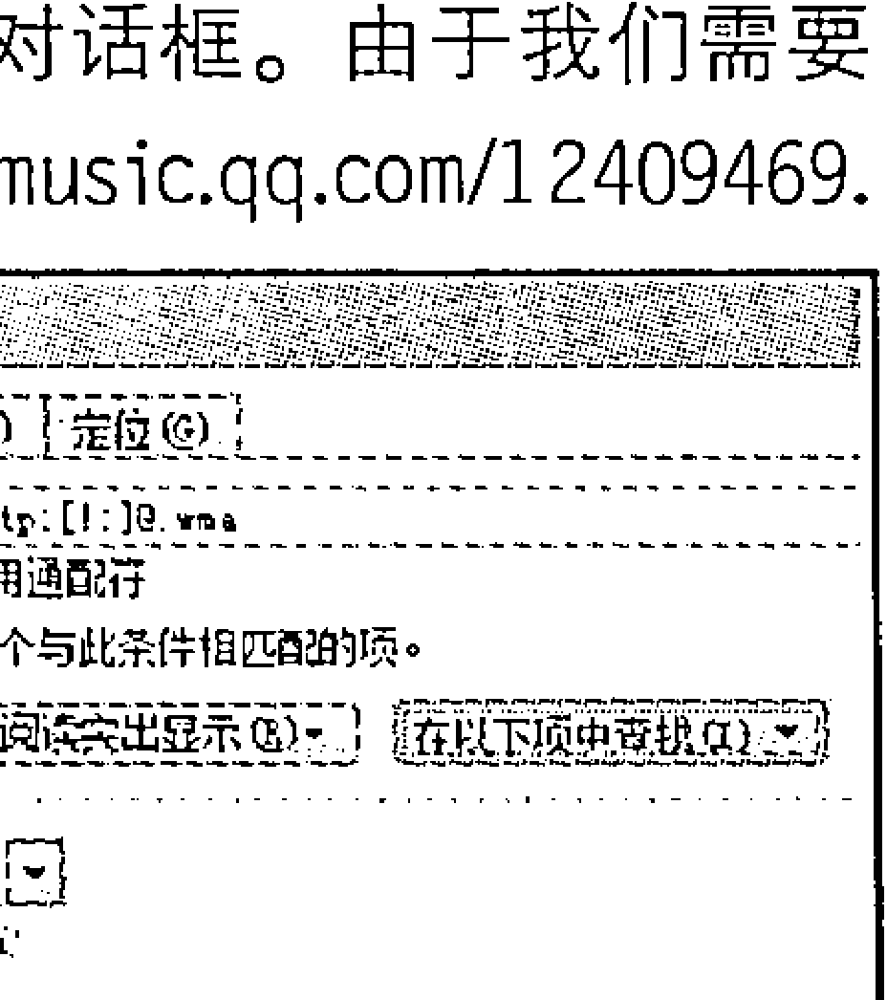

> 小提示：这里的“[!:]*”表示链接路径，“*”表示任意数量的字符，此处即歌曲的文件名，“.wma”是为了作出限制，因为文档中还有很多.tpt的链接。

可以看到，被Word“修理”过的下载地址变成了绿色（见图19），现在的工作就简单多了，任意右击其中的某一处绿色

```
<PlayListItem nSongType="1" strSongName="投名状" strSingerName="刘德华" strSongGUID="http://stream10.qqmusic.qq.com/12410792.wma" wPlayTime="310" dwWebSongID="410792" dwFlags="1" dwFromTag="0" dwFun="0"/>
<PlayListItem nSongType="1" strSongName="飘飘" strSingerName="王心凌" strSongGUID="http://stream6.qqmusic.qq.com/12411219.wma" wPlayTime="202" dwWebSongID="411219" dwFlags="1" dwFromTag="0" dwFun="0"/>
```

| 名称 | 类型 | URL |
| :--- | :--- | :--- |
| [ ] 12185187.wma | .wma | http://stream2/12185187.wma |
| [ ] 12392416.wma | .wma | http://stream7/12392416.wma |
| [ ] 12409469.wma | .wma | http://stream1/12409469.wma |
| [ ] 12409658.wma | .wma | http://stream5/12409658.wma |
| [ ] 12409859.wma | .wma | http://stream5/12409859.wma |

的下载地址，从快捷菜单中选择“复制”，就可以将文档中所有的下载地址一次性复制到剪贴板中，如果系统中安装了迅雷、快车等下载工具，并且监视属性已经被设置为“监视剪贴板”，那么此时会自动弹出图20所示的对话框，确认后即可下载。

> 小提示：如果没有将“在以下项中查找”设置为“主文档”，那么虽然文档中的所有下载地址都会显示为黄色，但是右击复制后却不会弹出批量下载的对话框，而是只能下载所选中的那首歌曲。

通配符是在繁杂的文档中查找特定对象的有力武器哦，将文中的通配符替换为“http:[!:]*.jpg”的话，我们可以快速选择所有JPG格式的图片文件，当然类似的应用还有很多。

或者，我们也可以使用“替换”功能来完成，先通过通配符将这些下载地址的格式替换为某种特殊的颜色（例如红色），然后选中文档中的某个下载链接，右键点击“选择格式相近的文本”（见图21），所有下载链接都会被自动选中，接下来右击选择“复制”将其复制到新建的记事本中，保存后就可以利用迅雷或快车的“导入下载列表”功能进行批量下载了。

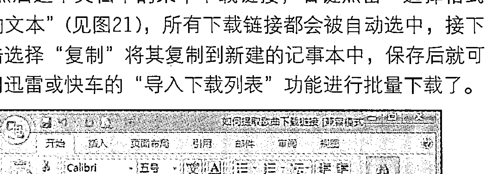

## 实例九：直引号快速替换为全角中文双引号

很多时候，我们会需要从某些网页上将文档复制到Word下进行编辑，但常常会出现这样一个问题：文本是中文格式的，而标点符号却是半角英文的，这主要是发布时考虑到网页兼容性的问题而进行了修正。如果只是逗号、句号倒也不难替换，但如果遇上这么一个直引号（例如“一次函数法”），那可就讨厌了，因为在英文中并没有前引号和后引号之分，其实很多新手在输入文档时也经常会出现这样的问题，你总不可能逐个手工替换吧？

其实，稍动脑筋，我们同样有办法来解决这个直引号的问题，具体步骤如下：

-   ①自动套用格式

将需要处理的文档复制粘贴到Word的文档窗口中，然后从格式菜单中执行“自动套用格式”命令，如图22所示，在弹出的自动套用格式对话框中选择默认设置，单击“确

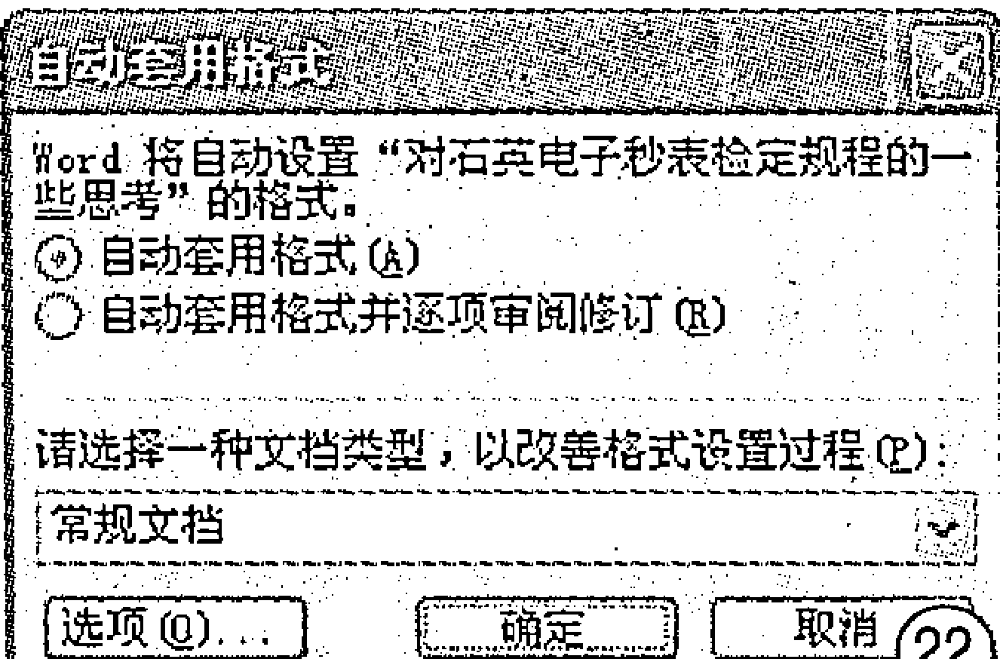

## 实例十：将一行内容分作两行

例如图23所示的文档，现在要求将原本为一行的内容分作两行，还是按下“Ctrl+F”组合键打开“查找和替换”对话框，切换到“替换”选项卡，“查找内容”文本框输入“^32[6,]”，“替换为”文本框中输入“^&^p”，然后单击“全部替换”按钮，确认后就可以了，最终效果如图24所示。

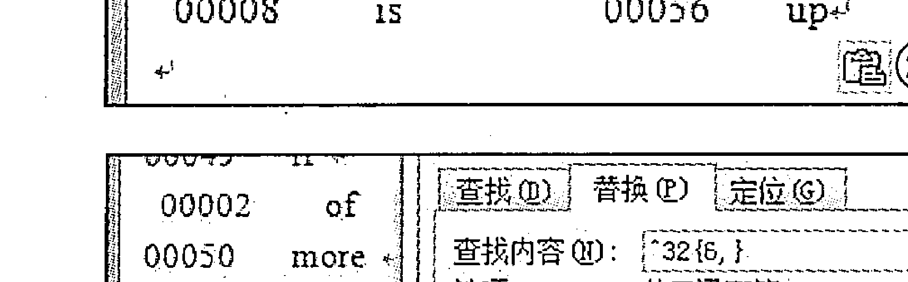

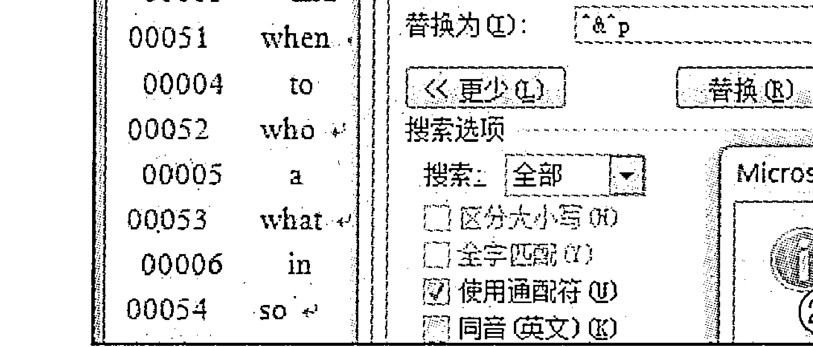

## 实例十一：批量删除每行前面或后面的内容

例如下面的内容，现在要求将前面的英文或后面的中文批量删除，假如数据量不多的话，那么手工删除也是可以的，不过从提高工作效率入手，其实我们可以考虑采取替换的方法进行：

- timber carrier 木材运输船
- timber ship 木材船
- refrigerated cargo ship 冷藏货物运输船
- multi purpose vessel 多用途货船

①删除英文
按下“Ctrl+F”组合键打开“查找和替换”对话框，切换到“替换”选项卡，“查找内容”文本框中输入“[a-zA-Z]”，这里的“[a-zA-Z]”表示所有的英文字母；“替换为”文本框中为空，也就是说什么也不输入，然后单击“更多”按钮切换到高级替换模式，最后单击“全部替换”按钮，确认后即可将前面的英文一次性全部删除，原文件及删除

②删除中文
按下“Ctrl+F”组合键打开“查找和替换”对话框，切换到“替换”选项卡，注意这里还需要单击“更多”按钮切换至高级替换模式，勾选“使用通配符”复选框；在“查找内容”文本框输入“[一-龥]”，这里的“[一-龥]”表示查找所有的中文汉字，当然你也可以使用其他的汉字，只要是文档中没有出现这个字，不过建议还是取一个比较罕见的汉字更好一些；“替换为”文本框中仍然为空，然后单击“全部替换”按钮，确认后即可将后面的中文内容一次性全部删除，原文件及删除后的文档如图26所示。

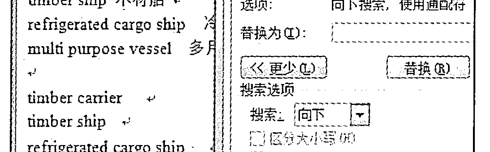

## 实例十二：批量删除制表符后的内容

例如格式类似于“LESSON ONE. ...... ...... ...... ...... 3”的文档，现在要求将“......”与后面的数字批量删除，这里我们仍然利用替换功能来完成：
按下“Ctrl+F”组合键打开“查找和替换”对话框，切换到“替换”选项卡，“查找内容”文本框中输入“[!a-zA-Z^13^32]”，这表示查找所有非英文字母、段落标记及半角空格的内容；“替换为”文本框中为空，也就是说什么也不输入，最后单击“全部替换”按钮，原文件及删除制表符后的文档如图27所示。

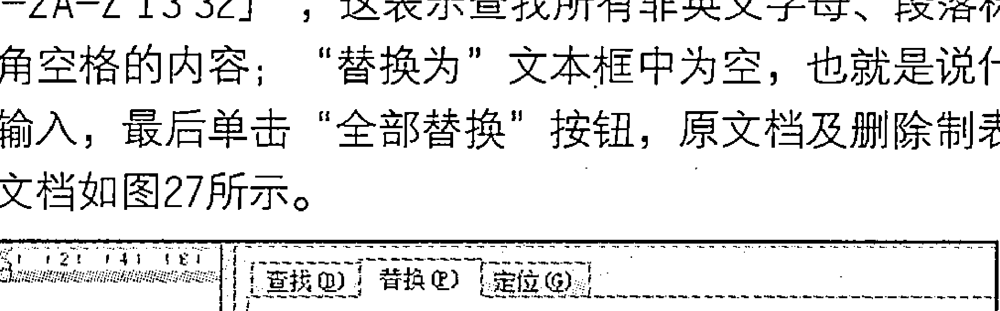

## 实例十三：删除开头有特定字符的段落

我们经常会从网页上复制相关内容到记事本中，而其中有很多都是不需要的文字，例如图28所示的这些内容，由于文档中的图形是不可能被复制下来的，因此其中用来说明插入的图注“图9.40 文压图”自然就没有什么作用了，另外文档中的“如图9.40所示”的内容也同样就失去了意义。不过，由于文档的篇幅比较大，因此手工删除自然不是好办法，那么该如何才能批量删除这些内容呢？

## SOLUTIONS 特别话题

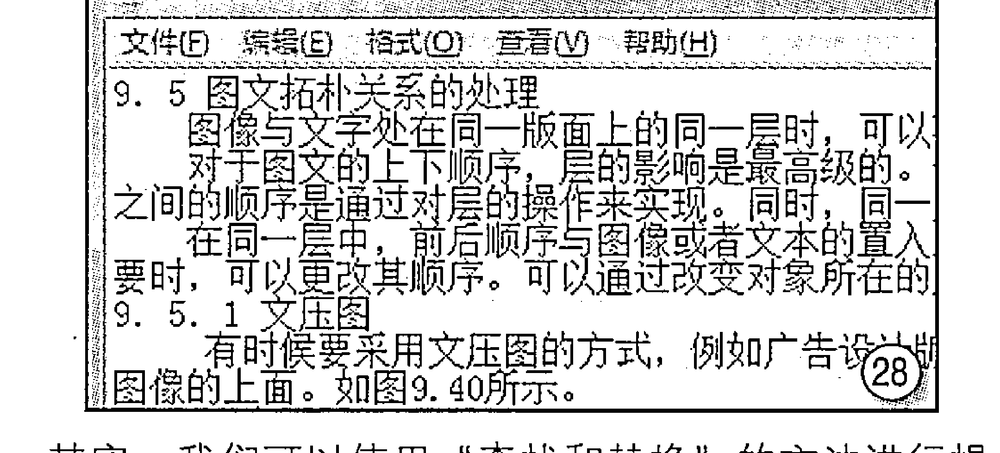

其实，我们可以使用“查找和替换”的方法进行操作，这里以Word 2007为例进行说明，具体步骤如下：

第一步：由于记事本处理此类问题的功能比较弱，因此我们需要先将这些内容复制到Word中进行操作，按下“Ctrl+A”组合键选中所有内容，接下来按下“Ctrl+C”组合键复制到剪贴板中，然后将其粘贴到Word中就可以了。

第二步：首先我们来处理文档中的“如图9.40所示”这些内容，按下“Ctrl+H”组合键，打开“查找和替换→替换”窗口，单击“更多”按钮切换到高级替换模式，注意这里不需要勾选“使用通配符”复选框，接下来将查找内容设置为“如图^#.^#^#所示。”，这里的“^#”代表一个数字符号，“替换为”则设置为空，即什么也不输入，然后单击“全部替换”按钮就可以了，效果如图29所示。

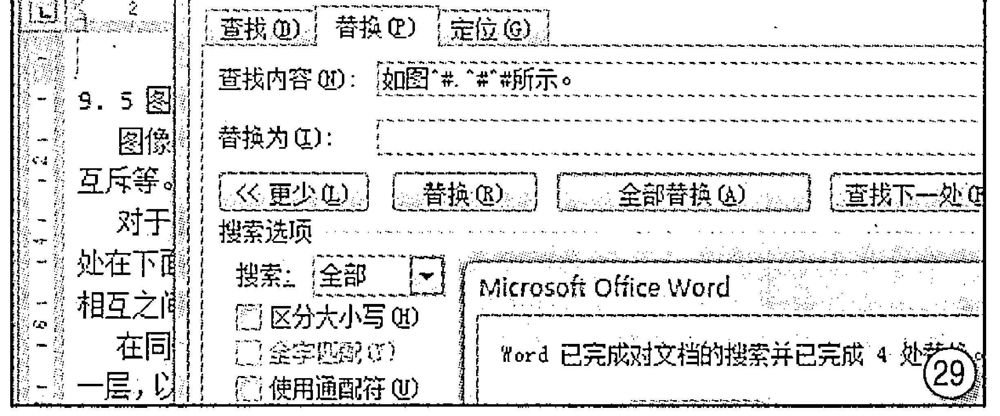

第三步：对于“图9.40 文压图”这样的图注来说，由于“图9.”后面的数字和图释内容都是随机的，并没有“如图9.40所示”中的“所示”两字来限定范围，因此这里无法直接采取刚才的方法进行替换，即使将“查找内容”设置为“图^#.^#^#”，也无法通过替换的方法删除这些内容。

我们需要首先将图注的格式与文档中的其他内容进行区分，仍旧打开“查找和替换→替换”窗口，当然还是切换至高级替换模式，查找内容设置为“图9.”，接下来将光标定位到“替换为”文本框中，单击“特殊字符”下拉菜单，依次选择“段落标记”和“查找内容”选项，如图30所示，这里的“^p”表示段落标记，“^&”表示查找内容，然后单击“全部替换”按钮进行替换操作，注意完成后不要关闭这个窗口。

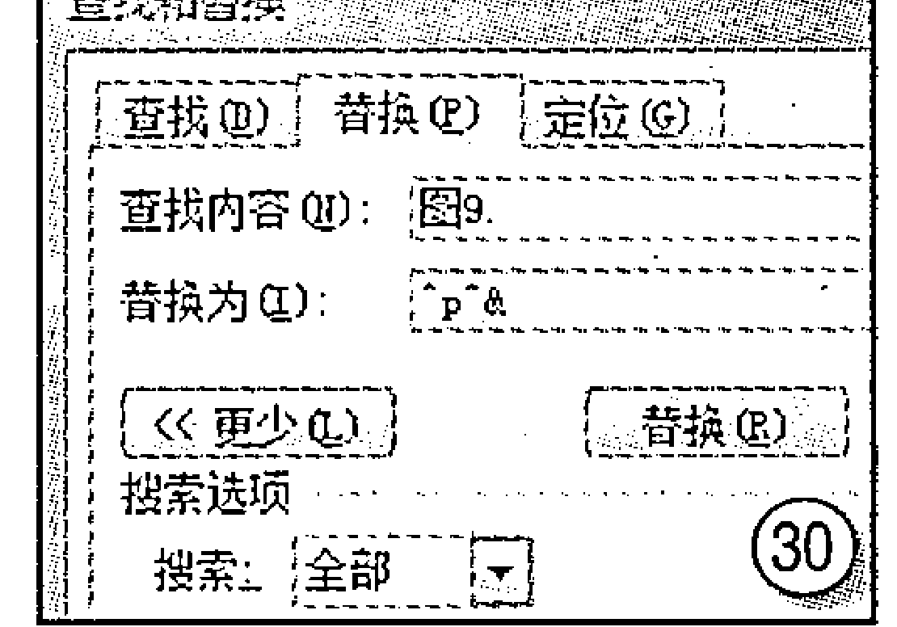

第四步：仍旧将光标定位在“替换为”的文本框中，从“格式”下拉菜单中选择“样式”，此时会打开“查找样式”对话框，默认的样式当然是“(无样式)”，现在我们应该在这里选择“标题1”，确认后返回“查找和替换”窗口，如图31所示，然后单击“全部替换”按钮，确认后文档中的图注应该已经被全部设置为标题1的样式。

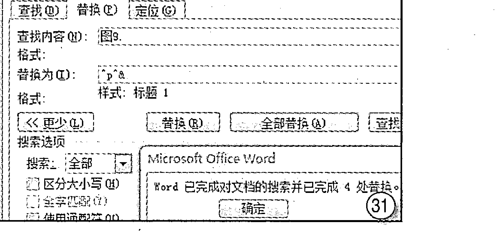

第五步：拖黑选中已经被设置为“标题1”的图注所在段落，单击鼠标右键，从快捷菜单中选择“样式→选择格式相似的文本”，或者从“编辑”功能组中选择“选择格式相似的文本”（见图32），然后可以将需要删除的图注段落一次性全部选中，接下来该如何操作，相信就不用多说了吧？■

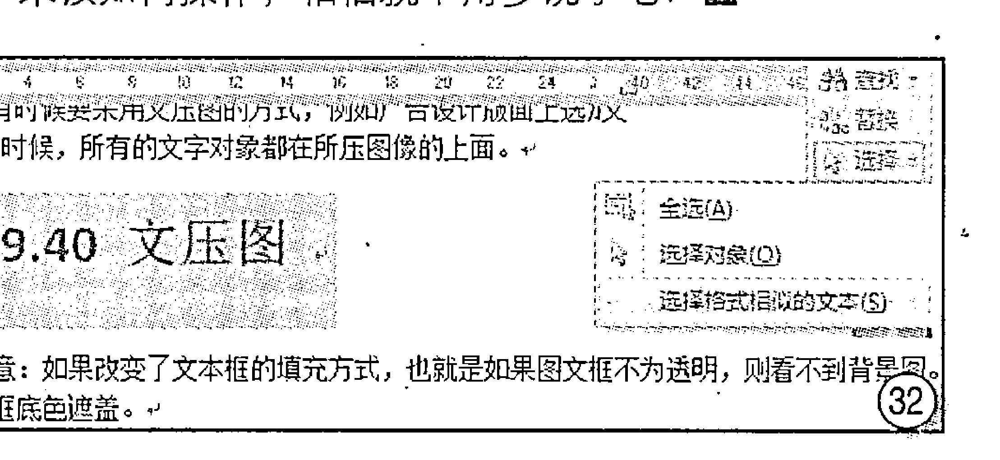

## 禁止MSN随Windows启动

每次启动Windows时，Messenger总是自动运行，即使你不想启动它，可是它也自动运行，非常烦人，我们能不能禁止它，不让它随Windows启动呢？回答是可以的。

第一种方法：

- 1. 在“开始”菜单中单击“运行”，在“打开”框中输入“msconfig”，“确定”后打开“系统配置实用程序”窗口。
- 2. 单击“启动”选项卡，在“启动项目”列表中，清除“MSMSGS”前的复选框，单击“确定”按钮。
- 3. 当系统提示“重新启动计算机”时，请单击“是”按钮。

第二种方法：

- 1. 打开“注册表编辑器”窗口。
- 2. 依次展开“HKEY_CURRENT_USER\Software\Microsoft\Windows\CurrentVersion\Run”分支，然后在右窗格中右键单击“MSMSGS”，再单击快捷菜单中的“删除”命令，当系统提示确认删除时，请单击“是”按钮。

经过设置，MSN就再也不会随Windows XP的启动而启动了。■

## 解决下载的那些事 —— 迅雷超级完全技巧集锦

□江北书生

高速和安全是网络时代的代名词，在很多时候，我们需要的正是高速和安全的网络体验。迅雷作为最大的下载服务提供商，基于这样的理念，为我们提供了相应的服务。那迅雷用起来有哪些实用的技巧？网上铺天盖地的技巧，我们如何才能够记得住并使用？如何才能够将下载技巧进行归类，并将其发挥到极致？

### 一、迅雷基础技巧

迅雷在下载前必须要进行相应的设置，这样才能够保证其高速和安全下载。因此，这些技巧我们称之为基础技巧，而往往‘万丈高楼平地起’，基础的技巧却正是我们最为需要的。

- 1. 使用最新的迅雷

及时更新迅雷可以修正软件Bug，提高软件运行的稳定性。而且，迅雷开发团队也会与时俱进，针对下载进行优化。只要保证使用最新版本的迅雷，一定可以保证其使用最新的技术，当然也可以保证影音文件的下载。经常去http://www.xunlei.com或相应的媒体网站，关注迅雷版本更新。另外，我们也可以在迅雷中选择‘工具’→‘配置’命令，单击‘高级’标签，再选中‘当发现新版本时提示’复选框（如图1），这样即可在第一时间更新迅雷了（图2）。

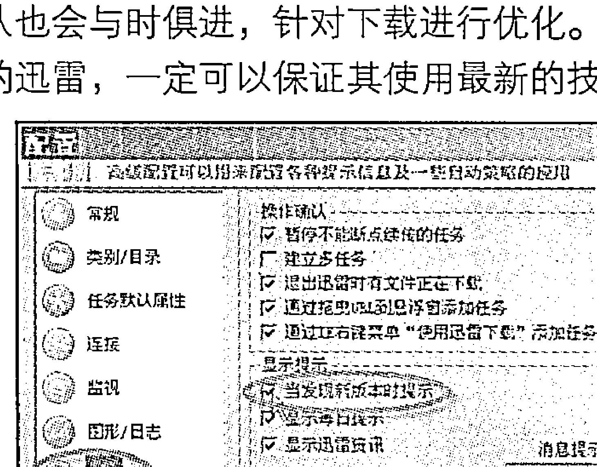

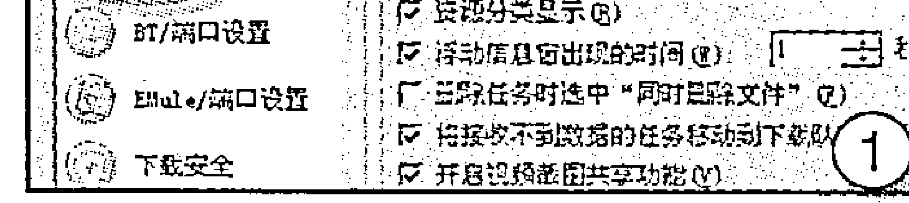

- 2. 使用较大的硬盘空间

现在硬盘当白菜来卖，数据是如此宝贵，因此我们有必要使用较大空间。在迅雷的主窗口中选择‘常用设置’→‘存储目录’命令，在打开如图3所示窗口中选择将其移动到另一文件夹，如d:\download。完成后按下‘确定’按钮，接着注意一下迅雷弹出相应的确认对话框，一定要选中‘同样修改子类别的存储文件夹’和‘移动本地文件’（如图4），这样软件会同时将相应的文件移到d:\download下，从而保证我们的‘无缝移动’。

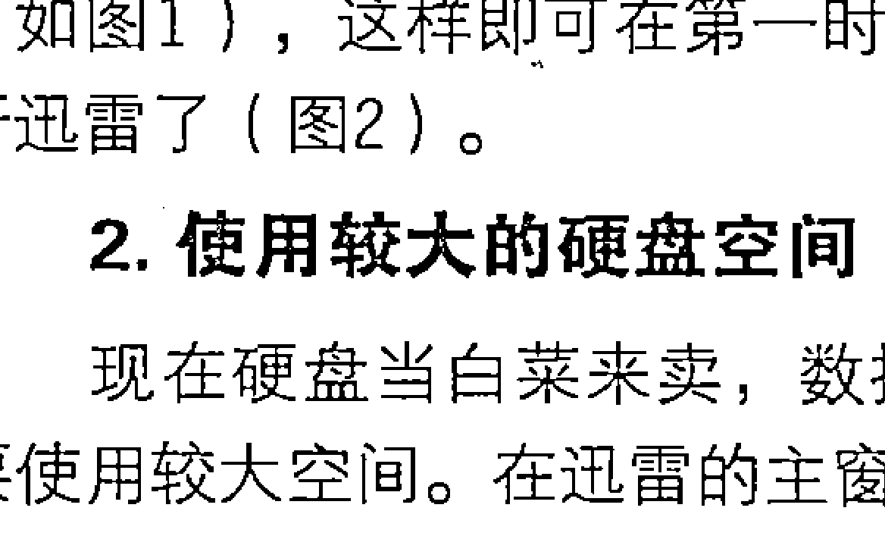

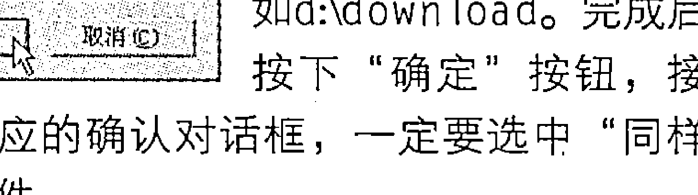

- 3. 下载文件所在分区必为NTFS

随着互联网数据的增大，现在超过4GB的文件也开始出现。但是由于2的32次方为4G，所以FAT32最大的单个文件不可能超过4GB。因此，我们必须将硬盘格式为NTFS分区方式。要进行此类操作非常简单，大家在安装Windows XP/Vista后，将剩下的分区在‘磁盘管理’中格式化时选中NTFS即可。但是，如果你有FAT32分区，可以通过convert或PQ Magic来转换。要注意的是，在转换前必须做好相关数据的备份工作！

什么是NTFS文件系统
NTFS: New Technology File新技术文件系统，微软Windows NT内核的系列操作系统（Windows NT/2000/XP）支持的、一个特别为网络和磁盘配置、文件加密等管理安全特性设计的磁盘格式。以前主要是为网络用户服务，现在很多个人用户开始用到了NTFS。NTFS也是以簇为单位来存储数据文件，但NTFS中簇的大小并不依赖于磁盘或分区的大小。簇尺寸的缩小不但降低了磁盘空间的浪费，还减少了产生磁盘碎片的可能。同时NTFS支持文件加密管理功能，可为用户提供更高层次的安全保证。

- 4. 破解Windows的TCPIP同时进发数限制

Windows XP SP2和Windows Vista对于TCPIP最大连接数作了限制，这样做的本意是为了防止一些蠕虫病毒的传播。但是，这样一来对于P2P的传输不利，也不利于我们的下载加速。因此，我们有必要进行修改。

（1）Windows XP 启动迅雷，选择‘工具’→‘XP系统优化工具’命令，然后在打开的如图5窗口中进行修改，重新启动后可生效。

（2）Windows Vista 微软发布的Windows XP SP2增加了TCP同时连接尝试的限制，并且设置为一个很小的值10，系统的TCP连接尝试超过这个值的时候，系统会因为安全因素而拒绝连接。Windows Vista中同样存在这个问题，但是目前迅雷没有开发这样的破解功能（Vista仍不是非常流行）。但我们可以借助于第三方的软件来破解，从而让迅雷多管齐下，一路狂飙。

现在只要从http://download.softpedia.com/dl/029858726e0e97438cd4de4ecfd32ccf/469cab1c/100072536/software/tweak/vistapatch.zip处下载此工具，然后将其中的文件解压到一临时文件夹下，然后根据自己平台的情况，双击Patch32.bat（32位的Vista平台）或Patch64.bat（64位Vista平台），然后一路按Y键确认（如图6）。完成后，会弹出如图7所示窗口，提示我们重新启动Windows Vista。利用此工具可以关闭掉用户帐户控制，并可以破解TCP/IP半开连接数，其最高值为70000，足够我们下载使用了。

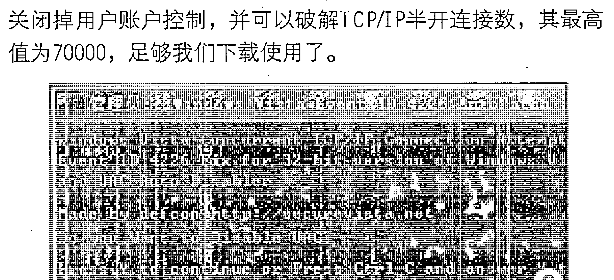

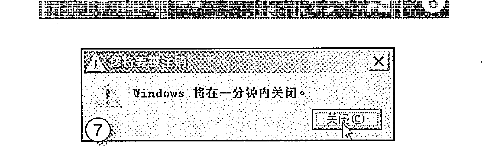

（3）享受Vista的自动调整功能

在Windows Vista中，微软为TCP/IP引入了名为“Auto Tuning”的新特性，从理论上说，“Auto Tuning”能够根据网络应用情况调整、优化，从而提高网络传输速率。但是很多时候，并不能起到预期中的效果，尤其在网卡使用第三方驱动时，甚至会大大降低网络连接速率。不过，好在我们可以自己手工来开启。

首先，以管理员登录系统，然后按下Win+R，输入cmd启动命令行窗口，然后在命令行中输入：netsh int tcp set global autotuninglevel=normal。当运行完成返回“确定”字样后（如图8），重启系统即可。

```
netsh int tcp set global autotuninglevel=normal
```

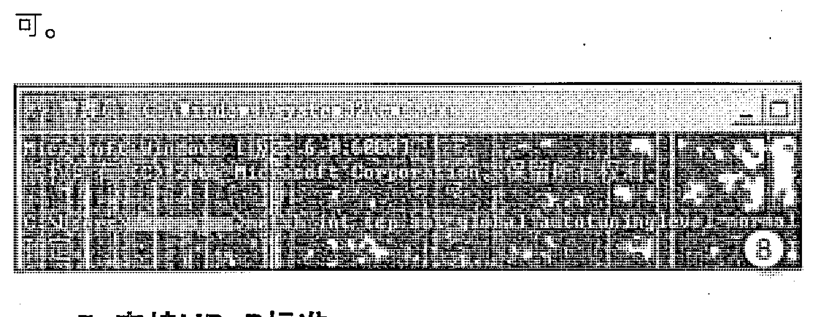

- 5. 支持UPnP标准

多数企业局域网用户和使用宽带路由器的用户在使用BT下载时，经常会抱怨速度太慢。造成这种现象的原因是，局域网用户和使用宽带路由器的用户都采用的是NAT的转换方式将内网（即内部地址，这些地址不可路由，无法直接与外部进行数据交换）IP转换为外部可路由IP上网的。其无法接受外部的BT客户端的主动连接，这样一来peers自然会少出很多。不仅无法从这些peers处得到数据，而且我们也无法向他们上传数据。

根据BT精神，我们上传得越少，其速度就会越慢！要想解决这个问题，一般的做法是在路由器上做端口映射，但是这非常麻烦。解决这个问题最快的办法就是让迅雷支持UPnP：

（1）路由器支持

多数的路由器是支持的，但是还是要进行相应的设置。如在DI-724P+中，选择“工具”→“其它项目”，然后选中“启用UPnP”后的“激活”，再单击下方的“执行”即可生效。

（2）操作系统支持

在Windows XP中打开SSDP Discovery Service服务，在Windows Vista中打开SSDP Discovery服务。这些比较简单，如果你不会，可以参考Windows的使用手册或请教高手。

（3）迅雷本身支持

选择“工具”→“配置”命令，再选择“BT/端口设置”，然后选中“允许连接DHT网络”和“允许使用UPnP自动端口映射功能”复选框（如图9）。

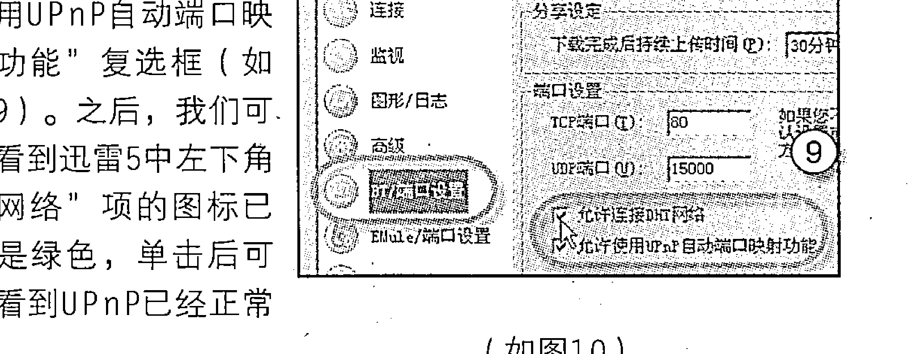

之后，我们可以看到迅雷5中左下角“网络”项的图标已经是绿色，单击后可以看到UPnP已经正常（如图10）。

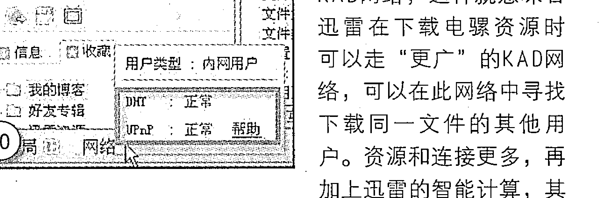

- 6. 支持KAD网络

新版迅雷全面支持KAD网络，这样就意味着迅雷在下载电骡资源时可以走“更广”的KAD网络，可以在此网络中寻找下载同一文件的其他用户。资源和连接更多，再加上迅雷的智能计算，其速度也会得到更大提升。在下载电骡等大文件时，特别有效。因此，我们必须确认选择“工具”→“配置”，再在打开的窗口中单击“EMule/端口设置”，确认“连接KAD连接网络”（如图11）。

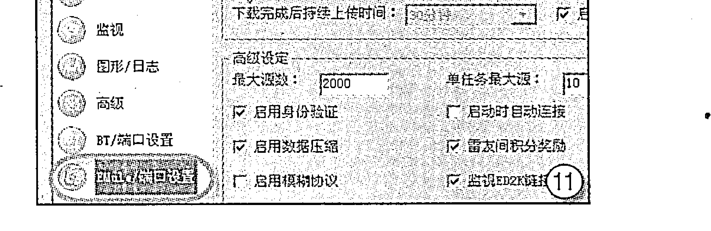

## 二、迅雷影视下载技巧

多数人用迅雷下载电影或视频，同时，视频网站如火如荼地发展，足见网络视频和影音的流行。而且，根据第21次中国互联网调查报告得知，目前网络影视观看比例达到76.9%。有40.5%的网民表示半年内下载过网络影视。因此，我们很有必要研究影视下载技巧，让我们更好地娱乐。

- 1. 先预览再下载

没有一件比下载不适合的大容量影音内容更令人恼火的事情了，白白浪费了带宽和感情。在下载影音前，请首先到http://movie.gougou.com上进行搜索，然后单击“预览”按钮来进行内容的查看（如图12、13）。如果发现内容文不对题，则不要下载，进而节省时间。

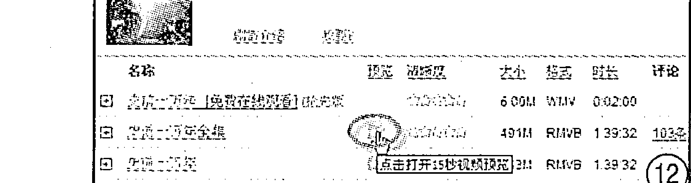

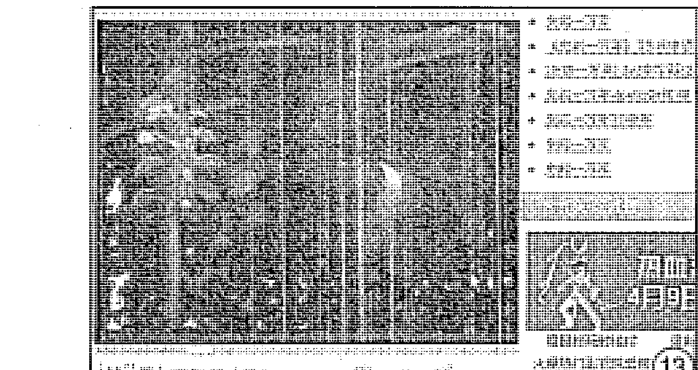

- 2. 下前先筛选

相信对于时尚的您来说，在搜索影音内容时，其清晰度、大小、格式、时长等等往往是我们关心的。如图14所示，我们可以在狗狗搜索（gougou.com）中按清晰度、大小、格式、时长来排序。这些都容易理解，清晰度当然是越高越好，大小一般来说，越大越好。格式有RM、RMVB、WMV、FLV、AVI、MP4、3GP、RAR、MPG、ASF、ZIP等，可以根据自己机器（包括掌上影音机）支持的格式来下载。时长则是越长的表现情节越多，这样就能做到“精彩不断”。通过这些参数，我们可以保证下到较高质量的资源。

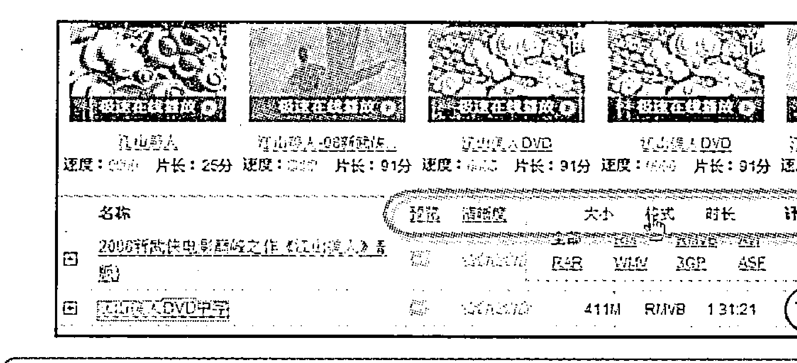

- 3. 火眼金睛多看他人评价

现在网上的资源有很多存在内容重复度高、质量低下等问题，有时花了很长时间下下来发现质量很差。为了节省时间，狗狗搜索提供了评论功能。如图15所示，我们会在每个资源后面显示评论的条数，单击后则可以看到相应的评论。如图16，里面的评论相当客观，对于我们判断资源下载会有着很好的借鉴意义，从而帮助我们省下很多的时间。

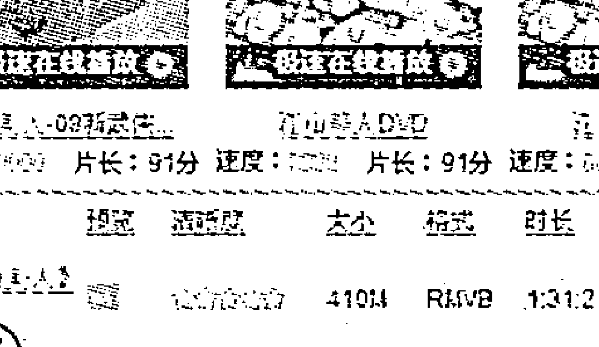

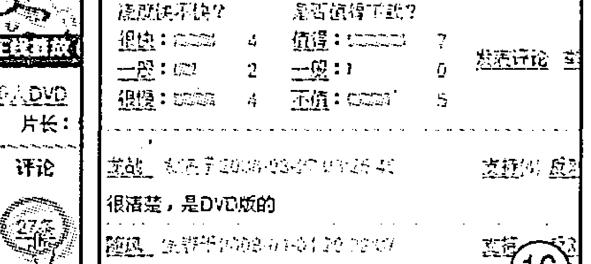

- 4. 不要限制速度下载

出于稳定的原因，迅雷默认设置中作了保守的设置，而我们的机器和网络环境都比较好，这时完全可以自行设置，使其“全速前进”：在迅雷主窗口中选择“工具”→“配置”命令，再选择“连接”，取消选中“限制”下的两个复选框。这样机器将会全速前进，自动来调整。

- 5. 让同时任务数小一点

尽管迅雷5现在最多同时的任务数可以上调为20，但是如果我们经常下载影音文件，因为是大文件，所以我们最好将此数值下调，这样迅雷对于文件系统和资源的占用会少得多，提升了稳定性的同时，相当于提升了速度！选择“工具”→“配置”，再选择“连接”，即可在右侧的“最多同时进行的任务数”进行设置。如果我们下载大的影音文件较多，则改为5比较合适（如图17）。这样一来可以减少下载时对文件系统的资源占用，二来也可以统筹好有限的带宽资源，形成了良性循环。

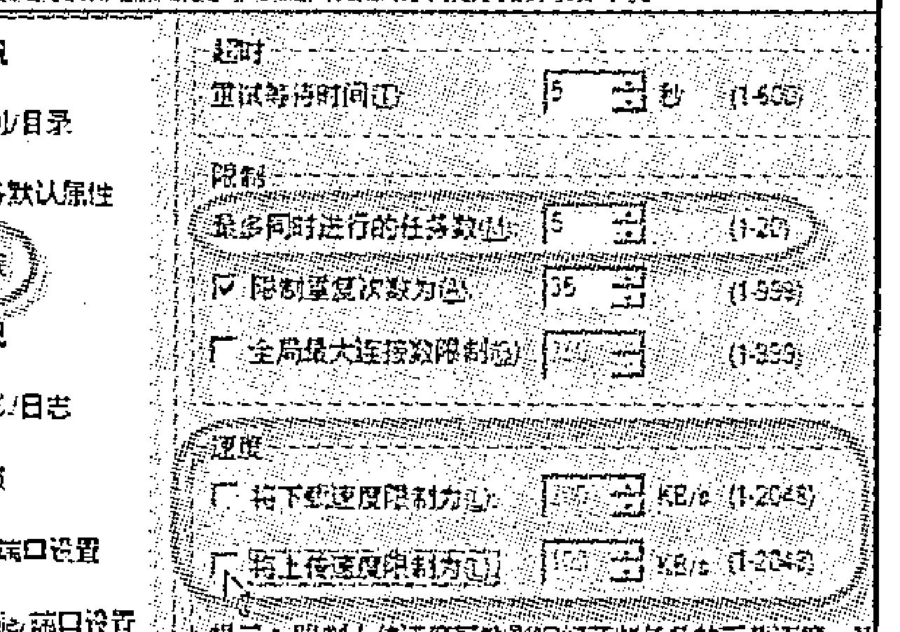

## 三、迅雷BT下载技巧

迅雷已经支持BT下载，而且速度很快，很多人会用它来下载BT。不过，同样它也有很多实用技巧。

- 1. 支持DHT网络获得更多peers

新版迅雷全面支持DHT网络（即无tracker服务器网络），这样就意味着迅雷在下载BT资源时可以走“更广”的DHT网络，也可以在DHT网络中找到更多的peers。在传统的BT原理中，tracker服务器是其中心。如果tracker服务器关闭，BT将无法进行下去。但是DHT是一种无服务器网络，就算tracker服务器倒闭了，也可以保证我们仍能连接到更多的peers，并不影响下载。选择“工具”→“配置”，然后单击左侧的“BT/端口设置”项，再在右侧选中“允许连接DHT网络”复选框（如图18）。

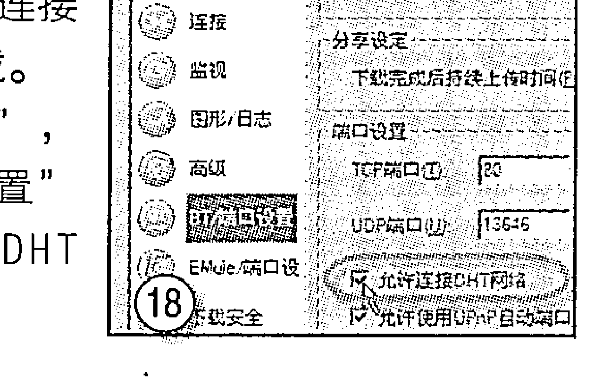

## 特别话题

- ★DHT网络无须tracker服务器来协调BT下载的原理是，DHT是一种分布式存储方法，每个客户端除了负责存储数据外，还负责一个小范围的路由，所以可以实现整个网络的寻址。因此，不再需要tracker服务器。
- ★进入DHT网络后，我们的客户端会有一个ID，但这个ID是程序生成的、虚拟的、完全随机的ID，与你的实际个人信息没有任何联系。因此，是极其安全的。

## 2. 全面洞悉BT视频

现在有不少的BT资源中的电影质量很差，内容质量低下和文不对题的现象屡屡发生，可以想象花费大量时间下载完一部自己并不想要的电影之后的惆怅心情！现在这个问题可以解决了。因为新版迅雷在下载BT资源时，只要其中有视频文件，就会在右侧出现一个小窗口，其中会出现该视频的片段预览（如图19），同时还可以单击“介绍”来查看该视频的介绍（剧情）。

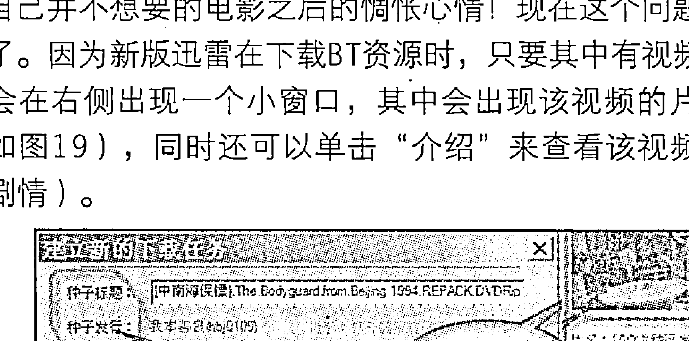

单击片段后会打开浏览器，在其中会出现图20所示窗口，在其中我们不仅可以预览该影视的当前片段，还可以选择更多的片段进行预览。

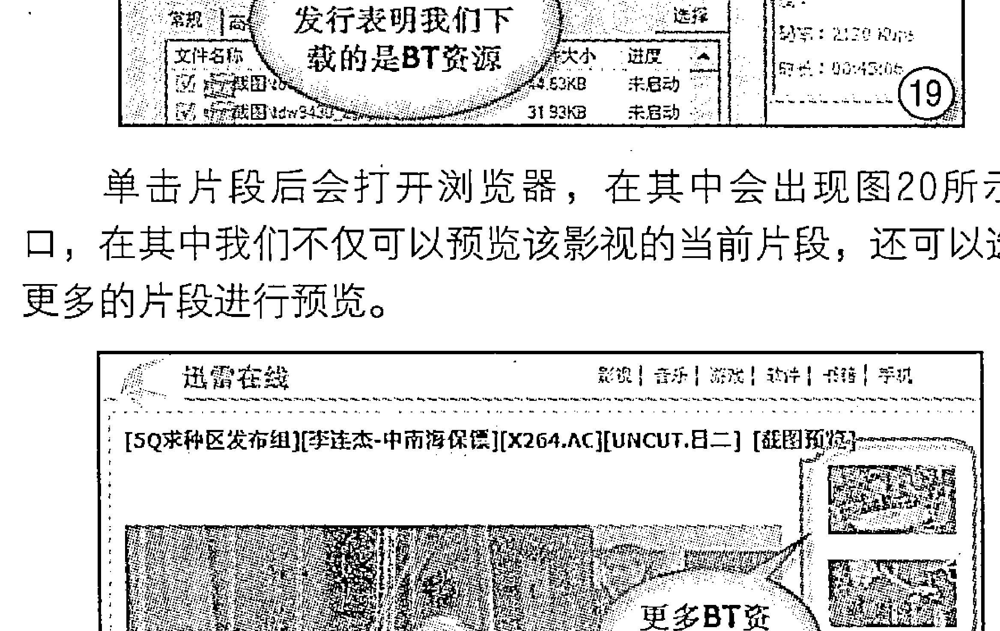

有了该功能后，不仅可以帮助我们挑选到质量优秀、下载量更高的资源下载，同时还可以在下载前看到影片中的真实内容，这样我们就再也不会下载到“货不对版”、“文不对题”的虚假资源了。同时，对于一些不健康的内容，也可以做到预知，并立即停止下载。

- ★如果我们不小心关闭了视频信息显示窗口，可以选中“常用设置”→“启用视频信息预览”项来重新启用它。
- ★在迅雷搜索http://www.gougou.com上查找视频资源时，多数也可以直接预览，因此推荐大家去迅雷搜索上来搜索并下载视频。

## 3. 设置为默认BT下载器

新版迅雷支持BT下载，而且速度比较快，这的确大大提升了我们的下载体验。不过，有时会出现双击一BT种子文件，但弹出不是迅雷的情况。这时，我们只要选择“工具”→“配置”，然后单击左侧的“BT/端口设置”项，再在右侧选中“将迅雷作为本机默认的BT协议下载工具”项（如图21）。这样，我们在“资源管理器中”将看到所有的BT种子文件的图标发生了变化，说明已经和迅雷相关联了。双击后即可打开迅雷来下载。

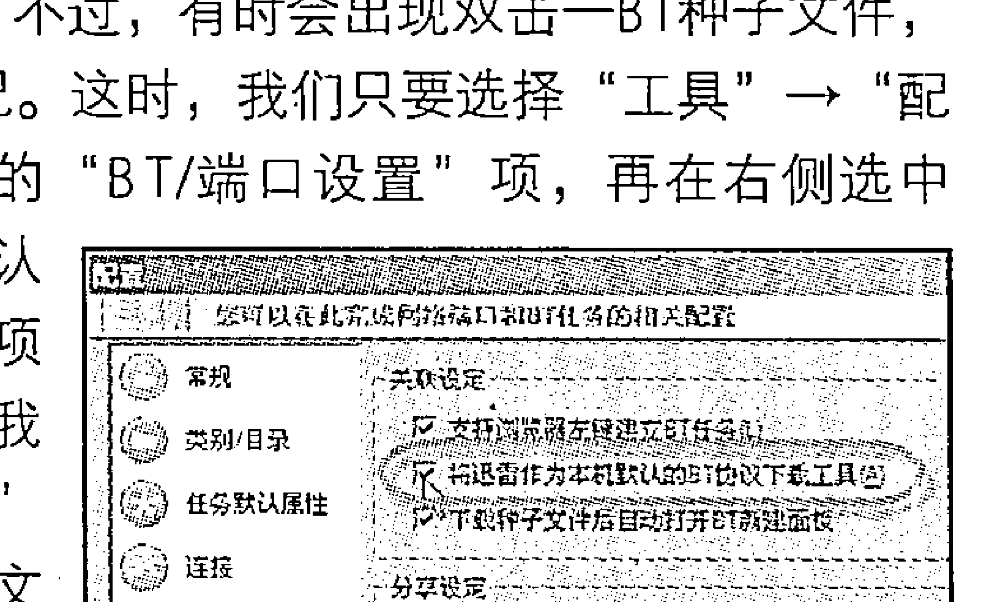

## 4. 下载前注意种子数量

我们在狗狗http://www.gougou.com上搜索时，其会自动按种子数的多少来降序排列（如图22），一般来说，大家会选择种子数最多的资源来下载。根据BT的原理，种子数越多，其下载的可用性越可信，下载速度也往往较快。从这一点也足见狗狗搜索的智能性。

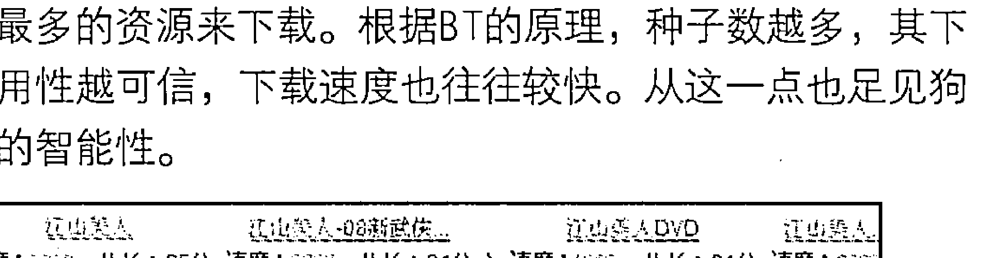

## 5. 节省带宽 注意有选择性下载

当我们用迅雷来下载BT资源时，会弹出一个窗口来让我们选择欲下载资源，这时我们可以取消掉无关的文件（如图23），这样也会大大加速下载。

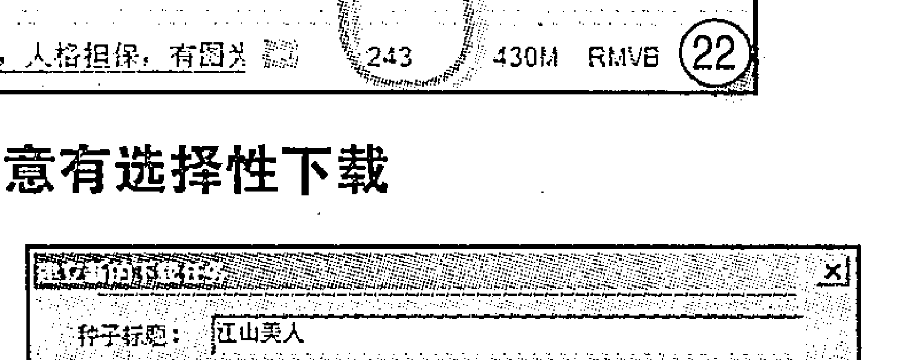

## 6. 齐心协力 异地下载

BT下载文件一般较大，所以一定要解决好异地下载问题。现在新版本迅雷5完全可以支持BT未完成任务导入，而且就算你在其他BT客户端或电驴中发现下载不了的文件，可以导入到迅雷中来试试！

打开迅雷5，选择“文件”→“导入未完成的下载”命令。再在打开的窗口中找到如图24所示的文件即可出现如图25所示的导入窗口，之后就可以正常弹出相应的窗口来下载了（如图26）。

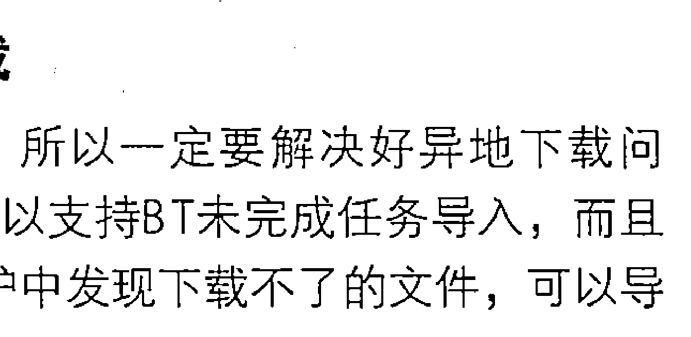

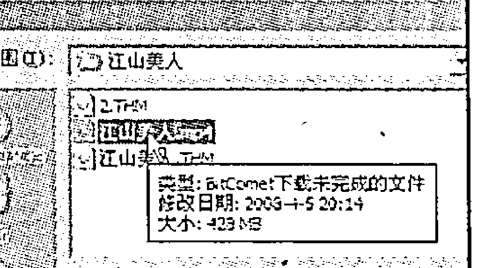

要注意的是，这种方法不是一定可行的。有时会出现寻找种子的窗口，这时我们需要在相应软件中右击下载资源，选择“种子文件另存为”，然后将其保存为.torrent文件，供我们选择。之后的步骤就是一样了！

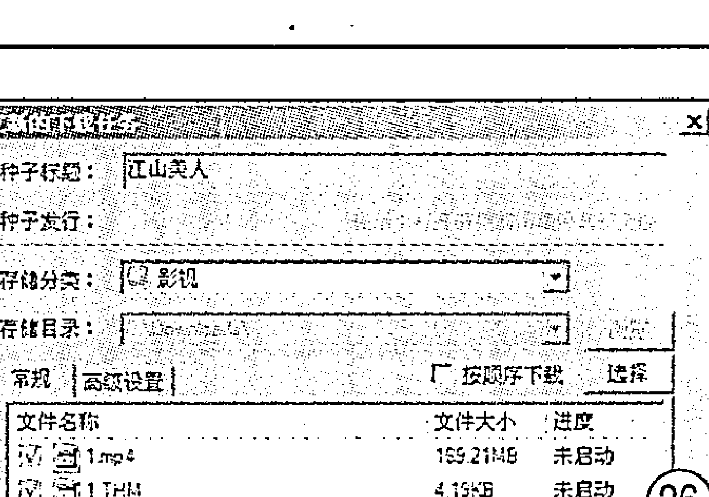

## 7. 设置更大缓存

BT下载对硬盘的读写操作更为频繁，因此必须合理设置磁盘缓存区，这样才能尽最大能力来保护硬盘。有幸的是，迅雷5提供了磁盘缓存功能，可以有效地保护硬盘，提高读写效率。选择“工具”→“配置”命令，再选择“常规”，然后在“磁盘缓冲区设置”中将“最小缓存”和“最大缓存”进行设置（如图27）。建议最小磁盘缓存设置在10M以上，如果达到300KB/s以上的下载速度，至少将缓存最大值设置为50MB以上。
另外，在玩游戏的时候最好不要BT下载。玩游戏的时候下载不但会影响游戏速度，也会加大硬盘的负担。

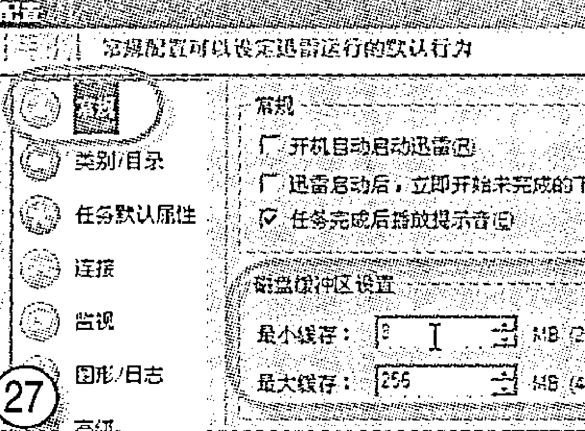

## 8. 让同时任务数小一点

因为BT下载的文件一般较大，所以我们将最多同时的任务数变得尽量小。这样迅雷对于文件系统和资源的占用会少得多，提升了稳定性的同时，相当于提升了速度！选择“工具”→“配置”，再选择“连接”，即可在右侧的“最多同时进行的任务数”进行设置。如果我们下载大文件较多，则改为5比较合适。这样一来可以减少下载时对文件系统的资源占用，二来也可以统筹好有限的带宽资源，形成良性循环。

## 9. 充分发挥迅雷BT种子共享精神

迅雷BT下载时，种子是很重要的“药引”、“催化剂”，而共享加速是BT下载的核心，这也全面体现了P2P中的“人人为我，我为人人”的思想和理念。因此，我们在享受迅雷给我们的BT下载带来高速下载的同时，千万不要忘了充分发挥共享精神。

- （1）BT种子文件快速共享
众所周知，BT下载的人越多，速度反而越快。如果我们正在下载一个不太容易得到的资源，很多朋友会索取种子文件。这时，我们只要右击BT下载任务，选择“种子文件另存为”命令（如图28），则可以将其另存，并在QQ或MSN上发给好友即可。

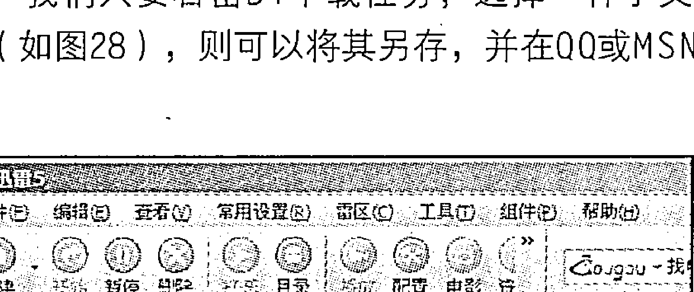

- （2）共享更多种子文件
如果我们已经用迅雷打开过多个种子文件，想把它们一下子传给好友共享。不必一一将其右击，再选择“种子文件另存为”命令。事实上，迅雷会把我们的BT种子文件默认保存在安装文件夹下的Profiles\Torrents下，大家也可以直接从那里找到，将它们用WinRAR打包后在MSN或QQ上发给好友即可。

## 四、迅雷电骡下载技巧

众所周知，目前下载方式可谓是“三分天下”：迅雷、BT、电骡。但电骡的最大的缺点就是下载相对较慢，这在内容逐渐增大的今天，成为了一个制约我们下载的主要矛盾。现在迅雷已经完全支持电骡下载方式。那么，使用它下载电骡资源时有哪些实用的技巧呢？

## 1. 下载电骡入口有讲究

- （1）右键菜单
当我们在ed2k的链接上右击，可以出现“使用迅雷下载”命令，之后会打开相应的下载窗口，表示其已经被正确解析，可以下载到相应资源。

- （2）直接单击
选择“工具”→“配置”，然后单击左侧的“监视”项，再在右侧的窗口中选中“浏览器”下的“启动时检查迅雷是否为默认的下载工具”复选项。再选择“工具”→“浏览器支持”下的相应命令，分别设置迅雷为IE、Opera和Firefox的默认下载器。之后，我们在ed2k的链接上直接单击，将会跳出迅雷5，并可以下载该资源。

- （3）复制监视
迅雷5默认已经开启剪贴板链接监视，当我们复制一个ed2k的链接时，迅雷5也可以自动跳出来。

- （4）复制粘贴
我们也可以在迅雷5中选择“文件”→“新建”命令，再在“网址(URL)”中粘贴ed2k的链接地址即可下载。
聪明的读者一定感觉到了，这与平常我们的下载没有任何的区别！迅雷5对于电骡的兼容完全做到了“无缝整合”，让用户用起来很容易上手。

## 2. 注意更为丰富的智能控制

迅雷针对电骡提供了更多智能功能，我们选择“工具”→“配置”，它在打开的窗口中单击“EMule/端口设置”，可以看到（如图29），她目前支持连接KAD网络（可找到更多源）、数据压缩（可加速下载）、模糊协议（可突破下载限

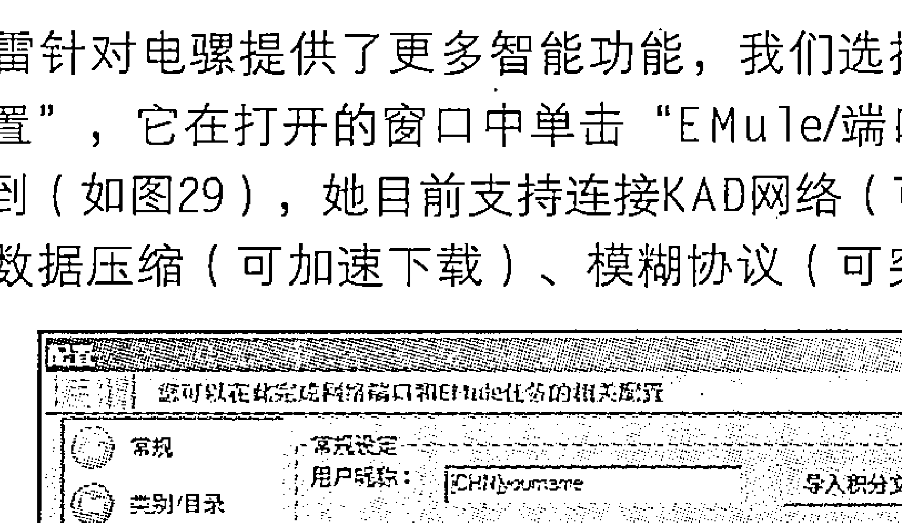

制）、AICH支持（可大大减少重新损坏区域数据的时间）、雷友间积分奖励等功能。所有这些说明迅雷5在电骡支持上不再只是一个“空壳”，而是实实在在的“实体”！

## 3. 让迅雷有更多电骡下载资源

迅雷下载快这是众所周知的，但是现在仍有一些资源站，出于某些目的，如果不安装它自身的客户端，则不支持迅雷下载，甚至还会制造出错的假相，无法下载。但是我们可以通过下面的技巧来突破之。

**（1）右击下载法**
右击资源，选择“使用迅雷下载”或者“使用迅雷下载全部链接”命令（如图30），这比较简单，但是有时用户更喜欢直接单击，或者某些网站的右键有可能会被屏蔽掉。如果这一招不行，可以采用下面的招数。

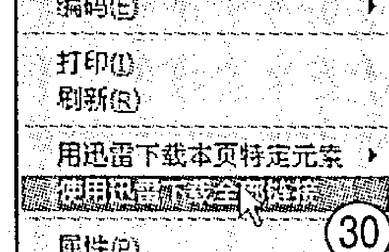

**（2）复制链接法**
启动迅雷5，选择“工具”→“配置”，单击“监视”标签，然后选中所有的选项（如图31）。同时，单击“常规”项，然后选中“开机自动启动迅雷”项使其开机时就自动启动。这样一来，可以保证迅雷始终在待命。

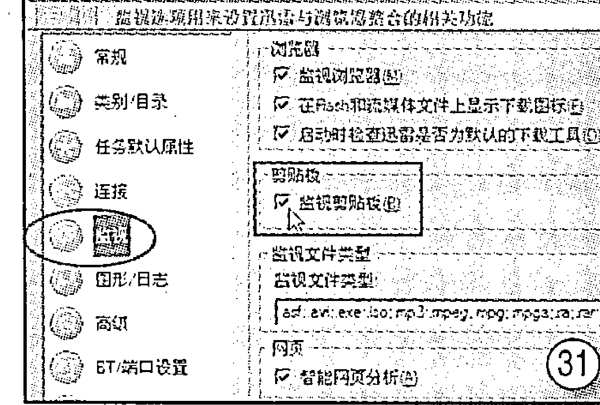

接着，在打开资源后，选中欲下载的资源（在前面打钩），然后单击“复制选中的链接”按钮（如图32），此时迅雷5则会弹出。

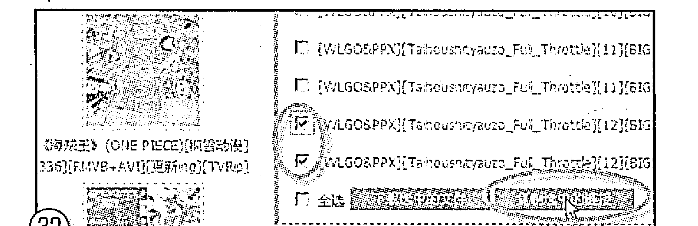

## 4. 用Maxthon筛选

在Maxthon中打开有下载链接的页面，选择“查看→页面链接列表”或者按下Alt+L键可以打开如图33所示的窗口。我们可以在“链接网址包含”中输入指定的内容，如ed2k，单击其后的“过滤”按钮，即可快速筛选出所有包含指定内容的电骡下载链接（如图33）。

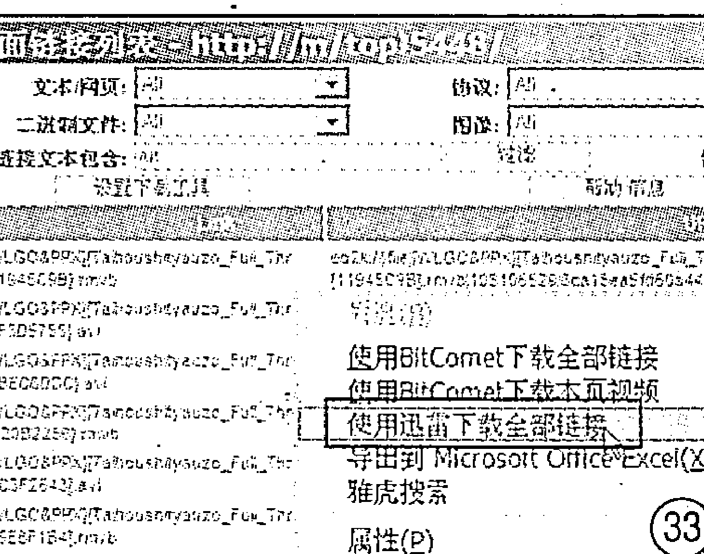

接着，右击过滤后的列表，选择“使用迅雷下载全部链接”命令。在打开窗口中可以选中或取消选择相应的资源，从而进行下载。

## 5. 用GreenBrowser筛选

在GreenBrowser中打开相应网页，然后按下Alt+L键可以打开如图34所示的窗口，在“地址”文本框后输入相应的关键字，如ed2k，按下回车键，所有的ed2k链接则会显示出来。我们只要用鼠标选中，单击“复制地址”即可被迅雷5拦截，并进行下载。

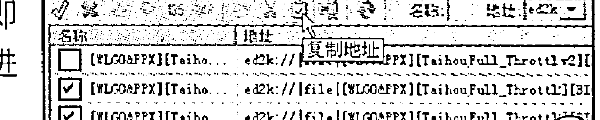

另外，我们也可以单击图34中的135按钮来选择奇数行，单击246按钮来选择偶数行，更加方便。

## 6. 另存导入法

有时有的网站不允许右击鼠标，这样我们就没有办法用上面的办法了。这时，我们可以这样来操作：选择“文件”→“另存为”，将其保存为txt文档。然后打开它，找出以ed2k开头的行，再将其保存到lst文件中。然后在迅雷中选择“文件”→“导入下载列表”命令（如图35），在打开的窗口中找到相应的lst文件即可。

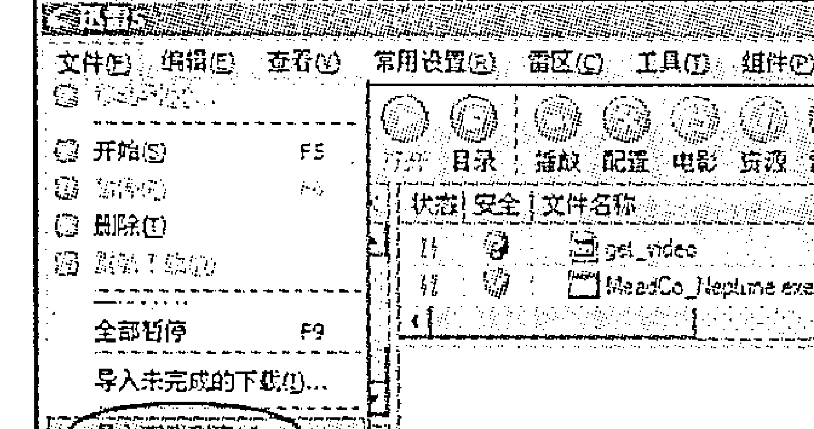

## 7. 狗狗搜索法

狗狗搜索是下载引擎，在上面我们可以很方便地找到电骡资源，而且它也支持批量下载。打开http://www.gougou.com，然后选中“电骡”，再输入相应的关键字，进行搜索，然后即可下载（如图36）。

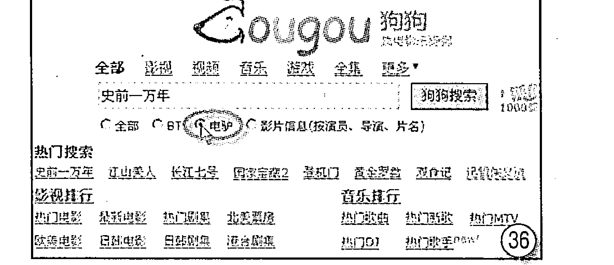

## 8. 导入电骡未完成下载

迅雷电骡下载快，而且因为现在新版本迅雷5可以电驴的未完成任务导入，如果你在其他电驴客户端中发现下载不了的文件，可以导入到迅雷中来试试！

打开迅雷5，选择“文件”→“导入未完成的下载”命令，再在打开的窗口中找到如图37所示的电骡安装文件夹下temp子文件夹中的文件。之后会询问是否备份相应文件，然后就会弹出下载窗口，并可以开始续传。要特别注意的是，电骡的下载临时文件夹一般是C:\Program Files\eMule\Temp。

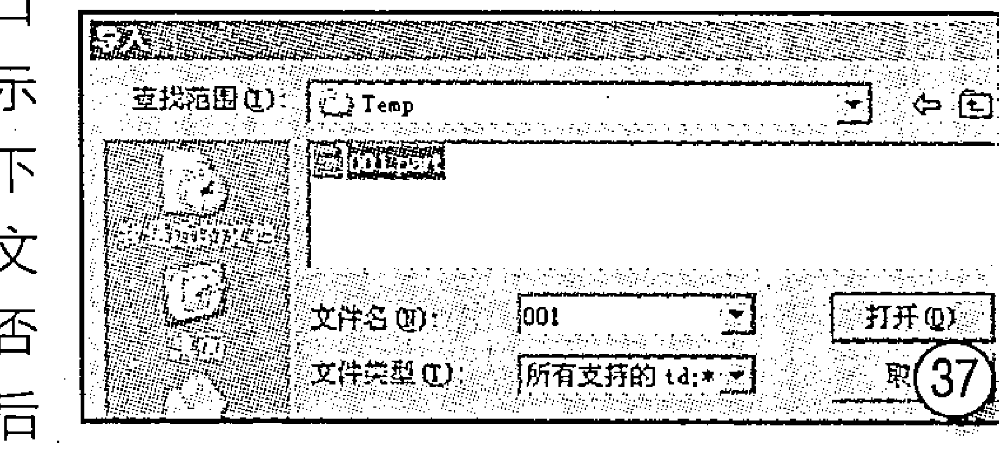

## 9. 增大单任务源数目

现在网络带宽和电脑的计算能力有了很大的提升，我们可以对机器“再狠一点”：选择“工具”→“配置”，再在打开的窗口中单击“EMule/端口设置”，将右侧的“最大源数”和“单任务最大源”中的数值设置得大一些（如图38）。

## 12. 注意电骡资源鉴别

现在的网络视频，内容重复度高、货不对版、文不对题的现象很多。不过，我们在下载电骡资源前，在狗狗搜索中搜索相关资源时，如果是视频资源，狗狗会自动识别，并在其后面有一个“播放”图标（如图40），此图标表明该资源有视频预览功能。单击后可以打开如图41所示窗口，在其中我们不仅可以预览该影视的当前片段，还可以选择更多的片段进行预览。在决定好质量并确认好内容后再下，往往可以节省很多的时间。

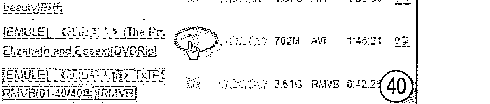

## 10. 同时下载不要太多

由于多数的电骡资源都是大文件，所以对于机器的文件系统和带宽占用都比较大，所以我们将同时的任务数调得尽量低，让迅雷真正地“协调下载”！选择“工具”→“配置”，再选择“连接”，即可在右侧的“最多同时进行的任务数”进行设置，我们可以将其设置为5个。


## 11. 注意选择性下载

虽然带宽足够，但是我们也不用下载不必要的资源。在http://www.gougou.com上搜索想要的资源，然后选中“电骡”，然后单击想要的资源。可以在左侧看到其中的文件，我们只要选中欲下载的资源，然后单击上面的“下载”按钮即可调用迅雷来下载（如图39）。

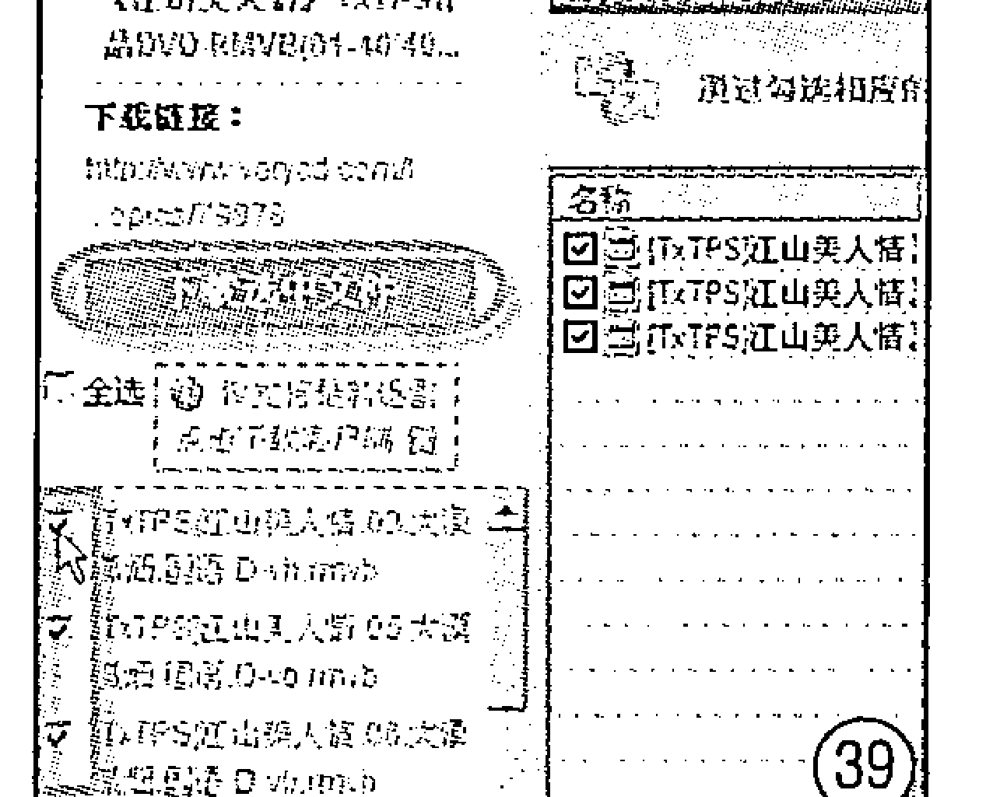

## 五、迅雷小文件下载技巧

在现在的互联网环境里，无数小的文件保存在各处。包括MP3音频、微视频等，用迅雷来下载这些小文件时应该注意哪些技巧呢？

## 1. 让同时任务数多一些

由于下载小文件对机器文件系统和带宽占用都不是太大，所以我们可以将同时的任务数上调到最高，让迅雷“全速前进”！选择“工具”→“配置”，再选择“连接”，即可在右侧的“最多同时进行的任务数”进行设置，其最多可以设置为20（如图42）。如果我们下载小文件比较多，则可以将其设置为最高值。这样一来不会浪费对文件系统的资源占用，二来也可以统筹好有限的带宽资源，形成良性循环。这也是全面协调可持续下载！
在进行了上述设置后，我们一定要在下载小文件时做到批量下载，这样才可以发挥出效率。

## 2. 不要限制速度

出于稳定的原因，迅雷默认设置中作了保守的设置，而我们的机器和网络环境都比较好，这时完全可以自行设置，使其“全速前进”：在迅雷主窗口中选择“工具”→“配置”命令，再选择“连接”，取消选中“限制”下的两个复选框。这样机器将会全速前进，自动来调整（如图42）。

## 3. 设置更大的缓存

由于我们设置了较多的任务数，所以我们有必要为迅雷设置较大的缓存，以便其更好地下载。选择“工具”→“配置”命令，再选择“常规”，然后在“磁盘缓冲区设置”中将“最小缓存”和“最大缓存”都设置成最大值。

## 4. 注意优先下载小文件

当有多个BT或电骡资料下载时，其中往往会有小文件存在，如果我们想优先下载这些，则可以单击“文件大小”栏，这样可以将其按大小进行排序，再选中这些文件，然后下载即可（如图43）。
事实上，一般来说，小文件多数是MP3，先下下来可以先饱耳福。

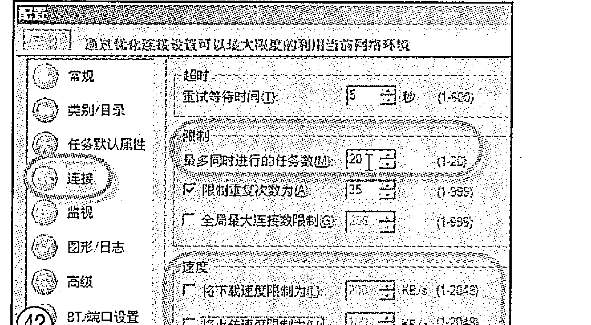

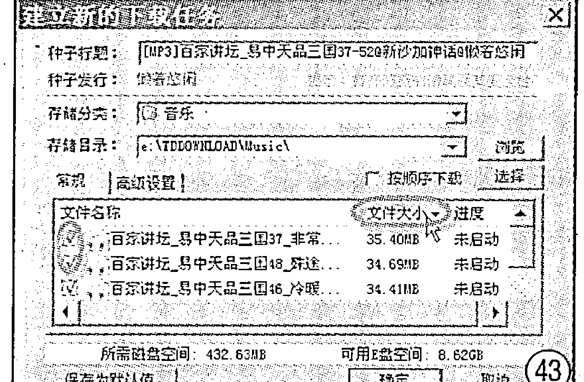

## 5. 搜索时注意文件大小

对于下载资源，笔者推荐你到http://www.gougou.com上去搜索。当我们搜索相关资源时，其大小会列出来。更绝的是，我们也可以单击“大小”项将资源按大小来排序（如图44）。下大的还是小的，完全由你说了算。

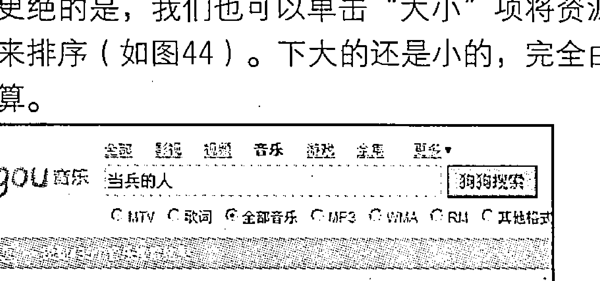

## 6. 注册雷友服务

一些用迅雷来下载的朋友细心一点都会知道，在软件主界面的左下方显示的则是一个提示登录区。单击左侧下方“雷友信息”中的输入框，输入雷友账号和密码，在打开窗口中输入我们的雷友用户名和密码，可以享受到更快下载速度、下载病毒预警、资源收藏、好友文件分享、积分升级和点亮图标等服务。如果你还没有雷友，可要抓紧时间去http://i.xunlei.com/register/register.htm注册了，注册后即可登录。

而且，雷友是有级别的，理论上来说，级别跟服务质量是有关系的，VIP是享受VIP下载来源，还有其他的一些优待。总体说来，级别高的用户，享受的服务质量会更好。一般来说，下载速度自然也会快一些，但也不完全是这样，至少稳定性是有保证的。

## 六、迅雷音乐下载技巧

- 1. **从迅雷博客下载**
登录http://www.gougou.com，然后单击“全集”，或者干脆直接登录http://blog.gougou.com，再在其中输入关键字。然后可以找到相应的博客，其中会有更多的歌曲（如图45）。单击该博客，在其中选中相应的歌曲，再单击“下载资源”按钮即可。
- 2. **狗狗搜索BT下载法**
当我们在狗狗搜索上搜索音乐关键词时（电视剧、动漫、人物等关键词时支持批量下载），默认并不提供批量下载功能。不过，我们可以在打开狗狗搜索后，单击下方的“BT”项，然后输入相应的词，再展开找到的结果，往往可以看到有歌曲（*.mp3）。如图46所示，我们只要直接使用最新版迅雷即可支持BT下载。这样也可以实现批量音乐下载。
- 3. **狗狗搜索电骡下载**
在打开狗狗搜索后，单击下方的“电骡”项，然后输入相应的词，然后单击上方的“格式”链接，选择MP3。之后，展开找到的结果，往往可以看到有歌曲（*.mp3）。如图47所示，我们只要直接使用最新版迅雷即可支持电骡下载。
- 4. **迅雷狗狗排行榜上下载**
打开http://www.gougou.com，可以看到有“音乐排行”，其下还有热门歌曲、热门新歌、热门MTV、热门DJ和热门歌手各个子类（如图48）。单击后可以打开如图49所示的窗口，在其中可以勾选自己想要下载的歌曲，单击“下载”按钮，即可批量下载。
- 5. **迅雷听听组件下载**
迅雷听听默认现在已经不集成在迅雷中了，不过，我们可以从http://down.sandai.net:8080/tingting/tingting1.2.exe处下载并安装。下载后，退出迅雷。安装此组件，重新启动迅雷，可以看到在左侧的最下方多了一个“迅雷听听”的“容器”，可以看到不少的分类。找到我们喜欢的分类，在下面可以看到很多的歌曲。此时用鼠标选中一首歌曲，再按下Shift键（也可以按下Ctrl键来多选），用鼠标选中最后一首歌曲则选中这些歌曲。接着，右击之，选择“下载”命令（如图50）。接着会出现批量下载窗口，此时可以...

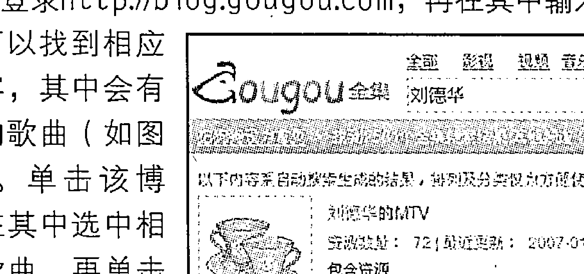

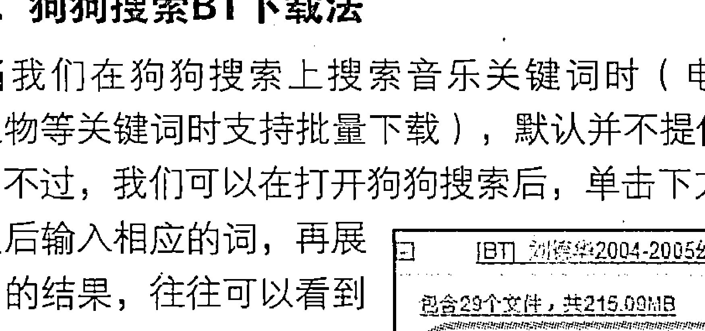

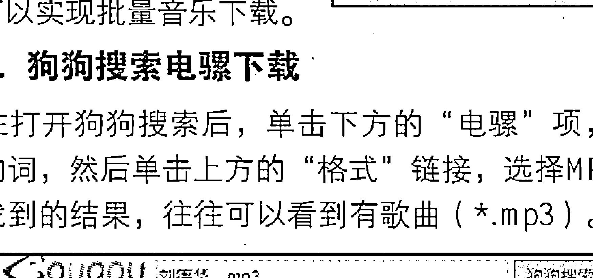

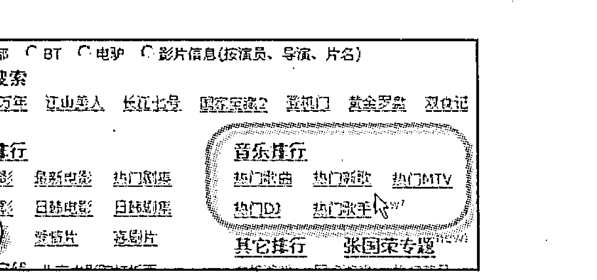

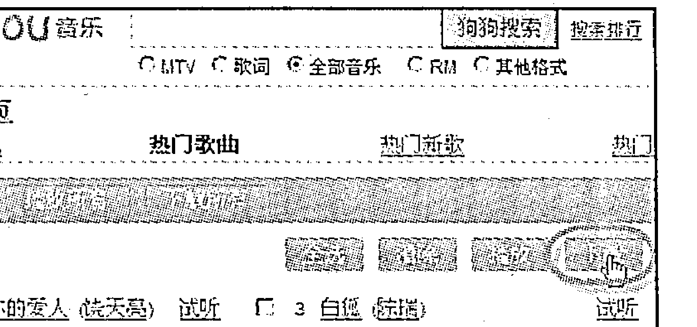

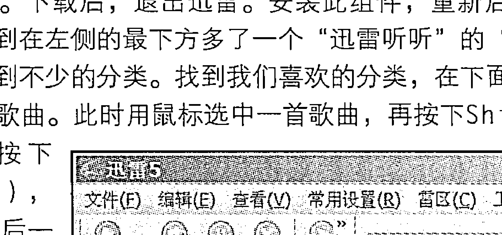

## 迅雷安全下载技巧

中国互联网的安全问题不容乐观，主要表现是病毒泛滥、木马横行、蠕虫蔓延、插件滋长、内容低下、文不对题、鱼目混珠，把整个互联网弄得乌烟瘴气！迅雷在安全方面做了很大的努力，让大家免受安全下载的威胁！真正在享受高速下载的同时，更安全、安心下载！

### 1. 稳如磐石 给系统打上补丁

一个安全、稳定的系统是我们能够超速下载之基、安全下载之源。但是Windows系统总是漏洞不断，而且传统的补丁更新太慢。现在迅雷提供了修复系统漏洞功能，资源占用更小，速度更快！

只要安装有最新版的迅雷，我们可以在“已下载”下方看到“系统漏洞修复”项，如果没有安装，会出现安装提示窗口（如图52），安装完成后重新启动迅雷使之生效。然后就可以用它来更新系统补丁了，它的速度非常快（如图53）！


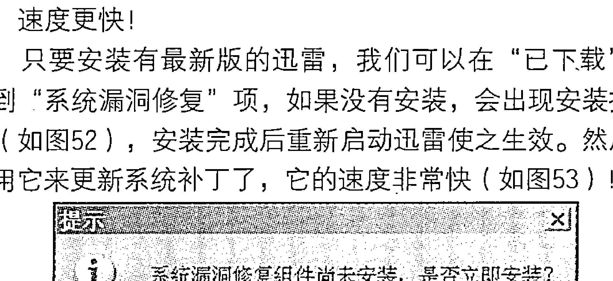

### 2. 用迅雷免费安全组件狙击病毒

从 http://safe.xunlei.com/dl/ThunderKAV1.0.5.30.exe 上下载最新的安全组件进行安装。之后会在任务栏托盘区出现下载特征库的图标，双击可以查看下载进度（如图54）。然后，选择“组件”→“组件管理”后可以看到如图55所示窗口，如果你发现“卡巴斯基杀毒模块”组件未被启用，则单击右下方的“启用”按钮将其启用。

进行上述操作后，我们在下载一个资源时，迅雷会自动对其进行安全判定，如果发现有安全问题，会弹出如图56所示的窗口来提醒我们。我们可以单击“取消任务”按钮来取消下载，也可以单击“继续下载”来“带毒下载”。另外值得一提的是，很多杀毒软件需要下载完以后，解包才能知道有没有毒，有没有插件。迅雷安全组件却无须解包就可以知道其中的“情况”（如图57）。

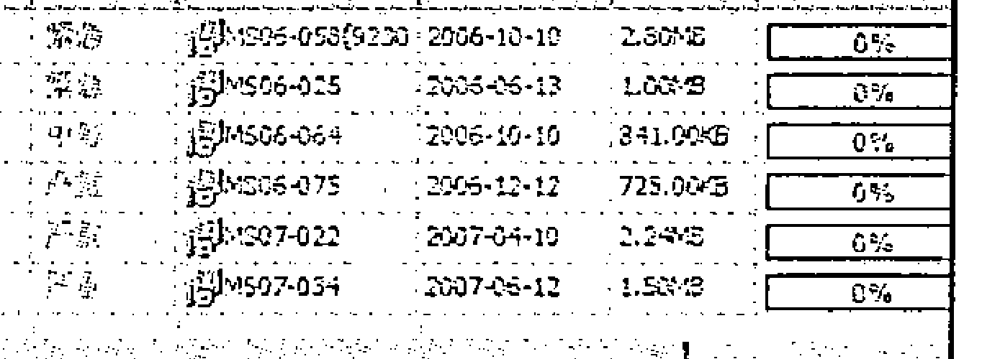

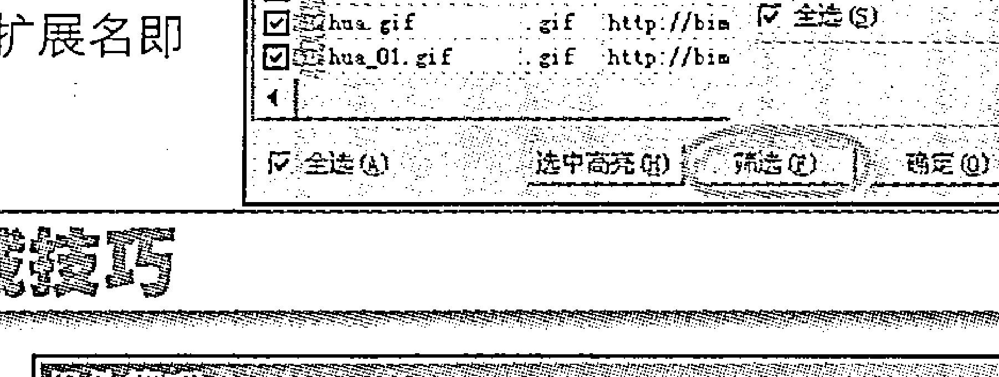

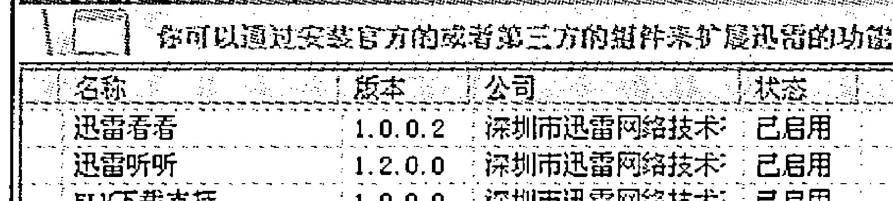

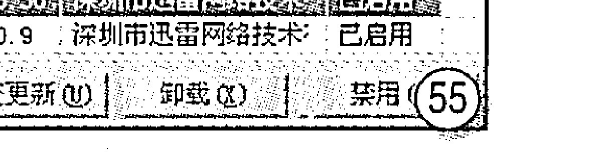

### 3. 下载前了解资源安全状态

迅雷提供了免费的资源安检服务，大家只要登录 http://safe.xunlei.com/，然后在其下的“下载文件病毒（视频弹窗）检查：”下方文本框中输入欲下载资源的URL，然后单击“现在检查”按钮（如图58），即可弹出如图59所示的窗口，在其中会显示出该资源的安全情况。大家可以在此来确认是否需要下载。

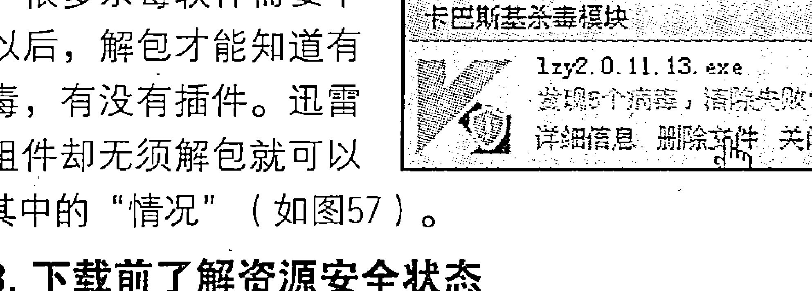

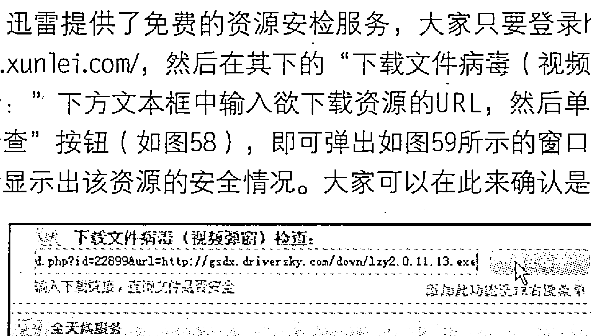

### 4. 防患于未然 从迅雷狗狗下载

Google的报告称，现在的恶意软件正在上升。因此，我们在下载资源时，一定要挑选较大，在技术、资金和人才上较有实力的大网站下载。小的网站并不会注重可持续发展！对于资源下载，推荐大家去迅雷狗狗 http://www.gougou.com 下载，因为它在搜索时不仅会将可能发生问题的资源标出，让我们一目了然，而且，迅雷狗狗对于下载页进行了“二次过滤”，即将下载页进行了清毒处理，确保用户在浏览该页面进行下载时不会“中招”（如图60）！

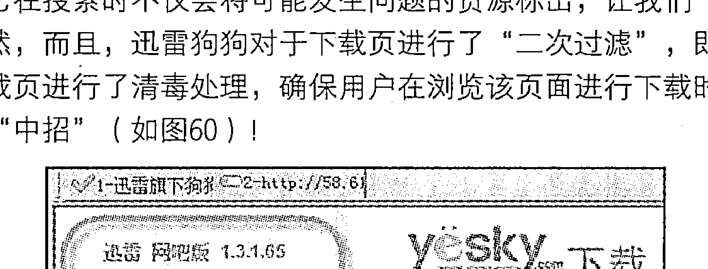

### 5. 他山之石 配合杀毒软件

防止“毒从口入”，让杀毒软件配合迅雷软件，只要文件下载到本地硬盘后，立即启动相应杀毒软件的病毒扫描程序对所下载的文件进行病毒查杀是最好不过的保护。有幸的是，迅雷最新版本已经支持嵌入式查毒。首先下载并安装自己喜爱的杀毒软件，然后从迅雷软件中心 http://dl.xunlei.com 上单击“安全工具”，再按机器里的杀毒软件来安装相应模块（如图61）。之后，在迅雷5中选择“工具”→“配置”，打开软件的“配置”对话框，接着切换到“病毒保护”选项卡，选中“下载完成后杀毒”选项，然后通过“浏览”按钮指定杀毒软件的病毒扫描程序路径即可。这样只要我们从互联网上下载完文件后，迅雷就会自动调用这个程序来扫描下载的文件，让我们享受下载、查杀病毒一条龙服务。

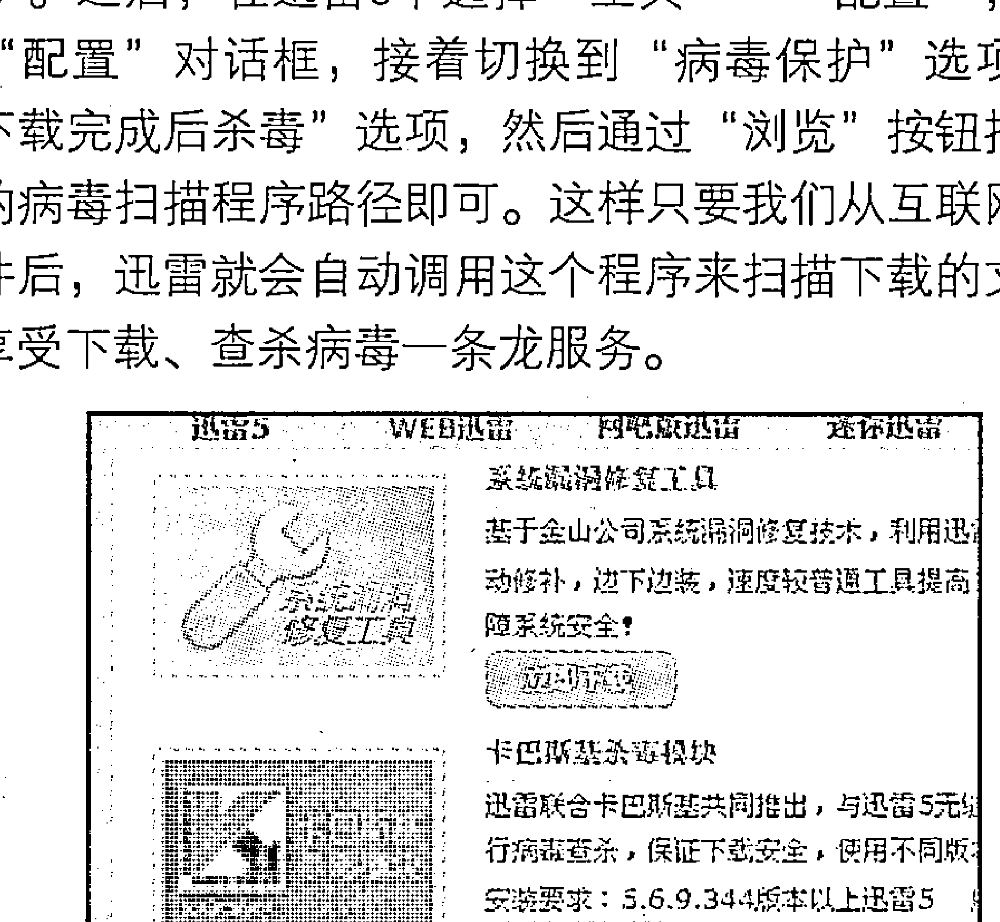

### 6. 与时俱进 实时更新

无可非议，一般软件的更新总会给我们带来更多、更稳定、更安全的功能，但是由于我们平时工作太忙，也无暇去关心软件的更新。但是迅雷却为我们提供了自动更新的功能。选择“工具”→“配置”，再单击“高级”项，然后选中“显示提示”下的“当发现新版本时提示”复选项。以后一旦有新版本时，迅雷将会自动提醒我们来下载并更新。

当然，如果你想手动更新迅雷，也可以在迅雷5中选择“帮助”→“检查更新”命令，然后即可进行升级。这样我们的迅雷将会成为我们对付网上安全威胁的强大武器！

### 7. 用好插件卸载功能

现在插件非常横行，一不小心就会中招。有幸的是，迅雷为我们提供了插件的卸载功能，我们只要选择“工具”→“迅雷安全中心”命令即可打开如图62所示窗口。在其中单击左侧“插件卸载”项，然后单击“开始扫描”，就可以将当前系统中的插件全部列出，选中后，单击“清除选中插件”按钮即可将它们清出系统！

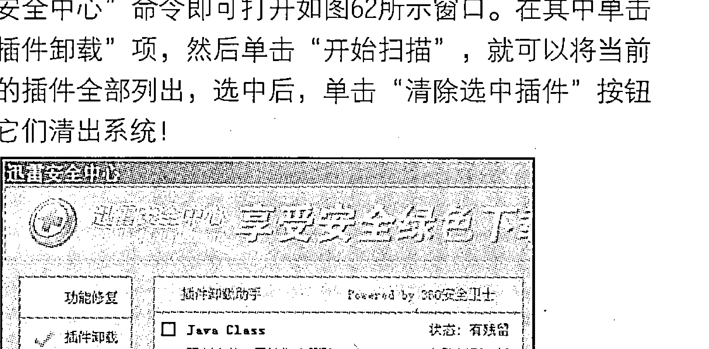

另外，在某些项目的后面还有“专杀工具下载”链接可点击，之后将会引导我们到迅雷安全中心网站下载专杀工具。

### 8. 斩杀弹窗广告

现在网络上电影多数以RM/RMVB为主，不过，很多人为了牟取私利，总在其中安插上广告。由于我们有时很想观看相应的影片，如果将影片直接删除，又有“投鼠忌器”之憾！迅雷作为最大的下载工具，对此决不姑息。如果下载后，我们也可以选中此电影，右击之，选择“查杀影片弹窗广告”命令（如图63）即可将其中的广告清除掉（如图64）。

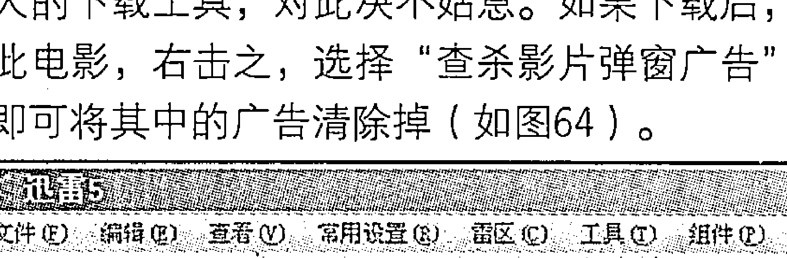

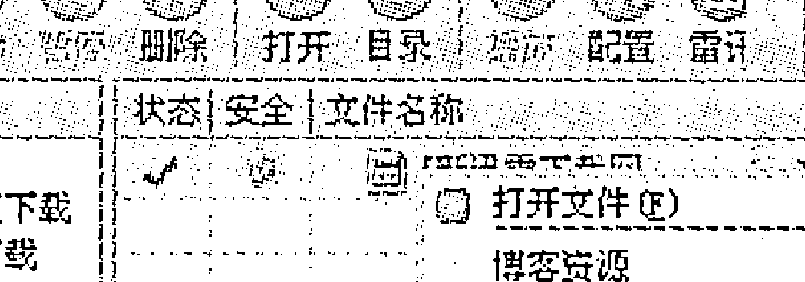

### 9. 定时清除隐私信息

陈冠希的艳照事件的确是给我们上了一堂生动的安全课，隐私问题是一个现在大家讨论得非常多的话题，系统及应用软件一般也提供了相应的选项或功能来帮助用户更好地保护自己的隐私。迅雷自然也不例外。

在迅雷5客户端主窗口上方有一个搜索区域，可以输入相应的关键字去狗狗上找电影。如果你觉得这些信息不太方便的话，可以单击搜索下拉框，从中选择“清除历史记录……”命令即可删除掉狗狗搜索数据。在进行本地下载资源搜索时，我们可以随时按下Ctrl+F来打开搜索框，在其中输入相应的关键字来进行搜索。大家也可以在打开窗口中选择“清除历史记录…”来清除。

## 摆脱束缚 轻松通游
——无线网络关键应用指引

□方成亮

当100M网卡普及，千兆网络浮出水面之后，有线网络的技术已经非常成熟了。一时间，我们似乎认为网络技术已经达到了炉火纯青的地步。但是猛然，当你发现各种错综复杂的网线将家里或者办公室搞得一团糟时，你就会有这样一种感觉：要是没有这些网线该有多好啊。而随着无线网络设备的大幅度降价，现在组建自己的家庭无线局域网已经不再是遥远的梦想。

### 一、组建WiFi无线网络的基础设备

无线网络在几年前还是稀罕的高端应用，不过现在已经彻底“飞入寻常百姓家”。对于家庭用户而言，选择哪一种方案来组建无线网络以及需要购买哪些设备，这无疑是最最受关注的。假如您以前并未亲自接触过无线网络的组建，那么不妨和我们一起来看看以下这些问题。

#### ①. 家庭无线网络的组建方案

典型疑问：目前各种各样的无线网络技术有很多，那么到底哪一种才比较适合家庭局域网呢？另外，这又需要什么设备？

首先我们要区别无线广域网技术与无线局域网技术。无线广域网技术包括GPRS、CDMA 1X、DMB卫星传输以及未来的3G等。但是，这类无线广域网技术以覆盖面为主，实际传输带宽非常有限，无法满足我们的局域网需求。相对而言，无线局域网技术的选择范围要小一些，无外乎基于IEEE802.11标准的WiFi、蓝牙、HomeRF以及还未普及的Wireless USB等。

|          | WiFi             | 蓝牙               | HomeRF         | 射频       | 广域无线       |
| :------- | :--------------- | :----------------- | :------------- | :--------- | :------------- |
| 最大数据速率 | 11 ~ 108Mbps     | 1 ~ 3Mbps          | 1.6 Mbps       | NO         | 60Kbps以上     |
| 最大范围半径(米) | 100~300          | 10~100             | 50             | 2          | 基站辐射       |
| 适用范围   | 大中型无线网络     | 电脑外设与数码设备 | 家庭局域网     | 电脑外设   | 手持数码设备   |
| 功耗       | 较大             | 较小               | 较大           | 较小       | 很小           |

从这张表格我们可以发现，目前真正适合家庭用户组建无线局域网的只有WiFi技术。而且，WiFi技术已经得到众多厂商的支持，甚至成为主流笔记本的标配功能。对于家庭用户而言，我们所要做的仅仅是选购一款理想的无线宽带路由器，然后适当配合无线网卡即可。由于WiFi无线网络的速度表现非常理想，因此无论是Internet共享还是局域网游戏对战，或是文件共享，一切都能轻松胜任。

#### ②. 无线路由器如何选型

典型疑问：直接理解的话，家庭无线局域网需要一个作为无线信号发射的中枢。但是，到底应该购买无线路由器还是无线AP？它们之间有什么区别？无线宽带路由器又是什么？

对于无线路由器的名称表述，目前并没有严格统一的说法，这也造成很多初次接触的用户产生疑问。其实，无线AP是无线Access Point的简称，一般翻译为“无线访问节点”，它主要是提供无线工作站对有线局域网和从有线局域网对无线工作站的访问，在访问接入点覆盖范围内的无线工作站可以通过它进行相互访问。目前，无线AP应用得比较少，真正适合家庭用户的是无线路由器。而无线宽带路由器是在无线路由器的基础上加入了宽带网接入功能，这样就能实现Internet共享，这也是我们所需要的设备。

事实上，大家可以将无线宽带路由器理解为具备宽带接入端口、具有路由功能、采用无线连接客户端的普通路由器。而无线网卡在职能上与传统网卡如出一辙，只不过采用无线方式进行数据传输。从命名角度来看，其实AP和无线路由器并非是相同的概念，一般真正意义上的AP仅仅是一个无线型号转接点，无法实现路由和宽带共享功能（图1）。

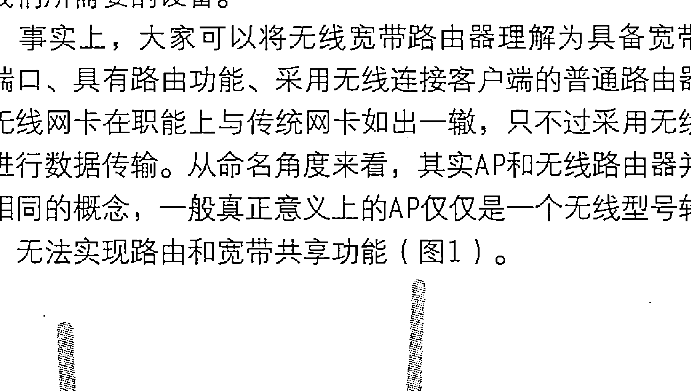

#### ③. 无线网络性能初探

典型疑问：无线宽带路由器配合使用的无线网卡有什么性能要求吗？在实际使用时，WiFi无线网络的传输范围又是多少，会不会受到隔墙的影响？

WiFi无线网络的速度遵循具体的传输标准，主要分为IEEE802.11b（11Mbps）、IEEE802.11b+（22Mbps）、IEEE802.11a/g（54Mbps）以及Super G（108Mbps）这三种。一般而言，无线宽带路由器和无线网卡的IEEE802.11标准都向下兼容，具体传输速度取决于两者中的最低标准。譬如无线宽带路由器是IEEE802.11b，而无线网卡是IEEE802.11g，那么实际速度也只有11Mbps。

对于无线网络设备而言，有效传输距离是相当重要的，否则那种“鞭长莫及”的感觉会让你苦恼不已。需要注意的是，大家没有必要参考产品介绍中的“最大传输距离”，这一指标多半是在没有任何遮挡物的条件下计算得出的。决定WiFi无线网络传输范围的关键因素在于无线路由器，与无线网卡的关系并不大。从实际应用角度来看，我们认为大家更应该看重无线路由器的信号穿透能力，毕竟在钢筋水泥的高楼大厦中，障碍物才是信号的最大阻击者。

相对来说，WiFi无线信号穿越木板的能力比较强，而一旦是有一定厚度的砖墙或是钢筋水泥墙，那么一般很难穿越两堵墙壁。此外，WiFi无线信号能力也是有限的，往往两个90度的转弯就会导致信号微弱。在信号微弱的情况下，WiFi无线网络会降低传输速率并确保稳定性。当然，不同无线宽带路由器的信号穿越能力以及速度适应能力都有不小的区别（图2）。

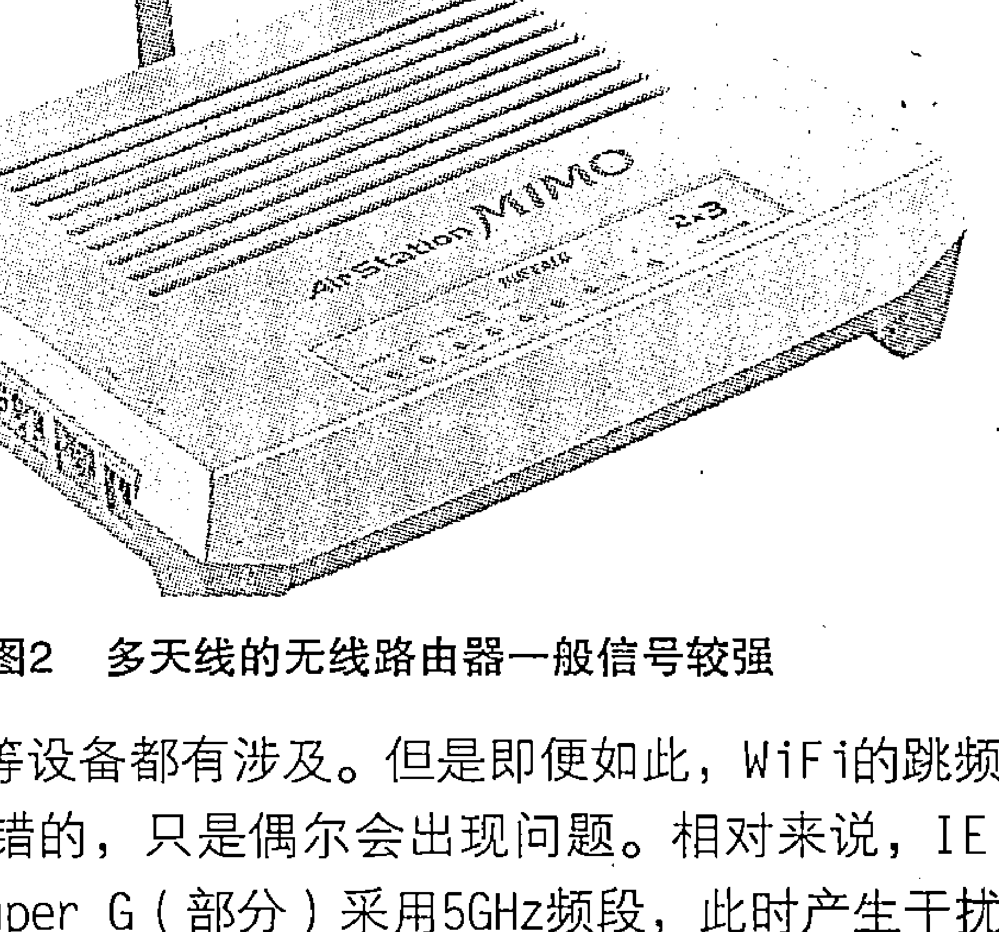

#### 4. 避免无线网络信号干扰

典型疑问：由于接触无线网络比较少，因此比较担心其它设备对其造成干扰，那么家庭设备中会不会有类似的情况发生？此外，无线网络会不会对人体造成伤害？

WiFi无线网络其实也是一种电磁波，因此会不会产生信号干扰就取决于其频段以及抗干扰技术。对于IEEE 802.11b/g所采用的2.4GHz频段，应该说还是使用得比较广泛，包括无绳电话、对讲机等设备都有涉及。但是即便如此，WiFi的跳频保护技术还是不错的，只是偶尔会出现问题。相对来说，IEEE 802.11a以及Super G（部分）采用5GHz频段，此时产生干扰的可能性非常低。然而，5GHz高载波频率也带来了负面效果。IEEE 802.11a几乎被限制在直线范围内使用，这导致必须使用更多的接入点，因此并不适合家庭用户。

至于无线网络信号对人体的侵害，目前国际上都没有绝对权威的定论。但是，普遍的看法是，普通手机的无线信号辐射功率在200毫瓦左右，而WiFi无线网络的无线辐射功率为10毫瓦到20毫瓦左右，因此对人体健康基本没有影响。退一万步讲，既然我们已经生活在电磁辐射的世界中，那么多一个微不足道的WiFi无线网络也无妨吧。

### WiFi无线网络的设置

在购买好无线宽带路由器之后，我们还需要进行一番设置才能让整个无线局域网运作起来。好在目前大多数产品都使用便捷，而且兼容性也趋于完美。对于用户来说，我们只要解决几个常见的问题，那么任何小型WiFi无线局域网都能驾轻就熟。

#### 1. 如何连接无线宽带路由器的接口

典型疑问：既然无线宽带路由器是无线连接的，那么为什么还会有那么多接口？这些具体又应该连接哪些设备？

尽管是无线网络，但是无线宽带路由器也需要连接部分网线。首先是宽带网Modem与无线宽带路由器的连接，这里使用一条网线分别连接无线宽带路由器的WAN接口以及宽带网Modem的PC接口。一般而言，无线宽带路由器还提供3~5个RJ45接口，用于连接台式机的有线网卡。对于安放位置固定的台式机而言，我们建议采用有线网络，这比无线网络更加稳定高速，而且免去购买USB无线网卡的麻烦。至于无线宽带路由器上的其它接口，如COM口、并口和USB口，一般用于共享网络打印机或是终端调试，我们并不需要关注。

#### 2. 设置无线传输方式

典型疑问：无线宽带路由器的连线都接好了，而笔记本的无线网卡也已经安装好驱动，但是为什么无法上网？另外，如果无线网卡一直分配不到IP地址，那又是什么原因？

通常情况下，我们需要在无线宽带路由器中进行一些设置。以进入无线宽带路由器的管理界面（一般是192.168.1.1或192.168.0.1），输入用户名和密码（默认常为admin/admin）。首先进行WAN口设置，根据上网方式（如PPPoE、动态IP、静态IP）进行相应配置，例如PPPoE方式需要输入运营商提供的账号和密码，并且将Timeout（即无数据请求时断线）设定为120s左右。随后就可以设置无线路由器的SSID值，这也就是无线客户端接入的密码。

此外，我们还必须在无线宽带路由器中打开DHCP功能。当无线宽带路由器被配置成DHCP服务器后，它可以为局域网中接入的每台PC自动分配一个IP地址，而它本身作为DHCP Client，又可以使WAN端口动态地获得由ISP分配的IP地址（图4）。此时用户所做的仅仅是在Windows中将网卡的IP指定为自动获取，并且禁用所有的网关与DNS解析，彻底免去了配置网络的麻烦，非常适合新手使用。

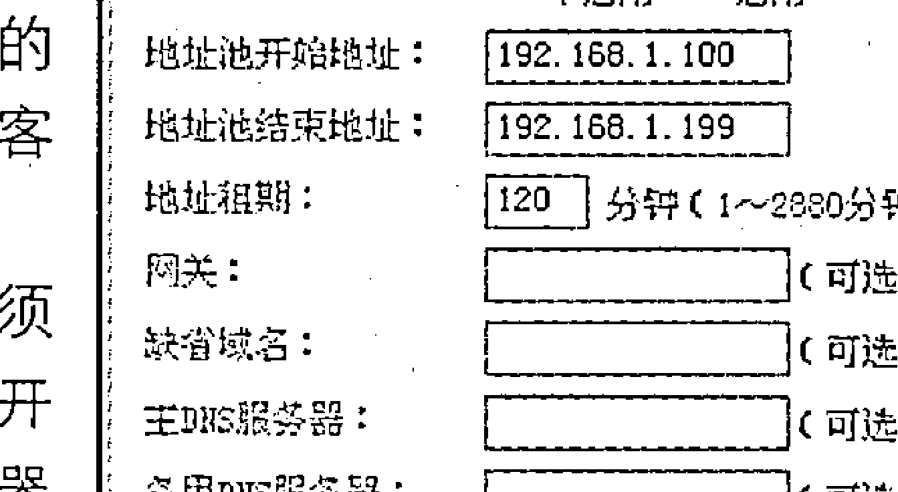

对于WIFI网络而言，客户端的配置异常简单，毕竟DHCP技术已经相当成熟，以往恼人的网络设置可以通通抛开。在控制面板的网络属性中打开无线网卡的TCP/IP属性，然后将IP地址设定为自动，并禁用DNS与网关，此时无线网卡可以自动分配到IP地址，并接入Internet。然而，最重要的还是SSID值，这里必须保证与无线路由器的SSID值完全相同（包含字母大小写）。事实上，SSID值就好比是无线客户端与无线路由器之间的一道口令，只有在完全相同的前提下才能让无线网卡访问无线路由器，这也是保证无线网络安全的重要措施之一（图5）。当然，不同无线网卡设置SSID的地方不尽相同，有些是在控制面板中，有些通过网卡专用的应用程序，具体可以参阅说明书。此外，一般相同品牌的无线路由器与无线网卡采用相同的SSID默认值，无须设置即可使用。

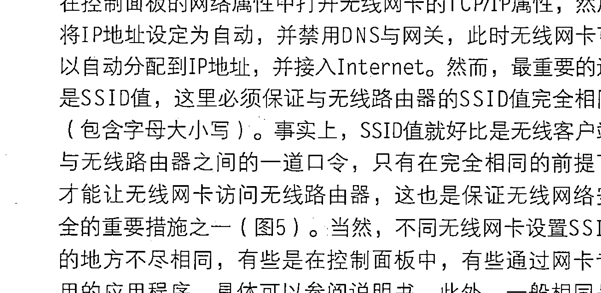

总之，直接了解无线网络的设置过程，那么无法上网或是无线网卡无法得到IP地址的问题都很好解决。无线网卡得到IP地址是实现无线上网的前提，因此遇到这类问题时首先确保无线宽带路由器打开了DHCP功能，并且无线网卡IP和DNS都自动分配。如果无线网卡分配到正确的IP并且不能上网，则很有可能是无线宽带路由器的宽带设置有误，检查是否选择了正确的上网方式和密码。

#### 3. 笔记本的无线网卡安装疑问

典型疑问：PCMCIA接口的无线网络驱动安装不上怎么办？MiniPCI的内置无线网卡如何安装？

在一般情况下，为无线网卡安装驱动并不会遇到什么不方便，只要大家遵循先安装驱动再插入无线网卡的步骤即可。而万一遇到一些意外，此时应该先确认PCMCIA无线网卡的电源指示灯常亮（表示供电正常），随后确认Windows设备管理器中找到网络设备的信息。在确保这两点的基础上，大家将原有的驱动彻底删除，然后重新安装新版本的驱动。假如这样还是无法解决问题，那么往往是无线网卡在设备管理器中出现黄色叹号或者绿色问号，此时就得调整一下中断。容易和无线网卡造成中断冲突的多半为Modem和网卡，此时可以手工调整一下。如果是台式机，则建议更换一个PCI插槽，很容易解决问题。

事实上，真正困难的还是MiniPCI内置无线网卡的安装。MiniPCI接口一般位于笔记本的背面，需要拆下相关盖板才能看到。当然，即便是没有动手经验的朋友也不必担心，打开MiniPCI接口的盖板并不会触及笔记本内部，也不会影响产品的质保。不过在进行具体的操作之前，我们强烈建议大家取下笔记本的电池，避免带电操作。在笔记本的MiniPCI接口旁边，我们可以看到两根天线，分别是黑色AUX和白色的MAIN（图6）。同样，无线网卡模块上也有与之对应的两根天线，用小钩将其连接即可。需要注意的是，两根天线的连接不能错位，请大家对照天线上的文字说明！下一步便是将无线网卡模块安装到MiniPCI插槽（图7），这一步与安装笔记本内存条十分相似。

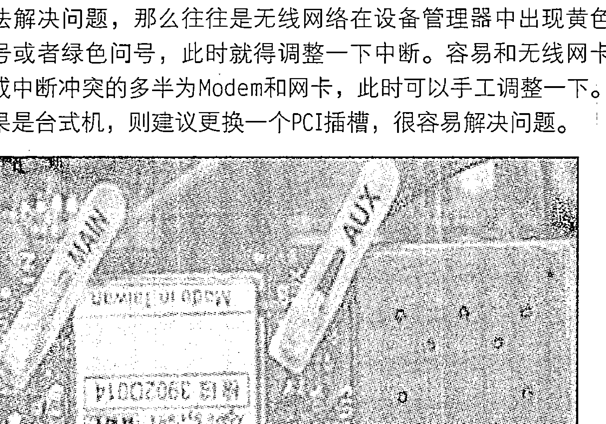

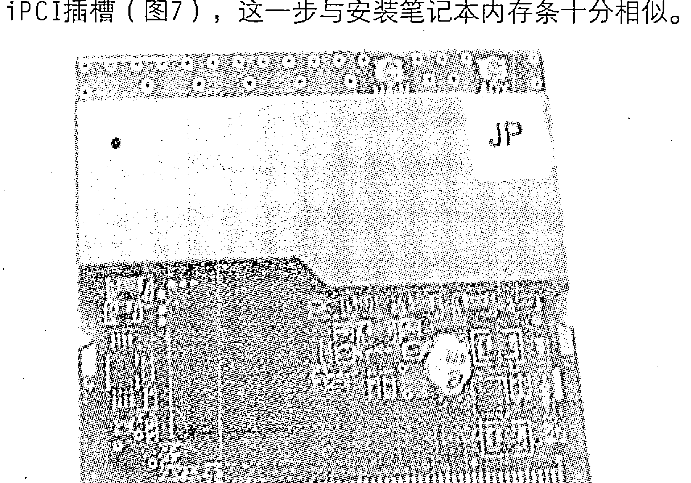安装无线网卡的整个过程不需要用很大力，先把卡对准插槽与平面成45度角插进去，然后按住网卡的上面两个角用力均匀地按下去即可，装到位了会听见清脆的咔哒两声。不用担心你是否会把无线网络模块装反了，因为MiniPCI接口有防呆设计，反了是插不进去的。安装完成之后，要确保不存在松动，同时要注意两条天线的布局，不要往里面硬塞，而是应该沿着边走线，可能要多试几次，找到最佳位置，确定盖子能轻松盖上并不压着天线为止。最后，合上MiniPCI接口槽的盖板并拧上螺丝即可完成整个安装过程。

## ④无线宽带路由器的设置疑问

典型疑问：以正常的默认方式安装好无线宽带路由器和无线网卡，但是总是感觉内网传输速度非常慢，有时候容易掉线，或者断电后突然无法使用，这些都是什么原因？另外，如果无法登录路由器的IP地址，那又该怎么办？

由于一般Internet共享只需要很低的带宽，因此无线网络速度降低是感觉不到的。但是，在无线局域网中共享文件时，连接速度降低就会令人感到非常不爽了。首先要查看无线网卡的连接速率，因为在信号不好的时候，无线网络会降低传输速度。以54Mbps为例，有时可能降低到5.5Mbps，此时每秒大约只能传输500KB不到，共享文件自然是非常慢。对于这类问题，几乎没有什么很好的解决方案，家庭用户所能做的仅仅是调整无线宽带路由器的摆放位置。

无线网络部署讲究位置的空间感，而不是简单地连接网线。对于常见的两房两厅户型，无线路由器的摆放只有恰到好处才能保证所有的房间都能正常上网。无线信号从本质上来说是一种射频信号，存在着干扰问题，而天线又是一种方向性元件，它只能往特定的方向辐射高强度能量，因此无线路由器的摆放位置在很大程度上将影响到射频场形的效果，从而影响到信号质量及信号强度。

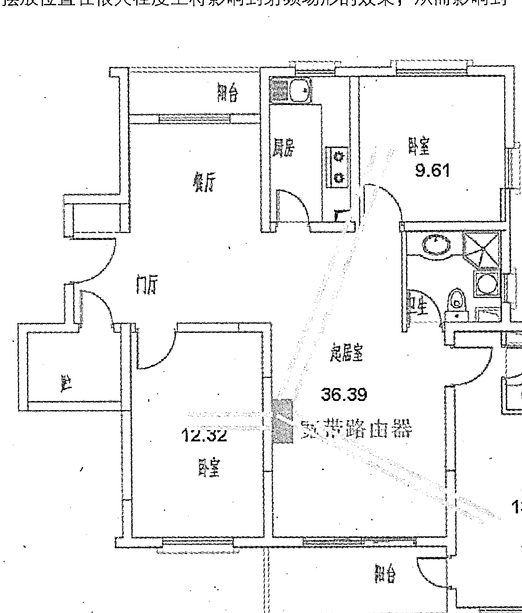

为此，无线路由器的摆放应尽量选择开阔、无障碍物的位置，一般而言“居中”是获得最佳信号覆盖效果的位置（图8）。落实到具体情况来看，100平方米左右的户型一般为两室两厅，在布局无线网络时将无线路由器放置在客厅或是几个房间的交汇口，此时效果最理想。如果放置在其他房间，则面对相连的其它房间肯定会信号稍差一些，甚至无法连接到任何信号。

假如无线网络的连接速度已经达到理论值，那么造成速度变慢的原因可能是路由效率降低。对于这种情况，大家首先要排除病毒和蠕虫的侵扰，然后重启路由器并删除客户端的防火墙软件。此外，在使用USB无线网卡时，应该注意PC上是否为USB 2.0接口。由于USB 1.1接口只有12Mbps带宽，所以最多适用IEEE 802.11b标准（图9）。

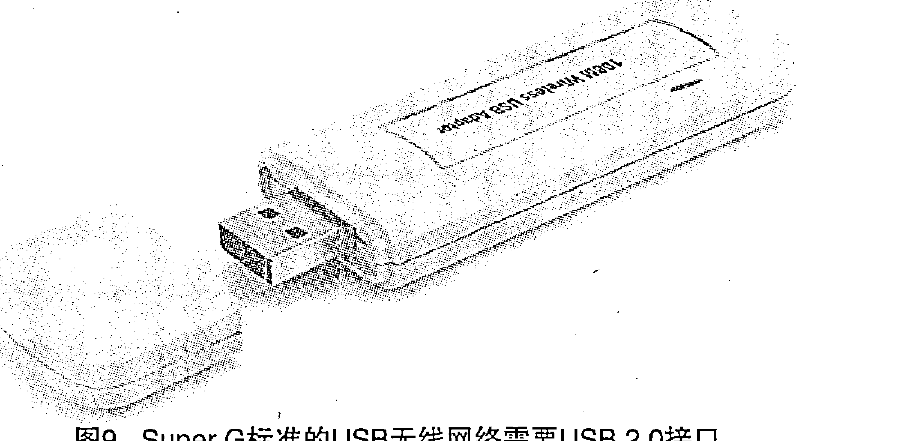

至于无线宽带路由器经常出现掉线的情况，这主要是内网的广播风暴所导致的。产生广播风暴的原因比较多，其中网络中存在着故障网卡、连接客户端数量过多、网线质量不符合要求都是有可能的。对于这种情况，一方面建议大家排除客户端病毒蠕虫的因素，另一方面建议同一个无线网络中尽量都采取DHCP分配IP地址，而不要既有DHCP分配又有手动IP指定，否则质量不好的无线路由器容易出现掉线问题。

假如发现在配置无线宽带路由器的时候无法登录其IP地址，那么首先应当试着按下路由器上的Reset按钮，此时可以清空以前的所有设置。但有时却会出现这样的情形，电脑已经从无线路由器获得了IP地址，却进入不了无线路由器的设置页面。在反复检查并排除物理连接问题之后，大家应当小心ADSL Modem自身路由功能的冲突。有的ADSL Modem已经开启了路由功能，而一旦和无线路由器分配在同一个网段，那么很可能造成客户端无法登录无线路由器IP。对此，建议大家关闭ADSL Modem的路由功能，因为在配合无线路由器时，ADSL Modem的路由功能完全是多余的。假如不知道如何关闭ADSL Modem的路由功能，那么也可以先拔下ADSL Modem，此时就可以登录无线路由器。随后，在无线路由器中将内部IP地址更换一个网段，这样就不会与ADSL Modem冲突。当然，部分无线路由器无法更换内部IP网段，此时就只能关闭ADSL Modem的路由功能了。

## 特别话题

## 三、无线网络应用答疑

在我们实际应用WiFi无线网络时，有时会遇到各种难以预计的问题。事实上，无线网络和传统有线网络之间的差别并不大，这些问题在以往结合应用有线路由器时也会碰到。对于家庭用户而言，掌握一些常见故障的解决方法是非常有必要的。

### 1. 选择哪种客户端软件合适

典型疑问：很多无线网卡都有自己的客户端软件，譬如迅驰笔记本更是有驱动和软件一体化的工具。那么，在安装好Windows XP+SP2的情况下，到底使用Windows自带的工具还是无线网卡专用的客户端软件？另外，为什么配置好无线网络后，连接指示灯一切正常，但就是无法上网？

在无线网卡有专用客户端软件的情况下，应该说选择专用客户端软件是最好的，这往往能够根据产品的特点进行优化。因此，建议大家取消Windows XP配置无线网络的功能。要做到这一步并不困难，首先依次进入“网上邻居”→鼠标右键→“属性”→“无线网络连接”→鼠标右键→“属性”→“无线网络配置”标签，然后把“用Windows配置我的无线网络配置”前面的小钩去掉，这样就可以用专用软件配置无线网卡了（图10）。

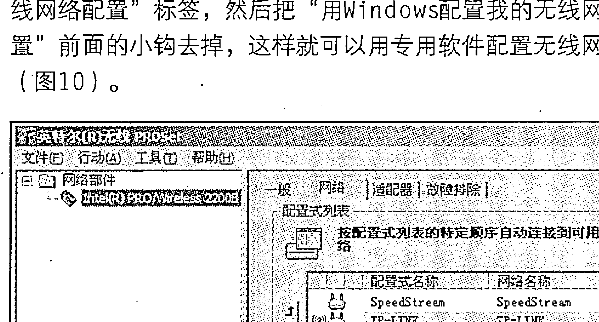

假如发现使用专用客户端软件还是无法无线上网，那么就得检查路由器与宽带网Modem的连接是否正常，并且确保无线网卡顺利分配IP地址。有的时候，因为无线网卡自己指定的DNS，导致能够登录QQ和股票软件，而无法顺利上网。面对这种情况，其实问题完全出在DNS域名解析，而网络连接没有任何故障。此时，正确的解决方法应当是禁用所有有关的手动设置，包括IP地址、子网掩码、DNS服务器等全部采用默认的自动分配选项。

### 2. BT下载速度偏慢的解决方法

典型疑问：使用了无线宽带路由器之后，无线网络在BT下载时速度很慢，怎样才能让设备下载提高速度？

造成BT下载速度偏慢的因素有很多，诸如操作系统连接数限制和种子因素以及宽带运营方问题，我们在此不一一详述，而且把问题焦点集中在如何避免无线宽带路由器而导致BT下载速度变慢。首先，建议大家打开无线路由器的NAT功能。NAT是一种把网络内部IP地址映射成Internet合法IP地址的技术。当网络内部分配了私有IP地址而不能直接访问Internet时，NAT可以把局域网内部的IP地址翻译成外部的合法IP地址以实现Internet共享接入。

为了彻底避免路由层面以及内置防火墙的问题，使用DMZ主机功能可把无线局域网上的一台或者多台计算机开放给Internet，此时局域网内其它需要更高安全性的电脑不受影响。该计算机设置为DMZ主机后，不再受到防火墙的保护，但其它计算机则相对更为安全。事实上，我们在使用P2P下载（BT等）以及游戏中也要经常使用DMZ功能，因为P2P和游戏应用常常要求不受限制的双向通讯，通过把一台电脑开放为DMZ主机而轻松实现LAN网内的那一台电脑与WAN的全方位连接。每个DMZ电脑都需要一个不同的广域网IP地址，多数无线路由器只支持1台DMZ主机，少数中高档无线路由器支持多台DMZ主机，但需要有多个广域网IP地址支持。目前家庭用户的宽带网多数只能分配一个IP，因此家庭级无线宽带路由器是否支持多台DMZ主机显得并不是很重要（图11）。

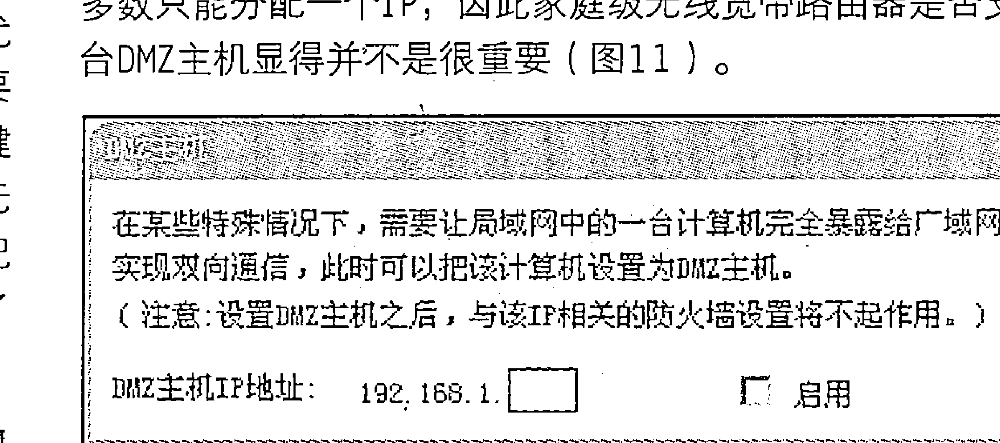

此外，UPnP通用即插即用也很值得大家关注，它基于TCP/IP协议和针对设备彼此间通讯而制订的新的Internet协议，用于常见对等网络连接的体系结构，使相关的设备和软件通过自动端口映射彼此可自动连接和更好的协同工作。很多用户都发现安装了无线宽带路由器后下载BT或是电驴的速度变得很慢，而一旦开启UPnP通用即插即用功能，则基本可以解决这一问题。与DMZ主机相比，UPnP通用即插即用功能显得更为保险，不会因为便捷性而彻底忽略安全防护。不过UPnP通用即插即用功能在Windows 9X操作系统下无法发挥作用，这是唯一的不足（图12）。

| ID | 应用描述 | 外部端口 | 协议类型 | 内部端口 | IP地址 | 状态 | 删除 |
|---|---|---|---|---|---|---|---|

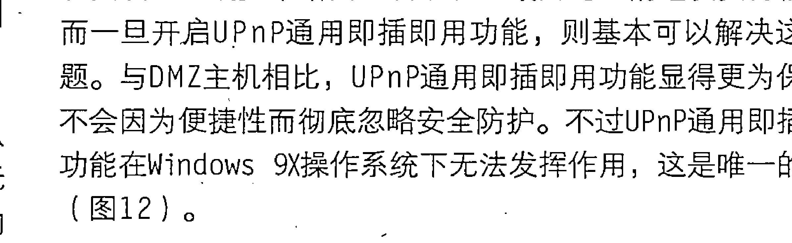

### 3. 如何让无线上网更加安全

典型疑问：无线网络毕竟有被截获的危险，而且容易被其它用户所使用，有什么方法可以确保无线网络的安全性呢？

为了避免自己的无线网络被他人使用，最好的方法便是关闭无线路由器的SSID广播。正如我们前面所介绍的，SSID好比是客户端连接无线路由器的密钥，因此关闭SSID广播就可以使得其它客户端无法找到无线路由器。此外，我们还建议大家修改无线路由器默认的SSID，因为市面上的无线路由器就只有几大品牌，很容易被猜中默认值。此外，IP地址过滤和MAC地址过滤是很有效的防护手段，而且MAC地址对于网卡而言是唯一的，因此也可以作为防止无线客户端侵入的辅助手段。一般而言，无线宽带路由器都有一个“仅允许已设MAC地址列表中已生效的MAC地址访问无线网络”选项，只要激活该选项就可以达到不错的防护效果（图13）。

然而，很多用户担心的并非是无线网络被侵入，而是数据在无线传输时直接被截获。到目前为止，困扰无线网络的安全因素还是有很多方面。在更为安全的WiFi版本IEEE802.11i标准发布之前，无线网络的安全性仍然得不到完全的保证。但是，如果能够采取多种安全的策略和技巧，我们可以加大入侵者攻击WiFi局域网络的难度，使得他们望而却步。

IEEE802.11b、IEEE802.11a以及IEEE802.11g协议中都包含有一个可选安全组件，名为无线等效协议（Wireless Equivalent

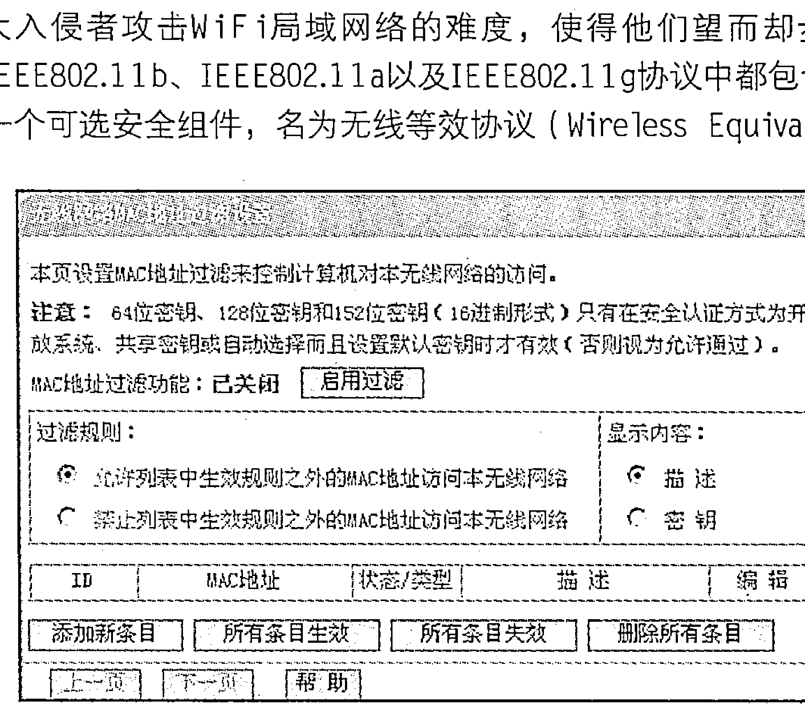

Privacy, WEP），它可以对每一个企图访问无线网络的人的身份进行识别，同时对网络传输内容进行加密。对于民用范围而言，WEP的作用还是相当明显。

大多数无线路由器都建议使用至少支持40位加密的WEP，但通常还支持128位甚至256位选项。对于需要保密的无线网络，具备128位加密功能的设备应该视为最低配置。在试图同网络连接的时候，客户端设置中的SSID和密钥必须同无线路由器匹配，否则将会失败。对于用户而言，使用WEP是十分简单的。购买无线路由器时自然认准具有128位WEP的产品，然后通过浏览器登录到WEP设置一栏，将WEP指定为128位，再分别填上四组密码即可。

### 4. 无线网络信号微弱

> > 典型疑问：无线网卡为什么搜索不到无线路由器？在搜索到的情况下，为何显示信号非常微弱？

造成无线网卡无法搜索到无线路由器的原因主要是无线路由器没有开启无线功能，或是关闭了SSID广播。在确保无线网卡正常的状态下，请调整无线路由器的设置，或者直接将无线路由器Reset重启，因为默认设置一般都开启无线功能并打开SSID广播。而如果发现无线信号非常微弱，那么由于受到障碍物的阻隔，此时只能调整无线路由器的位置。此外，同样是2.4GHz频段，IEEE 802.11g传输能力要明显强于IEEE 802.11b，如果发现IEEE 802.11b的型号很微弱，那么可以考虑更换无线网卡和路由器。当然，使用无线AP进行桥接也是不错的方案。所谓桥接，可以直观地理解为扩展无线网络信号范围，部分无线宽带路由器也支持无线桥接功能。唯一的缺点是，使用无线AP的成本比较高。

## 优化带宽

Windows XP专业版新增了QoSRRP(这是Quality of Service Resource Reservation Protocol的缩写，意为服务质量资源预留协议)。一般来说，试图通过可用带宽访问信息的时候，应用程序要么通过QoS应用程序接口，要么通过另一个称为TCI的应用程序接口。在网络通讯上，为了商业方面的安全性保留了一定的频宽给了管理者，这对于QoS应用程序来说无疑是件好事，但是一般使用者便不需要此功能，无形中就有部分(默认为20%)带宽白白浪费了，因此我在此提供取消此功能的方法。

选择“开始”菜单，点击“注销”，进到登录的主画面，在登录的主画面中按下Ctrl+Alt+Del两次出现了登录窗口，在使用者名称中输入Administrator(注：要区分大小)，密码栏中填入自设密码(若没有设定密码者空白即可)按确定进入Windows，单击“开始/运行”输入gpedit.msc进入到“组策略”窗口，在左边窗口中选取“计算机配置/管理模板/网络/QoS数据包调度程序”，在右边的窗口中双击“限制可保留的带宽”，选择“已启用”并将“带宽限制(%)”设为0，单击“应用”，然后“确定”，重新启动即可。

注意：Windows XP家庭版的使用者不必更改这些设置。

## 更改IE临时文件夹

上网时产生的大量临时文件都存放在IE临时文件夹中，默认情况下，临时文件夹是在系统分区上，大量的临时文件会影响硬盘读写系统文件的性能。你可以更改临时文件的位置来避免出现这种情况。方法是单击“开始/控制面板/Internet选项”，在“常规”选项卡中单击“设置”按钮，在打开的窗口中单击“移动文件夹”按钮，指定一个非系统分区上的文件夹，单击“确定”后，临时文件就会移到指定的文件夹上。

## 加快“网上邻居”共享的速度

不知道各位使用者用Windows XP开“网上邻居”里面的共享资源时，有没有发现所花的时间相当的长，这是因为它会检查其它计算机中的设定工作，有时甚至就在那边停了将近一分钟，相当讨厌，大家可以通过下面的方法将其检查的步骤取消：选择“开始/运行”，输入regedit，在弹出注册表编辑器中寻找[HKEY_LOCAL_MACHINE/Software/Microsoft/Windows/CurrentVersion/Explorer/RemoteComputer/NameSpace]，按鼠标右将在此位置的{D6277990-4C6A-11CF-8D87-00AA0060F5BF}删除之即可。

## 划时代的进步——多核CPU多面看

以目前制作工艺来看，微处理器的主频发展已经快要进入瓶颈阶段。如果再不改变“频率至上”的研发思路，那么下一代产品将面临性能无法提高的尴尬。对于厂商而言，此时从提高效率着手是唯一切实可行的出路。而除了流水线核心架构上的技术研发，双核心乃至多核心技术无疑又是一条捷径。伴随着Intel和AMD两强在PC市场的多核心技术推进，乃至非x86市场的多核心技术普及应用，我们已经彻底迎来了一个多核时代。

## 1. 多核技术的前身：双CPU方案

尽管Windows操作系统的一大特色便是多任务功能，但是从根本上说如今的x86架构的处理器是无法实现多任务的。学过操作系统原理的朋友都知道，Windows中所谓的多任务仅仅是将各个软件的数据请求分为细小的时间段，每一个进程依次操作。显然，这种操作模式会严重影响多个大型软件同时运行时的效率。同样，在服务器领域，用户面对多任务时也渴望CPU能够拥有真正的多线程工作能力。为此，业界在高端工作站以及服务器市场率先引入了双CPU，从而大大加强了多任务下的性能。当然，双CPU的价值并不仅仅在于执行多任务。如果应用软件专门为双CPU加以优化，那么其性能提升幅度同样是相当明显的。在图形工作方面，Photoshop和3DMAX都支持双CPU，所以对于这类用户群体来说双CPU是有用武之地的。从CPU设计角度来看，在一个CPU的整体封装内实现两个核心是难度极大的，因此双CPU成为几乎唯一的并行工作方式。对于双CPU系统而言，两个CPU依靠芯片组以及操作系统的支持实现负荷量分配，而互相之间的数据交换则通过北桥芯片来完成。以我们最为熟悉的PC为例，其实进入Pentium II时代之后，桌面级的双CPU方案已经悄然出现。1999年，Intel的440BX芯片组正好支持双CPU功能，而Celeron处理器又因为推出时间仓促而没来得及屏蔽双CPU功能，因此DIY用户也能以较低的成本组件双CPU系统（图1）。但是，并不是每一款CPU都具有组成双CPU系统的能力，因为Intel与AMD都在CPU出厂时屏蔽了这一功能，特别是定位中低端市场的产品。由于使用双CPU的主要是企业用户与发烧级用户，因此CPU生产商都推出了专门支持这一技术的产品，并在命名方式上加以区别，不过价格自然要高一些。

> **双CPU与双核心技术的区别**
尽管我们有时将这两个概念混为一谈，但是其实后者的效率要远远高于前者。双CPU各自有独立的缓存以及接口，可是这对于性能发挥并不有利。由于缺少互相之间的高速数据传输通道，再加上负荷量分配上的不合理，导致双CPU在很多情况下的应用效果并不理想。更重要的是，双CPU的成本无法令人满意。反观现在的双核心技术，两个原生核心整合在一起，这样就提高了协作效果，并且有助于降低成本。

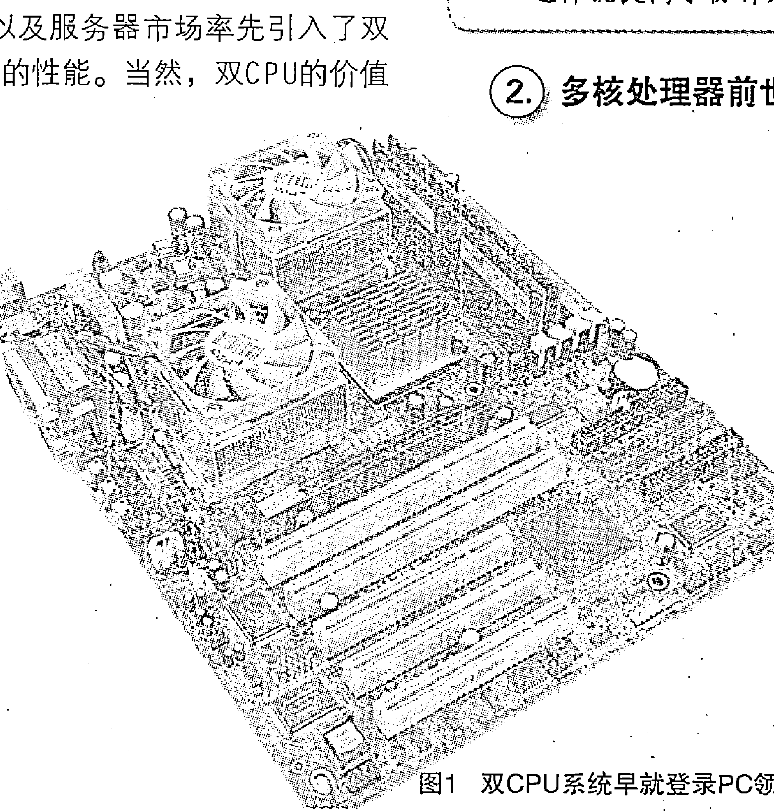

## 2. 多核处理器前世今生

所谓“多核心”处理器就是采用独立缓存的设计，将多个核心整合在同一芯片上可以提高性能，能耗的增长得到控制，功率密度可以降低。将双核心甚至多核心的缓存整合在一起，将缓存整合在一起理论上可以让每个处理器核心以更快的速度存取更多的数据，晶体管数量也更为经济。这样的设计效率和成本符合技术和市场的发展方向。双核处理器架构很早就出现在RISC处理器上，IBM在2001年10月就推出基于双

核的Power 4处理器。SUN和HP先后推出了基于双核架构的UltraSPARC IV以及PA-8800芯片。虽然在x86领域出现双核处理器已经是2004年的事，但在x86领域中出现双核架构，对业界的影响远比在RISC架构上出现双核的影响要大，毕竟从成本、性能和易用性的综合考虑，x86架构服务器的市场空间和应用领域显然更为广阔。

多核多线程x86产品和单核处理器产品相比，有着明显的性能优势。它能够以更低的频率处理更高的工作负载，因而能够避免通常由多处理器设计导致的功率需求和散热问题。多核多线程x86服务器系统在市场端已经取得了一定的成绩，但从技术端来看，x86指令集依然十分复杂，仍存在编码长度不一的问题。更重要的是，这样的指令级架构将直接影响服务器产品最为重要的可靠性和稳定性。相对而言，一直占据高端服务器市场的RISC架构处理器，之所以能够屹立至今，其对于高端客户最大的价值就是利于设计实现更完整的系统可靠性体系。为了不断实现新的性能超越和新功能，x86指令集数年来不断更新、增加新的指令（图2）。

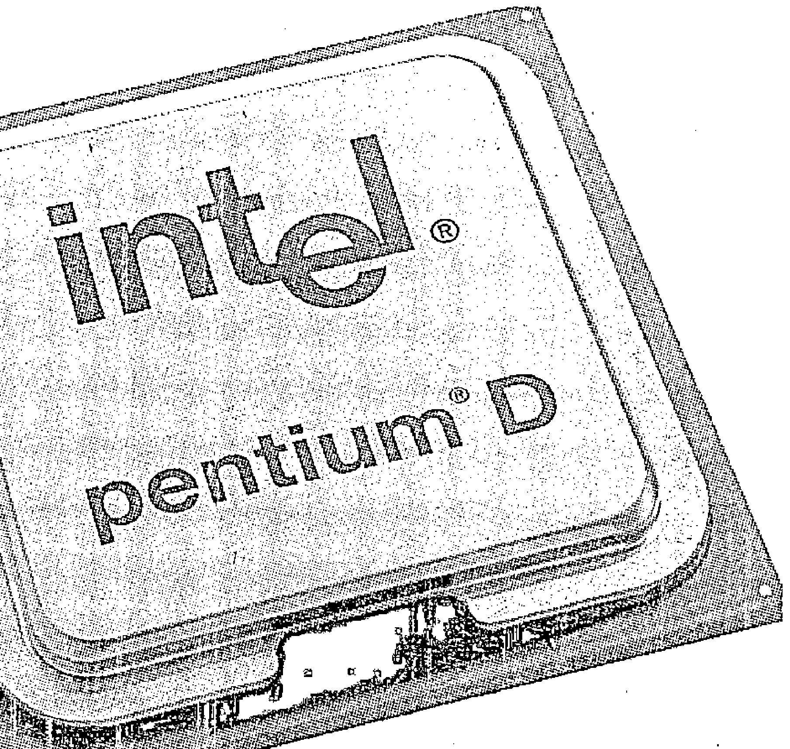

那无异于是痴人说梦。然而在双核心时代，这一尴尬局面将会得到极大的改善，让后台运行大型程序成为轻而易举的事情。与以往的双CPU SMP运算相比，如今的双核心处理器能够更好地分配，以便协调工作，从而达到极其出色的效果（图3）。

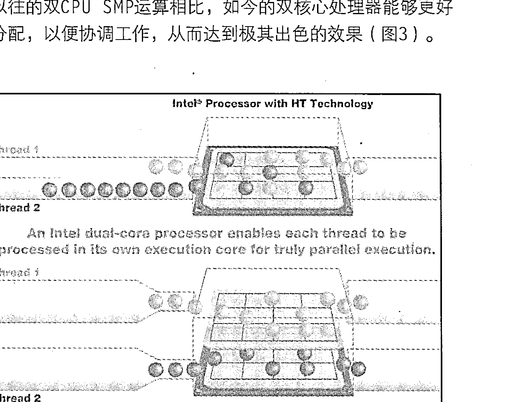

> > **过渡性的超线程技术**
> Hyperthreading超线程技术可以让Pentium4处理器以双计算单元并行的方式执行指令线程，并允许一块CPU同时管理两条进程，每一组注册器分别处理一条指令。但是与物理意义上的多CPU系统不同，每条指令都需要共同抢占处理器资源，包括在缓存中存放数据以及通过前端总线发送数据等。这就意味着采用Hyperthreading技术的单CPU系统的实际效能并不等同于配置两块物理CPU的系统。不过，与双CPU系统相比，Hyperthreading不仅也可以提供多线程处理功能，而且并不需要使用支持双CPU的主板，系统的整体拥有成本更低。现在，超线程技术已经基本退出历史舞台，因为双核心技术的普及使之变得意义不大。

即便是最常见的应用场景，我们也能充分感受到双核心所带来的好处。很多用户都喜欢一边BT下载一边玩游戏，而此时便会感觉到游戏速度明显变慢。不要简单地以为BT下载软件仅仅占用硬盘，它对于CPU的占用率也同样不小。而如果能够启用双核心处理器，那么一切问题都将迎刃而解。同样的例子还有一边玩游戏一边听音乐，甚至一边进行视频压缩等高消耗应用，一边上网聊天等。双核心处理器带给我们的是真正自由的应用模式，不必担心某个程序耗尽系统资源而束缚其它应用。

更为重要的是，未来的操作系统与应用软件也将针对双核心进行充分优化，因此其应用价值将是毋庸置疑的。尽管目前很多测试软件中无法显示出双核心处理器的优势，但是请不要怀疑这一发展趋势，而且很多应用中的实际体验是普通性能测试软件所无法体现出来的。以目前支持双核心的Maya、3DS Max、Cinema 4D、Truespace、AutoCAD、SoftImag、LightWave 3D、QuakeIII等应用软件为例，双核心所带来的性能增长是显而易见的。随着Intel和AMD纷纷进入双核心时代，未来Vista操作系统和应用软件充分为双核心优化也将是必然的趋势，这也是最坚不可摧的应用基石。

## 3. 多核心在桌面级应用的优势在哪里？

多核心处理器的出现无疑是一场及时雨，这将会给我们的应用局面带来翻天覆地的变化。以时下最热门的HDTV为例，解码1600×1200分辨率WMV HD所花费的CPU和GPU资源已经相当惊人，而如果还指望在第二个显示器上流畅运行PhotoShop，

> > **避免矫枉过正**
> 尽管我们一直非常赞同双核心带来的好处，但是如果为了追求双核心而放弃主频是得不偿失的。举一个最简单的例子：双核心的Pentium D 805已经非常便宜，但是实际性能并不好，毕竟主频还是太低了。虽说如今的CPU强调主频不是决定性能的关键，不过没有高主频也是万万不行的。同样价位上，高主频的Intel单核心CPU往往比Pentium D 805性能更加出色。在追捧双核心的同时，我们更加应该切合实际。

## 二、多核处理器发展趋势

### 1. 主动提高多核心效率

在某些情况下，双核心处理器反而会令单一程序的执行效率下降，这究竟是为什么呢？其实处理器中的两个内核都拥有共享的缓存，因此必须保持每个物理内核的缓存信息一致，否则就会出现运算错误。例如在系统的内存数据区记录着A=1：如果第一个处理器0对此数据区进行读写操作，并且改写为A=0，那么第二个处理器内核的缓存也必须进行更新，把A更新为0，否则的话，在以后的操作中数据就会出错。这样一个过程就是缓存数据的一致性，这也是导致降低速度的主要原因之一。

事实上，双核心处理器的这一弊病历来就有。在双CPU以SMP方式工作时，甚至打开Intel的超线程功能时，都会发现类似的情况。所不同的是，不同的双核心解决方案在处理“缓存数据一致性”时的表现截然不同，譬如AMD Athlon 64 X2和Intel Core就有着比Pentium D更好的效果，但是这也并不能避免特定应用程序中的性能下降现象。在已经发布的Intel迅驰4中，我们可以看到新版Merom所采用的Intel Dynamic Acceleration技术（IDA），这主要用于提升双核心的协作效率，甚至可以说是新版Merom最大的亮点，其意义远远超过增加二级缓存或是提高前端总线。

已经在使用双核心处理器的用户都有这样一种体验：大多数情况下我们使用的都是单线程软件，而双核心处理器有时难以发挥很好的作用，甚至会造成工作效率降低。而现在，通过IDA技术的帮助，迅驰4可以针对单线程任务或是大范围非并行指令进行更加合理的流水线分配，甚至面对单线程应用时只由一个核心来工作，从而提高性能，并且另一个空闲的核心能够进入深度休眠状态，降低处理器的耗电，同时也延长续航时间。而当有新的线程进入队列时，休眠的核心就会根据需要开始工作，切换时间短到不响应性能表现（图4）。

### 2. 从双核到多核

从单核到双核，再到四核，普通用户能否从这些变化中获得更好的运算性能，目前这一问题尚处于争论之中。多核带来的优势主要在于可同时运行多个应用程序，或以多个线程运行同一任务。多线程应用允许将一个应用载荷分成几个部分同时解决，多个处理器正好提供了这一优势。但由于大多数应用程序并非多线程设计，因此使用多核处理器带来的性能提升也非常有限。

在服务器和工作站领域，非x86的处理器在多核技术的帮助下实现了非常不错的应用效果，这是由其单一的硬件环境以及强势的软件优化所造成的良性局面。但是，在PC领域，双核的运作效率尽管不容否定，可还远没有达到理论上的理想境地。因此，四核心技术能否真正发挥作用，这还有待时间的验证。但是可以肯定的是，Intel和AMD已经在PC领域打响了这场多核技术大战，四核心处理器的发展趋势已经无可改变。

### 3. 配套的软件开发工具包

尽管多核是一种硬件技术，但硬件和软件是相互依存的，硬件只是一种物质基础，只有有了软件的支持，才能使硬件拥有用武之地。那么，现在软件的并行处理能力能否与多核相匹配呢？这要视不同的市场而定。在服务器领域，相关的软件包括操作系统，应用多核的能力已经成熟。因为服务器的系统一直以来就是为多线程的应用设计的，多核的推出对于系统而言只是拓宽了高速公路，把从前的单行道变成了多条车道同时行驶。但是，在面对个人的PC方面，如桌面和移动电脑，多数的软件和运行系统还不能很好地同多核相匹配，只有在游戏、媒体桌面出版和动画制作等领域才有利用多核技术和多线程的应用。

在Intel有一个专门的软件与解决方案部门（SSG）承担着推动软件开发的任务，每推出一款新的处理器，SSG的任务就是开发一些软件工具来帮助ISV理解新处理器的用处，并利用其新的功能来进行开发。事实上，AMD也有类似的部门，并经常发布一些开发软件工具包，帮助软件开发商优化代码，实现对多核计算更好的帮助（图5）。

## 三、AMD多核技术

从1998年开始，AMD的K8架构就已经浮出水面。虽说K8架构在很长一段时间内都领先于Intel，但是毕竟那么多年过去之后，K8也不得不面临“明日黄花”的尴尬。反对频率至上的AMD一直强调流水线效率，因此即便如今K8处理器的主频只有2GHz左右，但是其性能依旧非常不错。但是，面对Intel全新的Core架构，K8架构已经显现出劣势，其中内存控制器和整数执行单元方面是比较明显的缺陷。更为重要的是，AMD已经在65纳米制作工艺方面落后于Intel，因此今后的主频大战肯定再次陷于被动。在这样的情况下，重新研发新核心架构是必然的。

### 1. 原汁原味的双核设计

AMD K8处理器从一开始设计时就考虑到了添加第二个内核，两个CPU内核通过使用系统请求接口SRI，使用相同的HyperTransport技术和内存控制器，兼容90纳米单内核处理器所使用的940引脚接口。可以说，AMD的解决方案是真正的“双核”，其技术架构为实现双核和多核奠定了坚实的基础。AMD直连架构通过超传输技术让CPU内核直接跟外部输入/输出相连，不通过前端总线，这使得每个内核都有自己的高速缓存可资遣用，都有自己的专用车道直通输入/输出，没有资源争抢的问题，实现双核和多核更容易（图6）。

AMD的双核CPU跟现有单核CPU接口规格、功耗一样，因此从单核换成双核，不需要更换芯片组、主板、电源，只需要升级BIOS软件、拔下单核处理器插上双核处理器就行了。芯片组、主板、电源厂商不用投入新的研发成本，价格会按半导体市场的规律自然降低，用户现有的设备也可以通过升级CPU提升性能。因此，AMD多核技术在应用上具备一个非常大的优势，那就是功耗不变。也许对于普通用户来说功耗影响不大，但对于高密度的服务器如数据中心来说，就具备了很大的优势，不需要增加额外的散热设备，就可以立即提升系统的性能，降低总拥有成本。

### 2. Altair Opteron的四核方案

AMD Altair Opteron的四核方案一直被视为超强工作站领域最具性价比的多核解决方案之一。Altair Opteron在一枚芯片内集成了四个硬件内核，每个内核拥有独立的512KB二级缓存，这样Altair Opteron总共就有2MB二级缓存。在此基础上Altair Opteron还拥有2MB的共享三级缓存，这样各个核心缓存同步化就可通过共享的三级缓存进行。不难看出，Altair Opteron的耦合程度非常紧密，四核协作效率甚至优于双芯片的Core 2 Quad。目前，Intel Core 2 Quad是现在唯一可以买到的四核心x86处理器，而Altair Opteron则要稍微晚一些。尽管Altair Opteron相比Core 2 Quad略有一些技术优势，但是未来Altair Opteron真正的竞争对手还是原生四核心设计的45纳米处理器，因此所谓的原生四核心仅仅是概念上的领先，未来实际市场竞争中将与Intel处于同一起跑线（图7）。

对于四核心处理器而言，我们关注的焦点还包括功耗，毕竟四个内核所带来的能耗是使人非常担忧的。Altair Opteron最吸引人的莫过于被称为“动态独立核心管理（DICE）”的四核心电源管理系统。DICE不仅会根据系统负载智能分配各核心需要执行的任务，还可以在核心处于空闲状态时将其关闭，使其进入深度节电状态。K10将是真正为多核心设计的新一代处理器，而且直接使用更为先进的12通道HyperTransport 3.0连接四核心。在AMD看来，多核心并不仅仅是并行运算，在单任务处理中也应当发挥作用。K10的流水线级数将保持和K8相同，但是数据预取单元使用存储接口进行标签查找，此时可以避免标签查找可能带来的高延迟。K10核心也进行了大幅度改进，核心中已经内置3个64bit的整数执行单元，这将帮助这款全新的架构达到更加理想的整数性能。此外，K10核心还将集成128KB一级缓存、512KB~1MB二级缓存和首次在桌面引入的2MB三级缓存，这进一步提升了性能表现。

在整个K10架构中，被称为逆向超线程的anti-HT技术非常引人瞩目。众所周知，Intel超线程技术在一个物理处理器中模拟两个虚拟处理器，从而在多线程应用中获得性能提高。而AMD的anti-HT技术恰恰相反，它允许你将两个物理处理器作为一个虚拟处理器使用，从而在应用程序包括非多线程应用程序中也能获得性能提高。其实，对于多核心运作效率，厂商都非常担心，而软件开发商的优化力度也无法令人彻底放心。因此，逆向超线程可以看作是一种优化多核心的技术，帮助多核心处理器顺利在普通应用程序中获得更加理想的性能表现（图8）。

## 四、Intel多核技术

在整个Pentium 4时代，Intel不仅原本并无计划推出64位处理器，甚至连双核计划也没有被提上日程。在Intel看来，桌面平台并不需要双核。但是，随着AMD的步步进逼，Intel一次又一次地被动应付，终于度过了Pentium 4的艰难时代，现在Core架构下的多核技术已经帮助Intel全面反击，吹响了冲锋的号角。

### 1. Core 2 Duo表现令人信服

作为NetBurst的接班人，Core核心架构完全改变了原有的发展模式，CPU不再以牺牲超流水线效率来换取高主频。Core架构的处理器将超流水线缩短到14级，这将大幅度提升整体效率，令CPU避免出现“高频低能”的尴尬现象。然而更加值得我们关注的是，Core架构采用了四组指令编译器，这与Pentium M处理器有些类似。现在，Intel Core 2 Duo所表现出来的性能已经足够令人信服。当竞争对手还在描绘蓝图上的概念产品之时，Intel显然已经领先一步（图9）。

### 2. 四核心处理器改进在即

目前，Intel已经在PC市场推出了四核心处理器，那就是核心代号为Kentsfield的Core 2 Quad。Kentsfield实际上是由两个双核CPU组合而来，这一点很像之前的Smithfield核心，也即90nm Pentium D核心。只不过那是基于NetBurst架构，而Kentsfield是由两个Conroe处理器组成，基于Core架构。

我们建议大家先不要盲目否定组合封装，因为这样做也有很多好处，其中最主要的一点便是简化了生产工艺。通过这种方式，Intel至少可以降低10%的生产成本。原有的生产线不需升级即可同时完成双核CPU和四核CPU的生产，他们可以在成品中挑选优秀的部分来组合Kentsfield，以达到更佳的功耗性能比，而且也能够保证产量。

当然，Intel未来的四核心处理器还是会走向一条四核心完全独立的发展道路。采用45nm工艺的四核心版Penryn处理器将会拥有8.2亿个晶体管，核心架构与现有的Core 2有了明显区别。新工艺所带来的好处不仅仅是二级缓存那样简单，而是在架构设计方面可以作出全新的改变。Penryn的核心面积只有107mm²，因此芯片的核心面积要比当前65nm Core 2 Quad处理器小25%（图10）。此外，Penryn最高采用1600MHz前端总线设计，桌面版本和移动版本依然支持1333MHz，这令其今后对芯片组的兼容性大幅度提高。高端版本的Penryn处理器将会内置12MB二级缓存，这些“恐怖”的技术指标都令人对其非常期待。

的C6节电状态。新的C6状态可以将处理器的核心电压降至其所采用制程技术的极限，在该状态下除了降低处理器核心频率以外还会关闭所有的高速缓存。在这种情况下，其功耗非常低。此外，EDAT技术也是Intel在功耗控制上引以为傲的新法宝。这项技术可以单独提高某个处理核心的频率，并将其他暂时不使用的核心关闭，以适应单线程任务或者只能利用一个核心的多线程任务。显然，这样不但可以优化系统性能，还能节约不必要的能耗，是多核心时代的发展趋势。

> Intel的多核之路
Intel表示未来的处理器性能已不会像以前那样只注重工作频率，而会趋向多核心搭配相关的应用技术，以此来提升实际应用性能。在八核心（二到四，四到八）以后，Intel就会推出10个核心以上的处理器，未来的处理器更将实现100到1000个核心结合在单芯片上。而要达成这么多的核心设计也必然需要生产制程的配合（如2010年的22nm，2014年的16nm，2016年的11nm和2018年的8nm等）。Intel方面也将继续以摩尔定律为基准开发处理器产品，晶体管在每代产品中将继续倍升：如11nm制程芯片将内置1280亿个晶体管，而到8nm制程时则会有2560亿个晶体管。

## 五、非对称的多核心：IBM Cell大放异彩

在各种多核处理器中，由IBM、SONY以及Toshiba共同开发的Cell处理器是非常特别的一款。Cell是以IBM所研发的64位PowerPC微处理器核心为核心，结合多个独立的浮点数运算单元，因此它所构成的多核心微处理器并非是传统意义上的对称结构，不过同样具备强大的运算效能。

### 1. 全面的应用范围

IBM Cell处理器已经应用于SONY新一代游戏主机Playstation 3，不过可千万不容忽视这位主角，因为其应用范围不仅仅是游戏主机，包括服务器以及各种专用设备都是其发挥巨大威力的舞台。与此同时，IBM还能够将Cell应用于娱乐家电领域，HDTV解码以及视频编码应用都对处理器性能有着很高的要求，而此时Cell芯片的优势正好得以发挥。毫无疑问，多核心设计的Cell处理器有着非常广泛的应用范围，包括高清数字影音家电、游戏机、计算机图形、科学运算等领域的产品（图11）。

Cell处理器的多核设计非常有助于多媒体方面的运算，但是却给游戏制作人员带来不便。理论上如果充分发挥所有协处理器的话，整体性能相比之下有着很大的提升。但程序员必须把所有的数据“切割”出来细分到各个协处理器中，这是非常复杂的，而且以往的应用软件不可能进行改进来适应Cell处理器。此外，微软工程师非常尖锐地指出Cell处理器缺乏“分支预测”功能，这对于整数性能发挥有些不利。因此，Cell处理器被认为是最适合应用在单一封闭领域的产品。譬如，SONY的Playstation 3游戏机便是最好的例子。由于硬件环境的统一性以及游戏开发商坚决地为Cell处理器多核协处理器进行优化，所以综合效能非常出色。同样，即便是IBM将Cell处理器应用于服务器，也主要是那些专门用于计算某些领域复杂数据的产品，然后根据这类服务器的硬件特点开发配套的应用软件，甚至嵌入式操作系统。

### 2. 浅析Cell核心架构

Cell架构是一个单芯片多核心处理单元，它内置9个处理单元，它们之间共享存储器资源。与我们所熟悉的多核心处理器不同，Cell更多地采用协处理器方式，然后依靠多个处理器并行技术实现惊人的运算速度。Cell是以IBM所研发的64位PowerPC处理器为主核心，结合多个独立的浮点数运算单元所构成的多核心微处理器，具备强大的运算效能。这种非对称式的多核设计尽管存在应用程序难以充分利用的弊病，但是其综合效率以及功耗控制都非常理想（图12）。

以SONY Playstation 3所采用的Cell处理器为例，它集成了2亿3400万个晶体管，采用IBM的90纳米SOI、Low-K工艺制造。这款处理器的核心面积为221平方毫米，芯片规模与Intel的双核Pentium D相当，两者的制造成本处于同一条水平线上。在逻辑上，Cell处理器基于一个“PowerPC处理单元”，

因此x86在PC市场的垄断地位依然不可撼动。

### 3. 源于AMD的设计灵感

Cell架构中的主核心是PowerPC，但是它又不等同于IBM制造的其它任何PowerPC处理器。虽然这款主核心拥有现代通用微处理器的基本功能，但它有目的地作了简化，在Cell中的作用是处理任何通用微处理器能够运行的任务。此外，这款主核心还是一个有序微处理器，配备了64KB一级缓存和512KB二级缓存，而所有的八个协处理器没有多级缓存结构，并且不支持分支预报，这意味着它们完全依靠软件分支预报，并且对于内存性能的要求非常高。

它可以支持虚拟多线程技术，同步执行两个不相干的线程。此外，Cell内部还拥有八个基于SIMD的协处理器。简单而言，一枚Cell处理器内部整合了九颗独立的运算核心，可支持多达十条线程的同步运行（图13）。

大多数时候，设计良好的缓存将提供访问所需数据的低延时。但考虑Cell面对的应用程序类型，3D渲染、游戏、物理学、媒体编码解码等，所以它对内存延时的要求非常高，这将有助于弥补其协处理器缓存结构以及分支预测能力的不足。因此，我们可以看到Cell使用了类似AMD的内置式内存控制器，不过它更进一步地直接支持XDR内存控制器，可配合25.6GBps带宽的内存系统。随后，Cell处理器的前端总线设计采用96位、6.4GHz频率的FlexIO并行总线，这是由RAMBUS公司所开发的新技术，也是有史以来速度最快的计算机总线。

Cell的多核心技术使得线程分配、资源管理等方面的程序模式具有了多种多样的发展可能性。Cell的主性能处理内核可处理双线程，其余每个协处理器可处理一个线程，这样Cell处理器的9个处理单元总共可同时处理10个线程，怎样最佳应用

另外需要指出的，Cell处理器的单线程性能并不理想，这主要是因为其PowerPC主核心略有简化，而且缺少硬件分支预警结构使得运行复杂的分支运算时表现尤其糟糕。但是瑕不掩瑜，作为非对称多核处理器的典型代表，Cell也许预示着未来微处理器的发展方向——以多个针对性极强的协处理器提高嵌入式应用能力！

## 写在最后

随着主频的提升受到制作工艺的制约，处理器制造商开始寻求新的解决途径，频率至上的思路已经被抛开。毫无疑问，多核设计是一个大胆的创举，而且短时间内就能取得明显的效果。暂且不去评论略显失败的HyperThread超线程技术，改用真正的双内核之后，PC处理器已经有着脱胎换骨的表现。与以往的双处理器相比，双内核不仅能够更好地利用缓存，互相之间的连接带宽也更为出色，从而表现出更为出色的性能。在PC处理器普及双核技术并进军四核时代的时候，其实服务器领域已经完全是多核计算的天下。但是，我们还可以关注另一个对功耗和运作效率非常讲究的领域，那就是移动计算平台和嵌入式平台。随着多核技术的成熟，相信未来出现多核设计的PDA处理器也不是不可能的事情。

处理器资源是今后软件工程师的一个重要研究课题。现在很多评论都认为Cell处理器有望冲击x86的主流地位，但是这基本是不可能的，因为现有的软件无法对Cell架构进行优化，这注定Cell只能应用于封闭的嵌入式环境中。但Cell处理器可怕之处在于，先前有传言称IBM有意将Cell软硬件开放给开放软件社群，如此一来，则可能改变整个PC产业界生态。然而即便如此，一种全新核心架构的处理器必然需要5年以上才能普及，

## Windows XP系统优化建议

### 删除多余字体

Windows XP中安装的字体越多，就会占用更多的内存和系统资源，减慢系统的运行速度，因此，对于不常用的字体，我们最好把它从系统中删除。字体文件存放在C:\Windows\Fonts目录下，你完全可以根据需要选择一些字体，对于更多不用的字体，一删了之。

### 清除预读文件

当Windows XP使用一段时间后，安装目录下的预读文件夹（C:\Windows\Prefetch）里的文件会变得很大，里面会有死链接文件，这会减慢系统速度，建议你定期删除这些文件。

### 设置预读以提高速度

Windows XP使用预读设置这一新技术，以提高系统速度。如果你的电脑配置不错，拥有PIII 800，512M内存以上，你可以进行以下修改：单击“开始/运行”，输入“regedit”，打开注册表，找到[HKEY_LOCAL_MACHINE\SYSTEM\CurrentControlSet\Control\Session Manager\Memory Management\PrefetchParameters\EnablePrefetcher]，设置数值0，1，2，3（0-Disable,1-预读应用程序,2-启动预读,3-前两者皆预读），推荐使用“3”，这样可以减少启动时间。

## 移动的精彩世界
——娱乐笔记本面面观

□方成亮

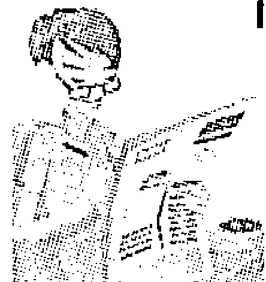

PC发展到如今这一阶段已经不仅仅是单纯意义上的科学计算工具，贴近用户的信息化平台成为大势所趋。而随着笔记本价格的一路走低，以往只是用来移动办公的笔记本电脑正在逐渐深入到老百姓的家庭中，并且担当起了家庭影音娱乐的重任。要想成为一个合格的家庭娱乐中心，对笔记本的要求已经不仅仅局限于性能，而是要求笔记本具有大屏幕以及强大的多媒体扩展性，并且最好具备专为影音与游戏娱乐而打造的特殊装备。

## 一、解析娱乐本本


### ①. 走出同质化误区 娱乐本本浮出水面

对于笔记本电脑的同质化质疑之声在近几年未曾中断过，而娱乐本本的出现自然是终结这一尴尬局面的有力武器。几乎每一个厂商都在不遗余力地推广娱乐本本，以获得差异化竞争的优势。的确，当Intel推出迅驰架构体系之后，笔记本的硬件平台已经变得前所未有的统一，此时留给厂商的创新空间已经不再是核心配置，而是贴近应用体验的人性化设计，其中娱乐本本便是最主要的发展趋势之一。

办公和学习，这些对于笔记本电脑来说是传统项目。但是现如今更加引人注目、更热门的笔记本电脑产品，却大都是针对家庭娱乐应用的。近几年来，传统意义上的商用笔记本电脑的销量增长开始放缓，而消费娱乐类的产品增长速度却快得多，在某些领域甚至保持着80%以上的增幅，于是许多厂商开始将产品的开发、设计、生产、销售重点向娱乐型转移，越来越多的消费者也开始盘算着弄一台笔记本电脑来实现随时随地的娱乐。

技术进步带给我们最大的好处就是价格与性能越来越贴近大众，一直在娱乐性方面逊色于台式机的笔记本在这两年也开始变得生猛，不少产品的配置价格颇有替代台式机的潜力。如今高清普及，而近段时间也是游戏大作不断，对于热衷娱乐但又需要笔记本的朋友来说，这些娱乐笔记本就成了不错的选择。但是更加重要的是，笔记本厂商在配件选择方面不会像以前那样仅仅重视CPU，而是在移动GPU、内存和LCD等方面全面改进，甚至连硬盘配置以及电池续航时间都成为厂商关注的焦点。

怎样的笔记本才算是娱乐的笔记本呢？首先在硬件方面肯定是比较强悍的，一款娱乐影音笔记本的硬件配置可以算是目前市场上的顶级配置。

从台式机演化到笔记本电脑，这确实是一个科技的奇迹，能保持在体积、重量大大减小的情况下技术含量不变，不能不说笔记本电脑完全是由先进的技术打造出来的！但是同样困惑业界的是，笔记本的性能始终因为出于便携性以及功耗考虑而无法与台式机并驾齐驱，甚至两者之间的差距越拉越大。为此，业界不断致力于开发新型技术。经过多年的努力，笔记本终于有望赶上台式机，或者说至少大幅度缩小差距。如今，在台式机领域的双核CPU以及次世代GPU都能够在笔记本电脑领域找到相对应的产品，甚至双通道内存和双硬盘RAID也不再是稀奇的事情，这些都为娱乐笔记本的发展奠定了基础。

### ②. 配置追赶台式机 娱乐本本奠定基石

如今购买笔记本不仅仅是为了能够满足工作上的需要，随着生活节奏的加快，大家更加希望能够在工作之余轻松的娱乐一下，所以更多的用户会选择娱乐笔记本，笔记本除了能够解决工作问题，还是娱乐的好帮手。那么怎样的笔记本才算是娱乐的笔记本呢？首先在硬件方面肯定是比较强悍的，一款娱乐影音笔记本的硬件配置可以算是目前市场上的顶级配置。

### ③. 娱乐本本未来趋势 人性化设计众望所归

尽管如今我们看到了大量娱乐本本通过强悍的配置吸引了众多眼球，但是细致入微的人性化设计依然是让主流消费者非常期待的。针对显示效果方面的双屏显示已经浮出水面，内置摄像头更是成为潮流，这些从实际应用体验入手的人性化设计起到了很好的使用效果，真正为娱乐笔记本电脑打开了普及之门。此外，选择娱乐笔记本电脑的消费者更喜欢个性化的外观设计，诸如钢琴漆、皮革等等特别质感的外壳，或是配合红、黄、绿、白等鲜艳夺目的色彩，这些都更加令人心动。

对于消费者来说，如今的娱乐笔记本电脑还远未达到尽善尽美的地步。譬如，多媒体快捷键的运作模式应当不仅仅局限于CD播放，能否直接实现高清解码成为众多用户的殷切期望；又譬如，移动GPU已经让3D游戏不再是奢望，但是笔记本键盘的操控能否作出进一步的配合改进则让人拭目以待……总之，娱乐笔记本电脑已经在市场上站稳了脚跟，但是等待厂商们去挖掘的新元素还有很多。开拓笔记本电脑的娱乐潮流不只是Intel、AMD、nVIDIA等业界巨人的责任，也需要众多笔记本生产商的智慧与创新。

## 娱乐笔记本之最

### 1. 面子问题 最大屏幕的笔记本电脑

将笔记本打造成媒体娱乐中心是很多人的想法，不少用户选择笔记本电脑时完全不在乎价格，而是希望能够获得接近台式机的综合表现，同时便于偶尔搬运。譬如，临时到外地出差几年或是出国留学等。在笔记本作为自己的唯一PC时，大屏幕的优势就立刻显现出来。无论是看电影还是玩游戏，更大的屏幕都有着绝佳的吸引力。

美国的戴尔、中国台湾的宏碁、韩国的三星电子等公司近日相继宣布了各自的超大尺寸笔记本电脑推广计划。宏碁公司推出了一款20英寸屏幕的Asprie 9800，据称这是宏碁研发的尺寸最大的笔记本电脑，市场零售价预计为2500美元。戴尔公司也于去年推出20英寸笔记本电脑XPS M2010，目标锁定高端客户群，而且可拆离的无线键盘等设计亮点颇受好评。三星公司同样锁定20英寸，而且屏幕为可分离式设计，用户甚至可以将其“吊”在台式机显示器的前面（图1）。

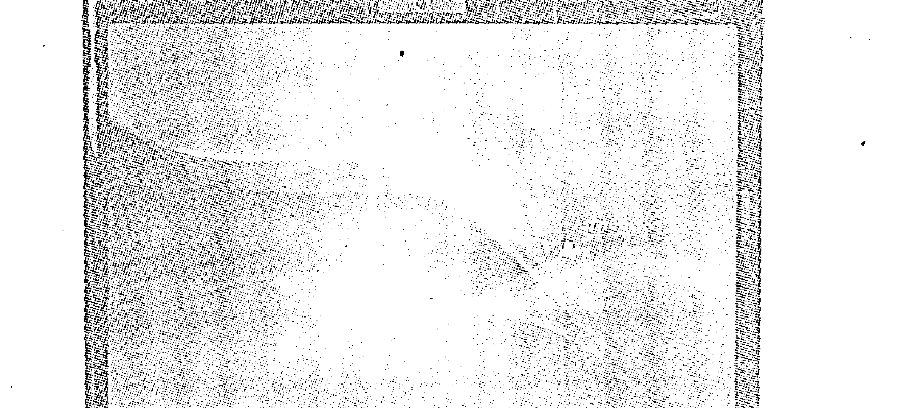

更加重要的是，这些最大屏幕的笔记本电脑，同时也是分辨率最高的产品。台式机LCD的20英寸产品一般是1680×1050分辨率，但是笔记本屏幕通常分辨率更高，譬如20英寸规格的笔记本电脑采用1920×1200分辨率，这在欣赏1080p HDTV时会带来明显的好处。但是，这类大屏幕的高分辨率却令游戏应用捉襟见肘，好在降低分辨率依然能够显示，只不过画质有所降低。

### 2. 有容乃大 硬盘最大的笔记本电脑

因为笔记本电脑的硬盘最大只有2.5英寸，而且不宜三碟以上封装，因此造成其硬盘容量较小。在如今这个高清视频横行的年代，没有大容量硬盘的确让多媒体娱乐变得捉襟见肘，不少疯狂的用户都在搜罗拥有最大硬盘容量的笔记本电脑。东芝近日发表一款储存容量达320GB的2.5英寸硬盘“MK3252GSX”，成为目前业界容量最大的产品。更加重要的是，这款硬盘的单碟容量达到160GB，双碟封装令硬盘的稳定性和发热量控制都表现得很不错。但是，目前320GB硬盘仅仅很少供应于零售市场，只有富士通Lifebook N6420配备。相信随着时间的推移，越来越多的娱乐笔记本会标配320GB大容量硬盘。至于配备250GB硬盘的笔记本电脑，目前有很多型号，不少主流品牌的旗舰级产品都有，其中包括GATEWAY T-6818C、ACER TM6292-301G25MN和SONY VAIO FZ等（图2）。

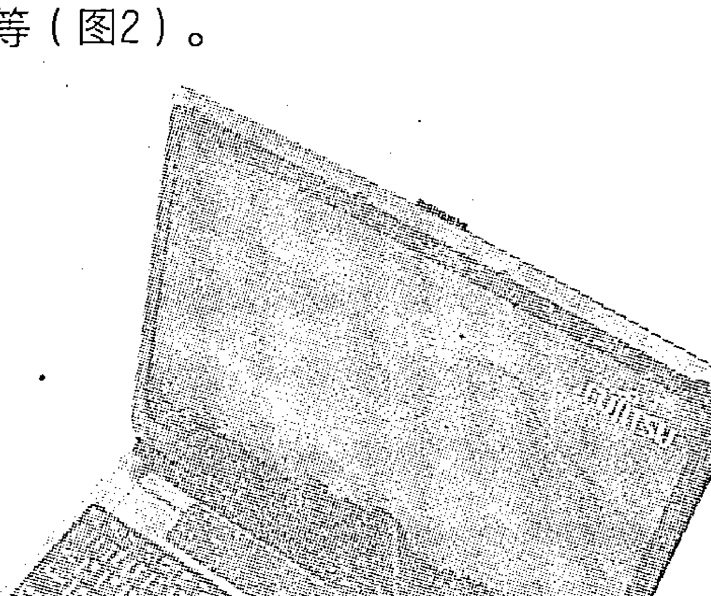

当然，千万不要以为320GB容量就已经是极限了，因为可以安装双硬盘的笔记本电脑并不是新鲜事，甚至几年前就有光驱位以及硬盘位等设备互换的设计，而现在更是有了南桥芯片的RAID功能支持，令双硬盘甚至三硬盘笔记本变得更有意义。戴尔旗下品牌Alienware宣布将全面升级磁盘规格，Aurora m9700可以选配250GB 5400rpm或者200GB 7200rpm硬盘，当选择两块250GB硬盘时，它可以实现当前笔记本领域的最大500GB极限容量，而且RAID 0磁盘阵列带来更加理想的速度表现。此外，VoodooPC Envy系列的通用模具支持最多三块硬盘，其容量更加惊人（图3）。

### 3. 眼花缭乱 视频功能最丰富的笔记本电脑

既然是娱乐笔记本电脑，那么视频功能自然不能忽视。当然，这里所说的视频功能并非是高清解码，而是指与其它设备配合的能力。譬如，带有RF有线电视输入接口以及S-Video视频输入接口，这样用户就能轻轻松松在笔记本电脑上看电视，甚至连接PS2、WII、XBOX360等游戏机也会非常方便。不过，这方面表现出色的笔记本电脑屈指可数，而且上榜产品还是刚才为大家介绍过的富士通Lifebook N6420。富士通Lifebook N6420拥有一款内置的电视卡，因此等于同时拥有了RF有线电视输入接口以及S-Video视频输入输出接口。其实，我们可以把这项功能看作是配备了All In Wonder视频卡的笔记本电脑，只不过富士通Lifebook N6420实现了全内置（图4）。

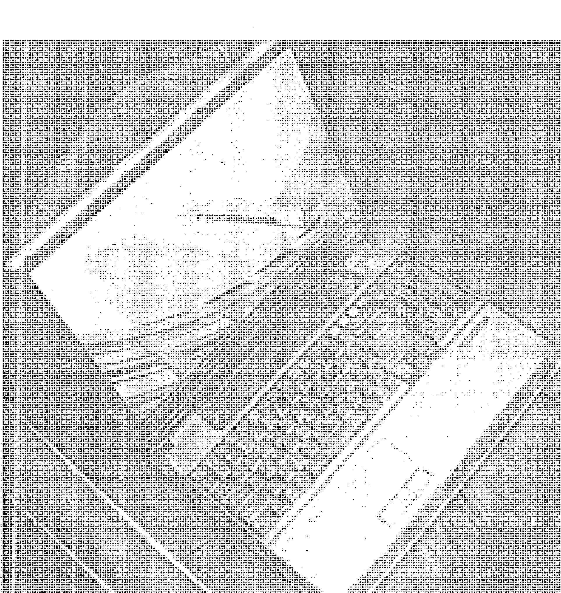

图4 富士通Lifebook N6420的视频功能极为丰富

虽说富士通Lifebook N6420的视频输入功能很强，但是视频输出功能就显得一般了，毕竟S-Video视频输出的画质远不如VGA，只不过对老款CRT电视机的兼容性更好一些。但是不要忘记，如今最高水准的HDMI接口已经开始普及，因此在笔记本电脑上实现HDMI并非不可能。华硕W1J是业界首款支持HDMI的笔记本，随后华硕V2Je等一系列新品也都开始配备了HDMI接口。HDMI是目前市场上得到业界支持的其未经压缩的数字音频/视频界面通用界面。HDMI是任意两个视音频源（如DVD播放器，机顶盒，A/V接收器）以及视音频监视器（如数字电视DTV，PC显示器）之间的单线缆理想界面。应用HDMI的好处是：只需要一条HDMI线，便可以同时传送影音信号，而不像现在需要多条线材来连接；同时，由于没有进行数/模或者模/数转换，因此能取得更高的音频和视频传输质量。对消费者而言，HDMI技术不仅能提供清晰的画质，而且由于音频/视频采用同一电缆，在笔记本电脑连接大屏幕液晶电视机时会显得更方便（图5）。

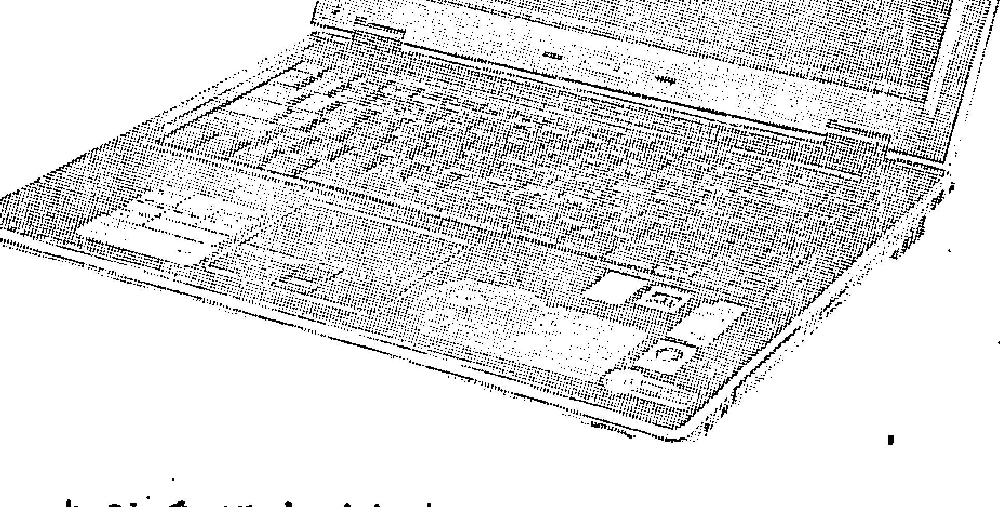

图5 华硕V2Je配备了最新的HDMI接口

### ④. 游戏世界 显卡最强的笔记本电脑

长久以来，笔记本电脑的应用领域一直局限于移动办公与上网。无论移动处理器的性能有多么强大，LCD液晶屏技术取得何种突飞猛进的发展，作为最大薄弱环节的移动显卡始终令笔记本电脑与3D游戏基本无缘。然后，在nVIDIA进入移动GPU领域之后，原本稳坐钓鱼台的ATI感受到巨大的压力，移动整合芯片组也在3D技术方面突飞猛进。时至今日，在笔记本上玩大型3D游戏已经不是天方夜谭。

目前，用于桌面平台的NVIDIA GeForce 8800系列GPU已经完全在市场上站稳了脚跟。根据惯例，此时也应当是对应的移动版GPU上市的时候了，其型号自然是GeForce Go 8800M。Go 8800M将是NVIDIA性能最强的笔记本显卡，同现在上市的GeForce 8系列移动显卡一样，8800M也提供了三个版本，分别为GeForce 8800M GTX、8800M GT和8800M GS。戴尔XPS M1730将是第一款采用GeForce 8800M GTX的产品，这也是当前显卡性能最强的笔记本电脑（图6）。

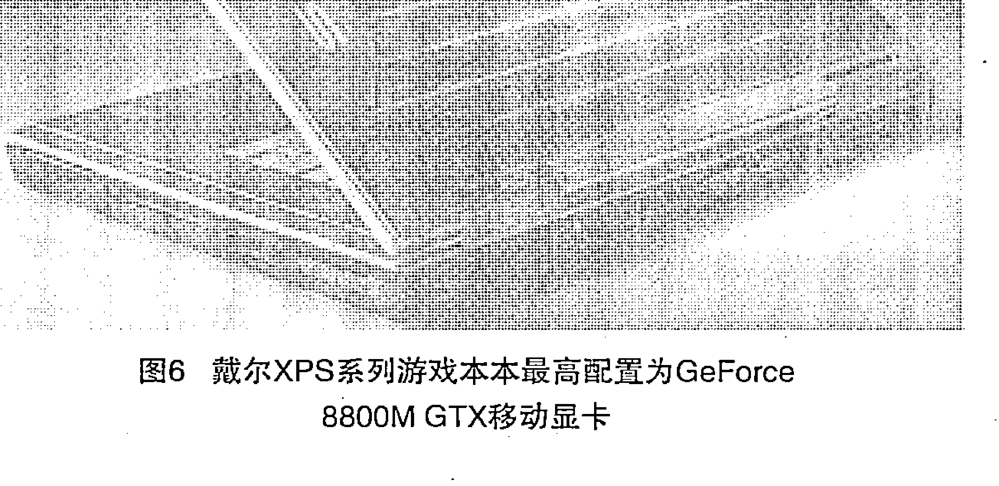

图6 戴尔XPS系列游戏本本最高配置为GeForce 8800M GTX移动显卡

另外需要指出的是，戴尔XPS M1730是一款可以让玩家自由搭配显卡的游戏本本，而GeForce 8800M GTX则是其最新的旗舰级配置。但是，拥有GeForce 8800M GTX的戴尔XPS M1730还不能算是绝对意义上最强的游戏本本，因为其前作还有配备双GeForce Go 8700GT SLI的产品。在笔记本上实现双显卡SLI，这得益于移动GPU的发热量控制以及芯片组的强力支持，目前已经不是难以实现的事情。关于GeForce 8800M GTX和双GeForce Go 8700GT SLI哪个更强，只能说在前者占优的前提下各有胜负，而SLI只是运行超高分辨率的DX9游戏时才会显现出微弱的优势。

### ⑤. 高清世界 最强光驱的笔记本电脑

当时光流转到1995年的时候，微软公司在全球发布Windows 95时，数十兆的空间，就不能依靠几十张软盘来完成了，大容量数据已成不可抵挡的潮流。在这种情况下，笔记本厂商开始推出内置光驱笔记本，突破了软驱在读取数据速度和容量上的束缚，也敲开了笔记本与外界媒体交流的大门。但是，现在光驱在笔记本领域的地位有些尴尬，因为无线网络和宽带接入的普及让光驱变得可有可无，直到高清时代的蓝光与HD DVD出现之后，这一局面才得到彻底改观。在高清时代中，蓝光或是HD DVD将会成为最普遍的影像音乐文件的存储介质，几十GB的容量是很难全部都用硬盘来存放的。这种情况下，通过在笔记本中内置光驱，用户可以随时随地地享受高品质的视听盛宴，带来更丰富的娱乐体验。

如果要评选最强光驱的笔记本电脑，那么拥有蓝光和HD DVD双兼容的产品肯定是当仁不让的首选。但是，目前台式机领域才刚刚出现这样的概念性产品，因此还没有装配这类设备的笔记本电脑。在HD DVD和蓝光两者之间，大多数笔记本电脑厂商选择了前者。因此，目前HD DVD阵营的笔记本电脑产品比较丰富，比如东芝近日推出的Qosmio系列多媒体G35-AV660是目前市场上很容易买到的HD DVD笔记本，而G40-10E将会是目前市面上首款配备了 HD DVD-R刻录机的产品。蓝光笔记本的代表作则是SONY VGN-AR18CP，这款蓝光笔记本电脑在市场上也非常热门，而且可以刻录蓝光光盘（图7）。

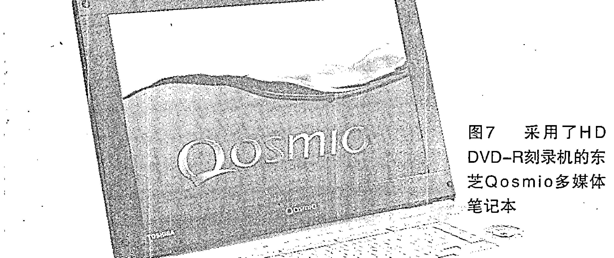

图7 采用了HD DVD-R刻录机的东芝Qosmio多媒体笔记本

### 6. 四核技术 配备最强CPU的笔记本电脑

继Intel前不久发布了首款面向笔记本的至尊型处理器Core 2 Extreme X7800之后，已被HP收购的著名高端内存厂商VoodooPC很快就推出了第一款基于该处理器的笔记本产品，型号为Envy H171。这款发烧级的娱乐笔记本电脑除了配备2.66GHz的X7800处理器，还配备了17寸大屏幕和130万像素摄像头，并支持RAID和双卡SLI。此外，为了满足那些经验丰富并希望电脑功能更强的电脑爱好者的需求，X7800至尊版取消了总线频率锁定，这为系统定制带来了额外的技术灵活性，使得OEM厂家可以展示出更多性能。由于没有了总线频率锁定，因此X7800至尊版的应用范围将会非常宽广。

但是，VoodooPC的Envy H171还不能算是配备最强CPU的笔记本电脑，因为来自加拿大的Eurocom打了一个擦边球。Eurocom D900C是一款17英寸的大尺寸机型，采用了Intel的Kentsfield Q6600四核处理器配合双GeForce Go 8700/Quadro FX3500 SLI独显。显然，这里的CPU是台式机版本，因此发热量非常高，这款产品甚至要使用外接电源才能工作。由于目前Intel面向移动平台的四核CPU还未发布，所以出现厂商急不可待地使用台式机CPU的局面也不难理解。不过平心而论，四核CPU想要充分发挥出自己的多线程优势，还有赖于支持多线程技术的软件系统，而这类软件系统的开发在当前来看还相对滞后，尤其是在多媒体应用领域（图8）。

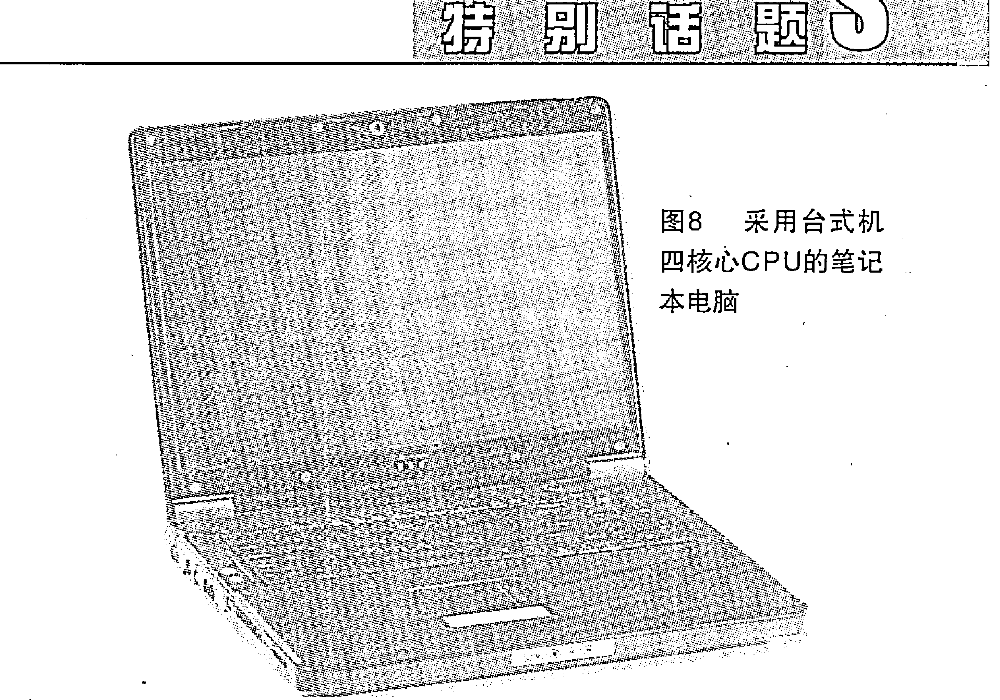

图8 采用台式机四核心CPU的笔记本电脑

### 7. 户外娱乐 续航时间最长的笔记本电脑

笔记本最大的优势便是移动性，提供这一切的基础便是电池。目前大多数笔记本的续航时间都在3小时左右，这距离用户所期望的8小时准全天候办公还有很大的距离。对于笔记本用户而言，无法摆脱电源适配器的束缚是巨大的悲哀。目前，笔记本电脑的续航时间世界纪录是美国军方制造的一款超级军用产品，充足电的情况下可持续使用72小时，这主要是因为采用了名为“XX25烷氧”燃料电池。但军用笔记本毕竟不太现实，市面上买得到的“全天候”的笔记本，松下公司推出的Let's Note W5、T5、R5三款笔记本在续航时间方面处于业界领先地位。这三款笔记本都采用了超低电压版本的单核酷睿U1300处理器，时钟频率为1.06GHz。由于采用了比较省电的处理器，再加上对LCD屏幕以及其它周边配置的功耗控制，这三款笔记本的电池续航能力都比较惊人，其中W5约为12个小时，T5约为15个小时，R5约为11个小时。但是，我们也不能说松下T5就一定是世界上续航时间最长的普通笔记本电脑，因为VAIO TZ等产品也可以达到10～12小时的续航时间。更加重要的是，各个厂商对于续航时间的计算方法并不一致，因此以上数据只能供参考（图9）。

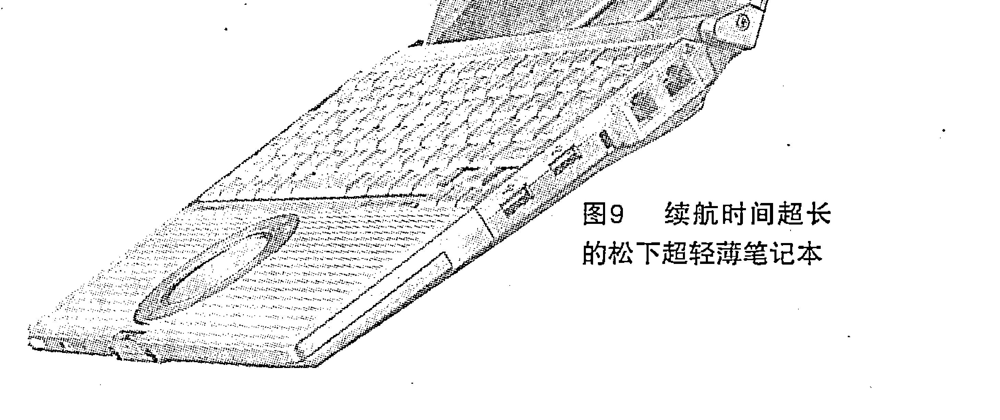

图9 续航时间超长的松下超轻薄笔记本

## 三、娱乐笔记本电脑周边设备

随着娱乐笔记本热潮的逐渐升温，很多本本一族开始发挥自己在DIY方面的聪明才智。他们的笔记本已经不仅仅是一个替代台式机或同台式机互补的工具，而是成为了展示个性、享受生活的必不可少元素。目光敏锐的公司也开始关注这类新兴的消费群体，分别为他们定做了不少周边配件，方便他们将单调的笔记本丰富起来。

### 1. 移动音频解决方案

#### (1) 外置笔记本声卡

相对于台式机的PCI内置声卡而言，外置的USB或是PCMCIA声卡不仅插拔方便，同时也不受内部的电磁干扰，从而可以获得更好的音质。USB音频设备早已经不是一个新点子了，首批进入市场的USB音频设备是单个的USB话筒，它们实际上是被视为声卡的一个扩充部分出现的，但是采用USB接口使得它们不必占用声卡的体积，同时外置的USB话筒也更方便消费者使用。但是由于对于各种不同操作系统的兼容性较差，以及其他一些原因，在实际使用中并不像设计者当初想象的那样方便，因此它们已经渐渐淡出了市场。在USB2.0标准公布以后，USB接口的数据传输率的大大提高使得USB音频设备也蠢蠢欲动，市场上也出现了不少USB声卡等音频设备。不过缺点就是如果你的笔记本是比较陈旧的款式，那可能不支持USB2.0，或者可以支持USB2.0，但是在使用USB接口设备的时候，机器的速度会大大受到影响。

抛开占用CPU资源略高的弊端不谈，USB声卡很明显的一个优点就是用户只需要将声卡简单地插上去，就马上可以使用，而不是像传统的PCI声卡，还要打开机箱，动用螺丝刀等等。用户所要做的只是把声卡插上USB接口即可，甚至都不必再进入BIOS去屏蔽板载声卡。至于PCMCIA接口的声卡，其易用性也同样出色，而且更不会造成占用大量资源的情况。USB声卡与PCMCIA声卡一般都具有良好的兼容性，可以跟几乎所有的传统声卡一起工作而不相互冲突（图10）。

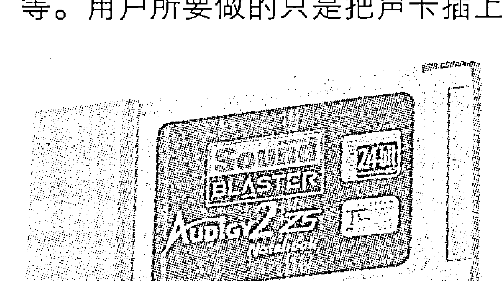

#### (2) 便携式笔记本音箱

随着笔记本硬盘容量的成倍增长，许多音乐发烧友已经将大量的音乐素材拷贝进笔记本中随身携带，从而随时随地地享受音乐的乐趣。但由于笔记本的设计重点往往放在性能和便携性上，因此笔记本电脑自身的音箱往往不能满足音乐发烧友的要求，而且当笔记本合上液晶屏时，本来就不大的音量显得就更加的“轻柔无力”了。笔记本电脑的音箱因为受机体空间的限制，无法采用稍大尺寸振膜的喇叭。现在笔记本音箱多为一元硬币大小的薄型小喇叭，谈不上什么高品质的音效，对于喜爱欣赏音乐或是影视的消费者，这时候你就需要一对既轻便，音效方面又能得到非常大提高的外接音箱来弥补了（图11）。

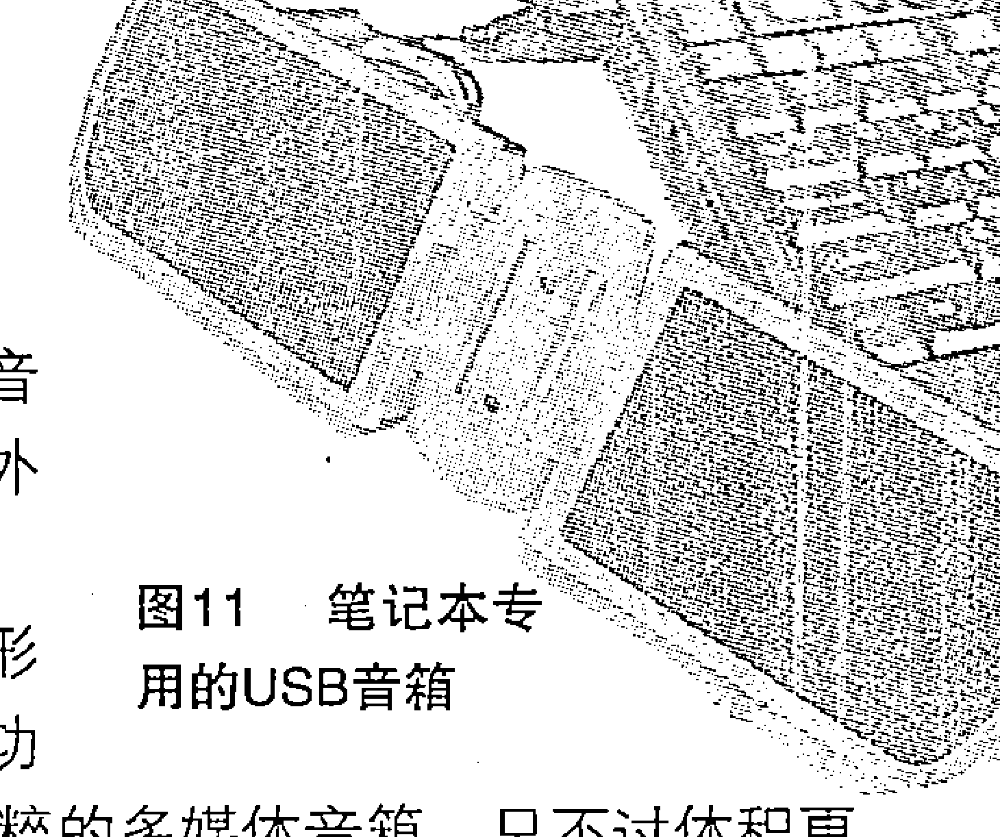

笔记本音箱分为两种形式，第一种是直接带有声卡功能的USB音箱，另一种则是纯粹的多媒体音箱，只不过体积更小而易于携带。虽说USB音箱因为直接从USB端口将数字信号送到音箱里面而能有效地提高声音信号的信噪比，但是此时USB音箱不能实现硬件波表合成，所以用户不能用它来听MIDI，而且诸如DirectX音频API特效也无法支持。这类USB音箱的本质往往是简单的USB声卡加上音箱，并未将重点放在声卡上，所以此时USB音箱的声卡部分表现不见得比笔记本内置声卡好。当然，并不排除部分USB音箱的确做到出类拔萃。至于专为笔记本设计且易于携带的迷你型音箱，效果往往因为更加专注而能取得令人满意的表现，甚至不少产品采用USB接口取电，这样其便携性更加出色。

### 2. 移动液晶电视：笔记本电视卡

一直以来，要实现在笔记本电脑上看电视节目只有一种方案，那就是通过USB电视盒。USB电视盒从诞生到至今，已经有快有十年了。在经历USB1.1到USB2.0的变革之后，USB电视盒走向成熟，市场上USB电视盒也越来越多，几乎谁都认可USB电视盒便是笔记本电视卡的代名词。恐怕很少人会想到，现在电视卡能接到笔记本电脑边上的PCMCIA接口，这样不仅大幅度提升便携性，也不用担心USB供电问题。更为重要的是，PCMCIA接口的带宽比USB2.0还要高，此时各种视频应用也能得心应手（图12）。

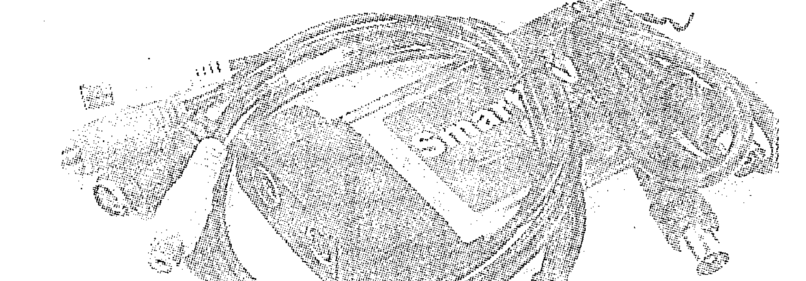

事实上，实现移动电视卡由USB转向PCMCIA的源动力是数字高频头技术以及视频芯片。高频头对于画质的重要性毋庸置疑，而数字高频头不仅明显提升画质表现，更能实现很小的体积，此时电视卡的迷你型设计变得轻而易举。此外，最新的视频芯片实现高度集成化，单芯片方式就能完成多种功能，基本上不再需要辅助芯片，此时产品集成度大幅度提高也有利于制造便携性更好的电视卡。在笔记本上看电视无疑是一种享受，特别是对于寝室空间狭小的学生用户而言，这样再也不用担心电视机或者台式机占用宝贵的写字台桌面。与此同时，国内不少地区还能够支持天线方式接收电视，此时移动性更好的笔记本无疑令电视卡插上了一对翅膀。

# 发挥余热 22个对付旧电脑的办法

□江北书生

随着PC业的发展，摩尔定律经久不衰，集成电路芯片上所集成的电路的数目，每隔18个月就翻一番。微处理器的性能每隔18个月提高一倍，而价格下降一倍。用一个美元所能买到的电脑性能，每隔18个月翻两番。这样的结果是，现在很多人家里都有了很多旧电脑，它们速度不快、性能不高，成了“食之无味，弃之可惜”的鸡肋。事实上，这些旧电脑还是有余热可以发挥的，好好地利用起来，仍可以为我们做很多的事情。

# 第一篇：构建办公环境

## 用处一：让上网更加安全（Router and Firewall）

尽管电脑是旧了点，但是家用路由器的效率与PC相比仍差很多，所以我们完全可以在旧电脑上安装软路由软件和防火墙软件。这样一来，上网时效率有所保证，二来还特别安全。基于高速和安全是现代互联网的主旋律，因此这个方案非常有实用性。

我们可以在旧电脑上安装两块网卡，并安装Windows 2000 Server（如果机器不算太旧，推荐安装Windows Server 2003），然后利用它来建立一个软路由（Windows 2000 Server就有）或者用WinGate之类的代理软件，再安装防火墙软件（如天网），并制订相应的规则即可。从而可以轻松地连接两个不同网段，可以实现互访。当然，也可以在旧电脑上安装DHCP服务器组件，这样局域网内的电脑将可以自动获得IP地址。

如果你想获得更高的效率和安全性，还可以在上面安装一个Linux，由于其自带IPTables，本身就是一个强大的路由和防火墙，还可以将其挂上Squid，这样可以起到网络加速和节省带宽的作用。

## 用处二：进行公共讨论（Public Discussion）

在公司里经常需要进行讨论，因此，我们很有必要建立一个公共讨论区，以便大家上去发表意见，最后达成共识。给电脑安装Windows XP系统。接下来，我们就可以操作了。

- **第一步：安装IIS**
  打开“控制面板”，然后双击“添加/删除程序”图标，再单击“添加/删除Windows组件”项。在图1所示的窗口中确认选中“Internet信息服务（IIS）”一项（如图1）。点击“下一步”按钮之后，根据系统提示放入Windows XP安装光盘，然后程序复制必需的文件，完成之后即可完成IIS的安装。

- **第二步：下载论坛程序**
  从http://www.ddooo.com/SoftDown1.asp?SoftID=11163&ServerUrl=http://www.ddooo.com/lei2005/处下载“翔浩论坛”程序解压，然后将其中的bbs文件夹解压到旧电脑的某硬盘的根目录，如g盘，这样论坛所需要的文件都在<g:\bbs>文件夹中，然后双击“控制面板→管理工具→Internet 服务管理器”图标，右击“默认Web站点”项，然后选择“属性”命令，接下来单击“Web站点”标签，单击“主目录”标签，再顺着向导，选择“路径”为<g:\bbs>（如图2）；单击“文档”标签，勾选“启动默认文档”复选框，然后单击“添加”按钮，在弹出的文本框中输入index.asp，最后单击“确定”按钮并即可完成本机服务器的设置。

- **第三步：管理论坛**
  在IE的地址栏中输入http://旧电脑IP/admin_login.asp或进入管理员登录界面，默认的名字和密码都是Admin，登录后即可进行管理。

- **第四步：让用户使用论坛**
  接下来将这个地址告诉大家，大家只要登录http://旧电脑IP/index.asp就可以进行用户注册，并参与讨论了。

## 用处三：组建RTX服务器（RealTime eXpert Server）

现在的企业越来越注重协作，注重工作效率的提升。而企业即时通信（IM, Instant Message）则可以帮助我们很好地解决这个问题。腾讯公司的RTX（全称Real Time eXpert）则是大家较为熟悉的企业级实时通信平台，其对电脑的要求不高，旧电脑完全可以胜任，因此我们完全可以用它来架设RTX服务器。

- **第一步：安装服务端**
  从http://rtx.tencent.com/download/RTXSVR_Build_361_SP1.EXE处下载RTX服务器端，并在旧电脑上安装。双击桌面上“腾讯通服务管理器”图标，打开如图3所示窗口，选择好RTX服务器，再输入相应的密码，单击“登录”按钮可以进入。

- **第二步：添加部门**
  在RTX 3.61中，用户在第一次登录RTX服务端时，系统会自动询问用户是否即刻体验RTX的功能。如果用户选择体验，就自动创建一个组织架构。
  如果大家不选择自动添加部门，也可以单击左侧的“用户数据→部门结构管理”，再在右边右击，选择“添加部门”，在打开如图4所示窗口中添加部门，也可以输入相应的说明，便于日后管理。

- **第三步：添加用户**
  单击左侧的“用户数据→全部用户数据”，再在右边右击，选择“添加用户”，在打开如图5示窗口中添加用户。
  在“添加用户”窗口中，只能填入用户一部分的信息，要想填写更详细的用户信息，可以双击这个账户，在打开的窗口中可对账户的基本资料、联系方法、详细资料和密码修改等信息进行进一步的设置。设置完成后，按下“修改”按钮即可生效。

- **第四步：登录RTX服务器**
  从http://rtx.tencent.com/download/RTXCLT_361_ADV_Build_2468.exe处下载RTX的客户端并安装。之后双击桌面上“腾讯通”图标即可弹出如图6所示的登录窗口，输入RTX服务器，再输入创建的账户号码和密码即可。

- **第五步：与同事通信**
  默认安装登录后，会自动切换到登录用户所在的部门（如图7），不过，我们可以单击“腾讯通”右上角的按钮切换到所有部门窗口，部门有些类似于QQ中的分组，单击选择部门后就可以看到下面的用户。接下来就可以像QQ一样，和相应同事聊天了。

  当然，RTX除了可以聊天外，还可以传送文件、视频聊天，可以很方便地和同局域网内的同事进行即时通信，哪怕网络出现问题，暂时无法登录互联网也没有关系。还可以通过外部QQ系统互联系统，实现与外部QQ进行即时通信和手机短讯功能，让更多的客户找到你。同时企业还可以对RTX进行第三方的二次开发应用，从而定制出自己的所需功能。功能强大，具体可以参见腾讯公司的网页。

## 用处四：组建一个Nero刻录器（Recording Server）

不管怎样，现在很多公司还没有实现人手一台刻录机，那刻录机能不能像打印机那样让我们共享使用呢？通过Ahead的免费软件NeroNET就可以办到。

- **第一步：服务端设置**
  先在旧电脑上安装刻录机，同时从http://nm.onlinedown.net/files2/NeroNET1202.exe处下载并安装NeroNET，然后右击任务栏托盘区中NeroNET图标，选择WEB Configuration（设置NetNET）。此时会打开一个IE窗口，单击USER MANAGEMENT（用户管理）项，此时会弹出窗口，在其中输入NeroNET的超级管理员和密码（默认用户名为Administrator，密码为neronet，注意大小写），并单击Add User按钮（如图8）。此时在弹出窗口中输入Username（用户名），如Netrec，并在Realname（实名）后面输入用户的真实姓名，在Password（密码）和Confirm Password（确认密码）后输入密码，如8888。最后单击Add按钮即可。

- **第二步：设置账户**
  让同事们在电脑上安装并启动Nero-Burning ROM，选择“文件”→“设置”，再在打开如图9所示的窗口中单击“高级属性”标签。同时勾选“激活NeroNET支持”复选框。接下来，单击NeroNET按钮。弹出如图10所示的窗口，单击“创建”按钮，弹出如图11所示的窗口。从中选择一个局域网内的刻录服务器，再在Username（用户名）中输入在服务器端设置的密码，本例为user1，再在“密码”项后输入密码，如8888。再单击“确定”按钮。Nero会连接到服务器上，并验证用户名和密码。成功后，单击图10中的“关闭”按钮返回。

- **第三步：远程刻录**
  选择“刻录器”→“选择刻录器”，在打开如图12所示的窗口中选择NeroNET account1，选择网络刻录设备（即刻录服务器上的刻录机）。接下来，我们只要在客户机中按照常规方法来添加文件，然后按下工具栏上的“写入光盘”按钮，Nero-Burning ROM就会把我们的数据刻录到刻录服务器的刻录机中上。

| 驱动器 | SCSI-ID/适配卡 | 适配卡-No. | 状态 |
|---|---|---|---|
| Image Recorder | - | - | 确定 |
| NeroNET [account1] | NeroNET | - | 确定 |

位置: 不可用
描述: 不可用
状态: 以用户名‘user1’登录。
最大速度: 不可用 服务器版本:
防刻死保护: 是 可以打印标签:

## 用处五：让PC和Mac互连起来（PC and Mac Connection）

很多公司都有Mac机，但是熟悉Mac的人不多，精通的人就更少了。因此，我们很有必要建立起一个备份服务器，定期地将Mac机上的内容复制到我们的PC机上来，以防止数据丢失。

### 1. Mac OS X 10.x

- **第一步：设置苹果机**
  首先保证你的苹果机已经通过RJ45线连接在网络中，并且与其他机器在同一个子网中（最好使用DHCP服务器分配IP，如果是自动获取IP也可）。接着单击Finder中苹果图标，选择“系统预置”，打开预置窗口，再双击“Internet与网络”下的“共享”图标，打开如图1所示的窗口，然后选中“Windows共享”前的钩。

- **第二步：在苹果机上访问PC**
  单击Finder中的“转到→网络”，或者按下Command+Shift+K键转到“网络”项，双击相应的工作组（如果有的话）进入，即可看到Windows的电脑。双击后输入用户名和密码即可查看Windows上的共享文件夹。
  另外，右击相应的共享文件夹，选择“制作替身”，然后再把制作的替身拖放到桌面上，这样在任何时候都可以双击桌面上的替身打开Windows上的共享文件夹，真是方便极了。

### 2. Mac OS X 9

现在还是有很多人在使用Mac OS 9，只要在Windows上安装Miramar公司的PC MACLAN，即可实现Mac机访问PC！

- **第一步：安装PC MACLAN**
  先从http://xjrx-http.skycn.com:8080/down/HB_PCMaclan8.1_2K.exe下载PC MACLAN的汉化版并安装。安装完成后，重新启动电脑。

- **第二步：配置共享**
  安装完成后，会在任务栏显示两个小图标，双击PC MACLAN服务器（第一个）图标，选择“配置→共享文件夹”，打开如图13所示窗口，选中共享文件夹，单击下方“共享”按钮，在打开窗口中设置共享名（默认为文件夹名），并可以设置共享权限（一般保持默认值）。如果想共享多个文件夹，则请重复上述步骤。

- **第三步：连接到共享文件夹**
  单击Finder中的苹果图标，选择“适配器”，在打开窗口中单击AppleShare，然后即可在右边看到运行PC MACLAN的电脑，单击“好”按钮，然后输入用户名和密码，然后再选择相应共享文件夹即可在桌面上建立相应的替身，直接双击即可打开Windows上的共享文件夹。
  是否能够共享文件与Windows上使用的分区格式无关，即使Windows上使用MAC OS 9并不识别的NTFS分区格式也没事。因为对共享文件夹的读写由Windows来解析，与Mac无关。利用此技巧，我们还可以共享移动硬盘中NTFS分区中的数据，并可以被Mac识别。

## 用处六：共享读卡器（Card Reader Sharing）

如果公司电脑配置不够好，但很多人却希望能够有一个共同的读卡器，那就非常简单了，只要将读卡器接到旧电脑上，并将相应的盘符共享出来。这样别人只要将自己的卡插入读卡器中，再在自己机器上操作这个共享设备即可。

## 用处七：共享扫描仪（Scanner Sharing）

默认情况下，Windows并不提供扫描仪的共享。如果公司只有少量的扫描仪，总不至于每次要扫东西就来回来去搬吧！请出BenQ的“NetScan（E网扫尽）”吧！它可以帮助我们共享扫描仪，从而发挥出旧电脑的威力。

- **第一步：安装服务端**
  先在旧电脑上安装扫描仪驱动程序，并能够正常扫描，然后从http://down1.tech.sina.com.cn/download/download/8997.shtml上下载NetScan（E网扫尽），并进行安装，安装时选择服务端（如图14）。
  完成后，单击“开始→程序→BenQ→Netscan→Netscan共享端”，打开“服务器共享端”控制窗口。在该窗口的“任务”选项卡中可以显示所有客户端提交的扫描任务，而在“设置”选项卡则可以设置是否自动接受扫描任务（如图15）。

- **第二步：共享扫描**
  将上述程序发给你的同事，并让他们安装时选中Client，以安装客户端，然后单击‘开始→程序→BenQ→Netscan→Netscan客户端’，打开‘客户使用端’控制窗口。在‘选择服务器’编辑框中键入服务端的电脑名称或IP地址，并单击‘连接’按钮。所有的设置完成以后，单击‘添加任务项’按钮，这时会在任务列表中看到所添加的任务。根据总的扫描任务添加数量合适的任务项，然后单击窗口中‘提交扫描’按钮。现在赶紧到扫描仪旁边，将需要扫描的东西依次放进扫描仪面板进行扫描吧。完成后，所有图片将会保存在你设置的‘保存路径’中。

## 用处八：组建数字家庭平台（Media Station）

现在多数旧电脑早就超过了多媒体标准，因此我们可以把自己喜欢的歌曲拷贝到旧电脑中，然后把家庭音响接到声卡上（必要时，可以购买更好的声卡，并安装在旧电脑上），这样一个优秀的家庭音响就搭建起来了。MP3网上有很多，都可以通过http://www.gougou.com+迅雷来高速免费下载。这样做，可以让我们的家庭网络充满生气。同时，由于使用的是电脑控制，所以其更为智能化，可随时重播、快进、快退、选曲。如果你使用iTunes的话，还可以利用它来共享歌曲给另外一个房间里的电脑收听，非常方便。大家要做的是，先下载并安装iTunes，然后在旧电脑上打开iTunes，单击菜单‘文件/新建播放列表’建立一个要共享的播放列表，再利用‘文件’菜单中的‘将文件添加到曲库’或‘将文件夹添加到曲库’导入要共享的MP3音乐，然后从‘曲库’中把音乐文件拖动到要共享的播放列表中。接着，单击菜单‘编辑/偏好设置’，在弹出的窗口中切换到‘共享’标签，勾选‘共享我的音乐’选项，然后根据需要选择‘共享这个曲库’或‘共享所选播放列表’，如果选择后者，还需要继续在下面列表中选择要共享的播放列表。最后在‘共享名称’中输入一个个性名称标识共享身份。另外，为了安全起见，还可以选中‘需要密码’并设置密码。另外一台机器运行iTunes，单击菜单‘编辑/偏好设置’，在弹出的窗口中切换到‘共享’标签，勾选‘查找共享音乐’之后，在iTunes播放器的左边就会出现局域网内已经设置共享的个性名称，单击后输入密码，即可像播放本地音乐一样来播放共享的音乐。

> 小提示 用Windows Vista中的Windows Media Player也可以实现，但是由于旧机器，不太适合安装Windows Vista，所以我们采用了iTunes。

## 用处九：制作存储服务器（Storage Server）

购买一大硬盘，并把它安装在旧电脑上，然后在旧电脑上开启共享文件夹（也可以共享某分区的根目录），这样，家里的其他电脑就可以把数据备份到上面。如你在公司工作使用笔记本电脑，那你可以把它带回家，然后把笔记本中的数据备份到旧电脑中的大硬盘上，这样数据会非常安全。

> 小提示 我们还可以用FreeNAS做共享随时调用，具体用法，大家可以自行学习。但是由于它最好是在Linux上运行，所以我们不推荐使用。如果你是技术爱好者，可以自行试验。

## 用处十：制作打印服务器（Printer Server）

随着打印机价格的一再降低，现在拥有打印机的家庭也越来越多了。虽然说USB接线非常方便，但是搬来搬去，总是比较麻烦的。事实上，我们只要在旧电脑上安装打印机驱动程序，并共享之。我们只要在其他电脑上连接到这个打印机，即可随时使用共享打印机打印，而无须在一台电脑需要打印时要拔插打印机。如果你只将打印机共享给某些人使用，则可以右击这个打印机，选择‘共享’，选中‘共享这台打印机’，再单击‘安全’标签，删除掉所有用户。再单击‘添加’按钮添加相应的人员。以后，别人登录你的机器后，只有输入我们设置好的用户名和密码，才能使用打印机。输入其他用户名和密码，则只能登录机器，但却无法使用打印机（包括Administrator）。

> 小提示 限于篇幅，在此不写具体实现步骤。事实上，现在Windows 2000/XP/2003/Vista/2008均可以对网络共享打印提供非常好的支持，还支持较强的权限控制。

## 用处十一：把硬盘拆下制作移动硬盘（Portable HardDisk）

如果你的旧电脑中的硬盘较小，那可以把它拆下来，到市场上购买一个移动硬盘盒（推荐购买USB 2.0的），组建一个USB 2.0的移动硬盘，方便在公司和家里传输数据。

## 用处十二：用光驱来听CD（CD Player）

把光驱拆下来，接上计算机的电源，把CD放入光驱，可以通过其面板上的控制键来播放/快进/倒退CD，甚至可以通过音频线把音箱接到光驱的音频输出口，从而在音箱中播放CD。

## 用处十三：制作双显示（Dual Display）

可以把旧的PCI显卡拆下来，安装到新电脑上，再配合旧电脑的显示器，组成双显示器效果。这样，就可以在一台显示器上播放DVD，另一台显示器上工作，非常惬意！现在市面上所有的Windows均支持至少是双显示，Windows视版本不同支持显示器的数目有所不同。

## 用处十四：升级电脑组件（For Upgrade）

# 用处十五：赠送给孩子们（Donation For Poor Children）

不是所有的人都是富人，有很多孩子没有电脑用。我们可以将旧电脑送给这些孩子，让他们学习电脑，或者把它捐赠给当地学校或较落后的地区、灾区，让那里的孩子用上电脑。

## 第二篇：构建校园环境

## 用处十六：联网打游戏（For Games）

建立起局域网后，可以安装一些网络游戏，并联网娱乐。现在很多网络游戏对电脑的配置要求并不高，大家可以安装相应的网络游戏来玩。当然，现在网络游戏有很多，大家都可以尽情玩。

可以在一台机器上安装Windows 2000 Server或Windows Server 2003，并在上面安装Web服务器、FTP服务器、电子邮件服务器，然后在老电脑上安装Windows 2000/XP，这样，我们在家里就可以深入地学习服务器的知识。

## 用处十七：当成开发环境（Development Server）

现在Linux下的开发很热门，用虚拟机不是一个好办法，一是兼容性得不到保证，二是也会极大影响宿主系统的运行效率和安全。而Linux对硬件的需求很低，所以我们可以在旧电脑上部署一个LAMP的环境就可以随便在这台破机器上调试代码。

## 用处十八：学习Linux（Learn Linux OS）

虽然Windows是桌面系统的主宰，但是Linux是绝对值得学习而且很有前途的操作系统，因此很值得我们学习。由于它对电脑的配置要求非常低，旧电脑完全可以胜任。我们可以从http://www.debian.org、http://www.mandrakelinux.com等下载ISO文件，用Nero刻录到光盘上进行安装。这种安装，要比在一台电脑上同时安装Linux和Windows安全得多，学习起来也相当方便。最好的办法是再买上一本Linux的图书，边看边学边实践。如果你从Linux公司购买Linux系统光盘的话，里面往往会带一本相应的教程。


把旧电脑和新电脑组成局域网后，在旧电脑上安装Linux，还可以学习Windows和Linux的联网技术并实现资源共享。将数据备份到Linux上也是一件很有意思的事情，而且Linux的执行效率相当高，对于备份大而多文件时效能的提升相当明显。

另外，我们还可以让机器成为一个Thin Client，即可以做一个网络计算的结构，体验1+1至少等于2的效果。同时也可以使用ClusterKnoppix等软件让旧机器形成群集（Clusters），增强计算能力。这两个应用一般不容易用上，但如果你是一个网络专家则是可行的。

## 用处十九：学习服务器系统（Learn Server Deployment）

现在宽带路由器和网卡非常便宜，安装Windows操作系统，我们可以把老电脑和新电脑通过它组建成局域网。如可在一台机器上安装Windows 2000 Server或Windows Server 2003，并在上面安装Web服务器、FTP服务器、电子邮件服务器，然后在老电脑上安装Windows 2000/XP，这样，我们在家里就可以深入地学习服务器的知识。

## 用处二十：组建下载服务器（Big File Download Machine）

P2P下载几乎是中国网民必修课，这种机器根本不需要显示器的机器只要挂一个VNC和迅雷。就算你要下载大量的数据，完全可以交给它，甚至可以夜里下载。这样，你的机器就不会被下载软件打扰工作。

先在旧电脑上安装UltraVNC和迅雷，然后运行它，会出现“UltraVNC: Current User Properties”（当前用户属性）对话框，在密码后面设定一组密码。接着在另外一台机器上安装UltraVNC，然后运行“VNC查看器”，打开VNC查看器，在弹出的“连接”对话框的VNC服务器后面输入旧电脑的IP地址，即可远程操作旧电脑。在上面运行迅雷（同时还支持BT和eMule下载），并将下载的内容放到共享文件夹下，等下完后就可以通过共享文件夹去取，而自己的机器资源又可以省了，干起活来也方便。

这样做，即把旧电脑打造成为一个下载服务器，这样当我们有大文件下载时，将可以让旧电脑帮助我们进行，省下本机的系统资源。

## 用处二十一：组建远程访问器（Remote Server Access）

很多时候，我们希望在公司仍能访问家里机器上的文件，以实现移动办公。但这样做必须有一台机器一直打开着，新电脑的功率较高，因此一般不太适合。事实上，这个任务可以由旧电脑来担任。在这台电脑上装载一些远程控制软件即可让我们在公司访问到我们的电脑。


如果你是公司，则可以配上一台价值不菲的VPN路由器来满足要求，但这需要很多金钱，不是DIYer们的风格。

## 用处二十二：学习电脑原理（Learn Computer Architecture）

拆开电脑后，可以学习到更多的电脑原理，从而更好更深刻地理解它，对于提高自身的水平也相当有用。

## 从头到脚，享受蓝牙带来的全部体验

□龚师傅

「“蓝牙”简单说就是一种短距离无线数据传输技术，利用“蓝牙”技术，能够有效地简化掌上电脑、笔记本电脑和移动电话等移动数码终端设备之间的数据通信。现在支持蓝牙功能的电子设备越来越多了，如蓝牙手机、蓝牙电脑、蓝牙GPS、蓝牙掌上电脑、蓝牙耳机、蓝牙键盘鼠标、蓝牙打印机、蓝牙数码相机、蓝牙摄像机、蓝牙AP等。不过你对蓝牙真正了解多少？对蓝牙提供的各项功能都利用了吗？]

## 一、蓝牙基本技术特点

从通讯技术上说，蓝牙产品采用的是一种称之为跳频的技术，能够抗信号衰落；工作于开放的2.4GHz ISM频段，采用FM调制方式，使设备变得更为简单可靠。目前蓝牙核心规范2.0版本 + EDR的主要特点如下：数据传输速度可达早期版本的三倍以上，通过减少工作负载循环(duty cycle)降低能源消耗，带宽增加简化了多连接模式，同时进一步改善了BER ( Bit Error Rate，位误差率)的表现(图1)。

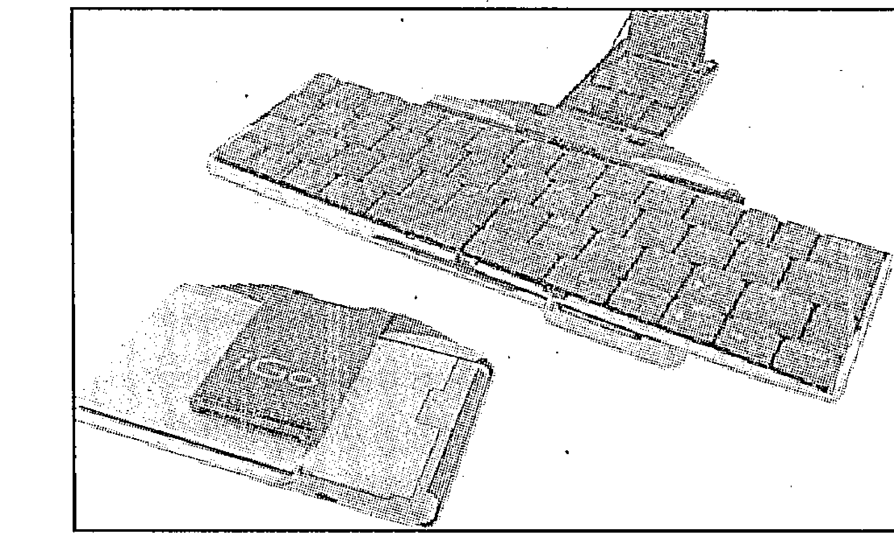

相对我们以前在移动设备上常见的红外传输，蓝牙传输不要求“视线传输”，即发送设备与接收设备之间可以存在障碍。在速度和稳定性、兼容性和使用方便性等方面都全面胜出；相对数据线，蓝牙安装更加简单，目前Windows XP SP2/Vista都已经内置蓝牙驱动，即插即用，可以完成数据线能完成的绝大部分功能，且可兼容其它蓝牙设备（如蓝牙键盘、鼠标、耳机等），相对读卡器，蓝牙在数据传输速度上当然没法比，但是可以同步管理手机，使手机真正和电脑相连，甚至可以共享对方的网络功能，且在小文件的传输上很方便，免去了用读卡器时的机卡分离步骤。而且蓝牙技术支持多向传输，也就是说蓝牙设备可以一对多连接（图2）。

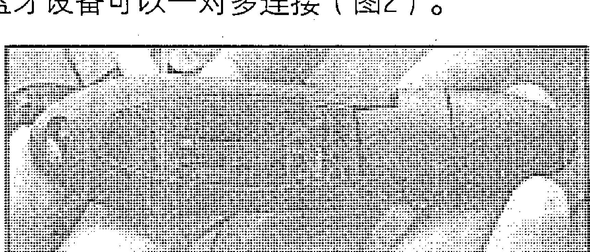

现在市场上有部分高端笔记本电脑集成了“蓝牙”模块。而采用各种接口规范（USB、PCMCIA、CF以及SD等）的蓝牙适配器在市场上越来越多了，能够方便地为PC添加蓝牙功能。目前大多数用户都使用USB蓝牙适配器（图3），安装后，要求输入设备名称，建议用不多于八个的英文字母作为设备名称，不要使用中文，否则可能遇到一些兼容性问题。安装蓝牙后，相关程序会自行启动，影响系统运行效率，我们最好在启动项中去掉这些程序，需要时再启动。另外蓝牙设备连接需要输入密码认证，如果觉得每次都要输密码很麻烦，可以分别将对方设定为授权设备。另外使用蓝牙连接时还应注意避开微波炉等干扰设备（图4）。

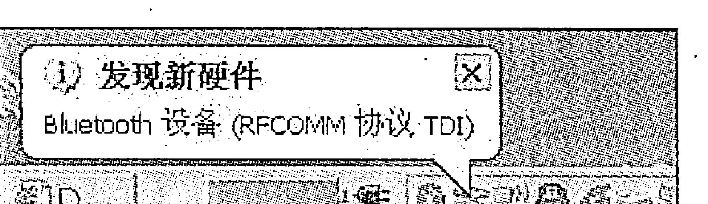

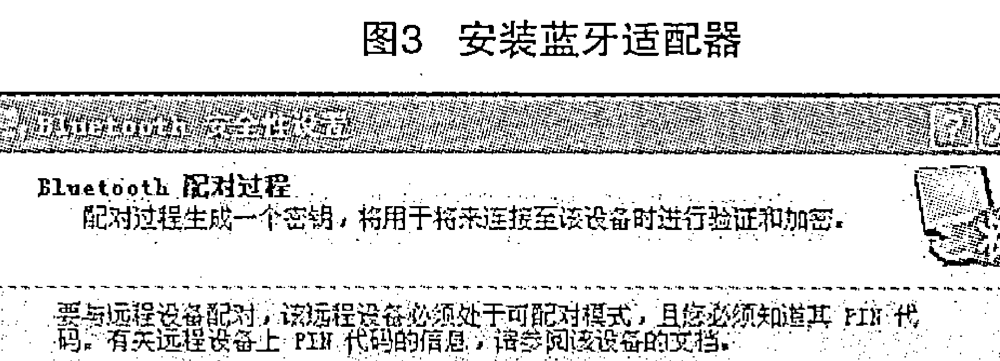

## 二、蓝牙驱动和管理软件

蓝牙驱动及管理软件目前主要有五大厂商推出：MAC OS X、Widcomm、IVT BlueSoleil、Microsoft、Toshiba。最常见的是Widcomm、IVT BlueSoleil和Microsoft，它们的产品各有特色。总体而言，Widcomm蓝牙驱动及管理软件是兼容性最好和功能最强大的一种，也是目前应用最广泛的一种蓝牙管理软件(图5)。有很好的使用界面和直觉式操作法，稳定性也非常不错，但其占据的系统资源较大，对硬件的稳定度要求也高。而IVT软件占用的系统资源较小（图6），对于系统配置要求不高，但在功能和易用性上还存在不足。Windows XP SP2内置的蓝牙管理软件虽然功能较弱，却几乎可以支持任何一个厂商的蓝牙棒，真正的即插即用，即使你买到不被直接支持的蓝牙棒，也还可以通过修改bth.inf档案支持。最新Windows Vista系统中内置的蓝牙驱动和管理软件在功能上有了一定的改进。另外我们要注意分清蓝牙驱动和蓝牙管理软件的不同，蓝牙驱动是让系统正确识别蓝牙芯片的硬件驱动程序，要安装正确的驱动后蓝牙适配器才能正常工作，而蓝牙管理软件则是管理蓝牙适配器所有方面的应用，包括文件传输、音频传输、传真等方面。通过蓝牙管理软件我们才能发挥蓝牙适配器的全部功能。

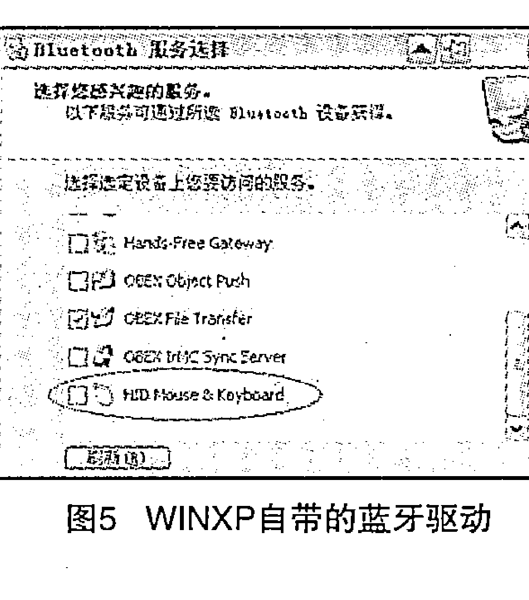

屏蔽XP系统自带蓝牙驱动 Windows XP SP2自带有蓝牙驱动，兼容性好，但XP的自带蓝牙驱动功能较弱，在使用上也不是很方便。如果你的电脑在连接蓝牙适配器后，电脑右下角出现两个蓝牙标志，其中一个是SP2系统自带的蓝牙驱动，这样两个驱动间就会存在冲突，可能导致蓝牙适配器不能正常工作。要屏蔽掉SP2自带的驱动，具体办法如下：通常C:\windows\inf\下的bth.inf文件就是XP自带蓝牙的驱动信息文件，只要在把蓝牙适配器插入电脑之前将其删除或改名，XP SP2就不会自动安装自带驱动。已安装过自带驱动的，可以先将其在设备管理器中删除，再删除上述自带的驱动信息文件，然后再安装Widcomm等第三方蓝牙驱动即可，这样系统中就只存在一个蓝牙驱动了。

## 二、各种蓝牙服务简介

通过蓝牙相关硬件和软件的配合，蓝牙产品可以提供一系列的服务功能，可实现各种各样的蓝牙应用。目前蓝牙所能支持的主要服务如下：

- 蓝牙文件传输服务：允许用户在支持蓝牙功能的台式机、笔记本电脑、PDA、手机之间进行文件夹和各种文件的传输。
- 蓝牙串行端口服务：为台式电脑、笔记本电脑、PDA、GPS接收器和其它蓝牙设备提供虚拟串口，使其可同其它蓝牙设备实现无线虚拟串口的连接。
- 蓝牙个人局域网服务（PAN）：允许个人电脑、笔记本电脑、PDA或其它蓝牙设备组成任意一种蓝牙个人局域网。
- 蓝牙拨号网络服务（DUN）：允许用户把手机作为无线MODEM来为其他设备无线接入因特网。
- 蓝牙网络接入服务：允许用户通过蓝牙网络接入点（AP）访问局域网或互联网。
- 蓝牙信息同步服务：允许用户在计算机、PDA、手机和其它蓝牙设备间同步个人信息数据管理对象（PIM）。
- 蓝牙对象交换服务：允许用户从PDA或手机上发送和接收消息、便笺、日程表和名片等信息。
- 蓝牙打印机服务：允许计算机或手持设备直接连接到蓝牙打印机。
- 蓝牙人机输入设备服务：支持用户使用蓝牙键盘、蓝牙鼠标或蓝牙游戏操纵杆。
- 蓝牙传真服务：允许用户通过连接蓝牙调制解调器或手机，在计算机上发送传真。
- 蓝牙图像传输服务：允许用户从蓝牙数码相机、手机以及其它兼容的设备接收图片。
- 蓝牙AV服务：允许用户使用支持蓝牙功能的耳机来收听计算机播放的立体声音乐。
- 蓝牙耳机服务：使用户能通过蓝牙无线耳机享受到与有线耳机或扩音器一样的功能。

当然大家要注意，不是所有蓝牙产品都支持以上所有服务，不同产品的蓝牙所能支持的服务并不完全相同。下面我们来介绍一下常用蓝牙服务的具体应用（图7）。

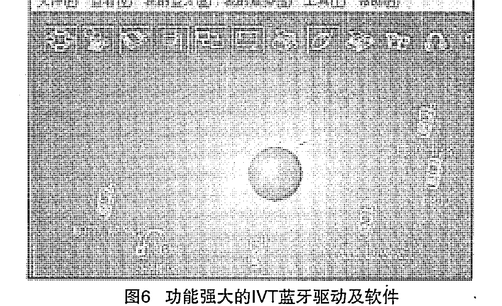

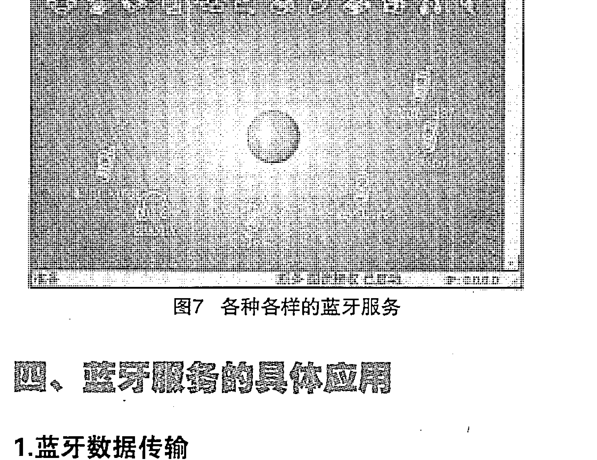

## 蓝牙服务的具体应用

### 1.蓝牙数据传输

通过蓝牙在不同设备间进行数据传输是蓝牙最基本的应用。其中蓝牙文件传输服务允许用户在支持蓝牙功能的台式机、笔记本电脑、PDA、手机之间进行文件夹和各种文件的传输，使用最为方便。不同设备的具体使用方法不同，比如我们在使用索爱的手机时，通过蓝牙文件传输服务能直接被电脑识别为可移动磁盘，十分方便。而大多数产品可以简单地通过“发送、接收”功能进行蓝牙数据传输(图8)。而摩托罗拉部分机型使用蓝牙文件传输服务比较特殊。比如要从A760发送文件到电脑，需找到你要发送的文件，用笔长按要发送的文件，在弹出的菜单中选择“共享”，共享路径选择蓝牙，在弹出的窗口中选择要接收文件的电脑的名称，点击右下角的“发送”，电脑右下角蓝牙图标上弹出“请求访问PIM项目传输”信息框，点开，在允许访问下的“对于当前任务”和“始终允许该设备访问我的计算机的PIM项目传输服务”，点击确定。文件开始传输到电脑。传输完毕后可到My document\Bluetooth交换文件夹中找到接收的文件。

电脑接收文件的路径可以修改，方法如下：
双击屏幕右下角任务栏中的蓝牙图标，打开“我的Bluetooth位置”，点击“查看我的bluetooth服务”，在右侧的“我的PIM项目传输”右键点击，选择属性，在对话框中可以看到默认的名片、日历、电子邮件、便签保存在OUTLOOK中，所有其他类型保存在My document\Bluetooth交换文件夹中。

另外蓝牙数据传输实际上还包括了蓝牙图像传输服务、蓝牙信息同步服务、蓝牙对象交换服务等，这些都是蓝牙数据传输在不同设备上的具体应用（图9）。下面我们看看如何使用蓝牙同步PPC信息：首先，在电脑中运行蓝牙管理器，找到蓝牙设备对应的COM口，并在AcitveSync中的“连接设置-允许通过COM端口上串行电缆或通过红外线端口建立连接”，并选择该COM口。然后在PPC中点击“开始-设置-系统选项卡-蓝牙设置”，ActiveSync蓝牙设置请按“开始”配置，点击开始，弹出标题为ActiveSync蓝牙的提示窗口，点击OK，进入蓝牙模式，点击绑定的设备点击新建，开始搜索有效范围内的蓝牙设备。找到电脑后，输入PIN码验证通过后绑定成功。将弹出一个提示窗口，提示蓝牙ActiveSync设定完成。然后，在PPC中点击开始-ActiveSync-工具-通过蓝牙连接，再激活电脑上的ActiveSync即可。

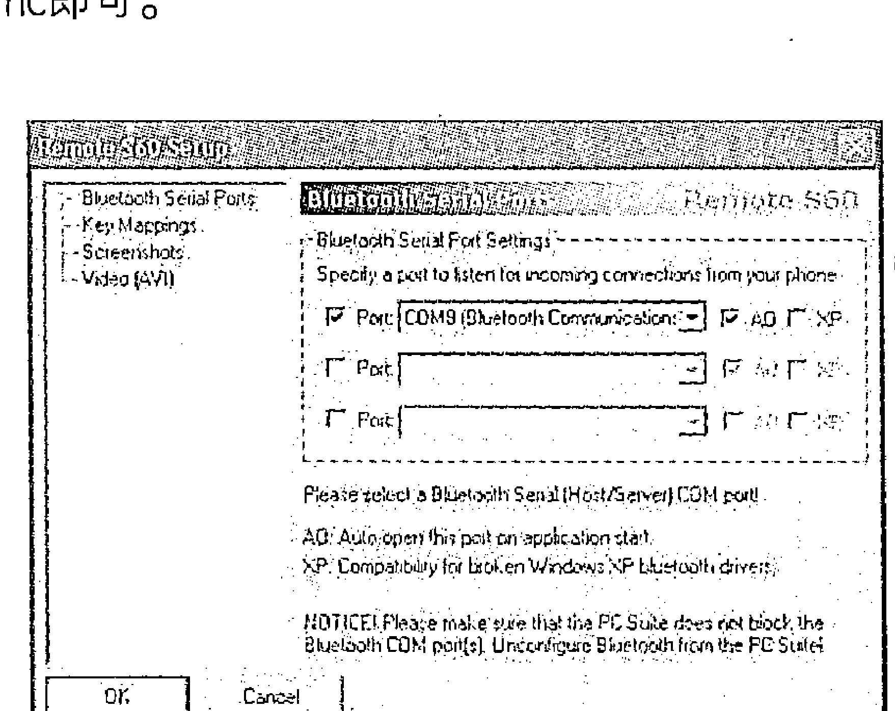

### 2.蓝牙耳机及AV服务

使用手机的朋友最熟悉的一项蓝牙服务可能就是蓝牙耳机（免提）功能了（图10），现在很多中档以上的手机都配置了蓝牙语音功能，可以使用蓝牙耳机在没有连线的情况下接听电话，十分方便。这项功能大家都比较熟悉，这里就不详述了。另外对于有车的朋友而言，车载专用蓝牙系统可以使手机与车载电话无线连接，比如“宽洋车载蓝牙免提”系统，由一个可插在点烟器上的小喇叭和一个只有三个按钮的控制器组成，使用时插上点烟器，把你手机的蓝牙打开，查找设备，输入密码，就可以进行简单的通话和挂机等操作了。经常在开车时接打电话的朋友配置一套蓝牙免提系统还是很有必要的（图11）。

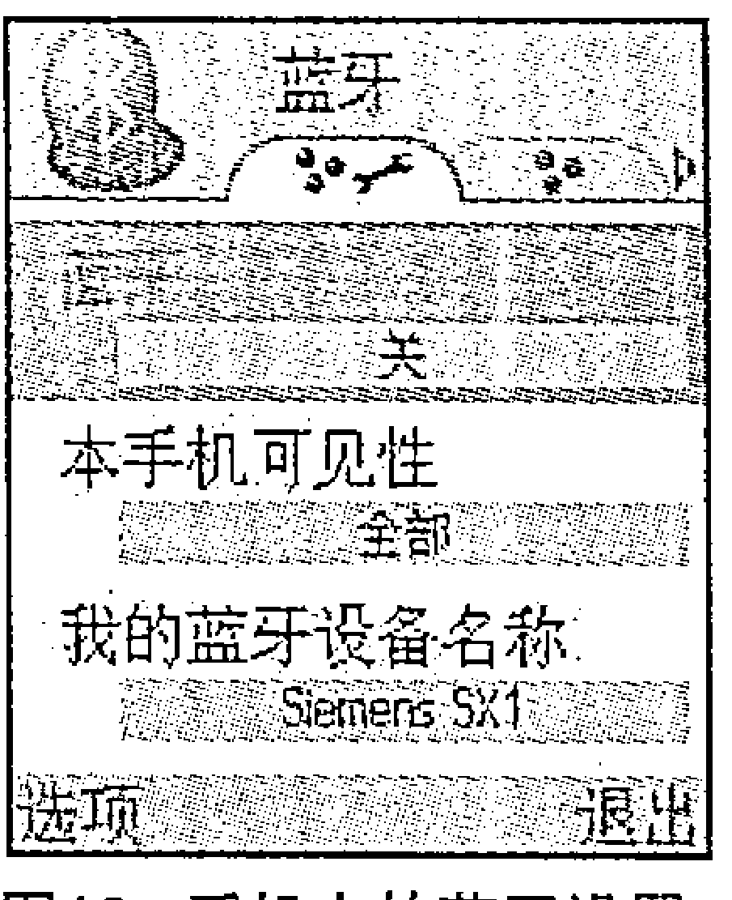

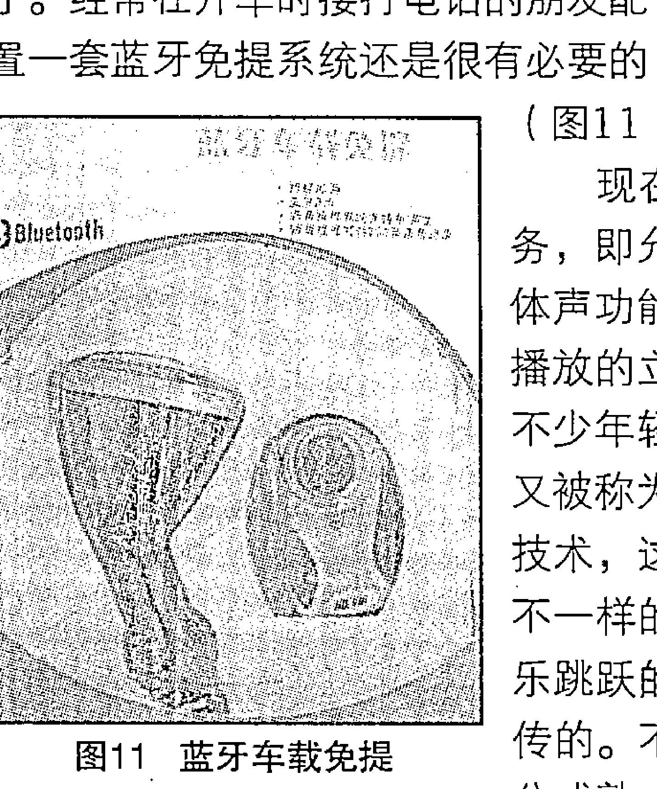

现在新版的蓝牙还提供AV服务，即允许用户使用支持蓝牙立体声功能的耳机来收听蓝牙设备播放的立体声音乐。这项功能令不少年轻朋友感觉新奇。该服务又被称为A2DP蓝牙无线音频传输技术，这个技术可以让你享受到不一样的音乐。那种可以轻松随乐跳跃的感觉是只可意会不可言传的。不过现在这项技术还不十分成熟，有效距离不足，而且音质会有较大的折扣。

TREO650的蓝牙版本是1.1的，所以必须安装合适的软件才能达到利用蓝牙收听音乐的效果。推荐安装下列两款软件：AudioGateway_v1.08+pTunes，可以无线控制pTunes的快进、倒退和音量大小，也支持配合AeroPlayer使用。听音乐时，若有来电或去电就会自动暂停播放音乐，通话结束自动恢复播放。

### 3.蓝牙拨号网络服务（DUN）

蓝牙拨号网络服务，即可以让带蓝牙的手机成为一个蓝牙无线MODEM（图12）。笔记本电脑与手机之间通过蓝牙无线相连，而手机又通过无线方式接入覆盖范围广阔的GPRS网，这种双重无线连接极大地拓展了其应用价值，既摆脱了有线Modem的环境局限，又实现了笔记本电脑与手机在连接状态时的最大自由，既不需要一根数据线将手机“栓”在笔记本电脑上，也不需要将二者的红外窗口严格对准，可以将手机随意挂在腰间或放在包中。具体实现方法很简单：

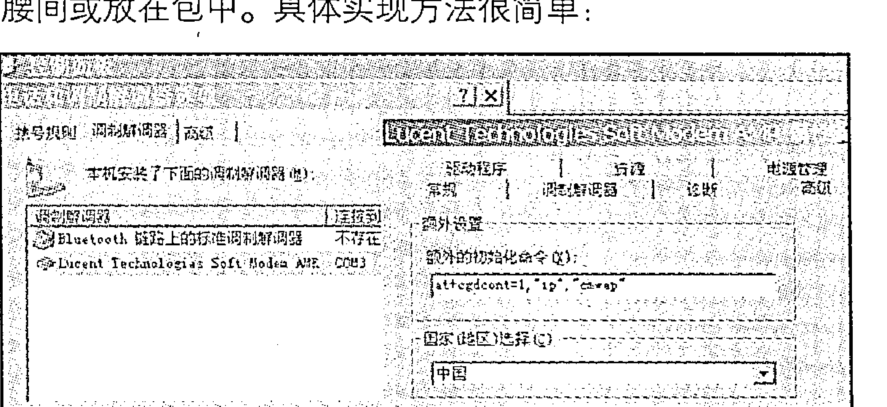

首先开启手机蓝牙功能，并设置为可接收状态；然后在手机端搜索新的蓝牙设备，发现电脑上的蓝牙接口后相互进行配对，成功后二者就进行了绑定。PC上的蓝牙设备安装好驱动程序后，会自动在拨号网络建立三个拨号连接，其中一个是Bluetooth Dial-up Connection，双击该图标，在弹出的窗口中“用户名”和“密码”留空，“拨号”输入“*99*1#”（具体号码可咨询当地移动运营商），便完成了无线拨号设置，点击“拨号”按钮，几秒内即可接入GPRS网（图13）。

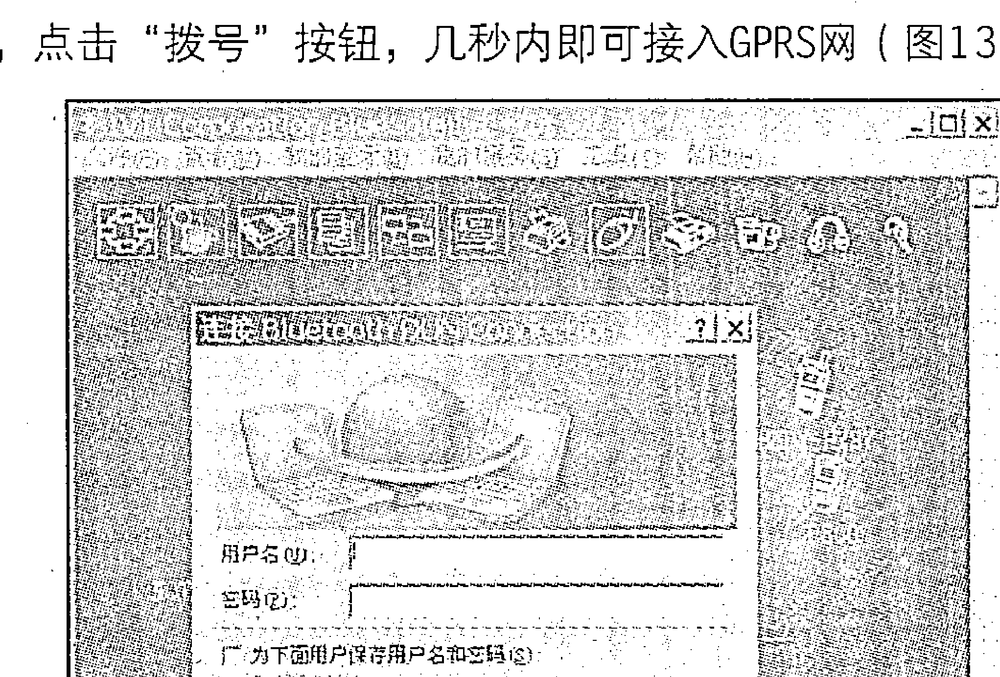

### 4.蓝牙串口服务

蓝牙串行端口服务，可以为个人电脑、笔记本电脑、PDA、GPS接收器、无线串行适配器和其它蓝牙设备提供虚拟串口，使其可以同其它蓝牙设备实现无线虚拟串口的连接。点击蓝牙串行端口服务图标，与远程设备建立连接，系统会分配给目标设备一个串口，每当应用打开串口号，BlueSoleil就会自动连接到目标设备。蓝牙串口服务的应用领域还是很广泛的，只要是普通串口能实现的应用，蓝牙串口大多也可以实现（图14）。

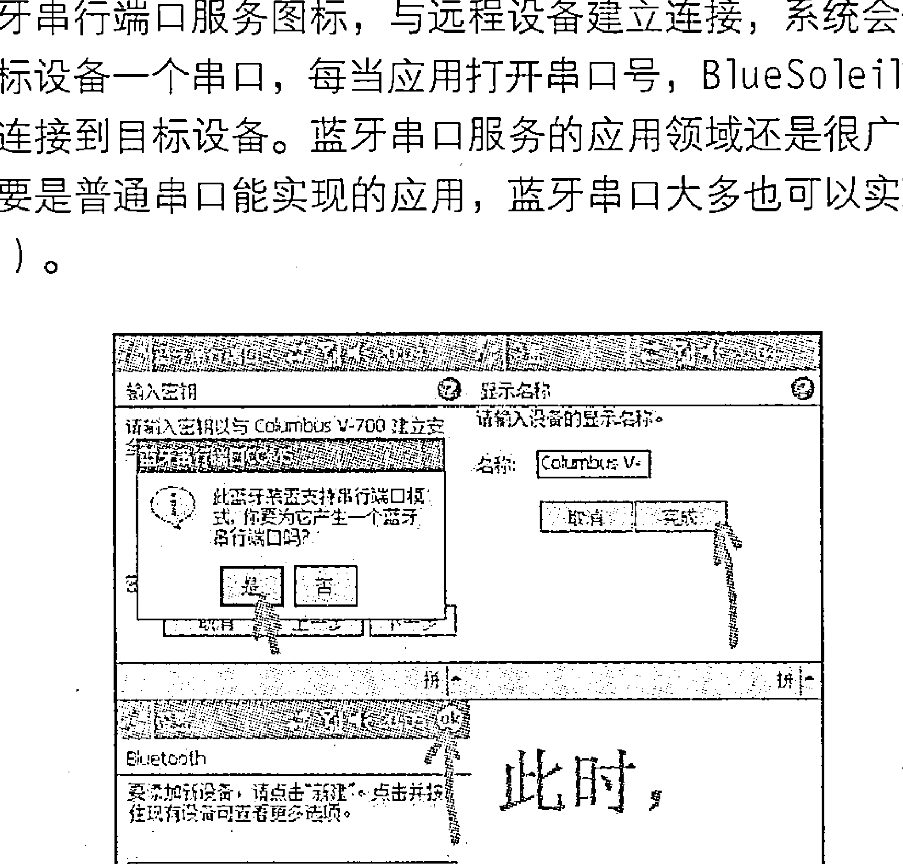

比如我们可以安装与手机配套的“电话簿和文本管理器”程序，选择好蓝牙设备所在的串行端口号以后，系统会无线连接蓝牙手机，并在连接成功后将手机上的电话簿、文本短信等内容下载到电脑上。现在也有很多游戏可通过蓝牙进行联网。比如西门子SX1中自带的魔幻方块就支持双人游戏，在游戏的同时还可以进行聊天。通过蓝牙联网进行台球比赛，双打魂斗罗等也非常有意思。

搜索设备。搜索完成后输入匹配码，完成配对。再选择串口服务，连接完成后在GPS软件的设置里调整好串口参数和速率，就可以定位了。使用蓝牙GPS时并不需要安装任何驱动程序。

### 5.蓝牙传真打印

在具有蓝牙功能的智能手机上安装适当软件（如mobilefax）后，可以直接进行传真收发。另外PC机也可通过蓝牙手机发送传真。首先安装好蓝牙适配器，安装蓝牙通信管理软件时，它会自动添加很多虚拟通信端口COMX，还有虚拟网卡、蓝牙Modem等，这些可以在电脑的“设备管理器”中看到。最重要的是它为我们添加了一台传真打印机，在“开始->设置->打印机->传真”可找到。开启手机的蓝牙功能，启动电脑上的蓝牙通信管理软件，搜索蓝牙设备。然后进行配对和授权等操作。再刷新服务，我们能看到“蓝牙传真服务”。好，准备工作你已经完成。

发送传真的过程就是将你需要发送的文档“打印”到这台传真打印机，你可以从任何具有“打印”功能的软件中发送传真。在选择打印机的时候一定要选“传真”，输入正确的传真号码确定之后，系统就开始为你发送传真了。最后提醒大家注意，要通过手机发送传真，你用的手机SIM卡要事先开通传真服务，具体可咨询10086。另外，蓝牙打印机服务还允许手机等设备连接到蓝牙打印机，直接打印。

### 6.蓝牙局域网应用

蓝牙有众多用途，包括文件传输、音频播放、传真打印等，相信这些应用大多数朋友都比较熟悉，但是通过蓝牙组建局域网很多朋友都不太清楚。我们知道无线局域网目前主要有三种形态：IEEE802.xx、HomeRF和蓝牙。HomeRF是一个比较冷的话题，这里不讨论它。现在最炙手可热的无线局域网是IEEE802.xx，其优势主要在于速度。而利用蓝牙技术建无线局域网的优势主要是成本和扩展性。802.xx，只能建设PC间的局域网，充其量加个无线打印功能，而蓝牙局域网则可以将所有带蓝牙功能的设备连接在一起，对于多数个人家庭应用来讲，蓝牙是最好的无线局域网平台。下面为大家谈谈组建蓝牙局域网的具体步骤。

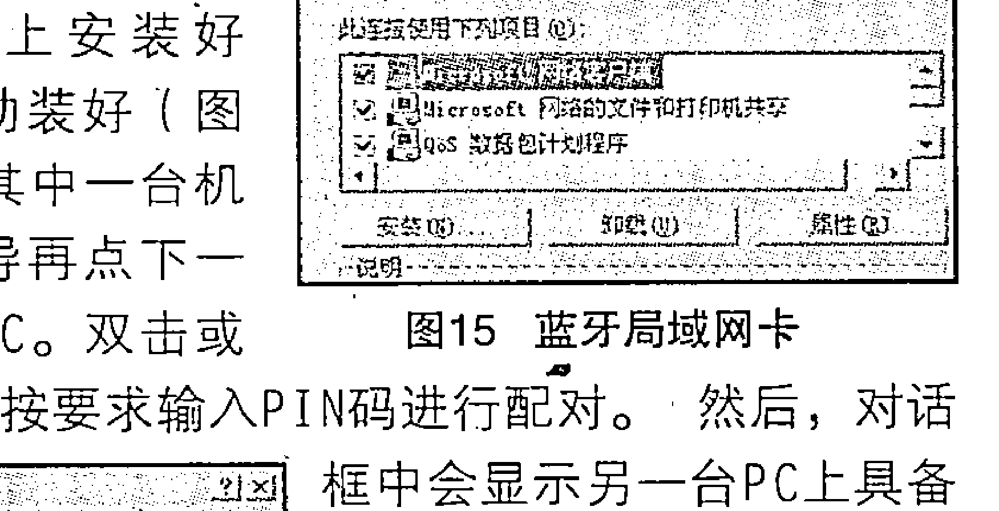

首先在电脑上安装好蓝牙硬件并将驱动装好（图15）。然后打开其中一台机器的蓝牙设备向导再点下一步，找到另一台PC。双击或点“下一步”后，按要求输入PIN码进行配对。然后，对话框中会显示另一台PC上具备的服务，建议都选上，并点击“完成”即可。要双机联网的话，直接点“网络接入”，系统会出现一个提示窗口，选择是，同时对方的计算机也会出现提示，同样点击是，这样两者就已经建立局域网连接了。在连接后，系统会自动给计算机分配一个IP地址以供连接使用（图16），我们还可以启用

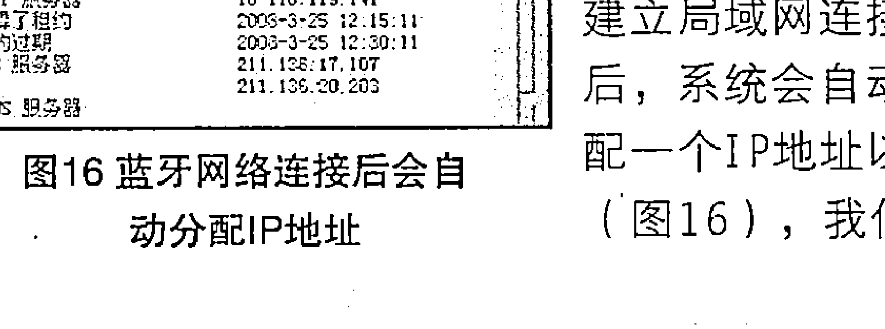

# 特别话题

要使用一个下列 Bluetooth 设备的计算机连接到网络的 Internet，选择该设备，然后点击“连接”。要为其他用户添加 Bluetooth 设备，请在“控制面板”中打开“Bluetooth 设置”。

Bluetooth 设备
添加(A)  删除(D)  属性(P)  了解 Bluetooth 个人区域网的更多信息

DHCP服务，这样两台计算机之间就可以利用蓝牙构成一个小型局域网了（图17）。接下来我们可以尝试通过蓝牙局域网来共享上网（图18）。建议直接用XP自带的共享上网设置。因为使用简单，而且不需要安装第三方软件。
我们称直接接入宽带的PC为主机，另一台通过和主机联网的PC为客户机。

## 7. 其他蓝牙服务

蓝牙还能提供人机输入设备服务（图19），支持用户使用蓝牙键盘、蓝牙鼠标或蓝牙游戏操纵杆。索尼爱立信的手机内置了蓝牙远程控制功能，通过蓝牙可实现遥控PC的操作。即把手机当遥控器遥控电脑。这一功能也是挺有意思的。

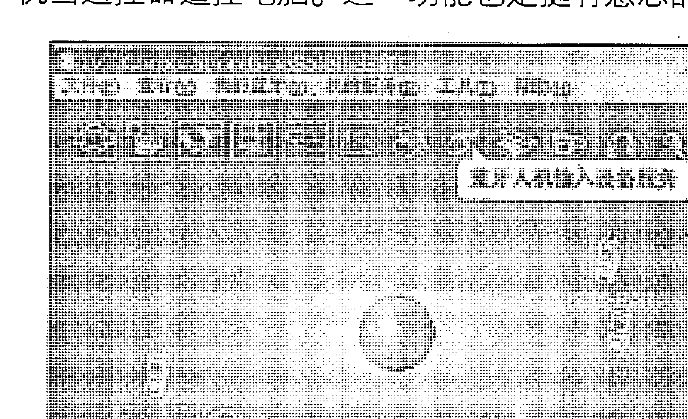

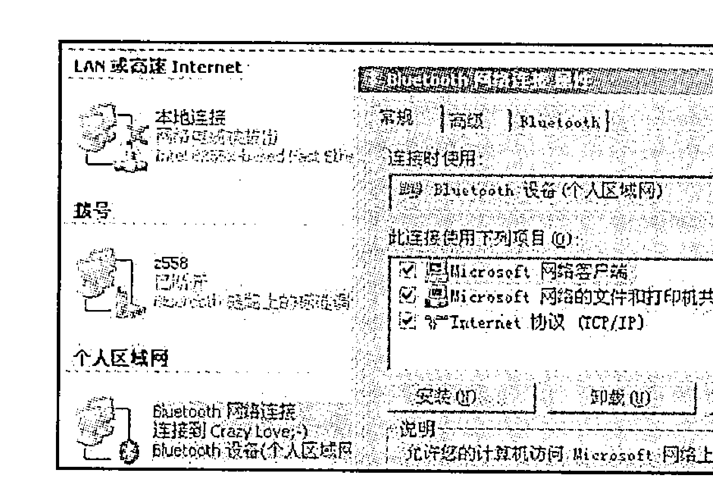

LAN或高速 Internet
本地连接
状态：已连接上
速率：100.0 Mbps

拨号

个人区域网
Bluetooth 网络连接
连接到：Crazy Lover
Bluetooth 设备(个人区域网)

Bluetooth 网络连接状态

| 常规 | 高级 | Bluetooth |
|------|------|-----------|
| 连接时使用：<br>[?] Bluetooth 设备(个人区域网) | | |
| 此连接使用下列项目(0)：<br>[ ] Microsoft 网络客户端<br>[ ] Microsoft 网络的文件和打印机共享<br>[ ] Internet 协议 (TCP/IP) | | |
| 安装(I)  卸载(U) | | |
| 说明：<br>允许您的计算机访问 Microsoft 网络上的 | | |

首先，要打开主机上的网上邻居图标，点“查看网络连接”。然后，找到你接宽带的那个连接，用右键点它，选属性，选中其中的“Internet 共享服务”。再在客户机上设置。打开网上邻居，选“设置家庭或小型办公网络”。只把蓝牙网络打上钩。点下一步后，机器开始自动配置。配置完毕后，客户机就可以上网了。当然，上网之前，要确保两台电脑已通过蓝牙联网。用类似方法我们还可以让手机等设备通过蓝牙共享宽带上网上。

首先，你的PC要有蓝牙，没有的话可以买一个蓝牙适配器，几十块钱。装好驱动后，查找蓝牙设备，把手机的蓝牙打开，就能找到了（公开性中要设为允许找到）。然后配对，配对成功后，会自动把它支持的服务模块列出来，选择“HID Mouse & Keyboard”。
此时手机就会提示你是否“启动远程控制”？当然选择允许。然后，手机上会列出三种遥控模式让你选择：包括幻灯片、媒体播放器和桌面，选“幻灯片”，可以遥控PPT的播放，对商务人士很受用。选“媒体播放器”，可以遥控媒体播放。常用的Kmplayer、暴风影音等都基本上可以。“桌面”就是将手机当鼠标用了。移动有点慢，不过还是不错的。当拿出手机当遥控器时，来家里做客的朋友一定会十分惊讶的。

随着技术的进步，今后蓝牙还能提供更多的服务，让我们拭目以待吧。

## 取消不需要的网络服务组件

单击“开始/控制面板/网络连接/本地连接”打开本地连接状态窗口，单击“属性”按钮，打开属性对话框，单击“高级”选项卡，选中“通过限制或阻止来自Internet的对此计算机的访问来保护我的计算机和网络”选项，然后单击“设置”按钮，就可以看到所有已经安装的、Internet用户可以访问的、运行于你的网络上服务，除非你想架设FTP或SMTP服务器，否则不妨全部取消这些项目的选定状态。

## 启用DMA传输模式

所谓DMA，即直接存储器存储模式，指计算机周边设备（主要指硬盘）可直接与内存交换数据，这样可加快硬盘读写速度，提高数据传输速率。由于某些原因，Windows XP 有时会在IDE通道上使用PIO并行输入输出传输模式，而不是DMA模式。如果有这种情况，用户可以手动把IDE通道改为DMA模式，这样可以减少该设备占用的CPU周期。方法是：右键点击“我的电脑”，选“属性”，点选“硬件”选项卡，单击“设备管理器”按钮，打开“设备管理器”，然后点击展开“IDE ATA/ATAPI 控制器”分支，其中“IDE控制器”有两项“主要IDE通道”及“次要IDE通道”，分别选中，依次进入“属性/高级设置”，该对话框会列出目前IDE接口所连接设备的传输模式，检查“传输模式”下拉菜单，把它们全部设为“DMA(若可用)”，点击“确定”。

## 加快关机速度

Windows XP的开机速度的确比以前版本的操作系统快了很多，但关机速度却慢了不少。如果你在意关机速度的快慢，可以修改几个注册表键值，就可以大大减少Windows关闭所用的时间。首先打开注册表编辑器，找到HKEY_CURRENT_USER\Control Panel\Desktop\，里面有个名为HungAppTimeout的键，它的默认值是5000(如果不是，把它改为5000)。接下来，还有个WaitToKillAppTimeout键，把它的值改为4000(默认值是2000)。最后，找到注册表如下位置：HKEY_LOCAL_MACHINE\System\CurrentControlSet\Control\。同样地，把其中的WaitToKillServiceTimeout键值改为4000。另外，把“控制面板/管理工具/服务”中的Nvidia Driver Help服务设为手动，也可以加快Windows关闭时间。

# 不要太傻瓜，数码相机最新智能技术深入分析与应用

□ 龚师傅

过去摄影是一项很专业的工作，要拍摄一张好的照片，除了取景，还要完成对焦、调整速度光圈等复杂工作。随着技术发展，相机智能化程度越来越高，逐步让拍照成为一件充满趣味的事情，不过现在太多的智能功能，反而让拍摄照片的人真正成了摄影的“傻瓜”。下面我们来分析一下数码相机常见智能技术的本质，并说明应如何合理应用。

## 一、精确选择才专业，数码单反实时取景技术分析与应用

### 1. 实时取景技术分析

去年以来，数码单反相机上出现了一个很热门的技术，就是使用液晶屏进行实时取景。由于机身结构和成像光路的不同，长期以来数码单反相机都支持光学取景，要实现液晶屏实时取景是很困难的事。但这一问题现在已经得到了成功解决。现在市场上已经出现很多支持实时取景技术的单反数码相机。目前不同厂家的实时取景技术原理并不完全相同，奥林巴斯E-330作为全球第一款实时取景数码单反，采用了两路光学设计来实现实时取景，即照相使用一个感光器，取景使用另一个感光器，在取景的同时不能完成测光、对焦等操作。而佳能1D MARKIII/40D的LiveVIEW模式，是在取景时抬起反光板，对焦时则迅速降下反光板进行TTL相位差检测对焦，因此在实时取景时需要按下独立的对焦按钮进行对焦（图1）。而且用起来都不是很方便，无法进行抓拍，只适合拍摄静物时的辅助构图。

图1 实时取景需要比较复杂的光路设计

不过最新上市的索尼α350既实现了实时取景功能，又完全不用改变相机在取景器前的光学结构；既能够像小型数码相机一样使用液晶屏取景，又能以单反相机的对焦速度进行对焦；既向液晶屏上提供了实时图像，又不会消耗那块昂贵的大型CCD的寿命。其实时取景独立于拍摄模式外，也无需从拍摄菜单里进行功能设置。这一点比起尼康和佳能现有的实时取景机型要来得简单、方便。

### 2. 按需选择取景方式

让我们来看看数码相机上取景技术的发展历程。早期的普通数码相机都具备平视光学取景器，同时也可以通过液晶屏取景。由于平视取景器存在视差，且比较占空间，因此现在小型卡片机几乎全部取消了平视光学取景器。而在变焦比较大的准专业数码相机上，平视光学取景已经不能胜任，因此这类相机上一般都提供了类似光学取景的EVF电子取景装置（实质还是小型化的液晶取景），同时也可以通过机背LCD屏取景。数码单反相机一个最大特点就是使用了TTL（直接通过镜头）光学取景器。取景与摄影共用一个镜头，因此没有了平视取景器的视差，取景准确，而且省电（图2）。

目前数码单反相机上的实时取景技术还不十分完善，仍然没有一套方案可以完美解决AF问题，对于专业摄影人士而言，买数码单反相机本来就是为了不用液晶屏取景，而普通消费者也会对数码单反不太同于普通DC的实时取景技术感觉不习惯，目前看来这一技术多少令人有“脱了裤子放屁”的感觉。不过以不高的代价多一种选择也是不错的，如果你的相机具备多种取景方式，具体使用什么取景方式，要根据实际的拍摄需求决定。比如使用光学取景器省电、姿势标准，易拿稳相机，而用LCD屏取景，可以看到更多的诸如柱状图之类的信息，同时在将相机举过头顶拍摄或者放在靠近地面的位置拍摄时更加方便。

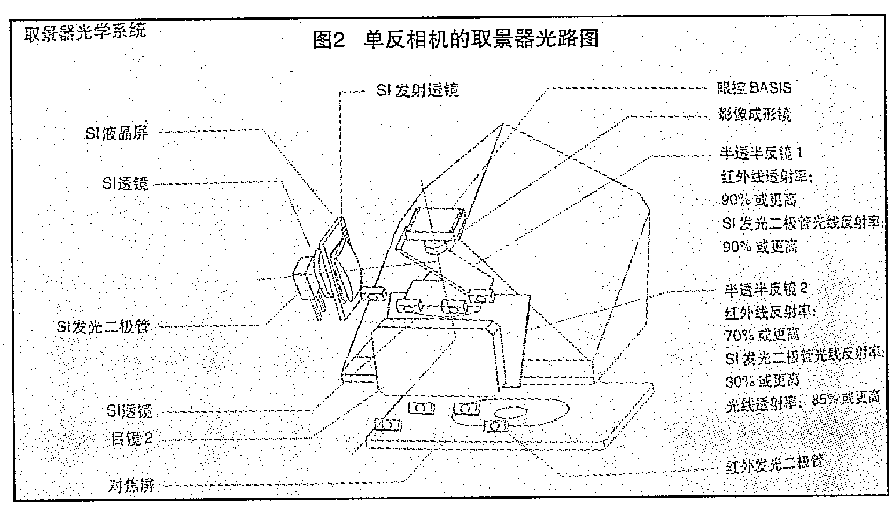

## 二、稳定压倒一切，数码相机防抖技术分析与应用

### 1. 数码相机防抖技术综述

现在越来越多的数码相机都开始采用防抖技术了，可以有效避免因手震而引起片子模糊问题。目前数码相机采用的防抖技术主要有镜头光学防抖、CCD防抖和电子防抖三大类。镜头光学防抖是通过相关组件使镜头内某组镜片相对震动反方向进行位移从而起到防抖作用，佳能、尼康、松下等品牌的防抖数码相机多采用该技术，比如佳能的IS技术、尼康的VR、松下MEGA O.I.S.（图3）。

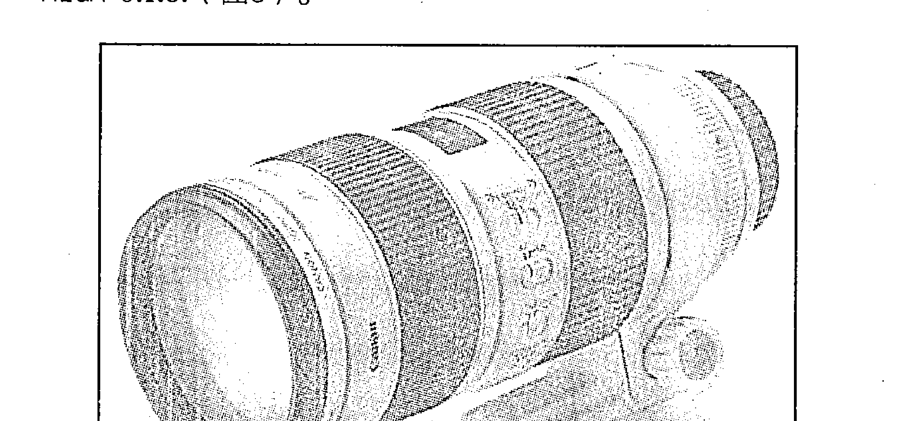

图3 带防抖功能的专业镜头往往价格不菲

CCD防抖与镜头无关，又被称为“机身防抖”，是一种通过CCD位移进行抖动校正的技术。起源于柯美的AS防抖技术，其他还有Pentax宾得的SR技术等也采用了类似原理。从理论上说，以上两种防抖技术的原理和效果是差不多的，不过也有测试表明，采用CCD防抖技术的相机在开启防抖功能后，会对成像品质产生不良影响。

而电子防抖就是自动高感光技术，通过提高感光度从而获得更快的快门速度，进而保证拍摄的成功率。不过由于普通DC的CCD尺寸太小，高感光度会造成画面中噪点大量出现，如果进行降噪处理，画面细节损失则会损失很多。尼康相机还有一种BSS防抖模式，中文意为最佳拍摄选择器，是尼康独家的一种软件综合电子防抖技术，通过数码相机内部参数的调整来减少抖动对于成像的影响。当该功能开启时，相机可以连续拍摄最多10张照片，然后对照片进行比较，锐化度最高（细节拍摄最佳）的照片将会被记录下来。其主要原理是，成像清晰的照片一般容量较大、锐度较好，抖动的照片容量较少、锐度较差。

另外现在越来越多的中高档相机开始采用多重防抖技术，由“光学防抖”和高感光度构成的“双重防抖”功能具备最大的实用性。“光学防抖”通过内置陀螺仪和可移动镜片结构的光学镜头组，可有效修正手抖带来的影像模糊，再结合ISO 1600以上的高感光度，让用户在拍摄移动对象或进行室内/夜景拍摄时，也能获得清晰、逼真的照片。

数码单反相机由于可更换镜头等特点以及面对的消费人群不同，其防抖功能有其自身的特点，比如没有一款数码单反相机声称自己采用了“电子防抖”技术，而事实上由于感光器尺寸要比普通DC大很多，因此数码单反在高ISO下的拍摄效果也要大大好于普通DC，因此我们在使用数码单反时完全可以根据实际情况设定高感光度，从而获得良好的“电子防抖”效果。数码单反相机的“机身防抖”实际上就是CCD位移防抖，目前被SONY、宾得等厂商采用，优点是可以在装上任何镜头时都具备防抖功能，主要缺点是无法直接在取景器中观察到防抖效果，且在使用长焦镜头时防抖效果一般，这类相机在使用手动头时会让你设置焦距，以对CCD位移量进行调整。而佳能和尼康这两大厂商由于拥有庞大的镜头资源群，都采用镜头“光学防抖”技术，即通过镜头内置的陀螺仪和可移动镜片组，来修正手抖带来的影像模糊，防抖效果要好于CCD防抖，而且防抖实效可在取景器直观看到，不过防抖镜头价格通常比较高昂。

### 2. 如何拍摄稳定清晰的照片

把照片拍摄清晰是对摄影者的基本要求，尽管现在数码相机都普遍具备了多种智能防抖技术，可以在大多数情况下帮助我们获得清晰的照片。但我们仍要练好摄影的基本功能，靠自己的技术获得好照片。要获得清晰照片有两个原则，其中之一是快，即快门速度要尽量高，在传统摄影中有一个安全快门的概念，即一般而言，能让画面稳定的最低快门速度不得低于镜头焦距的倒数。比如你使用100毫米的镜头拍摄，那么快门最低速度应该在1/100以上。要让快门速度提高，主要有两个方法，一是尽量放大光圈，二是提高ISO感光度。不过这两种方法又会对画质产生不良影响，因此我们应根据具体情况适当选择。比如在拍摄风景等静物时，最好使用三脚架，而保持小光圈和低ISO设置。第二个要拍出清晰照片的原则就是“稳”，这里的稳包含两个方面的含义，一是持机要稳，二是心态要稳。尤其在使用长焦镜头进行拍摄时，相机哪怕一个微小晃动，也可能会影响照片的清晰度，造成照片的模糊，用正确姿势端稳相机是拍出清晰照片的前提（图4）。尽量使用光学取景器把相机贴紧面部，更容易拿稳相机，在条件许可的情况下，可以给胳膊找一个支点，或者干脆使用三脚架或独脚架，把相机固定后再拍

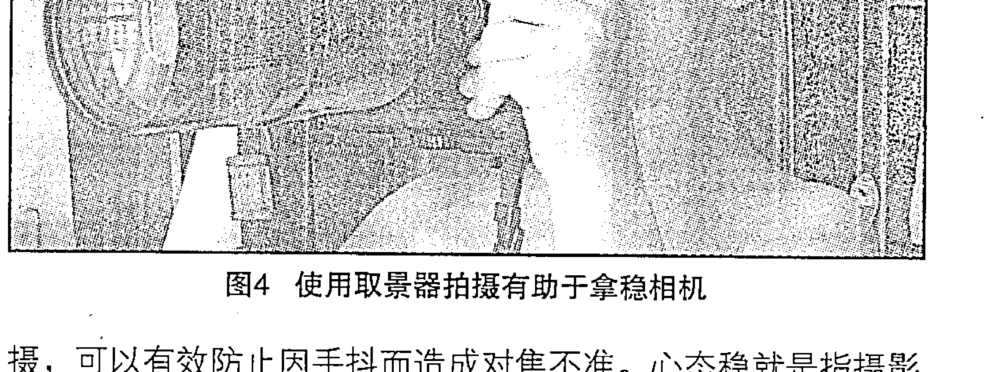

图4 使用取景器拍摄有助于拿稳相机

摄，可以有效防止因手抖而造成对焦不准。心态稳就是指摄影的时候要有一个良好的放松心态，不需要过分紧张，如果你在拍摄时面红耳赤、全身发抖，恐怕是很难拍出稳定清晰的照片的。

## 三、人像沟通是关键，数码相机人脸识别技术分析与应用

### 1. 人脸识别技术分析

大家知道在多年以前，“傻瓜胶片相机”就实现了自动对焦和自动曝光等基本的摄影自动化，让普通用户也能拍摄出不错的照片，而随着技术发展，数码相机中出现了更多的智能摄影技术，比如众多的“情景拍摄模式”可以让不懂摄影知识的朋友轻松应对各种复杂的拍摄场景。而最新出现的“人脸识别”技术更是其中的代表，简单说该技术利用机内软件的数字画面分析功能，可自动将对焦点和测光点放在一般纪念照中最重要的人物面部，能为用户带来焦点清晰、色彩准确、肤色自然的照片，还原更加真实细腻的场景。“人脸识别”其实是iesp自动聚焦（智能电子选择模式）技术的发展，iesp在对焦范围内做多重区块分割，再将分割区块所测得的焦点位置综合运算，根据主体的不同状态，确定最佳焦距位和曝光量（图5）。

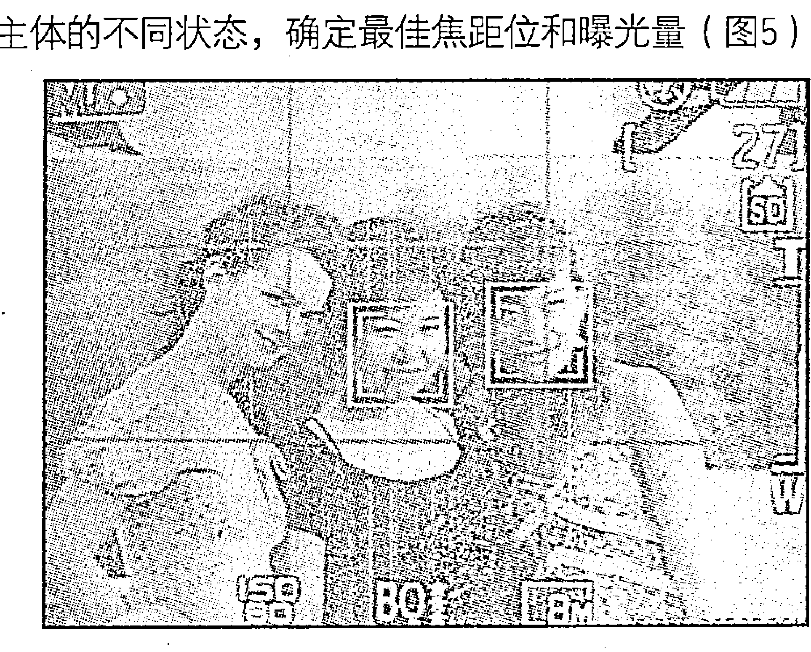

奥林巴斯日前还推出了一种全新的“脸部识别和阴影识别”技术，该技术集成了脸部识别自动对焦、脸部优先测光、脸部优先闪光输出控制等特点，能够有效防止逆光拍摄时出现曝光过度或曝光不足的现象。而独有的“阴影识别”功能不仅能对人脸的阴影区域进行识别，还能对景物的阴影区域进行识别，可以自动修正阴影处的亮度，使亮处和暗处都能做到亮度适中，从而使拍摄出的图像效果十分接近人眼看到的物体实际效果（图6）。

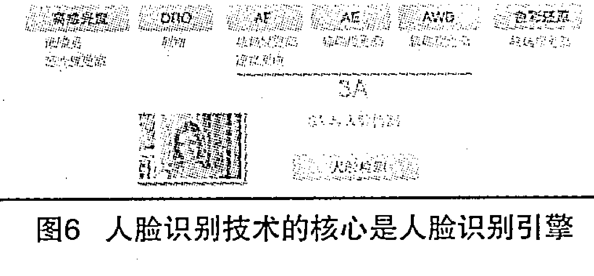

数码相机的这些智能功能对普通用户而言还是有一定实用价值的，不过对于资深玩家而言，就没有必要太关注这些功能了，而应该多了解一下数码摄影的基本技巧。在实际使用中，人脸识别功能的一个最重要用途就是保证逆光拍摄人物照片时的成功率。下面就具体为大家谈谈数码相机逆光拍摄的一些技巧，以便在使用不具备人脸识别功能的相机时也能获得满意的拍摄效果。

### 2. 人像逆光拍摄技巧

曝光补偿是逆光拍摄时最常见的技巧，一般根据背景光的强弱，我们在相机原始测光的基础上增加1EV～2EV左右的曝光量，主体就能获得比较合适的曝光（图7）。这是拍摄逆光照最通用的方法，因为大多数数码相机都具有曝光补偿功能。对于具备手动调整功能的数码相机，曝光补偿的实现除了使用通常方法外，也可通过在M（全手动）模式下提高ISO值间接获得曝光补偿，这样的好处是不必改变曝光量，从而保持了光圈快门的初始值，但会使画质下降，如何选择请根据情况而定。为在逆光等复杂情况下获得对主体的适当曝光，我们还可以运用相机的曝光锁定功能，具体方法如下：先将镜头焦距变到最长端，并尽量靠近主体进行测光，然后将此时测得的曝光值锁定，再离开主体，按需要重新构图，进行拍摄，这样拍摄主体就能获得合适的曝光。大多数相机的曝光锁定通过半按快门实现，有些数码相机在其功能菜单中也有专门的曝光锁定选项，按一下生效，使用更加方便。另外在正确测光的基础上，通过全手动设定光圈及快门值也能实现曝光锁定。

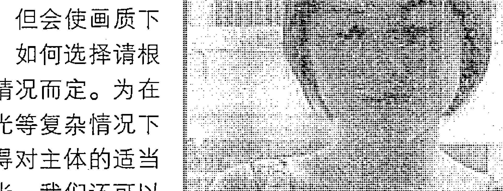

选择合适的测光模式也是拍好逆光照的一个技巧。大多数数码相机都具备多区、中央重点等多种测光方式。很多半专业数码相机还具有点测光功能（即对很小的拍摄区域进行测光），我们在逆光拍摄时，最好使用点测光功能，对拍摄主体适当部位进行精确测光（比如所拍摄人物的脸部）。另外对于专业用户，为获取更加准确的曝光，有条件的话还可以使用独立的测光表，靠近主体进行精确测光，然后根据测光值，使用全手动模式进行拍摄。

最后在逆光环境下，合理使用闪光灯也很重要，由于逆光拍摄时入射镜头的光线比较强，闪光灯如果处在“自动闪光”状态是不会打开的。我们可以将闪光灯状态设置为“强制闪光”，也就是说不管光线情况如何都进行闪光。采用强制闪光拍摄逆光照可以取得比较好的效果，因为可以做到背景和主体曝光的平衡。普通数码相机大多采用镜间快门，可以实现全程快门速度下的闪光同步，因此用闪光灯补光比单反机更加方便。另外有些中高档相机还具备闪光量补偿功能甚至还可以外加高级大指数闪光灯，可以根据需要灵活控制闪光灯的发光量、采用反射闪光等，使用效果就更好了。最后要注意，逆光拍摄时一定要正确使用遮光罩，从而可在很大程度上避免眩光的产生。

## 四、人际沟通是关键，数码相机笑脸快门技术分析与应用

### 1. 笑脸快门技术分析

在“人脸识别”基础上，“笑脸快门”是近期数码相机上更加智能化的热门智能技术，是针对笑脸做出反应的创新型智能自动快门。在开启该模式后，用户只要面对拍摄对象按下快门，相机便可自动识别人物面部表情，一旦被拍摄的人露出了灿烂的笑容，相机就能够自动打开快门拍摄相片，轻松抓拍到笑容灿烂的快乐瞬间。拍摄时只需从场景模式中选择笑脸快门，对准要拍摄的对象完全按下快门，相机就会自动检测笑脸并关闭快门。要用好笑脸快门作好相关设置，首先需要识别笑脸，并拍摄确定此表情为标准笑脸，然后确认笑容敏感度确认及笑脸识别拍摄，要检测拍摄对象的欢笑程度，可以将笑容级别敏感度设置为“高”（可检测到微笑）、“中”（可检测到正常笑容）或“低”（可检测到哈哈大笑）。如果取景框中有多个拍摄对象，你还可以指定要作为主要拍摄对象的笑脸，也可以让笑脸快门自动选择主要拍摄对象并拍摄照片。


### 2. 如何拍出表情自然的照片

说句实话，很多朋友都认为数码相机的笑脸快门技术并没有太大的实际价值，从某种意义上看，更像是相机的一个娱乐功能。相比较而言，人脸识别和FaceTime技术的实用性更强。在拍摄人像时，要拍出表情自然的照片有很多技巧。其中最重要的一点是，摄影者一定要与被摄者进行良好的沟通。相信大家对拍照时喊“茄子”或“田七”等方法不会陌生，实际上，这也是摄影者与被摄者之间的一种沟通方式。另外大家知道拍摄人像最常用85mm左右的镜头，除了背景虚化、不变形等技术因素外，用这一焦距的镜头拍摄人物时，摄影师刚好能够比较自然地与被拍摄者进行交流，从而方便拍出表情自然的照片。拍摄人像不单纯是一项技术工作，摄像师良好的人际沟通能力或许更加重要（图9）。

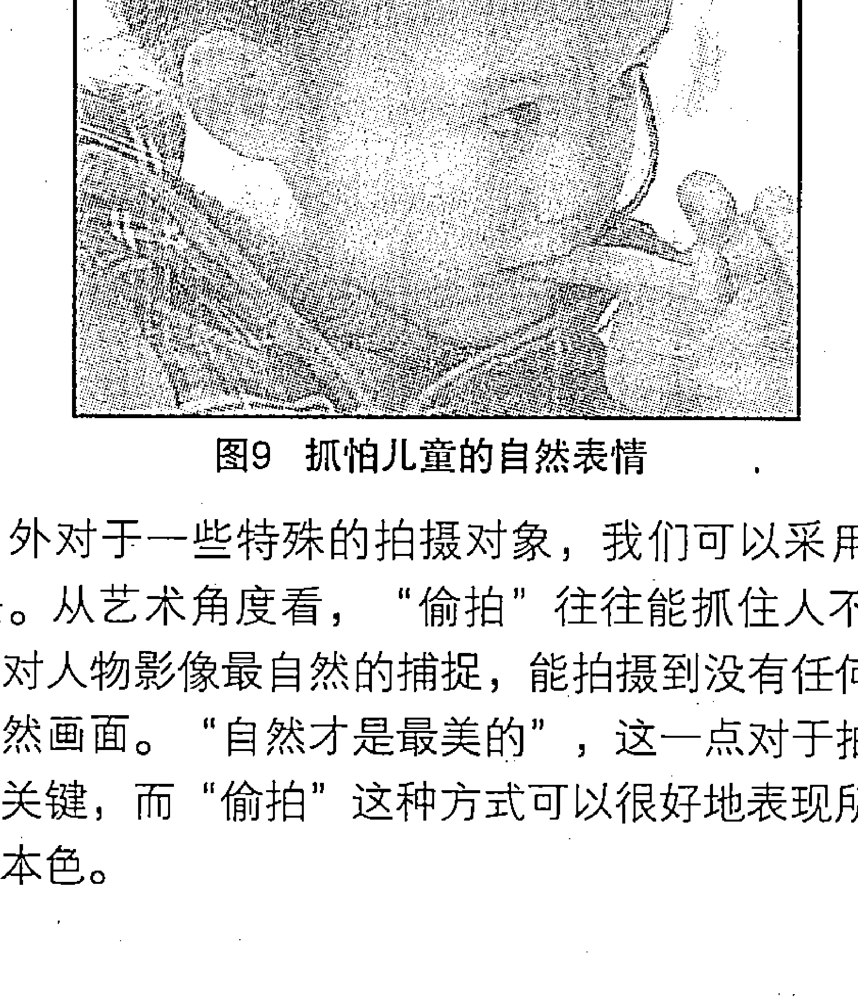

## 五、曝光模式合理用，数码相机智能场景技术分析与应用

### 1. 智能场景模式概述

从防手震到面部对焦、笑脸快门，如今数码相机智能化已经十分全面，难出现令人注目的独特卖点。最近松下公司在其FX33、FX35、FZ18等产品中，加入了一种更智能易用的“iA智能拍”模式，进一步将摄影步骤简易化。我们知道相机的智能化拍摄分为几个层次，从全手动到光圈、快门优先，然后到各种场景模式，自动化程度越来越高，但有些使用者还是不满足，甚至不想考虑该设定何种场景模式。iA模式可以根据你想要拍摄的画面从肖像、风景、微距、夜景和夜景肖像等最常用的场景模式中自动设置适合的场景模式。当拍摄条件发生变化时您无需进行繁琐的设置调整就可以进行拍摄，非常智能。毫无疑问这是一种更加“傻瓜化”的拍摄模式。让照片拍摄真正实现了全自动。此外现在部分相机的“真我影像”智能化摄影方式，能够全力弥补外在因素的影响，最大限度恢复景物的真实色彩。它不仅能自动调节成像效果，还能像电脑软件一样对照片进行加工，甚至主动告诉你该如何拍照。而一向以手动操作

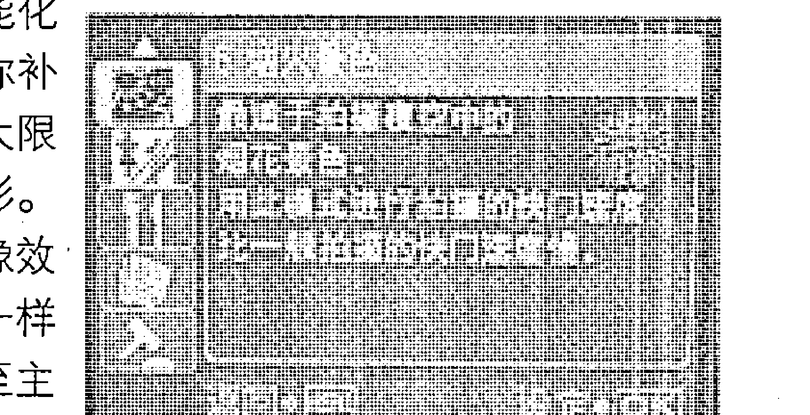

## 2. 掌握常用的手动模式

我们知道摄影是“光与影”的技术和艺术，尽管数码照片可以通过后期处理对曝光异常的照片作一定的补救，但准确曝光对于拍摄一张好的照片来讲仍是非常重要的，可以说是拍摄成功与否的首要因素，对于数码相机而言也是如此。目前大多数主流数码相机都具备“傻瓜式”自动曝光功能，能够确保在大多数情况下获得正确的曝光，不过很多初学者在使用自动模式拍摄出来的照片效果并不理想，主要是对曝光技巧掌握不够造成的。下面就让我们来看看数码相机上不同曝光方式的区别，以及在不同条件下如何获得正确的曝光。

## 快门优先：

即由操作者自行设定快门速度，光圈值则由相机根据光线情况自动设定。快门优先自动曝光，适用于拍摄动体或需长时间曝光的拍摄场合，就可以按照意图先选定快门速度，需要凝固运动的物体时选定高的快门速度，需拍夜景、闪光同步、虚化动体时选用慢的快门速度，比如用于拍摄电视画面应设定为1/15～1/25秒、人为使用慢速快门可造出动态流水的特殊效果等。

## 光圈优先：

光圈简单说就是衡量镜头通光能力的一个单位，基本上等于镜头有效口径与焦距的比值。光圈的标称数值越小，通光量就越大（比如F2.0的通光量比F2.8要大一倍）。设定为光圈优先时，由操作者自行设定光圈大小，快门速度则由相机根据光线情况自动设定。这是除程序曝光外最常见的一种自动曝光方式，主要用于对景深的控制，比如拍人像就应该尽量用大光圈营造浅景深，需要大的景深时则选定小光圈，相机会根据CCD的感光度和景物亮暗来调节快门速度，以达到正确的曝光，由于数码相机光圈物理直径很小，拍摄夜景时收小光圈还可获得星芒的特殊效果。

## 全手动控制：

这很容易理解，就是光圈和快门值都由使用者自行手动控制。全手动曝光除了用于营造特殊拍摄效果等，还有一个重要作用就是锁定曝光量，可以用于拍全景照片等特殊用途。对于专业摄影师而言，他们可能更愿意采用手动控制，因为这样才能更好地发挥他们的聪明才智，尽情享受摄影带来的乐趣，也能拍摄出更高质量的图像。

## 六、闪光拍摄学问多，数码相机智能闪光技术分析与应用

### 1. 智能闪光技术分析

闪光灯一直都是数码相机最重要的补光手段。但是在许多情况下，闪光拍摄的效果却并不能让人满意（图11）。一方面，闪光灯及近不及远，这就导致在光照不足的情况下拍摄场景难以获得整个景深的准确曝光：往往是前景曝光准确了；背景却是漆黑一片，最终照片的价值大减；另一方面，闪光灯的照度与距离密切相关，这就要求拍摄者在使用闪光灯时，要根据拍摄距离来准确调整曝光量，不然的话，距离过远时曝光不足，距离过近就会“过曝”，带来的后果往往是人物肌肤“漂白”或者五官层次丢失。


虽然现在数码相机都装备了光学防抖或自然影像技术，使得闪光灯的使用频率大大降低，但是光学防抖、高感光度和闪光灯其实并不矛盾。事实上，光学防抖、高感光度的使用使得闪光灯能够更灵活地发挥作用。比如富士新款数码相机所采用的“智能闪光灯”就将高感度和闪光灯的利用有机紧密地结合在一起。“智能闪光灯”的特点就在于它可以根据实际需要，恰当合理地调整输出量（图12）。其工作原理不像TTL那样复杂，而是根据拍摄时相机的感光度、光圈、速度设置，再根据用户的场景模式选择，来判断出准确的曝光量。由于有了高感光度这个基础条件，相机能够以较低的闪光灯输出即获得准确的曝光，这样就可以完全避免“漂白”主体或背景丢失的状况了。


### 2. 不同闪光模式的应用

自动闪光：简单说就是由数码相机根据外界光线条件自动判断是否使用闪光灯，若在光线不足的环境下拍摄，便会自动地激活闪光灯。一般而言，“自动闪光”的模式可以适合大部分的拍摄状况。但存在的问题也是很多的，比如有时候在我们不需要闪光的时候它也闪了，完全破坏了我们的摄影意图。比如在拍摄夜景时，如果开启闪光的话，稍远的景物就会曝光不足，而完全失去实用价值。因此很多时候我们不能只依赖数码相机的自动闪光，而应灵活应用强制闪光或不闪光的功能。

强制闪光或不闪光：强制闪光，就是在任何光线条件下都强制开启闪光灯拍摄。常应用在拍摄主体处于逆光状态时，利用闪光灯加以补光，以免拍摄的主体过于灰暗。闪光灯给数码相机拍摄带来了很多方便，逆光拍摄就是一例。逆光拍摄时，将闪光灯强行打开作为辅助光，就能拍出较好效果。在阳光下拍摄，有时我们也可用强制闪光来消除拍摄主体上的阴影。

当然也有要求相机在光线微弱的情况下也不要激活闪光灯的情况。比如在摄影棚中运用石英灯拍摄，或舞台摄影等便常使用“强制关闭闪光”的设定，因为这时若开启闪光灯不仅将破坏现场光线气氛，还可能因闪光指数太小造成曝光不足。另外在阴天拍摄时自动闪光往往会发生误判，这时如将闪光灯关闭，并增加其曝光量，也许会得到更好的效果。

## 移动数码影像乐趣
### ——手机拍照功能应用全集
#### □方成亮

> 「 彩屏时代的到来无疑令手机变得更加生机盎然，而摄像头功能的引入更是令其平添一份多媒体的时尚感觉。如今越来越多的手机内置大容量存储空间，部分产品甚至支持各种存储卡，因此将自己的手机作为电子相册来使用一点也不夸张，这也受到越来越多读者的欢迎。无论是结合PictBridge即拍即打，还是玩转手机博客，又或是自己制作精美相册，这种移动数码影像乐趣已经可以被演绎得活灵活现。 」

## 一、知己知彼：了解手机拍摄性能

什么样的手机才能拍摄出良好的照片？手机拍摄的照片究竟能够达到哪些应用效果？这些问题往往是很多读者心中的疑问。其实，我们对手机拍照性能的评判标准不仅仅是像素，更不是手机品牌，而是要深入了解其内在的技术。

### 1. 感光器类型：CCD摄像头手机堪称极品

简单而言，我们通常所说的像素就是CCD/CMOS上光电感应元件的数量，一个感光元件经过感光之后，光电信号进行转换，再加上A/D转换等步骤以后，输出的影像上就形成一个点。我们如果把影像放大数倍，会发现这些连续色调其实是由许多色彩相近的小方点所组成，这些小方点称为构成影像的最小单位，也就是大家所熟知的“像素”。

目前大多数手机摄像头的感光器都是CMOS类型，这种感光元件的特点是成本低廉，但是其缺点也非常明显，略微粗糙的画质几乎是无法避免的。即便是200万像素的CMOS摄像头，其画质也难以与100万像素的CCD相媲美。不过，当前也有少数手机采用CCD摄像头，譬如NEC N506i和索爱S700等。尽管这两款产品的摄像头只有130万像素，但是实际效果比大多数采用200万像素CMOS摄像头的手机要好很多。至于夏普903SH、联想i950等拥有更高像素CCD摄像头的产品，其拍照成像品质就更加完美了（图1）。

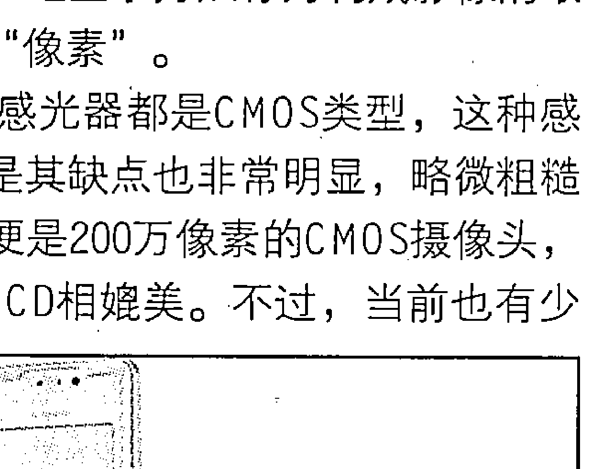

### 2. 像素插值计算：不要被数字迷惑

我们可以粗略地使用像素级别来衡量照相手机的摄像头性能，然而要特别留心的是，标称像素与真正的有效像素还是存在十分显著的区别。标称像素也可以称为最大像素，所谓的最大像素是经过插值运算后获得的。插值运算通过设在手机内部的DSP芯片或是软件，在需要放大图像时用最临近法插值、线性插值等运算方法。

根据不同的插值运算方法，标称像素与实际像素之间的表现差异也不尽相同。以市场上常见的130万像素摄像头的手机为例，不少是通过30万像素CMOS光电感应元件插值运算而得到130万像素。此时所谓的30万像素根本无法令人满意，真实表现与10万像素几乎没有区别。事实上，这类情况在一些智能手机中比较常见，因为智能手机配备了强大的处理器，此时利用插值算法十分简单。

对于消费者而言，区分实际像素与标称像素的确相当困难，因为有时商家会故意误导宣传。总之希望大家明确的是，通过插值运算而来的多余像素很难产生真正的实际效果，因此仅仅将其作为一种辅助，而不能视其为真正脱胎换骨的表现。在实际购买产品的时候，大家还需要仔细对比测试一下！

### 3. 拍照后能干什么：壁纸？贴图？打印？

不过大家还需要注意的是，手机摄像头像素所对应的分辨率不仅仅针对影像文件，也能对应纸媒介以及显示器。一般情况下，打印机输出与显示器屏幕显示都使用dpi（dot per inch）作为分辨率标准，其中打印机至少需要300dpi才能展现精美的彩色照片，而不存在扩散问题的显示器只需要96dpi就绰绰有余。也正是因为存在这样的对应关系，大家才会发现很多手机拍摄的数码照片在显示器上看起来清晰可见，而一旦打印成照片就会不尽如人意。以30万像素的手机摄像头为例，生成的照片一般是640×480分辨率，此时对应显示器的效果勉强可以接受，但是用于冲印就不现实了。而那些200万像素的摄像头可以实际生成1600×1200分辨率的数码照片。对于数码彩扩设备输出而言，1600 Pixels/300dpi=5.3英寸，也就是说200万像素摄像头拍摄的照片一般能冲印成5英寸照片，如果强行放大的话，自然会显得不够清晰。同样的道理，对于分辨率只有96dpi的显示器而言，1600×1200分辨率的数码照片就已经绰绰有余了。因此，我们的结论非常明确：30万像素几乎只能作为手机屏幕的壁纸，100万像素可以作为PC桌面壁纸或是网页贴图，而200万以上像素才能冲印照片（图2）。

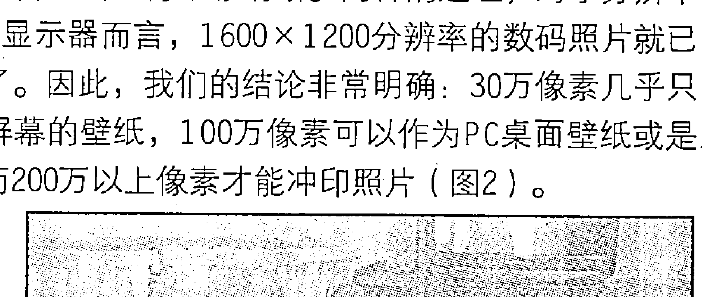

## 一、照片拍摄技巧：不要轻易否定你的手机

手机摄像头在结构上与DC有着很大的区别，绝大部分产品没有自动对焦功能，而且感光器面积较小，因此在拍摄照片时需要格外注意。事实上，通过一些简单的小技巧，我们完全可以让手机拍摄效果提升一个档次，而不再是一片模糊的景象。

### 1. 一“定”没问题：保持拍摄时的稳定性

对于DC而言，由于能够设置快门时间并且感光器本身带有电子防抖功能，因此轻微的抖动并不会严重影响拍摄效果。但是，手机拍照可就不是那么一回事了。在使用手机LCD屏幕取景时，一定要确保拿稳机身。如果方便的话，最好双手把持，这样可以基本确保镜头的稳定性，对于减少模糊现象很有帮助。另外，在取景的时候不要随意走动，指望边走边拍基本是不现实的，这会让整体效果非常难看。

在按下快门之后，建议大家不要立即移动手机位置，因为不少产品的处理芯片速度不够快，来不及进行光线计算以及写入存储卡。如果按下快门后过早地移动位置，那么很容易让对焦出现严重失误，这样其成像质量就会大打折扣。

### 2. 光线应用与拍摄角度：提高画质的关键

手机拍摄效果对于周围环境的光线非常敏感。一般而言，室外拍摄效果总是优于室内，尤其是那些没有附带闪光灯的拍照手机。无论是室内还是室外拍摄，建议大家要根据光源来选择拍摄角度。最理想的状况自然是顺着光线拍摄，此时被拍摄物体能自然地被光线照射到，形成很好的光影效果。而如果是拍摄人物大头照，那么一定要调整角度，让光线从侧面射入，这样可以更好地突出质感，还能淡化面部的瑕疵。当然，如果户外不得不逆光拍摄，那么我们建议大家用手在摄像头旁遮一下，这个简单的小技巧就可以有效缓解逆光的影响。最后还要记住一个原则，尽可能不要将手机镜头对着强光拍摄，否则照片会严重发虚，这是因为大部分手机的自动对焦和防曝光过度能力都很有限。

除了光线的应用，拍摄的取景角度也非常重要。首先建议大家不要懒惰，数码变焦远不如自己走上前几步。另外容易忽视的细节是，取景时应该让拍摄对象充满镜头，这样可以提高清晰度。考虑到大多数拍照手机的对焦能力，建议大家不要太近距离拍摄物体，否则也会形成一片模糊的尴尬。此外，直接的眼神交流会使一张照片更传神。当你拍摄人或动物的时候，让你的手机摄像镜头与对象的眼睛保持同一水平高度，抓住对象眼中流露的神采和迷人的微笑。如果你拍摄小孩或宠物的话，你必须弯腰迁就他们的高度。你的对象并不一定要看着镜头——任他（它）们随意自然，这样拍出来某个角度的眼神更能产生一种个性的、牵动人心的感觉，让你也不自觉地融入照片中。

## 二、最方便的移动影集：如何生成高质量图片

在经过多年的发展之后，彩屏手机技术已经非常成熟，如今4096色的STN伪彩屏幕已经退出了市场，取而代之的是64K色的TFT以及26万色的TFD屏幕。对于彩屏手机而言，其屏幕的清晰度远远超越摄像头的拍摄能力。毫无疑问，如今仅仅使用摄像头拍摄的照片保存在手机里未免太可惜了，毕竟网上以及电脑里的高质量照片数不胜数，而且我们也可以将DC拍摄的高质量照片导入到手机内，令其成为完美的移动相册。此外，那些拥有200万以上像素的拍照手机又渴望冲印照片，而在便携式即拍即打输出技术的帮助下，这一切都变得切实可行。

### 1. 电脑图片如何修改：使用ACDsee进行转换

电脑里的图片往往分辨率很高，但是这对于手机屏幕而言非常不便，而且浪费存储空间，为此，我们必须在导入照片之前进行一定的调整，使之更加适合手机屏幕来实现。ACDsee作为一款老牌看图软件已经拥有很强大的功能，我们这里也将使用这款软件。首先让ACDsee打开欲修改的图片，并选取需要裁剪的部分。点击左侧工具条的“矩形选框工具”，图标为虚线正方形，在图上选出截图的范围，一般要尽量选为正方形，不至于缩放后图像变形，如选错可按Ctrl+D快速取消，再重新选择。下一步是以选取的部分建立新图，选取完毕后按Ctrl+C复制选取部分，接着按Ctrl+N建立空白新图，再按Ctrl+V粘贴，图形就建立好了。大部分手机显示屏是128×128像素，为了能有最佳的显示效果，必须调整像素的大小。点击“图像”→“图像大小”，在弹出的对话框里把“约束比例”选项的钩去掉，再把像素大小框里的宽度和高度都改成128，单位是像素（图3）。

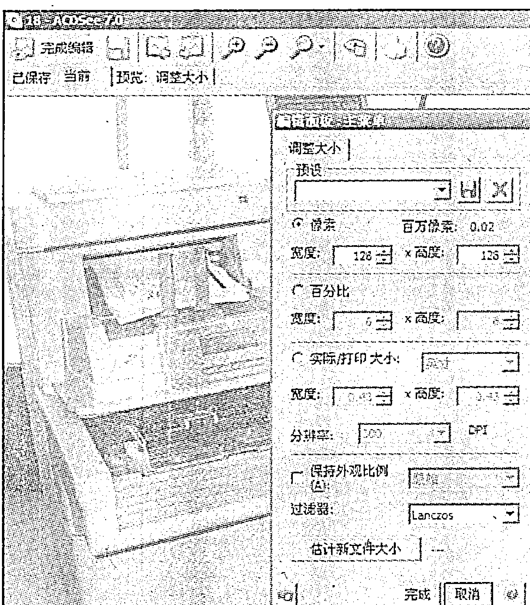

接着存储修改完成的图像，此时只要点取“文件”→“另存为”，或用快捷键Ctrl+Shift+S，弹出“存储为”对话框后起个文件名，格式栏选为JPG或GIF格式。若存为JPG格式，可选择图像的压缩品质，号码越大图像质量越好，但占据存储容量就越大，一般选为“5”。此外，如原图模糊，可以点取“滤镜”→“锐化”使图像更清晰；如原图较多色点，可点取“滤镜”→“模糊”→“进一步模糊”来使图像更为均匀和柔和；如原图色彩不佳，可点取“图像”→“调整”→“色彩平衡”进行调节（图4）。

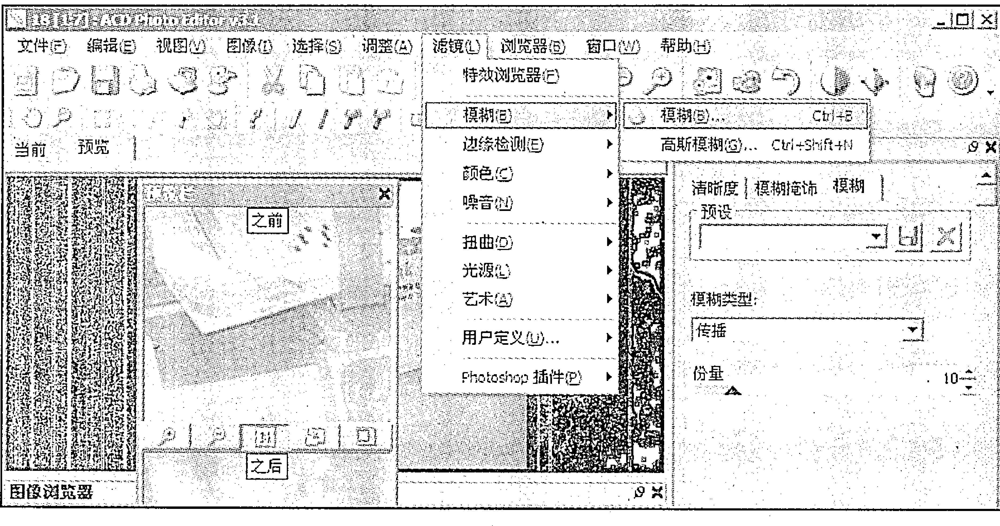

随后，我们可以通过数据线将修改后的照片回传到手机中。但是这里提醒大家注意图片转换时的分辨率设定。通常手机播放图片的分辨率是和其屏幕分辨率有关的，但部分手机往往增加了图片缩小预览功能。比如，多普达智能手机配备了130万像素摄像头，可以拍摄最大1280×960分辨率的照片，但其屏幕只能显示240×320，因此拍摄的图片在屏幕上被缩小了，但是却能够正常播放。而很多早期手机只能播放等于或者低于其最高支持的分辨率，比如三星T108，其要求分辨率为128×160，如果你将图片裁剪为128×128，也可显示，但如果改为更高则无法支持。

> > 存储空间需精打细算
>
> 非智能手机不方便的地方是内存捉襟见肘，有时导入一个图片或者铃声却被告知存储容量不够，而实际上检测总内存却还富裕，这往往是软件限制或者动态内存分配造成的。如果不能通过删除内置文件以释放内存，也可以尝试调整动态内存，比如删除部分老照片和老视频的空间，实际上是给新的图片文件腾出了位置。至于那些支持外接存储卡的手机，基本上没有存储空间的担忧，令图片保存可以随心所欲。

### 2. 手机也能即拍即打：移动照片新乐趣

在当代科技迅速腾飞的今天，一些在以往遥不可及的事物，人们开始司空见惯。换个角度说，正是科技进步，降低了幸福的门槛。以往高不可攀的拍照手机不再是奢望，而照片级便携式打印也变得前所未有的平易近人。更为令人惊喜的是，勇攀高峰的厂商突破种种技术障碍，实现了“即拍即打”。从此，打印不再是一件麻烦的事情，我们可以彻底告别冲印店，独自享受即时个人打印的乐趣。

对于用户而言，传统相机与冲印店彩扩的模式或许难以忘怀。但是紧张的都市生活加速了人们的生活节奏，拍照手机越来越得到认可。矛盾总是接踵而至，伴随而来的数码影像输出问题一直困扰着我们。将数码照片存储到电脑上，然后经过繁琐的图像编辑处理，进而使用喷墨打印机输出，最后还要进行裁剪，这或许并不是一件愉悦的事情。影像输出变成一种负担，这是所有人都不希望看到的结果，也在客观上阻碍了手机数码影像的普及。

然而，PictBridge即拍即打技术的出现扭转了局面。更为令人欣喜的是，PictBridge技术巧妙地利用了手机中的LCD显示屏，并通过其特定标准，直接使用线缆进行数据传输，不需要为了兼容不同规格的闪存卡而配置多款读卡器。毫无疑问，在这一使用环境下，用户所得到的便捷性丝毫不亚于高价位的照片打印机，毕竟此时同样能够通过手机中的LCD显示屏控制各个打印参数，而且利用线缆进行数据传输也更为方便，避免频繁地插拔闪存卡。

目前能够支持PictBridge技术的打印机以及拍照手机已经有不少。以Nokia N73手机和佳能iP90便携式照片级打印机为例，首先通过Nokia N73手机的菜单将USB输出方式设置为“PictBridge”。随后在关机断电状态下连接USB线缆，将Nokia N73与打印机直接相连。手机LCD左上角出现图标表明PictBridge模式已经被激活，此时可以通过手机的LCD屏幕操控打印机。通过上下键选择需要打印的照片，然后调用各级菜单进行分辨率、纸张、无边距模式等打印参数设置，具体方法与图像处理软件类似，只不过此时使用手机的按钮进行控制，而不是大家所熟悉的鼠标。确定打印之后，数码照片就会很方便地进行输出，整个过程可谓一气呵成，甚至比以往带有LCD显示屏的照片打印机还要方便。更为重要的是，使用PictBridge技术能够大幅度节约成本，令普通打印机也能实现脱离PC对手机照片即拍即打，在第一时间输出数码照片（图5）。

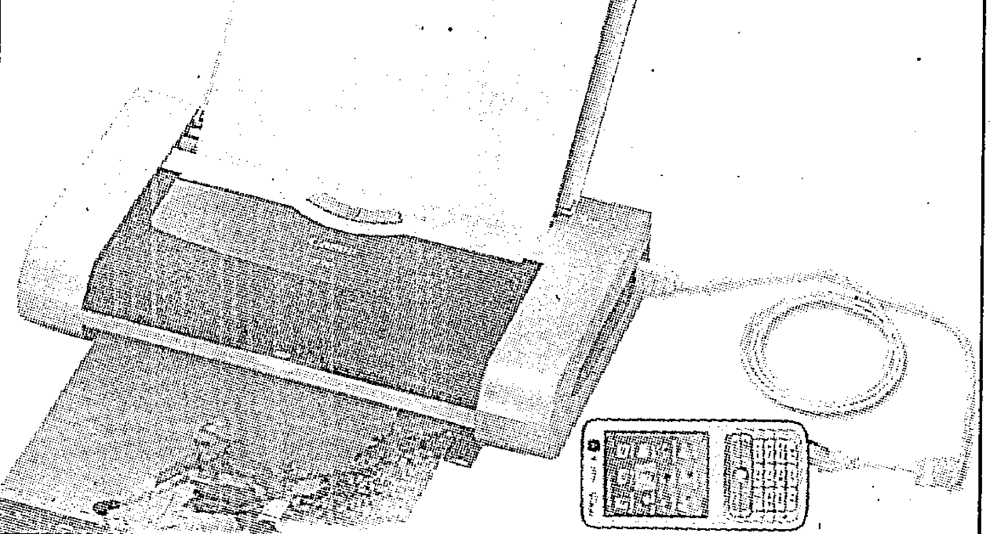

## 【图片】简单手机照片玩法

### 1. 另类操作捷径：发送彩信图片

想不想让电脑里的照片用最快的方式以彩信形式发送到用户的手机中，此时实现待机图片或是保存到手机相册里将会更加方便。事实上，要做到这一步并不难，因为ACDsee的官方网站上新增了SendMMS插件，ACDsee 5.0以上版本用户可以通过该软件实现“发送彩信”功能。在该功能的支持下，彩信手机用户只需在互联网上就可以实现彩信的发送，而不需要使用手机。更具意义的是，该功能赋予了用户完全掌握设计所发送图片内容的权力，使设计、发送彩信更加随心所欲。

虽然目前一些网站上用户也可以实现自己设计彩信图片的功能，但这些与ACDSee这个强大的图片管理工具所蕴涵的图片设计功能相比还是有一定的距离。ACDSee的这一新功能最大的价值或许不在“发送”本身，而是在于超乎寻常的“超随性”设计图片内容。使用ACDSee的彩信功能之前需要先注册手机账户，其注册方式十分传统，就是根据向导输入自己的手机号码，然后会给手机发送一条包含验证码的短信。

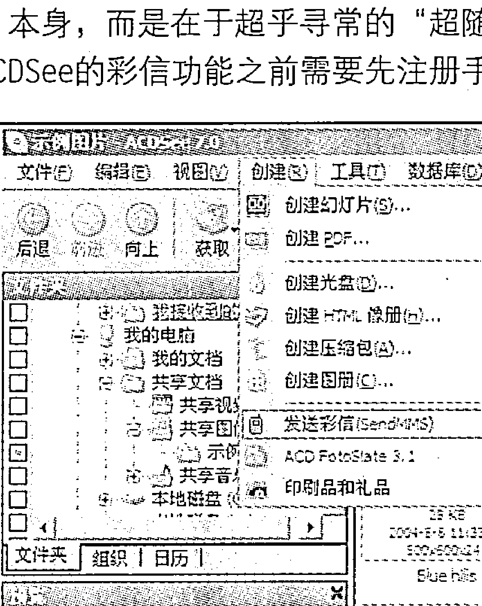

> 制作一个动态相册
对于很多智能手机而言，播放MPEG4格式的视频已经是小菜一碟，而且存储卡可以彻底解决空间问题。在这种情况下，将自己的大量照片直接制作成视频格式，然后想浏览时直接打开播放器，这种方式已经越来越流行。要实现这一步并不困难，首先将需要导入的图片全部设置为和手机屏幕相同的分辨率，然后利用VCDGear将其制作成MPEG格式，最后再使用VirtualDub等软件压缩为MPEG4格式即可。当然，此时也可以压缩为3GP格式，具体根据手机的情况来决定（图7）。

图7 可根据手机操作系统特点转换为专用视频格式

### 2. 廉价的手机博客方式

这里为大家介绍一种全新的方式，让手机能够在客户端的配合下轻松玩转移动博客。这款客户端就是PICA（皮咔），目前其普及度已经较高，而且支持很多型号的主流手机。对于用户而言，PICA甚至可以看做是一个集合各种IM即时通讯软件的整体，不过我们今天的重点仅仅是手机博客。首先在PC上登录pica.com主页，然后进入首页导航条中的“快速下载”。PICA的下载页面是一个导航过程，我们可以根据自己使用的运营商以及手机型号来下载最合适的版本，这样就免去了很多设置上的麻烦。在确定好版本之后，PICA允许用户将安装文件下载到PC上，然后通过数据线进行安装（图8）。当然，大家也可以在网站上直接填写手机号，然后PICA将该软件的WAP下载地址以短信形式发送到手机中。PICA在安装后类似一个IM即时通讯软件，而且整合了多种功能。通过其博客功能选项，大家可以轻轻松松将各种照片与视频发送上去。

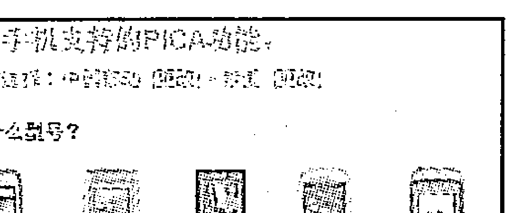

更加令人高兴的是，PICA完全支持WAP方式上网，因此玩转手机博客的花费并不高。目前中国移动的GPRS有两个网关：cmwap和cmnet网关，其中cmnet可以进行所有网络应用而没有任何限制，而wap网关只负责连接WAP开头的网站，无法登录www网。大部分城市所谓的GPRS包月，指的是通过cmwap网关发生的数据请求，也就是说如果不进行任何设置的话，我们只能使用有限的WAP博客网站，这就受到很大的限制。为了突破限制，我们可以使用代理服务器，这样所有基于cmnet的数据请求都会转到cmwap，我们也就能够轻松连接www网站了，使用HTTP方式的博客也就不是难事。

不同手机的设置方法略有区别，但是大致都包含数据连接、菜单、编辑连接等选项。以多普达575手机为例，首先将拨号连接、VPN连接、代理服务器连接、GPRS连接的所有内容全删掉，这样大家就不用担心误连cmnet了。手机内置的几个连接方案对我们而言并非完全正确，因为我们还需要设置代理服务器，此时大家进入每个设置选项中的代理服务器选项，将代理地址设置为“10.0.0.172”。对于WAP连接，代理端口设置为“9201”，而对于www连接的代理端口为“80”。随后，大家直接在手机内置的浏览器中登录博客网站的主页即可。相对而言，这种方式更加适合拥有智能手机的用户，此时拍摄的图片和录制的音频还能通过智能手机平台的各种软件直接编辑，整体效果非常出色。

> 用彩信来发博客
“彩信博客”是通过一个提供多媒体增强服务的无线网和互联网沟通平台，使移动手机用户以发送彩信的方式，实现了手机终端与互联网之间的连接。也就是说，移动用户在发送彩信时，可以接入或者管理自己在互联网上的个人博客空间。上传到个人空间的即时彩信内容，最终以Web页面的形式展现，每条彩信附带最多1万字的文字容量。由于彩信是按照条数计算的，部分地区还支持彩信优惠包，因此对于不经常更新博客的用户而言，这样比手机包月上网更划算。

## 五、拍照手机与便携式打印机推荐

随着拍照手机的像素突破百万，甚至300万像素也变得司空见惯，在窄小的手机屏幕上欣赏数码照片已非常局限。拍照手机急需突围，而将这些高像素的照片输出到相纸上，不失为一种颇受欢迎的解决方法。

### 1. 拍照手机

**索爱K790c**

这款超人气手机拥有自动对焦、摄影和录像防震功能，并且内置氙闪光灯。当然，320万像素更是巨大的诱惑。通过BestPic技术，K790c允许用户按一下相机键即连续拍摄数张照片。而在打印方面，K790c支持PictBridge标准，可以利用USB线直接连接手机与PictBridge打印机，不用PC即可实现照片即拍即打。

参考价格：1799元

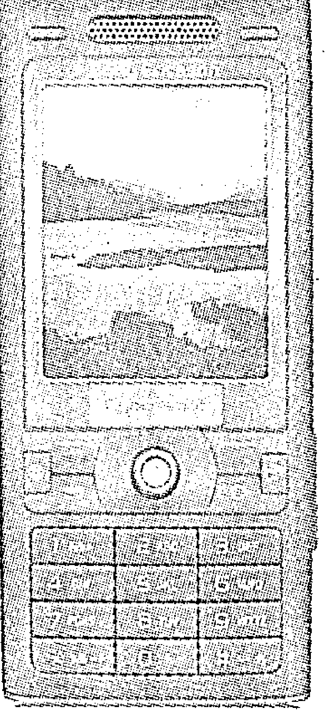

**Nokia N95**

与定位时尚的年轻用户的N73不同，有着最强配置的N93显然是针对“重度手机发烧友”，以及对多媒体拍照功能有特殊追求的高品位人士。除了具备3倍光学变焦的卡尔·蔡司天塞镜头以外，这款手机还拥有500万像素，再加上PictBridge即拍即打标准，成像品质甚至可以媲美于入门级数码相机。

参考价格：2999元

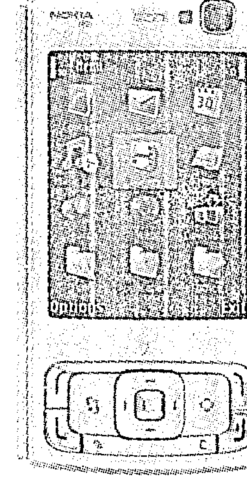

**索爱K850i**

进入500万像素年代的K850i，好的功能全保留，包括把暗黑或过亮的相片作调整的Photo Fix；从多张连拍中，选出最好的BestPic；以及近拍、闪光灯等，也在K850i中出现。另一个创新是它内建二合一记忆卡插槽，支持microSD、M2两种规格的存储卡，让使用者有更多的记忆卡选购空间。

参考价格：2320元

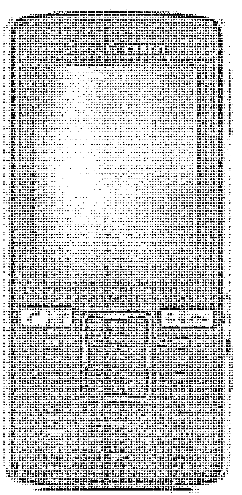

**三星SGH-G600**

G600是三星首款为GSM市场设计的500万像素拍照手机，镜头支持自动对焦，更有LED补光灯、全景拍摄模式。这些使得G600具有数码相机品质之余，还兼有手机相机应有的拍照乐趣。此外，G600更可拍摄VGA大尺寸影片，效果可媲美DVD品质。

参考价格：2199元

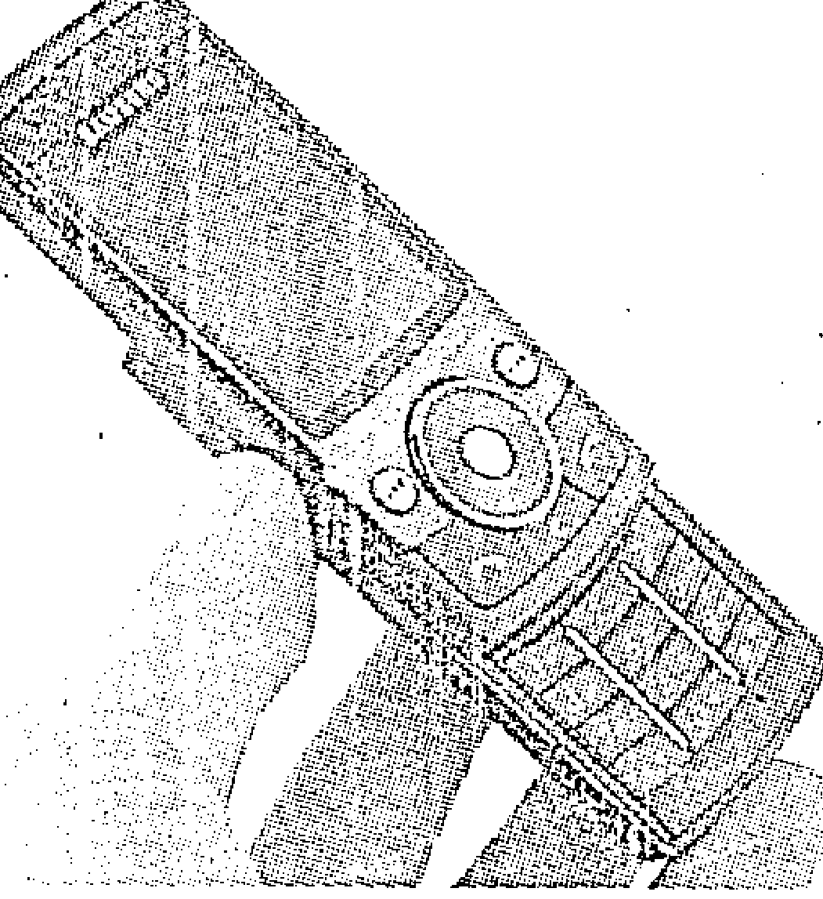

### 2. 便携式打印机

**惠普PhotoSmart 375**

外形可爱小巧，只有1.6公斤重量的PhotoSmart 148是目前最热销的便携式照片打印机之一。它们甚至可以利用车载电源进行工作，将PictBridge即拍即打功能发挥到极致。尽管PhotoSmart 375仅仅采用三色打印，但是在“富丽图”技术以及4800×1200dpi的帮助下，色彩还原效果依旧能够令人满意。由于采用了便携性设计，因此仅仅能输出A6幅面的照片，但是用于打印手机照片却正好。PhotoSmart 375还拥有2.5英寸显示屏，更加方便即拍即打状态下的操作。

参考价格：1299元

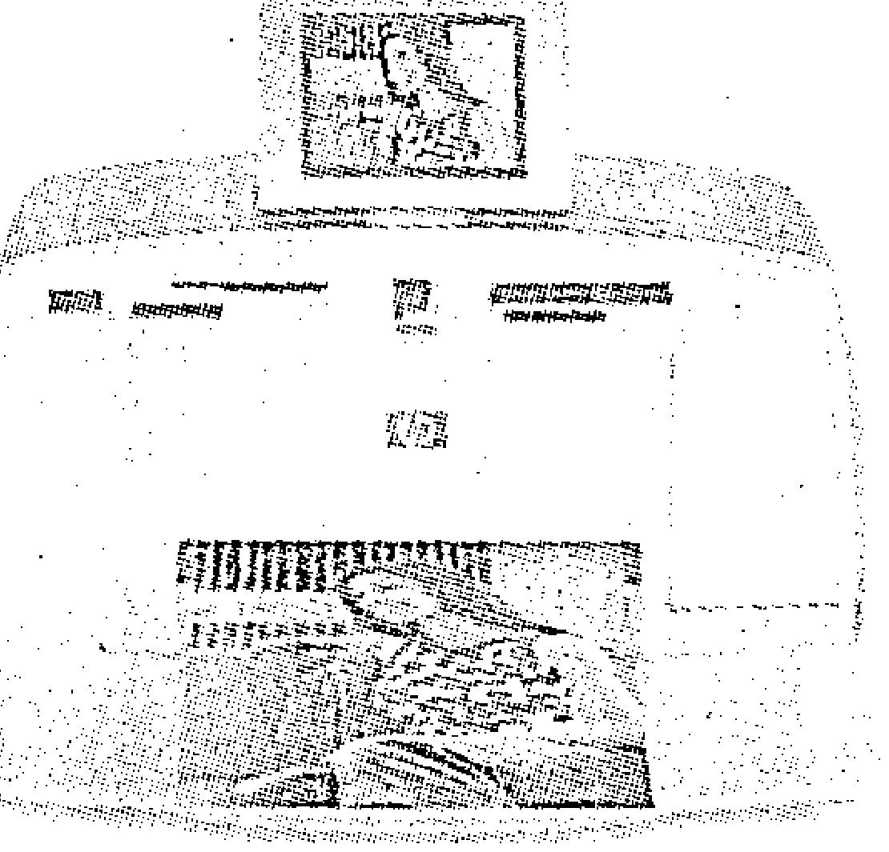

**佳能SELPHY CP600**

与传统打印机相比，这款专注于照片打印的产品在体积控制方面相当出色，通过减小输出幅面达到令人惊叹的便携性。然而更为关键的是，CP600采用了全新的热升华打印技术，能够输出更为细腻亮丽的数码照片，等价于4800dpi彩色喷墨的精细度。此外，CP600可以采用Canon NB-CP1L可充电电池，以实现完全便携式的操作，甚至可在PictBridge即拍即打模式下配合拍照手机进行脱机打印。在省去了墨水供给装置之后，热升华打印机实现纤巧的身材也就变得轻而易举。

参考价格：1600元

**Epson PictureMate 100**

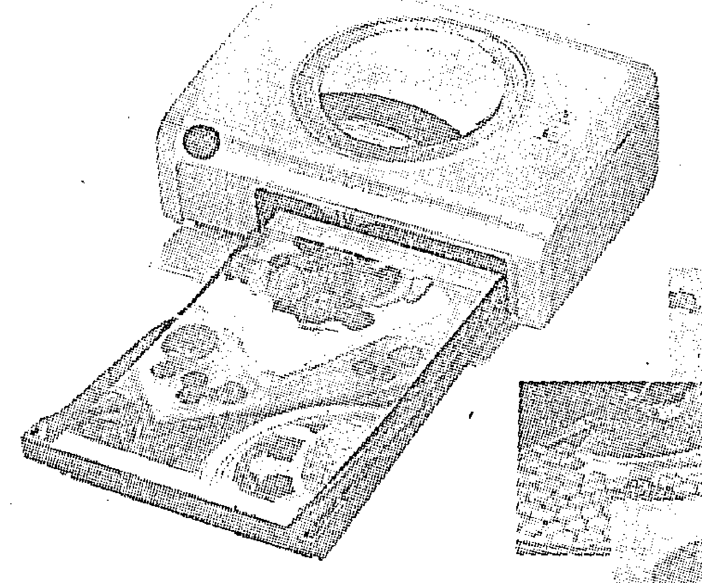

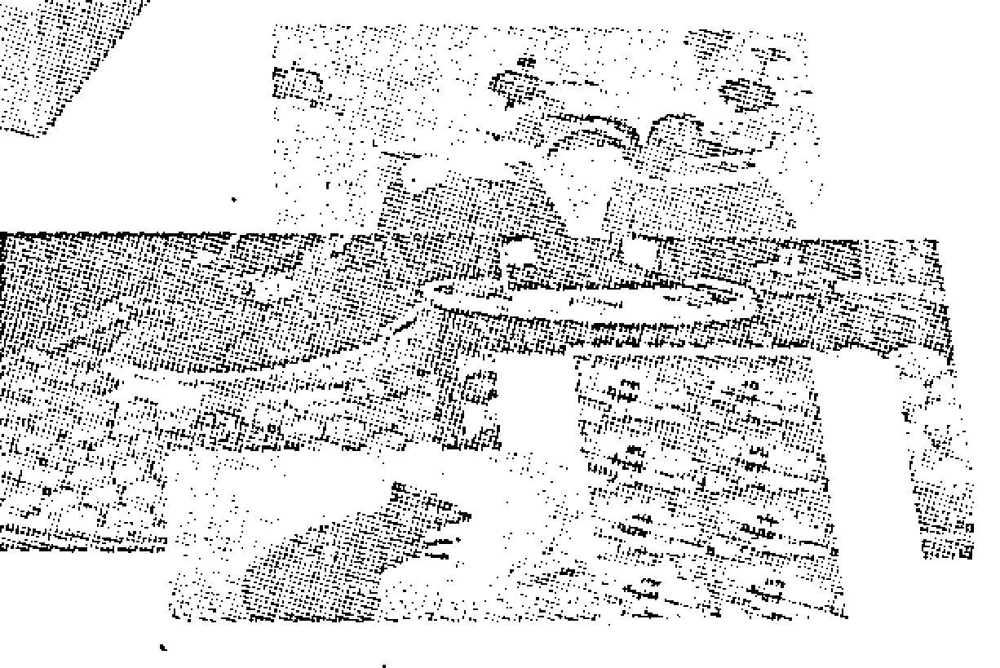

PictureMate 100采用四色染料墨水和3微微升的超精细墨滴，最高分辨率高达5760×1440dpi，为精美细腻的照片画质输出提供了强有力的硬件支持。而其所融入的爱普生第二代全真数码影像打印技术及ExifPrint技术则为照片打印的精确度提供了技术保障。在易用性方面，PictureMate 100也表现突出，无论是蓝牙无线打印还是通过闪存卡直接打印，又或是PictBridge即拍即打都非常方便。此外，PictureMate 100还可以选配电池，这样就能实现4～5小时连续打印，令户外使用更加方便。

参考价格：1380元

## 奥运赛事IT风行

□书虫

2008，全球最引人关注的大型赛事，无疑是第29届奥运会。而且这一届奥运会，主要在中国北京举办。相信这一盛事一定会是大众非常疯狂的，不过，现在的信息量太多。我们如何在假期里看到自己喜欢的节目，获得自己感兴趣的内容？如何第一手得到消息？怎样保证看赛、工作两不误？第一时间看到评论？第一时间亲耳听到最为有趣的新闻？怎样保存这些视频，并刻录成盘送给亲朋好友留作纪念？

### 一、关注官方网站

奥运会的信息当然会先发布在官方网站上，但是现在奥运网站众多，这里给大家介绍几个网站：

#### 1. 关注体育门户/官方网站

- **(1) 关注相应网站**

奥运会是全球的盛事，因此国内一些大的站点都辟出专门的频道来报道相关事宜。如搜狐网：http://2008.sohu.com/（如图1）、新浪网：http://2008.sina.com.cn/、网易：http://2008.163.com/、腾讯网：http://2008.qq.com/、CCTV：http://aoyun.cctv.com/、雅虎中国：http://2008.cn.yahoo.com/，百度：http://2008.baidu.com、第29届奥林匹克运动会网站：http://www.beijing2008.cn/、中国奥委官方网站：http://www.olympic.cn/、新华网奥运频道：http://www.xinhuanet.com/olympics/beijing2008.htm、人民网奥运频道：http://www.xinhuanet.com/olympics/beijing2008.htm。

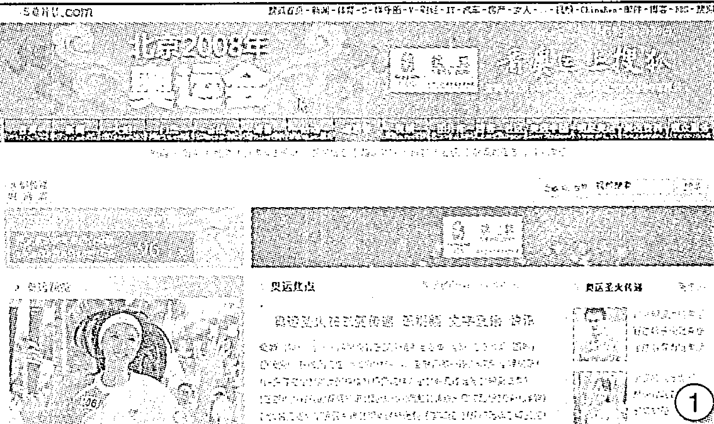

- **(2) 打造无处不在的收藏夹**

这些网站一般消息非常及时，内容都非常丰富，因此大家只要打开它们，就可以很快得到一手的资讯。如果你使用的是傲游Maxthon2浏览器，只要将它们保存到收藏夹。然后在启动Maxthon2时，在打开窗口中选择第二项“使用我自己的帐户启动”（如图2），这样所有的设置将保存在服务器上。如果没有账户，请自行注册。

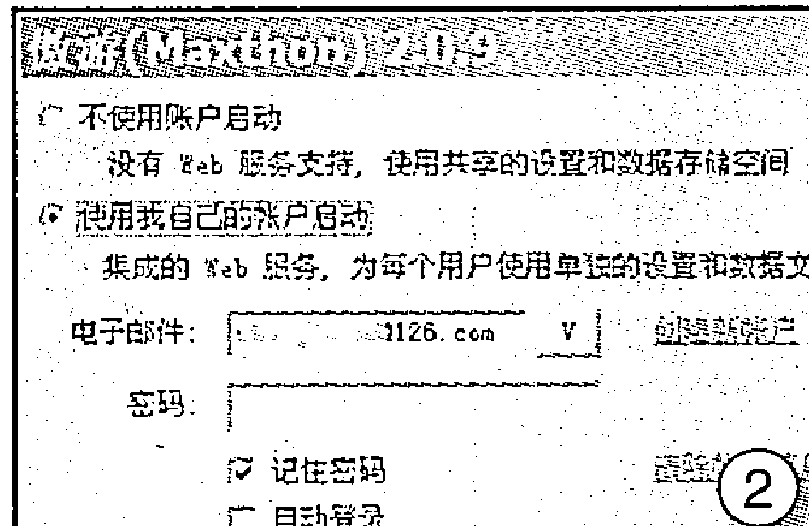

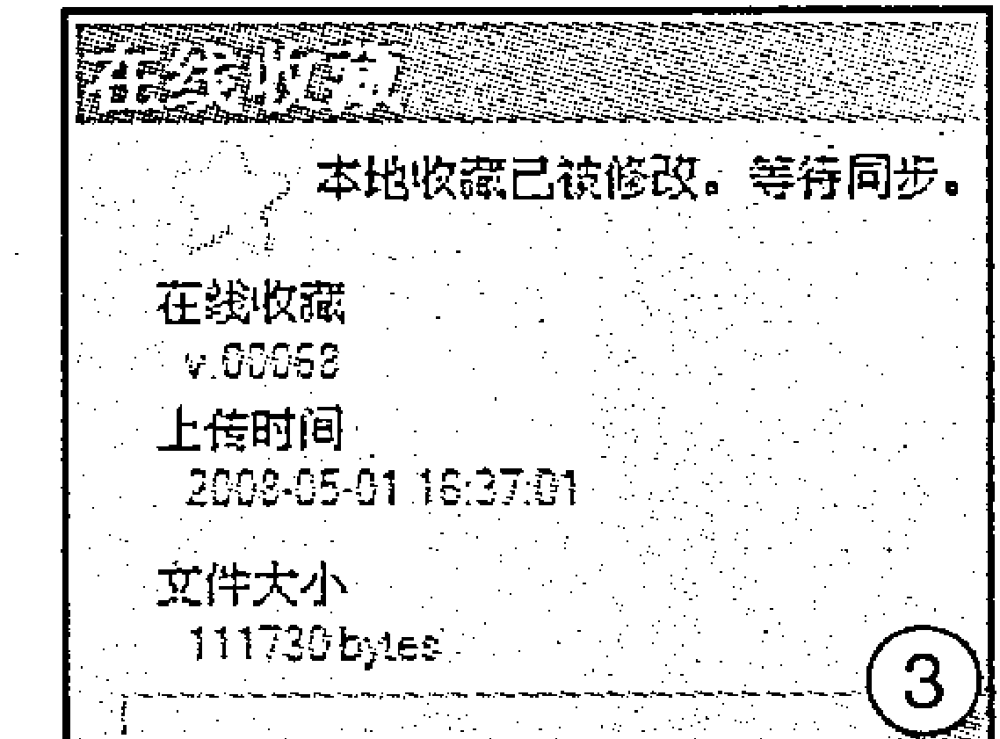

接着，选择“收藏”→“更多操作”→“同步在线收藏”，即可同步成功（如图3）。同样，选择“文件”→“用户数据上传下载”，之后，选中所有的选项，再单击“上传”可将设置上传至服务器。

以后只要下载并安装Maxthon2，同样选择“使用我自己的帐户启动”。之后，选择“收藏”→“更多操作”→“同步在线收藏”来同步收藏夹。接着，再选择“文件”→“用户数据上传下载”，之后，选中所有的选项，再单击“下载”即可保证使用最新的数据。我们的网站当然也可以随时访问了。

### 二、订阅信息RSS

在门户网站大行其道的今天，人们已经习惯通过搜索引擎来获取新闻资讯的今天，一种全新的资讯传播方式已经悄悄地来到我们身边。它就是RSS，即简易信息聚合技术（RSS: Really Simple Syndication），有了它，我们可以更为专心地获取自己需要的内容。因为Maxthon提供了保存RSS列表的功能（只要我们注册并登录了用户），因此我们推荐使用Maxthon2来阅读：

只要使用的是Maxthon，安装后，单击工具栏上的五角星，之后会打开其侧边栏。我们单击RSS Feed按钮即可打开其内置的RSS功能。之后，在网页上有RSS源时，可以单击“添加此Feed到傲游浏览器‘我的订阅’侧边栏”链接，再选择相应的分类。最后将其添加到列表中（如图4）。

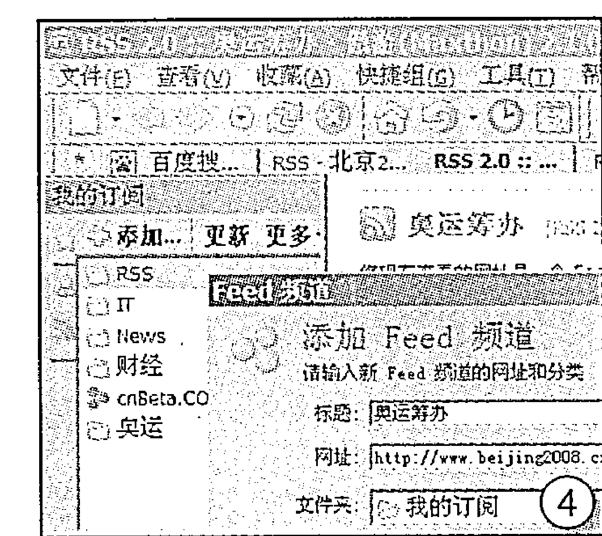

之后，我们单击相应的RSS源，可以在下方看到如图5所示的窗口，单击下方的链接即可打开查看相应的信息窗口了，非常方便。

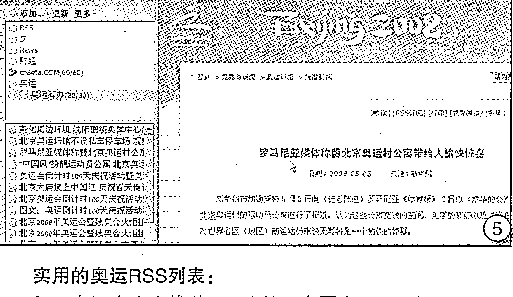

**实用的奥运RSS列表：**

- 2008奥运会官方推荐RSS（其下有更多子RSS）: http://www.beijing2008.cn/rss/
- 搜狐体育: http://rss.news.sohu.com/rss/sports.xml
- 新浪体育: http://rss.sina.com.cn/news/allnews/sports.xml
- 网易体育（综合）: http://sports.163.com/special/00051K7F/rss_sportszh.xml
- 谷歌奥运: http://news.google.cn/news?complete=1&hl=zh-CN&newwindow=1&q=%E5%A5%A5%E8%BF%90&um=1&ie=UTF-8&resnum=1&output=rss
- 百度奥运: http://news.baidu.com/ns?word=%B0%C2%D4%CB&ie=gb2312&cl=2&rn=20&ct=0&tn=newsrss&class=0
- 百奥谷-百奥谷奥运公益网: http://feed.feedsky.com/andysky
- 奥运经济: http://rss.cnfol.com/1885.xml
- 奥运股市: http://rss.cnfol.com/1886.xml
- 奥运营销: http://rss.cnfol.com/1887.xml
- 后奥运经济: http://rss.cnfol.com/1888.xml
- 奥运动态: http://rss.cnfol.com/1892.xml
- 奥运商机: http://rss.cnfol.com/1893.xml
- 奥运收藏: http://rss.cnfol.com/1889.xml
- 分析评论: http://rss.cnfol.com/1890.xml

### 三、搜索相关新闻

多数的奥运内容是以新闻形式发表出来的，这里给大家一些搜索新闻的技巧：

#### 1. 使用谷歌和百度的新闻

打开http://news.google.cn/news?complete=1&hl=zh-CN&newwindow=1&q=%E5%A5%A5%E8%BF%90&um=1&ie=UTF-8&sa=X&oi=news_result&resnum=1&ct=title（如图6）和

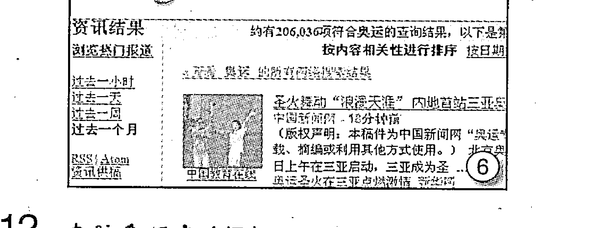

http://news.baidu.com/ns?word=%B0%C2%D4%CB&tn=newstitle&from=news&ie=gb2312&bs=%B0%C2%D4%CB&sr=0&cl=2&rn=20&ct=0（如图7）可以打开谷歌和百度的奥运新闻。

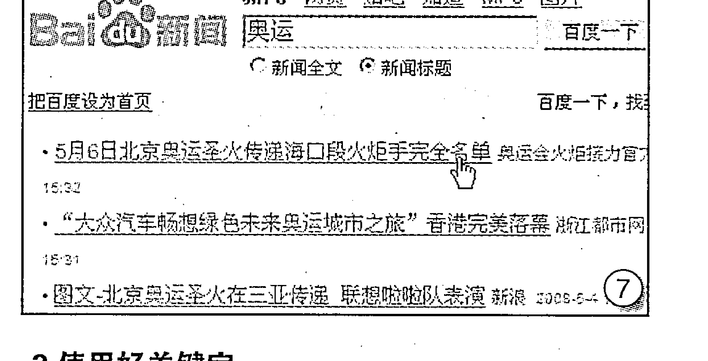

#### 2. 使用好关键字

查看奥运新闻不一定以“奥运”为关键字，同时还可以以运动员的名字和比赛项目、比赛场地为关键字来搜索，如刘翔、100米跨栏、鸟巢等。

#### 3. 使用好site参数

谷歌和百度在搜索时有一个参数site，利用它，可以指定相应的网站。如输入 刘翔 site:sina.com，则会找到新浪网上所有与刘翔相关的信息（如图8）。

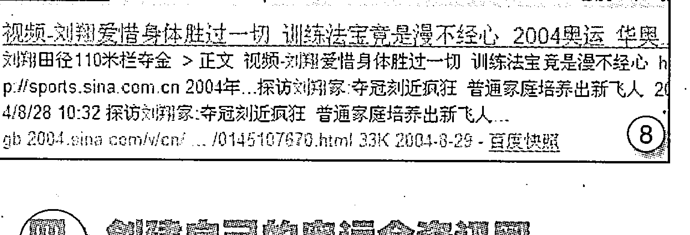

### 四、创建自己的奥运资源网

Google个性化主页可以允许我们自行定义资讯，这样只要我们设置Google为主页和个性化主页功能，则一打开就是我们想看的内容。利用这一功能，我们就可以将奥运会的资料即刻呈现在眼前。

先打开http://news.google.cn，单击右上角的“登录”，在打开窗口中输入gmail用户名和密码。再单击“设置自定义首页”链接（如图9）即可打开如图10所示窗口，在这里单击“添加自定义栏目”链接，并在打开窗口中单击“关键字”框，在其中输入关键字，如“奥运会”（如图11），单击“添加榜上”，之后依次单击相应链接回到主窗口。我们就可以在右上角看到相应的内容了（如图12）。

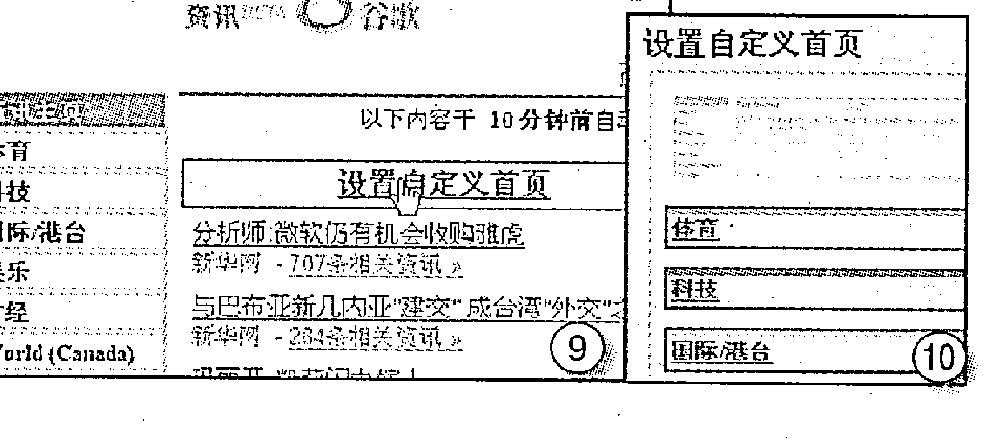

### 五、收看奥运网络电视

心理学研究表明，声音和视频对于人的学习刺激比文字要有效得多，也容易记忆得多。现在随着带宽的增加，很多财经类的视频节目也搬到网上了。

#### 1. PPlive

打开后，直接在右上角输入奥运关键字即可搜索到相应的频道，单击后可以收看。不过，它并不支持CCTV5，搜索后只有奥运动画频道，这些只有让孩子们学习了（如图13）。

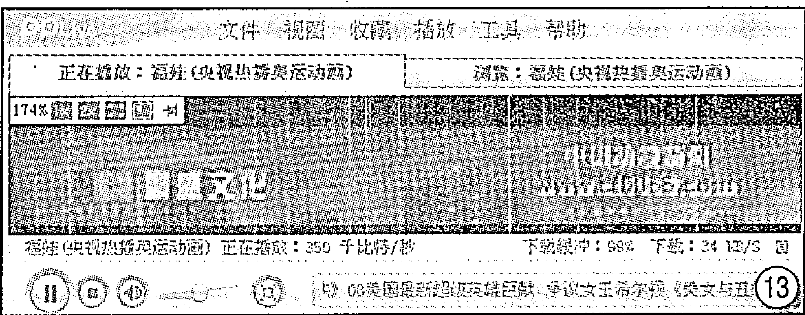

#### 2. PPMate

打开后，单击“电视台”标签，在左下可以看到CCTV-5，打开后即可收看（如图14）。同时，它还提供了录制功能（如图15）。

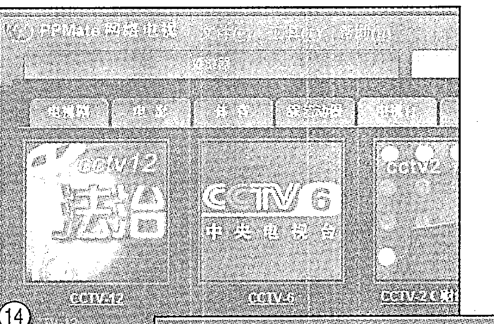

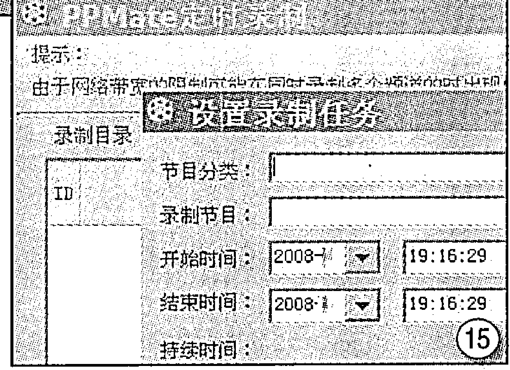

#### 3. UUSee

UUSee目前没有提供CCTV-5直播服务，也只有在其中输入奥运关键词来查找相应的视频。在播放电视视频时，可以看到下方有一个REC按钮，单击后即会出现相应的对话框，让我们来选择保存位置和文件名，可以做到实时录制，保存后的文件为wmv格式（如图16）。

单击上方的“录制”标签，然后再单击“新建”按钮，则可在打开窗口中选择录制的频道、录制的时间及保存的位置，这样就可以做到定时录制了。录制后的节目可以保存到移动设备中进行播放，如MP4、MP5等。

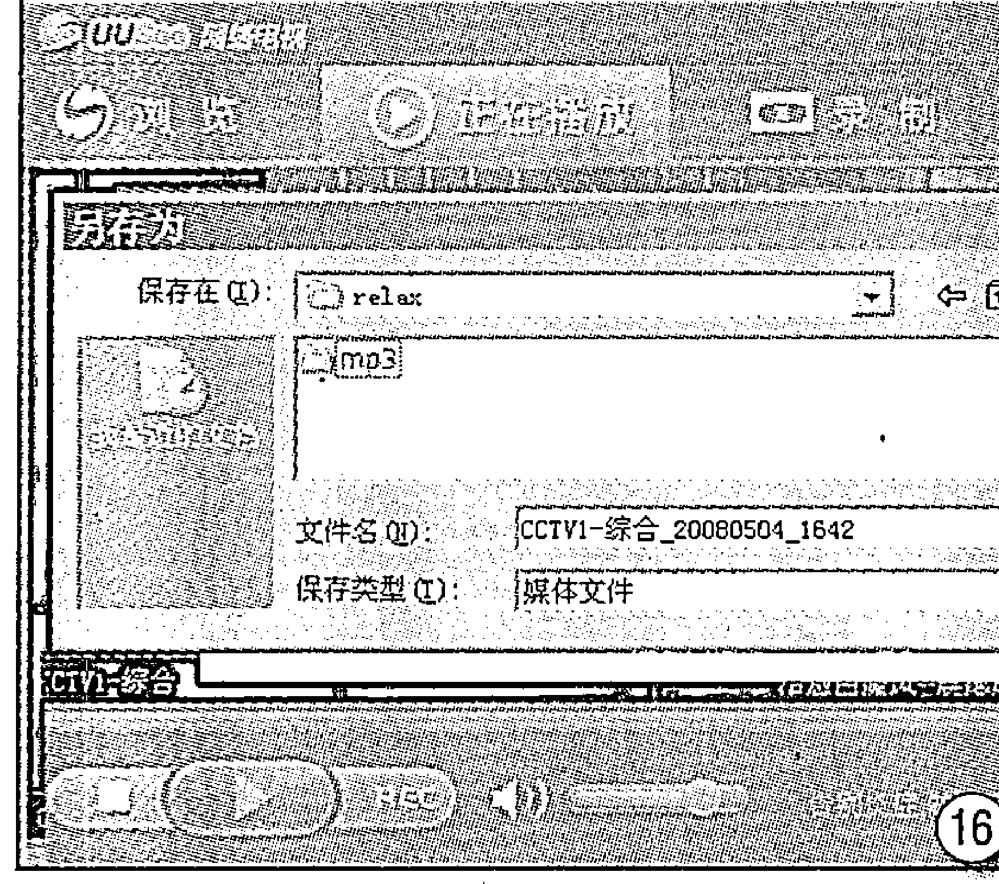

### 六、录制奥运节目

如果能够将奥运的内容录制下来，放到移动硬盘收看倒是一个不错的主意。有幸的是，现在的电脑和电视盒提供了这样的功能。

**第一步：设置自动开机**

现在的主板都提供自动开机功能，大家只要在主板的BIOS中作一些设置即可：重启电脑，并在开机时按下Del键，进入BIOS设置程序，选择“Power Management Setup”，然后移动上下左右方向键到“Powr Up Control”中的“Automatic Power UP”，将其设置为“Everyday（每天）”或“By date（某一天）”，一般选前者，然后再在下面的“Time (hh:mm:ss) Alarm”中设置每天定时开机的时间。在这里，我们设置为10:30，设置完毕后按Esc键返回至主界面，再按下F10键保存设置。

**第二步：设置自启动Windows**

接下来，我们应该让机器自动引导Windows：右击桌面上“我的电脑”图标，选择“属性”命令。在打开的“系统属性”设置对话框中单击“高级”标签，然后再单击“启动和故障恢复”按钮。在打开的如图17所示的设置对话框中，从“系统启动”下的“默认操作系统”下拉列表框中选择一个默认的操作系统，如Microsoft Windows XP Professional。然后取消“显示操作系统列表”前复选框。以后自动开机时，电脑将默认进入Windows XP（如图17）。

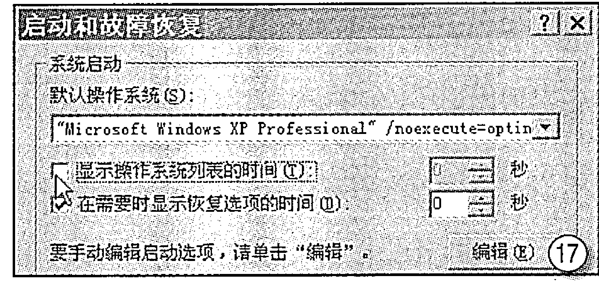

**第三步：实现自动登录**

即使电脑自动启动，并能够引导Windows，但很多人的Windows中都设置了多用户。这样，Windows在启动时必然会要求我们输入登录名和密码而无法自动登录。这时，可以从http://dl-sh-ocn-2.pchome.net/02/4v/tweakui.exe上下载并安装Tweak-UI 1.33汉化版。下载后双击EXE，将其解压到c:\windows\system32文件夹下。然后打开“控制面板”，双击“Tweak UI”图标。再在打开的“Tweak UI”设置对话框中单击“网络”标签，在“用户名”和“口令”中键入欲自动登录的用户名（如图18）和相应密码即可让Windows在开机时以相应的用户自动登录。

> 小提示
> 请选择合适的硬盘分区存放采集到的视频文件，硬盘分区尽量选择靠前的分区，采集前做好硬盘的碎片整理以提高视频文件写入速度，其他选项按默认值。

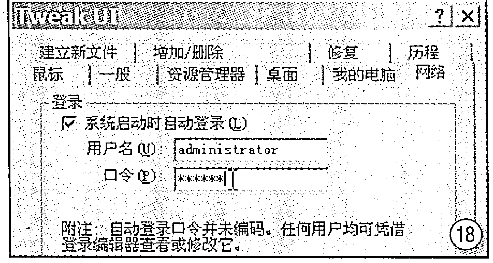

**第四步：安装驱动程序**

购买电视卡，现在的电视卡按接口分主要有PCI和USB两种，可以把我们的电脑变成一台高级数字录像电视机。收看的频道很多，而且附着的软件也挺多的。还配备有功能齐全的遥控器，让我们使用电脑看电视比用普通电视机更方便。在安装上电视卡后，一定要正确安装其驱动程序才能够使其正常工作。建议大家将驱动程序从光盘上备份到硬盘上，以方便我们使用。

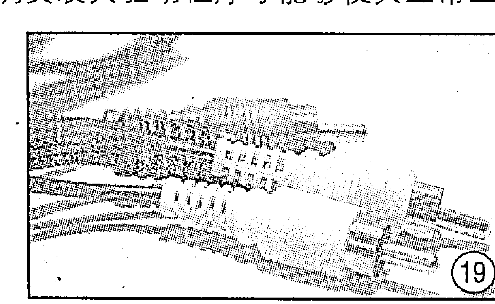

安装好驱动程序后，用电视线连接墙上有线电视插座和电视卡（如图19）。

> 小提示
> 电视卡和电视盒不一样，电视卡必须开主机才可以看电视，电视盒不用开主机就可以看电视。要实现录制，最好是用电视卡来录制。

**第五步：设置录制格式**

笔者电视卡送的电脑程序是WinDVR，这是一款非常著名的录制程序。笔者感觉其功能也挺强大的，因此也很喜欢。首先我们来设置其录制格式：先安装WinDVR，然后右击画面，选择“设置”命令，再在弹出窗口中单击“录制”标签，如图20所示，我们可以看到WinDVR提供了“良好”、“更好”和“最好”三种固定录制模式，其中“最好”是标准的DVD视频格式，我们可以自行选择。

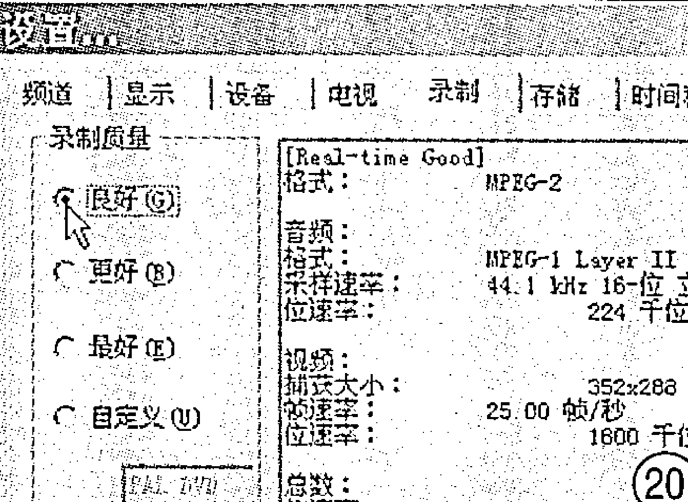

**第六步：设置录制路径**

由于录制的视频一般都比较大，因此我们有必要设置一下保存路径：右击WinDVR播放画面，选择“设置”命令，再在弹出窗口中单击“存储”标签，在此窗口中可以将保存录制视频的路径修改至有较大空间的硬盘或分区上（如图21）。

| 驱动器 | 可用空间 |
| --- | --- |
| C:\ | 4191 MB |
| D:\ | 26450 MB |
| E:\ | 41560 MB |
| 存储位置 | d:\My Videos\ |
| 系统保留 | 500 MB |
| 用于录制 | 8691 MB |
| 总计 | 10001 MB |

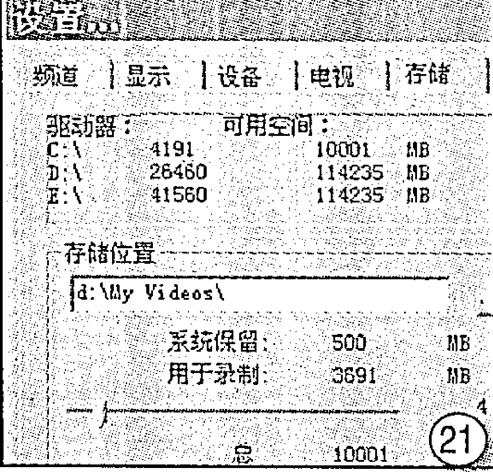

**第七步：实现定时录制**

右击WinDVR画面，选择“定制时间”命令（如图22），再在打开窗口中单击“创建”按钮（如图23）。接着在打开窗口中设置当前任务的名称，如“录制奥运会”，“任务类型”为“录制”，“视频源”为“电视”，接着再选择相应的电视频道（如图24）。完成后，单击“下一步”按钮。

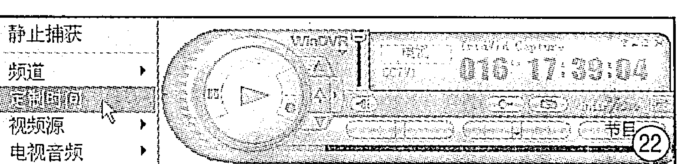

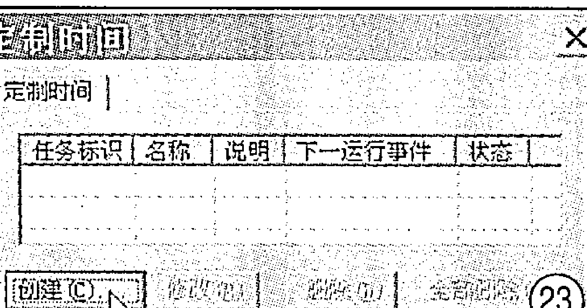

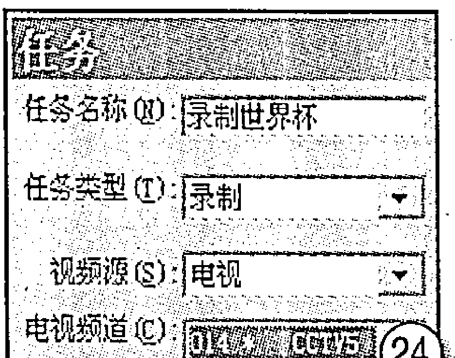

接着，在打开窗口中选择“录制质量”为“更好”，同时估计一下录制时间长度（如图25，默认为30分钟）。单击“下一步”按钮，在打开窗口中选择录制频率，同时设置一下录制的时间。如图26所示，我们已经成功添加了定时录制奥运会的任务。

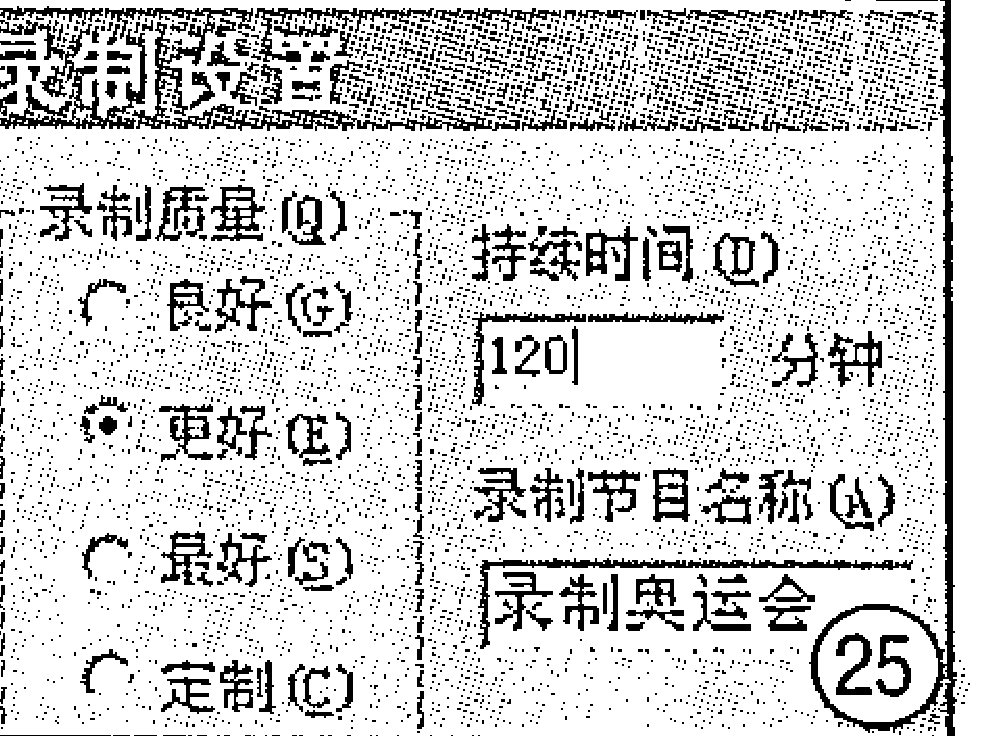

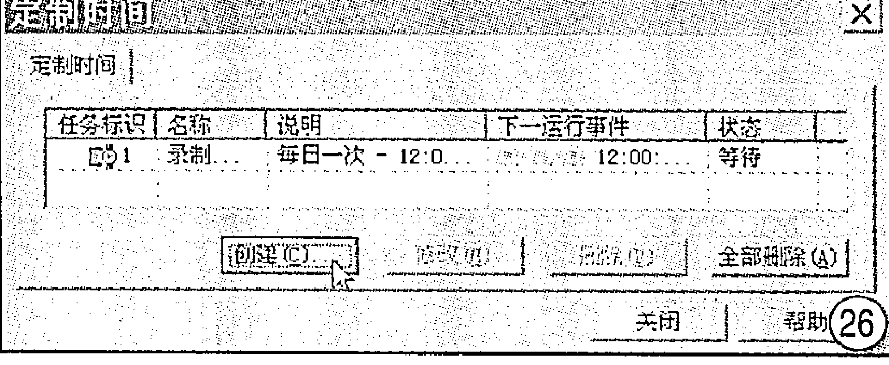

**第八步：自动录制视频**

进行上述操作后，到了指定时间，将会把相应内容录制下来。之后就可以拷贝到笔记本电脑或者移动硬盘里带到公司里观看了。

上班时间老板可不允许我们听新闻，但我们有办法来录制。

**1. 网录**

- **第一步：下载Foobar2000**

现在使用Foobar2000的人很多，我们下载并不难。同时在安装时请选择“完全”类型（如图25）。

- **第二步：下载mslive插件**

从http://acropolis.lokalen.org/foobar2000/foo_input_mslive.zip处下载foo_input_mslive.zip，用WinRAR解压到Foobar2000的安装文件夹下的components文件夹中。

很多广播电台也会争相报道。因此，我们也完全可以将奥运会通过收音机录制下来，然后将其保存到MP3播放器中收听。

## 第一步：准备相应硬件
启动你的Windows，并确认已经正确安装好声卡驱动程序，使之能够正常发出声音。接着，请准备一根对录线（如图30），对录线可以到当地电子电脑市场购买，价格在七、八元左右。如果需要较好的，价格可能在十元左右。接下来，把麦克风插入声卡的MIC口，把对录线的一端插入声卡的Line In口，另一端插入收音机的Phone（耳机）插孔中。然后再把另一根对录线的一端接在声卡的Speaker或Line Out口，另一端接到音箱的Line In口中。

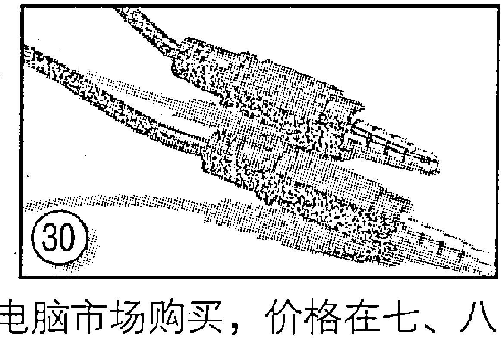

## 第二步：设置录音源
选择“开始→程序→附件→娱乐→音量控制”，打开“音量控制”窗口，然后选择“选项→属性”命令，在打开的“属性”窗口中选择“录音”，然后选中所有可录音的项目，按下“确定”按钮后，再在打开的窗口中单击“线性录制”下的“选择”前复选框（如图31）。完成后，关闭此窗口。

| 麦克风 | CD音频 | 线路输入 | Wave |
| --- | --- | --- | --- |
| 平衡 | 平衡 | 平衡 | 平衡 |
| 音量 | 音量 | 音量 | 音量 |
| 选择 | 选择 | 选择 | 选择 |

打开音箱，并调节好收音机和音箱的音量，直至满意。如果觉得效果不是很好，可以选择“开始→程序→附件→娱乐→音量控制”，打开如图32所示窗口，并从中调节滑杆来调节“线路输入”（Line In）的音量即可使其到合适的音量。

| 音量控制 | 波形 | 麦克风 | CD音频 | 线路输入 |
| --- | --- | --- | --- | --- |
| 平衡 | 平衡 | 平衡 | 平衡 | 平衡 |
| 音量 | 音量 | 音量 | 音量 | 音量 |
| 选择 | 选择 | 选择 | 选择 | 选择 |

## 第三步：安装录音软件和编码器
从http://download.phome.net/multimedia/audio/11574.html找到并下载Messer软件，之后用WinRAR打开它。再双击其中的messser-v098-setup.exe，并采用“一路回车”法完成安装。

> 关于Messer软件 Messer是一款非常有个性的软件，它不仅可以直接将任何通过声卡播放的声音实时录制成WAV或MP3文件，无需先把音源录制成WAV文件，然后再转换成其他格式，可以节省不少时间。同时，Messer还提供有计划定时录制、自动关机等功能，这是其他同类软件所望尘莫及的。

## 第四步：使用WMP11
从http://www.microsoft.com/downloads/details.aspx?FamilyID=1d224714-e238-4e45-8668-5166114010ca&displayLang=zh-cn处可以下载到Windows Media Player 11 for Windows XP，得到wmp11-windowsxp-x86-zh-cn.exe，将其重命名为WMP11.exe。双击并安装之，同时重新启动计算机。

## 第五步：找到直播地址
打开一个直播网站，右击相应的对象，选择“属性”命令（如图27），之后在打开窗口中可以看到相应的地址，如mms://live.xxxx.com等（如图28）。

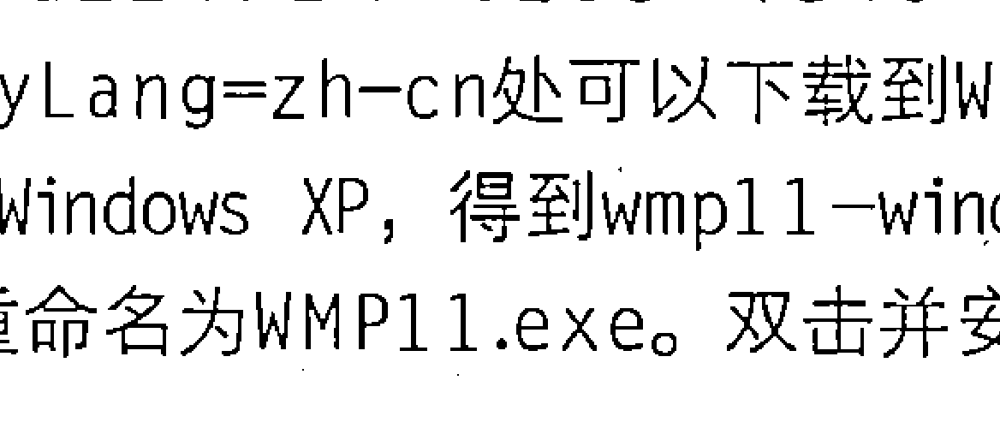

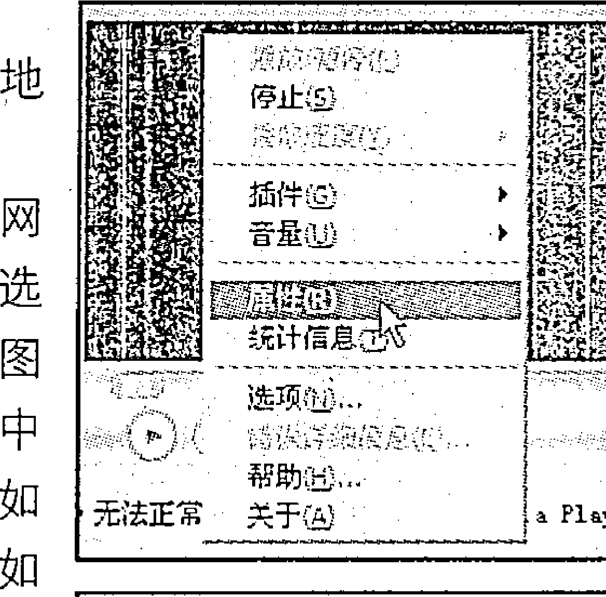

## 第六步：准备MP3Encoder
从http://lame.sourceforge.net下载到Lame（MP3编码器）。然后把其中的所有文件解压到Foobar2000的安装文件夹下，如C:\Program Files\foobar2000。

## 第七步：输入直播地址
启动Foobar2000，选择“文件”→ms streams→Add stream url，再在打开窗口中输入上述地址，设置类型为Detect，单击OK按钮（如图29）。

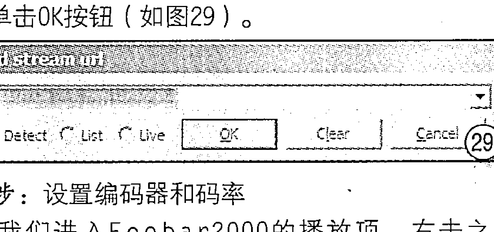

## 第八步：设置编码器和码率
右击我们进入Foobar2000的播放项，右击之，选择Convert→转换到，在打开窗口中可以按提示选择“编码预置”为“MP3（LAME）, 190 kbps, V2, fast ...”。接着单击右侧的...按钮，在打开窗口中可以设置码率，之后单击“确定”按钮。

## 第九步：开始录制
此时会出现警告窗口，单击“是”确认录制。在打开窗口中选择录制文件名，之后即可看到相应的录制窗口。完成后，直接关闭窗口，同时退出Foobar2000即可。

## 第十步：使其静音
这时，我们将Foobar2000的音量调至最低或静音都不会影响录制。

## 第十一步：享受mp3
最后获得了mp3，可以在下班前拷贝到MP3播放器在路上听。

## 2.线录
接下来，从http://www.free-codecs.com/Lame_Encoder_download.htm下载编码器文件，然后用WinRAR打开它，然后把其中的所有文件解压到Messer的安装文件夹下，如C:\Program Files\Messer，即可完成MP3编码器的安装。

## 第四步：设置Messer
选择“开始→程序→Messer→Messer”启动Messer。然后单击Configuration（配置）标签：Messer Enlargment factor X times larger than normal（放大因子）下拉列框，从中选择3/2。

接着单击主窗口中Configuration标签，再在I.Sound properties for manual sesseins项下，首先选择mp3 compression；然后通过分别下拉菜单，选择Stereo（立体声）、sample rate（采样率）选择48.00KHz；单击mp3按钮，在弹出菜单中选择LameEnc。然后从下滑菜单中选择编码比特率，数值越高，效果越好，当然文件体积也会越大；建议选择128Kbit/s（如图33）。要注意的是，如果你愿意，也可以选择更好的编码比特率。这样音乐质量会高很多，但同时也会占用更多的硬盘空间。

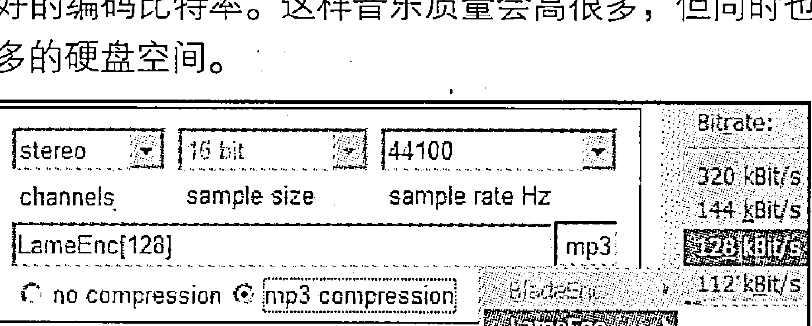

## 第五步：设置录制时间
单击Session Manager（录制事件管理器）标签，在Start Session At后面输入录制起始日期和时间，再单击Filename后面的“打开”小图标，设置一个文件保存位置，同时设置保存文件类型为MP3（如图26），最后单击Add（添加）按钮把此事 件添加到上方窗口中。最后选中下方Shutdown computer after session（录制完成后自动关机），如图34所示。

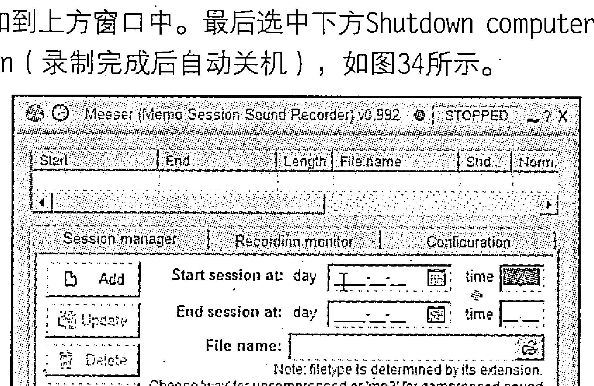

## 第六步：让Messer随系统启动
接下来，要为Messer的可执行文件，如<c:\Program Files\Messer\MESSER.exe>在“开始→程序→启动”组中建一个快捷方式，这样Windows启动后就会自动启动Messer。

## 第七步：实现自动录制
现在只要打开收音机，调到相应频段，到指定时间，机器会自动启动并会运行Messer，然后录制好节目，并在录制完成后自动关机。第二天早上醒来，就可以将录制下来的MP3放到自己的MP3播放器中收听了。

## 八 收看手机奥运新闻
随着新媒体的发展，现在手机也可以收看奥运新闻了。

手机收看新闻有几种方法：WAP、上网、电视。前两者的费用较高，相信到了奥运期间会便宜一些。而有一些手机已经内置了电视功能，如可以收看凤凰卫视或中央电视台。

相信随着雅典奥运会的来临，全国上下必定会掀起奥运收视热潮。届时使用者可以利用智能手机随时随地地收看各种体育赛事的转播，一边为我国的奥运健儿加油，一边体验电视手机时代的动感生活。

## 九 视频格式转换有招（视频 音频）
现在MP3、MP4拼命降价，早已“飞入寻常百姓家”！如果我们能够将录制下来的视频放到MP3或MP4中，随时欣赏，那倒是不错的主意。有幸的是，有了万能视频转换器Xilisoft Video Converter，我们完全可以搞定！而且，它还可以在DVD、VCD、SVCD、MOV、RM、AVI、MPEG、WMV等格式间相互转换，而且可以指定视频和音频编码器、设置各项输出参数，真正把视频、音频“玩弄于股掌之间”！

### 第一步：添加转换文件
打开Xilisoft Video Converter后，单击Add按钮，然后在打开的窗口中添加文件，要注意的是，我们可以按Ctrl或Shift键多选文件，从而可以批量转换（如图35）。要注意的是，Xilisoft Video Converter支持大部分的视频、音频格式，包括传统的和新出现的都已经支持。

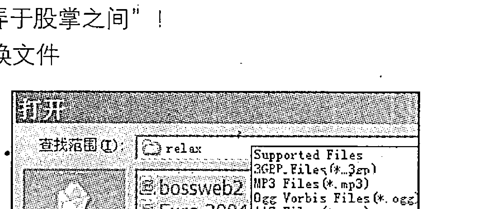

### 第二步：设置输出格式
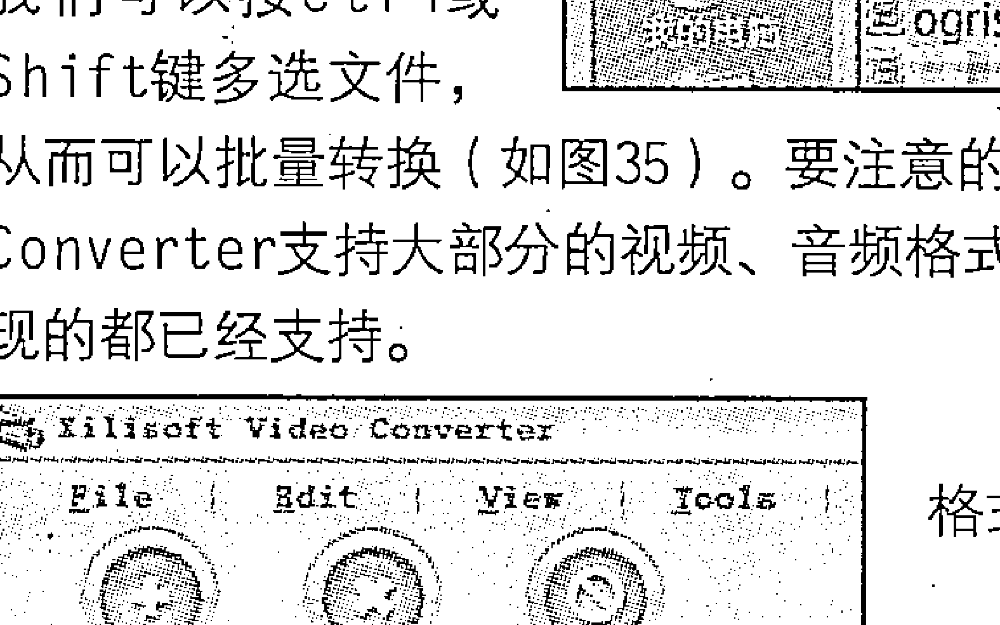

单击下方的Profile可以设置转换后的文件格式，如图36所示，可以看到Xilisoft Video Converter支持很多的格式输出，包括3GPP – 3rd Generation Partnership Project (*.3gp)、3GPP2 – 3rd Generation Partnership Project 2 (*.3g2)、Apple TV h264(320*240) (*.mp4)、Apple TV h264 480P(640*480) (*.mp4)、Apple TV h264 720P(1280*720) (*.mp4)、Apple TV MPEG-4 High 480P(640*480) (*.mp4)、Apple TV MPEG-4 Low 480P(640*480) (*.mp4)、Apple TV MPEG-4 Normal 480P(640*480) (*.mp4)、ASF – Advanced Streaming Format (*.asf)、SUN AU Format (*.au)、BlackBerry AMR Audio (*.amr)、BlackBerry AVI Video (*.avi)、BlackBerry MPEG-4 Video (*.mp4)、iPhone MPEG-4 (*.mp4)、iPhone MPEG-4 Extra (*.mp4)、iPhone MPEG-4 Wide Screen (*.mp4)、iPod (320x240)MPEG-4 Normal (*.mp4)、iPod Video2(640x480) MPEG-4 Normal (*.mp4)、iPod touch MPEG-4 (*.mp4)、iPod touch MPEG-4 Extra (*.mp4)、iPod touch MPEG-4 Wide Screen (*.mp4)、M4A – MPEG-4 Audio (*.m4a)、iPod touch MPEG-4 Extra (*.mp4)、iPod touch MPEG-4 Wide Screen (*.mp4)、Zune MPEG-4 Video (*.mp4)、MPEG-2 Movie (*.mpg)、Mpeg 4 AVC Video Format (*.mp4)、Zune MPEG-4 AVC Video Format (*.mp4)、PS3 Video(1080P) MPEG-4 (*.mp4)、PS3 Video(720P) MPEG-4 (*.mp4)、PS3 Video(480P) MPEG-4 Excellent (*.mp4)、PS3 Video(480P) MPEG-4 (*.mp4)、PSP - PSP MPEG-4 Video (*.mp4)、PSP AVC Video Format (*.mp4)、PSP AVC Video(480*272) (*.mp4)。这些全是智能手机或MP4支持的格式。

### 第三步：设置转换文件夹
在Destination下方可以单击Browse来设置转换后的文件夹，也可以单击Open按钮来打开此文件夹。

### 第四步：实现转换
单击窗口右上角的Encode即可开始转换（如图37），转换后的文件将保存在我们设置好的文件夹中。

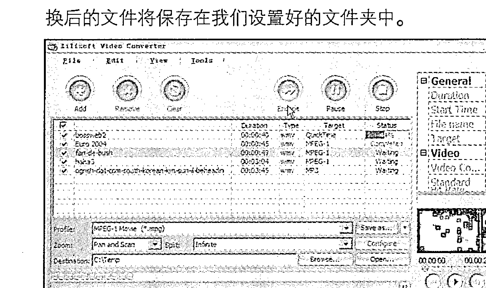

### 第五步：拷贝视频
接下来，只要把智能手机或MP4接到电脑上，把视频拷贝上去即可。现在存储容量很大很便宜，可以放下很多视频。

## 十、将抓取的文字保存为电子书
我们也可以将自己喜欢的网页内容保存下来，之后再用一些工具来制作成CHM的电子书。因为多数人抓取的文字内容是html格式的，所以推荐大家使用以下工具，而且是免费的。由于操作比较简单，因此不再赘述。多数是三部曲：启动软件→导入html文件→生成CHM文件。

- 1. HTML Help Workshop。它生成的是.CHM为扩展名的HTML帮助文件，它的每一个帮助页都是一个Web页，您可以像使用WWW浏览一样容易地使用HTML Help。它甚至支持ActiveX, JavaScript, VBScript和DLL等。
- 2. CHM Help Editor。如果要比找一款Microsoft的Html Help Workshop使用更方便的CHM文件制作软件，建议使用它，这个软件是国人编写的。
- 3. FAR-HTML Help Express。这是一个功能更强大的CHM格式制作软件。但如果您不需要制作非常复杂的CHM文档的话，也许使用该软件自身的默认值来生成CHM文件会是一种比较好的选择。

## 十一、将下载或录制的视频/音频做成自动播放的DVD
很多人都喜欢把视频刻录到光盘上和朋友们共享，但往往我们的朋友或客户并不是计算机的爱好者，对编码器没有太多的研究，有时甚至无法播放其中的视频。如果我们下载或录制了奥运会视频或音频，也可以将其制作成自动播放的DVD，这样就可以将这些骄人的成绩生动、形象地保存下来，还能让用户做到“智能播放”。

### 第一步：整合资源
先在C盘根目录下建立一个子文件夹，名为movies，再将录制或下载的视频（可放多个）放到该文件夹下。

### 第二步：下载软件
从ftp://ftp.proxad.net/pub/Distributions_Linux/GeeXboX/releases/1.1/geexbox-generator-1.1.i386.tar.gz处下载ISO Generator，然后用WinRAR将其中的所有文件解压到一文件夹下，如c:\gen。

### 第三步：准备电影文件
将c:\movies文件夹中的电影文件拷贝到C:\gen\iso下，要注意的是，这里的文件名最好改为英文。

### 第四步：选择解码器和中文包
双击C:\gen\generator.exe，单击Package标签，然后选中Codecs下相应的解码器，一般来说，我们下载的多数以rm、rmvb和wmv为主，所以一定要下载Real和Windows Media下的各个解码器，事实上，大家也可以将Codec下的所有的解码器都选中并下载，占用空间并不大（如图38）。同时选中Fonts下的Asia下的Simplified Chinese项（如图39）。

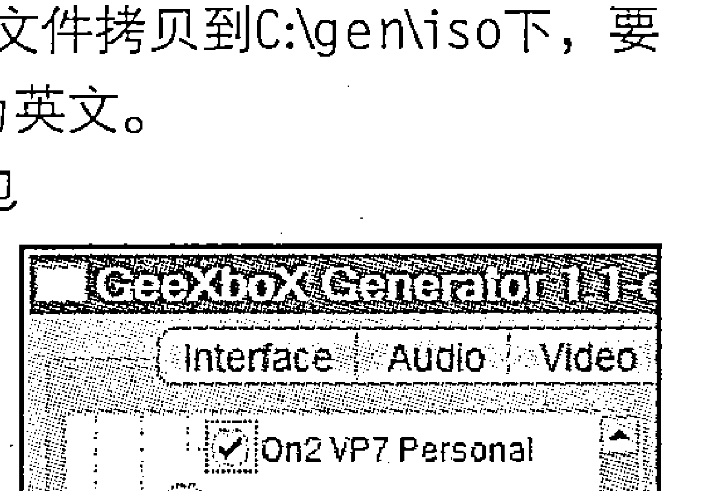

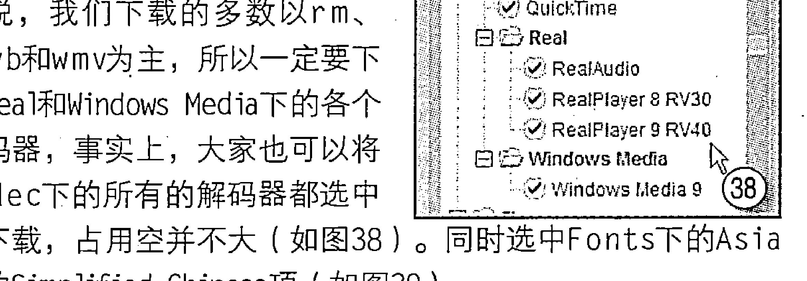

### 第五步：下载解码器和中文包
单击Download按钮来下载解码器和中文包（如图40）。

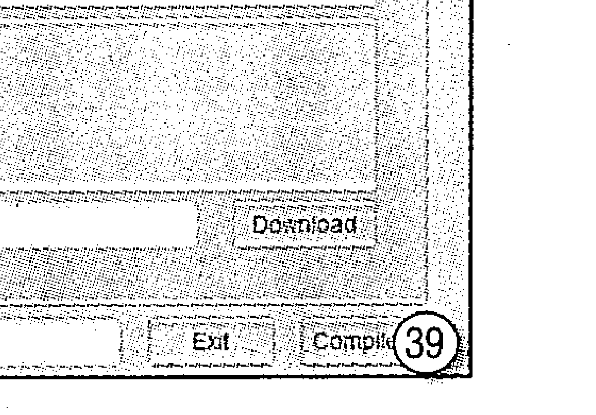

### 第六步：设置简体中文环境
返回到主界面，单击Interface（界面），我们可以选择Menu language为Chinese-Simplified（如图41，简体中文）。

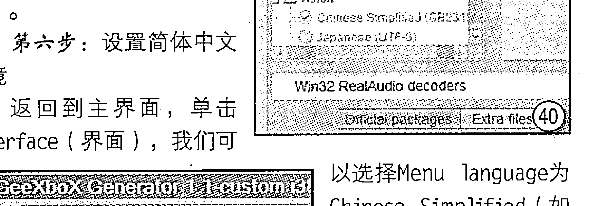

### 第七步：生成ISO文件
之后，单击Compile（编译）按钮，即可出现编译窗口。当出现Done（即完成）信息时，按任意键即可退出。我们可以在C:\gen下发现geexbox-1.1-custom-zh_CN.i386.iso文件（如图42）。

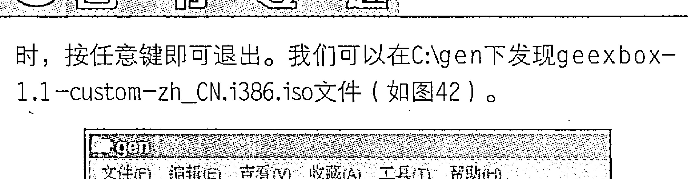

### 第八步：刻录光盘
启动Nero Burning ROM，然后选择“刻录器”→“刻录映像文件”，然后打开刚生成的geexbox-1.1-custom-zh_CN.i386.iso，再单击“刻录”按钮将它刻录到光盘上。

### 第九步：播放奥运视频
在开机时按下Del键进入BIOS设置程序，选择BIOS Features Setup菜单，然后按下回车键，进入参数设置选项界面，在这个界面中找到并选中选项Boot Sequence，然后按下Page Down键或者Page Up键，选择CDROM,C,A设置系统优先从CDROM盘启动，最后连续按下Esc键退回到根菜单中并选择保存菜单或直接按下F10键保存设置。

接着，设置好从光盘启动（如图43），它将会自动播放光盘上的奥运视频。图44是控制键的示意图，如果我们光盘上的视频较多，可以用相应键来控制播放。

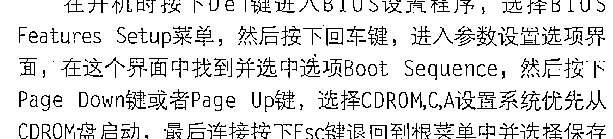

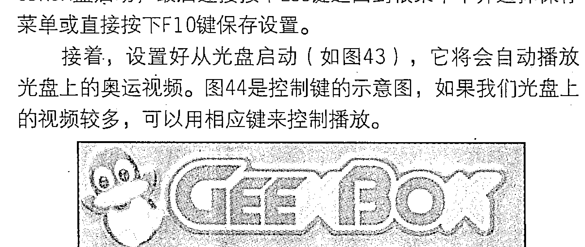

> 小提示 ★如果你使用的是Phoneix的BIOS，则在开机时按下F2键，进入BIOS设置后，选择Boot选项，然后找到ATAPI CD-ROM Drive项目，连续按下“+”号键，使其调到最前即可保证机器优先从光盘启动即可。 ★GeeXboX可播放主流媒体格式，包括AVI，RM，RMVB，MPEG-4，MP3及外挂中文字幕，这样我们还可以打造出更为丰富的自动播放光盘，而且不需要启动操作系统，是不是很牛？

## 十二 下载高清后的观看问题
现在网上的高清影视很多，我觉得奥运会期间也一定会有高清格式的视频产生。但可惜的是默认情况下，系统并不能够正常播放。有时播放起来，CPU的占用率也高得惊人。事实上，要想得到高清给我们的极致享受，我们一定从硬件和软件方面双管齐下。

### 1.满足硬件要求
要能流畅地播放高清HDTV节目，推荐使用以下配置：CPU: P4 2.0GHz; 显卡: 最好是能支持MPEG2硬件解码的; 声卡及音箱: 5.1声道及配套的5.1音箱; 显示器: 最好能支持1920×1080分辨率。安装DirectX 9.0或以上。

### 2.满足软件要求
要说明的是，如果是播放扩展名为wmv格式的HDTV，就Windows系统自带的Windows Media Player (9.0以上)即可。下面重点说说ts格式HDTV节目的播放方法。其基本思路是安装解码器，然后在播放器中选择相应的解码器即可。

### 第一步：安装终极解码
从http://58.61.34.206/down?cid=DBDB2354B48002C2E318F6A4F66CCCC8AEDA67CE&t=2&fmt=-处下载终极解码2008春节版，这是最新版。在安装时，要注意选择“完全安装”，以保证相应的MPEG-2解码器正确安装。

### 第二步：设置解码器
接下来，解码中心会自动打开，如图45所示，我们在其中设置MPEG-2解码器，确保HA前的复选框打勾，这是能否开硬解压的关键！然后设置播放器为KMPlayer。


### 第三步：设置播放器
#### 1.强制使用内部解码器
设置好终极解码之后我们就来设置Kmplayer，打开Kmplayer，按F2进入参数设置界面，单击“滤镜控制”→“解码器使用”，在右边选择“总是使用（强烈推荐）”（如图46）。

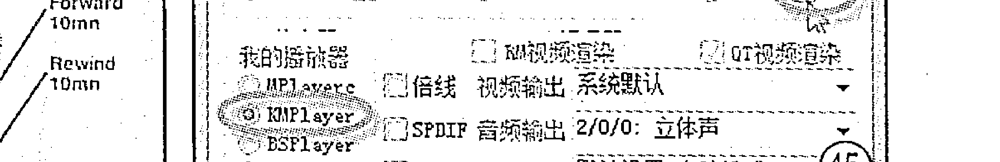

#### 2.取消所有解码器
单击“内部视频解码器”选项卡，右边单击“全部取消”按钮（如图47），令所有解码都没有被选中，这样才能调用到其他的解码器。

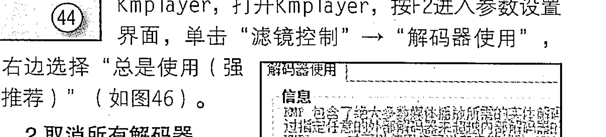第五步：判断是否硬解压
我们不仅要追求播放正确，还要测试一下速度。同时，可按下Ctrl+Shift+Esc键，可以查看KMPlayer占用CPU率的多少。由此可以判定是否开启了硬解压。

## 十三. 如何收看奥运高清频道(CCTV-5)

### 3. 搜索外部解码器
单击左边“外部视频解码器”，单击右边“搜索外部解码器”（如图48）。之后，在打开窗口中单击“扫描后添加”按钮，可以看到上面已经列出了安装终极解码时安装的解码器和PowerDVD的解码器（如图49）。

### 1. 高清频道已经开通
今年5月1期间，台标为“CCTV-高清”的“央视高清综合频道”已经推出，节目有体育节目、影视剧、专题片、纪录片、综艺娱乐节目、音乐戏曲节目、动画片、经济节目等。而且，还会重点推介中华文化，有相当的高度。

### 2. 高清有什么好处
更重要的是，真正的数字高清电视有类似电影胶片画质的清晰度（画面显示能力更强、图像质量更高）、16:9的宽屏幕画面（再不会出现压抑的黑色遮挡条），还有杜比5.1环绕立体声，其逼真的效果将最大限度地还原真实、带来身临其境般地感受影音双重震撼，会给我们很好的享受。

### 3. 收看高清电视的条件
可惜的是，要收看高清频道，我们必须购买高清机顶盒还有高清电视机。高清机顶盒可以向当地的影视管理部门购买，中国定义高清电视机的最低条件是：能输入、处理高清晰度电视视频信号；能解码显示1920×1080/50Hz或者更高图像格式的视频信号；显示屏的宽高比为16:9；能正确显示宽高比为16:9的图像，且清晰度达720线。这些在购买时一定要搞清楚。

### 4. 设置外部解码器
单击左边“外部视频解码器”，在“H.264视频”旁边的下拉菜单中可以看到多出了几个选项，选择CyberLink H.264/AVC Decoder (PDVD7.x)来调用PowerDVD的H.264解码器（如图50）。

### 4. 如何收看高清电视
大家要做的是将有线电视的射频线接到高清机顶盒上（最好用高清机顶盒自己送的，质量高一些），再用分量线或HDMI高清线接到电视机上。之后，用遥控器搜索电视台后，将其保存在机顶盒中，之后定位到高清频道即可收看。

## 十四. 让奥运高清捕捉精彩瞬间(DC)

### 1. 设置各种自动关闭功能
考虑到有一些人会奥运会的现场，这里给大家一些DC的技巧。

### 2. 关闭自动跟踪对焦
数码相机一般都设计了一些对比较耗电内容的自动停止功能。如30秒钟内无操作时，相机自动休眠，这种休眠和电脑的休眠十分类似，LCD彩色液晶屏自动关闭，重新打开这些功能，会比重新开机快得多。这样可以省不少电。同时，有一些数码相机还有自动关机的选项，设置几分钟没有对相机进行操作相机会自动关机。

有一些数码相机具有自动跟踪对焦（或者叫随时对焦）的功能。所谓自动跟踪对焦即是，当数码相机处于开机拍摄状态时，相机一直对其取景器所摄取到的目标不停顿地进行对焦，此时你会感觉到镜头一直在动。既然有动作当然会消耗电量，其实大多数情况下，没有必要使用自动跟踪对焦，只有在特殊情况时，如对快速移动物体进行跟踪拍摄时，才比较有用。

第五步：开始播放电影
现在打开ts文件开始播放，如果可以正常播放，说明解码器正确。

### 5. 设置分离器
单击左边“滤镜控制”→“分离器”，将其中的MPEG-TS分离器设置为* Elecard MPEG Demultiplexer（如图51）。

### 3. 打开拍照预览模式
配合着关闭LCD的拍摄，你可以将数码相机的拍摄预览功能打开，所谓拍摄预览是指当一次拍摄完成时，彩色LCD屏可将刚刚拍到的照片立刻进行回放（停留2秒，10秒或更长），然后，自动恢复关闭状态。这样就可以达到既能即刻查看照片，同时又能大大节省耗电的目的。

### 4. 闪光灯与ISO值的合理配合
不要忘了，数码相机ISO值的可调性，使得我们有时仅可通过调高ISO值、增加曝光补偿等办法，减少闪光灯的使用次数。毕竟通过闪光灯拍摄出来的效果并不是很好，所以不要轻易使用相机的闪光灯。

## 十五、如何在迅雷上分享自己下载的精彩视频
奥运期间，一定会有大量的视频流传于网上。我们在用迅雷下载后，完全可以将其与好友分享。
第一步：登录雷友
打开迅雷5，单击左侧下方“雷友信息”中的输入框，输入雷友账号和密码，在打开窗口中输入我们的雷友用户名和密码，同时勾选“自动登录”复选框，单击“登录”按钮。
第二步：分享资源
我们可以右击下载完成的视频，选择“发送资源给好友”（如图52），然后 在打开窗口中选择相应的好友（如图53，也可以多选），选中好友后，再返回到先前窗口，单击“发送”按钮。该好友会收到消息，单击下方的“点击下载”链接（如图54）即可下载。

另外，迅雷5有好友专辑的共享功能，现在大家只要单击“收藏”标签，在其下可以看到“好友专辑”，其下按我们添加好友为名称而建立了更多的资源入口。单击相应好友，其下的所有的资源将会出现。在右侧窗口中选中相应的资源（可多选），右击，选择“下载”命令即可进行下载。这样也实现了资源的共享。

### 加快菜单显示速度
选择“开始/运行”，输入regedit，弹出注册表编辑，寻找[HKEY_CURRENT_USER\Control Panel\Desktop]，在右边的窗口中选择MenuShowDelay，按鼠标右键，选择“修改”，将其数值资料改为100或更小（默认值为：400），建议不要使用0，因为如此一来只要鼠标一不小心触碰到“所有程序”，整条菜单就会跑出来，那这乱了套。

### 关闭华生医生Dr.Watson
单击“开始/运行”，输入“drwtsn32”命令，或者“开始/所有程序/附件/系统工具/系统信息/工具/Dr Watson”，调出系统里的华生医生Dr.Watson，只保留“转储全部线程上下文”选项，否则一旦程序出错，硬盘会读很久，并占用大量空间。如以前有此情况，请查找user.dmp文件，删除后可节省几十MB空间。

### 关闭计算机时自动结束任务
在关机的时候，有时会弹出讨厌的对话框，提醒某个程序仍在运行，是否结束任务。其实完全可以通过一点点修改让Windows自动结束这些仍在运行的程序。在注册表中打开HKEY_CURRENT_USER\Control Panel\Desktop 目录，把里面的AugoEndTasks键值改为1。
注意：可能会找不到AutoEndTasks键值，如果是这样的话，自己建一个串值并把它改为这个名字，值设为1就可以了。

### 减少磁盘扫描等待时间
WindowsXP虽然号称稳定，但是并不是永不死机，偶尔也会给你个蓝脸，非法操作后系统会自动扫描，出现大段大段的E文，告诉你刚才系统非正常结束，现在需要检查一下是否出错，可是还要等待一段时间才开始，所以我们可以在dos下，键入 "chkntfs/t:0"，表示等待时间为0秒。

### 删除多余的帐户
如果你的电脑只有你一个人使用，最好只建自己的一个帐户，因为你每建一个帐户，就会在Windows XP的安装目录下的\documents and settings\下面多一个以你所建帐户为名的文件夹，里面存放着这个帐户的一些资料，有收藏夹、文档、历史记录，系统设置信息等内容，天长日久它占用的空间也是不可小觑的，解决方法就是到“开始/控制面板/用户帐户”里依自己情况删除多余的帐户即可。

## # Windows Vista 安全大家庭

### ## “Windows Vista安全大家庭” 之 安全中心
从Windows XP开始，Windows就提供了一个名为“安全中心”的功能，包括自动更新、防病毒软件、防火墙等，一方面可以增强系统的安全性，另一方面将众多安全方面的设置集中在一个界面下进行管理，大大减少了用户的手工干预。Windows Vista的“安全中心”较Windows XP又有了进一步的增强，可监控的功能更多，引入了用户帐户控制、Windows Defender等新的组件，还集成了Internet安全设置的内容，今天我们就来了解这方面的内容。

#### ### 一、认识安全中心
打开控制面板，在右上方的即时搜索框中输入“安全中心”，然后单击结果栏里的“安全中心”链接即可打开图1所示的Windows安全中心主窗口。从图1中可以看到，Windows Vista的“安全中心”可以监控四个方面的安全配置内容：

- 1. **防火墙**：监控系统防火墙的启用情况，只要防火墙处于启用状态，安全中心就会报告正常。默认设置下防火墙会被自动启用，如果安装了第三方的防火墙软件，那么必须禁用系统自带的Windows防火墙。
- 2. **自动更新**：监控自动更新功能的启用情况，只要自动更新处于启用状态，安全中心就会报告正常，不过并不会分析是否已安装所有必要的更新程序。
- 3. **恶意软件保护**：这里包括两个方面的内容：病毒防护、间谍软件和其他恶意软件保护。安全中心会监控防病毒程序和反间谍软件程序是否已被启用，并且会同时监控这些工具是否已经更新至最新的状态，而Windows XP只具有监控防病毒程序的功能。
- 4. **其他安全设置**：监控系统的其他安全设置，包括Internet安全设置、用户帐户控制的启用情况。

#### ### 二、报警和修复
从图1中可以看到，只有“Windows安全中心”下显示三个启用、一个正常，那么才说明“Windows安全中心”当前处于正常和安全的状态。如果系统的安全配置出现任何问题，那么安全中心都会自动报警，标志是显示盾牌形的图标，以便提醒我们进行更新的修复。

##### #### 1.安全基本设置被禁用
如果Windows Vista自带的安全功能被禁用，例如Windows防火墙被关闭，系统托盘区会自动弹出一个气泡提示(见图2)，提醒用户Windows防火墙已被关闭。单击这个气泡提示，会自动打开安全中心，并且“防火墙”部分会以醒目的红色显示，在其下可以看到“Windows防火墙关闭”的消息，单击“立即启用”按钮，即可重新启用Windows防火墙。

##### #### 2.防病毒软件被关闭
如果安全工具并非Windows Vista所内置，例如我们安装的第三方防病毒软件，如果它们被禁用，或者关闭了实时监控的功能，那么安全中心同样会发出报警提示。单击这个气泡提示，会自动打开安全中心，可以看到“恶意软件保护”的部分会以醒目的红色显示，在其下的“病毒防护”部分可以看到相关的提示消息，单击“显示可用的选项”按钮，会弹出一个“选择防病毒软件选项”的对话框，请在这里选择“我有一个自己监视的防病毒程序”选项。

返回安全中心，现在可以看到“恶意软件保护”部分已经由原来的红色转变为橙黄色，在其下的“病毒防护”部分可以看到“未监视”的提示信息，单击“立即监视”按钮就可以了。

### SOLUTIONS 图书专题
##### 禁止盾牌警报
如果Windows Vista没有安装必需的病毒防护软件，或者这些病毒防护软件工作不正常，例如没有更新至最新的状态，那么安全中心会在系统托盘区弹出气泡提示，并且“恶意软件保护”部分也会以醒目的红色进行显示，其下的“病毒防护”部分会提示“Windows在这台计算机上未找到防病毒软件”的消息。

换句话说，只要安全中心稍有问题，系统托盘区都会显示一个显眼的盾牌图标，看起来很是讨厌。如果你觉得这个图标看起来有些讨厌，那么可以进行如下设置：打开安全中心窗口，单击窗口左侧的“更改安全中心通知我的方法”链接，此时会弹出图3所示的对话框，在这里选择“不通知我，但显示图标”，当然你还可以选择“不通知我，且不显示该图标(不推荐)”，但这样一来也就无法及时了解系统的安全状态了。

### “Windows Vista安全大家庭”之防火墙
默认设置下，Vista会自动启用Windows防火墙，这个防火墙可以帮助阻止黑客或恶意软件通过Internet访问你的计算机，同时会对出站连接进行审核，较之Windows XP的防火墙更为强大，今天我们就来看一看这方面的知识。

#### Windows防火墙
如图1所示，这是Windows Vista的防火墙控制面板窗口，可以在这里看到Windows防火墙已被启用，同时被设置为阻止程序时显示通知，网络位置是“专用网络”，如果需要更改设置的话，可以单击“更改设置”按钮，然后会打开图2所示的设置窗口，你可以根据自己的需要进行更改。

##### 2.例外
可以添加允许通过防火墙进行通信的例外控制程序，这里已经自动设置了若干的“例外”项目，如果需要添加新的项目，可以单击“添加程序”按钮，在这里通过“浏览”按钮指定需要添加的程序。默认设置下，所添加的程序被设置为任何计算机都可以使用，如果你需要进行适当的限制，那么可以单击“更改范围”按钮，在这里选择“仅我的网络(子网)(M)”或者“自定义列表”。设置完成后单击两次“确定”按钮返回“例外”选项卡。

##### 3.高级
如果你的计算机上设置了多个网络连接，那么可以在“高级”选项卡选择希望Windows防火墙保护的某个连接，取消“本地连接”前面的对钩就可以了。如果希望将入站连接的防火墙规则恢复至初始安装时的状态，可以在这里单击“还原为默认值”按钮，然后会弹出一个提示框，确认后即可生效。

##### 教你一招：让防火墙更智能
> 按下“Win+R”组合键打开运行对话框，在这里手工输入“gpedit.msc”进入组策略对象编辑器，依次展开到“计算机配置→管理模板→Windows组件→Windows Defender”，然后双击右侧窗格中的“启用记录已知的正确检测”，选择“已启用”，这样可以让Windows Defender检测已知的正确文件，Windows防火墙在实时保护期间会启用记录检测数据；接下来，请再次双击打开“启用记录未知检测”对话框，同样将其设置为“已启用”。

##### 1.常规
可以设置是否需要暂时关闭防火墙的保护，假如希望防火墙阻止所有程序，请勾选“阻止所有传入连接”复选框，此时系统将阻止所有主动连接本机的尝试，这个设置在连接到机场或旅馆的公用网络时比较实用，当然此时你仍然可以浏览大多数网页、发送和接收电子邮件、发送和接收即时消息。

启用上述两项设置后，系统日志中会出现大量的事件记录，你可千万别认为这些事件记录是多余的，如果系统中出现异常文件，或者系统出现严重问题，我们可以通过这些事件记录获得有用的信息，从而作出有效的处理。

### # 高级防火墙
我们已经提到了Windows防火墙，不过这只是一个功能比较简陋的防火墙，可以将其称为“边界防火墙”，对于有着更高安全需求的用户来说，恐怕这个防火墙是远远不能满足他们需要的。其实，Vista还为我们提供了一个高级安全Windows防火墙，这是一种“状态防火墙”，启用后会检查并复选IP版本4(IPv4)和IP版本6(IPv6)流量的所有数据包，默认情况下会阻止传入流量，除非是对主机请求的响应，或者被特别允许(即创建了防火墙规则并得到了允许)，同时还可以请示或要求计算机在通信之前互相进行身份验证，并在通信时使用数据完整性或加密。

#### ## 1.启用高级安全Windows防火墙
既然是高级安全Windows防火墙，自然不可能轻易的提供给普通用户使用，你会发现无论是在开始菜单还是在控制面板中，都不会找到这个组件，正确的方法是按下“Win+R”组合键打开运行对话框，在这里键入“mmc”进入控制台窗口，从文件菜单中执行“添加/删除管理单元”，或者按下“Ctrl+M”组合键，在弹出的对话框中找到“高级安全Windows防火墙”，如图3所示，在这里选中“高级安全Windows防火墙”，单击中间的“添加”按钮，或者直接双击，此时会弹出一个对话框，请直接选择“本地计算机(运行此控制台的计算机)”，然后单击右下角的“完成”按钮。

返回主界面，展开“本地计算机上的高级安全Windows防火墙”，或者我们也可以在“开始”菜单的“开始搜索”框输入“防火墙”，然后在搜索结果栏直接单击“高级安全Windows防火墙”，就可以进入管理单元窗口，这是一个我们非常熟悉的MMC 3.0窗口，共分为三个窗格：控制台树：功能类别，每个类别都可以进一步展开。详细窗格：列出每个功能类别及其分支的详细信息，“专用配置文件是活动的”表示当前连接的网络是“专用”网络。操作窗格：可以对每个功能类别及其分支进行具体的操作。

#### ## 2.配置文件
Windows XP的配置文件只有两个，分别是域配置文件和标准配置文件，而Windows Vista的防火墙配置文件一共有三个，分别是域配置文件、专用配置文件和公用配置文件，这样我们可以根据不同的网络位置，选择相应的配置，从而为用户提供更多的选择。右击“本地计算机上的高级安全Windows防火墙”，从快捷菜单中打开属性窗口，如图4所示，这里提供了三种不同的防火墙配置文件，请根据实际情况进行选择。

防火墙配置文件，请根据实际情况进行选择。

- 域配置文件：计算机连接到其帐户所在的网络时的行为。
- 专用配置文件：计算机连接到不包括其域帐户的网络时，例如家庭网络，从本质上来说，专用配置文件设置应该比域配置文件设置更为严格。
- 公用配置文件：当计算机通过公用网络时，例如机场、星巴克或麦当劳，由于计算机所连接的公用网络无法像环境中那样严格控制安全，因此从这个意义上来说，公用配置文件的设置应该最为严格。

#### ## 连接规则配置
默认设置下，前面所提到的三种防火墙的配置文件都是允许出站连接、阻止入站连接，如果没有更改配置文件的设置，那么只要具有高级安全性的Windows防火墙使用这些配置文件，都会应用其默认值。在尽可能的情况下，建议全部选择“启用”，当然你对于控制Windows防火墙的行为，可以通过“自定义”进行设置，具体选项这里就不多介绍了，感兴趣的朋友可以查看有关的技术文档或帮助文件。

Windows防火墙默认阻止所有的入站连接，但默认允许所有的出站连接，如果我们需要阻止Windows Live Messenger登录到服务器，可以按照下面的步骤进行设置。

- 第一步：在左侧的控制台树定位到“出站规则”。
- 第二步：在右侧的“操作”窗格中单击“新规则”，此时会打开“新建出站规则向导”的对话框，选择“程序”，单击“下一步”按钮继续。
- 第三步：选择“此程序路径”，单击后面的“浏览”按钮，指定Windows Live Messenger所在的路径，单击“下一步”按钮继续。
- 第四步：接下来，规则向导会询问符合指定条件时所选择的操作，请选择“阻止连接”，单击“下一步”按钮继续。
- 第五步：选择配置文件，我们可以只选择域、专用、公用等三种网络位置中的一种，也可以全部选择。
- 第六步：指定这条规则的名称和描述信息，随便写一些就是了，最后单击“完成”按钮。

现在，我们再次运行Windows Live Messenger，登录时会出现无法登录的错误信息，如图5所示。单击“疑难解答”按钮，Windows Live Messenger会执行错误诊断，最后的结果当然是与防火墙有关。

在左侧的控制台树中选择“监视”，我们可以在中间的“详细窗格”中查看到监视设置的具体内容，例如程序被阻止时会显示通知、本地防火墙规则和本地连接安全规则都已经被应用。

## "Windows Vista安全大检阅"之 Windows Update

虽然Windows Vista号称有史以来最安全的操作系统，但由于操作系统的复杂性，这就不可避免地存在一些漏洞和缺陷，这也是微软不断发布更新程序和补丁包的最大原因。为了提高系统的安全性能，我们应该通过“Windows Update”及时下载并安装更新，以防止不断被发现的系统漏洞和防御外来攻击。

## 掌握Windows Update的基本操作

启动自动更新后，Windows会每隔17~22个小时，自动连接至微软的更新服务器搜索是否有可用的更新，并在更新可用时自动为计算机安装这些更新。如果需要手动检查更新，可以从控制面板进入“Windows Update”窗口，如图1所示，可以看到这里的可用更新项，也可以单击左侧任务面板中的“检查更新”，不过大部分情况下并不需要这样做。

我们可以随时随地通过“检查更新”手动检查更新，唯一不太方便的是下载更新时可能会需要比较长的时间，因此建议朋友们还是选择网络条件比较好的时段下载更新。

如果需要查看当前已安装的更新，可以返回Windows Update窗口，在左侧窗格中选择“查看更新历史记录”，在这里可以查看到所有的更新历史记录，当然有安装成功的更新，也有安装失败的更新。单击“已安装的更新”链接，可以查看所有已成功安装的重要更新，在这里可以进行查看，同时会在列表窗口的底下显示相应的详细信息。

如果需要卸载更新，可以进入“已安装更新”的界面，选中某个更新，然后单击左侧任务窗格中的“卸载程序”链接，或者右击选择“卸载”，此时会弹出一个对话框，如图2所示，再次确认后即可卸载更新。

单击左侧窗格的“更改设置”链接，在这里可以重新选择Windows安装更新的方法，默认是选择“自动安装更新”，这样可以自动安装那些推荐的更新、重要的更新。在尽可能的情况下，我们应该根据自己的实际情况选择自动安装更新的时间，毕竟默认的凌晨三点可不是说着玩的，想来很少有人会整夜不关机等待系统更新吧？

## 进阶学习更新

由于可以理解的原因，很多重要的更新程序或游戏，中文版本的Vista总是会晚于英文版本才能享受到，例如著名的动态桌面(Windows DreamScene)、纸牌游戏(Hold Em)，在某些情况下我们可能不得不安装英文语言包才能自动检查到这些更新序列。

更加令人郁闷的是，即使安装了英文语言包，可能仍然无法安装某些更新程序，这是取决于系统的原始安装语言，不过你当然不需要重新安装英文版本的Vista，只要修改一个注册表键值即可解决这个苦恼的问题。

这一步很关键，否则系统可能会因为找不到关键语言文件而出错。官方下载地址是http://www.download.windowsupdate.com/msdownload/update/v3-1990518/cabpool/lp-en-us_c38cb05f3146b642c9574363399808fa5229875.exe，下载文件的大小为251.9MB，安装后将会占用1GB左右的硬盘空间。

按下“Win+R”组合键打开运行对话框，输入“regedit”进入注册表编辑器窗口，逐级展开到“HKEY_LOCAL_MACHINE\SYSTEM\CurrentControlSet\Control\Nls\Language”，在右侧窗格的底部找到“InstallLanguage”字符串值，这个数值表示系统的安装语言区域代码，“0804”代表“中文(中国)”，我们现在所需要做的就是将其修改为“0409”，表示“英语(美国)”，至于“Default”和“InstallLanguageFallback”则不用进行上述操作的目的是，为了让系统认为原始的安装语言是“英语(美国)”，当然这只是一个善良的欺骗而已。

## 3.检查更新

从控制面板中打开“Windows Update”窗口，单击左侧的“检查更新”按钮，稍候片刻就可以找到原来只有在正宗英文版本中才能找到的更新程序(见图4)，例如这个名为“Hold Em 扑克游戏”的项目，简体中文版本更新中暂时还没有提供。

这里要强调的是，千万不要做“过河拆桥”的事情，如果将英文语言包卸载，那么所有通过“欺骗”手段提前安装的

## 让Vista的更新提示不再烦人

启用自动更新之后，只要计算机已处于联网状态，系统会在指定时段自动检查重要的更新并对它们进行安装，这样就不会错过那些有可能导致系统出现问题的各式安全补丁和更新程序。

在更新安装完成后，大多数情况下都会被要求重启系统。Windows XP下如果暂时放弃的话，那么系统会时不时地提示是否需要重启，可以说是相当的烦人，直到搞得你不得不重启系统才罢休。Windows Vista在这方面的表现要稍好一些，但在更新完成后仍然会提示是否需要立即重启计算机，该如何解决这个讨厌的问题呢？

## 1.指定自动提醒的时间段

我们可以在对话框中选择一个时间段后再进行提醒，例如5分钟、30分钟、1个小时等，选定后再单击“推迟”按钮，此时系统就不会再无休止地弹出“立即重启”的提示信息，而是在你所设置的时间段后才会进行提醒。

## 2.一劳永逸取消重启

如果你觉得上面的方法还是比较麻烦，那么可以通过组策略的设置来取消安装更新后的自动重启。在运行对话框中输入“gpedit.msc”，打开组策略对象编辑器，依次进入“计算机配置→管理模板→Windows组件→Windows Update”，然后在右侧窗格中找到“对计划的自动更新安装不自动重启”，双击打开属性对话框，在这里选择“已启用”，确认后重新启动系统后即可生效。

以后，每次Vista自动或手动完成更新后，再也不会有是否重启的提示信息弹出，你可以根据实际情况进行选择。

## "Windows Vista安全大家庭" 之 Windows Defender

微软的官方发言人曾多次声称，在Windows Vista中即使不安装杀毒软件，也不会遭受病毒的攻击。这主要是内置的Windows Defender在后台默默无闻地发挥着自己的作用。这番言论虽然受到安全厂商的猛烈抨击，但也从另一方面说明了这款安全组件的出色功能。

作为Vista内置的反间谍软件工具，Windows Defender提供了相当出色的功能。从“控制面板→安全中心”选择“Windows Defender”进入图1所示窗口，在这里可以看到上一次扫描的时间和扫描计划，而实时保护目前也已经被启用，看来是一切正常，没有什么可担心的。

默认设置下，Windows Defender会在后台自动更新病毒库，完全不需要用户操心。当然，我们也可以在“帮助选项”菜单下选择“检查更新”，系统托盘区会显示“Windows Defender正在检查更新”的消息(见图2)，稍等片刻即可自动完成更新。

默认设置下，Vista会自动启用Windows Defender的实时保护功能。此时Windows Defender将对自动启动、系统配置、IE加载项、IE配置、IE下载、服务和驱动程序、执行应用程序、注册应用程序、Windows加载项进行实时保护。例如“Internet Explorer”将监视在启动IE时自动运行的程序、间谍软件和其它可能不需要的软件。当发现异常情况时，Windows Defender会发出警报，警报级别可以分为严重、高、中、低、未分类等五种，这其中具有一定危险的通常是“严重”和“高”，建议立即删除此类软件。

## 二、加入SpyNet社区

通过联机加入Microsoft SpyNet社区，我们可以了解到其他人对警告(有关尚未进行分析的软件)进行响应的方式，这样可以帮助你确定应该执行的操作，相当于请到了一位免费的家庭医生。单击打开工具窗口，单击“Microsoft SpyNet”，在这里我们可以选择以基本成员或高级成员的身份加入Microsoft SpyNet在线社区，确定后单击“保存”按钮。

加入SpyNet社区后，Windows Defender将在后台向Microsoft自动发送有关间谍软件、可能不需要的软件及尚未进行风险分析的软件更改的信息，包括软件的位置、文件名、运行方式，以及该软件会对计算机产生的影响，同时还会报告应用于该软件的操作。为了进一步充实恶意软件特征库，建议朋友们不要吝惜这一点点的隐私吧。

## 三、使用设置

从“扫描”下拉菜单可以发现，如图3所示，Windows Defender提供了快速扫描、完全扫描、自定义扫描等三种不同的扫描方式，各种扫描方式的作用如下：

- 1. 快速扫描：只对计算机上最有可能受感染的硬盘分区进行扫描，需要的时间比较短，一般是Windows Vista所在的C盘。扫描过程中可以随时按下“停止扫描”的按钮结束扫描。
- 2. 完全扫描：扫描硬盘上所有文件和当前运行的所有程序，需要的时间比较长。
- 3. 自定义扫描：可自由选择需要扫描的驱动器的文件夹，单击右侧的“选择”按钮。随后会打开图4所示的对话框，在这里指定需要扫描的驱动器和文件夹，单击“确定”按钮后返回“选择扫描选项”页面，单击“立即扫描”按钮即可开始扫描。

默认设置下，Windows Defender每天都会对系统进行一次快速扫描，以最大限度地保护系统。如果从提高效率和减少扫描时间这两方面考虑，自然是“快速扫描”和“自定义扫描”来得更方便一些。但无论选择哪一种扫描方式，总还是需要进入Windows Defender后手动执行，有没有办法自动完成扫描任务呢？当然可以，我们可以通过扫描计划的方式来实现。依次打开“工具→选项”窗口，我们的工作主要是在“自动扫描”小节中完成。

- ①勾选“自动扫描计算机”复选框，然后可以对频率(每天或星期)、时间(可以精确到几点几分)、类型(选择三种扫描方式之一)进行设置。
- ②勾选“扫描前检查更新的定义”复选框，这主要是因为间谍软件层出不穷，必须在扫描时获得最新定义的恶意软件特征；否则就效果不大了。这里必须指出的是，Windows Defender会在定义过期七天时发出通知，你也可以返回主窗口手工更新定义。
- ③进入“默认操作”小节，在这里可以设置检测到具有警报级别的项目时的默认操作。其实只要前面已经勾选了“扫描过程中将默认操作应用到检测到的项目”复选框，这里就不需要再进行设置了，当然你也可以重新设置为“删除”或“忽略”。

默认设置下，Windows Defender只在检测到要采取的相关操作时，才会在通知区域显示图标。如果你希望实时了解到更多的安全信息，建议选择“始终”。

## 四、软件资源管理器

现在，你基本上可以不用再安装第三方的系统监控工具，因为Windows Defender提供的“软件资源管理器”可以帮助我们查看有关当前在计算机上运行的会影响隐私或计算机安全的软件的详细信息。列表框中的程序包括如下几种类别：

## 1.启动程序：启动Windows时自动运行的程序

如图5所示，这里显示了所有当前正在运行的程序。我们可以根据右侧窗格的信息来查看当前程序是否存在可疑之处。例如这是“AcroTray Adobe Acrobat Distiller helper application”进程的具体信息，从右侧窗格中可以看到发行者、数字签名方、启动值、文件类型、文件路径、安装日期、与操作系统一起提醒等信息。“数字签名方”可以查看该进程是由哪一方进行了数字签名，从而确认是否可信；“路径”可以查看该进程的程序文件的具体路径；“启动类型”可以查看该进程的启动方式，本例是在注册表下通过本地计算机进行加载的。如果不希望该进程随Windows自动启动，可以单击右下方的“禁用”按钮，然后在随之弹出的提示框中选择“是”按钮进行确认。

## 2.当前运行的程序：以当前用户身份启动的进程

这里会按照所属发行者进行分类。在右侧窗格中有一项非常有用的信息，“服务”提供了该进程所加载的系统服务，本例的“Nero AG incdsrv”进程加载了“InCD Helper”的服务。请注意右下角的“结束进程”按钮呈灰色的不可用状态，说明该进程是Windows Vista的重要进程，如果强行终止的话，可能会导致系统崩溃。

## 3.网络连接的程序：以当前用户身份启动的具有网络连接的进程

例如连接到Internet或者家庭、办公网络的程序和进程，按照所属发行者进行归类。在右侧窗格中有一项非常有用的信息，我们可以在“SpyNet投票”的下面查看到一个包括了协议、本地地址、外部地址、状态等详细的网络连接信息。在这里可以查看该进程所打开的本地端口，以及所连接的外部端口，这显然较“netstat noa”要来得强大，使用也更方便。

## 4.Winsock服务提供程序：执行Windows的低级别网络连接和通信服务的程序以及Windows上运行的程序

这些程序通常都具有对重要区域的访问权限，如图6所示。

## "Windows Vista安全大家庭"之"家长控制"

如果你担心孩子访问了黄、黑、毒级别的网页，如果你担心孩子玩游戏的时间过长，如果你担心孩子由于误下载文件导致系统崩溃，如果你希望对同事作出类似的限制，那么都可以借助Windows Vista的“家长控制”来实现……

## 启用家长控制

如果你希望使用家长控制的功能，必须满足下面的条件：

- 家长和孩子必须使用不同的用户账户，家长账户必须是管理员账户，而孩子的账户必须是标准账户。这些工作可以在“控制面板→管理账户”下完成。
- 家长账户和系统中其他所有的管理员账户必须设置密码保护，否则的话家长控制的功能可以被轻易取消。这些工作可以在“控制面板→管理账户→更改账户”下完成。

步骤1：激活开始菜单，在“开始搜索”框输入“家长控制”，或者也可以从控制面板进入“用户账户和家庭安全→家长控制”窗口。
步骤2：单击其中的标准用户账户，可以进入如图1所示的窗口，在左上角的“家长控制”下选择“启用，强制当前设置”，然后才能谈到接下来的其他操作。

## 用好家长控制的各项功能

现在，我们已经可以控制该账户使用计算机的时间段和时长、允许运行的游戏和应用程序、允许访问的网站以及进行的各种在线操作、查看活动日志报告等。默认设置下，启用家长控制后，受限账户除了访问Web页面有一定的限制之外，在时间限制、游戏分级、程序限制这些方面都没有作出相应的限制(显示为“关闭”)，因此我们还需要根据实际情况作出相应的限制。

## 1.Windows Vista Web筛选器

“Windows Vista Web筛选器”默认设置下已经作出了一定的限制，不过我们可以进行更高级别的控制，例如限制允许访问的网站、检查年龄分级、指定是否允许下载文件，还可以阻止或允许访问特定的网站。单击“Windows Vista Web筛选器”链接，可以进入图2所示的Web限制页面。“阻止部分网站或内容”可以阻止访问部分不良的网站；“选择Web限制级别”默认是“中等”，可以阻止成人内容、赌博、毒品等网站的访问，还允许设置为“高”、自定义等。如果只允许访问指定的网站，那么可以对白名单进行编辑，单击“编辑允许和阻止列表”链接，此时会弹出一个对话框，我们可以在这里输入允许访问和阻止访问的站点地址。当孩子意图访问被阻止的站点时，IE会显示提示消息。

## 2.时间限制

“时间限制”可以禁止孩子在指定的时段登录计算机。如果在分配的时间结束后其仍然处于登录状态，那么系统将自动注销。

单击“时间限制”链接，可以进入登录时间控制的页面，这里默认未作出任何限制。假如我们只允许孩子在星期六和星期日两天的时间内使用计算机，那么可以按住鼠标左键，将星期一、星期二、星期三、星期四、星期五这五天的00至24之间的方格全部拖曳为蓝色，表示对这些时段设置为“已禁止”，如图3所示，最后单击右下角的“确定”按钮即可生效。

如果孩子试图在未经允许的时段内登录系统，那么会看到气泡提示。

## 3.游戏

“游戏”可以控制对游戏的访问、选择年龄分级级别、选择要阻止的内容类型、确定是允许还是阻止特定游戏。不过，要注意的是，这项设置以及对特定程序的阻止对安装在FAT分区上的内容不起作用。

单击“游戏”，可以进入窗口，当然我们还是应该允许孩子适当玩一些健康有益的游戏。

- （1）设置游戏分级：单击“设置游戏分级”链接，可以进入游戏类型控制的页面。在这里可以设置允许孩子玩的游戏级别，该级别由ESRB(Entertainment Software Rating Board)进行定义，分为儿童、所有人、10岁以上的所有人、青少年、成人、仅成人等六种级别，默认是“仅成人”，请选择“阻止未分级的游戏”和“儿童”。
- （2）阻止或允许特定游戏：仅仅依靠游戏分级来进行限制，毕竟可能还是会有漏洞。因此我们对相应的游戏作出进一步的限制，单击“阻止或允许特定游戏”链接，在这里可以对Windows Vista自带的游戏和第三方游戏选择“始终允许”或“始终阻止”，前者表示不论是什么游戏分级，始终允许玩；后者表示不论是什么游戏分级，始终阻止玩。

如果孩子试图运行已被禁止的游戏，那么会显示相应的阻止信息，如图4所示。

## 4.允许和阻止特定程序

“允许和阻止特定程序”默认设置是允许孩子使用所有程序，我们应该改成“**只能使用我允许的程序**”。此时系统会自动扫描所有已安装的应用程序，并显示在“检查可以使用的程序”列表框中，在这里逐个勾选允许孩子使用的特定程序。单击“浏览”按钮可以添加需要允许的程序。那些没有被勾选的程序，孩子将无法使用，当然这些程序同样必须安装在非FAT分区。最后单击“确定”按钮就行了。

当孩子试图运行不被允许的程序时，会看到相应的阻止信息，如图5所示。

## 查看活动报告

如果你觉得有必要，可以启用活动报告功能，这样就可以记录下孩子使用计算机的所有操作，包括访问的网站、玩过的游戏、使用过的应用程序等。当然你也可以将这个功能应用於其它的账户。

单击家长控制功能页面的“查看活动报告”链接，可以进入活动报告查看的界面。在左侧的树形目录选择需要查看的项目，然后就可以在右侧的详细窗格中查看所有对应的详细活动信息。■

## 2008实用工具软件“圣经”级选
——最常用的优秀免费工具软件超实用技法案例精选
□云飞

## 第一篇 上网冲浪 放眼看世界
网络浏览器（IE7、火狐、世界之窗、傲游）

### 【火狐】新开网页方法多

Firefox浏览器支持多页面浏览，开启新标签页的方法多种多样。要在窗口中打开一个新的标签页，可以按Ctrl+T，也可以选择“文件→新建标签页”，或者还可以在标签栏的空白处双击。

要想把一个链接在新标签页中打开，可以使用以下一些方法：

1.  在链接上单击鼠标中键（如果你用的是滚轮鼠标，按下滚轮和单击鼠标中键是一样的）。
2.  用鼠标拖动链接，把它放到标签栏的空白处（如果窗口里只有一个打开的网页，标签栏有可能不显示；可以通过“定制标签页浏览”设置实现）。
3.  把链接拖放到一个标签页上，就可以在这个标签页中打开此链接。
4.  右键单击该链接，在弹出菜单里选择“在新标签中打开链接”。

要在新标签里打开地址栏里的一个URL，输入该URL并按下Alt+Enter。

找到你最喜欢的一组页面，把它们在一个窗口的标签页中打开；点击“工具→选项”打开“选项”面板；按“主页”下面的“使用当前页面”按钮。现在，当你再按下主页按钮时，你喜欢的网页会一并打开。

### 【火狐】右键命令保存帧

如果把正在浏览的一帧网页作为文件保存到硬盘上，当你没有链接到因特网时也可以查看该页面。保存网页里的一帧可以用如下办法：

1.  把鼠标指针定位于某一帧内。
2.  右键点击帧，会出现一个弹出菜单。
3.  选择“本帧→帧另存为”，你将会看到“另存为对话框”。
4.  为要保存的页面选择一个保存位置。
5.  为你希望保存的网页选择一种文件格式。
6.  为页面输入一个文件名并点击“保存”。

### 【火狐】标签书签批量用

当你同时开启了许多网页时，你可以用一个操作把这些网页收藏起来。如果你要想把一组标签页都加入书签收藏，你可以这样操作：

1.  按 Ctrl+Shift+D 或选择“书签→将全部标签页加入书签”。
2.  把当前窗口中的所有标签页都加入到一个自己选择的书签文件夹中。
3.  要想在标签页中打开书签中的项目，打开一个书签文件夹菜单，选择“在标签页中打开书签组”。也可以用中键单击书签文件夹，则其中所有的项目都会在标签页中打开。书签内容会在当前标签页中打开，而不是开新标签。

### 【火狐】成批地址作主页

你不但可以把单独一页设为浏览器主页，也可以把浏览器主页设成一组标签页。

### 【火狐】不用打开也能保存页面

你可以在不将页面链接内容显示出来的情况下，把该链接的内容保存下来。这在获取某些不是用来查看的页面时是很有用的。具体做法如下：

1.  把鼠标指针定位到指向页面的链接。
2.  右键点击链接，会出现一个弹出菜单。
3.  选择“链接另存为”，你将看到“另存为对话框”。
4.  为要保存的页面选择一个保存位置。
5.  为页面输入一个文件名并点击“保存”。

### 【火狐】插件让火狐飞得更高

Firefox可以处理很多类型的文件。然而，对于某些文件来说，比如电影或音乐，Firefox需要能处理这些文件的插件或外部应用程序。如果Firefox没有所需的辅助应用程序或插件，它仍能把文件保存到你的硬盘上。当保存文件时，你可以使用下载管理器记录每个下载文件的下载情况。

> 小提示：某些链接在你点击之后，指向的文件会自动下载并保存到你的硬盘驱动器上。这些链接的URL常以FTP开头，或者以一种文件类型扩展结尾，比如MP3或者MPEG。这些链接可能是传输的软件、声音或者视频文件，这会启动支持这些文件的应用程序。如果要保存，还是用右键菜单中的另存为命令吧。

> 小提示：插件运行于Firefox之内，可扩展Firefox的功能。像Sun Java、Macromedia Flash以及RealNetworks RealPlayer等插件允许Firefox显示多媒体文件、运行电影、动画、小游戏等小应用程序。在Mozilla Update上，你可以找到更多常用的插件。

当文件无法在Firefox内打开时，你可以选择启动外部应用程序在Firefox外打开文件。比如，可以用你的多媒体播放器来播放MP3文件。

再比如，你可以指定Firefox将文件下载到特定位置。要打开此对话框，选择“工具→选项”，打开“下载”面板进行设置。你可以更改或是移除某个文件类型的相应动作。

### 【火狐】火狐自带下载工具好

下载管理器是Firefox所包含的一个功能，它允许你跟踪和管理以前或正在进行的下载任务。它不但免除了多个下载窗口的烦恼，而且还具有下载统计功能。

启动下载管理器有如下几种方法：当你下载文件的时候下载管理器窗口会出现；当你选择“工具→下载”时；当你在键盘上输入Ctrl+J组合键时。

> 小提示：相比之下，它在下载管理和下载速度方面的功能可是比IE强多了。

### 【火狐】平滑滚屏浏览长页面

当你阅读非常长的页面时，平滑滚动非常有用。通常，当你按下Page Down，视图将会直接跳转到下一页。有了平滑滚动，它让向下滚动的过程更为平滑，因此你就能够看清页面向下滚动了多少。这让你能够更容易从刚才所在的地方继续阅读。

> 小提示：启用平滑滚动功能的方法是，通过“工具→选项”菜单命令激活“选项”窗口，点击“高级”标签，然后选择“常规”选项卡下的“使用平滑滚动”复选框。

### 【世界之窗】放大镜网页自由缩放

也许你会觉得有些网页上的字太小，大段文字看起来十分费眼。这里教大家一招，可以实现随意缩放网页文字。具体方法如下：

按住键盘上的Ctrl，然后滚动鼠标滚轮。或者按下Ctrl后，按小键盘的+或-符，网页文字也会无极缩放，总有你适应的比例。

> 温馨提示：这个功能不错吧？掌握了它，就相当于你在网海中遨游时，手中拿了一个高倍望远镜。如果你要写文章抓图，还可以把细节性的东西先放大，然后再抓，这样就能清晰地表现关键环节了。

### 【世界之窗】灵活关闭标签方法多多

你知道有多少种关闭当前标签窗口的方法呢？也许你认为知道一种就够了，但多掌握几种会让你对网络浏览的操控游刃有余。下面列举在世界之窗浏览器中关闭标签的八种实用方法。

1.  双击该网页的标签条。
2.  在网页标签上单击右键，选择菜单中的“关闭窗口”。
3.  左键单击标签栏上最右端的关闭按钮。
4.  在菜单栏的“窗口”中点击“关闭当前窗口”选项。
5.  快捷键Ctrl+W。
6.  直接单击中键关闭。
7.  直接单击右键。需在“选项→标签条→动作”中勾选“鼠标右键点击标签关闭对应浏览页面”选项。
8.  用鼠标手势。需在“选项→鼠标手势→交通信号方式”中进行相关设置。

> 温馨提示 找不到鼠标中键？你的鼠标有滚轮吗？用它来代替中键好了，它能起到同样的效果！

### 【世界之窗】高效浏览页面提前打开

你打开新页面的时候，页面往往需要一定时间下载才能完整显示出来，为了节省时间，你可以在新页面在后面打开。当你这样设置之后，你点击了下一步想要浏览的链接，它会慢慢在后面打开，此时你可以继续浏览当前页面，而不是直接显示新开的页面。要实现这一功能，需要先进行简单的设置，方法很简单：你可以用状态条上的第一个按钮来选择是否直接切换到新打开的页面。

> 温馨提示 对于网速比较慢的环境下，或者是计时上网的用户来说，这一技法十分管用和实在。如果20个网页能用20分钟打开，而阅读这20个网页需要1小时时间，那么你就可以先花20分钟边阅读边让20个网页打开，然后断线继续阅读。这样40分钟的网费就节约下来了。

### 【世界之窗】图片动画文件一键保存

以往用IE上网浏览，遇到好看的图片、Flash和视频，不知该如何保存下来，单击右键弹出的是与保存无关的信息。而使用世界之窗浏览器之后，这些都可以一键搞定，保存后慢慢欣赏。具体方法是：在发现好的图片、动画或视频后，你只需点住Alt键，然后用鼠标左键点击你喜欢的图片、Flash或者视频就可以实现保存功能。

> 温馨提示 保存的路径可以通过“工具→选项→常规→高级选项→鼠标动作”自己设置。如果你要保存的内容没有下载完成，你还可以选择使用下载工具进行下载，这在观看较大的Flash和视频的时候很有用处。

### 【世界之窗】超长网页存为图片格式

如果遇到超长的网页，需要截图怎么办？是一屏一屏地用抓图软件抓下来然后用图像处理软件缝合呢？还是使用带有滚屏功能的抓图软件来抓取呢？其实都不用。我们可以直接用世界之窗浏览器一次截屏保存！在菜单里选“文件→保存为图片”，其中有多种格式任你选择。其中就有可以选择将整个网页保存为图片的格式，如JPG、PNG等流行的图片格式。

> 小提示 著名抓图软件SnagIt就有窗口或区域滚动抓图功能，如果你要抓取非网页的超长窗口内容，就不能借助于世界之窗浏览器了。这时，请出SnagIt会帮你的大忙。

### 【世界之窗】锁定的网页依然能编辑

也许你遇到过页面不能保存，网页文字不能复制的情况。这是因为有些网页限制你选择文字，限制保存。世界之窗提供了编辑模式，会让你轻松解决这个问题。只要在“编辑”菜单上选择“用编辑模式查看”，网页内容轻松搞定。

| 菜单 | 快捷键 |
|------|--------|
| 剪切 | Ctrl+X |
| 复制 | Ctrl+C |
| 粘贴 | Ctrl+V |
| 全选 | Ctrl+A |
| 查找(在当前页) | Ctrl+F |

> 小提示 不知那些网页的设计者是怎么考虑的，既然把网页摆出来让大家看，为何还非得弄个所谓的“加密”？在信息大爆炸的今天，有人看你的网页，拷贝你的文字留存，那便是你的福气。费尽心思弄了个网页“加密”，最后还是让人拷贝去了，何苦呢？还是世界之窗比网页设计者更会体贴人啊！

### 【IE7】一次收藏多个好网站

如果你每天都要去某几个网站浏览一番，那么在开启浏览器以后肯定要逐个打开这些网站的页面，这显然太麻烦。那么，就用这个技巧吧，把你常去的几个网站统统打开，然后将这些网页作为一个组保存下来，这样下次就可以一次性自动打开了。若要保存一组选项卡，请单击“添加到收藏夹”按钮，然后单击“将选项卡组添加到收藏夹”。为该组指定文件夹名称，然后单击“添加”。

### 【IE7】一次打开一组好网页

如果你把自己经常需要访问的几个网页作为一个选项卡组保存了下来，或者你把自己上次没有浏览完的几个网页以一个选项卡组保存了下来，那么，在任何时候，你都可以一次打开这些页面继续浏览。具体方法是：单击“收藏中心”按钮，然后单击要打开的文件夹。单击文件夹名称右侧的箭头将在单独的选项卡上打开所有网页。

### 【IE7】自动恢复过去的页面

### 【IE7】用导航选项卡快速定位

同时打开多个网页时，每个网页都会在一个单独的选项卡上显示。这些选项卡方便你在打开的网站间切换。快速导航选项卡提供所有打开的选项卡的缩略图（称为“缩略图”）。这方便查找希望查看的网页。

> **小提示**
如果你下次开启浏览器时要接着浏览上次没有看完的内容，这一方法是最省事的。但是，如果你没有浏览完的网页可能要到以后某个时间才能接着浏览，而你的浏览器又可能在本次浏览结束后被别人使用，那么就不能依靠这一记忆功能了。这种情况下最好的选择是把当天打开的一些选项卡作为一个组添加到收藏夹中，以备日后随时调用浏览。

> **小提示**
快速导航选项卡操作技法
打开快速导航选项卡：单击选项卡行左侧的“快速导航选项卡”按钮。快速导航选项卡按钮仅在打开了多个网页时显示。
从快速导航选项卡打开网页：单击希望打开的网页的缩略图。
从快速导航选项卡关闭网页：单击希望关闭的网页的缩略图右上角的“关闭选项卡”按钮。
巧用快速导航选项卡按钮旁的箭头：单击“快速导航选项卡”按钮旁的箭头时，会显示之前打开的所有网站的列表。若要切换到不同的网站，请单击该站点名称。
关闭快速导航选项卡视图：再次单击“快速导航选项卡”按钮，快速导航选项卡将关闭，并且将显示你查看的最后一个网页。

### 【傲游】自动翻页 看电子书不动手

如果要浏览的书籍章节比较多，常常要在浏览器拉动滚动条往下翻页。何不让它自动滚动？单击“工具→自动滚屏”，然后选中所有窗口，鼠标控制下选择一种自己需要的速度。这样返回傲游窗口后，网页就会自动滚动了。

> **小提示**
如果浏览的是TXT格式的电子书，单击傲游菜单栏的“文件→打开”，然后单击“浏览”，在打开窗口文件类型选择“所有文件”，导入TXT电子书，其他设置同上，也可以在傲游里自动浏览电子书。

### 【傲游】自选颜色 看电子书不刺眼

默认情况下，网页的文字都是黑底白字，其实根据科学实验证明，视觉神经细胞对黄色最敏感，在一定条件下，黄色能有效地减缓视觉疲劳。为了减轻眼睛的压力，我们可以在遨游中把网页底色设置为黄色。打开电子书网页后，单击“工具→设置背景色→选择背景色”，然后在弹出的颜色窗口选择“淡黄色”作为网页底色。返回工具菜单，单击“工具→设置背景色→应用默认背景色到所有窗口”即可。

### 【傲游】多重书签 一次能看多本书

为了提高网站的点击量，很多长篇小说都会被分割为多个网页。其实使用傲游的“快捷组”，可以一次性打开一本书的所有网页。单击“快捷组→保存当前所有标签为快捷组”，然后把快捷组命名为“我的书籍”或者其他。以后看书的时候，只要单击“快捷组→我的书籍”，傲游会帮我们打开所有章节的页面了。

> **小提示**
傲游还具有记忆功能，可以单击“选项→傲游选项”，切换到“起始页”，选择“打开上次访问的网页”，并勾选“使用网址选择对话框打开上次网页”。

### 【傲游】和谐相处 傲游支持迅雷一把

使用傲游浏览器的朋友，往往会发现迅雷5中的媒体感应功能在傲游中往往会失效。为了下载FLV视频，往往不得不启动IE，然后粘贴相应的网址，再用迅雷进行下载。其实，出现这种情况后，我们可以自己动手添加迅雷的媒体感知功能。在迅雷中单击菜单栏的“工具→浏览器支持→添加Maxthon支持”。这时会弹出“没有找到Maxthon的安装目录，是否手动查找”提示信息，单击“是”，然后打开系统中已经安装的Maxthon，提示插件安装成功后即可在Maxthon中使用迅雷的媒体感知功能来下载FLV了。

### 【傲游】开启独立线程 防止浏览假死

Maxthon提供了标签独立线程的功能：点击“工具→傲游设置中心”菜单项，然后在窗口左侧选择“高级选项”，再勾选右侧的“在独立线程中打开新标签”后“应用”就可以了。这样可以有效地减少因为某个标签内的网页让整个浏览器假死。

不过这时使用不支持傲游多线程功能的输入法就会出现假死的问题。比如紫光华宇拼音和极点5.X版本，这时只要升级到输入法的新版本就可以了，但要注意不要使用紫光华宇6.X中的透明效果。

### 【傲游】新版是否升级由你自己定

也许你会遇到Maxthon启动时总是

## 第二篇 感官视听 生活需畅快
媒体播放器（暴风影音、RealPlayer、KMPlayer、千千静听）

### 【暴风影音】巧用热键 对付老板有办法

你有在工作时间用电脑看电影的坏习惯吗？如果正在欣赏大片的过程中老板突然来了你该怎么办？使用暴风影音2.0以上版本就可以轻松解决这个问题。
使用暴风影音播放影片，如果你想让播放的影片暂停的话，只要用鼠标在播放窗口按一下，或者按空格键就行了。而如果安装了暴风影音2.0的话，直接按Alt+S组合键，不但可以隐藏起暴风影音的播放窗口，桌面还干干净净，而且播放的影片还可以设置为自动暂停。

> 小提示
要激活这样的功能，需要在“播放”菜单中选择“高级选项→快捷键→老板键”，在右侧窗口中设置，选中“开启老板键”和“老板模式下暂停播放”的选项，默认的老板键热键为Alt+S组合键，你也可以在此定制为其他组合的快捷键。如果你忘了设置这样的功能，老板到来时你的“法宝”不起作用，到时候可别怪我没有告诉你啊。

### 【暴风影音】中途有事 播放断点可续看

有时候，我们在欣赏大片的中途有事，需要关闭计算机，没有看完的大片下次如何继续观看呢？其实，暴风影音已经为我们想到这一点了，它提供了一个类似于下载软件的“断点续传”的功能，我们就把它叫做“断点续播”吧。
断点续播的具体用法如下：
在正在播放影片的暴风影音软件界面上，选择菜单命令“收藏→添加到收藏夹”，在“请选择一个快捷方式名称”栏设置一个名字，再勾选“记住位置”，单击“确定”按钮，然后你就可以放心地关闭播放程序，放心地关机去做你的事情了。
下次需要接着播放的时候，你只需选择“收藏”菜单中设置的快捷方式名称就可以继续观看了。

### 【暴风影音】不留马迹 播放记录快速除

你看过什么大片或小电影，别人打开播放器一看记录，就把你的秘密告诉了人家，这样的事情你愿意让它发生吗？
其实，这样的担心不是凭空想像的，暴风影音“文件”菜单中就有一项“打开最近播放”命令，该菜单命令项能把你最近打开影音文件的存放路径给暴露出去。
不过，没有关系，你想清除的话，暴风影音新版本还给你留了一手——只要通过“播放→高级选项”菜单命令，打开“高级选项”对话框，切换到“全局控制”选项卡，将右侧的“退出播放器时自动清空列表”选项选中即可。

### 【暴风影音】留住精彩 视频画面存成图

通常播放电影时，使用PrintScreen键进行截取时，视频画面区域可能会一团漆黑。用暴风影音截取视频画面就不会出现这种情况了：在视频播放过程中，如果想截某一个精彩画面的图的话，当影片播放到这个画面时，立即单击“暂停”按钮（或用鼠标点击视频画面），点击“文件→截屏”（或更加方便地按F5功能键来实现）保存即可。暴风影音会默认保存为BMP格式的图片，保存的默认路径为当前用户的“我的文档”文件夹下的“图片收藏”夹。

> 小提示
如果你想更精确地截图，可以先将播放进度调整到最接近视频区域，然后连续点击键盘的→键逐帧步进，等到待截取视频画面帧精确出现时，再将画面保存即可。此外，截图保存的路径也不是一成不变的，你可以通过“播放→选项”菜单命令，进入“选项”窗口，在“其他”选项卡下设置截图文件的保存路径为你自己确定的文件夹。

### 【暴风影音】无缝对接 精彩剧集连续播

下载的一部电视剧，通常每一集都有一个片头和片尾。这个片头和片尾需要占用不少等待时间，如果用户不愿意反复欣赏片头或片尾的话，还需要手动...## 【暴风影音】图像翻转 不怕电影头朝下

相信有很多朋友碰到过这样的情况，电视剧在下载下来之后图像是倒过来的；或者用手机拍摄的视频传送到电脑中以后，播放效果是倒着的，看起来很麻烦，有人甚至会练倒立来看。暴风影音针对这一情况专门做了“图像翻转”功能。利用它提供的方便的图像翻转功能，你再也不怕得来的视频是倒着的了。那么，具体如何操作呢？

点击暴风影音界面上正在播放按钮右边的小三角图标，然后选择“视频设置→图像垂直翻转”并确认。这样就可以把倒着的图像翻过来了。是不是简单又实用呢？

> **小提示**：注意在播放完翻转的视频后，如果要播放正常的图像，还需要把翻转图像的设置重新设回来，否则正常的视频反而会变得不正常了。

## 【暴风影音】智能识别 前后内容自动连

连续剧都是一集一集排下来的，今天晚上，如果你有时间，打算一口气看个爽。至于能看几集，也许你还心中没数。那么到底该向播放列表中加入几集呢？其实不用那么麻烦，也不用费心思去考虑加入几集。我告诉你，使用暴风影音，只要加入开始看的一集到播放列表中即可，然后就可以想看几集看几集了。这主要是运用暴风影音提供的“自动添加相似文件到列表”来省麻烦。具体实现方法如下：

点击暴风影音界面上的“播放→高级选项”按钮，在“自动添加相似文件到列表”的选项前面划钩，这样一来，暴风影音就会自动不间断地播放了，即使是你只加入到播放器中其中的一集播放，后续的各集也会自动在播放完前一集后进入播放，省去了很多麻烦。

> **小提示**：这里需要特别注意的是，保存的电视剧的文件名需要有统一性。如：文件夹里有《士兵突击》第一到第三十集，你点击播放《士兵突击》第一集，那么暴风影音会自动播放后面的第二到第三十集。但是保存的文件需要是“士兵突击01”、“士兵突击02”……一直到“士兵突击30”。如果保存的文件名称不统一，这样系统就不能自动识别了。

## 【暴风影音】快进快退 步距间隔自己定

进入暴风影音后，点击“播放→高级选项”，进入“其他设置”可以设置“快进一次”或“快退一次”各多少秒（如分别为30和5），这样就能设置快进一次就能进30秒，发现超过你想看的视频，快退就行了，快退一次只有5秒，呵呵。

## 【千千静听】轻松转换音频文件格式

想把CD压缩成MP3、WMA或APE，用千千静听可以做到吗？通过添加文件或添加目录来把CD上的所有音轨文件拖到播放列表里面，因为数字方式抓取音轨是独占访问的，所以如果正在播放CD上的文件或是音轨，请先停止播放，然后在播放列表里选中要转压的文件（多选就可以进行批量转换），点右键菜单的“转换格式”命令就可以转换了，如果在压缩格式列表里没有找到MP3或WMA，请重新安装千千静听。用同样的方式可以转换任何千千静听可以播放的文件（例如APE等格式转换到MP3、WMA）。

## 【千千静听】打造个性化卡拉OK字幕

歌词秀窗口中系统默认的字幕字体太小，只能在近处进行卡拉OK，我们可以通过设置把字体设得大一些。方法是：在歌词秀窗口单击鼠标右键，在弹出的快捷菜单中选择“选项”打开选项设置窗口，选择歌词秀设置窗口的字体选择按钮，在弹出的字体设置窗口中设置字体、字形和字的大小。

歌词秀窗口中的字幕可以以卡拉OK的形式滚动播出。只要在歌词秀窗口中单击鼠标右键，在弹出的菜单中选择“显示方式→卡拉OK方式”命令即可。

歌词秀窗口中的歌词字幕不仅可以从下到上滚动播出，还可以从右到左滚动播出。只要在歌词秀窗口中单击鼠标右键，在弹出的菜单中选择“显示方式→水平滚动”命令即可。

## 【千千静听】自动下载歌曲同步歌词

如果你希望下载正在播放的一首MP3歌曲的歌词，请在歌词秀窗口中单击鼠标右键，在弹出的快捷菜单中选择“在线搜索”，在随后弹出的搜索窗口中单击“搜索”按钮即可，最后在搜索到的歌词列表中点击你需要的歌曲，按“下载”按钮进行下载。

## 【千千静听】定制有特色的歌词环境

对于新版千千静听，比较抢眼的要数它的那些全屏功能，点击不同的位置，可以让不同信息全屏显示。在“歌词秀”窗口右击，选择“全屏显示”，可以全屏显示歌词；右击“视觉效果”窗格，选择“全屏显示”，可以将视觉效果全屏显示；在千千静听主窗口标题栏右击选择“全屏显示”，可以全屏同时显示视频效果及歌词秀。

> 右击标题栏选择“千千选项”，然后在左侧选择“全屏显示”，这里可以对全屏显示时的很多项目进行设置。推荐勾选“以桌面为背景显示全屏歌词”，这样可以以桌面为背景全屏显示歌词，而且还不影响桌面图标的使用，非常实用。

## 【千千静听】消除全屏显示歌词的烦恼

不少人在使用千千静听的全屏显示后，再用回到正常模式后，歌词秀的字体就会变大，这里有一种解决方法：右击千千静听快捷方式（或直接右击千千静听程序文件TTPlayer.exe），选择“属性”，勾选“兼容性”选项卡下的“为这个程序关闭高级文字服务”。如果问题依旧，那么可以勾选“用兼容模式运行这个程序”，同时在下拉菜单中选择“Windows 98/Windows Me”。

## 【KMPlayer】滤掉人声 只留背景音乐

我们在用KMPlayer听音乐时，如果觉得某首歌曲的背景音乐很好听，可以利用其消除人声功能，让KMPlayer只为你播放背景音乐。操作方法：打开KMPlayer，在播放界面上单击鼠标右键并选择“音频→其他滤镜→消除人声”命令即可。

## 【KMPlayer】实现视频画面连拍

利用KMPlayer内含的截屏功能，我们可以轻而易举地对AVI等格式影片进行连续的图像截屏处理。具体步骤如下：当KMPlayer正在播放影片时，按下“Ctrl+G”组合键，在弹出的“帧模式”窗口中，我们首先在“捕捉到”一栏中设定截屏图片的保存位置，然后在“要捕捉的数量”栏下选择具体的图片数量，再设置好要捕获的帧和捕获的尺寸，设定完毕后，单击“开始”按钮即可开始截屏了。

## 【KMPlayer】KMPlayer也能分开播放APE歌曲

有个朋友曾经问我，他用KMPlayer播放一个含有多首歌曲的APE文件时，所有的歌曲都连在一起。问KMPlayer能否单独播放APE格式文件中的每首歌？KMPlayer可以播放APE格式的文件，不能分开播放的情况，可能是APE文件缺少CUE文件所致。CUE文件就是APE文件的播放时间参照表，记录了每首歌曲的起始时间信息，播放器会自动分析此文件。遇到这种情况，可以考虑重新在网上下载该APE文件对应的CUE文件（与APE文件同名），并将其放到APE文件所在文件夹即可。

## 【KMPlayer】如何更改视频的播放方向

有时候，我们用支持视频录制的DC或手机拍摄了视频，由于拍摄时设备所处的方向各异，可能在拍摄完毕将其导入到电脑中打开后，视频会呈旋转90度的状态。这个时候如果要正常观看，就得将画面转90度。最简单的方法就是使用KMPlayer播放器来播放视频，然后通过该播放器内置的视频角度旋转功能来解决：在KMPlayer播放器中加载视频后，右击播放窗口，选择“视频(基础)→屏幕旋转”，在下拉子菜单中即可选择相应的旋转角度来旋转视频了。

## 【KMPlayer】自由截取影片中的某个片段

在KMPlayer中打开要截取的电影，将进度条拖动到适当的位置，点击暂停，右击鼠标，在右键菜单中选择“捕获→捕获视频文件”，选择保存的路径后点击开始即可录制。

## 【KMPlayer】学英语 视频复播双字幕

在看大片的时候，如果能学习英语那是最好不过的，当然这需要有字幕，而且遇到不懂的句型，还可以复读，这些都可以让KMPlayer帮你。

如果你从网上下载了无字幕的视频，则可以再从射手网(http://shooter.cn/)等站点下载中英文字幕，将这些字幕放到与电影相同的文件夹下，并将字幕改为与电影名字相同的文件名，比如电影名是“spiral-rat.avi”，那么字幕名就为“spiral-rat.chs.avi”(中文字幕)及“spiral-rat.eng.avi”(英文字幕)，在KMPlayer中打开电影后，右击主窗口，选择“字幕→合并/另存为→合并到(更改语言种类)”，选择中文字幕，然后再次右击选择“字幕→字幕语言→次字幕”，选择英文字幕，这样就可以同时显示两个字幕了。

而当我们需要使用“复读”时，只要分别在需要复读的位置点击播放控制栏中的“A”和“B”按钮，就可以在A、B段中反复收听或观看，便于你在看大片的时候学习英语。

## 【RealPlayer】音乐视频网上搜

“搜索”框始终位于屏幕右上角，在这里点击下拉菜单，选择“搜索音乐”或“搜索视频”，输入一个或多个搜索（只可用空格分开字词，不要使用逗号，搜索条件不区分大小写）。点击“搜索”图标或按回车键即可进行搜索。

## 【RealPlayer】刻录CD也轻松

点击“刻录/传送”标签卡，在“任务”里选择刻录DVD/VCD。再在“光盘类型”列表里选择视频CD或DVD视频等类型。现在来找视频，双击选择一个类别即可浏览视频剪辑，将找到的视频剪辑拖到右侧的DVD/VCD栏里，点击“将选择的内容添加到光盘”即可开始刻录。

## 【RealPlayer】直播视频能录制

在观看或收听直播时，点击“录制”即可开始视频录制。在录制流媒体时，系统会对其进行缓冲，直到停止录制即可自动保存。如果录制超过30分钟，需要修改默认设置，点击“工具→首选项→下载和录制→高级设置”，可以设置录制时间与录制视频画质。当然，我们在“下载和录制”里也可以更改录制视频的保存路径。

## 【RealPlayer】多种格式互转换

有时要对音乐或视频的格式进行转换，我们可以在“媒体库”中选择一个剪辑，点击“工具→转换媒体格式”命令即可实现格式的互相转换。在手动设置转换媒体选项时要注意以下几点：“格式”栏即可从下拉式列表中选择新文件或文件的文件格式；“VBR”这种技术可缩减MP3文件的大小，而音质保存完好，但只适用于MP3文件；“清除当前剪辑”即在转换之后，会删除原始文件和剪辑。

## 第二集 速下载 收藏要精选

## 网络下载器（迅雷、FlashGet、电骡子）

## 【快车】下载途中更换文件名

如果你已经将下载任务加入到下载列表中，甚至已经开始下载了，而这时你突然发现正在下载的文件名不具有代表性，希望更改文件的名称，是不是为时已晚了？不是！虽然我们可以选择下载完成后到资源管理器中更改文件名，但那样很可能由于手头工作忙而忘掉这件事情，或者下载完成后自己也不知道下载的文件到底是什么东西。其实我们可以先将下载任务暂停，然后右键单击要更名的任务，在弹出的快捷菜单中选择“属性”命令，随后在弹出的“属性”设置窗口中对下载的任务进行重命名即可。

## 【快车】随心定制快车工具栏

启动快车后，你会发现菜单条下方有一排齐刷刷的工具按钮。其实，这些工具按钮中的一些也许你很少会用到它们。那么，能不能把这些暂时不用的按钮给藏起来呢？下面告诉你解决办法。具体方法是，右键单击工具栏右侧的空白处，在弹出的快捷菜单中选择“按钮”命令，这时会弹出“自定义工具栏”窗口，在窗口右侧显示的是当前快车正在使用的工具栏按钮，如果有哪个按钮暂时不再使用，可以选中它，然后单击窗口中部的“删除”按钮，随后这个按钮就会被移动到窗口左边的“可用工具栏按钮”栏内。

> **小提示**：如果你发现工具栏上缺少了某个你常用的按钮，也可以用同样的方法将按钮找回。只不过是，要将“自定义工具栏”窗口左侧的工具按钮通过中部的“添加”按钮转移到窗口的右侧栏内。

## 【快车】添加注释下载好管理

对于已经下载的文件，经过较长时间后，你可能会忘了该文件的用处。为此，你可以为即将下载、正在下载或已经完成下载的文件添加注释，以备查考。具体方法是，在文件列表上单击鼠标右键，在弹出的右键菜单中选择“属性”命令，然后在“属性”设置窗口的“常规”选项卡下添加文件注释内容。注释的内容可以是下载的地址，也可以是你自己定义的文件用途或其他说明等。

## 【快车】默认属性可以自己定

我们可以设置好一套下载任务的属性并保存当前设置的属性为缺省的文件下载属性，以后添加的文件均使用与此相同的属性进行下载。将当前下载属性设置为默认下载属性的方法是，选择“工具→存为默认设置”即可。

> **小提示**：这个默认属性要灵活设置，要根据不同网络类型、不同下载速度、不同服务器类型来进行灵活设置。并不是说根据一个人的爱好设置，而应当针对具体的网络环境设置一套比较理想的下载参数。

## 【快车】让快车默默地为你服务

如果你加入下载的任务很多，以至于它们足够下上一两个星期，那么你希望每次启动快车即进入自动下载状态，并不显示主窗口。这时，你可以通过“工具→选项→常规”选择“开始时主体窗口最小化”和“程序开始运行即开始下载”两个复选框。这样，开始运行时，快车不显示主窗口直接缩小到系统托盘中去，默默为你下载没有完成的任务。

## 【快车】是否下载完 后缀能识别

快车正在下载的文件和已经完成的文件默认是保存在同一个目录中的。为了区别未下载完成的文件和已下载完成的文件，快车可以给未下载完成的文件添加.jc!的扩展名，下载完成后会自动去掉该扩展名。启用或关闭该项功能的方法是通过“工具→选项→常规”选择“添加扩展名.jc!直到文件下载完成”复选框。

> **小提示**：有时，因为系统或网络的原因，本来显示下载进度完成，但下载的文件却不能被打开。这时，很可能是这个.jc!扩展名没有被自动去掉。你可以尝试打开系统的扩展名自动隐藏特性，将这个外加的扩展名去掉试试，说不定你的文件就可以使用了呢。

## 【快车】注释文件保存自动化

下载完毕后，可以把各种信息比如目标链接、文件注释等写入一个与下载文件同名、添加了.log后缀的文件中。这样你就可以随时方便地获悉下载的文件的来源以及文件的具体内容等信息了。启用这项功能的方法是通过“工具→选项→常规”选择“下载完成后信息写入单独的*.log文件中”。除了可以通过设置在下载完成后让系统自动生成一个log信息文件外，我们还可以通过菜单命令“文件→输出下载信息”在任何时候生成这样的信息文件。也就是说，即使是在下载没有开始之前，只要你已经加入了下载列表，这样的下载文件的注释信息就已经存在，我们就可以把它们写入一个文件中了。

## 【快车】让文件与注释自动关联

当我们生成了下载信息记录文件log后，也许当我们移动或删除下载文件的时候，这些log文件被我们遗忘而不能一同移动或删除。当没有一同移动时，新的目的地的下载文件将会因失去说明文件而变得来源模糊和用法不明；而当没有一同删除时，遗留的log文件又会造成轻微的磁盘空间“污染”。其实，在下载之前，我们就可以设法让下载文件和信息记录log文件建立一种关联，使得能够在移动或者删除已下载完成的文件时移动或者删除.log文件。我们可以通过“工具→选项→常规”选择“移动或者删除已下载完成的文件时移动或者删除.log文件”复选项。这样就可以确保下载时生成的log文件和已下载的文件同时移动或者删除。

## 【电骡子】硬盘空间 事先需要筹划好

在使用电骡下载电影时，明明是设置了将影片下载到D盘的，但在下载过程中还是提示C盘空间不足。这可能是你下载的电影文件比较大，而电骡默认先将文件下载到临时文件夹中，而你仅设置了下载文件的存放目录为D盘，却没有设置临时文件的存放目录，因而出现空间不足的情况。

其实，可以在电骡中将临时文件夹位置设置为其他硬盘即可。单击电骡主窗口中的“选项”按钮，在打开的设置窗口中选择“目录”项，然后在窗口的右侧单击“临时文件”区中的“浏览”按钮，设置临时文件夹为其他分区中的文件夹即可解决问题。如果C盘空间已经提示不足，只要在设置后将C盘电骡子安装目录下的临时文件夹TEMP中的文件统统移动到D盘的新设置的临时文件夹下即可。这样，重启电骡子后还可以接着下载原来没有下载完的内容。

## 【电骡子】巧设选项让电骡子快快跑

用电骡子下载电影、歌曲和游戏非常方便，但是它有一大缺点就是占用系统资源过多，有什么办法能让骡子吃得少，又让它能快快跑呢？其实，只要好好设置一下，就可以大幅降低它所占用的系统资源。

欢迎界面其实没什么用处，而且会减慢软件启动的速度，最好关闭它。打开eMule后点击工具栏上的“选项”按钮，在弹出的“选项”窗口中点击左面的“常规”标签，接着在右面把“显示欢迎窗口”前面的钩去掉就可以了。

在选项窗口中点击“显示”标签，把右面“进度条样式”后面的滑条拖到左面的“扁平”位置，接着把“在标题栏中显示传输比例”和“在分类标签上显示下载信息”前面的钩取消，然后再把“节省CPU和内存的使用量”下面的4个选项全部选中即可。

在选项中点击“连接”标签，接着在右面根据自己网络的实际情况来设置一下软件下载和上传的能力，再把后面的“下载限制”和“上传限制”选中，

## 【迅雷】迅雷骑骡子下载爽歪歪

大家可能已经注意到了，在电骡上可以找到更多可下载的资源，甚至比较冷门的资源也能找到。但是它下载时速度很慢，有时往往下载不下来，只能看着干着急。现在新版迅雷5解决了这样的问题。新版迅雷支持电骡下载协议，其最大的特点就是下载速度快，同时还支持更多的智能功能。我们可以通过以下几种方法来启动其电骡下载功能：

1.  右键命令：当我们在ed2k的链接上右击，可以出现“使用迅雷下载”命令，之后可以打开建立新下载任务的窗口，表示其已经被正确解析，可以下载到相应资源。
2.  直接单击：在ed2k的链接上直接单击，将会跳出迅雷5，并可以下载该资源。
3.  复制监视：迅雷5默认已经开启剪贴板链接监视，当我们复制一个ed2k的链接时，迅雷5也可以自动跳出来。
4.  复制粘贴：我们也可以在迅雷5中选择“文件→新建”命令，再在“网址(URL)”中粘贴ed2k的链接地址即可下载。

## 【迅雷】自动关机 下载任务不用管

当你加入任务列表中的下载任务还没有完成，而你要外出时，或者当下的时候你办公室电脑的下载任务还没有完成时，你是不是必须选择强行关掉电脑，中断下载任务？当你需要下载很多文件而又不希望一直在电脑前等候时，有没有什么办法？有！迅雷提供了下载完成后自动关机的功能，如果你设定了自动关机，当所有的下载任务都完成的时候迅雷会自动关闭电脑。方法是，在你离开电脑前，选择“工具→完成后关机”命令，然后关闭你的显示器电源。

## 【迅雷】批量下载 迅雷一次能搞定

有时在网上会发现很多有规律的下载地址，如遇到成批的MP3、图片、动画等，比如某个有很多集的动画片，如果按照常规的方法你需要一集一集地添加下载地址，非常麻烦，其实这时可以利用迅雷的批量下载功能，只添加一次下载任务，就能让迅雷批量将它们下载回来。通过“文件→新建批量任务”命令打开“新建批量任务”窗口，在窗口里设置即可。在文件名中出现(*)是代表任意数字或字目的意思。例如，如果用来代表字母，a.(*)就代表了文件基本名是a，扩展名是任意的从a到z的字母；如果用来代表数字，通配符长度设定为两位，始末数字设定为1和99，则a.(*)就代表文件名是a，扩展名依次是01到99。

## 【迅雷】下载完后 播放自己的歌

将WAV文件改名为download-complete.wav，覆盖C:\Program Files\Thunder Network\Thunder\Program文件夹下同名文件即可。打开迅雷5，选择“工具→配置”，再选择“高级”项，然后单击“消息提示系统”按钮，在打开窗口中选中所有项，这样这些事件一旦发生，就会自动播放我们录制的声音了。Web迅雷和迅雷5的操作大同小异，不再赘述。

## 第四篇 中文输入 非要懂感性——中文输入法（搜狗拼音、紫光拼音）

## 【紫光拼音】简体繁体和谐共处

紫光华宇拼音在输入时，可以选择输入简体汉字还是繁体汉字。但紫光华宇拼音的输入功能以简体汉字为主，对繁体的支持作为辅助。紫光华宇拼音对繁体字的输入支持是指输入GBK字符集中的繁体汉字，而不支持使用繁体BIG5编码。

在紫光华宇拼音的繁体输入状态下，可以检索到单个繁体字，但单个简体字则不会列出；如果以词输入，紫光华宇拼音可以检索到大部分的繁体词，但可能会列出一些简体词。

> 在大字符集的汉字表当中，包括了简体汉字和绝大部分的繁体汉字。对支持大字符集（例如GBK字符集或者GB18030字符集）的操作系统，包括Windows 98/2000/XP等，均可以使用同一字符集同时显示简体和繁体汉字。

## 【紫光拼音】生僻汉字紫光全包括

中文字符集通常指按照某个标准进行编码的汉字集合。紫光华宇拼音输入法支持GB2312和GBK这两个相对通用的字符集，在输入法中可以选择使用输入哪个字符集中的汉字。如果你的输入基本上以常用字为主，建议在“高级设置”中，选择使用“GB2312常用字”字符集选项，这样可以减少重码（即相同拼音对应很多的字或词），提高输入速度；如果你经常使用非常见汉字，则选择“GBK大字符集”。这个选项的选择也可以通过状态栏按钮设置，或者通过系统菜单来进行。

> 小提示：GB2312字符集中包括了常用的6000多个汉字，GBK大字符集则包括2万多汉字。

## 【紫光拼音】不会发音也有办法输入

除了可以利用“偏旁部首检字”功能来输入不会发音的汉字外，紫光华宇拼音V6版输入法还提供了笔划输入的功能，对于你只知道字形而不知道读音的汉字你可以使用笔划输入功能很方便地查找输出，在输入的过程中，输入大写字母B就可以进入笔划输入模式，相应的笔划对应着该笔划的拼音首字母，你按顺序输入该字的笔划字母，在输入框内会给出对应的汉字，方便你找到想要输入的汉字。

> 小提示：如果找不到字的时候，建议再切换到大字符集进行查找。

## 【紫光拼音】把最常用的字排在最前头

紫光华宇拼音输入法还具有一项“固顶汉字”的特性，在设置了字的顺序后，将不会随字频的变化而变化。紫光华宇拼音输入法对于每个拼音可以定义8个固顶汉字，被定义固顶汉字后，则这些字一直处于首位置，不会随这个“拼音”字的选择频率而改变位置。你可以在输入过程中使用快捷键“Ctrl+Shift+数字键”快速定制固顶字。

## 【紫光拼音】想要字可以先输一个词

以词定字是一种在词中选择字来输入的方式，可以适当解决拼音输入中的重码问题。例如，想输入“嫉”，用“ji”输入时找到“嫉”字很费劲，而输入“jidu”后再取“嫉”就省事得多。为此紫光华宇拼音输入法引入了“活动候选”这一概念。活动候选是指候选中突出显示的候选，它默认是第一个候选，你可以用Shift+左右方向键来选择下一个或上一个候选作为活动候选，不设置使用音调输入和通配符的时候，可以用Shift+数字键定位活动候选。在设置了活动候选之后，就可以使用以词定字键选择所需的字，左方括号“[”键取活动候选的第一个字，右方括号“]”键取活动候选的最后一个字（以词定字的选字键可以选择配置）。

> 小提示：以词定字可以和自动造词结合起来使用，即在造词过程中也可以使用以词定字功能。例如：输入“尤”字，一般来说，都在“有”、“又”、“由”之后，究竟是第几候选，甚至是否在第一页候选中，都是不太确定的，但输入“youqi”，则“尤其”往往排在第一位，此时使用“[”键（缺省的以词定字键）就可以迅速输入“尤”字。

## 【搜狗拼音】三种方法方便切换中英文

输入法默认是按下Shift键就切换到英文输入状态，再按一下Shift键就会返回中文状态。用鼠标点击状态栏上面的“中”字图标也可以切换。除了Shift键切换以外，搜狗输入法也支持回车输入英文和v模式输入英文。在输入较短的英文时使用能省去切换到英文状态下的麻烦。具体使用方法是：回车输入英文：输入英文，直接敲回车即可。v模式输入英文：先输入v，然后再输入你要输入的英文，可以包含@+/-等符号，然后敲空格即可。

## 【紫光拼音】输入法也能支持通配符

通常我们所能记住的成语或是古代著名的短句是有限的，所以当我们想使用这些成语或短句时，却不能及时地想起来，而紫光华宇拼音输入法就提供了此项功能，只需键入“chc*j”，“春蚕到死丝方尽”这种短句就立即出现。另外，此功能与“声调辅助”功能组合，可以大大减少重码。

## 【搜狗拼音】乔装改扮 狗狗换新衣

搜狗拼音输入法的外观不是一成不变的。你可以通过设置给这只“狗狗”穿上不同的“衣裳”。怎样修改外观呢？你可以通过在状态栏右键菜单里的“设置属性→外观”来修改。目前搜狗输入法支持的外观修改包括输入框样式、输入框的外观、状态条的样式等。

## 【搜狗拼音】网址邮箱 输入更方便

搜狗输入法特别设计了多种方便的网址输入模式，让你能够在中文输入状态下就可以输入几乎所有的网址。目前的规则有：输入以www. http: ftp: telnet: mailto:等开头时，自动识别进入到英文输入状态，后面可以输入例如www.sogou.com，ftp://sogou.com类型的网址。输入非www.开头的网址时，可以直接输入例如abc.abc就可以了，但是不能输入abc123.abc类型的网址，因为句号会被当作默认的翻页键。

输入邮箱时，可以输入前缀不含数字的邮箱，例如 leilei@sogou.com。

## 【搜狗拼音】笔画输入 请用 u 模式

u 模式是专门为输入不会读的字所设计的。在输入 u 键后，然后依次输入一个字的笔画，就可以得到该字（笔画代码为：h横、s竖、p撇、n捺、z折），同时小键盘上的 1、2、3、4、5 也代表 h、s、p、n、z。这里的笔画规则与普通手机上的五笔画输入是完全一样的，其中点也可以用 d 来输入。

值得一提的是，树心旁的笔画是点点竖（nns），而不是点竖点。

由于双拼占用了 u 键，智能 ABC 的笔画规则不是五笔画，所以双拼和智能 ABC 下都没有 u 键模式。

## 【搜狗拼音】准确输入 笔画来辅助

拼音输入的一个最大缺点就是重码比较多，而这个缺点可以用笔画辅助输入法来弥补。笔画辅助输入用于以拼音输入单字时，用笔画来快速定位该字。使用方法是输入一个字或多个字的拼音编码后，按下 tab 键（tab 键如果是翻页的话也不受影响），然后用 h 横、s 竖、p 撇、n 捺、z 折依次输入第一个字的笔画，一直找到该字为止。

例如，快速定位“珍”字，输入了 zhen 后，按下 tab 键，然后输入珍的前两笔的笔画代码 hh，就可定位该字。

要退出笔画筛选模式，只需删掉已经输入的笔画辅助码即可。

## 【搜狗拼音】当前时刻 输入好办法

搜狗输入法提供“插入当前日期时间”的功能，利用它我们可以很方便地输入当前的系统日期、时间、星期。输入法内置的插入项有：

- 输入“rq”（日期的首字母），输出系统日期“2006年12月28日”；
- 输入“sj”（时间的首字母），输出系统时间“2006年12月28日 19:19:04”；
- 输入“xq”（星期的首字母），输出系统星期“2006年12月28日 星期四”。

你还可以用插入函数自己构造动态的时间。例如在回信的模版中使用。此功能是用输入法内置的时间函数通过“自定义短语”功能来实现的。由于输入法的自定义短语默认不会覆盖用户已有的配置文件，所以你要想使用下面的功能，需要恢复“自定义短语”的默认配置（就是说，如果你输入了 rq 而没有输出系统日期，请打开“选项卡→高级→自定义短语设置→点击‘恢复默认配置’”即可）。注意：恢复默认配置将丢失自己已有的配置，请自行保存手动编辑。

自定义短语中的内置时间函数的格式请见自定义短语默认配置中的说明。

## 【搜狗拼音】输入速度 自动来统计

也许你希望了解自己在一定时间内输入的汉字字数，或者希望了解曾经的录入速度。搜狗输入法可以让你不借助于任何其他统计工具而了解这一切。开启搜狗输入法的输入统计，可以统计你一共输入过多少汉字，以及你在三分钟内的最快速度和历史最快速度。这项小功能是为你了解自己的一些有趣的输入情况所开发的。

开启搜狗输入法输入统计功能的方法是，在搜狗输入条上单击鼠标右键，然后选择快捷菜单中的“输入统计”命令即可。重新统计只需单击统计窗口中的“清零”按钮即可。

## 【搜狗拼音】全拼双拼 和谐共生存

双拼是用定义好的单字母代替较长的多字母韵母或声母来进行输入的一种方式。例如：如果 T=t，M=ian，键入两个字母“TM”就会输入拼音“tian”。使用双拼可以减少击键次数，但是需要记忆字母对应的键位，熟练之后效率会有一定提高。以往的拼音输入法在执行双拼的同时就不能执行全拼输入了，而搜狗拼音输入法则令这种水火不容变成了水火一家，和平共处。

打开“双拼展开提示”后，会在输入的双拼后面给出其代表的全拼的拼音提示。

打开“双拼下同时使用全拼”后，双拼和全拼将可以共存输入。经过我们的观察实验，两者基本上没有冲突，这可以供双拼新手初学双拼时使用。

在多人公用的电脑上，尤其是一部分人用全拼，一部分人用双拼的情况下，最好把这个共存的功能打开，这样当换人之后就不会出现来回设置输入法的麻烦了。

## 第五招 拆招卸招 软件攻坚

### 系统优化器（360安全卫士、瑞星卡卡、优化大师、完美卸载）

## 【瑞星卡卡】提前免疫 插件来吃闭门羹

使各种已知浏览器插件（恶意和非恶意插件）无法被安装到系统中来。浏览网页时，经常会遇到有插件自动下载到电脑上的情况，不仅影响了上网速度，还被无端安装上了不想要的插件，有些甚至还是恶意插件。如果你想彻底摆脱网上插件自动下载的干扰，则可以选择将其屏蔽。

运行瑞星卡卡上网安全助手，单击最上方的“高级功能”标签，再选择下一级“插件管理及卸载”标签，然后点击“插件免疫”，在弹出的窗口中选择需要免疫的插件。

> 如果你有需要使用的插件，请不要将其免疫，这样会导致该插件失效。

## 【瑞星卡卡】系统修复 数秒之内的现原形

目前，不少流氓软件会对用户的计算机系统进行修改，锁定IE浏览器的首页，或在用户访问正常网站时自动链接到恶意网站。甚至有一些恶劣的流氓软件还会造成用户计算机无法上网。瑞星卡卡上网安全助手带有“系统修复”功能，可通过简单的操作快速对系统限制项目、IE浏览器项目、网络协议设置进行修复，短短数秒恢复系统正常。运行瑞星卡卡上网安全助手，单击最上方的“高级功能”标签，再点击下级“IE及操作系统修复”标签，列出可修复项目，点击“刷新”按钮，程序会自动对计算机进行扫描，并提示状态是否正常以及是否需要修复等。用户选择需要修复的项目后，点击“修复”按钮，即可将系统恢复到正常状态。

## 【瑞星卡卡】IE防漏墙 筑起铁壁挡妖精

针对目前越来越多的病毒、木马、流氓软件利用IE浏览器的漏洞入侵用户计算机系统，瑞星通过技术创新推出“IE防漏墙”，瑞星“IE防漏墙”采用了基于行为监控的技术对入侵IE的病毒、木马以及流氓软件进行阻截，是目前市场上唯一采用主动防御技术的IE防护产品。你只需开启瑞星IE防漏墙，即可对系统进行监控，并对通过IE浏览器漏洞传播的病毒、木马以及流氓软件进行拦截，保障用户的上网安全。“IE防漏墙”会实时监控浏览器的运行过程，当发现浏览器试图执行可疑程序时，程序会弹出确认窗口，用户可以选择允许或阻止这个程序的执行，有效地阻止通过浏览器漏洞或代码注入的入侵行为。通过“防护中心”→“IE防漏墙”可以启动之。

## 【瑞星卡卡】广告拦截 弹出不再添烦心

卡卡上网安全助手可以智能拦截弹出窗口、Flash及浮动图片等各种形式的广告，并可以控制下载声音、视频、图片和动画。单击IE浏览器工具栏上的“广告拦截”按钮或单击工具栏上的安全助手图标，在弹出的菜单中选择“广告拦截”，将出现“广告过滤设置”界面。在广告过滤窗口中可以设置拦截弹出窗口、Flash、浮动广告、信使服务广告消息和自动下载的IE插件。其中你也可以选择不拦截当前页面的任何广告，该功能只对当前页面有效。

> 直接添加弹出窗口黑名单
在浏览网页时，经常会弹出窗口广告，这也是对浏览网页影响最大的广告形式之一。卡卡上网安全助手设计了直接添加弹出窗口到过滤名单的功能。当浏览网页遇到弹出窗口广告时，可直接在该弹出窗口的标题栏处点鼠标右键，在右键菜单中选择“添加到黑名单…”，便可轻松将弹出窗口加入过滤名单。

## 【瑞星卡卡】网页过滤 功能强大显神功

浏览网页时，如果只希望将自己不喜欢的内容屏蔽掉，那么可以进行手工屏蔽。这是一个非常强大的功能，可以屏蔽网页内几乎所有的元素包括各种广告、图片甚至链接。你可以在想要进行屏蔽的页面元素上点击“Alt+鼠标左键”，在弹出的对话框上点击“添加”即可。其中选择Src是将要屏蔽的元素按地址存入过滤名单；选择Dom是将元素按其在页面上的位置存入过滤名单。如果选择Dom方式编辑过滤名单，则该元素在页面内的位置一旦发生变化则无法进行有效屏蔽，因此推荐使用Src方式。如果页面元素没有确切地址时则可以使用Dom方式来添加过滤名单。

## 【瑞星卡卡】右键被锁 解除限制有瑞星

在浏览一些网页时，有时我们不能对其进行某些操作，譬如鼠标右键被屏蔽，无法查看源代码，不能复制文字等。如果遇到有限制的网页，可单击IE工具栏上的“安全助手”图标，在弹出的菜单中选择“解除网页限制”即可解除限制。同时你还可以利用快捷键Alt+U快速完成此项操作。

## 【瑞星卡卡】恶意网站 登录之前有警告

浏览网页时，经常会遇到恶意网站，篡改IE、修改注册表、植入病毒等等，让我们措手不及。卡卡上网安全助手的恶意网站访问提示功能，能在你登录恶意网站之前及时给出提示，同时提示你该网站的恶意属性，使你免遭恶意网站的毒害。如果你想取消这一功能，可单击IE工具栏上的“安全助手”图标，在菜单中选择“设置”启动“设置工具栏选项”窗口，将“启用不良网站访问提示功能”前的对钩去掉。不过强烈建议你保留此功能！

> 小提示：卡卡上网安全助手自建了恶意网站地址库，将现在流行的恶意网站记录在案，并按照恶意属性分为浏览器劫持、恶意脚本、网络钓鱼、QQ尾巴病毒、其他五类。恶意网站层出不穷，卡卡上网安全助手的恶意网站库也在不断更新。你可以登录 http://tool.ikaka.com/ 参与举报，或者点击防护中心提示界面上的“恶意网址举报”进行举报。

## 【优化大师】硬盘有坏道 优化大师带你绕道

硬盘有坏道不要紧，最可恶的是坏道如果不进行处理会随着时间的流逝而逐步蔓延，最终会导致整个硬盘的损坏。解决方法是：进入Windows优化大师“系统维护”中的“系统磁盘医生”项，点击“选项”，勾选“系统磁盘医生在全部项目检查完毕后对磁盘的可用空间进行校验分析（即检查磁盘是否存在损坏扇区，并对损坏扇区进行隔离）”，然后点击“确定”返回主界面，勾选主界面上方的硬盘所有的分区，最后点击“检查”按钮，耐心等待检查结束后，就可以隔离损坏区域了。这样可以保证操作系统不分配损坏区域给自己或应用软件使用，从而杜绝了坏道的扩散。

## 【优化大师】不怕上当 带着“大师”去装机

为了买到更加可靠的电脑，在去选购电脑前，我们不妨做些准备工作，自制一个带绿色版本优化大师的U盘，这样可以方便快捷地检测商家所销售的电脑。制作方式非常简单，Windows优化大师自身便是一款绿色软件，只要在一台电脑上预先下载安装一份免费的Windows优化大师标准版（下载地址：http://www.skycn.com/soft/2988.html），再将优化大师的安装目录直接拷贝到U盘中，运行 WoptiUtilities.exe这个文件即可。为了方便起见，可以创建一个快捷方式直接放在你的U盘的根目录下，即最外层的文件目录中，便于检测时能更快地运行Windows优化大师。针对商家配置单信息与用Windows优化大师检测出来的信息进行逐条对比，就能让我们对每个硬件配置信息的重点信息进行了解，并分析电脑销售商可能出现的欺诈行为。

## 【优化大师】软件卸不掉 大师有办法

### 有办法

如果一个软件用程序自带的卸载程序不能卸载，在控制面板的“添加/删除程序”中选择删除也不行，将程序重装了一遍后删除问题依然存在，怎么办？Windows优化大师提供了“软件智能卸载”功能，可以自动分析指定软件在硬盘中关联的文件以及在注册表中登记的相关信息，能在压缩备份后清除，不妨一试！

第一步：打开“优化大师”，进入“系统清理”类别中的“软件智能卸载”页面。在页面上方的程序列表中提供了Windows“开始→程序”菜单中全部的应用程序列表，在列表中选择要分析的应用程序（如果要分析的程序没有出现在列表中，点击“其他”按钮，手动选择要分析的程序）。

第二步：选定要分析的应用程序后，点击“分析”按钮，“大师”就开始智能分析与该应用程序相关的信息了。首先检测应用程序与操作系统的结合程度，“大师”自动查找操作系统是否提供了应用程序的反安装程序，虽然这个应用程序提供了卸载程序，但是刚才已经试过了，不行，选择不用软件自带反安装程序。接下来，“大师”开始查找硬盘上与应用程序相关的文件，并分析注册表中与此应用程序相关的信息。经过“大师”的智能查找，最后对分析结果进行卸载安全性和可行性检查，从分析结果列表中去掉“大师”认为不安全或不可行的待卸载文件或注册表信息。

第三步：分析结束以后，单击“卸载”按钮，“大师”在备份了相关的注册表信息和文件信息后，就开始进行卸载操作。

在卸载完毕后如果需要恢复已卸载的应用程序，点击“恢复”按钮进入备份与恢复中进行相应的操作。只要没有删除相关的备份信息，就可以恢复历史上曾经卸载的应用程序。

## 【完美卸载】驱动打成自动包 下次重装更方便

### 下次重装更方便

完美卸载里面有一项功能就是备份驱动，用完美卸载备份好所有驱动后，再重装系统，装好后，再恢复驱动就可以了！备份指定的驱动时将提示“是否要将驱动压缩打包？”，选择“是”；这样备份的驱动不仅体积小，还可以制作成为EXE文件，安装时直接可以执行，以后重装系统再不用到处找驱动光盘了。

## 【完美卸载】魔术师让你的文件夹“神”了

完美卸载里包含一个文件夹魔术师工具。它可以伪装文件夹，将文件夹伪装成系统组件，如控制面板、打印机等，使得普通人无法打开查看；可以隐藏文件夹和文件，使得普通人看不到文件夹（重装系统前请恢复隐藏的文件夹）；可以锁定文件夹，防止普通人修改文件；可以加密文件夹，使用的是AES高强度加密，如果不知密码则无法解密（如果加密的文件很大，则加密过程较慢，此时千万不能中断）。此外它还可以为文件夹设置个性化的图标。

## 【完美卸载】保护正常时间 防止恶意修改

### 防止恶意修改

现在大量木马通过修改系统时间迫使杀毒软件失效，从而进一步传播和侵入用户电脑。完美卸载所具有的时间保护功能可以保护时间不受修改。

一般情况下，点击“开始保护”，然后关闭就可以保护时间了。

如果想修改时间，请点击“停止保护”。

## 【360安全卫士】彻底粉碎顽固不化的文件

### 固不化的文件

360安全卫士软件中附带有一个360文件粉碎机工具软件，它可以粉碎一切顽固性文件。将需要粉碎的文件拖拽进文件粉碎机，即可完全粉碎！被粉碎的文件不可恢复，需要慎重操作。可以粉碎的文件包括感染了病毒而杀毒软件又无法处理的文件、删除后不希望他人恢复的重要信息文件以及其他一切不希望恢复的文件。

# 海量的诱惑
## 实用DVD刻录案例大全

□江北书生

随着科技的发展，数据保存早已不是几百兆的时代，老式的CD刻录远远不能够满足现在人们的需求，DVD刻录普及就是大势所趋。DVD刻录技术不断完善成熟，产品价格却不断降低，现在一般的DVD刻录机也在200元左右。同时，DVD光盘的价格也降到1.5元以下。但是DVD刻录我们不能简单地理解为CD刻录的“大容量版”，4.5GB的空间我们的确可以做出很多的事情。本文将给出比较实用的案例。

## 一、新装集成补丁、高清声卡、WMP11、IE7、迅雷的Windows XP光盘

Windows Vista已经推出一年多了，但是Windows XP的用户依然是主流。而且笔者大胆预测，Windows XP仍会流行至少两年。Windows XP出来已经7年了，这7年硬件有了很大的改进。但可惜的是它仍不能很好地支持高清声卡，同时Windows Media Player推出了11.0版，Internet Explorer也推出7.0，XP的补丁也有很多了。同时，迅雷作为最为流行的下载工具，也为我们提供了很强大的下载功能。如果能够将它们全部集成到光盘上，这是十分有用的。

### 第一步：获取高清声卡补丁

Windows Vista提供了对高清声卡的全面支持，但是现在Windows XP仍是我们的主流操作系统，可惜的是，在下面安装HD Audio驱动会出现问题（如图1）。我们必须安装UAA驱动。

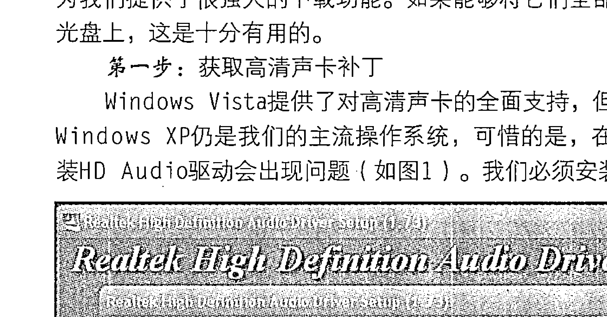

该问题在微软知识库中的编号是888111，大家可以登录http://support.microsoft.com，然后输入888111来查找相应的知识（如图2）。但是在微软本身网站上查找非常不容易，所以

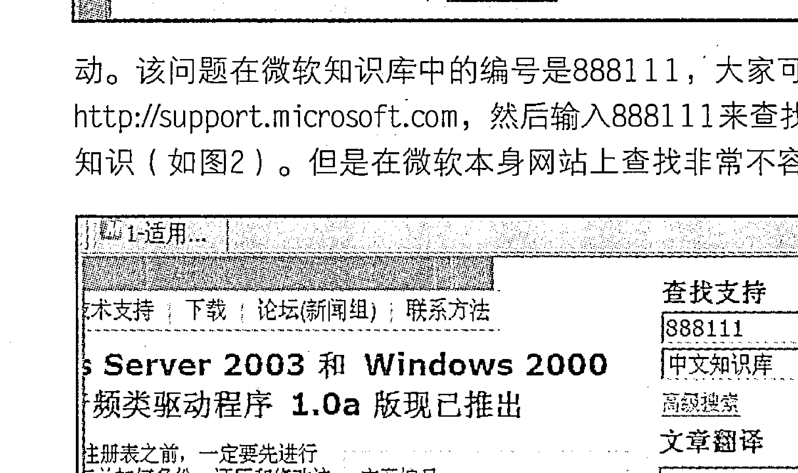

可以到http://www.gougou.com/search?search=888111&id=1上进行下载（如图3），只是在下载时一定注意版本号，一是操作系统的版本，如XP、2000、2003，同时还要选择相应的补丁包，如不要下载SP1下的驱动，而去获得SP2下的版本。因为我们的XP一般都是打过SP2的。在这一步中，我们下载得到补丁kb888111xpsp2.exe。

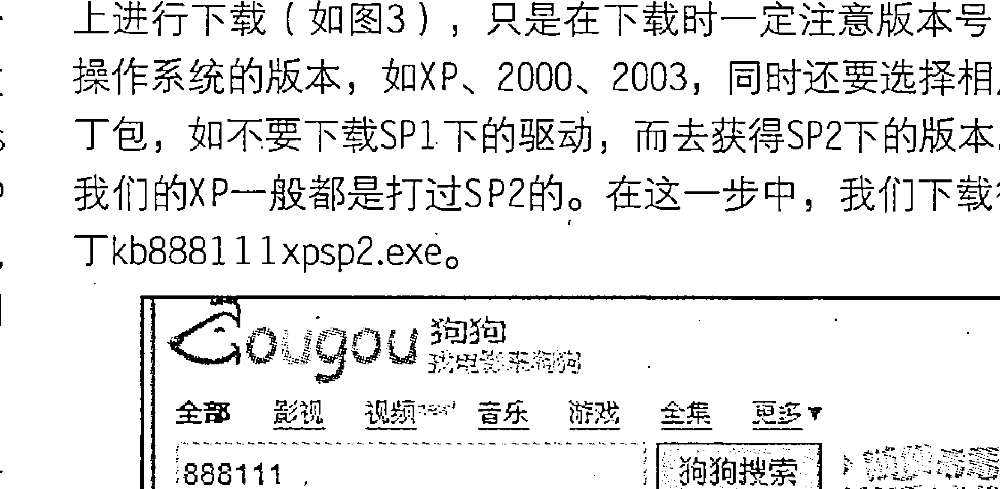

| 名称 | 大小 | 格式 | 发布时间 | 评论 |
|------|------|------|----------|------|
| 音频结构kb888111补丁 | 50.1M | ZIP | 2007-06-17 | 0条 |
| KB888111HD音频声卡驱动补丁 | 1.98M | RAR | 2007-09-08 | 0条 |

### 第二步：获取系统补丁

先从http://www.xunlei.com处下载并安装最新的迅雷5，在“狗狗影视排行”下方看到“系统漏洞修复”项，单击后会看到初始化的窗口，之后顺着向导来给系统打补丁。然后单击如图4所示窗口下方的“打开补丁下载目录”链接，即可看到其下的补丁，一般在C:\Program Files\Thunder Network\Thunder\Plugins\KLScan\hotfix文件夹下。

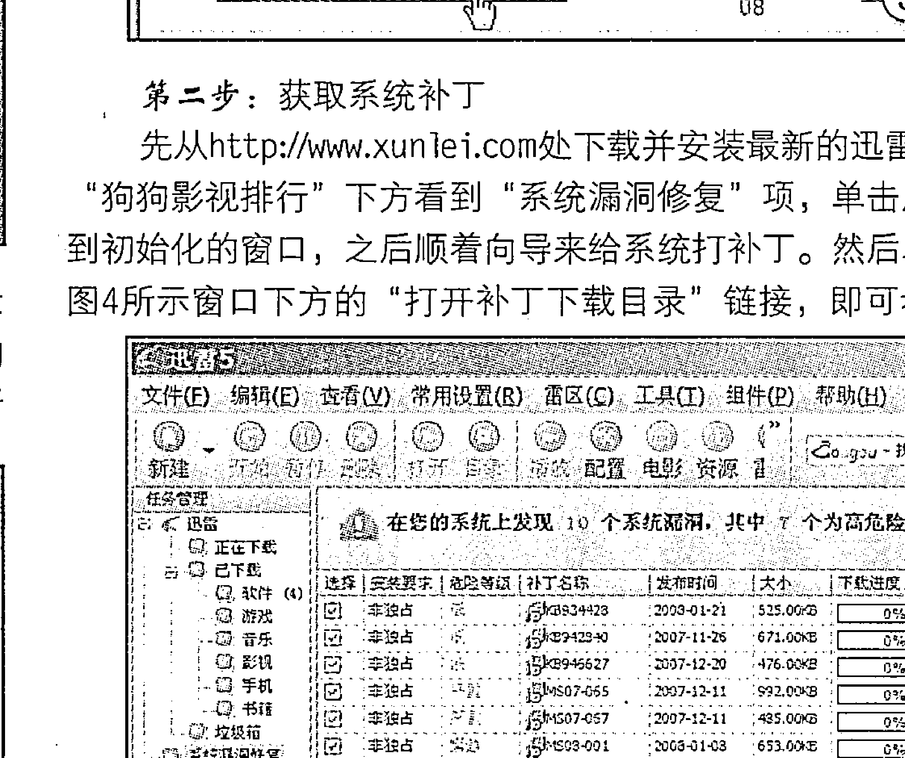

## 第三步：集成高清声卡补丁和一般补丁

- 1. 准备好补丁：将kb888111xpsp2.exe拷贝到C:\Program Files\Thunder Network\Thunder\Plugins\KLScan\hotfix文件夹下。
- 2. 准备好集成环境：将Windows XP光盘上的所有文件包括文件夹复制到e:\winxp文件夹中。再从http://home.midmaine.com/~nLite/nLite/nLite-1.4-installer.beta.exe处下载并安装nLite最新版，在安装时请确认安装类型为“简体中文”。安装后运行之，选择语言为Simplified Chinese（简体中文）。选中后软件界面会即时切换到中文界面，单击“前进”进入下一步。

小提示：如果发现安装nLite有问题，请直接从http://www.microsoft.com/downloads/details.aspx?displaylang=zh-cn&FamilyID=0856eacb-4362-4b0d-8edd-aab15c5e04f5处下载并安装Microsoft .NET Framework Version 2.0。

在接下来的界面中，我们需要选择安装文件的所在路径，此时选择e:\winxp文件夹。会弹出相应的窗口，会扫描当前的安装文件及打SP后的情况。完成后单击“前进”按钮进入下一步。

### 3. 开始集成补丁

在接下来的步骤里，由于我们是第一次使用，没有配置文件可以加载，所以直接单击“前进”。它提供了八个选项供我们选择，由于这次只是整合补丁，我们只要选中“修补程序包整合”和最后一项“可引导ISO镜像”。最后一项的意思是在修补程序包和驱动整合结束后直接由程序制作完整的ISO文件（光盘镜像文件的一种常用格式）。接着，单击“前进”进入下一步（如图5）。

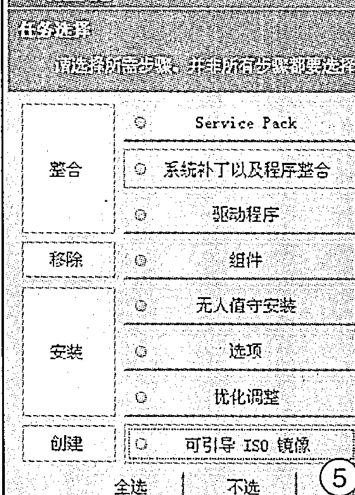

此时进入了修补程序包的整合界面，单击“插入”，在弹出的选择框中打开选中C:\Program Files\Thunder Network\Thunder\Plugins\KLScan\hotfix文件夹下的所有补丁包，其中也包括高清声卡驱动kb888111xpsp2.exe，并返回先前的窗口。

### 第四步：生成ISO文件

顺着向导完成其他的操作，完成后nLite提示正在处理（如图6），确定无误后，单击“创建ISO”，指定ISO文件存放的位置即可生成ISO文件。假设得到c:\winxp.iso。

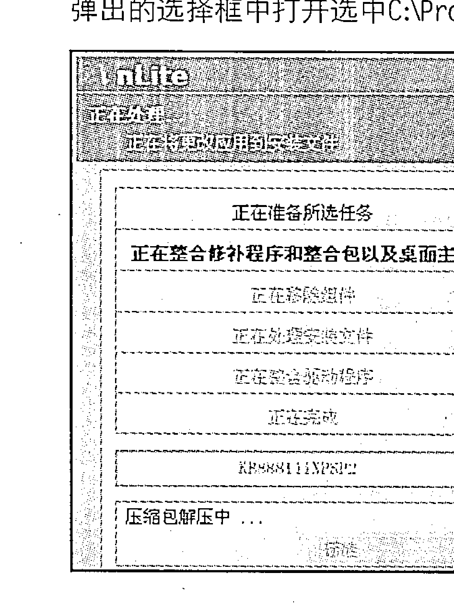

### 第五步：下载WMP11、IE7和迅雷

从http://www.microsoft.com/downloads/details.aspx?FamilyID=1d224714-e238-4e45-8668-5166114010ca&displaylang=zh-cn处可以下载到Windows Media Player 11 for Windows XP，得到wmp11-windowsxp-x86-zh-cn.exe，将其重命名为WMP11.exe。

从http://www.microsoft.com/downloads/details.aspx?FamilyID=9ae91ebe-3385-447c-8a30-081805b2f90b&displaylang=zh-cn处可以下载Windows Internet Explorer 7 for Windows XP SP2，得到IE7-WindowsXP-x86-chs.exe，我们将其重命名为IE7.exe。

从http://www.xunlei.com下载迅雷5，得到Thunder5.7.9.466.exe，将其重命名为Thunder5.exe。

### 第六步：集成WMP11、IE7和迅雷

#### 1. 解压文件

将我们先前得到的c:\winxp.iso中的所有内容用WinRAR全部解压到c:\winxp文件夹中，备用。

#### 2. 启动安装管理器

打开c:\winxp\support\tools\文件夹的deploy.cab文件，用WinRAR将其解压缩到任一文件夹，如C:\DEPLOY文件夹下。双击C:\DEPLOY文件夹下的setupmgr.exe，即可打开并运行“Windows XP安装管理器向导”，单击“下一步”按钮，在弹出的安装管理器向导窗口中单击“下一步”按钮，启动向导。顺着向导，选择“创建新的应答文件”选项（如图7）继续。

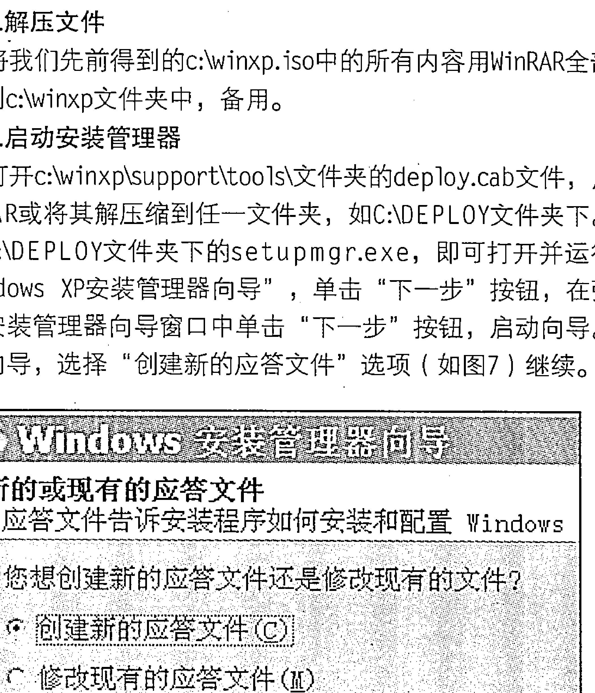

接下来，顺着向导设置好需要设置的内容，进行向导最后一步操作后，该程序会提示我们保存自动应答文件，我们选择将自动应答文件保存到C:\DEPLOY\unattend.txt文件。再把此文件改名为winnt.sif，最后把它拷贝到e:\winxp\i386文件夹（如果原来有，请覆盖）。

#### 3. 集成WMP11、IE7和迅雷

在c:\winxp下面新建目录，名为$OEM$，然后在$OEM$目录下面新建目录$$，进入目录$$后，新建一个soft的目录，将我们得到的WMP11.exe、IE7.exe和Thunder5.exe拷贝到此目录。

接着，使用记事本打开c:\winxp\i386\winnt.sif文件，将[Unattended]下面的OemPreinstall=No修改为OemPreinstall=Yes，并在[Identification]上面添加如下内容：

```
[GuiRunOnce]
Command0=%systemroot%\soft\WMP11.exe
Command1=%systemroot%\soft\IE7.exe
Command2=%systemroot%\soft\Thunder5.exe
```

- ★ $OEM$ 和 $$ 是特殊文件夹，如果 OemPreinstall=Yes（下面会作修改），那么$OEM$文件夹的内容将有可能被拷贝到系统文件夹中，而$$文件夹里面的所有文件、文件夹都会被拷贝到Windows的安装文件夹下里。
- ★ 当然如果有其他软件需要安装，只需要在后面依次添加 “Command3=” “Command4=” 即可。

### 第七步：制作光盘ISO文件

运行WinISO文件，打开c:\winxp.iso。选中其中所有文件，按下Del键把所有文件和文件夹全部删除掉！然后按下Win+E键，启动“资源管理器”，并定位到c:\WinXP文件夹下。按下Ctrl+A选中所有文件，将其拖放到WinISO右边窗口中，把当前文件夹下的内容加入到C:\winxp.iso文件。按下工具栏上的“保存”图标，更新winxp.iso文件（如图8）。

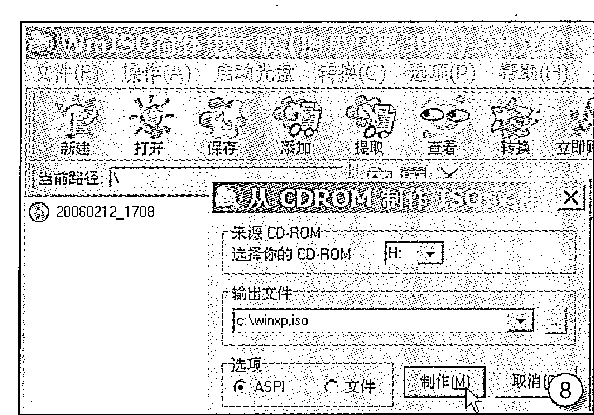

### 第八步：刻录/使用集成补丁光盘

启动Nero，选择“刻录器” → “刻录映像文件”，然后打开c:\winxp.iso文件，再单击“刻录”按钮，将它刻录到光盘上。

接下来，我们只要在BIOS中设置好从光盘启动，其他的安装过程与普通的Windows XP安装光盘一样。只是安装完成后，会自动安装高清声卡补丁，这样安装高清声卡驱动程序就不会出错了。同时，还会自动将补丁安装上，可让系统做到固若金汤。

更值得一提的是，同时把Windows Media Player11、Internet Explorer 7和迅雷5一并安装，这样就方便很多了。

## 二、刻录集成SP3补丁和丰富字库、模板的Office 2003光盘

市面上Office 2003仍是主流，不过Office 2003光盘并不完美。如果我们通过自己的改造，制作出一张自己想要的Office 2003光盘，它具备以下功能，相信一定是你喜欢的。

- ★ 可以免输序列号安装，再也不用记忆那繁琐的号码；
- ★ 带上全新的补丁和程序，让你的Office 2003总是保持最新；
- ★ 可以快速按自己的设置来安装Office 2003，在哪里都用上自己的设置；
- ★ 带上更多模板，让文档制作更轻松；
- ★ 带上更多的字库，让自己的文档更靓。

### 第一步：修改配置文件 免序列号安装

首先将Office 2003安装光盘上的所有文件都拷贝到一文件夹下，如E:\office2003下。然后打开E:\office2003\FILES\SETUP\SETUP.INI文件，再在[Options]节下写入如下语句：

USERNAME=江北书生
COMPANYNAME=我的公司
PIDKEY=XXXXXXXXXXXXXXXXXXXXXX

如图9，其中USERNAME为用户名，可以写上你的大名，COMPANYNAME为单位名，后面的24位X代表你的Office 2003安装序列号，在你的安装光盘的背面或者在用户使用手册上可以找到。

### 第二步：获取累计SP补丁

由于Office的SP更新与Windows XP的SP更新不一样，要让它更新到SP3，SP2和SP1也是需要的，所以我们要从网站上下载Office 2003 SP1、Office 2003 SP2和Office 2003 SP3（可从www.gougou.com上下载），并将得到的Office2003SP1-kb842532-fullfile-chs.exe、Office2003SP2-KB887616-FullFile-CHS.exe和Office2003SP3-KB923618-FullFile-CHS.exe分别命名为SP1.exe、SP2.exe和SP3.exe。
要注意的是，一定要下载完整版本（FullFile）的SP补丁包，每个一般100MB左右。为了大家的方便，这里提供几个下载地址，用迅雷下载速度会非常快。

Office 2003 SP1：http://php.tech.sina.com.cn/download/d_load.php?d_id=17248&down_id=281964
Office 2003 SP2：http://zbdx.skycn.com/down/Office2003SP2-KB887616-FullFile-CHS.exe
Office 2003 SP3：http://php.tech.sina.com.cn/download/d_load.php?d_id=17315&down_id=341208

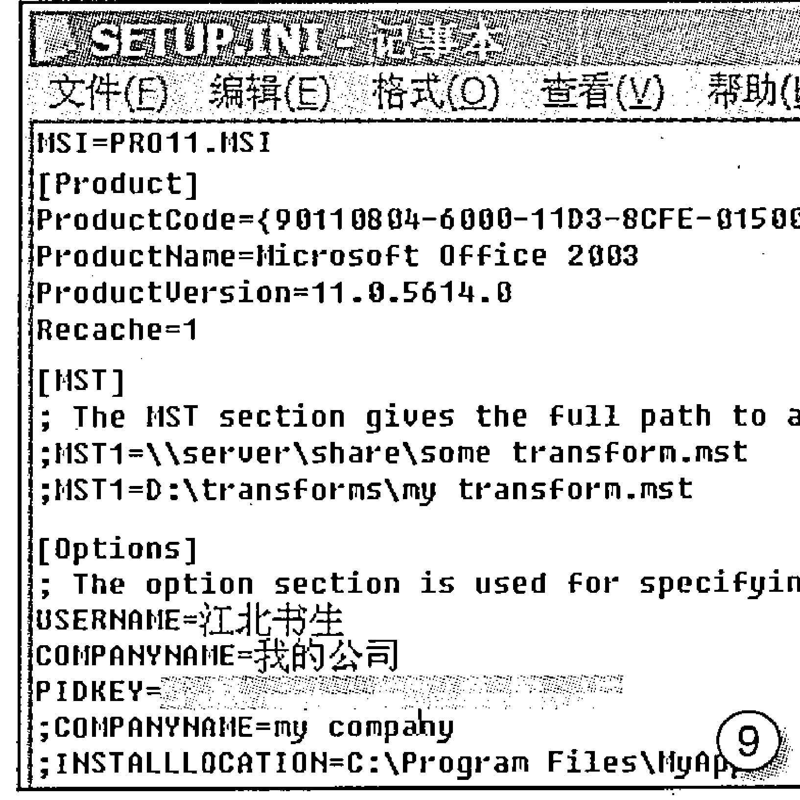

### 第三步：“解压” Office 2003

按下Win+R，在“运行”窗口中输入E:\office2003\SETUP.EXE /a命令（如图10），接着会出现如图11所示的窗口，选将其安装到E:\Office，接着该安装程序可将安装文件解压到E:\Office下（如图12）。

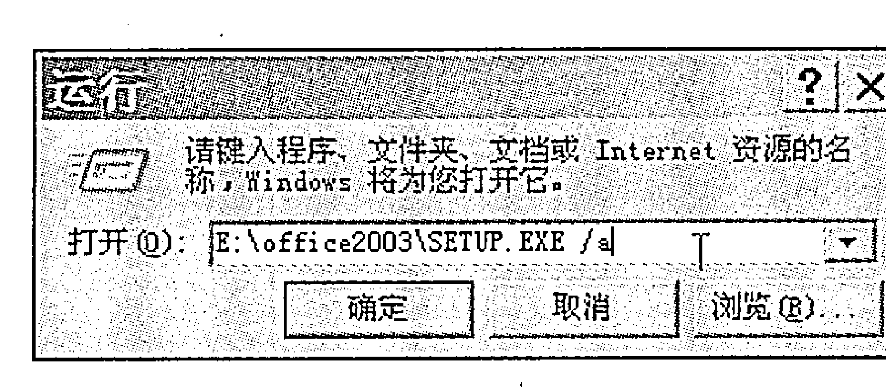
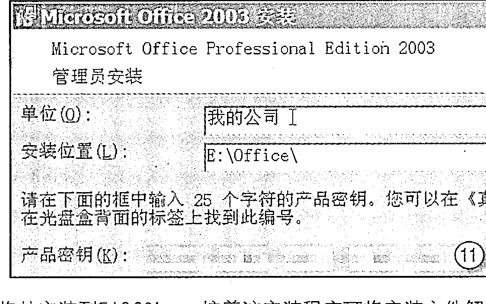
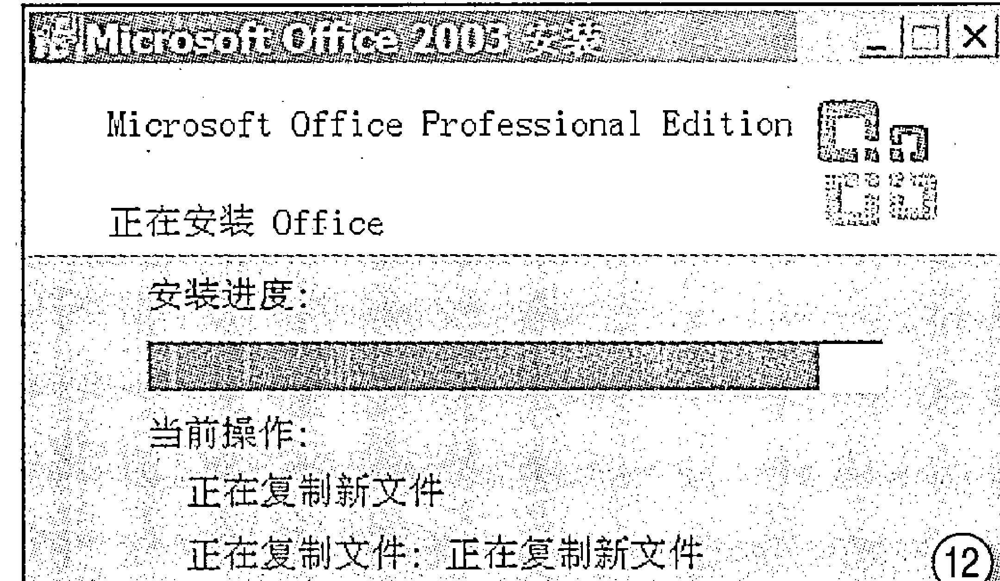

### 第四步：分离SP包

将刚才获得的SP1.exe、SP2.exe和SP3.exe拷贝到一文件夹下，在该文件夹中写一个批处理命令，内容为：

```
sp1.exe /Q /C /T:E:\Office\SP1
sp2.exe /Q /C /T:E:\Office\SP2
sp3.exe /Q /C /T:E:\Office\SP3
```

接着双击此批处理文件，就会把Office 2003 SP1、SP2和SP3的所有文件解压缩到 E:\Office\SP1、E:\Office\SP2和E:\Office\SP3文件夹下（如图13、14、15）。

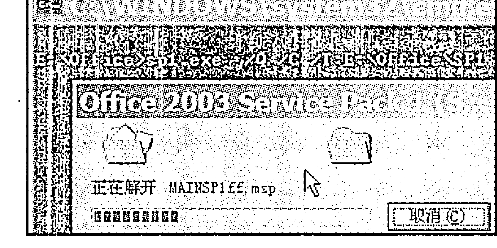
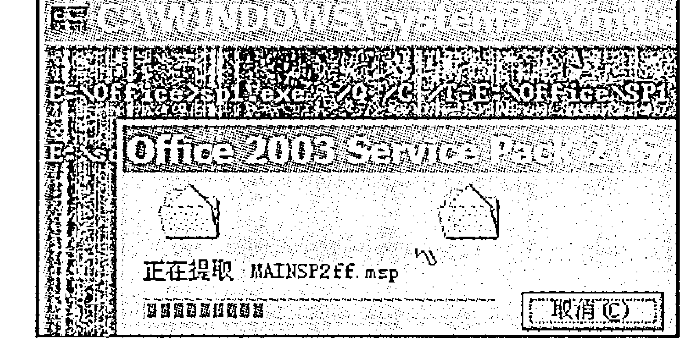
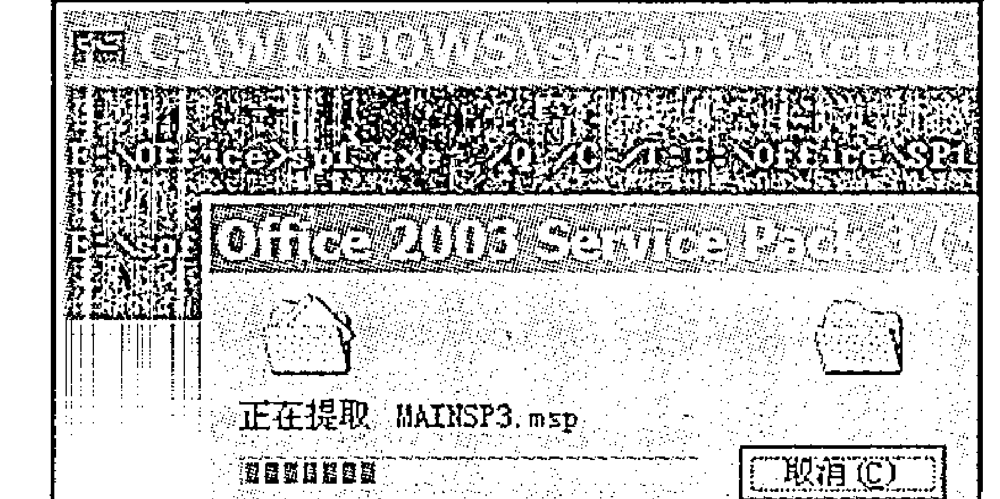

### 第五步：整合SP包

接下来，编写一个批处理文件：

```
msiexec /p E:\Office\SP1\MAINSP1ff.msp /a E:\Office\PRO11.msi SHORTFILENAMES=TRUE /qb
msiexec /p E:\Office\SP1\OWC11SP1ff.msp /a E:\Office\OWC11.MSI SHORTFILENAMES=TRUE /qb
msiexec /p E:\Office\SP2\MAINSP2ff.msp /a E:\Office\PRO11.msi SHORTFILENAMES=TRUE /qb
msiexec /p E:\Office\SP2\OWC11SP2ff.msp /a E:\Office\OWC11.MSI SHORTFILENAMES=TRUE /qb
msiexec /p E:\Office\SP3\MAINSP3.msp /a E:\Office\PRO11.msi SHORTFILENAMES=TRUE /qb
msiexec /p E:\Office\SP3\OWC11SP3.msp /a E:\Office\OWC11.MSI SHORTFILENAMES=TRUE /qb
```

如图16。

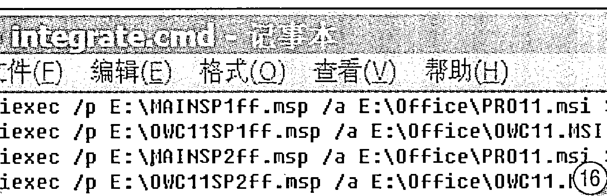

双击此批处理文件，会将Office 2003 SP1、SP2和SP3整合到E:\Office下的安装文件中（如图17、18、19）。

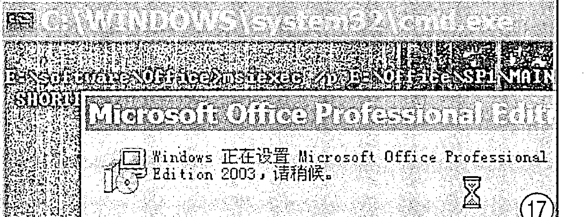
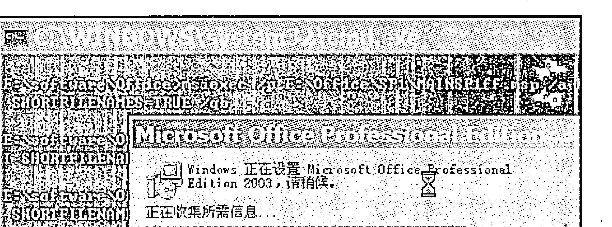
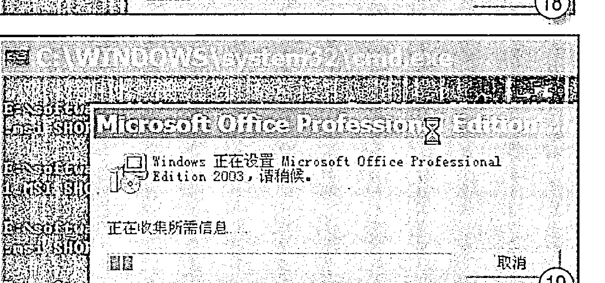

### 第六步：制作自定义安装光盘

如果你想自定义安装Office，可以从http://download.microsoft.com/download/0/e/d/0eda9ae6-f5c9-44be-98c7-ccc3016a296a/ork.exe下载并安装Office 2003 Resource Kit Tools。然后打开“开始”→“程序”→Microsoft Office Tools→Microsoft Office 2003 Resource Kit Tools→Custom Installation Wizard。接着顺着向导，在Office XP文件夹中选中MSI 文件，对于Office 2003 Professional with FrontPage那应该是PROPLUS.msi，而对于Office 2003 Professional则是PRO11.msi（如图20）。接下来，选择生成unattend.mst文件（如图21，将其保存在E:\Office下）。步骤较多，不过你不要担心会花太多的时间，因为有很多的步骤完全可以采用默认值。不过，有一步中可能会提醒我们输入序列号，将序列号输入，这样日后运行安装程序将不会再需要序列号，大大方便了我们。

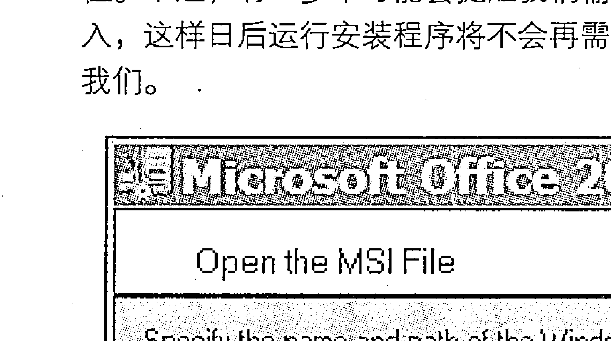
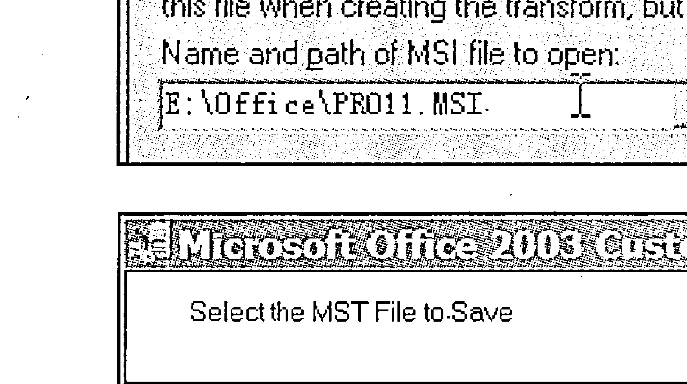

### 第七步：集成字库和模板

在E:\Office下新建fonts和templates文件夹，分别将字库文件和模板文件（自己创建或下载的）拷贝到fonts和templates文件夹中。

### 第八步：刻录超强集成Office 2003光盘

单击“开始”→“程序”→Nero→Nero Enterprise Edition→Nero Burning ROM启动Nero-Burning Rom，在“新建专辑”对话框中选择“DVD（数据光盘）”，然后将E:\Office下的所有文件直接刻录到DVD上即可。

### 第九步：使用Office 2003光盘

**1. 安装Office 2003**
以后要安装时，只要将光盘放入光驱，直接运行其下的setup.exe即可安装。如果想按自己的设置来安装，只要直接运行其下的unattend.bat即可。可谓是一举两得。

**2. 使用字库和模板**
打开Office 2003光盘，把templates文件夹下的文件复制到Office 2003的模板文件夹下即可被Office 2003识别并使用。当然，我们还可以打开“控制面板→字体”，选择“文件→安装新字体”，再打开Office 2003光盘中fonts文件夹安装字库。

## 三、刻录带SP1补丁和字库、模板的Office 2007光盘

将Office 2007 SP1集成到Office 2007光盘上，同时把自己想要的字库和模板放到DVD光盘上是一个很不错的主意。这样，只要我们有了这张光盘，以后直接运行集成了SP1的安装程序，安装完成后就直接打上了SP1。同时还可以用上字库或模板等资源，这是非常有用的。

### 第一步：拷贝必要文件

将Office 2007光盘所有文件保存到d:\software\office\Microsoft Office 2007文件夹下。

### 第二步：获取Office 2007 SP1

由于我们使用的是简体中文版Office 2007，所以从http://download.microsoft.com/download/1/6/5/1659d607-8696-4001-8072-efaedd70dd30/office2007sp1-kb936982-fullfile-zh-cn.exe处下载。下载时由于它比较大，200多MB，因此推荐使用迅雷来高速下载。

### 第三步：释放文件

将下载后的office2007sp1-kb936982-fullfile-zh-cn.exe改为sp1.exe。然后切换到此文件所在文件夹下，新建一个ex.cmd文件，内容如下：

```
sp1 /extract:FILES
```

双击之，出现如图22所示窗口，接受协议，此操作将会将SP1中的所有文件解压到当前文件夹下的FILES文件夹下（如图23），我们得到了：ClientSharedMUIsp1-zh-cn.msp、GrooveMUIsp1-en-us.msp、IME32sp1-zh-cn.msp、IME64sp1-zh-cn.msp、MAINMUIsp1-zh-cn.msp、MAINWWsp1.msp、Office64WWsp1.msp、Proofsp1-en-us.msp、Proofsp1-zh-cn.msp、README.TXT和SupplementalEula_OfficeClient_zh-cn.txt几个文件（如图24）。

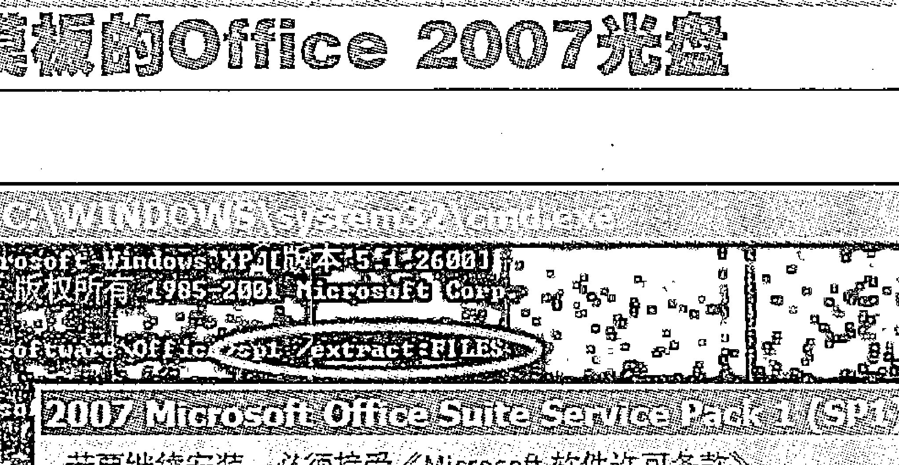
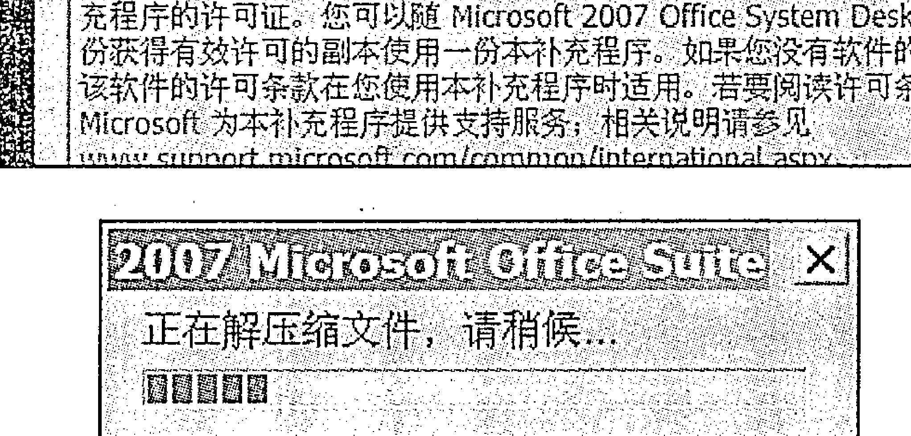

# SOLUTIONS 图书专题

第四步：集成SP1
将上面的所有文件直接放到Office 2007安装文件夹下的Updates文件夹中，如图25所示。

第五步：集成模板和字库

在d:\software\office\Microsoft Office 2007文件夹下新建templates的文件夹和fonts文件夹。从网上下载的模板文件和字库文件拷贝到这两个文件夹中。

第六步：刻录光盘

启动Nero Burning Rom，在“新建专辑”对话框中选择“DVD（数据光盘）”，然后直接把Office 2007安装文件夹下的所有文件（夹）刻录到DVD上。

第七步：应用补丁

至此，我们只要运行Office 2007安装程序，安装到最后可以看到如图26的窗口，注意下方的“正在应用更新”字样。

第八步：安装模板和字库

要在Office 2007中安装模板，只要将其拷贝到Office 2007指定文件夹下即可。如果要让字体变得漂亮，可以打开“控制面板”→“字体”，然后将光盘fonts下的字库文件安装到“字体”文件夹中即可。这个非常简单，不再赘述。
同样，我们只要把templates文件夹下的文件复制到Office 2007的模板文件夹下即可被Office 2007识别并使用。

四、打造自动播放的海量DVD MP3

现在网络下载流行得很，有很多自己喜爱的歌曲或相声。不过，大家想过吗？借助于DVD的大容量特性，我们完全可以制作一张自动播放的海量MP3 DVD，用于“即插即听”。它可以自动播放，一放入光驱中即自动启动播放器来播放光盘上的歌曲，相当智能化。

第一步：准备歌曲

这一步很简单，大家可以到http://www.gougou.com上去下载。最后可以得到自己想要的歌曲文件。

第二步：下载并安装播放器

这里推荐使用Winamp，同时并将其安装到C:\MP3文件夹下。接着把上面下载的MP3歌曲拷贝到C:\MP3文件夹中。

第三步：制作音乐播放列表

把自己喜欢的歌曲全部拷贝到C:\MP3文件夹下，可以拷贝3～4GB都没事。然后双击MP3文件夹下的Winamp.exe文件启动Winamp，单击下方“添加”按钮，并选择“目录”子按钮，在打开的“打开乐曲目录”对话框中选择C:\MP3文件夹，同时选中“涵盖子目录中的媒体文件”复选框（如图27）。退出Winamp，启动“资源管理器”，进入C:\MP3文件夹后，我们可以看到一个名为winamp.m3u的文件。用记事本打开它，会发现相应的歌曲信息。

第四步：去除音乐文件路径

在“记事本”中按下Ctrl+H键，弹出“替换”对话框，在“查找内容”框中输入“C:\MP3\”，并在“替换为”中不填入任何字符，按下“全部替换”按钮（如图28），将所有的“C:\MP3\”字符串去除。

第五步：制作启动文件

打开“记事本”，并在C:\MP3文件夹下写一个autorun.inf文本文件，然后在其中写上如下语句（如图29）：

```
[autorun]
open=winamp.exe  winamp.m3u
```

第六步：刻录播放光盘

选择“开始”→“所有程序”→Nero→Nero 6 Enterprise Edition→Nero Burning ROM启动Nero Burning ROM。在最新的Nero中新建一个项目时，单击上方左上角的下拉列表框，从中选择DVD项，再在下方选择“DVD-ROM（ISO）”，单击“新建”按钮。
然后将C:\MP3文件夹下的所有文件（当然也包括Winamp播放软件文件）一起拖放到光盘根目录下，最后刻录成MP3光盘即可。以后只要把这张光盘插入电脑的光驱后，该光盘上的Winamp就会自动启动，且会顺序播放光盘中的MP3歌曲，相当方便。如果你的系统关闭了自动播放，只要直接双击光盘根目录下的winamp.exe即可。

五、打造自动播放的海量电影DVD

奥运会要来了，这是中华民族举世瞩目的盛会。在奥运会快来临之时，如果能够打造一张自动播放的DVD光盘，它有海量的内容，同时还能够自动播放，把它送给自己的好友或者自己保存是一件非常有意思的事情！

第一步：下载奥运会歌曲

听着奥运会歌曲，喝着可乐，这是现代年轻人最惬意不过的事情了。我们推荐大家先从http://mp3.gougou.com来下载奥运会歌曲。

第二步：下载更多视频内容

打开http://www.gougou.com，然后输入相应关键字进行搜索，然后下载。事实上，奥运会的视频有很多，不过我们推荐大家使用迅雷来下载，一来迅雷的下载速度快，二来迅雷已经成了事实上的下载门户，上面的人气很旺，这样就使得内容的丰富性、下载的稳定性得到大大提升。

在下载时要注意，一定要下载WMA或RM或AVI等格式的视频文件而不是EXE之类的文件，否则后面制作的光盘将无法播放某些文件。

第三步：整合资源

先在C盘根目录下建立一个子文件夹，名为movies，再将下载下来的MP3和视频文件放到该文件夹下。

第四步：下载软件

从http://www1.geexbox.org/releases/1.1/geexbox-generator-1.1.i386.tar.gz处下载ISO Generator，然后用WinRAR将其中的所有文件解压到一文件夹下，如c:\gen。

第五步：准备电影文件

将c:\movies文件夹中的电影文件拷贝到C:\gen\iso下。

第六步：设置简体中文环境

返回到C:\gen文件夹下，双击generator.exe文件，此时该工具会打开如图30所示的窗口，我们可以选择Menu language为Chinese-Simplified（简体中文）。

第七步：下载解码器

单击Package标签，然后选中Codecs下相应的解码器，同时选中Fonts下的Asia下的Simplified Chinese项，单击Download按钮下载字库（如图31）。

第八步：生成ISO文件

之后，单击Compile（编译）按钮，当出现如图32所示的Done（即完成）信息时，按任意键即可退出。我们可以在C:\gen下发现geexbox-1.1-custom-zh_CN.i386.iso文件（如图33）。

第九步：刻录光盘

启动Nero Burning ROM，选择“刻录器”->“刻录映像文件”，然后打开刚生成的geexbox-1.1-custom-zh_CN.i386.iso，再单击“刻录”按钮将它刻录到光盘上。

第十步：设置从光盘启动

在开机时按下Del键进入BIOS设置程序，选择BIOS Features Setup菜单，然后按下回车键，进入参数设置选项界面，在这个界面中找到并选中选项Boot Sequence，然后按下Page Down键或者Page Up键，选择CDROM,C,A设置系统优先从CDROM盘启动，最后按下Esc键退回到根菜单中，并选择保存菜单或直接按下F10键保存设置。

接着，从光盘启动，它将会自动播放光盘上的世界杯电影和歌曲，是不是很神奇？

> ★如果你使用的是Phoneix的BIOS，则在开机时按下F2键，进入BIOS设置后，选择Boot选项，然后找到ATAPI CD-ROM Drive项目，连续按下“+”号键，使其调到最前即可保证机器优先从光盘启动即可。
★GeeXBOX可播放主流媒体格式，包括AVI、RM、RMVB、MPEG-4、MP3及外挂中文字幕，这样我们还可以打造出更为丰富的自动播放光盘，而且不需要启动操作系统，是不是很牛？

六、刻录一张漂亮面孔的光雕DVD光盘

光雕技术是惠普与威宝公司共同开发的一项允许用户在光盘背面刻写个性化图案的技术，可以将自己喜欢的图像直接“打印”到光盘的表面，与普通的打印不同的是，它可以实现永久性的“录入”。这样我们就能使自己的光盘别具一格！而且现在光雕刻录机的价格已经降到200元左右，有着广阔的市场。很多人都可以获得由此带来的个性享受！

## 第一步：下载/安装插件

先确保你安装了Nero 6.x版本，然后再从http://58.61.39.221/down?cid=F35BE46933CC737DACBFE42890ABE0110573279A&t=2&fmt=--处下载Nero 6.x的光雕插件，下载完成后直接安装。

## 第二步：准备刻录光雕

选择“开始”→“程序”→Nero→Nero 6 Enterprise Edition→Nero Cover Designer；此时软件会自动启动“新建文档”向导，我们可以看到LightScribe项（如图34）。接着选择“空白文档”，单击“确定”按钮新建一个空白的窗口（如图35）。

## 第三步：制作漂亮盘片效果

### 1.选择模板

在图34窗口中可以看到，每种封面都分为音频、数据和音频+数据三种类别，这只是命名上的分类，对以后操作没有任何影响，你可以根据自己刻录的光盘内容来选择，同时还可以使用现有模板或者创建新模板（.nct），这里选择标准类型的空白文档，然后单击“确定”按钮。如果在中间窗口选择一模板，即可在窗口右边看到效果。按下“确定”按钮就能以它为模板建立光盘封面。但由于要制作更有个性的光盘，所以选择“空白文档”，然后按下“确定”按钮开始。

### 2.熟悉界面

此时看到软件的主界面（如图35），先来熟悉一下各种菜单和按钮的用途。不难看出，该软件沿用了一些经典的软件界面和功能，比如继承了Word的格式刷和Photoshop的滤镜等，非常方便。下面我们就来一次实战演习，制作一套精美CD的包装。

### 3.插入背景

先选中窗口下方“磁盘1”项目来制作光盘封面。其他三种封面的制作方法和光盘封面大同小异，所以大家可以举一反三，自己体会！

由于现在我们是使用光雕效果，因此找到一张漂亮的背景图片，可以为我们增添不少动人色彩，我们也来做一个和它们比比。最通常的方法是用鼠标右键单击编辑区域，选择“背景属性”后，会打开如图36所示的窗口。在图像一栏的“图像来源”面板中单击“文件”，然后打开电脑中预先已经准备好的图片即可。

### 4.调整图片效果

单击图36窗口下方的“效果”菜单，可以调整图像的亮度、对比、灰度和均衡，使用各种实用的滤镜效果和特效处理（如图37），相信用过Photoshop的朋友们一定觉得非常亲切。如果不想要背景图片的话，单击“空白”即可。

> > 小提示：如果有扫描仪，也可以单击图36中的TWAIN按钮来直接扫描获取图像作为光盘的背景。

## 第四步：添加文字框

有了漂亮的图片，当然还要有适当的文字说明，在Nero Cover Designer中，使用图文框来输入文字非常方便，单击“艺术字工具”后，用鼠标在需要输入文字的地方拖拽出一个区域，在其中写上文字，如图38所示。接着可以右击它，选择“属性”命令以进行属性设置。

置，然后可以看到有四个栏目：

### 1. 画笔 (如图39)

设置图文框边框线的宽度和颜色，按下叉号按钮则边框线不可见。我们可以把边框线颜色设为自己喜欢的颜色，并把宽度作一些设置。

### 2. 刷子 (如图40)

设置图文框背景颜色和样式，按下叉号按钮为透明背景；注意此处翻译有些问题，事实上并不是“画笔”。

### 3. 文字 (如图41)

插入文字，在此可以输入文字框中的文字。在此我们输入“我的光雕光盘”字样。还可以用鼠标右键单击它后选择“弯曲”，这样文字就会沿着光盘的圆形边界自动排列，我们可以对其随意地进行伸缩处理。

### 4. 字体 (如图42)

可以设置文字的字体类型、大小和颜色等。

第五步：打印光雕内容

取出LightScribe光雕光盘，将黄色面朝下，然后在Nero Cover Designer中选择“文件”→“打印LightScribe标签”（如图43），在打开如图44所示的窗口中单击“打印”按钮，则会出现如图45所示的打印缓冲窗口和如图46所示的打印过程窗口，完成后会出现如图47所示的窗口。同时光盘会被自动弹出。

第六步：刻录数据

单击“开始”→“程序”→Nero→Nero Enterprise Edition→Nero Burning ROM启动Nero-Burning Rom，在“新建专辑”对话框中选择“DVD（数据光盘）”（如图48），然后直接把数据刻录到DVD上。要注意的是，要将光盘的另一面朝下，才可以刻录。

光雕技术用激光雕刻涂在光盘上的一层特殊材料，使其颜色发生变化，从而实现雕刻的效果。LightScribe光雕技术完成的光盘封面与通常的记号笔以及纸制光盘标签相比无疑具有相当的优势，不会出现字迹模糊、不易辨认或是光盘重量不均、起泡等问题，是很有前途的。

七、刻录DVD光盘的一些实用技巧

现在DVD刻录机的价格已经在200元左右，而面对目前越来越大的数据处理量，购买一部DVD刻录机来刻录数据是十分必需的。而且多数人也可能已经拥有了DVD光盘刻录机，并用它来刻录、永久保存数据，确实是大大方便了数据的存储。不过，在使用DVD刻录机刻录数据时，有很多实用技巧，掌握好了，可以保证让DVD刻录又快又好！

### 1. 选择质量好的盘片

一般说来刻录机的刻录品质需要品质有保证的碟片支持。有些用户由于价格的因素，购买碟片时多数还是会选择廉价的碟片。如果遇到刻录机不能识别刻录盘，或者刻好的DVD盘无法在一般的DVD播放机中播放，多是盘片质量不佳造成的。一般说来低于2元的碟片，刻录的质量则难尽人意。相对来说，用5元以上的行货盒装品才能保证质量。

DVD盘无法在一般的DVD播放机中播放，多是盘片质量不佳造成的。一般说来低于2元的碟片，刻录的质量则难尽人意。相对来说，用5元以上的行货盒装品才能保证质量。

### 2. 保证供电

在刻录的过程中要消耗很大的功率才能融化染色剂，并且刻录过程需要一个相对较长的时间，所以要保证平稳的电压和较大的电流。普通CDR刻录机的功率一般在15W左右，可是DVD刻录机一般都在25~35W，所以DVD需要更为强劲的电源来支持。这点是已经购买DVD刻录机的用户或准备购买DVD刻录机的朋友都要考虑的。供电不足首先会对刻录品质产生影响，严重的话还会造成刻录机激光头的损坏，或者使刻录机无法正常工作。

重的直接影响刻录机使用寿命，系统经常出现异常、蓝屏、死机、无故重启，除了病毒之外，就是你的电源已经超过它能承受的负荷了。一般刻录光盘的时间较长，如果设置了能源管理，可能会导致计算机长时间停止响应，从而导致刻盘失败。所以首先要关闭能源管理，关闭能源管理要从两方面入手：一是在CMOS中将Power Management中的Power Saving设置为NONE；二是进入Windows的“控制面板”，双击“电源管理”图标，将“关闭监视器”、“关闭硬盘”和“系统待机”的下拉列表框均选择“从不”，单击“确定”按钮返回（如图49）。

### 3. 注意DMA设置

现在市面上的DVD刻录机，仍以IDE的居多。有时会出现刻录数据较慢的情况，而DVD刻录的数据要较CD多很多，所以我们必须缩短其时间。最好的办法就是打开IDE的DMA设置。打开“设备管理器”，双击相应的IDE通道（如果不清楚刻录机接在哪一个IDE通道上，可以询问专业人员），在打开窗口中单击“高级设置”，然后选择DMA项即可（如图50）。

### 4. 散热、防尘、防潮

刻录机功率较大，并且刻录的时间会相对较长，不可避免地会有很大的发热量，刻录机过热势必影响内部元件的电气参数。注意刻录机的清洁卫生，尘与潮是所有光存储设备的大敌。

### 5. 不要满刻甚至超刻

DVD刻录技术还不像CD刻录那么完善，如果超刻时DVD刻录盘无法继续维持写入动作，此时对激光头的损伤是相当严重的！一般标称容量为4.7GB的DVD-R刻录盘片，最好只刻入4.3GB以内的数据，刻满4.7GB的DVD-R盘片拿到别的电脑上读取时，用不了几次，就有可能出现部分内容读不出的现象。

### 6. 一次性刻录 不要连续刻录

由于刻录机中使用的激光头是可写的，当它刻录光盘时，必须达到一定的功率才能够将DVD刻录盘上的材料熔化，进行烧录，因此，时间一长，刻录光驱上的温度非常高，并有可能导致刻录出错甚至损坏光驱，因此，笔者建议您不要连续刻录多张光盘。必要时给房间安装空调！

### 7. 低速刻录

刻录机不要使用其最高速刻录，尤其是音乐、视频内容，否则容易产生爆音、断帧，影响刻录质量。标称4倍速的DVD刻录机，在刻录时最好只用2倍速进行刻录。经过笔者试验，用相同的刻录机和同样品牌的DVD-R盘片，用2倍速刻录出的盘片比用4倍速刻出的盘片在兼容性上好得多，尤其在笔记本电脑上读取时更明显。 刻录速度与盘片速度最好匹配。在2X的刻录机上使用4X的刻录盘片也只能用2X的速度刻录。 记住，多数刻录软件在刻录时可以选择速度，这样会稳定得多。要知道，欲速则不达！

### 8. 刻录前整理文件

很多人的硬盘很大，但是硬盘上的数据放置比较混乱，在刻录时，从硬盘上读取数据的时间将会增长，这样可能造成光盘刻录机的缓存中缺少数据，这时候就会引起 Buffer underruns错误，即“操作超时”，造成刻盘失败。不仅硬盘上的数据放置比较混乱会引起上述错误，而且如果一些文件不放置在同一分区的连续区域内也极有可能发生此类错误。因此，最好在刻录光盘之前删除不必要的文件，以腾出足够的硬盘空间；将所有文件全部拷贝到某一硬盘的某一分区上；在将要刻录之前，最好运行硬盘扫描程序，以保证所有文件放置在连续的区域上。现在有很多磁盘整理工具，很多还免费。

### 9. 关闭多余任务

由于刻盘是一项很消耗系统资源的工作，所以在往DVD盘中写数据时，必须关闭所有其他应用程序（如屏幕保护、下载文件、视频播放、音频播放等），以免降低系统效率，增加故障的出现几率，尤其是一个比较占用系统资源和网络资源的程序。这样可以保证刻录的顺利进行。

### 10. 经常更新固件与刻录程序

应该经常关注DVD刻录机厂商是否有新版的固件程序，去刻录软件的网站看是否有升级或补丁可以下载，这些更新包括了厂家对产品的一些小的修改与改进。

### 11. 尽量使用SATA刻录机

SATA光驱的价格与PATA光驱（即IDE）的几乎相当，但是它提供了更为先进的技术。不仅可以保证速度提升，还能够让其更加稳定。而且现在机器上的SATA接口也很多，而且硬盘容量比较大，所以一般人的机器上不会挂太多的硬盘，这样就可以把更多的SATA接口省下来给SATA光驱。购买SATA接口的DVD刻录光驱，可以大大减少其对系统资源的占用，也可以使其更为高速和稳定地进行刻录工作。

### 12. 购买时注意缓存

现在的光盘刻录机都是从硬盘上将数据先读入到刻录机的缓存中去，然后再从缓存中写到DVD上的，因此，如果刻录光驱的缓存较小，则极有可能会发生错误。在购买DVD刻录机时，一定要看清楚其缓存。一般来说，越大越好。

### 13. 尽量将盘片封口

尽管DVD刻录盘是允许续写的，但是经验告诉我们，有时候往往不封口的盘片到别的机器的DVD上无法读出，因此，如果您是将这些资料带出去交流的话，最好将它们全部封口，再说现在的DVD刻录盘的价格也很便宜，总不能够为了那几块钱而误了大事！

### 14. 细节决定成败 注意DVD设置

一般在Nero里面默认是CD刻录，刻录DVD的时候要在新建刻录项目的时候把CD改为DVD，才能够正确显示DVD的容量。

## PSP魔幻游戏 娱乐“漫”天下

漫画作为独特的艺术门类，深受世界人民的喜爱，人们把漫画称之为没有国界的世界语，并被西方艺术评论家们誉为“第九艺术”，漫画艺术被提升到一个前所未有的高度。不仅如此，漫画艺术更是人类智慧的结晶，它凝聚着人类文明的精华，正是这些深厚的文化积淀作为养料，漫画才发挥出强大的艺术生命力。不过，在我们感受漫画艺术博大精深的精髓同时，更多时候，我们还是感受这漫画给我们的生活带来的乐趣以及启迪（如图1）。


传统欣赏漫画的方式无外乎一摞一摞的漫画图书，看着那已经发黄的纸张，不禁想起了我们美好的童年生活。如今已长大成人，但依旧无法舍弃童年的“漫”梦，也只能靠这PSP来帮我们实现了。下面就跟随笔者一同追忆童年的漫画时光，将给大家介绍如何制作漫画，以及如何在PSP上欣赏漫画。

## 变身——xReader

为了让大家更快更爽地在PSP上欣赏漫画，我们最初可以先从网络上或者自己的收藏中，找寻已经制作好的CHM格式漫画书，或者是bmp、tga、jpg、png格式的漫画图片。既然是漫画图书，我们自然可以使用功能强大的eReader软件来播放，因为其功能实在是太强大了，而且支持的格式比较多。不只是可以观看电子书图片，还支持MP3的歌词同步，想必PSP的玩家已经领略了eReader的强大功能了吧。不过今天，笔者给大家介绍的不是eReader软件，而是另外一款xReader软件。

其实xReader并不是一款全新的电子书阅读软件，而是软件作者通过修改1.5核心的eReader v1.6版之后的一款自制软件。xReader能够在PSP2000的3.XX系统上更加顺畅的运行，所以就让我们来了解一下这款软件。

xReader可以支持电子书自动翻页，还支持MP3、WMA，并且支持LRC歌词显示等eReader持有的功能。首先下载xReader软件，解压之后将其中的文件夹全部拷贝到PSP记忆棒中的“PSP/GAME”目录下，同时还要将漫画图书装进PSP的记忆棒中。现在打开PSP，在“游戏”——“记忆棒”中运行xReader软件，我们就可以在PSP上观看漫画了。怎么样，很方便吧。而且漫画文件可以随便存放在PSP的任何地方，因为xReader会搜索整个记忆棒。

## 一、专业——PSPcomic

刚才已经介绍了身兼数职的xReader，通过该软件我们可以轻松欣赏各种漫画。不过有很多朋友经常抱怨很多打包的漫画没有经过缩图和分页处理，以至于不能很好的在PSP上阅读。其实这个问题很好解决，只要我们拥有PSPcomic自制软件，一切都可以解决了。即使是用于PC的超大尺寸未分页的漫画，使用PSPcomic也一样可以方便地显示出来。

PSPcomic自制软件的强大功能在于，通过记录书签，PSPcomic可以记录漫画阅读的位置，方便用户下次打开继续阅读。如果漫画观看完毕或者不存在，则会退回到主界面。人性化的单手模式，让我们用一只手操作就可以方便地观看漫画了。而且图片可以进行多倍缩放，方便用户观看各种各样的漫画图片。还增加了更多屏幕阅读模式，并不是单一的全屏模式。PSPcomic还可以直接读取压缩包中的图片文件，支持ZIP、RAR等通用的压缩格式；对于图片格式来说，更是支持jpg、bmp、png、gif等通用图片格式。所以，想在PSP上过足漫画瘾的朋友，千万不要错过PSPcomic噢。

功能介绍完毕，我们就开始使用PSPcomic欣赏我们的漫画吧。首先下载PSPcomic程序，解压之后，将压缩包中的“pspcomic%”文件夹、“pspcomic”文件夹和“src”文件夹都拷贝到PSP记忆棒中的“PSP/GAME150”中；之后在“游戏”——“记忆棒”中运行PSPcomic程序（如图2），为了在PSP上更好地欣赏多彩的漫画，我们还是需要对PSPcomic进行简单设置一下。进入到程序之后，按一下“start”键打开菜单进行设置：

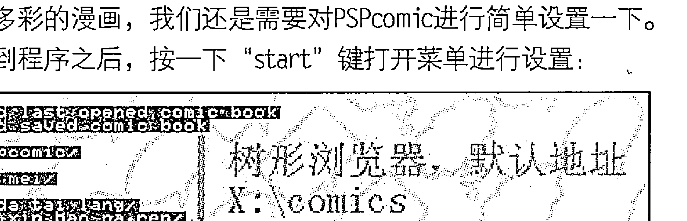

- open comic book…：打开其他漫画
- close comic book：关闭当前漫画
- next comic book：打开下一本
- previous comic book：打开上一本
- jump to page... : 跳到当前漫画的任意一页
- load bookmark: 打开书签
- set to bookmark: 设置书签
- load save comic book: 打开漫画标签
- save comic book: 保存漫画标签
- more bookmark operations.. : 漫画标签设置
- configuration... : 设置
- about: 关于
- quit: 退出
- go back: 返回

选择configuration...进入到设置中:
- change resize method resample: 改变缩图方式
- adjust clock frequency... : 改变cpu频率
- adjust menu scroll skip rate: 改变卷轴滚动的速度
- turn on/off manga mode: 打开关闭漫画模式
- set autozoom mode.: 设置自动缩图
- turn on/off single-handed mode: 打开关闭单手模式
- save configuration: 保存设置
- load configuration: 读取设置

选择set autozoom mode并进入到设置中
- fit page to screen width: 缩放至适合PSP屏幕宽度
- view page at original width: 原图尺寸
- fit page to twice screen width (good for spreads): 缩放至两倍PSP屏幕宽度 (适合看未分页的漫画)
- autodetect spread mode: 自动识别 (选它就行，软件会自己识别漫画是否分页)

全部设定完成后不要忘了选择save configuration保存一下设置即可。

现在将我们准备好的漫画打包放进PSP的任何目录中即可 (将漫画打包可以减少漫画的体积噢)，就可以欣赏我们之前放置的漫画了。

> 小提示
如果PSPcomic程序无法正常运行的话，我们可以尝试着将 “pspcomic%” 文件夹、“pspcomic” 文件夹和 “src” 文件夹全部拷贝到 “PSP/GAME” 目录中再试。基本就可以搞定了。

下面我们再来介绍一下PSPcomic的基本操作:

- **看漫画 (普通模式)**
    - 摇杆: 平滑移动漫画
    - 三角: 放大图片
    - 叉键: 缩小图片
    - 圆圈: 顺时针旋转图片
    - 方块: 逆时针旋转图片
    - select: 自动缩放到合适宽度
    - start: 打开菜单
    - L键: 前一张图片
    - R键: 后一张图片

- **看漫画 (放大模式)**
    - 摇杆: 移动放大
    - 三角: 退出
    - 叉键: 退出
    - 圆圈: 收缩放大范围
    - 方块: 扩大放大范围
    - select: 无
    - start: 打开菜单
    - L键: 退出返回上一页
    - R键: 退出到下一页

- **菜单中**
    - 摇杆: 滚动
    - 三角: 后退
    - 叉键: 选择
    - start: 关闭菜单
    - L键: 向前滚动翻页
    - R键: 向后滚动翻页

## 二、下载—MangaDowner

既然有了得心应手的欣赏漫画工具，我们就可以各种欣赏了。不过我们到哪去下载那么多漫画呢？难道要我们一张一张的下载不成？不用，因为我们有批量下载漫画的法宝——MangaDowner。

首先下载MangaDowner，因为是绿色软件，所以解压之后即可直接运行。运行MangaDowner主程序，之后在设置选项卡中进行相关的设置 (如图3)。首先更改漫画的保存路径为我们的目标文件夹，并根据自己的上网环境选择网通线路，或者是电信线路。选择完毕之后，在电脑端浏览器的地址栏输入漫画网站地址，并找到我们喜欢的具体漫画，然后将地址复制并粘贴在MangaDowner程序 “主界面” 中的地址栏中，点选 “分析” 按钮，马上即可看见被分析出来的具体漫画。选中所有需要下载的漫画选项，然后点选 “调用迅雷下载” 按钮就可以实现下载了。这时候所选中的下载工具就会自动弹出下载对话框，选中存放的目录之后就等待下载吧 (如图4)，之后我们就可以传输到PSP上，并欣赏自己喜欢的漫画了。

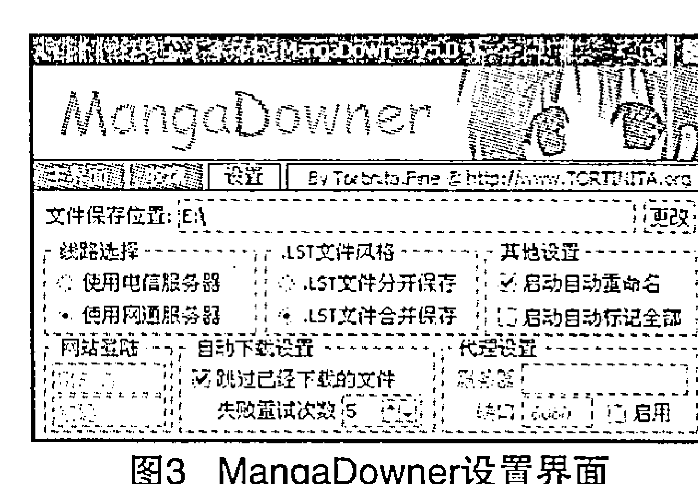

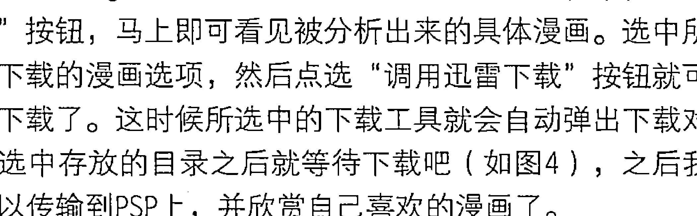

> 小提示
还有一种方法，我们可以先点选 “生成.LST文件” 按钮，并保存。之后打开下载工具，通过 “文件” —— “导入下载列表” 功能导入刚才生成的文件，同样可以完成下载。这样的好处就是可以让我们在临时有事的时候，留作备用下载的列表。

## 三、转换—PSP Comic Converter

没有最好，只有更好，很多时候，我们从网上下载回来的漫画大多只是适合在PC上观看，那么有没有什么好的办法将下载回来的漫画更好的支持PSP呢？答案是肯定的。而且方法十分简单。

首先下载PSP Comic Converter软件。然后找到我们先前下载好的漫画资源，一定要是图片格式的漫画，不要用EXE格式。然后通过点选PSP Comic Converter主程序上的 “选择来源目录” 按钮和 “选择目标目录” 按钮，分别选定网络下载回来的漫画存放路径，以及希望保存的目标目录 (如图5)。选择完成之后，再根据自己的阅读习惯，设置合适的页面顺序，并最好选择 “转换宽度为480像素” 选项，点选 “开始转换” 按钮就会开始转换了。

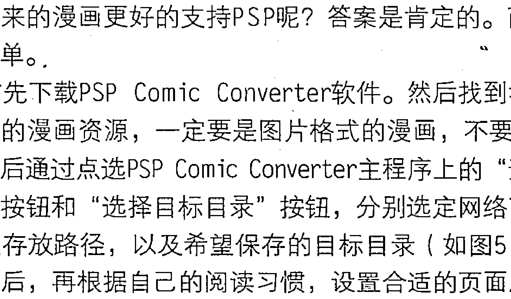

> 小提示：如果只是想在PSP上欣赏漫画，我们也可以在转换之后将原来的文件删除，只有一并勾选“完成时删除源文件”选项。这样一来，文件转换完成之后，源文件也将被同时删除了。还有一点特别需要注意的，在使用PSP Comic Converter之前，我们需要先安装Microsoft .NET Framework，这样才能保证PSP Comic Converter程序的正常运行。

转换完毕了，还犹豫什么呢，赶快用PSP尽情欣赏漫画吧。

总结：因为实体的漫画书价格不菲，所以我们通过PSP，这个掌上娱乐终端来欣赏。建议大家多找图片形式的漫画书，这样在PSP上欣赏会舒服些，毕竟一些其他格式的漫画书很多是针对计算机而设计的，所以很可能对PSP支持不是很好。最后祝大家在PSP上愉快地欣赏自己喜欢的漫画。

## 给你一次震撼！让你识得PSP2000和其他配件

□李松林

拥有掌上娱乐终端平台的PSP一直深受广大用户的青睐，不管是超级游戏玩家，还是追求时尚年轻男女，无不被PSP强悍的娱乐、游戏功能所折服。尤其是在PSP推出新的2000系列之后，PSP更是一发不可收拾，接连创出销售佳绩。至于PSP2000有怎么样的强悍功能，在此先卖个关子，后面会逐步给大家介绍。接下来笔者就先从PSP2000的选购开始给大家介绍，如何选购自己称心如意的PSP2000。

影视也疯狂：社会在发展，技术在革新，尤其是影视的应用方面，已经从原来身材硕大的VCD、DVD播放机，逐步过渡到如今的掌上视频播放设备。PSP的官方支持MP4编码格式视频文件，不过通过第三方程序的配合，PSP还可以播放AVI格式等视频文件，另外还支持索尼画质超清晰的UMD格式电影。

浏览图片：在PSP上我们还可以随时随地欣赏自己喜爱的数码照片或写真集！它不但可以支持BMP、JPEG等格式图片，而且还支持图片的放大、缩小、旋转、幻灯片等特殊操作（如图1）。

> 小提示 PSP（Play Station Portable），是SONY开发的新型掌上多媒体娱乐终端设备，因为PSP不仅限于游戏机的游戏功能，还有欣赏音乐、观看电影的功能，还可以上网冲浪，再配合专门的摄像头，还可以实现拍照功能。所以PSP被SONY定位为“21世纪的WALKMAN”的重量级产品。在PSP中，UMD是SONY特地为PSP开发的多媒体储存介质——Universal Media Disc，最大容量可以达到1.8GB，直径却仅仅是6cm。而且由于采用了UMD光碟与碟套一并插入PSP进行游戏的设计（参照MD的设计），大大降低了UMD光碟的磨损可能性。MS（Memory stick，记忆棒），是由SONY于1999年推出的存储卡，主要是用于储存UMD游戏的存档，以及存放音乐与电影等文件。

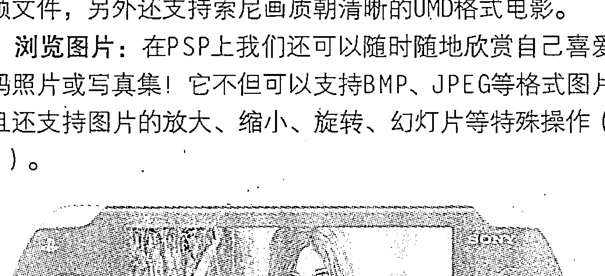

## 一、为什么要购买PSP2000

在购买PSP之前，我们首先要问问自己，为什么要购买PSP。当下人们越来越注重理财，倡导理性消费，所以每一分钱都要花的物超所值。那么对于PSP呢？希望通过下面的介绍，你能从中找寻到答案。

看电子书：既然在PSP上能看图片，那么在PSP上浏览图书也不在话下。在等候公交车时、坐车时、喝下午茶时……只要你的记忆棒够大，有了PSP就等于随身带了一个图书馆，网上丰富的电子书资源任你免费享用！

游戏掌先行：游戏可以说是一直陪伴我们成长的伙伴，各种类型的游戏上都留下了我们青春的印记。PSP在游戏方面的造诣是相当了得的，通过运行各种其他主机的模拟器，玩家便可以在PSP上重温儿时的欢乐时光了，而且适当的大小，舒适的重量，让我们完全沉溺在掌上的游戏世界中。魂斗罗、坦克大战、沙罗曼蛇、赤色要塞……仿佛一切回到了从前。

上网好冲浪：无线Wi-Fi上网已经不是什么新鲜话题了，无论是通过电脑，还是通过移动手机，无线Wi-Fi都给我们的生活和工作带来了不小的飞跃。在PSP上，除了可以通过PSP实现无线上网，更主要是可以通过无线Wi-Fi寻找互联网上的玩伴，实现网络对战。

歌声耳边行：除了游戏，音乐也是我们放松精神、愉悦身心的良好调剂品。在PSP中，同样可以播放出美妙动听的音乐。在你游戏的间歇，在你行走的街道，PSP还在扮演着MP3播放器的角色。

各种扩展：除了PSP本身的功能之外，外部扩展功能也是相当强悍的，摄像头、TV都会给玩家带来不小的惊喜（如图2）。

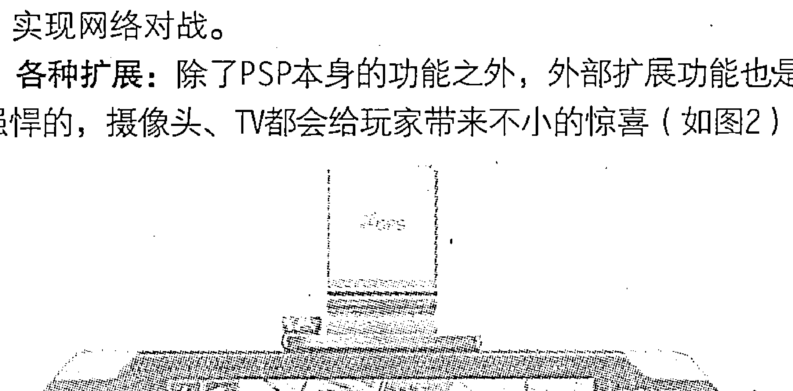

上面简单介绍了PSP的常用功能，相信大家现在对自己是否真的需要购买PSP已经有了一个比较明确的答案了。如果你的答案是肯定的，那就接着往下看吧，笔者会详细教大家如何选购一台称心如意的PSP。

## 二、选购PSP的基本思路和步骤

- 1. 价格心里要有底，通过各种途径将价格掌握。可以通过拍卖网站，对比一下PSP的价格，找出性价比最高。一般来说，网络商家的价格一般都是目前PSP市场的相对底价了，实体店应该会比网络卖家高出20 - 30元（如图3）。

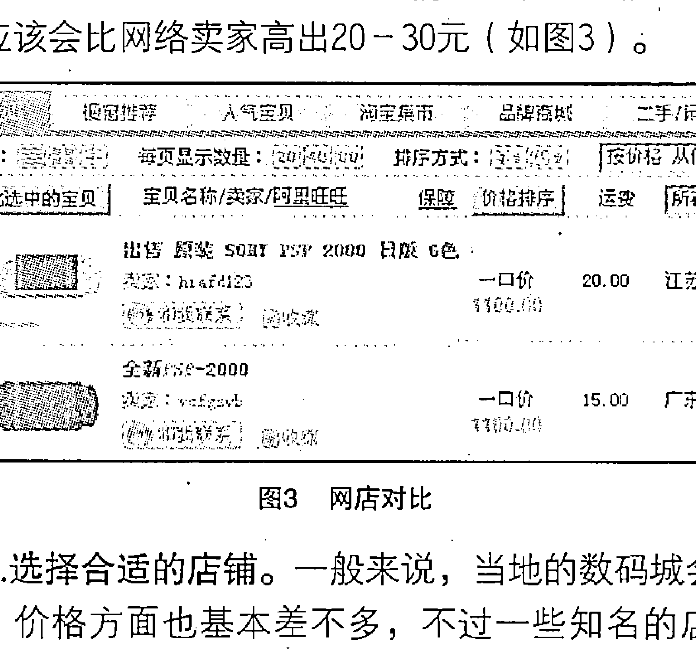

- 2. 选择合适的店铺。一般来说，当地的数码城会有集中的卖家，价格方面也基本差不多，不过一些知名的店铺和一些并不在明显位置的店铺的价格，还是有50块人民币左右的差距的。与此同时，一般城市还会有专门的电玩一条街可以参考，但电玩一条街店铺里的PSP价格普遍会高于数码城的价格。

- 3. 挑选机器。这是选购PSP最关键，也是最重要的一步。因为我们之前已经查阅了PSP的基本价格，所以没必要一上来就和老板讨价还价，先挑选好机器再说。因为知道当前市场的底价，所以还价的时候自己可以把握分寸，留给商家20元左右的利润就足够了。但千万要想着自己拿到最低的价格，不然的话，商家说不定会在什么地方给你找些不好的配件对付你。

- 4. 标配一般都是大家比较常用的字眼，但往往都是一带而过，殊不知，商家很多都是在这标配中玩猫腻的。建议用户自己先查对好标配都有哪些部件组成的。如果实在记不住，就写下来好了（如图4）。

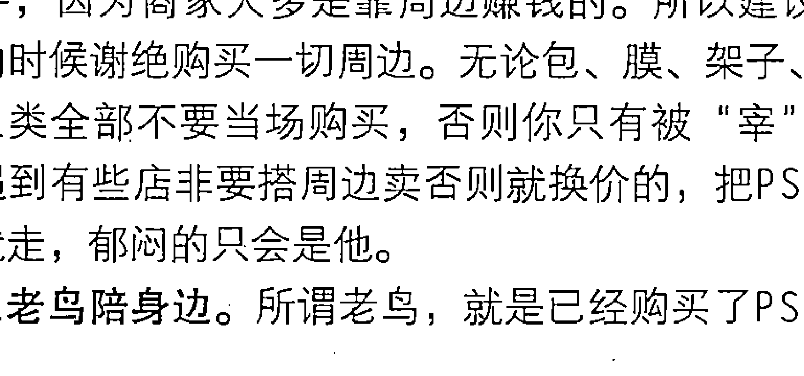

- 5. 谢绝推荐的周边配件。相信各位看官不止一次听说，买电子产品不要在同一家购买周边配件，因为商家大多是靠周边赚钱的。所以建议各位在买机器的时候谢绝购买一切周边。无论包、膜、架子、记忆棒、UMD之类全部不要当场购买，否则你只有被“宰”的份，切记！遇到有些店非要搭周边卖否则就换价的，把PSP往他面前一扔就走，郁闷的只会是他。

- 6. 老鸟陪身边。所谓老鸟，就是已经购买了PSP，并且经常把玩机器的玩家，无论是挑选机器方面，还是市场价格方面，都比较了解。如果身边没人懂的话，那就去网上看看教程好了（当然，有了今天的文章，你也可以成为准老鸟了）。现在PSP周边高仿产品无数，稍不留心就会中招。

## 三、识别商家的鬼话连篇

### 1. 如何识别商家的鬼话

- （1）机器是全新未开封的：因为所有的PSP包装都是没有封条的，所以老板说什么给钱才拆封是不可信的，无非是先把钱拿到手。PSP主机在日本出货的时候，就已经没有封条了，有封条说不定也是进货之后自己加上去的。如果遇到这样的商家，转身离去即可。

- （2）PSP有开机画面：因为所有的PSP都是没有开机画面的，开机设定的画面是可以恢复的，所以商家说什么新机有开机画面也是不可信的。

- （3）我的屏幕是三星的：就目前所有的可靠资料显示，PSP的液晶屏是SHARP产的。官方从来没有发表过液晶屏改用其它厂商生产的报道。而且全世界的任何一个国家的任何一个网站都没有一张PSP屏幕改用SAMSUNG的照片。所谓的改用三星屏，估计是一些商家的炒作的概念。还有那些自称见过三星屏的”达人“，口口声声说改用三星屏了，自己又拿不出证据。有本事自己拆一台，给大家看看屏幕左下角的LOGO是不是SAMSUNG的！因此，商家利用屏幕厂商改变来赚取高价的手段大家一定要小心，因为这是不可信的。

商家的谎言已经基本被我们识破，下面我们就可以开始挑选机器了吧。先别着急，在开始挑选PSP之前，一定要事先和商家商量好，有坏点的机器要换一台试（尽管对于PSP屏幕来说，允许有3个以下的坏点，但谁买机器不希望购买一个相对完美的呢？），按键不灵活更要换一台试。还有就是问清楚什么条件下保换，什么条件下免费维修等等细节问题。一切商定妥当之后，开始选机行动！

### 2. 如何挑选PSP

- （1）一定要自己亲自拿出PSP主机，小心的拿住PSP机身上下两侧，查看上面是否有指纹，或者擦过的痕迹，基本可以看出是否别人碰过。这个不必太过强求，毕竟不止你一个人试机器，有可能别人试过之后，因为价格的原因而没有买，这不能说明机器是坏的。但还是尽量找寻”全新“机。

- （2）查看电器电池仓以及机身下侧的编码，是否与外包装盒上的编码一致。就个人感觉，对号的机器途径好些，有”原配“的味道，而且现在对号机已经很普遍了。

- （3）在足够亮的光源下(如小台灯)查看屏幕PSP主机内部是否有灰尘，仔细看能区分出屏幕外部的灰和内部的区别。如果有条件可以用软布来轻擦表面，确定灰尘是否是内部的。如果真的是内部灰尘，不要犹豫，赶紧更换新的机器吧。

- （4）将电池装入PSP主机中，开机并检查屏幕是否存在坏点。可以在推动右侧电源键开机前五秒钟的黑屏状态查看是是否有坏点，也可在进游戏前查看（具体检查步骤见后面详细说明）。不过我们要注意区别坏点和刚开始看的屏幕内部灰尘，它们是不一样的哦。

-   5. 测试按键。PSP主机拿在手里，每一个键都要测试，不但要有相应的作用，而且还要手感舒适。但“口”键除外，因为硬件设计的原因，“口”键有一半是压在液晶屏边缘的金属条上的，因此按键感与其它键不同。只要能按就行，不要太强求。

-   6. 检查UMD仓盖的左侧闭合是否严实，这点也不必太苛刻，因为设计就是这样，但也不能太离谱了。

-   7. 关于豪华版。对于PSP2000来说，目前还没有真正意义上的豪华版套装推出。但之前的PSP1000版本倒是存在豪华版套装。豪华版无非就是多了耳机线控，如果一旦PSP2000有豪华版推出，那么记忆棒与说明书也应该是一起封装在一个塑料袋内的，如果是散装在外面的，此机器绝对是别人用过。（未卜先知，用验证PSP1000豪华版的方式来等待检验PSP2000豪华版。）

-   8. 选择好机器之后那就付款吧，让商家开好收据或发票，并写明购买机型、颜色、机身编号、购买日期等等，最好也能写上商家的保修包换承诺。（如三天有问题包换）。

小编有话：关于配件方面，强烈建议只买裸机和原装的保护膜。一方面其余配件对于商家来说是利润的大头，而作为买家的你却很难控制这其中的猫腻，如果只买裸机的话，那情况就不一样了。但是原装贴膜还是要买的，而且要让商家给你贴上，免得擦拭屏幕之后使其变花。关键是贴了膜的PSP主机你可以完全不用操心屏幕有花屏，随便用什么布都可以擦，擦坏了换张保护膜就是了。贴张保护膜换回来安全感和省事省心，还是值得的。还有就是关于坏点，只要能达到自己心理平衡就好了，凡事都不要太过强求了。

现在开始，进入到我们具体部件的挑选环节了，大家可要仔细看哦。不然买到假货，你就只能自己郁闷了。

## 四、找出屏幕的坏点

说到坏点，我们先了解一下坏点的定义：在白屏情况下为纯黑色的点或者在黑屏下为纯白色的点。在切换至红、绿、蓝三色显示模式下此点始终在同一位置上并且始终为纯黑色或纯白色的点。这种情况说明该像素的R、G、B三个子像素点均已损坏，此类点称为坏点。一般在PSP上出现的大都是在黑屏下为纯白色的小亮点。这种点比较难发现，但是不影响正常使用。如果PSP上只是这类3个左右的小亮点是能够接受的。当然，我们有权利追求完美。

下面说一下笔者自己检查屏幕坏点的方法，事先需要先准备好PSP专用的坏点检测图片（这个可以用Photo Shop图像制作软件来自己也能做，当然也可以到网络上搜索，之后自己下载）。如果商家不给你装检测用图，你就需要自己带一个记忆棒过去。把屏幕亮度打到最大，在较暗的环境下用PSP看全黑图片（周围环境可以把PSP放在包里看），PSP的坏点就一目了然了。然后再仔细看看其他的全色图片，检查有没有其他种类的坏点。

小编有话：关于PSP的液晶屏，大家还有很多需要注意的地方。在寒冷天气中使用PSP，画面可能会出现拖慢现象，也可能使人感觉画面的亮度不如平时，这点大可放心，只要回到温度适宜的地方，PSP的画面就可以恢复正常了；要注意：不要长时间停留在静止的影像上，这样很可能会导致模糊的影像永久残留在你的PSP液晶屏上。还有一点要注意，在擦拭屏幕的时候一定要使用柔软的布或纸巾，不要使用粗糙的纸或卫生纸等擦PSP的屏幕。

## 五、辨别真假电池

PSP的电池选购可是至关重要的，因为这不比5号干电池一样，随便哪里都可以买到。一旦买到仿冒的PSP电池，不但电池寿命会大打折扣，而且还容易出现电池爆炸的情况。所以我们一定要非常认真地挑选电池。

-   1. 只买“中国货”：PSP的原装电池大部分为Made in China，现在的新PSP更是如此，所以如果你看到一台新机器里面的电池为Made in Japan，你便要当心了，不是因为日本制造的就铁定是假的，而是假的一般都是“Made in Japan”。不排除以后出现Made in China的组装电池，不过这不是鉴定电池的主要标准，就和PS2的手柄一样，细节方面，组装电池毕竟不能仿制的和原装电池一样。

-   2. 查看标签：对于标签来说，原装电池的字体无论是在清晰度，还是在匀称程度方面都要大大强于组装电池（左边的电池字体纤细均匀，非常工整，而右面的明显要粗一些，显得很粗糙）。除了印刷字体之外，还有其他的地方需要仔细查看（如图5）。

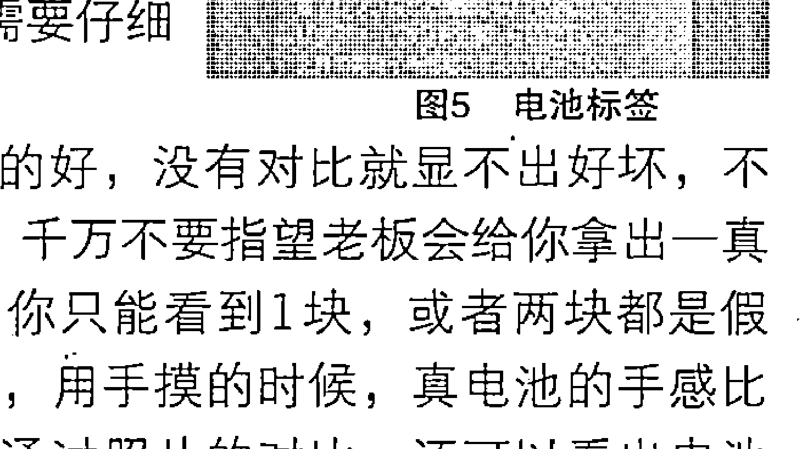

-   3. 观察正面：俗话说的好，没有对比就显出好坏，不过对于挑选PSP电池来说，千万不要指望老板会给你拿出一真一假两块电池给你对比，你只能看到1块，或者两块都是假的。所以还是记住感觉吧，用手摸的时候，真电池的手感比较好，有比较滑的感觉。通过照片的对比，还可以看出电池下方接缝的区别，组装电池那种稍微外凸的接缝处很容易就能看出来，而且一点也不整齐，原装电池的接缝就非常好，平平的一条线。

-   4. 最直观的分辨：如果查看到电池上刻有“2H2”等字样，那就是在告诉你，这块电池不用买了，是假的电池，真的原装电池上面没这样的标记。
-   5. 查看侧面：这里主要看的是电池右面的接口附近，对于组装电池来说，一定要注意看凸出来的接口和电池本体的连接部分，连接的比较紧密的，多半是组装电池。因为原装电池一般是没有这么紧的，而是露出了0.5～1毫米左右的空隙（这难道是制造商故意留下的一个破绽？）。对于电池的边角过渡来说，组装电池比较直，而且中间接缝处的做工很是糟糕。还有就是看看接口内部金属片，如果3个触电颜色鲜亮，而且暴露出来，那么该电池也多半属于组装电池。真正的原装电池，很内敛，一点也不暴露，有时候张扬的太厉害反而会暴露自己的弱点。

小编有话：为了让各位看官更直接地观察原电池和组电池的区别，所以将两种电池摆放在一起。不过这并不代表商家会提供两种电池给你作对比，我们去电玩店里买东西，商家只会给一块电池，如果他已把电池换成了组装货，你就不可能在他那里得到原装电池的任何信息。幸好经营电玩生意的不是只有一家，你可以去周围转，自然有厚道点的会告诉你原装电池和组装电池的区别。就目前来看，原装电池和组装电池的区别仍然很大，不过这也要知道具体区别才可以。当然，你也可以从朋友那借过来一块真的原装电池，以此作为参照物来选购PSP电池。在内行人眼中，一块电池只要经手一摸，用眼睛看几秒就能马上分辨出真假，但是普通玩家是很少有这样的机会练习的，不过幸好组装电池的做工基本都不是很好。我们看一块电池、接缝、接口、字体印刷、凹版，凸版雕刻印刷等地方往往是关键，当你没有其它可以辨别电池真伪的办法时，首先应该从这些地方着手。

事早在PS时代就已经有人做过了。（有人会说看原厂封条就可以知道机器有无被拆开过，这可就错了，正所谓“道高一尺魔高一丈”，商家也不是吃闲饭的，一把热风枪足以将原厂封条几乎不留痕迹的吹下来再吹回去，而且现在市面上也已经出现了假冒的原厂封条，所以大家一定要小心。）

## 六、辨别真假记忆棒

### 1.硬降辨别——望篇

一般来说，仿冒的索尼记忆棒都以水棒或者组棒自称。因为这些记忆棒都是全英文包装，所以很多商家会告诉消费者这是水货渠道进来的真品记忆棒。但实际上如何呢？单就存储卡产品市场来说，中国市场的价格在全球都可以说是最低的，而这个所谓的水货记忆棒的售价只要300多元，而索尼行货的记忆棒却需要千元左右。如此大的差价背后，就已经决定了这个所谓的水货记忆棒根本不可能是真的。这些记忆棒的来路就是国内的一些假冒存储卡生产厂。目前市场上真品记忆棒全部是中文包装的，请大家牢记这一点。因为真品的水货记忆棒，可能进货价格要比行货还高，对于经销商来说很不划算。

硬降终归是硬降，无论技术人员的拆机手法是多么纯熟，被拆过硬降的PSP始终跟没有被拆过的PSP还是有明显区别的。通常被拆过硬降的PSP，外壳或多或少都没有原版机器结合得那么紧密，有时正面和底面的外壳结合处的那条缝隙会比较大，而原装机则结合得相当完美。我们先从PSP顶端查看，也就是USB接口附近。整个顶端都是一条长长的槽缝，此时玩家应该认真仔细这条槽缝，看看其边缘没有被刮花的痕迹，里面有没有明显沾上灰尘，还有就是这条缝隙结合得是否紧密，是否会出现中间某段明显是更宽一些。拆机人员就算技术再好，也很难保证槽缝能够组合到拆机前的样子，始终还是会有点不一样。看完PSP的顶部，再来看看底部。这里除了同样有槽缝之外，还会有一个螺丝位。相对来说，底部的这条槽缝比顶部那条还要密。如果是原装新版没有被拆过的话，基本上很少会有灰尘。而那个用于固定PSP外壳的螺丝位，以及所在的那个孔，同样也是崭新的，更不会有刮花的痕迹。最后再来看看电池仓，在这里有两个地方值得留意，第一个地方是电池仓右上方的那个螺丝，看看螺丝本身和周围位置，有没有被扭过。第二个地方则是电池仓下方的那张黑底白字贴纸。厂商之所以在上面说明撕毁贴纸就会失去保修，主要就是因为要拆开PSP，就必须将这张贴纸撕下来，下面有螺丝位需要打开。但凡硬改过的机子，这张原厂的贴纸都会被撕掉。改完之后重新装配的时候，往往会贴上普通的贴纸，或者翻印的贴纸，其位置与拆机前肯定有不同，贴纸经常会贴偏或移位。

错装现象要谨慎：如果你发现商家把4GB的记忆棒装在2GB的包装内的情况，在真品的记忆棒中是不可能发生的，这是假冒产品的一种；另外，所谓的4GB HIGHSPEED记忆棒如果装在普通记忆棒的包装内也是假冒产品，因为索尼的高速棒是有专门包装的，而且市场上根本就没有这种4GB高速记忆棒产品。还有一种方法就是检测法。将记忆棒插入PSP主机当中，并以此执行如下操作：游戏——记忆棒——三角键——信息，MagicGate选项后面如果显示“支援”则说明是原装记忆棒，如果显示“不明”，则该记忆棒为组装的记忆棒。

### 2.硬降辨别——切篇

## 七、防患未然，辨别PSP硬降级主机

除了看，玩家在鉴别PSP是否硬降机的时候，还应该用手去实际按一下PSP主机，这样就可以获得更直接的感觉，也更容易“切”出一些问题。与上面说的一样，拆过的PSP在边缘结合方面，是不可能做到跟没有拆过一样的，这个时候就需要玩家用手去进一步进行测试。建议用食指和拇指，分别压着PSP右侧的边缘，再稍稍用力一点，看看PSP的外壳是否会被上下压缩。只要是被拆过的PSP，往往外壳结合得不好，这里用力一点，就会明显感受到一种收缩和反弹的感觉，而原装正货就基本不会有这个情况。试完右侧之后，玩家还可以用同样的方法，再去左侧试试。第二个招“切”的方法就是针对“方块、叉子、圆圈、三角”四个功能键。没有被拆过的机子，这几个键的突起感相当明显，并且彼此之间的按压手感是区别不大的。因为硬降而拆过的PSP有时会出现某个键较其他键的手感偏软，明显有些下陷的感觉，突出机面的高度比其他键要低一些。还有就是玩家用正常姿态握着PSP，然后用左手和右手的食指同时按一下PSP的L键和R键。正常情况下，两者的手指应该是完全一样。但有些被拆过的PSP，会出现L键和R键的键程不一致问题，也就是有个键按起来会手感较轻，另一个就是手感较重，两者明显不统一。遇到这种情况，玩家就要千万小心，最好不要选这样的PSP主机。

随着PSP2000的迅速走红，除了游戏玩家热衷于PSP强大的机能和优越的多媒体功能，以及强大的扩展功能之外，商家也在暗地里玩着手段，如何将不能玩破解游戏的PSP搞定为可以玩游戏的PSP呢？只有一个办法，那就是硬降级（也叫硬刷机）PSP主机。现在玩家购买的PSP，商家一般都会直接帮我们软破解到支持游戏的版本（现在一般3.5）。但有些机器却不能软降，只能硬降。虽然说硬降在使用上和软降机器一样，而且也可以升级降级，但是还是多多少少会存在一些问题，更何况如果用来充当全新机来卖的话，实在是有欺骗消费者的嫌疑，所以在这里简单说一下硬刷机和原装机的区别。

小编有话：不用小编我多说，相信大家也不会去选择硬降机，因为表面一样，但内在却隐藏着各种问题。比较常见的问题包括自动关机/重启、无线联机失败（因为MAC地址错误，需要用软件重新刷一次）、部分游戏和自制软件运行失败、无法调节第四级亮度、电池漏电、屏幕进灰尘等等。当然，玩家更不要自己去尝试硬降了，弄不好，你的PSP很可能会变成一块“砖头”。

顾名思义，硬降指的是通过硬降改造的方法对PSP进行降级操作，而软降指的是通过软件更新的方法对PSP进行降级操作，两者的目标是基本一样的，都是为了使高版本软件系统的PSP可以实现降级，在降级到1.5或者2.71版之后，再通过升级刷机的方法，给PSP刷上OE版自制系统，从而使PSP能够直接运行从网上下载的ISO游戏，这也是大部分国内玩家购买PSP的最终目的。硬降级是要拆开主机来操作的，当面刷机还好，如果是那些已经事先刷好的主机大家就要小心了，谁也不敢保证有没有人在机器里面做过什么手脚，把原装的零件换成组装的事。

## 八、辨别真假线控+耳机

PSP掌机是目前功能最强大的掌上娱乐终端设备之一，不仅拥有众多游戏开发厂家的支持，更有着出色的多媒体功能，目前最新版本固件已支持WMV和flash格式的播放。曾经的PSP1000豪华版，就有耳机和线控。线控的主要作用就是方便用户在娱乐（欣赏音乐或者观赏电影）的时候，不至于总是将PSP主机拿在手里操作，通过线控可以很好的“指挥”PSP主机完成自己的命令。不过很多玩家最开始并没有购买豪华版PSP主机，而是之后才购买的所谓原装线控，但用不了多久，就会出现这样或者那样的问题，所以认真挑选PSP线控还是很有必要的。
线控篇：我们首先需要检查线控的背面，原装线控在SONY标志下面会有3行英文显示，而组装的线控则没有；之后再观察线控下方的金属插头，原装的线控金属插头的边缘呈现灰色，而组装的线控金属插头周边呈现白色，插头的金手指部分，组装线控没有原装线控的光泽明亮（如图6）；最后是检查线控的正面，原装线控上面的“PSP”字样是凹进去的，而组装线控正面的“PSP”字样是印刷上的黑字，而且字体较粗，拐角处粗细不一，突起的VOL字样同样粗细不均，高度也不统一。
耳机篇：辨别线控耳机更是简单，一般通过控制面板上的“PSP”字样和耳机外侧的“PSP”字样来判断，原装线控耳机的“PSP”字样是凹进去的（耳机听筒附近的颜色较浅），而组装线控耳机的“PSP”字样则是印刷上的黑字。除此之外，在耳机与线控的插头部分，底部的金属柱组装的要比原装的高出一截。绿色胶圈原装要比组装的深一些。由于线材使用的原料不同，在材质上的表现和手感也是不一样的。组装耳机在颜色上给人的感觉是白色有点偏暗，而原装的为乳白色，手感上原装更舒适滑腻。此外，捆绑线材用的带绳也是不同的，原装耳机使用的是这种宽带里面有金属线圈的包装（如图7）。

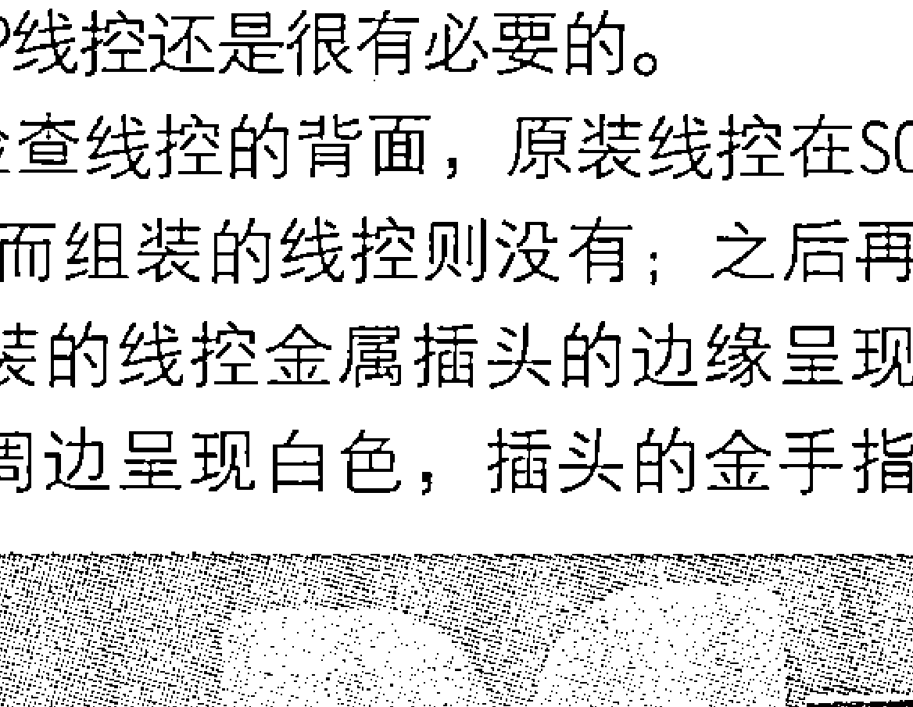

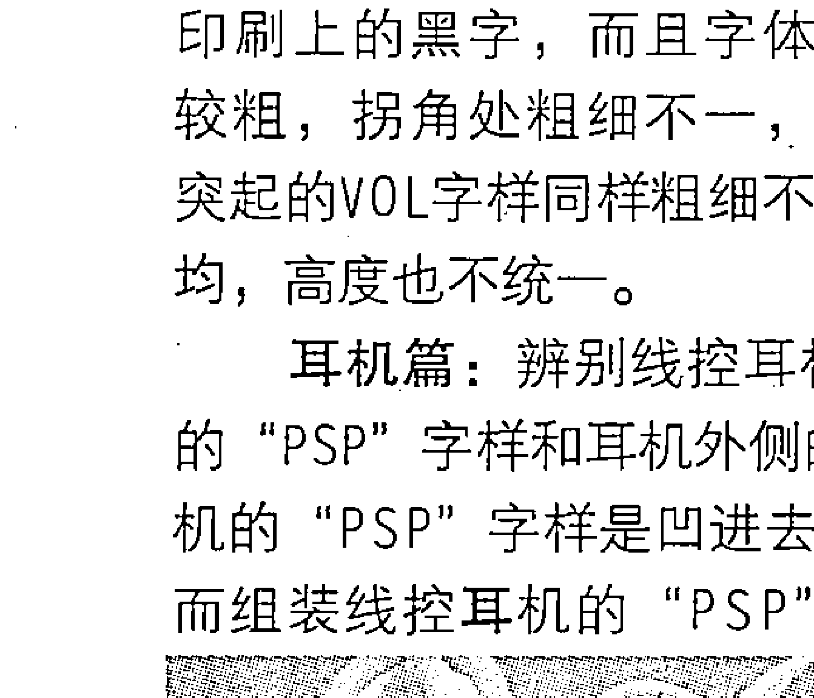

## 九、PSP2000周边配件选购

如果说PSP是娱乐的载体，那么各式的周边产品就像是快乐的催化剂，当PSP主机遭遇各式配件时，玩乐的快感将会被无限放大。PSP2000的主机基本搞定了，我们也通过各种方法鉴定了相关主要配件的真伪，接下来，我们就要着手选购PSP2000周边配件的事情了，大家准备好了吗？

### 1.周边配件——屏幕保护膜

首先为大家介绍的是PSP2000人手必备的周边配件——屏幕保护膜。PSP2000的屏幕堪称掌机中最为华丽屏的，但美丽也是需要好好打理，一旦由于摩擦而弄花了屏幕，那就好了。谁都不希望划痕和指纹破坏这种和谐的美丽，所以说，一张好的保护膜尤为重要。目前，市场上常见的保护膜有四种可选，价位由低至高分别是HORI仿膜、黑角保护膜、卡登士保护膜、HORI保护膜，让我们来一一为大家介绍。HORI膜是业界最早、口碑最好的PSP保护膜，但一分钱一分货，较高的价格对于一般的玩家来说并不是人人都能接受。而大众化的PSP专用HORI仿膜保护标称与HORI原装膜一样，都采用三层结构，透光性和保护性都有原装的七成效果，而价格更为大众化，入门级用户不容错过。
黑角的配件向来以性价比取胜，黑角出品的PSP2000专用保护膜同样保持着相当高的性价比。四款保护膜中，黑角保护膜最特别，像名片夹一般，风格简洁，说明书印刷在膜体上，又节约了不少成本。除此之外，黑角保护膜还随机赠送一块擦拭布，相比之下，比HORI仿膜擦拭布正规细致一些。
有着香港血统的卡登士在第三方配件方面同样享誉盛名。无论是苹果iPod、NDSL还是PSP，卡登士的品牌都有着全方位的产品线。PSP专用的卡登士保护膜透光性良好，膜的厚度较一般的保护膜要厚，对爱机的屏幕起到了很好的保护作用。卡登士保护膜另一特点就是可以水洗，对于长期使用的膜，沾上灰尘和脏东西在所难免，而卡登士的保护膜可以在水上清洗过后再贴回主机上，历久常新。虽然价格比一般的组装保护膜要贵一些，但可以反复使用，还是非常超值的（如图8）。
最早接触PSP的骨灰级玩家们一定对HORI的保护膜有所了解。HORI保护膜之所以被誉为PSP最强最好的保护膜，是因为其透光度至今没有膜可以超越。HORI原装保护膜能给屏幕最完善的保护，其透光度和色彩还原度也不是一般国产组装保护膜能与之比拟的。HORI的最大的特点就是附着力强、耐磨、容易清洗。由于HORI膜采用了有别于一般保护膜的三层设计，这让HORI膜有着超高的透光性，同时HORI膜还有防炫的功能，即使在烈日下也可清晰显示图像。中间的PET层是由航天上用的超强度塑料、碳素纤维、组成链状碳素结构，是极难破坏或刺穿的。这对PSP的屏幕起到了很好的保护作用（如图9）。


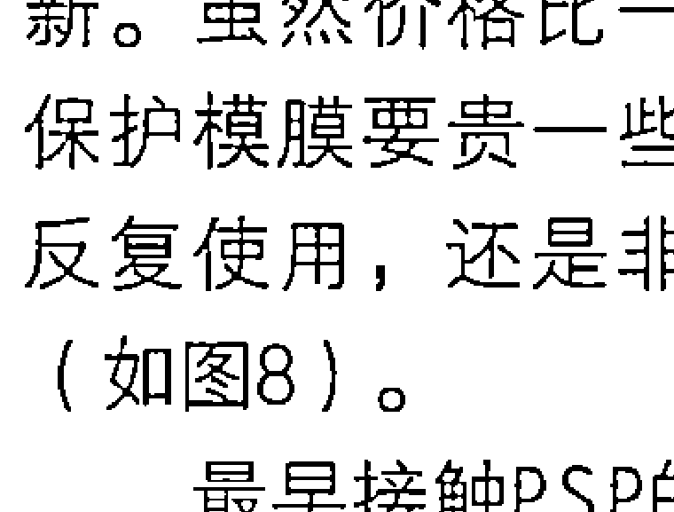

### 2.周边配件——各种包

只是贴了保护模的PSP主机势必显得突兀一些，我们还需要选购PSP外包，以此保护除了屏幕之外的主机部分，当然也会起到一定的美观作用。PSP主机外包很多，价格也有高有低，大家可以根据自己的实际情况来选择购买。
首先介绍的是大家比较熟悉，也很常见的PSP2000软包。软包可以说是PSP1000时代的遗物，有多种颜色可选。但由于

### 3.周边配件——色差线

PSP2000最吸引玩家的一个设计就是可以进行视频输出。要实现这一功能必须通过购买专为PSP2000设计的视频输出线。原装的线材做工和质量无可挑剔，但价格较高，因此一些组装、仿制的线材应运而生。这根组装视频输出线是插在耳机输出口来使用的，做工比较一般，但价格比较实惠，线材也仿造原装的PSP2000线材，提供色差输出，还是比较实用的（如图11）。

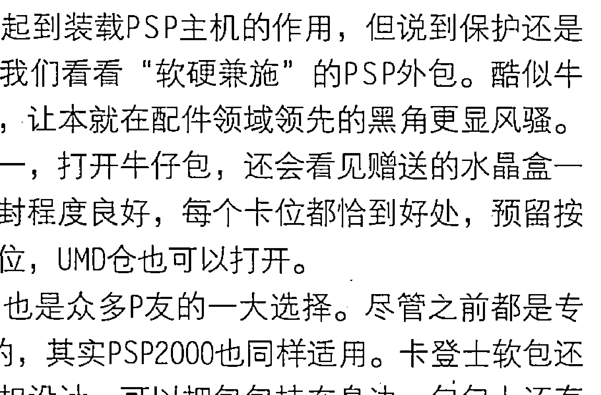

与上面的组装色差线相比，下面介绍的这款仿原装色差线，明显要“专业”许多。从包装上看，这款线材与原装的简直一模一样，拆开包装之后发现，无论在外形和设计上都与原装的线材一致。手工细致程度也有原装的九成。这款AV色差输出线完全仿制原装的PSP2000专用色差线，接口处全部是金属环，接头也是金色的镀金的材质。原装的线材采用纯度高达99.98%的无酸素铜制造，而全端子连接口更是采用高耐久性的24K镀金，保证传递过程中的失真减到最小。

### 4.周边配件——线控

索尼PSP2000配件采用一贯的作风，天蓝与乳白相搭配的格调，外包装密封压印，内包装盒使用半透明塑料承载配件。PSP2000原装线控外形上比起旧版的PSP线控改为平板状，外圈的音量和快进快退按钮也镀上了一层金属膜，使得线控装置更加富有现代气息。PSP2000线控耳机的编号为PSP-S140，线控装置长度为0.85米，耳机长度为0.7米，响应频率20赫兹至20千赫兹，最大输出功率仅为40毫瓦，与旧版PSP线控持平。其线控装置具备音乐播放、暂停、快进、倒退、音量控制、锁定功能（如图12）。

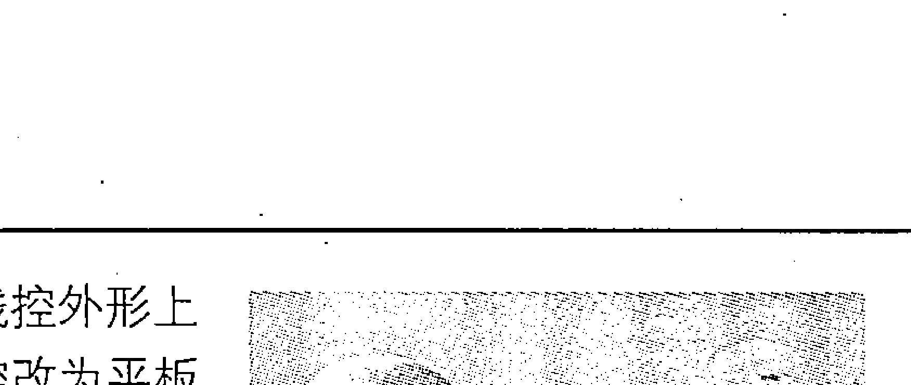

### 5.周边配件——USB传输线

PSP2000的另一大改进就是可以通过USB传输线给PSP主机充电，以往要给机器充电就要买一条两头的传输线，现在只要一条USB传输线就能轻松搞定。原装的USB传输线已经上市，传输线上还有磁环，防止电流干扰。

### 6.周边配件——PSP摄像头

PSP摄像头主要是用来拍照，也可以当话筒来使用。PSP专用摄像头（型号PSP-300）有效画素为131万（实际记录画素因软体而异），采F2.8 28mm定焦镜头，摄影距离40cm～∞，微距模式时最佳距离7cm，数位变焦，储存格式为JPEG静态图像与Motion JPEG动态影片，内建单声道麦克风，可录制LPCM音频。尺寸为45×27.3×16mm，重15克。在搭配编辑软件时，可支持480×272～640×480分辨率的JPEG静态图像摄影，以及480×272分辨率、每秒30张的Motion JPEG动态图像摄影（最长15秒），除了一般的摄影功能之外，并将提供静态的定时摄影、监视摄影、图框摄影，以及动态的间歇摄影与逐格摄影等特殊摄影模式。所拍摄下的照片或影片将储存于MS PRO Duo记忆卡中，并可透过软件内建的功能来进行浏览、编辑与主题特效处理，让玩家可以自己替照片或影片加上各种转场、特效、图文、音乐与音效，制作大头贴照片或是主题影片等，并可输出到PC上观赏（照片格式为JPG，影片输出格式为AVI）。

白色的长方形纸盒子里面：一本说明书，一个摄像头，还有一个装摄像头的塑料盒。摄像头的做工很是精细，镜头周围虽然不是金属的，但是镀了金属漆，手感很好，底座上有PS系列主机的Logo、PSP字样以及摄像头的像素，在镜头的左边是指示灯，右边有两个标志是微距模式和普通模式，最左侧则是麦克风（如图13）。

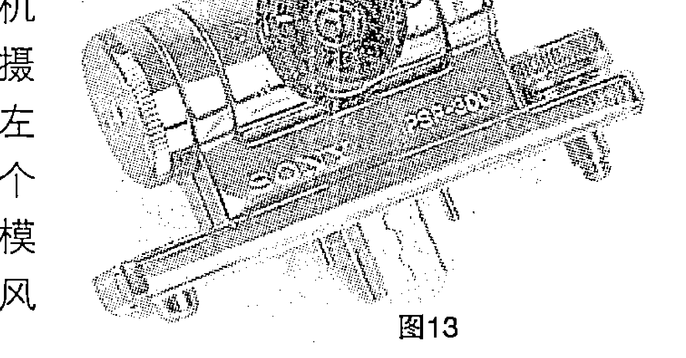

> 小提示 PSP摄像头只能用于系统为2.8以上版本的PSP主机，其次需要软件配合才能使用，直接连接到PSP上是无法使用的，不过据了解SONY即将发布一款专用软件，可以用来拍大头贴，而且可以编辑静态和动态影像。

### 7.周边配件——语音识别外设

PSP语音识别外设（TALKMAN）是一个可以通过USB接口安## 8. 周边配件——电池伴侣

玩家无论是在把玩游戏，还是在娱乐的时候，最影响心情的莫过于PSP主机没电。尤其是外出的时候，如果没有电，那可真是叫天天不应，叫地地不灵啊。不过我们可以选择提供额外的1800mAh电力的电池伴侣，它可是拥有2倍超长的可玩时间的噢。

## 9. 周边配件——One Seg电视专用

PSP2000可以支持的One Seg专用附件，不幸的是这款附件无法支持先前的PSP主机。附件的使用非常简单，只需要将其安装在PSP主机上就可以将PSP变身成一款便携电视了。不过在功能方面该附件略显单一，只能够支持简单的接收功能和节目单以及字幕的显示等，而无法支持数字广播，另外也不能支持视频录制功能。但值得一提的是为了保存频道信息和相关的设计，在没有安装记忆棒的情况下是无法使用One Seg功能的。除了简单的收看One Seg节目外，还可以查阅相应的节目表内容，另外还支持更加详细的播放时间以及频道设定等内容。接收效果方面在信号较强的地方一般不需要打开天线即可正常接收。附件采用了长方形设计，金属的机身配以精细的做工使其整体感觉非常时尚，通过Mini USB接口和PSP连接后，还需要机身两侧的金属螺母进行固定。附件的外部尺寸为55×31.8×14.2mm，仅17g的重量在使用时也不会感觉很重。

## 10. 周边配件——PSP ON TV

PSP的屏幕一直都无法满足那些狂热的游戏爱好者及那些把PSP当影音剧院的人，于是这款让许多人为之欢呼的PSP ON TV诞生了，它可以让你的PSP影像直接“传输”到电视上进行播放。这个Blaze的电视转接器很适合玩带有视觉冲击的游戏，比如赛车之类的刺激游戏。但如果拿来看影片，画面质量会有些许的不尽人意，但相对于市场上的其他同类产品，这款周边还算不错。

## 11. 周边配件——PSP 手握式装置

Neo推出的称为 4-in-1 Pad的手柄，是一个符合人体工学的 PSP 手握式装置，可以和 PSP 无缝吻合放置，可以缓解你的手腕和手指的疲劳，但对于手比较小的女生可能较吃力。同时，它又能当成SD / MMC / MicroDrive 读卡器，也能够摆放四个普通或充电式三号电池，让各位的 PSP 电池寿命能够更长，是个十分不错的PSP伴侣（如图14）。


## 12. 周边配件——PSP键盘

拥有PSP的玩家除了游戏之外，就是欣赏音乐和观赏影视大片，往往忽略了PSP自身的无线上网功能。其实主要是PSP的“键盘”（根本不能算是键盘）不够方便。现在好了，通过连接PSP外置键盘，我们就可以轻松浏览网页，上网冲浪了。该键盘拥有47个按键，当键盘输入绰绰有余，同时可以折叠起来充当屏幕保护，一举两得。

## 13. 周边配件——PSP体感配件（PSP Motion Kit）

广义上的体感很笼统，医学上称为躯体感觉，包括触觉、痛觉、压觉等等，所以手柄带震动功能似乎都可以叫体感。虽然之前就有GB、GBA的一些晃动玩法的游戏，但是“体感”这个词应该是从Wii流行开始才被大家认识的。其实PSP也可以玩“体感”。现在来说，体感就是晃动控制器来控制游戏的操作感觉，比如Wii的3轴或者PS3的6轴。而PSP本身没有这个功能，PSP上的游戏自然也不会对应，但是NEO公司却开发了这么一个支持PSP感应的周边配件——PSP Motion Kit。PSP Motion的使用方式很简单，直接插在耳机和线控接口上就行了。把光盘中的演示程序“Rolling Ball”拷贝到PSP记忆棒中，打开PSP运行这个自制程序。进入程序后，一个球体显示在画面中。这时无需按键，双手拿稳持平PSP，屏幕中的球体会静止不动，然后不同角度的倾斜PSP，小球就跟着倾斜角度移动。不过目前支持这款周边配件的自制程序和自制游戏是非常少的，若要普及开来，还需要一段时间。

## 14. 周边配件——PSP配套音响

创意在PSP2000身上很难发现，因为PSP1000升级到PSP2000并没有什么质的飞跃。不过其周边配件可就有很多不同，PSP配套音响就深知分享的重要，不但声音效果不错，而且还带有遥控器和前部控制按钮，同时可以把左右喇叭进行收缩，惬意十足（如图15）。


除此之外，为了发挥PSP主机强大的影音功能，Gamexpert新推出的带遥控器的音响底座同样引人注意，采取浑厚的设计，加上低音炮，音质效果凸显，采用4节干电池或PSP电源，拥有一个输入接口和两个耳机插口。

## 15. 周边配件——配车装备

大家都知道PSP可以通过相应操作，使其具有GPS定位功能，但如何才能将其与自己的爱车完美融合呢？配车装备刚好可以把你心爱的PSP安置在托盘上，然后通过底座的强力吸盘，可以吸附在你想要的地方，多角度的转轴允许你上下左右的调节，让影音享受一路随行，让定位如影随行。

## 十、谁与争锋——PSP2000与PSP1000之比较

说到比较，自然要分出个高低好坏来说，但对于PSP2000和PSP1000来说确实很难。因为实在很难从他们中间挑选出谁更优于谁，他们身上都有各自的优点和缺点，所以，在此只能给大家介绍两者之间的区别。至于好坏，还是各位看官自己评论吧。

### 1. 屏幕上的差别

虽然新版PSP（PSP2000）和老版PSP（PSP1000）的屏幕都是使用夏普的液晶屏，分辨率都是480*272像素，但实际比较下来，亮度方面，新版PSP的屏幕明显要比老版PSP的屏幕亮丽很多，这是毋庸置疑的。这也许很多用户购买新版的直接原因。

### 2. 功能上的差别

就PSP的功能方面来说，新版PSP只比老版的多一个视频输出功能，其他方面并没有什么改进。输出功能，新版的PSP可以通过视频线把PSP的画面显示到电视上。不过需要友情提示一下，普通的电视机是不能显示游戏画面，只有逐行电视才可以显示游戏画面（包括PMP视频也算在游戏范围内）。另外未来的扩展功能估计也没多少老版机器的份（但有一款收音机周边配件，只支持PSP1000，不支持PSP2000），而且即将发售的电视接受器就是只对应新版机器。

### 3. 外观上的差别

外观上最明显的区别就是新版PSP比老版PSP更加轻薄，当然体积也自然会比PSP旧版轻，旧版PSP包含电池的话约有280G，而新版PSP板则只有189G，实际握在手里的重量感要比旧版轻三分之一左右。从正面来看，新版PSP只是把正面的两个喇叭调节到机身的上半部分，其他没太多的改善；新版的PSP取消了旧版背后的流线型造型，材质也从以前的磨砂改成了钢琴漆，这使新版PSP变的更加具有光泽，显得更加光亮。从顶部来看，新版PSP取消了按键开仓的设置，变成了手动开仓，从而避免了飞盘的存在。取而代之的是，新版PSP把Wi-Fi开关移到了PSP顶部。新版PSP比旧版PSP打开幅度要大很多，不过新版UMD光驱没有像以前那样的UMD支架了，所以没玩过的人很容易把UMD的上下弄反，尤其是刚接触PSP的玩家，不明白白盘仓构造的话很容易把UMD插反方向，并且插反后碟片还会卡住导致无法取出，如果想把碟片弄出来也非常费力，这样很容易损坏机器。记忆卡的开仓设计进行了改动，记忆卡的插入方向同样进行了改动。

在新版的耳机线控插口方面，线控部分的插口比旧版机器细了一些，所以说旧版机器的线控是不能使用在新版机器身上的。更值得注意的是，新版机器的耳机线控插口上多了一个视频输出的标志，这正是新版机器最大的一个亮点——与电视的连接。同时，新版PSP线控看上去更小，也更加时尚。还有就是电池方面的差别，新版PSP的电池由原来的1800mAh改成了1200mAh，尽管新版PSP使用的电量比旧版少，但在电池使用时间上基本和旧版PSP使用时间相同（如图16）。

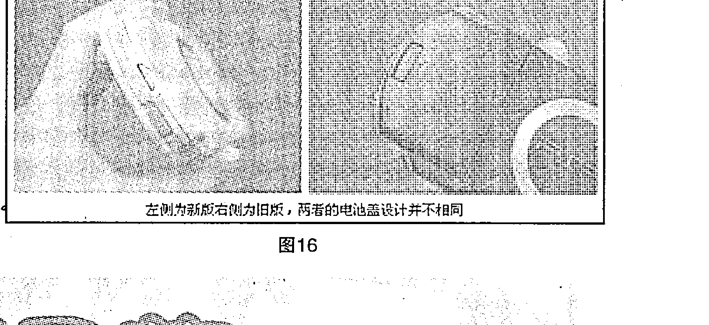

左侧为新版右侧为旧版，两者的电池盖设计并不相同

# 如何欣赏PSP的“无限之音”

□李松林

既然将PSP称为功能强悍的掌上娱乐终端平台，那么尽享世间美妙绝伦的音乐自是不在话下。毕竟绕梁的音乐不但可以放松我们疲惫的身心，而且还可以陶冶我们的情操。对于播放音乐的介质来说，从最早的收音机、磁带录音机，到CD播放机，再到MP3播放机等等，大家经历了技术发展给我们生活带来的各种惊喜。如今到了掌上时代，不知道这个长方形的PSP又能给我们的生活带来哪些惊喜呢？尤其是在欣赏音乐方面。

使用MP3播放器对MP3文件进行实时的解压缩（解码），这样，高品质的MP3音乐就播放出来了。

## 一、PSP都可以播放哪些格式的音乐

PSP毕竟不是MP3等播放器；对于音频格式的支持方面肯定不如专门的音频播放器支持的全面，但相对于用户对音频的基本需求，PSP还是可以完全满足的。下面就让我们逐一介绍一下PSP都支持哪些音频格式。

### MP3格式

MP3的全称是Moving Picture Experts Group Audio Layer III。简单的说，MP3就是一种音频压缩技术，由于这种压缩方式的全称叫MPEG Audio Layer3，所以人们把它简称为MP3。MP3是利用 MPEG Audio Layer 3 的技术，将音乐以1:10 甚至 1:12 的压缩率，压缩成容量较小的file，换句话说，能够在音质丢失很小的情况下把文件压缩到更小的程度。而且还非常好地保持了原来的音质。正是因为MP3体积小，音质高的特点使得MP3格式几乎成为网上音乐的代名词。每分钟音乐的MP3格式只有1MB左右大小，这样每首歌的大小只有3-4兆字节。

### WAV格式

WAV格式是微软公司开发的一种声音文件格式，也叫波形声音文件，是最早的数字音频格式，被Windows平台及其应用程序广泛支持。WAV格式支持许多压缩算法，支持多种音频位数、采样频率和声道，采用44.1kHz的采样频率，16位量化位数，因此WAV的音质与CD相差无几，但WAV格式对存储空间需求太大不便于交流和传播。

### WMA格式

WMA的全称是Windows Media Audio，是微软力推的一种音频格式。WMA格式是以减少数据流量但保持音质的方法来达到更高的压缩率目的，其压缩率一般可以达到1:18，生成的文件大小只有相应MP3文件的一半。这对只装配32MB的机型来说是相当重要的，支持了WMA和RA格式，意味着32MB的空间在无形中扩大了2倍。此外，WMA还可以通过DRM（Digital Rights Management）方案加入防止拷贝，或者加入限制播放时间和播放次数，甚至是播放机器的限制，可有力地防止盗版。

### AAC格式

AAC实际上是高级音频编码的缩写，目前只有苹果的硬盘式MP3支持这一种格式。AAC是由Fraunhofer IIS-A、杜比和AT&T共同开发的一种音频格式，它是MPEG-2规范的一部分。AAC所采用的运算法则与MP3的运算法则有所不同，AAC通过结合其他的功能来提高编码效率。AAC的音频算法在压缩能力上远远超过了以前的一些压缩算法（比如MP3等）。它还同时支持多达48个音轨、15个低频音轨、更多种采样率和比特率、多种语言的兼容能力、更高的解码效率。总之，AAC可以在比MP3文件缩小30%的前提下提供更好的音质。

### ATRAC3plus格式

ATRAC3plus是一种声音压缩技术，可提供多种位元速率让您的为您的聆听偏好量身订做音乐编辑方式。您可以在一张CD上编辑最多490首歌曲，或在Hi-MD光碟上以@48bps的位元速率编辑45个小时的音乐。ATRAC3plus提供了含有超高声音品质的歌曲编辑能力。

## 二、各种格式音频的归属

了解了上面PSP所支持的音频格式之后，就让我们将这些美丽的天使请进PSP中吧。不过有朋友可能会犯难，通过USB连接PSP之后，在电脑端会显示出很多个文件，那么这些音乐究竟要放在哪里呢？其实很简单，只要将自己喜欢的音乐放进MUSIC目录中，之后就可以在PSP上播放音乐了。既然介绍了音乐文件的藏身之所，那笔者就顺便将PSP中其余文件夹的用处也简单给大家介绍一下好了。

-   ISO目录主要用来存放PSP游戏镜像，有iso，cso两种，iso是原版psp游戏镜像，通常在网上可以下载到这个格式的文件或者解压缩后得到；而cso是由iso经软件压缩得到的一种压缩格式镜像，通常要比iso小很多，而所谓的rip版镜像是指原始镜像经软件打开，删减部分数据（音乐动画等）后再合成的瘦身镜像，所以如果一个原iso镜像先rip再压成cso的话，会小很多。
-   MP_ROOT目录主要用来存放视频文件，PSP支持mp4，avc mp4，pmp，avi等，而PC上使用的所有格式都可以通过软件来转化成PSP支持的格式。
-   MUSIC目录则是用来存放各种音乐文件的，包括mp3，wma等。
-   PICTURE目录是用来存放各种图片文件的，PSP支持几乎所有格式的图像，而且本系统可以把任意图片作为PSP桌面使用。
-   PSP\\GAME目录主要是用来存放PS游戏镜像和自制程序，所有的PS游戏都由原游戏镜像经软件转制后形成EBOOT文件再放在PSP里运行的，PSP的官方系统并不是开放式系统，但由于有了OE之类的破解，PSP可以运行各种自制程序。
-   PSP\\GAME\\GAME150是用来存放1.5版系统软件的，还可以存放一些模拟器，例如GBA模拟器和NEO模拟器，GBA模拟器可以直接使用游戏ROM，而NEO需要把原ROM转制成cache文件夹，再配合原ROM使用。
-   PSP\\GAME\\GAMEDATA目录是用来存放PSP和PS游戏的存档文件，如果你想和朋友交流游戏存档，可以在该目录下找到该游戏的相关存档文件夹。

了解了PSP所支持的音乐格式，也知晓了美妙音乐的容身之所，接下来就让我们一同来播放这些动听音乐吧。

## 三、PSP音乐播放——原生播放篇

身为掌上娱乐终端平台，播放小小的音频文件自然不在话下。PSP的音乐播放机能包括播放以UMD光盘为载体提供的UMD Audio以及拷贝到记忆棒中保存的ATRAC3/ATRAC3 plus和MP3等格式的音乐文件。只要将音频文件放在PSP主机中的MUSIC文件夹中，即可被系统正常识别。所以PSP播放记忆棒中的音频文件还是很方便的。另外，MUSIC文件夹下存有MP3的目录也会被PSP自动分组，并且还可以识别通用的.m3u播放清单文件，不过再深一级的目录就不能被识别了。在播放方式上，有全曲目播放、单首循环、全曲目循环、随机播放、随机循环5种。如果曲目中还包括小组曲目，还可以实现小组的A-B循环播放。

在操作方式上，PSP的各个按钮的功能跟PS2手柄操作DVD播放差不多，各种播放操作都非常方便。

-   ○/START：播放
-   START：暂停
-   ×：停止
-   L/R：上一首/下一首
-   左/右：快退/快进

在播放时候，PSP并没有频繁地访问记忆棒进行缓冲，不过曲目间的间隙情况几乎没有，播放还算顺畅。播放的画面中，除了显示有ID3标记中包含的歌名、歌手名、图片剪辑、文件格式和播放进度条等外，还可以显示专辑名、专辑类型、文件大小、文件时间、播放时间、采样率、编码格式和比特率等等信息，也能够通过菜单进行删除文件等操作。

> 小编有话：PSP作为MP3播放器来说，在操作和音质上都能够让人感到满意。但是它的RESUME（接续播放）功能却是完美中的瑕疵，虽然返回主菜单可以进行接续，但要是按了休眠或者关机键以后，就不能进行接续播放了。因为PSP也没有带有曲目书签功能，所以在MP3曲目比较多的情况下，还是让人感到稍有不便。

## 四、PSP音乐播放——最节能的MP3播放器（LightMP3）

LightMP3是一款性能非常棒的一款PSP音频播放软件，更是号称PSP上最省电的播放器。如今已经升级到1.7版本，在修改了目录问题和暂停错误，以及解决了与Music.prx插件的冲突问题同时，还增加了选项界面，切换音乐时添加渐变效果，也将默认音量写入到配置文件中了。而且选项中还可以设定初始屏幕亮度检测（修改并提醒、仅提醒、关闭提醒），声音设定也可以保存在配置文件中了，下次启动时自动读取。

下载并解压LightMP3，将文件夹中的“LightMP3”文件夹拷贝到PSP记忆棒中的“PSP/GAME”目录下即可完成安装。之后再将自己喜欢的MP3等音乐文件拷贝到记忆棒中的“MUSIC”文件夹之中。现在打开PSP，在游戏列表中找到LightMP3图标运行即可。

操作很简单，只要根据程序运行时底部的提示就好了。

-   ×：播放选定的音乐文件
-   ○：退出、取消等操作
-   上下方向键：控制音量大小
-   摇杆：上下方向为调节CPU频率、左右方向为调节BUS频率（3.71系统不可使用）
-   Start：关闭、打开屏幕显示
-   L/R：切换上一首/下一首歌曲

怎么样，很简单吧，不过由于本软件会自动降低CPU频率，所以播放器对按键的反应会存在一定的延迟时间，不过这丝毫不影响LightMP3简约的操作（如图1，但对播放格式的限制还需要进一步改进噢）。

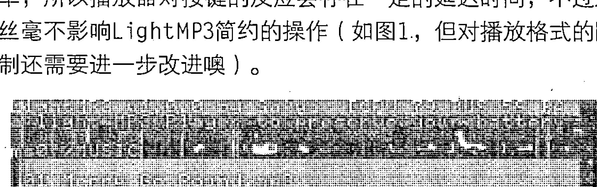

## 五、PSP音乐播放——多格式播放器

前面说到的LightMP3尽管简约省电，但毕竟在支持音频格式方面存在遗憾，接下来我们就来介绍一款PSP上的多格式音乐播放器——享乐（Sirens），它的前身就是CoolPlayer。既然是多格式的音乐播放器，那么必然会支持多种音乐格式，那么Sirens都支持哪些音乐格式呢？其中包括：APE、FLAC、TTA、WAVPACK、MP3、OGG、WMA、MP4A（AAC）、CUE等。别看Sirens支持的音乐格式这么多，可操作起来却并不麻烦！

> > 小示：APE是目前流行的数字音乐文件格式之一。与MP3这类有损压缩方式不同，APE是一种无损压缩音频技术，也就是说当你将从音频CD上读取的音频数据文件压缩成APE格式后，你还可以再将APE格式的文件还原，而还原后的音频文件与压缩前的一模一样，没有任何损失。通常我们下载的APE文件有两种，一种是下载一张专辑中有好几个APE文件一个文件一首歌，就和我们平时听的MP3文件一样。还有一种是一张专辑只有单个APE文件，并且附有一个CUE文件。其实这个CUE文件很小，但是非常有用，它记录着这个大的APE文件中的音乐的段落、音乐的名称以及作者专辑等内容。对于第一种APE，您就可以像播放MP3一样播放；对于第二种APE，我们还要把里面的CUE文件一同拷贝到记忆棒中才可以播放。如果你想把这个APE文件还原成CD的话，也是要利用到这个CUE文件的。

首先下载并解压Sirens压缩包，之后将其放在“PSP/GAME”目录下即可完成安装。尽管操作不算复杂，但还是要介绍一下的。

-   主界面状态操作：
    -   CIRCLE键/线控上的play/pause：进入播放状态/播放当前选择的音乐
    -   SQUARE键：保存当前播放列表
    -   TRIANGLE键：添加音乐到播放列表（可以添加整个目录的音乐，在对话框中，选中一个目录，按SQUARE确定即可）
    -   CROSS键：将当前选择音乐从列表中删除
    -   方向上/下键：选择往上/下；
    -   方向左/右键：将当前选择的位置在列表中上/下移
    -   L键：快速跳到列表首位置
    -   R键：快速跳到列表末位置
-   SELECT+SQUARE键：切换播放模式（单曲播放，单曲循环，顺序播放，循环播放，随机播放）
-   SELECT+TRIANGLE键：切换播放列表，一共有10个播放列表给大家使用；
-   SELECT+CROSS键：切换显示语言；
-   SELECT+START键：退出程序。
-   播放状态操作：
    -   CROSS键：停止播放，回到主界面状态；
    -   SQUARE键/线控上的play/pause：暂停播放/再按就继续播放；
    -   L键/线控上的back：上一首
    -   R键/线控上的forward：下一首
    -   SELECT键：切换播放模式（单曲播放，单曲循环，顺序播放，循环播放，随机播放）

看上去操作介绍好像繁琐，其实很简单。用习惯了就好了。毕竟享乐（Sirens）给我们播放了那么多格式的音乐，我们也要适当付出一些操作上的劳动噢。

## 六、PSP音乐播放——用“聆歌”畅听

聆歌原名为“我的歌词?我的PSP”，在经过了一系列的完善之后，有了今日大家喜欢的聆歌。聆歌是一款多功能音乐播放器，提供可扩展的、可变的、灵活的插件以满足不同媒体文件的播放要求。当然，支持“lrc”格式的歌词依旧聆歌播放器的一大特色。除此之外，聆歌还支持播放列表定制，均衡器和皮肤的定制，支持线控操作，支持节能技术，支持自动的歌词换行等等功能。不过聆歌播放器采用的是组件技术，所以可播放的媒体文件类型完全由组件决定。

下载并解压聆歌压缩包，将其中PSP/GAME/GAME150中的文件复制到PSP记忆棒上的相应目录，之后到Windows的安装目录，找到Fonts字体文件夹（如果你安装在C盘，那么一般在C:\\windows\\fonts\\；如果你安装在D盘，那么一般在D:\\windows\\fonts\\，以此类推）。复制文件simsun.ttc（宋体），或者simhei.ttf（黑体）等到刚刚解压文件夹中PSP/HOME/FONTS目录中，并将HOME文件夹整体拷贝到PSP/PSP目录下。

### 操作说明

-   1. 一般操作与Windows基本相同，O键等同于鼠标左键，X键相当于ESC键，方向键移动控件焦点；
-   2. 在播放器界面中，“□”键为切换A-B，“start”可暂停播放，“△”键可将当前播放位置添加到音乐书签，“L/R”键可以切换上一首/下一首歌曲，如果长时间按“L/R”键则可以快进/快退；
-   3. 多项选择列表中□键可以复选当前选项。

> > 小示：大家尽量复制系统中的宋体到PSP中，如果不喜欢宋体，就到PSP\\GAME150\\__SCE__MusicClub文件夹中，修改“config.xml”文件中的<Font value="ms0:/PSP/HOME/FONTS/SIMSUN.TTF"/>字段，并将其“SIMSUN.TTF”修改为你添加字体的名称。如果没有安装字体到PSP中，系统将自动退出的。而且还要将歌词文件lrc和相对应的歌曲放在同一路径下，以便实现歌词同步唤。同时，在PSP\\HOME\\SYSTEM文件夹中，我们还会看见xcom_mp3.prx文件、xcom_wma.prx文件和xcom_afoc.prx文件，他们是为支持相应格式的音频文件解码之用。

## 七、PSP音乐播放——eReader同步显示歌词

现在我们的PSP又能欣赏音乐，又能实现同步歌词了。接下来，笔者再教大家如何通过我们平时常用的软件实现音乐显示歌词的功效，该软件就是我们的看书利器——eReader。

因为经常使用eReader看电子书，所以无意中发现了eReader竟然可以在播放MP3的时候同步显示歌词。这不但提高了软件使用效率，同时也节省了PSP的使用空间，真是一举两得。先简单介绍下，eReader为PSP专用读书和看图软件，支持任意大小点阵字体，支持最大约20MB的文件（PSP的内存上限），支持html读取、编码转换、竖看、翻页保留行、书签及自动书签等，可以看zip和chm内的文本文件，有自动降频节能等功能。

下载并解压之后，将其中的“2**”文件夹拷贝到PSP/GAME/GAME150中即可完成软件的安装，之后将歌词.lrc文件与MP3文件放置在同一路径下。这时用eReader播放MP3的时候，只要按下“START”键，就可以显示调用歌词了（如图3）。

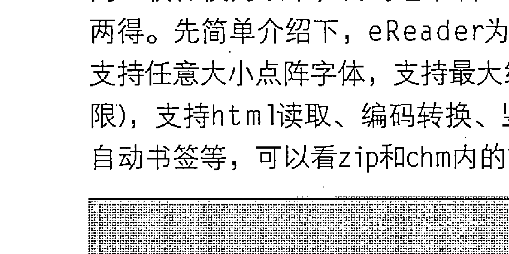

图3 eReader显示歌词

## 八、PSP音乐播放——千千静听改变MP3播放顺序

很多时候，我们装载进PSP记忆棒中的音频文件往往不能按照我们的意愿来排列，这样在播放起来难免会有些麻烦，如果能按照我们想要的顺序排列，那就真是太方便了。其实很简单，通过我们经常使用的千千静听播放软件就可以在PC上完成操作。

下载安装千千静听之后，运行软件主程序。之后将PSP连接到PC端，并将PSP记忆棒上的同一组歌曲拖入千千播放列表中，然后选择歌曲上下拖动调整顺序。直到调整到自己满意为止。调整完毕之后，选择“列表”——“保存列表”选项，之后在文件类型中选择M3U文件格式即可。接下来将生成的文件放入MP3文件夹中，这样顺序就变成我们之前调整的顺序了。

> 小提示
M3U本质上说不是音频文件，它只是音频文件的列表文件。你下载下来打开它，播放软件并不是播放它，而是根据列表的记录找到地址进行有序播放。所以M3U文件的体积很小。说白了，M3U格式的文件只是一个目录文件，提供了一个指向其他位置的音频视频文件的索引，你播放的还是那些被指向的文件，选用什么播放器都一样。

## 九、PSP音乐播放——网络广播也潇洒

随着社会的发展，人们好像渐渐淡忘了广播，只是偶尔会在出租车里才有传出广播。那么我们有没有办法在PSP上听广播呢？完全没有问题，只要我们拥有PSP Radio即可实现。

经常关注PSP版本的玩家可能会知道，PSP升级到3.80之后，主机已经可以使用其收听网络电台功能了。不过目前这些网络电台均是由SONY组织提供的，如果想要收听更多的电台，我们就可以可以请PSP Radio出马了。功能强大的PSP Radio不但可以收听广播，而且还支持MP3播放，最主要的是各种版本的PSP都可以正常使用。

首先下载PSP Radio，并将其解压后的PSP Radio文件夹拷贝到PSP/GAME文件夹下（PSP_Radio_PLB为PC端所用程序，主要创建播放列表）。接下来开启PSP无线功能，并在XMB下使其与网络基台或AP热点成功建立连接。在XMB下启动PSP Radio自制程序。

> 小提示
Cross Media Bar，通常也被缩写为XMB，是Sony公司开发的一套GUI界面。最初是被用在PS2 DVD Movie playback HUD上，并且也被作为最新PSX控制台界面，比如大家所熟悉的PSP操作系统界面。XMB由具有层级关系的图标菜单组成，一级图标水平排列，二级图标跟随所属一级图标呈垂直状排列。

为了确保无线网络连接的正确性，在进入到PSP Radio程序之后，按下PSP上的“START”按键进入到PSP Radio的设置界面，之后选择我们之前设定好的无线连接，之后按“×”选择；如果连接成功，会显示相关连接地址，这时候选择“Save Options”保存退出即可。再次按“START”按键退出PSP Radio的设置画面。启动PSP Radio之后首先会看到音乐播放列表，非常不错噢。不过音乐播放目前只能播放“PSP/MUSIC”目录下的歌曲，主机默认的MUSIC文件夹是不能被直接播放的，而且播放歌曲也不支持中文显示。通过按动“△”键，我们可以将PSP Radio界面在MP3播放功能、Items网页播放功能，以及Streams Radio播放功能之间来回切换。通过方向键和“×”键，我们就可以收听网络广播了。

> 小提示
目前来说，PSP Radio还不能支持AA3等格式的音乐，如果使用可能会引起程序出错。不过PSP Radio支持自行导入播放列表，通过压缩包中的PSP_Radio_PLB即可实现。

为了找到更多的广播电台，我们可以通过网络搜索来寻找。首先在浏览器地址栏中输入并跳转到http://shoutcast.com网站，然后搜索“chinese”关键词就行了，找到相关电台之后，点选左侧的“Tune in!”按钮，并将其保存到PSPRadio\PlayLists中即可。不过需要提醒各位，因为下载回来的PLS文件名是一样的，所以下载的时候重新命名一下。

> 小提示
PLS是winamp的播放列表，其公司nullsoft下有一个以shoutcast为基础的串流技术（streaming technology）架构的网络电台，只要使用了Shoutcast DNAS服务器、Winamp播放器和Shoutcast dsp插件（www.shoutcast.com/download/broadcast.phtml），就可以自己做一个网络电台。nullsoft公司还做了一个网站，叫www.shoutcast.com，这个网站对Shoutcast DNAS服务器进行管理和统计，显示多少人在听，多少服务器在工作。具体到某个服务器，会显示服务器名称、是否在放歌、放什么歌、是mp3还是aac+、速率大小及供下载的PLS列表。

## 开屏桌面也可以美化

### ——开屏桌面画报

□TMG wangwei

你是否想要改变你那枯燥无味的电脑桌面？现在向你推荐一款占用内存小，消耗CPU少的迷你时尚免费小软件——开屏桌面画报。下载地址为http://www.newhua.com/soft/51944.htm。

刚才我们已经体验了这款开屏桌面画报软件的桌面画报功能，是不是觉得很酷呢？别急，它还有更多的功能还未向你展示呢。下面让我们来使用一下桌面壁纸功能，看看它能给我们带来什么惊喜。

开屏桌面画报安装后即可运行。这个迷你小软件通过互联网自动综合当下的各种最新消息并将这些消息转换成时尚美丽的电子画报，就像我们平时翻阅的杂志一样，只要对该软件进行简单设置，我们就可以从画报封面封底向下翻阅，来体验这桌面画报给我们带来的图文并茂的视觉信息大餐了。

- Step1：打开菜单栏上的【画报】菜单，会弹出所示菜单（见图2）。

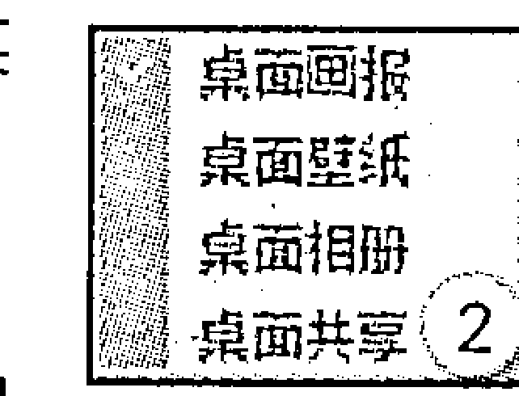

- Step2：打开菜单栏上的【选择播放内容】菜单随心选择你喜欢的内容。如果你选择的是菜单上的【开屏娱乐】命令，你的桌面画报就会相当于一本娱乐杂志，集各种美图和娱乐信息于一体向你传递现在最新的娱乐信息。依照同样的道理，选择【开屏综合】命令得到的是集娱乐、体育、国事于一体的综合画报。你可以依照喜好选择此菜单上的其它不同命令，每一种命令都会给你带来不同的完美体验。

其中，选择【我的频道】、【期刊浏览】、【更多专题】命令还有丰富的子菜单供你选择。

在众多选项中，笔者比较喜欢使用【更多专题】命令，因为里面集合了太多令人感兴趣的话题，如羽泉专访、肥姐健康启示等。

- Step3：选择图3菜单中的【桌面壁纸】命令。类似于使用【桌面画报】的方法，打开菜单栏上【选择播放内容】，在弹出的菜单（见图3）上根据你的需要选择不同的命令，即可拥有不同类型的壁纸。该软件所提供的壁纸分类详细，张张精美，让你爱不释手。

画报内容丰富多彩，新颖独特，将时下各种信息一网打尽，如天气预报，体育新闻，花边报道等，让精美桌面壁纸和资讯信息完美结合。你可以根据自己口味选择你所感兴趣的信息话题。随意调整桌面画报播放时间，播放暂停一切尽在你的掌控之中。

- Step4：同步骤3相似，选择图3菜单中的【桌面相册】命令进入相应的桌面相册程序。打开【选择播放内容】菜单，在弹出的对话框中浏览本地文件夹，选择你要播放的相片。选择好照片后，开屏桌面软件就会直接将你选择的相片做成相册自动放在桌面上进行播放。

从这张菜单上我们可以看到桌面画报、桌面壁纸，桌面相册，桌面共享这四种功能。这四个功能足以让你的桌面炫起来。

- Step5：选择图3菜单中的【桌面共享】命令进入桌面共享程序，然后点击【选择播放内容】按钮，进入网络上的“共享空间”注册账号，拥有自己的个性空间。在自己的空间内，你可以上传自己喜欢的图片，也可与你空间内的好友共享美图。

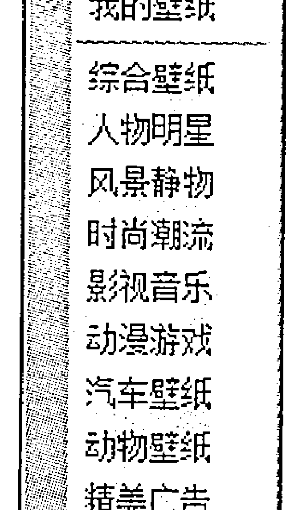

你也可选择使用自己本地磁盘内的壁纸。选择该菜单上的【我的壁纸】命令，浏览本地文件夹，在本地文件夹中选择本地图片将它设置为你的桌面壁纸。

该软件还为你提供了创建桌面相册的功能，让你可以轻松的将自己和家人朋友的照片做成相册在桌面上来回播放。

使用桌面共享功能不仅可以获得更多美图，与别人共同分享美图所带来的快乐，还可以交到很多好友呢。

你看到图1桌面右下角被绿色标注框标注的小界面了吗？这就是整个软件的操作界面，外观有点类似迷你模式的千千静听。我们将它放大，让你可以看得更加清晰（图1）。

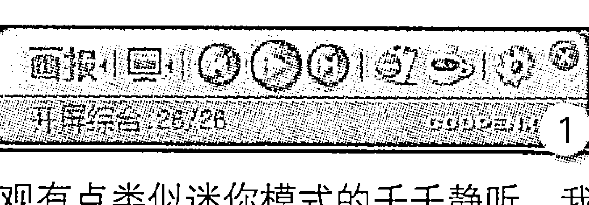

- Step6：打开图2菜单栏上的【设置】菜单，你还可以对整个开屏桌面软件的使用进行设置和管理。在这里你可以设置画报播放的频率，可以将喜欢的美图保存在本地磁盘，将喜欢的美图推荐给空间里的好友等。

除了上述功能外，这个开屏桌面还具有屏幕保护的功能，要启动这个功能只需单击该软件操作界面上的【屏保】按钮即可。